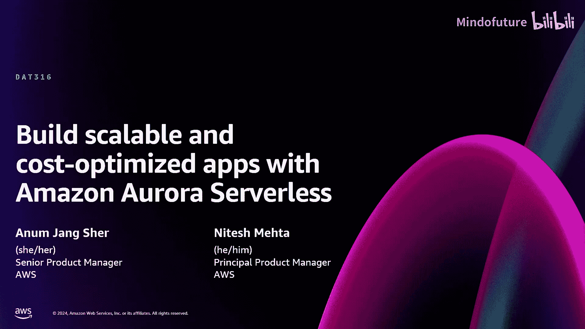
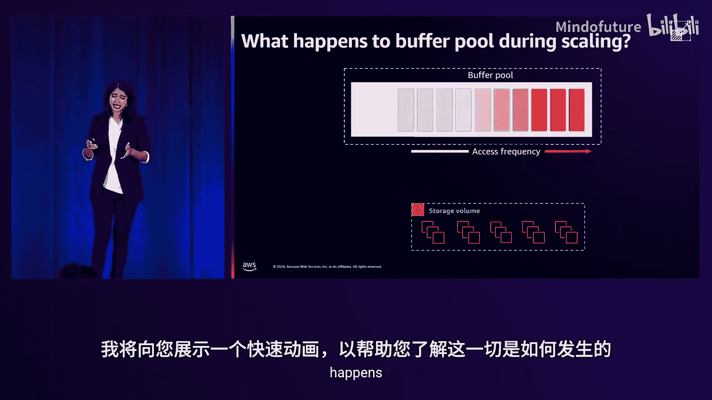
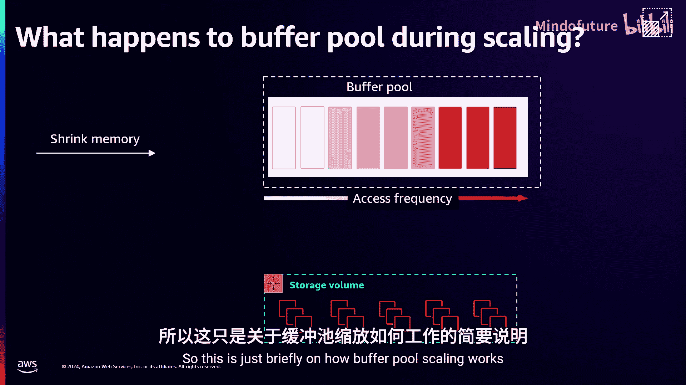
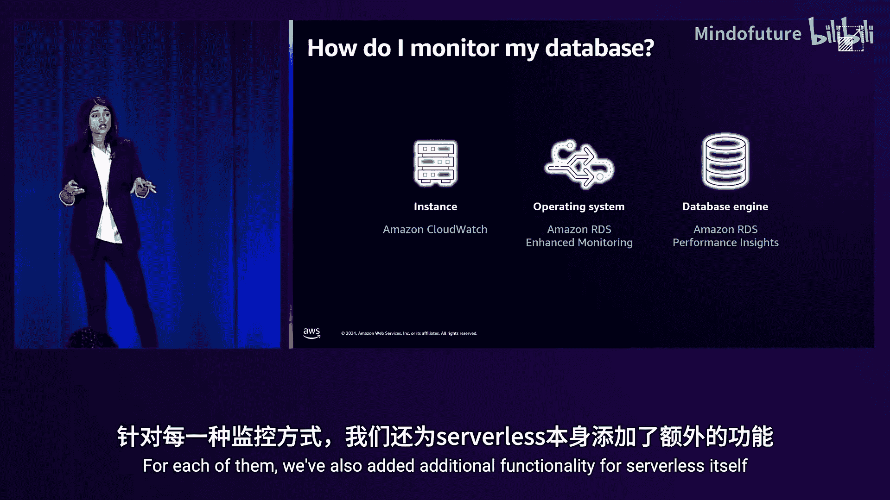
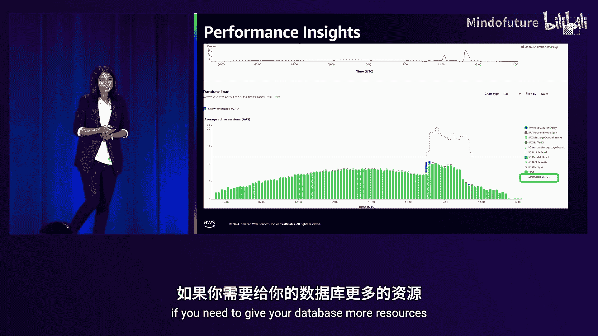
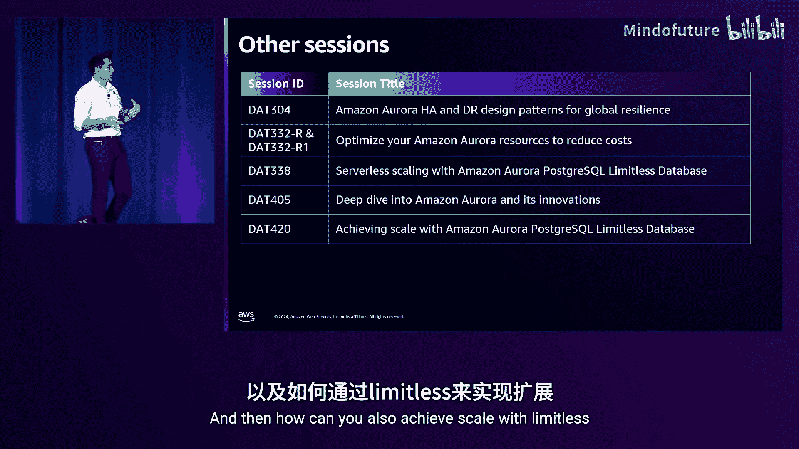
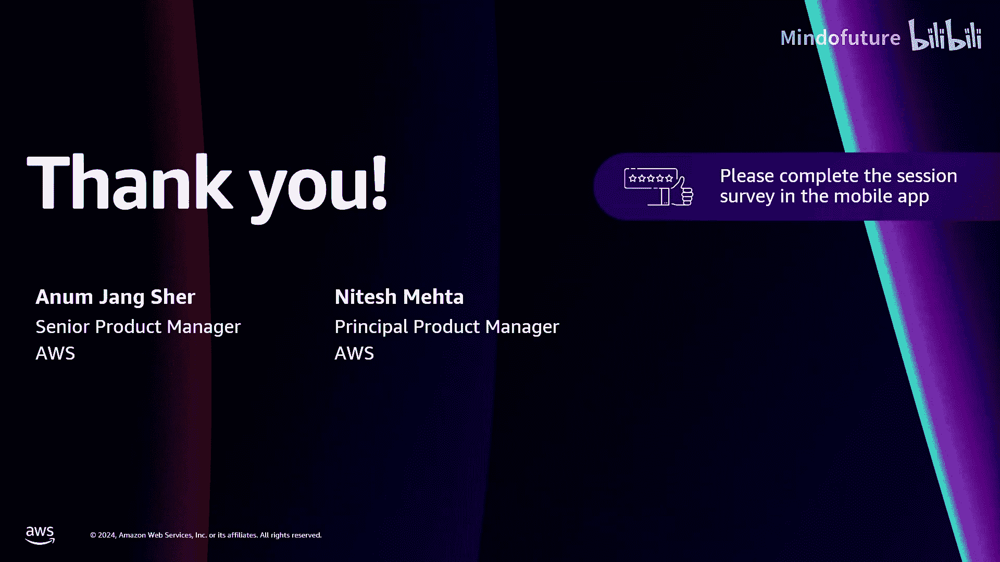

# 014：使用Amazon Aurora Serverless构建可扩展且成本优化的应用

在本节课中，我们将学习Amazon Aurora Serverless V2如何帮助您解决数据库容量管理的难题，实现自动、无中断的扩展，并优化应用成本。我们将深入探讨其核心概念、工作原理、监控方法以及如何与Aurora的其他高级功能结合使用。

## 概述：为什么需要Serverless数据库？

在您的应用架构中，数据库是最关键的组件之一。您需要确保数据库有足够的资源，为此您会进行估算。您会担心估算的准确性，但最终往往因为担忧而过度配置资源。

Aurora Serverless旨在解决这些问题。它为您提供按需、自动扩展的Aurora配置。数据库会根据工作负载自动扩展或收缩，计费模式是按使用量付费。这为各种工作负载提供了无忧的容量管理体验。

## 核心概念：Aurora Serverless V2简介

上一节我们介绍了Serverless数据库的动机，本节中我们来看看Aurora Serverless V2的具体概念。

Aurora Serverless是Aurora的一项功能。Aurora是一个与MySQL和PostgreSQL兼容的关系型数据库，专为云构建。它提供商业数据库级别的性能和可用性，但成本仅为后者的一小部分。

与传统的预置实例（类似于EC2实例，您获得固定的内存和CPU）不同，Serverless改变了这种思维模式。您无需指定固定容量，而是指定一个范围：最小容量和最大容量。数据库将在此范围内自动扩展。

您可以将其视为集群中一个特殊的实例，它能够自动扩展和收缩。除此之外，它与常规预置Aurora使用相同的引擎代码、具有相同的安全态势。Serverless在此基础上增加了自动扩展能力。

在引擎支持方面，对于MySQL，支持8.0及以上版本；对于PostgreSQL，支持13及以上版本。由于大部分代码相同，您可以轻松地在常规预置版本和Serverless版本之间切换。

## 容量单位与配置

我们讨论了容量范围的最小值和最大值，那么我们如何衡量这个容量呢？

我们使用一个高级抽象概念——ACU（Aurora容量单位）来衡量容量。**1 ACU** 对应 **2 GB内存**，以及相应比例的CPU和网络资源。这与预置实例的概念非常相似。

配置数据库时，您需要以ACU为单位设置最小容量和最大容量，数据库将在此范围内扩展。

*   **最小容量**：这是您的起始点，是始终保证的容量。应考虑您初始工作集所需的内存，以此设定最小值。
*   **最大容量**：这代表您愿意花费的上限，更像一个预算控制机制。如果工作负载未消耗到最大值，您不会被计费，只按实际使用量付费。

近期，Aurora Serverless有两项重要更新：
1.  **自动暂停与恢复**：当数据库连接数为零时，它可以缩减至 **0 ACU**。此时计算资源不产生任何费用。当需要执行查询或进行维护时，数据库会自动恢复。恢复是一个冷启动过程，通常需要约15秒。
2.  **提高上限**：Aurora Serverless现在最高可扩展至 **256 ACU**，即提供 **512 GB内存**。

结合这两点，Aurora Serverless现在可以从 **0 ACU** 扩展到 **256 ACU**。

## 自动扩展的工作原理

现在，让我们深入探讨自动扩展是如何工作的，以及我们关注哪些因素。

数据库何时应该扩展？我们主要关注三个关键指标：**CPU利用率**、**内存利用率**和**网络吞吐量**。这不仅包括您运行的查询或工作负载，还包括数据库为保持健康或运行后台进程所需的资源。只要其中任何一个指标表明需要更多资源，数据库就会扩展。

对于缩减，则需要所有三个指标都表明不再需要资源，数据库才会缩减。我们对缩减采取非常谨慎的态度，以避免在仍需资源时错误地缩减。

数据库如何进行扩展？我们通过一个称为**原地扩展**的过程来实现。传统扩展更像是故障转移机制，即从一个数据库实例切换到另一个。对于Aurora Serverless，情况并非如此。我们是在运行的数据库进程中分配更多资源（如CPU、内存）。因此，扩展不是一个破坏性过程。即使您正在运行数十万笔事务，数据库也能无缝扩展，无需等待静默期。

此外，Aurora Serverless提供**细粒度扩展**。与通常需要成倍增加容量的机器不同，Serverless可以以 **0.5 ACU** 的粒度进行扩展。如果工作负载只需要一点点额外资源，它可以只增加0.5 ACU；如果需要更多，它也能进行更大的跳跃式扩展，以实现快速扩展。

最后，扩展是**即时**的。一旦数据库检测到内部结构有压力，就会立即开始扩展。唯一的例外是之前提到的从0 ACU恢复的冷启动场景。

## 扩展算法与缓冲池管理

让我们进一步了解扩展算法在底层是如何工作的。

想象数据库有一个ACU“桶”，这个桶由两个参数决定：**桶大小**（容量）和**补充速率**。这两个参数都是可变的。随着数据库容量变得越来越大，桶的大小和补充速率也会相应增加。这意味着实例越大，扩展速度就越快。

如果您发现数据库扩展不够快，您可以控制的旋钮就是**最小数据库容量**。因为您可以控制最小容量（这是您的起始点），提高最小容量可以获得更快的扩展速率。建议您测试应用程序，以确定适合您的最小ACU和扩展速率。

接下来谈谈扩展期间缓冲池（数据库的主要缓存）会发生什么。在数据库容量扩展操作期间，缓冲池也会随之扩展。对于MySQL，调整的是`innodb_buffer_pool_size`参数；对于PostgreSQL，调整的是`shared_buffers`参数。

当缓冲池缩小时，我们结合使用**最不常用**和**最近最少使用**算法来回收内存。从存储层新读取的页面会成为“温”页面，而最可能被驱逐的是那些“冷”页面。我们驱逐这些冷页面，回收内存，从而在数据库缩小时实现缓冲池的收缩。

## 扩展限制与容量管理

您可能会遇到数据库没有缩减到您配置的最小值的情况。这可能是由多种因素造成的。

如前所述，不仅仅是您运行的工作负载查询，后台进程（如vacuum、purge）也可能需要资源来运行，这可能会阻止数据库缩减到您设置的较小最小容量。

此外，如果您运行了某些高级功能（如全局数据库、性能洞察），它们可能会消耗额外资源。如果您的存储卷非常大，而计算容量（如0.5 ACU，即1 GB内存）可能不足以支持它。

还有一些配置会强制数据库不缩减。例如，如果您为高可用性设置了优先级层（0和1），这意味着读取器始终跟随写入器的行为。如果写入器没有缩减，无论读取器上的负载如何，读取器都不会缩减。

那么，是否有足够的容量供您的实例执行这些扩展操作呢？这需要考虑两点：一是区域内的总体容量，我们基于运行RDS和Aurora的经验为每个区域进行容量规划；二是主机本身的容量。

如果您在扩展时主机容量不足，我们会怎么做？我们会寻找该主机上的空闲实例，并将它们迁移到其他主机，从而为您的实例腾出扩展空间。在进行这些主机间迁移时，我们会确保保留后台进程（如缓冲池、连接），因此从您的角度来看应该没有差异，但在后台我们进行了调整以确保每个人都有可用的扩展容量。

## 监控与性能洞察

在所有这些扩展操作中，您并没有真正提供输入，而是数据库自动处理了一切。那么，您如何了解发生了什么？

与Aurora一样，我们支持多种产品进行监控：CloudWatch、RDS增强监控和Performance Insights。Aurora Serverless支持所有这些，并且我们为Serverless本身增加了额外功能。

例如，在CloudWatch中，我们有一个名为 **`ServerlessDatabaseCapacity`** 的指标。您设置了最小值和最大值，但如何知道数据库当前处于什么位置？这个指标会告诉您数据库当前的ACU值，您将按当前使用量计费，而不是按最小值或最大值。

另一个指标是 **`CPUUtilization`**，它是基于最大可用ACU的CPU利用率百分比。您可以查看此指标以确定您的工作负载是否有足够的可用资源。您有两个选择：进一步优化工作负载以减少资源消耗，或者增加最大ACU以为系统提供更多资源。

同样，对于 **`FreeableMemory`**，如果资源不足，您可以采取措施进行调整。

Performance Insights是另一个功能，它为您提供了一个简单而强大的性能调试工具。对于Serverless，您需要关注的是图表中的黑色虚线，它代表**估计的vCPU**。这将帮助您确定是否需要增加最大ACU以为数据库提供更多资源。

## 与其他Aurora功能的集成

上一节我们深入探讨了扩展和监控，本节中我们来看看Aurora Serverless如何增强Aurora的其他关键功能。

Aurora Serverless V2的主要优势是即时、无中断的扩展。这使得它非常适合用于实现成本节约以及扩展和性能优势。

以下是几个由Serverless V2赋能的关键用例：

1.  **高可用性与灾难恢复**：在Aurora集群中，您可以混合搭配实例。例如，您可以将一个Serverless V2实例添加为读取器，然后故障转移到它。您甚至可以将整个集群设置为Serverless V2，写入器（优先级0）和读取器（优先级1）会相互模仿，确保始终有一个同等大小的实例作为故障转移目标，而读取器则根据工作负载大小进行扩展。
2.  **全局数据库**：在全局数据库的次要区域或其他区域中使用Aurora Serverless V2集群。这样，在非活动区域或遵循“日出日落”模型的场景中，您无需预置闲置的计算资源，Serverless V2会自动扩展以满足需求，同时实现成本节约。
3.  **分析与商业智能**：通过“零ETL”集成，可以将Aurora的数据近乎实时地同步到Redshift进行分析。结合Aurora Serverless和Redshift Serverless，您可以在两端都获得自动扩展能力，无需管理ETL管道或担心资源闲置。
4.  **应用程序连接**：通过**Data API**，您可以连接到一个单一的HTTP端点，无需管理驱动程序或担心网络设置。这对于Serverless V2尤其有用，因为端点可以随数据库自动扩展和收缩。Data API还内置了查询编辑器，方便执行操作。
5.  **极限扩展：Limitless**：Limitless由Serverless驱动，提供基于事务和工作负载的完全即时扩展。它是一个经典的分片架构，由路由层和分片组成，可自动管理分片。它可以扩展到PB级数据和数百万事务，目前支持PostgreSQL。

## 计费模型与成本优化

了解Serverless V2的计费概念对于规划支出和预算非常重要。

Aurora Serverless V2仅按ACU模型计费，ACU映射到特定的内存和计算量。您无需在任何时候支付固定费用。如前所述，我们推出了暂停和恢复功能，**0 ACU**的计算使用量意味着**0费用**。同时，如果您的应用程序出现峰值，工作负载达到最大值256 ACU，那么您将按256 ACU付费。

为了帮助您控制预算，我们允许您设置Aurora Serverless V2的容量限制（最小值和最大值）。最小值决定了您的数据库始终保证的 footprint，而最大值则为您设定了存储支出的上限。这为您提供了支出的上下限。如果您不满意，可以根据之前提到的告警进行调整。

计费按秒进行，没有分钟或小时的最低消费。费率因区域而异。计算公式简单：基于消耗的ACU小时数、当月的小时数以及每ACU小时的费用。

其他计费组件（如存储、IO复制（用于全局数据库）和备份存储）保持不变。当Aurora Serverless V2缩减到0时，存储不会被释放，因此无论数据库是恢复状态还是休眠状态，您都需要持续为存储付费。IO按使用量付费，这一点也没有变化。

在计算侧，您可以通过不频繁地消耗ACU来节省大量成本。但对于存储和IO呢？如果您有IO密集型工作负载，可能会产生大量IO成本。为此，我们最近推出了**Aurora I/O-Optimized**配置。它为您提供更可预测的价格性能，尤其是对于IO密集型工作负载，因为您无需再为每次读写支付IO费用。您只需支付固定的存储和计算费用。这是一个新的集群配置，可用于Serverless V2，支持PostgreSQL和MySQL，并且支持预留实例。您每月可以进行一次切换，且无需停机。

## 如何开始使用

我们讨论了Aurora Serverless V2的诸多好处，但如何开始使用呢？

对于新集群，操作非常简单，只需在控制台中选择Aurora Serverless V2选项即可。

如果您正在从现有的Aurora预置实例迁移，则需要更多步骤。由于我们允许在同一集群中混合搭配实例，您可以简单地添加一个Serverless V2读取器，然后故障转移到它。集群端点保持不变，您只需执行一次故障转移操作。完成后，您可以继续使用Serverless V2，或者如果不再需要，可以删除旧的读取器。

如果您正在从Aurora Serverless V1迁移，步骤会稍多一些。首先，您需要将Serverless V1实例转换为预置实例（一个简单的API调用），然后按照从预置实例迁移的步骤操作。如果您所在的版本较旧，可以使用**蓝绿部署**功能升级到支持的版本（最多1分钟停机时间），然后再添加Serverless读取器并进行故障转移。

## 总结与推荐课程

本节课中，我们一起学习了Amazon Aurora Serverless V2如何帮助您构建可扩展且成本优化的应用。

我们总结了Aurora Serverless V2的核心优势：它能帮助您降低运营复杂性并减少成本。您无需额外工作即可获得扩展优势，所有扩展由我们自动完成。它采用与预置Aurora相同的架构，支持Aurora的全部功能范围。计费模式是按使用量付费，您只需为实际消耗的计算（按ACU）和存储付费，计费粒度精确到秒。对于新集群，只需点击几下即可开始；对于现有集群，也只需几个步骤即可迁移。

如果您想了解更多，我们推荐以下相关课程：
*   Amazon Aurora的深度探讨与创新
*   如何进一步优化Aurora集群以降低成本
*   如何通过Limitless实现极致扩展

感谢您的参与，请通过应用留下反馈，祝您在re:Invent大会期间收获满满！