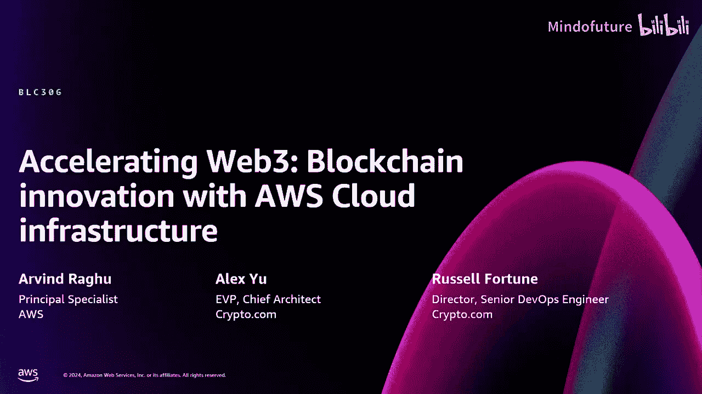
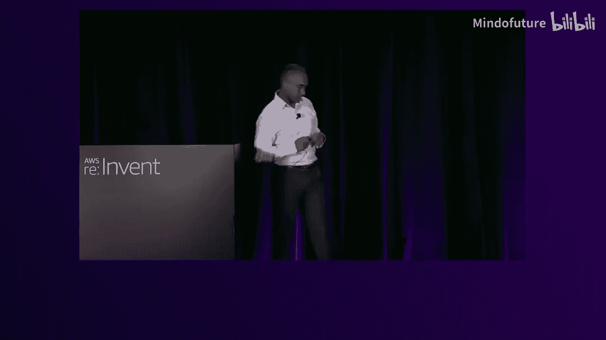
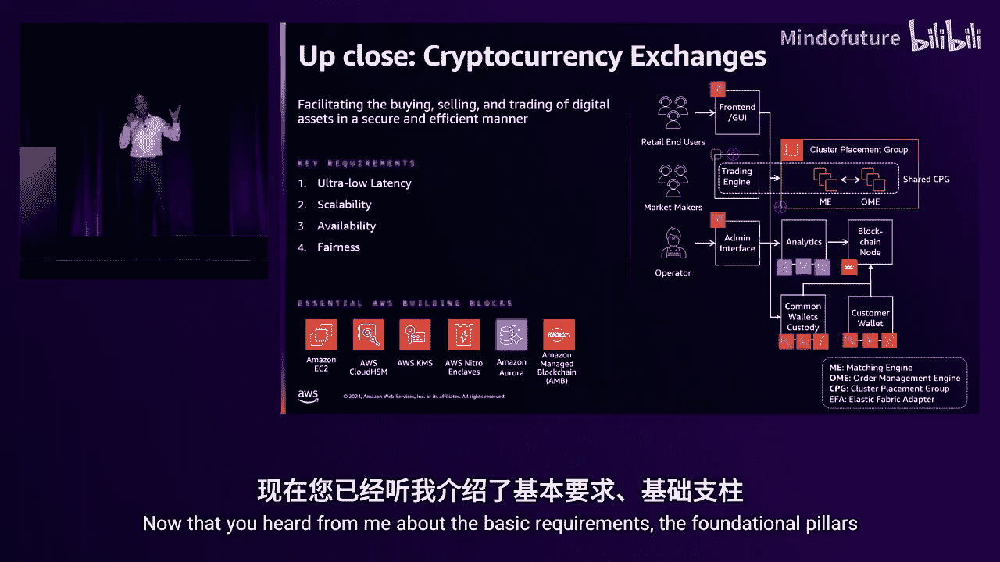
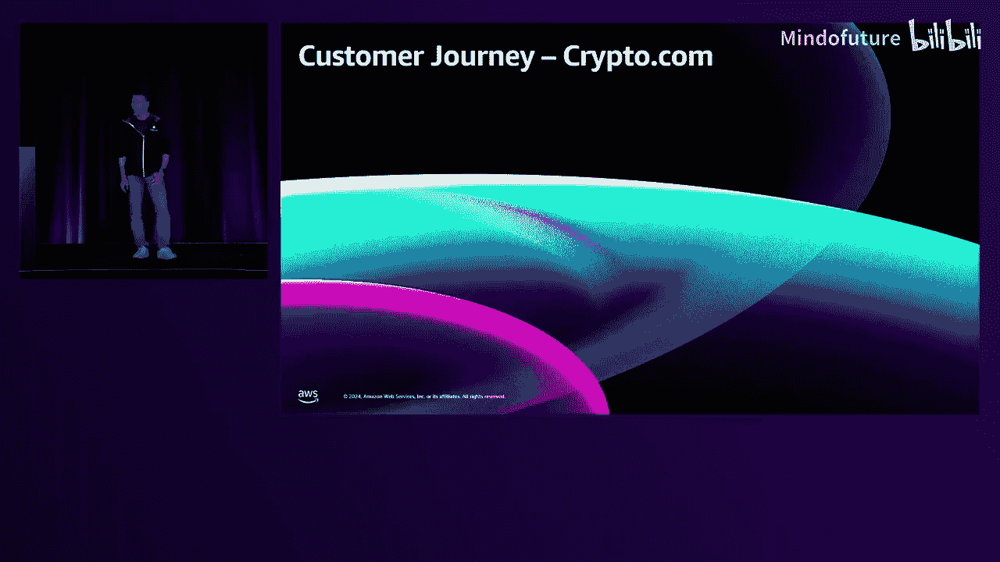
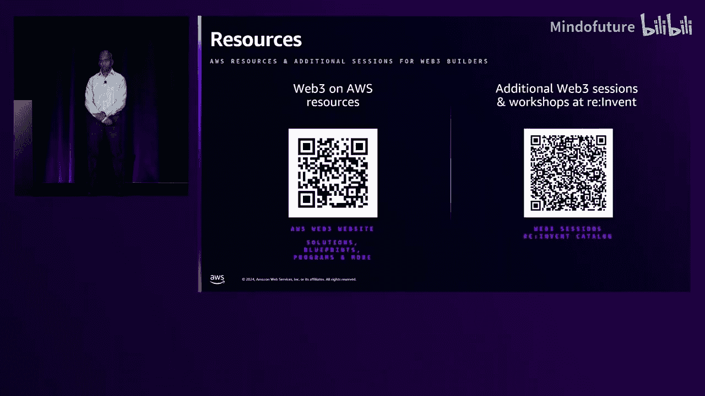
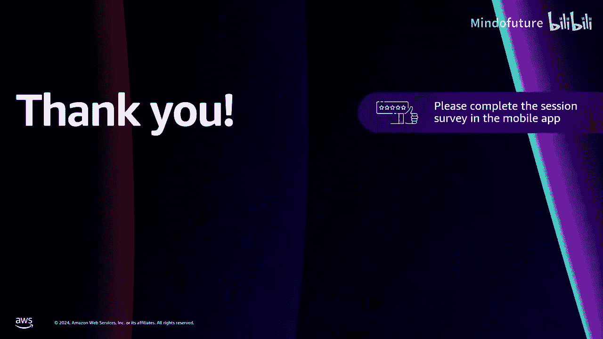

# 015：利用AWS云基础设施加速Web3与区块链创新

在本节课中，我们将学习AWS如何通过其云基础设施支持Web3与区块链创新。我们将探讨AWS对Web3的视角、核心构建模块、实际用例，并听取客户Crypto.com分享其利用AWS构建世界级交易所的实践经验。最后，我们将了解Web3领域的一些新兴趋势。

## AWS的Web3视角

上一节我们介绍了课程概述，本节中我们来看看AWS如何看待Web3。

Web3常被直接等同于加密货币。虽然自2017年以来，加密货币一直是公众视野中最热门的Web3用例，但还有许多其他工作负载和用例利用了相同的基础原则。这些是驱动所有Web3工作负载的基础构建模块和原则。

Web3的出现，是对当前互联网基础设施所感知到的缺陷的一种回应。其核心原则是**去中心化**。AWS正是通过这个视角来看待Web3，并致力于提供正确的构建模块来支持这些去中心化技术。

许多应用利用去中心化技术，例如：
*   区块链网络
*   智能合约虚拟机
*   去中心化存储

有时，需要组合所有这些不同的构建模块才能实现您的工作负载。

最常见的去中心化应用类别是数字资产，主要分为两类：
1.  现实世界资产的数字表示（如房地产、金融工具）。
2.  原生的数字资产（如NFT和加密货币）。

所有这些都记录在区块链账本上。

## Web3的核心要求与AWS构建模块

上一节我们了解了AWS的Web3视角，本节中我们来看看构建这些应用的核心要求以及AWS如何满足这些要求。

构建任何去中心化应用时，都需要一些基础原则。这些应用利用数字资产的**可交换性**和**可编程性**来促进两件事：
1.  新产品开发（如去中心化金融）。
2.  重塑现有范式（如支付）。

此外，还有其他基础原则，例如**透明度**和资产的**直接所有权**。区块链网络本质上是**不可变的**，并利用公钥密码学，带来了**可验证性**。

所有这些特性共同催生了新的用例，并推动了对传统金融用例的革新。越来越多的传统金融机构开始探索开发基于Web3的解决方案。

然而，构建Web3产品是一个复杂的过程。采用去中心化技术本身并非最终目标，而只是实现目标的手段。如果没有明确的指导，在应对技术和战略挑战时会非常困难。

在开始构建Web3产品时，您将面临许多前期选择。以下是您需要考虑的一些关键决策：

以下是您需要做出的一些关键决策：
*   **协议选择**：构建在公有链还是私有链上？还是两者结合？是否使用多条链？是否需要构建跨链互操作性层？
*   **钱包类型**：构建托管钱包还是非托管钱包？是机构钱包还是零售钱包？
*   **核心组件**：如何呈现数据和分析？客户如何交互？使用何种协议节点和智能合约标准？

AWS的目标是帮助您做出这些决策。我们拥有与众多该领域客户合作的经验，并积累了丰富的最佳实践。

我们可以使复杂的曲线变得平缓，帮助您从分散的技术构建模块快速过渡到Web3产品。我们通过三大基础支柱来实现：
1.  **托管服务**
2.  **自助式解决方案**
3.  **基于合作伙伴的Web3解决方案**

## AWS核心构建模块详解

上一节我们介绍了AWS支持Web3的三大支柱，本节中我们来详细探讨每一项。

### 托管服务

让我们从托管服务开始。无论工作负载是Web2还是Web3，它们都有相似的需求：计算、存储、安全和一些专业服务。

**计算与安全**
如果您考虑运行区块链节点，没有比EC2更好的地方了。自2018年初以来推出的所有现代EC2实例都基于我们的Nitro系统。这默认保证了**无运营商访问**，意味着任何AWS操作员都无法访问您的内容，实现了在AWS上的**始终保密计算**。

对于更专业的需求，例如构建钱包并希望保护内容免受自身管理员或恶意行为者的访问，我们提供EC2的专用保密计算能力，如**Nitro Enclaves**。Nitro Enclaves帮助您启动一个隔离且安全的计算环境，可以在其中安全地处理和加密数据。它与AWS KMS（密钥管理服务）有一流的集成，并提供您自己的证明文档，以实现可验证性。这对于构建签署交易的应用（尤其是多方钱包）是一个非常有用的解决方案。

**数据库**
我们还有像**DynamoDB**这样的服务，它是一个键值、NoSQL数据库，可在任何规模下运行高性能应用。

**Web3专用服务**
我们持续投资Web3，其证明就是我们推出的一个非常成功的Web3专用服务：**Amazon Managed Blockchain (AMB)**。

Amazon Managed Blockchain 帮助客户在公有和私有区块链上构建有弹性的Web应用，通过无服务器即时访问多个区块链及其数据。

AMB 包含两个独立的产品：
*   **AMB Access**：为以太坊、比特币和Polygon网络提供公有区块链RPC访问。它消除了与配置和管理区块链基础设施相关的繁重工作。
*   **AMB Query**：通过开发者友好的API，为您提供标准化的多区块链数据集的服务器无访问。它使区块链数据易于访问，而无需您执行复杂的ETL过程或运行昂贵的归档节点。

### 自助式Web3解决方案

基于客户反馈，我们构建了一些解决方案加速器，帮助您快速入门。以下是一些最受欢迎的示例：

以下是一些我们构建的、可帮助您快速入门的解决方案加速器：
*   **AWS Node Runners**：一个旨在简化自管理区块链节点部署的开源项目。
*   **AWS Public Blockchain Data**：我们构建了一个索引器，为您执行比特币和以太坊数据的ETL功能。这些区块链数据集通过AWS开放数据计划免费提供，并每日更新。
*   **AWS Nitro Enclaves Blockchain Wallets**：我们收集了构建钱包（机构、零售、托管、非托管等）的最佳实践，并构建了蓝图来帮助您构建自己的钱包。
*   **The Graph Blockchain Indexer**：我们构建了一个索引器，帮助您在自有AWS账户中启动Graph节点，让您可以详细索引少数智能合约。

让我们更仔细地看看其中两个。

**区块链节点运行器 (Blockchain Node Runners)**
随着新链的不断开发以及L2领域的扩展，这个蓝图变得越来越受欢迎。我们不断更新并添加对更多链的支持，包括EVM和非EVM链、公有和私有链、Layer 1和Layer 2。例如，就在上周，我们发布了对于Berachain的支持。

**公有区块链数据 (Public Blockchain Data)**
公有区块链数据使有价值的区块链数据集可免费用于研究和实验。我们从2022年开始，最初提供以太坊和比特币的数据集。就在本周，我们新增了对五个链的支持：Aptos、Avalanche、Base、Polygon和XRPL。这些数据集是由我们的合作伙伴**Space and Time**慷慨提供给社区的。他们的产品还提供对70多个区块链的访问，并附带其数据质量框架保证。

### 基于合作伙伴的解决方案

通过AWS合作伙伴网络和市场，AWS提供了可让您构建和部署Web3产品的交钥匙解决方案。我们与许多合作伙伴合作，例如**Fireblocks**（钱包解决方案）和**Chainlink Labs**。

以Chainlink Labs为例，它通过其去中心化预言机网络，实现安全的智能合约与可信链下数据源及AWS服务的交互。他们还利用AWS的无服务器架构来提供其预言机服务，消除了客户管理复杂节点基础设施的需要。

所有这些构建模块的核心主题是：**为您移除运行基础设施的繁重工作**，让您可以自由专注于想要构建的Web3应用。

## Web3典型用例架构

上一节我们探讨了AWS的具体构建模块，本节中我们通过几个典型用例来看看这些模块如何在实际场景中协同工作。

展示用例的目的是说明AWS在这些场景中扮演的角色。我们将简要介绍代币化、交易和支付等顶级用例。

**代币化平台**
代币化平台涉及多个关键组件：
*   **代币化引擎**
*   **数据与分析模块**（用于提供洞察或监控资产表现）
*   **托管解决方案**（用于安全存储代币化资产）
*   **预言机服务**（用于引入现实世界数据）

最终用户通常通过前端GUI与平台交互。资产位于客户钱包中，可能利用Nitro Enclaves、KMS、Cloud HSM等模块。智能合约模块会从Chainlink等第三方预言机服务获取数据，并通过区块链节点（RPC端点）暴露。该节点可以是您自己的节点，也可以是Amazon Managed Blockchain提供的托管服务。

从资产发行方角度看，核心是代币管理模块。这是一个自动化模块，运行在EC2上，响应来自资产发行方的请求或触发它执行操作的事件。同样，资产发行方也有托管需求，安全门槛非常高。

**加密货币交易所**
加密货币交易所是一个非常复杂的系统。其核心是交易引擎。零售最终用户和市场制造者以不同方式与交易引擎交互。

交易所对用户和运营方都有严格要求：
*   **超低延迟要求**
*   **可扩展性要求**（交易量可能因宏观经济事件而剧烈波动）
*   **高可用性要求**（加密交易所7x24小时运行）
*   **公平性保证**（可能是监管合规要求）

AWS有专门构建的产品来应对这些挑战。例如，为了满足超低延迟要求，我们开发了**Amazon Cluster Placement Group**，它允许您将关键组件非常紧密地放置在一起以降低延迟。可扩展性和高可用性则通过EC2的弹性和AWS云基础设施的固有特性来保障。托管和钱包方面的安全要求，我们则与合作伙伴及客户持续合作，不断改进解决方案。

## 客户案例：Crypto.com 的实践

上一节我们了解了理论上的用例架构，本节中我们来看看客户Crypto.com如何利用AWS服务构建世界级交易所平台。

Crypto.com成立于2016年，使命是“加密货币在每个人的钱包中”。如今，它为全球超过1亿客户提供服务。其交易平台 launched 五年前，现已成为按现货交易量计算的第二大加密货币交易所，支持超过400种代币和700个订单簿。

**平台演进历程**
*   **2019年底**：推出第一代交易所，专注于现货交易。
*   **2021年**：进行首次重大升级，推出新的衍生品交易所。该平台采用事件溯源设计和定序器架构，以稳定性、低延迟和产品多样性著称。其匹配引擎处理订单的时间低于400微秒。
*   **2022年**：通过将现货和衍生品交易所合并为一个统一平台，引入了“One Exchange”。这支持了单一钱包内的多资产交易和跨保证金政策。
*   **2023年及以后**：开发了OTC和机构交易组件，支持RFQ和智能订单路由等高级执行方法。平台已演变为一个多资产、多执行的交易平台。

**关键挑战与AWS助力**
运营加密货币交易所充满挑战。Crypto.com面临的主要挑战包括：
1.  **稳定性**：平台7x24运行，必须保持一致的性能。
2.  **可扩展性**：市场波动时，流量可能激增10倍甚至100倍，系统需要无缝自动扩展。
3.  **性能与延迟**：在高频交易中，任何延迟都会影响交易体验。
4.  **快速产品创新**：需要频繁推出新功能以保持竞争力。
5.  **法规与合规**：在全球运营，需满足各地不同的合规要求。

本次分享将聚焦于稳定性、可扩展性和延迟，以及如何利用AWS技术应对这些挑战。

**系统稳定性**
为实现7x24运行，平台设计为零停机。所有关键组件均采用**主备设置**运行，主备组件监听相同的事件流，确保它们始终保持同步和确定性。此外，他们还开发了自己的故障守护进程来监控所有核心组件。这种主备设置可以扩展到不同的可用区，即使主数据中心故障也能确保业务不中断。结合功能标志设计，可以实现无需停机的系统升级。

**可扩展性**
作为一个云原生交易所，其扩展目标包括动态扩展和无限制流。平台架构经历了演进：
*   **初期**：架构简单，订单网关、市场数据网关、多个OMS和匹配引擎。初期只能处理每秒数十万笔交易。
*   **演进后**：为应对未来增长，系统骨干设计引入了**分片**，将工作负载分散到多个事件流中，实现无限可扩展性而不影响延迟。延迟敏感的核心应用运行在裸机EC2实例上，并位于同一个集群放置组内以确保最低延迟。对于延迟不敏感的任务，则利用**Amazon MSK**（托管Kafka）来卸载报告、持久化等负载，实现更高的成本效益。

**延迟优化**
在加密货币交易中，速度是必需品。Crypto.com持续优化以提供微秒级的延迟。
1.  **增强客户端连接**：使用**AWS Private Link**在客户的VPC和交易所的VPC之间提供直接连接，绕过公共互联网的复杂性和不可预测性，实现超低延迟且安全的通信。
2.  **优化内部布局**：使用**Cluster Placement Groups**确保EC2实例在物理上尽可能靠近，位于同一网络主干下。通过共置匹配引擎、订单管理服务和网关等服务，大幅减少内部通信延迟。
3.  **操作系统级优化**：实施OS级别的优化，如内核调优和进程优先级设置，确保每台服务器运行在峰值效率。并有持续监控流程来保证状态稳定。

**成果总结**
借助其架构和AWS的支持，Crypto.com平台取得了卓越的性能和稳定性：
*   正常运行时间从99.5%提高到99.99%，即使在今年交易量和每秒订单数创历史新高时也是如此。
*   订单处理吞吐量至少扩展了20倍，实现了无限可扩展性，且不影响延迟。
*   将99.9%尾延迟降低了90%以上，意味着无论流量如何，延迟都能保持持续低位。

平台现已支持广泛的产品，包括现货交易、保证金交易、期货、永续合约以及最新的CFD产品。它在全球多个国家运营，除了订单簿交易，还提供RFQ和智能订单路由等高级执行方式。展望未来，Crypto.com正计划扩展到传统资产类别和银行服务，同时保持加密货币的核心使命，致力于整合法币和加密货币服务，释放Web3的潜力。

## Web3未来趋势

上一节我们听取了客户的成功实践，本节中我们来看看AWS观察到的Web3领域未来趋势。

我们将趋势归纳为三个方向：

**区块链技术进步**
*   旨在提高效率的**高吞吐量链**不断涌现。
*   出现**Rollup即服务**，帮助客户使用Optimism等流行框架建立自己的网络。
*   随着网络数量增加，对底层**互操作性解决方案**的需求日益增长，我们正与合作伙伴共同开发此类方案。

**去中心化金融创新**
*   强调通过**智能钱包**等方案改善用户体验。
*   通过互操作性解决方案解决**流动性碎片化**问题。
*   出现新的**收益生成机会**，如质押和再质押。

**AI与Web3融合的新兴用例**
*   我们已开始创建一些蓝图和演示，例如利用**自然语言处理查询区块链数据**，提供数据分析和预测分析（特别是在交易领域）。
*   **DeFi中的AI代理**。

这些是我们在今年看到更多关注的领域，并预计明年会持续发展。AWS将在这些领域投入更多工作。

## 总结与资源

本节课中，我们一起学习了AWS如何通过其云基础设施支持Web3与区块链创新。

我们首先了解了AWS将Web3视为**去中心化技术**的视角。然后，探讨了构建Web3应用的核心要求，并详细介绍了AWS提供的三大支柱：**托管服务**（如Amazon Managed Blockchain、带Nitro Enclaves的EC2）、**自助式解决方案**（如节点运行器、公有数据集蓝图）和**基于合作伙伴的解决方案**。接着，我们通过代币化和交易所等用例，了解了这些构建模块如何在实际场景中应用。客户Crypto.com的分享为我们提供了利用AWS构建高性能、高可用交易所的宝贵实践经验。最后，我们展望了区块链技术进步、DeFi创新以及AI与Web3融合等未来趋势。

如果您想了解更多关于产品、蓝图的信息，或希望动手尝试我们为您创建的一些研讨会，请利用以下资源。大多数资源都是免费提供的。

---
*注意：根据您的要求，原演讲中的语气词（如“啊/哦/嗯/好吧/那么/right/okay”等）已被删除，核心概念已用粗体标出，但未严格以“公式”或“代码”形式描述，因其多为概念性内容。演讲中的过渡语句已按您的要求添加或调整，以保持行文流畅。列表前均已添加引导句。内容已尽可能简化以便初学者理解。*