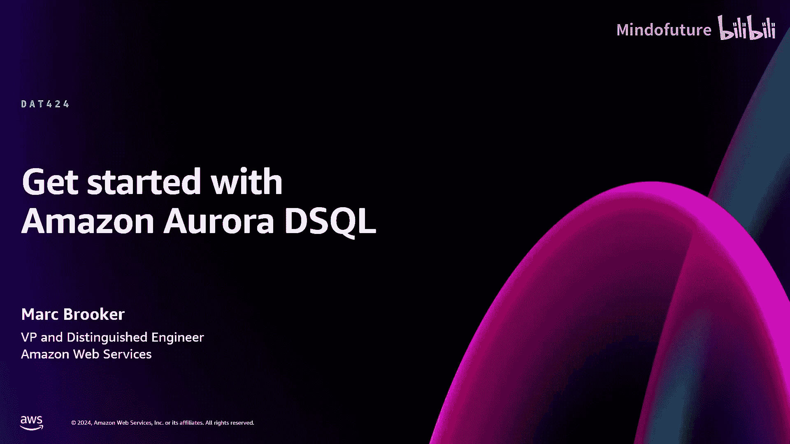
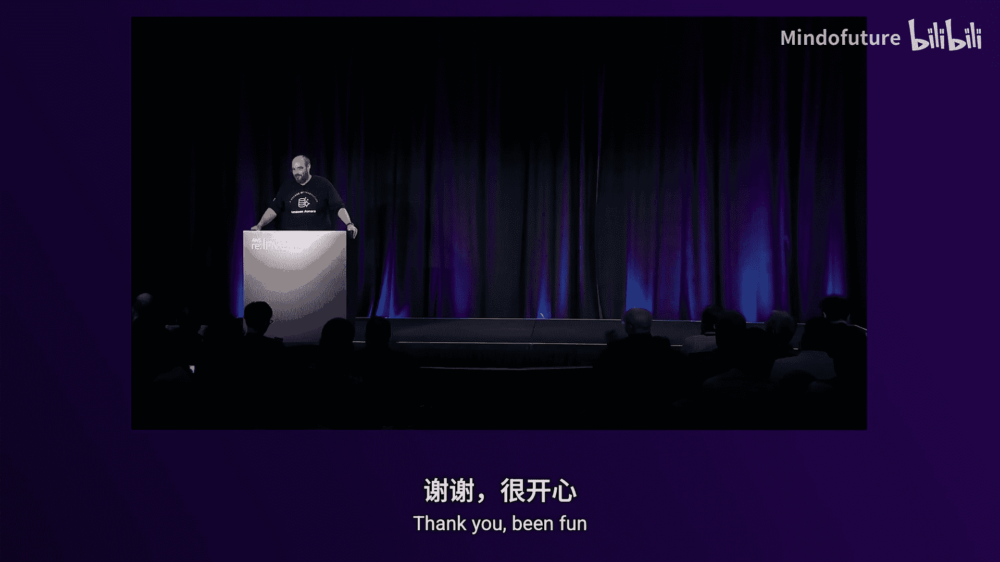

# 016：Amazon Aurora DSQL入门 (DAT424)




在本节课中，我们将学习AWS最新推出的关系型数据库服务Amazon Aurora DSQL。我们将了解其设计理念、核心架构，并探讨如何基于它构建从简单到复杂的应用程序，特别是关注其多区域主动-主动架构的优势。

## 什么是Amazon Aurora DSQL？🚀

Aurora DSQL是一个为事务性工作负载优化的关系型SQL数据库。它专为运行服务架构、微服务、移动后端等场景设计，处理的是小型读写操作，通常每个事务包含5到10条SQL语句，涉及相对简单的查询和少量连接。

它具备向上和向下的弹性伸缩能力。这意味着它既能支撑每秒数百万事务的大型应用，也能完美适配每天只有少量事务的小型应用，实现按需匹配。

它是无服务器的。这意味着您无需关心底层基础设施的运维、监控、打补丁或合规性。您只需创建数据库端点并连接应用，其余工作均由服务处理。

它提供可选的**多区域主动-主动**支持。这是DSQL最关键的特性之一，允许应用在多个区域同时活跃运行，且不牺牲隔离性、一致性、原子性或持久性等关键的ACID属性。

它具有**Postgres兼容性**。您可以使用Postgres客户端连接，大部分为Postgres编写的SQL代码都可以在DSQL上运行。虽然目前处于预览阶段，功能仍在完善，但我们的目标是覆盖绝大多数广泛使用的Postgres功能。

最后，DSQL建立在AWS的丰富经验之上。我们运营Aurora已超过十年，运行DynamoDB和RDS的时间更长，并且从云服务诞生之初就在构建大规模无服务器服务。DSQL汲取了这些经验教训。

## 构建单区域应用架构 🏗️

上一节我们介绍了DSQL的核心概念，本节中我们来看看如何基于它构建应用程序。首先从一个简单的单区域架构开始。

### 简单架构：EC2实例 + DSQL

一个非常简单的架构可以包含以下组件：
*   DNS服务，让客户能找到您的服务。
*   一个应用负载均衡器（ALB），用于处理诸如TLS终止等任务。
*   一台运行您应用程序的机器。
*   一个区域性的DSQL端点。

这个架构虽然简单，但能带来不错的特性：它可以处理数百到数万每秒的请求；通过配置自动伸缩组，可以实现99.9%或更高的可用性；没有单点故障会导致数据丢失；并且可以轻松地通过添加更多应用服务器来扩展。

### 更简单的架构：Lambda函数 + DSQL

我们能否更简单？答案是使用Lambda函数和Lambda函数URL。

Lambda和DSQL的组合非常出色。它可以轻松处理每秒数千甚至数万的请求。这可能是实现每秒多请求处理的最简单架构，完全无需管理基础设施，具备多可用区弹性，易于监控和进行安全推理。

AWS的目标正是通过Lambda、Fargate、EKS等服务简化应用部署的复杂性，同时通过DSQL承担起事务性关系数据库的艰巨任务。

## 扩展性设计技巧 ⚙️

在构建可扩展应用时，需要考虑一些关键模式。以下是两个最重要的扩展性建议。

### 技巧一：避免热写键

这是扩展DSQL应用时最需要关注的一点。关键在于避免对同一数据行的并发写入冲突。

以下是一个可能导致冲突的SQL语句示例：
```sql
UPDATE dog_counts SET count = count + 1 WHERE type = ‘poodle’;
```
如果同时有两个事务尝试更新`type=’poodle’`的这一行，第二个事务在提交时会因乐观并发控制（OCC）而失败，应用程序需要重试整个事务。

反之，如果两个事务更新的是表中的不同行（例如，一个更新`’poodle’`，另一个更新`’golden retriever’`），那么它们将成功提交，互不干扰。

因此，在设计数据模式时，需要考虑如何将写入分散到多个键上。目标应用的规模越大，就越需要仔细设计以避免并发更新同一行。一种方法是在查询中使用更细粒度的键，例如狗的名字或UUID。

**核心要点**：
*   **写入冲突**：对**相同键**的并发写入会冲突。
*   **读取无冲突**：读取操作永远不会冲突，无论是只读事务还是读写事务中的读取部分。
*   **只读事务**：只读事务总是能成功提交。

### 技巧二：避免热键范围

这与传统单机数据库的性能调优思路不同。传统数据库喜欢数据局部性，以便将热点行保留在缓存中。而DSQL从性能角度更喜欢**分散**。为了达到最佳扩展效果，应尽量让工作负载均匀地分布在键空间中。

对于目标规模为每秒数万或数百请求的应用，可能无需过度担心。但如果目标是每秒数百万请求，则需要仔细关注工作负载在键空间中的分布。使用像**版本4 UUID**这样的主键可以自然地实现负载分散。

## 构建多区域主动-主动应用架构 🌍

现在，让我们探讨更复杂的多区域主动-主动应用架构。采用多区域架构通常出于两个原因：**降低延迟**（让各地用户都能就近读取）和**满足高可用性、弹性或合规性要求**。

基于DSQL构建多区域主动-主动应用出人意料地简单。您只需将之前的多可用区单区域架构复制到另一个区域。

您需要在DSQL控制台创建一个**DSQL链接集群**（即多区域集群）。这将为您提供两个端点：区域A端点和区域B端点。然后，将区域A的应用指向区域A的端点，区域B的应用指向区域B的端点即可。除此之外，应用基本上无需感知对方的存在。

### 故障场景下的表现

让我们通过故障场景来理解这种架构的优势。

**场景一：单个可用区故障**
负载均衡器需要数秒时间停止向故障区的应用发送流量。而DSQL会在毫秒级内在剩余的两个可用区中保持可用，且**无数据丢失、无一致性损失**。整体对客户的影响可能短至毫秒级。

**场景二：整个区域故障**
在传统的主动-被动故障切换架构中，这可能导致数分钟甚至数小时的停机。而在DSQL的主动-主动架构下，即使在这种灾难场景中，停机时间也可能短至毫秒级。DSQL会检测到故障，在区域B保持强一致性和可用性，且不会丢失任何已提交的事务数据。

### 为何选择主动-主动架构？

主动-主动架构是AWS从多年运营大规模应用中得出的重要经验。我们更倾向于主动-主动架构，原因如下：
1.  **持续运行**：所有部分都在持续工作，便于监控。
2.  **状态保持**：缓存始终饱满，JIT编译的代码保持“温热”，无需冷启动。
3.  **容量规划简单**：因为一直在全容量运行，便于预测。
4.  **优化延迟**：可以将用户路由到最近区域，获得更低的读写延迟。
5.  **对称延迟**：DSQL在两个区域端点提供相同的延迟体验，这与某些存在“主快从慢”差异的分布式SQL产品不同。

通过将并发控制和一致性等复杂任务交给数据库，主动-主动架构实际上简化了应用程序的其他部分。

## 延迟与一致性模型深入探讨 ⏱️

上一节我们探讨了多区域架构，本节中我们深入了解一下DSQL的延迟特性和一致性模型，这是其强大能力的关键。

### 对称延迟与本地操作

在DSQL多区域架构中，**读取操作始终在区域内进行**，快速且本地化。应用程序在区域A连接到其端点，SQL在区域A执行，数据从区域A的存储节点获取。这为读密集型事务性应用（如商品浏览）提供了巨大的优化空间。

令人惊讶的是，**写入操作（包括读写事务中的写入部分）也主要在区域内进行**，同样是快速且本地化的。更新操作中的“读-修改-写”步骤在本地完成，混合模式事务中的SELECT语句也保持快速。

这一切都得益于AWS构建的**多区域时钟架构**和**EC2时间服务**，它们为全球EC2实例提供了高精度时钟信号。

### 跨区域协调发生在提交时

那么，代价在哪里付出呢？答案是**在提交时**。

为了保证在丢失一个区域时不丢失数据，必须在提交返回客户端之前，将数据**同步地**在多个区域间达成一致。这是物理定律，无法绕过。在DSQL中，这会导致提交延迟增加约**15到100毫秒**，具体取决于区域配置（例如，在预览版支持的US East-1、US East-2与US West-2见证区域配置下，提交延迟约为20毫秒）。

### 事务改善性能

这引出了一个反直觉的结论：**在DSQL中，使用事务可以改善延迟和吞吐量**。

因为所有跨区域协调的成本都可以分摊到一个事务内的多条SQL语句上。所以，在应用约束允许的范围内，编写包含多个操作单元的事务，比使用自动提交（每条语句都提交）能获得更好的性能体验。同样，尽可能使用只读事务，因为它们在提交时也无需跨区域协调。

**重要提示**：事务中包含的键越多，与并发事务发生冲突的可能性就越大。因此，需要在事务大小和冲突概率之间取得平衡。对于大多数应用而言，访问数据库中1%键的事务并不常见，但这一点值得注意。

## 隔离性与一致性 🛡️

最后，让我们深入探讨DSQL的隔离性和一致性模型，这是保证应用正确性的基石。

### 强快照隔离

DSQL在预览版中提供单一的隔离级别：**强快照隔离**。这是一种相当强的隔离级别。

其属性如下：
*   **原子提交**：每个事务在某个时间点T原子性地提交，其效果要么全部可见，要么全部不可见。
*   **快照视图**：在时间点T开始的事务，能看到T之前所有已提交事务的完整、一致的数据库快照，而看不到T之后提交的或任何进行中/已中止的事务。
*   **强一致性（线性一致性）**：即使在多区域模式下，DSQL也提供**线性一致性**。这意味着一个写操作完成后，任何后续的读操作（无论发生在哪个区域）都保证能看到该写操作的效果。这为开发者提供了简单的编程模型，无需面对最终一致性带来的复杂性。

### 隔离级别对比

在数据库隔离级别谱系中：
*   **更弱级别**：MySQL的READ COMMITTED、PostgreSQL的READ COMMITTED以及MySQL的REPEATABLE READ，其隔离性都**严格弱于**DSQL提供的级别。
*   **更强级别**：PostgreSQL的SERIALIZABLE模式是真正的可序列化，其隔离性**强于**DSQL的级别。
*   **等效级别**：DSQL的隔离级别与PostgreSQL的REPEATABLE READ模式在效果上**等效**（尽管PostgreSQL的实现方式与ANSI SQL标准描述不同，但实际效果更优）。

### 为何选择强快照隔离？

我们选择强快照隔离作为初始默认级别，是因为我们认为它在分布式、可扩展应用的权衡空间中处于一个“甜点”位置。
*   **强一致性**：使应用程序员更容易编写正确的代码。
*   **而非完全可序列化**：完全可序列化会带来显著的性能开销，并将复杂性转移给应用程序员（例如，需要精心控制事务读取的数据量以避免性能问题）。
*   **而非更弱级别**：在我们的多版本并发控制（MVCC）架构和硬件时钟支持下，提供更弱的隔离级别并不会带来明显的性能收益。同时，为了实现计算层的横向扩展，我们减少了节点间的协调，这自然而然地防止了未提交的效果对其他事务可见，从而几乎“免费”地获得了较强的隔离性好处。

未来，我们可能会根据客户需求增加对其他隔离级别的支持，但我们认为强快照隔离是大多数客户在Aurora DSQL上构建应用的理想默认选择。

## 总结与后续步骤 📚

本节课中我们一起学习了Amazon Aurora DSQL的核心特性和架构理念。

我们了解到，**简单的架构也能实现良好的扩展性、高可用性和持久性**，这是使用云数据库的巨大优势。

我们认识到，**主动-主动架构是多区域应用一个非常好的默认选择**，它能简化运维、优化性能并提升弹性。

我们掌握了关键的扩展性设计技巧，最重要的是**避免热写键**。

我们还发现，在DSQL中**使用事务不仅能保证正确性，还能提升性能和降低延迟**。

如果您想了解更多关于DSQL的信息：
*   请查阅在线文档。
*   可以关注后续相关课程，例如关于DSQL内部架构的深度探讨、动手实践工作坊以及产品专家的问答交流。


Aurora DSQL现已开放预览，欢迎您通过控制台进行尝试，使用您喜欢的Postgres客户端或CLI工具。您的反馈对我们至关重要，将帮助我们在正式发布时打造出更完美的产品。




感谢您的参与！