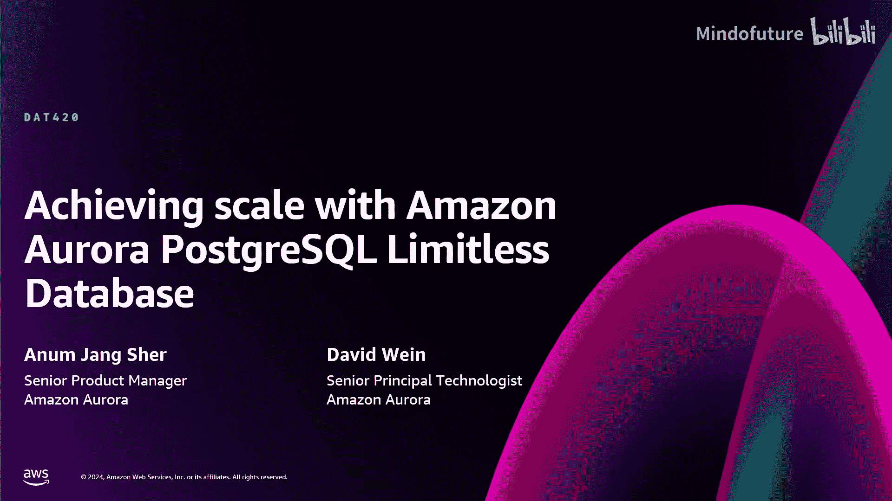
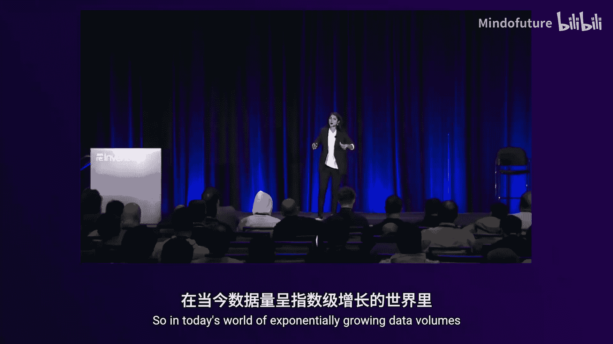
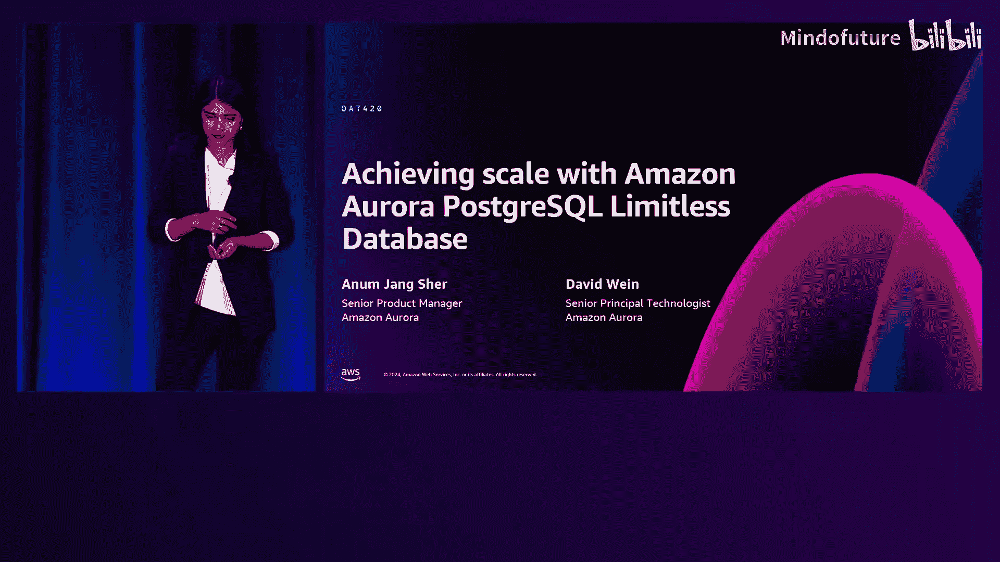
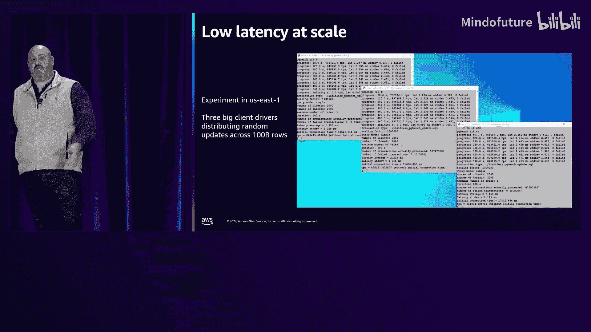
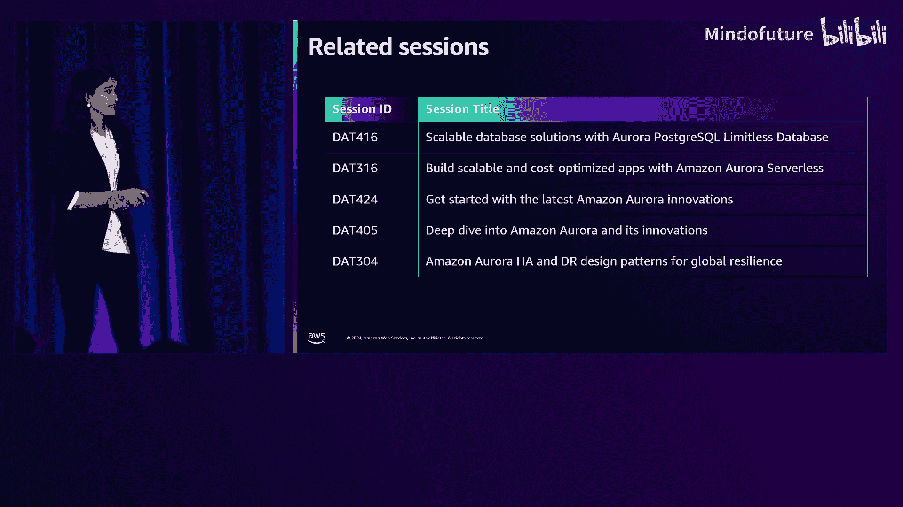

# 017：使用Amazon Aurora PostgreSQL Limitless Database实现扩展 (DAT420)








在本节课中，我们将要学习Amazon Aurora PostgreSQL Limitless Database，这是一个能够帮助您将数据库扩展至远超单个数据库能力范围的托管式水平扩展解决方案。我们将探讨其核心概念、架构、工作原理以及如何开始使用。

## 概述：为什么需要水平扩展？

在当今数据量呈指数级增长的世界中，高效扩展数据库的能力对组织至关重要。然而，如何在保持高可用性和一致性等核心数据库能力的同时，获得高性能和扩展性呢？

传统的垂直扩展（升级到更大的实例）存在物理上限。当达到单个数据库的极限时，您需要进入分片的世界。分片将数据库拆分为多个组件以获得并行处理能力，但这带来了新的挑战：管理复杂性、查询、一致性、重新分片和容量管理都变得更加困难。

Amazon Aurora PostgreSQL Limitless Database 正是为了应对这些挑战而生。它旨在为您提供分片或水平扩展解决方案的强大功能，同时保持使用单个数据库集群般的简单性。

## 产品概览：什么是Limitless Database？

Amazon Aurora PostgreSQL Limitless Database 是 Aurora 的一项功能，提供托管的水平扩展解决方案。它可以扩展到每秒数百万次写事务，管理PB级数据，同时保持单个数据库集群的操作简单性。

在计费方面，您只需为使用的资源付费。其计算资源通过 **DB分片组** 来管理。

以下是DB分片组的关键配置参数，使用Aurora容量单位（ACU）来衡量，其中1 ACU对应2GB内存及相应的CPU和网络资源：

```sql
-- 概念上的配置示例
CREATE DB_SHARD_GROUP (
    min_capacity = 8 ACU,
    max_capacity = 192 ACU,
    compute_redundancy = 1
);
```

您可以为DB分片组指定最小和最大ACU容量，数据库将在此范围内自动扩展。您还可以指定计算冗余（0， 1或2），以定义在可用区故障时的故障转移目标数量。

## 数据分布：表类型与分片策略

在Limitless Database中，支持三种类型的表，这决定了数据如何分布。

以下是三种表类型的简要说明：

*   **分片表**：数据根据分片键分布在不同节点上。适用于需要水平扩展的大型表。
*   **共置表**：与某个分片表共享相同的分片键，确保相关数据存储在同一个节点上，以实现高效的本地连接。
*   **引用表**：小型、读多写少的表。它们被完整复制到每个分片节点上，支持快速的本地连接。

让我们通过一个电子商务的例子来具体说明。假设我们有 `customer`（客户）、`order`（订单）和 `tax_rate`（税率）三张表。

我们希望将 `order` 表按 `customer_id` 进行分片。`customer` 表与 `order` 表通过 `customer_id` 关联，因此我们将 `customer` 表创建为 `order` 表的共置表，这样同一客户的订单和客户信息会存储在同一个节点上。`tax_rate` 表很小且更新不频繁，因此我们将其创建为引用表，复制到所有节点上。

在SQL中，我们通过会话参数来指定表的类型，以保持CREATE TABLE语句语法的纯净。

以下是设置表类型的会话参数示例：

```sql
-- 1. 创建分片表
SET limitless_create_table_mode TO sharded;
CREATE TABLE order_table (
    order_id BIGINT,
    customer_id BIGINT,
    ... ,
    PRIMARY KEY (order_id, customer_id) -- 分片键通常应为主键的一部分
);

-- 2. 创建共置表（与order表共用customer_id分片键）
SET limitless_create_table_mode TO colocated;
CREATE TABLE customer_table (
    customer_id BIGINT PRIMARY KEY,
    ...
);

-- 3. 创建引用表
SET limitless_create_table_mode TO reference;
CREATE TABLE tax_rate_table (
    zip_code VARCHAR(10) PRIMARY KEY,
    rate DECIMAL
);
```

## 架构深入：组件如何协同工作？

上一节我们介绍了数据如何分布，本节中我们来看看支撑这一切的系统架构。Limitless Database的架构由几个关键组件构成。

传统的Aurora集群包含写入节点、读取节点和分布式存储。在Limitless Database中，我们用 **分片组** 取代了这些读写节点。分片组包含了为系统提供动力的计算资源，并仍然建立在Aurora经过十年验证的、跨三个可用区的分布式存储之上。

分片组内部包含以下核心组件：

*   **分布式事务路由器**：接收所有应用程序连接和查询。它们是完整的数据库引擎，知晓所有数据的模式和位置，但本身不存储用户数据。路由器解析查询，决定查询应在哪个分片上执行，并聚合结果。
*   **数据访问分片**：拥有分片表的部分数据（基于分片键范围）以及引用表的完整副本。它们负责数据的本地事务处理和查询执行。

从高可用性角度看，路由器和分片会被自动部署在您指定的多个可用区中。这种区域化的设计意味着您的应用程序不应期望单可用区延迟，从而避免了因故障转移导致的意外延迟降级。

## 分片与扩展：数据如何分布与再平衡？

在架构中，数据访问分片存储着数据。那么数据具体是如何分布到各个分片的呢？

系统使用 **哈希范围分区**。您指定的分片键（一列或多列）会被哈希到一个64位的值空间。这个64位的空间范围被分配给不同的分片。每个分片上的数据片段称为“表碎片”。路由器则保存着指向所有这些表碎片的引用。

当某个分片因为负载过高或数据过多而成为热点时，系统会执行 **分片分裂**。这是通过利用Aurora存储的“卷克隆”和存储级复制技术来实现的。系统会创建原分片的一个写时复制克隆，然后通过存储级复制保持同步，最后将旧分片和新分片上的非相关数据清理掉，从而完成分裂。这个过程可以快速、在线地进行，以重新平衡数据和负载。

## 事务处理：如何保证分布式一致性？

在分布式系统中保证事务的一致性是一个巨大挑战。Limitless Database的设计目标是提供与单节点PostgreSQL相同的事务语义（读已提交或可重复读/快照隔离），并具有外部一致性。

其核心创新在于使用 **“基于时钟的快照”**。

在单节点PostgreSQL中，事务快照是在事务开始时“立即”获取的，记录了当前活跃的事务ID。在Limitless Database中，路由器在收到查询时会建立一个快照时间点，然后将这个时间点连同查询片段一起发送给分片。每个分片则在本地创建基于那个过去时间点的快照。由于所有参与查询的分片都使用**完全相同的时间点**，因此它们能获得整个系统在那一刻的一致性视图。

这依赖于AWS数据中心内高精度、有界漂移的时钟基础设施（如Amazon Time Sync服务）。时钟的不确定性窗口非常小（微秒级），使得这种基于时间的分布式事务算法在实践中无需等待即可正确工作。

对于涉及多个分片的写事务，系统使用 **两阶段提交** 来确保所有参与分片以完全相同的提交时间完成事务，从而保证原子性。单分片写入可以线性扩展，而跨分片写入的提交延迟约为单分片写入的2-3倍。

## 查询执行：如何实现高性能？

查询性能是扩展系统的关键。Limitless Database基于PostgreSQL构建，兼容其SQL语法和解析器，并扩展了执行引擎。

查询的基本流程是：路由器接收查询，进行全局规划，将查询片段发送到相关分片。分片进行本地规划和执行，然后将结果返回给路由器。对于单分片查询，路由器直接转发结果；对于多分片查询，路由器可能需要进行额外的连接、过滤或聚合操作。

**数据本地性** 是获得最佳性能的关键。这就是为什么我们强调共置表和引用表。当查询所需的数据都位于同一个分片上时，执行可以被“下推”到该分片本地完成，避免了跨节点数据传输和协调开销，从而实现了极低的延迟和极高的吞吐量。

系统增强了`EXPLAIN`输出，会标识查询是否为 **“单分片优化”**。您还可以从路由器查询 `limitless_stat_activity` 视图，以获取整个系统的查询状态。

此外，**函数分发** 是一个重要特性。通过将存储过程或函数标记为可下推，并指定分片键参数，整个函数可以在单个分片上本地执行，避免了函数体在路由器和分片间多次往返的开销，极大提升了复杂事务的性能。

对于多分片查询，如创建索引、`ANALYZE`、`VACUUM`或全表聚合（`COUNT`， `MIN`， `MAX`），系统会并行执行，从而获得近乎线性的速度提升。

## 性能表现：实际效果如何？

在实践中的性能表现非常出色。在一个生产环境的测试中，针对一个分布在众多分片上的1000亿行表，运行随机的单行更新事务，系统 sustained 了超过 **每秒250万次提交**，且平均延迟仅为2.3-2.4毫秒。这证明了其在处理高并发、低延迟的写事务方面强大的扩展能力。

## 如何开始使用？

Limitless Database现已正式发布。您可以通过以下方式立即开始使用：

*   **AWS管理控制台**：直接创建一个Limitless Database集群。
*   **AWS CLI或SDK**：使用相关的API进行创建和管理。
*   **文档**：查阅AWS官方文档以获取详细的使用指南、最佳实践和SQL参考。

## 总结

本节课中我们一起学习了Amazon Aurora PostgreSQL Limitless Database。我们从传统数据库扩展的挑战出发，了解了Limitless Database如何作为一个托管式水平扩展解决方案，帮助您将数据库扩展到每秒数百万次写事务和PB级数据量，同时保持操作简单性。



我们深入探讨了其核心架构，包括路由器、分片以及基于Aurora存储的部署。我们学习了三种表类型（分片表、共置表、引用表）及其在数据分布中的作用。关键的技术亮点包括基于高精度时钟的分布式事务处理，它保证了与PostgreSQL一致的事务语义；以及通过数据本地性、查询下推和函数分发来实现高性能的查询执行。




最后，我们看到了其卓越的性能表现，并指出了您可以立即开始使用的途径。通过采用Limitless Database，您可以构建能够应对极端规模且易于管理的应用程序。