# 018：多区域强一致性全局表概述


在本节课中，我们将学习 Amazon DynamoDB 全局表的一项新功能：多区域强一致性。我们将了解其工作原理、适用场景，以及如何创建和使用它。

---

## Amazon DynamoDB 教程：第2章：DynamoDB 一致性模型演进

上一节我们介绍了多区域强一致性功能。本节中，我们来看看 DynamoDB 现有的两种一致性模型，以及新功能带来的变化。

### 单区域一致性

在单个 AWS 区域内，DynamoDB 提供两种读取一致性：
*   **最终一致性读取**：这是默认设置。读取操作可能不会立即反映刚刚完成的写入操作的结果，数据可能不是最新的。
*   **强一致性读取**：通过在读取 API（如 `GetItem`）中设置 `ConsistentRead=true` 参数，可以确保读取到最新的数据版本。

**代码示例：强一致性读取**
```python
response = table.get_item(
    Key={'PrimaryKey': 'value'},
    ConsistentRead=True
)
```

### 多区域全局表的默认行为

DynamoDB 全局表默认提供**多区域、多活、最终一致性**的复制。这意味着：
*   您可以在不同区域拥有表的副本（副本）。
*   您可以向任何区域的副本写入和读取数据。
*   更改会异步复制到全局表中的所有其他副本。
*   这提高了应用程序的可用性目标（从 99.99% 提升至 99.999%），并将数据存储在更靠近用户的位置以提升性能。

然而，在默认的最终一致性全局表中，**即使您在单个副本上执行强一致性读取，也仅能保证获取该本地副本上的最新数据**。如果相同的数据项在另一个区域被修改，由于复制延迟，您的强一致性读取可能仍会返回过时数据。

---

## Amazon DynamoDB 教程：第3章：引入多区域强一致性

上一节我们了解了最终一致性全局表的局限性。本节中，我们来看看多区域强一致性如何解决这些问题。

多区域强一致性全局表改变了副本间的复制类型，从最终一致性复制变为**强一致性复制**。

其核心优势在于：
*   **跨区域强一致性读取**：在任何副本上执行强一致性读取，都能获得**全局最新**的数据版本，无论数据最初在哪个区域被更新。
*   **恢复点目标为零**：在需要将应用程序流量从一个 AWS 区域故障转移到另一个区域时，您不会丢失任何已提交的数据更新。

### 两种模式的对比


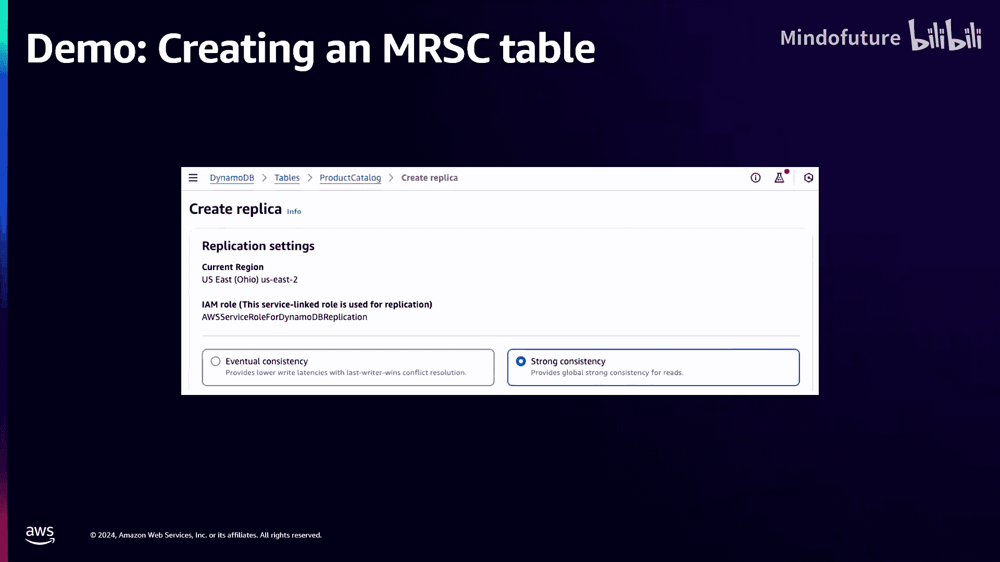

以下是两种全局表模式的关键区别：

| 特性 | 多区域最终一致性全局表 | 多区域强一致性全局表 |
| :--- | :--- | :--- |
| **读写延迟** | 较低（仅在本地区域操作） | 较高（需跨区域协调） |
| **强一致性读取** | 可能返回过时数据（跨区域） | **始终返回最新数据**（跨区域） |
| **冲突解决** | **最后写入者获胜**（基于时间戳） | **检测并发写入冲突**并抛出异常 |
| **恢复点目标** | 通常为个位数秒（取决于区域距离） | **0** |

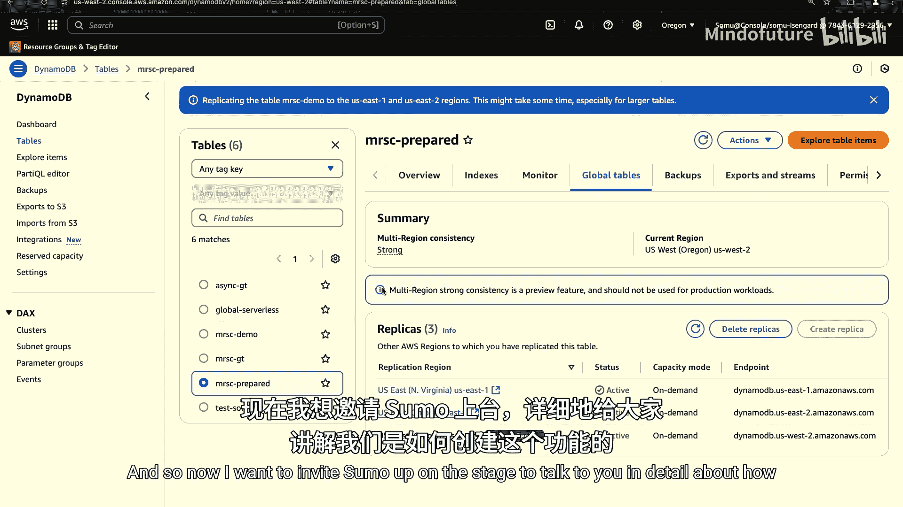

### 冲突处理机制的变化

在最终一致性模式下，如果两个区域同时更新同一数据项，系统采用“最后写入者获胜”策略，根据时间戳决定最终值。


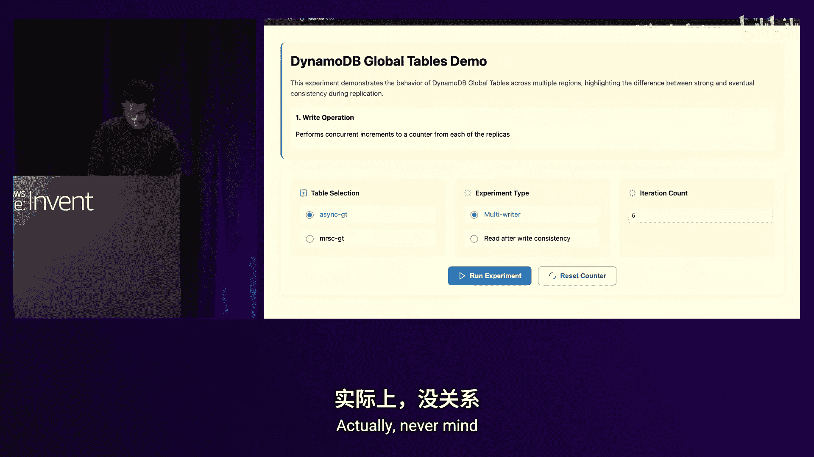

在强一致性模式下，为了保持全局强一致性，系统会检测此类并发写入。**后发生的写入**会检测到冲突，并向客户端返回一个新的 API 异常：`ReplicatedWriteConflictException`。这是一个可安全重试的异常，应用程序可以配置重试逻辑直至写入成功。

**公式：冲突检测逻辑**
```
如果 (写入B的时间戳 > 写入A的时间戳) 且 (写入B检测到写入A正在处理中) {
    则 写入B 抛出 ReplicatedWriteConflictException
}
```


**重要提示**：无论使用哪种全局表模式，**最终一致性读取始终是最终一致的**，这一特性不会改变。

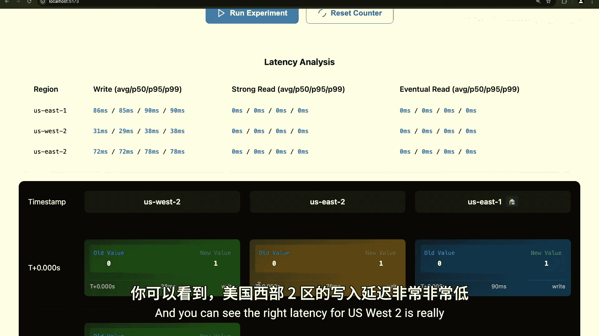

---

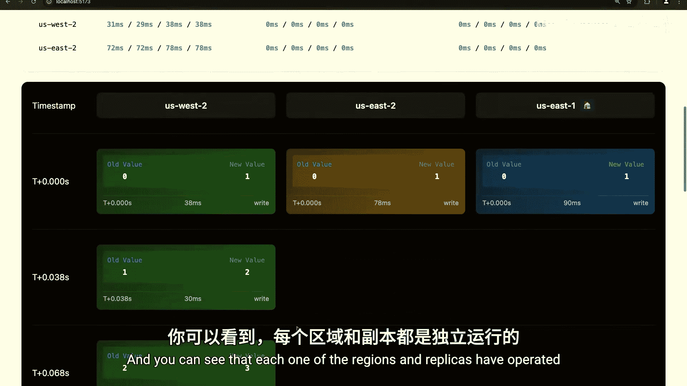

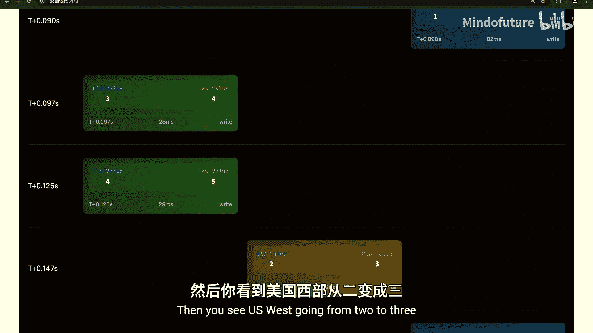

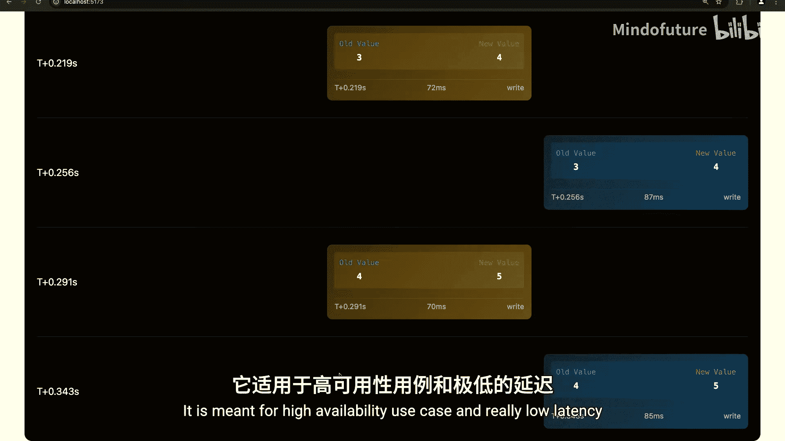

## Amazon DynamoDB 教程：第4章：核心用例与考量

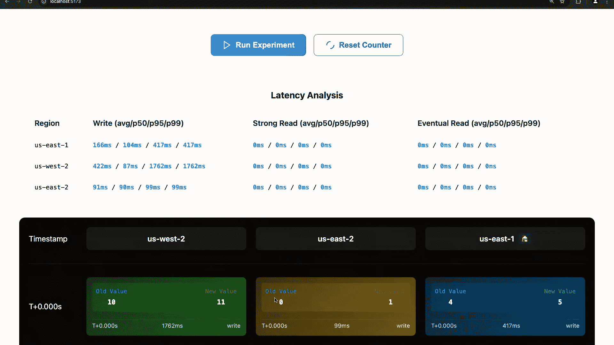


上一节我们对比了两种模式的特点。本节中，我们来看看多区域强一致性适用于哪些场景，以及使用前需要考虑的事项。

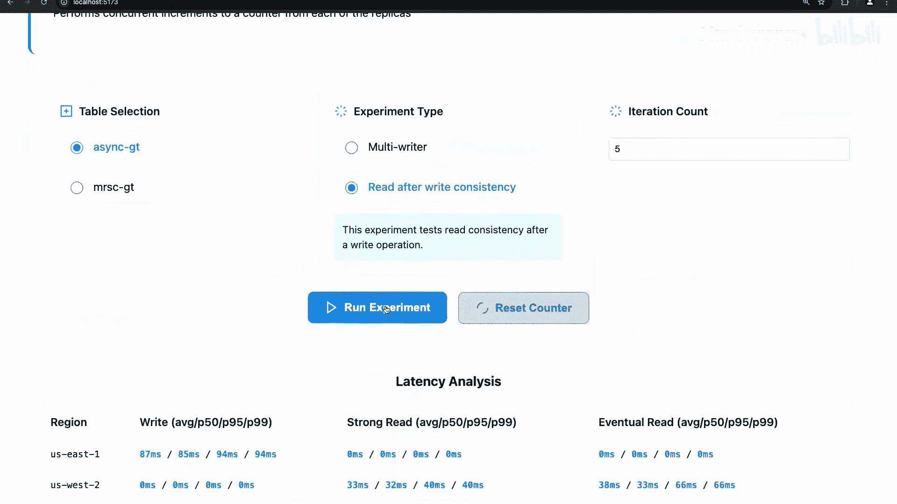

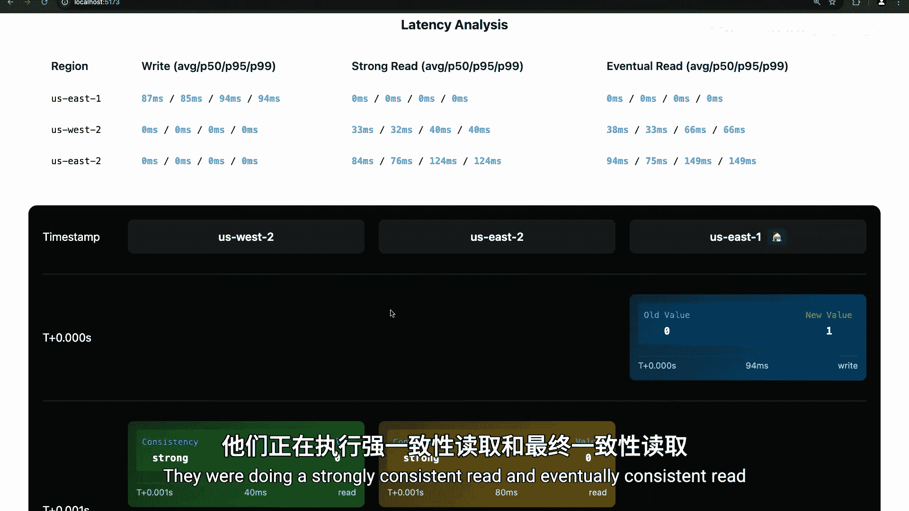

### 主要用例

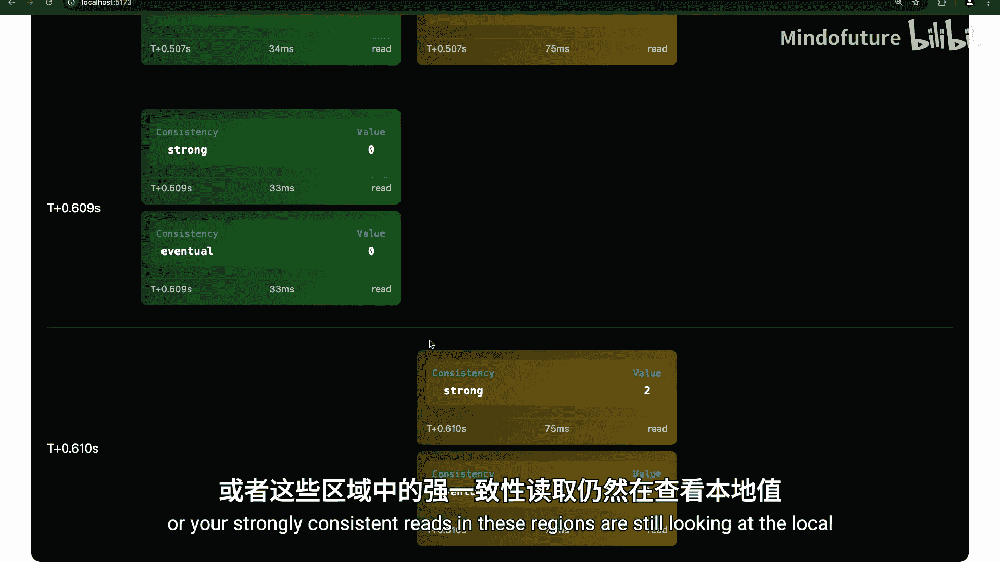

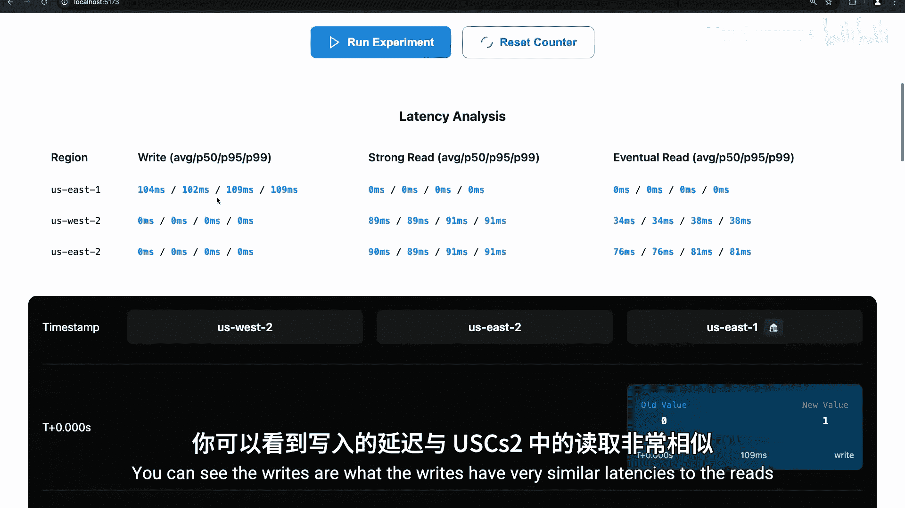

1.  **对 RPO 有严格要求的灾难恢复**
    *   **场景**：金融交易、订单处理等应用无法容忍故障转移时丢失任何已确认的交易。
    *   **最终一致性局限**：故障转移后，可能丢失几秒内未复制的数据。
    *   **强一致性优势**：RPO=0，确保故障转移后能立即访问所有已提交数据。


2.  **需要全局最新数据的读写本地化**
    *   **场景**：全球性应用，用户需要从最近区域读写数据，同时又要求读取的数据绝对最新。
    *   **最终一致性局限**：为获得低延迟，可能读到过时数据。
    *   **强一致性优势**：在容忍较高延迟的前提下，能从任何区域读取到全局最新数据。**提示**：对于可接受旧数据的写入操作，仍可使用最终一致性写入以获得较低延迟。

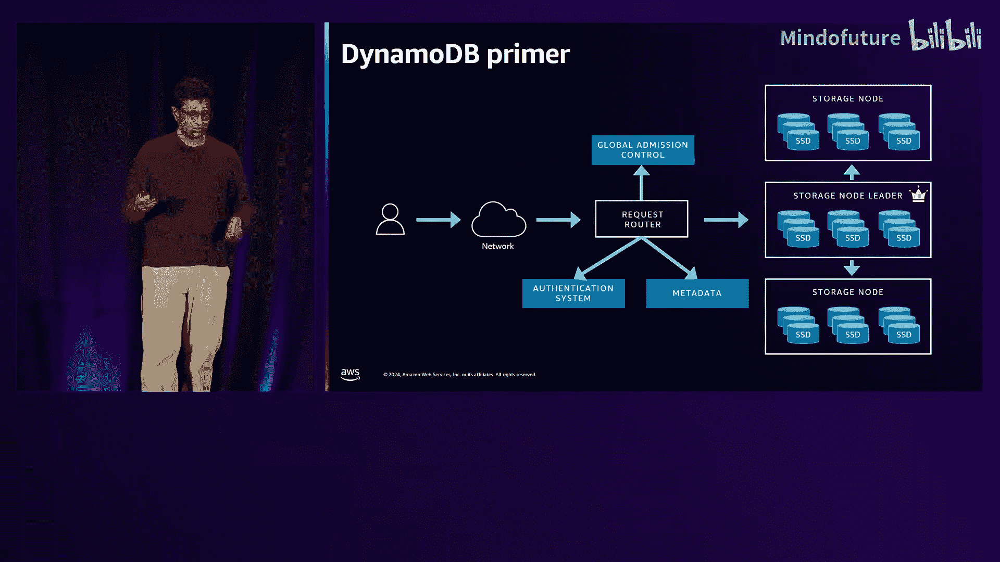

### 重要考量与预览版限制

以下是您尝试该功能时需要了解的信息：

*   **公开预览状态**：该功能目前处于公开预览阶段，**不适用于生产环境**。请仅用于测试和评估。
*   **一致性模式配置**：复制一致性在**创建全局表时配置**，并应用于该全局表中的**所有副本**。不能在同一个全局表中混合使用不同的一致性模式。
*   **模式切换**：目前无法直接在两种模式间切换。需要先删除所有副本变回单区域表，再重新创建另一种模式的全局表。
*   **预览版区域限制**：预览版仅支持三个区域：**美国东部（弗吉尼亚北部）us-east-1**、**美国东部（俄亥俄）us-east-2** 和 **美国西部（俄勒冈）us-west-2**。创建强一致性全局表时，必须同时部署到这三个区域。

---

## Amazon DynamoDB 教程：第5章：在控制台创建强一致性全局表

上一节我们讨论了使用场景和限制。本节中，我们通过一个简化的流程，看看如何在 AWS 管理控制台中创建多区域强一致性全局表。

**操作步骤概述**：
1.  在 DynamoDB 控制台选择一个现有的单区域表。
2.  进入“全局表”标签页，点击“创建副本”。
3.  在配置中，将“一致性模式”选择为 **“强一致性”**。
4.  系统会根据预览版限制，自动为您预选三个必需的 AWS 区域。
5.  点击“创建”，系统将在后台配置副本并启动强一致性复制。

创建完成后，您可以在全局表详情中看到所有三个副本，并且“一致性级别”会显示为 **“强”**，以此区分于最终一致性全局表。

---

## Amazon DynamoDB 教程：第6章：技术深潜与故障行为

上一节我们演示了如何创建。本节中，我们将深入探讨多区域强一致性全局表的技术实现，特别是其与最终一致性全局表在故障场景下的行为差异。

### 最终一致性全局表的工作原理

*   **复制基础**：基于 DynamoDB 的**更新流**。每个区域的复制引擎读取本地表的客户写入，并异步复制到其他所有区域。
*   **多活与高可用**：所有区域可独立处理读写。一个区域故障不影响其他区域。
*   **冲突解决**：使用**最后写入者获胜**，依据是写入时由源区域和时钟服务打上的时间戳元数据。
*   **故障行为**：
    *   **区域故障**：健康区域仍完全可用。故障区域恢复后追赶数据。
    *   **网络隔离/分区**：所有区域（包括被隔离的）仍可读写，但可能读到彼此过时的数据。恢复后通过“最后写入者获胜”解决冲突。

### 多区域强一致性全局表的工作原理

为了实现跨区域强一致性和高可用写入，我们引入了核心组件：**多区域日志**。

*   **多区域日志**：一个跨所有（当前为三个）区域部署的、仅追加的分布式日志。
*   **写入路径**：
    1.  写入请求首先被转换为**幂等**的条件写入操作。
    2.  该操作被提交到多区域日志。
    3.  日志需要**至少两个区域**持久化后，才向客户端确认写入成功。
    4.  同时，日志通知所有区域的处理器，将操作应用到本地 DynamoDB 表。
*   **强一致性读取路径**：
    *   读取区域会向多区域日志发送“心跳”查询，确保没有遗漏任何已提交但未应用到本地的写入。
    *   在获取并应用所有遗漏写入后，才返回读取结果，从而保证读取到全局最新数据。
*   **并发写入处理**：多区域日志作为串行化点，确保并发写入被排序。冲突的写入会因条件检查失败而抛出 `ReplicatedWriteConflictException`。

### 故障场景行为对比

以下是关键故障场景下两种全局表的行为差异：

| 故障场景 | 最终一致性全局表 | 多区域强一致性全局表 |
| :--- | :--- | :--- |
| **区域故障** | 健康区域完全可用。 | 健康区域完全可用（支持强一致性读写）。 |
| **区域网络隔离** | **所有区域仍可读写**，但数据可能过时。 | **被隔离区域不可进行强一致性读写**（无法访问日志）。健康区域完全可用。 |
| **区域间网络分区** | 分区两侧区域可读写，但彼此复制中断，数据可能不一致。 | **所有区域仍可进行强一致性读写**。日志利用剩余路径保持多数派，但延迟可能增加。 |

### 确保正确性的方法

AWS 使用多种方法确保此类分布式系统的正确性：
*   **形式化建模与验证**：使用 TLA+ 等工具对协议进行数学建模和验证。
*   **大规模测试与混沌工程**：进行大规模负载测试，并模拟节点崩溃、网络丢包等故障，发现边缘情况。
*   **反熵机制**：在后台持续校验副本间数据的一致性并修复差异。
*   **集成故障注入服务**：允许您测试应用程序在复制延迟或中断时的行为（未来将支持强一致性全局表的故障测试）。

---

## Amazon DynamoDB 教程：第7章：总结与选择指南

本节课中，我们一起学习了 Amazon DynamoDB 多区域强一致性全局表。

### 内容总结

1.  **功能定义**：多区域强一致性是 DynamoDB 全局表的新功能，提供跨区域的强一致性复制，确保从任何副本都能读取到全局最新数据，并实现 RPO=0。
2.  **核心机制**：通过**多区域日志**这一分布式协调组件，对写入进行全局排序和持久化，从而实现强一致性。
3.  **行为变化**：与最终一致性全局表相比，强一致性版本在读写延迟、冲突处理（抛出 `ReplicatedWriteConflictException`）以及部分网络故障下的可用性方面有所不同。
4.  **适用场景**：主要适用于无法容忍数据丢失的严格灾难恢复场景，以及需要全局最新数据的读写本地化场景。
5.  **当前状态**：该功能处于**公开预览**阶段，有区域数量和配置上的限制，暂不适用于生产环境。

### 如何选择？

根据您的应用需求进行选择：
*   **选择最终一致性全局表，如果**：您的应用追求**最高性能和最低延迟**，可以接受故障转移时短暂的数据延迟（RPO 为秒级），并且能够处理“最后写入者获胜”的冲突逻辑。例如：用户会话存储、游戏排行榜、物联网设备遥测。
*   **考虑多区域强一致性全局表，如果**：您的应用**要求跨区域读取绝对最新的数据**，且**无法接受故障转移时的任何数据丢失**（RPO=0），并愿意为了一致性而接受更高的写入和强一致性读取延迟。例如：金融交易核心系统、库存管理、配置管理。


希望本教程能帮助您理解这项新功能。请在实际生产使用前，参考 AWS 官方文档以获取最新信息。