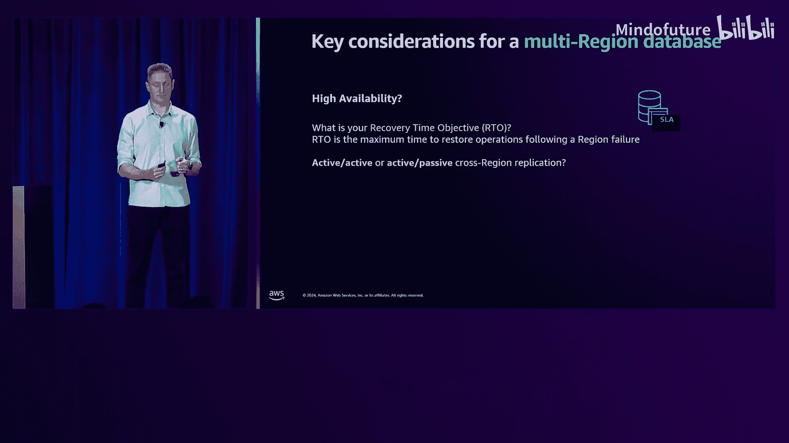
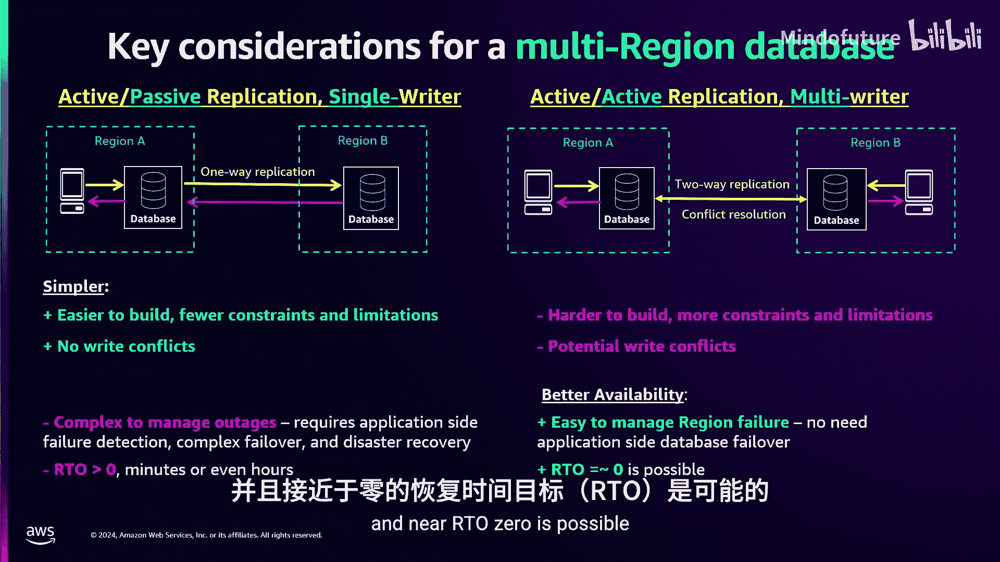
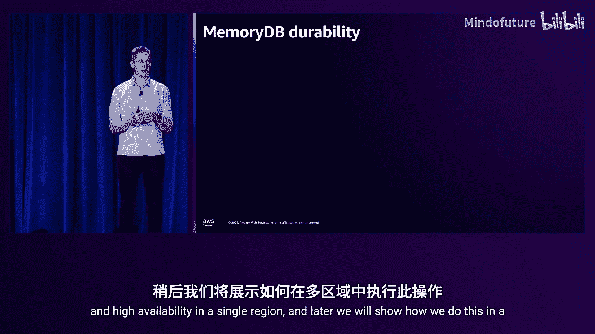
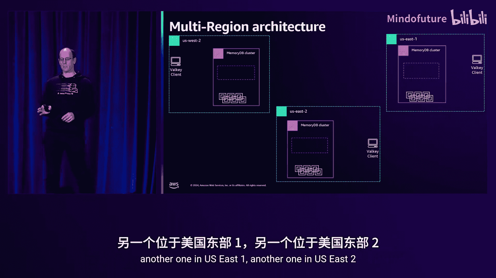
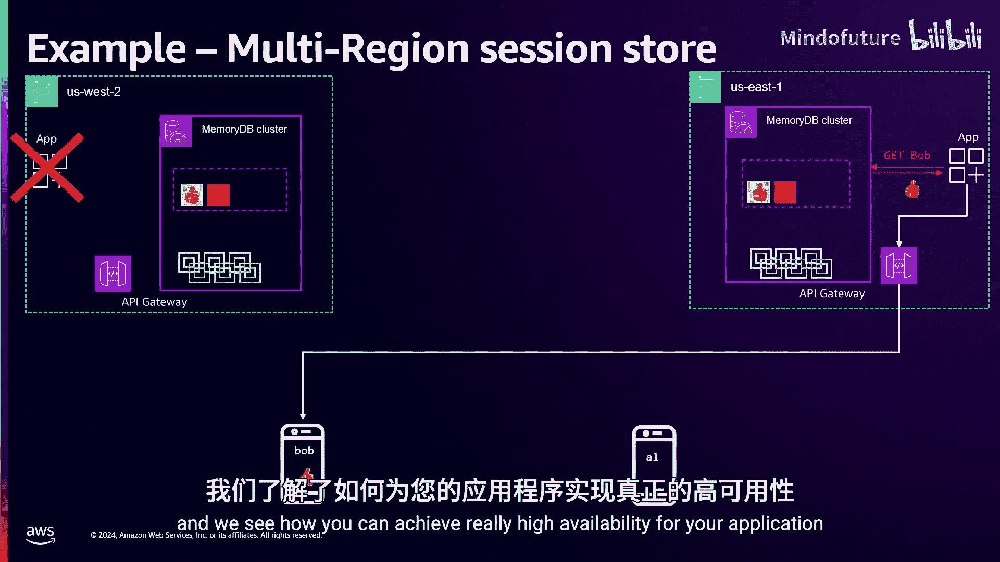
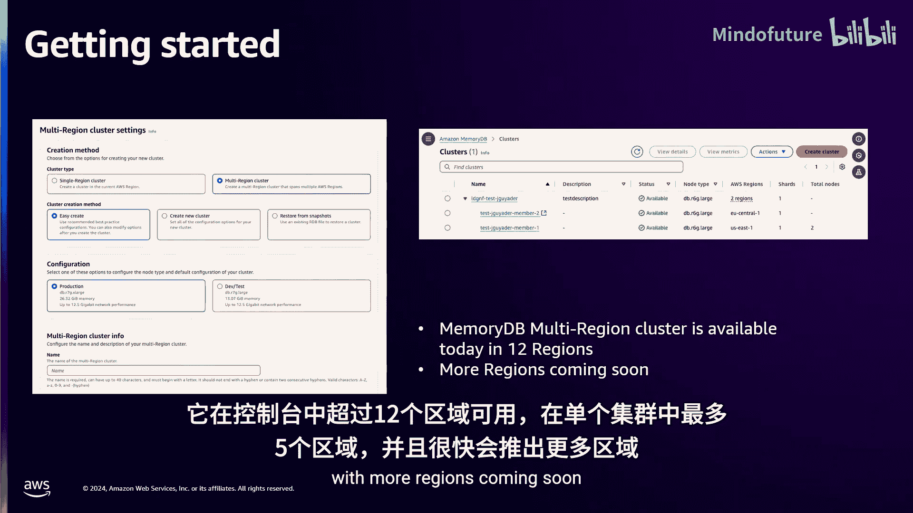

# 019：使用Amazon MemoryDB多区域提升应用韧性 🚀

在本节课中，我们将学习如何利用新发布的Amazon MemoryDB多区域功能，构建高性能、高可用的多区域应用程序。我们将深入探讨其背后的技术原理，并分析在选择多区域数据库时需要考虑的关键因素。

## 为什么需要多区域应用？🌍

上一节我们介绍了课程概述，本节中我们来看看企业构建多区域应用的主要原因。

以下是两个核心驱动因素：

1.  **提升韧性**：为了应对单个区域发生重大中断（如网络或连接问题）的低概率风险。对于运行关键应用或受行业法规（如医疗、金融）约束的企业而言，这是必须的。
2.  **服务全球业务**：为了向全球客户提供低延迟和卓越体验。例如，游戏或零售行业的全球应用需要处理排行榜、用户会话等全局数据。如果用户从美国旅行到新加坡，没有多区域应用会导致高延迟和糟糕的体验。

## 为什么数据层需要多区域？💾

既然需要多区域应用，为什么数据层也必须多区域化？能否仅通过跨区域调用来实现？

以下是需要考虑的要点：

*   **对于提升韧性**：灾难恢复需要数据。即使备用区域也需要业务数据来保证业务连续性。
*   **对于全球应用**：需要低延迟访问数据（如检索用户会话、更新排行榜）。区域内延迟通常在亚毫秒级，而跨区域延迟则高达数十或数百毫秒。如果应用需要进行多次顺序调用来获取数据，高延迟将严重影响用户体验。

构建多区域数据层时，可以自定义解决方案（如跨区域复制数据、复制快照或使用第三方工具），但这会面临**正确性、一致性、可用性和性能**等难题。因此，使用已经解决这些问题的多区域数据库是更优选择。

## 如何选择多区域数据库？🤔

在接下来的内容中，我们将探讨选择多区域数据库时的关键考量。

### 考量一：一致性与持久性

首先考虑恢复点目标（RPO），即在区域故障时能容忍的最大数据丢失。这引出了下一个问题：选择**同步**还是**异步**跨区域复制？

*   **同步复制**：
    *   **流程**：客户端在本地区域发起写入请求（如 `SET key value`）。数据被**同步**复制到另一个区域，仅在数据在**两个区域都持久化**后，客户端才会收到确认。
    *   **核心优势**：实现强一致性，RPO为0。
    *   **主要缺点**：写入延迟很高。

*   **异步复制**：
    *   **流程**：客户端在本地区域发起写入请求。数据在**单个区域持久化**后，客户端即收到确认。随后数据被**异步**复制到其他区域。
    *   **核心优势**：写入延迟显著更低（毫秒级），复制延迟通常为几秒。
    *   **主要缺点**：无法实现RPO 0，而是最终一致性。

许多客户更倾向于低写入延迟而非零RPO。因此，像DynamoDB全局表、Aurora全局数据库、ElastiCache全局数据存储以及现在的MemoryDB多区域等都采用异步复制。

### 考量二：高可用性

客户构建多区域应用的另一个主要原因是：在区域故障时获得更高的可用性和业务连续性。因此，你需要问自己：恢复时间目标（RTO）是多少？即能容忍的最大停机时间。

这引出了下一个问题：选择**主动-被动**还是**主动-主动**架构？

*   **主动-被动**：
    *   **模式**：数据仅在**一个区域**写入（单一写入器），然后复制到其他区域。
    *   **优点**：构建更简单，约束更少。
    *   **缺点**：可用性较低。发生区域故障时，需要在应用端手动或自动检测故障并执行故障转移，这通常需要数分钟甚至更长时间，影响RTO。

*   **主动-主动**：
    *   **模式**：应用可**同时在多个区域**写入（多个写入器）。区域间存在双向复制，数据库需要解决可能出现的写入冲突。
    *   **优点**：可用性极高。发生区域故障时，应用无需进行数据库故障转移，可以继续在所有区域读写，接近RTO 0。
    *   **挑战**：可能需要为其他区域的写入预留容量，并且需要处理写入冲突。

请注意，选择同步/异步与选择主动-被动/主动-主动是**正交的决策**，彼此独立。

### 其他考量

除了上述核心点，还需考虑数据库支持的**区域数量**（灾备通常需2个，全球应用可能需要更多）、安全性、合规性、API、易用性、可扩展性和性能等。

## 什么是Amazon MemoryDB？⚡

在深入了解MemoryDB多区域之前，我们先简要回顾一下MemoryDB。

Amazon MemoryDB是AWS目前提供的**最快的持久化数据库**，具有微秒级读取延迟和低个位数毫秒级写入延迟。单节点可支持高达每秒450,000次读取和100,000次写入。

它采用**内存优先架构**，所有数据存储在内存中，通过事务日志实现持久化，从而获得低延迟和高性能。它与**Valkey**（及Redis开源版）兼容。

> **关于Valkey**：由于Redis许可证变更，社区创建了Valkey项目。它由之前开发Redis的部分人员维护，基于Redis 7.2分支，完全兼容，并得到Linux基金会支持，承诺永久开源。AWS已在ElastiCache和MemoryDB中提供Valkey支持，且价格更低。

MemoryDB旨在实现零数据丢失，其核心创新之一是**多可用区事务日志**。每次写入都会在至少两个不同可用区的三个副本中持久化后，才返回确认。它提供99.99%的SLA，并具备全面的管理、安全、合规和扩展能力。

### MemoryDB如何实现持久化与高可用？

在一个区域内的MemoryDB集群中，每个分片有一个主节点和一个或多个副本节点，并配有多可用区事务日志。

1.  **写入流程**：客户端写入请求发送到主节点 -> 主节点将数据写入事务日志 -> 日志将数据复制到至少3个副本（跨2个可用区）-> 返回确认给主节点 -> 主节点返回确认给客户端。此时，客户端知道数据已持久化。
2.  **故障转移流程**：如果主节点发生故障，数据会异步复制到副本节点。在将副本提升为新主节点**之前**，系统会确保该副本已完全同步事务日志中的所有数据，从而保证**无数据丢失**。提升过程通常少于一秒。提升后，客户端流量被重定向到新的主节点。

## Amazon MemoryDB多区域功能发布 🎉

我们很高兴地宣布，Amazon MemoryDB多区域功能已正式发布。

MemoryDB多区域是一个**主动-主动、异步跨区域复制**的数据库服务，设计目标是提供11个9的持久性、99.999%的可用性SLA，并具备企业级安全与合规特性。它支持微秒级本地读取、低个位数毫秒级本地写入，兼容Valkey开源API，并且每个区域的单个集群可扩展至500个节点。

这些设计选择基于与客户的交流，他们更看重**高可用性和低延迟**，而非跨区域的强一致性。

## MemoryDB多区域架构深入解析 🏗️

现在，让我们深入探讨MemoryDB多区域的架构和数据流。

我们以一个包含三个区域（US West-2, US East-1, US East-2）的集群为例。

### 数据写入与复制流程

1.  客户端在US West-2区域执行 `SET sun yellow` 命令。
2.  数据写入内存并发送到本地事务日志。在日志完成跨可用区复制后，即返回确认（ACK）给客户端。
3.  **异步复制**：MemoryDB多区域采用异步复制，这意味着它不会等待跨区域复制完成后再向客户端返回ACK。复制在后台进行。
4.  其他区域（如US East-1）会从US West-2的事务日志中**拉取**数据变更，并应用到本地。
5.  由于是**主动-主动**架构，所有区域均可写入。例如，在US East-1写入 `SET bag red`，该操作也会被复制到其他区域。
6.  复制是**双向**的。为了避免复制循环并节省跨区域数据传输成本，事务日志利用关键特性过滤掉源自本区域的数据，只应用来自其他区域的变更。
7.  为确保多区域持久性，每个写入操作都会记录在**所有区域**的本地事务日志中，这样单个区域在故障后可以独立恢复数据。

### 冲突解决机制

当两个区域几乎同时对同一个键（Key）进行写入时，会发生什么？例如，US West-2和US East-1同时设置键 `sun` 为不同的值。

MemoryDB采用 **“最后写入胜出”（LWW）** 策略来解决冲突：

*   每个写入命令都会附带一个**微秒级时间戳**和**来源区域**信息，并记录在事务日志中。
*   当区域从远程日志拉取到写入命令时，会将其时间戳与本地该键的最后修改时间戳进行比较。
*   系统会**采纳时间戳更新（更晚）的写入**，从而确保所有区域最终收敛到一致的状态。

### 复杂数据类型的处理

Valkey支持哈希、列表、集合、有序集合等复杂数据结构。对于这些类型，仅在键级别使用时间戳是不够的。

MemoryDB采用了 **“无冲突复制数据类型”（CRDT）** 技术：

*   对于集合（Set）等类型，集合内的**每个元素**都有自己的时间戳。
*   当添加不冲突的新元素时，所有区域都可以安全地添加，最终集合会合并所有元素。
*   这实现了在子键（元素）级别的冲突解决，确保并发写入能以一致的方式收敛。

### 删除操作的处理

删除操作需要特殊处理以防止数据分歧。例如：
1.  区域A将键 `K` 的值更新为 `bar`。
2.  区域B删除了键 `K`。
3.  当删除操作复制到区域A时，区域A会删除 `K`。
4.  但当区域A的 `set K bar` 操作复制到区域B时，区域B的数据库此时是空的，它无法附加时间戳元数据，因此会重新创建键 `K`，导致分歧。

解决方案是 **“删除再传播”**：
*   当区域收到一个删除命令，但该命令所针对的键在本地已被后续操作重新创建时，系统会**重新处理**这个删除命令。
*   这样就能确保所有区域最终再次收敛到一致状态（即键被删除）。

### 扩展多区域集群

扩展MemoryDB多区域集群本质上是多区域操作，因为所有区域最终需要具有相同的拓扑结构。各区域独立执行扩展操作（如增加分片），并通过协调槽（slot）的迁移，最终收敛到相同的拓扑。在此过程中，系统会妥善处理跨区域的数据转发，确保数据一致性和可用性。

## 实战示例：多区域会话存储 👥

让我们通过一个多区域会话存储的例子来串联所有概念：

1.  **用户Bob（美国西海岸）登录**：他的请求被路由到US West-2区域的应用和MemoryDB集群。会话数据被快速写入本地事务日志并确认，然后**异步复制**到US East-1区域。
2.  **用户Alice（美国东海岸）登录**：她的请求路由到US East-1区域，创建会话并复制到US West-2。
3.  **区域故障场景**：假设US West-2区域发生故障。
    *   Bob需要更新会话。由于是**主动-主动**架构，无需数据库故障转移。
    *   Bob的应用可以立即将请求重定向到US East-1区域的API网关和应用。
    *   因为Bob的会话数据之前已被复制到US East-1，所以该区域可以立即为Bob提供低延迟的读写服务，实现高可用性。

## 如何开始使用？🚀

MemoryDB多区域功能现已通过控制台在超过12个区域上线。单个集群最多支持5个区域，未来将支持更多区域。

## 总结 📝

本节课中，我们一起学习了：

*   构建多区域应用的必要性及其对数据层的要求。
*   选择多区域数据库时的关键考量：**同步 vs 异步**复制、**主动-主动 vs 主动-被动**架构等。
*   Amazon MemoryDB的核心特性：内存优先架构、高性能、Valkey/Redis兼容性。
*   新发布的 **MemoryDB多区域**功能：它是一个**主动-主动、异步复制**的服务，旨在提供极高的可用性（99.999%）、持久性和低延迟。
*   MemoryDB多区域的底层架构、数据流、**冲突解决机制（LWW， CRDT）** 以及扩展方式。
*   通过会话存储的实战示例，了解了其如何实现跨区域的高性能与高韧性。

利用Amazon MemoryDB多区域，您可以更轻松地构建能够为全球客户提供低延迟、高可用性和强大韧性的应用程序。