# 020：Amazon DynamoDB数据建模核心概念 (DAT305) 📚

在本节课中，我们将学习Amazon DynamoDB数据建模的核心概念。我们将从基础类比开始，逐步深入到高级设计模式，包括分区键、排序键、索引设计、成本优化以及应对扩展性挑战的策略。无论你是DynamoDB的新手还是有一定经验的开发者，本教程都将帮助你构建高效、可扩展的数据模型。

---

## 数据模型基础：电话簿类比 📞

理解DynamoDB数据模型的一个好方法是将其想象成一个图书馆里的电话簿。

上一节我们介绍了课程概述，本节中我们来看看DynamoDB如何通过一个简单的类比来组织数据。

### 基础表：白页电话簿

想象一个按城市（如“拉斯维加斯”）组织的电话簿。书脊上的城市名相当于DynamoDB的**分区键**。书内条目按姓氏（如“Hunter”）排序，这相当于**排序键**。每个条目包含有效载荷信息，如电话号码和邮政编码。

*   **能做什么**：如果你知道城市和完整的姓名，可以快速找到对应条目。
*   **不能做什么**：你无法高效地查找所有名为“Jason”的人，因为数据不是按名字排序的；你也无法按邮政编码查找。

### 本地二级索引：黄页电话簿

同一本电话簿的后面是黄页部分。它使用相同的城市作为分区键，但排序键变成了商业类型（如“赌场”）。这类似于DynamoDB的**本地二级索引**——它与基础数据存储在一起，但提供了不同的排序视角。

### 全局二级索引：另一个图书馆的书架

现在，想象图书馆有另一个区域，那里的书脊是按邮政编码组织的。要查找某人，你需要知道邮政编码，而不是城市。这类似于**全局二级索引**——它是一个完全独立的“数据视图”，拥有自己的分区键和排序键（例如，邮政编码和姓名），数据物理存储在不同的位置。

### 数据更新与传播

当更新一个条目（如更改电话号码）时，你只需在基础表（白页）中进行修改。
*   **本地二级索引**的更新是立即的，因为它与基础数据在同一“书”中。
*   **全局二级索引**的更新是最终一致的，通常延迟在毫秒级，因为它位于“不同的书架”上。

---

## 物理存储：图书馆与书架 🏛️

上一节我们通过电话簿理解了逻辑数据组织，本节中我们来看看数据在DynamoDB后端是如何物理存储和管理的。

### 分区与复制

为了防止单点故障，我们不会把所有电话簿放在一个图书馆。DynamoDB会在多个**可用区**（想象成三个物理分离的图书馆）存储数据的多个副本，确保高可用性。

在每个“图书馆”内，数据被放置在称为**分区**的“书架”上。每个分区可以存储一定量的数据并处理一定量的读写流量。

### 分区键哈希与均匀分布

如果按城市名的字母顺序将电话簿放在书架上，像“San”开头的城市会聚集在一起，导致负载不均衡。DynamoDB通过**哈希函数**处理分区键来解决这个问题。即使输入（城市名）相似，哈希输出也会均匀分布，从而将数据均匀地分散到所有分区上。

### 分区拆分

每个分区（书架）的容量和吞吐量是有限的。
*   **因容量拆分**：当一个分区存储的数据量过大时，DynamoDB会将其拆分成两个分区。
*   **因吞吐量拆分**：当一个分区接收的读写请求过多（过热）时，DynamoDB也会将其拆分，以提供更高的总吞吐量。

分区可以一直拆分到单个项目（一个电话簿条目）级别，从而为该项目提供最大的读写能力。

### 核心要点回顾

以下是关于DynamoDB分区需要记住的关键点：

*   表由分布在多个可用区的分区组成。
*   每个表设计包含一个分区键和一个可选的排序键。
*   分区有大小限制（约10GB）和吞吐量限制（当前为3000读容量单位或1000写容量单位）。
*   分区会根据容量或吞吐量需求自动拆分。
*   相同的分区键值可能分布在多个分区上；同时，多个不同的分区键值通常共存于同一个分区。

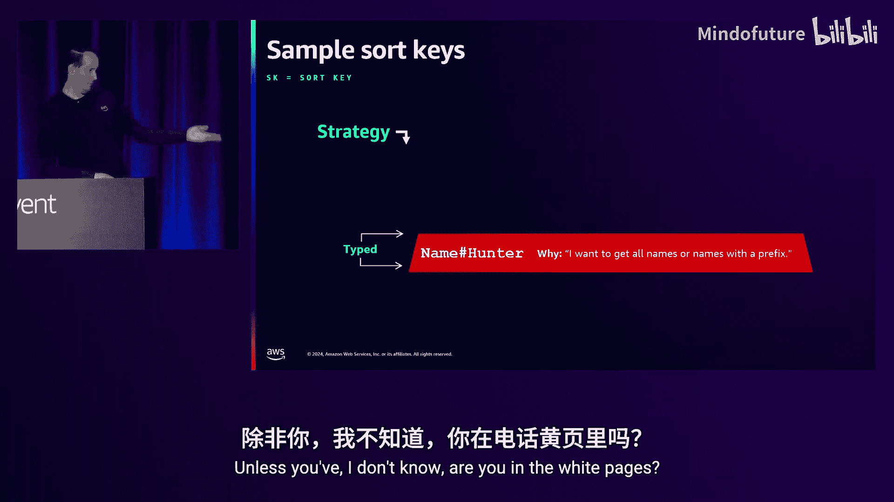

---

## 键设计：PK与SK的最佳实践 🔑

上一节我们了解了分区的物理特性，本节中我们聚焦于设计高效数据模型的核心：分区键和排序键。

### 基本规则

在DynamoDB中，分区键和排序键共同唯一标识表中的一行。如果表定义了排序键，那么每个项目都必须包含排序键。

### 键值选择建议

我们建议对分区键和排序键使用**字符串**数据类型。这允许你在键的前缀中包含实体类型信息（例如，`USER#123`），使数据在查看时更清晰。

为键选择值时，最好使用带有描述性标签的唯一标识符（如 `CUSTID#123`），而不是纯UUID。

### 键模式命名

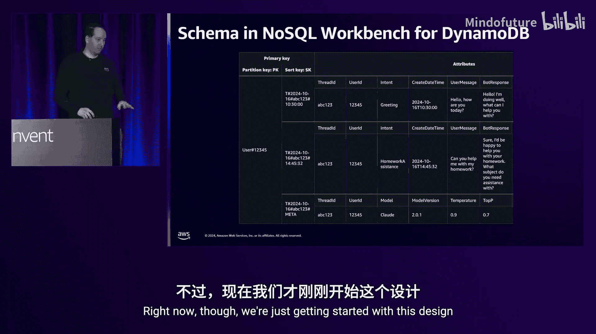

我们推荐将分区键属性命名为 **`PK`**，排序键属性命名为 **`SK`**。这样做有两大好处：
1.  **表设计锁定**：键模式在创建表后无法更改，使用通用名称为未来留出灵活性。
2.  **节省空间**：短的属性名可以减少每个项目的大小，从而节省读写容量。

### 分区键模式

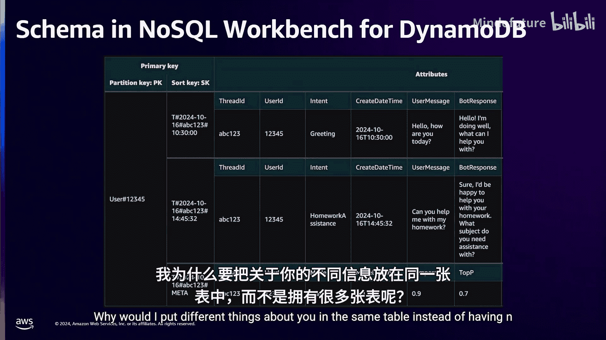

分区键可以有多种形式来满足不同访问模式：

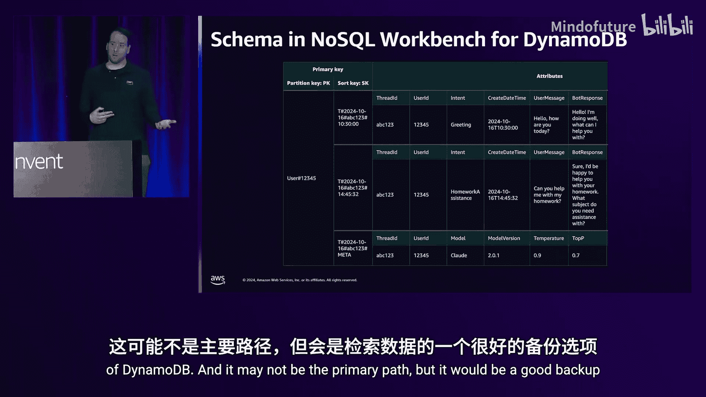

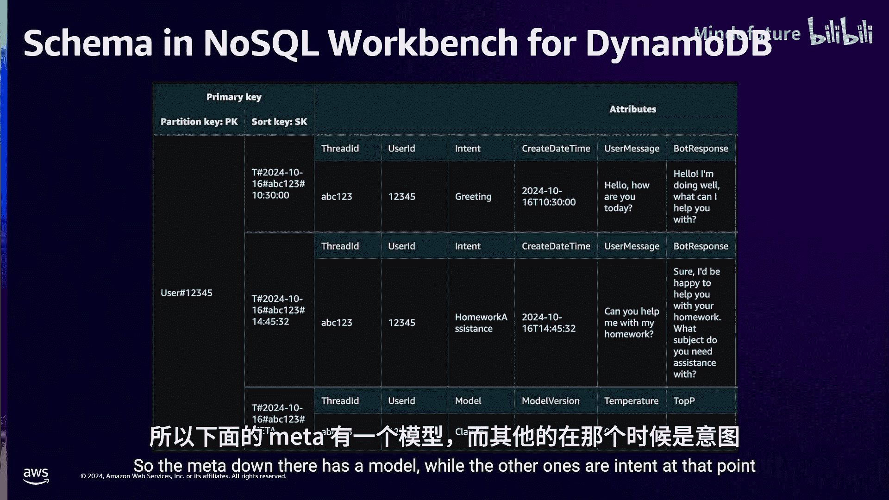

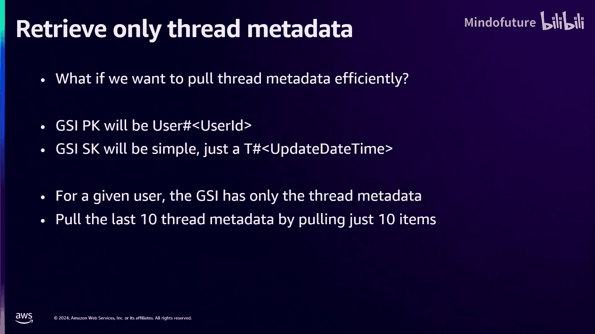

1.  **描述性键**：最常见的方式，直接在键中包含实体类型，如 `ZIPCODE#89109`。
2.  **写入分片键**：通过在键末尾添加一个数字后缀（如 `0`， `1`）来分散对同一逻辑分区的密集写入。这可以用于基础表或全局二级索引。
3.  **多值键**：用于将相关数据集合在一起。例如，`MGM#89109` 可以包含该邮政编码下所有美高梅物业的信息。要更新特定项目，你必须知道完整的键值。

### 排序键模式

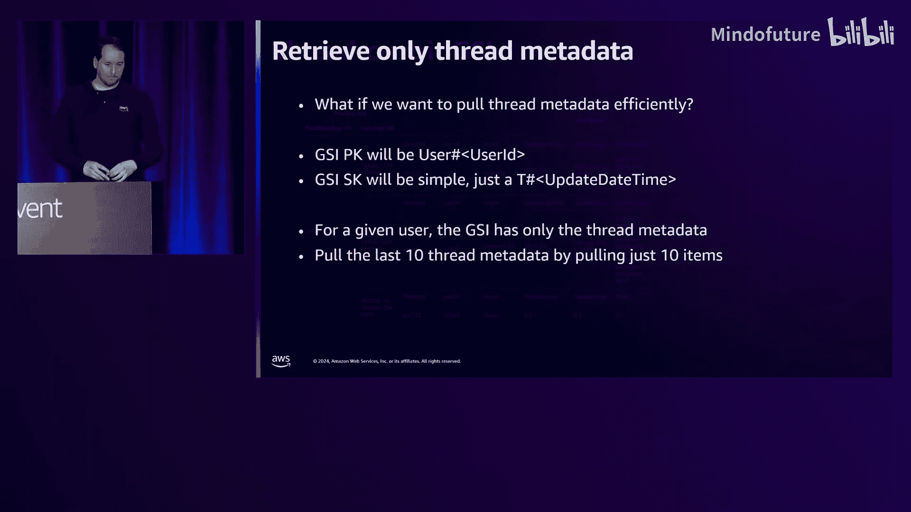

排序键用于在同一个分区键下唯一标识和组织项目：

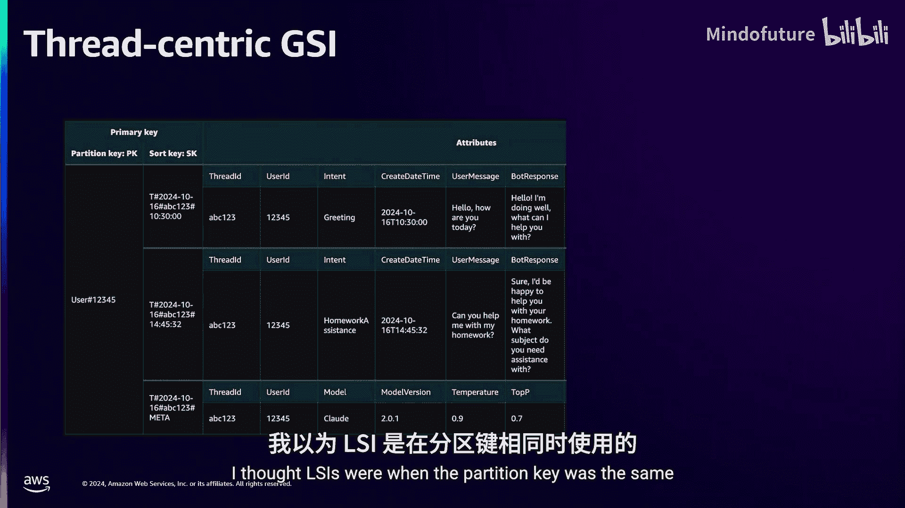

1.  **类型前缀排序键**：在排序键中包含类型前缀，如 `NAME#Hunter`。这允许你查询特定类型的所有项目（例如，查找所有以“HUN”开头的名字）。
2.  **时间戳排序键**：使用时间戳（如纪元时间）作为排序键，可以轻松按时间范围查询数据。
3.  **分层排序键**：创建包含多个层级信息的排序键，如 `USA#NV#LasVegas`。这允许你在不同粒度上进行查询（获取全美、内华达州或拉斯维加斯的数据）。

---

## 实践：设计一个NoSQL数据模型 💬

上一节我们讨论了键的设计模式，本节中我们将这些概念应用到一个实际案例中：为一个聊天服务设计数据模型。

### 场景：Example Corp 聊天服务

假设你需要为一个类似ChatGPT的聊天服务设计数据库。要求包括：
*   按用户存储所有数据。
*   用户可以有多个对话线程。
*   每个线程包含元数据（如使用的AI模型、参数设置）和消息历史。
*   需要高扩展性和低延迟。
*   用户可能跨设备（手机、电脑）访问最近对话。

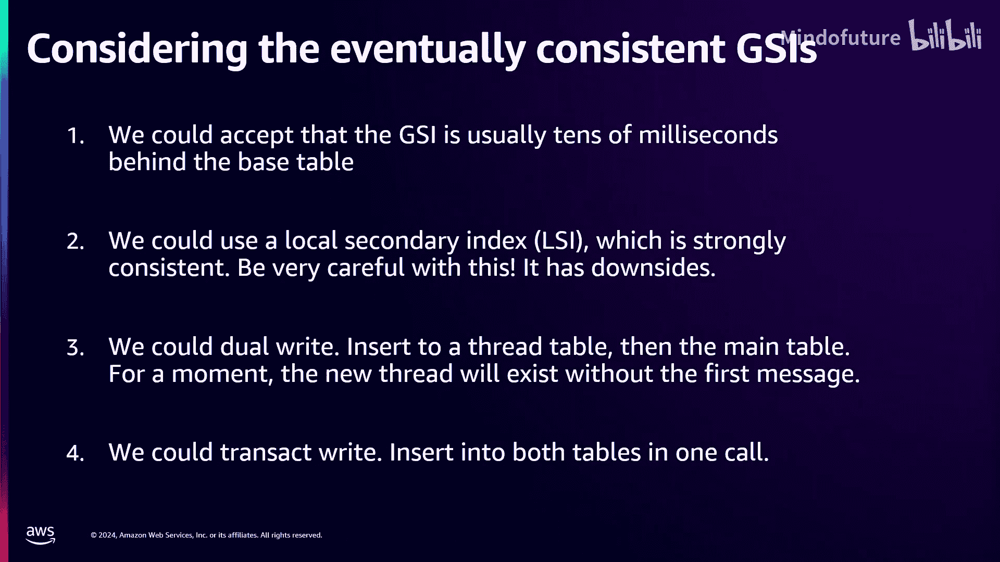

### 初始设计

我们从最基本的设计开始迭代：

*   **分区键**：`USER#<UserID>`。按用户组织所有数据。
*   **排序键**：`THREAD#<YYYY-MM-DD>#<ThreadID>`。使用ISO 8601日期格式，便于按创建日期获取最新线程。`ThreadID`确保同一天内的多个线程唯一。
*   **数据项**：
    *   **元数据项**：存储线程的静态设置，如系统提示词、模型类型、温度、最大令牌数等。排序键为 `THREAD#<YYYY-MM-DD>#<ThreadID>#META`。
    *   **消息项**：用户每条消息和AI的每次回复都存储为独立的项。排序键包含时间戳以保持顺序。

### 设计分析

**优点**：
*   轻松获取用户的最新线程（按日期排序）。
*   使用通用键名 `PK` 和 `SK` 为未来扩展留有余地。
*   非规范化设计，单次查询可获取用户所有相关信息。

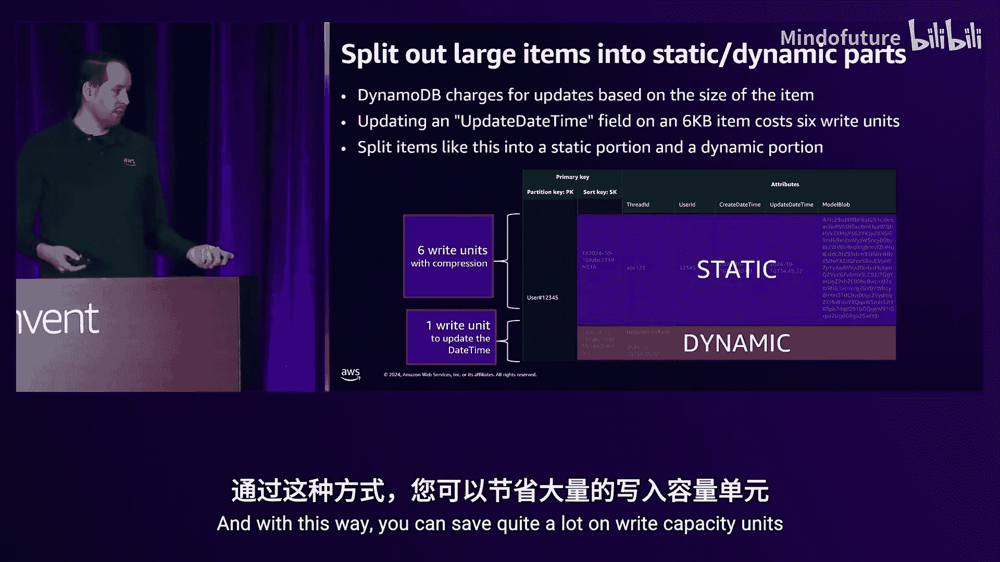

**挑战**：
*   如果仅知道 `ThreadID` 而不知道具体日期，很难直接查询到该线程。
*   长消息可能导致单个项目过大，需考虑压缩或存储到S3。
*   元数据中的动态信息（如最后更新时间）频繁更新会导致重写整个元数据项，成本较高。

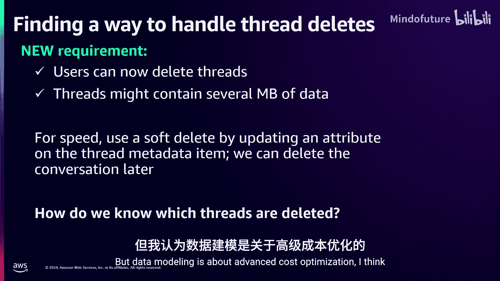

---

## 高级模式与优化 ⚙️

上一节我们完成了一个基础设计，本节中我们来看看如何解决其面临的挑战并进行优化。

### 优化1：获取最新线程元数据

**需求**：快速获取用户最近更新的N个线程的元数据（如最后更新时间）。

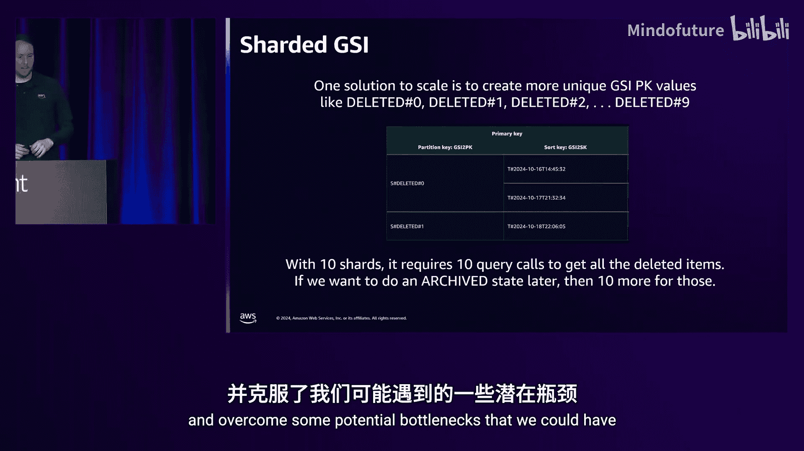

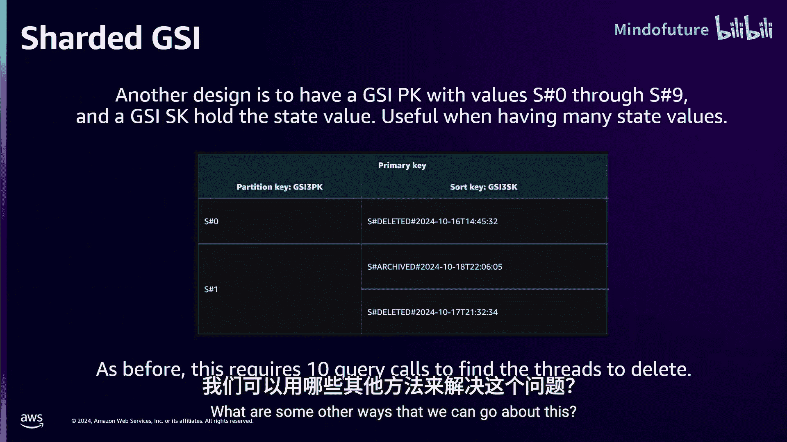

**方案**：创建一个**全局二级索引**。
*   **GSI分区键**：`USER#<UserID>` （与基础表相同）。
*   **GSI排序键**：`UPDATED#<Timestamp>#THREAD#<ThreadID>`。按更新时间戳排序。
*   **优点**：解耦了索引的吞吐量消耗，避免使用LSI导致的基表吞吐量折半问题。
*   **注意**：GSI是最终一致的，可能有毫秒级延迟。

**其他方案对比**：
1.  **接受最终一致性**：如果延迟可接受，GSI是最简单方案。
2.  **使用LSI**：提供强一致性，但限制基表吞吐量，且每个分区键下的集合总大小不能超过10GB。
3.  **双写**：在应用层向两个地方写入，复杂且可能不一致。
4.  **事务写入**：使用DynamoDB事务API (`TransactWriteItems`) 确保原子性，但成本是单次写的两倍，且提供幂等性。

### 优化2：压缩与拆分以减少写入成本

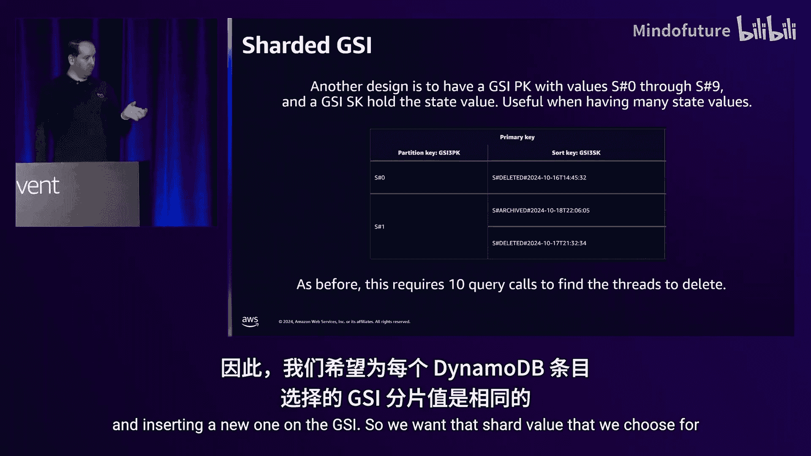

**问题**：更新一个大项目中的一个小字段，需要支付重写整个项目的成本。

**策略**：
1.  **压缩静态数据**：对不常更改的元数据（如模型配置）进行客户端压缩（如GZIP），然后以二进制类型存储。可以显著减少项目大小。
2.  **拆分静态与动态数据**：将频繁更新的字段（如 `last_updated`）从大的元数据项中分离出来，存成独立的项目。这样，更新时间戳只需1个写单元，而不是重写整个元数据项的多个写单元。

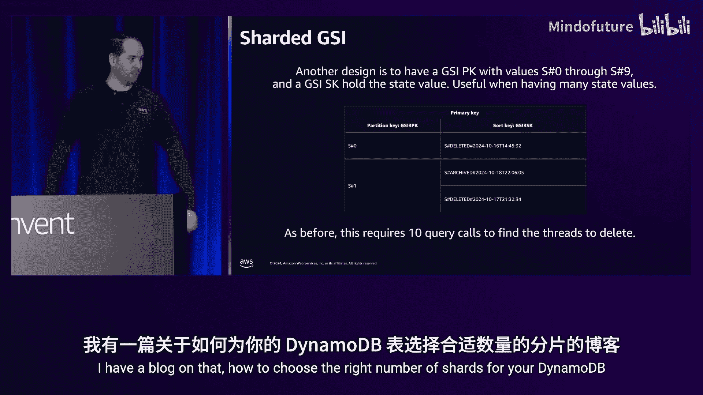

### 优化3：实现高效删除与归档

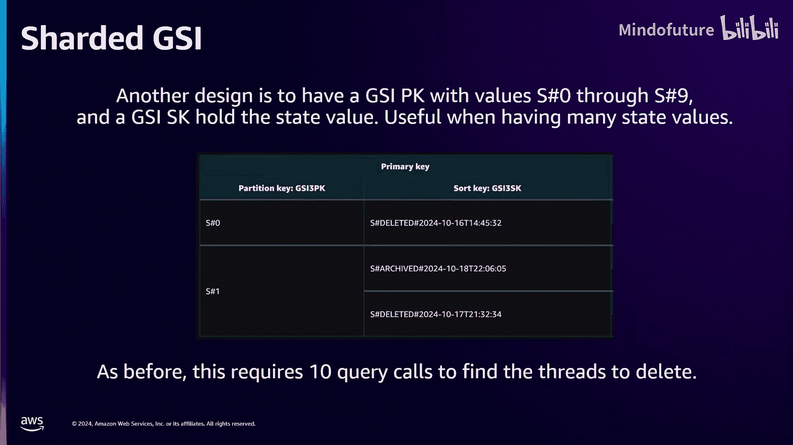

**需求**：支持用户删除线程，可能需要处理大量数据。

**方案**：使用**软删除**配合**分片的全局二级索引**。
1.  **软删除**：不直接删除项目，而是设置一个属性，如 `status: DELETED`。
2.  **分片GSI**：创建一个GSI，其分区键为 `STATUS#DELETED#<ShardNumber>`。通过添加一个随机或计算后缀（0-9），将待删除的项目分散到多个GSI分区上，避免所有删除标记涌向单个分区造成热点。
3.  **后台清理**：一个后台进程定期查询该GSI的所有分片，找到标记为删除的项目并进行物理删除。

**关键点**：使用**计算后缀**而非随机后缀，可以确保对同一项目的多次更新不会改变其在GSI上的分片位置，避免“写入放大”（在GSI上先删除旧项再插入新项）。

### 优化4：精确计数与去重

**需求**：准确计数用户操作次数以实现计费或防滥用，并避免因Lambda函数重试等原因导致重复计数。

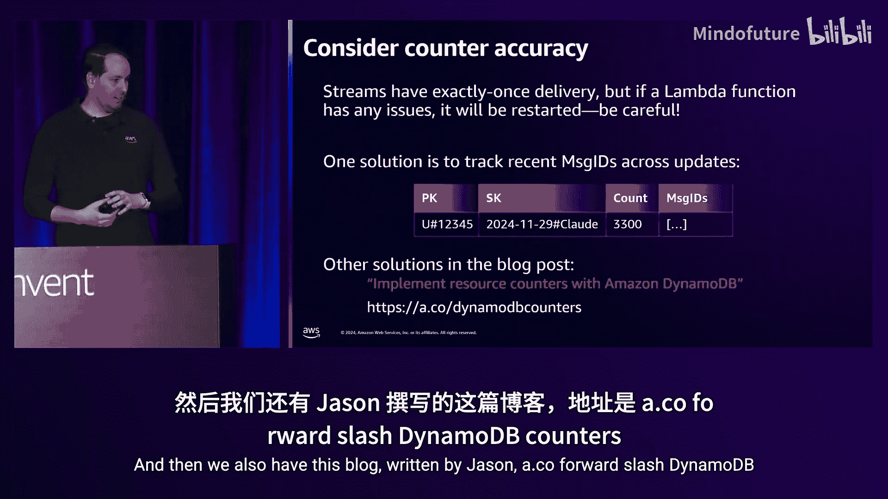

**方案**：利用DynamoDB的**字符串集合**和**条件更新**。
*   在计数项目中维护一个字符串集合属性，如 `processed_message_ids`。
*   当处理一个消息时，执行一个条件更新操作：**仅当该消息ID不在集合中时，才将其添加到集合并增加计数**。
*   这确保了即使处理逻辑被重复触发，每个消息ID也只会被计数一次。

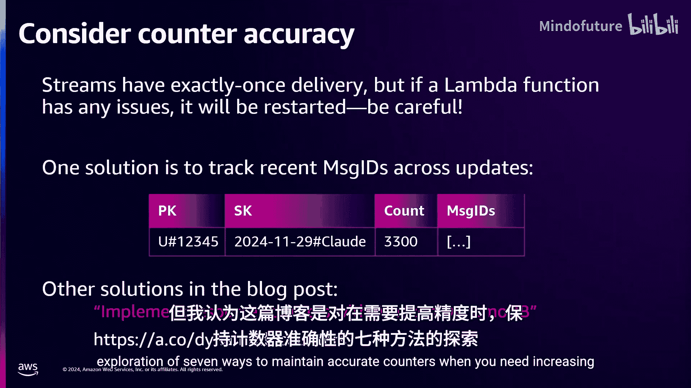

### 优化5：集成搜索

**需求**：支持对聊天内容进行复杂搜索。

**方案**：使用 **DynamoDB与Amazon OpenSearch的零ETL集成**。
*   该功能允许你将DynamoDB表的数据自动、持续地导出到OpenSearch索引中。
*   它使用DynamoDB Streams捕获变更，并通过完全托管的管道（使用Data Prepper）将数据转换后导入OpenSearch。
*   这样，你可以在OpenSearch中执行丰富的全文搜索和分析，而无需自己编写数据同步代码。

### 成本优化技巧：增量导出恢复

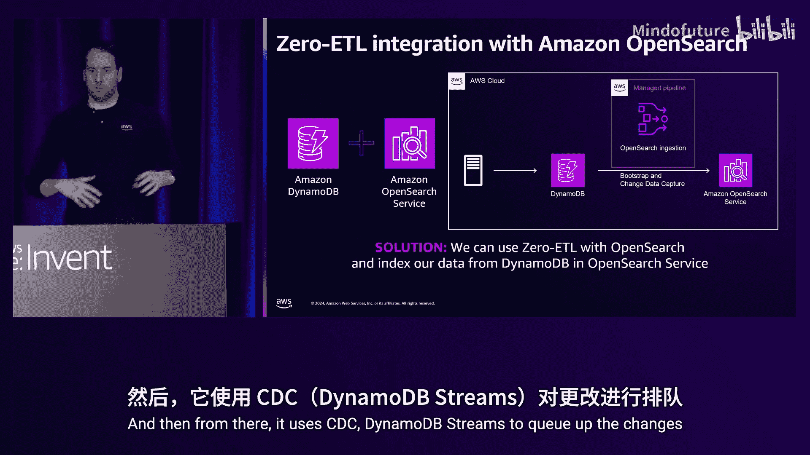

**场景**：使用时间点恢复功能后，传统恢复整个表的方式成本高昂（按表大小计费）。

**新方案**：使用 **增量导出**。
*   如果你知道数据损坏发生的时间范围（例如，某小时内），可以使用增量导出功能，仅导出该时间段内发生变更的数据。
*   恢复成本从基于整个表大小（如1TB）变为基于变更日志大小（可能只有1GB），成本大幅降低。
*   这使PITR功能变得更具成本效益。

---

## 总结 🎯

本节课中我们一起学习了Amazon DynamoDB数据建模的核心旅程：

1.  **基础概念**：通过电话簿类比理解了分区键、排序键、本地二级索引和全局二级索引的逻辑与物理含义。
2.  **键设计**：学习了为PK和SK选择有意义、可扩展的命名和值的最佳实践，包括描述性键、分片键和分层键。
3.  **实践建模**：将一个聊天服务的需求转化为具体的DynamoDB单表设计，并分析了其优缺点。
4.  **高级优化**：探讨了解决扩展性、成本、删除、计数和搜索等实际问题的多种高级模式：
    *   使用GSI优化查询模式。
    *   通过压缩和拆分数据来降低写入成本。
    *   利用分片GSI实现高效的软删除和归档。
    *   借助字符串集合和条件更新实现精确去重计数。
    *   集成OpenSearch实现强大搜索能力。
    *   利用增量导出降低灾难恢复成本。

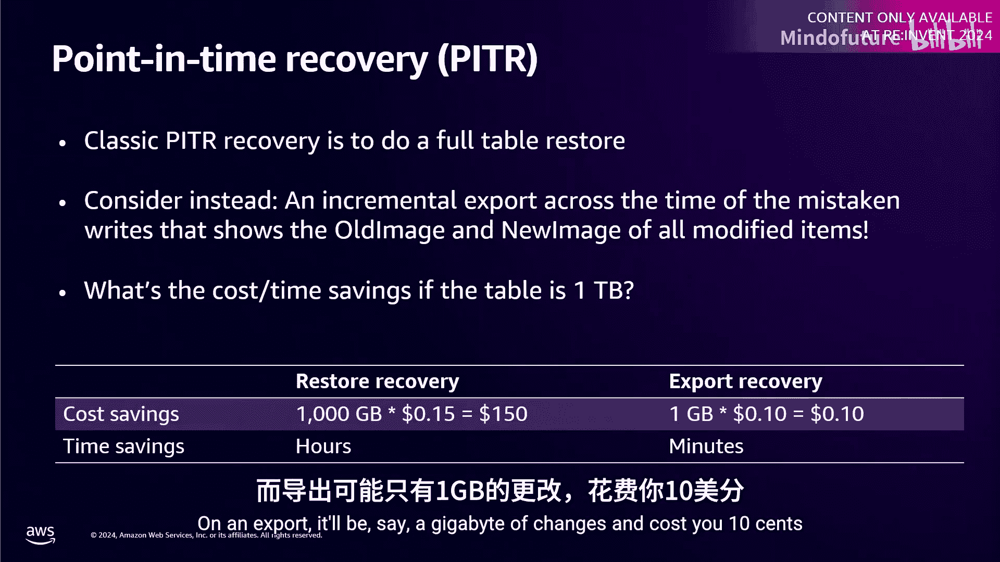

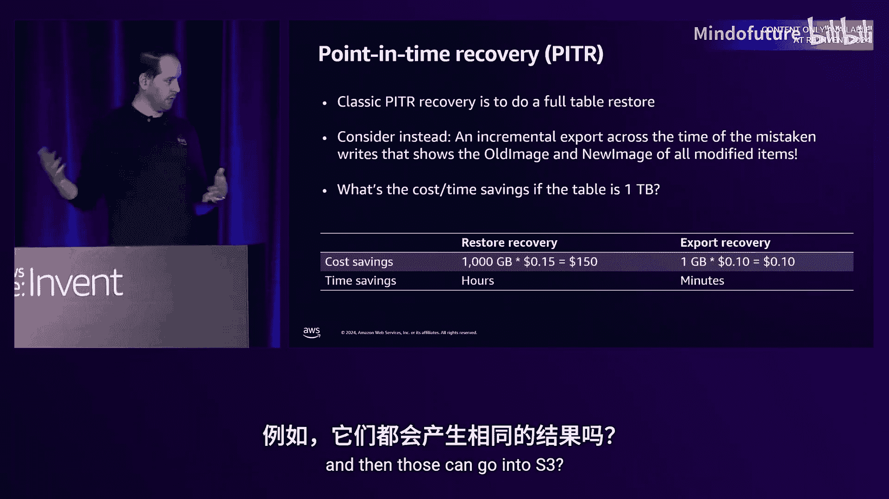

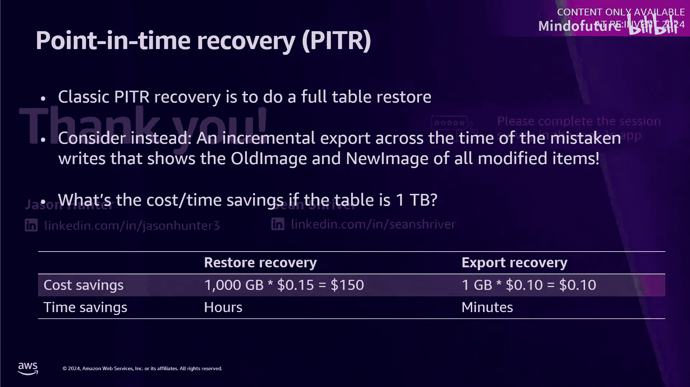

记住，DynamoDB数据建模的核心是**根据应用的访问模式来设计键**。从简单设计开始，识别瓶颈，然后应用这些高级模式进行迭代优化，你就能构建出高性能、高可扩展且经济高效的应用程序。