# 021：DAT404

在本教程中，我们将学习 Amazon DynamoDB 的高级数据建模概念。我们将从理解 DynamoDB 的核心机制开始，探讨数据建模的基础知识，并深入研究一些高级主题，如成本估算（“餐巾纸数学”）和利用 DynamoDB 流。我们的目标是让初学者也能理解这些概念，并掌握构建高效、可扩展 DynamoDB 应用程序的关键技能。

## 1：背景与核心机制

上一节我们介绍了本课程的目标，本节中我们来看看 DynamoDB 的一些核心背景和设计理念。

我今年想做一些不同的事情。在过去几年的 re:Invent 大会上，我通常会用一个大型示例，逐步讲解数据建模的方方面面。今年，我打算聚焦于一些以前没怎么深入讨论过的话题，比如 DynamoDB 流如何融入你的应用架构，以及在进行服务设计时应该考虑的高级概念，比如“餐巾纸数学”。我们还会探讨一些常见的误区，回归基础。

我叫 Alex Debrie，是一名 AWS 数据英雄。我不为 AWS 工作，但在 AWS 社区，特别是围绕 DynamoDB、无服务器和 AWS 整体，做了很多工作。我是《The DynamoDB Book》的作者，这是一本关于 DynamoDB 数据建模的综合指南。我也是一名独立顾问。

我想从一个概念开始，这个概念我在这里听到过，虽然有点老，但很有用，那就是“机械共鸣”。F1 赛车手 Jackie Stewart 曾谈论过机械共鸣，意思是：要最大限度地发挥汽车的性能，你需要了解它的工作原理，比如轮胎如何与路面互动，或者踩下油门时引擎内部发生了什么。

这个概念不仅适用于赛车。在 AWS 架构完善的框架中，他们也提到了机械共鸣，并将其定义为：**在使用一个系统时，要理解它如何工作得最好**。

我认为这对 DynamoDB 非常重要。使用 DynamoDB，你不仅需要知道一些实践技巧，比如如何处理一对多关系、过滤或何时使用事务，还需要了解其背后的概念框架和架构，理解 DynamoDB 给你的关于如何最佳使用它的“暗示”。

因此，我想先建立一些对 DynamoDB 的“机械共鸣”，谈谈它的几个关键特性。当然，DynamoDB 是一个 NoSQL 数据库，但我觉得这不是它最有趣的地方。我认为最重要的三点是：

1.  **完全托管且为 AWS 专有**：这意味着你无法在其他云或本地运行它，甚至在 AWS 的 EC2 实例上也不行。你只能从 AWS 获得这项完全托管的服务。正因为如此，作为一个全区域、多租户的托管服务，你获得的托管体验比自己运行任何数据库都要好得多。
2.  **产品北极星：任何规模下的一致性能**：这并不意味着你可以为所欲为并总能获得快速响应。它的意思是，像创建用户、获取用户最近订单、更新记录这样的操作，无论你拥有 1 MB 数据、10 GB 数据还是 10 TB 数据，也无论数据库上有多少并发查询，其性能表现都将是相似的。这是 AWS 为 DynamoDB 设定的目标，任何新功能或实现都必须符合这个承诺。这应该指导你思考 DynamoDB 能做什么、不能做什么。
3.  **非常适用于无服务器架构**：Lambda 出现后，使用许多其他数据库与这种超短暂的计算模型配合会有些困难。而 DynamoDB 在连接模型、构建方式以及运维方面都非常适合无服务器。

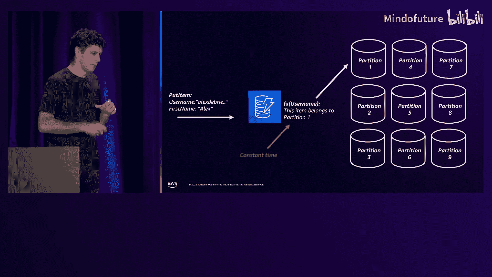

这些是 DynamoDB 独特的三点特性。我认为，如果你在使用 DynamoDB，那么至少其中一点应该对你有吸引力。现在有很多优秀的数据库选项，你应该根据这些特性来选择 DynamoDB，或者寻找其他方案。

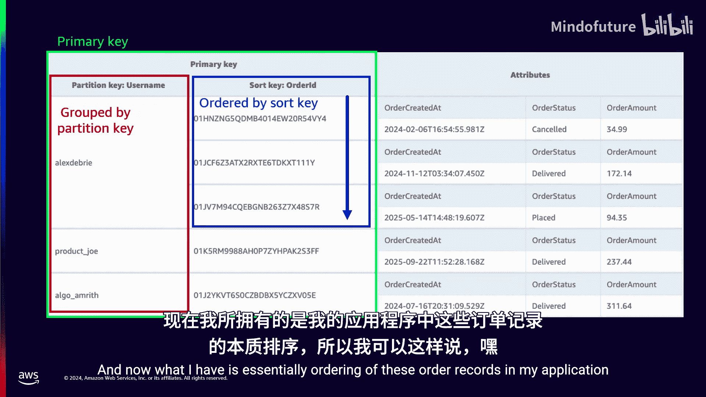

## 2：分区、主键与 API

上一节我们了解了 DynamoDB 的核心特性，本节中我们深入探讨其实现“任何规模下一致性能”的关键机制：数据分区和 API 设计。

让我们进一步看看“任何规模下一致性能”这个产品北极星是如何实现的。请看这个示例表，它有一些不同的用户（在 DynamoDB 中称为“项目”），每个项目有不同的属性。这个表最重要的部分是左边的主键（`username`），它唯一标识表中的每条记录。这个主键对于 DynamoDB 实现一致性能至关重要。

DynamoDB 背后是许多服务协同工作。当你创建一个表时，DynamoDB 会在幕后为你创建多个存储分区。每个分区很小，大约 10 GB 或更少。假设我们有两个分区（实际上最小分区数可能更多，但为了简单我们用两个）。当一个请求（比如创建新用户）到达 DynamoDB 时，它会先到达 DynamoDB 前端（请求路由器）。路由器会查找你表的元数据，包括主键是什么，然后查看你为分区键传入的值（`username`），对其进行哈希计算，并确定该项目属于哪个分区。例如，创建新用户 `alexdebrie1` 的请求可能被路由到分区一。

这种设计的美妙之处在于其卓越的水平扩展能力。你可以添加第三个、第六个甚至第十个分区。无论你的表变得多大（比如 100 TB），第一步（哈希计算和路由）仍然是一个恒定时间的操作。这样，DynamoDB 就能从 100 TB 的数据量迅速定位到 10 GB 的分区进行处理，从而实现任何规模下的一致性能。因此，根据分区键进行拆分至关重要。

不仅如此，DynamoDB 还会推动你通过主键（尤其是分区键）来访问所有数据。它希望你使用主键来访问数据。

在这个例子中，表使用的是**简单主键**，主键只包含一个元素，即分区键。你可以把它想象成一个无限增长的哈希映射。你可以对它执行单项目操作。

你也可以使用**复合主键**。在这种情况下，你的主键包含两个元素：一个分区键和一个排序键。同样，分区键仍然承担着将记录分配到不同分区的主要工作。你可以把它看作是一种“分组”操作：你将需要一起访问的记录分组在一起。然后，具有相同分区键的记录将根据排序键进行排序（因此叫排序键）。在这个例子中，对于排序键，我使用了 ULID（一种唯一标识符，其开头带有一个时间戳前缀）。这样，我的应用程序中就获得了这些订单记录的顺序。我可以说：“给我这个时间之前或之后的记录”。

我认为，理解这种分区机制以及 DynamoDB API 如何与之配合，是学习 DynamoDB 最重要的事情。核心要点是：项目主要根据分区键分布到各个分区，而 DynamoDB API 则在很大程度上告诉了你应该如何高效地使用它。

我喜欢将 DynamoDB API 分为三类：

1.  **单项目操作**：基本的 CRUD（创建、读取、更新、删除）。在这种情况下，你操作的是单个特定项目，因此必须传入完整的主键。DynamoDB 需要能够直接定位到包含该项目的分区进行操作。此外，所有的写操作都属于单项目操作。你不能执行像“仅根据分区键更新所有记录”这样的批量更新操作。
2.  **查询操作**：当你需要读取多个记录时使用，例如读取用户的所有订单、IoT 设备最近的传感器读数等。如果你有一个使用复合主键的表或索引，就可以执行这种“获取多个”的操作。关键是你需要提供分区键，以便 DynamoDB 将其路由到特定分区来查找这些记录，并提供一致性能。你还可以对排序键设置条件。由于排序键是有序的，你应该使用时间戳、字母顺序等对你的应用程序有意义的值，这样你就可以请求“某个时间之后的所有记录”、“某个时间之前的记录”或“两个时间之间的记录”。
3.  **扫描操作**：获取表中所有内容。就像在关系型数据库中应避免全表扫描一样，在 DynamoDB 中也应谨慎使用此操作。

回到我们的表：几乎所有访问都通过主键进行，因为数据是根据分区键拆分的。这很好，因为大多数时候我访问用户时都想通过用户名来获取。但是，如果我对项目有额外的访问模式呢？例如，我想获取属于特定团队的所有用户。目前我的用户不是根据团队分区的。我不想在 100 TB 的表中扫描所有分区。如何处理这种情况？

这时就需要**二级索引**。你可以在表上设置二级索引，DynamoDB 会使用新的主键创建一份数据的副本。你可以设置不同的分区键和排序键。例如，我可以说分区键是团队名，排序键是用户名。这样，我就有了一个数据的副本，按照这个不同的主键组织。现在，我就可以基于团队名执行查询操作，获取属于特定团队的所有记录。

二级索引是 DynamoDB 数据建模的重要组成部分。关键点是：这是一个**完全托管的数据副本**。“副本”是关键。你不能直接向它写入。你会写入主记录，然后让数据流到副本中。因此，二级索引支持了额外的基于读的访问模式，但所有的写操作仍然需要通过表上的主主键进行。

有两种类型的二级索引。大多数情况下，你应该使用**全局二级索引**。它更灵活，更像是 Jeff Bezos 所说的“双向门”，你可以退出或更改它。全局二级索引的主要缺点是异步复制，因此在写入主表和更新到二级索引之间会有短暂的传播延迟。

另一种类型是**本地二级索引**，它会同步写入，因此你可以获得强一致性读取。但它灵活性差得多，更像是一个“单向门”。

## 3：数据建模基础与原则

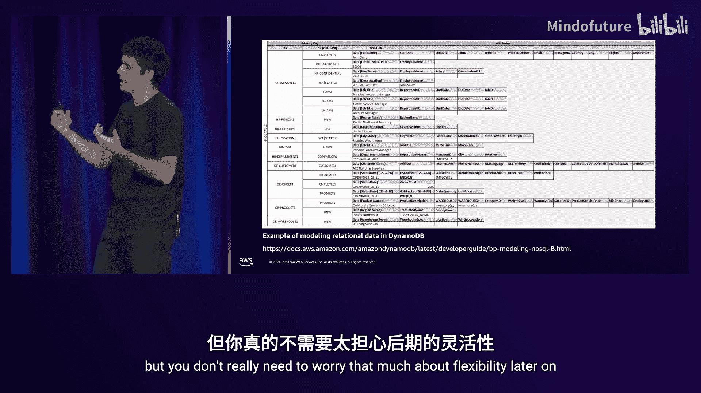

上一节我们深入了解了 DynamoDB 的分区和 API 机制，本节中我们来看看数据建模的基础知识和核心原则。

有了这些背景知识，我们对 DynamoDB 有了一些“机械共鸣”。关于 DynamoDB，有些知识你需要了解，有些则不必。例如，你不需要知道它使用 Paxos 还是 Raft 达成共识，事务中是两阶段提交还是三阶段提交，或者如何设置内存缓冲区配置。这些更像是趣闻或内部细节。

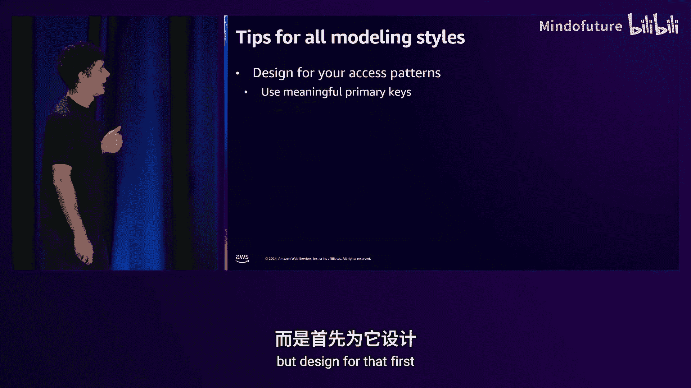

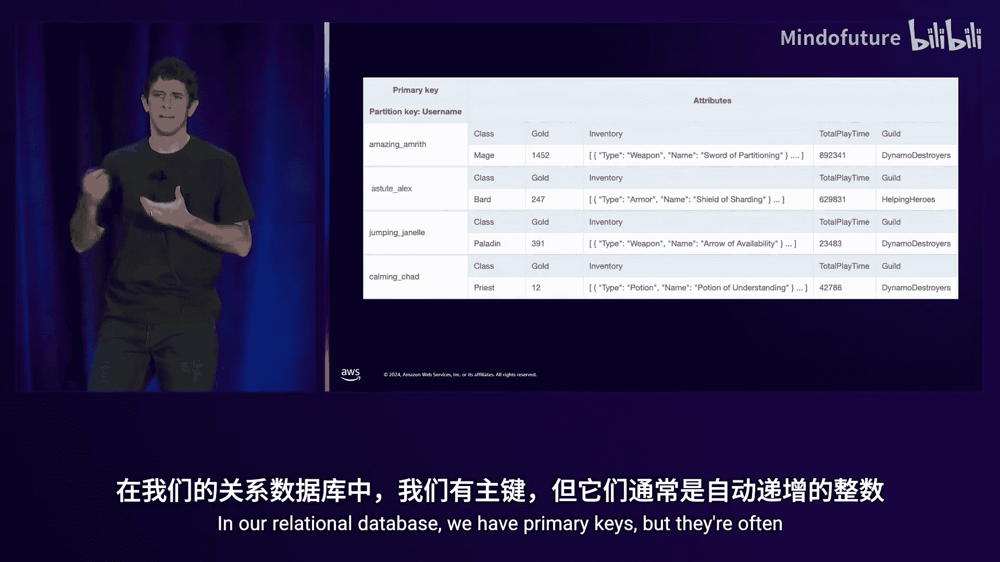

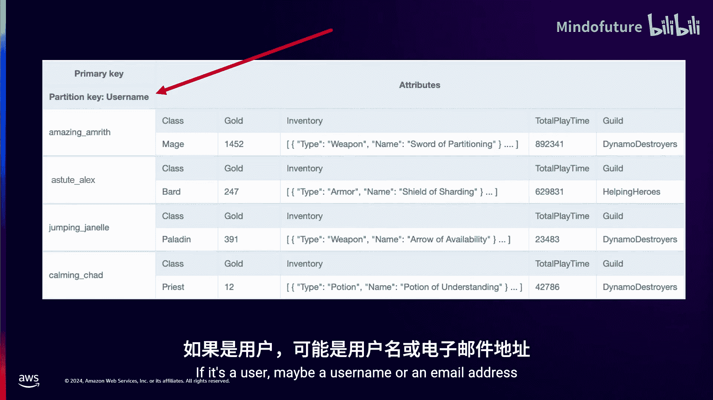

但有些概念你必须理解，它们会影响你的建模：
*   **DynamoDB 如何分区数据以及主键（尤其是分区键）的重要性**，这是实现任何规模下一致性能的关键。
*   **API 结构**：确保理解单项目操作、查询和扫描之间的区别。即使你使用 PartiQL（一种可以用 SQL 查询 DynamoDB 的工具），我也建议你先理解原生 API 结构，因为 DynamoDB 通过这些 API 暗示了你应该如何设计表。如果不理解就盲目使用 SQL，可能会写出低效的查询。
*   **二级索引**：用于支持额外的访问模式。
*   **DynamoDB 的计费方式**：这也会影响你的数据建模，我们稍后会讨论。

现在，让我们进入数据建模基础。部分原因是看到很多人把模型搞得太复杂或太花哨。我认为回归基础对 DynamoDB 是件好事。DynamoDB 为你提供了一些核心构建块，用好它们比追求花哨更重要。

DynamoDB 与其他数据库的一个关键区别是**没有查询规划器**。在 PostgreSQL、MySQL 甚至 MongoDB 中，你发出查询，查询规划器会基于统计信息找出最高效的执行方式。而 DynamoDB 基本上让你直接访问哈希映射或 B-树等核心数据结构，并依赖你来设计高效的访问路径。**你就是查询规划器**。

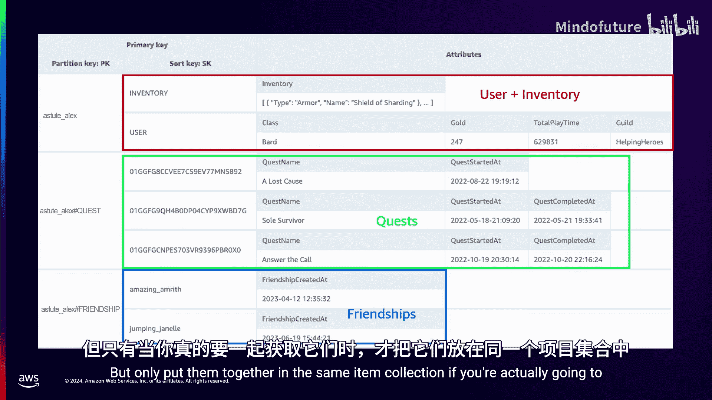

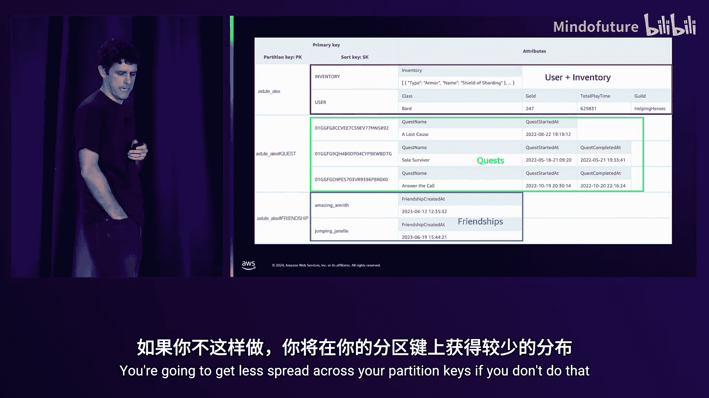

因此，我总是说的第一点是：**理解你的需求**。在设计数据模型之前，花时间了解你的领域：
*   **约束条件**：例如，确保用户名或邮箱地址唯一，或者 SaaS 应用中防止团队添加超过其计划的成员数量。
*   **数据分布**：例如，一对多关系中，相关项目的数量是有限的（比如10个）还是可能无限（成百上千甚至百万）？分区键的分布是否均匀？某些项目或项目集合是否会成为“热点”？
*   **项目大小**：这会影响计费，需要在建模时考虑。

了解这些之后，你应该**规划你的查询**，也就是明确你的访问模式。尤其是刚开始进行 DynamoDB 数据建模时，你应该明确列出你的模式。我建议创建一个文档，列出所有访问模式，包括写模式和读模式，并确保你知道如何处理每一个。

最后，你已经了解了 DynamoDB 的基础知识：主键、API、二级索引。你将使用这些工具来设计你的表。

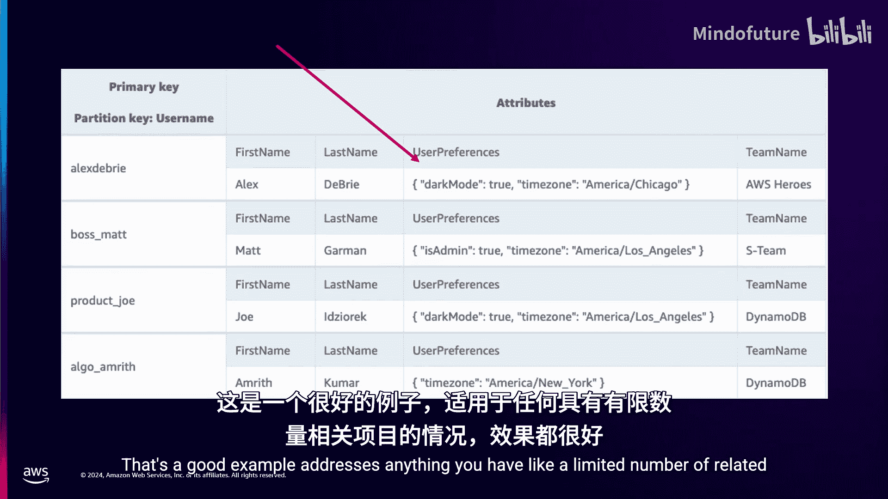

关键是：**为你的需求专门设计表**。你不希望像在关系型数据库中那样，先创建一个完全规范化的表结构，然后再考虑如何查询。你应该先考虑访问模式，然后专门为这些需求进行设计。

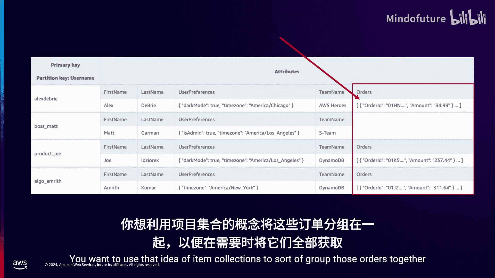

这里我想再次强调：**请使用基础方法，不要搞得太复杂**。很多需求都可以用核心功能解决：
*   单项目操作处理像“通过用户名获取用户”这样的读访问模式。
*   查询操作用于需要列出多个记录的情况，比如“获取公会的所有用户”或“获取用户的所有任务”。
*   为额外的基于读的模式撒上一些二级索引。
*   在合适的地方使用事务（事务允许你在单个请求中以原子方式操作多个记录）。

我之所以这么说，是因为很多人对“单表设计”感到困扰，把表设计得过于复杂。在 DynamoDB 中，存在**灵活性与效率之间的权衡**。你可以有一个高度优化的单表设计，但这会限制你未来的灵活性。你应该问自己：**你为什么使用 DynamoDB？** 回顾那些关键特性，什么对你最重要？
*   如果你是为了在常规规模下获得可预测的性能，一些 DynamoDB 的最大客户并没有使用很多高级功能。他们可能只有一个使用简单主键的表，主要进行键值操作，不使用查询或二级索引，但这对他们来说效果很好。
*   另一方面，如果你因为 DynamoDB 与 AppSync 和 GraphQL 集成得很好而使用它，那么 GraphQL 的核心就是灵活性。在这种情况下，你可能会使用比高度反规范化的单表设计更规范化的模型。
*   或者介于两者之间，也许你喜欢它是因为它在无服务器架构中非常易用。你想获得一些好处，但不需要在某些方面完全反规范化。

无论采用哪种建模风格，都应该遵循一些通用技巧。最重要的是：**为你的访问模式设计**。不要先规范化你的表，然后再考虑查询。首先要为访问模式设计。

以下是一些具体建议：
*   **使用有意义的主键**：在关系型数据库中，主键通常是自增整数。在 DynamoDB 中，你应该使用有意义的值，比如用户名或邮箱地址。
*   **不要无意义地重载你的项目集合**：项目集合指的是具有相同分区键的一组记录。我看到很多人把所有不同类型的记录（用户、库存、任务、好友关系）都放在同一个分区键下。除非你有一个访问模式需要同时获取所有这些记录，否则不要把它们放在一起。只把需要一起获取的记录放在同一个项目集合中。否则，不仅查询编写更困难，分区键的分布也会变差。
*   **尽早考虑写操作**：如果你有需要维护的条件（如唯一性要求），这必须通过主键进行。提前考虑这些条件比后来添加写模式要容易得多。理想情况下，你应该设计模型，使得带有条件的写操作可以直接通过条件表达式完成，而不需要先从二级索引读取、计算，然后再写回。
*   **扁平化你的层次结构**：如果你来自关系型世界，习惯于高度规范化的模型。在 DynamoDB 中，你应该考虑反规范化。

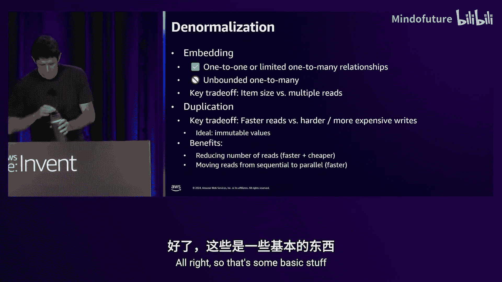

关于反规范化，主要有两种方式：
1.  **嵌入**：适用于一对一或有限的一对多关系。例如，用户偏好设置（一个半结构化的数据包）可以嵌入到用户记录中，因为每次获取用户时都需要这些偏好，且不需要单独操作它们。地址等具有有限数量相关项的数据也适用。但不要嵌入无界的一对多关系（例如，将所有订单嵌入到用户记录中），这会导致项目大小膨胀，可能触及 DynamoDB 的项目大小限制，并且每次读写都会涉及整个大项目，操作单个订单也变得困难。对于无界一对多关系，应该使用查询操作和项目集合。
2.  **复制**：更常见的反规范化形式。关键权衡是：**更快的读取 vs 更困难或更昂贵的写入**。通常，特别是对于分层数据，将一些父数据复制到子项上是合理的，这样你可以基于父属性搜索或直接显示它们。理想情况是复制不可变的值，这样就不需要维护。例如，GitHub 用户名或组织名称虽然可以更改，但更改操作是批处理的，并且可能涉及更新所有复制的数据。

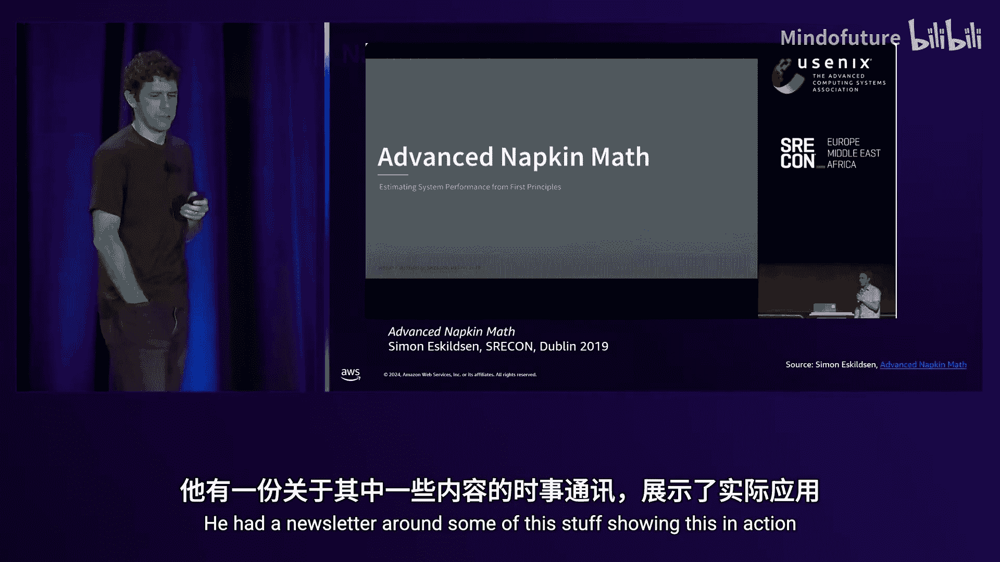

复制的优点包括：减少读取次数（无需遍历树形结构）、将顺序读取变为并行读取（如果复制了父标识，可以并行发起查询请求，而不是先获取父项ID再发起后续请求）。

## 4：成本估算（餐巾纸数学）与优化

上一节我们探讨了数据建模的基础原则，本节中我们来看看一个高级但实用的主题：如何为 DynamoDB 应用进行成本估算和性能规划，即所谓的“餐巾纸数学”。

今年我非常喜欢的一个话题是思考 DynamoDB 中的数学，尤其是“餐巾纸数学”。我今年第一次看到 Simon Eklund（一位非常聪明的人，现在在开发 TurboPuffer）五年前的一个演讲。他谈到，如果你是高级工程师或架构师，设计系统时应该能够进行一些餐巾纸数学计算，以理解性能（延迟或吞吐量）或系统成本，判断什么是合理的，而不必构建整个系统才能搞清楚。我认为这种方法非常有用。

DynamoDB 非常适合进行餐巾纸数学计算。我想简单介绍一下这是什么样子，稍后在讨论流的部分会看到一些实例。他谈到要知道某些关于性能的“基准速率”。对于 DynamoDB，由于它在任何规模下提供一致性能，你应该记住一些基准速率：
*   **客户端操作时间**：读取一个合理大小的项目大约需要 5 毫秒；写操作可能需要最多 20 毫秒；事务由于需要协调和两阶段提交，可能需要 100 毫秒或更多。好处是，这在任何规模下都是一致的。
*   **明确的限制**：DynamoDB 的限制非常清晰。例如，查询响应最多返回 1 MB 数据。这有助于实现一致性能，因为操作不是无界的。如果你需要处理 5 MB 数据，你就需要发起 5 个顺序请求（分页）。了解这一点有助于估算。另外，单个 DynamoDB 分区每秒可以处理 1000 个写单元和 3000 个读单元。你需要考虑你的负载是否适合，或者是否需要缓存、写缓冲或写分片等技术。

了解这些性能基准速率很有用。同样，了解计费基准速率对数据建模也很有帮助。

**DynamoDB 计费背景**：传统数据库中，你通常为包含 CPU、内存的实例付费，IO 可能单独计费。基本上，无论操作多少，你都在为这“一篮子”资源付费。这使得进行 Simon 所说的那种估算变得困难。

而在 DynamoDB 中，你直接为操作付费。你根据读容量单元（RCU）和写容量单元（WCU）付费，这些单元对应你对 DynamoDB 表的实际操作。
*   一个 **RCU** 允许你读取最多 4 KB 数据。如果你不需要强一致性读取（大多数情况下不需要），你可以将其减半，即读取最多 4 KB 数据只消耗 0.5 个 RCU。
*   一个 **WCU** 允许你在请求中写入最多 1 KB 数据。

你也可以使用这些基准速率进行定价估算。DynamoDB 最近将按需计费价格降低了 50%，这很棒。新价格（以美东-1 区域为例）大约是：每百万 RCU 12.5 美分，每百万 WCU 67.5 美分，存储每 GB 每月 25 美分。请注意，这是区域特定的按需价格，是最贵的计费方式。如果你能实现高利用率，可以使用预置容量来降低成本，但按需计费在运维上更简单。

我认为，将这些性能和计费基准速率牢记在心对你非常有帮助。关于餐巾纸数学，有几点有趣的启示：

1.  **性能和计费是独立关注点**：在进行估算时，你不需要担心它们如何相互影响。在传统数据库中，随着并发查询、数据量或读取大小的增加，响应时间可能会像曲线一样在某一点因资源饱和而急剧上升。而在 DynamoDB 中，你仍然可能达到系统限制，但如果你超过了分区级别的限制，你会被限制（节流），但响应时间仍然保持稳定，你会收到一个错误让你稍后重试。处理长尾延迟或超时非常棘手，DynamoDB 的这种特性使得性能估算更容易，且与容量规划分开。
2.  **DynamoDB 的定价应该影响你构建应用的方式**：我认为 AWS 在教你如何最好地使用其服务方面做得很好，帮助你建立“机械共鸣”。DynamoDB 通过 API 结构告诉你如何获得良好性能，同时也通过计费方式向你展示什么是昂贵的，你应该优化什么。

我们有这些不同的基准速率，尤其是 RCU 和 WCU，但容量单元上还有各种**乘数**。一个请求可能消耗多于一个 RCU 或 WCU：
*   **项目大小**：写入一个 10 KB 的项目将消耗 10 个 WCU。
*   **查询响应大小**：读取完整 1 MB 的查询结果将消耗 250 个 RCU。
*   **二级索引**：写入主表时，也需要写入每个二级索引，你需要为这些写付费。
*   **事务**：涉及多个记录，你需要为每个记录的操作付费，并且还有一个乘数成本来协调两阶段提交。
*   **全局表**：写入多个区域，你需要为所有写入付费。

我喜欢这一切的原因是：DynamoDB 向你指示了什么是昂贵的，以及你应该如何优化。所有这些都在告诉你：更大的项目需要更多资源，二级索引需要更多写入，事务需要协调等等。这非常有用，即使你以后使用其他数据库系统，你也会对“哪些操作成本高”有更敏锐的直觉。

因此，我总是说：**注意你的乘数**，并在数据建模时考虑这一点。

具体做法：
*   **仔细审查项目大小**：删除未使用的属性，不要随意添加所有属性。压缩大值，或者对于非常大的“blob”类型数据，考虑存放在 S3 中，避免每次操作都读写它们。
*   **限制二级索引**：认真思考是否真的需要二级索引。写操作的成本可能是读操作的 20 倍（因为 WCU 价格是 RCU 的 5 倍，且 WCU 只覆盖 1 KB 而 RCU 覆盖 4 KB）。有时，与其写入二级索引，不如过度读取并支付读取成本，这可能更便宜。你还可以使用投影来限制索引中项目的大小，只投影需要的属性。这不仅能减小项目大小，降低读写成本，而且如果你在主表上进行的写操作更改了未投影到索引的属性，DynamoDB 会直接跳过该索引的写入，从而节省成本。
*   **限制事务使用**：事务非常有用，但应用于**低频率、高价值**的操作。低频率是因为你不希望有大量争用（事务使用两阶段提交，争用可能导致事务冲突错误）。同时，事务成本更高（约为实际操作成本的两倍），所以要确保值得。高价值操作才值得支付这个成本（包括账单成本和延迟成本）。
*   **全局表**：非常酷，本周还发布了强一致性全局表。但请确保你真的需要它，并理解你将如何使用它（故障转移还是多活）。它会显著增加成本（基本上会使写成本翻倍）。
*   **在大多数情况下，可能不需要强一致性读取**：最终一致性读取通常没问题，这可以为你节省 50% 的读取成本。

这就是餐巾纸数学。再次强调，在建模时使用这些思路，你就是查询规划师，这应该影响你构建应用程序的方式。

## 5：DynamoDB 流的实践应用

上一节我们学习了如何估算成本和优化设计，本节中我们来看一个强大的 DynamoDB 功能：DynamoDB 流，及其在实际中的应用。

现在让我们进入一些实用内容，谈谈 DynamoDB 流。这是我以前没有深入覆盖的内容，但也是我最喜欢的 DynamoDB 特性之一。当我使用或查看其他数据库时，我常常怀念 DynamoDB 流和变更数据捕获的便捷性。

**DynamoDB 流简介**：你可以在表上启用 DynamoDB 流（默认关闭）。启用后，表中每次发生写操作（插入、更新、删除），该变更的记录都会被放入 DynamoDB 流中。然后，你可以使用 Lambda 函数、Kinesis 客户端库或自己的 API 来处理这些记录，基本上就是处理一批批的变更记录。变更数据捕获越来越流行，我喜欢 DynamoDB 的实现方式。

我想讨论 DynamoDB 流的三个用例，其中两个更偏向架构层面，一个更偏向数据建模层面。

**架构用例一：解决双写问题**。这在事件驱动应用中经常出现。双写问题是指：你的应用程序需要写入 DynamoDB（例如，一个订单进来，你将其写入 DynamoDB），但同时你还想做其他事情（例如，向 SQS 发送消息或向 EventBridge 发布事件）。问题在于，这两次写入不是事务性的。如果成功写入 DynamoDB 但发布到 EventBridge 失败，尤其是当你依赖后者时，这个订单就可能被“孤立”。人们尝试重试或回滚，但这很难做到。

真正处理双写的两种方法是：事务性发件箱模式，或使用变更数据捕获。流允许你实现变更数据捕获。你在表上启用 DynamoDB 流，当你插入订单记录到表中时，该记录会被放入流中，你用 Lambda 处理它并推送到 EventBridge。这样，即使 EventBridge 宕机或你的计算逻辑有错误，数据仍然是持久的，你可以重试和恢复，不会导致两个系统处于不一致状态。

关于处理 DynamoDB 流的一些高级技巧：
*   **在推送到其他地方之前清理你的事件**：如果你将事件推送到 EventBridge，可能有多方消费者。你不希望它们直接从 DynamoDB 流消费，原因有二：一是 DynamoDB 流有消费者限制（最多两个），二是来自 DynamoDB 流的事件格式比较原始，你应该将其转换为对你的应用程序更有意义的领域事件。
*   **确保理解流处理机制和故障模式**：流处理与传统队列处理不同。流是按顺序处理的，如果有一条记录无法处理，你可能会卡住，除非你将其转移到别处或跳过。幸运的是，随着 Kafka 和 Kinesis 的普及，人们开始更好地理解这些机制。适用于 Kafka 和 Kinesis 的技巧也适用于此。
*   **仔细考虑流实现**：在大多数情况下，我推荐使用原生的 DynamoDB 流实现。它是完全托管的，你无需为流本身付费，只为其上的读取付费（如果使用 Lambda，甚至不支付读取费用）。它提供了很好的顺序性和重复性保证。主要缺点是最大只有两个消费者（全局表或零 ETL 集成可能会占用一个消费者）。如果你需要更多消费者，可以切换到原生的 Amazon Kinesis 数据流，它允许 5 到 20 个消费者，但需要更多管理，成本更高，顺序性和重复性保证也稍弱。因此需要权衡，在大多数情况下，DynamoDB 流就足够了，除非你觉得需要多个消费者。

**架构用例二：导出到二级系统**。这又回到了“机械共鸣”的概念，思考 DynamoDB 擅长什么、不擅长什么。DynamoDB 擅长经典的 OLTP 工作负载：小型读写、一定的事务性、条件写入、低延迟、高可用性，即核心应用类的东西。

DynamoDB 不擅长的是：任何需要灵活性的、未知的查询，例如聚合和分析、复杂过滤或全文搜索。对于这些，你通常需要用一个二级系统来增强 DynamoDB，比如用于基本分析的 S3 和 Athena 或 Redshift，用于更实时、复杂过滤的 OpenSearch。

DynamoDB 流是将两者粘合在一起的纽带。每当应用程序中有更新时，你可以将其复制到二级系统。

将数据同步到外部系统有一些复杂性：
1.  **初始导出**：流只包含最近一段时间（如24小时）的数据，如果你之前没启用流，则没有数据。如何将现有数据导出到外部系统？DynamoDB 在这方面做得很好，它提供了将全部数据导出到 S3 的选项。这样，你可以通过批量导出获取快照，再通过流获取快照后的连续变更，两者结合可以很好地保持同步。
2.  **OLTP 与 OLAP 的阻抗不匹配**：OLTP 系统有大量细小的写入、更新和删除，而 OLAP 系统（如 Snowflake 或 Redshift）希望进行大批量、仅追加的摄入。管理这种数据管道可能复杂。如果有托管选项（如 AWS 正在构建的零 ETL 集成到 OpenSearch 和 Redshift），尽量使用它们。管理数据管道本身没有太多荣耀，当它正常运行时没人高兴，出问题时大家都不高兴。

**数据建模用例三：触发器或存储过程**。当我将 DynamoDB 流比作触发器和存储过程时，会收到一些奇怪的目光，因为我们现在不像以前那样频繁使用它们了。存储过程通常用不同的语言（如 PL/pgSQL 或 PL/SQL）编写，需要单独部署，缺乏可见性和测试。而使用 DynamoDB 流则没有这些问题，你可以用 Lambda 或 Kinesis 客户端库处理，使用相同的应用代码和业务逻辑，拥有正常的测试流程。因此，这是一种非常好的模式。

我想通过一个数据建模用例来讲解：**数组索引**。有时你可能有一个数组（例如，反规范化后嵌入到项目中的数组），并且希望能够基于数组中的项目进行查询。但 DynamoDB 本身不支持数组索引。例如，一个类似 GitHub 的问题跟踪系统：团队有项目，项目有问题，问题有不同的标签（自由格式，如发布版本、问题类型、影响的组件）。我们想要允许基于标签的搜索，例如“给我所有标记为 `feature`、`bug` 和 `sprint-23` 的问题”。

假设我们的数据中有一个 `tags` 属性，它是一个标签数组。由于没有索引，如何实现具有一致性能的搜索？首先可以问：能否暴力扫描？因为我总是在特定项目内搜索，也许我可以获取项目内的所有记录然后暴力过滤？让我们做些餐巾纸数学：
*   假设问题项目大小为 1-5 KB。
*   一个项目中的问题数量：中位数项目可能有 1000 个问题，但 P95（95分位）的大型项目可能有 10,000 个或更多。
*   中位数情况下，需要获取约 2 MB 数据（2个顺序请求），耗时 40-100 毫秒，消耗 500 RCU。
*   P95 情况下，可能需要获取 50 MB 数据（50个顺序请求），消耗 12,500 RCU。这很可能不可行。

因此，我们可以使用 DynamoDB 流来重新索引数据。当问题被创建、更新或删除时，我们通过流处理，在一个不同的表（或使用不同的项目）中建立索引。这本质上是一个**倒排索引**。我们根据“项目#标签”作为分区键进行分组，排序键可以是创建时间，然后指向具体的问题 ID。

现在，如果我想查找具有特定标签的问题，我需要获取所有相关标签的项目集合（例如，`feature`、`bug`、`sprint-23` 各一个集合），并行执行这三个查询，然后在客户端对结果集取交集，找出同时具有所有三个标签的问题。

再进行一次餐巾纸数学：
*   假设每次查询通常有 3 个标签。
*   索引项目很小，可能只有 200 字节。
*   每个唯一标签下的问题数量：中位数可能是 10 个，但某些大特性标签下可能有 200 或 500 个问题。
*   中位数情况下，需要读取 2 KB 数据（三个请求，每个约 0.67 KB），消耗约 3 RCU，便宜得多。
*   P95 情况下，大约消耗 30 RCU，仍然可行。

我们还可以做得更好。我们已经在数据中应用了反规范化：标签作为数组嵌入在问题项目中（因为获取问题时需要显示所有标签）。同时，我们也在复制数据（创建那些“问题-标签”索引项目）。问题是：**我们能否复制更多数据？** 也许我们可以将整个问题项目复制到“按标签查询的问题”表中。这样，当我执行查询时，我可能只需要查询一个标签集合（例如 `feature`），然后遍历每个项目，过滤掉那些不包含所有所需标签的问题。这样我就不需要查询所有标签集合，并且可以直接返回完整的问题项目，无需后续读取来填充完整记录。

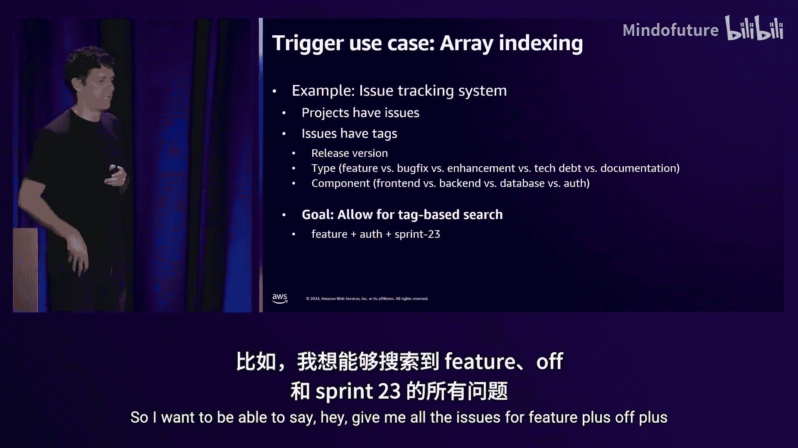

这里的权衡是：**更多的复制**。好处是读取次数更少、延迟更低。但代价是写入成本更高，维护更复杂（问题或标签变更时需要影响更多项目）。

这只是使用流实现“触发器”的一个例子。其他用例包括：维护聚合、跟踪版本历史、进行分层汇总等。DynamoDB 流是我最喜欢 DynamoDB 的特性之一，它实现了许多很酷的用例。

## 6：总结与最佳实践

上一节我们探讨了 DynamoDB 流的强大应用，本节中我们将对整个课程进行总结，并提炼出让 DynamoDB 发挥最大效用的最佳实践。

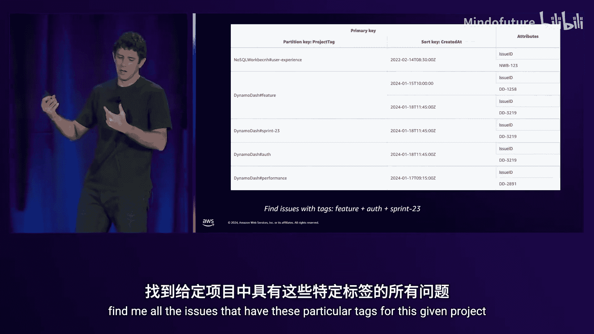

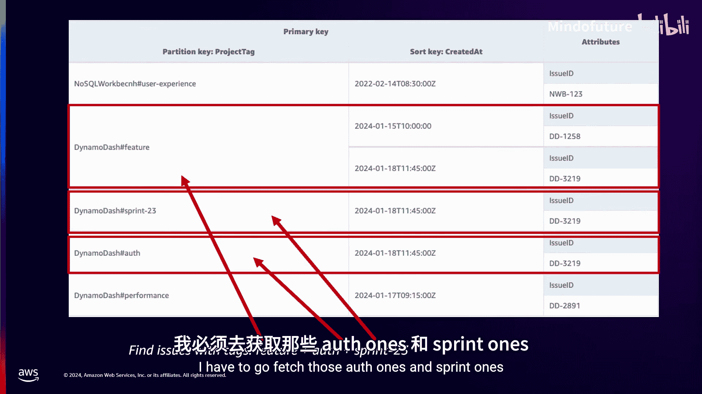

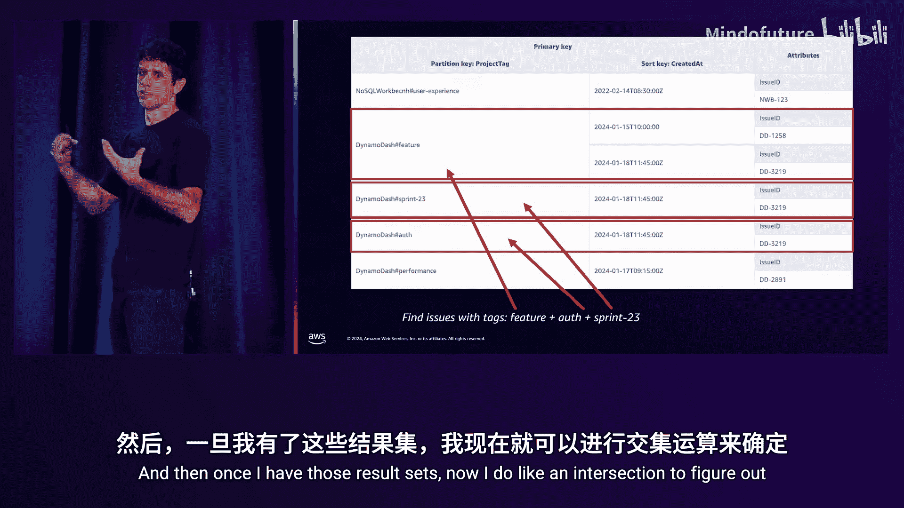

时间快到了，最后我想总结一下：**如何让 DynamoDB 发挥最大效用？** DynamoDB 有其独特的能力，当我设计应用时，如何思考这些问题？

我再次强调：**首先使用基础方法**。使用那些简单的单项目操作、查询操作等。遵循适用于所有数据建模风格的技巧，先思考这些。这应该能解决你大部分（比如90%）的数据模型需求。

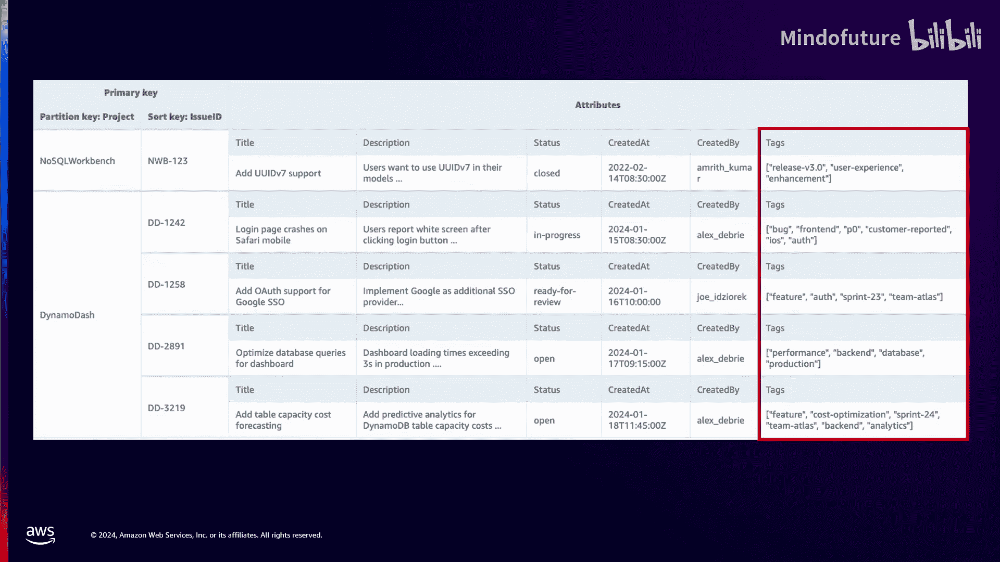

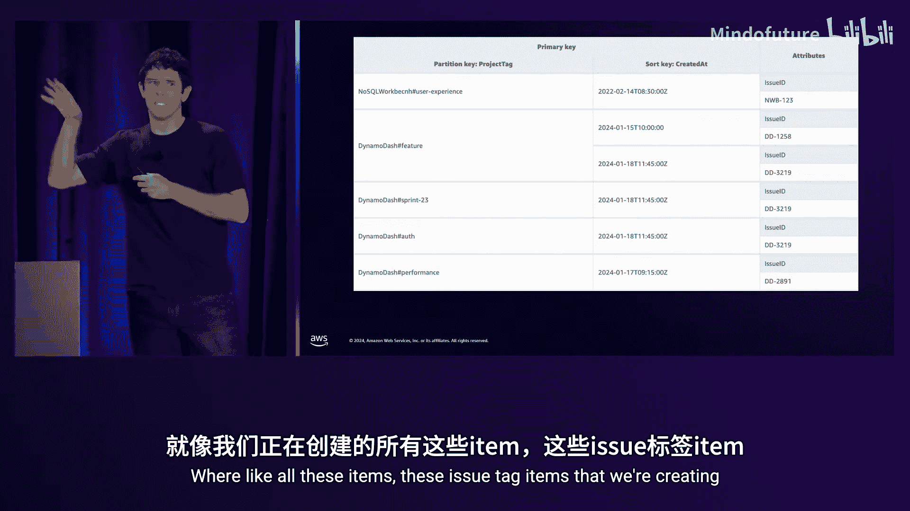

当你遇到更复杂的情况，例如 DynamoDB 本身不支持的功能（如数组索引）时，DynamoDB 确实提供了一些非常好的构建块，让你可以自己构建和维护，充当自己的查询规划师。我们可以用流来实现数组索引或其他类型的汇总。同样，你可以使用餐巾纸数学来评估是否可行、权衡利弊。你也可以思考反规范化及其权衡。

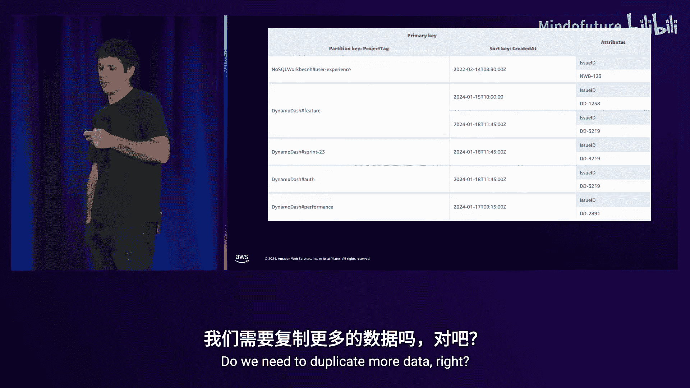

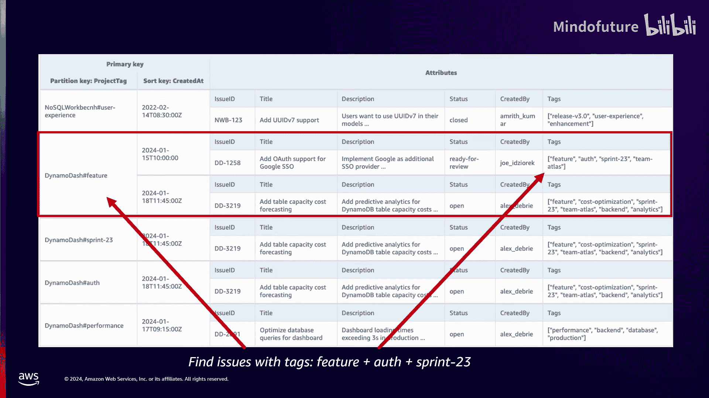

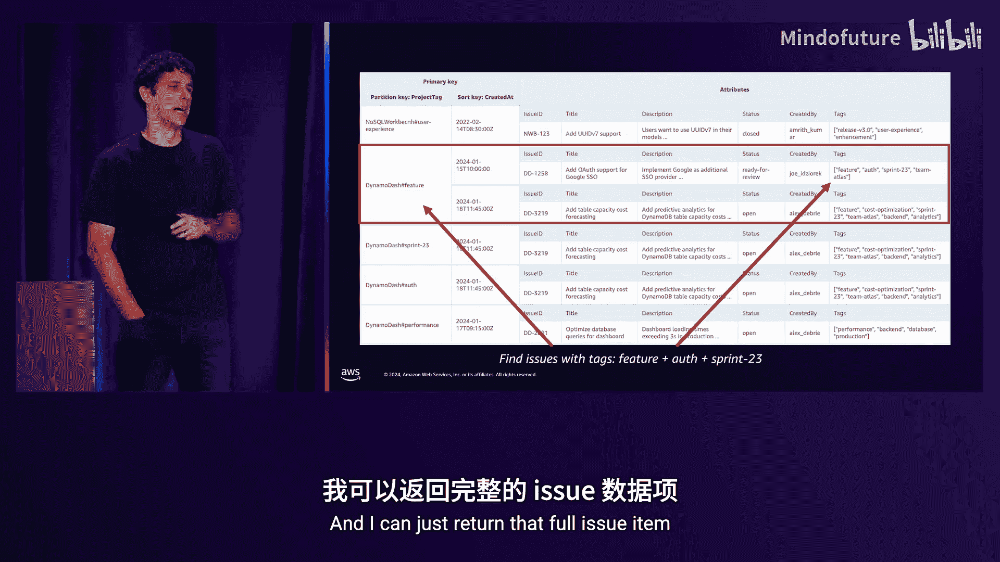

很多时候你会发现：基础方法很有效，我可以用构建块构建其他功能，但我无法做到所有我想做的事情。有些需求我真的需要转向外部系统。这时，你可以在必要时使用二级系统（如 OpenSearch、Redshift、Snowflake 等）。你可以使用 DynamoDB 的初始导出功能加上 DynamoDB 流将数据同步出去。

但我想说的最后一点是：**不要过早地跳到使用外部系统**。分区和排序出人意料地强大，可以用于许多场景。我们看到了复合主键如何根据分区键分组数据并在组内排序，这可以处理很多事情。关键是确保你使用**高基数**的值进行分组（如 UUID、用户邮箱、设备 ID），并且只把需要一起访问的记录放在同一个项目集合中。

如果你在同一项目集合中有多个项目，请按有意义的内容排序。思考：如果一次无法检索完所有项目，或者我想过滤，我希望它们如何排序？使用时间戳、版本 ID 或带有时间戳的唯一标识符等，这些都非常有用。分区和排序可以以非常有趣的方式使用。

例如，地理位置查找可以使用地理哈希，分区键是较短的哈希，排序键是较长的哈希，从而大致按地理位置分布项目并排序以找到更近的项目。或者，Jason Hunter 有一个关于 DynamoDB 设计模式的精彩演讲，其中提到了“索引查找”模式。如果你了解你的领域，你可以通过建模来处理很多事情。

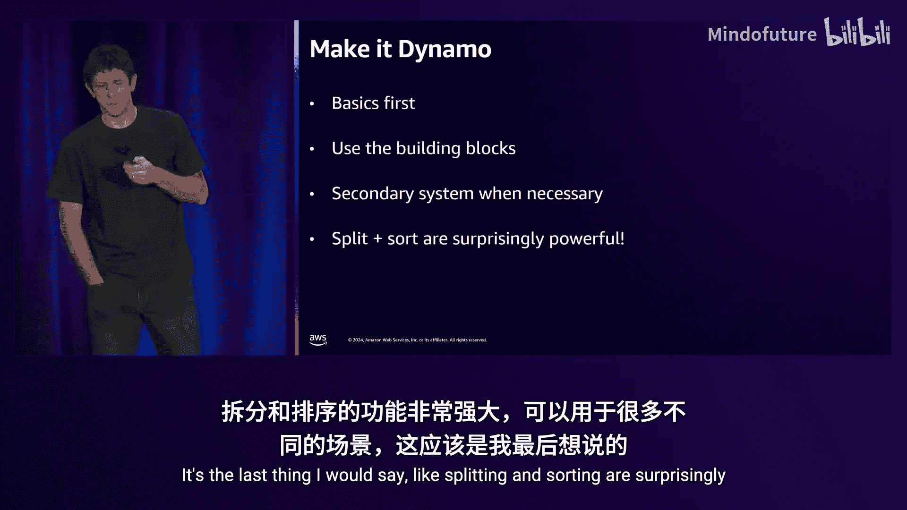

总之，分区和排序出人意料地强大。我非常喜欢 DynamoDB，我认为它能做很多事情。当然，数据库选择很多，有很多优秀的选项。但 DynamoDB 非常强大，并能提供一些独特的特性。

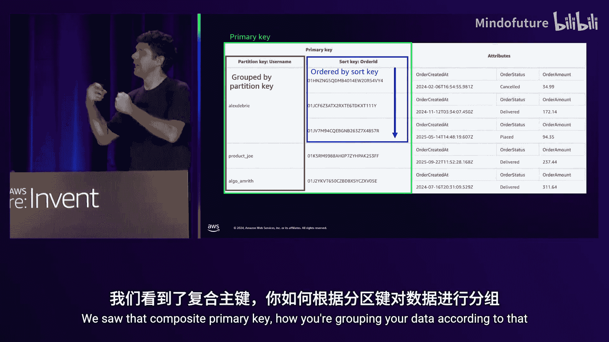

本节课中我们一起学习了：
1.  DynamoDB 的核心机制和“机械共鸣”的重要性。
2.  数据分区、主键和 API 设计如何实现任何规模下的一致性能。
3.  数据建模的基础原则，包括为访问模式设计、反规范化策略。
4.  如何使用“餐巾纸数学”进行成本估算和性能规划，并据此优化设计。
5.  DynamoDB 流的强大功能及其在解决双写问题、数据同步和实现复杂查询模式中的应用。

希望本教程能帮助你更好地理解和使用 Amazon DynamoDB。感谢阅读！