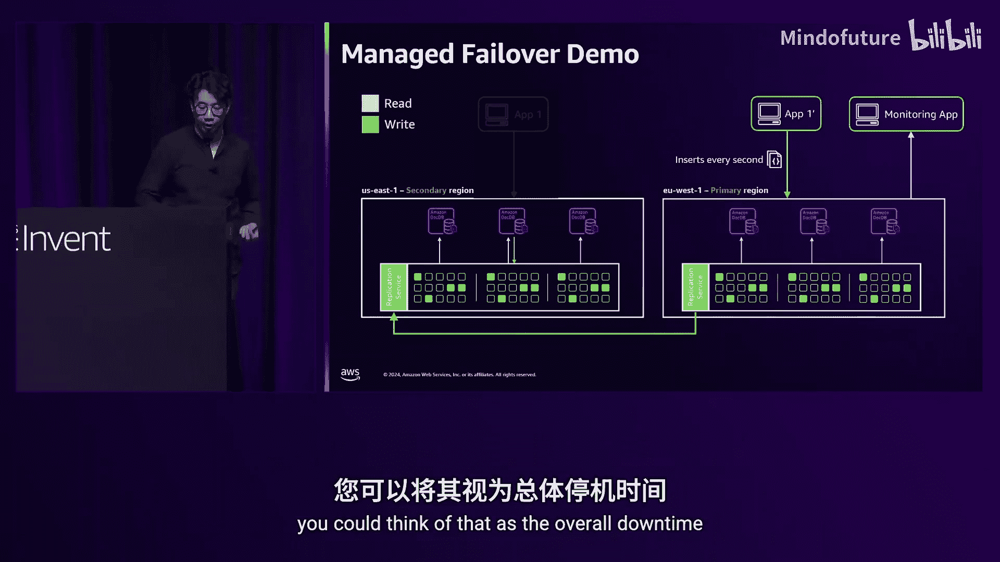
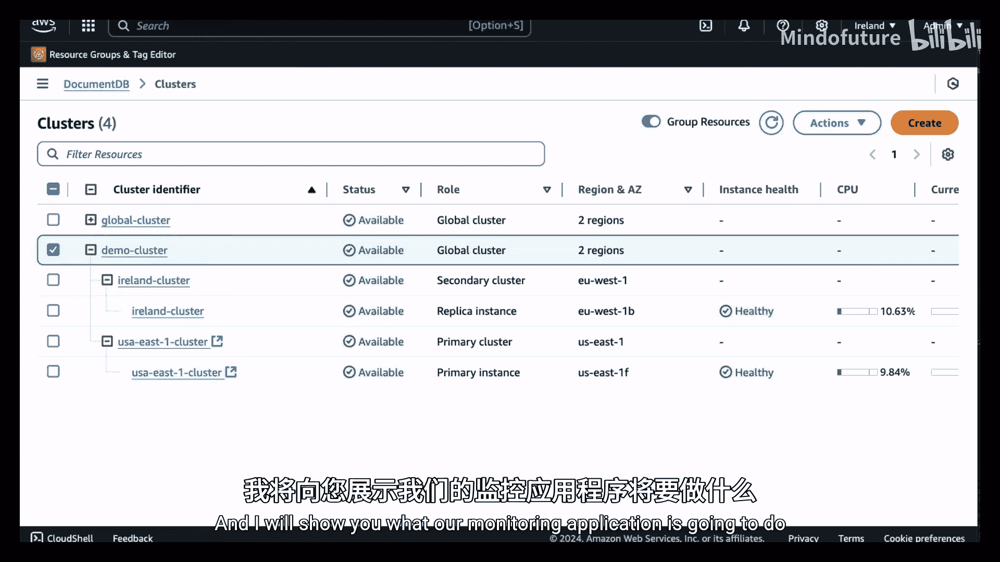
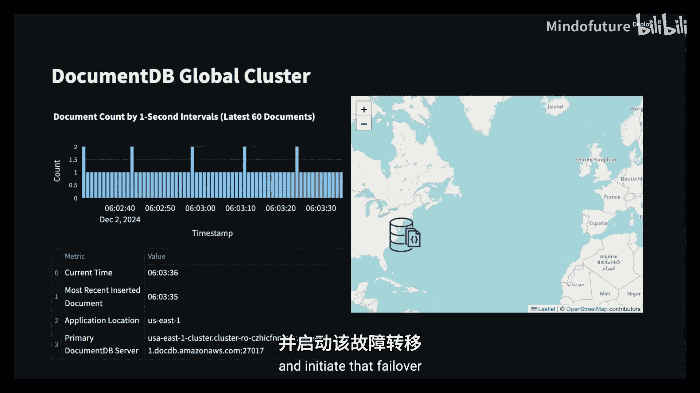
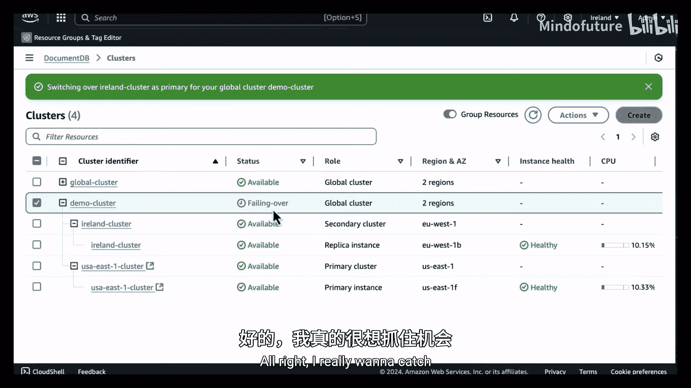
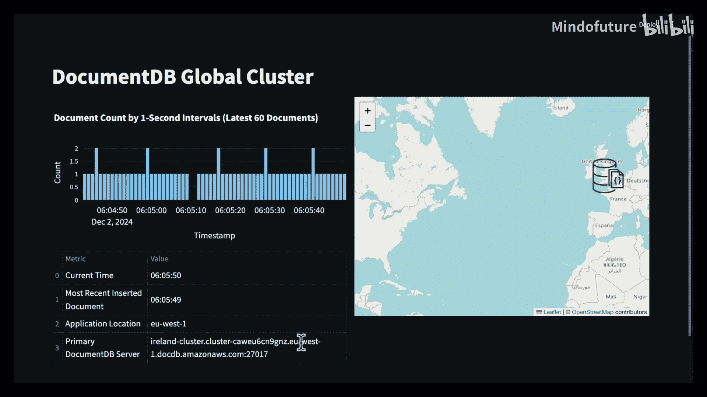
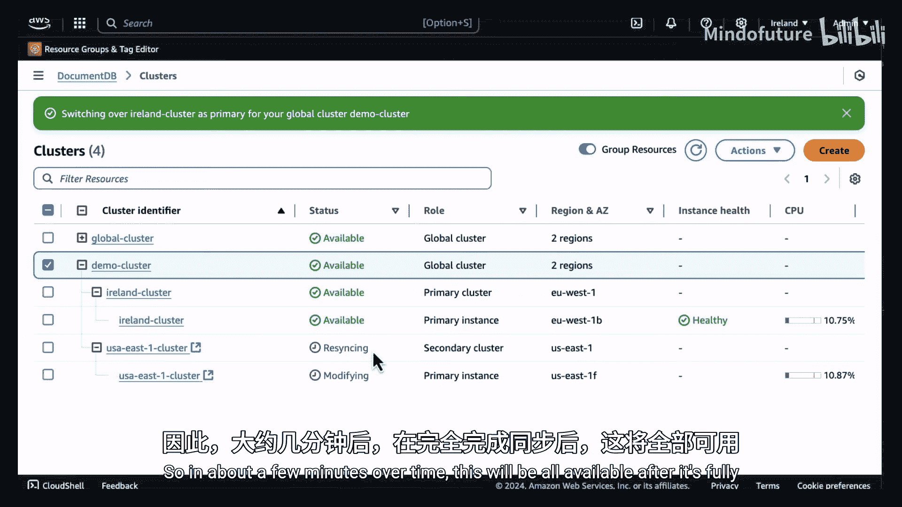
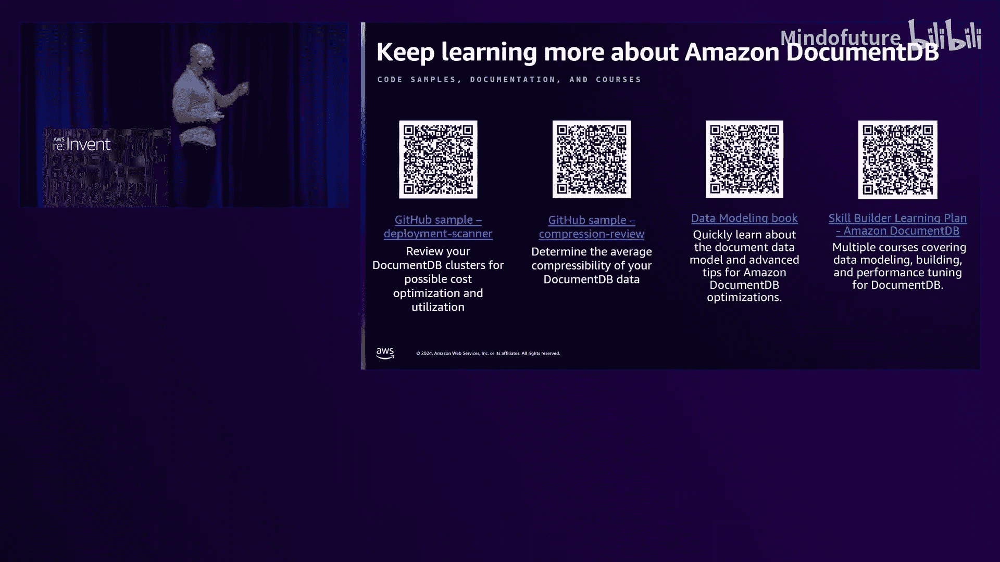
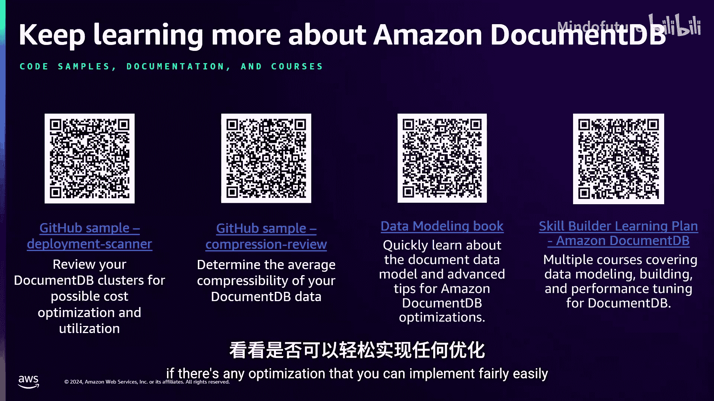
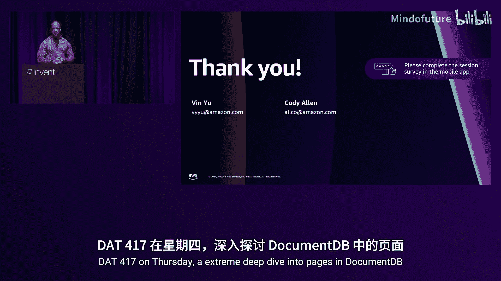

# 022：DAT324

## 概述

在本节课中，我们将深入探讨 Amazon DocumentDB 的架构、核心创新以及 2024 年发布的一系列重要新功能。我们将重点关注其如何通过独特的架构设计、性能优化、成本控制以及高可用性特性，帮助企业客户高效运行文档数据库工作负载。

---

## 章节 1：架构回顾与核心理念

上一节我们介绍了课程概述，本节中我们来看看 Amazon DocumentDB 的基础架构。

Amazon DocumentDB 自 2019 年 1 月发布以来，已成为 AWS 上增长最快的数据库服务之一。其魔力核心在于其专为云构建的架构。

其基础是计算层与存储层的分离。计算层位于顶部，存储层位于底部。由于采用了分布式存储卷，服务无需依赖本地存储即可实现高可用性和可靠性。

传统数据库引擎为了确保数据持久性，必须在每个实例上写入事务，即写入每个实例的本地存储。而在 DocumentDB 中，仅主实例会将预写日志发送到存储层。这意味着无需额外的实例间通信。

由于持久性由存储层处理，因此即使 DocumentDB 集群只有一个实例，您仍然可以在存储层获得持久性和高可用性，无需做出任何妥协或牺牲。

与复制、日志处理、备份等相关的所有任务都卸载到了存储层。此外，一个常被忽视的点是，集群中的每个副本实例都管理着自己的缓冲区缓存。实例之间不会共享或“弄脏”彼此的缓冲区缓存。

这意味着，当更新一个文档时，更新会发送到主实例，主实例将其发送到分布式存储层。然后，主实例会向副本发送预写日志，告知其更新了该文档。副本收到后，如果其缓存中有该文档，则更新缓存；如果没有，则忽略。我们保持这些缓存彼此独立。

DocumentDB 所做的一切都是专为云构建的，旨在帮助企业客户运行其文档数据库工作负载。我们拥有广泛的客户群体，包括数字原生企业、大型金融机构、游戏公司等。

---

## 章节 2：2024 年核心创新概览

上一节我们回顾了 DocumentDB 的基础架构，本节中我们来看看 2024 年发布的一系列重要创新。

服务团队非常重视与客户的合作并获取反馈，今年的许多创新正是在与客户的紧密合作中诞生的。

以下是 2024 年主要新功能的概览。我们无法逐一详述每个功能，但您可以在课后通过文档搜索了解更多细节。

我们在多个方面进行了投资：
*   **性能与扩展**：例如文档压缩、提高连接数限制。
*   **成本优化**：例如 IO 优化实例，提供可预测的 IO 定价。
*   **AI/ML 与高可用性**：例如全局集群、托管切换和托管故障转移。

在接下来的内容中，我们将深入探讨其中几个标有星号的核心功能。

---

## 章节 3：IAM 身份验证与向量搜索

以下是两个重要的新功能：IAM 身份验证和向量搜索。

**IAM 身份验证**
许多客户一直要求此功能，因为他们希望集中管理包括 DocumentDB 在内的所有 AWS 资源的身份验证机制。

使用 IAM 身份验证时，客户端会先向 AWS IAM（特别是安全令牌服务）请求令牌。然后，客户端使用该令牌向 DocumentDB 进行身份验证。

需要注意的是，身份是在 DocumentDB 集群内创建的，但由外部数据库管理。您必须在启用 IAM 身份验证前完成此配置。IAM 身份验证可以与集群中现有的基于角色的访问控制和用户结合使用。

作为管理员，您还可以通过 CloudWatch 监控 IAM 身份验证请求，从而对 IAM 请求拥有完全的控制和可见性。

**向量搜索**
向量搜索是今年的重点领域，我们发布了 HNSW 索引支持。我们将在 2025 年及以后继续投资此领域。

---

## 章节 4：全局集群与高可用性增强

上一节我们介绍了身份验证和 AI 功能，本节中我们来看看高可用性方面的重大改进：全局集群的托管故障转移和托管切换。

如果您不熟悉全局集群，这里快速回顾一下：全局集群允许您将集群扩展到多个 AWS 区域，主要带来两大好处：
1.  **灾难恢复**：在另一个区域拥有数据副本，灾难发生时可以故障转移到该区域。
2.  **数据本地性**：在另一个区域拥有数据副本，可以低延迟查询该数据。

设置全局集群非常简单。例如，如果您在弗吉尼亚北部有一个集群，只需通过 AWS 控制台或 CLI 添加另一个区域即可。复制服务在存储层进行数据复制，这释放了实例的计算资源。

每个区域的实例数量可以不同，您甚至可以设置“无头次要区域”（零个实例）以节省成本。但请注意，如果用于故障转移场景，则需要提前启动实例，这大约需要 7-10 分钟。

**托管切换**
托管切换的主要目标是在**无数据丢失**的情况下将次要区域提升为主区域。您可以在受控场景中使用它，例如：
*   执行区域维护。
*   支持跨多个时区的“跟随太阳”应用程序。
*   作为故障转移后的零数据丢失回切方法。

切换过程可能需要几分钟。当您启动切换时，全局集群的写入操作首先会被禁用，以确保数据从主区域完全同步到次要区域。一旦数据同步完成，次要区域将被提升为新的主区域，然后恢复写入。

**托管故障转移**
托管故障转移的主要目标是在灾难场景下**最大限度地减少集群停机时间**，例如某个区域发生完全服务中断时。

与切换类似，故障转移也会将次要区域提升为主区域。关键区别在于，为了最小化停机时间，**任何正在进行的未同步事务可能会丢失**。故障转移后，当原主区域恢复在线时，DocumentDB 服务会自动将其重新加入全局集群并进行数据同步，无需手动清理。

**应用连接管理**
无论是切换还是故障转移，您的应用程序可能需要连接到不同的集群端点。一个常见的解决方案是使用 Amazon Route 53 托管区域。您可以让应用程序始终指向一个自定义域名（例如 `myglobaldb.example.com`），然后只需在 Route 53 中更新该域名指向的集群端点，而无需更改应用程序代码。

---

## 章节 5：性能与成本优化深度解析

上一节我们探讨了高可用性，本节中我们来看看如何优化 DocumentDB 的性能与成本。

JSON 和文档数据模型的优势在于其灵活性。传统上，使用关系数据库时，我们需要先设计表结构、键关系，然后才能开发应用。而文档数据库允许我们从应用开始，让应用定义数据库结构，从而更快地改善最终用户体验。

随着应用增长、用户增加、功能演进，您的文档模型会变化，文档大小和数量也会增长。DocumentDB 的架构旨在帮助您按需扩展：存储层自动增长，计算层可以通过增加实例规格或数量来扩展。您还可以利用 CloudWatch 等工具实现自动伸缩。

然而，在能够扩展的同时，我们也需要关注效率和成本。

**优化文档键名**
JSON 是人类可读的，但应用并不需要。文档中的每个字符都会占用磁盘和索引空间，影响工作集和缓存效率。

例如，将文档键名从 `"customerName"` 改为 `"cN"`，可以从约 457 字节节省到约 385 字节，单个文档节省约 15%。当文档数量达到 50 亿时，这可能意味着节省超过 300 GB 的空间；达到 200 亿时，可能节省超过 1 TB。许多客户发现，其文档大小的主要部分是键名而非值。在应用层创建抽象层来进行转换是常见的优化手段。

**文档压缩**
DocumentDB 使用 8 KB 的页来存储文档。理想情况下，多个小文档可以存放在一个页中，减少 IO 操作。但如果文档大小超过 4 KB，或者非常大（例如 7 MB），就会占用多个页，导致更多的 IO 和成本。

我们在 2023 年引入了文档压缩来帮助解决此问题。例如，一个 7 MB 的文档，如果压缩比为 2:1，IO 就能减少 50%。

2024 年，我们进一步增强了压缩功能：您现在可以自定义压缩阈值，范围从 128 字节到 8 KB。这意味着即使是很小的文档（例如 1.5 KB），如果压缩效果好，也能被压缩，从而让单个页容纳更多文档，显著减少 IO 操作、降低成本并降低 CPU 使用率（因为处理 IO 的线程减少了）。

在性能测试中，对于大文档，启用压缩后 IO 降低了 30%；对于小文档，IO 也降低了 11%，同时 CPU 使用率下降。需要注意的是，在极端高负载场景下（如流量峰值），由于处理的事务量极大，CPU 使用率可能会上升，但这在大多数日常工作中并不常见。

---

## 章节 6：数据完整性与开发效率

上一节我们讨论了性能调优，本节中我们来看看如何确保数据完整性并提升开发效率。

JSON 的灵活性允许应用自由演化模式，但有时我们需要施加一些控制，尤其是在金融等行业。需要确保数据完整性、安全性，并防止错误。

**JSON 模式验证**
这就是 DocumentDB 引入 JSON 模式验证的原因。它允许您设置规则，所有写入集合的文档都必须遵守这些规则。

最佳实践是在应用层和数据库层都进行验证。应用层验证可以在请求到达数据库前捕获错误，节省资源。数据库层验证则能确保数据完整性，防止直接数据库访问的误操作，并保证多个应用间的一致性。

**绕过文档验证参数**
然而，客户反馈严格的验证规则有时会影响开发效率，例如在开发新功能或迁移大量遗留数据时。

为此，我们引入了“绕过文档验证”参数。它允许您在向已定义验证规则的集合插入或更新文档时，临时跳过这些规则。这在以下场景非常有用：
*   迁移遗留数据。
*   开发新功能时快速迭代模式。
*   紧急修复时需要快速推送数据。

---

## 章节 7：总结与展望

本节课中，我们一起深入学习了 Amazon DocumentDB 的架构、2024 年的关键创新，包括 IAM 身份验证、向量搜索、全局集群的托管故障转移/切换、性能与成本优化（如键名优化和文档压缩），以及数据完整性控制（如 JSON 模式验证及其绕过参数）。

2024 年是 DocumentDB 非常忙碌的一年，我们所展示的只是部分亮点。我们与客户紧密合作，基于你们的反馈构建了这些功能。展望 2025 年，我们将保持创新节奏，甚至发布更多新功能。我们期待继续与您合作，了解您的用例，构建能帮助您创新、节省成本并提升 DocumentDB 工作负载性能的特性。

**推荐资源：**
*   **DocumentDB 部署扫描器**：检查集群并寻找优化机会。
*   **压缩审查工具**：评估启用压缩的潜在收益。
*   **全新的数据建模电子书**：专门针对 DocumentDB 的数据建模和高级优化技巧。
*   **培训与认证课程**：涵盖从入门到成本性能调优、数据建模的完整学习路径。

感谢您的参与！