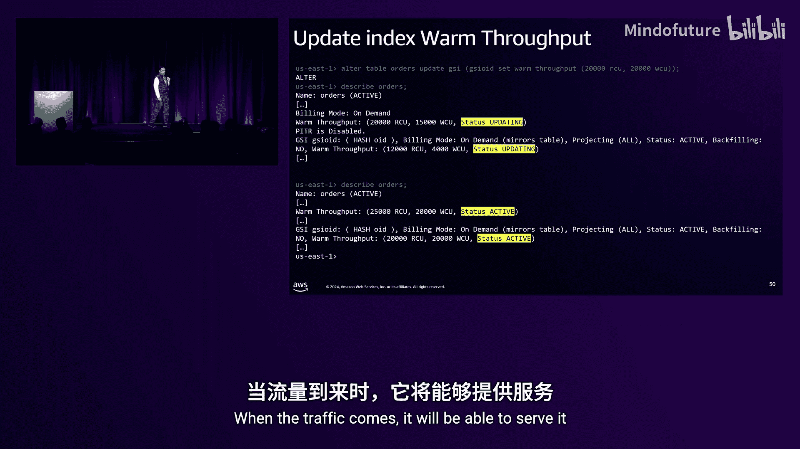

# 023：DAT406


在本课程中，我们将深入探讨 Amazon DynamoDB 的内部架构与核心设计理念。我们将学习 DynamoDB 如何实现可预测的低延迟、高可用性和强一致性，并了解其新功能“预热吞吐量”和“多区域强一致性全局表”的工作原理。无论您是初学者还是有经验的开发者，本教程都将帮助您更好地理解和使用 DynamoDB。

---

## 1：DynamoDB 架构概览

DynamoDB 的核心目标是：**在任何规模下提供可预测的低延迟**。这是客户对应用程序的基本要求，也是我们构建数据库的指导原则。

DynamoDB 中的所有数据都存储在表或索引中。在内部，索引的存储方式与表相同。创建表时，您需要指定表名和数据分布方式（即分区键）。DynamoDB 通过水平分区实现扩展。

例如，创建一个以 `login` 为主键的用户表：
```sql
CREATE TABLE users (login STRING PRIMARY KEY, name STRING, ...);
```
系统会根据 `login` 键的哈希值来决定数据如何分布。

数据被划分为多个分区，每个分区大小约为 10 GB。选择这个大小的原因是为了操作的并行性和可预测性。当分区数据增长接近 10 GB 或流量持续超过限制（目前为每秒 3000 次读取或 1000 次写入）时，系统会自动进行分区拆分，您无需手动干预。

每个分区在三个不同的可用区（AZ）中存储三个副本，以确保高可用性和持久性。其中一个副本被指定为“领导者”，负责处理写入操作和强一致性读取。写入操作只需得到另一个 AZ 的确认即可返回成功。

DynamoDB 是无服务器的，这意味着您无需预置或管理服务器。所有基础设施由 AWS 在后台管理，并在所有客户之间共享。

---

## 2：请求路由与 MDS（元数据存储）

上一节我们介绍了数据如何存储。本节中我们来看看，当您的应用程序发出请求时，DynamoDB 如何快速找到数据所在的位置。

您的应用程序通过 SDK 连接到 DynamoDB 的区域端点。请求首先到达负载均衡器，然后被路由到一个无状态的请求路由器。请求路由器负责身份验证、授权、检查资源策略和速率限制。完成这些后，它需要确定数据存储在哪个具体的存储节点上。

这个过程必须在**数十微秒内完成**，因为只有这样，才能保证最终在个位数毫秒内将数据返回给用户。为了应对每秒数亿次的请求，我们构建了一个名为 **MDS** 的内部系统。

MDS 是一个完全内存中的数据结构，没有磁盘存储。它由数百个节点组成，存储着分区元数据（例如，哪个键范围属于哪个分区，分区位于哪个存储节点上）。这些节点之间的数据几乎是同步的。

以下是系统组件及其交互方式：
*   **控制平面**：当您创建表时，控制平面会立即将表信息发布到所有 MDS 节点，确保新表立即可被查询。
*   **分区发布器**：这是一个后台组件，持续轮询所有存储节点，获取最新的分区信息（例如分区拆分、移动），并最终一致地更新到 MDS。
*   **请求路由器缓存**：每个请求路由器在本地缓存分区元数据。大多数请求都可以通过缓存直接路由，速度极快。

当分区发生移动或拆分时，存储节点上的数据版本会更新。如果请求路由器根据缓存的旧版本信息将请求发送到了错误的存储节点，该节点会返回“数据不在此处”以及新的版本信息。请求路由器随即更新本地缓存，并重定向到正确的节点。同时，它会异步通知 MDS 进行更新。

这种基于版本控制和最终一致性的缓存架构，避免了在元数据存储上使用锁，从而保证了高可用性和可预测的性能。

**关键要点**：在构建大规模系统时，应尽可能采用最终一致性缓存，并考虑使用“恒定工作量”模式（即使缓存命中，也持续向后端系统发送少量请求），以保持后端系统始终处于稳定负载状态，避免突发流量导致雪崩。

---

## 3：预热吞吐量

客户经常询问：“我的表有多少个分区？” 他们真正想知道的是：“我的表能处理多大的流量？” 尤其是在应对像万圣节或新年夜这样的流量高峰时。

过去，调整容量是一个繁琐的过程。例如，对于按需模式表，您需要先切换到预置模式，设置吞吐量，然后再切换回来。这个过程容易出错，且可能与自动缩放冲突。

为此，我们推出了 **预热吞吐量** 功能。它包含两个部分：
1.  一个 API，用于即时查询您的表或索引当前可服务的流量上限。
2.  一个 API，允许您直接设置这个吞吐量阈值，而无需实际改变表的计费模式或预置容量。

您可以在创建表、更新表或描述表时使用此功能。例如：
```sql
-- 创建表时指定预热吞吐量
CREATE TABLE customers (id STRING PRIMARY KEY) WITH warm_throughput (read=12000, write=4000);

-- 更新表的预热吞吐量
ALTER TABLE customers SET warm_throughput (read=20000, write=6000);
```
对于预置模式表，设置预热吞吐量不会干扰自动缩放的操作，两者可以并行。对于按需模式表，您只需为实际消费的请求付费，设置预热吞吐量只是在后台预先执行分区拆分等准备工作。

**工作原理**：当您提高预热吞吐量时，DynamoDB 会在后台开始进行必要的分区拆分。当流量高峰来临时，表已经准备就绪，可以立即处理增长后的流量，从而避免节流和尾部延迟增加。



最佳实践是，利用您的容量规划系统，提前预测流量高峰（如节假日），并提前调用 API 提高预热吞吐量。


---

## 4：多区域强一致性全局表

DynamoDB 很早就提供了**异步全局表**功能，支持在多个区域拥有表的副本，并支持在任何区域进行写入。然而，它只提供最终一致性：跨区域的读取可能看到旧数据，并且在发生区域隔离时，恢复点目标（RPO）可能大于零。

现在，我们推出了 **多区域强一致性全局表**。它保证了：
*   **键级别的全局写入顺序**：所有区域对同一主键的写入顺序一致。
*   **全局的读后写一致性**：在任何区域进行强一致性读取，都能读到之前任何区域已完成写入的最新数据。

**实现原理**：其核心是一个新的内部构件——**多区域日志**。这是一个跨区域、严格有序、仅追加的日志。

写入流程如下：
1.  在区域 A 发起写入。
2.  该写入首先被发送到 MRJ。
3.  MRJ 确保写入被持久化在**至少两个区域**后，即回调区域 A 返回成功。
4.  MRJ 异步地将写入回调到其他所有副本区域。

当在一个区域进行**强一致性读取**时，该区域会向 MRJ 发送一个“心跳”消息。MRJ 保证心跳之前的**所有写入**都已被该区域接收并处理。因此，该区域可以安全地返回包含所有这些写入的数据，从而实现了跨区域的强读后写一致性。

**重要说明**：多区域强一致性全局表目前支持最多 **3 个**区域副本。一旦写入成功返回，数据即被持久化在至少两个区域，即使一个区域发生隔离，RPO 也为零。此功能非常适合需要全局严格一致性的金融交易等场景。

---

## 总结

在本节课中，我们一起学习了：
1.  DynamoDB 如何通过水平分区、多副本和自动管理，实现**在任何规模下的可预测低延迟**。
2.  使用 **MDS** 和智能缓存架构来实现快速、可靠的请求路由，其设计理念（如最终一致性、恒定工作量）对构建大规模应用具有借鉴意义。
3.  **预热吞吐量**功能如何简化容量规划，让您能轻松应对预期的流量高峰。
4.  **多区域强一致性全局表**如何通过多区域日志（MRJ）提供跨区域的强一致性和零 RPO 保障。


希望这些深入解析能帮助您更好地理解 DynamoDB，并应用这些设计模式来构建更强大、更可靠的应用程序。