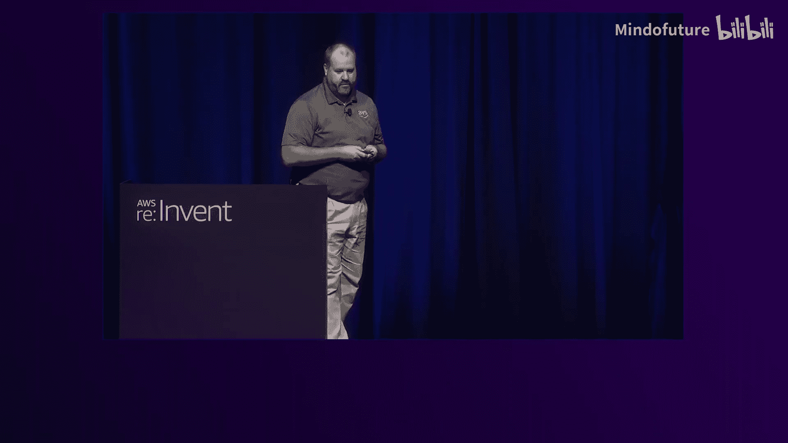
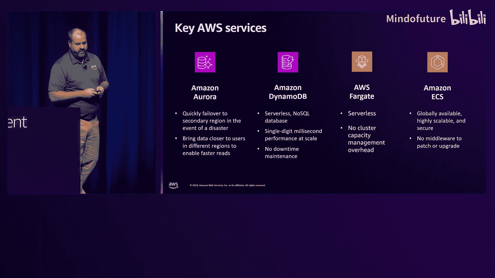
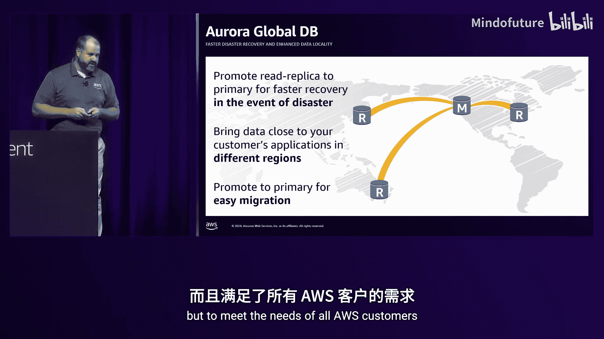
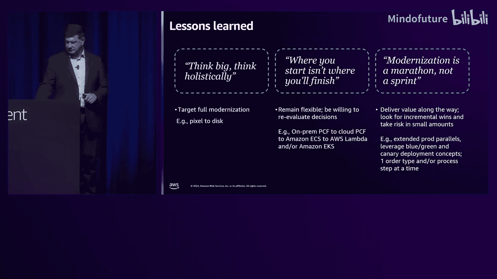
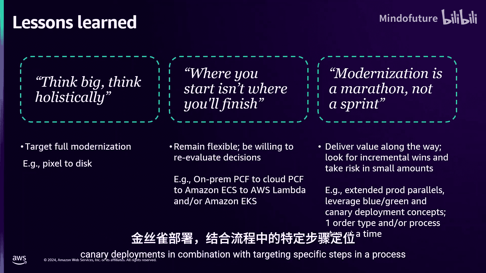
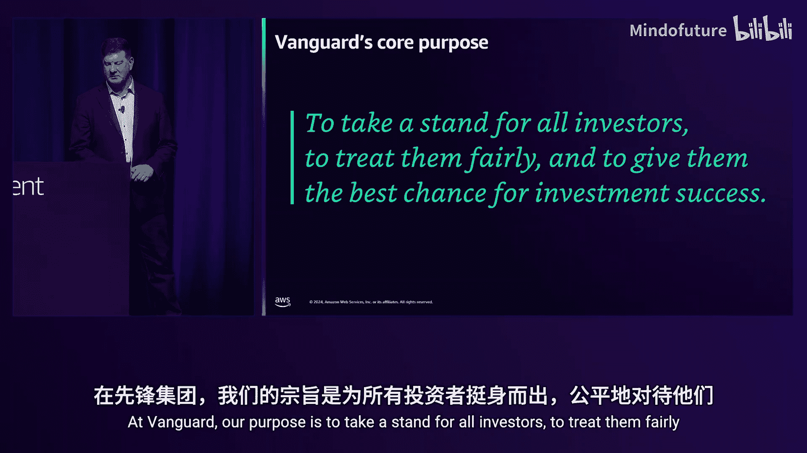
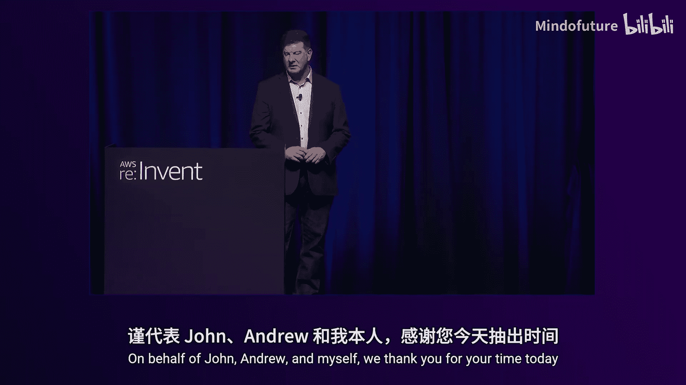
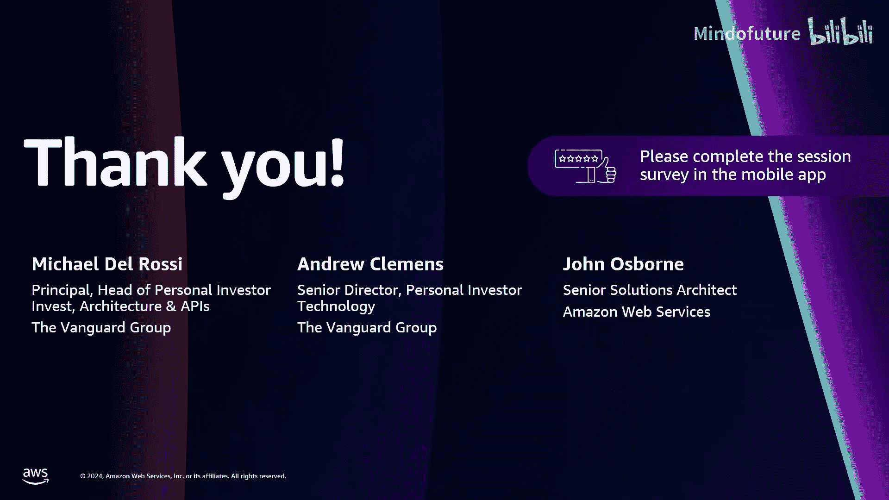

# 024：Vanguard如何在AWS上重建其关键交易应用程序 (FSI322)

在本节课中，我们将学习全球最大的投资管理公司之一——Vanguard，如何利用AWS重建并现代化其关键交易平台。我们将跟随Vanguard的Andrew Clemens和Mike Dlrossi，了解他们正在进行的技术现代化之旅，包括技术决策、权衡考量，以及如何将最核心的应用程序迁移上云。

## 引言：现代化之旅的背景

大家好，欢迎参加本次会议。我是AWS的高级解决方案架构师John Osborne。今天，我很高兴与Vanguard的Andrew Clemens和Mike Dlrossi一起，分享Vanguard如何利用AWS重建其关键交易平台的故事。

许多企业都面临与Vanguard类似的情况：业务中存在一个运行在逐年老化的遗留基础设施上的应用程序。维护、许可和保留关键技术人员使其持续运行的成本越来越高，更不用说为客户改进它了。最重要的是，这个应用程序必须日复一日地为客户可靠工作。即使您来自金融服务行业之外，Vanguard在现代化过程中学到的经验教训和关键权衡考量也可能与您相关。Vanguard提出的核心问题，或许也正是您需要思考的。

## 从起点到核心：Vanguard的云化历程

上一节我们介绍了现代化之旅的背景，本节中我们来看看Vanguard在云化道路上的关键里程碑。

如果您是AWS re:Invent的常客，可能还记得2019年，Vanguard的Jeff Dowes曾登台分享Vanguard云化之旅的早期步骤。Jeff的演讲概述了Vanguard在云中的第一步，包括采用基于云的分析和AIML服务（如EMR和SageMaker），以及将本地平台即服务解决方案迁移到AWS，并最终标准化使用ECS Fargate以获得额外的安全能力和成本优化。

Jeff强调了Vanguard如何通过云化提高敏捷性、降低成本并提升核心产品的客户满意度。然而，故事并未在2019年结束。这些成就是真实的，但它们是Vanguard在AWS内持续现代化旅程的起点。Vanguard当时就明白，现代化不是一个终点，而是一场持续的旅程。他们设定了一个积极的目标：最终实现100%现代化。现在，Vanguard面临的挑战是将云引入其最核心、最关键、对客户最重要的应用程序，也就是Andrew和Mike今天将要介绍的交易平台。

## 面临的挑战：遗留架构的局限性

了解了Vanguard的云化历程后，我们来看看他们具体面临的技术挑战。

Vanguard需要现代化的交易平台驱动着其零售投资部门。从架构上看，他们面临的是一个紧密耦合的单体式大型机应用程序，依赖于两个遗留数据库。订单管理系统数据库（ODB）和企业数据库之间的夜间批量加载已不堪重负。随着交易平台所需规模的增加，月度、季度和年度事件都对系统的可扩展性造成了巨大压力。

这种架构挑战了Vanguard的扩展能力、故障恢复能力，以及在交易高峰时段提供高性能交易执行的能力。此外，系统采用季度发布计划，每次变更的单元很大，这增加了部署风险，也影响了快速为客户带来新体验的能力，并限制了前端实验的能力。

尽管幻灯片上组件的名称可能与您的系统不同，但上述基本问题很可能与您IT组合中的一个或多个系统相似。即使在这个复杂的架构图中，也能看到一些系统边界，这些边界可以作为基于组件的现代化策略的切入点，例如订单管理或订单验证的微服务部分。

## 现代化目标：期望达成的五大成果

在明确了挑战之后，Vanguard设定了五个明确的目标和期望成果来指导现代化进程。

以下是Vanguard希望达成的五个关键成果：

1.  **提升可扩展性**：基于云的现代化系统将提高Vanguard处理更多交易量的能力，并以无缝方式应对偶发性峰值。利用云的弹性，突破现有单体系统的固有限制。
2.  **提高系统可用性**：随着交易量增加和平台关键性提升，提高系统可用性标准至关重要。设计必须聚焦于弹性，以满足比现有平台更高的可用性要求。
3.  **加速功能交付**：为了改善投资者体验，Vanguard需要以更快的速度将更多功能推向市场，同时不牺牲弹性。
4.  **提升客户满意度**：逐步改善体验将直接带来Vanguard客户满意度的提升。为投资者带来更新、更好的体验是Vanguard所有现代化工作的核心。
5.  **降低总体拥有成本**：自成立以来，降低成本以提高投资者回报一直是Vanguard的核心原则。这项工作也不例外，目标是在交易量持续向云迁移的同时，降低总体拥有成本。

这五个成果同等重要，都是Vanguard现代化旅程的核心期望。

## 核心架构决策：数据存储与计算

设定了明确目标后，Vanguard开始进行关键的技术选型。本节我们聚焦于数据存储和计算平台的核心决策。

Vanguard遵循AWS的决策指导，为工作负载选择合适的数据存储。在解耦大型机的有界上下文时，他们识别出需要复杂查询能力、适合关系型数据库的工作负载。为此，Vanguard选择了**Amazon Aurora PostgreSQL**。其弹性目标需要一个能够跨多个AWS区域进行读取、并允许在发生灾难或系统降级时快速进行区域间故障转移的关系型数据库解决方案。

同时，那些可以表示为NoSQL键值查找的数据架构部分，被识别出来并迁移到**Amazon DynamoDB**。这样，团队可以受益于DynamoDB托管的NoSQL体验，减少运维开销，无需像管理Aurora那样处理补丁和维护工作。

在计算领域，Vanguard在采用云后已围绕**ECS**标准化了容器平台，并采用了无服务器容器运行时**Fargate**。尽管这个应用程序可能有更多需求，或许EKS是更好的选择，但最终，ECS和Fargate是Vanguard内部经过验证的平台，能让团队专注于实现现代化目标，而无需担心补丁、容器编排和管理问题。

## 实现高可用：Aurora与DynamoDB的弹性设计

上一节我们介绍了核心的数据与计算选型，本节我们深入看看Vanguard如何利用这些服务实现其高可用性目标。

弹性目标至关重要，尤其是在数据层。为了实现这些目标，Vanguard确定了支持跨多个AWS区域访问的关键需求，并推动了技术决策以及AWS服务的改进来帮助他们实现。

在关系数据库环境中，Vanguard需要**Aurora全球数据库**。在一个区域发生故障时，Aurora全球数据库的故障转移能力将启用一个可存活的系统，可以切换到Vanguard运营的其他区域。但最初这很棘手，故障转移决策会让Vanguard的运维和应用团队在故障转移后需要执行多个步骤来重建其全球数据库拓扑并恢复灾难恢复能力。了解故障转移后重建所需的时间，给最初的故障转移决策带来了不确定性。

为了缓解这些担忧，Vanguard与Amazon Aurora团队密切合作，并成为Aurora改进的故障转移和切换功能的早期采用者。这些功能现已对所有AWS客户开放。此外，如果Vanguard选择切换或故障转移，他们的应用程序需要感知Aurora写入器端点的变化。Vanguard推动了这一需求，Amazon Aurora团队最近交付了**全局写入器端点**功能。现在，在发生切换或故障转移时，Amazon Aurora客户可以利用此功能，避免在其全局应用程序中更改端点。

同样，**Amazon DynamoDB全局表**也是必需的。应用团队在关心多区域写入一致性的同时，可以通过允许DynamoDB按需模式运行，根据需要增加额外的读写容量，来满足更高的可扩展性，同时也不牺牲弹性。写入可以从Vanguard支持的任何区域进行，并且可以全球分布以接收来自世界各地的交易。在今天的架构中，Vanguard最初采用了多区域主动-被动方法，但将进一步证明弹性和可用性，并设定了实现多区域主动-主动的愿景和持续路径。DynamoDB中的全局一致性至关重要，Vanguard继续与AWS合作构建主动-主动的全局一致架构。

## Vanguard概览：规模与业务背景

在深入技术细节之前，让我们先了解一下Vanguard这家公司及其业务规模。

Vanguard是一家全球资产和财富管理公司，在全球拥有超过5000万客户， entrusted with $9.9 trillion的资产。我们每天看到10亿到20亿美元的资金流入。随着市场小幅上涨，我们的管理资产将超过10万亿美元。Vanguard并非实体店模式，我们严重依赖技术。超过99%的客户通过数字渠道与我们互动，我们真正依赖技术来帮助我们扩展。

我们的经纪交易平台直接服务于那些来Vanguard管理其投资组合的客户。经纪行业持续发展，Vanguard不断推出新产品，为客户提供最佳投资成功机会。让我们看看其中的一些变化和新产品。

## 业务演进：推动现代化的市场动力

了解Vanguard的规模后，我们来看看是哪些业务变化驱动了这次核心平台的现代化。

2010年，Vanguard做出了一个关键决策，将塑造未来几十年的业务。当时我们有两种不同的账户类型：一种是仅用于Vanguard共同基金的过户代理账户，另一种是传统经纪账户。绝大多数客户持有Vanguard共同基金。但我们知道，未来我们需要一个无缝的账户类型，允许客户持有Vanguard共同基金、Vanguard ETF和其他投资产品，并在所有产品之间进行交互。我们正朝着经纪业务方向发展。

这为我们迎接ETF的兴起做好了准备。果然，2013年ETF开始起飞，Vanguard已经准备就绪。2019年，整个行业的参与者开始取消交易佣金。2019年之前，整个行业每天交易约50-60亿股；2019年之后，每天交易约100-110亿股，交易量翻了一番。2020年，我们确定了企业技术战略，这是一项全公司范围的现代化工作。同年，我们还在扩展顾问服务，推出机器人顾问服务，并开始增加税务亏损收割功能。税务亏损收割在下跌的市场中会产生巨大的交易量。

2021年，游戏驿站等MEME股票狂热冲击了行业。虽然MEME股票只是可能引起生态系统交易量急剧飙升的一个例子，但并非唯一。选举前后我们也看到了类似情况。我们必须为这些交易量的急剧飙升做好准备。此外，直接指数化是另一个在规模上会给我们的平台带来巨大交易量的产品。

过去15年，我们经纪交易平台的交易量增长了100倍。展望未来15年及以后，我们必须为另一个100倍的增长做好准备。

## 现代化策略：从单体到分布式架构

面对巨大的业务增长和变化，Vanguard制定了明确的现代化策略。

我们正在 embark on a transformative journey to modernize the entirety of the brokerage trading platform。正如John提到的，我们过去是遗留的本地单体架构，它很好地服务了我们二十年。但我们知道必须做得更好。我们需要从这种单体架构转变为由前端客户体验、API和数据组成的三层架构。

对于自主交易的客户，他们将受益于整个技术栈。他们将访问我们的网站，看到一个现代化、直观的前端，该前端将利用云API和云数据。对于顾问客户，他们仍将受益于相同的云API和云数据。这是一种一致的方法，确保我们所有客户的交易都能完美地执行。

新系统将健壮、可扩展，由超过100个分布式系统组成。每年处理8000万笔交易（且正在上升），每日名义价值10亿美元。随着我们为2025年及以后的更大交易量做准备，我们的云平台需要能够扩展，需要准备好满足客户每天的需求。

## 实施路径：增量交付价值

从单体系统迁移到高度分布式系统是一项重大任务。我们不可能闭门造车五年，然后推出一个全新的交易平台。我们必须找到逐步交付价值的方法。

鉴于复杂性和规模，一夜之间实现现代化是不可行的。我们制定了一项战略，旨在尽早且尽可能频繁地交付价值。我们知道这将是一项多年的努力，并计划逐年为Vanguard业务和客户最大化价值。

我们的方法是找到基础设施中的接缝，允许我们在应用层之间解耦，以便以不同的速度运行。在最高层面，交易平台需要做三件事：提交交易、获取数据以运行交易规则、提交并路由交易。考虑这三个领域以及它们之间的接缝，这些是关键区域，我们可以在其中注入一些抽象层，再次允许这三个层次的现代化独立进行。

## 现代化步骤：前端、API与数据库

我们按照前端、API、数据库的顺序，分步实施了现代化。

我们的现代化之旅始于前端。我们首先现代化客户首先看到、触摸和感受到的东西。我们从股票和ETF交易单开始。我们预测ETF将会增长，因此做出了数据驱动的决策，从ETF交易单开始。然而，团队并不轻松。他们在构建前端时，需要许多当时还不存在的API。因此，随着前端团队的构建和现代化，我们开始在交易验证API处构建第一个抽象层。这是一个非常重要的抽象层，允许前端拥有一个面向未来的端点，在幕后最初调用的是遗留系统。

前端推出后，我们开始处理API。我们必须构建许多API，许多必须从遗留系统迁移到云中的业务流程。在构建了大约20个额外的端点后，我们现在可以开始从遗留API切换到云API。此时，我们实现了从前端像素到在云中提交到本地数据库的完整价值流。

这使我们系统可用性得到提升，P95延迟不断降低，可观测性和遥测技术的进步使我们能够近乎实时地检测问题。客户不仅受益于专门构建的前端，还受益于更高的系统可用性和健康状况。

接下来，我们开始处理数据库。此时，我们的云工程已经非常成熟。我们系统地从遗留迁移到云的方法和实践已经成熟和加强。所有这些在我们开始对数据库进行云优先读写时都至关重要。我们实现了向云优先读写的巨大飞跃，不仅获得了CX和API带来的价值，现在还从云端进行读写，并持续缩小我们的本地足迹。

## 技术架构详解：交易生命周期

我们已经介绍了为什么现代化以及如何增量交付价值。现在，让我们深入了解构建了什么。

首先，我们高层次地看一下交易生命周期。我们需要接收订单，在OMS中进行规则验证，存储它，将其路由到市场，执行它，获取交易确认，在需要时更新数据库。至此完成，客户可以访问它。

以下是交易流程中关键组件的详细介绍：

*   **前端体验**：我们最初使用静态ECS Web应用构建前端，但很快意识到无服务器的好处。我们实施了CloudFront从S3存储桶拉取资产，这带来了更快的渲染速度和更接近边缘的体验，实现了地理路由和我们的主动-主动多区域弹性模式，并解锁了现代实验能力。
*   **云交易API**：这是一个关键的ECS Node.js后端用于前端应用，作为Web和移动端一致的消费者API层。任何需要获取交易数据或提交交易的数字平台请求都到达同一个端点。它使用TypeScript编写，与前端应用语言相同，便于团队贡献。该API高度优化，每天处理超过800万次请求。
*   **批量处理**：除了用户发起的交易，我们还有几个批处理应用，例如每日代表顾问客户执行的投资组合再平衡交易，以及自主交易客户设置的定期投资计划。关键组件包括控制执行时间以确保下游API适当扩展，以及使用**断路器**模式在检测到故障时立即停止，避免向后端业务运营发送大量失败交易。
*   **规则验证与路由**：这是基础设施中的关键接缝，交易生产者需要调用以验证其规则。这个组件是一个ECS应用，是决定下游一切操作的流量控制器。它最初硬连接到我们的遗留数据库，但随着API经济的发展，我们能够构建数据编排服务，多线程调用下游服务，延迟和性能越来越好。
*   **存储与执行**：交易通过规则验证后进入存储环节。交易到达Aurora，状态为“已录入”。同时，我们向Kafka发送一条消息。路由目标服务作为消费者监听此消息，它有一个DynamoDB表，业务可以配置，用于为交易标记正确的市场中心。然后，它发出另一条Kafka消息。后端执行管理系统监听此消息，将其转换为行业标准的FIX消息，存储在DynamoDB中，然后通过单例TCP/IP套接字发送到市场中心。市场中心立即回复一个FIX消息，指示交易的新状态。入站消息存储在数据库中，然后另一条Kafka消息被发送回总线。我们的OMS和Aurora数据库需要监听并处理该消息，通常做两件事：更新订单状态和更新刚刚执行的持仓份额数量。我们通过**单次提交**完成这两项操作，确保跨域的一致性。
*   **核心组件**：
    *   **Aurora PostgreSQL数据库**：是交易引擎的RDBMS，包含交易的四个支柱：账户、持仓、订单、证券。一个ECS应用位于数据库之上，处理所有读写。
    *   **DynamoDB**：存储我们的FIX消息。由于其有限的访问模式、键值对数据库特性以及高性能标准，它是此存储的理想选择。
    *   **Kafka**：是我们的消息总线，位于EMS的关键区域。我们评估了Avro、JSON和Protobuf，最终选择了**Protobuf**，因为它针对高吞吐量和低延迟进行了高度优化，这是交易引擎的两个关键非功能性需求。Kafka不仅用于OMS和EMS之间的心跳，还可以让数字渠道监听这些消息，以改善客户体验。

## 技术决策深度探讨：数据库、计算与消息

在构建过程中，我们进行了无数次辩论。现在，Mike将深入探讨我们在数据库、计算和消息传递方面的决策和辩论。

在进行大规模技术转型时，可以想象我们一路上有过一些辩论。没有哪个话题比我们关于交易引擎数据库的讨论引发更多辩论或激情。选择哪个数据库？包含多少数据？它能扩展吗？如何保护它？

首先，我们是一个多语言数据库环境，在投资组合中广泛且成功地使用DynamoDB和PostgreSQL。根据您的用例，其中一个可能比另一个更有意义。在这种情况下，我们为 primary database 选择了 **Aurora PostgreSQL**。

以下是我们如何思考这个决策的几个关键方面：

1.  **数据库技术选择**：这实际上是在NoSQL和关系数据库之间的选择。DynamoDB性能高、可扩展且成本效益好，其全局表使多区域部署相当简单。然而，要实现适当的性能，您需要对数据和索引进行适当建模。如果您未来在存储什么数据或如何访问数据方面的需求发生变化，进行更新或添加索引是一项复杂的工作。如果您的数据会发生变化，并且不确定不同的访问模式是什么，那么关系数据库可能更适合您。
2.  **弹性考虑**：作为一个关键应用，弹性至关重要。使用DynamoDB进行多区域部署相当简单，但使用Aurora PostgreSQL也可以实现同样的目标，只是设计、实施和测试更复杂。
3.  **成本因素**：我们发现DynamoDB比PostgreSQL更具成本效益。然而，两者都比我们正在迁移的遗留平台成本更低，因此这不是我们决策过程中的主要因素。

选择Aurora PostgreSQL后，下一个决定是如何运行它。当Aurora无服务器版本2在2022年宣布时，我们很兴奋并开始试验，但结果好坏参半。因此，我们最终决定运行预配置实例，因为通过三年承诺并使用Graviton处理器，我们可以达到与无服务器版本大致相同的成本点，同时也消除了为市场激增正确调整自动扩展的需要。

最后一个关于数据库的决定是：我们需要多少个独立的数据库？我们有四个主要数据域。我们可以将每个实现为自己的数据库，但这会使在API层编码连接数据变得更加复杂。因此，我们做了一个例外，决定将它们保持在一个数据库中，并围绕它构建一系列API，这更像是一种“迷你服务”模式，而不是传统的微服务模式。

## 技术决策深度探讨：计算平台

讨论完数据库，我们来看看计算层。这里的讨论争议较小，但计算是一个不断发展的领域。

我们多年前就开始了旅程，在迁移到云之前，我们在数据中心使用Pivotal Cloud Foundry。当我们拥抱云时，我们希望利用AWS来完成尽可能多的繁重工作以最大化价值。随着这一转变，我们转向使用ECS来托管我们现代化的微服务。在我们开始现代化交易平台时，EKS在Vanguard被引入。虽然我们对Kubernetes提供的能力感到兴奋，但我们操作它的经验有限。因此，我们不想用我们的交易平台在EKS上开辟新路，并且我们发现未来如果决定迁移到EKS，迁移路径相对简单。我们定期重新评估这个决定，但目前我们还没有迁移。

在ECS和EKS之间做决定时，您应该考虑几件事：前期设计以正确设置集群、运行Kubernetes集群所需的额外支持，以及本质上运行多租户环境的额外复杂性。ECS的简单性很有吸引力，其单租户性质降低了一个应用影响另一个应用的风险。EKS显然更强大，对于更复杂的系统，利用它是有意义的，但您应该充分了解随之而来的额外复杂性和责任。

决定使用ECS后，我们必须决定如何部署ECS：是利用Fargate还是在EC2实例上运行。在EC2上运行可以访问更多配置和硬件选项，但我们发现并不需要这些。Fargate满足了我们的需求，因此我们继续在Fargate上运行，以最大化AWS的托管服务。

## 技术决策深度探讨：消息平台

最后一个讨论领域是消息平台：Kafka、Kinesis还是EventBridge。

在我们的企业环境中，有关键应用使用Kinesis和EventBridge。然而，在我们的情况下，我们选择了Kafka。这与Kubernetes的情况有些相反：是的，Kafka对我们来说是新的，但我们觉得我们的交易平台需要那些额外的消息协议、可扩展性和性能。无论哪种情况，我们都有强大的托管服务选项可供选择。我们最终选择由第三方支持我们的Kafka实例。我们将Kafka部署在多区域，以符合我们的多区域架构。

## 现代化成果：目标达成与收益

结束技术决策的讨论，我想转向我们的转型带来的好处。

John早些时候分享了我们开始旅程时的预期成果：提高可扩展性、弹性、敏捷性、客户满意度和降低TCO。我很高兴地分享，我们正在实现这些成果，并且随着现代化旅程的进一步推进，它们持续增长。

让我们更深入地看看每个领域：

*   **客户满意度**：我们面临着客户期望的不断增长，不仅与金融服务公司比较，还与跨行业的数字原生公司比较。在现代化过程中，我们不仅仅是重建现有应用，还抓住机会重新思考体验，挑战自己哪些功能和规则仍然是必需的。最近，我们实现了80%的应用组合现代化。我们获得了外部认可，内部各项客户满意度指标均有显著提升。
*   **交付敏捷性**：转向产品团队结构、利用DevSecOps实践和现代云技术的影响是巨大的。早期，我们在股票和ETF交易现代化方面取得了良好进展。随着API平台的成熟以及我们在云开发方面变得更好，我们的速度加快了。现代化共同基金交易以及添加基于美元的ETF交易和自动投资等新功能所需的时间显著缩短。在构建全新产品（如Cash Plus）时，我们也体验到了类似的好处，该产品从启动到上市用了不到12个月。
*   **弹性与生产力**：这是我们看到最大收益的领域之一。我们有意将这些数据点放在一起展示，因为传统上，在DevSecOps和云之前，人们会认为这些会一起上下波动。我们看到了**重大事件减少70%**，同时**软件部署频率提高了5倍**。这得益于现代技术的使用、弹性最佳实践的采用、强大的CI/CD管道以及产品团队的主人翁心态。

## 经验总结与未来展望

让我们分享一些对整个现代化旅程的反思。

首先，**志存高远**。是的，您希望逐步交付。但要立志完全现代化您的技术栈。要解锁全部好处，您需要整体思考并重新思考您历史上的做法。仅仅将当前技术栈直接迁移到云或换一个新前端是做不到的。

其次，**保持灵活**。云中的事物变化迅速。愿意重新评估决策并在过程中进行调整。我们最初在数据中心使用PCF，然后迁移到云并使用ECS，现在在某些情况下利用Lambda，未来可能迁移到EKS。根据当时的情况做出最佳决策以取得进展，不要过度执着于一个决策，并愿意改变。

最后，**现代化是一场马拉松，不是短跑**。在处理关键任务应用程序时尤其如此。然而，总存在被比作道路或桥梁项目并在过程中失去支持的风险。考虑到这一点，您需要逐步交付价值，并以小量承担风险。为此，您可以利用扩展的并行测试技术，如蓝绿部署、金丝雀部署，结合针对流程中的特定步骤或某些交易类型，从而逐步建立信心。

那么，我们下一步要去哪里？展望未来，我们将专注于提高交易旅程的个性化水平，通过使用生成式AI增强客户体验，然后我们将寻求扩展现金产品，并完成内部员工体验。我们相信，我们可以忠于Vanguard的使命，帮助客户取得更好的投资成果。

Vanguard的使命日复一日地驱动着我们：我们的宗旨是为所有投资者挺身而出，公平对待他们，并为他们提供最佳的投资成功机会。

代表John、Andrew和我自己，感谢您今天的时间，希望您能从我们分享的经验中受益。