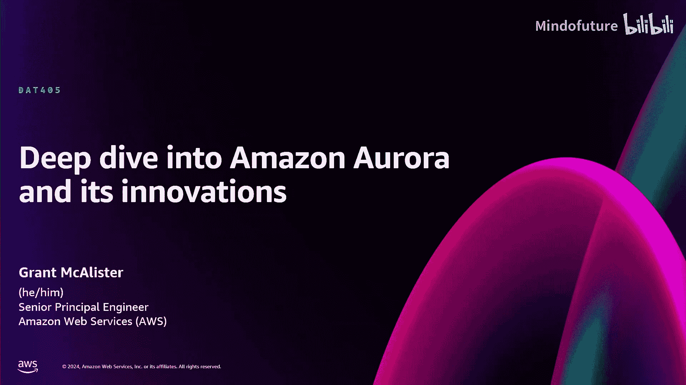
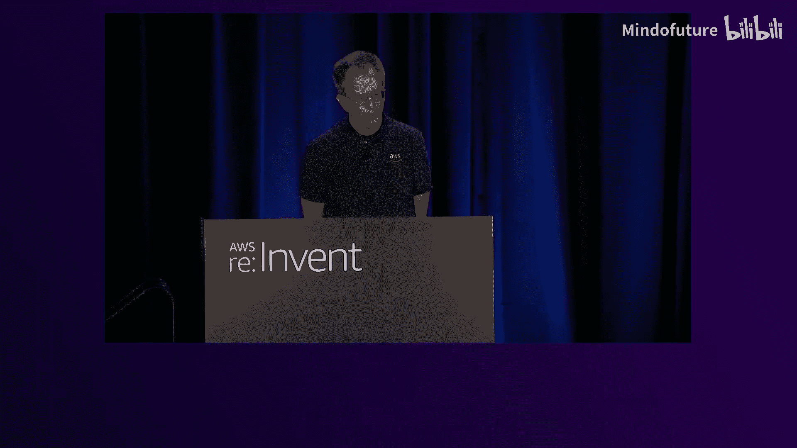
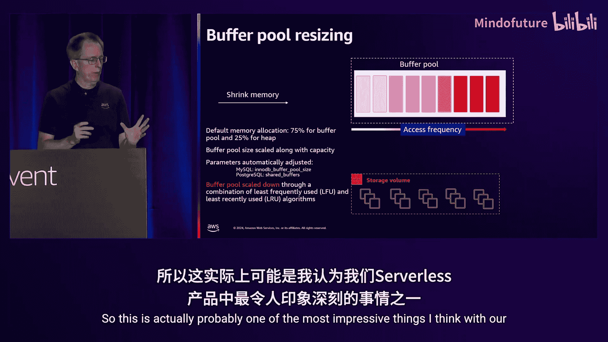
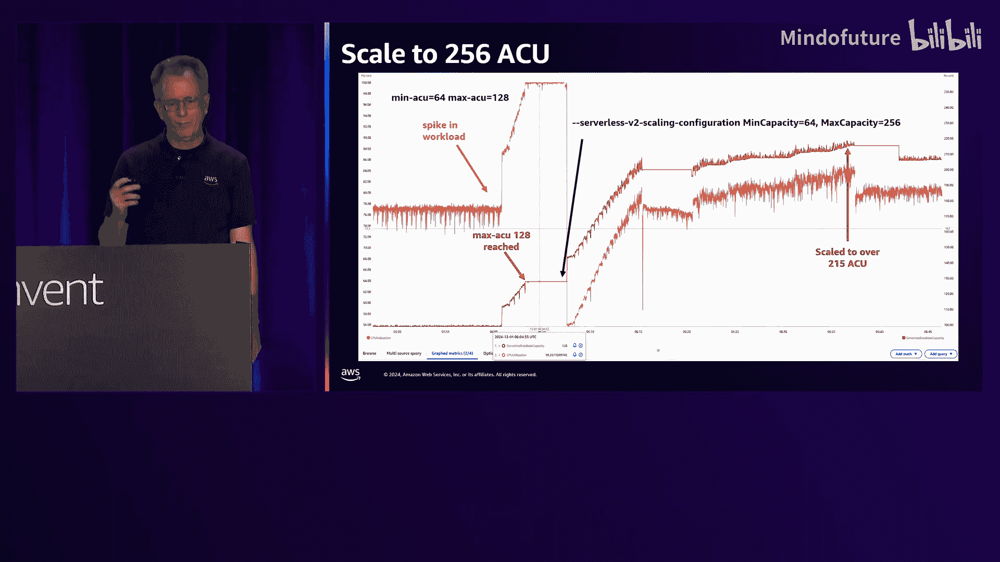
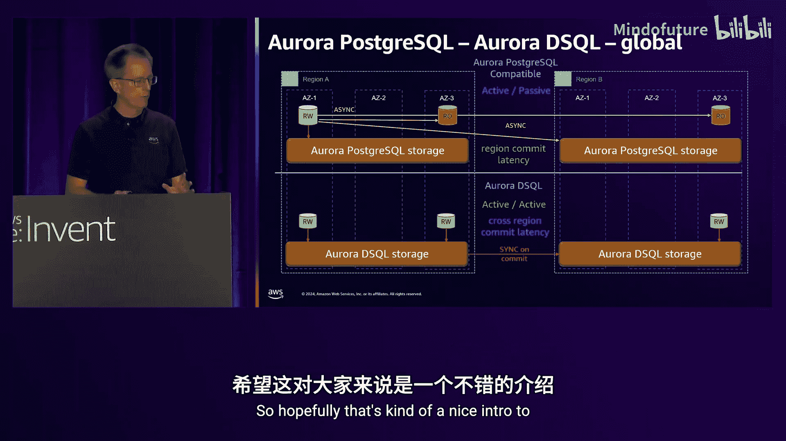
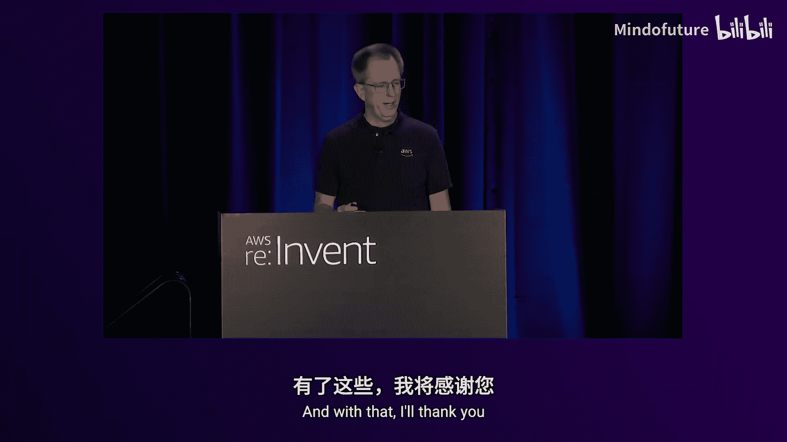

# 025：DAT405

在本节课中，我们将深入探讨 Amazon Aurora 数据库服务及其核心技术创新。我们将从其独特的架构开始，逐步了解其性能优化、可扩展性、高可用性特性，以及最新的功能更新，如 Serverless V2、IO 优化存储、Limitless Database 和全新的 Aurora DSQL。

## 1：Aurora 架构基础 🏗️

Amazon Aurora 是一个专为云原生环境构建的数据库。它完全兼容 MySQL 和 PostgreSQL（二者独立），并在开源软件的基础上集成了众多企业级功能，提供了卓越的性能、可扩展性、可用性、持久性、安全性，并且像 RDS 系列的其他产品一样完全托管。

上一节我们介绍了 Aurora 的基本定位，本节中我们来看看其核心架构有何不同。

### 存储架构

Aurora 的第一个主要区别在于其存储。在一个包含三个可用区的区域中，当您创建一个集群时，会获得一个存储卷。那些黄色的方框代表存储服务器，一个典型区域中可能有成千上万个。

*   **写入过程**：数据库实例（首先是读写实例）仅写入日志记录。图中展示了 6 次写入，每次写入到不同的 10GB 数据块或段，这些块分布在每个可用区中。需要 6 个块中的 4 个完成写入后，日志写入才会被确认，客户才会收到提交消息，这确保了区域内的持久性。
*   **读取过程**：Aurora 通常从本地可用区读取数据块，因为这是最快的。由于通过序列号知道最新副本的位置，因此无需进行法定人数读取。
*   **修复机制**：如果发生写入丢失，Aurora 会从同一或另一可用区的其他数据块副本进行修复。如果整个存储服务器故障，则会从另一个副本复制该数据块到新的存储服务器。所有这些修复和检查都在后台自动进行。

### 计算与读取副本

Aurora 的另一个根本区别在于读取副本。传统上，在 PostgreSQL 或 MySQL 中创建读取副本需要另一个 EBS 卷并启动一个数据库。而在 Aurora 中，我们可以直接连接到集群存储。

*   **缓存同步**：为了保持内存同步，Aurora 会从读写节点向只读节点发送更新消息。这些消息是异步的，因此可能存在一些延迟（例如 30 毫秒），但通常很快。
*   **灵活配置**：您可以拥有最多 15 个只读节点，并可以混合搭配它们所在的可用区和实例类型（例如 Graviton、Intel 和 Serverless），而无需只选择一种类型和大小。
*   **弹性存储**：存储会根据需要自动增长和收缩，您只需为实际使用的部分付费，这与大多数需要预先分配大量空间的基于文件系统的数据库有根本区别。

### 故障转移与连接管理

在发生故障时，Aurora 通常会故障转移到另一个可用区的只读节点。

*   **传统方式**：应用程序需要知道新的写入器在哪里，通常通过查询数据库的 CNAME，并由 Route 53 解析。这需要一些传播时间。
*   **Aurora 优化**：Aurora 提供了多种包装器（支持 JDBC、Python、Node.js 用于 MySQL 和 PostgreSQL，以及用于 MySQL 的 ODBC），这些包装器知道写入器的位置。因此，您无需等待 DNS 传播，可以实现更快的故障转移和更少的中断时间。

## 2：核心创新功能 ⚡

上一节我们了解了 Aurora 的基础架构，本节中我们来看看它的一些核心创新功能如何帮助解决实际应用问题。

### 本地写入转发

有时我们希望扩展规模，但不想重写所有代码。将应用程序改为只读很困难，而如果希望它写入，挑战在于只读节点无法写入。

*   **功能启用**：通过启用本地写入转发（现已支持 MySQL 和 PostgreSQL），您可以实际写入到该实例，写入请求会被转发回读写节点。请注意，这并非多写入器模式。
*   **可见性模式**：此功能的关键在于数据可见性。Aurora 提供了多种设置：
    *   **会话可见性（默认）**：您可以读取自己的写入。在测试中，一个更新操作可能需要约 3 毫秒（比在写入器上稍长，因为需要跨可用区转发）。随后的第一次 SELECT 可能需要 30 毫秒，因为它需要等待写入被复制回来。之后的 SELECT 会非常快。
    *   **最终一致性模式**：更新速度相同，但 SELECT 不会等待您的写入，因此速度正常。如果您不读取刚写入的数据，这没问题；否则可能不适合。
    *   **全局一致性模式**：所有操作的时间都相同，因为每个语句执行时都会等待自该语句开始时间点 `T` 以来所有数据的变更被复制回来。这提供了完全的全局可见性，但通常不建议大量使用，因为性能受复制速度影响。这些模式可在会话中动态设置，提供了很大的控制灵活性。

### 全局数据库

为了满足灾难恢复需求，Aurora 提供了全局数据库功能。

*   **基本设置**：在区域 A 中创建主数据库集群，在区域 B 中创建辅助数据库集群。后台的复制服务器代理会管理两个区域存储卷之间的数据复制，而您无需管理实例，因为这是基于存储的复制。
*   **并行复制**：由于数据被分成 10GB 的块，Aurora 可以并行复制，不受单流瓶颈限制，即使在高写入负载下也能处理。
*   **读取节点与写入转发**：您可以在辅助区域添加只读节点，用于读取，也可以在那里使用之前提到的写入转发功能。
*   **存储自修复**：存储可以直接跨区域发送变更以进行修复，无需担心网络问题。

### 全局端点

管理应用程序以识别哪个区域是主区域可能具有挑战性。Aurora 引入了全局数据库的全局端点。

*   **工作原理**：每个区域中集群的 CNAME 不同。全局端点（其名称中包含两次“global”以示区别）通过 Route 53 进行解析。当主区域是区域 A 时，解析该名称将指向区域 A 的 CNAME。
*   **切换与故障转移**：执行切换时，会验证一切正常，然后进行切换。切换后，读写节点在区域 B，相同的全局端点解析将指向区域 B。这一切换使用高可用技术，无需通过 Route 53 控制平面。切换完成后，区域 A 会自动重新设置为备用状态。
*   **命令区别**：执行计划内切换使用 `switchover` 命令；在紧急情况下（区域 B 不可用，数据可能不同步）执行故障转移则使用 `failover global cluster` 命令并指定 `--allow-data-loss` 参数，以明确可能存在数据差异。

## 3：Aurora 存储内部机制与性能优化 🔧

上一节我们探讨了 Aurora 的创新功能，本节中我们将深入其存储内部机制，并了解最新的性能优化。

### 存储节点内部

Aurora 存储节点包含多个组件。读写实例通过一个在主机上运行的存储守护进程与存储通信。

*   **写入流程**：写入请求进入存储守护进程，进入内存中的传入队列，然后移动到磁盘上的热日志。之后，确认消息返回给存储守护进程和引擎，客户收到提交确认。
*   **修复与合并**：如果错过了某个写入（例如 B），对等节点可以发送 B 的变更。获得完整序列后，数据进入更新队列，合并到数据块中。这就是日志合并成块的过程。
*   **读取与备份**：读取时，直接读取数据块。日志和数据块都持续从存储备份到 S3，用于快照和时间点恢复，对服务器无负载。

### IO 优化与性能提升

Aurora 引入了新的 IO 优化存储类型，旨在实现更可预测的定价并为 IO 密集型工作负载提升性能。

*   **标准 IO 定价问题**：在标准类型中，您需要为每次 IO 操作付费。如果写入许多小的日志记录（例如 4 条 1KB 记录而非 1 条 4KB 记录），成本会成倍增加，导致工作负载变化时成本波动。
*   **IO 优化存储**：此类型提供可预测的定价，并提升 IO 密集型工作负载的性价比。它在集群级别选择，每月可切换一次。如果您的 IO 成本超过总成本的 25%，则应考虑使用。一些客户实现了高达 70% 的 Aurora 账单节省。
*   **性能改进**：团队对存储守护进程进行了批处理等改进，降低了延迟和 CPU 使用率。此外，对于预览版的 PostgreSQL 17，引入了持久队列，写入到达持久队列后可立即确认，进一步降低了延迟和抖动。

### PostgreSQL 与 MySQL 更新

Aurora 持续更新对 PostgreSQL 和 MySQL 的支持。

以下是 PostgreSQL 方面的主要更新：
*   支持 PostgreSQL 16。
*   为实例家族添加了 R7i 和 R7G 支持。
*   查询计划管理（计划稳定性功能）现可在副本上运行。
*   逻辑复制性能和缓存方面有很多改进。
*   更新了 PG vector 版本以支持生成式 AI。
*   添加了对几个新 PostgreSQL 扩展的支持。
*   PostgreSQL 17 处于预览状态。

在性能方面，与几年前的 R5.24XL 相比，新的 R7i.48XL 在只读工作负载上实现了 2 倍的可扩展性，而 R7G.48XL（Graviton）实现了 2.7 倍（近 3 倍）的性能提升。

MySQL 方面已支持 8.0.39 兼容性，同样支持 R7i 和 R7G，提供了用于更快切换的高级 MySQL ODBC 驱动程序，并增强了并行导出和 binlog 功能。

## 4：Serverless、可管理性与 Zero ETL 📊

上一节我们关注于核心引擎和性能，本节中我们转向运维层面，看看 Aurora 如何通过 Serverless、增强的可管理性以及 Zero ETL 来简化数据库管理。

### Aurora Serverless V2

Aurora Serverless（通常指 Serverless V2）代表了在可管理性方面的未来方向。

*   **核心特性**：它在原地扩展，无需切换，在几秒内即可完成。可以按秒添加 CPU 和内存，按秒计费，且在扩展时对工作负载无影响。
*   **缓冲池调整**：关键创新之一是缓冲池大小调整。系统监控缓冲池，根据数据访问频率动态扩展或收缩内存，确保缓存效率而无需手动设置实例大小，从而优化性能和成本。
*   **扩展到零与更大规模**：
    *   **扩展到零**：当连接数为零并持续达到配置的最小时间（例如 5 分钟）后，实例将暂停（规模降至零）。重新启动时，从 0.5 ACU 开始扩展。您可以根据对成本和缓存保留的需求调整此超时时间。
    *   **扩展到更大规模**：现在支持扩展到 256 ACU（双倍的内存和 CPU）。您可以在线调整最大 ACU 限制以适应工作负载峰值。
*   **数据 API 支持**：现在支持 Data API，允许通过 HTTP 连接到数据库。Aurora 会为您管理连接池，使得从 Lambda 等无服务器服务访问数据库变得更加容易，无需在 Lambda 中加载驱动程序或担心连接管理。

### 可管理性：零停机修补与蓝绿部署

Aurora 在可管理性方面持续改进，包括版本升级。

*   **零停机修补**：此功能旨在实现无中断的次要版本升级（例如 PostgreSQL 16.3 到 16.4）。它会寻找一个暂停点（约 1 秒），阻止新事务并等待现有短事务完成。然后，将会话状态移出实例，停止旧实例，启动新版本实例，并重新注入会话信息，最后交还连接。在测试中，一个 4XL 实例上的补丁应用仅导致 3 秒的零 QPS，且没有连接断开，只有延迟尖峰。目标是未来进一步缩短此时间。
*   **蓝绿部署**：用于主要版本升级（如 MySQL 5.7 到 8.0）或其他重大变更。您创建一个蓝绿部署，系统会创建“绿色”环境并复制数据。您可以指定升级版本，或自行进行模式/参数变更。当准备就绪后，执行切换命令，系统会验证同步、停止写入、排空复制流量，然后完成切换。切换后，所有端点名称会自动重新排列，您的自动化脚本无需更改。完成后，可以删除蓝绿部署关联（不会删除集群）。PostgreSQL 的蓝绿部署使用逻辑复制，存在一些限制（如不能执行 DDL、需要主键等）。

### Zero ETL 集成

Zero ETL 功能帮助您将数据从 Aurora 轻松移动到 Redshift 进行分析。

*   **工作原理**：添加 Zero ETL 集成后，会建立一个由 AWS 管理的复制通道，将所选表的数据复制到 Redshift 集群，延迟仅 5-10 秒，支持近实时仪表板。
*   **优势**：全自动化，包括初始数据填充、复制和监控。支持在摄取过程中运行分析查询。一个 Redshift 集群可以接收来自多个数据库（甚至混合 MySQL 和 PostgreSQL）的数据，实现跨引擎查询。
*   **高效实现**：利用 Aurora 的存储层，使用并行直接导出进行初始数据加载，并使用增强的 binlog 从存储层直接进行 CDC 流式传输，从而减少对主 OLTP 工作负载的影响。

## 5：高级存储功能与 Limitless Database 🚀

上一节我们讨论了 Serverless 和运维简化，本节中我们将探索更高级的存储功能以及面向超大规模应用的 Limitless Database。

### 优化读取与分层缓存

为了进一步提升读取性能，Aurora 引入了优化读取功能，特别是针对临时对象和热数据缓存。

*   **临时对象**：传统上，临时溢出（如排序）使用 EBS 存储。在新的 D 系列实例（如 R6GD、R6ID）上，Aurora 可以使用附带的 NVMe 存储作为临时空间（标准 IO 类型分配 6 倍内存大小的 NVMe，IO 优化类型分配 2 倍）。
*   **分层缓存**：在 IO 优化类型中，剩余的 NVMe 空间（共 4 倍内存大小）用作数据块的分层缓存。系统使用少量 RAM 存储缓存元数据。
    *   **读取流程**：读取时，先检查内存缓冲池，若未命中则检查分层缓存元数据。若在缓存中，则从 NVMe 快速读取；若不在，则从远程存储读取并同时加载到内存和缓存中。
    *   **更新处理**：当数据块更新时，只需使缓存中的元数据失效，无需更新缓存本身，下次读取时会获取新副本，这非常高效。
    *   **适用场景**：此功能最适合工作集大小能放入分层缓存的情况。例如，一个 800GB 的表，如果只有最近 80-100GB 是频繁访问的，那么分层缓存会非常有效。在测试中，启用分层缓存后，对于均匀分布的大数据集，延迟增长显著降低；对于偏态分布（更真实），即使数据库很大，大部分读取也来自缓存，性能接近全内存。

### Aurora Limitless Database

Limitless Database 旨在让分片变得简单，以应对超大规模数据场景。

*   **挑战**：传统分片面临重新分片、跨分片一致性（如 DDL、查询、备份）、管理复杂性等问题。
*   **解决方案**：
    *   **架构**：使用分布式事务路由器层处理路由和事务，数据访问分片层存储数据。您连接到路由器层的 CNAME。
    *   **自动重新分片**：支持自动或手动重新分片以应对热点。
    *   **Serverless 容量**：底层使用 Serverless 技术，分片可根据负载自动伸缩，除非超过 256 ACU 否则无需重新分片。
    *   **一致性**：通过高精度时钟实现跨分片的一致查询、DDL 和备份。事务在路由器上分配时间戳 `T`，分片基于该时间戳的快照执行，确保全局一致性。
*   **优势**：解决了分片管理的核心痛点，实现了近乎无限的水平扩展，同时保持了类似单数据库的运维体验。

## 6：Aurora 家族新成员：Aurora DSQL 介绍 🔄

在了解了面向超大规模的传统 Aurora 之后，本节我们将介绍 Aurora 家族的新成员——Aurora DSQL，并对比其与 Aurora PostgreSQL 的特点。

Aurora DSQL 是 Matt 在本次大会上宣布的新产品。它与 Aurora 家族有相似之处，也有重要区别。

以下是 Aurora PostgreSQL 与 Aurora DSQL 的对比概览：

| 特性 | Aurora PostgreSQL | Aurora DSQL |
| :--- | :--- | :--- |
| **兼容性** | **完全兼容** PostgreSQL | **高度兼容** PostgreSQL 方言和语义，但非完全兼容所有特性 |
| **架构** | 计算与存储分离，日志与块一起存储 | 计算与存储分离，有独立的日志存储 |
| **写入模型** | **单写入器**（可通过写入转发扩展） | **真多写入器**（乐观并发控制） |
| **并发控制** | 基于锁的悲观并发控制 | 乐观并发控制（提交时冲突检测，先提交者获胜） |
| **事务限制** | 无特殊硬性限制 | 预览版中有限制（如 10，000 行，5 分钟） |
| **计算单元** | 实例（预置或 Serverless） | 轻量级 Firecracker 容器（按连接按需启动，更细粒度无服务器） |
| **缓存** | 实例有共享缓冲池，只读副本需缓存一致性维护 | **无缓存**，直接从块存储读取 |
| **读取一致性** | 只读副本默认最终一致（可通过设置改变） | 始终一致（因直接读存储） |
| **读取性能** | 依赖缓存，未命中时从存储读取 | 通过下推优化减少往返，即使直接读存储也有良好性能 |
| **全局部署** | **主动-被动**（全局数据库，异步复制，需故障转移） | **主动-主动**（多区域多写入器，提交时同步，RPO=0） |
| **跨区域延迟** | 区域级提交延迟（异步） | 跨区域提交延迟（同步提交时发生） |
| **状态** | 正式可用 | **预览版** |

**核心差异总结**：
*   **Aurora PostgreSQL**：适合需要完全 PostgreSQL 兼容性、复杂事务、现有应用迁移的场景。它通过单写入器和缓存提供了高性能的本地读取。
*   **Aurora DSQL**：适合需要真正多写入器扩展、主动-主动全局部署、极致弹性（细粒度无服务器）的新应用。它在跨区域一致性和写入扩展方面有优势，但在事务语义和缓存机制上有所不同。

**选择建议**：
*   如果需要运行现有的 PostgreSQL 应用或需要完整的 PostgreSQL 特性集，**Aurora PostgreSQL** 是更稳妥的选择。
*   如果构建全新的、需要全球分布、多区域写入且能适应乐观并发控制模型的应用，**Aurora DSQL** 提供了强大的扩展性和灵活性。

有关 Aurora DSQL 的更多深度信息，请参考相关专题演讲（如深度解析会话 424）。

---

**总结**：在本节课中，我们一起深入学习了 Amazon Aurora 的云原生架构、其创新的存储设计、卓越的性能与可扩展性特性，以及一系列简化运维的功能，如 Serverless V2、IO 优化存储、蓝绿部署和 Zero ETL。我们还探讨了面向超大规模数据的 Limitless Database 和代表未来方向、支持真多写入器及主动-主动全球部署的新成员 Aurora DSQL。Aurora 持续演进，旨在为各种工作负载提供高性能、高可用且易于管理的数据库解决方案。