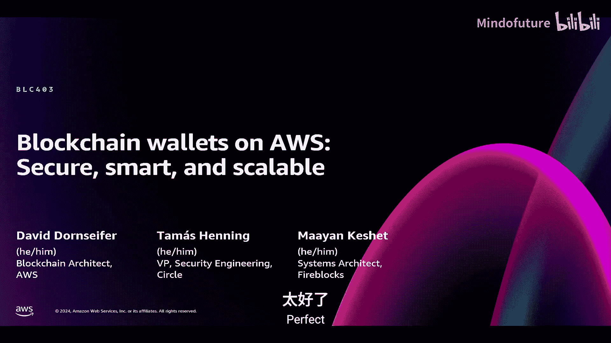
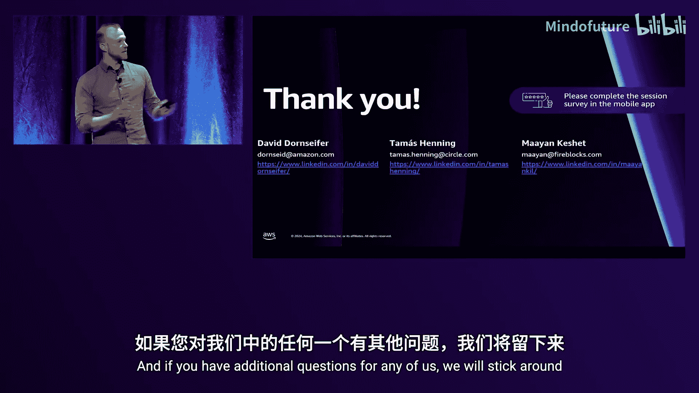
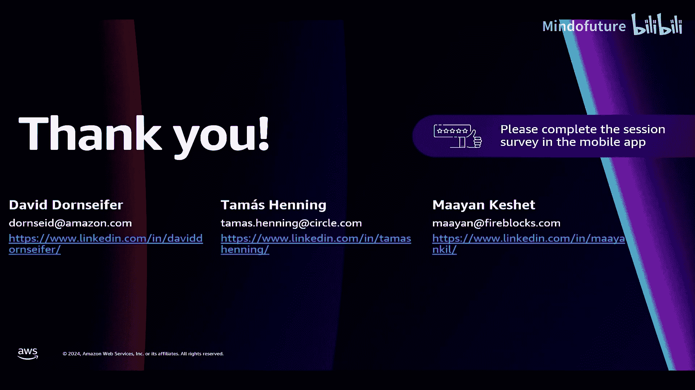

# 026：在AWS上构建区块链钱包 - 安全、智能且可扩展 (BLC403)



在本节课中，我们将学习如何在AWS上构建不同类型的区块链钱包。我们将探讨钱包的核心原理、不同分类及其适用场景，并深入了解如何使用AWS核心服务（如KMS、Cloud HSM和Nitro Enclaves）来实现安全、智能且可扩展的钱包解决方案。

## 区块链钱包基础原理 🔑

首先，我们需要理解区块链钱包的基本原理。一个区块链钱包的核心是密钥对。

*   **私钥**：一个保密的、用于生成数字签名的密钥。
*   **公钥**：由私钥推导出的公开密钥。
*   **公钥地址**：公钥经过特定算法（如EVM的`keccak256`哈希）转换后得到的公开地址，用于接收资产。

在区块链账本上，各类资产（如原生代币或ERC-20代币）的所有权指向一个公钥地址。当需要转移资产时，必须使用对应的私钥对交易进行签名。网络节点会验证该签名是否有效，并检查该地址是否有足够的资产，然后执行交易。

**核心公式**：`签名 = sign(交易数据， 私钥)`

因此，保护私钥是区块链钱包安全的核心。一旦私钥泄露，攻击者就能签署交易并转移该地址下的所有资产。

## 区块链钱包的类型 📂

上一节我们介绍了钱包的核心原理，本节中我们来看看钱包的不同类型。我们可以根据用户类型和使用场景对钱包进行分类。

### 零售用户钱包

以下是面向普通用户的几种主要钱包类型：

*   **托管型钱包**：由第三方公司（如币安、Coinbase）管理用户的私钥。它们提供全面的安全管理、密钥恢复等服务。用户通常需要进行多因素认证。这类钱包适用于**质押、交易、投资**等场景。
*   **非托管型钱包**：用户完全掌控自己的私钥。常见形式包括浏览器插件（如MetaMask）、专用硬件安全设备（如Ledger）或多签钱包、智能合约钱包（如Safe.global）。这类钱包优化了**用户控制和所有权**，但用户需自行负责密钥管理和备份，丢失即丢失资产。适用于**交易、投资、DAO金库管理**等。
*   **智能钱包/账户抽象钱包**：这是一种较新的类型，由智能合约管理。公司可以提供管理服务，同时钱包逻辑可定制化，能解决许多与非托管钱包相关的用户体验问题，例如社交登录。它也支持MFA，并因其可编程性适用于**游戏**等场景。

### 机构级钱包

对于企业级应用，钱包通常按“温度”分类：

*   **热钱包**：始终连接到互联网，支持程序化访问。即使使用HSM（硬件安全模块）保护密钥，如果攻击者能操纵钱包程序签署交易，风险依然存在。其特点是**高效、快速**，适用于需要持续程序化访问密钥的场景，如**质押、结算、在线托管**。
*   **温钱包**：与热钱包类似，但执行交易需要额外的人工审批（如生物识别或App确认）。通常采用更先进的密码学方案，如**多方计算**，涉及多方参与，而非单一密钥。适用于**大额数字资产日常转移**等需要高级安全设置的场景。
*   **冷钱包**：完全离线，没有程序化访问。需要人工进行签名操作，通过物理隔离提供**最高级别的安全性**。典型实现是离线HSM，存储在独立的保险柜中，仅由首席安全官访问。适用于**离线托管**，如养老金基金托管大量比特币。

## 构建区块链钱包的核心AWS组件 🧱

了解了钱包类型后，我们来看看在AWS上构建它们需要哪些核心组件。

以下是构建一个健壮的区块链钱包通常需要的AWS服务：

1.  **密钥管理服务**：用于安全地生成、存储和使用密钥。可以是AWS KMS、Cloud HSM或Secrets Manager（取决于具体用例）。
2.  **精细的访问控制**：使用AWS IAM实施最小权限原则，并使用CloudTrail进行审计。
3.  **高效的计算层**：用于运行钱包逻辑。可以是无服务器的Lambda、EC2实例，或更安全的Nitro Enclaves。
4.  **监控与日志**：使用Amazon CloudWatch进行高级监控和日志记录。
5.  **低延迟网络**：对于交易等用例，可能需要使用集群置放群组或增强网络为EC2实例提供超低延迟的API访问。

## 钱包实现示例一：基于KMS和Lambda的热钱包 🔥

现在，让我们看两个具体的实现示例。首先是一个相对简单的、基于KMS和Lambda的服务器热钱包架构。

该架构完全无服务器化：
1.  用户请求通过API Gateway进入。
2.  Lambda函数被触发。
3.  Lambda调用AWS KMS，使用存储在KMS中的密钥对交易进行签名。
4.  签名后的交易被返回并广播到区块链。

**优点**：
*   简单，完全托管。
*   AWS KMS支持密钥导入。
*   符合FIPS 140-2 Level 2标准。
*   可构建EVM兼容的区块链钱包。

**代码示意（伪代码）**：
```python
import boto3
kms_client = boto3.client('kms')
def sign_transaction(message):
    response = kms_client.sign(
        KeyId='your-key-id',
        Message=message,
        MessageType='RAW',
        SigningAlgorithm='ECDSA_SHA_256' # 例如，用于EVM
    )
    return response['Signature']
```

## 钱包实现示例二：基于Cloud HSM的冷钱包 ❄️

另一个例子是使用Cloud HSM构建的冷钱包。

该架构旨在实现离线安全：
1.  将Cloud HSM部署在一个没有互联网网关的私有子网中。
2.  密钥在Cloud HSM内部生成和管理。
3.  操作人员通过一个跳板机（堡垒主机）EC2实例来访问和管理Cloud HSM。

**优点**：
*   Cloud HSM是单租户的硬件安全设备，提供最高级别的隔离。
*   符合FIPS 140-2 Level 3标准。
*   支持密钥的导入和导出。
*   通过物理和网络隔离实现高安全性。

## 智能钱包与用户体验：Circle的实践 🌀

上一节我们看了基础的钱包实现，本节中我们来看看如何通过智能钱包提升用户体验。来自Circle的Thomas将介绍他们的可编程钱包解决方案。

Circle提供了全栈平台来帮助企业构建区块链应用。其Web3服务中的可编程钱包旨在为开发者提供极大灵活性。

以下是Circle提供的几种钱包用户体验方案：

*   **开发者控制的钱包**：开发者完全控制底层EOA或智能合约账户。开发者可以任何模式签署交易，同时向终端用户抽象掉区块链的复杂性。对用户而言，体验可能就像进行普通的法币转账。
*   **用户控制的钱包（MPC）**：利用多方计算技术进行签名。用户需要在移动设备上输入PIN等方式进行认证，其设备也参与MPC计算。这既提供了自定义API/UX的可能，又将控制权保留在用户手中，连开发者也无法干预。
*   **模块化钱包（开放测试版）**：允许实现高度可配置的模块化智能合约钱包。用户可以使用自己的密钥、开发者密钥或用户控制密钥。它完全兼容ERC-6900，可以灵活地添加或限制功能。

在架构上，Circle广泛使用AWS KMS来保护其生态系统运行所需的所有密钥和秘密。对于希望运行自己MPC节点的客户，Circle的架构也支持与客户的MPC服务器互联，实现完整的MPC分片控制。

从密钥管理角度看，Circle支持：
1.  **单签**：标准EOA交易。
2.  **MPC阈值签名**：典型的MPC计算。
3.  **通行密钥支持**：近期已发布。
4.  **多签支持**：即将推出，允许多个独立密钥达到阈值后执行策略和交易。

## 高级需求与AWS Nitro Enclaves介绍 🛡️

随着钱包功能越来越复杂，对安全计算的要求也更高。接下来，我们将探讨AWS Nitro Enclaves如何满足高级区块链钱包的需求。

首先，什么是Nitro Enclaves？它旨在为EC2实例提供额外的隔离和保护层。

在普通EC2实例上，root用户或管理员有可能访问实例上正在处理的明文数据。而Nitro Enclaves允许从EC2实例中划出一块专用的内存和CPU区域，将机密计算任务移入其中运行。

这个被称为“飞地”的专用虚拟机通过一个安全的本地通道（VSock）与父EC2实例通信。关键优势在于：即使是父EC2实例的root用户，也无法访问飞地内部正在处理的数据。

**Nitro Enclaves的特点**：
*   **它是**：一个隔离的、强化的、高度受限的轻量级Linux虚拟机，拥有独立内核，可以运行自己的加密密钥。
*   **它不是**：一个容器；没有持久化存储（所有内容都是临时的）；不允许任何用户（包括root）访问；默认没有外部网络连接。

除了隔离，Nitro Enclaves还有一个关键特性：**加密证明**。

飞地可以生成“证明文档”，其中包含飞地创建时的状态度量值（PCR哈希）。该文档由Nitro管理程序签名，并可被AWS根证书验证。通过验证，外部系统可以确信该文档来自一个真实的、状态已知的飞地。

我们可以将此证明与AWS KMS策略结合。例如，可以定义一项KMS策略，规定只有特定PCR值（即特定状态）的飞地才能对某个非对称密钥执行`Decrypt`操作。这确保了私钥的明文只会在受信任的飞地内部暴露，任何操作员都无法读取。

**Nitro Enclaves的主要优势**：
*   **强隔离与安全性**：默认无网络，通过VSock与父实例安全通信。
*   **灵活性**：支持x86和Arm架构，可配置vCPU和内存。
*   **加密证明**：可远程验证飞地身份和完整性。
*   **零额外成本**：可在任何支持的EC2实例上启用，不产生额外费用。

## 基于Nitro Enclaves的简单钱包架构 🏗️

让我们将上述概念整合起来，看一个利用Nitro Enclaves构建简单区块链钱包的架构。

**工作流程**：
1.  加密的区块链私钥（使用KMS加密）存储在AWS Secrets Manager或S3/DynamoDB中。
2.  Nitro Enclave启动后，下载这些加密的密钥。
3.  飞地向AWS KMS提供其加密证明。
4.  KMS验证证明，确认飞地身份和完整性后，执行解密操作，将私钥明文仅释放到飞地内部。
5.  由于飞地是软件定义的，我们可以在其中运行任何所需的加密算法（如BLS签名，用于非EVM链），进行签名操作。
6.  签名结果返回给用户。

**优点**：
*   **灵活性**：支持任何加密曲线和算法（如BLS）。
*   **安全性**：私钥明文永不暴露在飞地之外。
*   **成本效益**：适用于大规模密钥管理操作，无额外许可成本。
*   **兼容性**：支持Graviton和x86架构。

## 实战经验：Fireblocks如何使用Nitro Enclaves 🔥

理论需要实践验证。现在，来自Fireblocks的Mayan将分享他们使用Nitro Enclaves构建MPC钱包的实战经验和关键收获。

Fireblocks为机构提供区块链基础设施和钱包服务。在其交易流程中，**签名环节**尤为关键，因为“不是你的密钥，就不是你的加密货币”。

Fireblocks采用**多方计算**技术来管理签名密钥。在MPC中，密钥被分成多个“分片”，由多个参与方独立生成和持有。完整的逻辑密钥从未在任何地方完整存在。要签署交易，所有参与方必须通过MPC协议进行通信协作。如果任何一方怀疑有问题，可以拒绝参与，交易就无法完成。MPC还具有区块链无关的优点。

Fireblocks的典型设置包括两个由Fireblocks管理的Co-Signer，以及一个部署在客户环境中的Customer Co-Signer。

**Customer Co-Signer在AWS上的架构**：
1.  **客户准备**：创建S3存储桶、启用Nitro的EC2实例、以及一个KMS密钥。
2.  **部署**：客户在EC2上安装Fireblocks提供的飞地镜像。
3.  **启动与证明**：Co-Signer启动后，从S3获取加密的MPC分片数据库。飞地向KMS提供证明。
4.  **解密与运行**：KMS验证证明成功后，飞地解密数据库，获得MPC分片。此后，它便能与Fireblocks网络通信，参与MPC签名计算。

**关键收获**：
1.  **VM级隔离更灵活**：Nitro Enclaves在虚拟机级别隔离，开发者可以使用Node.js、Go等多种语言开发受信任的代码，而不像某些框架仅限于C++/Rust。这提升了开发速度和团队参与度。
2.  **仍需防范供应链攻击**：必须对飞地内使用的软件包设置允许列表，并在CI/CD流水线中扫描镜像漏洞。Fireblocks创建了工具来扫描EIF格式的飞地镜像。
3.  **利用飞地构建可信的CI/CD**：Fireblocks利用Nitro Enclaves创建了一个“构建器飞地”。该飞地镜像在离线机器中生成并验证，作为信任根。在线构建时，该构建器飞地会验证经过多人签名的构建任务，然后在飞地内部安全地构建和签名最终镜像，从而将离线机器的安全信任扩展到快速、在线的现代构建流程中。

## 方案总结与对比 📊

本节课中我们一起学习了多种在AWS上构建区块链钱包的方案。现在让我们对它们进行总结和对比。

| 特性/方案 | AWS KMS 热钱包 | Cloud HSM 冷钱包 | Nitro Enclaves | Nitro Enclaves + EKS |
| :--- | :--- | :--- | :--- | :--- |
| **密钥导入/导出** | 仅导入 | 支持 | 支持 | 支持 |
| **非EVM链支持** | 否 | 否 | 是（软件自定义） | 是（软件自定义） |
| **智能钱包支持** | 是 | 是 | 是 | 是 |
| **质押/BLS支持** | 否 | 否 | 是 | 是 |
| **实现复杂度** | 低（无服务器） | 中（需VPC设置） | 高（需自定义软件） | 高（需管理K8s） |
| **成本考量** | 按密钥收费，较贵 | 专用HSM，较贵 | 仅EC2成本，成本效益高 | EC2 + EKS成本，较贵 |
| **合规性** | FIPS 140-2 L2 | FIPS 140-2 L3 | 依赖自身实现 | 依赖自身实现 |
| **额外优势** | 完全托管，简单 | 单租户，最高隔离 | 软件定义，灵活 | 支持K8s弹性伸缩 |

**总结**：
*   **AWS KMS**：适合需要快速启动、完全托管、且主要针对EVM链的简单热钱包场景。
*   **Cloud HSM**：适合需要最高级别硬件安全认证和隔离的合规性要求严格的场景。
*   **AWS Nitro Enclaves**：适合需要高度灵活性（支持任意加密算法）、成本效益高，且愿意投入开发自定义安全软件的中高级场景。
*   **Nitro Enclaves + EKS**：适合已经使用Kubernetes，并需要结合容器编排的弹性伸缩能力来管理大规模钱包服务的高级场景。





本节课中，我们从区块链钱包的基础原理出发，探讨了其不同类型和适用场景，并深入研究了如何利用AWS KMS、Cloud HSM以及Nitro Enclaves等核心服务，安全、智能且可扩展地构建钱包解决方案。希望这些内容能为您在AWS上开启区块链钱包的构建之旅提供清晰的指引。