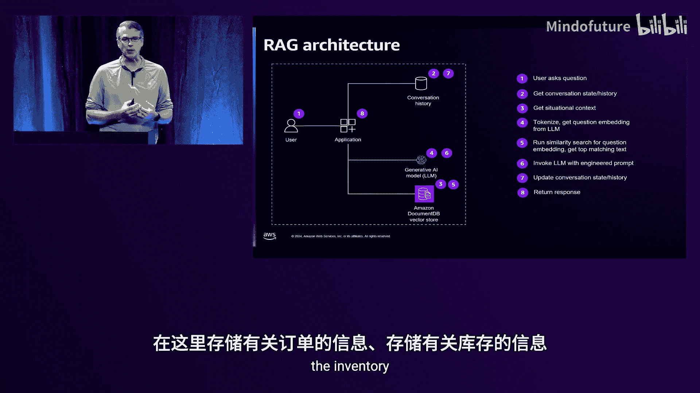
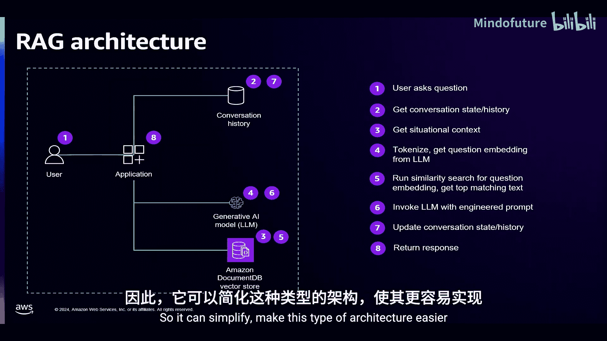
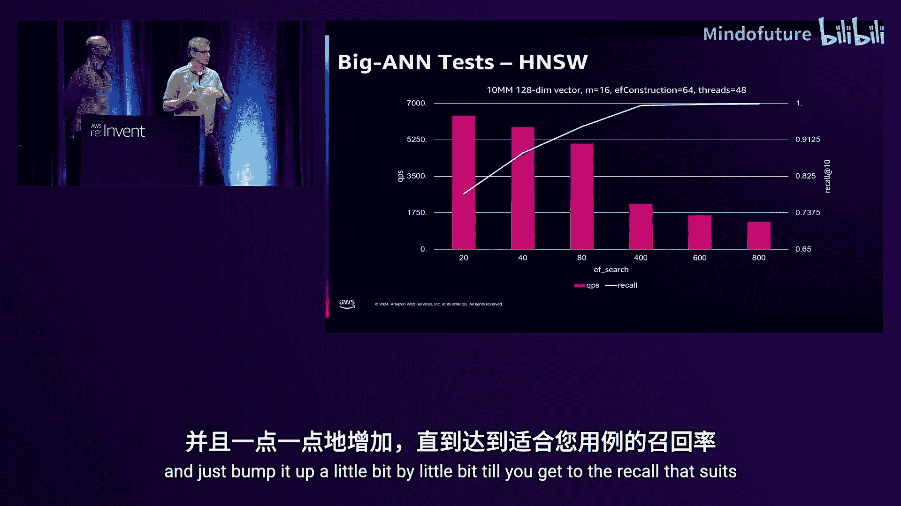
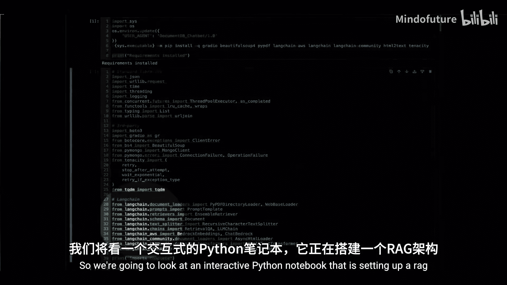
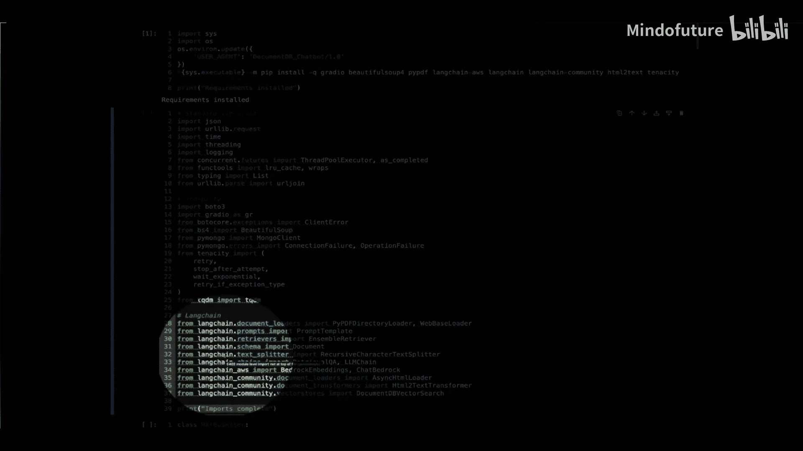
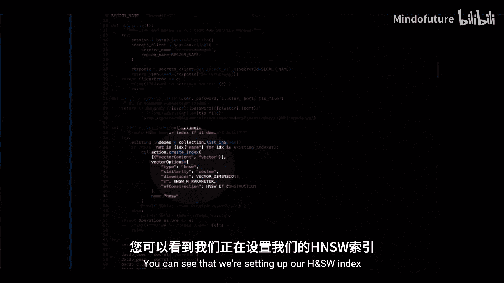
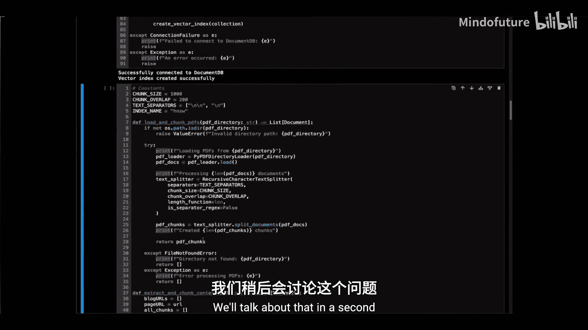
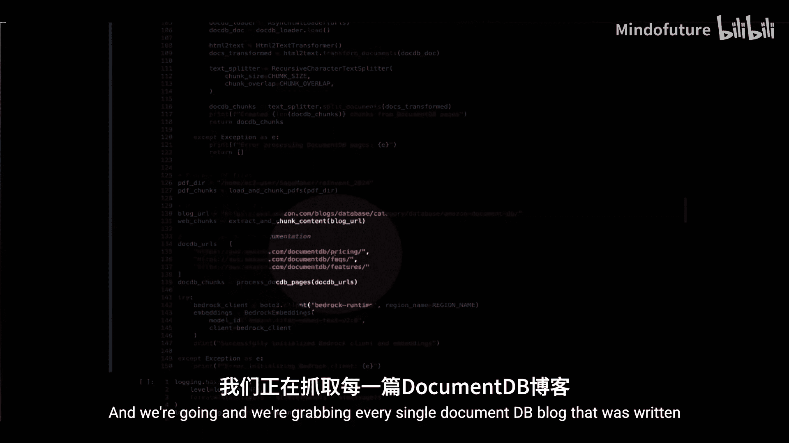
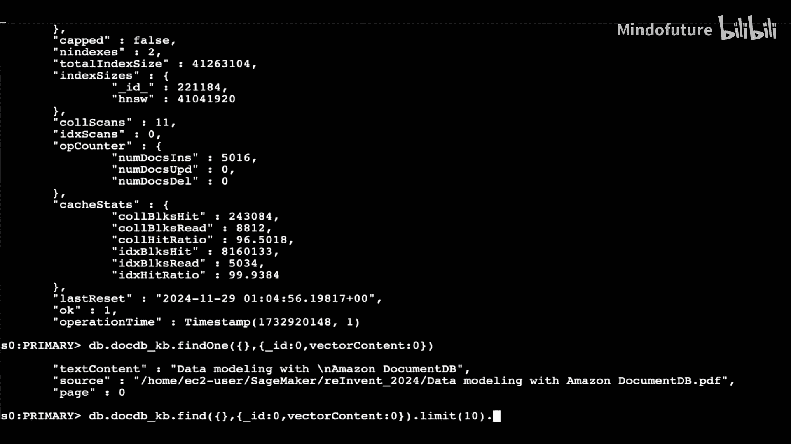
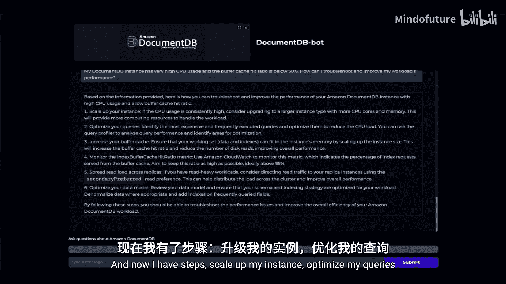

# 027：DAT320

在本节课中，我们将学习如何利用生成式 AI 和 Amazon DocumentDB 来增强应用程序的智能。我们将从向量搜索的基础知识开始，探讨常见的访问模式，深入了解 DocumentDB 的向量搜索功能，并学习相关的最佳实践。课程的重点是数据库侧的生成式 AI 应用。

## 向量搜索基础

上一节我们介绍了课程概述，本节中我们来看看向量搜索的核心概念。

向量搜索的目的是在数据库上**构建、搜索、管理和使用向量嵌入**。通过对这些嵌入执行向量搜索，可以获得上下文相关的答案。这与基于短语匹配的文本搜索不同，它寻找的是语义上的相关性和上下文。

以下是选择向量数据库时需要考虑的关键因素：
*   **安全性**：确保数据安全。
*   **结果相关性**：获得最符合上下文的结果。
*   **数据邻近性**：让向量数据库靠近你的数据。

整个过程始于你的**领域特定数据**。你需要将这些数据分解成具有独立意义的元素，这个过程称为**分词**。这些元素可以是单词、段落、句子或整个文档。

然后，这些元素会通过一个**大语言模型**进行处理，被转换成由大量数字组成的数组，即**向量嵌入**。向量的维度（数字的数量）取决于你选择的模型，可能从200维到超过4000维不等。

这些数字存在于一个多维空间中，语义相似的项在空间中的位置会更接近。因此，寻找语义相似的结果就变成了计算两个向量之间距离的数学问题。

整个流程的关键在于选择适合你用例的选项来创建这些嵌入。

## 检索增强生成架构

理解了向量搜索的基础后，本节我们来看看一个具体的应用架构：检索增强生成。

RAG 的核心思想是利用你的操作数据来微调大语言模型，而无需从头训练模型。它通过检索与用户查询相关的信息，并将其作为上下文提供给 LLM，从而生成更准确、更相关的回答。

以下是一个 RAG 架构的工作流程示例：
1.  **用户交互**：用户向生成式 AI 应用提出问题。
2.  **会话历史查询**：应用查询数据存储，获取当前的会话历史记录。
3.  **事实查找**：应用访问其他企业数据存储库，查找与问题相关的事实信息。
4.  **提示词构建**：应用将用户输入、会话历史和查找到的事实信息，填入预定义的提示词模板中。
5.  **向量化查询**：应用将构建好的提示词发送给大语言模型，将其转换为查询向量。
6.  **向量相似性搜索**：应用使用查询向量，在向量数据库中执行相似性搜索，找到最相关的文档片段。
7.  **响应生成**：应用将搜索结果连同其他信息再次发送给 LLM，生成最终的自然语言响应。
8.  **更新历史并返回**：应用更新会话历史，并将响应返回给用户。

在这个架构中，如果使用 Amazon DocumentDB，可以简化系统设计。DocumentDB 既能存储向量嵌入，也能存储订单、库存等操作数据。这样，你可以在一个地方完成向量查找并获取所有关联信息，无需在多个系统间同步数据。

## 为什么选择 Amazon DocumentDB 作为向量存储？

了解了 RAG 架构后，我们来看看为什么 Amazon DocumentDB 是一个优秀的向量存储选择。

以下是选择 DocumentDB 的几个主要原因：
*   **减少数据同步和移动**：将操作数据和向量嵌入存储在同一个数据库中，无需在系统间同步数据。
*   **使用熟悉的工具**：如果你已经在使用 DocumentDB，可以继续使用相同的数据库知识、操作流程和 API，无需学习新的系统。
*   **提升最终用户体验**：减少交互过程中的系统数量，有助于更快地获取答案。
*   **避免额外的许可和管理**：无需为专门的向量数据库管理额外的许可和运维负担。

接下来，我们简要了解一下 Amazon DocumentDB 的关键特性：
*   **快速且可扩展**：采用计算与存储分离的云原生架构，存储可自动扩展至 128 TiB，计算层可配置最多 16 个实例。
*   **完全托管服务**：AWS 负责处理所有无差别的繁重工作。
*   **企业级就绪**：提供 99.99% 的可用性，数据在集群内的三个可用区自动复制，确保高持久性。
*   **多区域部署**：支持全球集群，用于实现低延迟读取或灾难恢复。
*   **MongoDB 兼容**：支持 MongoDB 的 API 和操作符，可以使用相同的驱动程序和工具。

DocumentDB 非常适合以下生成式 AI 用例：语义搜索、智能产品目录、推荐引擎、异常检测以及 RAG 驱动的聊天机器人。

目前，DocumentDB 支持两种向量索引类型和最多 2000 维的向量：
*   **HNSW**：分层可导航小世界索引。
*   **IVF Flat**：倒排文件与平面压缩索引。
*   **距离度量**：支持欧几里得距离、余弦相似度和点积。

## DocumentDB 向量索引深入解析

现在我们已经了解了为什么选择 DocumentDB，本节将深入探讨其支持的两种向量索引的工作原理。

### IVF Flat 索引

IVF Flat 是“倒排文件与平面压缩”的缩写。创建此索引时，你需要指定列表数量。索引会将所有文档向量分割到指定数量的列表中，并为每个列表计算一个中心点。

查询时，会将查询向量与这些中心点进行比较，找到最接近的中心点所在的列表，然后在该列表内搜索最相似的文档。

关键参数：
*   `k`：查询返回的最相似结果的数量。
*   `相似性度量`：支持欧几里得距离、余弦相似度、点积。
*   `probes`：查询时需要考虑的列表数量。

需要注意的是，IVF Flat 索引在创建后是静态的。随着数据的插入、删除和更新，新文档必须归入最初创建的列表中，这可能导致查询效率变化，有时需要重新构建索引。

### HNSW 索引

HNSW 代表“分层可导航小世界”。它将向量组织成一个图结构。与 IVF Flat 不同，HNSW 索引是增量构建的，无需预先训练，可以在插入数据前创建索引。

查询从图的最高层开始，逐步向下层移动，直到找到足够数量的最近邻。

关键参数：
*   `M`：构建索引时，每个节点与其它节点建立的最大连接数。`M` 值越高，记忆的“邻居”越多，索引越精确，但占用内存也越大。
*   `efConstruction`：构建索引时，为每个节点考虑的邻居候选数量。
*   `efSearch`：执行查询时，在每一层需要检查的邻居节点数量。

选择 `M` 和 `efSearch` 需要在索引构建成本（内存、时间）和查询性能/精度之间进行权衡。

### 索引选择指南

面对两种索引，如何选择？以下是一些指导原则：

**选择 IVF Flat 的情况：**
*   数据相对静态，不经常更新。
*   需要非常快的索引构建速度。
*   可以接受在数据发生重大变化后重新构建索引。

**选择 HNSW 的情况：**
*   数据频繁更新、插入或删除。
*   需要易于管理，支持增量更新。
*   追求高查询性能和高召回率。
*   可以接受索引构建速度较慢，以及更高的内存占用。

**注意**：如果需要精确匹配，不应使用向量索引，而应使用常规的数据库索引。

在性能方面，IVF Flat 的索引构建速度通常远快于 HNSW，尤其是在支持多线程构建的情况下。但是，如果能在插入数据前预先创建 HNSW 索引，则可以显著提升数据插入阶段的效率。

## 向量搜索最佳实践

了解了索引机制后，本节我们来看看在使用 DocumentDB 进行向量搜索时的一些最佳实践。

### 维度数量与存储空间

首先，需要注意向量嵌入会占用存储空间。嵌入的维度越多，通常搜索效果越好，但文档也会变得越大。

可以使用以下公式快速估算每个文档因向量嵌入而增加的额外大小：
`额外大小 ≈ (键名字符长度 + 1) + (维度数量 * 13 字节)`

例如，一个名为 `embedding`（9个字符）的键，存储一个 100 维的向量，大约会增加：`(9+1) + (100*13) = 10 + 1300 = 1310 字节 ≈ 1.3 KB`。

因此，不要盲目使用最大维度数，需要根据用例在精度和存储/性能之间取得平衡。

### HNSW 参数调优

调优的目标取决于你的需求：是最低延迟/资源消耗，最佳召回率，还是两者平衡。

**平衡起点（默认值）**：
*   `M` = 16
*   `efConstruction` = 64
*   `efSearch` = 查询时可调整

**优化内存和延迟**：
如果默认配置资源消耗过高，可以尝试：
*   降低 `M` 值（减少连接数）。
*   降低 `efConstruction` 值（构建时考虑更少的邻居）。
*   降低 `efSearch` 值（查询时检查更少的邻居）。
这可能会以牺牲一些召回率为代价。

**优化召回率**：
如果召回率不足，可以尝试：
*   提高 `M` 值。
*   提高 `efConstruction` 值。
*   提高 `efSearch` 值。
这可能会增加资源消耗和查询延迟。

### IVF Flat 参数调优

对于 IVF Flat，没有默认值，需要在创建索引时指定。

**平衡起点**：
*   `lists`（列表数）：
    *   如果文档数 `n` <= 1,000,000，建议 `lists = sqrt(n)`。
    *   如果 `n` > 1,000,000，建议 `lists = n / 1000`。
*   `probes`（探查数）：建议从 `sqrt(lists)` 开始。

**优化内存和延迟**：
*   **增加** `lists` 数量（使每个列表更小，扫描更快）。
*   **减少** `probes` 数量（查询时扫描更少的列表）。
这可能会降低召回率。

**优化召回率**：
*   **减少** `lists` 数量（使每个列表更大，包含更多候选）。
*   **增加** `probes` 数量（查询时扫描更多的列表）。
这可能会增加资源消耗和查询延迟。

### 性能与召回率的权衡

无论是 HNSW 还是 IVF Flat，都存在性能与召回率的权衡。以 IVF Flat 为例，增加 `probes` 值通常会提高召回率，但会导致每秒查询数下降。重要的是，当 `probes` 增加到一定程度后，召回率的提升会变得微乎其微，而性能代价却持续增加。因此，需要通过测试找到满足你用例需求的最佳平衡点，避免无谓地使用最大参数值。

## 实战演示：构建 DocumentDB 智能助手

学习了最佳实践后，我们通过一个实战演示来看看如何将这些概念结合起来。

演示展示了一个使用 RAG 架构构建的 DocumentDB 智能助手。它利用 DocumentDB 的公开材料（开发指南、电子书、博客、定价页等）作为领域特定知识库。

**构建过程概述**：
1.  **数据准备**：收集所有公开的 DocumentDB 文档。
2.  **文本分块**：将文档内容分割成较小的文本块（例如 1000 字符），块之间可以有重叠，以确保上下文连贯。
3.  **向量化**：使用大语言模型将文本块转换为向量嵌入。
4.  **存储**：将文本块、元数据（如来源）和对应的向量嵌入存储到 Amazon DocumentDB 集合中，并创建 HNSW 索引。
5.  **构建聊天代理**：设置提示词模板，指导 AI 以专业、格式化的方式回答问题。

**助手能力**：
*   **知识问答**：例如，“DocumentDB 支持哪些区域？”、“每个集群允许的最大集合数是多少？”
*   **代码生成**：例如，“为我写一个创建部分过滤索引的查询。”
*   **故障排查**：例如，“我的 DocumentDB 实例 CPU 使用率很高，缓冲缓存命中率只有 50%，这意味着什么？我该如何做？”

这个演示体现了 RAG 的强大之处：通过结合特定领域知识（DocumentDB 文档）和大语言模型的通用能力，创建了一个专业、有用的智能助手。

## 总结与资源

本节课中，我们一起学习了如何利用 Amazon DocumentDB 和生成式 AI 来构建智能应用。

我们从向量搜索和 RAG 架构的基础讲起，深入探讨了 DocumentDB 的两种向量索引（IVF Flat 和 HNSW）的工作原理、选择依据和调优最佳实践。最后，通过一个实战演示，我们看到了如何将这些技术组合起来，构建一个专业的 DocumentDB 智能助手。

构建生成式 AI 应用涉及许多变量：索引类型、参数（M, efSearch, k, lists, probes）、大语言模型选择、文本分块策略、提示词工程等。对于初学者，可能会感到无所适从。

**建议是：立即开始动手实践。**

以下是帮助你入门的资源：
*   **GitHub 代码库**：AWS 提供了包含交互式 Python Notebook 的示例代码，你可以基于此进行修改，融入自己的数据。
*   **数据建模电子书**：在 AWS Skill Builder 上可以找到，帮助你深入理解 DocumentDB。
*   **公开示例**：本次演示中的 DocumentDB 聊天机器人代码也将尽快公开在 GitHub 上。

通过动手实验，调整各种参数，观察它们如何影响结果，是掌握这项技术的最佳途径。

