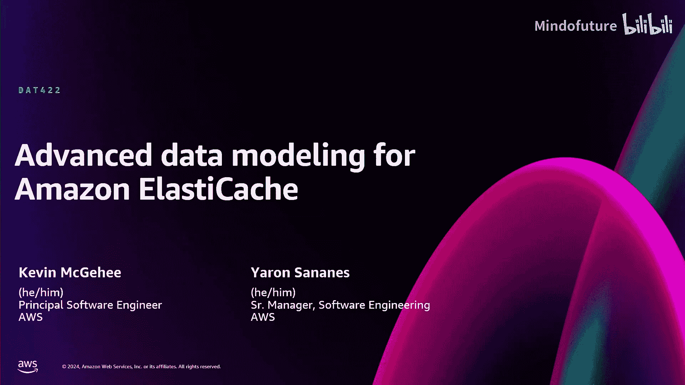
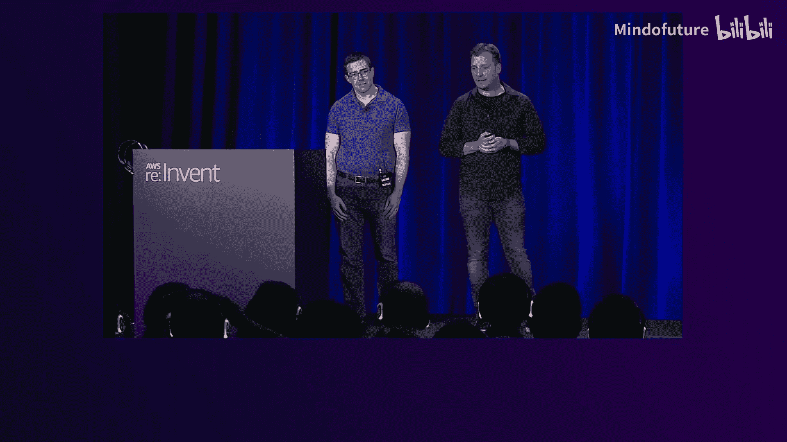
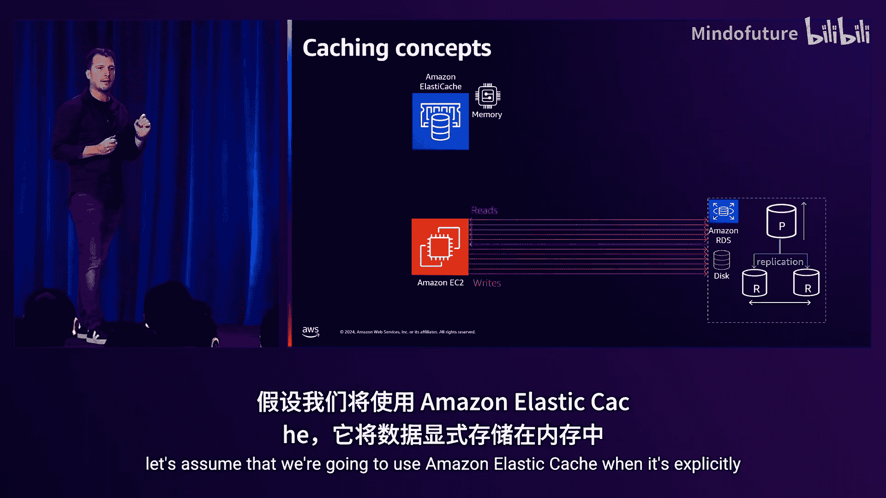
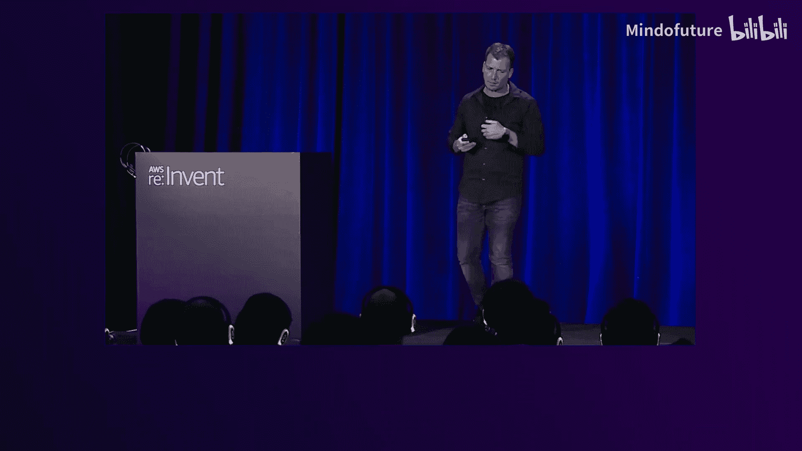
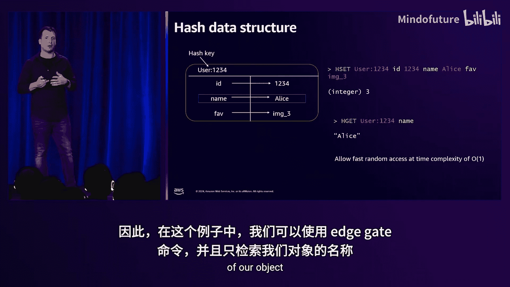
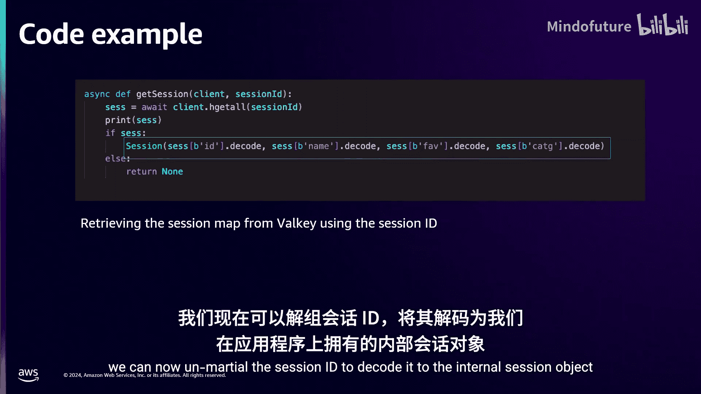
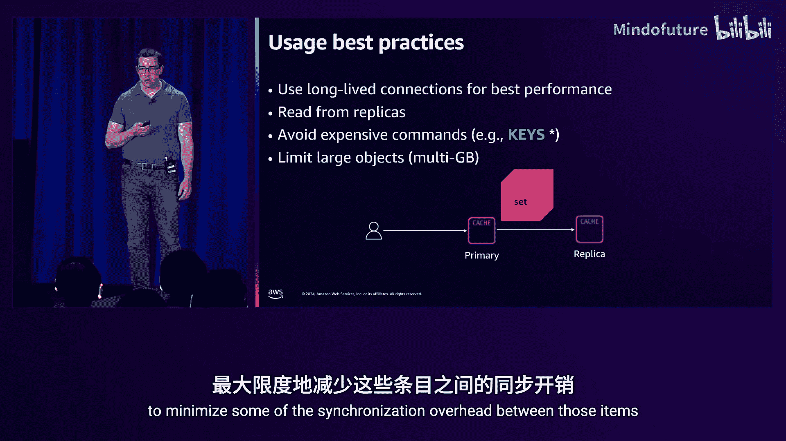

# 028：DAT422





## 概述

在本节课中，我们将学习如何利用 Amazon ElastiCache 及其支持的开源引擎（特别是 Valkey）的高级数据结构和功能，来加速应用性能、降低扩展成本，并构建复杂的实时应用。我们将通过一个虚构的“夜空市场”应用示例，逐步探讨缓存策略、会话存储、实时分析、地理空间查询和速率限制等核心用例。

---

## 章节 1：ElastiCache 与 Valkey 简介

大家好，欢迎参加本次课程。我是来自 AWS ElastiCache 团队的 Yaon，与我一起的还有 Kevin McGay。今天我们将探讨如何利用 ElastiCache 的高级数据结构，在每秒处理数百万请求的同时，实现微秒级的响应时间。

Amazon ElastiCache 是一项完全托管的服务，可让您在云中更轻松地部署、操作和扩展内存数据存储。它通过提供微秒级的响应时间，显著提升应用程序的性能。

目前，ElastiCache 支持三种开源引擎：
1.  Redis 开源版
2.  Memcached
3.  **Valkey**（今年新宣布支持）

Valkey 是一个高性能的键值数据存储，由原 Redis 开源贡献者构建，可作为 Redis 7.0.2 的“直接替代品”。它由 Linux 基金会托管，确保了其开源承诺。Valkey 在性能、可靠性和效率方面处于领先地位。AWS 团队为其贡献了新的线程模型（支持每秒百万级请求）和效率架构（可减少高达 20% 的内存使用）。





---

## 章节 2：缓存策略与应用性能优化

上一节我们介绍了 ElastiCache 和 Valkey。本节中，我们来看看如何通过缓存策略优化应用性能和成本。

假设我们的“夜空市场”应用运行在 Amazon EC2 上，并使用 Amazon RDS 持久化存储数据。随着负载增加，仅靠扩展 RDS 可能遇到瓶颈。此时，我们可以引入 ElastiCache，将数据存储在内存中，内存访问速度比磁盘快约 20 倍。虽然 RDS 也有缓存层，但对于涉及多表连接的复杂 SQL 查询，仍可能产生额外延迟。而 ElastiCache 可以存储查询结果集，直接从缓存中获取，实现微秒级响应。

以下是几种常见的缓存策略：

*   **延迟加载**：首先尝试从缓存读取数据。如果命中，则快速返回。如果未命中，则从源数据库（如 RDS）读取，然后将结果写入缓存，供后续请求使用。
*   **直写**：先将数据写入源数据库，紧接着将其写入缓存，确保缓存与源数据一致。

对于我们的市场应用，我们可以结合这两种策略：使用延迟加载来读取数据，同时利用直写思想，在源数据变更时使缓存失效。

例如，我们可以使用 DynamoDB 的触发器功能，在数据更新时触发一个 AWS Lambda 函数，异步地将对应缓存项标记为无效或删除。

为了避免缓存“击穿”问题（大量请求同时访问一个刚过期的热点 key，导致请求全部涌向后端数据库），我们可以实现一个同步机制，例如使用分布式锁。只有第一个获取锁的客户端去后端数据库刷新数据，其他客户端等待，待数据刷新完成后，所有客户端再从缓存读取。

**代码示例：使用 Valkey 命令实现简单的锁机制**
```python
# 伪代码示例
import redis
client = redis.Redis(...)

def get_data_with_lock(key):
    # 1. 尝试从缓存获取
    data = client.get(key)
    if data:
        return data

    # 2. 尝试获取锁
    lock_key = f"lock:{key}"
    lock_acquired = client.set(lock_key, "locked", nx=True, ex=5) # 设置5秒过期
    if lock_acquired:
        # 3. 获取锁成功，从数据库读取
        data = fetch_from_database(key)
        # 4. 写入缓存
        client.setex(key, ttl=3600, value=data)
        # 5. 释放锁 (通过过期自动释放，也可手动删除)
        client.delete(lock_key)
        return data
    else:
        # 6. 获取锁失败，等待并重试
        time.sleep(0.1)
        return get_data_with_lock(key)
```

此外，我们还可以缓存 S3 对象等二进制数据，因为 Valkey 是二进制安全的，可以序列化存储几乎所有类型的数据，从而减少 I/O 操作并提升性能。

---

## 章节 3：客户端缓存与会话存储

理解了基础缓存后，我们来看更高级的客户端缓存和会话存储用例。

**客户端缓存** 可以进一步降低延迟。其思路是：应用从远程缓存获取数据后，将其存储在本地内存中。后续请求直接读取本地缓存，直到该数据被标记为失效。失效可以通过 TTL 或订阅缓存失效通知来实现。

Valkey 支持两种客户端缓存模式：
1.  **默认模式**：服务器跟踪每个客户端感兴趣的 key，当 key 变更时，只通知相关的客户端。这会消耗服务器端内存。
2.  **广播模式**：客户端订阅一个 key 前缀，任何匹配该前缀的 key 发生变更时，所有订阅的客户端都会收到通知。



实现时，建议使用连接池。可以指定一个连接专门用于处理失效通知，其他连接用于常规数据操作。



**会话存储** 是我们的市场应用另一个关键需求。我们需要为每个连接的用户存储购物车、用户偏好、认证信息等。挑战在于需要一个低延迟、高并发的数据存储来处理这些短暂且快速变化的会话数据。

使用 ElastiCache 作为分布式会话存储，可以使得后端微服务架构保持无状态。即使服务器实例被移除或添加，所有会话仍然有效，为用户提供无缝体验。

通常使用 **Hash** 数据结构存储会话数据。Hash 的键是会话 ID，字段和值对应会话中的各个属性。这样可以实现常数时间复杂度的单个字段访问。

**代码示例：使用 Valkey Hash 存储会话**
```python
import redis
import json

client = redis.Redis(...)

def create_session(user_id, preferences):
    session_id = f"session:{user_id}"
    session_data = {
        "user_id": user_id,
        "preferences": json.dumps(preferences),
        "cart": "[]"
    }
    # 使用 HMSET 存储多个字段
    client.hset(session_id, mapping=session_data)
    # 设置会话过期时间
    client.expire(session_id, 3600)
    return session_id

def get_session(session_id):
    # 获取整个会话 Hash
    session_data = client.hgetall(session_id)
    if session_data:
        # 解码数据
        session_data["preferences"] = json.loads(session_data["preferences"])
        return session_data
    return None
```

---

## 章节 4：机器学习特征存储与实时分析

现在，让我们为市场应用添加机器学习能力，例如个性化图片推荐。ElastiCache 可以作为机器学习基础设施的一部分，充当**在线特征存储**。

特征存储是机器学习基础设施的核心组件，为训练和推理提供统一的特征源。我们通常区分离线特征（用于训练和批量评分）和在线特征（用于实时推理）。

在架构中，我们可以使用 Amazon SageMaker Feature Store 作为中央处理系统来注册特征定义。然后，使用 Amazon RDS 作为离线特征存储，使用 ElastiCache 作为在线特征存储，为在线推理提供超快的特征读取速度。

定义特征存储时，可以指定 Valkey 作为在线存储引擎，并提供 ElastiCache 端点。与会话存储类似，在线特征也常使用 **Hash** 数据结构存储，其中特征名作为字段，特征值作为对应的值。

接下来，Kevin 将介绍如何利用 ElastiCache 和 Valkey API 进行实时分析。

---

## 章节 5：实时分析：排行榜与基数统计

感谢 Yaon。现在我们来探讨一些实时分析用例。

第一个问题是：在我们的夜空市场中，哪些照片被查看得最多？我们可以使用**排行榜**功能。

在 Valkey 中，可以使用 **Sorted Set** 数据结构来实现排行榜。Sorted Set 内部结合了哈希表（存储成员到分数的映射）和跳表（按分数排序成员）。这种结构使得读写操作的时间复杂度为 **O(log N)**。

**代码示例：使用 Sorted Set 管理图片浏览量排行榜**
```bash
# 添加或更新图片浏览量
ZADD leaderboard:views 31 image1
ZADD leaderboard:views 56 image4
# 增加某个图片的浏览量
ZINCRBY leaderboard:views 10 image1
# 获取排行榜前 N 名（从高到低）
ZREVRANGE leaderboard:views 0 9 WITHSCORES
```

另一个分析需求是统计每张照片的**独立访客数**。最直接的方法是使用 Set 存储所有用户 ID，但空间复杂度为 **O(N)**。

Valkey 提供了 **HyperLogLog** 这种概率数据结构来估算集合的基数。它只需要约 12KB 的固定内存，误差率低于 1%，并且操作是常数时间复杂度。

**代码示例：使用 HyperLogLog 估算独立访客**
```bash
# 向 HyperLogLog 添加用户
PFADD viewers:image1 user123 user456 user789
# 估算独立用户数
PFCOUNT viewers:image1
```

通过实验对比，在添加 10，000 个元素后，Set 消耗约 420KB 内存并给出精确计数，而 HyperLogLog 仅消耗约 12KB 内存，估算误差在承诺范围内（例如少 13 个），内存节省超过 30 倍。

---

## 章节 6：地理空间查询与速率限制

我们还可以利用 Valkey 的**地理空间**能力。例如，用户可能想查看在自己当前位置附近拍摄的夜空照片。

Valkey 使用 **GEO** 数据结构（基于 Sorted Set 实现），通过 GeoHash 算法将经纬度编码为分数。支持半径查询、距离计算等操作。

**代码示例：地理空间操作**
```bash
# 添加地理位置
GEOADD photos:locations -115.1728 36.1147 image:strip
GEOADD photos:locations -115.1553 36.0801 image:airport
# 查询5公里半径内的照片
GEORADIUS photos:locations -115.1669 36.1213 5 km
# 计算两个地点间的距离
GEODIST photos:locations image:strip image:airport km
```

**速率限制** 是另一个常见用例。在分布式应用中，我们需要一个中心化的地方来协调对下游资源（如天气 API）的调用限制。

一个简单的速率限制器可以利用 Valkey 的 **INCR** 命令和 **TTL** 实现。更高级的可以使用**令牌桶算法**，该算法需要维护桶的容量、补充速率和当前令牌数，适合使用 **Hash** 数据结构存储状态。

**代码示例：简单速率限制器 Lua 脚本**
```lua
-- Lua 脚本实现简单速率限制
local key = KEYS[1]
local limit = 4
local window = 10

local current = redis.call('GET', key)
if current == false then
    redis.call('SETEX', key, window, 1)
    return 1
elseif tonumber(current) < limit then
    redis.call('INCR', key)
    return 1
else
    return 0
end
```
在客户端，您需要先加载脚本，然后使用其返回的 SHA1 标识来执行它。

---

## 章节 7：最佳实践与运维概览

最后，我们来讨论一些使用 ElastiCache 和 Valkey 的最佳实践和运维要点。

首先，**缓存不是持久化数据库**。ElastiCache 优先保证可用性（可读可写），主节点和副本节点之间的复制是异步的。这意味着在主节点故障时，可能丢失最近已确认但尚未复制到副本的写入数据。最佳实践是设计应用能够容忍这种数据丢失，例如通过缓存未命中时回源重建。如果无法容忍数据丢失，可以考虑使用 **Amazon MemoryDB**，它提供 Valkey 兼容的 API，但通过事务日志保证了持久性和一致性。

管理缓存数据大小的方法：
1.  **显式删除或覆盖**
2.  **设置过期时间**：使用 `EXPIRE` 或 `EXPIREAT` 命令。最佳实践是为过期时间添加随机抖动，避免大量 key 同时过期导致的“惊群效应”。
3.  **驱逐策略**：当内存满时自动移除数据。可以选择从所有 key 中驱逐，或仅从设置了 TTL 的 key 中驱逐。算法包括 LRU、LFU 或按 TTL 驱逐。

关于**容量规划**，没有一刀切的答案，这取决于具体用例。通常需要在成本（缓存大小）和缓存命中率之间权衡。对于纯缓存工作负载，超过一定阈值后扩展的收益会递减。对于持久化使用（如排行榜），则取决于数据量大小。

建议利用**自动扩展**功能：
*   **ElastiCache Serverless**：无需管理节点，按实际数据存储量和请求量计费，并可设置成本控制上限。
*   **节点式部署**：结合 **Application Auto Scaling**，根据发布的指标（如 CPU 使用率、数据存储大小）自动扩展节点。

**使用最佳实践**：
*   **使用长连接/连接池**：避免频繁创建连接带来的 TCP/TLS 握手开销。
*   **从副本读取**：可以提高吞吐量并可能降低延迟（如果副本位于同一可用区）。
*   **了解命令复杂度**：避免使用 `KEYS *` 这样的 **O(N)** 命令。对于大型集合，考虑分片。
*   **限制超大对象**：避免存储数 GB 的单个对象，将其拆分到多个数据结构中。

---

## 总结

本节课中，我们一起学习了如何利用 Amazon ElastiCache 和 Valkey 的高级数据建模技术。我们从缓存策略入手，探讨了如何提升性能与降低成本；接着深入了解了会话存储、机器学习特征存储的实践；然后通过实时分析、地理空间查询和速率限制等案例，展示了 Valkey 丰富的数据结构能力；最后，我们回顾了关于数据持久性、容量管理、自动扩展和使用模式的关键最佳实践。希望这些知识能帮助您构建出高性能、可扩展且经济高效的应用程序。




感谢大家的参与。