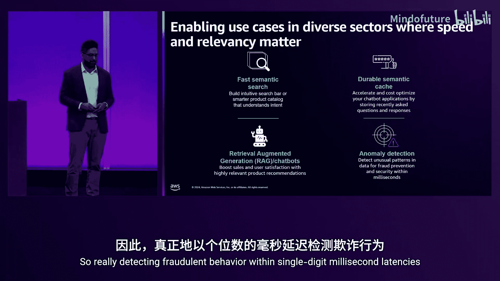
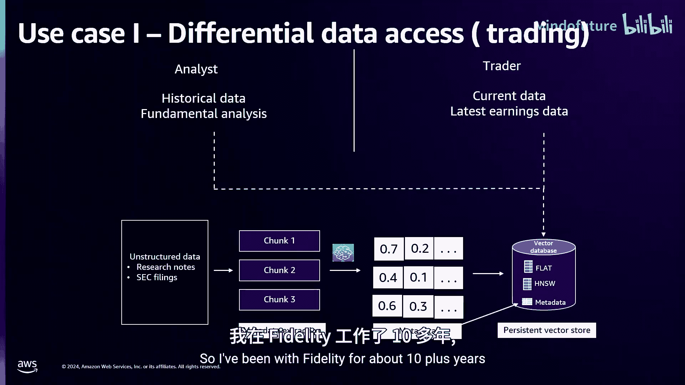
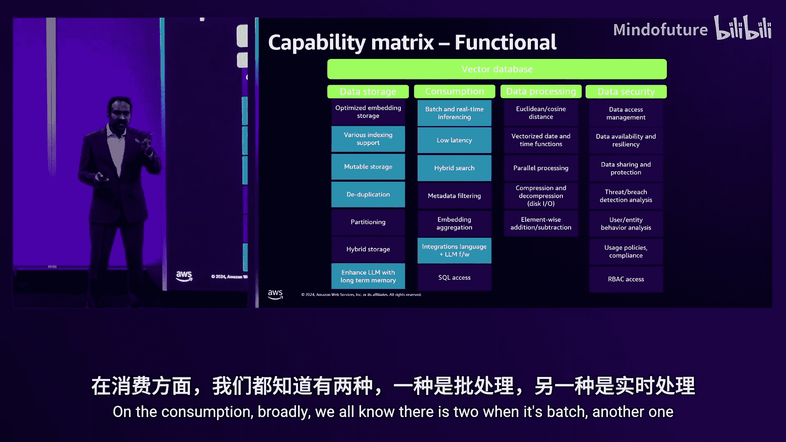
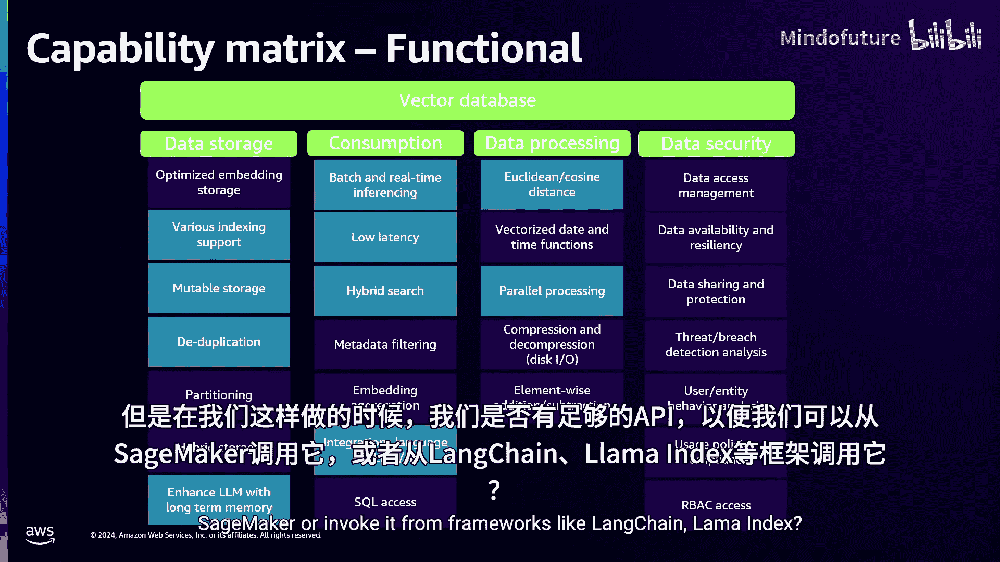
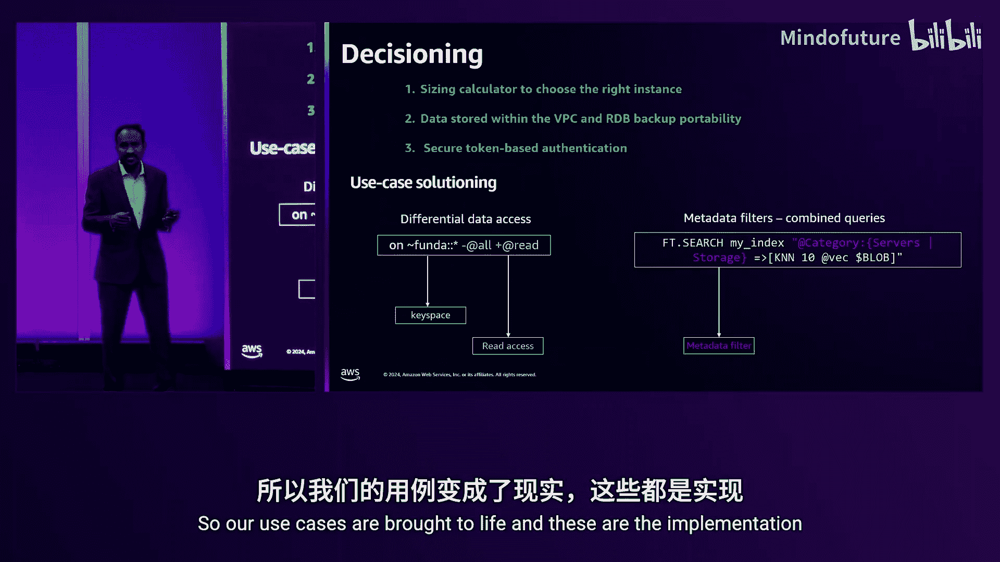
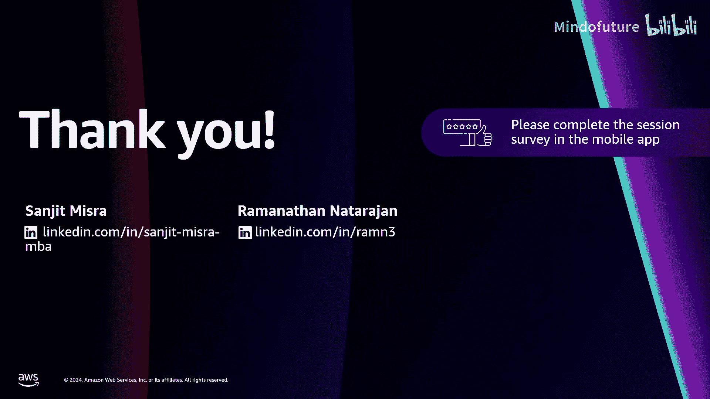

# 029：Fidelity Investments与Amazon MemoryDB实时向量搜索实战

在本节课中，我们将学习Amazon MemoryDB的实时向量搜索功能。首先，我们会概述MemoryDB及其向量搜索能力。随后，来自富达投资的架构副总裁Ram Narojan将分享他们的实际用例，并详细解释他们如何通过决策矩阵选择MemoryDB作为向量存储。

## 概述：数据是生成式AI差异化的关键

Swami曾提出一个观点：每个人都能访问相同的模型。因此，**数据**是将通用AI与理解业务和客户的生成式AI区分开来的关键。这个观点的核心在于，你的专有数据才是你的生成式AI应用与众不同的根本。向量搜索使你能够利用这些专有数据，并将其输入到你的大语言模型或生成式AI应用中。

## MemoryDB简介：AWS最快的数据库

上一节我们强调了数据的重要性，本节中我们来看看承载这些数据的强大工具——Amazon MemoryDB。

MemoryDB是AWS最快的数据库。它是完全托管的，通过多可用区事务日志提供持久性，并保证四个九（99.99%）的持久性。它优先考虑开源兼容性，兼容Redis OSS和Valkey。

Valkey是什么？2024年3月，Redis更改了其开源许可证。Valkey是由Linux基金会创建的一个分支，采用类似MIT的宽松开源许可证，并且是Redis OSS 7.2的即插即用替代品，已有超过40个组织和百万级容器在使用。

AWS已经为MemoryDB的Valkey和Redis OSS引擎都启用了向量搜索功能。

MemoryDB是AWS上在最高召回率水平下，速度最快的向量搜索产品。许多客户信任MemoryDB来构建生成式AI应用。它允许你存储数百万个向量，并提供P99个位数毫秒级别的向量搜索查询、更新和各种CRUD操作。此外，我们还与LangChain集成，你可以使用我们的内存驱动快速启动应用。

最后，MemoryDB的向量搜索支持多种用例：
*   **快速语义搜索**：例如亚马逊广告用它来在Amazon.com上为你投放广告。
*   **持久语义缓存**：缓存先前的大语言模型推理结果。当后续出现语义相似的问题时，可以直接从向量存储中提供答案，而无需再次调用大语言模型，从而节省性能和成本。
*   **检索增强生成**：利用你的专有数据为大语言模型提供上下文，从而为用户提供更具体的答案。
*   **异常检测**：在个位数毫秒的延迟内检测欺诈行为。

## 富达投资的用例与决策之旅

了解了MemoryDB的核心能力后，我们来看看企业如何在实际场景中应用它。本节将由富达投资的Ram为我们分享他们的探索之旅。

我是Ram，一名拥有20多年经验的架构师，专注于AI与数据的交叉领域。我在富达工作了10多年，我们公司的业务是为终端客户提供财务独立性。

今天，我很高兴分享我们探索向量数据库巨大潜力的旅程。我们的探索主要受到某些特定用例的驱动，这些用例我们发现无法用传统数据库有效解决。

### 用例一：金融市场信息屏障

我们首先来看一个金融市场相关的用例。市场参与者包括分析师和交易员。

分析师更关注历史数据，进行基本面分析，涉及经济数据。交易员则更专注于交易行为，对当前数据（如最新收益数据）感兴趣。他们的角色不同，因此需要信息屏障。

以下是高层设计解决方案：
1.  输入非结构化数据，例如分析师撰写的研究笔记，或美国证券交易委员会的文件（如10-K报表），以及收益相关数据。这些都是PDF文档。
2.  根据业务用例应用适当的分块策略，将文档转换为有意义的句子。
3.  通过嵌入模型运行这些句子块，生成向量。一个具有768维的向量可以想象成一个包含768个逗号分隔数值的数组。
4.  这些向量被持久化存储到向量数据库中。在推送数据时，我们同时进行元数据提取，例如公司名称、股票代码、报告日期、报告名称等。元数据与向量一同存储。
5.  我们对向量和元数据都建立索引，以实现快速搜索。

回到用例，我们提到了分析师和交易员之间的信息屏障。我们需要确保只有具备相应权限的用户才能访问数据。因此，在向量搜索中嵌入基于角色的访问控制能力变得非常清晰。

### 用例二：自助服务事件管理

接下来我们看看自助服务事件管理的用例。这使个人能够自行解决技术问题，其方式是利用预先构建的知识库。这样做可以减少对IT支持的依赖，并加速问题解决。

以下是设计概览：
1.  我们有事件描述和服务请求描述。
2.  采用分块策略，将它们打包成有意义的句子。
3.  通过嵌入模型运行这些句子块，生成向量并持久化存储到向量数据库。
4.  同时携带一些元数据，例如事件严重性、事件类别（是批量故障还是数据管理问题等）。向量和元数据都被索引以进行快速搜索。

假设用户输入一个问题：“服务器无法访问，我们收到超时错误。”同时，用户在Web UI中提供了大量元数据筛选条件，例如类别为“服务器和存储”，应用为“数据仓库应用”，分配组为“Unix工程组”。

假设我们已经构建了一个包含5000个事件工单的向量数据库。查询将筛选出其中大约500个符合条件的工单。然后，将用户输入的英文查询转换为一个向量，并在这500个工单对应的向量中查找最匹配的向量，返回最相似的前三个结果。这些结果可以用于下游搜索，或者输入到大语言模型中。

### 跨业务单元的通用模式与需求

我们可以继续列举更多用例，但从整体模式来看，我们发现：
*   有并发用户需要执行低延迟搜索。
*   在执行搜索时，他们需要确保实现基于角色的访问控制。
*   纯粹的向量搜索很少见，几乎总是伴随着某种元数据筛选。这些元数据可能是文本属性（如产品“401k”或“学生债务”），也可能是数字过滤器（如账户余额大于10，000）。

这是数据科学家的广泛需求，但数据工程师也有他们的要求。

机器学习工程师认为，向量数据库必须与模型部署在同一位置。我们都知道AI将部署在云端。我们作为架构师收到的一个要求是：确保向量存储是可移植的。原因有二：一是为了建立更好的弹性模式，避免构建跨云依赖；二是考虑到云内的数据流入和流出成本。

最后一点是关于速度，即更快地投入生产。团队希望减少在运维上的精力，将更多精力投入到关注业务需求上。因此，他们正在寻找托管服务。

### 构建能力矩阵

我们研究了用例和模式。在富达，在选择工具或解决方案之前，我们会构建一个**能力矩阵**，这使我们保持灵活性，可以轻松移植到另一个向量数据库或另一个云平台。

以下是能力矩阵的构成：

**功能需求：数据存储**
*   存储向量数据类型的能力。
*   为向量建立索引的能力。
*   对向量执行CRUD操作（创建、更新、删除）的能力，不仅是在持久存储层面，也包括在内存缓存层面。

**功能需求：数据消费**
消费方式主要有两种：批处理和实时处理。同时，我们需要足够的API支持，以便从SageMaker或LangChain、LlamaIndex等框架调用。

**功能需求：数据处理**
我们进行向量运算，例如加法、减法，或者使用欧几里得距离或余弦距离查找最接近的向量。我们关注的是可以实现多少并行化，能达到怎样的并发级别。

**功能需求：数据安全**
*   静态加密和传输中加密。
*   基于角色的访问控制。
*   数据是存储在单租户实例中，还是在我们VPC内专供富达使用的多租户环境中，亦或是跨多个租户共享。

**非功能需求：云运维**
我们考虑多云支持。另一个重点是监控和告警。我们不希望围绕向量数据库构建外围设施（如监控CPU、内存、网络、并发用户数、身份验证等），而是希望有一个托管服务能开箱即用地提供这些监控和告警功能。

**非功能需求：指标与KPI**
一旦确定了应用层评级，我们需要非常清楚SLA和SLO的遵守情况。

**非功能需求：运维与支持**
我们需要评估从版本7.1升级到7.2需要付出多少努力。此外，如果应用规模增长，从4x大型实例扩展到8x大型实例的操作负担有多重。

### 架构视角的考量

从技术架构来看，任何决策都离不开架构的审视。我们研究了用例、模式，并得出了能力矩阵。现在看看架构对此有何独特见解。

**索引选择**
在选择索引时，我们非常明确：不希望绑定到自定义索引，而是希望选择有大量行业文献支持、灵活可配置的索引。同时，它必须具有极高的可用性。这样，如果我们迁移到另一个向量数据库或另一个云平台，网上有足够的文献资料供我们参考和配置索引。

**无损压缩**
我们之前将向量视为逗号分隔的值。假设浮点数值是32位，我们可以通过压缩将其降至16位浮点数。这会减少存储占用，但代价是损失处理精度。因此，我们希望采用某种无损压缩方式，在不损失准确性的同时减少存储占用。

**数据集成/注入**
我们发现许多机器学习框架提供了多种工具和库来将向量注入向量数据库。但我们主要关注的是，向量数据库是否提供开箱即用的并行向量注入能力。

**开箱即用的可观测性**
我们提到了监控和可观测性。我们发现MemoryDB for Redis开箱即提供了大约42个指标。

**扩展性**
我们已经讨论过垂直扩展以及如何进行升级等。

### 性能基准测试与决策总结

在性能基准测试中，我们假设：如果给房间里的每个人三个向量A、B、C，并要求使用余弦距离找出最接近的向量，每个人都会得出相同的结果，因为这是纯粹的数学计算。

因此，我们采用了一个已知真实值的行业数据集，评估了多种可用的向量数据库。结果显示，Amazon MemoryDB for Redis能够达到**99%的召回率**，并且延迟**低于25毫秒**，同时支持约**790个并发用户**。

我们收到的需求是：可以接受97%的召回率，但有没有办法将延迟降低到个位数毫秒？我们通过稍微牺牲一点召回率，成功将延迟降到了个位数毫秒。最终，我们平衡了速度和质量。

关于无损压缩，我们发现MemoryDB for Redis中有一个特定的**哈希数据类型**。它帮助我们将存储占用减少到原来的四分之一，同时保持了相同的准确性和召回率。

我们是如何最终决定选择它来满足我们的用例的呢？以下是一个快速总结：

**决策依据**
1.  **容量规划与部署**：使用 sizing calculator 输入向量数量和维度后，它会推荐合适的实例规格，非常方便。数据位于富达的VPC内，并且我们可以使用特定的RDB格式进行备份，这允许我们在其他云平台（例如Azure）上恢复数据。
2.  **安全性**：除了用户ID和密码认证，行业趋势正在向令牌认证迁移。我们能够实现更安全的基于令牌的身份验证。
3.  **满足业务目标**：
    *   **信息屏障**：我们能够定义键空间（keyspace）。例如，在创建用户时，通过设置访问字符串（如 `fundamental:*`）来限制分析师用户的访问权限，从而防止交易员访问这些数据。
    *   **元数据过滤**：在事件管理查询中，我们能够使用“服务器和存储”作为过滤器，得到一个非常有限的集合。

我们的用例得以实现，这些都得益于上述实施。感谢AWS主办今晚的活动，也感谢富达印度公司派我前来。我很荣幸能在这个学习型观众面前进行分享。

## 总结与资源

本节课中，我们一起学习了Amazon MemoryDB的实时向量搜索功能及其在企业级应用中的价值。我们首先了解了MemoryDB作为高性能向量存储的核心优势，然后通过富达投资的实际案例，深入探讨了从识别业务用例、构建能力矩阵到进行技术选型和性能验证的完整决策过程。

关键收获包括：
1.  专有数据是构建差异化生成式AI应用的核心。
2.  Amazon MemoryDB提供了高速、持久且兼容开源的向量搜索解决方案。
3.  企业选择向量数据库时，需要综合考虑功能需求（存储、消费、处理、安全）、非功能需求（运维、监控、扩展）以及具体的业务场景（如信息屏障、元数据过滤）。
4.  通过科学的基准测试和评估（如平衡召回率与延迟、利用无损压缩），可以找到满足特定业务目标的最佳技术方案。

以下是一些有用的资源链接，帮助你快速开始：
*   **GitHub代码库**：包含MemoryDB API示例，用于快速搭建你自己的向量搜索能力。
*   **语义缓存博客**：深入了解语义缓存的实现与价值。
*   **LangChain内存驱动**：学习如何利用LangChain构建你的生成式AI应用。

感谢你的参与。