# 030：使用AWS DMS Schema Conversion与生成式AI加速迁移

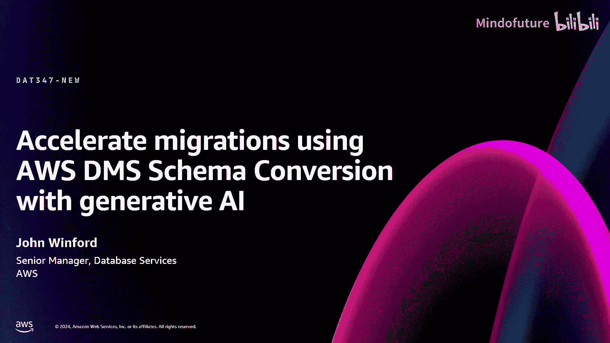

在本节课中，我们将学习如何使用AWS数据库迁移服务（DMS）及其模式转换工具，特别是结合生成式AI技术，来加速和简化异构数据库迁移过程。我们将从基础概念开始，逐步深入到具体的操作流程和演示。

---

## 数据库迁移基础

上一节我们介绍了课程概述，本节中我们来看看数据库迁移的基本概念和常见场景。

数据库迁移的核心是将数据及其结构从一个数据库系统移动到另一个系统。AWS DMS专注于此过程，无论迁移是同构的（相同数据库类型之间）还是异构的（不同数据库类型之间）。

以下是DMS支持的主要使用场景：
*   **迁移**：将关键业务应用程序或数据仓库（如迁移到Amazon Redshift）迁移到云端。
*   **升级**：在不停机的情况下进行数据库版本升级。
*   **整合**：将多个分散的数据库（如分片系统）合并到像Aurora这样具有更高存储容量的单一数据库中。
*   **拆分**：将单体数据库拆分为微服务架构下的多个独立数据库。
*   **复制**：在不同数据库之间建立持续的数据复制流。
*   **现代化**：从传统或许可数据库迁移到云原生或开源数据库。

DMS的一个关键优势是支持在线迁移，这意味着在迁移过程中，源数据库可以保持运行状态，对业务用户的影响最小。其工作原理是基于逻辑复制，在不同数据库类型间复制事务。

---

## DMS Schema Conversion 简介

上一节我们了解了迁移的基础，本节中我们来看看在异构迁移中至关重要的模式转换工具。

在异构数据库迁移中，源数据库和目标数据库的结构定义（模式）不同。这包括表、列、数据类型以及存储过程、函数等程序化代码。DMS Schema Conversion（SC）工具旨在自动化此转换过程。

其工作流程如下：
1.  **创建迁移项目**：在AWS管理控制台中，指定源和目标数据库连接信息。
2.  **进行评估**：SC工具以只读方式分析源数据库的元数据，生成评估报告，预估转换的难易程度和工作量。
3.  **执行转换**：根据评估结果，将源数据库模式转换为目标数据库兼容的格式。
4.  **应用模式**：将转换后的模式应用到目标数据库。

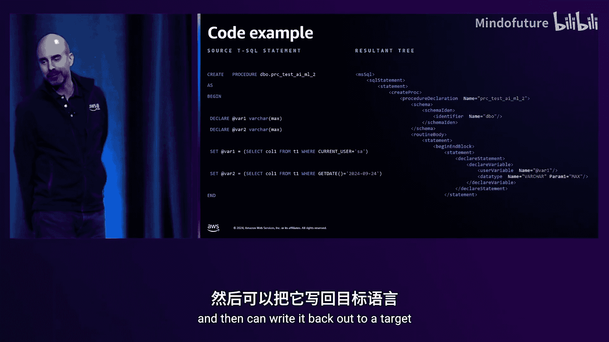

与旧版的桌面工具Schema Conversion Tool（SCT）相比，DMS SC作为云服务运行，无需本地安装，并且**免费使用**（仅产生少量S3存储和网络成本）。目前，DMS SC支持主流关系型数据库（如SQL Server到PostgreSQL/Aurora）的转换，并且是集成生成式AI功能的地方。

---

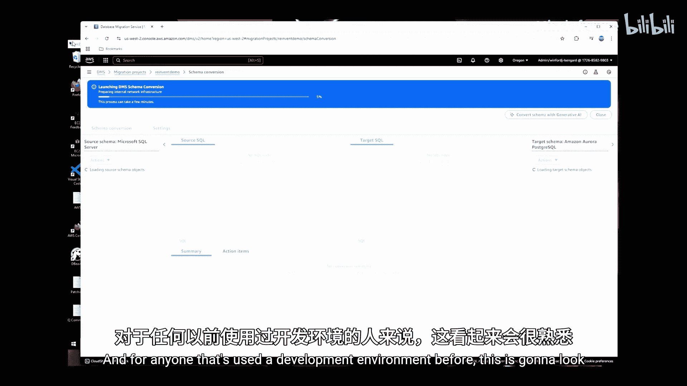

## 生成式AI如何增强模式转换

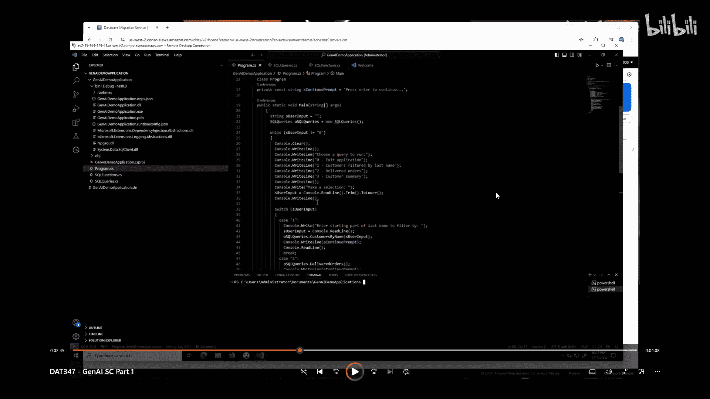

上一节我们介绍了传统的规则式转换，本节中我们来看看生成式AI如何填补转换过程中的空白。

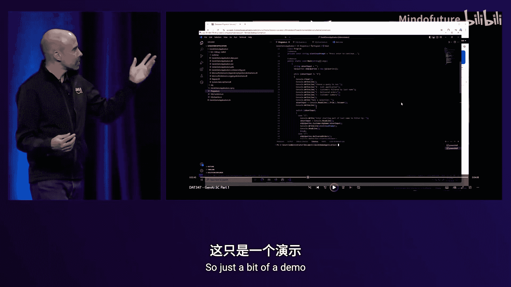

传统的DMS SC使用基于规则的引擎进行转换。然而，某些复杂的代码对象（如含有特定数据库特有语法的存储过程）可能无法通过规则完美转换。生成式AI被用来处理这些“未转换”或转换效果不佳的部分。

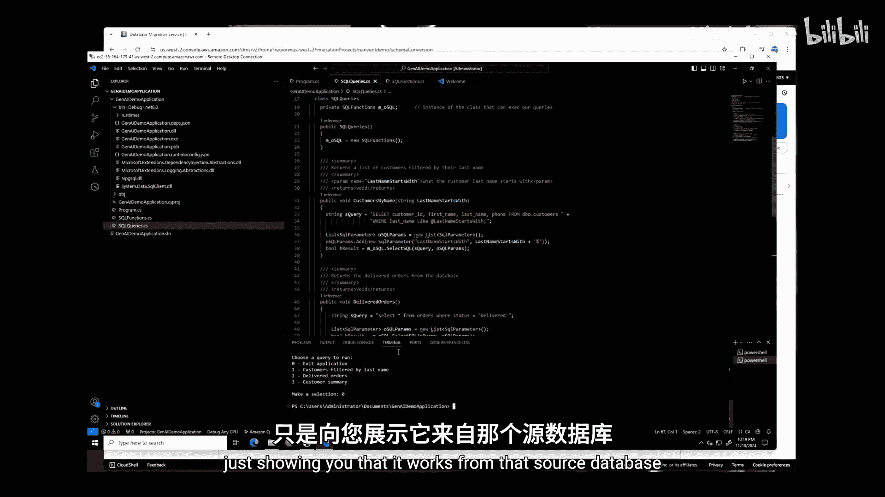

AWS团队探索了多种应用生成式AI的方式，最终确定了最有效的集成点：**在基于规则的转换之后，使用生成式AI处理剩余未转换的代码对象**。这种方法构建在现有能力之上，而不是完全替换。

其核心增强流程如下：
1.  **上下文设置与知识增强**：不是简单地将代码发送给大语言模型（LLM），系统使用检索增强生成（RAG）技术。首先，它利用知识库来理解SQL语句的上下文和获取类似的转换示例。
2.  **混淆处理**：为确保安全性和隐私，发送给LLM（通过Amazon Bedrock服务）的代码会进行混淆处理，例如将表名、列名和字面值替换为通用标识符。
3.  **AI转换**：将增强后的上下文和混淆后的代码一起发送给LLM（当前使用Claude 3.5），请求其生成目标数据库兼容的代码。
4.  **反混淆与验证**：收到LLM的响应后，系统进行反混淆，将通用标识符恢复为原始名称，并进行基本的正确性检查，然后将结果嵌入到抽象语法树中。
5.  **结果呈现**：最终转换后的代码会显示在控制台中，其中由AI转换的部分会被特殊标记（例如使用`^`符号括起来），方便用户审查。

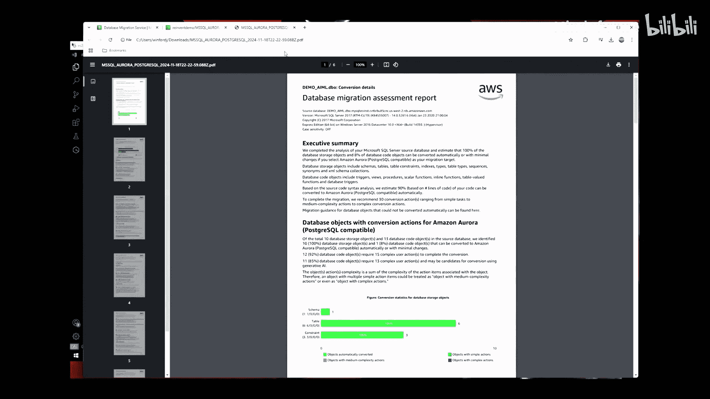

这种方法在保持安全性的同时，显著提高了复杂代码对象的自动转换成功率。

---

## 实战演示：从SQL Server迁移到Aurora PostgreSQL

上一节我们探讨了技术原理，本节中我们通过一个完整演示来看实际操作流程。

演示分为几个关键步骤，展示了如何使用DMS SC（启用生成式AI）和DMS完成一次从SQL Server到Aurora PostgreSQL的异构迁移，包括数据库模式、数据以及应用程序代码的转换。

### 步骤1：模式转换评估（无AI）

首先，在不启用生成式AI的情况下，对源SQL Server数据库运行模式转换评估。
*   在DMS控制台创建迁移项目，连接到源和目标数据库。
*   启动模式转换分析。结果显示，表结构转换良好，但许多存储过程、函数等程序代码无法自动转换，总体转换率较低（例如11%）。
*   生成评估报告PDF，可用于规划迁移工作。

### 步骤2：启用生成式AI并转换模式

接下来，在迁移项目设置中启用生成式AI功能，并重新运行转换。
*   转换完成后，转换率大幅提升（例如从11%升至85%）。
*   查看转换后的对象（如视图、存储过程），可以看到由AI转换的代码部分被清晰标记出来，供用户审核。
*   用户可以直接在控制台中编辑转换结果，或导出SQL脚本。
*   确认无误后，将转换后的模式直接应用到目标Aurora PostgreSQL数据库。

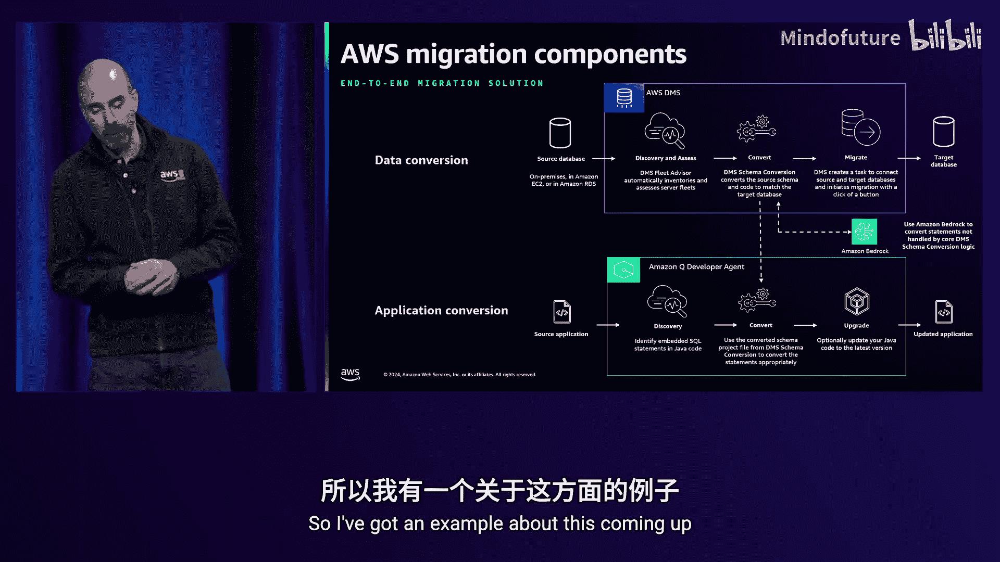

### 步骤3：使用DMS迁移数据

模式转换完成后，目标数据库只有结构，没有数据。
*   在DMS控制台创建复制任务，配置从SQL Server到Aurora PostgreSQL的数据迁移。
*   启动任务，DMS开始将数据从源表复制到目标表。对于在线迁移，此过程可在源数据库运行时进行。

### 步骤4：转换应用程序代码

数据库迁移后，使用数据库的应用程序也需要更新。这里展示了如何利用Amazon Q Developer Agent辅助完成。
*   原始C#应用程序使用`System.Data.SqlClient`连接SQL Server。
*   需要将其改为使用`Npgsql`库连接PostgreSQL。
*   在IDE中，利用Amazon Q，提供上下文（已转换的数据库模式），请求其帮助将代码中的SQL Server相关调用替换为PostgreSQL等效调用。
*   Q生成修改后的代码块，经开发者检查后替换原有代码，快速完成应用层适配。
*   编译并运行更新后的应用程序，成功连接新的Aurora PostgreSQL数据库并查询数据。

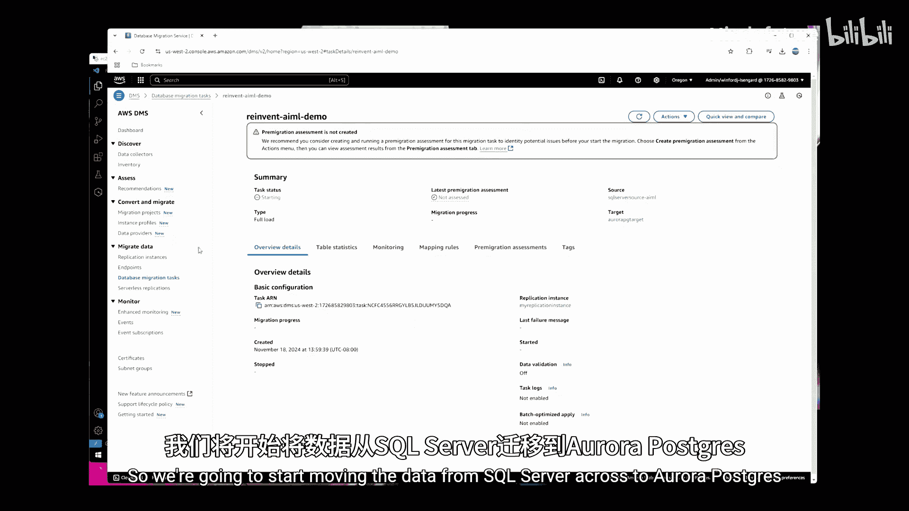

通过以上步骤，我们完成了一个包含模式、数据和应用程序的端到端异构数据库迁移。

---

## 总结与展望

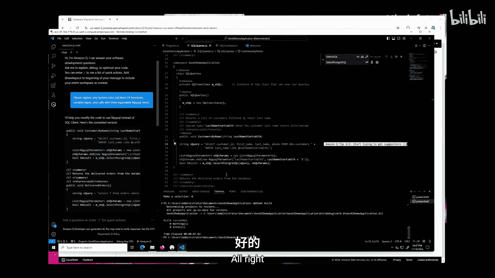

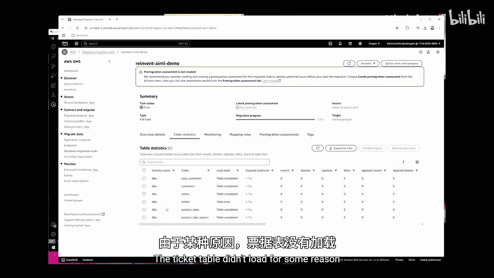

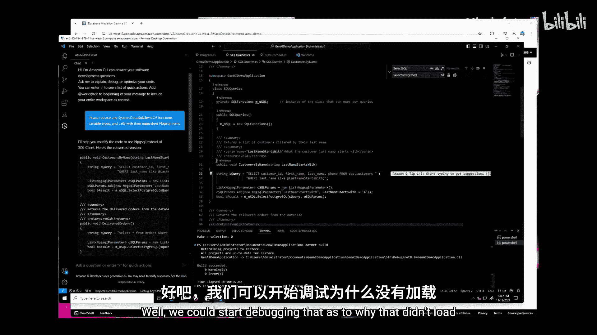

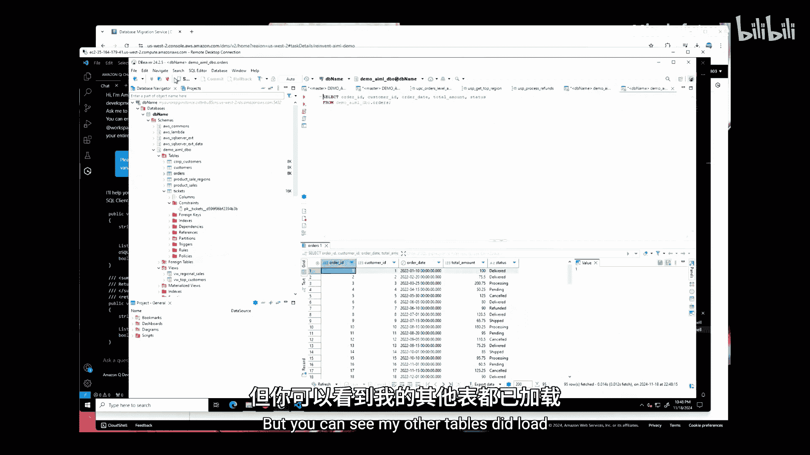

本节课中我们一起学习了如何使用AWS DMS及其集成了生成式AI的模式转换工具来加速数据库迁移。

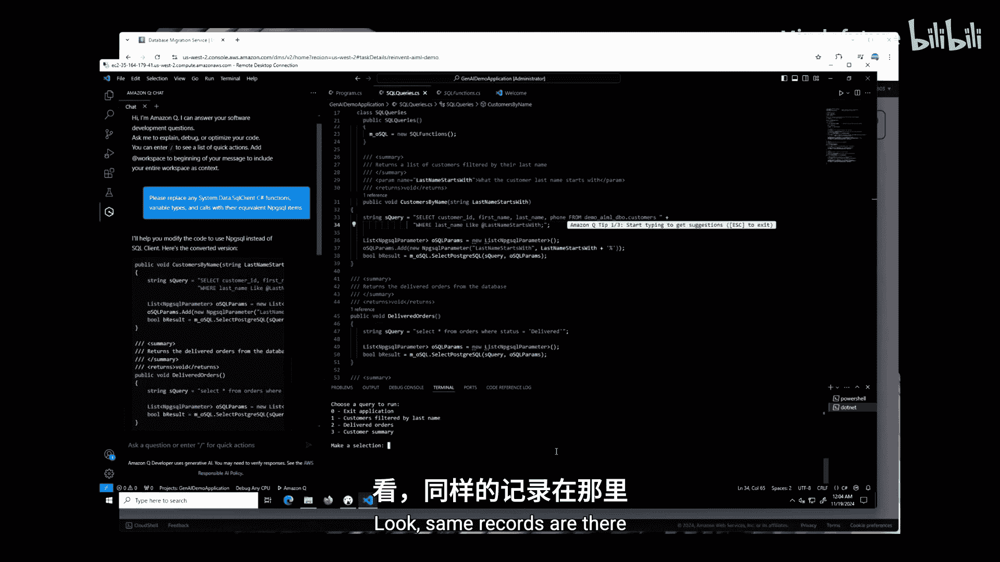

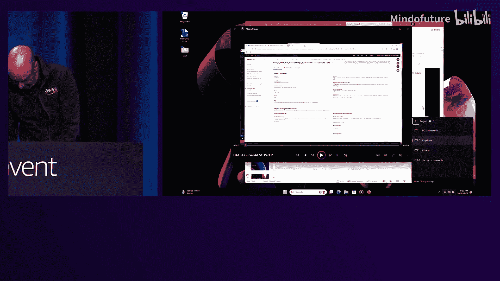

我们首先回顾了数据库迁移的基础和DMS的核心价值。然后，深入探讨了DMS Schema Conversion工具在异构迁移中的作用，并重点讲解了生成式AI如何通过RAG、混淆安全处理等技术，智能地补全规则引擎无法处理的代码转换，从而大幅提升自动化转换率。最后，通过一个完整的实战演示，我们直观地了解了从评估、转换、数据迁移到应用现代化的全流程。

尽管当前功能已经强大，但AWS团队仍在持续改进，未来的方向可能包括：更完善的转换结果验证测试、支持更多的源和目标数据库组合、集成更新更强大的AI模型，以及扩展生成式AI所能处理的代码对象范围。

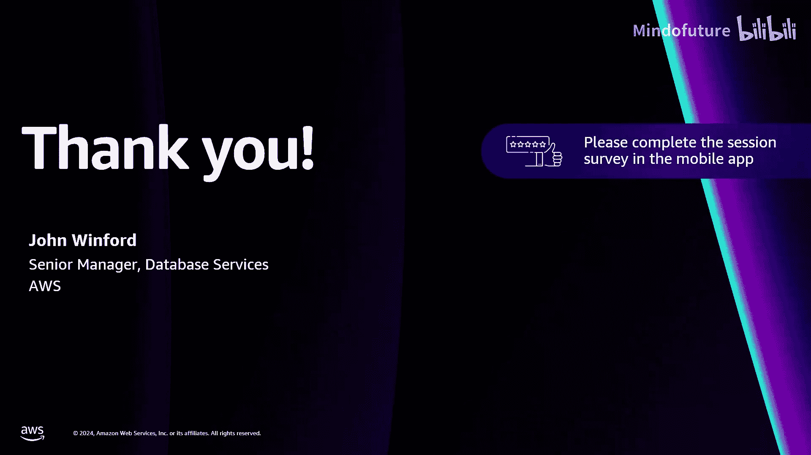

生成式AI的引入使复杂的数据库模式转换变得更加容易和高效，为现代化遗留系统提供了强有力的工具。