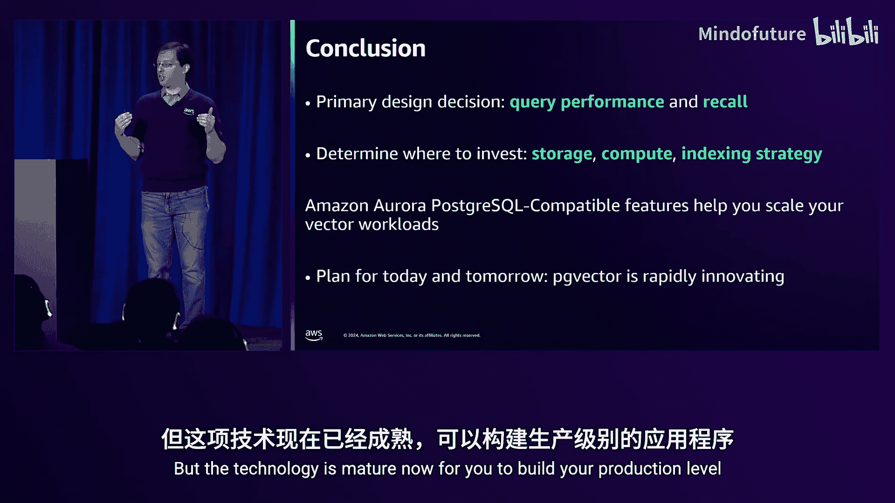

# 031：在 PostgreSQL 中为生成式 AI 应用查询向量数据的最佳实践

大家好，欢迎来到在 PostgreSQL 中为生成式 AI 应用记录向量数据的最佳实践课程。

我是 Jonathan Katz，很高兴今天在这里演讲。这是我第一次现场演讲。

所以请对我可能遇到的任何挑战保持耐心。但在深入探讨之前，我想强调这是一场 L400 级别的讲座。我们基本上会触及向量内部原理的边缘，但我们会深入探讨。我们将利用对 PostgreSQL 中向量工作原理的深入理解，来了解如何为您的应用做出最佳决策。因此，会有一个平缓的入门过程，我们会浏览大量数据和图表，我会尽力在今天向你们解释清楚。好消息是这次演讲会被录制下来，所以如果您之后想回顾某些内容，它们将是可用的。我也很乐意在演讲后回答问题，因为这可能会占用整整 60 分钟。

那么，为什么这很重要？为什么我们甚至要关心在数据库中搜索向量？这源于一个例子：当一个问题需要个性化时，例如“告诉我关于我的订单的信息”。这些基础模型和生成式 AI 模型的惊人之处在于，它们可以提供丰富的个性化响应。但我们需要一种方法，能够获取数据库中已有的数据，并将其与基础模型产生的个性化响应联系起来。因为基础模型可能没有在您私有数据源的数据上进行训练。

因此，为处理此问题而开发的一种有效技术称为检索增强生成。RAG 背后的理念是，它使我们能够引入所需的上下文，以提供个性化响应。通常，基础模型仅在公开可用信息上进行训练。如果我们询问一些具体信息，比如“这双蓝色鞋子多少钱？”，它不会知道。但如果您引入您的产品目录、定价目录等信息，您就能够让基础模型回答那双蓝色鞋子的价格。这是关键。

但我们需要一种方法，能够从数据库中获取数据并将其引入基础模型。存在不同类型的信息，但以非结构化格式存在的信息，例如未标记的原始文本、图像或视频，需要以一种我们可以搜索的方式来表示。这并不新鲜，多年来我们一直在搜索文本数据，这就是全文搜索的全部内容。但如果我们能够采用像向量这样的数学结构，并有效地将其包裹在文本数据周围，它就为我们提供了一种通过执行距离计算来进行比较的方法。这同样也开启了其他类型的搜索，比如文本与图像、文本与视频、图像与视频的比较，因为我们通过向量的数学表示拥有了一种通用的语言。

那么，向量嵌入在 RAG 中处于什么位置？第一部分是摄取，您有一些非结构化数据，可能是 PDF 文档。您可能需要对其进行预处理，以便在称为嵌入模型的东西中使用。嵌入模型负责将非结构化数据转换为向量，然后您将其存储在某个地方，今天的情况是存储在 Amazon Aurora 数据库中。这就是摄取工作流。

然后是更有趣的部分，即将其暴露给您的应用程序，这就是代理工作流。用户进来询问“这双蓝色鞋子多少钱？”，我们必须将这个问题本身转换为一个向量，以便获取上下文。然后我们可以查询数据库，找到与之最相似的结果。之后，我们将问题和上下文输入基础模型，并将其转换为响应。

详细讨论整个 RAG 工作流是另一个演讲的主题，因为今天我们真正关注的是数据库本身，特别是 Aurora。但如果您稍后能参加第 319 场演讲，我们将详细讨论检索增强生成工作流的乐趣以及您的数据如何融入其中。

现在，向量可能具有挑战性，这实际上是我个人对这个话题感兴趣的原因。首先，我们需要能够生成向量嵌入，这可能需要一些时间。假设生成一个向量需要 100 毫秒，而我有 100 万个向量，那么这就是为什么我们需要将它们存储在某个地方，因为 100 万乘以 100 是一个非常大的数字，我想是 1 亿。

许多现代嵌入向量也相当大。如果您取一个 5000 维的向量，那是一个 6 千字节的有效载荷。如果您考虑存储在关系数据库中的数据，您的平均行大小可能小于 1 千字节，所以从某种意义上说，我们这里可能存在数据膨胀。您可能会说，Jonathan，我们不能压缩它吗？我们多年来一直在做压缩。但挑战在于，您无法真正压缩随机的浮点数，因为那里没有真正的模式可以用来压缩。我们有技术可以将其减少，但这些技术会在您尝试这样做时丢失一些信息。

最后是查询时间。回想一下，我们说过我们正在执行这些距离操作，这意味着我们必须比较向量中的每个维度。可能有些嵌入模型说，您只需要比较前 256 维，但仍然是 256 次比较。如果您在 100 万个向量的数据集上这样做，那将花费大量时间。所以我们需要一些方法来加速。本次演讲的要点是，这里真的没有捷径。有一种技术可以让我们做到这一点，称为近似最近邻搜索。在这种技术中，我们不需要将查询向量与数据集中的每个向量进行比较，而是可以近似地将其与总体向量的一个子集进行比较。

好处是，如果您只比较 5000 个向量，而不是 100 万个向量，那么 5000 次操作会快得多，这是一个不言自明的道理。但它引入了一个新变量，我们称之为召回率。召回率是预期结果的百分比。这意味着什么？如果我进行精确最近邻搜索，即将我的查询向量与数据集中的每个向量进行比较，我期望它返回这 10 个向量。但我的近似最近邻搜索可能做不到，它可能只返回预期 10 个中的 8 个，这给了我们 80% 的召回率。

这是一个关键指标。在我们整个演讲过程中，我需要牢记这一点，因为如果不理解召回率，我们就无法对向量搜索进行任何比较。这转化为您正在构建的应用程序，因为这将是您搜索质量的衡量标准。这就是游戏的关键：我的搜索有多好？我的搜索是否足够好，能够满足我应用程序的业务需求？

在我们深入探讨之前，先谈一些一般性的要点，即实际上影响您如何存储向量和搜索向量的因素。首先是成本。成本可能不是决定性因素，但它是您构建生成式 AI 应用程序时的一个总体因素，因为数据库只是拼图的一部分。在这种情况下，您可能实际上希望在数据库上花费更多，如果这能降低您对基础模型的总体成本，而基础模型最终将是您最大的成本。但在您决定所有这些时，必须牢记这一点，因为最终驱动它的将是您使用哪个嵌入模型以及哪个基础模型，因为那是生成式 AI 应用程序的生成式 AI 部分。这些决策最终会影响您如何搜索数据，并且在很多方面会影响搜索质量，我们稍后会看到。

其次是开发的难易程度，因为很多时候您正在快速原型化这些应用程序，并且希望使用您熟悉的东西。不幸的是，向量搜索是一个特性，因此有很多机会可以使用您非常熟悉的系统进行开发。

最后是查询性能和数据摄取，我把它们放在一起。查询性能是指您的目标延迟是多少？也许对于您正在处理的特定应用程序，您需要最快的延迟和最佳的召回水平，这没问题。或者，也许您可以在延迟上做出妥协，因为您在某种程度上更注重成本。同样，您是一次性摄取数据并构建向量索引，还是持续向其添加数据？因为这确实会影响您围绕选择哪种索引方法所做的决策。

我喜欢用三角形来思考这个问题。您的三角形以召回率为锚点。召回率最终将驱动围绕决策的一切，因为假设您选择在其上建立索引，通常当您构建索引时，您会考虑索引有多大以及构建它需要多长时间。这对于向量搜索来说尤其尖锐。现在，我们将看到的是，我们在构建索引上花费的时间越多，我们将获得的召回率就越好，但这是一个权衡，索引数据将花费更长时间。

同样，查询性能通常是我们考虑吞吐量的方式，即我每秒可以发送多少个查询。我们可以通过横向扩展系统来“欺骗”吞吐量。还有延迟，即返回该信息需要多长时间，在这方面“欺骗”的方法较少。但我可能拥有最佳的吞吐量和最佳的延迟数字，而召回率为零，我在测试中亲自做过。这就是为什么我一直强调一切都要围绕召回率。如果今天您从这次演讲中只记住一件事，那就是无论您做什么，最终都必须通过召回率来衡量它。在我们进行演示的过程中，有时我不会包含召回率，我会提到这一点，并解释为什么我不包含以及为什么它很重要。

那么，最终影响您性能指标的因素是什么？我不会花时间逐一讲解所有这些，我想把它放在这里。但要点是，我们实际上将在整个演讲中深入探讨所有这些内容，但它们都相互制约。例如，虽然量化可能会减少索引的总体大小，但它会对召回率产生影响，并且如果您需要执行更多搜索以达到您想要的召回目标，可能还会影响搜索时间。因此，所有这些都很重要。当您做出设计决策时，您将不得不权衡这些步骤，以确定我最终希望从我的应用程序中获得什么。

在我们深入探讨 PostgreSQL 之前，我们在 AWS 的许多不同服务中都提供向量搜索。我不会逐一阅读每一个，但这涉及到开发的便利性和熟悉度。如果您熟悉这些系统，您已经将数据存储在其中，那么选择它并开始在其上构建您的应用程序。但如果您选择今天使用 Amazon Aurora 或带有 PostgreSQL 的 Amazon RDS，那么，我们即将深入探讨。

现在，PostgreSQL 作为向量存储。我们传统上认为 PostgreSQL 是一个关系数据库，确实如此，它已经存在很长时间了。我实际上和最初的 Berkeley 项目差不多年纪，PostgreSQL 也有很长的开源历史，差不多有 30 年了。

正因为如此，由于 PostgreSQL 的开源性质，已经开发了许多有趣的东西。我想真正强调它的可扩展性。PostgreSQL 被定义为一个对象关系数据库管理系统，但我认为它是一个可扩展的数据库系统，因为我们可以在不将其纳入上游数据库或为数据库创建全新产品的情况下添加功能。我们今天已经看到了这一点，例如，在地理空间搜索方面，PostGIS 在映射应用程序中无处不在，它只是一个与 PostgreSQL 并存的扩展，这非常强大。

这种可扩展性也延伸到了向量搜索，部分原因是，如果您考虑地理空间搜索，您处理的是三维或四维向量，或者二维向量，这些都是小向量，实际上有一些非常有效的方法可以对它们进行精确搜索。但对于 PostgreSQL 中的向量搜索，我们确实需要在扩展中发明一些新东西。但方便之处在于，您已有的许多 PostgreSQL 工具已经可以工作。因此，实际上，您只是添加了一个向量数据类型，并将您的工具映射到其中。

同样，您可能已经在 PostgreSQL 数据库中拥有数据，希望将其与您的应用程序结合使用。

现在，我想更深入一点的是最后一点，为什么是 ACID？ACID 基本上为我们提供了关于数据如何存储的事务性保证。从最终用户的角度来看，如果您需要它，这实际上非常重要。首先，如果您查看 ACID，它保证了数据的可见性，一旦提交，数据就在那里，下一个读取它的会话可以立即访问数据。特别是如果您实时更新数据，这是一个非常重要的概念。

不过，我喜欢强调最后一点，持久性。ACID 中的每个字母都很重要，但持久性保证了您的数据被存储。这是一个非常强大的概念，您知道如果您的数据被写入存储，它就永久存在，您无需担心。

这可能是 ACID 在这里，甚至可以说是总体上最重要的属性。但我们为什么关心向量的 ACID？因为向量是您的数据，您正在操作系统中使用它来获取结果。

那么，让我们切换到 PG 向量。PG 向量是一个为 PostgreSQL 带来向量数据类型的扩展。除了向量数据类型，它还带来了执行这些搜索所需的所有操作：比较操作、索引方法等等。它是开源的，正在积极开发中。我很自豪地说，AWS 是 PG 向量的第二大贡献者。我们对此有强烈的感受，因为它确实帮助您能够在 PostgreSQL 中进行向量搜索，原因我们刚刚解释过。

但为什么要使用 PG 向量？向量搜索本身，特别是在数据库中，正在迅速发展。去年人们使用 PG 向量是因为它存在，它是一个扩展，与 PostgreSQL 兼容，适用于现有应用程序。但随着生成式 AI 的进一步采用，我们看到了这些工作负载在许多方面的扩展，并且我们能够构建更复杂的应用程序。因此，很多路线图都集中在使 PG 向量能够扩展、添加新的索引方法、支持更复杂的工作流（如过滤）上。所有这些我们今天都将探讨。但其中很多都来自开源社区的直接反馈以及与像您这样的客户的交流，以了解我们可以做些什么来帮助支持这些工作负载。

那么，在过去一年（实际上是两年）里发生了什么？我不会逐一讲解所有这些，但第一部分是，我们必须让 PG 向量与世界上的所有不同向量搜索解决方案持平，然后专注于更精细的点，即我们能否存储更少的信息并处理更复杂的搜索模式，如 WHERE 子句和连接，同时仍然能够提供准确、高度相关、高效的结果。这仍在持续开发中，我想说人们已经在生产环境中运行 PG 向量了，但这些都是我们关注的事情，即尽可能简单且高性能地在 PostgreSQL 中运行这些工作负载。

现在，本次演讲的要点将是关于近似最近邻搜索，因为我们可以理解如何进行精确最近邻搜索，即搜索所有不同的数据，最终您将受限于数据集的大小、拥有的核心数量以及您愿意花费的计算时间。

但 PG 向量提供了两种近似最近邻搜索方法。有 IVF Flat，它是基于聚类的，还有 HNSW，它是基于图的。

它们各有优缺点。IVF Flat 往往更小，构建更快，但可能更难达到您的召回目标，并且为了达到召回目标，您的查询可能会慢得多。HNSW 往往总体上更容易管理。本次演讲的其余部分将主要关注 HNSW，因为这已成为向量搜索中最流行的方法之一，即使不是最流行的。

现在，这里是一个快速备忘单。如果您知道需要精确最近邻，您不使用索引——嗯，您不使用向量索引，这里有点用词不当，因为您可能使用其他类型的索引，如 B 树索引、GIN 索引等，如果您知道可以过滤数据。但如果您需要搜索整个数据集，则不能使用近似最近邻索引。如果您需要快速索引，IVF Flat 可能适用，并且我们可能有一个非常静态的数据集，它聚类得很好。在这种情况下，如果您只需要访问一两个中心，IVF Flat 的搜索也会非常快。但对于大多数其他情况，您最终会以某种形式使用 HNSW。

过滤是一个例外，过滤将是我们今天花费大量时间讨论的主题，因为它将完全围绕选择性展开。

如果您有高度选择性的数据，意味着您的过滤器消除了大部分行，您可能不想使用 HNSW 索引，您可能想使用传统索引，这将非常有效地执行此操作。但如果您具有低选择性，您可能想使用 HNSW 索引，因为它总体上会更快。今天演讲的目标是证明这一点，即根据您的选择性，您应该能够选择正确的索引，以达到您的召回目标，同时也能满足您的性能目标。这将深入到核心，查看图表和数据，了解今天 PG 向量的最佳策略是什么。

所以，我们今天将大致按照这个顺序进行一次旅程。作为一个近似最近邻搜索的概述，我们将在这里短暂地偏离顺序，但重要的一点是，一切都从存储开始。

现在，我为什么这么说？我实际上是作为一名应用程序开发人员成长起来的，直到我开始谈论 PG 向量，我才真正考虑过页面和页面大小。但这是基本的存储单元，在 PostgreSQL 中是 8 千字节。为什么这很重要？因为我们将看到，当我们在 PG 向量中索引数据时，这是我们受限制的存储单元。无论怎样，我们的数据实际上都需要适应 8 千字节。但这将导致一个非常有趣的情况，即我们可能在索引中最终浪费存储空间。

这里是一个示例，展示了单个索引页上可以容纳多少个向量。我们可以看到，当向量很小时，我们可以在单个索引页上容纳更多向量。但随着它们变大，我们可能只能在一个索引页上放一个向量，并且会有开销。有趣的是，在 1000 维或 1024 维标记处，我们只能将一个向量放入一个索引页，这意味着我们浪费了几乎 4 千字节的空间。这最终可能会影响您的存储容量，但需要记住的是，您可能不一定能高效地利用存储，这可能不会总体上影响您的应用程序，但这是您确实需要注意的事情。

现在，有趣的是，您可能会说，Jonathan，我听说可以调整页面大小，比如整个 PostgreSQL 页面大小。这是一个编译时标志，大多数人只是将其保持在 8 千字节。但索引页是不可调整大小的，这将导致一个问题，特别是如果您处理浮点数时。

因此，一旦我们达到更大的向量，那些实际上无法完全索引，至少现在不行。可能有技术可以用来至少在索引页中存储原始向量，但目前，我们必须对它们进行量化，我们稍后会看一下。

但您可能说过，嘿，Jonathan，我实际上以前在我的向量索引中存储过数据，或者在我的表中存储过像大型文本块这样的数据，有一个系统可以做到这一点，叫做 TOAST。TOAST 代表“The Oversized-Attribute Storage Technique”，是一个让您存储超大数据的系统。其理念是，一旦超过某个阈值，PostgreSQL 能够将该数据存储在一个单独的表中，我们将会看到。有几种不同的方法可以做到这一点。

我们实际上要查看这三种不同存储类型的原因是，它们都将影响我们如何在表中存储数据，并且它们具有性能影响。所以，PLAIN 基本上是说将向量与表中的其余数据内联存储，这样基本上所有数据都在一个地方。EXTERNAL 和 EXTENDED 表示将向量存储在 TOAST 表中，在超过 2 千字节大小时，默认情况下会这样做，除非您调整该阈值。

现在，自 PG 向量 0.6 起，PG 向量默认使用 EXTERNAL，这基本上意味着将其存储在那个单独的表中并且不压缩它，否则我们会浪费周期尝试压缩一些无法压缩的东西。

现在，让我们快速可视化一下，并解释为什么这很重要。

对于表中的 PLAIN 存储，所有数据都存储在一起。而对于 EXTENDED EXTERNAL，我们将向量存储在不同的页面中，这实际上是在一个不同的表中。TOAST 被发明的原因是，我们处理的是不在热路径上的数据。对于向量，我们需要搜索向量，那是我们搜索的关键。但对于像文本或其他大型数据，我们不一定查看它，我们不对其进行比较操作，它不在关键路径上，将其存储在行外是有意义的。但这将产生影响，因为即使您可能仍然需要为您的数据使用 TOAST，我们需要理解这将会带来性能上的权衡。特别是，让我们看一个关于 QPS 的例子。

在这个例子中，我取了 5000 个向量，对它们执行余弦距离计算，维度各不相同。我们将看到，在 512 维之后，如果我的数据以 EXTERNAL 格式存储，性能将急剧下降。因为发生的情况是，PostgreSQL 必须获取数据并说，好吧，它在那个表中，我必须将其拉入内存，然后进行比较。

这是一个很大的惩罚。现在，当我们搜索索引时，我们不会看到那么多，因为索引页面实际上是以 PLAIN 格式存储的，所有向量都是内联的。但如果您正在计算索引或进行精确最近邻搜索，您最终可能会看到这种情况，这可能是为什么索引需要这么长时间的原因——哦，它不断地在 TOAST 之间来回切换。所以，如果您知道您的数据将在热路径上，您可能希望将您的向量保持在 PLAIN 存储中。这样做的权衡是，您需要确保整行适合单个页面，这可能是可能的，但同样，您必须检查您的数据是什么。

现在，这也会影响查询规划。同样，我们将查看精确最近邻搜索。这里是一个 100 万个 120 维向量的查询计划，我们可以看到有 6 个并行工作进程，很好。这是相同查询计划对于 500 维的情况，我们看到有 4 个并行工作进程，这说得通，对吧？不，为什么更少？应该有更多，这些是更大的向量，需要更多的计算时间，而且数据也更多。所以挑战在于，我们得到低估的原因是，如果您查看 PLAIN 情况，我们可以看到单个页面中的所有数据，看起来像是一个完整的页面。但对于 TOAST，挑战在于我们将在单个页面上积累更多的数据，这意味着它看起来会更小。

幸运的是，有一种技术，如果您设置这个参数 `mean_parallel_table_scan_size`，最终会发生的是，PostgreSQL 将更好地估计，哦，我们实际上需要 11 个并行工作进程来完成这个查询。所以，同样，这很重要。作为一名应用程序开发人员，我可能不一定想到这些事情，但拥有这些参数是好的。

因此，如果您只是总体上查看数据存储，这里的指导是：如果您的向量将在热路径上，您希望能够使用存储 PLAIN。如果它在热路径上，您肯定可以使用其他方式。最终，TOAST 将不适用于索引。

现在，我们将进入 HNSW 构建存储参数的最佳实践，我将从这里开始。对于 HNSW，我们的存储策略也很重要，它首先从这些构建参数开始。现在最重要的参数是 `m`，您可能不需要修改它，但我们将看看当我们修改它时会发生什么，在我们将要看到的情况下。

然后是 `ef_construction`。`ef_construction` 实际上是您在遍历索引时的搜索半径。

注意我说建议是 64 或 256。我们将看到为什么。64 是默认值，默认值实际上相当不错。您可以稍微提高一点召回率到 256，但我们将看到有一些查询性能的权衡，我们必须看看这些是否可接受，因为同样，所有这些都将相互制约。去年我做演讲时，我确实推荐 256，所以我加上星号的原因是我稍微收回了这个建议，因为现在我们有了更多数据，我们将看到这些权衡是什么。

另一个重要的参数是 `ef_search`，这是您在查询时遍历的搜索参数，那是您在底层查看的总体搜索半径，同样，我们将深入探讨这一点。现在，`ef_search` 通常是您增加 `ef_search` 以提高召回率。但在过滤的情况下，它通常是为了处理过度过滤或返回结果不足的问题而增加的。但我们将看到，随着 PG 向量最近的变化，这种计算已经改变，我们有一些更多的参数可以用于过滤调整。

那么，当我们查询一个 HNSW 索引时会发生什么？从顶部开始，您进入顶层。HNSW 中的 H 代表分层，您在顶层找到最接近的向量，您觉得不错，然后向下，在下一层找到最接近的向量，然后向下，可能有多层。然后在底层，通过遍历图找到您最近的一组向量，最终收敛于您最接近的集合。

这非常高效，感觉就像您在下树，在很多方面确实如此，因为图是树的超集。

但我们将发现，在我们的 HNSW 索引中，我们在构建和搜索方面所做的决策最终将影响搜索时间。

那么，当我们搜索时实际发生了什么？首先，我们维护一个已经访问过的向量列表，这样我们就不会再次访问它们并进行昂贵的计算。这里的“我们”是指 PG 向量，我们不需要自己担心这个。

然后，当您遍历时，我们维护一个候选向量的有序列表。这些实际上是离查询向量最近的向量。很酷的是，当您沿着图的不同层向下直到底层时，`ef_search` 是 1，您基本上是在尝试搜索一个非常小的半径，以找到最佳可能的结果。在底层，您将花费大量时间进行基于 `ef_search` 值的完整搜索。

这实际上很重要，因为我们将看到，图的哪些上层部分可以索引在内存中。索引的一个大问题是局部性或时间局部性，即索引的热门部分保留在内存中，而叶部分或较少访问的部分则转到磁盘，但您不会搜索太多。

但我们将看到，对于 HNSW，您将花费大量时间搜索实际上是叶层的部分，即第 0 层。让我们以 `m` 等于 16 为例，这是默认值。大约 6% 的索引将驻留在上层，这意味着您基本上只有大约 6% 的索引可以获得非常强的局部性，除非您将整个索引放入内存。

这很重要的原因是，我们在内存中保留的索引越多，搜索就越快，特别是因为我们将看到搜索实际上非常详尽。

现在您可能会说，好吧，那么也许我应该让 `m` 等于 2，并尽可能多地将索引保留在内存中。但请记住，`ef_search` 在顶层只有 1，所以当您到达图的边界部分时，您可能没有访问到最佳的候选向量，因此您被放置在图的一个实际上不太理想的搜索部分，从而得到糟糕的召回率。这就是为什么我们通常从 PG 向量的 `m` 等于 16 开始，然后在此基础上进行调整。

因此，我们也可以看到，`m` 实际上如何影响搜索。这实际上可能是我整个演讲中最喜欢的一张幻灯片。

这里有五个不同的数据集，使用五个不同的嵌入模型，实际上是五种不同的大小，采用所有 PG 向量默认值，我们可以看到，在 `ef_construction` 等于 40 时，我们大致搜索相同数量的向量。

这真的很酷，这实际上是 HNSW 算法本身非常强大的一点，即它大致按比例缩放。它基本上根据您的构建参数 `m` 缩放，而不一定是您的数据集大小。当然，随着数据的增加，在这些特定大小下，您将不得不搜索更多的向量，但这是您在进行这种选择时需要记住的，`m` 实际上将是决定您必须搜索多少向量的最大因素。

这是展示这一点的幻灯片。这里有两个不同的数据集，左侧一个数据集，右侧一个数据集，中间的两列是 `m` 等于 16 和 `m` 等于 64。我们看到，当我们修改 `m` 时，我们扫描了更多的向量。同样，如果我们扫描更多的向量，我们可能会得到质量更好的结果，但权衡将在查询性能上，因为请记住，如果我们扫描大约 5000 个向量，我们之前看到大约需要 1 到 4 毫秒。所以，我们必须扫描的向量越多，完成这些查询所需的时间就越长。

另外需要记住的是，您可能也看到了，等等，在 500 维数据集上，扫描了大约 2300 个向量，但在 768 维上是 3000 个向量，这又回到了嵌入模型的选择。嵌入模型将最终影响您能够获取所有信息的收敛速度。

同样，这很重要，因为您在选择这些构建参数时需要理解嵌入模型及其特性，因为您最终可能会选择一个索引构建参数，该参数花费更多时间，但您可能不一定得到您想要的结果。

现在，为了索引所有这些信息，索引构建速度很重要，因为我们在索引上花费的时间越多，我们构建的索引质量就越好。我们最终会看到某种收益递减，这取决于您的实现。所以这是 PG 向量特定的，但我们在 `ef_construction` 等于 256 左右基本达到最大值。

不过需要记住的是，如果我们查看索引构建时间，如果我们只使用一个串行工作进程来构建索引，我们谈论的是如果增加 `ef_construction` 可能需要数小时。现在，我们可能没有数小时的时间等待。但如果我们使用并行构建，我们可以看到我们得到了相同类型的召回率，但只需要几分钟。这又是您必须决定的地方：我是批量加载我的向量，还是迭代地添加我的向量？因为基于此，我可能必须修改我正在使用的摄取方法，我们将在几页幻灯片中查看其中的一些，或者我需要了解我的机器上有哪些可用资源，因为如果我能进行并行构建并在几分钟内准备好我的数据，而不是几小时，那将更有意义。

最后，另一件事是，`ef_construction` 如何影响查询性能？这就是我想收回去年提出的一个建议的地方，关于，哦，是的，`ef_construction` 256，我们得到了最佳的召回率和最佳的索引构建时间，但我们在 QPS 上实际上有一点下降。我在一堆不同的数据集上运行了这个测试，这里展示的是其中一个，只有 960 维。

权衡并不严重，大约是 10%。但您是否能够承受那 10% 的损失以获得更好的召回率？因为 `ef_construction` 是提高整个数据集召回率的最简单方法，但它最终会影响查询性能。有一点影响，所以您必须决定这对您是否可行。

好了，在我们进入数据摄取之前，最后但同样重要的是，`m` 实际上如何影响索引构建时间和搜索质量？`m` 肯定会提高您的召回率。“肯定”是一个强烈的词，高概率下 `m` 会提高您的召回率。但您知道，`m` 会对构建索引所需的时间产生影响。同样，这是您知道并行索引构建的地方。所以我们在几分钟内完成，但如果您没有 64 核的机器来构建索引，最终时间会增加。`m` 等于 16 是一个很好的起点，因为它会为您提供相当好的索引质量，并且您的最终查询时间会很快。但请记住，随着您增加 `m`，您的查询时间最终会变慢，因为您必须扫描更多的向量。这些是您必须决定的权衡，什么对您的应用程序最有意义，但这有望为您提供信息，使您能够做出决策。

那么，现在我们将讨论摄取。在我们刚刚看到的索引构建中，我们基本上拥有表中的所有数据并构建了索引。但很多时候，您要么是流式传输数据，要么是客户在添加数据，我们需要了解如何摄取数据。所以，如果您能够批量加载，我会说批量加载并构建索引，那将是最佳性能。但如果您是迭代地添加数据，如果您预先计算了索引，我们需要找到正确的方法来帮助我们做到这一点。

这里有一个例子，所有这些方法我们只是在进行串行摄取，我们有一个工作进程，一个客户端摄取一堆向量，我们可以看到方法之间存在巨大差异。批量插入似乎是最好的方法，最终至少在这个数据集上存在收益递减。比如，如果我每次批量插入 1000 个向量，那基本上就是神奇的数字。但我们也看到，如果我只是进行串行插入，那将花费很长时间。如果您觉得，哦，这需要永远，那可能就是原因。

另一个有趣的是 COPY 与 COPY BINARY。COPY 是一个 PostgreSQL 命令，可以帮助您快速摄取数据，这是您早期学到的东西。但我们将看到，仅仅使用 COPY 而不使用二进制格式实际上会成为一个昂贵的操作。

那么，这就是 COPY。如果您只使用 COPY 会发生什么？您将获取二进制格式的向量，将其转换为文本表示，通过网络发送，PostgreSQL 接收并将其转换回二进制格式。

这很昂贵，特别是如果您的向量是 500 维，您基本上是将 1500 个浮点数转换为 1500 个文本值，再转换回 1500 个浮点数。我实际上看到我的机器在尝试这样做时“哭泣”。使用 COPY BINARY，您几乎不做任何工作，我见过在某些情况下，仅通过使用该方法，摄取速度提高了 34 倍。所以，如果您批量加载数据，进行串行插入，您已经拥有向量索引，您有两个选择：批量插入和 COPY BINARY 格式。

当您增加并发性时，情况变得更有趣。假设您有多个摄取作业，有趣的是，其中一些开始出现收益递减。INSERT 实际上开始看起来相当快，即使没有进行批量插入，您可能仍然不想这样做，因为它确实需要更多时间。但并发性掩盖了您可能在串行加载中遇到的一些问题。但话虽如此，其他方法确实有效。事实上，COPY 本身，嗯，两件有趣的事情：一是没有二进制格式的常规 COPY 在这一点上看起来相当快，但一旦我们超过一两个工作进程，使用 COPY BINARY 格式也不会快多少。所以，在摄取时需要记住一些事情。

但最后一点，再次只是为了证明这一点，如果您可以一次性构建索引，那就这样做。您可以使用并行构建创建索引，特别是随着 PG 向量从 0.6 版开始的内存改进，然后在 0.8 版中，它相当快。所以，如果您可以批量索引构建，那就这样做。如果不能，您可以使用一堆不同的方法。

那么，总结一下，HNSW 的最佳实践是什么？从默认值开始。我实际上在 PG 向量仓库中看到一些问题，人们不使用默认值，我们实际上正在努力更深入地研究这些问题，但如果您没有足够的信息来排除故障，比如围绕查询性能，您可能不知道该怎么做。但默认值相当不错。如果您需要提高召回率，再次跳到 `ef_construction` 等于 256。

一般来说，如果您能够在表数据上使用 PLAIN 存储，那将最大化您的性能。

在摄取方面，确保您使用适当的摄取技术，批量插入或 COPY BINARY 格式，这将帮助您非常快地完成。

最后，量化是一种可以帮助您减少总体存储的技术，我们将在进入过滤之前快速看一下。

那么，什么是量化？量化实际上是向量的另一种转换。如果您有一个 4 字节浮点向量，您将其量化为一个 2 字节浮点向量，这是一种标量量化，您可以继续向下，一直到二进制量化，您将一个 32 位值转换为 1 位，这是一种非常极端的形式，因为您在那里丢失了大量信息。现在，这些是非常有效的存储技术，但它们有权衡。

我首先注意到的是，PostgreSQL 有表达式索引的概念，如果您有一个不可变函数，您基本上可以使用该函数将数据映射到索引中，这很酷。因为对于标量量化，我们在这里所做的只是将我们的 4 字节浮点向量映射到 2 字节浮点向量，这很酷。实际上在 PG 向量中实现这个并没有花费太多工作。

二进制量化也是如此，PG 向量中有一个函数可以完成这项工作。但对于二进制量化，我们丢失了大量信息，因此最终您需要运行某种查询，以便使用索引搜索有效地查找数据，然后最终重新排序。作为一名应用程序开发人员，这可能看起来有点吓人。您也可以使用公共表表达式来做到这一点，我习惯了写这样的子查询。但主要的要点是，如果您使用二进制量化，您将需要进行一些重新排序，除非您的嵌入模型是二进制嵌入模型，在这种情况下您不需要这样做，并且您将拥有非常快的搜索。

那么，最终的影响是什么？这里有一个针对特定数据集的测试，500 万个 1500 维向量。左列是原始向量，然后是 2 字节浮点向量，然后是二进制量化向量。我们肯定可以看到大小差异。

我们也可以看到索引构建时间的差异。构建二进制量化向量所需的时间要少得多。

但我们看到了对召回率的影响。二进制量化向量肯定更快，但在相同的 `ef_search` 水平下，它的召回率要差得多。最终我们能够提高召回率，请记住 `ef_search` 是我们的杠杆之一。同样，二进制量化向量进行搜索会更快。再次，您的召回率权衡是什么？这足够好吗？您获得了更快的搜索、更小的索引，您将能够在内存中保留更多，但这最终是关于您的搜索质量。所以您必须决定这个权衡对您是否有意义。

因此，关于量化，要点是它涉及信息丢失。您需要确保您的团队对此可以接受，并且您需要测试。您需要确保您得到的结果是最相关的。另一件事是，当您向索引中添加更多量化数据时，您将得到看起来非常相似的值，特别是二进制量化值，您将拥有相似的位串，这意味着您将不得不搜索更多的索引以获得更好的结果。

当我最初用 PG 向量测试二进制量化时，我使用了只有 960 维的数据集和其中的特定函数，我得到了 PG 向量有史以来最快的速度，然后我去查看我的召回率，它是零。这就是为什么理解这些方法对您的搜索质量的影响非常重要。

现在是有趣的话题：过滤。这是我最兴奋的部分，为什么？因为它是一个简单的查询，就像您可能在数据库中运行过一百万次一样，但它对近似最近邻搜索有非常有趣的影响。那么，会发生什么？

如果您的查询中有 WHERE 子句，PostgreSQL 将做出选择。查询计划将决定，好吧，也许我不会使用索引，我会使用其他东西，或者我会使用索引，但我没有返回足够的结果，这就是过度过滤问题，这非常令人沮丧。或者您可能会得到后过滤，这可能没问题，但根据您的选择性，这可能最终变得非常慢，因为您基本上是在搜索表并尝试根据这些值过滤所有结果。

那么，我们如何决定过滤策略？这对于 PG 向量 0.8 的最新版本非常重要，因为您现在有更多的选择。首先是您的查询模式：您有多少查询是过滤查询与未过滤查询？如果您知道您永远不会运行过滤器，好的，简单，使用近似最近邻索引。如果您知道您的过滤器具有高度选择性，不要使用近似最近邻索引，那会让事情变得容易得多。

因为这将是这里的关键：选择性。作为一名应用程序开发人员，我从未想过选择性，直到我接触到 DBA 方面的事情。我当时想，哦，索引让事情更快，但索引让事情更快是因为我处理的数据具有高度选择性，它过滤掉了大部分行。这最终是关键：我们将比较多少个向量？这将回到我们之前看到的一张幻灯片。

我们知道，对于这些大小的向量，在 R7i 上进行 5000 次距离操作需要这么多时间。

这是一个很好的基准，因为我们看到许多涉及 HNSW 扫描的查询可能都在 5000 次计算的范围内。

这里的 QPS 实际上将是所有这些向量的上限。在这里，我们使用表扫描，所以我们知道，在我的表扫描中，如果我比较 5000 个向量，我的上限可能是每秒 5000 个查询，或者每秒 500 个查询，或者无论是什么。当我们查看不同的过滤器时，这很重要，因为如果我们知道这是我们可以达到的最快速度，那么我们就可以决定如何使用近似最近邻索引，或者我们将使用迭代扫描，或者我们将使用 B 树。

现在，在 PG 向量 0.8 之前，您只有两种方法可以进行高效过滤。

一种是创建部分索引，您在索引上放置 WHERE 子句，或者您可以分区。同样，这些技术有效，我曾与在生产环境中以十亿规模进行此操作的客户合作，但这涉及更多的管理和维护，您真的需要彻底理解您的数据集及其工作原理。

但自 PG 向量 0.8 起，这是最近发布的。有更多选择。

有两个变化最终影响过滤。首先是 PostgreSQL 查询规划器如何估计 HNSW 扫描。在此版本之前，它低估了扫描 HNSW 索引所需的时间，我们之前看到的所有图表实际上是帮助推动获得更好估计的数据，因为如果我们确定 HNSW 索引扫描可能花费太长时间，让我们进行另一种扫描。但肯定存在低选择性的情况，或者过滤器将消除一些行，但不是所有行，不是到一个非常小的规模，在这种情况下使用 HNSW 索引并进行后过滤是有意义的。所以我们需要能够解决过度过滤问题，这就是 HNSW 迭代扫描参数的作用。

因此，如果您选择此参数，基本上，如果您遍历 HNSW 索引并超过了您的 `ef_search` 并停止并满足限制，它将继续扫描。这非常重要，因为它将能够返回足够的结果以满足您的过滤器，只要您能够满足最大元组扫描大小。

那么，让我们让它不那么抽象。这里有一个数据集，其中有四个过滤器，我相信是 500 万行，它们各自具有不同的选择性水平。所以这里是一个查询，这里是代码，这里是执行我的最近邻搜索的查询，我们有不同的选择性水平。所以 10% 的选择性意味着 500,000 行匹配过滤器，1% 是 50,000，0.1% 是 5,000，等等。如果您尝试运行这些过滤器，这可能是您见过的情况：如果您具有高度选择性，您运行此查询，但没有返回足够的行，或者没有返回任何行，这是一个非常糟糕的体验。

直到这个版本之前，您真正拥有的一个开关是，您可以将 `ef_search` 增加到