# 032：使用Oracle Database在AWS上改造您的数据

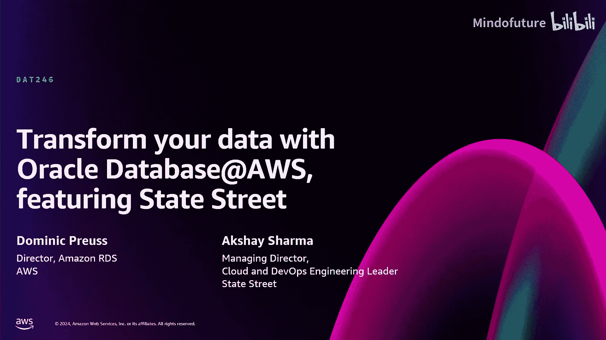

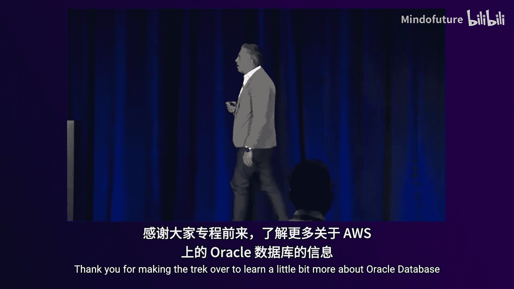

在本节课中，我们将学习AWS re:Invent 2024上发布的一项关键服务——Oracle Database at AWS。我们将了解这项服务的核心概念、架构、优势，并通过一个实际案例和演示来展示它如何帮助企业加速云迁移和数据现代化。

---

## 引言：数据战略是生成式AI的基石

任何关于生成式AI的对话都始于一个“小秘密”：强大的生成式AI战略必须建立在坚实、全面的数据战略之上。除非您的数据是安全、有组织且易于利用的，否则无法在生成式AI领域取得任何进展。无论是构建新模型还是进行相关应用，都需要一个坚实的数据基础。

这个基础必须是全面的，这意味着您需要能够访问和集成所有数据，并且必须建立有效的治理模型，以确保数据的安全性和合规性。

---

## AWS上的Oracle数据库演进

几乎所有企业客户都在其技术栈中使用了Oracle数据库。AWS与Oracle的合作已超过14年，致力于帮助客户将Oracle工作负载迁移到AWS。

*   **Amazon RDS for Oracle**：始于14年前，提供托管的Oracle数据库服务。
*   **RDS Custom for Oracle**：为需要更多控制权的客户提供共享责任模型。
*   **EC2上的自托管Oracle**：客户可以将他们的DBA团队、自动化脚本和本地部署经验直接迁移到EC2实例上。

然而，对于在本地运行Oracle Exadata工作负载的客户，AWS过去没有一个理想的解决方案。为此，AWS与Oracle达成了战略协议，推出了 **Oracle Database at AWS**。

---

## 什么是Oracle Database at AWS？🚀

从根本上说，**Oracle Database at AWS** 是在AWS数据中心内部署的、由OCI远程管理和控制的OCI基础设施硬件。它是在AWS数据中心内提供的、运行在专用硬件上的OCI服务。

**为什么这很重要？**
过去，如果您尝试在OCI上运行Oracle数据库，在EC2上运行应用程序，两者之间的延迟过高，无法拆分这些工作负载。新解决方案通过在AWS数据中心内部署OCI基础设施，提供了到EC2等AWS服务的低延迟连接（亚毫秒级）。这使得客户可以在EC2上运行其E-Business Suite、PeopleSoft或自定义应用程序，并连接到位于同一AWS数据中心内的OCI托管数据库。

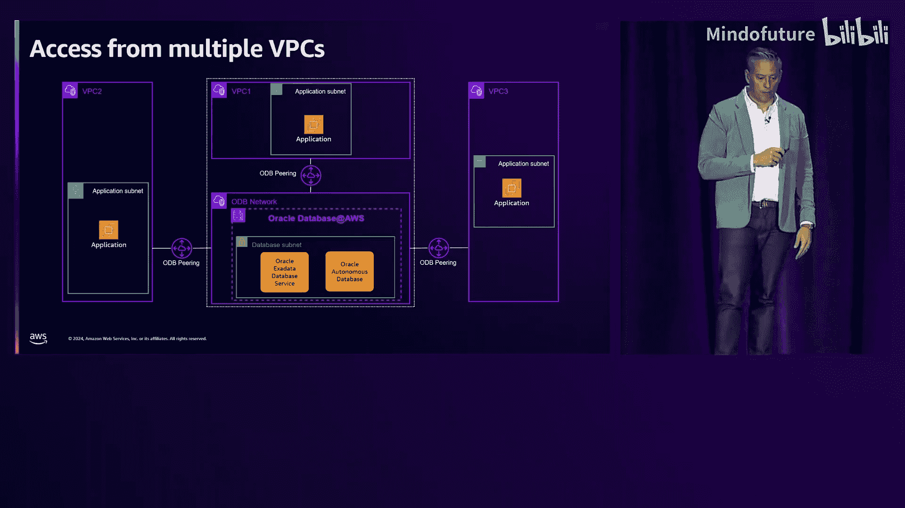

---

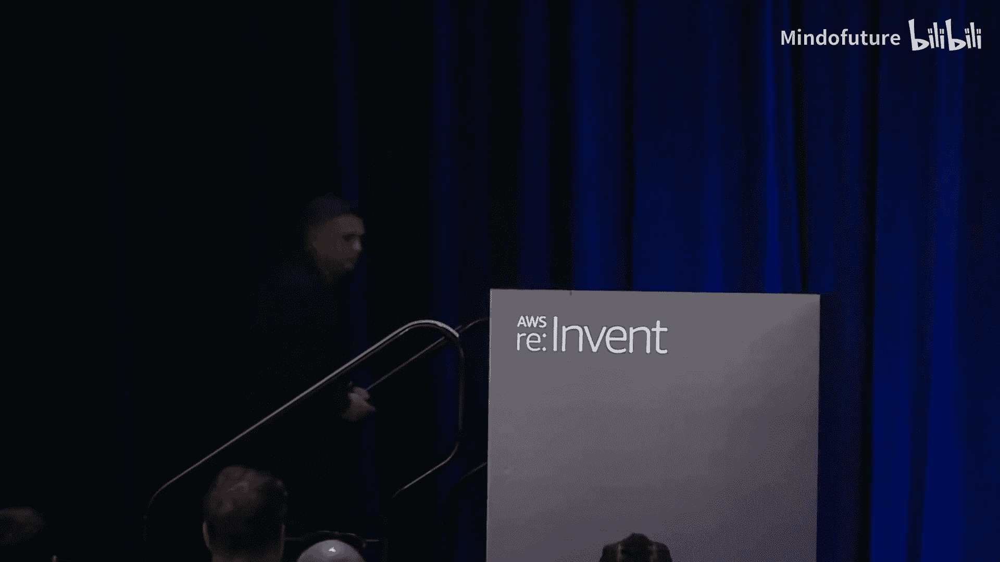

## 核心优势与集成

这项服务带来了几个关键优势：

1.  **简化迁移**：使客户能够轻松地将本地Exadata工作负载“直接迁移”到AWS云中，无需复杂的数据库重构。
2.  **数据统一**：Oracle数据库位于AWS数据中心内，可以轻松地与您的分析数据、其他Oracle数据库及非Oracle数据库结合，为生成式AI等应用提供统一的数据视图。
3.  **简化消费体验**：为了让AWS客户更容易使用，我们围绕它包装了类似AWS原生服务的体验。
    *   **集成到AWS管理控制台**。
    *   **通过AWS Marketplace进行集成**：支付通过AWS Marketplace完成，这带来两大好处：
        *   计入您对AWS的承诺消费，以获得折扣。
        *   计入Oracle支持奖励计划，抵扣您的年度Oracle软件支持成本。
    *   **提供AWS API**：使用您的AWS凭证进行服务配置和管理。

---

## 技术集成细节

为了让服务感觉像是AWS产品的一部分，我们进行了深度集成：

*   **Oracle RAC支持**：这是在AWS上运行Oracle RAC工作负载的官方支持方式。
*   **自治数据库支持**：将在Exadata基础设施上提供Oracle自治数据库（专用基础设施），以获得高级管理功能。
*   **备份集成**：默认情况下，数据库备份将存储在Amazon S3中，使其完全融入AWS生态系统。
*   **零ETL集成**：正在开发与AWS分析服务（如Redshift、Iceberg表）的单点击零ETL集成，便于数据流入下游分析工作负载。
*   **网络与计算集成**：作为Amazon VPC中的一等公民，您可以使用EC2、EKS、Lambda等任何AWS计算选项直接连接这些Oracle数据库。

---

## 架构概览

从架构上看，**Oracle Database at AWS** 并非在AWS上运行OCI，而是在AWS内部运行OCI基础设施。

*   在AWS区域内，有一个专门的区域部署了Oracle Exadata硬件。
*   该硬件由OCI父区域远程管理（控制平面），但客户基础设施位于AWS数据中心内。
*   我们创建了一个名为 **Oracle Database Network (ODB)** 的网络覆盖层，将您的AWS VPC对等连接到该网络，从而实现低延迟访问。
*   您的应用程序在VPC中运行时，会将Exadata上的虚拟机和数据库视为VPC内的另一个端点。

对于高可用性（HA）和灾难恢复（DR），通用可用性（GA）时将支持以下架构：
*   **高可用性**：在同一区域的两个可用区（AZ）部署Exadata集群，通过Data Guard进行同步。
*   **灾难恢复**：在另一个区域（同一国家内）部署第二个区域，进行跨区域复制。
*   此外，您可以将多个VPC对等连接到同一个Oracle Database Network，以满足复杂的网络架构需求。

---

## 客户案例：道富银行（State Street）

上一节我们介绍了服务的技术细节，本节中我们来看看一家全球性金融机构——道富银行是如何规划使用这项服务的。

道富银行是一家拥有230年历史的银行，是全球最大的托管机构之一，也是全球第四大资产管理公司。作为全球系统重要性金融机构（G-SIFI），其运营韧性和风险管控至关重要。

**技术战略支柱**：
1.  平台现代化
2.  数字化客户体验
3.  自动化与效率
4.  人工智能（AI）与数据

**多云战略与Oracle Database at AWS的作用**：
道富银行的目标是减少全球数据中心，并建立与AWS、Azure和Oracle Cloud的三云“星型”互联架构。过去，严重依赖Exadata的应用程序只能迁移到托管机房（Colo），无法充分利用云原生服务的优势。

**Oracle Database at AWS带来的价值**：
1.  **加速向AWS迁移**：使依赖Exadata的应用程序能够直接迁移到AWS云，无需重写。
2.  **保护现有投资**：充分利用在Exadata上的现有投资。
3.  **建立坚实的数据基础**：将数据移至云端，为创新奠定基础。
4.  **简化架构与运维**：将应用和数据库都原生地放在云上，极大降低了架构复杂性。
5.  **开启创新**：可以无缝使用AWS的SageMaker、Bedrock等AI/ML服务，基于云中的数据开发新产品和服务。

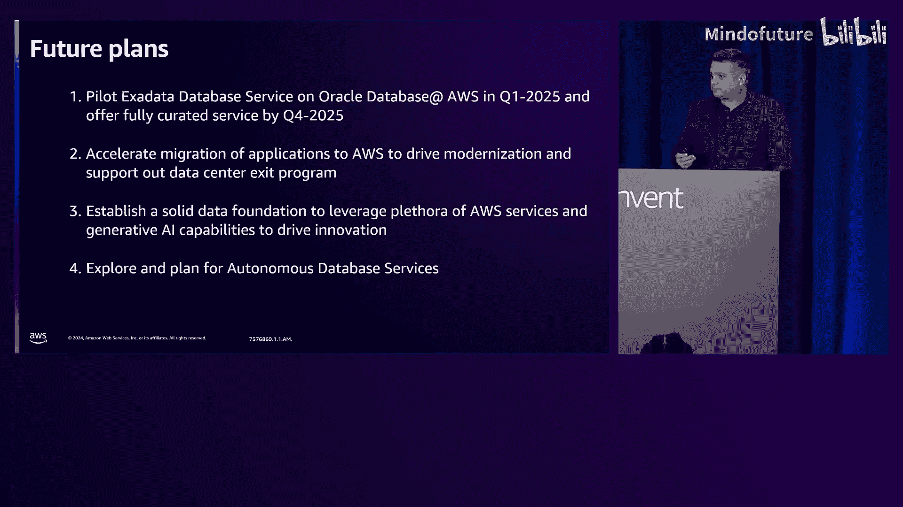

**评估与期望**：
道富银行计划在2025年第一季度进行试点，重点关注**延迟与性能**、**多可用区功能**、**SKU可用性**、**安全特性**、**与AWS服务的原生集成**以及**统一的支持体验**。他们的目标是在2025年第四季度将生产负载迁移到该服务。

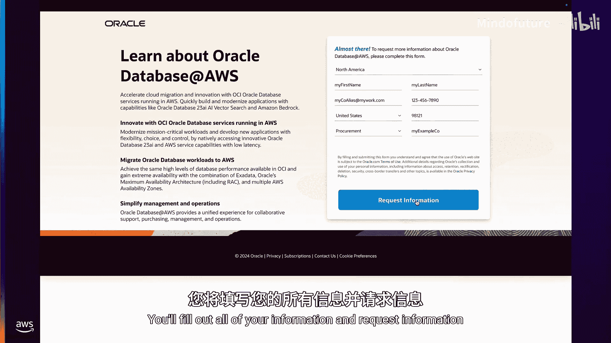

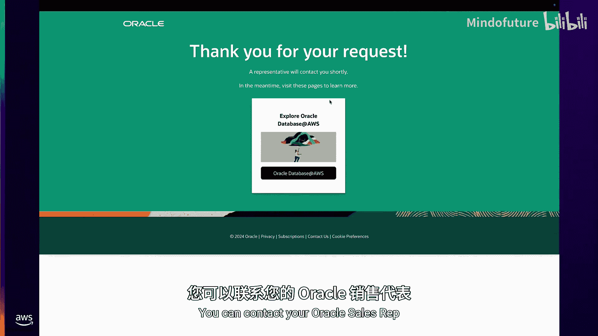

---

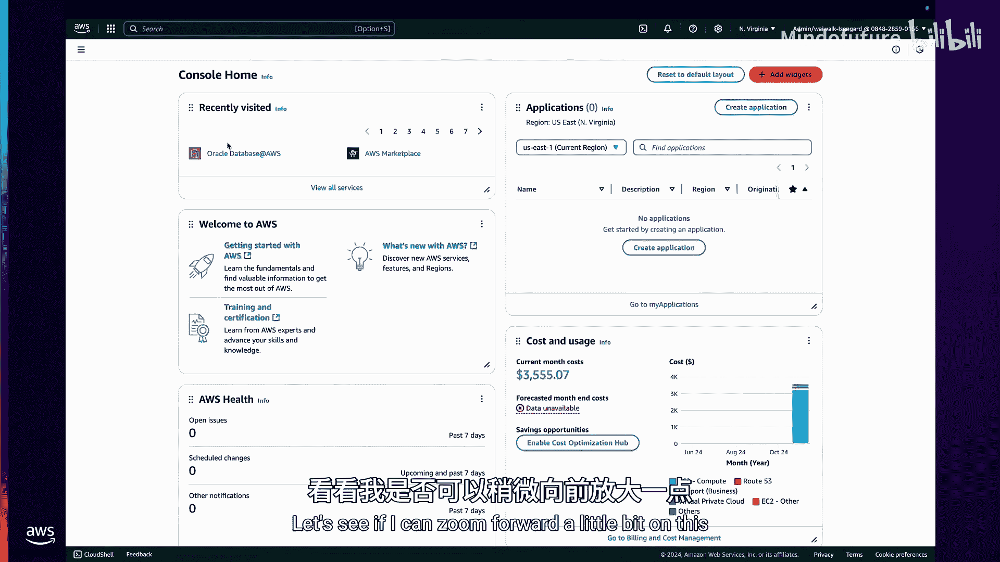

## 实际操作演示

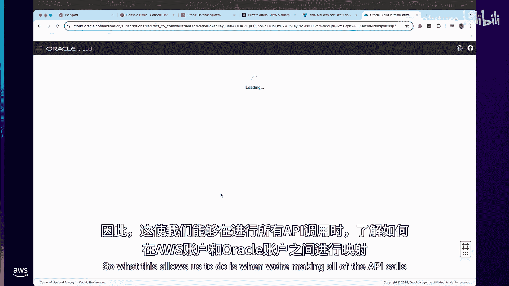

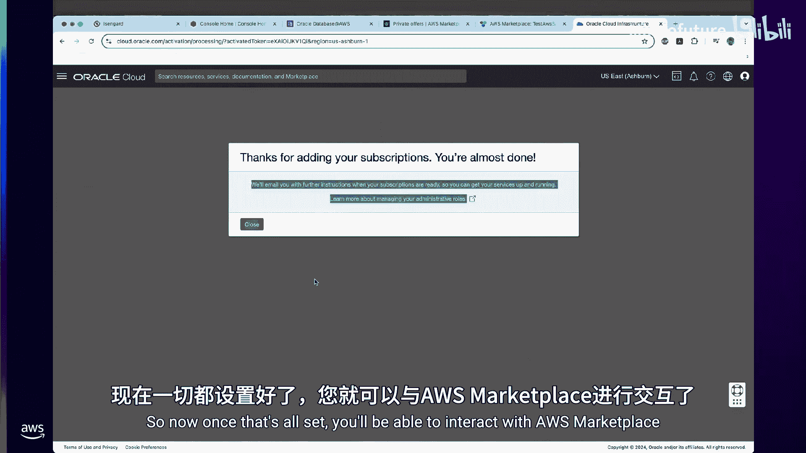

任何精彩的re:Invent会议都少不了演示。以下是在有限预览版中可用的操作流程概览：

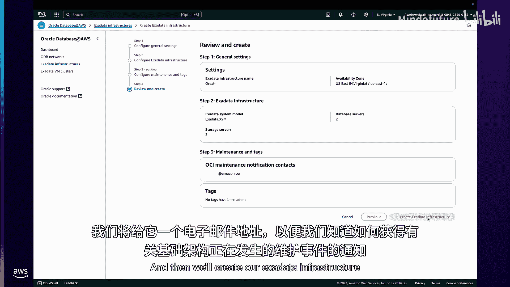

1.  **获取私有定价**：通过AWS控制台中的“Oracle Database at AWS”页面，申请私有定价报价。
2.  **接受市场报价**：在AWS Marketplace中接受Oracle提供的私有报价。
3.  **关联账户**：将您的AWS Marketplace账户与您的OCI租户关联。
4.  **创建ODB网络**：在控制台中创建Oracle Database Network，指定VPC、CIDR块等，建立网络连接。
5.  **配置Exadata基础设施**：指定数据库服务器和存储服务器的数量，创建Exadata硬件。
6.  **创建虚拟机集群**：在Exadata上配置运行数据库的虚拟机集群。
7.  **连接与使用**：
    *   从EC2实例可以`ping`通并`SSH`连接到Exadata上的虚拟机。
    *   在虚拟机上使用Oracle工具创建容器数据库和可插拔数据库。
    *   通过SQL*Plus从EC2连接到新创建的数据库，验证连接。
8.  **监控集成**：所有虚拟机的指标已自动推送到Amazon CloudWatch，便于使用现有监控工具。

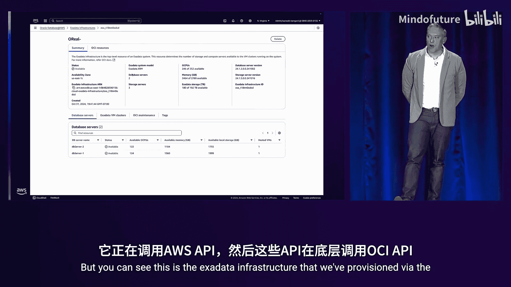

整个配置过程通过AWS控制台和API完成，感觉就像在使用一个原生的AWS服务。

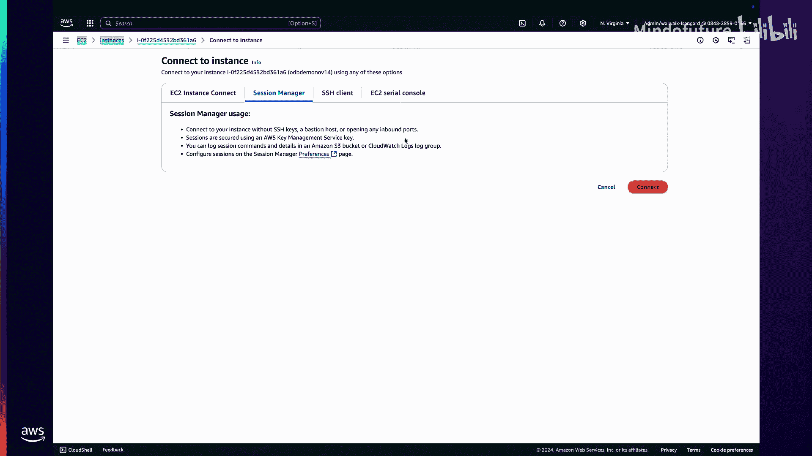

---

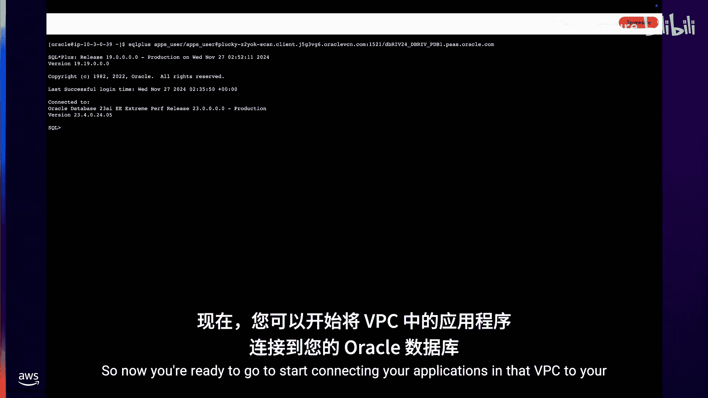

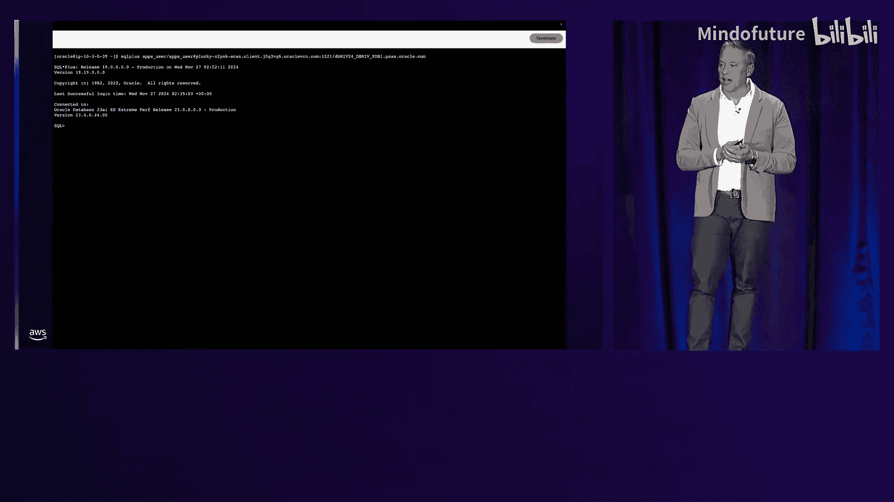

## 问答与总结

在演示之后，我们与道富银行的代表进行了简短问答，探讨了云迁移的驱动因素和给其他企业的建议。

**向云迁移的战略驱动因素**：
1.  降低风险与提升韧性：利用云的安全和弹性能力。
2.  实现数据中心精简（Data Center Exit）。
3.  实现现代化与创新。

**给其他企业的建议**：
1.  **从小处着手，迭代改进**。
2.  **投资于团队能力建设**，不仅限于技术团队，也包括安全、法务、采购等部门。
3.  **实现高度自动化**，贯穿供应、测试、策略即代码、持续合规等全生命周期。
4.  认识到云是一个“虚拟数据中心”，需要时间进行调优和配置，但同时也带来了无尽的创新机会。

---

## 总结

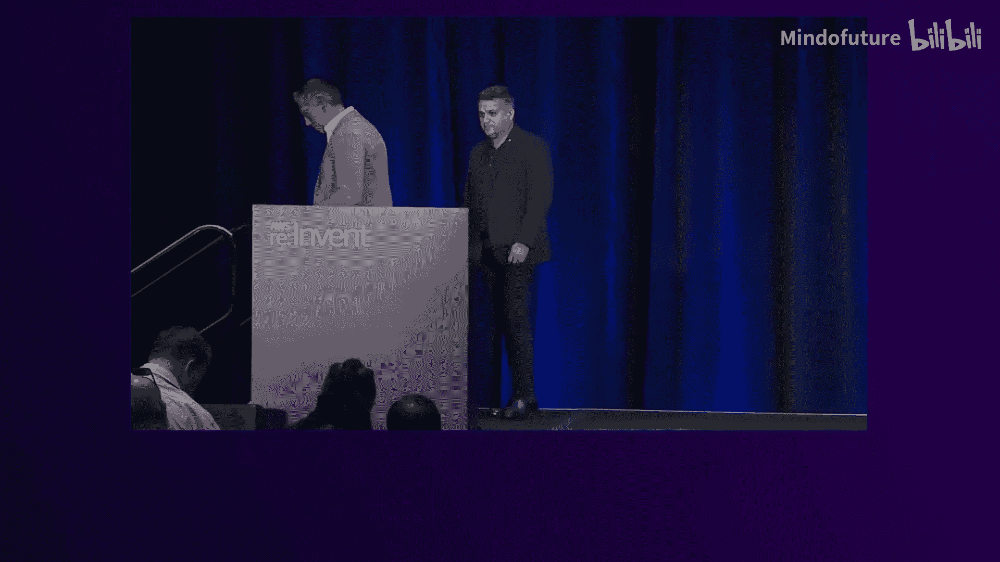

本节课中我们一起学习了 **Oracle Database at AWS** 这项新服务。我们了解到，它通过在AWS数据中心内部署OCI的Exadata硬件，为依赖Oracle Exadata的企业客户提供了一条直接迁移上云的捷径。这项服务不仅提供了亚毫秒级的低延迟连接，还通过深度集成（如AWS控制台、Marketplace计费、CloudWatch监控）提供了类似AWS原生服务的体验。正如道富银行的案例所示，它能帮助企业加速云迁移、保护现有投资、简化架构，并最终在统一的数据基础上利用AWS丰富的服务（特别是AI/ML服务）进行创新。该服务目前处于有限预览阶段，计划于2025年正式发布。