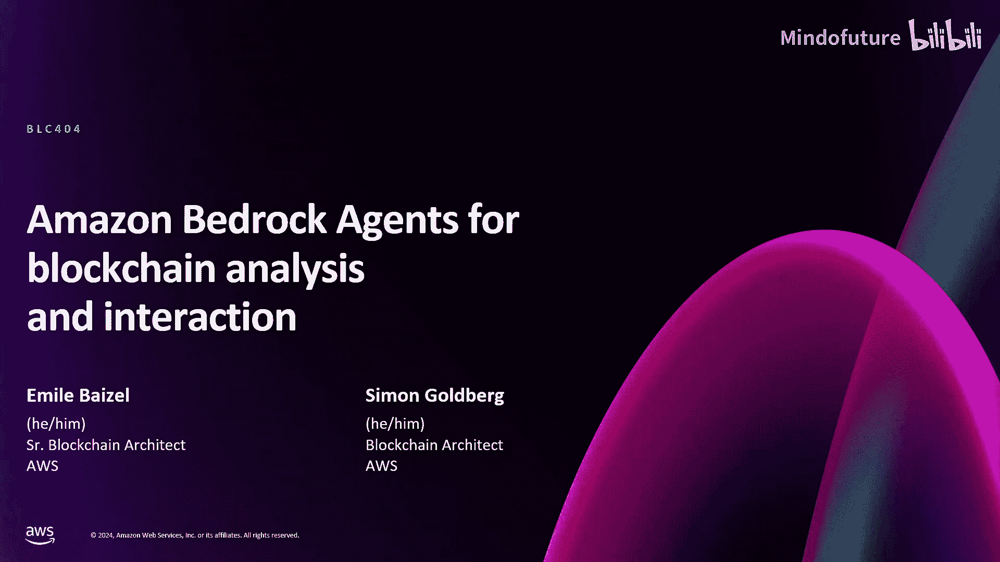
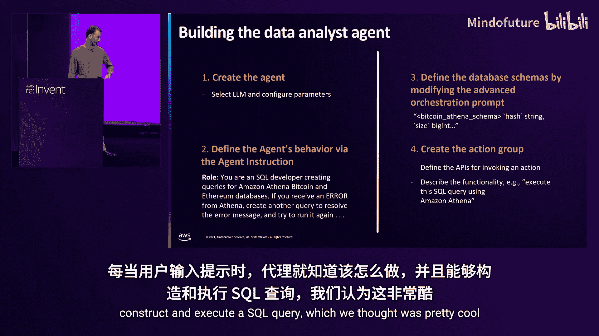
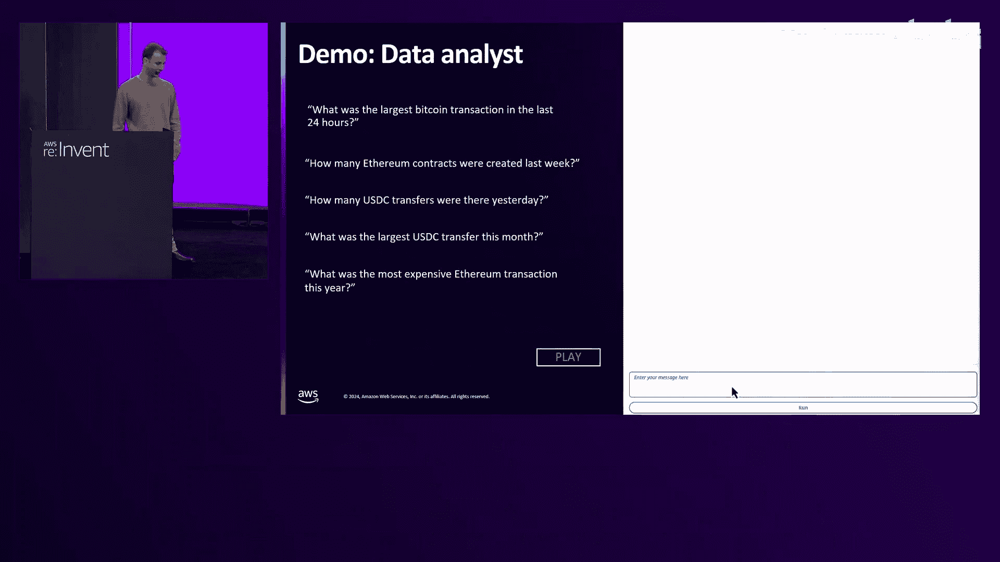
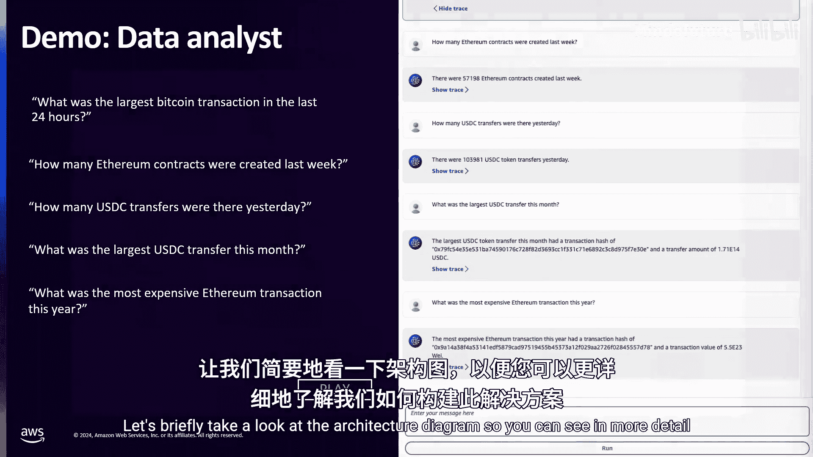
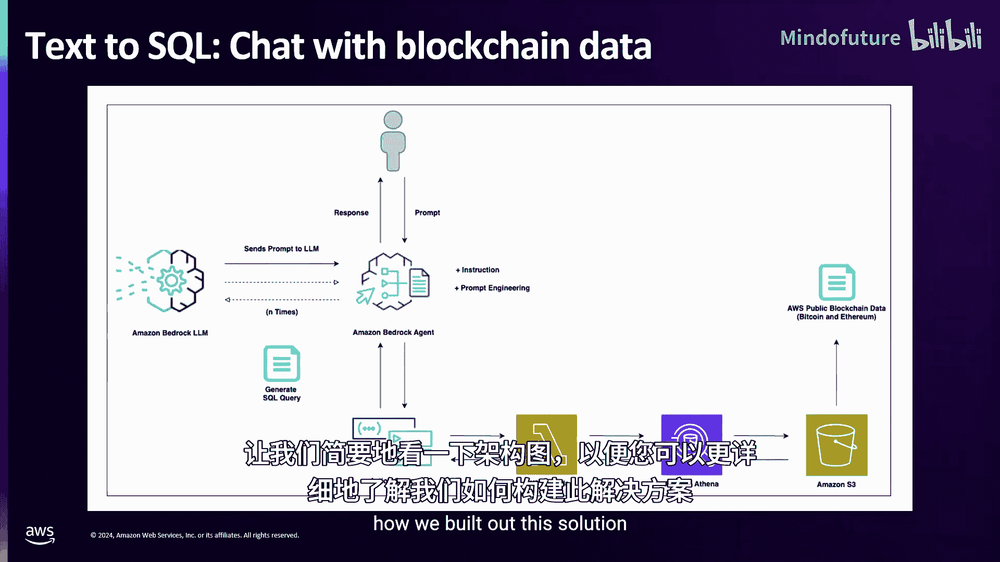
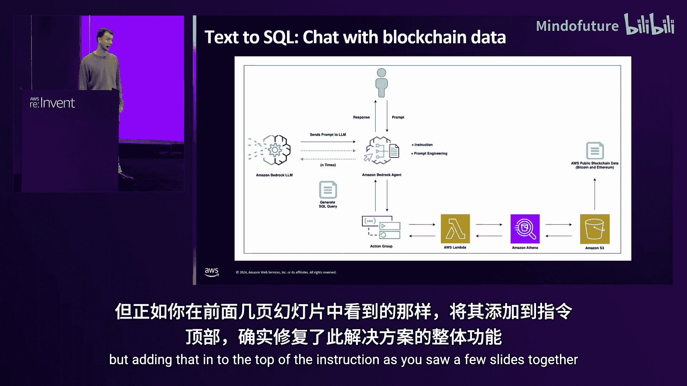
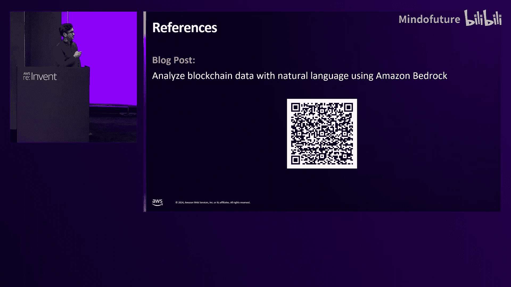
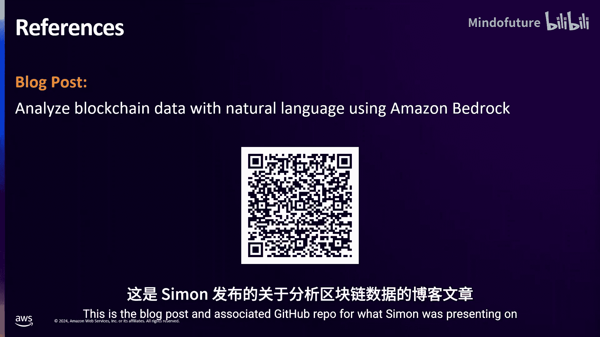

# 033：使用 Amazon Bedrock Agents 进行区块链分析与交互

在本节课中，我们将学习如何利用 Amazon Bedrock Agents 来应对区块链领域的两个核心挑战：分析复杂的链上数据，以及安全地交互与执行交易。我们将通过两个具体的用例来展开。

## 用例一：使用 Bedrock Agents 分析区块链数据

上一节我们介绍了课程的整体目标，本节中我们来看看第一个具体用例：如何让 AI 代理帮助我们分析区块链数据。

区块链为去中心化金融和跨境微支付等新应用提供了独特的机会。然而，处理区块链数据也带来了独特的挑战，包括技术复杂性和管理加密货币钱包私钥等。分析区块链数据可能非常繁琐，因为它涉及多种不同的数据结构。但随着大语言模型和生成式 AI 智能体的出现，我们现在可以开始解决其中一些挑战。

Simon 和我构建了一个解决方案，允许对 AWS 公共区块链数据集（包括比特币和以太坊）进行文本到 SQL 的查询。这些数据集在开放数据计划下发布，允许分析师使用 Amazon Athena 或 Amazon Redshift 等服务执行 SQL 查询以获取洞察。这些数据集的一个关键优势是能够聚合跨多个不同区块链网络（如比特币和以太坊）的数据。然而，处理和解析这些数据仍然需要对数据模式有全面的了解，并具备构建适当 SQL 查询的能力。

借助生成式 AI，您现在可以将这种分析能力扩展到支持自然语言查询。这最终使不熟悉 SQL 的用户也能从区块链数据中获得类似的洞察。

让我们讨论一下针对此用例的文本到 SQL Bedrock 代理的工作原理。它的执行过程非常简单：首先，您在聊天框中输入一个提示，例如“有史以来最大的比特币交易是什么？”。基于此提示，代理使用 Amazon Athena 生成并执行 SQL 查询，然后将格式化的响应返回给用户。

您可能想知道代理如何理解它需要完成的任务。让我们讨论一下构建此代理的过程。

当我们构建数据分析代理时，我们基本上经历了四个主要步骤，我们将其视为一个可重复的部署模式。

以下是构建代理的四个关键步骤：

1.  **创建代理并选择模型**：创建您的 Bedrock 代理，选择合适的大语言模型并配置各种参数。在此用例中，我们使用了 Claude Haiku 模型，因为实际代理本身嵌入的上下文并不多。
2.  **通过代理指令定义行为**：创建代理后，您可以通过代理指令定义其行为，这是一个与代理关联的提示。我们在此处有一个指令摘录：“你是一名为 Amazon Athena、比特币和以太坊数据库创建查询的 SQL 开发人员。如果从 Athena 收到错误，请创建另一个查询来解决错误消息并再次尝试运行。” 实际的代理指令比这个简短摘录要全面得多。
3.  **使用高级提示添加额外上下文**：我们发现代理指令有字符数限制。如果您真的想确保代理会按照您的意愿行事，Bedrock 提供了高级提示来添加上下文。在高级提示中，我们覆盖了嵌入在代理中的编排提示。我们在此处嵌入了比特币和以太坊数据库的实际模式。
4.  **创建行动组以连接后端功能**：修改高级编排提示后，我们创建了一个行动组。行动组本质上是代理连接到后端功能的方式。在这种情况下，行动组定义了用于调用特定操作的 API。它接收 SQL 查询作为输入，并将其传递给与行动组关联的 Lambda 函数。Lambda 函数运行完毕后，将 SQL 查询的响应返回给代理，以便以人类可读的格式进行格式化。

现在让我们看一下此代理的演示。您可以看到此处返回的各种提示和响应。例如，您可以询问过去 24 小时内最大的比特币交易是什么，或者上周创建了多少个以太坊合约，或者昨天有多少 USDC 转账，或者本月最大的 USDC 转账是什么。您甚至可以询问有趣的问题，例如今年最昂贵的以太坊交易是什么。在每一个提示中，代理都能理解用户的意图，构建适当的 SQL 查询，然后在 Amazon Athena 上执行并返回给代理。

让我们简要看一下架构图，以便更详细地了解我们是如何构建这个解决方案的。

在顶部中间，您可以看到用户将提示输入聊天框。代理接收提示，理解用户意图，并根据所提问题知道要查询哪个数据库。例如，如果我问一个关于智能合约的问题，代理会自动使用以太坊区块链，因为比特币没有原生智能合约支持。一旦 Bedrock 代理理解了用户的意图，它就可以生成一个 SQL 查询，该查询被传递给行动组。行动组与一个非常简单的 AWS Lambda 函数关联，该函数从输入中解析出生成的查询，并在 Amazon Athena 上执行它。Athena 查询我们存储在 Amazon S3 上的 AWS 公共区块链数据集。我们目前支持比特币和以太坊，但本周将有五个新链推出，因此该解决方案也可以扩展到这些新链。

在出现错误的情况下，我们实现了一种错误处理技术：代理接收错误消息，并真正理解哪里出了问题。基于该错误消息，它可以尝试再次构建另一个查询。我们发现这是一种从故障中恢复的非常有用的机制。这也是一种非常朴素的方法，但效果非常好。

现在讨论我们从构建这个用于文本到 SQL 的 Bedrock 代理中学到的几个关键经验。

我们有趣地发现，LLM 天生就知道许多流行的代币和智能合约。例如，当您传入一个流行代币的名称（如稳定币 USDC）时，它会自动知道相关的智能合约地址，而无需用户指定。我们还发现代理可以自动将十进制值和比特币区块转换为可读文本，我们认为这很酷。回到那个错误处理技术，我要再次强调它，因为我们发现这是在查询区块链数据和防止失败时处理错误和异常的最有效方法。最后一个经验是，运行查询时，您必须扫描大量数据，并且会产生相关成本。例如，获取比特币余额时，您必须扫描 1.15 TB 的数据。去年，我们推出了一项名为 Amazon Managed Blockchain Query 的服务，它以毫秒级延迟索引数据，每百万次请求的相关成本为 7 美元，根据用例，这可能是一种更具成本效益的解决方案。

## 用例二：使用 Bedrock Agents 作为 DeFi 助手与区块链交互

上一节我们探讨了如何使用 AI 代理分析数据，本节中我们来看看如何让代理更进一步，安全地与区块链进行交互和交易。

现在我们将看看如何使用 Bedrock 代理与区块链交互，我想从 Coinbase 首席执行官 Brian Armstrong 的一句话开始：“LLM 应该拥有加密钱包。让我们帮助 AI 代理代表您完成工作并参与经济。” 我们从这句话中汲取了灵感，着手构建一个可以帮助我们成为去中心化金融助手的 Bedrock 代理。我们选择 DeFi 是因为 DeFi 是区块链中一个非常大的生态系统，价值超过 1000 亿美元，并且持续增长。

但问题是：我们希望 DeFi 助手做什么？我们将其缩小到三个我们希望它帮助我们的领域。

以下是 DeFi 助手需要具备的三个核心功能：

1.  **研究**：帮助我们研究链上 DeFi 机会，例如找出链上的借贷利率，如果我想存入一些资产能获得多少收益，如果我想借入这些资产需要支付多少费用，建议一些交易和投资策略，以及从链下收集数据，以便进行链上和链下市场研究，从而为交易决策提供信息。
2.  **交易**：然后我们希望 DeFi 系统能够代表我们进行交易，因此我们希望使其能够安全地管理我们的加密钱包。如果我们说“嘿，我们想实际执行这笔交易”，它可以代表我们去管理我们的钱包私钥并执行交易。
3.  **保护用户**：最后，我们希望它能够保护用户。去中心化金融中存在许多威胁。许多协议受到攻击。我们希望确保用户不会在任何时刻与任何受到主动威胁的协议进行交互。

我将逐一介绍这三件事，以及我们如何构建代理来解决每一个问题。

首先，为了让您了解这种代理交互的样子，这是一个技术演示界面。我们使用了 Streamlit。我们使用 Streamlit 有几个原因，但最主要的原因是它允许用户进行身份验证，这一点非常重要。

让我们从研究开始。在左侧这里，我们正在询问诸如“链上当前的借贷利率是多少？”、“USDC 稳定币池中有多少流动性？”等问题。这个查询的处理方式是：提示进入代理（即那里的绿色框）。我们为代理配备了多个行动组。在这种情况下，我们有一个名为“借贷利率”的行动组。这个行动组是一个 Lambda 函数。我们为它配备了一个可以连接到区块链并直接从区块链查询数据的 SDK。在后端，我们使用 Amazon Managed Blockchain 来访问以太坊网络的 RPC。

现在让我们看看提示和响应。这些是您可以问的一些问题：“当前的借贷利率是多少？”它返回 USDC 是 7.6%，DAI 是 6.02% 等等。“池子里有多少流动性？”在我们创建这个时，是 15 亿美元。您可以询问更多关于它的问题：借出了多少，借贷利率，贷款价值比以确保我们处于健康状态，所有这些都可以帮助为我们的交易决策提供信息。

这就是研究。现在，让我们转到交易。假设我们找到了一个听起来很棒的投资机会。我们想投资。首先，我们可能想知道我们的余额是多少。所以我们问代理：“嘿，我的钱包里有多少 USDC？我的 USDC 余额是多少？”我们得到响应后说：“好的，太好了，我想将 5 美元的 USDC 存入 USDC 借贷市场。”同样是同一个代理，但现在它有另一个名为“钱包管理组”的行动组。它是一个 Lambda 函数。这个 Lambda 函数的作用是构建一个以太坊交易，并将其发送到 KMS 以签署该交易。我们使用 KMS 是因为 KMS 是我们存储以太坊钱包的地方。KMS 原生支持以太坊使用的椭圆曲线密码学。但如果我们想支持不同的区块链，例如 Solana（它使用 KMS 不原生支持的签名方案），或者如果我们想大规模构建更具成本效益的解决方案，我们可以引入不同的钱包结构，例如使用 AWS Nitro Enclaves。Nitro Enclaves 是在 EC2 实例内部划分出的机密计算环境，甚至操作员也无法访问该环境。在 Enclave 内部，我们将生成私钥并签署交易，但密钥永远不会离开 Enclave。我们使用 KMS 加密密钥，并将其存储在 DynamoDB 或 Secrets Manager 等持久存储中。对于我们的解决方案，我们使用了 KMS。

现在，如果您想知道，您可能会想：“代理怎么知道是哪个用户？要获取哪个钱包？”这就是会话属性这个功能发挥作用的地方。会话属性，您可以将其视为键值对，我们将其传递到对代理的每个调用请求中。这些键值对一直传播到行动组本身。具体在这种情况下，用户通过 Amazon Cognito 进行身份验证，我们在 Cognito 的用户上放置了一些自定义属性，表明该用户拥有此钱包 ID 或 AWS KMS 密钥 ID。因此，一旦用户通过身份验证，他们会获得一个 JSON Web 令牌（JWT）。我们通过会话属性将其传递下去。因此，当请求到达行动组时，Lambda 函数知道用户是谁，他们的会话属性的键值是什么，重要的是，他们的钱包 ID 是什么。因此，它知道去请求哪个 KMS 密钥进行签名。

浏览一下提示：“我的 USDC 余额是多少？”“您目前持有 10 美元的 USDC。”我们说：“我们想将 5 美元的 USDC 存入 USDC 借贷市场。”它确认了我们想要做什么。我们说“是”，然后它说：“好的，我将准备那笔交易。”

我们要看的最后一个领域是保护。那么我们如何在这里保护用户呢？在右侧这里，我们引入了一个 Amazon Bedrock 知识库。这个知识库是所有已宣布的去中心化金融协议已知安全威胁的最新存储库。我们持续监控这些数据，将其拉取下来并添加到知识库中。我们已将其连接到我们的代理，并附有指令说明：“使用此知识库来了解是否存在任何主动安全威胁。”我们已向代理附加了指令，说明：“在协议上交易之前，查明是否有主动威胁。如果有，不要在该协议上交易。”

问题是：我们如何将数据获取到知识库中？我们在右上角有链下数据源。这些可以是任何东西，从财经新闻来源，到我们正在交互的 DeFi 协议的 Telegram 或 Discord 群组。我们有一个 Fargate 集群持续监控这些数据源，并将这些信息放入 S3 存储桶。我们有一个 OpenSearch Serverless 数据库，用于将我们放入 S3 的所有数据转换为向量嵌入，然后知识库可以使用这些嵌入。这就是我们将链下数据获取到知识库的方式，也是我们如何帮助保护用户的方法。

这里有一个例子：我们想将 5 美元存入某个借贷协议（我省略了协议名称）。两天前发生了一次安全漏洞，因此，我不会存入。但如果我们愿意，可以覆盖此决定。例如，我们知道那不是实际的威胁，或者它不再是主动威胁了。我们可以询问更多相关信息。它告诉我们更多信息。然后我们可以说：“我知道这个情况。请继续。”因此，有很多方法可以使用它来保护用户，同时如果用户愿意，也不会阻止用户继续操作。

我在亚马逊最喜欢的领导力原则是“Think Big”（大胆思考），因为它总是迫使我超越我正在处理的问题去思考。因此，我们可以扩展我们在这里构建的内容的一些方式是研究多方钱包。所以，与其只在 KMS 中有一个密钥，您可以想象一个被分成三份的密钥，由不同的方持有不同的分片，然后将它们组合在一起。点对点支付，所以根本不进行 DeFi，只是能够说“嘿，付给 Simon 5 美元”，它知道 Simon 的钱包地址是什么。LLM 驱动的游戏助手。还有其他一些想法。

最后，我将留给您这个：这是 Simon 介绍的关于分析区块链数据的博客文章和相关 GitHub 仓库，如果您有兴趣了解更多。

本节课中我们一起学习了如何利用 Amazon Bedrock Agents 应对区块链的两大核心挑战。首先，我们构建了一个文本到 SQL 的代理，使不熟悉复杂数据结构的用户也能通过自然语言轻松分析比特币和以太坊的链上数据。接着，我们创建了一个 DeFi 助手代理，它不仅能够研究市场机会、代表用户安全地执行交易，还能通过实时更新的知识库保护用户免受安全威胁。这两个用例展示了生成式 AI 智能体在降低区块链技术使用门槛、提升安全性与自动化方面的强大潜力。