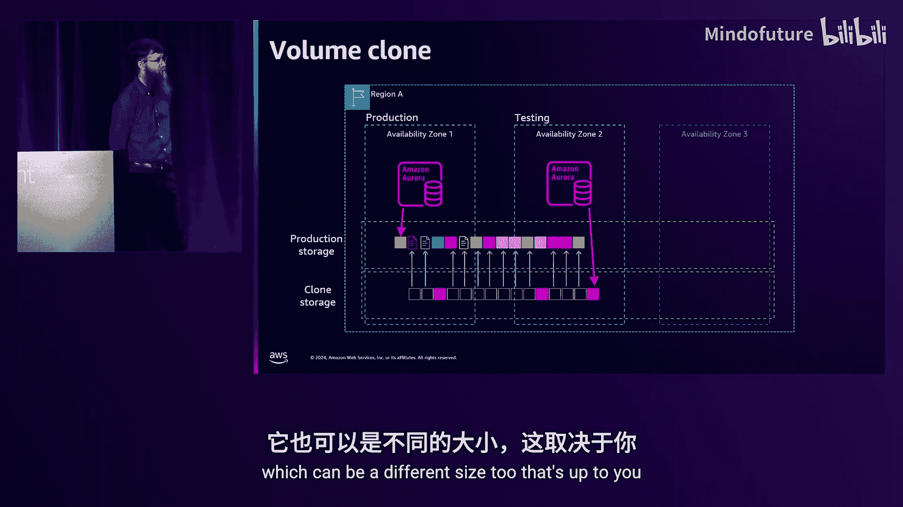
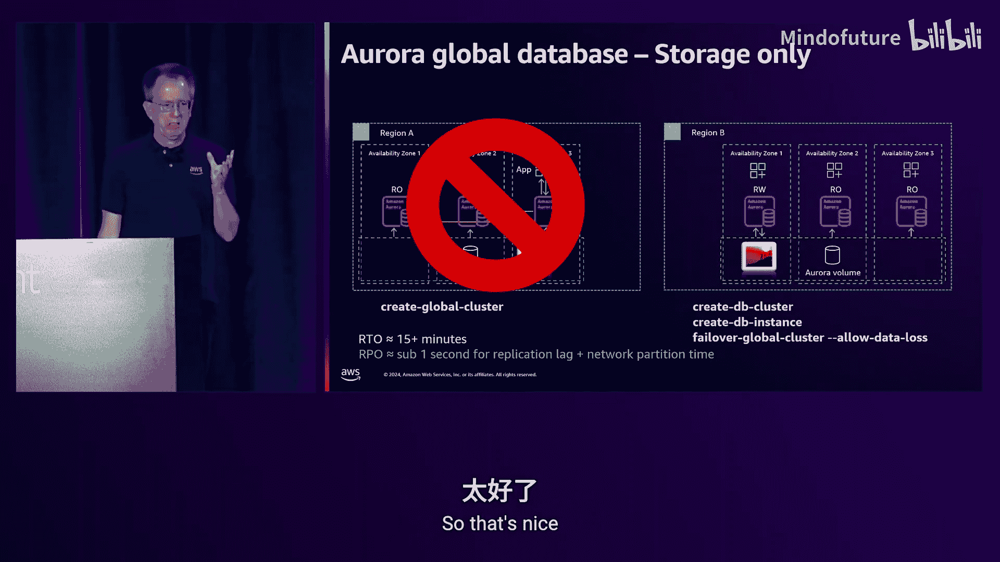
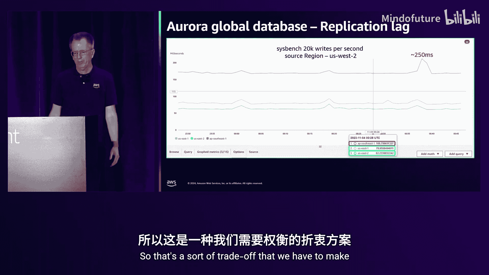
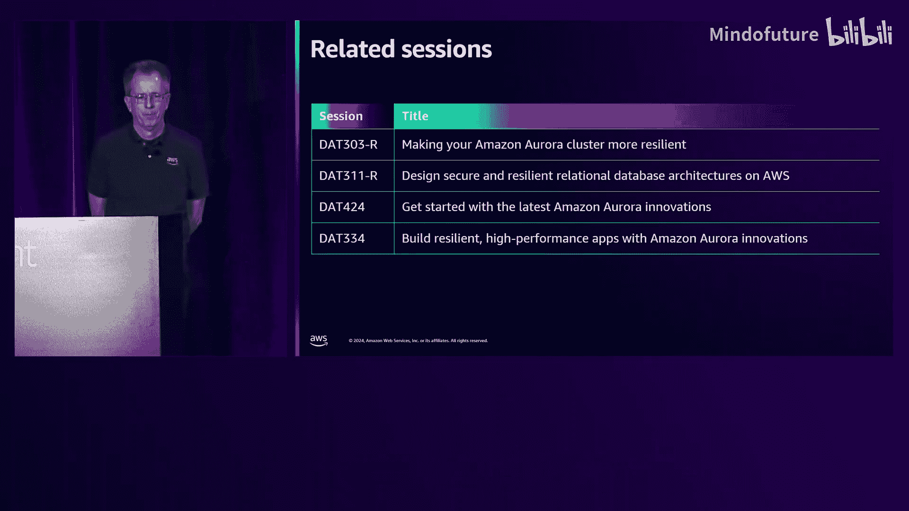

# 034：实现全局弹性 (DAT304) - P34

## 概述
在本节课中，我们将学习如何为 Amazon Aurora 数据库设计高可用性和灾难恢复方案，以构建具备弹性的系统。我们将跟随一个初创公司的成长历程，探索从单实例配置到全球多区域部署的各种设计模式，理解其背后的核心概念、权衡取舍以及如何选择适合您需求的方案。

---

## 章节 1：定义弹性 🎯

上一节我们介绍了课程概述，本节中我们来明确“弹性”的具体含义。

弹性是指一个工作负载从基础设施变更、服务中断中恢复的能力，能够动态获取或释放资源以响应需求，并能缓解诸如配置错误或瞬时网络问题等中断。弹性由两大支柱支撑：**可用性**和**灾难恢复**。

在构建弹性系统时，没有唯一的解决方案。您需要在故障模式、性能、成本和运维复杂性之间进行权衡。这些权衡需要您，作为客户，利用 Aurora 和 AWS 提供的工具来做出决策。今天我们将讨论存在于这个权衡空间不同位置的一些模式，以及如何判断它们是否适合您。

---

## 章节 2：两大支柱：可用性与灾难恢复 🏛️

上一节我们定义了弹性，本节中我们来深入探讨其两大支柱。

### 可用性
可用性是指工作负载可供使用的时间比例，通常以一段时间内的历史指标表示，例如“每月四个九”（99.99%）的可用性。
*   **核心概念**：为系统添加冗余是提高可用性的有效方法，可以避免单点故障的影响。

### 灾难恢复
任何弹性策略都应考虑灾难恢复。这是指在发生灾难事件时用于恢复工作负载的技术和策略，侧重于一次性恢复措施。
*   **恢复时间目标**：`RTO` 是指从发生影响性事件到能够恢复服务之间的最大可接受时间。
*   **恢复点目标**：`RPO` 是指在灾难或服务中断后可能丢失的最大数据量，通常以时间为单位衡量。例如，如果有10秒的异步网络延迟，那么可能丢失的最大数据就是10秒，这就是 `RPO`。

明确了这些共同语言后，我们就可以深入探讨具体的解决方案了。

---

## 章节 3：示例：初创公司的成长之旅 🚀

上一节我们了解了弹性的衡量标准，本节中我们将通过一个具体示例来探索不同的高可用和灾备需求。

假设您是一家热门初创公司的 DBA，这家公司运营着一个销售日出图片的网店。作为初创公司，资金有限，因此选择 Aurora，因为它可以从小规模起步并支持业务的快速增长。今天，我们将跟随这家初创公司经历不同的成长阶段，看看其对高可用和灾备需求的思考如何变化。

---

## 章节 4：起点：Aurora 最小配置与存储揭秘 💾

上一节我们引入了示例，本节中我们来看看起点配置。

Aurora 的最小配置在三个可用区提供数据持久性，在一个可用区提供可用性，我们称之为**单可用区模式**。
*   **架构**：一个数据库实例位于一个可用区，负责查询处理和缓冲池管理等。数据则存储在横跨三个可用区的 **Aurora 存储卷**中。
*   **高可用影响**：如果该数据库实例因任何原因不可用，数据库将变得不可用，但这**不是数据持久性问题**，数据仍然安全地存储在下方的存储层。

为了理解后续更高级的功能，我们需要深入了解 Aurora 存储。

以下是 Aurora 存储的核心机制：
1.  **分布式存储层**：Aurora 存储是一个分布在单个 AWS 区域三个可用区中的多租户存储集群，由大量专用存储节点组成。
2.  **数据持久性**：Aurora 将您的数据加密后，制作**6个副本**，并分散在三个可用区中（您只需为一个副本付费）。任何新写入，都需要**4个副本**成功写入持久存储后才会确认。
3.  **容错能力**：这意味着 Aurora 可以容忍**三个存储节点故障**（即一整个可用区再加一个节点），而不会出现数据持久性问题。
4.  **日志即存储**：与传统数据库同时写入日志和数据页不同，Aurora **只写入日志**（一种特殊的 Aurora 日志格式）。存储层理解这种格式，能够根据需要将日志记录转换为数据库页。这种并行处理方式是 Aurora 高性能的秘密，同时也支撑了许多高可用和灾备功能。

---

## 章节 5：应对意外：时间点恢复与克隆 🛡️

上一节我们深入了解了存储基础，本节中我们来看看如何应对数据错误。

假设您的应用开发人员发布了一个有问题的版本。不用担心，Aurora 内置了持续增量备份功能。
*   **备份机制**：每个保护组（PG）都在持续将数据库页的日志记录写入 S3，由存储层在后台完成，**不影响数据库实例的性能**。
*   **恢复操作**：您可以设置 1 到 35 天的备份保留期，并在此窗口内的任何时间点进行恢复。恢复时，Aurora 会并行获取指定时间点前的最新数据页副本，然后应用该时间点前的所有日志记录，从而形成一个对数据库引擎而言崩溃一致的点。

从这次事件中吸取教训后，您需要在类似生产环境的数据和负载下进行测试，但又不能直接在生产环境操作。这时可以使用 **Aurora 克隆**。
*   **工作原理**：克隆创建时，最初并不包含实际的数据页和日志记录，而是包含指向源（生产）卷的指针。读取未修改的数据时，通过指针从源卷获取；写入数据时，则中断指针并在克隆卷中创建新副本。
*   **成本优势**：您只需为克隆中发生变化的数据支付存储费用，同时也可以使用不同规格的实例，实现了低成本的生产环境数据测试。

---

## 章节 6：提升可用性：多可用区与读取扩展 🔄

上一节我们学会了应对数据问题，本节中我们专注于提升服务的持续可用性。

您的 CTO 希望提升可用性以达到 Aurora 单区域 99.99% 的服务水平协议。为此，我们需要引入多个可用区。
*   **多可用区部署**：在另一个可用区创建第二个数据库实例，它们共享同一个 Aurora 存储卷。主实例会将新事务实时同步到备用实例。
*   **故障转移**：当主实例发生故障时，备用实例可以在大约 30 秒内接管，成为新的主实例。由于共享存储，**RPO 为零**。
*   **读取扩展**：这个备用实例同时也是一个**只读副本**，可以分担只读查询的负载。您可以通过集群的**读取器端点**（采用轮询 DNS）将读请求定向到副本。

随着负载增长，您可能需要添加更多只读副本来提升读取吞吐量。Aurora 最多支持在一个区域内有 15 个副本。为了避免故障转移时较小的副本实例过载，您可以配置**故障转移层级**，指定实例被选为故障转移目标的优先级顺序。

---

## 章节 7：连接管理与故障转移加速 🔌

上一节我们扩展了读取能力，本节中我们解决连接管理和快速故障转移的问题。

当应用服务器集群需要连接数据库时，管理大量连接会带来挑战。我们有限制和池化两种技术。
*   **限制连接**：避免过度订阅，但可能限制性能。
*   **连接池化**：通过复用连接恢复性能。许多驱动程序（如 JDBC）自带连接池，但它们通常不了解像 Aurora 这样的集群拓扑变化。

为了加速故障转移感知，AWS 提供了 **Advanced JDBC Driver**。
*   **功能**：该驱动程序能感知数据库集群拓扑的变化，并在 DNS 更新之前（快至 6 秒内）处理故障转移，速度比传统方式快 66%。它同样支持 Python、Node.js 和 MySQL ODBC。

对于无状态应用（如 PHP），可以使用 **RDS Proxy**。
*   **优势**：RDS Proxy 作为一个完全托管的数据库代理，为应用程序提供连接池。应用连接到代理端点，代理则管理与后端数据库的连接。在故障转移时，如果会话未“固定”（例如未使用预处理语句或存储过程），前端应用连接甚至不会断开，实现了对应用透明的故障转移。

---

## 章节 8：迈向全球：跨区域备份与全局数据库 🌍

上一节我们优化了区域内的可用性，本节中我们开始考虑跨区域的灾难恢复。

随着业务全球化，您需要防范整个 AWS 区域中断的风险。第一种方法是**跨区域备份**。
*   **流程**：在区域 A 创建集群快照，然后复制到区域 B。
*   **权衡**：这是异步复制，**RPO** 取决于快照频率（例如每小时一次，则可能丢失最多约70分钟的数据）。**RTO** 约为60分钟，因为需要在区域 B 恢复快照并创建实例。

为了显著降低 RPO 和 RTO，可以使用 **Aurora 全局数据库**。
*   **存储级复制**：在区域 B 创建一个**仅包含存储**的二级集群。通过专用的复制服务器和代理，以毫秒级延迟（通常亚秒级）从主区域异步复制数据到二级区域。**RPO 通常低于 1 秒**。
*   **故障转移**：当区域 A 发生故障时，您可以在区域 B 启动数据库实例，然后执行**故障转移**命令（需允许数据丢失，因为复制是异步的）。**RTO 可缩短至约 15 分钟**。
*   **网络分区考量**：需要注意，在发生网络分区（而非区域完全中断）时，两个区域可能暂时无法通信，但各自内部仍在运行，这可能导致数据分歧。

---

## 章节 9：高级全局部署：对称配置与读写分离 ⚖️

上一节我们介绍了基础的全局数据库，本节中我们探讨更高级的全局部署模式。

为了进一步降低 RTO，可以采用**对称配置**。
*   **架构**：在区域 B 也部署与区域 A 相同规格的数据库实例（处于只读模式），并让应用程序也预先在区域 B 运行。
*   **优势**：故障转移时，由于实例已就绪，**RTO 可降至 2 分钟以内**。故障转移后，服务会自动尝试重建区域 A 的集群并重新同步数据。

除了故障转移，还可以执行**切换**，这是一种通常无损的、计划内的主区域迁移操作，适用于灾难演练或主动迁移。

为了简化应用程序在全局部署下的配置，Aurora 全局数据库提供了**全局端点**。
*   **功能**：您可以使用一个全局端点，Aurora 会自动将其解析到当前的主区域。在执行故障转移或切换后，该端点的 DNS 解析会自动更新指向新的主区域，无需修改应用配置。

为了实现**读取弹性**，可以将应用程序的只读部分（如图片列表展示）部署到两个区域，直接读取当地的只读副本，降低延迟，并在主区域故障时保持只读功能可用。

对于需要偶尔写入的只读应用，可以启用**写转发**。
*   **原理**：允许在二级区域的实例上执行写操作，该操作会被透明地转发到主区域的主实例执行。这并非多主架构，仍是单写系统。
*   **一致性级别**：写转发提供不同的一致性级别，需根据应用需求谨慎选择：
    *   **会话级**：确保读取自己的写入，但首次读取需等待复制完成。
    *   **最终一致**：读取速度最快，但可能无法立即看到自己的写入。
    *   **全局读一致**：确保读取所有已提交的写入，但所有读取都可能需要等待最慢的复制链路，对弹性有影响。

---

## 章节 10：多区域与跨账户保护 🛡️

上一节我们探讨了对称配置，本节中我们看看更复杂的多区域和跨账户保护。

Aurora 全局数据库支持最多 **5 个目标区域**，您可以混合使用对称配置和仅存储配置，以平衡成本与 RTO。

对于 Aurora PostgreSQL，还可以配置 **`global_db_rpo`** 参数（以秒为单位）。
*   **作用**：设置此参数后，主区域只有在**至少一个**目标区域的复制延迟小于此值时才会提交事务。这可以保证在故障转移时，数据丢失不会超过设定的时间窗口。

最后，为了防范 AWS 账户本身的风险，可以通过 **AWS Backup** 设置**跨账户备份**。
*   **方法**：将各区域的快照复制到另一个独立的 AWS 账户中。这提供了另一层保护，但 RPO 仍取决于快照频率。

---

## 总结
本节课中，我们一起学习了 Amazon Aurora 高可用与灾备的设计模式之旅。我们从单可用区的最小配置开始，逐步增加了多可用区部署、只读副本、连接管理优化，以提升区域内可用性。随后，为了获得全局弹性，我们探索了跨区域备份、全局数据库（包括存储级和对称配置），并了解了如何利用全局端点、写转发和多区域部署来构建复杂的、适应不同 RTO 和 RPO 要求的全球架构。关键点在于，没有一种模式适合所有场景，您需要根据业务需求、成本预算和对中断的容忍度，在这些模式中做出明智的权衡和选择。