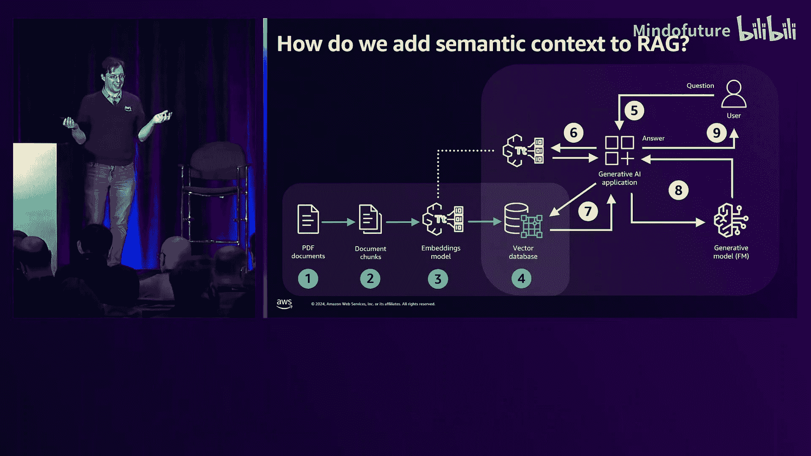
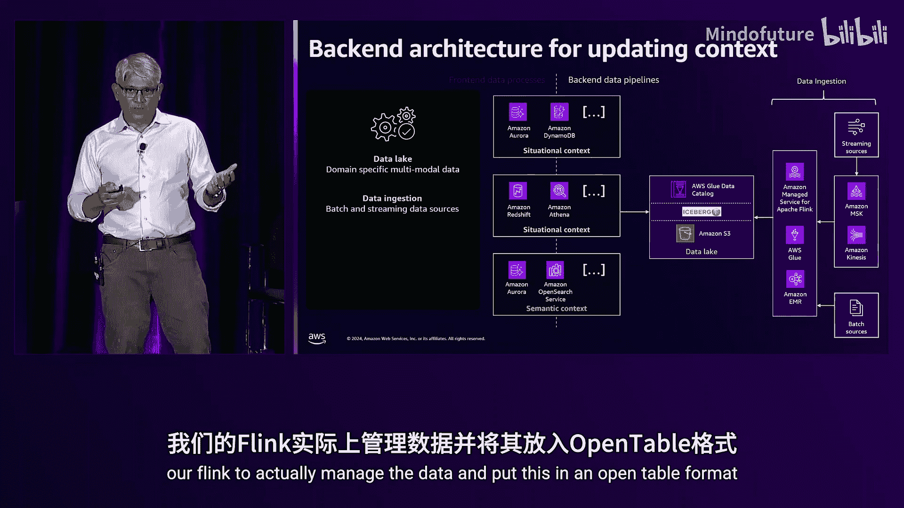
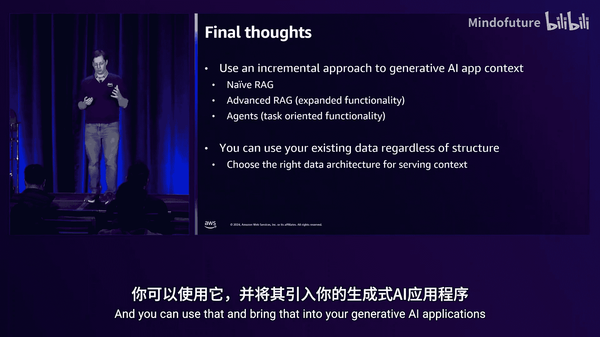

# 035：从业者指南

在本课程中，我们将学习如何为生成式AI应用准备和整合数据。我们将深入探讨检索增强生成技术，了解如何将企业中的私有数据源与基础模型结合，以提供个性化的AI体验。课程将从基础概念开始，逐步深入到高级技术和数据架构设计。

## 概述

生成式AI的魅力在于能够利用企业多年来积累的私有数据源，为大型语言模型提供丰富的上下文，从而生成个性化的响应。本课程将围绕一个购买车险的示例，详细讲解从基础到高级的RAG技术、数据准备方法以及如何构建一个健壮的数据架构来支持AI应用。

## 1：RAG基础与数据上下文

欢迎来到生成式AI数据实践指南。我是Jonathan Katz，这位是Siva Rauppathy。本次演讲的核心是数据流。你可能已经听说过很多关于向量数据库和向量搜索的内容，但生成式AI的真正魔力在于将你多年积累的私有数据源引入这些基础模型，从而提供非常丰富、个性化的响应。

为了更好地说明，让我们通过一个例子来深入探讨。假设Pat需要购买车险。构建一个虚拟AI助手来帮助处理此事是可行的，但购买车险可能很复杂，因为它涉及驾驶历史、事故记录、支付历史等多种数据源。我们需要从这些不同的数据源中提取信息，以提供个性化的体验，同时还需要理解语言的细微差别。

将私有数据源引入生成式AI应用的核心技术被称为**检索增强生成**。为了理解如何将不同的数据库整合到RAG中，我们需要先了解RAG的工作原理。

### 理解数据上下文

从用户问题到增强提示，我们需要理解数据的来源。主要有两种上下文需要考虑：
1.  **情境上下文**：关于当前用户或会话的事实信息，例如位置、驾驶历史、车辆规格。这些信息通常已经存在于你的传统企业数据存储中。
2.  **语义上下文**：为事实赋予意义的信息，例如汽车法规、上传的照片、索赔文件。这类数据通常需要经过转换，以便进行语义搜索，这正是向量数据库或向量搜索引擎发挥作用的地方。

构建一个增强提示通常包含以下四个步骤：
1.  **指令**：给基础模型的指示，例如“你是一个友好的保险代理”。
2.  **情境上下文**：登录用户的具体信息。
3.  **语义上下文**：相关的含义信息，例如所在州的保险法规。
4.  **用户输入**：原始问题（取决于模型，可能需要再次加入）。

## 2：基础RAG工作流与数据整合

上一节我们介绍了RAG的基本概念和数据上下文的类型，本节中我们来看看如何将这些概念整合到一个具体的工作流中。

当用户提出问题时，应用需要执行以下步骤来构建响应：
1.  **检索提示指令**：从提示库（可能是硬编码、Git仓库或数据库）中获取。
2.  **检索情境上下文**：通过查询数据库（如执行SQL查询）获取用户相关事实。
3.  **检索语义上下文**：
    *   将用户输入转换为**向量嵌入**。向量嵌入是一种数学表示，能将文本、图像等内容转换为可比较的形式。
    *   在向量数据库中进行**相似性搜索**，找到最相关的语义信息。
4.  **组合与生成**：将所有信息组合成提示，发送给生成式AI模型，并获得响应。

以下是一个简化的代码示例，展示了如何整合情境和语义上下文：

```python
# 示例：整合情境与语义上下文（使用LangChain框架思路）
# 1. 查询情境上下文（例如，从PostgreSQL）
user_info = query_database("SELECT * FROM users WHERE id = 'Pat'")



# 2. 查询语义上下文（例如，从OpenSearch进行向量搜索）
question_embedding = get_embedding("I'm interested in car insurance")
semantic_results = vector_search(question_embedding, index_name='insurance_docs')

# 3. 构建提示
prompt = f"""
你是一个友好的保险代理。
用户信息：{user_info}
相关保险条款：{semantic_results}
请回答用户问题：{user_question}
"""
# 4. 调用模型获取响应
response = call_llm(prompt)
```

基于这个流程，AI助手可能会给出这样的初步响应：“根据记录，Pat，你拥有三辆车，住在内华达州。你想继续获取报价吗？” 虽然正确，但这样的响应还不够个性化。

### 数据管道的挑战

为应用添加语义上下文涉及一个**数据摄取管道**。例如，将PDF文档分块、转换为向量并存储到向量数据库。管理这个异步管道可能具有挑战性。

**自动化建议**：考虑使用像 **Amazon Bedrock Knowledge Bases** 这样的托管服务。它可以自动检测S3桶中文档的变更，并更新你的向量数据库，从而让你专注于应用逻辑，而非管道管理。

## 3：高级RAG技术与数据优化

上一节我们介绍了基础的Naive RAG工作流，本节中我们来看看如何通过高级RAG技术来优化交互，提供更精准的个性化响应。

基础RAG虽然简单，但可能无法捕捉数据的全部细微差别。例如，在车险例子中，如果Pat的一辆车曾出过事故，但事故发生时Pat并非车主，基础RAG可能无法理解这个区别，导致报价不准确。

高级RAG通过在检索前后引入更多处理步骤来丰富上下文：

### 混合搜索

**混合搜索**结合了向量搜索（理解语义相似性）和全文搜索（理解关键词匹配），然后对结果进行重新排序，以提升召回结果的相关性。

*   **优点**：能更好地理解查询意图（例如，“感兴趣”一词是表示“研究”还是“准备购买”），提供更相关的上下文。
*   **权衡**：由于执行两次搜索和重排序，可能会略微增加延迟。

### 图RAG

**图RAG**利用图数据库来揭示数据实体之间的深层关系。

*   **应用**：在车险案例中，可以构建一个包含“人”、“车”、“事故”、“所有权时间”的图。通过查询此图，可以清晰看到“事故发生时Pat并非车主”这一关系，从而给出更准确的低风险判定。
*   **工具**：可以使用 **Amazon Neptune** 这类专为图查询设计的数据库。

### 上下文摘要

当源文档（如州保险法规）非常冗长时，直接将其全部放入提示会导致成本高昂，并可能引发模型“中间信息丢失”的问题。

*   **解决方案**：**摘要技术**。先使用一个较小、较快的LLM对长文档进行摘要，提取关键点，再将摘要（而非全文）放入最终提示中发送给大型基础模型。
*   **优点**：降低令牌使用成本，并帮助模型更有效地聚焦核心信息。

### 自然语言查询

并非所有问题都需要向量化。对于明确的事实查询（如“Pat去年的保费是多少？”），可以直接将自然语言转换为数据库查询语言。

*   **工作流**：用户问题 -> LLM（基于数据库Schema）-> 生成SQL查询 -> 执行查询 -> 返回结果。
*   **优点**：避免为结构化数据创建额外的向量管道，查询直接、高效。

**何时使用何种RAG？**
*   **基础RAG**：适用于简单的问答场景，无需复杂逻辑。
*   **高级RAG**：当需要深度个性化、理解复杂关系或处理大量源数据时使用。随着应用成熟，往往会迭代至高级RAG。

## 4：模块化RAG与智能体编排

上一节我们探讨了多种高级RAG搜索技术，本节中我们来看看当拥有多个知识库时，如何智能地选择和使用它们，这就是模块化RAG。

随着应用发展，你会建立多个包含不同信息的知识库（如客户数据库、法规库、索赔历史库）。挑战在于：如何根据用户问题自动选择最相关的知识库？

### 查询路由

**预检索查询路由**是一种技术，它像一个“调度员”，在检索开始前分析用户问题，决定使用哪个知识库或哪种搜索技术。

实现查询路由可能很快变得复杂，感觉像是在为你的AI应用再构建一个AI模型。

### 智能体编排

**智能体**可以自动化这些多步骤工作流。例如，处理“我想买车险”这个请求时，智能体可以：
1.  从客户数据库获取Pat的资料。
2.  查询DMV记录核实驾驶历史。
3.  获取Pat的信用报告。
4.  综合所有信息，生成报价并更新数据库。

**自动化建议**：使用如 **Amazon Bedrock Agents** 这样的服务。它可以帮助编排这些多步骤任务，你只需通过API调用触发工作流，智能体会自动执行一系列动作并返回最终答案，极大地减少了集成复杂度。

### 语义缓存

为了优化成本和响应速度，可以考虑**语义缓存**。如果相似的问题或提示之前已经处理过，可以直接从缓存中返回答案，而无需再次调用昂贵的基础模型。

*   **工作原理**：将问题/上下文/答案的向量表示存储在如 **Amazon MemoryDB** 的缓存中。新请求到来时，先进行向量相似性搜索，若命中则直接返回缓存结果。
*   **适用场景**：更适合通用、非用户专属的问答场景。对于高度个性化、交互式的应用（如一对一车险咨询），缓存可能不那么有效。

## 5：为RAG准备数据

上一节我们讨论了如何通过模块化RAG和智能体来组织数据流，本节中我们来看看如何为RAG应用准备不同类型的数据。

数据可以分为三类，每类需要不同的准备策略：

### 1. 非结构化数据准备

非结构化数据（如PDF、文档）需要通过**分块**和**嵌入**来赋予其语义，以便搜索。

以下是几种分块策略及其权衡：

| 分块策略 | 描述 | 优点 | 缺点 | 适用场景 |
| :--- | :--- | :--- | :--- | :--- |
| **固定分块** | 按固定令牌数（如256）分割文档。 | 简单，易于实现。 | 可能破坏语义完整性。 | 快速原型验证。 |
| **结构分块** | 根据文档结构（如段落、标题）分割。 | 能保持一定的逻辑单元。 | 需要文档有清晰结构。 | HTML、Markdown等结构化文档。 |
| **分层分块** | 定义层级规则进行分块（如章节->段落）。 | 能捕获更多上下文信息。 | 需要领域知识定义规则。 | 长文档，结构相对清晰。 |
| **语义分块** | 使用嵌入模型分析文档，根据语义相似性分块。 | 能产生语义最连贯的块。 | 计算成本高，更耗时。 | 对检索质量要求高的成熟应用。 |

**如何选择分块大小？** 需要在语义完整性和存储/计算成本之间取得平衡。通常需要针对具体应用进行实验。

### 2. 结构化与半结构化数据

*   **结构化数据**：具有明确定义的模式（如关系型数据库表）。这通常是情境上下文的来源，可以直接通过自然语言查询或传统SQL访问。
*   **半结构化数据**：如JSON文档、数据湖中的表。它们可能成为情境或语义上下文。有时，为了解锁其中的语义，也可能需要将其部分内容转换为向量，但这会引入管道管理开销。

**核心原则**：尽可能直接查询原始数据，避免不必要的向量化转换，以简化架构。

## 6：向量搜索与索引选择

上一节我们深入探讨了数据准备，本节中我们来看看RAG中的一个关键组件——向量搜索，以及如何选择适合的解决方案和索引。

在RAG中，向量搜索是解锁语义上下文的重要组件，但它只是整个数据版图的一部分。许多个性化响应所需的数据来自传统的事务型或分析型数据库。

### 如何选择向量搜索解决方案？

1.  **熟悉度优先**：许多解决方案在性能上相似。从你最熟悉的技术栈开始，可以降低实现难度。
2.  **解决特定领域问题**：根据高级RAG技术的需要选择。
    *   需要进行**图搜索**？考虑 **Amazon Neptune**。
    *   需要强大的**全文搜索**与向量搜索结合？考虑 **Amazon OpenSearch Service**。
    *   希望在与现有应用数据库同一处进行向量搜索？可以考虑支持向量扩展的数据库，如 **Amazon Aurora PostgreSQL** 或 **Amazon RDS for PostgreSQL**。

### 向量索引选择

向量搜索通常使用**近似最近邻**索引，这意味着它可能不会返回100%最精确的结果，但在速度和召回率之间取得了很好的平衡。

*   **HNSW**：目前最流行的索引类型。它易于使用，能提供高质量的结果和良好的性能，但索引体积可能较大。
*   **量化**：一种通过降低向量精度来减少存储空间的技术。但可能会影响召回率。需要在存储成本、搜索速度与结果质量之间权衡。
*   **其他索引**：对于**高选择性**查询（返回结果极少），传统的B树等索引可能比向量索引更高效。

**核心建议**：与数据科学团队合作，确定在数据库侧（索引优化）与模型侧（令牌成本）之间的最佳成本分配点。

## 7：构建整体数据架构与治理

上一节我们聚焦于向量搜索的技术选型，本节中我们将视野扩大到整个企业数据环境，看看如何构建一个支持RAG应用的整体数据架构与治理体系。有请Siva。

感谢Jonathan。在RAG应用中，上下文数据可能来自四面八方：操作型数据库、数据仓库、数据湖甚至流数据源。

以保险为例：
*   **客户档案**可能在关系数据库中。
*   **历史记录**（保单、索赔）可能在数据仓库或数据湖。
*   **规则文档**（PDF）可能在S3。
*   **实时驾驶数据**（用于基于使用的保险）可能是流数据。

这带来了数据孤岛、数据血缘、数据质量、PII信息管理和访问控制等诸多挑战。

### 数据架构设计五原则

基于多年构建大数据管道的经验，我总结了五个经得起时间考验的原则：
1.  **解耦处理与存储**：在数据处理阶段之间使用存储子系统（如S3）进行解耦。
2.  **根据数据结构和访问模式选择工具**：在每个管道阶段，根据要处理的数据结构、目标存储和延迟要求来选择技术。
3.  **优先使用托管/无服务器服务**：将时间花在增强应用上，而非管理集群。
4.  **采用日志中心设计模式**：即使处理流数据，也最好在S3保留一份原始数据副本，便于回溯和重建。
5.  **大数据不等于高成本**：如果成本过高，很可能使用了错误的工具或设计需要调整。



### RAG数据架构蓝图

构建RAG的数据架构本质上是创建一个**服务层**，它类似于反向ETL，将数据以适合生成式AI应用消费的形式物化。

*   **前端服务层**：
    *   **会话历史**：可使用 **Amazon DynamoDB** 存储，以客户ID和时间为键。
    *   **情境上下文**：来自操作型数据库（SQL/NoSQL/图），毫秒级响应。
    *   **分析上下文**：来自数据仓库（如 **Amazon Redshift**）或通过 **Amazon Athena** 查询S3上的开放表格式（如Iceberg），秒级响应。
    *   **语义上下文**：来自向量数据存储。
*   **后端数据管道**：负责更新服务层的数据，其设计取决于**数据新鲜度**要求：
    *   **毫秒级**：将流数据直接写入数据库。
    *   **秒级**：通过 **Amazon Kinesis Data Firehose** 等将流数据注入Redshift。
    *   **分钟级**：将流数据接入开放表格式（如Iceberg）。
    *   **五分钟以上**：运行批处理作业来更新数据。

### 数据治理与共享

在大型企业中，更好的模式是将数据视为**数据产品**。
*   **数据产品**：由销售、理赔等部门创建和维护，包含数据集、表等资产。
*   **数据共享**：通过 **AWS DataZone** 等数据目录服务，聊天机器人团队可以“订阅”所需的数据产品。当产品创建者批准订阅时，相关的权限、策略等会自动配置好。
*   **数据质量与血缘**：
    *   使用 **AWS Glue Data Quality** 等工具定义业务规则（如“索赔日期应在保单有效期内”），并计算数据质量分数。
    *   使用 **OpenLineage** 等开放标准跟踪数据血缘。当AI输出出现问题时，可以追溯回原始数据源，了解数据处理路径。

## 总结

本节课中我们一起学习了为生成式AI应用构建数据基础的完整路径。

**核心收获如下：**
1.  **从工作流出发，而非仅从数据出发**：首先明确你的RAG技术栈（基础->高级->模块化），这决定了你需要如何引入和准备数据。
2.  **充分利用现有数据**：并非所有数据都需要向量化。你的操作型和分析型数据库中的结构化数据是情境上下文的重要来源，应优先直接利用。
3.  **自动化是成功的关键**：尽可能使用托管服务（如Bedrock Knowledge Bases, Bedrock Agents）来自动化数据管道、智能体编排等繁重工作，让你能专注于核心应用逻辑。
4.  **设计健壮的数据架构**：构建一个包含服务层的数据架构，根据延迟和新鲜度要求选择正确的数据存储和处理工具，并实施有效的数据治理与共享策略。




通过遵循这些原则和实践，你可以有效地将企业数据资产转化为驱动强大、个性化生成式AI应用的燃料。