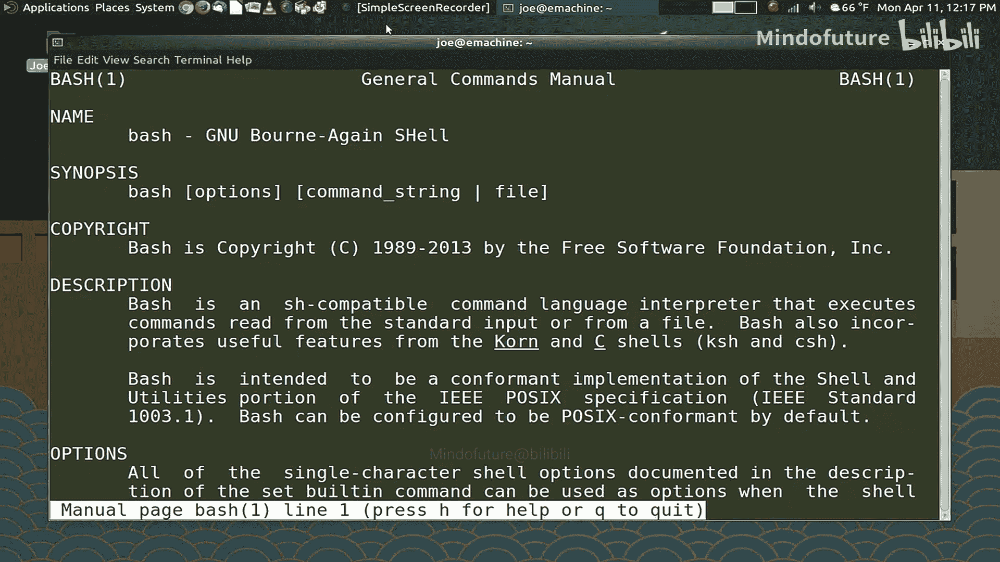
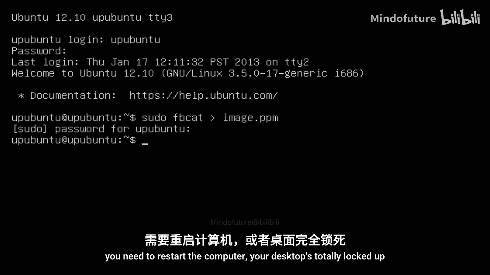
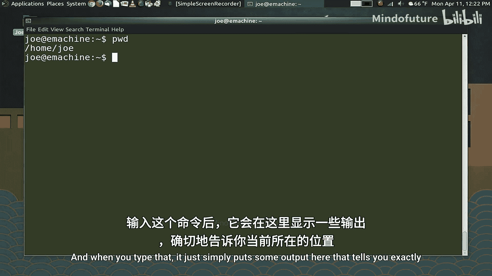
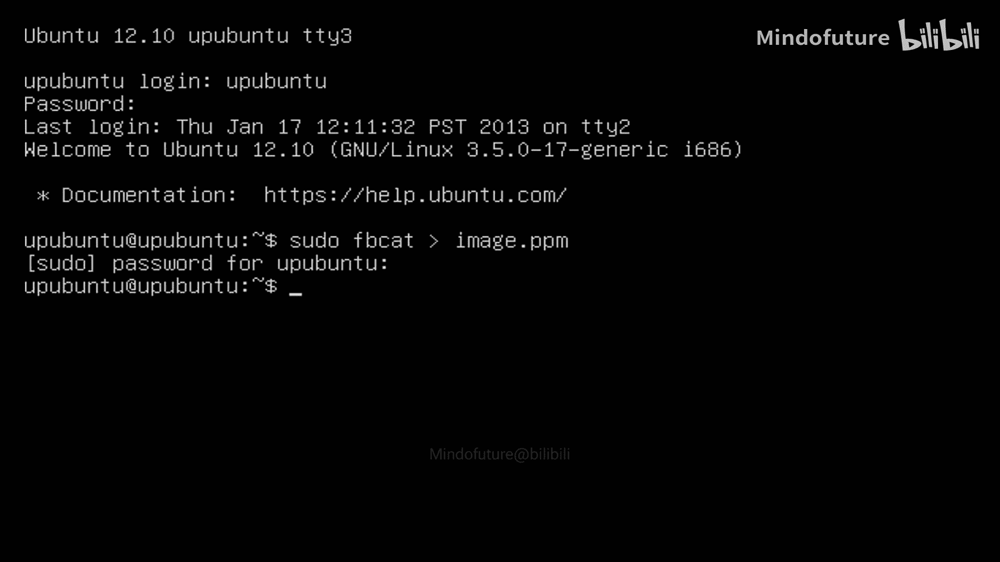
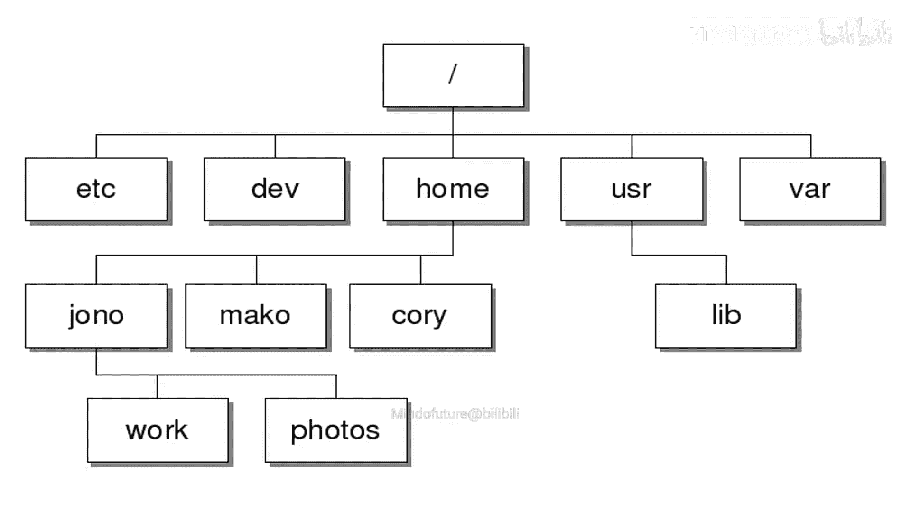
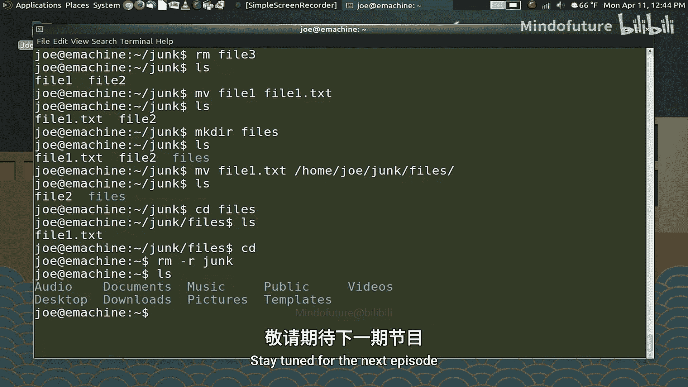

# 001：访问与导航 🚀

在本节课中，我们将要学习Bash的基础知识，包括如何访问Bash终端、理解文件系统结构以及使用基本命令进行导航和文件操作。这些是使用命令行界面的核心技能。

## 什么是Bash？ 🤔

Bash是一个Shell。它代表“Bourne Again Shell”。Shell是一个命令行解释器，这意味着它提供了一种方式，让你可以输入人类可读的命令来让计算机执行操作。

在Linux系统中，如今默认的Shell几乎都是Bash。它存在于我使用过的每一个Linux发行版中。Bash并非Linux上唯一的命令行解释器，你还可以使用Korn Shell、C Shell、Zsh等。如果你对此非常感兴趣，Fish Shell也是一个值得一看的很酷的选择。但今天，我们将讨论Bash，因为它具有普遍性。它无处不在，不仅存在于Linux上，也存在于Unix和Mac上。你甚至可以在Windows系统上安装Bash。因此，Bash正在成为一种通用语言，可以用来操作世界上几乎任何计算机。

## 为何使用命令行？ 💻

在这个图形用户界面（GUI）无处不在的时代，为什么还需要在终端中输入命令呢？这看起来似乎有些过时。但它非常高效。在终端中，你可以比使用GUI更快地完成任务。在GUI中，你需要点击、等待加载、找到要点击的框等。而在Bash中，你只需输入两三个不同的命令，系统就会去执行你的指令，完成后你就可以关闭它。

## 访问Bash终端 🖥️

首先，我们将讨论如何访问Bash。在Linux上，最明显的方法是打开一个终端模拟器，就像这里桌面上打开的这个。在我们的示例中，我们使用的是Ubuntu Mate 16.04。但我要告诉你的大部分内容都是完全通用的。如果我发出的命令是Ubuntu特有的，我会让你知道。无论你使用哪个Linux发行版，你都可以打开一个终端。

每个桌面环境都有自己的终端模拟器版本。如果你使用基于GNOME的桌面环境，如Cinnamon、Unity或GNOME本身，那么你将拥有GNOME终端。如果你使用XFCE，它可能是XFCE4终端。你可以安装任意多个不同的终端模拟器。Ubuntu Mate预装了一个名为Tilda的便捷工具。Tilda会一直运行，在你登录账户时启动并自动登录。要访问它，只需按下F12键。Tilda非常有用，因为在会话期间的任何时候，如果你想快速进入终端查看某些内容，只需按F12，输入命令即可。例如，即使右上角显示了日期，我也可以通过发出命令让Bash告诉我日期，所以拥有它确实非常有用。

除了使用终端模拟器，还有其他方法可以访问系统上的终端，即访问一个真正的终端，也称为TTY。

## 理解TTY 🖱️

在计算机的早期，当计算机填满整个房间时，人们通过电传打字机访问计算机。这就是为什么它们被称为TTY。Linux系统在启动时会自动启动8个TTY，通常将桌面环境放在TTY 7上。因此，如果你在看这个视频时发出切换到另一个TTY的命令，你的桌面环境将继续在TTY 7上运行，你只是切换走了，你的屏幕会显示类似这样的内容，然后你可以切换回来。如果你愿意，可以同时登录所有TTY，每个TTY可以执行不同的操作。

要进入一个看起来像这样的屏幕，可以按`Ctrl + Alt + F1`到`F8`中的任意一个功能键，这将带你进入不同的TTY。在这个示例图片中，拍摄者使用的是Ubuntu 12.10，他当前在TTY 3上登录。在登录时，你需要输入用户名和密码，然后你就登录了系统，这就是你将看到的界面。要退出TTY，你可以切换离开，或者确保你注销登录，因为如果计算机要继续运行，你肯定不希望一直保持登录状态。你可以通过输入`logout`命令来注销，然后它会将你返回到下一个用户登录的提示符。然后使用`Ctrl + Alt + F7`或`F8`（取决于你的发行版将实际桌面放在哪个TTY上）返回到你原来的位置。

为什么需要使用TTY？如果你的GUI界面停止工作怎么办？或者也许有其他人登录了计算机，你只是想快速潜入执行几个命令然后退出。你实际上不必登录桌面。它可以停留在桌面管理器的登录屏幕上，你仍然可以使用TTY获得访问权限。因此，如果桌面崩溃了，你需要进行故障排除或需要重启计算机，而桌面完全锁死了，你总是可以从TTY进行操作。这就是为什么知道如何进入TTY非常有用。就我个人而言，我经常使用TTY来运行机器更新等操作。

## 认识Bash提示符 📝

现在让我们看看我们的屏幕。你会看到，此时我面前只有一个提示符。我将清屏。你也可以使用`Ctrl + L`来清屏，如果你的终端支持的话（有些支持，有些不支持）。当然，大多数终端模拟器都支持。但`clear`命令也可以清屏。现在只有这个闪烁的提示符。这有什么用？它没有告诉我该做什么。显然，要使用Bash，你需要先做一些研究，学习一些命令和导航工具。

那么这个提示符告诉我们什么？它告诉我我以用户“Joe”的身份登录。这是我的账户，并且我正在一台名为“E-machine”的机器上运行。这是我们所在的本地机器。但如果你使用像SSH（安全外壳）这样的程序登录到另一个系统，这个提示符可能会告诉你，你正在城镇另一端或世界另一端的另一台计算机上。

然后你会看到这里有一个小波浪号`~`。这告诉我们，我们位于自己的主目录中，我们在Linux系统上的个人空间里。美元符号`$`告诉我们，我们正在以普通用户权限运行。我们不是以管理员身份运行，因此不能执行管理命令。我们将在本系列后面一点讨论权限和特权。现在，只需知道美元符号告诉你，你正在以普通用户身份运行。

## 理解工作目录 📂

当你开始使用Bash时，需要理解的一个基本概念是：Bash期望你始终位于计算机文件系统的某个位置。这意味着你总是在某个地方。你的提示符会告诉你你在哪里。但如果由于某种原因，它没有显示，或者你感到困惑，真的无法弄清楚自己在这里做什么，那么你可以使用我要展示的第一个命令：`pwd`。它代表“present working directory”或“print working directory”。我听过两种说法。当你输入这个命令时，它只是简单地输出一些信息，准确地告诉你你在文件系统中的位置。

## Linux文件系统概述 🌳

让我们花点时间谈谈Linux文件系统，以便你对它的工作原理有一个基本概念。

这里有一张文件系统树的图片。需要提前注意的是，“文件系统”这个术语除了我在这里讨论的含义外，还有另一种用法。文件系统可以是两件事之一：它可以是系统组织文件和目录的方式，也可以是用于将数据写入硬盘的系统。所以你会听到文件系统以两种方式被使用。另一个以两种不同方式使用的概念是“根”。你会听到Linux系统上的“根用户”，也会听到文件系统的“根”。文件系统的根用一个斜杠`/`表示。这意味着文件系统的开始。其他所有东西都位于根文件夹中。Linux上的文件系统可以包含许多不同的存储设备，它还可以包含连接到世界各地计算机的网络共享。因此，Linux机器上的文件系统与你习惯的（比如Windows机器上的）有很大不同。在Windows上，你有A、B、C、D等驱动器，每个驱动器都有自己的文件系统，你关心自己在哪个驱动器上。在Linux中，我们不在乎你在任何给定时间位于哪个驱动器上，这使它具有非常好的可扩展性。你可以有一个像我们这里使用的小型桌面机器这样的小系统，也可以有一个包含许多不同计算机和大量不同用户的大型系统，每个人都可以以完全相同的方式访问文件系统。

文件系统中你会发现一些基本目录。顺便说一下，“目录”和“文件夹”这两个词在计算机科学中可以互换。多年前的计算机科学课上，他们教我们目录是一个包含许多其他文件的文件，有点像文件柜中的文件夹，你可以把单张纸放进去，甚至可以在文件夹里放更多的文件夹。所以这些术语可以互换，取决于你如何使用它们。通常，如果你在GUI环境中工作，在文件管理器中查看一个文件夹，我们称之为文件夹；如果你在命令行工作，则称之为目录。但它们是完全相同的东西。因此，目录（文件夹）在Linux系统中非常重要。这张图是简化的，实际上里面还有很多内容，我稍后会展示给你看。但这些是你作为一个用户真正需要知道并了解其存在的目录。

在根目录`/`下，第一个列出的是`/etc`。在`/etc`文件夹中，存放着系统本身的配置文件。因此，如果你要使用管理员权限更改整个系统的某些参数，你可能会发现自己正在编辑`/etc`文件夹中的一个文件。

`/dev`文件夹代表“设备”，那是你计算机上的每一个设备。连接到该计算机的所有东西都由`/dev`文件夹中的一个文件表示。你的硬盘、鼠标、键盘，在Unix和Linux世界中，一切都被表示为一个文件，无论它是什么。甚至计算机上运行的进程也由文件表示。所以它们必须有地方存放。这就是`/dev`文件夹。

`/home`文件夹是所有用户信息保存的地方。当你的账户创建时，你的文件夹就在`/home`文件夹内创建。在这个例子中，有Cory、Mako和Jonno的文件夹。然后它显示你所有的照片、文档等都在那个单独的文件夹里。那个文件夹是你的。你有权限查看、更改、修改、删除、添加该文件夹中的所有内容，因为它自动属于你，并且与你在系统上相关的一切都存放在那里。一个Linux系统可以有一个用户，也可以有数百个用户，其工作方式都一样。

下一个要讨论的文件夹是“通用系统资源”或`/usr`，这里存放着影响整个系统的文件和文件夹。例如，你的桌面可能将其所有主题存储在那里。所以当你切换主题时，这些主题实际上位于通用系统资源文件夹中。你在Linux上安装的一些程序，其二进制可执行文件也放在那里，所以这是一个需要了解的重要文件夹。此外，在该文件夹内还有另一个名为`/lib`的文件夹，它是“库”的缩写，那里存放着应用程序用来获得不同功能的重要文件。所以时不时会有人说，如果你想让它做那个，你需要安装这个lib文件，它们就放在那里，至少大多数时候是这样。

最后一个要讨论的是`/var`目录。`/var`是所有系统日志和临时数据存放的地方。有时，如果你试图排除故障，可能需要去`/var`目录查看特定的日志，以了解系统正在做什么。以上就是Linux文件系统的基本概述。

## 基础导航命令 🧭

现在让我们回到终端，再次清屏。我们将开始学习如何在系统中移动。在本视频中，我们将学习非常基础的命令。在我们继续学习更高级的概念之前，我们先休息一下。所以快结束了，再讨论几个命令，这样你就可以开始探索你的系统，看看里面有什么。

你将经常使用的第一个命令是`ls`。它是“list storage”的缩写。这显示了你所在文件夹中实际有什么。记住，我展示了`pwd`，它准确地显示了你在文件系统中的位置。而`ls`是查看你所在目录内容的方式。所以如果我输入`ls`，然后输入`/`，这意味着我现在要查看根文件夹。它会显示系统中的内容。如你所见，我们得到了很多我们刚刚讨论过的不同目录。而且还有更多内容。

要返回你的主文件夹，你只需输入`cd`。你不需要指定那个文件夹。或者说，我们还没讲到那个，但我们马上会讲到。我们现在还在主文件夹中。

现在，让我们谈谈如何在文件夹之间移动。假设我们想移动到根文件夹。命令是`cd`。我有点超前了。如果我们想回到主文件夹，我们只需输入`cd`。它直接带我们回去。另外，你可以使用`cd ~`，它也会带你到主文件夹。不带参数的`cd`会自动带你到主文件夹。

现在，让我们谈谈如何更改文件夹。让我们再次`ls`。假设我们想查看音乐文件夹里有什么。那么输入`cd Music`。请记住，在终端中输入命令时，它是区分大小写的。所以如果我输入`Music`，它会带我到音乐文件夹。好了，让我们列出存储内容。现在我们看到一个名为“pop”的文件夹。然而，如果我输入`cd pop`（没有大写），它不会让我进去，因为这不是同一个东西。那些对使用DOS有美好回忆的人可能会对此感到困惑，因为在Windows世界中，大小写无关紧要，没有区别。你可以用14种不同的方式输入“POP”，它总会带你到“pop”文件夹，或者随便什么大小写组合。我不知道是不是有14种，但总之。

让我们回到主文件夹。这就是你在系统中查看的方式。

让我们更深入地研究一下`ls`命令，因为它做的不仅仅是显示文件夹中的文件。如果我输入`ls -a`，它会显示该文件夹中是否有任何隐藏文件。确实有。在Linux和Unix中，要隐藏一个文件，你需要在文件名前加一个点`.`，这样它就不会自动显示出来。在GUI中，让我们这样做，我来展示一下这是如何工作的。我将在文件管理器中打开我的主文件夹。你会看到我看到了所有这些文件夹。如果我想查看隐藏文件，按`Ctrl + H`。现在我可以看到该目录中所有隐藏的文件和文件夹。所以在这里，我们通过`ls`命令末尾加上`-a`选项来做同样的事情。

但还有更多。如果你不仅想看到文件夹里有什么，还想了解它的所有详细信息，那么我们可以执行`ls -al`。当我这样做时，现在我会得到一长串列表，它显示了关于当前目录中不同文件和文件夹的各种信息。在左边，所有这些看似乱码的东西，它显示了附加到文件夹或文件的权限。我们将在本系列后面更多地讨论这个问题。它显示了文件的所有者。在这个例子中，是我，Joe。这个文件由root拥有，root是系统的根用户或超级用户。它属于哪个组？嗯，它属于Joe组。所以任何在名为“Joe”的组中的人都可以访问这个文件。然后是创建日期、大小、创建日期以及文件或文件夹的实际名称。学习`ls`能做什么非常有用。

## 操作文件与目录 📄

让我们再次清屏，`Ctrl + L`。我们将开始学习如何操作文件。我们将创建它们。

首先，让我们创建一个目录，以便有个地方可以操作。我们将这个目录称为“junk”。创建目录的命令是`mkdir`（make directory），我们将其命名为“junk”，全部用小写，这样我就记得不要……你知道，确保我能进入它，因为我会忘记。让我们看看它是否出现了。是的，它在那里。让我们跳进我们的目录，就叫它“junk”。

现在，即使它显示给我们看，让我们获取我们所在位置的完整路径。`pwd`。现在你看到我在`/home/joe/junk`。在继续之前，让我解释一下绝对路径和相对路径的区别。

如果我想进入这个目录或另一个类似的目录，让我们快速切换到根目录。好了，我现在在根目录。你会看到那里有`home`文件夹。如果我想回到我刚创建的`junk`文件夹，那么此时，我必须输入所谓的绝对路径。我必须告诉系统它的确切位置。所以我们要输入`/home/joe/junk`。现在我已经给出了从文件系统根目录开始的完整路径。现在我回到了`junk`。

然而，既然我已经在这里了，我不必全部输入。所以我可以直接告诉系统，如果这里还有另一个目录，让我们先向上移动一级目录。你注意到现在我不必输入全部内容了。所以如果我想再次跳到`Music`文件夹，它直接带我去，因为它是当前工作目录中的一个目录。这被称为相对路径。好了，这就是绝对路径和相对路径的区别。

让我再展示一个很酷的小技巧。这是一个你不常听说的命令，但我实际上经常使用它。假设你正在文件系统中工作，你想同时处于两个目录中。你想在两个目录之间来回切换。那么你可以使用一个名为`pushd`的命令。我要告诉它我想进入`/home/sindy`。好了，我实际上要进入另一个用户的目录来展示这个。好了，现在我进入了那个目录。现在，假设我在文件系统的其他地方做所有这些工作，我只想跳回我刚在的目录。那么现在我发出命令`popd`。它直接把我放回原来的地方。所以我不必发出绝对或相对路径去任何地方。知道这个很酷。没有多少人知道`pushd`和`popd`命令。

## 创建与删除文件 🛠️

好了，接下来我们要讨论的是操作文件。我们想对文件做一些事情。所以我要做的第一件事是跳进我们创建的`junk`目录，我们要在这里放一些文件。文件通常由程序创建。所以想想你的文字处理器，它将内容保存为文件；如果你录制音频，它会保存为.wav或.mp3等。程序本身会生成文件。但是如果你需要，如何创建一个文件呢？你可以使用一个程序，但如果你周围没有程序，你仍然可以做到。

Linux中一个非常灵活且出奇有用的命令是`touch`。`touch`命令，如果我输入正确，会创建文件。我们把这个叫做`file1`。我们让`touch`执行，`ls`看看它是否做到了。现在我们有了一个`file1`和一个`file2`。我们里面有一个文件。你也可以让`touch`一次创建多个文件。让我们创建`file2`和`file3`，使用`touch`命令。但现在我们有了三个小文件可以操作。目前，这些只是空文件，里面什么都没有。但如果你需要为某些事情创建标志文件，或者你只需要在某个地方创建一个空文件开始，你可能会发现这很有用。这是`touch`的第一个功能。`touch`的第二个功能是修改现有文件的日期。所以假设由于某种原因，你有一个文件已经六个月没有访问了。你想确保你的备份程序抓取它，因为通常这些程序的工作方式是查看文件的访问或修改日期，然后说：“好的，这个改变了，我们备份它。”所以我可以在现有文件上使用`touch`命令。它没有给我任何输出。但如果我执行`ls -l`，你会看到`file1`上的时间实际上现在比另外两个我创建的文件更新。这就是`touch`的作用。

## 移动、重命名与删除文件 🔄

好了，再次清屏。我们已经创建了文件。我们能对它们做什么呢？首先，让我们谈谈删除文件。这是一个你需要稍微警惕的命令，因为与在GUI环境中工作不同，当你在GUI中点击一个文件并按删除键或从右键菜单中选择删除时，它不会进入回收站。在Bash的世界里没有回收站。所以一旦你删除了某个东西，它就消失了。命令是`rm`（remove），我们要删除`file3`。没有输出意味着它完成了该做的事。让我们`ls`一下，确保文件消失了。现在我们里面有两个文件。

接下来我们需要讨论的是一个允许我们更改文件名的命令。在这种情况下，我们使用移动命令`mv`。我们可以使用这个命令将文件从一个目录移动到另一个目录，或者我们可以将同一个文件移动到另一个文件名。假设我们想更改`file1`，我们想把`file1`的名字改成`file1.txt`。没有输出意味着它完成了。`ls`确认一下。好了。现在我们知道如何创建文件，知道如何删除它们，知道如何移动它们。所以我们有所进展了。我们实际上在用计算机做事情。我意识到在这一点上，你可能在想“所有这些有什么用？”，但这些是你绝对必须知道的概念。

在我们结束之前，让我们谈谈使用`mv`命令移动到另一个目录。好了，让我们在`junk`目录内创建另一个目录。我们把这个叫做`files`。执行`ls`。我们的目录在那里。现在我们要把`file1.txt`移动到那个目录。所以我们使用`mv`。现在我们要说，我们要把它放进去。让我们看看，把名字放进去。确保我做对了。你知道，我不是每天都做这个。我们……我们在相对路径中，所以我可以直接放……实际上，我们这里可能需要使用绝对路径。所以让我们输入`/home/joe/junk/file1.txt`。我们想把它移动到`files`目录。如果我在末尾加上那个额外的斜杠，它是在告诉系统我只想把它移动到目录里，而不是试图将文件名更改为目录名（系统不会让我这样做）。让我们看看这个是否有效。嗯，如果我打错字的话，它不会工作。阅读障碍是一种可怕的疾病。好了，现在那个命令应该真的有效了。它没有给我任何输出。但让我们看看它是否在这里。嗯，它确实对它做了什么。让我们进入`files`目录。`ls`。是的，它移到那里了。这就是`mv`命令的工作原理，以及你需要了解的关于`mv`命令的一切。回到我的主目录。

现在，这是一个非常重要的命令。我们将学习如何删除一个目录。这是一个你需要非常、非常、非常小心的命令，因为如果你在错误的目录上发出错误的命令，你可能会让你的整个主文件夹消失。所以使用这个命令时一定要非常小心。`rm -r`，`-r`选项使其递归，然后我们要删除名为`junk`的目录。我们刚刚做的一切都消失了。

## 总结 📚

以上就是关于导航文件系统、更改路径、创建文件和删除文件的基础入门。在下一个视频中，我们将讨论如何在这些文件中放入内容。

本节课中我们一起学习了Bash的基础访问方式、Linux文件系统的结构、以及使用`pwd`、`ls`、`cd`、`mkdir`、`touch`、`rm`、`mv`等命令进行导航和文件操作。掌握这些是进一步学习命令行强大功能的第一步。