# 002：创建与编辑文本文件 📝

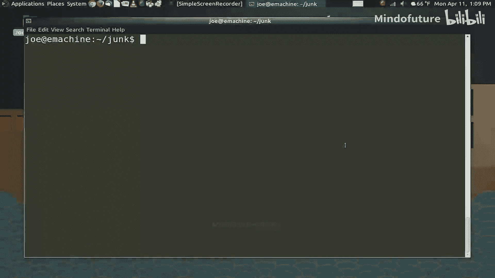

在本节课中，我们将学习如何在Bash终端中读取和编辑文本文件。这是Linux系统管理、配置和脚本编写的基础技能，因为系统配置、程序设置乃至脚本本身都以文本文件的形式存在。

## 读取文件内容

上一节我们介绍了基本的Bash命令，本节中我们来看看如何查看文件内容，而无需打开任何编辑器。

### 使用 `cat` 命令

`cat` 命令是“concatenate”（连接）的缩写。它的主要功能是将一个或多个文件的内容连接起来并输出到屏幕。对于短小的文件，这是快速查看内容的好方法。

**命令格式**：
```bash
cat 文件名
```

例如，查看名为 `junk.txt` 的文件：
```bash
cat junk.txt
```
执行后，文件内容会直接显示在终端上。

### 使用 `less` 命令分页查看

当文件内容很长，一屏显示不下时，使用 `cat` 会导致内容快速滚过屏幕。此时，`less` 命令更为合适，它可以让你逐页浏览文件。

**命令格式**：
```bash
less 文件名
```
在 `less` 的浏览界面中，你可以使用空格键向下翻页，按 `q` 键退出。

### 组合使用 `cat` 与 `less`

你可以将 `cat` 的输出通过“管道”（`|`）传递给 `less`，从而在连接多个文件的同时实现分页浏览。

**命令格式**：
```bash
cat 文件1 文件2 | less
```
这个命令会先将两个文件的内容合并，然后通过 `less` 分页显示。

## 创建与追加文件内容

有时，你不需要打开编辑器，只想快速创建文件或在文件末尾添加一行文本。

### 使用 `echo` 命令创建文件

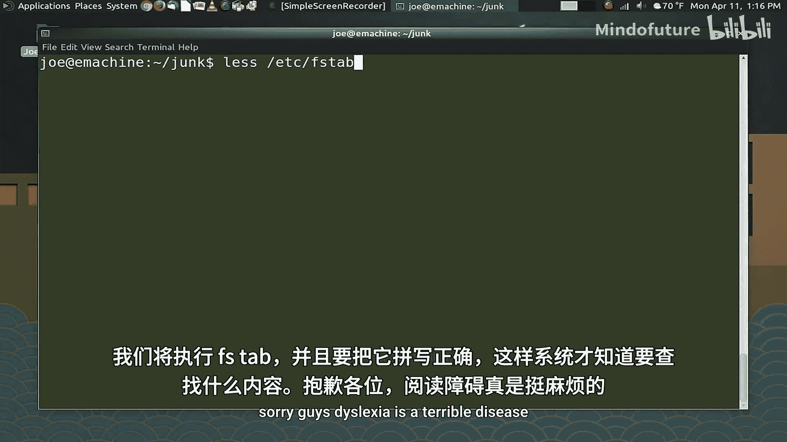

`echo` 命令可以将文本输出到屏幕。结合输出重定向符号（`>`），可以将文本写入一个新文件。

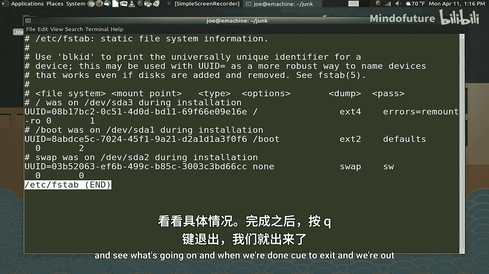

**命令格式**：
```bash
echo “文本内容” > 新文件名
```
例如，创建一个名为 `junk2.txt` 的文件：
```bash
echo “cat is great too” > junk2.txt
```

### 使用 `echo` 命令追加内容

如果不想覆盖文件原有内容，而是想在文件末尾添加新行，需要使用追加符号（`>>`）。

**命令格式**：
```bash
echo “新增的文本内容” >> 已有文件名
```
例如，向 `junk2.txt` 文件追加一行：
```bash
echo “This is an appended line” >> junk2.txt
```

## 使用文本编辑器 Nano

虽然命令行操作很高效，但对于复杂的编辑任务，使用一个文本编辑器更为方便。Nano 是一个简单易用的命令行文本编辑器，适合初学者。

### 启动 Nano 并创建文件

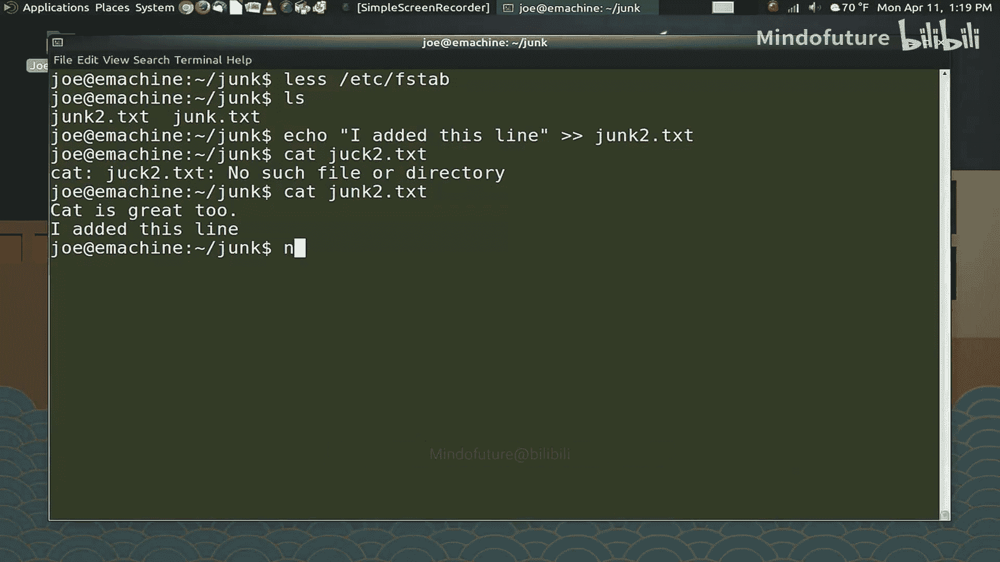

直接在终端输入 `nano` 命令，即可启动编辑器并开始创建新文件。

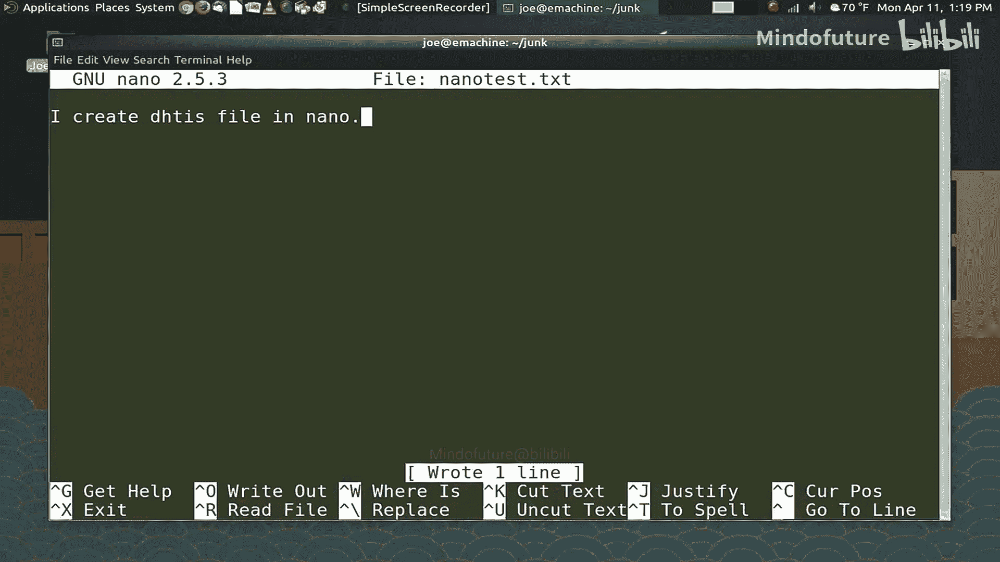

**命令格式**：
```bash
nano
```
或者，直接编辑一个已存在的文件：
```bash
nano 文件名
```

### Nano 的基本操作

Nano 编辑器界面底部会显示常用的快捷键提示。以下是两个最核心的操作：

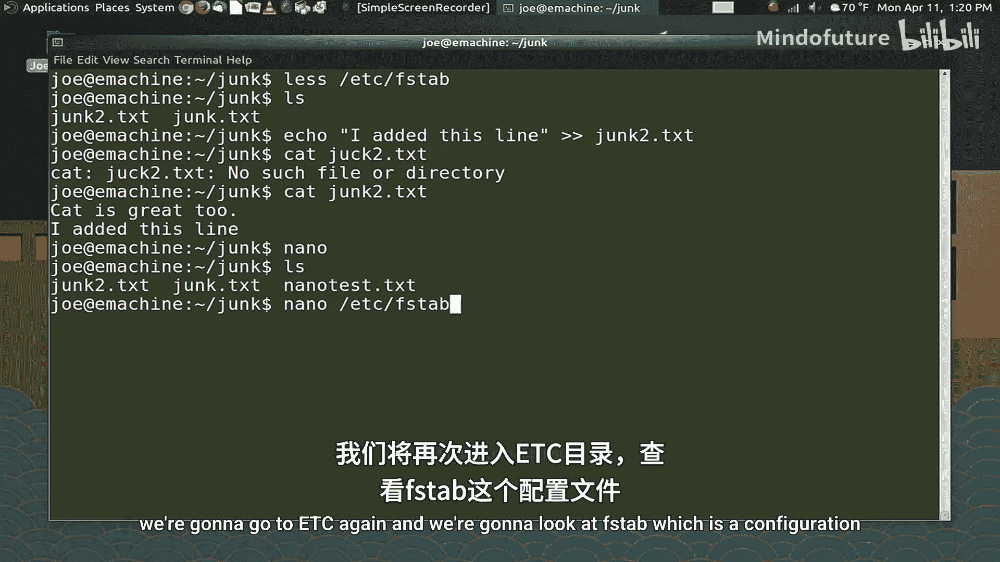

*   **保存文件**：按下 `Ctrl + O`（即 Control 键和字母 O），然后输入文件名并按回车确认。
*   **退出 Nano**：按下 `Ctrl + X`。如果文件有未保存的修改，Nano 会询问你是否保存。

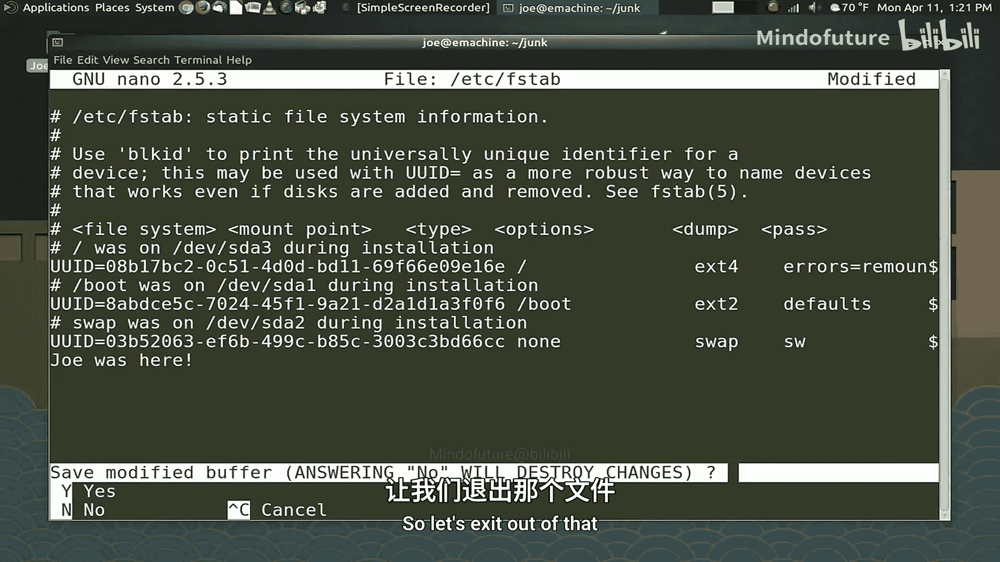

### 编辑系统文件

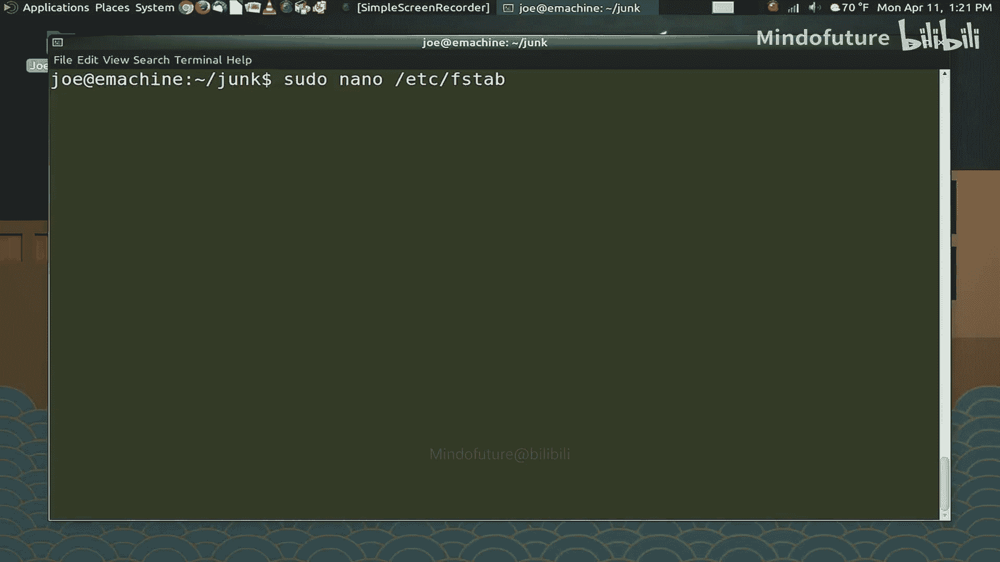

系统配置文件（通常位于 `/etc` 目录下）受到权限保护。普通用户可以用 `nano` 查看，但无法直接保存修改。

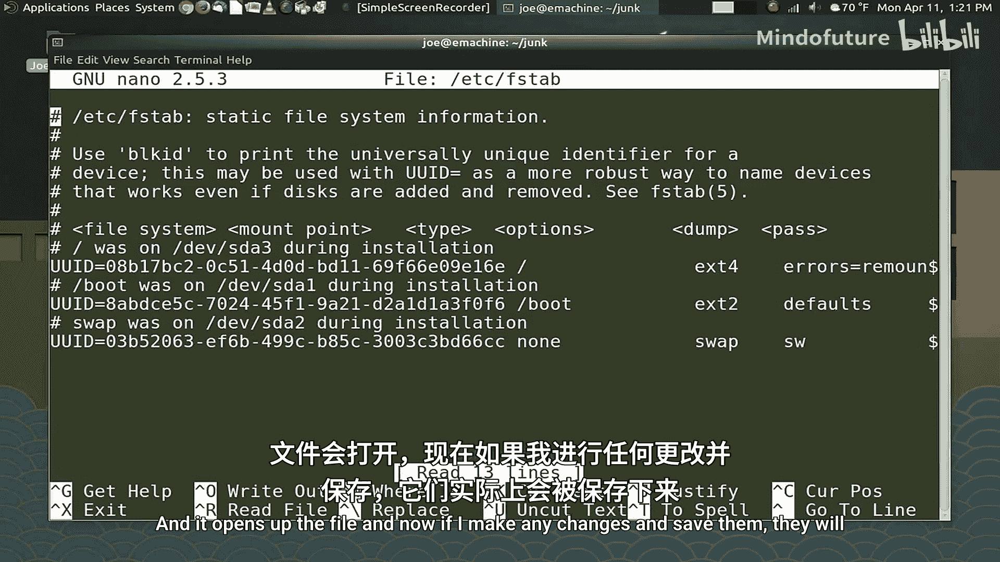

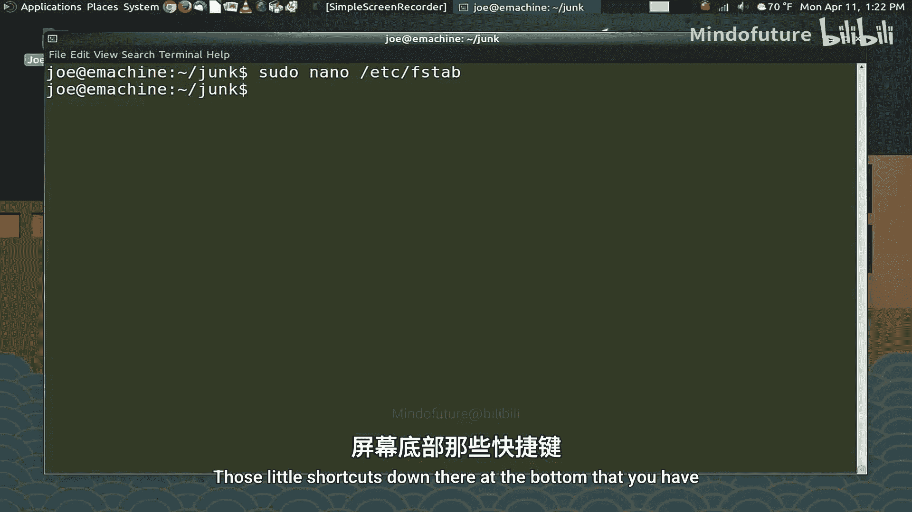

如果需要编辑这类文件，必须使用 `sudo` 命令来获取管理员权限。

**命令格式**：
```bash
sudo nano 系统文件路径
```
例如，编辑 `/etc/fstab` 文件：
```bash
sudo nano /etc/fstab
```
输入你的用户密码后，即可进行编辑和保存。

---

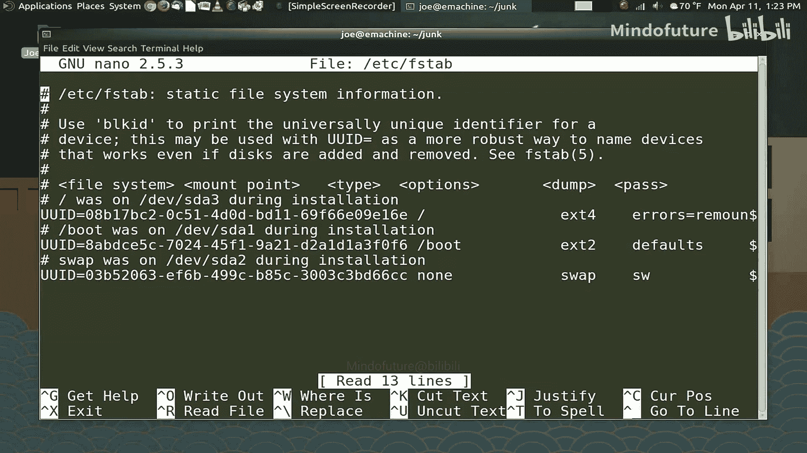

本节课中我们一起学习了在Bash中处理文本文件的核心技能：使用 `cat` 和 `less` 查看文件，使用 `echo` 快速创建和追加内容，以及使用 `nano` 编辑器进行更复杂的文本编辑。这些是后续学习系统管理、Shell脚本编写的重要基础。下一节，我们将探讨文件权限与特权管理。