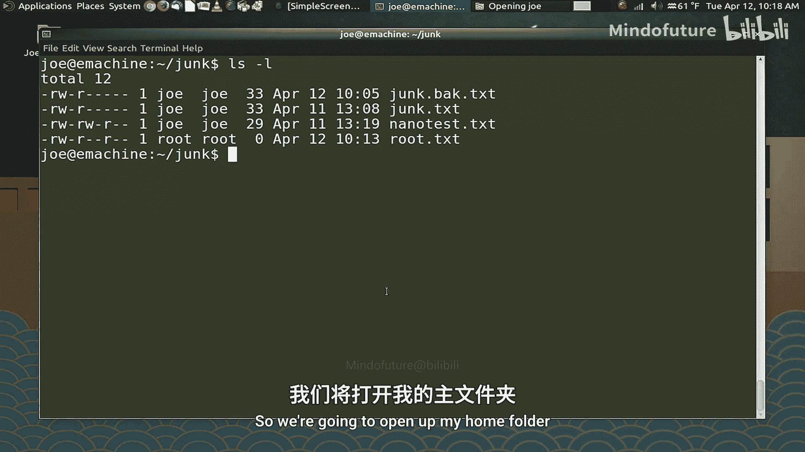
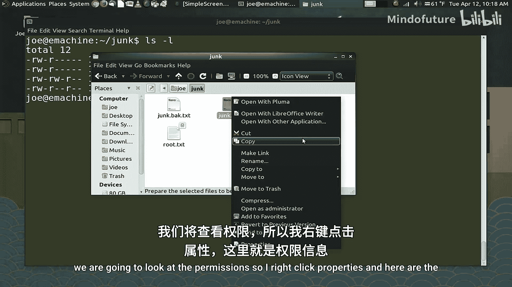
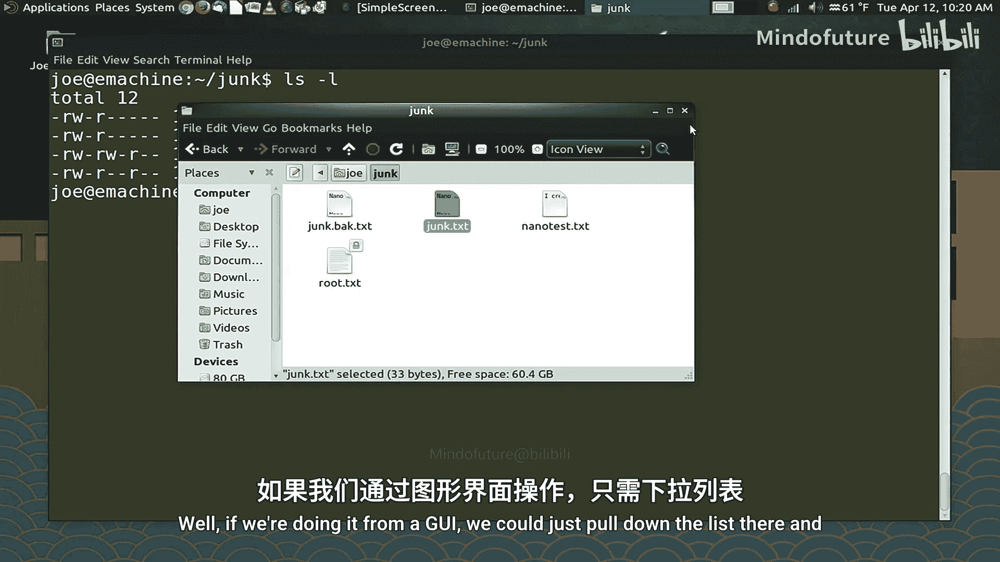
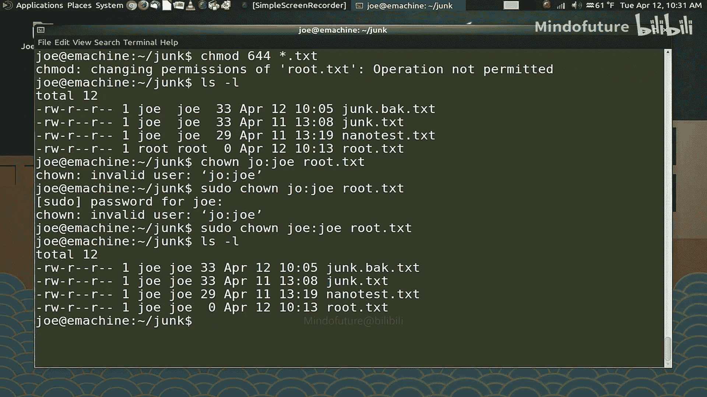

# 003：权限与许可

在本节课中，我们将要学习两个核心概念：使用超级用户权限（`sudo`）以及理解和管理Linux系统中的文件权限。掌握这些知识对于安全地管理系统和文件至关重要。

## 复制文件与目录

上一节我们介绍了基本的文件操作，本节中我们来看看如何使用 `cp` 命令来复制文件和目录。`cp` 命令用于创建文件或目录的副本，这在修改配置文件前创建备份时非常有用。

以下是 `cp` 命令的基本用法：

*   **复制文件**：`cp 源文件 目标文件`
    *   例如，`cp junk.txt junk.back.txt` 会创建 `junk.txt` 的一个副本，命名为 `junk.back.txt`。
*   **复制文件到其他目录**：`cp 源文件 目标目录/`
    *   例如，`cp junk.txt ~/` 会将 `junk.txt` 复制到你的家目录。
*   **使用通配符批量复制**：`cp *.txt 目标目录/`
    *   例如，`cp *.txt ~/` 会将所有以 `.txt` 结尾的文件复制到家目录。通配符 `*` 代表任意字符序列。

使用通配符（正则表达式）时需要格外小心，一个错误的命令可能会意外删除大量文件。

## 使用超级用户权限

在Linux中，某些操作需要更高的权限。Ubuntu及其衍生版默认不启用 `root`（超级用户）账户，而是通过 `sudo` 命令来临时授予管理员权限。

`sudo` 代表“superuser do”。在命令前加上 `sudo`，即可使用管理员权限执行该命令。

```
sudo apt autoremove
```

执行上述命令时，系统会提示你输入当前用户的管理员密码。输入密码后，命令将以 `root` 权限运行。

`sudo` 权限会持续一段时间（默认为15分钟），在此期间再次使用 `sudo` 无需重复输入密码。这既保证了安全，又提供了便利。

如果需要连续执行多个需要 `root` 权限的命令，可以切换到 `root` 用户环境：

```
sudo -i
```

执行后，命令提示符会从 `$` 变为 `#`，表示你正处于 `root` 用户环境。此时执行命令无需再输入 `sudo`。请注意，`root` 用户和普通用户的命令历史是分开的。要退出 `root` 环境，输入 `exit`。

**重要提醒**：`root` 用户拥有对系统的绝对控制权，可以执行任何操作，包括破坏系统。因此，使用 `root` 权限时必须非常谨慎。通常，一个系统上只应有一个管理员账户。

## 理解文件权限

Linux严格强制执行文件权限。每个文件和目录都有三组权限，分别针对三类用户：

1.  **文件所有者（Owner）**
2.  **所属用户组（Group）**
3.  **其他用户（Others/World）**

使用 `ls -l` 命令可以查看详细的权限信息。输出结果类似于：

```
-rw-r--r-- 1 joe joe 0 Apr 10 10:00 junk.txt
```



开头的10个字符（如 `-rw-r--r--`）表示权限和类型：
*   第1位：`-` 表示普通文件，`d` 表示目录。
*   第2-4位：文件所有者的权限（`rw-`）。
*   第5-7位：所属用户组的权限（`r--`）。
*   第8-10位：其他用户的权限（`r--`）。



权限字符的含义：
*   `r`：读取权限。
*   `w`：写入权限。
*   `x`：执行权限（对于文件）或进入权限（对于目录）。
*   `-`：无相应权限。

## 修改文件权限

我们可以使用 `chmod` 命令来修改文件权限。有两种主要方法：数字表示法和符号表示法。

### 数字表示法（推荐）

这种方法使用三个八进制数字来设置权限，每个数字对应一组用户（所有者、组、其他）。每个权限对应一个数值：
*   `r` (读) = 4
*   `w` (写) = 2
*   `x` (执行) = 1



将需要的权限数值相加，即可得到该组的权限值。

例如，要将 `junk.txt` 的权限设置为：所有者可读可写可执行（4+2+1=7），组用户可读可写（4+2=6），其他用户无权限（0），则命令为：

```
chmod 760 junk.txt
```

### 符号表示法

这种方法使用 `u`（所有者）、`g`（组）、`o`（其他）、`a`（全部）与 `+`（添加）、`-`（移除）、`=`（设置）符号来修改权限。

例如：
*   为所有者添加执行权限：`chmod u+x junk.txt`
*   移除组用户的写权限：`chmod g-w junk.txt`
*   设置其他用户只有读权限：`chmod o=r junk.txt`

你可以使用通配符批量修改权限：

```
chmod 644 *.txt
```

## 修改文件所有者

有时需要更改文件的所有者，例如将文件移交给另一个用户。这需要使用 `chown` 命令，并且通常需要 `root` 权限。

命令格式为：`sudo chown 新所有者:新所属组 文件名`

例如，将文件 `root.txt` 的所有者和组都改为用户 `joe`：

```
sudo chown joe:joe root.txt
```

只有文件所有者或 `root` 用户才能更改文件权限，但 `root` 用户可以更改任何文件的所有者。



本节课中我们一起学习了如何使用 `cp` 命令复制文件，如何通过 `sudo` 获取和管理超级用户权限，以及如何查看、修改文件和目录的权限 (`chmod`) 与所有权 (`chown`)。理解并正确应用这些概念是进行系统管理和维护的基础。下一节，我们将学习如何在系统中查找文件和程序，以及如何获取所需的帮助信息。