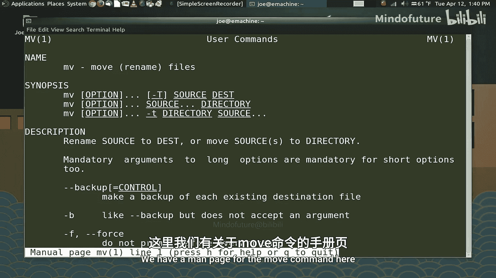
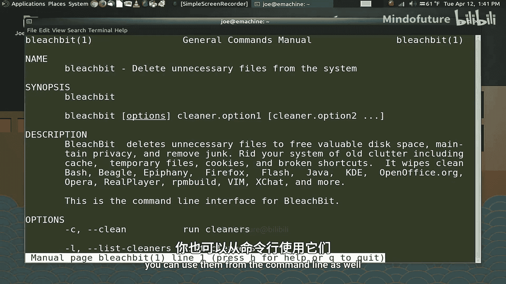
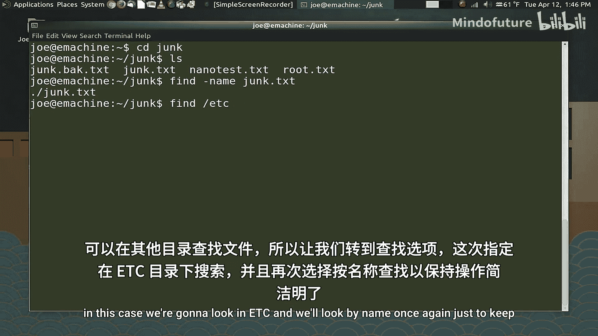
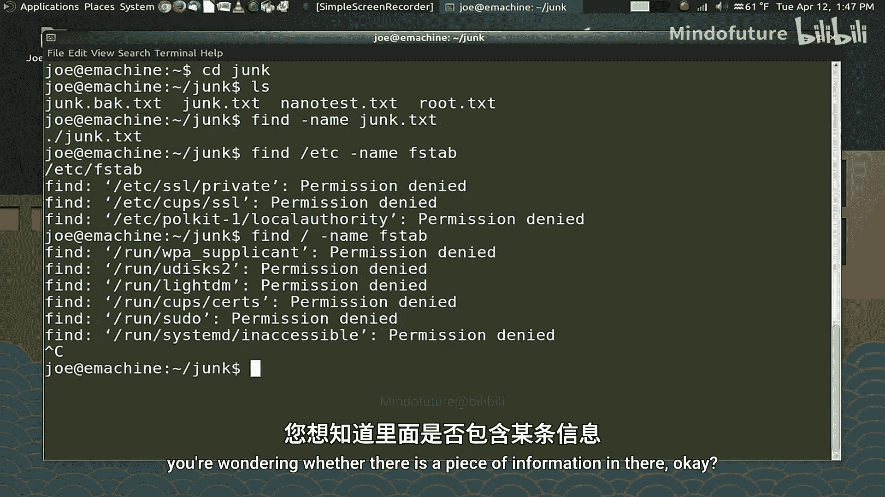
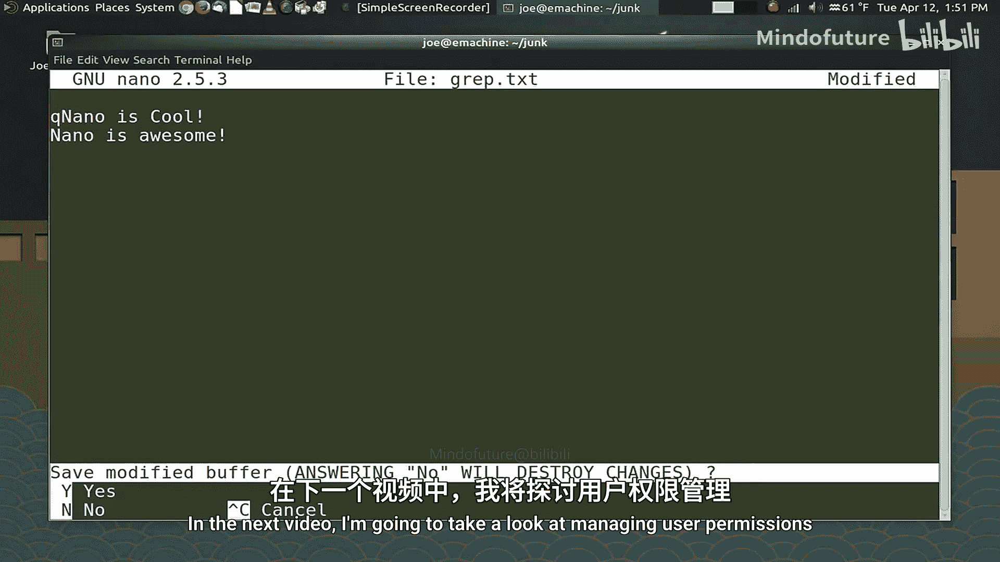

# 004：查找文档与文件 📚🔍

在本节课中，我们将学习如何在命令行中查找已安装命令和程序的信息，以及如何在系统中查找文件和文件内容。掌握这些技能对于高效使用Bash至关重要。

## 概述

上一节我们讨论了文件权限及其修改方法。本节中，我们将重点学习如何获取帮助信息、定位程序以及搜索文件和内容。一个优秀的系统管理员并非需要记住所有命令，而是要知道如何找到所需信息。

## 查找命令信息 📖

当你了解某个命令能完成所需任务，但不确定具体用法时，可以查阅手册。


### 使用 `man` 命令

`man` 命令是“manual”（手册）的缩写，用于打开命令的参考手册页。

```bash
man man
```


几乎所有与终端运行相关的已安装程序都有手册页。例如：




```bash
man mv
man htop
man firefox
```




但请注意，并非所有命令都有手册页，例如 `cd` 命令就没有。

### 使用 `info` 命令

如果 `man` 页面未能提供所需信息，可以尝试 `info` 系统，其用法类似。

```bash
info mv
```

`info` 页面可能包含更详细或不同表述的信息。

## 定位已安装程序 🗺️

如果你输入一个命令却收到“未找到命令”的错误，可以使用 `which` 命令来确认程序是否安装及其位置。

```bash
which htop
```

该命令会打印出 `htop` 二进制文件所在的路径，例如 `/usr/bin/htop`。在编写脚本时，使用绝对路径可以避免混淆。

### 理解 `PATH` 变量

当终端启动时，它会设置一个 `PATH` 变量，告诉Bash在哪些目录中查找你输入的命令。

要查看当前的 `PATH` 变量，请执行：

```bash
echo $PATH
```

输出结果是一系列由冒号分隔的目录路径。Bash会按顺序在这些目录中搜索命令。出于安全考虑，你的家目录通常不在 `PATH` 中，以防止恶意程序覆盖系统命令。

## 在系统中查找文件 🔎

在图形界面中，你可以使用文件管理器的搜索工具。但在命令行中，你需要使用 `find` 工具。

### 基本 `find` 用法

`find` 命令功能强大，可以根据名称、大小、日期等多种参数进行搜索。我们先从最简单的按名称查找开始。

假设当前目录（`junk`）下有大量文件，要查找名为 `example.txt` 的文件：

```bash
find . -name "example.txt"
```



命令中的点 `.` 表示在当前目录中查找。

你也可以在其他目录中搜索，例如在 `/etc` 目录中查找 `fstab` 文件：

```bash
find /etc -name "fstab"
```

注意：如果没有管理员权限，搜索某些系统目录时可能会遇到权限错误。

**警告**：在根目录 `/` 下进行全盘搜索可能非常耗时，并会产生大量权限错误。可以使用 `Ctrl+C` 来终止命令。

`find` 还支持使用正则表达式进行更复杂的搜索，相关语法请查阅手册。

## 在文件中查找内容 📄

当你需要在一个很长的文本文件中确认是否存在某条信息，或提取特定内容时，`grep` 命令非常有用。



### 基本 `grep` 用法

最简单的形式是搜索文件中包含特定字符串的行。

假设文件 `junk.txt` 内容如下：
```
Nano is cool.
Some other line.
Nano is awesome.
```

使用 `grep` 查找包含“nano”的行（默认区分大小写）：

```bash
grep nano junk.txt
```

输出结果为：
```
Nano is cool.
Nano is awesome.
```

### 重定向 `grep` 输出

你可以将 `grep` 的搜索结果保存到另一个文件中，这对于从大型数据库或日志文件中提取信息非常方便。

```bash
grep nano junk.txt > grep_results.txt
```


这条命令不会在屏幕显示结果，而是将所有包含“nano”的行写入 `grep_results.txt` 文件。之后你可以用 `nano` 或 `cat` 查看这个新文件。



`grep` 命令拥有众多高级选项，建议通过 `man grep` 进一步学习。

## 总结

本节课我们一起学习了在Bash环境中查找信息的核心技能：
1.  使用 **`man`** 和 **`info`** 命令查阅命令手册。
2.  使用 **`which`** 命令定位程序的安装路径，并理解了 **`PATH`** 变量的作用。
3.  使用 **`find`** 命令在文件系统中搜索特定文件。
4.  使用 **`grep`** 命令在文件内部搜索特定内容，并能将结果重定向到新文件。


下一节课，我们将进入第5部分，学习用户管理，包括创建用户、删除用户、修改密码以及设置用户组。