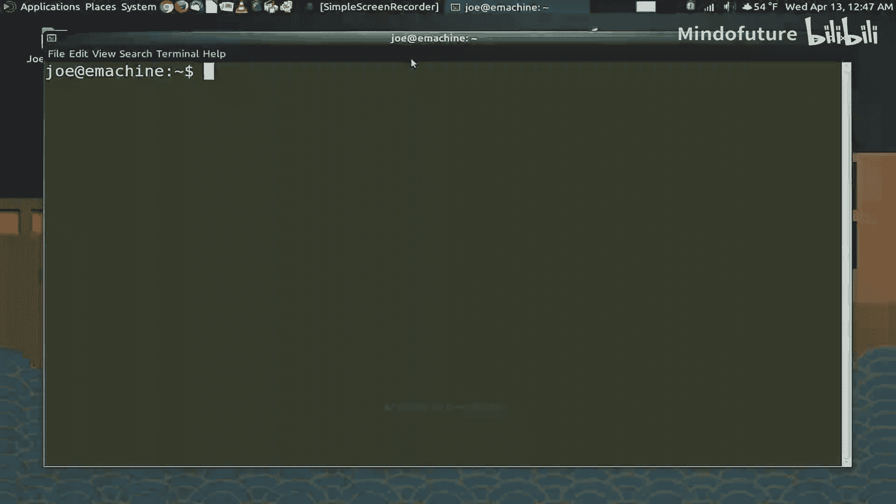
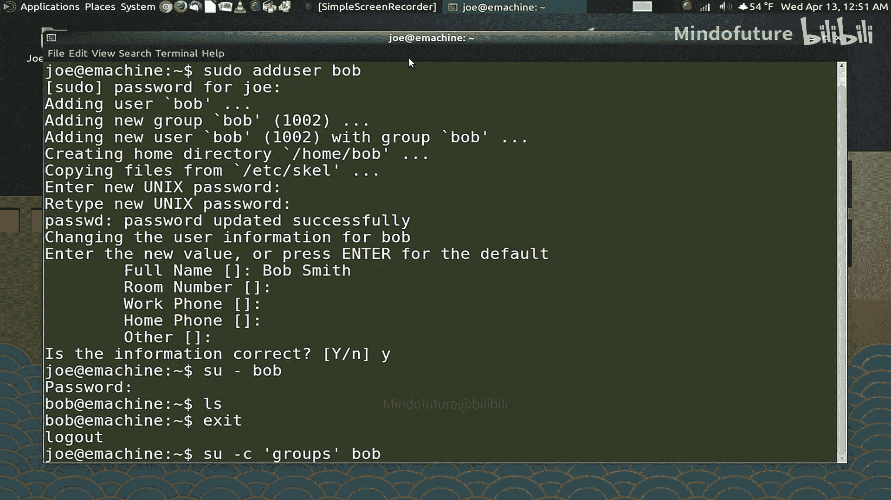
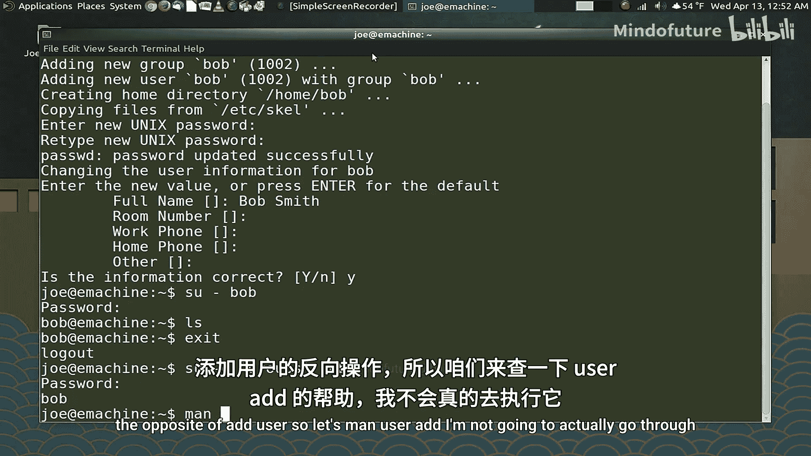
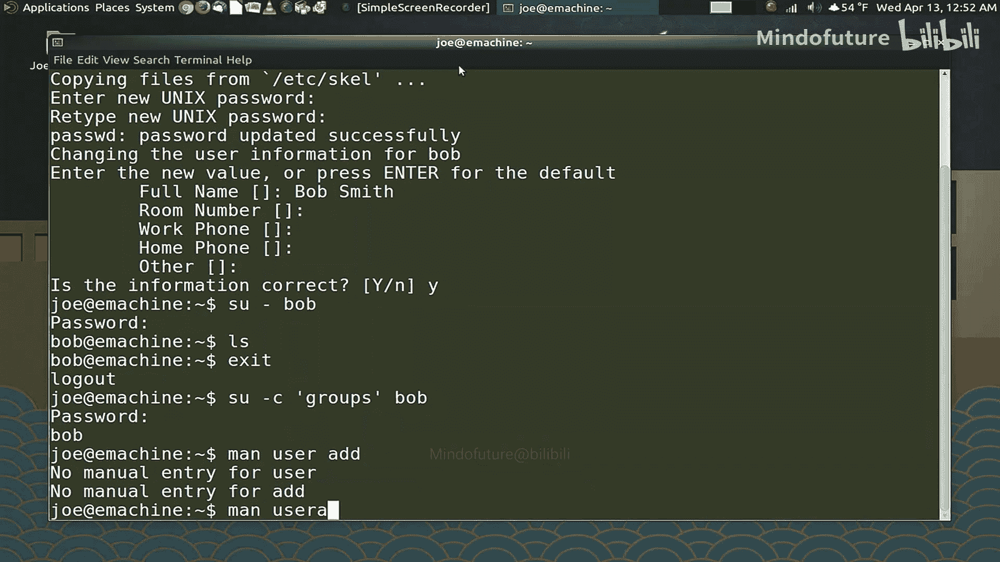
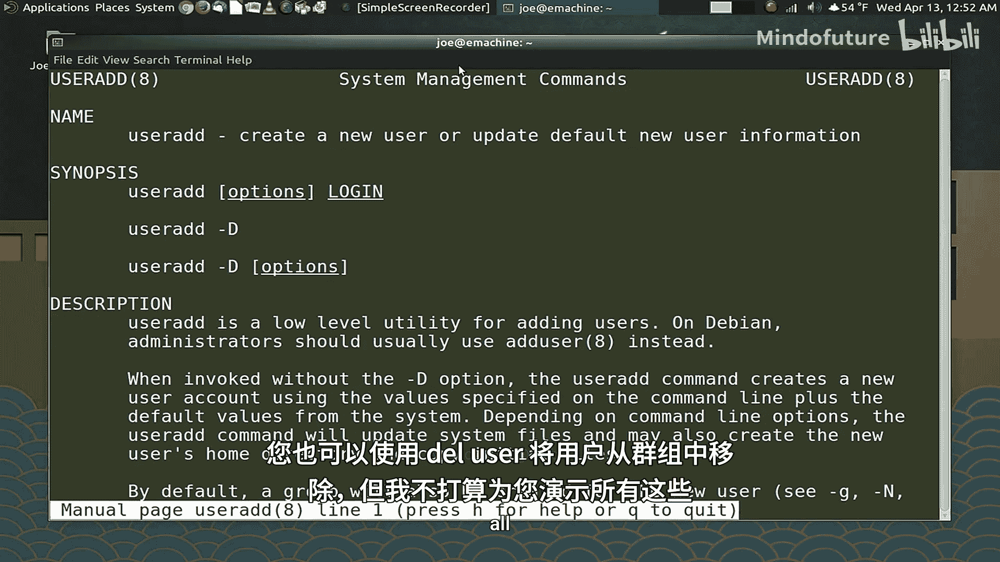
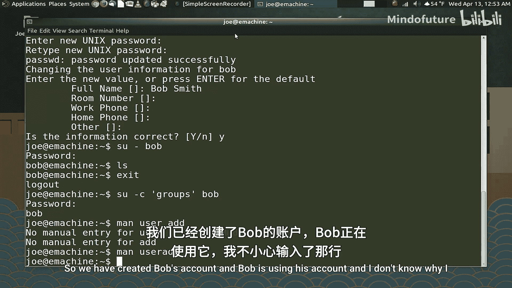
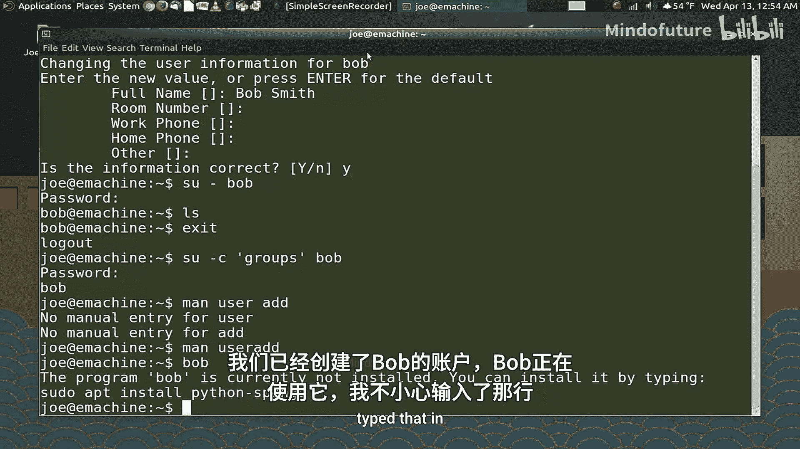
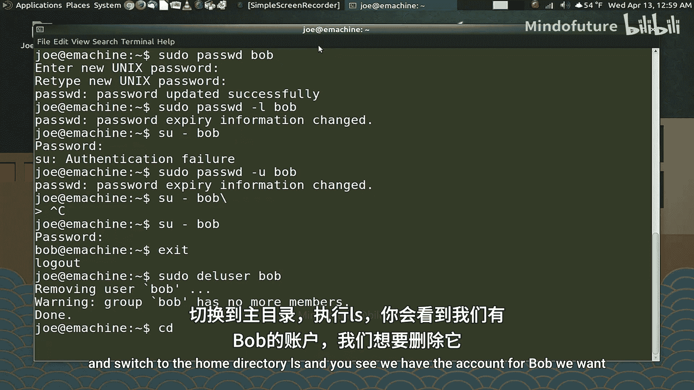
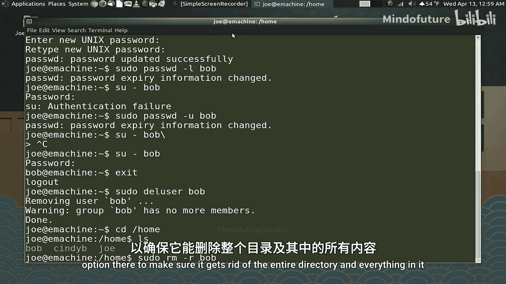
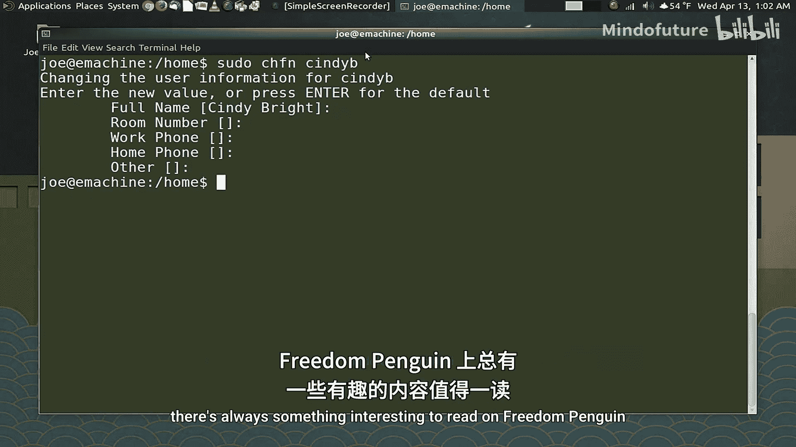

# 005：用户账户与密码管理 👤🔐



在本节课中，我们将学习如何在Linux系统中通过Bash命令行管理用户账户和密码。这对于系统管理员是一项核心技能，即使你只是个人用户，了解这些操作也很有帮助。

上一节我们介绍了文件权限，本节中我们来看看如何管理系统的使用者。

## 创建新用户

首先，我们学习如何向系统添加一个新用户。使用 `adduser` 命令可以完成此操作。

以下是创建用户“Bob”的步骤：
1.  执行命令 `sudo adduser Bob`。
2.  输入管理员密码以授权。
3.  系统会创建用户Bob、同名用户组以及家目录 `/home/Bob`。
4.  根据提示为Bob设置密码。
5.  可以按需填写用户的详细信息（如全名、电话等），这些信息在大型机构中很有用。

## 切换用户与检查账户





创建账户后，我们可以使用 `su` 命令切换到该用户以验证账户是否正常工作。



**代码示例：切换用户**
```bash
su - Bob
```
**注意**：`su - Bob` 中的连字符 `-` 确保切换到新用户的同时也进入其家目录。如果省略连字符，则会停留在当前目录。

登录后，可以运行 `whoami` 等命令确认当前用户。使用 `exit` 命令可以退出并返回原账户。







此外，无需完全切换用户，也可以以其他用户身份执行单条命令：
```bash
su -c "groups Bob" Bob
```
这条命令会以Bob的身份执行 `groups Bob`，查看Bob属于哪些用户组。

## 管理用户密码

作为管理员，你可能需要修改用户的密码。使用 `passwd` 命令可以实现。

**代码示例：修改用户密码**
```bash
sudo passwd Bob
```
**重要提示**：执行 `passwd` 命令时务必指定用户名。如果不指定，系统会默认修改`root`账户的密码。

如果用户违反了规则，你可以临时锁定其账户：
```bash
sudo passwd -l Bob
```
账户锁定后，用户将无法登录。当问题解决后，可以使用以下命令解锁账户：
```bash
sudo passwd -u Bob
```

## 删除用户账户

当用户不再需要访问系统时，可以删除其账户。使用 `deluser` 命令。



**代码示例：删除用户**
```bash
sudo deluser Bob
```
默认情况下，此命令仅删除用户账户，但会保留其家目录中的文件。如果需要彻底删除用户及其所有文件，需要手动删除其家目录：
```bash
sudo rm -r /home/Bob
```



## 修改用户信息

`chfn` 命令用于修改创建用户时填写的指纹信息（如全名、办公室等）。这在需要更正或补充信息时很有用。

**代码示例：修改用户信息**
```bash
sudo chfn CindyB
```
执行命令后，会进入交互界面，可以依次修改或确认各项信息。

---



本节课中我们一起学习了Bash环境下用户账户与密码的核心管理操作。我们掌握了如何**创建用户**、**切换身份**、**修改密码**、**锁定/解锁账户**以及**删除用户**。记住，在家庭环境中可能很少需要管理用户组，但在企业或学校等大型系统中，结合 `usermod` 和 `groupadd` 等命令管理用户组是常见任务。下一节，我们将探讨如何通过命令行管理软件包。