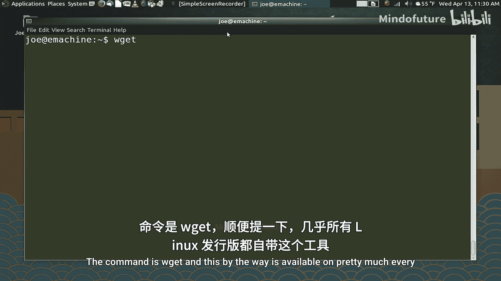
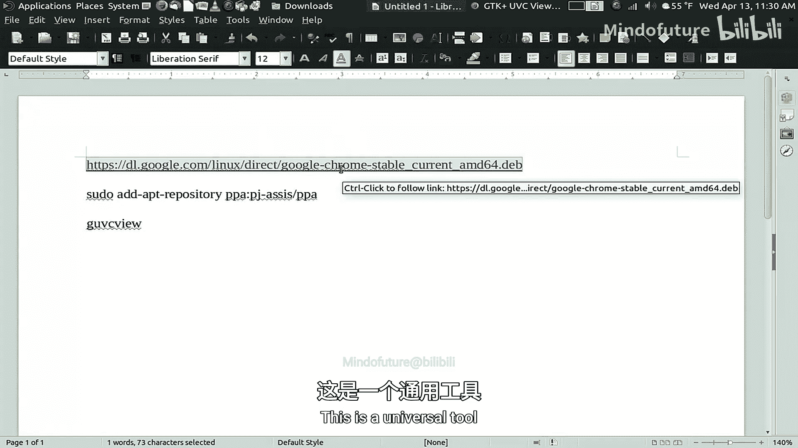
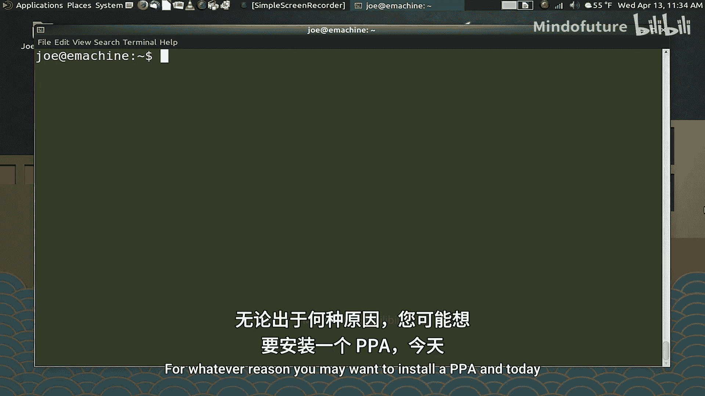
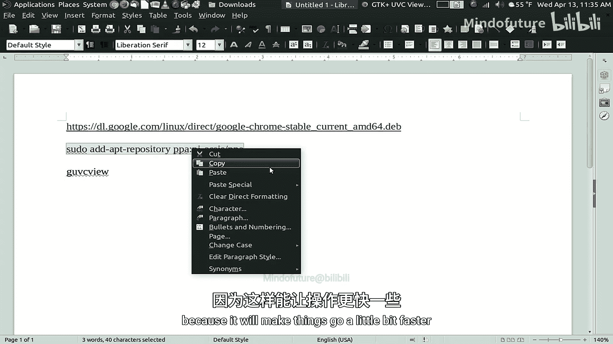
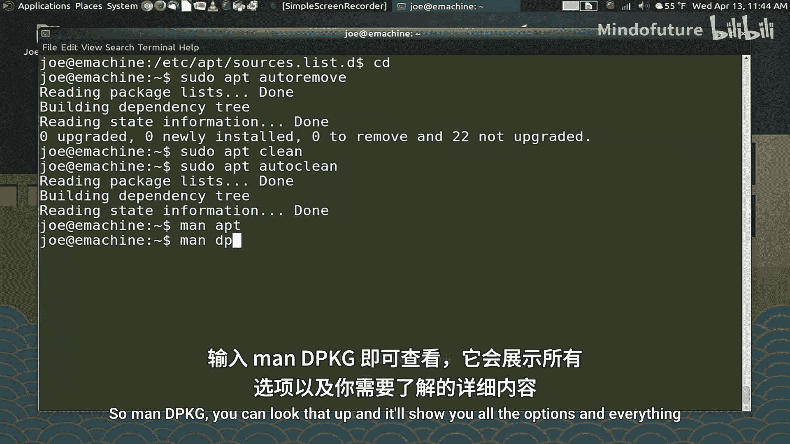

# 006：软件包管理 🛠️

在本节课中，我们将学习如何在Ubuntu系统中使用命令行管理软件包。我们将涵盖更新系统、安装/卸载软件、搜索软件包以及处理`.deb`文件和PPA（个人软件包存档）等核心操作。

---

## 更新系统与软件包

在管理软件之前，首先需要更新本地的软件包缓存。这能确保系统了解仓库中所有软件包的最新状态。

执行以下命令更新缓存：

```bash
sudo apt update
```

此命令会连接所有已配置的软件仓库，检查可用的新软件包、已移除的软件包以及现有软件包的升级信息。

更新缓存后，可以升级已安装的软件包。有两种升级方式：

1.  **安全升级**：升级大多数软件包，但跳过内核等敏感系统组件。
    ```bash
    sudo apt upgrade
    ```
2.  **完全升级**：升级所有软件包，包括系统内核。
    ```bash
    sudo apt dist-upgrade
    ```

通常，为了获得最新的系统功能和安全更新，建议使用`dist-upgrade`。

---

## 安装与卸载软件

安装软件非常简单，只需知道软件包名称即可。

以下是安装名为`htop`的系统监控工具的命令：

```bash
sudo apt install htop
```

要卸载软件，可以使用`remove`命令。这会移除软件但保留其配置文件。

```bash
sudo apt remove htop
```

如果想彻底清除软件及其所有配置文件，则使用`purge`命令：

```bash
sudo apt purge htop
```

**提示**：你可以在一条命令中安装或卸载多个软件包，只需用空格分隔它们的名称。

---

## 搜索软件包

如果你不确定软件包的确切名称，或者想查看仓库中可用的软件，可以使用搜索功能。

以下命令会搜索名称或描述中包含“firefox”的软件包：

```bash
apt-cache search firefox
```





由于结果可能很多，你可以使用管道符`|`将输出传递给`less`命令，以便逐页浏览：

```bash
apt-cache search firefox | less
```

---

## 从 `.deb` 文件安装软件

并非所有软件都来自官方仓库。一些专有软件（如Google Chrome）以`.deb`文件格式提供。你需要先下载文件，然后手动安装。

首先，使用`wget`工具下载`.deb`文件。这是一个通用的网络下载工具。

```bash
wget https://dl.google.com/linux/direct/google-chrome-stable_current_amd64.deb
```

下载完成后，使用`dpkg`命令进行安装：





```bash
sudo dpkg -i google-chrome-stable_current_amd64.deb
```

如果安装过程中提示缺少依赖，可以运行以下命令尝试自动安装依赖：

```bash
sudo apt install -f
```

---

## 使用 PPA（个人软件包存档）

PPA 允许你安装比官方仓库更新或未收录的软件。例如，要为网络摄像头软件`guvcview`添加一个PPA：

```bash
sudo add-apt-repository ppa:jonathonf/guvcview
sudo apt update
```

添加PPA并更新缓存后，你就可以像安装普通软件一样安装或更新来自该PPA的软件：

```bash
sudo apt install guvcview
# 或直接更新所有软件（包括来自PPA的）
sudo apt dist-upgrade
```

---

## 移除 PPA

当你不再需要某个PPA时，建议先卸载从其安装的软件，然后移除PPA源。

1.  卸载软件：
    ```bash
    sudo apt remove guvcview
    ```
2.  移除PPA源文件。PPA源文件位于`/etc/apt/sources.list.d/`目录下，通常以`.list`结尾。你可以列出并删除对应的文件：
    ```bash
    cd /etc/apt/sources.list.d/
    ls
    sudo rm jonathonf-ubuntu-guvcview*.list
    ```

---

## 系统清理与维护

为了保持系统整洁并释放磁盘空间，可以定期执行一些清理命令。

*   **自动移除无用包**：移除那些作为依赖被安装，但现在已不被任何程序需要的“孤儿”软件包。
    ```bash
    sudo apt autoremove
    ```
*   **清理软件包缓存**：系统会缓存下载的软件包以便重用。以下两个命令用于管理缓存：
    *   `sudo apt clean`：**彻底清除**所有缓存包。
    *   `sudo apt autoclean`：仅清除**已过时**（仓库中已有新版本）和**对应软件已卸载**的缓存包。这是更安全的选择。

---

## 总结



本节课我们一起学习了Ubuntu系统下命令行软件包管理的核心操作：

1.  使用 `apt update` 和 `apt dist-upgrade` 更新系统。
2.  使用 `apt install` 和 `apt remove/purge` 安装与卸载软件。
3.  使用 `apt-cache search` 搜索软件包。
4.  使用 `dpkg -i` 安装本地的 `.deb` 文件。
5.  使用 `add-apt-repository` 添加PPA，以及如何安全地移除PPA。
6.  使用 `autoremove`、`clean` 和 `autoclean` 进行系统清理。

掌握这些命令能让你更高效、更精确地控制系统中的软件。要了解更多高级选项和参数，别忘了查阅 `man` 手册（例如 `man apt` 或 `man dpkg`）。