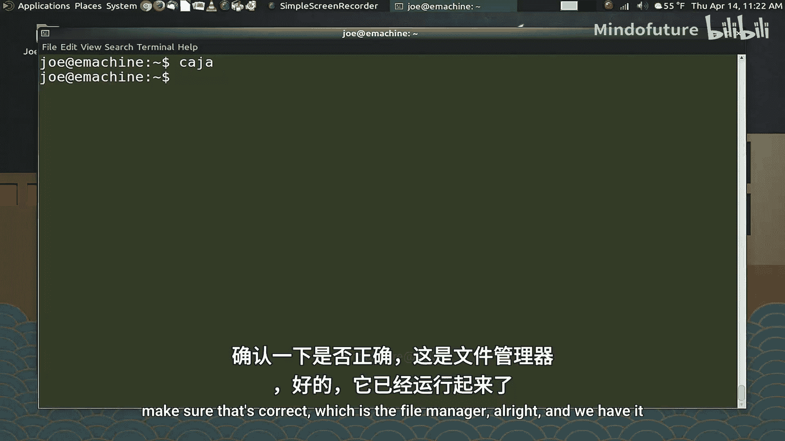
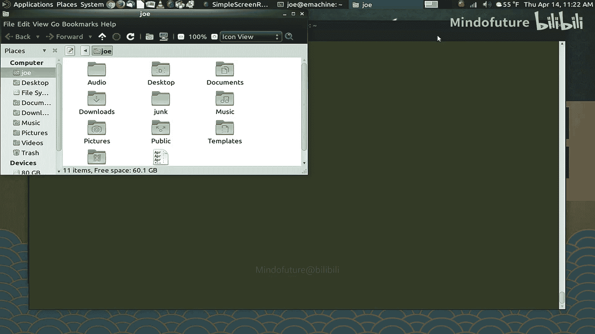
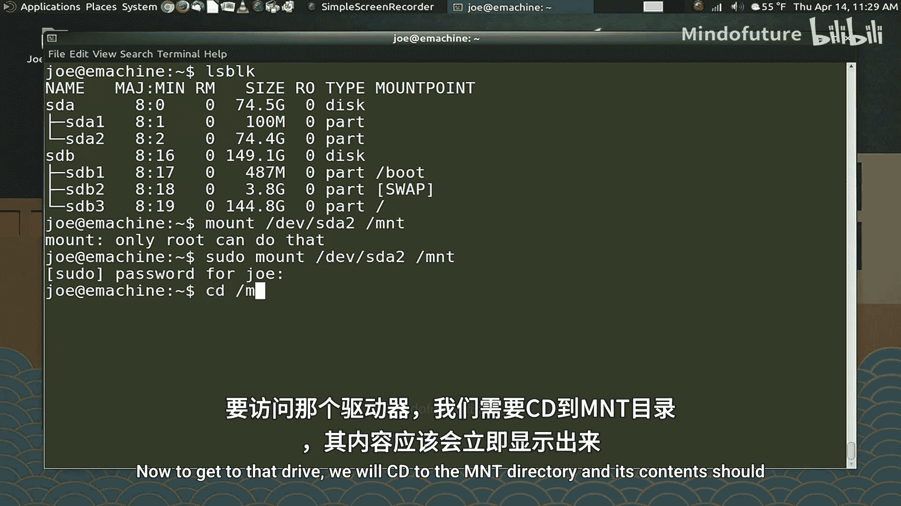
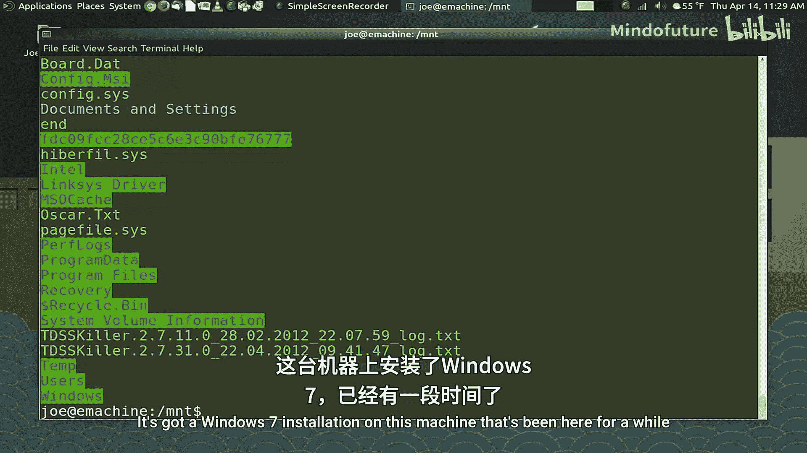
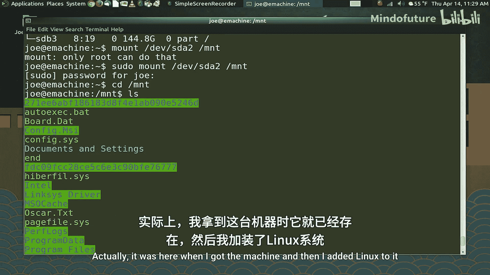
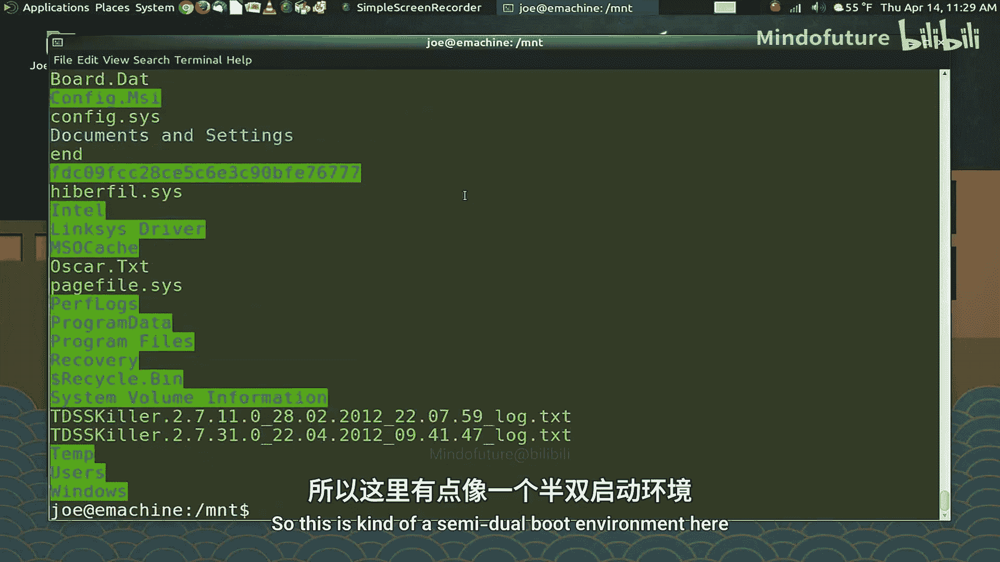
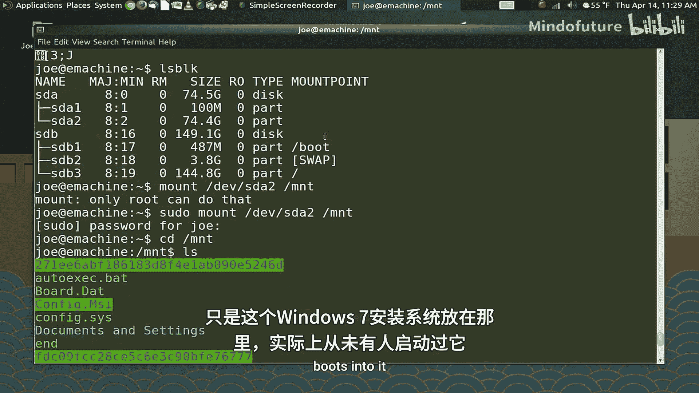
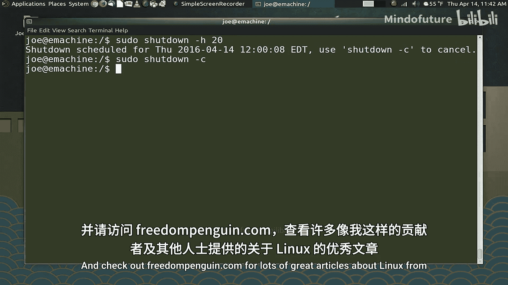

# 007：系统管理工具 🛠️

在本节课中，我们将学习一系列实用的系统管理工具。这些工具能帮助你查看计算机的运行状态、管理进程、监控网络和存储设备等。我们将遵循Unix哲学，即使用许多功能单一但高效的小工具，并通过组合它们来完成更复杂的任务。

---

## 内存与磁盘空间监控 💾

上一节我们介绍了Unix哲学，本节中我们来看看如何监控系统资源。首先，我们可以使用 `free` 命令查看内存使用情况。

**命令**：
```bash
free -h
```
`-h` 选项使输出更易读（human-readable）。

接下来，使用 `df` 命令查看已挂载文件系统的磁盘空间使用情况。

**命令**：
```bash
df -h
```

如果你想深入了解哪个目录占用了大量空间，可以使用 `du` 命令。它会列出指定目录（默认为当前目录）下所有子目录的大小。

**命令**：
```bash
du | less
```
由于输出可能很长，我们通过管道 `|` 将其传递给 `less` 命令，以便逐页查看。按 `q` 键退出 `less`。

---

## 实时监控与日志查看 🔍

有时，我们不仅需要快照，还想观察资源随时间的变化。`watch` 命令可以定期执行指定命令并显示输出。

**命令**：
```bash
watch -n 0.1 date
```
此命令每0.1秒执行一次 `date` 命令，近乎实时地显示时间。按 `Ctrl+C` 退出。

当系统出现问题时，查看内核日志是有效的排查手段。`dmesg` 命令显示Linux内核最近的操作记录。

**命令**：
```bash
dmesg
```
如果只想查看最新的几条记录，可以使用 `tail` 命令。

**命令**：
```bash
dmesg | tail
```
`tail` 默认显示输入内容的最后10行。

系统日志通常存放在 `/var/log` 目录下。例如，查看系统日志的最后10条记录：

**命令**：
```bash
tail /var/log/syslog
```
如果需要将日志内容分享给他人，可以将其重定向到文件中。

**命令**：
```bash
tail /var/log/syslog > logtail.txt
```

对于使用 `systemd` 初始化系统的较新Linux发行版，可以使用 `journalctl` 查看启动日志。

**命令**：
```bash
journalctl
```
这会显示系统启动过程中的详细日志，有助于诊断启动错误。



---



## 进程管理 ⚙️

进程是系统中正在运行的程序或服务。`top` 命令提供了一个动态的、全面的进程视图。

**命令**：
```bash
top
```
`top` 会显示系统概览和按CPU使用率排序的进程列表。

另一个更强大的工具是 `htop`，它提供了彩色界面和更多交互功能。

**命令**：
```bash
htop
```
在 `htop` 中，你可以查找、终止进程或调整进程优先级。

如果某个应用程序无响应，可以使用 `killall` 命令强制终止它。

**命令**：
```bash
killall 程序名
```
例如，终止一个名为 `caja` 的文件管理器：

**命令**：
```bash
killall caja
```
请注意，强制终止可能导致未保存的数据丢失。

---

## 网络诊断 🌐

网络问题是常见的系统故障。`ifconfig` 命令可以查看网络接口的配置信息，如IP地址。



**命令**：
```bash
ifconfig
```
要测试网络连通性，可以使用 `ping` 命令。



**命令**：
```bash
ping youtube.com
```
`ping` 会持续向目标发送数据包，直到你按 `Ctrl+C` 停止。它还会显示往返时间的统计信息。







---

## 存储设备管理 💽

在命令行环境下，需要手动挂载外部存储设备（如USB驱动器）。首先，使用 `lsblk` 列出所有块设备。

**命令**：
```bash
lsblk
```
假设我们要挂载 `/dev/sda2` 分区到 `/mnt` 目录。

**命令**：
```bash
sudo mount /dev/sda2 /mnt
```
挂载后，可以通过 `/mnt` 目录访问设备内容。使用完毕后，需要卸载设备。

**命令**：
```bash
sudo umount /dev/sda2
```
注意，卸载前需确保不在该设备的挂载目录内。

要获取更详细的磁盘信息，可以使用 `fdisk` 命令。

**命令**：
```bash
sudo fdisk -l
```
此外，`blkid` 命令可以显示设备的UUID（通用唯一识别码），这在配置自动挂载时非常有用。

**命令**：
```bash
blkid
```

---

## 系统信息与其他实用命令 ℹ️

`uname` 命令可以显示系统信息，如内核版本和系统架构。

**命令**：
```bash
uname -a
```
`history` 命令能列出你在当前会话中执行过的所有命令。

**命令**：
```bash
history | less
```
`cal` 命令可以显示日历。

**命令**：
```bash
cal
```
对于EXT4文件系统，虽然碎片化问题不常见，但你仍可以使用 `e4defrag` 检查或整理碎片。

**命令**：
```bash
sudo e4defrag -c /home
```
最后，系统关机和重启也可以通过命令完成。`reboot` 命令用于重启系统。

**命令**：
```bash
sudo reboot
```
`shutdown` 命令则提供了更多控制，例如定时关机。

**命令**：
```bash
sudo shutdown -h +20
```
此命令将在20分钟后关闭系统。若要取消已计划的关机，请使用：

**命令**：
```bash
sudo shutdown -c
```

---



本节课中我们一起学习了多种Bash系统管理工具，涵盖了资源监控、日志查看、进程管理、网络诊断和存储设备操作等方面。掌握这些工具能让你更深入地理解和控制你的Linux系统。记住，每个命令都有更多选项和用法，请务必查阅其手册页（`man 命令名`）以获取完整信息。在下一节，我们将学习如何将这些命令组合成脚本，实现自动化任务。