# 008：Bash脚本编写 🚀

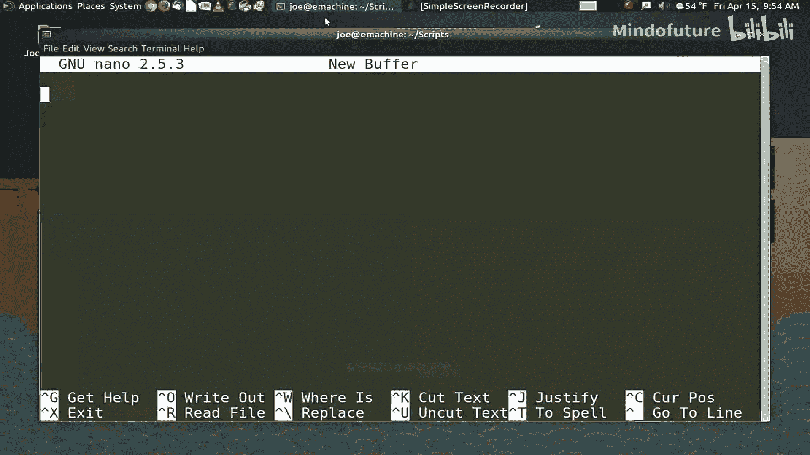

## 概述
在本节课中，我们将要学习如何编写Bash脚本。脚本是将一系列命令组合在一起，形成一个可以自动执行的计算机程序。Bash不仅允许你串联命令，还拥有自己的编程语言，可以用来完成复杂任务。即使你不擅长编程，也能编写出简单而强大的脚本。

---

## 脚本基础结构

上一节我们介绍了Bash的基本命令，本节中我们来看看如何将它们组织成脚本。

任何脚本的第一行必须是**shebang**（也称为hashbang），它告诉系统这是一个程序，并指定用于执行它的shell。对于Bash脚本，这一行通常是：
```bash
#!/bin/bash
```
shebang之后可以有空行，脚本会忽略它们。你也可以使用`#`符号添加注释，以说明脚本的功能或提醒自己某些细节。

---

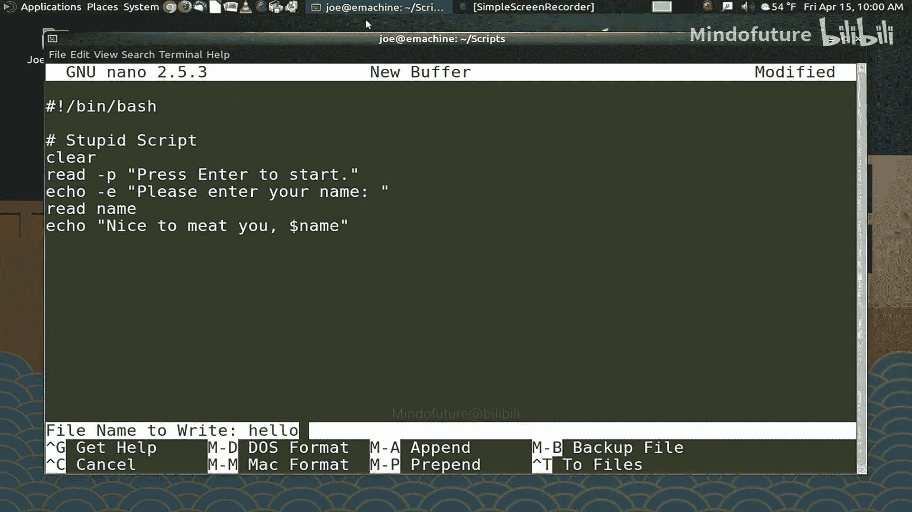

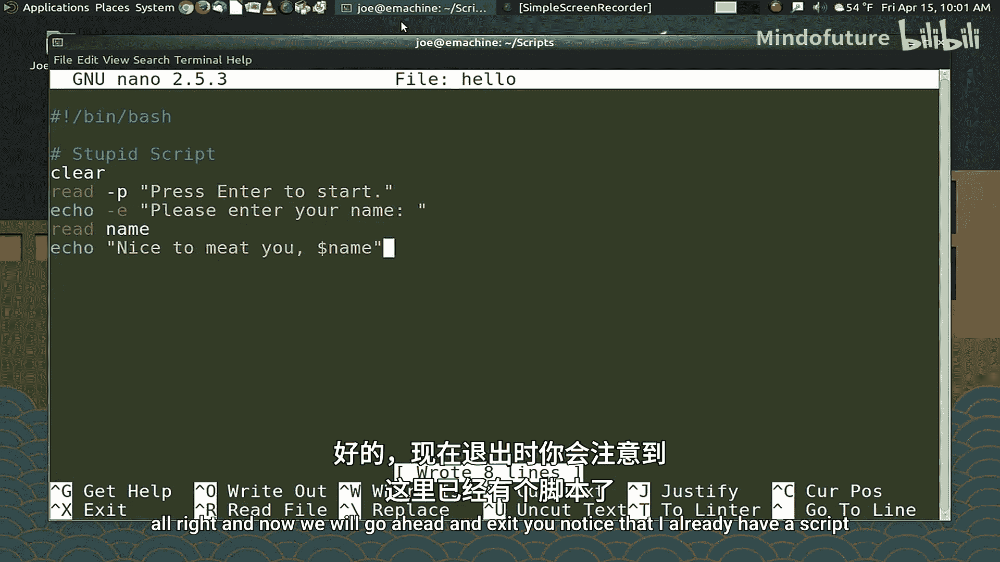

## 编写第一个脚本

以下是创建一个简单脚本的步骤。这个脚本会清屏，提示用户输入，然后输出问候语。

1.  **打开文本编辑器**（如nano、vim或任何图形化编辑器）。
2.  **输入脚本内容**：
    ```bash
    #!/bin/bash

    # 一个简单的问候脚本
    clear
    read -p "按 Enter 键开始..."
    echo -e "请输入你的名字："
    read name
    echo "很高兴认识你，$name"
    ```
    *   `clear`：清空终端屏幕。
    *   `read -p`：显示提示信息并等待用户输入。`-p`选项允许在同一行显示提示。
    *   `echo -e`：输出文本，`-e`选项允许解释反斜杠转义字符（本例中未使用，但常见）。
    *   `read name`：将用户输入的内容存储到变量`name`中。
    *   `echo "很高兴认识你，$name"`：输出文本，并使用`$`符号引用变量`name`的值。
3.  **保存文件**，例如命名为`hello.sh`。
4.  **赋予脚本执行权限**。默认情况下，脚本文件没有执行权限。使用`chmod`命令添加：
    ```bash
    chmod +x hello.sh
    ```
5.  **运行脚本**。如果脚本不在系统PATH中，需要指定路径：
    ```bash
    ./hello.sh
    ```

---

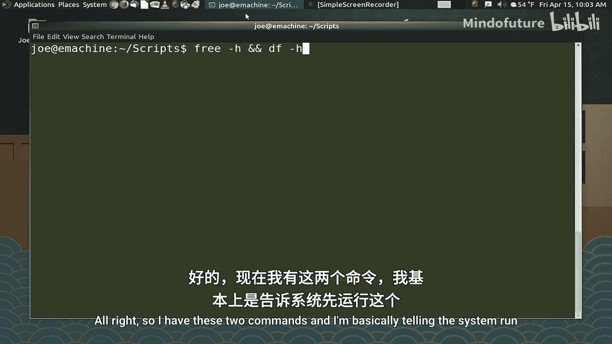

## 编写实用脚本

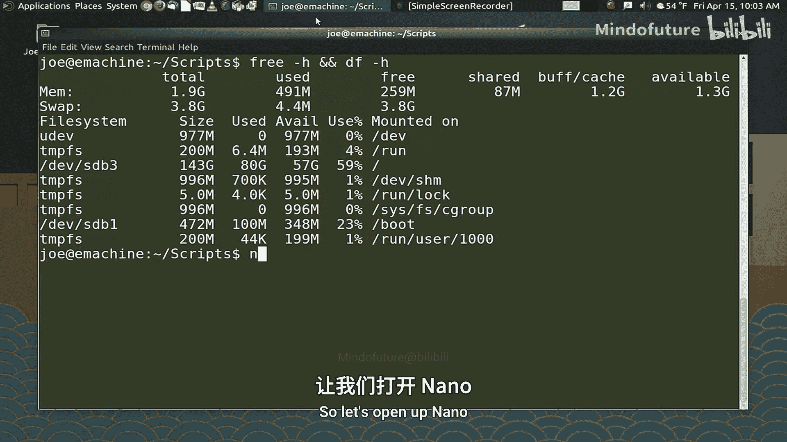

现在，让我们将一些常用的命令组合成一个更有用的脚本。例如，创建一个快速查看系统内存和磁盘使用情况的脚本。

1.  **创建新脚本文件**，例如`resources.sh`。
2.  **输入以下内容**：
    ```bash
    #!/bin/bash

    clear
    echo "内存使用情况："
    free -h
    echo ""
    echo "磁盘使用情况："
    df -h
    ```
    *   这个脚本依次执行了`clear`、`echo`、`free -h`和`df -h`命令。
3.  **保存文件，赋予执行权限并运行**：
    ```bash
    chmod +x resources.sh
    ./resources.sh
    ```

通过这种方式，你可以将任何你经常需要手动输入的命令序列封装成脚本，节省时间并减少错误。

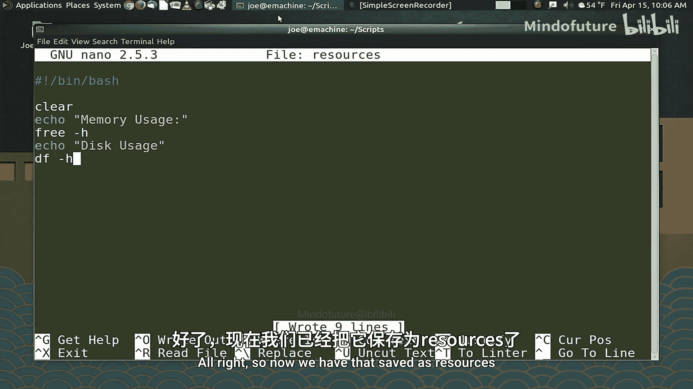

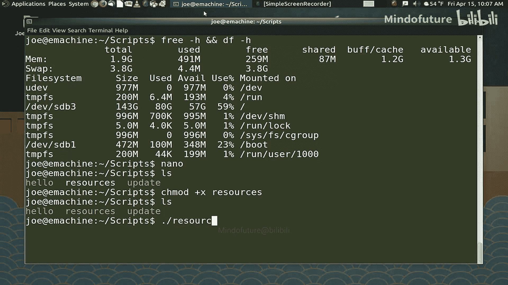

---

## 真实案例：系统更新脚本

下面我们分析一个更复杂的真实世界脚本，它用于自动更新系统并在完成后计划重启。

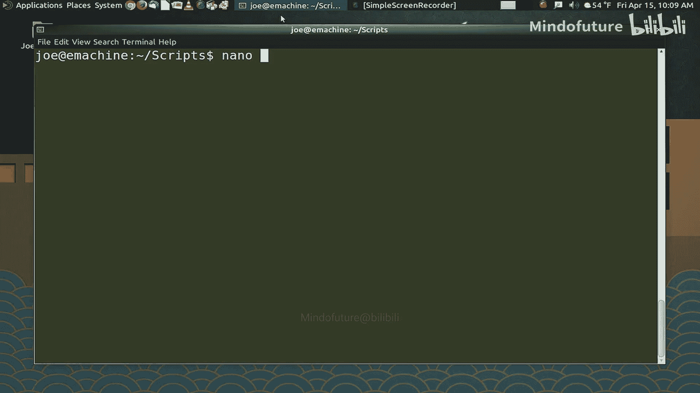

```bash
#!/bin/bash
# 系统更新脚本

# 记录开始时间到日志文件
echo "更新开始于：" > ~/.update.log
date >> ~/.update.log

echo "正在检查更新..."
sudo apt-get update >> ~/.update.log 2>&1

echo "正在安装更新..."
sudo apt-get dist-upgrade -y >> ~/.update.log 2>&1

echo "正在移除无用包..."
sudo apt-get autoremove -y >> ~/.update.log 2>&1

echo "正在清理缓存..."
sudo apt-get autoclean >> ~/.update.log 2>&1

echo "更新完成！" | tee -a ~/.update.log

echo "系统将在30秒后重启..."
sleep 30
sudo shutdown -r now
```

**脚本逐行解释**：

*   `#!/bin/bash`：指定Bash shell。
*   `echo "更新开始于：" > ~/.update.log`：将文本输出到`~/.update.log`文件，`>`表示覆盖写入。
*   `date >> ~/.update.log`：将当前日期时间追加到同一日志文件，`>>`表示追加写入。
*   `sudo apt-get update >> ~/.update.log 2>&1`：执行更新软件源列表命令。`>> ~/.update.log`将标准输出重定向到日志文件。`2>&1`表示将标准错误输出也重定向到标准输出指向的地方（即日志文件）。
*   `sudo apt-get dist-upgrade -y`：执行系统升级，`-y`选项自动对所有提示回答“是”。
*   `sudo apt-get autoremove -y`：自动移除不再需要的依赖包。
*   `sudo apt-get autoclean`：清理已下载的旧软件包缓存。
*   `echo "更新完成！" | tee -a ~/.update.log`：`echo`输出文本，通过管道`|`传递给`tee`命令。`tee -a`命令既将内容显示在屏幕上，又追加到日志文件中。
*   `sleep 30`：使脚本暂停（睡眠）30秒。`sleep`命令在脚本中非常有用，可以确保上一条命令完成，或给用户反应时间。
*   `sudo shutdown -r now`：立即重启系统。

**关键概念**：
*   **重定向**：`>`（覆盖）、`>>`（追加）用于控制命令输出到文件。
*   **标准输出与错误**：`1`代表标准输出，`2`代表标准错误。`2>&1`将错误输出合并到标准输出流。
*   **管道**：`|` 将一个命令的输出作为另一个命令的输入。
*   **命令选项**：如`apt-get`的`-y`，`tee`的`-a`，它们改变了命令的默认行为。

---

## 将脚本设为系统命令

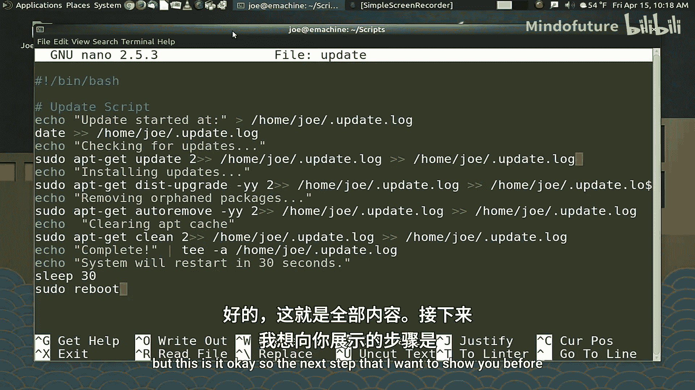

为了让任何用户都能方便地运行你的脚本，可以将其放入系统的命令路径中。

1.  **了解PATH**：系统在特定的目录列表中查找可执行命令，这些目录由`PATH`环境变量定义。常见的系统命令目录是`/usr/local/bin`或`/bin`。
2.  **复制脚本**：以root权限将你的脚本复制到其中一个目录。例如，将`hello.sh`设为系统命令：
    ```bash
    sudo cp hello.sh /usr/local/bin/hello
    ```
    （注意：通常省略`.sh`扩展名，并优先使用`/usr/local/bin`来存放本地安装的软件，避免污染系统目录）。
3.  **现在，你可以在任何位置的终端中直接输入`hello`来运行该脚本**。

**警告**：操作`/bin`、`/sbin`等系统目录时要格外小心，误删或修改系统命令可能导致系统不稳定。

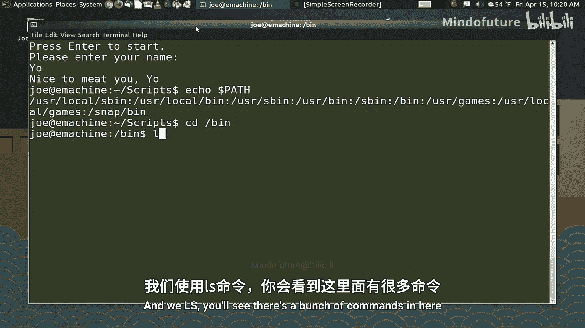

---

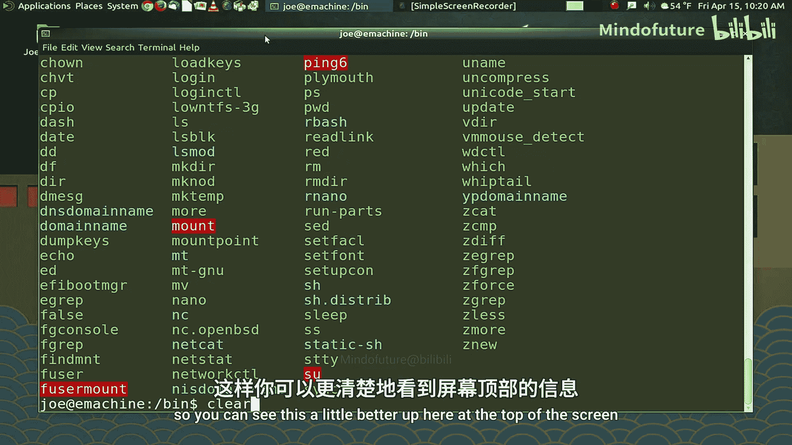

## 故障排除与学习资源

编写脚本时遇到问题很常见。以下是一些建议：

*   **使用搜索引擎**：几乎你遇到的任何问题，网上都有丰富的解决方案。尝试搜索“bash script how to [你的问题]”。
*   **逐行调试**：如果脚本不工作，可以暂时在关键命令前加`echo`打印状态，或者先单独测试每条命令。
*   **查阅文档**：使用`man`命令查看命令的官方手册，例如`man bash`、`man read`。

此外，你还可以：
*   **使用Cron定时任务**：让脚本在特定时间自动运行。Cron是一个强大的任务调度程序。
*   **创建桌面快捷方式**：为脚本创建图形化启动器，方便非终端用户使用。

---

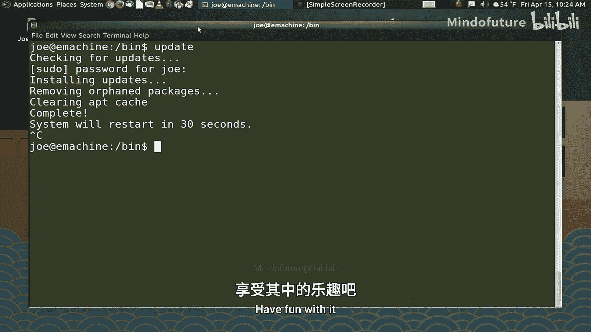

## 总结
本节课中我们一起学习了Bash脚本编写的基础知识。我们从最简单的脚本结构开始，逐步编写了交互式脚本和实用工具脚本，并分析了一个自动化系统更新的复杂案例。我们了解了shebang、变量、命令组合、输入输出重定向等核心概念，还学习了如何将脚本安装为系统级命令。脚本是自动化重复任务、提升效率的强大工具。虽然高级编程功能如条件判断和循环等未在本课深入，但你现在掌握的知识已足以创建许多有用的脚本。继续实践和探索，你会发现Bash脚本能极大地简化你的工作流程。