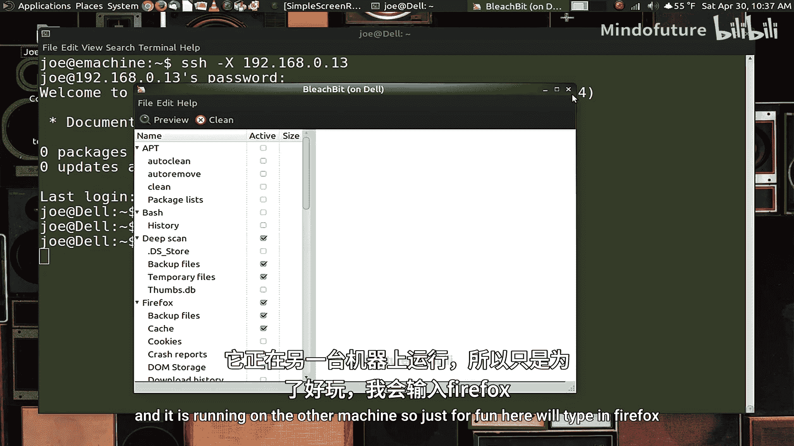
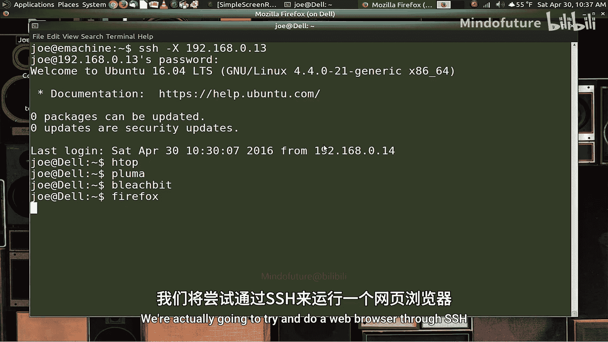
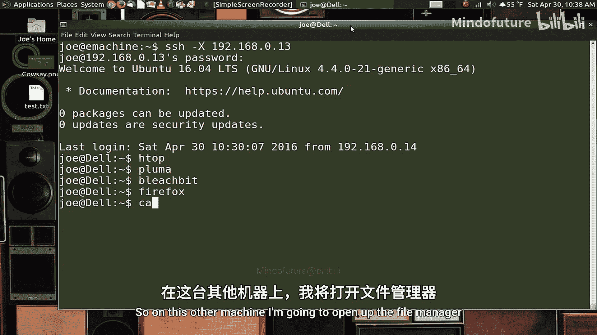
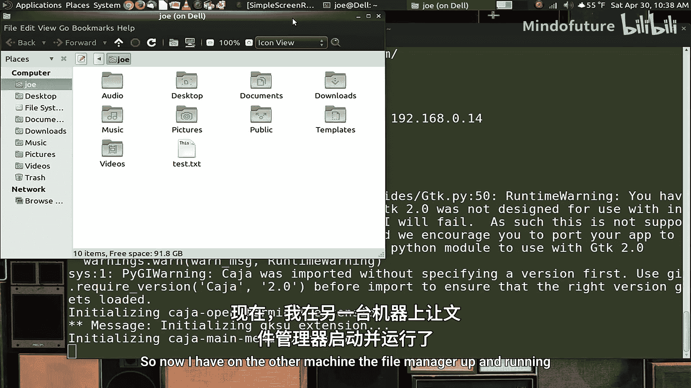
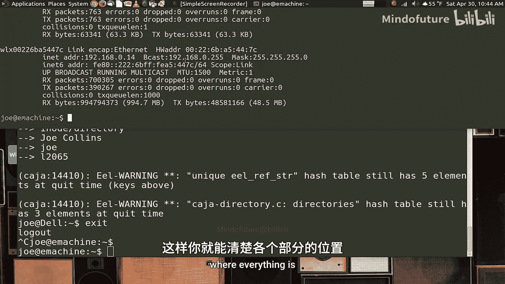

# 009：Linux技巧 - 如何使用SSH远程登录 🔐

在本节课中，我们将要学习一个非常强大且通用的工具：SSH（Secure Shell）。它允许你通过网络远程登录到另一台计算机，无论这台计算机在你的本地网络还是互联网上。这对于系统管理员和任何需要远程管理计算机的人来说都是必不可少的技能。

## 概述

SSH是一个安全的网络协议，用于在不安全的网络上提供安全的加密通信。它不仅可以让你远程访问另一台计算机的命令行，还能安全地传输文件，甚至运行图形界面应用程序。本节课将引导你完成SSH的安装、基本使用和一些实用技巧。

## 安装与配置SSH服务器

上一节我们介绍了SSH的基本概念，本节中我们来看看如何在你的系统上设置SSH。

首先，你需要知道，大多数Linux发行版已经预装了SSH客户端，这意味着你可以用它连接到其他计算机。但如果你想让他人连接到你的计算机，就需要安装并配置SSH服务器。

在Ubuntu系统上，安装SSH服务器非常简单。你可以使用以下命令：

```bash
sudo apt install openssh-server
```

你也可以通过图形界面的软件中心来安装这个软件包。安装过程会自动生成安全密钥并启动SSH服务，通常无需重启计算机。SSH服务默认会在**端口22**上监听连接。

如果你的网络防火墙或路由器默认阻止了端口22（出于安全考虑），你可能需要配置防火墙允许该端口，或者将SSH服务器配置为使用其他端口。这超出了本教程的范围，但网上有大量相关教程可供参考。

## 基本SSH登录

一旦SSH服务器安装并运行，你就可以从另一台计算机登录了。以下是基本登录命令的格式：

```bash
ssh username@ip_address
```

例如，如果你的用户名是`user`，目标计算机的IP地址是`192.168.0.13`，命令如下：

```bash
ssh user@192.168.0.13
```

如果是首次连接某台主机，系统会提示你确认主机的指纹。输入`yes`后，再输入对应用户的密码即可登录。

登录成功后，你将进入远程计算机的命令行界面，可以执行任何你有权限执行的命令。

## 通过SSH安全传输文件

除了远程命令行操作，SSH还能安全地传输文件。这通常使用`scp`（secure copy）命令来完成。

以下是使用`scp`命令的基本方法。假设你想将远程计算机（IP：`192.168.0.13`）上的文件`test.txt`复制到本地计算机的桌面上：

```bash
scp user@192.168.0.13:/path/to/test.txt ~/Desktop/
```

反之，将本地文件复制到远程计算机：

```bash
scp ~/Desktop/test.txt user@192.168.0.13:/home/user/
```

## 通过SSH运行图形界面应用程序

上一节我们介绍了如何传输文件，本节中我们来看看SSH更强大的功能：远程运行图形程序。

默认的SSH连接只支持命令行。但通过添加`-X`参数，你可以启用“X11转发”功能，从而运行需要图形界面的应用程序。

命令格式如下：

```bash
ssh -X user@ip_address
```

登录后，你可以尝试启动一个图形程序，例如文本编辑器：



```bash
gedit
```

或者文件管理器：



```bash
nautilus
```


程序窗口会显示在你的本地屏幕上，但实际运行在远程计算机上。需要注意的是，复杂的图形程序（如大型游戏或视频编辑软件）可能运行缓慢或无法正常工作，但像文本编辑器、简单的系统工具等都能良好运行。



## 实用网络发现技巧



在使用SSH时，你首先需要知道目标计算机的IP地址。如果你的网络使用DHCP动态分配IP，地址可能会变化。以下是几种查找网络内计算机的方法。

首先，你可以查看已连接过的主机缓存：

```bash
arp -a
```

这个命令会列出你曾连接过的网络设备的IP地址。

其次，你可以使用网络扫描工具`nmap`来发现当前网络中的所有活跃设备。首先安装它：

```bash
sudo apt install nmap
```

然后扫描你的本地网络（例如`192.168.0.0/24`）：

```bash
sudo nmap -sn 192.168.0.0/24
```

最后，要查看你自己计算机的IP地址，可以使用：

```bash
ip addr show
```

或者旧的命令：

```bash
ifconfig
```

输出信息中会包含类似`inet 192.168.0.14`的条目，这就是你的IP地址。

为了长期稳定地使用SSH，建议为需要远程访问的计算机在路由器或系统设置中配置**静态IP地址**。

## 总结



本节课中我们一起学习了SSH的强大功能。我们从安装SSH服务器开始，学习了如何进行基本的远程登录。接着，我们探索了如何使用`scp`命令在计算机间安全地复制文件。然后，我们介绍了通过`-X`参数启用X11转发，从而远程运行图形界面应用程序的技巧。最后，我们了解了几种在本地网络中发现设备IP地址的实用方法。

SSH是Linux和系统管理中的核心工具，掌握它将极大地提升你管理多台计算机的效率和灵活性。