# 电脑爱好者2001合订本（上）正文分册

正文：
精品文章
资料典范

配套光盘A：
电子期刊
全文检索

免费赠送附录，两张光盘

2001
1-12合订本

EPSON
自然色彩
照片自然精彩

亮丽多彩的自然世界，想留下美好的回忆？
可照片呈现的色彩总是差强人意，令精彩旅程留下点点遗憾……
其实传统手段最难表现的，是自然界常见的蓝、绿等色彩。
全新EPSON STYLUS PHOTO 790彩色喷墨打印机，
特有自然色彩还原技术，通过对自然色彩——
尤其是蓝、绿色彩的突破性还原，将视觉色域全面展现，
打印照片自然精彩！更配合EPSON
四周无边距打印技术，让你的影像世界广阔无边。
用EPSON打印的照片，把大自然带回身边！

- △A4 满幅四周无边距打印
- △2880dpi超高分辨率
- △自然色彩还原技术
- △4微微升超精微墨滴
- △宝石级六色快干墨水
- △同捆附送PhotoQuicker 2.0软件

EPSON STYLUS PHOTO 790
彩色喷墨打印机

普通打印
预留白边

EPSON特有
四周无边距打印

爱普生(中国)有限公司
地址：北京朝阳区东三环北路2号南银大厦28层 邮编：100027 http://www.epson.com.cn
售前支持热线：800-810-9977 售后技术支持热线：010-64107315 021-58669858/9750 资料传真回复：010-64107341/42 64108112/14
维修负责：爱普生（北京）技术服务有限公司维修部 北京朝阳区光华路甲8号和乔大厦南座102室 电话：010-65812929
北京爱普生技术服务中心维修部 北京海淀区西三环北路68号 电话：010-68458451/52
爱普生（北京）技术服务有限公司中关村维修部 北京海淀区中关村路17号科电大楼一层东 电话：010-62575848/83
爱普生中关村展厅 地址：北京海淀区中关村大街22号中科大厦一层 爱普生南银展厅 地址：北京朝阳区东三环北路2号南银大厦28层
爱普生上海展厅 地址：上海淮海中路138号上海广场一楼129室

爱普生专卖店（排名不分先后）：
北京天普龙 010-62639464 济南康悦 0531-6411713 南京新苏武 025-3369960 广州沈外 020-38802891 成都兴瑞 028-5447351 哈尔滨百珀 0451-6220078 兰州北佳 0931-8261111
北京爱惠佳 010-62625596 上海力之源 021-53083117 杭州宏运 0571-8800158-305 广州祥普 020-38809117 重庆汇丰 023-67510228 武汉江华 027-87663880 乌鲁木齐新龙 0991-2867180
北京启恒 010-82663493 上海中纺 021-53511776 杭州蓝天 0571-8865621 深圳保利登 0755-3681959/24 昆明南方源 0871-5160655 长沙创锐 0731-4131460
北京京泉 010-62644565 上海昭利 021-62152901 广州森辉陈 020-38788229 福州登丰古屏 0591-3372578 沈阳新亿达 024-23860180 江西怡和 0791-6234980
天津英普 022-87893229 上海弘思 021-64267196 广州天河蔚蓝 020-38801560 泉州奥普 0595-2193009 沈阳天港 024-23881770 陕西智成 029-5516685

自然色彩个人打印

## 电脑爱好者合订本
### 2001年(上)

时间的脚步飞快地将我们带到了新世纪，《电脑爱好者》又要向广大读者朋友做一次集体亮相了。每年的这个时分，《电脑爱好者合订本》就会在众多读者期待的目光中，款款而至，在炎热的夏季里为您带来阵阵清凉。为了答谢读者朋友多年来的厚爱，全体CFAN同仁将满腔谢意化作无穷动力，为您精心打造了这套浓缩精华、聚焦热点的合订本。希望在得到读者朋友们一如既往的支持的基础上，能给大家送上更多的惊喜和欣慰。本套合订本依然秉承CFAN的办刊宗旨——给读者尽可能多的实惠，所以又有一连串的礼物要等着您来领取。《电脑爱好者合订本》2001年(上)包括：

### 正文分册

- 经过二次编辑、合理整改的《电脑爱好者》期刊2001年上半年全部文章。
- 栏序编排，同类内容就近安排，贴近读者阅读习惯。
- 两套索引，可以按照页码顺序及知识种类两种方式进行检索。

### 附录分册

- 全新组稿，汇聚热点话题，提供系统方案，为您排忧解难。
- 容量惊人，70万的文字量、336页的精彩文章，全面提升附送价值。
- 精心策划，教学文章在配套光盘里收录全部相应软件，方便学用，即学即用。

### 配套光盘A

- 期刊全文检索系统图文并茂，真实再现上半年期刊文章。
- 智能检索，查询便利，轻松找到心怡文章，为您解惑救急。
- 电脑爱好者网站镜像及程序源代码，让您拥有更多，收获更多。

### 配套光盘B

- 汇集大量知名多媒体软件精品，配合附录入门教程，让您将软件应用进行到底。
- 精选数款《电脑爱好者》期刊涉及到的软件，让您体验“所见即所得”的全新感受。

《电脑爱好者合订本》2001年(上)，一送再送！

电脑爱好者杂志社

## 正文提要

《电脑爱好者合订本》2001年（上）汇集期刊2001年1~12期的全部内容，并将200多万字的文章重新整理归纳，编排顺序，为广大读者朋友精心炮制出一本容量惊人、高度浓缩、营养丰富、知识集中的极品图书。希望我们倾力构筑的这座知识宝库，能够为您的电脑使用和学习提供一定的支持和帮助。

为方便读者根据自己的电脑水平及兴趣所在迅速定位到适合自己的内容，本册正文按照期刊的栏目划分，让您在忙碌的工作生活中能够尽快锁定视线，节约不必要的查找时间。

您也许会担心合订本信息量的庞大会影响您的查找检索。其实，我们早已配备了页序和分类两套索引，完全解除了您的后顾之忧。特别是分类索引，为您提供了细致合理、方便直观的分类类目，可以让您轻松快捷地查找到自己感兴趣的文章。

《电脑爱好者合订本》涵盖了硬件、软件、网络、游戏和数字时尚等各方面的电脑知识。所以，无论是想学习电脑知识还是想作为工具资料收藏，选择它都是您最佳的选择。有它相伴，征服电脑的航程不再遥远，不再艰险。

| 项目 | 内容 |
| :--- | :--- |
| 名称 | 《电脑爱好者》2001年合订本（上） |
| 总编 | 刘雅英 |
| 执行总编 | 高翔 |
| 责任编辑 | 张春雨 黄平山 |
| 编辑出版 | 《电脑爱好者》杂志社 |
| 发行 | 北京市9615信箱《电脑爱好者》杂志社推广发行中心（100086） |
| 发行电话 | (010)62161335-8058、8059 |
| 经销 | 各地新华书店 |
| 开本 | 787×1092 1/16 |
| 印张 | 25 |
| 字数 | 138千字 |
| 刊号 | ISSN 1005-0043/CN II-3248/TP |
| 国内邮发代号 | 82-528 |

图文版权所有 未经同意不得转载、翻印

合订本定价：35元（附赠：两张光盘和附录等）

## 《电脑爱好者合订本》
### 2001年（上）
### 配套光盘A全文检索程序使用说明

多年来，《电脑爱好者》在读者朋友的关爱和支持下，通过自身的不断完善和改进，已发展成为拥有众多忠诚订户和铁杆拥趸的大刊。为了更好地满足读者收集信息资料、典藏全年杂志以及实现快捷查询的需要，经过精心的准备和策划后，《电脑爱好者合订本》2001年（上）全文检索光盘终于要和大家见面了。

本光盘包含了《电脑爱好者》杂志2001年上半年12期杂志的全部文章，并提供了按刊期、类别、栏目、标题、正文等多种检索方式，图文清晰，完全再现杂志原貌。可以与合订本配合使用，使读者能够方便、快捷、全面地查询到所需内容。

检索程序以PDF方式展示原杂志内容，图片制作精美，结构搭配合理，布局新颖，层次清晰，辅以动画、背景音乐等多媒体表现手法，是CFAN为您献上的又一个惊喜。

### 全文检索系统使用说明如下：

1.  将全文检索光盘A插入光驱后，程序自动运行，弹出主界面窗口。
2.  使用本检索系统前，要先正确安装Adobe公司的PDF文档阅读工具Acrobat Reader或文档制作软件Acrobat。如果以前没有安装该软件，可以在本光盘主界面中找到并点击软件安装按钮，进行正确安装后方可使用全文检索系统。
3.  软件安装完毕后，在窗口中点击“全文检索”的热点文字，即可调用全文检索系统的安装程序。默认安装路径为“C:/dnahz”。
4.  程序安装完毕后，会自动在桌面或“开始/程序”菜单中添加全文检索程序的快捷方式，点击即可运行程序，出现检索窗口。
5.  全文检索程序窗口的上部依次为状态栏、菜单栏和工具栏，下部左边为导航窗口，右边为文章列表。
6.  程序中的工具栏为我们的快捷操作提供了很大的便利，各按钮功能说明如下：
    - < 关闭当前显示窗口，返回上一级目录（在没有打开页面时，为程序退出按钮）。
    - 🔍 设置全文检索方式，实现高级检索。
    - 🔍 功能同上，但检索范围为上次的检索结果。
    - 📝 可以实现按刊期、栏目、标题和正文等字段的全文检索。
    - ↑↓ 可以实现显示页面上下页的翻页功能。
7.  在文章列表区列出了各期各栏目的文章标题，可以用鼠标双击文章标题打开相应文章的页面，阅读图文混排的内容，拖动右边框中的滚动条可以看到更多的文章标题。看完文章后，可以用工具栏中的◀按钮回到刚才的目录，继续浏览其他文章。
8.  在工具栏的全文检索文字框中输入或选择相应的查询关键词后，按下输入框旁边的检索按钮即可进行全文检索，检索结果亦会出现在文章列表区（右边的“继续检索”按钮可以将检索范围锁定在上次检索得到的文章中）。
9.  打开页面后，可以通过按下显示区上方的“打印”按钮将文档打印出来。也可用“另存为”按钮保存文档。
10. 另外，如果您在进行全文检索的过程中，光盘主程序窗口仍然停留在任务栏中，单击窗口中的“退出”按钮即可退出光盘程序，不会影响到正在运行的全文检索程序。在退出光盘程序前，还可通过点击界面上的网址（http://www.cfan.net.cn/）离线浏览“电脑爱好者”网站镜像。

### 申明

由于北京展览馆路段市政施工造成交通不畅，定于2001年7月19－23日举办的第八届电脑爱好者城今年停办一年，望广大读者予以谅解。

特此通告。

电脑爱好者城组委会

## 电脑爱好者 2001年合订本(上)专栏索引

### 业界视窗

- 决战2001 13
- 个人电脑——完美的中国风暴 13
- 新一代家用电脑什么样 14
- VooDoo之死 15
- 2001年国际消费电子产品展（CES)巡礼 16
- 中国:全球电脑垃圾场? 17
- 信息高速公路大塌方一中美海底光缆阻断事件始末 18
- WPS2001：暴风雨所诞生的…… 19
- 眼观CeBIT2001 20
- MP3明天我能否依然爱你 21
- QQ启示录 22
- 蓝牙：让世界心动的新技术 22
- 可用性实验室:软件研发新手续 23

### 市场一览

- 一口一口，吃透主板 24
- 睁大眼睛看声卡 26
- 显卡中有什么？ 27
- 关于显卡的背景知识 29
- 我的“纯平”不是梦 ——经济型17英寸纯平显示器简介 30
- 条条大路通电脑 ——PC机上的八个标准外部接口简介 30
- 如何辨认金邦内存 31
- 深入浅出玩RAID 31
- 存储设备大盘点 32
- 新年外设市场大展望 33
- 主板上的满汉全席——十一款主流主板的横向介绍 33
- 玩DDR，你准备好了吗 35
- 打印机市走向 36
- MP3播放机市场的走势分析 37
- 选购机箱的学问 38
- 今年如何购买内存 39
- 硬件产品价格综合分析 39
- 九招选定好主板 40
- 怎样买块好硬盘 40
- 菜鸟、李逵和李鬼 41、44
- 如何选购一款好的游戏手柄 42
- 反盗维权KV3000 42
- 谈谈内存的趋势 43
- 明明白白选风扇 43

### 跟我学

- 电子贺卡 e 国情调 53
- 父子家书——E-mail传递 53
- 贺卡软件谁令你心动 53
- 声情并茂做贺卡 54
- 让贺卡的天空星光灿烂 54
- 独家贺卡Only For You! 55
- 编织你的信息飞毯 55
- 大画星际空间 56
- 特效软件齐争锋 57
- 揣摩Photoshop的动作 57
- 2001硬件DIY随想 57
- 软件风向标 60
- E-mail也可特快专递 61
- 别让大邮件卡了你的信箱 61
- 揭开电邮的秘密 61
- 养个宠物送邮件 62
- 伊妹儿时装秀 62
- 记事本初接触 62
- Gif动画一点通 63
- 网页横幅制作小专家——Banner Maker Pro 63
- CoreIDRAW中文的奔马——将位图转化为矢量图 64
- Regrun——看住Win2000的大门 64
- 让电脑开口说话 64
- 五笔数码——三个指头的输入法 64
- Windows 2000上网提速方案 65
- 在Word中使用“通配符”查找功能 65
- 办公室秘笺之“障眼法” 66
- 包装效果的制作 66
- 用Windows的画笔修改开关机画面 67
- 声音系统自己做 68
- 用Theme美化Windows 68
- DeskTop Themes美化你的系统 68
- 图标美化师——Microangelo98 69
- 超炫界面源自WindowsBlinds 69
- 上网秘笈三招——扩大IE的视野 70
- Windows 98超酷动态桌面 70
- Flash轻松抓 70
- Realplayer影音播放选声道 70
- 用自检程序修复Windows 70
- 看图王ACDSee之应用技巧 71
- “打开方式”无局限 71
- Word2000表格技巧篇 72
- Word实用技巧四例 72
- Word制作精美日历 73
- Word中用域统计字数 73
- 漂亮简历跟我做 73
- 右键精灵 74
- 用密码保护你的文件夹 74
- 修改注册表增强右键菜单 74
- 右键快速关机和重启Win98 74
- 轻轻松松做屏保 75
- 理财当家小轻松 75
- 不花钱的掌上电脑——跟我学用Palm模拟器 76
- 一键通 76
- E字学说 76
- 光驱保护另法 77
- 拷贝文件时一张软盘装不下怎么办？ 77
- 看图识硬件之“CPU”篇 77
- 菜鸟也有秘技 77
- Winamp3.0抢鲜热报 78
- 任务管理器——WinTasks 2000 78
- 快捷通WinKey 78
- 公式编辑器quation3.0制作电子印章 79
- 卸载应用程序斩草除根 80
- 菜鸟主页速成手册 80
- 留住精彩的瞬间 82
- 浏览器之集大成者 82
- 文件恢复就这么简单 83
- 让奸商原形毕露 83
- 永不消失的比特空间——网络硬盘 84
- 虚幻的世界三维立体画DIY 85
- 突破语言障碍的两种方案 85
- 什么是FTP？ 86
- IE的FTP功能 86
- 蚂蚁啃骨头——使用网络蚂蚁下载大文件的小经验 86
- ACDSee看Zip文件 86
- 鼠标的清洁和保养 86
- Windows输入法小技巧 86
- 揣摩Photoshop的图层 87
- 轻松制作“披雪字” 87
- 紫光拼音输入法初接触 87
- Win2000中的五笔输入问题 87
- Win98注册表的点滴知识——备份与恢复篇 88
- 自己动手制作RM文件 88
- 仙乐飘飘，尽在Winamp 89
- 将系统修补进行到底！ 90
- 用代理穿梭网络 90
- 利用NetMeeting实现远程教育 91
- 设置Excel自动保存功能的方法 92
- 光驱使用好“伴侣”cdfriend 92
- 关于《“打开方式”无局限》一文的补充 92
- 创建文件夹快捷方式 92
- 重新打造你的电子邮件 92
- Subst妙用 92
- 完全隐藏Realplayer plus 93
- 美丽新世界—Ulead外挂滤镜使用攻略 93
- 琴声，乐声，声声入耳 93
- 有声有色做动画 94
- 让猫鸦雀无声 94
- Word 2000使用技巧拾零 94
- Norton Ghost全接触 95
- 轻松搞定光盘游戏 95
- 网址输入小技巧 96
- 拯救失落的WPS世界 96
- 轻松学用COOL3D 96
- Windows98应用程序的安装、运行与删除 97
- 自动往Word中插入截屏图 97
- 小蚂蚁，大胃口 98
- 如何用Winzip进行大文件的软盘拷贝 99
- 如何去掉拨号连接中的多余区号 99
- 系统启动我控制 99
- 寻找神医圣手 100
- OICQ的使用技巧 100
- OICQ防黑点点通 100
- 上网，无法下线 100
- 活用你的IE地址栏 101
- 在ZIP压缩包中查找文件 101
- 快速输入公务常用字 101
- 教你设定输入法 101
- 几款出色的英语免费邮件 101
- 自己制作演示教材 101
- Word2000使用小窍门 102
- 快速启动程序的好帮手——Hidden Menu 102
- 飞狐信使 103
- 超强的资源管理器——Turbo Browser 2001 104
- 小甜饼Cookie究竟是什么 104
- 音乐，为我们而分享 105
- 也谈HD－COPY救盘 105
- 垃圾邮件防守战 105
- 让你的“老鼠”飞起来 106
- “My Pictures”在WinMe下的妙用 106
- 网上智能升级瑞星杀毒2001 106
- 用Word幽默，更直观 106
- Flash屏保轻松做 106
- 避免频繁整理磁盘碎片的方法 107
- Win98中启动资源管理器的四种方式 107
- 用超级解霸2000提取VCD背景音乐 107
- Word读书 107
- “紫光拼音输入法初接触”补遗 108
- 好“听”的插件—DFX 108
- 小辞典（一） 108
- Flash下载跟我来 108
- 在Word中记录后保存时间 108
- 一个挽救Word文档的方法 108
- 省纸的打印工具——FinePrint 2000 109
- WinZip压缩之道 109
- 喷墨打印机小手册 111
- 巧用ACDSee进行图片压缩 111
- 让机器人动起来 111
- 文件切割易上手 112
- 新软快递（一） 113
- 开启设计之门—Photoshop6.0新手上路（一） 113
- 开启设计之门—Photoshop6.0新手上路（二） 118
- 开启设计之门—Photoshop6.0新手上路（三） 125
- 局域网中的共享 115
- 如何寻找需要的共享软件 115
- 让你的硬件跑起来 116
- 缉毒卫士KV3000 116
- 清除“欢乐时光”的方法 116
- 远离“欢乐时光” 116
- 聊天动手不动口 117
- 巧做完整启动盘 117
- 计算机保护神ProMagic 119
- 主板真伪我全知 120
- Winamp的小技巧 120
- 让你的“视”界更精彩——显卡优化和超频 121
- 新软快递（二） 121
- 巧用Revival恢复被误删的受损文件 122
- 词霸解霸另类用法 122
- 拯救蚂蚁中的任务 122
- 下载软件的好管家 122
- 文件也可“特快专递” 122
- 如何在损坏的软盘中提取文件 123
- 用内线电话玩联机游戏 123
- 护花计划 123
- 如何修改文件的默认打开方式 123
- 小辞典（二） 123
- 电子读书器——ReadBOOK 124
- Windows 98中误删“显示桌面”功能后的恢复 124
- Photoshop和ACDSee的交流 126
- 切换系统，无需启动 126
- 打开文件的万能钥匙—Quick View 127
- 小辞典（三）RAMDAC 128
- 无论你在何方 128
- 人人用得上的小精灵——Buzof 129
- 轻轻松松做Flash文字动画 129
- 新软快递（三） 130
- 电影杂志网上订 130
- QQ的另一个用途 130
- 局域网上侃大山 130

### 数字时尚

- 品网 131
- 春节网上亲密接触 133
- 电脑创业方案之一 133
- 打字、复印——人生的机会就在你的手中 133
- 007谍报站 134
- 我就是.com“填鸭” 137
- 新品上市 137
- 热门游戏线报 138
- 漫步2000年游戏长河 143
- 互联网上欣赏民间艺术 144
- e眼品文 144
- 电脑创业之二——电脑技术服务公司 145
- 青山依旧在，几度夕阳红—三国电脑游戏10年综述 146
- 电脑创业之三——个人工作室 147
- 你是个合格的电脑玩家吗？ 148
    ——一个电脑玩家应具备的“软硬件“标准 148
- 上网问“路” 149
- 网络游戏综述 149
- 网上棋牌乐 150
- 网上交易攻防要略 150
- 电脑创业方案之四——“数码照相，立等可取” 151
- 联网游戏之精彩回顾篇 152
- 天崩地裂 152
- 互联网报道在印度大地震中起到重大作用 153
- 怀恋富士通 154
- IT幽默——IT知识测试 155
- 在石器时代成长与赚钱 155
- 网上购物流程大写真 156
- 网络公司26个重要岗位职责最新说明 157
- IT幽默——“骇客”奇遇记 157
- 古墓丽影：历代记流程攻略 157
- 因为你快乐所以我快乐 159
- 愚人节“整”人绝招 159
- 一个愚人程序的诞生 159
- 笑傲江湖网络版 160
- 奥妮全攻略 161
- e网游天下 162
- 自助旅游完全实战 162
- 电脑与太太之和平共处五项原则 163
- 五一出游：推荐线路 163
- IT幽默——OICQ上不受欢迎的十类人 163
- 电脑创业方案之五：体育彩票销售站 164
- 网络三国群雄争霸——国战篇 164
- 游戏问答1 165
- 石器时代小幽默 165
- 电脑创业之六——电脑网吧哭与乐 166
- 菜鸟日记 167
- 古龙群侠传简易攻略 168
- 《古龙群侠传》心得体会 169
- 走，上网读大学去…… 169
- 网上人大实战详解 170
- IT幽默——不要CFAN做男朋友的十大理由 170## 步步高
- 聊天室的故事 - 170
- 聊天室的三种鸟 - 171
- 游戏问答2 - 171
- 半条命——反恐精英技巧大集锦 - 172
- 大脑能与电脑沟通吗 - 173
- 数字伴我行 - 174
- 美国儿童使用Internet - 174
- 致虫虫老公的一封信 - 174
- 游戏问答3 - 175
- 《黑与白》全攻略 - 176
- 电脑人生第一次 - 178
- 网络时代的乌托邦 - 179
- 热门游戏线报 - 179
- 接触未来五彩缤纷的E3 2001 - 179
- 灌水双熊终结篇 - 180
- Windows外壳在行动 - 181
- Windows Media Player 7.0外壳在行动 - 181
- ICQ外壳在行动 - 182
- Winamp外壳在行动 - 183
- 其他精彩外壳在行动 - 183
- 批量下载小技巧 - 184
- 传真机既打印又扫描 - 184
- 巧用金山快译.net 2001 - 184
- 金山词霸助我背单词 - 185
- WPS2000实用技巧5则 - 185
- Win2000与Win98的共享之道 - 185
- Windows Me安装技巧 - 186
- 垃圾邮件拒之门外 - 186
- 快捷输入省略号 - 186
- MPEG合并经验 - 186
- 轻松化解下载文件错误 - 186
- VCD刻录小技巧 - 186
- VCD制作风风雨雨 - 186
- 主板芯片组全接触 - 187
- AGP4X设置与3Dmark2000冲突 - 187
- USB鼠标安装记 - 187
- Win2000与AGP4X接口冲突 - 187
- CPU风扇的罪过 - 188
- 奇怪的BIOS芯片故障 - 188
- pc133内存真伪辨别“三板斧” - 188
- 内存也惹彩显 - 188
- 快“羊”加鞭 ——微星6199主板加新赛扬566直飙1GHz - 188
- Modem刷新Firmware失败的解救 - 189
- 全身心体验时尚——透视MP3随身听 - 189
- 全身心体验时尚——透视掌上电脑 - 190
- 全身心体验时尚——透视数码相机 - 190
- Photoshop慢马加快鞭 - 192
- 举手之劳解决Epson Lq-1600K打印机故障 - 192
- Telnet也能处理邮件 - 192
- WPS2000紧急时刻显身手 - 192
- DOS的亲“Me”接触全解 - 192
- 用WPS2000拼字 - 193
- WPS2000反片输出 - 193
- WIN98的DOS不识盘，重装系统下手难 - 193
- 找不到DLL文件故障的解决 - 193
- 奇妙的DOSKEY - 193
- ACPI引起的故障 - 194
- Photoshop复活记 - 194
- 找找死机的原因 - Asd - 194
- 用桌面播放VCD - 194
- 开机自动播放MP3 - 194
- OICQ之站长上线 - 194
- 如何不使用OICQ附带的TE浏览器 - 194
- 用超级解霸2000读小说 - 194
- 使用移动OICQ注意事项 - 195
- 让你的OICQ更安全 - 195
- 用主板程序治疑难杂症 - 195
- 必有一款适合你——四种鼠标驱动程序大比较 - 195
- 解决网站中输入法无效的问题 - 195
- 巧超显示器刷新频率 - 196
- CMOS电池引发的故障 - 196
- 当电脑噪音增大时…… - 196
- 不一样的COM口线 - 196
- 显示器怎么少了一种颜色? - 196
- 一例频繁死机故障的处理 - 197
- 激光打印机节省碳粉的窍门 - 197
- 内存条检修一例 - 197
- 给你的电脑打打分——CPU鉴定实录 - 197
- 给你的电脑打打分——显卡鉴定实录 - 198
- 给你的电脑打打分——硬盘、光驱、内存鉴定实录 - 198
- 视频格式转换也疯狂 - 199
- DirectX8.0磨难记 - 200
- 快速输入大写的金额数字 - 200
- 如何输入千年字符 - 200
- Word英文大小写转换 - 200
- Word更改日语的假名 - 200
- 巧用Word2000繁简转换功能 - 200
- Word上下标巧编辑 - 200
- 让Word更具吸引力 - 201
- 巧选Word里的多个对象 - 201
- 飞的感觉真好 - 201
- 为什么智能五笔的注册码无效 - 201
- 多媒体光盘自己做 - 201
- Windows Me让屏保更酷 - 202
- 让Ultra Edit支持PHP - 202
- 清除病毒另类方法 - 202
- 用系统光盘恢复Windows Me注册表 - 203
- 特殊文件夹的特殊用途 - 203
- 把你的Foxmail变成英文版 - 203
- DOS命令明明白白我的网 - 203
- Photoshop高级技巧（之一） - 203
- 由虚拟内存引起的软件安装故障 - 204
- 最有用的电脑保护神 - 204
- 巧解风扇噪音 - 204
- 黑色的迷惑 - 204
- 关闭USB导致声卡不发声 - 204
- 笔记本何以断电？ - 204
- 笔记本电脑电池故障的维修 - 204
- 内存混用引起的“怪异”问题 - 205
- 老机也USB - 205
- 内存突然减少了？ - 205
- 奇特的UPS故障 - 205
- 你的还“热”吗？——导热介质深刻剖析 - 205
- 借USB驱动解决兼容问题 - 206
- 妙用Excel的“条件格式化” - 206
- 梦幻主页百宝囊之语音聊天室 - 206
- 梦幻主页百宝囊之论坛 - 206
- 梦幻主页百宝囊之赚钱工具条 - 206
- 梦幻主页百宝囊之在线人数统计 - 207
- 梦幻主页百宝囊之ICQ在线 - 207
- 梦幻主页百宝囊之滚动新闻 - 207
- 梦幻主页百宝囊之手机短讯息 - 207
- 梦幻主页百宝囊之计数器 - 207
- 梦幻主页百宝囊之个人聊天室 - 207
- 梦幻主页百宝囊之网上寻呼 - 207
- 梦幻主页百宝囊之股市行情 - 208
- 梦幻主页百宝囊之在线天气预报 - 208
- 梦幻主页百宝囊之网上调查 - 208
- 梦幻主页百宝囊之收藏夹 - 208
- 梦幻主页百宝囊之友情链接 - 208
- 梦幻主页百宝囊之其他篇 - 208
- 操纵Windows2000快快快 - 209
- 音频格式转换也疯狂 - 209
- Photoshop高级技巧（之二） - 209
- 五笔输入法大挪移 - 210
- 改善Win98磁盘碎片整理性能 - 210
- 碎片整理，不要打扰 - 210
- NetMeeting也冲突 - 210
- Windows Me也“系统备份” - 210
- 巧输汉字偏旁部首 - 210
- Word表格巧分栏 - 210
- 几个有用的注册表使用技巧 - 211
- 字体丢失之谜 - 211
- 误按按钮急救法 - 211
- AGP4X在VIA694主板上的应用 - 211
- 通过服务器立刻上网 - 211
- 常见打印故障解析 - 211
- 给GeFore2 MX换颗强壮的心 - 211
- 椰头敲活老硬盘 - 212
- 集成主板驱动程序的识别 - 212
- 主板电池没电了 - 212
- 双Win98系统内猫的安装 - 212
- 修光驱之我见 - 212
- 征服显示器的“老”毛病 - 213
- 寻根问底找3D - 213
- 今天，你升级了吗？之软件篇 - 213
- 今天，你升级了吗？之驱动程序篇 - 214
- 今天，你升级了吗？之BIOS篇 - 215
- 今天，你升级了吗？之硬件升级篇 - 216
- 升级小插曲 - 216
- 当黑屏降临时…… - 217
- 让RealPlayer连续播放MP3 - 218
- 小心使用Norton的WinDoctor - 218
- 在Win2000中无法继续安装其他程序的解决之道 - 218
- Win98不给我颜色看 - 218
- Photoshop慢马加快鞭之补充 - 218
- 怎样制作中文Win98启动盘 - 219
- 灵活制作电子表格 - 219
- 远离AutoCAD字体困扰 - 219
- 计算机为何越来越慢 - 219
- 用Word2000实现缩放打印 - 219
- 用Word2000对称页边距进行双面打印 - 219
- Excel工作表巧妙同增减 - 219
- 理清AutoCAD的线型 - 219
- OICQ聊天提速技巧 - 220
- 蚂蚁与浏览器的整合 - 220
- 快速启动网络蚂蚁 - 220
- 也谈不使用OICQ附带的TE浏览器 - 220
- 被遗忘的“标题” - 220
- Excel玩“转置” - 220
- Excel轻松排序 - 220
- 用蚂蚁下载邮件附件 - 220
- BJ – 330喷墨打印机故障处理一例 - 220
- 扫描彩色图片的技巧 - 220
- 智擒声霸卡救WinMe - 221
- 让G400在Win2000中跑得更好 - 221
- 在Win2000下随心所欲驱“猫”上网 - 221
- 主板使用经验谈 - 222
- 硬盘故障查找方案 - 222
- 硬盘坏道后的修复 - 222
- 找回“丢失”的游戏手柄 - 222
- 中CIH后的硬盘修复 - 223
- 系统与误删除文件的恢复 - 223
- 硬盘保护完全手册 - 224
- 不要轻易放弃你的硬盘 - 224
- 修复硬盘数据实战 - 224
- 密码，形同虚设？ - 225
- 操作系统和应用软件的卸载技巧 - 226
- 重装Windows98的经验 - 227
- 自动清除文档菜单 - 227
- 恢复注册表免重新安装系统 - 227
- Win2000安装过程中按Reset之后…… - 227
- 鼠标阻我装Win2000 - 227
- 快速清空A盘一法 - 227
- 让软件在中文目录下正常工作 - 228
- 巧存邮件中的背景音乐 - 228
- 表单穿彩衣小技巧 - 228
- 最近使用过的网址巧删除 - 228
- 明明白白配置单机MUD - 228
- 清清楚楚，子网划分 - 228
- 让网页滚动条五彩缤纷 - 229
- 还我对等网打印 - 229
- Foxmail附件修改无效 - 229
- 迅速查看网站更新时间 - 229
- OICQ上线八款特色代码 - 229
- 变压器不让猫上网 - 229
- OE名片的妙用 - 229
- 键盘按键不灵实战 - 229
- 再现“网上邻居”图标 - 229
- 自制小音响 - 229
- 顺利打开ATA66/100模式的PCI IDE Busmaster程序 - 230
- 笔记本电脑保养技巧 - 231
- 电脑配置双剑合璧之光驱篇 - 231
- 电脑配置双剑合璧之双硬盘和RAID篇 - 232
- 电脑配置双剑合璧之显示器篇 - 232
- 电脑配置双剑合璧之CPU篇 - 233
- 电脑配置双剑合璧之Modem篇 - 233
- 电脑配置双剑合璧之鼠标篇 - 234
- 电脑配置双剑合璧之BIOS篇 - 234
- 电脑配置双剑合璧之电源篇 - 235
- 电脑配置双剑合璧之其他篇 - 235
- Windows2000使用技巧三则 - 236
- 让Word文档变得更小 - 236
- 让重复图片无处藏身 - 236
- Word 2000解我翻译之急 - 236
- 利用WPS2000巧改日期 - 236
- 控制Windows的安装路径 - 236
- 纵横Word样式修改 - 236
- “日积月累”信息巧改变 - 237
- 无盘Win95工作站共享Modem上网一例 - 237
- CPU超频失败面面观 - 237
- 邮件账号自动设置 - 237
- 打破传统在Windows下刷BIOS - 237
- OICQ好友分类术 - 237
- Foxmail附件另存无效 - 237
- 电源风扇巧加油 - 238
- 鼠标按键大挪移 - 238
- 巧妙复制声卡驱动盘 - 238
- 远离死机的日子 - 238
- 硅脂屠龙记 - 238
- CPU引脚折断修复记 - 238
- 走进主板，走进核心之准备安装篇 - 240
- 走进主板，走进核心之标准安装篇 - 240
- 走进主板，走进核心之战斗安装篇 - 241
- 走进主板，走进核心之驱动程序篇 - 241
- 走进主板，走进核心之应用软件篇 - 241
- 走进主板，走进核心之整合主板篇 - 241
- 走进主板，走进核心之终极DIY篇 - 242
- 走进主板，走进核心之故障排除篇 - 242
- 走进主板，走进核心之主板新技术篇 - 243
- 常用软件的批量转换 - 243
- DirectX降级方法看过来 - 244
- 抠图技巧详解 - 244
- 《打造自己的输入法》再续 - 244
- 活用输入输出重定向功能 - 244
- 录制CD进电脑三法 - 244
- 挖掘Windows内的秘密武器之系统隐藏篇 - 245
- 挖掘Windows内的秘密武器之安装光盘篇 - 246
- 在“画图”中使用Word的绘图工具 - 246
- 代理服务器配置中的SAP之战 - 246
- 名字也惹祸之同名篇 - 247
- 名字也惹祸之大小写篇 - 247
- 让Foxmail替你分信 - 247
- Win2000自动重启一例 - 247
- OICQ声音个性化技巧 - 247
- 当好网吧老板做好网吧网虫之大方向确定篇 - 247
- 当好网吧老板做好网吧网虫之网络接人篇 - 247
- 当好网吧老板做好网吧网虫之网吧管理软件篇 - 248
- 当好网吧老板做好网吧网虫之常用软件推荐篇 - 249
- 当好网吧老板做好网吧网虫之防黑处方篇 - 250
- 当好网吧老板做好网吧网虫之网吧优化篇 - 250
- 当好网吧老板做好网吧网虫之隐私保护篇 - 250
- 当好网吧老板做好网吧网虫之重要信随身带篇 - 250
- 轻松玩转Windows 2000故障恢复控制台 - 251
- Flash动画采集“三板斧” - 251
- WinNT屏幕缓冲区设置技巧 - 251
- 让Foxmail和OE互通信 - 252
- 打印机复活记 - 252
- 双手柄驱动冲突解决一例 - 252
- 找回被强占的驱动 - 252
- 输入框内容即指即选 - 252
- 新建窗口定制自如 - 252
- 为你的网页加上倒计时功能 - 253
- 制作关闭窗口按钮 - 253
- 自动手建BBS之理论篇 - 253
- 自己动手建BBS之实战篇 - 253
- 文件系统全面介绍 - 253
- NTFS分区格式下的数据访问方法 - 254
- 文件系统格式的轻松换 - 254
- 每天都有好心情—请一个睡美人唤醒你 - 255
- HP6L碳粉盒巧添碳粉 - 255
- 自动开关机轻松实现 - 255
- 让下载更轻松 - 256
- 自动收发E-mail - 256
- 自动升级BIOS - 257
- 妙用你的Windows Me - 257
- Win2000电源管理经验谈 - 257
- 自己制作汉化包 - 257
- Winipcfg在网络调试中的应用 - 258
- 永不磨损的虚拟硬盘 - 258
- RealPlayer连续播放MP3另法 - 258
- 打造中英两用的Opera - 258
- Word文档自动减少一页方法谈 - 258
- 在Word文档中快速插入日期和时间 - 258
- 把超级解霸2000变成英文版 - 258
- E-mail保护与反保护 - 259
- 找到Word文档修改的踪迹 - 259
- 下载结束后自动向你报告 - 259
- 巧用“蚂蚁”修复受损ZIP文件 - 259
- 治FlashGet的惰性 - 259
- ATI Radeon LE 优化双雄会 - 259
- iWPS 也能解压缩文件 - 259
- “恢复精灵”在非捷波主板上的实现 - 260
- “恢复精灵”助你数据恢复 - 260
- 网页制作莲花宝典之 Dreamweaver4 篇 - 260
- 轻轻松松 DIY 系列(一) - 261
- 从头细说 USB - 261
- USB 设备安装指南 - 261
- 熊掌还是鸡肋—USB 产品面面观 - 262
- USB 设备常见故障排除 - 262
- 移植 WPS2000 的图文符号库到 Word 中 - 263
- 激活 OICQ2000 的隐藏功能 - 263
- 网页制作莲花宝典之 FrontPage2000 篇 - 263
- 游侠新招 - 264
- 硬盘分区表的重建 - 264
- 为自己攒的机器打造品牌 - 264
- 使用反病毒软件的三个误区 - 264
- 反病毒软件实用搭配方案 - 264
- 驱动程序不能乱装 - 265
- 在 QQ2000 中使用原有头像 - 265
- 修复被损坏的 ZIP 文件 - 265
- 快速查找本地网友 - 265
- 用 Word2000 查找英文同义词 - 265
- 解压缩路径改变随心所欲 - 265
- IE 内码转换器应用两则 - 265
- 自制多功能鼠标驱动程序 - 265
- 在网页中禁止使用鼠标右键 - 265
- 让 CD-R 光盘重生 - 265
- 雷管 III 驱动程序使用技巧 - 266
- TNT2 在 VIA694X 上的“换脑”之路 - 266
- 笔记本电脑升级磨难记 - 266
- 减小嵌图文档的大小 - 266
- 三十元实现超大屏双显示 - 266
- 轻轻松松 DIY 系列(二) - 267
- 我的光驱你别用 - 267
- 打印文档时自动更新时间 - 268
- 我永不超频 - 268
- 为你我受冷风吹——风冷散热器全面介绍 - 268
- 永恒的超频 - 268
- 超频与散热方法汇总 - 269
- 风冷散热器清洁有方 - 269
- 风冷散热器的改造 - 269
- 机箱改造助散热 - 269
- 水冷散热历代记 - 270
- Windows 2000 瘦身大法 - 270
- 制作办公软件的“Mini”版 - 270
- 硬盘降温必杀技 - 270
- 巧用 WPS2000 中的虚拟技术 - 271
- 在 Excel 中实现文本换行 - 271
- 让 G400 焕发第二春 - 271
- SWF 文件“瘦身”八招 - 271
- 在 Windows 下更新 GHO 文件 - 271
- 快速登录上网小技巧 - 271
- 巧除网站广告条 - 272
- 为 Windows98 SE 增加繁体字库 - 272
- 快速改变文件关联 - 272
- Word2000 菜单按钮的简单恢复 - 272
- 与朋友分享精彩链接和网页 - 272
- 妙用词中取字 - 272
- 网页制作莲花宝典之 Flash5.0 篇 - 272
- 手工调整 Realproducer plus 制作 RM 时的码率 - 273
- ICO 资源查看一法 - 273
- 巧修程序出错 - 273
- 轻轻松松 DIY 系列 (三) - 273

## 程序谷
- 异形窗口简单实现 - 274
- 轻松换肤美容术 - 274
- 完全 VB 窗体特效 - 274
- 电脑游戏自己做—用 Delphi5 做推箱子的游戏 (一) - 276
- 电脑游戏自己做—用 Delphi5 做推箱子的游戏 (二) - 277
- 电脑游戏自己做—用 Delphi5 做推箱子的游戏 (三) - 279
- 电脑游戏自己做—用 Delphi5 做推箱子的游戏 (四) - 280
- 电脑游戏自己做—用 Delphi5 做推箱子的游戏 (五) - 281
- 推箱子游戏中人工智能的编制 - 282
- 精彩网页之活动背景音乐 - 282
- 精彩网页之在线游戏 - 283
- 让 Flash 告诉 VB…… - 284
- 用 VB6 制作图标提取器械 - 284
- Alarm Clock 制作流程完全揭密 - 285
- kylix 来了 - 287
- 走进 Linux 编程的大门 - 288
- 不规则窗口再述 ——用 PathToRegion 函数实现汉字形状的窗口 - 288
- 用两键鼠标滚屏! - 289
- 快速走进编程世界 - 289
- 用 VC 制作拉帘式界面 - 289
- Visual Basic.NET 前瞻 - 290
- 用 JavaScript 实现在线时钟 - 291
- 用 Visual c++ 编写一个剪贴板实用程序 - 291
- VB 编程恢复 Foxmail 中被删邮件 - 293
- Windows 时代的批处理 - 294
- VB 实用技巧五则 - 295
- 深入了解 Eval - 295
- 轻松编程不再是梦 - 296
- 用 Winsock 控件编写网络时间校对程序 - 296
- WinZip8.0 赖账器 - 297
- 玩转 Windows 桌面图标 - 297
- 从子类到剪贴板——详解如何在 VB 中监视剪贴板 - 298
- VB 常用美术文字 - 299
- 用 VB 组装“网络收音机” - 299
- 升级“图标提取器” - 300
- 用 Delphi 实现半透明效果 - 300
- 利用 VB 实现自动播放 VCD - 301
- 关于 ActiveX 控件注册的技巧 - 302
- 飘 雪 - 302
- 幽谷传音 - 303
- 游戏修改器 DIY - 303

- 极限24点 304
- 浅谈棋牌类游戏的编写 305
- 自制一个卡通邮件阅读器 306
- 打造自己的SPY 307
- 超级文件分割器 308

## 擂台赛

- 确定最佳抽新股方案——2000年第19期擂台赛赛题分析 311
- 快速分类问题算法分析——2000年第20期擂台赛解决方案评述 311
- 如何从n块金币中尽快找出假币——2000年第21期擂台赛题解 312
- 一种行棋游戏的编程——2000年第22期擂台赛赛题解答 312
- 如何求无向路的所有简单回路——2000年第23期擂台赛题解 314
- 如何判断有向图的连通性? 315
- CRC多项式对数据的检错 317
- 如何编程判断有向图是否是一棵根树 317
- 一个围圈小游戏的编程问题 318
- 什么是程序设计的精髓? 319
- 如何求平面上一组点的凸包 319
- 拼图游戏的编程设计 320
- 如何编程求有向图的强连通分支 320
- 2001年第1期擂台赛题目——CRC循环冗余码编码与检错 321
- 2001年第2期擂台赛题目——判断有向图是否是根树? 321
- 2001年第3期擂台赛题目——围圈游戏 321
- 2001年第4期擂台赛题目——求平面点集的凸包与凸包面积 321
- 2001年第5期擂台赛题目——拼图游戏 322
- 2001年第6期擂台赛题目——求有向图的强连通分支 322
- 2001年第7期擂台赛题目——求两凸多边形交集多边形的面积 322
- 2001年第8期擂台赛题目——如何破坏交通网中两点间的通讯最省事 322
- 2001年第9期擂台赛题目——如何破坏交通网中两点间的通讯最省事之二 322
- 2001年第10期擂台赛题目——求一组线段的交点 322
- 2001年第11期擂台赛题目——表达式括号关系正确性的检验 322
- 2001年第12期擂台赛题目——如何编程求有向图的弱连通分支 322

## Cfan 评测室

- 各显神通九光驱华山论剑 323
- 给你一个更精彩的世界——DVD播放软件试用测评 324
- MP3制作工具硬碰硬 325
- 翻译软件优中选优 325
- 谁令你心动MP3播放器大擂台 328
- 明明白白我的芯——CPU测试软件大阅兵 329
- 显示更精彩的Acer 79P 330
- 皇朝815EP主板测试 331
- 瑞丽DVD2声卡测试 332
- 走入缤纷的世界11款3D显卡战广场 333
- 撩起新来“杀手”的面纱——McAfee杀毒之星V5.13版试用手记 335
- 选择安全——流行网络防火墙软件评测 336
- 丽台GeForce2 MX SH Pro显卡测试 338
- 方正F4180扫描仪试用手记 339
- 纯平群英会8款纯平显示器测试 340
- 显示器的技术参数 340
- 安内也要攘外——八款机箱横向评测 343
- 惠普630c打印机测试 345
- 金山游侠Ⅲ——横行游戏界的神兵利器 345
- 看谁扫的靓——5款经济型扫描仪+1款主流扫描仪的性能评测 346
- 同维815EP主板测试 348
- 台电光驱测试 348
- 留住精彩瞬间——四款屏幕捕捉软件横向评测 349
- 各取所需选择nVIDIA系列显卡 350
- 让显示的世界更真实——不同档次3D立体影像产品评价 352
- 你拍一，我拍一，六款相机玩到底 353
- 真心英雄风云再起——WPS Office金山办公组合评测报告 357
- “大山”是个合格的英语教师吗——《随大山万里行》试用 358

## 特别话题

- 个人上网与防黑 359
- 透过DEMO看技术 361
- 模拟器之面面观 363
- 网上炒股，如虎添翼 366
- 自建家庭“通讯中心” 369
- 网络广播收听指南 371

## 傻博士信箱

- 第一期 373
- 第二期 374
- 第三期 375
- 第四期 377
- 第五期 378
- 第六期 380
- 第七期 381
- 第八期 383
- 第九期 386
- 第十期 388
- 第十一期 389
- 第十二期 391

## 决战 2007
□ 本刊记者 李月鹏

2000年狂欢的盛会已经结束：鲜花委地，美酒横流，彩球在天，鞭炮的硝烟淡淡在鼻，阳光下是源源进入战场的长龙和大地上静静对峙的大军。空气中只有旗帜偶尔翻动和战马刨动大地的声音。一场决定性的大会战将在新世纪的第一年展开了……

### AMD与Intel: 两个拳王的战争

从冰雪皑皑的阿拉斯加到阳光明媚的加勒比海，从高耸的巴黎铁塔到蜿蜒万里的长城，AMD和Intel将浓墨重彩展开一场1G的战争。这本来并不是一场势均力敌的战争，但是AMD一场漂亮的豪赌和Intel一连串莫名其妙的错误使天平成了一边倒。

### Intel 怎么了？

低估2000年初全球芯片需求量，多次延误客户定单，使戴尔和Gateway投入AMD阵营；一年来，PIII上市从未早于正式发布；以科技创新闻名的Intel迟迟不能推出比自己的BX芯片组更好的替代品；对PC133、DDR和ATA100等新技术无动于衷，而对昂贵的RAMBUS不遗余力；回收部分有瑕疵的820芯片组主板；显然逆市场而动的买主板送RAMBUS内存；与1.1GHz速龙同一天发布1.13GHz PIII，四周后宣布回收；赛扬“偏执狂”般一直运行在66MHz FSB，赛扬II667/700还使用了史无前例的10/10.5倍频；一再推迟发布P4，发布后的P4部分性能没有多大超越，甚至不如PIII。Intel怎么了？克雷格·贝瑞特正在大刀阔斧地进行改革，他将Intel分为5个集团，产品线跨越PC、网络设备、信息家电甚至电子商务、家用电器和无线电话。1999年10月16亿美元收购数字无线电话公司DSP；2000年1月推出销售可视电话、机顶盒计划；2000年2月开发网络服务器直接与CISCO正面冲突；9月推出高速网络通讯芯片，同时在世界各地兴建了12个大型电脑中心提供网站和电子商务服务，并计划今后两年投入10亿美元；12月以232亿美元荣登美国在线商务收入榜首。然而2000年9月21日，Intel因盈利预期调低9%，顿时间短短两天股价暴跌22%，市值骤减910亿美元，还引起NASDAQ一场小股灾，并拖累全球科技股持续走低。连以“只有偏执狂才能生存”闻名的葛鲁夫也说：“克雷格踩油门的力度要比我大得多。”评论家认为，进入陌生领域、改革太激进、主攻不明确是Intel的致命伤，而且太多的只是尝试。所罗门证券公司分析师乔纳森.约瑟夫抱怨说：“他们把实心面条甩到墙上，看看最终哪条能粘上。”也有评论家认为，目前CPU占Intel收益的80%，新业务不过20%，但前者年增长速度为10%，后者为50%。“他们只不过是凭其资金实力挤入新市场，到处走走，然后看看能不能踩到金矿上……他们有权力和足够的利润任其挥霍。”（BlickJordaney提供资料，《华纳思IT论坛》）

### AMD 完胜 2000

不按时发布新品、浮点运算能力差、产品有兼容性问题、性能不佳，但是2000年AMD令人吃惊地不再追随Intel的战略赌注成功了，并且成功地把这一系列包袱甩给了Intel。CNET的评测不但认同了这几点，甚至认为：AMD的芯片组也优于Intel，只是外部IO略逊；速龙在科学和浮点密集型应用程序中全面超出PIII；速龙的FPU优于PIII，甚至P4；连超频能力AMD也占上风，一支铅笔就可以将钻龙提高40%，高端速龙至少5-10%，赛扬虽然可以超到33%，但“惨绝人寰”的10倍频又限制了其上升空间。可以说，在对Athlon的性能单挑中，PIII只能拖刀败走，P4也只不过50步笑百步。市场也证明了这一点，几乎所有的PC大厂商2000年都“兼顾”了AMD，其中包括一向非Intel不认的DELL、GATEWAY。AMD跃升到CPU市场份额17%，而不久之前仅仅是7%！在一个普通CFAN看来，AMD简直是完胜。

### AMD 的烦恼

然而令人吃惊的是，华尔街狠狠涮了AMD一把。在公布了一份优异的业绩报告后，AMD股票当天猛跌5%；而Intel出现财政预警当天却居然上涨了5%！与AMD锋利的出枪相比，大势的改变仍然是缓慢的。首先是生产能力。AMD仅仅是其六分之一。即使人们很想买，但是毕竟不会买到市场上没有的东西。其次Intel犹如一个庞大的航母舰队，而AMD战舰还保持着光荣的孤立。尽管有VIA等捧场，但Intel处理器一出，大量配套主板如雨后春笋；而人们总要听几个月AMD的雷声之后才能见到配套主板。这使AMD的技术优势在市场上消耗殆尽。最后就是客户忠诚度。一直以来AMD只能在家用市场影响那些“流动”的个人消费者，而在固定的企业市场无所作为。Intel Inside，AMD在哪里？品牌优势决非一年一蹴可就。AMD2000年第四季度营收高于第三季的12亿美元；出货量680万，低于预计的800万，每股盈余50-60美分，不及预期的68美分。只能说，一切都在变好。也许2001年预期市盈率更能说明问题，AMD为9倍；Intel是21倍。AMD惟一能够使用的就是性能和价格两把杀手锏，但是没有良好的品牌和充足的生产能力，AMD可能像以往那样开始干得很好，然而“猜到了开头，但没有猜到这结局……”最可怕的是：在2000年遭受一连串AMD的闷棍后，Intel军团将会严阵以待，“只要全心投入，最后的赢家依然会是Intel。”（JuniorElarno提供，《大众处理器》网站）

### 决战的关键

Intel不喜欢倔强的“第二供应商”，AMD也不喜欢走路不看脚底下的庞然大物，因此2000年挑起的战火会继续弥漫于整个2001年。Intel11月20日发布P4暂时取回了速度的桂冠，但性能提升却不明显，更令人伤心的是目前的Socket-423 P4可能只是为了挽回面子的过渡品，惟一支持它的i850只支持昂贵的RDRAM，而且需要特制散热器的机箱，它一再吹嘘的双CPU也没有实现，因此很多主板厂商持观望态度，而看好2001年三季度发布的Socket-478 P4和配套的Brookdale芯片组（SDRAM/DDR）。Intel中国区市场部总监庄海鸥预测：2001年P4售价将降至1-1.5万元，2002年销量可望超过P3。因此2001年中国的家用主流依然是PIII与Athlon对决的天下。Intel成功的关键在PIII的价格和对非RAMBUS内存的支持。Intel在量产能力、品牌、芯片组上仍然占据上风，但在性能、价格上对AMD处于仰攻状态。AMD随着760的上市会缓解芯片组方面的性能压力，Athlon和Duron的良好表现也会大大刺激周边厂商的支持，AMD舰队渐渐形成。AMD吃亏的仍然是生产能力和品牌，前者限制了它的市场冲击能力，后者严重阻碍它在高端市场的发展。因此，“多建厂、广结盟、勤打广告”可能是AMD2001年的上三策。当然还有一个不小的问题：发热量。速龙和毒龙似乎和所有的恐龙一样天生爱热，随着主频向2GHz迈进问题会更加突出，网上传说AMD采用超导硅来解决散热问题，但是它的价格比CPU还贵！希望2001年Intel不要打广告说：根据最新研究表明，全球气温变暖是AMD处理器发热量过大造成的……明年还有一个附加战役：RAMBUS和DDR、SDRAM。在CPU旗鼓相当的情况下内存可能成为微妙的决定因素，一个典型的例子就是已经取消的低价Timna处理器，它正是基于RAMBUS的。PC133、PC150、DDR都有了很强的市场认同态势，而RAMBUS价格居高不下，Intel会选择继续骑虎还是将就一下市场呢？除去再次出现产品瑕疵等不可预测和其他不可抗因素，这场A与I的决战很有可能是皆大欢喜：AMD凭借凌厉的性价比继续撕扯低端个人消费市场这块大肉，而高端企业市场仍然是Intel岿然不动的铁桶江山，也就是“AMD Inside, Intel Upside”。值得注意的是，在未来，不排除Intel进入高速增长的网络通讯、电子商务和移动通讯领域，把逐渐利薄如纸的低端消费类市场弃如鸡肋。葛鲁夫决定转向CPU市场时股东群起质问：“你能想像一个没有存储器产品的Intel吗？”“我想我能。”当年Intel就是这样做的，今天Intel更加成功。

| 季度 | Intel | AMD |
|------|-------|-----|
| 第一季度 | Intel Celeron 800MHz (66和100MHz FSB); PIII 1.13GHz (Coppermine-T核心, 低电压) | AMD: 新速龙-1.33GHz Palomino (巴洛米诺马); 新毒龙-850MHz "Morgan" (摩根马) |
| 第二季度 | Intel: Celeron 850MHz; P4 2GHz | AMD: 1.5GHz和1.7GHz Palomino; 含PowerNow!电源管理的笔记本电脑专用"巴洛米诺马"; 900MHz "摩根马"开始量产 |
| 第三季度 | Intel: Celeron 900MHz (128KB L2); Tualatin 1.2GHz (P III 0.13微米工艺, 200MHz FSB) | AMD: 1GHz "摩根马"和PowerNow!笔记本电脑专用"摩根马" |
| 第四季度 | Intel: Northwood 2GHz (0.13微米 P4); P III逐渐采用0.13微米工艺 | AMD: 0.13微米的"巴洛米诺马"——Thoroughbred (纯种马); 64位ClawHammer (铁爪) |

### 个人电脑完美的中国风暴

| 排名 | 公司 | 销售量(台) | 市场占有率 |
|------|------|------------|------------|
| 1 | 联想 | 617447 | 30.7% |
| 2 | 方正 | 199559 | 9.9% |
| 3 | IBM | 97283 | 4.8% |
| 4 | 长城 | 96334 | 4.8% |
| 5 | HP | 71272 | 3.5% |
| 6 | Acer | 67472 | 3.4% |
| 7 | TCL | 64870 | 3.2% |
| 8 | DELL | 62283 | 3.1% |
| 9 | 同方 | 59076 | 2.9% |
| 10 | 实达 | 57054 | 2.8% |
| 其他 | | 616998 | 30.7% |

谈到2000年第三季度的PC销售，普遍的反应是：卖疯了！海信、七喜提前两个月完成全年任务，方正、长城、同方、实达等都增长近半，DELL增长达到了70%，联想的家用电脑甚至翻番！市场断货时有发生，据说连一台联想天禧的样机也被人盯上了，当销售人员解释时用户甚至说：“不管怎么样我都要买，要不然我投诉！”可以说中

### 欧美：不一样的天空

11月15日由于HP和DELL未达到预期从而拖累电脑类股走低，DELL下挫0.81美元，接近年度低位，HP的盈余季报震惊了整个市场，Compaq跌落10%。11月29日，Gateway又宣布其收入减少5亿美元，第四季度将出现净亏损。Micron也预计减收3500万美元，连Intel也让华尔街大失所望，股价一度暴跌10%。

但是，DELL、HP、COMPAQ、IBM的PC大战还要延续，P.C不死的神话还要继续。于是巨头们赫然发现：

### 海外兵团登陆中国

IBM等国外品牌在中国的份额几年来逐步下跌，长城电脑总经理马犁甚至直言：“今年的对手监测名单国外品牌只保留了IBM一家。”言外之意，其他已不足为虑。然而，事情发生了变化。当年，正是由于中国市场的稀小贫瘠使国外大厂掉头不顾，现在又是中国市场的丰厚让“前度刘郎今又来”。

COMPAQ，2000年终于把DEC消化殆尽。第二季度IDC宣布康柏以13%的市场份额重夺全球PC冠军。康柏敏锐地看到PC硬件的利润已大幅下滑，因而将重点放在人性化设计、易用性和软件等服务上，这就是客户亲和度，并推出最新的“灵感”战略，矛头依然直指全球冠军。

DELL，2000年在厦门兴建新工厂，在上海建立服务中心，在北京成立亚太研发中心，在中国创建国际采购中心，从容不迫地打出自己的中国牌。意识到自己的品牌在中国认知度不足后，DELL的公关一波超过一波，DELL本人几度来华，甚至在清华大学倾情作秀：“如果让我选择，我会生在现在的中国，因为这里存在着太多伟大的机遇。”DELL 2001年的目标是中国第二，他希望看到前面只有联想一个背影。

Acer，施振荣曾经说过，“在PC领域，十名以内才能生存，五名以内才能谈赢利。”今年Acer是全球第八，施总在干什么？Acer的产品线太长，旗下宏电、宏基联网、明基、伟基等分散了竞争力。施振荣也坦承自己“花了过多时间在企业本身以外的事情”，笑谈自己“太过具备创意”。但是2000年末施总决定重整大旗，重典猛药再整Acer大军，2001年的目标则是全球第五。信心来自——“我们对中国电脑市场的未来绝对乐观，Acer在中国市场的成功和高速成长一定会增强在全球的排名。”

### 中国大地，谁主沉浮？

可以肯定地说，2001年中国市场的第一没有悬念——联想！三分之一的市场份额并不可怕，可怕的是第一的市场份额+第一的增长速度产生的可怕冲击力。联想多年的市场、渠道、品牌、经营培育终于得到了回报，它在中国的综合实力强大得令人窒息。DELL的黎修树说：“联想让人紧张，HP、IBM容易跟，联想就不行。它在中国的营销底盘太大，动不了！”2000年联想是中国第一、全球第十，而2001年它不但期望再继续拉大和第二名的差距，

### 等待2001

可以说，全球PC市场重点的迁移和中国市场多年培育产生的“井喷”已经使中国产生完美风暴成为惟一可能。箭在弦上，不得不发。有人是有备而战，而有人是被激流拖入到风暴中心来的。

### PC不言降？

当采访到未来的竞争策略时，PC厂商几乎不约而同表示“不打价格战”，一位老总甚至说：“劝千岁杀字休出口。”联想认为电脑降价原因有三：强行抢占市场、配件降价、市场容量扩大，而联想希望是后两种。TCL和实达认为，用户已经认识到四千元的低价电脑功能有限，而主流平价电脑已经稳定在六七千元，所以价格战已不可能。厂家普遍认为增加产品内涵和特色将会是竞争的有效手段。

### 局部战役之二 与大势相浮沉的网站

2001年网站几乎没有什么可谈的了。在宽带到来之前我们能看到的无非是万马齐喑而已。新浪、YAHOO！已经成为传统媒体，只要NASDAQ涨了，传统老大也一定会上涨；这就像PC工业全线发展，IBM的电脑也一定会卖得很好一样，尽管IBM已经是恐龙级选手了。

惟一可值得一提的是国外网站的进入，Lycos来了，AOL一旦结束和华纳的合并也许会抽空光顾一下中国，但是只要和MSN美国的较量一天不停止是没有余裕放马长城的。也许只有他们的较量才可以真正称得上决战。新浪和SOHU的青春还没有到就消逝了，这都怪NASDAQ风向一变再变。也许成为AOL中国或雅虎中国会是一个很好的选择，或者像8848那样选择没有个性的拼命上市——当然是香港特区或国内二板。自然，期待NASDAQ重新青睐也是一种可能，一种期待扔1000次硬币都是正面的可能。

### 局部战役之三 上市夺旗的软件公司

坦率地说，2001年软件无战事。WPS2001也可以说是最后一抹云彩，金山已经错过了打击微软的最好时机，日益开放的中国用户已经逐渐习惯了WORD、OFFICE两个胖胖的秘书。MS.NET和中国.NET在呻吟在56K以下的中国线上是无法尽展骏足的。

### 新一代家用电脑什么样？
——访方正科技家用产品部部长吴京伟

中国PC市场年销量目前已经超过800万台，位居世界第三，2000年更是卓立于世界PC不景气的大环境下的一枝独放，其中的关键就在于家用PC的起飞。家用PC在中国普及不到5年，但据IDC预测2000年市场容量已达210万台，保有量在1000万台，并且正以每年60%以上的速度增长。可以预计2001年将实现两个前所未有的突破：一、家用PC与商用PC首次达到1：1平起平坐的地位；二、家用PC市场主流逐步从DIY转为品牌电脑。那么，2001年的中国家用电脑该是什么样呢？

### 方正的回答：第四代家庭智能电器

2000年末，方正蝉联中国市场PC销量亚军，和第三名的差距拉到大2倍，并隆重发布了“下一代家用电脑”的白皮书。方正认为中国家用电脑已经经历了简单电脑、多媒体电脑、因特网电脑三次革命，现在正在迈向第四代，其特征是：家庭网络、数字化消费和自主功能升级。

### 家庭网络：家用电器与网络的和谐

家庭因特网已经深深地植进现代社会，电脑上网已经不时髦了，但是方正要做的是：让家庭里所有的电器都用电脑来控制，并且通过因特网和社会连起来。

卓越有一个漂亮的连接坞，上面的红外线接收器可以把所有的红外遥控器发送的信号记录下来，如电视、录像机、空调、VCD、音响、洗衣机等等，然后接管所有的电器。记者虽然第一次见到卓越Z，但不过几分钟就已经能够轻松地用鼠标控制空调、开关VCD、切换电视频道了，而且可以编排时间“定时”激活这些功能，即使主人不在家，电器也可以在电脑的指挥下井井有条地工作，这的确是一种震撼的体会，我甚至想：如果一个有心脏病的贼进到这样的家庭，会不会给吓死呢？

但是不仅如此，卓越Z还可以通过电话线把一个家庭和整个社会连接起来。出门忘了关空调？忘了下午要录制的世界杯足球节目？没关系，只要电脑开着并在监控状态，就可以往家拨电话，电脑自动应答，以后就像普通的自动应答电话一样简单：按1键，可以关闭空调，按2键可以激活录像机，按……如果在公司和网吧上网，更可以远程遥控家里的电脑，你在屏幕上看到的和家里的电脑屏幕完全同步……真是太强大了！

吴京伟先生甚至开玩笑说："看来，未来的黑客有可能不用进门就可以把家里的电器享受个够。"

## 数字化消费：
1+1>2!

游戏机、数码相机、掌上电脑、MP3随身听，国人对数字化消费产品的认识一下子从一无所有跨越到目不暇接，但遗憾的是大多产品各自为政，单一功能虽突出然而缺乏相互沟通和功能整合。掌上电脑易于携带，但功能有限，信息来源贫乏，如果能把强大功能和便于携带二者合璧呢？卓越Z的一个可选件——掌上电脑，拆下来就是个小小的PDA，连接上电脑就可以双向交流信息，还可以当手写笔用，真是两全其美，而选配价格仅仅100元。未来方正计划让更多不同形态的数字产品互联互通，加入到PC这个大家庭里。一边看电视，一边刻VCD？录MP3？打印数码相机的照片？看来方正是要捧电脑做整个家庭数字消费产品的灵魂人物了。

## 自主升级：
随时随意的硬件升级

勤俭持家的中国家庭一向提倡少花钱、多办事，因此便于升级是一个重要的选购因素。现在的家用电脑尽管配置有高有低，但功能基本无外乎办公、学习、信息处理、多媒体、游戏娱乐、因特网应用等，要么有要么没有，取舍这些功能的选择权根本不在最终用户手中，用户只能被动地接收厂商的决定，因此让DIY盛行一时。而同时，随着硬件技术特别是USB技术的快速发展，打开电脑机箱进行板卡升级的必要性越来越小，用户的需求从配置升级已经悄悄向功能升级转移。方正敏锐地看到：USB通用接口解决了功能升级接口匹配的问题，USB不仅可以做电脑外设的接口，还能扮演电脑功能升级的接入端子。

因此，通过卓越Z的这个小小连接坞，可以挂接多达11个USB设备（未来可能升级到IEEE1394新型数字通讯接口），实现灵活的功能升级。资金拮据的用户，第一次可以仅仅采购主机、显示器，随着经济条件的改善再按需买回智能家居控制、掌上电脑、手写输入、多媒体游戏等扩展功能，随时随意地升级自己的爱机。

## 中国家用电脑
发展方向在哪里？

说到新一代的家用电脑，人们脑海里出现的往往是许多科幻大片里的场景：电脑、音像设备、厨房设备和安全系统彼此都能互相联络，并且一起联结到INTERNET上。而我们熟悉的这个方方正正的大铁盒子——电脑，将要扮演的就是家庭网关（HOME NETWORK GATEWAY），或者说是"电脑管家"，可以通过无线电、电话线甚至电力线，通过INTERNET与地球村同声相应、互通有无，更重要的是：所有这一切，操作起来就像呼吸空气一样简单和自由。

新一代的家用电脑是什么样的？
这就是方正的答案。

吴京伟采访

> > 方正卓越Z系列的形象代言人是一个胖胖的佐罗，在人们印象中佐罗应该很酷的，但是为什么创造一个这样的形象呢？
> 方正认为电脑是酷的，更是人性化的。尤其在IT日益主宰人们生活的今天，电脑更不应该是一个高深莫测的东西，而应该是一个和蔼可亲的朋友。揭开神秘面具，走入普通百姓的生活，难道这不正体现了方正的理念，体现了新一代电脑的亲和力吗？

> > 方正、同方等系出名门（北大、清华）的品牌电脑一向有“货真价实”的美誉，但是在价格这个中国家庭比较敏感的因素上有什么考虑？
> 家用电脑是给家庭用的，给老百姓用的，方正将会保持一贯的品质给家庭用户提供可以用得起的好电脑。卓越Z系列用的是866MHz的赛扬Ⅱ和1GHz的PIII，但是价格非常贴近用户。我可以说，方正电脑真是“一分钱、一分货”。

> > 方正如何看待2001年的竞争？方正的市场目标是什么？
> 2001年将会是家用电脑这架巨型客机轰鸣起飞的时刻，方正将会把握机会冲上天空。应该是明年是百赢的局面，方正电脑拥有卓越的技术和市场人员，拥有中国用户的信任和良好的口碑，我们对2001年充满信心。我们把目标客观地锁定在第二位，但在数量上将有一个很大的超越，预计PC总销量将会是150万台。

## VooDoo
之死

□本刊记者 李卫

昔日的霸主今日弃甲丢盔投入nVidia门下，3dfx走过的路值得每一个置身激烈竞争中的人深思。冰冻三尺非一日之寒，错误估计了自身的实力，技术上没有创新，经营策略上的失误，这一切都在向我们诉说着3dfx的痛苦与无奈。在3dfx主页上我们能看见公司2000年第三财季财政报告，由于经济状况岌岌可危，3dfx甚至已经得不到银行贷款来扩大生产。而在同时发布的一份独立报告书中，3dfx已经建议股东们考虑散伙事宜了。3dfx的消失只是一个时间问题，对于每一个Fan来说，他们看着3dfx一步一步成长起来，想不到也将是一步一步看着它逝去的见证人……VooDoo已成往事，让我们再次追寻流星陨落的轨迹吧。

——笔者按

谢幕：“炸药”爆破“巫毒”

——笔者

当人们还陶醉在E3大展中3dfx向世人展示的宏伟蓝图中兴奋不已时，当VooDoo Fans还沉浸在对3dfx下一款芯片的殷切期待时，2000年12月16日，nVidia网站突然宣布：根据双方签定的最终协议，nVidia将以7000万美元的现金和100万股nVidia股票的代价收购3dfx图形芯片相关资产，其中包括已经获得和正在申请的专利、商标、品牌以及图形芯片研发的相关业务。nVidia同时表示，收购的内容很可能并不局限于上述内容，但是绝对不包括3dfx显卡生产业务。另外，3dfx已经和nVidia达成协议，双方正在进行的专利侵权诉讼告一段落，待交易结束后就将取消。全部的收购工作预计将在nVidia 2002财年的第一季度完成。相应的，3dfx的CTO在网站上向全世界的3dfx用户和爱好者发出了一封公开信，大意为：“我们藉此机会，感谢各位使用者支持帮助3dfx度过了这些年，虽然我们的营运即将结束了，我们还是以这么多支持3dfx的使用者和爱好者为荣……”很快，消息传遍了互联网的每一个角落，在所有游戏和硬件玩家的心中掀起了震惊、悲伤、疑惑、喜悦或者激动的感情波澜，讨论区和BBS中充满了VooDoo爱好者的哭泣和nVidia追随者的庆贺，有些地方双方甚至发生了激烈的论战。谁都知道，3D图形芯片的研发是3dfx的核心业务，失去核心，3dfx已经名存实亡。而由3dfx VooDoo开创的，从90年代中期延续至今的VooDoo王朝，也在这一天划上了句号。

> > 我来时，孤独；
> 我去时，孤独；
> 来去之间，我日夜孤独。
> ——日本禅师 Sengai Piso

3dfx几乎是单枪匹马地发动了3D图形革命。1996年，玩家还在2D世界里沉迷于“伪3D”游戏时，一家叫3dfx的小公司敏锐地洞察到“3”+“D”的无限商机，率先推出名为VooDoo的附加3D加速卡，它出色的画面、无与伦比的速度以及较低的成本，一夜之间成为每一个玩家的最大梦想。3dfx再接再厉，又推出了VooDoo2这款划时代意义的3D子卡，其最大意义在于：（1）实现了单周期双纹理贴图，（2）可以在一台机器里插两块VooDoo2实现SLI功能，使性能翻倍。此时3dfx如日中天，即使极不成功的VooDoo Rush也因VooDoo2的成功而被深深掩盖住了。这时，小兄弟nVidia以其经典的TNT勇敢地向VooDoo2发起了挑战。它也具有单周期双纹理贴图，而且具有完整的AGP支持（VooDoo长期停滞在PCI上）和OpenGL驱动（VooDoo2还在用MINIGL——一个简化版的OpenGL驱动）。很快TNT以更低廉的成本和完善的AGP支持占领了一定的市场份额，不过仍未撼动3dfx的王者地位。面对挑战，3dfx一方面通过法律手段来打击nVidia，另一方面推出了VooDoo Banshee（女妖）与其抗衡。遗憾的是，性能不佳使得Banshee成了VooDoo家族又一个牺牲品。为了继续维持自己的霸主地位，3dfx收购了显卡制造商STB，并宣布不再向第三方厂商提供显示芯片，试图通过“垄断”获得最大利润。这个可以列入世纪败笔的战略失误，使第三方厂商全都站在了nVidia的大旗下，3dfx成了“光辉的独立”。

当VooDoo3推出时，TNT2也粉墨登场了，凭借着优异的性能，加上其他厂商和媒体的鼎立协助，一下子红透了整个世界，就连原来的老大哥TNT也成了大家手中的经典（nVidia发布了具有“划时代”意义的雷管2.08驱动使TNT性能提升了50%）。再看VooDoo3，被人戏称为“就像是Banshee的2D加上超了频的VooDoo2的3D核心的混血儿”，只是换了接口的“超级PCI显卡”。面对nVidia率先提出的咄咄逼人的显卡“摩尔定律”——“显卡速度每6个月要提高50%！”，3dfx显得那么无能为力。nVidia的GTS上市了，3dfx的VooDoo4、VooDoo5才与大家见面，无论技术还是研发速度都已落后于对手。巫毒家族的最后一个产品VooDoo5实际上不过是VooDoo4的多芯片版本，尽管可以带来较高的性能，但也产生了较大的负面影响：高昂的成本使其价格昂贵，所谓的增强行0.25μm的制造工艺带来的是高功耗和高发热。此时市场已无法接受这样的产品了……

> > 3dfx和微软很类似：盖茨以为自己是上帝，而3dfx以为自己是盖茨。
> ——Duronny Hill《SkyBlue周刊》

冷静思考一下，3dfx没落的原因除了显卡市场生存的两大基础——技术和市场均已远远落后于对手nVidia，另外一个重要原因就是原先一直令人垂涎的3dfx独门绝技——Glide API。nVidia之所以成功，很大程度上是它站在了微软这个巨人的肩膀上。这个“肩膀”就是Direct3D（当然还有OpenGL），正是D3D的开放和不断完善，使得越来越多的软件开发人员脱离了故步自封的Glide阵营，成为D3D的忠实拥护者。所以3dfx的失败其实也是微软的又一个胜利。nVidia的明智之处在于从一开始就放弃使用专用的图形API，而选择了开放的D3D接口，获得了微软最有力的支持——从操作系统到应用程序，这样的后援是顽固的3dfx望尘莫及的。透过战争的硝烟，我们又一次看到了微软令人生畏的实力。

大象和河马的结合体将是什么？鬼才知道，也许是恐龙，或许是个怪物。
——Jinni Boatman，《硅谷24小时》

对于nVidia来说，这次吞并3dfx可以说是一次完美的行动。一方面，获得了3dfx已经和正在开发的3款新产品（包括Rampage和Mosaic）的核心技术。另外将有100名3dfx技术人员进入自己的研发部门，成为旗下第三或第四个芯片开发小组，这样不但缩短了nVidia新产品开发的周期，还可以改善长久以来令nVidia头疼的画质问题。当nVidia把这两方面很好地结合在一起时，恐怕ATI（全球最大的OEM显卡芯片提供商）的日子也不好过了。除此之外，nVidia终于获得了3dfx所有和图形芯片技术相关的专利：Glide图形处理技术、多芯片VSA架构等。特别是Gigapixel的“片基渲染”（Tile-based Rendering）技术可以解决渲染过程中的Overdraw现象，也就是不对视觉上不可见的物体进行渲染，可以节约宝贵的显存带宽。这项技术9个月前3dfx以1.8亿美元收购Gigapixel后获得，nVidia绝对是捡了一个大便宜。

nVidia对3dfx的收购也带来了VooDoo品牌的转移，想象一下，最戏剧性的事莫过于：将来有一天我们会看见以VooDoo命名的nVidia产品。3dfx历时5年，投入数百万美元建设VooDoo这个品牌，它在游戏界具有很高的知名度，目前仍然是欧美玩家的首选品牌（这一点可见欧美相关网站公布的销售排行榜）。nVidia只要将技术和VooDoo品牌完美结合，就会将游戏相关的显卡市场揽入怀中。在鲜有对手的情况下，只要nVidia能够继续保持新产品推出周期，在未来的几年里完全主导零售市场也在情理之中。

大浪淘沙，20世纪的最后一年无疑是PC图形芯片领域不平静的一年。在残酷的市场竞争中，3DLabs、S3和3dfx先后被淘汰出局，现在能与nVidia抗衡的只剩下ATI一家了。Matrox、Trident和Videologic/PowerVR不过是“陪太子读书”。在图形芯片领域，很快也将出现CPU类似的局面：两个实力不是很均衡的巨头垄断了几乎99%的市场。不过，过去几年的风风雨雨告诉我们，显卡是一个充满了惊奇的地方，虽然进入行业的门槛也在水涨船高，但总还是有一些可怕的对手隐藏在不为人知的角落等待致命一击。同时，我们也担忧，nVidia会不会因为自己是老大，为了保持高利润而加长产品换代周期，从而延缓新技术应用于市场的时间。

总之，合并将是一把双刃剑。它既会刺激市场，出现更激烈的竞争，进而造就更优秀的显卡，也可以为软件开发商提供一个更加稳固统一的平台，开发人员不必为不同的平台分别进行优化，但也可能会导致产生另一个微软。让我们拭目以待吧！

## 2001年国际消费电子产品展（CES）巡礼
作者：江苏 李安云

曾几何时，“数字化生存”这个概念既让我们激动万分，又让我们感到有些虚无缥缈。毕竟，理想到现实的距离到底有多远，谁也无法给出明确的答案。当我们满怀喜悦地憧憬数字化生活的美好未来时，在现实生活中，真正数字化的产品却是芳踪难觅——那些号称是数字化的产品其实只不过是在某些不起眼的地方应用了一点数字技术的“伪数字化”。然而，今年元月6日至9日在美国拉斯维加斯举办的2001年国际消费类电子产品展示会（CES）上，我们却明明白白地听到了数字化生活向我们走来的清晰的脚步声。在为期4天的产品展上，世界各国电子视听、电脑、因特网等领域1800个技术领先的厂家展示各自的最新技术和最新产品，从DVD影碟机、掌上摄影机、MP3播放器到电子炒锅、相机、手表等，数字化产品已深入到我们生活的方方面面，无处不在、无处不在。尽管这些新产品和新技术当中有一些尚未进入市场，但却给我们带来了对数字化生活的感性认识。

一、尖端电子产品荟萃
在CES大约120万平方英尺的展览厅内，放眼望去，映入眼帘的几乎全是各种各样的消费类电子产品，其中具有代表性的产品和技术有：

Xbox游戏机 该产品定位于15到26岁的游戏迷，外型线条明快，通体黑色，一个“X”刻于机器上方，圆型浅绿色图标在X的中央，在手柄处GAME四个字母呈爆炸状，用硬盘来存储游戏，有四个游戏接入口（一般游戏机只有两个接口），可连接新的数字高清晰度电视及高速互联网。微软公司董事长比尔·盖茨亲自在CES中为其作了展示。目前，Xbox硬件产品已经成型并整装待发。

TI的具有MP3编码能力的DSP（互联网数字音频信号处理器）——DA250
该产品使用了业界最先进的功率管理技术，一部便携播放机使用两节AA电池，互联网音频播放时间可以达到最多70小时，其DSP的处理能力在市场上也出类拔萃，在本次大展上大放异彩。

新型DVD芯片 Cube公司推出了制造工具包，使接单生产厂商可以迅速开发出集MPEG录像机、CD录音机和DVD机于一身的双碟光盘播放机。Faroudja推出的芯片能增强家庭影院中数字液晶及等离子显示屏的效果。Genesis Microchip公司则展示了三款双频、录像扫描转换技术，该技术针对数字电视、高清晰度电视、平板电视和DVD市场，能提供诸如先进扫描和画中画功能。国家半导体公司推出新一代的Mediamatics系列解码/显示音视频一体化芯片。

各类设计新颖的电子手表 三星公司展出的手表电话具备计时、语音备忘录、声控手机等功能。卡西欧公司展出的手表是世界第一款可穿戴的数码相机，能拍摄100张照片。

各类性能先进的视听设备 先锋公司展出的DV-AX10音响能播放CD和DVD，音质效果极佳。Rio展出的车载立体声音响可以存储大量数码音乐文件，消费者从美国西海岸的洛杉矶开车到东海岸的纽约市来回十趟都不会听到重复的歌曲。日本奥林巴斯公司展示的一款数字微型电视，其观看范围相当于6.2英寸电视，清晰度和音响效果均高于普通电视。诺基亚推出的“媒体终端”（Media Terminal）能够接收数码电视信号、点播电视节目、播放MP3音乐、与数码相机相连接、上网冲浪。索尼公司的Airboard有一个触摸屏，可供使用者在观看电视的时候无线上网和收发电子邮件。Harman Kardon公司展出的“数码媒体中心”具备高速上网功能，能在网上观看流媒体（包括音频与视频），还内置了DVD/CD播放器和一个30G的硬盘（可存储近万首MP3格式的压缩歌曲）。

电子炒锅 数字厨房设备公司设计生产的电子炒锅的手柄上有一个显示屏，如果锅在加热过程中达到了预定温度，将自动提醒操作者。电子炒锅还提供一本电子菜谱。

智能报箱 Brivo公司展出的智能报箱体积相当于一台洗衣机，昼夜24小时工作，投递员只要在它的面板上一按就能打开盖子，把投递的物品放进去。智能报箱然后自动通过电子邮件或传呼通知主人。

二、全球消费电子产品市场继续看好
在本次大展上，美国消费电子产品协会发布的报告认为，去年，仅美国一个国家，DVD影碟机、掌上摄影机、MP3播放器等便携设备的销售创造了901亿美元的新纪录，销售额与1999年相比提高了10%。2001年将是全球消费电子产品市场的连续第9个增长年，其销售额预计将达到956亿美元，比上一年增长6%。

该协会的分析显示，受数字革命影响最大的是家用信息技术产品，其销售额将在2001年达到390亿美元，比上一年上涨3.3%。其中，数码相机的发展速度最快，从1996年到2000年间增长了6倍多，其销量在2001年有望达到640万台。

在信息技术类消费电子产品中，计算机的销售额仍将独占鳌头并将大幅增长。目前58%的美国家庭拥有个人计算机，到今年年底这一比例将达到63%。与计算机有关的打印机、调制解调器等外围设备及软件的销售额则将在今年达到150亿美元，使个人计算机家族的总销售额达到320亿美元。

该协会预计，移动电子产品的销售额在2001年将达到105亿美元，其中移动电话销售额有望达到37亿美元，比上年增长16%。数字电视机、DVD机等视频产品也将在2001年出现强劲增长，其销售额将从去年的192亿美元上升到2001年的203亿美元。

亚马逊CEO贝佐斯也指出：消费类电子产品在亚马逊网站所有商品当中销售额增长最为迅速。在Palm IIIXE手持电脑等商品的带动下，消费类电子产品的销售已经成为该公司2000年第二大收入来源。贝佐斯预计用不了多久，消费类电子产品就将取代图书成为亚马逊网站最大的创收来源。

三、来自中国的声音
据了解，去年参展的中国公司只有10多家，而今年则有140多家。不仅康佳、海尔、长虹等大公司有自己独立的大型展台，深圳凯创等中型企业有自己的展位，就连许多不知名的民营企业也联合起来，把自己的产品摆到了拉斯维加斯的展台上。康佳已是第四次参加消费电子展，今年带来了高清晰度电视、逐行扫描电视、网络电视等中高档电视产品，并将“七彩小画仙”电视机的彩色充气模型放在了展会主会场——拉斯维加斯会展中心大门的右侧。

中国企业在此展览会上的亮丽表现，引起了世界同行们的注目。美国消费电子产品市场专## 中国：全球电脑垃圾场？

□本刊记者 李月鹏

2000年，全球一直高歌猛进的PC市场终于放慢了狂奔的步伐，从本来已经悲观预计的16%增长率跌落至11%，欧洲甚至不到8%。GATEWAY、DELL、APPLE等市场大鳄一度因为销售不畅引起NASDAQ“轻度感冒”。与此同时，一向亦步亦趋的中国市场一跃而出，以漂亮的33%的增长率赢得一片叫好！“龙的世纪就在眼前”！“还是我中华上国后来居上”！自豪的言语一时充斥于金鸡版图内外。然而，一位稳重的欧洲人无情地说：“在我看来，中国有近十分之一的人用的电脑是垃圾……中国人所谓的‘DIY’，其实就是在垃圾箱里DO IT YOURSELF。”

> “在我看来，中国有近十分之一的人用的电脑是垃圾……中国人所谓的‘DIY’，其实就是在垃圾箱里DO IT YOURSELF。”——Niswart Bell《鸟报》

## 垃圾一：

> “如果赚钱也是一种错，那我情愿一错再错。”——JS语录

JS，这个遮遮掩掩却又天下谁人不识君的中国特色词汇，已经为此做了最好的注解：Remark CPU，把VANTA当成M64，M64超成TNT2卖，六层板的改用四层板，有的干脆像当初偷地雷的日本鬼子一样拆开正品主板“研究”以后大量仿制，仅仅是小小的内存就有4种造假方法。

- “世界大同”法：JS从各种渠道找来内存颗粒和廉价的劣质PCB板自己焊接，结果同一条内存上颗粒的出厂时间不一，甚至品牌都不同。当记者看到NEC和日立不同出厂日期（9848一1998年第48周和9815一1998年第15周）的颗粒“和平共处”在一条内存上时，真是啼笑皆非。
- “变废为宝”法：生产时工艺不良或线路设计问题造成的不合格品，一般厂家就丢弃了。但是2MB的内存可能其中有1MB还是可以使用的，于是乎JS就自己手工焊上一些元器件，只要能点亮，管它稳定不稳定。记者在朋友指导下曾看到一根内存的引脚之间居然焊有一根细细的电线！观察其PCB电路板上的线路竟然也是断的。一些廉价显卡采用了非常规颗粒，如2MB x 16和1MB x 32的SDRAM，这些往往是4MB x 16和2MB x 32颗粒的废品，JS仅仅是将坏区封死，结果显存容量就减少为原来的一半。
- “金玉其外”法：好辨认的颗粒是真的，但是不好认的PCB板质量和做工却……结果一条133内存在112MHz就光荣黑屏了。
- “扮猪吃虎”法：Remark，将超廉价收购的低档无牌内存颗粒打磨后印上HY、LG等大厂标识低价出售。

这样看来，都是JS惹的祸？见怪不怪嘛，呵呵，问题真的这么简单吗？

## 垃圾二：

> “在中国DIY市场，只有垃圾才能生存。”——经销商语录

这句石破天惊的话意味着除了JS，在正当的渠道也有垃圾存在。最广为人知的是水货，除此之外，记者还“道听”到许多不可泄露的天机。

### 天机泄露之一：外销有返税

为什么水货这么多？有外来的，也有“出口”转内销的。一些明明是销往国外的产品出现在国内市场上，实际仅仅是过了一道手续。由于国家有外销产品返税的鼓励性措施，估计一些商家不但宰百姓，还狠狠刮了国家一道。

在电子市场采访时记者惊讶地看到，显卡出货量最大的绝对不是ELSA、丽台、华硕、技嘉等名厂产品，而是小影霸、阿波罗、战神以及一些根本不知名的品牌。不，不是说这就是垃圾，而是再次昭示了一个中国市场的真理：价格制胜！在铺天盖地的广告大战后面，还有一些没有高大形象的出货大户，他们看准的是大量的批量装机用户，卖点就是便宜，因此有了专做低端品牌的路子。

### 天机泄露之二：“牌子有时要做响，有时就要做烂！”

市场浮沉多年，经常有一些有一定规模的商家会突然消失，然后另起炉灶再起一个新品牌。这……这完全是违反商业规律的啊？要知道一个品牌的创立是花了多大的投入啊？但是在中国，在低端，事情完全相反，商家仅仅凭出货价低就可以很快在电子市场建立自己的渠道，根本不在乎牌子。因为这些配件不是用户人人皆知（现在知道Intel Inside的价值了吧），插在整机里不死机就行，因此也谈不上什么投入。而在下级经销商的吹捧下（自己要卖的东西当然要说好）品牌会渐渐地响亮，问题就来了——买的用户多了，维护和退换问题就多了，谁有时间和钱去做这个啊？干脆再立个牌子Replay……

在价格制胜的诱惑下，一些有名的厂商也出了一些低端产品，比较有名的就是昆腾的4500转硬盘，还扭扭捏捏地写上“非7200转产品”！但是，降低产品设计和配件规格，依然是很多知名厂家打低端市场的法宝，而这一切，在欧美市场极为少见。

### 天机泄露之三：为什么不做华硕显卡？

华硕、微星、技嘉是中国主板市场领头的三驾马车，三家也同时做显卡，但是整体出货量远不如主板。为什么？“用户往往都会指定CPU、主板的品牌，对其他配件就不太了解了，而整合电脑的价格是透明可比的，我从哪里赚钱？当然是用…………”

另外还有一个市场份额的问题，一些JS得意地声称：

### 天机泄露之四：“没有假货真货也卖不动！”

“没有利润我们不干，没有市场份额厂家也不能活。因此厂家也不能太得罪我们，你不让我做这个牌子的假，我就不卖你的，你的量就是上不去！赶上缺货，还得靠假的撑住市场份额呢……我自己感觉市场真假比例得有4：1……”

## 垃圾三：

> “给我最便宜的，其他免谈。”——用户语录

这是记者在电子市场最常听到的一句话，而伴随的往往就是垃圾的登场和悲剧的造成。“存在就是合理”，垃圾的存在就是合了用户追求便宜的理，可怕的是一些人已经到了贪求的地步。给别人攒机，给单位配机，给网吧配机，但求能亮不顾其他……有一句话记者真的不敢说，但是在采访中一再听到，一再感受到，实在不能不壮着胆子小声说：中国是不是还存在着大量的垃圾用户？

“如果省钱也是一种错，那我情愿一错再错。”这句话原来这样的凄凉。

## 垃圾四：

> “不是所有的垃圾都是垃圾……”——用户语录

### 捷波推出低价“射日”主机板

近日捷波推出面向DIY市场的“射日”主板，采用815EP芯片，集成AC97双通道音效，2条DMA 100的IDE接口，并内建线性调频技术，支持STR (Suspend to RAM)，其过压保护电路为电脑增加了一道“防火墙”，系统自检时屏幕上可显示系统的温度、电压、风扇速度等等。目前售价815元。

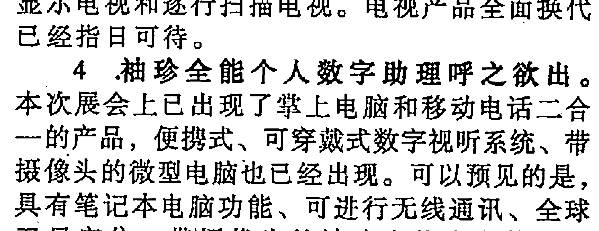

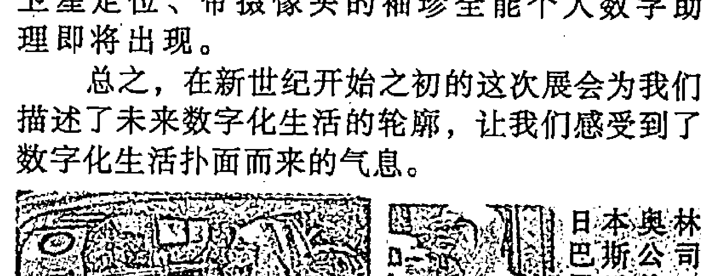


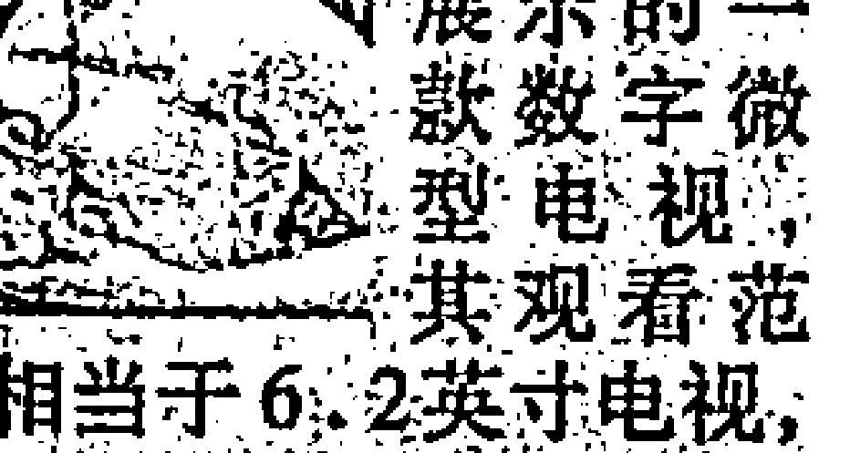


## 信息高速公路大塌方

### ——中美海底光缆阻断事件始末

□江苏 飘城大玩童

### 垃圾里来？

美国环境保护团体“硅谷防止有毒物质联盟”发布的报告指出，PC的更新周期约为2年，美国50%的家庭拥有PC，1999年废弃的电脑多达1200万台，然而回收率却很低，1998年只有8%，该团体预计，未来4年内废弃电脑将增至3亿2000万台。而欧盟的电子产品废弃物也多达600万吨/年。

美国PC制造商在回收问题上并不积极，不仅对大型客户有一定的限制或根本不回收，对家庭用户也只有少数厂商提供废电池和墨盒回收。

与此同时，中国南方沿海地区的一些渔村和小县城新兴起一种低投入的高科技产业——翻新电脑配件，包括主板、内存、显卡、声卡、Modem等等。当地居民以3-5元/斤的价格收购这些配件，用原始的手掰、锥摇、锤砸等方式取下配件上的电子元件，然后交由某些不法厂商（CCTV曾对此做过专门报道）。在电脑制造技术日渐普及的今天，这些零件的妙用可想而知。

### 怎么办？

怎么办？对于一个普通CFAN来说，应该就是要学习扎实的DIY知识，多看权威媒体的专业报道，最后就是养成良好的消费习惯。有时候要坚信一分钱一分货的古训，相信品牌的力量，这可是经过多年呕心沥血铸就的，技嘉、华硕，一个名字就是一个公司最大的资产。

怎么办？更重要的是一个国家、一个产业、一个市场怎么办？“对金钱的贪婪是一切罪恶的根源”，这话同样适用于中国DIY市场——“对低价的贪婪是滋生一切垃圾的温床”。“适合于中国用户”、“性价比极高”、“面向低端市场”、“超低价格真诚奉献”……我们该考察这些文字背后的含义了！

最可怕的是，在网上采访中，记者吃惊地发现外国人仍然对中国有一种挥之不去的偏见，我们仍然在IT方面扮演着丑陋的中国人。“一流的在北美，二流的发日欧，三流的往亚太，实在不能用的给中国。”这是DIY市场众所周知的事实，但是知道某些外国人的解释吗？“中国人什么都能用，就像他们什么都能吃，比如任何人都不吃的东西……”！！！

还有，“我想去中国卖盗版光盘。”——据说这是2000年奥斯卡颁奖典礼上惟一次提到中国这个国家的一句话。当然是笑话。居然是笑话！

怎么办？一句话，DIYer当自强，CFAN当自强，国人当自强！中国，绝不做垃圾场！

2月9日上午，中国的网民们在上网后纷纷发现自己无法浏览国外站点，特别是北美网站更是无法连接。与此同时，各大网站和新闻媒体也纷纷接到大量的网民和企业打进来的热线电话，所反映的问题也只有一个：无法访问国外的网站。很快，这个问题就成了论坛和OICQ上的热点话题。临近上午下班时，有小道消息开始在网上流传：无法访问的具体原因是中美海底光缆断了。下午上班后不久，有关中美海底光缆发生阻断事件的报道终于正式出现。

### 出事了！千米海底大塌方！

本次中美海底光缆发生“阻断”的准确时间是2001年2月9日早上7时45分，具体位置在我国上海崇明海缆站以东375公里处的公海中，阻断点处的水深超过1000米。受其影响，亚洲许多国家的互联网电路和对美的长话业务出现了程度不等的断路和阻塞。

中国告急 由于中美海底光缆是承担中美间因特网数据交换的重要载体，在这条海底光缆上，光中国电信就有930兆的因特网互联电路包含在其中，中国联通和中国网通也有部分因特网互联电路包含其中。根据中国互联网络信息中心的最新数据，中国大陆的国际线路总容量仅仅2799兆，登录国际互联网站点本来就很有拥挤。在海缆阻断事件发生后，光中国电信一家就减少930兆的国际线路容量，信息高速公路上的堵车情况也就可以想象了。不幸之中的万幸是，由于中国电信的长话业务所使用的电路不在该海缆上，因此，该海缆的中断对中美之间的国际电话并没有产生影响。与此同时，从9号早上开始，中国台湾省“中华电信”公司的投诉电话就一直响个不停，该公司有近500万的用户上不了网！在台湾省内上网已成为日常生活必不可少的一部分，中断使上网一族就像少了耳朵，少了眼睛一样简直要发疯。雪上加霜的是，由于美国是台湾通向欧美国家连线的中继站，事件发生后，台湾除能与邻近地区的网络维持畅通外，其余几乎全部中断，成了一座“信息孤岛”。

东南亚告急 东南亚的新加坡、马来西亚等国，在这次事故中不单互联网线路受到影响，对美的长话业务也受到了影响。

日本告急 据人民日报驻日本的记者反映，在2月9日这天他死活也上不了中国网站。

香港特区告急 根据有关方面的报道，在这次海底阻断事件中，香港的互联网线路也在劫难逃，受到了不小的影响。

### 都是渔船惹的祸？

中美海底光缆是承担中美间因特网数据交换的重要载体，它是由世界上23个电信机构共同出资建造的。根据设计，中美电缆是属于电信网络，光缆总长度26000公里，有4对光纤，在中国大陆和美国大陆各设两个登陆站，形成环形，并以分支方式连接亚洲其他地区，设计容量为南北线各每秒80千兆比特。该电缆于1997年12月开工建设，其中的北线在1999年12月初全部建成，并于2000年1月19日正式投入使用，成为亚洲各国连通美国的主要电信线路。事件发生后，由于目前南线建设尚未完成，北线阻断后不能接替工作，这就使网民对北美地区网站的访问受到了严重的影响。

有关专家分析，根据以往经验，海缆发生阻断一般是在浅海从事捕捞或挖掘作业时，大型鱼网或挖掘设备将海缆割断导致的。中国海域内海缆被作业渔船破坏阻断的事件时有发生。最严重的是1999年发生过18起海缆阻断事件。尤其是1999年4月6日、7日，在离上海150公里的海域内，5根海缆全部被拉断。由于当时这些海缆大部分没有启用，所以没有引起广泛关注。目前在东海等海域活动着近2000艘“帆张网”渔船。这种渔船作业时将网抛下海，由2米长的锚刺锚在海底。由于技术原因，目前海缆埋得都不太深，中日海缆埋深1米，环球海缆埋深1.5米，中美海缆埋深1.5 - 2米。“帆张网”渔船锋利的锚刺很容易扎到海缆。也有人提出了不同的看法：有可能是鲸鱼将光缆咬断的，因为在80年代末就曾出现过深海光缆的聚乙烯绝缘体被鲨鱼咬坏造成供电故障的实例。不过有一点可以肯定，这次光缆事故肯定不是由于光缆本身老化等原因发生阻断的，因为一般海底光缆系统及其元器件的使用寿命都在25年以上，而这条光缆是1997年开始建设，去年1月才正式投入使用的。

### 抢救在行动！

中国电信在行动 事件发生后，中国电信立即与美方协商应急方案，紧急采取一切可能的措施，例如同国际卫星组织联系紧急租用国际卫星电路、同国际其他电信运营公司联系选择迂回路由等；当天下午中断的中美互联网连接就已经开始恢复，但不太稳定。上海电信也在当天临时增开了到北美地区的临时线路。但是这些措施所分流的业务量是有限的，因此在海缆阻断彻底修复前，国内网民访问北美网站将继续受到影响。

2月12日，中国电信至美国、日本共100余兆国际互联电路已经得到恢复。

2月13日，临时紧急调度增开的北京、上海至美国的250兆应急卫星电路投入使用。

2月16日，中国电信受到影响的930兆互联电路已有三分之一找到了“替补”，网络紧张状况有所缓解。

“海连”号在行动 按照中美海底国际维护分工的有关要求，这次事故发生在横滨维护区，应由横滨维护区负责维修。横滨维护区是一个海底光缆维护组织，共有十六家电信公司参加了这一组织，中国、日本、韩国各有一条海缆船轮流承担维修任务，这次事故发生时，正是日本船维护期。

在事故发生后，横滨维护区立即行动起来。10日中午，日本KCS国际海缆船公司派遣的海缆船KDD“海连”号做好了前期准备工作，从日本装载了工具前往上海。

14日上午8时30分，“海连”号抵达上海吴泾码头。

14日中午12时，“海连”号开始装载光缆。中英海底系统公司为“海连”号准备了两根长度分别为3.375公里和5公里的与中美海缆所用光缆完全一样的光缆，以及6套用于海缆修复的接头材料，整个装载工作于下午3时全部结束。

14日晚上9时，5名持有国际通用执照的日本光缆维修人员飞抵上海到达“海连”号，2名中国电信的代表也于下午上船，他们将对中美海缆的抢修进行监督。

2月15日上午6时，“海连”号从上海吴泾码头出发，驶往海缆阻断点进行紧急抢修。

16日凌晨，“海连”号抵达出事点。经探测仪对出事点附近海域的广泛搜索，于当天晚上查找到了海底光缆的阻断点。

16日晚上9点，在技术人员的指挥下，水下机器人到海底找到损坏的光缆，技术人员确定阻断点，接上由上海装运的新光缆。据透露，光缆接头是一项技术难度很高的专业工作，只有持有国际通用执照的技术人员才能进行操作。我国惟一从事海缆抢修的中英海底系统公司目前有持照光缆接头人员20人。

18日早晨，第一个头续接完毕。

19日早晨，第二个头续接完毕，并从19日早晨起，开始对维修后的海缆进行全面测试，先后进行的有：X光的探测和电器测试，并通过上海崇明、美国班顿两个登陆站以及沿线的登陆支站进行系统测试。测试结果表明，维修后的光缆全部指标达到设计要求。19日晚上7点05分，根据来自现场的消息，中美通信恢复正常。在经横滨维护区成员的认可后，中美海底光缆自接通、测试后即恢复开通。随后，对海底光缆进行了冲埋，冲埋深度1.1米。全部工程在2月22日完成，比原计划提前1天。

据了解，这次维修费用估计在500－600万元人民币左右，中国也要承担一部分，其他直接或间接的经济损失更是无法估计。

来自海底的警示 阻断事件发生后，中国台湾省“中华电信”公司首先表示将按照有关规定对其用户进行赔偿，即依照相关合约办理扣减月租费，以补偿客户因为断讯所受到的损失。2月14日，北京市嘉安律师事务所于国富律师撰写了题为《海缆阻断，用户索赔法理何在？》的文章，对本次事故中用户索赔的法律依据进行了探讨。2月16日，有消息称中国电信表示将不作赔偿，并列举了一些理由。

2月19日，于国富律师又撰写了题为《海缆事件一三驳中国电信不赔偿论》的文章进行了讨论。

2月20日凌晨，署名为“O.~”的黑客攻击了北京市电话局、北京移动、北京寻呼等40家网站。被黑的页面全部留下这样一句话：“这只是对电信部门迟迟未能修复电缆的一点小小的警告！”

在相应的网络故障的赔付尚无法可依的条件下，这次事故留给人们的，可能只能是一个警告，但这样的警告无疑是非常及时的。目前，利用因特网进行的远程教学、远程医疗、远程会议等都已经起步，而今后这些应用将更加普遍。随着互联网的进一步发展，它将会越来越深入地渗透到我们社会生活的每一个方方面面。如果因为网络故障造成信息中断，从而造成救险、手术等的信息受阻和关键信息的延迟，这势必会造成难以挽回的损失。在未来的信息社会中，网络的安全将关系到整个社会生活的正常运行，关系到整个社会的稳定和发展。如何采取切实可行的办法来保障网络安全，并建立有效的网络事故防范和应急措施，已是我们不能回避并亟待解决的一道难题。

事实上，由于因特网越来越广泛的应用，网络中断所造成的损失将会越来越严重，并更加难以控制。当人类在享受由于科技进步所带来的巨大便利的同时，人类也正面临着由于科技进步所带来的越来越严重的灾难的威胁。这是一个悖论，但人类必须解答。

## WPS2001：暴风雨所诞生的……

□本刊记者 李月鹃

2月19日，WPS2000荣获国家科技进步二等奖（一等奖空缺），这是通用软件获得的国家级最高荣誉；3月3日，金山发放了最后一个WPS2001公开测试版；4月，WPS2001正式版将面世。这是国内最大规模的一次软件测试活动，而主角又是在中国如此一“软”九鼎，我们不得不关心：WPS2001到底是不是把“绝世好剑”？用户如何看待WPS2001？WPS2001能掀起新的红色正版风暴吗？还有，金山如何直面“西方不败”——微软？带着疑问我们采访了一些WPS2001测试用户，一些WPS老用户，一些网友，以及业界相关人士，这里有铮言，有绮语，有帽子，有刀子，有激扬文字，也有泣血叮咛…… ——作者按

> 我一直是金山软件的爱国用户和坚定支持者！我从购买的《剑侠情缘2白金版》到目前为止购买的惟一正版游戏,本人从不玩游戏，为了支持我热爱的金山,我第一次破例!)中得知2001即将横空出世,我感到十分高兴！ ——WPS论坛 杨昕晔

> 我真想用OFFICE2K啊！我真想啊……可是我还在用WPS，因为我的“爱姬”是100！怎么跑得动！看到WPS2001 20M的身材我很开心，希望她能“智慧”与“身材”并重，让老机器不再是时代的弃儿 ——扬州 韦大人

> 国外已经做过测试，微软也承认WORD的功能用户仅仅用了5%，所以强大不一定就是好，何况强大带来上K的¥就……所以我一定会选WPS，但是前提是：它必须满足我的基本工作需求！还有，稳定第一！ ——北京 范春立

> 其实什么“特色”、“强大”啦都是废话！关键是用户眼前要做的一件事情谁能完成！记得我当初毫不犹豫地把WORD大哥请出硬盘的原因就是：老板要的文档要带格子的稿纸显示，就这么一个小CASE让我选了WPS！以后也是一样，无论黑猫还是白猫，能让我等小民完成老板的活就是好猫！当然，如果WPS没WORD能干我也不会客气的，对不起了求大侠！ ——深圳 屠信荣

> 我想用微软，但是得D版；要是不D版，没钱买Z版；非要买Z版，只能买金山。原来是：微软打D版，逼我上金山！ ——济南 梁山109条好汉

> 我的客户是老外，老外不用WPS！老外给我WORD文件打不开，说什么也说不回钱来啊。其实挺喜欢金山的，还是老盖狠，搞出一个自己的格式，不兼容就是个死…… ——北海 岳均

> 我在使馆工作，我们同时使用WPS和WORD，因为金山不支持微软的DOC，微软也不支持金山的WPS，国外文档来往就要用WORD,和一些国营与政府部门来往就要用WPS。我觉得WPS做的工作不错，政府和行业用,和他们打交道就要用WPS,以微软之道还治微软其身。 ——北京 Sherrly Wong

> WPS公文版是个好事，更切合实际需要。模板也是一个可以战胜微软的法宝，微软模板虽然多，但不适合国情，还得自己调整，作为中国人的金山就可以在这里下功夫了。其实很多单位甚至国家部门都有自己固定的单据，金山为什么不把这些做进去呢？甚至应该帮这些单位做，这样WPS就深深地扎进中国的土壤里了。 ——北京 领导冒号

> 不要打功能强大牌了，打不过微软帝国的程序员兵团！不要打技术卓越牌了，老百姓根本看不懂！要打就打再菜的用户一眼能看出自己好处的牌！比如图文混排核心我就感觉不出来！但是模板和向导就大有文章可做，WPS2001做得相当不错，写检查、申请留学、买房合同、合作协议、入党入团、病历等，微软大爷永远不会做这些！但还不足给微软致命一击！再给点敬业精神吧，金山，光拼C++把毛累开叉了都没用！ ——沈阳 老雕

> WPS我一定会买的，Y？LOVE一个东东需要理由吗？ ——北京 至尊宝一对

> 我会推荐朋友买WPS,自己用WORD,就像我推荐别人买AMD,我用Intel。支持归支持，图个爱国！老大归老大，图个踏实！ ——海口 李剪烛

> 看到WPS2001的模板我真是眼前一亮！连婚束、邀请、讣告都有！COOL！实用！强烈建议加入背景图案模板就更酷！ ——唐山 王众

> 向（微）软意不适，驱猫登金山。WPS无限好，只是近黄昏。呜-呀！既生X,何生 ——网友 百日醉

> 可以说WPS已经赶上了WORD，去掉了那些华而不实的东东，但在EXCEL、PowerPoint上还有一段距离。本着术业有专工+“够用”+性价比原则，我毫不犹豫地选择WPS！ ——杭州 敏敏

> 说WPS便宜毫无意义，因为有一个不可否认的大前提：盗版！这东东在，性价比就是空话，结果是——谁的东西好谁赢！这就把几百万盘子的金山和几百亿盘子的微软放在一杆秤上了，唉，“天将降大任于斯.COM”！倒霉的金山！ ——柳州 胡三刀

> 我想问大家一个问题，国内用WPS多还是WORD多？大多数人会选后者。为了爱国的激情你会选择谁？恐怕又有不少人会选前者！可是爱国能成为我们选择软件的理由吗？我很怀疑。不可否认WPS是国产软件中的精品，然而如果把它拿到国际上去呢？想一想别人会用什么样的眼光来选择？WPS的优势在哪里？我们不得不好好想想。随着国内用户的配置越来越高，低资源占用的优势还在不在？还有盗版的横行，Windows2001+Office2001的冲击，WPS还有多少资本？一切的一切都是值得人们回味的。在此无须多说，我只想说一句：WPS good luck！ ——WPS论坛 superzch

> Office功能多多，身形臃肿；WPS简洁适用，形体苗条。一个如虎妞，一位似西施，各位啊，您爱谁呢？ ——WPS论坛 tove

> 金山，金山，无论人家说什么，我只信一句：只有偏执狂才能生存。Intel存在，微软存在，存在就是成功！试看批评WPS的是什么人？自己都不成功，何来资格说WPS？！我认为只有两种人才有资格说WPS不好：一、做得比WPS更好的人；二、真正掏自己的钱买WPS正版的用户！无论如何，金山在字处理领域是无可置疑的中国第一！“我干故我在”！不是“我骂故我在”！WPS就是实干家干出来的！D着金山的版骂金山，D着微软的版骂微软，谁还敢做金山、微软啊！可是又偏偏最想中国多几个金山、微软！难道金山、微软真是从唾沫星子里面蹦出来的吗？！ ——网友 八卦鸟

> 中国有上千万WPS用户，为什么金山开发一个软件还要求先生卖房子凑钱？在赞叹求先生不为私利、顾全大局的同时，难道没有反思一些东西吗？ ——WPS论坛 askyou

> WPS的核心非常优秀，然而技术的优势只有让用户认同才能体现出市场的认同优势。比如图片、表格WPS是分层技术，定位非常准确，然而有利必有弊，分层对象不会和文字同时移动，需要分别定位。这让用惯了WORD的人很不满，他们忘了自己当初是花了多少时间才学会WORD蹩脚的定位的。先入为主+外来的和尚好念经，这不能不说是微软的幸运，金山的悲哀。 ——王昉 软件撰稿人

> WPS2001让我大吃一惊，它比我想象的要好得多。我原来认为WPS是一个策略性后退的产品，仅仅是一个象征，一个品牌，是政府支持的源泉，金山早晚要淡出WPS产品线。2001年进军海外和产品线扩张了一倍似乎就是明证，然而WPS2001真的让我震撼，这是一个很用心的产品。似乎金山已经在公司经营上又上了一个大台阶。 ——朱仰仑 IT评论家

> 中国软件要走向国际市场，中国要科技强国，中国要摘掉盗版大国这个偏见的帽子，必须大力实施正版化和国产化，这个就是金山辉煌的明天。几千元的OFFICE代价太大，从这个角度来讲，WPS完全可以取代OFFICE，WPS也不显得幼稚了，因为我们的操作系统、CPU更幼稚。不过，微软XP和.NET也胜负未可期，一旦成功，软件免费按上网时间算账比D版更霸道！金山能否分得一杯羹，仍然是一个上帝才知道的谜。 ——毒龙 自由撰稿人

> 很多用户说WORD怎么好，WPS不能做到；实际上WPS可以做到；反之很多用户夸金山的某项功能WORD没有，通过几个步骤之后WORD也能做到。其实两个都是很伟大的软件。感觉WPS做得越久，越有一种自豪感。——金山技术支持人员

感觉WPS越来越像微软，现在微软都不理金山了，懒得管。因为XP和.NET战略到了一个微妙的关节，MS找到了一个更大的‘金山’。反之观WPS一味穷追，战略雷声大雨点小，真不愧是‘雷总’的部下，让人担心。最后不得不指出的是，来自低价的MS WORKS、LOTUS OFFICE1-2-3和国内‘办公之星’的威胁，低端市场也有七十二家房客啊。——马可温 IT评论人

## 硅谷人说CeBIT是‘欧洲的COMDEX’，而德国人一直认为COMDEX是美国的CeBIT。

23日上午记者一行乘车奔赴汉诺威，一路上本地领队兼翻译黄先生介绍了这次CeBIT展览的大致情况。本届展会主题为‘掌握未来的精神’，是有史以来规模最盛大的信息技术展，共吸引了8106家参展厂商，其中来自亚太地区的商家为846家，展览总面积超过422000平米，厂商在26座不同的展览厅内进行展示。

一小时后，当看到高达六层的立体停车场及其中数以千计的轿车时，被告之已经到达展览区。在这之后的几个小时内，同行所有人的双眼、双耳、手中的数码相机和背包中的笔记本电脑被无所不在的各式信息所填充，这是IT业的奥运会，这里是比特的狂欢节。

CeBIT展会的场景分类独具匠心，总体分为信息技术，通讯、办公自动化、软件解决方案和服务、银行技术等几类，不难看出这种按照使用功能分类的方法打破了单一产品类别的界限，突出的是产品实际应用而并非产品本身。身处在展会现场丝毫没有感到自己在参观计算机展览，看到和听到的更多是今后我们的生活将是如何景象。

Mobile(可移动)一词在展会上的曝光频度堪称第一，各式各样的宣传单上，金发碧眼产品形象小姐的T恤衫背后，甚至拿来做道具的方程式赛车上历历在目。移动家族成员掌上电脑和手机是整个CeBIT上最耀眼的两颗明星。

虽然掌上电脑今年将因为美国经济降温，增长率只有40%至50%，但作为‘装在口袋中的国际互联网’，袖珍移动设备有着无可比拟的优越性，用户的需求短时期内是不会降温的。PDA龙头老大Palm公司推出了新型的Palm m105掌上电脑，更是信誓旦旦声称到2003年，要在欧洲销售出100万部这一系列掌上电脑。

我们不会忘记Pocket PC的，去年同样在CeBIT2000展会，软件巨头Microsoft和康柏、惠普、卡西欧等企业联手欲用WinCE和Pocket PC双剑合璧置Palm于死地而后快。今年卡西欧公司在CeBIT‘移动’电子指示牌2001大展上它们又推出了IT-70，IT-700，EG-80和EG-800 Pocket PC，这些掌上电脑都采用了高速处理器和32MB的RAM。而且所有机型都提供了可选的Multi Dimensional Space Rotation（MDSR，多维空间旋转），由于MDSR具有快速、安全等特点，使得它在终端移动设备的应用非常理想。IT系列还在显示屏的下面采用了一个宽敞的十字键Pad，这对于数字的输入操作非常理想。

惠普方面首席执行官卡莉奥纳（Carly Fiorina）在CeBIT研讨会上曾说：‘在我们中间，究竟有多少人真正花时间考虑过正在兴起的移动文化的实际需要？’该公司展示的平价掌上电脑Jornada系列似乎是菲奥里纳发言的最好注脚，低价、实用是Jornada系列一直自诩的优势。

德国厂商西门子觊觎掌上电脑市场已非一日，名为SX45的掌上电脑在展会中首次亮相，它是专门为企业设计的，基于Microsoft的Pocket PC 3.0平台，并包含嵌入的GPRS（常规数据无线服务系统General Packet Radio Service）技术，有一个彩色的触摸屏，它的插槽也可以用来安装一个视频相机或者一个MP3播放器。在演示中西门子技术人员示范了SX45拍摄单张快照和拍一系列视频，然后直接通过互联网发送。

在看惯了五花八门的彩色触摸屏，听够了英文的、德文的、能理解的、不明白的各种讲解后，其实我和大部分读者一样深深怀疑掌上电脑的实用性；但在中午时分我改变了自己的观念，因为当我抱着IBM笔记本电脑到大会指定资料下载处时，发现除了自己每个人掏出的都是掌上电脑——记者

虽然全球超短带宽的3G网络尚未建成，各厂商的第三代手机也都在展会中纷纷抛头露面，诸如带有游戏的电话，它将允许用户使用无线通讯与朋友玩游戏，Tnum展示的设想的设备被称为‘完全多媒体产品’，它把PDA的功能和电话的功能相结合，并且还将加入数字视频相机，一个蓝牙耳机，以及一个用于数据输入的可折叠键盘。当然所有3G设备都是被封装在玻璃柜中的。移动通讯真正的主角是第三代新款手机，因为它们能和目前的无线服务网络完美地结合。

摩托罗拉一直是手机制造业的领头羊。在这次大展上，该公司推出一系列的改进型GSM手机，引起极大的反响。另一个手机巨头诺基亚也推出了几款新型手机，其中也有支持GPRS功能的6310，它是6210的后继产品，功能也有所更新和改进，同时它还支持蓝牙技术。电池的电量也比6210大大增加，待机时间长达20天！同样爱立信、西门子、阿尔卡特、三星也都展示了支持GPRS功能的第二代手机新品。

另外所有的顶级通讯厂商都对手机和PDA的结合产品表现出了浓厚的兴趣，比如爱立信推出的R380、诺基亚的9210等等。而目前

## 眼观CeBIT2001

本刊记者 陈丁里

CeBIT大展好像一场无止境的马拉松比赛，全球IT厂商都希望在此胜出，因为他们知道把握住CeBIT就是把握住未来……

软件的匮乏也是主要问题，微软公司将推出新的操作系统Stinger，可以更好地使手机实现多媒体功能。这个软件就是Microsoft Pocket PC操作系统的简装版，功能基本类似。

CeBIT展览中应用蓝牙无线技术的产品是另一亮点，德国一家Lesswire公司，展示蓝牙传输的讯号收发站；惠普展示的Deskjet 995C是该公司的第一款采用了蓝牙技术的打印机；瑞典的Anoto公司则展示蓝牙笔，可将手写信件以无线传送到身边的计算机，再以电子邮件发出。但不难看出，规格不统一和单价成本过高是蓝牙产品推广的最大障碍，看来蓝牙成为畅销产品仍尚需时日。

经过近6小时的参观，记者随着人潮步出展馆，而心中正在计划来日的展会行程，的确对一个IT人来说，在CeBIT的每一天都是全新的。

当我们一行搭乘航班返回时看到《欧洲时报》中介绍：“CeBIT大展已于28日闭幕，参观者达83万人，估计这次展会将产生约60亿美元的市场价值，移动商务技术、“蓝牙”技术的应用、第三代移动通信备受注……”心中不禁想起展会中凤毛麟角般的国内企业，路漫漫其修远，吾将上下而求索。
——记者 阚

## MP3 明天我能否依然爱你

□江苏 李安云

自从MP3诞生之后，音乐文件的身体一下子就变得苗条起来，从而使得音乐爱好者在现有的网络条件下通过网络迅速传播音乐作品的梦想得以实现，受到了广大网民和音乐爱好者的热烈欢迎，迅速成为网络上的新宠。而P2P技术的出现，更使网上的音乐共享如虎添翼，说MP3是集万千网民的宠爱于一身丝毫都不为过。

然而，随着MP3的迅速窜红，附着在MP3身上的版权问题也渐渐地浮出了水面。面对来自MP3的日益明朗化的潜在威胁，各大唱片公司再也坐不住了，它们纷纷拿起法律武器来保卫自己的现实利益，希望将这种潜在威胁扼杀在摇篮中。在这场看不见硝烟的战争中，美国唱片业协会（RIAA）充当了先锋，它先后向MP3.com和Napster这两个最有名气的MP3下载网站发难。

## Napster 冲击波

1999年5月美国东北大学学生肖恩·范宁中途辍学，编写了Napster音乐软件，和伙伴辛·帕克一起注册了网络公司Napster Inc.。他们热爱音乐，在这种热爱之后，他们想的是运用网络技术来克服当时网络音乐共享中遇到的障碍，让音乐在世界上自由传播。

肖恩设计的这组程序推出后，一切比肖恩当初想象的结果还要好：一旦乐迷们知道Napster的存在将使他们毫不费力地得到自己喜欢的歌曲时，他们愿意和远在世界另一个角落的不知名的人一起分享喜悦，这就是知音的力量。于是，Napster的用户数量呈几何级数增长趋势，到2001年初，这个数字达到了惊人的6500万，这不仅令肖恩“快乐得几乎晕倒”，也让众多同行和世界乐迷们大跌眼镜。

面对Napster所取得的巨大成功，唱片业开始坐不住了：1999年12月，世界五大知名唱片公司索尼、环球、百代、华纳和BMG授权唱片业协会(RIAA)状告Napster侵犯版权，要求旧金山法院发布关闭Napster的禁令。

美国时间3月6日，为避免冗长的法律诉讼过程让正版音乐的版权拥有者的权益再受侵害，美国北加利福尼亚联邦地方法院对Napster下达了暂行处理命令。暂行处理命令共有11项条款，主要目的就是要求Napster公司停止提供免费交换侵犯他人版权的音乐文件服务，并即刻生效。根据这个暂行处理命令的要求，Napster公司必须在收到侵犯版权乐曲的目录文件后，在3个营业日之内将侵权乐曲的索引删除，这样这些乐曲就无法被搜索，用户也就无法下载它。

虽然这一处理命令几乎就是要了Napster的命，但是比起该法院上个月签署的法令来说，这一法令还是让Napster公司看到了一线生机。在上个月，帕特尔法官曾经签署法令，要求Napster公司停止一切音乐文件的“复制、上传、下载、传播和分发行为”。Napster公司因此向美国联邦第九巡回上诉法院提出上诉。上诉法院的裁决是，这项禁令应该仅限于那些有版权的作品，于是该法院依照这一裁决修改了自己的法令。

3月9日，RIAA召开会议，综合了各家唱片公司的曲目名单，共13.5万首(这个数字包括按各种目录编排可能设计的曲目名称，因而实际上只有2.5万首左右不同的歌曲)。按照禁令，Napster必须在接到名单后3个工作日内彻底清除这些歌曲。停止侵害版权。接到曲目名单后，Napster在关闭版权歌曲问题上采取了合作的态度，至此，Napster命悬一线。

在此之前，在业界影响巨大的另一提供MP3下载的巨头也已在版权官司中败下阵来，被美国联邦政府法官判决向世界上最大唱片公司——环球音乐公司(Universal Music Group)赔款5340万美元。

当MP3.com和Napster被唱片业摆平之后，MP3一下子就面临着严重的生存危机：一时间，不少网站纷纷视MP3为瘟神——为了避免招来官司和麻烦，将它们通通地从自己的网站上删除了。在此情形之下，广大的音乐爱好者不禁有些迷茫了，他们的心中开始有了一个巨大的问号：MP3，明天我能否仍然爱你？

## MP3 生存之道

尽管在目前MP3与版权产生了激烈的冲突，但两者并非是互不相容的天敌，如果所采取的方法适当，这两者应该是能够互利互惠、共存共容的。就像Napster的形式来说，唱片行业可以将受专利保护的产品在资源有偿分享的概念下授权给网络经营者使用，通过网站向下载这些版权音乐文件的消费者收取相应的费用。由于网络市场的巨大，再加上不再需要唱片的压制包装和流通成本，售价就可降低到令人吃惊的程度，尽管是“薄利多销”，但赚的钱可能比在实体市场上所能赚到的还要多。而音乐爱好者也会从中得到实惠：也许现在我们用来买一张CD的价钱就足够我们支付在网上下载音乐几年的费用了，从而实现了网站、音乐人、消费者的三赢局面。

现在，唱片界的不少有识之士已意识到了这一点：德国的传媒巨头贝塔斯曼去年就退出了反Napster联盟，率先与其达成了合作协议；今年1月2日，德国的独立音乐公司Edel也同Napster建立了网上分销伙伴关系，同意将公司旗下的艺术家的作品放在后者的网站上用于下载。目前这种共赢的格局已略具雏形。

## 国内的形势

在Napster输掉官司之后，中国音乐版权协会也采取了相应的措施来保护国产音乐的网上版权，该协会的一名负责人通过媒体发出警告：大陆音乐网站必须立即停止侵权行为，否则将面临与MP3.com和Napster类似的官司。

然而出人意料的是，在此之后，虽然不少提供网上音乐下载的网站纷纷将MP3文件从自己的网站上删掉了，但大陆的MP3网上音乐并没有就此萎缩，反而出现了进一步繁荣的迹象。

3月16日，中国著名的网络三剑客之一的网易公司与台湾专业音乐网站飞行网（www.music.com.tw）在京宣布结成战略合作伙伴关系，并引进深受乐迷和网友喜爱的P2P音乐共享软件“Kuro”，建立跨越两岸三地的音乐社区。Kuro是飞行网所开发的功能类似于Napster的P2P音乐交换软件，目前已经拥有25万台湾用户，预计将在亚太区达到100余万用户。网易COO陈素贞表示，Kuro软件的使用将是收费的，但网易的注册用户将拥有三个月的免费期。

而在台湾享有盛名的音乐搜索客——ezPeer目前也已正式进入中国大陆市场，并已在大陆建立了相应的网站（http://www.ezpeer.com.cn/）。ezPeer是一个类似于Napster的国产免费共享软件，该软件在融合了OICQ、Winamp、网络蚂蚁、搜索引擎的基础上加入了网上邻居的功能，使你不必通过服务器就可以直接享用到对方电脑上的内容。它除了能在互联网上搜寻你喜爱的歌曲，还能到所有上线的使用者计算机中寻找MP3音乐。由于采用最新P2P网络技术，不只是在网站，更能帮你找到个人计算机中所合法共享的多媒体内容，同时保障你的隐私。此外还强化了传输及其他在线使用的功能。例如使用者之间的音乐，文档可以高速互相下载，就是在互联网环境不佳的时候，使用者之间仍可以进行断点续传。

与MP3.com不同，Kuro与ezPeer并不直接提供MP3音乐文件的下载，而只是为用户交换MP3音乐文件提供一个网络平台。

MP3作为一项适应时代要求的全新技术，必将在未来取代唱片在音乐业中的地位，但这一切的前提是必须首先解决好版权问题。对于音乐爱好者来说，大家对此应该有一个清醒的认识。人们常说，爱就意味着付出：那当我们在对MP3说“明天依然爱你的时候”，我们也必须有所付出。

只有有所付出的爱，才是真正的爱。当我们在欣赏音乐时，只有支付了版权音乐的费用后，我们才能感到悠闲、舒心，享受到音乐的真正乐趣。

小资料

MP3：是利用MPEG Audio layer 3的技术，将声音用1:10甚至1:12的压缩率压缩，变成容量较小的音乐文件。一张70分钟的CD，经过压缩制作成MP3格式的音乐，可以存放70多首歌，且人耳察觉不出音质的损失。

ezPeer：独创的特色抓歌——S P A (Speed: 快速搜寻, Preview: 试听, Automation: 自动断线续传) 让你可以一边下载一边试听，看是不是自己所要的歌，同时轻松下载，不会错载任何喜爱的音乐。同时它还有发烧金曲分类排行榜，每周自动进行下载统计，让老歌劲歌自动呈现在你面前!

Napster：是由Napster公司的肖恩·范宁开发的一款音乐共享软件。通过该软件，可以搜索到其他用户计算机里共享的MP3文件，并从那里免费获得该文件，当然也可以将自己拥有的MP3文件提供给其他用户。

P2P：英文全称是“Peer to Peer”，其中Peer是“同等的人，伙伴”的意思。国内的媒体一般将P2P翻译成“端对端”或者“点对点”。长久以来，人们习惯的互联网是以服务器为中心，人们向服务器发送请求，然后浏览服务器回应的信息。而P2P将以用户为中心，所有的用户都是平等的伙伴。相隔万里的用户可以通过P2P共享硬盘上的文件、目录乃至整个硬盘。

## QQ 启示录

广东 临风

QQ，腾讯 Open ICQ(网络寻呼机)的昵称，伴随着网络的发展来到每个电脑网络用户的身边，每天传递着无法估量的情感和信息。

在网络高速发展的时代，竞争的残酷是空前的，但在网络寻呼服务业，上个世纪 QQ 无疑是笑到最后的，而在 2001 年推出移动 QQ 收费服务项目之后，腾讯笑得更甜。但如果说过去是时势造就英雄的话，那么明天就等待着英雄去造就新辉煌了。

### 1. 网络时尚文化的产物

ICQ (网络传呼) 的兴起是近几年的事情，刚开始不过是个网络小工具，在 Internet 刚在中国起步时，我每天用信箱、上传、下载等工具的时间都远远多于 ICQ。不过如今我自己的电脑 24 小时停留在网络上，我也 24 小时挂着 QQ，和朋友们保持各种联系。

在网络传呼兴起之际，腾讯 Open ICQ (也就是现在的 QQ) 并不是我唯一的选择。当时盛行多种 ICQ 软件，包括国外的某些著名软件，不过我英文很差，也就是听别人说 QQ 的功能也不错，所以就一直用到现在。偶尔升一下级，然后无意地发现原来 QQ 已经囊括了如此众多的服务内容，并成为中国网络寻呼业的终极胜利者。

ICQ 的兴起应该说完全占据了天时地利人和，Internet 网络开始普及，常规移动电信器材还昂贵无比，学生进入电脑普及时代，于是在校园，一股新信息传送方式就热门起来，并迅速地演变成一种时尚。

和其他 ICQ 服务软件不同，在很多人眼里只是个小网络工具的 Open ICQ 从一开始就显示了涉足商业化的姿态。在免费的共同起跑线上，Open ICQ 以不断完善和稳定的服务获得了用户的肯定，而其自身所塑造的 Q (广东方言可以解释为得意，包含了青春、出众、好玩、调皮等意义) 形象也深得青少年喜欢。一个个性化的企鹅形象同样深入人心，而最终使得 QQ 的影响日趋广大，并最终成为中文 ICQ 业的胜利者。

而在不经意的时候，QQ 文化也已经在一代青少年生活中滋长，QQ 传呼、QQ 聊天室等拓展的服务也带给用户更多的空间。我经常看到网友说——去 QQ 谈，或者 QQ 我，不过对于相对老了些的我来说，我从来没有去过 QQ 聊天室，但已经离不开 QQ 了。

### 2. 移动 QQ 的出击

QQ 自 2001 年开始推出移动 QQ 收费项目，其商业行为马上引起业界关注，有人视之为成功，有人视之为背叛，但无论如何，这是一次突破性的商业行为，同时带给网络发展更多的启示。

无疑，移动 QQ 的确取得了初步成功，网络发展到了 2000 年就开始出现严重分歧，徘徊于家庭、商用领域的网络商困惑于目前的无序状况，全球网络投资从高潮迅速走向低潮。而对于中国传统网络服务商来说，必须做的就是告诉大家一——我在赚钱。

## 蓝牙：让世界心动的新技术

江苏 李安云

在现代高科技飞速发展的今天，人类的生活每时每刻都在发生着全新的、革命性的变化。伴随着这些变化，涌现出了很多新技术、新词汇和新思想。这些今天听起来还有些耳生的新名词和新技术，将会在不久的将来逐步走进并改变我们的生活。

近一段时间，您可能会经常听到人们在谈论着一个怪怪的新名词——“蓝牙”(Bluetooth)。这个听起来似乎比较神秘的名字在最近几次的国际国内电子和电脑类的大展中出尽了风头，并在 2000 年被美国《网络计算》杂志评为“十年来十大热门新技术”之一，让全世界的人为之心动。目前，经过最近几年的不断发展，蓝牙技术已经越来越接近我们的生活。业内人士预测，继互联网热、第三代移动通信热之后，蓝牙技术热将会席卷全球。

### 名称的由来

说起蓝牙这个有趣的名字的由来，现在还真是众说纷纭，有着多种不同的解释版本。目前比较流行的说法有两种。其中的一种是，狼的牙齿虽然参差不齐，但却能紧紧地啮合在一起，而蓝牙这种技术就像狼牙一样，同样会让耳机、笔记本电脑、冰箱等毫不相关的产品紧密地结合在一起。由于狼牙在月光下会发出蓝光，“蓝牙”由此得名。

另一种版本的解释比较权威：蓝牙是丹麦国王 Viking(940-981 年)的“绰号”，因为他爱吃蓝莓，牙齿被染蓝，因此而得了“蓝牙”这一绰号。他将当时的瑞典、芬兰与丹麦统一了起来。与野蛮的武力相比，他更多的是依靠沟通能力，使丹麦归于统一。用他的名字来命名这种新的技术标准，含有这种新技术能够将四分五裂的局面通过方便的沟通统一起来的意思。“Bluetooth”直译为“蓝牙”，也有些人希望在字面上显得文雅一些而将其译成了“蓝芽”。

### 蓝牙的起源

1994 年，爱立信移动通讯公司成立了一个专项的调研小组，对移动电话及其附件进行低能耗、低费用的无线连接的可能性进行了研究。

1997 年，爱立信与其他的生产商联系并激发了他们对该项技术的浓厚兴趣。他们的理由非常简单：对于一个成功的、真正有用的系统而言，大多数的无线设备必须使用统一的无线连接技术。

1998 年 2 月，五个跨国大公司，包括：爱立信、诺基亚、国际商用机器公司 (IBM)、东芝及英特尔 (Intel) 组成了一个特殊兴趣小组，也就是 Special Interest Group (SIG)。SIG 包含了商业领域的最佳组合：两个最大的移动通讯公司，两个最大的手提电脑生产商，一个数字信号处理技术的领导者。他们的共同目标是建立一个全球性的小范围无线通讯技术，即我们所说的“蓝牙 (Bluetooth)”。

# 蓝牙技术简介

蓝牙技术是一种无线数据与语音通信的开放性全球规范，它以低成本的近距离无线连接为基础，为固定与移动设备通信环境建立一个特别连接。其程序写在一个9×9mm的芯片中。如果把蓝牙技术引入到移动电话和笔记本电脑中，就可以去掉移动电话与笔记本电脑之间的令人讨厌的连接电缆，而通过无线使其建立通信。打印机、PDA、传真机、键盘、游戏操纵杆以及所有其他的数字设备都可以成为蓝牙系统的一部分。除此之外，蓝牙无线技术还为已存在的数字网络和外设提供通用接口，以组建一个远离固定网络的个人特别连接设备群。

目前，蓝牙标准化集团Bluetooth SIG的成员企业数已达到2000家以上。除了原创的5家厂商之外，包括康柏（Compaq）、戴尔（Dell）、摩托罗拉（Motorola）、Qualcomm、BMW及卡西欧（Casio）等均已加入，所有厂商已达成免收权利金的协议，以推广此项技术。而我国亦至少有12家厂商、组织已加入Bluetooth国际联盟，同时国内也在1999年初成立国内的Bluetooth SIG，以促进技术引进、市场及技术资讯扩散、应用推广等工作。

# 蓝牙的应用

蓝牙技术的应用被认为非常广泛而且极具潜力，没有人能够确切地说出蓝牙到底可以有多少种应用，它的应用范围实在太广了，各种潜在应用的价值也各不相同。厂商们现在所能做的只是尽快让用户接受这种新技术。

一般来讲，蓝牙技术可以应用于无线设备（如PDA、手机、智能电话、无绳电话）、图像处理设备（照相机、打印机、扫描仪）、安全产品（智能卡、身份识别、票据管理、安全检查）、消费娱乐（耳机、MP3、游戏）、汽车产品（GPS、ABS、动力系统、安全气袋）、家用电器（电视机、电冰箱、电烤箱、微波炉、音响、录像机）、医疗健身、建筑、玩具等领域。

我们可以想象一下在蓝牙技术得到普遍应用后的未来生活。

首先，当我们搬入新居时，再也不必为如何布线而烦恼了，因为蓝牙技术的应用可以让你随心所欲地安排室内的家用电器。其次，当你回到家时，不必要找电视遥控器、空调遥控器、音响遥控器等，你的手机或钥匙就已经具备了这些控制功能。更为方便的是，当你开始新的一天的工作时，蓝牙技术可以让你在家中就可启动汽车，节省你在到车上后才发动汽车的时间，在快要到达工作地点时，就可以启动你的计算机、打印机，以便你一进入办公室就迅速进入工作状态……

# 蓝牙的不足之处

尽管蓝牙技术可以提供扩展商业无线空间的出色技术，但它也存在着许多先天的不足和技术上的缺陷。

- 首先，尽管蓝牙技术是一种可以随身携带的无线通讯连接技术，但是它不支持漫游功能，它在微网络或扩大网之间的切换必须断开与当前PAN的连接，这将使手提通话、数据同步传输和信息提取等要求自始至终稳定的短数据连接的传输中断。
- 其次，无线通讯的保密性仍然是一大难题，基于蓝牙技术的本质，这个问题更加明显。
- 第三，尽管蓝牙技术可以支持高能装置发送和接收100米内的信息，然而大多数手提装置都是低能种类，只能实现10米内的信息传送。蓝牙技术中，每个微网络的最大容量是8个主动装置（包括1个主控器和7个附属器），要合理利用蓝牙技术，就必须使用独立的微网络和宽大的扩大网。这对于那些大公司，特别是员工遍布数间办公室的公司来说很成问题。
- 第四，虽然蓝牙采用的无线频段是目前各国大多不占用的频段，但是这些频道在有些国家如法国等是由军队占用的，因此也造成了在全世界普及的一个障碍。
- 最后，价格将会是蓝牙所面临的最主要问题。由于该项技术的综合成本很高，而导致一些嵌入蓝牙技术模块设备的成本非常高。在进入大众市场后，也许要面临销售困境。

# 蓝牙的未来

目前蓝牙技术所处的阶段是将具体的规范通过部件设计转化成消费产品投向市场的过程，这一过程是中性的，且十分耗时。虽然目前蓝牙技术的成熟度只有芯片，但这只是一个暂时现象，蓝牙技术有着非常美好的发展前景。

根据IDC的最新预测，到2004年，蓝牙技术将广泛应用于手机、笔记本电脑、智能手提设备中，预计美国将有1.018亿台、世界将有4.489亿台设备使用这种技术。随着技术的进步，未来的蓝牙技术更会渗入到诸如打印机、扫描仪、数码相机等硬件设备之中。

IDC还预测，至2004年，世界19%的数码相机会嵌入蓝牙技术，智能电话将成为最早采用蓝牙技术的设备。

总之，蓝牙是一项让世界为之心动并能改善人类生活的新技术，它在未来给我们带来的惊喜将会超出我们目前所具有的想象能力。

# 可用性实验室：软件研发新手段

■北京 渡渡鸟

在电脑上看影片，你用的是什么软件呢？用户在面临众多的选择时，金山公司携其最新开发的《金山影霸》产品加入到影音播放软件的激烈市场竞争中。

为了保证产品的质量，就在前不久，金山公司可用性实验室悄然成立，并为即将推出的影音播放软件——《金山影霸》进行了严格的测试。与之相对应的，是数千位踊跃报名的热情参与者，以及七天如火如荼的测试工作。

> “以前我用过《金山影霸》，听说是超级解霸前身的那个产品，现在听说《金山影霸》又要重新推出，还搞了这么高深的测试活动，觉得很好奇，非常想来试试。”这是一位正在等待参加金山可用性测试的朋友所说的话。

在现场测试时可以看到，尽管用户在进入实验室以及对软件进行操作时看似轻松平常，但通过设备彼此相连的另一间观察室内的人却显得紧张而忙碌。研究人员屏气凝神地观察着屏幕上用户的每一步操作，不断记录着掌握关键功能的使用耗时、碰壁试验的次数、发现功能的情况等测试指标。除去现场观测外，所有被测试用户的使用感受及相关数据，还将在市场研究公司内通过其他辅助的研究方法加以验证，进而对产品设计、改进起到指导作用。

> 一位测试完毕后的工程师如是说：“以前都知道软件开发过程中，研发人员要对软件进行测试，比如性能的检测等等，还没见过让用户来用，还对他进行观察的。我相信了解了大众的使用习惯后会提高产品的易用性。没准以后可用性测试真能成为软件业开发流程中的一部分。”

《金山影霸》的可用性测试一共进行了100人次，直接作用于产品改进的收获非常多。单从界面上就能看出改进后的效果（见图1与图2的前后对比）。

> 金山公司研发经理邹涛说：“举个例子来说，我们一开始为影霸设计的界面十分漂亮，甚至可以用华丽形容，但是通过可用性测试，我们发现有些按钮，用户要花很长的时间来找，用我们的专业术语来说就是“碰壁次数”比较多。碰壁次数越多，软件的可用性越差。于是，我们在界面设计上几易其稿，现在的界面设计被证明是最易于使用也是用户最满意的。除了“碰壁次数”之外，还有“学习时间”、“透明程度”等可以量化的指标，通过这些指标，我们就可以把用户感受这样一个模糊的概念，很清晰地诠释了出来，并具体应用到软件开发的过程中，真正把用户的感受放到了第一位。”

其实，国外的一些著名软件公司早在上个世纪70年代至80年代就已经意识到软件可用性的重要性，并开始这方面的研究和实践。比如蓝色巨人IBM早在1970年就引入了可用性测试，微软公司在1988年也开始进行可用性测试。大家所熟知的Windows95在推向市场前就经过了大量性的可用性测试，从而保证了该产品除了具有强大的功能和稳定的性能外，还具有很强的可用性，能够为多数人所接受；这也是Windows产品为什么能在短时间内风靡全球的原因之一。

同时，国外大型软件公司对每一款产品都必须经过严格全面、滴水不漏的可用性测试才能投入生产。从国外大公司身上，我们不难看出，对于软件公司来说，提高软件“可用性”是一项非常重要的基础工作，其重要性不亚于产品质量控制。

于是我们不难理解，为何如此专业的测试能很快得到众多用户的响应。对此，金山总裁雷军的解释是：“一来我们这种测试方法在国内软件公司中尚属首例，因此很多用户怀着很大的好奇心愿意参与其中。”这种态度在目前的软件业尤为可贵，特别是国际国内市场竞争激烈的前提下，更细致入微的前期工作有助于减轻后期维护的压力，也是与其他竞争产品拉开档次的成功所在。

据介绍，金山可用性实验室经历了很长一段时间的筹备，其间近日上市的WPS office一直是试行阶段的测试重点。而此次实验室的正式落成标志着金山公司在测量标准、硬件环境、研究分析上已逐渐走向成熟，也足以看出金山公司为服务用户真下了一番苦功。金山总裁雷军年初提出的“2001金山客户年”是一句掷地有声并不断兑现的诺言。预计测试并改进后的《金山影霸》将于六月底上市。在悬念的背后，我们期待真正优秀的播放软件问世。

# 一□□，吃透主板

整体感觉：错落有致

这是两块在某上引人注目的主板，它们都是绿颜色的ATX主板。作为当前主流的主板格式，它们符合PC99认证规定，即采用了彩色接口识别方式使得识别各种主板接口更加容易，深具人性化。别看表面上密密麻麻，但稍有留心便不难发现，每一块主板上都会有CPU插槽、电源插座、内存插槽、PCI插槽、AGP插槽、EIDE（硬盘、光驱）接口、软盘驱动器接口、DIP开关和主板芯片、CMOS电池、BIOS芯片，其他串行口、并行口、PS/2接口、USB接口、CPU风扇电源接口等各类外设接口，以及各种电容电阻等元器件。有的主板上还带有ISA插槽。但是随着技术的发展，主板上有些插槽已经不用了，因此不同型号的主板还是会存在一定差别的。我们先来看看这块Intel架构的主板：联想SX2E吧！它可是在美国COMDEX上出尽了风头的好东东。

外部接口，从左到右依次为：最左边部分是PS/2键盘和PS/2鼠标接口（分别为紫色和绿色）。2个USB接口（黑色长方形的）；中间部分上面大的是一个并口（用来连接打印机这样的设备，呈粉紫色），下边左面的是1个串口（可以用来连接串口鼠标、猫这样的设备，呈天蓝色），右边是1个VGA接口（连接VGA设备，呈天蓝色）；右边上面较大的1个是MIDI/JOYSTICK接头，可以连接一个游戏杆或一个MIDI设备，呈米黄色。下面三个孔分别是SPEAKER OUT/LINE IN/MICROPHONE IN。你问笔者这几个英文是什么意思，没办法，自己查字典吧。（这是声卡的输出/输入端口，SPEAKER OUT是音箱接口；LINE IN是音频信号线路输入；MICROPHONE IN是麦克风插口。）在选购主板时，一定要考虑一下接口的格式、数量。这可是关系到计算机功能扩展的重要方面。

这6个乳白色的条形插槽是PCI插槽，即周边元件扩展接口（Peripheral Component Interconnect）插槽。它是1993年Intel发布的一个局部总线标准。它可以连接许多不同种类的终端，可以是显卡，也可以是网卡或者SCSI卡，还有声卡，等等。由于它有ISA槽不能相比的优势，比如传输速度快，所以目前ISA槽已面临被“休”的境地了。在购买主板时，笔者提醒大家，一定要考虑好你要用的PCI插槽数量，如果你拿不准，那在同等情况下，考虑PCI插槽尽可能多的主板。此外，有的主板存在奇数槽和偶数槽工作异步问题，请大家在选购时当心。

这个位于主板边缘的小东西是目前只有ICH2芯片才有的新接口，所以只能是815E主板独有的东西。比AMR更长一些。它叫CNR接口，全称是“Communication and Networking Riser”即通信网络提升器。别看它个子小，功能可是不少呢。网络接口、V.90Modem接口，扩充的2个USB接口和4个声道的输出都要靠它。另外它还是Intel庞大的区域网络解决方案的一部分，通过与82562ET/EM/EH这三款外建芯片的组合，可以对一般消费用户/企业入门网络用户/家庭网络这三个不同层次的网络需求提出解决方案。但是有一点笔者想提醒用户注意的是，CNR与其临近PCI共享一个插槽的位置，所以当插入CNR卡时，与它相邻的PCI槽将不能使用，一定要注意呦！

这个棕色的东东是Intel公司的一种总线结构——当前最先进的图形系统接口AGP，它使系统和图形加速卡之间的数据传输获得比PCI总线更高的带宽。使用AGP显卡，重要的是如何把AGP驱动起来，让其发挥它的强大威力。这就需要安装必要的软件：首先你的操作系统必须是Win95 OSR2.1或以上；另一个重要方面，就是安装芯片组的AGP Drive；此外要做的就是安装显示卡的驱动程序和DirectX5.0。就目前来讲，现在要买显卡的读者，笔者认为并不需要将图形系统升级至AGP，尽管AGP在测试时给人带来了相当优秀的成绩，但在使用时，并没有发现它的使用效果比PCI总线出色很多。因为目前PCI总线上开发的软件是不能充分利用AGP特性的。所以，笔者认为：作为好东西，AGP是大趋势，但配置时要结合自己的实际情况。

这3条黑色细长插槽是内存插槽，一般来说，内存插槽主要有SIMM和DIMM两种，SIMM提供了32位的数据通道，在奔腾主板上SIMM必须成对使用，而DIMM则提供了64位的数据通道。所以它更适用于Pentium或更高的处理器，使用一片DIMM可以完成两片SIMM的任务，因此目前主板较为常见的内存插槽为DIMM插槽。数图中数目。其实不说你也应该知道它属于哪种类型的吧，插入内存要注意力度均匀，听到“咯哒”一声就“OK”了。此外，在添加内存时，一定要注意尽量避免不同规格的内存条混插。

这两部分是芯片组，它们是主板的核心组成部分，也是主板上比较大的两块芯片。选购主板时，它们可是主板档次的重要参照呦！按照位置通常将这两块芯片分为北桥芯片和南桥芯片（在主板上离CPU近的是北桥芯片，离CPU远的是南桥芯片），北桥芯片提供对CPU的类型和主频、内存的类型和容量、PCI/ISA/AGP插槽、ECC纠错等支持。南桥芯片则提供对键盘控制器（KBC）、实时时钟控制器（RTC）、USB、Ultra DMA/66（100）EIDE数据传输方式和高级电源管理（ACPI）等的支持。Intel芯片组目前主要是以BX和810芯片组，以及最新的815/815E芯片组为主。其中无论从数量性能还是技术上都要数440BX芯片组是最佳的。但是由于不支持最新的AGP4X和ATA100等最新的技术，440BX芯片组已经快被淘汰了，Intel810是集成芯片组，声卡显卡全部集成，多为办公用或想省点银子的用户所采用。Intel815/815E是Intel今年新推出的新品，各媒体的评测结果显示，它的性能非常不错，支持AGP4X、ATA100等诸多新标准和强大的网络功能，加上目前Intel和联想主板联手推广，相信年底或明年上半年应该会成为市场的主流产品。815E与815的根本差别在于使用了最新的ICH2芯片（I/O Controller Hub，输入输出控制中心）。你问笔者ICH2有什么作用，后面自有分晓。

这三个黑、白、蓝不同颜色的插槽是Floppy和IDE插槽，黑色的（短的）是用来连接软驱的，白、蓝（二者一样长）白色的是IDE2，蓝色的是IDE1。软驱插槽没什么介绍的，这里只说IDE吧。IDE（Integrated Drive Electronics）是所有采用ATA接口技术的硬盘的总称。因为IDE硬盘的制造成本很低，而且ATA规范所使用的并行数据线的价格也非常便宜，所以IDE硬盘非常适合家庭用户使用。目前主要有三种不同类型的IDE硬盘，它们分别是ATA/33，ATA/66和ATA/100。其中不同的数字代表的是以兆字节为单位的不同类型硬盘的峰值带宽。目前，没有哪一种ATA/100硬盘可以完全使用ATA/66硬盘66MBps的带宽，甚至能够充分利用ATA/33带宽的也非常少。所以笔者认为：在选购主板和硬盘时不要盲目追求最好，关键是够用就行。IDE接口的主要优势在于：优秀的性能价格比，应用广泛，支持性好。不足点在于：产品传输速度存在差距，数据线的有效传输距离较短，只能支持内部设备。目前硬盘的接口除了IDE外还有SCSI、IEEE1394和USB。大家在选购主板时，一定要考虑到上述硬盘的因素，它将直接影响到整机的性能。

这块电池叫CMOS电池，CMOS是一种存储BIOS使用的系统配置存储器。在主板上CMOS可分成两部分，一部分存储口令，另一部分存储启动信息。当计算机断电时，其信息需要由一个电池保持供电，否则信息会丢失。选购时，别忘了看看它是否是新的。

这个小集成块可是重要的东西，它就是传说中的BIOS（Basic Input/Output System）基本输入输出系统软件。作为被固化到计算机中的一组程序，BIOS能够为计算机提供最底层的、最直接的硬件控制。在系统的启动过程中，BIOS首先运行，进行系统自检。通过BIOS可以对硬盘、CPU及内存等进行参数设置。笔者建议一般用户不要自行改动BIOS的设置，当然像笔者我这样的“大牛”除外了，呵呵！同时，在选购主板时，要注意BIOS是否被人更换过，以防中了JS的计。

目前在桌上，Intel架构的主板基本如此，我们再来看看AMD架构的主板联想K7T吧。其实，早在586时代，主板的格式是基本相同的。只不过随着Intel和AMD两位大哥的争斗，现在的主板格式才分了家。在许多接口结构及芯片格式相同或相近的前提下，两种架构的主板也会尽显特色。下面我们就来看看AMD架构主板的不同之处吧。由于可以进行软超频，因此这款联想K7T主板也曾在桌上或“村”里被大家炒得沸沸扬扬。好了，和笔者一起看一眼吧。

这些是主板上的一些跳线设置(主板上很多戴蓝色帽子的家伙)，跳线主要有清除CMOS的跳线JCC、允许刷新BIOS的跳线JAV及启动键盘密码开机功能的跳线JKB等。

这就是笔者说的已经被SX2E取消的ISA(Industry Standard Architecture)插槽。是上面那个黑色长长的条，下面白色的就是它的替代者PCI。ISA的中文称为工业标准结构，是多年来计算机中一种重要的总线形式，用来连接计算机内部设备如声卡、视频卡等。(年头已久了!? 打笔者出生就已经存在了)。不过，采用ISA插槽的网卡和许多优秀的多动能拓展卡目前还是很有人缘的。笔者就珍藏有一块可扩内存的AWE32声卡，虽然它有半个菜板子那么大，但当年它值2400两银子呢!

这是这块主板的BIOS，怎么样看出来的吗？它与SX2E的不太一样吧。

这是两个跳线槽，它们可是好东西。我们知道总线速度乘以处理器的倍频相当于处理器的内部频率即处理器的速度，如果总线速度=100MHz，处理器的倍频=4，那么处理器的速度=100MHz x 4=400MHz，利用联想K7T主板上提供的这两个倍频的跳线槽（JP9和J19），可以对不锁频或者破解锁频的AMD处理器进行超频。

这个东东SX2E上没有，它叫AMR(Audio Modem Riser)即声音和调制解调器插卡，俗称软猫(它可没法跟笔者的爱猫相比)。使用AMR插卡就可以实现主板上的软件音频和软件Modem功能。具有AMR插槽的主板绝大多数是采用Intel810芯片组的主板。然而，非Intel芯片组主板也有支持AMR的，如VIA Apollo芯片组。一般说来，有AMR插槽的主板则没有AGP插槽，810主板差不多都是如此，而采用了VIA Apollo KT133芯片组的联想K7T主板上却既有AMR插槽，又设置有AGP插槽。但是一般的用户几乎很少用到AMR。不久以后是否被取消了也说不定。

这是频率发生器，它是一个调整芯片组频率的元件，它通过对晶振的引脚施加电压，来产生抖动的时钟信号，然后经过分频，输出可变的频率给芯片组和主板的其他部位，例如AGP、PCI、ISA、USB、Super(24MHz)、SDRAM等。

这部分在SX2E中没有说到，但确实对主板很重要。它就是供电系统.一台计算机，它里面的各种集成电路、功率管等，消耗的电源是非常可观的，因此必须有一个稳定的供电系统。"1"是滤波电容，是为了滤除布线过长所产生的干扰，容量越大，效果越好。但是大容量的电容的卷铂效应很明显，不容易滤除高频干扰信号，解决的办法是用多个比较小的电容。主板的CPU、AGP稳压电路是采用三极管或场效应管的开关稳压电路。所以我们经常能在主板上看到切了管帽的三极管/场效应管(图中"2"所示)，它们就是CPU/南桥/北桥的供电稳压系统的重要组成部分。而"3"是滤波线圈，其实是一个电感，它可以防止浪涌电压和电压畸变，加上磁心是为了增强电感的u(miu)值，可以用较少的线圈取得更好的效果。"4"是为了产生更准确的电压和随时监测电压的变化，要用上一块专用的芯片对三极管或场效应管组成的开关稳压进行控制，这块芯片还可以对电压进行采样，然后再改变和BIOS之间的控制端，在BIOS中显示出各种工作电压。此外如果你细心的话，你还会在主板上看到许多微小的三极管，它们的作用主要是降压。"5"是电源插座。在购买主板时，一定要重视主板对电源部分的设计，这是提供动力和超频性能的关键因素。

这一排小针头是键盘锁定接头（Key LK），把接头连接到机箱面板上的键盘锁定装置上，用于锁定键盘。每种主板有不同的连接方式，到时看看说明书插上就可以了。

你知道吗？目前市场上的主板芯片组的生产厂商主要有以下几个：

1. Intel
2. VIA(威胜)
3. AMD
4. SIS
5. ALi(阿里)
6. Micron
7. nVidia

它们各有特点，选购主板时请大家注意！

这是K7T主板上采用的芯片组，看看上面的字母，就知道是VIA(威盛)的产品。当今的芯片组市场两大阵营针锋相对，其中一方是老牌的主流芯片组生产商Intel，另一方则是以威盛为代表的兼容芯片组生产商。VIA的芯片组分两类，一是支援Intel的晶片组，另一则为支援AMD的晶片组。694X即Apollo Pro 133A是VIA著名的一款芯片组。联想K7T采用的是Apollo KT-133芯片组。此外，AMD自己也出芯片组。笔者认为：你在购买主板时，不妨看看VIA芯片组的产品，它对老的硬件格式（比如ISA卡）支持很好。

K7T的CPU插槽是SocketA架构，主要支持AMD的毒龙（Duron）和速龙（Athlon）处理器，由于AMD是Intel在处理器方面主要的竞争对手，所以他们采用的CPU插口也有很大区别。AMD的处理器主要采用的结构有SlotA、Super 7和SocketA。值得留意的是此插槽中间有一个蓝色的小点。这是一个热敏电阻，用来进行温度检测的，检测温度的探头有两种：一种集成在处理器之中，依靠BIOS的支持；另一种是外置的，就是刚才提到的。无论那一种，它们都是通过温度的改变来改变自身的电阻值，让温度检测电路探测到电阻的改变，从而改变温度系数。结合以往的情况，笔者再给你提个醒:由于AMD的CPU芯片对散热的要求要比Intel的CPU芯片高，因此在买板子时，一定要好好询问一下探热情况，检查一下热敏电阻器件，并一定要预先估算好安置CPU散热风扇的空间，以免因散热不良而导致频频死机。

## 声卡

“哑巴吃黄连，有苦说不出。”如果你的计算机变成了哑巴，会怎样呢？今天，烧包少爷就把他的计算机变成了哑巴。不说你也会猜到：好动的他这回又把声卡给拆了。虽然平日少爷胆小如鼠，可村里的人都知道他对机器有一种十足的拆卸狂。这回好了，少爷因为感冒，自己也哑巴了，他只能用文字和谁也看不懂的手语来表达他的心情和感受了。其实这次少爷解剖了三样东东，一个是自己的SB Live! 5.1声卡及专用面板Live! Drive IR；还有一个是表姐赵格格的SB PCI128D声卡。

我们先来看看赵格格的这块声卡吧，为了能偷着把它拆下来，少爷特地花私房钱给格格买了张《花样年华》的电影票，以作“调虎离山”之用。格格看完电影哭了，少爷看见格格也哭了。一个是被剧情所感动，一个是被即将到来的追打与责骂而做准备。好了，少爷在“暴风雨”到来之前，还是先给大家讲讲这块SB PCI128D声卡吧。

从上至下分别是Line-In、MIC-In、Line-Out1/数字输出、Line-Out2、Gameport/MIDIport接口。Line-In：线性输入接口，可以与录音机、VCD机、CD机、复读机等多种设备连接，将音频信号输入计算机。MIC-In：连接麦克风。Line-Out1/数字输出：线性输出1，连接有源音箱或耳机，提供前置音箱的音频信号。当连接一根专用连接线后，就可通过此接口输出数字音频信号，连接数字音箱。关于数字信号与数字音箱将在后面有专门介绍。Line-Out2：线性输出2，连接另一对有源音箱或四声道音箱的后置音频接口，提供环绕音箱的音频信号。Gameport/MIDIport：连接游戏柄或MIDI设备，如MIDI键盘、MIDI合成器。

各类接口：从左至右分别是TAD、CD-IN、AUX-IN接口。TAD：电话应答设备接口（Telephony Answer Device），一根四针的信号接口，可与支持此接口的Modem连接。第一根针是电话输入信号，第四根针是MIC输出信号。CD-IN：模拟CD音频输入，也是一根四针的信号接口，每一块声卡都提供的接口。通过一根四针的音频信号线与CD-ROM的CD音频接口相连，就能获得CD音频信号。第一根针是CD左声道信号，第四根针是CD右声道信号。AUX-IN：辅助音频输入接口，可与其他音频设备连接，如第二个CD-ROM或其他解压卡等设备。信号线分别与CD-In相同。

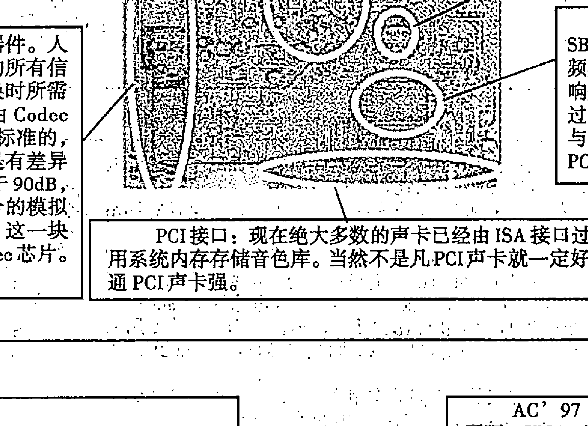

此处标有CT.4750字样，这表示此块板卡的工业型号。

Crystal: 晶振，提供声卡工作的基本时钟信号。它如同行进中的军乐队的鼓点，使得大家协调工作。

CT5880：声卡的核心处理芯片，如同计算机中的CPU。SB PCI128D使用的主芯片是CT5880，它是创新自己开发的音频处理芯片。它支持四声道播放、128复音、实时和声、混响数字引擎、软波表技术，使用系统内存储存音色库文件。通过它可以实现游戏中的3D音效支持，全双工IP电话。当然与EMU10K1这样的重量级芯片还是有明显差距，不过对于PC音频应用的各个方面来说基本够用了。

AC'97 Codec：每一块声卡都会包含的元器件。人耳听到的声音信号是模拟信号，计算机中存储的所有信号包括声音信号都是数字信号。这两种信号转换时所需要的数模转换、模数转换及编码解码过程就是由Codec完成的。现在声卡的Codec芯片都是符合AC'97标准的，不过即便这样，选择不同供货厂商的Codec仍是有差异的。AC'97标准只是保证了信噪比（SNR）大于90dB，而实际信噪比的好坏是与Codec和一组跟它配合的模拟电路有关的，包含电阻、电容、寄存器等元器件。这一块SB PCI128D声卡使用的是SIGMATEL公司的Codec芯片。周围的这些就是和它配合的模拟电路部分。

PCI接口：现在绝大多数的声卡已经由ISA接口过渡为使用PCI接口，由此带来的好处是带宽的增加，可利用系统内存储存音色库。当然不是凡PCI声卡就一定好过ISA声卡，当年的AWE64GOLD就比现在的任何一块普通PCI声卡强。

各类接口：从左至右分别是TAD、CD-IN、AUX-IN、CD-SPDIF接口。CD-IN：模拟CD音频输入，一根四针的信号接口，每一块声卡都提供的接口。通过一根四针的音频信号线与CD-ROM的CD音频接口相连，就能获得CD音频信号。CD-SPDIF：数字CD音频输入，一根两针的信号接口，现在越来越多的声卡开始支持这一数字接口，它与模拟的CD-IN相比，最大的好处是能够从CD-ROM获得干净的数字音频信号。因为机箱内部充满了风扇、光驱等设备所产生的高频干扰信号，模拟的CD-IN很容易变成接收杂波的天线，从而影响了CD的收听质量。CD-SPDIF传输的是数字音频信号，通过对信号整形和纠错算法，可以很方便地避免杂波的干扰。

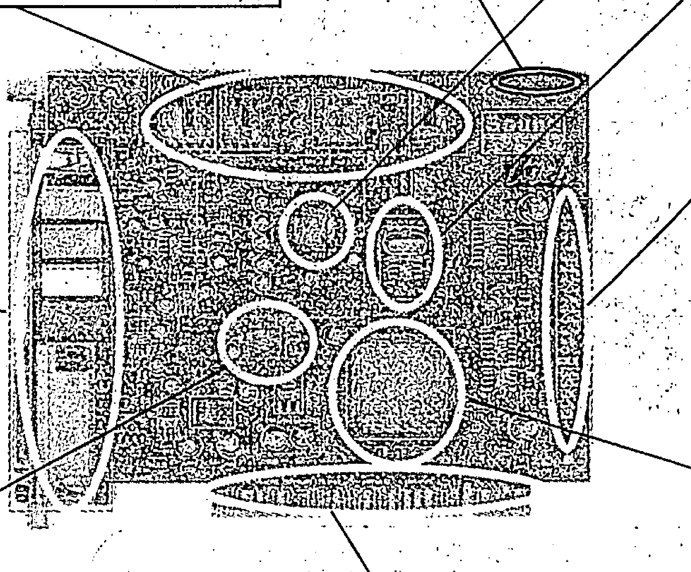

AC'97 Codec：大家已经从我们前面的介绍中了解Codec的作用了吧。SB Live! 声卡大于96dB的信噪比是得益于品质良好的Codec和一组跟它配合的模拟电路，包含电阻、电容、寄存器等元器件。这一块SB0060使用的也是SIGMATEL公司的Codec芯片。周围的这些就是和它配合的模拟电路部分。

SB0060 代表这块卡的工业型号

Crystal: 晶振，提供声卡工作的基本时钟信号。它如同行进中的军乐队的鼓点，使得大家协调工作。

DAC：数模转换器，SB Live!系列产品使用单独的一个数模转换器提供后置左右声道的音频输出。

AUD-EXT：连接Live! Drive或数字子卡的扩展接口。它是一个40针的扩展接口，其中包含了多路数字输入输出信号及MIDI输入输出信号。

从上至下分别是数字输出接口、Line-In、MIC-In、Line-Out1、Line-Out2、Gameport/MIDIport接口。 Digital output 数字输出接口，通过连接专用转接线，就可以输出一路或多路数字信号给数字音箱、MD或DAT等数字设备。

PCI接口：SB Live!系列声卡充分利用PCI总线带宽大的优势，通过大数据量的实时计算，实现了丰富的音频效果。利用系统内存的一半存储音色库也是由此带来的好处。如果PC有64M内存，就可以使用32M存储音色库。与ISA声卡存储音色库在声卡专用内存上的方法相比，成本降低了、扩充和管理也方便了。

EMU10K1: SB Live!系列声卡的主芯片是创新公司鼎鼎大名的美国子公司——专门制造专业音乐设备的EMU公司开发生产的EMU10K1。它从1998年发布至今仍是PC音频最强劲的处理芯片。EMU10K1是集成了两百万个晶体管的一个DSP（数字信号处理器），它的集成度相当于奔腾处理器，而且EMU10K1还具有可编程的特性。32位处理，131个硬件通道，1024复音，8点插值计算——从这些数据就能看出其强大的处理能力。用这样的一颗芯片来专门处理音频，自然游刃有余，创新引以为做的环境音效就是靠它实时计算实现的。当年曾向EMU10K1叫板的同样大名鼎鼎的A3D的支持芯片AU8820，就因为处理能力不够，CPU占用率比EMU10K1高，而且不具有可编程特性而败下阵来。而创新公司只需要通过不断更新的软件Live! Ware就可以实现对原有产品功能的升级和扩充。到现在，EMU10K1的强大处理能力是否已被软件充分利用还没有人知道，不过最近听说有人用最新的这块SB Live! 5.1声卡实现了对DTS（与AC-3类似且更为先进的音频编码方式）的音频解码。这种不可能完成的任务都能实现？我倒！

Live! Drive IR: 一个SB Live! 声卡才有的连接及控制面板，通过它可以在PC前面板上连接麦克风、耳机、CD机、VCD机、DAT、MD播放机、MIDI 乐器等音频设备。再加上遥控器就能控制跟播放音频或影片有关的各项功能，比如调节音量、快进、慢动作等。应该说这是一个方便实用的设备，不过创新把它定位在比较专业的音乐制作方面，售价800元的豪华版5.1加上它就成了2100块的白金版5.1，看起来不是咱老百姓用的东西。但是不管怎么说，还是给大家介绍一下，让咱们也开开眼。

J2：40针的扩展接口，用于连接数字I/O子卡

J1:AUD-EXT,连接SB Live!声卡的扩展接口。它是一个40针的扩展接口，其中包含了多路数字输入输出信号及MIDI输入输出信号。

J3：连接数字DIN的扩展接口

J4：AUD-EXT-2，可以以后连接更多的扩展接口。

电源接口：如同软驱的电源接口，提供Live! Drive所需的电力

Digital I/O Card: SB Live! 特有的数字输入输出子卡，其功能与Live! Drive IR类似，只是接口数目不像Live! Drive IR那样多。分为一代、二代等，这里就不详细介绍了。

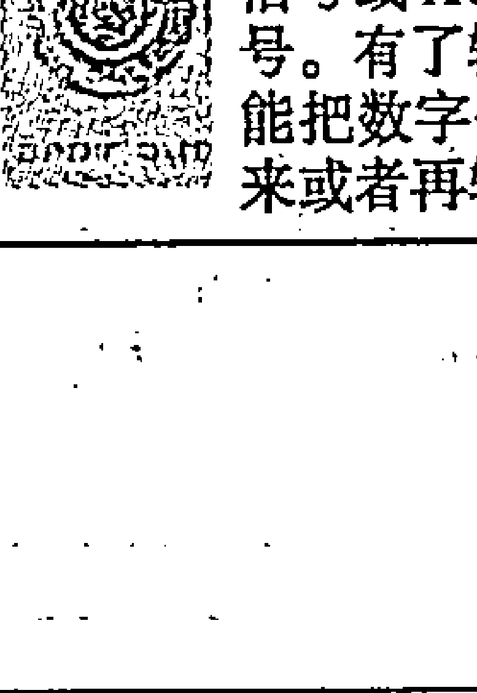

这种同轴的数字接口在DVD解码器、数字音箱、DAT上也有。通过它可以传输一路左右声道的数字音频信号或AC-3的压缩数字信号。有了输入输出接口，就能把数字信号用PC录制下来或者再输出出去。

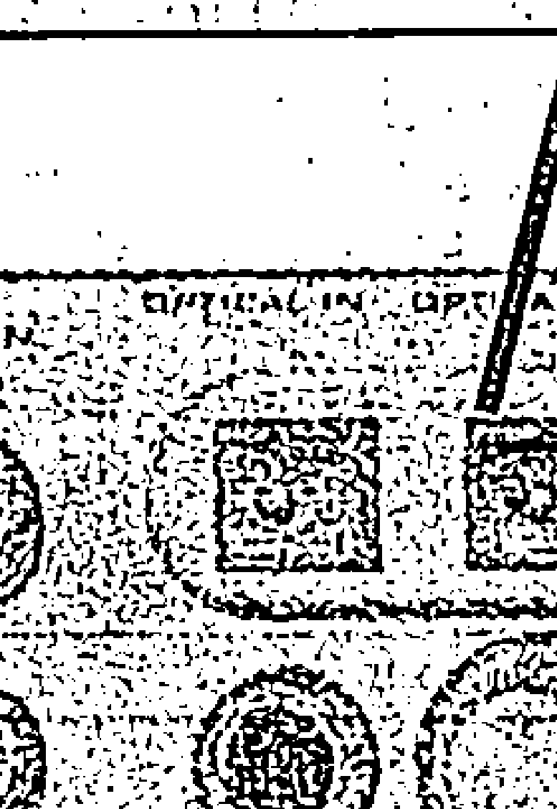

光纤数字输入输出接口，可以与MD播放机连接,配合创新的MiniDisc Center软件就能把PC中你喜欢的音乐录制到MD中去,或者反过来也行。

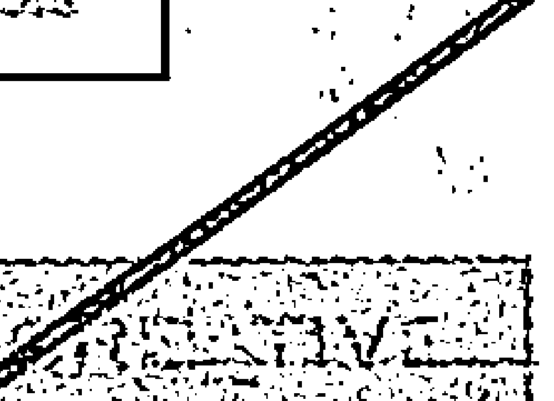

第2路辅助输入 与 VCD、CD机相连。

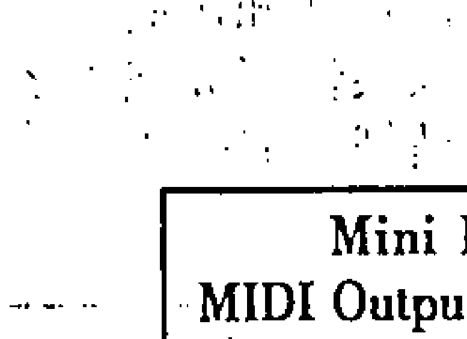

可以接收红外遥控器发射的红外信号。

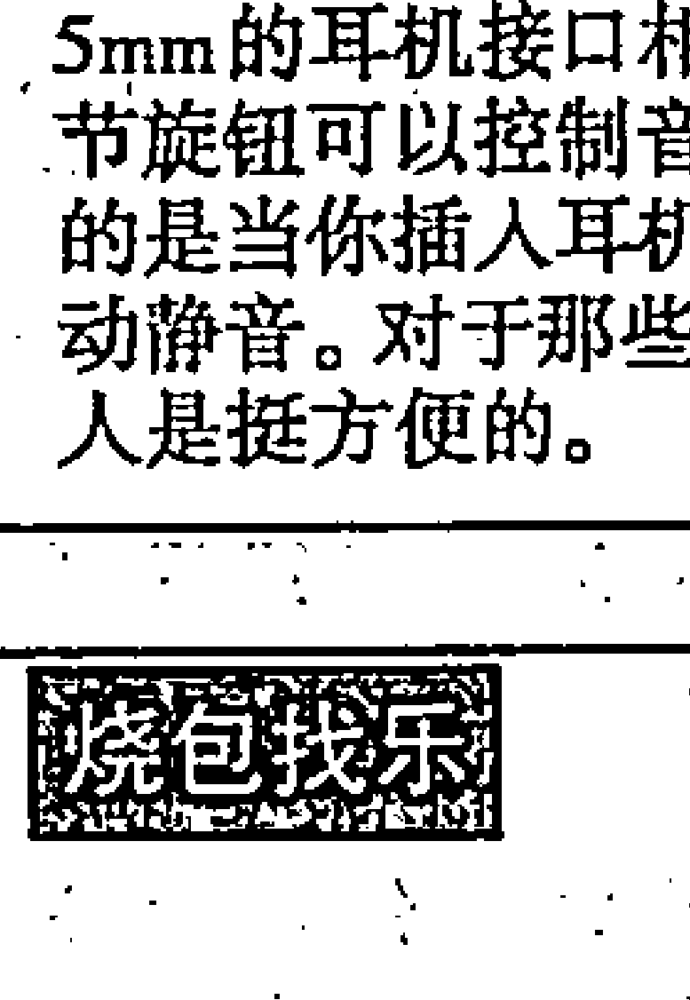

连接耳机的专用接口,可以与1/4英寸的耳机接口相连,也可以与3.5mm的耳机接口相连。旁边的音量调节旋钮可以控制音量大小。有点特别的是当你插入耳机后,音箱输出会自动静音。对于那些希望用耳机收听的人是挺方便的。

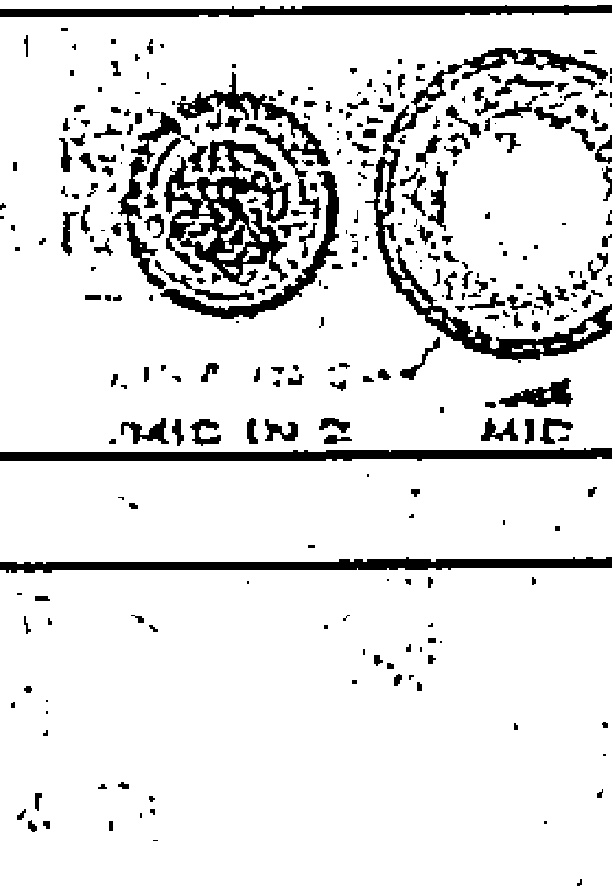

麦克风输入或线性输入;旁边的音量调节旋钮可以控制音量大小。这个麦克风及线性输入可有些不同,通过它输入的信号会经过Live! Drive中的数模转换电路及放大电路处理为数字信号后再送给SB Live!的主卡,这样得到的信号比从主卡上的输入口输入的信号信噪比高不少。

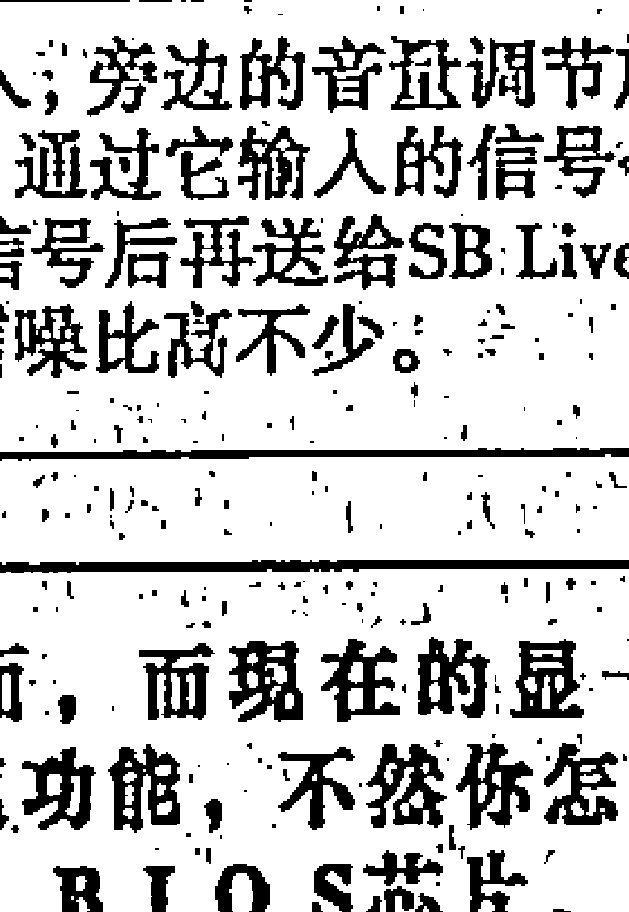

MIDI输入输出接口，可以与MIDI键盘、合成器相连。LiveDrive也提供了与标准5针MIDI接口的转接线。

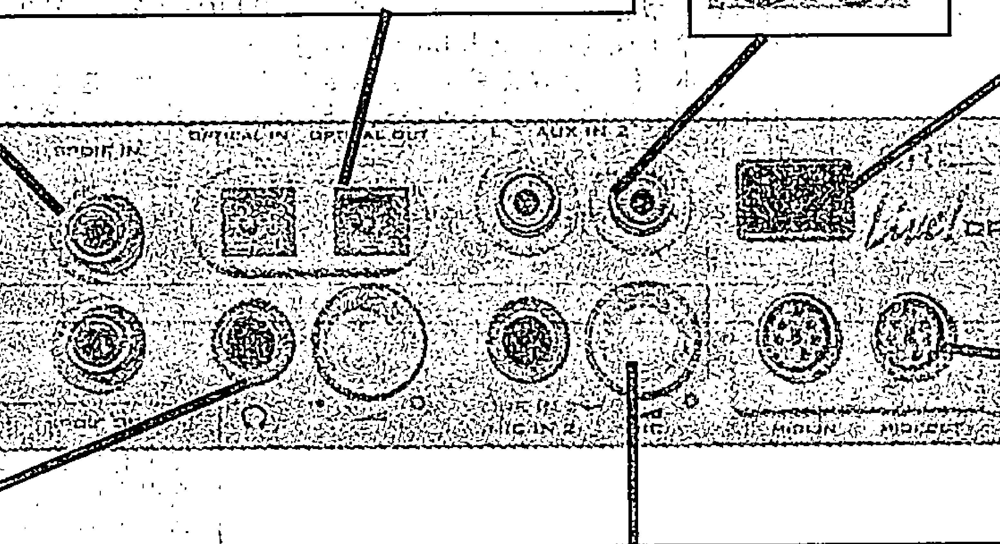

## 显卡中有什么？

先向大家交个底: 在令人眼花缭乱的显卡市场上，虽然品牌众多，型号复杂，但是几乎每一块显卡的构造都是基本相同的。包括基板、显示芯片、显示内存、显示接口、BIOS芯片、散热片和散热风扇、总线方式以及电容、电感、电阻等直立元件。“自古以来”，显卡主要用来连接主板与显示器并显示画面，而现在的显卡，除了单纯的显示以外，还具有许多2D、3D的加速功能，不然你怎么能在Quake 3中驰骋沙场？显卡上的主芯片、显存、BIOS芯片、扩展槽、显示接口以及电阻电容等元器件，相对主板来讲，还是显得简单一些。除了少数采用Intel 810、Sis 630的主板内置了显卡而不需要再外接显卡以外，其他情况下没有显卡你就无法欣赏到那美丽动人的画面。

格格的显卡可是村里有名的宝贝。它是ELSA最新推出的Gloria III专业图形显卡。因为是新产品，所以采用的新技术较多，而且工艺先进。既然兴致来了，就一起瞧瞧吧。放心，少爷会把刚从《“二把刀”秘笈》中学来的几招，毫无保留地告诉你。：》

我们先从哪里下手呢? 还是从我们最关心的显示芯片说起吧。因为显示芯片就像是显卡的心脏一样。在它的内部负担着大部分显卡要做的工作。经过近十年的发展历程,显卡的发展如黄河日下,一日千里。几家大的显卡制造商的产品占到90%以上的市场份额。其中以nVidia、S3、ATI、MATROX、3dfx最著名。一般来讲,现在的显卡有图形专业卡和多媒体卡之分,nVidia公司就有TNT、GeForce、Quadro等系列产品。其中TNT、GeForce是多媒体卡系列显卡,Quadro为专业图形显卡系列。我们举例的Gloria III就是采用nVidia Quadro2 Pro显示芯片的产品。专业图形显示芯片的技术指标要比多媒体卡高出许多,因此显示速度更快,尤其在专业的绘图和动画软件中。由于有专用驱动程序的优化,在速度和画面品质方面,这种显卡会有质的提高。(芯片在图中风扇的下面,拆开后上面都是硅胶,所以没有拍照。)


下面我们就来谈一谈显示内存(显存),它是显卡中仅次于显示芯片的重要部件,负责大量数据的存储和交换。它不仅有品牌、速度、型号、类型的区别,还要区分它的真假。我们还是从它的品牌谈起,现在显示内存主要有HY、SAMSUNG、MITSUBISHI等名牌产品(当然也有TM、EtronTech等一般牌子,我们这里就不作介绍了)。它们的产品无论从速度还是从稳定性都是有保障的。显存的型号从开始的普通显存、EDO显存、SDRAM显存、SGRAM显存,到DDR显存,已经经过了几代技术的更新。现在的主流显卡产品都使用SDRAM显存或SGRAM显存。但在下一代显卡或图形专业卡中会配备DDR显存。由于DDR显存利用每次时钟的上下沿各工作一次,因此它的速度是每时钟工作一次的SDRAM显存或SGRAM显存的一倍。这可以极大地提高显卡的显示速度。就显存颗粒的速度而言,它与显存的芯片频率是密不可分的。Gloria III就是使用64M DDR显存。(芯片在图中散热片的下面,拆开后上面都是硅胶,所以没有拍照。)

接下来再来说说显卡的总线结构，也就是和主板的连接方式。看过主板的朋友会知道，在主板上有不同颜色的插槽，黑色的是ISA插槽，白色的是PCI插槽，棕色的是AGP插槽。这也代表了显卡的总线的发展历程。现在的主流显卡在很久以前使用的就是AGP总线，到现在已经是AGP-4X标准结构了。AGP英文原名为Accelerated Graphics Port,直译为加速图形端口,它是由Intel开发的一种局部图形总线技术。AGP图形接口具有更快速的总线频率和采用系统主内存作为扩展缓存的功能，更大的数据吞吐量可以提高显卡对3D的加速能力。其视频信号的传输速率可以从PCI的132MB/s提高到266MB/s(×1 模式)或者532MB/s(×2模式)，直到1GB/s(×4 模式)。ELSA Gloria III支持AGP 4X,不过AGP 8X标准已经提出，相信在不久的将来，包括ELSA在内的厂商都会陆续推出支持AGP-8X的优质产品。

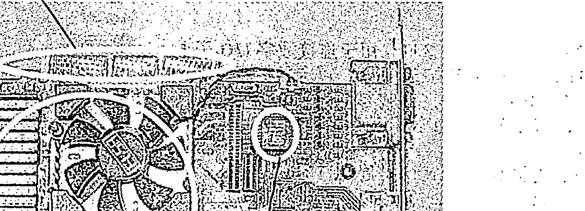

散热片和风扇越来越受到人们的重视，尤其是在显卡的发热量和价格方面已经逼近或超过CPU了，我们更应该像保护CPU一样保护显卡上的芯片。现在散热片和风扇市场的情况是良莠不齐，从十几元到几百元的都有。以前的散热片只要直接粘或者压在芯片上就可以了，现在随着显示芯片发热量的急速增加，相同的散热面积要求有更高的效率。大家普遍的做法是在两者之间加上一层硅胶，以填补它们之间的缝隙，最大限度地加大接触面积，以便更快地吸收和散发热量。Gloria III的散热片和风扇做工相当精细，它使用绿色的散热片（这还是比较少见的），散热片的边缘都打磨过，没有一点毛刺，使用内嵌式大型风扇，体现出ELSA独特的设计。由于Gloria III使用400MHz的DDR RAM，它的发热量也是相当可观的，所以现在的高档显卡在显示内存上一般都有散热片。说不定在不久的将来，显存上也会有散热风扇的。少爷认为在选择显卡的时候，散热片和风扇是一个容易被人忽视的部件，如果说厂商把这么一个小的部件都做得十分精细，那么相信其他部件也将是十分优质的。

显卡BIOS(Basic Input Output system, 基本输入输出系统)其实就是一个软件，但是它固化在显卡所带的一个专用存储器中。BIOS中存储了显卡的硬件控制程序和相关信息。可以说BIOS是显卡的“神经中枢”。显卡是典型的即插即用设备，开机后显卡BIOS中的数据被映射到内存里，并控制整个显卡的工作，显示器上第一个出现的就是显卡BIOS的信息提示。BIOS的一大特点是可以用特定的方法来刷新，这通常称为BIOS升级。如果硬件设计上有什么小问题，那最简单有效的解决方法就是改变显卡的基本输入输出系统，以绕过出错的地方并用其他方法补偿。这时候升级BIOS能解决硬件错误，大大提高稳定性和兼容性。作为图形专业卡的显示BIOS，ELSA Gloria III还是相当成功的，不仅具有升级能力，而且可对它进行优化以满足不同专业软件的需要。据格格讲，ELSA大约每年会对显卡的BIOS更新2-3次。

最后我想说说基板和直立元件。所谓基板就是连接直立元件和贴片元件的印刷板，它一般有4层板、6层板之分。我们需要观察它的边缘是否平滑，走线是否合理，各类元器件分布是否得当。直立元件指的是电阻、电感、电容等元件，分为民用、公用和军用三类，它们的技术指标（如对温度、湿度、最大误差率的要求等）和价格等相差许多。好的元器件在长时间或恶劣环境下稳定性明显优于差的元器件，真的需要好好辨别。Gloria III使用的是淡绿色的基板，采用单面贴片工艺，显卡的外观尺寸适中，布局紧凑、有序，错落有致，充分显示了“一代名卡”的严谨风格。整体的布线和用料十分精良，全部选用了名厂优质元件，所有直立电容都采用了大容量的铝质电解电容，其他部分均使用了包括钽质电容在内的贴片元件。因为对于图形专业卡来说，它必须保证可以在长时间下工作，因此选择优质、性能稳定的元器件是十分必要的。

大家都知道显卡是接在显示器上的，那么在这个方面这块显卡有什么新变化呢？由于数字化的飞速发展，模拟显示器最终会退出市场，一些有远见的厂商已经将DVI(数字接口)作为一项新技术加在显卡之中，ELSA Gloria III就采用了这项新功能。当然Gloria III考虑到现在的DVI显示器还是一种概念性的产品，于是提供了一个精巧的DVI转换器芯片，通过它可以连接模拟显示器。

好了，我们上面讲了这么多，虽然有主要次要之分，但是对于一块好的图形专业卡，任何一个部件的好或坏都会影响它的品质。虽然它和普通的多媒体卡有着基本相同的构架，但是其内部各部件还是有着档次上的差异，这也是图形专业卡价格明显高于多媒体卡的原因。不过专业卡定位于专业3D、CAD/CAM、3D动画、及复杂工业装配图的用户。它的产出也是相当巨大的。当你确实需要它的时候，你就会觉得它物有所值。

> “O K, O K O K, OKOKOK, OK!” 格格的显卡总给人一种“没完没了”拆不完的感觉。不过烧包少爷余兴未尽，一不做二不休，拆自己的！少爷的这块显卡，是艾尔莎(ELSA)的影雷者MX（白金版），它可是在无数的评测中出尽风头的好东东，现在村里卖得正火。不过与格格的显卡相比，少爷的这款显卡好像更适合于像少爷这样的“劳动人民”。好了，就拆它吧。一边拆，少爷还会一边给你讲讲买显卡时要注意的事项，反正拆了它，“地主家也没有余粮过年了！”

作为显卡的核心，显卡芯片组是选购显卡最重要的指标。（不过一般情况下，主芯片由于散热的原因，躲在散热片或风扇下面）目前生产显卡芯片组主要的公司有nVidia、Matrox、ATI、Trident等。目前市场占有率最高的厂商当属nVidia。自Intel在1997年刚推出AGP标准时，nVidia公司就抓住机会，立刻推出Riva 128芯片，博得用户的喜爱。自那以后，nVidia不断推出新品，其6个月就发布一代新产品的速度一方面让世人瞠目结舌；另一方面自身也从显卡的新秀一跃成为龙头大哥。Matrox和ATI自己生产芯片，自己生产显卡，产品也有一定的特色，但无论是新产品的推出还是产品的覆盖面比nVidia要差很多。nVidia在上个世纪末还收购了3dfx公司，曾几何时称霸一方的游戏卡的霸主却因故步自封沦落到被收购的地步，也让人感叹IT业发展的迅猛与“只有偏执狂才能生存”的硬道理（Intel董事长葛鲁夫语）。nVidia目前主要的芯片有TNT2 Vanta、TNT2 M64、TNT2、GeForce 2 MX、GeForce 256、GeForce2 Ultra等(前三种都属于TNT2一族)，这些产品涵盖了从低端入门到超级发烧的所有用户群。看出来为什么nVidia成功了么？影雷者MX所采用的GeForce 2 MX芯片是nVidia去年推出的，也将是2001年的主流产品，其实MX就是GeForce2 GTS的一个精简版本，它将渲染的4条流水线简化成2条，不但具有变形与光照(T&L)、立体环境贴图、逐像素渲染，还支持双头显示（需要专门的MX显卡，普通MX显卡不支持）。显存采用价格相对低廉的SDRAM，性能与GTS相比没有太多差异，但价格却比GTS低很多，最适合像烧包这样胃口总比钱包大的人了！（芯片在图中散热片的下面，拆开后上面都是硅胶，所以没有拍照。）

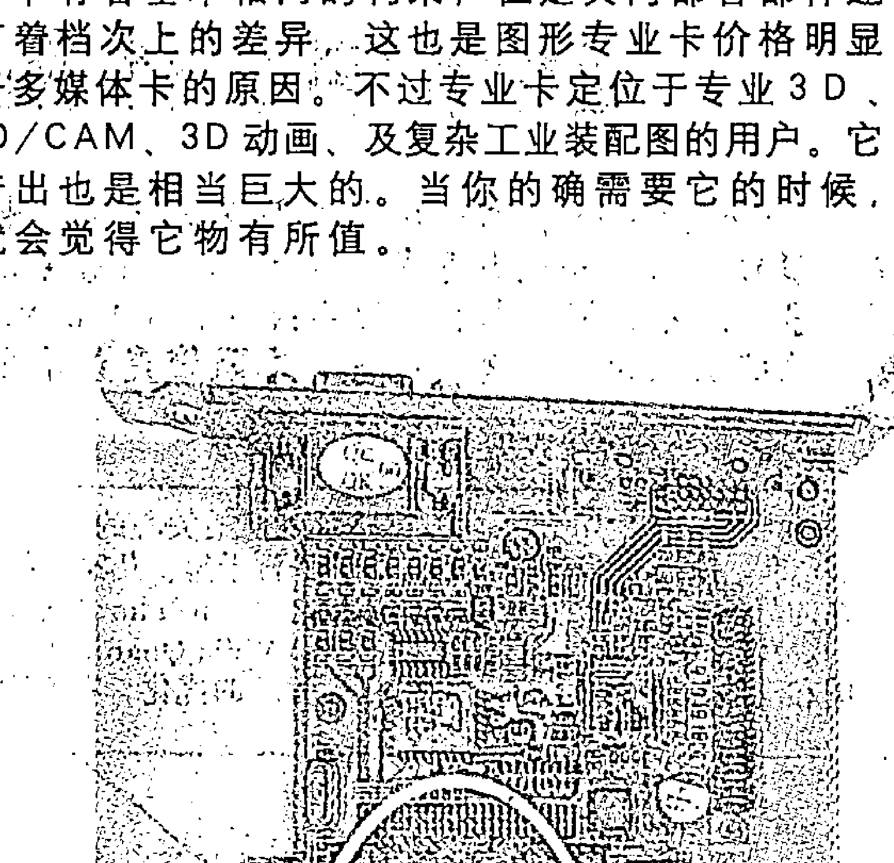显存是用来存储要处理图形的数据信息的地方，目前显存的容量（哇！现在越来越多的人用32MB显存的显卡，而笔者我10年前用的显卡只有1MB，已经是当时最好的！）主要有16MB、32MB、64MB。随着显存价格的不断下跌，32MB已经是主流了，而只有某几种特定的高档显卡如影雷者GTS Ultra才用64MB显存。但随着应用软件的不断发展，32MB显存也有一天会不够用（其实游戏软件是3D显卡发展的主要幕后推动力）。显存也一直随着主芯片的发展而逐步改变着。从早期的DRAM到现在广泛流行的SDRAM以及明日之星的DDR显存，显存的速度以及它对3D加速卡性能的影响也越来越大。显存也被称为帧缓存，当显示芯片处理完数据后会将数据输送到显存中，然后“数模转换器”从显存中读取数据并将数字信号转换为模拟信号，最后将信号输出到显示屏。所以显存的速度以及带宽直接影响着加速卡的速度。如果你的3D加速卡有一颗强劲的“芯”，但是板载显存却无法将处理过的数据即时传送，那么你就无法得到满意的显示效果。不同类型或不同品牌的显卡用的显存也不尽相同。在同种类型显存中，显存速度的提高对显卡性能也有着一定的影响，尤其对那些喜欢榨尽所有潜力、酷爱超频的发烧友，比如少爷。:)

目前显存主要可以分为2类：SDRAM和DDR显存。DDR显存理论速度是普通SDRAM的一倍，尽管目前因为成本较高还只用在GeForce 2 GTS等高档显卡上，相信随着产量的不断增大，DDR显存到下半年会成为主流。目前常见的显存可分为以下几类，韩国的现代(HY)、三星(Samsung)、德国的Infineon、美国的Micron(美光)等相对最好，中国台湾的华邦Winbond次之，剩下的基本是小型封装厂买晶圆自己封装的，品质相对要差一些，但价格也会便宜一些。

显存上标注的55是什么意思呢？它代表着芯片的频率，6ns的显存标准频率可达到166MHz，5.5ns的显存标准频率为183MHz。而nVidia公司为MX设置的标准显存频率为166MHz，也就是说用6ns的显存已经足够了。但是不少大厂还是推出了采用5.5ns显存的显卡以满足发烧友的追求（有些人可以稳定地超到225MHz，不过这要看运气了。）。

显卡BIOS，可不能小看这个小东东哦！它跟主板上的BIOS（Basic Input Output System）相似，提供了显卡类型与版本的信息，在Windows操作系统安装显卡驱动时，驱动程序会根据BIOS信息安装相应的驱动程序。留意刚开机时，显卡BIOS的信息会显示在电脑屏幕最上端，告诉你是什么显卡。现在都是Internet时代了，少爷经常上ELSA网站看看自己的显卡BIOS有没有更新。更新BIOS也十分的简单，看看说明就知道了。相比之下，少爷觉得刷ELSA的BIOS比较容易和安全，不会因为BIOS不同而刷坏BIOS的。

子卡扩充槽，这是个插槽，ELSA视频子卡就是插在这个位置上的。子卡的针比较长，安装时要细心一点。安装了子卡后，通过连接线，电脑上的东西就可以显示在电视机上了，非常适合喜欢玩大屏幕的朋友，例如：家庭影院、游戏玩家。有数码摄像机的朋友，也可以做个简单的家庭VIDEO。笔者则准备用它给村口的傻小子阿明做一段征婚启事。

这么好的东东，拆了还得装上。安装显卡时，插入AGP槽时注意要力度均匀，金手指完全插入槽内就可以了。在安装驱动方面，通常是AUTORUN的，也就是自动运行。在Windows操作系统中，通常会弹出一个很漂亮的窗口，只要跟着提示和选项就可以安装好了。ELSA驱动程序是经常升级的，有条件上网的话，也可以在ELSA网站或到www.on-data.com看看有没有最新的驱动更新。

## 关于显卡的背景知识

## AGP2X、4X

这要讲一下显卡的发展史了，很早很早以前……还是长话短说，原来的显卡从ISA、PCI、AGP发展到现在的AGP Pro，在AGP中有2X与4X之分。下表是PCI、AGP2X、4X区别图。

要想使用最新的AGP 4X速度，必须满足4个条件：
- 主板芯片组支持：目前支持AGP 4X的有Intel的815E/815EP芯片组和VIA的694X、KT133（北桥芯片为VT82C694X）芯片组等；
- BIOS支持：基本上采用以上两款芯片组的新主板其BIOS都可支持AGP4X；
- 显卡支持：支持AGP 4X的显示芯片有nVidia TNT2、GeForce256、MX、GTS、GeForce256 ULTRA等；
- 要有最新的AGP 4X驱动程序。

| 规范 | 接口 | 工作频率 | 工作电压 | 带宽 | 其它功能 |
|------|------|----------|----------|------|----------|
| PCI | PCI | 33MHz | 5.0V | 133MB/s | N/A |
| PCI | PCI | 66MHz | 3.3V | 266MB/s | N/A |
| AGP 1.0 | AGP 2X | 33MHz | 3.3V | 528MB/s | N/A |
| AGP 2.0 | AGP 4X | 266MHz | 1.5V | 1.06GB/s | Fast Write, 4GB Addressing |

## 关于D3D与OpenGL

这两个东西都是讲三维的东西，ELSA有自己的开发程序，特别在OpenGL方面，专业图形工作站，都是选用ELSA显卡。先讲一下D3D：

D3D就是DirectX。很多人不了解为什么叫DirectX，其实最初微软并不想将其定义为Windows9x处理多媒体信息的直接平台，只是想将其定义为Windows9x的界面加速工具，并且利用DirectX的直接界面，向当时还为DOS开发软件的程序员提供一个升级开发Windows9x程序的捷径。但当Direct3D加入其中后，DirectX的使命彻底变了。而那个X其实就是指不断添加的Direct工具集。前面如数家珍地回顾了DirectX的历史，大家就会发现Direct后面跟着的附属词，什么sound、draw、play、input、3d、music。现在DirectX已经出到8.0版了，其在D3D游戏的速度增加了很多。而且在测试视频方面增加了AGP贴图测试。D3D的软件比较多，大多数游戏都是D3D的，像《古基丽影》、《帝国时代》等，包括著名的3D MARK2000测试软件也是D3D的。

OpenGL通常在高端显卡上才会起作用，但现在的显卡基本具备仿OpenGL的功能。用一个通俗易懂的方法给大家解释：著名的枪战游戏——QUAKE III就是用OpenGL引擎写的，也是测试OpenGL的一个常用的工具。那怎么看你显卡的OpenGL分数呢？很简单，进入游戏后，按左上角的~键，会有一个像DOS一样的菜单弹下来，然后敲：timedemo 1 demo q3demo1 回车，然后运行Demo里的任何一个场景，运行完后，再按~键，你会看到一个FPS值，这就是你的显卡OpenGL FPS的值，分值越高越好。还有《雷霆战机》等游戏也是OpenGL类游戏。

## 我的“纯平”不是梦

### ——经济型17英寸纯平显示器简介

纯平显示器被业内人士公认为是CRT显示器发展的必然方向，它代表了CRT显示器最新的技术走向。目前在中关村市场上，纯平显示器已占全部显示器销售比重的三成以上，而且许多品牌仍在陆续进入这一市场，纯平产品正在逐步替代传统显示器的市场位置。

自从三星推出了第一款3,000元以下17英寸纯平显示器——753DF以来，从CCID-MIC对我国显示器市场的评估来看，15英寸和17英寸显示器占据今年显示器市场的主流，而且纯平显示器的市场规模将会有快速的增长。从市场价格来看，目前普通17英寸显示器的平均价格在2000元左右，如果纯平显示器价格在3000元以下，用户的接受程度是比较高的。目前，市场上现有的3000元以下的17英寸纯平显示器主要有三星753DF、爱国者777FD、厦华17ZF、优派EF70、LG775FT等，应该说这几款低端产品是想提升显示器性能但钱包又不鼓的DIY爱好者的理想选择。

低端运用的17英寸纯平显示器，指的是一般家庭应用的17英寸纯平，这种显示器的消费群是一般的追求性能价格比的家庭用户或消费场所用户，这类纯平的基础是至少应达到TCO95的环保要求；不以牺牲人的健康为准绳，而具体指标应达到1024X768分辨率下85Hz以上的刷新，100MHz以上的带宽，0.28的点距(相当于0.25的栅距或沟距)，以满足普通用户的基本需求。

下面我们主要介绍一下17英寸纯平显示器的几款代表产品。

三星753DF，它采用三星丹娜（Dynaflat）显像管，以独特的视觉纯平技术，消除了图像的反光与折射，给人一种视觉完全平面的真实感。纯平彩显的屏幕表面采用了防静电无反光复合涂层，有效地增强防静电、防反射功能；会聚和解析方面拥有良好表现，没有任何拖尾和扰色现象。而三星纯平最有特色的地方就是提供了RGB三原色输入，可十分方便地调节颜色的纯度和信号稳定性，在家用级显示器中很少见到如此专业的功能；三星显示器的另一特点是，即使在边角部分也能清晰聚焦。另外，753DF取得了环保TCO 99认证，这是目前最严格的认证体系，关心健康的人士可以放心使用。

LG 775FT，它的点距为0.24，水平/垂直扫描频率30/70KHz，50/160Hz，带宽110MHz，最大分辨率1280 × 1024，采用LG“未来窗”纯平显像管。LG的“未来窗”是最早进入市场的纯平显示器，采用的是物理纯平三平面显示技术，当你第一次看到“未来窗”时，会感觉到画面是凹了下去的，这是因为LG的纯平显示器虽然说是三平面，但是一经光线的照射和折射，它就会产生凹面效应，此款现价2980元。

爱国者777FD，它采用三菱钻石珑，它的画面清晰亮丽，聚焦准确，是目前市场上相当具有竞争力的一款产品，想购买这个档次纯平显示器的消费者不妨可以去看看，在购买这个档次的纯平显示器时，主要是注意一下在1024 × 768分辨率时的显示质量，看看有没有比较严重的偏色现象，价格目前为2999元。

长城集团推出的一款纯平显示器——长城N700DF，采用三星丹娜（Dynaflat）显像管，外形新潮时尚。这款显示器采用了三星的丹娜（Dynaflat）技术，在色彩饱和度、灰度方面表现优秀；偏转角度90度，双聚焦，高亮度、对比度都达到当前主流技术的指标参数：点距为0.25，行频30-70KHZ，场频50-120Hz，带宽110MHz，最高分辨率达到1280 × 1024，最佳分辨率在刷新频率为85Hz时达到1024 × 768，相对来说，它的价位比较低。

在目前的低价纯平市场，主要还是三星和LG双雄争霸的战场。作为老牌厂商，三星和LG是目前低价纯平显示器市场占有率最高的两个品牌。据宇江咨询公司调查，在所有经销商所经销的纯平显示器中，三星和LG分别有26.78%和23.21%的经销商经销。LG是最早在市场上推广纯平概念的厂商，其努力获得了一定的回报。三星则本来就是显示器市场上比重最大的品牌，这两个品牌的优势短期内还是无人能取代的。同时，它们也代表了两种不同的流派，三星强调“图像纯平”，以视觉的最佳感受吸引用户的眼光；LG宣称绝对平面，用“几何纯平”的理念赢得用户，但有些用户不习惯它的屏幕看起来有些内凹。

其他几款纯平显示器的价格分别是：优派EF70，2900元；厦华“太平公主”2888元；飞利浦107T，2650元；EMC IP-750F，2990元。

随着技术的迅猛提高和产品标准化的进程加快，纯平显示器的配置、功能、价格在不同品牌间体现出来的差异将会越来越小。同时，一些有特殊使用需求的用户不能通过常规的服务得到满足。在这个前提下，爱国者、厦华等国产品牌异军突起，以物美价廉为突破，在低价纯平市场占据了一定份额；相比之下，三星、LG等品牌则更注重售后服务项目的完善，用以提升总体的品牌形象。我们不难看出，各品牌间激烈的竞争，必将导致市场上的东东越来越便宜，越来越好。在不久的将来，对于普通人而言，我的纯平不是梦！

## 条条大路通电脑

### PC机上的八个标准外部接口简介

### □上海 NIGHTMAN

你在买电脑或用电脑时注意到它后方的接口了吗？可能很多人是不会注意到的。其实，电脑的接口很有学问，它是你用来联系其他电脑外设的信号关卡。要想让你的电脑用途更丰富，那么你就要先了解这几个接口。

首先，我们看看COM接口和LPT接口。COM接口和LPT接口是电脑中升级最慢的接口，从早先的286到现在最新的PIII电脑都有它们的身影。一般电脑上都配有两个COM口，COM口的最大传输速率为115kbps，所以有些使用COM口的ISDN外置适配器空有128kbps的传输率，只能跑到115kbps。笔者见过一款德国TELES的ISDN外置适配器，使用LPT接口，从而避免了限制，不过要使用LPT口的设备太多了：打印机、扫描仪，SONY PS振动手柄若要实现振动功能的话也要接上LPT口，而电脑上只有一个LPT口，甚是麻烦。随着电脑外设越来越多，这些接口显然不够用了，怎么办呢？于是USB接口和IEEE1394接口便出现了。

USB V1.1是目前大多数市场上主板所采用的接口格式。它增强了USB接口的插拔能力，而且将Interrupt传输模式由单向改为双向，不过传输速度仍为12Mbps（约1.5MB/s）。相对于串口的速度来说，USB接口的数据传送速度的确快了不少，当电脑只连接一个采用USB接口的外部设备时，其性能表现还是很不错的，但当同时在USB接口连接几个外设时，速度就会变得相对慢起来，因为带宽被平均分配给每个USB设备；而且还要兼顾热插拔、即插即用、电源管理等，这些都会影响数据的传输速度，尤其是需要传输大量数据的外部设备，如扫描仪、数码相机、打印机等，当几个设备同时工作时，其打印机工作速度反而会慢过LPT并口连接，因此，对USB接口的速度要求也有了进一步的要求。针对于此，新一代的USB V2.0标准正式推出，它最高数据传输速度可达480Mbps，其传输速率远远超过了USB V1.1的传输速度，相当于以前的40倍，完全可以满足任何采用USB接口设备的要求。更有谁的电脑会同时连接40个采用USB接口的外部设备呢？在新的USB2.0接口标准技术中，它通过将内部时钟加快和其他方法，将传输速度提高到V1.1版本的40倍，在以前的USB V1.1时是每毫秒发送一个信息，而在新的USB2.0中，则将每毫秒发送一个信息加快了8倍，每毫秒现在可以发送8个信息，也就是说速度相应地提高了8倍。

USB具有很多独特的优点。首先是速度快。USB接口目前最新的V2.0版本传输速度高达480Mbps，和串口115200bps的速度相比，相当于串口速度的4000多倍，即使是对速度要求高的视频在传输速度方面也能满足目前任何外部设备的苛刻要求。

其次是连接简单快捷。USB接口设备的安装使用非常简单，在电脑正常工作时也可以进行安装，而无须关机或重新启动、打开机箱等操作，这主要是得益于USB的即插即用和热插拔功能。我们在WIN98开机的状态下插入了USB接口的外置硬盘，系统立刻发现了新设备，并自动安装了驱动程序，极其方便。

目前，USB接口技术在大多数的计算机外部设备得到了广泛的应用；其中常见的采用USB接口的外设有：鼠标、键盘、游戏杆、数字音箱、Modem、光驱、Zip、LS-120、电话、软驱、扫描仪、打印机、ISDN Modem、Cable Modem、ADSL Modem、磁带机、视频剪切设备等等。

USB接口外设的连接方式非常灵活，可以通过串行连接，也可以通过USB Hub，意思和以太网上的Hub作用差不多，都是用来作数据集散处理和设备的分接工具。不过USB接口标准规定，所有的设备连线不能超过5米。

最后，USB还无须外接电源。普通串口或并口设备都需要相应的供电系统，如外接串口Modem、普通扫描仪或打印机等设备，而USB外部设备直接利用USB接口提供的电源，无须外接专门的交流电源。笔者以前使用一台COM口的扫描仪，有两条连线：电源线和数据线，现在用USB扫描仪，只要一条线就行了。如果所有的外设都用USB接口，那电脑后面就可以减少一半的连线。我们的电脑桌可以干净多了。

IEEE 1394也是一种高速的串行接口标准，最早是由苹果电脑公司在1986年提出的一项接口标准，俗称FireWire（火线），后来经美国电机电子工程协会（IEEE）认同而成为正式标准，名称也更改为IEEE 1394。刚开始时其传输速度为100Mbps；后来又提高为200Mbps、400Mbps，听说将要出台的下一个IEEE 1394标准最高传输速度可达1.6Gbps。IEEE 1394采用总线拓扑结构，每个次回路可连接63个设备，而IEEE 1394可以同时连接1024个次回路，最多可以连接64512台设备。IEEE 1394支持非同步及时传输功能，具有点对点的传输能力，也就是说采用IEEE 1394接口连接的设备，彼此之间可以直接传送数据，不需要通过电脑等控制数据处理的设备，类似于网卡的功能。而且IEEE 1394不光是应用于电脑平台系统，也可以直接应用于家电市场。从整体上看来，IEEE 1394的性能比USB 2.0要更胜一筹，但与USB设备相比，有个致命的弱点，那就是价格过高，一般电脑上IEEE1394接口的PCI转接卡市场价要600元左右，而USB接口则每块主板都集成。

所以目前主要应用在一些对数据传输量要求比较大的数码影像类产品，如数码摄像机（DV）。不过随着IEEE 1394产品的进一步降低身价，将有更多的数码相机、扫描仪、摄像机等产品采用IEEE 1394产品。技嘉主板最近推出的6VX7-1394就是一块集成了IEEE1394接口的主板，售价1300元，以相对比较低的成本实现了对该接口的支持。

电脑的外部接口目前是以USB接口为主，IEEE1394为辅，朝着高速、多重连接、简易的方向发展。新的标准不断地推出，电脑变得越来越方便越来越快速，电脑接口也正是遵循着这个标准在不断地向前发展。

## 如何辨识金邦内存

### □北京 阿明

在众多的内存品牌中，金条以其出色的性能成了广大DIYer的首选，同时它也成了制假者的首选。现在我告诉大家怎样从模块和芯片编号识别GEIL（金邦）内存。

GEIL（Gold Empire International Ltd，金邦科技股份有限公司）是来自台湾的内存厂商，产品有金邦金条和GL2000千禧条两种，主要用在服务器、笔记本电脑和家用PC上。

现在先给大家介绍一下SPD，SPD（Serial Presence Detect，连续存在检测装置）是一组数据，它记录了内存的各种参数，其中最重要的是CAS（Column Address Strobe，列地址控制器）、CAS到RAS、RAS（Row Address Strobe，行地址控制器）的时间。开机时，主板会自动检测内存的SPD，按照SPD来设置内存的存取时间。因此金邦金条分为“金、红、绿、银、蓝”五种，各种金邦金条的SPD均是确定的，适用于不同的主板。金邦的这种贴心设计使你可以很轻松地根据主板芯片组选择到最匹配的内存条。当然，其他品牌的内存也有不同的存取时间，但没有按照存取时间标识出最为匹配的主板，如果你没有掌握相关的知识，难以选择对应的内存，很容易造成兼容性问题。

除了贴心的设计外，金邦金条的售后服务也是一流的，它提供“免费升级”服务，当你的主板升级到更高速度时，你可以将原来的金邦金条拿到经销商处，即可升级到与主板匹配的金邦金条。

金邦内存采用BLP封装（Bottom Leaded Package，底部导向封装），芯片尺寸较普通SDRAM芯片小，DRAM模块为六层板设计，选购时要多注意一下。

### 一、DRAM模块

例：GL 128 MUAHC02049

- GL：内存模块类型，GL=GL2000千禧条，金=金色金邦金条，红=红色金邦金条，绿=绿色金邦金条，银=银色金邦金条，蓝=蓝色金邦金条
- 128：内存容量，128MB

各种不同的金邦金条对应的主板：
- 红色金条：PC133高性能系统，匹配主板：i810E、i815、i820、i840、VIA 693A、VIA 694X
- 绿色金条：PC100内存，适合普通用户，以稳定性为主，匹配主板：i440BX、i440GX、i440LX、i440ZX、VIA 691、VIA 692、SiS 530、SiS 620
- 蓝色A系列金条：K7系列主板，面向超频玩家，匹配有：AMD 750、AMD 760
- 蓝色V系列金条：K7系列主板，面向超频玩家，匹配有：VIA KX-133
- 蓝色T系列金条：K7系列主板，面向超频玩家，匹配有：VIA KT-133
- 金色金条：PC133服务器系统，适合双处理器主板
- 银色金条：PC133内存，主要面向笔记本电脑的移动式主板

### 二、DRAM芯片

例：GL2000 GP 6 LC 16M8 4 TG -7 AMIR 00 32

- GL2000：芯片类型，GL2000=千禧条TSOPs（thin small outline packages，小型薄型封装），金SDRAM=BLP
- GP：厂商名称，金邦科技
- 6：产品家族，6=SDRAM
- LC：处理工艺，C=5V Vcc CMOS，LC=0.2微米3.3V Vdd CMOS，V=2.5V Vdd CMOS
- 16M8：设备号码（深度*宽度），其中16=内存基粒总容量=基粒容量*4 bank；8=基粒数目；M=容量单位，无字母=Bits，K=Kilobits（KB），M=Megabits（MB），G=Gigabits（GB）；内存芯片容量=内存总基粒容量*基粒数目=16*8=128Mbit
- 4：设备版本
- TG：封装代码，DJ=SOJ，DW=宽型SOJ，F=54针4行FBGA，FB=60针8*16 FBGA，FC=60针11*13 FBGA，FP=反转芯片封装，FQ=反转芯片密封，F1=62针2行FBGA，F2=84针2行FBGA，LF=90针FBGA，LG=TQFP，R1=62针2行微型FBGA，R2=84针2行微型FBGA，TG=TSOP（第二代），U=μBGA。
- -7：存取时间，-7=7ns（143MHz）
- AMIR：内部标识号
- 00 32：生产日期，2000年第32周

购买金条时注意以下几点：
- 假货字迹模糊，特别是那个金字，SPD颗粒上也是字迹模糊，不仔细看很难看清；
- 假货电路板质量明显比真的差，颜色也较暗；
- 假的金邦条只有一个透明的塑料包装，缺少正品的包装盒；
- 假货芯片上的编号和品名有打磨过的痕迹，字是印上去的，缺少激光蚀刻那种质感。

## 深入浅出玩RAID

### □北京 林林

今天如果您不知道RAID，那您可能就有点儿落伍了。在网络及服务器迅速发展的今天，资料的安全性显得非常重要。在一个完整的计算机系统中，CPU运算速度的飞速提升使系统内许多部件成为阻碍整体性能提高的瓶颈，其中比较明显的就是数据存储设备的数据传输问题，各硬盘厂商在提高内外部传输率上绞尽脑汁，正是在这种情况下，RAID技术应运而生。

### 1. RAID是什么

RAID全称为：Redundant Array of Independent Disks，中文称为：磁盘冗余阵列，是一个服务器大容量硬盘、服务器运行速度和数据安全性等综合性要求的廉价解决方案。磁盘阵列可用性强，延展性好，作业效率高，在大型主机上经常见到，尤其在资料存取量大的主机上。如果使用者想要增加资料存储量及存取速度，那么RAID是相当好的选择，而且RAID也具有很好的安全性。

### 2. RAID的分类

RAID在资料存取方式上，因不同的需求有不同的规格，大致分为RAID0、RAID1、RAID2、RAID3、RAID4、RAID5、RAID0+1七种规格。

- RAID 0：这是所有规格中惟一不具容错性，但效率却是最高的，它将一份资料分割成数个区块分别储存于各个硬盘上，同时存取，在速率上会比单个硬盘快。但如果其中一个硬盘损坏，那么这一份资料就不能使用了。
- RAID 1：它是将一份资料同时储存于两个硬盘中，就算其中一个硬盘有故障，系统仍可正常运作，它具有备份的功能，但是只能使用一个硬盘的容量。
- RAID 2：这是RAID 0的改良版，以汉明码（Hamming Code）方式将资料编码后分割为独立位元，并将资料分别写入硬盘中，但是因为加入了错误修正码（ECC, Error Correction Code），所以储存的资料会比原来的大。
- RAID 3：它需要经过编码将资料位元分割，并分别存于硬盘中，而将同位元检查单独存于一个硬盘中。但由于资料的位元分散在不同的硬盘上，因此就算读取一小段资料都有可能用到所有的硬盘，所以这种规格比较适合在读取大量资料时使用。
- RAID 4：与RAID 3不同的是，它在分割时是以区块为单位分别存放于硬盘中，但每份资料存取都必须从同位元检查的那个硬盘中取出，并与对应的同位资料核对，由于使用频繁，所以该硬盘损耗率可能会提高。
- RAID 5：改善了RAID 4同位元检查使用频繁的问题，它将原始资料与同位元检查重新组合后，以位元分割的方式储存于各硬盘中，所以每个硬盘都有同位资料，以降低存取过度的问题。
- RAID 0+1：这是一种Dual Level RAID，也有人称之为RAID level 10，它是“零加一”，即两组按一定的分割区域，连接不同的两块大容量的阵列硬盘，它们互为“镜像”。在每次写入数据时，磁盘阵列控制器会将数据同时写入两组“大容量阵列硬盘组”。同RAID 1一样，虽然其硬盘使用率只有50%，但它却是最有效率的划分方式。不过它需要4个一样的硬盘，所以说真正的“安全性”和“速度”是建立在成本上的。建立在主板和硬盘之间，实现RAID功能的插卡叫RAID卡，从理论上看插卡式的效率是较佳的。这种结构的阵列，直接面对主机的存取通道I/O bus，不受限于系统的存取界面I/O Interface，如SCSI、SSA、FC-AL等。

### 3. RAID适合于谁

目前，RAID技术从高高在上的企业解决方案走了下来，成为众多DIY发烧友以及普通家庭的选择方案。在硬件价格越来越透明、越来越便宜的今天，RAID技术也飞入了寻常百姓家。只要您对数据处理有RAID需求，那么RAID卡可以在任何主板上使用。

从大的方面来说，几家比较大的服务器主板供应商都提供这样的支持，比如Intel、华硕、艾崴等。至于RAID卡的供应商，比较有名的当然是Adaptec，还有AMI和SIS，但是好像AMI和SIS提供的多是PCI规格，并且在卡上集成了SCSI控制芯片，相对价格比较高，大约要10000元人民币左右，并且现在的服务器主板都有一个倾向，即把SCSI的控制芯片集成在底板上，这样SCSI的存储介质通过系统总线来传输资料要比通过繁忙的PCI总线来得方便，如果此时再扩充RAID功能，可能需要没有SCSI通道的廉价RAID卡来提供支援，其中艾崴的几款SCSI主板都提供这种支援：提供RAID PORT的插槽，配合其ARO-1130(CA,SA)的RAID卡（Adaptec芯片），可以方便实现上述RAID功能，据说此RAID卡因没有SCSI通道而价格比较便宜，人民币3000元左右。最近好像AMI也有这样的RAID卡上市，以满足大多数用户的需要。

所谓的RAID PORT插槽是指在主板的一根PCI槽后面再多补出一段棕色的比较短的插槽，而RAID卡就可以插在由PCI和这一段槽构成的比较长的RAID PORT插槽里面，从而实现RAID的各种功能。前面已经介绍了常用的RAID的种类，下面就讲一下它们在实际中的应用。

现在我们常用的有RAID0，1，5，0+1这四种方式。其中，IDE RAID不支持RAID5，只有SCSI RAID才支持RAID5。

由于RAID5具有分盘纠错能力，所以在服务器中多用RAID5这种方式来保证对数据的保护。

在一些中小企业中，它们的高阶工作站对处理速度要求不是很高，在数据比较重要的时候，可以选用RAID0+1这种方式，采用IDE RAID是一种比较经济实惠的方案，比SCSI RAID的性价比要高。

而对于一些用户，对数据非常重视，但对速度并无特殊要求，如股民。如果数据丢失，那可就麻烦了，那么可以使用RAID 1，来完成冗余备份。

对于RAID 0，由于对数据没有保护功能，只是单纯提高磁盘的存储速度，只适用于数据资料不是特别重要的用户。如DIY发烧友、GAME高手等。

总体来说，RAID分为SCSI RAID和IDE RAID，两者各有特点。SCSI RAID比IDE RAID所能实现的方式要多，但其价格也是不菲的。而IDE RAID则具有良好的性价比，能满足一般中小用户的需求，为中小企业提供一个良好的数据处理解决方案，当然也为众多的个人用户提供了更为可靠、快捷的解决方案，成为RAID家族中的一个生力军。

在目前的SCSI RAID、IDE RAID市场上，各主板厂商如艾崴、技嘉、微星、升技等均有产品涉足IDE RAID领域。艾崴是世界第一家将IDE RAID集成在主板上的厂商，采用HighPoint 368控制芯片的VD133Pro（VIA694X+686A），是世界首片集成IDE RAID的主板，它可以支持。# 市场一览

RAID0、RAID1、RAID0+1三种RAID工作方式，还支持UDMA66。同时，艾崴出品了采用HighPoint 368控制晶片的SIDE RAID 66卡，同样支持RAID0、1、0+1方式，支持UDMA66。之后推出的艾崴SIDE RAID100，采用HighPoint 370控制晶片，支持ATA100及RAID0、1、0+1的方式，进一步完善了IDE RAID的功能。同时，艾崴在新一代主板上均内建了IDE RAID，采用AMI MG80649控制晶片，支持RAID0、1、0+1和SPARE POOL，同时还支持ATA100，如KV200-R，WO2-R，KA266-R等。

## 4. RAID市场一览

RAID如此优秀的性能越来越成为众多玩家的首选，或许不久的将来，玩家们见面的第一句话就是“今天，你RAID了吗？”

- 艾崴SIDE RAID 66: 260元
- SIDE RAID 100: 350元
- VD133PRO: 880元
- WO2-R: 1380元
- KV200-R: 1000元
- KA266-R: 1750元
- 升技 K7T-100: 1250元
- 精英D6VAA-RAID: 1000元

RAID技术就为大家介绍到这儿，希望对您有所帮助。

# 存储设备大点兵

□四川 闷豆 闷豆二代

# 内存 RDRAM决战DDR SDRAM

在2000年初，谁也不会想到SDRAM这个几年前的技术却依然是2000年内存市场的最后胜利者，PC133标准成为SDRAM的绝唱，而后某些厂家虽又推出了PC150、PC166 SDRAM，但已不能满足技术发展的需要，它的接替者RDRAM与DDR SDRAM在2000年打够了技术战后，即将迎来的则是2001年的市场争夺战。

RDRAM，Intel与Rambus主推的高性能内存，包括NEC、三星、东芝等内存大厂已明确表示支持，与SDRAM不同的是，RDRAM的数据通道为2条8bit共计16bit即2Byte，只有SDRAM的64bit数据通道的1/4，而时钟频率则要快得多。以最快的PC800为例，运行频率高达400MHz，并且在时钟的上升沿与下降沿都能传输数据，带宽为2Byte×400MHz/S×2=1.6GB/S，不仅在理论上远超过PC133 SDRAM的1.06GB/S，并且在特殊情况下，性能更远超SDRAM。举个例子，某段数据一次最多只能传输32bit，那在使用SDRAM时，只能利用其一半的带宽，而RDRAM则能全额工作，此时性能差距将更大。不仅如此，Intel为了发挥RDRAM性能的极限，更是创造出了双通道RDRAM，简单的解释就是同时利用两条RDRAM的带宽，使内存带宽达到3.2GB/S这一惊人数字。此项技术已用在i840、i850两种高档芯片组上，并已体现出极高的测试性能。RDRAM技术先进，性能优异，但生产厂商的设备必须更换，早期成品率低，专利费用昂贵又阻碍着它的前进步伐。而各大内存厂商考虑到RDRAM虽有Intel撑腰，但前景不明，多数厂商的作法是先通过RDRAM认证，但大规模生产则要取决于市场的反应。Intel为了RDRAM的推广，不惜重金赠送RDRAM，以达到先试后买的目的。而随着RDRAM成品率的提高，其价格也是大幅下降，已接近人们的心理承受价位，可以说虽然大家都看好DDR SDRAM，但RDRAM依靠其成熟性、高性能以及Intel的推广必然首先占领未来的工作站、服务器等这部分高利润市场，而后再向主流市场进军。RDRAM，未来内存市场不可或缺的组成部分。

相对于昂贵的RDRAM，VIA与AMD联合推广的DDR SDRAM可以说是廉价的性能提升方案，把SDRAM只能在脉冲上升沿传输数据改为在脉冲上升和下降沿都能传输数据，理论上把带宽提升了一倍。VIA与AMD主推的PC2100带宽更是达到了2.1GB/S，已超过了RDRAM，而其生产设备、工艺都与现在的SDRAM通用，颇受包括现代、Micron等内存大厂的欢迎，而且DDR SDRAM/SGRAM在显卡上的成功更是坚定了厂商们推广的信心。而VIA与AMD更是再接再厉，提出了DDR2标准，在这一标准中，一次脉冲传输四次数据，达到传统SDRAM的四倍带宽，首先提出的PC3200标准依靠100MHz的速度就达到了3.2GB/S的带宽，可与昂贵的双通道RDRAM媲美了，而成本依然不会比SDRAM提高多少。相对昂贵而又有垄断嫌疑的RDRAM，DDR SDRAM更受厂家的欢迎。不过DDR SDRAM要成功，困难也不少，一是缺少Intel的明确支持；二是上市时间晚了RDRAM半年多，成熟性还有待考验；三是配套主板尚未形成规模，而AMD也承认其支持DDR SDRAM的AMD760芯片组有BUG，也为DDR SDRAM的推广蒙上了一丝阴影；四是价格问题，虽然DDR SDRAM内存条成品的上市价格比RDRAM上市时低得多，但最新的报价表明，RDRAM现在的售价低于DDR SDRAM。

我个人认为，未来的内存在SDRAM被淘汰后，DDR SDRAM会度过最初的高价及不成熟期，依靠多数厂商的认同，成为主流配置，而RDRAM则依靠Intel的实力，更多地占领图形工作站、服务器等高端市场。未来的内存市场将是DDR SDRAM与RDRAM分庭抗争的局面，没有任何一方敢说占有绝对的优势，只有发展才是不败的根本。

# IDE存储设备，接口面临变革

相对于2000年IDE硬盘平稳的增容、增速，RAID大幅提升硬盘速度，CD-ROM逐渐被DVD-ROM取代。2001的存储设备我们更应该关注已有15年历史的并行接口ATA的升级换代，并行接口ATA虽然不停地挖掘潜力，但依然赶不上发展的步伐，现在80芯数据线理论传输极限是133MB/S，以此判断，UltraATA100很可能就是IDE硬盘在并行ATA接口下的最快速度，而作为其升级换代产品，新一代ATA接口Serial ATA（串行接口ATA）也正式浮出水面。

Serial ATA，在2000年2月份由Intel、Adapter、Dell、IBM、迈拓、昆腾、希捷等7家公司共同提出，随后又有60余家公司参加合作，目标是取代目前的并行接口ATA的标准，用于连接硬盘、CD-ROM、DVD-ROM、CD-RW等IDE存储设备。而经过几个月的标准制订，Serial ATA 1.0版草案已于11月底完成。其优点在于首先是高速长效，最初公布的UltraSATA/1500规格传输速率为1.5Gbit/S即192MB/S；而未来此标准可扩展到2倍速（既384MB/S）、4倍速(768MB/S)，计划满足未来10年IDE接口的需要；其次是改用串行电缆后，布线方便，接口缩小，并能降低工作电压，有利于电脑制造商设计系统。而在最初为了保证并行ATA到串行ATA的顺利过渡，将会同时拥有两种传输方式的接口，以确保用户的利益。而就在Serial ATA标准制定的时候，希捷已推出了第一款Serial ATA硬盘。可以预见，Serial ATA到来的日子不会太远了。

# 光盘存储器

从各方面看，2000年也许是单一CD-ROM最后的辉煌，速度已无法随心所欲地提高，依靠各种技术来提高的读盘性也受到质疑；CD-ROM的利润也越来越薄，有实力的厂家已把主力投向CD-RW、DVD-ROM以及多功能合一的光驱。

数年前就有人预言DVD-ROM要取代CD-ROM，但这个时间来得如此之晚，以至现在的电脑主流配置还是CD-ROM，原因并不是DVD-ROM不成熟；而是DVD碟片不能满足需要。一是现在的软件用CD-ROM存储就足够了，还没有必要做成DVD；二是正版的DVD影碟太贵，而盗版的DVD影碟效果又相去甚远，想当初，CD-ROM的流行就是从VCD影片开始的；三是现在的DVD-ROM都只有五次更改机码的机会，用户怕买来的DVD-ROM最后被锁区码，成为摆设，这几点都极大地影响了DVD-ROM在国内的销量，不过随着区码破解技术的完善以及DVD-ROM的降价，DVD-ROM取代CD-ROM成为只读存储器首选的时刻不会太远。

早期的CD-RW为了追求稳定，都是SCSI接口，性能优异，价格昂贵，不过由于市场的需要，现在越来越多的厂商也在生产IDE接口的CD-RW，而且随着人们对资料备份观念的加强，CD-RW的市场正在逐步扩大，并且价格也随着产量的增加而降低了不少，比如ACER的CRW8432IA，8速写，4速重写，32速度读取，2MB缓冲记忆体，还外带10张CD-RW，价格却降到了1299元。而随着人们对备份的重视程度的提高，备份容量的加大，以及CD-RW成本的不断降低，相信CD-RW必然会闯出一番天底。

多功能合一光驱顾名思义就是把DVD-ROM与CD-RW的功能在一台光驱上实现，节约了空间。不过这种产品刚推出，价格较为昂贵，而其市场定位本身就是高端产品，不太可能大规模普及。

# 便携存储器，速度更快、容量更大

朋友间要交换文件，动不动就是几十上百MB，只好带着硬盘满街走。一直想考虑一个便携存储器，但看完各种介绍，只能摇摇头，太慢，太小，我需要更快，更大容量的。这里说的更快并不是便携存储器的内部传输速率更快，而是需要更快的接口速度。现在流行的便携存储设备多采用USB1.1接口，由于其最快传输数率只有12Mbit/S即1.5MB/S，虽然比传统的串口快了许多，但如果外部存储器稍大些，瓶颈就显现出来了。以现在市面流行的5GB“爱国者”USB硬盘为例，一次性拷贝5GB的文件需要50分钟，这是难以忍受的，更不用说更大容量的了。

不过这种情况将随着IEEE1394与USB2.0两种接口技术的成熟而改变。IEEE1394，传输率400Mbit/S即50MB/S，是USB1.1的33倍，与现在最快的IDE硬盘速度相当。而迈拓于12月初推出IEEE1394接口的硬盘，最大容量80GB，但IEEE1394并不是每台主机都配备，使用有一定的局限性，而且据称不同IEEE1394还有不兼容的情况，更为其推广添加了障碍。相对而言，我更希望在2001年看到使用USB2.0接口的便携硬盘上市，相对于IEEE1394，USB2.0的优点在于更快的速度，480Mbit/S即60MB/S，而且秉承USB的一贯特点，标准统一，没有兼容性问题，受到厂家大力支持。但USB2.0的相关产品还没有正式推出，其真正的表现还有待事实来检验。

# 断想，网络就是存储器

每次在网上看到一个好软件，总是下载并安装，日积月累，这种软件越积越多，看着它们占据我宝贵的硬盘空间，真是留着浪费，删了又怕以后需要时还得下载。羡慕那些十几个通宽带网的城市，一天24小时在线，100Mbps带宽，软件需要时才下载安装，装完就删，高速低价的网络节约了本地存储器，减少了重复浪费，网络岂不是更好的存储器？

# 新年外设市场大展望

□北京 李伟

随着电脑应用水平的提高，人们对电脑的依赖和要求也越来越多，这不仅仅体现在电脑性能的提升上，也体现在对电脑扩展功能的需求上，而这些扩展功能都是通过电脑外设来实现的，因此电脑外设越来越受到重视。新春伊始，我们对计算机外设的发展充满了新的憧憬，过去的一年中，许多新型外设正在被推广，传统的电脑形象和配置正在悄悄的改变。而在新的一年中，我们又将看到哪些变化呢？

# 光盘驱动器

CD-ROM的生命力之强完全出乎我们的意料，在一片看好DVD-ROM的“共同语言”中，CD-ROM依然是家用电脑上的标配，主要原因是出在DVD规格上。DVD规格繁多，而令人厌烦的保护措施很大程度限制了DVD光盘媒体的发展步伐，所以在DVD技术和制造工艺已相当成熟的今天，DVD仍发挥不出其强大的功能。

但从光盘驱动器技术发展的必然趋势来看，DVD-ROM取代CD ROM是肯定的，DVD不但容量更大，而且还能提供更出色的影音及多媒体品质。再说DVD-ROM的造价已非常低廉，以目前全世界DVD的产量和生产能力来说已不在CD-ROM之下，销售价格也非常接近，相信在新的一年中，DVD-ROM首先会在价格上击败传统的CD-ROM，不过真正成为PC标配还有赖于DVD光盘媒体的普及发展。

反观CD-ROM，目前的CD-ROM技术已毫无挖掘价值，只是在未来真命天子DVD一时的窘境中得以持续。不过这种状况持续的时间长短还不是很明了，所以在一段时期内CD-ROM还是会有其存在价值的。去年另一个令人注目的现象相信大家都猜到了，答案就是CD-RW驱动器。自Acer宣布其4432系列大幅度降价以来，其他厂商也相继加入，其竞争状况之惨烈，难以形容。在短短半年内，6432、8432规格的CD-RW也加入降价行列，而且价格也完全能被接受，所以在我国这类产品的主流几乎和国际水平同时接轨。更高倍数的CD-RW也在国内出现，不过价格和产量还有待稳定，相信年内的主流产品将以8432规格为主，其间10-12速写、8-10速复写、40速读的CD-RW会占领国内主流及国内高端应用领域。从技术发展来说，DVD制造工艺会废弃双光头设计转而采用单光头，另外可能还推出新的DVD软件保护协议，CD-RW将主要致力于IDE接口款式的高速刻录研发，还会着重于解决“Buffer Under Run”的问题。

# 扫描仪

激烈的价格竞争形成了去年国内扫描仪市场的一道风景，在竞争的背后，改变了普通用户长期以来对扫描仪只能用于专业领域的看法，越来越多的家庭出于对生活品质的追求纷纷购买了扫描设备，这也大大刺激了生产厂家的积极性。从市场角度来说，在新的一年里，各扫描厂商仍然会在价格上面做文章，混战的价格导致国产品牌以低价位的垄断地位已被打破，更具世界级名望的优秀产品将会得到挑剔用户的青睐。

以产品情况来说，目前国内主要以真彩扫描、USB接口、600-1200dpi级平板式产品为主，但在国外这种级别的产品基本上已淘汰，去年扫描仪的火爆场面一部分原因主要是欧美及日本厂家的积压产品倾销策略所造成的，所以在今年国内扫描仪市场会出现多款1200-2400dpi主流款式，但考虑到购买能力等原因，600-1200dpi仍然是主要的销售对象。在扫描仪新技术方面，平板式扫描仪讲究外形及使用性将会成为主题，在去年大受欢迎的超薄、快捷键概念被更多的厂家所采用。另外，移动办公概念的流行必将促进一些小巧、携带方便的袖珍扫描仪产品出现，这可能是一些扫描仪大厂未来研发的主要项目。

# 打印机

过去一年是打印机的技术发展年，喷墨式打印机家用地位已被确立，而且新品迭出，价格降幅也很可观。激光打印机虽然也在价格上有所降幅，无奈成本过高，只能在大型办公场所应用，普通用户难以消费。目前市面上喷墨打印机主要还是HP、Canon、EPSON三足鼎立，其他品牌由于产量及技术能力等原因只能作些点缀，在将来一段时期这种状况还有可能持续。原因是这三家企业全都是国际性公司，而且产品线繁多，打印机只是其产品的一个项目，所以出现品牌收购或兼并的可能性不大。

目前国内市面的家用喷墨打印机主要以360dpi及720dpi指标为主，但已有不少1440dpi级新产品出现，不过价格略贵，但从实际效果来看，1440dpi比起720dpi的品质并无质的提高，所以720dpi在一段时期内仍然会统治家用打印机产品的指标。在喷墨技术上，已出现了六色墨盒、4pi超微墨滴的喷头技术，不过从应用效果来说似乎已到了极限，各厂家之间争取客户的争斗除了价格外，还重在打印速度和打印软件之争，另外，对打印耗材成本的控制也是一个被研究的课题。

# 数码相机

这是一种刚刚在国内外家庭用户中兴起的外设设备，但价格较贵，现在还没有得到普及，不过以其方便性还是得到部分消费者的喜爱。目前国内厂家也加入了入门级数码相机产品生产行列，这对广大的用户是个好消息。国内厂商还将继续以提高产量为主，逐渐开发出更高指标的数码相机产品，但这不是短期内就能做到的，所以数码相机要真正流行起来，时间不会很短。

数码相机最大的好处就在于它应用便利和传统的感光式胶片照相机比较，数码相机不用冲洗胶卷，对环境要求也不苛刻，拍摄的图像存储在存储介质中，通过计算机输出，这样一来我们就可以方便地在计算机上编辑拍摄的图片了。对于数码相机来说，最重要的指标是像素和存储介质容量，目前世界上最先进的数码相机已有上千万像素、以CD-RW光盘做随机存储介质的能力。当然，世界主流没有这么夸张，300万像素，128M快闪存储就已相当不错了。目前国内市场的数码产品类别还是比较全的，不过主要还是集中在中低档次上面，75万-200万像素级产品最为常见，在新的一年中这种情况不会有大的改变，不过价格不断下降却是不争的事实。

## 1.技嘉GA-6OXE主板

采用Intel 815E芯片组的主板自上市以来，一直因居高不下的价格而未能让我们这些工薪阶层的DIYer们所接受。现在好了，Intel又在815E的基础上开发出了新一代芯片组815EP。在815EP芯片组中，拆除了高成本的内置图形芯片部分。并沿用了82801BA I/O Controller Hub (ICH2)高速南桥芯片，这种南桥芯片支持新一代UDMA ATA-100的IDE传输规格，传输速率最高可达100MB/s。

在市场上，技嘉GA-6OXE主板以稳定性而广受DIYer的好评，独特的耀蓝色主机板和特有的显卡保护卡让大家都尤为心动。由于GA-6OXE使用了英特尔815EP的芯片组，因此可让我们依据预算需求来选购适当的AGP图形卡，从低档的AGP 2X到高档的AGP 4X各式图形加速卡皆可与这款主板兼容。此外GA-6OXE还提供了CNR插槽 (Communication and Network Riser)，这种插槽可以提供更强的扩展性能。只要在该插槽中插上多功能的CNR卡，系统便可增加高效能音效、软件Modem以及与LAN网络连接的功能。板上还整合了Creative CT5880音效芯片，并可根据相应的软件提供4声道输出的环绕声音效果，这一点也是很多人选购GA-6OXE的一个主要原因。

在接口方面，这块主板提供了红外线IrDA/CIR接头以及额外的双USB外接式接口作为标准配备。除上述功能外，这款技嘉GA-6OXE主板还支持STR (Suspend-To-RAM) 内存暂停模式以及技嘉双BIOS技术。同时技嘉公司还在它的基础上，推出了精简型的机种GA-6OX。GA-6OX使用单一BIOS，去除STR、IA端口及音效芯片，对于一个普通用户而言，该型号主板是一款价廉物美的产品。

根据网上的资料显示，技嘉该系列主板还拥有一项“隐蔽”的专利技术-SCR，利用GA-6OX及6OXE所支持的选购备件——SCR (Smart Card Reader)读写套件，用户可以轻松编辑与管理手机电话簿，不论是英文或是中文都一样的简单容易。使用中文编辑你手机中的电话簿再也不是一件困难的事了！此外，在主板所携带的配套光盘中还带有技嘉公司新研发的两款软件超频——悍将EasyTuneIII和@BIOS。使用超频悍将(EasyTuneIII)，可以在Windows操作界面下进行界面式超频工作，这样一来无须打开机箱以及更改硬件的设定，便可以轻松超频了。@BIOS是技嘉开发的另一个网络更新BIOS的工具软件，DIYer可以通过该软件，利用网际网络达到实时更新BIOS的功能，永远保持计算机在最佳状态。

★技嘉GA-6OXE主板市场参考价格为：1240元

## 2.美达S694X

使用S694X芯片组的美达MIDA S694X是比较成熟的一款支持Intel系列CPU的主板。这款主板的性能非常稳定而且价格十分适合低端市场的需要。这款主板为什么可以进入推荐之列呢？首先，它支持BIOS软件超频。虽然这是一款价格比较低的产品，可是提供的功能却不差，所有相关的超频设置都能通过在BIOS中通过调节参数来获得。当然如果你不愿意使用软件超频，而想把超频的设置固定在相关的参数设置上，这块主板同样提供了传统的跳线设置。

其次，这款主板具有较强的扩展性能。主板上有5个PCI插槽，这对于使用PCI设备的大户来说非常合适。现在的计算机要用到声卡、IDE扩展卡、IEEE1394卡、Modem卡，很多情况下还会额外的PCI扩充卡，因此从长远角度看，5个PCI插槽比较合适。此外该款主板还设有1个ISA插槽，对于过去遗留下来的ISA设备依然可以在这块主板上得到应用，比如网卡，很多旧的ISA网卡在你升级到MIDA S694X后，依然可以使用。主板上设计的1个AMR插槽，适用于声卡和Modem的AMR扩展卡，这种扩展卡在市场上也能够买到。不过由于使用AMR设备需要占用系统资源，所以现在AMR并未得到广泛的推广。与其他同档次的主板相比，美达S694X以其稳定的性能和较高的性价比，成为了入门级用户和预算有限的DIYer的一个不错选择。

# 主板上的满汉全席——十一款主流主板的横向介绍

□北京 东东

主板是一台计算机中最大也是最重要的板卡。要想装一台计算机或是评价一台计算机的优劣，首先要考虑的环节中肯定有主板，因为主板的好坏将直接影响到系统的稳定性、硬件升级的能力以及系统的综合性能。这次，我们将市场上流行的11款主流主板的情况汇总集合，这些主板涉及技嘉、微星、联想、艾崴、美达五个主流品牌。我们希望通过这篇文章，提供给大家一个更加广阔的、更为系统的参考依据。同时，如果你看过《电脑爱好者》2001年第1期的《一口一口，吃透主板》，那么，本文将是填充你对主流主板认识的最佳补品。好了，来看看这些“躺”在市场上的东西吧。目前在市场上，主板仍然受到CPU格式的限制，本期我们先来看看支持Intel CPU的主板吧。

## 【市场一览】

这块主板相比，具有出色的整合功能。MIDA S694X整合了音频系统，也就是说你不需要另外购买声卡啦！此外，在主板的设计中，这款产品还强调了对ATA-66/100格式的支持，MIDA S694X是支持ATA66的硬盘传输协议的，当然如果你选用的是MIDA S694X Ver3.0版本的产品，你的主板便可以支持ATA-100的硬盘传输协议。最后在稳定性方面，还是用表格来说明问题吧。下面的表格供您参考。

| 超频稳定性 | 结果 |
| :--- | :--- |
| PIII 550E 110X5.5 | 100% |
| PIII 550E 115X5.5 | 100% |
| PIII 550E 120X5.5 | 100% |
| PIII 550E 124X5.5(1.7v) | 100% |
| PIII 550E 133X5.5(1.7v) | 85% |

MIDA S694X的产品定位在中、低端的市场上，适合于经济型用户或中小公司、网吧等场所的配置中，该产品性能价格比十分突出。

★美达S694X主板市场参考价格为：630元

## 3.微星694D系列

针对市场上图形工作站和入门级服务器的需求，微星科技推出的基于VIA694X芯片组的双CPU解决方案，为用户提供了双CPU支持、DMA66、AGP4X、PC133等高档规格，并可由用户依照自己的需要选购ATA100、IEEE1394，RAID等功能。

694D PRO是基于VIA 694X芯片组的双Socket 370 CPU插槽主板。整个主板做工精良，用料扎实，大量采用了FOXCOM、MOLEX、KORTAK等外部元件以及RUBYCON、HIP等电气元件，使得整块主板的电气性能十分优秀。VIA694X芯片组由北桥VT82C694X芯片以及南桥VT82C686A所组成。此芯片组支持真正的PC133标准，使得系统整体速度高出PC100一筹。图形接口支持AGP 4X，磁盘系统支持UDMA 66模式，在整个主板最重要的主芯片上，此块主板保证了技术的先进性、可升级性，以及极高的性能价格比。本款主板的基本扩展性十分强大，有5个PCI插槽，1个CNR接口，4个DIMM插槽，以及2个UDMA66接口和2个UDMA100接口。

相对于普通主板而言，采用双CPU主板的计算机通常比较专业，经常会承担很大的数据负荷；其使用者对整个存储系统的传输率和稳定性要求比较高。微星提供的694Dpro-AR，不仅支持ATA100，同时板上还集成了Soft RAID功能，已将芯片组的潜能发挥到了极致。这款产品非常适合于DIYer发烧友们使用。值得一提的是，这款新品的价位仅仅比694Dpro A高了不到10%，以目前硬盘的低价位，组建IDE RAID系统应该是很有诱惑力的选择。

IEEE1394目前已经成为数码影像设备的传输标准，由于它的数据带宽可以达到400MB/s，因此被广泛用来连接包括硬盘、扫描仪以及数码相机等在内的计算机外设。如果你是IEEE1394接口的数码相机、扫描仪、打印机的用户，可以选择694D PRO AI或AIR。

最近微星694D家族又推出一款具备SCSI接口的主板，用来满足中小型服务器、工作站用户的需要。这款694D MASTER-S主板摒弃了以前的694D产品北桥部分的布线结构，北桥与双Socket的位置做了重新设计，使得北桥与CPU，北桥与内存DIMM之间的电路布线长度等长。这样布线设计的目的是为了减少数据信号在传输上的延迟。另外这款产品采用VIA VT82C686B超级南桥晶片，此款南桥支持ATA100的硬盘接口，4个USB外设等新的功能。满足用户在使用服务器中对数据的高安全性、高稳定性和高存取速度的需要。

★微星694D系列产品的市场参考价格：
- 694D Pro 1260 元
- 694D Pro-A 1460 元
- 694D Pro-AR 1550 元（支持Soft RAID功能）
- 694D Pro-AIR 1770 元（支持IEEE1394标准）
- 694D Pro-AI 1750 元（支持IEEE1394标准）

## 4.联想的SX2E主板

这里我们向那些既追求性能，又考虑价格因素的DIYer推荐联想的SX2E主板。不仅因为它在诸多媒体评测中获得众多奖项，也是因为它是第一款价格降到千元以下的815E主板，从它降价开始，815E主板才走下高贵的“神坛”进入寻常百姓家。

SX2E主板板型为ATX结构，Intel 815E芯片组，南、北桥之间采用AHA（Accelerated Hub Architecture）架构，带宽是266MB/s，是PCI总线的两倍，I/O设备和南桥之间使ATA100、AGP 4X等最新技术，并集成了10M/100M网卡，以及Intel i752显卡。6个PCI插槽完全能满足用户的扩展需求。

SX2E主板具有非常灵活的图形功能，同时提供AGP 4X功能并集成3D显卡，用户既可以使用集成的3D显卡，也可以根据自己的需要插AGP卡，可以满足不同用户的需求。对于游戏玩家，可选用PIII 133MHz外频加AGP4X显卡。对于普通用户，可选用PIII 100MHz外频加AGP2X显卡。对于经济型用户，可选用赛扬66MHz外频的处理器，使用主板集成的显卡，即Intel i752显卡。此外，SX2E还具有STR（Suspend To RAM）功能。在多媒体方面，如果配合CNR卡，可扩展至6声道音频，从而实现更逼真的立体声效果。在电源保护方面，提供USB和PS/2静电保护功能，可以热插拔USB和PS/2设备，不会出现因静电而导致系统复位的现象。当然联想主板独有的“EASY”技术，比如SpeedEasy、LogoEasy、RecoveryEasy、BIOS-ProtectEasy、ManageEasy等在SX2E上均有体现。如果你看过《电脑爱好者》2001年第1期的《一口一口，吃透主板》，那么就不会对它陌生了。

★联想SX2E主板市场参考价格为：998元

## 5.艾葳WO2-R主板

这款艾葳的WO2-R主板，支持133MHz的前端总线，同时还支持最新的Intel Pentium III和频率高达933MHz或更高的VIA Cyrix III Socket 370等微处理器。板上配备了一个通用的AGP插槽，该插槽支持AGP 4X/2X和AIMM卡，可以实现各种灵活的视频显示器选择。在WO2-R主板上，有3个168线的DIMM存储器插座，最大可扩充内存至512MB。这些插座支持高速的PC-133 SDRAM，以满足现代计算任务对存储器带宽的要求。除了两个USB接口外，另有两个可扩充的USB接口。与其他品牌的主板相比，这款WO2-R的特色是它的IDE RAID功能。这与艾葳在RAID领域内的技术优势有着直接的关系。在主板上，嵌入了AMI MG80649芯片组以支持ATA/100以及IDE RAID功能，这种设计可以使台式PC机、工作站和服务器上的ATA-100驱动器发挥最大的作用。在超频性能方面，这款WO2-R主板具有可调节的Vcore和VIO。用户可以通过它们，在保证稳定性的同时安全地调节CPU的外频速度。此外，这款主板还设计了魔法超频MicroStepping功能，这种功能可以提供最保险的超频方式。在超频时，以1MHz为最小单位，让您榨取CPU最大的潜能。当你超频超过头时，艾葳魔法超频还提供智能的自动回复功能，让你不需费心即能恢复成出厂的设定值。在驱动程序及其他功能方面，这款主板能够自动帮你侦测艾葳产品的版本，可以傻瓜化地“从头到尾”装好所有的驱动程序，并随主板赠送防毒软件。艾崴科技的此款WO2-R主板适用于电脑发烧友、工作站以及个人电脑用户。

★艾崴WO2-R主板市场参考价格为：1350元

这些主板的特点基本上涵盖了当前市场上支持Intel CPU主板的主要特性。当然，市场上好的产品及设计还有很多。本文中介绍的有代表性的产品，在拥有鲜明的设计个性及优良产品性能的同时，也是一座座桥梁。我们希望大家能够通过这些桥梁，来进一步认识和发掘更多的好东东，成为真正的主板行家。下期，我们将继续介绍支持AMD CPU的主板，到时候别忘了来品品那一桌主板上的满汉大餐呦！

以上向大家介绍了目前市场上流行的几款支持Intel CPU的主板，咱们的满汉全席算是吃了一半。现在，我们就来“尝尝”这另一半大餐——六款支持AMD CPU的主板。提到支持AMD CPU的主板，它们大多采用VIA（威盛）或AMD自己生产的主板芯片组。与支持Intel CPU的主板相比，这些主板基本上都支持老式的ISA插槽。由于AMD CPU相对于Intel CPU来讲发热量较大，所以在主板（Socket A的主板）CPU插槽的中央位置，大多配有一个热敏电阻，来探测CPU的温度。此外，考虑到AMD CPU需要大体积的风扇，在板形的设计上，支持AMD CPU的主板在CPU的风扇位置处，大多留有充足的空间。由于风扇和CPU耗电量大，主板自身的供电部分和CPU周边的供电部分，也较支持Intel CPU的主板拥有更多的电容。这些都是较为直观的差异，下面我们就具体来看看这些东东吧。

## 6.微星K7T Pro2-A主板

这是一款采用686B版本南桥芯片的主板，它与可调倍频的微星K7T Pro2主板相比，增加了支持UDMA100的功能。作为VIA KT133芯片组的先行者，微星K7T Pro主板曾是市场的宠儿。相比之下，K7T Pro2增加了对调倍频工作的支持，这也为爱超频的发烧友们带来了一大惊喜。但是这两款产品使用的南桥芯片都是VT82C686A，这种南桥芯片仅能支持UDMA66的硬盘接口。随着支持UDMA100格式硬盘的流行，为了满足DIYer的需要，便诞生了这款微星K7T Pro2-A主板。这样，拥有UDMA100硬盘的朋友便有了一个很不错的选择。在扩展性能上，这款板子也设计得井井有条。虽然没有加装ISA插槽，但6个PCI插槽，3个DIMM插槽可以满足大多数用户的需要。在超频方面，自动超频的Fuzzy Logic功能，可以用一个界面来轻松地控制超频工作。对BIOS数据的版本更新，也可以通过Live BIOS功能来在线完成。对于系统的检测方面，这款主板可以通过语音报警来提示系统的信息。具体来说，就是在每一块微星K7T Pro2-A主板中，设有两种语言（英语+本地语言）的语音提示功能，用以检测整个系统的工作情况。随主板还捆绑有独特的系统检测软件PC-Alert，用来配合检测系统的安全状况。此外，请大家注意，微星公司的新网址已变为www.microstar.com.cn，原有的网址www.msicomputer.com.cn将于不久后关闭。

★微星K7T Pro2-A主板市场参考价格：1160元

## 7.美达（MIDA）KT133主板

这是一款市面上很常见的采用KT133芯片组的主板。我们之所以在此介绍它，是因为KT133芯片组是支持AMD CPU最常见和最稳定的芯片组之一。采用这款芯片组的主板自然也是非常稳定的。这款主板的特色主要集中在以下方面：首先，这款主板的超频性能不错，除了可以在BIOS中进行对CPU超频的设置外，丰富的频率和电压以及CPU倍频还可以通过主板上的开关跳线来完成，让你轻松实现超频的工作。这块主板拥有强大的扩展能力，5个PCI插槽，1个ISA插槽，1个AMR的扩展槽，扩展槽位置的设计给人感觉十分合理。ISA插槽的设计，能够很好地兼容旧的ISA设备。在与CPU兼容方面，这块主板完全支持133MHz（DDR）FSB的AMD CPU，美达科技针对线路进行部分优化后，系统可以稳定地运行133MHz（DDR）FSB的AMD CPU，在更新新版的BIOS后，系统对于Thunderbird的支持将更加强劲，对于1.3GHz的AMD CPU可以应付自如。

作为整合型的主板，在板上整合了强大的先进功能。整合的音频电路可以提供音效输出，配合软件可以展现完美的MIDI效果。最新版本的美达KT133主板还可提供对ATA-100格式的支持。使用与主板配套的软件升级包，在BIOS中你不但可以了解系统的工作状态，而且在任何时刻，只要你的电脑在Windows状态下，想要知道系统的工作情况都十分容易。要安心工作，系统稳定是你的保证，不论超频与否，对于用户而言，稳定的工作是最基本的保障，为此我们可以参看相关测试时的列表：

| 超频稳定性 | 结果 |
| :--- | :--- |
| AMD Duron 650 (36week) | |
| 6.5 X 110 | 100% |
| 6.5 X 115 | 100% |
| 6.5 X 117 (1.7v) | 100% |
| 6.5 X 120 (1.7v) | 85% |
| 6.5 X 124(1.7v) | 65% |
| 6.5 X 133(1.85v) | 15% |
| AMD Athlon (Thunderbird) 700 (38week) | |
| 7 X 110 | 100% |
| 7 X 115 | 100% |
| 7 X 117 (1.75v) | 100% |
| 7 X 120 (1.8v) | 100% |
| 7 X 124 (1.85v) | 85% |
| 7 X 133 (1.85v) | 35% |

同样，这款性能优秀的主板在价格上非常低，在近期同AMD CPU捆绑销售的活动中有很好的市场反应。而且价格已经降低到680元的水平，算是一款针对超值PC的良好选择。

★美达（MIDA）KT133 主板市场参考价格为：680 元

## 8.联想K7B-C主板

这款联想K7B-C是2001年联想推出的新品。Socket A架构，支持AMD新速龙和Duron处理器。北桥采用威盛KT133，而南桥则采用686B，支持AGP 4X和ATA100硬盘传输模式，支持PC-133内存，总线速度达到200MHz FSB，3个DIMM槽，支持SDRAM到1.5GB。同时还有2个高速IDE接口，支持4个IDE设备。为了保证主板运行的稳定性，沿用了联想主板独特的“3+3”供电电路设计，专门的ESD静电保护电路，可以有效地保护内部电路。另外，K7B-C主板还集成了联想刚刚发布的大大减少开机时间的新技术BootEasy。同时，K7B-C也集成了联想的其他几大创新技术，其中包括编辑开机LOGO的LogoEasy、保护硬盘的宙斯盾（RecoveryEasy）和防病毒的无敌锁（BIOS-ProtectEasy）等联想特有技术，为用户使用和管理系统提供了有效的工具。此外，K7B-C的独到之处还在于集成了CT5880芯片，为在音响效果上要求更高的高端用户提供了更强大的功能。创新著名的声霸卡PCI128采用的就是CT5880。K7B-C主板将为您提供全功能的新一代音频效果，真实而准确的3D音效。高质音效爱好者以及游戏迷完全可以借此体验奇妙的128复音音乐合成和令人吃惊的实时游戏，让你宛若身临其境，如梦如幻。支持多至四个环绕音箱，助您实现四通道环绕声，这确实是块不可不试的主板精品。

★联想K7B-C主板市场参考价格为：1100 元

## 9.技嘉GA-7ZXR主板

作为技嘉科技推出的首款支持UDMA100 + IDE RAID的主板，GA-7ZXR可以满足那些希望使用AMD K7处理器的爱好者。这款主板最大的特色，一个是可以支持UDMA66/100高速传输介面，另一个是板上内建了支持IDE RAID磁盘阵列的功能，这个功能可以让整机在读取和存储资料数据时，更加快速与稳定。

在这块GA-7ZXR主板上，提供了RAID 0（Striping）及RAID 1（Mirroring）的功能。在这一功能下，可以支持四个IDE介面，用户最多可以同时安装八个硬盘。RAID 0的功能是指能同时将2个或2个以上的硬盘交错（Striping）使用，介于2组硬盘阵列的读写头同步运作，可以让资料的读取速度倍增，并可以让不同硬盘容量的硬盘合成一块硬盘来使用。RAID 1的功能则是指能让两块硬盘同步读取/存储（Mirroring）同样一份资料的数据内容，让硬盘能立即进行备份，以避免单一硬盘空间被破坏时可能造成的数据损坏。当您不需要RAID功能时，GA-7ZXR可以支持二组ATA 66及二组ATA100 IDE高速资料传输接口，可安装1到8个硬盘。

在音效方面，除了透过VIA 686A加上AC97 Audio Codec外，GA-7ZXR还集成了Creative CT5880 PCI音效芯片，这个芯片可以支持4个声道的音频输出，带给你身临其境的音响感受。此外，在这块主板上，其他配件与设计有Suspend to RAM（STR，系统暂存至内存）功能，3组3 Pin风扇接头，增设与清除CMOS的Jumper（跳线功能），可经由USB/Modem/网络/定时等设置实现开机/唤醒的功能。值得一提的是，在这块主板上，技嘉定义了IDE新标准，以红色接口来表示提供ATA100资源的IDE接口，这一招让玩家与初学者更容易辨认ATA 100的介面。由于支持RAID功能，RAID磁盘阵列的强大功能可以得到充分的发挥。这一功能带来的直接效果便是在读取资料和玩游戏时，数据传输更加快速与稳定。除此之外，存储资料的安全性也得以大大提升。

★技嘉 GA-7ZXR 主板参考价格：1450 元

## 10.技嘉GA-7DX主板

随着DDR内存等技术的不断发展，新技术的应用也在逐渐地进入我们的视线，其中技嘉公司就推出了第一片内建AMD 761芯片并支持PC2100 DDR双速内存的高级主机板—GA-7DX。这款主板使用AMD Athlon/ Duron Socket A处理器，配合DDR（Double Data Rate）双速FSB（前端总线）及双速DDR Memory，GA-7DX可大幅提高系统的执行效能。GA-7DX内建有AMD 761系统控制芯片，它支持使用AMD System Bus系统总线的AMD Athlon FSB 266MHz高阶处理器。内存方面支持最新的双速内存PC1600 DDR或是PC2100 DDR，最高可安装到2GB的内存。DDR（双倍资料读写速度技术）可使资料的读写同步动作，有别于一般SDRAM之读写不同步，进而获得双倍的数据传输带宽，最高可达到2.1GB/秒。透过此DDR技术，GA-7DX的使用者可架构出高效能的计算机工作站、服务器及各种高级台式计算机。

GA-7DX为标准ATX规格的主机板，支持AMD Athlon及Duron新一代处理器，可适用于高级商用与个人计算机。GA-7DX提供一个AGP 4X、AMR及五个PCI插槽，内建CREATIVE CT5880音效芯片，提供四声道输出，支持红外线与USB扩充接口。除此之外，GA-7DX亦支持硬件监控、STR（内存睡眠模式）及KEYBOARD与MOUSE唤醒功能。

★技嘉 GA-7DX 主板参考价格：1950 元

## 11.艾崴KV200-R主板

这款主板针对目前CPU及内存的发展趋势，加大了对硬盘I/O数据存取带宽方面的设计。首先它内建了ATA/100硬盘加速器，可以支持ATA/100 IDE RAID功能。在支持AMD Athlon和Duron全系列处理器的同时，这款采用VIA KT133芯片+ATA/100加速器的主机板可以支持RAID 0（加大两倍硬盘存取速度）和RAID 1（备份数据资料）的技术格式。这块板子采用ATX、200MHz FSB的规格，可支持Socket A架构的处理器到1GHz以上，并内建立体声四声道高质音效芯片（Hardware Sound提供，有别于一般AC97软件仿真），拥有三组DIMM插槽，支持到1.5GB的内存，五根PCI和1个AMR插槽，最令人兴奋的还有内建艾崴独家研发的ATA/100 IDE RAID，让你有机会支持到8颗IDE硬盘。此外，这款主板还针对超频工作设计了相关的实用功能。方便的超频方式令玩家可以以1MHz为最小单位进行超频，当超频超得过头时，主板会自动恢复成原始状态。随主板还附带了多款光盘及完整的Bundle Windows 98、Windows 2000和Windows NT防毒软件。

★艾崴 KV200-R 主板和 KV200 主板的市场参考价格：KV200-R 1190元，KV200 950 元

好了，这顿“满汉全席”先吃到这里吧。其实，市场上有特点的主板还有很多，如果你愿意，还可以自己“加加小灶”，常去市场转转。另外，从科技发展的趋势上看，今年将会有新款的支持DDR功能的主板进入市场，那时主板的家族还将添加很多有趣的新伙伴。我们也可能再为大家准备一席满汉大餐。届时，别忘了来尝尝。：）

## 玩DDR，你准备好了吗？

□ 北京 千年虫

如果你是一个电脑的硬件设备爱好者，那么对于DDR便不应该感到陌生。因为无论是硬件行家还是追求新潮的攒机菜鸟，都把DDR作为时下讨论硬件产品的一个热门话题。业内的权威调查显示，在今后的一、两年内，符合DDR规格的硬件产品，将会逐步走入家庭，并成为市场上耀眼的明星。好了，言归正传，就让我们一起来看看DDR究竟是一个“啥东东”吧。

## DDR要来了

所谓DDR，其实就是一种被用在内存上的新的技术规格，所以也被称为新一代的内存标准。不过现在，随着支持这种内存规格的芯片组、主板、CPU以及使用这种规格显示内存的显卡的出现，DDR（其实已经构成了一个专有的DDR系统，这其中DDR芯片组、DDR主板、DDR内存是该系统中不可缺少的三个组成部分）也成了某种特殊功能的统称。

大家知道，我们现在所使用的计算机系统，在完成每一次运算工作时都需要用一个完整时钟周期的时间。而符合DDR技术规格的硬件设备，在完成每一次运算工作时只需用半个完整时钟周期的时间。也就是说，从理论上讲，在同样一个完整时钟周期的时间里，符合DDR技术规格的硬件设备可以比现有的硬件设备多干一次活，其数据处理能力要比现有设备快一倍。这一点从DDR的英文名字Double Data Rate（双倍数据传输运行）中，也可以很清楚地看出。

目前，DDR技术规格主要被运用在系统内存、显示卡的显示内存、主板等硬件产品上。随着生产规模的不断扩大，符合DDR技术规格的这些硬件产品，将会很快成为大家关注的主要焦点。而围绕着产品在价格、兼容性、性能等方面的问题，也将会变成我们这些菜鸟茶余饭后的精神点心。

## 与DDR产品有关的硬件信息

通过查阅手头的各种资料，笔者个人斗胆地认为：DDR的确是个好东东，但它也是硬件设备生产厂商这几年间，从我们这些电脑硬件爱好者手里赚钱的又一“崭新利器”，属于典型的IT产品。不过单从技术的发展角度来看，DDR最终还将是一个大家都要经历的里程。

我们先来看看DDR技术规格对内存的影响吧。可能每个人都会有这样的体会：现在的内存太便宜了！是呀，如果你有良心，就念念DDR的好吧。目前，市场上主流的内存技术是PC133 SDRAM。下一步发展有两个选择，一个是Rambus技术、另一个是DDR技术。虽然Intel支持Rambus技术，但由于其成本太高导致前景尚不明朗。相比之下，DDR内存由于受到众多厂商的广泛支持，而即将成为新一代内存技术的主流。我们可以通过内存的带宽来比较一下传统内存与DDR内存的差别，见表1，工作带宽与工作频率间是8倍的关系。

表1：内存规格与工作带宽对照表
| 内存规格 | PC 66 | PC 100 | PC 133 | DDR200（采用DDR技术） | DDR266（采用DDR技术） | DDR300（采用DDR技术） | DDR333（采用DDR技术） |
| :--- | :--- | :--- | :--- | :--- | :--- | :--- | :--- |
| 工作频率(MHz) | 66 | 100 | 133 | 200 | 266 | 300 | 333 |
| 工作带宽(MB/s) | 528 | 800 | 1064 | 1600 | 2128 | 2400 | 2664 |

其实，内存是代表DDR技术规格的核心部件，系统中其他部件如主板、CPU等都是围绕着内存来作改动的。普通的内存只是在时钟周期电平上升时工作一次，而DDR内存分别在时钟周期电平上升及下降时各工作一次。对主板、CPU等设备来讲，其实支持DDR技术规格的产品主要的改进在于它的工作周期“跟上了内存的脚步”。

需要在此提醒大家的是，有时DDR内存是按照带宽来标称的，例如：采用DDR技术的200MHz内存，有时被称为DDR-1600；采用DDR技术的266MHz内存，有时被称为DDR-2100。此外，与普通的PC133内存相比，DDR内存虽然在宽度上与它相同（都为133.35mm），但它却拥有184个“金手指”，而普通的PC133内存拥有168个“金手指”。

目前在市场上，高档显卡中已经开始使用DDR显示内存了。单就显存颗粒的速度而言，它与显存的芯片频率是密不可分的。由于DDR显存利用每时钟的上下沿各工作一次，因此它的工作频率是每个时钟工作一次的SDRAM显存或SGRAM显存的一倍。这极大地提高了显卡的显示速度。在高档显卡中，比如爱尔莎的Gloria III显卡使用的就是64M DDR显存。它的显存速度可以达到4ns，显存的工作频率可以达到400MHz。这些都是普通SGRAM或SDRAM显示内存所望尘莫及的。不难看出，对于显卡这样频繁换代的产品而言，很快DDR显示内存将会成为主流配置。

与DDR内存最说得上话的是主板，而一块主板是否支持DDR内存主要看它的芯片组是否支持DDR内存格式。此外，由于DDR内存使用与目前普通内存不同的插槽（主要是因为针脚的数量不同所致），因此从主板的内存插槽上也可以分辨出该款主板是否支持DDR的内存格式。目前，VIA（威盛）、AMD、Intel和Ali（扬智）均推出了支持DDR内存的主板芯片组。同目前市场上的主板一样，当DDR主板真正大规模面市时，虽然不同的品牌、不同的设计会令你眼花缭乱，但别忘了它们所用的芯片组基本都是这几家的。所以，如果以后，你以一位行家的身份，带着MM去买DDR主板时，下面的内容肯定会对你有用。

## VIA（威盛）推出的支持DDR的芯片组：

支持Intel CPU的芯片组有两款，它们是Apollo Pro266和PM266。它们都支持AGP 4X等技术规格，采用V-Link架构，其中PM266芯片组集成了S3图形加速功能。支持AMD CPU的芯片组也有两款，它们是KT266和KM266。它们都支持AGP 4X等技术规格，采用V-Link架构，其中KM266芯片组集成了S3图形加速功能。

基于VIA Apollo Pro266的几款DDR代表主板，见表2。

| 芯片 | 北桥 | 南桥 | DDR DIMM | AGP | PCI | USB | ACR | 其他 |
| --- | --- | --- | --- | --- | --- | --- | --- | --- |
| 联想A12 主板 | VT8633 | VT8233 | 3 | 1 | 5 | 6 | 1 | 支持ATA 100，具备10/100 Ethernet功能 |
| 华硕CUV266 | VT8633 | VT8233 | 3 | 1 | 5 | 6 | 1 | 同时支持3条DDR SDRAM及两条PC100/PC133/VCM SDRAM |

## AMD推出的支持DDR的芯片组：

AMD推出的支持DDR的芯片组自然只能支持AMD的CPU了，此类芯片组有AMD 760和AMD 760MP，它们都支持AGP 4X以及ATA100等技术规格，其中AMD 760MP支持双CPU。此外，AMD计划中支持DDR的芯片组还有AMD 770。几款基于AMD 760芯片组的DDR主板，见表3。

| 主板 | 南桥芯片 | 规格 | DDR DIMM | AGP | PCI | ISA | AMR | 其他 |
| --- | --- | --- | --- | --- | --- | --- | --- | --- |
| 华硕A7M266 | VIA 686B | ATX | 4 | AGP Pro | 5 | 0 | 1 | C-Media音效 3ComLAN 180MHz外频 |
| DFI AK76 | VIA 686B | ATX | 2 | 1 | 6 | 0 | 0 | 内建了软件codec音效或硬件音效芯片 |
| 技嘉GA-7DX | VIA 686B | ATX | 2 | 1 | 5 | 0 | 1 | Creative PCI128音效，提供2个184-pin DDR DIMM插槽，最高可支持到2GB |

## Intel推出的支持DDR的芯片组：

与AMD一样，Intel推出的支持DDR的芯片组自然只能支持Intel的CPU了。Intel推出的支持DDR的芯片组分为两个系列，它们分别支持P4的CPU和P3T的CPU。其中每个系列又分集成了显示部分和未集成显示部分两款。

## Ali（扬智）推出的支持DDR的芯片组：

Ali（扬智）支持DDR的芯片组中，代表型号为Ali1647和Ali1651。其中代号为Ali1647的芯片组支持AMD的CPU，代号为Ali1651的芯片组支持Intel的CPU，它们都支持AGP 4X等技术规格。其中，Ali1647的芯片组支持200MHz和266MHz的前端总线，而Ali1651的芯片组只支持133 MHz的前端总线。基于 Ali MAGiK 1 芯片组的主板，见表4。

| 芯片 | 北桥 | 南桥 | DDR DIMM | AGP | PCI | USB | AMR | 其他 |
| --- | --- | --- | --- | --- | --- | --- | --- | --- |
| 微星KA266-R | M1647 | M1535 D+ | 3 | 1 | 5 | 4 | 1 | 支持200/266MHz FSB AMD处理器；Power Now!省电技术 |

此外，台湾的SIS也将于4月量产推出相关的DDR芯片组产品，它是两款南北桥整合的单芯片SIS635和SIS735。这种芯片同样支持AGP4X以及ATA100等技术规格，并集成了AC97 Codec部分。其中SIS635是支持Intel Tualatin、P Ⅲ CPU的芯片，而SIS735则是支持AMD266MHz前端总线CPU的芯片。两款芯片均支持DDR266技术规格。

需要在这里说明的是，上面所说的芯片组的名称有的是具体芯片的名称，有的则是芯片组的名称，请大家注意。

在CPU方面，目前最引人注目的DDR产品莫过于AMD推出的拥有200MHz和拥有266MHz前端总线的AMD Athlon处理器了。如果你见到了一块这样的CPU，那么你可以通过这块CPU的PGA OPN（元件编号）来知道这块CPU的具体参数。PGA OPN一共有7个部分，每一部分都是由一个字母、数字或4位数字构成，识别起来非常简单。第一部分是A，代表AMD Athlon处理器。第二部分是一个4位数字，不同的4位数字代表处理器的工作频率，其中如果是0850则代表850MHz，0900代表900MHz，1000代表1000MHz，1100代表1100MHz，1200代表1200MHz。第三部分是一个字母A，代表该处理器采用PGA的封装形式。第四部分的字母代表工作电压，如果是M则表示工作电压为1.75伏，如果是P则表示工作电压为1.7伏。第五部分的字母代表工作温度，如果是S代表95度，如果是T则代表90度。第六部分为一个数字，它代表处理器的L2 Cache的容量，其中3表示L2 Cache的容量为256kB；第七部分的字母代表最大前端总线频率数值，其中B代表该处理器的最大前端总线频率为200MHz，C代表该处理器的最大前端总线频率为266MHz。

好了，考考你，A1200AMS3C代表什么呢？对，它表示这块CPU为AMD的Athlon处理器，1200MHz，PGA封装形式，1.75伏工作电压，实际工作温度为95度，256kB的高速二级缓存，前端总线为266MHz。目前AMD推出的拥有200MHz和拥有266MHz前端总线的AMD Athlon处理器已经可以见到，属于高端产品。

## DDR产品的市场特点

DDR产品的市场位置，目前尚处于高端。这主要是因为DDR的相关产品目前的产量相对较小，单位产品的生产成本相对较高所致。其中问题的关键在于DDR内存的市场占有率尚未形成大的气候，其他的产品如主板则处在市场实验阶段，所以似乎大家都在等待。不过像CPU、显卡这样的产品，由于引入DDR的技术规格相对容易，兼容问题涉及的方面相对不多，所以它们支持DDR规格的产品会很快地在市场上“繁衍”起来。依据权威预测，2001年DDR产品的市场占有率约为四分之一。到2003年，DDR产品的市场占有率约为二分之一。

## 打印市场走向

□北京 小鱼

喷墨打印机以优秀的打印质量、彩色效果、成本低廉等特点在越来越多的领域得到了大量的使用。其中家用打印机市场是占有最高的，家用市场上又属Canon、EPSON、LEXMARK、HP这四家的产品最为抢眼，占有了市场上的大量份额。随着新的技术如USB接口技术、IEEE1394技术的加入，厂商不断地提高自己产品的打印精度和色彩还原度，而且能很好地控制价格成本，在普通纸上能打印质量较高的图形文件……这一切使得无论在办公应用和家庭应用方面，喷墨打印机的市场前景都是美好的。我们就来看看适用于家庭的喷墨打印机的市场走向。

Canon BJ-1000SP 单键操作、分辨率720×360dpi、照片优化技术、可选用多种打印介质。价格依次是：2000年11月1日/15日 640元/600元 12月1日/15日 580元/580元 2001年1月1日/15日 600元/600元 2月1日/15日 590元/600元 很明显，总体的价格呈向下趋势，因为新的产品在不断地上市，技术陈旧的老产品价格只能压低。但是1月份的价格再次抬高，那是因为要过春节的原因，商家想在旺季里能多挣点钱而已。如果大家想要买这款产品的话，可以等到年后去买，那时价格会更加合适些。

Canon BJ-2100SP 打印分辨率高达720×360dpi，可选用360dpi彩色图像扫描器进行扫描，4色照片打印，具有USB接口，兼容PC&Macintosh，可选用多种打印介质，如条幅纸、T－恤转印介质等。价格依次是2000年11月1日/15日 880元/850元 12月1日/15日 850元/820元 2001年1月1日/15日 800元/810元 2月1日/15日 830元/800元 这是一款适合多种应用的机器，当然也是家庭用户选择得比较多的一款，技术比较先进，去年下半年开始大量进入市场，是BJ-2000SP的换代产品，有更快的打印速度，价格反而比上代产品低，性能上却完全领先上代产品。价格的走向还是向低价在走，价格下降趋势是因为年底前各家都在推出自己新的换代产品，市场景况更好，所以导致产品价格降低，而接着节前的用户购买力提高，价格上涨也十分正常。

Canon BJ-3000 单色、彩色打印速度分别为9ppm、4ppm，分辨率1400×720dpi，USB接口，墨水用量提示功能，独立式墨水盒设计，彩色图像扫描器。价格依次是：2000年 11月1日/15日 1480元/1350元 12月1日/15日 1250元/1220元 2001年 1月1日/15日 1230元/1250元 2月1日/15日 1230元/1230元 十分优秀的性能，价格也是比较合适的。价格在节前呈上扬趋势，可见节前的价格实在令人难以接受。

EPSON Color480 720 × 720dpi，A4幅面，家用型。价格依次是：2000年 11月1日/15日 680元/680元 12月1日/15日 650元/650元 2001年 1月1日/15日 680元/680元 2月1日/15日 680元/630元 打印机的价格走向好像是一成不变的，它们市场控制的稳定性倒是令人惊讶。对于这款打印机来说，市场的生存余地已经很小啦，因为它的换代产品Color580已经以888元的价格杀入市场，价格虽然要贵上200元，可是性能上的改进非常大，所以就算价格低廉，但依然没有好的销售情况，EPSON的这款打印机正在淡出市场。

EPSON Photo720 1440 × 720dpi，A4幅面，办公型。价格依次是：2000年 11月1日/15日 1680元/1680元 12月1日/15日 1650元/1650元 2001年 1月1日/15日 1680元/1680元 2月1日/15日 1690元/1650元 同样的价格动态，很难令人再有什么大的感慨！至于性能、打印图片当然很优秀啦！在很多图形设计的工作室里就常看到这款机器，看样子普及得不错！EPSON的价格在打印机中还是比较高的，虽然低端的价格是适应购买力的需要，但不用低价格去打市场也是我们需要的，毕竟我是愿意多花点钱买质量和服务的。EPSON的2000元之内的打印机就这款比较好，其他的市场动态我这里不再列出。

（打印机几乎没有太多的技术区别，只有几个主要的技术特点，如压电喷头等，大家可以去各大打印机的站点了解技术情况。）

HP 640C 个人家用型、打印速度为6ppm，分辨率720 × 360dpi，富丽图技术。价格依次是：2000年 11月1日/15日 860元/860元 12月1日/15日 850元/850元 2001年 1月1日/15日 800元/800元 2月1日/15日 780元/770元

HP 840C 小型办公型、分辨率720 × 360dpi，富丽图技术“富丽通”打印、黑色速度最高9ppm、彩色6ppm。价格依次是：2000年 11月1日/15日 1460元/1420元 12月1日/15日 1360元/1350元 2001年 1月1日/15日 1350元/1350元 2月1日/15日 1300元/1210元

HP的价格可是比Canon和EPSON稳定多了，这倒是个好情况，HP打印机占有率没有上面两家来得大，现在主要是在多功能打印机和激光打印机上大力发展，在喷墨打印机上实力比较逊色可以理解。

LEXMARK Z11分辨率1200 × 1200dpi，A4规格打印，26位色彩控制技术。价格依次是：2000年 11月1日/15日 660元/640元 12月1日/15日 640元/640元 2001年 1月1日/15日 640元/640元 2月1日/15日 640元/600元

利盟在欧洲市场的份额比较大，在近年开始进入国内市场，产品的性能价格比非常高，很多用户不知道这款品牌，我可是它的支持者，因为在专业领域，LEXMARK可是人人皆知的大厂家，在家用方面它的能力也不会落后到什么地方，看其打印机提供的性能就知道它优秀和超值的地方啦！

LEXMARK Z31分辨率1200 × 1200dpi，A4规格打印，8页/分钟，26位色彩控制技术。价格依次是：2000年 11月1日/15日 1000元/1000元 12月1日/15日 1000元/1000元 2001年 1月1日/15日 1000元/1000元 2月1日/15日 1000元/980元

利盟打印机不同于Canon、EPSON这两家，价格一直十分稳定。在国内HP的打印机品种很多，可是利盟的打印机品种却很少，也许是它还没有太重视国内的市场，而对国外市场和专业领域看得很重的原因吧！

## MP3播放机市场的走势分析

□上海 阿辉

MP3是MPEG Audio Layer 3的缩写，MPEG压缩格式是由运动图像专家组（Motion Picture Experts Group）制定的关于影像和声音的一组标准，其中MP3就是为了压缩声音信号而设计的。如果采用44.1kHz的取样率，MP3的压缩比例能够达到1:10 ~ 1:12，而基本上拥有近似CD的音质。数字时尚用品中除了数码相机以外，最吸引人的恐怕就是MP3播放器了。当MP3压缩格式出现的时候，就有人预言它将流行全球。经过了4年，MP3格式存储的音乐走进了每一台电脑。优秀的格式使得MP3音乐迅速普及，可是离开电脑怎么办？正是如此，MP3播放器孕育而生。MP3播放器的意义不仅在于可以方便地聆听MP3数字音乐，更在于它促使MP3走下网络而直接进入人们的生活，它或许将改变我们欣赏音乐的方式。下面我们就看看国内主流的几种MP3播放器近期的价格走向。

联想 ML-1 16MB内存，4小时连续播放，无LCD显示屏（产品价格：元）

| 2000/11 | 2000/12 | 2001/1 | 2001/2 | 2001/3 |
|---------|---------|--------|--------|--------|
| 1650    | 1550    | 1400   | 1400   | 1400   |

联想 MFS-1 32MB内存，10小时连续播放，FM调频（产品价格：元）

| 2000/11 | 2000/12 | 2001/1 | 2001/2 | 2001/3 |
|---------|---------|--------|--------|--------|
| 1750    | 1450    | 1300   | 1300   | 1300   |

联想的这两款产品称为小精灵（ML1）和甲壳虫（MFS-1），其实按性能来讲，MFS-1的性能比ML1要强大很多，但是ML1的体积非常小，这也许是其价格高于MFS-1的唯一解释了。联想是国内品牌，在价格上当然也比较贴近国内用户，不过联想MP3播放器的可扩展性能不敢说好到哪里去。因为联想的MP3播放器采用了MultiMedia卡作为存储介质，这种卡在市场上几乎没有零售，所以对于升级来说就变得十分困难。最大32MB的存储量也令人觉得很遗憾。联想的价格一直保持得很好，而且现在MP3的价格几乎都在这一档次，除非有竞争对手提前减价或者出现换代产品的时候，价格才有可能有大幅度的下跌。小鱼的预计是，价格在9XX元左右就会刹车的。那时候所有MP3播放器的下一代主流产品将推向市场。

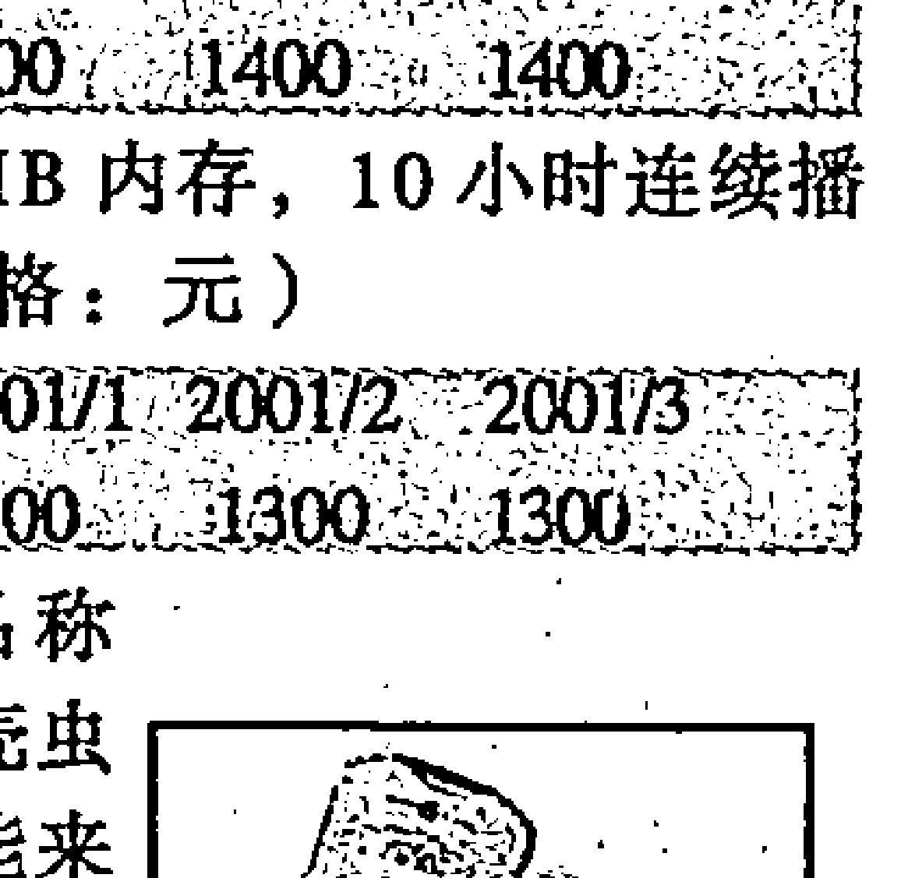

作为数字产品的一种，MP3的技术含量算是比较低的了，可是它真的给我们的生活带来了翻天覆地的变化，我们甚至可以利用MP3播放器来做移动的存储器，功能真的丰富啊！小鱼这次介绍的可以说是市场上最容易抓到的货啦！价格也都在1XXX - 21XX元的价格范围，是最适合用户购买的。而创新MP3 JUEBOX虽然有6GB的存储海量，可是4999元的价格也让我们望而却步，所以不在我们的讨论之列。

MP3的方便性是不言而喻的。MP3播放器的普及速度，将会远远超过人们接受磁带和CD的速度。更多的数字音乐产品将不断推出，可以播放MP3的VCD机，手表式的MP3播放器，支持MP3播放的手机/数码相机，数字音乐将无处不在。正是如此，制造商才把MP3播放器当作消费类电子产品，而不是PC外设产品的原因。MP3播放器将改变我们欣赏音乐的方式，它终将成为与Walkman/Cdman类似的产品，进入每个人的生活。

三星 YP-E64 64MB内存，中文显示屏，256分钟录音时间，可收音，USB接口，可扩充内存（产品价格：元）

| 2000/11 | 2000/12 | 2001/1 | 2001/2 | 2001/3 |
|---------|---------|--------|--------|--------|
| 1950    | 1900    | 1900   | 1750   | 1750   |

三星 YP-E32 32MB内存，中文显示屏，128分钟录音时间，并行口，可扩充内存（产品价格：元）

| 2000/11 | 2000/12 | 2001/1 | 2001/2 | 2001/3 |
|---------|---------|--------|--------|--------|
| 1750    | 1700    | 1500   | 1450   | 1450   |

大家很容易就能看到三星流行MP3的价格走向，价格变化比较稳定，下调价格的速度很慢，这也是因为国内购买这类数字产品的用户还不是特别多，要用一定的价格来吸引用户。而且面对国内同类产品的竞争厂商的价格调整三星也必须时刻注意，价格不能高得太离谱，否则怎么可能压的住价格呢？三星的这两款MP3播放器，样子都比较小巧且吸引人。

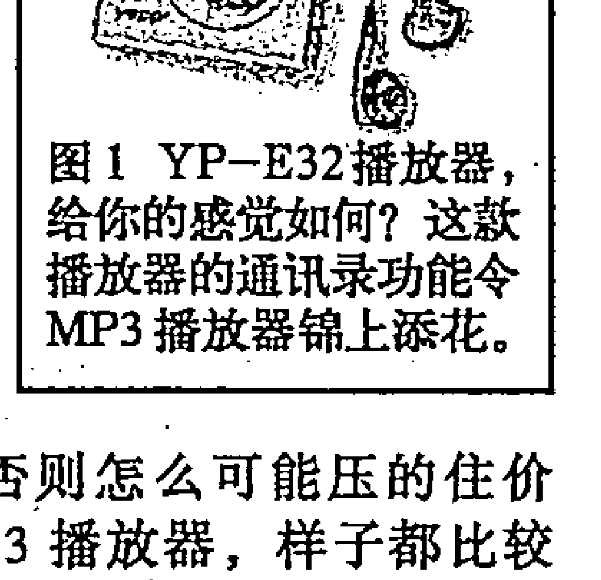

帝盟 Rio 500 64MB内存，可扩充至96MB，录放，USB口，支持MAC机（产品价格：元）

| 2000/11 | 2000/12 | 2001/1 | 2001/2 | 2001/3 |
|---------|---------|--------|--------|--------|
| 2250    | 2150    | 2150   | 2050   | 2050   |

帝盟 Rio 600 64MB内存，可扩充至340MB，可换彩壳，支持MAC机（产品价格：元）

| 2000/11 | 2000/12 | 2001/1 | 2001/2 | 2001/3 |
|---------|---------|--------|--------|--------|
| 2550    | 2350    | 2250   | 2180   | 2180   |

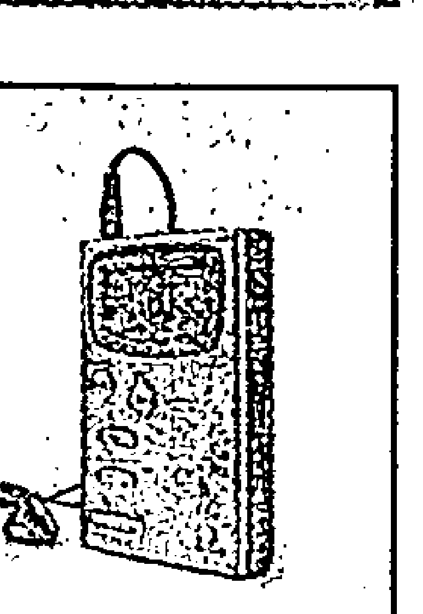# 装机配置指南

在装机的时候，很多人都对机箱的选购重视不足。其实，作为电脑整机稳定运行的保障，在整个计算机系统中，一款好的机箱是必不可少的。随着组装机的日益普及，我们又应该如何挑选一款性能良好的机箱呢？今天我们就来探讨一下电脑机箱。

## 一、机箱的划分

面对各种各样的机箱，我们可以从样式和结构上进行划分。

在选购机箱时，从直观上不难看出，机箱分为立式和卧式两种。相比之下，在立式机箱中，电源置于后上方，其内部空间相对卧式要大一些。按物理上热空气上升、冷空气下降的原理，这种机箱的散热性较卧式机箱要好。由于大多数新款的立式机箱都采用了侧面开立式的结构，这使得在添加各种配件时，打开机箱要比打开卧式的机箱方便，所以攒机一族常选用立式机箱，以便于配件的更新换代。不过，由于立式机箱体积较大，不适合在空间较小的环境里使用。相对来说，虽然卧式机箱在散热性和扩展性上不如立式机箱，但是它可以放在显示器下面，能节省不少的桌面空间。

谈起机箱的结构，它与计算机所采用的主板结构有关。对机箱而言，目前能够见到的机箱结构主要有AT、ATX、NLX、MICRO ATX、WTX（或叫Flex-ATX）等。

目前来看，由于绝大多数主板都是ATX结构，所以ATX机箱也开始在市场中盛行起来，成为当今机箱市场的主流。ATX机箱与老式的AT机箱相比较，最大的不同在于ATX机箱的背面有一个留有各种接口孔洞的挡板，以对应ATX主板上的标准接口。而AT主板与外设的接口都是通过连线引出来的，自然也就用不到这个带有孔形的挡板了。在安装主板时，AT主板可以安装在AT和ATX两种机箱里，但是ATX主板只能装在ATX机箱里。ATX有1.0和2.0两种规范，其中ATX 1.0的电源风扇向机箱里吹风，2.0的风扇正好相反，是朝外吹的。两者之间差别明显，很容易区分。相比之下，ATX 2.0结构更合理，机箱散热也更好处理。

WTX（Flex-ATX）是一种新型研发的人性化机箱，它可以摆脱机箱一直给人方方正正、中规中矩的外在感觉，让机箱家族融入更多的人性化、生活化设计，美化我们的生活空间，使电脑更显其赏心悦目的一面。

AT机箱是配合早期的AT结构主板的，其全称是BABY-AT。目前AT机箱淡出了主流市场，不过在二手市场上却很常见。至于NLX、MICRO ATX等机箱大多是品牌机所采用的结构，一般兼容机市场很少采用。

除了样式和结构外，衡量机箱的大小还要看看尺寸。尺寸的差别主要反映在机箱所拥有的3英寸以及5英寸驱动器架的数量上。随着CD-R及多驱动器配置的流行，如果条件允许，建议大家选购驱动器架的数量相对多的机箱，以便日后扩展。

## 二、如何选择机箱

机箱生产看似简单，然而要做到让机箱成为保护电脑正常稳定工作、屏蔽电磁辐射的重要保障，而且要便于拆装，具有人性化风格以及强大的扩展能力等等，都是说来容易做时难。所以一般情况下，应采用一些著名的生产厂家和知名品牌，如爱国者、世纪之星等品牌。下面我们来看看该如何挑选一款机箱。

买机箱时首先要看外观。现在市场上一些知名的机箱生产厂商在外型上都有着极为丰富的设计，因此也留给用户们更多的选择机会。对于机箱外观的选择，完全是因人而异，只要自己喜欢，与其他的电脑外设相搭配就行了。比如机箱市场的知名品牌爱国者今年推出了“88”系列时尚机箱，世纪之星推出透明大风扇机箱等。这些产品，外形独特，并有多种外观可供选择，可见外观对于机箱的选择也是极重要的一个标准。

挑好外观后，你就该检查机箱内部的制作工艺了。好的机箱在生产中单靠质量上佳的板材是不够的，在加工过程中还需要好的工艺，而工艺的好坏直接决定了机箱的品质。首先，工艺较高的机箱，其钢板边缘不会有毛口、毛边、毛刺等，并且所有裸露的边角都经过了折边处理，也就是所说的全折边设计，不会划伤装机者的手。箱内应有撑扛防止外盖下沉，底板厚重结实，沿对角抱起不会发生变形，具有很强的抗冲击能力。许多知名的机箱品牌，全系列的产品均采用了全折边设计。

衡量机箱的好坏，还有一个重要的因素，那就是好机箱各个插卡槽位的定位非常准确，不会有配件错位的情况发生，这一点在选购时就要靠经验了。

相比之下，许多杂牌机箱工艺极差，其表面漆层不平整且附着不好，稍一碰撞便会蹭下一块漆皮。并且这些机箱铁皮的切口处处理相当粗糙，边沿和棱角非常锋利甚至还有尖锐的毛刺，使用者一不小心就会将手割伤。

与这些劣质机箱相比，好的机箱在内部设计方面是下了一番工夫的。一般来说，各个品牌的机箱之间，除了质量上的差异就是设计方面的不同了。

在内部设计中，各厂商也是推陈出新。有的机箱在3英寸和5英寸驱动器架的位置安装了一块挡板，能够提高安装在这个位置的驱动器的防尘能力，比如CD-ROM等，而且有滑动、推拉、伸缩等多种方式。笔者使用的爱国者“月光宝盒”机箱就采用了免螺丝拆装设计。这种设计，全部使用锁扣或镶嵌的方式来固定部件，如果想拆卸某个部件的话，根本不需要螺丝刀，比较适合经常拆卸电脑的DIY玩家使用。

很多机箱在箱内前部和后部均留有散热孔以及机箱风扇的位置，如果在这两个位置各安装一个机箱风扇的话，可以大幅度提高整机的散热能力，保证系统稳定地运行。

除了上面介绍的内容，作为DIY发烧友来说，在选购机箱时还要注意以下几个方面。

### 扩展性能
保留适当的可扩展性是DIYer装机的最基本要求之一，这一点对于机箱来说显得尤为重要。

目前几乎所有用户的电脑都安装有光驱、硬盘、软驱这些设备，至少要占用驱动器托架上的一个5英寸仓和两个3英寸仓。而目前市场中有一种超薄型机箱里有一个5英寸仓和两个3英寸仓，安装了上述设备后，几乎没有任何扩展的余地。选择机箱时，考虑到以后将有可能添置一部3英寸硬盘、5英寸DVD驱动器和CD-R驱动器，因此在机箱驱动器托架上至少应该有三个以上的3英寸和5英寸设备的安装位置，增加机箱的扩展性。

### 散热设计
随着计算机速度的提高，其发热量也呈直线上升的趋势，加之近年来超频盛行一时，这些都对计算机散热设计提出了更高的要求。

在最早期的时候，计算机的CPU、主板芯片组、显示芯片组等普遍采用自然方式散热。到Pentium（及同级处理器）电脑成为市场主流之后，风扇配合散热片进行强制降温已作为主要的方法广泛应用于计算机核心发热部件的散热。但是，散热方式的升级只能从另外一个角度说明现代计算机发热量的增加，机器内部产生的热量首先是通过上述散热设备释放到机箱内，然后由机箱（电源）风扇排出，与外界空气进行热量交换，机箱的整体散热对计算机系统实在是至关重要。如果机箱散热设计低劣，无法良好散热，过多的热量会积聚下来，引起整个系统温度大幅度增高，最终导致计算机使用寿命变短、稳定性下降、死机甚至烧毁硬件等恶劣后果。当然我们如果有一个通风流畅、散热良好的机箱，以上种种问题就可迎刃而解。对于所有的DIYer，最理想的机箱莫过于那种箱体宽大，前面板有足够多的通风孔，且前后均留有机箱风扇安装位置的大型ATX机箱了。

此外，还要考虑的是电磁波屏蔽的问题。由于计算机内部存在大量高频电子器件，因此在运行时，机箱内部会产生大量的高频电磁波。如果这种高频电磁波大量外泄，肯定会对使用者的身体造成一些不利的影响。而一个优质的机箱能发挥有效的屏蔽作用，将泄漏的电磁波控制在安全的幅度内。

近年来，质检部门对国内市场上的各类计算机做过多次检验，结果表明，杂牌兼容机问题最多的是电磁泄漏严重超标。很多兼容机箱，用料很差，整个前面板全部由塑料做的，而里面并没有任何金属层，这样的机箱很难谈得上什么电磁屏蔽效果。我们从市场上一些品质比较好的电脑机箱上可以见到机箱六面均有完整的金属衬层，这是区分机箱优劣的一个标准。

### 机箱的用料
一般电脑机箱的箱体多用薄的镀锌钢板轧制而成。名厂生产的机箱，对其箱体、托架所采用的板材厚度均有一定的要求，这些机箱我们捧在手里，首先就有一种沉甸甸的感觉，如爱国者、华硕、银河等名牌机箱。

机箱主要由前部的塑料面板和钢板铆接而成的框架两部分组成。高档机箱的前面板采用硬度较高的ABS或HIPS工程塑料制成，即使使用很长时间也不会泛黄或开裂，而且易于清洁。标准的机箱箱体，采用的板材应该是经过特殊处理的冷镀锌钢板，这种钢板本身的厚度至少应该在一毫米以上，只有使用这种钢板的机箱，才能够满足系统在电磁屏蔽、抗外击程度等方面的要求。由于优质机箱通常采用导电率比较高的镀锌钢板，所以对机箱内外的电磁辐射屏蔽效果良好，这有利于提高整个系统的稳定性。从市场上看，很多劣质机箱的前面板采用的塑料多数都是一般塑料，时间一长就会泛黄、老化甚至开裂，其机箱箱体所采用的钢板也很薄，这种机箱由于板材较软，容易导致插卡槽位定位不准确，箱体甚至会变形。此种机箱无论多么好看多么便宜都不要购买。

## 三、我的推荐

好了，说了这么多，对机箱的选购你也做到心中有数了吧？最后，作为个人推荐，建议大家在购买机箱时可以考虑以下几种产品。

- 保利得7520: 700元（带300W Pentium4电源）
- 顺新6816C: 395元（带顺新250W电源）
- 技展6000PB: 380元（带技展300W电源）
- 爱国者月光宝盒250S（免工具拆装）: 480元
- 爱国者月光宝盒300SE（免工具拆装）: 560元
- 金河田小网神ATX-2011: 400元（带金河田K7-335电源）
- 世纪之星206: 450元（带世纪之星标准版250W电源）
- 机箱2005/2006/2007/2008(长城ATX): 380元
- Aopen: 480元

我使用的是爱国者的月光宝盒机箱，这种机箱的前、左、右面板都采用卡插式结构。拨开前面板底部的卡簧，轻轻一拉就可以将前面板取下。在左、右两侧面板的后面，各有一个手动螺丝固定，用手轻轻拧下，向前方一推就可以将这两块面板取下。与传统机箱相比，这种拆卸方法更加简单、快捷。对于我这样经常要打开机箱的人而言，很适合。另外，如果你经常超频，一定要配个空间大的机箱。至于有些随机箱的电源，选购时一定要考虑功率、噪声、散热的问题。

# 今年如何购买内存

□广东 Infosight

购买一台性能优良的电脑，大家往往注意CPU有多快，而很少注意内存的容量和品牌。事实从一定程度上讲，计算机的性能瓶颈并不在于CPU或者其他部件，而在于内存的快慢。现在的应用软件越做越大，想很好地运行WinMe、Win2000这样的操作系统，顺畅地玩游戏，最起码也得是64MB内存。现在一般的电脑内存配置都在128MB，稍好一点的达到256MB，甚至更多。根据以往升级电脑的经验，增加内存是电脑各硬件升级中最有效、最实用的提升电脑速度的方法。因此用户应该对内存的选购给予足够的重视。

## 首先，购买何种类型的内存

内存从产生之日，经过了FPM DRAM、EDO DRAM、BEDO DRAM到现在的SDRAM，以及现在竞争激烈的DDR、RDRAM等，可谓种类繁多。不过EDO内存现在基本上没有卖的了，除非在一些老古董的机器上还能看见，现在已经很难找到它的踪影了。DDR和RDRAM是新近出现的两种内存类型，其中RAMBUS DRAM是RAMBUS公司和Intel联合推出的新一代内存，而DDR内存规格受到了包括芯片组大厂威盛及世界各大芯片组厂商的支持。从现在的情形来看，DDR极有可能击败RDRAM成为新一代内存的标准。

不过，如果你不是专业的图形工作者，或者极度发烧的游戏迷，购买内存最好还是选择SDRAM。虽然DDR内存由于带宽的扩大，数据传输速率的增长，会给你带来非同寻常的感受，但现在它的价位也会让你感受非同寻常。目前市场上DDR内存128MB一般卖到1500元左右，价格高出SDRAM一倍还多，并且没有现货，得预定。因此，SDRAM还是目前最好的选择，本文的内容也是基于SDRAM而言。

## 其次，多少内存才算够

对内存的需求，主要得看使用的操作系统和软件。对于Win95/98来说，64MB内存一般情况下够用了，但最好是有128MB内存，否则在同时运行多个应用程序时可能会有系统响应迟钝的表现。而对于Win2000和面向新时代的WinMe操作系统来讲，建议用户最少应该配备128MB的内存，否则运行速度必定会很慢，如果具备256MB内存，便可以使它很好地运行了。

另外，如果是经常使用诸如Office2000之类的文字处理软件，使用Photoshop、AutoCAD、3DS MAX之类的大型应用软件或者用在服务器上，内存容量则至少要在笔者建议的配置上再加上一倍，而且多多益善。经常上网的网虫们也需要较大的内存容量，因为每打开一个浏览器窗口就会耗费一定的系统资源，打开的窗口越多，耗费的资源也就越大。因此，网虫的内存配置数量可以向游戏发烧友看齐。

对于游戏发烧友，像Quake3/Unreal这样的大型3D游戏，一方面场景和游戏就要占用很多内存，游戏的3D纹理也会通过AGP显卡占用一定的内存，所以在用64MB和128MB时，启动速度后者比前者要快一倍多。目前而言，要想流畅运行大型3D游戏，基本要求就是128MB，而256MB是追求游戏流畅的最佳选择。

## 购买时的主要参照

现在市场上内存品牌众多，封装形式各不相同，如何真正买到物有所值的内存就得有一定的鉴别能力。首先看一下与内存性能有关的一些参数。

评估内存的参数主要有以下几个：

1. 系统时钟循环周期：它表示SDRAM能运行的最大频率。譬如，一块系统时钟频率为7ns的SDRAM的芯片，它可以运行在133MHz的频率下。显然，这个数字越小，SDRAM芯片所能运行的频率就越高。例如金邦科技生产的GL2000千禧条，它的芯片上所刻的-7代表了其运行的时钟周期为7ns，可以跑143MHz的外频。根据GL2000千禧条的产品数据表我们可以知道，这种芯片的存取数据的时间（下面会讲到该指标）为7ns。
2. 存取时间：存取时间代表了读取数据所延迟的时间。绝大多数SDRAM芯片的存取时间为6、7、8或10ns。
3. CAS反应时间：它是CAS(纵向地址脉冲)的延迟时间。某些SDRAM能够运行在CAS反应时间(CL)2或3模式，也就是说它们读取数据所延迟的时间是两个时钟周期，或者是三个时钟周期。例如金邦科技另一种产品金邦金条CAS=2，即读取数据所延迟的时间可以是两个时钟周期。我们可以把这个性能写入SDRAM的SPD中，这样PC的BIOS会检查此项内容，并且以CL=2模式的速度运行。

这里需要特别提起的是，SPD值对一个内存是至关重要的（以前很少有用户注意到这一点）。有些小的厂商为了节约成本，不用SPD或者在SPD中随便写一些数据，这非常影响内存和主板之间的配合。上面介绍了SPD存储的是内存运行的数据，主板根据这些数据决定运行的状态，SPD数据不正确或者没有，都不利于内存性能的充分发挥。正是基于这一点，很多内存生产大厂都使用了各自独特的技术手段，比如内存生产厂商金邦科技就推出了“量身定做”的概念，即按照SPD来设置内存的存取时间，不同的主板匹配的SPD值不同，因此金邦金条也可分为“红、绿、蓝”三种。由于各种金邦金条的SPD均是确定的，因此可以对应不同的主板。当然，其他品牌的内存也有不同的存取时间，但没有按照存取时间来标识出最为匹配的主板。如果你没有掌握相关的知识，难以选择对应的内存，很容易造成兼容性问题。

4. 内存的封装：如同微处理器一样，内存条的技术也是不断地更新，内存的颗粒变得更小、更精致，这些内存在适用频率和电气特性上也有了长足的进步。这一切应归功于那些厂商选用了新型内存芯片封装技术。目前新型芯片封装技术主要有以下几种：
    - BLP: 英文全称为Bottom Leaded Plastic（底部引出塑封技术），是新一代封装技术中的佼佼者，其芯片面积与封装面积之比大于1：1.1，符合CSP(Chip Size Package)封装规范。不仅高度和面积极小，而且电气特性得到了进一步的提高。相比之下，这种封装技术的制造成本也并不算高，它广泛地应用于SDRAM、RDRAM、DDR等内存制造上。品质不错的金邦金条就是采用这种封装形式的产品。
    - uBGA: 英文全称为Micro Ball Grid Array（微型球栅阵列封装），其芯片面积与封装面积之比大于1：1.14，是Tessera的独家专利，尤其适合工作于高频状态下的RDRAM，但制造成本极高昂，目前主要用于RDRAM。
    - TinyBGA: 英文全称为Tiny Ball Grid Array（小型球栅阵列封装），其芯片面积与封装面积之比不小于1：1.14，是KingMax的专利，属于BGA封装技术的一个分支。KingMax采用这种封装形式。
    - TSOP II: 英文全称为Thin Small Outline Package（薄型小尺寸封装），目前广泛应用于SDRAM内存的制造上，但是随着时间的推移和技术的进步，TSOP II已越来越不适用于高频、高速的新一代内存。目前市场上的内存产品中，GL2000千禧条、HY等内存采用这种封装方式。

从目前内存市场状况来看，BLP封装技术可能成为本世纪初期的主流，也就是说，SDRAM内存还会在相当长的时间内流行在市场中。采用uBGA封装技术的RDRAM内存虽然速度快，但是价格昂贵得多，在同等容量下，即使速度再快，出于性价比的考虑，更多的用户可能选择较便宜的SDRAM。

# 硬件产品价格综合分析

□北京 阿明

## CPU

CPU可以说是一天一个价格，不过总的趋势是在跌、跌、跌的状态中，价格用一句话形容是没有最好只有更好。AMD的毒龙850的价格可能在4月份时会降到750元以内，雷鸟800/900/950/1000分别为900元/1070元/1150元/1600元。AMD的价格本身就差不多比同档次的PⅢ便宜三分之一，这种情况会一直持续下去。Intel在国际市场目前也在降价，但在国内由于现在经销商手上还有一些存货，估计不会有太大的降幅。和内存一样的是现在市场上也是假货充斥，现在散包的800EB有百分之八十五是用600E超的，造假的手段极为高超，希望大家注意，还是选用盒包的心里踏实一点。预计4月的价格为：AMD: Duron 750/800/850分别为420元/580元/750元，雷鸟800/900/950/1000分别为900元/1070元/1150元/1600元。Intel 赛扬Ⅱ600/667/700/733的价格为520元/530元/620元/650元。PIII 800EB/866（盒包）的价格是1500元/1600元。

至于大家期待已久的100外频的CⅡ800，因为其初始价格已超过一千大元，市场里没有什么商家敢进货，怕降价砸在手里，所以暂时还没有大量上市的迹象，心动的朋友还是耐心等等，等到它降价再说吧。

## 显示器

在美格推出“珑行天下”的纯平大特卖活动之后，拉开了新的一轮纯平显示器价格大战，现在的价格已经跌破3000元大关。3月份的时候，三星、LG等大的显示器厂商虽说也降了一些价格，但还没有什么大的动作，预计4月某些低端的价格会降入2000元大关，预计4月的报价大致为：三星：550S（15英寸）1200元、750S（17英寸）1750元、753DF（17英寸纯平）2490元。ADI：M500（15英寸）1180元、M700（17英寸）1730元、E75（17英寸）2480元。LG：774FT（17英寸纯平）2499元、775FT（17英寸纯平）2390元。美格：XJ570（15英寸）1399元、786FD 2699元。高端目前来看降价的空间已经不太大了，预计4月份会和3月份保持平行的价格，预计4月的价格大约是：三星700RTF（17英寸纯平）2980元。ADI G710 3180元。LG 795 PLUS 2880元。美格 796FD 2999元。

看到如此让人心动的价格，使我们想拥有一台纯平显示器不再是梦想。

## 内存

现在的内存市场可以说是形式一派大好，普通的现代128MB的内存已经在300元以内了，即使是现代原厂的128MB内存也在420元左右，不过做工、用料和兼容性上就要比普通的好多了。如果经济实力允许的话，希望还是多多的考虑一下它。大家要注意的是，现在市场上有一批假的现代原厂的内存在销售，购买的时候要特别注意一下。假的现代原厂内存PCB底板比真的从宽度上要小一些，而且在用料和做工上要稍差一点，当然价格会便宜一些。但是提醒大家不要为了便宜几十元钱而去买假的现代原厂内存。估计4月份的时候普通现代内存价格不会有太大的变化，还会保持在290元左右。现代原厂的内存可能会降到400元左右。

## 硬盘

现在硬盘真是便宜，谁不希望自己的硬盘又快又大呢？10GB、15GB的硬盘已经渐渐淡出了主流的市场，现在20GB已经成为大家的首选目标，而且选择30GB的也大有人在。但现在最大的问题出在硬盘总是供货不足，而且暂时不会有大的改变。价格上维持目前的现状且略有下降，预计价格为，20GB（7200转）900元左右，30GB（7200转）1000元左右。

好累！好累！本次预测结束了，希望我的预测能帮助大家，也希望大家4月能买到称心的机器。

## 九招选定好主板

□黑龙江 秀才

主板负责连接计算机的一切板卡，它的重要性是显而易见的。事实上，挑选一块性能稳定、做工精良的主板，不仅能够为自己的电脑生涯带来很多便利，同时也可以避免很多不必要的麻烦。笔者所在公司的1年前请人攒了几台机器作为办公之用，然而近来其中几台机器频频“罢工”，损失之大，难以言表。追其原因，原来都是主板惹的祸。为此领导责令笔者为其更换，不得有误。为了不辱使命，笔者拿出多年的“相板”经验，走遍村里，细心考察，终于“夺板”而归，最后受到嘉奖。高兴之余，将其总结如下，特供大家参考。

头一招：看品牌，目前主板市场上品牌林立，选择一个好的品牌不仅质量有保证，而且也会享受到良好的服务，并且品牌主板在出厂前都需经过严格的质量检测。目前村里常见的主板都是台湾的，比如大家都熟悉的华硕、技嘉和微星等品牌，国内较著名的主板厂商主要是联想主板，我在村里“相”到的主板就有一块是它的815EP主板，目前只卖898元，性能价格比相当不错。其实在这些品牌的背后，我看重的是产品质量和服务。

第二招：先看包装，再掂其重，后观其表。首先，看主板的外包装，正规厂家的外包装一般较结实和清晰，包装上都有厂家的Logo、条形码，内装主板的名称以及简单的介绍。掂其重就是用手感觉一下主板的重量，两者比较，重者为佳。观其表就是看主板的厚度，主板电路板的层数及布线是否合理。一块好的主板，整体应该给人一种流畅、布局合理的感觉，每个电路焊接点应该光滑，不拖泥带水，即没有“飞线”现象。布线合理流畅，也将影响到整块主板的电气性能。另外选购时应该尽量选择四层或多层板，方法就是拿起主板看其透明度，不透的为好。

第三招：看细节，首先看芯片组，包括型号、生产日期。芯片组掌握着一块主板的一切性能（比如有几个扩展插槽，支持哪些处理器，支持何种内存条等等）。如果各芯片的生产日期年代间隔较远，则要小心查看。一般来说，各个芯片组的生产日期不应超过3 - 4个月，否则将影响主板性能。如果希望主板能最大限度地支持未来的处理器，那么理想的主板应该是采用最新芯片组的主板。目前如Intel的815E/EP，VIA的694X搭配686B等。

第四招：看板载电池。电池是为保持CMOS数据和时钟的运转而设的。选购时，要观察电池是否生锈、漏液。若生锈，可换下电池。若漏液，严重时可导致整块主板因腐蚀而报废，因此不宜购买。从村里观察来看，所卖的主板电池一般都很新。

第五招：看插槽。一般来说，主要是看ISA槽。方法是先仔细观察槽孔的弹簧片的形状，再把ISA卡插入槽中后拔出，观察现在槽孔内的弹簧片位置形状是否与原来相同，偏差较大的则说明该插槽的弹簧片弹性不好，质量较差。但是目前多数主板已经取消了ISA槽或只有1个，所以也就省了不少心。对于PCI、AGP以及DIMM插槽主要是看外观没有损坏就行了，内部一般没问题。CPU插槽如果是Socket370的，可以搬动手柄，看其灵活度。

第六招：摇跳线和轻触电容。跳线主要是板上戴蓝帽子的东东，仔细观察各组跳线是否有虚焊。通电开机后，轻微触动跳线，看微机是否出错。若有出错信息，则说明跳线松动，性能不稳定，此主板不应在选购之列。轻触电容，看看是否焊得结实，它们会影响主板供电效能。

第七招：检查其他各种元件，杂牌主板在元件的选料上以低价的次品为主，各插槽、插座和元件均无厂牌。在元件组装焊接方面，板基通常只采用两层板或三层板，而且不太重要的元件均不安装。而品牌主板从元件选料到焊接都做得工工整整，各插槽元件和插座均选自著名品牌。

第八招：看配件。正规的厂家一般配件给的比较全，比如联想主板附件除了光盘外，还有外接的USB电缆，两个数据传输线等。尽管不是很贵的东西，但是让人感到贴心。

第九招：看说明书。杂牌的主板最基本的说明书只有短短几页纸，而品牌主板说明书详尽具体而且精美。

## 怎样买块好硬盘

□福建 袁宁

硬盘作为家用电脑中一个非常重要的部件，自始至终都受到了电脑使用者格外的关注，无论是新装机还是准备升级，硬盘的选购都是颇值得关注的。那么到底怎样选择一款实用又称心如意的好货呢？我们不妨来看看。

### ★选购常识篇

事实上，无论你选择什么样的硬盘都该着重考察下面几个方面：容量、缓存、转速、接口、附加技术以及性价比等。

### 1.容量

容量可以说是用户对硬盘认识最多的一个技术指标，它的单位是千兆字节（GB）。一般来说，影响容量的两个因素是单碟容量和碟片数量。其中单碟容量就是在单张盘片上所能存储的信息容量，单碟容量越大，实现大容量硬盘也就越容易，而寻找数据所需的时间也相对减少。现在硬盘的单碟容量一般都可以达到15GB。从目前用户需求及市场状况来看，家用PC的主流硬盘容量已经接近或达到30GB。当你要考虑购买或升级一款主流产品时，最好选购容量在20GB以上的产品，因为下半年30GB左右的硬盘就会成为市场绝对的主流，并且出现大量40GB、60GB的产品。总之，在预算许可的前提下，硬盘的容量显然是越大越好。

### 2.缓存

硬盘缓存与主板上的高速缓存作用一样，是为了提高硬盘的读写速度，缓存当然也是越大越好。目前IDE硬盘的高速缓存一般为512kB或2MB，主流的7200转硬盘基本都具有2MB缓存，而某些经典的低端硬盘则可能保留512kB的配置。

### 3.转速

转速也是一个反映硬盘档次的指标，指的是硬盘内电机主轴的转动速度，其单位是RPM（Round Per Minute，每分钟旋转次数），它直接影响硬盘的数据传输率，理论上转速越快数据传输率就越大。目前IDE接口的硬盘主轴转速一般为5400和7200RPM（转/秒），中高档硬盘的转速为7200RPM。现在用户购买硬盘，如果比较注重性能，7200转硬盘当为首选。但如果比较注重实用，5400转的硬盘一般来说会具有更高的性价比。然而从日后的主流配置来看，7200转还是必然的选择。

### 4.接口

硬盘的接口方式可以说是硬盘另一个非常重要的技术指标，除了传统的IDE和SCSI外，IEEE1394接口的硬盘也已经开始在专业场合有所应用。对于家庭用户，IDE硬盘还是最常规的选择。目前市场上的主流IDE硬盘普遍支持UltraDMA/66，部分新品已经完全支持最新的UltraDMA/100标准了。UltraDMA/100理论上最大数据传输率可以达到100MB/s（不过实际状况由于硬盘内部传输速度有限等原因尚不能达到），实际应用也可以提高约5%左右的性能。另外，UltraDMA/100的硬盘由于向下兼容UltraDMA/33/66，一般来说兼容性也不存在太大问题。所以，如果是新装机或准备升级的用户，不妨考虑支持UltraDMA/100的硬盘产品，尤其是选用i815E主板的用户。但如果是其他正在使用UltraDMA/66/33硬盘的用户，也没有太大必要为这个标准而升级硬盘。

### 5.附加技术

硬盘作为一个具有较高技术含量的产品，往往具有各自的附加功能。虽然各个硬盘厂商自发研制的附加技术有所不同，但一般来说都是为了达到两个目标。一个是提高硬盘的抗震和抗瞬间冲击的性能，另一个是通过软硬结合对硬盘进行监测和自我诊断，及早发现潜在的问题，并结合硬盘一定的自我修复能力将故障消灭在萌芽状态。总的来看，不同厂商的技术不过是实现的方法不同而已，其技术含量基本处于同一层次。这之中除了硬盘所共有的S.M.A.R.T.技术以外，主要有迈拓的ShockBlock和Maxsafe、昆腾的DPS（Data Protection System）和SPS（Shock Protection System）、希捷的Seashield和DST（Drive Self Test）、西数的Data Lifeguard（数据卫士）、IBM的DFT（Drive Fitness Test）和富士通的CSS（Contact Start Stop）等。

### 6.性价比

由于电脑配件的快速发展，每段时间市场上都会出现一部分主流产品。一般来说，主流产品或稍逊于主流的产品具有较优的性价比，而具有较高性能的产品则价格较为昂贵。目前主流产品转速多为7200RPM，数据缓存为2MB，平均寻道时间低于9.0ms。容量20GB、接口类型为UltraDMA/66的价格在950元左右，容量30GB、接口类型为UltraDMA/100的则在1200大洋上下。

### 7.其他

除了上面那些主要因素外，还有平均寻道时间、硬盘工作温升幅度、磁头形式和内外部传输率也是影响硬盘性能的重要指标，特别是平均寻道时间与硬盘速度的关系也很大。一般来说，在家用硬盘中，7200转产品的平均寻道时间最好在8.5ms以下，而5400转的产品也要达到9.5ms甚至9ms以下为宜。

### ★产品介绍篇

在国内的硬盘市场中，由于硬盘厂商的激烈竞争，硬盘技术不断提升，品种更加多样，而价格也越来越低。这带给消费者的就是选择的余地越来越大。目前，国内常见的硬盘品牌有IBM、旧昆腾、迈拓、希捷、西部数据、富士通等，当然昆腾硬盘这个牌子由于被迈拓收购会随着时间的推移而逐渐被迈拓所取代。下面就各个厂家的特点、代表产品等方面给大家一个简单介绍。

### 1. IBM

IBM硬盘无论从技术上还是名声上，一向都是DIYer首选的品牌，特别是大容量低价格硬盘在市场上非常走俏。IBM硬盘有Deskstar（桌面之星）、Travelstar（移动之星）、Ultrastar三大家族产品。就桌面系列产品而言，有Deskstar 22GXP、25GP、34GXP、37GP、75GXP、40GV多个系列（IBM硬盘型号中以GP结尾的表示此硬盘为5400RPM，以GXP结尾的表示此硬盘为7200RPM，而且这个GP/GXP的前面数字表示此系列硬盘中的最大容量，一般单位为GB）。IBM在市场上常见的7200转的主要是2MB缓存的Deskstar 22GXP和Deskstar 34GXP及最新的Deskstar 75GXP系列，它们的差别主要就在于单碟容量不同，分别是4.55GB、6.8GB和15GB。IBM硬盘的特点是质量稳定，中规中矩，其各项指标在各类硬盘中属中等偏上水平。它家用主流的产品有Deskstar GXP系列（20.5G/UDMA100/2M/7200RPM/900元）和腾龙二代玻璃硬盘系列（30.7G/UDMA100/2M/7200RPM/1230元），都很耐用。

### 2. 旧昆腾QUANTUM

昆腾硬盘多年来凭借着在广大DIYer中良好的口碑，一直在国内畅销不衰。它的特点是质量稳定，故障率低，而且超频性能特别好，其各项指标在各种硬盘中也属中上等水平。现在在桌面系列产品有“火球”、“超能火球”和“大脚”三大系列。其家用主流的产品有低端的火球十三代Lot20（20.4G/UDMA66/512K/4400RPM/880元、30.7G/UDMA66/512K/4400RPM/950元）、超能火球二代KX（30.7G/UDMA66/2M/5400RPM/970元）、高端的超能火球三代LM（20.4G/UDMA66/2M/7200RPM/950元、30.7G/UDMA66/2M/7200RPM/1200元）和超能火球四代AS（20.4G/UDMA100/2M/7200RPM/960元）。其超能火球三代、四代的产品性价比很高，适合注重实用性的朋友。

### 3. 迈拓MAXTOR

迈拓是硬盘界的“美格”，一向以生产IDE硬盘而著称。在产品方面，迈拓推出的硬盘有钻石、金钻及星钻系列。现在市场上最受欢迎的就是星钻系列，特点是性能特别优异，各项指标名列前茅，而且价格也不算高。迈拓家用主流的产品有钻石十代（20.4G/UDMA66/512k/5400RPM/850元）、金钻五代（20.4G/UDMA100/2M/7200RPM/1070元、30.7G/UDMA100/2M/7200RPM/1200元）和星钻一代（20.4G/UDMA100/2M/5400RPM/860元、30.7G/UDMA100/2M/5400RPM/1020元）。迈拓硬盘由于其型号较多，大家在选购的时候要加以仔细区分，特别是同一系列中不同代的型号。笔者推荐金钻五代和星钻一代的产品。

### 4. 希捷SEAGATE

希捷是高端SCSI硬盘领域的老大，在家用IDE硬盘领域，虽然前两年因为某些系列的产品噪音大、发热量高，影响了口碑。但随着希捷“酷鱼”系列的推出，开始逐步树立自己低价格高性能的特色。现在希捷硬盘主推新酷鱼系列，其家用主流的产品有新酷鱼II代（20.4G/UDMA66/2M/7200RPM/1010元、30.4G/UDMA66/2M/7200RPM/1130元）和新酷鱼III代（20.4G/UDMA100/2M/7200RPM/1025元、30.4G/UDMA100/2M/7200RPM/1180元），以及经典的U10系列（20.4G/UDMA66/512K/5400RPM/860元）等等。可以看到的是，酷鱼III代的价格并不比II代贵多少，但性能上有了显著的提高，是目前的热门产品之一。

### 5. 西部数据WESTERN DIGITAL

西部数据也是硬盘市场上比较有实力的大厂，其产品在欧美有比较大的影响力，但由于其在中国大陆的宣传力度不够，在国内的知名度不及上面的品牌，但是它的硬盘质量还是很不错的，特别是产品普遍非常安静和稳定。目前市面上的西数硬盘主要有5400转的鱼子酱（Caviar）系列和7200转的专家（Expert）系列。家用市场上鱼子酱系列是其主流产品，其中新出的鱼子酱BA（20.4G/UDMA66/2M/7200RPM/960元、30.7G/UDMA66/2M/7200RPM/1180元）的性能不错，在国内卖的却不是很好。

附表是家用市场主流型号主打产品的性能和价格数据，供大家参考。

| 品牌 | 系列 | 支持接口 | 转速 | 数据缓存 | 平均寻道时间 | 容量 | 价格 |
| :--- | :--- | :--- | :--- | :--- | :--- | :--- | :--- |
| IBM | DeskstarGXP | UDMA100 | 7200转 | 2MB | 8.5ms | 20.5GB | 900元 |
| IBM | 腾龙二代 | UDMA100 | 7200转 | 2MB | 8.5ms | 30.7GB | 1230元 |
| Quantum | 超能火球三代LM | UDMA66 | 7200转 | 2MB | 8.5ms | 30.7GB | 1200元 |
| Quantum | 超能火球四代AS | UDMA100 | 7200转 | 2MB | 8.5ms | 20.4GB | 960元 |
| Maxtor | 金钻五代 | UDMA100 | 7200转 | 2MB | 8.7ms | 20.4GB | 1070元 |
| Maxtor | 星钻一代 | UDMA100 | 5400转 | 2MB | 8.7ms | 30.7GB | 1020元 |
| Seagate | 新酷鱼II代 | UDMA66 | 7200转 | 2MB | 8.9ms | 20.4GB | 1010元 |
| Seagate | 新酷鱼III代 | UDMA100 | 7200转 | 2MB | 8.9ms | 30.4GB | 1180元 |
| WD | 鱼子酱BA | UDMA100 | 7200转 | 2MB | 8.9ms | 20.4GB | 960元 |

### ★注意事项

硬盘的选购不是一件纸上谈兵的事情，它需要实际的经验，所以在你选购的过程中，就必然会有一些事项需要你注意，特别是针对一些有可能被骗或失误的环节，你实在有必要提前打打预防针。

1.  看货时要问清。对于硬盘来说，最常见的蒙骗手段有两个。一个就是以低转速硬盘冒充高转速硬盘，另一个是以小缓存硬盘来冒充大缓存硬盘，从而赚取两者的差价。所以大家在购买硬盘时，一定要问清楚上面提到的几个性能指标的数据，要知道现在同容量5400转的硬盘和7200转的硬盘价格相差一、两百元，而且硬盘上集成的缓存多少及单碟容量等指标对硬盘的性能和价格也会有很大的影响。除此之外，不要一听是“超能火球”、“金钻”就不闻不问了，其实硬盘产品众多的分代中其性能是有很大差别的，一般来说在价格差不多的情况下应尽量选用后代的产品。

2.  拿货时要看清。除了上面的蒙骗手段外，还有一种通用的JS手段是将返修货或二手硬盘当新品卖给用户，甚至干脆用仿造的假货来牟取暴利。例如，市场上有许多水货Maxtor硬盘，没有包装盒也没有Maxtor全国代理蓝德标贴，由于不是正常渠道进的货，因此都不能提供完善的售后服务，有些甚至只质保一年。所以在购买硬盘时，大家务必要看清楚是不是提供3年质保。如果是正品盒装硬盘还要记住应有包装盒、有厂家标贴以及全国联保标贴和各地总代理的标贴等等。总之，大家在选购时尽量到当地有信誉的经销商或代理商处购买，这样买到水货的可能性就会小一些。当然在拿到货之后最好还是给硬盘做个测试以确保硬盘的质量与性能。测试时主要注意其有无坏道，稳定性、噪音感和运行速度如何，有条件的话还应该多用磁盘表面和速度测试软件检测一下，以看其性能质量是否符合要求。只有在通过质量测试，并且获得商家的售后保修、保换和书面承诺服务后，方可交款取货。

### ★最后的话

硬盘的选购如同大多数PC配件的选购一样，其原则无非是先从品牌厂商、关键性能指标（如转速、容量、缓存）和价格上把握住大的方向，然后再按照自己的需求配置一款适合自己的硬盘。总之，假如你是一位硬件发烧友，一切向高性能看齐，那么7200转、2MB缓存、支持UDMA100、平均寻道时间低于8.9ms，并且容量在30GB以上的硬盘才是可以考虑的。但假如你是一位完全的实用主义者，一切从性价比考虑，那么5400转、512kB缓存、支持UDMA66，并且容量不低于10GB的硬盘基本上也就可以满足日常的应用需要了。

## 真假联想鼠标

□安徽 周海兵

最近市场上大量出现了一种假冒联想的鼠标，JS们把它冒充成联想主板最近的促销活动中赠送的鼠标低价卖给“菜鸟”们。鉴于揭露他们是我们DIYer的责任，笔者在此把这种假冒鼠标和真品鼠标做一个比较来提醒各位千万别给JS钻了空子。

1.  这种e鼠是联想OEM罗技的一种滚轮鼠标，型号是M-S48。假货鼠标的后面铭牌的印刷很不清晰，且序列号都是一样的，没有变化，笔者手中的这只编号为S/N: LZE81251328，我看了一下，都是这样。而正品鼠标是一只一号，没有重复。

2.  假冒e鼠的铭牌位置是在靠近连线的上方，正品的则相反。

3.  正品鼠标的中间滚轮的材质具有弹性，单击行程较长。假冒鼠标的滚轮则较硬，且单击行程很短。

4.  在使用中感觉正品鼠标的手感舒适，反应灵敏，不愧是名家出品。而冒牌鼠标则在使用中表现平平，和普通杂牌鼠标没有什么两样。

其他还有一些小破绽，在这里就不一一列举了，最后希望大家都能养上一只称心如意的小“老鼠”。这样在上网浏览的时候可是会给我们省一点银子哦！

## CPU中的文章

□北京 徐强

我们所谈及到的关于CPU真假的问题，其实多指将原本是新的，主频相对较低或性能较差的CPU，通过超频或更改参数设置等手段来充当高主频、高性能的CPU。因为从一定意义上讲CPU本身是不存在假货的，毕竟制假者还没有足够的技术和生产工艺来仿冒CPU的生产。说到的制假都是指利用以次充好的方式赚取更高利润的行为。

由于CPU有着可以被超频的特性，较高主频的CPU相对较低主频的CPU，价格上会高一些，某些JS便依靠更改CPU表面上的标识，用较低主频的CPU来伪造较高主频的CPU，这种伪造的CPU就是大家常说的被Remark的CPU。绝大多数情况下，我们所说的CPU造假问题往往就指CPU打磨一类的方式。被Remark的CPU相对要薄一些。经过仔细观察和比较，一般可以分辨出来。此外，对于有些用户来说，还可以通过进一步观察开机时主板的识别信息来辨别CPU的真正主频。某些JS往往对CPU进行超频后，直接将其安装在整机中售出，而由于某些主板可以通过修改BIOS中的参数，来进一步更改对CPU的识别信息，因此对于此种情况，大家只有使用CPU测试软件来对系统进行全面的检测了。还有一点值得大家注意的是，曾经有JS使用Celeron来冒充Pentium级别的CPU装机出售，且手段极为隐蔽。现在又出现了采用更改外频的方法，将100MHz的CPU外频超成133MHz的。这种情况目前主要出现在散装的Pentium III处理器中，这种CPU在长时间使用下会有死机现象发生。平时使用时，出现问题的几率则较少，因此不易辨别。

## 大白鲨光驱防伪的五个步骤

□中科市场销售总监 郭睿晖

大白鲨光驱的品质，是受到广大用户认可的。大家可以参照下面5个步骤来确认自己买到的大白鲨光驱是否为真货。

第一步：在大白鲨系列光驱的外包装上贴有一个消协的防伪标签。大白鲨光驱成为中国首家加入“中国消费者协会防伪查询系统”的电子产品，这一系统是专为经过消协质量确认及保护商家的真品的电脑防伪查询系统。大白鲨光驱经过消协的质量检验后，每个光## 如何识别假冒Acer键盘
□明基电通市场部 路展

Acer键盘的市场占有率很大，假冒产品也随之出现。由于键盘的使用非常普遍，因此我在这里向大家介绍一下如何识别真假Acer键盘的技巧，以便于大家买到货真价实的好东西。正品Acer键盘应具有以下特征：

1.  真键盘指示灯附近应有激光刻蚀的Acer标志，颜色为深灰黑色，手指触摸时有粗糙感，与假键盘油墨凸印或丝网平面印刷、色泽较浅的标志有明显区别。
2.  真键盘包装盒侧面的标签序列号、生产日期等是随生产过程打印的。假键盘的标签是一次印刷好的，仅用粗体字加黑模仿打印效果，并且每个序列号都相同。
3.  包装盒上左下角没有直角扇形贴纸的，一定是假键盘。

此外，Acer键盘还分别采用了两种防伪方式，捆绑蓝色金山光盘，或是贴有消费者协会防伪查询标签。目前市场上这两种防伪形式并存。随着新产品的推出，新近生产的键盘将会逐渐全部采用防伪查询标签。下面，我们就来看看这两种防伪方式。

### 一、光盘防伪
1.  真键盘的包装盒右下角贴有蓝色直角扇形贴纸。贴有黄色（旧版金山光盘）或绿色（开心单词光盘）贴纸的是假冒产品。
2.  真键盘的配套光盘是快译2000完全版、打字通2000完全版、财神2000 OEM版、证券之星，蓝色盘面。假键盘是绿色“开心单词”或黄色金山光盘。
3.  如发现贴有蓝色贴纸但不带配套光盘的Acer键盘，视同假货处理。

### 二、防伪标签
键盘包装盒左下角贴有防伪提示贴纸（如左图），键盘底面贴有圆形标签，中间灰色部分可刮开，拨打8008103150输入密码可查询真伪。该方法将逐步取代光盘防伪。
1.  由2月中旬开始，防伪标签会逐步取代光盘防伪，新生产的Acer键盘将主要采用防伪标签的形式进行防伪。
2.  在键盘底部和包装盒侧面有键盘序列号码，可以到www.aps.com.cn网站查询键盘真假。

如果你注意了上述问题，那么，相信你一定能够买到货真价实的Acer键盘。

## 如何选购一款好的游戏手柄
□北京 蓟门剑客

游戏外设包括游戏手柄、摇杆、方向盘、跳舞毯、打鼓机等多种设备，是游戏玩家过关斩将、攻城掠地的利器。其中游戏手柄价格低、适用的游戏种类广，因此最受玩家喜爱，应用最为广泛。手柄的历史其实已有二十多年了，从外观到性能都发生了相当大的变化。面对种类繁多的产品，如何挑选到自己喜欢的东西，就成了一个不大不小的问题，本人斗胆就这个问题介绍一二。

挑选手柄要考虑两个方面：一是外观与手感；二是性能与功能。外观与手感中，手感是一个比较重要的因素（外观则依赖不同人的审美观点而定）。首先手握的位置要恰到好处，拇指、食指在按键时不要有勉强的感觉，在这方面一些为西方人设计的进口手柄就比不上仿PS的手柄。其次，按键要有一定的弹性，灵敏度要高。第三是关于方向键的选择，目前方向键基本是三种：涡轮型、十字型、嵌入型。其中涡轮型的优点在于外周光滑，容易“搓”，缺点是容易连键，即按“上”或“下”时带动了“左”或“右”键，按“左”或“右”时带动了“上”或“下”。与之相比，十字型的特点正好相反。这两种选哪一个，完全取决于你的偏好。至于嵌入型则是过时的东西，既不易“搓”，也容易连键，不在考虑之列。

现在有些手柄的方向键介于涡轮型和十字型之间（如新上市的“大手小旋风”），大概是想两者兼顾吧。如果你没有特别的爱好，倒可以考虑选择这种方向键。如果以前你选手柄只注意到外观和手感，那么二十一世纪的今天，你就必须要把重点特别放在手柄的性能和功能方面了。在上个世纪的最后几年里，出现了数字可编程和力反馈两项新的技术，老一代游戏手柄（称为模拟手柄或普通手柄）目前正逐渐地被淘汰。我们在选择产品时，当然要考虑到新老产品的性价比、扩展性、兼容性等多个方面。而在考虑手柄的性能和功能时，必须了解老式模拟手柄和数字可编程手柄的优劣差别（力反馈技术主要应用于摇杆和方向盘，手柄上使用的很少，本文不再细述）。

相比之下，模拟手柄就是我们常见的普通的四键、六键、八键手柄，主要有以下缺点。

在性能方面上：
（1）与声卡有兼容问题，不同声卡和不同手柄连接后，方向键与系统的基准会出现偏差，因此需要校准后再使用。
（2）方向键不稳定，有不同程度的抖动（幅度与声卡有关），抖动是无法校准的。
（3）与游戏存在兼容问题，特别是在大型3D游戏中表现不好，会有误动作，例如在《古墓丽影IV》中观察，平均十分钟误动作出现3－4次。

在功能方面上：被动地依赖游戏设计的规定。按键数量最多12个（4个方向键，8个功能键）。

数字可编程手柄正是针对模拟手柄的缺陷设计的。在性能上，方向键十分稳定，没有抖动，无论何种声卡，都不需要校准，与游戏的兼容性极好。

在功能方面上，这种手柄采用了可编程的技术，手柄的功能得到了极大的扩展。可编程实际上是利用DirectX让用户来自由设置手柄功能，一般都是为手柄按键建立键盘映射，即让手柄的一个按键反映键盘上的键，按下手柄的按键就相当于按下对应的键盘键。绝大多数游戏都支持键盘，因此可编程的手柄适用的游戏种类最为广泛，甚至可以操作一般的软件（因为一般软件的各项功能都有热键）。如果这种映射是一组键盘键，就可以将游戏中的“连续技”、“必杀技”定义到一个手柄键上，一键发出，不必“搓”了。这种手柄按键数量原则上可以任意多，考虑到手柄体积的限制，可以采用类似键盘“Shift”键的功能来扩展。例如微软的SideWinder有24个键，“大手BH－300”、“大手BH－300A”有22个键。同样是可编程，不同的手柄在编程的功能上也有强弱之别。微软的SideWinder是目前功能最强大的手柄，国产的“大手BH－300”在功能上其实是模仿SideWinder的。现将笔者所使用的“大手BH－300”的主要功能罗列于下表，在挑选产品时，你可以参照一下。

+   ◎按键数：22个（包括4个方向键）
    ◎键盘映射：在101个键盘键中，除“PrintScreen”、“ScrollLock”、“PauseBreak”外，其余都可映射，并且可以分辨左右Shift、Alt、Ctrl，分辨大小键盘。
    ◎组合键：组合键数最多32个，可以包括同时按两键（如A＋B）、三键（如A＋B＋C）的情况。
    ◎录制功能：可以录制按键的动作。
    ◎手工调时：可以编辑按键的间隔时间和延续时间。
    ◎两种工作模式实时切换：手柄可以工作在两种不同的状态，普通手柄模式（与普通手柄完全一样）和可编辑模式。所有的设置都可以存成文件，以备下次调用。
    ◎设置文件可以存取。
    ◎游戏中途可随时修改设置。

价格是挑选任何产品的重要因素之一，影响价格的因素也很多，除了上面讲的功能不同，进口与国产之间也有差别，反正市场决定的，你自己选择就是了。普通模拟手柄的价格大多在25－60元，市场上大多数叫不上名字的产品都是如此。贵的在100元以上，如罗技、Saitek的产品。数字可编程手柄，进口的都在150元以上，微软的SideWinder在300元左右，Creative的Cobra大约是150－180元。国产的产品只有“大手”一家，刚才提到的“大手BH－300”、“大手BH－300A”的价格大约是70－80元，最便宜的是今年上市的“大手小旋风”，才28元，据说因为脱销，还不太好买。

好了，相信你对如何挑手柄已经有了初步的概念，现在就去市场吧。

## 反盗维权KV3000
□江西 余晓杰

（4）正版的KV3000软件中文说明书印刷精美，字体平整，图像也比较清晰。而盗版软件的说明书则印刷粗糙，文字、图像模糊不清。更令人可气的是里面的内容杂乱不堪，漏洞百出。
（5）此外，在正版KV3000塑料盒内还印有“KV3000系列专用 严防假冒 北京江民公司”字样，盗版则没有。而且如果你将塑料盒闭上，从外面能很清楚地看见里面的说明书或者是磁盘等东西的话，毫无疑问这是假的。因为正版的包装盒材料比较厚，且质地较硬，从外面是看不到里面任何东西的。

最后，也希望大家能在购买称心如意的软件时，多看看那些摆在货柜上的可怜的正版软件吧，它们需要你们的支持，也需要你们的关怀，但更需要自身的完善、努力。让我们风雨同舟，携手并进，共创美好的未来。

## 谈谈内存的走势
□北京 孔明

当今的硬件市场风云变化，经过几个月的持续降价以后，内存的价格终于相对地稳定在历史的最低点上，与四五个月以前普通现代的128MB都要12XX元相比，现在只需要300元左右就能搞定了，简直就是天上和地下的差别。好在最近经过了1个多月的价格震荡以后，内存价格基本稳定了下来，普通的128MB内存的价格定格在了300元附近，256MB的产品也在600到650元之间徘徊，至今尚无大幅度反弹的迹象。在国际上，内存价格已经开始在稳步地回升，有报道称，在今年初，包括PC厂商、内存制造商与经销商加起来的存货大约为20周，而目前该数字已降为10周左右，所以有可能内存的价格以后会缓慢地上浮。当然最后要说的就是想买内存的朋友该出手了，不要再指望内存价格再跌下去多少了。以现在的价格来看，128MB的还是最有竞争力的，所以现在装机的朋友应该以128MB作为标准配置。而对于升级用户来讲，如果你用的是815（E）的主板的话，由于芯片组的原因，某些单条256MB的内存条不一定能在你的815主板上正确地识别出来（但至少能识别出128MB来）。当然如果是KT133（A）主板的用户，就无须考虑这些问题了。

从品牌来看，普通的现代（HY）PC133内存还是最为普及的，适于普通家庭与个人用户购买。但是选购时要认准内存颗粒芯片的编号最后要是“T-H”的产品，因为市场上还有以“7J”或“7K”结尾的普通PC100的产品。此外再向大家推荐一种NCP的内存条，它是新加坡制造的产品，在价格上与HY持平，有可能还会便宜一点儿，但是品质方面要比普通HY的好一些。笔者所测试过的几条NCP内存都至少能稳定地在150MHz的频率下工作。对于DIY超频用户来讲，Kingmax的PC150内存自然是不错的选择，它可以稳定地工作在160MHz甚至是170MHz下，但是价格要比HY内存贵至少1/3以上。对于追求稳定性与兼容性的用户来讲，现代或三星等原厂的内存条也是很好的，它们一般也具备不俗的超频能力，但是价格也要比普通HY的贵上至少1/3。对于超级发烧的用户，Kingstone内存无疑是他们较好的选择，Kingstone的产品无论是在超频还是在稳定性和兼容性方面都是无可挑剔的产品，自然它也具有相对较高的价格，呵呵。此外市场上常见的还有“金邦”和“千禧”的内存条，它们也都是正规厂家所产，大家可以结合自己的情况来选购。

对于这些特殊用户群体消费的内存产品来讲，你不要指望它们的价格会降得像普通HY的内存条一样便宜，而且它们的价格走势也不一定会完全吻合普通内存的价格走势曲线，它们的价格大多是根据市场上产品的多少来涨跌的。所以这部分产品的消费者不要花过多的时间去等待它们价格的下跌，差不多了就可以买啦。

在未来的发展中，AMD把我们向着DDR的路上拉，而Intel又试图向我们诠释Rambus的优秀，但是目前的形势还不十分明朗（当然似乎DDR的路要更被人看好一些）。而从性能方面来看，无论是Pentium 4 + Rambus还是AMD的DDR系统，与现在流行的PIII（或是雷鸟）+ SDRAM系统相比，都还没有全面大幅胜出的优势，而且价格昂贵，所以对于普通用户来讲，选购它们还都为时过早。如果以后打算升级，还是等一下采用0.13微米新工艺的P4吧，希望那时Rambus的产品不要像现在的价格那么高不可攀，或是寄希望于能有把Pentium 4和DDR联系起来的纽带。

## 明明白白选风扇
□福州 名典

对于电脑爱好者，尤其是喜爱超频的发烧友来说，降温，特别是机箱内部关键部件的降温，是一个非常重要的问题。这是因为保持机箱内部正常的工作温度，不仅对系统的稳定性有显著作用，而且对CPU超频的成功率也至关重要。一般来说，我们可以采用半导体制冷的方法来降温，但由于其耗电量极大并且在某些部件上会产生结露现象，因此这种降温方式在国内的应用并不是十分广泛。与之相比，另外一种更加普遍的方法就是使用风扇和散热片。在这里笔者就给大家介绍一下散热风扇的选购原则和技巧。

说到散热风扇，有必要先明确一个概念。平常我们所说的“散热风扇”，其实是指风扇及散热片两部分，因为热量是由CPU（或显卡等发热部件）传导至散热片，再经风扇带来的冷空气吹拂而把散热片表面热量带走的，所以我们一般指风扇也包含了散热片部分。散热风扇从用途上可分为电源风扇、CPU风扇、显卡风扇、机箱大风扇等，从制作方式或材料上看还有涡轮风扇、滚珠风扇、水晶风扇、铜风扇等。为了购买到最需要的风扇，你在购买之前还有必要了解一下计算机特别是被超频的计算机的主要热源。

+   1. **CPU温度** 不用多说的热源大户，应是散热的最主要和最直接目标。
    2. **显卡芯片** 由于3D性能的一再提高，芯片功耗不免加大，尤其是超外频后随着频率的升高，显示芯片温度骤升。加上现在又有很多发烧友喜欢使用显卡超频软件，使得显存的温度也是节节上升，当为散热重点。有些杂牌显卡长时间工作在较高温度下，会影响到自身的稳定性能，因此此时散热十分重要。
    3. **主板供电的稳压组件** 由于CPU超频后电流消耗增加，稳压管的功耗也随之加大，发热在所难免，也应注意散热。
    4. **硬盘** 现在的硬盘转速越来越高，要知道硬盘一开机就全速旋转，尤其是7200转的硬盘，虽说不用安装散热片，但时间一长温度也很高，有条件的话也要散一下热。

有了这些必要的知识，下面我们就来看看到底该如何选购一款实用而合适的风扇。

### 风扇选购之参考要素

#### 1. 风力是否强劲
风力是否强劲是购买散热风扇第一个值得特别注意的因素。一般来说，风扇风力强劲，就是出风量大，它的关键因素是风扇口径和功率。对于前一个指标来说，在允许的范围内风扇的口径越大，则出风量越大而且作用面越广。现在一般的主机箱都会预留口径大小为8cm × 8cm的风扇的安装位置，但如果你不在标准位置安装风扇，则更没有口径大小的限制，因此选择大一点（如9cm × 9cm甚至12cm × 12cm的大口径风扇）的较好。至于风扇的功率则直接牵扯到风扇的转速，是衡量同口径风扇风力大小的另外一个重要标准，转速越高，风扇越强劲有力。一般电脑市场上出售的8cm × 8cm机箱风扇功率偏小，均在12V、0.14A左右，转速从4000转至6000转不等。如果你能买到口径8cm × 8cm但功率达到12V、0.35A左右（风扇都明确标明，一看便知）的就比较好了，即使没有足够大功率的专用电脑风扇，在电子市场上搞一个大功率的风扇自己动手改装一下也是一个不错的选择。总之，看风扇风力是否强劲只要在通电后感觉一下出风量的大小就可以了。

#### 2. 风扇设计是否合理
这可以从风扇外形、风扇大小、叶片设计、风扇厚度等角度考虑。现在的散热风扇外形一般为正方形、圆形或涡轮式的外形。不同用途的风扇外形略有些不同，但目前还没有太多的证据说明外形的差异对散热会产生很大的影响。相比之下，散热风扇的大小对于能否对芯片进行最佳散热起着比较关键的作用。

除了上面所说的口径外，风扇底面积的大小也比较重要。一般来说，CPU和显卡的风扇的底面积都要比所要安装的芯片的面积略大。如果在选购时你发现某些风扇底面积大小与芯片大小丝毫不差甚至更小时，我劝你还是“另寻新欢”的好！至于现在的散热风扇，其叶片大多采用七叶、九叶或十一叶涡轮式设计（形状如潜水艇的螺旋桨），在散热的时候效果不错。不过也有九叶直立型设计的，使用起来效果也不差。还有就是风扇的厚度，对于CPU风扇来说是越厚越好，但是对于显卡风扇来说就不是这样，因为如果风扇过薄会影响到风扇将热量散出去，但过厚可能与附近的扩展卡冲突，甚至影响散热。显卡风扇的最佳设计高度应在1～1.5cm之间，外围最好为带漏栏、扁平式设计，这样的风扇散热效果才会比较明显。

#### 3. 风扇噪音是否较小
风扇的噪音是否较小也是一个值得考虑的因素。因为如果噪音太大，将极大地影响电脑使用者的心情。一般来说，你在购买时可以试听一下风扇的声音，如果安装正确时不会产生太大的噪音，则可以考虑，否则最好还是放弃。另外，为了减少噪音，你可以有意识地选择滚珠风扇而弃用普通的含油风扇。因为含油风扇是利用油来起润滑作用，缺点是风力小、寿命短、噪音大。由于其运转时间不长就很容易导致机器过热而死机，严重时还有烧毁芯片的可能，不过由于价格低廉所以劣质货一般都爱选用。而滚珠风扇是利用多个钢珠来作为减小摩擦的介质，所以其特点是风力大、寿命长、噪音小且不用加润滑油，现在好的品牌风扇一般都是滚珠风扇。还有一点是，风扇的转动要平稳，否则也容易产生噪音，你在购买时可检查轴心是否有松动的情形。

#### 4. 风扇用途是否对口
除了上面谈到的几点外，风扇用途是否对口也是很重要的。因为如果购买的风扇是CPU风扇，你却误拿来当显卡风扇，或者电源风扇直接作为机箱风扇，其结果可能不仅达不到你预期的目标，说不定还会适得其反，得不偿失。

总之，由于各个机箱的内部结构和主板结构不完全相同，各人的配置和使用也因人而异，因此风扇的选购也要有的放矢、灵活运用。只有选购对口而且高效的散热风扇把电脑武装起来，才能使机器不会因为散热不畅而频频死机。

### 风扇选购之注意事项
在选购的时候给大家几个忠告，也许能够有一些帮助。

#### 1. 不要认为风扇的转速越高越好
一般来说，风扇的转速越高风力越强，但并不是转速越高就一定越好。因为风扇的转速增大虽然增加了进风量，提高了散热效果，但其产生的噪音也随之增大，而且会大大缩短风扇寿命。同时由于增大了主板和电源的供电压力，也容易引起系统的不稳定，反而有违降温的初衷。所以比较合适的风扇转速应该根据CPU或显卡的发热量来决定，应在3500转至5200转之间。如果你确实需要散热效果非常好的风扇，可以考虑采用多叶片的风扇，例如十一叶片的风扇。这种风扇一般转速只有4000多转，但因其多叶片，同样增加了进风量而避免了高速风扇的上述缺点。

#### 2. 不要迷信铜风扇不好
由于市场上一些劣质的铜风扇防锈能力很差，一旦产生了铜锈后其散热性能将会大大降低，所以口碑不佳。但是并不是所有的铜风扇都不好，如我国台湾省生产的 Tt 风扇就相当不错，其独特内凹的风扇结构确实使其在同转速风扇中独树一帜，而且更重要的是其结构完全根据散热需要而设计，防锈能力很强，实用效果不俗。另外，还得特别提醒大家，如果选购铜风扇，一定要注意其防锈工艺如何，这一点很重要。

#### 3. 不要轻视与风扇配套的散热片
散热片的作用丝毫不逊于风扇本身，特别是好的风扇需要跟空气接触的表面积较大、导热性又快又好的散热片相配合，才能产生比较明显的降温效果。另外，切记还要涂上散热膏，不管你的散热片底部如何光滑，跟CPU或显卡之间还是无法100%完全紧密接触，而抹上散热膏之后，热量的传递会更平均，更彻底，散热效果才会好。

### 风扇选购之热卖精品
纵观整个散热风扇市场，Tt、ADDA、富士康、台达、Coolermaster等品牌无疑扮演了散热风扇市场的主角。随着市场的进一步发展，各厂家必将会展开激烈的竞争，市场上会出现更多更好的产品，而我们选择的余地也会越来越大。下面介绍几个市场上流行的散热风扇品牌以帮助大家选购。

#### 1. Tt涡轮风扇
就目前流行的涡轮风扇而言，笔者最喜欢的是市场上口碑甚佳的台湾 Tt 涡轮风扇。虽然它的包装相对简陋，只有一个印着红色“Tt”字样的白色纸盒，但它的做工相当不错，最重要的是散热性能很好。这种风扇市场上价格较贵，不同品种从二十元到百元不等，而且存在假货。但是由于它的生产工艺比较复杂，仿造比较困难，所以可以通过简单的目测检验风扇的真假。真货有60个鳍片，而且都是车削出旋转的，这样能保证最大限度地散热量；风扇长相怪异，绝对同普通的含油风扇不一样；叶片只有7个，风扇的转速也不是很高，4500转。这些是仿冒货无法做出来的。

#### 2. ADDA风扇
ADDA风扇的名声也比较好，主要是因为其产品的做工和用料比较考究，外形设计较为人性化，所以其十一叶片的S38系列产品在市场上非常热销，而且在技术上则代表着CPU风扇技术的新走向，就是高散热效能、低耗能。

#### 3. 富士康风扇
最大的特点是产品品质不错，风扇声音不大，风力却很强劲，价格也不贵，一般的品种只有二、三十元。笔者觉得这是个相当不错的风扇品牌。

#### 4. Coolermaster风扇
Coolermaster风扇的很多产品都是市场上的高档风扇，如Thermaltake等，它们高大威猛的圆柱形散热片酷似喷气式飞机的发动机，外观十分漂亮。但售价竟是少有的贵，市场零售价竟达到120 – 150元。可见它的定位多是面向超频发烧友。

#### 5. 北极风
堪称目前最经典的普及型散热风扇，经常玩硬件的朋友想必都知道它的大名。其最突出的特点是采用最先进的鳍形片，散热效果好，并且附送一盒导热硅脂（千万别小看导热硅脂的作用，它能有效提高CPU与散热片之间的热传递，改善散热环境）。另外，噪声较小，并带转速监控。比起那些CPU自带的5元钱的风扇来说，它的价格略有些高，为25-30元。不过，现在市场中恐怕很难买到比这性价比更好的风扇了。

## 菜鸟 学渣和学霸

### 买低价显卡注意新旧显存
经常帮一些朋友装机，因此也经常接触一些板卡。不过最近我发现，在一些兼容品牌的低价显卡中，往往掺杂着JS们不可告人的秘密。

我在这里所指的兼容品牌的低价显卡，主要是指一些杂牌的低端显卡。此类产品使用TNT2 M64的显示芯片，显存为32兆，外观做工精良，在电容等器件上的用料都很不错，且售价与同类产品相比十分诱人。但天下没有免费的午餐，这些东西的问题就出在显存芯片上。

一般情况下，显卡上会有4块显存芯片，在这四块显存芯片上，芯片的编号应该是一致的。但这些有问题的显卡，多采用拼凑的手段，将不同旧显卡上的旧的显存芯片拼凑组合焊接在显卡上，组成这种显卡的显存。仔细辨别可以发现，这种显存芯片发旧发黑，芯片上的字迹不是很亮。由于芯片不同，这种显卡使用起来会有不稳定的现象。同时，由于显存芯片是被二次焊在板卡上的，因此有虚焊、带毛刺等现象，这些因素也会直接影响到显卡的使用性能。假JS在这里提醒大家注意，在购买低价的采用TNT2 M64显示芯片、显存为32兆的兼容低端显卡时，一定要注意显存芯片上的情况。

### 买主板请认清ICH1与ICH2
如果你问我什么是ICH1和ICH2的话，那你看完本文就清楚了。好了，先看我的前言吧。

最近秀才我从市场上了解到，有些JS为了牟利，用815P的板子冒充815EP的板子进行销售。其实有些主板厂商在生产815主板时就已经宣布，针对不同的用户设计了不同的品种，那么815P主板在市场上出现也无可厚非，关键是有JS为了赢利或销售的目的，偏偏把815P说成815EP卖给用户。鉴于这种欺骗行为，秀才我特别撰写了下文，以便揭露JS的欺骗秘密，除了引起用户的注意外，也算是为众菜鸟的选购作一参考。

说白了，Intel的815P和815EP芯片组区别就好比Intel810和810E；815和815E的区别一样，字母“E”的含义是：extend，意为扩展，就是说带“E”的扩展功能要高于不带“E”的。反映到本质上，就是ICH1和ICH2南桥芯片组的区别。

ICH2芯片是Intel公司第二代I/O Hub（输入/输出管理模块），其主要是为Intel 820E和Intel 815E这两款芯片组设计的。ICH2的Model编号为Intel 82801BA，ICH1的Model编号为Intel 82801AA。作为升级换代产品，ICH2在性能上自然胜过ICH1一筹。首先，ICH2支持ATA100/66/33硬盘，数据传输速率达100MB/s，而ICH1只支持到ATA66/33，传输速率达66MB/s。另外ICH2可支持4个USB接口，同时载有Intel 82559上网芯片，而ICH1只能支持到2个USB接口，且不设有上网芯片。ICH2对CNR插槽（Communication Network Riser）提供支持，有了CNR槽便可使用软声卡，可升级六声道音效、使用软Modem卡及新增的网卡等等，大大增强了PC的扩充能力。ICH1只支持AMR（Audio Modem Riser）槽。附表是ICH1与ICH2的简单比较。

| 性能 | ICH1 | ICH2 |
| :--- | :--- | :--- |
| 硬盘传输速率 | ATA 66/33 | ATA 100/66/33 |
| USB接口 | 2个 | 4个 |
| 上网功能 | 无 | 有 (Intel 82559上网芯片) |
| 扩展卡插槽 | AMR | CNR |

目前主板市场上较为知名的815EP主板主要有前不久刚刚量产，并且价格仅为898元的联想815EP主板；华硕的CUSL2-C主板，价格为1080元；微星6337‘815EP’，价格为990元。挑选时请大家看清楚型号，并且索要发票等。一般来说，像上面提到的知名品牌，其代理一般比较规范。但买家也要看清楚了再买。

现举联想的815EP主板为例，挑选时请注意以下几个细节，当然最重要的是要让卖家测试一下。

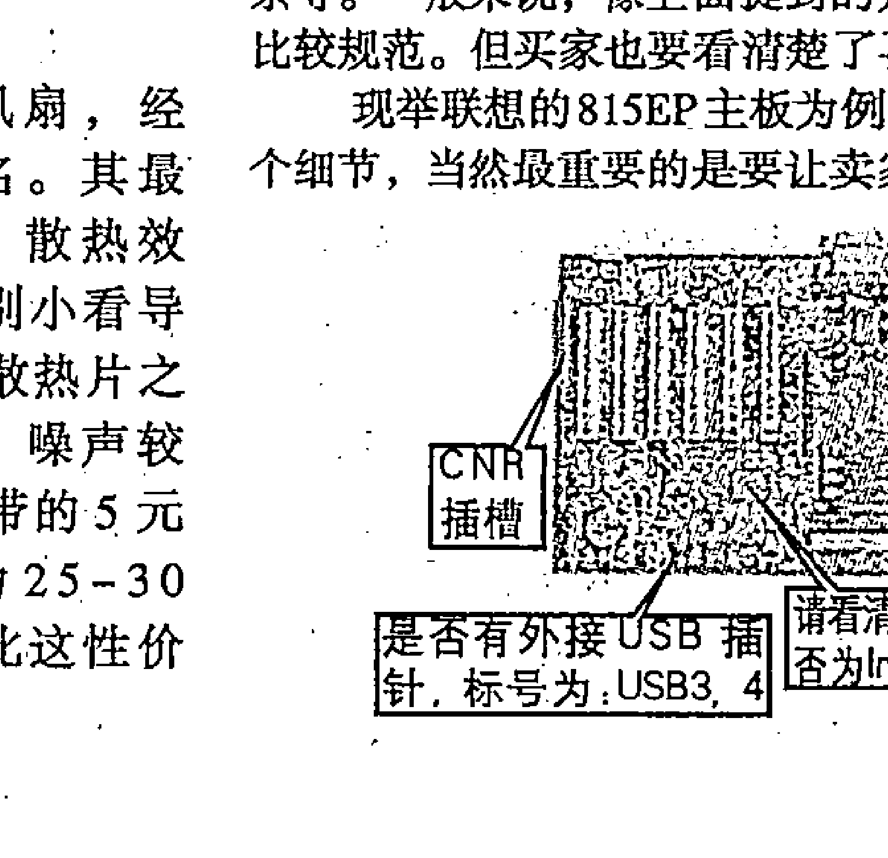

## 技嘉主板真伪识别方式
由于技嘉主板在DIY市场上得到了大家的认同，一些不法商贩便开始制造和销售假冒的技嘉产品。针对目前在市场上出现的几款假冒技嘉的产品，我来给大家介绍一下简单的真伪识别方法，以免大家在选购时上当受骗。

### GA-6VXE7+
这款产品由于伪品的制作水平不是很高，因此大家可以通过多种方式识别出真伪。分辨方法如下：

首先看产品的PCB版本号：真品为REV2.0，伪品为REV1.0且背面无产品商标。

接下来识别LOT.NO.和DIP：真品的批次号最后一位有一个英文字符，而伪品则没有。真品的DIP右上角有“ECE”字样，伪品则是“DT”字样。

再来看主板的注释：真品在AGP和PCI插槽间有“磁×××××”注释；伪品则没有。另外，真品上SW2设定注释在AGP插槽和北桥之间，伪品上SW2在北桥右侧和DIMM插槽上方。

完成了上面的辨别工作，再来检查一下Floppy接口：真品的此接口与IDE2为一排；伪品与IDE1为一排。接下来是识别Battery部分：真品采用Panasonic或Sony的电池，伪品则采用带有日文和LITHUM标示的电池。

最后要观察Award BIOS贴纸：真品为长方形且带激光防伪标志，伪品为正方形无激光防伪标志。

### GA-6XM7E
这款主板在市场中销售的伪品，制作得最为逼真，除了个别电容、电阻的区别外，几乎无法进行真伪的区分。不过，我们通过对比还是发现了几处不同之处，可以让非专业的人员直接识别。具体方法如下：

首先还是要看产品PCB版本号：真品为REV 1.2，伪品为REV 1.0且背面无产品标识。

再有就是LOT.NO.和Battery部分：真品的批次号最后一位有一个英文字符，而伪品则没有。

真品采用Sony的电池，伪品采用带有日文和LITHUM标示的电池。

### GA-BX7
相应的市场上还有少量GA-BX7的存货，但因为该产品仿冒的技术非常高，连一般的专业技术人员可能都无法轻易辨识，而且PCB版本与市场上销售的版本同为REV2.4，电池也是采用Sony的。只是在PCB板印刷字体上采用的是细体，个别用料上采用的也是较低廉的厂家品牌的产品。

*   以上三款产品的假冒产品皆在近期内被技嘉公司所查获，辨别时其共同的特点是：外包装材质低劣，盒内所携带的说明书和驱动光盘也是印制粗糙，从外观可以直接辨别。同时主板上所附的主板序列号虽然无法直接通过外观辨别，但可通过技嘉北京办事处查证。相关联系电话为：010-62161925 010-62161935

下面以GA-6VXE7+为例，针对以上所提供之识别方法，配合图片进行说明。

### GA-6VXE7+
真品的LOT.NO.是六位编码加一位字母，而伪品是五位数字。

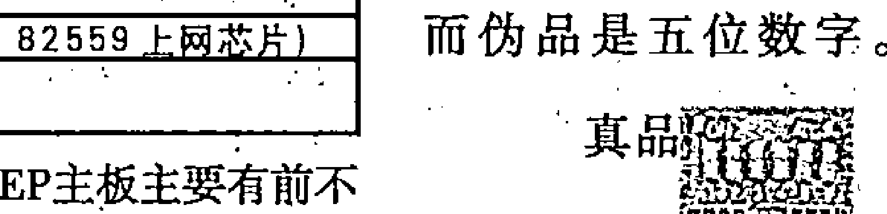

真品的DIP右上角有“ECE”字样，伪品则是“DT”字样。

真品的此接口与IDE2为一排，伪品与IDE1为一排。

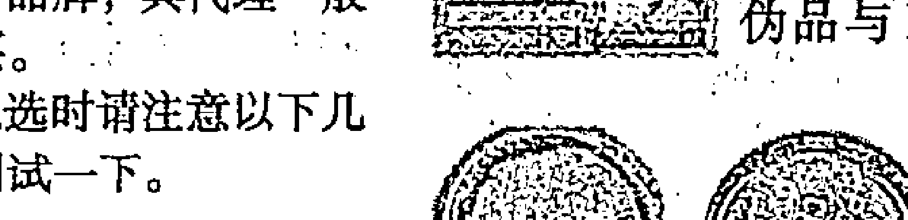

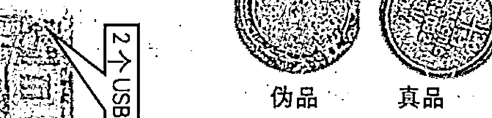

真品采用Sony、Panasonic或Maxell的电池，伪品采用带有日文和LITHUM标示的电池。

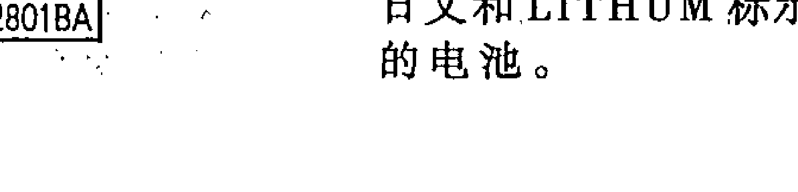

真品为长方形且带激光防伪标志，伪品为正方形无激光防伪标志。

# CPU市场行情分析

□北京 孔明

CPU作为我们电脑的核心部分，自然是备受关注的对象，所以它也成了大家在升级电脑时经常更换的对象之一。由于CPU这种技术含量很高的产品非常具有时效性，所以CPU行情的变化几乎是一路下坡，也就是同一型号产品的价格随着时间的推移逐渐走低。

现在市场上主流的CPU产品不外乎是AMD和Intel两个厂商的产品。至于VIA的处理器嘛，虽然在价格上非常便宜，但是从性能方面考虑，实在不值得推荐。在低端领域中，自然是Duron和Celeron II的天下，但是这两款产品的各自特点非常鲜明。在AMD新一代的Thunderbird和Duron处理器中，都采用了特别的设计，使得CPU Cache等于L1 Cache + L2 Cache的总和。而采用Coppermine核心的PIII和Celeron II都未采用这一技术。而Coppermine核心的PIII和CII在二级缓存的带宽方面又有着优势，256 Bit要比AMD CPU的64Bit大四倍。总体来讲，在性能上，同频的Duron要强于CII至少10%，而且Duron在价格上也要便宜一些，所以它的性价比最高。如果你只有400元，那么可以买到Duron750，而要是买CII只能买到533、500一级的产品。不过到本文截稿时为止，笔者已经听说Intel在近期会有点仓的行动，所以在大家看到文章的时候，相信相应产品的价格还会有所下调的。不过AMD也不会坐视不理，它还必然会和Intel保持产品价格相差至少20%的差距的。如果从系统的稳定性与兼容性考虑，还是建议选用Intel的产品，至少AMD的CPU与VIA主板的结合给人的感觉不太放心，尤其是对于初级用户和普通家庭用户更是如此。如果你自认为是一个电脑高手，有信心将自己的电脑调教得服服帖帖的，那自然是可以去选择最佳性价比的产品了，呵呵。

| 日期 | 雷鸟1G | PIII 1G | Duron 750 | CeleronII 533 |
|------|--------|---------|-----------|---------------|
| 3月22日 | 1470 | 2100 | 440 | 445 |
| 3月24日 | 1460 | 2100 | 440 | 435 |
| 3月26日 | 1460 | 2050 | 440 | 440 |
| 3月28日 | 1460 | 2050 | 440 | 435 |
| 3月30日 | 1380 | 2040 | 420 | 435 |
| 4月1日 | 1360 | 2040 | 420 | 435 |
| 4月3日 | 1340 | 2030 | 420 | 435 |
| 4月5日 | 1330 | 2030 | 410 | 435 |

在高端方面，性能上AMD的雷鸟CPU与PIII差不多是个平手，但是雷鸟CPU依然在价格上的优势非常明显。同为1GHz的产品，PIII还在2000元的价位上，而雷鸟只要1300多元了，实在是超值得很。所以那些腰包不太鼓的速度追求者，还是雷鸟CPU更合你们的胃口啦。不过在Intel点仓以后，PIII的价格会下降一两个档次，比如说1GHz产品降价后的价格会与降价前933或866产品的价格一致。不过对于求稳的用户和商用用户来讲，还是PIII更合意一些。不过在市场上有个别133外频、Socket370的散装Remark PIII产品，它们都是用100MHz外频的PIII超频到133MHz外频，经打磨而来的。较多的一般是500E假冒667EB，550E假冒733EB，600E假冒800EB，以及650E假冒866EB，最高为700E假冒933EB，好在再高的750E是怎么也超不到1G的了。这些Remark产品在有编号的一面手感会有点粗糙，不是很平滑，所以使劲擦拭上面的字迹，会擦掉一些的。而更可怕的是，有些个别的盒装CPU也存在假货问题，所以在购买时希望大家不要贪图10元、20元的便宜，而尽量去CPU代理处购买。

目前在Intel的大力宣传之下，Pentium 4 CPU正在逐渐升温。其实冷静下来想想，P4是大家还不需要考虑的对象，因为对于目前95％以上的PC用户来说，P4的性能还没到不用它不行的地步，因为至少目前P4 CPU还没在普通的应用程序和测试软件中表现得鹤立鸡群。所以对性能执着的发烧者倒不如去考虑一下高主频的雷鸟CPU，或者改用双PIII的平台，毕竟目前P4 1.3GHz CPU还在4800元的价位上。虽然我们可以预测出在Intel点仓后的价格有可能降到4000元的大关，但是要突破3500元还是几乎没有可能的。而如果要让P4真正地发挥出威力，必以Rambus来搭配，所以这一套加主板和Rambus内存在内，总共不会低于7000元，这个价位几乎是普通用户可望而不可及的。而如果换用最好的双PIII 1G，加主板内存也不过6000元为止，相比之下还是建议宁取鸡尾而不取凤头。如果对P4实在垂青的用户，还是建议大家再等等，等基于0.13微米技术的P4出来不迟。当然在今年年中，PIII和CII也都会有采用新工艺的产品出来的，我们不妨拭目以待。

# 墨盒识假真功夫

□福建 王新禧

市场上销售的墨盒“李鬼”多，作假手段越来越高明，墨盒的真伪识别也越来越棘手。那么，如何才能避免受骗上当呢？好，就让在下告诉你几招真功夫吧！

- 1. 虚晃一招：我要买假的！

假货真货价差幅极大，如果原装墨盒市场价为150元，那么假的大约只在50元上下。进店先四顾一番商家货架上的墨盒，此时店主看到你是买家，会主动上前问你要啥墨盒。向他报出墨盒品牌型号，指明要最便宜的原装墨盒。这时店主拿给你看的十有八九是假货，回价不要心软，照着标价的三分之二向下砍。一番讨价还价后，如果勉强能卖，则说明此墨盒必假无疑。看好假的，再买真的，心中就有底了吧？

- 2. 外查包装：识别不难！

墨盒外包装多种多样，有些一眼就可看出包装盒的问题，但更多的墨盒包装制作和原厂家一样考究，需要仔细观察，一般也能发现假冒的蛛丝马迹。目前市面上的假冒墨盒以EPSON的居多，惠普的也不少。在一家打印机耗材商店，一位批发商毫不隐讳地报出了同一规格两种墨盒的价格，真的墨盒要价130元左右，假的却只要六七十元。区别在哪里？譬如说EPSON墨盒吧，分别有在日本、美国和墨西哥三个国家生产的产品。在中国销售的主要是英文包装，或者中英文混在一起，日文包装的绝对是水货。这种EPSON墨盒的蓝色包装盒一般颜色比较浅，而且上面的图形与文字的边缘比较模糊，这一点在真假对比的时候尤为明显。其他墨盒也有类似情况，但不可一概而论。

- 3. 内审墨盒：当心掉包！

有些墨盒伪包装达到了以假乱真的程度，难以辨别。目前这种造假活动已经形成了相当的规模化，而且渠道也非常隐蔽，甚至连大多数销售商自己都不知道墨盒的真假。此时就应当看看内装墨盒。简单的鉴别方法是（以EPSON墨盒为例）：真货的墨盒和纸包装盒、真空包装袋上的编号是一致的；用力拉扯，假货的真空包装一般不太好，用力揪住两头拉一拉，会出现很多气泡；真品真空包装封口平整，内装墨盒光洁，标识清晰，假的墨盒真空包装封口一般不如原厂家的工整，内装墨盒如果是回收来的，多少能看到脏点和污迹。

- 4. 认准商家：别忘了要发票！

买原装墨盒，首要的是选好商家。要想省心；就直接找你买喷墨打印机的商家吧。他若卖假的给你，一旦打印机出了问题，话就好说了。不过价钱吗？当然是要贵上一些了。既想买真品，又想便宜些，那就多跑几家，货比百家嘛，会有商家以最低价出手的。看好了货，付款后可别忘了要发票啊，再仔细点，还要请他们在发票或收据上写明墨盒的号码，免得赖账。如果是在异地购买，要找信誉较好的大店，买后同样也要请他们在发票或收据上写清楚墨盒的序列号，还要当面打开墨盒查看包装上的号码和里面真空包装的序列号是否一致，如果使用时出了问题，好拿着维修中心的证明找他赔偿损失，不然的话就告他没商量。以上简要介绍了墨盒的造假花样和识假的办法，说不上全面，更不能“包治百病”，只不过给买墨盒的朋友提个醒罢了，更多的办法还要靠自己摸索！

# 真假KingMax PC150

□湖南 一剑

KingMax凭借其先进的检测及其独特的TinyBGA封装技术推出了KingMax PC150内存，保证CPU在100MHz、133MHz和150MHz的速度下能够稳定持续地运作。因为KingMax有其独特的TinyBGA封装技术，所以很少出现仿制的KingMax内存。可近段时间市场上出现了一些实际为PC133的内存却打着PC150标记的KingMax内存。这些内存条都是经过不严格的测试后，磨下PC133字样然后打上PC150字样的内存条。这些内存条在超频时就不如真正的PC150内存稳定。大家在购买KingMax PC150时可一定要小心识别。下面就介绍一些识别真假KingMax PC150的方法。

- 1. 首先从其包装上来识别

真的KingMax PC150内存全部采用了胜创公司的新包装，从外观上来看，包装为蓝色，区别于PC133所用的绿色。而且目前KingMax所有内存都附有保修卡一张，持保修卡在KingMax网站登陆注册后，均可享受KingMax公司完善的售后服务。假的KingMax PC150内存要不就没有包装，要不就为老KingMax内存的包装。

- 2. 从其贴纸来识别

真的KingMax PC150内存正面右边贴有带有内存编号以及“KingMax PC150”字样的白色塑料贴纸。这层塑料贴纸质地比较厚，而且上面的字很难用手指抠掉。而将这张贴纸从内存芯片上撕下的时候，能很顺利地撕下来。而假的KingMax PC150内存正面的塑料贴纸质地没有真的那么厚，且上面的“PC150”字样很容易用手指抠去。将贴纸从芯片上撕下来的时候，很容易撕碎。

- 3. 从其版本号来识别

真的KingMax PC150内存正面左边的版本号一般为VER1.2（双面封装）及新推出的VER 1.0版本（单面封装），和市面上所有主流的主板兼容性良好。而假的KingMax PC150内存版本号有一些是VER1.2，还有不少依然是VER1.1，与有些芯片组有硬件冲突。

- 4. 从其标签编号来识别

真的KingMax PC150内存，其标签编号一般以MPJ打头。而假的KingMax PC150是由PC133打磨的，一般以MPG打头。

- 5. 从其标称运行速度来识别

真的KingMax PC150内存采用的是MICRON-6纳秒的颗粒，所以在其颗粒的编号上标称的运行速度为“-6”。而假的KingMax PC150是由PC133打磨的，其颗粒的编号上标称的运行速度为“-7”。

- 6. 从其芯片表面来识别

真的KingMax PC150内存芯片上的激光蚀刻比较清楚，芯片表面比较粗糙。而假的KingMax PC150内存芯片上的激光蚀刻有些模糊，因为被打磨过，芯片表面看起来比正常的KingMax内存要光滑。

- 7. 从运行稳定性来识别

虽然真的KingMax PC150标称在150MHz下只能运行在CAS=3下，但实际上在150MHz下运行在CAS=2下同样也很稳定，开功能顺利点亮进入系统，且运行正常。而假的KingMax PC150内存只能稳定地运行在133MHz下，虽然有的在150MHz下可以启动机器，但会经常出现死机，而且绝大部分只能在CAS=3下。

另外，如果您对买到的内存有疑惑的话还可以打电话到胜创公司的技术部，技术人员会帮助您来正确识别内存的真伪的。希望以上所说对您在购买KingMax PC150内存时有所帮助。如果您还发现了其他的识别方法，希望您能将其拿出来让大家共同分享。^_^

(胜创北京技术部：（010）68717999-501）

# 中低档显卡选购全攻略

□福建 心如止水

就显卡而言，虽然最新的高档显卡的3D图形处理能力和显示效果非常好，但价格往往都特别昂贵。一般来说，除了执著的游戏迷或专业3D工作者需要这样高性能的显卡外，绝大多数家庭用户并没有太多的使用到显卡的高性能部分。因此，对于以实用为原则的家庭用户来说，1000元左右或者以下的中低档显卡则具有更好的性价比。本文中，笔者就专门介绍一下中低档显卡市场里一些优秀的产品和购买原则，以帮助广大普通用户购买显卡。

先简单谈谈显卡选购的一般原则。选择显卡首先应该考虑的就是其显示芯片的类型。然后可以考虑显存类型及容量，一般16M显存就能应付大多数需要了，如果需要玩3D游戏的话，建议还是配备32MB显存的显卡较好。至于显存类型，目前主要有SDRAM、SGRAM和DDR-RAM等，性能和价格依次递增，目前用得最多的还是SDRAM。还有两个技术参数是RAMDAC和接口类型，前者的作用是将数字信号转换为模拟信号，使显示器能够显示图像，在很大程度上决定了显卡能够支持的最高刷新率，目前当选用300MHz及以上的为宜。而后者不用多说，当然是AGP 4X才跟得上潮流。除了这些，我们在选购显卡时，还要考虑显卡的驱动程序、设计以及做工等。一般来说，名牌大厂的显卡在以上这些方面都做得很不错，这是有目共睹的。

## ★600元左右及以下

- 1. nVidia的TNT/TNT2系列

可以说，这是目前中低档显卡市场中最受欢迎的显卡系列，主要有TNT2 M64和TNT2 Vanta两种产品。客观地说，TNT2 M64是一款相当不错的产品，具备300MHz RAMDAC和150MHz的显存频率，虽然采用64位的内存接口（只有标准版TNT2的一半），但性能与标准版的TNT2相比差距并不是很大，用来对付常规应用绝对是绰绰有余。而TNT2 Vanta的性能比TNT2 M64要差，比TNT稍好一些，其RAMDAC频率达到了250MHz，但标准显存频率只有125MHz，而且最大的问题在于支持的最大显存容量仅有16MB。总的来说，TNT2系列显卡以速度快著称，得到了广泛的软件支持，尤其是驱动程序编写得相当好，性能比较均衡，在游戏和图形设计方面都有不错的表现，所以笔者推荐家庭用户购买这种芯片的显卡。目前主流品牌的TNT2 M64和TNT2 Vanta的价格在490（32M）/410（16M）和330（16M）/280（8M）元左右。

- 2. Savage4系列

Savage4芯片的显卡在市面上并不是非常多，而且由于前代产品野人Savage3D的驱动程序一度BUG很多，所以口碑不是很好。但随着新驱动的不断推出，此系列显卡的性能已经趋于完善。而且值得注意的是，Savage4拥有诸如双渲染流水线支持单周期多重纹理、32位真彩色渲染等新特性，使得它对于一部分DIYer还是相当有吸引力的。总的来说，尽管Savage4芯片在兼容性和游戏效果等方面还存在一些问题（特别是初级菜鸟特怕的软硬件兼容性），但它的价格相对来说还是比较便宜，应该说该系列显卡的性价比还是不错的。目前主流品牌的Savage4价格在400（16M）上下。

- 3. ATI Xpert Rage 128/128 Pro系列

此类显卡采用了加拿大老牌显示芯片制造公司——ATI Technologies所制造的芯片，其优势在于视频功能和真彩渲染方面，另外它的DVD解压性能一流，CPU占用率极低，能够与硬解压卡相媲美。总的来说，Rage 128/128 Pro芯片的游戏和商用性能比较均衡，无论是在需要Direct3D还是OpenGL的场合几乎都能胜任。所以对于普通家庭和办公应用，这一系列的显卡可以较好地满足需要了。目前主流品牌的Rage 128/128 Pro价格在400（16M）/600（32M）元左右。

- 4. 其他低档芯片显卡

这类显卡以Trident 9880和SiS 6326芯片为代表。虽然这些芯片的显卡3D性能不佳，但对于那些不玩3D游戏的普通家庭用户，用来玩玩2D游戏（极品飞车也可以）或者文字处理等一般应用还是相当不错的。笔者早期的显卡就是Trident 9880的，用来放VCD影碟、写程序、写文章都觉得值。其实，现在大多数整合主板基本上都用的是这些低档显示芯片，如Intel 810的i752、SiS620的6326、MVP4的9880等。既然整合主板都采用这样的显示芯片，看来相当一部分家庭用户对于这样的显示功能已经足够了。目前此类低档显卡的价格都在200元以下。

## ★600-1000元左右

- 1. nVidia的TNT2 Pro/Ultra系列

前面谈到过，nVidia芯片的显卡在目前的显卡市场上成为绝对的主流，有着多种不同档次的产品。TNT2系列中除了低端的标准版TNT2/M64/Vanta外，还有基于0.22微米生产的TNT2 Pro和使用增强核心的TNT2 Ultra。TNT2标准版的缺省时钟频率是125MHz（核心），显存工作频率为150MHz，而TNT2 Ultra的缺省速度则是150MHz（核心），显存工作频率高达183MHz，所以即便是玩3D游戏，TNT2 Ultra也能胜任目前的任何游戏。相比之下，TNT2 Pro在使用了0.22微米制造工艺后，芯片的标准频率也达到了143MHz。再加上使用的是AGP接口以及7纳秒（运行于150MHz）的SDRAM，使整体效能也有较大的增强，而且还有一点很突出的是其超频性能十分强劲。总的来说，TNT2 Ultra在TNT2系列中性能最好，但价格最贵，TNT2 Pro则价格便宜不少，性价比最高。目前主流品牌的TNT2 Pro/Ultra显卡价格在700（32M）和1100（32M）元左右。

- 2. nVidia的GeForce2 MX系列

谈到nVidia的GeForce2 MX，相信没有人会否认它已是目前显卡市场上最主流的显示芯片了，它是TNT2系列的彻底替代产品。具备第2代硬件“T&L”引擎的GeForce2 MX，有接近它的上一代GeForce两倍的处理能力，如果再配合64M DDR-RAM，其性能会相当惊人。由于GeForce2 MX芯片内含能进行T&L运算处理的功能单元，将T&L处理从电脑CPU转移到自己身上，这样即使一台CPU速度不很快的电脑，若使用GeForce2 MX，也可以获得和装有顶级CPU的电脑几乎相同的图像处理效果。就是对于非专业图像使用者来说，这款芯片的显卡无论是家庭电脑应用还是3D游戏支持，或者3D图像处理也都是非常好。总之，随着价格的不断下降，GeForce2 MX可以说是目前中档显卡的首选；笔者推荐大家选用此芯片的显卡。目前主流品牌的GeForce2 MX显卡有普通版、白金版、黄金版之分，32MB显存的价格从750至1100元不等。

这里要特别推荐几款目前最受大众青睐的TNT2 Pro和GeForce2 MX系列的产品。就TNT2 Pro系列而言，ELSA艾尔莎的ERAZOR III Pro、Leadtek丽台的WinFast 3D S320 II Pro、ASUS华硕的V3800 Pro以及UNIKA小影霸的速龙2000/3000等口碑很好。而GeForce2 MX系列中有ELSA艾尔莎的GLADIAC MX、Leadtek丽台的WinFast GeForce2 MX、ASUS华硕AGP-V7100 GeForce2 MX Series、UNIKA小影霸的速龙6000/速龙6000DH/GeForce2 MX等几款产品非常吃香，大家不妨考虑。

- 3. 3Dfx的Voodoo3系列

对于3Dfx的大名，相信资深一点的DIYer朋友肯定感觉如雷贯耳。该系列的显卡由于其优异的游戏效果，一直就是众多游戏玩家心中的至爱。Voodoo2就曾经是一款非常经典的游戏3D加速卡。但现在Voodoo3早已成为主流，并成为中档显卡中独树一帜的3D加速卡。和TNT2一样，Voodoo3系列显卡通过设定不同的核心频率将产品分为Voodoo3 2000（143MHz）、3000（166MHz）、3500（183MHz）等不同档次的系列产品，其高端产品中还对视频功能作了强化。目前流行的是Voodoo3 3000的产品。Voodoo3系列由于在本质上还是PCI结构（还能找到几款PCI接口的版本），因此兼容性非常好，而且对CPU的依赖程度较小。虽然Voodoo3在某些技术方面不及同时代的其他产品（如不支持真彩渲染），但由于其在游戏中出色的表现，依然受到游戏爱好者的推崇。所以，如果你是一个游戏爱好者，希望增强3D游戏功能，中档显卡中Voodoo3当为首选。目前主流品牌的Voodoo3显卡价格在550（16M）元左右。

- 4. Matrox的G400/450系列

很多朋友都将Matrox误认为是著名的硬盘品牌迈拓Maxtor，仔细辨析一下其实不是。但有一点相同的是，Matrox显卡如同Maxtor硬盘一样保持着贵族气质。Matrox系列显卡一直以来都得到了许多挑剔的游戏玩家的喜爱。中档的Matrox

| 品牌型号 | 显示芯片 | 显存大小 | 价格(元) | 其他 |
| --- | --- | --- | --- | --- |
| 艾莎 | GeForce2 MX | 32M | 1050 | 赠8M显卡 |
| 艾莎 | TNT2 Pro | 32M | 750 | |
| 艾莎 | TNT2 M64 | 32M | 560 | |
| 丽台S320II | TNT2 Pro | 32M | 680 | |
| 丽台S320V | TNT2 Vanta | 6M | 440 | |
| 丽台 | GeForce2 MX | 32M | 820 | |
| 华硕V7100 | GeForce2 MX | 32M | 830 | |
| 华硕V3800 | TNT2 Pro | 16M | 560 | |
| 小影霸速龙6000 | GeForce2 MX | 32M | 780 | |
| 小影霸速龙3000 | TNT2 Pro | 32M | 520 | |
| 小影霸 | TNT2 M64 | 32M | 460 | |
| MGA | G450 | 16M | 750 | |## 二手存储外设的选购

□北京 杨特

由于电脑硬件发展迅猛，使得大量电脑外设进入二手市场，虽然这些存储产品都不是最新的型号，但其中不少产品对于个人用户来说，仍存在很大的使用价值。在众多常见的二手电脑设备中，相对来说MO驱动器、磁带机、ZIP驱动器、外置盒更值得大家购买。虽然在二手市场上，也有大量的打印机、扫描仪、调制解调器等，不过由于在主流市场上，家用的打印机、扫描仪以及调制解调器的价格，较以前已经有很大幅度的下降，因此笔者个人认为，像打印机和扫描仪以及调制解调器这类外设，在二手货中除非是一些工业级的高档产品，否则大部分早期产品的性能价格比大多不是很高。下面我们就来说一下值得购买的二手MO驱动器、磁带机、ZIP驱动器和外置盒。

MO驱动器具有可读写特性，广泛应用于各专业领域，由于它性能优越，所以即使CD-RW和ZIP驱动器也不能完全替代它的位置。二手的MO驱动器主要有230MB和640MB两种，有外置和内置的产品，一般230MB的产品二手货价格在300-400元左右，640MB的MO驱动器还属于主流产品，价格在600-800元左右，而全新外置640MB的MO驱动器参考价格达2500-3500元。一般MO驱动器对盘片的容量是向下兼容的，也就是说640MB规格的MO驱动器中可以使用230MB和128MB的MO盘片。MO设备对于个人用户来说，除了驱动器价格因素外，最大的缺点是MO盘片只能由MO驱动器读取，缺乏通用性，不像CD-R/RW可以在通用的光驱上读取。除此之外，MO的综合性能还是非常高的，常用的小型MO盘片体积非常小巧，就像一个单片带盒包装的3寸磁盘，携带非常方便安全。MO的写入速度远超过主流四倍速的CD-RW，如果单位电脑配置有MO驱动器，而自己也有一套同类产品，就可以方便地互相交换数据了。用户再也不必捧着一堆软盘来拷数据，而又担心软盘意外的损坏和文件太大一张盘装不下。MO盘片的存储安全性甚至优于CD-R/RW，加上MO具有可读写的性能和较大的存储容量，所以用MO来做备份也非常合适，并可以时常更新备份数据。用MO来存放MPEG-4电影和MP3歌曲效果也非常不错，在MO驱动器上可以直接播放MPEG-4、MP3甚至DVD的片段文件。在众多品牌的MO驱动中，“富士通”产品口碑比较好，广泛应用于专业领域，二手货的数量也比较多。

如果只是用来存放大容量的数据，那么二手磁带机的成本更低。随着更大容量的磁带机的应用，很多4-8GB的产品进入二手市场。由于在很多人的印象中，磁带机属于过时产品，个人应用很少，所以二手货价格较低，且多在150-400元之间，驱动器价格和单位存储成本远较MO便宜。二手市场中还有很多二手磁带价格也非常便宜，全新DDS1 4mm 4G磁带在30元左右，一些用过的磁带价格更为低廉。磁带机采用顺序存储的记录形式，加上磁带的成本比较低，所以主要用于大容量数据的存储。这些二手的磁带机对个人来说用来存储MPEG-4影片、MP3或者DVD片段倒非常不错。一盘磁带可以存放多部高清晰度MPEG-4压缩的电影，也是有下载嗜好的网友存放数据的好方法。磁带机单位存储成本与CD-R相当，而且可以擦除。磁带机的种类很多，外置内置的产品都有，而且速度也不相同（存储64MB数据的时间从2分钟到3.5分钟不等），选购时要注意一下指标。常见二手磁带机中，HP、SEGATE、FUJITSU品牌性能比较好。

ZIP驱动器有100MB和250MB两种，大部分二手货都是100MB的产品，ZIP在个人用户中有一定的用户比例，存储容量虽然较传统软盘要大很多，但与CD-RW、MO相比不免有些显得小巫见大巫，而且单位存储成本也没有优势。这种设备主要适合在自己电脑活动圈中有应用ZIP驱动器的朋友使用，便于数据交换。二手ZIP驱动器大部分是并口外置的产品，价格在250元左右。

外置盒可以配合原来内置电脑设备独立在微机机箱外工作，一般内置的CD-ROM、CD-R/RW都可以配合外置盒成为外置设备使用，增加其移动性。有的外置盒还支持使用硬盘。外置盒有SCSI、并口和USB多种接口型号的产品，二手货中主要是SCSI和并口的产品。有的外置盒具备独立音频输出的端子，配合一台带有播放键的CD-ROM就可以成为一台CD机。限于端口速率，高速设备不建议使用并口外置盒，而SCSI接口的外置盒一般没有这个问题。不同的外置盒支持不同接口的硬件，选购时需要注意一下。

很多二手MO驱动器、磁带机、ZIP驱动器都采用SCSI接口，虽然性能优于IDE或并口连接，但一般个人电脑中都没有SCSI接口，需要另外附加SCSI卡。高速SCSI卡价格比较贵，二手的SCSI卡相对比较便宜，ADAPTEC AHA-2940UW 40M PCI SCSI卡约450元左右，Adaptec AHA2940W 20MB PCI SCSI卡约350元。

最后要提醒大家：选购二手存储设备要注意产品的接口和驱动程序，SCSI设备最好带有连接线。在购买时，一定要试机或与商家明确商定出现问题时的退换程序。

## 近期显示器市场行情一瞥

□北京 孔明

近期的显示器市场可真热闹，纯平显示器纷纷跳水，看来升级显示器的好时机已经到来，再加上我们曾经为大家奉献的纯平显示器大测试活动，都希望能为大家的选购提供一些参考依据。好了，言归正传，下面还是让我们一起来看看最近的显示器市场吧。

自从美格的“珑”行天下活动开始，就意味着国内纯平显示器价格大战拉开了序幕，此后各主要显示器品牌纷纷降价，降价之声络绎不绝。但是此事也并不简单，在经过了一波三折之后，第一个跟进的ADI率先退出了价格大战的战场，一周之后，CTX也不“玩”这种降价的游戏了。就在这种市场比较混乱的情况下，三星又杀入了降价的大军中。

在美格的狂降后，ADI紧跟着同样下调了相同档次的产品，例如把MicroScan G710从3280元降到了2980元，这一价格比美格同档次的796FD还便宜了10元，从中便可见其针对性了。但是降价刚刚过了三天，从第四天起，ADI的这款产品就一天涨100元，最后又涨回到3280元的原价。据ADI显示器的北方地区总代理北京利盟科技消息称，现在的ADI显示器都依靠进口，而且产品都通过了TCO99认证，前段时间低价销售的价格一直是低于产品成本，所以赔本的买卖肯定不能做到底，因此价格的上涨就势在必行。

和ADI的情况基本一样的是CTX，CTX也是因为产品产地及TCO认证等相关方面的原因导致产品成本价格偏高，所以出于无奈，CTX也只好调回原价位。不过同ADI恢复价格后的产品脱销来看，CTX的表现就要稍差一些了。此外参加此次价格大战的还有SONY和LG这两个大厂。SONY的主打产品E200显示器也从3950元一下子降到了3099元的价位上，此举引起的轰动不小，要知道SONY这种高端显示器厂商能一下子将价格下调20%可是非常惊人的举措。因此SONY的这款E200显示器在降价后曾一度脱销，市场反响之热烈出人意料。LG的动作更大，它的高端旗舰产品未来窗795FT Plus显示器从3800元的价位一下子降了近1000元，目前售价仅为2800元。与此同时，简化版的未来窗775FT的价格也仅为2400元，在市场上具有很高的竞争力。

目前纯平显示器市场上的产品主要分两大类，从显像管的产品分就是日管和韩管。日本产的显像管是以SONY平面珑及三菱钻石珑为代表的珑管技术，珑管显示器在底色和图像输出方面要更胜一筹。而韩管是指三星的丹娜管和LG的未来窗显像管，其中尤以三星的丹娜管在中低端显示器市场中最为普及，而LG的未来窗显像管并没有外售产品，只有LG自己的产品才采用这一显像管。在价格方面，同档次的产品中以三星的丹娜管最为廉价，其显示器产品也要比其余产品价格低廉100多元，而珑管产品与LG未来窗的产品价格基本处于同一档次水平。对于消费者来说，如何选择还是要根据每个人不同的使用要求与经济承受来决定。普通家庭用户从性价比考虑，自然不妨选择三星丹娜管的产品，其中以三星753DF和Philips 107T这两款产品最为典型，它们都是2300多元的价格。此外，三菱Scan70也以不足2300元的价格具有非常强的竞争力，不过它不是一款纯平的显示器产品，而是柱面的。

从目前的显示器市场来看，价格将较为平稳地保持一段时间，近期内价格波动的可能性很小，所以也是一个很好的显示器选购与升级的时期。最后祝愿各位能找到合适的显示器产品。

## 笑傲江湖的三款815EP主板

□黑龙江 秀才

主板世界日新月异，短短几个月，主流产品就会易主换位，除了经典的BX以外，似乎没有哪个主板可以长久地统治市场。难怪业界有人把主板行业称为“吃海鲜”，天天鲜，的确所言不虚。好了，闲言少叙，让我们来看看最近村里有哪些主板较为流行吧。

笔者最近在村里走了一圈，与相关人员闲聊中，逐渐感觉到Intel系列的主板还是颇有人缘的，特别是815EP系列主板，最近装机率还是蛮高的。鉴于目前市场上的815EP主板品牌很多，加上各个品牌的主板功能特色各不相同，多数想购买815EP主板的用户多少都有些困惑。这里笔者就了解到的一些情况和知识作一介绍，希望能给想购买815EP主板的用户起到指点的作用。

想必大家都已经知道了815EP和815E的区别了吧？与815E相比，815EP省去了内部整合的显卡，可以说是815E的简化版本。815EP在刚刚问世时不是很受大家喜欢，原因主要是因为除了去掉集成显卡外，815EP与815E性能几乎一样，但价格却和815E不相上下，因此用户宁愿选择带显卡的815E主板。815EP主板流行起来，多多少少还是得益于联想主板前不久的一次降价，拉开了815EP与815E主板的百元差价。从市场反馈来看，正是815EP主板价格的下调，促进了815EP今日的“辉煌”。

815EP技术上最大的优势是采用ICH2-82801BA芯片。它提供了很多新的功能，如规模可变的LAN（局域网）解决方案，其中包括完整的LAN互连、1Mbps家庭网络连接、10/100Mbps以太网连接和单一驱动技术。其快速100MB/s IDE控制器不仅可以支持两个ATA100硬盘，而且支持以前的DMA 33/66模式。具有六声道环绕（用低成本使AC97实现6声道环绕效果）和软猫功能。两个USB控制器，可以支持4个USB v1.1端口，并且有24Mbps的带宽在这四个端口上。因此选购中一定要注意ICH1和ICH2的问题。比如技嘉的GA-60XC 815EP主板的南桥芯片就是ICH1，仅支持基本功能，如支持ATA66等，主板厂商的意图是减少附加功能，提供给用户多样化的选择，但是有些JS却以ICH1冒充ICH2在市场上销售，所以这里提醒用户注意。关于ICH1和ICH2的区别，读者可以查看《电脑爱好者》第8期，上面有较详细的介绍。

815EP和815E的不同之处是，815EP用的是MCH芯片，不含有图形引擎，而815E用的是含有图形引擎的GMCH芯片(见附表)。

由于目前市场上815EP主板的品牌较多，经过一段时间的比较，这里向大家推荐三款具有特色的产品。读者可以依据推荐原因及相对遗憾来看看这款主板是否适合于你。

### 技嘉的GA-6OXE主板

推荐原因：功能完善，性能稳定，与周边外设的扩展余地大。

相对遗憾：价格稍高，在超频设置及一些功能上还有进一步增强的余地。

技嘉目前推出的815EP主板主要有GA-60XC、GA-60X和GA-6OXE，皆为ATX规格的主机板，支持Intel PentiumIII以及其他兼容处理器，并提供1个AGP 4X/2X以及1个CNR插槽。GA-6OXE整合了Creative CT5880音效芯片，提供4声道输出的环绕声音效果。具有红外线IrDA/CIR接头以及额外的双USB外接式接口。除上述功能外还支持STR(Suspend-To-RAM)内存暂停模式以及技嘉Dual BIOS双BIOS技术。当然技嘉开发的两个技术EasyTuneIII超频悍将与@BIOS网络更新BIOS，更是GA-6OXE不可缺少的功能。GA-6OXE另外较吸引人的地方是，支持SCR大哥大编辑套件与IA智能型操作接口。用户通过选购备件SCR(Smart Card Reader)大哥大编辑套件，可以轻松编辑与管理手机电话簿。此外，SCR支持为IC智能卡开发的软件，可提供网际网络之安全付款机制。GA-6OXE的IA (Information Application)智能型操作接口可支持使用者安装选购性配件的IA智能型操作面板或是技嘉红外线遥控器。利用此功能，使用者可像操作电视般很容易地控制计算机。所以想构建智能型计算机系统的超级用户不妨试试这款主板。目前市场价格为1150元，是市场上较贵的高档产品。

### 附表

| 参数对比 | Intel 815E | Intel 815EP |
| :--- | :--- | :--- |
| 系统总线 | 66/100/133MHz | 66/100/133MHz |
| 支持内存 | PC100/PC133 SDRAM | PC100/PC133 SDRAM |
| 最大内存容量 | 512MB | 512MB |
| 集成图形核心 | Intel i752 | 无 |
| 扩展显示模式 | AGP 1X, 2X, 4X | AGP 1X, 2X, 4X |
| ICH | ICH2(ATA-100) | ICH2 (ATA-100) |

### 联想 815EP 主板

推荐原因：产品的性能价格比很高，长时间运行时较为稳定，几项技术非常实用，超频较为方便。

相对遗憾：内存插槽边上的电容给拆装内存条的工作带来不便。

联想目前也推出了系列815EP主板，比如SX2EP、SX5EP、SX5EP-A（在SX5EP的基础上带AC97音效）、SX5EP-L（带Intel10/100M网络芯片，其82559核心早已建于南桥内）、SX5EI（具备一个ISA槽）等。SX2EP就是前不久刚刚降价的那款主板，这里笔者就不多介绍了，因为多数媒体已经报道不少了。这里笔者想推荐的是SX5EP主板，这是联想最新推出的SX2EP的升级产品，除了具有815EP系列主板应有的特性，如标准ATX规格，支持外频133/100/66MHz，最大内存可达512MB，设有6个PCI槽，1个CNR槽，支持AC97，提供4个USB接口等外，SX5EP吸引笔者的主要有以下几个特点。第一个就是该款主板采用了联想最新的创新技术StepEasy，这项技术使主板的无极变频成为可能，摆脱了以前外频只能由66跳到100至133MHz的羁绊。在SX5EP主板上，可以1MHz为最小单位来超频，比如866MHz的CPU可以从866MHz超到867MHz、868MHz、869MHz……这就提高了DIY玩家现有系统资源配置的适应性，发挥系统最大的效能，挖掘CPU的最大潜力。SX5EP的另一个特点是CPU核心电压可调。第三个特点就是在主板后端设计了四个诊断灯，这项设计也是针对DIY而设计的。当PC出现问题时，用户不必急着去开箱做繁杂的检验，诊断灯会清楚地显示出哪里出现了问题。SX5EP的第四个特点是支持BOOT EASY技术，大大加速了主机启动的速度，整个POST过程只需要4-5秒左右。目前这款主板仅售868元，是目前市场上性价比比较高的一款。

### 微星的 815EP Pro-R 主板

推荐原因：显卡补充电源，USB接口的扩展及联机功能都非常实用，超频形式轻松，可在Windows系统中实时优化CPU的状态。

相对遗憾：价格高了些，在对病毒的抗侵入能力上还有发挥空间。

与大多数815EP主板一样，此款主板采用了1xAGP Pro+6xPCI+4xDIMM+1xCNR的设计，AGP插槽是AGP Pro规格，支持当今所有的AGP规范。旁边还有个小电源接口，这是为某些需要外接电源的显卡设计的。同时，MS-815EP Pro-R提供了一个四声道的AC97板载声卡。

815EP Pro-R主机板除了内建微星科技(MSI)独家研发的各项超值软件Fuzzy Logic3、Live BIOS之外，特别值得一提的是Fuzzy Logic3自动超频工具。它可在Window操作系统下，实时且自动地将CPU设定在最佳状态，轻轻松松就可完成超频，万一在超频时发生当机的情况，使用者无需按任何按键，即可重新开机，而且可以将系统自动设定在最佳状态。

当然这款主板较吸引人的还有一个特殊的功能，即主板的USB扩展接口可以支持USB to USB，微星在主板上集成了“Gene Link”USB网络控制硬件，并在驱动光盘中提供了专门设计的软件。在操作系统中正确安装之后，一个虚拟的、以USB端口为基础的网络机制就会建立，并自动绑定TCP/IP、IPX/SPX、NetBEUI这些最常用的通讯协议——这有别于其他的双机对联模式，是实实在在的以太网。在主板的附件里，微星附送了前置USB接口挡板以及一条USB连线。将挡板与主板上的USB前置端口接好之后。用户便可以用这根USB线缆把这台计算机与其他任意一台具备USB接口的计算机相连，构成一个虚拟网络，共享设备、传递数据、上网或是玩游戏都十分快捷方便。目前这款主板的售价为1260元。

上述的这3款主板，是笔者在实际使用中认为性能较好、又集成了一些实用技术的高档主板。当然，815EP主板市场上还有很多品牌，比如精英、升技、华硕等，这里笔者就不一一介绍了。大家在购买时，还应结合自己的具体投资情况，对不同的东西进行比较。不过，从现在的市场情况来看，815EP的主板市场占有率增长很快，相信随着技术的进步，这种主板将会进一步得到普及。

## 主流CPU的比较(上)

□北京 陈涛

CPU作为一台电脑的核心部分，决定着整个电脑的性能，所以我们在购买电脑的时候，在CPU这个环节上一定都会慎重考虑的。但是有很多朋友对CPU不是很了解，在选择的时候会有些困难，所以今天就让我们就一起来了解一下市场上流行的CPU吧。

自从AMD推出K7系列CPU以来，Intel和AMD的CPU战争已经发展到了白热化。随着AMD自身实力的增强，再加上Intel接二连三的失误，胜利的天平已经开始向AMD一方倾斜。在低端市场上，AMD Duron势不可挡，在中端市场雷鸟也是紧紧追赶。好在Intel在高端市场现在有了P4，才挡住了AMD的攻势。

目前生产的CPU大多数还是采用铝导线连接工艺，但是如果采用铜导线连接工艺，将会比铝导线连接工艺生产的CPU速度快得多。另外由于铜比铝的导电性能好，会进一步降低CPU的功耗，大大减少了CPU的发热量。AMD和Intel都准备采用铜导线连接工艺生产下一代CPU。

新的制作工艺水平已能实现把大容量全速二级缓存内置于处理器芯片中，Intel和AMD都已经将CPU重新走回了Socket架构。新出现的大型绝缘硅圆片制作技术，也使得在CPU中可以集成更多的晶体管、更多的Cache。这也为在CPU中整合各种功能提供了很好的条件。

### Intel 系列的 CPU

### Celeron II

在低端CPU市场，Intel推出的新CPU是Celeron II（赛扬II）。赛扬II采用的是PIII Coppermine的核心，因为Intel不会为了低端的产品而单独开一条生产线。所以Celeron II采用的也是0.18微米制造工艺，与Coppermine不同的是将Coppermine的片内L2 Cache容量减少一半。L2 Cache与Coppermine一样也采用了高级传输L2 Cache (ATC)技术。因为Celeron II是针对低端市场的CPU，而运行游戏的时候，对CPU的Cache依赖性不是很大，因此Celeron II和以前的Celeron一样在游戏中有出色的表现，而在大量的商业应用程序和高端应用中表现出来的性能比PIII Coppermine大打折扣。

| | Katmai | Coppermine |
| :--- | :--- | :--- |
| L2-缓存位置 | 外部 | 管芯 |
| L2 Cache | 512 K | 256 K |
| L2 Cache Interface | 64 Bit | 256 Bit |
| L2 Clock Speed | 1/2 CPU Speed | 全 CPU speed |
| L2 Associativity | 4-way set | 8-way set |
| CPU Voltage | 2.0V | 1.65V (1.7V/1GHz) |
| 封装 | Slot 1 | Socket 370 |

这样，集成的全速缓存仍然使得 Celeron II 的整体性能有了很大提高。Celeron II 的核心工作电压为 1.7V，远远低于老式 Celeron。这样低的工作电压保证了 Celeron II 在工作的时候，核心温度保持在较低的范围内。Celeron II 也采用了 FC-PGA 的封装形式，改善了散热效果，很有利于超频。Intel 在 Celeron II 中加入 SSE 指令集，使其具备了和低频 PIII 相抗衡的实力。但是，66MHz 的外频会成为 Celeron II 的致命威胁，因为 Celeron II 所面对的 AMD Duron 是 200MHz 的前端总线频率。Celeron II 只能满足那些不需要进行大量商业软件工作的人，但是进行一般的游戏、工作、学习、上网还是没有什么问题的，而且 Celeron II 现在在市场上的售价的确很便宜。

## PIII Coppermine

Intel 的老式 Slot 1 架构 PIII CPU 在 AMD 的 K7 推出以后可以说是遭受重创，主要是因为 PIII 不管是整数运算还是浮点运算都输给了 Athlon。但是 Intel 很快进行了改进，推出了 Coppermine 核心的 PIII CPU，采用了 0.18 微米的制造工艺，架构也改进到 Socket 370。PIII Coppermine 配有 256K 字节芯片的全速二级缓存，能比老式 PIII Katmai 的 512K 字节外部半速 L2 缓存更快。因为高级传输缓存被融入 CPU 的硅板中，就可以支持与处理器核心的 256 位数据连接，远远优于 Katmai 外部 L2 缓存的 64 位宽接口，从而使得 PIII Coppermine 可以从集成缓存中获得足够快的速度来与 Athlon 竞争。虽然 PIII Coppermine 的代号 Coppermine 是铜矿的意思，但是仍然采用了铝导线技术。

我们可以通过附表看出这两款 PIII 的差别。PIII Coppermine 具有以下优点：

- 降低了核心电压，这样可以减少耗电量，减少了发热量，使得 CPU 能够以较低温度运行。
- 0.18 微米的工艺可以制造出比 0.25 微米 Katmai 更小的管芯，这样既可以集成更多的晶体管，还可以降低成本，增加产量。
- 全速 L2 缓存可以使芯片的性能超过老式 Slot 1 PIII。
- 可以通过使用 256 位宽 L2 缓存总线提供更好的性能。
- 0.18 微米的制造工艺减少了功耗和发热量，使得 CPU 更适于超频。

PIII Coppermine 的性能还是很不错的，比起 AMD 的 K7 Athlon 来说有了不少优势。而且借助于 Intel 的 i815E 或 i815EP 芯片组使得 PIII Coppermine 更是如虎添翼，在稳定性、与其他电脑配件的兼容性以及与软件的兼容性方面都是无与伦比的。所以如果你的资金不是很多，不能购买 P4 这样的超级 CPU，但是仍然需要很稳定的系统来进行 3D 或平面作图等工作的话，那么就买 PIII Coppermine 吧。如果想要超频的话，应该购买型号为 500E、550E、600E、700E 等以 E 结尾的奔腾 III 处理器，E 代表 100MHz 的外频和 0.18 微米制造工艺，而 B 结尾的 CPU 是 133MHz 外频，超频余地不大。

## Pentium 4

现在的 PIII Coppermine 由于受到管线的限制，最高只能达到 1.2GHz，这一点从 1.13GHz 的 PIII 被回收就能看出来。Pentium 4 处理器没有采用 P6 架构，而是采用了全新的 NetBurst 架构，Pentium 4 的管线长度是 P6 架构的两倍，达到了 20 级。管线的加长可以使得 Pentium 4 能能达到更高的时钟频率，但是也使 Pentium 4 在每个时钟周期中处理的命令数目比 PIII Coppermine 少，这就是为什么现在相同的速度下，Pentium 4 的性能表现不如 PIII Coppermine 和 T-bird 的原因。但是随着 Pentium 4 速度的提高，会克服这一点的。

Pentium 4 集成了 8kB 的 L1 Cache，使用的是低于 1.42ns 的高速缓存，拥有极低的寻找时间，能迅速找到并且命中目标指令，大大的提高了 CPU 的工作效率。Pentium 4 还拥有全速的 256kB 二级缓存，在处理器核心和 L2 Cache 之间有着更大的数据传输通道，数据传输率可以达到前所未有的 44.8GB/s，几乎是 PIII 1G（16GB/s）的 3 倍之多。其总线频率高达 400MHz，是目前 PC133 总线的 Pentium III 的三倍，如果配合双通道的 RAMBUS 内存，可以在处理器和内存控制器之间提供高达 3.2GB/S 的内存通道。

虽然现在的 P4 处理器还没有到很令我们满意的地步，但是实际上，作为拥有全新体系的处理器在现有的被广泛应用的大多数软件上，表现都不会像我们预期的那样。Pentium 4 在同样的制造工艺下，采用 20 级的超长流水线，能够实现比 PIII 高得多的时钟频率。Pentium 4 还采用了双泵式 ALU（算术逻辑单元）、400MHz 的外部总线、改进的动态执行以及 144 条新增的 SSE2 指令，这些都是 PIII 和雷鸟所不能及的。

现在 Pentium 4 整机的价格仍然很高，一般用户都不能接受。另外 Pentium 4 的 SSE2 指令集在短时间之内还不能得到大多数的软件支持。这些都是影响 Pentium 4 成为主流的因素。但是如果你的资金还是很充裕的话，而且你要进行的工作要求的系统速度非常高，比如说进行大型的 3D 作图等等，你还是购买 P4 吧。因为不管如何，Pentium 4 是现在当之无愧的速度之王。

## AMD系列CPU

### Duron

Duron 也采用 0.18 微米制程技术。另外，AMD 还引用了 Intel 的处理器策略，将 Thunderbird 上的二级缓存减少，成为 Duron，情况就如 Intel 的 Pentium III 及 Celeron 的关系一样。但是在 AMD 新一代的 Thunderbird 和 Duron 处理器中，都采用了特殊设计，使得 L1 Cache 和 L2 Cache 中不会有重复的数据，令 L2 Cache 对性能的提升更加显著。在 AMD 采用的此设计中，CPU Cache 等于 L1 Cache + L2 Cache，而 Intel 的 CPU Cache 由于没有采用该设计，L1 Cache 和 L2 Cache 仍然有重复的一部分，所以其 CPU Cache 的大小仅仅是 L2 Cache 的大小。举个例子：AMD Duron 的 L2 Cache 虽然只有 64kB，但是 Duron 的 L1 Cache 是 128kB，这样总的 Cache=128kB+64kB=192kB；而新赛扬的总 Cache 却不是 L1 Cache + L2 Cache，而是 L2 Cache=128kB。所以大家在购买 CPU 的时候不要只挑选 L2 Cache 大的，而是要与 L1 Cache 一起全面考虑。这样可以看出，同频率的 CPU 中，应该是 AMD 的比 Intel 有优势，而且 AMD 同频率的 CPU 的价钱一直比 Intel 的 CPU 便宜，这就使得 Intel 的处境更加不利。

此外，由于 Duron 芯片内的 L2 Cache 较小，芯片面积只有 100mm。CPU 的功耗和产生的热量都相对较少，电压只需 1.5V。但是在使用中，Duron 的发热量仍然是不小，虽然不会影响系统的稳定性，但是如果要超频的话，还是要加大功率风扇。

AMD 在 Duron 处理器的市场策略与 Celeron 有所不同。因为 Celeron 虽然跟 Pentium III 是同一架构，而 Intel 公司是刻意将 Celeron 的外频降到 66MHz。相反，AMD 并没有把 Duron 的外频降低，而是采用与 Thunderbird 相同的外频，速度为 200MHz。所以单从架构上看，Duron 与 Thunderbird 的分别就只是 Cache 的容量大小而已，这点无疑比 Celeron 更具竞争实力，而且 Duron 的价格比 Celeron 还要便宜很多。

Duron 的超频性能也是很不错的，通过破解倍频的方式，可以把 Duron 轻松超频到 1GHz，使得许多发烧友提前享受了 GHz 级 CPU 的速度。支持 Duron 的平台在超频方面也都有很多选择，外频、倍频、核心电压都可以调节。现在 Duron 搭载 KT133A 芯片组的主板可以把外频超得更高。而 Duron 最吸引人的地方还是价格，一块 Duron 650 还不到 400 元，比起仍然卖 500 多元的 Celeron II 600 具有无可比拟的性价比。但是 Duron 存在与 T-bird 一样的问题，就是发热量高，兼容性不是很好。购买 CPU 的时候，如果你想玩游戏和进行一般的工作的话，那么是可以选择 Duron 的。

### Thunderbird Athlon

在 2000 年中，Intel 推出了 PIII Coppermine，性能上超越了 K7。但是 AMD 及时推出了 K7 的更新版本，那就是 Thunderbird Athlon。我们可以通过附表很清楚地看出 T-bird 与老 Athlon 的区别。

我们可以看出来，新的 T-bird CPU 比起 K7 Athlon 来，在功耗方面并没有很大的改善，所以在使用中 T-bird 的发热量仍然会很大，还是需要大功率的散热风扇。T-bird 有铝制导线和铜制导线两种，铝制导线的在奥斯丁（Austin）的 Fab25 生产，使用铜制导线的在德累斯顿（Dresden）的 Fab30 生产。铝制导线的 CPU 芯片隐约有一层绿色光泽，而铜制的 CPU 芯片看上去有些蓝色。

T-bird 仍然采用了 64 位的数据通道，比起 PIII Coppermine 的 256 位的数据通道要窄得多，这相差 3/4 的二级缓存的数据带宽会限制 T-bird 有更好的性能表现。但是在 T-bird 中，内置了 16 通道的二级缓存访问，而 PIII Coppermine 只有 8 通道，显而易见，拥有 16 通道 L2 Cache 访问的 T-bird 会比 PIII Coppermine 有着更高的数据命中率。

T-bird 有着与 PIII Coppermine 不相上下的性能，甚至可以说比 PIII Coppermine 性能更高。T-bird 的 80 位的浮点指令是当今最为强劲的，比 Intel 的 Pentium 4 更出色。在各个方面的性能上，都要比 PIII 高出一些。还有一个重要的优势就是 T-bird 的 1GHz 处理器价格仅仅在 1400 多元的价位，这是 AMD 争取消费者最有利的武器，也是 Intel 最薄弱的地方。但是与 PIII Coppermine 相比也存在着致命的弱点，那就是现在支持 T-bird 的最好的芯片组也就是 KT133/A 芯片组，这个芯片组在使用中会有一些兼容性和稳定性方面的问题，而且 T-bird CPU 的功耗和散热量都很大，所以就造成系统不是很稳定，这样当你想进行我们前面说过的诸如 3D 建模、平面作图和多媒体制作的时候，如果不经常存盘的话，有可能会让你白忙活一场。但是除了进行上述几种工作以外，在进行其他工作的时候都不会有什么问题。

## VIA系列CPU

### Cyrix III

Cyrix 的名字早在 486 的年代就已经很响亮了，曾经也是一家很有实力的处理器设计公司，但是最终因为连年的亏损，不得不被 VIA 收购。VIA 在收购 Cyrix 之后，还收购了另外一家 CPU 生产厂家 IDT。VIA 在收购了这两家 CPU 生产厂商以后，推出了自己的 CPU，那就是 Cyrix III。

Cyrix III 原名是 Joshua，但是后来改名为 Cyrix III。这款 CPU 定位是低端市场，目的是与 Intel 的 Celeron II 来争夺市场。Cyrix III 的核心电压是 1.8V，一级缓存是 128kB，但是没有二级缓存。由于集成了 MMX 和 3DNow! 指令集，所以在多媒体应用方面还是有一定的实力。Cyrix III 的外频有 66/100/133MHz，提供了两个 80 位的浮点运算处理单元。Cyrix III 采用了 Socket 370 接口，与支持 Celeron II 的芯片组可以兼容。但是没有二级缓存使得 Cyrix III 的性能大打折扣，根本无法与 Celeron II 抗衡。尽管 Cyrix III 的价格相当的低，但是仍然没有人在购买 CPU 的时候会想到它。

| | K7 Athlon | Thunderbird Athlon |
| :--- | :--- | :--- |
| 制造工艺 | 0.25/0.22/0.18微米 铝制导线 | 0.18微米 铝制/铜制导线 |
| 电压 | 1.6-1.8V | 1.7V |
| 1GHz下的热功率 | 65W | 54W |
| 1GHz下的最大电流 | 37A | 33.6A |
| L2-缓存位置 | 外部 | 管芯 |
| L2-缓存时钟 | 1/2 和 1/3 CPU Speed | 全速 CPU Speed |
| L2缓存大小 | 512 kB | 256 kB |
| L2缓存数据通路 | 64 位宽 | 64 位宽 |
| L2缓存结构 | 2通道设置结合 | 16通道设置结合 |
| 封装 | Slot A | Socket A |

总之，如果你是一个不很明白电脑的人，或者是要进行对系统要求很高工作的人，那么在购买 CPU 的时候，还是尽量选择 Intel 的 CPU，因为 Intel 的 CPU 在稳定性和兼容性方面有着 AMD 的 CPU 无可比拟的优势，这样你就不用为自己的机器而经常烦恼了。如果你是一个 DIY 者，那么就自己看着办吧，资金充裕你就可以买高端的，资金紧张你就选择低端的吧，没什么好说的了。:)

## 硬盘市场趋稳

□北京 孔明

近期硬盘市场与内存基本相似，始终比较低迷，这最痛苦的莫过于经销商了。由于五一假期是中关村的个别市场还在营业，当然进货等都停止了，所以在假期中，CPU、硬盘等个别商品有微小的价格上浮，好在这期间的购买力不强，价格浮动也就是在10元20元左右。过了五一节后，价格必然会出现回落，甚至更低。其实在5月7号这天，128MB内存的价格就已经又创270元的新低了，呵呵。

言归正传，来说说硬盘吧。近期硬盘的市场还都比较平稳，稳中有降，降降停停。虽然降幅没有像CPU市场中Intel和AMD打架那样凶，但是价格始终还算平易近人。近期硬盘市场中最亮的亮点就是IBM的最新玻璃硬盘又上市了，它就是IBM 7200RPM单碟20GB的60GXP系列产品。可能不少朋友会疑惑，上一代单碟15GB的产品命名为75GXP，而为什么此次是60GXP而不是80或90GXP什么的呢？这是因为腾龙三代75GXP的碟片数量最高为5片，所以腾龙三代的最高容量为75GB，而此次的腾龙三代硬盘最高碟片数仅为3片，所以乘以单碟20GB，腾龙三代的最高容量就是60GB了，因此命名为60GXP。自然腾龙三代硬盘是当今性能最高的IDE硬盘了，与此同档次的硬盘还有Maxtor金钻六代、西捷酷鱼III代和WD的鱼子酱400BB系列产品，它们都是单碟20GB的7200RPM产品。同为40GB的产品，腾龙三、金钻六、酷鱼III和400BB的价格分别为1280元、1320元、1210元和1170元。从价格来看，自然是WD的400BB产品最有优势，它的60GB产品也只有不到1400元，是几种品牌中最低的。在五一前期，IBM75GXP中46GB的产品一度缺货，价格从1280元上涨了近100元，随后略有下降至1340元，但是五一期间又涨到1370元的价格上了，总之这是一款价格变化最大的产品。

随着昆腾的被收购，迈拓（Maxtor）这个品牌逐渐地壮大了起来，它的产品在性能和售后服务方面也都是市场中很好的。众所周知，蓝德电子是迈拓硬盘在中国的唯一代理，产品实行三年的全国联保。正品迈拓硬盘应该有蓝德电子的包装盒，还带有硬盘质保书和质保标签，标签上的序列号同硬盘盘体上的序列号一致，并且盘体侧面贴有蓝德电子全国联保的小圆标签。在价格方面水货要比蓝德代理正品便宜将近100元。当然在此不建议朋友们去贪便宜购买水货产品，除非你坚信认为自己的硬盘在后两年不会出问题。

在低端5400RPM硬盘方面产品很多，如：西捷的U5、迈拓的星钻一代、IBM DTLA、昆腾火球11代LCT、富士通蜂鸟MPF系列、WD600AB都是市场的主力。要提醒大家的是，虽然这几种硬盘都是5400RPM的产品，但是它们的单碟容量并不都是20GB，缓存大小也都是2MB。里面最好的产品是WD600AB产品，它是目前IDE硬盘中单碟容量最大的，达到了30GB，其他的硬盘还都是单碟20GB的产品。当然磁道中扇区密度的提高无疑意味着更高的数据传输率，而径向磁道密度的提高，也会使寻道时间得以相对缩短，所以在此建议各位读者朋友选购尽可能大的单碟容量的产品。在缓存方面，U5、火球11代LCT10和蜂鸟MPF系列都是512kB的产品，其余都是2MB缓存，所以注重商业性能的用户应购买更大容量缓存的硬盘产品。当然市场上还有更为低端的硬盘产品，其中如迈拓单碟10GB的美钻一代、昆腾4400转的LCT15系列产品，虽然它们的价格非常诱人，但是它们的性能实在是低下，所以不建议购买。

在硬盘市场上，还存在着一些USB的移动存储器系统，主要品牌为爱国者和星钻等。这种产品的价格较高，5GB容量的产品售价为2000元左右，适于常常移动办公、携带数据的使用者使用。

总之，硬盘市场还算比较稳定，相信除非有个别有较大的动作外，这一市场还将持续较长时间的价格黄金期，对于普通用户来说，近期一直是硬盘的选购时机。

## 量体裁衣选音箱

□福州 袁宁

现在市场上的音箱品牌众多，创新Creative、漫步者、润宝轻骑兵、冲击波、麦威、超音速、迪霸等等，每种品牌下又有若干系列的产品，所以对于广大电脑用户来说，从中挑选出最适合自己的产品就颇有些困难。下面笔者主要从产品推荐的角度向大家介绍一下如何量体裁衣地选购有源音箱。

在选购之前，我们简单了解一下有关方面的常识。通常我们将有源音箱分为普通小型书架式音箱和X.1音箱两大类。普通小型书架式音箱一般有2个扬声器（单独一个喇叭无法覆盖所有音域）；一个高音单元，外表是较小的喇叭，负责中高音的回放；一个是低音单元，大喇叭，能发出‘震撼欲聋’的低音。X.1音箱则通常是由一只重低音音箱和N（N大于等于2）个环绕音箱（也叫卫星箱）组成。低音炮一般可放在桌子底下，两只较小的音箱放在前面，称之为前置，两只放后面，称为后置。X.1音箱配合多声道声卡在玩游戏或看DVD时可以清楚地听到声音在身后的定位，简单地说，就是有现场感。一套X.1中最主要的就是低音炮，它是整套系统的灵魂或者说统领。低音炮的重量很关键，重量轻的低音炮容易振动，音响效果也不好。卫星箱是负责回放中高音的，为了节约成本，厂家通常用全频带扬声器（一只喇叭代替双单元分频设计），所以在音乐方面的听感通常不如书架式音箱。

对于家用音箱的选购，最基本也是最重要的，是要根据自己的需要量体裁衣，即明确自己准备在音箱上花多少钱。一般来说，初购机用户、普通消费者可以购买250元以下的普通小型书架式音箱。这类用户的电脑只作一般应用，在声音方面要求不高，采用纸盆单元、音质中规中矩的低价音箱比较合适。而游戏玩家、初级发烧友可以花250～500元选择更好一些的2.1或4.1系统的环绕音箱，特别是如果有了一块像SBLive!这样的高级声卡，怎么也得有一对优良的音箱相匹配，那么在低音和感染力方面有着不俗表现的中档音箱可以满足要求。至于真正的音乐爱好者，当然是购买500元以上的5.1影音系统了，这类音箱的高音清澈明亮，中音通透圆润，音色自然纯净、优美细腻，当然是高享受了。

### ★普通小型书架式音箱

- 1.冲击波 红色恋人

著名的音箱品牌——冲击波旗下的一款产品。虽然它的音色不能与高档音箱相比，但是它耀眼的红色包装特别吸引人。这款音箱采用了时下音箱普遍采用的木质材料，并且具有防磁设计，峰值功率为240W，虽然这在时下的音箱中不是很高，所能够提供的效果并不是很好，但是一般用户用它来玩游戏或听MP3歌曲还是绰绰有余的。由于音箱的售价仅为160元（这在目前的木质音箱市场上是较低的），所以具有很高的性价比。

- 2.漫步者 R1000TC北美版

‘漫步者’的品牌知名度、市场占有率在国内多媒体音箱领域算得上首屈一指了，其产品以良好的质量、性价比和服务已经获得了消费者的首肯。这款中低档的R1000TC北美版，采用4寸陶瓷盆低音单元、1寸PV膜软球顶高音单元，而外部采用仿真木贴皮，因此既具有动感十足的造型，又具有相对甜美柔畅的中低音。但客观地说，由于材质所限，音箱信噪比在80dB，系统频率范围在100Hz～17kHz左右，比此再高的性能也几乎是不可能的了。但有一点不容置疑的是，其优异的性价比使其成为多媒体的普及标准，目前售价在220元左右。

- 3.冲击波 CB-43F

‘冲击波’音箱的外观以富有变化著称，其最大的特点是可更换的网罩和多彩的外观十分吸引人。这款CB-43F正是其主推的中档书架式产品，尽管其主音箱的主要结构不是原创的，但是网罩的设计颇有新意，色彩的搭配也恰到好处，产品的用料和声音效果在实际使用中还是表现不俗，看得出厂家在这款产品上是花了一番心思的。笔者认为这是一款很标准的产品，目前售价约250元。

- 4.漫步者 R1900TB北美版

漫步者R1900TB是适合具有较高档次欣赏水平的音乐爱好者的书架式有源音箱，它首次把B·E音质增强处理技术应用于多媒体领域。低音单元采用丝膜球顶和5寸陶瓷复合纸盆，低频强劲，中频很甜，配合1寸丝绢膜液磁高音单元，音质丰满柔顺，音乐味较足。另外，R1900TB为2×30W的大箱体音箱，造型典雅新潮，在圈内有‘经典之作、精品瑰宝’的美誉。目前性价比仍然较高，零售价在400元左右，发烧的门槛并不高。

### ★X.1环绕音箱

- 1.漫步者 R2.1TC北美版

这款音箱可以说是漫步者X.1系列中的一个经典产品，是一款非常标准的普及型2.1系统。它的特点是在可接受的价格上采用了较大的低音炮——6.5英寸松压纸盆单元，这使得低音听起来浓厚低沉而真实，再加上卫星音箱，还可以带来宽广的中高音与域（线控调节），所以在低音和感染力方面有着非常不俗的表现。此外还有一个明显的好处是，其内置了升级线路，只要你购买相应的配套卫星箱套件R80NT，就可将其升级为4.1音箱。目前其价格比较合理，零售价在280元上下，比较超值。

- 2.麦蓝 M200

麦蓝的品牌为‘Microlab’，也是市场上较亮的一个品牌，特别是在X.1产品上有其独到之处。这款M200就是一款比较出色的2.1结构产品，它使用了一款非常有特点的小喇叭，据称是在充分吸收和借鉴了美国Boss公司有关产品的基础上，再加上麦蓝公司多年的经验，经过多次试验、改进后研发出来的。这款2.5英寸的全频带喇叭，中频饱满、高频细腻、与6.5英寸的超重低音衔接良好，是一款音质和外形较为出色的产品。零售价在300元以内。

- 3.鸿禧 8168

‘鸿禧’品牌X.1结构的音箱产品，在零售市场和OEM市场可以经常看到该品牌的产品。这款鸿禧8168就是其中典型的一款2.1产品。虽然造型比较中规中矩，看起来不是很新潮，但由于使用了同轴喇叭，适于在多媒体‘近声场’环境使用，平均输出功率（RMS）达到22W，音质颇佳。对于想控制价格又比较强调性能的朋友来说，它是个相当不错的选择，特别是其较高的性价比，在市场上颇受欢迎。目前售价在310元左右。

## 4. 漫步者R401T北美版
前面说到“漫步者”品牌的X.1产品相当齐全，4.1产品自然也不例外。这款R401T北美版采用全木质结构，既可用于4声道音源，又可用于普通2声道音源，前后环绕卫星箱音量分别可调，能满足个人喜好，而且其低音单元口径较大（6.5-8英寸），所以效果较好。总的来说，这款产品是目前国内多媒体音箱市场上能见到的为数不多的优秀的4.1产品之一，无论是玩游戏，看DVD(VCD)，还是听音乐，都是非常不错的选择。目前售价在440元上下。

## 5. 罗马剧场4.1
罗马剧场4.1是“速捷时”公司推出的一款优秀产品，正是这款产品凭着出色的设计与做工博得了市场的满堂喝彩。它具备了较好的素质，无论是看影碟还是聆听音乐都能有不凡的表现。4个卫星箱采用特殊设计的2.5英寸全频单元，声音通透圆润，5.25英寸高灵敏度低音单元声音下潜深而有弹性。另外，其变压器贮备功率大，能提供强劲的30W（低音）和15W×4（中高音）输出，完美演绎声音的感觉，在400多的价位上相当超值。

## 6. 创新Creative PcWorks FPS1000 4.1（普通版）
创新的声卡名气很大，其音箱系统的声望也相当好，其X.1的产品线很全，市场口碑都不错。这款Creative PcWorks FPS1000 4.1性能不俗，也具有不少先进性能。四个环绕音箱各有一个直径2.5英寸的声音单元驱动，可产生丰富宽阔的音响效果。低音炮有一个直径5.25英寸的声音单元驱动，可产生震撼的超重低音输出。其优异的性能自然使得其价格较贵，但450元左右的支出看来还是物有所值的。

## 7. 漫步者R501T
漫步者最新推出的R501T桌面影院系统主要是针对低端用户的产品，但却是一款高品质低价位的5.1系统，其中采用了很多先进的设计理念：全木质结构，独创地面增压低音炮设计；8寸双磁路铝音圈低音单元，“银笛”3英寸宽频带高素质单元，开关机音量淡入淡出功能，杜比Digital(AC-3)和DTS Ready型。此外，它还在国产音箱中首次使用了红外遥控操作方式，能实现微电脑数字控制、32级精密数字、数码显示、全功能状态指示等功能。目前市场零售价是680元，怕是找不到更超值的了。

## 8. 润宝轻骑兵B6550
除了漫步者外，轻骑兵最近也推出了一款桌面影院级5.1音箱：B6550。轻骑兵也是音箱市场上的老牌子了，在国内的知名度不亚于漫步者。这款B6550秉承了轻骑兵的传统特色，外观典雅美观，6.5英寸大磁钢，长冲程低音炮，18WRMS功率，2.5英寸全频带纸盆喇叭，功率达到10W×5。而且还有一些鲜明的特点：先进的调控功能、数码记忆控制、休眠设计、智能式声场识别、微型卫星箱设计以及全防磁设计等，因此是一款性能较高的桌面影院系统。售价仅在700元左右。

## 透视家用打印机市场
作者：北京 孔明
随着打印机价格的逐渐降低，它离我们的生活越来越近，同时也有越来越多的普通家庭用户要求将计算机中的文字与图片输出到纸上，所以许多人已将打印机列入到购置计划中。
从满大街EPSON的广告中，各位就可以看出它在打印机市场的地位来。EPSON的图像打印质量无疑是业界公认最好的，当然同级别的产品也要稍贵一些。在低端方面EPSON有Stylus color 480产品，这是一个4色单墨盒的打印机，分辨率720×720dpi，当然也具有PhotoEnhance4图像处理技术，价格大约不到650元吧。中档价位上的产品是Stylus color 670和680，其实它们就像同胞兄弟一样，只是680是670的一个改进型产品，在打印速度等方面有了一些提高。这类中档价位的打印机采用的是分离式墨盒，这也是中档与低档打印机的一个最突出的差别，当然它们在分辨率上也存在差别，670和680都能达到1440×720dpi，而且利用EPSON的独特微压电技术，喷出的可都是7微微升超精细墨滴啊，它们的价位在1300-1400元之间，目前两者差价几十元。在EPSON照片级打印机方面，已经改为6个色彩的彩色墨盒了，这是为了能打印出更加丰富的色彩效果来。以定位与价格的不同，Stylus Photo系列又有720、750、870等几款产品，是分别针对办公型、照片打印和专业打印等不同用途的，它们的价位分别为1700、2200和2700元左右，各地市场会有些不同。这些都是A4幅面的打印机，更专业一些的还有A3的Stylus Photo 1270，当然价格也高达4300多元。
如果说EPSON是最注重墨盒喷头的话，那么应该说HP是最注重墨水的了，惠普墨水确实是业界有名的产品。惠普的打印机都具有惠普的第三代“富丽图”色彩分层技术，在普通纸和专用纸上都能获得逼真的照片一样的图像，而且色彩鲜明生动，色阶更多，图像更逼真更自然。DeskJet 420c是一款低端的单喷头产品，600x300dpi的分辨率，带两个墨盒，价格在560元左右。稍高档次的产品为HP DeskJet 630C和640C，它们都是双墨盒产品，而640更是为6色墨盒的照片品质打印机，且采用了USB接口，价格分别为600元和700多元。1000多元的打印机产品还有DJ-840C和930C，分辨率分别为600x1200dpi和1200x2400dpi，采用的是第二代和第三代“富丽图”色彩分层技术，价格为1200元和1600多元。
佳能的低端产品为BJC-1000SP，是一个单墨盒产品，黑色与彩色墨盒只能同时安装一个，720×360dpi的分辨率，价格不到600元，适于家庭使用。BJC-2100SP为双墨盒产品，可用Photo墨盒，分辨率不变，价格略高一些，为700元左右。此外，Canon的中档产品有BJC-6200和6000，它们都是高质量的六色照片级打印机，分辨率达1440x720dpi，价格分别为1300元和1450元。佳能高档的喷墨打印机为BJC-8200，A4幅面，分辨率1200x1200dpi，可以喷出4微微升大小的墨滴来，价格2400多元。佳能的打印机与众不同的是可以通过加装600dpi的扫描插件将打印机升级到扫描仪的功能，这对空间比较紧张的用户自然比较合适，避免了放置扫描仪的空间。此外佳能还具有一款特色打印机产品，就是BJC-85PW，一款便携式照片打印机；分辨率720dpi，也可以连接360dpi扫描仪插件，井口/USB接口/红外接口通用，价格约1700多元，可以说是移动办公者的好搭档。
虽然利盟打印机的宣传力度不大，但是它以高性价比的产品吸引着众多用户，它低中高三档的产品很清晰，为Z11、Z32和Z52，它们的分辨率为1200x1200dpi、1200x1200dpi和2400x1200dpi，价格在500、800和1800多元。从中可以看出它的低端产品具有高分辨率的优势，这是颇具竞争力的。而且利盟打印机的文本打印质量很高，Z32已经近于低端激光打印机的水平了，所以普通用户，也不妨考虑利盟的产品。

## 主流刻录机选购指南
作者：北京 灵玲
随着个人计算机的普及，数据存储和传送的数量变得越来越大，传统的软盘已经难以满足需要了，这时选用刻录机便是一个很好的解决方案。由于技术的成熟，目前市场上主流刻录机的价格已经徘徊在900元到2000元间，高档商用的刻录机价格也多在3000元上下，并且有进一步下降的趋势。在低端家用级市场上，刻录机千元大战已经拉开。可能在不久的将来，刻录机将像CD-ROM一样得到普及。

### 一、市场综述
当前市场的刻录机品牌主要有理光、HP、NEC、Acer等，由于价格和碟片支持上的关系，目前仍以8X为主流机种，价位在1000元左右。其中NEC是第一个降到998元突破千元大关的国际品牌，Acer紧随其后，又有清华同方和大恒等国内品牌加入战团，刻录机市场一时战云密布，各家都希望在这块大市场上分一杯羹，这时最实惠的便是消费者了。从最早的几千元降到如今的九百多元，真可谓：旧时王谢堂前燕，飞入寻常百姓家。价格下降而新产品倍速提升并未有所停歇，市面上也出现了包括SCSI与IDE接口的12X、16X的机型，但价格比较高，性价比不理想。

### 二、品牌与价格的选择
在刻录光驱相对成熟的今天，市场上形形色色各种品牌的刻录机让我们茫然不知所措，加上价格的昂贵，让许多家庭望而却步。目前，市场上销售的主流刻录机的零售价位多在1000-3000元之间，有调查资料显示：一般家庭对刻录机价格的承受能力是1000-1500元左右。纵观国内市场销售的主流刻录机品牌，其中HP是享誉最久的刻录品牌，但价格较贵，适于对价格不是特别敏感的用户。Acer是目前宣传力度最大的品牌，在低倍速刻录机市场上市场份额较高。NEC刻录机的推广方式很有特色，它是用一种解决方案的形式来推广刻录机，性价比很高，目前买NEC刻录机机会配赠价值98元的会声会影4。这种组合是一个家庭VCD制作的解决方案，数字影像经过会声会影4的编辑、配乐、特效处理后，再经过刻录机输出，消费者可以创造出自己的一张VCD或MP3、CD等，这样的功能组合对家用消费者恐怕是最实用和最具吸引力的了。

### 三、性能的参考与选择
#### 1. 刻录机的速度
读写速度是刻录机的主要性能指标，它包括数据的读取和写入速度，其中写入速度(Write Speed)又是最最重要的指标，几乎和价格成正比。选购刻录机时，首先要看的就是产品的标称速度。如宏盛的“翼手龙”CRW1232刻录机，可以看到刻录机上标记着“12×10×32”，这就是最常用的标称速度的标准格式。其中第一个数字为写入速度，第二个数字为复写速度，第三个数字是读取速度。即使用该产品在执行CD-R刻录时，可选择使用2、4、8、12倍速的速度，而在使用CD-RW刻录时，可使用2、4、10倍速的速度，CD-ROM光碟的读取速度可达32倍速。
事实上，刻录机最关键的性能还是CD-R刻录，CD-RW复写的性能次之，但随着刻录机逐渐普及化、家用化，这方面性能的要求会越来越高。
对于刻录速度来讲，速度越快当然越好。不过，除了价格问题之外，你同时也得考虑盘片的问题，并不是所有盘片都支持高速刻录的。就目前来看，8速刻录机刚好处在一个平衡点上，价钱合适，支持这个度的盘片种类也相当多，而且都不贵。

#### 2. 防欠载技术
防欠载技术的出现，能有效防止刻死盘的情况。目前，流行的防欠载技术主要有Burn-Proof和JustLink技术，分别属于三洋和理光的专利。防欠载技术是针对高速刻录机而设计的，在高速刻录盘片时，如果出现缓存存储的容量跟不上刻录要求时就会出现死盘。在低速刻录中，由于刻录速度本身很低，这种情况出现的可能性就很小了。低速刻录时的死盘现象往往与其他因素有关，比如机器的配置、磁介质的质量好坏和兼容性等等都会影响到刻盘。以笔者自己的工作环境为例，由于总共有两台机器，所以选购的是一部以今天的标准来看非常“慢”的4速刻录机，而且不支持CD-RW。把它装到机器上，每次刻录都能轻松自如地完成，不大容易出现坏盘。

#### 3. 接口方式
光盘刻录机若按接口分类，内置的有SCSI接口、IDE接口，外置的有SCSI接口、并口、PC卡接口以及USB接口等。按传统理论，性能最好的应该是采用SCSI接口的刻录机。SCSI接口（无论外置内置）在CPU资源占用和数据传输的稳定性方面要好于其他接口，系统和软件对刻录过程的影响也低很多，因而它的刻录质量最好。但SCSI接口的刻录机价格较高，还必须另外购置SCSI接口卡，无形中也加大了成本的投入。
随着技术的进步，目前IDE接口的刻录机反而是我们的最佳选择，因其具有最好的性价比。IDE接口虽然有CPU占用率高的问题，但现在机器的配置都越来越高，那一点点占用率已经不是问题了。总的来看，IDE接口的刻录机价格较低，兼容性也较好，可以方便地使用主板的IDE设备接口，数据传输速度也不错，在实用性上要好于其他接口。但它对系统和软件的依赖性较强，会在一定程度上影响刻录质量。不过，随着CPU功能的日渐强大，IDE设备的那点占用率显得无关紧要。
与SCSI刻录机相比，IDE刻录机的性价比明显要高很多。但事实上，无论SCSI还是IDE刻录机，如果没有采用像Burn-Proof或JustLink这样的防欠载技术，都不可能有效防止由于缓冲区欠载而刻坏盘的情况，选购时需要考虑到这一点。
采用并口的光盘刻录机有SPP、EPP、ECP三种模式。其中，EPP、ECP为高速模式，在这两种状态下，刻录机能达到6速读2速写的要求，而SPP模式下只能达到2速读1速写，目前采用并口方式的刻录机除了HP公司的部分产品外，其余基本趋于淘汰，被性能更好的USB接口替代，这一点也是选购时要注意的。

#### 4. 售后服务
在选购刻录机时品牌的选择是个很重要的因素，目前市售的刻录机主要分为品牌与OEM两大类，两者的品质与性能其实都差不多，只不过前者要显得“正规”一些，提供的附件及配套软件等也更具名厂“风范”。现在市场上像SONY、RICOH、宏基、HP、宏盛、紫光、NEC等，都是大家较信得过的牌子。和普通的CD-ROM光驱相比，刻录机其实更需要非常完善的售后服务。按传统观念，在厂家的眼中，这个东西属于“易耗品”，以前的做法是提供三个月质保。
现在各品牌均延长了服务期限。另外，由于刻录机可能存在与刻录软件及某些硬件的兼容问题，所以即便你在商家那里测试无误，拿回家来也可能发现无法顺利使用。因此，事先了解好退换方法是很重要的。一些刻录机产品虽然价格便宜，但由于售后服务不佳，或者根本没有完整的售后服务，所以遇到机器故障或者是软件不兼容时吃亏也在所难免。此外，散热性、噪音大小、配件是否齐全、保修卡及说明书等证明资料是否全面，也是选购时需要注意的。另外厂家销售时的搭赠物品，也是一笔小财富。

### 四、主流产品浏览
下面我们根据产品的价格和应用分别介绍几种刻录机产品。
入门级刻录机，主要适用于家庭、办公，对刻录机的要求不是很高，价格相对较低，在1000元左右。

#### 1. Philips/460K
Philips公司的这款光盘刻录机，写数据传输率为600kB/s，擦写数据传输率为600kB/s，读数据传输率为2400kB/s，采用内置的SCSI接口。并且机内的闪存版本可通过在线升级，支持的刻录模式有整盘刻录、轨道刻录、增量刻录、分段刻录等，有能量调节功能，双声道。
市场参考价格：1150元。

#### 2. NEC 8432 刻录机
这款NEC 8X4X32X CD-RW刻录机，是由NEC马来西亚原厂生产的产品。此款产品采用环保包装，比通常的刻录机包装要小1/3左右，印刷采用单色印刷，这样做的目的是降低纸张的用量，减少污染。它采用IDE接口，支持DMA33接口标准，具有8速写、4速复写、32速读等功能，采用了2MB高速缓存（Memory Buffer），具有独特的硬件误差纠错系统，在设计上采用多项先进技术，使刻录机在刻盘时“畅通无阻”，有效地避免了爆盘及爆音现象。并且，NEC特别采用了先进的封装，可以很好地防尘，并延长使用寿命。此款刻录机的盘片兼容性良好，刻出的盘片通读率相当高，并具有超强的稳定性，性价比很高，是办公和家用的土佳选择。
市场参考价格：998元。

#### 3. 宏盛 “翼手龙” CRW1232
这款刻录机采用了改良的防热设计和OPC优化电源控制（Optimum Power Control）设计，能够持续监控刻录时的信号电平，并可以实时调整激光强弱以补偿较脏的光盘，从而保证信号的平稳。12速写、10速复写、32速读。接口形式：IDE。
市场参考价格：1580元。

#### 4. 理光 7083A 刻录机
理光推出的8倍速刻录机RICOH MP7083A，不但具备8倍速写入、32倍速读取的功能，更拥有先进的8速复写功能。在这款刻录机中内置了理光自行研发的LSI控制器及模拟前端处理器，使得RICOH MP7083A有更快速更稳定的刻录品质。而8速复写的速度加上32速读取速度，让RICOH MP7083A拥有目前8倍速机种中最强大齐备的功能。RICOH MP7083A除了随机附赠操作简便功能齐全之Nero刻录软件外，还有CD-R及CD-RW空白光盘片各一片。同时，理光公司还在网站免费提供升级服务，给使用者最新的技术支持与咨询，为用户提供更完善的售后服务。
市场参考价格：1980元。

#### 5. YAMAHA 2100E
YAMAHA 2100E刻录机具有16速写、10速复写、40速读，平均随机读取时间为160ms，8M缓存，能有效预防烧录过程中的不良干扰，并可升级闪存版本，支持CD-R、CD-RW盘片，支持整盘刻录、轨道刻录、增量刻录、分段刻录等多种刻录模式，是办公的好选择。
市场参考价格：1800元。

#### 6. SONY 145E
SONY 145E刻录机采用内置式，IDE接口。10速写，4速复写，32速读；平均随机读取时间150ms，使用4M缓存，与10速写速度配合很好，可保证刻录的稳定性，支持80mm、120mm两种格式盘片，盘片兼容性良好，支持多种刻录模式；信噪比为75dB，失真率小于2%。

## 电子贺卡e国情调
作者：北京 快捷
快捷给大家拜年了！祝大家在新的一年里学习更加进步，电脑连升三级，财财多多益善^_^！
沉浸在新年喜庆气氛中的同时，快捷要提醒您别忘了给远方的亲朋好友送上一份真诚的祝福哟！虽然商场中各色各样的新年贺卡仍然令人心仪，然而作为新新人类的网虫一族当然要挑选更有个性的表达方式——“电子贺卡”啦！“电子贺卡”不但声音、图像、文字样样具备，是真正的多媒体贺卡，美轮美奂的动画效果更是让人如醉如痴，况且“电子贺卡”不需要粘贴邮票，可以为自己省下许多白花花的银两。其实，最重要的就是传统的贺卡大多使用了高档的纸张，而这些纸张都是以绿树作为原材料的。为了过一个真正绿色的祥和的新年，快捷建议大家一定试试“电子贺卡”！
其实，国内提供“电子贺卡”的网站很少，这里快捷就以“网易贺卡”(http://cards.163.com/)为例介绍如何发送“电子贺卡”。其他网站电子贺卡的发送方法大同小异，聪明的你大可照猫画虎。
首先要拨号上网，上网后再打开蓝色地球标志的Internet Explorer，然后在“地址”栏中填写http://cards.163.com/，然后按下回车键。不一会儿，“网易贺卡”的首页就会出现在你的眼前。不愧是国内贺卡站的老字号，不但贺卡品种繁多，而且还有许多别具一格的原创Flash动画贺卡呢！“网易贺卡”总的来说分成爱情卡、生日卡、节日卡、事件卡、愿望卡、万用卡等几大类，每类下面还有更多的子类可以选择，必有一款适合你。我们当然选择节日啦！点击“新年”，哇，这么多贺卡，真是让人眼花缭乱、目不暇接！
看中自己最喜爱的“电子贺卡”后，点击它就会出现“填写贺卡内容与信息”网页，一一仔细填写，千万别填错了！
贺卡标题：一定要挑醒目的。
收卡人姓名：这个是你对收卡人的称谓，不要太肉麻哟。
收卡人Email：千万别搞错，不然等好吧，呵呵……
发卡人姓名：当然是自己喽！
发卡人Email：给对方回信的地址，作为礼貌一定要写上。
祝福语：看你的本事喽，一定要挑好听的写……
如果在下面的选项前打上勾，朋友收到贺卡后便会自动通知你。
背景颜色和音乐就看你的喜好了，如果搭配恰当的话一定会起到锦上添花的作用！
最后就是预定发送的时间，不用快捷多说了吧。
如果你觉得不放心，可以先预览一下，否则直接按下“立即发送”就可以了，“网易贺卡”会告诉你系统发送完毕，贺卡一定会在你指定的时间送到朋友的电子信箱中的。怎么样，十分简单吧！
其他资源：
新浪贺卡：cards.sina.com.cn
这里的Flash贺卡非常多，而且“个人贺卡信息中心”也非常有特色。
心意坊-银沙贺卡：cards.silversand.com
碧海银沙声明远扬，她的贺卡站也是非常温磬漂亮的。
龙21卡：www.long21.net
专业的贺卡网站，各色各样的贺卡非常多，并且分类也十分详细。

## 父子家书——E-mail传递
作者：南京 洪平
儿子在美国工作，虽然是个博士后科研人员，但不是电脑专业的。我也只是一个电讯工程师，我们都只是在工作与生活中使用电脑。虽然两人远隔万里，但经常在E-mail中讨论有关电脑的问题。关于如何在E-mail中传送彩色照片，三年来父子间通过E-mail做了几次试验与讨论（儿子是在文革中读的中小学，汉语拼音未学好，故用英语写的回信）。
> 日期：1998年1月30日 10:55 home letter No.6
晓平：
我刚才发了一个“Try to send photo”E-mail给你们，这是一张全家在日本拍的合影，回国后用扫描仪扫描生成的BMP图像文件。今后我想将国内新拍的照片，扫描生成BMP图像文件，用E-mail发给你们，好吗？
爸爸
> 主题：Re: home letter No.6
Papa:
……It took me very long time (over 1hour!) to receive your 2 picture files. When you send bmp file or other large picture file, you had better compressed them with a zip tool.
Ping
> 日期：1998年1月30日 21:22 home letter No.7
晓平：
那两封发送彩色照片的E-mail，竟占用了我一个多小时的联网时间，使我大吃一惊！我事先向自己地址发了一份同样的信，收到无误后，才发给你的。但两次发送一次接收，总共也只用了十三分钟。另外我发现同一内容接收所花的时间比发送的时间要慢两三倍。
我今天从http://www.acdsystems.com下载了一个889kB的看图软件，仅用了六分二十秒，而那两张照片一共也只有385kB+382kB=767kB，居然花了一个多小时，真是未想到。
爸爸
后来，我试将QJ.bmp用WinZip 6.3压缩成QJ.zip文件，长度缩短为152kB了。
但是我又发现，如果将QJ.bmp在“画图”中转存为QJ.jpg文件，则长度压缩得更短，仅98kB。故发现图像的jpg格式就是一种压缩的格式。的确，如果将QJ.jpg压缩成QJ.zip，文件仅仅压缩掉1%，说明已不能再压缩了。所以，我写信告诉他下次寄照片直接用JPG图像文件附加在信后就行了。
最近他又寄来照片，这次是数字相机拍的，他还是将三张照片打包压缩在一起，看来没有必要的，增加了双方收发信时的操作步骤，白白浪费时间。于是我回信：
> 晓平：
收到照片，非常高兴！照片的清晰度很高，放大几倍都很清晰。我用Windows“附件”中的“画图”来观看，查图像属性：1024×768像素，成像效果已不错了，比你过去用扫描仪生成的图像质量要好得多。
三张照片打包成zip文件，竟有942kB。这封信用了6分钟才收下来。但解压缩后的三个文件加起来也才934kB。何必打包压缩呢？直接作为三个附件不行吗？附件中照片再多，我收到信后，只需在“文件”菜单下点击“保存附件”，就可将它们一次保存到某一自己指定的文件夹中；比压缩后再解压方便得多。
另外，我发现用“画图”来观看DSCN1266.JPG时，如再把它转存为DSCN1266b.JPG，这个新生成的文件长度缩短成75kB了。同样是JPG格式存盘，“画图”软件生成的JPG文件竟比数码相机生成的要短得多，我也不知是什么原因？后来我才了解到，数码相机可以调整生成的JPG格式图像的压缩比，难怪它们的长短不同了。

## 贺卡软件谁令你心动
作者：容雪 鸣涧
在人类所有的交流方式中，电子邮件是最温馨的。应该感谢电子和网络时代，因为生活在这个时代，朋友们无论在天涯还是在海角，只要能够上网，就可以通过电子贺卡的方式来寄托彼此的思念情怀，迅速、快捷而又不失浪漫！
贺卡寄情除了到专门提供贺卡服务的网站选择一个现成的贺卡发送给朋友外，还可以用贺卡软件自制贺卡Email发送给朋友。下面来认识几款贺卡制作软件。

### 音乐贺卡工厂
834kB，共享软件
http://www6.online.ln.cn/soft/down/Musicard2000.zip
现代人都比较繁忙，已经很少有时间亲手制作贺卡了。所以做贺卡的方式越简单就越受欢迎。有一个工具软件叫做“音乐贺卡工厂2000”，可以满足人们制作贺卡简单化的需求。在这个程序提供的贺卡制作环境中，只要选择图像文件、声音文件等要素，再填上祝福的话儿，选择一个保存贺卡文件的文件夹，最后单击一下按钮即可生成贺卡的可执行文件。
生成可执行文件以后，可将这个文件通过邮件寄给远方的朋友。注意寄的时候要在主题上说明一下，以免朋友由于防病毒的天然警觉而不肯打开你的可执行文件。
它最大的优点就是内置的图片、音乐文件等素材比较丰富，大多数情况下不用使用自己的图片文件即可制作出优美的贺卡。

### 贺卡专家
395kB，免费，无功能限制和广告条
http://www6.online.ln.cn/soft/down/card25.zip
“贺卡专家”是一个向导类工具软件，在向导的指引下可逐步完成贺卡的制作过程。
制作贺卡的时候，可以选择背景图片、前景图片(最多可选3个前景图片，它们可交替出现或随贺词一同滚动等)、背景音乐、贺卡上的动画等，其中前景和背景图片还可以选择铺展的方式。来到最后一个向导对话框以后，单击“生成贺卡”按钮即可打开一个对话框保存生成的可执行文件。单击“发送贺卡”按钮则可打开系统中默认的电子邮件程序发送制作的贺卡。
它最大的优点就是可以设置几幅图片交替地出现，最大的缺点就是内置的素材较少(但是下载尺寸也相应小一些)，需要你找来相应的图片、音乐文件等来制作贺卡。

### 电子情缘
659kB，汉化版本240kB
http://www6.online.ln.cn/soft/down/egcc.zip
http://www6.online.ln.cn/soft/down/hbc-creator101-ice.zip
上面介绍的是两个国内的贺卡制作工具，颇具民族特色。为了感受一下国外同类工具另一类的风格，那就试试这个E-emotional Greetings吧。别担心，网上也有它的汉化版本呢。
这也是一个向导型工具，走完它的5步制作过程，就来到完美贺卡的面前了。
这里可以设置图片质量，预览实际尺寸的图片，甚至可以对图片尺寸进行重新定义。如果计算机中配置有扫描仪，还可以临时扫描图片来使用。还可以选择是否在图片上放置文字，选择字体、颜色以及是否使用背景颜色。

等等。然后可以设置贺卡的音乐效果。打开相应的对话框，就会发现这里可以选择现成的声音文件，也可以临时录制自己的话语。这些都搞定以后，来到最后一个对话框，选择存放贺卡文件的文件夹，再单击Create the card(创建贺卡)按钮，一个可执行文件就生成了。预览贺卡最后的效果，然后调用电子邮件程序将贺卡发送出去，就这么简单！

## HelloGubbi
208kB
http://www.newhua.com.cn/down/hgubbi-congrat-skydive.exe

HelloGubbi是一款特别设计的贺卡寄送程序。这款动画贺卡程序集内容编写与寄送功能为一体，你不需要拥有Email寄送程序，便可以将你的祝福寄给亲朋好友。在两个Banner区域输入可供动画显示的信息，在Greetings区域输入贺词，在Signature(签名)区域输入发送者姓名，单击Email按钮展开对话框的电子邮件发送功能区域，填上收件人地址和发送邮件服务器的地址，即可将设计好的贺卡发送给朋友。HelloGubbi的功能比较简单，它的优点就是能够直接发送贺卡而不需要使用电子邮件程序。

## 3DGreetings
4.35MB，共享软件
http://www.shen2000.com/softwarepack/Card/makecard.htm

这个软件产生的效果是一流的，制作过程却非常的简单。它能够把一张动画贺卡制作成一套3D动画、平面背景、音效和留言的组合，你只需选择各自的素材并将它们组合起来就可以了。它可以更换背景图片、背景音乐、声音信息、文字信息等，你还可以导入自己的MIDI音乐、图像、声音文件作为制作贺卡的素材。虽然用它制作的贺卡带有3D效果，但制成的贺卡文件并不大，一般不会超过1MB，但需要用其他Email软件将其作为附件进行发送。由于带有3D效果，所以制作出的贺卡更为生动，而且提供了从网上下载模板的功能，具有很大的选择余地。

## 情人节卡
251kB，免费软件
http://zfplay.home.chinaren.com/

这是一款绿色软件，无需安装即可使用。贺卡制作过程中，可加入自己喜爱的背景图案、背景音乐、各种GIF动画等，而且可以自己填写贺词，并随意设定贺词字体、大小、颜色等。它的贺卡模板功能，可让用户将搭配好的图形组合存成模板文件，方便下次使用。可生成独立运行的EXE可执行文件，贺卡文件尺寸较小。

## EasyCard
2.8MB，共享软件
http://www.asiatran.com

EasyCard (卡片家族) 几乎是个全能的高手，可以在很短时间内做出各种高品质的名片、贺卡、识别证卡、信封等。在制作过程中，可以任意添加文字、图片、声音等，并可以对文字等不同元件进行多种特效效果，最后可以保存为如BMP等图片文件类型，通过打印机输出。此外，卡片家族还支持扫描仪、数码相机等外设输入设备，直接获取图片等信息。

## FreeCard
474kB，共享软件
http://www.pcww.com

FreeCard操作非常简单，只要在界面上选择好MIDI音乐、图片或是影像、声音等文件，然后写上贺词就可以制作一张电子贺卡。它支持的文件格式很多，如BMP、AVI、WAV、MIDI等，此外还可以进行声音的录制。完成的贺卡可以制作成为EXE文件，而且体积非常小，一般不会超过100kB，使用其内置的Email功能就可以将贺卡发送出去了。

除了以上的贺卡制作工具软件外，其实网上还有很多比较好的贺卡制作工具，只要你用心去找，一定会有新发现！

## 声情并茂做贺卡
□辽宁 鸣涧

过新年了，少不了要给亲朋好友赠送贺卡。咱不是上网了吗？就自己做一份电子贺卡吧，加入自己的照片，找个顽皮可爱的卡通人物配上自己的声音，再蹦蹦跳跳地舞上一番，然后Email给自己的朋友，这回可以骄傲地向通往邮局路上的“北风烟雪”潇洒地说声Bye-Bye了。

可是鸣涧就为这一声Bye-Bye足足在网上转了半天，就为找个最好的制作电子贺卡的工具。不找不知道，一找吓一跳，才发现专业制作贺卡的工具软件这么多！鸣涧煞费苦心，终于在http://www.shen2000.com/softwarepack/Card/makecard.htm找到了大小为5.99MB的aloha at home 2.0版，安装以后，发现它的功能可真够强大的。

aloha是夏威夷流行的问候语，aloha at home意指在家里就可以得到体贴备至的问候了。这是个棒得不能再棒的电子贺卡制作软件，不但可以加入动画、声音、图片和文字信息，还提供了大量素材，并且兼容所有Windows下的电子邮件客户端软件，更令人心动的是用它制作出的贺卡文件小巧美观，特别便于Email传输！

如此好的工具，先启动试一试它的身手，瞧，还满意吧。

首先单击“New”，打开相应窗口，这里提供了多种贺卡建立方式，我们选择“Blank”页中的第一种贺卡样式，然后按“Ok”建立一个空白的贺卡。

接下来为贺卡加入一个动画图像。在主界面选择“Graphics”工具条，然后选择列表框中的“Character”选项，并在右侧选择“All”，这时数百种动画图像就会在下方的列表窗口中显示出来，有动物、地球、生日、父亲、母亲、新生儿等。aloha在生成贺卡后，可以使这些动画图像连贯地显示出来，达到动画效果。我们选中“Christmas”子类，并将其中的“Christmas elf”动画图像拖到右面的贺卡画面编辑窗口中。如果觉得图像大小不太合适，可以用鼠标单击选定图像，拖动图像的边框就可以把它放大和缩小了，最后把图像放置在贺卡画面左上方。同样道理，再将心形图像“heartbeat”放置在小人的右手边，将“3 little pigs”放在心形的下方。

双击“Christmas elf”动画图像，或者选取主界面左列的“Properties”工具条，打开相应窗口，在这里可以设置动画图像的各种属性。“Change”可以修改图像的声音和运动路径；“Flip”和“Rotate”可以分别改变动画图像的垂直、水平和旋转的方向，只要分别单击其后面对应的按钮就可以了，这时会发现动画图像会随我们的设定发生改变；“Layers”可以设置动画图像与其他图像重叠时所在的层次，是否覆盖其他图像等。

下面我们要为动画图像配音，为贺卡增添一些生气。选中“Christmas elf”动画图像，单击“Sound”工具条，打开卷帘，选择“applause 1”，可以单击下方的“播放”按钮来试听它的声音效果。如果满意，就可以单击“Add”将该声音项添加到右侧的动画图像上。此外，还可以从上面提到的修改动画图像属性窗口中为动画图像配音。同样道理，我们再为其他两个动画图像配好音。此外，单击“Import”按钮，还可以导入已经录制好的WAV格式的声音文件。

当然还可以亲自为动画图像配音，加入自己的声音，只要单击“Sound”工具卷帘中的“Record”录制按钮，单击录制按钮，就可以通过话筒为朋友送去你的声声祝福了。录制结束后，“Save”保存。

有了图像，有了声音，该让图像动起来了。怎么动呢？当然是要设置动画图像的动画帧的运动路径了。

首先单击“Animation Paths”工具条，然后选择右侧的“Christmas elf”动画图像。单击贺卡编辑画面下的“Frame”键可进行各个关键帧的浏览，后面的播放按钮可以预览整个动画的过程，单击“Speed”键可以改变各个动画帧的显示速度。下面来为动画图像设定移动的路径，在“Animation Paths”工具卷帘中，选择“down-center-up”的运动路线，然后将这个移动路径拖到“Christmas elf”动画图像中，单击“播放”按钮，“Christmas elf”动画图像就会从上方一直落到下方，它已经动起来了！

贺卡少不了几句问候的话，所以还要添加上一段感人肺腑的文字。打开“Text”工具条卷帘窗口，输入文字“来自您的朋友，鸣涧的问候！”。单击左箭头，打开功能扩展窗口，设定好字体字号及文字的颜色后，就可以单击“Add”将文字添加到贺卡中了。同样道理，我们还可以将这段文字设定运动路径，也让它动起来，具体操作和前面差不多。

如果能把自己的照片也加到贺卡里面，不是又多了一些人情味吗？好吧，执行主菜单的“Insert/Picture”命令，找到已经保存好的照片图像文件，“打开”就是了。需要注意的是，aloha at home支持的图片格式包括BMP、JPG和GIF等。

它还允许在贺卡中加入网址。单击“Draw Tools/URL Links”工具条，在URL地址栏内填写自己的网址或者其他一些链接地址，然后在下面选择一种图像形状，就一切OK了！

现在，我们的贺卡已经初具规模，该装点一番了。为贺卡设置边框花边与背景图像，打开“Graphics”工具条卷帘窗口，选择边框花边“Border”列表项，选择一种自己喜欢的花边，单击“Ok”就可以了。同样道理，在“Backgrounds”列表项中选定一种背景图片，这时再仔细瞧瞧我们的贺卡，是不是更加漂亮了呢？

在发送贺卡之前，需要保存已经完成的贺卡文件，单击“Save”工具按钮，在“另存为”窗口中选择“exe”文件类型和保存路径，输入文件名后单击“保存”就可以了。

返回程序的主界面窗口，单击工具栏的“Mail”按钮，打开“Address Book”对话窗口，输入收信人的名称和地址，然后单击“Add to Address Book”按钮，将该地址添加到地址簿，然后单击“To”按钮，将该地址添加到收信人列表中，单击“OK”按钮，打开窗口，选择“Send Message with Windows Player”选项，“OK”后就可以调用Windows的默认邮件收发程序。将贺卡文件调入附件，写好邮件正文以后，就可以发送贺卡文件了。

既然做出了这么好的贺卡，赠送别人的同时，自己也该过把瘾好好欣赏一下呀！打开资源管理器，找到贺卡文件所在目录，然后双击贺卡文件，贺卡文件就会在脱离aloha的环境中运行，可以按“播放”按钮播放了。呵呵！还满不错的，鸣涧的心里别提多美了！

## 让贺卡的天空星光灿烂
□北京 柳絮飞

感情之树是应该经常浇浇水的，逢年过节，给亲朋好友寄个贺卡什么的，算得上是人们表达感情的传统方式了。随着网络的盛行，发送电子贺卡又成了一种时尚。这不，随着新世纪的第一个春天的临近，我也正准备着给朋友们发送贺卡呢。

首先到各大贺卡站转了转，哇，各种各样的贺卡琳琅满目，还真是不少。为了实际看下效果，我决定先给自己发一个看看。于是，选择卡片类型，挑选精美的图案，填写祝福的话儿，写上伊妹儿的地址，然后预览发送。哇，这么快！赶紧打开信箱，果然那里已有了一封新邮件：

亲爱的XXX：

你的好友XXX给你发来了新春贺卡，请到http://www.XXX.com.cn/XXX/xxx.htm处领取。

信没看完，我便立马晕倒。什么？我的好友还得去XXX处才能看到我辛辛苦苦挑选的贺卡？贺卡？为什么不将贺卡直接发过去？而且，网站上的贺卡是共享的，我能用别人也能用，这也与追求个性的我格格不入呀。于是打消了偷懒的念头，决定自己DIY了。若你也曾有过这种经历和感受，就请跟我一起做一份真正个性化的贺卡吧。不但自得其乐，而且还能修炼出“武功秘技”呢。下面就将我修炼的一款“五彩光芒”效果写出来，但愿它能让你的贺卡天空星光灿烂。用什么工具？当然是老生常谈的Photoshop5.5了……启动Photoshop，然后新建一个文件。本例新建的文件，宽、高都是360pixels，分辨率是72，RGB模式，背景选择的是White。将前景色设置为黑色，然后单击喷桶工具使其被选中（或在英文状态下，按K键），移动光标到图像区单击，使图像着上黑色背景。注意：这一步骤主要是为了便于对后续操作的观察，并不是必须的。单击Layer标签切换到图层调板上（如果图层调板没有显示，可执行Window > Show Layer命令将其调出）。单击Create new layer按钮（图层调板底部第二个图标）创建一个新图层。双击工具箱上的线性渐变工具图标（或在英文状态下，按G键，然后回车），调出渐变选项调板，将Gradient选项设置为Transparent Rainbow，并复选Transparent和Dither两项。将光标移到新建的图像区，按不同的方向画直线，直到图像区内填满彩色渐变为止。单击Add layer mask（增加层蒙版，层调板底部的第一个图标）按钮，创建一个图层蒙版，大家将看到在图层略图的右边又多出一个白方框，这个就是层蒙版略图了。单击层蒙版略图进入蒙版状态，保证前景色为黑色，并使用喷桶工具填充层蒙版。这时，我们所画的彩色渐变都不见了，图像区变成了一无所有的透明层，但是看看层调板，那些彩色渐变明明还在啊？原来，层蒙版的作用就是控制当前图层的可见度的。在层蒙版状态下，我们只可用黑白灰三种颜色进行绘画，涂黑的地方，当前层不可见；涂白色的地方，当前层可见；灰色的地方，当前层呈半透明状。刚才我们用喷桶工具将层蒙版都填上了黑色，所以就……继续在层蒙版状态下操作。选中文字蒙版工具。（又是蒙版，你是不是有点晕了，想当初我也是这样的。算了，给你一点提示吧：按下工具箱中标有“T”的图标不放，弹出一个子工具箱，拖动光标到第二个图标上，放开鼠标键就可以了。）移动光标在图像区单击，将调出文字输入对话框。在这里进行设置，并分两行输入“梦想成真”，单击<OK>按钮即可。图像区出现一群小蚂蚁跑来跑去，那就是文字选区了（即文字蒙版）。将背景色设置成白色（注意了，设置的是背景色），然后按小键盘上的<Delete>键在文字选区内填充白色，呵呵，怎么出现的是彩色文字！先别惊奇，精彩的还在后面呢。继续在层蒙版状态下操作。按<Ctrl>+<D>去掉文字选区，然后执行Filter > Distort > Polar Coordinates命令，调出极坐标滤镜对话框，选择第二个选项Polar to Rectangular，单击<OK>。文字是不是被扭曲得不像话了？先别理它，继续执行Image > Rotate Canvas > 90 CW命令，将图像按顺时针方向转过来再说。现在是关键步骤之一，一定要注意。执行Filter > Stylize > Wind命令，调出风对话框，Method（方法）选择Wind（风），Direction（方向）选择From the left（风从左边来），单击<OK>按钮。为了使光芒效果更加明显，可按<Ctrl>+<F>键再重复执行几次。执行Image > Rotate Canvas > 90 CCW命令，将图像反转回来。执行Filter > Distort > Polar Coordinates命令，再次调出极坐标滤镜对话框，注意，这一次选择第一个选项Rectangular to Polar，单击<OK>按钮。好了，五彩光芒效果制作完成了，是不是挺简单的？

怎么样，这个五彩纷呈的效果是否令你心动了，赶快将它保存起来，并放到你的贺卡上，送给你的朋友们一个惊喜吧。启动Outlook Express，单击工具条上的“新邮件”图标，打开一个新邮件窗口，填写好收件人的邮件地址、邮件主题，然后进入编辑区内。执行“插入”>“图片”命令，调出一个浏览窗口，找到你做好的贺卡图片，单击<确定>按钮即可。加上几句祝福的话儿，你就可以单击工具条上的发送按钮，将贺卡发送出去了。

## 独家贺卡 Only For You!

□成都 陈潇恺

想为自己的好友或亲人制作一张只属于他（她）的独家贺卡，给他（她）献上一份独特的礼物吗？首先可通过扫描仪或数字相机获得具有你个性的电子照片，然后用专门的软件将照片进行处理，做成贺卡。处理照片的软件很多，如Photoshop等，但它们都过于专业化。我们来试试Ulead(友力)公司的“我行我速3.0”，在购买扫描仪或打印机时往往会随机附送这个软件。和大多数软件一样，该软件采用“傻瓜式”安装界面，一直点击[下一步]就可以完成该软件的安装。不过笔者强烈建议大家在安装时选择“定制”，然后把所有的选项全部打勾，否则在以后的使用过程中，该软件有时会要求插入光盘。进入我行我速以后会出现主界面。

### 输入照片

在左边工作区选择[相片]中的[获取]，如果有了电子照片，只需要选择[文件]然后打开照片就可以了。如果还没有照片需要扫描照片，正确连接扫描仪或者数码相机后，选择相应的设备，按照右边提示栏一步一步地进行，就可以获得电子照片了。完成后，电子照片会出现在图像显示区域。

### 修饰照片

获取照片以后，点击左边的[调整]，这时上边的选项区域会出现自动改善、变形、修整、大小、焦距、亮度、色彩平衡、美化等多个选项，我们选择[自动改善]，右边提示栏会出现具体的自动改善项目，用鼠标点击以后，系统会自动完成。因为扫描的照片往往会有一些色彩、亮度等的不足，建议用自动改善功能对照片进行修正。接下来的变形、修整、大小等功能，大家可根据需要选择使用，笔者以“修整”功能为例讲解。修整的效果就是保留图形选择区域中间的图像，删除其余部分的图像。选择[修整]，在右边会出现许多不同的图形框罩，点击以后会在照片上出现相应的选择区域，用鼠标可以拖动。选择自己认为合适的框罩后将选择区域拖动到适当的位置，然后选择适当的“柔化边缘”效果，选中“创建新的图像”，否则新图像和原图像会重合（当然这也是一种效果）。最后选择[应用]就可以看到效果了。接下来往照片上添加一些祝福语。在左边选择[文本]，在上边选择[添加/编辑]，然后在右边输入文字或者直接点击“选取短语”，虽然该软件为大家准备了许多优美的短句，不过建议大家还是自己写。为文字选择对齐方式、字体、色彩等，应用后就可以看到效果了，通过鼠标拖动可改变文字的大小及位置。完成后可以继续选择形状、效果、三维、阴影、变形等效果，选择应用后效果立即就会出现。然后可以进行特殊效果处理，点击[效果]，选择自己需要的效果，点击应用就可以看到效果了。注意有些效果有[高级选项]，可以提供更多更灵活的设置，建议大家多试几种效果。最后一步，就是给照片进行一些修饰，在[装饰]中比较有用的就是[画框]和[道具]，在画框中可以为照片添加一个漂亮的像框，在道具中可以放置一些卡通人物、名胜古迹等小图片，这样可以给照片添加几分活力。笔者为相片选择了雪人像框，然后添加一个钟（右下角）和三颗流星。

### 保存到相册

在左边选择[资源共享]，然后在上边选择[保存]，将右边的文件名等填写好（文件类型最好选择jpg），然后一定记住选取[保存到相册]，选择一个相册，最后点击右边的保存。

### 将照片导入贺卡

在左边选择[相册]，然后选择[网页工作室]，在上面选择[网页贺卡]，在右边选择贺卡的模板，双击以后，在图像显示区域就会出现贺卡，不过上面的照片是系统默认的照片。点击这个照片，在右边选择相册或者直接打开修饰过的电子照片，这时，屏幕上的照片就是你刚才制作的了。同样点击文字，就可以修改其内容。大家注意左上角有一个喇叭图标，点击以后就可以改变背景音乐。完成后点击右边的[下一步]，这时可以选择发送电子邮件或者存盘；存盘后还可以通过打印机等将其制作成真正的贺卡。“我行我速”在制作贺卡及照片修饰方面的功能很多，由于篇幅的限制笔者无法一一列举，但大家只要掌握了方法，灵活运用就可以做出非常美丽的贺卡——先在左边任务栏选择要进行的工作，然后在上面选项栏选择需要的效果，最后在右边进行应用。快快动手，为自己的朋友和亲人制作一张独一无二的贺卡吧！

## 编织你的信息飞毯
□武汉 简武

飞毯？是在讲一个神话故事吗？是的，是一个e时代的“神话”，关于你、关于互联网。都说互联网上充满了机遇与幸运，而你在网上却只能是东瞧瞧西逛逛，顶多把一腔豪情倾注在BBS、聊天室，压根儿感觉不到与你有关的神话气息。这时，如果我告诉你，传奇就在你身边，你一定不相信。可它们的确在你身边，比如说——“伊妹儿”。呵，别摇头，先看完这篇文章再说。

### 一、什么是邮件列表

互联网上使用频率最高的恐怕要数电子邮件了，几乎所有使用互联网的人都有自己的E-mail。而以电子邮件为依托的邮件列表（Mailing List）可以向互联网上数十万个用户迅速传递消息，从某种程度上讲，邮件列表是“第四媒体”上最便宜的大众传播工具。有人形象地把邮件列表比喻成网络世界里的“信息飞毯”，互联网上众多的邮件列表共同组成了一个“影子世界”。这个起初在公众的视野之外诞生、进化的影子世界，正在逐渐走向成熟，并对传统媒体产生着结构性的影响。邮件列表实实在在地存在于你的周围，除了做一个订户外，你同样也可以成为一个出版发行者。

### 二、邮件列表有什么用

接下来的问题是，成为一个邮件列表的出版者，对你有什么用？邮件列表用途很广：如产品发布、新闻、股票信息、吸引新用户、提供成员之间的交流工具、邮购业务，甚至还包括同学录、主页更新通知等。首先它可以成为你提供服务的推广工具，经常和你的顾客保持联系，可以在用户心目中慢慢建立起一种商业信誉。其次是可以出售广告空间或提供收费信息服务，因为邮件列表有很强的针对性，自愿参加到某一个列表的用户往往有某种共同的群体归属感，一般而言在群体中传播的效果会比较好。创立一份邮件列表（电子杂志）的成本极低，甚至有公司免费提供创办邮件列表的全## 三、创建邮件列表

一套技术服务，除了人工投入，几乎不需要成本。一旦你的订户与日俱增，你的收入就会直线上升。因此，我们可以看到现在网上发行电子杂志已成为一种潮流，几乎人人都跃跃欲试。怀着梦想的你，为什么不试试呢？

在分散、多元的互联网上，只有个性化的服务才能吸引客户。首先选择一个你所喜爱的市场和主题，这一点很重要。初期的热情过后，大量繁琐的事务、似乎遥遥无期的收获常常让很多人浅尝辄止——实在很可惜，而兴趣爱好会成为最好的老师和向导，引导你度过难关。接下来就是着手制作一个相关内容的网站（个人主页），在其中可放上邮件列表订阅表单和已经发送过的刊物资料，然后就可以开始创建你的邮件列表了。

现在有一些专门的邮件列表群发软件和E-mail收集软件（可别用于制造垃圾邮件呀^_^），建议直接到提供相关服务的站点申请一个免费邮件列表，如eGroups、希网、博大等，既规范实用又简单方便。下面以在希网申请一个名为“乐乐多媒体”的邮件列表为例来说明申请及管理方法。

1. 申请账号
首先到希网首页(http://www.cn99.com)，如果你是希网的新用户，请到首页的右上角进行“新用户注册”，申请一个账号：如，gladmedia。

2. 设置邮件列表
回到希网首页，用该账号登录到“管理中心”，单击左侧“邮件列表”进入邮件列表设置页面，本例中邮件列表名称为gladmedia；邮件列表类型中，我们选择的是“管制”；是否公开在希网的目录中供人订阅？免费的推广机会，当然选“是”；邮件列表介绍可是你刊物的“品牌广告”，好好写，但别超过127个汉字；当然也别忘了加上管理者密码（如123456，使用该密码，其他经你授权的用户也可以发送邮件，不填时将使用申请账号时的密码），其他用缺省设置。
填好后，单击“确认”按钮即可。

3. 生成订阅代码
单击页面底部的“订阅代码”，自动生成一些HTML代码，将这些代码都复制到你自己的主页上，就会在主页中产生一个订阅表单，当其他人填入E-mail地址后，按相应按钮，即可完成对邮件列表gladmedia的订阅或退订。

4. 发送邮件列表
发送邮件列表实际上就是给列表管理服务器发送一封电子邮件，不过收件人要是gladmedia@list.cn99.com才行，因为我们的电子刊物是管制型的，在邮件的主题(Subject)后，还得加入管理者密码，形式为：[#123456#]。完整的邮件形如：
From:lele@cn99.com
To:gladmedia@list.cn99.com
Subject:《乐乐多媒体》第一期 [#123456#]
body《乐乐多媒体》电子杂志创刊号来了！……
别担心你的密码被用户看到，服务器会自动过滤掉它。

5. 邮件列表的订阅和退订方式
这一点可一定得给你的用户交代清楚，要不一个订户没有可别怪我。在主页中放上订阅代码后，用户到主页可直接订阅和退订，订阅时邮件列表管理系统会发一封确认信，用户回复后就完成订阅。
还可以让你用电子邮件的方式来订阅和退订，格式为：(xxx@xxx.xxx为用户邮件地址):
From: xxx@xxx.xxx
To: gladmedia-request@list.cn99.com
Subject:
body:subscribe (订阅) / unsubscribe (退订)

下面是其他几个提供免费邮件列表服务的站点：
博大邮件列表: http://www.bodachina.com
流行中国: http://www.popchina.com
索易: http://www.soim.com
通易: http://www.e-lists.com.cn
eGroups: http://www.egroups.com
Server: http://server.com
ListBot: http://www.listbot.com

## 四、专用编辑工具

我们可以用电子邮件软件如Foxmail等直接撰写纯文本格式的邮件，但要保持每一份邮件都有统一的格式有时还要插入图片、广告条等，最好采用超文本格式。一般是用网页编辑软件来编写，但为了保持统一格式和方便用户浏览，工作量往往会很大，这时就可以采用一些专门的邮件列表编辑、发送软件，希网的“电子杂志编辑系统”就是这样一款简单方便而实用的软件。可到http://www.cn99.com/listedit/listedit.html下载，目前版本V1.01，大小为1.8MB。

### 1.制作模板

```
[#mailcontents#] 文章中的目录
[#mailitemtitle#] 文章中栏目的标题
[#mailitem#] 文章中栏目的内容
```

### 2.新建电子刊物组

在“项目管理器”中右击“乐乐多媒体”，选择“新建文章”。在数据页面的右键快捷菜单中，可以完成添加、修改、删除文章的内容，更换文章的模板，修改文章的属性，插入或移去附件等各种操作，对应的工具条或下拉菜单中也可以找到相应的功能。如果文章内容需要排序，可以选择相应的标题（可多重选择），然后点击页面工具条上的上下移动按钮进行排序。

### 3.创建新文章

新建（或双击已有的标题）时，会弹出“编辑文章列表”窗口，分别输入标题和内容即可，中间工具栏中的图标和Word等文本编辑软件差不多，可进行更改字体、颜色，加入超链接等操作。

### 4.发送邮件

编辑完成、预览正常后，点击工具栏中的“发送文章”按钮，弹出对话框，输入校验密码，单击“开始发送”按钮即可。注意这里接收人地址是邮件列表的地址，即“‘邮件列表代码’+@list.cn99.com”：gladmedia@list.cn99.com，如要修改邮件列表名，可在项目管理器中修改其组属性。发送人地址是用于文章发送不能被邮件列表系统确认时退信的地址；发件人为文章的作者（可以为空）；列表密码为邮件列表管理者密码。

```
From:lele@cn99.com
To:gladmedia@list.cn99.com
Subject:《乐乐多媒体》第一期 [#123456#]
body《乐乐多媒体》电子杂志创刊号来了！……
```

## 五、推广邮件列表

1. 为邮件列表制作专门的页面，递交到搜索引擎、分类目录，把这个页面当作一个独立的网站来推广。
2. 要有专门的电子杂志介绍和样刊试读，介绍中应包括刊物内容、针对对象、发送频率、每期平均大小等。
3. 在站点的每一页上都添加订阅表单，订阅表单被访问者看到的频率越高。
4. 设计一个专门的签名档，其中包括你的姓名、站点、邮件列表简介和订阅信息等。把这个签名档加在你发送的每一封邮件后面，甚至在论坛、社区、BBS、留言版等发表的帖子后也可以加上它。
5. 与其他电子杂志互换广告
在各自的刊物上开一个栏目：推荐电子刊物，互相介绍，但也别搞得太商业化了。只要订阅者输入一次电子邮件地址，从复选列表中选中要订阅的几种邮件列表，提交即可；或者当用户订阅其中一个时，系统会弹出一个页面，询问该用户是否愿意订阅其他的联盟杂志。如乐乐同时出版了《乐乐多媒体》、《乐乐足球游戏杂志》、《乐乐新碟快报》三份电子刊物，就可以互相宣传、组合订阅。

## 大画星空空间

小弟是个天文爱好者，收集了很多异彩纷呈的宇宙空间图片，常常在鸣涧面前云遮雾罩般地卖弄，可鸣涧却说，又不是自己画的，有什么了不起的。小弟于是跟鸣涧叫号，你倒画一个我看看。嘿！这家伙，那我就露一手，也叫你望尘莫及。
鸣涧上网找啊找，终于在http://www.diardsoftware.com/找到了一个名曰Universe Image Creator v1.62的好东东，小弟根本就没有瞧得上眼这个只有1068kB的小家伙。没关系，等鸣涧做一幅出来让他大吃一惊！
先来添加一个星际空间背景。在工作区域单击鼠标右键，会弹出一个快捷菜单，单击“Start Field”命令，可在这里设置星际密度(Density)、星空亮度(Brightness)和超大星(Large Stars)的个头。如果对左侧的预览不满意，可以单击“Default Properties”按钮恢复为缺省值再重新修改。而星空的五颜六色可以通过“Color...”按钮来实现。做好所有的设定以后，单击预览图框一次，然后单击工作区，这时在状态条上会有一个进度条显示当前添加背景的进度，完成以后，工作区的背景就变化为所设定的样子了。
接下来就该添加星云了。在右键菜单中选择“Cluster”，在这里除了设置密度、亮度、超大星个头外，还可以设定星云的旋转角度(Rotation)。完成后单击预览图框，然后在工作区找到合适的位置并拖动鼠标，画出星云的大小，嘿，真够简单的！
然后再添加几颗星星，装点一下星空的氛围吧。在右键菜单中选择“Star”，在这里设置好光晕(Dropoff)、半径(Radius)范围，并设定好相应的颜色值，然后在工作区画出一颗星。星空中的星星应该是五颜六色的，所以可再多设置几个不同颜色的星星。
最后还要加入漩涡云气，在右键菜单中选择“Interstellar Gas”，在这里设定好强度(Intensity)和频率(Frequency)，最后还要设定好颜色，接下来不用鸣涧说就知道了，那就是把它画出来！
浩瀚的宇宙少不了一个蔚蓝的星球的装点，这就是我们安居乐业的家园地球了。鸣涧从小弟那里找到了一幅地球的图片，执行主菜单“Edit/Paste File...”，找到地球的图片路径打开就可以了。注意将图片放置在一个合适的位置，同样道理还可以插入地球卫星的图片等。
小弟看着这一会儿就做出来的星空图片，不禁吐了吐舌头。看着他已是佩服得五体投地，鸣涧心里说不上有多美了，一时高兴把鼠标施舍给了他：你先体会体会吧，我去休息一会，呵呵！

## 特效软件齐争锋

□四川 方杰
现在互联网规模愈来愈大，更多的网迷落网了。在学会聊天、收发邮件后，大家又瞄准了做网页。但刚开始做时总是不尽人意，不够吸引人，所以一个个网页特效软件浮出水面。为此一个特别的软件选秀大赛开始了。

+   “第一届网页效果增强软件选秀大赛现在开始”
主持：Windows98
评委：Frontpage、Dreamweaver
入围选手：
网页特效生成器
英文名：Green Tea
国籍：中国
年龄：2.60
性别：共享
体重：901kB
（zip 减过肥）

+   主页特效制作百宝箱
英文名：不祥
国籍：中国
年龄：2.0
性别：免费
体重：925kB
（zip 减过肥）

+   Anfy Team
国籍：美国
年龄：1.43
性别：共享
体重：2918kB
（未减过肥）

“第一个出场的是……” 此时幕布后面一阵鸡飞狗跳……最后在两声惨叫后主页特效制作百宝箱钻了出来。还没轮到你！瞧你把我的舞台占了21%。” Windows98大叫到。主页特效制作百宝箱：“小子，我早就看你不顺眼了，要是你再多嘴，哼哼……”
Windows98妥协了，“第一个出场的是——主页特效制作百宝箱”。

“大家网（晚）上好，我叫主页特效制作百宝箱，我来自中国。我与前辈的区别在于将以往的52条特效代码扩充到80多条，包括带倒影的时间、跟随鼠标的十字架、渐显播放文字等等，全是JavaScript和DHTML的代码。不仅代码包含的方面众多，而且使用很方便，通常可以一步到位，偶尔也来一个曲线‘救国’，也是为了活跃一下气氛嘛，免得太枯燥了。而且都很简单的，改一改链接的页面、图片或者是调整高度、宽度之类，大家不必担心不好用。谢谢。”

评委点评：此选手气质比较好，青春靓丽，富有年轻人的朝气。而且知识全面，很体贴人，让人觉得特别亲切。但是条理还不够清晰，没有将各种代码分类，找起来不方便。

“第二个出场的是——网页特效生成器”
“先生们、女士们，大家好。我嘛，挺谦虚的，不好强，不逞能，还很秀气。我最大的优点是无论哪一个特效都是一次性解决，当然都是JavaScript代码。界面由图标组成，各种特效很好认，帮你节约更多的时间，时间要花在有用的地方嘛。另外我还接受外来的JavaScript特效即第三方插件，不过你也可以自己编写代码，自己写来自己用。怎么样，我的内力够深厚吧？下次再见。”

评委点评：此选手身材很好，具有体操运动员的体形特点，界面十分简洁明了，有条有理，找起来极为快速。而且应用极为方便，所有的特效只需按右边的‘复制到剪贴板’再粘贴到网页（HTML编辑状态下）中即可。美中不足的是界面色彩搭配不够好，升级慢了一点。

“第三个出场的是——Anfy Team”
"Welcome, everybody.我来自异国他乡，我代表了最先进的网页特效制作技术——Java applets。在网页中实现复杂的图片特效最好来找我，如果不信那么大家看过来——"

## 揣摩Photoshop的动作

□南京 王龙
Photoshop的动作（Action）有时也称为“批处理”，它的主要功用是利用预定好的动作顺序来对图片进行相同步骤的操作，因此具有大批量处理图片效果的能力。利用它学习Photoshop，你可以学会制作大量精美的图片。下面就跟我学上一例——暴风雪。

+   首先启动Photoshop5.0，打开一张图片。点击“窗口（W）”菜单下的“显示动作”，弹出动作小窗口，点击右上角的按钮，弹出下拉列表并选中“载入动作”，在c:\Program Files\Adobe\Photoshop 5.0CS\Goodies\Actions目录中找到*.atn文件，选中“图像效果.atn”文件。这个文件就被加入到窗口中了。点击三角钮，弹出下拉列表。

+   选中“暴风雪”，点击播放按钮，就会看见小窗口中快速闪动，之后，你的图片就被添上了一层暴风雪，效果如何？
这样制作效果图真的很方便，要是我们自己能够手动制作这样的效果图，那该多好啊！那就跟着“动作”去学吧，这也正是“动作”的妙用之一。

+   如上选中“暴风雪”，再点其左边的三角形按钮，弹出下层菜单，在其下层又会出现很多这样的小按钮，将它们全都点成向下，这样从上到下就构成了一个非常完整的暴风雪的教学步骤，连各项的参数都写得一清二楚。你就按顺序去做一遍吧，下一次你就可以自己手动地完成暴风雪的效果图制作了。你还可以通过这种方法学会“太阳雨”、“爬行动物的皮肤”等效果图的制作，另外还可以加载c:\Program Files\Adobe\Photoshop 5.0CS\Goodies\Actions目录中的“按钮.atn”、“文字效果.atn”等文件，学习按钮和文字效果的制作。

举一反三，相信你一定能成为平面效果图的制作高手。怎么样，自己也处理一张精美图片，偷着乐去吧！
另外，我们在用“动作”进行自动处理图片效果时，可能会对某些地方的设置不满意，从头再做一遍又未免太麻烦。其实我们可以直接在“动作”中设置各项参数，以达到想要的效果。

+   现在让我们把图中暴风雪的雪量改变一下。点按“暴风雪”左边的三角按钮弹出列表项，选中“阈值”并点击其左边的三角向下，指向“阈值”双击，弹出“阈值”设置对话框，将该值设为160，关闭。选中“阈值”下的“设置当前图层”，最后点击播放按钮。图片中暴风雪被修改成雪花飘零了。

## 2001硬件DIY随想

□贵州 杨欧阳
No1 芯跳的回忆
1971年，Intel推出了世界上第一款微处理器4004，它是一个包含了2300个晶体管的4位CPU。1978年，Intel推出了具有16位数据通道、内存寻址能力为1MB、最大运行速度8MHz的8086，并根据外设的需求推出了外部总线为8位的8088，从而有了IBM的XT机。随后，Intel又推出了80186和80188，并在其中集成了更多的功能。到1982年的时候，Intel在8086的基础上推出了80286，IBM则采用80286推出了AT机并在当时引起了轰动，进而使得以后的PC机不得不一直兼容于PC XT/AT。到了1985年，Intel推出了80386，但并没有引起IBM的足够重视，反而是Compaq率先采用了它。可以说，这是PC厂商正式走“兼容”道路的开始，也是AMD等CPU生产厂家走“兼容”道路的开始和32位CPU的开始，直到今天的P4和K7依然是32位的CPU（局部64位）。

1989年，80486横空出世，它第一次使晶体管集成数达到了120万个，并且在一个时钟周期内能执行2条指令。随后，AMD、Cyrix等陆续推出了80486的兼容CPU，于是人们只知有386和486之分而不知有Intel和非Intel之分。鉴于这种情况，Intel没有将486的后一代产品称为586，而是使用了注册商标Pentium，Pentium一经推出即大受欢迎，正如其中文名“奔腾”一样，其速度全面超越了486CPU。尽管有浮点运算错误的干扰，但对手的5X86更像是一个超级486，就算是后来的AMD K5也因为推出较晚和浮点运算不够强劲而大败于Pentium。

在Pentium家族中，早期的50MHz、60MHz为P5，而75MHz～200MHz的产品则为P54C。随后，Intel将MMX技术应用到Pentium中，这一代产品从133MHz到233MHz，即P55C。其中的Pentium 166 MMX的产品被玩家们亲切地称为“黑金刚”，从此张口不离超频二字。其实在P55C之前，Intel早就推出了Pentium Pro，但是当时微软的Windows95尚未推出，彻底抛弃了16位代码的Pentium Pro在运行DOS时甚至可以用惨不忍睹来形容，因而Pentium Pro只能在高端的32位运算中一展风采。但正是Pentium Pro奠定了P6架构，甚至我们可以说Pentium II = Pentium Pro + MMX。

后来的事儿就是大家非常熟悉的了：Intel用来对付对手的Slot 1架构成了自己的绊脚石，于是便有了Celeron、Celeron A、Celeron II，而AMD则趁机在Socket 7架构上改进广受好评的K6并命名为K6-2，一时间，Celeron和K6-2成了穷人的宝马。随后，为了应战只手遮天的Intel，AMD推出了利齿K6-3，但这并没有咬动Intel分毫，毕竟Celeron太好用了！真正让Intel大败的应属K7，加上Intel接连的失误，AMD毫无疑问地坐在了高端的宝座，尤其是Duron的推出使得AMD成为高性价比的代名词，此时的AMD除了兼容性外，应该说是已渐入佳境。真希望AMD的大锤（K8）能狠狠地砸在P4上，如此我等消费者又收渔翁之利了，呵呵。

在了解了CPU的成长史后，我们再来看一下CPU的选购。作为DIY一族，选购一个合适的CPU无疑是相当重要的，而在这其中我们要遵循“老二主义”。这是什么意思呢？一般说来，一个产品刚刚推出时虽然囊括了许多新技术，但由于没有经过市场的检测，这个技术未必就一定会流行。加上新产品处于厂商的暴利期，软件的支持也跟不上，所以如果你不是专业的评测人员或发烧的温度尚浅，大可不必做第一个吃螃蟹的人。等该CPU的更高频率出来并大规模降价后，通常可以以初期价格的一半甚至1/4或更低买到几个月前天价的CPU。打个比方说，K7-500初出时要卖3000多大洋，可等K7-650出来不久以后它就只卖1000多。另外，在高频CPU流行时我们完全没有必要为追逐潮流而多花数百甚至上千元多买几十兆赫兹。

## 【跟我学】

# 电脑爱好者

E-mail: followme@cfan.net

因为实际使用中我们是感觉不出这点差距的。一般而言，只要两个CPU主频差不超过20%，用测试软件是不容易分辨得出速度差距的。就拿小生的CPU来说，从366超到550，虽然有50%的差距，但在运行像Word之类的软件时根本就体现不出这种差距，因为366已经足够快了！

就目前来看，AMD的Duron无疑是最佳性价比的CPU，低于Celeron的价格高于Celeron的性能，普通家用完全足够。但如果你是专业应用的话，小生还是推荐使用PⅢ，因为像SolidWorks 99之类的专业软件会不认AMD K7家族的CPU，此时可以换装Intel X86的CPU。当然，如果十分在意速度的话，雷鸟（Socket A Athlon）是当之无愧的最快的CPU（要知道，雷鸟1G比PⅢ1G曾经便宜到1万多元）。又或者你既重视兼容性又没多少钱并且还爱超频，CeleronⅡ无疑是更好的选择，最后，如果你确实没有钱，用VIA的CPU好了。

CPU（Central Processing Unit）中央处理器，它是计算机的心脏，主要由运算器和控制器组成，CPU的速度用MIPS（百万个指令/秒）表示，XT机采用的8088速度为0.75MIPS，而超频至450MHz的Celeron速度为1000MIPS左右。通常地，我们更喜欢用CPU的主频来衡量它的快慢：CPU主频=外频×倍频，其中外频即系统总线频率，现在常用的有66MHz（Celeron）、100MHz（Duron）、133MHz（新PⅢ），至于倍频大多已被CPU厂家锁定，可以不用理会它。通过提升外频我们可以对CPU进行超频（Over Clock），比如300MHz的Celeron外频66Hz，倍频为4.5，当把外频调到100MHz时CPU主频即为100MHz×4.5=450MHz，这可是1999年一个近乎神话的超频。调整外频可以通过修改BIOS设置或者跳线、拨动DIP开关来实现，这一点请参考主板的说明书，不过CPU的超频带有一定的危险性，不可盲目试之。MMX（MultiMedia Extensions）：多媒体扩展指令集，曾被玩家们戏称为“麻麻叉”，它是Intel针对日益发展的多媒体处理需要在1996年发布的，它一共包括57条多媒体指令，这些指令可以一次处理多个数据，目前的主流CPU都支持它（新PⅢ带有支持更多指令的MMX2）。3D Now!：由AMD公司推出的类似于MMX的多媒体指令集，AMD以及VIA的CPU支持该功能。

## No2 初探主板

首先我们应该明白的是有CPU的那天起就有主板了，只不过早期的计算机大多由专业厂家组装，当时也很少有人能去把几万元的宝贝拆了研究。直到386时代快结束、486开始流行时，Compaq、AST等IBM XT/AT兼容机的“兼容”才逐渐变成零散商家组装的“兼容机”。从486到Pentium这一段时间里，台湾的海洋和大众占据了相当大的市场份额，可谓当时的名牌。从MMX开始，我们逐渐地熟悉了微星、华硕、升技、技嘉、梅捷、耕宇和硕泰克等牌子。可以说，曾经的主板仅仅就是一个Mother Board，能够支持各个配件工作即可，不存在什么品牌的区别，但如今的主板可以说是百花齐放，主板厂商比比皆是，十个手指头加上十个脚趾头也数不清，因此选择一款主板并非一件太容易的事儿。选好主板首先要弄清楚自己用什么CPU，根据CPU再确定芯片组：

| CPU | 对应的芯片组 |
| --- | --- |
| K6-2 | TX、MVP3等 |
| Celeron266-533 | ZX、LX、BX、i810、i815、VIA Apollo Pro 133（A） |
| CeleronⅡ | BX、i810、i815、VIA Apollo Pro133（A） |
| PⅡ、PⅢ | BX（仅限233-333）、BX、i810、i815、VIA Apollo Pro 133（A） |
| AMD Athlon | AMD 750、VIA KX133 |
| Duron、新Athlon | AMD 750、VIA KT133 |
| VIA MⅡ | BX、i810、i815、VIA Apollo Pro133（A） |

比如准备用Duron 700装机，我们就可以用KT133芯片组的主板。确定用什么样的主板后，我们就要看看CPU是什么安装形式：

| CPU | 安装形式 |
| --- | --- |
| K6-2 | Socket7 |
| Celeron266-300、PⅡ、PⅢ | Slot1 |
| Celeron333A、33A以上、新PⅢ、VIA MⅡ | Socket370 |
| AMD Athlon | Slot A |
| Duron、新Athlon | Socket A |

一旦确定了芯片组和CPU安装形式后，我们就可以选择主板的牌子和具体型号了。一般而言，同芯片组、同档次的名牌主板（不推荐用杂牌板）价格相差不超过100元，性能差别不超过7%。具体选择哪个牌子凭个人喜好和朋友推荐即可。很多大虾都喜欢用华硕，而笔者则较喜欢微星和硕泰克。眼下应用于主板上的各种技术非常的多，像硬件侦错指示灯、磁盘阵列、软跳线等等，但严格说起来并非每一项技术都是实用的。作为家用电脑，有时候并不太实用的功能却会多花费我们不少银子。当然，磁盘阵列这样的功能对系统的性能还是很有帮助的（尤其是磁盘密集型的应用程序），同时，软跳线这样的功能也使得用户不用反复地打开机箱用镊子超频。在几个大的主板牌子中，华硕以速度和稳定性而著称，而微星以支持的新技术多而闻名，梅捷和升技则在超频方面较为擅长，装机时我们可以根据个人的需要选用。另外，在选择主板时还需要考虑的就是一个可升级性的问题，关于这一点笔者觉得要辩证地来考虑。首先，对于CPU的升级我觉得基本上不用考虑，这主要是因为现在CPU和主板的更新速度太快。可以毫不夸张地说，Intel的BX是一个超寿命的产品，按照目前的发展速度它一年以前就应该被淘汰了。笔者的机子是1999年配的，因为当时认为Socket370接口的主板是今后的潮流（这一点我倒是预见对了），故而选择了微星6153BX，不曾想一年以后Intel推出了赛扬Ⅱ，尽管后面推出的6153能通过升级BIOS支持赛扬Ⅱ，但我的6153却因为PCB版本过早而无法使用赛扬Ⅱ。因此说如果你不打算在一年以内升级CPU的话，可以把主板能否升级CPU忽略不计。在内存插槽方面，我们最好选择3-4个内存插槽的主板，毕竟内存是我们将来升级机器次数可能最多的地方（这里要注意一个问题，很多主板虽然有3根内存插槽，但却只能插2根双面条和1根单面条）。在PCI插槽方面，我觉得有3-4根即可，至于AMR我个人认为那简直就是浪费原材料的东西——它甚至不如一根ISA插槽实用。到电脑城装机时，商家一般会推荐一些我们不知名的主板，这时其实也不用非要大骂他们是JS。一般说来，商家推荐某款产品时利润会较大，因此我们的杀价空间也会相应地大些。至于产品的好坏我们可以大致看一下：首先从做工上看看主板的四周是否有大的切割毛刺，主板上采用的电容容量及耐压是否够大、主板上的插槽插座是否采用了像AMR之类的名牌元件等，然后看看主板的布局是否井井有序；主板PCB板是4层板还是6层板等，如果主板在这些方面做得较好并且价格便宜得多的话，倒也不失为一种好的选择，尽管价格差可能是好几百元，但同芯片组主板的总体性能差不会超过7%。

MainBoard主板，也叫MotherBoard（母板），用于连接计算机的CPU、内存储器、I/O等五大部分，是计算机机箱内各种配件的支撑平台。ChipSet：芯片组，主要负责内存管理和输入输出工作，一般分为南桥和北桥芯片，其中南桥芯片掌管I/O，北桥芯片掌管显示和内存管理等。ISA（Industry Standard Architecture）：工业标准结构，一般指ISA总线或ISA插槽，ISA插槽提供ISA总线的接口，现在已经很少使用，主要用于连接声卡、Modem等设备。BIOS（Basic Input Output System）：基本输入输出系统，它是一段程序，提供计算机自举和管理各种硬件的功能，通常存储于BIOS芯片中。BIOS中的BIOS Setup程序可以设置计算机的一些参数，放在CMOS芯片中，所以BIOS Setup程序通常也叫CMOS设置程序。

## No3 内存的传说

> 关于内存，电脑神童比尔·盖茨有一个很著名的笑话：我想对于任何人来说640kB内存都足够了！相应的，IBM的XT机设计师在设计PC时将8088 CPU的1MB寻址空间划分成两部分：低端的640kB被作为RAM分配给DOS使用，而高端的384kB则用于视频适配卡和ROM使用。这种做法被后来的PC设计师和程序员沿用至今，从而使得很多对内存需要多的程序不得不走很多弯路使用扩充内存和扩展内存。今天，我们可以看到，操作系统和很多软件最低的RAM要求是32MB，实际上需要64MB甚至128MB才能流畅运行，而这些操作系统和软件大多都是微软公司的！

到1984年，在286也就是AT机普及不久时，包括微软的Windows1.0在内，640kB的内存限制使得很多“大型”软件无法施展拳脚。为了解决这种矛盾，Lotus、Intel、Microsoft三家联合推出了LIM-EMS也就是扩充内存规范，但是这种规范使用的I/O插槽的地址总线只有24位，这对于32位的386PC是极其不适应的，因此在386以上的PC机中没有再使用扩充内存，但为了向下兼容把1MB以上的内存称为扩展内存，同时为了使使用扩充内存的软件能够使用扩展内存，通常会利用像EMM386.exe、QEMM.exe等内存管理程序模拟扩充内存。随着硬件的进一步发展，最初使用的（FPM）DRAM快速页内存逐渐地赶不上趟，于是EDO内存开始逐渐普及，再以后就是我们现在所使用的SDRAM了。SDRAM为168线内存条，可用作主存和显存，目前有66MHz、100MHz、133MHz三种标准频率（盛创科技KingMax自己推出了PC150规范）。在133MHz SDRAM（也就是PC133）推出以前，Intel曾力推RDRAM，但由于价格过高和仅有i820芯片组支持而显得过于阳春白雪，现在，就连Intel自己也投向了DDR SDRAM的怀抱。

| 软件 | 最低值 | 推荐值 |
| --- | --- | --- |
| DOS | 1MB | 4MB |
| Windows95 | 8MB | 32MB |
| Windows98 | 16MB | 64MB |
| Windows NT 4.0 Workstation中文版 | 16MB | 64MB |
| Windows Me | 32MB | 128MB |
| Windows 2000 Professional | 64MB | 128MB |
| Photoshop 6 | 32MB | 128MB |
| SolidWorks 99/SolidEdge 7 | 64MB | 256MB |

可以知道的是，我们的内存容量的的确确是偏小，但如果内存大到一定值后再增加，对软件运行的帮助不是很大。如果不是专业应用，目前128MB应该是一个很好的选择。在选购内存时，掌握以下两个常识会对你大有帮助：

1. 我们平常说的HY条、LG条并非是指HY和LG的原装条，而是指该条子使用了它们的芯片，在芯片相同的情况下，做工的好坏直接影响内存的稳定性，因此多掏几十到百来元买像KingMax、金条等带“牌”的条子的确物有所值。
2. 内存条的成本计算公式：
    内存条成本=PCB成本（约3美元）+颗数×内存芯片每颗价
    比如128MB的内存成本价为（设当前国际市场64MB颗粒单价3美元）：
    3+3×16=51美元
    这样，根据报刊杂志或者网上最新的内存颗粒价格我们便能知道当时的内存条的成本价了。

### 小鸟知识点：

这里对已不常用的随机存储器RAM、动态内存DRAM、静态随机存储器SRAM、只读存储器ROM、扩充内存规范EMS、扩展内存规范XMS、扩充数据总线EDO就不仔细讨论了，主要介绍一下流行的SDRAM。

SDRAM（synchronization dynamic Random Access Memory）同步动态随机存储器。它最大的改进就是使内存同CPU定时同步，最初的工作频率是66MHz，后来根据需要Intel推出了PC100规范，当Intel转向RDRAM阵营后，VIA联合各内存厂商推出了PC133规范并进一步提出了DDR SDRAM规范，很好笑的是当Intel的i820芯片组铩羽而归后，Intel又将天平向DDR SDRAM一边倾斜。

流行内存品牌中，HY：大众品牌，性价比高，对大多数人适用；KingMax、金条等：品质出众，适合超频玩家。

## No4 显示之路

显示系统是PC不可缺少的输出设备，它主要由显示适配器（即我们通常说的显卡）和显示器（也称监视器）组成。通常，我们使用的显卡都插在主板上的AGP插槽上，而显示器常见的则是CRT（阴极射线管）显示器。

对于显卡，大部分标准都是由IBM公司建立的，比如早期使用的MDA（单色显示适配器）、CGA（彩色显示适配器）以及EGA（增强图形显示适配器）就是在XT/AT机上广为使用的显示标准。1989年，IBM推出了对PC影响最为深远的VGA（视频图形阵列）显示标准。VGA支持640×400、640×480的显示分辨率，帧数（即我们通常所说的垂直刷新率）达到了60Hz，每个像素最多支持256种颜色。其中640×480、16色、60Hz的显示模式得到了以后所有PC显卡和显示器以及操作系统的支持——当Windows9X/NT出现故障并以安全模式启动时就以这种显示模式作为最基本的支持。

随后，为了进一步表示丰富的图形世界，Trident公司在VGA的基础上推出了TVGA，它将显示分辨率提高到了1024×768。几乎是同时，VESA（Video Electronics Standards Association——视频电子标准协会）提出了800×600的SVGA，并进一步发展至1024×768和1280×1024。

当Windows迅速普及以后，随着各种图形软件对高速度、高分辨率、多色彩的需求，各大厂商纷纷在VGA芯片中添加Windows硬件加速功能，业界把这种显卡称为AVGA（Accelerated VGA——加速VGA），但我们通常更愿意叫它图形加速卡。为了能满足高分辨率和多色彩的需要，这些图形加速卡大多板载了512kB～2MB的显存，同时显示器的垂直刷新频率等问题也逐渐提上了日程。在这一时期里，Trident公司和S3公司占据了一大半的市场份额，而S3则被公认为把2D显示速度发挥到极至。

渐渐的，人们发现这些图形加速卡对处理3D运算时没有什么帮助，于是S3等公司开始为显卡加入一定的3D功能，尽管只有初步的3D功能，但人们习惯上仍然把这些显卡称为第1代3D显卡。Voodoo的出现使得人们对3D的概念一下子产生了扭转，通过Voodoo的Glide支持，各种基于Glide的3D游戏流畅地展现在人们面前，可以说这一段时间里3D就是Voodoo，Voodoo就是3D。在奔腾Ⅱ推出之际，Intel公司推出了性能与Voodoo相当的i740显示芯片，尽管性能不是十分的出众，但i740显卡率先使用的AGP总线却使得显卡不再同其他PCI设备争用PCI总线。当然，i740使用的AGP为1X标准，并未将AGP的优势完全发挥出来，直到nVidia的Riva128/Riva128ZX的出现，特别是Riva128ZX以AGP2X和众多的先进技术让世界为之震惊，同时，由于推出了基于Riva128/Riva128ZX的V3000/V3000ZX显卡也使得华硕在显卡领域名声大噪。Voodoo、i740、Riva128/Riva128ZX被我们称为第2代3D显卡。

真正令nVidia雄霸四方的是TNT（第3代3D显卡）/TNT2（第4代3D显卡）的推出。物如其名，TNT/TNT2在显卡市场上掀起了巨浪，尽管TNT没有达到SLI后Voodoo2那么快，但凭借其超越单块Voodoo2和支持OpenGL和DirectX而在各种应用中都游刃有余。尤其是TNT2，nVidia将其细分为Vanta、M64、标准版、Pro和Ultra，虽然对于用户来说这样会存在如何区分的困惑，但由于价格适应了不同的人群，nVidia占据了显示芯片的大半江山。到了现在，nVidia一统天下的情况更为明显：从Riva128/Riva128ZX到TNT/TNT2，从Geforce256（第5代3D显卡）到Geforce2 GTS，尤其是Geforce MX更是被玩家们称为“穷人的劳斯莱斯”。可以说，尽管有G800和ATI Radeon以及Voodoo5的强力挑战，nVidia未来2～3年的霸主地位都是很难动摇的了。

说完了显卡，下面介绍一下显示器对人体健康的危害。一般说来，显示器危害人健康的方式主要有两种：一是闪烁的屏幕使眼睛过度疲劳，二是显示释放出的各种射线对人的神经系统构成伤害。对于第一种，专家们的办法是把显示器的垂直刷新率提高到至少75Hz以上（也就是每秒刷新75次整幅画面），但如果要做到完全无闪烁，我们需要把这个值提高到85Hz或以上。对于第二种，专家们通过加屏蔽罩、涂层等方法来解决。在瑞典，一些科学工作者为了维护自身的健康提出了TCO92标准，要求销售给他们的计算机显示器通过这个标准的检测。因为提得较为科学，由TCO92发展而来的TCO95认证事实上成了一种国际标准，从而代替MPRⅡ而成为低辐射的代名词。进一步，瑞典专家们又提出了TCO99，同TCO95相比，它甚至对画面的舒适性这样的细节都做了一一规定。

眼下市场上能见到的显示器牌子非常多，很多人都推荐用国外品牌，事实上大可不必。经过10多年的发展，显示器的设计制造对于中国而言已经不存在实质上的困难。国内的长城、爱国者、华胜、冠捷、Acer等都是响当当的牌子；在同样性能的前提下一般都能比国外品牌便宜100元甚至更多！另外，在国外品牌中，已经本地化的Philips和Samsung的显示器也是非常物有所值的。当然，如果Money足够，选购高档的像MAG、三菱、Sony也未尝不可，只是要注意这些国外的东西大多有一个通病就是瞧不起咱们：有时声称TCO95可选，但这并非是让我们来选择要不要，实际上发往中国的货他们已经先选过了，他们往往会认为我们不需要TCO95。选购时可一定要注意看清楚，显示器和广告上说的是否真的一样。

在价格方面，目前较好的平面直角显示器15英寸的一般在1400～1600元间，B级管15英寸的在1200～1400元间，17英寸的在1700～3000元间；纯平显示器15英寸的在1800～2400元间，17英寸的在2300～4000元间。个人认为花1400元买15英寸平面直角显示器，花1900元买17英寸平面直角显示器，花3000元买17英寸纯平显示器都是非常明智的选择，至于品牌，推荐国产的牌子。

### 小鸟知识点：

**CRT（阴极射线管）显示器：** CRT输出信息是一个三维控制的光点扫描过程，亮度（Z轴）控制射向荧光屏的电子束的强弱，当电子束的强弱改变时，电子轰击荧光屏上的荧光粉产生的亮度也跟着相应地改变；水平扫描（X轴）控制电子束做水平方向运动，得到水平扫描光栅；垂直扫描（Y轴）控制电子束做垂直运动，产生垂直扫描线。水平和垂直的扫描线构成了一个平面，对其进行亮度控制即可构成一个画面。对于彩色CRT，屏幕内侧的发光材料由红、绿、蓝三色荧光点组成，当电子轰击各个荧光点的强度不同时三个荧光点相应发出不同亮度的三原色，从而产生一个不同亮度和颜色的像素。

**像素与点距：** 构成图像的最小单元或构成图像的点叫像素。荧光屏上像素之间的最小距离叫点距（Pitch）。点距越小，像素密度越大，制造起来也就越困难。对于同样尺寸的屏幕而言，可容纳的像素就越多，显示画面就越清晰。目前显像管的点距有0.22mm、0.24mm、0.25mm、0.28mm、0.31mm，也有些二手的低档大尺寸显示器，其点距为0.52-0.79mm，适用于玩DOS游戏。

显示器的分辨率：分辨率是衡量显示器的一个常用指标，它指的是整屏可显示像素的多少，这与屏幕尺寸和点距密切相关。例如15英寸的显示器，当点间距是0.28mm时，就可具有1024 × 768的分辨率。

显示器光栅扫描方式：由水平同步（HSYNC）和垂直同步（VSYNC）信号控制电子束在CRT屏幕上从左到右和从上到下做有规律的移动。以这种方法生成显示图像的方法，称为光栅扫描法。目前，微型计算机显示器都采用这种扫描方法。光栅扫描又分为逐行扫描和隔行扫描，电视机屏幕多为隔行扫描，计算机显示器则几乎都是逐行扫描。

显示器的显示方式：显示器的显示方式过去有两种，即字符/数字显示方式（A/N：Alphabet/Number）和全点寻址图形显示方式（APA：ALL Point Addressable）。A/N方式又称文本方式，目前已经很少采用。APA方式又称图形方式，它是以像素为单位处理屏幕上所显示的各种信息内容，目前的PC机都采用APA方式，像Windows这类图形用户界面，都以APA方式工作。

VGA(Video Graphics Array): 视频图形阵列（分辨率640 × 480），同MDA(Monochrome Display Adapter)、CGA(Color Graphics Adapter)、EGA(Enhanced Graphics Adapter)等显示方式相比使用更为广泛，在VGA的基础上，业界还推出过SVGA、TVGA等扩展模式，这些显示模式曾一度被作为衡量显示器档次的标准，但如今的显示器最低的也能支持到1024 × 768的分辨率，高的则能上到1600 × 1200，因此现在基本上已经听不到这些术语，但VGA模式作为任何一款PC显卡和PC显示器都必须支持的显示模式被微软的操作系统作为安全模式时的显示模式。

TCO：TCO认证主要分以下几个方面的内容：显示器必须符合TCO要求的低辐射标准，能自动节能，有能源声明，通过授权认证室的认证等。最新的TCO99在画面质量、环保等方面做了进一步的要求。

行频、场频、刷新率、带宽：这些都是时下衡量显示器的一些指标，其实用户并不用了解这些专业术语，只要把握住上面的选择原则即可。一般说来，对于15英寸显示器，800 × 600是最佳分辨率，此时刷新率应达到85Hz（注意，不是85MHz,也不是85kHz），17英寸则为1280 × 1024、85Hz。

## No6 存储之道

在计算机系统中，磁盘驱动器是计算机保存和交换信息的重要设备。对于大多数的应用，计算机首先把程序或数据从硬盘中读入内存后运行。

硬盘的盘片被密封在硬盘驱动器中，这种由IBM推出的制造技术被称为温彻斯特技术，故硬盘也称“温盘”。硬盘的盘片大多以铝合金和玻璃为介质。早期的硬盘使用ST506/412接口，硬盘同硬盘适配器间使用了两根扁平电缆，其中一条用于数据传输而另一条用于控制。随着硬盘的小型化，后来的硬盘采用了IDE接口，它采用40根数据线，电源部分采用牛头插座。另外，在高档应用中的SCSI硬盘则采用了50芯的数据电缆。直到今天，主流硬盘大多使用了40针80线的数据排线（DMA66），并有了采用USB接口的外置硬盘。

不久前，昆腾公司被迈拓收购，这个586时代就被中国玩家们称颂的第一品牌终将不复存在，这不能不说是一个莫大的遗憾。但我们应该知道的是：除了昆腾我们还有迈拓、IBM、希捷、富士通、三星，而且可喜可贺的是，我们还有一个自己的品牌——长城。算起来，眼下各个品牌硬盘的差异不是很大，尽管报刊上的评测数据有很大差异，但实际应用中同档次硬盘不同品牌的硬盘的差异是体会不到的。总之，算好你手里的钱，能买多大买多大，能买7200转的不买5400转的；能买2MB缓存的不买512kB缓存的，至于寻道时间、内部传输率等等，普通的用户其实并不一定需要知道。

### 小鸟知识点

IDE(Intelligent Drive Electronics):智能驱动电子接口。后经扩展为EIDE（EIDE可以认为等同于ATAPI(AT Attachment Packet Interface，因是Compaq为AT机设计而得名)，PC使用的主流硬盘接口，也可连接光驱、Zip驱动器等设备。

DMA(Direct Memory Access):直接内存存取。它的主要含义是指设备同内存直接交换信息而不用通过CPU，应用到硬盘上时主要有DMA33和DMA66规范以及刚推出的ATA100。事实上，我们从硬盘上拷贝文件时并不可能达到相应的33MB/s、66MB/s、100MB/s，但由于DMA的作用，CPU的占用率会降低很多，这对系统运行效率还是颇有益处的。

### 硬盘容量的计算公式

盘面数 × 柱面 × 扇区 × 字节数 / 扇区 = 硬盘容量

其中：柱面=硬盘上每个面与中心距离相等的所有磁道比如一个硬盘有2张盘片4个盘面，每面2048个磁道，每磁道512个扇区，每扇区512字节，则这硬盘的容量为：4 × 2048 × 512 × 512 ≈ 2.1GB

## No7 音音道来

在计算机系统中，想听音乐至少要用到一块声卡和一套音箱（或者一对耳机）。最早我们见到的声卡是新加坡创新公司推出的声霸卡系列，而声霸卡也正是后来声卡的事实标准。当声霸卡推出时，其他公司也推出了各种音效卡，但对于用户来说当时并没有谁去深究音响效果好不好，因为那时候拥有一台多媒体电脑已经很不错了。直到1997年左右，各大公司陆续推出了PCI接口的声卡，由于PCI总线相对于ISA总线的优越性，这些声卡大多使用了波表技术，这使得声卡的MIDI还原能力一下子提高了很多。由于软波表的使用，很多低廉的声卡在MIDI的还原上达到了创新公司SB Gold声卡的水准！

这里不得不提的就是Yamaha公司推出的YMF724芯片，大多数采用这款芯片的声卡都达到了超凡的效果（中凌雷公3DS724A可算是这些声卡的代表作），而价格仅仅是100多元的平民价格。但可惜的是，现在Yamaha公司已经不再生产这种芯片，于是市场上出现了一些所谓的Yamaha 734声卡，但Yamaha从来就没有生产过734芯片，这些Yamaha 734不过是一些低档声卡打磨的罢了！如果真的想少花钱多办事，支持4声道的Yamaha 744倒不失为一个好的选择。

## No8 小小配件大大讲究

一个不好的机箱可能报废你1000多大洋的硬盘，太差劲的键盘和鼠标可能会令你患上可怕的腕管综合症。这决非是危言耸听，无数的现实已经证实了这一点。

对于机箱而言，虽然肚里的电源很重要，但一个用料不好的机箱往往会使安装在其中的硬盘、光驱运行不平稳，而这对高速旋转的硬盘和光驱是极不安全的。因此即使是五六千元的基本机型，多花百来元买一个结构合理、空间足够、用料扎实的机箱还是非常必要的。至于电源，在注意功率和稳定性的同时还应注意一下电源输出插头数量是否足够。

在键盘和鼠标方面，其实并非一定是高价格就好，确切地说，可能手感才是真正重要的——虽然笔者手里的多媒体键盘刚上市要两百多大洋，但小生怎么也觉得它没有单位的Aptiva的键盘好使。

另外一个容易被人们忽视的就是我们花钱花得极少的风扇，即使你不是超频爱好者，笔者也推荐你至少花上20元买个水晶风扇，那种5~10元的风扇最后带给你的只能是无穷的噪音和烦恼。如果是超频一族，那么可花上几十到上百元买个好的滚珠轴承风扇或者涡轮的，毕竟现在的CPU都不便宜，超发烧了总不见得是件好事。不过一味地追求高转速一定要注意噪声，要知道噪声对人的健康危害相当之大。

## 软件风向标

### 滚动的新闻

新浪点点通(SinaTicker, 免费软件)是一款客户端滚动信息条软件。它以新浪网为依托，实时快捷地为我们传递各种新闻、股市行情、新浪搜索、BP寻呼等信息。

新浪点点通的设计非常精巧，你可以随意拖动它的位置，拉伸它的大小。更妙的是，它还具有时髦的换肤功能，单击新浪点点通的最左侧，然后从下拉菜单中选择“更换外观”命令即可，看看我的“中国龙”，是不是很酷。

新浪点点通的特性还很多，比如可以设置信息的滚动速度，选择新闻的种类或者你感兴趣的股票等，如果你对某一条新闻或股票特别感兴趣，还可以即时深入到网站，去进一步地了解。

怎么样，不错吧？还不拉一个下来（http://sinaticker.sina.com.cn/）。

### 幸福的伴侣

Bookmark Mate(书签伴侣，免费软件)是一款专门管理书签的软件。看完我的介绍，相信你会考虑下载它的。

安装运行后，Bookmark Mate会自动导入IE或者Netscape中已有的书签，供你直接使用，非常的方便。若想加入新的书签，只要在浏览新的网站时，直接将网址拖到Bookmark Mate图标上即可（该图标总是显示在最前面）。你可以创建一个账号和密码，使其他人无法使用你的书签。你甚至可以将书签放到远程服务器上，这样，无论走到哪里，只要能上网，你就能轻松使用自己辛辛苦苦攒起来的书签了。还有它的导入导出功能，自动检测网站更新的功能……说实话，因为帮助文件是E文，许多功能我还没有试出来。你还不下载一个，研究研究（http://www.download.com.cn/）。

### 想说爱你不容易

Opera是一款浏览器软件，它以速度快、功能全而著称。别看它个小（不支持Java的版本才2MB，支持Java的版本也就9MB多点），可与大块头IE和Netscape比起来却毫不逊色。这不，一听说从Opera5.0开始要免费了，就赶忙当了一个下来（http://www.cnvnet.com/download/d/Opera501_final_nonjava.exe）。

启动IE时，我的硬盘要吱吱嘎嘎响半天，可启动Opera却没有丝毫的延迟感（太爽了，快刀浪子如是想）。稍微用了一下，嗬，功能还真是不少，支持多窗口操作；直接收发E-mail，预置了上千个著名网站的书签，意外掉线还能断点续传，可在线聊天等等。

可惜的是，Opera对中文的支持不太好，上搜狐的时候，网页的版式都走形了。并且Opera的菜单命令都是E文，也令我等国语爱好者有点头痛，这大概是在国内没有广泛流传的原因之一吧。

### 电邮二代

Mail2G，新一代电邮软件闪亮登场了。看看我的新账号“crg@@mail2g.com”，是不是很酷。“@@”这绝不是笔误，这是Mail2G与E-mail相区别的标志之一。

与以前的电邮软件不同，Mail2G完全制定了自己的协议（这可是中国人的杰作），新协议的数据传输率是E-mail的两倍多，速度够快吧。除了速度外，全面支持断点续传的功能应该是它的亮点了，从此你再也不用担心超大邮件卡住你的信箱。它的新功能还很多，远程信箱管理，在线聊天（用电邮聊天，没听说过吧），与E-mail兼容，不占用收件人的信箱空间……

Mail2G是一个免费软件，你可以到http://www.mail2g.com去下载。

## E-mail也可特快专递

□浙江 阿昭

电子邮件已成为人们不可缺少的联系方式之一，如果有优秀软件工具的辅助，它会更加放光彩。ADR (Advanced Direct Remailer) 可以为E-mail办理特快专递业务，使电子邮件的发送更加快捷和安全。

ADR 是一个共享软件，可以到 http://www.elcomsoft.com/ADR/adr.zip 下载，安装文件 789kB，安装后占用空间不到 1.5MB。安装了 ADR 之后，相当于在自己的电脑上建立了一个专门的电子邮件 SMTP 服务器，在你发送邮件的时候，它可以绕过拥挤的 ISP 邮件发送服务器，直接将电子邮件送到收件人的信箱中。本人经过一段时间的试用，认为它是个相当不错的电子邮件辅助工具软件，值得一用。

解压并安装后，桌面上会多个 “Advanced Direct Remailer” 快捷图标，双击它即可运行。运行后它将隐藏在后台工作，看不到它的运行界面，但会在任务栏显示一个蓝色的箭头图标。单击该图标即出现主界面。

首先要适当地设置一些参数。点击 “Delivery” 菜单，选择 “General Settings” 命令，弹出 ADR 参数设置窗口。

- General标签：设置常规参数。有9个选项：程序同 Windows 系统一起启动；程序运行窗口始终显示在最上方；发送邮件后直接删除邮件，而不是转移到 “Sent” 邮箱中；设置为综合邮件服务器 (www.eserv.ru)；当发送邮件发生错误时发出警报并将邮件移送到 “Bad” 邮箱中；当所有的邮件发送后，响铃提醒；依照邮件的优先级别先后发送邮件；利用 aol.com 的邮件黑名单过滤邮件 (建议别选此项，会减慢电子邮件发送速度)；程序开始时隐藏演示画面。
- Server标签：设置服务器参数。“Server TCP Port” 为服务器TCP端口，默认25；“Allowed IPs” 为允许使用本邮件服务器的 IP 地址；“Local Domain” 为局域网地址，默认值为 “Localhost”；这些参数不需改动，而需要修改的参数有：“Set recipient email in "to:" field, not mailing list email” 选项，选择此项表示不使用邮件列表，而只发送给邮件收件人；“Detailed server log” 选项，选择此项表示登记详细的服务器日志；“Use authentication for access to server” 选项，选择此项表示利用账号、密码登录服务器。
- Mailboxes标签：设置邮箱列表参数。使用该参数设置，可以建立大量的邮箱账号列表，当发相同信息的邮件给这些邮箱时，只需在 “Server 标签” 中将上面提到的选项去掉，ADR 即会为你发出大量相同信息的邮件，而不需你一封封撰写。邮箱列表的设置也很简单，先将已建立的邮箱账号列表用鼠标点取，再单击界面上的第三个工具按钮 “Edit - rename mailbox”，在弹出的空格中键入新的邮箱账号列表名称，如 “朋友”。然后点击目录树，选取邮件账号列表，再单击界面上的第四个工具按钮 “View mailing list”，记事本程序会打开此列表内容，你可添加、删除邮件账号，修改后保存并退出记事本。
- Actions标签：运行参数设置界面，可设置开始递送邮件及清除旧邮件的条件。开始递送邮件分别为手动发送、拨号上网连接后自动发送、Outbox 邮箱中有邮件时马上发送邮件，你可根据需要用鼠标单选即可。而删除旧邮件是在 “Sentbox”、“Badbox” 邮箱中保留邮件几天后删除，这些内容可视具体情况而定。
- Proxy标签：设置代理参数。适用于使用代理服务器接入因特网的用户使用，正常拨号上网的用户不需设置。首先选中第一个选项，下面的选项才允许填写参数。如使用需要密码的代理服务器，还需在下面的 “Login Password” 选项中填入用户名及密码。
- DNS标签：设置域名服务器地址参数。ADR 就是使用 DNS 地址解析电子邮件收件人的服务器，实现专递邮件到收件邮箱服务器的。我们需要在 “Primary DNS”、“Secondary DNS” 的参数填写框中填写 DNS 主、副地址，至于 ISP 服务商的 DNS 主、副地址，你可在拨号上网后，从该界面下方的 “Windows DNS setting……” 显示框中获得。其他两个选择框最好不要选，它们分别是：当在 DNS 服务器上无法解析收件人邮件服务器地址时，试着发送到上一级的邮件服务器上；不使用本机的 DNS 高速缓冲。
- Logs标签：设置发送记录登记参数。使用者可根据实际情况选择，有保持几天旧的记录、是否仅仅登记最新的发送记录、不登记任何记录、不登记发送记录等几个选项。
- Delivery标签：设置传送参数。如在 “Delivery threads” 中填写多线程的数量，一般使用调制解调器 (33.6K 以上) 的可填写 25，系统默认 15；在 “Timeout” 中填写超时设定，我填写的是 2。

由于 ADR 程序本身没有集成邮件撰写功能，所以我们还需使用其他诸如 Outlook、Foxmail 等电子邮件工具软件来撰写邮件。以 Foxmail 为例，选择一邮件账号，点击 “帐户” → “属性” → “邮件服务器”，修改 “发送邮件服务器地址” 为 “localhost” 或 “127.0.0.1”。然后单击 “发送” 按钮将邮件发出去，ADR 就会将邮件直接发送到收件人的邮箱中，当然前提是 ADR 程序已运行，网络已连接，在 Actions 标签中将发送邮件的条件设为非手动发送。如果是设为手动发送的话，还需用鼠标单击系统托盘中的 ADR 图标，在弹出的运行界面中点击 “运行发送” 按钮。

ADR 除了具有特快专递电子邮件的优点外，对于经常发大量相同邮件给特定用户组的使用者来说，其邮件列表递送功能也很实用。据开发者称，群发邮件的速度可增快 5 倍，有兴趣的朋友不妨一试。

## 别让大邮件卡了你的信箱

□黑龙江 王德祥

相信大家都有过这样的感受，在接收大邮件的时候格外紧张，生怕中途断线导致邮件接收失败。到目前为止，我还没有发现哪一款电子邮件程序具有断点续传功能。但若巧妙利用下载工具的多线程断点续传功能，并适当调整一下接收大邮件的方式，就能够将大邮件顺利地接收下来。

- 使用免费信箱

大多数免费信箱在支持以 POP3 方式收发邮件的同时，也都支持以 Web 方式来使用。收发小邮件的时候，我们不必登录到网页上，只要通过常用的电子邮件程序进行 POP3 方式收发即可。而如果要接收尺寸相当大的邮件，就需要登录到网页上，用下载工具去下载邮件的附件。下面以网易免费信箱接收大尺寸附件为例。

首先登录到免费信箱的网页，打开免费信箱的 “收件箱” 文件夹。

对网易的免费信箱而言，邮件的 “发件人” 是一个链接，点击它可打开下一个网页，并显示出邮件附件的文件名。

对于下载工具而言，网页上的任何一个文件都是可以下载的，因此这个附件文件也不例外。右击附件文件，执行 Download by Netants (用网络蚂蚁下载) 或者 “添加到中国网爪” 之类的指令，即可以断点续传的方式收取邮件附件了。

- 使用 ISP 提供的电子信箱

ISP 提供的电子信箱也可以通过 Web 的方式来使用，这里就以我的 ISP 为例。打开 ISP 的主页，找到一个 “Web方式收发 Email” 之类的链接，单击这个链接可打开网页。

输入用户名、密码，在 “域名” 下拉框选择自己所用的电子信箱后缀，单击 “用户登录” 按钮登录到自己的电子信箱页面并打开 “收件箱” 文件夹，即可显示出其中的新邮件。

找到带有大尺寸附件的邮件，单击该主题链接即可打开一个网页，并显示出附件文件名来。右击该附件，调用下载工具的指令即可。

使用下载工具接收邮件时，应当注意以下几点：

- 尽量以 POP3 的方式接收邮件，只有当邮件的附件比较大时，再考虑改用以 Web 方式来接收，以便利用下载工具的多线程断点续传功能。
- 由于下载工具接收的只是邮件的附件，所以邮件正文应该在网页上阅读。另外，接收完以后要将网页上的邮件删除，不然以后采用 POP3 方式检查信箱的时候，相应的邮件会被再次接收。
- 申请免费信箱的时候，应该将是否支持断点续传支持 Web 方式接收，作为一个主要的因素来考虑。

## 揭开电邮的秘

□广州 薛学明 郭远琼

电子邮件能被快速、简便地传送到世界各个角落，而且花费极低，是网络上使用最频繁的服务。可是，邮件真的是由它所标识的发信地址直接发出的吗？你明白退信的各种原因吗？如果你不知道，那么你就是本文的最佳读者了。

- 看看 Email 的 “邮戳”

一封邮件通常由两部分组成：头 (header) 和体 (body)。而邮件头一般是不可见的，如果你用的是 Outlook Express，可将光标移到任一封邮件处，单击鼠标右键，选 “属性”，再单击 “详细资料”，即可看到该邮件的邮件头了 (Foxmail 的用户可右击任一封邮件，然后选择 “原始信息” 项)。邮件头的格式大致是一样的，如下所示：

```
Received: from natureboy.intevo.com (gc-225.intevo.com [64.209.215.225]) (may be forged)
by jnu.edu.cn (8.9.3/8.9.3) with ESMTP id CAA01311
for <xxx@jnu.edu.cn>; Thu, 2 Nov 2000 02:23:41 +0800 (CST)
Message-Id: <200011011823.CAA01311@jnu.edu.cn>
Received: by natureboy.intevo.com (PowerMTA(TM) v1.0); Wed, 1 Nov 2000 13:32:49 -0500 (envelope-from <DELTA3@REPLY.INTEVO.COM>)
From: "iConnectHere.com" <delta3@REPLY.INTEVO.COM>
```

每一段以 Receive 开头的信息是转发过这封邮件的服务器留下的 “邮戳”，包括从何处来 (from...)、服务器名 (by...)、在什么时间收到这封邮件的。Message Id 是这封邮件在该服务器的编号。这些 Receive 带头的信息是按先后顺序由下至上排列的，即各服务器总是将自己的 “邮戳” 打在最上头。由于这些邮件头信息不易伪造，所以，如果你觉得一封邮件可疑，可以通过观察这些邮件头的信息来辨别邮件的真伪。但是，由于邮件经过多个服务器的传递，被人窥探内容、改动内容，甚至冒名的可能性是存在的，所以如果是秘密和紧要的邮件，最好还是采用数字标识（包括“公用密匙”、“私人密匙”和“数字签名”）为好。

倒数第3行时间后的注释 -0500 表示的是西5区时间，即该服务器所处的时区。由于 Internet 分布在全球，它的用户位于不同的时区，所以标明采用的是什么时间是必要的。Internet 采用的是24小时时间系统，而且时差并不一定是整小时，有时是精确到分钟的，这就是为什么时间注释有4位数字的原因。国外许多服务器用的是0000，表示它用的是格林威治时间，即统一时间，通常又写作GMT或UT。除了GMT和UT，北美还有一些字母缩略语代表的是不同的时区，也很常见（夏令时比标准时快一个小时）。

EST 东部标准时  EDT 东部夏令时  
CST 中部标准时  CDT 中部夏令时  
MST 山地标准时  MDT 山地夏令时  
PST 太平洋标准时  PDT 太平洋夏令时  

值得一提的是，我国的邮件服务器也常用“CST”，不过这里的“C”指的是中国，而不是中部，“CST”表示的是北京时间，而不是北美中部标准时。为避免混淆，且因为我们处于东8区，所以写作+0800(CST)。明白这个道理，推算时间就简单了。

## 2. 退信的原因

通常，对方收不到的邮件，会很快退回给发件人。退信的标志基本统一：  
发件人(from): Mail Delivery 或者 Mail Delivery Subsystem等  
主题(subject): Return Mail+退信原因(1.Host Unknown 2.User Unknown 3.其他)

-   (1) Return Mail: Host Unknown  
意即找不到主机(邮件服务器)，这个主机是不存在的。那你就应该检查一下是否写错了主机名，如把abc@aaa.net写成了abc@bbb.net。但如刚好有bbb.net这个主机存在，且它又有abc这个同名用户，你的信则寄给了abc@bbb.net，你是收不到退信的。

-   (2) Return Mail: User Unknown  
意即找不到接收者。这种情况最为多见，笔者的退信多是如此。它意味着主机名写对了，而用户名写错了。不过，如果确保你的发信地址填写无误，以前也曾以这一地址顺利发过信，那么唯一的解释是对方的主机已注销了这一用户。欧美国家的电子邮件系统有时会取消一些太久不用的邮箱，或者是用户自己注销了这一邮箱。

-   (3) 其他  
“Service Unavailable”表明主机存在并已经连接上，但它此时不接收邮件，解决方法是等一下再发。一般退信会很快寄给发件人，但如果网络系统出错，远程系统出现硬件问题或者配置错误，由于这些故障可能很快被排除，你的服务器会多次尝试替你发信，如果始终不成功，最后退信给你时，可能已经耽搁了几天时间。这时的退信信息通常为：  
-Transcript of session following-  
...Host 服务器名 is down.  
不过这种情况极为少见。

## 养个宠物送邮件

□辽宁 鸣涧

一日，宇飞与鸣涧讨论道：互联网的确给人带来便利，可终究不如现实生活，比如说养个小宠物什么的，有空的时候调教它一番，或者带着它去朋友的家里坐坐，该有多好。鸣涧突然想起，好像在网上可以领养宠物的，对，就弄个电子宠物来，给宇飞找找麻烦。  
在华军软件园(http://www.newhua.com/PostPet.htm)，鸣涧找到了一个PostPet v2.1，一个完全卡通界面的宠物收发邮件程序，不但具有一般邮件程序的所有功能，而且还可以领养一只宠物，给它喂食、洗澡，呵呵，宇飞一眼就看中这个小家伙了 :)。  
废话是不敢再多说了，宇飞那边已经对着鸣涧横眉冷对了，还是赶快安装吧。虽然宇飞并不认识几个E文，可是还是能够看得明白安装程序的，鸣涧自然也不必多做说明，还是从首次启动PostPet开始吧。

首次启动PostPet会出现一个设置对话窗口，一看就知道这是一个邮箱设置对话窗口，填写好SMTP Server和POP Server服务器的信息后，然后在POP Account中填写好宇飞的POP用户账号名称，然后在E-mail Address填写好电子邮件地址，这样宇飞的宠物就可以靠这个地址找到回家的路了，最后就是填写名称(Real Name)和口令(Password)了。完成以后，就“Next”吧！  
下面就到了领养宠物的时候了，看看吧，

Postpet一共为我们提供了8个宠物，我们来认识一下它们吧：乖乖熊、小白兔、陆上龟、小花猫、秘密机器人、大口仓鼠、口袋企鹅、哈巴狗。宇飞比较钟情于哈巴狗，呜涧就在哈巴狗的身上点击一下鼠标，就算领养它了，最后一步就是OK确认选择。  
宇飞的小哈巴狗终于出现了，瞧，它正在PostPet的主场景中呢，嘿嘿，真够可爱的。  
下面就来看看如何照顾这个可爱的宠物吧。单击主界面窗口中的“Care”会弹出一个下拉菜单，我们还是先来看看“宠物的状态”，执行“Care/State of pet”，会弹出一个宠物当前状态的对话窗口。需要注意的是，宠物按种类的不同表现也会不同，交给宠物邮件的频率、方式等不同对你的宠物会有不同影响，而且宠物的状态也会随时改变。  
宠物送信回来后会变得脏兮兮的，所以别忘记给它洗澡哟，只要执行“Care/Wash pet”就可以把心爱的小狗洗干净了。  
一旦宠物饿了，就要给它喂食了，执行“Care/Snacks”命令，打开一个给宠物喂小食的窗口，在这里选择一种食物以后，就可以“Feed”了。另外，小食也可提供给来访的宠物。虽然宠物不会因为缺乏小食而死亡，但也要注意它的进餐次数。非常有意思的是，宠物会拒绝不喜欢的小食或不饿的时候进餐。  
宠物在送信回家的途中可能会带上一些宝物，可以执行“Care/Treasures”命令打开宝物窗口，想必细心一点的主人都会发现，宝物的数目会越来越多，小宠物有时会把这些属于自己的财产送给别的宠物，由于它们不会辨别宝物的价值，所以可能毫无顾忌地将贵重宝物送给别的宠物，有时候，真是叫人哭笑不得。  
作为主人，还需要为宠物更换环境装饰，可以执行“Care/Chang Interior”命令，打开更换装饰对话窗口，选择一种自己喜欢的房间模式后，就可以“Change”了。  
宇飞正在精心呵护自己的宠物，突然想起也该让哈巴狗出去给网友送一封信，好向朋友炫耀一下，嘿嘿，这个宇飞真是用心良苦。  
单击主界面的“Write Mail”按钮，就可以打开写信对话窗口了，填写好邮件的信息以后，就可以点击右上角的“呼叫宠物”按钮，并且把信交给它，它会带着你的信走出屋子，通过互联网把信送出。当它到达你的朋友的宠物房时，会彬彬有礼地敲一下门，然后走进屋子把信放在桌上。在回家的路上，它会打一份“小报告”，告诉你朋友是如何款待它的。如果收信人也安装了PostPet，自己的宠物就会跟他养的宠物玩，对方也可以给你的宠物一些东西吃。另外，当宠物学会如何写信时，它会经常给朋友写一封问候的信，更有意思的是，它会学跳舞，还会和其他宠物恋爱呢，是不是很有意思？  
在PostPet中，还提供了好友列表功能(List of friends)，就是起到了通讯簿的功能。打开“In - box(收件箱)”和“Out - box(发件箱)”，在这里存放了已经收到和发出的邮件。  
单击“Check Mail”按钮，可以检查邮件，PostPet会连到设定的邮件服务器接收所有的邮件。如果你的朋友也正在使用PostPet，那么，你的宠物就会发信息告诉你的朋友，提醒他你在线，当然喽，朋友的宠物也会通知你的。  
面对如此可人的小宠物，宇飞真是爱不释手。许多天以后，宇飞高兴地告诉鸣涧，说自己的哈巴狗已经学会写信了，最近还和朋友的宠物打得火热，经常互换小礼物呢 :)

## 伊妹儿时装秀

□辽宁 红枫林

整天面对着Foxmail和 Outlook Express灰扑扑的脸，你是否顿生网事平平之感？没有漂亮的信纸，没有动听的音乐，给朋友写封信，总感觉少了点什么似的。今天我就给大家介绍一款与众不同的E-mail软件，它的界面不但够COOL，而且收发信件时的动画效果也足以倾倒一批网友，更主要的是它可以“创造”出具有丰富个性化色彩的电子邮件。  
它就是IncrediMail 2001，你可以到http://www.incredimail.com下载。一共也就5MB多点，雇几个“蚂蚁”，一会儿就拖下来了。  
安装IncrediMail并启动它，这时系统会提示进行一些简单必要的注册，比如性别、国家、邮箱信息等，然后会提示连接上网；在线自动进行注册，接下来就会出现IncrediMail的漂亮界面，纯蓝白色的基调，全动态的水波荡漾效果，还有右上方的时间显示窗口，真是妙极)。

执行主菜单“Tool/Select Notifier”命令，打开“Select Notifier”对话窗口，在左侧选择一个可爱的动画图标，这个图标将会一直停留在桌面右下角，这样上网的同时就不需要打开IncrediMail窗口来查看是否有新的邮件了。另外，还可以设定每隔多长时间查信箱(Check for new message...)，以及新邮件到达时是否发声提示(Play Sound)等，而且这些功能都具有动态效果。如果觉得提供的动画图标太少，可以单击“Get More Notifiers!”按钮到IncrediMail的主站点下载更多的精彩图标。  
IncrediMail最具魅力的功能，是用它撰写一封极具个性化特点的动态邮件。  
单击工具条“New Mail”命令按钮，打开撰写新邮件窗口，嘿，真够漂亮的。整个撰写新邮件窗口被分为两个部分，右侧窗口是信件撰写区域，和同类邮件程序没有什么两样，分别在“To”和“Subject”中输入收信人地址和信件的主题，就可以在下面的正文区域写信了。最主要的是左侧的“Style Box”窗口，这里集中了可创建动态邮件的所有控件，单击“Letter”命令按钮，在下方列表中选取一种信纸的种类，然后在右侧选取纸张的类型。  
下面来为邮件加入动画，单击“Animations”命令按钮，然后选择“Animals”，并选择“Butterfly”蝴蝶，一只可爱的小蝴蝶就飞到信纸上了。  
动画有了，再来点声音岂不更妙？单击“Sound”按钮为邮件添加声音，选择“Animals”，并选择“Turkey”声音，如果单击窗口下方的“打开”按钮，还可以导入磁盘中已经存储的声音文件。  
现在的节目真是太多了，给朋友发一张贺卡吧。单击“Ecards.”命令按钮，就可以选择IncrediMail已经为我们精心准备好的贺卡了，选择的方法和上面说的差不多。  
此外，IncrediMail 2001还专门建有网站，为网友们提供了更多的信纸、动画、声音和贺卡，可以单击左侧窗口下方的“Get More XXXX”来获得不同的插件。嘿，真是便捷，一边发信还能一边下载最新的动态邮件工具，准保乐得你嘴都合不上。看看我做的效果，还不错吧  
接下来你需要做的只是上线，然后按“Send”按钮，过一会儿你的朋友就可以收到信啦，他们一定会说：“哇！好酷的信！”

## 记事本初接触

□北京 快捷

记事本是Windows中最最基础的文本编辑程序。什么是文本文件呢？文本文件的扩展名是txt（就是Text的意思，所以有人也称文本文件为Text文件）。顾名思义，文本文件包含的就是可阅读的数字、字符、字母或汉字等。Windows中的记事本小巧玲珑，而且很多说明文件都是以文本文件格式存储的，所以彻底掌握这个小工具还是很有必要的哦！

### ◇基本操作

在Windows 98中单击“开始”，移动鼠标依次选择“程序”->“附件”->“记事本”就可以启动“记事本”程序。当然也可以在“开始>运行”后填入“Notepad”并回车。  
记事本的界面太干净了，不如让我们输入一些汉字点缀一下：首先单击屏幕右下角系统托盘区中的图图标，在跳出的对话框中选择自己喜爱的汉字输入法，然后试着打几个字，你一定能够轻松搞定的。  
对，写字板就是这么简单！如果你想保留自己的工作成果，别忘了用“文件>保存”功能（图2）。“文件”菜单中还有“新建”、“打开”文本的选项，十分简单，你一试便知。

### ◇文本的编辑

在记事本中仅仅能够打字还是不够的，学会编辑文章才算是学到了家。编辑操作包括“剪切”、“复制”、“粘贴”、“删除”、“撤消”等操作，但操作之前我们应该先学会怎样选择一部分文字。选择部分文字最简单的做法是通过鼠标。比如要选择“有一个女生”这五个字，先在“有”字前点击鼠标左键不放开，表示要从这里开始，然后再向右拖动鼠标至这五个字全部被蓝色覆盖），放开鼠标，很简单吧？  
现在我们再继续工作，用鼠标依次单击菜单栏上“编辑”>“复制”（或者用键盘快捷方式：按住Ctrl键后再按C），就能够把所选择的五个字复制到Windows的“剪贴板”上。然后移动光标至另一处，用鼠标依次单击菜单栏上“编辑”>“粘贴”（或者按住Ctrl键后再按V）。怎么样，感觉不错吧？

剪贴板（Clipboard）：这是Windows中看不见摸不着的部分，它可以暂时存储文字或图像数据，在Windows中起着信息交换的桥梁作用。但是，“剪贴板”的缺点在于只能记录最后一次数据，以前的内容会被新的数据覆盖。

用键盘选择：按住Shift键不放，再配合上下左右键也能够完成选择文字的目的。

键盘快捷方式（Shortcut Key）：这可是编辑文本时不可忽略的技巧，每次“复制”、“粘贴”的操作都要用鼠标去点菜单，那真是太逊了！事实上，Windows中可以使用的快捷方式有两套：

|          | 剪切       | 复制       | 粘贴       | 撤销         |
| -------- | ---------- | ---------- | ---------- | ------------ |
| **Microsoft方式** | Ctrl+X     | Ctrl+C     | Ctrl+V     | Ctrl+Z       |
| **Borland方式**   | Shift+Delete | Ctrl+Insert | Shift+Insert | Alt+BackSpace |

其中的典故是这样的：很久以前，由于Borland公司的编程软件非常流行，所以他们定义的键盘快捷方式曾经红极一时，成了电脑业界的标准。但随着微软的崛起以及键盘定义的更合理性，所以现在基本只用Ctrl+*的快捷方式而仅仅保留Borland方式。此外，Ctrl+A在很多编辑软件（包括整个Office系列）中代表“全部选定”，可惜只有Windows 2000中的“记事本”才开始支持Ctrl+A的全选操作。

### ◇查找指定的字符或单词

“记事本”的另一个重要操作是“查找”字符或单词。比如，如果要在刚才的文章中寻找“英雄年少”四个字，你可以先在“搜索”菜单上单击“查找”，然后在“查找目标”框中，键入要查找的字符“英雄年少”，最后单击“找下一个”即可。  
如果查找的结果不正确，那么请注意光标的当前位置，或者调整“方向”框中的方向属性。

### ◇三招两式

以文本方式打开任何文件：电脑中，比如注册表文件REG、批处理文件BAT、设备初始化文件INI、C语言源程序等都是纯文本文件，用“记事本”打开修改又快又方便。为此，你可以在Windows安装目录的Sendto子目录中复制一个“记事本”或者它的快捷方式。以后只要在这些文件上右击并选择“发送到”>“Notepad.exe”，记事本便会为你把它自动打开。

自动换行：有时，每行文字过多会使得阅读很不方便，其实，在“编辑”菜单上单击“自动换行”便会获得相当好的阅读效果。不过要注意，借助自动换行功能，你可以看到屏幕上的所有文字，但并不影响文字的打印格式。

在文档中插入时间和日期：在“编辑”菜单上单击“时间/日期”，你就能在光标所在的位置插入当前时间和日期。

将日志添加到文档：在记事本文档的第一行最左侧键入.LOG，注意一定要带英文句号“.”。以后每次打开该文档时，“记事本”都将计算机时钟指定的当前时间和日期添加到该文档的末尾处。

此外，“记事本”只能处理体积在64kB以下的文本文件，更大的就只能改用其他的软件了，比如Word、WPS、Ultra Edit 7.0等。虽然“记事本”的功能无法和这些软件相提并论，但是它的基本使用方法和所有的键盘快捷方式在这些软件中都是通用的。没想到通过小小的“记事本”能够学到这么多的东西吧？

## Gif动画一点通

□武汉 雪域牛仔

朋友，你是刚开始学做网页吗？是不是非常羡慕别人HomePage里栩栩如生的美丽动画？也许你已经听人说过Flash或者GIF，正不知道如何选择呢。说实话，Flash动画可能更具吸引力，但是它并非初学者能轻易掌握的，而且并不是所有的浏览器都支持。再说，现在网页中大部分的动画仍然属于GIF动画，它永盛不衰的魅力在于它简单易学，而且特别适合那些小巧的动画及广告横幅等。今天，我就给你介绍一款生成GIF动画的免费软件Gif Animator，可以到http://www.rocketdownload.com/dnload/gifsetup.exe下载，直接安装就行了。

该软件给人总的感觉是灵巧和方便。看看它的工具栏，是不是非常熟悉？其使用也很简单，我只需举一个制作实例，你便能“翻翔江湖”了。

比如我们要制作蝴蝶飞翔的动画(butter.gif)，首先必须准备好一系列表现蝴蝶不同飞翔姿势的图片(从bu1.gif到bu8.gif，当然也可以更多)。注意，这里的图片一定要为.gif或.avi格式，如果你手头只有.bmp或.jpg等格式文件，那么你可以用Photoshop将其转化：运行Photoshop，打开原文件(设为bu1.bmp)，选择菜单文件→输出→GIF89a输出…命令，从打开的对话框中可以选择一种或多种颜色为透明颜色，最后将文件保存起来，其他格式图片也可以作类似处理。准备好了图片之后，我们便可以一步一步地制作Gif动画了。

-   1. 运行Microsoft GIF Animator，单击工具栏上的“打开”按钮，在弹出的打开对话框中选择所需要的图片，然后单击“打开”将其添加到图片放置区域，以此类推插入其他图片。图片的下方将出现Frame #1(表示第1帧)、Frame #2等。如果顺序颠倒，我们可以通过图片上移或下移按钮将图片的顺序调整好。下一步我们要完成的任务便是控制这8帧图片的放置和播放。

-   2. 也许你已经注意到右边的Options、Animation和Image三个选项，对，它们就是用来设置动画属性的。Options选项是设置Gif Animator自身的一些属性的，比如显示所有帧图片在当前动画中的位置、设置窗口总为当前窗口、载入浏览模板等，它与动画控制的关系并不密切，我们可以取其默认设置。

-   3. 单击Animation选项，这是对动画总属性(并非动画里的独立帧)的设置。动画宽度(Animation Width)和高度(Animation Height)默认值为所有图片最大值，这里默认值分别为84和49。如果想让其中最大图片帧能竖向或横向移动，那么就可以在这里修改宽度值或高度值。对于总属性的设置还有循环播放控制，它分为有限和无限循环两种情况，若是有限次循环，我们可以单击Looping复选框，然后单击Repeat Forever以取消无限循环默认选择，再改变Repeat Count的次数即可。Trailing Comment是对动画的注释，它不影响动画的播放。

-   4. 再看Image选项，与Animation选项不同的是，它是针对动画里每一帧图片而进行设置的。这里你可以调整每帧图片在动画中的位置、播放时间、放置方法和透明颜色。最上面两项是图片的实际大小，如果它比动画总属性的大小设置要小，我们便可以调整所选帧图片的左边缘(Left)和上边缘(Top)的大小，例如将第二帧的Left和Top值分别设置为7和13。一般地，我们可以根据自己的需要进行多次调试后再将图片放置在合适的位置。Duration为播放时间，其单位为1/100秒，如果取1，此帧将播放0.01秒。放置方法(Undraw Method)是对当前帧图片的处理方法，它有四种：Undefined指浏览器在播放下一帧时对背景不作任何处理；Leave指浏览器在下一帧播放时保留前一幅图像，可以产生一种覆盖效果；Restore Background指在播放当前帧时先载入原始背景，也就是说，不影响网页中的原始背景，动画就像在背景上面播放一样；Restore Previous指浏览器在当前帧播放时载入前一幅图像。另外，我们还可以选取每帧图片的透明色(Transparency Color)：单击Transparency复选框后，再单击右边的方框，在弹出的色板中选取其中的一种作为该帧图片的透明色，单击OK。同样，还可以为每一帧添加注释，以便于对动画进行修改。

-   5. 根据自己的构想将每帧图片按以上操作设置好了之后，就可以单击“动画预览”按钮浏览我们制作的Gif动画了。如果觉得不太理想，可以重复步骤2，以达到理想的效果。最后我们通过“保存”或“另存为”将动画保存起来即可。在网页中插入.gif动画和插入图片一样。

很多网页中美丽的Gif动画都是这样制作的。制作好一系列相似而连贯的图片，再通过Gif Animator制作出生动可爱的动画，愉悦感将欣然而至。

## 网页横幅制作小专家 -- Banner Maker Pro

□青岛 BigSea

横幅广告在网页上经常见到，不过是一些图画或动画而已，但是如果用我形我速、Photoshop或Fireworks来做就有点大材小用了，而且不熟悉的菜鸟们很难掌握（笔者就算一位，呵呵）。有一天，终于发现一个小巧方便的制作网页横幅的软件，那就是Banner Maker Pro（以下简称BM，因为简称BMP会产生混淆）。

BM原来是英文软件，小弟还用一个汉化包将其翻译成了中文，其实它非常简单易用，就算是英文也极易上手。好了，现在就开始我们的广告制作。

-   1. 打开BM 界面简单明了（图1）。从“首页”开始，点击“选项”进行设置（图2），非常明了是不是？按“确定”保存，返回主界面。按“开始”就要正式制作啦。

-   2. 大小设置 以像素为单位，填好后下面预览栏内就能看到新的大小，按“下一步”继续。

-   3. 添加背景图案 你可以用颜色填充，按“拾取颜色”按钮，或是用它自带的背景图像，还蛮多的呢。

-   4. 设置边框 通过设置边框可以使你的横幅具有立体感，也可以不设置，这个选项在制作按钮时比较有用。

-   5. 添加形状 就像画画一样，可以在横幅上加上一些简单的图形，使用得当还可以产生意想不到的效果呢。举个例子，按“新形状”按钮加入一个中间是横线的圆角矩形。如果你对形状不满意，不要紧，注意到左下角的垃圾桶了么？只要用鼠标把不要的图形拖到那里去就行了。

-   6. 插入图像 按“添加图像”按钮选择即可，我在左上角加入一片绿叶。把垂直居中和水平居中选上，就可以把图形牢牢地固定在横幅中央了，要是想微调图形位置，可以点击界面上的四个方向键，当然也可以拖着图片到处跑啦。

-   7. 加入文字 可以调整文字的普通属性，我们就用“华文彩云”字体好了，按“新文字”加入。

-   8. “文字+” 就是对文字进行增强设置，可以使输入的文字变得倾斜，增加3D效果等等，功能不能算是很多，但是很实用。

-   9. 横幅终于做完了，该保存胜利成果了 可以进行保存前的设置，最后保存时再决定存为何种格式。若是想创建GIF动画，就把“添加到动画列表”选上，这样在保存后，点击下一步时就会自动添加为动画的一帧。

-   10. 动画的生成 我们加入了两帧画面，让它们交替显示。每帧持续时间在“动画帧速”里调节，必须先点选列表里的GIF文件，再进行调节，帧更新选项也是如此。设置完成后按“保存动画图像”保存，只有保存后才能查看动画。

BM不仅可以制作网页横幅，还可以制作按钮和其他网页图形。咦？怎么界面上有一片桐衫子的画像？呵呵,那是笔者的鼠标指针啦!：）

如果你喜欢这个不过1MB的方便至极的小软件，快去www.bannermakerpro.com下载一个吧，享受制作漂亮网页动画的快感和乐趣。汉化包下载http://fishs.126.com。

## CorelDRAW 中文的奔马
——将位图转化为矢量图

□西安 别明晖
位图和矢量图各有利弊，位图比较真实，但放大后会出现锯齿；矢量图虽然不那么真实，但可以随意放大。另外，位图文件一般比矢量图大许多，所以在CorelDRAW中处理位图时，我们总希望将位图转化为矢量图，这样处理文件的速度会大大提高。当然，我们不可能将任意一幅位图转化为矢量图的，那样，位图的存在将没有意义了！其实，CorelDRAW可以很方便地处理单色的、剪影状的位图。

首先启动CorelDRAW 9，通过菜单“文件\输入”打开输入对话框，选择一幅jpg格式的奔马剪影位图，你可以在预览框中预览到你所要输入的位图。然后点击输入按钮，这时输入对话框关闭，你要将光标在CorelDRAW窗口中对角拖动，将奔马位图输入CorelDRAW。
保持奔马位图被选中（被选中对象的四角和四边的中心会有八个黑色的控制点），如果位图未被选中，一定要用选取工具先将位图选中，否则，我们将无法将该位图转化为矢量图。选中位图后，在工具栏中点击手绘工具，这时我们发现手绘工具的光标和以前不一样。这是因为我们先选中了一个位图，所以，手绘工具将不再是用来画线的，而是用来将选中的位图转化为矢量图的。

接下来是最激动人心的时刻了，我们用光标点击奔马位图中黑马的身体，你会在黑马的周围发现自动出现了一个奔马的线条，这一线条就是我们利用手绘工具将位图转化过来的矢量线条，你可以将该矢量图像拖出来比较一下它们的区别。
通过比较，我们发现矢量线条和位图奔马还是有所区别的，即矢量线条比较“硬”，而且细节没有位图多。其实，我们可以在手绘工具的属性中重新设置，就可在转化时得到更多的细节，当然，细节越多，文件就越大，我倒觉得适当地减少一些细节会得到一种新的效果。那么如何设置手绘工具的属性呢？用鼠标双击手绘工具按钮或用右键单击手绘工具按钮，然后在弹出的快捷菜单中选择属性，都可打开手绘工具选项对话框。手绘平滑度的数值越大，你转化的矢量线条将会越光滑，就不会显得太“硬”，其他四个参数的像素数值越小，得到的矢量线条的细节就越多。
至此，我们已经将位图转化为矢量图了，你可以将位图删掉，尽情地处理你的矢量奔马了。

## Regrun——看住Win2000的大门

□安徽 王治
自打用了Win2000之后，感觉就是不一样，Win2000的稳定性的確是Win9x无法相比的，但也有一些麻烦事不好摆平，比如说它的启动管理。以前是将Win98里的Msconfig.exe拿来用，可在Win2000中怎么也找不到它的踪影。改注册表吧，又太麻烦了。
这几天在网上终于找到了一个好东东，那就是Regrun2.7，用它可以非常轻松地对Win2k进行启动管理，甚至还可以修改其服务功能（NT services选项）。可到ftp://ftp.download.com.cn/pub/new_system/regrun270.exe下载它，安装结束后会自动运行该软件。

它的主界面非常简朴，各种操作也很简单。
比如我现在要让Win2000在启动时不运行我的声卡控制台程序Fmctrl.exe，只要单击一下图1所示的FmctrlTray左边的绿灯，就会出现一个下拉式菜单。如果你是为了测试一个程序而临时让Fmctrl不要自行启动的话，可以选黄灯，下一次启动Windows时就不会再运行它了；如果你根本不想让它自动运行的话，可以选红灯，这时Fmctrl.exe项将会被删除；如果因为误操作而删除了一个不可缺的启动项，你也不用惊慌。你可以任意选中一个启动项，单击右键，选择Recall recently deleted或者按下Ctrl+z键，则刚刚被删除的一项又原封不动地回来了。你还可以用new命令来新建一个启动项目。
不错吧？这可比用注册表大法和借用Win98里的Msconfig.exe爽多了，但这仍不是最精彩的，后面还有更让你动心的地方。

每次运行Regrun的时候，它都会检测系统的各个自运行项目，一旦发现有什么与上一次运行程序时不同的情况，将会显示一个窗口来提示你。
如果不是你特意设置的话，那可就得小心点了，很可能是一个不怀好意的程序，比如一个木马程序。冰河的服务端程序，它很狡猾地把自己伪装得像一个系统程序，你很容易把它与Kernel32.dll混淆。这时我们可以单击“Change back!”来把它改回去，这样下次重新启动机器就不会把冰河服务端打开了。当然，你还得把冰河服务端程序从机器上彻底删除，一般是Sysexplr.exe与Kernel32.exe这两个程序，它们在system32目录下，把它们删除，或者是用冰河客户端程序把它卸载。
如果是你想要自动运行的程序的话，可以单击“OK! That's right!”来确认，这样Regrun下一次运行的时候就不会再出现类似的提示了。你可以让它在Windows启动时自动运行，这样你就可以在每一次启动机器的时候来检查一下你的系统是否被人给黑了。
我在用这个软件的时候还发现一个很有趣的问题，那就是在Win2000中我可以注册成功，但是在Win98中却不能，每次都是当时显示注册成功，重新启动程序后却发现还是30天的试用版。还有就是在Win98中安装好了以后，它会自行在注册表中加上自己的启动项，以便在Win98启动时检查一下系统，可是在Win2000中，却不可以，你只有自己亲自动手了。

## 让电脑开口说话

□辽宁 鸣润
雨村闲来无事的时候经常爬格子，每每完成一篇文稿，还要对着耀眼无比的14"显示器认真地校对一番，有时看累了就让鸣润读给他听，这岂不是给鸣润本来就近视的眼睛雪上加霜吗？不行，可要给他想个法子。听说现在有了中文语音朗读软件，对，上网去，给他拖一个下来。

找啊找，还别说，功夫不负有心人，在http://pino.yeah.net还真的找到了，有一个响亮的名字，叫白浪语音板。这是一个免费软件，才752kB，不一会就下载完了。另外，还可以到http://like.myrice.com去下载。
白浪语音板的基本原理是将文本转化为语音，可以让你的电脑“开口说话”。白浪语音板独创连续发音引擎，使语音更自然流畅，而且软件体积、系统资源占用都是同类软件中最小的。它支持的文件格式包括TXT、HTML和WORD等。

启动白浪语音板，首先让白浪语音板朗读一篇文章吧。执行主菜单“文件/打开”命令；打开一个文件后，将光标移动到要朗读的位置上，单击工具栏“开始”按钮，电脑就会自动开始朗读文章了。如果只想读文章的某一部分，可以将需要朗读的部分先用鼠标选定。
白浪语音板具有剪贴板监视功能，比如在网上浏览文章时，可以先选定需要朗读的文档内容，按Ctrl+C将文档内容复制到剪贴板，然后激活“白浪语音板”，按F2键切换到剪贴板模式，再按一下“开始”按钮就可以开始朗读了。但是要注意，在朗读过程中，白浪语音板不能在文件模式和剪贴板模式之间切换，而且也不能对其内容进行编辑，朗读结束以后，就可以按F2键切换回文件模式了。

白浪语音板还提供了丰富的参数设置，可以根据自己的需要分别进行设定。执行菜单“设置/参数”命令，打开“设置参数”对话框。
打开“一般选项”标签页，如果选定“自动开始朗读”选项，那么每当打开一个新文件的时候，白浪语音板就会自动开始朗读，而不用再按工具栏的开始朗读按钮了。另外，打开“自动朗读”功能，它还会在启动的时候向用户致欢迎词呢。“显示朗读位置”选项的意思是用高对比度的方块来显示当前朗读的位置；而且还可以实现自动卷页功能。“主窗口始终位于最顶层”选项可以使系统主窗口不被别的窗口遮挡，这对于应用剪贴板模式比较方便。此外，还可以在“字体”中设置文档显示的字体、字号等。

打开“声音控制”标签页，可以在“语速”中拖动滑块调节语音朗读的速度。系统提供了良好的语音发音引擎，无论将声音调节成快或慢，都能保持朗读的自然流畅。同样道理，可以调节“音调”的高低和“音量”的大小。单击“系统音量”按钮，还可以打开Windows的音量调节属性窗口，用于调节整个Windows系统的声音属性。

在文章中，经常会使用一些不常用的标点符号，白浪语音板为此设计了非常良好的可扩充性；在“标点符号”标签页面中，如果遇到读不出来的字符需要自定义，只要单击“添加”按钮，就可以打开“符号编辑”对话窗口了。设定好“符号”的名称、类别以及“朗读方式”后，单击“确定”保存。另外，还可以自定义朗读方案，在“标点符号”页面的“方案”下拉项中，选择一种方案。如果单击“另存为”按钮，还可以将当前方案保存下来，供以后调用。在“杂项”中还可以为白浪语音板创建不同类型的快捷方式。

哈哈，雨村再也按捺不住内心的喜悦了，马上找来一篇自己的大作交给白浪语音板，大声朗读起来。看着雨村聚精会神聆听的样子，鸣润终于可以松一口气了，嘿，总算又逃过了一劫！

## 五笔数码
——三个指头的输入法

□北京 映山红
办公的时候，我们能够一手拿着文稿，一手快速地录入吗？手机、呼机、电话、传真、PDA等都上网了，而这些设备上一般只有0 - 9共10个数字键，能通过这10个键，输入我们所需要的信息吗？现在这些问题都已有了肯定的回答。因为最近王永民教授又发布了专为汉字在网络时代“量身定做”的汉字输入法——五笔数码。
五笔数码输入法只需用三个手指就可完成文字的录入操作，易学而且方便。其学习版的文件名是wb601，大小约1.15MB，免费软件，可以到王码公司的网站下载（http://www.wangma.com.cn），在该网站还可以下载到更详细的学习资料。软件下载后，双击它即可自行安装。

汉字最基本的笔画可分为横、竖、撇、捺、折五种，在五笔数码中，这些笔画分别被编码为1、2、3、4、5（见下表）。

| 代码 | 基本笔画 | 名称 | 笔画走向 | 笔画变形 |
| :--- | :--- | :--- | :--- | :--- |
| 1 | 一 | 横 | 左→右 |  |
| 2 | 丨 | 竖 | 上→下 | 丅 |
| 3 | 丿 | 撇 | 右上→左下 |  |
| 4 | 丶 | 捺 | 左上→右下 | 乀 |
| 5 | 乙 | 折 | 带转折 | 乛 ㄣ ㄅ |

弄清了什么是汉字的笔画，那么“首笔画”也就好理解了，说白了，首笔画就是某一汉字的起笔第一画。

汉字可分为整体字和上下或左右结构的合体字。五笔数码的技术核心就是将所有的合体字一分为二，把其中包含首笔画的部分称作“首部”，其余的部分称作“余部”。图中的“鳄”和“熊”字，其中“鱼”和“能”就是“部首”，其他都为“余部”。有些字型是无法一分为二的，它们叫做整体字。
提示：带“辶”的字和“或、戈”这类第一笔与最后几笔交叉在一起的字，都视为“整体字”。

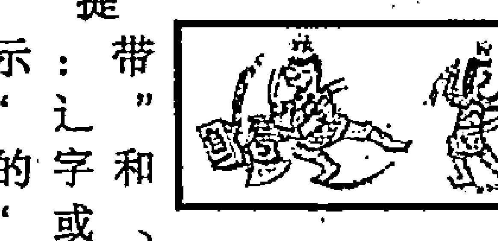

五笔数码输入法分为“6键6码”和“9键6码”两种（两种方法可分别独立使用），使用微机键盘上的小键盘，或者手机、PDA 设备上的数字键输入汉字、数字、字母、标点符号等。下面我们以微机键盘上，以 6键6码为例，来看一下五笔数码的输入键盘。

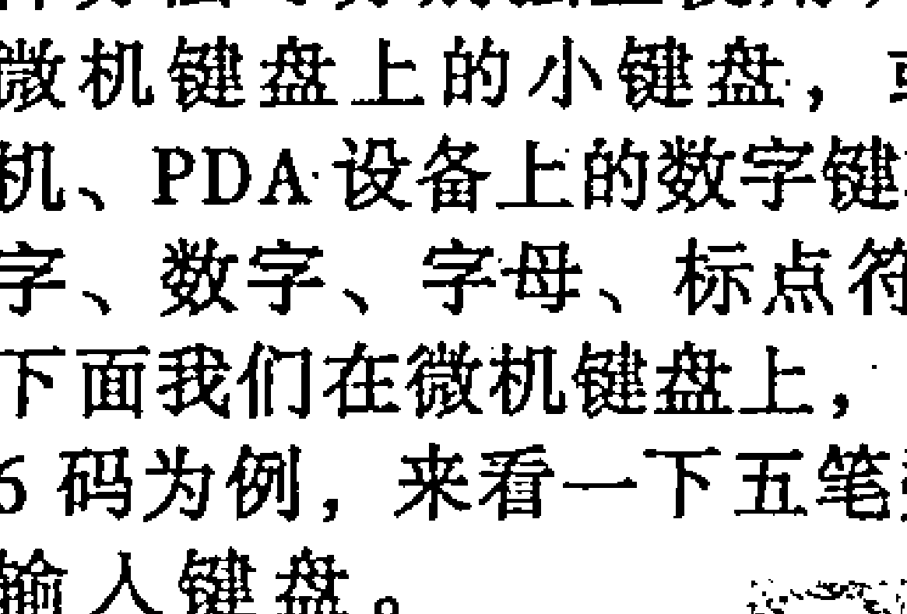

6键6码输入法键盘是指数字键盘上的数字键1、2、3、4、5、6，分别对应汉字的笔画或常用部件横、竖、撇、捺、折、口。“目”可视为两“口”合成，所以编码为66（如图2）。

五笔数码的取码规则可以概括成四句话：首部头尾取2码，余部前3加最后；整字5码4加1，词汇码长都是6。这是什么意思呢？下面我们以6键6码为例，举例说明。

遇到一个合体字后，不管是上下结构还是左右结构，先将它一分为二，分成首部与余部，然后取首部的第一笔和最后一笔（首部取1到2码），再取余部的前三笔与最后一笔（余部最多取4码），如果笔画不足6码，取完为止，末尾补1个“0”表示结束。

例如：“格”字，一分为二后，首部为“木”，余部为“各”，首部头尾取2码，即“木”的第一笔“一”和“木”的末笔“、”，编码为14；余部前3加最后，即“各”的前3笔“丿乙丶”和“口”，编码为3546，合在一起，直接在小数字键上按“143546”就可以把“格”字打出来了。

整字5码4加1指的是，如果是一个整体字，直接取该字的前4笔和最后1笔就行了。比如“我”字，前4笔分别是撇（3）、横（1）、竖钩（即竖，代码为2）、提（即横，代码为1），最后一笔是点（即捺，代码为4），好了，直接键入31214，不过刚敲入31“我”就出来了（图3），此时键入数字小键盘上的“/”键，再键入“我”字前边的序号“1”，就OK啦。

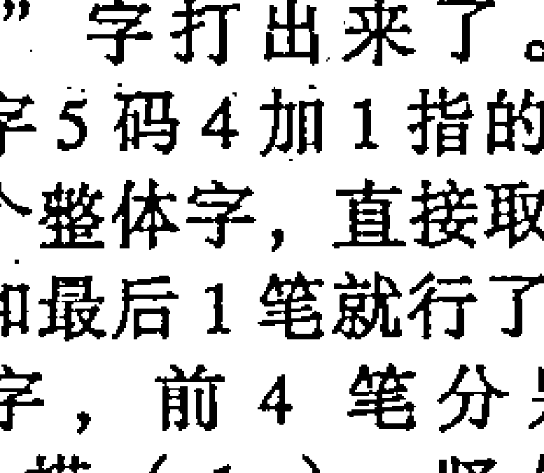

为了方便你记忆，最后给大家一个6键6码的四句口诀：

+   1键横提2竖钩
3撇4捺点点头
凡是拐弯都是5
口在6键日66

### Windows 2000 上网提速方案

□山东 toycat

Windows 2000 推出后着实让我们高兴了一番。不过，虽然 Windows 2000 的网络速度比 Windows98 好了很多，但是习惯了榨尽 Modem 最后一滴血汗的我们，总还是在琢磨，能不能再快一点呢？有没有 Windows 2000 下的网络优化软件呢？

抱着找找看的想法，我在网络上游荡了很长时间，终于在 http://www.speedcorp.net 找到了 Speedcorp Win2k Performance Enhancer。

在它的论坛上，我看到了很多人对它的赞誉之词。它是用 VB 写的，是专门为 Cable/DSL 用户设计的 Windows2000 下的网络优化软件（不过对于 Modem 用户也有一定的效果）。它主要是通过尽可能大地分配内存资源，从而推进网络适配器的运行，达到加速网络连接速度的目的。

Speedcorp Win2k Performance Enhancer 对系统的要求较高，需要奔腾 500MHz 或更高的处理器，至少 128MB 的内存才能看到明显的效果。不过即使你的 CPU 性能稍低一些，你也可以看到一些提高，包括网络视频图像更流畅，文件传输和上载更快等显而易见的效果。

Speedcorp Win2k Performance Enhancer 是自由软件，分为安装版和非安装版两个版本。安装版的文件大小是 2MB，版本：2.20B，下载地址：http://warchive.cdrom.com/pub/3dfiles/tweakfiles/networking/speed2k.exe。

有些电脑可能由于文件版本的原因，在安装过程中会出现问题，不过这种概率很小。如果安装时出现问题，可以下载非安装版，文件大小：76kB,下载地址：http://www.speedcorp.net/broadband/2kenhancer/Win2K.exe。

Speedcorp Win2k Performance Enhancer 的安装还需要有 VB6 Runtime Files SP4，要不然无法成功安装。文件大小：1020kB，下载地址：http://download.microsoft.com/download/vb60pro/Redist/sp4/win98/EN-US/VBRUN60sp4.exe。

安装前首先备份注册表。然后点击 Speed2k.exe 文件进行安装，在安装过程中会提示你是否同意许可协议，在 "I agree with above terms and conditions" 前打上对勾即可。

按 Next,选择合适的目录进行安装。安装结束后，运行 Speedcorp Win2k Performance Enhancer，在出现的窗口中点击 Install 键，弹出窗口询问你是否确定应用这个程序，如果确定还需要重新启动系统才能产生优化的效果。

现在，让我们看看优化后的效果吧。拨号上网，网页显示速度确实比以前提高了不少，真是不比不知道啊。同时打开多个网站，网页显示的速度都很快。再看看下载速度如何。使用网络蚂蚁下载同一软件进行比较，未优化前下载文件的速度只有 5kB 左右，但现在有时达到 9kB，基本上都保持在 6-8kB 之间，下载的时间也节省了不少。用 Outlook Express 发送带有附件的信件很快就发送出去了，接收信件的速度也比以前有了较大的提高。

不过，需要特别提醒大家注意的是：Speedcorp Win2k Performance Enhancer 在不同的电脑上的优化效果可能有很大的不同！我在它的网站上也看到了不少批评和意见，看来机器不同效果也不同。我的电脑是奔腾 800，128MB 的内存，测试的效果不错。而在另一台奔腾 266，64MB 的电脑上测试，效果不是很明显。

如果觉得这个软件并不适合你的电脑，或者在使用该软件优化系统后发生了什么问题，你可以打开 Speedcorp Win2k Performance Enhancer 窗口，单击 Remove 按钮，就可以取消优化，系统重新启动后就恢复了原来的设置（当然，你也可以通过修改注册表来恢复原来的设置）。

下载 Speedcorp Win2k Performance Enhancer 试试吧，希望你也能和我一样，体会到网络优化的“爽”！(注意此程序不适用 Windows 98/Windows Me，这些系统的用户弟兄们只能叹气了。)

### 在 Word 中使用“通配符”查找功能

□苏州 王东

在 DOS 或 Windows 系统下查找文件，我们常常会用到通配符“*”和“?”，这样通过模糊查找可非常方便地找到所需要的文件。其实在 Word 中的“查找”命令也有这样的功能，可以让你进行非常复杂的查询。

单击“编辑”菜单中的“查找”或“替换”命令。在“查找内容”下应该看到“选项”的内容。如果看不到“使用通配符”项，单击“高级”按钮，将出现扩展高级对话框。再选中“使用通配符”复选框，即可开始我们的复杂查询。

请注意，这时“区分大小写”和“全字匹配”复选框会变暗，表示这些选项已自动选中，你不能清除这些选项。所以选中“使用通配符”复选框后，Word 将只查找与指定文本精确匹配的文本。

在 Word 的“查找”命令中，除了“*”和“?”两个通配符外，下面再列出 Word 中其他一些特殊的通配符。

任意单个字符“?”
输入“?州”可以找到“苏州”、“杭州”等。
任意字符串“*”
输入“苏州*公司”可以找到“苏州 APC 公司”、“苏州明基电脑公司”等。
指定字符之一“[ ]”
输入“[苏杭]州”就可以找到“杭州”、“苏州”。
指定范围内任意单个字符“[x-z]”(不适用于中文)
输入“[a-f]ay”可以找到“bay”、“cay”、“day”、“eay”、“fay”，范围必须用升序。
不包含指定范围以外的任意单字符“[!x-z]”(不适用于中文)
输入“[!c-f]ay”可以找到“bay”、“gay”和“lay”，但不会找到“cay”、“day”，范围必须用升序。
至少 n 个前一字符“{n}”
输入“cho{1,}se”可找到“chose”和“choose”。
n 到 m 个前一字符“{n,m}”
输入“7{2,4}”可找到“733”、“7333”和“73333”，但不会包括“73”。
一个以上的前一字符“@”
输入“12@3”可找到“123”、“1223”和“12223”。
单词开始字符串“<”
输入“<le”可找到“lead”和“less”，而不会找到“toilet”。
单词结尾字符串“>”
输入“ch>”可找到“sketch”和“tech”，而不会找到“chat”。

另外，你还可以将这些通配符联合起来加以使用，实现更为复杂的查询功能。这时需要用括号将每一种查找括起来以表示查找处理的顺序。你可以通过输入“<(pre)*(ed)>”来查找所有以“pre”开头且以“ed”结尾的单词。

在 Word 中使用“通配符”功能时需要注意以下几点：

1. 要查找已被定义为通配符的字符，那么需要在该字符前输入反斜杠(\)，例如，要查找“?”或者“*”；可输入“\?”和“\*”。

2. 如果使用了通配符，在查找文字时会大小写敏感。如果希望查找大写和小写字母的任意组合，那么请使用方括号通配符。例如输入“[Hh]*[Tt]”可找到“heat”、“Hat”或“HAT”，而用“H*t”就找不到“heat”。

3. 使用通配符时，Word 只查找整个单词。例如，搜索“e*r”可找到“enter”，但不会找到“entertain”。如果要查找单词的所有形式，需要使用适当的通配符字符。例如，输入“<(e*r)>”可找到“enter”和“entertain”。

4. 由于使用通配符时，Word 无法识别在“查找内容”框中输入的以下项目的代码：尾注和脚注标记、域、段落标记、分节符、空格。若要查找这些项目，可以在“查找内容”框中输入以下替换代码（注意，域没有可用的替换代码）：
脚注标记或尾注标记   ^2
段落标记              ^13
分节符                ^12
空格空格{1,} (就是输入空格，然后输入“{1,}”)

希望这些小技巧对大家能有所帮助，为大家的日常工作增添一些方便。

## 办公室秘笈之“障眼法”

□山东 周斌

### ‘咖啡神功’NapAndCoffee

NapAndCoffee是休息一下，喝杯咖啡的意思。它虽然不能隐藏什么窗口，却可以在屏幕上伪造一个非常逼真的程序安装、备份、复制的窗口。

这个小程序功能很简单，只要在三种Module下选择一种，然后在Title Bar Text或Progress Bar Text中选择一种方式，点击Launch就可以显示出电脑正忙的状态。

文件大小：46KB（小巧玲珑喔，不要白不要）

下载地址：http://kinkodev.nexen.net/zip/NapAndCoffee.zip

### Boss大法

有了这个软件，你以后再也不用担心被别人窥视了。别人一来，你只要按一个键就可以将所有打开的程序窗口都隐藏起来，再按一个键又能够把隐藏的窗口都找回来。如果你想隐藏什么程序，首先要把放大镜放到该程序的标题栏上，这时程序的Class Name和Window Title就会出现，点击Edit ini file，打开.ini文件，在boss.ini中添加一行就行了。现在按ESC键就可以隐藏窗口了。

文件大小：48KB（嘿嘿嘿，小吧……）

下载地址：http://www.rohitab.com/boss/boss.exe

### Don't Panic!

Don't Panic!的字面意思就是别慌张。它既是一个独特的个人隐私保护程序，又是一个功能强大的系统清理程序，兼有隐藏和清理两项功能。它可以自动清除Internet文件，包括浏览器历史记录、地址栏下拉菜单中的URL、Cookies和缓存。它也可以清除Windows留下的各种记录，包括最近打开的文档、运行历史记录、查找历史记录、Windows剪贴板、回收站等。它最新的一项功能是智能控制上网浏览时弹出的窗口。

## 包装效果的制作

□北京 Dr. Killer

在商业设计中，设计师的创意无论如何精彩，最后展现在客户眼前的都必须是产品的最终效果，因为客户可没法去想象你的设计最后会变成什么样子。所以商业设计一般会做一个实物的模型效果——不要忽视这一步，这个效果图的好坏将有可能直接影响客户对你的设计的喜好，从而决定你能否拿到那份订单！

系统要求：Photoshop5.0，硬盘剩余空间应在500MB以上，最好是在1.5GB左右。制作时要注意多存盘。

本例的文件初始大小为23.2cm×20.7cm、200dpi、RGB色；效果完成时，分层图占硬盘65.7MB；至于我所用的电脑，PC为奔腾II 566、64MB内存，苹果机为G4-400、196MB内存，制作起来都较流畅；如果你的机器配置不够，可能会稍慢一点，如果实在太慢了，就把文件尺寸设小一些吧。

根细的白线压在上面（一白遮百丑？），一方面能盖掉错漏，一方面能体现纸盒的厚度感和立体的棱角感。

- 1. 在Layers面板下点Create New Layer按钮新建一层；
- 2. 用（M）键选择工具Rectangular Marquee Tool，在图中画一个细的长条，宽度为三个点（放大后可看到Photoshop图像由点组成），长度比最长的接缝略长，在工具面板下点选背景色BackgroundColor，并在Color Picker中设为白色，用Ctrl+Backspace [Command+delete]填入颜色。
- 3. 用Filter-Blur-Gaussian Blur模糊1.5，用Ctrl+T [Command+T]点选它两头中间的控制点调节长度，再点选中部拖到适当位置并旋转角度，精确吻合接缝处并能完全盖住此条接缝。由于两头中间的控制点很难选中，所以一般要放大来选。
- 4. 复制本层，再用Ctrl+T [Command+T]如步骤3一样盖住另一条接缝，再次复制本层，并用Ctrl+T [Command+T]变形，盖住最后一条接缝。
- 5. 确认各白条的位置准确对准后，在Layers面板上分别点击这三层“白条层”眼睛右边的方框，把三层链接起来，再点Layers面板右上的小三角，选“Merge Linked”将这三层合成一层。
- 6. 用(E)键选择橡皮工具Eraser Tool，在Brushes面板选择一个直径为10的笔触，把白条多余的部分擦除，注意擦除时要放大来做，以便擦得精确一些。

### 三个面亮度的调节

从效果图可知道，光线是从右上方而来，所以三个面的亮度也就各不相同，从画面分析来看应该是正前方最亮，顶上次之，而左侧最暗，具体调节如下：

- 1. 在Layers面板上点击正面的面层，用Ctrl+L [Command+L]调节亮度，把Input Levels中间的一项由1.00调为1.20，选Image-Adjust-Brightness/Contrast调节对比度，设Contrast为12。
- 2. 在Layers面板上点击左边的侧面层，用Ctrl+L [Command+L]把Input Levels中间的那一项由1.00调为0.60。

### 正面加亮光

此款包装的原定设计是要过光胶的，如果是成品包装盒，它会对光线有些反射而显得非常亮丽，所以我们做效果图时当然也不能少了这一点。现在来做正面斜的两条“光带”。

- 1. 在Layers面板点Create New Layer按钮新建一层。
- 2. 用（M）键选工具Rectangular Marquee Tool，在图中画一个细的长条，宽度为盒子左侧边宽并尽量长一点，在工具面板下点选背景色BackgroundColor，并在Color Picker中设为白色，用Ctrl+Backspace [Command+delete]填入颜色。
- 3. Ctrl+D [Command+D]取消选择范围，用Filter-Blur-Gaussian Blur模糊85。
- 4. 按住Ctrl+Alt [Command+Option]键不动，拖动来复制一层。
- 5. 用Ctrl+T [Command+T]旋转调节斜度，点击中部拖动到盒子正面的右下部，点选它两头中间的控制点，调节长度让它完全超出盒子正面的边沿。
- 6. 在Layers面板上点选刚才复制的那层，用Ctrl+T [Command+T]变形，按住Shift键不动缩小到一半大，放开Shift键，旋转调节斜度和刚才的“光带”一致，点击中部拖动到盒子正面的左上部，点选它两头中间的控制点，调节长度让它完全超出盒子正面的边沿。
- 7. 在Layers面板上分别点击两层眼睛右边的方框，将两层链接起来，点Layers面板右上的小三角，选择“Merge Linked”合成这两层。
- 8. 在Layers面板上把此层的叠加模式设为Color Dodge，透明度Opacity设为55。
- 9. 按住Ctrl[Command]键不动，在Layers面板上点击盒子正面的图层以取得它的范围，鼠标点选“光带”层，再在Layers面板中点击“Add Layer Mask”，为层加上遮罩即可。

### 背景的制作

背景的光线主要是给人一种空间感，所以色调上要和包装保持一致，具体做法如下：

- 1. 在Layers面板下点Create New Layer按钮新建一层，并把此层拖到最下层。
- 2. 鼠标点选Linear Gradient Tool (G)“渐变工具”并双击，在Options面板上点Edit按钮，分别双击颜色控制块，在Color Picker中把两个颜色分别设为R174 G186 B201和R217 G221 B229，按住Shift键不动，在图中上下画一下，作上下渐变，如果画反了可以用Ctrl+Z [Command+Z]取消后反过来画。
- 3. 在Layers面板下点“Create New Layer”按钮新建一层。
- 4. 按住Shift键不动，用(L)键选择Polygonal Lasso Tool工具，按照草图画出下面“地平面”的范围。
- 5. 选Linear Gradient Tool (G)工具并双击，在Options面板上点Edit按钮，分别双击颜色控制块，在Color Picker中把两个颜色分别设为R75 G78 B83和R119 G130 B139，按住Shift键不动在图中上下画一下，作上下渐变，Ctrl+D [Command+D]取消选择范围。

### 影子的制作

- 1. 在Layers面板下点Create New Layer按钮新建一层，并把此层拖到背景层的上面。
- 2. 用(L)键选择Polygonal Lasso Tool工具，画出影子的范围，在工具面板下点选背景色BackgroundColor并在Color Picker中设为黑色，用Ctrl+Backspace [Command+delete]填入颜色。
- 3. 用Filter-Blur-Gaussian Blur模糊10，在Layers面板上把此层的叠加模式设为Multiply，透明度Opacity设为83。
- 4. 按住Ctrl[Command]键不动，在Layers面板上点击背影的平面层以取得它的范围，松开Ctrl[Command]键点选影子层，在Layers面板下点击Add Layer Mask加上遮罩。
- 5. 按(E)选橡皮工具，在Brushes面板选一个直径为5的笔触，把盒子右下角位置放大后，仔细地把多余的阴影擦除。
当然，最后加上倒影就更完美了（如果你做到这里，已经很累了，那么倒影可以暂时不做）：
- 1. 在Layers面板点击盒子正面的层，复制本层，并把复制层拖到影子层之下。
- 2. 用Ctrl+T [Command+T]变形以吻合倒影的透视关系。
- 3. 在Layers面板上把此层的叠加模式设为Soft light，透明度Opacity设为45；
- 4. 对盒子的侧面重复以上三步操作即可得到盒子完整的倒影。
看看，咱们现在的包装盒效果图就完成了！如何？可称得上完美吧？！你也来做上一个吧。

## 用 Windows 的画笔 修改开关机画面

大家对Windows提供的开关机画面是不是有点厌倦了呢？！哇，这么多人举手啊？！看来真的是厌了很久了……那么今儿个就让我带领大家打造一幅体现自己个性的开机画面吧！工具？我们不需要什么专业的工具，我们只用Windows的“画笔”！

### 认识开关机画面

“开机画面”就是当你启动Windows后出来的第一个画面。开机画面的文件名为logo.sys，它一般保存在C盘根目录下。有时c:\logo.sys并不存在，但只要你把一张256色的BMP格式图片改名，保存为c:\logo.sys，即可让它变成你的开机画面。“等待关机画面”就是提示“Windows正在关机……”的画面。等待关机画面的文件名为logow.sys，它一般是保存在c:\windows中。“关机完毕画面”就是提示“现在可以完全关闭计算机了”的画面。关机完毕画面的文件名为logos.sys，它一般是保存在c:\windows中。

实际上，这些Windows的开关机画面是一幅256色的BMP位图文件（320 × 400像素），只不过把扩展名由“.bmp”改为“.sys”罢了。由于该文件扩展名是.sys，因此系统把它看作是系统文件，常规下在资源管理器下是看不到的。要看到它，你必须在“资源管理器”的“查看”菜单中选择“文件夹选项”，在弹出的对话框中点击“查看”标签，然后在高级设置框中“隐藏文件”下的“显示所有文件”前单击，使其成为选择状态，“确定”退出对话框。

### 制作开关机画面

首先我们打开Windows中的画图程序，单击“文件”菜单中的“新建”来新建一个画图文件。然后再单击“图像”菜单中的“属性”选项，在弹出的“属性”对话框中，将宽度设置成320，高度设置成400，然后按“确定”按钮。现在我们就以在画布上涂鸦了，画你自己喜欢的东西吧^_^（熟归熟啊，你要是画个猪头再写上我的大名，我一样要告你诽谤的）。制作完成后，单击“文件”菜单中的“保存”选项，在弹出的保存对话框中，指定保存的路径，并在文件名处输入logo（文件名可任意），在保存类型中选择“256色位图文件”。现在我们退出“画图”程序，进入资源管理器，将刚才保存的logo.bmp文件改名为logo.sys，并复制到C盘根目录下。OK，我们的自制开机画面就搞定了。如果你心急，赶紧启动看看？嗯，看来的确够味。不过你的涂鸦之作好像难登大雅之堂啊？还是来看看如何制作一幅精美的开机画面吧！平时大家也许会看到其他一些制作精美的图形，也想利用它来制作自己的开关机画面。那该怎么做呢？首先，我们要把这幅图形转换成256色的BMP格式位图文件（利用图像浏览程序ACDSee就可以轻松转换了）。首先我们将这幅图片在ACDSee中打开，然后点击“Tool”菜单的“Convert”选项。这时会弹出一个“Format Convert”对话框，在“Select the desired output format:”中选择“BMP”，然后再单击“OK”按钮即可保存为BMP文件。由于其保存的颜色位数是根据源图像的位数而定的，所以我们可以在画图中打开此文件进行编辑，然后再另存为256色的位图文件。当然啦，如果你在玩游戏的时候看到哪个漂亮美眉，也可以按下PrintScreen键将精美的图像拷贝到剪贴板上，然后在“画图”程序中按“Ctrl+V”将其复制到图片中……且慢，莫着急存盘改名，否则你的美眉会变得很难看！（不信你就试试看。）这里涉及到一个修边和图像大小调整的问题。对于修边我们可以在画图中用选定按钮；将图片调整到适当的位置后（注意要以左上角为基准），然后再将图像的高度和宽度调整到适当的位置。不知大家有没有注意到，开关机画面的尺寸为320 × 400，而我们现在制作的图片尺寸很可能与它不一样。如果只是很机械地将画布调整成320 × 400，你会发现图片变形了……漂亮美眉变成了恐龙，哭去吧……为了避免变形，让我们来计算一下：加入开关机画面正常运行的大小显示为640 × 480或800 × 600（这两者的宽度与高度的比例均为75%），要调整成320*400时，那么它的宽度缩放比例是50%，而高度的缩放比例是83%。所以这里建议大家将源图片的宽度与高度制作成与640 × 480或800 × 600相同的比例。例如：640 × 500的图像，我们可以将它裁减成640 × 480。最后再点击“图像”菜单中的“拉伸/扭曲”选项，按比例缩放成320 × 400的图像（将拉伸选项中的“水平”设为50%（320 ÷ 600），将“垂直”设为83%（400 ÷ 480）。最后再保存成256色位图文件即可，其他的步骤同上。对于关机的两个画面，制作方法与开机画面的制作方法相同，但是切记做好后要以logow.sys和logos.sys来命名哦！然后再覆盖c:\windows目录下的这两个文件（怎么？舍不得？舍不得孩子套不住狼啊……）。OK，现在我们就可以重新启动计算机，欣赏一下自己的杰作了。

## 声音系统自己做
□福建 王寒晖

大家都体验过 Windows 事件音效的妙处，也可选用不同的配音方案。不过大家有没有想过自己去弄些声音来，指定某些程序的声音效果呢？其实做起来很简单的，利用 Windows 中的录音机程序就可以实现。

### 前期准备工作

要进行录音当然需要硬件的配置，一块全双工的声卡、麦克风和音频线（或 MIDI 线）。安装好声卡的驱动程序后，将麦克风的插头插入声卡的 MicroPhone（Mic）插孔，将音箱的插头插入声卡的 Line Out 插孔中。如果要录制一般的随身听或收音机的声音，就要用到音频线（或 MIDI 线）。将 MIDI 线的一端插头插入随身听或收音机的耳机插孔，另一端插入声卡的 Line In 插孔中。

接下来我们就要调整声音属性了，双击任务栏中的音量控制图标（黄色小喇叭形状的图标），这时会弹出一个音量控制窗口，单击“选项”菜单中的“属性”选项，在弹出窗口中的“调整音量区”选择“录音”。如果是录制麦克风的声音，则在“显示下列音量控制”中选择“Mic”；如果是录制随身听或收音机的声音，则选择“Line-In”。按下“确定”按钮后，音量控制窗口中就会出现各种录音方式的音量控制栏，就可以选择我们要使用的某种录音方式了。

例如笔者要用麦克风录制声音，则在 Mic 的录音控制栏下面勾选“选择”项，然后再调节栏中的音量，你可以根据自己的输入设备调节录音音量（注意：如果音量设定太小，会使录制出来的声音太小或没有声音，但是设置得太高又可能会使音箱发出干扰声音，大家可以按自己的需要进行调整）。另外，也可以调节左右声道的均衡器（也就是音量比例）。

然后运行“开始” -> “程序” -> “附件” -> “娱乐”里的“录音机”程序，设置 WAV 录音文件的格式和录音质量。单击录音程序“文件”菜单中的“属性”选项，这时弹出一个“声音的属性”对话框。在“录音位置”选项中选择“录音格式”，再单击“开始转换”按钮。

在弹出窗口的“选择声音”选项按照自己的需要进行设置。然后再单击录音程序“编辑”菜单中的“音频属性”选项，单击“录音”选项的高级属性。然后在弹出的窗口中调节“采样率转换质量”，一般情况下都可以按其默认值选择“一般”，当然录制高质量的声音需要调节到“最佳”。

### 开始录制声音

通过上面的设定后，我们就可以点击录音机程序右边的红色按钮“录音键”，然后对着麦克风讲话或打开随身听或收音机，录音程序即开始录制。但是大家要注意，Windows 中的录音机只能录制 60 秒内的声音，所以只能来录制自己的一些短小的声音文件。声音录制好后，选择“文件”菜单中的“保存”选项，将声音数据保存为 WAV 格式的声音文件（如果选择“另存为”，则可以设置保存文件的声音质量和编码格式）。当然我们也可以将录制的声音在录音机程序中回放，如果不满意，可以重新录制。

我们也可以将要录制的声音添加一段背景音乐，只要把刚才录制好的声音文件，点击“编辑”菜单中的“与文件混合”选项，然后再选择背景音乐文件，最后按“确定”即可。

### 更改声音事件

声音录制好后，接下来要更改 Windows 的声音事件。依次运行“开始” -> “设置” -> “控制面板”中的“声音”。先选择一个事件，然后在“名称”选项中按“浏览”按钮，指定好刚才保存的声音文件即可。其他事件配音方案的制作方法类似。设定好所有的声音事件后，我们可以将它保存为一个方案。

你现在明白怎么改造自己的 Windows 声音了吗？还不赶快把你的 Windows 启动音乐换成自己的一声问候！呵呵，让你的美眉打开你的电脑就能听到你浑厚如破锣的嗓音，是不是够酷呀？！……马上试试效果哦！

另外再告诉你一个“整人”秘方，就是找个女孩子学点怪叫录下来，然后把那些喜欢深夜上网的网虫的开机音乐、关机音乐统统换成女孩子的怪叫……嘿嘿，到时侯，这帮网虫夜里 3 点来上网……^_^

## 用 Theme 美化 Windows
□北京 飞狼

看久了 Windows 的蓝天白云，是否已经有点看腻了的感觉？

可还记得当年的 Windows Plus？安装了以后可以让 Windows 焕然一新的那个东西？很可惜，微软公司在 Windows 95 时推出的这个小玩意，只做了个繁体的版本，却没有做简体的版本。如果你要用，就只能用英文版的 Plus——而且用了后，还会导致很多对话框上原来显示正常的汉字都不见了，变成了横线（这是一个 DLL 文件被替换的缘故），让你使用时猜尽哑谜……

不过，不管是谁，只要用过 Microsoft Plus!，对 Plus! 所提供的美丽多样的界面和图标一定赞叹不已。对这种经过设计的，统一提供 Windows 配色、壁纸、花样图标（ICON），以及相应的屏幕保护和各种事件声音的 Windows 界面方案，Plus! 称为“Themes（布景包）”。只要选择不同的 Themes，Windows 就可以变成各种各样的样子。

其实，Windows 98 也内置了 Themes，可以让你选择不同的界面和图标。只是一般默认安装时并未装入而已（全部安装需要 30MB 硬盘空间）。

看到这个消息，还不赶快动手把你的 Windows 98 安装盘拿出来，打扮一下你的爱姬（机）？

### 一、安装 Themes

如果你还没有安装“桌面主题”，可以进行如下操作：进入“控制面板”，然后点“添加 / 删除程序”；再点“Windows 安装程序”，选中里面的“桌面主题”后，点“确定”即可。

### 二、使用 Win98 现成的 Themes

使用现成的 Themes，对于 Windows 98 系统，就是使用其内置的界面即可。如果你的 Windows98 安装时选择了“桌面主题”，那么你可以如下进行了：

进入“控制面板”，然后点“桌面主题”，再点“主题”后面的选择栏进行选择，最后点“确定”即可。

### 三、自己动手改变壁纸

改变壁纸是相当容易的一件事情，我们这里推荐使用 AcdSee 32 来做这件事。AcdSee 32 本身是一个专业的看图软件，可以观看多种格式的图形。只要它能显示出来的图形，AcdSee 都有本事把它变成 Windows 的壁纸。在看到一张合意的图片时，按下“Ctrl+W”即可把这张图片设置为墙纸。

AcdSee 32 的下载地址：http://www.download.com.cn/show.phtml?action=download&id=358&lo=2&name=acdwin.exe

如果你手边一时没有合适的精彩壁纸，不妨去几个网站看看，下载一些漂亮的回来用用。

http://51picture.yeah.net/
http://monshow.netease.com/
http://jiang-qiang.3wtimes.com/
http://desktop.oxta.net

编后语：如果你用的还是 Windows 95，那么你也不用去装什么危险的 Plus 了（据说 Plus 非常消耗系统资源），你可以去看看我们另外为大家组织的一篇《Desktop Themes 美化你的系统》。

## DeskTop Themes 美化你的系统
□北京 飞狼

DeskTop Themes 软件非常好用，本身又小巧玲珑，这里推荐给大家（软件虽小，功能却强）。

安装：首先将 desktopt.zip 文件解压到某个临时目录中，比如 c:\temp。然后运行 setup.exe，此刻程序会询问你文件将要安装的目录，认是：“C:\Program Files\Desktop Themes”，一般取默认的即可，否则就自己改变它。下面的 User Name（用户名）和 Code（注册码）是供注册用户用的，我们就先不管它，让它空着，然后点击“Install”按钮即可开始安装。一会工夫就安装结束，点击“确定”按钮结束安装。

下载地址：ftp://ftp.lss.com.au/desktopt.zip

使用：Desktop Themes 桌面布景软件的使用无疑是非常简单的。下面我们结合一个具体的实例，讲述此软件的用法。首先我们下载一个非常漂亮的布景包（http://hkabc.themes.tucows.com/zips/nature/CLASSICFALL.EXE）。下载后，首先运行它，连续点“Next”按钮，最后点“Close”按钮即可完成安装。其实这个包里的文件是带目录压缩的，安装过程其实就是自己释放到你的“C:\Program Files\Desktop Themes”目录里面。

然后我们运行“Desktop Themes.exe”。我们来一个一个地进行说明。

Theme：这里是选择你需要使用的具体界面的地方。你可以通过点击 Current Theme 右侧的下拉菜单，然后从弹出的清单中进行选择。一般来说，在没有放入新 Theme 之前，一般默认的有如下几个：Current Settings（当前界面），Initial Settings（初始化界面），Windows Defaults（Windows 默认的界面）。如果还有其他的，肯定就是我们拷贝进来的新 Theme，比如我们刚拷贝进来的是：A Classic Fall，点选它。

然后注意右边的这些小方框，依次选中它们，表示你需要用新界面的下述部分：

- Wallpaper（墙纸）
- Sounds（声音）
- Icons（图标）
- Pointers（鼠标指针）
- Colors（色彩配合）
- Windows fonts/style（窗口字体安排）
- Icon font/spacing（图标显示的字体和图标间的空间安排）
- Screen Saver（屏幕保护程序）。

注：如果你使用的是 Windows 98，安装时又选择了“桌面主题”，你在这里就可以看到多种多样的 Themes 选择。

Display：这里是让你查看各个图标的具体显示情况。比如新界面里墙纸变成了一副秋日风景画，网上邻居则变成一只扫落叶的耙子。

Sounds：这里是让你体验新界面相应的声音变化，比如启动 Windows 的声音和退出 Windows 的声音。

Pointers：显示鼠标指针的变化。你可以看到原来的 Busy 指针从沙漏变成了一只挂满彩灯的闪亮的树，而背景中的任务运行指针（Working in background）也变成了一棵慢慢挂满彩灯的树。

Miscellaneous：这个我们要多留意，因为对我们的界面影响很大。有如下选项：Use large Icons（使用大图标），Window animation on minisite/restore（窗口缩小放大的时候有动画效果），Select a random theme on startup（系统启动时随便抽一个界面来使用），Show icons using all possible colours（使用尽可能多的颜色显示图标），Stretch desktop wallpaper to fit screen（拉伸整个壁纸图形以覆盖整个桌面），Path to Themes…（给出我们具体存放界面文件 Themes 的路径）。要用哪个，选中它即可。

Install：这是让你可以自动安装一个 Themes 文件，只要你给出具体的 Theme 文件的路径即可。如果不记得，也不要紧，可以通过点击“Browse”按钮进行选择。有了安装，自然也有反安装。要反安装，直接选中要反安装的部分，然后点击“Uninstall”按钮即可。

Screens：这里是编辑开机和关机画面的地方。

## 图标美化师——Microangelo98

□苏州华玲

Microangelo98是一个功能非常强大的图标和光标工具软件，可以使你非常容易地更新、定制和创建Windows系统图标和光标方案，允许你的桌面图标和光标显示多达24位真彩色，且能搜索所有磁盘和文件夹中的文件图标资源，并能从中导出图标，进行修改，保存等操作，或者直接抓取图标进行编辑，它能检测和支持Windows95、Active Desktop of Internet Explorer 4.0、Windows98、Windows NT4.0及更高版本。

Microangelo98由Explorer、Engineer、Librarian、Studio和Animator五大部分组成，安装Microangelo的过程非常简单，这里不再详述。

安装成功后，进入程序组，运行“Explorer”。第一次运行，Explorer会询问你，是否和图标文件(.ico)以及光标文件(.cur)建立关联？选中“Do not ask this question again”，然后点“Yes”按钮。

然后Microangelo98会提示你版权信息，告诉你这是个30天的评估版本，你要点“I agree”按钮表示你遵从版权法的约定。此时就正式进入了Microangelo98。

下面重点介绍一下Explorer、Engineer的使用方法。

Microangelo98的界面Explorer与Windows的Explorer几乎一模一样，是系统图标、光标的管理中心，在这里可以查看管理磁盘和文件夹中所有的图标和光标。如果需要，你可以点击“Tools”菜单，然后点击相应的菜单项，从而启动Engineer、Librarian、Studio和Animator等各个程序。

大家注意右边栏中上方的“Display”，这里直接决定了显示的图标或者光标的类型。一共有6种选择，分别是：Icon Files(图标文件)、Cursor Files(光标文件)、Icons(图标)、Icon Libraries(图标库)、Static Icons(静态图标)、Animated Cursors(动画光标)。

点Display后面的黑色三角，即可选择对应的类型，然后右边窗口中将显示出你磁盘中对应类型的、含有图标或者光标的文件。当你选择了一个图标（光标）文件后，用鼠标双击它，Microangelo98即可按照此文件所对应的文件类型分别打开Librarian、Studio或者Animator程序。如图选中Display “Cursor Files”，然后进入Microangelo98安装目录下的“Cursors”子目录，双击其中一个光标文件，即可打开光标编辑器。

一般我们看到的带图标(icon)的都是些exe文件或者dll文件，双击后一般是进入Librarian程序进行图标或者光标的管理。有时一个文件中包含了很多的Icon，你可以在窗口中一一看到。对某一个你觉得不错的图标，用鼠标右键单击它，可以看到如下选项：Save as ICO(存储为单独的一个图标文件)、Edit Icon(对图标进行编辑)、Install to System(安装到系统)、Properties(查看此图标的属性，比如大小，色彩数等)。

注意，选择“Install to system”此项功能时，Microangelo98会显示出系统中所有的系统图标，然后让你选择准备用当前图标替换哪个图标。所以，在Microangelo98面前，替换系统图标变得无比简单——只要选择好具体的图标，然后点“Apply”按钮即可完成替换。所以一般我们最常使用的也就是“Install To System”，对系统中的图标一个一个的进行相应的替换。

Microangelo98的Engineer是一个功能强大的图标（光标）设置中心，运行它，你能对系统图标的属性、系统桌面组件和Windows外壳的图标（光标）进行选择和安装，并能按主题备份和维护你的图标（光标）设置方案。

- 桌面组件和Windows外壳图标（光标）的设置方法：
  1. 选择Desktop(桌面)、Start(启动)、Folder(文件夹)、Drives(驱动器)、Misc.(杂项)，或者Cursor(光标)，选中要更改的图标或光标。
  2. 在选择好的图标（光标）后单击Change…(更改)按钮。
  3. 将出现一个更改图标（光标）对话框，选择你要使用的图标（光标），单击OK。
  4. 如果你想更改其他图标（光标），重复步骤1至3，设置每个项目的图标。
  5. 最后单击Apply(应用)按钮，就完成了系统的图标（光标）的更改（如图7）。

另外，为了避免你的乱换导致系统面目皆非，建议你用Microangelo98的Engineer事先按主题备份和维护你的图标（光标）设置方案。方法是：

- 1. 在Config(系统配置)中选择Motif File Maintenance(主题文件维护)。
  2. 在File菜单中选择Open或New，打开或新建一个图标（光标）主题文件，其扩展名为.motif。
  3. 选择Desktop(桌面)、Start(启动)、Folder(文件夹)、Drives(驱动器)、Misc.(杂项)，或者Cursor(光标)，选中要更改的图标（光标）。
  4. 在选择图标（光标）后单击Change…(更改)按钮。
  5. 将出现一个更改图标（光标）对话框，选择你要使用的图标（光标），单击OK。
  6. 如果你想更改其他图标（光标），重复以上的步骤3至5，设置每个项目的图标。
  7. 最后单击Save(保存)或Save As…(另存为)按钮，就可以把刚设置的图标（光标）以文件的形式保存下来。
  8. 如果在Config(系统配置)中选择Local System Update (本地系统更新)，这是系统的默认值，再在File菜单中选择Open打开图标（光标）主题文件，最后单击Apply(应用)按钮，就把图标（光标）的设置方案更新到你的系统。

Microangelo98的Librarian图标管理器、Studio图标制作室、Animator动画光标制作室都是功能很强的工具，且比较容易上手，这里就不一一介绍了。

就笔者的感觉，Microangelo98可以说是迄今功能最多，性能最好的图标和光标工具软件，是Windows95/98/NT/2000用户设置和维护系统图标（光标）的利器，可以让你的Windows更漂亮，更具有个性。

ftp://ftp.download.com.cn/pub/new_multimedia/mike98.exe

精彩桌面主题推荐（这是我顺便推荐的2个感觉比较好的Themes）：

Kitty猫：http://cbtheme.myrice.com/theme/kitty.zip 最终幻想7：http://cbtheme.myrice.com/theme/ff7theme.zip 其实网站上的Themes包数以千计，大家可以自己去找喜欢的进行下载：http://hkabc.themes.tucows.com。

## 超炫界面源自WindowsBlinds

□阮志峰

有了前面一系列的打造系统的经验后，你的机器已经有了独一无二的开关机画面、声音系统、图标、屏幕保护等等，但是这还不是最酷的。最酷的我们要留到最后！这就是WindowBlinds，系统级的“Skin”工具（参见《电脑爱好者》今年第1期的“换壳”专题也曾经专门提过它），它让你可以随心所欲修改Windows98、Windows ME、Windows NT和Windows2000的外观，并给程序都穿上别致的“外衣”。你能够改变标题栏、按钮、工具条以及其他各种项目的风格，并可以完全改变Windows的图形用户界面（GUI），从而定制出一个具有超凡品味的独特的Windows外观。

这一革命性的程序在安装以后，能够和Windows无缝地整合在一起，利用它可以轻易地将你的PC打造成一台Macintosh，一台Linux服务器，或是一台古里古怪从未见过的计算机。

### 程序的安装

程序安装结束后，双击图标即可开始运行。首先是关于上网方式的提示，根据自己的情况进行选择即可。然后是个人资料，选择“Ask Me Later”跳过，并在版权窗口中点选“Continue unregistered”（不注册）。OK！现在就可以正式开始使用WindowsBlinds了。

### 程序的使用

运行WindowBlinds以后，即可看到一个漂亮的设置窗口（当WindowBlinds缩小成系统托盘上的一个图标时，双击它也可以打开程序的配置窗口），左边的五个图标就是配置选项。

Skins：这里展示了程序当前可以使用Skin的名字、简介说明、颜色和外观等。你可以安装新的Skin文件（支持*.WBA、*.ZIP格式）、删除Skin，按照Skin的名字、作者或安装日期排序，选择一个混合Skin以及为Skin定制特别的颜色。

下面就让我们为Windows穿上一件苹果机的外衣。一台MAC了，连每一个程序窗口的标题栏上的关闭、缩放按钮都和真正的MAC惟妙惟肖。点击页面左下角的“Unload WindowBlinds”按钮可以卸载当前使用的Skin，恢复系统的原始状态。

Settings：这一项主要是让你对Skin的应用范围进行有针对性的选择，程序会根据具体项目的选择演变出千变万化的结果。可供选择的项目包括四个类别：Skin buttons，是否给系统中的各种按钮穿上外衣，包括标准的Windows按钮（像确定、取消等）、任务栏以及工具栏上的各种按钮；Skin controls，控制程序是否为菜单的边缘穿上外衣，是否定制规则的系统按钮、滚动条等（该功能只能在增强版中使用）；Skin window backgrounds，为对话框、资源管理器以及在一个大的主窗口中有多个子窗口（MDI）的应用程式加上Skin指定的位图背景；Enhance Desktop elements，增强的桌面环境，是否使用Skin中指定的墙纸、音效、图标库、颜色方案等。

Backgrounds：为对话框、MDI窗口以及资源管理器指定一个位图作为它们的背景。在相应的窗口中点击鼠标，就会弹出一个带有预览功能的文件对话框，你可以根据自己的需要，在磁盘中选择相应的BMP图像文件作为背景。

Per Application：WindowBlinds允许你为特定的程序选择配置一个指定的Skin。例如，你可能希望邮件程序使用一个和系统中其他程序不同的Skin，或者你希望WindowBlinds不要为记事本穿上外衣，就需要在这里定制了。尽管WindowBlinds经过了许多的测试，但是由于一些应用程序使用了非标准的Windows界面（或者它们自己的Skin），可能导致WindowBlinds不能为它们工作，窗口中标记有一个红叉的程序，就是WindowBlinds默认不予考虑的对象。

点按“Add per application setting”按钮以便增加一个需要定制的应用程序，此时程序会打开一个文件对话框，从系统中选择一个你想定制的.EXE文件后，可以开始设置工作了。程序会默认使用当前的系统Skin，点按“Select skin...”按钮可以从系统已经安装的Skin当中进行选择。更多的选项包括拒绝WindowBlinds为指定的程序穿衣，或者当程序使用Direct3D时仍支持Skin（默认的情形是WindowBlinds不会为使用Direct3D的程序加上Skin），禁止背景位图、滚动条在该程序上的使用，由该程序运行的程序不再使用同一设置等等。更改后的生效需要重新启动WindowBlinds。

System：点按窗口右上方的三个网站按钮，会在默认的网页浏览器中打开程序的相关网站，在其中可以下载到WindowBlinds的Skin以及开发商的其他软件产品。在中间的窗口中可以配置程序的启动选项及基本选项，其中Startup options包括是否在启动时打开WindowBlinds的配置窗口，是否将程序图标放在系统托盘，以及是否在启动电脑时自动运行WindowBlinds，而General options则包括在卸载WindowBlinds时是否显示警告窗口，当一个Skin准备使用新的墙纸、图标等时是否显示警告窗口等。如果选择了互联网功能，WindowBlinds还会定期连接到网络服务器上，检测是否有适用于用户的新项目。

使用中，WindowsBlinds的速度令我相当惊讶，其“穿衣”的速度只和Skin的复杂程度有关。另外，它只占用较少的内存，所以对系统性能没有太大的影响，让你可以放心地使用它的超炫界面。软件可以在其主页 http://www.windowblinds.net 上下载（同时提供上千种不同的免费Skin供下载）。当然了，如果你想弄个世界上独一无二的外观，你也可以参考在线帮助，自己制作Skin（去 http://www.stardock.com/products/BuilderBlinds 下载BuilderBlinds即可）。

## Windows 98 超酷动态桌面

□江苏 叶建军

很多人都知道，JPG或者其它漂亮的图形是可以做壁纸的，但是很多人并不了解，Windows 98还可以用HTML网页做桌面背景！既然HTML文件可以做桌面，而动态页面大家可能在网上见过不少，所以做一个全新的动态桌面就很简单了。

找一个包含有Flash动画的网页，保存下来，然后再拿它当背景……要知道，这可是一个“动感十足”的桌面喔！

将桌面背景指定为HTML网页的方法：鼠标右键单击桌面的空白区，选择“属性”，然后在“背景页”中按下“浏览”按钮，选择你要设为桌面的那个网页就可以了。

> 啊，这位同学叫起来了：“喂，只要是有动画的网页就可以了，何必一定要一棵树上吊死呢？没有Flash的行不行？”

答案是：当然可以！但是那只是一般的菜鸟所为，要做高手，就一定要用Flash的动画！因为……因为Flash的动画有“交互性”啊。

交互性？！没听说过背景还有交互性的……

呵呵，没听说过吗？其实，这交互性就体现在——当你用鼠标去点击桌面上某个图标时，随着鼠标的移动，会飘落下一片片的雪花，或是有一圈一圈的光晕荡漾开去……明白了吗？（这些效果对于到过Flash网站的你该不会陌生吧？）

下面我们来举一个例子，比如这个网页：http://flash.ting365.com/download/flas/maskaction.html

这是一个很酷的Flash动画效果。点菜单“文件”里的“另存为”，然后在“保存类型”里选择“Web页，全部(*.htm; *.html)”，然后点保存。

然后在桌面上单击鼠标右键，选择属性。点击“浏览”按钮，然后选择刚才我们保存的“闪客帝国－动画演示”网页文件，然后点“打开”按钮。可以看到，这个网页就变成背景了。

不过令人失望的是：为什么看不到那个很酷的动画了呢？其实是因为Flash动画没有被一同保存到相应目录中的缘故。用“记事本”打开我们保存的网页源文件，查找“SWF”，很快就找到了“<param name="movie" value="maskaction.swf">”这么一句。说明具体的动画SWF文件名为“maskaction.swf”，加上前面网页的地址，所以这个SWF的地址应该是：

```
http://flash.ting365.com/download/flas/maskaction.swf
```

用网络蚂蚁把这个SWF文件下载回来，然后放入你保存“闪客帝国－动画演示”网页的目录里。OK，再来看看？一个超炫的活动背景喔！

## Flash 轻松抓

□广东 杨建清

如今在网上，Flash动画大行其道，当你在网上看到一个精彩的Flash动画时，是否想把它保存下来呢（特别是看到一些精彩的Flash MTV的时候）？可Flash与其他图片不同，它不能在动画窗口单击鼠标右键选择“另存为”进行保存……什么，问我怎么办？很简单啦，跟我来吧！

在浏览器中看到某个很吸引人的Flash动画时，鼠标右键点击浏览器菜单“查看”里的“查看源文件”（系统此时会自动调用“记事本”查看源文件），即可查看网页的源代码。按下Ctrl + F键，然后输入“.SWF”，即可找到扩展名为SWF的文件名。

记下它，因为这就是网页中的Flash动画文件名。接下来在浏览器地址栏中，网页URL地址的最后加上这个文件名，再按回车键，看能否用浏览器打开动画文件？

如果可以的话，那就用下载工具按这个地址下载它吧。

举例：

在http://person.zj.cninfo.net/~zoron/003music/index.html可以看到屏幕右侧有个小动画。用上述方法，可从源文件中找到这么一句“<param name="SRC" value="jump.swf">”，则Flash文件名为“jump.swf”，因此Flash的下载地址为：http://person.zj.cninfo.net/~zoron/003music/jump.swf

在IE中输入如上地址，可以看到全屏幕动画，说明地址正确。调用下载工具进行下载就可以了。

## Realplayer 影音播放选声道

□黑龙江 刘庆瑜

Realplayer的出现，使大家都很高兴，它对网络多媒体信息的传送有了很大的改进。对于上网的人来说，他们可以收听更好的网络广播节目和网络电视节目，大大推进了网上多媒体的应用范畴。对我们不上网的人也非常有用——呵呵，因为RealPlayer本身的压缩标准，可以在有限的文件大小内提供较高画质和较高的压缩比（明显的实例就是可以将几部VCD压缩后装入一张CD里，而画质并没多大损失——当然，对动画片特别有效）。

不过，在看这样的电影时，我们常常会碰到这样一个典型问题，就是有时电影中会出现两种语言同时作为伴音，搞得相互混淆，无法听清。想试图消去一个声音时，却发现根本无法做到（Realplayer本身没有声道选择功能），很是让人恼火……调节系统的音频属性也不行，无论是关闭哪个声道，另外一个喇叭里依旧是两种声音在纠缠不清……莫非就没有办法了吗？

让我来告诉你：只要摘掉其中一个音箱的音频线，也就是两个音箱中，只让一个音箱工作，就一切搞定了！上述方法在我的双声道音箱中验证通过，对四声道的朋友们是否有效我就不敢确定，各位可以自己试试，看摘掉哪个能好使。

## 扩大IE的视野

□南召 云舟

IE是上网者几乎都用过的工具，但是你们知道吗？IE的工具栏其实是活动的，可以像Word2000中的工具栏一样拉来拉去……现在，为了得到浏览时的最大视野，让我们一起动手！

先看看，这是我最初的IE，然后进行如下操作：

- 1. 点击菜单中查看→工具栏→自定义，调出自定义工具栏对话框，将对话框中的文字选项选“选择性地将文字置于右方”，图标选项选“小图标”，关闭退出。
  2. 将鼠标放在地址栏左下侧，按下鼠标左键。此时鼠标箭头变为十字箭头。
  3. 按住鼠标左键不放，拖动鼠标，你会发现地址栏是可以拖动的。以此类推，你可以把工具栏拖到菜单栏上，甚至让菜单、标准按钮、地址栏放在同一行里面……至于各自的大小，只要根据自己的要求拖动分隔符就可以了。

看看我的IE，怎么样，感觉是不是很新鲜呢？试试吧！

## 用自检程序修复 Windows

□山西 姚立新

随着应用软件在硬盘上日益膨胀，系统文件不可避免地会遭到破坏。重装系统费时费力，同时有的应用软件来自网上，又没有大容量存储设备可以备份，系统重装后不得不重新下载。幸好微软给我们提供了一个实用程序SFC，它可以有效地修复被破坏的系统文件，保证系统的正常运行，避免了重装系统的麻烦。

在Win9X下运行系统文件检查程序非常容易。在“开始>运行”中，键入SFC即可看到相应界面。

在窗口中有两个选项，第一项是自动修复系统文件；第二项是从安装源盘中提取一个指定文件恢复（特别适合系统报告某个DLL文件出错后进行恢复）。确认后程序会要求你提供安装文件的位置，只要插入Windows的安装光盘，选中相应的光盘路径就可以了。

在Win2000下如果要运行SFC系统文件检查程序时，操作略有不同，运行时必须带有参数。其语法如下：

```
sfc[/scannow][/scanonce][/scanboot][/cancel][/quiet][/enable][/purgecache][/cachesize=x]
```

参数说明如下：

| 参数 | 说明 |
| :--- | :--- |
| /scannow | 立即扫描所有受保护的系统文件。 |
| /scanonce | 一次扫描所有受保护的系统文件。 |
| /scanboot | 每次重新启动计算机时扫描所有受保护的系统文件。 |
| /cancel | 取消对受保护系统文件的所有未决扫描。 |
| /quiet | 替换所有不正确的文件版本，而不提示用户。 |
| /enable | 将“Windows 文件保护”返回到默认操作，如果检测到不正确的版本则提示用户还原受保护的系统文件。 |
| /purgecache | 清除“Windows 文件保护”文件缓存并立即扫描所有受保护的系统文件。 |
| /cachesize=x | 以 MB 为单位设置“Windows 文件保护”文件缓存的大小。 |

使用说明：
使用 sfc/scannow 时系统检查程序将立即检查受系统保护的系统文件版本，如果文件不正确，系统会在 %systemroot%\system32\dllcache 下检索出正确的版本来替换不正确的版本。
用 /scanboot 时，系统在每次启动后自动检查受保护的系统文件是否遭到破坏，并提示用户是否恢复正确的文件版本。

注意事项：
必须以管理员或管理员组的成员登录才能运行系统文件检查程序。
合理使用系统文件检查程序，将会使我们的系统运行更加稳定、安全。

## 看图王ACDSee之应用技巧

□四川 钟诚

ACDSee可以称得上是当之无愧的看图之王，最新版本为ACDSee3.1 build921，提供基本看图、批量文件格式转换、查看压缩包图像、图像增效器、打印缩略图表单等功能。以下是笔者在使用ACDSee3.1 build921后总结的经验和技巧。

### 一、何需注册

新版的ACDSee 3.1在试用期满后必须注册才能继续使用，不过，只要你不直接去启动ACDSee，而是直接双击某一图像文件（首先要为ACDSee建立好图像关联），即可顺利进入ACDSee看图窗口并使用全部功能，这样不上网注册也无所谓了（虽然屏幕上始终有一注册警告框相伴，但并不影响我们的正常使用）。

### 二、自动改名和批量改名

打开系统的“Options”对话框，选择“Filing”标签，在“Move”中的“Copy duplicate files”栏选择“Rename”，非复选“Skip when identical”，并在“Auto-rename separator:”框中设置一个自动改名的分隔符（系统默认是“_”），然后点击“Save settings”按钮保存设置。
这样设置后，当我们在ACDSee中执行复制、移动文件时，遇到同名文件会自动更名，不至于产生覆盖同名文件的严重后果。改名后的文件根名是在原名后加上“_1”、“_2”、...（“_”是分隔符）这样的数字编号以示区别。
如果要实现批量更改文件名，可以在一次选中多个文件后，执行菜单命令“Tools”中的“Rename Series...”或执行“Edit”中的“Rename”。在对话框的“Template:”文本框中输入新文件名样式（“#”表示编号位数，“*”插入原文件根名），“Start at:”文本框中输入起始编号数，下方将显示出改名前后文件名的对比列表，最后点击“OK”即可将杂乱无章的文件名改成规则的有连续编号的文件序列。
如图1，在Templete中输入“04GAc d0#”，将自动生成“04GAc d01”、“04GAc d02”、“04GAc d03”等系列文件名。

### 三、隐藏鼠标指针

“Options”对话框中选择“Viewer”标签，复选“Hide mouse cursor in full-screen”项，点击“确定”按钮即可。

### 四、图片E-mail

选中要发送的所有图片文件，执行菜单命令“Plug-ins”中的“Send images by e-mail”，出现“Send e-mail”对话框，“From:”后填上你的E-mail地址和主题，“To:”和“Cc:”分别输入对方的E-mail地址，点击“Send”按钮即可直接将文件发送出去而无需额外启动E-mail软件。除此之外，还可利用“SendPix”插件将你的图片存放到SendPix服务器上，并将存放地址通过E-mail发送给某人以便别人浏览并共享你的图片，这种方式也有许多图片站采用（比如贺卡站）。

### 五、建立图片站或电子相册

看着网上丰富多彩的图片网站，你是否也有建立自己的图片网站的冲动？其实这一点也不难，因为ACDSee新版为我们提供了相应的插件工具，我看网上的好多图片站可能就是用此工具建立的。其中有两个工具均可实现这样的功能。

### 六、浏览音、视频文件

ACDSee 3.1现在不仅能查看图片，还能播放一些常见的音、视频文件：选中“Options”对话框的“Browser”标签中“Preview audio”下的“Video clips”复选框。以后当点中Gif动画文件、AVI文件、WAV及MIDI文件、MP3文件时，即会在预览框中出现播放条，并自动播放。

### 七、自动连续演示

首先在“Options”对话框的“Slide Show”标签中设置好图片播放的间隔时间、播放顺序（顺序中的随机），在“Auto-start:”后选择“Always”（以便在启动ACDSee时就进入播放状态），再选中“Wrap around”（循环播放），然后在“Viewer”标签中选中“Full-screen”（全屏显示）、“Hide mouse cursor in full-screen”（全屏时隐藏鼠标指针），“Shrink to fit window”中的“screen”和“Zoom to fit window”中的“screen”（缩放图像适合全屏），在“Background”栏可设置背景（单色或图像平铺）。最后一定要点击“Save setting”按钮保存设置。这样只要双击某一图片文件，便自动启动Viewer并按设定参数将同一文件夹下所有图片文件进行全屏自动播放，通过右键快捷菜单可中止播放。

### 八、定制界面

ACDSee集成两种界面：Browser(浏览器)和Viewer(查看窗)，除调整界面布局的常规方法外，还可执行菜单命令“View”中的“Layout schemes...”，将当前的界面布局方案以某个名称保存起来，或者选择其中某种方案来重新布局当前的查看界面。另外，我们还可修改工具栏底图——在“C:\Program Files\ACD Systems\ACDSee”系统文件夹下找到ToolBarBackground.jpg文件（128×128，256色），用你自己的图替换它即可。

### 九、优化图像显示

很多的高质量图像是以24位色储存的，如果要在低色彩模式（如8位、16位）下显示图像，ACDSee必须作预处理来减少图像的颜色数（颜色数变换）。它提供了一种算法，可以在变换图像的颜色数时进行一种颜色抖动计算，使变换显示出来的图像能够更逼真地与原图像色彩近似。设置抖动可在“Options”的“Display”标签中进行，建议选择“按序抖动”（Ordered）。

### 十、查看非标准格式后缀名的图像文件

如果某人把他的“*.JPG”图形文件都改名成了“*.JPP”这样的非标准后缀，那么ACDSee会认为它不是图像文件而不予显示。但我们只要在ACDSee处于“Browser”模式时，点“Tools”菜单中的“Options”，在“File list”中选取“Reading Image Information”栏中的“Always”，以后ACDSee每进入一个文件夹都会自动扫描其中的所有文件，这样诸如“*.JPP”类非标准后缀名的图像文件就可以被识别出来进行浏览了。
ACDSee3.1大小为5834kB，下载地址：ftp://ftp.acdsys.com/pub/english/acdsee/acdsee.exe。

## “打开方式”无局限

□天津 刘玉莲

通常情况下，一个文件只能被一种方式打开，如.doc文件只能用Word应用程序打开，.txt文件只能用记事本应用程序打开，这有时给我们的工作带来了诸多不便。其实通过设置，已注册的文件类型完全可以被另外一个应用程序打开。也就是说，一个文件类型并不局限于只被一种程序打开，而可以被两个或更多的应用程序打开，从而给我们的使用带来便利。

### 一、已注册文件类型用另一个应用程序打开

在Windows操作系统中，打开已注册文件会优先启动该类文件的服务程序，就像双击.bmp文件会先启动画图程序一样。对于未注册的文件，双击时会出现一个“打开方式”对话框，让你进行选择，此时选择正确的程序即可（如果同时将“始终用此程序打开该文件”选中，以后双击此类型的文件，系统就会自动调用你刚指定的程序）。
有些软件在安装时就已自动对所用的文件类型进行了注册，打开它们可谓方便快捷。可是我们有时会遇到这种问题：想用Word来编辑txt文本文件，但双击.txt文件，弹出来的却是“记事本”，而不是功能强大的Word，这多少有些不便。

## Word2000表格技巧篇

□ 陈伯涛

Word2000提供了非常强大的表格功能，可以让我们做出很漂亮的报表。这里我汇集了一些技巧提供给大家，希望对大家的工作能有所帮助。

### 一、表格整体调整用句柄

Word2000表格有两个控制句柄，把光标移到表格位置，它会显示出来。这两个句柄可对表格进行整体调整。

在表格左上角的是位置句柄，单击它可以选中整个表格，此时按住鼠标左键拖动能移动整个表格，双击它可以调出“表格属性”对话框，对表格进行综合设置，包括表格与文字的环绕方式、是否跨页显示和行、列、单元格的设置等。

在表格右下角的是缩放句柄，把鼠标放在这个小方块上，鼠标会变成一个斜方向箭头，按住鼠标左键不放并拖动，能放大和缩小整个表格大小。

### 二、表格被文字环绕

Word2000表格的一个突出表现是可以和文字环绕，这样有利于美化版面。方法是：

1. 调整好表格的宽度，留出文字环绕位置，否则无法实现文字环绕。
2. 双击表格左上角的位置句柄，弹出“表格属性”对话框。
3. 在“表格属性”对话框中，选择“表格”标签卡，在“对齐方式”和“文字环绕”栏目下选择环绕方式。
4. 单击“确定”按钮。

### 三、在表格中查找对象

如你利用表格制作一个通讯录，在长长的一串条目中，如何迅速找到需要的内容呢？你可以这样操作：选定整个表格，按Ctrl+F组合键激活查找对话框，在“查找内容”栏中输入需要查找的文字（如电话、地址等）（见图3），单击“查找下一处”按钮，Word2000将进行查找，并定位于查到的信息处。

### 四、在表格中按笔画排序

在一个长长的名单中如何对姓名按笔画进行排序？可以这样操作：

1. 将光标插入到表格中任何位置。
2. 单击菜单“表格→排序”命令，出现对话框。
3. 在“排序依据”栏中选“姓名”（按要求也可设其他排列依据，如单位等）。
4. 在“类型”下拉表中选择“笔画”。
5. 选择“递增”复选框，单击“确定”按钮，排序即刻完成。

### 五、编排表格中的单元格序号

已经输入到表格单元格的内容也能像文档正文一样添加编号。你可以这样操作：

首先选定想要添加编号的单元格，选定的单元格可以是表中的列、行，可以是整列、整行，也可以是局部的连续的几个单元格。接着单击工具栏上的“编号”按钮，编号即出现。

如果你熟悉格式刷的运用，可以用格式刷对不连续的单元格进行编号。

### 六、让每页都有标题行

大型表格往往有好几页，而表格第一行中各单元格的字段名怎样能出现在后续表格的首行呢？

实现的方法是：先选中表格的第一行（有标题的行），单击菜单中“表格→标题行重复”命令，让“标题行重复”命令被打开。以后长表格各页的首行都会显示标题了。

### 七、禁止跨页断行

一个单元格中的内容，因为跨页分在上下两页中，如何避免表格单元格在跨页时造成的不完整呢？

你可以这样操作：首先在表格中选中不许跨页断行的单元格位置，然后单击“表格>表格属性”命令，在“表格属性”对话框中选“行”选项卡，清除“允许跨页断行”复选框中的“√”，最后单击“确定”按钮。

### 八、设置跨页分断表格

有时，为了维持表格中内容的完整性，防止表格在不恰当的地方断开，就需要使表格在跨页时按特定位置分断。你可以这样做：

首先选中跨入下一页的那一行，接着按下Ctrl+Enter组合键，这样就插入了分页符，表格会在这个位置分割为上下两页。如果想把插入的分页符删除，只要把光标放在分页符的下一页首处按Backspace键即可。

### 九、用表格制作图表

用Word2000制作表格后可方便地制作成图表。方法是：

首先选定整个表格或表格的一部分，然后单击菜单的“插入>对象”命令，在“对象”对话框中选用“新建”标签卡，选中“Microsoft Graph 2000图表”选项，最后单击“确定”按钮。一个Excel表框（Word工具栏也发生了变化，可用来编辑图表）和一个图表就制作完成了。

### 十、单元格中文字环绕图片

如果单元格中既要有文字性说明又要配上图片，在Word97中可以在同一单元格中输入文字并插入图片，但此时文字环绕功能却不能使用；而在Word2000中文字环绕功能不但能在单元格外使用，也可以在单元格内使用。

### 十一、改变单元格文本对齐方式

改变表格中文字在水平方向上的对齐方式，方法很简单：首先将光标放到相应单元格内，然后运用工具栏上的“两端对齐”、“居中”、“右对齐”按钮即可。

对于垂直方向上的文字对齐方式，需要讲一下：比如，有一个通讯录，其内容文字多少不一，这时就有使用垂直对齐方式的必要了。

你可这样操作：首先单击工具栏上的“表格和边框”按钮，显示“表格和边框”工具条，然后选定需要改变对齐方式的单元格，单击“表格和边框”工具条上的“文字对齐”按钮，选择对齐方式。

### 十二、添加单元格底纹

在表格中给单元格添加上底纹会使视觉更清晰。使用方法是：首先选中需要添加底纹的单元格，单击菜单上“格式>边框和底纹”命令，在“边框和底纹”对话框中选择“底纹”选项卡，然后在填充栏中选择合适的颜色或灰度，最后单击“确定”按钮。这样我们可以为不同的单元格随意添加不同的底纹。

用同样方法，你可以为表中文字、段落添加不同颜色的底纹，也可以为整个表格加上底纹。不同的是，只需在“边框和底纹”对话框中的“应用范围”下选择不同的选项。

## Word实用技巧四例

□四川 安华龙

### 一、给 Word 预览加入翻页功能

Excel 预览中有“上页”、“下页”的按钮，在预览过程中可以很方便地翻页，查看每页的排版效果，而在 Word 中没有。不过 Word 中可以自定义功能按钮来实现。

步骤如下：点击“打印预览”按钮，点击“工具”菜单中“自定义项”，点击“命令”中的“所有命令”，将右边命令中的“PageDown”（向下翻页）和“PageUp”（向上翻页）命令拖至工具栏……下次打印预览时，按下这两个按钮看看效果如何？至于想增加“至首页”和“至尾页”功能，如法炮制即可。

### 二、多页后的起始页码设为 1

如果文档中有标题页或引言，就可能需要在其后开始编排页码。要实现这一功能，就必须将文档分成多节，并断开各节之间的连接。例如我们要将一篇文稿前三页作为引子，从第4页才开始算页码为1，步骤如下：

1. 如果没有分节，请在第4页的首行前插入分节符。
2. 单击“视图”菜单中的“页眉和页脚”命令。
3. 单击“页眉/页脚”工具栏上的“与上一节相同”按钮（该按钮默认是被按下，表明页码与上一节相同），所以要单击使按钮弹起来，从而使页码与上一节不同。
4. 单击“插入”菜单中的“页码”命令，单击“格式”按钮，在“起始页码”框中键入“1”。

现在看看页码的编排是不是从第4页开始为1，后面的各页依次累加，而前3页是没有页码的，而且前3页无论如何编排页码都不会影响第4页以后的页码。

### 三、给文本框加阴影效果

1. 选定需要添加阴影的文本框。
2. 单击“绘图”工具栏上的“阴影”按钮。（什么？没有找到“绘图”工具栏？单击“视图”菜单“工具栏”中的“绘图”即可看到。）
3. 单击“阴影样式”按钮可添加文本框的突出效果。如果你对阴影样式不满意，可以单击“阴影样式”中的“阴影设置”，在设置中能改变阴影的颜色和移动阴影。

此方法同样适用于图片。

### 四、制作复杂的立体框图

制作一个五边形的立体框图，如果用直线一条条的绘制，可就太麻烦了；而用绘图中的“三维效果”就简单多了。

1. 单击菜单插入→图片，单击自选图形→基本形状→正五边形，拉出正五边形。
2. 单击“绘图”工具栏上的“三维效果”按钮，然后单击“三维效果4”，正五边形就变成立体的了。如果效果不好，可以在“三维效果”中单击“三维设置命令”，里面有九项功能，任你改变图形效果。

要制作其他复杂的图形，只要将各种图形组合在一起就可以了。

## Word制作精美日历

□北京 周渝霞

新世纪到来了，也许你想制作年历以提高你公司的知名度，推销你公司的产品，或者想制作一个具有家庭气氛的日历，要不就是看腻了千篇一律的日历想来个个性化……好在大家手头上都有Office2000，就跟我一起用Office2000来做一份精美日历吧（很简单哦）。

1. 首先移动鼠标将光标定位到需要插入字数统计的地方（例如文档末尾），然后输入关于提示字数统计的文字（例如“本文的总字数为：”）。
2. 使用鼠标左键选择“插入”菜单中的“域”命令项，从而进入到“域”对话框中。
3. 在“域”对话框中，首先选择“类别”列表中的“文档信息”项，然后从“域名”列表框中选择“NumWords”（该项用于统计文档总字数，也可根据需要选择“NumChars”项来统计文档总字符数，选择“NumPages”项来统计文档的总页数），再使用鼠标左键单击“选项”按钮，进入到“域选项”对话框中。
4. 在“域选项”对话框中，首先在“格式”列表框中选择“1，2，3，……”项，然后单击“添加到域”按钮，将所选择的格式加入到添加到域格式中，再单击“确定”按钮返回到“域”对话框中。
5. 在“域”对话框中单击“确定”按钮，即可关闭所有对话框，并返回到文档编辑状态，此时可以看到在当前光标处显示出了“本文的总字数为：XXXX”的字样。
6. 当插入上述域之后，如果对文档进行了修改，移动鼠标将光标定位于域代码上（此时颜色变为灰色），然后按下F9键，则中文Word2000就会自动更新该域，并显示出修改后的总字数。

## 漂亮简历跟我做

□黑龙江 InterFox

不管你是刚刚走出学校大门的毕业生，还是个想换一换工作环境的“不安分者”，或是想更好发展自己的“高级人物”，给其他公司发一份漂亮的个人简历都是一个使你身价有所抬高的举动。可是怎么写简历，又怎么能制作一份漂亮的简历呢？让小生与你细细道来。

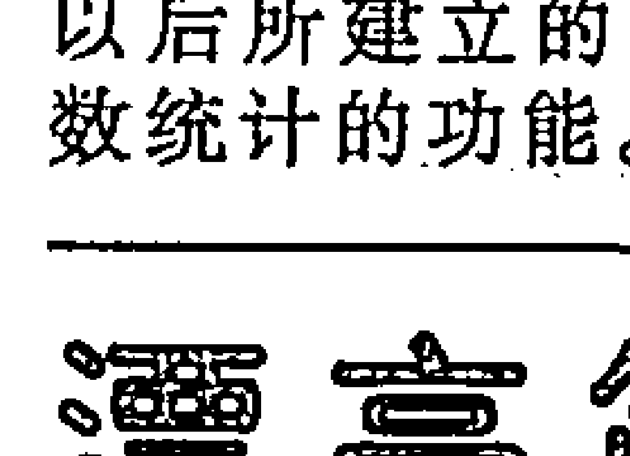

由于简历的内容很少有变化，编制个人简历的机会也不是很多，所以我并不提倡建立模板。好在Word2000想得周到，给我们提供了制作漂亮简历的另一个途径——简历向导。

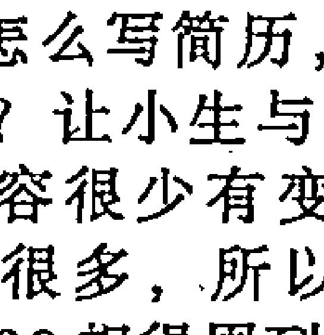

再下面就是“地址”、“联系”、“类型”、“地址”等一些选项，我们可以在其中选择想要的样式、类型、地址等这些简历上有的，和使简历变得更漂亮的选项。

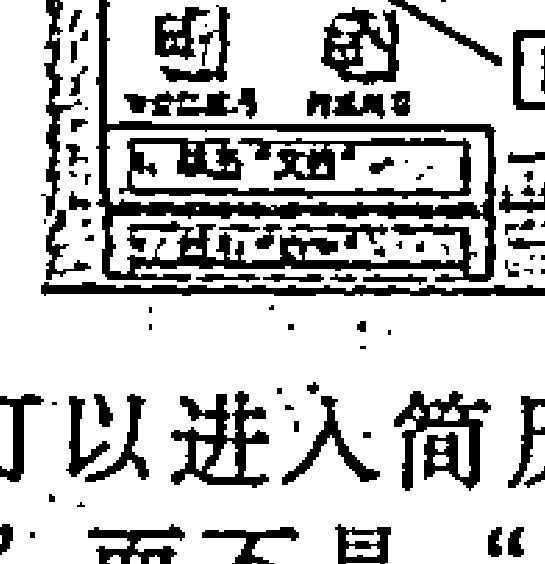

当然如果这份简历有什么地方不适合你，没的说——改！可是怎么改呢？

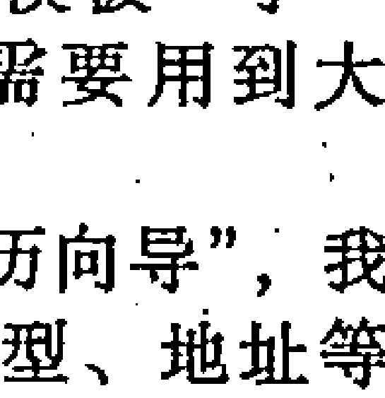

关于如何打印信封，就不在这里讨论了。

由于简历本质就是一个大的表格，所以我们还可以对简历的细节进行修改。把隐藏的表格线显示出来后，就可以用表格的相关方法设置简历细节了。

## Word中用域统计字数

□无锡 罗松林

当我们写完一篇文章后，往往都希望了解一下文章的字数。虽然中文Word 2000提供了“字数统计”的功能，但主要是供用户直接了解文档的字数。显然，仅仅知道这些数字并没有太多的实际意义（编者注：对编辑可是很有意义的哦，呵呵）。

如果能够将这些数据直接插入文档之中，就可以方便以后对文档的有关管理了。笔者发现，许多用户是通过“字数统计”得知数字之后，再手工输入到文档中。虽然使用这种方法也可以了解字数统计结果，但是，一旦该文档随后进行了修改，就只好重新进行字数统计和修改了，否则就会在字数统计上造成失误。

实际上，在使用中文Word2000的过程中，只要按照下面的操作步骤，通过利用中文Word2000提供的“域”功能，可以轻松得到修改后的字数统计结果。

## 右键精灵

□安徽 赵路

大家都知道，在Windows中如果双击一个文件，系统会调用默认的相关文件来打开它。可有时对于同一种类型的文件，在不同的场合需要用不同的程序来打开，如HTML文件有时需调用IE来进行浏览，有时要调用网页编辑工具进行修改，如何达到这一目的呢？可能各有各的方法，不过操作一般比较复杂，新手也难以掌握。

这里我们推出“右键精灵”——Addeasy，有了它，这一切都会迎刃而解。

右键精灵最新版本2.05，是共享软件（无功能时间限制），适用于Windows95/98/NT4/2000等操作系统，作者主页为：http://qingyuan.csw.cnshare.net。该软件为一绿色软件，只要解包后执行主程序即可，界面如图1。它提供九大类数十种不同文件格式的修改功能。下面以打开ZIP格式的压缩文件为例，简述其功能。

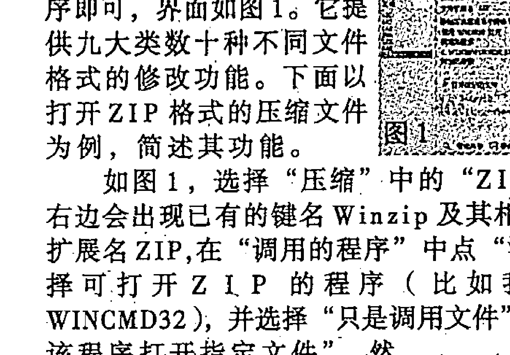

如图1，选择“压缩”中的“ZIP”，图中右边会出现已有的键名Winzip及其相关的文件扩展名ZIP，在“调用的程序”中点“浏览”，选择可打开ZIP的程序（比如我用的是WINCMD32），并选择“只是调用文件”还是“用该程序打开指定文件”，然后确定就可以了。再用右键点击ZIP文件时，就可以看到你的修改效果。比如我的菜单就会出现新的的一项：使用WINCMD32打开（如图2）：

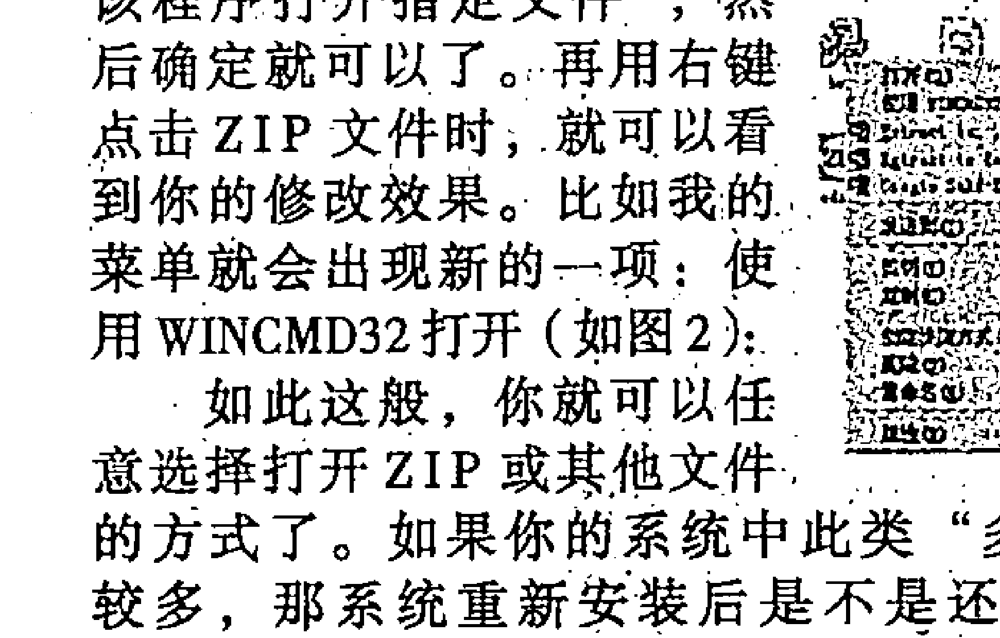

如此这般，你就可以任意选择打开ZIP或其他文件的方式了。如果你的系统中此类“多重关联”较多，那系统重新安装后是不是还要再一一重新设置呢？别担心，Addeasy提供了导出注册表的功能，只要将相应项目选择“导出为注册表文件”，下次需要时只要将该注册文件导入到注册表就可以了，很方便吧。

有了Addeasy，是不是感觉鼠标右键的功能大为增强了？

## 用密码保护你的文件夹

□天津 PZou 武金刚

在WIN98里，我们不能直接用口令对每个文件夹加密。但有时候，我们又确实不想让其他人浏览某一个文件夹，怎么办呢？在这里介绍一种方法供您参考——用JavaScript脚本对文件夹加密。

首先，在文件管理器里，进入你想要加密的文件夹，鼠标左键点击菜单“查看”里的“自定义文件夹”选项，根据提示连续按“下一步”，最后点“完成”，此时会在该文件夹内产生一个名为Folder.htt的文件。

然后用记事本打开Folder.htt文件，找到<body bgcolor = 3333ff> <br> <br> <br>标记，在它下面加入以下代码：

```
password=window.prompt("请输入打开此文件夹的密码","请在此处输入")
if(password == "zp")
alert("密码正确,请按确定键进入")
else
document.location="zp.htm"
```

保存Folder.htt文件，做完以上两步后，再打开记事本，在记事本中输入如下代码：
<body bgcolor = 3333ff>
<br>
<br>
<center>
<font size=7>对不起！ <BR>
您输入的密码不正确；<BR>
您不能浏览此文件夹！！！</font>
</center>
</body>

```
<br>
<br>
<center>
<font size=7>对不起！ <BR>
您输入的密码不正确；<BR>
您不能浏览此文件夹！！！</font>
</center>
</body>
```

然后保存为“zp.htm”，记得此“zp.htm”必须保存在需加密的文件夹内。至此已大功告成！退出此文件夹后，再双击此文件夹看看（图1、2），看到效果了吗？

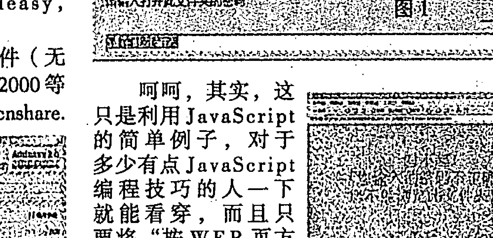

呵呵，其实，这只是利用JavaScript的简单例子，对于多少有点JavaScript编程技巧的人一下就能看穿，而且只要将“按WEB页方式查看”的选项去掉，这一方法也就失效了。不过对于初学者来说，却也可以起到一定的作用。

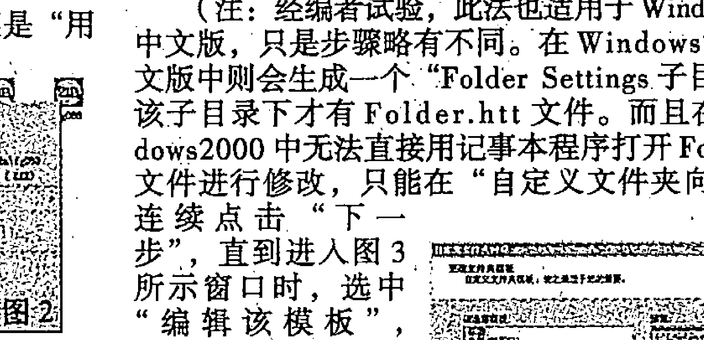

顺便补充一下，这一方法对于各硬盘驱动器也适用，就是说，你也可以利用此方法给硬盘加密。

（注：经编者试验，此法也适用于Windows2000中文版，只是步骤略有不同。在Windows2000中文版中则会生成一个“Folder Settings子目录，在该子目录下才有Folder.htt文件。而且在Windows2000中无法直接用记事本程序打开Folder.htt文件进行修改，只能在“自定义文件夹向导”中连续点击“下一步”，直到进入图3所示窗口时，选中“编辑该模板”，再点“下一步”，此时会出现“记事本”程序，再输入上述代码并按Ctrl + S组合键保存。最后点完成即可。另外，zp.htm也要保存到Folder Settings子目录中。）

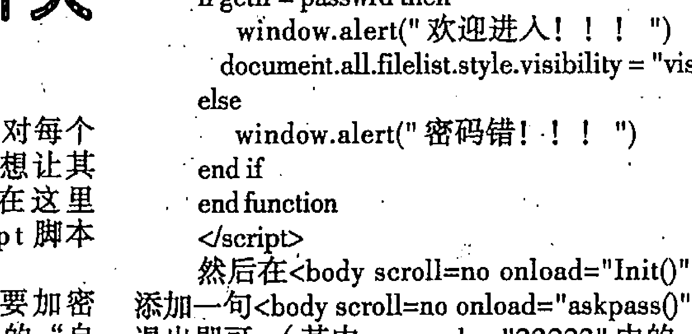

对于同样的目的，天津的武金刚朋友的做法又有所不同，他用的代码是：

```
<script language = "vbscript">
function askpass()
document.all.filelist.style.visibility = "hidden"
passwrd = "22222"
getii=window.prompt("请输入密码： ")
if getii = passwrd then
window.alert("欢迎进入！！！ ")
document.all.filelist.style.visibility = "visible"
else
window.alert("密码错！！！ ")
end if
end function
</script>
```

## 修改注册表增强右键菜单

□四川 洪正林

大家都知道当点击鼠标右键时，Windows会弹出一个辅助菜单。它好用又方便，那怎样才能把我们经常用到的应用程序（特别是在DOS下加参数运行的）添加到辅助菜单里去呢？其实不难，只要改改注册表就行。不过改动注册表对很多初学者来说好像太难了些（编者注：难倒不难，关键是考验胆量……），所以我们教大家一个简单些的办法：书写注册表文件。

下面我就将把ARJ解压功能（ARJ是一个专门在DOS下运行的文件压缩工具）添加到辅助菜单列表中。

首先，运行一个字处理软件（比如Windows下的“记事本”程序）。编辑一个文本文件，并保存为“ArjApp.REG”的注册表文件（注意:必须以文本方式保存，而且后缀为REG）。

下面就是该注册表文件的内容（在右键菜单中分别加入“ARJ压缩”和“ARJ解压缩”两个命令，这两个命令对应的参数分别是：“C:\TOOLS\arj.exe a -V1440 TEMP %1”和“C:\TOOLS\ARJ.EXE E -VA %1”。为什么要加入“%1”呢？因为这里用“%1”代表我们要处理的文件名）。

```
REGEDIT4
[HKEY_CLASSES_ROOT\*\SHELL]
[HKEY_CLASSES_ROOT\*\SHELL\ARJ压缩(&U)]
[HKEY_CLASSES_ROOT\*\SHELL\ARJ压缩(&U)\COMMAND]
@="C:\\TOOLS\\arj.exe a -V1440 TEMP %1"
[HKEY_CLASSES_ROOT\*\SHELL\ARJ解压缩(&V)]
[HKEY_CLASSES_ROOT\*\SHELL\ARJ解压缩(&V)\COMMAND]
@="C:\\TOOLS\\ARJ.EXE E -VA %1"
```

应注意的是，本例的ARJ.EXE应用程序在C盘TOOLS目录下。大家可以根据自己的情况更改它的路径。

保存好此文件后，双击刚才保存的文件，点“确定”，里面的内容就会自动加入Windows注册表了（图1）。

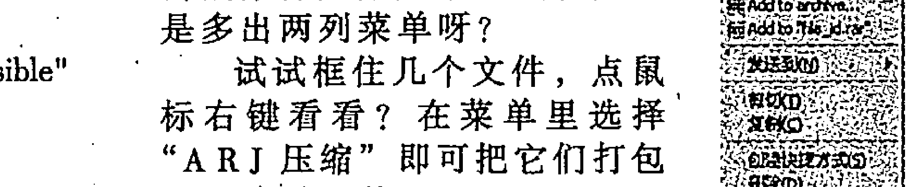

这时你再在某个文件上点击鼠标右键看看（图2），是不是多出两列菜单呀？

试试框住几个文件，点鼠标右键看看？在菜单里选择“ARJ压缩”即可把它们打包了，感觉不赖吧？

## 右键快速关机和重启Win98

□广东 李锋

在桌面上添加快速关机、重新启动的快捷方式，虽然方便，但是在桌面快捷方式太多，十分杂乱的情况下，就不太好找。不信你可以试试看，桌面排上五六十个快捷方式，我敢保证你上看、下看、左看、右看三分钟，也找不到你要的快捷方式。
万一再来个不留神，工作中误击了快速关机或重新启动……哭去吧！在这方面，小弟可是过来人！一想起辛辛苦苦做好的东西就这样化为乌有，我哭……
也许你会说，整理一下快捷方式不就得了？其实还是很麻烦，因为这些快捷方式个个都有用，少了一个都不行……
怎么办呢？想着想着我突然看见了“开始”菜单按钮，那儿很少用鼠标右键点击，点

## 轻轻松松做屏保

□山西 姚立新

朋友，每当你看到各式各样的屏幕保护程序时，是否也想把自己的照片放上去呢？我也这么想过，可惜一直只能想想而已……不过最近，我在网上找到了一个非常简单、实用的屏保制作程序——ScreensaverShot 2.0，利用该程序，只需简单的三步就可以制作出十分漂亮的屏幕保护程序来，终于圆了我的梦。好东东不敢独享，现推荐给大家。

如果你现在还没有该程序，请到作者主页（http://www.screensavershot.com/）或者汉化新世纪网站（http://hanzify.86114.com/graph/special/sshot2020.exe）去下载。对于英语不好的朋友，汉化新世纪网站还提供了汉化程序（http://hanzify.86114.com/graph/special/PScreensavershotV2.0.20.zip），可以同时下载。下载后直接执行sshot2020.exe就可安装，这里不再多讲。

下面我就简单介绍一下屏幕保护程序的具体制作过程。

### 第一步：装入图像并给图像加上注释

ScreensaverShot 2.0启动后如图1所示。

首先在所指的文本框内输入你所做的屏幕保护程序的标题，假如你要把标题定为“姚立新的屏幕保护程序”，在这里输入“姚立新的”四个字，“屏幕保护程序”在制作时会自动加入，然后按”插入”按钮。分别插入屏幕保护程序用到的所有图像，若不正确时可通过”删除”按钮删除。对于加入的图像，你可通过”添加文本”按钮为每个图像加入注释，并指定该注释所放的位置。

### 第二步：设置屏幕保护属性

第一步完成后，按”下一步”按钮进入第二步，如图2所示。在这里，我们可以为屏幕保护程序加入背景音乐、定义图片大小、设置背景颜色等。下面，主要讲一下如何加入作者信息和说明。按“作者信息”按钮出现图3。

作者信息规定为你的网址、公司名称和版权声明，你可按要求在文本框内输入相应信息，当然你也可以在这三个框内输入其他信息，如E-mail地址等，这些信息最终都要在屏幕保护程序中显示出来。作者信息输入完后，按上方的说明按钮，进入说明输入画面，如图4。

在文本框中，你可以简要的介绍一下你的屏幕保护程序，输入完成后，首先按“应用”按钮，然后按“退出”按钮退回第二步主画面。

### 第三步：创建屏幕保护程序

在第二步的各项设置完成以后，按“下一步”按钮进入第三步，如图5。

这一步非常简单，首先通过预览按钮浏览一下你所做的屏幕保护程序的效果，不满意的话可返回上两步修改，满意后通过按“创建”按钮即可建立屏幕保护程序。当然，创建前最好先选择你的保存目录和文件名。

OK，一个属于你自己的屏幕保护程序就做好了，简单吧！若有问题，请来信：E_mail: yao_x@263.net

## 理财当家小轻松

□辽宁 鸣润

钱都跑哪去了？阿铭一个劲地纳闷，回忆着最近的开销，鸣涧却在一旁偷着乐呢。阿铭无意之间瞧了鸣涧一眼，阿哈？是不是你又捣鬼了，我的银库才有了亏空？

没有，没有呀，鸣涧据理力争，分明是你不善于理财么，倒是怪罪起我来了。

不会理财也好，银库亏空也罢，阿铭这回是绝不会放过鸣涧的，不拿出个理财绝招休想走掉！鸣涧哪里有什么绝招呀？只好拿出前些日子在http://www.csdn.net处下载的“欢乐家庭—理财软件”（只有1.22MB）解围。

启动欢乐家庭以后，要求输入初始密码，系统默认的是8888，当然喽，以后还可以重新定义的，接下来就可以登录系统了（如图1），怎么样？够直观的吧？

整个系统主要分为收支、股票、储蓄、信用卡、备忘录以及系统设置几方面的管理内容，几乎可以满足日常家庭生活中常见的财务管理，难怪一边要炒股、一边要储蓄的阿铭一个劲地叫好呢。

还是先从“收支”管理入手吧，阿铭打算增加一项新的收支记录，鸣涧当然要惟命是从了。首先选择“收支”选项卡，单击“新增”按钮，这时系统会弹出一个“新增”对话窗口（如图2），在“收支种类“中可以根据自己的需要，在收入、支出、转帐三种收支类型中选定一种。如果选定了不同的类型，下面的“收支细类”也会出现不同的类别。同样道理再设定好“收支细类”、“收支方式”、“收支金额”和收支日期等。当完成一笔收支记录以后，就可以单击“存盘退出”按钮返回到主界面了。

由于系统提供的“收支细类”并不一定都符合我们的要求，所以我们还可以对它进行编辑，只要单击“编辑类别”按钮，就可以打开“收支类别修改”对话窗口（如图3），可以在“支出名称”中添加一种新的支出类别名称，然后单击“添加”按钮就可以了。另外，还可以单击“向上”和“向下”按钮，对当前的类别进行移动，以便使常用的收支类型排在最前面，这样就会更加方便日常的添加操作了。当然喽，还可以单击“替换”和“删除”按钮实现对当前类别的替换和删除操作等。

对于已经完成的收支记录，还可以实现对当前记录的修改、删除、查询、打印等操作，可以使用选项卡下方的工具按钮来实现（如图4）。在收支管理中，单击“收支统计”还可以查看当前的收支情况。

当系统运行一段时间以后，帐目就会多了很多记录，查找起来不是很方便。不过，欢乐家庭还提供了查询功能，可以非常快速地定位到需查询的记录上。单击“查询”命令按钮，会弹出一个“查询”对话窗口（如图5），首先在“时间限制”中，设定查询的范围为“一定时期”，然后设定好“起始时间”和“结束时间”，同时在“收支限制”中设定好“收支类型”，最后选定“金额限制”选项，并设定好“最小金额”和“最大金额”数量，然后就可以单击“确定”按钮开始查询。这时打开“收支查询”选项卡就可以查看查询结果了。

同样道理，在其他的管理项目中，如股票、储蓄、信用卡、备忘录管理中，和在收支管理中的方法和手段都差不多……鸣涧刚想多说几句，阿铭不耐烦地摆摆手。

在系统选项卡中，可以对当前系统进行各种不同的设置，还可以对当前系统进行备份等。下面就来单击“设置”命令按钮，打开“选项”对话框（如图6），可以对当前系统提供的各方面服务进行不同设置，还可以修改系统登录的密码。比如在“类别修改”中，可以分别单击相应的命令按钮对包括收入类别、支出类别、股票代码、信用卡名称、储蓄机构名称进行修改，使用方法和“收支类别修改”都差不多，使用起来也非常容易上手，完成以后，就可以单击“存盘退出”命令按钮保存当前设置了。

阿铭看着屏幕上的变化，早就心动了，突然一把推开鸣涧，就要添加自己的财务收支情况……忽然想起来了什么，向鸣涧挥挥手，喂喂，你该回避了……有些东西好像不是你该看的，还是赶快回家休息休息吧……

唉！鸣涧摇摇头，这个家伙，为什么总是过河拆桥呀……

特别提醒一声，输入“rundll.exe user.exe, Exitwindowsexec”时，中间的那个逗号是英文逗号，不要输错了。输错了的话，关机和重启动命令就失效了。

## 不花钱的掌上电脑
### ——跟我学用Palm模拟器

□浙江 朱征健

前几日，与一网上聊友侃到了时下正流行如火，且极受高薪一族钟爱的掌上电脑。他问我是否也想赶赶潮流，找一个来试试！我说这种东东哪是我辈能买得起的（当时真有点《西游记》里沙僧看见人参果时的心情——从来就没认为自己也能吃上一个）！

正当我“望钱兴叹”时，他告诉我在网上可以下载“掌上电脑模拟器”！

啊哈？！真有此等好事？我可是个见软件忘好友的人啊！

在得到他的肯定答复后，立刻将那聊友晾到一边，自己风风火火地溜去下载模拟器了！

拿鞭子一顿狂抽我那破猫（想要好东西就别告我虐待动物），终于把模拟器压缩包和模拟器的Rom文件下载下来了。

将其解压缩到某个目录，比如“c:\palm”里，然后鼠标双击Emulator.exe开始运行。

首先会出来一个登录对话框，其中有四个选项：
New是建立一个新的模拟任务，Open是打开以前存过盘的个人设定记录，Download是与你真正的Palm掌上电脑进行数据交换，Exit就不用本人说明了吧（不懂？就是退出啊！）。

好，下面就带各位来感受一下掌上电脑！点“New”按钮，出来一个配置窗口。
注意，一共有4个选项，每个选项右边的黑色都是可以点击选择的。

Device（设备）是选取你要导入的Palm类型，有Pilot、PalmPilot、PalmIII、PalmIIIX、PalmV、PalmVII等，大家可以自行选择。我在这里选择的是Palm III。

Silkscreen选项用于选语言，有English（英语）和Japanese（日语）两种选择，我们自然是选English了。

RAM Size是设定模拟的Palm内存大小，建议设定为8192kB（如果你的内存只有64MB，不妨设定为4096kB）！

ROM File是将你的Rom存放文件夹告诉模拟器，这里点“Browse”按钮，然后选择“c:\palm”，选中那个“Palm.rom”，点“打开”按钮即可。

最后点一下“OK”按钮！
哈，好菜上桌啦！

刚出来的时候大家肯定会被它巨型的外观吓一跳（如果你的分辨率是800x600或者更小的话）！见图1。

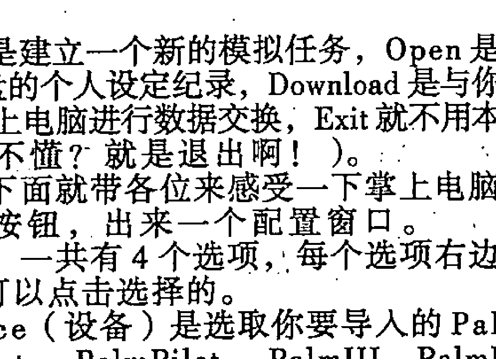

不要紧！在它上面点击鼠标右键，在弹出的菜单里选择Properties选项（见图2），然后选择Single Size（见图3）。

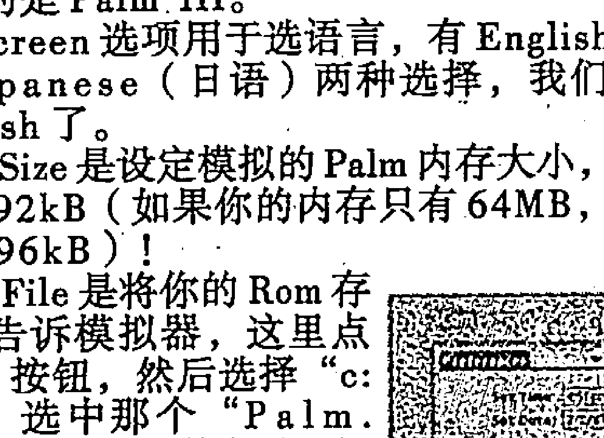

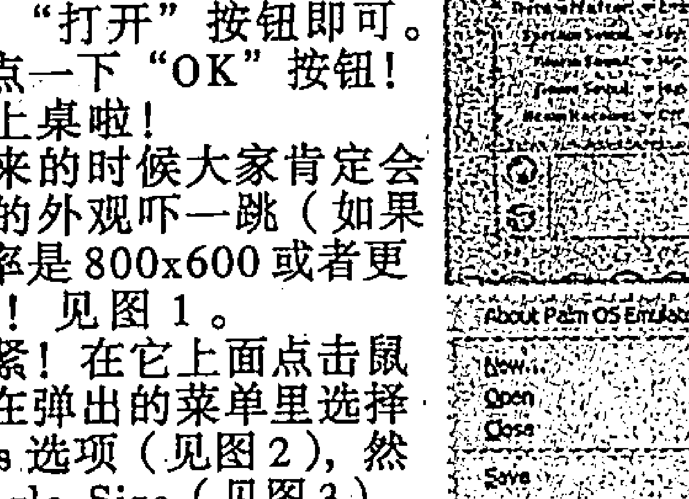

这样就可以看到小巧又漂亮的掌上电脑了（如果你是用1024x768的分辨率，那就根本不用进行上面这一步，直接看起来就舒服的）。
看看，这就是一个酷酷的，3COM公司出品的Palm III掌上电脑。

好玩吧？好玩！
会玩吗？不会！
嘿嘿……还得我来教教大家……

看图，我这里就给大家简单介绍一下面板及按钮！。

左边有一个电源开关，可开关该掌上电脑。

中上部的主屏幕可以显示所有的信息。

应用程序中有多个东东，如计算器、安全设置、游戏等。

鼠标按菜单键，可以呼出现在所在程序的菜单栏。

计算器与查找键就不用多说了。

看看主屏幕下方的那块空白区域，别以为那里没用了，那里可是手写板啊！是可以用鼠标进行手写输入的（模拟得够真实吧）！注意手写板左右下角，各有一个abc键与123键，这是手写板的字母和数字切换。点一下看看？可以直接点击输入字母和数字。

手写板下方共有五个键，分别是看日程安排的日历键，翻看朋友联系方法的地址簿键，上下翻动文本的上下键，看公务完成度事件记录键和用于文本输入的写字板键。

具体的用法我这里就不说了，只要各位英文不错，尽可胡乱地左点一下右敲一下（英文很差也没有关系，尽可乱点，反正也玩不坏，大不了点一下那个“电源”按钮，重新开一次掌上电脑）。

乱玩了一通之后，飘飘然还真觉得自己有点大老板的架势了……

玩腻了吗？想关机了吧？别再去按“电源”按钮啦，那东西是不能用于关机的。你需要在Palm屏幕上单击鼠标右键，然后在弹出的菜单里点击“Exit”才能彻底退出。

大家是否也有一点心痒痒了？还等什么！快去下载啊！（地址：http://go1.163.com/~zzjulian/soft/palm.rar）

## 一键通

□天津 武金刚

一些朋友在使用电脑时，会自定义一些快捷键，这样一来就可以一键启动程序，非常的方便。不过某些人记性较差，快捷键定义多了反而混淆起来……那么此时我建议你用“一键通”。

一键通可以把一个“热键”与一个或多个程序相连，只要按一下键，就可以执行一个或多个程序，方便了电脑的使用。这里的“热键”可以是一个单独按键（F1、F2...），也可以是组合按键（Alt+F1...）。关联的文件可以是程序（*.EXE），也可以是其他类型的文件（*.TXT、*.BMP......）。

另外，利用一键通，你还可以轻松实现“一键上网”。
下面我们就一起来看看它的一些功能。

### 一、常见使用

运行“一键通”后，在任务栏右边会出现一图标，右击该图标，单击“设置”，弹出一设置对话框，在“设置”对话框中可以选做以下操作：

+   1. 添加热键
在设置对话框中选择“添加热键”，输入热键后按确定即可。“一键通”最多能添加100多个热键，一个热键下最多能添加10多个关联文件。
2. 添加热键所要启动的文件
首先选中要操作的热键，再按“添加文件”按钮，在这里根据你的需要，“一键通”可以添加一个或多个文件。
3. 去除热键或文件
首先选中要操作的热键或文件，再按“去除”按钮，即可删去以前的热键设置。

### 二、一键上网

1. 进入控制面板的“网络和拨号连接”，选定一个拨号连接（比如163）。（如果没有，可以新建一个，至于怎么建就不用我说了吧？）
2. 在选中的拨号连接图标上右击并选择“属性”，在出现的“属性”对话框中选择“设置>连接”，去掉“拨号前给出提示”选项前的勾。
3. 把拨号网络中的该连接拖到硬盘的任意目录下，这样就在硬盘上建立了一个此连接的快捷方式。
4. 运行“一键通”，在该软件中按上述方法添加一个热键（可任选，如F12），并在此热键下添加刚建立的163快捷方式文件，确定即可。

好了，现在按一下F12键试试？一键上网是不是非常的方便？

另，用这种方法也可以把拨号网络、IE、OutLook、网络蚂蚁等软件都定义到一个热键上（比如F11），上网后只需轻轻一按，就可以把这些网络软件全都启动了，方便得很。

怎么样，“一键通”够酷吧？心动不如行动，赶快下载一个吧。

下载地址: http://www3.zdnet.com.cn/downloads2/OneKey.zip

## E字学说

□四川 冷星峰 冷星海

Intel公司在其生产的产品中经常出现“E”这个字母，而且往往带“E”和不带“E”的产品无论是在性能上，还是在价格上都会有所差异。笔者在这里将最常见的列出，并作一简单介绍。

首先和大家见面的是最近在市场上出尽了风头的815和815E。815和815E芯片组在整合了i752显卡的同时又开放了一个独立的AGP4X插槽。值得注意的是，815和815E芯片组中整合的i752显卡本身没有任何的显存，都是依靠动态分配技术分内存作显存用。既然是动态分配，所以划分的显存大小也就不是人们常说的4MB或者是在DX诊断程序中显示的5MB，而是根据图形运算的要求实时而变，其大小应在4－48MB之间。815和815E都采用了相同的GMCH（Graphics Memory Controller Hub），最大的性能差异来源于所搭配的I/O控制中枢芯片（ICH）的不同，前者使用的是编号为“82801AA”或“82801AB”的ICH1芯片，而后者使用的是编号为“82801AB”的ICH2芯片。ICH1与ICH2控制芯片的主要不同点在于是否支持最新的ATA 100硬盘传输规范和CNR扩展槽。换句话说，815和815E最大的性能差异是：815E支持ATA100功能，而815只支持ATA66。两者在性能上有差异，当然价格上也就会有不小的差距，一般来说，同等品牌的815主板，带“E”与不带“E”的价格大概有50－200元的差价，大家在购买时应多多注意。

说到815和815E，也许就会让大家想起一年前在市场上红透了半边天的810系列主板。当时810也分为810、810L、810 DC100、810E等多个版本。由于市场的变迁，现在市面上常见的也只剩下810和810E这两个版本了。810和810E中的“E”字母所带来的不同并不是表现在对硬盘的支持上，而是在4MB的显示缓存上。也就是说，810E在整合了i752显卡（早期的810主板整合的是i740显卡）的同时，在其主板上也同时集成了4MB的显示缓存，而810却只整合了i752显卡，没有任何显示缓存。值得注意的是，810E主板上整合的是4MB的显示缓存，而不是显示内存。这4MB的显示缓存从理论上说，只用于显卡的Z加速，而对显卡的速度无任何影响。但正因为这4MB的显示缓存有这样的作用，从而大大减轻了CPU的工作负担，所以无论是在测试中还是在使用中，810E的性能都要比810好得多。当然810E和810这两者之间有50-100元的差距，也就是情理之中的事情了。

最后要介绍的是PIII中部分CPU的工作频率后为“E”字母的含义。早期的PIII处理器采用0.25毫米制造工艺，512k半速二级缓存，采用Katmai核心，其总线频率只有100MHz，仅有950万个晶体管，却拥有128平方毫米的面积，相对当时的PII处理器而言在性能上没有多大实质上的提高，以笔者看来从某种意义上说只能称之为PII的一种升级产品。终于在1999年10月25日，Intel公司推出了其全新的PIII Coppermine（铜矿）处理器，Coppermine采用0.18毫米制造工艺，在其内部集成了256k全速二级缓存（二级缓存的大小虽是老PIII的一半，但其工作频率却和CPU的工作频率相同，从而大大地提高了效率）的同时内建2800万个晶体管，却只有106平方毫米的面积，总线频率有100MHz和133MHz两种（采用133MHz总线频率的Coppermine处理器在其工作频率后带“B”字母以示区别）。这时候的Coppermine（铜矿）在性能上有了相当大幅度的提高，而在电能消耗和发热量上却得到了较大程度的改善，也就成为了真正意义上的PIII处理器。需要向诸位澄清的是，新的PIII Coppermine处理器虽取名为“铜矿”，但并不是采用先进的铜连接技术，而和其他处理器一样采用的是传统的铝连接技术。正因为新老PIII处理器在核心和性能上有如此大的差异，Intel公司必须要给予区别，这任务最终还是落在了可爱的“E”字母上。也就是说在工作频率后有“E”字母的PIII处理器采用的就是Coppermine核心，在价格上与老PIII有大约100元的差距。

看到这里，相信大家对“E”字母也就有了大致的了解，因其牵涉的知识较多，所以笔者也就不一一阐述了。

## 光驱保护另法
□浙江 郑晓凯

光驱对我们来说是一个头疼的东西，很多人都费尽心思让光驱延长寿命，有人调电压，有人洗激光头……最近，我发现了一种绝妙的光驱保护法。有一次我逛超市，无意中看到一种胶纸，包装上注明是保护VCD的，只要把它贴在VCD的有标签的一面即可。我忽然想到，这是否对家里那该死的光驱有效？家里有好多烂盘，有的甚至厚度不够，以至于光驱很难把它读出来，就算把它读出来了，也会严重损害光驱的读盘能力。于是我把它买回家，把它贴在那些光盘的背面，然后放进光驱试了试，还真不错。大家不妨试一试，这种胶纸很容易买到，而且还很便宜呢！

## 拷贝文件时一张软盘装不下怎么办？
□天津 王戎

将一些常用的软件或文件拷贝到软盘中，可便于大家随身携带，但如果文件太大一张软盘装不下怎么办？这就需要分卷拷贝。Winzip和WinRAR是目前最流行的解压缩软件，它们可以实现文件的分卷压缩和拷贝。在这里笔者向大家介绍另外一种具有分卷拷贝功能的工具——备份工具。备份工具是Win9X附件中的一种系统工具，它可以生成计算机文件的副本，并保存在其他媒体如磁带、软盘或可移动式磁盘内。下面介绍如何用备份工具进行文件的分卷拷贝和还原工作。

### 一、 备份文件

在屏幕左下角点击开始 -> 程序 -> 附件 -> 系统工具 -> 备份（如果你的机器上没有，可以从Win9X光盘中添加）。在出现的面板中选择“新建备份作业”选项，在随后的备份向导面板中选择“备份选定的文件、文件夹和驱动器”选项后单击下一步，在出现的面板中选择要备份的数据，可以是文件、文件夹甚至整个硬盘，本文举例选中 D:\WENJIAN\1.doc 文件。然后单击下一步，在出现的备份至何处面板中选择 A 驱，并输入你想要的文件名如 a:\1.qic（注：备份文件的扩展名是 qic），插入软盘连续单击下一步，最后点击“开始”。此时计算机开始进行备份，如果文件较大一张盘装不下，计算机会自动提示插入第二张软盘（这时大家应在软盘盘标上作序号标记），随后按提示顺序插入软盘，直到全部备份到软盘上为止。

### 二、 还原文件

在另一台计算机上打开附件系统工具中的备份工具，在出现的面板中选择“还原备份文件”。在还原向导面板的还原位置上选择 A 驱 a:\1.qic，单击下一步，计算机进行记录进程。按提示顺序插入软盘，在要还原的数据中选择原文件在原计算机中的位置后单击下一步，在还原至何处选择替换位置，选择你想拷贝至的驱动器和文件夹后单击下一步（例如 C:\My Documents）后,点击开始，按计算机提示插入第一张软盘，然后按顺序陆续插入软盘，还原工作就完成了。你现在可以打开计算机 C 盘 My Documents 文件夹。咦，怎么没有 1.doc 文件？再仔细一看，发现有一个名为“WENJIAN”的文件夹。打开“WENJIAN”文件夹，啊，1.doc 在这里。原来备份工具把该文件在原计算机所在的路径也备份过来了。怎么样，简单吧！你学会了吗？

## 看图识硬件之“CPU”篇

作为初学者，可能常听人说起一些电脑设备的名词，什么CPU、内存条，可是却未必看过它们的真实模样。正好拿到一张《酷装硬件秀》光盘，收录近千张精美硬件图片(编者自己接触计算机多年，其中部分图片也未曾见过)。欣赏之余，特精选部分图片于此，以飨读者。注意：早期的Intel CPU芯片（比如286、386、486）的模样和奔腾MMX系列类似，就是一块单独芯片。但从Celeron（赛扬）起，提供的CPU都结合在一块较大的电路板上，而且一般提供的都是盒装CPU。不过，市面上也有大量散包CPU出售。散包的CPU和盒装CPU相比，主要是缺少一个黑色外部封装盒（另外，相对来说散包CPU中出现奸商以次充好的可能较大）。

## 菜鸟也有秘技

### 找回扫描仪

新购 Microtek（全友）C6 大眼睛扫描仪一台，按说明书正常接线连上计算机，开机启动，安装了驱动程序后，但在使用时却提示找不到扫描仪。排除各种故障的可能性后，改变开机顺序为先开扫描仪，再开电脑，此时出现提示，找到扫描仪。（湖南 刘周轶）

### 妙用HD-COPY救盘

当你在 Win98 内读取一张有数据的软盘时，如果看到 Win98 弹出“软盘未格式化，你想格式化软盘吗？”的窗口，一般就表示你的软盘已经损坏了，此时你不妨试试用 HD-COPY 进行救命操作：

- 1. 运行 HD-COPY，插入有问题的软盘，用“Read”命令读软盘。
- 2. 取出有问题的软盘，放入一张好软盘，再用“Write”命令写入新盘后，退出 HD-COPY。
- 3. 在 Win98 中用“开始>程序>附件>系统工具>磁盘扫描程序”扫描一下 A 盘（记得选中“自动修复错误”），一般会提示找到错误，并自动修复。这时你的重要数据已经全部在这张新的软盘中了。

用这种方法，只要不是零磁道损坏一般可以全部修复。就算碰到了最坏的情况，也不过是储存在坏磁道中的数据会有错误，其他的则完全正常。（广东 陈为锋）

### 解决你的Windows2000蓝屏

Windows2000 的稳定性的确大大增强了，让我的系统从以前平均 7 天装一次延长到了平均 2 个月重装一次，简直让我大喜过望。不过，再稳定的系统也难保不出些岔子，Windows2000 一样也会蓝屏或者死机。这时，您也许会选择重新启动吧！其实，在出现蓝屏的时候，只要键盘未被锁定，一般 Ctrl+Alt+Del 组合键还是有用的，此时我们可以利用它救回系统。（有同志叫起来了，按这三个键不是热启动吗？没错！不过这三个键早就在 Windows 中另有它用了，不信你按下去看看？）按下 Ctrl+Alt+Del，再选择“任务管理器”，单击菜单“文件”里的“新任务”，这时会弹出一个“创建新任务”的对话框。在对话框中输入“explorer”，点击“确定”。嘿嘿！熟悉的桌面是不是又出来了？（北京 李训耕）

### Alt键之替身

我们大都知道 Alt 键在 Word 中有个特殊的用法，那就是按住它同时拖动标尺上的拉杆可以显示精确数字。另外在拖拉表格线时，按住 Alt 键也有同样效果。这已经很快捷了，但你知道这一切其实完全可以由鼠标来独立完成吗？心动了是吧？按下面的步骤来试一试，看看是不是更加快捷？在拖动标尺拉杆的同时按下右键，也就是按下右键再拖动拉杆，是不是效果和 Alt 键一样？至于调整表格时也是一样，出现双箭头时按下右键，拖动它，也会在标尺上显示精确数字。（江苏 王屿）

### “我的电脑”也全屏

我们都知道在 IE 中按 F11 键可将窗口切换到全屏状态，这样可以更加方便地查看网页。有没有想过全屏“我的电脑”呢？那就跟我来，先打开“我的电脑”，再按一下 F11 键。哈，“我的电脑”窗口全屏了！而且工具栏和状态栏也自动隐藏了，窗口和 IE 全屏窗口一样。将鼠标移到全屏顶端，即可进行各种文件操作。如果再为窗口设置好背景，如精美的 GIF 图片，HTM 文档，效果就更棒了。同样，资源管理器也可全屏，这样就更方便了。快试一试吧！（新疆 杨湘波）

## 轻松白抓图

在 Windows 中利用抓图功能很方便，优点也很多，操作简便，配合 Photoshop、CorelDRAW 等软件使用效果尤佳。

抓取整屏幕图片：看到屏幕出现合适的画面或者图片时，按下键盘上的“Print Screen”键即可抓取整个屏幕画面，然后进入“画笔”程序，按下“Ctrl + V”组合键即可将抓取的图形贴入画板中。注意，贴入的图形可以通过鼠标调节大小，并可以用鼠标在画布内拖动。最后保存即可。

如果抓图时，按住 Alt 键不放，再按下“Print Screen”键即可抓取光标所在工作区的画面（比如某个程序运行时的窗口）。

怎样？试一下吧！你会发现抓图原来如此简单！
（艾宏江）

## 节约也是错？

节约本是中国人引以为豪的一种美德，但不曾想单位的一台 HP 喷墨打印机却因为节约而出现了“罢工”。

经过是这样的：近日印务室的工作人员说他们的 HP 喷墨打印机打不出内容，好像是“没有油墨”了。但工作人员同时又说，上个月才买的油墨，没用几次。我开始想可能是打印机设置、连线等问题，但经过检查却没发现什么。这是怎么回事呢？打开打印机盖，取下墨盒。嗯，沉甸甸的，的确很满。

再往下一看，哦，原来油墨在喷嘴处凝结，堵塞了喷嘴。知道了问题所在，解决起来就简单了：把喷嘴用少许酒精擦干净，再把墨盒摇晃几下，问题解决了。

回过头来我问工作人员，最近是否经常使用这台打印机。工作人员说：“买回来时用过几次，后来没用了。因为觉得油墨比较贵，所以一般都用针式打印机，很少用喷墨打印机”。

问题就在这，因为喷墨打印机如果不经常用，墨水就会在喷嘴处凝结，而造成堵塞。所以有时候，过分的“节约”也是错误的啊。
（四川 周殿友）

## Winamp 3.0 抢鲜热揭

### 一、安装可定制

Winamp 3.0 的下载文件是个可执行文件，双击即可直接安装。由于当前是 Winamp 测试版，功能还不太完善。
安装过程与以前的 2.X 版本大致相同，只不过在安装类型选择上，3.0 版分为标准安装、完全安装和定制安装三种类型，使用者可以自行选择。

### 二、软件界面

Winamp 3.0 在软件界面上并没有太大的变化（如图 1），依旧是播放窗口、均衡器、迷你浏览器三部分，只是另增了一个工具管理窗口 Thinger。但在外观设计上感觉给人一种更现代的味道，更具金属感。每个窗口的左上角提供有控制按钮，可以打开菜单完成各种操作（如图 2），甚至隐藏主播放窗口。

### 三、功能

- 1. 音质效果大大增强，这可说是新版本在功能上的一个重大改善。
- 2. 新增作用类似 Windows 中的快速启动工具栏的工具管理窗口 Thinger。
- 3. 新增“媒体库”，专门用于音乐资源管理，利用它可以查看音乐搜索结果，排序、查看各种音乐文件（包括网络流媒体文件），向数据库中增加音乐等。
- 4. 新增组件“数据库浏览器”，利用它可以查看播放列表、媒体库、系统/内核，并且可以快速搜索各种资源。
- 5. “视觉特效管理器”现在使用起来更加方便，可以定制自己喜爱的缤纷视觉效果。单击“Open editor”按钮可以设置各种特效，“Go Fullscreen”可切换至全屏显示。
- 6. 播放列表界面更直观，使用也更方便。
- 7. 针对以前“四方形窗口导致各种皮肤看起来千篇一律、似曾相识”的毛病，Winamp 3.0 特别加强了异形窗口皮肤的设计。此款测试版中自带了一种 Skin - boxOr，效果非常酷。

总结：通过试用，我们明显地感觉到 Winamp 3.0 在功能上有了极大的提高和完善，软件的设置更加合理，新增的功能使用起来更加方便，音质效果也有了大幅度的提高，音乐文件管理更加简单，但也不容回避的是存在着一些不足：
- 1. 启动速度慢，系统资源占用较大，对于内存较小的用户来说有时简直无法忍受。
- 2. Skin 的文件格式发生巨大变化，导致原来你喜欢的面板将无法在新版本中继续使用。
- 3. 有些功能尚不稳定，存在的 Bug 还比较多。

## 任务管理器 —— WinTasks 2000
□山东 赵凯

在 Windows 2000 中，按下“Ctrl+Alt+Del”呼出系统菜单，再按“T”键，就可以打开程序管理器。灵活使用程序管理器，可以让你轻松解决系统的死机问题——程序管理器始终监视着内存中的各种应用程序，对已经造成系统死锁的程序，你可以轻易予以“枪毙”。

NT 系统之所以号称“固若金汤”，这个程序可谓功不可没。用过的人（Windows 2000/NT 的用户）对它爱不释手，没用过的人（Windows 9X 的用户）眼红不已。现在这些兄弟们不用眼红了，我这就向您介绍一款 Win9X 下也可使用的强力任务管理器——WinTasks 2000（注意，是一款免费的好软件喔）。

下载地址：http://newhua.infosail.com/down/wint2kfree.zip

### 一、安装

将下载的 ZIP 文件解压缩到某个目录中，运行 setup.exe，连续点击“Next”按钮，最后点击“Install”按钮即可开始安装。文件复制完毕后，会弹出一个窗口，连续点击“下一步”按钮，直到出现图示窗口，选择好你的年龄组（Age Group）、国家（Country）、性别（Gender），并回答是否在 Internet 上购物后，即可点击“完成”按钮，再过一会，在新弹出的窗口里点击“Finish”按钮，即可结束安装。

### 二、运行

WinTasks 2000 安装之后，重新启动计算机就会自动加载到系统。先让我们看一看它的界面（图 1）。
WinTasks 2000 的界面非常简洁，从上到下是：工具条、任务栏、信息栏。
工具条在程序的顶部，Run 按钮用来运行应用程序，Stop 按钮关闭程序或任务，Inc 和 Dec 按钮用来增加和减少程序在 CPU 中的占用率——你总不想在执行工作的时候 CPU 被一些闲置的应用程序所占用吧？Show 和 Hide 按钮用来显示和隐藏应用程序。至于 Search 按钮，那是用于搜索的，输入关键字后点“Search”，WinTasks 2000 就会单独显示带有这些关键字的应用程序，按 F5 键恢复显示所有应用程序。Refresh 用来更新应用程序显示列表。
任务栏在窗口的中央，显示当前系统中所加载的应用程序。程序名称的前面有一个图标，带红圈的表示系统所加载的核心模块，是不能随便关掉的，像 Kernel32.dll, Internat.exe 等等。剩下的则是系统所加载的外部应用程序，可供你“生死抉择”（虽然 Windows 9X 系统还有一些另外加载的功能模块，也被 WinTasks 分到了外部程序的行列里，但不建议关闭）。Priority 一栏显示程序的 CPU 占用状态。
选择一个内存中加载的程序，最下面的信息栏窗口中就会显示出该程序的完整名称。如果选中的是系统核心模块的话，还会显示该程序所管理的系统部件。最下边的状态条显示内存中所加载的线程总数、物理内存的总量及占用的百分比、CPU 的利用率等。

设置热键：单击菜单“Settings”下的“Trap Ctrl Alt Shift”，使其前面出现一个勾号，处于选中状态。这样你就可以随时按快捷键 Ctrl+Alt+Shift 呼出 WinTasks，对程序进行“末日审判”了！（建议不要用 Settings 下的“Trap Ctrl Alt Del”，因为该热键同于系统热键，反应并不灵敏）

说了这么多，你一定想亲眼见识一下 WinTasks 的威力。这里我们举一个很有用的实例：
我们在浏览网页或者在聊天室聊天时，有时会遇到恶意的破坏。例如，聊天室里某人发给你一句悄悄话后，你的系统发生异常，不断地打开新的浏览器，一直不停地开啊开啊，让你关都来不及关，直到最后耗尽你的内存，系统崩溃为止。
这种恶意程序的解决方法只有一个，那就是关闭你最初打开链接的那个浏览器（即彻底关闭 IE 程序）。
奉劝你千万不要妄想连续按“Alt + F4”键将其一个一个的关闭，因为你的手指击键速度是绝对赶不上机器自动新开窗口的速度的……
这时候按下“Ctrl+Alt+Shift”组合键，打开 WinTasks，看看列表？呵呵，别看有了那么多的网页窗口，程序可是只有一个，那就是“IExplorer.exe”（图 2）。选择它，再点击 Stop 按钮，WinTasks 2000 会弹出窗口询问是否关闭应用程序，当然选 Yes 啊，于是，两秒钟内，讨厌的网页窗口统统烟消云散……

## 快速通WinKey
□天津 宋琨

程度稍高的电脑用户都会使用快捷键操控电脑，以提高工作效率，比如打开资源管理器可使用“Win + E”快捷键，打开“运行”对话框使用“Win + R”快捷键等。但系统默认的快捷键组合实在太少，无法完全满足我们的实际需要。比如运行应用程序，我们仍然要通过桌面的快捷方式或通过“开始”菜单才能完成。倘若能够依照习惯与需要，手动添加一些快捷键来用就太好了……其实，要实现这个愿望非常简单，只要为我们的电脑安装一款叫做 WinKey 的工具软件就可以了。

### 一、软件的下载与安装

WinKey 是一款自由软件，无需注册即可完全使用，我们可登录其主页 http://www.copernic.com/winkey，“Installation File”即可下载最新版本（到笔者截稿时为止，最新版本号为2.8）。下载后将得到一个1.19MB的EXE文件，直接用鼠标左键双击此文件即可进入安装向导界面，再依照提示连续确认便可安装成功，过程十分简单。

### 二、软件的使用

软件安装成功后，会自动添加到“启动”文件夹中，以后将随Windows操作系统一同启动。程序的主界面如图1，窗口中显示的是系统中目前现有的快捷键。而窗口的右边，共有三个按钮：“Add...”用于添加快捷键，“Remove”用于删除快捷键，“Properties”用于查看或修改已经存在的快捷键的参数。下面，就让我们来实习一下，添加一组快捷键。用鼠标左键点击“Add...”按钮，将打开“Shortcut Properties（路径属性）”窗口，如图2。

我们需要在“Command”文本框中输入将要使用快捷键打开的程序的路径，或者点击文本框右边的“Browse for File”图标按钮进行选择，比如Xteq X-Setup的默认路径“C:\Program Files\X-Setup\bin\XQXSetupStart.exe”。然后在下面的“Shortcut key（快捷键）”文本框中选定与程序对应的快捷键，为便于记忆，我们通常选择带有程序名所含字母的快捷键，如“Win + Shift + X”。这里有一点值得注意，由于有的程序需要通过其带有参数的快捷方式启动，所以若直接运行程序文件只会进入一个特定的引导界面，比如Xteq X-Setup便属此类。所以在为这类程序创建快捷键时，必须在“Parameters（参数）”文本框中输入特定参数。你也许会问，这个参数我如何知道？下面就来教你如何找到这个参数。点“开始”按钮里的“程序”，然后找到你要找的那个软件的条目。在该条目上单击鼠标右键，在弹出的菜单里左键点击“属性”（图3），即可看到图4所示窗口。留意图中椭圆所指位置的那行字（就是窗口中的“目标”部分），在最后的“.exe”后面的就是“参数”。我们将此“参数”复制到“Parameters”文本框中即可。

至于“Start in（起始位置）”和“Run（运行方式）”文本框，如无必要，可保持缺省状态，不去理会。设置好以上一切参数后，点击“OK”按钮，即告快捷键添加完毕。从此以后，想运行Xteq X-Setup时，只要按住键盘上的Win键（就是左手Ctrl键旁边有微软标志的那个）和Shift键，再按一下“X”键便可以了。实际上，我们不但可以通过WinKey添加快捷键来启动程序，还可以添加快捷键用于打开文件夹。要是你实在手痒，也可以尝试用快捷键控制窗口状态——例如通过“Win + Left（向左的箭头）”使当前活动窗口最小化，“Win + Up（向上的箭头）”使当前活动窗口最大化，“Win + Down（向下的箭头）”恢复当前最大化的活动窗口等等。

### 三、导出快捷键及其他

提起导出快捷键这个问题，着实让我们伤了好长时间脑筋，这是因为WinKey本身并没有提供将设置好的快捷键导出保存的功能。如果不能导出我们的这些设置，一旦哪天由于某种原因需要重装操作系统，再安装WinKey，则以前设置好的所有快捷键便全部丢失不见了。如果再去一步一步地重新添加快捷键，其过程不但极其枯燥乏味，最厉害的时候简直让我失望得想要放弃使用它了！还好，经过俺的仔细观察和多次实践之后，终于被我找到备份快捷键的方法了（而且还非常简单喔）。首先，运行注册表编辑器，然后分别点击“HKEY_CURRENT_USER\Software\Copernic Technologies\WinKey\Shortcuts”，即可看到如图5窗口。再点击“注册表”菜单，选“导出注册表文件”，在打开的“导出注册表文件”窗口中为其指定一个名字，比如“C:\WinKey_Bak”（切记不要胡乱取个名字，一定要便于记忆和查找，为了保险起见，最好同时也在软盘上拷贝一份），并在“导出范围”中选中“选择的分支”，最后点“保存”即可。OK，保存好这个注册表文件。下次重装操作系统之后，先安装WinKey，然后鼠标双击这个注册表文件，对系统的提示选择“确定”，即可将原来的快捷键参数输入系统。此时再运行WinKey，所有的快捷键就一个不少地重现了！如果像我一样同时使用Windows Me与Windows 2000两套操作系统，也可以将Windows Me下导出的注册表文件在2000中双击，从而使两套操作系统保持同样的快捷键设置。最后建议大家取消WinKey主界面“Options”菜单下的“Show Taskbar Icon”选项，让WinKey退到后台工作，不在系统托盘区中生成图标，以尽可能多地节省系统资源。这样做后，即便我们点击窗口右上方的“关闭”按钮关闭了WinKey主窗口，WinKey却仍然在运行，设定好的快捷键全部有效。使用“Win+F9”快捷键能够立即唤回WinKey主窗口。在使用WinKey之前还曾担心自己或许记不住那些快捷键，但在使用之后才知道这些顾虑都是不必要的，因为所有快捷键是依照我们自己的习惯设定，只要使用过一两次，想忘记都难。用WinKey吧！它为我们带来的只有方便和加倍方便！

## 公式编辑器3.0制作电子印章
□四川 黄敬东
Equation3.0作为Word的可视化公式编辑器，不仅是编辑公式和方程式的好工具，而且在电子印章的制作上，与利用文本框制作的印章相比，其独到之处：用Equation3.0制作印章方便快捷（尤其是阴文印章和多字印章），而且制作出的印章是以图形方式插入到文本中，印章（包括印章中的文字）的大小通过鼠标拖拉随意调整，无需反复设置字体的大小。下面笔者就介绍一下电子印章的制作方法。

### 一、阳文印章的编辑方法

- 1. 二字印章的编辑：进入公式编辑窗，输入汉字后插入到文本中。将印章粘贴到Windows的“画图”中，利用其“用颜色填充”将印章的颜色改为红色。最后将其裁剪好并按.jpg格式保存后，打开Word中的剪贴画，利用剪贴库的“输入剪辑”将其保存到剪贴库中备用，即可编辑好印章1（图2）。

- 2. 三字印章的编辑：在公式编辑窗中，先输入“印”字，打开“上标/下标模板”，如图3所示选取“上/下标框”，在“上/下标框”中输入余下的汉字，拖动鼠标选取方框，利用“Ctrl+光标移动键”，调整好各汉字的位置后插入到文本中，余下的方法与二字印章相同（图4）。

- 3. 四字印章的编辑：在公式编辑窗中，打开“矩阵模板”，选取“2×2矩阵框”（如图5），选择好字体，将字依次输入到四个方框中，调整各汉字的位置后插入到文本中，余下的操作按步骤1即可编辑好印章3（图6）。至于印章4（图7），应先用鼠标拖拉出椭圆，将线条设为4磅，然后单击鼠标右键，选取“添加文字”，余下的编辑方法与前面类似。

### 二、阴文印章的编辑方法

先用与前面相同的方法输入文字，并将其插入文本中，然后用鼠标右键，单击插入文本后的印章，在弹出菜单中，单击“设置对象格式”选项，在弹出的对话框的“颜色和线条”选项中，将“填充颜色”选为红色。最后点击印章，在弹出的图形工具条（如图8）中，先点“水印”，再点“黑白”印章上的字体即变为白色，无需通过Windows的“画图”即可编辑好印章5（图9）、印章6（图10）两枚印章。至于印章7（图11），编辑法与之类似，不同之处是输入字体时，是按矩阵的对角线输入“墨缘”二字的。

# 卸载应用程序
斩草除根

□天津 耿方圆

很多初学者不太了解软件的卸载，所以有时候会遇到一些麻烦。早期的DOS软件仅仅是一个目录，只要简单地删除掉整个目录即可。但是到了Windows就不行了，因为它不但生成自己的目录，同时还要拷贝很多其他文件到Windows系统目录里。此时如果仅仅简单地删除程序的目录，就会导致很多的错误，严重时甚至会引起系统的彻底崩溃。

即使像我这样的老鸟，在软件的卸载上也遇到过不少麻烦。比如上次我删除“幸福之家”，想再次安装时，系统却提示“该程序已存在”，无论如何也不予安装，可系统中明明又找不到该程序……经研究发现，原来问题出在卸载不彻底。用一个形象的比喻来说，未能“斩草除根”。虽然删除了该程序的整个文件夹，但该程序的其他文件却散布于系统中，造成系统不认新安装。所以，仅仅用简单的“删除”办法是无法将其完全赶出计算机的。

因此，就来讲讲如何将我们不要的软件完全“请出”计算机。

## 一、用卸载程序卸载

随着Windows时代软件的逐步成熟，各类软件为追求强大的功能和良好的使用效果，在安装时纷纷对系统“添油加醋”，拷贝很多文件进来。卸载时必须把这些新添的东西全部删除，让系统恢复原状。如胆敢不听劝告莽撞行事，那结果只能是系统漏洞越来越多……且系统不断肥胖。

不过值得庆幸的是，目前绝大多数的软件都提供了卸载程序用于复原系统。所以，使用他们提供的卸载程序进行卸载，可说是最安全、最保险的了。

卸载方法：点“开始”里的“程序”，找到该程序的菜单，然后点击其中的“卸载某某”即可。见图1。

如果开始菜单中找不到，可通过“开始”-->“设置”-->“控制面板”-->“添加/删除程序”-->“安装/卸载”标签，在列表中找到你要卸载的程序，再点“添加/删除”按钮即可（如图2）。

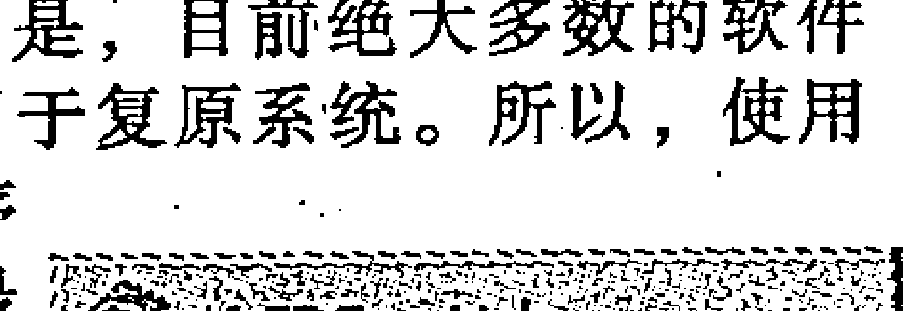

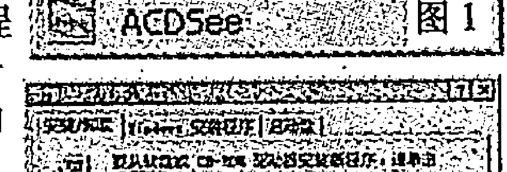

## 二、绿色软件可以直接删除

如果按照上述方法还找不到某个软件的“卸载”，那也不用太慌。可以查看一下，此软件是否是目前流行的一种所谓“绿色软件”？如果是，那么它是可以直接删除的（因为这种软件不在注册表中植入任何信息，不对系统文件进行任何修改，所有文件只存在于自己所建的单一文件夹中）。

如果该软件是这种“绿色软件”，卸载就特别简单，在硬盘中找到它的安装目录，将整个目录删除，然后在“开始>程序”中找到该软件的“程序组”，右单击该程序组，从弹出式菜单中选择“删除”命令将其删除即可。

## 三、手动卸载

如果碰上上述两个方法还对付不了的软件，那么算你的运气不好。要想将其“斩草除根”，只好通过手动方法来卸载了（注意，此手动方法相对危险些，操作时务必小心），其步骤是：

- 删除主文件
在硬盘上找到软件的安装目录，直接删除，然后将桌面上和开始菜单中的相应快捷方式（不懂？就是桌面上用来运行那个程序的图标啊）删除。
- 清理启动文件
这一步是为了禁止被卸载软件的自启动和避免链接错误。
点击“开始”-->“运行”，键入“msconfig”，点击“确定”按钮。
在随后打开的窗口中选择“win.ini”标签，点击“windows”前的加号。如果在“load=”、“run=”后发现有关软件的内容，应选择“编辑”将其删除（如图3）。
再点击“启动”标签，看看列表中是否有被卸载软件的内容？如果有，将其前面的对勾去掉，点“确定”，将其禁用。
- 清理注册表
这一步是为了将软件植入注册表的信息删除。由于对注册表进行修改有一定的危险性，所以在进行以下步骤前请备份注册表，以便必要时恢复。（编者注：备份和恢复注册表请见本刊另一文章。）
建议各位使用RegCleaner（下载地址：ftp://ftp.download.com.cn/pub/new_system/RegCleaner 4.0.exe，并且有汉化补丁）来对注册表进行分析修改。
RegCleaner界面如图4所示，点击“软件”标签，在出现的列表中选中要卸载的软件，而后点击“删除选择”按钮，这样注册表中的无用注册信息即被删除。
- 删除多余文件
这一步是为了删除那些散布在硬盘其他目录中的多余文件，主要针对DLL文件。点击“开始”-->“运行”，键入regedit，回车。找到\HKEY_LOCAL_MACHINE\Software\Microsoft\Windows\CurrentVersion\SharedDLLs，如图5，可以看到每一个文件对应一个数值，此数据如果为0，则表示为无用文件，把它的名字和路径记下来，在硬盘里找到它，将其删除即可。

OK，经过了上述三绝招，相信没有哪个软件是你不能对付的了，尽情地玩吧。

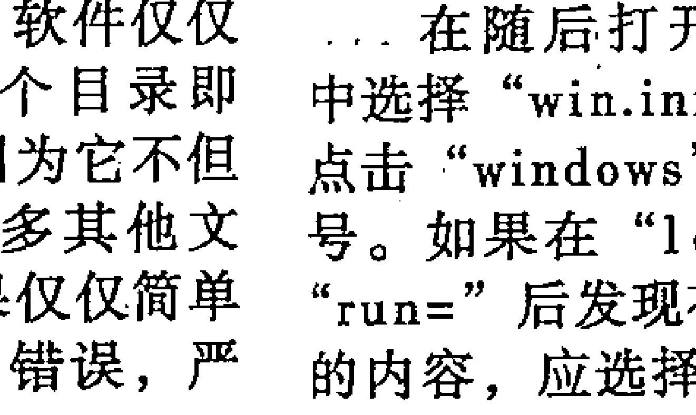

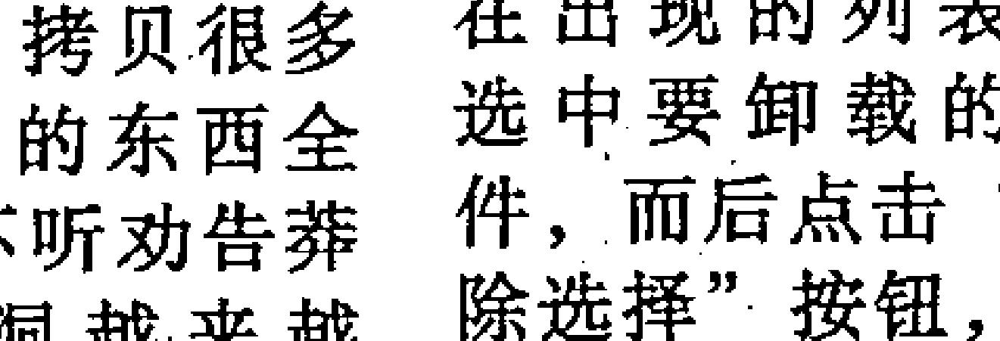

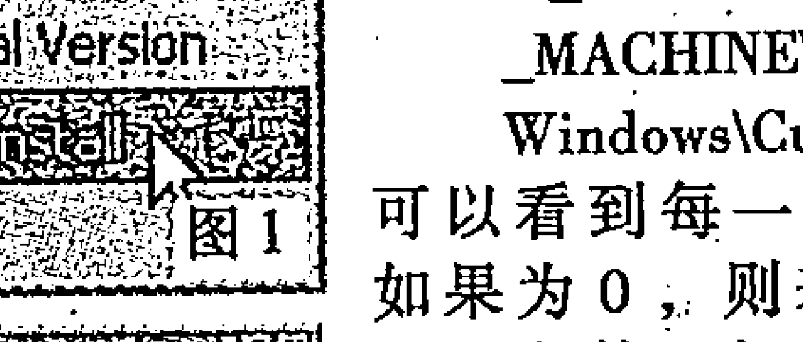

# 菜鸟主页速成手册

□辽宁 鸣涧

## 第一步：申请空间

- 1.在浏览器中输入地址：http://www6.163.com/serve/index.html，点“主页服务”栏目中的“免费100M主页申请”。
- 2.点“注册登记”，看“申请个人主页条例”，在页面最下端鼠标左键点击“我同意”按钮。
- 3.填写个人资料
文本输入框后面所有标注“***”的，都是必须填写的项目。“主页名称”和“主页描述”需要认真填写。E-mail一定要填写正确。完成以后就可以单击“提交注册信息”按钮。
- 4.完成注册
如果你的用户名没有人申请的话，系统会给出注册成功界面，此时主页空间申请完成。
举例来说，我的用户名取为“chinamingjian”，则主页地址为“http://go.163.com/~chinamingjian”。随后网易会发一封“个人主页开通”通知信给你，你的主页空间就正式开通了。
- 5.简易域名申请
在浏览器中输入地址“http://my.yeah.net”并回车，进入申请简易域名页面。
点击“开始申请”就可以打开申请表图。
输入想要注册的域名“chinamingjian”和自己原来的URL地址“http://go.163.com/~chinamingjian”以后，单击“提交”按钮。
申请成功后，就可以用“http://chinamingjian.yeah.net”来访问鸣涧的主页了。（如果你刚才申请的域名是“Rose”，则申请成功后，域名为地址为“http://rose.yeah.net”。）

## 第二步：制作主页

- 1.建立目录
硬盘上建立存放主页文件的目录，比如“E:\myhomepage”，在里面再建立一个images目录“E:\myhomepage\images”，用来存放图片文件。
- 2.运行Frontpage Express
FrontPage Express是Win98中的一个功能强大的网页编辑器，非常适合初学者使用，它的“所见即所得”功能可以轻松地制作一个自己的个人主页。
打开Window的“开始”菜单，选择“程序/Internet Explorer/FrontPage Express”项，就可以启动FrontPage Express了。
如果你的系统没有安装FrontPage Express，可以进入“我的电脑/控制面板/添加/删除程序”，然后单击“Windows安装程序”选项卡，选中“Internet工具”项，再单击“详细资料”，选中“FrontPage Express”，然后单击“确定”返回，这时机器会提示你插入安装盘，插入光盘后，机器会自动将FrontPage Express安装到当前系统中。
- 3.做网页
FrontPage Express中执行“文件/新建”，打开“新建网页”对话窗口，选择“个人主页向导”，然后单击“确定”按钮。
FrontPage会弹出“个人主页向导对话框”。向导为我们提供了多种章节，我们只要选定需要包含的章节就可以了，完成以后单击“下一步”按钮。
在接下来的步骤中，需要设定网页的存储文件名称为“index.html”，并设定好网页的标题名称为“鸣涧家园”，这个标题将显示在网页的最上方。
完成以后就可以单击“下一步”，设定章节中“职员信息”栏目需要包含的信息了。在这个步骤中，可以设定职员信息栏目的超级链接的WEB页面所包含的页面内容，系统会自动创建有关页面，日后我们还可以根据自己的需要对这些信息内容进行修改。
单击“下一步”可以分别设定“WEB热点列表式样”、“传记信息部分格式”、“个人爱好描述”，以及“有关联系信息”等有关内容，可以使用系统的默认值。
当然了，系统提供了多个栏目的设定，在向导中还提供了可以根据自己的需要进行栏目顺序的排列设定。选中其中的一个栏目，然后单击“向上”或者“向下”按钮，根据自己的需要，改变其在栏目中的排列顺序。
完成以后就可以单击“下一步”，并单击“完成”按钮，这样自己的主页就轻而易举地建立好了。
最上方的“鸣涧家园”就是这个主页的标题了，在其下面的“目录”区域中提供了六个栏目的超链接，在浏览网页的时候，只要用鼠标分别单击相应的链接，就会转移到相应的WEB页面去。
建立好主页以后，我们就可以把主页页面保存下来了。执行“文件/另存为”命令，打开“另存为”对话框，单击“按文件”按钮，将页面文件保存在指定的目录下，比如E:\myhomepage\index.html。
需要注意的是，如果当前页面作为网页的起始页（如index.html），在保存的时候需要注意网页的保存格式问题，不要将保存的格式选为纯文本格式，一般情况下FrontPage Express默认为HTML格式，所以我们只需要单击“保存”按钮就可以了。

## 第三步：图片制作

始页面，最好保存为 index.html 文件，这是因为很多网站系统默认的首页文件名一般为 index.html（或 index.htm）。

## 第四步：美化主页

- 4.美化主页
执行“文件 / 页面属性”命令，在“背景音乐”栏中单击“浏览”按钮，选择一个音乐文件（比如 C:Windowscanyon.mid），“循环”的次数设定为 1。
在“背景”选项卡中，选中“背景图像”选项，单击“浏览”按钮，选择一个图形文件，然后单击确定。
- 5.标题修饰
鼠标选中“鸣涧家园”，然后在文本选择框中选择“标题 1”，字体选择“楷体”，单击工具栏上的“居中”按钮，然后单击工具栏上的“增大字体”按钮放大标题文字。
设置标题的颜色：单击“文本颜色”按钮，会出现“颜色”选择窗口，可以在颜色选择列表中选择一种颜色，然后单击确定返回到主窗口。
- 6.插入图片
光标移到目录前面，点菜单“插入 / 图像”，单击“浏览”按钮找到要插入的图片，然后单击“确定”按钮回到主窗口，这时图片就会出现在页面中了。
页面中目录区域的栏目名称可以像写字板一样进行修改，其他内容的添加也是。
前面我们已经申请了一个免费的主页存放空间，并会收到一封个人主页开通的 Email 通知，在这封信里面，网易会告知我们用户名和用户密码，以及个人主页地址等信息。下面就来针对这封通知信的有关要求，讲讲如何将网易提供的 HTML 代码加入到我们的主页当中。
- 7.放置广告
首先，在信件中会要求你将一些 HTML 代码放到个人主页的源代码中，选中源代码（就是从“<!--Channel Html Code Begin-->”开始，到“<!-- End of the Code-->”结束的整个部分），然后按下 Ctrl + C 键进行复制，再用 FrontPage Express 打开 Index.html，光标移到页面的最下方，然后执行“插入 / HTML 标记”命令，打开“HTML 标记”对话框后，将以上代码复制粘贴到文本区域中，然后单击“确定”按钮，则完成了代码的添加。
- 8.添加计数器
查看网易发来的通知信，同样可以得到“计数器”代码（各人代码不同），添加计数器的方法同上述“添加广告条”。
计数器是干什么用的呢？每当有一个网友来浏览你主页的时候，计数器的数值就会自动加 1，是用来如实记录你的网页被浏览的次数的。
- 9.仔细看看通知信
信里还介绍了很多网易提供的其他免费服务，比如密码取回功能、网易的个人主页讨论区、网易的免费搜索引擎，以及如何申请网易提供的其他服务等，务必仔细看看。
感觉背景不太舒服，接缝明显。下面我们就来用 Photoshop 制作一个平铺无接缝背景图片。
启动 Photoshop 以后，打开图片，点菜单“图像”里的“图像大小”查看图片信息。然后点菜单“Mode（模式）”里的“RGB（RGB 颜色）”进行转换，最后按下“Ctrl + A”，选中整个图形，然后执行菜单“Filter（滤镜）”里的“Other（其他）”中的“Offset（位移）”命令，设定水平值为“长度 /2”，垂直值为“宽度 /2”（比如长 100，宽 100，这里就分别输入 50），再选中“折回”，然后点“好”。
这样图就从中间翻转了出来，再命名保存即可。最后记得在 Index.html 中使用新制作的图片作为背景。

## 第五步：本地浏览

全部做好后，可以用 IE 或 Netscape 之类的浏览器，打开我们做好的 Index.html 浏览一下看看，有没有什么显示不正常或者别的问题。如果有什么显示不正常（比如那些计数器之类的代码在不上网的状态时，显示就会不正常），就在上网状态下再用 IE 打开 Index.html 看看。如果你的网页没有大问题，现在就都应该正常了。

## 第六步：上传主页

- 1.下载 CuteFTP 与安装
浏览器中打开如下地址：“http://www.newhua.com/CuteFTP.htm”，或者直接输入如下地址：“http://www.win2000.com.cn/down/cute4232.exe”，下载 CuteFTP。
下载后，双击进入安装界面，单击“Next”后选择“I Agree”，会出现安装的路径选择对话窗口，一般可以使用系统的默认值，然后单击“Next”按钮开始安装。完成以后，安装程序会提示是否安装“Cutehtml”作为默认的网页编辑工具，选择“No”按钮，打开安装结束对话窗口，单击“Finished”按钮完成安装。
- 2.进入服务器
启动 CutFTP，单击“Cancel”按钮取消向导对话框。
执行“File/Site manager”站点管理命令，即可看到所示窗口。
单击左下角的“New”命令按钮建立一个新站点，这时右侧会有一些项目需要填写。下面就来介绍一下其中各个信息项目的含义和填写方法。
“Label for site”为站点标识，用来表明用户当前站点的名称，可以随便起个名字就可以了，也可以使用其默认值 New Site。
“Ftp Host Address”是 Ftp 主机的地址，用来填写服务器的域名地址，比如我们在网易申请的主页，就需要填写网易的域名服务器地址 go.163.com。
“Ftp site User Name”就是“用户名”，比如我的就是 chinamingjian。
“Ftp site Password”就是“用户密码”了，比如鸣涧的用户密码就是 1234567
其他内容不管，填写完毕。上网，再单击“Connect”按钮。
当我们登录到服务器以后，这时会出现一个欢迎的信息界面窗口，单击“确定”按钮就可以了。
- 3.上传
登录服务器以后，这时下面左侧窗口是本地机器的目录，而右侧是服务器上的根目录。另外，在服务器根目录下还有一个叫 Index.html 的文件。这时我们只要在左侧本地机器目录中找到存放主页文件的目录，然后按下“Ctrl + A”选中全部文件和文件夹。鼠标直接拖放到右侧的服务器窗口中，这时就开始上传文件。
上传完成以后，右侧的服务器窗口会出现已经上传后的文件及文件夹（如果中途系统提示是否覆盖，选择“Yes”即可）。
至此我们就完成了主页文件的上传操作了。
- 4.在线浏览与测试
在线浏览
在 IE 地址栏中输入主页地址“http://go.163.com/~chinamingjian”或“http://chinamingjian.yeah.net”，应该可以正常浏览了。到这里，我们制作的主页就完成了，你就可以介绍其他网友来看啦。
测试
不过，最好在介绍朋友来看之前，你自己要前前后后每个页面都看一遍，以确保正常。
但有些时候，我们会发现，本地浏览看起来正常的主页，上传后网页或图片却不能正常显示。出现这种现象的原因有两种，一是网页中用到的文件名与实际文件名大小写不一致，而有些服务器正好特别在乎这个，所以必须把网页中的文件名改为和实际大小写一致。二是文件存放路径出现错误，所以在编写网页的同时尽量使用相对路径。
下面就来介绍一下绝对路径和相对路径。如果主页中的图片链接用的是绝对路径，那么上传以后图片就无法显示（图片会显示为一个带叉的方框），这时需用 FrontPage Express 打开该主页文件，鼠标左键点击显示异常的图片，打开图片属性对话窗口，可看到图像的源路径为“file:///e:/myhomepage/img/aa.gif”之类的形式。这种“file:///e:/myhomepage/img/aa.gif”就是绝对路径，需要改为相对路径“img/aa.gif”。
如果你不太明白，以上面的文件名为例，可以看这个公式：相对路径 = 绝对路径 减掉 “file:///e:/myhomepage”。

## 第七步：更多服务

- 1.免费聊天室
申请地址为 http://chat.163.com/，单击“个人聊天室”进行申请。
填写用户名和密码，设定聊天室的中文名称及类型，单击“确定”。
完成后，单击“获取代码”，然后输入申请聊天室时的用户名以后，单击“取得代码”按钮，即可显示系统提供的 HTML 代码了。
首先选中这些代码并复制到剪贴板，然后打开网页文件，将光标定位在需要加入聊天室的地方，然后执行“插入 / HTML 标记”命令，将聊天室代码粘贴到代码区域后，完成以后单击确定按钮。
- 2.申请网易论坛
http://luntan.163.com，单击“申请个人论坛”，输入“社区用户名”，在社区中选择“个人主页”，然后单击“申请论坛”按钮。
选择类别，完成以后就会进入论坛申请的最后一步，填写论坛的版名、论坛的描述信息，以及自己的电子邮件地址和个人主页地址，单击“下一步”，这时系统会给出一个申请成功的页面，并给出了一个论坛地址。
抄下这个地址，打开 Index.html，在需要放置论坛的地方，加入文字“鸣涧论坛”，选中这四个字，单击“创建或编辑超链接”工具按钮，打开编辑超链接对话窗口，在 URL 中输入刚抄下的地址即可。
做完了上述添加，你需要再上传一次（记住，修改过的文件必须上传到网上去，网友们才能看到喔）。

## 结语

好了，咱们菜鸟的第一间草房就完工了。是否心动了呢？那就赶快动吧。
回头别忘了去鸣涧的主页 http://chinamingjian.yeah.net（如图 30），这可是按照本文一步一步做出来的实例。哈哈，难看吗？可千万别笑话啊，咱们会有一天把它装修漂亮的。
请继续关注《菜鸟主页速成手册》。

- 1.制作透明背景图
用 Photoshop5.0 打开需要制作透明背景的 JPG 或者 BMP 等图片以后，执行“Mode（模式）”里的“Index（索引颜色）”，在弹出的对话框里点“OK（好）”按钮。然后执行“File（文件）”里的“Export... GIF89a（输出 --> Gif89A 格式输出）”命令，系统会提示选择一种透明的色彩，用吸管去点一下背景，背景就变灰了。如果还有残余，就继续点背景上的残余点。
可以看到，做成透明图的背景中有很多点点，那是因为其余部分已经做成透明的了。
- 2.替换原图片
在 FrontPage 中，鼠标左键单击原图，按 Del 键删除，然后执行“插入 / 图像”，插入新图。（用同样的方法，可以将网页中所有图片替换为透明背景图。）
- 3.制作平铺无接缝背景图片

## 留住精彩的瞬间

□重庆 徐阳

用电脑的时候，常常看到一些自己非常喜欢或者需要的图片，如游戏画面、VCD和DVD图片、精彩的网页等等。怎么把那些自己感兴趣的东西保留下来呢？用HyperSnap - DX好了（图1）！

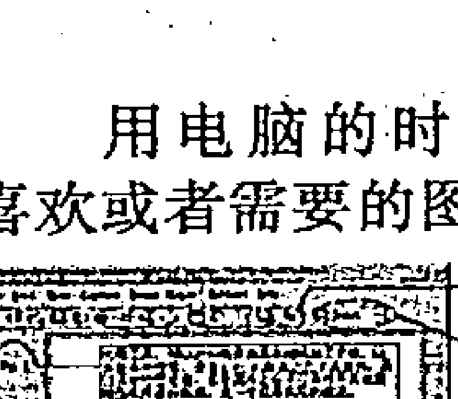

工欲善其事，必先利其器！正式使用之前，还要先进行一番设置。HyperSnap - DX一般使用热键进行图像截取，因此首先进行抓图热键的设置。HyperSnap - DX系统本身有自己默认的一套抓图热键，当然也允许用户定义一套适合自己习惯的抓图热键。打开“Options”菜单下的“Configure Hot Keys”命令选项，就会弹出一个设置热键的对话框（图2）。在这里你可以按自己的习惯配置各类热键。缺省情况热键定义如图中所注。

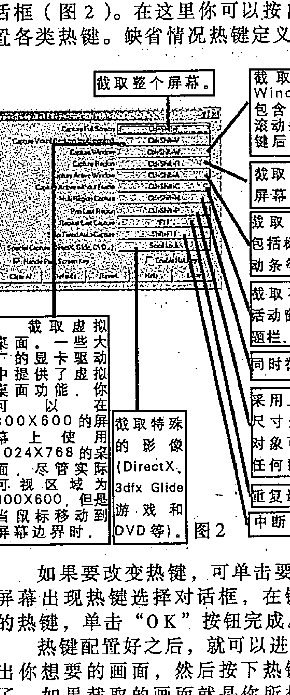

如果要改变热键，可单击要修改的按钮，屏幕出现热键选择对话框，在键盘上按所要的热键，单击“OK”按钮完成。热键配置好之后，就可以进行抓图了。调出你想要的画面，然后按下热键就可以截取了。如果截取的画面就是你所想要的最终画面，那么工作就完成了，如果还想修改，使用HyperSnap - DX的绘图工具就可以了。大功告成之后就要把作品保存下来，HyperSnap - DX可以保存为bmp、jpeg、gif、tif、ico以及psd等多种格式，完全可以满足你的需求（图3）。

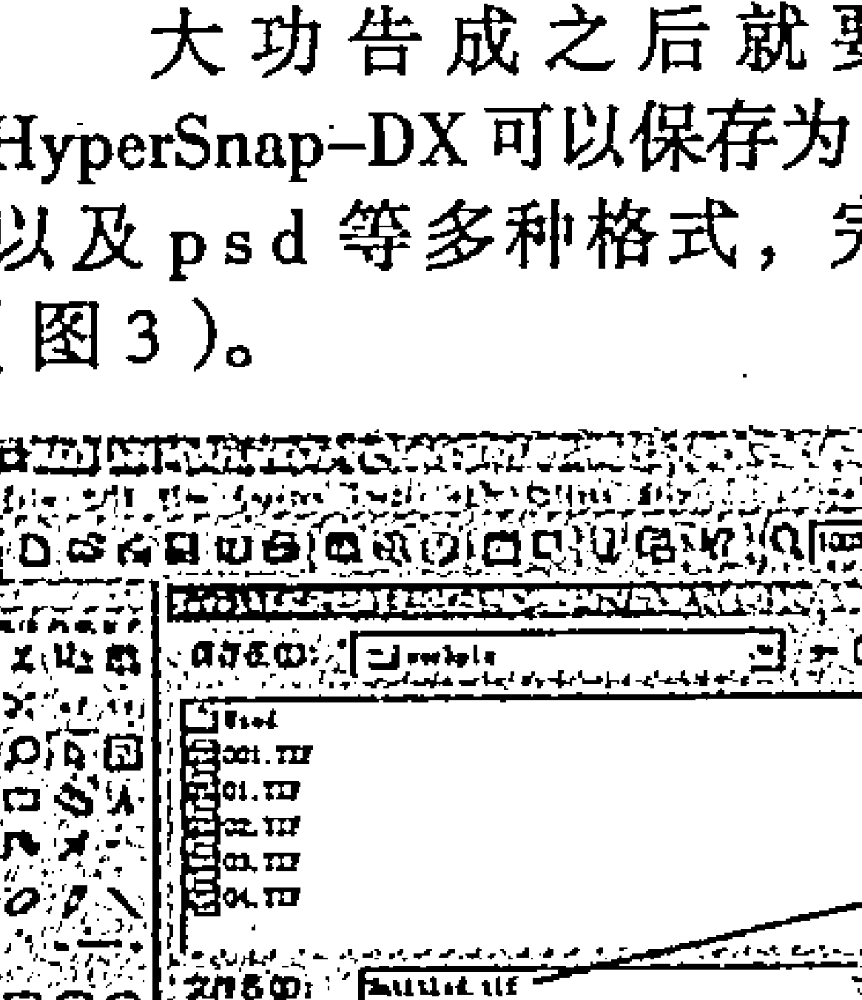

## HyperSnap - DX使用技巧

- * 是否抓取光标
有时为了演示，需要将光标一并抓取。在“Capture”中的“Capture Settings”里的“Capture”栏中，选择“Include Cursor Image”（图4）。以后截取的图片就会包括光标的形状和位置。
- * 自动保存截取的图片
每次截取图片都要一幅一幅地保存，实在麻烦，如果有很多图片要截取，简直就是恐怖了。其实，使用HyperSnap - DX的自动保存功能，在你截取图片之后，它就会按照你事先的设定，将图片保存在适当的位置（图5）。

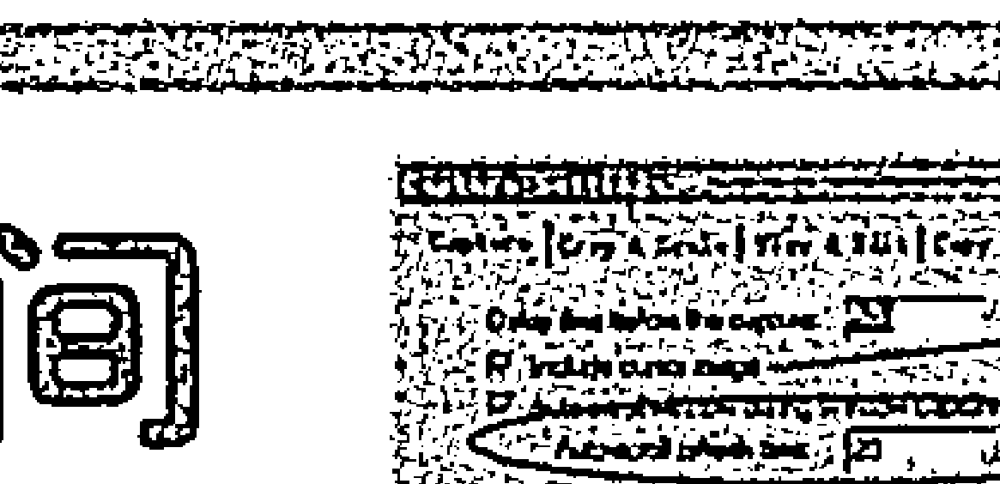

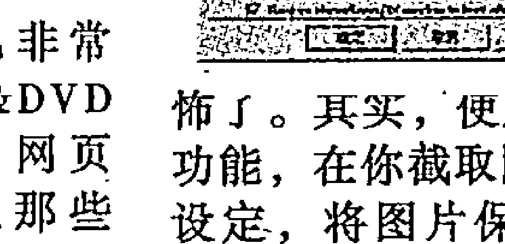

- * 多区域截图
看到图6了吗？在以前要抓取这样的图片是比较麻烦的。你只有先截取整个屏幕，再将不需要的部分删掉。现在就简单了，出现你需要的画面时，按下相应的热键（Ctrl + Shift + M），然后用鼠标左键逐一点你需要的区域，选择完之后按下回车键就行了。
- * 游戏画面的截取
也许，你有一块超炫的显卡，但却在为精美的游戏画面无法截取而烦恼。那么，看仔细了，HyperSnap - DX可以让你美梦成真！使用DirectX/Direct3D技术的游戏就不用说了，就算你有一块Voodoo卡，玩Glide技术的游戏也绝对没问题。从“Capture”菜单中打开“Enable Special Capture（DirectX, Glide）...”（图7），选中相应的支持，如果你不清楚，全部选中好了。哦，我没有Voodoo卡，所以“3dfx Glide”选项是灰色的，无法选择。这样还不行，因为很多游戏都把几乎所有的热键给屏蔽了。所以，只有同时选中自动保存截取的图片，跟上面的技巧配合，然后按动“Print Screen”键，其他的事，就交给HyperSnap - DX了！
- * 特殊的中转功能
如果你对专业的图像处理软件比较精通，根本不屑使用HyperSnap - DX来进行图像编辑，但是对图像截取也有需求，那么，通过一番设置，HyperSnap - DX可以默默无闻地在后台为你工作，而你甚至会感觉不到它的存在。还是在“Capture Settings”中，选择“Copy & Print”子项，选中“Copy each capture to clipboard”（图8）。然后把“Capture”子项（图5）中的“Restore HyperSnap - DX window to front after capture”前的勾去掉。现在，每次你截取的图片就会自动复制到剪贴板，然后在应用程序中选择“粘贴”就可以了，一切都是HyperSnap - DX在后头为你操劳，但是你却不会觉察到它。你可到中国下载（www.download.com.cn）找到这个软件的共享版。怎么样，你不试试看？

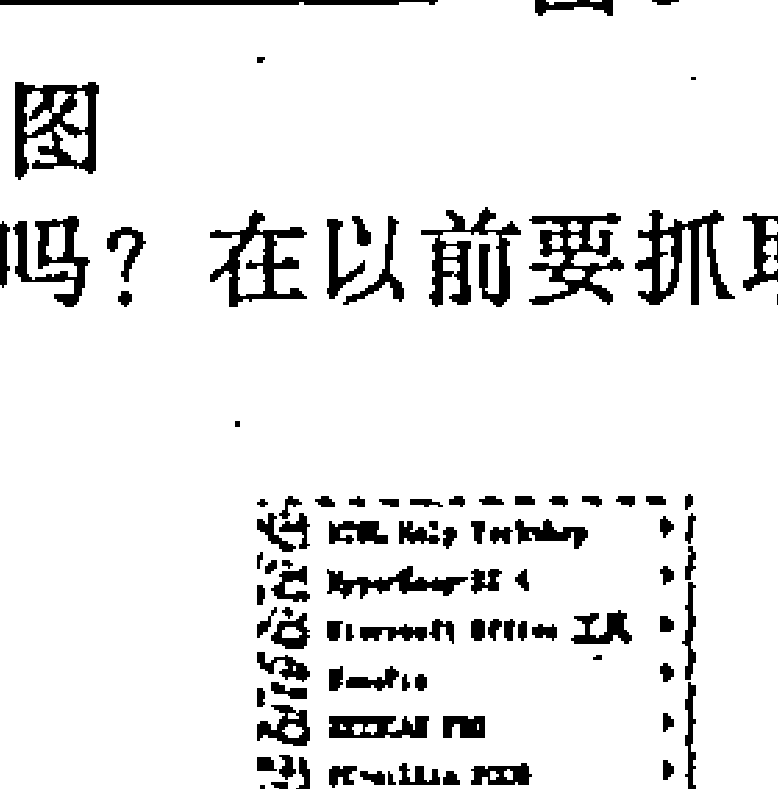


## 浏览器之集大成者

□广州 小玉哥

引言：上网浏览的前奏，每次都是毫无例外地打开熟悉得不能再熟悉的IE浏览器，每每映入眼帘的是越来越不堪忍受的灰色面板和固定的按钮，上网冲浪的情趣在单调的浏览器中依旧显得无可奈何。于是一声叹息之下，满载憧憬与向往，开始了寻找属于自己的浏览器之旅……如今，我终于找到了自己心爱的浏览器，它就是——

上网浏览，我们需要更多的是享受冲浪带来的乐趣，而一款优秀的浏览器，应当能充分利用现有的网络资源，带给网民更多的快捷与便利。在现实应用中，许多流行的浏览器显得过于苍白无力，远远不能满足浏览需要。而这款多线程浏览器FastBrowser，首先它以IE为内核，继承了IE优秀的一面，除此之外，还增加了很多上网的实用功能，极大地扩充了浏览器的功能，带给你无尽的便利，让你的网上冲浪变得更加简单和方便，让你体验到另类的上网乐趣。

### 1 . 优秀的多窗口浏览

如果你用IE上网，每打开一个IE窗口，就意味着你的系统资源又会降低一点，每一个IE窗口就像一个无底黑洞，在无情地吞噬着你宝贵的系统资源。即便你的系统资源足够多，但如果你打开了N个IE窗口，管理起来也相当不方便。而FastBrowser一次却能够同时打开多达180个网页，并且能显示每个网页的下载进度，这样每个页面的下载情况，你都能够一目了然。在浏览器的最下方是页面切换按钮，你可以很方便地在多个页面之间来回穿梭，通行无阻（图1）。此外，在工具栏中有一个“全部关闭”按钮，点击它即可以把当前打开的所有页面全部关闭。虽说这只是一项微不足道的功能，但很多浏览器都没有考虑到这一点。

### 2 . 自由冲浪

茫茫网海，你是否有无所适从的感觉？FastBrowser为你精选了10000多个分类中文网址，当你上网不知道该去何处时，它会随机向你推荐一个优秀的网站，给你带来更多全新的内容和新鲜冲浪的感觉！首先在地址栏右方“随机浏览”按钮的倒三角黑箭头上点击一下，选择欲浏览的网站的类型，如“文学艺术”，然后在“随机浏览”按钮上按一下。现在请仔细瞧一瞧你的浏览器吧，FastBrowser说不定指引你来到一个意想不到的好站点呢（图2）。


### 3 . 语音功能

这简直是浏览器的一个创新！一个可以自动朗读英文网页的小精灵在你的网页中游弋。倘若你点击“编辑”菜单中的“朗读”，便会有朗读之声伴你左右，让你的浏览器变得更加多姿多彩！可惜，目前只能朗读英文网页，尚不支持中文，不过，你可以用来锻炼你的英语听力哦！依次点击“工具” → “FastBrowser 选项” → “朗读”，可以对朗读时的一些参数进行设置，这里不再多言。

### 4 . 多语种翻译

在网络上，英语信息占有相当大的比重，但英语对于许多国人来说还是噩梦，更别提其他国家的语言了。点击“翻译”菜单，从下拉的列表上可以看到FastBrowser提供了从英文到中文，中文到英文，日文到中文，英文到德文等相当丰富的翻译方式，囊括了世界上的基本语种。

此外，FastBrowser还提供了多个在线翻译引擎，比如你选择“文本在线翻译”将会弹出一个对话框，输入你想翻译的文本，选择翻译的语言选择，最后点击一下“翻译”。就这么简单！

### 5. 链接查看

网页上到底包含多少个链接，我想你未必清楚，然而FastBrowser却能帮你精确地列出网页上的链接。单击“工具”菜单中的“扫描所有链接”，就能知道结果了。而单击工具栏上的“连接”按钮，它可以迅速地展示给你一个网站的全貌，你可以看到每一个链接的具体内容。这样你可以快速地选择你想要看的内容，过滤掉你不需要的内容（图3）。


### 6. 微型记事本

在浏览网页的时候，读到精彩之处不妨保存下来吧。按下Ctrl+7键，浏览器左侧将会出现一个“记事本”窗口，你可从网页里用拖动方式收集你感兴趣的内容，当然你也可以添上几句神来之笔。保存后还有一个妙用，就是你可以把在记事本里预先写好的内容直接拖到网页输入框里，以后填表就不用再烦啦。

### 7. 强力搜索引擎

还在为搜索信息犯愁吗？有了FastBrowser，你无须借助于第三方搜索软件，即可使用500个搜索引擎进行搜索，将网上信息资源一网打尽！对于中文版，另附有数十个中文分类引擎，点击菜单“搜索”，便可以见到分类的中文搜索引擎，如“通用”、“购物”、“新闻”、“软件”等等。

对于专业搜索，比方说我们要在各大软件下载站点搜索“FastBrowser”这个软件，依次点击“搜索”→“软件”→“搜索下面全部引擎”，然后在弹出的搜索对话框中输入软件名称，FastBrowser将自动多线程搜索该软件，速度可是很快的哦。

对于一般搜索，FastBrowser提供了更便捷的方法，在地址栏左方有一个搜索输入框，从中键入关键词，再点击一下右方的搜索内容按钮，从中选择通用搜索站点，如新浪、硅谷动力、中华网等。

如此贴心的设计，你是不是感觉很方便呢？从此，在茫茫网海中，有了搜索引擎的指引，你再也不会迷失方向了……

### 8. 快速设置下载内容

有时为了节省下载页面的时间，提高上网速度，通常要将图片显示、音乐、视频等功能关闭。FastBrowser把这几项常用设置直接放在工具栏中，只要用鼠标轻轻点击“选项”按钮，将会出现一个菜单，共有五个选项：只显示文字、显示图片、背景音乐、播放视频、执行脚本。这样用户可以根据需要直接选择相应的命令，自由控制是否下载图像、音乐、视频文件，节省网页下载时间，提高上网速度。

### 9. 黑名单

对于不愿意再次访问的网站或网页，你大可以把它们扔进黑名单里。在菜单“工具”中选取”加入到黑名单”，呵呵，以后它再也不会前来骚扰你了。

### 10. 群组功能

出于需要，我们有时会同时开启几个网站，一个一个的打开吗？太麻烦了！FastBrowser提供了一个群组功能，你可以建立一个组，打开这个组就可以开启组里定义的所有网站。单击菜单“群组”→“管理”，这时会开启一个群组窗口。FastBrowser内置了七个群组，当你选取一个群组，可以从窗口下看到该组包含的所有网站，你可以很方便地添加和删除网站。当然，如果单击“新建”，则可以建立一个全新的群组。

FastBrowser更多的精彩之处，还有待于你在冲浪之时慢慢体验。有了它的相伴，网上冲浪的天空总是绚丽一片……

## 文件恢复就这么简单

上海hermes

作为一名软件编辑，每天都要四处寻找软件以及相关资料，因此硬盘总是挤得满满的。为了节省硬盘空间，我将回收站设置为直接删除。每天最后的工作就是删除没用的东西，可有时一不小心将重要的东西给删除了，这可愁煞在下了，只好再去慢慢地寻找资料。要是删除了那些世间独一份的文件，那只能自认倒霉了。

后来我就下载了几个恢复删除文件的工具，有了它们我就再也不怕误删重要文件了。这些恢复工具的工作原理都是在运行该软件之后便监视硬盘中的所有文件，一旦发现有文件被删除，就自动生成一些记录文件以便以后恢复文件使用，唯一的缺点就是无法恢复其安装之前被删除的文件。在试用了很多恢复工具之后，我终于找到了一款操作简单的文件恢复工具——Recover4all。

Recover4all是Advanced Utilities GmbH出品的一款共享软件。它可以跟踪磁盘信息，当你无意中删除了文件，并且已经清空回收站以后，它仍然可以帮你找回失去的文件。它的最新版本为V1.03，你可以到它的网站http://www.recover4all.com/去下载该软件。Recover4all同时又是一款绿色软件，其下载的是一个大小为240kB的自解压文件，只要将压缩的文件解压到指定路径，然后双击文件recr4all.exe，就可以运行Recover4all了。

运行Recover4all后，首先出现的是如图1所示的提示框，提示你这是一个试用版软件，并且询问你是否要注册。上面的两个按钮“Register now”和“Read License Agreement”是用在线注册和阅读注册协议用的，你完全可以不去管它，直接点击按钮“Yes, I have read the License Agreement and agree to be bound by it”就可以开始使用Recover4all了。在这要说明的是，这个软件在注册之前虽然能够使用，但是只能恢复小于10kB的文件，如果你想恢复更大的文件的话，只有去花$49.00进行注册购买了。


Recover4all的操作界面如图2所示，其大致可以分为三部分，最上面的是菜单栏，其下面是工具栏，再下面则是整个操作区域。菜单栏中，“Help”和“Register”是提供帮助信息和软件注册用的，“File”中一个是退出软件用的“Exit”命令，另一个则是勾选后显示长文件名文件的命令。软件的主要操作命令都在菜单“Recover”中，而这些命令都可以在下面的工具栏中找到相应的工具按钮。


现在我们就实际操作一下Recover4all吧。不过在使用它之前，我们得先了解一下Recover4all的工作原理。

由于Windows删除文件之后不会马上覆盖文件被删除后遗留下来的空白区域，而新写入的数据是依次存放在编号较大的分区中。只有当编号最大的那个分区存满之后，新的数据才会覆盖前面分区中空白的区域。所以只要遗留下来的空白区域没有被覆盖，就一定能恢复被删除的原文件。Recover4all运用的就是这一原理，在运行该软件之后，它就会对上述的空白区域进行扫描，一旦发现有文件曾被删除，就会在操作界面的文件列表框中将其显示出来，这样你就可以根据自己的需要随意恢复被删除的文件了。

那么到底怎样使用呢？假设被删除的文件是在D盘中，那只要点击工具栏上相应的按钮，或者点击“Recover”菜单中的“Scan drive D:”命令，Recover4all就开始在指定的驱动器中扫描你所删除的文件。搜索结束后就会在下面显示出所有被删除的文件（图3）。


下面显示框中，左面的部分是所选磁盘的文件夹显示区域，在这里你能看到这个磁盘上的所有文件夹（包括被删除的文件夹），右面的部分是所选文件夹中所有被删除的文件。该软件使用3个图标来表示状态，（绿色）表示已经删除的文件夹，（黄色）表示正常的文件夹，表示已删除的文件。

当你在右面的显示框中找到被删除的文件后，你可以通过把它们保存到另一个驱动器来恢复已删除的文件。在右面的文件框中点击要恢复的文件，然后点击工具栏上的“Recover”按钮，或者点击“Recover”菜单中的“Recover selected items”后，出现如图4所示的对话框，在对话框中选择一个目标目录，但该目录不能和想要恢复的文件在同一个驱动器内。选择好目录后只要点击“OK”就可以恢复该文件了。


怎么样，Recover4all的操作还是蛮简单的吧？只可惜该试用版只能恢复小于10kB的文件，这未免太抠门了吧。

## 让奸商原形毕露

上海hermes

现在到处都在打假，经常听说市场卖电脑配件的奸商总是会把一些Remark的硬件卖给你，到底这是真是假我也不清楚。对于那些对电脑一窍不通却又要急着买电脑的菜鸟来说，这可不是什么好消息，不过也不用担心，因为你有——Hardware Info。

Hardware Info是一款著名的硬件检测软件，号称能检测出几乎所有的电脑硬件，可测试奔腾二代、K6-2、赛扬，并且可以看出Pentium III的Processor Number，而不管这个Processor Number有无被Disable掉。最新发布的版本V0.9a Beta是一款32位的支持Windows平台的软件。你可以到它的网站去看看，网址是http://www.hwinfo.com/，也可以到“天下网”去下载其最新版本，网址是http://www.tiandown.com/。下载的安装程序只有877kB大小，如果做成ZIP压缩包的话，其容量只有602kB了。所以你只要一张软盘就可以把它带到电脑商家那里，如果对买的电脑不放心的话，就…… Hardware Info 的安装过程非常的简单，按几次 “Next” 就可以了，安装的最后一个步骤就是重新启动系统，接着就可以使用 Hardware Info 了。双击 Hardware Info 的图标，启动 Hardware Info 后会先弹出一个信息框（图1），显示


它的版本信息，在对话框的下方有三个按钮。点击中间的按钮 “Settings”，会弹出一个对 Hardware Info 进行初始设置的对话框（图2），里面一共有三个复选项，它们依次是支持主板的 UDMA/66 和 UDMA/100 技术、ACPI 以及启动主板上的 Debug 模式，软件默认勾选前两个选项，选好之后点击 “OK”。回到前一个对话框，现在只要点击 “Continue” 就可以了。不过随后又出现一个警告信息的显示框，我们还是点击 “Continue” 继续，随后软件开始检测硬件信息，检测结束后就进入了 Hardware Info 的主界面（图3）。


Hardware Info 的主界面非常简洁，其界面和 Windows “系统工具” 中 “系统信息” 的界面差不多。在下面的信息显示区域，分为左右两部分，左边罗列了全部硬件的树型目录，从上至下依次罗列了 CPU、内存、主板、总线、显卡、显示器、驱动器、声卡、网络以及端口 10 个信息类，而右边的信息显示框将会根据左边选择的硬件的不同而更换显示的信息。


想对你的电脑的性能了如指掌吗？只要点击菜单栏上 “Benchmarks” 菜单中的 “Benchmarks” 命令，或者点击工具栏中的第三个工具按钮就可以了。这时会弹出一个对话框（图4），在对话框中一共有四个选项可选，你可以任意地勾选它们，选择好之后就点击按钮 “Start” 让它开始自动检测硬件。要提醒读者的是，在测试之前务必关闭所有正在运行的应用程序，以免产生干扰。


等上几秒钟后结果就出来了，出现的对话框将你硬件的性能数值罗列出来（图5）。如果你不知道这些数值表示什么意思的话，只要点击每个数值右边的按钮 “Compare”，就可以通过比较了解你计算机的性能了。比如我想知道 CPU 的数值到底是多少，只要点击其右边的按钮 “Compare”，随后就会弹出一个信息显示框（图6），将你计算机的 CPU 数值用红色标了出来。另外还罗列了其他的 CPU 的属性值，可比较的机型从 P-120 到 Athlon750，甚至还有超频到 1010 的 CeleronII566。通过比较你可以直观地了解你计算机的档次。


你是否想将这些数据保存起来呢？很简单，只要点击菜单栏上 “Logfile” 菜单中的 “Create Logfile”，或者直接点击工具栏上的第二个按钮，这时就会弹出一个对话框（图7），要你填写生成的 LOG 文件的文件名和保存的路径，选择好之后点击 “OK” 就可以了。不过在存档之前我们先要对生成的 LOG 文件进行一下设置。点击菜单栏上 “Logfile” 中的 “Logfile Setting”，或者点击工具栏上的第一个按钮就会弹出一个有 9 个选项页的设置对话框（图8），通过详细地、分门别类地对 Computer(计算机)、CPU、Memory (内存)、Motherboard (主板)、DMI、Bus (总线)、Video (显卡)、Monitor (显示器) 和 Drive (驱动器) 这 9 大类进行设置，可以使存档中的信息更为详细准确。


注：UDMA 是一硬盘传输协议，而 UDMA/100 则是由 Quantum 和 Intel 共同提出并在 2000 年开始广泛采用的新一代协议。作为 UDMA/33/66 的升级技术，它可使硬盘外部数据传输率从以往的 33MB/s、66MB/s 提高到 100MB/s，进一步提高硬盘的数据传输速度，缩减 CPU 占用时间。

## 永不消失的比特空间 —— 网络硬盘

□湖北 乡巴佬

随着网络的高速发展，人们越来越需要在各种上网设备如电脑、信息家电、手机之间共享信息，越来越需要在不同的上网场所如学校、家里、办公室或是网吧之间共享个人文件。网络硬盘所推出的文件网络存储服务将从根本上改变人们在网络时代的文件存储观念，使我们的办公方式向真正的移动办公迈进。


网络硬盘不同于网上的那些免费主页空间，它的功能主要是为你提供一定的网络存储空间，用户可以在上边保存文件，并在任何一个地方都可以访问到它。只要下载了服务商提供的一个客户端程序之后，就可以像操作自己电脑上的硬盘一样操作你的网络硬盘。无论是上传还是下载，或是在线打开你的文件进行读写都非常的方便。这样你就可以将十分重要的资料备份在你的网络硬盘上。如果你与许多用户共享资料，只需要告诉他们你的账号和密码即可。更有甚者，有的网站只需要你简单的设置一下，就可以将你的网络硬盘里的部分文件与你的同事或亲朋好友共享！这样也就不会泄漏你的账号和密码了！呵呵…… （我的做法是，申请两个账户，一个用来与同事和亲朋好友交换信息，一个就是我的私人账号，用来备份我最重要的资料。两全其美，何乐而不为！）而且，网络硬盘很容易上手。申请及使用都和免费邮箱差不多！

闲话少说，步入正题。下面就让我们看看如何申请和使用一个网络硬盘吧！

现在网上提供这种服务的站点很多，使用起来也大同小异。当然服务稳定是最重要的，要不千辛万苦申请了一个账号，不定什么时候突然停止服务，那时你想哭都来不及……笔者上网查找了一番，发现在国内只有世纪驱动一家网站提供这样的服务。前不久，世纪驱动被国内知名网络公司 21CN 购并，服务也比以前稳定了许多，而且它还是中文界面。好吧！这次就让我们来看看如何操作我们的网络硬盘吧！

### 1. 申请账号

首先启动浏览器（最好是 IE 5.0 以上的版本），键入世纪驱动的网址 http://www.21drive.com，就会出现如图 1 所示的界面，这个界面与我们常用的免费电子邮箱的界面极为相似。实际上，使用起来也差不多！在页面的右上方有一个用户登录栏，如果你还没有申请账号，就单击其上的 “注册” 按钮，过程与申请免费电子邮件账号差不多，这里就不再赘述了。按照系统的提示，很快你就可以得到你的账号和密码。回到主页面，将它们输入 “用户登录” 一栏，单击 “登录” 按钮，过一会，你就可以进入你自己的网络存储空间了，如图 2 所示。


### 2. 文件上传

进入 “我的网上硬盘” 之后，你可以看到系统预设的三个目录：我的 MP3 音乐、我的数字相册、我的文档。以后你就可以将自己的 MP3 文件、数字图片以及文件资料存在这几个目录下，当然你想自己另建子目录存储也可以。我们想将自己的资料存在网络硬盘上，必须先懂得如何上传文件。在文件和文件夹显示栏上有两个按钮，单击右边的 “文件上传” 按钮，就会出现图 3 所示的界面。


单击 “浏览” 按钮，会出现一个 Windows 标准的文件列表框，选定一个文件后，“确定”。你选定的文件就会出现在 “浏览” 按钮左边的空白栏内。世纪驱动提供了一次上传多个文件的功能。选好所有需要上传的文件后，单击 “文件上载” 页面底部的 “开始上载” 按钮，即可完成操作。很快你会发现，你的文件出现在你的网络硬盘里了！

### 3. 文件下载

相对文件上传而言，下载更为简单！在图 2 所示的页面中，单击鼠标左键选定文件，然后单击鼠标右键 “将目标另存为” 即可。

### 4. 文件快递

## 5. 文件共享

如果你不想将你的文件一个个发到同事和亲朋好友手中，那么世纪驱动提供的“文件共享”功能可以帮你解除烦恼。只要进行几项简单的设置，你的同事或亲朋好友就可以看到并下载你开放共享的文件。具体操作如下：

先在主页面(如图2)选定要共享的文件(注：现在还只能共享文件，不能共享整个目录)。然后单击文件列表栏下面的“共享”按钮。你就会看到如图5所示的界面。

在这个页面，你可以选择将所选定的文件共享给哪些用户(同为“世纪驱动”的注册用户)，共享是否长期有效还是几天后过期，以及是否给共享用户发邮件。设置完毕之后，单击页面底部的“提交共享”按钮即可完成操作！是不是很简单？这样，有的文件根本不需要发送，只要通知一下你的用户，让他自己去取，既简单又省事！


过不久，世纪驱动就会开放Web文件夹功能，到那时用户使用起来会更加方便！21Drive在一开始会为用户提供30MB的存储空间，以后你每介绍一个新用户注册，它就会给你增加5MB的空间，直到50MB的存储空间上限。

除了21Drive外，还有许多站点提供这样的服务。与世纪驱动的使用方法大同小异。图6就是http://www.xdrive.com网络硬盘的界面，使用起来相当方便。可惜是英文版的，而且服务器在国外。一旦遇到网络塞车，速度就会大受影响！不过平心而论，Xdrive提供的服务更为详尽，使用起来更为方便。至于选择哪一家站点安放你的网络硬盘，那就只有萝卜白菜各人所爱了！


其他一些网络硬盘站点有：

- xdrive (http://www.xdrive.com/ ), 100MB
- Myspace (http://www.myspace.com/), 300MB
- Netdrive (http://www.netdrive.com/), 100MB
- Idrive (http://www.idrive.com/), 50MB
- Ibackup (http://www.ibackup.com/), 50MB
- Freedrive (http://www.freedrive.com/), 50MB
- Driveway (http://www.driveway.com/), 25MB

如果你总是担心你的磁盘会损坏，那么就赶快去申请一个吧！多一重保险，何乐而不为！祝你早日有一个网络硬盘。

## 虚幻的世界
三维立体画DIY

□河北 周建军

相信我们都看过所谓的“三维立体画”，也就是初看上去是一些纷乱的图形，但通过一定的方法仔细观看，却能从中看出一个非常逼真的、立体的图形，非常有意思。

True 3D是一款非常专业的三维立体画制作软件，能够制作出非常专业的三维立体画。下载地址 http://tropin.phy.ulaval.ca/dzfeng/true3d/True3D.zip。要注意的是，这个站点不支持断点续传。

我们知道，三维立体画分为随机背景和图形背景两种，前者看上去只是一堆杂乱无章的色点，而后者则是一组连续的图形，不管是哪种，从中都可以看出三维效果的图形。

在制作三维立体画之前，我们首先要制作立体画中隐藏的实物图。True 3D随软件提供了几张图片，立体图放在True 3D目录的Depth目录下，面罩图放在Bkg目录下，下面我们就以这些图片为例进行说明。

### 制作随机背景的三维立体画

第一步：启动软件后，选择主菜单“File”下的“New”命令或者直接按下“Ctrl+N”快捷键，新建文档。窗口内会出现两个子窗口，一个是“Depth Image”窗口，用于显示实物图，另一个是“True3D Image”窗口，用于显示制作后的三维立体画。

第二步：在“Depth Image”窗口中右击，在弹出的快捷菜单中选择“Open”，打开实物图片文件。我们打开Depth目录下的f16.bmp（如果自己制作了图片，也可以打开自己的图片，该软件支持BMP和JPG两种格式的图片），“Depth Image”窗口内会把我们打开的图片显示出来。

第三步：在“Depth Image”窗口中右击，在弹出的快捷菜单中选择“Modify Depth Data”，在弹出窗口“Modification”下的“Max”和“Min”中输入数值。“Max”与“Min”中输入的数值差越大，则生成图片中隐藏的图像三维感越强。“Max”最大值为255，“Min”最小值为0，这也是默认值，我们可以根据自己的需要进行设置。

第四步：选择主菜单“Tools”下的“Input”命令，在设置窗口中，“True3D Image”的数值关系到生成的三维立体画图片的大小，过大屏幕不易显示，过小不易观看，我们可以根据自己的需要尝试着进行设置。在“Background Filled by”下选择“Random pattern”，“Pixel_X”表示横向色块的大小，“Pixel_Y”表示纵向色块的大小。这两个值设得过大则色块过大，看起来效果不理想，如果设得过小则色块又过小，不易看出三维效果，一般选其默认值即可。通过拖动“R”、“G”、“B”滑杆可以修改随机颜色块的色彩属性。至于其他选项，使用其默认设置即可。最后按“OK”按钮进行确认。

第五步：使用主菜单“Execute”菜单下的“Run”命令，即可生成一幅随机背景的三维立体画，图片将显示在“True3D Image”窗口中。在这个窗口中右击，选择“Save as”可以将其保存为BMP图片。

### 制作图形背景的三维立体画

按上述制作随机背景三维立体画方法的第三步，第四步时在“Background Filled by”下选中“Template pattern”，然后按下“Load”按钮调入“Bkg”目录下的图片，按“OK”按钮后将其制成三维立体画即可。

### 制作专业的三维立体画

按照制作图形背景的三维立体画方法，在第四步按下“OK”按钮后，不要马上将其制成三维立体画，继续进行以下操作：

通过Windows的画笔或者其他绘图工具绘制含有简单文字的图形，保存为16色位图BMP图片。

在“Depth Image”窗口中右击，选择“Import Depth image”，把我们刚才制作的图形添加上去。然后选择“Execute”->“Run”，则生成的三维立体画中将添加一个“飞机”字样的标题。

下面，再把我们的三维立体画装饰一下。现在“True3D Image”窗口中已经生成了一幅三维立体画，我们在窗口中右击，选择“Import Image”，打开True3D目录中Tutorial下的Face.bmp文件，这个图片就会出现在三维立体画的左上角。然后再次右击选择“Clone”（克隆）命令，在弹出的对话框里设置图像的色彩值（RGB）、深度（Object Depth）和需要克隆的个数（Duplicate Number）；按下“Apply”按钮将小图片复制为多个，如果觉得不理想可以按下“Remove”按钮将之删除再行设置。最后按下“Join Image”按钮将图片完全添加到其中（此后再用“Remove”不能将其删除）。然后我们用同样的方法再打开另一幅香蕉的图片，先将之拖动到左下角，然后也将其“Clone”，这样一幅非常完美的三维立体画就做成了。

另外，True 3D还能利用DXF文件作为立体图片制作三维立体画，方法是在第一步右击“Depth Image”窗口时选择“Import Dxf”，然后在“Import Dxf File”对话框中输入合适的数据，将图片旋转到合适的位置之后，再进行其他设置，制作三维立体画。

True 3D这款软件能够制作出非常专业的三维立体画，功能非常强大，但它是一款共享软件，未注册时只能使用30天。

## 突破语言障碍的两种方案

□黑龙江 王德祥

毋庸讳言，很多用户对上网缺乏热情的主要原因之一就是语言障碍。虽然现在中文网页比过去多了，但是真正有用的信息还是有很大一部分在英文网页上。不懂英文能够浏览国外的网站吗？这里为大家提供一个好的解决办法——微软浏览器+东方快车3000。

不懂外文的人也能够同外国人交流，只要带上一个翻译就行了。上网的时候，道理也是一样。尽管看不懂网页上的英文信息，但是如果能够有一个翻译将英文网页翻译成中文网页，不是也能够达到了解英文网页信息的目的吗？实达铭泰软件公司推出的东方快车3000中的《东方网译》模块就是为了解决这个问题而专门设计的。

将东方快车3000安装好以后，“东方网译”就自动同微软浏览器集成起来。此后启动微软浏览器的时候，就会发现在其工具栏上多出了两个新的按钮，其中的一个就是“翻译”。通过这个按钮可以控制是否在浏览器的工作窗口里出现一个“东方网译”工具栏。”东方网译“工具栏上设置了中、西、简、繁、对、码、注、设、停共9个按钮。默认情况下，其中的中、简按钮处于按下状态，表示浏览器将把网页显示为中文简体。尝试打开一个英文网页，会惊喜地发现浏览器工作窗口里的信息全部以中文显示了。

这个时候如果希望繁体中文显示，则只要按下工具栏上的“繁”按钮即可。与此类似，如果希望恢复到英文显示，只要按下工具栏上的“西”按钮就可以了。

一般情况下，用户真正需要的可能就是将网页信息以中文和英文对照的方式来显示，这时只要单击工具栏上的“对”按钮，网页信息立即采取英汉对照的方式显示。而单击工具栏上的“设”按钮还可以打开一个对话框来设置有关的选项。

从图中可以看出，用户可以设置在对照显示网页信息的时候，是中文在前面还是英文在前面，同时还可以设置译文以什么颜色显示。

显然，有了“东方网译”，就可以即时地将网页上的英文信息翻译成中文，用户就相当于带着一个翻译来进行网上浏览。所以即使不喜欢英文，也不影响浏览英文网页。这是突破语言障碍来访问国外网站的第一种解决方案。另外，这套软件还包含全文翻译、软件汉化、发音词典等许多工具，可谓物超所值，所以这个解决方案应该是一个比较好的选择。

使用东方快车3000作为翻译工具来访问英文网页这种解决方案还有一个问题，就是必须使用微软浏览器。因为“东方网译”目前还不能同其他浏览器集成。如果用户比较超前，已经习惯了使用多线程浏览器，那么这里还有一种解决方案，就是使用FastBrowser浏览器。（编注：FastBrowser的使用可以参看本期另一篇文章。）

图4
图5
图6

## 什么是FTP?

□广州 小玉哥

我们在网站上经常遇到FTP等字眼，可是你知道FTP具体代表什么吗？FTP是英文File Transfer Protocol的缩写，即文件传输协议。其实FTP和我们常见的TCP/IP一样，也是因特网上使用非常广泛的一种通讯协议。如果说TCP/IP是实现不同机种、不同操作系统、不同网络间互联的一座桥梁的话，那么FTP则是把数据从此岸传输至彼岸的货车。利用FTP传输数据最大的好处就是操作简单、适用范围广。通过FTP，因特网上的用户可以很方便地把文件从服务器传至本机中，即我们常说的下载，也可以把本机文件传输至服务器中，即我们常说的上传。FTP还有另一层意思，表示应用这个协议的应用程序，如DOS下的FTP命令，Windows中的LeapFTP、CuteFTP等应用软件。

## IE的FTP功能

□安徽 赵伟

前几天因为工作上的事急着上传网页，单位的“猫”坏了好些天，还没拿去修，于是拿张软盘直奔网吧。坐定以后才发现，这台可以上网的机器居然没安装FTP软件！使用Windows自带的FTP传送一两个文件还可以，传送这么多网页文件恐怕不是很方便吧？突然想起IE的FTP功能。是啊，IE的FTP功能还没用过呢，试一下吧。

当下在IE的地址栏里输入ftp://contest.cbe21.com（中基网的FTP服务器地址），稍等一会，屏幕弹出一个对话框，要求输入用户名、密码（先要到中基网注册）。正确输入并点确定后，IE的窗口就变成了我们平时浏览文件一样的窗口。那么文件应该怎么上传呢？就和往一个文件夹里复制文件一样。双击A盘（因为我的文件在A盘）全选——复制，然后在IE的编辑菜单里选择“粘贴”命令。这时你会发现你的文件开始上传了。

下载和删除文件当然也差不多啦，像操作自己硬盘上的文件一样。是不是很简单？

在使用过程中，我还发现，IE的FTP功能的另一个好处，就是我可以打开两个或更多的IE窗口，每个输入不同的FTP地址，这样可以同时连接上若干个FTP服务器。对多个网站上的文件同时进行上传更新。这一点是一般的FTP软件不大可能实现的。

## 蚂蚁啃骨头
——使用网络蚂蚁下载大文件的小经验

□广东 梁冠昭

网络蚂蚁是很多网友喜欢用的下载工具，它的强大功能就不用多讲了，在下把自己使用Netants下载大文件过程中摸索出来的小经验和大家分享一下。

一般用蚂蚁下载一两兆的小文件是很快的，可一些超过10兆的文件就需要一点时间了。不少人像在下一样有这样的习惯，下载完就马上急不可待地运行安装，尤其是下载一些几十兆的游戏试玩版、新软件等等。再加上我国的网络费用不轻，当蚂蚁一显示出下载完毕的窗口时就马上下线，安装去也！（有同感吧？）在下有一天在网上找到了老微的IE5.5，就马上把它拖到蚂蚁的窗口里，80多兆，用了我3个多小时！终于等到蚂蚁的下载完毕窗口降临（别笑，我这的网速就是这样）。我马上关闭蚂蚁，断开连接，安装！但却提示错误！难道是下载错误？我看看自己的IE5.0，一咬牙，再“荡”一次！结果嘛……也是一样！我只好认了！

过了几天我休息，反正有的是时间，晚上11点过后又是电信局的优惠时段了，就把IE5.5再来一遍。我就不相信搞不定！又过了3个小时终于下载完了。哎？奇怪，在任务栏下的连接图标怎么还亮个不停？我把鼠标移到蚂蚁的拖放窗口上，显示的还是“IE5.5.ZIP，已下载100%”，不是常见的“没有任务在队列中”的字样。加上我的硬盘响了许久，我明白了蚂蚁利用多线程分割下载完毕后需要时间把文件合并，以前下载的小文件合并得快，所以没察觉，在显示下载完毕的窗口后关闭、下线，这些时间就OK了。但大文件就要多点时间了，另外在显示下载完毕的窗口后可能还有一点“尾巴”。因此，就算看到下载完毕，还是要等一等才下线，就有保障了，不用再重复下载而浪费时间和精力。时间就是金钱这道理想必我们冲浪一族感触最深了。

## ACDSee看Zip文件

□安徽 胡欣

为了节省空间，用Winzip压缩过的图片可以不用解压就能直接欣赏……嘿，真是太棒了！想体验这种神奇的功能吗？跟我一样，装ACDSee 3.1吧！

安装软件时，ACDSee会自动将zip文件与之关联起来。安装完成后你会发现，所有zip包的图标都变成了类似文件夹的图案（这与Zipmagic倒有些相似），只是图标的中心多了zip三个字母。这时若双击这类文件，ACDSee会用自己的窗口显示其中内容。

如果你的ACDSee3.1没有打开此项功能，点击“Tools”菜单最后一项“文件关联”，进入“ACDSee外壳整合”，选择“压缩文件类型”页，将“zip压缩包”项选中即可。

不过，在使用此项功能时有以下几点需要注意：

1.  如果想查看一个zip包中所有的文件，切记一定要将“查看”菜单下的“隐藏非图像文件”去掉，同时选中“显示隐藏文件”。
2.  如果你习惯在ACDSee Browser中用缩略图看图片，那一定要注意：ACDSee只默认用缩略图显示图像文件及文件夹，因此无论你是否选择了“隐藏非图像文件”，那些非图像文件（包括被ACDSee当成文件夹的zip包）都不会在其窗口显示。要想改变，只有改缩略图的属性：点击“工具”→“选项”，选择“缩略图”页。在“显示项目”栏中选中“压缩包”、“所有文件”即可。

ACDSee并没有提供解压缩功能，如果想解压的话，可以直接将zip包中的某个文件拖至窗口左边树型目录的文件夹中，或者将其复制（剪切）到目标目录里。因此，ACDSee本身终究不能取代Winzip……如果你不希望使用ACDSee打开zip压缩包文件的话，那就到“Plugin”中将“zip压缩包”剔除吧。

怎样，是不是很棒？总之，ACDSee新增的zip支持功能的确为喜欢看图的朋友带来了很多方便。至于一个看图软件涉及压缩领域究竟是否必要，那便是仁者见仁，智者见智的事情了。

编者注：大家看到图片是否有点奇怪？为什么他的ACDSee看起来是中文界面啊？很简单，他用的是完全版，而且打了“汉化补丁”。如果你是完全版（或者零售版），而且也对满屏幕的“洋文”感到不满，那就来下载吧（文件大小1788kB）：ftp://ftp.download.com.cn/pub/new_patch/z-acdsee31b921r-b.exe

（特别强调，此汉化补丁对网上下载的Trial版本无效！！！不过建议有心的朋友还是下载一下，因为里面的Readme.txt，可能会让很多人觉得有用……）

## 鼠标的清洁和保养

□四川 李桂英

鼠标，特别是机械式鼠标，特别容易因灰尘过多而降低灵敏度与准确度，这并不是鼠标发生了故障，而是鼠标经过长时间的使用，留下了汗水和灰尘。当滚球移动时，灰尘就会附着在滚球上，而滚球又会将灰尘与脏东西粘在光栅的滚杆上面，导致移动不良。

要解决这个问题很容易，就是保持鼠标滚球和光栅滚轮的清洁。具体可用眼镜布之类的柔软材料擦拭滚球，若滚球实在是太脏了，也可沾点酒精后再擦拭，但千万不要用卫生纸之类的物品擦拭，否则纸类的纤维附着于滚球上，反而会让鼠标沾上更多的灰尘。光栅滚轮上的污物可用牙签或发夹之类的东西轻轻地剔除。但是鼠标球的工作平面上很难避免灰尘，即使使用专用的鼠标垫也无济于事。这时可以找薄薄的鹿皮或者具有一定厚度的绒布，剪成合适大小的方块，中间再挖出一个适当大小的孔，用双面胶纸将其粘贴在鼠标底座上，让鼠标球通过中间的孔同工作平面接触。这样鼠标移动时，起着“清路垫”作用的垫布会随时为鼠标球扫出一条干净的路，减少了鼠标球沾染灰尘等脏物的机会，自然保证了鼠标球“出污泥而不染”。同时，由于垫布的厚度增加了鼠标球的悬垂度，也使得鼠标的灵活性大为增加，可谓一举两得。当然，垫布不要太厚，若鼠标底座原来的四角还没有被完全磨损掉，就不能大到盖住鼠标底座原来的四角，否则会造成悬垂度过大，反而弄巧成拙。

另外鼠标的寿命和老鼠尾巴(连接线)以及按键有很大关系，连接线或按键老化会使鼠标接触不良而最终报废。如果在清除了鼠标的污垢后，鼠标还是不能正常工作，可以尝试将鼠标的连接线与鼠标接头的部分剪断然后重新连接，也许问题就能解决了。

## Windows输入法小技巧

□广东 叶志坚

1.  安装Win9x时，会自动安装Win9x自带的几种输入法，但通常人们都只使用其中的一两种。为了节省切换输入法的时间，最好把不需要的输入法删除，这样不但操作方便，还可以节约资源。我的Win98里就只有全拼和五笔两种输入法。
2.  如果不是很熟练的五笔输入法使用者，就会经常碰到有些字不知如何拆分的问题，为此有的人不得不买本五笔字典查阅。其实完全没必要，只要你的Win98里安装了五笔输入法，Win98里就有这样的“字典”。比如说，你知道某个字的读音而不知道它的五笔编码，你可打开“控制面板”内的“输入法”，把全拼输入法属性中的“编码查询”设为五笔输入法。这样在你使用全拼输入法的时候，每输入一个字，这个字的五笔编码就会在输入法的编码框内显示出来。是不是很方便？比查字典可快多了。同样，如果你不知道某个字的准确读音，可把五笔输入法属性中的“编码查询”设为“全拼输入法”，这样你输入的每个单字的拼音就会在输入法的编码框上显示。
3.  当然有的字可用全拼等输入法输入，但用五笔输入法却不能输入，如朱容基的“容”字，“啰嗦”的“啰”字等。对于熟练的五笔输入法使用者来说，碰到“容”、“啰”等字时不得不切换到其他输入法，从而影响了输入速度。有的人为了让五笔输入法也能输入这些字，使用附件中的“输入法生成器”自造一个输入法，但这会碰到码表文件的转换问题。即使转换成功，最后要安装时可能又会出现“无法安装，请与Administrator联系”的提示，其实完全不必如此麻烦，用下述方法即可轻易搞定。以“容”字为例，首先打开“记事本”等任意文字编辑软件，用全拼输入法输入“容”字，把“容”字选中复制，然后再切换到五笔输入法，右击输入法框条左边的图标，弹出一个菜单，选中“手工造词”，在“词语”输入框中把“容”字粘贴进去，在外码框中输入qpwk，点击“添加”，再点击“关闭”，现在你就可以打“qpwk”输入“容”字了。其他如“啰”字等都可如法炮制，以后你碰到任何字都能用五笔输入法输入了，感觉是不是很爽？

## 揣摩Photoshop的图层
□广东 阿冀

Photoshop作为一款优秀的图像编辑软件，它强大的功能已深入人心，作为我们这些初学者，自然极想掌握它，所以我就将已掌握的一些极为浅显的有关Photoshop图层的知识“传授”给大家。

图层，并不是说把图画实实在在地划分成一层层，而是在它内部建的层次。我觉得就像北方的“千层饼”，它再多层其实也只是一个饼。同样，多少个图层也只是一幅画。就像千层饼可以一层层的吃，图画也可以一层层的分开来编辑，这就给我们带来了许多方便。

首先我们来认识“图层面板”，默认情况下会自动显示出来，不过我们还是点菜单上的“窗口”，再点“显示图层”，这时我们就会看到“图层面板”了。我们先认识一下主要的功能，最下面一排第5个，应该是最常用的，它就是“新建图层”，点一下就会出现新的一个图层，它右边的小图标就是“删除图层”。“新建图层”左边就是图层的修改项，它提供了一些增加整个图层效果的工具，你自己试试看喽。第三个可以新建一个图层集，在图层多时是极有帮助的。至于另外两个，第一个是“文字图层”，第二个是“图层蒙版”，其中“文字图层”可以为你打出的字添加渐变等各种效果，蛮有用的。

现在我们看看图层对我们作图的帮助。我们经常在作图时需要对某个部分单独编辑，如要对一个部分加入各种效果、滤镜，而不影响其他部分，惟一的办法就是粘贴来复制去，真是麻烦。可对图层来说就是小菜一碟了。我们可以新建一个图层，当图层旁边有一个小毛笔和一只眼睛时，我们就可以对这个图层编辑了。为了不妨碍我们的视线，可以将其他层的眼睛点掉，这样就只剩下待编辑的图层显示在我们面前了，不过默认的图层背景都是透明的，当出现白色时就看不清楚了，所以最好将“背景”图层显示出来。我们现在对这个层的任何编辑都绝对不会影响到其他的层。然后就点菜单上的“图层”>“拼合图层”，就将所有层合并成为一层了。这时可以对整幅画进行编辑了，当然你还可以在历史记录里取消“拼合图层”。

好了，我上面大概讲了一下图层的简单用法，希望对初学者有一些帮助。


## 轻松制作“披雪字”
□安徽 倪彤

在一些报刊、杂志等媒体中，我们常常会看到文章的标题被做成极有意思的“披雪字”。以下我给大家介绍一下如何使用CorelDraw9或Photoshop6来完成这种“特效字”的制作。

### 一、用CorelDraw9做“披雪字”
- (1) 使用“文字”工具，输入文字，将其设定为较粗的字体并作适当放大。
- (2) 于文字的上方画一矩形，按组合键`Ctrl+Q`，将矩形转换为曲线，再使用“造形”工具，选中矩形下方的一个节点，用鼠标点击属性栏上的“+”号按钮数次，以增加节点。
- (3) 按住“Shift”键，于矩形的下沿，每次间隔一个节点并将其余的节点全部选中，轻按键盘上的上方向键“↑”；再选中全部节点，用鼠标点击属性栏上的“使节点平滑”按钮，从而使矩形的下沿呈较平滑的“锯齿”状。
- (4) 选中矩形，使用“安排>造型>交叉”菜单项，打开“交叉”命令的泊坞窗，将“目标物件”栏选中，再点击“交叉于...”按钮，得到矩形与文字的相交部分，并使整个文字得以保留。
- (5) 对矩形与文字的相交部分描黑边并填充“白色”，再使用“造形”工具对其作适当调整，完成制作，如图1。

### 二、用Photoshop6做“披雪字”
- (1) 使用`Type Tool`（文字）工具输入文字，将文字设定成较粗的字体，适当放大并选中，再使用`Layer>Rasterize>Type`（图层>光栅化>文字）菜单项，将“文字图层”转换为“普通图层”。
- (2) 使用`Polygon Lasso Tool`（多边形套索）工具，按下选项栏上的`Intersect with selection`（与选区相交）按钮，于文字的上方画一不规则的多边形选框，从而得到文字和矩形选区的相交部分，再将选区填充为白色。
- (3) 使用`Smudge Tool`（涂抹）工具，不断调换选项栏上的`Brush`（刷子）按钮，用大小不等的刷子，将白色区域涂抹成“披雪”状，完成制作，见图2。


## 紫光拼音输入法初接触
□四川 赵斌

“紫光拼音”是清华紫光研制的拼音输入法，当然它是一个免费软件了。“紫光拼音”同时支持全拼和双拼两种输入法，不论你以前用的是哪一种，都可以直接在“紫光拼音”中继续使用。并且在双拼输入时可以实时显示双拼编码信息，免去了繁琐的记忆过程（双拼编码可以自己定义）。

为了加快汉字的输入速度，“紫光拼音”中提供了几个特色功能：
1. 拼音的输入可以不完整（简拼）。常见的词组、成语、短句都可以只输入各个字拼音的第一个字母，比如输入“学生”、“中国人”，就可键入“xs”、“zgr”。在输入长句子（字词也可以）时，允许部分字词的拼音完整，而其余的用简拼，比如输入“我是中国人”一句，就可键入“woszgr”，其中只有“我”字的拼音完整。
2. 快速输入大小写结合的英文字母串。在中文状态下输入英文字母时，不用按`Shift`键切换到英文状态，而只需先键入“`v`”，然后键入英文字母串即可。输入完毕后按空格键，“`v`”以后的字母串就直接上屏了。此方法也可以用于在全角状态下输入半角标点符号。
3. 提供了“输入拼音同时显示字词”和“输入拼音后显示字词”两种设置，且具有“跟随光标功能”。建议使用“同时显示字词”，这样在输入单字时可减少输入量。比如在输入“我”字时，当键入“w”后，提示行上就已出现了“我”字，只需敲空格键就行了，而不用输入后面的“o”。
4. 相对于Windows自带的“微软拼音输入法”和“全拼输入法”，“紫光拼音”有更强的学习记忆功能。对于词库中没有的词组或短句，输入一遍以后，当再次输入时，只键入对应的简拼，提示行上就会出现你所想的东西了（在“微软拼音”中要实现此功能，只有打开词库造词，步骤繁琐而且以后输入时不准许简拼）。“紫光拼音”还会根据词组的使用频率来排列提示行，并可通过设置来隐藏低频词。所以，“紫光拼音”是越用越聪明。
5. 支持音节的模糊处理。如果你的普通话不标准，在用拼音输入时就会困难重重（比如在“全拼”中遇到卷舌加鼻音的字，而你的拼音又令人不敢恭维，那极有可能在输入四通拼音后才“找”到那个字^_^）。但现在这种情况不会再出现了，“紫光拼音”支持11组音节的模糊处理：平舌音与翘舌音、前鼻音与后鼻音以及南方口音（k与g、f与h、ian与iang、uan与uang）。例如，输入“是”字时，不论键入“shi”还是“si”，它都会出现在提示行上。

除了以上五点外，“紫光拼音”还具有词库容量大（收录8万多条常用词、短语、地名、人名）、支持GBK大字符集、用户自定义功能强大（可定义输入习惯、输入界面、输入法的智能特性等等）、兼容性好（兼容Windows9x、WindowsNT以及Windows2000）、支持多用户定义、可备份并恢复用户词库等优点。

了解了“紫光拼音”的这些优点，你一定急着要把它安装在爱机上，自己来试一试了吧？牵猫上网，你可以到“紫光拼音输入法”的主页 `http://www.thunis.com/software/unispm/` 下载它的ZIP压缩包（V2.2 安装版3.1MB，升级版125kB），在这儿你还可以得到详细的技术支持。（“还看什么？赶快行动吧……喂！别看别人，说你啦！”）

## Win2000中的五笔输入问题
□浙江 萧杨

现在越来越多的人都开始用Win2000，尽管Win2000还存在着这样或那样的一些问题，但是它的稳定性而言，我想用过的人恐怕都不愿意回到Win9x时代。

但在Win2000里五笔输入法不能安装，或是不能用，真是件麻烦的事。我曾经用过很多五笔输入，最好的是陈虎的智能五笔5.0版，安装文件只有911KB，下载后直接安装就能使用，很方便。但在使用过程中，比如一边和网友聊天，一边在用Word，聊天的时候已经启用了一个输入法程序，但转换到Word界面进行文字处理的时候还是要再次把输入法调出来。这样在Win2000的窗口中会出现两条输入法状态栏，有时编辑的文件多了，状态栏会更多。

时间久了，五笔输入法会弹出对话框说输入法程序有错请下载新的五笔输入法。我就有过两次这样的经历，将安装程序下载后进行安装时却被告知以前的五笔正在使用之中，请在控制面板的输入法属性中把原来的程序删除然后安装。删除后安装顺利，但仍说程序有错请下载新的，输入法不能使用。后来我发现，直接在输入法属性中删除并不完全，只要重新启动或是注销一下，五笔输入就复原了。要想完全删除，需要用输入法自带的卸载程序`chenxf.exe`。进入安装目录中找到它，选择删除汉字输入法，删除原来的五笔，再进行安装，一切就OK了。

好了，祝大家使用顺心。

## Win98注册表的点滴知识 —— 备份与恢复篇
□湖北 梁宝库

注册表中记录着计算机所有硬件设备、Win98操作系统及各种应用软件的配置信息，所以对于整个系统而言，其重要性是不言而喻的。笔者经过深入学习，不断实践和总结，对Win98注册表略知一二，愿与大家分享。

### 一、注册表的备份
#### 1. 备份的必要性
注册表一旦遭到破坏，不仅会使一些应用程序运行不正常，严重时会使整个系统瘫痪或崩溃，所以养成定期备份注册表的习惯，对于系统安全和信息安全大有裨益。

#### 2. 两种备份方法
- (1) 单击“开始>运行”，在弹出窗体的文本框中键入“regedit”，再单击“确定”按钮，就会弹出的注册表编辑器，单击“文件>导出注册表文件”，选择好保存路径，键入文件名并单击“确定”后就完成了备份工作。该文件的默认扩展名为“.reg”。
- (2) Win98注册表中的数据都保存在`c:\windows`目录下的`system.dat`和`user.dat`两个文件中，因此在计算机正常启动完成后，将这两个文件拷贝至你设置的备份文件夹也可以起到备份作用。请注意：`system.dat`和`user.dat`两个文件的属性是“隐藏”的，要想在Win98资源管理器中看到这两个文件，则应单击“开始>设置>文件夹选项”，再单击“查看”标签，将“隐藏文件”设置为“显示所有文件”。

### 二、注册表的恢复
根据备份方法、恢复注册表的目的、计算机当前状态的不同，有以下几种恢复方法。

#### 1. 如果用方法(1)备份，计算机能正常启动Win98，恢复的目的就是“减肥”注册表，那么就可以在打开“注册表编辑器”后，单击“文件>引入注册表文件”，将事先备份的“*.reg”文件选中，单击“打开”按钮，在导入完成后重新启动计算机即可以恢复之。

#### 2. 如果用方法(2)备份，Win98能正常启动，那么在设置“文件夹选项”为“显示所有文件”后，用备份的`system.dat`和`user.dat`两个文件覆盖`c:\windows`目录下的`system.dat`、`user.dat`文件，重新启动计算机即可恢复注册表。

#### 3. 如果用方法(2)备份，计算机加电自检及硬件自检正常但无法正常引导Win98，那么可以用启动盘引导至“`c:\windows>`”目录下，键入以下命令：
```
attrib -r -h c:\windows\system.dat '将system.dat文件只读、隐藏属性去掉
attrib -r -h c:\windows\user.dat '将user.dat文件只读、隐藏属性去掉
del c:\windows\system.dat '将windows目录下的system.dat文件删除
del c:\windows\user.dat '将windows目录下的user.dat文件删除
```
再将所备份的两个文件作相同处理，假设备份文件夹为`c:\bkliang`，键入以下命令：
```
attrib -r -h c:\bkliang\system.dat
attrib -r -h c:\bkliang\user.dat
```
在`c:\bkliang`目录下键入如下命令：
```
copy system.dat c:\windows
copy user.dat c:\windows '将备份文件拷贝至c:\windows目录下
```
在`c:\windows>`目录下键入：
```
attrib +r +h c:\windows\system.dat
attrib +r +h c:\windows\user.dat '恢复两个文件的只读、隐藏属性
```
完成上述工作后重新启动计算机，即可修复因注册表损坏而使Win98无法正常引导的问题。

#### 4. 如果你从未按方法(1)导出过注册表，也从未按方法(2)备份过注册表数据文件，而且在系统自检正常情况下Win98无法引导，那么按下原理及方法操作或许还有一线生机。
原理及方法：Win98操作系统每次启动时都会自动备份注册表数据文件即`system.dat`、`user.dat`文件，其保存的位置是`c:\windows\sysbckup`目录下，而且是以“.cab”为扩展名的压缩文件，一般是`rb000.cab`、`rb001.cab`、`rb002.cab`、`rb003.cab`、`rb004.cab`、`rb005.cab`（因计算机不同有些差异）。若想恢复注册表，可安装DOS下的解压缩软件，然后按照上述第3种恢复注册表的方法进行即可。

#### 5. 当然最后还有一种很无奈的选择，就是重新安装Win98操作系统。^_^

### 三、综述
注册表中记录的信息非常繁杂，同时这些信息对系统又是至关重要的，所以在对注册表进行任何改动之前最好对注册表进行备份，以备不时之需。

## 自己动手制作RM文件
□上海 hermes

现在流行将几张VCD光盘压缩为一张光盘，其实说白了就是把那些影音文件制作为RM格式的文件。随着RealPlayer的流行，RM格式的文件也逐渐被大家所认识和喜爱，这正是因为RM文件拥有比MP3还要大的压缩比例，而且基本上可以提供与MP3一样的音质效果。你是否想自己动手制作RM文件呢？下面我就给你介绍制作RM文件的工具——RealProducer v8.5 Gold。

RealProducer v8.5 Gold是由Real公司所出的新一代的制作Real格式（Real Audio/Video音频、视频）的文件制作工具，它可将WAV、MOV、AVI、AU、MPEG文件压制成Real影音文件(ra、rm、ram...)，以利于网络上的传送与播放。程序中有一制作精灵，使用时只需按精灵步骤即可轻易制成，相当方便。

你可以到 ( `http://download.tiandown.com/pub/software/mulmedia/med-code/RealProducer_8.5_Setup.exe` ) 去下载最新版本的RealProducer Plus，最新版本的软件支持将MP3文件转化为Real音频文件，同时也支持将VCD转换为Real视频文件。

下载的RealProducer v8.5 Gold安装软件大小为5.2MB，它是一款共享软件，只有30天的试用期。RealProducer v8.5 Gold的安装过程和RealPlayer一样非常的简单，只是在初次使用时要使用者填写一些个人资料和进行初步设置。

每次打开RealProducer v8.5 Gold后就会弹出一个对话框，整个对话框被分成左右两部分，左边的是原始文件，右边的则是生成后的Real格式的音频、视频文件。填写好相关资料后点击“OK”，接着RealProducer v8.5 Gold的主界面就出现了。如果你想对生成的文件进行一下描述，只要在左边的一排文本栏中依次填写“Title”（标题）、“Author”（作者）、“Copyright”（版权）、“Description”（说明）、“Keywords”（关键字）就可以了。你还可以对生成的音频、视频文件的音质和画质进行设置，如果生成后的文件将放在网络上供大家欣赏的话，你最好设置一下该文件所面对的对象的网络速度。一切搞定之后只要点击“Start”，RealProducer v8.5 Gold就会开始生成Real文件了。

下面我们以RealProducer v8.5 Gold把WAV文件转换成Real Audio的RM文件格式为例，来介绍一下基本用法。
- 1. 点选“开始”→“程序”→“Real Producer”。
- 2. 在出现的转换精灵窗口中，点选“Record From File”，再按“OK”。
- 3. 点选“Browse”按钮以选择你要转换的文件。
- 4. 在打开的文件窗口中点选你要转换的文件，再按下“打开”。
- 5. 再点击右上的“Save as”，在打开的文件窗口中填写要生成的文件的文件名。
- 6. 确定文件正确，按“OK”继续。
- 7. 在主界面的左边一栏中填入你想要呈现的说明资料。
- 8. 在中间的一栏中选择你所要制作多媒体文件的网络传输速率，有单一和多重传输速率两种选项。单一（Single-rate）是指这个文件只提供一种网络观看速率，多重（Multi-rate）则可以依照用户不同的网络速率来调整适当的观看速率。在此以选择单一传输速率为例，点选“Single-rate”。
- 9. 接着选择音频文件的音频格式（Audio Format），其中一共有5个选项，一般是选择“Voice Only”。
- 10. 接下来就是选择你的目标听众所使用的网络传输速率。所选择的网络传输速度越慢，文件压缩的比例会越大，也就越失真，但用户下载所花费的时间就越短。如果你的目标听众大多为56k Modem用户，你就应该选择56k Modem这个选项，但对那些28k Modem的用户来说，下载这个文件就会有些吃力。一般情况下基本都是选择“56k Modem”。
- 11. 按下“Start”按钮开始进行转换。
- 12. 转换完成出现提示窗口，按“Close”关闭。

现在我们可以利用RealProducer把做好的RM文件做成网页供网友在线试听了。
- 1. 在RealProducer窗口中，点选菜单栏上“Tools”中的命令“Create Web Page”，点击“Next”继续。
- 2. 按“Browse”选择你要生成网页的多媒体文件，选好后点击“Next”继续。
- 3. 接下来选择这个多媒体网页的呈现形式，是要另外呼叫外部程序（Pop-up Player），或者是直接内嵌播放界面于网页中（Embedded Player）。建议选择“Embedded Player”，再点击“Next”继续。
- 4. 在接下来的10个列表框里选择播放界面类型。建议你使用“Standard Player”，并且勾选下面的“Auto Start”，点击“Next”。
- 5. 在接下来的文本框里输入文件的标题，按“Next”继续。
- 6. 在出现图中点击“Save as”，选择网页的保存位置以及名称，再点击“Next”到下一页。
- 7. 点击“Finish”完成网页的制作，你也可以点击“Preview”先预览一下网页。

RealProducer v8.5 Gold使用起来其实非常的简单，你可以很快地上手。如果你想将VCD压缩成RM格式的视频文件，建议你去它的网站下载RealProducer Plus，在你下载之前网页会要求你填写一些个人资料，如果你愿意付费买下该软件的话，你只要在填写个人信息时上交你的信用卡账号就可以了。

## 仙乐飘飘，尽在 Winamp

音乐已经成为我们生活中不可或缺的一部分，很多人都有边用电脑边听音乐的习惯。但是用电脑还要去开音响，实在太麻烦。其实，有了Winamp，电脑就可以让你耳边仙乐飘飘。


从很多站点都可以下载Winamp，下载之后直接双击就开始安装。


一路回车安装完成之后，弹出设置菜单。从上到下依次是关联文件类型、关联CD（即让Winamp播放CD）、将Winamp图标加入开始菜单、将Winamp图标加到桌面、将Winamp图标增加到快速启动栏、将Winamp图标增加到系统托盘、保持Winamp文件关联。


此处为上网方式，可以选择局域网、拨号上网。设置之后Winamp就可以进行自动上网查询最新版本、查询歌曲信息等工作。


此处跟标准Windows窗口的功能一样，分别是最小化、最大化和关闭。


点击主窗口的‘弹出’按钮（出现打开歌曲文件窗口）。可以用鼠标框选多首曲目或者多个目录。


点击主窗口的‘播放’按钮（或者双击某一曲目即可播放）。此处可以调整播放的内容，可以增加网络地址、硬盘上的目录，也可以删除整个清单、删除某首曲目等等。


点击主窗口的均衡器按钮（EQ），在主窗口下将会出现此窗口。这两个按钮分别是开启均衡和自动均衡。


点击此按钮可以加载均衡器预设。


要想Winamp主窗口的状态栏显示正常的中文信息，就要把此项前面的‘√’去掉。


将得到或者下载的外观界面（skin）放到Winamp目录下面的Skin目录下面。相应界面会出现在上面，双击就会发现Winamp的界面已经改变了。


点击主窗口左上方，将会出现此设置菜单。

绝大部分功能可以直接在此调节，如果需要进行详尽的调节，点击此处进入‘Winamp参数设置’。


这里可以设置关联的文件类型，例如MP3、WAV等。


一连串的 Fixlet Sites 站点便会呈现在你面前。除了刚才所言的两个 Fixlets 外，还有各个操作系统，比如：Windows 95、Windows 98、Windows Me、Windows 2000 等，另外还有 Tucows、AutoDesk 和 BigFix Games 等。

点击相应的图标，左边的窗口中出现详细说明，当你下定决心，决意订阅之时，只需要按下 "Subscribe" 链接。比如我用的操作系统是 Windows Me，我就可以先点右边栏里的 Windows Me 图标，然后在中间的 "Subscribe" 文字上点击鼠标左键。此时 BigFix 会自动下载一个 Fxm 文件，并在下载完毕后自动打开它。稍等一会，Windows Me 和 Windows 2000 补丁铺的图标出现在左边的订阅栏里。

但中文版更符合国情，呵呵！下载完成后请打开并双击里面的 exe 文件，系统会询问你把 MultiProxy 安装在哪个目录，如果你以前曾经安装过 MultiProxy 的话，系统会问你是否先把旧的 MultiProxy 删除。用不了几秒钟，安装即完成！

建议 1 建议你多订阅几个站点，因为这样能更加有效地发现并修理你系统中的问题。比如订阅 Tucows，它可以用于跟踪软件，自动根据你系统里的软件，去网上查更新版本，并提供给你相应的下载地址。

## 基本操作


启动 MultiProxy，在任务栏里出现了它的图标，双击它打开它的视窗。由于 MultiProxy 预设在软件里面已经有 10 个 Proxy，所以你一般不需要对软件进行设置，就可以直接使用 MultiProxy 了，惟一需要设置的就是你的浏览器。笔者使用的是 IE5.5，如果你和我一样的话，只需要把 IE 的代理服务器设置为 127.0.0.1，端口为 8088，那就大功告成了！具体过程如下：

建议 2 BigFix 不允许你订阅和本系统无关的 Fixlets，比如我想订阅 Windows 2000 的 Fixlets，系统会拒绝。

1. 打开 IE5.5 菜单栏的“工具” -> “Internet 选项”。
2. 在“Internet 选项”视窗里点选“连接”。
3. 拨号上网的用户请选择“设置”；局域网的用户请选择“局域网”设置。
4. 点选“使用代理服务器”，在地址栏填上 127.0.0.1，端口填上 8088。完成！

## 三、下载补丁

Fixlets 订阅完毕之后，剩下的工作就简单了。每天，BigFix 的工作就是在线搜集最新的 BUG、安全警告和版本更新信息，当你阅读了某个 Fixlet 后并决定根据建议修正，请单击 “Gather” 键吧，它会告知 BigFix 开始下载该 Fixlet 的补丁。如图 2 为正在下载中。

现在你只需要重新打开 IE，输入那些你原本不能访问的地址，如 “http://www.geocities.com/amcreate/David_games.html”，看到了什么？是的！你现在想去哪里都行了！

## 四、系统设置

BigFix 几乎不需要设置，如果你想了解更多一点，不妨看看图 3 中的提示。

## 进阶操作

## 将系统修补进行到底！

Tray Mode: 以任务栏图标方式运行。
Show Action Confirmation: 下载前必须得到确认。
Postpone Until Connected: 等待至连线上网了再更新。
Ask to connect: 询问是否连线。
Connect Automatically: 自动进行上网连接。
Block Automatic Gathering: 禁止自动收集信息。
Limit Downloading Time to Between the Hours: 指定下载时间范围。

为了更好地使用 MultiProxy，更好地管理你的 Proxy，更好地提高你的浏览效率，所以我们要把 MultiProxy 设置得更加准确。

□广州 江南书生

打开 MultiProxy 的主界面，点击左边的“选项”。然后可以看见一个“选项窗口”，我们就是通过调整这里的设置，更好地利用 MultiProxy 为我们服务。我主要介绍一些比较关键的选项，其他不那么重要的选项就留待各位慢慢摸索啦。

我们的系统和应用程序中都埋藏了一些小东东，彩蛋与漏洞并存，为了这，我们要随时准备着跟随软件厂商，永无休止、没完没了地下载和安装补丁……这世界变化太快，不知你是否能随时跟得上补丁的步伐？

这样一个好东东，能让你的系统百毒不侵，快快动手下载一个吧！

## 通常选项 -> 一般

但如果你已安装了这么一款神奇的软件 BigFix，它能智能检测你计算机中的各种问题，保护你的系统不遭受 BUG、安全漏洞和软件过期所带来的侵蚀和“骚扰”。在它的庇护下，机器每天出错的机会便显得微乎其微了。那么就先行恭喜你了！

http://download.bigfix.com/update/bf1412.exe

在这里我们需要注意的是“最大同时连接数”，它可以让你在同一时间里连接多个 Proxy，这样可以大大地提高你的访问速度。把这个值设置为 15 吧！理论上这个值越大越好，但实际上它的连接数目是超不过 15 的，所以设置大于 15 就没有多大意义了。而“默认的超时时间”我一般设置为 30。

## 一、功能简介

## 用代理穿梭网络

BigFix 可以让你预防计算机在你最后一次修复后出现问题。BigFix 使用 Fixlet 信息让你可以在系统失败后自动查找，快速修复问题。

## 通常选项 -> 连接经由

□广州 呢仔男孩

不知道你碰上过这样的情况没有，有的时候明明看见杂志上介绍的某个很酷的网站，可就是上不去！其实这个不一定是你的机器问题，可能是网络的问题，所以你不能访问它。想要解决这个问题？那么你需要有一个代理服务器。代理服务器好比一个平台，帮助你从这个平台跳到你想去的地方。如何收集代理服务器呢？收集后如何管理和使用呢？

BigFix 通常在后台运行，默默监测着系统可能出现的问题和冲突。当你在系统工具条的右下角见到图标时，表明 BigFix 正在运行之中。一旦 BigFix 检测到一个系统问题，它会以闪动图标的方式来提醒你，立马按下这个图标，打开 BigFix，开始预备把系统中潜在的危险赶出去吧。

你可以用代理猎手“ProxyHunter”去收集代理服务器，它是一个国人开发的搜索软件，主要用途是收集网络上免费的代理服务器，你可以通过设定搜索范围以及搜索端口去搜索。但这个搜索过程可能需要漫长的等待才有结果，笔者就搜索了差不多 12 个小时才搜索到一些有用的代理服务器。（代理猎手“ProxyHunter”可以到 http://www.newhua.com/PROXYHUNTER.HTM 下载。）

这里选择使用什么样的 Proxy，建议选择“所有有响应的代理服务器”。因为选择前面任何一项都会令你有可能错失一些好的 Proxy。所以管它什么东西，选择第三项就没有错了。

## 通常选项 -> 选择下一个服务器

当你点击了这个闪动的图标后，BigFix 窗口将会打开，在窗口上部，你会看到排列的信息清单，这些信息在 BigFix 中叫做“Fixlets”，它们用来描述 BigFix 发现的问题之所在，并能够自动修理它们。

那么收集到一些代理服务器后如何管理和使用呢？我们向大家介绍 MultiProxy。它可以自动帮你管理代理服务器，当一个 Proxy 不能用的时候，它会自动帮你转换到另一个 Proxy，还可以帮你检测一下各个 Proxy 的速度……

其实聪明的用户一看就知道要选择第二个选项。我们没有可能选择“随机的服务器”，因为它连不能使用的 Proxy 也选择了；我们没有可能选择“下一个可用的服务器”，因为不保证它的速度是最快的；更没有可能选择“每 XX 秒轮换一次”，因为这太不切合实际了。所以我们还是选择“下一个最快的可用服务器”。

## 高级选项

为了能接收到最新的“Fixlets”，你首先必须在 Fixlet 站点进行预订。这些站点由世界各地的专家维护，提供各个方面的“Fixlets”。你所预订的 Fixlet 站点将会以图标的形式显示于窗口左边的站点工具栏中。

首先在 www.goeway.com 下载 MultiProxy 的中文版，当然，你可以在别的地方下载 E 文版，但中文版更符合国情，呵呵！（注：此处与上文重复，按原文录入）

对于这里的选项，我建议大家不需要理会。因为这里的选项一般人是用不到的，比如“连接日志文件”，除非你需要分析 MultiProxy 的连接数据，不然的话，生成这样一个庞然大物（少则 1MB，大则无限），只会占着硬盘。

## 代理服务器列表

在默认情况下，BigFix 订阅了两个“Fixlets”，分别是“Bigfix 技术支持中心”和“补丁发布中心”。前者会发布和 Bigfix 软件本身有关的更新、技术支持和消息等，后者则是和系统有关的诸如 BUG、补丁、更新等。一般来说，仅仅“订阅”了这两个“补丁铺”是远远不够的。

最重要的部分当然要留待最后才说啦！
圆点——在图的左边有一个圆点，这个圆点代表了这个 Proxy 的状态，绿色代表可以用，红色代表这个 Proxy 连不通（如果连不通的话，可以隔一段时间再试一次），灰色代表禁止使用这个 Proxy。
主机名——就是这个 Proxy 的域名啦，没什么用处。
端口——不用解释了吧？
IP 地址——是这个 Proxy 的 IP，很重要的哦！
ping——就是从你的机器连接到 Proxy 的时间，数值越小表明越快。

在线状态下，只要按下工具栏中的“BigFix”图标，即可进入“Fixlets 订阅中心”。


工作中——代表这个 Proxy 是否可以使用。
匿名——表示这个 Proxy 是否可以匿名进入,如果不可以的话,那么这个 Proxy 就没有多大用处了。
传送——?

## 菜单

在“代理服务列表”里单击鼠标右键, 就会弹出一个菜单, 很清楚地看到主要有以下一些功能:

- 允许——允许 MultiProxy 使用这个 Proxy。
- 禁止——禁止 MultiProxy 使用这个 Proxy。
- 测试匿名——测试这个 Proxy 是否可以匿名登录。
- 测试 URL ——你可以输入一个 URL, 看看这个 Proxy 能不能连到。
- 强制设置为有效——强制把一些不能使用的 Proxy 设置为允许, 如果可以确保这个 Proxy 是可以用的话, 请选择这个。
- 添加——添加一些你自己找回来的 Proxy。
- 编辑——编辑这个 Proxy。
- 删除——删除这个 Proxy。

## 代理列表

不想花时间去寻找茫茫网海上的代理服务器? 没有问题, 笔者早就找到了一批绝对可用而且免费的代理服务器。但要注意的是, 笔者是用 163 找的, 所以不担保在 169 里是否可以连上。

- rdjalt s1.ri.br.pr serv.net:8080@HTTP
- syd-cache02.one.net.au:8080@HTTP
- 202.97.30.181:80@HTTP
- 212.150.197.26:80@HTTP
- 198.237.38.220:80@HTTP
- cacheflow1.psn.net:8080@HTTP
- proxy.tpp24.net:8080@HTTP
- verdi.esiea-ouest.fr:80@HTTP
- 200.193.215.2:80@HTTP
- telpa.tele-mar-pb.com.br:80@HTTP

## 利用 NetMeeting 实现远程教育

□北京 林章庆

Microsoft NetMeeting 是一个网络会议软件。使用 Microsoft NetMeeting 可以给我们的网络会议带来很多便利。它具有以下多项功能: 通过 Internet 或 Intranet 呼叫, 使用音频功能与人交谈, 使用视频功能可以看到对方, 共享同一应用程序, 在会议中使用白板画图, 发送消息, 向与会者发送文件等。

根据上述功能, 我们可以利用 NetMeeting 实行远程教育。如果已经安装了 NetMeeting, 可以在 Windows 98/Me 的“附件”菜单下的“通讯”子菜单中找到。

当用户第一次打开 Microsoft NetMeeting 时, 需对其进行一些设置, 通过其向导对话框, 可以轻松完成设置工作。用户也可以在启动该程序后, 单击主界面中的“工具”菜单中的“选项”命令, 在弹出的“选项”对话框中进行设置。注意, Windows 98 和 Windows Me 系统下的 NetMeeting 版本可不一样, 其设置稍有区别。下面以 Windows Me 系统下的 NetMeeting 设置为例作介绍。

在“常规”选项卡中, 如果只是希望到登录服务器上找一个陌生人聊天的话, 可以不登记真实姓名和邮件地址, 这样做有时可以避免许多不必要的麻烦。在此处输入的信息会被 NetMeeting 保存下来, 如果不更改, 系统将一直使用该信息注册到服务器上。在“目录”下拉列表中, 用户选择一个服务器作为登录服务器, 用户只有登录到一个服务器上, 其他用户才可能看见他, 从而可以邀请他参加会议。当然如果是在本地局域网内举行网络会议, 就无须登录到这些服务器, 因为这样做反而会影响速度, 此时只要清除“当 NetMeeting 启动时登录到目录服务器”复选框就可以了。

单击“带宽设置”按钮, 打开“带宽设置”对话框, 在这里选择自己连接 Internet 的方式。使用调制解调器拨号上网的用户应选择正确的连接速度, 如“14400 bps 的调制解调器”或“28800 bps 或更快的调制解调器”。专线用户则必须选择连接类型是电缆、xDSL 或 ISDN (综合业务数字网) 还是局域网。一般情况下, 如果本地主机在某个专用网内, 应选择“局域网”选项。

NetMeeting 的设置选项设置好后, 启动 NetMeeting。

## 呼叫与接受呼叫

使用 NetMeeting 实行网络远程教育 (会议) 的基础是在多个用户之间建立连接。也就是说只有接收双方确定存在一条通路之后, 才能互相交流。建立连接的方式就是呼叫。呼叫就像打电话时必须先拨电话号码一样, 只有知道对方的号码, 才能呼叫对方。

如果你是通过调制解调器上网, 只要选择“呼叫”选项中的“目录”, 在微软的目录服务器中选择你以前曾经注册过的朋友就可以了。但如果你是在局域网内, 将“NetMeeting 启动时, 登录到目录服务器”选项去掉。然后, 在“呼叫”选项中选择“新呼叫”, 然后输入你要呼叫的计算机的用户名就可以了。

当然被呼叫一方也必须启动 NetMeeting, 否则系统将指出对方无法接收 NetMeeting 呼叫。当网络上有人向用户发出呼叫之后, 该用户计算机屏幕的右下方将显示一个对话框, 通知用户有人正在对他发出呼叫, 并显示呼叫人的姓名。单击“确定”按钮可以与之进行连接。

在建立连接之前或连接之后, 无论是呼叫的发起方还是接收方都可以随时中止呼叫。如果交流已经结束, 可以单击工具栏的“挂断”按钮来退出当前会议。

## 进行网上授课

使用 NetMeeting 可以方便地进行网上授课或主持一个会议, 主持人不必呼叫别人。相反, 由其他用户对主持人进行呼叫, 主持人可以决定是否让某个用户参加会议。从“呼叫”菜单中选择“主持会议”选项, 出现一个解释会议是如何进行的对话框, 单击“确定”按钮就可以创建一个会议课堂了。此时在连接列表中只有创建者自己的图标, 其他人会陆续按事先约定的时间呼叫主持人并参加会议。

作为主持人, 可以随时切断与某个用户的连接。此时只要右键单击该用户名, 从上下文菜单中选择“从会议中删除”命令就可以了, 如果没有看到会议的人员名称, 可以单击主界面中部的按钮切换到按钮, 就可以看到参加会议的所有人员名称了。在会议中途, 与会者也可以自行退出会议室, 选择工具栏的“挂断”按钮将自动退出, 参加会议的其他用户之间的连接将不受任何影响。但如果会议主持人挂断并退出, 所有与会者将随之退出。

## 使用白板

在实行远程教育当中, 使用白板程序就再好不过了。当主持人开始在白板上画图、写字或进行其他的动作时, 参加会议的各个成员也可以在各自的白板程序中看到主持人所画的内容, 这就好像是在真实的课堂上, 老师在教室的黑板上写字, 学生们都看到一样。如果某一个课堂中的成员发表意见或是用文字表达不方便时, 也可以使用白板中的工具来表达出来, 只要主持人将发言权交给这个会议参与者就可以了, 也即是后面将叙述到的“共享应用程序”的内容。

要启动白板程序, 可以选择“工具”菜单的“白板程序”命令, 也可以直接选择窗口内的“白板”按钮。白板程序窗口就像画图程序, 但是其功能要强大很多。它在当前会议中的作用与日常公司开小型会议时使用的黑板一样, 其上的内容会显示给每一位用户, 比之黑板其优点之一就是并非只有某个会议主持人才能使用, 所有的与会者都可以利用其提供的绘图工具输入内容。

一般日常使用的黑板, 写满之后, 如果希望书写新的内容, 必须擦除原有的信息。白板程序的一个重要优点就是可以同时设置多个页面。在一页写满之后, 可以在该页后面添加一页继续书写 (在白板里选择), 原有的内容仍旧可以保留着, 随时可以查看。在具体举行网络会议时, 与会者可以分成几个小组, 每个小组使用不同的页面进行书写, 互不干扰。

## 共享应用程序

NetMeeting 最高级的功能是可以将一个应用程序的窗口动态地显示在所有与会者的屏幕上, 甚至可以允许参加会议的其他人员操作使用该程序。

在共享应用程序之前, 用户应首先启动应用程序, 选择“工具”菜单的“共享应用程序”命令, 或者工具栏的“共享”按钮, 系统会弹出当前本地主机正在运行的可以共享的应用程序。选择希望共享的程序, 系统将弹出一个介绍共享功能的信息对话框, 单击“确定”按钮, 则所有会议参加者的桌面上都将出现该程序的窗口。在此之后用户对该程序的任何操作, 其他用户都可以看到。如果要把共享的应用程序交给会议中的某一个成员来操作, 可以单击“允许控制”按钮, 然后要进行操作的会议成员在其计算机中的共享桌面窗口中, 单击“控制”菜单下的“请求控制”选项。这时主持人会收到如图 7 所示的“请求控制”对话框。单击对话框中的“接受”按钮即可。

授权他人控制桌面后, 就可以使控制者在其计算机上控制主持人计算机的桌面了。

共享的程序可以让控制者控制, 其他人对该程序没有任何控制权, 在该程序窗口的左上方有一条“由 x x 共享”的提示信息。注意, 对方控制的所有软硬件资源都是共享程序所有者计算机上的, 因此必须防止对方进行修改、删除等有破坏性的操作, 一旦发现对方有这类危险操作, 可以立刻停止协作方式, 方法是只要主持人移动鼠标就可以了。如果发现此时鼠标不可控制, 可以按下键盘的 Esc 键, 效果是一样的。要停止共享某个程序, 单击工具栏的“共享”按钮, 再次单击该程序名就可以了。

此外, 利用 NetMeeting 还可以使用音频和视频功能, 但人数不得超过两人。使用音频和视频功能, 必须有相应的硬件, 如视频硬件主要是视频捕捉卡和摄像头。目前视频设备还不像音频设备那样普及, 在一方没有视频设备的情况下, 仍然可以接收其他用户发送的视频信号, 即看见对方的图像。另外, 也可以借助声卡和麦克风, 通过 Internet 与学员用声音进行交谈。就像打免费长途电话, 尽管声音可能有一定的延迟, 这与网络速度有关, 但它毕竟是免费的。

## 设置 Excel 自动保存功能的方法

现在的许多软件为了在无法避免一些意外事情的情况下，能够把用户的损失降至最小，基本上都提供了“自动保存”功能。笔者在使用中发现，中文Excel97/2000并没有直接提供像Word那样的“保存”选项卡，因此无法直接设置“自动保存”功能。经过一番摸索，终于找到了在Excel中设置自动保存功能的方法，其具体操作步骤如下：

- 1. 在Excel中使用鼠标选择“工具”菜单中的“加载宏”命令项，从而进入到“加载宏”对话框中，然后移动“当前加载宏”列表框右边的垂直滚动条，找到并选中“自动保存”复选框，然后使用鼠标左键单击“确定”按钮，即可返回到Excel工作簿界面中。
- 2. 使用鼠标选择“工具”菜单中的“自动保存”命令项，进入到“自动保存”对话框中。此时首先选择“自动保存时间间隔”复选框有效（如果清除该复选项，则Excel将停止自动保存工作簿的操作），然后在“分钟”框中直接输入用户希望Excel自动保存工作簿的时间间隔（注意：在中文Excel97中，其可选择的时间范围在1～120分钟之间；在中文Excel2000中，没有限制其可选择的时间范围），接着在“保存选项”下根据实际情况选择是“只保存活动工作簿”还是“保存所有打开的工作簿”，随后可以清除“保存前提示”复选项（防止Excel在每次自动保存前显示提示信息，需要由用户进行选择确认后才能继续编辑，结果反而影响了工作效率），最后单击“确定”按钮即可。

设置完毕之后，如果遇到电脑突然死机或者意外断电的情况，用户就可以从Excel自动保存的工作簿中直接挽救出某些信息，从而把损失降到最小。不过，在使用中需要注意的是，由于“自动保存”功能不能取代“保存”命令，因此在完成工作簿的操作后，千万别忘记了执行“保存”文件的操作，否则就要后悔不已了！

## 关于《“打开方式”无局限》一文的补充

看了贵刊2001年第4期的《“打开方式”无局限》一文后，觉得在Win98中使用还给人带来了不少方便，但要在Win2000中实现这个功能就用不着这么“笨”的方法了，只因Win2000有可爱体贴的“打开方式”。右键点击想修改的文件类型的任意一个文件，选择“打开方式…”或“打开方式→选择程序…”，然后当然是选择需要的服务程序了（找不到你需要的服务程序吗？到右下角的“其它…”里找找吧）。到了最后一步，如果你想用新的服务程序代替旧的服务程序，则选中“始终使用该程序打开这些文件”复选框后“确定”（用同样方法可以恢复，此法亦适用于Win98）。如果想用多种服务程序打开同一类型文件就简单多了，用以上方法添加服务程序（在“确定”前可不选中复选框），然后右键单击要打开的文件（注意是文件），指向“打开方式”，看到了吗？（此法只适用于Win2000。）

## 光驱使用好“伴侣” cdfriend

在日常使用电脑的过程中，我们总免不了要对光驱进行频繁的手动出仓、进仓操作。殊不知，这样会使光驱的接触电路加速老化，从而减短其使用寿命。特别是当光驱正在读盘时，手动出仓对它的磨损就更为严重。于是相应的控制光驱出仓、进仓操作的软件工具应运而生，不过它们中有的功能过于简单，有的体积又太大。这里就向您介绍一款小巧实用的好工具——cdfriend。它除了具有光驱的出仓与进仓功能外，还具有一些其他功能，挺实用的。

cdfriend是一款绿色软件，下载解压缩后无需安装即可使用。执行主程序后，将在桌面的任务栏中建立相应的控制图标。用鼠标右键单击它，将弹出操作主菜单。

在这里，按“弹出”或“关上”键，就可以轻松实现光驱的出仓、进仓操作。假如您放入的是CD碟，你还可以使用“播放”、“暂停”或“停止”来进行播放控制。还可以通过“上一曲”和“下一曲”进行曲目的快速选择。此外，本软件还附带了一些其他“实用”功能：按“重启”或“关机”键，就可以轻松实现快速的重新启动或关机了。

请注意，cdfriend的目前版本只能对物理盘符位于最前的那一个光驱进行管理。假如你的电脑上装有两个以上的光驱，盘符列在后面的光驱将无法使用本软件进行操作。

顾名思义，cdfriend还真称得上是光驱使用过程中的好“伴侣”呢，有了它，就不用再手忙脚乱地去按出仓按钮了。cdfriend是一款国产免费软件，大小仅为9kB，可使用在Win95/98/NT下，感兴趣的朋友可到http://www.newhua.com.cn/down/CDFriend.zip 去下载其最新版。

## 创建文件夹快捷方式

我们在使用电脑的时候，常常需要创建自己的文件夹，以保存自己收集处理的信息。Win9X/2000系列操作系统中，在管理文件方面，“资源管理器”最为专业，“我的电脑”其次。然而事实上对一般使用者而言，没有必要动辄打开“资源管理器”或“我的电脑”，下面介绍一种快速的文件存取办法。

电脑一旦正常启动，直接跃入眼帘的是桌面，将文件夹建在桌面上，使用起来比建在其他地方更为醒目，操作更为方便，这样存在的问题是：默认条件下，“桌面”是C盘的一个文件夹，文件直接存放在桌面上创建的文件夹中;实际上是存在C盘上。要想把文件存放到D盘，需直接在D盘的某个位置创建一个文件夹，然后在桌面上创建该文件夹的快捷方式。注意文件夹的快捷方式不可以通过桌面管理菜单中的创建命令实现，正确的办法是：

- 1. 通过“我的电脑”或“资源管理器”找到用户文件夹图标；
- 2. 将窗口调整大小适中，露出桌面背景；
- 3. 用右键点击用户文件夹图标并拖动到桌面后松开，此时会在鼠标指示处出现一个菜单；
- 4. 用左键单击“在当前位置创建快捷方式”项。

至此你就拥有了一个在桌面上可以直接打开，而文件实际上是在D盘的文件夹了。

## 重新打造你的电子邮件

在2001年第2期的《电脑爱好者》上看到了一篇“伊妹儿时装秀”的文章，它把灰头土脸的Outlook Express重新包装了一番，使它声色俱全，给人以耳目一新的感觉。不过这需要在网上下载一个5MB的软件，还要进行安装，这对一些初学者来说，是一件比较烦琐的事情。而对于一些把硬盘空间看得和命根子一样重要的人，这么一个简单的功能却占用如此大的空间无疑是割他的肉一样。

其实在Windows98中已附带了这样的功能，只要进行简单的几项设置，就可以把你的Outlook Express打扮得有声有色，同样给人以耳目一新的感觉，更重要的是不占用有限的硬盘空间。下面把我使用的经验介绍给大家。

- 第一步 启动Outlook Express，按常规添加收件人地址和主题。
- 第二步 选择信纸。点击Outlook Express菜单“格式-应用信纸”列出最近使用过的9种信纸，你可以直接选一种应用到邮件上。如果对这几种信纸还不满意的话，可以点击“其它信纸”，会弹出一个窗口，里面还有不少信纸供你选择，选定其中的一种，点击右侧“预览”窗口可预览，再点确定按钮即可应用。还可以点击“格式-背景-颜色”选择你喜欢的颜色作为背景（不过这里的颜色是单一的颜色）。
- 第三步 输入你要写的内容。为了把邮件打扮得漂亮一些，可将字体、字号和颜色按照你的意图设计一下，利用“新邮件”窗口的正文编辑框上端的一组按钮对文本格式进行设置。
- 第四步 插入图片。点击菜单“插入-图片”，弹出“图片”对话框，通过浏览按钮可选择JPG、GIF等格式的图片作为“图片来源”，点击“确定”按钮，图片便直接进入信纸。
- 第五步 配上音乐。配上背景音乐，会使你的信别有一番情趣。点击菜单“格式-背景-声音”，在出现的“背景音乐”对话窗口中，通过“浏览”按钮点出要加配的WAV、MID等音频文件，再选择播放方式，然后按“确定”按钮，这样，对方在打开邮件时就能听到你配置的音乐了。另外，也可将自己的声音录成背景音乐传递给对方，会使对方有一种身临其境的感觉，就像两人在聊天一样。想试一下吗？好的，首先准备好话筒，启动Windows98的“录音机”功能：点击“开始-程序-附件-娱乐-录音机”进行录音，可以多录几次，直到自己满意为止。录完后保存录音文件，最后你可将制作的语音文件设置成背景音乐了。

最后，让我们坐下来，想象一下你的朋友收到声色俱全的邮件后的心情吧！

## Subst 妙用

各位大虾小虾好，小弟我在Win98下使用一软件时，此软件要求必须在D盘上存放文件，可偏偏小弟的硬盘小，只有一个分区，D盘是光驱。要是分区我硬盘上的东西都要搬家，倒是可以用pqmagic等无损分区软件，但有没有其他办法呢？

小弟在单位也是自称高手级的人物，难到这次要在此处翻船？在饿了N顿饭之后，终于想到了万全之策，不必冒任何之风险：-)。subst各位高手可能都记得这个命令，我想能不能将C盘上mydisk文件夹subst为D盘？（目录命名不能含空格、逗号等特殊字符）。于是乎打开autoexec.bat文件，在其后加入一条：

```
subst d: c:\mydisk
```

保存，重新启动机器后，呵呵，大功告成！原来的光驱盘符由D自动改为E，运行那个软件，一切正常。

我想如果多加几个盘符行不行呢？便又在autoexec.bat中加入一条：

```
subst e: c:\mydisk1
subst g: c:\mydisk2
```

保存，再重新启动，嗯，果然不出我所料。资源管理器中多了E和G盘，光驱自动变成F盘。

看来用此方法完全可以达到目的，以后再有什么软件需要在E盘、F盘存放数据我都不怕了！希望对大家有所帮助。

## 完全隐藏 Realplayer plus

□山东 李贤华

Realplayer plus 是一款非常实用的多用途影像播放软件，但也有许多不便之处，例如你看过的影片都会留下记录，别人打开Realplayer plus，就会看到开始栏内的记录。小弟对此意见很大，决定对此进行修改。

打开Realplayer plus，在”视图—自选项—常规“中，发现可以通过调整剪辑项来调整显示记录次数。修改后发现现在虽然只有一条记录(该项不可以选0)，但总给人一种美中不足的感觉。如果每次看过后都运行Realplayer plus内部清空选项，却又太过麻烦，此方法宣告失败。

经多方实验，有两种方式可以隐藏，在”开始—运行“中输入msconfig，在启动栏内清除Realplayer plus选项，或者打开系统注册表，选择HKEY_LOCAL_MACHINE\Software\Microsoft\Windows\CurrentVersion\Run,将Realplayer选项删除。

## 美丽新世界 —Ulead外挂滤镜使用攻略

□黑龙江 Swimmingfish

我们知道，Photoshop 功能强大，在平面设计领域内，只要您能想到的，Photoshop 就几乎都能做到，这很大一方面要归功于其多达95种以上的滤镜。我们在使用滤镜的过程中，它的 一个很大的特点就是方便、快捷，使您真正体会到一挥而就的感觉。正因为此，许多图形图像公司为Photoshop 开发出了数量众多的外挂滤镜，极大地丰富了我们的创作。其中，我们所熟知的有：Alien 公司的Skin Xenofex 和EyeCandy，MetaCreations 的KPT系列滤镜，以及今天我们将看到的Ulead外挂滤镜。

### (一) Photoshop外挂滤镜的安装

Photoshop 滤镜组的文件位于其安装路径下的Plug-Ins中，文件扩展名为8b*(为通配符)。在外挂滤镜中，有一部分没有安装程序的，我们直接将文件拷贝到Plug-Ins目录下即可。而有一些像我们今天所要看到的Ulead滤镜，则需要执行Setup程序，并将安装路径指向Photoshop的滤镜目录。然后，重新启动Photoshop，我们看到安装的外挂滤镜被加载到其自带滤镜的下方了。

### (二) Ulead Particle.Plugin

Ulead公司这款Particle.Plugin是以模仿自然界的粒子对象为内容的滤镜，它生动地虚拟了自然界的云、雾、雨、雪、火、气泡以及星体，操作方法简单、直观（如图1所示）。在使用过程中，每个参数的改变都能产生意想不到的效果。


谈到粒子，使我们联想到在三维设计软件中粒子的使用。想象一下3DS MAX中那些繁多的参数设置，加入粒子系统后漫长的渲染，真的不是一个电脑初学者所能容易掌握的。下面我将用Particle.Plugin为大家模拟一下三维设计中质量雾的效果。

- 1. 图2是一张用3DS MAX制作的三维效果图。现在我们为它加入雾化效果。在我们的印象中，一般的雾都沉积在山脚下，因此我们用Photoshop的选择工具为它选择一个范围。选择工具箱中的矩形选框工具，修改控制面板的选框选项中的羽化值（如图3所示），然后选择山峰的下半部分（如图4所示）。
- 2. 点击滤镜下拉菜单中的Ulead Particle.Plugin，选择云的示例图并修改参数（如图5所示），然后点OK，回到工作区。
- 3. 取消选择，一个雾化效果便制作成功了（如图6所示）。通过这个范例我们发现，通过粒子滤镜制作一个在三维软件中需要投入很多时间和精力的事情，就这么轻而易举地完成了。


### (三) Ulead Type.Plugin

Ulead Type.Plugin是一款由Ulead公司出品的解决Photoshop字体制作问题的滤镜。它为我们预设了包括渐变、雨雪、霓虹、网格，凹凸等十余种特效字体的制作（如图11所示）。在没有Type滤镜的时候，我们用Photoshop制作特效字需要图层、通道等多种技巧，并经过很多的步骤才能达到目的，而现在一切都变得简单了！


下面，我们通过Type中的残破来制作一个印章。

- 1. 在Photoshop中新建一个白色背景色的文件。
- 2. 和粒子滤镜不同的是，Type滤镜使用前需要规定选择区域，因此我们选择文字蒙版工具，点击工作区，弹出文字工具编辑窗口，输入文字。我们为了制作一个印章，这里选择字体为文鼎古印体繁。
- 3. 在工作区调整文字选择区域的位置，选择Type.Plugin，修改残破参数。
- 4. 回到工作区，再为文字周围添加矩形边框，大功告成了。给您自己做一个数字印章吧！您完全可以把它用在自己的作品中，把它作为一个标识。感觉一下，我们刚才制作这个残破字的过程，是不是很方便呢？

### (四) 结语

Photoshop 第三方外挂滤镜的出现，是为了在创作过程中实现一些特殊效果而诞生的。使用它们，可以让我们真真切切地体会到一挥而就的感觉，因为它们强大的功能，真的可以给我们带来无限的创意。但是，我们千万不要让自己的作品成为一个滤镜的“集中营”，如果一幅作品里面充满了各式各样的滤镜，就会使其看上去显得牵强和做作，那样就得不偿失了。因为设计不同于其他的电脑应用学科，它更加强调的是人本身的修养和素质，只有熟练使用Photoshop，才能游刃有余地在外挂滤镜的世界里翱翔，这一点希望广大读者注意。

好了，如果您对本文介绍的Ulead外挂滤镜感兴趣，可以到网上下载，提供下载的网站很多，在这里我就不详细给大家介绍了。希望大家都能在Ulead外挂滤镜这个美丽的新世界里实现自己向往已久的梦！

## 琴声，乐声，声声入耳

□辽宁 鸣涧

欣赏自己亲手弹奏的美妙音乐，不想花钱买电子琴也能成吗？当然能了，不妨到http://happyeo.top263.net/HappyEO203.zip下载一个HappyEO2.03回来。它是一款用声卡模拟电子琴的软件，可以通过敲击电脑键盘奏出美妙的乐曲。

HAPPYEO电子琴是个绿色软件，无需安装，界面非常友好。只要把鼠标移动到你想了解的键盘位置，并按下鼠标左键，就会在监视器窗口弹出相应的解释信息。HAPPYEO电子琴同时支持键盘和鼠标操作，而且还提供了丰富的键盘快捷操作键。

用鼠标右键单击琴体空白处或者按F12键，可以打开系统快捷菜单，执行“打开MIDI文件…”命令，在打开对话窗口中找到要播放的MIDI乐曲，然后单击“打开”按钮，系统会自动弹出一个“歌曲信息对话窗口”，这时在监视器窗口中会出现歌曲信息，单击控制台上的“播放”按钮就可以欣赏乐曲了。需要注意的是，并不是所有的MIDI文件都能被正确地打开并播放的，如果该MIDI文件超出了限制，会弹出警告信息。另外，在控制台上单击“录音”按钮，可以录制一段MIDI音乐，保存录制音乐可以在右键快捷菜单中，执行“保存MIDI文件…”命令，要注意的是，保存MIDI文件必须保证录音缓冲区中有有效的内容。

执行“选项…”命令，可以打开HAPPYEO的选项对话框，可以根据需要来进行设定。比如可以开启或者关闭自动伴奏时副键盘自动进入时的旋律控制，选择启动时的MIDI输入设备设定等。

下面来看看主键盘快捷菜单的使用，用鼠标右键单击主键盘，其中前三个命令选项，用来选择主键盘的演奏方式设定。“主键盘—爵士鼓模式”可以将主键盘设为爵士鼓模式，在这种模式下，主键盘的白键对应于爵士鼓中的常见打击乐器，鼠标移过琴键时，监视器会提示该琴键对应的打击乐器名称。另外，执行“修改主键盘当前音色”，会出现修改音色对话框，在这里可以编辑和修改主键盘的当前音色，还可以在“修饰”中设定混响、合唱、颤音等效果，单击“测试音色”可以测试设定效果。

执行“修改主键盘当前音色（高级…）”命令，可以打开设置音色高级对话框，可以在这里自由编辑选择GM、XG、GS规格里的近千种音色，以及混响和合唱的效果。另外，还有大量的参数设置可供我们自由选择和设定。需要注意的是，能够听到正确音色的前提是所选用的MIDI输出设备必须支持XG或GS才行。

在系统控制面板上，有一排效果按钮，选中其中一种效果，然后单击右键会打开一个快捷菜单，单击“编辑当前效果”可以打开编辑效果对话框。它提供了三种类型的效果，其中，“单音色效果”可以有6个音符同时发音，并有不同的音量。“双音色效果”可以指定两个音色同时发音，每个音色可以有6个不同音量的音符同时发音。“振音效果”模拟弹拨乐器的轮指效果，只有使用了双音色才能在音色2上使用振音，此时音色2只能发单音。

最后再来简要介绍一下HAPPYEO针对音乐初学者设置的一些非常实用的功能。首先，可以在系统快捷菜单中，将键盘的提示类型设为“提示音名”或“提示唱名”，这样可以更好地理解琴键与音名、唱名的对应关系。其次，可以在监视器上，单击鼠标右键，选择相应的监视器的显示模式，可以显示简谱和五线谱，以此可以更好地理解琴键与乐谱的对应关系、简谱与五线谱的对应关系。最后，还可以通过单击控制面板上的“边放边弹”按钮实现慢速放音来进行“跟弹”，以及用“边放边弹”或“边放边录”功能进行多声部训练等。

无论从学习乐谱的角度来说，还是从音乐爱好者弹奏和练习乐器的角度而言，HAPPYEO电子琴都是一款非常不错的电脑乐器，还可因此而省去一笔购买乐器的开销呢 ^^

## 有声有色做动画

□辽宁 鸣涧

阿文用Cool 3D做了一个文字动画，不曾想被鸣涧大批驳了一番。只有文字转来转去显得太没劲，不如做个图形动画有意思。阿文来了兴趣，一再追问如何制作图形动画，鸣涧只好上网去寻找解决办法，在华军主页(http://www.newhua.com/3Dphotoclay.htm)还真的找到了一个强大的三维动画影像制作软件，大号3D PhotoClay，体重6.34MB，可以轻松实现各种三维效果、动画、变形，而且还可以加上声音。

安装并启动3D PhotoClay 1.1后，鸣涧乐了，嘿，原来界面的安排竟然如此的有条理啊。它的各个功能按钮都被放在了窗口的两侧，而且各个按钮的功能一目了然。比如说吧，“Load Image”可以导入包括bmp、jpeg、tif、gif等格式的图像文件，“Animation”按钮就是动画控制器了，而“Motion”按钮则是动作控制器，如此一来，那么“Light”就是控制光源的了，至于其他的鸣涧就不多说了。

阿文早已经等得不耐烦了，还是赶快制作动画吧。单击“Load Image”导入软件自带的小狗图片，然后单击“Animation”按钮打开动画控制器。切换到“Play”选项卡，单击“Add Frame”按钮将当前画面作为动画第一帧导入到下面的关键帧列表中。

下面就来为小狗添加一些动作，单击“Motion”按钮打开动作控制器窗口。几个不同方向的箭头代表控制画面上下、左右旋转，中间的两个折线箭头可以使画面顺时针或逆时针方向旋转，最下面的“Speed”滑块可以控制画面旋转的速度。单击向上箭头按钮让小狗的图片向上旋转到一个满意的位置，单击“Stop”按钮停止旋转。

阿文猜测下一步应该是将当前的画面设定为第二个关键帧，哈哈，果然被这个小子猜中了。既然如此就单击“Animation”按钮切换到动画控制器窗口吧，然后再单击“Add Frame”按钮，将当前画面作为第二个关键帧。

下面来让小狗变形。单击“2D”按钮，在画面上用鼠标左键拉一下，嘿！小狗可以在平面内变形了。把小狗的鼻子再拉歪一点，眼睛再斜一点，阿文在一旁不停地指挥着。偏不听他，鸣涧按下了“3D”按钮，再次用鼠标左键拉小狗，这时小狗就变成在垂直方向发生变化了，比如向上拖动鼠标，可以使选中的部分向前凸起，向下拖动鼠标可以使小狗凹进，还真挺有趣的。另外，还可以让小狗的图片旋转起来，只要用鼠标右键拉动画面来实现图片的旋转。这样的话，小狗不但变形了，而且还在旋转着呢！还可以单击“Auto Stretch”按钮来对画面进行立体化，完成以后，将当前画面在动画编辑器里添加为第三帧。

小狗动起来，转起来了，下面就来让它叫几声？阿文指着“Sound”按钮，责成鸣涧赶快行动。呵呵，那就打开“Sound”声音管理器吧。单击“Add”按钮可以从当前磁盘添加一段声音文件，可是鸣涧偏不这么做，而是按下了那个红色的按钮，把阿文得意的笑声都给录了下来，就算给小狗配音了：)。

下面来为动画添加一些灯光效果，单击“Light”按钮，打开光源控制器窗口。这里提供了两种光源，分别是主光源（Main Light）和镜像光源（Specular Light），单击相应的按钮，会弹出一个光源颜色设置对话窗口，并选定好相应的光源颜色。

动画做好了，下面来输出这段动画。单击“Save As”按钮打开保存文件对话窗口，在缺省条件下，3D PhotoClay会将动画文件保存在其专用的PCL格式中，这样可以便于日后的修改和编辑。还可以将每一帧图片作为单独的图像输出，其支持日常一些常用的图像格式，包括BMP、JPG、TIF等。另外，如果选中AVI格式，就可以直接将这段动画保存为视频动画格式了。

没想到制作一个动画竟然如此简单啊，阿文于是再也顾不上自己那个文字动画了，热火朝天的做起图片动画了：)。

## 让猫鸦雀无声

□安徽 付永

当你在办公室准备驱猫上网查找急需的资料，而你的爱猫发出的“吱呀、吱呀”的怪叫声引得正在默默工作着的同事猛回头的时候；当你为了省钱在家中深夜上网，而猫叫声又吵醒家人的时候……你肯定非常尴尬和不安，觉得此时的猫叫声是多么地令人讨厌。能不能让这讨厌的猫叫声消失呢？当然可以。

打开“我的电脑” -> “拨号网络”，选中你上网时使用的连接方式，单击右键，在弹出的快捷菜单中，用左键单击“属性” -> “常规”（如图1）；再单击“设置”按钮，弹出“设置”窗口（如图2），在“扬声器音量”一栏中，用鼠标将滑块拉到“关”的位置，确定即可。再试一试，这次你的猫鸦雀无声了吧？当然，你也可以将声音调到你希望的任意音量。

## Word 2000 使用技巧拾零

□北京 林章波

1.使用自动替换功能

用户在编辑一篇长文档的时候，有时候往往要多次键入某一个字符或者字符串，比如要经常键入“①”；又或者当键入“[”和“]”时要自动替换为“[”和“]”；特别是还可以替换为有格式的文字和图标，如把键入“注意”时替换为“ 注意：”。这时就可以使用Word 2000的自动替换功能。下面就介绍如何使用这个很实用的自动替换功能。如要经常键入“①”，使用自动替换功能步骤如下：

- (1) 在文档中选择一个有“①”的字符，如果没有请先键入一个，然后选中。
- (2) 把“①”字符选中。
- (3) 单击【工具】菜单，在其下拉菜单中选取【自动更正】选项，打开【自动更正】对话框。
- (4) 选择【自动更正】选项卡，打开如图1所示的对话框，选中【键入时自动替换】。
- (5) 这时在【替换为】的列表框中已经有一个“①”，在【替换】的列表框中键入你想要替换的字符，如键入“~”。
- (6) 单击【添加】按钮。
- (7) 单击【确定】按钮，完成设置。


通过上面的自动替换设置，此后在键入“~”时就会自动替换为“①”了。使用时如果要用到“~”这个字符，可以在键入“~”并自动替换为“①”时，按【Ctrl+Z】就可以得到“~”这个字符了。

用同样的方法，还可以设置自动替换经常使用的字符或者字符串，这样可以节省不少宝贵时间。

2.解决自动切换键盘时的麻烦

有的用户可能会在使用Word 2000时遇到一个奇怪的问题，就是当把光标移到文档中的中文文字的时候，输入法就会变为中文输入法状态，当把光标移到英文或者数字文字的时候，输入法就变为英文输入状态，这样总是要切换输入法会觉得有一定的麻烦。有时候按一下回退键也会变为英文输入状态，这对于一个中国用户来说，是极不方便的。其实这可能是用户无意中更改了【工具选项】里的某一选项所致。

要解决这个办法很简单，步骤如下：

- (1) 单击【工具】菜单，在下拉菜单中选取【选项】选项，弹出一个【选项】对话框。
- (2) 在【选项】对话框中，选择【编辑】选项卡，打开如图2所示的对话框。
- (3) 在该对话框中，把【“自动键盘”切换】前的“√”去掉。
- (4) 单击【确定】按钮即可。


## Norton Ghost 全接触

上海 hermes

记得几年前，陪同学去买电脑，由于我们购买的是兼容机，所以我也有幸第一次零距离接触了计算机的软、硬件安装，也是在那时候我知道了为一台“赤膊机”安装软件系统，不需要煞费时间地一个一个的安装程序，只要使用 Ghost 就可以在短时间内搞定。几年过去了，Ghost也慢慢地长大了，尤其是在1998年被著名的出品 Norton 系列软件的 Symantec 公司收购后，Ghost 的版本也发展到了 Norton Ghost V6.5。

或许你是一只初出茅庐的“菜鸟”，对 Ghost 还是非常的陌生。不过没关系，相信在读完了本文之后，你对 Ghost 的认识将有一个质的飞跃！

## Ghost 到底是什么？

Ghost是General Hardware Oriented System Transfer（综合硬件定向系统传送器）的缩写。作为一款出色的硬盘对拷工具，它可以把一个硬盘上的全部内容作为一个“镜像”，复制到另外一个硬盘或者多个硬盘上，从而减少你在设置新机器、更新旧机器、复原坏机器上所花费的时间。Ghost 是在 DOS 操作系统下运行的，并且它可以从一张 DOS 引导盘上运行，支持 Win9x/WinNT 长文件名、NTFS分区、OS/2 扩展属性以及 OS/2 引导管理器分区。

2000年10月21日出生的最新版本 Norton Ghost V6.5 较以前版本有了很大的改变，其中主要的变化就是软件可以完全地克隆 Windows 2000 系统，它目前已经得到微软的认证，管理员可以快速在多台电脑中进行恢复操作。

## 获得 Norton Ghost

众所周知，Norton Ghost 是一款商业性软件，要想得到正式的版本可以花点钱去买一张安装光盘。如果你承受不了这笔开销的话也没关系，因为你还有一个获得它的途径，那就是去下载一个 Norton Ghost 的试用版本。

你可以到各大软件下载网站去下载 Norton Ghost，也可以直接去 Symantec 公司的网站下载，下载网址是 http://www.symantec.com/sabu/ghost/index.html，或许你还可以下载到最新版本的 Norton Ghost V6.5。不过我要提醒各位的是，Norton Ghost 的安装程序非常的大，就拿最新的 Norton Ghost V6.5来说，其体积足有26MB（哎呀，要用掉我多少网费啊）。

## 使用 Norton Ghost

启动 Norton Ghost 后，我们首先看到的是欢迎界面。经过两次点击“OK”按钮后，我们就见到了 Norton Ghost 的主界面。界面顶端显示的是软件版本以及软件终止使用日期（图示的期限日为2001年3月9日），在界面的左边则是一个菜单，所有对硬盘的复制操作命令都包含在这个菜单里。

现在我们开始来实际操作一下。目前计算机大都有两个以上的分区，我们要做的就是对 C 盘进行备份。在备份之前首先要做的就是在 C 盘安装 Windows 9x，再逐一安装声卡、显卡、主板、显示器、游戏手柄、DirectX 以及其他所有该装的驱动程序，然后再往 C 盘上安装那些平时常用的工具软件，如 ACDSee、Photoshop、WinZip 等。而且为了最大限度地降低出错的可能性，在开始之前建议先运行硬盘扫描程序并整理磁盘碎片。

### 1. 硬盘分区的备份与复原

运行 Norton Ghost 后，点击主界面上的命令项“Local”，在弹出的子菜单上有三个选项，其含义分别是：“Disk”，备份整个硬盘；“Partition”，备份硬盘的某个分区；“Check”，检测是否存在可能导致备份或还原失败的因素。点击这三个选项都会打开它们相应的子菜单，在里面罗列了相关的命令项。

对于整个硬盘的备份“Disk”，我们有两种选择，“To Disk”和“To Image”。如果我们依次选择“Local→Disk→To Disk”，将直接进行硬盘的拷贝，但是前提是要保证电脑中至少有两块硬盘，然后在弹出的新窗口中选择源盘和目标盘即可。另外，目标盘的容量不能小于源盘，要是硬盘不是非常大的话，一般有10分钟的时间就搞定了。如果我们选择了“Local→Disk→To Image”，则在硬盘中备份一个映像文件，以后你可以随时把这个映像文件还原到本硬盘或者其他硬盘中去。同样需要注意的是，如果要把映像文件还原到其他硬盘中时，目标盘的容量要大于我们进行备份的硬盘。

由于大多数电脑都是只有一个硬盘，所以我们着重介绍使用“Partition”菜单中的命令项来进行单个分区的备份。

在“Partition”下一级子菜单中选择“To Image”准备进行备份，在弹出的硬盘选择窗口中选择目标硬盘，点击“OK”后就看到界面了。在该界面中我们选择将要进行备份的硬盘分区，这里我们选择的是 C 盘。选中目标分区后，按下“OK”，在随后出现的“File Name Image Copy To”界面中选择储存备份文件的路径，并在文本框“File name”里填写备份文件的名称，备份文件是以 .GHO 作为扩展名的，填写好就点击“Open”进行备份。在开始备份前，程序还会弹对话框界面，询问你是否对备份文件进行压缩，并且给出三种方案以供选择：“No”表示不作任何压缩并终止操作，“Fast”的意思是进行小比例压缩但备份工作的执行速度较快，“High”就是采用较高的压缩比但备份速度相对较慢。

最后软件准备对分区进行备份了，在此之前它还会用“Question”对话框询问你是否开始备份，按下“Yes”按钮后 Ghost 就会立刻开始执行备份工作了，如图6所示。界面上的进程条是显示备份进程的，而中间的标签则是用来显示完成备份的百分率、备份速度（MB/min）、备份的完成容量和总量，以及备份已用时间和预计剩余时间，下面的显示框则显示当前备份的文件及相关信息。

在备份完成后，如果经过备份的分区被破坏，需要还原备份的映像文件的话，也十分方便。运行 Norton Ghost 并选择“Local”菜单下的“Partition”→“From Image”，在“File Name To Load Image From”窗口里选取需要还原的备份文件，然后选择目标硬盘及分区，在“Question”对话框里选择“Yes”即可开始重新安装系统了。与往日不同的是，这回你不必再手忙脚乱地去寻找任何一张安装光盘，而只需等候短短的几分钟时间，一个新鲜出炉、立即可用的 Windows 系统就会立刻在你的硬盘里“拔地而起”了。整个分区恢复步骤与分区备份步骤基本相同。

不过，分区恢复后你分区备份之后产生的文件就丢失了，所以我们应该在自己的硬盘中开辟出一块“地皮”，专门用于存放备份了刚装完 Windows 98 而没有安装其他软件的干净系统。当需要重装系统的时候，只要还原一下备份就万事 OK 了，方便又省时间，每次重装大概只需要使用 5~7 分钟左右的时间。另外，Norton Ghost 还支持 WinNT、Unix、Linux、Novell 等系统环境下的数据备份，还支持 FAT16、FAT32、OS/2、NTFS、HPFS 等多种分区条件下的数据备份，在克隆过程中还可以自动进行分区并格式化目标硬盘。不过大家需要注意的是，在用 Ghost 对备份文件进行还原操作的时候必须在纯 DOS 环境下进行！

### 2. 硬盘的检查与扫描

选择 Norton Ghost 主界面中“Local”子菜单中的二级子菜单“Check”，该子菜单中有两个命令项，一个是用以检查、扫描 Image 映像文件的“Image File”命令项，另一个则是用于检查、扫描硬盘的命令项“Disk”。无论哪项功能，主要都是为了检查整个硬盘或者要备份的分区，看看是否可能因整个硬盘或某个分区被破坏造成备份或还原失败。

选择命令项“Image File”，同样会打开图4所示的文件框，在文件框中选择好要扫描的备份文件后点击“Open”就可以开始扫描了。选择命令项“Disk”，则会打开窗口选择好要扫描的硬盘后点击“OK”就可以了。

### 3. 其他功能

除了进行本地硬盘的克隆外，Norton Ghost 还支持通过网络进行一点对多点的硬盘克隆功能，这个功能主要是面向企业内部网或者是电脑机房而设的。因为这些地方电脑很多，如果每台电脑都单独安装软件系统的话，就太麻烦了，但是如果是使用 Norton Ghost 进行硬盘克隆的话，那将会省去很多时间，提高工作效率。

在软件界面的主菜单中有“LPT”、“Multicasting”和“Net BIOS”三个命令项，这些就是做局域网内硬盘之间的克隆的。由于我们日常很少使用这项功能，并且笔者目前无法实现局域网功能，所以关于该功能这里就不详细介绍了。

最后就是 Norton Ghost 的软件设置了，点击主菜单里面的命令项“Options”就可以打开 Norton Ghost 的设置对话框。里面的设置内容分别是针对局域网备份、FAT32/64、Image 映像文件以及 HDD 硬盘的，至于它们的具体内容还是读者自己慢慢琢磨吧。

## 附加工具——Ghost Explorer

Norton Ghost 还有个 Windows 外壳工具 Ghost Explorer，它可以在 Windows 下运行，但不能完全脱离 DOS 下的主程序运行。虽然使用下来觉得它仍旧不如在 DOS 下直接操作来得好，但是这个外壳有个好处，就是你可以在还原备份的映像文件时，方便地恢复单个文件，它的使用和 DOS 状态下大同小异，这里就不再多介绍了。

## 轻松搞定光盘游戏

武汉 王复民

如今的游戏不管从画质还是音效上来说都可谓百尺竿头更进一步，容量也好像不甘示弱，有点呈几何级数增长的趋势。这些且先不谈，关键是现在大多数游戏都是光盘版的，每次玩游戏都得放入源盘，感觉很不方便，听见光驱吱啦吱啦地狂转，心疼啊！也许可以用虚拟光驱？这对那些大硬盘的玩家来说的确是一个很好的解决办法，但是对于我们这些硬盘不大的玩家来说，如果要玩一个大一点的游戏岂不是要把整个硬盘格掉？有没有一个一举三得的办法呢？经过一段时间的实践，我发现了一个很好的解决办法，好东西当然大家分享！

开始之前大家先听我介绍三个软件：第一个出场的当然是 Farstone 的 Virtual DRIVE，它是 Windows 95/98/Me 环境下的非常优秀的虚拟光驱软件，它能完美地将整张光盘复制到硬盘，保存为 VCD 格式的文件，使用起来非常方便。然而很多情况下，一张光盘中有大量文件对您来说也许是毫无用处的，您当然不希望把它们也放到虚拟光盘中。虚拟光驱程序没有提供这种功能，也就是说它们不能将任意分布在光盘介质上的目录、文件有选择地制作成虚拟光盘文件。

那么我们就要请出第二个出场的软件：VedromX，它可以将您选择的任何文件、目录制作成 VCD 格式的虚拟光盘文件，从而扩展了 Farstone 虚拟光驱的功能。我们知道光盘中不是每个文件都对程序的运行有作用，起作用的仅仅是其中几个不太显眼的文件，那么我们如何知道是哪几个文件起作用呢？

接着我们就请出最后一个出场的软件：File Monitor，它是一个可以驻留后台的软件，系统运行过程中用到的每一个文件的路径及文件名称都难逃它的法眼，逐一列出，一目了然。说到这里，也许许多人已经知道该怎么做了，那你们就一边偷着乐去吧，那些还不太明白的就听我细细说来！我们现在假设你的游戏已经安装好了，

## 网址输入小技巧

陕西 郭武军

您是不是经常感到在地址栏中输入网址时，“www”和“.com”很麻烦！现有一小技巧可供参考。举例说明：要输入“http://www.cctv.com”，则只需键入“cctv”，再按下Ctrl+回车，地址栏中就立即变为“http://www.cctv.com”，方便吧！

## 拯救失落的WPS世界

山东 王永军

WPS2000是大家非常喜欢的文字处理软件，你在使用WPS2000时一定遇到过文档未及时存盘、编辑好的文件打不开、档案密码丢失等情况，当辛勤的劳动成果无端丢失时你是不是无可奈何？其实，只要你看完下文，掌握下面介绍的拯救方法，你就可以尽可能地降低损失了。好了，长话短说，下面笔者就如何拯救你的文档作一简单介绍。

## 一、文档拯救篇

在开始本篇之前，首先提醒大家，在使用WPS2000时，一定不要随意去掉系统提供的“保存备份文件”和“自动存盘”功能，因为下面的许多拯救措施都是建立在这两项功能的基础上。

### 1. 未存盘文档的拯救

有时候由于频繁地安装卸载软件，造成Win98或者WPS2000操作时遇到“非法操作”错误，从而使未存盘的文档付诸东流。其实只要你使用了WPS2000提供的“自动存盘”功能，用下面提供的方法就可以将你的损失降低到最小的程度。首先使用Win98的“查找”功能，查找所有以“AFS.”为后缀名的文件，并将其后缀名更改为WPS，然后用WPS2000打开它们恢复即可。

### 2. 被同名文件覆盖的拯救

在多人共用的计算机上尤其容易发生此类问题。例如当我们编辑的文档用“新文件”进行存盘，而当我们再次打开这个文件时，却发现它已经变成了别的内容，原来此文件已经被其他的同名文件覆盖了，此时我们的拯救方法就是通过备份文件。首先在系统中找到该文件的备份文件，然后将其后缀名改为WPS，用WPS2000打开。怎么样？覆盖前的文档内容又出现在你的面前！但是提醒大家的是，这种方法并不是万能的，如果后面的同名文档经过了多次存盘操作，那可就回天乏术了。

### 3. 打开文件错误的拯救

有时我们在打开已有文件的时候经常会遇到如下错误提示：“文件打开错误，错误代码0201（或者其它数字）”。当出现这种情况时，我们首先应该想到的是从备份文件中进行恢复，但是往往出现此种情况的文档，其备份文档往往也发生错误。下面给大家介绍三种拯救方法：

#### 方法一

在这种方法中我们主要用到了Windows提供的“快速查看”及“记事本”功能，并且只适用于能够用“快速查看”查看的文档。首先用鼠标右键点击“打开错误”的文档，在弹出的菜单中用“快速查看”（如果你的右键菜单中没有快速查看一项，说明没有安装，你可在“控制面板”打开“添加删除程序”，选择“Windows安装程序”一项，在其中的“附件”中选择添加，打开该文档，你会发现除了上面有几行乱码外，其余的内容90%以上都存在其中）。由于“快速查看”不存在编辑功能，下一步我们将此文档转入“记事本”中进行恢复。选中文档，然后按住Shift键的同时点击鼠标右键，在弹出的菜单中执行“打开方式”，弹出“打开方式”对话框，在其中找到“Notepad”项，点击“确定”，用记事本打开该文档，将其中的乱码及重复的内容删除掉即可。

#### 方法二

此种方法只用到DOS下的EDIT命令，与方法一有异曲同工之妙。为了将来在DOS下调用方便，首先将该文档改名为字母或者数字的形式，然后进入“MS-DOS”方式，在命令行中输入：EDIT A.WPS（A.WPS为文件的名称），同样你会发现打开的文档中存在一些乱码及重复的内容。我们执行“File”菜单中的“Save As”命令将其存为TXT文件，然后再返回Windows，用WPS或者记事本打开，将其中的乱码及重复的内容去掉即可。

#### 方法三

如果以上两种方法均无法打开该文档，你可尝试此种方法。在此我们需要找到一款能显示ASCII码的软件。我向大家推荐一款名为“Drag And View”的软件，使用其中的ASCII码方式打开欲拯救的文档，执行“FILE”菜单下的“Save As”命令，将其存为文本文件，然后再用WPS或者记事本打开即可。

不过需要注意的是，以上三种方法只能恢复文本，对于文档中的表格、图像则无能为力。

## 二、插入数据提示错误拯救篇

用过WPS2000的朋友都知道，WPS2000为我们提供了灌入像FoxBase、FoxPro等DBF数据库文件的功能，但是在使用时经常遇到“ODBC驱动程序没有安装”、“ODBC驱动程序安装不完全，请重新安装”、“ISAM程序出错”等情况。引起上述情况的原因大多有以下几种：

1.  虽然你已经安装了WPS2000，但是并没有安装ODBC驱动程序。
2.  在安装或卸载一些游戏软件时，导致ODBC驱动程序文件丢失或损坏。
3.  在安装或卸载类似Excel、Access、FoxPro等同样需要ODBC驱动程序的程序时，导致某些文件与WPS2000的ODBC驱动程序冲突。

解决方法有以下三种：

#### 方法一

这是一种最简单的方法。此种方法多是用来解决出现“ODBC驱动程序没有安装”提示的。我们只需找到WPS2000安装光盘上提供的ODBC驱动安装即可。如果你的机器中已经安装了ODBC驱动，但是仍然出现错误提示，我们可以卸载已经安装的ODBC驱动，然后重新启动计算机，再次进行安装，笔者用此种方法解决了绝大多数的此类故障。

#### 方法二

此种方法是笔者偶然中发现的，它能够解决方法一无法解决的问题，成功率在80%以上。首先应该确保你的机器中已经正确安装了ODBC驱动，但是仍然无法插入数据，此时我们找到VFP5或者VFP6软件，然后将其安装到你的机器中，重新启动计算机，问题即可解决。

#### 方法三

这是一种带有侥幸心理的解决问题的方法，但是笔者也应用这种方法解决了几例方法一、二均无法解决的故障，所以在这里一并介绍给大家。首先应该找出你的机器中可能与ODBC驱动发生冲突的程序，在此笔者提供几个易发生冲突的程序给大家：Excel97/2000、Access97/2000、极品飞车系列以及一些大型三维游戏。解决方法是：首先将这些相关程序卸载或者重新安装一遍，然后将ODBC驱动程序完整安装一遍，重新启动计算机即可。

如果以上三种方法均无效，那说明你的操作系统已经千疮百孔了，那么你应该重新安装一遍操作系统，相信你一定会发现另外一番天地。

## 三、密码丢失拯救篇

WPS2000中的文件加密分为两种：“普通型加密”和“绝密型加密”。在此首先介绍给大家一种“万能方法”（两种加密方法均适用），即从备份文档中恢复，恢复方法同上。但是如果没有找到备份文档该如何处理呢？下面分别介绍以下方法：

### 1. 普通型加密密码丢失的拯救

对于“普通型加密”的文档，在密码丢失的情况下我们可以请金山公司的技术人员帮忙（不过只限于正版用户），你只需登录 http://www.kingsoft.com 网站，进入其中的“技术支持”页面，将文档发送出去即可（笔者曾经有此经历，三天后即收到解密后的文档）。

### 2. 绝密型加密密码丢失的拯救

在遗忘密码之后，我们可以借助 EdwardWpsPasswordRecovery 软件进行解除。这是一款专门解除 WPS 文档密码的应用程序（包括 DOS 下的 WPS）。启动该程序后，在“Encrypted wps2000 file”对话框中选中你要解密的 WPS 文件，然后在“Type Of attack”列表中选择“Brute-force”方式，接着在“Brute-force range options”中的“Range”选项卡中选择该文档的密码范围，接下来在“Start from”选项中定义系统从什么字符或符号开始解密。另外我们还可以在“Length”选项卡中确定最低或最高的密码数，最后点击“RUN”开始解密，该软件即会根据用户指定的范围采用穷举法对所有可能的密码进行测试，直至找到密码为止。

## 轻松学用COOL 3D

南京 赵江 北京 王敏

现在流行玩什么？在这个动感十足的青春年代，当然是玩3D动画制作了。过去制作3D立体图形或文字，需要花费一番功夫学会操作各种复杂的3D绘图软件，若要做出专业级的3D动画特效就更是难上加难了。其实，利用COOL 3D 3.0中文版就可以简单方便地制作出各种3D效果。

COOL 3D是一个超强的3D标题制作程序，拥有丰富的3D设计特效，像爆破、跳跃、扭曲、斜角、移动转场、照明等，它可以帮助用户制作引人入胜的静态和千奇百怪的动态3D文字和标题。用COOL 3D几乎可以制作出希望得到的任何文字特效、影视字幕特技、印刷海报，以及装潢设计、主题布景设计等。在电视中常常看到的3D字幕，几乎都可以利用COOL 3D来设计制作。

## 一、Cool 3D的下载与界面

在试用之前，我们需要到 http://www.ulead.com.cn/cool3d/trial.htm 站点下载它的中文试用版安装文件，然后采用一路回车法将其安装到系统中。此时系统会要求安装QuickTime 4.0和DirectX 6.0，建议大家根据自己的情况进行选择性安装。完成之后桌面上会多出一个快捷图标，直接双击就可以进入COOL 3D的世界了。刚开始看见的是如图1所示的窗口，其中上部是菜单条和工具栏，中间区域## 二、动画文字制作实例

比如我们需要制作一幅“电脑爱好者”的动画文字，那么可以按照下面的步骤进行操作。

1. 输入文字
首先通过“编辑”→“插入文字”命令激活文字输入框并在其中键入“电脑爱好者”字样。我们在此还可以定义文字的大小、字体、外观等属性。而且在设置字体的时候，只要将鼠标移动到不同的字体上，就会有相应的文字预览显示出来，这就避免了由于字体选择不当而重新返工的麻烦。文字添加完成之后，我们将直接在编辑窗口中进行预览。

2. 调整文字位置
在“查看”菜单中点击“文字工具栏”和“位置工具栏”之后，上部的工具栏会多出两行内容，如图2所示。在按下手形选择工具之后，可以用鼠标将文字拖放到指定的位置，或者是直接在坐标栏中输入坐标。而且对于文字之间的距离也能够通过点击相应的按键进行局部的细微调整。


3. 添加背景图案
看着黑漆漆的背景总是有些不舒服，那我们可以在特效选择区中打开“工作室”下拉列表，并在其中点击“背景”选项，此时右边就会有数十种五颜六色的现成背景图案供我们使用。仔细查看一下每种背景，然后双击需要的图案，编辑窗口中就有相应的图样显示了。比如范例中就采用了蓝天白云的背景。

4. 套用样式对象
COOL 3D的“动态样式”列表中附带了非常丰富的样式库，采用添加背景的方法可以使我们很便捷地对文字外观进行相关的处理，并让它们看起来具有动感。比如在“画廊”列表中选择一款比较适合整体风格的图样，就能给前面的文字穿上一件漂亮的外衣；“纹理”列表给文字赋予材质和色彩；“斜角”用于给文字创建倒角模式；“光线和色彩”则可以对外加光源进行更加细致的调整。
完成这些工作之后，文字就具有了动画效果，点击工具栏上的播放按钮就能进行预览。不过这时的动画效果还仅仅局限在文字的色彩外观方面，整体的文字移动效果还没有出现，所以我们还要对文字整体的运动效果进行设置。

5. 文字运动效果
大家都知道，动画实际上是由许多单独帧组合构成的，在一些专业动画制作软件中会发现定义帧是一件很麻烦的事情。而COOL 3D则把这方面的工作大大简化，让那些对3D制作知之甚少的朋友也可以很方便地制作出专业级的动画效果。
在“工作室”中可以看见一个“动画”列表，其中就有15种现成的动画效果，而且这些特效还都在各自的窗口中进行预览显示。此时用鼠标双击一款中意的特效之后，原先的文字就被定义为这种运动模式了。比如我们采用了图3中的第一种效果之后，可以发现上部的帧和时间线就有了变化，此时点击播放按钮就能预览到文字动画的效果了。若是发现文字移动得太快，还可以在工具栏的后部直接输入适当的帧数，使得文字运动的时候既平滑，又能够让别人看清楚。


6. 保存文件
到此为止，一个基本的文字动画就制作完成了，接着要将其保存为GIF格式的动画文件或者是AVI格式的视频文件，以便在其他文件中直接调用。可以运行“文件”→“创建动画文件”→“另存为GIF动画文件”命令，并在图4所示的窗口中对其进行相关的设置。比如可以选择色彩位数、帧延时效果和是否循环等属性，但是其中的“透明背景”千万不要点选，否则你设置的背景图案就会被原先的黑色所取代。在生成AVI视频文件的时候还可以对其进行预览，保存之后的影像质量要比GIF格式的高出不少，不过个头也相应的大了不少，呵呵……
好了，通过上面的简单介绍，大家应该对如何通过COOL 3D制作动画文件有一个比较清楚的认识了吧？如果你也想让自己的主页或者是电子文档焕发出一些新意，那不妨用它来帮你COOL一下！


## Windows98应用程序的安装、运行与删除

□黑龙江 鲍禹

Windows98虽然功能比较强大，但也只是一个系统平台。要完成某些复杂的任务，例如处理电子表格、制作高质量的图像等等，都要用到其他的应用程序。

### 一、在Windows98中安装其他应用程序

Windows下应用程序的安装程序一般名为Setup.exe或Install.exe，下面我们以安装Photoshop为例来说明安装过程。首先打开“我的电脑”或“资源管理器”，在安装光盘相应的目录下找到所需的安装程序。
双击Setup.exe程序图标，启动安装程序。按照安装向导一步一步的提示进行选择，即可安装好所需的应用程序。

### 二、运行应用程序

1. 通过快捷方式
大部分的应用程序在安装完毕时都会在程序菜单内自动添加快捷方式，有的还会在桌面上添加快捷方式。我们可以通过点击程序菜单中或者桌面上的快捷方式来运行相应的程序。如果在桌面上没有相应的快捷方式，而该程序经常使用，我们还可以在程序菜单中用右键单击要创建快捷方式的程序，在弹出的快捷菜单中选择“创建快捷方式”，然后把新建好的快捷方式直接用鼠标左键拖到桌面上即可。

2. 利用开始菜单的运行命令
运行应用程序还可以使用“开始”菜单中的运行命令。选择该命令后将弹出对话框，在“打开”输入框中输入程序的路径和文件名，或者单击“浏览”按钮，在相应的目录下选定想要运行的程序，最后单击“确定”按钮即可运行。
还可以在“运行”对话框中单击“打开”输入框右侧的向下箭头，打开下拉列表框，其中列出了您最近从“运行”对话框中执行过的程序路径和名称，这样您便可以快速选定要运行的程序了。

### 三、删除应用程序

Windows98下的应用程序在安装过程中往往都要向系统文件夹复制一些文件，并且更改注册表。如果想把某个软件从硬盘中清除掉，若只是删除该程序所在的文件夹，是无法彻底删除该程序的文件的。

## 自动往Word中插入截屏图

□黑龙江 丹芝梅

很多时候，人们需要将屏幕截图插入到Word文档中。既然要插入，何不干脆直接截取到文档中呢？iHCOPY程序就是为这个目的而设计的。
将iHCOPY程序下载并安装好以后，它就自动设置为随同系统一道启动(在“启动”群组中放置快捷方式)，因此每次打开计算机的时候，都会发现任务栏上的系统托盘区域出现一个控制图标。双击该控制图标可打开附图所示的选项设置对话框。
热键的作用就是在按了该键的情况下捕捉所设定区域的图像。对话框的HotKey(热键)框中显示的Print表示目前使用的热键是键盘上的PrintScreen键，如果不习惯这个热键，可以单击下面的Change HotKey(改变热键)按钮，这时框中会出现Press key combination(按键组合)提示信息，按照提示按一个希望使用的组合键，即可将此组合键设置为热键。通常情况下，默认设置的Print键比较简洁，不应该改变，如果实在要改变，那么最好改为已经习惯使用的组合键。
对话框的Area(区域)框中设置了3个单选项目，供用户选择在按了热键的情况下，程序将捕捉哪一部分的图像。默认选定的是Desktop(桌面)，这种捕捉方式不常用，为了捕捉当前的活动窗口，请选择其中的Window项目。
在对话框右上角的Style(风格)下拉框中可选择捕捉的图像风格，默认选择的是Economical Truegraphic(经济的真实图像)，可改选其中的Windows standard (Windows标准图像)项目。
设置选项中最重要的就是接下来的Destination(目标)区域的单选项目。这里设置了4个单选项目，用于控制iHCOPY程序将捕捉的图像自动输送到哪里。默认选定的是Printer(打印机)项目。因此在按了热键的情况下，程序将把捕捉到的图像送到打印机打印。鉴于这种需求并不常用，所以应该改选其中的Ms Word项目。事实上，也正是这个选项，使iHCOPY程序具有自动向Word文档插入屏幕捕捉图像的功能。
对话框最下面的是高级选项设置区域，可通过单击Advanced(高级)按钮来展开或者隐藏起来。高级选项设置区域的Print additionally(额外打印)复选项目如果被启用，则当捕捉到图像并完成了相应的插入操作以后，还会将图像送往打印机打印出来。这个选项不常用的。其他的如Feedback(反馈)复选项目控制程序在捕捉图像的时候是否反馈信息，即是否显示正在进行操作的提示信息对话框。Show option dialog(显示选项对话框)复选项目控制程序是否在捕捉到图像的时候显示对话框供临时选择相应的设置。至于Invert automatically(自动反相)复选项目则控制捕捉的时候自动将图像进行反相处理。
所有需要的选项都设置好以后，单击对话框里的OK按钮保存设置，iHCOPY程序就可以发挥其神奇的功能了。
编辑一个Word文档，在需要插入屏幕截图的时候，只要将光标事先放置到需要插入图像的地方，而后调出要截取的窗口，再按下所设置的热键。这时会发现需要的图像已经自动出现在Word文档中了！
iHCOPY的使用十分简单，设置选项也一目了然，实在不愧是一个小巧玲珑的实用工具。和传统的图像捕捉插入操作相比，借助于iHCOPY程序来编制需要插入截屏图的文档，可节省插入操作，提高工作效率。
这个软件最新版本1.5.0.32的升级时间是2001年3月1日，下载大小是300kB。

## 小蚂蚁，大胃口

重庆 徐阳

想必大家对蚂蚁都再熟悉不过了，别看它们个头不大，却可以扛起比自己身体重很多的东西。网络中也有一群蚂蚁，就是“NetAnts”。别看它的大小只有区区九百多K，却可以从网上帮你“拉”容量上G的东西！不但胃口大，而且又快又好！


运行网络蚂蚁的安装程序，在同意软件许可之后，在这里选择软件安装目录。


安装完成后，会在Windows开始菜单里添加NetAnts的程序组，也会在桌面上添加网络蚂蚁的图标。


双击图标打开网络蚂蚁程序，如果发现是英文界面不符合你的使用习惯，只要点击这里就可以转换为简体中文界面。


运行程序之后，在任务栏的系统托盘内会出现网络蚂蚁的图标，当鼠标移动到上面，会显示当前蚂蚁的下载状态等信息。


任务完成 http://dl.163.com/soft/128/win
网络蚂蚁拨号器，可以控制网络蚂蚁使用的连接方式。
处理下载任务，包括添加、编辑和删除任务。
开始、停止下载
处理批量下载任务
下载曲线图


自动拨号、完成后挂断、完成后关闭计算机、定时下载、定时挂断。通过它们之间的配合使用，可以让网络蚂蚁在夜深人静的时候乖乖地帮你下东西，下完之后再关闭计算机，就像什么也没有发生一样。
设置带宽模式，如果嫌网络蚂蚁占用太多带宽，可以在这里进行限制。
点击此处可以控制“显示窗口”是否显示。
参数设置，具体见图7。
退出
如果你的网络蚂蚁没有注册，这里将会显示广告条，当你下载东西时，广告条会不停地变化。
选择的下载文件的资料
具体下载情况
下载文件的管理


选择这里可以让网络蚂蚁自动截取浏览器中的下载点击。
要想在点击后不用网络蚂蚁下载，选择这里。以后点击下载时只要取消该任务，浏览器就会直接下载。


拖放之后会弹出添加任务窗口
此处就是刚才拖放的地址
这里是下载的分类
要想更改下载后的文件名，只要在这里输入就行了。
如果下载服务器需要输入口令，就要在这里填写。
控制下载该任务的蚂蚁个数。理论上蚂蚁数越多，下载速度越快，但是数目太多会占用太多带宽和系统资源。可以按照自己的需要选择，但一般不超过10个。


在浏览的时候发现想要下载的东西，直接点击或者将该链接拖动到“拖放窗口”，拖放窗口会自动弹出你设定的目录，把你要下载的东西拖到相应目录就完成了。


现在非常流行换肤，蚂蚁当然也不能落后了，点击此处可以选择你喜欢的样式。如果对这些都不满意，在网络蚂蚁的安装目录下面，有一个名字为skin的文件夹，可以找到netants自身预置的三个界面图片，将自己做好的图片文件改成相同的文件名称覆盖掉原有文件，再到设置窗口试试！


如果想下载批量有规律的东西，例如 http://server/file001.zip, http://server/file002.zip...一直到http://server/file010.zip 点击主窗口的成批加入新任务，具体设置方法如图所示，完成后按“产生”，就会产生相应任务，点击“确定”就开始下载。


常常有这样的情况，下载软件因数据丢失、损坏而不能使用，这时你只能重新下载一次，但是有了蚂蚁，只要在损坏的文件上单击右键，然后选择“修复损坏的Zip文件”就可以对下载的ZIP文件进行CRC校验，标记出损坏、丢失数据的区域，然后启动任务，“蚂蚁”会自动把损坏、丢失的区域重新下载。


点击此处可以控制“显示窗口”是否显示。

## 如何用Winzip进行大文件的软盘拷贝

□广州 黄学品 王朝阳

虽然现在已经进入了网络时代，可以用网络进行数据的传输，但是在很多情况下还是要用软盘进行文件拷贝。如果文件比较大，压缩后还是大于1.44MB（大约一张软盘的容量），这时候还是比较麻烦的。不久前，我就碰到过这样的问题。
那天，一个朋友让我帮忙用软盘拷贝一个软件给他。“没问题！”向来乐于助人的我毫不犹豫就答应了。我下载了该软件的压缩安装文件，一看，哎哟！个头可真不小，足足有5MB多，看来得浪费我好几张软盘了。我把软盘插进去，选定我要拷贝的文件夹，右击鼠标，选择发送到A驱动器。刚开始一切正常，自以为已经搞定。可不久电脑屏幕提示：“被复制的文件对目标驱动器来说太大了。如果可能的话，请插入一个大容量的磁盘”。确实有特大容量的记录磁盘，但我等穷人当然是没有此东东。不行，得另想办法。经过一番努力，我最终还是用最常用的Winzip解决了我的燃眉之急。
之后，我把问题细细琢磨了一番，现在把我的心得拿出来与大家分享。

1. 当要拷贝的文件夹比1.44MB大，但其中的每个子文件又比1.44MB小时，这时可以按照一般的方法用Windows进行复制。当第一张磁盘写满时，电脑会出现提示：“目标驱动器中的磁盘已满。请插入一张新盘，然后继续。”根据提示换插另一张新盘，继续，直至复制完毕，再按先后顺序编号。

2. 当要拷贝的文件夹比1.44MB大，且其中的某个子文件也比1.44MB大时，此时不能用Windows直接进行复制，否则，会出现“插入大容量磁盘”的提示。但我们可以用Winzip直接把文件夹压缩到软盘。具体操作是：用鼠标右击要进行复制的文件夹，选择菜单中的Add to Zip，会出现图1所示对话框。在Add to archive 一栏，把路径改成A：wang（wang为随意起的文件夹名），然后单击Add开始复制。当第一张磁盘写满时，电脑会出现提示：“请插入另一张磁盘”。把第一张磁盘取出，插入另一张磁盘，单击OK。重复此动作直至文件复制完。按照插入的先后顺序给软盘编号。解压缩时，电脑将会要求先插入最后一个盘，然后再从第一个盘依次插入即可。


3. 当要拷贝的文件本身就是一个zip文件，且比1.44MB大，此时不能再用Winzip直接进行压缩到软盘。但可以先用Winzip解压缩，然后再根据情况选择上面两种方法进行拷贝。
当然，对于大文件的软盘拷贝，还有其他方法，例如利用文件分割器等。但Winzip作为一般电脑必备的软件，几乎每个电脑用户都会安装。在我看来，合理地利用现有资源Winzip进行大文件软盘拷贝不失为一种方便、简易、快捷的方法。你是不是也碰到了我先前的问题？听了我的介绍，心动不如行动，动手吧。

## 如何去掉拨号连接中的多余区号

由于系统安装上的原因，有时我们在按部就班地建立拨号连接后，得到的新的拨号连接中的电话号码里多出了区号。以杭州地区的163拨号上网用户为例，在电话号码中有：0571 163，在用拨号软件拨号时得先删除前面的0571（如果不删除前面的区号，有些时候会影响上网），增加了很多麻烦。不过解决的方法也很简单：点击“拨号属性”，右击你所选中的拨号连接，点中属性，在多页菜单中的第一页“常规”下的“使用区号和拨号属性（s）”前的单选框内去掉小勾，然后确定即可。

## 系统启动我控制

□江苏 王志军

每次启动Windows，小惠总是在等待了一段时间后开始听到那悠扬的开机音乐声，他知道系统启动成功了。可有一天小惠偶然右击“我的电脑”，从快捷菜单中选择“属性”命令，看到“性能”标签项下的“系统可用资源”怎么只有9.1%？此时一个应用程序也未打开呀，难道被黑客偷偷种下了什么木马程序？但他使用了各种最新版本的杀病毒软件检查都未查出什么问题，迷惑不解的小惠只得向老鸟去请教究竟。你猜老鸟怎么回答呢？
原来，Windows启动系统时，已经自动启动了一些硬件驱动程序和系统级的应用程序，这些工作都是在后台默默完成的，有一些可以通过工具来看到，但有一些就不是常规方法所能看到的了。不过，“你可以从以下几种途径了解系统在启动时运行的应用程序，还可以进行设置呢”，老鸟这样告诉小惠。

### 先到“启动”组中查一查

“启动”程序组是Windows中最常见的自动运行方式，绝大多数在Windows中自动运行的程序都是通过它来实现的，特别是一些共享软件在安装时都喜欢自作主张地对系统进行修改，特别是设置自己的自动运行功能，以便能驻留内存，实现某些特殊目的。不需要时最好将“启动”组中的所有应用程序快捷方式全部删除（当然保留防病毒软件的实时监测还是应该的），这样可以大大节省系统可用资源。

### 不要忘记系统文件

虽然Windows Me已经抛弃了传统的MS-DOS模式，但Autoexec.bat、Config.sys文件还是出现在引导分区的根目录下，因此必要时我们还是要从这些系统文件中找一找自动运行程序的蛛丝马迹。第一个就是Autoexec.bat文件，过去DOS下的应用程序都是通过它来实现自动运行的。尽管在Windows时代这种情况已不多见，但有些防病毒软件还是喜欢在这里添加一些语句，因此首先要查的就是它。第二个是Win.ini文件，有些基于Windows 3.x的程序可能会将自动运行命令添加到该文件的[Windows]段内的“load= 程序名”或“run= 程序名”语句中，有空时不妨去看一看。第三个是System.ini文件，很多应用软件都喜欢在这里添加一些自动运行的驱动程序，我们可以查找“device= 程序名”语句来找到它们。不过，假如你的系统是Windows 9x/Me的话，这些文件中一般不会有很多的自动运行程序，还是要从其他途径来查找它们。

### 看一看注册表

都会忠实地出现在系统托盘内，即使你并不需要它的效劳，它仍顽固地占据了一席之地，其他一些应用软件也是如此。其实，我们可以从注册表中找到这些自动运行的应用程序的踪影，不过由于微软公司认为注册表的编辑比较危险，因此并未将“注册表编辑器”放在“开始”菜单内。我们可以从“开始/运行”中键入regedit.exe，这样就可以运行“注册表编辑器”，然后依次展开HKEY_LOCAL_MACHINESoftwareMicrosoftWindowsCurrentVersion分支。此时我们可以发现其下有Run和RunServices两个分支，系统启动时自动运行的应用程序在这里都一目了然。接下来要做的就简单了，假如你不想让某个应用程序运行，只要选定后直接按“Delete”键删除即可。不过，笔者要提醒的是，有一些是系统启动时所必需的，可不能随便删除呀，否则到时候找不到输入法状态图标可别怪我哟。

### 从“系统配置实用程序”中轻松设置

尽管上面给出了禁止Windows自动运行程序的几种方法，但对注册表的操作可能有些朋友感到很难掌握，特别是误操作后可能会引起系统的一些启动故障，像小惠这样的新手可是最害怕注册表了。因此，老鸟推荐小惠还是到“系统配置实用程序”中控制程序的自动运行吧。
与“注册表编辑器”不同，“系统配置实用程序”是Windows自带的一个系统配置程序，它的位置处于“开始/程序/附件/系统工具/系统信息”下，执行“工具/系统配置实用程序”即可调出，这就是“系统配置实用程序”的对话框（或者可以在“运行”对话框内键入msconfig.exe）。从这里，我们既能对系统的启动过程进行配置，又能对系统配置文件Win.ini、System.ini等文件进行编辑修改，当然最主要的是“启动”标签了。从这里我们可以选择启动时自动运行的应用程序的范围，从这里可以看到系统中所有具有自动运行功能的应用程序，无论是通过Windows的“启动”还是通过Win.ini文件，或者通过注册表启动的软件都在这里清清楚楚地显示出来，你要做的只是在不需要自动运行的程序前将小勾去掉即可。假如以后后悔的话，还可以再一次勾选，这可比“注册表编辑器”的危险小多了。当然任何的修改设置，都需要重启动系统后才会生效。

### 随时了解系统中正在运行的程序

虽然我们可以从以上的途径中自定义系统启动时自动运行的应用程序，但启动后又怎样了解系统中正在运行的程序呢？我们的小惠又有了一个新问题，这当然难不倒老鸟了。
最简单的方法是看看任务栏上有哪几个应用程序的小图标，有一个小图标当然就有一个正在运行的应用程序啦。还有就是系统托盘区域，有些软件特别是防病毒软件启动后都会在这里显示图标。当然还有一些应用程序运行时是在后台偷偷干的，特别是一些黑客程序和木马程序，这就要用到“Ctrl+Alt+Del”大法了，一般来说所有正在运行的应用程序都不会逃过你的监视了。还有一种比较常用的方法，就是通过一些应用软件如SiSoft Sandra 2001或者Dr.Hard-ware 2001来实时查看当前系统中正在运行的应用程序属性以及该程序占用系统资源情况。在SiSoft Sandra 2001中只要双击“Processes Information”图标。从对话框最上方的“Process”下拉列表框中就可以清楚地看到当前系统中正在运行的所有应用程序。在Dr.Hardware 2001中可以点击主界面左侧的“Resources”图标，从这里我们可以清楚地了解到系统中正在运行的应用程序等情况，点击某个应用程序还可以看到更详细的情况。不过，仍会有一些高级木马程序不会在这里显示运行状态，但这可不是笔者今天所要讨论的内容了。假如你不幸遭遇，应该也感到荣幸吧？毕竟黑客可不会随便来光顾普通人哟。
怎么样，现在你可以对系统启动时自动运行的应用程序进行控制了吧？假以时日，小惠也会成为一个老鸟的！小惠心中暗暗下了决心。

## 【跟我学】

### 寻找神医圣手

□沈阳 马广清

初上网时自视甚高，为了提高猫的利用率，下载了CHEYENNE公司的传真通信软件BitWare。安装之后，其操作界面一目了然，原以为能驾轻就熟，融会贯通。不料一头进去如堕雾中，不得要领。才知本身功力不济，黯然退出。潜心修炼一番后，想起往事不觉又羞羞欲动。翻出尘封已久的BitWare，才知世事变迁，物是人非，BitWare已损坏无法安装了。

看着病入膏肓的BitWare，闪过的第一个念头就是删去重新下载。同时，又暗自庆幸损坏的只是这一个文件，如果……那可真是欲哭无泪、欲诉无门了。可转念又一想，都已经损坏了，为什么不尝试着去修复呢？死马当作活马医，或许能有所得。损坏的既然是zip文件，解铃还需系铃人，就从压缩软件入手。

将自己曾经使用过的压缩软件一翻将出来。首先翻出来的就是WinRAR，软件大小621kB，其操作界面如图1。一个醒目的红‘+’字立刻吸引了笔者，这可是救死扶伤的标志，莫非它真能使损坏的Zip文件起死回生？急忙在地址栏中选定要修复的文件BitWare，点击红‘+’字(Repair)，在出现的Folder to put repaired archive文本框中确定被修复文件的存放目录，使用默认目录即可。在Archive type选项中确定修复后文件的保存格式，点击OK。WinRAR一番运作之后，在BitWare.zip身旁多出一个_reconst.zip文件（图2），原来这就是被修复的文件。使用之后才知BitWare已完好如初了。WinRAR压缩率之高、速度之快是有目共睹的，但其具有的修复功能还真是让人啧啧称奇。


接下来的ZipMagic 4.0压缩软件（14MB）是笔者较为推崇的。与常用的压缩软件相比，其体积似乎过于庞大。虽说是四肢发达，可头脑却一点也不简单。用户不必对压缩文件进行解压缩，就可对其中内容一览无遗，好像这个文件根本没有被压缩一样，并且其中的文件可以直接使用。ZipMagic 4.0操作界面如图3，它提供了其他压缩软件所不具备的在线升级（Easy Update）和操作向导（Wizards）功能。点击Wizards，ZipMagic 4.0所支持的功能尽收眼底（图4）。单击其中的ZipRepair，进入图5，在Archive文本框中输入要修复的文件，然后‘Next’，ZipMagic 4.0会很快将修复好的文件命名为‘Salvaged.zip’保存在原文件目录中。试试看，有没有以旧换新的感觉？


需要说明的是，不管是WinRAR还是ZipMagic 4.0，它们不只对Zip压缩格式的文件提供修复，只要是其软件本身所支持的压缩格式都可以修复。但前提是该文件必须被完整下载，否则即使修复了也无法使用。然而，更令笔者刮目相看的是，ZipMagic 4.0居然能对只下载了一部分的‘RM’格式的多媒体文件提供修复，并使之能在RealPlayer中播放。一般从网上下载影视文件的体积都比较大，一次只能下载其中的一部分，如果你心急想先睹为快，不妨用此法先看个热闹。

对于WinRAR与ZipMagic 4.0共存的系统，一般不要使用WinRAR来修复损坏的压缩文件。这是由于ZipMagic 4.0将硬盘上所有的压缩文件都关联成压缩文件夹（ZipFolder），文件夹内的压缩内容可以直接使用。因此，WinRAR将损坏的压缩文件误认为是压缩文件夹，而我们又无法确定压缩文件夹中损坏的具体文件，此时要修复某一损坏的文件几乎是不可能的（图6）。当然，如果你一意孤行，鱼肉熊掌要兼得，办法还是有的。右击托盘中的ZipMagic 4.0的标志，去掉Show Zip Folder前的对勾，你的梦想就可以成真。


### Oicq的使用技巧

□河北 霍林涛

现在，使用Oicq聊天的朋友越来越多，但许多网友在聊天的过程中，总会遇到一些不必要的麻烦。这里有一个小技巧，也许会对你有所帮助。有时，当我们打开Oicq以后，总有几个好友只显示头像和一串数字，半天也不知道他是谁。别急，单击他的头像，选择‘查看资料’，再单击‘更新’按钮，定会使他‘原形毕露’。

### OICQ防黑点点通

□四川 陈涛

OICQ是网上非常流行的一种通讯软件，自从OICQ这个软件面世以来，就有不少爱玩恶作剧的玩家编制出很多利用OICQ攻击别人的工具软件。下面就讲一下我使用OICQ的一些小经验吧！OICQ这个软件默认的通讯端口值为8000，有不少的玩家编制的OICQ攻击工具固化的端口值就为8000（即不能手动修改OICQ的端口值），这样，这些OICQ攻击工具只能攻击对方的OICQ通讯端口值为8000的用户。您有没有想过，利用修改自己的OICQ通讯端口值的方法来减少被攻击的发生率呢？如果您是一位OICQ高手，那么您就可以自己动手修改OICQ通讯端口值，达到防黑的目的。如果您是一位OICQ的普通用户，修改OICQ通讯端口值对您来说不太容易，那么我就向您推荐一款不错的OICQ补丁（OICQ Patch）。这款软件可以说是‘傻瓜型’的，界面全是中文，程序下载后解压到OICQ目录，在退出OICQ的前提下运行patch.exe即可，一用就会熟练上手。从图中可以看到，这款软件不但能更改OICQ的通讯端口值，还可以更改浏览器（即选择IE浏览器/腾讯浏览器哪款浏览器作为系统默认的浏览器）。不仅如此，如果您所使用的OICQ有广告的话，那么它还可以帮您去除广告呢！至于其他功能，就请您自己去摸索吧！有了这款软件，可以说是给自己买了一张‘平安符’，但这张‘平安符’也不能安全保平安，只能说是尽量减少被攻击的发生率。攻击与反攻击永远不是一个绝对的值，正因为有了‘攻击’技术，才促使了‘反攻击’技术的提高，也正因为有了‘反攻击’技术的提高，才又促使‘攻击’技术的提高。正因为有了‘攻击’与‘反攻击’，才促使OICQ功能越来越强大，造福更多的用户。它们可以说是‘孪生兄弟’，缺一不可。除了上述修改OICQ通讯端口值来实现‘防黑’，还可以使用其他方法来达到同样的目的。

- 1. 常修改您的OICQ的登录密码，以免被别人猜出您的登录密码，利用您的身份登录并对您的好友进行攻击。
- 2. 不要轻易地把自己的OICQ号码告诉给不熟悉的网友。
- 3. OICQ软件与OICQ的攻击软件相比，OICQ软件总是先行一步，OICQ的攻击软件总是跟在OICQ软件的后面。也就是说，OICQ的攻击软件要在OICQ软件的新版本出来以后才能编制出来，因此常更新OICQ软件也能有效地达到‘防黑’的目的。

### 上网，无法下线

□河北 刘雪静

上网，最讨厌的无疑是掉线，可当你希望它掉线的时候，它却怎么也不掉。你怎么会希望它掉线呢？那天，开始上网时一切正常，突然之间，屏幕一闪，‘该程序执行了非法操作即将关闭，发生**错误，导致其中一个窗口即将关闭’……浏览器窗口就这样归于沉寂——IE的老问题。看一下系统托盘，拨号网络的图标那一对小电脑没有了，只剩下一个孤孤单单的小猫在那里。掉线了么？没有听到猫掉线时那一声熟悉的咔嗒声（你如果是外猫，只要看一下猫的指示灯就可以知道），肯定没有下线。试着重新启动IE打开一个网站，页面迅速地展开了。上网没问题呀，可没有拨号网络图标，我怎么下线呀？往常断开连接只需在任务栏上右键单击拨号网络图标，然后单击‘断开连接’就可以了，今天……难道就慢慢地等着它自己掉线吗？你的外猫好办，关掉电源就行了，我总不能打开机箱，从PCI插槽上把猫拔下来吧？我想起常遇到没有反应的程序时，一般都是按下Ctrl+Alt+Del组合键，在弹出的关闭程序框里，选择没有反应的程序，单击结束任务关闭程序就行了。那么，如果结束拨号网络的程序应该能够断开连接吧？试一下，按下Ctrl+Alt+Del组合键，弹出的程序框里有Internat、Explorer、Rnaapp等等，前两个是IE浏览器的文件……那就单击Rnaapp结束任务。果然，听见一声轻微的咔嗒声，断开了网络连接。这也证明关闭Rnaapp就是关闭拨号程序。以后，我仔细想了想，应该还有比较便于操作的办法：

- 1. 注销用户。当你注销用户的时候，实际上等于系统重新启动一次，自然也就与网络断开了。
- 2. 还有一种办法最合适。找到我的连接（别管是在拨号网络系统文件夹里的，还是在桌面上的快捷方式），选中，按一下回车，就出现‘连接到我的连接’窗口。这个窗口熟悉吧？其实它就等于你双击系统托盘的连接图标后出现的窗口，单击断开连接就行了。这种办法好处在于，即使一个浏览器窗口因为非法操作而关闭了，也可以暂时不关它。你只管重新开一个窗口，继续上网浏览，直到你需要下线了，再关掉它。

### 活用你的IE地址栏

□广东 阿吕

IE 地址栏的一般用法是在地址栏里键入网络地址，回车或单击右边的连接就可以了。其实地址栏还有其他很多的用法：在地址栏里键入符号“.” 即返回主页；键入“a:”、“c:”、“c:\windows”等即可返回a盘、c盘子目录或打开本地的任何一个文件等；键入“\局域网计算机名”即可迅速登录到该计算机的共享文件空间；键入“mailto:ss@163.net”即可快速打开新邮件窗口；键入“telnet://bbs.szu.edu.cn”即可登录BBS系统；键入“ftp://sunrise.szu.edu.cn”即可登录ftp系统（有的网站提供用IE进行FTP上传和下载）；键入“www.163.net”就可打开一个网址等等；用Ctrl+F4就可以打开地址栏的下拉地址（包含本地的文件）；键入“？”或“go beauty(用空格隔开)”等就可以调用指定搜索器搜索关键词；把光标放在地址栏里，按Ctrl+Shift等解决有时在网络上看见输入法却无法输入文字的问题；熟悉JavaScript或Vbscript的人还可以在地址栏里键入一些程序来计算，比如键入：javascript:alert(2+5*10)即可以计算所得结果52；在地址栏里双击就可以选中URL，Ctrl+箭头就可以以词为单位迅速把光标跳到URL所在地方以便修改……只要你探讨，相信你还可以得到更多的IE地址栏的用法，从而提高你的操作速度和水平！

### 在ZIP压缩包中查找文件

□湖北 胡锦承

许多用户在日常操作过程中都会将一些临时不用的文件采用ZIP压缩包的形式保存下来，而后在需要的时候再加以解压释放，从而达到节省磁盘空间、加强文件管理等目的。不过采用这种方式时我们必须记住某个文件到底压缩到哪个ZIP压缩包中，否则ZIP压缩包一多，你可能就很难找到自己需要的文件了！不过我们要是真的碰到了这种情况又该怎么办呢？难道就只能逐一解压释放每个压缩包之后再进行查找吗？当然不是，采用下面的方法可以让我们方便地从一大堆ZIP压缩包文件中找到包含自己所需文件的压缩包。单击“开始”按钮，然后依次选择“查找”→“文件及文件夹”命令，打开“查找文件”对话框（直接按下Windows+F快捷键也可达到同样的目的）。

1. 在“搜索”对话框中输入包含需要查找ZIP文件所在的路径（也可利用其后的“浏览”按钮加以选择）。
2. 在“名称”栏中输入“*.ZIP”，在“包含文字”栏中输入相应的关键字（即隐藏在ZIP压缩包中的文件名）。
3. 单击“开始查找”按钮。

此时系统即会逐一对相应文件夹中的ZIP压缩包文件进行查找，并将包含用户所需关键字的文件列表显示出来，然后我们就可以直接加以利用了。

### 快速输入公务常用字

□宁夏 刘鑫

看了2001年第3期刊登的文章《如何输入大写的金额数字》和《如何输入千年字符》，觉得其中提到的方法是很巧妙，作者也很聪明，但是方法不够简便。笔者这里有一套更好的输入方法，不敢独自享用，拿来与大家分享。此方法是依靠Windows自带的智能ABC输入法来完成的，进行以下操作时，请读者先打开智能ABC输入法。

#### 1.大写金额数字

若想输入“壹贰叁肆伍陆柒捌玖”，只需输入“I123456789”，再按空格键，屏幕上就会出现你想输入的中文大写数字（前导符I的输入方法是Shift + i），如图1。


#### 2.千年字符

若想输入“二〇〇〇年一月一日”，可直接输入“i2000n1y1r”，再按空格键即可。若想输入“二〇〇一年十一月十六日”，输入“i2001n11y16r”，再按空格键即可，如图2。


其实，“智能ABC输入法”有许多简便的输入方法，现综合上述归纳如下：
“i”为输入小写中文数字的前导字符。
“I”为输入大写中文数字的前导字符。
系统还规定数字输入中字母的含义为：
G[个] S[十，拾] B[百，佰] Q[千，仟] W[万] E[亿] Z[兆] D[第] N[年] Y[月] R[日] T[吨] K[克] $[元] F[分] L[里] M[米] J[斤] O[度] P[磅] U[微] I[毫] A[秒] C[厘] X[升]
注：S、B、Q有两种含义，它们的前一种是在以“i”为前导字符时的含义，后一种是在以“I”为前导字符时的含义。
以上字母的含义只在输入数字时，即只在以“i”或“I”为前导字符时，才有效。
以上字母除I与i外，其余在输入过程中，大小写均可（当然小写更方便了）。
$的输入方法是Shift + 4。
举例：若想输入“玖仟捌佰柒拾陆万伍仟肆佰叁拾贰元”，就输入“I9q8b7s6w5q4b3s2$”即可，如图3。
若想输入“三十三斤”，就输入“i3s3j”即可，如图4。


### 教你设定输入法

□河南 邱明晖

说起输入法，只要是玩过电脑的人一定不会陌生。在我们常用的Win9X/2000/NT/Me等操作系统中，它们默认的输入法是English。我们中国人输入一篇文章或是网上聊天，多数都是输入汉字，可是为了找到自己所用的输入法还得用鼠标慢慢地选择，或是按Windows默认的热键（Ctrl+Shift）一个个地找。为了能让你快速找到自己所用的输入法，下面我就向大家介绍两种方法。

#### 1. 设定快捷键

设定方法：依次点击我的电脑→控制面板→输入法，然后选择“热键”活页卡，在项目栏中选择要设定的输入法，接下来就该由你自己选择“基本键”和“组合键”，最后可不要忘了点“确定”呀！这种方法没有改变Windows的默认输入法，而是将其他常用的输入法设为热键。当你想输入文字的时候，只需要按下热键，你所用的输入法就会自动打开。如想用五笔，就按下Ctrl+5，想用智能ABC，就按下Ctrl+1（这些热键都是由自己设定），是不是很方便？这种方法对那些用多输入法的朋友，减少了不少麻烦，也提高了速度。

#### 2. 修改默认输入法

设定方法：依次点击我的电脑→控制面板→键盘，然后选择“语言”活页卡，在语言栏中选择要设定的输入法，接下来按下“设成默认值”按钮，最后点击“确定”就行了。这种方法将Windows默认的English换成你自己最最常用的输入法，如你最常用的是五笔，就把五笔设为你的默认输入法，这样每次启动你的计算机或是任意打开一个窗口，始终是你最爱的输入法。这对非常熟练某种输入法的人很实用。好了，两种方法说完了，是不是很简单呀？快去试试吧，对你一定有帮助！最后我还得说一句，我觉得两种方法一起用效果会更好。

### 几款出色的英语免费邮件

□广东 李玉君

随着我国对外交流的扩大，外语学习变得日趋重要，不可忽略。学习外语的方法多种多样，但借助互联网的优势学外语肯定是一个不错的方法。利用互联网订阅的一些免费电子邮件时效快，有语音功能。而且遇到不懂的东西还可以随时问邮件栏目的版主，有高见的时候，又可以灌灌水。闲话不多说，以下就推荐大家订阅几款出色的与英语学习相关的免费邮件。

#### ◎世博英语专递

该邮件完全免费，隔日发送，有《每日一词语音版》、《每日一句语音版》、《VOA优美慢速英语》等特色栏目，以供收听。
订阅地址: seabow.on.net.cn
世博英语专递发言：“真的希望您能够每天花上10分钟，通过世博英语专递来增长您的英语水平！”

#### ◎英语世界

英语世界的界面不错，每周三发送。除了一般如英汉对照，时尚美语的栏目之外，还有交友园地特色栏目。通过彼此交流，不断进步，让你的学习旅程更有生气。
订阅地址: www.cn99.com

#### ◎21cn世纪邮件杂志

由21st Century办的，内容十分丰富，文章精彩。院校内非常流行，甚至作为教材参考资料来用。其他如Viewpoints栏目是我的最爱。
订阅地址: www.cn99.com

#### ◎EnglishTown

EnglishTown可以说是网上学习英语的最理想地方之一。它发送的免费电子邮件为两类，每日发放和每周发放。每日电邮英语方面，分为初级、中级、高级三个等级。你可自由选择，或者通过站点上的免费英语摸底测验来确定自己的等级，适当地订阅适合自己的邮件。有两大类专业每周发送一次的电子邮件，分别是旅游英语和商务英语，两个都各有特色。在线英语学习的首选，不可不订（我将它放到最后的原因是因为主角通常最后出场）！
订阅地址: www.Englishtown.com

### 自己制作演示教程

□黑龙江 Swimmingfish

我们喜欢玩电脑游戏，对于游戏中出现的精彩的过场动画尤其难以忘怀，怎么才能时时都能观看它们呢？经常在网络上浏览，看到制作精美的动画，你是不是很想将它们下载回来，慢慢品味？可惜的是，有些网站就是不开放下载的功能，怎么办呢？想没想过将我们自己操作电脑的所有步骤，包括鼠标的移动及按动按钮等都以动画的形式记录下来，做个自制教学演示动画给亲人和朋友看看？我想，对于这些在电脑使用中遇到的问题，HyperCam一定能帮上你的忙。

我们都知道，HyperSnap-DX是一个非常好的抓图软件，它能够截取电脑屏幕上的任意静止画面，不但功能强大，而且操作简单，但是对于它的双胞胎姐妹HyperCam却知之甚少。这个文件是大小329kB的共享软件，如果你的外语水平不算太好的话，也可以利用它的汉化程序。HyperCam是一个强大的屏幕捕捉程序，它能将所要截取的动画存成标准的AVI文件格式，并且这个软件的使用方法极其简单，就像它的姐妹HyperSnap-DX。

HyperCam录制的AVI文件比较大，但可以把它压缩成短小的MPEG文件，具体转换方式可以参见《电脑爱好者》2001年3期中的“视频格式转换也疯狂”。建议将你的机器设置为8位颜色模式(256色)，如果色彩数太高，会导致你的AVI文件过大。它每秒钟可以捕捉10帧640 × 480的画面(Pentium 133)，如果捕捉区域比...## Word2000 使用小窍门

### 快速启动程序的好帮手
#### ——Hidden Menu

□江苏 如东 吴亚群

□山东 杨来立

Word2000 是目前比较流行的文字处理软件，熟练掌握它的一些小窍门，可以使我们的文字处理工作变得更加快捷。

你启动程序的时候，是否还用“开始/程序/...”这一老套路？太落后了！下面我向你介绍一款好软件——Hidden Menu，它能将你经常启动的程序收录到里面，要使用时一呼即出，又不占用你的桌面，真是个好东东。

#### 1.快速设置上下标

先选中文本，按“Ctrl+=”组合键将选中的文本设为下标，按“Ctrl+Shift+=”组合键将文本设为上标。要取消上下标效果，只要再按上述组合键即可。注意，用上述方法输入上、下标时，必须关闭智能ABC输入法。

#### 2.实现字符并排显示

方法一：执行“格式/中文版式/合并字符”命令，在“字符”栏输入要并排的字符，根据需要修改字体和字号，在右侧窗口可以预览效果，满意后按“确定”或“全部更改”按钮即可。也可以先选择要实现并排的字符，再执行“合并字符”命令。注意，这种方法最多只能处理六个字符（汉字同样也是六个）。

这个软件的最新版本为 V2.1 R3，软件大小 329kB，是一款免费软件。下载后的软件是个压缩包，解压后双击 Hidden Menu 文件，因为该软件是一款绿色软件，不需要安装就可以使用。双击后出现如图1界面。该软件默认的语言是英语，你只要点击 English，选择对话框中的"Simplified Chinese.ini"，软件立刻就变成中文操作界面。


方法二：先选择文本，再执行“格式/中文版式/双行合一”命令，按“确定”按钮即可。虽然“双行合一”命令本来是将选择的两行文字并排显示，但对于少于两行的文本同样适用。

#### 3.快速输入中文省略号

方法一：执行“插入/符号”命令，选择“特殊符号”标签，在“字符”栏选择“省略号”，按“插入”按钮两次，再按“关闭”按钮。更快的方法是连续按两次插入“…”符号的快捷键，一般为“Ctrl+Alt+.”（当然你也可以修改系统默认的快捷键）。

方法二：选择智能 ABC 输入法，输入“vl”，按翻页按钮，可以发现“…”符号，按“4”将它输入，再按“Ctrl+-（减号）”组合键重复输入即可完成省略号的输入。

要提醒大家的是，最好将省略号的字体设为宋体，这样输入的省略号就位于文字中间，显得更加规范。

这时你把光标移到屏幕的右下角，立刻就会蹦出一黑色条块，右键点击该条块，出现如图2界面。选择“新增”，你就可以把你经常启动程序的快捷方式放到 Hidden Menu 里面了，同时你也可以把桌面上的快捷方式直接拖拉到里面。如你要删除某一快捷方式，把光标移到其上面，点击右键，选择图2中的“移除列”就可以了。如你选择“移除”，只是移除了该快捷方式，但列表依然存在。当你不想让 Hidden Menu 蹦出时，特别是当你玩游戏的时候，只要点击图2中的“停用”就可以了，这时在你的任务栏的右边会出现该软件的图标。如果你想恢复，只要左键点击一下该图标就可以了。


#### 4.巧妙选择位于文字下方的对象

如果文字将衬于它下方的图形、艺术字、剪贴画或图片等对象完全遮住，直接用鼠标单击对象时很难选中它们。可以执行“视图”菜单“工具栏”子菜单中的“绘图”命令，打开“绘图工具栏”，然后单击工具栏左侧的“选择对象”按钮，再在要选择的对象的四周拖动鼠标，就可以方便地选择对象了。用这个方法可以快速选取多个对象，以便编辑。

#### 5.快速排列图形

在 Word 中插入艺术字、剪贴画、图形、图像等，可以使文档更加生动形象。为了使它们获得更满意的效果，可以将它们排列整齐。先选择要对齐的对象，按住 Shift 键选择其余对象，可以将对象添加到选择集中，然后按“绘图”工具栏上的“绘图”按钮，在弹出的菜单中选择“对齐或分布”选项，选择其中一种对齐或分布的方式即可。

#### 6.在位于文档开头的表格前插入字符

如果你插入的表格位于文档的开头，而你又想在表格前输入文本，可以将插入点移到表格第一个单元字符的最前面，按下回车键，就会在表格上面插入一空行，接下来就可以输入文本了。

#### 7.在多页表格中重复显示表格标题

当表格长度不止一页时，我们常常需要在每页的表格中重复显示表格标题。方法是：先选定要作为表格标题的一行或多行，注意选定的内容必须包括第一页表格的第一行，然后执行“表格”菜单中的“标题行重复”命令，Word2000 能够根据分页符自动在后续页上重复表格标题。要提醒大家的是，如果在表格中插入了人工制表符，Word 就无法重复表格标题，而且只能在页面视图或打印出的文档中看到重复的表格标题。

下面再向大家介绍一下该软件的几个设定功能。点击图2中的“设定”，出现如图3对话框。在“一般”标签里面，你可以选择“开机后自动运行，结束时自动储存”等项目。在“显示”标签里，你可以设置显示文字的大小以及背景颜色等。在“弹出”标签里，你可以选择把 Hidden Menu 放到你屏幕的任意角落。在“项目选单”标签下，你可以查看在 Hidden Menu 里面的每一个程序的程序路径、开始位置等，并可以进行选取路径、视窗模式、选取图标、定义热键等选择。其他内容大家一看就会明白的。


## 飞狐信使
重庆 徐阳

随着电子邮件使用的日益广泛，电子邮件软件的作用也日益突出。毕竟，有了一款得心应手的兵器，才能够大展身手，有所作为。现在，就来看看我们的飞狐信使FoxMail是如何完成它的工作的，看看它都有些什么绝技！

直接从网页上收发邮件想必大家都已经习惯了，但是如何用FoxMail收发邮件呢？

一个电子邮件地址肯定不能满足你的需要。要想添加更多的邮件账号，只要在“帐户”中选择“新建”，然后再重复图1到图4的步骤就是了。


FoxMail的安装非常简单，只要一路回车就可以了。完成之后，在开始菜单中找到并点击就可以打开程序了。

要想收发邮件，还得进行一番设置，不然FoxMail怎么知道到什么地方去取邮件，又如何发送邮件呢？


## 超强的资源管理器——Turbo Browser 2001

□湖北 乡巴佬

终日面对着Windows资源管理器那一成不变的面孔是否觉得有点厌烦？都已经到了网络时代了，谁不希望自己的电脑多些个性呢？于是，我就上网去找寻我理想的资源管理器软件。通过几番比较对照，最终选择了Turbo Browser 2001。它除了可以完成Windows自带资源管理器的所有功能外，还具有许多额外的加强功能，而且其网络功能也十分强大！

下载的Turbo Browser 2001是一个标准的自解压安装程序。运行后，Turbo Browser 2001就在你的电脑上安家了。然后运行“开始/程序/Turbo Browser 2001”就可以打开程序，其程序主界面如图1所示。下面我们就看看如何使用Turbo Browser 2001，从而提高自己的工作效率。

### 一、文件管理功能

Turbo Browser 2001具备了文件管理器所有常用的功能。比如打开、关闭文件、操作动作的返回与前进，文件的拷贝、粘贴、改名、注释、新建文件和删除文件等等。除此之外，Turbo Browser 2001与Windows自带的资源管理器的界面有很大不同。不是只有目录列表和文件列表，而是分为四屏，除另外多了一个文件列表框之外，还增加了一个文件预览窗口。图1的最右侧，就是一张图片的预览。

#### 1. 如何实现文件的复制

由于Turbo Browser 2001是多窗口操作，因此它可以显示多个目录下的文件，甚至还可以直接显示“收站”以及“我的公文包”内的文件。用户可以直接用鼠标拖动文件来实现文件的移动。当然，也可以用鼠标左键选定文件后，单击菜单栏上的“Edit”选项，然后在下拉菜单中选择“Copy to Folder”或者“Move to Folder”。在随后出现的界面中，选择一个目录后，单击“OK”就可以完成移动或复制文件的操作了。

文件属性更改的操作也很简单，只要执行“Tools/Change file properties”命令，把需要更改的属性更正后单击“Apply”按钮即可！

#### 2. 备份与恢复文件

Turbo Browser 2001提供了一个非常有用的附加备份功能，可以将用户选定的文件或文件夹以压缩的方式保存起来。先选中“Tools/Backup...”命令，并在弹出的窗口中选择“Create a new package script”，并在上面“Script file”一栏中确定备份文件的存放路径与文件名，然后按下“Backup Now”按钮就可以开始备份操作。在恢复文件时，也可以按照这个步骤进行，所不同的就是要选择“Open an existing package script”。

#### 3. 压缩与解压缩

Turbo Browser 2001提供了相当方便的压缩与解压功能。每个Zip文件都被视为一个特殊的文件夹，用户可以直接查看到Zip压缩包里的文件列表，并可预览文件内容。除此之外，Turbo Browser 2001还允许用户直接运行压缩包中的可执行文件，就像它完全没有被压缩一样。用户在Turbo Browser 2001的文件列表框中选定文件或文件夹之后，就可以执行“Tools/Zip...”命令，这时会出现相应界面。设置好一些压缩参数，如压缩行为、压缩比例、压缩文件名等，然后单击“Zip”按钮就可以完成操作。打开压缩包的操作，只要执行“Tools/Unzip...”命令即可。

#### 4. 文件夹的比较

如果需要对两个文件夹进行同步处理，而不知道哪些文件是完全相同的，哪些文件需要更新，那么Turbo Browser 2001提供的文件夹比较功能可以帮你解决这个难题。运行“Tools/Compare Folders”命令后，出现相应界面。设置好需要进行比较的文件夹的路径，单击“Compare”按钮，就会得到一份Turbo Browser 2001提供的比较报告。

### 二、网络功能

除了常规的文件管理功能以外，Turbo Browser 2001还提供了相当强大的网络功能。Turbo Browser 2001将它的网络功能分为两大类—FTP和Internet。下面我们就简单介绍一下。

#### 1. FTP功能

Turbo Browser 2001具备了相当完善的FTP传输功能。当用户需要进行FTP传输时，只需执行“FTP/Quick Connect...”命令，这时会出现相应界面。设置好FTP地址名称、登录用的账户名、账户密码后，单击“OK”按钮，就会建立一个FTP链接。这时就会显示出站点上的文件目录列表，用户可以使用拖放的方式进行文件传输。

#### 2. Internet功能

Turbo Browser 2001提供的Internet功能比较多，可以使用它下载整个站点。执行“Internet/Download Web Site”命令后，出现相应界面，填写好需要下载站点的地址和存放在本地硬盘的目录名，还可以通过单击“Options”选项来设置下载的层数和最大下载页数，设置好以后，单击“Start”按钮就可以开始下载了！

Turbo Browser 2001在这里还可以实现HTTP下载。具体操作是：执行“Internet/HTTP Download File”命令，出现相应界面。在这个窗口中确定HTTP服务器的名称，并确定本地存放文件的目录后，单击“Download”按钮，就可以进行下载了。HTTP上传的操作与之类似，这里就不再赘述了。

除了上述两大功能外，Turbo Browser 2001还可以通过电子邮件发送文件。执行“Internet/Send Files via E-mail”命令，用户所选定的文件就会自动添加到邮件的附件中，然后再确定收信人的地址、邮件主题即可。但这里要说明的是，Turbo Browser 2001发邮件调用的是系统默认的邮件程序（如Outlook Express），而不是自带的邮件程序。

总的来说，Turbo Browser 2001的功能相当强大，完全可以替代Windows自带的资源管理器。相信你用后一定能够喜欢！

## 小甜饼 Cookie 究竟是什么

□广州 小玉哥

我们在浏览某些网站时，这些站点能在我们的硬盘上存储一小段文本信息，这段文本就称之为Cookie。它一般隐藏于浏览器之中，一旦需要，可以随时通过浏览器快速辨识你的个人资料以及上网习惯的相关记录。

比如，当你访问一个新的网站的时候，这个网站就会将Cookie安置到你的浏览器中，以方便日后的辨识与分析工作。当你再次访问该网站时，网站通过提取上次保存的Cookie文件，分析你电脑中的相关设定以及个人资料，可以为你做出个性化的动作，为你的浏览带来便利。

### Cookie可以用来干什么？

目前Cookie最常见的应用是用于网站登录上，因为Cookie文件已经记录了你的登录名和密码，这样我们就不用每次访问时都输入自己的用户名和密码了。再比如你在某家航空公司站点查阅航班时刻表，该站点可能就创建了你所查阅过的航班的Cookie，在你下次访问该站点时，网站会根据你的情况对显示的内容进行调整，将你上次感兴趣的航班内容显示在最前方。这是一种比较高级的Cookie应用。

毫无疑问，Cookie通过记录个人资料与个性化操作，的确能为我们带来方便，但也确有许多存在你电脑中的Cookie是不必要的，由此造成了一种隐患。要是Cookie被不相关人士偷窥，会惹上不少泄露隐私的麻烦。

### 对Cookie的再认识

诚然，由Cookie引发的安全问题的确不少，但绝非说Cookie是洪水猛兽，亲近不得。我们要客观地看待这个问题。由于Cookie全部是TXT文本文件，它只能记录用户的一些上网习惯、偏好以及上网记录等数据，而不是可执行文件，所以它绝不能删除文件、破坏系统，更不能格式化硬盘，它只不过是一个比较傻和多嘴一点的管家。因此对于单机，它不可能搞出什么乱子，但在隐私越来越重要的今天，在线安全越来越受到重视，因此也不可小觑它带来的在线危害。


## 音乐，为我们而分享

□南京 王鸣鸣

还记得 Napster 刚刚推出的时候给人们带来的震撼吗?通过它可以在全世界网友的计算机中找寻自己所需要的MP3歌曲,极大地丰富了歌曲资源。不过, Napster 毕竟是一个老外制作的软件,且不说界面存在的语言障碍,通过它来查找中文歌曲并不能体现它的强大威力,这多少是一个遗憾。可现在我们有了中国人自己的 Napster—ezPeer,它也能帮助我们与其他音乐爱好者建立联系,并分享自己的金曲,共同感受音乐的魅力。(不过,请注意音乐的版权问题)

ezPeer采用用户之间直接联络的方式,只要运行这个软件就可以把自己的计算机虚拟为Internet上的一台服务器,所以你共享的歌曲就能够被大家查询和下载。但它的功能却远远不止这些,利用这种工作模式,我们还可以将自己硬盘中的文件共享,以便他人下载使用。而且ezPeer还内置了聊天室、网页浏览器和类似OICQ的聊天功能,这可以让我们在下载的同时和别的网友一起消磨漫长的时间。说了这么多,你是不是想尝试一下ezPeer呢?那我们就一起进入这个网络音乐世界吧。

首先,大家要下载一个ezPeer的安装文件,大小为1.7MB,然后采用一路回车法将其安装到硬盘中。第一次使用的时候,系统会弹出相应窗口,要求你注册用户身份。此时要键入一个会员账号和口令,同时输入电子信箱和一些相关的个人信息。注册完之后,出现在眼前的将是一个比较精美的操作界面。这个窗口采用了淡灰色作为背景图案,并且不规则地放置了几个深色的圆形图案,在3D按钮的衬托下处处体现出一种古典且又现代的感觉。

使用ezPeer查找歌曲的时候,先要在右边输入需要查找的歌名,比如“用心良苦”,然后点击“找歌曲”按钮。几乎在你按下按钮的同时,左边区域就会显示出相应的歌曲名称,同时还有拥有者的信息、歌曲所在的目录、歌曲大小和播放时间等信息。在列表中选择一个链接并点击“下载”按钮,它就被添加到文件下载列表中进行下载了。怎么样,ezPeer的歌曲查找和下载还算简单吧?而且它还有断点续传的功能,当你有事外出,或者遇到死机、断电等意外的时候,只要重新连接到Internet并登录到ezPeer上,就可以继续下载以前没有完成的任务了。

独乐乐,与众乐乐,孰乐?所以当我们手中有了好听的MP3歌曲之后,也要想办法给大家共享呀。这时在ezPeer的安装目录中可以找到一个名为“Share”的文件夹,你可以在其中新建一个名为“MP3”的文件夹,然后将需要共享的歌曲复制到这个文件夹中。此时再进入ezPeer界面并切换到“珍藏音乐”,这时就可以看见已经有共享的MP3音乐了。有兴趣的话,不妨将你所有的MP3歌曲共享给网友吧。

除此之外,ezPeer还提供了最新的榜单,而且还根据大家的喜好分为国语、粤语、东洋和西洋等几个类别。如果你想知道最近什么歌曲最流行,只要简单地点击“排行榜”按钮,就可以迅速知晓结果。

下载歌曲的时候,如果你发现时间比较长,那么不妨到ezPeer附带的聊天室找几个网友畅谈一番。这个聊天室也是ezPeer的一个特色所在,因为它是为目前在线的注册用户所定制,大家可以自行创建一个聊天室,也能加入到别人的聊天室中进行讨论。遇到知己好友,还可以把他添加为你的哈烧友(类似OICQ的好友名单)中,然后你们再通过类似OICQ的方式进行聊天。

实际使用中,你会发现ezPeer的搜索效率非常不错,这是因为当每个注册用户把自己的MP3歌曲共享之后,总体的数量就可观了。比如每个用户提供了10首歌曲,当有1000个用户在线的时候,就有10000首歌曲文件可供搜索下载;当有5000个成员的时候,那就是50000首歌曲,这就是集体的力量!

好了,说了这么多,你难道还不想尝试一下和别人分享音乐的快乐吗?事不宜迟,赶快来体验一下ezPeer带给你的欣喜吧……

## 也谈HD-COPY救盘

□湖南 尹三君

读《电脑爱好者》第5期中的“妙用HD-COPY 救盘”一文后,获益不浅,挽救了几张软盘中的重要数据。不过,由于软盘的可靠性实在太差,用不了几次又会出同样的问题。如果能把软盘中的数据直接恢复到硬盘中就好了。带着这个目的,几经试验,发现用HD-COPY 配合 IMG.EXE 可把坏盘上的数据直接恢复到硬盘中。操作步骤如下:

- 1. 运行 HD-COPY,插入坏盘,用“Read”命令读软盘。
- 2. 执行“Put to file”命令,在“Enter path/ filename”下输入文件名及路径,如C:\hf.img。
- 3. 退出 HD-COPY。
- 4. 在 MS-DOS 方式下运行 IMG.EXE。
- 5. 按“Ctrl+Alt”不放再依次按 S、D、X,激活 IMG 窗口。
- 6. 在“filename”栏中输入文件名“C:\hf.img”后一直按回车键,直到光标移到最后一栏中。
- 7. 按“ESC”键退出 IMG 窗口,到 MS-DOS 提示符下。
- 8. 转到 A 盘(注:此时的 A 盘是 IMG 自动虚拟的)。
- 9. 把 A 盘中的内容用 XCOPY 命令拷入硬盘中。
- 10. 按“Ctrl+Enter”键释放 IMG.EXE。

## 垃圾邮件防守战

□广州 呢仔男孩

“天啊!才一天,居然有5X封Email?我晕……”

各位读者在打开自己的电子邮箱的时候,想必也遇到过以上的情况吧?在这5X封邮件里,有4X封的标题都是“免费xxx...”、“欢迎xxx...”和“最新xxx...”,没错,都是垃圾邮件!

究竟什么是垃圾邮件呢?中国电信说:“向未主动请求的用户发送的电子邮件广告、刊物或其他资料;没有明确的退信方法、发信人、回信地址等的邮件;利用中国电信的网络从事违反其他ISP的安全策略或服务条款的行为;其他预计会导致投诉的邮件就是垃圾邮件。”这么长的学术用语……总的来说,对你没有用的邮件都可以算是垃圾邮件吧!

### 一、从自己做起

垃圾邮件这么令人生厌,那么究竟如何才可以杜绝它呢?其实方法很简单,我们应该从自己做起。

#### 1. 不要随便公开自己的邮件地址

网络上有很多不同类型的社区、论坛和新闻组,如果你在上面公开了自己的邮件地址的话,那就很容易被一些专门收集电子邮件地址的工具找到。

#### 2. 没有必要的话,尽量使用免费的电子邮箱

ISP提供的电子邮箱,在超出一定容量后就要收费的。如果使用免费邮箱就不用担心了,而且可以毫不犹豫地扔掉。

#### 3. 使用多个邮箱

申请多个免费邮箱,一个用来对外公开,一个用来和好友通信,一个是工作联系……这不单可以为邮件分类,即使一个邮箱出乱子了,还有其他邮箱可以用,而且这样对邮件地址的保密有很大好处。

#### 4. 不要回复垃圾邮件

不论什么理由,都不应该回复垃圾邮件,因为很多垃圾邮件其实都不能肯定你的邮件地址是否存在,如果你回复它,就等于告诉敌人:“我在这里啊!”

### 二、反垃圾邮件

记住了以上的东西以后,那么现在你需要知道如何过滤和清除垃圾邮件了。

#### 1. 手工过滤

最原始的过滤方法就是手工过滤了,你可以通过在不同的地方设置一系列的信息,把不受欢迎的信件拒之门外。下面就介绍几种设置的方法。

##### ·用Outlook Express设置

- 点选“工具/邮件规则/邮件”,你会看见“选择规则条件”和“选择规则操作”等几个部分。如果你经常收到“123@123.net”所发来的垃圾邮件,那么在“选择规则条件”中选择“若发件人中包括用户”,以及“规则说明”中的“包含用户”,弹出一个窗口后,输入“123@123.net”并单击“添加”。然后在“选择规则操作”中选择“从服务器上删除”,最后点击确定。这样就达到了拒收垃圾邮件的目的。除非你的邮箱同时被非常多的地址发垃圾邮件,不然这应该是一个好方法。

##### ·Foxmail的过滤功能

在“帐户”菜单下选择“过滤器”,你将看到一个弹出窗口。窗口左边是过滤器的名称,你可以建立多个过滤器(每个账号是分开的),而右边就是“条件”和“动作”两个选项,使用方法基本和Outlook一样。

##### ·Web的过滤功能

- Web过滤也是通过设置一些过滤规则,让服务器在接收信件的时候就直接过滤。就以263.net的免费邮箱为例,点击“邮箱配置”中的“邮件过滤”,设置“拒收过滤器”。263.net提供了10个收件过滤器,按照先后顺序分别设置后,即可发挥作用。系统依次以你作出的过滤器设定对收到的信进行过滤。具体设置收件过滤器的方法是:(1)条件设定:设定过滤器要关注的关键词,有“发信人姓名”、“发信人邮件地址”以及“主题”。关键词和具体设置之间的关系:有“为”和“不为”,以及“包含该字(词)”、“以该字(词)开头”或者“以该字(词)结尾”等。(2)过滤后邮件可以转移到“收件箱”、“发件箱”、“原稿箱”以及“垃圾桶”等。

#### 2. 使用Foxmail的远程管理功能

Foxmail的远程管理功能可以使你很方便地在服务器上删除那些垃圾邮件,而不用一封一封地收到本地。

- 拨号上网后,运行Foxmail,点“工具”菜单下面的“远程邮箱管理”,接着会弹出“远程邮箱管理”的窗口。点击“服务器/取邮箱信息”,此时Foxmail会自动连接到服务器上,并取回服务器中邮件的邮件标题。
此时根据得到的具体邮件信息,来给服务器上的邮件做上不同的标记。标记共有下述4种:
“已经下载”(Foxmail将认为此信已经成功收取过,以后将不再收取此信件);
“下载,但不删除”(Foxmail将下载此信,但服务器上将仍然保留此信的备份);
“下载,并删除”(Foxmail将下载此信,并且从服务器上将此信删除);
“删除”(Foxmail将命令服务器直接删除此信,不再下载)。一般我们对付垃圾邮件可以直接将其标记为“删除”。
做好标记后,点击“执行”,此时Foxmail会自动根据做好的标记对信件作相应的处理。

#### 3. 使用垃圾邮件过滤软件

最后就是使用垃圾邮件过滤软件了,如果情况不是太严重的话,是不需要使用这样的软件的。一般这类软件所对付的都是国外的垃圾邮件发送者,如果你经常收到一些国外垃圾邮件的话,那么就应该使用它了。

在众多的过滤软件当中,笔者比较满意的是Spamkiller。这是一个功能强大的垃圾邮件清除工具,它提供了3000个左右的过滤器让用户使用。当Spamkiller发现垃圾邮件时,可以根据用户的设置自动将其删除或是做上记号保留在你的收件箱中,而且它还可以自动回复一封警告信给垃圾邮件的发送者。Spamkiller的操作也较简单,即使是新手,也可以很容易地操作它。

## 让你的“老鼠”飞起来

□武汉 王复民

如今“老鼠”家族日渐兴旺，双飞燕、罗技都可谓明星鼠了，它们的多功能键以及自由滚屏功能真是让我们这些仅有两颗牙的“老鼠”惭愧不已。经过一段时间的网海拾贝，现在我也可以自豪地说：我的“老鼠”也能飞！大家一定心动了吧，且听我一一说来。

首先让你的老鼠变成罗技鼠。“什么！你这不是废话吗？”别急，我可不是让大家去买一个罗技鼠，而是让大家将罗技鼠的驱动程序给装上。装好以后，呵呵，丑小鸭变成天鹅了！双击“控制面板”中的“鼠标”打开看看有什么变化，是不是多了几个标签？在快速安装标签中明确地指出了鼠标各个按键的功能。最让你吃惊的一定是多了第三键，它是通过左右两键同时点击来实现的。这第三颗牙的功能可不小哦，如何设置先卖卖关子等会再告诉你。至于指针与移动标签和原来的差不多，没有多大的变化。而方向标签是为了精确确定鼠标移动方向的，点击设置方向按钮后它让你向上移动你就乖乖地向上移动，要不然你的老鼠会晕头转向找不到北的哦。现在就剩下按钮标签了，这可是罗技鼠驱动的精华所在，第三颗牙的功能就是在这里设置的。这里有一点需要解释清楚，我们所说的第三颗牙是用2键来标识的，所以我们要设置的第三颗牙也就是图中的2号按钮。点击2号按钮的下拉菜单看看，一定吓你一大跳吧，可以说是功能齐全任君选择。现分述如下：

- DragLock（拖动锁定），就是说点击后放开鼠标也能移动目标，目标已被鼠标锁定；
- HyperJump，它将八个Windows常用命令集中在同一个网格中，以尽享操作的便利，该功能可被指定给鼠标按钮，从而最大程度减少为执行命令而指向屏幕各个部分的时间；
- HyperMenu，它可以在编辑窗口的任意地方弹出窗口的下拉菜单，使菜单操作变得更加便利；
- WebWheel，是专门用于网页浏览的，可以快捷地进行刷新、后退、停止、向上以及快速登录目标网站，让IE更加易用。剩下的都是中文的，很容易理解，大家可以自行演示！

接着我要为我的“老鼠”插上翅膀。“老鼠也能有翅膀，你这不是骗人吗？”有了Pop-Mouse，你的老鼠真的会像长了翅膀一样飞起来。它是我所见到的功能最为强大也最为有趣的鼠标增强软件。有趣？会翩翩起舞的老鼠你说能不有趣吗！伴着舞曲让它飞起来，它会完成你意想不到的事情：1234，顺时针——转个圈（前进）；2234，逆时针——转个圈（后退）；3234，左右左——摇摇头（多功能菜单）；4234，上下上——点点头（切换窗口）；5234，左靠靠——手痒痒（实用工具）；6234，右靠靠——脚痒痒（实用菜单）；7234，头顶顶——跳一跳（快捷菜单）；8234，下蹭蹭——歇一会（未定义）。舞曲放完了，它却还在跳个不停，我们还是请它下场吧！咦，它说它还会单脚跳（按住Shift或者Ctrl），不可思议。大家赶快将它请回家，你会新的发现！此软件需要注册，未注册版有时间限制。

最后我还要让我的“老鼠”踏上风火轮，别以为我真的给它装个轮子，这我可办不到。我要做的是给它装个小软件，让它也能在屏幕上滚动。这个软件的名字就叫做MouseImp Pro，激活它看看，好像没有什么效果嘛，呵呵，找个不能一屏显示完全的网页或者文章来看看，按住右键不放，鼠标变成了小手，再移动试试看（别放手哦），哇，屏幕在滚动耶，是不是让你吃惊了？它的功能可不止这些，看到右下角那双一眨一眨的眼睛了吗，双击它看看。弹出的是它的功能设置框，其中Productivity标签里记录了你的鼠标的一些信息。而在DirectScroll标签里则可以设置按键的作用、滚动的方向及滚动的速度等，可根据你的习惯自行设定。AutoShrink标签能让你指定的窗口有自动卷帘的功能，不需要时别碍我眼——给我卷起来！看到了吗，缩为一条了，好玩吧？现在就剩下Options标签了，里面主要是用来设置MouseImp Pro的一些系统设定的，你想它怎么样它就怎么样，功能太多，不能一一尽述。此软件需要注册，未注册版有部分功能限制。

软件就介绍这么多了，是不是觉得你的鼠标可爱了许多、方便了许多？我个人设置如下（仅供参考）：在罗技驱动程序中我利用了它的第三键功能，设置为HyperJump；在Pop-Mouse中我仅用了它的前进及后退这两样实用的功能，其余功能均关闭，以减少不必要的麻烦；在MouseImp Pro中最为有用的是它的滚屏功能，其余功能均未设置，因为用到的可能性不大。各人可以根据自己的习惯综合设置，三个软件交相辉映，一定会让你的“老鼠”真的飞起来！

## “My Pictures”在WinMe下的妙用

□南京 朱九扬

同Win2000一样，WinMe在“我的文档”之下也多出个“My Pictures”文件夹，大大方便了我们对各类图片的收藏和管理。其实，“My Pictures”文件夹在使用中有许多小技巧，我仅提出几则，希望对大家有帮助。

1. 平时，我们如果要打印图片，往往是先用ACDSee等图片浏览工具或Photoshop等图像处理软件打开图片，再进行打印。而对于收藏在“My Pictures”中的图片，完全不必那么麻烦。先选中需打印的图片，在左面就会出现缩略图，只要点击缩略图上面的打印按钮，WinMe会问你“打印时是否需要提示以获得最佳效果？”点选“否”，就可以打印了。
2. 想在“开始”按钮下直接查看“My Pictures”中的图片吗？其实是很容易的事。我们先点击“开始”>“设置”>“任务栏和开始菜单”，再选“高级”卡项，在“开始菜单和工具栏选项”中选中“扩展图片收藏”，点“确定”。怎么样，在开始/文档/我的文档菜单中，出现了“图片收藏”的菜单，不光是在“My Pictures”中的图片，连它下面的各级子目录，都可以在其中直接点选了。
3. 如果朋友们不喜欢把图片放在“My Pictures”中，而是想收藏在其它的文件夹中，但又想使用“My Pictures”中的各种功能，怎么办呢？我们只要点“查看”菜单下的“自定义文件夹”，就会出现“自定义文件夹向导”，选“下一步”，再选“选择或编辑该文件夹的HTML模板”，再点“下一步”，在模板中选“图像预览”，然后点“下一步”、“完成”就行了。现在这个文件夹是不是和“My Pictures”变得一样了？

## 网上智能升级瑞星杀毒2001

□武汉 王雪峰

瑞星杀毒软件以查杀病毒速度快、病毒库更新频率高而深得笔者的喜爱，但其每周一次的更新速度确实让人感到升级的麻烦，直到最近笔者试用了瑞星2001版的智能升级功能后才发现，升级原来可以如此简单。下面就让我们一起来看看方便快捷的智能升级是如何进行的。

使用智能升级之前，你需要进行一些设置。

1. 设置网络配置：通过“设置”菜单“智能升级设置”子菜单的“设置网络配置”菜单项，打开智能升级网络设置程序对话框。你可以根据你的连网情况设置有关选项。
   - 局域网(LAN)或专线上网：如果你通过局域网或专线上网，请选择该项。
   - 通过代理服务器(Proxy)上网：如果你通过代理服务器上网，请选择该项，并在“代理服务器设置”中填入你的代理服务器的IP地址和端口。
   - 使用拨号网络连接上网：如果你通过拨号网络上网，请选择该项，并在“拨号网络设置”中填写你的拨号网络设置。
2. 设置自动升级：瑞星杀毒软件每周三夜间更新，非常有规律。所以你可以使用自动升级功能来定时升级你的瑞星杀毒软件。
   - 通过“设置”菜单“智能升级设置”子菜单的“设置定时升级”菜单项，打开智能升级定时设置程序对话框。在定时设置中你可以设置每月、每周、每日、每小时的具体时间升级你的瑞星杀毒软件。
3. 设置网站授权ID：通过“设置”菜单“智能升级设置”子菜单的“设置网站授权ID”菜单项，打开智能升级网络授权ID验证程序对话框。
   - 智能升级必须要用用户ID，如果没有可以按“现在申请”自动连到瑞星网站申请ID。有了以后填写好ID并按“确定”即可。

进行完以上设置后，你就可以按主程序界面中的“升级”按钮升级你的瑞星了。在升级过程中你不需要再进行任何操作，瑞星会自动完成整个升级过程，不需要读写原盘，减少了原盘损坏的几率。怎么样，是不是很方便？赶快试试吧！（忘了告诉你，智能升级只支持2001版，标准版和网络版无此功能哟！）

## 用 Word 幽默，更直观

□徐文胜

不知从什么时候起，电脑类报刊的文章中多了这样一些奇怪组合的标点符号：“:)”、“:(”、“^_^”等。开始好长一段时间，我不明白是什么意思（我想现在仍然有很多朋友不明白是什么意思，这时就好比你说了一个很好笑的笑话，完了只有你一个人在哈哈大笑，别人却都傻看着你，因为他们压根儿就听不懂！不知道你用的是哪国的语言，这就不好玩了）。后来请教了一个朋友，他让我把头转过来看，转过去看……终于看明白是有那么点意思，原来是表示笑和哭的。

其实用Word输入、排版文章的时候，可以把这些意思表达得更直观，即输入“:)”后让它自动变为😊；输入“:(”后自动变为😞；输入“:|”后自动变为😐等，只不过需要进行一点简单的设置而已。点击菜单“格式”/“自动套用格式”/“选项”/“自动更正”/“键入时自动替换”，然后在其下面的列表中选取自己希望替换的，确定便可。现在来试验一下，是不是很好玩？什么？不行？哦，我忘了还有最重要的一点：输入符号时，请将输入法状态切换至英文输入状态，否则便不灵了。:)

## Flash 屏保轻松做

□江苏 陆澄睿

将自己喜爱的Flash动画制作成屏幕保护程序一直是大多数Flash爱好者的愿望，可惜这类将SWF格式文件转换成EXE格式文件的专业制作工具非常少，仅有的一两款也是共享软件并且功能单一，根本不能满足用户的需求。近日，笔者有幸下载到一款功能强大的能把Flash动画制作成屏保程序的小工具——FlashWiz v1.5，现把它介绍给大家。

首先运行超级音频解霸2000，单击“文件”/“播放（P）VCD影碟伴音”。

点击工具栏中的[图标]，使之变为双向箭头[图标]，并用[图标]和[图标]选择“开始点”和“结束点”。下面还要选出“循环 / 选择区域”。

选出“循环 / 选择区域”，具体操作方法如下：

用鼠标拖动箭头至背景音乐开始的地方，选出“循环 / 选择区域”开始位置，位置可参考时间，点击[图标]拖动箭头到背景音乐结束位置点击[图标]。此时，点击录制按钮[图标]，在弹出对话框中选择保存路径，并填入文件名，然后确定，即出现如图的处理对话框。

待数据处理完成后，你喜欢的VCD背景音乐已变成MP3正等待着你，听听。

## Win98中启动资源管理器的四种方式

□黑龙江 鲍禹

在Win98中，我们可以利用资源管理器对各驱动器内的文件进行管理。Win98提供了多种启动资源管理器的方式，虽然步骤的繁简不相同，但各有其特点。下面逐一介绍。

- 一、单击“开始”按钮，然后指向“程序”菜单，并单击“资源管理器”，即可启动资源管理器。
- 二、用鼠标右键单击“开始”按钮，然后从快捷菜单中选取“资源管理器”即可。
- 三、单击“开始”按钮，指向“设置”，然后单击“任务栏和开始菜单”。再在弹出的任务栏属性对话框中，选取“开始菜单程序”选项卡，并单击“高级”按钮，也可启动资源管理器。
- 四、用鼠标右键单击“我的电脑”图标，并在弹出的快捷菜单中选取“资源管理器”即可。

## 用超级解霸2000提取VCD背景音乐

□穆鹏

大家是否有这样的感觉，听到一首好听的歌，想要把它转成MP3，可却是VCD的背景音乐。有什么办法可将VCD的背景音乐单独制作成MP3或WAV呢？超级解霸2000就有此功能，可将VCD背景音乐转换成MP3格式。

1. 将虚拟内存管理的临时交换文件WIN 386.SWP安排在D区：打开“控制面板”→“系统”，在弹出的对话框中单击“性能”→“虚拟内存”，选择“用户自己指定虚拟内存设置”选项，再从“硬盘”选项中选择D:\（注意：D区可用空间不可小于100MB），最后单击“确定”按钮。
2. 将IE浏览器临时文件目录安排在D区：先在D区建立一个目录（如IE-TEMP目录），再选择“控制面板”→“Internet选项”，在弹出的对话框中单击“设置”→“移动文件夹”，最后选择D:\IE-TEMP目录即可。
3. 将系统临时文件目录指定为D区的TEMP目录：先在D区根目录建立目录TEMP，再编辑AUTOEXEC.BAT文件内容，在其中开始处输入SET TEMP=D:\TEMP和SET TMP=D:\TEMP两行，结尾处输入deltree /y d:\temp和md d:\temp两行（目的是删除有的程序执行后残留的临时文件）。
4. 把Outlook Express将接收和未发送的邮件存在D盘：启动Outlook Express，点击“工具”→“选项”。在“维护”选项卡中选择“存储文件夹”，在“存储位置”选项卡中选择“更改”，指定新位置（如D:\Outlook）即可。
5. 将开始菜单上“文档”中的记录移至D盘：双击“我的电脑”，点“查看”→“文件夹选项”，在弹出的窗口中点“查看”，选中“显示所有文件”，点“确定”退出。在C盘的Windows目录下找到Recent目录，将它移到D盘即可。
6. 把“我的文档”移到D盘：在D盘根目录建立文件夹My Documents，在桌面上用鼠标右击“我的文档”图标，点“属性”，在“目标”中键入D:\My Documents即可。
7. 如果你使用NetAnts等下载软件的话，那么请在D盘建立一个D:\Download目录，并在NetAnts的“选项”→“参数设置”→“默认设置”中，将下载文件位置改为D:\Download。

经过以上的修改，你只需每个月用磁盘碎片整理程序花很少的时间就可整理完D区的碎片，而作为系统的C区中的程序经长时间使用，执行速度也不会明显降低。

## Word 读书

□四川 刘建

前几日小弟我瞧见邻居家里的书虫在到处找着电子图书的工具软件（就是小弟我这里他都跑好几趟了，因为我在上网），其实我觉得根本没那个必要，因为我们身边的一些软件就可以实现我们的大部分愿望了。比如Word也是可以读书的，只要我们把Word设置好了，它可不比专业软件逊色多少。设置是很简单的，只需要点几下鼠标就可以了。下面我来仔细说明其用法。

首先打开Word 2000，然后依次打开“工具 / 自定义 / 命令 / （在类别中）所有命令 / （在右面的命令中）AutoScroll。选中AutoScroll命令把它随便扔在哪里都可以，之后就会发现在Word的工具栏里多了一个“自动滚屏”。

打开一个电子图书，再点一下“自动滚屏”，怎么样？效果就像是在用三键鼠标浏览网页一样。你只要把鼠标往下移，文档就会随着你鼠标速度的加快而加快，移动到自己喜欢的速度你就可以什么也不用做了，好好享受吧！

如果你嫌没声音的话，那么你可以用“超级解霸”中的“音频解霸”来读给你听（具体办法见《电脑爱好者》2期第62页）。

## 避免频繁整理磁盘碎片的方法

□广东 熊德伟

许多人知道通过磁盘碎片整理程序整理硬盘来提高程序执行速度。但硬盘碎片整理过程不仅非常费时，而且整理之后运行不长时间，硬盘碎片又会大量增加，程序执行速度又会明显下降。于是，你只好再次整理磁盘。如此频繁地做下去，费时、麻烦不用说，久而久之，你的硬盘也会因此缩短使用寿命。这里给大家介绍避免频繁整理磁盘碎片的好方法，对于维持你的电脑高效长寿定会有所帮助。

当你把Win98、常用的工具软件和应用软件等安装在C区后，指定一个C区之外的特定分区（假设为D，并尽量不要安装其他的程序到这个区），接着执行以下步骤：

- 第一步 选择SWF源文件
  单击SWF Movie选项卡，在“Movie Source”右侧有两个复选项。如果你的SWF文件是存放在磁盘上的，那么就勾选“File”复选项，然后在路径输入栏输入路径。如果你想把某网站上的某个SWF文件作为源文件，那么就勾选“URL”复选项，然后在URL栏输入该SWF文件的URL。“Movie Background Colour”复选项用来设置程序的背景色。

## 第二步 命名屏保程序

单击“Screen Saver Settings”选项卡，“Screen Saver Name”用来给屏保程序命名，如“陆澄睿的屏幕保护程序”。勾选“Enable F12 Web Link”复选框后将使你的屏保程序具有如下功能：当屏保程序开始执行时，按F12键，则屏保程序退出，而浏览器将自动加载并打开你在下一步设置的Web页。“F12 Test”用来定义屏保的主题，其字体颜色和背景色可通过“Text Colour”和“Background Colour”来分别设置。

## 第三步 屏保程序的封装设置

如果你想把制作的屏保程序封装后在网上发布，那么在Settings Box Settings选项卡中就可以作相应的封装设置。在“Include Web Link”项，用户可在“Display Test”中输入主页链接的标题，如“我的主页”等，然后在“Web Address”中输入你的主页地址。同样，用户可在“Include Email Link”中设置Email连结名称，如“给我Email”等，然后在“Email address”中输入Email地址。这样，你制作的屏保程序的安装者就可以通过这两个设置方便快速地和你联系了。

## 第四步 屏保程序的安装设置

程序制作完成后当然就要安装，对于安装的相关设置，用户可通过Installation选项卡来操作。“Include Icon”用来设置程序安装图标。“Include Task Tray Launcher/Task Tray Hint”用来设置Windows任务栏上小图标的提示语，譬如当我们把光标指向任务栏上的小喇叭图标时弹出的“音量”提示语等。勾选“Include Desktop Icon Launcher”复选项，屏保程序安装后将在桌面创建一个快捷启动图标。勾选“Add Start Menu Folder”项，那么屏保程序安装后将添加到“开始”菜单。如果要在安装程序中加入自述文件，那么就选择“After Installation”下拉菜单的“Display Readme.txt”项，然后在“Readme.txt file”中输入自述文件的路径即可。

## 第五步 高级设置

（Advanced选项卡）

这虽然是高级设置项，但实际上并无多大意义。“Extra Files”用来添加屏保程序安装的附加文件，如软件介绍、版本信息之类。“PathWiz”用来设置将来屏保程序运行后光标活动记录的保存路径等。

## 第六步 效果预览

至此，屏保程序的设置已完成，要知道效果如何，用户可通过界面下方的“Preview”按钮来预览。如对某一部分不太满意，那么可以回头修改。一切无误后，即可进入Build选项卡完成最后的封装。

## 第七步 屏保程序的创建

（Build选项卡）

如果你的SWF源文件来源于磁盘，那么可以通过“Build Disk”按钮来完成屏保程序的制作。如果SWF源文件在网络上，则可通过“Build Web Page”来完成。当然，只有在线时此屏保程序才能正常运行。

随着制作进度的完成，最后生成的EXE屏幕保护程序存放到默认路径C:\Program Files\E-Promo\FlashWiz\Built Disks下。

最后，我们来看一看刚刚制作的屏保程序的安装、运行和卸载。

双击上述路径下“陆澄睿的屏幕保护程序”文件夹中的Setup.exe文件，弹出安装界面，一路回车即可完成安装。

如果你在第四步中对所有复选项都作了相应设置的话，那么在开始菜单、桌面和Windows的任务栏都将看到你的设置成果。

通过桌面快捷图标，你可以快速启动屏保程序。

如果在第三步作了相应设置的话，那么通过任务栏程序图标的右键菜单的“我的主页”和“给我Email”两项，该屏保程序的使用者就可以直接通过系统默认的浏览器和Email程序浏览你的主页和发Email给你。

通过“开始 / 程序 / 陆澄睿的屏幕保护程序 / Uninstall”，你可以卸载该屏保程序。

大小才2.4MB的FlashWiz却具有如此完美的功能，你还犹豫什么？赶紧去下载一个回来过把瘾吧！

## “紫光拼音输入法初接触”补遗

□浙江 罗柏宇

紫光拼音输入法是一种比较好用的拼音输入法，除了《电脑爱好者》6期中“紫光拼音输入法初接触”所介绍的，还有以下一些特点。

### 一、用户词库文本导入

将要导入的词(或句)，保存为文本格式，并且每一行不要超过9个字，除去所要的标点和其他符号。然后使用紫光拼音输入法中的“工具→用户词库文本导入”，就可以完成。当下次使用时，就只用输入声母，比如：我导入了许慎的《临江仙》，在输入“滚滚长江东逝水”时就只用键入“ggchjdxsh”。

### 二、特殊字词和短语输入定义

根据C:\Windows\System\IME\Unispim\spewords.ini中的提示完成。比如：我定义了cfan=电脑爱好者，则当我下次键入“cfan”时出来的就是“电脑爱好者”。在使用此项功能时需注意：当你在编辑spewords.ini时，紫光拼音输入法要处于关闭状态，否则无法定义成功。

### 三、中文符号定义

根据C:\Windows\System\IME\UNISPIM\CHNSYM.INI中的提示完成。这里可以在紫光拼音输入法开启时使用。

### 四、词库备份和恢复

在我使用紫光拼音输入法的三个月中，出现过两次“用户词库拷贝失败”而导致紫光拼音输入法不能使用。如果这时没有词库的备份，就只有重装紫光拼音输入法，所以适时地备份词库是十分必要的。

有关双拼的使用方法，可以参照软件中的说明。在中文输入状态输入英文，除切换到英文输入或先键入v外还有一个办法：键入所需英文然后回车（这个方法只适用于输入单词或字母，字母间不能有空格）。另外在使用紫光拼音输入法中，发现有一个bug，比如：当我键入“ky”后，再打开Caps Lock，发现不能输入汉字。解决的方法是：关闭紫光拼音输入法，然后再打开或切换到英文输入状态，关闭Caps Lock，切换回中文输入就能恢复正常。

## 好“听”的插件——DFX

□北京 carson

Winamp谁人不知谁人不晓？它的插件也很多，但在这其中，最令我心动的还是要数DFX。虽然关于音质输出的插件也不少，但是我觉得它最有特点，效果非常好，可以使音效提高一个档次(个人意见，也许有心理作用)，尤其适合我们这些买不起高档声卡的DIYer。

和其他音效插件不同的是，它的操作很简单，但是效果非常好，其界面如图。从上到下的选项依次为Fidelity（逼真度）、Ambience（环境感）、3D Surround（3D环境）、Dynamic Boost（动感）、HyperBass（重低音）。看到那些黄色的按钮了吗？对了，就是靠拖动它来进行调节的。右边的数字说明音效的调节程度，一目了然。当你想关闭某种特效时，要做的只是单击左侧的相应的绿色按钮，此时按钮会变为灰色，听听，是不是变了？

在界面的下侧还有四个按钮，依次为：

Bypass：关闭所有效果。

Presets：预设。作为一款优秀的音效插件，DFX内置了许多非常好的效果，其中包括重低音、超重低音、音乐会场景等等。当你选择了其中的效果时，DFX会为你调试好所有的配置，你就可以坐享其成了。

Save：保存。可以把你自己喜欢的设置保存下来，以备随时调用。方法为单击Save按钮，输入一个好听的名字。Ok，当前的设置就会保存在Presets中。

Help：帮助。

需要指出的是，DFX是一款共享软件，没有注册的用户不能使用“3D环境”这项功能。顺便提一句，DFX不光有Winamp的插件，还有针对其他播放程序的插件，没有使用Winamp软件的朋友有福了！现在最新的版本是4.3(For Winamp)，大小为189kB。For RealPlayer的最新版本为4.2，大小为366kB。

## 小词典（一）

□上海 betman

### BBS

BBS，Bulletin Board System的缩写，译成中文就是“电子公告牌”，是一种利用计算机通过远程访问得到的一个信息源及报文传送系统。BBS能够把多种共享资源、信息提供给各种各样的用户。

BBS在互联网中扮演着与人们日常生活中中的普通公告同样的角色。它允许每个用户“张贴”自己的广告，阅读他人张贴的广告。你还可以发表自己对某事物的看法和观点，甚至可以就某个问题与他人讨论。

### 点距

点距是指显示屏上相邻的两个像素点之间的距离。点距越小，显示图文越清晰细腻，分辨率和图像质量也就越高。如今家用显示器大多采用0.28mm点距。采用0.25mm的有SONY的特丽珑和三菱的钻石珑，采用0.26mm（明基和部分飞利浦）和0.27mm的也不少，采用0.22mm的高档显示器就属于专业应用了。屏幕越大，点距对视觉效果影响也越大。

### ISA

一种通过将板卡插入IBM PC及其兼容机的标准扩展槽来添加计算机部件的总线设计规范。16位的ISA扩展槽实际上由两个单独的8位插槽以直线排列构成，因此当插入一块16位的卡时，将同时插入这两个槽。8位扩展卡可以插入到16位的插槽中使用(它只占用两个插槽中的一个)，但16位的扩展卡不能插入到8位的插槽中。

### 蓝牙

蓝牙(Blue Tooth)是一种低成本、短距离的无线连接技术标准的名称。它是由5家世界级的计算机和通讯公司——爱立信、IBM、英特尔、诺基亚和东芝公司于1998年联合提出的，面向短距离、低功耗、低成本的应用环境，采用低能耗无线电通信技术来实现语音、数据和视频的传输。在传输距离上，蓝牙技术的传输范围在10米以内，如果增加天线可以把距离增加到100米。国际蓝牙特别兴趣小组(Blue Tooth SIG)，采取了无偿向全世界的产业界转让该项专利技术的策略，以实现其全球统一标准的宏伟目标。在这个目标下，全球所有厂家生产的各种移动计算设备、便携设备、通讯设备、信息家电等都使用统一的无线连接标准，从而实现相互操作与数据共享。比如，通过蓝牙协议将笔记本电脑与手机连接，从而使它能利用手机上网，这不能不说是技术的一大革命。

### USB

USB是通过PCI总线和PC的内部系统数据线连接，来实现数据的传送。USB又是一个通讯协议，使用USB接口的设备（比如鼠标、调制解调器、键盘、打印机等），减少了硬件的复杂性和对端口的占用，整个USB系统只有一个端口和一个中断，节省了系统资源。使用了USB接口，你可以热插拔外部设备和USB口的连接，一般不会有任何问题，你的设备的驱动程序会被动态加载，USB在设备供电方面提供了灵活性。直接连接到集线器或者主机的USB设备可以通过USB电缆供电，也可以通过电池或者其他的电力设备来供电，或使用两种供电方式的组合，并且支持节约能源的挂机和唤醒模式。

### PCI

PCI是用于连接处理器和外部设备的互连系统，这个系统允许处理器以更快的速度和外设交换数据。它是由Intel公司设计的，原来的PCI和VESA局部总线结构很相像，然而在PCI 2.0以后，它不再是一个局部总线了，它已经成了一个独立的系统，它的工作频率一般在20到33MHz。在传输32位数据时，PCI使用124针连接，在传送64位数据时则采用188针连接，在传送数据和地址时不开，先传地址后传数据。如果传送的数据比较集中，可以传送一个数据的开始地址，然后在以后数个时钟周期内传送其他的数据。

### 共享软件

一种软件开发者对所开发软件作出的定义。定位为共享软件的软件一般可以任意下载，并在一段时间内可以免费使用。但在免费试用期间，有一些软件会作一定的限制。比如，你只能使用其中一部分的功能，或者它会定期跳出需要注册的信息。当你注册完了以后，你就能使用软件的全部功能。当然，也有一些软件一开始就能让读者使用全部的功能，这完全依作者个人的喜好而定。

## Flash下载跟我来

□重庆 李欢

最近看到一些报刊杂志介绍下载Flash的方法，都是打开网页的源文件，查找.swf文件。只是觉得太麻烦，而且不太适合初学者。所以，下面我介绍一个比较简单的方法，让你下载Flash轻松如意。

首先，你必须装有FlashGet或NetAnts，或者是一款能够整合浏览器的下载工具。打开FlashGet，设置方法是：打开“工具|选项”，弹出对话框，点击“监视”选项卡。在“监视的文件类型”中填入“;.swf”分号起分隔左右，swf是Flash文件的后缀。

在NetAnts中的设置雷同，顺序是“选项|参数设置|自动操作”，点选“浏览器整合”，在捕捉文件类型中加入“swf”。

然后就可以在IE的浏览中，点击其中的Flash动画链接，FlashGet就会自动弹出下载框，轻松进行下载了。如此好的方法，还不赶快试一试。

## 在Word中记录保存时间

□山东 王莉梅

我们在进行文字处理时，有时经常需要修改，甚至提交领导审阅。次数多了，自己有时都忘了哪个是最后一次保存的。我们可以在Word中记录一下最后的保存时间。如果我们在文档资料中能够提供出自己所建立的文档最近修改是什么时间，是不是很专业？如果你在页脚中显示"本文修改于：xxx"，肯定大家对你的水平刮目相看。让我们快快学习吧。

- 在“视图”中点击“页眉和页脚”进入页眉和页脚的设置。
- 点击“在页眉和页脚间切换”按钮，准备在页脚处输入信息。
- 手工输入有关提示信息，如“本文保存于：”。
- 执行“插入”菜单的“域”命令，打开“域”对话框。
- 在“域”对话框的“类别”列表中选择“日期和时间”选项。
- 在“域名”列表框中选择“SaveDate”。
- 单击“域”对话框的“选项”按钮，打开域“选项”设置框。
- 在“选项”设置中有多种关于日期和时间的设置方式，你选择一种后点击“添加到域”按钮。
- 连续单击两次“确定”按钮，关闭所有对话框。

此时，当前光标处就会显示出“本文修改于：01-3-28 13:27”的字样。执行上述操作后，即使对文档进行修改也不必担心，只要将光标移到域代码上，将其变为灰色后，按下[F9]键，Word就会自动更新该域，显示出修改后的保存时间。另外，还可以执行Word“工具”菜单中的“选项”命令，在“打印”选项卡中选中“更新域”选项，这样Word在每次打印前都会自动更新文档中的域，非常方便。

## 一个挽救Word文档的方法

□北京 许亚涛

一篇十分重要的文档，为了保密，领导要求文档不能在单位的任何机器上保留副本，只能用指定的软盘存储（有点愚蠢）。录入完成后，软盘交给了领导，领导在他自己的机器上修改后（加入了真正保密的内容），第二天会议前准备打印，却无论如何也打不开了（前提是Word程序本身绝对正常）。情急之下，求助于我，所幸本人以前遇到过类似问题，手到擒来，办法如下：

- 第一种情况 在打开文档时，Word提示输入密码后，出现如下提示：“在加载‘ThisDocument’时出现错误。是否继续加载此工程？”此时只须选择“否”，即可打开文档，但打开后可能不能正常编辑，此时可选择全文，复制后粘贴于新建的空文档即可。
- 第二种情况 出现第一种情况的错误提示后选择“是”或“否”均不能打开，但选择“是”后，可能又出现如下错误：“在加载‘×××’时出现错误。是否继续加载此工程？”此时如选择“否”，也许还可以进入，按第一种情况编辑即可，但无论选择“是”或“否”均提示：“该程序执行了非法操作，即将关闭。如果仍有问题，请与程序供应商联系。”远水不解近渴，只有自己救自己，方法如下：

打开PowerPoint，新建一空演示文档，选择插入菜单的对象命令，出现“插入对象”对话窗口后，选择“由文件创建”，选择“浏览”找到那篇该死的文档，“确定”，插入文档后，双击文档，用“Ctrl+A”选中全文，复制……再往后就不用我说了吧。

## 省纸的打印工具 — FinePrint 2000

□北京 舒洁

大家可能都有这样的经历，有时为了打印一份漂亮的网页，由于浏览器没有预览功能，不得不反复尝试打印，浪费不少纸张。其实，浪费的何止是纸张，还有宝贵的时间及昂贵的墨水等耗材，而且经常这样，还会缩短打印机的寿命。不过，如果你有 FinePrint web 这样一个打印机功能扩展程序软件，这种状况就会得到很大改善。

FinePrint 2000 可以按照用户所指定的方式打印，可实现将 2、4、8 页纸的内容压缩到一张纸的目的。此外，可以用 FinePrint 2000 将一台打印机虚拟成多台打印机，分别输出各种格式文本，既方便又实用，而且能在后台打印输出。实际上它是 FinePrint 的浏览器版本，具有 FinePrint 所有的功能，除支持一般的文档处理程序（如 Word）外，还支持 IE、NS、AOL 及 Opera 浏览器，使得打印网页同打印一般文本文档一样可以使用预览、缩放等功能。

FinePrint 有支持各种操作系统的版本，考虑目前使用 Windows 95/98 的朋友较多，本文就以运行于该系统下的、最新的 FinePrint 2000 为例。

FinePrint 的安装十分简单，双击下载的自解压文件，按提示点几下鼠标就可以了。安装完毕后，程序会询问你是否将 FinePrint2000 作为系统默认打印机，点击“是”，程序就会将 FinePrint2000 作为系统默认的打印机，以后你就可随心所欲地使用 FinePrint 这个程序缩印和定制你的打印文档了。然后在系统“打印机”窗口中，会新增一个“FinePrint 2000”图标，鼠标右击它，可以进行一些基本设定，如选择纸张规格等，跟你原来设置的打印机差不多。

FinePrint 的使用也很简便。你不用像使用其他软件一样事先启动它，而只需在 Windows 应用程序中按照通常的方式进行打印操作，选择“文件”菜单下的“打印”命令或直接按工具栏的“打印”按钮即可。进入打印对话框，点击“属性”按钮可进行 FinePrint 打印纸张大小等的设置，点击“确定”按钮，稍等片刻，会出现 FinePrint 打印对话框。它有 Layout（布局）、Jobs（作业）、Settings（设置）、Stationery（信笺）、FormFactory（样式）和 Register（注册）六个标签。设置好了这几个标签，点击“OK”按钮，你就可充分地利用 FinePrint 这个工具来打印出满足你需求的具有个性化设置的文档了。下面讲述各个标签的设置。

### 1. Layout(布局)

在 Layout 一项选择输出的比例格式，共有 1:1、1:2、1:4、1:8 和 Booklet（装订册）这五种格式，另外还有 Bypass（绕过，不使用此功能）、Repeat（重复打印某一面）两个选项。

Borders 一项主要是确定是否打印边框，有 Smart（有边框）、On（有分隔线）、Off（无边框）三种选择。

Ordering 一项是让你在 4、8 up 模式打印时选择一页纸上各页内容的排列顺序。它有 Down（从上到下）、Across（从左到右）、PDF（打印 PDF 文档）三种选择。

此外，这个标签下还有几个选项，如 Margins 用于选定纸张四周留多宽空白，Printer 用于选择打印机类型，Copies 用于设定打印副本份数，Gutter 用于设定装订边的留法，Separate jobs 用于设定一次打印多个不同文档时后继文档的起始打印位置，Double - sided 用于设定是否双面打印，Stationery 用于选择信笺模板，Form 用于选择样式模板，这两种模板组合起来就形成一种风格独特的专用信笺纸。至于按钮 Options，主要用于配置打印机，省去你另外打开打印机管理器的麻烦，可进行更进一步的设置，但一般没有必要。

布局栏的右边是打印结果的模拟显示，对于像 IE 浏览器这样没有预览功能的软件来说，这个功能在打印网页时十分管用。而且，在预览模式下，鼠标右键功能非常丰富，你可以对出现的页面做缩放、删除处理，也可删除本作业、插入空白页，还可将这一项的内容作为文本或图片拷贝到剪贴板，放在其他可编辑的文本处理程序中使用示。比如对于某些网页，你只想截取其中的文本，不想要其图片，这时你就可使用这个功能。或者你在打印一个网页时，可能在最后一页上仅剩下少量的文本和一些无用的广告、网址之类的东西时，你可以在打印机属性里将纸张大小选大一号，以容下最后一页少量有用的内容，然后将最后一页删除，达到节约用纸的目的。

### 2. Jobs（作业）

此标签用于管理打印队列。选中文档后，通过拖拉或点击右侧的“Move up”和“Move down”按钮可执行将打印次序向前或向后调整、删除、恢复、打开、保存等动作。这里的保存可以将打印文档保存为原始文件或包含信笺、样式的 TIFF 格式文件、JPEG 文件，仅摘录打印文档的文本内容作为一个文本文件等。

### 3. Settings（设置）

Settings（设置）标签主要用于进行显示方面的设置，这里有个重要的按钮 Create new FinePrinter（建立新 FinePrinter 打印机），每按一下，就可以建立一台 FinePrinter 2000 虚拟打印机。你可以根据自己的用途建立多台，并对每台进行适当设置，如分别用于打印信封、红头文件、专用信函等等，打印时在对话框中选用即可。

### 4. Stationery（信笺）

它主要用于选用、定制、管理信笺模板，可自制个性化信笺模板。当然，FinePrint 2000 本身提供了一些信笺模板，但不太适用，你可以直接点击 New 按钮新建自己个性化的信笺模板。

### 5.其他

FormFactory（样式）标签可用于选用、定制、管理样式模板。

至于 Register（注册）标签，不用多说——喜欢这个“东东”就注册吧。不注册的话会在打印纸的左下角留下一个“Print with Fineprint–register at http://www.fineprint.com”的提示，而且限制打印页数最多不超过 8 页。

以上各项设置好以后，按下“OK”按钮，开始打印并关闭该对话框。如果在打印时不想关闭对话框，可以按 Print 按钮。要想累积几个文档后，一次性打印输出，可以按 Defer 按钮。Defer 打印选项十分有用，当你在网上浏览时，打印选好的页面，然后按下 Defer 键，可将多个页面积累起来，在尽量少的页面上一次打印出来，方便携带，当然也可以是不同文档如网页、Word 文档混排。

怎么样，够实用吧？既可缩印，又可双面打印，制作成小册子，还可将不必要的页删除，最大限度地节约纸张、墨水，延长打印机的寿命，而且使用也非常简单。还等什么，快去下载一个来试试吧。

## WinZip 压缩之道

□北京 舒洁


### 压缩包的解压

选中想要解压的文件后，点击此按钮，可实现部分或全部文件的解压。在此处键入解压文件存放路径。选中此项，用以选择的文件。选中此项，解压所有文件。


### 打开一个压缩包

在压缩包中添加文件：打开或新建一个压缩包后，通过点击 Actions 下拉菜单中的 Add 命令或工具栏中的 Add 按钮，可向你已打开的压缩文档或新建立的压缩包中添加文件。也可选中文件后，直接将文件拖进 WinZip 主窗口中，或是直接用鼠标右键功能。


点击此按钮，可打开一个压缩包，激活右图所示的对话框。选择需要打开的压缩包填到此处。最后点击它，完成打开操作。在windows状态下，直接双击选定的压缩包，即可打开，主窗口里显示压缩包里的文件，可以直接选中想要加入压缩包的文件拖到winzip程序主窗口，即可向里添加文件。

### 喜爱的 zip 文件夹

通过点击 File 下拉菜单中的 Favorite Zip Folders 命令或工具栏中的 Favorites 按钮，可将喜爱的 Zip 文件放入收藏夹。


### 校验功能

通过点击菜单条 Actions 的下拉菜单 CheckOut 项或直接点击工具栏中的 CheckOut 按钮，即可完成整个 Zip 压缩包的释放、安装运行和删除等操作，这就为广大用户在调试保存在 Zip 压缩包中的应用程序提供了极大的方便。


### 创建自解压文件压缩包

单击程序菜单条中的 Actions 下拉菜单中的 Make.Exe File 命令，或在 Windows 状态下使用鼠标右键单击需进行转换的 Zip 文件，然后从弹出的菜单中选择 “Create Self -Extractor (.EXE)” 即可。

### Zip and E-mail 命令

用鼠标右键功能中的 Zip and E-mail XXX.zip 命令，或在程序菜单条 File 下拉菜单中选择 Mail Archive 命令，WinZip 会自动压缩该文件，并打开默认的电子邮件程序新建一封信件，然后把该压缩包作为一个附件插入。

## 浏览文件内容

选中窗口中的文件，点击程序菜单条Actions下拉菜单中的View或直接点击工具栏中的View按钮，即可浏览任意一个存储于压缩文档中的文件，WinZip将启动所选中文件的相关程序。


## 喷墨打印机小手册

随着计算机的普及，打印机也走进千家万户，随着用户的增多，使用过程中遇到各种各样的问题；打印机是被动设备，一般来说，在打印出现问题时，往往不是打印机本身出现了问题，可能是因为病毒，软件，计算机硬件，打印接口电缆，打印机硬件等问题引起的，而更多的情况是用户设置不当引起的。因此在这里我们以佳能打印机为例，把用户可能遇到的问题，以问答的形式列举出来，以供大家参考。

- 一、"墨盒、墨水盒、打印头"三者有何区别？
打印头就是喷墨头，是喷墨打印机的主要部件，墨水盒是用来装墨水的，而打印头和墨水盒在一起则称为墨盒。有的厂家将打印头安装在机身上，墨盒与打印头分离设置，当墨盒中的墨水用完时只需更换墨盒即可，它的缺点是一旦打印头出现严重故障，普通用户无法自己处理，维修费用较高。
另一种设计方法则使打印头、打印机相互独立，而打印头与墨盒的关系可以是分离或者合为一体。这种设计的优点是普通用户可以自己动手拆卸，安装，更换打印头；比如佳能即采用了这种设计方法，并在此基础上独创了一种全新的独立式墨水盒设计，使用独立墨盒存放不同颜色的墨水，一种颜色用完后，只需更换相应的墨盒，即可继续使用。佳能在BJC-3000、BJC-6000、BJC-6200、BJC-6500、BJC-8200等机型采用了这种全新的技术。

- 二、"dpi，cpi，cpl"等英文缩写在打印机资料中代表什么？
"dpi"是"Dot Per Inch"的缩写，即每英寸所打印的点数或线数，用来表示打印机分辨率，即通常所说的硬件分辨率。这是衡量打印机精度的一大标准，一般来说，该值越大，表明打印机的精度越高，例如佳能"零颗粒"打印机BJC-8200的硬件分辨率高达1200×1200 dpi，每平方英寸可打印一百四十四万个墨滴，是普通的1400×720 dpi打印机的1.4倍。
"ppm"为"Paper Per Minute"的缩写，即每分钟打印的页数，如佳能不久前推出的BJC-6200超智多能打印机，可实现单色10 ppm，彩色7 ppm的高速度。
"cpi"为"Characters Per Inch"的缩写，即每英寸内所含的字符数；"cps"则为"Characters Per Second"的缩写，即每分钟所能打印的字符个数，用来表示打印机的打印速度，它与打印字符的大小有关，一般以10 cpi的西文字符为基准来计算打印速度。

- 三、造成喷嘴堵塞的原因是什么？
造成喷嘴堵塞的原因有很多：如打印机墨水的质量、打印机的工作环境、打印机闲置的时间等等。要避免喷嘴堵塞，最好使用佳能提供的墨水，此外，不要在灰尘较大的环境中进行打印工作，避免长时间闲置打印机，因为长时间不使用打印机，会使残留在喷嘴中的墨水变干而堵塞打印头。如果这样打印头还是被堵塞了，你可以根据佳能打印机使用手册中介绍的方法来清洗打印头（不同厂家清洗打印头的方法是不一样的），例如：Canon BJC-6200可以通过打印机控制面板上的复位键来清洗打印头：按住复位键直至电源灯开始闪烁，然后将其放开即可。此法可同时清洗所有颜色的打印头。当然也可以通过软件控制来清洗打印头，为了降低墨水消耗，BJC-6200设置两种清洗方法。先执行清洗程序，若不行再进行深度清洗。若清洗无效，可以再次执行以上程序。如果三次清洗后打印头还是堵塞，则可能是打印头磨损过度，需要更换BJ墨盒。

- 四、造成打印头撞车的原因有哪些？
造成打印头撞车的原因有以下几种：1）打印头控制电路出现故障；2）打印头机械部件损坏；3）打印头在工作时阻力过大。实践证明，前两种情况出现的可能性非常小，大多数打印头撞车是由第三种情况引起的，因为打印机在使用过程中，控制打印头移动的导轨上的润滑油与空气中的灰尘形成油垢，长期积攒起来就会使打印头在移动时阻力越来越大，当阻力大到一定程度时就会引起打印头撞车。由于这种原因引起打印头撞车的故障很好排除，你可以先用脱脂棉将导轨上的油垢擦净，再用脱脂棉蘸上少许高纯度的缝纫机油后再擦拭导轨，直到看不见黑色的油垢为止。一般在打印头撞车之前打印机工作时的噪音会明显增大，为了防止打印头撞车，可以用这种方法每隔2-3个月清洗一次打印头导轨。

- 五、打印字符错位后怎么办？
在运输或搬移打印机的过程中打印头错位，或打印头在使用过程中撞车都可能引起打印字符错位。解决方法是使用打印机附带的打印校准程序来校准打印头，如果手头没有打印校准程序，可以通过在打印时设置打印机为单向打印来解决问题，但是这样会影响打印速度。

## 巧用ACDSee进行图片压缩

口武汉 任珩

对于容量较大的图片，为便于软盘携带或作为附件E-mail给朋友，有必要对其进行适当压缩。常见的图形优化软件都具有此项功能。实际上，我们常用的看图软件——ACDSee也具备一定的图片优化压缩功能。

笔者现以ACDSee 3.0为例，介绍一下使用它进行图片压缩的方法。

使用ACDSee打开一幅图片，点击"File"菜单，在下拉菜单中选中"Save as"。在弹出的对话框中确定保存路径、文件名和保存类型。建议将其选择保存为GIF或JPG等常见图片格式（BMP格式容量过大）。再选中"Options"项，在"Image quality"项中选择压缩率（如图）。数值越小，图片压缩后的容量越小，但图片质量会有所损失。对常见图片进行压缩时，建议选择的数值最好不要低于40，否则压缩后的图片可能会出现明显失真。

选好压缩率后，您可以将"Optimize Huffman codes"（最优化霍夫曼代码）项选上，再对"Smoothing"项中的数值进行设置（建议设为最大值100）。这样就可以进一步优化图片压缩的效果。此外，将"Progressive"项选中也有助于压缩效果的提高。完成以上步骤并确定后，返回上一步，点击"保存"就可以了。此时你可以看到，压缩后的图片容量小了很多，而且质量上并没有太大的损失。

这里还需要提到的是，在HyperSnap-DX这样的常见抓图工具中，也有类似的图片优化压缩功能。这些都要等您自己去尝试了。■

## 让机器人动起来

口上海 HERMES

相信经常上网浏览的朋友一定看过阿贵系列的Flash动画吧？其幽默风趣的画面常常会让我忍俊不禁。看得久了，大家一定会想，要是我也做一个类似的动画那该多好呀。其实，这些经典的动画除了设计者高超的创意外，其中还有一个好帮手Flash的功劳。下面，我们就引导大家进入Flash的世界，通过实例帮助大家制作类似的人体动画。

- 一、元素图案
首先，您当然要有Flash的元素图案，这里以机器人的动作为例来说明。那么我们就要有机器人的各个肢体，也就是头、身体、胳膊、腿等。
这些肢体必须是独立的元素，而且是要放在不同的图层（Layer），如此才能设计出关节的单独活动动作。

- 二、注意轴心
有了元素后，现在我们要留意的是各元素的轴心，因为如果轴心位置没有设计正确，那么在设计动作（尤其是旋转动作）时，将出现不容易调整或肢体分离的错误情况。
轴心位置主要是旋转时作为元素的旋转中心点，以人体或动物的手脚肢节来说，轴心应该设计在肢节旋转时的关节位置。
如此，在我们旋转这些元素时，才能够得到正确的姿势。

- 三、安排图层
现在假设我们已经有所需的图案角色，而且是分别放在Flash的元素图库(Library)中，那么接下来我们要做的便是安排这些元素的图层次序。
图层次序是用来决定视觉上的远近（前后）位置，比如说，我们在看到机器人时，它（机器人）的右手距离我们最近，然后是右腿，然后是身体、头、左腿，最后是左手。
但是以右手来看的话，右手的下肢会比上肢距离我们的眼睛更近，因此在图层的安排上，应该是如下所示（由近到远）：
右手下肢(arm2) → 右手上肢(arm1) → 右小腿(leg2) → 右大腿(leg1) → 头(head) → 身体(body) → 左大腿(left-leg1) → 左小腿(left-leg2) → 左手下肢(left-arm2) → 左手上肢(left-arm1)。以 Flash 的图层次序来看(位于下方的图层表示在底层，即 behind)。

- 四、设计动作
假设我们要设计的是一段机器人抬腿或踢足球的动画。首先，选取机器人的右大腿的图层(leg1图层)，然后在影格 10 的位置“插入关键影格”（关键影格也就是关键画面，Keyframe），再按下工具箱中的“Rotate”按钮，接着将“右大腿元件”往右上旋转。
然后我们还要复选影格 1 到影格 10，按下滑鼠右键，再执行“Create Motion Tween”(产生动作渐变)。
现在，我们也要让右小腿产生动作，并且应该“紧跟着”右大腿的旋转动作，所以我们选取右小腿的图层leg2，然后在这个图层的影格 10 位置处“插入关键影格”，接着拖曳(移动)右小腿的位置到右大腿的关节处。

- 五、微调位置
但是千万不要以为右小腿的位置已经可以高枕无忧了，您应该检查影格 1 到影格 10 的每一格，果然，您可以看到其中许多位置都不正确(好像骨折)。
因此您必须将每一格的右小腿调整到正确位置(如果您比较懒惰的话，也可以每二格调整)，方法是在影格位置“插入关键影格”，然后移动右小腿元件到正确位置。

- 六、重复动作
现在我们已经有一段右腿上踢的动作，然后您可以继续设计其他的手、身体或头的动作。最后您可以把这段动作重复多次，然后放入到时间轴中，便可以得到连续动画。

到这里为止，我们就已经可以设计出不错的人体动画。除了进行人物的动作设计以外，要设计出如阿贵似的动画，我们还要注意下面一些内容。

在开始制作之前，准备工作应该做好。将歌曲文件和相关的素材，如图片歌词等都整理出来！歌曲文件一般为 MP3 格式，Flash 5.0 版提供了直接引入 MP3 的功能。

为了不使图象太大影响下载速度，可将图片转换为矢量格式。由于 Flash 本身绘图薄弱，我们最好借用第三方工具来进行。推荐使用 Adobe 的 Streamline 4.0，可从 Adobe 公司网页下载试用版本。

对图形的操作了解以后，要考虑影片中场景的搭配，与音乐的衔接以及画面的美感，目前用 Flash 创作的影片在这点上大体可分为两大类，一类是通过不断变化的画面(图片文字等)，配合音乐达到效果；另一类则以人物来表现，通过人物的动作、表情等来配合音乐、歌词等。人物通常为卡通式，其中以人物表现的方式较为复杂，首先要求作者有较高的绘画基础，因为这些特定的东西很难在素材库中找全，需要作者自己来绘制。其次要求作者有一定的动画基础。

下面让我们再来谈谈音频方面的问题。由于国内很多朋友做影片时一般都喜欢加上字幕，但却存在着不同步的现象，这问题该如何解决呢？其中一个方法就是不要用字幕了(啊，这谁扔的砖头)！还有就是从作品入手，首先要了解音频在 Flash 中的工作方式，其次作品要制作 Loading，特别是当文件比较大的时候，做 Loading 就很必要，这也是音字同步的前提。将音乐文件导入 Flash 后，并从 Library 面板拖入场景，你就可以在 Sound 面板中进行设置了(如图11)。

在 Sound 面板中，Effect 项是设置声音效果，我们这里不做讨论，而关键在于 Sync 项，点旁边的下拉箭头可以看到 Start、Stop、Stream 三个选择项。要做 MTV，我们就要选择 Stream 这一项，指定声音以流播放，也就是 Flash 的播放模式，网络传输多少播放多少，停止传输则停止播放，始终与 TimeLine 保持同步。由于要保持播放连续性，所以刚才说的做 Loading 也就很必要了，可以等影片全部装载完毕后开始播放。

在制作的时候，TimeLine 的开始几帧空出来做 Loading，后面插入声音，然后编辑动画，一直到歌曲结束。编辑完动画后我们就可以算出影片一共多少帧，然后逐个添加字幕，这个过程比较麻烦，也比较费时间，不过同步后就不会出问题了。

可以看到，当选择音频以 Stream 方式播放后，音频始终与 TimeLine 保持一致，这时只要掌握好 TimeLine 的时间，就可以做到字幕层中的文字音字同步了！

在这些工作都做完后，你要考虑的就是创意问题了。这个其实是每个人都存在的问题，不可能靠读一篇文章或一本书学会，只能从制作中积累经验，从别人的优秀作品中吸取。

## 文件分割利器——FileSplit

□广东 小帅哥

尽管如今存储媒介越来越多，容量也呈越来越大之势，但轻巧灵便的 1.44MB 软盘却一直是不少朋友交换文件所钟爱的媒介，只是若想携带大型文件，往往便会显得无可奈何。

网络时代的来临，使得我们交换文件更加便利，但体积过大的文件往往会消耗掉时间与精力，倘若能化整为零，分解为一个一个的小文件再行发送，则可避免这个问题。

利用文件分割软件，我们可以随心所欲将文件切割成一个个指定大小的小文件，以便于拷贝至软盘或通过网络进行传输。现今分割类软件颇多，使用起来虽然功能多多，但操作上也较为复杂。而 FileSplit 是一款简单易用的文件切割机，利用它可以很方便地将大文件切割成若干小“块”，当然也可以很方便地重新合并还原。

- 一、下载安装

FileSplit 的最新版本 V 2.22 Build 374，下载得到一个名为 fsplit2x.exe 的安装文件，约为 143kB 大，直接运行之，一路回车即可安装成功。


软件运行后的主界面如图 1 所示，从中我们可以得知它主要有三项功能，就是切割文件、合并文件和比较文件。

- 二、切割文件

1. 点击主界面中的“Split”标签后，按下“Add”按钮加入要分割的文件，在弹出的对话框中选择目标文件，可以一次选择多个文件同时分割，若不小心错选了某个文件，可按“Remove”从操作列表中删除该文件。

其实还有一种简单的操作方法，在资源管理器中右键点击要分割的文件，在弹出的快捷菜单中选择“Split File”，可快速启动 FileSplit 对文件进行切割。

2. 在“Destination Folder”框中输入存放切割后文件的文件夹，也可以点击“Browse”选择结果文件的存放路径，“Comment”可输入注释信息。


3. FileSplit 内建了 1.44MB、100MB Zip 等一系列的容量清单供你直接选用，或者你也可以自行在“Size of Each Part”中指定分割文件每部分的容量。在“Number of Parts”框中键入想要切割几部分，这时在“Hour、Min、Sec、and Bps”框中可以看到切割文件所需时间以及切割速率。

4. 最后按下“Start”按钮即可开始切割文件。

切割后打开存放切割文件的目录，会发现生成的切割文件的后缀依次为001、002、003等，便于识别。同时还会生成一个后缀名为 FSI 的文件，内含合并文件的重要信息。

- 三、合并文件

1. 点击“Merge”标签进入合并操作窗口(如图2)。


2. 在“Source File”框中输入合并文件所用的 FSI 文件(或点击 Browse 按钮选择)，这是在分割时自动建立的信息组织文件。

3. 在“Destination Folder”框中指定合并文件的存放路径(或者点击 Browse 按钮选择)。

4. 点击“Start”按钮开始合并文件。

合并后，打开合并文件存放文件夹，会发现生成一个新文件，该文件与源文件是一致的。

其实合成文件还有一个更简单的方法，在分割文件目录下执行分割时产生的批处理文件(以.bat为后缀名)，可以在当前目录下将文件完完整整地还原，而无需启动 FileSplit，但只有在执行分割操作时选中“Generate Batch file for Merging”，此法才能生效。

- 四、比较文件

这一步是将合成文件与原始文件进行比较，以确保所有的分割文件没有问题。

1. 选择 Compare 标签(如图3)。

2. 在“Original File”框中打开源文件。

3. 在“First Split File”框中打开 FSI 文件。

4. 点击“Start”按钮开始进行比较。

比较结束后，会弹出一个相应的提示窗口，一般情况下出现诸如“File Compare Complete, The files are identical”，意即文件比较完毕，完全相同。

利用 FileSplit，最大可以完成 4GB 文件的切割。如果你通常要利用软盘保存一些大文件，或是通过 E-mail 收发较大的程序，不妨下载一个试试，可是易学易用的哦。

## 新软快速（一）

号称可以改变桌面的软件很多，不过好像这类软件最多只能让用户新奇几天，最后大家都殊途同归恢复到原来的桌面下。但是请不要用这种偏见来对待Effective Desktop，Effective Desktop并不是让桌面变得花里胡哨，中看不中用，它是一款行之有效的桌面工具，从细微之处着手，将桌面变得富有个性、实用，同时Effective Desktop几乎不耗用系统资源，跟随Windows一起启动时，几乎察觉不到它的运行。

我们将改变桌面！—Effective Desktop
版本：beta 1.00 build 207
文件大小：898kB
软件性质：免费软件
适用平台：Windows 98/Me/2000


Effective Desktop 包含三个工具：ExplorerX、TaskbarX、WindowsX。ExplorerX可以将开始图标更改得更为个性化，图1就是笔者自定义的开始按钮。在不久前发布的新一代的操作系统Windows XP测试版中附带了系统托盘管理功能，而ExplorerX则可以让你在其他操作系统中抢先品尝这个功能，它可以隐藏系统托盘处的无用图标，点击小箭头可以再现系统托盘，操作方便绝不拖泥带水。另外两个工具TaskbarX可以为任务栏增加日历、时钟之类的组件（图2），WindowsX则为Windows提供多个虚拟桌面。


如果说 Ad - Aware 是创新，那么 SpyBlocker 就是进步。Ad-Aware可以检查出软件中所带的“间谍程序”，并将它们删除，不过在此同时，Ad-Aware也让这些软件无法使用。很明显，SpyBlocker 并不会采用这种“杀鸡取卵”的方法，它在达到阻止带有“间谍程序”的软件不再显示广告和泄露个人信息时，并不删除或修改任何程序或系统文件，所以它也不会让软件无法使用。

## 间谍克星—SpyBlocker

版本：3.2
文件大小：2MB
软件性质：免费软件
适用平台：Windows 95/98/Me


在DFX的官方网站上提供了大量的DFX皮肤供下载，用户可自定义DFX的外观。此外DFX还有适用于RealPlayer、RealJukebox、Sonique、MediaJukebox等软件的版本。

周围很多朋友都在用DFX，而更多的人使用DFX是因为Winamp的开发者也承认，DFX的出现使Winamp增强了音效处理能力。尽管Winamp的音效插件很多，但获得如此高评价的也只有DFX一个。MP3文件在制作时由于高度压缩而影响了音质，而DFX则可以弥补MP3文件的不足，具有对MP3声音文件纠错、复原真音的作用，使MP3的音质有了质的飞跃。DFX还提供一些典型的场景和效果的预设值，比如音乐大厅、重低音、3D环绕等，让用户在使用时只要轻松选择即能达非凡效果。

## 湖园“音色”关不住—DFX for Winamp

版本：5.0
文件大小：221kB
软件性质：共享软件
适用平台：Windows NT/2000


FileFunnel 是一个在技术上具有煽动性的软件，它使用一种将网络协议HTTP、HTML与其他协议转换的新技术，目前它支持HTTP、HTML和Napster之间的转换。用户利用FileFunnel即可通过浏览器搜索下载Napster服务器中的音乐，然后使用下载工具下载，这可比Napster要更胜一筹。FileFunnel还有一个突出的功能，它可以在下载或续传出问题时自动重定向最相近的文件。另外，该软件可以使用Winamp或其他MP3播放器在线播放搜索的音乐文件。

## FileFunnel

版本：1.0 Beta 5a
文件大小：387kB
软件性质：免费软件
操作平台：Windows 95/98/Me/NT/2000


华表2000是符合中国人使用习惯的电子表格软件，集排版与数据处理能力于一体，具有漂亮的界面及与Excel类似的操作风格，相同的单元公式语法，可与Excel文件相互转换。在界面和操作上，华表2000吸取了Excel的优点，输入公式比Excel更简单。华表2000同时集办公表处理与数据表处理于一身，既具有电子表格灵活好用的特点，又具有类似数据库一样强大的数据查询功能。

## 华表2000

版本：2000
文件大小：2.9MB
软件性质：共享软件
适用平台：Windows 95/98/Me/NT/2000


## 开启设计之门——Photoshop6.0新手上路（一）

□ 黑龙江 Swimmingfish

酝酿许久的讲座终于和大家见面了。从这期开始我们将使用一定篇幅连载6讲，向大家介绍如何开启图像设计之门。本讲座中我们主要使用Photoshop6.0以及它所捆绑的工具。像Photoshop这样一个大型的设计软件，别说通过我们短短的6讲，就是一些专业人员也需要不断的学习。所以我们在讲座当中，主要通过一些经典的实例，让大家在看完讲座后，知道该如何进行图像设计，以及设计所需的过程，用哪些工具可以实现哪些效果，这是我们这次连载的主要目的。在下面的第1讲中，作者分6部分依次简略地介绍了每一讲的内容，以便给大家一个概貌。

——子洋

## 第一章 步入Photoshop6.0的圣殿

序言：公元一九九九年的秋天，对于我，一个为了理想和未来而彷徨的大二学生来说，是一段不同平常的日子，也就在这个时候，我认识了Photoshop，从此，我步入了电脑设计的圣殿。将近三年来，从二维平面到三维动画，从色彩理论到立体构成，我才又慢慢地找到了人生的轨迹。从某种意义上讲，我感谢Photoshop，也因此对它怀有一种特别的感情。现在，《电脑爱好者》编辑部的老师给了我这个难得的机会，让我把三年中使用Photoshop的经验展现给广大读者，希望大家在看完这部连载以后，对这个软件有一个新的理念，也能由此步入电脑设计之门，这是这次连载的主要目的……

众所周知，Adobe公司的Photoshop是目前图形图像处理领域最流行和最优秀的设计软件。在此，我将带着您从一个新的侧面去探讨Photoshop的使用，相信看完本文，都能给您的设计思路一些启发。

- 一、蒙娜丽莎的微笑——从Photoshop6.0的新功能开始

今年年初，Adobe公司推出了Photoshop的最新版本——6.0版，这次版本的升级，使Photoshop无论在功能上还是界面上都发生了很大的变化（如图1所示），使我们使用起来更加快捷和方便。


好了，现在就让我从一个Photoshop6.0的新增功能——Liquify入手，通过刻画蒙娜丽莎的微笑来细细品味它带给我们的强大的图形处理能力。首先，在Photoshop6.0中打开一张蒙娜丽莎的图片（如图2所示）。对于她相信大家都不会陌生，那种含笑不露的临界表情真正是让画家表达得淋漓尽致，不然也不会成为达芬奇的代表作了。您是否想过让美丽的蒙娜丽莎真正地开心笑起来呢？那么，请和我一同来完成它。


选择Image / Liquify 命令或者按Shift+Ctrl+X快捷键，可以打开Liquify工具的设置窗口。窗口的风格类似于 Photoshop5.5开始新增加的Extract工具（如图3所示）。这个工具可以让您通过交互式的推、拉、旋转，缩放图像中的各个区域，对图像进行随心所欲地扭曲和歪斜，而您所要做的只是更改所用的画笔大小而已。


勾选位于窗口右侧的View Options/Show Mesh选项，在工作区均布网格，这样我们就可以根据网格的改变，更加细致地对图像进行变形。现在，让蒙娜丽莎的眉头舒展开，选择左侧的“扩展”工具，并适当地调整笔刷大小，在眉头处按住鼠标不放，顷刻之间就会发现图像发生了改变。这里，我们一定要注意“细心”二字，您不想看到您笔下的姑娘变成丑八怪吧？如果改变过大，可以使用Reconstruction/Revert进行复位操作。选择“涂抹”工具，在蒙娜丽莎的嘴角处涂抹，使其嘴简单一点 轻松显示中文字体

在涂鸦，这件艺术品在我们的改变下，将成为另一件艺术品，所以自己的手下一定要留神啊！微笑已经完成了，那么苦恼呢？试一试其他的表情吧（如图5所示）。

怎么样，使用Photoshop6.0是不是很方便和快捷？

像Photoshop6.0这样一个庞大的设计软件，它到底可以为我们带来哪些意想不到的惊喜呢？下面就让我用一个公益广告作品把Photoshop6.0的功能彻底演绎一番。在以后的章节里，我将把每一部分给大家进行充分的扩展，相信您在跟随着我学习过每个经典的实例以后，也能对Photoshop6.0产生浓厚的兴趣。

根据世界环境保护组织统计，世界上每天都在消失三十个湖泊，我们是否想过当地球上的水资源都用光了以后，当美丽的江河湖泊都变成沙漠以后，我们人类的境遇是个什么样子呢？身为一个热爱生活的人，我们需要把心中的想法表达出来吧！在这里，我考虑通过十二张沙漠的图片，进行矩形排列，这样可以形成强烈的冲击力，用于表现这段环保知识，使每个观众都能在心中对保护水资源有所认识，最后的效果如图6所示。它是怎么样完成的呢？是否具有什么高深的技巧？那么，我告诉您，完成这个作品的都是Photoshop6.0最基本的功能，您不相信？请往下看！


## 二、外来素材的处理加工

Photoshop6.0对素材的加工和合成技巧是其他软件所不能比拟的，它能够根据使用者的要求，对不同的图片进行不同的选择、处理和加工。首先，新建一个黑色背景色的文件。


在Photoshop6.0中，对于精确定位通常使用的方法是采用标尺和参考线，它们分别位于View菜单下。现在，打开View/Show Rulers，这样，在工作区的图像上方和左侧就出现了标尺。然后，我们沿着标尺向下拖拽鼠标，在工作区中就打好了表格，这样做的目的是为了方便我们精确定位（如图7所示）。

打开一张沙漠的图片，我们就可以用Photoshop6.0对外来素材进行加工和处理了，这包括对图片尺寸的修改，对图片分辨率的改变以及对颜色和饱和度的调整等等，这我们会在以后的章节中详细介绍，而现在所要做的事情是把图片进行适当的缩放，放在确定的位置上。

首先点击工具条上的“移动”工具，按住鼠标不放，把图片拖拽到我们新建的图片上，然后就是改变这个新的图层的大小了，所要使用的是位于菜单Edit下的Free Transform和Transform两个工具，注意观察菜单条下的工具敏感选项栏中的参数变化（如图8所示），这可是Photoshop6.0的新功能中比较突出的，它实际上就是过去“选项”面板的延伸。随着您选择工具的不同，它的内容也随着改变，使用起来更加方便也更加贴近人心。我们可以直接在这个选项栏中输入数值，完成的效果如图6中的12幅小图。

## 三、强大的字体编排功能

一幅好的作品，字体的添加是不可缺少的，它往往可以对整个作品起到画龙点睛的作用。现在，Photoshop6.0为我们解决了这方面的问题，点击Edit/Preferences/General，弹出Photoshop6.0的优化配置窗口，在其中将Show Font Names in English去掉，点击OK。回到工作区，在工具条中选择“字体”工具，然后观察内容敏感选项栏，我们发现，在Photoshop6.0中显示中文字体是如此的方便（如图9所示）。

在字体方面，Photoshop6.0另一个值得我们欣慰的事情是，使用字体工具再也不会弹出那个可恶的字体窗口了，所有的输入和修改都将在工作区中直接完成，配合工具敏感选项栏，我们可以真正做到对字体的所见即所得的加工了。

说了这么多，还是回到我们这个实例上面来吧，点击工具条上的“字体”工具，为我们这个公益广告添加字体，在敏感选项栏中设置一种比较庄重的字体，并且修改字体大小，使用“移动”工具将字体放置在合适的位置，效果如图6下部的文字。

## 四、自己作画

素材的数量和质量毕竟是有限的，那么，对于像我们作品中的水滴怎么样来实现呢？这就要通过Photoshop6.0来手绘了。配合工具条中的“钢笔”和“渐变”工具，再加上耐心，我们可以轻松地完成许多复杂和精细的原创任务。

点击“钢笔”工具，为了调整方便，我们重新建立一个新的文件，在上面简单勾勒出水滴的形状，然后通过拖拽控制手柄就可完成水滴形状的绘制。那么怎样才能把水滴的立体感呈现出来呢？这就要用到Photoshop6.0的“中心渐变”工具了。配合敏感选项栏的参数设置，在水滴的选区中由中心到边缘拖拉鼠标，一个具有光泽的水滴就可以轻松搞定了（如图10所示）。


## 五、滤镜完全攻略

在Photoshop6.0中，滤镜的作用是不可低估的，这个名词取自于摄影学的概念，摄影师通过在普通光学镜头上加装上特殊的镜头，就可以实现正常照相所不能实现的效果。Photoshop6.0中的滤镜更是如此，往往通过一个命令中几个参数的调整，我们就可以完成绚烂多彩的特效，而这又是其他功能所不能替代的。像我们实例中的水波一样，随便选择一幅水面的素材，点击菜单Filter/Distort/Zigzag(滤镜／扭曲／水波)，调整参数，一个水波荡漾的涟漪效果随即就可以产生（如图11所示）。

好了，现在对于我们本章节所要制作的这个保护水资源的公益广告大体上就算完成了，将各个部分以图层的形式合成，剩下的就是对整体色彩的调整以及对整体平面构成效果的控制了，这些我都将在以后的章节里面为大家详细介绍。

## 六、ImageReady3.0轻松做网页

从5.5版本开始，Photoshop整合了ImageReady这个网页制作软件，并且真正实现了与Photoshop的无缝接合，在Photoshop中，只要点击位于工具条下方的转换工具，我们就可以将图像轻松转换到ImageReady3.0中。

ImageReady3.0还增加了预览控制，形成更完整的工作流程。只要点按ImageReady工具箱中的预览按钮，您立刻就可以在默认的浏览器中预览当前的文件。同时，您无需启动浏览器也可以在ImageReady中预览到您制作的Web页的效果。

ImageReady3.0还为您制作动画和按钮变换提供了极其方便和快捷的功能，我们可以把Photoshop6.0和ImageReady3.0制作的图层和文本进行必要的改变，从而达到动画的效果。前面我们通过Photoshop6.0的新功能Liquify对蒙娜丽莎进行了面部变形操作，现在我们进一步进行动画效果的制作。方法非常的简单，首先在Photoshop6.0中将图片在原来的基础上复制数个图层，然后，选择一个，隐藏其他的图层，进行Liquify处理，点击ImageReady3.0转换按钮，将处理以后的图片转换到ImageReady3.0中进行动画制作，ImageReady3.0的动画处理器平易近人（如图12所示），非常容易上手，在以后的日子里，我会慢慢地给大家来介绍。

看完了这一章，您是否能按照我的讲解把实例一步步地制作出来呢？您是否能感受到


- 从5.5版本开始，Photoshop整合了ImageReady这个网页制作软件，并且真正实现了与Photoshop的无缝接合。
- 在Photoshop中，只要点击位于工具条下方的转换工具，我们就可以将图像轻松转换到ImageReady3.0中。
- ImageReady3.0还增加了预览控制，形成更完整的工作流程。
- 只要点按ImageReady工具箱中的预览按钮，您立刻就可以在默认的浏览器中预览当前的文件。
- 同时，您无需启动浏览器也可以在ImageReady中预览到您制作的Web页的效果。


```
Edit/Preferences/General
```

```
Show Font Names in English
```

```
Filter/Distort/Zigzag
```

Photoshop6.0带给我们的强大的冲击力呢？您是否想学到更加详细的功能和技巧呢？图层、通道、蒙版、字体、路径、色彩，这些以前看来是多么头疼的概念啊！它们常常困扰着我们这些Photoshop的初学者，那么更高深的一些特殊效果和方法：图层的合成技巧、对不同图片对象的选择方法、各式各样的特效字体的制作、Photoshop自身滤镜以及外挂滤镜对效果的实现、用ImageReady制作网页等等，这些以前都是大虾级的高手可以问津的东东，您想不想统统掌握呢？请快点跟我往下学吧！咱们下期见:)。(下转第125页)

# 局域网中的共享

□天津 刘玉莲

我们是幸运的。身处在局域网的优越环境中，不需要深知局域网是怎么搭建的，不需要熟悉局域网的硬件结构、连线方式、通讯协议、操作系统，在公司里这些东西一律由技术人员搞定。我们所要做的就是用好局域网。组建局域网的初衷是像运用加法法则那样把电脑资源连结起来，然后像“共产主义”那样把资源共享于整个网络。下面让我们一起来看看如何分享局域网的“共产主义”资源，让电脑网络资源的使用变成乘法，甚至乘方。

## 一、文件共享

文件共享是局域网使用最基本的功用。通过文件共享，可以让所有连入局域网的人共同拥有或使用同一文件。文件共享，首先要把文件“贡献”出来。打开Windows资源管理器，右击欲共享的文件夹，在快捷菜单中选中“共享”，在弹出的“属性”对话框中选“共享为”选项，并键入共享名。共享的方式有两种，一是只读式共享，二是完全式共享。如果你只希望其他的计算机读取该文件夹中的文件，而没有修改或删除的权限，应当选“只读”选项。当然，如果你只希望某一部分人看到这些文件，则应当在“只读密码”文本框中键入相应的密码，并将该密码告知允许访问的人，这样，该文件夹只能由知道密码的人来共享了。如果你希望在其他计算机上也能够像在自己的硬盘上那样随意修改和删除文件，那只好选择“完全”选项了。如果你并不希望所有的人都拥有这么大的权限，则应当在“完全访问密码”框中键入相应的密码，并将该密码告知你信得过的人，这样，该文件夹只能由这些被授权的人来访问了（图1）。将文件夹设置为共享后，使用起来十分方便。在其他计算机上的“网上邻居”中，即可浏览到共享后的文件夹。然后，根据授予的权限，就像在本地硬盘一样读取、修改、删除或写入文件。

## 二、磁盘共享

磁盘共享包括硬盘、软驱、光驱等都可用共享。因此，局域网中的N台计算机不必都配备软驱、光驱，通过网络共享，一些有限的资源会让所有机器都能拥有。磁盘共享的方法与上面的文件共享方法几乎相同，就不再赘述。这里要给各位介绍的是另一种磁盘共享，利用局域网将自己的数据保存在另外一台电脑上，或者说是把另外一台电脑里的“东西”虚拟到自己的机器上。这就是所谓的“映射网络盘符”。这样做的好处是不必通过很多“文件路径”的选择，就把对方的盘符映射到自己的电脑中，使用起来就像操作本地硬盘一样方便。首先双击“网上邻居”图标，找到可供存储的文件夹路径，然后在这个文件夹上点击鼠标右键并选择“映射成网络驱动器”（图2），再指定一个盘符（注意要跟本地硬盘的逻辑盘符区分开）。这时在“我的电脑”中，除了原有的软驱和逻辑硬盘符号外，还会多出一个盘符，就好像自己的电脑新添置了一个大容量的硬盘驱动器一样。映射成网络驱动器后，使用起来跟自己的硬盘完全没有两样。记住，为了让每次启动后都能把对方的共享目录自动映射成自己电脑上的网络驱动器，还需要把“登录时恢复网络连接”的选项勾上。

## 三、打印共享

如果你的电脑上没有连着打印机，要在从前，当想要打印个什么文件的时候总是得用软盘把文件拷贝出来，然后带到装有打印机的电脑上才能打印，既麻烦又不可靠。连网以后，只要别人电脑上有打印机，在自己的电脑上也可以直接对它进行操作。同文件和磁盘共享一样，共享打印机的第一步就是先到连接着打印机的那台电脑上，把打印机资源给“共享”出来。方法是：选择“开始菜单”中的“设置→打印机”，找到要共享的打印机（图3），按鼠标右键，选择“共享”。这里的设置跟共享文件夹和磁盘是一样的。将打印机设置为“共享”后，通过“网上邻居”就能找到它。在网络中使用打印机的每一台电脑同样也需要安装打印驱动程序。具体的步骤跟安装本地打印机是大同小异的，只是当出现对话框的时候选择“网络打印机”。网络打印机的使用没有什么特别值得注意的地方，因为它跟使用本地打印机是完全一样的。

## 四、媒体播放共享

在局域网中共享VCD是老板走开后一些年轻人热衷的事，一个光驱播放VCD，连网的所有机器可以同时欣赏，这就是所谓的媒体播放共享。要实现这一愿望，首先要每台电脑上安装豪杰超级解霸5.5或以上版本。然后到豪杰的主页下载“十全大补丸”补丁文件和“网络同步播放附件”(dvbvod.zip)文件。然后在每台机器上运行“十全大补丸”，并将dvbvod.zip文件中的dvbvod.dll， sthchina.dll解压出来覆盖超级解霸5.5安装目录中的同名文件。条件创造好后，只要一台电脑中放VCD，大家在各自的电脑上就能同时收看啦。以此类推，其实不仅仅是看VCD，连线游戏也可与连机电脑“同室操戈”。怎么玩？触类旁通。乘老板不在，尽可操“星际”、打“帝国”。

## 五、消息共享

不知你有没有打电话或上门给其他部门发通知的经历。其实局域网可以很轻松地帮你完成此项工作，让你将要发的消息共享于每一台连网的机器。Windows中有个很实用的短信息程序叫做“WinPopup”，你可以在“开始”中选择“运行”，然后用键盘输入“WinPopup”，点击“确定”就可打开它。“WinPopup”的用途是给网络上的其他计算机发送文字格式的弹出消息。比如要给所有部门发送一个下午开会的通知，只要用鼠标点一下左上角的“信封”按钮，然后选择发送到“工作组”（这时会自动显示出本机所在的组名，如果要发给其他工作组，则需手工输入）。把要告诉大伙的消息填在下面的空白区域中，按下“发送”按钮，就可以把消息一次传达给所有的机器（图4）。要想把消息发给某一个人而不是对所有人进行广播，只需在发送时指定为“到用户或计算机”就可以了。在填写接收方名字的地方输入对方的用户名或计算机名即可。不过，消息是否能够传达到位，还取决于接收方的电脑上是否也运行着“WinPopup”程序。为了保证每台电脑都能够及时收到别人发来的信息，最好把“WinPopup”程序放在“启动”项目中。步骤如下：选择“开始”中的“设置→开始菜单与任务栏”，切换到“高级”标签页，点击“添加”按钮，然后把“WinPopup”添加到启动任务中。这样一来，每次启动电脑后都会自动运行短信息程序，自然也就不会遗漏掉什么重要消息了。

## 六、Internet共享

单位也好，家庭也罢，如果你想让两台或两台以上连网的电脑共用一个Modem（或者ISDN、ADSL）上网，同样可以通过共享的方式来实现。这样我们可以在不同的电脑上边同时进行收发邮件、浏览网页或者下载文件，却不需要再申请一个账号、多安装一部电话。如果你决定通过此种方法共享Internet连接，请按以下方法进行设置。首先设置ICS。在共享Internet连接之前，我们需要对电脑进行通信设置（配备它们的TCP/IP）协议。在主机端打开它的TCP/IP属性，选择“指定IP地址”，然后将IP地址设置为192.168.0.1子网掩码为255.255.255.0在客户端打开TCP/IP属性，选择“指定IP地址”，将IP地址设为192.168.0.2子网掩码为255.255.255.0网关和DNS设置为主机的IP地址。假如你有两台以上电脑，可以将IP地址依次设置为192.168.0.3， 192.168.0.4可以直到192.168.0.254为止，子网掩码同样设置为255.255.255.0 ICS设置好后，就可以启用了。在主机上打开浏览器，输入一个有效网址，如果可以看到首页，说明主机端一切正常。请点击“开始→设置”，在你想共享的连接上单击右键，选“属性”。点击“Internet连接共享”属性页，选中“启用此连接的Internet连接共享”。接下来，在客户端打开浏览器，输入一个有效网址，很快调出主页，可以正常上网了。假如你嫌这种设置方法过于复杂，这里再向你推荐一种在主机端安装一个特定软件即可实现同样功能的方法。这个特定的软件可分为两种，一种是通过代理服务器实现共享的WinGate，另一种是通过网关实现共享的SyGate。

# 如何寻找需要的共享软件

□广州 江南书生

大家都知道，共享软件主要是通过因特网进行传播的，既然我们已经明白共享软件的主要媒介是因特网，那么我们可以确信的是，在因特网上不难找到它们的踪迹，问题的关键只是查询方法而已。

## 通过搜索引擎查找

搜索引擎恐怕是大家上网查找资料时用得最多的一种工具，至于它的用法，我想应该是无人不知，谁人不晓吧。别以为搜索引擎不适合查找软件，有时候它可是会给你带来意想不到的惊喜呢。让我们来做一个简单的测试。我看了“网络蚂蚁”的简介之后很想下载一个用用，但找不到下载网址，让我们以新浪网为例，输入“网络蚂蚁”，选择搜索类型为“中文网页”，点击“搜索”按钮，稍等片刻得到结果，共找到15066个符合查询要求的网页，如图1所示。试试点击第一个链接，咦，分明就是网络蚂蚁的主页嘛，还愁下载不了蚂蚁？有时你会抱怨运气不好，可能在点击了若干查询结果后才得到正确的下载链接，请不要生气，塞翁失马，焉知祸福？说不定你会因此得到该软件的详细教程呢。

## 通过软件下载站点查找

软件下载站点收录的软件较为全面与丰富，毕竟是专业站点嘛，因此查找软件的“成活率”的确比较高。这些站点除了详实的分类信息外，都毫无例外地提供了强大的搜索功能，以供快速查询之用。如图2是中国下载的高级搜索页面，我们在这里除了输入关键词“网络蚂蚁”之外，还可以定义其分类属性，比如使用的操作系统平台为“Windows 9x”，软件...

## [跟我学]

件分类为“网络相关”，这样可以缩小搜索范围，提高搜索速度与精度。以下推荐几个软件专业下载站点，除了供查找软件之用外，有空也可以登录上去溜达溜达，说不定可以化被动为主动，有新软件发现的哦。

天下网http：//www.tiandown.com
软件的分类信息细致全面，下载速度极快，同时可能配有软件截图与教程，是国内网民下载的首选之站。

Cnet下载http://www.download.com
国际有名的软件下载站点，它最大的特点是大、全、新，囊括了PC、Mac、Linux、Palm等操作平台。

ZDNet China http://www.zdnet.com.cn/downloads/
国际知名媒体ZDNet的中文下载站点，它以星级评估软件，提供下载的大多都在三星之上。要找精品软件，该站点绝对是你理想的选择。

- 此外还有：
中国下载：http://www.download.com.cn
奶牛下载：http://www.tucows.com
这类网站一般都配有免费的电邮杂志，不妨订阅一份，可以获取最新软件的快报哦。部分网站甚至精确到个别软件，一旦该软件版本有所更新，即发电邮通知你。

在查找到软件的下载网址之后，请不要急于下载，磨刀不误砍柴工，先仔细查看下载链接，看是否提供有本地下载，因为这样可以提高下载速度。一般说来，国内比国外快，本地比异地快。

此外还有一点需要说明，如果你已经知晓了某个软件的下载地址，在浏览器中输入后按回车，浏览器并不能打开任何页面，请勿慌张，它随之将弹出“文件下载”窗口，具体弹出时间要视该软件的大小而定。
建议大家用“网络蚂蚁”或“FlashGet”进行下载，好处我想就不必再多嘴了吧？若是你想问这两个软件哪儿可以下载，嘿嘿，自己找去吧，只是希望上面的话没白讲。

# 让你的硬件跑起来
□广州 小帅哥

随着硬件升级换代周期的缩短，我们的目光变得越来越挑剔，有时甚至是苛刻，恨不能时时永保世界之最先进水平。但在现实的无奈的面前，我们只能遵循“够用就好”的原则。俺没有足够的银子来给爱机随时升级，但俺明白潜能充分发挥这个道理。俺并非硬件发烧友，但俺懂得充分利用有限的硬件资源，让硬件飞奔起来。干什么？升级驱动程序呗！

谈及升级驱动程序，很多朋友可能嗤之以鼻，认为没什么大不了的。其实不然，驱动程序升级是硬件厂商针对该种硬件的最优配置的体现，可以最大限度地利用现有硬件资源，发挥出硬件的潜能，在节省银两的同时提高硬件的性能，这等美事你能够拒绝么？

废话少扯，还是让我们从头到脚来一次实战演习吧。比方说笔者的网卡是D－Link DE528CT，想找到最新的驱动程序为其注入活力，推荐到http://www.mydrivers.com/网站试试。

- 1.入主页面后（如图1所示），因为我们是初次使用，所以面对纷繁复杂的驱动程序可能会无所适从，不妨点击“驱动查询向导”，它能帮助你快速查找。
2.选择所需要的硬件种类，当然选“网卡”啦，接着按“下一步”继续（如图2）。
3.选择硬件厂商，D-Link以“D”字打头，就到D栏中查找，果不其然，选中“D-Link”后按“下一步”，如图3。
4.请选择网卡的具体型号，我想诸位不至于连自己网卡的型号都不知道吧？俺当然选“D-Link DE528CT”啦。注意，不要忘记顺手订阅一份硬件更新通知电邮杂志，以后每当你订阅硬件的驱动更新时，网站将发送邮件通知您，省时省心又省力（如图4）。
5.出现最新驱动程序提示，看来比自己的版本要新，可以点击右侧的“下载”链接（如图5）。

# 缉毒卫士KV3000
□重庆 Flysea

以前的KV系列，都是通过系统软盘启动，然后在DOS系统下大展拳脚。但是随着Windows 95、98以及2000的推出，要在DOS系统下使用，实在不方便。作为新一代缉毒卫士，KV3000系列杀毒软件全面支持DOS、Windows95/98/Me/NT/2000系统，查毒杀毒整个过程都可以在Windows系统中进行。

KV3000系列在DOS下的杀毒就暂且不管它，还是来看看在Windows系统中它是如何大展身手的。将KV3000附带的光盘放入光驱中，安装程序会自动运行并弹出提示窗口（图1）。在安装组件中，有KVW3000和KV3000W两个。前者将安装KV3000国际版，后者则可以安装KV3000病毒防火墙。不过遗憾的是，KV3000的病毒防火墙在Windows 2000下无法使用。

选择安装KVW3000，只要按“下一步”，很快就可以完成，需要注意的是，安装时必须把KV3000的软盘放入软驱中。随后打开KVW3000的主程序（图2），看看病毒都躲藏在什么地方。对了，暂且不急，还是先到网上去查看最新的病毒代码，像以前一样“拉”个病毒库回来，让最新的病毒也无从遁形。打开浏览器，来到KV的老家www.jiangmin.com。哦，最新版本已经是4.12了，而安装时只是4.0版。

正要下载病毒库，却发现站点上说KVW3000有了“智能升级”功能！把SMARTUP.EXE和VERSION.DAT两个文件下载到KVW3000的安装目录中，运行SMARTUP.EXE，程序就会自动连接服务器检查是否有新版本的病毒库，并会自动升级。一番动作之后，提示完成。再打开KVW3000主程序，呵呵，果然版本变成了4.12。

怎么界面好像跟以前有点不同？仔细端详，原来菜单中多了一个“智能升级”（图3）。以后只要点击“在线智能升级”，其他的就不用管了。如果还想偷懒，甚至可以在“智能升级”→“智能升级设置”→“升级方式”中，使用升级计划，让程序每隔几天、几周或者几月提醒你升级，或者干脆让程序每周（每月）的某一天自己连接到服务器上自动升级。以后就再也不用到处找升级程序，找到了还要小心地拷贝到合适的地方了。

升级这个以前的大麻烦搞定了，下面就看看具体杀毒情况。
跟KV300相比，KVW3000杀毒特性显著提高，可查杀国际、国内现有的四万多种病毒，对未知病毒的查毒率也由60%提高到80%以上。

对于隐藏在压缩文件中的各类病毒，可查数也由三种增加到数十种压缩格式。针对目前肆虐在Internet上的以电子邮件形式传播的病毒，KV3000系列可查信箱压缩格式文件，支持Foxmail、Outlook等常见的Email软件生成的邮件格式。

# 远离“欢乐时光”

“欢乐时光”属于VBS/HTM蠕虫类病毒，通过邮件传播，但不作为邮件的附件，而是作为邮件内容。如果用户使用Outlook收到带毒邮件，即使未打开信件，只要鼠标指向该邮件，“欢乐时光”病毒就被激活了，然后感染硬盘中带.htm、.vbs、.hta、.asp、.html后缀的文件，并且在Windows目录内生成病毒文件UNTTTLED.HTM，还在Windows或默认路径的目录内生成HELP.HTA和HELP.VBS病毒文件。当患毒的计算机内的时间是日+月=13时是“欢乐时光”的发作日，病毒发作时首先删除根目录下的EXE、DLL文件，否则感染HTML、HTM、VBS、ASP等文件，还感染WEB\下所有的.HTM、.HTML、.HT等文件，并找出Email地址发送病毒本身。

# 清除“欢乐时光”的方法

- 1.使用干净DOS软盘启动机器。
- 2.执行KV3000.EXE或KVD3000，查杀所有硬盘，查到HELP.VBS、HELP.HTA和UNTTTLED.HTM等文件时会先问你要删除吗？请按"Y"键删除病毒体。其他被感染的文件，KV3000.EXE会将病毒体从文件中清除，保留原文件。
- 3.修改注册表项。
运行regedit，找到“HKEY_CURRENT_USER\Identities\{xxxxxxxx-xxxx-xxxx-xxxx-xxxxxxxxxxxx}\Software\Microsoft\Outlook Express\5.0\Mail”下的“Message Send HTML”、“Compose Use Stationery”和“Stationery Name”项删除，这三项是感染病毒后病毒给增加的。
另外还需要找到“HKEY_CURRENT_USER\Control Panel\Desktop”下的“Wallpaper”如果它的值为“C:\WINDOWS\Help.htm”，说明已经被病毒修改过，此时可以将此项修改为一个你自己喜欢的桌面图片。
- 4.在WIN.INI文件中将Wallpaper的文件改掉，如没有变，就不用改。
- 5.开启KVW3000实时监测病毒防火墙。

## 聊天动手不动口

## QQ的一些辅助功能

□重庆 徐阳

知道我吗？看到可爱的小企鹅，还不知道我是谁？OICQ！呵呵，不错，以前我是叫做OICQ，不过那是很久以前的事情了。现在，我叫QQ，记得以后叫我QQ哦！在网上，要想跟朋友保持密切联系，用我就对了！

要我帮你传递讯息，你可得先找到我。从我的老家www.tencent.com/download，你可以很容易地找到我。当然，在其他下载站点一般也可以找到。接下来就是一些常见的资料设置，只要你一直按“下一步”时程序没有弹出反对意见，很多资料也可以不填。


## 巧做完整启动盘

□济南 杰子

在安装Windows时，系统会强烈建议你制作一张启动盘，以备不时之需。但通常是你嫌麻烦而略过该步，或者早把这张启动盘给丢到爪哇国了。如果你现在又想制作一张完整的启动盘，请把一张空软盘插入驱动器，然后按下述步骤操作：

- 1. 单击“开始”菜单中的“运行”命令，在“打开”框中键入“C:\Windows\command\bootdisk.bat”，单击“确定”按钮，则打开一个DOS窗口。
- 2. 如果是A盘，请键入“1”；如果是B盘，请键入“2”，然后按任意键开始系统盘的制作过程。
- 3. 制作完毕，关闭DOS窗口，然后把C盘根目录下的msdos.sys文件复制到该软盘。

至此，一张完整的启动盘即制作完成，该启动盘与你在安装Windows时制作的系统盘完全相同。把它放在安全的地方，在某个特殊时刻，它说不定能够帮上你的大忙呢！

## 开窗设计之门—Photoshop6.0新手上路

□黑龙江 Swimmingfish

## 第二章 它山之石——图层合成及选择技巧漫谈

电脑已经在方方面面改变着我们的生活。比如在一些大型的商场或者影楼，经常可以看到，许多人通过电脑的帮助，顷刻之间将一幅普通的照片合成出精彩的效果。如果是外行，可能还惊讶于眼前的改变，可是我们知道那一般都是Photoshop显示出来的鬼斧神工，而且所使用的也都是其最基本的功能——图层合成和图像的选择。在今天这篇文章中，就让我们来一同探讨Photoshop6.0的图层和选择的内容。

### 一、图层概念初探

对图层的理解程度直接影响到对Photoshop的认识。为了把这个功能说清楚，请和我一同完成下面的实例。

（1）在Photoshop6.0中打开如图1、2所示的两个文件，这是《最终幻想》游戏的两张男女主人公的壁纸，下面让我们使用Photoshop6.0将两张图片融合在一起。


（2）选择其中一幅图片作为背景图像，选择工具条中的移动工具图标工具，将另一张图片拖移到背景图像中。这个方法在我们以后的工作中将经常使用，其实也完全可以使用“Edit”菜单中的“Copy”，然后到工作区中进行粘贴，但是笔者不建议使用这种方法，原因很简单。我们知道“复制”命令进行以后，系统实际上将被复制的对象存储到了内存中，如果被处理的素材文件很大，无形之中占用了较多的系统资源，那样无疑会影响我们的工作。

（3）观察工作区发现，刚刚拖拽的图片将原来作为背景的图片完全遮住了。实际上，现在在工作区就产生了两个图层。简单地说，图层就好像我们每天所面对的书，一页一页地叠放在一起。在Photoshop6.0中，我们可以自由设定图层的数量（在以前的版本中只能设定99个图层），然后就可以自由对该图层进行编辑修改，而不影响其他图层。

（4）Photoshop6.0的图层控制面板可以进行对图层的选择并设定当前层（编辑操作是基于当前层进行的）、改变图层顺序、新建、删除、复制图层的大多数操作都集中在这里。现在我们所要做的是把男女主人公融合在一起，那么所要使用的方法就是将背景层上的图层设定一下透明度，单击图层二，将图层面板上的“Opacity”（透明度）设为一个较小的值，我们需要的效果马上就产生了（如图3所示）。


### 二、操作的前提——懂得选择

刚刚我们通过一个简单的实例为大家介绍了关于“图层”的概念。可是在我们日常的设计工作中，我们需要的可能是图片的一部分。而且，有的时候我们还需要对图片的部分进行修改，这个时候我们就需要使用Photoshop6.0的选择工具了。Photoshop这个软件优于其他的平面设计软件一个很大的特点就是，您可以按照每个所要选择对象的不同，使用不同的选择工具，使其可以胜任任何复杂的选择任务。在下面的实例中，我将为您讲解各种不同的选择方式。

### 三、蝶之序章——“圈地”式选择工具的使用

在这个实例中，我们所要使用的工具包括工具条中的矩形选框工具图标规则选择工具和多边形套索工具图标多边形选择工具。我们在这里所说的“圈地”方式是指间接或者直接地通过工具划定选择区域，这种方式适用于简单选择或者边缘平滑对象的提取，这也是我们使用Photoshop进行选择首先必须掌握的方法。

（1）打开如图4所示的三张素材图片，观察它们。在接下来的步骤里面，我将把蝴蝶的翅膀放在女孩的身后，然后与羽毛的背景融合在一起。首先点击少女的图片，将它作为当前工作图，单击工具箱上多边形选择工具。观察Photoshop的工具箱，凡是每个工具下面有小三角形的，按住不放，会显示一个级联工具条（如图5所示）。


（2）使用多边形套索工具图标多边形选择工具，沿着少女的身体边缘圈定选择范围，当光标出现“句号”的时候，表示可以闭合选择区域，然后结束选择。由于这个过程是我们整个设计的关键所在，因此所花费的时间也最多，所以我们一定要细心，注意配合矩形选框工具图标工具和多边形套索工具图标工具的联合使用对工作区的控制。完成后的选择区如图6所示。

（3）少女腋下的选择。现在，我们要把少女腋下的区域从整个身体部分减去，注意工具敏感选项栏中的选择方式中，点击相减按钮，这个可是Photoshop6.0的新增功能，在5.5版本的时候，我们不得不一边按住快捷键，一边进行选择。而现在多好，我现在就是一手端着咖啡，一手工作。设计真是一项惬意的工作啊（如图7所示）！


（4）将选择以后的少女拖拽到羽毛的背景图中，由于两张图片分辨率不同，使用自由变换工具（在第一讲中已有介绍），我们需要将少女进行适当的缩放。然后，使用同样的方法将蝴蝶的一侧翅膀选择出来，用同样的方法拖拽到工作区中。这个时候问题出现了，我们刚刚放到工作区中的那个翅膀掩盖了少女的身体，没有关系，这是由于图层的顺序造成的，在图层控制面板中，按住少女的图层不放，并把它往上移动，直到最顶层，如图8所示。


（5）创建另一半蝴蝶翅膀。蝴蝶还少一半翅膀，但是我们不再需要重新选择另一半了，既然是对称的，我们就复制翅膀的图层。在图层控制面板中，按住蝴蝶的图层不放，拖拽到底部“新建”按钮上，这样我们就复制了一个新的蝴蝶图层。但是，它的方向还不对，选择Edit/Transform/Flip Horizontal（编辑/变换/水平镜像）命令；这时候您再看看效果怎么样（如图9所示）？综合使用自由变换和裁剪工具图标工具，将各个图层调整到适当的位置。


（6）高级技巧——图层的合成模式。大家不要认为图层只能简单地叠加在一起，实际上Photoshop6.0为我们设定了多达十七种的图层合成方式，对它的控制也位于图层控制面板中（如图10所示）。选择少女图层，并将其设定为Hard Light，设定蝴蝶图层为Overlay。当然了，每一种合成模式都会产生意想不到的效果，您可能比我做的要好得多（如图11所示）。

### 四、和平的使者——用色彩选择

色彩选择是利用图片中自身的色彩信号进行选择，它适用于被选择对象与环境之间的色彩反差较大，并且环境或者被选择物体具有较大的纯色区域。使用的工具主要是工具箱中的魔术棒工具图标魔术棒工具和Select菜单中的Color Range（选择颜色范围），下面我就用《和平的使者》这个实例给大家讲解一下。

（1）打开如图12所示的三张素材。首先选择双手，点击菜单Select下的Color Range，弹出如图13所示的窗口。此时，将光标放在工作区中，我们马上发现光标已经变成了一个吸管，用于提取场景中的色彩。点击手四周的白色区域，拖动“选择颜色范围”下的Fuzziness数值条，直到双手四周的环境完全显露出来（如图13所示）。点击OK，回到工作区，执行下拉菜单Select/Inverse（选择/反选）命令，这样就把双手选择出来了。


（2）鸽子的选择。实际上，无论是“选择范围”还是“魔术棒”，两者所依据的理论和基本操作的方法大同小异，在这里我们对鸽子的选择使用魔术棒，是为了对选择方法进行研究，俗话说，“条条大路通罗马”。将鸽子的图片放大，选择工具箱中的魔术棒，配合使用工具敏感选项栏中的Tolerance（容差）设定。即便如此，我们在使用中往往不尽如人意，不可能一次将整个鸽子都选择出来，这时候就需要使用敏感选项栏中的相加选区了。注意一定要有耐心，一次不行多选择几次（图14）。


（3）将背景、鸽子、双手三个图层进行调整合成，最后效果如图15所示。

### 五、完全选择——Extract工具的使用

尽管使用以上所介绍的工具可以完成大多数的选择任务，但是对于像毛发、树叶、发丝这些细微的景物，在5.5版本以前，Photoshop是显得力不从心的，此时可使用Extract这个利器。下面，让我们用具体的实例把这个工具的使用方法介绍给大家。


（1）我使用的是幅“狗”的图片，它对于Extract工具的使用更具有代表性。单击Image下拉菜单中的Extract（分离）工具，弹出此工具的控制窗口，如图16所示。


（2）单击控制窗口左上方的描红工具，这个工具用于描绘在工作区中那些需要进行分离的不确定边缘。注意观察我们这张示例图片，在狗的尾部和其他的位置，所要分离的边缘不太相同，其与环境的融合显得更多一些，这些话，我们就需要配合Brush Size（笔刷大小）来控制描红工具的细腻程度。边缘杂乱的部分（狗的尾巴）可以让笔触粗一些，产生一种平滑过渡的变化，而对于其他的部分，就需要笔触细腻一些，可以防止出现带环境色的杂边。毕竟鼠标的使用并不是每个人都能熟练控制，在描红的过程中可以配合橡皮工具对操作的错误进行修改。最后应该使我们的描红形成一个闭合的曲线，这一点非常重要，它将决定填充区域的控制（如图17所示）。


## 计算机保护神——ProMagic

□南京 赵江 施娟

自古机器谁无死？当我们由于病毒的侵袭而导致系统无法自举，或者是因为随意安装删除软件使得运行速度降低，甚至是经常出错的话，那么重新安装系统就是无法避免的了。虽然安装Windows系统并不是可怕的事情，可每次重复安装需要的软件让人头痛不已。不过现在好了，有了ProMagic做计算机的保护神，这些问题都可以很轻松地搞定。

### 一、功能简介

和Windows 2000的“恢复上一次系统”功能差不多，ProMagic首先将一些信息添加到主引导分区中，然后在每次开机的时候由你定义是否对原先的系统进行备份。在完成系统备份之后你就可以随意地“蹂躏”Windows了，在重新启动计算机之后，又可以让系统还原到你所指定时间的正常状态。它目前的版本适用于DOS、Windows 3.1/95/98/Me/NT/2000等操作系统的实时复原，并可以通过多引导方式存放22个不同操作系统。除此之外，ProMagic还可以在开机的时候加上口令以防止别人随意使用你的计算机。对CMOS保护之后能够预防别人修改或者是CIH之类的恶性病毒。支持硬盘对拷，而且不要求硬盘的品牌和容量一致。特别值得一提的是，它不像某些系统备份软件那样要占用硬盘的空间来存储原先系统的资料，而且它的还原速度极快，一个30GB的大硬盘还原系统只需要30秒钟！如果你试过Ghost的话，就会为ProMagic的速度所惊叹了。

### 二、安装与设置

在安装ProMagic之前，首先要将BIOS中的病毒监测选项和Windows下的病毒防火墙关闭，以免在安装过程中出现问题。再者是建议你先对硬盘进行查毒、扫描与碎片整理工作，以确定系统原先就是健康的。接着运行ProMagic安装程序，并采用一路回车法将其安装到系统中。安装完成之后，一定要根据系统的提示重新启动计算机来完成下面的配置工作。而且启动计算机之后，系统并不会直接显示Windows的蓝天白云，而是先出现ProMagic的设置画面。

- 1. 首先需要确定系统的显示模式。实际上就是定义今后ProMagic的窗口大小和色彩位数。这里提供了16色的640×480、256色的640×480，一直到256色的1024×768等不同情况，大家可以按照自己的实际情况进行选择。
- 2. 接着系统会要求你确认硬盘的分析状况是否正确，这时可以查看窗口中的硬盘大小是否正确，正确之后按下“ESC”键或者右击鼠标继续下一步操作。
- 3. 输入用户的姓名，同时输入产品的序列号，最后重新启动计算机，完成ProMagic的安装工作。

此后每次启动计算机的时候都会先看见ProMagic的界面，这时直接按下回车键通过用户模式进入操作系统，或者点击“F10”进入管理者模式。在第一次使用之前，建议大家进入管理者模式对其进行设置。在ProMagic的设置窗口左边为一排按钮，其中包括了安装、还原、存储、设定、用户管理、工具箱等一系列功能，点击之后可以实现不同的设置任务，在此对其简要介绍一下。

“安装”——可以从这里进入操作系统，但是由此进入到操作系统的时候，就和没有安装ProMagic的情况一样，此时安装、删除

### 三、实战ProMagic

在熟悉了 ProMagic 的设置之后，使用它就非常简单了。下面就向大家介绍一下它的系统储存和还原功能的使用方法。

#### 如何使用多重开机设置？

- 1. 如果需要在计算机内安装多个操作系统，首先要确定硬盘中有两个或者两个以上的分区。
- 2. 在管理者模式的“用户管理”中选择“硬盘分区”，将光标移动到第二个分区所在的位置，然后点击鼠标左键将“数据盘”切换为“开机盘”。
- 3. 更改完这些设置后，通过管理者模式的“安装”选项安装第二个操作系统。

在安装好多个操作系统之后，还可以针对每一个操作系统进行命名，比如将其定义为 Windows 98、Windows 2000 等，以便于使用时选择。

#### 怎样储存和还原系统？

使用 ProMagic 的时候，首先要将系统进行保存备份，以便日后能够恢复。为了实现保存，我们可以在开启计算机的时候进入管理者模式，然后通过“储存”功能对当前的系统状态进行保存。还有一种方法就是在使用者模式下进行，当我们选择“储存”之后，系统会告知你上次保存的时间并询问是否要覆盖保存，确认之后即可实现当前系统的存储操作。

同样，在还原系统的时候也可以分别在管理者模式或者使用者模式下选择“还原”命令对系统进行复原。不过要是你安装了多个系统的话，通过管理者模式恢复系统则是将几个操作系统同时进行还原操作，而在使用者模式下的还原工作则只对当前选择的系统进行恢复。

#### 如何使用多点保存和还原功能？

ProMagic 的多点保存功能可以将系统不同时期的状态分别储存下来，在需要的时候再有选择地调用还原。其中多点保存可以有两种方法实现：手动和设置时间自动保存方式。

手动进行保存的时候，要在管理者模式中选择“用户管理 / 禁止选项”，并将“临时保存”功能设置为“允许使用”。然后退回到使用者模式下通过“临时保存”功能进行储存。另外一种设置时间自动保存需要在管理者模式的“设定”中，将启动方式设置为“定时临时储存”，这时系统会弹出一个窗口要求你输入时间，以后等到了设置的时间，ProMagic 就会自动将当前的系统进行临时性保存。

而使用多点还原功能和前面所介绍的还原操作差不多，惟一不同的就是只能在使用者模式下进行，并且在还原时系统会将你以前所做过的储存时间用列表形式显示出来，点选之后就可以将系统恢复到指定日期的状态。

## 主板真伪我全知

□上海 hermes

买电脑，最怕什么？不是害怕性价比过高，也不是害怕购买的电脑带有病毒，而是害怕那些奸商把名不副实的硬件卖给你。现在市面上有很多的系统测试软件，例如 Hwininfo，其方便、实用、可靠的特点，尤其是可以直接存放在软盘中，以备在装机或购买配件时立马监测系统，Hwininfo 受到了很多人的欢迎。但是对于 CPU 温度、电压及电风扇等的使用情况，Hwininfo 还是有点力不从心。为了让大家不受奸商的欺骗，我向大家推荐一款专门测试 CPU 和主板的监测工具——Motherboard Monitor。

Motherboard Monitor 是一款功能强大、界面友好的系统监测工具，它能够从主板上获得如下一些信息： LM75、LM78、LM78-j、LM79、LM80、WinBond W83781D、WinBond W83782D、WinBond W83783S、WinBond W83627HF、Asus AS99127F、GL518SM、GL520SM、ADM 9240、ADM 1021、ADM 1020、MAX 1016、MAX 1016a、FMS 2701，VIA686A、THMC10 和 THMC50 等。另外 Motherboard Monitor 还能获得主板温度、电压、风扇速度。当温度高过你的设定值，它便会启动警示音乐或是显示警示文字警告你，并且可以输出 TXT、HTML 以及 XML 格式的记录文件。

Motherboard Monitor 的最新版本为 V5.05，所下载的是大小为 1293KB 的压缩软件，将其解压后就可获得安装程序。它的安装步骤非常简单，你只要一路点击“Next”就可以了。

启动 Motherboard Monitor 后，它会自动最小化到系统托盘内。对该图标点击鼠标右键，就可以打开它的右键菜单。菜单中，前 4 个选项是链接 Motherboard Monitor 网站和打开软件的帮助文档用的。在其下面的三个选项则是 Motherboard Monitor 的主要命令项。其中，选项“Dashboard and Settings”是选项“Settings”和选项“Dashboard”的综合选项，就是说点击选项“Dashboard and Settings”后，会同时打开选项“Settings”和选项“Dashboard”的内容。

我们先来看看选项“Settings”，点击该选项后，就打开了软件的设置对话框，该设置对话框中有 10 个设置项。首先是一般设置，在该设置项中又有 3 个选项页，选项页“Basic”（基础设置）中主要是设置一些软件的外观、启动等，例如第一个选项是设置 Motherboard Monitor 界面所使用的语言，第二个选项是设置温度单位——摄氏还是开氏，另外你还可以设置是否在启动系统的时候运行 Motherboard Monitor 等。在选项页“Advanced”（高级设置）中，你可以选择是否使用 FIC-SD11 技术和 RAS 技术等。如果你想知道系统尤其是主板和 CPU 的检测信息的话，那就进入选项页“System Info”，点击信息框下面的图标，你就可以查看系统信息了。

进入设置项“Temperatures”，这是用来设置对主板、CPU 的温度监测用的。该设置项也有两个选项页——“Alarm”和“Visual”。在选项页“Alarm”中，你可以设置当 CPU 的温度低于多少度或高于多少度时软件向你发出警告，另外你还可以设置警告的方式——视觉警告或听觉警告。而选项页“Visual”则是对温度监测进行视觉上的设置，例如设置在系统栏中显示 CPU 温度，设置其字体、背景色等。

和温度设置项一样，设置项“Voltages”和“Fan”也有“Alarm”和“Visual”两个选项页。它们的设置内容也和温度设置项一样，一个是用来设置发出警告的条件，另一个则是设置视觉效果的。

设置项“Alarm Options”，顾名思义就是对警告的形式进行设置的。首先在一般选项中选择警告声音的音调，以及设置记录文档的文件格式和存放路径。然后在感应器选项中，设置针对温度、电压和风扇，感应器所发出的警报声的次数以及警告文字。

设置项“System Tray”主要是设置系统图标的外观以及对显示内容进行设置。

选项“High/Low”中显示的是所有感应器所监测下来的结果。图表中罗列出了各监测项目的当前值、最高值、最低值以及平均值，原先这四组数据的字体颜色为黑色，但为了查看方便可以更改其字体的颜色。你只要点击 Current、Low、High 和 Average 这几个字前面的小图标，就可以打开颜色框选择字体颜色了。另外，在该设置项中点击选项页“Settings”，你就可以对“High/Low”的记录文档进行文件格式设置。

选项“Interval Log”可以设置记录文档的文件格式、保存路径，自动保存的间隔时间以及设置保存内容的多少。

设置项“E-Mail”是用来设置你个人的电子邮件地址的，以方便你将硬件监测结果和警告文档发送给有关人员，为你解决出现的故障。而设置项“Launcher”则是用来设置软件的快捷工具按钮的。

到此，Motherboard Monitor 的设置也就结束了，我们点击下面的按钮“Apply”就可以保存退出了。

设置好了软件，现在要做的就是监测硬件了，我们点击主菜单中的选项“Dashboard”，就会打开监测框。Motherboard Monitor 的监测框和其他的监测软件相比，有点与众不同，它是通过仪表板的形式来显示监测情况的，而且监测框中的仪表可以随意地移动摆放。通过这些仪表，你可以很形象、很直观地了解主板以及 CPU 的使用与运行情况。

## Winamp的小技巧

□重庆 周亮

Winamp 是音乐播放器中的老大，几乎每台计算机中都装有它。可是 Winamp 的播放列表中的中文非常难看，甚至有时看不清。虽然有一个插件号称可以解决这个问题，可我使用时无论怎样设置都还是老样子，难道真的没辙了吗？No! 请跟我做！

进入 Options → Preferences → Display，在其中的选项 Playlist Font Size 中将原来的数字改为 12，OK，看看播放列表，字体大小已经变成好看的字了。如果嫌不够，还可以改为 14，这两种大小显示的字体是最美观的。我用的 Winamp 版本是 2.7。

# 让你的“视”界更精彩

□重庆 徐阳

随着电脑使用的日益频繁，显示质量的好坏对身体健康的影响越来越大。要想让你的“视”界更加精彩，就要对显示系统（显卡和显示器）进行调节。为了达到最好效果，充分榨干显示系统的每一滴油水，还要对它们进行超频！

## PowerStrip

提起显卡超频，恐怕很多人就会想起PowerStrip。作为显示控制和桌面增强软件中的“领袖”人物，PowerStrip并非浪得虚名。它不但可以动态调节显示分辨率、刷新率、色彩和字体、光标等内容，还可以对绝大部分的显卡进行超频。有了它，绝对可以让你的“视”界更加精彩，让你的游戏效果更加出色！

虽然3.0版的PowerStrip已经发布，但因为是Beta版本，很多功能都没有。目前的稳定版本是2.78，可运行于Windows 95/98、Windows NT和Windows 2000等系统中。几乎每个下载站点都可以找到它的踪迹，程序只有645kB。运行下载后的pstrip.exe，只要一路回车（按Next按钮），安装程序会把相应的程序和配置文件复制到Windows系统目录下，并在“程序”菜单中建立PowerStrip文件夹。

PowerStrip支持包括简体中文在内的多种语言，程序界面会自动以和系统匹配的语言显示。不过在刚安装完程序后弹出的提示框还是以英文显示的，其中一个是热键设置，在游戏中比较有用。另外一个窗口是图形系统的简介，可以点击右下角进行注册。注册前后软件的功能完全没有影响，只是注册之后才能保存设置。

## 用PowerStrip对显卡超频

为了使系统性能更好，就要对系统进行超频。对CPU超频也许大家都比较熟悉了，但是怎么对显卡超频呢？其实显卡跟CPU一样，也有运行速度，而且还有两个速度：显卡显存频率和显卡芯片内核频率。要超频，就要在它们身上打主意。现在大多数图形加速芯片都在内部集成了可编程的PLL（锁相环）电路，用来产生芯片内核和板上显存使用的时钟信号，PowerStrip就是通过直接控制PLL来改变显存和芯片内核的工作频率，从而提高芯片的图形处理速度。3dfx、3Dlabs、Alliance、ATI、Cirrus Logic、Intel、Matrox、NEC/VideoLogic、nVIDIA、Rendition、S3、SiS、Trident、Tseng Labs等公司在市面上的主流产品，几乎都可以用PowerStrip进行超频。点击PowerStrip图标→进阶选项→关于PowerStrip→执行效能调整，便可调出一个用来调整图形加速芯片性能的对话框。根据用户使用的图形芯片的类型，PowerStrip会在对话框中显示出不同的选项。其中的“记忆体时脉”其实就是显存频率，而“Engine clock”则是内核频率。直接拖动滑块到相应的位置，然后按下“套用”或者“Apply”便会切换到新的频率。如果PowerStrip是注册版本，下次重新启动计算机，超频设置会保存。如果没有注册，重新启动计算机后又恢复到默认状态，需要重新调整。注意，超频具有一定的危险性，请仔细阅读下面的超频指南。

## 超频指南

-   * 对显卡超频与CPU超频一样，一方面会带来性能上的提升，另一方面也会引起稳定性的下降，甚至对硬件产生不良影响。
-   * 在调整显存和内核频率时，最好将两者一起调高或调低（调整的量可以不同），并且每次调节值不要太多，最好以5MHz左右（如果有耐心，逐M调节最好）的间隔分成多次来调整。如果按套用（Apply）之后出现花屏或个别像素点错误，则马上按Esc键回到调整前的频率。在没有找到并解决问题之前，不要再试图调高，否则对显卡不利。如果按套用（Apply）之后出现非法操作或死机等现象，重新启动计算机可恢复到缺省的频率。
-   * 在使用PowerStrip时，最好安装图形加速芯片开发商提供的公版驱动程序，而不用显卡生产商提供的驱动程序，因为后者往往在前者的基础之上进行了增加或修改，PowerStrip与之配合有可能会出现一些问题。
-   * 某些质量较差的显卡即使不超频也可能会有花屏或者死机等现象，针对这种情况，可以用PowerStrip来给显卡“降频”，牺牲一定的速度来换取更高的稳定性，这是PowerStrip超频功能的一种特殊用途。
-   * 超频过程中应密切注意图形加速芯片的温度变化情况，不少图形加速芯片本身的功耗就非常大，超频之后产生的热量会更大，因此在超频之前最好能加装额外的风扇或其他效果好的散热设备，避免图形加速芯片因为温度过高而烧坏。
-   * 如果显卡质量相当好，超到PowerStrip显示的最大频率时也没有任何问题，那么还可以通过修改PowerStrip在Windows系统目录下的配置文件pstrip.cfg来提高超频的上限，进一步挖掘显卡的潜力。用记事本将其打开之后找到对应自己的图形芯片那一小节，将“MCLK”的第二个参数改大一些，然后存盘退出，重新启动PowerStrip即可。如果你用的是风头正盛的nVIDIA公司的显卡产品，那么恭喜你，因为还有RivaTuner这个主要为nVIDIA的产品开发的高级程序。RivaTuner不仅可以超频，更可以更改显卡的其他一些涉及到内核的参数。所谓术业有专攻，对于nVIDIA的产品，RivaTuner可以把它们的性能发挥得淋漓尽致！

## 新软快递（二）

□辽宁 鸣洞

### 隐私图像浏览器

-   * 名称：Private Pix (tm)
-   * 大小：870kB
-   * 类型：试用版
-   * 使用环境：Windows 95/98/NT/2000/Me

虽然说Private Pix是一个图像浏览器，但是它可绝对不是一个普通的浏览器，它可以防止你电脑里的私人照片被其他人偷看。Private Pix会采用密码保护的方式将你的图片进行加密保存，并且还可以将受到保护的图片转换为其他类型的图像格式。与其他同类软件有着相似之处的地方就是，在Private Pix的主界面窗口中，左侧是一个文件浏览，右侧则是图像浏览区域了。此外，Private Pix还提供了幻灯片播放方式，你就可以稳坐钓鱼台，赏心悦目地收看了。

### 网页动画设计

-   * 名称：KoolMoves V2.05
-   * 大小：1.53MB
-   * 类型：共享软件
-   * 使用环境：Win9x/Me/NT/2000

很多网友在浏览网页的时候，经常为一些页面上的动画而叹为观止，不过一想起Flash来，就感到实在太困难了。呵呵，其实制作网页动画也不是很难的事情，就用KoolMoves吧，它是一个非常不错的网页动画制作软件。KoolMoves不但可以制作Flash格式的动画文件，还可以制作包括GIF格式在内的其他动画文件，另外，它还具有制作文字特效、导入矢量剪贴画、附加WAV音频文件等多种功能。对于网页上的文字按钮和帧还可以增加动作等，非常适合制作网页动画。

### 专业图像处理

-   * 名称：Photo Line V7.52
-   * 大小：3.87MB
-   * 类型：共享软件
-   * 使用环境：Windows 95/98/NT/2000/Me

很多朋友很喜欢图像处理，可是Adobe Photoshop纵然功能强劲，可是块头太大了，而且操作也不是那么简单。Photo Line绝对是个优秀的图形图像处理软件，不但具有简单的操作方式，拥有众多图像处理软件的功能，而且还支持图层的使用。在Photo Line中，内建了许多滤镜和特效功能，我们只要往里加入图像就可以了，而无需做任何的修饰。往往不经意之间，就可以制作出一幅令人无法想象的绝妙图形作品来。

### 漂亮图标提出来

-   * 名称：Icon Sucker V2.14.097
-   * 大小：646kB
-   * 类型：共享软件
-   * 适用环境：Windows 95/98/Me/NT/2000

你是否为一些计算机程序漂亮的图标而感到心动？可是自己制作图标太枯燥而且费力，怎么办呢？呵呵，手到擒来呀，Icon Sucker就是这样一图标提取工具，它可以从32位或16位应用程序和库中提取图标，而且操作起来非常简单而且省力。Icon Sucker具有一个类似Windows资源管理器的界面窗口，我们可以非常方便地查找包含有图标的文件、复制和提取图标到剪贴板、将它们导出为BMP和ICO格式。Icon Sucker可以从BPL、CPL、DLL、DRV、EXE、ICL、ICO、OCX、SCR和VBX等文件中轻易提取图标。怎么样，是不是令你心动了？那就赶快去下一个回家吧。

## 巧用 Revival 恢复被误删的受损文件

□ 西安 刘晓溪

软盘是我们平时最常见、常用的移动存储介质。虽然它的容量不大，读写速度慢且极易损坏，但它低廉的价格以及软驱在PC上高度的普及，使得我等穷人依然离不开它。速度方面我们是无能为力了，但数据的安全性方面还是有很多维护技巧的。

有了坏簇、坏道的可以用Norton Disk Doctor（NDD）来修理，损坏的文件可以用Bad Copy来抢救。但我今天要讲的是更绝的一种情况，如何抢救被删除的而且已有损坏的数据。这就要用到本文所提到的Revival了。

我曾经把一篇文章保存在软盘上，后来调用时，发现软盘已有损坏，于是调出NDD来修理。想到硬盘上反正还有原稿，于是修理好后便随手将有损的文件给删了。谁知硬盘上的原稿不知道跑到哪里去了。于是，这张软盘就成了我惟一的希望。可是，软盘上的文件是有损的，这样能彻底恢复吗？

抱着试试看的心理，我调出了Revival。选择File菜单下的Open Drive，接下来选择Floppy[A:]。注意这里有两个选项，选择第一项“Skip Bad Cluster”，跳过坏簇。第二项是“Search Disk”，这里由于软盘未被重新格式化，所以不用选，以加快搜索进度。

点击“Select”键后，软驱便开始了一阵狂读。几秒钟过后，Revival便找出了原先被删除的文件，只是在那篇有损的文章上标注了一个红色的小圆圈，以示损坏。我强行试了一下“Save”，但程序报错。我仍不甘心，又在坏文件上点了一下右键，结果弹出了三个选项，第一项是“View as Hex”（以十六进制数查看），第二项是“View as Text”（以文本形式查看）。打开一看，那篇文章几乎原封不动地显示了出来，我赶紧将文章拷贝到剪贴板中，另存在另外一个文本文档中。

对文本文档可以使用“View as Text”恢复，对其他类型的被误删的受损文件，Revival也有一定的挽救能力。选择要恢复的文件，点击“Save”，程序在遇到坏簇时会报错，在这时只要选择“忽略”就可以了，其效果绝不亚于Bad Copy。不过，这样恢复出来的文件可能不会完壁归赵，如果是exe文件，那么程序可能无法运行；如果是图像，可能会变得扭曲。而且磁盘本身有损的地方并没有被修复，所以建议先使用NDD修复磁盘错误后，再使用Revival恢复数据。

其实，Revival原本最主要的任务是恢复被误删、误格的磁盘数据，抢救损坏文件只是一件“副业”。以上，我重点谈的是挽救受损文件，而恢复被误删、误格数据的方法和这个差不多，在此不再赘述。

## 词霸解霸另类用法

□ 海南 左文礼

大家都知道金山词霸2001有朗读字典里的整句英文的功能，当我们选中一句话后，点击键盘上事先设置好的热键，电脑就能朗读出选中的英文句子。

偶然的机会，我发现了这个功能的扩展用法。用它来朗读英文文章，像“播音员”一样。

启动金山词霸，打开一个有英文的文本，此文本可以是以“写字板”、“记事本”、“Word”、“WPS”为载体。选定一段英文，点击热键，即可听到这段英文。虽然当电脑读到有中文的地方也能继续下去，但读出的“鸟语”恐怕上帝也不知道它说的是什么。

超级解霸2000也有类似的功能，不过它只认“记事本”。启动“音频解霸”→“文件”→“打开一个文件”，选个文本即可（确定“文件类型”为“所有*.*”）。不过解霸有些低能，它只认得26个字母。

虽然声音质量不那么如意，但听过“播音员”播音后，你就能原谅它们的声音了。偶尔用它们来听一听文章，做一做英语听力也不错，不是吗？

## 下载软件的好管家

□ 山东 黄家贞

下载文件的管理是一件挺麻烦的事，下载的软件都是放在一个“下载文件”目录中，时间长了，再回头看看这些压缩包，自己也搞不清哪个文件是干什么用的了，很是苦恼。不过自从我使用了“软件管理盒FlashSoft”后就不再为管理下载的文件烦恼了。FlashSoft是用来管理下载文件的工具，你只要选中一个软件，将它拖拽到FlashSoft的窗口中，填写一些备忘的信息，就把这个下载软件分门别类地放到文件盒中了，下次需要的话，不用去找，直接在软件中调用就可以了！

通过该软件你可以很方便地知道你下载了什么文件，其大小、位置和下载地址以及软件功能等信息，如果你是软件收藏爱好者的话，该软件也可以作为一个很好的软件收藏目录，像放书的书架一样，随取随用。对于制作软件光盘来说，可以很方便地做光盘软件目录。

软件安装成功后运行，界面如图1。整个界面分为三部分，最左边的窗口是被管理软件的分类，中间窗口是某个分类的明细文件列表，右边的窗口是某个文件的详细信息（如文件的名称、尺寸、作者、下载主页等）。先让我们来看看如何导入文件。在左边窗口选中一个类别，然后点击右键，弹出一个新菜单，选中“添加一个软件”项，弹出如图2所示的窗口，点击“软件位置”，选择软件，然后输入作者名字、下载主页等，可别忘了在右边的窗口中输入详细的功能说明哟，否则你是不能保存的。重复上述步骤可将多个文件导入进来。如果你想使用某个软件，只需找到相应类别，所有同类的软件会显示在中间的窗口中，然后用鼠标左键单击某文件，会在最右侧的窗口中显示它的详细说明，如果双击它就会打开相应文件进行解压或安装。您还可使用“查找”功能快速找到软件，现在查找文件是不是方便多了？

FlashSoft是共享软件，未注册版有一些功能限制（如“一次导入多个文件”功能就不能使用）。软件的尺寸为1059kB。

## 拯救网络蚂蚁中的任务

□ 湖南 胡侃

网络蚂蚁 NetAnts 是大家再熟悉不过的下载软件了，而只要有过重装系统经验的人一般都知道，无论你的蚂蚁安装在哪个盘里，重装系统后都必须重新安装网络蚂蚁。如果你重装时没有什么未完成的任务那倒也无妨，但如果你有未完成的任务，尤其是比较大的任务呢？ 呵呵，那你就好好地体会一下什么叫作前功尽弃吧。

有什么办法能拯救你的任务吗？ 其实很简单。

在一次重装系统后，我猛然想起我的蚂蚁里还有一项工作，是前几天天才开始下的电影《第六日》（195MB呢）已经下了70%多，这一下岂不是全完了吗？

想到这，几颗豆大的汗珠挂上了额头，怎么办呢？无奈的我呆呆地望着蚂蚁所在的文件夹。突然我注意到了几个有微软视窗图标的文件，直觉告诉我它们一定有用，于是在不卸载原来的蚂蚁的情况下，把网络蚂蚁重装了一遍，然后将那些文件（其中一个叫netants，其他的叫netants_bk1，netants_bk2……）统统复制然后覆盖到新安装的蚂蚁文件夹里，当我启动蚂蚁看见我的《第六日》又出现在蚂蚁的任务栏中时，这才松了一口气。

其实并不难判断哪些文件跟蚂蚁的下载任务有关，你只要看看那些文件的属性便知。它们的类型是 Task Scheduler Task Object，MS-DOS名称的后缀是JOB，我可不是英文盲，当然不会放过它们啦。

好了，以后再也不用害怕因为重装系统而使蚂蚁中的任务丢失了！

## 文件也可“特快专递”

□ 广东 李锋

在日常使用电脑的过程中，我们免不了要经常将文件搬来搬去，一般的做法是先剪切再粘贴到目的地或者用鼠标直接拖过去，实在麻烦！虽然我们可以在选中的文件上单击鼠标右键，在弹出的快捷菜单上利用“发送到”选项来将文件发送到目的地（如图），但是上面提供的地点太少了，同时我们也很少将文件发送到那些地方去。经过一番摸索，终于发现自定义“发送到”选项的方法。

这里假设我们要将文件发送到“I:\工作报告”目录下保存，也就是在“发送到”选项下建立“工作报告”命令，其具体操作步骤如下：

一、打开资源管理器或我的文档，在I盘上找到“工作报告”文件夹，鼠标右键点击它，在弹出的快捷菜单中选择“创建快捷方式”命令，建立“工作报告”快捷方式。

二、将刚才在I盘创建的“工作报告”快捷方式剪切到剪贴板，然后在资源管理器的任务栏上输入 C:\Windows\SendTo，打开 SendTo 文件夹，你可以看到“发送到”选项中所有的命令都在这里。你猜对了，就是将刚才剪切到剪贴板的“工作报告”快捷方式粘贴在 SendTo 文件夹中。为了方便管理，你可以在 SendTo 目录下建立一个名为“公文”的文件夹，将“工作报告”快捷方式和“合同报表”、“公事信函”的快捷方式一起放在这里。

另外，如果你使用的是 Windows2000，那么有可能找不到 SendTo 文件夹，这是因为 SendTo 文件夹是置于不同的用户名称文件夹下，并且文件夹的属性是隐藏的。对于这种情况，你可以先在资源管理器的菜单“查看”→“文件夹选项”→“查看”标签页下，将“显示所有文件”选中，然后点击“确定”退出。然后在 Documents and Settings 文件夹下找到名为你登录 Windows2000 的用户名的文件夹，在这个文件夹下你就可以找到 SendTo 了。例如我的 Windows2000 安装在 D 盘上，登录名是 LIFENG，那么我的 SendTo 文件就隐藏在 D:\Documents and Settings\LIFENG 目录下，即 D:\Documents and Settings\LIFENG\SendTo。

好了，现在用鼠标右键点击任意一个文件，在“发送到”选项里看看是不是多了“工作报告”命令？

利用这个方法，我们还可以添加“音乐”、“资料夹”等发送地点，从而方便、快捷地把文件发送到任意地点。还可以利用它来完成文件的备份，让“发送到”命令将文件复制并发送到“备份”文件夹中。

除此之外，你还可以依照上述的方法在上面建立一个另类的文件关联。例如建立 Photoshop.exe 文件的快捷方式和 Window 画图程序的快捷方式，当我们要做简单的图像处理，就将图片文件发送到 Window 画图程序的快捷方式，用画图程序打开图片。如果要做比较复杂的图像处理，就将图片发送到 Photoshop.exe 文件的快捷方式，用 Photoshop 来处理图片。这样就免去了按 Shift 键选择打开程序，以及更改文件关联的麻烦。

## 如何在损坏的软盘中提取文件

□广东 步兵

本人某日需要从一张被长期遗忘的软盘中提取文件，可能是长时间没有使用的关系，在最后一文件的时候提示读写错误。因为文件很重要，必须从软盘提取。

## 护花计划

□杭州 阿士

### 一、IE篇

使用最多的IE本身就具有简单的限制和防黄功能。只要稍加设置，它就能成为第一道“防黄”墙。以IE5.0为例：你可以通过设置限制条件来实现它的“分级审查”功能。

### 二、电子邮件篇

上过网的朋友或多或少都有几个电子邮箱，也许还收到过几份暧昧的E-mail——天知道那些“成人”站点是怎么知道我们的邮箱的。如果我们的“花朵”也收到这样的信……不行！我们要行动。而如今大部分的电子邮件软件就可以实现我们的“过滤”目的，过滤的方法可以参见第9期跟我学栏目中的“垃圾邮件防守战”。

### 三、防黄软件篇

这里我想向各位家长郑重推荐一款专业防黄软件——“护花使者”。护花使者有Win9x版和Win2000版两种版本，以满足不同的需要。它可是一款绿色软件，无需安装，只要下载并解压后，直接运行就可以了。现在我们就一起来尝试一下它的强大功能吧（我使用的是Win9x免费版V1.43版，它的文字监视模块增加了对IE和Netscape浏览器的支持）。如果是第一次运行ngfree.exe，会出现一个对话框，要求输入密码并确认（拜托，这个密码可千万别忘了，以后的每一次操作都需要它，如果忘了密码，那就惨了！你不但无法使用“查看”与“设置”功能，甚至连关闭和删除护花使者都成了一个空想）。接着在桌面的右下角会出现一个“花”字，单击它，“护花使者”终于登场了（如图）。

单击“监控”，在弹出的菜单中有“网站过滤”、“文字监控”、“软件屏蔽”、“文件防删”、“屏幕抓图”等。

当然，“护花使者”还有一些辅助功能：如果想了解孩子的计算机的使用，可以通过“查看”来了解“用户上网记录”、“软件使用情况”等；如果对设置不满意，还可以通过“设置”进行调整……有一点千万别忘了，在“设置”/“系统设置”/“启动选项”中把几个勾都打上。密码也千万别泄露出去。

## 如何修改文件的默认打开方式

□广西 黄锋

许多电脑爱好者拿到一个不知道如何打开的文档时，总喜欢尝试用各种应用程序来打开它，但是如果忘记将“始终使用该程序打开这种类型的文件”左边的“√”去掉，那么以后这类文件都用该程序打开，而不管这种打开方式是否有效。有的人为此大伤脑筋，并修改注册表等等。其实问题很简单，只需注销已注册的该文件类型即可。步骤如下：打开“我的电脑”，单击“查看”菜单中的“文件夹选项”，出现文件夹选项对话框，选择“文件类型”选项卡，移动滑块在“已注册的文件类型”窗口中找到该类型文件的扩展名，选取它，单击“删除”按钮，并在出现的提示中回答“是”，即可完成。

## 用内线电话玩联机游戏

□湖北 笨笨

现在许多单位为了方便与自己员工的联系，特地装了内线电话（即内部免费电话）。如果你和你的朋友住在这样的公司，如果你们两家没有网卡只有Modem，如果你们又想领略联机游戏的乐趣，怎么办？现在笨笨给大家介绍一种好的方法，用Modem和你们的内线电话玩免费联机游戏！

-   1. 要让两部电脑“对话”，首先就必须安装IPX/SPX兼容协议。
-   2. 下面就需要一个人当主机了（也就是服务器）。注意，因为Win98/Me的默认安装没有安装“拨号网络服务器”，所以我们必须自己动手了。在“我的电脑 / 控制面板 / 网络 / 配置”里点击“添加/协议/Microsoft/IPX/SPX兼容协议”，如图1。然后，在“我的电脑 / 控制面板 / 添加/删除程序/Windows 安装程序/通讯”里面把“拨号网络服务器”打上勾，然后根据提示安装即可（如图2）。好了，我们就顺便找个电脑当服务器吧，在“我的电脑 / 拨号网络 / 连接 / 拨号网络服务器”里建立服务器（如图3）。注意选择“拨号网络”菜单栏里的“连接 / 拨号网络服务器”。
-   3. 另外的一个人就只需要建一个连接，其中这个连接的号码是刚才当主机的人的内线号码，用户名随便，密码随便。此时要注意两点：（1）当拨通后，主机家里的电话会响，不要管它。等一下Modem就会叫，这就说明连接成功。（2）建立连接的人不要把连接里面的“登录网络”去掉。（3）主机最好不设密码，如设了就要告诉拨号的人。
-   4. 两人进入游戏，在游戏中像局域网一样建立主机和加入就行了。怎么样，爽吧？这样不用买网卡，也不用上战网就可以享受联机游戏的乐趣了！

## 小书典（二）

□上海 betman

### AGP

AGP是英语Accelerated Graphics Port（加速图形端口）的意思。通过字面上的意思大家应该很容易理解，这就是一个图形的端口，用于主机与显卡连接，是为了提高视频带宽而设计的一种接口规范。

早期的显卡通过ISA总线与主板连接，而随后出现的PCI显卡则是通过PCI总线与主板连接。但它们均有各自的致命缺点。首先是PCI总线最高传输速率仅为133MB/s，无法满足处理3D图形对数据传输率的要求。二是采用这种接口所有的运算将全部在显存中进行，这就需要大量的显存，导致成本的增加。而AGP显卡则不然，它提供了高达1064MB/s的数据传输速率（在4X的模式下），还能利用系统内存存放显示数据。在工作模式上，AGP分为1X、2X和4X三种。相对应的数据传输速率分别为266、532、1064MB/s。而且，主板和显卡在速率上必须相互对应（比如，支持4X的主板才能支持4X的显卡）。

### 总线

如果把CPU比作你的目的地，数据比作汽车的话，总线就是条高速公路。总线是由两条并行导线组成的，它用于传输数据和指令。总线分为单总线和双总线。双总线又分为以存储器为中心及以CPU为中心的双总线。目前大多数机器使用的是以存储器为中心的双总线。

### 最大数据传输速率

最大数据传输速率是指显存一次可以读入的数据量。该项数值是和最大数据传输带宽相对应的。带宽越宽，相应的数据传输速率也就越大。数据传输速率是影响显卡性能的关键指标。传输速率越高，就代表着显卡处理数据的能力越强，相应的显示速度也就越快。另外，这也决定着显卡可以支持多高的分辨率、多大的色深和多高的刷新率。

### 刷新率

单位时间内屏幕更新的速度。我们看到的显示器屏幕往往是一个固定的画面。其实，屏幕是在不断的变化中的，只是它的速度太快，我们的眼睛不能够察觉。刷新率往往决定着一个显示器的好坏。

# 电子读书器——ReadBOOK

□重庆 徐阳

书籍是人类最好的朋友！以前看书，都是捧在手上“拜读”，随着电脑的日益普及，书的载体和形式也有所变化。在网上你可以很容易地找到并下载一些大块头的精彩书籍，而那些书要是以传统纸质形式存在，恐怕你是根本不敢想象的。

光有电子书还不够，在电脑上看书比较费眼，如果没有一个好的阅读软件，你的眼睛一定坚持不了多久。

要想在电脑上舒舒服服地欣赏书籍，文件阅读器ReadBOOK是一个很好的选择。


| 文件类型描述 | 文件扩展名 |
| --- | --- |
| C语言源程序 | *.c |
| C++语言源程序 | *.cpp |
| C(++)头文件 | *.h |

| 分辨率 | 色彩 |
| --- | --- |
| 320 x 200 | 8位色 |
| 400 x 300 | 8位色 |
| 480 x 360 | 8位色 |
| 512 x 384 | 8位色 |
| 640 x 480 | 8位色 |
| 800 x 600 | 8位色 |
| 1024 x 768 | 8位色 |
| 1280 x 1024 | 8位色 |
| 320 x 200 | 16位色 |
| 400 x 300 | 16位色 |
| 480 x 360 | 16位色 |
| 512 x 384 | 16位色 |
| 640 x 480 | 16位色 |

# Windows98中误删“显示桌面”功能后的恢复

□芜湖 zealous

Win98任务栏中有一个快速启动工具栏，其中就有一个“显示桌面”按钮。它给了我们很多的方便，特别是打开了很多窗口后，一个个的“最小化”太烦人。此时就可以直接点击它显示出桌面，如果不小心误删了它也没关系，可以通过以下方法来恢复。

打开“记事本”，建立一个新文件，输入以下内容

```
[shell]
command=2
Iconfile=explorer.exe,3
[taskbar]
Command=toggleDesktop
```

将文件保存为“ShowDesktop.scf”，路径为：
c:\windows\Application Date\Microsoft\Internet Explorer\Quick Launch

不需要重新启动，刷新一下就可以见到“显示桌面”按钮又回来了。

# 开启设计之门
——Photoshop6.0
新手上路（二）

□黑龙江 Swimmingfish

### 第三章 神笔马良——Photoshop6.0 的绘画技巧

无论是当初蒸汽机的发明，还是我们现在所面对的计算机，世界上的每一次重大革命，都或多或少地改变着我们的生活。单从电脑设计这个领域来看，它的出现让像你我这样不具有专业美术基础的普通人，也能实现制作专业设计作品的美好愿望。

本章所讲解的实例可能对刚刚接触Photoshop6.0的读者有些偏难，但是想想看，在电脑还不是很普及的年代里，我们所制作的作品可都是非常专业的美术工作者用画笔来完成的啊！这本身不就是一件激动人心的事情么？请一步步和我一起来做吧。

在Photoshop6.0中，它的绘画功能可能是其运用最为灵活和多变的了，这方面所涉及使用的工具之多，覆盖面之广，不是其他功能所能相提并论的，我们只有充分理解和运用绘画功能，才能做出一个好的作品。因此，我相信本章的讲解一定比以前还要精彩。好了，闲言少叙，看在您睁大眼睛看了这么长时间的份儿上，先送您一枝花。


### 一、江南无所有，聊赠一枝春

打开图1 所示的一张工笔效果的素描图片，我们在这个实例中所要做的是给这张图片上色，在它的基础上创作出具有水彩画风格的作品。我们所使用的工具就是在上一个章节中已经非常熟练的选择工具，和马上就要涉及的渐变工具。观察工作区中要进行处理的图片，树枝、树叶、花瓣、花蕊，这四个不同的部分，都将是我们使用不同渐变方式加工的对象，这一点是首先要读者理解的。


- 点击工具箱中的 多边形选择工具，注意工具敏感状态栏中的羽化数值（如图2所示）。为了使我们一会儿进行渐变处理的边缘不至于过于低硬，在此进行适当的羽化。沿着树枝进行勾选，因为画面上不同的树枝具有不同的走向，为了使我们填充的颜色更自然，不必将画面上所有树枝都选择，我们将不同走向的树枝分开处理。
- 在工具箱中，按住“油漆桶”工具不放，弹出隐藏工具箱，选中渐变工具（如图3），观察工具敏感状态栏，它也相应改变为渐变工具选项（如图4所示）。这里Photoshop6.0为我们设置了中心渐变、菱形渐变等几种方式，基本上满足了创作过程的需要。当然了，我们所使用的还是初设的线形的垂直渐变方式，其他的还要您自己研究一番了。这个时候不要忙于对工作区中的选择进行处理。想象一下我们日常生活中见到的树枝是什么颜色的？


- 双击“渐变”敏感工具条中的颜色显示框，弹出“渐变”编辑窗口，在这里我们可以对工具的渐变方式、光滑度和颜色进行设置，具体设置如图5所示。在颜色编辑区域中，按住下面的颜色控制手柄可以进行自由的拖拽，而且为了编辑颜色的方便，在控制手柄的空白处，我们可以自由地增加它们，并对其颜色进行修改。


- 将控制手柄设定为三个，并且依次修改它们的颜色，尽量调整成一种树皮的色彩。在颜色编辑区中的三个控制点由浅入深依次为：R 2 5 5、G 2 5 5、B 255，R146、G120、B97，R148、G109、B74。我在这里给出颜色的数值只是给大家一个参考，具体的还要您自己来把握，三个控制点的位置如图6所示。


- 好了，现在我们就可以使用“渐变”工具沿着工作区中的选择拖拽渐变线了，感觉不满意的话，配合历史记录面板多尝试几次。在使用的过程中，您就能慢慢地熟练运用渐变工具了。树枝填充以后的效果如图7所示。


- 对于树叶、花瓣的选择和填充方法大体上同树枝相同，在这里我就不给大家一一演示了，惟一和它们有所不同的是花蕊。这里我们就不能再使用渐变来进行添色处理了，我们所要做的是使用“毛笔”工具轻轻地在花蕊上点几下，就大功告成了。注意将工具箱下方的前景色转换成金黄色，并且调整画笔的笔触大小，如图8所示。


- 最后，我们完成的效果如图9所示。在整个制作的过程中，除了对软件的使用外，我们一定要注意对耐心的培养，这是对设计工作者的最基本要求，只有坐得住板凳的人才是最好的设计师。就像我们刚刚完成的这幅作品，对渐变色彩的调整和定位，以及对选择区域的控制都是整个作品成功的首要因素，而这些都和我们的耐心有非常直接的关系。


### 二、综合应用——黄金龙的制作

- 打开如图10所示的图片，同样的现在我们还是为这张图片添色，但是同样的目的，在这里我将用不同的方法为大家演示。当然了，由于所用的工具不同，产生的效果也就截然不同了。
- 在图层控制面板中，按住背景层不放，拖拽到“复制图层”按钮上，复制一个新的图层，并命名为“图层2”（如图11所示）。我们将在这个图层上制作黄金龙的突出来的鳞片，因此需要将图层中的白色区域删除掉。


- 从上一个章节中我们所讲过的知识知道，单击菜单Select/Color Range，通过颜色范围将图层2 中的白色区域选择出来（如图12所示），然后回到工作区，按键盘上的“Delete”，删除选择区域。


- 执行滤镜Filter/Stylize/Emboss，为图层2增加浮雕效果（如图13所示）。因为现在还没有进行添色处理，因此我们还不能非常明显地看到滤镜效果的强大，但是通过导航器或者使用放大工具，在画面上局部上还是能感觉到一些变化的。


- 在图层控制面板上，通过背景层再复制一个新的图层，命名为图层3。我们将在这个图层上填充色彩，然后通过与图层2中黄金龙的鳞片配合，显现出我们理想中的效果。
- 现在我就为大家介绍一组新的工具，它们在Photoshop6.0的绘画功能方面占有非常重要的地位，这就是它的“钢笔”以及系列工具。使用过CorelDraw或者Flash的读者可能都深有体会，在它们的工具箱中都有一组专门用来刻画曲线的工具，在专业上叫做贝塞尔曲线工具。可以说，只要掌握好任何一个软件的贝塞尔曲线工具，那么其他软件也就迎刃而解了，因为它们无论从使用方法上和原理上都是大同小异的。
Photoshop6.0的钢笔工具的位置如图14所示，通过这组工具，我们既可以按照自己的意愿在工作区中进行曲线的绘制，也可以沿已经存在的物体边缘勾勒。可以说只有领悟了钢笔工具的内涵，我们才可以自由地进行创作，它的重要性是不言而喻的。


# Photoshop 和 ACDSee 的交流

□武汉 姚大伟 吴玲玲

Photoshop 和 ACDSee 是我们经常使用的两个软件，前者是图像处理的权威，而后者则是看图工具中的佼佼者，它们两个的结合使用将会给我们这些电脑爱好者在图像处理和浏览方面带来很大的方便。

在我们的使用过程中经常会遇到这样的情况，当使用 ACDSee 找到一张图片准备进行加工处理的时候，必须记住图片的名字和存放的目录，然后再打开 Photoshop 到指定的目录下找到这个文件，如果这个目录下存放的图片比较多，那找到它可是要花费不少时间的。又或者当我们打开 Photoshop 后，找到欲打开的目录，发现有些图片的名字都差不多，而且不能预览，那么我们总不会把所有的文件都使用 Photoshop 一个一个打开来看吧，最终还是得找 ACDSee 来查看，真是麻烦极了。

那么有没有什么办法来解决这些问题呢？

对于第一种情况，当我们用 ACDSee 浏览找到准备处理的文件时，在图片上点击右键，弹出菜单，选择 Shell，再选择 Edit With（见图 1），从等待选择的程序中找到 Photoshop，再点击 Ok。怎么样？你的 Photoshop 打开了，并且自动加载了你选定的图片，如果你下次还要用 Photoshop 来编辑，那么就记着在选择打开程序时，把那个唯一的选择框 “Always Use this program to Edit this type of file” 选定（见图 2）。那么下次在选择 Shell 后，直接选择 Edit 就可以了！

对于第二种情况，当已经打开了 Photoshop 而没有打开 ACDSee 的时候，首先点击菜单的 “文件”，选择 “打开”（或者双击 Photoshop 工作平台的空白处，再或者使用快捷键 Ctrl+O）。在任何一个图片文件上点击右键，在弹出的菜单中选择 “Open”（前提是你的系统默认由 ACDSee 打开这种图片格式，如果不是默认由 ACDSee 打开，那么就选择 “打开方式” 下的 “选择程序”，找到 ACDSee，并且指定它是默认的程序），那么你就可以迅速浏览图片来选择了（见图 3）。

- 使用“钢笔”工具，将图层 3 的 “龙” 的轮廓勾勒出来，在路径控制面板中，将钢笔的路径转换成选择，这种方法也可以用在曲线较大的选择方式上，这在上一章节的讲解中没有给大家介绍，通过这个实例也就让大家了解了。点击路径控制面板的 “转换成选区” 按钮，这样我们就把勾出的路径转换成了选择区域。


# 切换系统，无需启动

□南京 赵江

有了计算机之后都要装操作系统，可是在你的机器上装了几个系统呢？2 个？3 个？我想最多不会超过 4 个吧。但是放眼天下，光是 Windows 就有 3.1、9X、NT、Me、2000、XP 等版本，再加上以前的 DOS 和被人们普遍看好的 Linux，你的机器能否塞下这么多操作系统呢？

也许你认为只要硬盘足够大就能安装任意多个系统了，其实不然。并且在安装了多系统之后需要使用到其他系统的时候，就要重新启动计算机，比如在 Windows 2000 下就无法使用 Windows 98 和 Linux，频繁地切换系统真的很浪费时间。而困扰很多计算机玩家的症结在于重启之后有可能影响其他操作系统的正常运行，对于一些计算机新手来说，这更是个很头痛的问题。不过，有了 Virtual PC 这个好东东之后，你就可以真正做到一览众山小，不仅能够将上述所有的系统全部安装在自己的大硬盘中，还能在需要的时候迅速调用其他的操作系统，是不是很方便呢？就让我们擦亮眼睛一起来看看吧。

### 一、功能与安装

Virtual PC 是 Connectix 公司新近推出的操作系统模拟软件。说起 Connectix 公司，很多游戏迷应该不会陌生吧，因为目前最好的 PS 游戏模拟器 —— VGS 就是该公司的一个拳头产品。而 Virtual PC 的主要功能是在当前主系统中建立若干个虚拟计算机，需要的时候调用系统的内核来模拟出一个虚拟的操作系统环境，所以在 Windows 2000 下同时运行 Windows 98 和 Linux 将不再是一个梦想。

Virtual PC 对于计算机的硬件要求比较高，首先要求计算机的 CPU 必须带有 MMX 功能，像 Pentium II、Pentium III 等都可以。其次是内存最好为 256MB 以上，硬盘需要至少 1GB 的可用空间用于虚拟系统文件，不过这些配置今天看起来也不算很夸张了。另外，Virtual PC 在 PC 平台上只能在 Windows Me/NT 4(SP6)/2000/XP 上才能正常使用，所以要是你还坚守在 Windows 9X 阵营的话，那就尽早升级吧。

Virtual PC 有 Windows 和 Mac 两个版本，所以下载的时候要选择 Windows 版本下载，其大小为 9.3MB。因为 Virtual PC 目前是免费试用版本，需要输入注册码，所以建议大家在下载的同时，在 http://preview.connectix.com/register.html 页面填写个人资料进行在线注册，然后网站会将注册码发送到你所登记的信箱中。

安装 Virtual PC 似乎很简单，采用一路回车法即可搞定，不过此时别忘记先收取邮件获得注册码，否则安装无法继续进行。不过在安装的时候一定要先连接到 Internet 上，这是因为在输入注册码之后程序会与网站服务器连接，以验证你所输入的注册码是否正确。而且 Virtual PC 的注册码发放是唯一的，也就是说每个注册码只能使用一次，如果你图省事而直接用他人安装 Virtual PC 的注册码，将会看见出错的信息提示，这点尤其要提醒大家注意。

### 二、使用指南

安装好 Virtual PC，最好根据系统提示重新启动计算机以更新一些系统文件，接着在“开始”菜单中找到相应的文件夹运行 Virtual PC。第一次运行的时候，会有一个操作向导帮助你完成创建操作虚拟计算机的工作。这时大家可以按照下列步骤进行操作。

- 确定需要安装虚拟计算机的名称。这个名称是用来显示给你看的，像 Windows 98、Windows 2000 或者是 Linux 均可。不过为了将来调用的方便，建议你在命名的时候按照操作系统的版本来命名，比如需要安装 Windows 2000 就在此输入“Windows 2000”。
- 接下来 Virtual PC 会询问你采用何种方式建立虚拟计算机，这里有三个选项：向导帮助、创建默认的计算机和复制当前已有的计算机，通常第一次使用的时候都选择在向导帮助下建立计算机。也许你会觉得奇怪：为什么要有复制当前计算机的选项呢？其实答案很简单，因为有些朋友喜欢在计算机上玩游戏，或者是安装一些新的软件，这样分别放置在不同的虚拟计算机中进行，就大大减少了由于文件冲突导致系统出错的情况。
- 然后程序要求你在它所支持的操作系统列表中选择一个。Virtual PC 支持所有微软出品的操作系统和 Linux，需要哪个系统就直接在列表中选取吧。
- 继续进行之后，系统还要询问你是重新创建一个镜像文件还是选择已经存在的镜像文件。对于首次使用 Virtual PC 的朋友来说，都要选择重新创建镜像文件。而如果想实现在同一个版本的操作系统中分别运行游戏或者是测试新鲜软件，不妨选择已经存在的镜像文件。
- 下一步是确定镜像文件存放的路径。这个文件是采用.vhd 这种特殊文件格式存放的，建议你选择一个硬盘可用空间比较大的分区来保存镜像文件。
- 最后，Virtual PC 会给出前面所有的定义属性，查看无误之后就点击“Finish”按钮，完成虚拟计算机的创建工作。

创建好虚拟计算机之后，将在 Virtual PC 看见控制台界面。其中显示了已经安装好的虚拟计算机名称，不过都显示为“Not Running”。接下来就要进行操作系统的安装了。安装操作系统的时候，首先要找一张可以开机引导的系统安装光盘(比如 Windows 98 安装光盘)，然后将其放入光驱中，点击“Start Up”按钮，这时会有另外一个窗口弹出，并且自动从光盘引导系统，模拟出一个单独的计算机进行系统的安装。整个安装过程就和我们以前安装 Windows 98 一样，只不过界面是在 Virtual PC 的虚拟计算机中进行，而且在安装过程中也会有虚拟计算机的“重新启动”。由于安装操作系统大家都应该非常熟悉了，因此就不在此详述。

在虚拟计算机中安装好操作系统之后，使用的时候先在控制台中选择已有的虚拟计算机，再点击“Start Up”按钮来激活它，此时就可以在 Windows 2000 中调用 Windows 98 了。然后还可以根据需要来升级硬件的驱动程序，配置拨号网络和局域网设置，并且游戏手柄、打印机、扫描仪等设备都可以在整个虚拟计算机中使用，也能够随意地安装其他应用程序和注册表修改，总之一切操作都和在 Windows 98 下一样。也许你认为 Windows 2000 的稳定性出色，但是对于一些游戏的支持不好，那么就让 Virtual PC 给你的 Windows 2000 定制一个卓越的游戏环境吧。

另外，点击 Virtual PC 控制台的“Settings...”按钮之后，还能对虚拟计算机进行相关属性的设置。比如修改虚拟计算机的名称，调整分配给它可以使用的物理内存，是否允许使用光驱和软驱，鼠标和各个端口的设置，以及网络资源的共享等。这些都可以根据自己的实际需要进行调整。在“PC”目录下还有一个“Enable Full Screen”命令，点击之后能够让虚拟计算机以全屏模式运行，这样一来就不怕小窗口看得不舒服了吧。运行完虚拟计算机之后，退出的时候可以在“PC”菜单下选择“Shutdown”命令进行关闭，此时会弹出一个对话框要求你选择是否将当前虚拟计算机的状态保存下来。如果选中了“Save PC State”之后，不仅在控制台中会有最后保存的界面显示，而且下次激活虚拟计算机时就会发现，所有打开的任务都可以继续进行，这就有点像某些品牌机的临时保存功能。而卸载一个虚拟计算机也非常方便，只要选择了相应的虚拟计算机并点击“Delete…”按钮之后，它就会从你的系统中消失，你也不用担心由于卸载操作系统给你的计算机带来任何负面影响。

### 三、实用技巧

在使用 Virtual PC 的时候，笔者发现还有一些需要注意的地方，在此简单介绍给大家，权且作为一种技巧吧，希望能够对大家有所帮助，同时也博诸位高手一笑。

- 安装 Virtual PC 的时候，如果手中没有开机引导系统的光盘，还可以通过引导软盘来进行系统安装。此时将系统引导软盘放入软驱中点击“Start Up”按钮，接着虚拟计算机会进入 DOS 模式，这时候在 DOS 模式下进入其他操作系统的安装目录开始安装。
- 安装虚拟计算机的操作系统时需要比较长的时间，这大概是因为原先主系统已经占用了部分系统资源所致吧。像在笔者的计算机上安装 Windows 98 原先只要 15 分钟即可搞定，而在 Virtual PC 中安装则花费了大约 1 个小时，所以在安装的时候要有耐心。
- 使用 Virtual PC 的时候，也许你会发现鼠标被限制在虚拟计算机的窗口区域，如果需要调用真正主系统的相应文件，只要按下“Ctrl+Alt+Del”组合键就可以将鼠标切换到主系统中。
- 在虚拟计算机中还支持拖拽功能，它可以实现将某个文件从主系统拖拽到虚拟计算机中，或者是从虚拟计算机拖放到主系统中，甚至在两个虚拟计算机之间也可以实现文件的拖拽。
- Virtual PC 虚拟的计算机只有一个文件，所以我们可以通过备份这个文件来实现虚拟计算机的备份操作。而这也非常简单，只要将后缀名为.vhd 的文件复制到其他硬盘或者是烧录到光盘中即可。
- 在使用虚拟计算机的网络功能的时候，一定要保证原先的主系统能够正常连接到 Internet 或者是局域网中。这是因为 Virtual PC 实际上充当了一个路由的角色，实现虚拟计算机与主机之间的连接，然后再与外部的网络进行数据传输。

简单介绍了一下 Virtual PC，你是不是也想额外地多添加几个操作系统呢？不过 Virtual PC 目前是试用版本，在 7 月 1 日之前可以免费使用，有兴趣的朋友不妨体验一下吧，保证你在使用之后会有一种相见恨晚、欲罢不能的感觉，那还不抓紧时间去试试？

# 打开文件的万能钥匙——Quick View

□湖北 西方不胜

随着计算机技术的发展，Windows下应用软件的数量日渐增多。有时电脑用户拿到一个文件后，因为不知道其编码格式而无法将其打开。现在市面上的软件真可说得上是浩如烟海，你总不至于仅仅为了看一两个文档，就安上几十乃至上百种软件吧！现在可好了，Quick View Plus 推出了其新版本，完全可以满足用户的这类要求。

新版的Quick View Plus 在继承前几个版本强大功能的基础上，又为用户提供了一些新的功能，例如支持Project 2000和Office2000格式的文件。用户可以在没有安装Office2000的情况下，查看Office2000的文档。现在Quick View Plus 已经可以浏览超过225种的Windows、Macintosh、Internet和DOS格式的文件。除此之外，Quick View Plus还内置有文件管理器等功能。可以毫不夸张地说，Quick View Plus 是一个无需安装软件原解码程序就可以查看文件内容的工具，用它你几乎可以查看现在市面上所有可以见到的文档！

Quick View Plus在各大软件下载站点都可以找到！Quick View Plus 6.0软件包大小为10.35MB。下载后执行典型安装后，Quick View Plus 6.0就在我们的硬盘上安家落户了。在程序组中找到Quick View Plus选项，点击运行后，可以看到欢迎界面！除了标准的启动方式以外，Quick View Plus 还提供了多种启动方法：可以通过在资源管理器中选定文件后，单击鼠标右键，然后从弹出菜单中选择Quick View Plus来查看文件，或通过拖拉文件到桌面的Quick View Plus图标上来查看文件。

进入程序后，可见相应的主界面。在Quick View Plus的程序界面中直接提供了系统文件列表窗口，看上去程序的界面有点接近ACDSee之类的看图工具。用户可以直接在程序界面中选择需要查看的文件，这样要比从资源管理器窗口中选择文件快速许多，当然操作起来也更加方便。在含文件列表的界面中，用户甚至可使用鼠标右键的系统级菜单，以实现文档的管理功能。此外程序仍提供了经典的单窗口查看方式，以方便用户使用。

我们在菜单项“File”栏中单击“Open Another File For Viewing”选项或者直接在文件列表框中选取任意一个Word 2000格式的文件打开，如图3所示。这就是用Quick View Plus打开Word 2000文档浏览的情况，但是并不能对其进行编辑。但用户还是可以通过全选、拷贝后粘贴，将Word 2000文档中的文字信息拷贝到其他文字编辑软件中进行处理。对于那些电脑里没有安装Office的用户而言，这个功能十分有用！对于字处理文件而言，在Quick View Plus中可以选择三种不同的模式来显示： 预览模式、草稿模式、普通模式。

Quick View Plus可以直接支持中文Office 2000文档的正常显示，而且可以基本保持文档的编排（不能支持两端对齐格式）。新版本程序在中文文档的显示速度上比以前版本要快许多，这也是一个不小的进步。同样的方法，用Quick View Plus还可以查看.exe、.zip、.rar、.bmp、.jpg、.htm、.txt、.dll等各种格式的文件。用Quick View Plus查看压缩文档的时候，不用解压就可以查看压缩文件中所包含的文件。

如图4所示就是用Quick View Plus查看一个Zip文件中所包含的Word文档，是不是很方便？

此外，它也可以很好地支持其他的双字节文件，其中包括Big5码中文文档（但需相应的支持系统），对于文档的字符集定义，可在程序界面菜单条中的View\View as项和Text/HTML Encoding项中进行设置。具体方法如下：打开Big5文件，在“View”菜单中单击“HTML Encoding ”，再单击“Chinese (big5) ”选项。此外，新版的Quick View Plus还支持日文、韩文、拉丁文等。也可以通过“View”菜单栏中的“Options”选项进行设置。

如果遇到Quick View Plus自身不能查看的文件，也可以通过设置插件进行查看。我们在“View”菜单栏中选择“Configure Quick View Plus”进行设置。选定了“Adobe Acrobat”插件，这样我们就可以使用Quick View Plus查看PDF格式的文件了。用同样的方法，用户也可以设置其他格式的插件，如Quick Time、Flash 等。

Quick View Plus还提供了“Save copy/ Save as”的功能，使用该项功能你可轻松保存打开文件为其他格式任意副本！这是一项极好的功能，想想使用Quick View Plus 即可实现图形文件格式转换，是不是很方便？Quick View Plus还提供了Quick Print功能，使用这项功能的好处是可以在不打开文件的前提下，以文件已有的格式快速打印输出。Quick View Plus甚至提供了简单的自定义页面版式，打印效果也相当好。

Quick View Plus的另一项强大功能是提供了对压缩包文件的良好支持，程序不但支持压缩包内文件内容的直接查看，而且支持解压缩包文件，甚至创建新的压缩包，这都是以前版本所不曾提供的。对于压缩文件，Quick View Plus提供了直接查看压缩包文件列表、直接查看压缩包中打包的文件内容、解压缩包、向压缩包中添加文件、删除压缩包中的文件等功能，这些功能有些比专门的压缩工具做得还好。当需要解压文件时，你可以直接在程序界面窗口中的压缩文件列表窗口选择需要解压的文件，单击鼠标右键，并从关联的菜单中选择“Extract Selected Files”或“Extract All Files”命令。Quick View Plus也提供了压缩文件功能，简单的方法是在资源管理器中实现：使用鼠标右键单击所选择的压缩对象图标，从中选择“Quick Compress”命令，此时会出现一个子菜单，从中可以看到，其中提供了“Create Zip File”创建新的Zip压缩包、“Add To Zip File”添加文件到已存在的压缩包中、“Add to [].zip”压缩文件到与被压缩文件同名的压缩包中，直接选择即可。

以上就是Quick View Plus的主要功能和基本用法。从介绍中可以看到，这个工具提供的操作方式与Windows提供的“快速查看”大致相同，而在文件管理方面又与目前流行的文件管理工具有一定的相似之处。所以它在使用上相当方便，功能也很强大，很好地适应了现在网络的飞速发展。如果在你的电脑里有许多不同格式的文件，那么强烈推荐你安装一个。

## 无论你在何方

□广西 Ghostll

随着“咔嗒”一声脆响，电话铃声响起，我可怜的内置小软猫又掉线了，一定又是什么人有事找我了，上个网也不安宁，我拿起听筒“喂，找谁呀？”

“哎！不好意思，请问怎样用Outlook收信呢？我不会用啊！”

“你打开Outlook，看到主界面菜单的“工具”下的“帐号”了吗？新建一个帐号……”

“哎呀，还是不行呀！你明天有空吗？过来帮我一下好吗？”

我费了半斤口水，但朋友就是搞不好，没有办法，只有明天跑一趟了。

看了上面一幕，相信许多在朋友圈里算得上老鸟的朋友都经常遇到。虽然问题很简单，在电话里也说明得很详细，但电话另一端的“初哥”“初姐”就是满头雾水、糊里糊涂弄不出来。外面骄阳酷暑，真想推辞不去，可惜情面难挡。没办法，只有一到休息时间就变成义务电脑售后服务人员奔波于各个小区之间。一天下来腰酸背痛腿抽筋，可有用功也就那么几分钟，我真想有一天可以足不出户就可以帮朋友解决问题。

现在梦想成了现实，我找到了一个软件让我再也不用东奔西跑了，只要对方家里有电话和Modem，我在家里就可以搞定，因为我帮我的“客户”都装上了远程控制软件pcAnywhere。

说起pcAnywhere，相信许多办过主机托管的人都很熟悉，那就是大名鼎鼎的赛门铁克公司著名的远程控制软件。许多机主就是用这个软件来控制安放在电信局机房里的服务器的。有了它，我就可以足不出户，在家里操作对方电脑，完成需要的操作，就像在用自己的电脑一样方便。

下面我就来讲讲我的“解放”经过。

首先当然是要在朋友家PC中的硬盘上安装pcAnywhere。双击pcAnywhere软件Setup图标，一路轻车熟路，agree, next, next,安装完毕。要求重启，重启之后，双击桌面的pcAnywhere快捷方式图标，出现如图1界面。


- 1. 被控端(Hosts,需要被控制的电脑) 它指使这台电脑成为主机，也就是被远程控制的电脑，这样别人才能用Remote来控制它，这里指的当然是我朋友的电脑了。
- 2. 主控端(Remotes,控制方) 不用说，看到它的图标就知道它是遥控端的控制器了，它可使当前使用的电脑去操作远程的另一电脑，这里是指我的电脑了。

朋友的机器是需要被控制的电脑，所以选中被控端(Hosts)。然后选择即将使用的连接方式，有直接电缆连接、通过电话连接、通过网络连接。这里以通过Internet为例。

- 1. 选中“NETWORK, CABLE,DSL”图标，单击右键，再单击右键菜单中的“Properties”(属性),在“Connection Info”选项中选择“TCP/IP协议”,在“Callers”(呼叫者)中选择添加一个新用户的图标。输入新用户名并加上密码，以防别人可以随便连接进入这台电脑（如图2）。
- 2. 在“Conference”(会议)中选中“Enabel conferencing”(启用会议),选择“Obtain IP address automatically”(自动获得IP地址),如图3,因为ISP给拨号用户分配的IP地址不固定。如果你有固定的IP地址,则直接填上。
- 3. 设置好后按“确定”返回主界面,双击“NETWORK, CABLE, DSL”图标,一旦选择被控选择,窗口立刻最小化,成为一个小小的计算机图标,显示在系统托盘中。这时pcAnywhere就在后台等待控制方的连接。
- 4. 拨号上网,连接成功后,就要用查IP的工具查出本机现在的IP地址,这样控制方才知道这台主机所处的位置。可用Windows自带的winipcfg.exe,也可以双击在系统托盘中的pcAnywhere的小图标,上面也有提示。查到IP地址后用OICQ或Email将IP告诉控制方（当然是把现在的IP地址发给我自己的QQ了）。


OK，我让朋友先在网上转转，自己收拾好东西飞奔回家。

我回到家拨号上网，打开OICQ，从OICQ发来的信息得知朋友现在的IP地址为61.139.211.215。接着我也启动pcAnywhere，选中“主控端”使主机处于遥控状态，右键单击“NETWORK, CABLE, DSL”图标。


- 1. 在“属性”第一个条目“Connection Info”(连接信息)中选择“TCP/IP”。
- 2. 在“Setting/Network host PC to control or IP address”(设置/控制的网络被控制端PC或IP地址)中输入从朋友处发送来的IP地址61.139.211.215,然后“确定”,如图4。
- 3. 双击“NETWORK, CABLE,DSL”图标。不一会儿就会出现一个窗口,要求输入用户名和密码。我在这里输入前面创建的用户名和密码,如图5。
- 4. 输入正确后连接成功。


我的电脑就会打开一个新的窗口,新窗口显示的就是朋友桌面上的内容。这时那台电脑的鼠标和键盘已被我接管了,我的鼠标指向哪里,朋友那台机器的鼠标就跟着指向哪里,键盘输入的字符也一样。我可以在这个窗口内操作对方的电脑,就跟操作自己的电脑完全一样。接下来我就轻轻松松通过远程控制,帮朋友完成了Outlook的设置。

由于这是通过56k的Modem来进行远程控制,线路的好坏决定对方桌面内容的刷新延迟,大家就耐心等待一下吧。如果实在太慢,建议选个线路空闲的时间再试试。

被控端这时就不要动自己的鼠标和键盘了(两人一起动鼠标,鼠标会打架的),在一边看对方的操作吧。


双方还可以随时切换到联络状态方便沟通(如图6)。如有什么文件要传送给对方,请点File Transfer发送吧(如图7)。


## 小辞典（三）

### RAMDAC

它的作用是将显存中的数字信号转换为能够用于显示的模拟信号。RAMDAC的转换速率以MHz表示,决定了刷新频率的高低(与显示器的“带宽”意义近似)。该数值决定了在足够的显存下,显卡支持的最高分辨率和刷新率。如果要在1024 × 768的分辨率下达到85Hz的刷新率,RAMDAC的速率至少是90MHz。现在显卡的RAMDAC至少是170MHz,高档显卡多在230MHz以上,第四、五代3D显卡大多采用了300MHz以上的RAMDAC。为了降低成本,有些厂商将RAMDAC做到了显示芯片内,在这些显卡上找不到单独的RAMDAC芯片。

## 人人用得上的小精灵
— Buzof

□黑龙江 王德祥

在使用计算机工作的过程中，经常遇到一些应用程序弹出某种对话框，要求用户单击其中的某个按钮，之后程序才能继续进行。大部分情况下，对话框出现以后，总是单击其中的某个固定的按钮。老是人工进行点击，自然比较麻烦。如果采用专门的软件来点击，不但省去了用户自己的操作，而且相应的过程也有某种自动化的意味。这样的软件工具很少，目前只有Buzof比较实用。Buzof最新版本是1.6，大小是308kB。

现在大部分计算机用户都上网了。上网最基本的前提就是启动Windows系统中提供的拨号连接程序。启动这个程序以后，它首先打开一个“连接到……”对话框，用户需要单击其中的“连接”按钮，它才开始同网络建立连接。一旦服务器比较忙的时候，它就弹出一个对话框告诉用户线路忙稍后再拨了事。这时用户必须单击对话框中的“确定”按钮，重新显示出“连接到……”对话框以后，再单击其中的“连接”按钮。如果再考虑到连接过程中遇到的其他诸如“对方计算机没有反应……”之类的提示信息对话框，整个一个拨号连接过程简直就是离人玩儿不转！如果有了Buzof这个小工具软件，只要启动拨号连接程序，Buzof就能够自动处理整个连接过程中的种种意外情况，直到成功地建立连接为止！想知道它是如何做到的吗？那就跟我来吧。

### 1.使用基础——设置对话框的各个项目

将Buzof安装好以后，它能够自动随同系统启动。启动以后，任务栏上的系统托盘区域就出现一个控制图标。双击这个控制图标可打开相应的对话框。这实际上是一个选项设置对话框，其中的Global options(通用选项)区域有两个设置项目，Scan the desktop(扫描桌面)项目下面是一个数字框，其中默认设置了数字1，这表示Buzof程序在启动的情况下每隔1秒钟就扫描一次桌面，看看桌面上是否出现了相应的需要它来处理(点击其中的某个按钮)的对话框。另外的一个设置项目就是Enabled(能够)复选项目，默认情况下这个复选项目是启用的，表示Buzof程序能够起作用。接下来的Handled windows(处理的窗口)区域，有一个Most recent handler(最近的处理器)下拉框，其中列表显示最近使用过的窗口处理器，右边的Total(总的)框中显示的是Buzof程序已经处理过的窗口的总数量。Window(窗口)列表里用于记录用户要求Buzof处理的对话框的名称。这个名称由Buzof程序自己确定，无需用户设置。Description(描述)框中将显示Buzof要处理的窗口的描述信息，Caption(标题)框中将显示Buzof要处理的窗口的标题信息，Message(信息)框中将显示Buzof要处理的窗口中的特征识别信息，Button(按钮)框中将显示Buzof要处理的窗口中的按钮名称信息，即Buzof需要去点击的按钮名称。在这些信息框中，Message框中的信息是可以编辑的，其他框中的信息都由Buzof自动确定。对话框右边的Hide(隐藏)按钮用于在打开相应的对话框以后将对话框再隐藏起来(缩小为系统托盘区域的控制图标)，Remove(移去)按钮用于将Window区域不再需要的任务项目删除掉。点击Advanced(高级)框可以显示和隐藏下面的4个信息框，Action(动作)下拉框用于选择让Buzof完成哪种类型的点击动作。

### 2.高级技巧

要想让Buzof完成自动点击操作，首先需要将相应的任务告诉它。方法十分简单：当用户要点击某个对话框(例如“连接到...”对话框)中的某个按钮(例如“连接”按钮)的时候，打开对话框，拖动其中的Add按钮到要点击的那个按钮上，Buzof就会自动收集相关的信息，将相应的操作作为一个任务保存起来。可以看出，进行了相应的拖放操作以后，Buzof自动收集了有关“连接到...”对话框中的信息。单击Hide按钮将设置对话框隐藏起来。再启动拨号连接程序，就会发现“连接到...”对话框刚一出现，其中的“连接”按钮就被自动点击了。这就是Buzof的主要用途和工作的主要方式。重复类似的过程，可以将所有需要Buzof帮助点击的对话框信息添加到Window区域作为任务项目。对拨号连接过程中可能出现的各种对话框进行这样的处理以后，就能够实现自动连接上网，这在通过繁忙时段连接上网非常有用，因为只要启动拨号连接程序以后就可以不去干涉了，整个过程都由Buzof来操心，用户仅需要静静地等待就行了。使用Buzof有这样几个技巧需要掌握。首先，Buzof实际上是针对诸多的共享软件在启动时总要弹出干扰对话框而设计的，可以让Buzof来单击对话框中的相应按钮隐藏对话框，以便自动启动应用程序。所以在使用那些弹出干扰对话框的共享软件时，注意要充分发挥Buzof的作用。其次，有的对话框进行了相应的添加操作以后，Buzof并不能自动处理。这个时候，可打开Action下拉框，选择其中的其他几种点击操作来尝试，直到有关对话框得到有效处理为止。如果将所有的Action都尝试过就会发现，几乎没有Buzof不能处理的对话框。还有，Buzof设置窗口Message框中的信息是允许用户自己进行编辑的，必要的时候可以编辑Message信息，使相应的任务适用面更广。例如，在删除一个文件的时候，Windows总是要弹出确认对话框，大多数情况下都是要单击其中的“Y(是)”按钮的，因而可以将这个点击操作交给Buzof来完成。如果删除的是一个文件，添加了这个任务以后，相应的Message信息中带有文件名，这样的话，添加进去的任务就只适用于删除这个具体的文件，实际上没有任何意义，因为下次删除的就不是这个文件了。所以添加任务得到Message信息以后，需要将其中的文件名部分删除，这样一来，相应的任务就适用于删除任何名称的文件。与此类似，删除一个文件时的Message信息和同时删除多个文件时的Message信息也是不同的，注意需要将其编辑成适合删除任意数量的文件。最后，特别强调一下Buzof的一个很实用的应用。使用Word编辑一个文档，结束以后在没有保存的情况下，如果直接关闭Word程序，程序将弹出一个对话框询问是否保存编辑结果，这时只有单击对话框里的“是(Y)”按钮，相应的编辑结果才能被保存。而如果由于种种原因误击了其中的“否(N)”按钮，所有的编辑结果都将被放弃。不少用户犯过这样的错误。为了避免这样的失误带来的损失，可以让Buzof去管理询问对话框，使得只要对话框一出现，就立即单击其中的“是(Y)”按钮来强制保存编辑结果，这样就不会出现丢失编辑结果的情况了。

### 3.使用小结

Buzof是一个小软件，它的最可贵的地方就在于创意极佳。可以说，这是一个人人都用得上的工具软件。几乎每个用户都可以从这个软件上得到减轻操作负担、避免操作失误之类的好处。惟一遗憾的是，这是一个共享软件，启动后也会弹出干扰对话框，所以建议大家设法注册后使用。

## 轻轻松松做
Flash 文字动画

□湖北 乡巴佬

近几年，Flash在网络上应用越来越广泛，但使用Flash进行网页设计比较复杂，许多初学者就此望而却步！针对Flash制作文字动画特效的不足，DJJ Holdings Pty Ltd公司推出网页文字动画特效制作软件Swish。使用Swish软件，就算你对Flash一窍不通，也可以在几分钟内做出相当漂亮的Flash动画。下面我们就以Swish1.5为例，看看如何使用它来为我们的网页添上绚丽的色彩！

首先我们下载Swish中文版。将软件包下载到我们的电脑上后，进行安装。一路点“Yes”，很快Swish就在我们的硬盘上安家了！运行程序后，会出现程序界面。

下面我们就通过一个动画制作的实例(轴心翻转效果的Flash文字动画)详细讲解Swish的使用方法。

启动程序后会出现界面。这时默认的是新建一个文字动画。在菜单栏上，单击“修改”然后选择“插入文本”一项。单击这个选项后，我们会发现场景列表栏的场景1下多了一栏“文本效果”。双击“文本效果”选项，右边的属性栏中就会出现界面。

这时我们就可以设置动画中文字的特性了。在这里，我将文字设定为“精彩动画轻松做”，文字的字体设定为“文鼎中特广告体”。

完成了动画中文字的设置后，我们就可以进入Flash动画的设置。在右方属性栏中单击“常规”后进入动画文件参数的设置。用户可以根据自己的喜好和机器的条件为自己的动画文件设置合适的影片宽度、影片高度、每秒播放帧数、背景颜色和是否循环播放。

到了这里，Flash动画的基本选项我们已经设置好了。接下来，我们就可以开始具体动画的设置了。单击属性栏中的“时间线”一栏。然后单击“添加效果”选项。这时可以看到Swish为我们提供了许多种特效。具体的有：显示、隐含、转变、淡入、淡出、滑入、滑出、字符残像、压缩、爆炸、打字机、波浪、坠落字符、交替字符、恢复字符、轴心旋转、漩涡效果等。在这里我们选择“轴心旋转”特效，选定后，单击即可。

这时会出现特效设置界面。在这里，用户可以设置动画特效每秒的帧数：旋转轴为垂直还是水平，开始状态是否可见，旋转角度为多少，是否叠加翻转等等。用户可以根据自己的需要进行具体设置。在这个实例中，我的设置具体。

设置好并“确定”后属性栏就会出现界面，这时我们可以看到这个动画特效会运行200帧。我们也可以用鼠标拖动增加或减少特效帧数。

添加好动画效果后，我们再来看看如何设置动画的事件触发以增加Flash动画的交互性。在属性栏上选择“动作”一栏，单击“添加事件”选项，这时就会出现界面。在这个实例中，我们选择“点击”触发事件，确定后属性栏就会出现界面。

在这个属性设置界面，用户需要确定事件被触发后，Flash动画应作何种响应。在这个实例中，设定的响应是播放MP3格式的音乐文件，我们选定“播放声音”选项后，确定。

这时会出现一个文件浏览框，选好要播放的MP3文件后，确定。Swish属性栏就会出现界面。这表明dream1.mp3文件已经嵌到了我们的Flash动画中了。这样，我们的Flash动画的设置基本就完成了。

# 新软快递（三）

□辽宁 鸣涧

-   电话录音精灵
    -   名称：电话录音精灵 测试版3
    -   大小：192kB
    -   类型：免费软件
    -   适用环境：Windows 9x/NT

很多朋友都碰到过这种情况，正在特别忙的时候有人打来电话，不得不放下手头的工作去接听电话。现在好了，有了电话录音精灵，所有的问题就可以迎刃而解。这个小家伙不但会自动接听电话，而且还会播放一段你事先录制好的语音提示，然后它会把呼入人的说话录制下来，等你有时间的时候就可以接听并应答了。

-   绚丽屏保DIY
    -   名称：Active ScreenSaver Builder v3.0
    -   大小：1.67MB
    -   类型：共享软件(限时使用版)
    -   适用环境：Windows 95/98/Me/NT/2000

是不是早就看厌了Windows的那些单调乏味的屏保了？想没想过，为自己的爱机设计一个个性化极强的屏幕保护程序？Active ScreenSaver Builder就是你的好帮手，它可以帮你快速创建自己的屏保，你所要做的就是，准备好更多的图片，接下来就可以使用Active ScreenSaver Builder随意设置图片在屏幕上的显示位置，并且还能为图片加上文字信息和背景音乐呢，还有各种过渡显示效果，太棒了！

-   有声有色做网页
    -   名称：有声有色 V5.0
    -   大小：2036kB
    -   类型：共享软件
    -   适用环境：Windows 9x/NT

对于很多初学者来说，制作了网页后，总感觉看起来不如别人的那么酷，怎么办呢？有了《有声有色》你就可以在最短的时间里将网页做得有声有色了。它提供了许多精彩的Javascript小程序，所有特效操作只要轻轻点几下鼠标就可以完成，真正做到了与源程序相融合。在5.0版本中，加入了“鼠标弹球”、“雪花”、“魔法棒”、“标题窗口提示信息”、“页面公告窗口”、“快捷酷边菜单”、“魔法文字”等46个更酷的特效效果，所有特效可达到248种之多，全部由软件自动生成，而无需我们自己动手制作，一句话，够酷！

-   文件同步与管理大师
    -   名称：同步大师 V1.0
    -   大小：1MB
    -   类型：共享软件
    -   适用环境：Windows 9x/NT

同步大师是一个可以比较、同步更新Windows不同目录中文件的共享软件工具，同时也是一个非常方便易用的文件管理器。它可以做什么呢？呵呵，比较文件和备份！它可以显示两个目录间较新文件、较旧文件、增加的文件以及被删除的文件，而且操作如同Windows资源管理器一样简捷。同时，它可以创建一个同步计划来保存两个目录，使之同步更新，支持定时同步，起到了备份数据资料的作用。有了它，就再也不用担心资料丢失了。

-   网络即时联络
    -   名称：Miranda ICQ V0.1
    -   大小：221kB
    -   类型：免费软件
    -   适用环境：Windows 95/98/NT/2000

Miranda ICQ是一个网络即时联络软件，面对众多ICQ类工具，之所以要向朋友推荐它的原因，就是因为现在还有很多网友一直在使用ICQ聊天。Miranda ICQ其实就是ICQ的简化版，提供了ICQ的最基本的功能，可以使用自己的ICQ号与朋友聊天。它的最大优点就是占用系统资源非常少，如果你早已厌烦了那个庞大而且占用系统资源非常多的ICQ的话，那么就不妨把Miranda ICQ请来吧，带来方便之余，还有更加高效的系统性能呢。

-   网罗网上信息
    -   名称：网海拾贝 2001
    -   大小：1.06MB
    -   类型：免费软件
    -   适用环境：Windows 95/98/NT/2000

上网时，也许很多网友都会为精美的图文而心旷神怡，如何快速准确又方便地按要求采集下来，并且妥善完整地保存却是个问题。网海拾贝是一款与众不同、功能强大的“电子书库”类个人文档收藏管理工具，同时也是一款与众不同的剪贴板工具。除了具有一般电子书库的文档收集、整理、查找、编辑、阅读和导出功能外，还充分利用了Windows的剪贴板，将文档收藏管理与超强的剪贴板功能结合起来，能非常方便地收集你要保存的资料，分门别类地管理。让它来帮你完成资料的收集、整理、保存、查找、阅读吧，用过后你就会发现，原来它是如此方便！

# 电影杂志网上订

□辽宁 鸣涧

使用LOADtv可以像使用Email订阅电子杂志一样方便地订阅电影资讯，只要坐在家中连上网络，所订阅的电视、电影、MTV等“精华版”资料就会自动送上门来，真正做到足不出户看新闻、听流行音乐、欣赏电影片断。LOADtv V2.0可是一个免费软件，体重4249kB，绝对是一个非常不错而且又有趣的小家伙。

LOADtv的安装界面也是做了一番精心的安排，在协议窗口中单击“Agree”按钮并填写好个人的信息，最后就可以单击“Finish”按钮开始安装了。安装完成以后，LOADtv会自动跟随系统在每次启动时自动运行。它会在Windows系统托盘中产生一个任务图标，双击即可打开它的主界面窗口。首次启动LOADtv时，它会自动下载一段影片片段，并给出下载的提示信息。那么如何订阅影片杂志呢？只要单击主菜单“Subscriptions”，并执行“Video Subscriptions”命令就可以直接连接到LOADtv网站去订阅新闻和视频信息了。与此同时，我们还可以在那里即时下载自己感兴趣的影片片段呢。完成影片文件的下载以后，接下来就可以欣赏了。在主界面的主菜单条下方有一排按钮，对！那就是影音文件的播放按钮。至于如何操作，还用鸣涧说吗？嘿嘿……

点击“Email”工具按钮，在“Enter email Address”中输入你的朋友的邮箱地址，然后再在正文“Messages”中输入你的留言，最后单击“Send”按钮，就可以把这个影片片段告知你的亲朋好友了。

在主界面的左侧还提供了三个控制面板，第一个控制面板中会列出你当前正在下载的影音文件的名称和进程列表。如果要删除某个片段，只要单击工具栏的“Delete”按钮就可以了。第二个控制面板是用来播放影音文件的控制面板，第三个面板则是一个加入书签面板了。单击面板上的“Add to video locker”命令按钮，就可以将当前片段保存为书签留作日后收藏使用了。

在用LOADtv播放影音文件的时候，如果觉得它的监视器窗口太小了，可以打开菜单“Video Size”，选取合适的播放窗口尺寸。而且还可以做到全屏收看，画面和音质简直无可厚非。

# 局域网上侃大山

□邳州 韩松

单位的内线电话坏了很长一段时间，无人维修，这就给科室之间的消息传递带来了麻烦。好在各科室都配备了电脑，并且连成了局域网，在局域网上互通消息成了大家的首选联络途径。此举不必安装任何软件，运用Windows自带的WinPopup就可以轻松实现局域网中的消息传递。下面让我们来看一看如何操作。

首先点击开始菜单下的“运行”，在弹出的对话框中输入“winpopup”，点“确定”，这样WinPopup窗口就被打开了。最上方是菜单栏，菜单栏下面是工具栏，再下面的大面积区域就是消息区，简单明了。如要给另外一台计算机发送消息，只需单击“消息”下拉菜单中的“发送”或点击工具栏上带有信封图标的按钮，弹出“发送消息”窗口。选中“用户或计算机”，输入对方计算机名，在消息文字区输入内容，点击“确定”按钮即可，而后会弹出一个“消息被成功发送”的窗口，这样一条消息就被成功发送出去了。如果要给一个工作组中所有的计算机发送消息，只需在发送消息的窗口中选中工作组；输入工作组名，这样就可以给工作组中所有的计算机发送消息了。有一点要注意，那就是在发送消息时，要确保对方也运行了WinPopup，否则对方是收不到消息的。要想给局域网内所有运行WinPopup的计算机发送消息，只要在“发送消息”窗口中选择“工作组”，而后输入“*”即可，这样局域网中所有运行WinPopup的计算机都可以收到消息，当然也包括你自己。

在你收到别人给你发送的消息时，也可以用同样的方法回复消息。消息发送来后，会在消息栏上方显示发送消息的计算机名，在消息栏中显示消息内容，并在底部显示接收到消息的数量。此时点击工具栏上的“信封”图标便可回复消息。回复方法与发送消息相同，只是已给你标出了接收方的计算机名。

为了能在收到消息时提醒我们注意，WinPopup提供了几个选项。点击“消息”菜单中的“选项”，弹出选项窗口，此处共有三个选项。选中“新消息到达时发出声音”，当有消息到达时，计算机会发出“咚”的一声提醒我们注意；选中“总显示在最前面”，那么WinPopup窗口总显示在所有窗口之上；选中“收到消息时弹出对话框”，当有消息到达时，WinPopup窗口就会自动弹出来。

好了，一切OK，下面就让我们在局域网上侃大山吧。

# QQ的另一个用途

□天津 周川

大家知道吗？QQ不仅是交朋友的最佳软件，而且它还是我们处理Email的好工具。在QQ菜单里的系统参数下的“Email设置”选项卡。在用户名、密码和POP Server的输入框中填入你最常用的Email邮件服务器的设置。设置完以后，当邮件来的时候你就可以轻松地看到信件的内容。要是不速之客，嘿嘿，当场就可以把它从服务器上开除掉。

口冷风口主持人: 贾欣

品网网址: www.cfan.net.cn/pinman/index.htm

### 追梦工作室

网站简介:现在网上最流行的是什么？可能大部分人都回答是做主页，追梦工作室就是专门从事网页制作、网站设计技术研究的工作室。这里就是这个工作室的基地，不但有他们的展品，重要的是这里有技术文章和实例，做网页的朋友不可不看。

-   美工设计: ★★★★☆
-   栏目内容: ★★★★☆
-   技术含量: ★★★★☆
-   浏览速度: ★★★★☆
-   用户兴趣: ★★★★☆

### SOEZ2U多媒体入口网 (GB5)

网站简介:这是一个繁体站点，里面全是讲多媒体技术，包括图像，音频，视频等技术的文章、工具、硬件。内容丰富，有网友作品，大家有自己的作品都可以到这里展示。

-   美工设计: ★★★★☆
-   栏目内容: ★★★★☆
-   技术含量: ★★★★☆
-   浏览速度: ★★★★☆
-   用户兴趣: ★★★★☆

### 广州电子技术网

网站简介:听个名字就知道是讲电子技术的网站啦，里面有着多种实用电路图，甚至连晶体管的资料也可以查到！真是电子爱好者的天堂！

-   美工设计: ★★★★☆
-   栏目内容: ★★★★☆
-   技术含量: ★★★★☆
-   浏览速度: ★★★★☆
-   用户兴趣: ★★★★☆

### 中国同学录

网站简介:现在回想童年时，不觉会想起很久以前的同学仔，真是想联络他们出来见见面。但没有联络方法，怎么办？就是靠同学录啦！从前的同学录是在书簿上写的，现在可不同啦！把它放在网站可以得到同学的最新消息！大家都在这里开个同学录吧！

-   美工设计: ★★★★☆
-   栏目内容: ★★★★☆
-   技术含量: ★★★★☆
-   浏览速度: ★★★★☆
-   用户兴趣: ★★★★☆

### 格斗之王

网站简介:玩GAME的朋友都不会没有玩过格斗游戏吧！从多年前的街霸，到现在的拳王都有不少的朋友日夜苦玩。这个站就是专门讲格斗游戏的站点，包括人物故事和各游戏的出招表，还有热门一时的MUGEN，总之关于格斗的东西这里大部分都可以找到！

-   美工设计: ★★★★☆
-   栏目内容: ★★★★☆
-   技术含量: ★★★★☆
-   浏览速度: ★★★★☆
-   用户兴趣: ★★★★☆

### 星际终极区

网站简介:星际争霸大家都听过了吧！这个游戏真是风行了多时！这个站就是星际的专题站，内容包括星际的一切，地图、小说、资料、攻略等什么都有！

-   美工设计: ★★★★☆
-   栏目内容: ★★★★☆
-   技术含量: ★★★★☆
-   浏览速度: ★★★★☆
-   用户兴趣: ★★★★☆

### 中国烹饪

网站简介:民以食为天，这句话流传至今，不是没有道理的。人每天都要吃东西，人人都想吃好一点，这个站就是教人怎样煮食的，内容非常丰富，不但适合家庭主妇，还适合厨师和煮食爱好者。

-   美工设计: ★★★★☆
-   栏目内容: ★★★★☆
-   技术含量: ★★★★☆
-   浏览速度: ★★★★☆
-   用户兴趣: ★★★★☆

### PCHDD.COM→硬件评测

网站简介:硬盘和光盘大家都知道是一种储存器来的！万一我们这些东西的质量不好，坏了或是其他问题使我们辛辛苦苦得来的数据没有了怎么办？为了解决这些问题请到这个站看看吧！此站是一个专门讲储存器的站点，里面有最新储存器的消息，和一些储存器的评测。大家想买硬盘、刻录机等储存设备，就来这个站看看啦！

-   美工设计: ★★★★☆
-   栏目内容: ★★★★☆
-   技术含量: ★★★★☆
-   浏览速度: ★★★★☆
-   用户兴趣: ★★★★☆

### 中国体操网

网站简介:这个站是专门介绍中国体操运动的专题站！里面有最新的中国体操新闻，还有中国体操运动的历史等。如果你是一个体操爱好者，这里一定能让你兴奋一下！

-   美工设计: ★★★★☆
-   栏目内容: ★★★★☆
-   技术含量: ★★★★☆
-   浏览速度: ★★★★☆
-   用户兴趣: ★★★★☆

### 水晶蚂蚱

网站简介:这个站名听起来好像是一个讲动物的网站！其实它是一个游戏制作的工作室。在站里面有不少他们自己的想法是很值得游戏开发商去看看的！还有一些技术上的东西，程序爱好者也要去看看啊！虽然他们现在还没有开发成功一个游戏，但他们的理想值得我们学习！希望在不久的将来，他们能开发出一个万众瞩目的游戏！

-   美工设计: ★★★★☆
-   栏目内容: ★★★★☆
-   技术含量: ★★★★☆
-   浏览速度: ★★★★☆
-   用户兴趣: ★★★★☆

### 9Love

网站简介:问世间情为何物？有几个人能答出来啊！一个人从小到大都被情包围住，不论是亲情、爱情还是同情，总之情是无处不在的！如果你是一个正在谈情的人，来这里一定没错！因为这里的内容是专门讲情的，不论爱情故事、情书、情诗这里都有！想让你的对象开心的话，来这里一定没错！

### 完全漫画网络

网站简介:漫画是一种非常吸引人的东西，无论是小孩、大人还是老人都爱看漫画！这个站不是专门评论漫画的，而是专门收集漫画图片和与漫画相关的东西！在这里可以找到你喜欢的漫画图片，也可以用这些图片来美化你的计算机桌面啦！

-   美工设计: ★★★★☆
-   栏目内容: ★★★★☆
-   技术含量: ★★★★☆
-   浏览速度: ★★★★☆
-   用户兴趣: ★★★★☆

### 菜鸟之家

网站简介:菜鸟在电脑圈里讲就是初学者，如果你是菜鸟，就要来这里看看。这里有一些技巧是书本上没有的，是作者多年来在用电脑的过程中得出的经验，有一些文章不但可以给菜鸟看，连老鸟也适合观看和讨论，里面除了技巧文章还有教程。这个站是菜鸟不可以不来的好站！

-   美工设计: ★★★★☆
-   栏目内容: ★★★★☆
-   技术含量: ★★★★☆
-   浏览速度: ★★★★☆
-   用户兴趣: ★★★★☆

### 绝对DIY——绝对够酷的硬件网站

网站简介:现在电脑的潮流是什么呢？好多人都会回答是电脑软硬件的DIY。这个站包括了硬件的评测、新闻、技巧等好多内容，老实讲，这个站的内容是少了点，但都是非常实用的，如果站长多花一点时间做这个站，我相信会有成功的一天的！网友们，去支持一下他吧！

-   美工设计: ★★★★☆
-   栏目内容: ★★★★☆
-   技术含量: ★★★★☆
-   浏览速度: ★★★★☆
-   用户兴趣: ★★★★☆

### 兵临天下

对军事没太大认识的人来这个站就对了，这里有一些对陆上、空中和海上军事装备的简介，还有军事新闻和有关的军事图片。

-   美工设计: ★★★☆
-   栏目内容: ★★★★☆
-   技术含量: ★★★☆
-   浏览速度: ★★★★★
-   用户兴趣: ★★★★☆

### 影视壁纸大全

如果你是个电影迷，这个网站绝对适合你的要求，里面有很多有名的中西方的电影壁纸给你看个够，不只是这些，还有中西方男女明星的壁纸。

-   美工设计: ★★★★
-   栏目内容: ★★★★★
-   技术含量: ★★★
-   浏览速度: ★★★★☆
-   用户兴趣: ★★★☆

### 壁纸廊

这里有明星的壁纸，还有卡通和各种不同游戏的壁纸，除此之外，还有来自各个不同地方的自然风光的壁纸，是下载壁纸的一个不错的选择。

-   美工设计: ★★★★★
-   栏目内容: ★★★★★
-   技术含量: ★★★
-   浏览速度: ★★★★★
-   用户兴趣: ★★★☆

### VB驿站

想多了解VB又是个初入门的人，我帮你们找到了一个有关VB的网站，里面有VB的控件、VB的源代码下载和VB的技术论坛，还有VBScript、ASP的教程和使用技巧。

-   美工设计: ★★★★☆
-   栏目内容: ★★★★★
-   技术含量: ★★★★★
-   浏览速度: ★★★☆
-   用户兴趣: ★★★★☆

### 鬼话连篇

鬼来了，有鬼啊！哈哈，你怕吗？你惊吗？不惊不怕的人请来这里，这站有很多很恐怖的鬼故事给你看。如果你觉得看不是很恐怖，这里还能听人讲鬼故事，在晚上听会更恐怖！

-   美工设计: ★★★★
-   栏目内容: ★★★★☆
-   技术含量: ★★★★
-   浏览速度: ★★★★★
-   用户兴趣: ★★★★☆

### 超速3D地带

3D动画、3D游戏等都是3D，你也想自己做3D？好，来这站就可以学到有关3D的知识了。这里有3D的机器配置，制作3D用的软件介绍和插件，还可以在3D讲座中发表自己的理论和作品。

-   美工设计: ★★★★★
-   栏目内容: ★★★★★
-   技术含量: ★★★★★
-   浏览速度: ★★★★☆
-   用户兴趣: ★★★★★

### 李小龙——精武门

这是一个有关李小龙的专题网，这里记载了李小龙的故事、他拍过的电影和一些珍藏照片，还有对武道的解释。是李小龙的影迷则不妨来看看。

-   美工设计: ★★★★
-   栏目内容: ★★★★
-   技术含量: ★★★★☆
-   浏览速度: ★★★★★
-   用户兴趣: ★★★

### 足球特区

名叫“足球特区”，当然是以说足球为主，这有各个不同地方球坛的最新消息，各比赛的比赛战况，并介绍世界球坛的风云人物和球星的照片，还有意甲、英超、德甲等俱乐部球员资料。

-   美工设计: ★★★★★
-   栏目内容: ★★★★★
-   技术含量: ★★★★★
-   浏览速度: ★★★★☆
-   用户兴趣: ★★★★★

### 迷你游戏宝库

-   美工设计: ★★★★★
-   栏目内容: ★★★★★
-   技术含量: ★★★★☆
-   浏览速度: ★★★★☆
-   用户兴趣: ★★★☆

网站简介:不知你喜不喜欢玩小游戏呢？喜欢，而且还喜欢上网下载一些小游戏来玩，那么“迷你游戏宝库”一定很合你意的，还不快去下载回来玩。

### 新世纪保健网

-   美工设计: ★★★★☆
-   栏目内容: ★★★★
-   技术含量: ★★★★★
-   浏览速度: ★★★
-   用户兴趣: ★★★★☆

网站简介:最近天气转凉了，大家要小心身体啊！想知道怎样保持身体健康，来这里看一看。

### 轻松一刻

-   美工设计: ★★★★☆
-   栏目内容: ★★★★
-   技术含量: ★★★☆
-   浏览速度: ★★★★★
-   用户兴趣: ★★★

网站简介:现代人工作繁忙，工作压力又大，想休息一下，那就来“轻松一刻”，这里有很多有趣的漫画欣赏，使你轻松一下。

### 阳光书屋

-   美工设计: ★★★★☆
-   栏目内容: ★★★★★
-   技术含量: ★★★★☆
-   浏览速度: ★★★★☆
-   用户兴趣: ★★★★☆

网站简介:现在的书真是越来越贵了，如果你是没钱一族，那就上网下载吧！只要多花些时间就可以得到一本几十元的书，何乐而不为呢！

### 天涯的个人主页

-   美工设计: ★★★
-   栏目内容: ★★★★
-   技术含量: ★★★★
-   浏览速度: ★★★★☆
-   用户兴趣: ★★★

网站简介:“啊！我的某硬件坏了，只好拿去维修了。”我想很多人都是这样的吧！但为什么你不尝试着自己修呢？这里有很多关于维修电脑的资料，相信对你会有一定的帮助。

### 986音乐星空

986个人主页联盟制作的一个音乐网站，里面与音乐相关的东西特别多，页面也十分华丽，是音乐迷不能不看的网站。除了音乐以外，还包含如“心情游戏”和“美食天地”这样的小栏目，更为网站增添了不少的色彩。

-   美工设计: ★★★★★
-   栏目内容: ★★★★☆
-   技术含量: ★★★★★
-   浏览速度: ★★★
-   用户兴趣: ★★★★★

### 侦探推理园地

一个推理小说爱好者的乐园，里面有中、日、欧的著名推理小说家所写的文章，内容十分全面，更是不断地添加新人作品，让人看得目不暇接。

-   美工设计: ★★★☆
-   栏目内容: ★★★★★
-   技术含量: ★★★☆
-   浏览速度: ★★★★★
-   用户兴趣: ★★★★★

### 攻略秘笈网

电脑游戏的攻略秘笈在这里基本都有，若你在哪个游戏中奋力苦战还是无法通关，来一下这里吧，你会找到你想找的东西。此网站内容丰富，更新频繁，是游戏玩家必来之地。

-   美工设计: ★★★★☆
-   栏目内容: ★★★★★
-   技术含量: ★★★
-   浏览速度: ★★★★
-   用户兴趣: ★★★★★

### 超攻略道场

-   美工设计: ★★★
-   栏目内容: ★★★★☆
-   技术含量: ★★★★☆
-   浏览速度: ★★★★
-   用户兴趣: ★★★★

网站简介:几个网友做的攻略网站，页面设计较新颖，但整体比较朴素，不过也为网站加快了速度。内容有“电脑游戏”、“电视游戏”和“格斗游戏”三种内容，网站整体来说很不错，游戏玩家应该去看看。

## 魔法师日记

| 项目 | 评分 |
| :--- | :--- |
| 美工设计 | ★★★★ |
| 栏目内容 | ★★★★ |
| 技术含量 | ★★★★☆ |
| 浏览速度 | ★★★☆ |
| 用户兴趣 | ★★★★ |

网站简介: 看了题目不要以为此网页是关于什么游戏的, 其实此网页是关于电脑绘图的。有2D的, 有3D的, 还有Flash。想学电脑绘图的就来这里看看。

## 阿PAUL的小屋

| 项目 | 评分 |
| :--- | :--- |
| 美工设计 | ★★★☆ |
| 栏目内容 | ★★★☆ |
| 技术含量 | ★★★☆ |
| 浏览速度 | ★★★☆ |
| 用户兴趣 | ★★★☆ |

网站简介: 你想养个虚拟宠物和你作伴吗? 来这里吧, 在这个网站有很多虚拟宠物等着你来领养, 心动不如行动, 快来吧。

## 神剑山庄

| 项目 | 评分 |
| :--- | :--- |
| 美工设计 | ★★★★☆ |
| 栏目内容 | ★★★☆ |
| 技术含量 | ★★★★☆ |
| 浏览速度 | ★★★☆ |
| 用户兴趣 | ★★★☆ |

网站简介: 你喜爱剑, 喜爱剑术么? 就来这里吧, “神剑山庄” 收集了各种与剑有关的知识, 其网页做得极为华丽, 即使你不喜爱剑也该来看看。

## 风一样的男人

| 项目 | 评分 |
| :--- | :--- |
| 美工设计 | ★★★★☆ |
| 栏目内容 | ★★★★☆ |
| 技术含量 | ★★★★☆ |
| 浏览速度 | ★★★★☆ |
| 用户兴趣 | ★★★★☆ |

网站简介: 一个网友的自我展示空间, 页面制作精良, 栏目特多, 我就不一一介绍了, 我很喜欢这个网站。

## 子曰电影网（图6）

| 项目 | 评分 |
| :--- | :--- |
| 美工设计 | ★★★☆ |
| 栏目内容 | ★★★★☆ |
| 技术含量 | ★★★☆ |
| 浏览速度 | ★★★☆ |
| 用户兴趣 | ★★★☆ |

网站简介: 电影很多人都很喜欢看的, 我也很喜欢。最近有什么新片推出, 来这里看看就知道了。

## 桌面游戏

| 项目 | 评分 |
| :--- | :--- |
| 美工设计 | ★★★☆ |
| 栏目内容 | ★★★☆ |
| 浏览速度 | ★★★☆ |
| 技术含量 | ★★ |
| 用户兴趣 | ★★★☆ |

网站简介: 显卡cheap, CPU又慢, 硬盘又小。又想玩游戏, 那只好到这里下载几个游戏来玩玩解闷了。

## 悠悠蓝天

| 项目 | 评分 |
| :--- | :--- |
| 美工设计 | ★★★☆ |
| 栏目内容 | ★★★★☆ |
| 技术含量 | ★★★☆ |
| 浏览速度 | ★★★★☆ |
| 用户兴趣 | ★★★☆ |

网站简介: 一些好的素材会使你的网页变得更加漂亮。这里就是素材下载的好地方, 而且还有少量的明星和美少女图片。


时间：2000年11月29日
地点：人大西门对面小区胡同深处

## 春节网上亲密接触

□止水 WindFlower

忙碌了一年, 终于可以休息一下了。今年的春节您打算做什么呢? 面对这忙碌的大千世界, 我们该如何让这传统的节日更加轻松、更加丰富、更加愉快呢? 走, 上网去看看吧! 说不定您会有意外的收获呢!

### ★娱乐动态速览

天天娱乐 (http://www.joyday.com) ——每逢佳节娱乐忙, 春节佳日娱乐界大约是最忙碌的。天天娱乐当然也不会错过这个机会, 为你提供最新最热门的娱乐动态报道。

### ★春节游戏行

亚联游戏 (http://www.asiagame.com/) ——节日在家不玩游戏怎么行? 来亚联游戏网, 这里为你提供最新最热门的游戏攻略, 还有烫手的游戏试玩版提供下载, 千万别错过哟!

### ★出门旅游指南针

图行天下 (http://www.go2map.com/) ——难得一次假期, 是不是打算利用春节假期出门旅游? 不认识路? 没关系了, 图行天下为你指点迷津。

### ★美食网上寻

中华美食网 (http://www.5eat.com/) ——放假在家烧几个菜, 找几个朋友小饮一番简直是人生一大快事。但是吃要有个新意, 也要有个章法。如果害怕露怯, 可以偷偷地来中华美食网的食谱大全学上几招!

### ★有朋自网上来

聊聊语音聊天网 (http://www.liaoliao.com/) ——过节是一个放松的机会, 大家可以不用提防老板的突袭, 可以明目张胆把已经厌倦的文字聊天升级为语音聊天。只要拥有不是太慢的联网速度和一只“只要没坏”的麦克风就可以了。免了国际长途电话费, 免了聊了半天还不知道对方性别的烦恼, 免了文字的虚幻, 给网络带来我们期待的真实……

### ★今年流行网上送礼

珠穆朗玛 (http://www.8848.net/) ——今年拜年流行网上送礼, 如果您也想搭上这趟车, 千万别错过8848珠穆朗玛网上超市哟, 这里商品品种繁多, 价格相对而言还比较便宜, 超过200元的商品还可以免费EMS呢!

### ★网上纵览天下影片

在线影院 (http://www.ohfilm.com/) ——有丰富资源的“电影片库”, 简介翔实, 对于我们这些工作繁忙没有时间将所有影片一一看过的人来说, 实在是选片的好场所。还有可以提供进一步参考的“试片小厅”, 足不出户纵览天下大片。

### ★春节假期别忘身体保健

三九健康网 (http://www.999.com.cn/) ——节假日许多朋友会暴饮暴食, 可是这样放纵会导致许多疾病, 如何才能过好一个健康祥和的春节? 三九健康网为你提供健康指南。

## 打字复印人生的机会就在你手中

本刊记者 贾欣 陈丁里

21世纪是信息与知识的时代。当代的年轻人, 他们有着无比炙热的激情和绚丽多彩的理想, 他们渴望着用自己的知识与双手去创造属于自己的天地。但是很多的年轻人由于信息的封闭、行业门槛的阻隔, 没有机会跨入这个充满生机的IT行业。电脑与网络的发展使更多的人有机会进入创业者的行列, 也许只需要一部电脑、一些设备, 你就可以开办一间自己的小公司, 实现自己的梦想。我们在这里抛砖引玉为大家介绍一些跟电脑有关, 只要具备一定的专业知识就可以实现的创业方案。这些方案你可能觉得没有什么, 但是只有深入了解, 你才有可能发现其中的奥秘。

当夜幕悄悄地爬上了树梢, 醉心客和CD的身影又穿行在华灯之间。时隔一年, 潼水双熊再次联手为您探得第一手情报资料。这次将为您探得开办“打字、复印”小公司的情报。虽然双熊在编辑部的主意不少, 但是真是到了动真格的, 两人可就抓了瞎。我们在人民大学西门附近繁华路段, 转了半天也没有发现打字、复印的门脸。倒是饭馆的香味勾得我们差点打退堂鼓。经过指点, 我们顺着一条漆黑的胡同, 七拐八拐才在一个大院里找到贴着打字、复印的小门脸。我们俩在假装谦让了半天之后, 探头探脑地进了屋。好在老板是个好客之人, 听得我们的来意之后把我们让进了里屋。俗话说, 行家看门道, XX看热闹。想象中很容易的事情, 一聊才发现学问这么多。

### 一、执照问题

这打字、复印业务往往在我们看来都是在一起的, 其实不然。打字业务申请比较容易。去工商局申请一个打字服务中心执照即可。但是如果你有复印业务, 那么可就麻烦了。因为复印属于特种行业, 是要去公安局申请的, 不是很容易申请下来的。而且每台复印机还要登记。如果你的资金实在有限, 可以直接去申请注册资金为5万元的一个打字服务中心执照, 一般二、三个月就能批下来。如果你什么申请流程都不懂, 可以去翻翻大众媒体的广告栏目, 有一些专门帮助你申请执照的公司。400 - 500元的代办费是正常的。当然如果你的资金比较宽裕, 可以申请开办一些注册资金在10万元以上的公司, 申请了这样的营业执照, 你的业务范围就可以宽泛许多, 有利于将来的业务开展。

### 二、税费、发票问题

如果你是打字服务社, 根本就不需要财务人员, 找个人兼着记账或者自己当出纳就行。你如果要开支票, 就要花2000元去银行开一个户头, 然后到银行用现金换支票。如果公司注册资金多, 就能方便地在银行拿到一些空白支票。税收对于打字中心并不是很大的负担, 因为你的营收能力差，所以税也没有多少。如果开始每月收入不是很多，就不用每月去交税，攒得多一些一块交就行。

### 三、成本与费用

- 1.电脑：一般打字业务用，只要配一台价值在5000元以下的机器即可。如果你的业务量大，配置两台机器，也是比较合算的。因为两台机器只需要一个打印共享器就可以共用一台打印机。
- 2.打印机：一定要买激光打印机，因为速度快、成本低、打出来的表格也漂亮。市场有2XXX元钱，如联想、方正的。如果有钱，当然可以配合HP的激光打印机。一个硒鼓可能是300-400元左右，正常业务量下能使半个月左右。
- 3.复印机：如果你拿到了特许经营的牌子，就可以考虑购置，建议不要图便宜买国产的。3-5万元配置的CANON复印机，用于经营还是比较合算的（复印机用久了，会漏光出现黑块的）。还建议你配置一台小型但是质量高的复印机用于对复印要求高的业务。这种业务的特点就是业务量少，复印、装璜需要精美。（价钱当然也要高了）。
- 4.软件：哪些软件该配，懂得一般电脑常识的您应该知道的。但是如果您业务对专业排版要求很高，可能就要花5000元左右去买一套正版方正维思软件。

FM365“猜星座，得大奖”——如果猜中，你就有机会参加他们每周的幸运大抽奖，时尚手机没准儿就属于你了。没拿到大奖也没关系，还有时尚背包、时尚手表等着你！他们还会发给你神秘邮件呢！http://mail2.fm365.com/ccc/index.html

### 007 情报站

□江苏 子竹

### 有奖

OICQ图片有奖征集——作品内容为电脑美术平面设计。必须是原创作品，剽窃、抄袭他人的作品一律不采用。必须用电脑制作，所用软件不限。奖品有：OICQ企鹅公仔、OICQ陶瓷企鹅等。征集作品截止时间：1月20日前截止收集作品，12月25日进行首次评选。http://www.tencent.com/club/huodong.shtml

- 5.打字人员：听到老板介绍，我没想到在北京这种工作类型的人员成本竟然如此之低。试用期一月大概200-300元，转正后400-500元，每月再适当付一些加班费。
- 6.房子：选址对一个以打字、复印业务为主的公司来讲，是非常重要的。以北京为例，除非您路子特别多，否则一定不要选街面、繁华地区的房子。这就是为什么醉心客和CD一开始在繁华大街找不着打字、复印门脸的原因。一个十几平米的房子，租金在500元左右是比较合适的。如果你的业务对象是学校，可一定要仔细了解。如果顾客主要是大学生，一般来说，您这公司就要完蛋了。因为很多学校内部就有打字、复印部互相竞争。复印一张A4纸，你要0.3元，我就要0.2元。你敢0.18元，我就敢0.15元。而且因为利润太少，所以质量也不敢恭维。你如果开在了这样的学校附近，估计就得给拖死。定位于中、小学校、写字楼、居民区都还算好点。当然也可以与其他小公司合伙租房子？比如和修表的、刻字的等等，还能降低成本。
- 7.其他：其实一个公司运转起来，日常费用是很多、很杂的。就算中午的盒饭，一个月也是不少钱的，要自己细细核算呀。

首届“新科杯”DVD创意大赛——奖品如下：最佳创意奖1名，奖新科掌上型DVD；专家推荐奖5名，奖新科DVD；网友推荐奖10名，奖新科SVCD；发布创意幸运奖100名，赠鼓励奖品；网友评比幸运奖100名，赠纪念奖品。http://dvd.focus.com.cn/

### 另类

“网络精彩全接触”有奖征文——每周进行一次网上评选，稿件择优即时在搜狐网站上向大家介绍，同时前五名优秀作者将获得搜狐公司赠送的精美礼品；每周一篇最佳文章刊登在成都商报合作栏目中，作者将得到精美礼品及稿酬。http://chengdu.sohu.com/culture/xize.htm

精品歌词屏保——最好听的音乐，加上作者从天下网中选出最受欢迎的15张歌词（可是极品+精品），做成的超值精品歌词屏保，真是好得没话说了，反正就是强烈推荐！http://www.tiandesk.com/show.asp?id=21427

### 四、收入

搜狐城市网络精彩全接触有奖征文——来稿只需内容健康，题材新鲜，真实记录您的网络感受，就能参加本次比赛。只要您在发表文章时留下有效联系方式，并注明您所在的城市，即有机会将您的文章发表在当地报纸上，不但有稿酬，还能获得搜狐公司送出的大奖。http://db.sohu.com/dir/literature/main.asp

世界名桥屏保——精选全球各地的12座著名桥梁图片制作的屏幕保护程序，让你一饱眼福！http://www.desktopcool.com/pingbao/openpingbao.asp?id=255

- 1.打字：一般一篇A4纸打字加排版收费8元左右，B5纸大概6元左右，这可比按字数收费值，因为一般一页平均在三、四百字左右。不排除字多的，但是你可以给他多排几页呀（理由是为了美观）。另外不要忽略那些家里有电脑，但没有打印机的人。他们可能是自己录入完后，只是上你这里来打的安全问题，别因小失大。
- 2.复印：复印一张A4、B5纸0.4-0.5元比较合适。
- 3.其他业务：据我们了解核算，如果你光开展打字、复印业务，可能利润会少一些。在大街上能看到的那些打字、复印门脸，往往顺带着做一些刻字、刻铜牌、设计装璜等业务。业务对象可以扩展为名片设计、打简历、打合同、打饭馆的菜单、歌厅的歌单也不少。不要忽视假日消费。比如过年了，如果你能设置出一些打印精美的贺年片，是会有很多学生客户的。暑假时，如果业务不忙，还可以利用空闲的机器，面对小学生开展一些小型培训等业务。关键要自己想出更好的点子来。

中国网络小姐选拔赛——2000年中国网络小姐选拔赛正在报名，您只须进入赛区前100名，即可获“地区网络佳丽”称号，可以申请加入三千佳丽云集的中国网络小姐俱乐部，更有希望入选百名“中国网络佳丽”。http://www.ctc.net.cn/game/wlxj/index.htm

### 另类

在线收看《决战紫禁之巅》——由刘德华、郑伊健、赵薇等众多明星领衔主演的武侠电影，如果你错过观看的机会，那可太可惜了。现在好了，在互联网上也可以收看了，可千万别再错过哟！http://enjoy.eastday.com/epublish/gb/paper177/1/class017700001/hwz149193.htm

恋爱女生（完全版）——一个恋爱中可爱的小女生的求爱你怎么能拒绝呢？也许你会拒绝吧，那你就天灾降临，呵呵呵呵……一个搞笑、整人、浪漫、可爱的小软件。试着给心爱的人发吧！http://china.cnet.com/Download/File.html?sid=&Software_Id=200011096835&partner_id=.

### 五、核算

一个月下来，如果只算打字、复印业务，大概收入可能在5000-8000元左右。一般要达到有两台录入机器及人员的规模，才能有较高一些的利润。除掉成本及费用，利润应在2000-3000元左右。如果不追加投入，应该在一年左右收回成本比较合适。如果你能开展一些更多的营业项目，利润还会再多一些的。别小看打字、复印，如果好好经营，也会给你带来一定的物质及精神上的满足与丰收。我们往后会推出系列专题，如果您有好的点子及经历一定要写信给我们，让它成为大家的财富。

有奖注册——截至2001年2月28日，注册“金燕卡”你就可以参加每月一次的抽奖，有机会得到东航和伊氏女性网联合送出的精美礼品。http://www.yesee.com/misc/eastern_airlines/0001.html

经典电影洋相集——我国著名导演郑君里曾说过：拍电影就像双手捧着水银。言外之意：稍不留心，不知哪个环节就要出错。许多“大片”出自大师之手，其中不少差错实在贻笑大方。看来我们对名家也不能一味迷信。请看下面的介绍吧。http://www.cnnews.com/maya/news/whxw/item/2000_11/381335.shtml

游戏改编电影《龙与地下城》—— Dungeons and Dragons是欧美最著名的角色扮演游戏之一，这个游戏的所有相关产品在全世界销售额已经超过了10亿美元，潜藏着巨大商机。现在这部游戏改编拍电影啦！英国性格明星杰瑞米艾恩斯在影片中饰演大反派。赶快上网一睹为快吧！http://www.ziyue.com/movies/usa/2000/html/Dungeons&Dragons.php

线上收看日本漫画——对于哈日族而言，日本漫画一定是个不小的震撼，而面对那些耳熟能详却又陈年的经典漫画，你是否开始觉得看不过瘾？赶快就在线上high一下吧。http://www.anonet.net/comic2/down/default.asp

旗袍里的花样年华——一身大袖宽袍的晚清行头，电影《花样年华》20多套美丽的旗袍像是一阵清风，吹动了人们对美的渴求，没有哪一种服装能够像一袭旗袍那样将女人的妩媚典雅体现无遗。历久弥新，旗袍之于女人始终是无可取代的。旗袍是一种国粹，那么就让我们走进旗袍，这个缤纷的世界……

日本偶像广告大赏——哈日势力蔓延，许多日本人气偶像和广告也一波波出现在电视银幕中。当季抢手的人气商品皆有偶像代言，印证了偶像魅力锐不可挡。以下就让我们透过广告来看看这些偶像们的风采吧！http://www.anonet.net/yingyin/guanggao/default.html

## ★网站活动

网上过年，天天大奖——本次活动设有注册有礼、贺卡拜年、网上降财神、元宵灯谜会、游戏拉力赛、个人相册大比拼六项。所有活动都可得积分，天天送出手机、掌上电脑、MP3等礼品。此外，奖上还有奖，最后另设总积分奖，送数码摄像机、摩托罗拉时尚手机等精美礼品。活动奖品总值100万！

> [http://login.fm365.com/legend/hancu/index.htm](http://login.fm365.com/legend/hancu/index.htm)

亿唐幸运大抽奖——本次活动至2001年6月28日结束。每两周评选一次亿唐热情支持幸运大奖，奖金1000元。每月评选出一次亿唐勤奋参与大奖，奖金500元。每两周同期评选一次亿唐卡会员俱乐部热情支持幸运大奖，奖金1500元。每月同期评选出一次亿唐卡会员俱乐部勤奋参与大奖，奖金750元。

> [http://ecard.etang.com/progt/recommend/rule.html](http://ecard.etang.com/progt/recommend/rule.html)

网上画展——最近，著名画家陈可之先生举办了网上画展，在网站上，你能欣赏到这些优秀的美术作品。希望通过网络可以让你享受到陈可之先生艺术的魅力。如果你想收藏这些作品的复制品，也可通过该网站联系。

> [http://www.super-ckz.com](http://www.super-ckz.com)

## ★趣味软件

冰雕艺术屏保——日本札幌是一个四季皆美、宛如梦境的城市，终年白雪皑皑的山头，是滑雪赏雪的最佳场地。本辑屏保为您展示札幌的冰雕、雪雕艺术。

> [http://www.tiandesk.com/desk_pic/pingmu/baohu/0590.zip](http://www.tiandesk.com/desk_pic/pingmu/baohu/0590.zip)

Twinkle Bulbs——Twinkle Bulbs是一个桌面增强软件，让您在32位Windows桌面上放置一簇簇节日灯光。可选择灯泡类型、颜色、发光模式和速度，为摇曳的灯光增加背景音乐等。它包含一个显示雪花飘落的内置屏幕保护程序。

> [http://china.cnet.com/download/](http://china.cnet.com/download/)

手机铃声大全——让你的手机与众不同，光买时尚的机型，换时尚的配件还是不行的哦！换上自己的铃声、用上自己的图案，才是现今的时尚。在这里你能找到各种经典的、流行的歌曲，还有英文歌曲哦！怎样？心动了吧！那么，开始寻找属于你的个性吧！

> [http://tech.china.com/zh_cn/mobile/lingsheng/index.html](http://tech.china.com/zh_cn/mobile/lingsheng/index.html)

## ★网文荟萃

男人用配饰——男人的配饰总是有实用性的；眼镜、手表、皮带、打火机……更确切的说法应是随身物件。男人在服装上的选择面比较窄，不过是西装、夹克、衬衫、长裤……千人一面，要想显得有独特的品位，只好在配件上面下功夫。这里为你指点迷津……

> [http://vogue.sina.com.cn/gk/4150.html](http://vogue.sina.com.cn/gk/4150.html)

死亡日记——死亡，并不是什么哲学命题，而是人人不可回避的事实。值得庆幸的是，人类作为地球上惟一具有理性的生物，可以赋予死亡不同寻常的意义。陆幼青先生和死神的约期已定，生命的快车即将抵达终点，这是他留给家人最后的一份礼物……

> [http://www.rongshu.com/shukan/100/baodao/baodao.html](http://www.rongshu.com/shukan/100/baodao/baodao.html)

幸福时光——张艺谋在TOM网站公开招聘电影《幸福时光》女主角曾经被炒得沸沸扬扬，如今电影已经拍好并公演了，在我们欣赏电影的同时，且看看这部电影台前幕后的故事吧！

> [http://cn.tom.com/ent/zhuanti/xfsg/index.html](http://cn.tom.com/ent/zhuanti/xfsg/index.html)

中华网大话西游完全版——我知道这个世界发展太快，许多城市几年就会换了容颜，所以千年的逾越是令人窒息的美感，而这种美感并不是在哪里都可以得到的！但在沉睡中尽显美丽的西部，我多次得到了！

> [http://www.china.com/zh_cn/xiyou/](http://www.china.com/zh_cn/xiyou/)

## 有奖信息

首届中国CI标识网上拼图大赛——本次大赛面向国内外所有网民，参赛条件不限。大赛奖品设定为：特等奖1名，奖品为韩国全景游；一等奖1名，奖品为掌上电脑；二等奖2名，奖品为时尚手机；三等奖3名，奖品为快译通；四等奖50名，奖品是由北京新闻文化发展公司提供的精美礼品一份。

> [http://www.e-ce.com.cn/index.html](http://www.e-ce.com.cn/index.html)

搜狐旅游频道有奖预订——截止到2001年3月28日，在搜狐旅游频道的预订栏目中进行有效预订的前1000名用户，每人将获赠联想&搜狐免费上网光盘一张。同时每消费一次，将获取一次抽奖机会。大奖为：丽星豪华油轮泰国四天三晚游，价值8188元，上海出发，个人费用全包。

> [http://travel.sohu.com/ctrip/cruise/](http://travel.sohu.com/ctrip/cruise/)

加盟摩托罗拉俱乐部赢取原装耳机——如果你是摩托罗拉手机的用户，只需完整填写登记表格，即可成为摩托罗拉俱乐部的会员，享受各种会员独享的优惠和服务。同时，你更有机会参加抽奖，赢得俱乐部的精彩见面礼——一副摩托罗拉原装耳机。

> [http://www.motorola.com.cn/motclub/index_a.html](http://www.motorola.com.cn/motclub/index_a.html)

## 趣味游戏

反斗校园——本游戏是一款智力型问答游戏，玩家在取得点数后会进入相应科目的问答。每部分均有5道题目，每道题的答题时间为15秒，不可补答。每答错一道扣生命值一点，累积超过五点便会被开除学籍。祝你顺利毕业！

> [http://gz.163.com/spicygame/items/010201/010201_73103.htm](http://gz.163.com/spicygame/items/010201/010201_73103.htm)

记忆游戏——在画面上将会出现十五组相同图案，你要在指定时间10秒内将它们的位置牢记，然后在图案屏蔽后，以两个为一组，将其正确位置找出。每次过关后电脑都会记录你上一关点过多少次和用了多少时间，这样就知道你的记忆力有多强啦。

> [http://gz.163.com/spicygame/items/010201/010201_73099.htm](http://gz.163.com/spicygame/items/010201/010201_73099.htm)

大话西游超级搞笑珍藏版——大话西游经典系列之唐僧也疯狂，由罗家英领衔主演，一首《Only you!》绝对让你留恋忘返！大话西游经典系列之情感天地，由周星驰领衔主演。情圣亲自出马，当然表现非凡，别忘了打开音箱或戴上耳机噢！

> [http://www.download.com.cn/show.phtml?action=detail&id=4373](http://www.download.com.cn/show.phtml?action=detail&id=4373)

## 另类

特务迷城2003——成龙的贺岁片《特务迷城》不知道你看过没有？相信你一定不会错过的！网易与嘉禾电影制作有限公司合作，推出网络电影《特务迷城2003》，由成龙带领嘉禾新秀张智尧与方子璇一起演出，赶快来看哟！

> [http://wait4me.163.com/](http://wait4me.163.com/)

第一次亲密接触电影全接触——痞子蔡的《第一次亲密的接触》终于由陈小春、舒淇等诸位明星搬上了银幕，再现网络青蛙王子痞子蔡与漂亮MM轻舞飞扬的浪漫故事。如果你还没欣赏过这部影片，那赶快网上看看呀！

> [http://motorola-t360.163.com/](http://motorola-t360.163.com/)

心网明星全接触——《心网》这一出精彩纷呈的剧集汇聚影视歌多方明星，自然你也不会错过。人人网作为独家赞助商为此推出了一个专题网站，提供大量有关《心网》的相片、歌曲、游戏，让你在互联网上也能分享到《心网》。

> [http://xinwang.renren.com/?rrtrack=cnfrontpage&](http://xinwang.renren.com/?rrtrack=cnfrontpage&)

## 美文欣赏

1999--2000年网恋报告花皮书——在过去的一年中，网恋以它的通俗性、朦胧性和浪漫情怀博得了广大网迷的如潮好评和踊跃参与，使其在短短的一年中已经成为感情世界里的一朵奇葩，已经在国民感情生产总值里占据了不可替代的地位。面对网恋如此令人眩目的骄纵，我们强压满腹跌宕起伏的欣喜之情，对此问题作了一番深入地探讨和尝试……

> [http://dragon.guomai.sh.cn/wenxue/love/1999-2000.htm](http://dragon.guomai.sh.cn/wenxue/love/1999-2000.htm)

IT2000动物庄园——某日深夜，独自一人在落满雪的旷野上迷失了方向。远远望去，四处都是写着通向财富的路标，结果却怎么走也走不通。最后在筋疲力尽之际，凭着地上行迹诡秘的动物足印来到一个叫做“IT 2000动物庄园”的地方。遍游之下，种种怪异形状令人匪夷所思，搔首之际惊觉乃南柯一梦。惟恐遗忘，遂于凌晨两点半披衣志之，仅供各位把玩。

> [http://www.xinhianet.com/it/htm/20010131/336783.htm](http://www.xinhianet.com/it/htm/20010131/336783.htm)

## 有奖

虎门之窗网旅游抽奖——答对的网友或代表大多数填写表格网友意向的即可参加本次活动的抽奖。前20名可参加由虎门之窗网站主办的“2001年虎门旅游商务考察免费旅游活动”，奖品包含：在虎门的三天星级酒店住宿费用、虎门旅游考察的三天餐饮费用、交通车辆的接送安排、旅游景点门票费用。

> [http://www.humen.com/cgi-bin/jian/index1.htm](http://www.humen.com/cgi-bin/jian/index1.htm)

注册创新会员，赢创新MP3播放器——创新公司通过会员网站提供在线服务，组织会员活动。凡是对创新公司及产品信息感兴趣的网络用户均可注册成为创新会员。如果您购买了带防伪标签的创新产品，还可以用防伪号在网上注册换取积分，并有机会获得包括 MP3 播放器 Nomad Jukebox 在内的大奖。创新会员注册的产品越多，获得的积分越多，得到的回报就越多。
http://china.creative.com

## 搞笑

每过 10 分钟就变一次窗口颜色，变得我的屏幕不成样子啦！天！鼠标都醉了，不听我使唤了，到处乱跑，怎么办呀？出错出错出错！怎么搞的啊！这么多错误！救命啊……
http://miul2.my.sc.cninfo.net/joke/gift.htm

把猫放进洗衣机里会有什么结果呢？一个还算干净的厨房，上面摆满了水、比萨、吐司、乳酪、意大利面，还有一瓶看起来像酸黄瓜之类的东西。这些看起来似乎很可口的食物，你都可以任意点击，然后游戏会自动把它放到冰箱里去。接着你就看到日历不停地狂翻，代表着时间飞快地溜过，然后你就会在冰箱里看到你以前的杰作了……如果这些发生在现实中，大家不昏倒才怪！
http://it.megajoy.com/online_game/soft/fluff.swf

呆呆虫之豆豆潭——在神奇的豆豆潭里居住着一条快乐的呆呆虫，终日以吃豆子为生。照我们人类的眼光来看，呆呆虫的生活内容实在是有些单调。不过，豆豆潭是个非常神奇的地方；只要呆呆虫每吃下二十颗豆子，就会长一岁。而如果呆呆虫不注意，连续吃，结果……还是大家自己看吧！
http://go6.163.com/~xixihahahhehe/download/software/worm1004.exe

扑克魔术——很多人都喜欢用纸牌表演魔术，因为扑克魔术易学，道具易找，节目变化无穷。而且学会一些小的扑克魔术，不仅可以施展自己的才华，还可以为大家带来欢乐。这个网站可以让你学到很多用扑克牌作道具的小魔术，但是想要表演成功可需要苦练哟。
http://djoker.533.net

## 精彩

情人节快乐么？情人节那天你做了什么？爱看电影的朋友，有没有选好一部经典爱情片，在让自己感动得涕泪交流的同时，感受到彼此的绵绵情意：)。情人节的快乐，快乐情人节！在这个幸福的日子里，这里精选了一些浪漫温馨的经典爱情片海报，回顾它们曾经带给我们的感动！
http://vogue.sina.com.cn/o/o/5267.html

易拍网底片免费扫描上网——易拍网在其网上推出了免费底片扫描上网服务的特色活动，活动内容主要为：在活动期间新注册的会员只要将 36 张传统底片邮寄给易拍网，易拍网就可以为您将底片扫描成数字文件，放到您在易拍网的电子相册里，与亲友共享快乐瞬间，还可以制作影像礼品输出。
http://www.e-pic.com/

C2W 快乐赢网站——现在，contests2win.com.cn 已准备好全年 20 000 000 元丰富多彩的奖品，只等你来赢！只要你在 contests2win.com.cn 上注册并玩游戏，你就有多重机会来赢得各种各样的时尚奖品，千万不要错过！
http://www.contest2win.com.cn/

喜满你好礼连环送——2001 年 3 月 5 日起，喜满你网站开展会员注册送大礼活动。你在 3 月份之前就注册了？没关系，喜满你所有会员凭会员号码可以参加在 4 月 8 日举行的第二次抽奖，抽中的会员奖品为 LG43 英寸背投影电视一台。还想继续么？Come on，喜满你 5 月 5 日还将再一次开奖，幸运会员奖品为 LG43 英寸背投影电视 +LG DVD 机 + 进口音响一套。喜满你为所有会员准备的最后的意外惊喜是来自上海通用的赛欧 SL 新款轿车一辆，在 7 月 18 日的时候，没准你就是最幸运的喜满你会员！
http://www.simmani.com.cn/dajiang/index.asp

注册“我的搜索客”——注册“我的搜索客”均可以获得由联想电脑公司赠送的上网光盘及上网卡，联想上网光盘内有一套联想上网软件，并预置了一个联想 163 上网账号，可漫游全国 2500 个城市，并且随盘还带有一张上网时的联想上网续时卡，用户通过安装联想上网软件即可拨号上网浏览，可进行在线呼叫聊天、精华网站浏览、上网续时等。
http://cseek.chinabyte.com/djj.htm

网易积分乐园——您如果每周有超过 500 分的积分，将有机会被列入每周的摇奖名单中。如果您每月有超过 2500 分，将有机会被列入每月的摇奖名单中。摇奖会在每周及每月的最后一天举行，所以每周及每月最后一天的固定时间系统自动将积分清零，即摇奖是以每周、每月、每年为单位进行的，系统会自动将每周的积分相加作为每周摇奖的依据，将每月的积分相加作为每月摇奖的依据，将每月的积分相加作为每年摇奖的依据。
http://win.163.com/

- 网易“电子邮件到手机短消息通知”服务——如果您是网易@163.com的免费邮箱用户，当您的邮件到达您的邮箱的时候，您的手机会马上显示出来信人的邮件地址和主题，只要是中国移动的全球通手机用户都可以享受该服务，任何手机都可以。
http://reg.163.com/

- MP3音乐要多少有多少——网易新近推出kuro服务，提供给音乐爱好者从搜寻到下载MP3歌曲最好的途径，用户下载并安装网易Kuro后，就可以与所有网易Kuro使用者分享数以十万计的音乐文件。网易Kuro还将陆续推出网上游戏、通讯服务，娱乐服务等丰富多彩的在线应用，并可实现个性化定制。
http://all.163.com/music/kuro/kuro.html

- 中华网积分兑换PDA、索尼VCD——中华网推出有奖积分系统，网友可以通过使用中华网上的多种服务赚取积分：注册免费邮箱，登录FREEMAIL页面，参加拍卖竞标，填写调查问卷，或参加中华网举办的各种有奖活动，即有机会获得名牌手提VCD机、随身听、音箱以及各种节日礼品！
http://points4u.china.com/newpoint/

- 2001巴黎春夏高级女装展图集——2001巴黎春夏高级女装展已经落下帷幕，这是继米兰2001-2002秋冬男装展之后，时装界本年度第二个重要展出。除了十多家法国时装设计公司参加之外，来自意大利的两大巨头范思哲和瓦伦蒂诺也作为时装展合作伙伴参加了这届盛会。如此精彩的时装展，我们怎能错过？这里提供了详细的图片资料。
http://news.étang.com/news/detail/1,1202,107400,00.html

- 《笑傲江湖》之网络专辑——央视版《笑傲江湖》尚未亮相，不断的新闻就已经让世人领略到“江湖”的神秘莫测，如今已经播出的《笑》剧仿佛更加神秘，这里众多详细的资料为我们揭开这神秘的面纱。
http://cn.tom.com/ent/zhuanti1/xiaovslv/index.html

- 金庸宝典——如果你看过金庸的小说，如果你自认为是一个金庸迷的话，那么就请赶快参加这里的“超级金庸宝典”问答比赛。答对得分，多答多得。届时真正的超级金庸迷将啸傲江湖、荣登武林十大高手榜，快来参加吧，每月冠军和总冠军可是享有出题权限的！
http://heritage.cn.tom.com/sanjld/jinyong/index.php

- 《走到底》电影专区——艺玛电影公司聚集两岸三地明星莫文蔚、姜武、张震岳等一千人参与拍摄了中国第一部公路类型电影《走到底》。伟酷网络推出的《走到底》电影专区，提前带给您绝对新鲜的一手资料，向您揭露拍摄过程中的搞笑剧照、快人一步的拍摄内幕、让你先睹为快的《走到底》预告短片，还有张震岳、莫文蔚的MTV。来伟酷网络的《走到底》电影专区看看，更有意外惊喜在等着你……
http://www.weiku.com/alltheway/index.html

- 免费 e-book，日日 down 好书！——这里有《人间词话》、《红楼梦》、《战争与和平》、《梵高画册》、连环画《金瓶梅》、《旅游自助手册》，还有莎士比亚剧作、网文精粹、明星写真……除了制作精美、下载方便，这里还都是免费的。
http://book.fm365.com/freedownload

- 《我愿意》Flash版——很美的纯手绘MTV作品，制作细腻精致，可以看得出作者花了不少功夫，而且齐秦演唱的版本也非常别有味道……
http://www.tiandesk.com/desk_pic/xinshang/mtv/0277.zip

- 3D乒乓球——这是一个很不错的乒乓球小游戏，游戏中共有三名选手可供你选择。基于缩减游戏容量的目的，游戏人物仅仅被贴上了一层皮肤，而当你控制时你会发现，你所控制的人物只是一些线条骨架，使你有一种真实感。乒乓球落下时会有虚线表示路径，其中红点代表乒乓球落下的位置。用鼠标控制，鼠标左键击球，21球定胜负。
http://www.tiandesk.com/desk_pic/game/guguai/0327.zip

我国首次计算机病毒网上调查——我国首次计算机病毒疫情网上有奖调查已经开始了。凡是在我国境内的计算机用户，都可以趁此机会对你的计算机进行一次病毒大检测。如果你在进行计算机病毒的检测、清除过程中，发现了不能清除的病毒或其他问题，可以与国家计算机病毒应急处理中心联系。

# 电脑爱好者

E-mail: games@cfan.cn.net

理中心联系，并可将病毒样本发送给他们。调查结束后，主办部门将以收到的调查表为依据，在公证部门的监督下进行抽奖。
http://www.antivirus-china.org.cn/

要面子的女人最美——季节交替，气候变化会改变皮肤的承受力，致使肌肤必须调整原有的功能来适应新气候的状况。所以现在的皮肤保养就不能和以前一样了，春季我们更要注意皮肤的保养问题……
http://vogue.sina.com.cn/special/spring/index.shtml

王伟烈士网上纪念馆——英雄已长眠，国人当自强。英雄王伟已无生还可能的噩耗传来，举国震惊，令人扼腕。为了祭奠烈士英魂，新华网与网同纪念合作，推出“王伟烈士网上纪念馆”，通过留言、献花、祭酒、点歌等方式，寄托无尽的哀思……
http://cn.netor.com/m/box200104/m5661.asp? BoxID=5661

你的人缘好么？——社会学、人类学和心理学的研究表明，人的健康而完整的精神面貌，是在人际交往当中形成的，人也是通过人际交往认识自己、评价自己和改变自己的。青年人的青春所焕发的出的富有生气、朝气的一切特点，也都是通过社会交往才得以体现、发展和完善的。一个长期被孤独感笼罩的人，他的生活和事业会发生变化呢？
http://all.163.com/health/pubrelation.htm

《生与死3》TGS演示动画——微软不仅让Xbox在TGS闪亮登场，而且在展示会上还同时发布了在Xbox上运行的游戏《生与死3》的Demo版。当然，它是在Xbox上运行的，而不是PS2。这个全新的Xbox独占了新旧角色和全新的场景，这样的场景再次让我们感受到高分辨率的图像带给我们的神奇效果。
http://download.cn.tom.com/gametom/movie_new/ DOA3.mpg

第六日——在未来的世界里，所有动物包括宠物都可以被复制，但人类的基因复制仍是非法的行为。施瓦辛格饰演的男主角亚当·吉布森（Adam Gibson）是一名直升机驾驶员。有一天他从一件几乎让他丧命的意外中生还，回到家竟然发现一个和他长得一模一样的人出现在他家里，并取代了他的男主人位置，连他的妻子和小孩都毫不知情。这是美国影片《第六日》讲述的故事，FM365让你先睹为快。
http://joy.fm365.com/zhuanli/sixthday/index.htm

## 我就是。com  填鸭

——北京Oliver

做为一个身处.com的人，常常被别人用惊羡的眼光看来看去。然而又有多少人能体会到这其中的酸甜苦辣呢？

还是让我从头和你说吧！1999年春节后，我开始留心换工作的事了。在一次招聘会上我一眼就看上了那家中国xx网（给人家留点面子吧，不提名也罢）。我把自己的简历递上去，那位招聘大人只是很随意的看了几眼就把我的简历轻轻地、很不屑地扔在了一旁（这一细微的不易让人察觉的动作，我还是看在眼里了），足足有十秒钟他理也没理我，看都不看我一眼。一下子我就被这无理的举动激怒了，我拿了自己的简历，边走边对他说：

> “其实我觉得你们也没什么了不起的！！”

这时站在那人身后副的总说话了：“小伙子，你过来，我看看你的简历。”

> “你的条件确实不符合我们的要求，我们这个频道主编的职位希望招一个有工作经验的人，况且你的计算机水平一般”。

“是的，我是没干过网站，可是我想问一句，那第一个做出网站的人，他做过网站吗？如果都去要求有经验的人才可以来做网站，恐怕现在也看不到有网站诞生了吧？”他们这么无理的对我，我也没什么好话给他们了，也不知道哪来的这些词统统扔了过去，可我还是觉得不解气。“我在报纸、杂志都干过，再到网站干，不过形式上换换而已……”这哪里是平日里还算谦虚的我说的话？！

也可能就是这么一股子朝气、傲气感染了他，沉吟了一下他对我说：“你说的也有道理，这样吧给你一个面试的机会，不过有很多人竞争这个职位的！”

我简直高兴得快疯了，面试？这有什么难的？不就是报些栏目策划的方案吗？这可难不倒我。果然一轮轮下来我很顺利地如愿以偿了。

真的，现在说起来轻松，可当时我给我的那些哥们儿打电话讨教那些最简单的问题一问就是几个小时。最后他们总是安慰我说“行就行，不行就算了”这言外之意无非就是让我有个思想准备：八成儿没戏。

就这样我迈进了.com的高门槛，带着与我年龄不太符合的轻狂。也许就是这点轻狂让我能在这家网站呆下去了。然而那是多么可怕、漫长的一段日子呀。说实话，我的计算机知识几乎等于零，要我马上就开始进入状态简直是不可能的。就在上班的第二天，我们的一个主管来到我身边再次向我催要栏目的计划，这时他低头一看我那笨拙的手指，惊讶地大声叫到：“怎么你连英文键盘也不熟呀？”我的自尊又一次让我面红耳赤，“不熟怎么了，我一会儿给你不就完了吗？”

这时我旁边的一个漂亮mm走过来对我说：“来你说吧，我给你打。”没用几分钟她就给我打好了，并且笑着和我说：“不用谢我，过些天请客就行了。”那天下班时，她给我一张五笔字型字根表并对我说：“反正你也得从头学，别用全拼了，用五笔吧”……就这样我就昏天黑地的学起来了。记得有一次已经是晚上11点多了，全公司只有我一个人了，我在准备第二天的一些内容。好几夜都是在公司的地毯上凑合，我真想回家去好好睡一觉，可是一想到招聘会上的那一幕，一想到我的那个小主管对我的态度我就又来了精神。可也许是太累了，一不小心一脚踢到了插线板，哎呀天哪我没保存！那天我一直干到深夜2点多。

好在一直让我有点面子的是，我做的栏目人气一天天旺起来了。

人不是机器，况且机器还有个“死机”的时候。我也不知道那些日子是怎么过来的。真的时至今日我仍然感谢那个招聘我的人，以及那个给我脸色看的小主管。不是他们的恶性刺激我可能早就放弃了。当然我永远也忘不了那些放下手中的活，耐心地帮我的人。

刚开始上班那阵子，我老是做梦：好像自己抱着一块从山上滚下来的石头，停不下来。就这样一直一直飞奔下去。我狂喊，救命呀救命！

时至今日，我老是在想那个梦，梦中的我不停地从山上滚下来。也许直到有一天，再没什么东西“吸引”我了，我才会停下来。

促使我离开这家网站的是一次让我忍无可忍的会议。我们的部门经理宣布：“我们现在做的这个网站准备废弃了。以后我们要做一个新闻网，我们一定能在年底超过新浪……”这又是他拿所谓的模式来骗我们的老总，可我们那老总就这么又一次地跟着他的节奏走了。说起来就这么简单，在这浮躁的.com烟尘中，这样的人有时竟然比实干家还要受欢迎。

现在的我早已经习惯了这样的工作氛围：即使是什么事要找离我只有几米远的同事，我一定会用email、OICQ或是电话通知他而很少走过去直接和他面对面地说上几句；一天无数次地刷新自己的信箱看看有无新信；看看同事又用什么新软件了，哎呀不好我又落伍了，赶快学呀！

你看吧，早上起来，总是下了几次决心才可一猛子起来；疯一样地赶上小巴冲进办公室，除了吃中午饭、喝水、上厕所外就几乎一动不动地坐上近十个小时。有时真说不清这到底是进步呢，还是人被机器所异化？

我老想起那些胖胖的“填鸭”，一天到晚的被人强迫着吃吃吃，吃饱了就关灯睡，一天天地下胖下去。而我们呢，一天天一动不动地干干，看着饭菜一天天地瘦下去……

这就是我——混迹于.com的“填鸭”。

## 新品上市

- 游戏类型：FPS
- 游戏制作：Refraction Software
- 发行公司：金山软件公司西山居
- 游戏版本：简体中文版
- 游戏容量：2CD
- 上市日期：2000年12月中旬
- 产品价格：38元

这是一个比较特别的游戏，上手比较简单，但任务较有深度，不下点工夫还别想打进去。在游戏玩家不但要身手敏捷，并且要会驾驶汽车、飞机、坦克，还要会隐蔽自己并骗取NPC的信任。比如第一关里我要先换上哨兵的制服，才能进入基地，否则就会像老鼠过街一样人人喊打。然后用一瓶伏特加换个摇把，发动汽车进入敌人基地。要注意，敌人的AI较高，如果他看见同伴被杀，就会向你开枪（你就暴露了）。

- 游戏类型：角色扮演
- 出品公司：INFOGRAMES
- 上市时间：12月1日
- 游戏容量：2CD
- 零售价格：50元

连续技系统。游戏中共有总数60余种的5大魔法系，独到的魔法相克设计会使某一系魔法强大时相克系魔法减弱，使魔法的使用更具技巧。而由Infogrames精心设计的各种任务及巧妙的剧情分支结构，将带给你超高自由度的享受，跌宕起伏的情节将随着你四处的探险而慢慢揭开。

## 交通巨人

- 游戏类型: 经营模拟
- 出品公司: JoWood
- 上市代理: 百年树人
- 上市时间: 11月15日
- 游戏容量: 1CD
- 零售价格: 48元

交通巨人是以城市的交通经营为主题的。在游戏中，玩家需要处理城乡间的运输调度，而玩家的身份将是以为交通顺畅、减低民怨为第一要务的交通部长，或者是需要用交通服务为商品，以利润为最高目标的企业集团的总经理。除了这两种身份的选择之外，游戏还提供了选择地铁系统、巴士系统或是捷运设施来经营你的城市交通。游戏中，玩家要管理的是各种车辆、公路的建设和废弃，新的地铁巴士站的地点设计，政府或者公司的政策制定……总之你要操心的事很多很多，如何合理安排，就要看你经营的手段了。

## 西线风云

- 游戏类型: 战术战棋
- 出品公司: take2
- 上市代理: 世纪雷神
- 上市时间: 12月底
- 游戏容量: 1CD
- 零售价格: 38元

《欧洲战场：西线风云》作为TALONSOFT的战争系列游戏之一，对历史上的二战进行了详细的考证，《西线风云》中包含50场历史战役与7个大型会战。TALONSOFT的开发总监BOB MCNAMARA表示，开发小组花了许多精力在实际场景的研究考证，包括意大利地中海特殊的沿岸地形，北欧的湖泊地形，与北非无垠的沙漠地形等等。“两栖作战”在西战线中也占了很重要的一环，所以必须将浅滩、岩岸与障碍物等地形都整合到场景之中。除此之外，玩家在进行两栖登陆作战时，也可以同时运用战舰的炮火支援，以达到更好的登陆效果。不尽如此，空降部队兵种也包含在游戏之中协同作战。

### 热门游戏线报

为了让大家更好地了解流行市场动态，我们特地安排了N个线人，为大家做热门流行游戏的线报。在这里你可以了解到最新、最火的游戏信息。什么？在哪能弄到。你说呢？：DDD

### MechWarrior 4: Vengeance (机甲争霸战 4：复仇之战)

- 制作公司: Microprose
- 游戏类型: 模拟
- 光盘数量: 2CD
- 可玩度: ****

游戏故事沿续3代，从中体会到爱恨情仇，亦会体会到不少叛变、复仇等扣人心弦的情节，游戏中有三十个战役和十五个故事，再加上丰富的人物性格，整个游戏就仿佛一部机甲电影一般，你将如此经历这复仇之战，这就是游戏的主题。从中你将感受到 一个更真实庞大的机甲世界，更多的机甲选择，更方便的武器设置，更真实的互动效果，更好的画面表现。

### Zeus: Master of Olympus (宙斯：天堂主人)

- 制造厂商: Impressions/Sierra Studios
- 类型类型: 策略+RTS
- 光盘数量: 1CD
- 可玩度: ***

这是一款将古典希腊神话结合即时战略而成的策略游戏。是Impressio公司的城市建造系列的第六套游戏。游戏之内，玩家将扮演宙斯的角色，建造并支配方腊城邦，还可以召唤出英雄和神祉，以对抗外来的魔物及其他国家的攻击。游戏的玩法和《凯撒大帝》差不多，都是先建立市镇的基本建设，当百姓来到这市镇时，便开始踏上大城市之路。

### 争战天下

- 制作发行: 圣教士
- 游戏类型: RTS
- 光盘数量: 2CD
- 可玩度: ***

这是一部以日本历史为背景的即时战略游戏，也就是以日韩大战的真实历史事件为背景，讲述一场惨烈的侵略与反侵略之战。不过游戏是由韩国公司来制作，多少也会有点偏袒吧……玩家一开始有两种兵种可以选择，一是保卫家园的朝鲜兵，另一则是侵略的日本军（听起来已经是有正邪之分吧）。

### Taxi 2

- 制作发行: UbiSoft
- 游戏类型: RAC
- 光盘数量: 1CD
- 可玩度: ***

这款游戏以法国电影Taxi 2为背景。在玩法上，你将会驾驶剧中主角Daniel的计程车，去完成十二个不同的任务。在任务之中，你将会驾着Daniel的计程车游遍法国的大小城市，包括马赛的大街、巴黎的小巷。在画面方面就比较强差人意了，令人有回到486时代的感觉，游戏的画面质素不能与《Need for Speed》系列相比较。

### Crimson Skies (血色苍穹)

- 制作厂商: Zipper Interactive
- 游戏类型: 模拟飞行
- 光盘数量: 1CD
- 可玩度: ***

故事发生在1937年海盗支配天空的时候。游戏非常容易上手，因为1937年的飞机操控起来显然很灵活。该游戏以大量的画面效果为特色，并充分地让你设定你的飞机。同时提供了飞行杂志风格的手册，包含很多的飞行窍门和游戏设置背景。还有很酷的爵士风格的CD音轨，给游戏增添了额外的环境效果。

### Rune (北欧神符)

- 发行公司: Gathering of Developers
- 游戏类型: 动作
- 光盘数量: 1CD
- 可玩度: ***

《Rune》是一款第三人称动作游戏，该游戏采用《虚幻锦标赛》引擎，以挪威的神话传说为背景，故事……设定于北欧的黑暗时代，当时维京人是这片寒冷大陆的统治者，玩家将扮演一位年轻的维京武士Ragnar，与企图毁灭维京族的敌人作战。

### Midtown Madness 2 (城市疯狂赛车 2)

- 发行公司: Microsoft
- 游戏类型: 竞速类
- 光盘数量: 1CD
- 可玩度: ****

不同于大家熟悉的《NEED FOR SPEED》系列以竞速为主的赛车玩法，这部《Midtown Madness 2》有着特别的玩法，游戏内的横街窄巷很多，所以要懂得利用捷径，记熟所有道路环境和运用出色快速的行车技巧是赢出赛事的不二法门。而另外的一个特色是，游戏中新增加了九个分别位于伦敦和三藩市的场景，除此之外，还加入了富有地方色彩的的士和消防车。

### COMBAT FLIGHT SIMULATOR2 (微软模拟战斗机)

- 制作公司: Microsoft
- 游戏类型: 飞行模拟
- 容量: 2CD
- 评分: 7

这款来自微软的飞行游戏整体制作相当出色，开头的动画生动逼真，操作感很好，用摇杆来玩的话感觉极为灵活。提供多款制作细致的战斗机，座舱逼真，你甚至可以看到被击中的飞机机翼上的弹孔以及从中外泄的燃油；还可以察觉到敌机近距离被击中时，火光照亮座舱各部件的影子的明暗变化。在整体玩法上也相当吸引人。

### QUIK III TEAM ANREA (雷神之锤3 团队竞技场)

- 制作公司: id Software
- 游戏类型: 射击类
- 容量: 1CD
- 评分: 8

有名的网络射击游戏的团队版，增加几个创新的团队玩法，很不错，让你充分领略合作射击的重要性，在图像画面方面仍然保持前作的细致与真实，新增加了人物与武器，基本操作并没有改变，喜欢这个系列的朋友赶快升级吧。

### kingdom under fire (烈火帝国)

- 制作公司: Phantagram
- 游戏类型: RTS
- 容量: 2CD
- 评分: 8

这款作品的整体风格有些像《Warlords: Battlecry》，画面制作得相当细致，地形和建筑物给人以近乎“手绘”的效果，玩起来感觉相当顺畅，在玩法上与目前主流的同类游戏相似，没有太多的特色，游戏中提供了可用来筑建筑物、作战部队、以及施放念咒的各种资源，而整体节奏比玩家习惯的即时战略游戏节奏略快一些。此外，游戏最多支持8个玩家同时游戏。

### F1 Championship Season 2000

- 制作公司: EA
- 游戏类型: 竞速类
- 容量: 1CD
- 评分: 9

这款作品是F1赛车的最新版本，带来2000赛季的全新资料，此外还新增了车型和赛道，操作更加方便，画面更加细致。喜欢F1赛车的朋友，可以在这款作品中得到不少乐趣。

### B-17 Flying Fortress 2

- 制作公司: HASBRO INTERACTIVE
- 游戏类型: 飞行类
- 容量: 1CD
- 评分: 8

B-17将是一款非常优秀的轰炸机模拟作品，在编队模式中，整个中队的命运就掌握在你手[content]

在这里，你要计划任务和使用16架B17进行攻击任务、管理补给和修补工作。在这一模式中，你可在中队的轰炸机间进行切换，计算机负责管理飞机的每一个位置，而你只要做协调的工作。游戏的整体玩法不错。

## Sea Dogs (海狗)

制作公司: Bethesda Softworks
游戏类型: RPG
容量: 1 CD
评分: 8分

这是一款3D海盗角色扮演游戏，游戏中玩家将扮演17世纪的船长，指挥一队海盗，在陆地和海洋上为荣誉和金钱而战。可使用20种不同的战舰。在当时，四个强大的集团正在争夺海洋的控制权，其中包括法国、英国、西班牙和海盗。玩家可以和这些集团联盟或者彼此进行对抗，游戏玩起来有些像《大航海时代2》。

## EverQuest: Scars of Velious

制作公司: VERANT
游戏类型: 网络RPG
容量: 1 CD
评分: 7分

EverQuest (无尽的任务) 可以算是到目前为止网络角色扮演游戏中的一大成功，而这部游戏正是这个系列的最新作品，场景设定在一块独立的大陆岛屿上面，游戏的玩家可以运用船或是其他的交通工具抵达这个岛屿，而能力值较高的玩家则可以直接使用传送的魔法来抵达这个岛屿上。这里主要适合等级在三十到四十的玩家前往，而且还增加了很多全新的游戏元素。

## Arcanum (奥秘)

制作公司: SIERRA
游戏类型: 角色扮演
容量: 2 CD
评分: 8分

这是一款角色扮演游戏，游戏设计者相当有名，乃当年设计《FALLOUT》的三位设计师：Tim Cain, Leonard Boyarsky和Jason Anderson。这款游戏的特色主要包括:无分类，以点数为属性配置的系统，复杂的状态系统，利用八种不同的人物属性来定义你的角色，超过12种附带属性，十六种主要技巧（赌博、治疗等），八十种魔法，十六种学说，五十六种科技等级，八种科学理论，角色自动管理，使你的人物性格倾向分明而且多样化。超大型的游戏环境，多线式的结局（含评分），为游戏增添了刺激度的相互竞争，制作细致的画面效果。

## Conquest (征服)

发行公司: MICROSOFT
游戏类型: RTS
容量: 2 CD
评分: 7分

这部作品来自Digital Anvil，由有名的游戏制作人Chris Robert亲自担纲操刀，是一款以太空为背景的即时战略游戏，游戏中有三个不同特色的种族可供各位选择，华丽的星空景观和独创的战略补给系统是这款战略游戏的最大特色。

## Throne of Darkness

制作公司: SIERRA
游戏类型: ARPG
容量: 2 CD
评分: 8分

这是一款日式的DIABLO类作品，以丰富的日本神话为背景，再结合支持35人的崭新的连线模式，可玩度高。游戏中你可以选择七种不同的角色，包括狂战士、忍者、大力士、剑豪、弓箭手、法师以及领队。画面上充满东洋风格，感觉十分新鲜，解析度达到了800x600 16bit色彩的效果，支持硬件T&L技术，使画面更为精美。

## Carmageddon 3 TDR 2000

制作公司: XICAT INTERACTIVE
游戏类型: 竞速类
容量: 1 CD
评分: 7分

这是一款疯狂的赛车类游戏，玩者除了要完成比赛之外，还可以到处破坏，而且破坏的程度真是难以想象，适合疯狂的赛车爱好者。游戏的画面细致，物理效果也颇为出色。

## NASCAR Racing 4

制作公司: SIERRA
游戏类型: 竞速类
容量: 1 CD
评分: 7分

新作第四部有不少改进的地方，着重增加了游戏的物理性质，还有汽车调校部分亦算是游戏的另一大特色，你要考虑使用哪个配件才可以使用赛车达到最佳的速度、性能，这也是胜负的关键。不过各位新手不用太担心，在《NASCAR Racing 4》内新增了帮助的功能，里面有详细的解说。此外，游戏的画面不错，速度感较强。

## Emperor: Battle for Dune

制作公司: WESTWOOD
游戏类型: 即时战略
容量: 2 CD
评分: 8分

这款有名的RTS作品继作，玩家扮演三个不同的种族，在三个种族中又有五个不同的国家加以区分，你必须在这五个国家中选出一个来并且获得整个Dune行星的统治权。其最大特点是，游戏将任务和关卡的要素给删掉了，你最后的目的则是以摧毁敌人的主基地或母行星为主。当然，游戏中增加了全新的兵种和更多变的地形，还有细致的图像表现。

## X Plane

制作公司: XICAT INTERACTIVE
游戏类型: 模拟飞行
容量: 1 CD
评分: 6分

这是一款世界知名的模拟飞行游戏，真实度和难度都是其最重要的卖点，游戏中比较有特色的地方是可以让玩家自行设计飞机，建立自己的飞行世界。此外，游戏提供了丰富的飞机型号可供选择，包含各种客机、战斗机、小型商务客机、直升机、轻型飞机，甚至像V-22"鱼鹰"以及美国的马赫3验证机XB-70都可以找到。游戏中各种气候，时间参数自然也力求真实，同时也包含了世界各地的机场数据。

## 《Project Eden (伊甸园计划)》

发行公司: EIDOS
游戏类型: 动作类
容量: 1 CD
评分: 8分

这是一款动作类游戏，游戏中采用了崭新的创意，新的图形引擎，由《Tomb Raider》的开发人员开发近三年的时间才制作完成。在游戏内，玩家控制着一队由4名角色组成的精英部队，利用他们的特殊技能去解决一个个难题，寻找地底深处的秘密。在图像方面采用了全新的引擎，画面、角色造型、动画等方面都有极好的表现，而游戏的玩法又不局限于动作类型，挺有新意的。

## 《Startopia》

发行公司: EIDOS
游戏类型: 策略类
容量: 2 CD
评分: 7分

这是一款颇具新意的策略游戏作品，在游戏中你扮演一个商人，通过在空间站上安置外星难民设法赢利。为了吸引不同的外星种族，你必须建立不同的设施和环境来让外星人感到幸福和满意。每个建筑和空间站的改进都需要能源，外星人越高兴，他们付给你的能源越多。

## 《Myst III: Exile》

发行公司: MATTEL
游戏类型: 冒险类
容量: 2 CD
评分: 8分

这款作品延续以往的故事情节，并加入了新的探险环境以及许多谜题。新增加的导览技术更增强了游戏中的互动性。而且这次将有五个新时代等待玩家去开发，以及多不胜数的新奇事物。游戏采用了新的运作技术，为游戏世界带来更多的生气，并保留了旧作的艺术作风以及互动元素，所以它结合了《Myst》系列的历史和新科技，实在可以称得上是一个系列的进步，而并非只是续集这么简单。

## 《Alone In The Dark: The New Nightmare》

发行公司: INFOGRAMES
游戏类型: 冒险类
容量: 2 CD
评分: 8分

作为《鬼屋魔影》系列的第四部作品，主角依然是Edward Carnby，他将再次以超自然侦探的身份回来探索一件不可思议的事件。任务是到加州海岸的小岛上，一座偏远的古老庄园调查神秘事件。在这里，你需要靠着直觉和有限的资源找出幕后的主谋。游戏的整体风格也开始趋向于PS上的名作《生化危机》系列。

## 《FLY! 2001》

发行公司: GATHERING OF DEVELOPERS
游戏类型: 飞行模拟
容量: 1 CD
评分: 6分

新作采用更强化的3D模型来制作，并以高解析度来表现飞机内部、高空和地面景观。特色包括：独家提供的新飞机，Pilatus PC-12 Turbo-prop和世界最先进的单涡轮引擎飞机，还提供Bell 407直升机，这是全球最常见的民用直升机。此外游戏提供全新的场景景观，可下载的模组套件，提供多人飞行模式等。

## 《Evil Island》

制作公司: Nival Interactive
游戏类型: RPG
容量: 1 CD
评分: 8分

这是一款带有策略元素的3D角色扮演游戏，可以说是溶入了网络游戏的交互自由要素，在单人游戏方面尤其是故事情节和任务机制，还有战斗、魔法、怪物的智能等等都令人感到欣喜。而且游戏的整体画面效果和操控感都相当好。

## 《Team Fortress 2》

发行公司: SIERRA
游戏类型: 射击类
容量: 1 CD

这是一款FPS类作品，特别的地方是游戏中有不少的小谜题，玩家解决后才可以完成任务，而任务种类是多元化的，包括：间谍任务、护送任务等。玩家在这些任务里不能像其他任务般单打独斗、独闯龙潭，而是要和其他人物合作。为了让玩家发挥合作精神，游戏里的九种角色都是有其明显的长短处的，要互相配合好才可以得到最佳的效果。

## 《Serious Sam》

制作公司：Gathering of Developers
游戏类型：动作
容量：1CD
评分：7分

在这款动作游戏中，玩家将扮演Sam“Serious”Stone的角色，即一名特别部队中的时光警察，决意破坏邪恶的Notorious Mental毁灭地球的阴谋。主角会接触到一系列的武器，从有名的M1-A2 Thompson submachine gun（每分钟可发射600发子弹），到MKIII grenade launcher（有40mm距离的爆炸力），还有SBC cannon（可发射HE uranium-filled cannonballs），以及XL2 laser gun（除了每分钟可发射600发子弹外，还拥有X7 power cells）。真的，单是武器已经是游戏的一大特色了。

## 《Kao the Kangaroo》

制作公司：Titus Software
游戏类型：动作
容量：1CD
评分：8分

这款游戏一定让玩家知道袋鼠有多厉害！原因是游戏中玩家饰演一只年轻袋鼠Kao，手戴拳套(看来是拳击高手)，只身闯过45关。它将面对不同的敌人，除了以拳攻击外，还要骑滑板、空中电单车、快艇等等，真是一只不简单的袋鼠。

## 《Gangsters 2: Vendetta》

制作公司：EIDOS
游戏类型：策略
容量：1CD
评分：8分

游戏的发生时间是在1920年美国禁酒法令实施之时。游戏的主角是Joey Bane，一名退伍军人，父亲因为替黑手党工作而遭人杀害。而游戏就讲述主角Bane的复仇之路（真有点电影《教父》的味道），就是自己也成为黑道中人，找寻方法去杀掉本镇的龙头Cain Langham，Banes相信他是杀害父亲的罪魁祸首。然而背后是否这么简单呢？此外，游戏会提供拥有不同技能的助手，以及车辆和武器等，以供玩家执行任务。

## 《Blade of Darkness》

制作公司：Rebel Act Studios
游戏类型：动作
容量：1CD
评分：7分

由西班牙游戏制作公司负责开发的这套动作游戏的背景，是在一个充满中世纪风情的奇幻世界中，其中会有四个不同的角色级别登场，分别是女亚马逊战士（amazon）、野人斗士（barbarian）、剑士（knight）、侏儒战士（dwarf）等。每个角色都会有不同的战斗方法，而且可随着游戏的进行而改善战斗的技巧。

## 《Anno 1503》

制作公司：Today Sunflowers
游戏类型：RTS
容量：1CD
评分：7分

这款作品是即时战略游戏《1602 AD》的续集，使用了相似的战斗系统。故事集中讲述探索的纪元，玩家需要去建立基地及进行贸易和外交。当然玩家还有保卫基地免受敌人攻击的任务。玩家可设立自己的部队来执行巡逻边境的任务，还有建立了望台、围墙等等设备，以防止步兵及骑兵的攻击。

## 《黑与白》

发行公司：EA
游戏类型：角色扮演
容量：1CD
评分：9分

这是一款以故事为导向的角色扮演游戏，玩家扮演“神”的角色，对各族的村民实施教化。游戏中融合了角色扮演类型，加上即时战略的特色，也有冒险游戏的特质，还有模拟经营成分、灵巧和熟练地使用魔法卡、机动的战争策略等特色。总的来说是属于即时性质的，而且支持各种形式的多人方式的联网。还有一大特色，就是可以培养体型巨大的宠物，供你在游戏中或者互联网上玩耍。

## 《Fly! II (飞行II)》

制作公司：Terminal Reality
游戏类型：模拟飞行
容量：1CD
评分：7分

记得《Fly!》的第一集受到了玩家的一致好评，而《Fly! II》的特色在于比前作多了一些改进，“最真实的体验，最高科技的设计”成为《FLY! II》的主题。画面采用了Photex3图像引擎，使飞行的感觉进入新的纪元。新增了十多款飞行器，此外，还增加了改良的视觉效果、动态的场景、为初学者精心设计的帮助信息以及相关操作入门等等新的特色。

## 《Commandos 2 (盟军敢死队2)》

制作：Pyro Studios
类型：战略
容量：1CD
评分：9分

名作的延续，人物方面增添了三个全新的角色，基本的操作模式和游戏方法继承了前作的优点，操作界面还是以鼠标为主，玩家必须要一一完成游戏中指定的任务才可走向故事的最后结局，而且在时间的限定上更有挑战性。同时，敌人的AI水平也比前作出许多，还制作了全新的游戏引擎，使得2D手绘画画面有更胜前作的精细和漂亮表现。且在二代中还加入了网络连线对战的功能。

## 《The settlers IV (工人物语4)》

制作：Blue Byte
类型：RTS
容量：1CD
评分：8分

游戏的版面基本上保持了上作简易操作的特色，画面风格也相当类似，而与前作不同的是新增了种族，某些规则也做了改变，玩家玩这个游戏时，应该会喜欢这些改变。在种族上，可以选择三个种族，分别是罗马人、亚马逊人和维京人，同时新增了一个敌对种族，称为黑暗种族(Dark Tribe)。

## 《X-Com: Alliance (幽浮：联盟)》

制作：HASBRO
类型：射击
容量：1CD
评分：7分

这是一款很有特色的动作类游戏作品，它不但具有通常即时战略游戏的特点，而且还利用《Unreal（虚幻）》引擎实现了第一人称视角的射击。游戏图像很精美而且在游戏过程中是以分为单位进行控制的。玩家最多可以同时操纵3名战士作战。既有第一人称射击的特点，又可以控制整个分队通过互联网或局域网进行对战。

## 《Warlords – BattleCry》

制作：SSI
类型：RTS
容量：1CD
评分：8分

游戏最大的特点是将回合制策略游戏中的英雄设定融入到了即时战略游戏中。游戏中共有8个种族、4大职业、16种专业供你选择。另外还包括:9系84种魔法、几十项英雄技能、数不胜数的宝物让你的英雄学习和使用。在操作方式上与《帝国时代》、《魔兽争霸》类似，操作简单，建筑兵种是中世纪欧陆风格。图像精美细致，高清晰的画面可达到1024x768的解析度，外加尘粒效果、即时光效，白昼夜的交替以及风雨等各种气象变化营造出一个真实感极强的世界。

## 《Dragon Riders (龙骑士)》

制作：REDSTORM
类型：RPG
容量：1CD
评分：7分

剧情根据国外有名的小说家Anne McCaffrey的Pern系列小说设计的，横跨5个大章节，包含无数的支线情节的史诗般的故事，内容相当丰富。令玩家仿如置身科幻小说世界。在视觉上是一款极好的3D角色扮演冒险游戏。还有灵巧的人工智能系统和超过200个角色的人物系统，让主角人物和无数的非玩家人物进行交互。

## 《Monopoly Tycoon》

制作：Deep Red
类型：经营
容量：1CD
评分：8分

这是一款房地产经营游戏，玩家要创建并营运一个房地产帝国，并且要努力拥有一切。玩家将身处在3D环境中，一开始一无所有，要运用心中的梦想和一点小小的遗产营建一个房地产帝国。随着玩家购买地产，建造建筑物，看着城市逐步发展，一切都变得生机勃勃。

## 《Star Trek: Bridge Commander (星舰迷航记：舰桥指挥官)》

发行：ACTIVISION
类型：RTS
容量：2CD
评分：8分

这系列的作品在国外人气十足，而这次的故事可以分成八个章节，每一个章节里面都有四个到十个不等的任务。玩家在游戏中扮演一名舰长，作为一个舰长，你有很多架的战舰可以操控，而在战舰的分类上也相当的清楚，玩家可以从武器控制室、引擎室、损毁控制组等不同的战舰部位中选定一个自己控制，也可以在舰桥上控制战舰的整个情况，玩法比前作更多变。

## 《Cossacks European Wars》

发行：STRATEGY FIRST
类型：RTS
容量：1CD
评分：7分

背景是十七世纪欧洲的即时战略游戏，其中有十六个可供选择的国家以及一系列的历史剧本。游戏中可以体验铺天盖地的大战，因为游戏的图像引擎支持多达8000个部队单位同时在战场上进行大战。带领着自己的军队在十七世纪的欧洲战场上纵横驰骋，这就是《Cossacks》的感觉，你一定相当喜欢的！

## 《Disciples II： Dark Prophecy》

发行：STRATEGY FIRST
类型：SLG
容量：2CD
评分：8.5分

故事延续前作，单人游戏有跌宕起伏的故事情节和复杂多变的任务机制，并且有特定的情节引发触点，需要在某个条件下才可以出现某个情节。全新的200多个独立的角色和50多种单位，英雄有了全新的状态选项，所有单位有了更多的升级空间，值得传统战略迷们期待。

## 《Unreal II》

发行：Infogrames
类型：FPS
容量：1CD
评分：9分

《Unreal II》是大受欢迎的《Unreal（虚幻）》的最新续集，而今集将会沿用上集的背景，不过会有不同的星球可供战斗。玩家会扮演一名宇宙部队的军人，或是西部的警长，击退敌人。游戏会有大量的敌人登场，包括上集的 skaaj predators、shian warriors、izarian hunters 等等。单人模式共有13个任务及25关卡，喜欢吧？

## 《The Sims： House Party》

制作：Maxis
类型：模拟
容量：1CD
评分：8分

这是《The Sims》的第二套续集《House Party》。今集的主题是开派对，会加入一系列的新特色，让玩家的 Sims 民及邻居朋友们大开 party。一些新加入的玩意如夏威夷式的烤野猪宴（Hawaiian luau）及 techno rave，还有全新的 soundtrack 及超过20首主题曲，有助于提高派对的热闹气氛。另外还设有不同的派对形式。

## 《Tropico》

制作：Gathering of Developers
类型：策略
容量：2CD
评分：8.5分

这是一个主题环绕小岛管理的策略游戏，游戏可让玩家负责掌管加勒比海上的一个小岛，包括其民生、政治、经济等方面，再进一步使之成为能在国际舞台上占一角的国家。从经营游戏上来说，这是一次新的尝试。

## 《Disciples (信徒 2)》

发行：STRATEGY FIRST
类型：战略
容量：2CD
评分：8分

故事发生在第一集故事的十年后，厄运再次降临大地，四大种族 the Empire、Mountain Clans、Legions of the Damned 和 Undead Hordes 再次面对新的威胁，究竟是命运的安排，还是造物弄人呢？游戏的制作方针主要是改善前作的不足之处，并且注进更浓厚的 RPG 味道。比上一集有更多的道具和武器装备，而有些道具更可以在战斗中使用。此外，又为各 NPC 注进更强的 AI。

## 《Independence War (独立战争) 2》

发行：INFOGRAMES
类型：战略
容量：1CD
评分：7分

续集的故事讲述一名年轻罪犯 Cal Johnson 复仇的故事，在玩法上并不只是一套模拟空战游戏，当中还包括冒险、资源管理等元素。当玩家拥有自己的太空船时，可以驾驶它，与其他船只通讯、进行贸易，为太空船装备维修等等，玩法多元化。而玩家每完成一 Cal 的个人任务，就越接近最后的战争。

## 《MechCommander (机甲指挥官) 2》

发行：MICROSOFT
类型：战略
容量：1CD
评分：8.5分

故事内容长达16年，玩家作为一名受雇的士兵，需要为三个最有势力的贵族而战，从此卷入激烈的斗争中，需要改变三大势力的平衡。玩家可以指挥一队机械兵，在一个充满混乱、危险和阴谋的即时战略环境中，挑战那些狡猾且有战术的敌人，将他们打倒并抓取他们的装备，用作对抗他们的武器。

## 《O.R.B》

发行：STRATEGY FIRST
类型：战略
容量：1CD
评分：8分

游戏的一大卖点是全环回立体的战斗方法，敌人会从四面八方而来攻击玩家的舰队，完全活用了3D空间，使得战斗的胜败关键取决于你的控制力。你可以从“Malus”或“Alyssia”选择其中一军，带领大批的军队在宇宙中大战。由于两国的科技各有不同，所以，大家所使用的科技也会有所不同。不过，除了不断研发继续提升外，更可以偷取敌人的科技。

## 《Myst 3 Exile (迷雾岛3：驱逐)》

发行：UBI SOFT
类型：冒险
容量：3CD
评分：9分

游戏的画面做得十分精美，不但用色鲜明，而且创意十足。此外设计者的画图风格独特，既卡通又真实，配合了幻想世界的原意。采用了360度自由移动的视角，不但没有浪费优美的画面，而且能使玩家看清楚这个奇异世界，从而更投入其中。

## 《Arcanum (奥秘)》

发行：SIERRA
类型：RPG
容量：2CD
评分：8.5分

游戏世界其实也是以奇幻世界作为背景，不过却是不一般的奇幻世界，而是一个经过工业革命结合魔法的奇幻世界。玩家可以从八大种族中选取一种来扮演，而每个人物都有四个精神和四个生理数值。游戏亦容许玩家输入角色的背景，令角色扮演的味道更为强烈。既然游戏世界混合了两种风味，自然亦会出现两种特技——科学和魔法。魔法分为16个学院，每个学院有5个等级递增。而科学则有8个学科，分7个等级递增。至于战斗方面，随玩家的喜好，可以自由选择即时或回合制。

## 《BALDUR'S GATE II： THRONE OF BHAAL》

发行：INTERPLAY
类型：角色扮演
容量：1CD
评分：8分

虽然只是资料片，但游戏还是相当庞大的，整个游戏需要40到50小时才可以通关。资料片中有11个新增的地区，包括五层的了望塔，其中每层有一个迷宫，每个迷宫有十三个传送点，让你探索无限。而角色的升级也没有限制，你甚至可以升到40级（需要八百万点的经验），比《柏德之门II》中角色最高是23级高出很多。魔法师可以施放9级的魔法，并且角色升级时，所得到的技能可以由你自己选择。

## 《EuroFighter Typhoon》

发行：Rage
类型：模拟飞行
容量：1CD
评分：7分

游戏是实时的模拟飞行作品，玩家可以看见自己的六个飞行员在大厅里接受指示和计划任务。如果能够按照计划完成任务，飞行员要报告任务完成的情况，还可以获得勋章。如果失败了的话，他们可以躲在山腰上等待撤退，或者被送进医院。如果他们真的那么倒霉被捉住的话，他们会被审问，甚至被处决。随着战斗的继续，玩家会被指派去执行特殊任务，营救被俘的飞行员等等。

## 《Deus Ex GOTY》

发行：EIDOS
类型：动作
容量：1CD
评分：7分

如果曾玩过前作，那么对于这部作品也应该比较满意。在这个全新的版本中将包含新的多人模式，允许玩家进行面对面的对决肉搏战。还包括了一个软件开发组件，允许玩家定制单人或多人任务及新的3D地图，还可以编辑现有的地图等。

## 《Atlantis： The Lost Empire》

发行：disney
类型：动作
容量：2CD
评分：8分

这本来是一部电影，分为两部小游戏，其中《Trial By Fire》是一款单人或者多人的冒险游戏，内容就是以电影故事剧情为背景。而另一款名为《Search For the Journal》则可以说是电影的前传，主要是为了让电影迷们在电影上映之前能够先对这部电影有个深入的了解。它的故事内容设定在电影中故事发生前的13年，在故事中，玩家必须与另外一群也同样找寻藏有遗失在冰岛某处的开启亚特兰提斯之锁的秘密的一本古老的书本“Shepherd's Journal”的众多冒险家们相互竞赛，在Viking的重重迷宫中，你是否能在这些颇具野心的其他人中脱颖而出呢？这就有待各位的努力啦。

## 《Conflict Zone》

发行：MASA
类型：即时战略
容量：2CD
评分：7分

这款 RTS 有一个特色的地方，游戏中没有传统的什么资源需要争夺，有的只是传媒的力量，你选择的正义与邪恶的两大阵营的一举一动将对传媒产生影响，从而影响民众对你的支持。率；当民众的支持率高的时候，你可以使用的资源就多，反之就很少。我希望玩家们玩一下这个游戏，你肯定觉得其乐无穷。游戏中完全无需理会战争的烟火，但你要时常侦察敌方的行动。游戏可以在多种视觉下进行，包括传统的由上往下看的视觉效果以及第三人称视觉。

## 《World War II Online》

发行：STRATEGY FIRST
类型：线上战略
容量：1CD
评分：6.5分

游戏重心放在惊心动魄的二次世界大战时期，从德国发动了对欧洲的攻击以后开始，玩家在进入游戏后必须先选择自己的国籍，扮演一名小军官，而随着官阶的升级便有机会控制整个装甲师甚至到规划整个作战计划呢。这款作品的乐趣主要在于可以通过互联网和其他的玩家一同合作来对抗敌对的玩家。游戏中包括了各种国家，而大部分国家都可以供玩家来选择，游戏里面依照历史的依据而为每个国家设定了自己独特的任务。

## 《Gadget Tycoon (诡计大亨)》

制作：Monte Cristo
发行：Monte Cristo
类型：经营
容量：1CD
评分：7分

这是一款最新的商店经营游戏，以充满鲜艳色彩的卡通为游戏背景。玩家扮演一名中途辍学的学生，租借了一间废置工场，梦想着开创属于自己的公司。玩家要决定销售或制造什么类型的产品，解决经济方面的问题，还有处理广告推销和招揽客户。游戏包括了10个单人模式的任务，还有自由模式及多人连线模式。在游戏中，玩家可以自行开发相当有趣的产品，例如未来式厕所、配备火箭引擎的滑板、家务打理机器人。而每一件产品都可额外加上超过30种的改良装备。

## 《Shogun Total War Warlord Edition 幕府之世界大战》

制作：ELECTRONIC ARTS
发行：ELECTRONIC ARTS
类型：战略
容量：2CD
评分：8分

在这个资料片中增加了新的单位和建筑及新的战役和战役级多人模式，该游戏允许玩家以精确的指挥策略和明智的实时战术在十六世纪完成统一日本的使命。新增加的战役中出现了新的威胁，忽必烈和他指挥的蒙古军队。你可以领着蒙古军队获得胜利或是抵抗这一新的威胁。在这一战役中，你可以扮演当时最有名的大名来指挥作战。在这一战役或者新的战役级多人模式中，你将遇到新的单位和建筑，其中包括剑术高手、战场忍者、朝鲜步兵、蒙古骑兵。单位可在Drill Dojo建筑中进行训练，在进入战场前增加技巧能力，你还可以在战略学校中增加统帅的能力。战术型战斗包含了新的目标：打败敌军大名或者夺得城堡等战略点。此外大名篇为游戏提供了利用发布地图及场景编辑器进行扩展的可能性，玩家可以建立新的地图和整个战略战役。

## 《Anachronox 时代诺克斯》

制作：EIDOS
发行：EIDOS
类型：RPG
容量：2CD
评分：7分

这款角色扮演作品采用了《Quake II》的图像引擎，并由著名的设计师Tom Hall来领导制作。游戏中共有三个不同的角色，分别是Boots、Grumpos、Rho。而玩家所要面对的敌人则是邪恶的Hive一族。玩家可以操纵火力强大的战舰来进行作战，当破坏了敌人的能量来源时便完成任务，而战舰也可着陆以进行补给及维修等工作。游戏虽是以第三人称的肩头视点角度来进行，不过在战斗方面就有第一人称射击的感觉。不知游戏的设计师Tom Hall是否受了家用机RPG的影响，这套《Anachronox》很有Square所推出的《Final Fantasy VII》的感觉，尤以其中的战斗系统为甚。

## 《Operation Flashpoint 闪点行动》

制作：CODEMASTERS
发行：CODEMASTERS
类型：3D 射击
容量：2CD
评分：7分

这是一款小组射击游戏的最新作品，游戏背景设定在世界政局风云变幻，局部矛盾成为世界的主流，北半球前苏联地区政局十分不稳定，反抗分子十分活跃，严重影响了周边地区的安全。在这种形势下，玩家将扮演一名精锐的NATO(北约)士兵，他接到了新的任务，就是前往前苏联去帮助当地政府对抗控制着偏远小岛的反抗势力。在那里你将面对强悍的敌人，无情的战争，你惟一可以做的就是以暴逆暴。

## 《Pool of Radiance 光辉之池》

制作：Stormfront Studios
发行：Ubi Soft
类型：角色扮演
容量：1CD
评分：7分

这款作品是第一部PC上的Dungeons & Dragons (龙与地下城)游戏的续作，现在即将完成，当然备受关注了。这款由有名的Stormfront Studios和SSI开发的角色扮演游戏采用第三版Dungeons & Dragons的规则，开发小组将会设计出纹理丰富的人物及怪物模型，让这部作品在激烈的竞争中脱颖而出。

## 《Hidden & Dangerous 2 (隐藏与危险2)》

制作：God Games
发行：God Games
类型：第三人称射击
容量：1CD
评分：8分

之前，原作吸引了一大批第三人称策略射击游戏爱好者。而在二代中，游戏将以第二次世界大战为背景，在其中玩家会领导一小队盟军的士兵深入敌对领土的范围，并执行特别任务。玩家经历的地点包括欧洲、非洲、缅甸等等。在玩法上基本上承袭前作，增加了更多的武器，更方便的操作和更细致的画面效果，喜欢策略射击的你不容错过！

## 《Icewind Dale: Heart of Winter (冬之心资料片)》

制作：Black Isle Studios
发行：Interplay
类型：RPG
容量：1CD
评分：7分

之前是冰风之谷，后来是冬之心，现在是冬之心的资料片，如果大家是这一系列的忠实支持者，不容错过新资料片。虽然容量只有75MB(可免费下载)，但里面却加进了新的怪物和魔法物品，更有新的NPC和新的任务。新的内容主要是针对11-18等级的人物，当大家安装了这资料片后，原来的冰风之谷便会自动升级到1.42版本，为大家修正一些程序上的问题。

## 《Starfleet Command: Orion Pirates (星际舰队)》

制作：Interplay
发行：Interplay
类型：战略
容量：1CD
评分：6分

这已经是Interplay所推出的经典星际系列中的最新作品了，这集将会包括12个战役任务、26个子任务和3个有奖任务。故事将围绕太空犯罪组织Orion Pirates里的8个拥有不同背景和特色的党派。在有奖任务中，玩家将会回到星球Iotia以阻止Orion去侵占其他的星系。当然，这部作品同时也增加了大量的武器。

## 《Global Operations (全球行动)》

制作：Barking Dog Studios
发行：Crave Entertainment
类型：动作
容量：2CD
评分：7分

游戏的宗旨很正义，就是打击国际恐怖组织，粉碎野心家的阴谋。比较老套的故事中有着精美的场景设计，你有机会在Lima、Peru、Belfast、Ireland等地方执行任务，带着最强的武器和引领最强的角色战士，去完成一系列的任务。这些任务分别在16个不同的国家中进行，同时包括有32种武器及装备登场，例如防弹衣、夜视镜、紧急医疗装备等等。

## 《CIA Operative (CIA行动)》

制作：Laser Squad
发行：VALUSOFT
类型：3D动作
容量：1CD
评分：8分

游戏中提供了丰富的任务等着你去执行，国际犯罪组织等着你去消灭！比较特别的地方是这部作品采用《QUAKE》游戏引擎，画质当然有保证。玩法上以第一人称射击的形式进行，背景是后冷战时期。在游戏中，玩家扮演一名高明的特务，跟国际恐怖组织及毒品组织等对抗。游戏会在世界多个地方执行任务，包括伊拉克、哥伦比亚、Bogota、Moscow等等。还会有互动关卡，玩家可瞄准罪犯及人质，情形就好像《Soldier of Fortune》一样。而因为游戏采用早期的3D图像技术，所以不需要太高的配置。

## 《Gadget Tycoon (小器具大亨)》

制作：TAKE 2
发行：TAKE 2
类型：策略
容量：1CD
评分：7分

这是一款管理类的模拟游戏，玩家扮演的虽是一名大学中辍生，不过却召集了不少毕业生来进行前途看好的大事业。你所生产管理的产品组合还很特别，有直排轮溜冰鞋、家用机器人及未来式盥洗室等三种。游戏中共有十项任务、三种游戏模式(单人、竞赛、线上三种)，可以进行挑战，不过它的结局是采用开放式的，也就是说会有些什么样的结局产生，都是由玩家自行来决定的。另外也提供了连线模式，可以与其他玩家竞赛一下。

## 漫步2000年游戏长河

□贵州 Yago

眼看千禧年的脚步已靠近尾声，而年初的喜庆似乎仍然历历在目，在这一年里我们又经历了多少难以忘怀的游戏呢？现在让各位来从头回顾一遍今年内在玩家硬盘上不断出现然后又流逝的那些作品，它们中有的会使我们在某个时候突然产生一丝思念，有的则让多数人不屑一顾地摇头暗笑，而更多的却和它们来时一样，丝毫没有在玩家的心底留下过痕迹。

《救世传说》(NOX) 是今年初擦亮玩家双目的第一作，以暴雪《暗黑破坏神 2》为竞争目标的它出自老牌大腕西木头之手，这个动作 RPG 硬件要求不高，声光效果却实实在在，令很多号称显卡杀手的同类汗颜。来自现代时空的主人公杰克必须选择扮演三位主角之一，战士、浪人和魔法师各有专长特技，但他们的目标都是为了重建遗忘权杖并铲除作恶多端的女巫 Hecubah。游戏难度适中，节奏轻快，在普通机器上已经非常流畅。

近年来不断出现游戏作品跨主机平台的移植，世界闻名的日本 RPG 制作公司史克威尔继《最终幻想七》之后又在今年推出来自 PS 主机的大作《最终幻想八》。《最终幻想八》虽然在 PS 上以其迂回多变的剧情和大量精美 CG 动画而名震天下，不过由史克威尔自行移植的这个 PC 版实在不能算成功。画面粗糙不说，菜单等控制界面也没有根据电脑玩家的习惯作出相应调整。如果不是有 PS 版的成功在前和对游戏中大量 CG 动画的仰慕，估计每个玩家都会以最快的速度将其从硬盘上删除。

电子艺界于四月份推出的《模拟人生》中文版也在国内市场上造成不小轰动，该作的口号是“在游戏中体现人生”。由《模拟城市》的创作者 Maxis 开发的《模拟人生》在笔者看来应该算是一个高级的电子宠物型游戏，你甚至可以把它切换到 WINDOWS 后台运行，小人儿的吃喝拉撒都得玩家操心，养成习惯后就好多了。在游戏里最有趣的是不但可以自行摆设家具，还能随意改变房屋结构，简直就是小时候“办家家”。

有时候听到《古墓丽影》这个名字不知是该皱眉还是微笑，劳拉不断出没在世界各地的风景名胜重复着她的伟大胜利，EIDOS 和 CORE 甚至都不再为他们的毫无创新而羞愧。无法不承认到最新的《历代记》推出时，劳拉仍在玩家中拥有着相当高的人气值。继《最后的发现》和《失落的宝藏》之后，第五集《古墓丽影历代记》基本算是对劳拉光辉一生的回顾，其中不乏新鲜玩意。尽管制作者们口口声声把它作为劳拉的告别演出，但我们着实担心，明年的某个时候会不会又看到劳拉再度现身？

《魔法门英雄 8：毁灭者》是魔法门英雄 RPG 系列的最新作品，也是最后一款沿袭第六集引擎的游戏。几乎和古墓丽影一样，MM 系列也在毫无创意中走到了尽头，为重新焕发青春，3DO 公司已经决定在下一集作品《魔法门英雄传奇》中凭借 Lithtech 引擎带给大家全新的细腻画面。MM8 带给我们的只有毫无意义的重复，如果不是该系列的忠实玩家恐怕很难能支撑到通关。

赶在《暗黑破坏神 2》之前发售的《冰风峡谷》企图从暴雪公司的手中夺走部分追随者，这款游戏虽然沿袭了《柏德之门》的很多东西，但它显然要更强调动作性一些。不幸的是，事实证明这是一个错误的计划。《柏德之门》家族的长处就在于长而不冗的剧本，庞大复杂的结构设定。《冰风峡谷》舍弃了这些优势打算在动作性方面与强敌决战，结果显然不尽人意。

《弥赛亚》是 Interplay 旗下另一员大将 Shiny 所开发的第三人称视角动作游戏，玩家扮演上帝派遣下凡的小天使鲍勃，面对地球上的罪恶大开杀戒。这个游戏以极其流畅的动作和独特的“附身”创意赢得了一片掌声，手无缚鸡之力的鲍勃只有附身到对手身上才能借助敌人使用武器或完成某些动作。《弥赛亚》是笔者今年第一个熬夜打通的游戏，感觉跳跃难度较高，其他方面都非常不错。

《孤胆枪手 2》的一代在两三年前曾轰动了整个游戏界，身披滑翔伞装的柯特几乎就是超人的再现。二代比一代多了两位主角，疯癫博士霍金斯和六肢机器狗麦克斯，这个搞笑三人组合与众多滑稽敌人在拯救地球的战斗中演绎出一幕幕令人捧腹的肥皂剧。流畅的画面表现和性格丰富的漫画人物使这个游戏无可非议地成为一款值得回味的佳作。

电子艺界的《将军：全面战争》是今年出现的新派即时战略游戏代表作，玩家在日本战国群雄中扮演一位为争夺天下而战的人。与单调的战略界面相比，《将军》的战术场面宏大壮观，每支部队可由上百单位组成，并有多种阵形和战术。《将军》几乎是同期在国内市场推出了中文汉化版，这个英明的决策使它成为了今年国内玩家们脑中铭记最深的游戏之一。

微软的《帝国时代 2：征服者》也是年内的一款经典 RTS，虽然没有太多的宣传，但绝对没有任何人认为这款资料片在走下坡路。除了新增的更多民族、兵种和科技外，在《帝国时代 2》中出现的很多弊病都得到妥善解决和改进。《征服者》把整个《帝国时代》系列推到了接近完美的高度，无论是画面、音效还是人工智能上都足以令人赞叹，有了这样的游戏，玩家们的运筹帷幄才能得到更加自由的发挥。

经过一再跳票，我们终于在今年夏天捉住了《暗黑破坏神 2》的尾巴。玩家们迎接这款世纪之作的先是如潮骂声，低解析度的恶劣画面令每一个拥有 17 “彩显的玩家不停诅咒着暴雪，很快骂声就消失在一片叮叮当当的砍剁和沉闷的惨叫声中，几乎地球上的每一个角落都有一双布满血丝的眼睛紧盯着画面正中飞奔的英雄。无论如何，《暗黑破坏神 2》的画面精细度都逊色于一代，但庞大的剧情结构和花样百出的武器装备保住了它的王冠，来自各路诸侯的挑战纷纷被击碎，也只有其后出现的《柏德之门 2》能够从销售业绩上动摇这个千禧年最佳动作 RPG。

《杀出重围》是那个富有传奇色彩的离子风暴公司的第二部作品，在这个第一人称射击型 RPG 游戏中，玩家扮演联合国反恐怖组织 UNATCO 属下的生化战警 JC 邓唐，这位爷身披风衣，一副墨镜盖住了冷酷的表情，不出手则已，一出手对方非得死一片。细腻入微的画面和多种互动选择带给《杀出重围》很高的重复可玩性，主人公的能力侧重和特长技能使他对每一件事都有截然不同的解决手段，庞大的仿真场景让玩家感觉仿佛真的身在纽约、香港执行特殊任务。

《FAKK2：重金属》的出现让所有正在迷茫的劳拉迷们找到了新方向，这个第三人称动作冒险游戏源自于美国热门漫画，女主人公朱丽叶花容月貌之余身手矫捷也不让劳拉，比起后者来她还多了几分新潮的野性韵味，不过在痛下杀手时姐妹俩都可号称喋血狂花。Ritual 公司采用《雷神之槌 3》引擎制作的这个游戏很值得细细品味，大家会发现朱丽叶在很多方面都与劳拉有异曲同工之妙，如果 CORE 真的下定决心让劳拉退出江湖，她的接班人必定非朱丽叶莫属。

黑暗之中，一头巨兽悄然浮出水面，这就是《柏德之门 2：阿曼阴影》。《柏德之门 2》一脉相承前作所有优点的同时还把它们在各个方面发挥得淋漓尽致，更加错综复杂的庞大剧情和越来越五彩缤纷的魔法动画让玩家只剩下点头的份。

最值得称道的是个性作用极其突出的人物角色，主人公在游戏中结识许多 NPC 并结伴同行，这些魔幻世界中的男女有善有恶，他们总会在你最没有想到的时候主动与你攀谈，如果两位男女人物经常互动交流还会有情愫暗生的迹象。遗憾的是目前《柏德之门 2》还只有英文版，庞大的对话量令很多玩家国内玩家望梅止步，等到汉化版上市至少还要一年以后。

《突袭》是来自德国 CDV 公司的另一款即时战略新派作品，用真实两个字来总结它再合适不过。在这个反映二战场面的 RTS 中玩家可以选择盟军、苏军和德军三方逐关决战，二战中的许多名家兵器，如苏军的喀秋莎火箭炮、美军谢尔曼坦克、德军虎式坦克纷纷登场。它还是所有即时战略游戏中第一款强调火炮重要性的作品，琳琅满目的远程、近程、防空火炮在战场上各显神通，兵种间的相生相克设计也非常符合实际情况。

年初露了一下头的西木头年底赶末班车又推出了《红色警报 2》，与一代相比这个游戏没有任何令人振奋的东西，除了过关时有好莱坞女星出场的电影片断。和《泰伯利亚之日》一样，这个游戏没有能重振西木头当年的雄风，《红色警报 2》甚至没有引起业界人士过多的评价，即使当初发狂痛骂《泰伯利亚之日》的玩家们也都默默目送着这位英雄消逝在时间的长河中。

《三角洲特种部队 3：大地勇士》是年底的真正焦点，三代终于可以支持各种 3D 加速卡。游戏中武器装备种类繁多，但在战斗中更多要考虑的却是如何以最小代价完成任务，不可只图把敌人射倒在血泊中的快感。《大地勇士》与前两代作品的最大不同并非武器，而是五位各有特长的男女英雄，他们有的擅长游泳救护，有的力大无穷，有的可千米之外取敌性命而手不颤半分，如何利用这些精英反恐怖战士的特长，配以相应的武器去执行各种极度困难的任务将是 DF 玩家们所面临的一个新挑战。

2000 年国内的游戏制作者们也推出了不少中文作品，良莠不齐中也不乏精品，最显得突出的莫过于《轩辕剑 3》，这个游戏的作者就是当年开发中文 RPG 霸者《仙剑奇侠传》的台湾大宇公司。《轩辕剑 3》以优雅写意的中国水彩画风格和遍及全球的大手笔场景震撼了所有华语地区的玩家，游戏剧情在唐代的中国、欧洲、波斯等地波澜壮阔地展开，多位主角令人爱恨交织的性格也促进了玩家对游戏的投入。不过后期突然笔锋一转又跳入勇者斗魔王的老套结局中，似乎有点牵强之嫌。这个游戏的 BUG 数量还远没有达到令人反感的地步，惟一不太好的是对机器硬件要求过高。

总体上看，年内出现的不少游戏都为后继作品，除少数能担负起承前继后的重任外其他的纷纷流于庸俗。毕竟大树下面好乘凉，开发公司永远不想赔钱赚吆喝，拉着前作的衣尾继续踏上赚钱路确实是一件保险不保面子的事，不过只要有利益在其中，这种做法永远也不会有结束的日子，我们只能祈祷诸如黑岛工作室之类的精英团体越来越多。另外今年也有许多混合类型作品纷纷杀出，它们以其独特的创意很快获得玩家青睐，你无法精确地指出它们是属于 RPG，还是更像 FPS，亦或更靠近 RTS 一些，这些混血儿的成功是无可辩驳的事实，因此我们可以相信明年会有更多的此类游戏出现。

值得注意的是，越来越多的游戏开始向着网络化的方向发展，虽然到目前为止仅有为数不多的几款在这方面获得成功，如《暗黑破坏神》、《星际争霸》、《雷神之槌》、《三角洲特种部队》、《网络创世纪》和《永恒任务》等。基本上绝大部分的游戏在推出时都具备了网络联机功能，21 世纪是网络文化为主的信息时代，在这种情况下游戏的网络化发展是顺理成章的事情，我们也看到今年国内出现了多款以 MUD 为基础的中文网络游戏，例如《网络三国》、《万王之王》等。甚至在家用游戏机领域也出现了网络化的倾向，各种次世代主机和掌上机纷纷各显神通，有的可通过内置MODEM上网，有的借助移动电话实现无线传输。

今年的游戏界还有一股潮流在继续涌动，那就是移植风潮，由于受越发猖獗的盗版现象影响，全球市场内PC游戏开发的利润在逐渐萎缩，很多游戏开发商纷纷把目光转移到诸如索尼PS2和微软X-Box等家用游戏主机上，希望通过多渠道的多销战术获利。

整整一年中还出现过很多不错的游戏，在此无法一一详尽描述，只能把那些有突出表现的作品提出来让玩家们重温一遍。也许以上谈到的部分作品你还没玩过，但如果有机会和条件，最好不要错过真正的精品，赶紧把它们找来，别让自己把遗憾带到2001年去。

# 电脑爱好者

### 互联网上欣赏民间艺术

□江苏 徐俊彪

中国的民间艺术是一座艺术的宝库，悠悠五千年中华文化使它们蕴含了丰厚的历史气息和人文内涵。转眼又要过年了！春节作为每一位炎黄子孙最为看重的节日，本身就成我们整个民族民间艺术的大集合，鞭炮声、祝福声，声声入耳；父母情、手足情，情情动心。今年过年我们就到互联网上去欣赏一下这些带有浓郁喜庆色彩的民间艺术吧！

-   ### 一、“中国民艺网”（http://www.folkartexpo.com/folkart/first.htm）
是一个系统介绍中国民间艺术的网站。在站内的中国民间艺术博物馆，你可以欣赏到大量民间手工艺珍品；民艺作坊则为大家介绍了多种民间工艺品的制作工具和制作方法；民艺鉴赏主要以点评中国民间艺术品为主，介绍中国濒临灭绝的民间祭祀、宅居、服饰、器用等门类的民艺品。

-   ### 二、相声艺术
是中国民间艺术中的一支奇葩。它以说学逗唱的活泼台风，针砭时弊、寓教于乐的深刻表现内涵而广受人民群众的喜爱。“董公中国相声网”（http://www.kpworld.com/xiangsheng/index1.htm）云集了众多相声名家的代表作。大家可以通过相声作品点播、相声论坛、相声学馆等众多网友直接参与的栏目，欣赏优秀的相声作品，进而使大家真正地了解这门艺术，真正地去喜爱这门艺术。

-   ### 三、中国人从来都将“吃”作为一种文化来看待，“民以食为天”嘛！
因此“吃文化”也就贯穿了过年的全过程。回想起小时候过年吃的那些好东西，现在还让我有点嘴馋呢！“中华美食网”（http://www.5eat.com/）不但介绍有中国八大菜系各种招牌菜的详细制作方法，还有各种饮食文化以及养生之道的介绍。相信有了它的帮忙，各位做一顿丰盛的年夜饭应当不成问题了。还要提醒各位，饭菜虽好也不要贪吃哟！

-   ### 四、京剧作为中国的国粹艺术享誉世界
对于众多的戏曲票友来说，过年没戏哪行？“中国戏曲网”（http://www.dongdongqiang.com/）中的名家名段可以为他们解燃眉之急。网站还提供了中外戏迷票友参与和交流的机会，诸位票友更是不可不来。京剧脸谱、京剧ABC则对我们这些普通观众了解京剧的基本知识有所帮助。

-   ### 五、你们那儿有过年贴窗花的习俗吗？
人们将这些剪好的图案贴在门楣、窗子、桌子等处，以表达自己的喜乐、感情及生活感受。这些精美的剪纸艺术品多取材于喜庆节令、五谷丰收、民间戏曲故事，既富有情趣又装饰美观。“中国剪纸艺术”（http://papercutting.easthome.net/）为大家展示了大量精美的剪纸作品。如果你有兴趣可以通过该网站进行在线订购，在家里贴上几副窗花，体会一下纯朴的民风，也不错啊！

-   ### 六、提到剪纸就不能不提到年画，作为一种同样古老的民间习俗，过年贴年画已经成为人们为来年祈福的一项重要活动，而其中以杨柳青的年画最为有名。“中国杨柳青木版年画”（http://www.hotbrand.com.cn/nianhua.htm）为大家展示了许多杨柳青的传统年画精品，“年年有余”、“三星图”、“门神图”，大家应当都非常熟悉吧！如果你喜欢这些艺术品，可以通过网站拍卖来进行竞拍，要知道这些东西可不是什么地方都买得到的。

-   七、灯谜是我国优秀传统文化中一颗璀璨明珠，具有广泛而又深厚的民间基础。自古以来，猜灯谜就是一项民众喜闻乐见的文化活动。俗话说“三十的火十五的灯”，看花灯猜灯谜一直是春节期间民间的传统活动。“中华灯谜网”（http://riddle.stinfo.net/）作为一个专业的灯谜网站，为灯谜爱好者提供了大量的灯谜资讯和灯谜，大家如果感兴趣不妨到这里来看看。

## e眼品文

气温骤降，网民们似乎进入冬眠蛰伏期。而网络写手们仍活跃在各条战线，乐此不疲。

### 作品：《月光宝盒》

“月光宝盒，它真的能带着我穿梭时空，回到过去，去修改曾经犯过的错误？”小说中，男主角企图修改自己的结局，却无法摆脱家破人亡后在城市流浪的命运。其情节展示出人生的起起落落，牵动人心。

作者 1974年生，开过公司，做过编辑，现为自由撰稿人。已先后在文学刊物上发表小说40余万字。其主页位于http://www.3721web.com/。
作者：3721 发表地：白鹿书院
链接：http://www.webwind.net/book/a/200011/09204021.htm

### 作品：《中国IT圈陈词滥调大批判》

棍子手跳上舞台，历数近期网络中大行其道的流行语，并无情鞭挞。读罢拍案叫绝，真可谓大快人心。

作者：南宫邵仪 发表地：新浪网，IT业界论坛
链接：http://bbs2.sina.com.cn/cgi-bin/forumadm/souladm/viewsoul.pl?forumid=69&postid=152362

### 作品：《网络写手七种武器之降龙十八掌》

网络是什么？网络就是江湖。文章教导初入江湖的新手练习成为大侠的武功。虽是老调重弹，倒也不无新意。该作者的另一作品《大话央视之十大酷刑》，同样叫人绝倒。

作者：南琛 发表地：新桃源论坛
链接：http://www.xtylt.net/wy/disp3.asp?db=23
http://www.xtylt.net/wy/disp3.asp?db=2

### 作品：《一九六〇年的月饼》

文章写对1960年的饥饿回忆。感觉在榕树下受宠的多是些文学气息浓厚的作品。

作者：乌托 发表地：榕树下
链接：http://www.rongshu.com/article/20001130/108391.htm

### 作品：《永不原谅》

作者曾卷走首届网络文学奖小说组桂冠，而《永不原谅》也已正式结集出版，在书铺中可以购到。本文已入围第二届网络文学奖，是否会梅开二度，再次问鼎呢？
作者：爱兰 发表地：榕树下
链接：http://www2.rongshu.com/article/20000906/67987.htm

### 作品：《2000年十大网络酷帖》

又到年底盘点的时候，各式各样的总结性帖子开始露头。本文属于民间票友收集性质，评选相当不权威。如果你碰巧上网不多，没常在坛子里泡着，不妨在茶余饭后拣个空过一过，权当是解闷吧。
作者：网友“余秋语” 发表地：新浪网，IT业界论坛
链接：http://bbs2.sina.com.cn/cgi-bin/forumadm/souladm/viewsoul.pl?forumid=69&postid=151466 （四川 e1792）

新世纪不得不看的帖子们，呵呵。

### 作品：《王朔2000年最后一骂》

“网络没有改变生活，《花样年华》不错，张艺谋越拍越差，金鸡奖是扯淡，我写书给自己看。”——老把势王朔总有法子吸引大众的目光。
作者：记者 李多钰 作家 王朔
链接：http://culture.163.com/edit/010103/010103_44758.html

### 作品：《猪是怎样死的（猪.com倒闭篇）》

著名的猪.com的CEO猪弄潮先生在过毛大厦马路边莫名其妙地死去了。旁边2个卖D版者不禁感慨：“哎，大家都是做IT的，现在弄成这样，真是风云变幻莫测呀！”
作者：边杰
链接：http://www.yepp.com.cn/scripts/board/view.php?id=2158

### 作品：《2001年央视春节联欢晚会现场直播》

岁末年初，春节联欢晚会又一次成为网上千夫所指的靶心。
作者：杨笑
链接：http://culture.163.com/edit/001222/001222_44447.html

### 作品：《博库大变脸，一把撕破文化的烂面具》

近日，好些个坛子都被这个帖子搅起波澜——“在圣诞、元旦以及中国传统佳节春节来临的岁末，显然，互联网变心了！”文章一针见血痛斥博库的改版。其实，文化沦为商业的走狗，不正是互联网业内不争的趋势吗？
作者：IT看门人
链接：http://bbs2.sina.com.cn/cgi-bin/forumadm/souladm/viewsoul.pl?forumid=69&postid=157718

### 作品：《ID不能表示什么》

作者只用三言两语，便道尽网络上的悲欢。
作者：疯问苍月
链接：http://www.xici.net/board/doc.asp?id=2911710&sub=1

## 《男女关系33个绝妙比喻》

喜欢看朱德庸漫画的读者，在网上偶尔也能看到同样绝妙的婚姻对话哦。与同类的文章相比，这是很有新意的一篇。

作者：女 6 号

链接：http://bbs2.sina.com.cn/cgi-bin/forumadm/souladm/viewsoul.pl?forumid=48&postid=158594

## 《纠缠温庭蕴》

新年你如果只有时间读一篇描写爱情的网文，我推荐你读这一篇。

作者：第三步解构

链接：http://edu.sina.com.cn/L/3109.html（上海 e1792）

## 《论坛.COM》

作者：信海光

链接：http://newbbs2.sina.com.cn/tech/view.cgi?forumid=69&postid=196923

“说是论坛，实是江湖”——新浪资深网友经历219事件后的扮酷之作。

## 《“诗经”的升级版》

作者：燕晓东

链接：http://culture.163.com/edit/010219/010219_46382.html

互联网狗仔队对孔子的专访。

作者的语言颇得中国古代文化同现代网络文化的熏陶。

## 《不找IT女孩做老婆的五大理由！》《不嫁IT业男人的理由 》

链接：http://www.donews.com/main.cgi?read=7691

作者以诙谐、幽默的手法，讲述了他为什么不找在IT行业工作的MM的五大理由，是刚刚被IT MM甩了的GG的最佳心里疗伤良药。

## 《第一例网上婚礼精彩回放》

链接：http://goldnets.myrice.com/golden_eye/wedding/index.html

由黄金书屋承办的网络女作家何从和阿累的网上婚礼于2001年2月14日情人节当晚成功举办。大家还可以去参观余兴节目。（上海 e1792）

## 《凌志军：探究“微软帝国”与盖茨正面“交锋”》

本书仅限于下列人士阅读:那些最聪明的人，
那些现在还不聪明但却正在聪明起来的人，
那些曾经聪明但现在已经聪明不起来的人，
那些虽然不聪明但却管着聪明人的人

作者：博库编辑部

链接：http://www.bookoo.com.cn/ebooks/Common/BookPrev.asp?sid=17001

## 《Linux 红帽旋风（书摘）》

Linux是世界增长幅度最快的操作系统，据IDC最新统计表明，在整个操作系统中Linux已经占到了28%的市场份额。而身在其中的 Red Hat Linux更以前所未有的速度增长，在市场中稳执牛耳，口碑载道，成为自由软件的代言人。

作者：罗伯特·杨 罗姆

链接：http://www.bookoo.com.cn/ebooks/Common/BookPrev.asp?sid=90094

## 《黑客：电脑时代的牛仔》

活跃在本书中的人物，包括警察、捣乱的电脑神童、律师、无政府主义者、技术人员、嬉皮士、高科技百万富翁、计算机安全专家、间谍、密探、罪犯，当然还有那个神秘的家伙--计算机黑客（hacker）。您将读到主要发生在80~90年代的电子边疆中的故事。这些故事真实地存在于计算机中和电话线上。一句话，存在于电脑化空间里。

作者：胡勇

链接：http://www.bookoo.com.cn/ebooks/Common/BookPrev.asp?sid=12512

## 《美国商业奇才（书摘）》

《美国商业奇才》一书介绍了十二位美国商业界较为成功人士的发展历程：Polo衫的发起人拉尔夫·劳伦;Nike鞋的创始人菲利普·耐特;做甜饼起家的黛比·菲尔兹;玩具界泰斗查尔斯·拉泽鲁斯;在时装界享有盛名的纽约服装设计师多娜·卡伦;以"经营美丽"为生并获殊荣的化妆服饰品富商玫琳凯·阿什、从神童走到微软之王的比尔·盖茨;为美国名牌汽车克莱斯勒带来好运气的李·雅科卡;创建沃尔-马特超市，在全美以至全世界日用品销售享有盛誉的山姆·沃尔顿;首创电视24小时连续播报世界新闻的CNN并收购了米高梅公司的泰德·特纳;迪斯尼董事长，把迪斯尼推向世界的迈克尔·艾森纳和美国著名服饰杂志《大都会》的主编海伦·歌莉·布朗。他们都出身平凡、却靠信念和毅力、创造和把握机会，为社会创造财富的同时实现了自我的价值。

链接：http://www.bookoo.com.cn/ebooks/Common/BookPrev.asp?sid=90085

## 《百万富翁的智慧（书摘）》

美国著名学者托马斯·斯坦利博士的《百万富翁的智慧》从人的角度，从人的基本素质、为人处世、学校教育、职业选择、家庭关系、生活方式以及经济活动方式等方面，探讨了百万富翁成功的基本因素，变纯粹的金钱游戏为生动的人的游戏，从而使经济活动更加贴近人的生活，更具可参与性。斯坦利博士会告诉你："如果你具备这些并加上其他一些要素，即使你现在还不富裕，你也会在将来成为富翁。"

作者：托马斯·斯坦利

链接：http://www.bookoo.com.cn/ebooks/Common/BookPrev.asp?sid=90054

## 《没有人知道你是一条狗》

随笔集。写的是平常的一点小事，诸如妻子、丈夫和情人，或化妆、按摩和内衣，或者旅游、广告与电视，都写得文笔轻松随意，贴近时尚，值得一读。阅读此书，可以帮助读者了解作者对新世纪的一些新事新物的观点与看法。

作者：陈彤

链接：http://www.bookoo.com.cn/ebooks/Common/BookPrev.asp?sid=14217（北京 一凡）

## 电脑创业之二

电脑技术服务公司

□本刊记者 贾欣

时间：2000年12月12日

地点：中关村天外天烤鸭店

又是一个中关村的夜晚，当香喷喷的烤鸭填满了两位"IT工作者"的肚子后，他们才向我挤出

要说这次的选题，最初的选择是在电脑市场如何租个柜台做销售。后来发现，干这一行实在不太适合我们这些没资金、也没什么行业经验的读者。举例：在中关村的某个几平方米的销售柜台，一个月就能倒腾几万块硬盘,这都需要金钱与时间的积累，不具代表性。于是听两位IT工作者的劝导，我就把采访主题换到了技术服务公司上。不过这样一来，适合我们这套方案的人员就需要有一定的电脑技术和维修经验了。

### 一、执照问题

这个问题跟上期在"打字、复印专题"中向大家介绍的问题类似，注册资金的规模与区别就不重复了。但是这里要特别注意的是：注册一个3万元资金的技术服务中心能拿到零售发票，但是注册一个10万元资金的公司不见得能拿到零售发票。因此我依然推荐你将营业执照经营范围注册为技术服务中心，因为后面介绍的很多业务都跟零售有关。

### 二、税费

这个问题与打字、复印方案差不多。因为公司规模不大，找个人兼着记账或者自己当出纳就行。你如果要开支票，就要花2000元去银行开一个户头，然后到银行用现金换支票。税收对于这样的技术服务中心并不是很大的负担。因为你的营收能力差，所以税也没有多少。如果开始每月收入不是很多，就不用每月去交税，攒多了一块交就行。

### 三、成本与费用

1. 办公场所：如果在繁华地段选址，当然租金的价格要高一些。不过如果你的资金紧张，或者业务重点是上门服务，可以想办法把办公场所注册到你家里（有点像SOHO一族呀）。要租门脸房面积至少在10平方米左右，租金每月1500元左右。（注：此篇文章，均参考北京物价及消费水平。）

2. 电脑：至少要有一台配置中高档的机器。主板一定要配一个兼容性好一些的，因为经常要测试一些不同的板卡，如果你舍不得用你的爱机来测这测那，那还是干脆再装一台为好。

3. 打印机：如果创业资金富足，当然要配一个。你经常需要打印一些文档资料、广告的样稿、客户要求的配置等，就可以直接打印出来传真给对方。打印机我推荐用HP640C，价格适中，图文皆宜。更重要的是它的墨水用完后可以灌墨，要知道一个新墨盒要200多元，而灌一次墨不会超过30元。

4. 人员：除了老板你自己，至少还要两个业务员。一个业务员外出跑业务（修机器、解决问题），还有一个业务员要在店里接电话。每个员工工资至少要800元。是否能找到合适的业务员，可能是该方案中困难最大的事情了。水平高的业务员，不肯在你的小店里打工，而且薪水肯定要高；技术水平低的业务员，薪水支付得虽然少，但是你要培训他，所花的时间、精力、费用就要很高了，而且如果技术水平低，还会出现到客户那里解决不了问题而影响你声誉的情况。因此，如何平衡好这个矛盾体，是想当老板的你一定要考虑好的。在中关村的小店里经常发生徒弟水平高了，另立门户比师傅干得还好的情况。还有像员工借着去收账及送钱的机会一去不复返等等，这种事情在中关村比比皆是，各位一定要小心。

5. 编程器、活动硬盘、必备工具光盘、称手的工具……很多人可能都不知道编程器是什么东西，不过中过CIH病毒的朋友可能就有印象了。它是一个可以擦写BIOS的东东，除了在CIH病毒发作期间派上用场外，平常还可开展一些升级BIOS的业务等。一般买个润飞RF810编程器，1000元左右就可以。活动硬盘，可以让你随时携带重要资料，是上门服务的重要法宝。一套称手的工具可以在你拆装机器时，事半功倍。

6. 办公用品：俗话说破家值万贯，别小看这些办公用品，购置也需要相当多的银两。如沙发：客人来了总得有个坐的地方吧；饮水机：现拿暖瓶倒开水沏茶，又土又麻烦；工作台：这是拆装机器的平台，一定要收拾平整；还有什么柜子、椅子、文件夹、签字笔之类的，等到开张时可能会发现要买的东西太多了。

7. 电话及上网条件：最好有两条电话线。或者申请一条ISDN，上网打电话都不耽误。如果你还不能上网，请一定要学会。因为首先会让客户觉得你技术很新、很全面，否则客户会小看你。其次可以了解最新市场行情，获取最新工具软件、硬件驱动升级程序。比如你给客户装了一台3D显示卡，一定要记得替他打个最新的补丁。再次，可以把一些常用软件及资料上传到个人主页，这样如果客户那里有上网条件，你也可随时上网拿到你称手的内容。

8. 常备一些易耗品：别小看你家附近的小卖部，它们可是麻雀虽小，五脏俱全呀。所以你一定要常备一些易耗品，如鼠标、光驱、接线板、打印电缆等等。不见得多，但一定要全。给你介绍一个经验，比如你的客户突然要上你这里买些易耗品，恰好你没有，不要放弃这个生意。如果你的门脸离电脑市场很远，那么你可以找一个熟悉的在电脑市场办公的公司，马上找快递公司用快件替你送过来。北京一般收费不出三环就是10元钱，还是很值得。而且增加服务还会增加客户回头率。

9. 广告宣传：经常在一些大众媒体打3.5厘米*11厘米的小广告，效果还是不错的。这可以增加人民群众认识和了解你的机会。比如写上“除了装机，还可以维修”等等。如在创业初期，你还可以打上24小时免费技术问题解答电话等。虽然辛苦些，但是这可能都是将来的潜在客户。

### 四、收入

1. 攒机收入：现在在北京攒机的利润比较少，一般在300元左右。当然也有吐血价50元装机的公司，但是肯定是没有服务的了。

2. 服务收入：如果是攒机随着附带的售后服务，最好让客户把机器搬到你的门脸店，这样既省时间又省事。这就看你当时给客户的承诺了，如果承诺了就一定要做到。口口相传的宣传方式，在你公司发展的初期是很关键的。另外如果新客户要求上门服务，那么服务价格可以定在100元左右，问题解决钱就拿到手了。还有就是等你和一些公司建立了联系和信任之后，可以做“包月”服务，每月300元，随叫随到，随到随修，也能打动不少公司。如果要换件可以告诉他价格，如果他从你这里买，你可以赚一点钱。如果没有修好，但是查出了问题也可以和用户商议收取检查费，建议不要超过20元。当然没修好，也没查出问题所在，那还是夹着包回公司吧。为了避免打无准备之战，在用户打电话寻求帮助时，一定要先通过电话尽量了解清楚对方机器的情况，起码要有个七八成把握再去，同时备好需要的配件。

3. 销售收入：刚才说了，店里应该常备一些易耗品。这些易耗品也能带来价值不菲的销售收入。如果资金充足的话，也可以做一些小的产品代理，如Modem什么的，利润会更丰厚一些的。

### 五、核算

一般经过半年左右的试运营是比较正常的，这段时间主要是对外宣传、建立客户基础，业务量不大，可以腾出时间好好培养一下你的员工。公司正常运转后，去掉各种成本与费用，月利润在4000元左右是较正常的。

### 六、心得体会

讲讲我的亲身体会，当初我毕业后的第一个工作就是在一家技术服务公司当业务员。这家技术服务公司的规模是加上老板一共不超过10个人，公司的服务对象主要是外企公司。这家技术服务中心不大，客户却有像奔驰、空中客车这样的国际大型企业及XX大使馆等。获得为他们服务机会的奥秘，就在于这些大公司的职员电脑水平非常低，他们通常就只会开机、使用Office及玩挖地雷游戏。碰上个电脑问题就让你上门服务，问题解决起来也比较容易。而且这些外企公司，经常会购买一些高档品牌机或者建设小型局域网等，这些业务都是比较稳定的收入来源。外企人员流动是比较频繁的，所以如果你的服务质量好，他们会主动把你的技术服务中心介绍给其他需要服务的公司企业，而且价格不是最重要的问题。当然获得这样的客户需要长时间的服务积累。这种模式是技术服务公司的较高级阶段，也作为给你描绘未来的前景图像吧。

在此要提醒的是，开这样的技术服务中心最看重的就是服务和技术，服务要到位技术要精良。服务意识及质量的好坏，能直接影响你的客户回头率。不要轻易放弃任何一个用户，无论何时，任何一个打来求助电话的人，都可能成为你将来的客户。

鸣谢北京舒克电脑技术服务中心，老板：XX

## 青山依旧在

几度夕阳红

——三国电脑游戏10年综述

□广东 梁怿炜

也许中国没有任何一个分裂时代像三国时代那样让人神往，曹操、刘备、孙权三足鼎立的局面造就了一个沸腾的时代。由于三位君主对人才的招揽使用都相当高明，所以最终使得曹孙刘三位君主能够在众多的诸侯中脱颖而出，成为最终对决的对手。

同样，在中国文化史上，也没有像《三国演义》那样脍炙人口的历史章回小说，它不但成为少年陶醉和唏嘘的乐园，同样也是商业、战场的兵书，更出现在无数电影、电视、漫画题材上，成为一种永恒的文化。

而历史向来都是电脑游戏业的热门题材，尤其对于中国玩家和《三国演义》来说，天知道电脑游戏业在近10年中诞生了多少取材于《三国演义》的作品，而且这些作品涉及了电脑游戏业所有的类型和领域。

### 滚滚长江东逝水

浪花淘尽英雄

不过，让我感到有些惋惜的是，制作三国题材的电脑游戏鼻祖并非中国人，而是日本光荣公司的成员，这家原本替电子娱乐业制作动作类软件的公司在上一世纪的最后10年前做出了一个大胆的决定，他们认定个人电脑的特点在于计算能力，于是开始为个人电脑制作战略游戏，并以此为自己的发展方向，10年后回顾他们的抉择时，我想这绝对是个明智的抉择。

当年光荣选择了两个历史题材制作战略游戏，一个是日本的幕府时代，一个便是中国的三国时代，相信中国人通过各种媒体应该知道日本人是非常钟爱三国文化的。

我是在1994年才有机会补回一课——一窥光荣的《三国志》真面目，发现它的确为战略类电脑游戏建立了一个标准：内政、外交、战争、人才四大因素左右着诸侯争霸的进程，而大地图的征战模式满足了玩家一统天下的雄心。

1991年，英文版的《三国志II》进入中国地区，不久就有了汉化版，尽管和前作相比并没有更多的改进，但对那些玩厌了《街头霸王》、《俄罗斯方块》、《超级玛里奥》的人来说，这款作品展现了一个完全崭新的空间，使得中国第一代电脑游戏玩家沉湎其中，乐不知肉味。

这时这类作品的内政建设已相当齐全，战争中谋略因素也开始主宰战局，武将的单挑模式使得吕布之流成为冲锋的利刃，同时简捷的操作使得玩家能跨越语言的障碍完成游戏，并享受到其中的乐趣，而这款游戏更为光荣公司奠定了战略王国的地位。

1992年，中国电脑游戏业领头人台湾智冠推出《三国演义》，这款作品几乎完全模仿《三国志II》的框架制作，但游戏的自治、谋略部分得到加强，这使得玩家充分享受到谋略的乐趣。无论是驱狼吞虎，还是水火合围，只要顺应天时地利，只要略施小计就能以弱胜强，于是在中文地区掀起一片旋风。让我记忆深刻的是，我手头关于这款游戏的密码表经过无数次辗转复印，最后我发现某些朋友手中的密码表几乎成为白纸，他们往往要重复数次才能进入游戏，但这丝毫不能阻挡他们玩游戏的念头。

那时的电脑游戏大都支持黑白单色显示器，用喇叭来发声，而当我购买了我一生中第一台彩色显示器，第一张SoundBlaster Pro2时，我再翻出《三国演义》，倾听那六首一直无法听到的音乐时，顿时热血沸腾，继而又辗转啃叹。而在很多玩家记忆里，玩《三国演义》的感觉是无限美好和疯狂的。

那时，玩三国游戏是我们最大的渴望，而1993年光荣推出了《三国志III》，这无疑是战略游戏的新里程碑。它的出现让很多玩家兴奋了很久，在大局观上，这款作品显示了非常高明的制作思维，而在个人电脑完成彩显过渡时期后，我们首先领略了东瀛画工的绘画和色彩运用能力，游戏的人物造型很有神韵，至于推出汉化版此时已成惯例——不过更多的像我这样的三国迷硬是准备了个Dos/V（日文操作系统），以便第一时间投入三国的征战中。

《三国志III》有两个相当大胆的设计，一是自治的独立性，二是战略要地的占领，这两个设计是非常超前的。但前者由于智能的混乱而遭到玩家的反对，并使得《三国志》系列并没有再往这个方向发展，所以尽管我当时也反对这样的独立自治方式，但当我从光荣的另一个系列《信长之野望V:天翔记》中感受那种改良后的雄霸天下的大局观后，才发现这个发展方向竟然是战略作品的最终出路之一，只是《三国志》却再也不敢尝试了。

《三国志III》的另一些改变是大地图的立体化，同时多兵种使得骑兵、水军在战争中显露出强者的面目，我至今都认为，这款作品是《三国志》系列最优秀的作品。

1994年推出的《三国志IV》画面漂亮得让人叹为观止，而且在外交方面加重了份量。这款作品将《三国志III》中未完善的因素去掉，整体表现相当稳健，虽然没有多少激动人心的新概念，但由于《三国志IV》出现的时期正是中文电脑游戏业第一个危机时期，所以这款作品在半年内高居各个排行榜的冠军位置，成为1994年度电脑游戏玩家的必修课。

《三国志IV》的武将编辑功能也相当吸引人，更在后期推出所谓的威力版，使得玩家可以任意地修改游戏，但这与战略游戏的发展趋势没多大关系。

与此同时，台湾方面熊猫软体顺势推出《三国志武将争霸》，一款将三国英雄凑在一起的格斗游戏，居然也有不俗的口碑和销售成绩，所以很快就有了续集。至于还有一些公司，将三国英雄形象制作到棋类游戏、麻将游戏中，这着实让我感到啼笑皆非。

此外，这一时期还有《吞食天地》、《赤壁之战》等角色扮演类三国游戏，由于内容和三国有关，自然也受到很多玩家的喜爱。

而此时，几乎全部中国玩家都在盼望着一款游戏，就是那款应该在1994年推出，但直到1996年都音讯皆无跳票无数次的《三国演义2》。

### 是非成败转成空

青山依旧在

几度夕阳红

那时我们渴望看到中国的《三国演义2》和日本的《三国志V》正面碰撞一下，我曾经渴望看到激情飞溅的火花，但通过很多渠道以及长时间的消磨，我有种不详的预感。

事实上《三国志》的推出是场灾难和闹剧，一个昔日辉煌无比的英雄转眼间就成为世人皆曰可杀的笑话，甚至智冠更提供免费的光盘给玩家来更换原来销售的那张，我想这在全球游戏业也是前无古人，后无来者了。

无限的bug、混乱的架构、二流的画工等等蹩脚的制作伤透了玩家久等的心，所以这款游戏马上被送入了坟墓，成为众多三国游戏中垃圾中的一份子。

1995年开始，全球电脑游戏业进入即时战斗类的高产期，所以三国题材的电脑游戏也自然不能免俗，我收藏着中国一群青年制作的《终极三国》的草稿，走的就是这条线，但最终还是夭折了。

即时战斗类的《三国风云》有点类似于《魔兽争霸》，以演绎三国时代的战争为游戏的主要内涵，游戏中的战场具有高度变化、军师施展的法术千奇百怪，威力强大，变幻无常的气候展示季节的特点和雷电雨雾的魅力，再加上生动紧张的单挑模式，使游戏的整体表现让人看了有点心动。在《三国风云》中，取得一场战争胜利的方式比较多，玩家可以攻击敌人的粮道咽喉要害，也可以打持久战。在特定的战场中施展火攻、水攻会有特别的效果。

这款作品在战争中加入法术和阵法的概念，但显然不是非常真实，同时游戏还设立将领的升级系统，但又显得有些繁琐，也许这类作品应该思考一下，应该让君主将主要精力投入到哪个方面？不过，《三国志V》一改以前作品小家子气的特色，终于选择CD为载体，同时加入气势澎湃的CD音轨和片头动画，让人看了听了后不禁深深陶醉。

不过，在这个时期，最激动人心的三国电脑游戏并非是常规的战略游戏，光荣推出的一款战棋策略游戏《三国志英杰传》在1994年悄然登场，结果再度刮起三国旋风。

这款作品尽管只有16色，但画面精美，游戏的难度相当有挑战性，但又往往挑战玩家的整体布局和策略能力，游戏遵循原著的情节，但又不失浪漫的幻想，后面改变历史进程的剧情安排更是波澜壮观，整体制作几乎无懈可击。

《三国志英杰传》成功地在电脑游戏中演绎了历史小说的精华，这款作品在多个游戏平台上都取得不俗的成绩，显然绝非偶然，同时并显露出光荣想将教科书内容与电脑游戏融为一体的梦想——而10年来也只有这么几款游戏可以做到。在我记忆中，《三国志英杰传》是改编得最为成功的一款历史类电脑游戏作品，而且至今还没有超越者，因为我们能够从这款作品中多少感受到英雄们的胸怀。

《三国志英杰传》取得成功后，《三国志孔明传》在1995年趁势推出，这款以诸葛亮生平为主线的作品演绎了诸葛亮在《三国志通俗演义》中的辉煌一生。由于主角的转换，游戏再现了七擒孟获的动人场面，同时在五丈原悲壮结局中再次以浪漫的手笔让玩家重写历史，而这也正是历史游戏的精髓所在。

同时，《三国志孔明传》完成了光荣公司将游戏平台从DOS跨越到Windows的过程，同时加入大量的动画和CD音轨，游戏的色彩也从16色变成256色，使得游戏的整体效果得到提升，不过游戏的难度却比前作有所降低。

1996年，光荣公司推出《三国志风云再起》，这是一款怀旧作品，可以看成是《三国志》、《三国志II》的合集，并重新将人物造型包装成3D模式，让很多没有玩过早期《三国志》系列作品的玩家一温旧梦。

而对于《三国志V》，尽管有人曾预言《三国志II》到《三国志III》是一变，《三国志IV》到《三国志V》也应该是一变，但实际上1996年的《三国志V》并没有什么突破。

《三国志V》显然在内政上有所减弱，更加注重中央集权的重要性，同时使得战争的地域跨度更加庞大，一场战役往往是倾尽国力的战役，所以战争的成败在这类游戏中变得相当重要。

不过，玩家显然并非十分喜欢这样表现三国文化的游戏方式，玩家依然喜欢战略、策略类的三国游戏，期望这些游戏能再有所突破。因为那时我多少感觉玩《三国志》的感觉就像是喝水，尽管谁都知道《三国志》应该有所改变，但光荣显然不敢过分冒险，所以我们不得不在一代雷同的作品中寻找那些微妙的改进和丝毫的快感。

《三国志VI：天地人》的推出依然没有更多的激情，虽然游戏天地人的主题强调了游戏的某些特征，天代表天子的尊严，地代表地域的险要，而人代表着人才的珍贵，并且也顺利完成了Windows95平台的跨越。但游戏整体表现似乎还是没有摆脱原先的影子，我们能够从战争中感觉到即时因素的局限，也从内政、升迁等制度中感觉到久违的繁琐，这些都是同期其他三国游戏努力避免的，不过《三国志VI》中的电脑对手显然强硬和凶猛很多，原先数代彼此温和的邻居关系在新作中完全被战争掩盖。

值得一提的是，这个期间国内的北京前导连续推出《三国志：官渡》和《三国志：赤壁》两款战略游戏，并取得相当的成功，但可惜的是前导并没有走得更远。

与此同时，智冠一口气推出了大量的三国题材游戏，包括《龙霸三国》、《三国英雄传》、《吞食天地3》等种类各异的游戏，但玩家仿佛多少已对三国这个题材感到麻木，加上这些作品的水准也实在非常一般，所以并没有什么反应。

在1997年、1998年期间，相反是一款叫做《三国群英传》的作品让玩家多少提起一点兴趣加入战争。这款游戏是即时战略加即时策略的异类作品，非常简单的游戏方式，一场场双方武将带百人大战的游戏，结果居然让不少玩家喜欢，虽然游戏的内容到后期非常烦，同时作弊现象也极其严重，但游戏很快推出续篇，可见还是寻找到了其市场的。

在此期间，我接触了相当多的日本三国游戏，如《龙王三国》、《三国正史》等，感觉大家都想有所改变，尤其对于战略游戏来说，但始终谁也没有把握好方向。

《三国志VII》终于肯加入一些角色的成分，这使得这款游戏有不错的可玩性，虽然光荣的三国游戏依然有不错的水准，但显然不再那么充满魅力。

同样，《三国演义3》的制作也是如此，虽然有一定的进步，但这样依然原地踏步的游戏显然不是我想要的。

在世纪交接之时，来自南韩DongSeo Studio推出的《三国之星海风云》系列，游戏讲述三国时期的不世宗师诸葛亮为了完成在历史中无法完成的天命——统一中原，恢复汉室。于是在生命垂危之际，靠异次元移动来到超时空，而在这个高科技的超时空中，魏蜀吴三方势力的竞争再度重演。而孙权因为对宗教历史与时空转移颇有研究，所以预测到诸葛亮的举动，并加以精准地运用，找到了吴国人所渴望的新天地，于是成为新的对手。

围绕着这个题材，两款即时战斗游戏给人耳目一新的感觉，也让人了解到韩国人制作电脑游戏的能力，毕竟他们的政府都竭力支持本国电脑游戏业的发展。

而在2000年，国产游戏业的《傲世三国》被媒体炒得十分火热，这是一款有点《帝国时代》味道的即时战略加策略的游戏，场面浩大，画工精美，同时已被国外游戏业相中，将在全球发行。

我在静静地等待，我不知道这是否能成为一座里程碑，不过与其说我希望它能在中国市场掀起波澜，倒不如说我更希望它能在世界电脑游戏业打出个名堂来。这就像茅台一样，如果不是曾经在上一世纪初就拿过世界博览会金奖，它能成为中国第一名酒吗？

看到韩国政府都如此投入精力来发展电脑游戏业，我觉得中国也应该这样做，所以我盼望也预祝《傲世三国》取得成功，更希望它能成为中国电脑游戏业辉煌的起点。

编后语：时至2001年，我们回首三国游戏产品，确实还有很多优秀产品我们没有点评到，如纵横天地 - 烽火传三国志、新三国演义99、富甲天下系列、天舞三国志、恒山光辉三国志、三国志 - 霸王的大陆、汉堂三国志、QQ三国志、三国麻将1－2、乱世群英传、三国伏魔、三国无双等等。以三国为题材所出的游戏可以说数不胜数，这里还不包括其他娱乐平台的三国题材游戏。三国游戏题材无疑是挖掘得最成功的中国历史文化题材，我们期待厂商能挖掘更多的中国历史文化题材，把更多的游戏精品奉献给我们的玩家。

## 电脑创业之三

### 个人工作室

□本刊记者 贾欣

总以为电脑创业是件很简单的事情，做过两期采访专题后发现，所谓的利用电脑创业还真不是一件容易事。正因为不是容易事，所以本期向您介绍的方案内容门槛有些高，需要一定的美术专业知识。

方案内容：以艺术设计为主的美术创作公司。

面向读者：有美术功底的、懂的设计出版基础知识的人。

本期专访，请教的是一位在设计出版行业锻炼了4、5年的青年朋友，他现在的公司已经是一个拥有十余位员工，能承接大、中型设计项目的中小型公司。

### 一、执照问题

我发现一个非常巧合的情况，前两期包括这期介绍的电脑创业方案，在执照申请方面大多数推荐申请的都是注册资金为3万元的服务中心类。这次方案推荐的规模也是差不多的，可以申请成文化交流中心、或者是XX工作室等等，具体还要看当地工商部门对此类行业的规定。在此要说明的是，文化交流中心理论上是只能做服务，不能做销售，但是可以从事一些与文化交流相关的内容，这里所涉及的范围就很广了，如展览设计等等。我们以下简称艺术工作室。

### 二、税费

请参照相关税费要求纳税，另外请一定参看文末的特别注释。

### 三、成本与费用

1. 办公场所：在初期，需要一个至少十平米左右的办公地点，基本上吃住办公就可以都解决了，此行业业务大都不分昼夜，你必须有足够的精力与心理准备才可以。等公司业务与规模发展了，租房就要有诀窍了。做这行，基本都要有一两个关系非常好的客户。如果他们的业务量很多，你可以把你的办公地点设在离你的大客户不远的地方。如一些规模较大的公司或厂商，为他们服务的广告设计公司都在离他们办公地点非常近的地方，这样可以节约很多费用，而且利于与客户沟通。当然这个圈里有这么一个特点，有固定的客户不开门脸，开门脸的多是没客户的设计中心。所以做这个服务行业，一定要把你的客户关系问题摆在第一位。
2. 硬件设备：至少需要一台价值在6000-7000元配置的PC，或者买一台二手苹果电脑（15000元左右，全新的就需要20000-30000元左右了）。扫描仪推荐价位在3000元左右，打印机推荐配置在2000元左右的EPSON彩色喷墨打印机。软件费用要看你干什么了。
3. 人员：理论上这个个人工作室至少需要两名工作人员。一名电脑设计人员，一名对外联系人员。如果只有两个人，那么做为老板的你，一定要是名电脑设计人员，可以外招一名负责跑外联关系的人员，工资最低三、四百元就有人干。作为这种制作公司，最重要、最核心的人员就是电脑设计人员。

## 你是个合格的电脑玩家吗？
一个电脑玩家应具备的“软硬件”标准

□HAMLET.CRANE.LXH IMKOW 2000

前言：笔者是从93年开始接触电脑的，使用过上千个软件，玩过几百个游戏，但仍不敢自称是一个真正的电脑玩家。在茶余饭后，和十几个有一定电脑水平的网友、朋友交流商量后，大体上得出了一个大家心目中的玩家所应具备的软硬件标准。那就是：

### 硬 件

#### 一、非科技硬件

- 1. 大脑——非科技硬件中的核心部分，它应有一定的分析判断能力，智商超过联想电脑广告上的那只会发Email的猩猩！
- 2. 手——玩家的手不能太粗或太长，指甲最好不要留，以免在使用鼠标、键盘时手的灵敏度下降，造成输入延迟。
- 3. 眼睛——重要硬件，需重点保护。玩家所看中的，不是人的真实视力，而是那种“在使用PageDown键快速滚屏时能一眼找出所需的关键字”的动态视力。比如，在游戏三角洲部队死亡模式中的大平原地图中，你能快速地在其他人开枪之前找出他们吗？
- 4. 周边耗材——茶水：清热解毒，止渴化痰。眼药水：保护最重要硬件所需。笔记本和笔：记录一些不方便在电脑上记录的东西。光盘盒：玩家的光盘数量过多，没有好的存放处可不行。还有卫生纸……等等。

#### 二、微机硬件系统

玩家的计算机是最快的吗？当然不是，因为玩家不等于富家，大多数玩家都是年轻人，经济基础总体上是不稳定的（我可是常节约早餐来养电脑的！），因此过分追求高配置是不现实的。但一个玩家的电脑也不能太差，至少能够正常运行市面上的主流软件、游戏。以现在的标准（2000年11月）看，玩家的电脑配置至少为：

- 1. CPU——主频在300MHz以上的CPU，非英特尔系列最好在400MHz以上。
- 2. 内存——64MB以上内存，这个标准恐怕在WinMe被推广后很快会变成128MB。（我测试得出WinMe内存占用是72MB！唉，微软真绝！）
- 3. 显卡——TNT2-M64以上。
- 4. 声卡——音质清晰、不占用过多系统资源。
- 5. 鼠标——玩家的鼠标可以不是最好的，但玩家使用鼠标的能力可是最好的。①玩家至少要在800 x 600的分辨率下，能在1秒钟内指向屏幕上的任意一个“像素”。②玩家能在30秒钟内适应一个新鼠标。（凡是在网吧里埋怨鼠标的家伙不是菜鸟就是给自己找台阶下的人。）
- 6. 主板、电源——玩家的主板和电源要经得起时间的考验，因为这两样东西经常导致系统不稳定、死机。

有了好的硬件还不能成为玩家，还要有……

### 软 件

#### 一、非科技软件

- 1. 悟性——换句话说就是“举一反三”。电脑界新鲜事物层出不穷，常人的学习过程就是图书+辅导班，这样做既花费金钱又消耗精力。而玩家则不同，他们凭着自己的悟性+经验，对新事物很快上手，进而熟练使用。这里的悟性，简言之就是对新事物的感悟能力。
- 2. 韧性——不会在当自己的机器有糊味或出现爆裂声时手忙脚乱，不会在老妈唧唧歪歪下发毒誓不摸电脑，不会为了女朋友而放下自己心爱的游戏，不会……
- 3. 英语——对于合格玩家而言，并不是英语一定要CET-4或6级才行。但有一条，要掌握大量的计算机词汇，做到对常见的软硬件出错的英语信息能熟练解读。

#### 二、科技软件

如果说你使用的软件数量在3位数以下，你只能算个Beginner，去数数Windows有多少个软件吧！在下面介绍的软件中，打“*”号的软件是理想中的玩家的机器里必装的，其他的至少也是玩家所会使用的。

##### 1. 系统非应用软件

- ① *Microsoft Windows 9x/ME——要记住，不要在任何人面前炫耀说自己如何如何能熟练使用Windows，看到联想电脑广告的猩猩了吗，它也能！
- ② Microsoft DOS——我们正在一步一步远离DOS时代，但一旦Windows崩溃，大家又得回到DOS下来重装系统。对一个电脑玩家来说，不能把常用DOS命令连参数一起默写出来只能是一种耻辱。
- ③ *Adobe Photoshop——平面图像处理技术现在已广泛应用到程序、网页、文稿中，玩家一定要会用这软件来装饰自己的门面。
- ④ 3D Studio MAX——非专业人员真正用这个软件的时候很少，玩家之所以学习这个玩艺的目的多数是为了应付那些门外汉的一个问题，就是——“你知道怎样设计3D吗？……”
- ⑤ *程序语言软件——作为玩家，一定要掌握一种程序设计语言，VC++、VB等都是不错的选择。
- ⑥ *网页套件——随着IT业的飞速发展，网络越来越成为一种时尚，人们见面打招呼时差不多都用“您上网了吗”代替了“您吃了吗？”。对于玩家而言，上网也许真的比吃饭更重要，所以必须有一套比较完整的上网工具。我和网友总结了一套方案：浏览下载——IE+NetAnts+FoxMail，网页制作——CuteFtp+DreamWeaver+Flash+FireWorks+一个大于1GB的素材库，聊天交流——Oicq+ICQ+一套输入速度在40字以上/分的输入法。
- ⑦ *病毒防火墙——也许你是个厉害的黑客，知道完全掌握某网站主机控制权的方法，但是你不一定能防住同样手法对你的攻击，再加上现在满天飞舞的各种病毒，为自己心爱的电脑建立一道防病毒防黑的铁幕是必要的。
- ⑧ 其他工具——大家不会忘了“时间就是金钱、生命”的至理名言吧。能够熟练使用一些小工具，则能节省大量的时间和精力。哪个玩家没有自己的一系列小工具，就像：* ACDSee，* WinZip，
- ① 星际争霸/母巢之战（StarCraft/Brood War）——一个有历史意义的即时战略大作，它和雷神之锤一样成了电脑竞技的标准项目。
- ② 雷神之锤(Quake I/II/III)——世界职业游戏玩家联盟的常设比赛项目，不会行吗？
- ③ 仙剑奇侠传——前无古人，后无来者。能在主流电脑刊物 Top10 上榜 5 年，它不愧是历史上最好的武侠 RPG。
- ④ 帝国时代(The Age of Empires I/II)——宏大的战争场面，把我们又带回了那过去的年代。要想体会历史的沧桑，就要进入——帝国时代。
- ⑤ 三国志——不了解这段历史能算是中国人吗？小日本能欺负中国也许就是因为认真研究过咱们中国的历史，看看日本人居然能做出这么精彩的三国游戏，我们也许真的有点惭愧……
- ⑥ 三角洲特种部队（Delta Force）——最真实的战斗，最紧张的感受，不仅比得分，还要比生存。
- ⑦ 暗黑破坏神（Diablo I/II）——即使你没时间细玩，至少也要见识一下世界一流的声光效果。

再次声明，本文纯属个人观点，仅供参考。

## 上网问路

□江苏 子竹

对于人生地不熟的外地人来说，如果不知道一个地点在一个城市中的大致方位，对着密密麻麻的一张地图寻找，感觉近乎“大海捞针”。如今网络上出现的网上地图使这些问题迎刃而解。电子地图最大的优点就是交互性，您可以方便地通过这些电子地图查找到目的地在这个城市的所在位置，以及具体的交通信息，轻松地解决在陌生城市经常遇到的“在哪里”、“有什么”、“怎样去”等问题。

图行天下（http://www.go2map.com/）拥有全国各省会和著名旅游城市的电子地图，而且会根据城市建设的进程进行实时更新，以最新的信息提供给用户。您可以通过模糊查询系统获得这些城市的详细信息：交通、购物、金融、宾馆等，为您排除出门在外衣、食、住、行的后顾之忧。

如果您想得到最全面的全国各地的网上地图，那您可一定要到网上地图（http://www.afmap.com.cn/）来看看。这里应该说全国各地城市地图都有，而且还有世界各地地图信息。此外还有各地的风土人情介绍，经常出差的朋友千万别错过哟。您还可以在这里订房，让您一到达目的地就可以得到舒适的休息。

城市通（http://www.chinaquest.com/）目前已开通了全国100个城市地图及10个主要都市的黄页数据库（北京、上海、广州、深圳、南京、香港、杭州、武汉、西安、成都）。用户可以在这里查找最新的城市信息，还可以打印出您所需要的城市地图。此外，如果您是WAP用户，也可以享受到同样的服务。

如果您是一个旅游爱好者，那您可得来中国通（http://www.map960.com/）瞧瞧，这里为您罗列了全国各地最新的旅游路线，您可以在线查询目的地的交通情况，还可以在线订酒店以及民航机票，让您轻轻松松“通”中国。

飞狐“中国通”（http://www.fhoo.com）运用专

许多基于电子地图的特色服务：基于地图的永久网络通讯录，走到哪里都可以使用，再不用担心地址丢失了；电子地图邮件可以把您看中的位置、通讯地址、单位地址等的地图发送给您的朋友，再也不用找啦。

如果您想去祖国宝岛台湾旅游或者出差的话，那您可一定要来台湾电子地图服务网（http://www.map.com.tw/）瞧瞧，这里为您提供了台湾岛的各种旅游信息和交通地图，让您轻轻松松检索到您要前往的目的地以及附近的地图资讯。

## 网络游戏综述

□枫茗轩工作室 Thunder

新世纪的到来宛如纸面被翻开，过往的历史成为纸面背后已经被书写的篇章。新的一页光滑、纯净，旧的一面记载着昨日的荣誉与悲伤。而我们中国人，往往习惯了在年末对过往的一年进行总结（大约是从小的时候写检查培养起来的吧），适逢相会百年，这个总结似乎变得更加有意义。那么，我们游戏玩家在这时说些什么呢？这些日子，《网络三国》、《万王之王》、《石器时代》正炒得火热，不妨来看看现在的网络游戏吧。

网络游戏实在是一个定义可宽可窄的名词，简而言之，能够在网络中运行的游戏就叫做网络游戏，释义虽然简单得过了头，但也无可否认。于是乎，网络游戏的范畴就变得相当宽泛，除了我们通常认为的图形MUD（也叫做“泥巴”）与文字MUD，还包括了网络中流行的各类棋牌游戏，以及更多的支持连线功能的游戏。现如今，支持网络对战正是各个游戏时髦的做法，到任意一家稍具规模的综合网站，也总能找到这样的游戏和与此相关的论坛。

而且，随着网络的普及与盛行，网络游戏的玩家数量似乎大有赶超传统玩家的趋势。为什么？普通游戏中的电脑对手智能化低，无法激起个人游戏的兴趣一直被认为是一个非常重要的原因。但事实不仅于此，作为一个网络游戏，不同的玩家之间常常能感受到人性化的一面，因为这种游戏互动性非常强，即使不玩游戏，也同样可以上线聊天、嬉闹。我们也知道，目前在网络上聊天的民众同样日渐鼎盛。

闲话太多，这里我们还是对过往的网络游戏作一个大概的浏览吧！

### 联线游戏与棋牌类游戏

联线游戏本来有一大类，因为大凡稍有名气的游戏作品，都宣称具有连线功能，并真的提供了在线服务器，来为大家实现网际对战提供技术支持与数据交互。这样的话，就应当被视作网络游戏了，最著名的有《暗黑破坏神》系列、《Quake》系列、《帝国时代》系列、《红色警报》……而且这些游戏的在线发展相当迅猛，在全世界范围内都能找到它们的拥护者，不过我认为这与后面提到的MUD游戏有着很大的不同。

至于面临的网络安全倒是同样的，如果玩家在前些日子曾经去 Battle. Net 玩《暗黑破坏神 2》(Diablo II)，可能会发现自己所操控的角色出现了一些问题。这是因为有黑客趁着圣诞假期和新年假期主机无人管控的时候，侵入了系统并造成混乱。类似情况下，所有的网络游戏也都可能面临这种不安全的情况。不过这并不是我们今天要讲述的重点，所以略过不表。

棋牌游戏同样风行于网络之中，联众(http://www.ourgame.com/)、Chinaren 站点的此类游戏都已经有相当规模，各种棋类游戏、扑克牌游戏，不知道你是否曾经玩过？

### 文字MUD

这是网络中最早兴起，也一直兴盛着的真正的网络游戏——极强的交互性和某种可以持久的游戏乐趣，虽然所有的游戏界面都是由文字构成，玩家所做的事情也不外是练功、升级、完成任务、与人交谈……就跟通常的 RPG 游戏没有多少差异，但是一旦你沉浸其中，恐怕数月都无法从中脱颖而出，这可谓是 MUD 类游戏的“魅力”所在，同样也是令我无法释手的一件事。那些终日沉浸其中的人，你只看见他不停地敲击键盘，在一个一个文字世界里旋转，因此落下个“玩泥巴”的名声。

现在网络上流行的文字 MUD 很多，较早的时候，曾经有《东方故事》系列、《侠客行》，随后有以不同的武侠神怪小说为蓝本营造的文字 MUD 世界向我们走来，诸如《西游记》、《书剑》等等，每一个都拥有非常多的玩家。但是不久，人们就不满足了，或者说，因为硬件技术的发展，带给人们完善 MUD 世界的强烈愿望，这就是图形 MUD 诞生的前夜。

### 图形 MUD

顾名思义，以完整的图形界面构建整个 MUD 世界，同时保留了文字 MUD 绝大部分元素的游戏，就是我们今天所见到的图形 MUD。随着互联网的迅猛发展，图形 MUD 的玩家队伍日益增大，图形 MUD 的游戏质量以及风格都在不断提高和变化当中，这里让我们来看看现如今比较流行的几个此类游戏。

#### 《网络创世纪》http://www.uo.com/

由 Origin 制作，电子艺界发行的图形 MUD《网络创世纪》（Ultima Online，简称 UO）自出现之日起，在网络上刮起图形 MUD 游戏的狂潮迄今已经一年。说起来，当初我对于这个游戏的问世并没有抱多大的兴趣，但现如今，一提图形 MUD 就不能不说到它。单独剥离开网络，这个游戏也就是一款图像还算不错的角色扮演游戏，从创建角色、分配技能与技巧，到决定去向，都没有更多吸引人的地方。但是一旦跟网络发生关系，游戏的内容就变得丰富起来，没有什么固定的情节发展主线，你在游戏中接触到的将是各种各样的人，感觉就好像进入了“真实”的社会。毕竟，由真实玩家扮演的形形色色人等不是一个 AI 就能随便决定得了的。

UO 在国内因为有相应的中文版以及服务器，因此也吸引了不少国内玩家参与，并得到了较高的评价。另外该游戏还在不断地完善与提高当中。去年4月 Origin 发布了一个叫做《网络创世纪：文艺复兴》的升级文件，增加了新的游戏特征与新的虚拟世界 Britannia。今年初，最新的客户端版本《网络创世纪：第三黎明》（Ultima Online: Third Dawn）也将由电子艺界发行，此次的版本更新将会有一个全新的界面，使用 2D 背景以及 3D 人物造型，视角仍然维持以往的俯观视角而非第一人称视角，人物角色动作有超过 200 个不同人物的动作撷取，制作了超过 700 种的逼真人物动作，以及改良的光影以及魔法效果。另外由于整个改良版本容量相当大，因此玩家必须要另外购买光盘来升级。

#### 《笑傲江湖》http://www.xajh.com

《笑傲江湖：精忠报国》是国内第一家网络图形 MUD 游戏，www.xajh.com作为其相应的游戏站点，自1999年4月上市以来，在近两年的时间里，注册侠客数、游戏主页平均日访问量均达到了令人吃惊的程度。对于想要对此有所了解的玩家，不妨去买本《家游》看看。总之，《笑傲江湖》凭借其独有的“武侠文化 + 真实社会”特色，已成为相当具有人气的中国网络游戏。不过，近来已经反映出了 MUD 游戏共同的通病——无法很好地控制游戏中的杀戮行为（主要就是 PK），导致相当多的玩家伤心退出，而游戏本身也容易因此混乱。

#### 《网络三国》

http://www.online-game.com.cn/

三国题材在 PC 游戏中早已有泛滥之嫌，同样以汉献帝末年作为时间背景的国产图形 MUD 游戏——《网络三国》虽然推出不过数月，现如今反响还算不错。跟差不多同期推出的《万王之王》类似，游戏中国家的概念非常重要，同时也“等级森严”，许多事情如果没有足够的身份## 数字时尚

就无法办到。这跟国外强调个性和个人英雄主义的同类游戏相比，也算是各有“民族特色”。比如《网络创世纪》、《永恒的使命》与《阿瑟伯的召唤》。游戏设定同样也还有非常有趣的地方，比如玩家可以娶妻，但要到17岁才可以生小孩，而且与小妾的恩爱度要达到100以后才可以；不管是战争的哪一方，如果不幸在战争中阵亡或被俘虏的话就会复活在敌国的监狱内，要期限满了以后才会被释放出来，当然如果银行内有足够存款的话，也可以用交付赎款的方式来换取自由之身……这让我回想起当初玩《侠客行》，被关在少林寺达摩堂里的事情……唉，往事不堪回首。
从我的经历来看，该游戏练功的过程过于繁琐、升级过慢，均令我不喜，而且自从开始收费玩游戏，我就愈加疏远它了，但在梦中还是常常看见自己为了可怜的经验值，出城漫山遍野地“杀猪”。

## 《万王之王》 http://www.kok.com.cn

以欧洲神话为背景，由 Lager 雷爵资讯开发、华彩软件发行的中国第一套全中文环境的图形MUD游戏——《万王之王》(King of Kings)，大概算是《网络三国》的竞争对手了吧？《万王之王》最早在台湾本土架设第一台服务器，成为台湾目前人气最高的网络游戏，曾经在台湾玩家最热门的图形 MUD 投票活动中，《万王之王》人气超过 UO，名列第一，成绩自然不俗。

## 《人在江湖》 http://www.gameking.net.cn/

去年4月，深圳金智塔公司正式发布了开发两年之久的国内首款3D图形MUD游戏《人在江湖》。游戏的故事脚本贯穿中国的传统武侠思想，玩家在其中扮演一名武林中人，体验“人在江湖，身不由己”的感受——其实所有的此类游戏都脱离不开“侠义”两字。不过名气肯定还赶不上 UO，甚至最近的游戏。

## 《石器时代》 http://www.waai.com.cn

这是近期由华义国际发行的网络 RPG 游戏，制作者是 JSS 株式会社，从其前些日子推出的试玩版可以感觉到这是一款非常有新意的网络 MUD。总结了一下，该游戏有以下几个特点：

1.  容易上手；
2.  游戏界面轻松活泼，不管玩家身在何处，或何时想进行游戏，都可以随时加入这一行列，在这里，你同时还会遇到一群来自不同地区或国家的游戏伙伴；
3.  《石器时代》中有许多为玩家特别设计的内建功能，其中最令我感兴趣的就是组队与对战两项，前者可以让五位玩家合为一体，彼此互相帮忙扶持，或是集结大家的智慧去解决任务，而后者也就是一般玩家所言的 PK——在没有死亡的前提之下，《石器时代》里的 PK 竟然成了一件有趣的事情！

加上此游戏中可爱的动漫造型，以及独出心裁的宠物运用，都令这款游戏妙趣横生。譬如你可以尝试跟自己的宠物交流，或者让它也学会一些技能，并在游戏过程中发挥作用。

## 《黑暗之光》以及其他来自韩国的图形MUD http://www.mgame.com.cn

《黑暗之光》(DARKSAVER) 作为早期的在线 RPG 游戏，是由韩国的 WIZGATE 公司开发的精品网络游戏，也是 MGAME 在国内推出的首个网络 RPG 游戏。该游戏在韩国已运行四年之久，现平均同时在线人数在五千人以上，日访问量一万五千人。该游戏由于是 2D 场景，游戏速度较快，同时游戏剧情比较复杂，包括了多样化的转职系统，迷一般的剧情任务，个性鲜明的人物以及较为完善的网络售后服务。
《黑暗之光》的推出同时也代表韩国 MGAME 游戏进入中国市场。这里不妨提一提宇智科通（北京）网络技术公司，它是由宇智科通韩国公司投资的致力于在线游戏开发、游戏软件制作、三维影视数码动画制作、专业网站建设与管理等多项网络娱乐及高科技项目的韩国独资企业，成立于去年5月，其经营的 MGAME 游戏网站 (www.mgame.com.cn) 除了《黑暗之光》，还有诸如麻将、中国象棋、锄大地等数十款网络棋牌游戏供玩家娱乐休闲，此后还将陆续推出如《SOMA》、《DROIAN》等一大批网络游戏产品奉献给大家。

MUD表面的繁荣下面存在着越来越被人注意的问题，比如 MUD 已经失去了本身的内涵，成为一个单纯的杀戮游戏，比如缺少称职的 GM、GM 私自修改数据、公报私仇等事情屡屡被揭露，比如……一个成功的 MUD 游戏除了自身要有足可炫耀的游戏水平，游戏平常的运作与维护也至关重要，每一个 MUD 都处于不断地完善当中，中间的管理员（巫师）负有极其重要的作用，稍有不慎，就会导致该游戏失败，因为玩家是最敏感和容易受伤的一群人们。

## 结尾

## 网上棋牌乐

棋牌可以说是咱中国的国粹了！无论象棋、围棋还是麻将，都有悠久的历史，特别是中国象棋和围棋，一直以来都被咱中国人引以为荣。网络就是生活，这棋牌当然一个也不能少，这不，许多网站都为网友们开通了在线棋牌游戏，咱们也赶快去露一手吧！

联众世界 (http://www.ourgame.com/)——全球最大的中文在线游戏网站。拥有围棋、象棋、桥牌、升级、麻将、拱猪等共 13 种具有广泛群众基础的棋牌游戏，还有专门的围棋、象棋、桥牌等棋牌项目的子网站、会员俱乐部、即时通讯工具 GICQ、游戏聊天室、图形社区。

263棋牌中心 (http://javagame.263.net/) 提供了围棋、中国象棋、五子棋、拱猪等 12 种棋牌游戏，加上 263 网站的知名度，这里每天都会有许多网友在线游戏，您大可不必担心来这里没有‘陪’。此外，这里还不定期地举办一些棋牌培训以及比赛的活动。

宏基戏谷 (http://www.acergame.com.cn/) 曾荣获1999年网际金像奖最佳娱乐网站奖，目前在大陆地区已推出棋牌在线游戏区，包括四国、麻将、五子棋、桥牌、梭哈、俄罗斯、象棋、暗棋、八十分（又名拖拉机）、跳棋等 10 种在线游戏，满足青年朋友的需求。在游戏乐园游戏区中，还有益智类、休闲类等各类游戏，满足上班族、女性朋友、青少年等各层次玩家对游戏娱乐的更多需求。

银沙游戏 (http://game.yinsa.com/) 是碧海银沙网站推出的在线游戏，这里提供了在线的JAVA棋牌游戏，此外还有在线MUD、三角洲特种部队等游戏供网友选择。

金智塔在线游戏网 (http://www.gameking.net.cn/) 是著名的游戏软件公司金智塔推出的一个在线游戏网站。这里提供了各种棋牌游戏，有围棋、四国大战、锄大地、中国象棋、拖拉机，还会陆续推出更多的棋牌游戏。

棋牌频道 (http://qipai.sohu.com/) 由搜狐与联众联合主办，有在线棋牌游戏、棋牌新闻、评论以及棋牌方面的相关资料等，为广大棋迷、牌友提供网上交流平台。此外这里还不定期地举办各种有奖活动。

如果你们想以团队的身份参加网络棋牌游戏，那就赶快 来基地城市 (http://www.basecity.com/)，这里不但提供了各种棋牌游戏，还鼓励大家以团队的身份参加，你还可以同时参加几个不同的游戏。

## 网上交易攻防要略

网上交易的东西，不论新旧，都能沾上“电子商务”、“网络消费”的边，挺时髦的 :) 在此略微点拨一下个中的攻防要略，管保有用。

### 第一招：知己知彼

同网络另一端的那人做交易，首先要了解对方的信誉。这可以向斑竹或网管打听、咨询，不过斑竹或网管也不见得都是大内总管，对每个人都了如指掌。那就向你的网友了解啦，他们或许早已有过此类的经历或经验，可以向你推荐理想的交易对象。
对于 JS 们，刚出道者最好还是先别去招惹——惹不起、躲得起。一方面是大部分情况下和 JS 的交易都谈不成——还好！不过是浪费了一些网费和电话费，也算几无损失。而谈下来的交易，又多半能让你复习“哑巴吃黄连”的深刻含义——欲哭无泪！这还不算完，JS 们多半喜欢把你列入他的邮件列表，完了再卖给别人，你就等着垃圾邮件、垃圾信息什么的隔三岔五地来闹心吧。
常言道，害人之心不可有，防人之心不可无。怎么才能知道对方是不是 JS 呢？在向斑竹、网管和网友的了解与咨询中可得到部分信息，尤其容易辨认出那些“职业 JS”。通过了解对方以前或近期与他人的交易情况也能有大致的判断：那些经常去二手市场溜达，但交易的成功率不是太高，或者交易完成后老是受到对方的抱怨、批评的，JS 的嫌疑就非常大。这一类即便不是专业，至少也是个“业余 JS”。网上交易也有不少“托儿”，甚至有用几个化名（注册用户名实在太容易了）自己托自己的情况。所以看到一些公开的“表扬信”也别就以为真的碰上活雷锋了，而一味地和他套近乎。
那种 ×× 公司 ×× 地区代理，低价、超低价，常年供应……却只留一个怎么也打不通的电话，具体地址也不准确的垃圾邮件，趁早用过滤器把它给统统 PASS 了。千万别去理会，十有八九……错！应该是八有九十是骗你没商量。

其次需要了解的是对方的物品来源，那些自家升级剩下的东西可以说是二手市场的“新品”，没被反复转手、倒卖过，质量也就相对比较有保证。而一些境外弄进来的二手货，虽然价廉，但相当一部分都存在较突出的质量隐患，或者使用年限过长、严重老化，或者因电工标准的差异，而不适合国内使用，如显示器等。也有些干脆就是废品一件，如不轻易的查验，等你拿到手后，也只有面色苍白、两眼发呆的份了。

### 第二招：天时地利

异地交易如果实在没有机会当面交货、付款，而碰巧有以往的同学、亲友或是口碑不错的网友与对方同城，也不妨叨扰一二，以求代理。大件、价格昂贵的东西尽可能地慎重、保险，偶尔麻烦人家一、两次或许能说得过去，礼尚往来，日后自己也做个热心人吧。如果次数多了，就难避免得自己面部皮肤厚度超标。所以像一些个 3、5 元的鼠标什么的就免了吧，还是少一些麻烦的好。

### 第三招：发布消息

磨刀不误砍柴工，搜寻买方和卖方信息的步骤必不可少，货比三家不吃亏嘛。电话联系，尤其是长途话费太贵，不符合勤俭节约的宗旨。使用电子邮件发布消息和进行联系相对来讲优点多多，不过还应当注意对自己电子邮箱地址的保护。俗话说，插起招兵旗，自有吃粮人。话虽不错，不过要是胡乱插旗，那些心怀不轨者，也会不请自来地找上门来。别光想着提高广告效应而随便把邮件地址向外公布，日后多收一些垃圾好问题还不太大，是哪天一不注意发给你几个“美丽莎”、“我爱你”什么的那可就麻烦大啦！

网上交易的去处很多，设摊摆点的地方很容易找到。现在人气比较旺盛的有小熊在线（http://www.itbear.com/）、万千新闻（http://news.webking.com.cn）、IT30（http://www.it30.com）和一些中国电信的163地方信息港，以及国内的一些门户网站如搜狐、新浪、网易等的二手交易区。还有近来比较热闹的网上拍卖站点，比如雅宝（http://www.yabuy.com）、大中华（http://www.bid.com.cn）什么的，这里就不多介绍了，翻翻以前的《电脑爱好者》吧。总之，做买卖的铺面太多、太多，哪天拉着你的小猫到网上搜索一圈，可千万不要迷了方向。

进到市场里面，别光顾着看热闹，现在该轮到你发言了。有一个原则可一定要记好了，如实发布信息。明明你的主板有那么一个并口不能用，却硬说性能完好，明明中过两、三次CIH了，还吹嘘已经无故障工作两万五千个小时，整个一个卖大力丸儿的，那就太缺德啦。不过话又说回来，要是“以德服人”这一招不好使，想买的东西买不到，想卖的东西又卖不掉，万般无奈的时候，那就先君子、后小人一把，也……也……OK？不过千万别买一块主板，烧人家一堆东西。一句话，做广告，再怎么修饰、润色也得有个度。

### 第四招：待价而沽

电脑的总体性能随着CPU时钟频率的提升，每18个月可以翻一翻，近来更是不断提速（可能是受中国铁路的影响）。而电脑及其配件的价值，或者说是价格吧，总体上却在不断下跌（可能是受欧元汇率的影响）。以前有人估算过，一台电脑出售后基本上是按每天10 - 15块RMB的速度跌价。至于电脑各个配件的价格走向，除去显示器、机箱等略显长寿外，其他配件，则或者因为迅速磨损（如光驱、软驱），或者因为性能落后（如显卡、声卡），几乎都是以每月3 - 10%的比例下跌。如果市面上还有这类产品出售，二手货的价格只能是当时市价的70 - 80%左右。如果这种产品（同一型号而非同一品牌）由于厂家停产已经在市面上见不到了，那么它的估价也就只能按每月3 - 10%的下跌比例来折算了。这种价格走向的形成除了由于厂家在不同时期对产品的价格调整外，后期多半是因为人们的心态作用使然。还有一些，则或多或少是二手市场约定俗成的原因，姑且也算是一种“行规”吧。

如果对方给价离你的预算太远，谈不拢，就另找买家或卖家，绝对用不着在一棵树上吊死。当然，这个时候“沉默是金”的法则或许也能有效。冷两天，对方可能就会有让步的表示。还需要记着，要是人家给的价格太称你的心意了，你也用不着高兴得过早，小心里面有猫腻哟！如CPU是否被Remark，或者被长期超频使用，硬盘是否存在坏道，光驱是否被调过激光头的功率，是否用刷过BIOS的普通显卡冒充名牌等。

### 第五招：人穷志短

## 电脑创业方案之四

## 数码照相，立等可取

山西 小招

2001年1期上的“电脑创业”挺有意思，我也有这样一个小小的经历，不妨写出来供大家参考。

### 一、确定目标

现在打字、复印、卖电脑、二手机或做婚纱照片的营业者挺多，所以，如果要投资这些，不是干的人太多，就是投资太大。如果你不愿走众人之路，而且手上又没太多银子的话，就要考虑其他的致富之路了。经过我的观察发现，在各景点或人多之处（如广场、游乐场、公园附近），照像的人挺多，但大部分营业者都是挂着普通照相机，给一个顾客拍完后，就写给他一张单，并告诉他过一两天再来取。可我遇到好几次这种情况：再来拿时总找不到给我拍照的人。也就是说，这种做法有点“风险”。于是我就想到用固定的摊点，再买部数码相机，和俺家的那部P3的电脑结合，开一个露天的“立等可取”的照相摊。

### 二、执照税收问题

其实这个没什么好说的，到工商局办一个营业执照，只需要大约200元就成了。而税务方面是定税，根据我们这儿（山西长治）的情况，每月只需交100元左右足够。（编者注：各地情况不同，请查询当地工商及税务部门。）

### 三、成本与费用

1.  电脑 针对此项业务是打印照片的，你就得配置一台大硬盘的（装照片啊，当然还有一些比较好的样张照片也装进去），内存在128M的（现在便宜啊），CPU其实配到赛扬566就成……总的来说，就是配一个对图像处理能力较强的机子就成了。大约要花银子5000 - 6000元。
2.  数码相机 比较重要的东西就是数码相机了，如果你要拍一些高精度的照片，你就要买一部分辨率较高的数码相机，如果你所在地的顾客不是太苛刻，你就可以少花点儿钱买一个只要效果不错的就成。据我的调查，大约2000 - 3000元的就算好的了，你可以根据自己的银两库存情况，选取一部自己能承受的数码相机。
3.  软件 要一些比较专业的，比如Photoshop、我形我速之类的。Photoshop6.0挺好用，推荐使用。如果有条件的话，还可以买些专业的软件，如“科发”、“创意卡尔”等，都挺不错的，并且学起来也简单。就算你不太懂做图片的软件，也可以最多在一个星期内上手的！（编者注：打印机会附带一些制作照片的软件。）
4.  设施 挺简单，就和卖冰棍的一样摆个小摊，上面放一台电脑外带打印机——对，差点忘了，也可以加一部紫光的扫描仪，1300元的那种600 × 1200的就可以了。还有还有，一个大大的遮阳伞！呵呵，要不你一个夏天下来，准黑得连你老妈都不认识了。
5.  人员 这个更简单，除了你一马当先之外（你可以做照片），还得找一两个人专门在外面跑着给人家拍照，可以免去你辛苦之劳啊！
6.  好处 除了能挣钱，对于顾客来说，他们能在不长的时间里得到他们想要的任何形式的照片，当然好了。立等可取，而且是看着你做的，在思想上也有“放心”这个概念呀。
7.  合计 上面提到的软件加硬件，再加上初始时的投资，大约13000元足够了！呵呵，还可以接受吧？
8.  其他 如果是在夏天，你也可以边拍照边做冷饮生意，虽然不能挣多少钱，但是出的税绝对够了。如果转到了秋天和春天，可以卖些其他的零食。（画外音：如果在冬天，不冻死你才怪，哈哈）。没事儿，如果在冬天，你的那些设备还在，如果你挣到了足够的钱，可以在外面做了，选个门面（当然还是人多的地儿好）做打印之类的生意，不能让机子闲着呀，你说是吧？要不，只好等到来年了！（能不能做冷饮生意，还请询问当地主管部门。）

**强烈建议** 你选择的最好的地方就是你们当地的风景旅游点，那儿的人绝对多，并且大部分人都需要马上就取，所以那儿是一个不错的选择。

## 四、收入

打印照片，主要靠清晰效果，所以你最好用好一点的照片纸。刚开始你不可以光想着挣钱，打印一张照片不能收顾客太多银子，先要树立良好的形象，过一小段时间再加。在我们这儿的行情是打印一张要7元左右就可以（告诉你，基本上每张的成本是4元左右，你自己往上加吧）。你想，身处热闹场合，能不人多吗？所以这个收入还是可观的。当然也可以给顾客做以前的老照片，要人家6 - 8元就可以了。对于有特殊要求的顾客，如把照片放大、加边框等，可以根据材料的价格适当多收点银子。另外，你在夏天做冷饮生意，那些零钱可不能小看，它的收入也是可观的哦！对了对了，你可以做一些优惠卡、打折卡之类的以招揽回头客！

### 五、核算

据我们的经验来看，如果旅游的人多的话，一个月光照相的收入就有两三千元，再加上做冷饮之类的小生意，一个月有三四千呢。哈哈，只要三四个月，你投入的那点成本就能全部收回了！

## 联网游戏之精彩

回顾篇

□贵州 yago

“网吧”虽然已是政府明令禁止的联网游戏场所，但是联网游戏的娱乐性、普及性却是一种不用争辩的事实，我们大可利用单位、宿舍、家庭组成的局域网，尽情享受联网游戏的乐趣。多人游戏的魅力远远不是单机游戏所能匹敌的，人类的愉快感来自压力，游戏太容易了难免索然无味，太难了又没有成功的快感，结果电脑对手的AI永远无法满足玩家的需要；只有当你的对手也是一位（或数位）坐在屏幕前的活人时，这场比赛才有公平可言，而这种成功与失败的刺激也只有在联网游戏中才能体会得淋漓尽致。我们将选择性的介绍一些曾经流行过的联网游戏，让我们一起来回忆一下在同轴电缆和集线器上曾经传送过的那些经典游戏的代码吧！

### 一、即时战略类（RTS）

西木头公司的《命令与征服》（C&C）理当是联网游戏中的先驱。游戏背景为未来世界中类似联合国的GDI联邦和狂人凯恩领导的NOD两大组织为争夺泰伯利亚矿石而爆发全球战争，至今应还有人记得小兵们扯直了嗓子的那一声“Yes！Sir！”。今天看来，《命令与征服》只能算是一款粗糙的联网游戏作品，但它具备了即时战略游戏的全部特点，并首次成功地推广了多人游戏模式。这个游戏应该是联网游戏中出现的第一款RTS，以采集香料为主的资源生产模式显然沿袭自RTS的鼻祖《沙丘魔堡II》。从《命令与征服》开始，玩家们逐渐演绎出一套屡试不爽的RTS兵法，诸如偷袭香料车、快攻、人海战术等等，在联机中发现的炒兵BUG几乎在一夜间传遍全国。由于对配置的要求不高，低端486就能流畅运行此游戏，网友们十几分钟内即可“搓”完一局，既省时间又省钱，非常符合联网游戏的标准。

也有人一直认为《魔兽争霸II》应该也算联网游戏RTS中的元老，这个由暴雪公司推出的魔幻色彩游戏各方面都显得很出色，人族与魔族的战争一直是游戏和小说中经久不衰的题材，在《魔兽争霸II》里，多兵种的协同作战和资源多样化的组合将即时战略游戏的发展推上了一个新台阶。除了浓郁的魔幻色彩，《魔兽争霸II》的精美图像当时一致受到玩友们的交口称赞，毕竟指挥骑士和魔法师的感觉比火箭兵和坦克什么的要浪漫得多吧？什么，不同意？那就当我没说……

《星际争霸》是迄今为止仍当之无愧的“联网游戏之星”，玩家可选择人类、虫族和神族三个派别在陌生星球上决一死战。人类综合实力较强，虫族具有压倒性人口优势，神族则善于各种魔法和护盾术。《星际争霸》演绎出更多的打法和战术，它要求玩家反应敏捷，还要能利用鼠标娴熟操纵每个单元，基本上是分秒必争。《星际争霸》支持多种联网方式，从TCP/IP、IPX、Modem到串口一应俱全，它对硬件的要求也不高，别看配置要求低，但图像和音效都非常棒。这部科幻味道十足的作品不仅在因特网上频频引发对战热潮，在国内联网游戏中更是经久不衰的必备游戏。国际上和国内各地都经常举办《星际争霸》大赛，暴雪公司也随着发布了资料片《母巢之战》，并不断推出升级补丁。另外还有多种非官方的资料片出现，听说最新的1.08版升级后虫族实力大减，挺可惜的。只要到玩友中随便坐坐，阁下很快会听见邻座的兄弟正讨论“口水鸡”和“黑暗圣堂武士”心得。这个游戏是如此深入到玩家心中，以至于他们几乎忍不住要把那句IT时代的经典广告语改为：今天你“星际”了吗？《星际争霸》在联网游戏中的成功就在于对硬件要求低的同时却在各方面均有不俗的表现，相信它在联网游戏中的霸主地位还能持续好几年。

《帝国时代》作为微软杀入即时战略游戏的拳头产品也非常成功，尤其是二代在质量上完美到几乎无可挑剔的地步。这个游戏所带来的周边文化在国内也颇有影响力，各民族有着截然不同的优势和缺点，加上变化繁多的技术促使玩家在战斗的同时还必须兼顾内政经营。这样的设计客观上提高了难度，因此玩它的人明显没有《星际争霸》多。《帝国时代》系列注重的是军事和内政的协调，然后才是战场上的角逐。也有高手们发展出黑暗时代的突袭战术，强调早期制胜，此时闪电快攻已经逐渐成为即时战略游戏中的主流杀手锏。《帝国时代》对硬件的要求略高一些，特别是二代图像非常精细，地图如果大些或参战部队过多就会出现速度巨降甚至死机的情况，因此当我们看到有大批钟情一代资料片《罗马帝国》的玩家时不必大惊小怪。

在联网游戏中还有很多即时战略类游戏出现过，诸如《横扫千军》、《黑暗王朝》、《家园》等等，但这些作品或缺乏突出特色，或因配置要求不低而曲高和寡。在即时类游戏中，《盟军敢死队》算是一个比较另类的典型，一支类似“加里森敢死队”的特种小分队由几位玩家各自控制的角色组成，这些英雄们都有自己的绝活，要做的就是潜入敌后痛宰德国法西斯。游戏中的人物形象细腻清晰，充分借助地形和各种武器可以通过不同方式完成任务，对团体配合的要求也提到了一个新高度，但此游戏因重复可玩性较差很快不再时兴。

### 二、回合战略类（TBS）

谈到联网游戏里的战略游戏就不能不提RTS的近亲——回合制战略游戏。说实话，你一轮我一轮的回合制游戏并不适合联网游戏所要求的快节奏，但3DO公司的《魔法门英雄无敌》却是个罕见的例外。《魔法门英雄无敌III》是该系列中画面最精美的，极富幻想色彩的场景和花样繁多的职业、种族迅速吸引了唯美派玩家的眼睛。在魔法世界的大地图上，大伙儿为了争夺城堡和宝物各自运筹帷幄，各种奇妙的魔法道具和前途未卜的异世界探索为这些厮杀增添了无穷魅力。由于不像即时战略游戏那样需要CPU做大量实时运算，这个游戏尽管图像漂亮但运行起来却不慢。目前各地联网游戏中比较流行的是三代的首部资料片《末日之刃》，它对以往的缺陷作了完善和补充，另一部资料片《死亡阴影》也不及它的名声响。回合制游戏的老问题就在于即使电脑运算很快，但玩家却还要在对手思考的时间中苦苦等待，经过十几轮后很快就会有某位参战朋友发出如雷的呼噜声。

### 三、角色扮演类（RPG）

现在推出的角色扮演游戏大部分有多人联机模式，但RPG需要大量时间的特点使它从来没有成为联网游戏的宠儿，直到暴雪的动作RPG《暗黑破坏神》出世。这个游戏和它的资料片《地狱火》也是国内联网游戏中的必备品，玩家扮演不同职业的英雄人物闯入地下迷宫，斩杀妖怪的同时掳掠各种珍稀装备，最后把地底深处那只长得像头老山羊的大菠萝（Diablo）给劈了，据说这样就天下太平了，不过咱总觉得大菠萝与各位玩家相比好像要更无辜一些。《暗黑破坏神》画面精美细腻，人物动作流畅，诡秘的音效对阴森气氛的烘托很成功，它吸引联网游戏玩家的主要原因是动作感强，跟几位朋友组队钻入地下迷宫后一通乱剁让魔怪们灰飞烟灭的感觉确实不错。这个游戏更独特的是千变万化的各种武器装备，在每次游戏中都会采用随机组合方式产生出完全不同的宝物，如果运气好可获得属性超强的罕见装备，充分满足了玩家的收集欲望。玩家们冒险的迷宫每次也会不尽相同，对罕见装备的渴求和“分赃不均”的争吵声伴随着联网游戏一族度过了无数个不眠之夜。

### 四、第一人称射击类（FPS）

第一人称射击游戏因其更快的节奏也成为联网游戏中广受欢迎的一族，最早在联网游戏中出现的FPS大概要算《毁灭公爵3D》吧。那还是键盘一统江山的时代，图像和音效都还凑合，当时打着挺紧张的，但到了多人联机时，往往最后就是一场乱七八糟的混战。后来就是上了档次的《雷神之锤II》，可惜FPS类游戏都有号称“硬件杀手”的通病，配置低的机器即使能玩，但速度和图像也很难令人满意。联网游戏中逐渐流行的《雷神之锤II》很快逼迫大部分玩家放弃了纯键盘的操作方式，改为键盘加鼠标后，主角的动作灵活多了，射击时也更加得心应手。这一场革命之后，我们很快迎来了联网游戏中真正经典的FPS——《三角洲特种部队》。在游戏里，玩家扮演美国三角洲特种部队成员，凭借琳琅满目的武器装备奔波世界各地打击恐怖活动。这个第一人称射击游戏之所以能在联网游戏中红透半边天，主要是因为不需硬件加速卡，而且能让玩家体会到联机组队作战中整体团结配合的重要性。只要有奔腾MMX166以上的CPU和足够多的内存，《三角洲特种部队》就能让玩家体验到现代局部战争的血腥，分组对抗、夺旗、自由厮杀等模式无不让玩家们终日津津乐道。这个游戏虽在图像上略显粗糙，但出色的临场感和音效完全弥补了这点小小的不足。各地联网游戏的三角洲高手们还纷纷组建地方团队，并通过因特网与异地同道竞赛，一时成为国内网络界的奇景。

### 五、体育运动类（SPT）

大部分联网游戏都强调玩家之间的协调配合，而体育运动也正是有着同样的宗旨，被做成游戏软件的运动项目自然把这点表现得更明显。国内联网游戏中上座率最高的竞技类游戏大概是《FIFA2000》，也许是因为国内越来越多的玩家兼职当了球迷。《FIFA2000》以完备的各国球队设定和恰到好处的人工智能（当然不能太高）赢得了每位中国球迷兼玩家的心。每当国家队在重大比赛中惨败，联网游戏中很快会出现一批选择中国队痛K老外的球迷玩家，当队友发来角球被你成功顶入对方大门时的兴奋很快就能盖过目睹国家队兵败的恼怒。而且还有一点，联机玩《FIFA2000》也为那些无缘涉足绿茵场的人们提供了一个圆梦的机会，毕竟游戏的宗旨就是自由地追逐梦想，要真上了场各位玩家们只怕也得给国人骂个狗血喷头。

除了球类外，还有很大一批飙车族玩家，现实生活中他们当然没钱购买国际车展上最新款的法拉利跑车，但在电子艺界的《极品飞车》系列赛车游戏中，他们却可以拥有梦寐以求的世界名车，驾驶着宝马飞驰在阳光明媚的巴黎郊外。《极品飞车》系列自从诞生以来一直是赛车类游戏的龙头老大，这款游戏的每一集都为玩家献上了各款最新式的豪华跑车。联机赛车追求的是一种竞速的快感，虽然是在虚拟世界中，但绝尘呼啸而去的惊险却毫不逊色于真正的赛车。在联网游戏中与朋友一较高下，既能领略驾驶豪华跑车的快感，又不必为撞坏名车甚至丢掉小命而担忧，所以即便是在“撞坏”十来部法拉利之后，阁下仍可出门跨上加重型“永久”神色自如而去。

联网游戏提供给玩家的是与同道联机的乐趣，也许各位不难发现，能够持久流行的联网游戏通常具备三个特点：节奏快，硬件要求低，画面不是很差。这些游戏不一定是最新的游戏，但却有很强的娱乐性，由于种种局限，很多图像质量高耗费时间长的游戏在常见的联网游戏中无法见到，诸如《雷神之锤III》等游戏甚至只提供对因特网联机的支持。随着因特网的进一步普及，多人联机游戏必定会逐渐转移到因特网上，作为过渡性的联网游戏最终将日暮途穷，但以上这些经典游戏却会成为老玩家记忆中永远闪烁的亮点。

## 天崩地裂

□江苏 阿健

惊天动地（http://home.kimo.com.tw/hellophonix/）报道了1999年9月21日凌晨1时47分21秒台湾发生的百年罕见的强烈地震，在这次地震中有2300余人不幸丧生，近万人受伤，1万3千余房屋倒塌，10余万人无家可归，可说是一场大浩劫，给全台湾的人民带来莫大的哀痛与震撼。

## 互联网报道在印度大地震中起到重大作用

□北京 秦笃烈

2001年1月26日（星期五）早晨，印度古吉拉特邦发生大地震，震级究竟有多少，未有定论。美国地质调查局（USGS）的测定为里氏7.9级，我国测定为8.0级，印度气象部发表的是6.9级，印度Web站点多数都是标明6.9级。David Wald认为，USGS的测定是根据表面波。更加可靠的测定是能量测定，应该是里氏7.7。这是印度独立以来最大的自然灾害。震中位于印度西海岸古吉拉特邦和巴基斯坦交界处，距离巴基斯坦最大的城市卡拉奇仅约300公里，而距离印度首都新德里约960公里。地震发生时，连新德里的市民也感到了地动山摇。巴基斯坦所有城市都有强烈震感。根据截止到2月3日官方公布的已经核实的死亡人数为1万6千多人，印度官方曾经估计最终死亡人数将达10万人。受伤人数已达数万人，受地震影响的人数达350万，逃离家园的有50万人，有20万人无家可归。1月26日是印度最重要的节日——共和国日。由于大地震的爆发，被称为黑色共和国日。

古吉拉特邦是具有5000年文明历史的文化胜地，位于印度西海岸，面积196024平方公里，人口约4100万，2/3从事农业，城市人口占34.1%（1991年统计），拥有铁路5268公里，公路72950公里，高速公路占全国4.5%，首府Ahmedabad是印度重要工业城市。

地震灾难发生以后，印度政府、军队、各界人民，联合国以及各国政府和民间组织开展了大规模的救灾活动。就Web站点的部分浏览所见，Internet作为第五媒体在报道灾情以及组织救灾中发挥了重要作用。Web站点也披露了大量消息，早在地震发生以前，专家以及有关人士准确地预报了大地震的发生，他们的警告受到官方以及部分科学家的轻视。

从地壳结构来看，整个印度板块处于地壳活动活跃区，特别是希玛拉雅地区。

### [震情前兆、预测和报警]

地震仍然是地球上的居民们难以逃脱的灾魔，地震科学家还没有找到准确预报地震的可靠方法。但是在古吉拉特邦大地震以前，Web以及媒体就不断报道对即将发生的地震所作的预测。从事后来看，预报得相当准确，似乎和某些科学家和政治家开了个玩笑。

印度新闻站点（http://www.indiasnews.com/）在2000年8月14日独家新闻报道了在过去几天中，地震科学家在古吉拉特邦中南部检测到轻度和中度地壳振动产生的震波，他们担心这可能是这一带随时可能发生地壳重大变动的先兆。

http://www.rediff.com/news/2001/feb/02quak7.htm报道了Rajkot的一家报纸在2000年12月的一天，引用占星术者Liliya的预测：2001年1月26日古吉拉特将发生大地震。各色人等都在预测，人们当然期待科学家取得预测地震的真正进展。

从http://www.rediff.com/news/2001/feb/02spec.htm可以看到古吉拉特邦大地震预报者的详细报道。今年80岁的Nair自认为开发了可以预测未来地震时间和位置的科学方法。他于1月8日在古吉拉特邦的Kutch Mitra日报上发出1月底将发生大地震的警告。但是政府和科学家都不相信他的预测。他竭力到政府申述他的意见，得到的回应是置之不理。在地震科学家和政府眼中，他决不是正统的地震科学家，只是个江湖术士。因为他的意见见了报，数以千计相信他的话的读者因得到拯救而对他难以忘怀。他带领全家离开了他生活了51年的家乡，躲避了灾难。在他的乡民心目中他是英雄。1月24日他说他能够感觉到地球内部在发出雷鸣般的声音。他将自己的理论称为磁场效应理论，还设计了预测地震的仪器。

从Web上可以发现对政府防震工作强烈不满的文章（http://www.rediff.com/news/2001/feb/01anil.htm）。

现代科学不能预测地震是非常令人遗憾的事情。虽然像天气预报这样的科学预报也有不准确的情况，但是一般误报或漏报的后果远远不如地震的误报或漏报那么严重。作为政府确实十分为难，如果出现误报，无疑会使人们惊慌失措，如果出现漏报，后果是生命和财产的巨大损失。对于从科学界以外发出的预报，当然更要慎之又慎，其性质往往处于好心和犯罪性欺骗的两极，即便好心，可信的程度也极难把握。不过，对于不可抗拒的灾难，只要政府作了认真的努力和准备，人民是会理解的，并且会共赴国难。

### [国际网站对地震的报道]

美国的网站http://www.rediff.com/news/quake.htm包含大量地震信息，新闻相当快，例如及时报道了Ahmedabad警察局逮捕了9名私营建筑商。他们建造的750幢多层建筑在地震中倒塌，造成750人死亡，其中100幢建筑属于危险建筑。

Dilip D'Souza发表的文章（http://www.rediff.com/news/2001/jan/29dilip.htm）将古吉拉特邦地震和美国1989年洛杉矶大地震作了比较。1989年地震为里氏7.2级，高速公路倒塌，但是死亡人数仅63人。

印度Yahoo（http://in.fullcoverage.yahoo.com/fc/india/india/）对大地震作了大规模连续报道。

地震新闻站点（http://www.earthquakenews.com/）是国际地震新闻门户站点。最近的古吉拉特邦和萨尔瓦多地震居于中心地位。站点包含环境、污染、飓风、暴风、气象、地震预测等有关信息和链路。

### [印度政府地震网站]

印度农业部为古吉拉特邦大地震建立了代表政府的专门站点（http://ndmindia.nic.in/eq2001/eq2001.html）。它公布的情况为949个村庄受影响，死亡14241人，伤30467人，2152座房屋倒塌，21230座房屋损坏，牲畜死亡1388头，已经部署了2031名医生，已经治疗了5万多病人等。笔者访问时站点的访问人次为4702。从这个站点可以找到印度总理就本次地震救灾的告全国同胞书。

总理救援基金是印度独立后不久建立的灾难救助机构，站点地址为http://pmindia.nic.in/funds/nrf.htm。

印度驻美国大使馆的站点大量展示地震信息，其意在于争取更多的援助。前总统克林顿已经和一些有钱的印裔美国企业家会面，他们答应资助灾民重建家园。

古吉拉特邦首府Ahmedabad市的门户站点，地震信息已经压倒一切。

### [地震照片站点]

从站点http://www.indiatimes.com/可以看到大量有关地震和救灾的报道和图片。

### [联合国人道主义事务协调署（OCHA）站点]

联合国人道主义事务协调署（OCHA）站点（http://www.reliefweb.int/w/rwb.nsf）是向全世界提供人道主义救援信息的站点。目前的头条新闻为印度大地震。从这个站点可以找到大量有关地震灾情和救援的文档。

### [软件出口公司创建的古吉拉特地震和救援站点]

古吉拉特地震和救援站点（http://www.headlinesindia.com/）是由Compare Infobase (P)有限公司和Nucleus软件出口公司专门为最近的地震灾难联合建造的站点，为救灾和灾民提供信息平台，完全是非盈利的，可以直接通过站点捐赠钱物。页面中包含接收救援的机构的链路以及希望提供援助的联系方法。

另一个联机捐献的站点地址为http://www.icicicommunities.org。

### [印度搜索引擎门户]

站点http://www.indiaatitsbest.com/是印度搜索引擎门户。因为时间仓促，暂时还不能从搜索引擎搜索地震和救灾信息。但是在主页最上部提供了地震（印度和巴基斯坦）的图标。点击以后可以得到地震波及地区地图、灾情简报以及新德里、孟买、加尔各答等城市的救灾联系电话（http://www.mapsofindia.com/maps/mapinews/27012001.htm）。地图中标明震级为里氏6.9级。也可以查询从城市到城市之间的距离。

### [国际救援Web站点]

美国国际救援行动志愿委员会站点http://www.interaction.org除了大量报道古吉拉特邦大地震以外，还充当国际救援Internet枢纽。从页面中可以找到大量会员组织的站点链路。从站点http://www.reliefweb.int/w/rwb.nsf/vID/76B08433BE9AF7CB852569E60072FC8E?OpenDocument可以看到，到2月1日为止，国际社会对古吉拉特邦地震的救援情况。

| 捐助方 | 金额 |
| :--- | :--- |
| 美国政府 | 900万美元的紧急援助 |
| 欧盟 | 278万美元 |
| 英国 | 450万美元 |
| 荷兰 | 251万美元 |
| 意大利 | 250万美元 |
| 澳大利亚 | 150万美元 |
| 挪威 | 110万美元 |
| 日本 | 90万美元 |
| 芬兰 | 78.7万美元 |
| 加拿大 | 66.2万美元 |
| 瑞典 | 52.3万美元 |
| 德国 | 47.5万美元 |
| 爱尔兰和比利时 | 92万美元 |
| 科威特 | 25万美元 |
| 希腊 | 27万美元 |
| 韩国 | 10万美元 |
| 中国 | 5万美元+500万人民币 |
| 国际红十字会 | 建立了350个床位的流动医院，并提供了10万条毛毯、2.2万件雨衣、600个大帐篷以及2000个血浆袋 |
| 联合国儿童基金会 | 提供了1万个急救包、5000条毛毯、5万件雨衣以及100万片氯片 |
| 伊斯兰救援组织 | 派出救援小组到达印度，提供了1万个食品包，一个家庭1包，每包包括8公斤小麦、2公斤食糖、2公斤食油以及4公斤Dahl |

从以上不完全的分析可以看到，Web站点在印度古吉拉特邦大地震前后引发的信息报道、音频、视频、图片等多媒体信息传播、抢救灾民、重建家园、国内外联络、寻找亲友、传播科学信息以及表达民意等方面起到了巨大的作用。就拿本文的写作来说，如果没有Web的强大工具，要得到这些信息是不可能的。许多信息即使到了现场也是难以得到的。

你对地震知识了解多少？如果遇上了地震，你会怎么办？地震EQ（http://www.webhospital.org.tw/eqquake/）将检测你对于防范地震伤害和地震基本常识的EQ；能够让你对自己更了解，更能保护自身和家人的安全，预防地震伤害。

《地震》杂志（http://www.chinainfo.gov.cn/periodical/diz/）提供了大量有关地震的论文，同时你也可以直接下载PDF文件本地阅读，如果你是地震的研究人士，这可是一个好地方哟。

中国地震信息中心的官方网站——中国地震网（http://210.72.96.1/）作为国内的地震权威网站，为你全面报道分析了世界各地的地震情况，同时也提供了各地地震数据供你查询，并介绍行业的最新动态。

地震发生总是突如其来，如果这个时候你正在卧室睡觉，如果这个时候你正在厨房做饭……你该如何去面对地震呢？天崩地裂（http://www.skw.twsdd.com/images/earthhome）利用大量的动画，为你演示地震时在各种地理环境下所发生的一切，教你如何在地震中幸免。

地震与振动工程（http://www.earthquake.net.cn/）提供了有关地震的各类预测仪器资料，还有地震波数据库供你查询，以便人类更好地预测地震，征服地震。

在自然灾害中，火山是比较神秘的，火山（http://wcc.hkcampus.net/%7ewcc71304/vol/）就为你揭开其神秘的面纱。它讲述了火山是如何形成的，并提供大量的火山图片，让你对火山不再陌生。

E-mail:games@cfan.cn.net

电脑爱好者

【数字·时尚】

## 快乐富士通

□四川，陈大建

### [一·讣告]

中华人民共和国西部成都
西南交通大学图书馆
计算机中心机房公告
二〇〇一年一月十日

中华人民共和国西部成都西南交通大学图书馆计算机中心机房沉痛宣告：公元两千年后地球上最后一台富士通K650/30小型计算机因疲劳成疾、肌体衰老、心肌梗塞，于二〇〇一年一月九日十九时十八分在西南交通大学图书馆中心机房永远停止了心跳，终年十岁。

“爱丽丝（ILIS）·富士通”是她伟大的父亲富士通给她取的美丽的名字。十年前她是IT家族最靓丽的明星，她的兄弟姐妹遍布全世界。她们用世界各种语言谱写了一曲人类信息社会十年沧桑与发展的委婉雄壮的歌。这是一首无言的歌，她们毕生默默地为人类辛勤工作，从不休息、从不烦恼。如今，她们已全部离开了这个世界。从出生之日起，她们的生命就注定最长只能活到一九九九年十二月三十一日二十三时五十九分五十九秒。这是她们可怜的父亲由于低估了她们的生命力和贪图数码小便宜给她们设定的生命极限，上个世纪的人类把它称为“千年虫”。这是二十世纪人类犯下的可以饶恕的滔天大罪，它给二十世纪末的人类信息社会带来了巨大的灾难。爱丽丝的兄弟姐妹们没有一个见到了千禧年的曙光，惟有我们的爱丽丝，她不但见到了千禧年从东方冉冉升起的曙光，而且，她又跨过了二〇〇〇年，她抬起头款款从二十世纪走来，沐浴在新世纪灿烂的阳光中。她是幸运的，那是因为她有全心爱她的我们。我们修改了她的生命极限，使她获得新生。带着这爱，她挺着衰老疲惫的身躯，默默配合着我们对她进行数据移植。

又是一个春夏秋冬过去了，没有休息、没有悲哀，她用尽全力坚持进行着她生命最后的绝唱。就在昨天，在完成了所有数据移植后，她轻轻地向我们招着手，嘴角挂着微笑和晶莹的泪花，没有留下一丝遗憾地和我们永别了。

我们的爱丽丝永远地走了，她给我们留下了她十年来一笔笔、一条条、一天天、一年年记录下来的几百万条重要数据与资料。她迎来送往了一批批一届届从祖国各地来到这里读书求学的莘莘学子，她尽心尽职地为他们读书提供方便快捷的服务。或许，多年来在万千交大学子中没有谁还记得或知道她的名字，但每一个来到交大学习的人，她至今都清楚记得。她记得每个人的名字，记得每个人在何年何月何时阅读过何书。她是他们在这里读书历程的忠实的历史见证人。

爱丽丝炽热的芯虽然永远停止了跳动，但她的磁性记忆将超过本世纪所有人类的生命，永不消失！

爱丽丝·富士通，我们永远怀念你！

### [二·祭文]

一支无言的歌
献给爱丽丝

二〇〇一年一月九日上午九时，图书馆中心机房电话骤然响起。一听到这急促的电话铃声，我立即感觉到有重大系统故障发生。近几个月来，我已被新系统的N4000、ORACLE、ARTIS、TRS几个宝贝轮流折腾得第六感觉特别发达。我能分清电话铃声的轻重缓急。

“怎么回事？机器又死了！读者已排成了长队！”电话中传出流通出纳台操作员急促的声音。

“N4000又死了？死了几台？”我忙问。

“不是N4000，是富士通死了！”对方声音很大。

这是我近来最怕听到的消息。

我明白：爱丽丝她实在太疲惫太衰弱了，她已走到了生命的尽头。

我告诉他们，富士通ILIS恐怕再也不能恢复了。

放下电话，来到爱丽丝控制台前，一排排平时闪亮的绿色终端连接指示灯已全都熄灭，这意味着爱丽丝与外界的联系已全部中断，屏幕上所有的系统监控信息都已消失，爱丽丝整个系统已全面崩溃。在她单色显示屏中央，一个耀眼的红色图标在闪动着，这是爱丽丝特有的紧急求救呼叫信号，一切操作都被禁止，只有两个功能键可供最后决策选用：恢复系统或关闭系统。

一周之前，同样严重的故障连续发生过两次，使我认识到问题的严重性。爱丽丝这种“心肌梗塞”症状已有四年零五个月没有复发过了，以前每次复发大都是在炎热的夏季，这是由于她的部件老化、热性能发生变化引发的。一九九六年的夏季，爱丽丝频发“心肌梗塞”，八月份已到了仅运行几十分钟就要复发的严重程度。一天，我取下了她的顶盖、两面的侧盖及前方的面板，让她能够凉快一些，这样一来她的病情有了明显好转，但不到半天又旧病复发了。知道她如此怕热后，我给她找来了一个名叫“菊花”的电风扇和她作伴。“菊花”定住方向，打开最大风挡，拼命地对着赤裸的爱丽丝吹了起来。这一吹，就“吹”过了四个春夏秋冬，爱丽丝的“心肌梗塞”再也没有复发过。

现在正是寒冷的冬季，爱丽丝旧病复发，这意味着爱丽丝的机体已全面老化。十年的劳作，十年的奉献，就连寒暑假也从不停歇，现在衰老疲惫的她已不能支撑自己了。但现在她的生命还不能停止，虽然几年来我们已逐步将她的大部分数据移出，但在她芯中还有部分非常重要的数据没有移出。

我怀着最后的希望按下了“恢复系统”功能键。稍作喘息后，爱丽丝的芯又奔腾了起来！所有指示灯都闪动起来，屏幕上显示出一个接一个的系统信息：“系统恢复正常！数据库恢复正常！流通作业启动完毕！编目作业启动完毕！公共检索服务启动完毕……”“啊！爱丽丝又开始工作了！此时说不出是一种什么样的感觉，只是我的眼眶已经有些发红了。

在对爱丽丝作最后数据移出时，开始还较正常，在移出部分数据后，又一个可怕的故障再次发生。在她已经模糊的屏幕上，不断出现错误与警告信息：“硬件错误！终端连接失败！文件操作失败！需人工介入……”“啊！爱丽丝，还有二十六万多条重要记录没有移出！再坚持一下呀！”我心中默默祈祷。爱丽丝是个全封闭的系统，她的磁盘磁带和数据格式与其他所有的计算机均不兼容，数据移出惟一的出口是她的仿真PC终端。这个出口一旦由于软硬件故障被封闭，爱丽丝将痛苦地带走多年来她记录下的所有数据。我在仿真终端上一遍又一遍重复着终端连接操作，错误信息也一遍又一遍的出现。一个小时、二个小时、三个小时过去了，我一次次的希望，变成一次次的失望。我叫来同事阿刚，叫她继续试下去。我已从失望变成绝望。

这时，上海某高校的几个同行来到这里，他们中有图书馆馆长、校计算中心主任、计算机系统管理员。他们是为规划他们学校图书馆自动化、信息化系统远道而来取经、学习的。我给他们介绍了我馆计算机应用的现状，带他们参观机房，一一给他们介绍我们投入三百多万元从美国招标购入的惠普新贵：N4000小型机双机群集系统；世界最先进的数据库并行服务器：OPS（ORACLE并行服务器）系统；新一代自动化管理系统：亚缇斯（ARTIS）；功能强大的全文检索与搜索引擎：缇阿斯（TRS）；世界上最酷的网络数据库：ORACLE8i系统；完善的安全保障，三台15KVA大功率主备UPS系统：爱瑞丝（ARES）；还有我们功能完善、信息丰富、服务周到的信息网站。他们看着一台台崭新、高大、漂亮、正在欢快轰鸣着的机器赞不绝口，羡慕我们有如此雄厚的技术实力。同时，他们也注意到正被“菊花”拼命吹风散热的、赤身裸体的爱丽丝。接下来我给他们介绍了他们眼前这台地球上最后仍在运行的富士通K650/30计算机，每位客人眼中包含着惊讶与感动。当我向他们提到她有一个好听的系统名字叫“爱丽丝”时，奇迹发生了！一直坐在仿真终端前的阿刚突然双手高举，高声惊叫起来：“通啦！通啦！富士通终端连通了！”我一步窜到仿真终端前面，屏住呼吸睁大眼睛，终于看到了爱丽丝那熟悉的登录画面！控制台屏幕上的错误信息消失了，出现了连接成功、数据传输准备就绪等信息。爱丽丝没有死！她醒过来了！我兴奋得举起双拳使劲朝空中挥动。

源源不断的数据从爱丽丝口中“吐”了出来，再也没有出现任何故障。四个小时后，二十六万多条重要数据一字不错的全部传到了仿真终端的硬盘中。

爱丽丝完成了我们希望她做的一切！

平平常常的一天又要结束了，机房窗户的玻璃又变成了黑色，机房的景象清晰地映照在玻璃中。静静地坐在爱丽丝身边，双手轻轻抚摩着控制台早已发黄的键盘，眼睛看着字迹模糊的屏幕，我一键一键最后一次敲出那熟悉的关机指令：“POWEROFF”与“SIGNOFF”。只听“啪”的一声，爱丽丝自动跳下了控制台电源开关，屏幕上的“再见”字样慢慢地消失了！爱丽丝所有的指示灯永远地熄灭了！爱丽丝减速运行后，机体轻轻颤动了几下，所有运转的部件随着声音的慢慢减弱永远停了下来。爱丽丝，你终于可以休息了！

关掉“菊花”的电源开关，当她拖着浑身的疲惫缓缓停下来后，我这才看清“菊花”的“脸”，真是面目全非，惨不忍睹。一张黑多白少满目疮痍的大花脸，就像上甘岭阵地上坚持到最后的战士。四年来她尽职尽责坚守阵地，竭尽全力，从不歇息，她为爱丽丝奉献了一切。她的所有功能都已坏死。她也将和爱丽丝一起永远离开我们！

抚摸着爱丽丝渐渐凉下来的机体，看着她赤裸的机身，心想，现在终于可以给她盖上机盖了。她的前面板、顶盖和两个侧盖，就静静地靠在旁边的墙角下，四年多来已积满了灰尘。我打来水，洗净抹布，使劲将水拧干，仔细地将它们一一擦得干干净净。先将两个侧盖给爱丽丝装上，然后小心翼翼地装上了她的前面板。就在给她装顶盖时，我停了下来。一种特殊的感觉从心底油然升起，这就像我在告别一个多年朝夕相处的老朋友，给她最后盖上棺材的感觉，这使我黯然神伤。坐在控制台前，目光落在桌上的一堆破烂不堪的记事本上，这些记载着非常重要的内容的记事本也将随爱丽丝的离去而变成一堆废纸。它们记载着爱丽丝各种系统配置，重要指令，操作技巧，数据库记录、用户权限、各种密码等近十年来积累下来的内容。它们应该永远与爱丽丝在一起。我抚平它们卷曲的页面，一一将它们放进“棺材”内。在它们的上面，我恭敬地放上了一张纸条，上面我一笔一划写着“爱丽丝，我们永远怀念你！”我想，很多年很多年以后，当人们打开她的机盖，通过这些记事本或许还能够了解到爱丽丝当年的一些情况。最后，我轻轻地给爱丽丝盖上了顶盖，拔下电源插头，将她摆放到原位，恢复成十年前的原样。摸着已经冰凉的爱丽丝，看着她干净端庄的面容，心想，此时再给她接上电源，只要轻轻转动一下她的开关钥匙，她的芯肯定仍然会毫不犹豫地奔腾起来，她又会义无返顾地、竭尽全力地投入工作！因为她天生就只知道奉献！

机房中，新系统的各种设备正在发出巨大的轰鸣声。我离开机房，走出图书馆大楼。走在夜幕下宁静的校园路上，耳畔的机器声好像仍在轰鸣，只是这声音中少了一个和音。这声音好像在哭泣，好像在歌唱。夜空中轻轻地飘来一阵优美凄婉的歌声——

是谁带来远古的呼唤？
是谁留下千年的期盼？
难道说，还有无言的歌？……

这歌声在心中荡漾，想着那像春蚕、像黄牛、像蜡烛，工作不息的爱丽丝，那上甘岭战士般的“菊花”……一阵心酸从心底涌起：世上怎么会没有无言的歌呢？那不就是一首无言的歌吗！我的眼泪涌了出来……

作者：陈大建
二〇〇一年 隆冬夜# IT幽默

## IT知识测试

□江西 陈奉起

这张试卷主要测试你对IT业的了解程度。怎么样？试试吧，以下都为单选题。

1.  你知道CXO的含义是什么吗？
    A、一道数学命题（C乘以O）
    B、首席XX官
    C、首席XO调酒官

2.  如果我们把信息化简单地理解为远程服务的话，那么下面哪一种场所是不可能在短期内信息化的？
    A、办公场所
    B、公共厕所
    C、娱乐场所

3.  如果你缺少一大笔钱，那么你会？
    A、向银行借贷
    B、找一个有钱的老公或老婆
    C、立刻在自己的公司后面加上.com

4.  你认为以下哪一类公司更有希望获得投资？
    A、大型的传统企业
    B、已在纳斯达克上市的公司
    C、全部资产只有三台电脑+两个MBA+一份完美的创业计划书的小企业

5.  你在找哪两种人的时候，会到纳斯达克股票交易中心大厅里去找？
    A、黑人和白人
    B、穷人和富人
    C、没钱的天才和烧包的白痴

6.  当美国前副总统戈尔设想的“数字化地球”完全实现的时候，你觉得以下哪一类公司的股票更会在纳斯达克受欢迎？
    A、硬件公司
    B、软件公司
    C、互联网公司
    D、专为以上三类公司提供茶叶蛋的公司

7.  由于纳斯达克的动荡，而在一夜之间使比尔盖茨先生损失了上百亿美元身家的时候，你认为他的反应会是？
    A、耸一耸肩，微笑一下
    B、把自己的员工和纳斯达克的老板大骂一顿
    C、立刻找到税务官，把自己多交的税要回来

8.  如果时间倒流回张朝阳决定创业的那一个晚上，那么你会？
    A、干脆嫁给他
    B、和他一齐创业
    C、抢在他前面注册“搜狐”域名，然后卖给他

以上的题目是不是太难了？这样吧，为了提高你的信心和分数，我再奉送你一道题，这道题你一定觉得很亲切的。你认为OICQ是？
A、狩猎工具
B、交流工具
C、娱乐工具

你选了哪一个呢？什么，你选了C？可标准答案是A！很出乎意料吗？看来你还是需要对你的IT知识打打补丁了。

# 在石器时代成长与赚钱

□北京 周珩

在石器时代中赚钱，大概每个玩石器的玩家都或多或少地有一些新体会吧。在石器时代中，赚钱的方法和速度是和你的等级相联系的。所以，如何根据自己的实际情况选择一个最快捷高效的赚钱方法呢？在这里我就将自己这段时间在石器时代中总结的几种赚钱方法和大家一起分享。

## 我的赚钱经历

当我出生在玛丽娜斯这个美丽的北岛渔村时，一切都是那么的陌生。不过出于玩游戏的习惯，我下意识地找到了道具栏，天呀，0元，太不人道了，好歹给100啊。所以，从现在开始，我决定——挣钱！

## Lv1-Lv10

从玛丽娜斯村一出来，便踩了一颗雷。从此，我的卖肉生涯开始了。在村口反反复复打宠物升级，等道具栏满了就回去卖钱，一般初级的时候宠物等级也低，所以我很轻松地就能够对付他们。时间长了，一直没给自己加血，突然发现自己快挂了，正要拿起刚打下来的肉吃，却想到这么做很不值啊。肉毕竟可以卖钱，而村里的医院对Lv10以下的玩家是免费的，宠物则是永远免费，还是勤快点去医院吧！补充完回来继续打，大概2个小时左右，我已经升到8级了，石头也大概有了1000左右。突然一个小子跑过来和我打招呼，我看和我等级差不多，就和他组队开始到更远的地方升级。人多的时候，如果大家敏捷相当，合击的几率会很大，这个相信玩过一段时间石器时代的玩家都知道。所以，不一会，我从8级升到了10级，钱也有2000左右。

## Lv10-Lv20

在组队的过程中，我知道了还有长毛象快运这个行当，于是脱离了团队，回玛丽娜斯接了第一桩买卖。需要说明一点，长毛象快运是有时间限制的，一般要求在天黑之前送到目的地，如果在上午之前送到，报酬会更高，最高是一个货物90个石头。不过一般一天内，你最多只有两次在上午之前送到的机会。我算了一下，从玛丽娜斯的长毛象快运接货，注意自己屏幕右上方的时间指示（太阳月亮），一大早就需要接任务，然后开始飞奔。最好你的道具栏是15格全为空的，可以拿满15个货物。我的路线是玛丽娜斯和萨姆吉尔之间往返（萨姆吉尔-加加村这条路线距离比较长，而且还要通过海底隧道，很麻烦，我不推荐走这条路线）。一趟下来大约可以赚800-900个石头左右，一天大概3趟，可以赚2000多。不过送货的活是不能坐公车的，所以在路上你会遇到各种各样的宠物袭击。如果你还想升级，那么一路打过来也不错，不过我都是逃一路，赶着挣钱啊！每到一个村子，最好先存档，别一掉线又回原来的村子去了。还有一点，送货要认路才行啊，千万不要走冤枉路，所以路痴不适合这项工作，可惜我就是标准路痴。曾经有一次送货没看地图，从玛丽娜斯到萨姆吉尔，走着走着……咦？这不是鹿葳么？！$!#%&@!!!

## Lv30-Lv40

在阿布的龟洞与人组队，很轻易我就升到了30级，然后做完成人仪式，继续回阿布洞六层与30级的龟之盾战斗。（知道过春节的时候我的朋友送了我什么礼物么？一只石龟，真正石头做的龟，还带了一顶草帽，晕！）很快就升到了40级。这个时候，我开始寻思着找一种快捷简单、效率又高的赚钱方法。与组队的朋友交流了一下意见，听说去南岛的卡鲁它那村抓恐龙是个不错的生财途径，经不住诱惑的我整理了一下行囊便出发了。通过柯奥村去往南岛的海底隧道，不一会就到了卡鲁它那村。在村的右下方，有一个山洞，旁边有个宠物牧场，老板需要三种特殊宠物，你的工作就是要抓到它们。向老板索要打工证书就可以进山洞去了。这里的规则是先向里面的服务人员索要一个魅力+10的道具，据说戴上后成功的几率会增加。不过我可没觉得，反正带上也没坏处，而且可以省一格道具栏。一般会获得三种颜色的道具，三种颜色代表不同的宠物，龟之盾、多利诺布斯、克克洛斯。我得到的是蓝色的，指定宠物是克克洛斯，找到蓝色头发的小孩对话就可以进入了。

## 关于宠物证书

在这里打工，每抓到一只指定宠物就可以兑换一张宠物证书，这个时候证书显示宠物数量为1。当你凑满5张证书的时候，便可以兑换成一张面值为5个宠物的证书。当有2张面值为5的证书时便可以兑换成为1张面值为10的证书。以此类推，最大可以兑换为1张面值为20个宠物的证书。而卖5个面值为1个宠物的证书所得的钱并不如卖1张面值为5个宠物的证书。以此类推，卖1张面值为20个宠物的证书所得的收益是最大的，大概为14450（克克洛斯）个石头。而如果单卖宠物，就算Lv30左右的宠物也最多能卖300-400元（一般宠物），20个也不过8000左右。想想看，赚吧？三种宠物我比较了一下，抓克克洛斯是最值的，20个面值的证书可以赚到最多14450个石头。

## 如何抓指定的宠物

一般20级以上就可以抓克克洛斯了，这里我比较了一下。对于Lv在30-40左右的玩家，前提是你敏捷度要高，一般遇到的克克洛斯Lv在24-30之间，攻击能力一般，防御弱，但是速度非常快，大概是石器时代里面敏捷度最高的宠物了。最好你的攻击力能在80-90左右，然后拿适当的武器，最好不要是减敏捷度的武器，呵呵，这种武器好像几乎没有啊！否，有一种攻+11敏+1武器叫做轻的棍棒还是不错的。调整到你的一击能够打掉他150-180的血，就可以抓了。注意，这里的克克洛斯一般最多有200出头的HP，最低的只有160，所以如果你的攻击力超过90，再加上属性相克，或者你有增加会心一击几率的宝物，很容易一下子打死，那时候你就只有克克洛斯的肉啦。所以在这里敏、防高的人比较适合，如果你对你自己的防御能力很有信心，不妨把身上减敏捷度的防具全部去掉，提高敏捷可以大大增长成功抓获的几率。

## 克克洛斯的特性

这种黄色的鸟（不如说是金黄色的火鸡）的敏捷非常高，从它Lv1的敏7就可以看出来。属性为10格风，HP30攻5防3，攻击力一般，防御很弱。这家伙是个典型的胆小鬼，逃跑是它的看家本领。有的时候好不容易碰到一只，见了我就跑，它敏高，换了打以后也会马上就跑（晕，完全不顾人家的感受！回来~~~）。总之要想逮到它需要有一点点耐心。我的成绩一般是1个小时抓40只克克洛斯，也就是2张面值为20个宠物的证书，也就是2x14450=28900，将近3万。当然，前提是要有很快并且稳定的网络条件哦，否则断线和Lag将是家常便饭。说了几种挣钱的方法，个人认为，在南岛卡鲁它那村的牧场抓宠物是最省时高效的方法。山洞离牧场只有一步之遥，如果顺利，从山洞出来到牧场也许一次敌人也遇不上，换完证书再进山洞抓。反反复复，如果你一天挣钱花2个小时（我每天花4个小时），那么保证你的收益在5-6万左右。为什么不选择其他方法呢？在此我解释并对比一下。其实石器时代里挣钱的方法很多，我大致罗列如下。

## 卖宠物的肉

在游戏中，玩家在野外会碰到各种各样的宠物，说宠物可能不太确切，因为那是野生的，在石器时代里面几乎都被定义为“恐龙”。打倒他们后会随机得到一些动物的肉，种类根据所打的动物种类而不同，肉的大小根据宠物的级别也有所不同，他们的价值也会根据种类和大小的差异而不同。价钱大概在10-75元不等。优点：风险小，属于典型的小本买卖，没有成本，每次收益在500左右。缺点：挣得太慢了，在村口打的肉一般马上就可以回村卖，但是村口的宠物一般等级低，肉也廉价。在山洞打的宠物肉一般块比较大，售价也比较高，但是回村的路又太长。总之对于中高级别的玩家不合适。

## 卖宠物

虽然卖肉能够挣钱，但是那是死的东西，怎么能比得上整只的活物呢？战斗时当宠物的体力低到一定程度的时候你就可以抓了，当然，你也可以在他满血的时候抓，但是抓获的几率非常小。抓获的宠物可以到宠物店卖掉，但是将他们练到一定等级之后再卖掉可以获得更高的回报，等级越高的宠物价钱越高。不过提醒一下，你的口袋可不是机器猫的百宝口袋，而只能带5只宠物。优点：比卖肉要挣得多一些，将宠物从低级练到高级可以获得高额回报。缺点：有一定风险，尤其是一些高级别的宠物。如果你想将宠物从一级练到Lv20或者更高30以上，确实能得到很高的回报。但是你花的时间也不少，并且把大量的时间花在练宠物赚钱，也会导致你始终没有一只厉害并顺手的宠物。如果练到级别超过30级再卖，利润将大打折扣，因为你超过30级升级的点数就要成倍增加了，不值了。

## 长毛象快运（送货）

石器时代中有一个很有趣的设定，就是长毛象快运。

一般可以出生的村子都有快运服务，在长毛象客运站中可以接到一些运送货物的任务。货物价格的酬劳一般为1个货物30、40、90个石头不等。如果你能在中午之前将货物送到目的地，那么你将获得最多的酬劳，也就是90个石头。每件货物的成本为4个石头。

优点：风险小，成本低。

缺点：因为一天内由于时间的限制而导致送货次数上的限制，不能当作主要的挣钱手段。一般路程漫长，不适合路痴。

## 挖矿

在矿坑入口处买来权利书，然后进去打矿石采矿，基本道理和抓宠物换证书一样。

优点：方便快捷利润大。

缺点：仍然不如抓宠物的利润大。

## 加工合成物品

就是做典型的手艺人，合成的方法我想不用教大家了。

优点：就地取材，原地变卖。

缺点：过程复杂，偶尔还会失败，造成损失。利润微薄。

其他还有很多很多方法，比如做各种各样的任务得到特殊物品或者宠物，也可以挣不少钱，但是这些都过于麻烦，而且浪费时间。有些任务虽然获得的回报很高，但是由于完成任务的时间超长，所以比较起来还是不值的，这就是所谓的时间和金钱的比率问题，就要看单位时间内获得的价值了。

最后我郑重介绍一种终极的赚钱方法。也是所有方法中效率最高并且利润最大，当然风险也最大的方法。要掌握起来有难度哦。什么呢？当然是倒买倒卖了！做个商人吧，总比做手艺人劳动者要来钱容易得多。怎么说呢，你一个人肯定不行。需要有个队伍，或者组织，我就定义它为“商队”吧！

## 队伍中需要有

1.  固定的宠物供应者，这部分人的特点是等级高，抓宠物本领一流，对于各种特殊宠物的出现地点了如指掌。
2.  经验丰富的销售人员，他们很重要哦，当然对这类人员的素质要求很高，需要具备良好的心理素质、营销学知识等等，他们的销售业绩直接影响到营业额。（嘿嘿，听着晕吧？）
3.  托儿，咳，这个不用我解释了吧。

等商队成立起来就可以开始运作啦，大家互相配合很重要哦，由于游戏里面还没有形成良好的市场秩序，所以……嘿嘿，在差价中赚钱利润还是蛮大的，等赚了钱作利润分成，岂不是一桩美事？

对了，最后提醒一下，做生意要以诚相待啊，千万不要欺骗顾客，要有商业道德，这样才可以有稳定的客源。否则，大家就都要成为别人黑名单上的名字啦。

最后要提到的是，在石器时代里的组队练功，这里有一点点技巧。组队一般允许我方最多5人，加上自己的宠物就是10个单位。这样，敌人的攻击力就被分散到每个人的身上了，对于挑战更厉害数量更多的宠物非常有效。在石器时代里，每个人的出手先后根据自己的敏捷速度而有所不同。一般敏捷度相当的人，在对同一目标下达攻击指令的时候，很容易出现合击，这将一次打倒一个宠物的几率大大增加了。这样，每个人都会得到经验值。利用这种特性，可以很大程度地提升升级速度。如果是级别相当的人组队，可以铤而走险到宠物级别相对比较高的地方去升级，这样获得的经验值会更多。另外，等级低的人同样可以借助等级高的人与其合击获得同样的经验值，同样可以达到快速升级的目的。还有比如大家约定在同一秒数如28秒合击，也会提高合击的几率。

石器时代在网上的资料已经非常多了。我们这里主要是给石器时代初期的玩家看的。估计30级以后，你已经能自由驰骋在石器时代里了。祝各位开心。

（为给玩家提供方便，我们后附石器时代的地点坐标图。）

# 网上购物流程

□本刊记者 贾欣

作为电子商务（B2C）重要的组成部分，个人网上购物已不是什么新鲜事了。它不仅给我们的生活带来了许多方便与快捷，也成为评判网民触网级别的标准之一。在享受现代科技带来的时尚之余，网上购物的后台流程却颇为神秘。

世纪卓越网站（www.joyo.com）在国内众多的B2C模式的电子商务网站中，突出音像制品和图书的销售主业，以价格低廉、定位明确、送货及时（48小时），形成自己的鲜明个性。很多购买者就是冲着它的同类产品价格比传统渠道要便宜许多，而加入到网上购物中的。著名的《大话西游》、《东京爱情故事》已成为卓越网销售的标志产品，促销时4元一套的《大话西游》一天的出货量就有五千多套。他们是如何快速安全地处理这么多的网上订单，又是如何将产品送到购买者手中的？我们带着对网上购物具体运作细节的浓厚兴趣，对卓越网进行了一次购物流程的跟踪采访。

## 网上订购环节

这个环节网民可以自己亲身体验，我们只写出大概流程：登录网站—挑选商品—注册登录—填写订单及相关要求—确认付款方式。

用户的第一次购物经历是非常关键的。如果第一次的印象非常差，无论以后网站上的商品多便宜，多优惠，可能也很难再让人心动了。为了实际了解订购商品是如何送到购买者手中的，我们将从这里开始我们今天的“订单之旅”。

在这里要提到的是，卓越网有一套自己开发的电子商务后台系统。这个系统可以完成从订单中心的订单自动录入、确认，物流中心的汇总、出库打印；到客服中心的查询、回复整整一套流程。各个环节的工作人员都可以通过互联网共享这个数据库，随时查询、处理每一个订单，及时了解产品库存情况。有不少的其他电子商务公司，咨询过卓越网这套系统是否出售。据卓越网的负责同志介绍，等这套电子商务后台系统开发得更加成熟与完善后，他们再考虑出售问题。

接下来我们的“订单之旅”就要正式起程了，我们将为您揭开商品从确认订单到送达客户的全过程。

## 订单处理

购买者在网站上提交订单后，订单会自动进入网站的数据库。订单核对人员会根据订单内容进行检查，有问题的订单会在这里得到妥善处理。大部分情况是收货地址不完整，工作人员会通过订单上的E-mail或电话与客户联系。如果E-mail也有问题、电话也没留，那么这张单子就只好作废了。核对无误后的订单将提交到物流中心并自动回复通知购买者。

## 物流中心分类处理

物流中心实时接受数据库传来的订单，并按时间顺序汇总整理，形成货物汇总单。负责运送货物的配送公司定时定次到仓库，按照汇总单的要求提货。

卓越网的仓库远没有想象中的那样大，为了节约成本，同时方便配送公司取货，他们把仓库设在北京德胜门外的城区中。仓库中一条长长的走廊，连着各个库房，其实每个库房不过是一个十几平方米的屋子。

卓越网的产品种类并不是很多，销售的基本都是热门产品，这也是卓越网与其他B2C网站不一样的产品销售策略。虽然产品种类不多，但是一些热门产品的进货量有时却能达到几万套。据介绍，他们在进货前，都在用户来信和用户反馈中，仔细分析寻找用户需求热点，估算需求量，配合人们的关注热点进货。当问及许多电子商务公司尽量降低库存数，甚至实行零库存的产品策略，卓越网为什么还要保存这么多的库存时，负责VCD产品进货的柯小姐回答说：由于卓越网对北京及上海地区的客户承诺了48小时之内送货上门，这就要保证一定的库存量以满足速度上的要求。另外，如果遇到订货数量猛增而导致库存不足，临时采购会造成产品成本的增加。其实采购环节跟传统商业企业没什么区别。

参观完库房，我们来到卓越网仓库的订单打印中心。这里的DDN专线直接连接后台系统数据库，保证了订单数据的实时更新。在数台针式打印机的吱吱咔咔声中，我们随手拿起了一份订货单，订货客户是北京的梁雪梅小姐，真幸运啊！我们将为这位朋友寄去一份小礼物。只是不知道她看不看我们杂志？

卓越网一共与四、五家物流配送公司签订了配送合同。这几家配送公司每天会定时定次地来卓越网库房取货及订单。上文所提到的货物汇总单就是为了方便配送公司取货而汇总的。我们在库房正好碰到了一家配送公司在取货，在等了一个多小时后，配送公司终于点清了这批货。这批货物的订购时间主要是前一天晚上至次日凌晨。

## 物流配送公司再分配

当配送公司从库房取回商品后，先要经过产品清单核对、产品封装、按地区分类等过程，然后再将产品分送到城区各个分部，最后再由该地区的配送人员送到客户手中。

在国内，专为电子商务服务的物流配送公司并不是很多，很多都是快递公司兼做电子商务的物流配送。我们采访的这家环宇天马物流配送中心（http://www.speed56.com/），是专门做电子商务物流配送的公司，目前国内比较有名的卓越、My8848、当当等网站都是他的客户。公司现有员工六、七十人，很快将扩充到100多人，据说招聘的对象主要是北京的下岗职工。我们采访公司老总了解到，电子商务配送在国内还是个新兴的业务，公司并没有太多的经验，整体利润率较低。

## 送货到手中

商品和订单已经交给送货员了，他们将完成最后的运送工作。

为了实地采访，我们也当了一次送货员，跟随一位送货员，来到北京渔阳饭店的某通信公司送货。当我们看到客户收下订购的商品并支付货款后，我们说明了来意并进行了采访。我们了解到，客户进行网上购物最主要的原因是价格便宜和方便快捷。最不满意的是网站宣传不够和产品种类不全。对于客户不满意的这两点，卓越网也有他们自己的苦衷。一个是如今网站普遍不景气，很难拿出更多的资金作宣传，更多的是靠网站之间的合作推荐及产品促销。另外并不是所有的产品都适合在网上销售，网站也要选择适合这种销售形式的商品。

这个步骤是整个物流配送的最后一步，也是让我们感慨颇多的一步。我们在办公室里很轻松地点了几下鼠标，然后坐等着送货人员送货上门。当看到一个或者比你年轻许多的外地小伙子，或者一个三、四十来岁的中年人，骑着一辆除了铃不响哪都响的破车，在数九寒冬的大雪天或者烈日炎炎的骄阳中为你送来商品时，心里那份参与电子商务的时髦感和自豪感被击得粉碎，怎么也不能把这份情景与似乎时尚的电子商务联系到一起。落后的支付环节与配送环节就是中国电子商务现状的一个真实写照，中国电子商务离理想中的电子商务环境还差得太远。

## 客户服务：沟通消费者的桥梁

客户在网站递交了订单之后，直到订购商品实际送达客户手中，这个过程经过了数个环节。尽管每个人都希望能够做到使人满意，但实际上还是有很多不尽人意的事情发生。于是在网上购物流程之外，就有了这一十分重要的环节——客户服务。

在卓越的客服部采访中，我们听到这样一个真实的故事。在2000年的中秋节那天，网站上接到了一位先生的订单，他希望在中秋节的晚上，将一束鲜花作为礼物送给他的女朋友。可是当时已经是下午了，订单被确认时已经接近傍晚。为了满足这位客户的要求，客服人员立刻与库房和配送公司联系，破例安排了一次紧急配送。当送货员敲开那位先生女朋友的家门，送上鲜花时，对方惊喜万分。原来，那位先生正在外地出差，他希望通过这种特别的方式表达自己的心意。这个故事让我们看到，客户服务不仅仅是处理投诉和咨询，更是连接网站与用户情感的桥梁。

优质的客户服务能够弥补购物流程中的不足，提升用户的整体体验。它需要耐心、细致的沟通，以及对公司整个业务流程的深入了解。客服人员就像是网站的“外交官”，在用户和网站之间建立起信任的纽带。随着电子商务的发展，客户服务的重要性将越来越凸显，它将成为衡量一个电商企业是否成熟、是否以用户为中心的重要标志。

月饼的定购量猛增。由于配送公司的某些原因，很多月饼没能及时送到客户手中。当公司大部分员工下班回家与家人团聚时，客服经理接到客户的严重投诉。当客服经理提着月饼到达客户家时，被非常气愤的客户拦在了门外，后来经过真诚细致的解释后，客户不但把客服经理请进了家中，而且还成了好朋友。

据采访了解，卓越网的客户投诉率一般在20%左右（不低呀！），大部分是通过E-mail及电话投诉的。投诉的主要问题是商品没能送到或者没能及时送到。这里有配送公司的原因，也有网站本身的原因，这就需要客服人员做大量细致耐心的工作了。有时客服部的人员自己开玩笑说：只有脾气最好、最耐心的人，才能做好客服工作。

对于产品退换率，卓越网一般控制在1-2%。但也有一些用户是恶性退货的，如看完VCD后，硬说光盘内容读不了要求退货，事后调查又没有质量问题。这些损失都将由卓越网承担。相对来说，能进行网上购物的用户，素质基本上还是很不错的。我们不好对消费者说些什么，只是真诚希望大家能多多支持尚在幼稚期的中国电子商务。

此次采访，让我们更深地了解了电子商务B2C业务的整个过程。我们通过几家购物网站了解到，每天大陆地区的中国电子商务网站网上订单量不过一万单（节日促销，销售量会翻倍），以平均每单50元的消费金额来算，日营业额不过50万元，这种业务量离B2C网站的盈利规模还差得很远。我们也因此对中国的电子商务网站有了更多的感叹，在.COM风光过去的今天，在面对网站倒闭的多米诺骨牌已经被推倒之时，我们更希望把网站称之为公司，因为公司的目标是追求利润最大化。当了解到中国电子商务，不夸张地讲，只是传统商业模式披上了一层网络技术的外衣后，我们不愿意再进行更多的褒贬评论了，只是真心地希望，赢利的网络经济时代早一天到来。

此次采访过程中，正好经历了2月14日情人节的商品订购高峰。作为观察者，我们看到了国内电子商务还很不完善的一面。由于节日来临，订单猛增，而且大部分订购鲜花及情人节礼品的订单都要求2月14日及时送达，这对于承诺了送货时间的网站来说是一个严峻的考验。国内比较有影响的某鲜花礼品配送网站，为了保证2月14日按日（按时是很难了）把鲜花送到客户手中，13日、14日就停止接受订单了。对于处理不了的单子，只能向客户询问能否2月15日送到？结果可想而知。14日，我正好在杂志社办公楼的电梯里遇到一位配送员在送鲜花，他很忙，但手里的鲜花实在让人不忍目睹。网站上那些鲜花价格少则上百，多则五六百元，图片精美令人怦然心动。但是眼前的鲜花绝不是什么名贵品种，只是平常在花店花1、2元就能买到的普通玫瑰，花瓣不但小而且有的已经开始凋谢，满天星也已发黄，离照片及产品介绍的描述相距甚远。希望收到这束鲜花的MM不要以为花语是：“你在我心中就像这朵玫瑰一样已经凋零！”

## 网络公司26个重要岗位职责最新说明

□北京 MarketingMan

时代在变，岗位职责也在变。根据网络公司管理的最新需要，将CAO到CZO共26个重要人物中除CFO之外的25个岗位职责进行全面修正，待国际互联网企业管理协会（IHEMA）正式审核之后，将作为网络企业管理国际标准发布，望各网络公司认清网络行业转变的现实，制订新形势下的公司组织结构策略，参照岗位职责最新说明执行。执行过程中遇到问题请及时向IHEMA反馈，以便在下次标准修改时作为参考。

（说明：从CAO到CZO中的缩写字母中，C代表chief，O代表officer，至于中间的A-Z，下面分别给出其英文单词和所代表的含义。）

- CAO: Answerer 首席答辩人，专门负责解答媒体记者、债权人和用户等有关网站倒闭问题的询问。
- CBO: Business plan 首席商业计划官，是首席财务官的助理之一，专门针对不同的投资人制订相应的BP。
- CCO: Cost control 首席成本控制官，凡超过100元以上的支出必须由CCO批准。
- CDO: Domain name 首席域名官，负责公司域名注册、网站清盘时域名的拍卖、域名法律纠纷等相关问题。
- CEO: Exchange 首席交换官，一般由国际CEO自由联盟随时更换，是一个常设的短期职能岗位，类似足球教练。
- CFO: Financial 首席财务官，公司最重要的领导人，决定公司命运的主要人物。
- CGO: Guideline 首席方针制订官，规划公司的宏伟蓝图，一般是5年以后的目标。
- CHO: Harmony 首席协调官，调解投资者和经营者之间的冲突，并确保公司内部矛盾不要泄露。
- CIO: Inspector 首席检查官，检查公司内部工作状况，监督员工工作态度。
- CJO: Judge 首席执法官，解决内部劳资纠纷，包括员工对降薪、辞退补偿等所引起的问题。
- CKO: Keep connecting 网络连接专员，最繁忙的岗位之一，当中国电信的网络连接中断时及时向员工通报。
- CLO: Lawer 首席律师，负责公司被控侵权时的应诉以及各种合同文本的审核。
- CMO: Media 首席媒体官，保持和媒体之间的友好关系，为公司随时发布新闻做准备。
- CNO: News 首席新闻官，向媒体披露公司网站被黑、裁员、被收购等重大新闻。
- COO: Observer 首席观察员，每天在各大网站BBS灌水，有时也被称为“大虾”，工作向CWO直接汇报。
- CPO: Privacy 首席隐私官，负责公司内部员工Email、ICQ、OICQ等通信内容的监控。
- CQO: Quantity making 数量指标编造专家，负责注册用户数量、页面浏览、营业收入等指标的编造。
- CRO: Reduce the stafftrimmer 首席裁员官，负责所有与裁员有关的事务，直接向股东大会负责，包括董事长在内都不得干预其工作。
- CSO: Strategy 首席战略官，由已经退位的公司主要创建人担任，在政府机关一般称为调研员或顾问。
- CTO: Testing 首席测试官，是公司惟一负责网站建设的专家，由于技术开发不成熟，需要一直测试下去。
- CUO: Union 首席联盟官，以战略联盟的名义，专门寻找有收购自己意向的网站。
- CVO: VC reception 风险投资商接待专员，首席财务官的另一重要助理。
- CWO: Writer 首席网络写手，负责将小事扩大化，通过炒作达到扩大网站知名度的目的，其下属为COO。
- CXO: Xingxiang (中国特有，所以只能用汉语拼音表示) 网站形象代言人，一般由学历不高且没有任何网络知识的年轻人担任。
- CYO: Yearly 公司元老，这是一个荣誉称号，授予在同一网站工作满一年的员工（这个职位通常空缺）。
- CZO: Zero 最后离开公司的一个人，负责关好门窗，将公司大门钥匙交给物业管理处，可以由CAO兼任。

关于主要职务内容重大变化的简要解释：

看了这样的岗位职责说明，你也许会觉得纳闷。众所周知，原来的国际通用岗位标准中，CEO、CMO、COO、CSO、CTO不是分别为首席执行官、首席市场官、首席运营官、首席销售官、首席技术官吗？怎么全都变样了呢？没错，原来是这样规定的，不过这也是网络行业的现状和发展趋势，因为，CEO走马灯似的换，只好交给相应的机构来管理，还省去了招聘首席执行官的猎头费用。CMO职责的演变也在情理之中，因为很少有网络公司需要制订正规的市场计划，一般只需要和媒体打交道，要么发个老总的专访，要么做几个版面的广告，和营销实质上没什么关系。COO的存在在很大程度上其实是多余的，只好自己找点到BBS发帖子之类的事情了，反正也不用自己交上网费。至于首席销售官CSO嘛，职责早就应该改变了，因为许多网站根本就不需要知道自己要卖什么！

(本文由ChinaByte.com提供)

## IT 幽默

## “骇客”奇遇记

□网络 梁初明

奇遇一：小弟在某公告牌上看见一帖子口气极嚣，其内容大致如下：“本人精通电脑，……有问必答，Email:xx@xx.xx” 呕！本人身为骇客，怎能让他叫嚣？好，炸他。NO，要文明点。连上那个免费Email的主机，取得密码档，分析……N个小时之后，获得高级用户密码。哈哈，眼前一片**。找到了那个嚣张的家伙，看了一下他的密码 …… 我晕（*********）。折腾了N+X个小时还是*，算了，我要睡了。第二天，继续分析他的密码。最后得出密码：**********。我又晕。连上主机，输入密码（**********），成了。可那小子的信箱里只有他自己给自己的几封（安慰）信，我还晕。他的密码竟然是十个星号?! ^o^

奇遇二：一日，小弟受CIH的启发，编出一种更厉害的病毒——QQ2001。此病毒何时发作我也拿不准，一旦传播将会有意想不到的后果。赶快请来“风水先生”挑个良辰吉日发布。N日后，正当我准备将病毒发送给第一位受害者时……当时的具体过程如下：

1. 开机自检。
2. 病毒发作，屏幕上显示出一幅幅用符号组成的画面，并且提示如下：你好，现在QQ2001病毒正在发作，为了机器的安全，请勿关机……
3. 我打心底里佩服自己的天才，欣赏着那美妙的图案，并且等待。
4. X分钟后，显示屏突然熄灭。

啊！忽然醒悟过来的我赶快按下电源开关——没有反应。病毒虽然没有损坏BIOS，但它已经利用软超频技术改变了CPU的外频，直到它烧毁。^_^整个硬盘也只剩下坏道了，哈哈，我好厉害！

啊！我可怜的QQ2001。哇！我可怜的Computer。一个天才的病毒就这样消失了，一个天才的Computer就这样毁灭了。唉！我欲哭无泪啊！

最后，本人找到了金钱大魔咒，另买了一部新机。金钱大魔咒——Money Money Home.

特别声明：（本文纯属虚构，一笑了之）

## 古墓丽影：历代记流程攻略

□北京 疾走劳拉

### 第一章 罗马街道

进左边屋爬上箱子，来到有钢丝的屋子，架子后有黄金玫瑰。回到出发处，向前右转到喷水池，进小巷2次拉动开关头。爬上石头前进，从最后的玻璃窗跳到对面拿钥匙。回喷水池开门进去，往左拿到花园钥匙。喷水池岔路向左（木栅栏门内有黄金玫瑰），在尽头捡到手枪，旁边门内拿到瞄准镜，两者组合打碎门上锁，得到花园钥匙。将两把花园钥匙放到花园大门两侧，进入后从侧面上楼，射击大钟，左边门内有黄金玫瑰。进入，拉下开关打开大钟下面的门，看到两只黑鸟。进左边门拉开关，去右边，挂在边练移到开关处拉下开关。转动两只鸟，打开门拿到Saturn Symbol。

### 第二章 图雷真市场

左边屋内射碎木箱得到撬杆，右边屋有瞄准镜，向前撬开右边白色铁门。爬上台子前进至有齿轮的屋，落地后身后深色地板下有黄金玫瑰。爬上梯子向右，跳进小屋拉三次绳子。出门向左，跳到另一小屋拉绳子打开深色地板。来到有齿轮的屋，从齿轮左边爬上去，进屋撬下金币放到雕像下。出门向左进入院子，绕到屋后游过水池。上岸进门向左跳，打碎A处怪物的双眼得到Mars symbol。掀起深色地板跳入下水道，上岸后撬下圆形阀门，将其装在A处机器上（机器顶有黄金玫瑰）并转动。回到下水道进入最底下通道，某处上岸后转动圆形阀门。从螺旋桨旁游过，上岸后从碎掉的彩色玻璃处回到院子。从水池前的那扇门向左，某个门内可找到黄金玫瑰。跳进水池，门内有Venus symbol，将Mars symbol和Venus symbol嵌入壁上底座，开门进去跳到宝石前。

### 第三章 罗马圆形大剧场

向前推开右边有铁环的石块拿到黄金玫瑰。迅速跑过通道跳到屋里，倒退挂到边缘，往下往左爬到洞内，按下开关后返回。滑下斜坡后按下开关，爬上梯子拾起宝石。出门上坡，按下开关从右面走到洞前，右面坡上有冲锋枪。从洞中平台向左跳，拉绳子三次后马上从另一边跳回平台拿到宝石，向铁门方向走。挂在悬崖边上右移到另一边，从墙上洞内拿到黄金玫瑰。滑向悬崖边，上坡将两块宝石组合嵌入门上底座，转身助跑跳到对面，转身助跑跳抓低处，左移到尽头落地。进屋来到上层，射杀敌人得到钥匙。打开对面铁门，从墙上洞内拿到钥匙，打开旁边门进入。滑下坡，背对宝石，跳过石台在洞内拿到黄金玫瑰，返回撬下宝石。

### 第四章 基地

从控制室拿到钥匙，打开箱子后的门。上楼射杀守卫得到卡，从柜里拿到冲锋枪。打开控制室左边的门，射碎墙上的板得到黄金玫瑰。打开控制室右边的门，上楼上箱子跳到另一边的二楼，按下开关。从被破坏的门进入，沿通道向左来到室外，从吊着的集装箱跳过去找到黄金玫瑰。用卡进入发电机室，射杀守卫得到钥匙。回到通道到对面上楼开门。用卡打开澡堂门，拿到手枪和保险丝，浴池角落地板下有黄金玫瑰。在澡堂内按下开关出门，进入发电机室将保险丝装好，进旁边门按下开关。爬上集装箱向潜艇跳去。

### 第五章 潜艇

搬下铁扶手，撬开角落铁板进入通风道。在竖井内有黄金玫瑰。倒挂进入另一竖井，移过拐角掀开地板来到舱室，找到负离子电池。原路返回，向前爬上梯子经过驾驶舱，掀起来到厨房。慢慢走到厨师身后，用铁扶手将其打晕得到钥匙，开门进储藏室拿到手枪和钥匙。进入餐厅内打开的门，打开圆形门爬上梯子，在仓库内射杀敌人得到霰弹枪，木箱顶有水中呼吸器，把叠放在一起的木箱撬开，里面黄金玫瑰。回到餐厅，打开关闭的圆形门出去，进入闪出敌人的屋，爬上箱子拉下头顶铁板进入通风道，途中洞内有黄金玫瑰。来到尽头拉开铁板进屋拿到正离子电池。出门前进至梯子，下去向前打开左边圆形门来到鱼雷室，爬上梯子并打开右边圆形门，射杀敌人得到控制器。出门打开左边圆形门进去，将控制器和水中呼吸器组装在潜水服上，再把正负离子电池组合。

### 第六章 深海潜水

前方岔路口向右，海底潜艇旁的洞穴里有黄金玫瑰。岔路口向左，游进礁石间通道内的洞穴，箱内有矛头。此时潜水服损坏，氧气告急，需立刻返回。面对潜艇方向，向稍右方向游去，会有海流加快劳拉的游泳速度。

### 第七章 沉没的潜艇

从梯子下去经鱼雷舱，上梯子跳过火堆，左边舱室有冲锋枪。跳过火堆来到餐厅，利用桌子跳到对面屋，射杀敌人得到卡。原路返回并右拐开门，爬上梯子前进至驾驶舱（途经门口有卫生箱的A屋），打开舱内圆形门进入B屋后获得钥匙。跳上驾驶舱的桌子，射击墙上高处的板，进入通风管道，向右掀起铁板跳入C屋。拉下墙上开关关闭电源，进入A屋得到氮气、手枪。出门下梯子走左边，打开有红色标记的门拿到氧气，出门射杀敌人得到钥匙，马上去餐厅，从厨房内找到黄金玫瑰。进入C屋开门找到黄金玫瑰，回到B屋爬上梯子，装好氮气和氧气。

### 第八章 绞架

走到悬崖边，跑跳到对面蓝色石头上，抓住裂缝向左移到尽头，再跳到对面蓝色石头上，抓住边缘向右移动，（A处）身后洞内有黄金玫瑰。下到谷底进通道回到A处，继续移动过拐弯处，放手抓住下方裂缝进入。爬上右边石台，抓住头顶藤条荡至对面洞中，从斜坡滑下，面前是一火堆。转身走到进来的通道口前，抓住斜面向上爬，向后跳落高台，得到黄金玫瑰。跳下后向右走到矮洞前，跳起抓住头顶裂缝荡到对面洞里，向前一直滑落到井里。在井中一口气游到尽头上岸，助跑跳到木屋左边的斜坡，再跳到屋侧。从矮洞爬进屋内拿到橡皮管。下水回到木屋前，跳到水池另一边，沿通道爬回火堆。从空地的另一矮洞爬进拿到干草叉，与橡皮管组合成弹弓，在上层木条封住的洞前使用。捡起Iron Chopper后进入旁边地道，出来时从背后屋里捡起火把，前进途中在一间屋内（B处）点燃火把。继续向前看到地洞，先扔下火把然后下去，一直沿着右边墙前进，可以看到很多尖刺（有黄金玫瑰）。继续沿着右边墙前进上斜坡后进屋，用火把烧天花板得到心脏。将心脏放进B处附近铁门旁凹槽，迅速闪进铁门中前进。

### 第九章 迷宫

走到三个大按钮处，依次按下第二、第一和第三个按钮。进入后从椅背上的装饰物处拿到骨粉，倒进按钮旁的容器。进入另一扇门，（A处）起跳爬上高处，拉下开关拿到黄金玫瑰。从A处滑下斜坡，从中间的洞跳下去进入水中，上岸后途经三个洞。进入第一个洞，在木桥栏杆缺口处向左助跑跳抓住台子边缘，向右移过拐弯处爬上，转身助跑跳进入通道拿到黄金玫瑰。返回木桥拉动开关改变桥的位置，前进中进入分岔洞口，捡到《动物寓言集》。进入铁门前进，看到三团白光后向上走，在最高处（B处）跳抓住头顶裂缝，移动到前面的石缝再抓爬进入，得到黄金玫瑰。回到B处，助跑跳抓到石缝旁边的平台爬上去。下坡后跟着白光穿过迷宫，进入有棺材的屋，向棺材走去。

### 第十章 古老的磨坊

从左边进入通道，岔路右拐。在悬崖边助跑跳抓住绳子，转身180度荡到左边高台拿火把，下到通道尽头取火，（存储）将火把扔到有怪物的平台上。抓住绳子荡到铁栏杆高台，撬下栏杆后回到通道口。（存储）对准石缝偏左，助跑跳抓住绳子荡到最高点松手，落在石缝上方的斜面，滑下时抓住石缝边缘，松开再抓，爬进石缝。在石缝尽头的白色墙上撬下一块白色石头，原路返回挂下到怪物平台，旁边石缝内有黄金玫瑰。从平台突出处跳到对面回到出发点，在深色地板前使用白色石头，向前跳过小坡来到房屋前。走右边小路，跳过红色水沟来到水潭边。从左边的矮洞爬进，快速冲过火堆并跳进水池灭火，上岸捡到黄金玫瑰。潜下水潭等在黄金岩石旁，当水怪游进洞时，捡起硬币并游到水潭中的铁笼边使用硬币。游进水潭内的洞，（存储）上楼梯拉动转轮开关五次，放开后向左侧跳，向前跑跳抓住铁杆，兜一圈后放手落在对面，向右转身45度右空翻，往前爬进铁门。跳抓爬上高处，跳抓拉下开关。入水游回水潭，返回红色水沟，跳入水沟向前游。（第一个岔路右拐有黄金玫瑰）从右边上岸，跳起爬进面前高处石缝，前进至尽头后从右边爬上，转身跳到对面白色石台，助跑跳到屋顶，再助跑跳到门上方，助跑跳到另一边屋顶，助跑跳到旁边小屋顶。趴下后退，从小屋顶的入口挂下去，转动开关。

### 第十一章 十三层

从管道滑下，左转到尽头，射碎通风口的门爬进。跳过火坑来到尽头，射碎左边通风口的门拿到黄金玫瑰。射碎右边通风口的门爬进，最后屋内有锤子。返回开始点，爬上梯子，用锤子打开铁门，爬上梯子，射碎左边的板进入通道。慢慢接近通道尽头，狙击头部射杀警卫，倒退爬下。向右悄悄进入警卫室，狙击头部射杀警卫，拿起桌上的卡开门，乘电梯上楼。出电梯后左转刷卡进入三角形的门并收起武器，按下中央台子旁的按钮，出屋到尽头右拐，进蓝色屋，再进更衣室。按左边第三个按钮捡起光盘，原路返回乘电梯下楼。经警卫室向右走到头，在墙上仪器处使用光盘。进通道抓住杆子下滑，在接近地面时后跳得到黄金玫瑰。下去爬过矮洞，走过铁桥在右边屋拿到布。下楼后直接刷卡进入左边实验室找到氰仿和布组合，从背后麻醉守卫，刷卡进门，射杀守卫得到“彩虹女神”实验室的光盘，放入电脑中开门。进去后直冲进里面屋，狙击杀死研究员，跑到红色激光处得到黄金玫瑰。向右进门上楼拉下开关，跑下楼取走“彩虹女神”，进入前面的门。

### 第十二章 携带“彩虹女神”逃离

将枪放在玻璃平台上，通过有X光探测的通道向左走。三岔口向右，前面屋里找到氰仿，出门往右边屋找到布，组合麻醉守卫。向前面屋里找到卡，回到三岔口，打开密码门进入洗手间，在男洗手间第一扇门内，跳起拉下天花板，进入通道。到了尽头转身挂下去，放手再抓住下层，最后落地。出通道转身挂下去并向下爬，最底下洞内有黄金玫瑰。沿杆子往上爬，向后跳到平台，助跑跳抓住右边铁杆转体甩进对面墙上洞内。跳抓爬到电梯顶上，掀开白色板进入电梯，按开关启动电梯，并换乘左边电梯。门开后迅速关门，按钮刹住电梯。爬到电梯顶，跳抓住横杆甩过去抓住平台爬上去，爬上右边铁丝网，快到顶时往后跳落在平台上。助跑跳抓住横杆甩到对面平台，爬进墙上通道。下坡滑到黑色地板时跳起抓住横杆，甩过去抓住对面横杆，然后荡落平台，迅速后退。跑跳抓进入通道，慢慢走过横杆滑下坡来到走廊。走到水缸旁引守卫开枪射碎水缸，内有黄金玫瑰。从通道到后面上坡，途中转身跳到门边，从左边梯子爬上去，按下墙上开关。跑到灭火器旁边趴下，引守卫射击炸毁墙壁，内有黄金玫瑰。下去进入刚打开的门，跳到水缸旁引守卫开枪射碎水缸，按下开关开门进去。慢慢走到前面按动按钮，进去后一直前进到有机器的屋。先进入有箱子的屋A，跳起拉下天花板爬进去，来到屋里按下开关开启X光，再回到屋A拿到传送光盘。回到外面，在入口旁的电脑上使用传送光盘，走到机器中间，将“彩虹女神”放入，进行传送。传送后从地上的洞下去，用望远镜从窗口偷看对面屋的密码，等守卫走开后打开密码门进入，按下右边的开关，从另一边的低矮通道回到出发处取回枪。走过通道并左转，瞄准射中铁门边的灭火器，炸开门出去。

### 第十三章 红色警报

一路向上，在楼梯塌落时抓住边缘向下爬，左边通道内有黄金玫瑰。返回原路一直向上，到有火堆的平台，踢碎墙壁爬进通道，来到一个坑中，跳起拉下头顶铁丝网爬上去。先不捡平台上的抓钩，狙击射碎对面的红色阀门，搭电梯到另一层。（存储）到左边射击室，在五个移动靶移到白线前将其全部击中，然后进入右边射击室，按下开关，同样击中全部移动靶（从左到右出现顺序为3，2，5，1，4，5；1，2，3，4）。通道尽头屋内有黄金玫瑰，右边屋有抓钩枪，再回去拿抓钩。进入有很多箱子的屋，将抓钩发射到天花板，跳上箱子，助跑跳抓住抓钩，荡到对面抓住墙上裂缝，向右移进入通道。滑下坡；原路返回再次拿抓钩，发射抓钩钩住顶上的楼梯，荡进对面洞中。滑下坡时跳起抓住台子边缘爬上去，通过通道挂下去，在守卫开动机枪前射杀他。拉下开关，搭电梯到大厅。站在门旁背对白色开关助跑跳，抓住绳子荡到对面高处。

## 因为你快乐所以我快乐

□江苏 戴健

每年4月1日，是西方的民间传统节日——愚人节。愚人节最典型的活动就是大家互相开玩笑，用假话捉弄对方。这几年在咱们国内也开始流行起过这个“洋节”，相信每年的愚人节你都会让同事朋友愚弄一番:P。在如今E时代里，愚人节当然也不能落后。今天俺就拉你去看看E时代的愚人节，一起开心一下:D。

愚人节图片Show：愚人节那天给你的朋友送张贺卡，祝他愚人节快乐，不失为件美事。

愚人节名画模仿秀——这里为你精心挑选了安迪·沃霍尔的《玛丽莲·梦露》、穆里罗的《女孩》和《保姆》、德加的《早浴》等许多名画让您一睹为快，不过记住要在愚人节那天去看哟，相信您一定会……

http://www6.163.com/news/p-content/0,1585,671,00.html

愚人节那天你是不是该给你的亲朋好友送张贺卡，如果你要送的话，俺可要强烈推荐这张“开个玩笑”贺卡哟。

http://cn.greetings.yahoo.com/cards/Ohmygoodness_com/_M_H_/index2_1.html

如果你觉得上面的贺卡还不够有趣的话，不妨来卡秀瞧瞧，这里有许多有趣的愚人节贺卡呀！

http://www12.kaxiu.com/subshow.php3?type=209&page=1

愚人节软件Down：愚人节，如果再有一些整人或搞笑的小东东，那就……嘿嘿！

Win-Error是一个用来和你的朋友，家人，工作伙伴开玩笑的小软件，它能够模仿Windows95各种不同的错误，比如说最常见的蓝屏错误或是应用程序操作有问题，它还可以让你建立自己的错误信息，你可以发挥你的想象，制作出各种可怕的信息来。

http://202.103.25.203/jr/0401/winer.zip

愚人节那天，有人想开克林顿的玩笑，到头来自己却成了实实在在的fool。到底是怎么回事呢？……

http://202.103.25.203/jr/0401/april1.exe

Crazy Mouse是一个免费的开玩笑的程序，它能够在用户点击任何东西时都使鼠标的指针发生不停的抖动，一个标准Windows对话框会显示出不同的错误信息，当然都不是真的。

http://202.103.25.203/jr/0401/crazymss.zip

让人感到气愤的事情莫过于在未经同意的情况下将用户的硬盘格式化了，虚拟格式化能够模仿格式化时的一举一动，看上去就像被真的格式化了一样。下载一个来瞧瞧……

http://202.103.25.203/jr/0401/fakefmt.zip

你会上厕所吗？你会问难道这也是一个问题吗？无孔不入的游戏作者果然是挖空心思。

http://202.103.25.203/jr/0401/wc.zip

干掉老板！？如果让你干掉你的老板，你选择什么方式呢？当然，这只是个玩笑。

http://202.103.25.203/jr/0401/boss.exe

愚人节文学Read：愚人节你被愚弄过么，被人愚弄的感觉如何？

愚人节的爱情——“最爱你的那个人，今晚将在花园的小亭子附近等你。”在图书馆里，打开托福单词课本，一张纸条飘了出来……

http://www.zhongshan.gd.cn/bookroom/zhuanji/xingyuling/021.htm

最后一个愚人节——愚人节那天，居然下雨了。寝室里的人都很安静。其间却又蕴含着一种莫名其妙的隐隐的躁动。我知道她们其实都把关注的焦点聚集到了我手中的这封情书上。

http://edu.xaonline.com/university/042.htm

祝大家愚人节快乐!!

## 整人绝招

□江苏 竹子

愚人节这天是不是考虑一下给你的对手一个惩罚，让他们感受到被人愚弄的滋味？这里给你推荐的是笔者认为最好玩的恶作剧绝招。不过你大可放心，这些恶作剧不会对电脑造成任何损害，而只是让电脑的所有者感到一些难堪。至于那些与黑客或者病毒搭上关系的，这里不做任何介绍，如果你是为了获得这些资料的，建议还是取消看这篇文章的计划，因为这里面根本没有:D。还有，需要提醒一下，如果你的BOSS脾气不太好，建议别把这些恶作剧放到他的电脑里，否则，后果……

### 第一招——以假乱真

这个方法虽然搞起来有点困难，可是的确很过瘾，让你要整的对象做个丈二的和尚:)。

想办法支开你要整的对象，至少让他离开他的电脑桌五分钟以上，然后偷偷靠近他的电脑，再按照下面的步骤去做：

1. 关掉所有工作中的Windows窗口。
2. 抓下他们的桌面图片：按键盘上的Print Screen键。
3. 把桌面上的所有图标都隐藏起来。
4. 把刚才抓下来的图片制作成他的Windows桌面背景：打开画图程序，然后粘贴，再保存。保存好之后，在桌面上按鼠标右键，在快捷菜单里选择属性/背景，按“浏览”按钮，选择刚才保存好的文件，最后单击“确定”按钮即可。
5. 再把Windows的任务栏隐藏起来就可以了。

然后躲到角落等着看好戏吧。

过一会儿，等你的死对头回到他的电脑桌前，就会发现按了半天却无法执行桌面上任何的图标，只要你挑的对象够笨，他一定以为自己的电脑死机了，然后他就会重新开机。除非他真的够聪明，否则如果没有技术人员的帮忙，他可能永远搞不清楚这个漂亮的诡计究竟是怎么一回事：D。

### 第二招——偷梁换柱

如果你的电脑包含两种操作系统，算你走运，以下这些恶作剧可以大大帮助你直捣仇家的致命要害。（注意：最好准备好一张软盘，或是干脆直接在你仇家的电脑上执行。）

不想再听到你的另一半夸赞微软的Windows有多好玩？给他们的操作系统来点BUG吧（http://zlfdx.163.net/websoft/winerr.zip）。

使用上面的东东之前你要参考下面的建议：

- A:这是经常用的伎俩，就是把恶作剧放在他的“启动”项里。呵呵，让他一开机就来个大蓝屏，保证吓坏他！
- B:可以把恶作剧设成“计划任务”，至于计划任务的属性，你可以设成空闲一分钟以后执行。
- C:在别人不在的时候，偷偷执行这个恶作剧……
- D:把恶作剧改个名字，比如“readme”“click me”之类的名字，然后给他发mail过去，他一看防火墙没有报警，自然就会……

### 第三招——无中生有

这是一个绝佳的伎俩。可以让你采取打游击的方式，对付那些经常困扰你，又令人讨厌的同事时使用。

在许多忙忙碌碌的办公室内，电脑的使用者通常都会设定他们的屏幕保护程序，需要输入密码才能继续使用，但这些利用各种方式辛苦设定的同事却不能理解更改密码其实是很简单的一件事。

只要潜入他们的电脑里，在桌面按鼠标右键，在快捷菜单里选择“属性”，再按“屏幕保护程序设置”，然后点击“密码保护”旁边的“更改”，输入一个不同的使用者名称，然后你就会在屏幕上看到要求你输入密码的系统提示，这样就完成了。

这个步骤很简单，不过如果你的下手对象搞不清楚他们正在做什么，就一定会找技术人员来解决他们的问题。所以选个坐在你附近的死对头下手吧，那么你就可以当面指出错误，同时加以嘲笑，以增强效果。

### 第四招——借刀杀人

这招之所以漂亮，就是漂亮在它够简单——而又不会让你遭到任何责难。如果有人要谴责你做错事，你只要佯装对技术一窍不通就行了！

这里告诉你怎么做：首先，选定下手的对象必须是用低速调制解调器连接上网的，然后用电子邮件附加一个超级大文件送给他(她)。这种文件最好是声音，或影像资料，如MPEG、WAV和AVI格式为上选，且至少要占个几百K的空间。若你想一次送出好几个大文件也行，别忘了在信件主题的地方加上“超大文件”的字眼。

一旦对方打开信箱时，他会发现他动弹不得，等着传回你寄给他的超级文件。你可能无法在场看到那种爆笑场面，不过我们保证，他一定会骂死你的……

警告：如果你要在你的办公室里做的话，请小心点。你这种假装无知的行为可能会让整个网络当掉，技术部门的人可能会把你揪出来，你就得接受处分了。

## 一个愚人程序的诞生

□江苏 李安云

阿刚和阿欣是一对编程爱好者，俩人经常合作编写一些趣味小程序。最近，因愚人节将近，他俩便决定合作编写一个算命的小程序，让自己的胡说八道去欺骗那些迷信的愚夫愚妇。一想到自己的胡言乱语将会被那些信男善女们当作主宰自己人生命运的格言，他俩的心中便充满了恶作剧成功后的那种喜悦。

编写这样一个小程序对于阿刚和阿欣这样的编程高手来说纯粹是小菜一碟，虽说收集那些算命书上模棱两可的话花了一些时间，但也只用了一个星期就将这个程序搞定了。昨天晚上阿刚又花了一个晚上的时间将程序的界面进行了美化并添加了一些图片，今天一大早他就兴冲冲地带着刻好的光盘来找阿欣。

将算命程序安装好了之后，阿欣立即将公司里一帮哥们姐们的资料输入进去，从显示的结果来看，还真有那么点意思，每人总有那么几条说得似乎挺象的。阿欣看到公司的头不在，赶紧站起来高呼一声：“大家快来算命呀，我刚做了一个算命的程序。”

听到阿欣的喊声，首先是公司里的一帮MM呼啦一下全围了上来，个个都要抢着先算。阿欣赶忙喊到：“别急，别急！大伙一个个的来。”

当MM们将自己的资料输入以后，那屏幕上显示的貌美如花、心地善良、必能找到称心如意的白马王子之类的溢美马屁之词说得MM们心花怒放，纷纷称赞阿欣的程序做得好、算命算得真准。

听MM们这么一说，那些本来在一旁观望的GG们也忍不住有点心痒，纷纷笑嘻嘻地前来看看自己的命运如何。见到此情此景，阿欣在一旁乐滋滋地说：“今天是程序推广期间，免费的，以后谁要是再想算我可是要收费的。”

当大伙都轮流将自己的命算了一遍之后，公司里那个对阿欣有点意思的MM突然笑眯眯地对阿欣说：“阿欣，我也要替你算算，我想看看你到底是不是一个花心大萝卜。”

阿欣的资料这个MM当然是烂熟于胸，她想都不用想就三下五除二地输入了进去。当她一按确定键，大伙正笑眯眯地等着看程序给阿欣算的命时，系统突然发出一声报警的尖叫，紧接着就是清屏，然后在一片天蓝色的屏幕上蹦出了一行红色的大字：“你是傻瓜！”，紧接着下面又出现一行小号的说明文字：“系统将在5秒钟后重新启动……”并开始显示计时。

系统重启后，众人皆谓阿欣机器已经染毒。阿欣赶忙开始杀毒，然而最新版的KV3000、金山毒霸、KILL、瑞星等诸般武器都没有查出任何毒状。再打开算命程序，输入诸人资料皆无异常，然一输入阿欣资料乃复发。

在众人的哄笑声中，折腾了半天的阿欣已是鬓角见汗，正无计中，忽然一抬头瞥见阿刚面露得色，心中一动，赶紧打开源程序……

数日后，阿欣依众人建议将程序中的条件判断句“姓名 = ‘阿欣’”改为算命次数计数器为十的整数倍后，将程序上载到网络中免费供网友下载。

## 笑傲江湖网络版

□北京 沉默之鼓

仪琳不料日思夜盼的网友，见面竟然是一网上著名色狼。这厮名叫“万网独行”田伯光，极善于在网上骗取漂亮美眉欢心，每次施展开来，套瓷肉麻，聊天邮件，照片电话，相约见面。田伯光见仪琳纯洁可爱，简直可以入选下届网姐，不禁色心大动，花言巧语之后，便开车将仪琳带到郊外，意欲下手非礼。

却听有人哈哈大笑三声。田伯光又惊又怕，四处望去，不见人影踪迹。只听夜幕之中，有人朗朗说话，将田伯光在网上肉麻犯酸之词一字一句的背诵而出，听得田伯光浑身冷汗涔涔，惭愧羞臊。仪琳听那人背得抑扬顿挫，铿锵有力，很是有趣，不禁扑哧乐出声来。

田伯光渐渐恍然，自己是遇到网上的黑客高手了，自然是一直在网上监视自己的行动，一路跟来故意给自己搅局。那人大笑不止，自称名叫令狐冲。田伯光甚不服气，叫嚣自己还有看家本事，约那人上网比试军棋大战之小兵单挑，输者就要拜仪琳为师，以后再也不到网上行走。

次日两人各自登录，开始比试军棋，大战十三回合，田伯光均是惨败而归，输得是心服口服。仪琳也登录而入，旁观令狐冲的棋路，看他走棋痛快潇洒。向令狐冲要了oicq号码，边看下棋边与令狐冲聊天，这令狐冲净说些令姑娘家脸红心跳的坏话，实在是可爱又可气。

赢过田伯光，令狐冲问仪琳最近有什么好玩之事。仪琳说不妨去参加著名网虫刘正风的戒网大会，令狐冲连连说好。

仪琳如约赶到刘正风家，只见大大小小各地网虫群雄聚集，有“泰山网”的CEO天门道长，有“恒山网”的CEO定逸师太、“华山网”的CEO岳不群等等，自己搭眼向华山网那桌望去，却只见一帮青年才俊，高谈阔论，说笑聊天，却看不出哪个才是令狐冲。

不等刘正风戒网仪式开始，一个眉清目秀的少年蹦将出来，叫骂“青城网”的CEO余沧海还他“辟邪防火墙”的源代码。原来，这少年是福威网校的林平之，余沧海垂涎福威网校的源代码久矣，前些日子终于破译，但苦于没有“辟邪防火墙”的核心代码，故而来找林平之索要。林平之哪里拿得出来，三言两语便动起手来。余沧海技高一筹，三下五除二便将林平之拿下。眼见林平之危在旦夕，只见一道人影自屋顶闪过，一道密码破译程序飞向余沧海，余沧海顿时中招，落荒而逃。定睛一看，正是令狐冲。原来，令狐冲早就在网上与林平之结为好友，今日特来相助。

林平之感激不尽，欲将福威网校并入“华山网”，岳不群自然乐见其成。自此，福威网校被“华山网”并购，林平之也被任命为副总裁，负责市场拓展，正好是令狐冲暗恋的女同事岳灵珊的顶头上司。令狐冲只好眼巴巴看着岳灵珊整天与林平之在网上聊得热火朝天，感情突飞猛进，而自己已离开网络，一点也奈何不得。

痛苦之余，令狐冲想起光盘里的MIDI乐谱，将《笑傲江湖》之曲播放，却有几个设置怎么也设不好，很是难听。令狐冲郁闷之余，只好从局域网偷偷潜入同事的机器，登录上网。令狐冲记起网上有一个叫绿竹翁的，据说是MIDI音乐高手，一路找将过去，与绿竹翁聊得甚欢，但绿竹翁也解决不了令狐冲的疑难问题，就推荐他去找一个叫丑婆婆的女网友咨询请教。

令狐冲查过丑婆婆的资料，只是一个寻常大龄女子。到oicq一聊，却发现与这女子谈得甚是投机开心，内心不禁对她充满欢喜。一来二去，天天泡在网上，与丑婆婆的感情与日俱增，朝思慕想，知道自己陷入了情网。实在控制不住，就与丑婆婆通了电话，听声音真是甜美宛转。又禁不住要了照片，迫不及待的打开一看，却大叫一声——照片上，丑婆婆果然是一个年老丑陋的女子。

岳不群对令狐冲的业绩很不满意，正好二期融资又有希望，担心令狐冲与他谈论股份事宜，干脆找个茬子，多发两月工资，将令狐冲一脚踢将出去。令狐冲不料到这么快就成了下岗职工，爱情事业都遭受如此打击，心灰意冷，穷困潦倒，无处可去。

这一日，仪琳所在的“恒山女性网”的原CEO被董事会炒掉，仪琳大力推荐令狐冲上任，令狐冲推脱不过，只好到这个女性时尚网站上班。只见满公司花枝招展，美不胜收，心中大叫快活。不几日就把一帮网上狐朋狗友招来，什么田伯光、不可不戒和尚、桃谷六仙、祖千秋、老头子等人，整日里在网站里玩游戏聊天，开party办活动，一干人等玩得是痛快得意，酣畅淋漓。

好日子没过几天，仪琳来报，帐上财务告急。令狐冲眼看又要身陷网络泡沫经济的陷阱，心中忧虑难当，只好听那《笑傲网络》曲解闷。打开文件时，才突然想起这光盘中还有“辟邪防火墙”的源代码，大喜过望。立即解压安装，运行起来，果然一切顺利，很是好用。这下再拉投资不难，令狐冲仰天哈哈大笑。

却听网站众人纷纷惊呼，原来那光盘里有一个烈性病毒，现在开始进入网络发作，将整个网站的系统都变得瘫痪。令狐冲眼见弄巧成拙，一切全都失去，黯然长叹，彻底绝望。

将自己关在门里，准备上网自杀退出网络。一念间，想起与自己日夜长聊情深的丑婆婆，就决定上去与她告别。却不料丑婆婆不在线上，更勾起令狐冲的千般思念。于是令狐冲不吃不喝，只是每天痴痴等在屏幕上，等待着丑婆婆的出现。令狐冲将内心情感化做一封封的邮件，雪花般的发向了丑婆婆的信箱。

终于，丑婆婆来到了线上，听令狐冲讲完了自己的故事。令狐冲不等丑婆婆劝慰自己，便断线而下，心力交瘁，昏然晕倒。待他悠悠醒转，却见面前亭亭玉立一个美丽苗族姑娘，那光盘中的病毒却是出自她手，所以她手到毒除，系统随即恢复正常。这个病毒就是用这个姑娘的名字来命名的，名字就叫做蓝凤凰。

令狐冲又惊又喜，问蓝凤凰如何来到这里相助，蓝凤凰说是魔网CEO的女儿任盈盈相托。令狐冲已经隐隐猜到这任盈盈一定就是丑婆婆，心中不知该喜或忧。令狐冲用“辟邪防火墙”顺利拉来大笔投资，事业开始进入一个崭新的阶段。

就在庆贺之夜，令狐冲来到与任盈盈约好的相会之处，忐忑不安地等待着任盈盈的到来。清风拂面，花好月圆，却听空中悠扬飘荡起《笑傲网络》之曲，花丛之中，一白衣飘飘的长发少女抚琴而奏，慢慢向令狐冲抬起脸来，露出灿烂明亮的嫣然微笑。

## 突妮全攻略

□北京 小军

### 操作与战斗

- 前进 - W
- 后退 - S
- 左移 - A
- 右移 - D
- 蹲下 - Shift
- 跳跃 - Space bar
- 拳 - F/Left mouse
- 脚 - C/Right mouse

### 基本操作

**直接移动** 前进/左移/右移/后退
游戏中最基本的操作就是直接移动。W是前进，S是后退，A是左移，D是右移，你可以同时按其中的几个键（比如前进 + 右移）可以使你移动的方向增加到8个。

**冲刺** 重复按前进两次
要想快速移动，冲刺是最好的选择。重复按前进两次，然后按住前进不放。在冲刺的时候要注意体力的问题，但这在接近要射击你的敌人时特别管用。

**跳跃** 空格
另一种基本移动方式是跳跃，使你可以跨越障碍或帮助你躲避敌人的攻击/或强攻难以对付的目标。你按住空格的时间越长，就跳得越高。

**格挡** 无按键
学会格挡敌人的攻击是保证你能在战斗中存活下来的重要条件。要格挡敌人的攻击，面对敌人站立不动，当敌人攻击你的时候你看见蓝光一闪，那你的格挡就成功了，要格挡敌人对腿部的攻击，你必须蹲下。

**紧急回避** 蹲下 + 前进/左移/右移/后退
紧急回避是最基本的组合移动，这可以帮助你缩小移动时的面积并做好攻击准备。你只需要蹲下并同时按方向键即可以实施这种小范围的快速移动。

**贴地滑行** 冲刺 + 蹲下
要滑行，冲刺时按下蹲键即可。这在躲避激光和敌人的突然攻击时尤其有效。这很简单、快捷，也非常有效。

**跳起空翻** 跳跃 + 蹲下
要跳得更高和更远，在跳跃当中按蹲下。如果你在跳跃中使用这个技巧并落在敌人面前，这甚至可以造成伤害。试一下在空翻的同时按拳或腿键。

### 战斗操作

#### 拳技

**回身拳** 前进 + 拳
回身拳是游戏早期学到的一种非常有用的组合拳，这种拳速度快、威力大，所以在早期你可以连续使用这种攻击以获取不错的战斗效果。要想使出这种拳，同时按前进加拳键。

**三连击** 拳 - 拳 - 拳
这种组合拳法比前面介绍的组合拳稍难，但更有价值。连续按拳三次可以击出这种连续两拳接一重拳的组合拳。

**升龙拳** 蹲下 - 拳
这和霹雳旋风腿一样是一种华丽的组合拳。蹲下，然后在站起来的同时按拳可以使出这种拳技。这种拳有两次攻击机会，一是在跳起来的时候，一是在落下来的时候。升龙拳是很有用的拳法，但需要你多次练习才能掌握。

**冲拳** 前进 + 拳
在跑动的时候使出的这种拳可以给你的对手施以致命一击。这种拳有趣、致命而且看起来非常酷。

#### 腿技

**踢腿** 前进/左移/右移/后退 + 腿
这些是游戏中基本的腿技，基本的腿技可以踢向各个方向，所以你可以照顾到后面的、侧面的和前面的敌人。当你踢中敌人且敌人没有防御状态时，敌人会暂时处于硬直状态（无法行动）。但到了游戏后期，该效果并不明显。

**双拳旋风脚** 拳 - 拳 - 腿
这种拳脚的组合技学起来并不困难，该招数攻击力强，但行动比较慢，你在使用这招的时候最好和敌人保持一定的距离。连续按拳两次，在第二拳结束的时候紧接着按腿可以使出这种组合技。

**后折** 前进 + 腿
后折是一种强大的技巧，但要使出来却非常困难。悄悄地走到敌人后面，然后同时按前进 + 腿可以抓住敌人并给他猛力一击。

**即时腿** 后退 - 前进 + 腿
即时腿是一种非常漂亮的腿法，但用起来需要一点技巧。按后退，然后同时按前进 + 腿可以使出这招。你将使出漂亮的一招给敌人以打击。在这个威力强大的组合技之后，你还可以趁敌人还在硬直状态时继续进攻。

**三连踢** 腿 - 腿 - 腿
这是很容易记住，也很容易使出来的一招。三连踢是游戏前期一种比较强力的组合技，但是它的破绽比三连击要大。

**新月踢** 腿 - 腿 - 腿 + 前
和三连踢相似，这个组合技将先连踢两脚，然后以一记重腿结束。这一招要使出来难度很大，而且实用性不高，不过这确实是一记非常华丽的招式。要发这招，先连续按腿两次，然后同时按前进 + 腿。

**旋风腿** 蹲下 - 腿
一种在对付多个敌人时特别有用的招数，按下蹲，然后在站起来的同时按腿，这是一招非常有用且威力强大的技巧，但掌握起来有一定的难度，特别是在战斗得正激烈的时候。

**躲避腿踢** 左移/右移 - 前进 + 腿
另外一种在对付多个敌人时非常实用的技巧。按左或右之后迅速按前进 + 腿可以使出这招，这个招数可以一次性对多个敌人造成伤害。

#### 其他

**摔投** 前进 + 拳/前进 + 腿
当和敌人接近时，按前进加腿或拳可以把敌人摔出并造成伤害。摔技同样可以拉开和敌人的距离，使你做好下一次进攻的准备。

**冲刺摔投** 前进 + 腿
冲刺摔投是一种特别有用的摔技，这在你没有时间和敌人缠斗的时候特别有效。这不仅是一个威力强大的攻击技，而且可以使你快速脱离战区。在冲刺到敌人面前同时按前进 + 腿可以使出冲刺摔投。

**解除武装** 前进 + 拳
这种技巧用来夺取敌人的武器。同时按前进 + 拳可以迅速接收敌人的武器。你可以从不同的位置使用这个招数。

**空手夺白刃** 前进 + 腿
要解除敌人的武装并对敌人造成一定的伤害，同时按前进 + 腿可以实现空手夺白刃。

### Chapter 01 Trial Run – Syndicate Warehouse

游戏刚刚开始，在这一关中的敌人理所当然不是太强。在这一关中Shinatama会不时地通过电脑终端向玩家发出提示。另外，所有被锁上的门都是由一个有图形界面的控制台控制着的，通过这些控制台可以把这些门打开。这些控制台的位置大多都是在房间中间。这一关地图只有三层，每一层只有两个房间，所以只要到每一个房间中找找，就可以找到。另外需要注意的是，在游戏中会出现一些平民。这些平民有可能会给玩家一些恢复药和子弹，千万不要因为他们碍事就把他们杀死。当游戏进行到了最后一个货仓时，玩家的任务是阻止Syndicate的货车离开，在这里游戏有时间限制。玩家要在三分钟之内跑到第三层，在那里会有一个操纵起重机的控制台，使用控制台之后，玩家就可以欣赏过关动画了。

### Chapter 02 Engines of Evil – Manufacturing Plant

当看完本关的开始画面之后，你就要立刻解决面前的三个敌人，但你并不是在孤军奋战，会有两个战友来帮助战斗。在三个敌人中，有一个人的武器是轻机枪，所以玩家最好先把他的枪打掉。如果有兴趣可以拿他的枪与敌人战斗，“没有枪，没有炮，自有敌人送上前”嘛。另外，由于帮你的两个TCTF人员要比敌人弱，而且他们的生死不会影响游戏剧情的发展，所以可以不用帮他们战斗。战斗之后，你会遇到一些红外线侦测器，千万不要碰到它们，以防附近的与之相连的炮台会向你开炮。当你见到一个科学家在一个房间中被Syndicate的人攻击时，你要立刻上前救他。获救后他就会向Konoko谈及Syndicate开动了他所发明的Deadly Brain一事。现在Deadly Brain处于失控状态，所以Konoko要求科学家帮他关闭Deadly Brain。这时，只要走到下一层就会见到放置Deadly Brain的房间，而关闭Deadly Brain的方法就是把在Deadly Brain四方的控制台关闭三次，但要小心红外线侦测器。关闭了Deadly Brain之后就自动过关了。

### Chapter 03 Puzzle Pieces – Bio-Research Lab

本关的头目是Barabas，他所使用的武器是大炮「Wave Motion Cannon」，攻击力十分之高。所以一开始你就要利用接近战术，把他手上的「Wave Motion Cannon」打掉，当然游戏中你也可以使用这一支「Wave Motion Cannon」，但是有利也有弊，虽然你的攻击力会提高，但是Konoko移动力会大大下降，所以用的时候要和Barabas保持一段距离。另外，当他的体力下降到一定的水平时，他就会原地不动，这时他的周围会有很多橙色的光点，这个状态表明他正在帮自己恢复能源。聪明的玩家当然不会放过这个痛扁他的机会，来一下重击把他击倒。击倒Barabas之后，就向闸门的左边走去。你会在每一层都见到一个控制台，它们就是可以开启最高层的大门的钥匙。当你走到一个很大的水池附近时千万要小心，一是要注意在这里的敌人大多都有枪，二就是要小心脚下，不要掉入水中。掉到水中会立刻死亡的。到了最低层时，把闸门的锁打开之后，就在下面跳到闸门，穿过闸门之后就可以过关了。

### Chapter 04 Tiger by the Tail – Airport Assault

这一关的难度总体来讲比较容易，但要注意的是大部分的敌人都手持武器，不仅如此，敌人的生命值比以往所遇到的都要高。敌人数目在本关也会有相当数量的增长。但你会发现在这关中，有不少机场人员在和Syndicate的爪牙互相撕斗。你可以利用一下这些机场人员，而且当战斗结束之后，他们更会把身上的恢复药或弹药送给你（真是无私）。所以尽力帮助他们吧。

### Chapter 05 Hot Pursuit – Airport Cargo Hangars

在本关刚开始的时候有一个机场工人正被一个Syndicate的爪牙攻击。救不救他就凭自己喜欢吧。如果你很有爱心的话，就要在那个爪牙把手上的「SML3 Plasma Rifle」子弹用完之前救出那可怜的机场人员，不然救那个人也没有什么意义了（权当积德吧）。把枪拿到手后就向前方走，在一个有两层的地方，会有一个开启第一层的门的控制台。不用说，通过控制台把门打开吧。到了屋顶之后，在这里你可以用「SML3 Plasma Rifle」在远距离把敌人消灭（很有成就感的）。走到屋顶的尽头，会见到有一条通往楼下的楼梯，先走到下面，在两间建筑物的中间就会找到一个控制台，使用控制台之后走回屋顶，上面原本有一个锁了的门，现在就会开了。当你走到两个大仓库之后，这里就是本关的尾声，只要过了大仓库就会见到飞机了，只要你走到飞机上方，便会见到有一个黄色的圆形，只要走到圆形上就会过关。

### Chapter 06 Counterattack – TCTF Headquarters

在这一关，你要从停车场出发，回到TCTF总部大楼。但大楼已经被敌人占领了，而且有部门也被锁上了。所以要在每一层中的房间里找出门锁的控制台，并且记得要向其他人问一下情报（信息时代嘛）。其中一个像修理工一样的人会给你一个道具帮助你过关。当到了TCTF总部的屋顶时，你又要和Barabas战斗，这一次要注意的是，不要给他的冲击波打飞出大厦，利用之前的战术就可以轻松取胜。

### Chapter 07 A friend in need – Atmospheric Conversion Center

在这一关中，你先要留意的事就是不要掉到地上，因为你所处的位置离地十分之高，一掉下去就得按Esc回到主选单Load进度了。所以战斗时要格外小心。本关中会有很多新的敌人出现，而且地形复杂，需要善于利用环境。最终，你要摧毁一个叫做“Brain”的核心装置，注意它的攻击范围，灵活躲避并反击。

时要小心再小心。另外当你到了外面有一条光柱的房间内时，会发现有一个可关闭光柱上能量的控制台，把光柱上的能量关掉，再打碎玻璃走到光柱上，这样就可以走到对面。再见到第二条光柱时，玩家会见到在左面有一个平台，这次你就要走到那个平台上，因为如果直行的话是没有路的。

## Chapter 08 An Innocent Life – Atmospheric Conversion Center

当你过了两个机房时，就会在前面的左角上找到Shinatama，当见到Shinatama时，Shinatama讲了一些有关Konoko生前的事情，因此Griffin决定要把Shinatama毁灭，他开启了Shinatama的自爆装置，所以你要在30秒内走到在上面的房间，上了楼梯就会在右面见到门。

## Chapter 09 Truth And Consequences – Regional State Building

这一关比以往关卡都要烦，因为除了要在每一层中找出另一层的门锁之外，更要走上走下，因为上到最高层的屋顶时，又要走回第一层，走到地下室，由地下室走到在建筑物的另一面，另外这里的红外线侦测器十分之多，其余的问题不大。

## Chapter 10 Cat and Mouse – Rooftops

在这一关中，由于是在屋顶上，所以由屋顶跳到另一个屋顶的情况十分之多，而且有些距离都十分之远，所以要善用回转跳跃来帮助自己。当和最后的黑色忍者对决时，他不时会使用瞬间传送来回避攻击，而且他也会使出必杀技和隐身。但当他使用Teleport时会有空档，你可以利用这个机会攻击他。

## Chapter 11 Dream Diver – Dr. Hasegawa's Lab

本关一开始你就要对付Muto，把他打败之后，就会见到Shinatama叫Konoko跟随她，但你会见到在前面有一些很小的敌人，因为他们身材比较小，所以要用下段攻击来攻击他们；当他们其中一个倒下，其余的就会逃跑，不用追杀穷寇。沿左面的路走下去会上到一个房间，里面有两个隐形的敌人，而且背景又十分不清楚，所以把他们击倒要花一花眼力。击倒他们之后，就由房中右面的门离开房间。在本关的最后部分，你要面对的是Konoko自己，而且她的攻击招式是和你的一样的（人生最大的敌人莫过于自己）。如果生命值不多时，场中会找到一个恢复药，可用来救急。

## Chapter 12 Sins of the Father – TCTF Science Prison #112

开始你就要面对一排红外线侦测器，而且这里的炮台可以在三炮以内把Konoko杀死。幸好每一排红外线侦测器之间都有空隙，敌人的这个疏漏对你有十分大的帮助。过了侦测器阵列之后，就到了开门锁的时间，又是控制台。开完门锁就会见到Kerr，他便会叫Konoko到他的实验室中，实验室的门锁就在见到Kerr的房间内。

## Chapter 13 Phoenix Rising – TCTF Headquarters

这一关你应该比较熟悉，因为在之前都已经玩过。但有一点要留意的是，这一关的敌人比以往的要多的多，被围攻的情况经常出现。另外在每一层中都有一个门锁的控制台，所以记得打开大门。最后，大家会见到Shinatama，Griffin竟然把她改造成和Deadly Brain一样的计算机，对付Shinatama的方法和对付Deadly Brain一样，但Shinatama的红外线侦测器比Deadly Brain多，这点要小心。打败了Shinatama之后，你就可以选择杀或不杀Griffin（在最后会出现不同的头目）。

## Chapter 14 Dawn of the Chrysalis – Syndicate Mountain Compound

这一关的开始就会有一个隐形道具，这可以避开在基地门口的敌人，成功走到基地内就可以。之后只要按平时的方式去玩（这时的玩家一定是身经百战，无往不利了），即见控制台就按，直到见到头目。游戏在这时会出现两个分支：如果你没有杀Griffin，Griffin就会在Konoko和Muto做最后对决时出现，而Muto没有什么特别的改变，他只会有两个敌人在后面帮他。如果你杀死了Griffin，当和Muto对决时，Muto就会变成怪物，当他的身体在发光时，Muto是刀枪不入的，而且他的力量十分强，只要你在在他没有发光时攻击他便可以把他击倒。

## 游戏秘技

完成游戏后，秘技才可以使用。在游戏中用F1键打开日记，直接输入秘技，日记里会有进入欺骗模式的提示，再次输入同样的密码即取消。

如果你没有能够启动欺骗模式，那请先输入“everything”开启秘技模式，再输入以下密码。

- behemoth–变大
- canttouchthis–不会被击倒
- chenille–强力模式
- fatoot–武器和血
- glassworld–使大多数物体易碎
- liveforever–上帝模式
- moonshadow–影子
- reservoirdogs–不死模式
- shapeshifter–改变特征（with F8 key）
- touchofdeath–一击制敌
- bighead–大头模式
- carousel–慢动作模式
- elderrune–慢慢地再生
- fistsoflegend–组合拳
- killmequick–敌人无限强大
- minime–迷你模式
- munitionfrenzy–所有武器
- roughjustice–左轮枪模式
- superammo–超级武器模式
- thedayismine–发展模式

## 电子游天下

□江苏 阿健

那寒冷的冬日，北方的冰雪是否掩埋了您对生活的激情？南方的阴郁是否暗淡了您生动的笑容？行装是否已在墙角静静地守望了一冬？春天终于露出了她明媚的色彩，让我们的血液中一下子充满了激情。走出去，去看看春天带给我们的绚丽风景。

出门旅游该注意些什么？国内有哪些著名的旅游景点？如何制定一个完美的旅行计划？……等等这些有关旅游问题在您出行之前可一定要考虑好哟^_^。这些问题是不是还不甚熟悉，怎么办呢？别急，在这个互联时代里，有许多网站为您出谋划策。

如果你想获得最便捷的旅行路线资料，不妨来携程旅行网（http://www.ctrip.com/）走一走，这里有中国及世界最广泛的旅游景点指南。目的地信息包括餐饮、交通、住宿、娱乐和天气等诸方面。此外你还可以在这里预订机票、酒店以及旅行线路。

出门旅游，你得选择好游览景点，中华行知网（http://www.sotrip.com/）为你提供了各地名胜景点的详细资料，为你创造“行四方，知天下；畅行天下，广知物理；行知合一，知行并进”的文化旅游观念。网站独创性地推出内容丰富的旅游文化、旅游文学、主题旅游、旅游名人堂、生活在别处等栏目，可千万别错过这里哟。

如果能够通过网络让我们虚拟地旅游一番，倒也不失为一件美事。中华旅游网（http://www.e-travelchina.com/）别出心裁地推出了虚拟旅游，让你足不出户就可以去一些名胜景点畅游一番。在这个虚拟的世界里，为你模拟了实境旅游。在这个虚拟行程中，网站还会为你介绍一些有关的奇闻趣事，让你有如身临其境，置身于一次真正的旅行。

出门旅游总要花钱，如何才能使我们的Money花得最合算，华夏旅游网（http://www.ctn.com.cn/）为你精打细算，让你花最少的钱，游览最丰富的景点。网站推出的旅游超市让你的旅游也DIY一番。

经常旅行的朋友一定会有许多独特的旅行经历和收获，不想把这些经历与收获告诉其他的朋友与你共同分享么？非常旅行俱乐部（http://www.verytrip.com.cn/）专门为旅行家们提供了一个交流思想的场所，在这里你可以结交许多志同道合的旅行者，说不定还可以结伴同行呢……

在我们的旅程中，我们是否能做到：除了脚印，什么都别留下；除了照片和记忆，什么都别带走……自助旅行在线（http://www.toptraveller.com/）从热爱自然的角度出发，为我们营造一个环保的行程。

## 自助旅游实战

□小竹 醉心客

自助旅游以其自由、便捷、旅游者可以拥有很大的个人活动空间逐渐受到人们的关注，越来越多的人喜欢上了这种旅游方式。不过这种旅游方式也有其弊端，比如在旅游地由于不熟悉路线，容易迷路，而且每天还要为食、住、行发愁，并且容易被“宰”等等。如何才能解决这些问题呢？其实只要你在旅游之前做好各项准备活动，做到知己知彼，方能从容面对自助旅游时出现的各类问题。那么我们旅游者该如何做好准备活动呢？下面就以“北京—张家界”为例给大伙儿完整介绍自助旅游的诸多事宜。

### [查看专业旅游网站]

先上网打开搜狐的主页（http://www.sohu.com/），在搜索关键字窗口输入“旅游”这个关键词，在搜索类别中选择“网站”这一类别，按“搜索”按钮即开始搜索有关旅游的网站。

搜狐的搜索引擎会搜索出许多有关旅游的网站信息，这里我们就以Ctrip携程旅行网（http://www.ctrip.com/）为例，单击搜索结果中的“Ctrip携程旅行网”，即可以打开“Ctrip携程旅行网”的网站。这个网站提供了大量的各类旅游信息，内容涵盖旅行的衣食住行。

在“Ctrip携程旅行网”首页上有一个搜索引擎，可以直接搜索有关旅游景点信息。在搜索关键字窗口输入“张家界”，选择好“景区/景点”这个搜索类别，按下“搜索”按钮就可以开始搜索。

在“Ctrip携程旅行网”可搜出有关张家界的吃、住、行、游、购、娱等各方面的情况，还可以在这里找到一些网友的旅游手记，以及对于张家界旅游的建议推荐等等。如果你想找个导游或者旅行同伴，在这里也可以在线寻找。看完了这些，如还有疑问，你还可以向“Ctrip携程旅行网”专家提问。当然，对于张家界的航班路线信息，这里也提供了详细的介绍。

在“张家界介绍”（http://www1.ctrip.com/Destinations/DistrictIntroduction.asp?district=23）里你可以找到张家界的一些旅游资源介绍、民俗风情介绍、土特产等等，比如张家界的民族舞蹈、民间婚俗、猕猴桃、青岩茗翠茶。

看完了“Ctrip携程旅行网”对张家界的介绍后，我们是不是对它有了一个大概的了解？下面我们该走进张家界的网站，看看当地的网站有什么介绍……

### [走进张家界]

首先我们该找到张家界当地网站，我们还是来搜狐看看吧，看看它能否帮我们找到。

在搜狐搜索分类目录中依次选择“国家与地区”—“湖南”—“城市/地区/县”—“张家界市”—“旅游”，这里给我们列出了许多张家界当地的旅游信息网站。我们可以选择一个来查看。这里我们以“走进张家界”（http://www.gotozjj.com/）为例，看看这里面给我们介绍了些什么内容。

单击搜索结果中的“走进张家界”，打开这个网站，这个网站不单单提供张家界的资料，还有一些湖南省的资料。我们现在只需要张家界的资料，那就点击首页上的“张家界”，进入张家界的介绍页面。这里给我们提供了张家界的吃、住、行、娱乐、购物、旅游等各方面的信息，我们可以挨个选择浏览。在“吃”里面介绍了各种张家界地方特产小吃，比如：石耳炖鸡、泥鳅钻豆腐、娃娃鱼、嫩南瓜炖干牛肉等等，看的时候可千万别流……呵呵。在旅游须知里，提供了当前张家界各个旅游景点的门票价格，以及一些服务部门的联系方法。

了解了有关张家界的详细信息后，我们该制定旅游行程计划了，还要去预定交通路线呀。

### [确定行程]

在“走进张家界”网站还提供了全国各地前往张家界的方法，你可以在“行在张家界”（http://www.gotozjj.com/zhangjiajie/xing/index.htm）查找。这里提供了一种地图，你可以在地图上选择前往的

## 电脑与太太之和平共处五项原则

□广东 王木

身边的朋友大都是电脑迷，所以经常坐在一起谈论的话题都离不开电脑，什么内存降价，硬盘得升级，哪款游戏好玩等等。当然，身边的女友或太太们也有她们的话题，哪里的专卖店在打折，哪里的美容院某某号师傅手艺好等等。所以一般来说，这样的场面有趣也自然。

最后一位熟悉的朋友结婚了，参观新居，看到漂亮的卧室摆放着一台电脑（朋友和其父母暂时住一起），于是建议他将电脑搬出来，朋友问还能放哪里？我半开玩笑地说——大厅。

几天后，朋友说新婚太太对他玩电脑有抱怨，于是我就给他说了说关于太太和电脑和平共处的五项原则——因为从某种意义上来说，太太和电脑应该是同类的。

### 1.互不干扰原则

将电脑放在卧室是绝对不明智的，如果想玩得晚一点，想不吵醒人是很困难的。且不说嘈杂的硬盘、风扇发出的响声，也不说偶尔忘记关音箱电源重启时发出的恐怖开机音乐，就是重启时电脑自检时喇叭嘀的一声，在寂静的黑夜里都是刺耳的——这时你会加倍痛恨Microsoft的Windows9x为何老是出问题。

有书房是最好的，太太在客厅看电视，你在书房玩电脑，算是彼此各乐各的。

不过，互不干扰原则决不是只是晚上各顾各的，而更重要的是互不干扰对方的生活和情感。比如那位新婚朋友就说太太抱怨他晚上老是玩电脑，其他事情都不理。那我就告诉他，有时为了获得一段独立的玩电脑时间，自然得付出一点劳动的代价。当然，做太太的还是喜欢丈夫陪她在客厅看电视的。

不过我很早以前就显露出不爱看电视的强烈反应，一看电视剧就不停地批评这也不真实那也无聊，然后经常抢遥控器看足球比赛，所以婚后不久太太就把我从大厅赶到书房去了。只要吃饭后洗碗任务完成，便可在书房玩电脑了——不过偶尔还是得到大厅坐会儿，看10分钟电视再批评10分钟，再回书房。嘻嘻，结婚五年，彼此相安无事。

### 2.共同发展原则

电脑得升级，升级得花钱，以前升级勤快，所以花钱也厉害。换个硬盘、加条内存自然不会引起太太的注意，不过显示器从15英寸换到17英寸，那便是无法隐瞒的了。所以这么多年来经常会发生这样的插曲，当我请太太出去吃饭或者买礼物给她时——她总会笑眯眯地问我：“是不是又要升级了？”

嘻嘻，其实夫妻一场，彼此亲密无间，她的是我的，我的也是她的，花钱讨她开心也不过是羊毛出在羊身上。

至于太太偶尔花点钱美容，搞个新潮的发型来问你意见，尽管价格不菲，模样古怪，找到你不知什么时候丢弃的电脑配件清单来查询你的经济收支——那就麻烦。

### 3.互惠互利原则

夫妻的生活各自繁忙，电脑又占据了男人不少时间，女人自然有时有所抱怨，所以我总是尽可能地利用电脑帮太太做点事情。比如每个月的台面月历是独家生产的，太太的论文也是我彩色配图打印出来的，自然让她喜欢。

现代生活开始逐渐网络化，刚开始太太对于网络是颇不以为然的，尽管她理解网络对我来说是不可缺少的工具，但始终觉得网络不过是聊天、伊妹儿那些无聊的事情。

我和太太结婚六年，龙年得一女儿，自然第一时间将女儿放上网，并在一些婴儿保健的网页上替女儿注册，建立了一个小小的网页。而现在当太太收到网络上准时传来的宝宝同期资料和看到宝宝在网络上的可爱照片时，爱小宝宝的母亲自然非常开心。

不久前，太太需要一篇论文的资料，居然想上网查找，我教了她一些简单的搜索方法，结果找到大量的资料，而太太对于网络的看法也就改变了。

### 4.互相尊重原则

后来在家里，太太也有了自己的电脑，一般来说配置比我用的低一档，但也相当不错的了，不过太太很少用电脑。

有一次太太单位学电脑，学的是Word，结果回来问我这问我那，我这个天天用Word的人居然很多都答不上来。于是太太就有了点骄傲，学完考试后就开始俨然以电脑高手自居了，而我也只是笑笑。

某日，太太用Word处理一个文件，结果不知如何处理，看得我在一旁直想笑，最终快速解决——毕竟多年积累的经验不是三天两天能学完的。虽然我没说什么，不过这位电脑高手马上灰灰地在偷笑。

其实很多时候，太太也想学电脑，而且她总希望我把我会的东西全教给她。但经过多次努力我们也发现一个道理，某些东西很难传授给对方的，比如说电脑知识，那可能更依赖于自身的积累。而我想奉劝做丈夫的是，如果不想引起家庭战争，就千万别把跟你学电脑的太太当作是学生，否则后果自负。

### 5.我爱我家原则

很多人喜欢将电脑和太太比，我想特征上也许两者之间极其相似，但情感上却截然不同。我想我并不爱我的电脑，那只是我的工具，而我爱我的太太，也爱这个家，现在多了个小龙女宝宝，自然爱极了。在电脑面前，我面对的大都是个虚拟的世界，而家庭却是真实的。

我的主电脑24小时在线，平时我用电脑的时间相当多，但星期六、星期天一般我都不会在白天使用电脑，我会和太太、小宝宝去公园，或者去逛商场。我想相对于将电脑当作生活的一部分的人来说，有时选择自我休息就是爱这个家庭的行为。

在听取了我的这些话之后，我想我的朋友应该明白一些道理。而我有时也奇怪，为何那么多人喜欢在网上找人聊天联络感情，却连身边最亲密的人的感情都不愿联系？

## 五一出游：推荐线路

□浙江 小虫 北京 达成

想旅行的朋友可能因为地域的限制，要求选择最佳的旅行线路，这里就按照东西南北的方位给大伙儿推荐几条旅行线路供您参考。

### 北：天桂山之旅

http://www.hebei-window.com/tour/pingshan/tianguishan/

天桂山原名“三门寨”，因自然风光颇具广西桂林山水神韵才改名。天桂山一带分布大面积白石灰岩、白云岩、碳酸盐岩等。这些岩类很容易被水溶蚀，天长日久就形成了喀斯特地貌景观，以山奇、洞异、水清为特色。抬眼望去，横立在群山中的天桂山雄浑、壮观，千余米的主峰直插云端。山体下2／3是直上直下、如门似壁的裸露岩体，顶部遍植苍松翠柏，看上去天桂山像是戴了一个葱绿的帽子。谷底的云雾慢慢地向上升腾、扩展，把天桂山包裹在一层薄纱中。强烈的山风吹来，把云雾撕得七零八落，一座座藏匿在绿色之中的红墙黄瓦的道观显露出来。

### 西：丝绸之路15天

http://www.westdata.net/silk/

中国境内的古丝绸之路东起中国古都长安（今西安），西到新疆楼兰，通过这条古道，把古老的中国文化、印度文化、波斯文化、阿拉伯文化和古希腊、古罗马文化连接起来，促进了东西方文明的交流。今天，我们沿着这条历史之路，可以尽情游览风光壮丽的高山、大河、沙漠、戈壁，探访引人遐思的长城、古道、城堡、烽燧，还可以欣赏艺术荟萃的石窟、佛龛和文物。古丝绸之路犹如展现在您面前一部壮烈而优美的史诗。西域歌舞、大漠驼铃，黄沙万里、冰雪晶莹……这是两千多年前，我们的祖先开拓的“丝绸之路”在我们脑海中唤起的美好遐想。丝绸之路是一条具有历史意义的国际通道。

### 东：庐山之旅

http://ssn.jj.jx.cn/index1.htm

庐山山南雄奇峻伟，轴蔽云烟。白鹿洞书院、观音桥、秀峰、温泉、桃花源、鄱阳湖等8大景区100多个景点将庐山山南连成一线，素有“庐山之美在山南”的美誉。据不完全统计，庐山山南的景区面积约占庐山总面积的70％以上，成为庐山旅游资源宝库中的精华所在。庐山山南不仅自然景观丰富，而且人文景观众多。美仑美奂的自然环境，孕育出田园诗祖陶渊明，惹来了谢灵运、王羲之、徐霞客、朱熹、李白、苏轼等一大批文人墨客驻足于山南，或寻幽探胜，或筑馆讲学，留下了许多脍炙人口的篇章。其中秀峰刻、宋代观音桥、白鹿洞书院这3个国家级文物保护单位，全部位于庐山山南，是庐山文化中的瑰宝。

### 南：海南之旅

http://www.hitravel.net/

山清水秀的海南岛，有如一颗璀璨的明珠，镶嵌在浩淼的南海上。宝岛大地，步步皆诗，处处是景。辽阔广袤的海域、旖旎秀美的热带风光，让你产生梦幻般的遐想；阳光、沙滩、椰林、蓝天、碧海、绿野，使你在大自然中流连忘返；古人足迹、名寺古刹，令你抚古悠思；奇花异草、灵禽珍兽，使你大开眼界……海南，这方碧波簇拥的热土，像传说中的仙境；以其旖旎秀丽的热带风光和淳朴独特的风土人情，让中外游客心醉神迷。

## IT 幽默

□四川 凌子

OICQ上不受欢迎的十类人

- （1）张口就问别人有没有男（女）朋友者
- （2）刚刚失恋者
- （3）刚刚恋爱者
- （4）语文不及格者
- （5）真实性别与网上性别不符者
- （6）说话总要先翻聊天记录者
- （7）没聊几句就要对方寄照片者
- （8）电脑旁放着哲学书或词典与人聊天者
- （9）在网吧常常偷看他（她）人OICQ号码者
- （10）在大聊天室大肆宣传自己的主页者## 电脑创业方案之二：体育彩票销售站

□河北 小夏

“两元的投入，五百万元的希望”一看标题，您肯定要发笑，这不是体育彩票的广告语吗，您猜对了，今天我就给大家讲讲如何创办一个电脑型体育彩票销售站的经历，供您参考。现在京城的体育彩票可算火透了，人们争相购买，大奖频出，有一期竟然出了十个特等奖，真不可思议。这股热潮也波及到我们这儿，看着那些一夜暴富的幸运儿，太让人眼红了。他们能中，我也能中。说干就干，倾“巨资”购买彩票，惨了，血本无归。:-( 看来金子是挖不着了，只好卖牛仔裤吧，咱们就开一个电脑型体育彩票销售站。

### 一、确定场地

体育彩票销售站占地面积不大，1-2平米足够了。如果您开有小商店、饭店，直接把它设在店里就可以了。如果没有也不要紧，可向大的超市、商场、影院商洽租一块儿地方也可。总的原则是，预备设站的地方要交通便利、客流量大、人气要旺，这一点很重要，它关系到以后能否申请成功以及生意是否兴隆，不可小视。还要提醒大家注意的是，场地附近要有一根直拨电话线，通过它，电脑中的内置Modem才能和彩票中心的主机交换数据，否则数据传不过去可就惨了。（如果没人购买彩票的时候，可以断线。）

### 二、提出申请

场地确定好了以后，就可向当地的体育彩票管理中心提出申请了。需要向管理中心提交申请书、身份证、营业执照或租赁协议、场地详细地址及平面图等等，具体可向当地彩票中心查询。申请手续办好后，彩票中心将对您申请的地方进行考察，以确定是否设立新的投注站，您就回家等好消息吧。（据了解北京现在已经很难申请新的投注站。）

### 三、成本

体育彩票中心一旦通知您申请成功，您就需要投资软硬件了，它大致分以下几个部分：

- 1. 电脑设备及专用软件
- 2. UPS电源
- 3. 辅助设备
- 4. 体育彩票专用打印纸
- 5. 人员、场地租金和税收
- 6. 合计

### 四、经济核算

体育彩票销售收入采用提成制，一般为销售额的8%。在销售火爆时，一个投注站每月能销十几万元左右，平常也能达到3-4万元。但是如果福利彩票同时开奖，体育彩票销售额会有所下降。还有可以同时销售一些关于彩票信息的报纸，利润也是很厚的。（编者注：记者家门口就有一个体育彩票销售中心，即过去采访。了解到该销售中心2月份销售额18万元，减去各种开销、税收，每月净挣12000元。）


## 国战篇

□北京 小丽

现在网络三国正式推出国与国战争了。推出的这段期间，有许多玩家仍不清楚如何进行国战。因此，中华游戏网决定完全公开所有有关国与国战争的宣战方式、兵种、阵行、攻城武器类别、计谋以及陷阱让玩家参考。同时也公开战争中注意的事项以及玩家需特别注意的系统设定。

两国要开战前，首先由攻方国的某二品官起头选择宣战指令，此时会有一窗口出现，上面列出七个国家的名单，由该二品官选择所要进攻的国家，SERVER再把此项决定换成询问该国所有五品以上高级官员是否要对此国开战的YES、NO窗口，并同时给此窗口定时，时间过后SERVER将统计所有票选结果，再决定宣战成功与否。当宣战国达成投票决议确定宣战之后，所有被宣战国的高级官员也将在此时出现一个YES、NO窗口，询问是否要接受对方的宣战，由所有接受投票的人员回传自己的决定给SERVER，让SERVER去统计结果，如果选择YES的人多则代表接战，若选择NO的人多则代表不接战。

当对方达成协议愿意接受宣战时，两国的战争状态便即时展开，并且付出宣战时所要付出的代价。在战争状态开始后，两国便不能再对别国行使宣战跟接战的指令，也就是说此时双方不能再参与别处战争。另外，只要两国有同盟关系也不得开战，且宗主国也无法向附属国宣战。两国人民可藉由皇宫内的战场传送点传送至战争世界中，官位需大于七品方可进入此传送点。传送点会将玩家传送到战争世界的主城市当中，不论带兵与否，只要官位大于七品皆可进入此传送点。一个国家只能有一个同盟国，当需要同盟国救援时，只需玩家自行通知同盟国家的人民即可，同盟国家要赶去他国救援的人员可以直接从自己国家皇宫里的传送点进入。由于之前有玩家反映战争只能有少数人参与并不公平，所以网络三国决定扩大参与度，只要是七品官且身上还有些功勋值可扣除都可以参与保家卫国的圣战。可以想见到时候战争的盛况了。当参战者由原先皇宫传送点传送时，将会传送到战争世界的己国城池内景，不论哪一方，进攻模式都是：己国城池→野外大地图原野战→破坏敌城→敌国城池巷战→杀光守卫NPC→敌国皇宫→打败敌国国王。一定要到最后一个阶段打败敌国国王才算是真正的胜利。看似简单其实当中的凶险复杂与千变万化实在难以算计。首先在大地图上的原野战方面就和平时部队的训练度与等级有关，所谓养兵千日用在一时，就是最好的例子。当然也不要忽略了兵种与阵型相克的道理，不然到时候在战场上吃了大亏可怨不得别人。还有每个职业都有不同的计谋可以施展，千万不要小看他们。如果平时有空也可以多做些陷阱提供给国家，一方面可以替自己赚取功勋值，一方面在战争时也能发挥奇效让敌人损兵折将。

但千万小心不要让敌国的士卒缠上，因为兵对攻城武器是有加倍的攻击效应的。

### 关于阵形：

依照每一个玩家的职业不同，所能记忆的阵形数目也会不同，每一种阵形皆有其相生相克的特性存在，每次上战场时所有玩家都是由无阵开始，每次变换一种阵形皆要耗费些谋略值。

- 阵形的种类如下：
- 1. 无 : 刚开始的阵形
- 2. 横阵 : 最为基本的阵形
- 3. 锋矢之阵: 着重于攻势的阵形
- 4. 鹤翼之阵: 可攻也可守的阵形
- 5. 方圆之阵: 着重于守势的阵形
- 6. 八卦之阵: 传说中孔明所创的阵形，只有军师职业者能理解

各种职业所用计谋例图
职业可用计谋
将军火计 野王谩骂
军师火计 水计谣言巫 师落雷盘 师蛊毒医 师医疗仙 女仙术侠 女谣言

### 关于陷阱：

由己国的二品官来分配，在自己城池外的一定范围内，二品官可以按照需要来配置陷阱，有一定的限制数量，但是种类不限。攻、守两方都可以在自己的城池外设下陷阱，己方军队不会触发自己的陷阱。而误触对方陷阱时，会减少一定数量的兵力与训练值，使野战时遭到严重的打击。每一个陷阱效果不同，其表如下：

| 陷阱类型 | 晴天效果 | 阴天效果 | 雨天效果 |
|----------|----------|----------|----------|
| 火龙阵   | 损4000兵 | 损2500兵 | 损1000兵 |
| 洪水阵   | 损1000兵 | 损2500兵 | 损4000兵 |
| 伏兵     | 损1000兵 | 损4000兵 | 损2500兵 |
| 落石阵   | 损2520兵 | 损2500兵 | 损2500兵 |
| 大坑洞   | 损2500兵 | 损2500兵 | 损2500兵 |

而陷阱的放置方法，则是由二品官在出征前向皇宫内的NPC领取陷阱道具，再携至战场上去布置。

### 关于兵种：

每一个可以上战场的玩家，之前必定要先通过征兵的动作，来补充自己的士兵数量，并同时于征兵时选择玩家所喜爱的兵种，当玩家有了兵种和士兵，便随时可以出征上战场。然后再需要的，就是玩家的阵形和计谋了。

- 在选择的时候，兵种的种类如下：
- 步兵 防御力较高
- 骑兵 攻击力较强
- 弓兵 攻防力均弱

### 关于攻城兵器：

玩家可在平时使用资源制造战争兵器，制造完成后，该兵器会成为一道具(可脱手买卖)并放于玩家身上，玩家只可在战争时于战场大地图上使用，平时在非战场大地图场景不得使用。使用时，与一般道具使用方法相同，其中箭塔在为该玩家使用之场地上生长而出，并会有如NPC一般，自动攻击一定范围内的敌人但却无法移动，其余攻城车与投石车皆可移动和攻击敌人。玩家使用时，每一国只能同时拥有10座箭塔在地图之上，当该国玩家已经种满10座箭塔时，第11个箭塔便种不下去。每一种武器都只能使用一次，使用后代表该武器的道具就会消失。

而使用过后，该兵器道具就会消失。

用攻城车与投石车时，部队形态将转换为该武器之造型。如果玩家想要撤去目前武器的形态，只要行使进阶选单里的「撤除攻城武器状态」即可。

在万石齐投下终于攻破了城池，于是大军杀入开始屠城，不过这时候就要看自己的真本事了。因为一进城就和带兵量无关了，玩家会恢复成没有带兵的样子，此时所要考验的是玩家个人的战斗技巧，除了敌国玩家的阻挠外，还要杀光城内的NPC守卫才能进皇宫，进皇宫杀了敌国主后才算获得最后的胜利。

### 关于战争细目：

战争的惟一目标就是将敌方皇宫内的主君给杀掉，每一个国家都各有其守护的主君，而主君的身旁也各有他的随侍著名武将。这三名NPC将拥有所有能力皆对他们无效的特性，而主君与守护武将又各有其所拥有的绝招可用。在一定的时间之内，3人将会同时发动他们的绝招，其所对应的随侍武将与绝招一览表如下：

- 刘国:君主—刘备
- 绝招:斗转星移(自身HP补满)
- 随侍武将—关羽、张飞
- 绝招:云龙八现(多数人爆击)
- 灵蛇吐信(多数人脆弱)
- 曹国:君主—曹操
- 绝招:斗转星移(自身HP补满)
- 绝招:猛虎出闸(多数人爆击)
- 混元一气(多数人脆弱)
- 孙国:君主—孙坚
- 绝招:斗转星移(自身HP补满)
- 随侍武将—周瑜、陆逊
- 绝招:天火燎原(多数人爆击)
- 气震山河(多数人脆弱)
- 绍国:君主—袁绍
- 绝招:斗转星移(自身HP补满)
- 随侍武将—文丑、颜良
- 绝招:电光石火(多数人爆击)
- 横扫千军(多数人脆弱)
- 马国:君主—马腾
- 绝招:斗转星移(自身HP补满)
- 随侍武将—马超、马岱
- 绝招:万马奔腾(多数人爆击)
- 天雷煞(多数人脆弱)
- 吕国:君主—吕布
- 绝招:斗转星移(自身HP补满)
- 随侍武将—张辽、陈登
- 绝招:流星赶月(多数人爆击)
- 翻云覆雨(多数人脆弱)
- 术国:君主—袁术
- 绝招:斗转星移(自身HP补满)
- 随侍武将—太史慈、纪灵(赵云图)
- 绝招:满天花雨(多数人爆击)
- 浩然极光(多数人脆弱)
- 表国:君主—刘表
- 绝招:斗转星移(自身HP补满)
- 随侍武将—黄忠、文聘
- 绝招:百步穿杨(多数人爆击)
- 三花聚顶(多数人脆弱)

战争胜利的判断分为两种：

- 1. 当有一方在时限内将对方城池内的主君给杀掉之后，就是战役上的胜者。
- 2. 若有双方同时攻打对方主君的情况时，系统将判定何者最先打死对方的主君，先者为胜。

当然如果眼看情势不妙、战况危急时，速记所谓留得青山在不怕没柴烧，战场上有一个撤退指令在进阶选单当中，玩家有一定的机会可以从战场上撤退成功，但相反的也有一定的几率会被敌军速捕。被速捕的玩家身上所有的兵将会消失，并且得待在敌国的牢房里面一直到战争结束方可出狱。但如果撤退成功，则只需付出少许兵力的损失，安然地离开这个战场。

战场千变万化无奇不有，玩家临阵倒戈也不

## 游戏问答

□广东 游虾

- 1. 《古龙群侠传》问题集
   - 问：八卦图怎么拼？
   - 答：可以参照右图。
   - 问：恶人谷在哪里啊？
   - 答：在昆仑山中，地图上并未标出。
   - 问：地图上的黑影太厉害了，打不过。
   - 答：你可以在设置中把随机遇敌这项功能关掉。
   - 问：王怜花这家伙躲哪去了？
   - 答：在逍遥楼后面，前面有老板和程三阻拦的。
   - 问：在洛阳里的精盐要在哪里才找得到？
   - 答：精盐就在有两个房间的民房里，房间在洛阳的右下方，在里屋角落的宝箱里。
   - 问：存不了盘怎么办？
   - 答：1.在别的机器上试一试，看情况是否如旧。
      2.下载最新补丁，把弹出的信息告诉我们。因为我们存盘从未出现过此问题。
      3.检查是否光盘质量有问题，如有问题，请去换一套游戏。
   - 问：进入某场景花屏？
   - 答：是你的地图包有错误，游戏读数据失败。请去换一张盘。
- 2. 《新蜀山剑侠传》问题集
   - 问：取得青索剑帮助完袁星应该到哪里？
   - 答：在救袁星的山洞的左下方有一个出口。
   - 问：有三个可以动的鼎，要怎样摆才能救出石生的母亲？
   - 答：将三个鼎面向中间即可。
   - 问：游戏最强的法宝是什么？
   - 答：个人意见是鬼邪银蟾，等级好练，攻击力强，且练到19级跳20级时会自动跳回13级，但是攻击力不变，可以一直练。
   - 问：请问七修剑在何处？如何去？怎样拿？
   - 答：先至凝碧崖左侧之背井穴拿六把剑，它们分别是：天啸、背灵、阳魄、金鳖、水母、赤苏。再到北山广崖之奥区仙府拿元龟剑。将七把剑交给醉师叔，即可拿到七修剑。而醉师叔在仙厨洞内。其中有六把剑的瀑布共有两个宝箱，右边有五盏灯。你要以宝箱为中心，先灭两点钟方向的灯，再灭六点钟方向，最后是十点钟方向。成功后瀑布自然会消失。
   - 问：水宫的珠子颜色要怎样摆呀？
   - 答：可以照墙上的提示来改变珠子的颜色！依顺时针的顺序来讲，最上方的珠子要调成红色，接着下一颗为黄色、金色、青色、紫色。最后把中央那一颗调成黑色即可，接下来中央的珠子就会变成瑶光彩珠。
- 3. 《三国志八》究竟什么时候推出？
   - 答：之前虽然KOEI说是春天推出，甚至有传闻说是3月24日，后来KOEI宣布改为2001年夏天推出了。
- 4. 看到很多人在玩网络游戏，例如《石器时代》，我们如何入手呢？
   - 答：首先必须上网，然后到游戏网站上去了解一下各大网络游戏，挑选一款自己喜欢的，接着去买一份客户端程序（游戏光盘）和购买月费卡等收费卡，大部分游戏光盘会随盘送一张月费卡以方便玩家。然后安装游戏，用游戏光盘提供的账号登录，或者用游戏光盘提供的序列号到其公司站点申请账号登录。
- 5. 《岚世纪》装上后全是日文，请问有什么好的解决办法？
   - 答：可以用南极星（NJWIN）或者安装IE的日文支持，后一种方法看的效果好些。
- 6. 《黑与白》中火球魔法怎么发？
   - 答：按鼠标右键往前一扔就行了。
- 7. 用ePSXe1.2不能玩日版FF8，有什么办法？
   - 答：我记得FF8和FF9都可以模拟了；你也可以试一试VGS（VGS是肯定可以模拟的）。
- 8. 在玩古墓4和5的时候，总会有这种问题:除了光线强的地方，其他地方都黑乎乎的,怎样调?
   - 答：这个跟显卡有关，越好的显卡当然效果越好！试试调节显卡GAMMA（如果支持）和显示器。
- 9. 在《堕落天使》这个游戏中如何才能得到敌人的DNA？
   - 答：在战斗中不是有一个“交涉”的指令么？你需要用这个指令和敌人进行谈判。在交涉的时候，每位角色都有符合自己性格的四种行为选项，针对不同的敌人可用不同角色的行为去影响他。选择一种行为之后会影响到敌人出现以下反应：1. 愤怒，这样他很可能不会再和你进行交涉，并且攻击你。2. 恐惧，这样敌人有可能会逃跑，或者出现异常状态。3. 无反应。4. 高兴，只要你令敌人出现高兴的状态，那么敌人就可能给你DNA、金钱或者是物品。
- 10. 听说有一款可以扮演卧龙与凤雏的游戏，哪里有资料？
   - 答：那是《卧龙与凤雏》，由香港GAMEONE所准备制作的，要知道更多的内容可以访问http://www.gameone.com。

## 石器时代小幽默

□Junweicn

- 1. 下午你跟刘小姐一起出去办事，而你回头问刘小姐你三围多少而被痛殴。
- 2. 妹妹打碎了你的镜子，你悲愤欲绝要跟她拼命。
- 3. 春节回乡下奶奶家，看到磨盘就死死抱住再也不松手。
- 4. 上班要迟到了，你对出租司机说:师傅您加速到几了，咱们两个人会不会掉的。
- 5. 侄子抱着机器狗出来玩，结果被你打，打了之后还说我就看不惯别人用机器暴富。
- 6. 手下人上班迟到说是因为熬夜玩石器，你让他给你50w石币代替罚奖金。
- 7. 知道自己要把档案存到人才市场以后就去打听应该送什么样的肉。
- 8. 进动物园看到狮子、老虎和大象就往笼子里爬，一边爬还一边喊练级的加我。

## 电脑创业之六——电脑网吧哭与乐

□本刊记者 贾欣
□特邀嘉宾 罗索

在广大读者的强烈建议下，我们终于推出电脑创业系列的开办网吧篇。网吧的开办与经营远远没有前四个介绍的创业那么轻松（详见《电脑爱好者》2001年1-4期），它对人员、资金都有一定的要求。由于全国各地情况不同，收费不同。本文仅供创业参考，希望您能因地制宜，三思而行。

时间：2001年3月28日
地点：《电脑爱好者》热线
嘉宾背景资料：山西太原某网吧经理

嘉宾：你不要把创业写得那么轻松美好，什么投资少哇，易于管理哩，成本回收快啦，好像创业非常容易似的。
记者：是呀，困难肯定少不了的。但如果我老让读者经历风雨，不让他们见彩虹，还有谁会看俺的电脑创业呢？赶快配合，杀青后请你吃饭。
嘉宾：你请我吃饭？算了吧，你还是多请几个朋友到我这里来上网吧。
记者：那您就开讲吧！
嘉宾：好了，好了，就说我开网吧的苦与乐吧。

### 一、申请执照（有生第一次去公安局）

申请流程：

- 1. 领取《网吧安全运营许可证》
《网吧安全运营许可证》由网吧所在市区公安分局（信息/计算机）安全科发放。
- 2. 申办《网吧特许经营证》
接下来是选择一个ISP(互联网接入商)，向其申请《网吧特许经营证》，填表、签合同、接受检查、交纳管理费。发放《网吧特许经营证》的ISP是网吧的上级部门，负责对下属网吧的领导和监督，并且提供互联网接口。
- 3. 到工商局办理《网吧营业执照》
- 4. 到城区公安局办理《网吧治安许可证》
- 5. 到物价局办理《网吧收费许可证》
- 6. 到税务局办理《网吧税务登记证》

说起来，咱从来都是奉公守法的良民，看见警察叔叔就心慌，找女朋友时都没红过脸，但一到了警察叔叔面前，虽说心里没有鬼，但那两条腿就是止不住地想哆嗦。可办执照一定要过警察叔叔这一关，没办法，咬咬牙硬着头皮上吧。在公安局里有一个安全信息科，专管电脑啊、病毒啊、网吧啊。开办网吧先要在公安局登记备案，申请《网吧安全运营许可证》，有了它才能去办理其他的手续。

听不明白？好，我再说具体一点。申请网吧先要找到合适的营业场所，到当地市区公安局或派出所领取《网吧安全运营许可证》，然后再去当地电信部门办理电信接入备案登记，也就是领取《网吧特许经营证》（填表、复印、盖章……楼上楼下一通跑，还好，没收什么钱，总算在天黑前搞定）。拿着这一套东西再一次回到了公安局，顺利地盖好了大红公章，满以为就可以了。什么？备案费300元，软件费（杀毒软件和五行卫士）350元。每一台电脑还要收取管理费20元。天！当初我为什么报了30台！！！得，我先去银行取钱。接下来就是等待，因为当地市区公安局还要把网吧备案登记报到省市级公安厅审批。

终于取回了《网吧安全运营许可证》，急急忙忙地去电信开户。碰壁了，因为忘了还要公司的章。再去工商办理营业执照，好严格的审查！注册资金还算好办，只要有充足的设备款就可以了，可其他各种手续一样都不能马虎（工商注册是要花钱的，大概500多元）。总算该盖章了，去城区公安局登记呗（这两个公安局有什么不同呢？比如北京，市区公安局就是要到北京市公安局，城区公安局就是各区县公安分局如东城区公安分局）。

接下来你猜怎么着？城区公安局要求办理《网吧治安许可证》（大概400元），又是一大堆的表格、编写网吧经营管理制度、画地图、登记网吧管理人员花名册等等。还要电信开户的登记？可电信不给办理，非要我先盖网吧的章，要盖网吧的章又要先在城区公安局盖章，城区公安局又要电信的章……晕！死循环！摆明了是要我这个老实人做一回不老实的事。在熟人的招呼下总算办妥了，最后领回几张纸和一个灭火器。回工商局盖了章；到电信开户，再到税务局、物价局办理相应的《网吧收费许可证》和《网吧税务登记证》，这下手序齐了。

你听明白了吗？什么？办手续共花了多少钱？钱算什么东西，反正我现在是无产阶级了……申请执照，我总共花了3000元左右。
该开业了，该乐了。我也这么想。

### 二、成本与费用（辛辛苦苦组网忙）

#### 1. 办公场所

一定要记得不要在繁华地段选址（这可是无数创业者用金钱买到的教训），最好在大专院校或居民区附近。因为繁华地段房价高，而且大多数是匆匆过客。房屋面积当然要大一些，最少也要能放得下10-20台电脑，环境好一些会使上网的人感觉舒服，这就会吸引到白领一族，他们可是不在乎上网的那两小钱的哟。房租一年得20000元（各地行情不一）。

#### 2. 电脑

网吧的机器配置要求不高，我弄的是810的板子，赛扬466的CPU，软驱光驱不要，算下来大约只有3400元一套，再有一台配置齐全的主机就可以了。

> （编者按：也有的网吧经营者，把显示器尺寸配得大一些，如17英寸显示器，因为这是吸引客户最直观的手段。相关的网吧配置方案可以参考市场一览栏目的攒机指南，不过行情总是在变的呀。）

#### 3. 打印机、刻录机、扫描仪、视频采集卡

如果创业资金富裕，当然要配一些。我本身就是一个发烧友，这些设备可都是我梦寐以求的。要这些干嘛？网吧是不允许随便下载的（会影响Internet共享速度），你当然可以提供统一集中下载服务，或者是刻成光盘，或者是拷贝到软盘，可以适当收费嘛！另外，你在开网吧的同时，也可以做点打字、复印、扫描、平面设计、录像带转VCD的活，增加收入（不过也要注意有相应的经营手续）。

#### 4. 人员

哎，除了老板我自己，还招了两个工作人员。一个盯白天，一个盯晚上，主要负责收费及管理。网管就是我啦，我嘛，又盯白天，又盯晚上。（苦吗？）不苦，不苦！咬牙！在山西，工资每月大概300-400元。

#### 5. 办公用品

俗话说破家值万贯，一起买时是需要相当多银两的。电脑桌？便宜一点吧，虽说晃悠悠的，只要靠墙搁着，一般不会有事的。饮水机也要有一个，给上网的朋友倒点水，多温情。还有像什么柜子、椅子甚至文件夹、签字笔等等，慢慢可能会发现，要买的东西太多了。到了夏天，还要准备一个冰柜，卖点冷饮什么的，能挣就挣。

#### 6. 电话及上网条件

申请一条ISDN，上网打电话都不耽误。
拨号上网太土了，而且容易断线。

#### 7. 常备一些易耗品

网吧当然不会使用好的键盘或是罗技鼠标，可是招架不住那些小孩子噼里啪啦的一通乱敲。备一点吧。
另外，不要忘了公安局发的“五行卫士”，可以过滤黄毒。我就从网吧里请出了好几位浏览XXX网页的越界者。

（编者按：我们在步步高栏目为您提供了详细的网吧组建及技术管理的文章，可参考。）

### 三、收入（心痛的感觉）

每日收入200元左右。每月上网收入6000元，再加上其他收入2000-3000元。理想状况：每月收入10000元。

有得赚吗？你把“吗”去掉，再打我一个嘴巴。谁不想赚钱，可真不容易。我们这里的环境太差了，当地网吧一小时收费才三元钱，我索性来了个优惠，报最低价。每小时二元，都努成这样了，刚开业的时候还是门可罗雀。尤其有时只有一个客人，成本却是那么的高。我的网费和电话费呀……这不就是割肉带吐血吗？

你帮我算算，一小时1.2元电话费，白天每小时4元服务费，晚间每小时2元服务费，说实话，办网吧当初我确实是想赚钱，可开了一段时间才发现，网吧实在是很累人的。现在，靠着打字、设计、刻盘，店里的这些服务总算让我没有白忙。网吧吗？就当成是交朋友、吸引人气的场所吧。我现在正和附近的学校联系，希望开办电脑培训，将白天网吧人少的时间段利用起来，将来或许会火起来。

### 四、核算（难为情）

收入：全年预计10万（主营+副营）
成本：硬件设备投资7万元
费用及税收：共计每年6-8万元（房屋租金一年2万元，水电2万元，设备折旧更新及税收2-4万元）
如果副业收入上不来，基本上这一年就算是白忙活了。

### 五、心得体会（创业难啊）

我们在此提供一些资料，供经营者参考。

- 1. 免费茶水同卫生间一样重要。
- 2. 准备一些食品，既可增加收入也可方便上网者。
- 3. 提供一些会员服务，对常来光顾的老用户应多多照顾。
- 4. 耐心服务。因为有很多用户是在您的网吧，接受上网启蒙教育的。
- 5. 宁可少收或者不收，也不要打欠条。
- 6. 开展培训讲座活动，以长期吸引客户及增加收入。
- 7. 开办初期人少时，多请一些高手来增加人气。
- 8. 在当地的BBS宣传自己。
- 9. 加入门户网站的网吧连锁店，如搜狐、网易、FM365、中华网。具体情况可以在各大门户网站的相应频道查询。

网吧经营中的人情味是很重要的；它关## 网吧经营注意事项

系到你的网吧能否赢得更多的顾客，是保持长盛不衰的秘诀。

各地关于网吧的经营法规、执照申请情况可能有所不同。另外，各地消费水平、人口密度和经营竞争的激烈程度也各有差异。现在有不少网吧存在着非法经营、管理不规范的情况，而且国家已经严令禁止网吧提供电脑游戏服务，这些都是网吧经营者需要注意的。

最后，希望您的网吧业务红红火火，您的腰包鼓鼓囊囊。

### 附：北京最大的网吧连锁店飞宇网吧总店的收费价目表（4月6日）

| 单价 | 时间 |
| :--- | :--- |
| 免费 | 早上7:00-上午9:00 |
| 4元/小时 | 上午9:00-中午12:00 |
| 7元/小时 | 中午12:00-凌晨2:00 |
| 4元/小时 | 凌晨2:00-早上7:00 |
| 打印 1元/张 | A4纸 |
| 复印 0.2元/张 | A4纸 单面 |
| 0.4元/张 | A3纸 单面 |
| 免费提供纯净水 | 持贵宾卡者和学生证者八折优惠 |
| 记费时间按分钟计 |  |

后记：至记者截稿时又传来新的消息。4月13日中国信息产业部部长吴基传讲到，要进行为期三个月的互联网上网营业场所专项清理整顿活动，在此期间全国一律禁止审批新的“网吧”等互联网上网服务营业场所。在此次清理整顿活动前，信息产业部等四部门制定了《互联网上网服务营业场所管理办法》。该办法对网吧的经营管理作出了详细规定，如向未成年人开放的时间限于国家法定节假日的八时至二十一时。

## 菜鸟日记

□广东 马宣

### 1987.8.7

今天从杂志上看到美国的少年用计算机入侵五角大楼，连忙从抽屉中拿出爸爸所说的计算机，可是上面只有几个数字键呀，怎么能够用它侵入五角大楼呢？

### 1995.6.20

今天是中学毕业典礼，校长扯了一大圈总算谈到正题，意思是说学校新买了电脑，要搞电脑培训班云云，甚至暗示不去的话就不发毕业证。反正我已收到了录取通知，才不要交你五百块去学什么电脑！同座的余涛也说，我才不去学呢，五百块！我还不叫我爸给我买小霸王486呢！对呀，现在电视广告满天飞，谁都知道小霸王出了个486！

### 1995.9.13

昨天唱了一天的世上只有爸爸好，终于骗到了学习机，还是986呢。里面内容也很多，先看看唐诗欣赏，“床前明月光，疑是地上霜。举头望明月，低头思故乡。”“床……”颠来倒去就这么几句，我倒！明明是十几个内容而其实只有几个，我又倒！还好还能打字，“怎么我的‘薇’字打不出来”老姐说。我彻底倒了！明天一定去换！

### 1995.9.14

今天去找老板换，老板硬说没问题。我说我学的就是五笔字型，可是这台学习机有些字硬是打不出来。老板说我打错了，说五笔分为王码和郭码，肯定是没有打对，把我说得一愣一愣的。看来是我自己学艺不精，只好回家！

### 1995.9.19

今天我们专业开了电脑课程，电脑老师拿出一个小塑料片，说这就是5寸软盘。里面装着五笔字型的学习软件！交钱上机实习的可以免费得到，于是我回来又唱了一大段世上只有爸爸好，明天终于可以上机，接触真正的电脑了！

### 1995.10.19

打了一个月的五笔字型，越打越没劲，我可不希望学电脑是为了以后当“打手”。前排坐着一位前辈，他可没有打字，我瞧他的屏幕就很奇怪，一排小点由E变为W再变为V，好好玩呀。于是我不打字了，问他那是什么？他告诉我那叫作Pctools，是一个很厉害的软件！哇，这么神奇呀，我求他给我一份，他毫不犹豫地答应了，叫我把我的软盘给他，然后帮我拷贝了一份。这……这……他的软件竟然跑到我的盘里了，这怎么可能？？

### 1995.10.22

今天已经把Pctools掌握得差不多了，于是给我的同学黄峰也拷了一份，他的表情跟当初的我一样，简直不能相信我的文件竟然跑到他的软盘里去了。哈哈，我得意极了！

### 1995.10.24

今天又从前辈那里借到一本《电脑爱好者》杂志，里面什么都有，我感觉我的生活正在改变。

### 1995.11.2

我明白不管我唱多少遍世上只有爸爸好，也是骗不到电脑的。我和黄峰一起商量怎么才能有自己的电脑。我们到学校图书馆去看书，发现里面也有《电脑爱好者》杂志，而且上面有几期是电脑征文，奖品就是电脑。我们的眼都直了，立即决定去买《电脑爱好者》。

### 1995.11.5

今天终于买到了《电脑爱好者》，我和黄峰都很兴奋，因为这一期也有征文，特等奖就是一台金长城的586电脑。我们一起商量该怎么写，黄峰说应该写一篇惨绝人寰的悲剧，以骗取编辑们的眼泪，这样就能骗到586电脑了！（编辑语：#￥%……）他越说越兴奋，准备写他家是多么多么的困难，为了实现他的电脑梦，他勤工俭学，到处打工，甚至去当扁担、做苦力，还去卖血……还要……我笑得不得了。最后他说他的结尾就是自己得了绝症，生命已经不多了，最后惟一的愿望就是想有一台属于自己的电脑了！哈哈，这样编辑一定心软，这台电脑非他莫属了！我说，既然你得了绝症，那么这台电脑就给我吧。他说，你想得美，电脑一到手，我的绝症就好了，这就是电脑的神奇力量！我倒！

### 1996.5.8

今天得知前辈提前分配出去实习了，心里若有所失。在学校机房里望着“埋头苦干”打字的同仁们，只感叹人又少了一个。

### 1996.10.23

我和黄峰都想给《电脑爱好者》投稿，看着自己喜欢的杂志上出现自己的名字，那是什么样的感觉呀！可我们实在是想不出写什么好。碰巧看到了电脑画廊一栏，凭自己还算可以的画技，我用Windows 3.2里的画板画了一个美女，自我感觉良好，再加上黄峰在旁煽风点火，于是决定用它投稿，美女政策一定奏效嘛！

### 1996.12.25

今天收到了《电脑爱好者》的回信，心里一阵激动，盘算着能有多少稿费，可打开一看，只有一张精致的贺年卡，上面写着：多谢您的支持，祝您新年快乐！

### 1997.10.23

班上已经有同学有电脑了，可被誉为最有电脑天赋的我，竟然……电脑呀，你就像水中的月、镜中的花呀！

### 1998.3.2

我的一个同学告诉我，他也想买电脑，可他家里的人说钱是用来给他以后结婚的，问他要电脑还是要老婆？他立刻禁言了。我想，如果是我，我该怎么回答呢？

### 1998.3.5

为了要电脑，从电脑的起源直至世纪末的展望，我费尽唇舌地向老爸吹嘘电脑的神奇之处，顺便展示我的电脑才华，老爸终于被我说服了。可他最后非常严肃地提了一个问题，你要电脑还是要老婆？

### 1998.3.7

明天就可以去买电脑了，今晚我是怎么也睡不着了，拿出这几年买的一大叠《电脑爱好者》不停地翻看，资金预算紧张呀！心里盘算着如果明天遇到一个JS是电脑白痴，把奔腾133当5x86-133卖给我那该多好呀！能省一千多块呢！（JS语：我们这么白痴还怎么混饭吃呀！）

### 1998.3.8

真是值得纪念的一天，我终于有了自己的电脑了。2G的海量硬盘被我分了又分，我真是激动得不知怎么才好！看来今晚又是一个难眠之夜！

### 1999.2.15

昨天电脑不发声了，把我急得团团转，怎么试也不行，情急之下把电脑拆了，看到声卡上有一个跳线，把它跳了跳，竟然有声了，不过比原来小一些，看来是声卡有问题。于是赶紧去找卖电脑的商家，心里算计着如果他不肯跟我换，也用跳线那一招来蒙我的话，我一定当场揭穿他。想到这里，我得意极了！我要让他知道，我可不是一般的菜鸟呀！谁知道今天去找他的时候，他只瞧了瞧，当场就换了一个新的给我！

### 2000.4.20

时光如电，转眼间我已经离开了我的故乡、我的亲人、还有我的电脑，独自来到一个陌生的城市工作。昨天看了一晚的《第一次亲密接触》，于是今天决定也上网去找一个“轻舞飞扬”。

### 2000.4.23

在网上泡了四个多小时，终于找到了我的“轻舞飞扬”，她就是欣儿。欣儿和我聊得是那么投机，我们彼此都认定我们是这么有缘，所以一定要见面。

### 2000.4.28

今天终于见到了欣儿，第一次见到她我就有了心跳的感觉！我真是想高歌网络的伟大！

### 2000.6.6

和欣儿相处了这么久，我却一直不敢表白！爱要怎么说出口，我的心里好难受。于是在网络的QQ上向我的心上人表白，原来在网络上“说”出“爱”字是这么的容易，以至于我“说”了许多平常不敢说的话。

### 2000.6.18

欣儿终于答应了我，我想，我以后会过上幸福的日子。

### 2000.7.5

网恋总是虚无飘渺的，我算是明白了！今天欣儿给我发了一封伊妹儿，说她不适合我，我也不适合她，我以后再也见不到她了！我的脑子一片混乱，书上的“轻舞飞扬”死了，我的“轻舞飞扬”也消失在无影的网络中，只剩下“心跳的回忆”！

## 古龙群侠传简易攻略

□石家庄 武玮

### 1. 小村

一大早师妹就来找孤云玩，没有办法拒绝，只好陪她经过森林到村子后面的后山山洞去玩。然后孤云会在山洞偏左的位置发现一条怪蛇，杀死它后就回村子。孤云先回到家和师父说话，然后和师父比武。比武后师父和父亲派孤云和天野去调查杀人庄的杀手的事情。这时你可以决定是否让师妹加入。

### 2. 杀人庄

孤云来到杀人庄，在长亭的左边和高老头说话后，向左走的时候会和一些昆仑弟子发生争斗。打败他们后到左边的房子里见高老头，出来后从银花娘子处知道俞佩玉进入了纸阁，孤云把八卦图排列好后就可以进入密道。在密道里见到了俞佩玉知道他的父亲是假的，然后他们在前面击败守卫，来到了主的房间发现了玉佩，出来后遇到了一个打不死的刀客，后来俞佩玉被银花娘子抢去，而一个神秘人出现，捉走了刀客。孤云把事情告诉了高老头，他去找俞佩玉，而孤云只好去洛阳。

### 3. 洛阳

在洛阳的左上的大屋里找到欧阳喜，然后在酒楼里见到一个青衣女人（如果没有让师妹加入的话，她会自动加入），孤云追寻她时会发现她和熊猫儿对打不敌后逃了。孤云回到欧阳喜处，见到了熊猫儿、沈浪和金无望，然后他开始去找王怜花（如果和欧阳喜对话时选择先离开则可以跳过这关）。孤云来到逍遥楼，打败程三后进入后院找到她。不过回到欧阳喜家的时候，王怜花要孤云找到一些东西后就出门继续调查。这时你可以选择以下剧情的先后。

### 4. 恶人谷

如果先去这里会被小鱼儿骗说黑手党其实是李大嘴，找到他后却被他打败了。孤云醒后来到最里面的杜杀屋子的附近，偷听到他和虎魄的对话，却没想到被他发现并被他击败；幸好又被万春流救了。

### 5. 凤凰集

孤云来到大金鹏府见到了陆小风，他让孤云去凤凰集调查一下。进入凤凰集后孤云遇到了三个杀手，打败他们后在前面的酒楼里见到了傅红雪和燕南飞。不过这里也没线索。

### 6. 快活林

孤云回到洛阳欧阳喜处知道沈浪去了快活林。他来到快活林下面处打败幽灵宫主后继续走，在一个房间里听到了沈浪似乎要投靠快活王的对话。他沿原路出来遇到了沈浪和白飞飞，和沈浪对话后孤云来到左面的花神祀，发现了白飞飞的雕像。他马上回到快活王的房间，却从他的手下处知道他已经捉了沈浪到古楼兰。

### 7. 古楼兰

孤云来到大沙漠后在左上方进入了一个地下通道，他在半路遇到了很多守卫，而且从他们的口中得知有一个使者来参加他们的婚礼，而且守卫都没有见过他，所以孤云决定假扮这个使者。出通道的时候刚好遇到了这个使者，孤云把他击败后取得了他的衣服，然后他骗过守卫进入了楼兰地下古城。进入大厅和左下方的王夫人对话后出石室，这时快活王的婚礼快要开始了，正好遇到了卜公直以送礼为名实为破坏，趁此机会孤云在混乱之中救出了沈浪。出通道的时候又遇到了卜公直，击败他后他就逃了。孤云后来在大沙漠的客栈中找到了沈浪，然后他们就分开了。

### 8. 孔雀山庄

孤云来到了孔雀山庄时遇到了虎魄堂的偷袭，正在孤云快支撑不住的时候，上次的神秘人又一次出现并救了他，而这个神秘人却去追虎魄。向左沿路过桥后来到密道，发现了傅红雪和庄主等人。后来他离开去赤水小镇，并在出口处遇到了莫天野。

### 9. 赤水小镇

刚进入小镇，孤云就见到了神秘人来轻舟，他来到左上方镖局里见到了卓镖师。后来他又在右侧围墙的旁边找到了丫环的尸体。根据一些线索他来到了紫阳观，得知杨无忌抓了卓玉贞要挟傅红雪，击败他后孤云放了公孙屠。然后他决定去峨眉山。

### 10. 峨眉山

孤云来到了峨眉山，从和桥边的神赐道长对话中知道了一些消息。然后他来到了左边的山道，找到了铁心兰和花无缺，并听说小鱼儿已经掉进了悬崖。孤云在小庙遇到了轩辕三光，得知小鱼儿去了汉口。

### 11. 汉口

进入了汉口左下方的江别鹤家里，遭到了江玉郎的偷袭，击败他后江别鹤出来求情，并告诉他小鱼儿已经离开了。孤云在汉口城门处遇到了父亲紫鹤，父亲让他去杀人庄和兴云山庄看看。

### 12. 李渡镇

在杀人庄高老头处附近遇到了银花娘子并得知俞佩玉在李渡镇。孤云来到李渡镇找到了俞佩玉并来到了李家客栈，和一些江湖人士谈话后又来到了右边的三小楼和俞等对话，并遇到了俞独鹤约凤三决斗。孤云和俞在郊外遇到了俞独鹤，击败他的手下后回李渡镇时，这里已经被破坏，而且凤三等人也被捉了。孤云和朱泪儿来到杀人庄，在庄外遇到了宋轻舟，然后他们再进入密道，在密道的左上方听到了两蛇关于杀人庄的秘密；然后他被高老头拉走了。孤云出来后回李渡镇去找俞佩玉时遇到了海东青后，在草屋里的灶前发现了密道。沿着路走发现了一个灵魂，击败他后又发生了一些固定剧情。后来，孤云回到了村庄师父家里，看到了他的父亲紫鹤，并得到了一个去华山的新任务。

### 13. 华山

进入华山后，孤云在路上的小茅屋里遇到了凤三等人，离开后他一人登上了华山绝顶，并遇到了俞佩玉等人，等到一切都水落石出的时候，俞佩玉和孤云分别杀死了姬悲情和姬苦情。然后，他们一群人就离开了华山，并且孤云和众人分开后就离开了。

### 14. 兴云山庄

（先去兴云山庄或者是先到李渡镇都可以），然后孤云来到长安下方的兴云山庄，先遇到林诗音正受到金钱帮等人的威胁，孤云击败了金钱帮的众手下；正当郭嵩阳要出手的时候，小李飞刀出现了并赶走了他们。孤云来到长安路口的小酒店，找到了李寻欢，刚巧遇到了天机老人的孙女小红请李一聚。他沿着小楼右上的路来到了山中，遇到了天机老人，并和李寻欢一起去找阿飞，来到小楼左阿飞处却发现阿飞已经跟林仙儿走了。他们在长安城外的林仙儿的房间中遇到了玲玲，并找到了上官金虹给李寻欢的战书，李寻欢怕在决斗之前见林诗音会影响他的心情；所以孤云受李之托去兴云山庄看了林诗音。

### 15. 长安城

孤云在兴云山庄的楼上遇到了林诗音，并从她口中得知了龙啸云要对李寻欢不利，所以他急不可耐地赶回去。在出城路口附近孤云遇到了胡不归，从他口中听到龙啸云已经用诡计出卖了李寻欢并把他捉了因在官员府中。孤云来到了官员府，刚好遇到了李寻欢正在和荆无命激斗并把他击败了。然后李寻欢就离开了，这时刚好遇到了大师兄莫天野，他发现师兄的功力已大大增强，孤云勉强支撑几个回合已不行了，幸好几个回合后师兄就离开了。他经过长安城出城路口的时候又遇到了胡不归，并且在他那里打听到一些关于林仙儿和吕凤先的事情。孤云再次来到阿飞家里的时候刚好遇到了吕凤先，把他击败后孤云又意外地在玲玲的房间遇到了李寻欢；而且玲玲已经被吕凤先打死了。孤云出来时又见到了大师兄莫天野，他让孤云去汉口看看，说也许可以发现一些什么。

### 16. 汉口

孤云在汉口的一家小屋里遇到了老实和尚，他告诉孤云陆小凤这时在汉口。孤云在汉口的一家酒楼里见到了陆小凤，他告诉孤云有一场决斗也要在这里的郊外举行，另外还有京城的叶孤城和西门吹雪之战。孤云沿着汉口下面的路一直走，不久就发现了小鱼儿、花无缺和铁心兰等人，而且从他们处得知小鱼儿和花无缺还约定了一场决斗，时间是定于三个月之后，地点在龟山。小鱼儿还请孤云替他去一趟恶人谷去看一下万春流和燕南天。

### 17. 移花宫

孤云来到了恶人谷，进入杜杀的屋子，这次终于可以报上次之仇了。孤云把杜杀打得落花流水，并从他的口中得知燕南天的伤势已经全好了，而且他已经和万春流一起离开了这里。恶人谷里面的人害怕燕南天会回来报复，所以这里的人都离开去避避风头了。孤云又动身去移花宫，且亲眼目睹了邀月宫主把怜星杀死的一幕。

### 18. 龟山之战

孤云来到了汉口的江别鹤的大屋附近，想要从江别鹤处打听到一些消息，却意外地在那里遇到了邀月宫主和江别鹤，并从他们那里偷听到原来江别鹤竟然是邀月宫主手下的人。于是他马上赶去龟山希望可以阻止小鱼儿和花无缺的决斗。孤云在去龟山的路上遇到了苏樱和铁心兰，从她们口中得知他们的比武马上就要开始。从左边的路上山，刚好赶上了小鱼儿和花无缺的决斗，而小鱼儿原来早就已经知道整个事件的阴谋诡计，他当着众人的面揭开了这个阴谋的内幕，而邀月宫主也因为自知不敌燕南天的神功，所以她只好跳下了悬崖。

### 19. 决战紫禁之巅

孤云和小鱼儿、花无缺等人分开后又回到汉口。

### 20. 金钱帮

孤云回到长安，在如云客栈遇到了上官金虹正要和龙啸云结拜为兄弟，这时阿飞也出现了，可是他因为打不过他们含恨而去。孤云也来到阿飞家中，刚好这时天机老人在给阿飞解身上的毒，而这时李寻欢也出现了。阿飞因为受林仙儿的挑拨离间而对孤云动手。击退了阿飞后，孤云就应小李飞刀的委托去看望林诗音，然后又在孙驼子的酒店中住了一晚。

第二天，当孤云去郊外后山的凉棚去找李寻欢的时候，却见到了小红并得知上官金虹杀死了天机老人，而李寻欢这时正在金钱帮的总舵里面和上官金虹决斗。孤云赶到那里时，目睹了李寻欢和阿飞杀死上官金虹的情景。

### 21. 赤水之战

孤云在长安城郊外遇到了老实和尚，并从他那里听到了傅红雪要和燕南天比武的消息。孤云来到赤水小镇，并在左边的地方遇到了俞琴，知道傅红雪在小镇外面的一所民居里。孤云找到那间民居，里面没有人在灶边处发现了一条密道，不过必须先找到明月心和公子羽两个人才能进去。进入密道，在大厅里面看到了燕南天和傅红雪的决战，并且了解到关于他们之间的一些秘密。

### 22. 桃花源岛

孤云先找到在地图右下方的一个叫海丰的小镇，在小镇的一所房子里面找到了雁七，然后他又在小镇里的老狐狸窝找到了老狐狸，然后孤云就找到了码头，让船夫送他到桃花源岛。

孤云在桃花源岛山路上走的时候遇到了一个老头，从他那里了解到一些岛上的消息。晚上的时候，孤云在桃花源岛上找到了一个神秘的洞穴，并和一个青龙教的高手交上了手。一会儿后，那位神秘的老头出现并制止了这个青龙教的高手。孤云击退剩下的青龙教的人后，找到了海边的渔夫回到了海丰小镇。当孤云回到老狐狸窝的时候，却意外地遇到了老实和尚。他告诉孤云，陆小凤这时候应该在万梅山庄。可是当他来到万梅山庄的时候，却遇到了西门吹雪。他告诉孤云，陆小凤在京城。

### 23. 身世之迷

孤云在京城的一所民居处找到了陆小凤，并击退了宫九。当他走到城门的时候，却竟然目睹了惊心动魄的一幕，大师兄莫天野居然把宋轻舟杀死了。而最让他难以接受的是，这位多次出手相助的前辈竟然是自己的亲生父亲，而紫鸽原来是他的养父。所以他打发师妹先回去，而他则决定在这里为他的从未相认的父亲守孝七天。

七天后，当他正要离开的时候却遇到了他的养父紫鹤，而这时师妹和大师兄也正好赶到，让他难以相信的是紫鹤居然就是青龙教教主。他要对孤云大开杀戒的时候幸好被大师兄拼命挡住了，而孤云和师妹逃离后决定去找华山的东郭先生。

### 24. 大结局

孤云和师妹在华山上遇到了东郭先生，他还把他的无相神功传授给孤云，以助他一臂之力。得到了东郭先生的神功后，孤云深信以他这时的功力应该可以和紫鹤一拼，所以他再次来到海丰小镇，找到船夫出海去桃花源岛。在桃花源岛上面的竹林里，孤云找到了通往青龙教总舵的密道，进入总舵击败两个堂主后进入了内堂，在里面终于找到了紫鹤。仇人见面，面对着一个养育他多年却又是杀死他亲生父亲的幕后主使，所有的恩怨都只有用决斗来解决，他们两个人中只有一个人能活下来。终于在一番激烈的决战后孤云杀死了紫鹤。

## 《古龙群侠传》心得体会

角色扮演游戏要顺利通关，除了方法之外，当然就是要有强大的实力，在游戏中，玩家可以学习的功夫还是蛮多的，不过大多数不是耗气过多，就是需要聚数回合的气才能使出。在这里可以向大家推荐一个最实用的招式，根据一些朋友的使用情况看，可以说比所有的其他武功都好用得多。具体是这样的，大家在游戏中期应该可以得到一个名为金刚的秘诀。按照其字面意义来看，这本应是一招增加防御的武功。不过有趣的是，当你使用这招后，提升的不是你的防御力，而是攻击力。根据计算，它可以把那些一般攻击（就是不耗气的攻击）的威力提高3－4倍！这样的威力可是相当大的了，与游戏后期那些学到的高级招式的攻击力基本相同，而且这一招使用的时候是不消耗任何气的，其效果可以维持4－5回合。厉害吧！此外，如果再配合游戏最后的那招杀气，提高一击必杀的出现率，那么这几乎就可以算是游戏中攻击最高、最实用的招式了。当然，除了自身的修为之外，我们还可以借助一些强大的武器来更进一步加强自己的实力。游戏中以那把凌霄剑为最强武器，不过要将它的等级升到10，就得去找兵器通：百晓生。要找到他可是不太容易，因为他是随机在各城镇中出现的。有了通关方法与强大的武力，相信各位通关将会事半功倍。祝各位顺利！

□江苏 子竹

去年7月，国家教育部批准了31所高校可以通过网校独立招生、授予文凭和学位，这堂(http://www.itsinghua.com/)是清华大学继续教育学院远程教育网站，目前清华大学开设了专升本和研究生远程教育，课程学习以远程教育方式进行。部分课程可以在当地的清华大学远程教育校外教学站的直播教室学习，部分课程可以在计算机互联网“清华网络学堂”(或光盘)上学习，艺术设计类课程在教学站看录像带或光盘，实践环节在校外教学站所在地进行，适当安排面授辅导。课程学习统一由校外教学站管理。

北京大学现代远程教育(http://www.smde.pku.edu.cn/)目前开设高中起点专科、本科和专升本。学生可有选择地点播课后课件进行学习，使用不同方法与老师交流，进行答疑、讨论、复习和提交作业。学生可以通过网络查阅课余的学习内容。

网上人大(http://www.cmr.com.cn/)目前在北京及上海开展招生工作。招生的层次包括：专升本、高中起点专科以及高中起点本科。专业有：金融、会计、国际贸易、工商企业管理和市场营销和财政税收。所有课程考试平均分数在75分以上、学位论文通过及英语考试合格的毕业生，将颁发中国人民大学毕业证书，国家承认学历，本科毕业生符合条件者，授予中国人民大学学士学位。

北京外国语大学网络教育学院(http://www.beiwaionline.com/)将在2001年秋季首期在某些特定省区招收英语专业专升本学员和专科学员，学员可以通过网络在线提问。

天津大学是经教育部批准的天津市惟一一所开展现代远程教育试点的高等院校，目前天津大学网络教育学院(http://202.113.13.251/)现代远程教育本科已开始招生，学员考试合格后，颁发天津大学正式文凭，符合条件者授予学士学位。

同济大学网络教育学院(http://tjiae.tongji.edu.cn/)招收全日制本科生，集中在教学点学习，采用实时交互、课件点播、远程网站、自学导读、电子阅览方式教学。学生修满学分，考试成绩合格，颁发国家承认的同济大学(网络教育)毕业文凭，符合学士学位授予条件者，将授予学士学位。

浙江大学远程教育(http://www.zjuy.com/)实行研究生课程进修、专科起点本科、高中起点本科三个层次的教学。开设的专业有计算机科学与技术、英语、工商管理、公共事业管理等。现正在积极筹备开展远程医务人员培训，同时还将面向社会开设继续教育课程，包括岗位培训、证书考试和自学考试助学活动等。

## 教育部批准的其他部分网络大学的网址

- 北京师范大学: http://www.bnu.edu.cn/
- 北方交通大学: http://distance.njtu.edu.cn/
- 北京邮电大学: http://www.bupt.edu.cn/
- 北京理工大学: http://www.bit.edu.cn/
- 东北大学: http://www.neu.edu.cn/
- 山东大学: http://www.sdu.edu.cn/
- 上海交通大学: http://www.dlc.sjtu.edu.cn/
- 复旦大学: http://www.fudan.edu.cn/
- 东南大学: http://www.seu.edu.cn/
- 无锡轻工业大学: http://www.wxuli.edu.cn/
- 华中科技大学: http://www.hust.edu.cn/
- 湖南大学: http://www.hunu.edu.cn/
- 中山大学: http://www.zsu.edu.cn/
- 华南理工大学: http://202.38.211.66/
- 重庆大学: http://www.cqu.edu.cn
- 四川大学: http://www.scu.edu.cn/
- 西安交通大学: http://www.xjtu.edu.cn/
- 中央广播电视大学: http://www.crtvu.edu.cn/
- 北京中医药大学: http://www.bjucmp.edu.cn/
- 北京广播学院: http://www.bbi.edu.cn/mdeu/index.htm
- 北京语言文化大学: http://www.blcu.edu.cn/
- 华中师范大学: http://www.ccnu.edu.cn/
- 兰州大学: http://netschool.lzu.edu.cn/

## 网上人大实战详解

□江苏 虫子

去年国家教育部批准了31家网上大学，使得我们的传统教育模式开始发生了根本的变化。我们不再需要到学校去上学，只要坐在家里就可以读大学，轻轻松松拿到文凭。或许你还对网上大学不甚了解，或许你还对网上大学的文凭心存疑虑，下面，我就带你去网上人民大学看一看。

中国人民大学网络教育学院 (http://www.cmr.com.cn/) 成立于2000年，目前面向天津市、山东省、河北省、四川省、郑州市、南昌市、合肥市、杭州市、昆明市、广州市、深圳市、上海市招生，开设：专升本、高中起点专科以及高中起点本科。专业有：金融、会计、国际贸易、工商企业管理、市场营销和财政税收。所有课程考试平均分数在75分以上、学位论文通过及英语考试合格的毕业生，将颁发中国人民大学毕业证书，国家承认学历，本科毕业生符合条件者，授予中国人民大学学士学位。

我们可以在当地的教学服务站登记报名，接下来就是入学考试啦。如果你参加过1999年或2000年全国普通高考，且成绩在当地招办规定的提档线下50分以上者，或者参加了成人高考成绩在当地招办规定的提档线下30分以上者，可以申请免试入学。持有本科（含专升本）及其以上学历毕业证书者也可以免试入学。

如果你不具有上述条件，则需要参加并通过人民大学组织的入学测试（一张综合卷）。高中起点专、本科测试普通高中课程内容的外语、数学、语文，专科升本科测试全国成人高考内容的外语、数学。

如果你获得了入学资格，那就可以在家里上网学习了！目前网上人大采取的学习方式主要是通过网络交互和多媒体课件（光盘）自学进行，网上交互包括作业、提问、讨论和交流。网络教学采用“教材自学 + 课件自学 + 作业 + 答疑讨论 + 考试”的方式，即学生在多媒体课件（光盘版或网络版均可）、教材和自学的基础上，通过互联网进行网上答疑讨论、做作业等，最后参加集中进行的课程考试。多媒体课件的内容以课程讲解为主，辅之以其他学习栏目。课程讲解主要包括教师授课的音像、讲解文字、动画演示等。其他栏目主要包括课程大纲、即时练习、例题分析、模拟试题等。网络教学要求学生具有较强的自主学习能力。

多媒体课件自学这里就不详细介绍了，还是着重谈谈有关网络交互学习这一部分。目前人民大学主要是通过其网络教育学院 (http://www.cmr.com.cn/) 站点进行教学。你可以在这里享受各种服务：

- 在线讨论——通过网上电子公告栏（BBS）的“交流园地”，你可以与其他学生或教师交流学习心得，讨论疑难问题。在网络教室中学习时，点击“答疑”，可以看到“交流园地”，进入“交流园地”后就发帖子提问吧，热心的同学会帮你解答的（别忘了也帮助别人呀）。
- 互动交流——利用“教师信箱”你可以向老师提出各种课程内的问题，48小时内教师的回复将发到你的cmr专用信箱中。每月一次的“教师值机答疑”采用聊天室的方式进行，这是你和教师最直接的交流机会，只要点击网上课程中的“在线答疑”栏目，就可以与授课教师进行问答方式的学习交流。

学习当然要有作业，而且平时的作业很重要，每门课预约考试前一定要完成本门课程提供的所有作业，不然就没有资格参加考试了，作业成绩不计入课程总评成绩。

提示：对于学历教育的学生来说，作业完成情况是学生是否具备考试资格的必要条件。学生必须在预约考试之前完成本门课程提供的所有作业，作业成绩必须及格以上，方可参加该门课程的考试。所有作业必须在申请预约考试前完成。

那么如何在网上完成作业呢？

网上的作业全部都是选择题，一是考核学生对课程中所涉及的基本概念、基本原理的理解掌握程度；二是将课程中的基本知识转化成对实际问题的分析，以考察学生对这些知识的分析应用能力。作业内容综合各章知识，所以学生最好在学完相应课程后，再上网做作业。每次做完作业后，计算机会自动告诉学生评判结果和正确答案。

## 聊天室的故事

□广东 马宣

(某天 MAXUAN 登录到 XX 网站的聊天室)

- 系统公告:欢迎 MAXUAN (guest2097)来到聊天室！
- MAXUAN 对所有人说:大家好！有谁想和我聊一聊？
- ...............
- MAXUAN 对所有人说:有没有人啊？怎么没有人理我？我不会这么可怜吧！
- ...............
- MAXUAN: ...........
- (没有人理，MAXUAN 受不了了，决定改名)
- 系统公告:MAXUAN 改名为想找一个女朋友
- 想找一个女朋友对所有人说:大家好！我来了！
- 小菲对想找一个女朋友说:你相信网恋吗？为什么会找一个女朋友？
- 想找一个女朋友对小菲说:这个嘛……因为现在上网的美眉多嘛！
- 小菲对想找一个女朋友说:难道你没有听过网络无美女吗？
- 想找一个女朋友对小菲说:这是因为他们的运气不好，而我就不一样了！一上来就遇到了一个美女！
- 小菲对想找一个女朋友说:你是在说我吗？？？
- 想找一个女朋友对小菲说:你还真是冰雪聪明呀！
- (MAXUAN 其实是想说:你的脸皮还真是厚呀！)
- 小菲对想找一个女朋友说:你真会说话，我还真有点喜欢上你了！我做你的女朋友行吗？
- (MAXUAN 心里一阵得意！)
- 小菲对想找一个女朋友说:不过我是真的很好看，你长得怎么样呢？帅不帅？
- 想找一个女朋友对小菲说:我长得既不高也不帅行不行？
- 小菲对想找一个女朋友说:我们的爱情结束了！
- (MAXUAN: 惨了，忘了不能说实话的！再来！)
- 系统公告:想找一个女朋友改名为我是帅哥我怕谁
- 我是帅哥我怕谁对所有人说:大家好！我来了！
- 香奈儿对我是帅哥我怕谁说:你真的长得很帅吗？
- 我是帅哥我怕谁对香奈儿说:怎么说呢？如果要我自己说的话，可能会有自夸的嫌疑呀！
- 香奈儿对是我帅哥我怕谁说:啊？！真的？！描述一下嘛！^_^
- 我是帅哥我怕谁对香奈儿说:呃！朋友们都说我远看像金城武，近看像谢霆锋！
- 香奈儿对是我帅哥我怕谁说:啊？！这么帅？？？^_^你是做什么的呢？
- 我是帅哥我怕谁对香奈儿说:我是做广告设计的！
- 香奈儿对是我帅哥我怕谁说:你人长得又帅，工作又好，怎么还会有时间上网呢？一定会有许多女孩子追你才对呀？

## IT 幽默

### 不要 CFAN 做男朋友的理由

- 1. 他先会挑选硬件——看你漂亮不漂亮，身高啊，身材啊，色狼一般。
- 2. 然后他会选择自己需要的软件——看你是否贤惠，看你文凭、性格等等。
- 3. 满意后，他会像看中电脑一样选中你——对，就是电脑。你马上会尝试到 CFAN 的厉害。
- 4. 他会玩“游戏”（逗乐）、“编程”（甜言蜜语）、“整理”（让你忠诚于他）——总之，一刻都不能离开你，让你受不了，简直累死人。
- 5. 他开始眼红了，他觉得其他 CFAN 的“电脑”硬件和软件都比你好。
- 6. 他会把你“超频”，让你去减肥、做美容，尽量不花钱而又让你在硬件上不落伍。
- 7. 他会修正每一个“BUG”，要求你温柔一点，有个性一点。尽量让你的“软件”配上你那并不完美的“硬件”。
- 8. 他觉得不花点钱，看来是不能满足自己的要求了。他开始花钱买“升级品”（化妆品、装饰品、服装），让你尽量跟上潮流。
- 9. 他开始厌烦你，就算你曾经和他很好。
- 10. 在你们恋爱的第十八个月，他说：“我依然爱你，但是我不得不和你分手，对不起……”相信我，这个时候他一定很伤心，但是他不得不遵守摩尔定理。


实际上笔者也是 CFAN，因为有过这段经历才不想让大家重蹈覆辙。CFAN 们，大家改掉这些习惯，否则以后被女朋友倒甩，可别怪我！ (ChinaByte 提供)。

## 聊天室的三种鸟

□四川 海默

在聊天室，根据水平高低、聊天频率、谈话技巧等综合因素考虑，可将网友分为三大类：菜鸟、老鸟、顶级鸟。自然，他们之间的差别是显著的，不信请看——

### 1.昵称

菜鸟的昵称要么很土，要么很怪，要么是自己的真实姓名，比如老李、痴情客、王子云等，既不能给他人以美感，又没有发人深思的含义。而老鸟的起名技巧就高多了，什么酒醉的探戈、流金岁月、梦无止境等，既给人耳目一新的感觉，又有值得人品味的韵味。顶级鸟在这方面可谓是专家，他们一般都有两到三个常用的昵称，什么星中月、落寞惊梦、花开看花落，让你由名而生敬意，巴不得与他聊上几句。

### 2.选择聊天室

菜鸟喜欢在不同的聊天室东游西荡，结果去的地方不少，认识的人却寥寥无几，更谈不上深入的朋友。老鸟喜欢固定的聊天室，天天与熟识的聊友谈天说地，或者弄个人聊天室，同好友慢慢探讨。顶级鸟则喜欢常去几个较为固定的聊天室，每个聊天室都有他固定的朋友，不愁遇到冷场的时候。

### 3.问候语

菜鸟进入聊天室后就迫不及待地问“大家好”，却没有人理睬。老鸟则对不同的人说“你好”，以得到他们的尊重。顶级鸟一般进聊天室之后会静静地呆一会儿，一方面看有没有值得聊下去的朋友，一方面看有没有熟人，然后有选择地与朋友聊下去。

### 4.E-mail

绝大部分菜鸟在离开聊天室后就把刚认识的朋友忘得一干二净。老鸟则喜欢同对方约好下次聊天的时间。顶级鸟的选择是给对方留下E-mail地址，以便在没有进聊天室时也可以联系。

### 5.聊天频率

菜鸟凭兴趣聊天，高兴时成天呆在聊天室，不高兴时几天都不上网。老鸟中毒很深，一天不进聊天室就活不下去。顶级鸟上网则把查询资料、浏览信息作为首要任务，聊天纯粹是寻求精神上的安慰。

### 6.进化过程

菜鸟容易进化成老鸟，却很难进化成顶级鸟。老鸟可能蜕变成顶级鸟，也有可能变得连什么鸟都不是，厌恶上聊天室。顶级鸟不是想变就能变成的，其中与个人的性格有关。一般而言，自控能力强、独立性高、有头脑的鸟儿成为顶级鸟的可能性更大一些。

### 7.关于OICQ

菜鸟喜欢上OICQ后，很可能不会进聊天室。老鸟则OICQ与网上聊天室并用，因为习惯用OICQ的鸟儿和喜欢进网上聊天室的鸟儿种类不完全相同。顶级鸟不喜欢用OICQ，因为大多用OICQ的网友道行不够深，不能与顶级鸟达到心灵的默契。

### 8.勾兑MM或GG

菜鸟勾兑MM（或GG）明目张胆，常常得不偿失。老鸟则因为积累了不少经验，在勾兑过程中得心应手，且有不少老鸟以此为乐。顶级鸟根本对勾兑MM（或GG）不感兴趣，认为这毫无价值，他们乐意与思想深刻的朋友交往。

## 游戏问答2

□上海 游虾

### 1.《黑与白Black & White》问题集

问:游戏中的怪物死掉后会有什么影响呢？
答:有时候没给怪物吃东西或是太累了就会死掉，怪物死掉的次数基本上不会影响到什么数值。

问:这款游戏有什么秘籍？
答:魔法无限维持秘籍（fireball、guard等魔法无效）：在游戏里面，那个手掌形的图标在玩家的管辖范围外只有数秒的使用时间。如果大家有可使用的魔法，在管辖区外使用，并让计时器持续运作（当魔法正在使出时），这样，你的魔法便可无限维持。虽然此秘籍需要玩家有耐性去尝试，不过却可令游戏容易一点。

问:其中有一关不是有一个找羊的任务吗，通常大家只会找五只羊，其实只要找出十只，就有羊可以让你养了，那么如何找呢？
答:第一只，在他自己的牧场里；第二只，在雕刻家的石头间；第三只，在驯兽师走出来的大门里；第四只，牧场里有养猪户，里面有一只羊；第五只，在山顶上，靠近这之前任务里迷失的丈夫；第六只，那个迷失的丈夫生病的地方也有一只；第七只，在渔场底端有一个唱歌石，那个声音的附近；第八只，你练习丢石头的地方也有一只；第九只，你刚开始的地方靠近沙滩上有一只；第十只，也是你刚开始的地方，它站在山腰。只要你还有第一关的记录（确定可以找到10只羊的记录），再读取文件就可以了。其实你现在的怪物也会一同随时光倒流到那个记录中（想必怪物的年纪也有二三十岁以上吧）。确定村中粮食够它和村民吃，否则大家很容易饿死（因为第一章无法建农田及其他建筑物）。换回羊后赶紧回去吧！

### 2.《致命武力》问题集

问:战场记录能不能存储？
答:战场记录只有在你按下“中断”这个按钮跳离战场时才会自动存储。此外游戏中每5分钟会自动存储一个进度，可从Load→Stage这个选项中的第51－55栏位中找到最近25分钟的记录。

问:为什么玩到一半就无原无故跳出到Windows画面，是否程序出了什么问题？
答:请列出你的配置及相关操作系统。至于死机的原因有很多，也许是你机子过热，或是超频，乃至于操作系统太久未重整，都会导致系统不稳，因而跳离至桌面。

问:在哪里可以下载游戏的最新补丁？
答:在制作公司台湾汉堂公司的主页可以下载最新的游戏补丁，在游戏运行的时候就可以减少一些小错误。下载地址是http://210.243.179.145/home_top.htm。

问:在Misson3玩到一幕的时候，月神说这里并没有藏毒品，为何缉毒犬会带我们来这里，接道说要多搜索，看有没有秘密的出入口。究竟出入口在哪里？
答:不可以把敌人一次就全部打完，要到屏幕的右上方，战奴、狗会走到屏幕边缘，此时狗会自动消失不见（边缘是指右方的上面），现在，就可以把敌人全部杀掉了，然后就到刚刚狗消失的地方就可以了。

问:任务五的最后一个地图攻关要点怎样呢？
答:最后武力—(β)贰号机的攻击力十分强劲，不是恐怖两个字可以形容的，攻击范围与距离又十分广，HP又暴高，实在为劲敌！只要小心这个大家伙就可以，其余的兵种不在话下。

### 3.听说有《新仙剑奇侠传》的消息，具体如何呢？

答:大宇的《新仙剑奇侠传》预定在今年暑假推出，本集中无论在人物、战斗、迷宫、场景等均经过重新设计，保留前作的古典音乐风格。战斗场面将更华丽，2D的人物结合了3D的魔法效果，再加上人物全新的动作。至于剧情方面，主角们的感情线将会重新编写，而且前作部分备而不用的剧情会在今集出现。到底李逍遥跟女角们的发展如何呢？就只有在游戏中才知道。

### 4.联机玩罗马帝国时老有一位被踢出来，是怎么回事？

答:可能是网络不够稳定，或者是你的机器ping值太大，15秒钟内如果一直连不上就会被踢出来，检查一下网卡或者看是不是机器配置差距太大。

## 半条命——反恐精英技巧大集锦

□广东 Counter Strike

熟悉 CS 的朋友体会到的是一种突如其来的死亡威胁，杀敌、中枪、生存、死亡似乎是游戏中几种必然的状态。那种生存、杀敌的成就感，你一定很喜欢、很投入。那么，如何才能在战争中（包括网络及NPC对战）保持比较高的生存几率呢？或许这篇技巧大集锦可以给你一点启示。来，进入CS的世界！

### 一、前期准备

在进入 CS 的时候，如果你想在游戏中玩得顺畅，那么你需要有一台不错的机器，配置起码要PIII级搭配TNT2以上，当然，越高越好。如果是对战的话，那么对战朋友之间的网速绝不能相差太远，因为网速的差距在CS中是有很大影响的，因此在局域网中进行的话将会很好。

进入到游戏中有不同的对战地图，如果你熟悉全部的地图，那么在对战中一定处于有利的位置，当然这不可能。那么记着一些常用的地图中的地形分布吧，记着哪里可以隐藏，哪里可以进行攻击；这样才能进行伏击与反伏击呀！在地图中应该提到的是射击位和跑位，这是两个不同的概念，各位不要混淆了，射击位是你发现敌人开枪的位置。你要注意的是，最危险的地方往往是交叉路口、开阔地带和必经之路，到了这些地方基本上就要选择好射击位了。不论什么地图，都有火力视野和火力覆盖区的概念，队友之间的配合在这里尤为重要。

### 二、操作技巧

#### 1.移动及基本操作

地图只是对战的场景，真正进入战争所依赖的一定少不了轻巧的动作及身法。对于新手来说，首先得了解基本的操作，在此强烈建议你先玩完游戏中的练习模式，参考按键控制来看看各个按键是做什么用的（当然可以自己设定）。然后一齐来掌握一个很重要的也是最基本的技术，就是在眼观八方的同时保持向一个方向前进。这一点可以通过以下操作来实现（假设键位是默认的WASD）：先按住W（此时你保持前进），然后通过向左稍微移动鼠标，使你的身体向左转90度，同时左手马上跳到D键按住（此时你等于是在向右平移，不过还是朝着先前的方向。然后再向左移动一次鼠标，令你再向左转90度，不过此时要马上换到S键，此时你等于是在后退，方向当然和原来一样。再次向左移动鼠标，左手换到A键，此时你是在向左平移，以同样的行进方向。最后一次向左移动一次鼠标，左手换回W键，你会发现你已经完成了一次漂亮的360度转身，但你的行进路线一直没有改变过。哈哈，尽快练好此技巧，将对你以后的CS生涯有莫大帮助。平时可以令你随时掌握四周情况，而且一遇到袭击，可以快速地转身反击。

除了直线移动，保持高速的移动也很重要，速度就是CS的灵魂！所以要时刻保证自己的高速行进。特别是每局一开始买完枪后的一小段路一定要拿刀冲，这样会比你拿机枪要快很多。以第一时间抢占第一激战点，将会使你比其他人掌握更多的优势。到每局中期，也要把握机会，如果确定周围环境安全，并且十分确定敌人的位置时，就一定要能拿刀走就拿刀走。以最快速度赶过去杀敌，这一点很受人争议，因为很危险。所以，前提是你必须首先掌握对周围环境的敏感度，还有准确的判断力。用好你的耳朵（当然要配合优质的环绕音响），并注意利用好左上方的小雷达。这样你就可以掌握先机了！

#### 2.跳跃技巧

跳跃可以说除了移动之外最常用的，因为既可以使你行进更灵活，也可以使对手更难以击中你。大家都知道，普通的跳跃不就是按一下“跳”键（也就是空格键）呀，当遇到比较高的物体想跳上去的时候，就要先按住“前”，然后再按“跳”，按完“跳”马上按住“蹲”（也就是Ctrl键）。跳跃除了可以闪敌之外，还可以配合武器进行攻击的。当你使用M3散弹枪的时候，最好和跳跃结合使用，也就是跳一下开一枪，并且注意对准敌人头部（利用Mouse呀）。然后掌握好时间，再跳一下，在空中再向下开一枪，如此继续。这招如果练好的话将十分受用。

当然，我们所讲的跳可不是乱跳，一些新手玩家有事没事都乱跳一通，特别是在中远距离遇到敌人的时候，最好不要乱跳。有些人可能以为和敌人交战的时候不停跳跃可以减低自己中弹的几率，但是这样同时也会很大地影响到你打中对方的几率呀。而且，一些朋友如果在使用散弹枪的话，本来可能没有瞄准你，但是你在不断跳动，反而增加了命中的几率，反而被K了，那就更惨啦，所以建议你不要随便乱跳。当然，在远离敌人的情况下千万不要蹲下，一定要不停移动。你蹲下，只是等于给对方提供一个活靶。所以除非是对方看不见你，否则宁可跑路也不要蹲下，这样才是活命的方法呀！

#### 3.手持武器

武器是战斗的利器，装备上自己喜欢的武器，在交战之前按着R装填好弹药。在这里，你所采取的行动原则上应该随着使用枪械的不同而适当改变。比如最基本的，手里如果只有刀了，那就快速冲进人群中进行短距离的厮杀吧。如果手里拿着AK、M4等强力冲锋步枪的时候，就应该充当前锋部队，勇敢地向前冲。拿着MP5就要适当小心，不要和前方大批手持重型武器的敌人正面交锋。当你使用AWP的时候，更是应该选取狭长或者广阔的地区行进，确定身边有掩体可供自己随时躲避，千万不要拿着AWP去钻一些小通道或者小房间，这样会让你死得很难看。无论你拿着哪种重型机械武器，你都需要随时注意弹夹中所剩弹药的数量。当弹药充足的时候，可以尽管冲锋杀敌，而当弹药打到一半而交战局势还未确定时，就应该适当地退一退，这样当你Reload的时候就可以马上躲到掩体后面。我见过不少新手十分勇敢，Reload的时候还往敌人身上撞……结果当然是可想而知的。

#### 4.重要指令（见表1）

### 三、配合技巧

毕竟在CS中不是个人英雄主义的世界，而是一个较为接近现实的世界，因此你要活命，个人技巧只是其中一个方面；你一定要知道自己在队中的位置及如何与队友们进行配合。以下几点意见是笔者在实战中的一些看法，请多指教喔！

#### 1.人多与保持距离

首先你要跟着人多的一组行动比较好，遇到敌人可以一起开火，在局部造成火力优势，从气势上压下对手，将创伤平均化。具体的操作是先冲上去的朋友受伤到一定的程度后，就由后一层的朋友顶上去，继续战斗，使每位队员只是受伤，而没有死亡，而如果对手人数比较少，就有很大的优势了。这里有一个问题，就是集体进行行动时容易在射击的时候射在自己队友的身上，有一个原则，就是”永远与你的队友保持一个身位或以上。”这可是你不让队友不明不白去见阎王的最重要因素呀！

我们知道，在一些开阔的地区、交叉地区或者必经之路，队友之间的配合是最为重要的，为了不和队友的视野重复，切记不要蹲或走在队友很近的背后或其头上，这样的视野范围小，计算机不能自动报告ENEMY SPOTTED（敌人点），另外也不利于队友回退换弹夹，还有你发射的子弹容易打在队友身上，使其一时动不了。看到队友已经选择这个位置了，我们就选择离他不远的并排旁边，两人的视野就会扩大很多，并且火力会成为交织网。听见ENEMY SPOTTED，一定要看看雷达是什么位置。在狭长的通道内，队友没有到拐角处并安全通过；你一定不要跟着他，而要守候在进入通道口的后方一人远的地方，无论何时都要留给队友能退回掩体的位置，不要把他顶出去送死，否则，即使你想射击也会被队友挡住所有的子弹。判断他是否还活着的方法是雷达和Tab键。若看到队友已经死亡，先不要悲痛地去找手绢，而要向那个位置扔一颗手雷，此时的敌人血不多且可能在换弹夹。

要养成总是拉开一段距离前进的习惯，你们全队的视野就会变得很大，也可以使遇到敌人伏击时的损失减少到最小，拉大的距离还会让敌人的射击移动范

表1
| 功能 | 按键 | 说明 |
|------|------|------|
| 开启购物选单 | B | 进入购物选单的按键 |
| 丢弃现在手上的武器 | T | |
| 团队无线电讯息 | X | 开启一个无线电讯息的选单 |
| 跳跃 | 空白键 | 也是切换观察员模式使用的键 |
| 往上看 | Pg. Up | |
| 看正前方 | End | |
| 攻击 | Enter | 以缓慢、安静的方式来移动 |
| 显示现在的积分 | Tab | 显示分数表、队员名单等列表 |
| 发出队伍才能看见的讯息 | U | 对队友发出讯息 |
| 走路 | Shift | |
| 丢下现在使用的武器 | G | 丢下现在手上拿的武器 |
| 选择队伍 | M | 换队 |
| 标准无线电讯息 | Z | 开启一个无线电讯息的选单 |
| 回应无线电讯息 | C | |
| 蹲下 | Ctrl | |
| 往下看 | Pg Dn | |
| Strafe Modifier | Alt | |
| 装填弹药 | R | 交火之前最好先装填你的弹药 |
| 发出讯息 | Y | 对所有人发出讯息 |
| 抓图 | F5 | |
| 夜视镜开关 | N | 开启/关闭夜视镜 |
| 使用 | E | 使用按键、要求人质跟随你等等 |围变大而失准。在第一位的若发现很多敌人，或被手雷或闪光弹伤害后，可以从容地大幅后退，不过后退时要向后侧旁边闪开，给后面的队友留出射击通道。断后的一位一定要看着雷达倒退走路，这样才能给前方的队友随时报告后方的信息。若你对地图不熟，这项工作还是留给别人去做，因为掉进水里没人给你扔救生圈。

## 2.把握好射击位

射击位就是理想的射击位置，这些位置往往可以一枪将敌人送上西天。在自己幸运地进入射击位的时候，切记要等待后面的队友跟上，并安全掩护他进入下一个射击位，这个时候应该将自己的个人英雄主义作风收起。总的来说，队伍的射击位交错前进永远是训练有素的表现。

当你在走廊里看到队友射击时，你最好不要手痒痒冲过去抢人家的“果实”，而要呆在掩体后点燃一支烟，等队友回来换弹夹的时候，再卡灭烟屁股，后退一步侧位冲出（为了给队友让出回退的空间），去将也正在换弹夹或血不多的敌人统统踩灭。当然你也得教会队友这样做，因为你也需要换弹夹。效果就是两人的火力不会间断，敌人指责我们作弊了。

## 3.武器配合减少流血

拿不同的武器处在不同的位置也是一门很高深的学问，这里要注意的是，如果不是冲在第一位的不要向前面扔闪光弹，只有SPY和高级队友杀手才这样做。当第一位的队友扔了闪光弹冲出去时，你也切莫蹲在后面装作闪瞎了眼睛不动，而应该跟上去大杀一场并且取得一些新武器。千万不要相信一人能打死N个人的神话，那不过是网上一些CS综合症患者错把打NPC当成网战，而不小心发的想让自己暂时陶醉的帖子。不管是远距离还是近距离，运动中开枪并随时准备钻进掩体总是对的，因为对手攒够钱买AWP的时间比你想象的要短。别总想爆敌人的头，因为，你的罗技鼠标可能没有你想象的那么定位快速和精确。分几次射击将一个敌人打死也许比一次使你失血更多。牢记还有更多的敌人等你去消灭呢，留点血总是好的。

保护狙击手的最佳射击位是他对面的掩体后，因为每个不拿AWP的敌人高手都想展示一下自己猫一样灵活的身手，甚至拿着匕首曲线扑向狙击手。只要你忍得住，最后一定会开心地笑出来：原来“猫”也有麻爪的时候。扎营要适度，不要等队友化成血水你才钻出掩体拣他的武器。应该说，队友间的武器配合是相当重要的！

这里也应该提到一点的是要好好运用装备，手雷、闪光弹和烟雾弹，如果用得好，可以做到以少胜多。手雷不要随便扔，尤其在有队友同时进攻的时候很容易造成误伤。扔了后配合闪光弹和烟雾弹来使用，之后立即冲出去与敌人进行厮杀，将有较大的优势。

## 4.首战胜利的重要

第一局的胜败直接影响到大家的心理，也影响到第二局是否有钱买好一点的武器和装备，毕竟这些是很重要的。通常来说，第一局如果输了的话，多数在第二局的时候钱不够买MP5等枪，即使买了，也不够钱买其他的装备，这样下去会不断恶性循环。因此，尽力去争取第一局的胜利吧！

## 5.熟悉、技术、配合

这可是玩CS的三大要素。首先要熟悉地形，熟悉操作，熟悉战术，然后是自身的技能能否做到各种想到的攻击动作及回避动作，最后是与队友很好地配合。笔者认为，最后这点才是最重要的，也是游戏最具内涵的地方！

伊琳娜害怕蜘蛛，我则有点惧高症，我想我们能不能互相感应到对方的恐惧？

现年46岁的沃里克教授是英国雷丁大学的控制论学者，这次受邀为南洋理工学院、义安理工学院、新加坡理工学院、新加坡国立大学和圣安德烈初级学院演讲。

谈到第一次的试验，他说，植入了晶片；虽然说不上是半个机器人，他却对电脑产生了感情，当他实验完成，把晶片取出后，竟然感到有些失落。

他形容那种感觉“就好像我是一对连体婴的一部分。”

沃里克教授对控制论的发展潜能感到非常兴奋，说：“衔接人类和机器似乎是很自然的发展过程，也充满了利用机器智慧创造超人的潜质。”他相信：“在短期内，许多医药难题将得到改善。长期而言，能提升人类的素质，增强我们的能力和提高我们的智慧。”

美国曾放映过一部名叫《机械战警》的电影。影片中的男主角在大脑被植入电脑芯片后，就变成了一个机械人。影片虽然好看，但观众都明白这只是科幻片，不是现实。但科学家相信，也许在不久的将来，人们真的可以在大脑中植入电脑芯片了。

下面给大家介绍加拿大多伦多大学校园里最酷的两个人。走在前面的是史蒂夫·曼教授，走在后面的是他的学生科里·曼德斯。他们头上戴的不是墨镜，而是被他们称为“EYETAP”的电子摄像机。史蒂夫·曼相信，在未来人们将使用可穿戴甚至可植入的电脑设备来记录人们所看见的一切，或一些不太容易记住的事。这样，人们就可以在电脑的帮助下做一些平时看起来很难做到的事情。

史蒂夫·曼说：“举个例子，假设我正在一家杂货店，我太太可以在别的地方看见我所看见的一切，而且她也可以同时给我一些提示。如果我要买一辆二手车，她就可以把信息发到我的视网膜上，告诉我说：‘史蒂夫，这个人（卖主）在说谎。’”

## 人类正在进行探索

在迈克·克立顿的科幻小说《终端机器人》(The Terminal Man)中，主人翁因脑部受损，被医生用来当实验品，植入电极，行为受电脑控制，却因电脑被坏人输入“猎杀”的命令而大开杀戒。英国的凯文·沃里克教授，18岁时从这本小说得到启发，投入控制论的研究。他相信，这将给病人带来生机，甚至让我们晋升为“超人”。1998年8月，他拿自己作试验，在手臂中植入晶片，过了9个与电脑“心灵相通”的日子。现在，他准备在自己和妻子以及另三人身上植入晶片；看是否能促使人与人之间真正达到“感同身受”的境界。

在植入晶片的那9天里，沃里克教授一直接受“帝王式”的“款待”——大厦大门“看”到他会打招呼，实验室的灯会随着他的出现而开。他连开口说“芝麻开门”的力气都省了，比阿里巴巴还厉害。

原来，他左臂中的晶片会发出无线电讯号，输送到大厦的电脑，使它能感应到他的存在。他的实验证明了人体内的移植物能够与外界通讯。

他告诉新闻媒体，2001年9月，他还会进行第二轮试验，在51岁的妻子伊琳娜以及另三人手臂中移植晶片。

他想知道，当电脑把一个人的感应讯号传达给另一个人时，后者会不会也能获得同样的感受？他说：“伊琳娜自告奋勇参与实验，因为她认为，要有谁想了解我几时感到高兴、消沉、愤怒，那个人必须是……”

## 数字伴我行

□广东 双城

曾经看过一个笑话，说的是现代人类的生活被数字所占据，大量的账号、电话号码、个人资料、信用卡、生活起居都由一串串数字构成，看后不禁觉得的确如此。对于以前的玩电脑族、现在的冲浪（上网）族来说，头脑中更是装满了数字，而且这些数字的作用已经不仅仅是个标示。

-   1. 说数论英雄

也许没有任何事物能像IT业那样被数字左右，从8088、286、386、486的历程，我们可以想象人类为了进步所付出的努力和代价。不过一直都觉得Pentium（奔腾）的确是个好名字，尤其翻译成中文的名字更贴切，也显示了其划时代的英雄本色。但很快一切又归于数字的重复递加，如Pentium II、Pentium III、Pentium IV等等，而我原本以为Intel的新芯片会起个中文名字叫闹腾，或者折腾。

IT业的数字也的确很闹腾人的，曾经在朋友的电脑商铺坐坐，结果碰到一个不耻下问的中年人，花了一个下午时间向他解释486比386贵那么多的理由，最后此君留下一句话——你真专业。

不过若干年后，我想买个Celeron（赛扬），有朋友笑话说，贵的东西名字也响亮很多，比如奔腾，至于赛扬，赛扬赛扬，和羊比赛赢了又如何？结果当时一个伙计很认真地对我报了一串数字，是CPU后面的标号，然后告诉我那些数字是包超的。看他如数家珍地对我一一道来那些我已经无法记住的数字，不由得对他说——你真专业。

其实，任何一个购买电脑的用户在购买电脑前已经是满脑子的数字了，CPU是600的、硬盘是20G的、内存要128兆、光驱是32速、显示器是17英寸的，等等。如果你是去买冰箱的话，也许在你走入商场前你不一定知道自己想要买的冰箱容积是多少，但购买电脑时脑中如果没有一连串数字——比如某君就说，我要最好的电脑，那就悬得很，也很可笑。

也许有人窥视到这数字的秘密，所以我们在电脑市场上经常可以看到某某2000、某某3000的东西，不过千万别把产品本身与产品的名称等同起来，就像我曾经去一家平价家私城去看看（平价在广东方言里的意思是便宜），结果发现里面的东西高档且昂贵，出来终于明白这商场名字虽然叫做平价家私城，里面的东西却与平价无关。

这些年来，想想也帮认识的人装了上百台电脑了，每次都如同玩一个数字游戏，从配置到价格，总希望把这些数字组合得天衣无缝。当然，对于商家来说，想和我玩数字上的游戏几乎是不可能的，因为我可是数字高手。

-   2. 数字让我年轻

30多岁的人了，自然很多想法与年轻人不同，某年某月某日看到报纸上写了一些年轻人的数字密码，什么886、3166（前者是英文谐音，后者是日文谐音，意思都是再见），还有什么526（我爱你）等等，心中颇不以为然。中文字本身博大精深，放着这么好的文字不用，却用什么数字来代替？想想这些所谓的新潮流也尽是些倒退的东西，干脆若干年后，大家都回到原始时代结草绳算了。

人生30岁也有了小孩，逗小孩玩很开心，小孩调皮的时候我就很不开心，不但不开心，而且会突然变得很忙。平时也喜欢玩网络游戏，有时也用Oicq和朋友谈点事情，而往往最关键最忙的时候，小天使就给你添乱，朋友很客气地跟我打招呼说再见，而我一手正抱婴儿，另一手就哆嗦着想打几个字也不能，于是情急之下键入886，然后回车，居然就OK了，于是忽然明白数字感情密码原来还有点用。不久朋友都知道我还有个特殊的数字密码888，意思是正在抱宝宝，自然不能说话。

看着宝贝女儿一天天长大，心中喜悦自然无法表达，想想未来女儿又会怎样用数字来表达情感呢？前几天女儿开始叫baba了，不过我怎么感觉是在叫88呢？

-   3. 数字之灾

在我的电脑旁有个本子，上面密密麻麻地记录了大量的数字，这些都是密码。如果若干年前看到一个人有如此多密码，那么肯定会被怀疑是KGB或FBI的。

我有E-mail信箱超过10个，上网账号5个，网络游戏账号7个，ID共58个，网络虚拟网页空间4个，论坛账号13个，等等等等这些都要密码，而且还不能不要，所以我花了一天的时间才将所有密码都统一了一遍，累个半死。

还有很多数字是无法更改和必须牢记的，比如我的电脑上网的IP地址、网关等等，还有很多软件的序列号。我用的Windows98是正版的，不过由于本人有严重的丢三落四习惯，所以特意将序列号贴在显示器上。

不过2000年开始最让我晕的是我被铺天盖地的数字浪潮包围了，什么数字商城、数字小区、数字电器、数字食品等等，从数字冰箱到数字蛋糕，我看到数字什么的就有点头疼，琢磨着有没有人搞个数字厕所啊。

都说电脑提高人类工作效率，为人类获得时间中的时间，不过10年前我的电脑是286，装个DOS操作系统也就10分钟，现在我的电脑是——也说不清是什么了，反正比286起码快100倍，但装个操作系统Windows98起码要60分钟，重新做个系统得一天。我的最高记录是6天内将Windows98反复安装了11次，结果发现只是某条内存松了。

10年前我用的是软盘，360k的软盘可以储存18万左右的汉字，1M等于1000K，1G等于1000M，现在主流的硬盘是40G，也就是相当于200亿汉字的存储量。不过硬盘的容量还是会继续突破的，至于你用不用得着，那是另一回事。

对我来说，上网是必须的：从Modem、ISDN到Cable Modem，我经历了网络发展的各种潮流。近两年来，一个月的流量最高是37G，也就300元的包月费用。而时光倒流四年，我曾经一个月没上过网（因为在异地工作），结果也是300多元网络费用，一查原因原来是有个人给我发了个大邮包，结果信箱容量超支了。

而在这么多年里，最多一天曾经收到131封E-mail信件，那是垃圾信最猖狂的时代，我每天的工作之一就是删信。

有很多夸张的数字变化都曾让我吃惊，也终于明白了，假设哪个人离开这个世界一段时间，等他回来时肯定会被数字变化的洪流吞没。

-   4. 数字伴我行

小时候，老师就告诉我，电脑就是处理数字0和1的机器。若干年后，全世界都在传递和处理着0和1这两个数字，同时由这两个数字编织出一个美丽的世界。有人说电脑业的数字是虚拟的，不过我有时也无法分辨虚拟和真实的差别到底在哪里，也不知道人类发明了这个数字游戏是想支配数字的世界还是被数字所支配。

有朋友喜爱搞音乐，同样是数字的游戏，将7个数字排列组合变成动人的音乐，来拨动人的心弦，所以很喜欢朋友抱着琴弹唱着喜爱的歌的那种感觉。不过现在他开始玩数字音乐，从此没有黄昏和夕阳，一切都从那个小房间的电脑中传出，忽然觉得纵然音乐再美妙，但毕竟少了点什么东西。

我想，也许我有时太在意一些数字的变化了，比如网页浏览量有没有升，网络游戏中的角色技能多少了，市场上又流行多少频率的CPU、多大的硬盘等等。总之，一个人如果触了电脑上了网络，那么便很难摆脱数字的纠缠。

不过，尽管我的生活充满了数字的变化，却从来不觉得生活无聊和枯燥，相反我觉得开心的时候比不开心的时候多得多。其中关键我想可能是因为我明白，人类或许只有一样东西是无法用数字替代的，那就是人的情感。所以陪妻子逛街，陪子女打滚，陪朋友运动等很多事情，我都会对自己说——暂时和数字说886。

## 美国儿童使用Internet

□北京 珍妮

我们经常在电影里看见这样的情景：某群游荡在校门与大街间的小孩，他们看上去很天真，稚气未脱，但等回了家，坐在电脑前，就马上换了副面孔。这时，单从表情你都可以觉得，他们不再是孩子，而是一群计算机专家了。

前段时间，一位住在美国的中国朋友告诉我，有一天，他上网时死机了，弄得一塌糊涂。一个16岁的小家伙按每小时50美元的报酬来修好了他的机器，这家伙还利用业余时间在网上炒股，使得他以为所有的股民都住在纽约市里呢。

其实，如果要问斯坦福大学的计算机研究生和一个美国十岁小孩，Internet如何丰富了他们的生活，你多半会得到两种不同的回答。前者会老实地告诉你，他习惯于昼夜不停地编程，后者多半会为能够和东京儿童笔友在线交流欢呼一番。

这就是美国的现实。对孩子们来说，电脑是最先普及在娱乐上的，其次是学习或其他。美国的网络环境使得孩子们首先学会了点击而不是打电话。他们学会的交际用语也可能是：“亲爱的，你在线吗”或“请给我发封E-mail”。有时，利用兴趣上的技能赚点外快，比如给别人清理一个简单的网络故障。

Sun是美国一家为世界各地的大学和学院提供开放式网络计算解决方案的先驱，他的首席科学家提出：鼓励学生通过Internet查找知识并同全球的其他学生共享思想，与获得好成绩相比，前者的意义将更加深远。

任何一个传统教育制国家的人民都会好奇，定义在这种学习气氛下的美国儿童将如何成长，因为很早以前，经验主义漫画家就尝试嘲笑那些传统教育的弊病了：在哗哗直流的水笼头前，中国小女孩戴着圆状眼镜，手捧着物理书，向着厨房外的母亲问道：“妈，水管是要按顺时针方向旋转还是逆时针方向？”于是，我当然会想，美国小孩计算苹果加梨的问题时，是否也要绕到二进制上面去呢？

韦特斯和韦达里是生活在美国西部家庭的一对双胞胎姐妹。她们在学龄前开始接受电脑知识的熏陶，然而，这种学习并不是枯燥的死记硬背。在一台电脑荧光屏前，两个7岁女孩边玩边算，她们正在演算一张名为“Jump·Star”影碟所显示的两位数除法算题。答案就在迷宫内，画面上飞来的一只蝙蝠；操着童声配合音响教她们如何用键盘和鼠标来驱动标志物去寻找答案。迷宫中还出现一个游动的怪物，时不时干扰答案的搜索。这时，孩子们既要算题，又要避开干扰，聚精会神、手脑并用地将标志物挪动到答案处，这就成了一个游戏过程。这个影碟就是学习用的教学光盘之一。她们从学前儿童到六年级都要接受这种“玩耍”式的课程。每年级一盘，共9盘。现在她们还在二年级，6到8岁期间，这些学习盘的内容除算术外，还有地理、历史、语言等课题，找答案的方式与上述做算术题类同，都是图文并茂、配合音响，富于趣味，真正做到寓学习于娱乐，看之令人兴奋不已。

在美国，一个人从出生开始就几乎是生活在计算机的世界里，这倒不是说每个人都必须掌握高深的编程知识，他们最先学会操作与应用，就像人最先需要懂得的是怎样把饭吞下去，而不是如何做饭一样。美国教育局和任何一所学校的领导似乎都具备这样一种思路，认为要想把学生培养成飞行员，首先要让他们学会乘飞机而不是开飞机。

对美国人来说，计算机既是高科技象征，又是生活的充要（充分加必要）设备。所以，电脑像吃饭穿衣一样，从出生开始就紧密地衔接在一起。

比如，50%左右的家庭拥有自己的计算机，而55%的家庭中，至少双亲中有一人在工作场所或家庭中使用因特网。

美国家庭决定购买个人电脑及决定上网时的一个重要原因是“为了孩子的教育及学习”，当然，也肯定有父母限制儿童及少年上网。有趣的是，限制儿童及少年看电视时间的家庭达74%，远超过了限制上网的60%。

这里面，2岁到12岁上网的儿童居然达到2000多万，你不由得要猜测外国小孩的学龄IQ到底有多高，因为这个时期的中国小孩还在做“两只鸭子几条腿”的练习呢，其实敲打键盘远比数鸭子要容易和有趣得多。

超过四分之一的美国家庭表示，他们的小孩两岁就开始用电脑，另有九成家长说，他们的孩子六岁前就会使用电脑。年龄较大的美国儿童及少年喜欢从朋友处获得WWW网站信息，他们上网没有速度和费用方面的限制，嚼着口香糖聊天或浏览网页，同各种人物打交道，尝试线上购物，而且大部分是使用父母的信用卡付账，只有小部分是由父母担保的信用卡。多数美国儿童及少年生活轻松随意，叫做“一心二用族”，例如13到19岁的女性中86%边听收音机边上网。尽管美国青少年上网浏览的主要内容是搜寻唱片、书籍、电脑及服装，但只有7%至20%曾经在网上购物，而他们对ICQ、E-mail和在线购物的热情超过了移动电话。

在学校里或者说在课堂上，他们的计算机生活可能要单纯一些。美国中小学校里44%的教室有上网设施，平均6.3个学生在教室里拥有一台计算机。密西根州特罗伊区某小学是该区12所公立小学之一，约400名学生17个班（包括2个学前班），每个班约20到23名儿童，教室内备有4台电脑，一个35英寸大电视屏幕。该校还设有配备30台电脑的电脑教室，又称实验室，在这里，每人一台电脑，在老师的指导下进行实际操作，但这并不妨碍学生们利用计算机资源涉足他们好奇的一切，就像那些电影里表现的一样。课堂外，掌握着资深计算机知识的年轻的爱好者或“专家”们的身份都带上了神秘色彩。

然而，一个相反的事实是，好像美国的青少年并没有沉迷于网络中，更谈不上影响学习。网络仅是青少年生活的一部分，计算机和互联网仅是他们学习娱乐的工具。在老师和父母帮助下，孩子们平均每天上网1-2个小时，而户外游戏、伙伴交流、体育运动、家庭生活以及个人爱好仍是儿童生活中重要的组成部分。美国在线(AOL)曾专门加强了与儿童教育网站妈妈媒体的合作，提供更多在线儿童节目，包括各种各样的游戏，并能连接到其他教育网站，以支持越来越庞大的互联网儿童消费群。

据预测，到2005年将有约4400万2～17岁的儿童及少年上网。这是一个相当巨额的数字。当前美国因特网的实际使用人数达2500万人，利用率最高的为十多岁的少年儿童，约有70%定期上网，其中在学校上网的儿童及少年有1400万人，在家中上网的有1800万人，且其中大多数为两者兼用。

不过，优越的条件也带来了一些隐患。美国青少年计算机犯罪的发生率就像它的电脑普及率一样，远超过其他国家，其普发年龄在10到17岁间，这大约同宽松无限制的上网条件分不开。他们大多数人很早就可以任意浏览成人网站，交换信息。所以在美国，每20秒就有一起黑客事件发生。然而，这些让人警惕的事件似乎也并不妨碍他们继续使用计算机和上网。

## 致虫虫老公的一封信

□福建 倪平

亲爱的虫虫老公：

你好！

趁你上洗手间的机会，我在你的爱机上敲下我的“#^(*&@#$^*&@……”

我不明白，为什么结婚前后的你，差别是那么大。记得你追我的时候，是那么奔腾，办事效率是那样的雷鸟。有一次，你的岳母也就是我妈（我怕你还沉迷在“GG、MM”之中，一时想不起“岳母”的含义）叫你为她买包味精，那时你的运行速度不亚于当今的奔腾4处理器，而且还兼具Linux操作系统的多任务功能，不仅带回了5包味精，还带回了水果、面包、饼干……可现在呢？叫你到楼下拿把扫帚，都要我回车好几次，你才执行命令，真不明白你的电脑在不断地升级，可你自己却在不断地降级，比当年的286还286，有时还动不动莫名其妙的死机，不理我了。我发现我们好像越来越不兼容了，冲突现象越来越多了。

我知道你爱Internet，这我不在乎，可你知道她（他）爱你吗？你不知道有多少个你这样的复制在一厢情愿、执迷不悟地追求她（他）吗？

你可知道你花在网络上的时间占满了你的40G硬盘，可你用在我和虫子上的时间还不足一张软盘，这，我不在乎。你可知道休息日你一连五六个小时一直守侯着她（他），连上厕所次数都压缩了，可知道这五六个小时所花的钱已覆盖了结婚这么久你送花给我的钱，这，我也不在乎！

我在乎的是：你原来炯炯有神的眼睛，如今已深藏在两块厚厚的“视保屏”后面，看我的时候好像还需要加个看图工具。我在乎，你原来白皙而丰满的脸庞，现成了干涸的黑土地。我怕你程序出错，怕你资源不足，怕你系统崩溃，怕你主板受损，怕你……

再说吃饭吧，我好不容易下载好的饭菜，你总会把删除的发送到我这里，你可要知道，我不是回收站，更不是垃圾箱，见你这么“体贴”，当时我感觉就像ILOVEYOU病毒入侵，快要崩溃了。你吃饭夹菜就像从碗中剪切，在嘴中粘贴，太3D了。拿着筷子，总会在这碗点点，在那碗点点，你可要知道你点菜就不会链接出肉来，你点肉就不会链接出鱼来。

平常见你大把大把的钱花在她（他）的身上，也不想用点钱换掉身上破了好几个洞的衣服，还说什么存在安全漏洞是很正常的，让我加些补丁就可以了。每当你因疲惫而带着黑屏的脸回家时，只要听到家中那只可爱的小猫的叫声，就会重新启动，来精神了，因为你怀疑是Modem叫。你晚上说的梦话，我一字都听不懂，那时我真想找套金山快译专业版来译一译，就怕译出乱码来。

亲爱的虫虫老公，我知道你将要解压缩完毕了，好了，就此搁键盘吧！希望你看到这些WB后，能进行碎片整理或者重装一下或者超频三档。

祝：重 超 装 频 成 功！

爱你关心你的虫娘在你解压缩之际

## 游戏问答3

□北京 游虾

问:我是上海的黄民辉，在玩《傲世三国》的时候，关羽千里走单骑时被阻，怎么也闯不过去，怎么办？

答:关羽在这关的确是取胜的关键人物，尽量升级关羽，合理利用关羽武技中的陷阱和吸血等技能与敌人周旋。小心慎重，而且通过荥阳后，会有一队将士加入，对你是一个极大的帮助，你要好好利用机会。

问:我是广东的一鸣，我近日在玩《轩辕剑叁:天之痕》，当玩到陈靖仇与张烈要通过云岗石窟到通天塔，但我在石窟中转了好几圈却找不到什么“天梯”。据说要将“汰玉如来”放在一间房的桌子上，可我却找不到！怎么办呢？

答:你好，请看一下，在接近龙头壁画的房间里不是有一张石桌么？调查那张石桌，“汰玉如来”就会自动地放在那张桌子上，然后洞外会出现一座看不见的透明的天梯，你就可以经过这个天梯去通天塔了。

问:你好，我是山西的小钟。我正在感受《仙狐奇缘》，在打败李凤娥后，我得到了忘情石，然后到了神马洞，又到了针魔顶，如何才能打败纸符人（已得到纸符咒）？

答:如果你注意到剧情，在这里需要先回去买一张纸符，然后去针魔顶，纸符人才会出现。其实这个家伙很好打的，估计你是没买纸符，所以就没看到敌人。在打纸符人的时候，如果出现攻击无效的情况，并不是需要什么特殊的物品或者招式，而是选择能克制他武功的问题。如果你的招式和纸符人的属性相合的话就很难打中。多试试其他招式或者坚持久一点，一定能打过的。

问:我是北京的钟晨，最近我在玩《烽火英雄》，玩到最后一关，突然觉得难度增加了不少，不知道除了用工具之外，如何可以攻破这一关呢？

答:你所指的应该是第二十四关天空之城，这里共有四批敌人要小心应付，打败大僧侣后会出现第二批敌人，而只有打败斯拉卡，魔神葛尔斯才会出现，将地图上所有敌人打败后，即可顺利爆机。由于本关敌人实力十分强劲，因此战斗时要不断注意补充HP、MP、SP等，并合理配置兵力。

问:近日在玩《英雄萨姆(Serious Sam)》，在射击的时候不知道什么时候应该用哪种武器比较合适？

答:作为一个射击游戏高手，你应该在不同的距离选择不同的武器。在这款作品中，近距离时，使用散弹猎枪和等离子枪（plasma blaster）最合适；而当你与敌人有一定的距离时，你可以使用机关枪、等离子电枪（plasma gun）。此外，你要小心敌人使用的手榴弹以及火箭发射装置，这两种武器可以产生很大的伤害，而且作用范围广，所以在近距离时，你最好不要使用它们。

问:近日在玩《雷曼2》的时候发现不能存盘的问题，不知如何解决？

答:其实在《雷曼2》中每过一关，游戏就会提示你是否需要存盘，你只要取一个存盘名，选择“Yes”就行了，这时再打开主菜单的“Load”选项，就可以看到你的成果了。此外从动作场景回到过渡场景也可存盘，而在冒险过程中是不能存盘的！

问:你好，我是广州的eric，我想进行游戏修改，但不知道用什么工具比较好？

答:可以用FPE2000，但有时候容易造成死机，或者可以用最近推出的金山游侠3，速度还不错。当然，有些游戏可以不用工具来修改，能使用秘籍最好使用秘籍，主要是秘籍方便并且不容易死机。

问:在玩《银河英雄传说6》时用什么解码比较好？我用南极星和Magicwin都不太理想。

答：如果那两大软件都不好的话，你只有试试用系统自带的繁体码平台了。

问：请问《盟军敢死队2》什么时候在市面上有卖？

答：其实这款作品已经多次推迟发售日期了，目前制作厂商还没有明确推出时间，估计最快也要等到5月份的E3大展结束后才会推出。需要指出的是，前些时间盗版市场中的所谓《盟军敢死队2》也不是正式版，大家需要注意！

问：我是山东的张威，我听说《部落2》是一款不错的游戏，在游戏中我发现比较难上手，不知道怎样来进行游戏入门训练比较好呢？请指教。

答：你好，《部落2》是不错的射击类作品，假如你是刚刚接触这个游戏，那你就要先进行脱机练习了。最初的游戏没有这个选项，但是却在《Tribes 2》配备了，而且游戏的敌人还有相当好的AI（人工智能），足以让你提升战斗力。选择“Solo/LAN”版本中的LAN game选项、地图以及游戏的类型。在游戏的开始，会有不少敌人在你的基地附近。有一点你必须牢牢记住，即使你在这里取得了很好的成绩，也不代表你能够在在线游戏中获得胜利。不过，脱机实践让你有机会去练习控制和熟悉地图。

# 《黑与白》全攻略

□ 贵州 yago

《黑与白》中出现的怪兽宠物共有猿、棕熊、黑猩猩、奶牛、大猩猩、马、猎豹、狮子、山魈、魔枭、北极熊、犀牛、绵羊、老虎、海龟、狼、斑马等17余种，根据以前的介绍应该还有鳄鱼，但在游戏中却没有见到。

# 第一大关

游戏开始的片头动画是无法跳过的，来自某个星球的玩家降临在海洋中的荒岛上扮演上帝，有两个代表善与恶的神仙会跳出来教玩家如何操作。酷似魔鬼的红色小怪物自然是恶的了，另一位白胡子慈祥老头一看就知道是正义的化身。当这两位喋喋不休争论时，玩家必须要有耐心听他们慢慢讲解操作键位，这对以后的游戏有很关键的作用。救了水中遇险的小孩后村民们将你膜拜为神，用鼠标拖拉地面“爬”到村中，马上又有大段教学篇章，随即村民们也开始了修建神殿的工程。进入神殿后，可看到圆形大厅里有不同的门，包括了游戏选项、怪物洞穴、挑战室、世界统计、存取进度室、图书馆、未来室和离开神殿等功能。神殿顶上射出的红光会覆盖相当大的环形范围，在此区域内玩家的法力才有效。

注意村子中存放粮食木材的仓库以及标示信仰度的手型图腾塔，在村中有些房屋的上方悬挂着闪亮的卷轴形图标，那就代表未完成的任务。金色卷轴为主线任务，必须完成，银色卷轴则为主线剧情无关的支线任务，可自行选择是否完成。在村子边有个木寨门似的地方可以接到第一个主线任务：找到三块开门石。第一块就是玩家“爬”进村子时几个村民正在膜拜的那块巨石。要得到第二块必须去点村外某座房子边上的卷轴图标，女村民告诉你她的弟弟病倒在村外的林间，如果能把他救回来即可将宝石送给你，这位病人就在峡谷小道外的右侧森林中，把他拎到姐姐身边就功德圆满了，接受任务时小恶魔会唆使你使用暴力手段直接抢夺宝石，怎么做就看玩家自己的良心了。第三块石头已经被毁，只有找村中的雕刻师重新做一个，玩家必须在救人附近的山坡上找到一块石料后拎回来交给他，经过一段时间后即可完工。三块开门石垒在门前的基座上就能打开寨门，转过一片青山绿水的幽静之处见到了三位小宠物，仔细一看竟是牛、猿、虎，个个乖巧，煞是可爱，赶紧选一个自己喜爱的吧。

宠物畜养在神殿前的围栏中，开始会有位女驯兽师来教你怎么喂养这个小家伙，除了喂它稻谷或牛羊猪等食物，还要记住经常爱抚，不过小家伙如果淘气调皮什么的也要狠狠揍一顿，让它知道个好歹。鼠标对准怪物按下右键可看到它的基本状态，至于详细数据要到神殿里去才能了解到。驯兽师最后会给你三根驯兽带，可用来限制宠物的行动。把怪物和某个人或物体栓在一起，接着在链子上再点一下右键即可确定两者的距离，这样可以让它跟着渔夫、农民之类的学点活路。

培养怪物的间隙要抽空完成神殿边抛石头的分支任务，用抛出的石头射中制定石柱可得一个玩具球，以后再抛得到的都是水魔法球，它可以生成人造雨浇灌庄稼，很好玩的。在寨门后面的海滩上还有一艘未完成的木船，几个水手在吟唱说他们需要木头。弄来了足够的木料后，这些家伙说还要稻谷和肉类才能起航，到村子里逮几头猪就可以算肉类了。完成这个任务后在造船的地方会出现水魔法球生成器，把上面的水魔法球用完后，片刻又可得到一个新的魔法球。帮助了这些水手后在第五关会与他们重逢并获得另一种宠物：北极熊。

在海湾边看到有一位女村民在疾呼，她丈夫在内的几位渔民不小心被浪卷入海中，赶紧带上宠物赶赴现场营救。尽量放大画面后点击水中沉浮的人头，宠物会把他们抓在手中，指引它到岸上来即可放下村民，全部遇难村民获救后，海滩边会出现体力加强魔法球生成器。

木寨门边的羊倌丢了好几只羊，你至少要找回四只才能得到一箱食物的奖励，如果能找回全部九只就能把自己的宠物换成绵羊！这九只分别在以下各处，但仍需要百倍耐心。

-   1. 雕刻师的房子旁边
-   2. 木寨门附近
-   3. 村外农场的养猪栏里
-   4. 村口右边的高山之巅
-   5. 在生病弟弟获救处附近
-   6. 海边音乐石旁
-   7. 练习抛掷石头处
-   8. 游戏开始的海滩棕榈树边
-   9. 棕榈树附近的山腰上

找羊的诀窍不在于眼力而在于听力，贴近地面时慢慢移动，只要靠近就能听到羊叫声。

有位妈妈哭诉孩子不见了，原来他们都被一个邪恶的风笛手诱拐到山下的小房子里囚禁起来了。带着宠物等待这个绑匪出现在树林后，吹奏笛子时快速将怪物和他栓到一起。如果让宠物吃掉他也能完成任务并获得闪电神力球生成器。如果耐心点趁怪物没放下他之前指引宠物走到山下的小房子处，他会释放孩子们并重新成为一位好人，这样就可获得治疗神力球生成器，对战斗后的疗伤非常有用。

后山腰上有个不信教的隐士，他自称世上根本无神，除非能亲眼看见传说中神仙饲养的怪物。等到把宠物牵来，这家伙仍然唧唧歪歪嫌它小了，如果玩家有足够的耐心可在第一关盘旋上几十个小时，直到把怪兽宠物养得像它师父那样巨大无比才能震住这隐士。否则只有走暴力路线，给宠物套上攻击型环带，掀了他的房顶，不过隐士也会溜进村中纵火报复，最后只能让怪物把他丢进海里收场。完成任务的奖励是水魔法球生成器。

在神殿旁有村民称山后出现巨大怪物，跑去看这怪物果然身躯伟岸，不过它居然通过传心术要你把宠物带来。考虑到它没表现出什么恶意，把小家伙带来后获悉这位是十亿年前神仙雷梅西斯的宠物，看样子是准备把你的小宠物收为徒弟了。此怪兽导师带你来到一山之隔的阿兹特克村，这里的村民并不太信奉你，因此必须用造食术变出点粮食来使他们折服。最好栓上小宠物后在它面前施展造食术，多来几次小家伙就会这种魔法了。提起村民后把他们放到森林边转变为伐木工，或是放到稻田边变成农民，把手放在图腾雕像上就可以看到村民对你的信仰度和本地人口。

再去找怪兽导师时，它会教你的小家伙练习战斗，在第二个村子附近的峡谷有只食人魔宠物守卫着神秘的宝藏，如果想要，必须派小家伙打败这只食人魔宠物。如果选择善良路线，可派宠物给它送食物，但动作要快，因为那里似乎已在玩家的神力范围之外，两次喂食后食人魔就倒下呼呼大睡。两种路线都可得到玩具球和加强型治疗魔法的奖励。

在第二个小村子附近有一圈环形的标志，内有三块竖石耸立，点击它们会发出不同音符。玩家的任务就是要找齐全部八块石头，然后还要按从低音阶到高音阶的顺序把它们排成一个整圆，音阶石的标志是竖立并附带图案的石头，其他五块音阶石的位置分别在：

-   1. 音阶石圈附近就有一块
-   2. 村中墓地后面
-   3. 隐士家附近
-   4. 生病弟弟所在的林中
-   5. 靠近游戏开始点的后山背上

注意岛上还有三块假音阶石，仔细听就能分辨出它们与真品的不同。完成任务后将获得造食术魔法球生成器。

在音阶石旁边被森林覆盖的山上有几株巨大的蘑菇，你必须找到一株最合适的作为烹调的底料。对装备了高档触感鼠标的玩家并不困难，普通玩家只需要知道从最大那块石头左边起第三株就是了，任务奖励是热爱宠物魔法球生成器。

完成了击败食人魔任务后，再带上宠物与怪兽导师对话，它会走到山顶上告诉玩家有关雷梅西斯的秘密。无所不知的雷梅西斯为了惩罚它泄漏教义的秘密，用雷电劈死了怪兽导师，玩家的宠物也会受重伤。随后雷梅西斯发出愤怒的闪电不断轰击着村子，尽管玩家和宠物频频施雨也无济于事，准备前往第二大关吧。很快地面上出现一个巨大的时空洞口，把剩下的粮食、木材、魔法球什么的尽量扔进去，还有那些生还的村民，都可以带到下一关，最后再自己钻进去。

# 第二大关

真正的竞争开始了，岛上形势三足鼎立，神仙卡萨会主动与你结盟，共同对抗利斯。本关开始仍然带有点教学的味道，但很快就会让你感觉到这个游戏的真正难度。

村民们患上了瘟疫，治疗魔法显然没有用，必须找到问题的根源。仔细看仓库发现所有粮食都霉变了，先把这些坏掉的粮食扔掉，别管村民们的不满，很快他们就会有新鲜的粮食补充，完成任务后可获得闪电魔法。如果想当大恶人也可不管村民死活，将所有坏粮食撒在岛上各处，别的村子很快也会在瘟疫中消亡。

在新音阶石旁的印第安人村需要来一次祭祀活动，如果不想杀生甚至可以用树来献祭，这样可能需要较多的数量，但怎么都比献出初生婴儿好。任务的奖励是治疗魔法。

岛中央的印第安人村中有几个调皮小孩赖在水里不愿出来，派宠物去把他们一个个拎出来即可，但如果把小孩们的母亲叫到水边来就得不到奖励了。这次得到的魔法居然可将自己的宠物放大。

岛中央又出现了玩家所熟悉的音阶石圈，但这回要难多了，玩家还得要按照一定顺序弹奏出两段曲子，第一段曲子根据音阶排列为：1，1，8，8，9，9，8，6，6；5，5，3，3；1，1，8，8，9，9，8，5，5，3，3，2，2，1。成功后天变黑，这些石头全变成了墓碑。第二段音阶石的弹奏顺序为2，3，2，1，2，3，4，5，有时则变为5，6，5，4，5，6，7，8，弹奏成功后岛上会下雪。

在湖泊附近的海滩有个河内塔谜题，也就是把水边柱子上串的四层建筑最后移动到离岸最远的柱子上去，在三根柱子间切换的同时注意每层建筑只能放在比自己大的建筑层上。仔细考虑一下不难解开这个经典的智力题，完成任务后神庙可为你免费施放增强型治疗魔法治疗附近生物。

在岛中央蘑菇林还能接到谜语任务，根据卷轴的提示，玩家必须在湖边找到一只狼、烧红的岩石或树，还要拾起宠物的粪便放到指定的圆圈中，另外再施放护盾魔法即可有机会将自己的宠物更换为斑马。

在雪地区域的一个城市中有个农夫的奶牛屡屡被盗，原来是一群饥饿的孩子们干的，如果对他们动手似乎残酷了点，可以用闪电或火球魔法击中附近的地面直到吓得他们不敢再来偷，奖励是增强型闪电魔法。

当不断扩张了自己的影响力后，你会突然发现居然有一些村民在膜拜异教神灵，这还了得！必须摧毁这些愚民们的偶像，闪电魔法是起不到作用了，必须要用火系魔法，很快这东西就烧成碎片了，村民们也会重新醒悟过来，任务报酬是增强型火球魔法。

岛屿中央的村子里出现了一个奇怪的马戏团，他们劫持了一些村民作为奴隶加以训练，要想救回村民必须找到一些珍稀动物与马戏团交换。马戏团的奴隶贩子很不好惹，如果动粗胜算不大，完成解救任务后可得到狼群魔法。在岛上不同的地点可以进行这种救援交易，具体价格为：

| 动物 | 可换奴隶数 |
| :--- | :--- |
| 狮子 | 两位 |
| 老虎 | 两位 |
| 狼 | 两位 |
| 马 | 一位 |
| 海龟 | 一位 |

在利斯统治范围内的小村里还有一个谜题任务，3乘3的树阵旁有块告示牌解释游戏规则，如果能通过不断移动将这9棵树变成全部一样即可获胜，奖品是可让玩家的宠物飞天的魔法，很有价值。

在执行各种分支任务的同时，卡萨会不断提供帮助和解说，玩家将逐渐获得更多的魔法，并学会如何利用魔枭扩建村庄向外发展，击败邪神利斯后通向第三关的传送门打开了，往里面狂丢粮食和村民后进入下一关。

# 第三大关

现在是真正考验玩家水平的时候了，本关的重点在于争取更多的异教村民和向外扩张，没有任何盟友神仙的帮助，只有靠自己与利斯决战，这个恶棍甚至还把你可爱的宠物小朋友用魔法冻结在三根魔柱之间，只有赢得岛上所有的村子才能救出宠物。

先开始点击山脉岛屿上的卷轴就会碰到一位叫少林的神秘男人，他会独自走到不同的地方冥思，玩家必须非常巧妙地跟踪他直到有两根柱子的地方，既不能丢掉目标又不能靠得太近，途中会有几个存盘点，存储进度以免失败后不得不从头再来。完成这任务没有任何奖励，但这位神秘男子将教你如何创造奇迹，并会在随后对抗利斯的斗争中提供帮助。

征服第一个村子后，利斯会施放火焰魔法来烧你的崇拜者，这时少林会提供一些造水魔法来救这些全身是火的村民，小心不要让他们引燃村中的房屋。

夺取第二个村子后利斯用法术控制了一群恶狼来袭击村民，如果让狼伤害村民会严重影响村民对玩家的崇拜，你可以把狼扔到海里去，也可以用少林提供的火球魔法痛击它们。

在第三个村子的争夺中，山间的一座小蓬屋里有个自称会青春回复术的女巫，抓个老村民来试试果然如此，如果把几个孩子和老头混杂起来交给她变年轻，甚至还能弄出怪兽宠物来。

注意观察少林出现地点附近的海滩，你会找到一个奇怪的男人，这家伙是个演员，还会隐身，有时听他唧唧歪歪烦了，不妨把这个讨厌的家伙扔到海里喂王八，如果拿他来喂宠物居然最后还能安然无恙地被当作粪便拉出来！

夺取最后的几个村庄比较困难，必须按部就班地施恩扬威，这些村民才会就范，如果走邪派路线尽可以狂放闪电火球什么的，穷途末路的利斯最终也没戏了，但玩家在胜利后还可选择是否放过这位邪神，如果要斩尽杀绝就必须摧毁他的神庙，如果不，就直奔打开的传送门。进入传送门前最好将第三关所有的村民都丢进去，因为下一关极其需要人。

# 第四大关

仔细看后发现本关地图居然和第一关一样，不过雷梅西斯已经洗劫了这里，原先葱绿的大地变成了死灰色，仍不时有火球和闪电魔法威胁着村民的生命，保护信徒们的安全是本关的重点。面对开始的一片混乱可施放护盾魔法暂时护住村子，但如不尽快补充祈祷神力恐怕难以支撑多久。拔高图腾把所有的村民都叫来祈祷，同时派宠物去对付食人魔，胜利后可免除闪电魔法的侵袭。玩家也可不顾第一个村子的死活，只管专心博取附近村子的信仰，朝他们投掷树木会有意想不到的效果。等到混乱平息后抓紧时间发展生产，尽量借助五个魔枭搭建的村庄中心迅速扩大势力范围。

在岛上有三块守护者之石，如果能解开每块魔石的谜题即可恢复岛上的往日繁荣。第一个图腾之谜位于法力范围外的护盾下，占领附近的村落后才能接到这个任务。注意观察钟鸣的顺序，等示范结束后玩家必须在限定时间内照葫芦画瓢来一遍。五个钟会出现四种排列，按从左到右的顺序为：

```
1、2、3
1、2、3、5、2
1、2、3、5、2、3、1
1、2、3、5、2、3、1、4、1
```

成功后就不会再有轰击村子的火球了。

第二个任务必须派宠物打败守卫的食人魔后才能接到，注意在战斗中要施法为自己的宠物加血，打败敌人后可解除闪电攻击和大雨，那些讨厌的小鬼也不会来袭村子了。

第三个任务就在岛屿的中央位置，但只能等到前两个任务完成后才有。为了安慰一个心碎的男人，必须在阿兹特克村找到一位女士Keiko，然后护送她来到心碎男人的身边。可派宠物去抓起Keiko一路狂奔，杀死这位女士也可完成任务，整座岛屿会瞬间恢复昔日的美丽。

在塔林附近的海岸有个年轻的渔夫希望能捕到很多鱼使他的父亲高兴，为此好心的你要想法把鱼引到网圈中去，任务奖励是获得海龟宠物。

在叛逆之路有位女士急着要把药带给她的弟弟，她请你引导她通过三段危险的道路，最好把法力范围扩展到附近后再接这个任务。经过了狼群、发射火焰的魔树和报警的绵羊后，这位女士终于如愿以偿，玩家可得到另一种宠物——狼。

在小山顶部有个迷宫，点击问号告示牌可得到指示要拯救被困其中的托马斯，这个可怜的家伙每次只能移动一格，而追在后面的狼每次能移动两格，但它的弱点是径直朝着托马斯所在方向而去。海滩边的悬崖上还有座小帐篷，这里的宠物饲养员可以为你调换宠物。

在一个深坑里有个金色卷轴，点击后得知雷梅西斯将村民们变成了亡灵，只有重立深坑边上的两座图腾才能拯救可怜的村民们。为了把法力范围扩展到这里，最好在坑边投下一个村庄中心，然后扩建房屋仓库，然后和宠物同时拔高两座图腾雕像。教它做这个动作可能比较费点劲，两座图腾同时到达最高点后即可完成任务，通向第五关的传送门随即打开，因此最好将岛上的银色卷轴任务全部完成后再执行这个主线任务。第五关木材极少，因此在传送门打开后的短暂片刻内尽可能把木材往里丢，甚至可以把树拔起来丢进去。同时也别忘了村民和前面几关得到的宝物。

# 第五大关

在这座巨大的岛屿上准备与雷梅西斯决战吧！糟糕的是，宠物又被雷梅西斯施了诅咒魔法，身躯萎缩体力衰竭不说，好不容易培养的邪恶个性也来了个乾坤大挪移。雷梅西斯的狮子宠物会不断主动挑衅，甚至会向玩家的宠物和村庄发射火球或投掷岩石。在第一个村子附近的岩石堆下藏着一个火球魔法生成器，充分利用它来扩大自己的影响力，但要注意千万不可触及附近的岩石，否则引发山崩会将魔法生成器彻底埋葬。

在停有船的岸边找到第一关曾经帮助过的那些水手，点击银色卷轴听他们讲完冒险故事后得到北极熊宠物。

饥饿的魔狼斯坦利向你乞求绵羊作为食物，为了引导这家伙穿过迷宫，你必须通过摇钟来指示正确的方向，摇钟顺序为下、右、上、左、上、左、下、右，任务奖励是狮子宠物！

相距较近的西藏村落对雷梅西斯的信赖度低，在你动手之前，狡猾的雷梅西斯也发现了这个问题，他会树起一道精神护盾魔法屏蔽你的影响，消灭三座石头附近祭拜的祈祷者即可让护盾魔法失去动力。

西藏村附近的矿坑入口可听到庞龙猎人的故事，先用治疗魔法为他们恢复HP，然后用火焰魔法点燃干柴为猎人们引路。当他们烟熏魔龙的计划成功后可得到宠物飞天魔法，在村民多的地方施放可引起效果不错的轰动。

夺取岸边的日本村落后可接到棕熊任务，由于没有打扫林中熊留下的粪便，村里弥漫着臭味，把所有粪便扔到海里后可得到新宠物棕熊。

当夜幕降临时，在林间营火处还有一个分支任务，有位村民透露你的宠物被施放了诅咒魔法，他会指示你那些作祟的奇迹建筑，如果不尽快解决它们，你的宠物会不断缩小直到消失。

夺取岛屿中央的重镇希腊村后会遇到流星雨的狂轰，赶紧造雨灭火，保住这个可提供大量造木魔法的村子。流星雨停止后立刻修补房屋繁殖人口，为了防止对方也搞偷袭战术，有时还要为村中仓库立一道精神护盾魔法。一有木材就四处投放村镇中心来个遍地开花战术，这招非常管用，信仰值越高法力范围就能延伸得更宽。本关至少需要获得6000点的信仰值，如果没有足够的村子和人口根本打不过雷梅西斯，总之玩家必须用尽一切手段打击雷梅西斯的信徒夺取全部村庄。

最后雷梅西斯居然弄了一头和你一模一样的宠物来迎战，这个敌人宠物却在施放魔法方面更高一筹。两只宠物展开最后的决战时，雷梅西斯会不断为自己的宠物加血，这家伙甚至自己也能施法加血，玩家也可如法炮制，坚持到最后终于击倒这个冒牌货。将宠物带到火山摧毁雷梅西斯的神殿，这位邪神再也没法作恶了，而你就成了惟一的真神！

# 电脑人生第一次

□广东 临风

对于我们电脑爱好者来说，再也没有比电脑世界的变化更让人应接不暇的了。第一次接触电脑，第一次拥有属于自己的电脑...第一次上网，无数的第一次就连接成一段奇妙的回忆。

## 第一次接触电脑

在12年前，第一次触摸电脑时心情十分兴奋，尽管知道这台机器叫PC，中文的意思是个人电脑，但我知道它昂贵得和我这小小的个人是毫无关系的。那时上电脑课首先要学的就是，开机要先打开显示器电源，然后再开主机电源。带着这最高指示进入机房，坐下后按顺序开机，忍不住偷偷打了打键盘，再回忆老师教的和书本上的条条行行，发现自己只记得键入DIR，敲Enter（回车）键，随后便开心得在那里傻笑。那时只觉得时间过得很快，直到有人来催我离开，这才不情愿地起来关了显示器，关了电源——这才想起老师的训示，应该是先关电源，再关显示器，偷偷四顾，幸好老师没有发现。

## 第一次电脑考试

我想我真的对个人电脑很感冒，否则为何几乎门门科目考试都处于勉强及格和不及格的边缘的我，居然对于电脑科目考试毫不放在心上，笔试、编程轻松高分过关，然后便是我喜欢的上机考试，那就更轻松了。想起无数个炎热的下午，同学们都宁愿睡懒觉而不愿上机，而我却收集了超过10张上机卡泡在机房。那时规定是每人每星期四个小时上机时间，我想那段日子我可能对于机房的每台电脑性能都有了相当了解，知道哪几台电脑最稳定，所以一般早早地在那霸占着，又可以享受空调，又可以用电脑打字、编点小程序。考试只用了一小半时间就OK了，正当我得意洋洋之际，一个同学拉了拉我的衣服，然后递来一张软盘，我自然心领神会。我忘记那次帮多少同学复制了答卷，只记得自己每次复制前都挑一道绝对有把握的题目故意做错，事后同学们请我吃饭就请了一个多星期。而十年后的今天，他们中的绝大多数都再也没有接触过个人电脑，也许未来他们迟早会和个人电脑再打交道的。

## 第一次购买电脑

第一次购买的个人电脑是8088的机型，两个360K软驱；640K的内存，没有硬盘，配置的是单色显示器。那时我手中只有三张软盘，一张是DOS操作系统和CCDOS中文平台，一张是WordStar编辑器，还有一张是Turbo Pascal系统盘。然而当我在心爱的电脑面前反复摆弄这些软盘的时候，却发现电脑无法启动了，于是大热天的将整部电脑搬回电脑公司，老板却告诉我只是启动盘坏了，并且建议我买一盒磁盘，于是我真的买了一盒磁盘，并一口气做了三套系统备份，这才感到安全。

## 第一次升级电脑

尽管现在电脑升级周期越来越快，但也不及我第一次升级电脑快。在我购买8088的个人电脑后两个星期我就升级了，原因是发现亲戚家的电脑用王码特别爽，而且王码比拼音增加联想功能，实在非常方便，最重要的是使用他的286电脑和1.2M软驱能方便地启动王码。所以我就和老板商量加点钱将自己的电脑升级到286，同时让老板换一个1.2M的软驱。不过当时最让我感到羡慕的，还是亲戚家的电脑所使用的那个60MB容量的大硬盘，那时还是1991年春节，这样的硬盘容量对于我来说简直是海量。我1992年11月才购买硬盘（40MB），并且一直使用到1994年春节。在以后的岁月中，我不知道自己升级了多少次，而且几乎每次升级都是完全更换，那时真的有些执著。

## 第一次拆电脑

第一次拆电脑是需要一些勇气的，不过因为毕业后在学校工作，学校的电脑（苹果机）比较多，所以也就乐得动动手，于是很快明白修理电脑其实就是换卡而已。拆自己的电脑是因为自己终于拥有了一个硬盘，于是按照别人的口头指点，自己动手将硬盘装上，开电源的一刹那真的捏着一把汗，心想如果烧了硬盘那就痛不欲生了。不过那次的行为总算没有带来什么坏结果，而且我在以后的岁月中几乎烧过电脑的所有部件，就是没有烧过硬盘。如今我已经很少拆电脑了，因为我使用的三台电脑都是拆开的，其中一台连机箱都没有，想换什么东西还真是非常方便。也听说有DIYer这个新名词，不过我想也就是拆上了瘾而已，而且最好是烧了东西也能马上退的。

## 第一次读电脑书

要读一本电脑书很吃力，要消化它还真得付出十二万分的耐心和努力，而对于早期的电脑用户来说，也许我们那时离个人电脑更接近，所以我们不但喜欢拆，也喜欢研究它的一些基础知识，比如如何配置内存。在当时，软件对于内存的要求是极其苛刻的，我将一本400多页的关于电脑内存理论和配置的书完全消化后，于是就可以骄傲地帮朋友解决很多问题。那时曾经有段时间，身边的朋友不停地给我打电话，原因就是关于系统启动时的内存配置的——要知道，那时有可能你手头需要三、四张不同方案的系统启动盘。然而，当我来到21世纪，看到如今的电脑世界如此美丽时，我不由得感慨自己曾经研究过的很多电脑知识再也没有任何意义，我想今天虽然很多用户不一定对电脑有多少了解，但对于我们电脑用户来说，现在绝不是研究电脑的时代，而是使用电脑的时代。对于任何电脑爱好者来说，使用的经验积累也许比研究书本的知识更重要。

## 第一次战病毒

第一次发现电脑病毒是个雨点的变种，屏幕出现雨点，知道中毒了。不过第一次接触电脑病毒时还有点兴奋，并且因此而准备了超过10种的杀毒工具，不过不久就明白了，良好的习惯和适当的预防比杀毒工具更能有效防止电脑病毒。

## 第一次接触Windows

第一次安装Windows3.1，7张软盘的安装工作量耗费不少时间，而且几乎吃了我半个硬盘的空间。在我的想象中，Windows3.1是无需学习什么命令的，只要鼠标便能方便地操作。于是我向朋友打听鼠标的价格——才80元一个，于是我便买了第一个鼠标。那时觉得Windows很漂亮，不过却不知道有什么用，后来一位朋友送了我一个语音Faxmodem，用它在Windows上居然可以发传真。于是Windows就因为这个缘故在我的硬盘长期安家落户，虽然一直想将它删除，不过最终却始终没有这样做。

## 第一次逛电脑城

1992年，听说广州天河科技街有很多电脑配件，于是便走了一趟，那时还没有现在大名鼎鼎的太平洋电脑城，只不过是三百米左右的双层沿路店铺，不过已经让我兴奋不已，因为真的不知道还有这么个电脑世界，而且那里的东西比我居住的城市便宜很多很多。从此，我购买什么电脑配件都往那跑，如今看着附近一座座电脑城拔地而起，而那地段附近起码有一半的新电脑城我一次都没走过。1994年初，当时看到所有的媒体都在谈论多媒体电脑，于是仿佛看到面前的个人电脑世界变得无比灿烂。丰富的动画、CD-ROM、音乐、触摸屏，我终于下决心购买一块声卡和一个光驱。那时我带了3000元来到广州天河科技街，一路打听CD-ROM和声卡的价格，发现只有两个选择。1850元的双速CD-ROM和1100元的SoundBlaster Pro声卡组合，或者是900元的单速CD-ROM和1800元的Soundblaster 16声卡组合。最终我选择了前者，而这两件东西至今我都保存着，不过早已光荣退休了。当时，我将声卡、光驱安装好，所能享受的却只是音乐CD，因为连一张VCD碟都没有。

## 第一次上网

第一次接通Internet时既兴奋又有些惊慌，连忙去找网址资料，可惜一时间寻找不到平时苦心收集的地址。于是只能胡乱连接http://www.ibm.com，居然还能够连接得上，而想发个E-mail又不知发给谁，结果一口气给自己发了三封测试信件算是过把瘾。那时上网的代价是昂贵的，一小时12元的使用费用足以让我使用起来提心吊胆。后来发现这感觉和坐计程车差不多，而且经常塞车，于是更加心疼。每月缴费时自然龇牙咧嘴地叫苦连天，不过网络也就此走入我的生活。今天，我自己在家里就使用双宽带接入，而对于朋友，我也总是告诉他们，不联网的电脑是没有任何意义的，也许对于今天来说，网络比个人电脑更重要。对于我来说，第一次接触的个人电脑东西太多了，比如我使用的主电脑，现在所配置的额外东西包括扫描仪、MO、CD-R、反馈力游戏杆、数码相机、摄像头、彩色打印机等，这些设备除了给我的工作带来方便之外，同样为我的生活增添了色彩。而更重要的是，每次尝试一点新东西就会获得很多乐趣和经验，而将这些经验组合在一起，也许就是明天的生活。

## 网络时代的乌托邦

□北京 小天邪

一个风和日丽的中午，我翻出了一些存档的数据片断。乃是与本人老友，化名某某某的一位数字狂人的对话记录：“最早上网的时候，我不会编程，不会开发，不会看见C程序就想赚钱。互联网刚起步，大部分的人都用一种FidoNet的网络来获取信息，和现在Internet差太远。可是那时的心情总能保持平和，没有一些莫名其妙的聊天号码不断打扰你，没有太多的人窥视你的信件和密码，没有更多的金钱和名利涉入网络的细节。”

N天后，他消失了。

我常常在深夜关机后的茫然中，想起被他挂在嘴上的1998、1999——在我们最早爱上电脑的时候，“数字”的生活显然比较贫瘠，没有廉价的正版，程序员和打字员都使用老式的WPS来创建文档，电脑柜台的档架板上放得最多的是软盘。因为轻松的个人上网像神话一般难以实现，电脑的主题也十分单一。2000意味着什么呢？意味着一个乌托邦。电脑和网络正在陷入疯狂的数字误区。任何一种压抑下的文化都以畸变的方式侵蚀着生活领地。不管你是否愿意去追赶这些时尚，就在每一天，它们占据着你的生活核心。比如不玩游戏的人也学会了玩鼠标，比如你超常规的研究和投入网恋，比如接近或者标榜自己是黑客，比如你不喜欢也不得不看看《第一次亲密接触》，否则你就不像个真正的数字生活者……与此同时，你发现这个年代的网络还在百试不爽地把无数长相平庸、文字无奇、爱弄笔杆造句的老女人、结了婚的女人和未成年的女孩都捧成美女作家，而万千骂街者也志在成为网络痞子文化的接班人。

现在是2001年，网络成了我们的全部，你甚至在一个中等城镇的路边便道旁，也能发现一张涂有“网吧”字样的标牌。你能想到的就是用尽一切办法上线，想方设法为自己弄一些号码，以便在这个奇特的世界里，别人能以独特的方式找到你，这些号码在某些时候比你的身份证还重要，你可以去玩图形MUD，和千万个同样无聊的人一起在虚拟的世界里面砍砍杀杀，谈些不存在的恩怨情仇。

有志气的人想当程序员，没志气的人只能去期望更弱智的操作系统。而任何能正常控制滑鼠球在屏幕的移动轨迹的人，都可拿“技术”这个名词阿Q一下自己。

个人主页还是得做，否则不说明你已经完全进入这种时尚角色，哪怕你的主页只是一串以HTTP开头的字母组合。键入它的惟一结果是，屏幕上会出现“无法打开网址，请检查服务器设置”的字样，更多人需要的是一个身份象征的符号代码。

## 接触未来五彩缤纷的E3 2001

□美国 -=MaomAO=-

为了更好地报道今年美国E3娱乐大展的盛况，我们特地请在美国工作学习的玩家-=MaomAO=-进行现场报道，为读者提供独家的、亲身经历的E3大展之体验。

今年的E3电子娱乐博览会5月17日在洛杉矶会展中心举行——在这挖掘无尽商机的一刻，各大电子娱乐厂商无不使出浑身解数，在展会中为自己的主力产品宣传造势。今年有所不同的是，网络电信等一些曾与电子娱乐非直接相关的企业也出现在本次展会中，显示出它们开始关注电子娱乐行业以及发掘这片巨大市场的决心。

想必对现今电子娱乐行业略有了解的读者即使不亲赴现场，也能够预见本次E3的三位明星：微软的X-BOX、SONY的PS2和任天堂的GAME CUBE。但事实上它们无论是在造势的方式，还是展出的内容，甚至会场的布局都迥然不同。略观会场全局，微软可说是造势的冠军，相反，SONY以典型的市场主导者形象出现，任天堂则一如既往表现出其游戏界老大一样的高手风范。为何说微软是造势冠军呢？其实在出入口我们就可以发现，这次微软的造势可谓武装到了牙齿——在两个主要入口处，微软都布置了数个挂架，放满了印有X-BOX标志的拎兜。在大型展会中，拎兜确实很有用处，却又不是人人都会准备，因此行人多数都会随手摘下一个。于是整个会场就布满了X-BOX的标志，俨然成了X-BOX展览中心。

废话少说，让我们先大致了解一下展会布局。会展中心由两座建筑组成，大致分为三个类型各异的主展厅：西南两大厅以及南下层大厅。且说西大厅，本届E3的两位主角，SONY和任天堂都聚集在此，业内另一位引人注目的角色SEGA也占据了一角。通过门厅进入展区，第一个展位是著名3D格斗游戏Dead or Alive系列的开发商TECMO。TECMO的展位并不大，正面舞台上是几位小姐轮番主持一些吸引观众注意力的节目，围绕着舞台的四周有悬挂在头上的数个显示器，不停地播放着PS2音乐游戏Unison、GBA平台上的怪物农场以及X-BOX的DOA3。侧面则有数台PS2的DOA2。TECMO展示的几个游戏基本都是换汤不换药，最吸引人的DOA3尚不能试玩，所以没引起笔者多大兴趣。相形之下，舞台上的节目花样变换就颇有趣味：时而是美国小姐向观众赠送DOA帽子，时而是性感小姐相拥拍照，还有DOA2大幅海报相送，可见其挖观众的心思之细。

值得关注的是，小姐特意申明DOA3为X-BOX独有游戏，不会在PS2等其他平台出现。但笔者认为，TECMO这家公司有余而底气不足——就以其招牌作品DOA而论，纯粹从游戏风格而言它是很有特色的（特别是游戏角色暴露的衣着），可作为格斗游戏它仍然不及VF、TK系列，结果往往只能靠多平台移植来挽回点劣势（DOA2就是很明显的例子，DC上有，PS2上有，然而还要推出Hard Core版本。若真的不搞多平台移植，TECMO的DOA3很难卖个好价钱。

通过TECMO就是展会的热点地带之一，SONY展区和任天堂展区在此针锋相对。先说任天堂展区，一座绘着NGC和GBA宣传画的巨大幕墙之内就是任天堂展区，入口上方也有一台显示“NINTENDO”的大屏幕。笔者步行过去，刚进到里面眼前就一亮：整个展台上空遍布着代表NGC的旋转透明立方体，配合着明暗得当的灯光映射，煞是好看。展区大大的弧形显示屏交替显示着旋转的GBA、NGC以及4台GBA与NGC联动的场面，各种展示柜里陈列了NGC的各种配件，有无线手柄、宽频Modem，还有松下的DVD/NGC兼容机。

展示柜以外就是六七十台供人试玩的NGC，约展出有十款游戏，最引人注目的莫过于《Super Smash Bros. Melee》（任天堂明星大乱斗）、《Luigi's Mansion》（路易的公馆）以及《Donkey Kong Racing》（大金刚奔跑）。

就笔者所见，初期NGC表现的图像水准介于高水平DC游戏和顶级PS2作品之间：解析度、多边形以及贴图尚不能说达到顶峰水准。但另一方面，任天堂仍然能将自己从事游戏行业20余年的积累发挥到顶峰——正正规规的Mario在N64上才出了一代，但N64上利用Mario的人物角色做的游戏却好几个。又如Pokemon，推出多个GB/GBC版本，还在N64上推出格斗平台版本与GB作联动。再看看如今NGC的几个重头炮，Zelda for NGC，Luigi's Mansion、Donkey Kong Racing等里面哪个人物不是老任的明星？珍视自己旗下的众多明星，以全新的游戏架构再予以利用，任天堂此着高明之极。

笔者从NGC的精彩中回过头来，挤过重重的人群，便来到SONY展区。SONY展区位于西大厅正中，占地与任天堂大致相当，最前方是一个向四面八方播放两款PS2招牌游戏MGS2和FF10影片的巨大球状显示器，旁边则是PS2宽频网络计划的合作伙伴AOL（美国在线）的展台，展台上还印有Netscape、Macromedia和Real Networks的标志。据介绍，PS2宽频网将在2001年内启动，未来配合大容量硬盘将可实现通过下载扩充游戏内容等功能。本次E3上70%游戏都基于PS2平台，其中不能不提的是，环绕SONY展区的四大将于年内登场的名作——Metal Gear Solid 2、GT3、Final Fantasy 10和Ace Combat 4。

轮内框结构和侧面车身的导流槽，以及风挡不同高度处透明度的渐变。而通过侧前方视角，还可以清楚看到发动机罩板上的凹道和头部转向灯夸张细节。在烈日当空的天气，更可以看出近地面的区域由于高温使光线折射产生扭曲的现象。见到许多让人心动的细节；笔者很遗憾由于驾驶画面的快速变化而无法拍出清晰的照片。其实相比图形细节，赛车游戏更本质的部分在于驾驶感。能否使玩家产生真正驾车的感觉，对投入的状态起着根本性的影响，而此处正是真正体现SCE实力之所在。在GT3中，司机能感受到的物理细节，从前后轮轴的弹性差异，通过坡道时车框的惯性升降，急转弯时内侧车轮离地的高低乃至野外两车接近时气流对前车甩起的尘土的吹动都有精细的表现。对于驾驶过GT的玩家，EA的招牌NFS5就与驾驶石头无异了。

Ace Combat 4: NAMCO出品的模拟空战游戏，PS的经典之一。NAMCO自从AC2开始，就同苏霍伊、米高扬设计局和洛克希德等签下协议，由几家公司提供帮助。而从三代开始，更对操作方式进行改进；真实性大为提高，同时承袭了一贯的简捷操作和刺激的空战感。图形方面，AC4中除炊烟和云雾外，还难得使用了景深模糊来模拟尾喷管打开加力后的炽热气流，各种飞机的描绘与CG更加接近。AC系列的一贯强项——地面景物的多样形态，如城市中的高楼大厦、发电厂的烟囱、水坝的出入口、地面的火箭发射台等细节都清晰可见。于我而言，AC系列最优秀的莫过于它良好的制作定位——它虽然拟真，但是作为游戏它永远不向拟真妥协。我认为，模拟游戏作为游戏之所以令人心动，不是由于它照抄现实，而在于它在对现实的抽象以后的再表达。用单纯拟真的要求来做空战游戏而做得事无巨细，一一呈现；这自然很好，问题是这样子的游戏只属于有相关专业知识的飞行爱好者（彻底模拟驾驶舱操作的东东非有专业知识是玩不动的），在我看来这更像是面向专业人员的模拟飞行软件而不是面向大众的电子娱乐。当然还有另一个极端是根本忽略拟真，这种做法只能做些Incoming（几年前PC平台上曾经红极一时）一类的东西，除了画面以外一无是处。但AC系列在对现实空战抽象的同时又保持了其精髓，而用一个PS手柄就让玩者感觉到这种精髓。此间体现出来的那种合理的模拟游戏制作理念，十分叫人佩服。

Final Fantasy 10: SQUARE FF系列最新之作，电子科技与经典艺术结合的典范之一。现场提供的试玩也和不久前东京游戏展上的完全一样，想必大家都已有所闻。

被这四大名作包围的内圈，是其他一些名声略逊的重量级作品，篇幅所限就不一一介绍了。

总的来说，2001年可说是PS2历史上最为重要的一年。这一年内，PS2终于踏入了成熟期，彻底击败了SEGA的DC，将以充分的准备面对NGC与X-BOX的竞争。说实话，自去年PS2发售至今，PS2软件一直都缺乏能动人心魄的佳作，靠的是为数不少的PC平台游戏开发商出品二流作品充数维持局面，只在PS2上打过的几位如SQUARE、NAMCO都因为大作品仍处于制作期而PS2产量又不足，PS2开发环境生疏等不利因素的影响而亏损，其他例如CAPCOM等对PS2的支持大致仅限于炒冷饭（PS2上的生化危机系列就是最好的证明）。不仅如此，PS2的性能在之前远未得到适当发挥也是其中一个因素。PS2硬件体系本质上是强力几何运算器和可编程超强渲染器的传统组合，缺点是不像PC可以通过简单调用API现成效果便能达到一定的画面。而其优点也是PC的GPU无法比拟的，即制作者可以通过编程在游戏中实现任何特效。而除“铁拳TT”外，去年一年几乎再没有任何作品体现了PS2的优势，特别还有三国无双等对PS2机能发挥不佳的还遭到了不少的冷言蜚语。但本次大展中PS2明显是吐气扬眉了：包括动态模糊、粒子系统以及实时变形等以往只有专业3D图形软件才能生成的电影级特效都可以在几款参展的PS2作品中见到。相比之下，PC的GeForce2 GTS芯片尽管也具有较强的处理能力，性能数据也比PS2差不到一倍罢了，然而却无望实现上述高级特效。这就注定在实时3D追求电影般逼真图像的大趋势下，现今PC平台的表现力是无法同PS2相提并论的。

至此，西大厅的内容大致告一段落，我们走入南大厅。也终于轮到了我们的第三位主角，也是本次E3炒作的最大焦点——微软X-BOX现身了。对于此物，本人之前可以说只有观望的兴趣，但却没多少指望。理由很简单，X-BOX从硬件设计到软件支持都是PC平台那一帮，本人对其水准信心不足。比如前面提到本次E3上70%游戏都基于PS2平台，其中很大部分都是由去年替PS2充数的PC游戏开发商制作的。这些作品中多数和Namco、Konami等的作品全无可比性，其中更有甚者，笔者光看画面想都想不到这是PS2上的东西。想来这是PC平台制作者们用惯了现成的东西，一到需要自力更生的局面就力不从心的表现。

现在就来看看X-BOX的具体表现。先提一下硬件，不知为何，微软展位上运行的X-BOX机器都装在盒里，玻璃盖板盒上也贴了彩纸挡住里面的机器，而笔者透过一台彩纸贴得较偏的盒盖，发现里面的机器左上角赫然是一个SANYO的铭牌，体积也比微软的大，难道是SANYO生产的兼容X-BOX？还有就是X-BOX的手柄握把短粗肥胖，握起来不大舒服，尽管比DC的感觉强些，但还不能和PS/NGC手柄相比，不过内置震动功能也算是其好处之一。

微软展区提供了6个游戏供人试玩，此处介绍其中的四个。

F1 2001: 不用问了，正是EA出品，PC平台上也能见着。空有GeForce3的强大机能支持，此作依然体现出了EA较差的调色功夫以及毫无真实感可言的设定。也真罕见有F1赛车题材能做出如此没有速度感的游戏来。

NFL2002: EA出品，图形确实比较细致，多边形数量也似乎比一年前的PS2版NFL2000要多一些，可惜本人不熟悉此运动，不好评论，不过估计国内的玩家也不会对美式足球有多大的兴趣。

Halo（光晕）: 此游戏的光晕效果的确十分出色，支持四人单屏对战，灵活多样的操作方式也算是可以独当一面的。然而，它却恰恰在微软吹嘘最凶的地方，即图形方面暴露出了一些问题。其一是贴图十分简单，显然没有应用有效的纹理压缩技术。如果说这个问题还并无大碍的话，第二个问题则是严重的——能感到停顿，无论单人还是多人都是如此。本人曾经怀疑本质上是X-BOX可能带来一些PC游戏的特色缺陷，现在看来果然不幸，也难指望正式版中能根除此毛病。

Airforce Delta 2: KONAMI制作（会场上的好东西全让日本人包了，PC游戏商们该反省了）。很明显地看得出Airforce Delta是Konami仿照Namco王牌空战系列的作品，一代在DC上推出。Airforce Delta 2同AC4一样操作方式为真实型，不同的是，Airforce Delta 2仍然保留了基础模式，此模式下只用左右即可转向。就笔者感觉来看，此作比AC4真实感略逊，光影过渡则稍强。总的来说，微软X-BOX可以说宣传得很卖力，但拿出的东西就较无力，之前的吹嘘显得缺乏支撑。被渲染得天花乱坠的DOA3也未能提供试玩，只在播放的DEMO篇尾显示了一行“即时演示DEMO版本1.02”，但这并不能说明任何问题，不少人都记得最初X-BOX发布会展示X-BOX性能的丑八怪与机器人大拙舞蹈的动画就是由3DS MAX事先渲染的，另一个滑雪游戏的Review图片也是Photoshop做出来的imagining图。参展X-BOX游戏中更没有一个应用到FSAA或SVGA分辨率，之前看得观众大呼小叫的Halo甚至连流畅度都没能保证，反之在一些PS2大作上倒可以见到应用了罕见的技术。由此可见，奔腾III加GeForce3的组合在复杂环境下仍不足以胜过PS2。

三家在E3上的表现，笔者就简介到此，希望本人的视角能对诸位了解互动娱乐的未来趋势有所帮助。

## 灌水双熊终结篇

> □CD 醉心客

CD:醉心客，你掰着手指做什么呢？

醉心客:啊？我在数从2000年第1期到2001年第12期，我们一共做了多少期的“数字时尚”。

CD:笨蛋一个字！那还用算，36期呀。

醉心客:总有一些读者反映，《电脑爱好者》的风格太死，不活泼，读着不轻松。所以当时数字时尚由此而生，同时还搭上了网络热潮的顺风车。

CD:是呀，其实在这个栏目中，我们尝试着做过很多变化的。如开设过的聊天栏目——灌水双熊，还有品网、品文、征文、数码产品介绍、IT幽默、007谍报站，以及电影、音乐、网络文学点评等一系列跟网络、数字产品、时尚生活相关的板块。数字时尚栏目可算是《电脑爱好者》里最善变的栏目了。

醉心客:是，看着你从郑伊健般洒脱的长发，长成“气死板寸”似的乱发，我们与数字时尚一起在成长。

CD:你这个懒家伙，就知道打游戏和上网，也不看样刊。其实读者对我们这个栏目还是很支持的，说咱们的栏目还是起到了绿叶作用，较好地衬托出其他主力栏目，使我们的读者在学用电脑的过程中得到了很多的快乐。

醉心客:嘿嘿，批评咱们的读者也是不少的呀。要不然咱们的栏目也不会这么多变。:D……

CD:醉心客，你说咱们要不要跟读者们说咱们的栏目马上就要……

醉心客:瞧你别别扭扭的，还是我说吧。要不就怎么踢球时，我老踢前锋，你总是守门呢。

从2001年13期起，数字时尚栏目准备作一些调整。将缩成一个子栏目并到市场一览中，专门介绍时尚数码产品。剩下的页码和游戏部分整合，单独推出游戏娱乐栏目。也就是说，这期的灌水双熊是最后一期了（其实一共就没写几期）。

CD:醉心客，做这个栏目时间这么长了，你这么一说我还真有点怀念与伤感了。突然觉得，其实还是有很多有创意的内容可以放在数字时尚里，让我们潇洒一把的。

醉心客:CD，你别太那个了，让我也跟着有点那个了。适时地根据时尚潮流调整栏目定位，不正是你我的特长吗（这回给自己调整没了）？网络大潮不再是时尚，而已经走近千家万户。我们所关注的数码时代现已到来，咱们这是顺者则昌呀。

CD:也是。这回《电脑爱好者》也有了自己专门介绍数码新产品的一亩三分地，而且听说你为即将推出的游戏栏目，请了不少重量级的人物来捧场。对了，新的游戏栏目叫什么名字呀？

醉心客:就不告诉你，我想大众读者，一定能猜出这个游戏栏目的名称。

CD:行，算你狠。吵了36期，最后还给我留一手。晚上咱们唱歌去，谁坚持不住了谁请客。

……

CD:有多少爱可以重来，有多少人愿意等待。

醉心客:当懂得珍惜以后回来，却不知那份爱，会不会还在。

……

## Windows外壳在行动

□北京 网上玫瑰

美化Windows，可能你会说，那不就是换桌面背景、屏幕保护程序或者选择一款桌面主题（个性化不够突出），要不就是通过修改注册表来美化开始菜单和文件夹、隐藏驱动器等（太麻烦太危险）。其实这些只是发挥了你天才的那么一点点，要想做一名超级时尚先锋，具备超级DIY能力，就需要个性化得天下无双。

## 一、精彩外壳先睹为快


```
uis的格式如下：
[TitleBarSkin]
SkinName = MyWonderfulSkin
SkinAuthor = Wonder

[ComboButton]
Image = piper\combobut.bmp
LeftWidth=2
RightWidth=2

//以下还有其他按钮、标题栏、滑动杆的定义等

[Colours]
ButtonFace=149 152 152
ButtonText=0 0 0
ButtonHilight=192 192 192
```

## Windows Media Player 7.0 外壳在行动

□北京 网上玫瑰

Windows Media Player 7.0（以下简称WMP7）是微软新版的媒体播放程序，几乎支持Windows下的所有多媒体文件格式，包括MP3文件（mp3、m3u）；Audio文件（wav、snd、au……）；MIDI文件；MPEG文件（mlv、mp2、mpa……）；Video文件（avi）；RealMedia文件格式。相信有不少朋友在使用它。

## 一、精彩外壳先睹为快

大家可以到 http://windowsmedia.com/MediaGuide/gallery/skins.asp 下载喜欢的外壳。我相信，一定会有好多款满足您的要求。下载回来的是 .wmz 文件，将它们全部拷贝到 WMP7 安装目录的 Skins 目录中。然后启动 WMP7，就可以到“外观选择器”中选择一款“应用外观”尝尝鲜了（如图 1）。

另外，你还可以点击“更多外观”启动默认的浏览器去网上下载，打开的网址还是 http://windowsmedia.com/MediaGuide/gallery/skins.asp。

## 二、精彩插件先睹为快

WMP7 还可以使用漂亮的 Visualizations（视觉）插件，插件的下载地址是：http://windowsmedia.com/mediaguide/gallery/visualizations.asp，下载后得到的是 EXE 文件，下载后双击即可自动安装到 WMP7 安装目录的 Visualizations 目录下，是一个 .dll 文件。我们在应用这些插件的时候，只需在 WMP7 中选择“查看/可视化效果”菜单，挑一个就行了。

WMP7 五彩缤纷的外壳可以与视觉插件一起使用，还是欣赏一下这对梦幻组合所带来的超酷“场面”吧（如图 2 至图 6）。

## 三、外壳 DIY 先锋队

揭开 WMP7 外壳的神秘面纱：将 wmz 文件改后缀名为 zip，然后用 Winzip 等解压缩软件打开，你会发现其中有好多图像文件（有 BMP、GIF、JPG 等），还有一个 js 文件和一个 wms 文件，wms 文件与 XML、HTML 文件有些类似，主要是用来定义外壳的格局（如背景、各种按钮的位置和大小、点击各按钮调用什么函数等），用记事本打开 wms 文件，会发现有类似下面的语句：

```xml
<theme id="Wonder" author = "霹雳神">
  <view width="396" height="304" onload="Init();">
    <backgroundImage="base.gif">
    <playbutton left="12" top="222" image="play.gif" hoverimg="playh.gif" tooltip="播放" onclick="BeginPlay();">
    </playbutton>
    <!-- 定义其他按钮等 -->
  </view>
</theme>
```

其中 theme 说明了开始定义一个外壳项目；view 说明了外壳所包含的各种元素（在 view 内如果再利用 subview，可以提供更多的方案，如每播放一首 MP3 换一个外壳形式等）；onload="Init();" 调用 js 文件中的 Init 函数；backgroundImage="base.gif" 指明外壳的背景图案；image="play.gif" 是 Play 按钮的图案；overImage="playh.gif" 是当鼠标移动到 Play 按钮上时的新图案；tooltip="Play" 也就是鼠标移动到 Play 按钮上时的提示语句了。

```javascript
function Init()
{
  viss.currentEffectType = mediacenter.effectType;
  viss.currentPreset = mediacenter.effectPreset;
  OnOpenStateChange();
  OnPlayStateChange();
}
```

而 js 文件，是用 JavaScript 编写的，主要定义了一些函数，让 wms 来调用。如上面提到的 Init() 函数：

WMP7 外壳 DIY 旅程：自己想制作一款精彩的 WMP7 外壳，需要先用图像处理工具（最好是 Photoshop）处理好基本的图形，然后编写 .wms 文件，并用 JavaScript 定义好一些需要在 wms 中调用的函数。不过大家可以对那些图像文件、对 wms 和 js 文件先作浏览分析，然后动手，难度不小哟！另外，大家可以从 http://msdn.microsoft.com/workshop/imedia/windowsmedia/wm pgide.asp 下载 Windows Media SDK（软件开发工具包），其中介绍了制作方法与实例，相信可以给您一个参考。

WMP7 的视觉插件一般都是 .dll 文件，要 DIY 自己的视觉插件，就需要对 C 或者 Delphi 等高级编程语言有比较深刻的了解，这里就不多说了。

## 四、ICQ 外壳 DIY 先锋队

揭开 ICQ 外壳的神秘面纱：打开 .zip 文件，你会发现里面的 .bmp、.gif 和 .jpg 文件，还有一个叫 skininfo.dat 的文件。skininfo.dat 文件是用来具体规划外壳生成的，用记事本或者 Word2000 都不能将其打开浏览，这下苦了我们，该如何生成我们的外壳呢？

ICQ 外壳 DIY 旅程：其实利用 ICQ Plus 可以更简单地 DIY 自己的外壳。点击“ICQ”图标，选择“Plus”，出现“ICQ Plus”窗口（如图 6）。我们可以按“Skin”栏的“New”新建一个外壳；可以从“Skin”下拉框中选择或者按“Import”输入一个从网上下载来的外壳然后仔细看看或修改；最后可以点击“Export”弹出“保存”窗口保存自己的作品。

“Dialog Box”栏中是几个主要需要修改的地方，如：Main Dialog（主窗口）、Other Dialogs（如菜单栏、按钮等）。我们可在图 6 会出现效果图。这款软件的使用不难，相信各位能轻松吃透它。期待大家都有好作品问世，哈哈！

## 五、ICQ 外壳在行动

许多朋友都在用 ICQ 聊天，如果整天看到的都是一个单调的 ICQ 面孔，多烦呀！其实 ICQ 外壳是很漂亮的，而且也比较容易制作！

## 六、精彩外壳先睹为快

要想 ICQ 懂“换容术”，需要先下载一个叫 ICQ Plus 2.05 的插件。下载地址：http://www.newhua.com.cn/down/ip1us205.zip。安装 ICQ Plus 2.05 之前，需要先退出 ICQ，安装好后，会在 ICQ 界面右上角的“最小化”按钮的左边出现一个黄色的加号图标，点击它，就会出现三个外壳供你选择，分别为 DemoSkin1.zip、DemoSkin2.zip 和 DemoSkin3.zip，不过这三个都不好看。

没错，可以去网上 Down 更多的外壳，这样的网址也特别多，如：http://desktop.yesite.com/skin/icqplus/ip2x1/icqplus2x.htm，下载到 ICQ Plus 安装目录的 Skins 目录后，就可以点击黄色的加号选择外壳了。

该让酷哥靓妹们上场了（如图 1 至图 5）。

## 七、Winamp 外壳在行动

□北京 网上玫瑰
江苏 王严刚

Winamp，大家肯定非常熟悉，正是它掀起了外壳之风，今天这位元老会拿出什么献给我们呢？

## 八、精彩外壳先睹为快

Winamp 的 Skin 在网上非常多，除了可在 http://www.winamp.com 下载外，众多的个人网站也提供了相当多的 Skin 供下载。在 www.winamp.com 上将外壳按车、人物、3D、游戏等分了好多类别，也把非常出色的外壳统一到了 Best Skins 中。

Skin 的下载与安装：下载得到的 Skin 是 .ws 文件，将其拷贝到 Winamp 安装目录的 Skins 目录内即可。另外，可能下载后得到的是 .zip 文件，你用 Winzip 等解压缩软件打开后，会发现是一个文件夹，文件夹里有一些 .bmp 文件和 .txt 文件，或者直接就是一些 .bmp 文件和 .txt 文件。不要紧张，不是下载错了，将 *.zip 改名为 *.ws 即可，不改也行。

这样之后，在 Winamp 的界面上按鼠标右键，点击“Skins”，会出现好多选项（名称为 .ws 文件的前缀，如果是 *.zip，则显示全名），选择一款就行了。当然你最好将那些乱七八糟的 .ws 文件名改为白己能够辨认的，如“酒井法子.ws”，以后选择 Skin 的时候，就方便多了。

充分发挥个性：勾选如图 4 的“Random Skin on play”则会播放一首歌曲换一张 Skin，实在太体贴我们了。

## 九、精彩插件先睹为快

Winamp 有很多种类型的插件，有视觉插件、VCD 播放插件、DDR 插件、声音效果调节插件等等，在所有媒体播放类软件中绝对称得上佼佼者。

Plug-ins 的下载与安装：Plug-ins 插件的下载一般是 .exe 文件，下载之后双击即可自动安装到 Winamp 安装目录的 Plugins 目录中。选择插件时，通过右键菜单选择“Visualizaton/Select Plug-in”，再根据插件类型（如 Input 输入插件、Output 输出插件、Visualization 视觉外观插件、Effect/DSP 音响处理特效插件和 General Purpose 一般用途插件等）挑选即可。

首先欣赏几款视觉插件：如图 4 至图 6。接着向大家重点推荐一款“歌词秀”（LyricsShow）插件（可以到 http://www.karaoke.com 下载），可能你会爱不释手的哟！

## 十、外壳 DIY 先锋队

揭开 Winamp 外壳的神秘面纱：同样把 .ws 文件变成 .zip 文件，打开会发现里面有很多 BMP 图片，还有 viscolor.txt、pledit.txt 等文件，有些 BMP 图像中有许多按钮，而且显得特别紧凑，如果用 Photoshop 一个一个 BMP 文件来做（那就非常不好定位各个 BMP 图像到底用什么背景，使得后来组成整体外壳时协调统一），再自己定义 viscolor.txt（颜色定义）和 pledit.txt（字体定义等），那实在是太困难了。其实可以配合 Skin Maker 来进行，其下载地址为：http://www.crvnet.com/download/skrm120.zip。

Winamp 的面板主要由主面板、均衡器和播放清单组成。这里主要说一下主面板，主面板主要由 main.bmp、titlebar.bmp、cbuttons.bmp、shufrep.bmp、numbers.bmp 等 .bmp 文件组成（如图 10）。我们可以先找到一幅自己喜欢的图片，然后运行 Skin Maker，选择“File/Open Image”加载；在“Adjustment Mode”中可以选择是将图片平铺（continuous），还是主面板、均衡器和播放清单都一样（Tile），或者三者各用这幅图片的不同部位；其实选择“File/Load Multiple Image”可以分别对主面板、均衡器和播放清单选择不同的图片。另外，在“Skin Template”下拉框中提供了制作外壳的模板，选择一个，点击“Make Skin”，就会在左边的图中出现效果。

Winamp 外壳 DIY 旅程：我们可以按以下的步骤来做出精彩的外壳，当然需要你懂得图像处理（如 Photoshop），要是有很强的艺术修养和具体实现能力那就更好啦！

准备好一张打算制作主面板的图，然后在 Skin Maker 中导入，“Skin Template”选择“Button Extrator”，点击“Make Skin”后，就会发现制作出了一个没有任何按钮的面板。选择菜单“File/Save”保存为一个 .zip 文件。打开这个 .zip 文件看看，里面有一些 .bmp 文件和几个 .txt 文件。对，Skin Maker 已经帮我们把各个 .bmp 文件精确地按照图像大小抠下来了。其中 cbuttons.bmp 文件如图 11 所示，想将其制作成如图 12 的 cbuttons.bmp 应该方便多了吧，在 cbuttons.bmp 文件中加入你自己喜欢的按钮形式就可以了。其他的 .bmp 文件，你对照着一些精彩外壳 .bmp 图像的具体按钮布局，个性化设置出你的就可以了。

## 十一、其他精彩外壳在行动

□北京 网上玫瑰
□广东 陈立凡

### 1. OICQ2000 精彩外壳

从 2000 版本起，OICQ 也提供了更换外壳的功能。更换方法：点击 OICQ 右上角的加号图标，会出现 8 个外壳选项，包括“粉红色的回忆”、“金属”等，选择不同的外壳即可（效果如图 1）。

外壳 DIY：打开 OICQ2000 安装目录的 Skins 目录，除了缺省外壳外，会在里面发现相应的外壳文件夹，如“粉红色的回忆”等。打开某一个文件夹，里面有一些 BMP 文件和一个 Skin.ini 文件。用记事本打开它，可以看到如下的设置：

```
[main]
titlebox=titlebox.bmp
'省略其他属性
[button1]
tile=button1.bmp
light_tile=button1_light_tile.bmp
down_tile=button1_down_tile.bmp
'省略其他按钮属性
```

### 2. 超级解霸 2000 精彩外壳

更换方法：运行“超级解霸 2000”，点“控制/设置背景图”即可选择一款自己喜欢的 BMP 图像作为其背景，不过都很一般，如图 2 所示。

豪杰公司没有让大家失望，选择“插件/程序界面插件”，从弹出的窗口的左边选一款，然后“确定”。如图 3 所示的坦克，COOL 吧？

“超级音频解霸”也提供了一些非常可爱的外壳，选择“插件/外挂程序/界面插件”，挑一款就可以了。图 4 的那个就很不错！

另外，超级解霸 2000 还提供了一些其他的视觉插件（如图 5），点击“插件/外挂程序/可视音乐”，出现一对话框，选择“插件位置”，在中间的框中选择一下就可以了。超级解霸 2000 也可以使用 Winamp 的视觉插件：在“插件目录”，选择 Winamp 安装目录的 plugins 目录，再选择即可。当然你也可以将 plugins 的文件复制到超级解霸 Visplug 目录下，这样利用 Winamp 的视觉插件就更方便了。

外壳 DIY：豪杰公司为我们这些有个性的朋友精心准备了“超级解霸界面编辑器”和“超级音频界面编辑器”，并提供了制作向导，有了它，我们将无往而不胜。

### 3. 金山词霸.net 2001 精彩外壳

更换方法：点击金山词霸右下脚的“界面方案”图标，从弹出的四款外壳中选择一款就可以了，如“苹果恋园”。另外，可以到 http://www.iciba.net 下载更多的外壳，下载回来后的是 MoreThemes.exe 文件，双击它运行并一路回车即可将另外的 5 款外壳安装到金山词霸安装目录的 themes 目录中。以后，就可以从“界面方案”中选择一共 9 款外壳了（效果图如图 6）。

外壳 DIY：金山词霸外壳的组成方法与 OICQ2000 类似，也是由一些 BMP 文件和一个 .ini 文件组成，大家可以到金山词霸安装目录的 themes 目录中找到各外壳的目录。由于金山词霸的外壳没有 OICQ 复杂，所以 .ini 文件的编写就更容易了，大家不妨一试，制作出一款了不起的外壳让大家闪一下眼！

### 4. Netants 精彩外壳

更换方法：选择菜单“选项/参数设置/显示界面/窗口样式”，里面有“Gol Zilla Style”等三款外壳供选择。

外壳 DIY：可惜这三种样式都不是太好看，我们来 DIY 一个。

在“蚂蚁”的安装目录的 Skin 文件夹里存放着外壳的相关文件。首先在 Skin 文件夹里新建一个文件夹，文件夹名任意，不过最好取好听一点的，因为以后在“选项/参数设置/显示界面/窗口样式”里会出现这个名称的哟！再在文件夹里添加三幅 JPG 图片，一幅是虚拟文件夹的背景图（108x108 像素），一幅是任务状况窗口的背景图（129x135），一幅是显示下载文件窗口的背景图（468x120）。

然后，将“Skin\GolZilla Style”文件夹中的 Skin.ini 复制到你刚才新建的文件夹里。打开复制来的 Skin.ini，将其 [Virtual Foldel] 里的 WallPaper=treebk.jpg 字段中的“treebk”换成你自己做的虚拟文件夹背景图的名称，将 [Job Window] 里的 WallPaper=jobbk.jpg 字段中的“jobbk”换成你自己做的任务状况窗口的背景图的名称，再将 [Block View]、[Log View]、[Info View]、[Link View] 里的 WallPaper=后面换成你自己做的显示下载文件窗口的背景图的名称，OK！保存，效果图如图 7。

哈哈，打开蚂蚁看看，是不是有了你定义的新外壳？简单吧！

还有 Media Jukebox 6、ACDSee、东方影都等都可以变化外壳，这里就只对 ACDSee 提一下，在 ACDSee 安装目录的 ACDSee 目录下，有一个名叫 ToolBar-Background.jpg 的文件，它是 ACDSee 的标题栏图像，用一个其他的比较酷的图像替换掉它就行了。

大家跟我们逛了一圈，成果如何呢？是不是灵魂出壳了呀？！

## 十二、批量下载小技巧

□湖北 柳瀛智

对于经常上网的朋友，下载墙纸或者一系列页面可以说是个头痛的事，因为往往要一一打开后一个一个下载，甚是麻烦。

其实用网络蚂蚁或网际快车的成批下载功能下载，将下载链接设置为(*)-800.jpg，设定通配符*的长度，选择下载范围（如图），即可将选定范围的文件批量下载。

## 十三、传真机既打印又扫描

□江西 郭庆华

如果你有一台电脑，又有一台传真机，那么恭喜你，不需通过电话线，按照下面的方法，你将能同时拥有打印机和扫描仪。还等什么呢？一起来动手吧！

### 1. 硬件要求

一台电脑（配置一块带 FAX/Data 的 5.6k Modem）；一台传真机，一根带 RJ11 插头的连接线，并将连线分别插入 Modem 和传真机的 Line 口。

### 2. 软件安装

先安装 Modem 的驱动程序，再安装传真驱动软件 BitWare 3.30.11S 汉化版（Modem 驱动光盘中有），安装完后，会自动添加一 BitWare Fax Driver 打印机，将该打印机设为默认打印机。

### 3. 设置

这步是关键，打开 BitWare 主程序，单击“设置”，先进行调制解调器设置：选择自动检测，一般会自动选择 Modem 的类型（但也不一定，我的 TP-Link 被识别为 IS-101 Compatible Voice Modem，传送文件时总与传真机连接不上，让我忙活半天，后经手动选择为 Davicom V.90 Voice/FAX/Data Modem，一切顺利），然后选择对传真文件头进行设置，可调整打印时文件头的输出效果。再设好打印机的属性，选好端口和驱动程序，其他的设置选择默认值，传真机的接收应选择手动模式。

### 4. 实现方法

#### 1. 打印

右键选中要打印的文件并单击打印，则自动激活拨号传真窗口。选择手动传送，会看到传送状态窗显示“正在拨号”，并提示拿起听筒后按确定。摘下传真机听筒后按下传真键，单击确定，Modem 收到传真机送来的信号后开始连接，并显示：OK Connect，文件即被传至传真机上完成打印功能。

#### 2. 扫描

将要扫描的文件插入传真机中，拿起听筒。打开接收管理器窗口后 Modem 自动初始化并等待呼叫，选择手动接收后 Modem 响应：OK Connect，并可听见传真信号，按下传真机的传真键后开始扫描。扫描结束后弹出一窗口，提示你收到一传真。你可选择查看，并可用 .bmp 或 .tif 等格式保存，再进行后期处理。打印和扫描时一定要选择手动操作哟。

怎么样，这么轻松你就同时拥有了打印机和扫描仪。

## 十四、巧用金山快译.net 2001

□北京 Wonder .net 2001

金山快译.net 2001 是现在较流行的汉化翻译软件之一。大家可能都比较熟悉它的一些很常用的功能，如即时网页翻译、英文软件汉化、游戏汉化、英文文档翻译等。其实它还有好多其他高级功能呢？

### 让转码器跳出来！

什么？转码器？快译还有转码器！这与快译菜单条上的转码功能有什么关系吗？我只知道快译有转码的功能，它可以对你当前所看的文件进行多内码间的转换，那这个转码器又是怎么回事？

其实这个转码器与快译的转码功能是用的同一个内核，它是一个可执行文件，位于快译安装目录下，名叫 KConvert.exe，它可以脱离快译单独运行。大家只要找到快译安装目录就可以看到该可执行程序，它是一个专门用来进行繁体码与简体码、繁体字与简体字之间转换的小工具软件。可以用来批量对文章进行简繁体的转换，而不是只对当前打开文本进行临时的转换。

例如：某天你要给你的台湾或香港老板发封请求加薪的报告，如此慎重的事情千万不能出纰漏，文章写得极好，理由也写的极充分；可是发送前你一定要考虑到你的老板可能是用的繁体操作系统，支持的字体是繁体码（BIG5），而你现在用的却是简体码（GB2312），可不能发一堆乱码过去！这种情况下你只要启动该转码器，加入该文件，选择“简体中文—繁体中文”，点击“转换”按钮（如图 1）。哈哈，你就坐着等好消息吧。

同时该转码器还可以对批量的文件进行转码，可以加入一个目录，对该目录下的所有文件（不仅是文本文件，还可以是 HTML 等其他类型的文件）进行转码并永久保存下来。怎么样，很酷吧！快把它拖到你的桌面上来，做你的转码小助理吧！

### 你也来做一回汉化专家吧！

金山快译的永久汉化功能可能大家都很熟悉了吧，相信大家也对汉化包的概念有了一定的认识，在此就不多说了。总之每一个被永久汉化的软件都会生成一个与之相对应的汉化包，来支持该软件的中文界面。快译的汉化质量已经很不错了，但也难免会有你不满意的地方，这时你就可以用我们这里说的办法对它进行修改和编辑，使它变成你习惯的翻译结果。

首先打开金山快译永久汉化窗体，其中会列有很多可以汉化的软件，对于大多数软件，金山快译都包含有汉化包，这时你只要在你想要改动的软件上点击右键，在出现菜单后选择编辑汉化包，你会看到一个独立的编辑词库的窗体。这时所有这个软件所用到的词条及翻译都按字母顺序展现给你，你可以很方便地找到你所要改动的词条，双击该词条就可以在出现的窗体中直接改动了（如图2）。当再次打开该汉化的软件时，你就会惊喜的发现你所做的改动已经显示在窗体上了。怎么样，是否很有成就感呢。

## 灵巧的浮动工具条

金山快译.net 2001将四个最常用功能集合在一起组成了一个小巧的工具条。它会随着当前窗体不断跑动，无论你的当前窗体界面位于什么位置，窗口有多大，也无论你怎样变化窗体的大小，该浮动工具条总是会准确无误地出现在当前活动窗体的右上方，紧贴着最大最小化按钮，看起来好像与它们是一体的。你只需在需要的时候点击响应的功能按钮就可以了，它丝毫不会妨碍界面的任何地方。当然在未打开任何窗体时，它是不会出现的。

金山快译.net 2001的闪光点还有很多。其实，只要你经常使用它，你就会发现它有很多很多好用的功能。

## 金山词霸助我背单词

□北京 ABao

当您遇到一个自己不认识的英文单词时，当您想将一个汉语词组翻译成英文时，金山词霸.net 2001就是您不错的选择。其实它还有“背单词”的潜能。

这次不认识的单词，下次看见了还是不认识，怎么办哟？金山公司其实早就为您提供了“背单词”的贴心服务——“生词本”。开启“生词本”之前，需要将“主菜单/设置/其他选项”内的“取词结果记入生词本”勾选。以后你通过“鼠标取词”或者在金山词霸主界面的“输入”栏中输入的单词就会自动写入“生词本”中（如图）。每一个生词包括解释、音标、查询次数、是否重点以及查询时间等，而且你可以通过“主菜单/生词本/功能设置/生词回顾”，改变重点默认次数以及设置把哪一段时间查询过的单词收录到生词本等。以后想复习单词时，选择“主菜单/生词本/生词测试”就可以测试学习成果，做一份答题试卷考考自己。

## WPS2000实用技巧5则

□安徽 陈秀峰

WPS 2000是一款国人自己制作的功能非常强大的字处理软件，我通常用WPS2000来处理日常文档，故而摸索出一些实用的小技巧，现整理出来，奉献给大家。

- 1.特殊符号的输入。在 WPS 2000 中可以有多种方法输入一些特殊符号，我们以“★”为例，看看如何输入特殊符号：①软键盘法。右击中文输入法的“软键盘”（一般输入法均带有“软键盘”），选“特殊符号”选项，直接点击符号“★”所在的字母键即可。②自造词法。右击中文输入法（以“五笔字型”为例）状态条，选“手工造词”选项，打开“手工造词”对话框（如图1），在“词语”框中输入“★”，在“外码”框中输入“wjx”，先后按“添加”和“关闭”按钮，以后你在该输入法中输入“wjx”时即可输入“★”。③用“查看→工具栏→图文符号库”命令，打开“图文符号库”对话框（如图2），进一步打开“文字符号类”集下的“标点、符号、货币单位”子集，在弹出的卡片中找到“★”，单击它即可输入。④用“插入→符号→常用符号”命令打开“标点、符号、货币单位”卡片，在卡片中找到“★”，单击它即可。

- 2.快速制作自己的“图文符号库”。将需要制作成“图文符号库”的文本或图片输入到WPS2000的一个文档中，用“查看→工具栏→图文符号库”命令，打开“图文符号库”对话框，任意打开其中的一个子集（也可以用右键单击上述对话框，并选“新建”选项来新建子集）卡片，然后逐条选中上述文本或图片，一一将其拖入上述卡片中，此时会弹出“新增文字单元”（文本）或“新增图文符号单元”（图片）对话框，按其中的“确定”按钮（后者还需要给新增的图片一个名称）即可。以后像正常使用“图文符号库”一样，打开某子集卡片，点击其中的相应项目，就可以将新增的图文符号快速插入某个文档中。

- 3.整理从网上下载的文档。我经常从网上下载一些文档（*.txt），打开一看，版面参差不齐，一行一行地整理非常麻烦。现在好了，我用WPS2000将其打开，然后依次用“工具→文字”菜单下的“删除空格、段落重排、删除空段、删除段首空格、增加段首空格”命令，对文档进行整理，很快文档即排列得整齐有序。

- 4.重现 DOS 风格下的 WPS。如果你刚从 DOS 状态下的 WPS 转到 WPS2000下，一时感到难以适应，没关系，点击“定制界面→DOS 风格”命令，怎么样？DOS 风格的 WPS 就展现在了你的眼前，不仅界面是老界面，而且原有的大部分快捷方式也一样可用。

- 5.减少文件的容量。如果你是 WPS2000家庭版的用户，其强大的文件压缩功能你不可不用。用“工具→综合设置”命令打开“综合设置”对话框，选中“文件以压缩方式存盘”选项，则以后编辑的文件以压缩的形式存盘，容量大大减少（笔者试验，一个没有以压缩形式存盘的图文混排文件，其容量为 1.66MB，而用压缩形式存盘后只有 48.4kB）。

## Win2000与Win98的共享之道

□浙江 张京京

Windows 2000已经推出一段时间了，尽管它在稳定性、安全性等方面比 Windows 9X 来说“进步”了很多，但是遗憾的是它对于一些老16位程序以及游戏的“兼容性”并不是很好，因此很多人安装了 Windows 2000 和 Windows 98 两套操作系统。但是安装了双操作系统后，很多应用程序需要安装两次并占用双倍的硬盘空间，给使用者带来了硬盘空间不够用的烦恼。本文将向您全面阐述两个操作系统的软件“共享之道”。

## 一、普通应用程序的共享

在 Windows 2000 和 Windows 9X 中各安装一次相应的软件，但要注意的是要将软件安装到同一个目录。从目前测试的情况来看，基本上大型的软件（如 Office 2000、Photoshop 等）都可以用这种方法实现共享空间的目的。但是还是有少数的软件无法实现这种方式的共享，主要是一些只能在 Windows 9X 或者只能在 Windows 2000 下运行的程序以及一些比较特别的程序（主要是一些国产软件，如超级解霸2000等）。

另外，还有一个方法，就是只在一个系统中安装某软件，然后在另一个系统中建立其快捷方式，如果能用当然就不需要再重新安装了。

## 二、公用文件夹的共享

- ①共享 Outlook Express 的邮件：在 Windows 9X 中进行操作，打开 Outlook Express，选择“工具/选项/维护”，在“存储文件夹”中将位置更改为 Windows 2000 中邮件的具体存储位置（如 C:\Documents and Settings\Administrator\Local Settings\Application Data\Identities\{4D0743FA-05DF-4DD5-9AA0-9E94D6272AE1}\Microsoft\Outlook Express），更改设置后，系统将自动将 Windows 2000 的 Outlook Express 中的邮件导入到 Windows 9X 中。这样就可以实现两个系统共用一个邮件“系统”了。但要注意的是，新闻组无法使用此方法实现共享。

- ②共享我的文档以及收藏夹文件夹：同样在 Windows 9X 中进行操作，运行 regedit 打开注册表，进入“HKEY_CURRENT_USER\Software\Microsoft\Windows\CurrentVersion\Explorer\Shell Folders”，在右边的显示窗口中显示的是系统的默认设置项。“Personal”中的设置为“我的文档”的位置，将它的键值修改为 Windows 2000 中相应的文件夹（类似于 C:\Documents and Settings\Administrator\My Documents）就可以了。不过别忘了再修改一下桌面上“我的文档”快捷方式的对应链接；至于收藏夹的处理，也如法炮制，将 Favorites 项中相应键值修改成 Windows 2000 中的对应位置就可以了（如 C:\Documents and Settings\Administrator\Favorites）。其实通过类似这样的修改还可以实现很多的共享，如字体、图片等文件夹的共享，具体实现步骤大致和上面介绍的相同，修改的选项在“Shell”中都有显示（如“我的图片”对应于“My Pictures”等），在这里笔者就不一一列举了。

上面的修改例子，笔者都是以 Windows 9X 共享 Windows 2000 的文件夹为例的，当然反之也是成立的，可以让 Windows 2000 来共享 Windows 9X 的文件夹，具体操作和上面类似。

## 三、页面文件的共享

不知大家有没有注意到自己硬盘上的 Pagefile.sys 和 Win386.swp 这两个文件，相信对 Windows 系统熟悉的朋友一定都知道它们的作用。没错，它们都是供 Windows 创建虚拟内存时使用的，两者的差异在于前者称为页面文件且用于 Windows 2000，而后者则称为交换文件且用于 Windows 9X。无论在系统是否需要虚拟内存时，两者都要占据一定的硬盘空间（而且还不算少，通常都在 100兆以上）。由于

## Windows Me 安装技巧

□新疆 张迎新

如果您的 Windows Me 因故损坏,按以下方法重新安装能大大提高速度:用启动盘将系统引导至纯 DOS 环境,如果您的系统安装在 C:\Windows 目录,可以使用进入 C:\Windows\Options\Install,运行其中的 Setup 命令开始重新安装。Windows Me 之所以将安装文件放入系统目录,一方面便于添加系统组件,另一方面有利于系统故障修复。

如果您的硬盘空间非常紧张,可以在安装 Windows Me 后将“Options”文件夹删除。然后打开注册表,展开 HKEY_LOCAL_MACHINE\SOFTWARE\Microsoft\ Windows\CurrentVersion\Setup 分支,将“SourcePath”的值改为“E:\Windows Me\”(E是您的光驱盘符)。以后一旦 Windows Me 需要某些安装文件,就会自动到光盘上找。

## 垃圾邮件拒之门外

□山东 曹传国

你如果拥有一个或几个免费邮箱,那么你对垃圾邮件一定不会陌生,甚至经常受到它们的骚扰。怎样拒绝这些乱七八糟的邮件呢？

一、客户端软件过滤
利用邮件客户端软件（如 Outlook Express、 Foxmail 等）的邮件过滤功能,如 Outlook 为例:在“工具”菜单中选择“收件箱助理/添加”,该窗口分为上下两部分,上面是“处理条件”,下面是“处理方法”。比如你经常收到地址如“aaa@aaa.com”的垃圾邮件,可以在“处理方法”中选择“从服务器上删除”,点击“确定”后,可以看到在描述框内出现了“如果发件人地址中包含了‘aaa@aaa.com’,则直接从服务器中删除”的描述,这样就达到了拒收的目的。

二、客户端软件的远程信箱管理
利用邮件客户端软件的远程信箱管理功能,以 Foxmail3.1 为例来说明:
1.上网后,运行 Foxmail3.1,选择“工具”菜单中的“远程信箱管理”,弹出“远程信箱管理”窗口,点击“取服务器信息”,此时 Foxmail 自动连接到服务器上,并取回邮件信息。
2.根据取回的具体邮件信息,来给服务器上的邮件做上不同的标记。标记共有四种:“已经下载”、“下载,但不删除”、“下载并删除”和“删除”(直接删除此信,不再下载)。现在我们可以对垃圾邮件说“不”,直接打上“删除”的标记!
3.做好标记后,点击“执行”按钮,Foxmail 就会按照刚才做好的标记对信件做出处理,该收的收,该删的删,把垃圾邮件彻底消灭在服务器上。

三、信箱的过滤功能
1.用转信信箱过滤。申请一个专门用于转信的免费邮箱,如 126 转信邮箱,对转信规则进行设置,使其成为一个专用的过滤器。
2.使用免费邮箱的过滤功能。以 263.net 为例说明:登录你的 263.net 信箱,进入主页面后,点击“邮箱配置/邮件过滤”,首先设置“拒收过滤器”。它提供了 10 个收件过滤器,按照先后顺序分别设置后,即可发挥作用。系统将自动按照你设定的条件对邮件进行过滤。邮件过滤器的设定分“条件设定”和“邮件过滤后的去向”。条件设定主要指设定关键词,如“发件人姓名”、“发件人地址”、“主题”等。“邮件去向”分收件箱、发件箱、原稿箱以及垃圾桶等,对我们需要的设置在“生效”前面打勾即可。另外我们可以通过“上移”、“下移”按钮调整过滤器优先级。全部修改完后,点击“生效”按钮即可实现对垃圾邮件的过滤。

## 快捷输入省略号

□黑龙江 陆光

当你用智能 ABC 输入法或者微软拼音输入法在“记事本”或者 Word 中输入省略号时,是不是遇到过麻烦。在 Word 中还可以用“插入/符号”来插入省略号,但在“记事本”中呢?
其实要快捷输入省略号,只需同时按 Shift 和 6 键就可以了,大家试一试吧!注意要将输入法的浮动状态条中的“,”键切换到“。”键哟。

## MPEG 合并经验

□辽宁 李志国

在 VCD 刻录中经常遇到 MPEG 文件合并的问题,笔者在这里介绍一些个人经验。
1.为什么会遇到 MPEG 文件合并的问题?
(1)由于种种原因我们通过压缩卡得到的 MPEG 文件比较多,例如笔者在使用影皇压缩卡的时候大致在开始采集 5 分钟以后出现影音不同步的问题,虽然后来通过升级可以达到 12 分钟以后才出现影音不同步的问题,不过这样一来我的一盘 VCD 至少要由 5 个片断组成。这还不包括采集中的剪切所造成的众多的 MPEG 文件片断。
(2)在 VCD 刻录软件 Video Pack 4.0 中每个 MPEG 文件片断之间在播放的时候会存在 2 秒钟的停顿,而且即使你在软件中已经将间隔设置为零。如果这是一张 MTV 的话那还不算什么,不过要是一张婚礼录像的话,那就大煞风景了。

2.MPEG 文件合并几种方法的优缺点:
(1)用编辑软件如 Premiere 来对 MPEG 文件进行合并。通过它不但可以合并 MPEG 文件,而且还可以在两个短 MPEG 文件之间添加各种转场。不过它有一个致命的弱点:速度太慢。在这里我建议只用它来合并总长度在 10 分钟以内的 MPEG 文件,如果您一定要用它来合并 650MB 的 MPEG 文件,那么您完全可以在 MPEG 文件合并的过程中睡上一大觉。
(2)使用文件剪辑软件,如 ifilmedit 等。此类软件基本可以满足我们的要求,只不过其速度也不敢恭维。另外,此类软件对 MPEG 文件合并后有时会出现莫名其妙的错误,例如有一次我用超级解霸 2000 的 MPEG 文件合并功能转为标准的 VCD 文件,虽然在 Video Pack4.0 中并没有报错,可是在烧录以后 VCD 机竟然无法播放该文件和该文件以后的所有文件。解决这一问题的方法也很简单,只需要用 XingMPEG Encoder 重新压缩一下就可以了。
(3)使用 COPY 命令,这是我向您重点推荐的一种方法,此命令只能简单的把两个以上的文件合并为一个文件,不过我们在这里需要的就是这一点。其命令格式是:
COPY/b file1.mpg+file2.mpg+....fileN.mpg file.mpg。注意 COPY 命令后的参数 /b 一定要带上。

## 轻松化解下载文件错误

□刘庆红

历经 m 次断线,花费 n 小时,用 Netants 下载回 xx 兆的文件却无法打开,真想嚎啕大哭。请节哀,不妨看看以下两点:
1.对于 zip 文件,请不要从 Netants 删除下载任务,也不要移动下载的文件,打开 Netants,在下载的任务上右击鼠标,从弹出的菜单中选“修复损坏的 zip 文件”,Netants 将对文件进行 CRC 校验,并标出损坏区域,然后重新下载损坏的区域。
2.对于可自解压的 exe 文件,不要理会系统的提示,只要把后缀改为 zip,调用 Winzip 打开试试。

## VCD 刻录小技巧

□天津 田敏 宋文明

我们在刻录 VCD 时,可能会碰到这样的情况,用一些工具软件制作出的 MPG 文件,在刻录时, VideoPack 不认该文件的格式,导致无法刻录,此时我们需要将该文件转换成标准 VCD 格式的 MPG 文件。使用超级解霸 2000 中的“MPG 转换成标准 VCD 格式”即可。
可是有些文件,由于它在制作时存在的缺陷,导致无法进行格式的转换,而得不到标准 VCD 格式的 MPG 文件。我就遇到同事用 Video Studio3 制作的一些 MPG 文件,可以播放,无法进行刻录和格式的转换。我想可能是该文件头部的数据有误。于是我先用超级解霸 2000 截出该文件前 3 秒钟的录像进行格式的转换,结果无法完成。然后用超级解霸 2000 将该文件 3 秒钟以后的所有录像全部截出,结果其格式可以转换成标准 VCD 格式,再用 VideoPack 进行 VCD 的刻录,能够完成。这样就达到了刻录的目的,而代价就只是少了三秒钟的录像。
我们在刻录 VCD 时,还可能会碰到这样的情况,就是在刻录 VCD 时,一张光盘中的录像片段太多,也就是用了多个文件。这样在观看时,一段与一段之间都留有停顿,很不连贯。解决的方法也是用豪杰超级解霸 2000 中的“MPG 转换成标准 VCD 格式”。需要注意的是,可能由于豪杰超级解霸 2000 自身的问题,在将比较大的文件进行连接时会出现一些问题,有时可能会出现声音与图像不匹配,但是将一些小一点的文件连接起来还是可以的。

## VCD 制作风风雨雨

□辽宁 李志国

最近,本人新购置了一套录像带转制 VCD 的设备并成功制作出了符合客户需要的 VCD 光盘,其间经历了几多风雨,烧成十多张废盘。现将此经历及经验写下,以供后来者借鉴。
电脑硬件配置与软件环境:赛扬 266 的 CPU, 64MB SDRAM, 迈拓 2.88GB 硬盘一只, 影皇 9971 — KCE9971BV压缩卡，ACER4432 CDRW；Windows98SE，压缩卡自带的采集程序，Video Pack4.0，超级解霸2000，XingMPEG Encoder。

问题1：Video Pack4.0不能识别我的ACER4432 CDRW，每次启动都是提示找不到支持的刻录机。反复安装Video Pack4.0和ACER4432 CDRW自带的驱动均无法解决问题。虽然可以通过在Video Pack4.0中生成磁盘映像文件然后到其他刻录软件中刻录，可是也太麻烦了。万般无奈之下，我想起了互联网，把自己的求救帖子一贴，没出十分钟，一个热心的网友就给了我一个网址：http://www.cequadra.com/，原来这是Video Pack4.0的老家，在厂家列表中找到ACER，输入自己的刻录机型号4432，发现并下载了驱动补丁758KB的raw-226。然后把它安装到Video Pack4.0的安装目录下，根据提示重新启动电脑，再也没有那个讨厌的提示了。

问题2：我的影皇9971 — KCE9971BV压缩卡在采集大约5分钟以后出现音视频不同步，声音大约要延迟2秒左右，如今的客户要求越来越苛刻，这样是绝对不行的。拿出压缩卡的用户手册，原来是我的硬盘速度太慢了，它需要DMA66传输速率的硬盘。没办法，都怪我当初只顾性价比，如今只有再花钱升级硬盘与主板了，买了一款升技的VT6X4主板和希捷酷鱼Ⅱ20.4GB的硬盘。回家一试，还真别说，情况大有改观，由原来的5分钟以后出现不同步延长到了10分钟以后出现不同步。没办法，只好将就了。

## 主板芯片组金接触

□四川 肖秋涛

芯片组作为主板上的“指挥官”负责CPU和外部部件的联络，对系统的整体性能至关重要。让我们对一些主要的主板芯片组来个亲密接触。

## Intel i820芯片组

1999年末发布，但其推广却遇到了一个接一个的问题。i820芯片组在技术规格上完全超越了440BX芯片组，它采用了Intel开发的加速中心结构（Accelerated Hub Architecture），支持RDRAM内存，同时通过MTH芯片提供了对SDRAM内存的支持，支持133MHz的前端总线频率（FSB）和AGP 4x等新技术。i820推出后不久就发现其MTH芯片有瑕疵，同SDRAM存在重大的兼容问题，Intel不得不宣布回收带有SDRAM插槽的i820主板。820主板正式退出市场。

## Intel 440BX

这是Intel几年前的产品，但今年仍有必要提到它。这一芯片组的北桥芯片为82440BX、南桥芯片为82371AB。前端总线频率为66/100MHz，支持PC66/100 SDRAM内存，支持AGP 2x，不过不支持AGP 4x、DMA66等新功能。

## Intel 440ZX

Intel于1999年初推出了440ZX芯片组，分为支持100MHz外频的440ZX-100和支持66MHz外频的440ZX-66两种版本，其主要用意是配合Socket 370结构的新Celeron系列CPU，这类主板一般只有2个DIMM插槽（最大只支持256MB内存）、3个PCI和1个ISA插槽，支持集成i740图形加速芯片和声音芯片。

## intel i810芯片组

810芯片组是面向低端用户的产品，整合了声卡、显示卡（i752）、网卡、Modem等功能，810芯片组采用了图形和存储控制中心82810GMCH、输入输出控制中心82810ICH、固件中心82802FWH三块芯片，声卡、Modem、IDE、内存、AGP、PCI等设备呈星形结构，使整个系统速度提高很多。且由于各设备用其通道交换数据，相互之间的干扰也会减小。810芯片组有好几个版本，早期的810芯片组只支持100MHz外频，较为流行的是810 DC-100，后期推出的810E性能较为突出，正式支持133MHz外频、AGP 4X和DMA66。

## Intel i815和815E

这款芯片组于2000年2季度推出，是i810的改进产品。同i820、i810一样采用了加速中心的芯片组架构，其数据传输率达到266MB/s。同时i815芯片组还支持133工作外频，支持DMA66等功能。它内部集成i752显示芯片，同时还提供了对AGP 4x的支持。目前i815有两种型号i815和i815E，它们的区别在于i815E使用了ICH2芯片，提供了对DMA100、4个USB端口和CNR插槽的支持。

## VIA 694

其北桥芯片为VT82C694X，南桥芯片为VT82C686A。提供了对PC133 SDRAM内存、AGP 4x、DAM66、异步调整和双CPU等BX芯片组不支持的技术。最近VIA公司改进了686A南桥芯片，推出686B，它们的最大区别在于686B支持DMA100。

## VIA KX133/KT133

KX133是VIA推出的支持Athlon的芯片组，其北桥芯片为VT8271，南桥芯片为VT82C686A。支持200MHz的EV6前端总线、PC133 SDRAM、AGP 4x、DMA66和4个USB端口，但不支持SMP双处理器。KX133支持Slot A架构，KT133支持AMD最新的Socket A架构。另外VIA最近推出了两款整合性芯片组PM133（VT8605）和KM133（VT8365）。PM133是Apollo Pro 133A的改进产品，它集成了Savage4 3D/Savage2000 2D显示核心，而KM133为KT133的改进产品，同样也集成了Savage4 3D/Savage2000 2D显示核心。

## AMD 750

这是AMD为了配合Athlon而开发的一款芯片组，支持Slot A架构的Athlon。它采用了传统的芯片组架构，北桥芯片为AMD 751，南桥芯片为AMD756，但它只支持3条DIMM共768MB内存，并且不支持AGP 4x和PC133 SDRAM。

## AMD 760

760支持4GB PC2100 DDR SDRAM内存、AGP 4X和266MHz的前端总线频率。北桥芯片为AMD 761，而南桥芯片采用了VIA的686B芯片。在南桥和北桥的连接总线方面，AMD和VIA一样对传统方式做了改进。AMD将这种改进的总线称为LDT（闪电数据传输总线），在北桥芯片中集成LDT控制器，再把所有PCI控制器移入南桥芯片。此总线支持6.4GB/s的数据传输率，并允许用菊花链来连接控制器，同时接入多个I/O控制器。

## SiS 630

SiS 630的最大特点就是将南北桥芯片整合为单一芯片，并提供了完整的网络功能。该芯片整合了北桥、SiS 960超级南桥以及128位SiS 300 3D显示芯片，可提供MODEM、以太网（Ethernet）、家庭网络（Home PNA）等功能。它主要优势在于低廉的价格和高速的3D处理能力以及完善的整合功能。最近它发布了SiS630的升级产品SiS630S和支持AMD CPU的SiS730S整合型芯片组。它们支持最大3GB的PC133 SDRAM，集成有128bit的2D/3D图形加速核心，能提供诸如“环境凹凸贴图”等先进功能，并能支持DMA100、AC97音效和6个USB端口。其特点是集成了强大的DVD解码功能，使DVD解码时CPU的占用率仅为20%。随后SiS还将推出SiS635和SiS735芯片组，它们与SiS630S和SiS730S的最大不同之处在于它只整合了南、北桥芯片，而没有整合绘图芯片、音效、网卡等多媒体硬件设备。

## Ali Aladdin TNT2

它支持PⅡ/PⅢ和赛扬处理器，最大可支持1.5GB的EDO RAM或PC100/PC133 SDRAM。其北桥芯片为M1631，其最大的特点是集成了nvidia公司的TNT2图形处理核心。其南桥芯片为M1535D或M1543C，这两种南桥芯片功能基本相同，支持DMA66、4个USB端口、PCI2.2等。

## AGP4X设置与3Dmark2000冲突

□新疆 张迎新

故障现象：一台刚刚组装的电脑，使用Windows Me操作系统，主板是承启7AJA KT-133，Duron650CPU，128MB的现代T75内存，思普TNT2 M64显卡（装nVidia雷管3公版驱动），ACER50X光驱，WD102AA硬盘。

电脑的硬件和操作系统装好后一切正常，随后安装的Office 2000运行令人满意。由于电脑主人想测试系统的3D性能，随手装上3Dmark2000V1.1运行。这下问题来了，3Dmark2000的3D测试场景一出来就死机。

故障排除：开始以为光驱和硬盘的DMA有冲突（虽然“设备管理器”中看不到），先后将两者的DMA功能关掉，但没有解决问题。再换装VIA芯片组的4in14.24a1和4in14.25a驱动，仍然无效。最后认为主板BIOS中的AGP设置有问题，于是逐个实验BIOS中有关AGP的选项。经过二十余次不断重启和调整，发现将“ADVANCED CHIPSET FEATURE”中“AGP Driving Control”的参数由AUTO改为MANUAL，运行3Dmark2000时一切正常。

后记：AGP4X是VIA芯片组率先采用的显示接口，由于Intel的技术保密，非Intel的芯片组可能存在个别兼容性问题。一旦碰上了，首先可以尝试修改BIOS设置，将AGP Fast Write（AGP快速写入）相关项目反复调试几次。如果不行，就必须到有关厂家或“驱动之家”等网站寻找补丁，采取更新主板BIOS或升级AGP驱动等措施。后来，VIA发布了4.04e版For Win9x/2000AGP驱动，将它装上以后，“AGP Driving Control”的参数设为AUTO也不会出现问题。该补丁的下载地点是http://www.mydrivers.com/dir24/d9837.htm，另外它还解决了KT133的AGP接口在Win2000中可能出现的冲突。

## USB鼠标安装记

□广西 一解千愁

近日购彩显一台，随机附送了一个USB鼠标，这下可以换鼠标了，没想到却碰上了麻烦。

我的主板是华硕P5A，带有两个USB接口，操作系统是Windows Me，按理说对USB的支持应该毫无问题。于是开机，安装好配带的驱动程序。但毫无反应！不是说即插即用的吗？重启系统，光标依然是一动不动。打开“系统属性”查看，在“鼠标”一栏中有一个惊叹号。不得已只好将原来的硬件配置文件删除后重启，让系统自动检测所有的即插即用设备，但检测完成后却一切如旧。

正怒发冲冠之际，忽然想到主板BIOS中有PNP AND PCI SETUP（即插即用与PCI设置）一项，果然在该项下发现有一个名为USB FUNCTION的设置项，该设置项决定了是否开启USB功能，设为Enabled后正常了。

## Win2000与AGP4X接口冲突

□新疆 张迎新

故障现象：一台半年前组装的Athlon650电脑，使用华硕K7V—RM主板，装128MB华硕原装内存一条、启亨6326AGP显卡和火球Fireball CX13GB硬盘（在C、D两个分区安装Win98/2000双启动操作系统）。最近，电脑主人新购G450（双头）显卡一块，准备将原来使用的6326换下。

按照常规方法打开机箱，取下旧6326插入G450，然后启动电脑。Win98提示发现新硬件，用手工方法安装显卡驱动，再次启动电脑一切正常。再按相同操作流程给Win2000安装G450驱动，装好后顺利通过了Win2000启动阶段，但在进入GUI界面时死机。现象是屏幕出现少量彩色条纹，键盘、鼠标等设备全部失灵。由于系统被彻底锁死，Ctrl+Alt+Del键完全失去作用，这种情况对Win2000来说极为少见。

按 Reset键重新启动电脑，在Win2000提示是# CPU风扇的罪过

□辽宁 王庆春

朋友的老式586电脑（CPU是Intel Pentium 166MHz，带有散热片和风扇，系统为Win95），最近不管运行什么程序，几分钟后就必死，只能重新启动，现在可好，连Win95都不能启动了。

## 艰难旅程

重装Win95，可是装到一半死机了，重启动，继续安装，又是死机，折腾了五六遍好歹算装进去了。但进入Windows不到十分钟就死机。

看来只有开箱检查硬件了，依次检查主板、CPU、内存、硬盘、电源及各种连线，没有发现什么问题；又重新检查了内存条，发现是2个4MB+2个8MB共24MB内存，而且4MB条与8MB条的型号不同。根据这么多年的DIY经验，很可能是内存不兼容导致死机现象。拔下2个4MB条，只用2个8MB同类条子，开机运行程序还是死机。

排除了内存的问题，又想到主板，拔下各种插件，重新检查再仔细插好，开机还是不行。这台老奔！难道电源元件老化，供电不足？由于没带万用表，无法测量，只好和朋友商量将机器拖到单位去修理。

到了单位，干脆将另一台好机器的电源卸下来，接到该机上，开机运行程序，满以为这回应该不会死机了，但又是死水一潭！

无奈，只好又将电源卸下来，在拔电源时，无意中触到CPU的散热片上，哇！好烫手啊！心里纳闷，该死的风扇你怎么干的活？找来一个好风扇，插上CPU固定好，换上原来的电源，一切正常了。

## 心得体会

老机器使用的时间比较长，风扇的电机老化，转速严重下降，塑料风叶弯曲，散热效果不好，导致死机。通过这一维修例子，给我们一个启发，不光是内存、电源、主板的问题影响系统稳定性，一个小小的风扇也会造成系统不稳定。大家对显卡的风扇也要注意哟！

# 奇怪的BIOS芯片故障

□甘肃 王进军

我单位在启用两块备用MVP3主板时，出现相同的不启动故障，报警喇叭发出连续“嘟嘟”声。开始怀疑BIOS芯片损坏，但两块主板以前都没有使用过，而且故障相同，不可能是BIOS芯片的问题。就在准备放弃维修之时，无意间用大拇指按了按主板上的BIOS芯片块，只见芯片块向下移动了一下。难道接触不良？用力将芯片向下压实，果然恢复正常。

如法炮制修理第二块主板，但故障未能排除，遂怀疑这块主板是BIOS芯片损坏。将两块主板的BIOS块用起子撬下来，相互对插，结果修理好的主板使用有故障主板的BIOS块能顺利启动，而将好主板的BIOS块插入有故障的主板上则不能开始怀疑此主板有其他故障。当将有故障主板的BIOS块插回去时，发现此BIOS芯片的针脚向两边过于张开，无法插入插槽，随手将芯片靠在墙上向内挤压两边的针脚，使其向内稍弯才插入到槽中。怀着侥幸的心理，接通电源，没想到竟然顺利启动了。

故障原因：由于主板闲置时间过长，受各种因素的影响，导致BIOS块的针脚与插槽之间接触不良，也可能芯片块两边的针脚过于外张，导致接触不良。

# pc133内存真伪辨别“三板斧”

□广东 小李飞刀

Intel推出的支持更高带宽的Rambus DRAM和Camino（820）芯片组的高带宽解决方案因“曲高和寡”，众人皆望而远之。而PC133内存“天时地利”，迅速切入市场。

PC133内存是PC100内存的改进型，理论上拥有1.06GBps的内存子系统带宽。在与PC100内存相差不大的价位上，这一标准提供了更高品质的传输性能，从而赢得了消费者们的欢心。最近，PC150规格的内存以低价杀入市场，使市场不断产生急剧变化，又使内存条的价格跌到了谷底，狂热的内存降价在市场上掀起狂热的装机潮！

不过，朋友们当心的是，在内存市场跌得不亦乐乎的时候，奸商们就“大显神通”，纷纷把不知从哪里搞来的大量烂条、打磨条都摆了出来。为让消费者都有“火眼金睛”，认清真正的PC133内存，不妨用用“三板斧”。

第一板斧是“看”：就是要仔细观察内存表面的打磨迹象，或是以PC100充当PC133的情况。被Remark过的内存其表面一般会有不同程度的损坏痕迹，只要仔细观察芯片就能发现，如芯片变白，打上去的字迹粗糙，用手用力擦拭字迹就会变模糊；芯片上有相同方向的磨痕，或有毛刺和裂痕等特征。当确认内存未被Remark后，查看内存编号可以帮助用户迅速查知内存的标称速率。以KingMax内存为例，内存上有3种编号：标签编号（银色贴纸上的编号）、芯片编号（内存颗粒编号）和电路板编号。标签编号：PC133 KingMax以MPG开头，以1结尾；PC100 KingMax以MPC开头，以0结尾。芯片编号：PC133的芯片编号为KSV884T4A1A－07；PC100的芯片编号为KSV884T4A0－08，有部分为KSV884T4A0－07。电路板编号：PC133一般以9951或9950开头，而PC100的开头为其他数字。

第二板斧是“测”：通过软件检测来判定内存的标准。我们常用的内存检测软件有Sisoft Sandra2000、Hwinfo、Goldmemory等。主要是通过测试PC133内存所带的SpeedPROM中的时间参数和内存的容量、电压等数据，来确定内存的规格。如果怕看不懂参数，告诉你一个最笨的方法，就是在购买前先测试符合标准的条子，记下主要参数；然后在购买检测时，对照参数就明白了。

第三板斧是“试”：也就是进行硬件测试。这个方法主要是通过设定BIOS中的CAS值，用户可以非常直观地判定出所买内存的速率。PC100规范中要求内存芯片至少为10ns，CAS为2或3；在PC133规范中将这一标准提高到7.5ns，要求在133MHz时最好能达到CAS为2。所以，只要我们将CPU外频设置为133MHz，CAS设置为2时，系统能够稳定一般就是PC133内存了，因为PC100内存在CAS设置为2时的理论最高频率只有125MHz(当然也有可能有个别PC100条子质量好，能够冲过133大关)。

挑选PC133内存时，只要大家综合使用“三板斧”，应该能够让“李鬼”现形的。

# 内存也惹彩显

□天津 周云龙

最近帮朋友攒了一台机器，Philips 105s显示器，128MB HY内存，20GB酷鱼硬盘，装好系统后，用了一会儿，发现显示器好像有问题，当鼠标在图标上动的时候，图标会出现闪动、破碎的现象。

当时想，可能是显示器的事了，本来想马上拿去换，但后来还是决定先试一试，我把那台显示器接到了另一台主机上，唉，原来的现象没了。记得以前听说过，有的显卡的显存质量不好的时候也会出现类似的现象，但是这块主板集成显卡，根本没有带显存。难道内存有问题？我拆下另一台机子上的一条内存，哈哈，故障消失。

真没想到，内存除了经常导致黑屏外，还会引起这种显示故障。

# 快“羊”加鞭——微星6199主板加新赛扬566直飙1GHz

□四川 southwest

我的老主板微星6199加上一个新赛扬566，狂超上了1GHz！为什么会如此爽？这也是我写这篇文章的原因：1.我发现了一批具有极佳超频性能的新赛扬；2.怎样在那些较老的BX主板上安装这些超频宝贝。

在直奔电脑城买新赛扬566的路上，不禁想到新赛扬是采用的PIII Coppermine 128核心，微星6199虽然是当年的名流，但毕竟是一年前的东东呀，不知道能否支持？但想想还是决定试一试再说。拿在手里仔细观察这个新赛扬566，发觉和以前的有些不一样，比如CPU内核周围的密封胶是黑色的，CPU底部电阻样的东东的数目好像也不一样。一问经销商，说是最新的货就是这样的，同时他也说在很多BX主板上使用可能有些问题。果然应证了我的担忧，于是和经销商说好，不行就来换一个Duron600。

由于微星6199是Slot 1接口的主板，要使用新赛扬，就必须要一块转接卡。而且主板能否支持CPU，很重要的一条就是能够提供CPU的核心电压。所以先找一块具有电压调节并且支持Coppermine的转接卡，就是老主板上新赛扬的关键。目前市面上的高档转接卡还是很多的，如微星的 6095、IWILL 的 slocketII、硕泰克的 SL-02A++等等，于是想法先借来一块硕泰克的 SL-02A++ 转接卡。这块硕泰克转接卡的做工优异，绿色的透明外框有利于和主板的良好接触，支持 Coppermine 核心的 CPU，具备电压调节等功能。一个高档的转接卡也是进行大幅度超频的保证，当然其价格也不非哦。

为了让微星 6199 主板支持新赛扬的把握更大，上网下载了一个微星 6199 主板最新的 BIOS V3.1 版(但也是 99 年 9 月的了)。后在朋友处拿到了 6199 主板说明书，仔细一看，原来该主板支持的最低 CPU 核心电压是 1.3V，可以直接支持这块 1.7V 的新赛扬 566(这也是一个特殊之处，一般的新赛扬 CPU 核心电压是 1.5V，没想到 Intel 已经为我们提升了核心电压，免得那些超频狂们再费劲了)。我在 CPU 上涂些硅脂加上一个大风扇，把硕泰克转接卡上的跳线设在自动档，安装在主板上后，开机！“嘟……”的一声，屏幕显示 Pentium III 266。没有认出来没关系，直接进入 BIOS 手动调节 CPU 参数，设为 66 外频、8 倍频(这已经是 6199 最高的倍频，好在 CPU 的倍频已经锁定，否则的话只能当 533 来使用了)，开机显示为 566。微星 6199 主板使用新赛扬 CPU 一次成功，这块硕泰克的转接卡是功不可没哦！

有了这块特殊的新赛扬 CPU，我当然要追究它的来历。经过上网查询，得知这是一款使用新的 cCO 核心的 Celeron 处理器，而 cCO 核心是 PIII 1GHz 的 CPU 在使用。那是否意味着这块 CPU 具有非凡的超频能力呢？于是马上开始我的超频行动。改变外频：75、83、100 都没有问题，上到 110MHz 也成功，此时用 SiSoft Sandra 2000 的 CPU 来测试，此软件识别 CPU 为 Celeron III 934MHz，得分超过 AMD Athlon 600 和 PIII 500。

我激动不已，继续向 115MHz 外频进军。开机成功，但进入 Win98 后系统不稳定。原来是该机使用的是杂牌 PC100 内存，于是马上找来 KingMax PC133 64MB 条继续测试。最后稳定在 120MHz 外频，CPU 工作在 1020MHz。

冲刺 1GHz 成功啦！这块新赛扬 566 CPU 的超频能力就是和当年的赛扬 300A 相比也毫不逊色。我记下这块马来西亚生产的 CPU 的编号：566/128/66/1.7V Q041A570-0250 SL4PC，如图 4 所示。同时我也附上在网上看到的同批 566 CPU 的编号：Q039A181-0269 SL4PC、Q039A181-*2*6 SL4PC。

最后想告诉大家的是：老的 Slot1 BX 主板想安装这些新赛扬 CPU，需要一个支持 Coppermine、具备电压调节功能的优质转接卡，它有利于大幅度的超频成功。

# Modem 刷新 Firmware 失败的解救

□湖南 郭松涛

现在的 Modem 绝大多数可以通过刷新固化在 ROM 里的 Firmware 来升级，这种刷新类似于刷新主板或显示卡的 BIOS，用户也就面临多一种危险。Firmware 刷新失败的后果无异于 PC 中了 CIH 的暗算：你的 Modem 再也不理睬任何命令。这时候，厂商给你的解决方案是：送回来，我们修。

然而，真有这么严重吗？如果不是自己遇到了这样的情况，并成功解决，也就不会有以下的经验介绍了。

我使用的是一台国产杂牌外置 Modem，RockWell 芯片，曾经把它刷成过龙维的 ECOM、实达的网上之星，把全向的 Firmware 更新程序特殊处理后，还刷成了全向！ECOM 和实达的刷新程序只要检测到是 CONXANT (RockWell) 芯片就会开始刷，而全向的 Qxflash.exe 会检查是否是全向 Modem，如果不是，就会拒绝执行。解决的方法很简单，用 ECOM 的刷新程序，对比它的 *.s37 文件与全向的 Firm2300、Firm3400、Loadern2 文件，把大小相似的文件更名替换就可以了：第一步，把 2300.s37 用 Firm2300 或者是 Firm3400 更换，不要更换 Xmfl.s37，刷新一次，这个杂种 Modem 是不能正常工作的；第二步，把 Xmfl.s37 用 Loadern2 更换，再刷一次。为什么要两步走？如果一步走，刷新程序 Flashcom32 可能会在刷新 Loader 的时候报错，但不会损害 Modem，刷不成还可以自动复原。当然，也有一些 Modem 是可以一步到位的。

以上是刷新 Modem 的几点基本技巧，也是挽救刷新失败的 Modem 所必须掌握的技能。如果 Modem 刷新失败，那么，你在 Windows 控制面板里，点击“调制解调器/诊断/详细信息”就会看到无法检测 Modem 的出错信息，用刷新程序刷新，它也会告诉你，无法正确检测 Modem，不能刷新。

其实，你的 Modem 还是可以自救的！只要你的外置 Modem 和我的一样，是 ROCKWELL 芯片的。

第一步，准备好 ECOM 的“升级工具和 BIOS 文件”，用自己 Modem 的 Firmware 文件或称 BIOS 文件置换 Xmfl.s37、2300.s37。

第二步，修改 Flashcom.ini 文件：

```
[Validators]
Validator01=ATI3, *, V2.100-V90_2M_DLS, UPDATABLE, Conexant Systems Inc.,
Validator02=ATI3, *, V2.200-V90_2M_DLS, UPDATABLE, Conexant Systems Inc.,
Validator03=ATI3, *, V2.210-V90_2M_DLS, UPDATABLE, Conexant Systems Inc.,
Validator04=ATI3, *, V2.300-V90_2M_DLS, UPDATABLE, Conexant Systems Inc.,
Validator05=AT+MS=?, *, V90, UNKNOWN, Conexant Systems Inc. V.90,
```

把以上引用部分的最后一句改成：

```
Validator05=AT+MS=?, *, UPDATABLE,,
```

记住：每一个逗号后都有一空格。

第三步，运行 Flashcom32.exe，用激动的眼光看你的 Modem 重新苏醒吧！

细心的读者马上会明白：Flashcom32 是一个通用性很好的刷新程序，而那一处修改，不过是骗过它的监控罢了。至于其他芯片的 Modem，相信也可以找到类似的方法。

# 全身心体验时尚 ——透视 MP3 随身听

□河南 阿涛

自从 SONY 推出 Walkman，随身听设备开始流行。外出旅游，躺在草地上，听听喜欢的歌曲，别具一格的享受。磁带式的随身听，需要在磁带上有很大的花费；CD 随身听，也是好不到哪儿去；MP3 随身听，则大大取悦了我们，小巧便捷，而且现在网上的 MP3 歌曲满天飞！不少朋友觉得 MD 跟 MP3 随身听有一拼，让我们来仔细看看谁能一领风骚。

## MP3 与 MD，谁胜一筹？

大家可能对 MD 比较陌生，我先介绍一下。MD (MiniDisc) 在 1992 年就已经推出，存储介质比 3.5 英寸软盘还小，直径 64 毫米，厚度 1.2 毫米，容量为 160MB，可以存储 74 分钟高品质音乐，俗称迷你碟，价格大约三十元。MD 的压缩率为 1:5 (ATRAC 压缩技术)，可以重复录音 100 万次以上，而且由于在读写过程中没有与任何固体介质接触，所以也不会有损耗。

到底 MD Player 好，还是 MP3 Player 好呢？主要还是取决于个人不同的需要及得到歌曲的便利性。

体积便携性方面：MP3 随身听主要以 Flash Ram 等半导体作为存储介质，体积可以很小很小，现在已经有 CASIO 等手表型 MP3 随身听。而 MD 随身听因为介质为 MD 光碟，所以不可能缩小得很厉害。很明显，MP3 随身听在便携性方面有优势。

音质方面：MP3 的压缩比是 1:10，MD 是 1:5，所以 MD 的音质要比 MP3 好一些，但不是专家的耳朵是很难听出差别的，所以这方面算是平手。

容量方面：一张 MD 光碟可以存放 74 分钟的音乐，无法扩充，但能够使用多张 MD 光碟；而 MP3 随身听一般内置 32MB 或者 64MB 闪存，也就能存放 8 到 16 首歌曲，当然 MP3 随身听可以使用 MP3 存储卡来扩充容量，但卡的价格不菲。这里向大家重点推荐创新的 NOMAD JUKEBOX MP3 随身听，其容量高达 6GB，可存储 1500 首歌曲，可谓要多少 MP3 音乐就可以来多少，特别“喜新厌旧”的朋友可有福了，只是它的个头稍微大了些。

所以，如果你特在乎随身听的体积大小，喜欢听新歌，那么你该选择 MP3 随身听；如果你对音质要求苛刻，且比较在乎容量，那么选择 MD！要是最最在乎容量，那 NOMAD JUKEBOX 就是为你制造的。

## 茫茫听海，我该选谁？

市场上推出 MP3 随身听的厂家的确不少，如 Creative、三星、帝盟、方正、联想、索尼、CASIO 等，品种就更多了。这里我们拿出一些好品种作个介绍。

### 1. NOMAD II MG

Creative 继推出 NOMAD I 和 NOMAD II 两款优秀的随身听之后，又隆重推出了 NOMAD II MG (MG 是镁的英文缩写)。与前两者一样，铝镁合金外壳，颇有贵族气派，质地良好，坚固耐用，外观与 NOMAD I 类似，重 79 克；内置 64MB 闪存及一个 SmartMedia 插槽(最大支持 64MB)，可存储数小时的音频文件；并可调控语音的播放速度；FM 调频收音功能 (87.5MHz~108MHz)，能保存 32 个频道，可录制语音和 FM 广播节目；USB 接口也保证了能与 PC 快速地交换 MP3 等数据！另外，NOMAD II MG 提供了摇滚、爵士、古典、流行等几种模式，让你欣赏个性化的音乐。播放功能除了一般 MP3 随身听常见的重复播放、随机播放等外，还可以定义重复播放的段落，以及让播放器记住最后播放的歌曲。

NOMAD 管理器软件使在随身听和 PC 间读取、管理、互传数据变得十分轻松。最新开发的 Creative 数字音频中心 MusicMatch 还可将您的 CD 专辑转换成 MP3 格式，以备 NOMAD 播放机的存储与播放。

在市场上零售的 NOMAD II MG 会附送耳机、专用皮套、驱动程序、应用软件和两节电池(两节碱性电池，可持续播放 MP3 音乐约 10 小时)。也有专用底座供消费者选购，用来与计算机传输资料并配合充电电池进行充电。强烈推荐！

### 2. NOMAD JUKEBOX

重点推荐 NOMAD JUKEBOX，其在品牌众多的 MP3 随身听中是一款独具特色的产品，其外观酷似 CD 随身听，携带方便；令人佩服的是它高达 6GB 的海量存储，可保存长达 100 小时的音乐内容或长达 2600 小时的语音内容；支持 MP3、WAV 等音乐格式；两个线性输出接口，支持 4 声道环绕音箱，音质非常出色；一个线性输入接口，支持录音功能；内置实时的数字信号处理器 (DSP)，可在播放音乐的同时设置环境音效；值得一提的是，它支持苹果机操作平台，苹果机用户也可以轻松体验数字音频音乐了；它还具有可升级性，支持未来音频压缩格式，您可以访问 http://www.NOMADworld.com，下载最新的升级驱动程序，轻轻松松地升级您的 NOMAD MP3 随身听，紧随时尚。

### 3. 联想 MR-1

联想 MR-1 造型优雅，操作简便，具有录音功能，最多可录制 99 段语音记录，重量为 75 克；机载数码录音机，可用于采访、会议记录、外语学习等多种用途；通过随机附送的软件可以在 PC 机上很方便地将 MR-1 随身听上录制的语音文件转换成.wav 格式，从而自由地在 PC 上进行语音存储、编辑与合成；提供强劲的超重低音输出，用户有弱、中、强三档选择；多种播放模式：可以选择顺序播放，单曲循环、全部循环播放等多种播放模式；有普通、摇滚、古典、流行四种音效；由于使用并口与 PC 相连，下载速度较慢；其内置容量 32MB，可以扩充到## 全身心体验

MP3随身听到底是如何与PC互相传递数据的呢？让我们以NOMAD 32MB为例来进行说明。

首先，需要将随身听与专用底座相连，然后将底座与计算机的打印口用线连接起来（买NOMAD I时就会提供）。当然如果是NOMAD II MG等USB接口随身听，则需要用USB连接线，接好连线后，需要安装 USB 驱动程序。

接着，安装附送光盘中的驱动程序，装好后在桌面会出现 NOMAD Manager 的快捷方式，双击它，就会运行 NOMAD Manager，用它就可以将 MP3歌曲或者其他文件在PC和随身听之间相互传递了。

在PC上D:\MUSIC\MP3\目录中的MP3歌曲文件，点击View可以浏览其他目录，通过Ctrl或者Shift选中一个或多个MP3文件后，就可以点击“Download”往随身听上传送了。另外，我们还可以传递其他文件，这样就相当于一个大磁盘，可以用作备份了，例如把两个图像文件(1.jpg和2.jpg)存储到随身听上了。你还可以通过它将随身听上的文件传送到计算机上。

其实一切就是如此简单，相信你对MP3随身听不再陌生了吧？对，我们不怕时尚！

## 全身心体验时尚——透视掌上电脑

□河南 阿涛

信息时代使人们对信息接收、处理、发送和存储设备的依赖日益增强，除了在办公室外，也希望外出时具有同样功能的移动设备，掌上电脑由此而诞生了。

首先来阐述一下掌上电脑与PDA（Personal Digital Assistant,个人数字助理）的区别，其实在现在这两个概念区分也不是很严格。狭义的PDA一般指电子记事本，其功能单一，主要是管理个人信息，如通讯录、记事本、日程安排、计算器和辞典等功能，而且这些功能都是固化的，不能根据用户的要求增加新功能。广义的PDA主要指掌上电脑，当然也包括其他具有类似功能的小型数字化设备。掌上电脑配有操作系统，狭义的不带键盘，采用手写输入、语音输入或软键盘输入，能上网浏览信息，收发Email；而广义的则包括无键盘和有键盘两种。不过，在中国市场，几乎所有的掌上电脑都不带有键盘。

## 掌上电脑是怎样构成的？

中文掌上电脑的硬件配置基本一致，主要原因都是基本都安装Windows CE操作系统，下面分几点进行说明。

### 1.处理器

为了提供更大的功能，掌上电脑应该具有良好的运算处理能力，并且由于其便携性使得其常用电池供电，所以掌上电脑一般采用低功耗的RISC处理器。这类处理器的工作电压一般不高于3V，集成了许多用于外部接口控制的逻辑单元，比如将存储器控制单元、LCD显示控制器等都集成到一块芯片中，既减少了体积，又降低了功耗。

### 2.存储器

掌上电脑现在还不可能拥有像硬盘一类的大容量外部存储设备，操作系统、应用程序都是固化在ROM中，因此掌上电脑的ROM（现在市面上的掌上电脑一般都配有16MB ROM）要比PC中的（主要用来固化BIOS，容量一般为256kB，PC的操作系统和应用程序都保存在硬盘等外部存储设备上）大得多。掌上电脑的ROM还可以增加，如联想天玑2000的ROM就是32MB。除了ROM外，掌上电脑还配有一定数量的RAM。

掌上电脑拥有的基本功能在出售时就已经被确定了，但是用户还能够给掌上电脑下载新的应用程序来对它的功能进行扩充，这点是比较有诱惑力的。

### 3.显示屏

掌上电脑一般都配有液晶显示屏，具备4级灰度显示，带背光的可在光线暗淡的场合下使用，分辨率为240×320（标准VGA模式的1/4），可以满足大多数掌上电脑应用软件对显示输出的要求。高档的掌上电脑配置彩色液晶屏，能显示256种颜色，如联想的天权3000更是采用了64k色TFT真彩屏。

### 4.外部接口

掌上电脑配有CF卡扩展插槽，通过该接口可以外接CF卡来增加掌上电脑的存储容量，外接Modem来接入互联网，外接网卡连入局域网。一些掌上电脑本身还集成软件Modem功能，并配有RJ-11通用电话接口，只需一根电话线就能实现轻松上网。另外，还提供了IrDA红外端口和RS232标准串口，从而能实现与PC的通讯。

### 5.输入设备

掌上电脑一般不带键盘，进行中英文字符的输入多通过模拟键盘或手写输入识别来完成，因此掌上电脑都配有触摸屏。掌上电脑的手写汉字输入识别率还是很高的，应该能满足实际使用的需要。另外，有些掌上电脑还内置有麦克风和扬声器，进行语音识别输入呢！

### 6.电源情况

一般是碱性电池或者可多次重复使用的可充电电池，能使用10小时以上。掌上电脑使用的可充电电池一般都是镍氢电池，而锂电池则被用到了一些高档机型上。电池规格多为5号，也有用7号的。许多掌上电脑还带有交流电源适配器（相当于变压器），可直接给掌上电脑供电，同时还可以用来给可充电电池充电。

### 7.操作系统

嵌入式操作系统是掌上电脑的核心，目前用于掌上电脑的操作系统主要有3Com公司的Palm OS和微软公司的Windows CE。国内外厂商在国内市场上推出的掌上电脑绝大多数采用了中文Windows CE作为操作平台，Windows CE与Windows 95/98有相似的操作界面，要使用这类掌上电脑几乎不存在任何障碍。

## 安装 Windows CE 操作系统也非常简单：

- （1）把Windows CE光盘插入台式机的光驱内，Windows CE安装向导会自动启动（如果没有启动，可以双击setup.exe）。在安装之前，请确认退出了其他应用程序。
- （2）使用RS232同步电缆连接台式机和掌上电脑。
- （3）打开掌上电脑，在台式机上点击“开始”键，系统会检测设备并配置通讯端口。

## 联想掌上电脑精品推荐

联想针对各主要应用方面推出了各种产品，下面作一下说明。

### 1.联想天玑2000

联想天玑2000重量为230克，尺寸为136*85*19毫米，CPU为75MHz、32位RISC处理器，RAM为16MB，ROM为32MB，附带充电型多用适配器和RS232串行通讯电缆，装有中文Windows CE操作系统。配有科学计算器、全屏手写识别、股票软件（还可以在线交易）、中文网址录、电子地图和游戏软件等。市场价大约2950元。

联想天玑3100是64k色真彩液晶屏，能显示人像照片等真彩图片；屏幕设置有横屏与竖屏显示两种方式；可以安装MP3播放软件；可配CF卡接口的外置56kbps硬“猫”，上网方便；CPU为131MHz；RAM有16MB；装有Windows CE 2.11中文版操作系统；输出接口有IrDA SIR/MIR红外线和RS232，支持串行口连线或外接调制解调器传输，价格稍微贵了些，约5390元。

### 3.天玑股龙、天玑820e和天玑5000

这三款都是新品，也是我国第一批专门为网络信息服务而设计的因特网掌上电脑，它们在移动网站http://www.palm365.com的支持下，可以使广大用户轻松享受到个性定制、即时更新的网络信息服务。

天玑股龙是一款无线掌上电脑，采用摩托罗拉DragonBall芯片,240*160超精细触摸液晶屏和2MB的闪存存储器，支持全面接收和处理沪、深股市的海量信息，为1400多支股票提供包括K线在内多达11种的技术分析图和权威的专家股评，实现最快达20秒的行情刷新速度，是名副其实的掌上大户室。市场价约1980元。

强烈推荐联想天玑820e，其相当于随身的“掌上电子邮箱”，通过一个外接的普通Modem能够直接上网收发Email，加上移动网站PALM365的新闻，天玑820e就成为一个口袋里的因特网伴侣。同时它还是一个PC伴侣：它的电子书功能能够下载小说的电子版或者PC上的文档；2MB内存使它成为PC的“电子软盘”，保证重要文件不被损害；通过串口连接，它又自动成为PC的一个手写板。此外，天玑820e还具有一般PDA的个人事务助理功能，记事簿、名片簿、字词典等功能特色突出，比如“动态背单词”能使人兴致盎然地学习英语。市场价约1580元。

天玑5000估计在2001年初上市，是国内第一台采用微软Win CE 3.0操作系统的Pocket PC，具有一颗“奔腾的芯”：Intel StrongArm 206MHz CPU；能够轻松自如地使用Pocket Office（Word、Excel、媒体播放机）、网页浏览、电子邮件等，将全方位的强移动办公功能集于一身，是面向商务人士的顶级掌上电脑。另外它带有明亮背光的4k色LCD彩屏，色彩艳丽；流线型的外观设计也显得更加人性化。用这台高端的天玑5000，可以随意遨游因特网世界，速度、效果都将给人们带来全新的感受。

## 体验掌上电脑上网

以联想掌上电脑为例，同PC一样，首先也需要建立拨号连接：(1)“开始/运行/通讯/连接管理器”；(2)建立新连接，选择DNS和电话号码；(3)配置好后，出现一个建好的连接图标；(4)将电话线插头插入掌上电脑的电话线入口，双击图标，像PC那样即可连入网络。收发Email，首先也需要配置好收件箱，应用起来与PC一样方便快捷。

## 全身心体验时尚——透视数码相机

□成都 飞扬II

数码相机可将影像直接传送到电脑中，作出各种不同形式的处理，对于个性化的网页设计和多媒体体制作相当有帮助；加之价格下降而又能获得逼真效果的打印等诸多原因，使数码相机日益成为家用PC的一种标准外设产品，开始渐渐步入普通家庭。不管我们现在有没有钱去购买它，我们都应该对它有些了解，不说以后可能会去买它，就算避免“老土”也是应该的呀！

## 性能指标分析

市场上的数码相机品牌众多，型号各异，在选购数码相机时首先要对其各项性能指标有所了解，做到心中有数。

目前数码相机所使用的电子感应器件为两种：CCD（电荷耦合器件）和CMOS（补充性氧化金属半导体）。大多数标准数码相机采用CCD进行图像传感，将光信号转换成电信号记录下来，再借助计算机对图像资料进行修改等处理。CCD是被业界所公认的，并能产生较高品质的图像，也因其生产专业而精细，所以价格昂贵。CMOS多为初级的数码相机，因为CMOS传感器的加工采用的是大多数半导体厂家生产集成电路的流程，把CMOS器件集成在一块芯片上的整个成像系统中要容易得多，因此采用CMOS芯片的系统整体成本会很低。

像素数目、图像分辨率和色深是决定相机成像质量的重要数据。像素数目越多，拍摄出来的数字照片的解析度就越高，照片越清晰。市场上的主流数码相机的图像分辨率都在1024 × 768以上，完全可以胜任一般的打印和印刷需要，图形分辨率相乘所得即为像素数目，其数字总是越大越好。色深是指相机再现彩色的能力，当数码相机的每个像素拥有24比特彩色数据，就可再现1670万种颜色，这也是人眼识别的极限并成为中档以上数码相机的基本要求。

取景器与液晶显示屏与传统相机不同，数码相机的取景方式除了用传统的光学取景器取景，也可采用LCD液晶显示屏取景。只有LCD取景器的数码相机在拍摄色彩细节丰富的影像时，由于LCD表现色彩景深上的问题，可能无法正确反映出所拍景物的实际状况；但仅用光学取景器的话，无法随时浏览相片，丧失了数码相机的便利性。因此，光学取景器和LCD取景方式具有互补性，在选购数码相机的时候，应该选择有两种取景方式的相机。

存储介质和存储格式：数码相机通常使用SmartMedia卡、CompactFlash卡保存图像，个别厂商也使用CD-R或3.5英寸软盘作为存储介质。一般容量为4MB、8MB、16MB、32MB，根据成像质量的差别存储数量也不相同，可结合实际的使用情况再另外购买。数码相机在存储时一般采用JPEG（压缩格式）、TIFF（未压缩格式）或自己专门的图形格式保存。选用支持较多通用图片格式的数码相机，在使用中会更加方便。

## 市场情况揭密

根据个人的用途不同，数码相机的性能和功能也有着很大的区别。目前市场上的数码相机大致可以分为三个档次：专业档、主流档、家用档。结合市场上所售机型，下面我们将介绍几款有特色的机型。

专业档：此类数码相机主要用于拍摄新闻图片、制作广告海报、婚纱摄影或其他对图片质量要求非常高的场合，当然价值不菲。但获取的图像质量也会让你瞠目结舌。适用对象：专业摄影师。

- 1. 富士FinePix S1 Pro
富士公司推出的FinePix S1专业数码相机,是首款融合富士新的超级CCD影像传感技术的单镜反光型数码相机。作为富士公司生产的专业数码相机新品,FinePix S1专业数码相机采用了1.1英寸、输出610万像素(3040 × 2016)CCD传感器。从这一点就可看出其成像质量非同一般，这主要是因为它采用了富士所独有的超级CCD技术。所有这些带来了更清晰、多色彩的数码影像。S1 Pro采用了尼康F60的机身，可以兼容大量F接口镜头，拥有丰富的曝光、测光模式，机身背后的液晶屏能够显示各种拍摄设置，并进行快捷的调整。它同时还整合了数字相机、MP3及动画录制的功能。对于专业用户来说，购买富士FinePix S1 Pro是一个明智的选择。目前市场上售价在4万元左右。

- 2. 奥林巴斯 OLYMPUS 3030Z
这是一款准专业的相机,它拥有334万像素,其外观设计小巧而朴实，拿在手中给人的感觉就很舒服。在相机的顶部紧密地排列着电源开关和模式转换合一的模式转盘、快门按钮、焦距调节和单色数据LCD显示屏。用户可以简单地用一只手调控模式、调焦和拍摄。在关闭机身背面液晶时可以通过机身顶部的LCD得到相应的信息，以便正常拍摄。C-3030Z提供了五种分辨率和六种压缩保存格式（如JPEG）、一种非压缩保存格式（TIFF），同时此款相机还可以拍摄连续画面，存储格式为标准的QuickTime电影格式，在拍摄景物的同时也给人们增加了拍摄的乐趣。在同等级产品中它的成像质量和连拍性能高于其他机型，但是其电源采用5号电池，没有配备锂电池显得有些遗憾；没有搭配外接闪光灯座，这对于可拍摄的环境会有点限制。不过总的来说在专业领域里它的性价比很高，售价在万元以内（市场价8000元左右）。

主流档：主流档机型适合商务人士和摄影爱好者使用，如在商务会议中的视频播放或拍摄一些图像质量比较高的图片。这类机型的成像分辨率都在1024X768以上，具有200万以上像素。

- 1. 柯达Kodak DC290
柯达公司一直致力于对高档数码相机的研发，拥有许多高档精品，如Kodak DC460，但现在介绍的Kodak DC290数码相机属于柯达公司推向市场的普及型相机。它采用230万像素CCD，3X光学变焦、2X数字变焦镜头，最高倍率可达6倍。镜头为光学式，以前许多相机都没有光学镜头，这就更突出其专业的品质。采用USB与电脑相连，为串行接口的10倍。并且设有声频输出及重放功能，拍摄照片的同时，可以录下声音。操作采用全中文菜单，使用起来也更加方便。它虽然有许多优点，但还存在着一些不足：不支持外接闪光灯，这点对于较为专业的人士使用起来有点不太满意；另外它的体积过于庞大，携带很不方便；耗电量惊人也是一个致命的弱点。

- 2. 富士MX2900
它拥有3倍光学变焦，2.5倍数码变焦，其230万像素的CCD，使图像分辨率可以达到1800*1200像素，将图像质量发挥得淋漓尽致。功能十分齐全，多种曝光补偿自动、白平衡、连拍，可外接广角镜、闪光灯，以及全手动模式，同时可调节快门速度与光圈，这样就更加适合对相机有一定了解的人，在同类产品中它的功能表现出色。还有它采用了RISC处理器，改变了以往数码相机反应慢的缺点，方便了拍摄者对突发事件的处理——快速抓拍。富士MX2900在功能、速度上的表现，优于同类产品中的奥林巴斯的C2020Z、理光的RDC5300。但MX2900在全自动的模式下色偏有些严重，不过在手动白平衡调整中可以获得很大的改善。其电源采用可充电锂电池，相对于只使用5号电池的相机来说减少了使用中的成本。但电池的充电过程长达4-5个小时，充电时间长，对于经常使用的人来说显得有些美中不足。

家用档：数码相机要有更广阔的发展前景，家用市场可谓至关重要。各大厂商都积极开发适合这一领域的机型，虽然在图像质量和应用功能上不能和以上机型比较，但是如果主要是用于制作家庭电子相册和个人网页图像，家用档的相机是最好的选择。

- 1. 奥林巴斯C-860ZOOM
奥林巴斯C-860有1.8英寸彩色TFT液晶显示屏，令预览拍摄和照片回放方便快捷；131万像素CCD，四级手动白平衡，手动曝光补偿功能，小巧机身集众多功能于一身，操作简便，机身轻巧，适合大众家庭，是一款普及型的数码相机。3000元左右的价格使这款相机在市场上拥有很高的人气。

- 2. 柯达Kodak DC215
相机独特的银色金属外层机身和娇小玲珑的轻巧设计，使它看起来极具时代感，并可轻轻松松地就能够放到衬衫的口袋中，与市场上的其他商品相比，可以算是一个最小巧的设计。虽然它只有100万个像素（1152 x 864），但是2X的光学变焦透镜，可以增强效果，而无损于图像的精细度和质量；完全可以产生清晰逼真的彩色图像。同时在拍摄后，使用1.8”的液晶显示屏来检验你的画面，从而可以保留你喜欢的画面并删掉你不喜欢的。虽然在分辨率上没有奥林巴斯C-860高，但它电源的节能设计，却会为你省下不少的银子。这款Kodak DC215市场售价也在3000元左右，性价比很高，属于热卖机型。

- 3. 爱克发AGFA CL18
价格是家庭用户最关心的问题了,爱克发CL18这款机型操作简单、功能实用，目前市场上销售价格不到两千元。它采用光学取景器，内置闪光灯，电子快门，固定光圈，黑白LCD文字显示，一机两用可作摄像头连续动态录像及数码相机静态拍照。附带爱克发独有的 PhotoGenic 影像提升软件，能除去一般数码相机常见的毛病，如JPEG压缩、高反差色调、缺角和像素化现象。不过照片解析度只有640 × 480，但是这应该可以满足一般生活照和网页图片的制作了。目前市场上还有分辨率在320 × 240的机型和价格在千元以下的淘汰型，笔者建议选购时最好不要考虑这类低分辨率的相机，因为其成像的质量很不好，影响观看的效果，购买没有什么意义，还不如选购一只分辨率在640 × 480的摄像头，毕竟现在许多摄像头都在千元以下，而且同样具有静态拍摄功能。

以上所讲这些肯定有不足的地方，毕竟数码技术发展太快了，产品的更新周期也随之加快，不可能做到面面俱到。大家在决定购买之前最好先到市场上去做个了解，不要急于马上购买，或许有些性价比更好、你更喜爱的机器正在等着你去发掘它！

## 选购和使用的注意事项

数码相机与电脑的连接：一般来说，数码相机拍摄的影像只有输入到电脑中才能进行处理和制作（个别相机提供从相机直接打印或视频输出的功能，如Epson ephoto系列相机）。目前数码相机的传输界面通常采用RS-232串行口和USB（通用串行总线）接口。RS-232串行口的最大缺点是数据传输速率较低，一般只有115kbps。而USB接口支持即插即用，不需要安装，并且速度为RS-232串行口的十几倍。所以有能力的用户最好选择支持USB接口的相机，否则传输速度过慢，一幅精度较高的图像从显示到下载到电脑中可能会让你等上好几分钟。

数码相机捆绑软件：在购买一款相机时它会随机附带一些正版工具软件，这些软件主要用于对相机的驱动控制和对所拍摄影像的处理。首先通过这些软件才能将图片传送到电脑中，然后用其专门配套的软件对图像进行修改、加工，才会获得更好的品质，使你更加满意。如果附带有电子相册工具，还可对图像进行分类管理，大大方便了对数字照片的选择和使用。软件是数码相机的重要组成部分，可不要小瞧它的作用。

图像存储卡：某个品牌数码相机一般只能使用同一类型存储卡，不兼容其他类型。通常有SmartMedia卡和CompactFlash卡两种。爱克发、奥林巴斯、富士等厂商主要使用SmartMedia卡，柯达、JVC、松下、爱普生主要使用CompactFlash卡。SmartMedia卡在数码相机存储卡中最常见，由于没有内置控制部分，所以价格也比较低，并且SmartMedia卡最高只能支持64MB的容量。专业数码相机中常用到CompactFlash卡，它自带了控制模块，支持多种存储模式，具有很高的存储容量，其价格也可想而知了。新购买的机器，一般只配备一块容量比较小的存储卡，如果长时间使用的话，它的容量必然会影响你记录重要、珍贵的镜头，所以可根据自身情况另购一块存储卡。

供电方式：要使数码相机工作，一般采用5号电池、可充锂电池、交流变压器供电，这可是关系到你使用成本的问题，有可能会出现买得起但用不起的情况。因为数码相机都非常的耗电，以笔者使用的OLYMPUS 1400L为例，这款机器只能采用4节5号电池供电，放入全新4节“劲量小子”，使用一个小时后就全都没“劲”了。所以建议大家购买时选择配备有可充电电池的相机，这样既环保，最主要的还是给大家节省不少的银子。在使用中注意不要以普通充电电池代替原配电池，因为电压的微小差别有可能造成烧掉机器的后果。另外不注意节省电量，电池就会在你没拍摄几张照片后就耗尽了。

最后还是一句话，大家购买时本着“适合自己，够用就行”的原则，不要因为追求流行，花大把的银子买一个操作复杂、要求极高但并不适用的数码相机，也不要因为贪图便宜，省下并不多的钱换来自己不满意的效果。希望你能找到功能与价格上的最佳平衡点，选购到自己称心如意的产品，加入到数码大家庭中来，感受数码时代给你带来的震撼与魅力！

## PhotoShop慢马加快鞭

□广东 廖年旺

用过PhotoShop的朋友都知道，在启动PhotoShop的时候需要等待一段比较长的时间（大约30-40秒）。笔者经过长期探索，发现原来可以通过调节系统性能以及对PhotoShop进行一些参数优化的设置，大大提高PhotoShop的启动与应用时的速度。

### 一、系统性能的调节

- 1. 扩大系统的虚拟内存。如果你的硬盘有很多剩余空间的话，那不妨将系统默认方式的虚拟内存扩大一些：右击“我的电脑”，选择“属性”，再在“系统属性”对话框中依次点击“性能/虚拟内存”，在“虚拟内存”中选定“用户自己指定虚拟内存设置”一项，之后在其下的“最小值”中将其值设置为你机子内存的2到3倍，“确定”退出，重新启动即可。
- 2. 将“开始”菜单的“启动”栏下不必要的项目删除，以节约一些系统资源。
- 3. 在“显示属性”里，将“墙纸”和“屏幕保护程序”都选为“无”。
- 4. 在PhotoShop启动的初始化过程中，我们发现它经常要检索系统里的字体文件。所以将Windows的FONTS目录下多余的字体文件删除，可以加快PhotoShop的检索过程（事先最好备份这些字体文件）。
- 5. 用“磁盘碎片整理程序”整理硬盘。

### 二、PhotoShop的参数设置

- 1. 在安装后的PhotoShop根目录下，找到Adobe Photoshop Settings目录，在该目录中有一个名为“photos50.ini”的文件，打开它，键入“STICKYCURSORS=1”、“REDRAWBKDOCS=1”和“VMASYNCIO=1”这三句。其中第一句可以排除在光标出现“粘滞”或者没有及时反应当前所选的工具时的故障；第二句是让Windows自己管理交换文件，同时将PhotoShop暂存盘设置在非压缩磁盘上，这样可以大地提高系统性能；第三句是使PhotoShop在256色模式中更改调色板时重绘每个打开的图像。
- 2. PhotoShop打开图像文件时，经常在状态栏中显示“正在检测图像水印……”，其实这一过程是在确认文件中是否包含带版权信息的水印，这一过程的检测是可以忽略的。操作是：在PhotoShop的根目录下找到Plug-Ins文件夹，删除Digimarc目录。之后，你仍然可在PhotoShop的“滤镜”菜单中通过“Digimarc”项下的“读取水印”命令进行手动的检测水印。

通过以上操作后，基本可以让PhotoShop启动速度加快50%左右。

## Telnet也能处理邮件

□湖北 李林

用浏览器查看自己的电子邮件，如果碰上网速慢的话，不仅浪费白花花的银子，说不定最后还来个“该页无法显示”，落个赔了夫人又折兵。有的是用OE或者Foxmail等来收邮件，登录到POP3服务器的110端口，把邮件收回来再查看，虽然方便些，但有时收封信也要十几分钟。也难怪，那么多用户同时收邮件！

为了摆脱网速的烦恼，终于找到了一个好方法：你不给我传过来，我自己到你那里去看！远程登录Telnet就可搞定，下面以登录163为例：

```
telnet pop.163.net 110（登录到163收件服务器的110端口）
user yourid（user后面跟你的163账号）
pass ******（pass后面跟你的密码）
stat（请求server回送邮箱统计资料，如邮件数、邮件总字节数）
retr 1（查看第一封邮件的文本）
delete 1（删除第一封邮件，server标记删除，quit命令执行时才真正删除）
rset（撤消所有的delete命令）
top 1, m（返回邮件的前m行内容，m必须是自然数）
list 1（返回第一封邮件的大小）
noop（服务器返回一个肯定的响应）
quit（结束与服务器会话）
```

怎么样，是不是很简单？有的垃圾信件远距离就可以删了，免得影响别的信件浏览！而且网速再慢，也不会随便与服务器断开！

## Wps2000紧急时刻显身手

□四川 王学恩

学术会议的26篇发言论文全部使用了Powerpoint做成的幻灯片，而惟独有一位教授在上台讲课前五分钟才把存有讲义文稿的软盘送到我的手上。装入微机运行，我发现这是在Word下编辑的文稿，而Word虽然有全屏显示的功能，但没有演示功能，不能使每页得到完整地显示，怎么办？

我突然想起了我的微机中装有WPS2000，于是，我将教授的文稿迅速在硬盘上以*.txt后缀名另存，再在WPS2000下打开该文档，标题字号选择初号，字体选择黑体，正文字号选择一号，字体为宋体，行距为5mm。在“页面设置”栏内，将页面自定义为400×297（这一点非常重要，全屏显示效果最佳），不到五分钟，全部搞定。在“工具”下拉菜单中，我找到了“演示”，演示的换页方式多达25种，和Powerpoint几乎没有区别，确定完自己所要的几种方式之后，我一看离教授正式讲课还剩一分钟，于是忙里偷闲地找到了金山素材库，给教授的讲稿插入了几幅图画，甚至还有动画效果。

在教授登上讲台的同时，我的多媒体投影仪打出了教授讲课的标题，使用Page Up和Page Down这两个键，实现了整屏翻动的功能，教授对此结果非常满意。


## 举手之劳解决Epson Lq-1600K打印机故障

□龙泉 方岳

EPSON LQ-1600K系列针式打印机应用比较广泛，笔者所在单位就有好几台。在碰到一些打印故障的时候，不妨自己小试身手。

- 1. 检查打印机是否处于联机状态，一般在面板上可以直接观察到这个联机的指示灯，如果没有亮，请按一下“联机”按钮。
- 2. 检查打印机电缆与电脑是否连接好，尤其在打印机搬动过之后或者是借用的打印机要重点检查。注意电脑和打印机两端连接处都要检查。
- 3. 关闭并重开打印机电源。这样做能解决许多莫名其妙的打印故障，原因在于它清空了打印机内存中的数据。
- 4. 检查是否将打印机设成是系统默认的打印机。在“我的电脑/打印机”或者“开始菜单/设置”中用鼠标右键点击系统所使用的打印机图标，看是否将该打印机“设成默认值”，如果不是，或者“暂停打印”选项前打了勾，请改成“设成默认值”。
- 5. 检查磁盘空间是否太小。如果磁盘剩余空间太小的话，请清空回收站或者删除一些你确认没有价值的东西。
- 6. 如果打印机发出正在打印的声音，但实际并无打印输出，请检查色带是否安装正确或者色带是否已旧。
- 7. 如果你熟悉CMOS设置，不妨再检查一下打印机端口是否设为“Enabled”，并改变打印端口型号试一下。


## DOS的亲“Me”接触全解

□山东 王永军

Windows Me为我们带来了漂亮的外表以及操作上的诸多方便，但取消了Windows95/98中的MS-DOS模式及开始菜单中的“关闭系统并重新切换到DOS”的功能，如何为其补上呢？

### 第一级别：入门级

此级别应用的专业知识较少，比较适合那些菜鸟级的电脑玩家。此级别特别为大家提供了三种方法：

- 1. 从“开始”菜单中选择“运行”，然后在命令行中输入“command”命令，如图1所示的Windows95/98的“MS-DOS”模式又出现在你的面前。
- 2. 用Windows Me下创建的启动盘启动计算机进入DOS状态，不过需要注意的是这种DOS模式不同于方法1中的“虚”DOS模式，在这种状态下，我们就可以应用像PQmagic、HWINFO等必须在实DOS模式下运行的软件。
- 3. 此种方法可以让你还原Windows95/98“开始/程序”菜单中的“MS-DOS方式”，操作步骤如下：在桌面上单击鼠标右键，在弹出的菜单中选择“新建/快捷方式”；在“命令行”中输入“command”，单击下一步；在弹出的“选择程序的标题”的“选择快捷方式的名称”中输入“MS-DOS方式”，然后点击完成。此时在桌面上会出现“MS-DOS方式”的快捷方式，用鼠标将其拖至“开始/程序”中或者直接将其复制到C:\Windows\Start menu\Programs文件夹中即可。

### 第二级别：提高级

在此级别中我们采用的多是一些软件高手根据Windows的一些不方便之处而专门设计的辅助软件，正所谓“它山之石，可以攻玉”，所以如果我们善于应用这些软件，同样可以起到事半功倍的效果。在此级别中我为大家介绍三款进入DOS模式的辅助软件。

### 1. EasyConsole

这是一个用VB编写的辅助软件，轻松安装完毕后，找到“EasyConsole.exe”文件执行即可运行它。程序的运行界面如图2所示，它可以让你在Windows的图形界面输入DOS指令，执行结果会在图2中的DOS窗口中出现，还有资源管理器形式的文件目录，用鼠标点选就能直接到那个目录去。程序提供了5组记忆DOS命令的功能，你只要在图形界面的命令行中输入DOS命令，例如dir，然后点击图2中向右的箭头，将该命令存储起来并显示在按钮上，执行时点击该按钮即可。

### 2. GO DOS

安装后，在文件夹、盘符或一个文件上点鼠标右键，弹出图3所示的菜单，其中有一个选项“Go Dos”，点选后，会直接进入当前目录的MS-DOS方式；如果是文件则进入当前文件所在目录的MS-DOS方式，不限盘符和目录名称。需要注意的是在文件上点右键，还会有一项“Go Explorer”，点选后会弹出一个新的资源管理器。


### 3. RjhExtensions

安装完成后，选择一个文件或目录，点击鼠标右键弹出如图4所示的菜单，你会发现在右键中多出了八个选项，选择其中的“DOS Prompt”，怎么样，很方便吧？


+   1. 一目录中，否则，补丁将不起作用。
2. 去掉后面三个文件的隐藏和只读属性。
3. 在Windowsme文件夹中执行winmedos.com程序，此时会给出一些提示信息，按下任意键开始打补丁，之后你会发现一些“Patch-done”之类的成功信息，告诉你已经修改成功。
4. 将IO.SYS拷贝到C盘根目录下，将COMMAND.COM拷贝到Windows目录下，将REGENV32.EXE拷贝到Windows\System中。
5. 将CONFIG.SYS和AUTOEXEC.BAT两个文件做如下修改：
   在CONFIG.SYS中加入DEVICE=C:\WINDOWS\IFSELP.SYS
   在AUTOEXEC.BAT中加入C:\WINDOWS\WIN.COM

然后重新启动计算机，在出现“Starting windows millennium Emergency Boot”画面时按下F8键出现启动画面，在其中选择DOS模式即可。

听完我的介绍，不知道大家是否找到了自己所对应的级别？赶紧试试吧，相信一定会令你满意的。对了，上述软件及补丁可到www.cfan.net.cn下载。

## WPS2000反片输出

□黑龙江 张可心

由于工作的关系，经常用到WPS2000的反片输出功能。但在实际应用当中，我发现WPS2000的反片输出与激光打印机的内置字体及内存大小有着直接的关系。书版在反片输出时还可以，但是表版在反片输出时，表格里的数据却打印不出来。于是我想到了一个办法，以3行3列的表格为例作简要说明。

首先打开WPS2000，页面设置为16开大小，上下左右边距都为20mm，排好表格和添入数据后选中整个表格，复制；接着打开Windows的“画图”，“粘贴”，然后调整画布的大小，使之略大于表格，表格的边框与画布边的距离在1到2mm之间为宜。然后把它另存为一个扩展名为“.bmp”的文件。回到WPS2000中，新建一个空白文档，纸张大小与页边距同上，单击“插入”菜单下的“图像”，将刚才保存的图像文件插入到页面中，使之水平居中、垂直居中。然后选中图像，点击右键菜单下的“旋转镜像”→“水平镜像”。这样我们在页面上看到的就是一个反转过来的表格。

下面要做的就是将它打印到硫酸纸上，然后就可以做PS版了（在打印的时候，千万不要选“反片输出”）。通过上面的方法，即使使用普通的家用喷墨打印机也可以实现反片输出功能，只是打印效果不如激光打印机的效果好。

## 用WPS2000拼字

□安徽 巴琳

在录入文字时，会遇到一些不常见的字，字库里是没有的，对此我有几点小经验。可供参考。

- 1. 对于左右结构的字，如“铵”字可先输入“钅”“容”，把“钅”“容”字体的长宽比设为80%，再把“钅”“容”的字间距定义为-50，这样就可以拼成“铵”。
- 2. 对于上下结构的字，如“赟”字可先输入“斌”“贝”，把“斌”字定义成扁体字号稍大些的上标，把“贝”字定义成扁体字号稍小些，再把“斌”“贝”字间距定义为-100，就可以拼成“赟”字。
- 3. 对于全包围结构（如“回”），先输入“回”字，再从插入菜单中单击文字框选项，插入一个文字框，单击文字框，再单击右键，从绕排方式中选择“不影响排文”，再从对象属性中把文字框的边框风格“内外留空”都定义成无，边线端点“类型”定义为空线，注意把“填充阴影”里的“填充风格”定义为填充方式，然后关闭。再双击文字框，定义为编辑状态，输入“化”字，定义成相对大小，把文字框移至“回”上，用文字框“化”字填充“回”字里的“口”字，就可以拼成“回”字。此种方法也适合半包围结构和重叠结构。

## WIN98的DOS不识盘，重装系统下手难

□西安 肖华勇

症状：朋友重新安装系统，将所有重要的东西备份在最后一个盘E盘上，并将光盘上的WIN98安装系统完全拷贝到E盘，然后将原先装有WIN98系统的C盘格式化为系统盘，以便从C盘启动机子。他原想等机子启动后，直接从E盘安装WIN98，但机子启动后，他发现E盘不见了，C盘和D盘都好好的，就是E盘无缘无故地消失了。

困惑：我不信，因为硬盘的各逻辑盘是否存在，完全由分区表决定。朋友只是格式化了C盘，并没有动分区表呀！如果是由于C盘和D盘是FAT16，而E盘是FAT32，那么用DOS6.22或WIN95的DOS倒是会发生这样的事情，但朋友是用WIN98的Format命令格式化的，因此机子是用WIN98的DOS启动的。为验证这点，我还用VER命令查看了一下，确实是WIN98的DOS。到底E盘是怎么丢失的？

猜测：“WIN98正常启动可以识别E盘，而WIN98的DOS启动就识别不了E盘”，以前没有遇到过，但还是设法验证一下这个猜测。先走第一条路，首先从有WIN98安装系统的光盘启动，并准备从光盘直接安装WIN98，但系统提示可能有压缩盘，不能安装WIN98，退出后只能进入WIN98的DOS，依然不能识别E盘。

于是走第二条路，将该硬盘摘下，挂在另一台装有WIN98系统下作从盘，结果惊喜地发现原硬盘的E盘能够被识别了，里面的文件全部存在，我们松了一口气，说明E盘不会是什么压缩盘，是能够被WIN98正常识别的。而且也验证了我们的猜测：WIN98正常启动可以识别E盘，但从WIN98的DOS启动却不能识别E盘。剩下的问题是如何在该硬盘上安装一个WIN98，只要有了WIN98系统，就不愁找不到E盘了。

成功：我们依然将该硬盘挂回原机器作独立主盘，尝试一条新路：将光盘上的WIN98安装系统拷贝到D盘，然后从D盘安装WIN98系统。输入安装命令Setup后，系统对C盘和D盘作了长时间的检查，最后通过检查，开始正常安装WIN98了。大约半个小时后，WIN98安装完毕，打开桌面上“我的电脑”，E盘果然乖乖地摆在那里！

原因：虽然把问题解决了，但总感觉不踏实，因为这个成功似乎只是偶然碰上的。而且更重要的是，为什么WIN98的DOS不识别E盘，能不能让WIN98的DOS也能够识别E盘？为探明这个原因，我先启动到WIN98的DOS，用Diskedit工具也只识别C盘和D盘，没有E盘。但根据各盘的起始柱面号，很快就找到了C、D、E盘的分区表信息。

```
C盘分区信息：
1BO: 8001
1C0: 01000BFE7F373F00----
0000F97A4C000000
1DO: 41380FFEFFFFE387B----
4C00E06AB4000000
D盘分区信息：
1BO: 0001
1C0: 41380BFEF1B3F00----
0000A5A476000000
1DO: C11C0FFE3F17E4A4----
7600FCC53D000000
E盘分区信息：
1BO: 0001
1C0: C11C0BFE3F173F00----
0000BDC53D000000
1DO: 0000 000000000000----
0000000000000000
```

该硬盘是一个有1048个柱面、255个磁头、63个扇区共8.6GB的大硬盘。分区表上各参数以前有文章介绍过，查看一些DOS书籍也可以弄清楚。这里只谈谈分区标志。分区标志位于1C2和1D2处，06表示FAT16形式的活动DOS分区，05表示非活动DOS分区，0B表示FAT32格式的活动DOS分区。0F的意义我没找到资料，Diskedit竟识别为unused，我猜测是WIN98所特有的，表示FAT32的扩展分区或非活动分区。
看C盘分区表，1C2处的标志为0B，表示C盘是FAT32盘；1D2的标志为0F，表示D盘是FAT32盘；同样E盘也是FAT32。为什么WIN98的DOS启动不识别E盘，是不是D盘分区表上表示E盘的分区标志0F（在1D2处）造成的，如果将其修改为05会如何？于是我试着将D盘分区表上的1D2处由0F修改为05，重新从WIN98的DOS启动，乖乖，E盘豁然出现了，里面内容也完全正确；再重新从WIN98正常启动，E盘也一切正常。看来，问题的确出在分区标志上。这个0F标志，WIN98正常启动能识别，但从WIN98的DOS启动就不能识别了。
为验证这一点，我后来还找了一台同样配有8.6GB的硬盘，但有C、D、E、F四个逻辑盘，且每个盘都是FAT32。该机从WIN98的DOS启动，四个盘都能识别，并没有出现不能识别的盘。查看分区表，发现除C盘的1D2处为0F外，其他盘分区表的1D2处都为05，如果将它们修改为0F，同样的症状出现了，从WIN98的DOS启动后只识别C盘和D盘，E盘和F盘却不见了。但从WIN98正常启动，在“我的电脑”中却可以清楚地看到E盘和F盘。

经验：通过上面的经历，可以总结出如下几条实用经验：

- 1. 如果在WIN98下重装系统，最好将所有要备份的东西都备份在D盘上，以便在启动到DOS下后能立即使用，因为任何时候C盘和D盘都是可见的。
- 2. 如果从WIN98的DOS启动找不到E盘或F盘，不要紧张，直接安装WIN98就行了。如果不能从光盘直接安装，可以将安装系统拷贝到D盘，从D盘安装WIN98。
- 3. 如果你有能力修改分区表，那么不必理睬1、2两条，只要将丢失盘的分区标志由0F修改为05，重新启动机子就行了。

## 找不到DLL文件故障的解决

□福建 Shaw

一般来说，DLL文件常见故障有三种：一是DLL文件丢失，盘上根本就找不到相应的DLL文件；二是DLL文件在盘上，但是位置不正确，运行软件找不到所需的DLL文件；三是DLL文件在盘上但已经损坏。对于第一、第三两种情况，只要将所需的DLL文件从安装盘上重新提取或从其他机器中拷贝过来即可解决。而对于第二种情况的处理，只要看一看下面的内容就知道了。

近日笔者所在单位新装一种财务软件，但是一运行该软件就出现“找不到？？？.dll文件”的错误提示。仔细查看提示信息，是找不到一个名叫pr???.dll的文件。立即打开搜索窗口，输入该文件的名称进行查找，怪了，在财务软件目录下明明有该文件，怎么会找不到呢？于是笔者就用了一个“土”办法：将该DLL文件复制到系统目录\Windows\下。再运行财务软件，还是找不到DLL文件。不过，这次是另外一个po???.dll，再将其复制到系统目录后运行财务软件，又跳出另一个DLL文件未找到。这下心里有点眉目了：问题不是没有所需的DLL文件，而是财务软件运行时不知道这些DLL文件在哪里。

解决方法：运行系统配置实用程序Msconfig，然后在环境页中编辑Path一栏，在该栏内容中增加财务软件的安装目录，保存退出，再运行财务软件，一切正常。

## 奇妙的DOSKEY

□河南 李常乐

在纯DOS环境下（也可以是MS-DOS方式），我们可以用DOSKEY命令把一些非常具有破坏性的命令锁定，譬如：FORMAT、DEL、DELTREE等对硬盘、系统有杀伤作用的命令。锁定命令如下：

```
C:\>DOSKEY FORMAT=Bad command or file name!（回车）
```

当别人恶意格式化你的硬盘时，系统将会显示：“Bad command or file name!”，拒绝执行格式化命令。
如果在某种特殊情况下，你自己需要格式化硬盘，那该怎么办呢？你可以输入下面的命令：
C:\>DOSKEY FORMAT=（回车）
这样你就可以格式化你的硬盘了。

## ACPI引起的故障

□吉林 郑广文

主要配置: 赛扬466、6.4GB硬盘、Intel 810主板、32MB内存。

故障现象: 启动速度慢，“非法操作”出现频繁，运行程序时经常死机。

排除过程: 询问得知，从今年5月买回家至今没重装过系统，而且经常安装和删除大的软件和游戏。于是我决定重做系统，但三次安装Win98，都在安装显卡驱动之后出现蓝屏。最后进入CMOS设置，发现ACPI Function为Enabled。突然想到说明书上写着：“本机器高级配置和电源管理接口(ACPI)已经打开，安装时请以Setup /pj模式进行安装。”把ACPI Function改为Disabled，重新启动，一切OK。

总结: 虽然电脑都差不多，但难免会有大同小异的地方，所以在安装及维护电脑时，说明书是一定要看的。

## 用超级解霸2000读小说

□河南 郭伟华

超级解霸2000可以读.txt文件，所以如果小说是WPS或Word等文档，则需把它们“另存为”文本文档。打开超级解霸2000的“音频解霸”，打开文本文件就能听到读文章的声音了，不过读英文时，是一个字母一个字母地读，有点不爽。另外你还可以对它进行操作，同播放MP3一样：暂停、前进、后退……如果有多篇文章，则可选择“打开多个文件”菜单，轻松吧？


## 找找死机的原因 - Asd

□山东 赵凯

Asd是Windows自带的一个小工具，能够帮你在启动时自动跳过一部分能够导致系统崩溃的驱动程序。在“开始”菜单中单击“运行”，在打开后的路径中输入Asd，就可以启动该程序。


如果程序运行后告诉你“这台机器尚未出现严重的Asd操作失败”。那么祝贺你，你把机器管理得不错。相反，如果你的驱动程序有问题的话，Asd则会弹出一个窗口，列出所有启动失败的设备或操作(如图)。比如在我的机器上，Asd就列出了一个驱动程序，有可能导致我的系统崩溃。此时，在该程序前面的复选框中打上勾，再点击“确定”，就可以在下次启动时将该驱动程序屏蔽掉。同样，可以使用Asd启用先前由Asd禁用的任何设备，而且Windows在下次启动时将尝试使用该设备。如果失败，计算机将停止响应。再次启动计算机时，Asd将禁止该操作运行，使你能够启动计算机。赶快用Asd测试一下你的系统吧！

## Photoshop 复活记

□黑龙江 王展刚

自从升级完自己的机器后就一直无法使用Photoshop，现象是每次启动Photoshop到一半时出现一个非法错误提示。后来看过《电脑爱好者》2000年第12期的《显示器驱动引发的问题》和2000年第14期的《专配驱动也有漏洞》两篇小文之后，才知道是PHILIPS彩显驱动的原因，而我用的也是PHILIPS 105S彩显。照着两文介绍的办法设置了几次之后，还是出现错误的提示。把WIN98自带的所有PHILIPS彩显驱动程序逐个试装了一次，还是不行。最后打开Photoshop的主目录查看，发现八个子目录，分别是：Adobe Photoshop Settings、Goodies、License Agreements、Plug-Ins、Registration、Removed PhotoTools Items、Required和Training，其中Adobe Photoshop Settings目录里保存着Photoshop启动时的初始化配置，包括字体、颜色、设置选项等，其中名为Color Settings.psp的文件就是色彩文件。我试着找了一台能正常使用Photoshop的机器把它的Color Settings.psp文件拷贝下来，覆盖到我的机器中，再启动后大功告成，Photoshop复活了！这一招对Photoshop5.02中文版和Photoshop5.5英文版全部有效。

## 用桌面播放VCD

□福建 杨树源

一次，本人用超级解霸看VCD，有几个镜头很好看，我没有用解霸的截屏功能，而是按了一下键盘的Print Screen，打开画图程序，粘贴。这时画图程序里播放起了VCD!再粘贴到Photoshop里面，居然也一样。只是看完后，或者关闭解霸后，原来美丽的画面变成了一幅粉红色的图片。

如果在播放的时候保存画图程序或Photoshop里的图片，那么解霸关闭后再打开刚存的文件就变成了一幅整张都是粉红色（RGB 255,0,255）的图片了。解霸的播放窗口的背景色不也是粉红色的吗?后来又发现，在播放VCD时，只要窗口(不管什么窗口)是粉红色的，都能播放。

那桌面呢?我赶紧把桌面颜色改为粉红色，用解霸播放VCD，简直酷呆了!居然在桌面上播放起了VCD!而且桌面上的图标仍然可以点击运行。

## 开机自动播放MP3

□四川 肖新攀

我们知道，直接双击一个MP3文件或一个播放列表文件（M3U）时，Winamp会自动启动并播放该文件。我们可以直接将一个播放列表移动到“开始”菜单的“启动”文件夹中（对于Win98及以上版本的用户，可以直接将该文件拖动至“启动”子菜单下；而Win95的用户则需要将该文件移动到“C:\Windows\Start Menu\Programs\启动”文件夹下）。这样，在Windows启动完成之后，Winamp就会自动运行并播放该列表中的音乐了。

## OICQ 之站长上线

□辽宁 来子

半年前来子曾经写过一篇叫《站长上线了》的文章，此文已经放到来子的主页中（http://laizi.126.com），文章介绍通过在主页中加入一条语句，从而实现在你的主页中用一个小图标反映你是否打开ICQ。也就是说当你打开了ICQ，会在主页里用一个特殊的图标表示出来。这次我要说的同样也是这个功能，但是主角改了，不是ICQ，而是OICQ，谁叫国内OICQ的普及率那么高呢？

要想在主页中反映OICQ的状态，同样还是要在主页中加入一条语句。

```
语句如下: 
```

其中，******这个数字就是OICQ号码，加入主页时改成你自己的就可以了，后面那个1是头像的代号。大家都知道OICQ有很多的头像，你想用哪个头像反映你的状态，就在这里输入相应的代号。但是，不同的头像都用什么代号呢？

这时我们就要查一查了。所有OICQ的头像，在安装OICQ时都已经安装到你的计算机里，并为它们编了号。用ACDSee打开C:\Program Files\Oicq\face文件夹，头像都被保存到这里（如图）。你可以看到每个头像文件名是用数字表示的。由于每个头像都有三种状态（在线、离线、离开），所以头像的文件名也就相应的是1-1.bmp、1-2.bmp、1-3.bmp。那么是不是你想用哪个头像就用那个数字呢？不是的，在主页中加入的头像代号与头像文件名中的数字有一定差别，但它们之间也有一定关系。头像的代号=头像文件名的第一段*3-3，举一个例子，如果你想用文件名为10-1.bmp的头像，那么这个头像的代号就是10*3-3=27。明白头像代号的算法，现在就可以把这条语句加入到你的主页里了。以后当打开OICQ时，主页中的头像就以彩色显示，当你关闭OICQ时，头像就以灰色显示。


这里再介绍一点，如果你在主页中加入这条语句，知道会出现什么吗？可能你会说，这条语句和前面提到的不是一样吗？当然也出1号头像了。不！你没有发现这条语句比前面那条在最后面少了一个“/”吗？就是这一个小符号，显示的效果全变了，出现的是图标，不再是头像了：Online就是在线图标，Offline就是离线图标。有主页且有OICQ的朋友快在主页加入这条语句吧！

## 如何不使用OICQ附带的TE浏览器

□成都 飞扬II

可能由于时间比较仓促，TE浏览器功能还很不完善，给人们带来一些麻烦，那么怎样不用TE呢？

你可以打开TE浏览器，在工具栏工具选项中选择“TE选项”将默认浏览器设为“Internet Explorer”，并将“启动时不检测默认浏览器”打上勾（如图）。如果还是不行，可以使用以下方法：


如果还是不行，可以使用以下方法：

- 装好OICQ2000以后，转到装OICQ2000的目录，把TBrowser.exe文件剪切到其他的目录下或删掉。然后转到C:\Program Files\Internet Explorer目录下找到Iexplore.exe文件，然后点一下工具栏中的复制，之后再转到OICQ2000所在的目录粘贴刚才所复制的文件，最后把Iexplore.exe文件改名为TBrowser.exe。
- 装好OICQ2000以后，打开我的电脑，在“查看”菜单中打开“文件夹选项”，选标签中的“文件类型”。在已注册的文件类型列表中选“Microsoft HTML Document 5.0”，按“编辑”，接着选中“open”并按“设为默认值”、确定即可；然后在已注册的文件类型表分别选中“URL:超文本传送协议”、“URL:带私人验证的超文本传送协议”、“URL:文件传送协议”并重复上面的操作就可以将TE去除。

## 使用移动OICQ注意事项

□成都 飞扬Ⅱ

“移动OICQ”功能是使移动电话用户可以直接和OICQ用户进行短讯通信的一种服务。

- 由于各个地区移动通信运营公司不同，短消息服务中心号码、移动OICQ操作指令也不相同，请根据自己所在城市，到http://www.tencent.com/mobile/具体查询参数设置。
- 全国许多地区使用的“神州行”卡和“如意通”充值卡都没有开通短消息服务功能，所以也无法使用“移动OICQ”。
- 将比较复杂且很常用的服务指令，存储在手机中，在使用时马上调用，不需要每次都重新输入，节约时间。
- 可以放心地将你的手机号码存储在个人资料的GMS手机一栏，不用担心泄露或受到骚扰。当其他人在查看你的资料时只会显示前三位数字，后面的数字将以*号屏蔽掉，但不会影响发送信息（如图）。


## 让你的OICQ更安全

□成都 飞扬Ⅱ

OICQ2000版采用了全新帐户的注册方式，如果你是首次使用OICQ，那么在填写“注册向导”资料时，首先就应该把密码设置成八位或者八位以上，数字和字母相结合。密码保护资料请认真填写，保密邮件和后面的基本资料所使用的信箱最好不要相同。注意一点：身份证号在第一次填写好以后是不允许修改的，只有其他资料可修改。不得马虎大意，因为这是在你密码被盗、忘记密码时最快取回密码的方法。如果遇到有陌生人骚扰你，那么将系统参数设置项打开，选择安全设置项，将高级安全设置中的拒绝旧版陌生人消息或拒绝旧版所有消息打上勾（如图）。


## 用主板程序治疑难怪症

□湖北 刘中甫

通常，我们在安装Windows时，大多十分重视显卡、声卡、Modem等驱动程序的安装，但一般不会在意主板的驱动程序。因为大多数情况下，不安装主板的驱动程序，系统也能很正常地运行，这就让人们产生了主板驱动程序像鼠标驱动程序一样是多余的印象。但通过用主板驱动程序排除了两个奇怪的故障后，我彻底改变了这种观点。

一台兼容机，装有WIN95 OSR2.1系统，以前播放CD、VCD一直都很正常，后来不知什么原因在播放CD、VCD时，声音颤抖并有明显的延迟，但系统事件声音却很正常，在“控制面板\声音”中测试其他事件声音也都很正常。

考虑到只是播放CD、VCD时不正常，因此删除并安装了几个不同的CD、VCD播放软件（如Xing、超级解霸等），故障依旧；在原系统上重装WIN95故障依旧；莫非是病毒？但用KV300、瑞星98杀毒，并没发现病毒；而声卡故障的可能性很小。

为了彻底解决问题，干脆格式化硬盘并重新安装WIN95系统及CD、VCD播放软件，期盼中正常的VCD声音并未出现。怪哉，为什么这次如此艰难？猛然想到以前很多老的声卡都提供挂接CD-ROM的IDE接口，尽管新一代声卡不再提供IDE接口，何不安装一下IDE驱动程序试试？于是不抱任何希望地安装了主板的IDE驱动程序，却意外地发现播放CD、VCD都正常了。

另有一台实达蓝天939电脑，在格式化硬盘并重新安装WIN98系统后，显示颜色只有16色，显示分辨率也只有640×480。安装了与此显卡对应的显卡驱动程序并重新启动机器后，系统颜色始终只有16色，但查看“控制面板\系统\设备管理\显示适配器”，确实表明显卡驱动程序已正确安装。删除并再次安装显卡驱动程序故障依旧，甚至试着安装了与此显卡兼容的其他显卡驱动程序，问题并没有解决。

想到IDE驱动程序能解决声音故障，于是便安装了主板的IDE驱动程序，此时故障依然存在。但当安装了主板的芯片组Chipset驱动程序及VxD for AGP驱动程序后，显示颜色便立即可调到16位色、真彩24位等，同时显示分辨率也可达到800×600、1024×768等。

为什么声卡驱动程序自己不能解决的问题却让主板的IDE驱动程序给解决了，而显卡驱动程序自己不能解决的问题却让主板的Chipset驱动程序给解决了呢？真是怪事！仔细想来其实并不奇怪。因为CD、VCD的数据源都是来自CD-ROM中的光碟，而CD-ROM的数据线是通过IDE接口与主板连接的，因此IDE性能（如传输速率）的好坏必将影响CD、VCD的播放质量。另外，IDE驱动程序也好，Chipset驱动程序也罢，它们实质上都是主板驱动程序的一部分（主板驱动程序一般包括：Chipset驱动程序、IDE驱动程序、VxD for AGP驱动程序、USB驱动程序、ACPI驱动程序等），而主板与插在其上的各类板卡之间毫无疑问存在着密不可分的联系。主板的性能是否能充分地体现出来，是由主板的驱动程序决定的。我们在安装Windows时，并没有专门分别地安装主板各部分的驱动程序，那是因为Windows中已经集成了标准的主板驱动程序集，Windows的即插即用功能便自作主张地为我们安装了相应的主板驱动程序（就如标准的鼠标驱动程序一样）。

至于为什么以前格式化硬盘并安装WIN95（或WIN98）系统时，并没有出现上述的声音（或显示）故障，而偏偏却只在这两次出现？笔者认为，可能是某个软件或用户不经意间更改了CMOS中与IDE、声卡及显卡有关的参数设置，破坏了它们之间的兼容性。

## 解决网站中输入法无效的问题

□广东 余盛壮

十月上网以来，我所使用的浏览器一直是Win98自带的IE4，没有出现任何问题；后来将其升级为IE5，初用时尚还顺利，可才过一天，麻烦就来了。在登录一些聊天室进行中文留言时，老是难以打开中文的智能ABC或五笔输入法，即使用鼠标强行打开后，亦不能正常使用。

解决方法如下：打开IE5，选择“工具/Internet选项/高级”，将“HTTP1.1设置”中的“使用HTTP1.1”选项前方框中的对勾去掉，“确定”，“刷新”即可解决问题。此法在Win98中试验通过。

## 必有一款适合你——四种鼠标驱动程序大比较

□北京 刘晟明

你使用的是3D鼠标吗？你还在使用Windows自带的鼠标驱动程序吗？你想过升级鼠标驱动吗？你可能会说，我的鼠标不是名牌货，厂家没有提供相应的驱动程序。我当初也这么想过，可是通过试验，我发现不同品牌的鼠标驱动是可以互相兼容的。于是我先后试用了双飞燕、罗技、微软、GENIUS等知名的鼠标驱动程序，发现它们各有所长，现就把这几种鼠标驱动程序的特点进行一下比较，读者们可以从中选择一种适合自己的驱动程序，把鼠标的性能发挥到极限。

### 一、双飞燕快活林鼠标驱动程序

双飞燕的鼠标种类繁多，从2D到4D+一应俱全。它的鼠标驱动程序分类也很细，不同的鼠标对应不同的驱动。但各个驱动的核心实际上是一样的，比如2D与3D鼠标的驱动程序相比只是少了滚轮速度的设置功能。双飞燕鼠标驱动的最大特色就是附加功能多。比如“鼠标指针查找”功能，在按下Ctrl键后将出现一个闪动的圆形区域指示鼠标指针的位置。“掉转滚轮方向”也是一个有用的设计，可以按照自己的习惯设置滚轮滚动的方向。“网易跳”和“幸运跳”，按下第三键后可以调出快捷按钮栏，其中可同时设置14个功能，有常用的记事本、资源管理器、IE、我的文档、音量调节、关闭窗口、自动滚动、显示桌面等等（如图1），大大方便了日常应用。“智能缩放”功能，在微软的Office等软件中，按住Ctrl键的同时滚动滚轮，就可以实现视图的放大或缩小。


### 二、罗技鼠标驱动程序

罗技的“劲雕”、“旋雕”等鼠标以优质高价而闻名，罗技的鼠标手感不错，定位也很准确，特别是鼠标移动速度比一般的鼠标要快一些，在玩游戏时感觉移动很灵敏。除了硬件因素之外，罗技鼠标驱动程序的功能也很强大。

罗技鼠标驱动程序可以驱动罗技各个型号的鼠标，当然与其他品牌的鼠标兼容性也不错。驱动程序中有一项独有的功能：“PS/2报告速度”（如图2），可以在40-200之间调节。增大其数值将加大计算机更新鼠标位置的频率，增加指向设备的分辨率，使其响应更快。该功能可以提高鼠标在游戏中的准确性。不过，若该功能使用不正确，有可能放慢游戏速度。增加报告速度设置将消耗更多的CPU时间。滑块的最大设置最多可占用整个CPU时钟周期的10%。


该驱动程序的“设置方向”功能可以通过校正鼠标向上移动的方向来适应鼠标实际的运行轨迹，令鼠标使用起来更加随心所欲。罗技鼠标驱动虽然也有类似于双飞燕鼠标驱动程序的WebWheel和CyberJump快捷按钮，不过按钮较少，功能单一，切换起来比较繁琐。另外，罗技的驱动程序也提供了“智能缩放”功能。

### 三、微软IntelliPoint鼠标驱动程序

微软的鼠标最早是随正版Office97赠送的，以实现在Word和Excel等软件中的自动滚动和智能缩放等功能。后来在配件市场上出现了散装的微软鼠标，不知是不是水货，不过我是没敢买。我通过试用微软的鼠标驱动程序，发现它的功能可称得上齐全，除了一些常见的功能以外，“单击锁定”（如图3）可以说是其“独门绝活”了。“单击锁定”可以实现不用持续按下鼠标按键就可以突出显示或拖动，在移动图标时就好像鼠标指针把图标粘住了一样。“键入时隐藏指针”功能可以在输入文字时自动隐藏鼠标，防止其影响录入。


不过在使用中发现，虽然微软的驱动程序号称能支持多种鼠标，但在我的ACER 3D鼠标上使用时发现快速移动鼠标时指针会无规则晃动，在玩游戏## 四、GENIUS NewScroll 鼠标驱动程序

GENIUS（小天才）是近期出现在国内市场上的一个新品牌，该公司生产的3D鼠标从外观来看有点儿像双飞燕的产品，在拇指的位置放置了第三键，用来实现一些特殊功能，而不像其他品牌的鼠标把这个键做到了滚轮上。GENIUS的“光眼”鼠标也是和罗技同类产品平起平坐的高档货，可惜笔者没有用过。GENIUS的驱动程序名称显得有些让人摸不着头脑，我下载了六个不同名称的驱动，只有一个可以和我现有的ACER 3D鼠标兼容，其他的驱动程序安装之后没有任何反应，有些甚至会导致硬件冲突。这个可用驱动的下载地址为ftp://ftp2.softhouse.com.cn/download3/2838newscrollneu.exe。可能是使用这款鼠标的人不多，这个驱动程序在驱动之家（http://www.mydrivers.com）居然没有。当然，在不懈地尝试之后，我也欣喜地发现了这款鼠标驱动程序的与众不同之处：首先，它会在任务栏上添加一个与众不同的小图标，那双大眼睛就是！两个小黑眼珠还能随着鼠标的移动转来转去，很好玩。另外，它提供了很有趣的“Loop”功能（如图4），当打开这个功能时，移动鼠标到屏幕的边缘，它就会自动从另一边跑出来。还有，使用这个鼠标驱动程序时，你可以按下第三键（滚轮键）的同时转动滚轮，可以切换任务，和按Ctrl+Tab键的功能一样。当然，这个驱动程序也提供了第三键快捷按钮、智能缩放等功能。美中不足的是目前还没有中文版的驱动程序。总之，四种鼠标驱动程序各有所长，也都存在各自的问题，大家可以亲自体会一下，这才是DIY的风格嘛！四种鼠标驱动程序的功能已列入附表以方便大家比较选用。祝愿读者们都能找到适合自己的鼠标驱动程序！

| 支持鼠标种类 | 各种鼠标 | 各种鼠标 | 各种鼠标 | 各种鼠标 |
| --- | --- | --- | --- | --- |
| 用自己驱动程序替代Windows控制面板中的“鼠标”项 | 是 | 是 | 是 | 是 |
| 语言 | 中文 | 中文 | 中文 | 多语言无中文 |
| 按钮功能设置 | 可以，且左键无法设置 | 三键均可设置 | 三键均可设置 | 可以，且左键无法设置 |
| 双击速度调节 | 有 | 有 | 有 | 有 |
| 对调左右键 | 可以 | 可以 | 可以 | 可以 |
| 新增鼠标指针方案 | 无 | 4个 | 8个 | 无 |
| 指针移动速度调节 | 有，且有小范围调节 | 有 | 有 | 有，且有小范围调节 |
| 指针移动加速度调节 | 无 | 有 | 有 | 无 |
| 指针自动跳到活动窗口 | 有 | 有 | 有 | 有 |
| 查找指针 | 有 | 无 | 无 | 无 |
| 指针剪贴 | 有 | 有 | 有 | 有 |
| 第三键快捷按钮 | 有，最多同时可用14个，功能齐全 | 有，最多同时可用8个，功能较单一 | 无 | 有，最多同时可用8个，常用功能比较齐全 |
| 设置鼠标移动方向 | 无 | 有 | 有 | 有 |
| 调整滚轮方向 | 有 | 无 | 无 | 有 |
| 滚动速度调节 | 可按1、3、6行或全屏幕 | 可按1、3、6行或全屏幕 | 可按1、3、6行或全屏幕 | 一次滚动1、2、3、4、5、7、10、22行可选 |
| 按下第三键自动滚动 | 可选，按第三键的快捷按钮中有 | 可选，但选择后无法使用第三键的快捷按钮 | 默认 | 可选，第三键的快捷按钮中有 |
| 智能缩放 | 有 | 有 | 有 | 有 |
| 设置向导 | 无 | 有 | 无 | 无 |
| 指针连通屏幕（loop） | 无 | 无 | 无 | 有 |
| 载入时隐藏指针 | 无 | 无 | 有 | 无 |
| 疑难解答 | 帮助文件 | 帮助文件 | 问题可自动解决部分问题 | 帮助文件 |

## CMOS电池引发的故障

□山东 赵传辉

朋友的电脑刚买几个月，一次突然发现开不了机，按POWER键后无反应，电源指示灯也不亮。给我的第一感觉好像是电源出了问题。本着“先轻后重”的原则，我先给他重插了一下电源线，不管用。后又给CMOS电池放电，还是不行。看来只好换电源了，拿来一个银河电源换上，可它还是一张“黑脸”。这是怎么回事？会不会是灰尘惹的祸？但拆机除完尘后，还是开不了机。这时候我心里也有些着急了。既然主机不加电只有两种可能：一是电源有问题；二是主板供电系统坏了，可是从经验推断电源没有问题。难道主板坏了？随即又将主板取下在灯下仔细观察，可并没有发现有烧过的痕迹。最后目光落在了CMOS电池上，发现电池上有几道划痕。问朋友怎么搞的，答曰：“那一次忘了CMOS密码，用螺丝刀撬下来放电。”不会是把电池搞坏了吧？为证实我的想法拿来万用表量了一下CMOS电池，只有1.5V。怪不得呢，换了一块，一切OK。

## 巧超显示器刷新频率

□江苏 lk99

近日帮朋友攒机，显示器为SAMSUNG-SyncMaster 750s，奥美嘉Savage4 GT 16MB显卡，装机一切顺利。开机调刷新率的时候，发现在16、32位色下只能上到640*480*85、800*600*75、1024*768*75。看着朋友不满足的神情，我说那就试试改改显示刷新率。进入“显示属性\设置\高级\监视器\更改”，插入随机配的显示驱动软盘，一直改到高档的701IFT，显示刷新率提高到640*480*85、800*600*85、1024*768*85就再也提高不了，我觉着还是有些不甘心。于是运行注册表编辑器，依次打开HKEY_LOCAL_MACHINE\System\CurrentControlSet\Services\Class\Display\0000\MODES，其下有16、32、8、4四个主键，把常用的16、32主键下的1024*768主键的字符串“默认”的数值从“60,70,75,85”改为“60,70,75,85,90”，再把字符串"RefreshRate"的数值从85改为90，其他常用分辨率下的刷新率如上依次改为100，退出后重启。再调整显示属性时，发现已能成功地设置16、32色下的640*480*100、800*600*100、1024*768*90了。

## 当电脑噪音增大时……

□河南 阿达

单位一台兼容机，配置如下：赛扬466CPU、旗舰628B SLOT1主板、32MB现代内存、Cirrus Logic 546x显卡、不知名的机箱和AT电源。主机同Epson LQ1600针式打印机单独放置在一台小电脑桌上，显示器另放。一日开机，主机有自检动作，机箱内发出很大的噪音，用手摸机箱，感觉有非常明显的振动感，但显示器黑屏。因计算机前一天还能正常使用，且才购进半年多，估计硬件应该正常，怀疑CPU风扇积尘，转轴缺润滑油。当风扇转动时，噪音增大，磨损加剧，导致风扇与散热片振动，进而引起转接卡与主板的振动，机箱的质量又很差，最后形成很强的振动，使得显卡松动。为证实以上判断，先将主机抱到地上，再开机，显示器依然黑屏，机箱内的噪音依然很大，但机箱的振动感大大减轻，然后打开机箱，重插显卡，再开机，显示器屏幕有了显示。问题找出来以后，关机，拆下CPU风扇，清理积尘（很厚的一层，粘在扇叶上），加注润滑油，再装回，开机，噪音大大减轻，使用至今月余，一切正常。谨以此文献给为电脑噪音所困惑的朋友！

## 显示器怎么少了一种颜色？

□天津 周云龙

我朋友的机器是联想的，一日显示屏好像少了一种红色，这是怎么回事呢？他只是买了个电脑桌，把电脑挪了挪，并没有干什么其他事情呀？我把机箱开了盖，把显卡紧了紧，还是这个样子。嗯，难道是显示器老化了？但不可能只少一种颜色。这时，我忽然想起刚才拧显示器信号线的时候好像不是很顺利，拿起信号线看了看，啊哈，原来问题在这，信号线的一个针弯了，也就是说刚才用的时候一直是少一根针的，我用改锥把那根针弄直了，连上，开机，蓝天白云终于又出现了。

## 不一样的COM线

□吉林 郑广文

故障现象：无法使用新买的com连接线。
排除过程：拆开九针插头，露出焊点，比较，发现连线方式不同，具体如下图所示：重新焊接故障排除。
总结：老主板的COM连接线有多种接法，不统一，使用时要注意。新主板的COM标准统一，没有这种问题。


## 一例频繁死机故障的处理

□Fox

朋友的机子是九月份买的，配置是华硕 CUSL2 主板，CeleronII 600，华硕 V3800 / 32MB TNT2 Pro 显卡，KingMax PC133 128MB 内存，Seagate 酷鱼II 20GB硬盘，华硕 40X光驱，世纪之星机箱。前几天在使用过程中经常出现“非法操作”，除此之外，还经常死机。

历程：我驱猫上网，到“驱动之家”把华硕公司11月5日才发布的V3800/V600/V600/V7x00/VANTA2000/CUA系列显卡最新驱动6.31 beta 5版For Win9x/Me拉了下来，这可是基于雷管三代6.31公版驱动核心的驱动程序；然后又把Microsoft在11月11日才发布的DirectX8.0（4.08.00.400）版给拖了下来。升级显卡驱动程序，装上DirectX8.0，最后还把主板的BIOS由原来的1001版升级为1002版，这时发现非法操作是没有了，运行也顺畅了，可依然频繁死机，真是怪异！

在确定内存条等硬件没有问题和系统无病毒之后，一气之下，我进行了最不想实施的“战略”：格式化硬盘，重装Windows98 SE！没办法，只有死马当活马医了。在漫长的等待之后，发现死机还是存在。

重新启动，还好，启动时没有死机，顺利进入了Windows98。运行磁盘扫描程序，发现了一点蛛丝马迹：才买了两个多月的硬盘有坏扇区！随后，我赶紧检查了Win386.SWP（Windows的虚拟内存文件），它正好在有较多坏扇区的分区上。啊，问题就在这！估计朋友机子上的Win386.SWP正好被刚出现的坏扇区分散了，才导致了问题的产生。

解决方法：到“控制面板\\系统\\高级”中将虚拟内存作些调整；为了防止坏扇区扩散，我上网找到了NDD（Norton Disk Doctor），把它拉下来，对硬盘进行了检测和修复。至此，问题全部解决。

## 内存条检修一例

□山东 盛玉增

一台装有64MB内存的P350机器，开机自检内存出错，按F1能正常启动到DOS，进入WIN98时蓝屏，更换一条64MB内存后，机器恢复正常。换下的坏内存条为PC - 100的64MB单面内存条，能启动到DOS，说明它只是局部损坏，能否通过改动内存条上的电路，将它改成32MB的好内存条呢？我做了试验，获得成功，具体做法如下：

在网上查找168线SDRAM的硬件资料，找来一条32MB的内存条，对比与地址有关的管脚，发现第123脚是地址脚A11，在32MB的内存条上，该脚为空脚；在64MB的条上，该脚接芯片。小心将连接123脚的铜箔切断（用的是单面刀片），然后将它装到机器上，开机自检，屏幕上显示的内存大小为32MB，说明地址脚判断正确，但仍然出现自检错误，说明现在利用的是坏的32MB，应该改动123脚的工作电平，利用另一半。首先使A11为低电平，即在铜箔切断处接芯片的一端与内存条接地脚116脚之间，焊接一条连线（要小心！将烙铁烧热后，从插座上拔下电烙铁再焊，防止静电击穿），焊好后装到机器上试验，仍出现自检错误，说明内存条的低32MB是坏的，应使A11脚为高电平。去掉刚才焊上的连线，在铜箔切断处接芯片的一端与内存条124脚（124脚为3.3V电源脚）之间焊接一只1k欧姆的电阻，装机试验，自检32MB内存正常，进入WIN98，一切正常。


## 给你的电脑打打分 CPU鉴定实录

□四川 陈满恺

随着CPU速度的提高，可以说现在CPU的稳定性是越来越差。举一个最简单的例子：以前的赛扬CPU如果散热片上面的风扇坏了，最多经常死机而已，但是如果是现在的奔腾III、雷鸟、毒龙这些主流CPU散热片上面的风扇坏了，恐怕就不是那么简单了，死机是肯定的，但恐怕是再也醒不过来了。并且目前散热设备的散热能力参差不齐，在安装这些设备的时候也会经常出现一些问题，这样那样的原因导致了许多用户的电脑经常死机。那么我们应该如何判断自己的CPU工作是否稳定，如何了解自己CPU的速度，如何鉴别自己CPU的真假呢？下面笔者就发表一下自己的看法。

首先我们应该了解一目前市场上主流CPU的大致情况，按照外频来划分可以分为三类：第一类就是使用66MHz为标准外频的CPU，其中以赛扬为代表；第二类就是使用100MHz为标准外频的CPU，其中钻龙（毒龙）、雷鸟、普通奔腾III为代表；第三类就是使用133MHz为标准外频的CPU，其中以部分高档奔腾III为代表。注意标准外频的高低不能代表这个CPU性能的高低，这只是给我们测试时判断自己的CPU是否是假货提供一个依据。因为目前奸商要作假只可能提高CPU的外频（CPU倍频不能更改，AMD系列除外，后面会讲述如何识别AMD CPU的真假），然后把这个CPU当成更高速度的CPU卖出。

接下来大家就需要了解自己所用的CPU标准外频到底是多少，因为版面有限笔者不一一列举。有能力的用户最好再了解一下自己使用的CPU的标准电压是多大，至于原因后面笔者会讲述。

好了，硬件常识方面的准备工作到此结束，下面我们看看软件准备。我们需要用到以下几个软件：第一个测试软件是SiSoft Sandra Standard 2001，第二个就是CPU Stability Test。好了，有了这两个软件我们就可以进行稳定性、速度以及CPU真假的测试了。

### 一、速度鉴定实录

首先大家最关心的就是CPU速度，我们使用SiSoft Sandra Standard 2001进行测试，该软件的安装笔者就不讲了，采用“纯傻瓜”式的安装，一直点“Next”就可以完成。运行SiSoft Sandra Standard 2001会出现如图1的主界面，里面包括了众多的测试项目，不过我们这次只用到其中的“Mainboard Information”、“CPU & BIOS Information”和“CPU Benchmark”、“CPU Multi - Media Benchmark”这四个选项，其他的暂时不用管。

下面进行速度测试。直接在主界面双击“CPU Benchmark”图标，它就会自动进行测试，耐心地等待几秒钟，它就会给出结果报告，如图2所示。这个图中最上面的一组（两个数据）表示这台电脑的实际测试速度（仔细看，里面有具体的数字）。接下来还有4组数据是一些标准CPU的速度，是提供给大家参考的。根据这个条状图，大家可以很轻易地看出自己的CPU大概是属于什么等级的。在图下面的文字栏里有一些数据，包括CPU的型号、频率等等，比如图中笔者的CPU就是AMD DURON Processor @ 826MHz（毒龙826MHz，有经验的用户一看就知道是超了频的），PR1099（速度相当于奔腾1099MHz）的这个PR就是以普通奔腾作为参照给出的测试结果。

同样，直接双击“CPU Multi - Media Benchmark”也可以得出类似的报告，如图3。不过大家要注意这个图片的文字区域有一个很重要的信息，就是你的CPU对多媒体指令集的支持状况，比如图中笔者的CPU支持MMX、3Dnow等技术，不支持SSE和SSE2。有了这些结果以后大家就可以测试出自己CPU的类型以及速度。不过要注意，因为软件环境以及主板等外界因素不一样，同样的CPU，测试结果可能会有一定偏差。

### 二、真假鉴定实录

下面我们就来讲解如何查看自己的CPU是否是假的。通常最直接的方法就是把CPU取下来看，上面型号等等都非常清楚，但是这个对于初学者来说比较困难。其实我们也可以通过软件分析的方法来得到结论。对于Intel的CPU，可以使用一个专门的CPU识别软件，通过这个软件查看内部的编号可以很轻易地了解到自己的CPU是否是假的，不过对于其他的CPU就无能为力了。

现在笔者就教大家如何自行分析。我们使用“Mainboard Information”进行测试，然后在其结果报告中找到“System Chipset”下的“Front Side Bus Speed（前端总线速度），如图4，然后看其中有没有100MHz、66MHz、133MHz中的一个。如果没有，可以肯定这个CPU是超过频的，比如图中笔者就没有这三个数字中的任何一个，笔者是把毒龙标准的100MHz外频超到了110MHz，但是不要高兴得太早，如果找到了也并不一定表示你的CPU没有超过频，还要看你的CPU正常的标准外频是多少（应该找到了吧）。赛扬系列许多CPU都可以把外频调到100MHz，但其标准的应该是66MHz。如果这个外频正常，然后“CPU Benchmark”中显示的CPU信息正常，那么你的CPU就是真的，如果这些信息不正常，你的CPU就是假的。

正常，那么可以说你的CPU是正常的，没有上当。

但是要注意，如果使用AMD的毒龙和雷鸟，这种方式判断就不一定正确，因为有些毒龙和雷鸟可以通过破解倍频来进行超频。在购买这种CPU的时候就要注意L1桥上面，确定上面没有被铅笔涂抹过的痕迹。对比如图5和图6。

### 三、电压鉴定实录

好了，接下来我们使用“CPU & BIOS Information”进行测试，在测试结果中，我们需要注意的是CPU Core Voltage（CPU电压），这个参数也是非常重要的。大家看看这个测试出来的参数和你查询到的CPU电压是否相吻合；如果相差小于0.1伏，属于正常（往往VIA芯片组测试出来的电压要比实际的高出0.05伏）。如果发现异常要赶快想办法重新设置CPU的电压，因为这个电压过高对CPU的损害非常的大。

电子迁移现象大家都应该听说过，笔者就不解释了，简单的说就是这个现象会使CPU寿命缩短。决定这个现象是否发生有两个条件：温度和电压（本来应该是电流，不过电压又决定电流），所以电压要想办法恢复到正常范围。曾经有一个初学者问这样一个问题：电压高了是不是稳定性会增强？笔者当时没有多想，就回答到：“是的，适当增加零点几伏电压可以增加稳定性。”乍一看这个回答没有错误，大家都知道超频增加稳定性的办法就是提高电压，然而后来笔者才了解到，这个初学者根本没有超频而是正常使用，只是单纯的提高了电压……笔者要说的是，提高电压是迫不得已才采用的手段，如果你正常使用，根本没有必要去提高电压，要不然你的CPU寿命会大大缩短。

### 四、CPU耐力鉴定实录

经过上面的测试调整，最后要进行的就是CPU耐力测试！我们使用CPU Stability Test软件进行测试，这个软件不用安装，直接运行就可以，如图7。运行后我们选择右边的“Start”就可以了，接下来就是等待。如果你的CPU经过12小时的运行还没有死机，恭喜，你有一颗永恒的芯了！（不过死机也不要担心！笔者的机器运行了1个小时左右就死机，不过正常使用中好像没有多大的问题）。

下面的内容供老鸟或超频狂们阅读，菜鸟或者极其反对超频者请跳过。

笔者使用了多年电脑，对超频中大家特别怕的电子迁移现象有感性的认识，因为笔者曾经在摆弄赛扬CPU的时候多次忘记把风扇接上。其实电子迁移没有我们想象的可怕，就拿笔者的赛扬为例，多次忘记连接风扇烧烤过以后，发现最大的现象就是超频能力下降了：以前能超600，烧烤后要上600就必须提高电压。而且这个迁移的过程比想象的要慢得多（如果你知道当时我的赛扬的温度，就会和我有一样的想法了）。所以大家根本不要顾虑这点，毒龙、雷鸟系列发生这种快速、大规模电子迁移现象的可能性更少，因为如果不连接风扇就会直接烧毁，根本不用等电子迁移了。

笔者认为目前的毒龙系列廉价CPU一定要狂超。注意正确连接散热设备，接下来把电压频率统统提高，把这个CPU的极限发挥出来。接着用够半年等超频能力下降了（电子迁移），拿到二手市场去卖掉，然后再购买高频率的CPU合算多了。


## 给你的电脑打打分 显卡鉴定实录

□四川 陈清恺

目前显卡技术发展非常迅速，显卡局势也动荡不安（知名的3dfx被收购了，真不知道那些拥护3dfx的发烧友会怎么想）。如果是用软件，大家都知道跟着微软走不会挨飞刀，比如学习办公自动化就毫不犹豫地选择了微软的Office系列。然而显卡就不是这么一定了，说不定哪天你看准的公司就倒闭了。这个时候我们就不能够看公司买显卡，而只能根据实际使用效果来选择。下面笔者就如何测试显卡讲一下个人的经验。

报刊上面的测试数据，笔者看多了以后发现一个特点，就是统统比自己测试的值要高。原因很简单：软件环境的影响，笔者懒得重装系统，直接插上显卡，安装驱动程序就开始进行测试。但笔者的测试结果往往和许多用户测试的结果差不多，这是因为普通用户中懂得优化系统、优化软件环境的人不多。所以大家如果发现自己的测试结果和报刊上的结果有一点点偏差，这是正常的。不过笔者还是建议大家到不同的地方（同学、朋友处）多做测试，以平均测试的结果为标准好些。

测试需要以下软件：3DMark2000，雷神之锤3代（游戏），MDK2（游戏）。

### 一、整体显示效果鉴定实录

安装完毕3DMark2000，运行后选择“New Custom Benchmark”会弹出的界面。这个时候直接选择“Benchmark”就可以进行测试，不过在此之前一定要统一测试的标准（比如分辨率、颜色等等），标准不统一测出的结果也是不一样的，大家对比的时候都要选择统一的标准，不然的话是没有意义的。我们选择“Change”改变设置，下面解释一下图中的含义。

-   Rendering Platform（显示平台）：选择显卡型号，如果你有多块显卡。
-   Screen Resolution and Color Depth（屏幕分辨率和颜色数）：如果是15英寸显示器，建议使用800X600 32bit color模式进行测试；如果是17英寸显示器，建议使用1024X768 32bit color模式。
-   Z-Buffer Depth（Z缓冲深度）
-   Frame Buffer（帧缓冲状态）：有Single（单线过滤）、Double（双线过滤）和Triple（三线过滤）。
-   CPU Optimization（CPU最优化选项）：当系统里安装的显卡支持硬件T&L功能时，此处会有D3D Hardware T&L选项出现。如果有这个选项尽量将其选上，否则选择对应自己系统安装的CPU类型。
-   在右边还有一些信息提示：Total Video Memory（总计显存数量）、Video Memory Used（已用显存数量）、Texture Memory Available（可用的3D材质内存数量）。

好了，设置完成以后就可以进行测试了，测试完成以后就会弹出一个结果框。笔者给出一个标准，通常得分大于2500就可以凑合着用了，图中笔者的RADEON DDR 64MB VIVO在1024X768 32bit color、三线过滤、32位Z缓冲下面的得分是4183。还要注意的是，有些廉价的显卡很多测试没有办法进行。大家在测试中注意查看有没有看到这几个场景，如果没有，说明你的显卡太差，不支持某些3D特效。

### 二、应用效果鉴定实录

3DMark2000可进行整体的3D显卡效果测试。下面我们进行实际应用的测试，我们选择雷神之锤3代这个游戏。测试方法：进入游戏以后，按“~”这个键，接下来输入“timedemo 1”回车，选择demo里面的演示进行测试，完毕以后按“~”这个键查看结果。同样这个测试也要求相同的环境，大家可以在游戏设置选项中设置，不过还是要注意使用相同的环境进行对比。笔者的RADEON DDR 64MB VIVO在High Quality测试中得分是82帧，要注意这个游戏在高分辨率下的测试对比才能体现出显卡的差距。如果分辨率低，决定游戏速度的主要是CPU，还有，内存频率越高，这个游戏的速度越快。

接下来的一个游戏是MDK2。这个游戏的测试主要是查找自己显卡的极限在什么地方（后面会解释含义）。用这个游戏进行测试最大的特点是，它能非常直观地显示出CPU速度与显卡的速度。在测试中在屏幕的最上方会看到一条由蓝色和绿色部分构成的条状图，这个条上线段越短越好。蓝色的一节表示CPU运算的时间，绿色的表示显卡运算的时间。通常我们应该看到的是蓝色线段相对很长，绿色的很短，这个时候你就可以慢慢调高分辨率以及色彩位数，来找到一个绿色线段（显卡时间）的临界点。比如笔者的TNT2标准板显卡在1024X768、16位真彩色下面仍然绿色线段很短，而到了1024X768、32位真彩色立即产生了飞跃，绿色线段非常长！可以看出此显卡的极限是1024X768、16位真彩色。（RADEON的极限非常大，你看到自己显卡的测试结果时，可不要对自己的显卡失掉信心哟。）

上面说了些进行对比测试的方法，下面笔者就显卡的选购说说经验。如果你使用的是15英寸显示器并且手头的银子不多，那么TNT2 PRO等级版本还可以应付（某些老了还能吃饭，呵呵），因为在15英寸显示器上面主要使用的是800X600分辨率。如果购买的是17英寸显示器，那么笔者强烈建议使用GeForce2 MX等级的显卡（在17英寸显示器上使用800X600的效果很难受）。当然，如果你手头银子非常充足，并且喜欢高速度，那么就选择GeForce2 GTS DDR 64MB显卡。如果你追求完美的图像质量，那么就选择RADEON 256 DDR 64MB。

## 给你的电脑打打分 硬盘、光驱、内存 鉴定实录

□四川 陈清恺

### 一、硬盘鉴定实录

随着高速设备的发展，瓶颈基本上都出现在存储器上面，其中以硬盘的瓶颈最为严重，下面笔者就讲讲如何测试自己的硬盘。

我们需要的工具第一个是SiSoft Sandra Standard 2001，第二个就是Disk Speed。首先我们使用SiSoft Sandra Standard 2001的“Drivers Benchmark”进行测试，先选择一个驱动器然后进行测试。因为硬盘的物理结构造成了每个分区速度不一样，通常我们就选择速度最快的C驱作为标准。这个测试的过程非常漫长，在测试中最好不要动键盘或者鼠标，免得影响速度，最后的测试结果如图1所示，同样还给出了一个对比表。不过笔者认为这个最终得分意义不大，真正具有实际意义的是表中信息栏里面的信息，里面给出了各种测试的详细结果。笔者给出这些项目的含义：

-   Buffered Read（使用缓存读取速度）
-   Sequential Read（连续读取速度，不使用缓存）
-   Random Read（随机读取速度，不使用缓存）
-   Buffered Write（使用缓存写入速度）
-   Sequential Write（连续写入速度，不使用缓存）
-   Random Write（随机写入速度，不使用缓存）
-   Average Access Time（平均寻道时间）

从这些结果大家可以看到，读/写连续的文件速度要快得多，所以笔者建议大家花一些时间进行磁盘碎片整理，这样可以获得巨大的性能提升！

Drivers Benchmark的综合得分就是根据这些项目得出的，笔者做过测试：希捷的酷鱼2代硬盘综合得分是19000，接近20000。笔者40000多的得分是因为使用了磁盘阵列（2个IBM 75 GXP 30GB硬盘）。笔者实际测试过许多硬盘，基本上转速相同的硬盘速度差别不会很大，但是一旦使用磁盘阵列，这个速度会大大的提高（接近2倍），所以如果有可能，建议大家尽量使用RAID 0模式进行磁盘阵列。

接下来，如果大家想看看自己硬盘速度的实际曲线（因为硬盘的物理结构每个磁道的速度不一样），可以使用Disk Speed软件进行测试。该软件是对一个一个的磁道进行速度测试，然后把测试的结果画成曲线图。这个软件不用安装，直接运行（如图2），进入后选择“Start”就可以开始测试。在中间部分就是显示曲线图，在最下面有一个简短的报告，包括：Track（当前磁道）、Speed（当前磁道的速度）、MIN Speed（最低速度）、MAX Speed（最高速度），这可以显示出数据读取的稳定性。如果你的MIN Speed和MAX Speed结果相差不大，表示你的硬盘速度比较稳定。经过测试笔者发现磁盘阵列的最快速度和最慢速度差别非常大！所以大家在使用磁盘阵列的时候，一定要注意把不常用的文件放到最后一个分区，把经常读写的文件放到第一个分区。


## 二、光驱鉴定实录

光驱和DVD驱动器速度测试我们选择CDSpeed和DVDSpeed两个软件，这两个软件界面非常相似，如图3和4。这个软件使用非常简单，放入光盘选择“Start”就可以开始测试，不过推荐使用“Run Test”菜单中的项目进行测试。笔者就以DVDSpeed为例，讲解一下“Run Test”里各项测试的含义以及测试中需要注意的问题。

### Transfer Rate Test（传输速度测试）

这个项目用于测试DVD驱动器的数据传输速度，将结果以图形的方式在界面上形象地表现出来，与此同时，可探测出DVD光驱采用的读取方式（CAV、CLV、P-CAV）。需要注意的是，在测试中尽量使用质量比较好的DVD测试光盘，否则轻则影响速度，重则测试无法进行。


### Seek Times Test（寻道时间测试）

执行这个测试，必须要保证测试使用的DVD光盘容量够大，否则结果误差比较大。该测试项目进行随机存取、1/3容量存取以及满数据存取三种不同的测试，最后总评得出成绩。

### CPU占用率测试（CPU Utilization Test）

测试驱动器在对DVD光盘上的数据进行解码时需要的CPU工作时间。


### Spinup/Spindown Test（盘片起飞/落下时间）

盘片从静止加速到正常运行状态需要的时间。

### 盘片类型：

用于探测DVD-ROM中的盘片类型，主要探测内容有盘片容量和数据层数。

CDSpeed的使用方法类似，这里就不多说了。

## 三、内存鉴定实录

内存的测试使用SiSoft Sandra Standard 2001的“Memory Benchmark”和雷神之锤3代两个软件进行。因为雷神之锤3代对内存速度要求非常苛刻，这给我们测试内存速度带来了方便。运行“Memory Benchmark”以后会得到非常直观的数据传输结果（如图5），从这个结果可以非常直观地了解到你的内存每秒钟传输多少MB的数据，不过笔者对这个测试数据表示怀疑。

大家可以做一个很简单的实验：首先将内存频率设置为100MHz CL=2，然后使用“Memory Benchmark”进行测试，接下来把内存频率设置成133MHz CL=3，然后使用“Memory Benchmark”再进行测试，结果表明，133MHz CL=3的速度远远大于100MHz CL=2，但是在实际应用中却刚好相反，雷神之锤3代就是最好的证明。大家在使用雷神之锤3代进行测试时就会发现，100MHz CL=2的速度比133MHz CL=3快！所以笔者建议将两种工具软件结合起来进行测试，这样你可以更清楚地了解自己的机器内存速度到底如何。


进行了这么多测试，笔者要说的是，目前电脑的最大瓶颈就是硬盘速度，这里就用安装Windows98所用的时间来说明。笔者爱机主要配置为：CPU 毒龙600，内存256MB，硬盘2个IBM 75 GXP 30GB RAID 0模式阵列，显卡为RADEON 64MB DDR VIVO，CPU超频到935（110X8.5）。安装Windows98使用的时间为8分钟。而将CPU降频到500（100X5），内存降低到128MB，安装Windows98的时间和刚才相差1分钟。

从这里就可以看出，真正的瓶颈在硬盘的速度，如果笔者估计没有错的话，使用一个硬盘安装Windows98，至少也要12分钟。克服这个瓶颈最快的途径就是使用RAID。

## 视频格式转换也疯狂

□四川 飞扬II

多姿多彩的电脑世界，带给人类的是一次又一次的视觉、听觉上的冲击。随着电脑硬件、软件、网络的不断发展，“视频”作为电脑多媒体的重要组成部分，其格式也朝着多元化的发展方向前进，以满足人们的不同需求。面对百花齐放、多种多样的视频影像格式，你了解它们的含义和用途吗？你知道它们怎样“相互贯通”吗？ ——步步高栏目主持 小渔

### 一、视频格式多元化

- AVI：一种音频图像交插记录的数字视频文件格式，从Windows之初就一直伴随着我们。它具有兼容性好、调用方便、图像质量好的特点，但是所记录下来的音频、视频通常都没有进行过压缩处理，文件非常大。主要用于影像的编辑制作，如我们平时利用视频采集卡对电视图像采集后一般先用此格式保存后再做处理。
- MPEG：它含有多种压缩方法，常见的有：MPEG1、MPEG2和MPEG4。(1)MPEG1制定于1992年，主要应用在电脑游戏和VCD的制作上，市场上几乎所有的VCD（DAT格式）盘片都是使用MPEG1压缩制作的。(2) MPEG2所能提供的传输率在3 - 10MB/s之间，在NTSC制式下的分辨率可达720×486，是DVD（VOB格式）的标准技术，所以使用这种算法产生的DVD文件格式.VOB能够提供广播级的视像和CD级的音质，另外它也用于有线电视、卫星转播等数字视频领域中。(3) MPEG4是一种新的压缩算法，其图像质量优于MPEG1，容量小于MPEG2，在本地播放上可以称为“DVD杀手”，在可视电话、网络实时影像播放方面也将会掀起一阵狂潮，其很窄的带宽就可获得良好的影像质量，所产生的文件也相对小得多。目前基于MPEG4的压缩格式主要有：ASF、DivX（注：DivX文件后缀也是.AVI，但是与前面所讲的微软AVI内部编码方式不同）。
- RM：这是Real Networks公司制定的音频、视频压缩规范——RealMedia。如今的网络上它可是“当红小生”，主要用于在低速率的网上实时传输音频视频信息。由于网络连接速率不同，客户端所获得的声音、图像质量也不尽相同。平时我们用56k Modem拨号上网，在网络上大部分影像都是通过此格式来进行视频播放，虽然其图像质量不可能与VCD相提并论，但是相对于它所占用的网络带宽而言——足矣！
- ASF（Advanced Streaming format）：是微软为了和现在的RealPlayer竞争而发展出来的一种可以直接在网上观看视频节目的高级媒体流格式。它使用的就是我们前面所提到的MPEG4压缩算法，所以压缩率和图像的质量都很不错。不过图像质量还是要比VCD差上一小截，比同是视频“流”格式的RM要好。因此新鲜出炉的ASF是RM最大的竞争者，谁最终能在网络江湖中立于不败之地，独霸天下，那就要看大家的认可程度了。
- MOV：这是由Apple公司很早就推出的一种视频格式。一直以来只用于Macintosh上，但随着技术的发展，最新推出的QuickTime 4能在Internet上播放和存储相当清晰的视频/音频流。所以无论是Mac的用户，还是Windows用户，利用QuickTime 4播放器，都能够很轻松地通过Internet观赏到以较高视频/音频质量传输的电影、电视和实况转播节目。这样的“老牌劲旅”在视频流格式的网络上传播上对于中国独特的网络环境好像并不怎么实用，但国外许多大型网络多媒体公司（BBC、HBO）都是以QuickTime作为网络电台标准的。

### 二、格式转换也疯狂

大家或许都有这样的冲动，看到一部经典的影片时，想把片段剪辑下来放到自己网站上供大家欣赏，或将日常生活中珍贵的镜头采集下来，永远保存。这些都需要用到各种影像格式之间的互相转换。

- MPG、DAT与AVI文件的互换：使用Ulead公司的Media Studio Pro 5.02A版中的Video Editor就可轻松地实现这一任务，Video Editor是一个非线性视频编辑软件，它有着强大的视频编辑功能，足以同Adobe公司的Premiere一比高下，而且绝大多数非线性视频编辑软件都不支持的MPG、DAT格式，它也能支持，不仅能实现MPG、DAT文件与AVI文件的互换，而且还能直接把MPG、DAT文件调进来编辑。转化后的效果还是很不错的。另外大家非常熟悉的“豪杰超级解霸2000”同样具备这些功能，在它的视频工具集中包含：AVI转MPG、MPG格式处理、MPG转AVI、VCD转GIF这些工具，也支持将VCD片段直接抓下来存为.MPG格式，它们操作起来就更加容易上手了。此外，XingMPEG Encoder也可实现其中部分转换（如图1）。


- DAT转MPEG4：VCD转换为MPEG4的压缩格式，一般需要两个过程：DAT转MPG和MPG转为MPEG4。在DAT转MPG的过程中，使用超级解霸2000或VcdGear2.0都可实现。推荐使用后者，其转换速度相当快，甚至快过文件拷贝。


- MPG转MPEG4：可以用超级解霸的VCD转AVI工具、FlaskMPEG，也可以用VirtualDub，因为VirtualDub是专业软件，能批量转换，所以效果速度都比前两者要好（如图2）。
- MPG 转 ASF：我们需要有两个工具 Sonic Foundry Stream Anywhere 和 Windows Media Toolkit。Windows Media Toolkit 提供的是 ASF 压缩编码驱动库，有了它才能够对 ASF 文件识别和压缩。接着运行 Sonic Foundry Stream Anywhere 这个软件，通过简单的调整就可以开始转换了。对于 AVI 到 ASF 的转换可以使用 Windows Media On-Demand Producer，它是批量转换，并且能进行一些简单的影像编辑。
- DVD(.vob)转MPEG4：将 DVD 影片转为基于 MPEG4 压缩的 DivX 文件，方法很多。这里介绍 FlaskMPEG DECSS 版，可以一步完成 DVD 转 DivX 的工作。用其他的方法也可以通过多步骤实现，但在转换中影像的参数调节有一定的难度（压缩中的损耗比例关系到最终成像质量，所以对参数设置不熟悉的朋友很难“一步到位”）。值得注意的是，由于转换的时间比较长，所以在 DVD 没有区码保护的情况下，最好先将 .vob 文件复制到硬盘中，以避免对光驱的损耗和节约时间；有些 DVD 影片都有多种语言供观看时选择，所以在转换时注意选择你所需的语言，不然就会发生多种不同声音掺杂在一起的情况。
- MOV转MPG：Adobe Premiere5.0 可以实现这一功能，首先要在机器中安装 MOV 格式的播放软件 Quicktime 4.0 Player，否则无法将 MOV 导入 Adobe Premiere5.0，然后把 MOV 文件调入新建的 Project 里面，进入文件菜单里选择 “Export/Movie”来导出 MPG 文件 (如图 3)。


- RM 的转换：制作出 RM 文件，需要 Real Producer 8，它可以从其他格式的影音文件转化为 RM 文件。支持的影像格式有 AVI 和 MOV。将 VCD 制作为 RM 文件时，用 Real Producer Plus 软件从 VCD 盘中提取 DAT 文件后，就可以直接转换 (如图 4)。

在转换时值得一提的是：

- 1. 目的明确。就是说转换为你所需要的哪种格式，即你将用它来做什么，用于本地播放？还是用于网络？这些都是我们需要考虑的。比如现在最流行的两种格式：ASF 和 DivX。它们可以说都是源于 MPEG4 的“血统”，所不同的是 ASF 采用 Windows Video Codec Version1、2、3三种压缩方式；而 DivX 是根据 Windows Video Codec Version3 修改而来，音频部分采用 MP3 编码。事实上 ASF 更注重的是网络功能，DivX 注重的是本地的影音播放，所以在这两个“网络先锋”和“地头蛇”之间你要先作好选择。
- 2. 转换一般是由高到低。把影音质量好的文件牺牲掉一部分质量以换取更大的存储空间。反之，你要将低容量视频格式文件转换为高容量的文件，影音质量并不会随之增强，这是因为其本身的编码方式所致。例如由于 ASF 视频格式的先天限制，所以它的图像质量总是比不上好的 VCD，你在把它转换成 MPG、AVI 格式前，先认真考虑清楚是否有这个必要。

### 三、视频编辑与播放大看台

通常我们对影音文件进行编辑时大多使用两款软件：Ulead 公司的 Media Studio Pro 和 Adobe 公司的 Premiere。它们不只对我们前面所提到的格式转换有所帮助，更主要的是它们的非线性编辑功能，能对多种格式的影音文件进行处理，边编边看，除本身所具有的强大功能外，还可通过外挂插件完成许多自己都难以想象的效果。Media Studio Pro 主要面向的是家庭用户，它的操作简单，全中文的界面更容易上手。Adobe Premiere 是一款应用于专业领域的软件，操作起来比较复杂，需要设置的项目很多，学习起来需要一个过程，但是制作后的效果自会体现出它存在的价值。目前许多电视台、电教中心都装备有它。

面对如此之多的视频格式，用什么播放软件才能观看？才能更淋漓尽致地展示出它的效果呢？

- ASF、AVI、DivX：微软 Windows Media Player 播放器。同时它还兼容许多其他格式：MPG、WAV、MP3 等，其最新版本 7.0 在 Windows Me 中附带。国产的“东方影都”也是实力不俗，特别对于 MPEG4 文件播放效果很不错。
- RM：Realplayer 播放器，是 Real Networks 公司的产品。除了能在网络上即时收听收看音乐、电影外，利用附带的其他软件还可以制作自己的网络电台，目前在我国可谓“红透半边天”。
- MOV：QuickTime 播放器。这也是属于“自产自销”，由 Apple 出品。速度快且功能强大，最新版本 4.0 更是加强了网络多媒体的应用。

播放 DVD 的软件也不少，如 WinDVD、PowerDVD 等。其中 PowerDVD 3.0 效果最好，播放画面流畅、图像细腻，轻易就可识别出 DVD 光盘，如果再配上一套 5.1 声道音响，那真是震撼人心啊……

## Directx 8.0 磨难记

□北京 王强

机器配置：OEM 的主板，赛扬 366，芯片组是 sis530，显卡、声卡、猫、网卡是集成的。前几天看到网上发布了 DirectX8.0 正式版，就 Down 下来装上了。没想到恶梦开始了……

首先，开机后屏幕刷新变慢，但不明显。然后玩《突袭》时屏幕卷轴变慢，整个机子好像都变慢了。打开 DxDiag 一看，天！在“显示”一栏中我的显卡显存一项居然是“暂缺”，DirectDraw、Direct3D 和 AGP Support 全为不可用，更可气的是本来是认证的驱动变为“否”。没办法，不兼容。

再装回 DirectX7.0a，可提示却说“已有新版本”，那就卸载吧！可在“添加/删除程序”中没有此选项。于是赶紧上网下载 DirectX Uninstaller，装上后发觉并没有卸载 DirectX8.0，不同的是可以装 DirectX7.0a 了，那就装上吧！装上后再一看 DirectX，什么都没变，显卡选项依旧。这可怎么办？难道说格了重装？不甘心！于是开始手动删除 DirectX8.0 的文件，可删了半天依然如旧。

正准备退出重格机子时，无意中看见了 DirectX8.0 诊断工具最下面版本信息旁的 DxDiag 4.08.00.0700。对呀！删了半天文件把这个最重要的忘了。于是在 DOS 下删除 DxDiag，进入 Win98 重装 DirectX7.0a，一切正常！

DirectX Uninstaller 下载网址：http://www.newhua.com/directxuninstaller.htm。

## 快速输入大写的金额数字

□江苏 王志军

由于工作需要，我们可能会经常输入一些大写的金额数字（尤其是财务人员），在具体输入时往往比较难办，笔者有时不得不利用拼音输入法来代劳。

后来偶然发现，可以利用 Word2000 巧妙地完成：首先输入小写数字如“123456”，选中后从“插入”菜单中选择“数字”命令，接着会出现对话框，选择“壹，贰，叁…”项，点击“确定”即可（当然你也可在“数字”对话框中直接输入数字如“1234567”）。

## 如何输入千年字符

□江苏 王志军

经常从报刊上看到一些朋友讨论如何正确输入“二〇〇〇”中的“〇”字符，确实“〇”或“000”看起来很不美观，而且也与国家标准不符，因此很多朋友提出了利用输入法软键盘来解决的思路。

实际上，Word2000已经完全解决了这个千年问题，最简单的办法是从“插入”菜单中选择“日期和时间”命令，插入“二〇〇〇年十一月十八日”即可，然后删除一些多余的字符，够简单吧？

或者，运行“插入/特殊字符”命令，从打开的对话框中选择“特殊符号”选项卡，找到“〇”。

## 巧用 Word2000 繁简转换功能

□徐州 尼春宇

当计算机里没有安装繁体字的时候，你有没有想过要用它呢？

其实只要安装了 Word2000 就可以很容易地做到这一点。在 Word2000 里输入的简体汉字可以转换为繁体，转换后的繁体字不仅可以在 Word2000 里正常显示，在其他的程序窗口照样可以显示。举个例子：如果你想在 Dreamweaver 里输入繁体字“电脑爱好者”，可以在 Word2000 中点击转换按钮转换后，再复制粘贴到 Dreamweaver 中，粘贴后的文字照样可以定义字体和字号。如果你对字体的要求并不是太多，就没有必要再安装那么庞大的字体库了。

## Word 英文大小写转换

□北京 江德华

在 Word2000 的“格式”工具栏上加上“更改大小写”按钮是一项非常实用的功能。

添加方法：鼠标右击工具栏，选择“自定义”，在对话窗口的“格式”类别中找到“命令”里的“更改大小写”按钮，将它拖到“格式”工具栏上即可。

使用方法：在文档中，选择需要转换大小写的文字，按下此按钮，弹出对话框如图，这下想怎么转换就怎么转换了。其中第五项“转换大小写”可以将选定英文中的大写转为小写，小写转为大写；第六项“半角”可以将选中的字符全部转换为半角方式。当你遇到从网上粘贴下一段程序屡试不成，最后发现原来许多符号都是全角方式的时候，用这项功能岂不很爽！

## Word 更改日语的假名

□北京 江德华

如果你正在学日语，Word2000 还有一个不为人知的小功能，它可以帮你将平假名和片假名互相转换。

鼠标右击工具栏，选择“自定义/命令/所有命令”里的“ChangeKana”，拖动到工具栏上会出现一个“更改假名”按钮。

使用时，你用输入法的软键盘输入几个平假名 あいうえお，选中它们，按一下“更改假名”按钮，就会变为对应的片假名アイウエオ。有点意思吧？

## Word 上下标巧编辑

□北京 江德华

如果你的文档里常常出现上标或者下标文字，也许你已经习惯了先写出来再用文字格式修改，为什么不用更好的方法呢？ Word2000 已经内置了上标和下标的按钮，我们要做的只是把它们挖掘出来使用。

鼠标右击工具栏，选择“自定义/格式/命令”里的“上标”按钮和“下标”按钮，将它们分别拖动到工具栏上。以后使用时就方便多了。

## 让 Word 更具吸引力

■ 北京 江德华
鼠标右击工具栏，选择“自定义”，在对话窗口的“视图”中找到“HTML源文件”，拖到“格式”工具栏上。编辑一个Word文档，然后选择“HTML源文件”按钮，会出现一个Microsoft Development Environment编辑窗口，现在，可以试着在源文件的</body>之前的某个位置输入：

```
<marquee>测试一下</marquee>
```

然后保存文件，切换到Word编辑窗口中，一般会出现一个刷新提示，选择刷新，我们将看到，在Word文档的相应位置，一个从右向左移动的动态文字在移动！如果你对动态HTML语言比较熟悉，你还可以尽情发挥，让你的Word文档更有吸引力。

## 巧选 Word 里的多个对象

■ 北京 江德华
如果文档资料中有多个图片需要选中进行格式设置，你会如何选中它们？如果看我做的话，也许会让你大吃一惊。事实上，并不需要按着Shift键拿鼠标翻滚着页面一个一个选中。我们可以添加一个“选中多个对象”按钮来改进工作。

鼠标右击工具栏，选择“自定义/绘图/命令”里的“选中多个对象”，将其拖动到工具栏上。

现在只需要按一下“选中多个对象”，就会弹出一个对话窗口，列举了文档中的图片对象名称，用鼠标单击一个对象名称，就可以选中该对象，再次单击可以取消选中状态，最后选择“确定”，文档里的指定对象就可以被全部选中了。

## 飞的感觉真好

■ 福建 罗庆锋
如何给电脑加速？升级花银子，超频有风险。下面的经验不花一分钱，没有任何风险，而且可以让你的电脑飞起来。

- 1. 减少系统资源浪费：首先查看系统资源，如果你的电脑启动后未运行任何程序，可用系统资源在80%以下，那么说明你的系统在启动时自动加载了过多的应用程序，有必要去除一些不必每次启动都要进行加载的程序。最方便的就是运行msconfig.exe，在“系统配置实用程序/启动”选项中去掉不是很需要的自动加载程序。
- 2. 清理注册表：可以到 www.microsoft.com 下载微软推出的注册表清理软件Microsoft RegClean，它使用简单，而且对 NT 和 Win2000 也适用。另外，RegRepair 2000 (下载地址：http://www.easydesksoftware.com/regrepair.htm) 也可能对你有用。
- 3. 磁盘碎片整理：可以用 Windows 自带的“磁盘碎片整理程序”进行整理，不过很慢，可以考虑用Norton的Speed Disk等磁盘碎片整理工具来进行。
- 4. 调节虚拟内存：进入“控制面板/系统/系统属性/指定虚拟内存设置”，然后在“用磁盘安装”中输入新磁盘(如将虚拟内存放置在D盘)，在“最小”或“最大”中输入数值(以千字节为单位)。
- 5. 增加可用硬盘空间：Windows 在运行时会要求将部分空闲的硬盘空间用作虚拟内存。当我们C盘中安装了太多程序时，C盘剩余空间不多，会导致虚拟内存不足，造成电脑运行速度下降。可以把一些大型的软件安装到D盘或其他磁盘，定期清空回收站，删除临时文件等，最好保证C盘有200MB以上的自由空间。
- 6. 将部分内存虚拟成磁盘：这是一种加速电脑的新方法。它的原理很简单：用户在使用电脑的过程中，一般不可能将内存全部耗尽，利用内存速度比外存快这一点，我们就可以在内存中虚拟出一个或者多个磁盘，加快磁盘的数据交换速度，同时也提高了电脑的运行速度。需要一个名叫“vRamDir”的软件来完成，可以到 http://www.virtusoft.com/ 下载。vRamDir使用内存虚拟磁盘并不会在资源管理器中添加另外的磁盘驱动器，它只是将磁盘上的一个或多个文件夹移动到内存中，以后对这些文件夹的操作都是在内存中完成的。按照vRamDir的缺省设置，它会自动为用户在内存中虚拟两个磁盘，实际路径是“C:\WINDOWS\TEMP”和“C:\WINDOWS\Spool”，主要存放系统的临时文件，另外你也可以用它建立新磁盘。

让我们的电脑飞吧！

## 为什么智能五笔的注册码无效

■ 江苏 王志军
经常有朋友问我，为什么花了30元向智能五笔的作者陈虎先生注册后得到的注册码过一段时间仍会出现“请你注册”的提示，他们怀疑作者是否在程序中设置了骗局。其实，这个问题的出现有多种原因：

- 1. 请你先检查系统中原来是否曾安装过智能五笔的低版本(3.5及以下版本)，如有则请通过Windows的“控制面板”中的“输入法”删除低版本的智能五笔，否则会对注册有影响。
- 2. 假如系统中不存在低版本的智能五笔软件，那么可能有如下几种原因：
- ★ 现在的系统是否是原来注册的系统？智能五笔的注册码只能用于所注册的机器，对其他机器是无效的。
- ★ 所注册的机器是否更换过硬件？假如你升级了主板、显卡等硬件，则原来得到的注册码可就无效了，这是因为硬件信息发生了变化。
- ★ 最近是否进行过主板的BIOS升级？升级后就如同更换了新主板一样会造成注册码失效。
- ★ 注册码输入应大写。其实我们根本无需手工输入注册码，这样不仅麻烦而且还易出错，只要复制后直接粘贴即可。

另外，当输入注册码后，并不是立即就能生效的，必须先关闭编辑窗口后再重新开启编辑软件调用智能五笔，刚才所输入的注册码才起作用。

## 多媒体光盘自己做

■ 江苏 韶亚军
小渔：市场上各种多媒体光盘令人眼花缭乱，如《随心所欲说英语》、各种报刊杂志的配套光盘等。你自己是否想过制作一套自己喜欢的多媒体光盘，将自己的简历、一些文章和喜欢的图片等交互组织在一起，并可以方便地进行查询等操作呢？大家行动起来，“多媒体光盘自己做”，真的不难。


## 一、多媒体光盘制作概述

首先，我们手头上要有文本、图像、音频、动画、视频等多媒体素材，然后借助于多媒体编著系统(即多媒体编著软件)根据产品设计的要求，制作出交互式的多媒体程序，并最终烧录到光盘上。

现在多媒体编著软件有许多种，主要有Macromedia的AuthorWare、Macromedia的Director、方正奥思、洪图、银河、摩天等国产多媒体创作工具、PowerPoint、WPS2000、几何画板等等，它们各有各的特点，不过目前最为通用的是AuthorWare，目前最高版本为5.1。用AuthorWare创建的多媒体应用程序已广泛地应用于教学、商业演示领域，它以图标为基础，使得不会编程的人也能够开发出多媒体产品，同时，它还为高级用户设计了变量和函数，甚至可以使用标准Windows中的动态链接库中的函数。目前许多多媒体产品都是利用它开发出来的。


## 二、制作多媒体光盘的实例

假设笔者要制作一张《精通Authorware》的多媒体光盘，而且这些多媒体的素材文件已经存放在硬盘上相应的文件夹下。

- 1. 新建文件，完成界面设置
在制作之前，必须先新建一个文件，并完成界面的设置，如封面、界面交互图等等，好的界面对于一个软件来说是至关重要的。
（1）进入AuthorWare，并新建一文件，文件名为awmaster.a5p；

- （2）由于我们制作后的程序必须全屏运行，所以单击“Modify/File/Properties”命令，对运行界面进行设置，将其中的“Title Bar”和“Menu Bar”等选项取消（如图1），这样就可以保证生成后的可执行文件在运行时不会出现窗口标题条和菜单。


- （3）接下来我们来为光盘制作一个封面，放置一显示图标到流程线上，双击它，并单击“Import”钮，引入封面图片cover.bmp，效果如图2所示。

- （4）封面制作完成后，我们必须让用户按键继续下一步。拖动一等待图标到流程线上，放在cover图标下，并双击之，设置它的属性为“键盘或按钮”，它的作用是等待用户按键后，继续向下执行。


- （5）当用户按键后，封面图案就不需要放置在屏幕上了，此时，我们可以拖动一个擦除图标erasecover到流程线wait等待图标下，双击之，打开设置窗口，并单击屏幕上的封面图案，该图案就会从屏幕上消失，如图3。

- （6）一个好的软件必须有一个漂亮的界面，下面就引入一张图片作为其运行界面。放置一显示图标到流程线上，双击它，并单击“Import”钮，引入界面图片preface.bmp，效果如图4所示，即本教程由两个部分组成：“多媒体制作总体介绍”和“精通 AuthorWare”。

| AuthorWare | Macromedia Director | 方正奥思 | 洪图 | 银河 | 摩天 |
| :--- | :--- | :--- | :--- | :--- | :--- |
| 国外通用软件 | 国外通用软件 | 国产工具 | 国产工具 | 国产工具 | 国产工具 |

## 2.建立交互响应

- (7) 拖动——交互设计图标到界面图标 preface 下，命名为 interaction，在其下放置两个群组图标和一个计算图标，其中两个群组图标分别命名为“多媒体制作总体介绍”和“精通 AuthorWare”，交互的方式为区域响应（即当鼠标在其中按下时进入相应的交互），而计算图标命名为退出，交互方式设置为按钮。


- (8) 双击退出计算图标，在里面输入 quit(0)语句，即当用户按下此按钮时退出程序。双击它，打开其设置窗口，并单击 Button 钮，进入按钮编辑器，引入 exit.bmp 作为按钮图（如图5），这样可以使得退出按钮个性化一些（如图6）。

## 3.制作多媒体总体介绍部分

此时用户点击“多媒体制作总体介绍”后，该程序根本就没有任何反应，所以接下来，就必须再来设计“多媒体制作总体介绍”部分。

- (9) 当用户进入“多媒体制作总体介绍”部分后，也必须有一界面，供用户选择，放置一显示图标到流程线上，双击它，并单击“Import”钮，引入封面图片 preface1.bmp，如图7。


- (10) 在这一部分有概念及分类、硬件环境、多媒体平台、素材准备、多媒体软件、多媒体开发等步骤，其制作方法与上面相似，也就是再建立一些交互（如图8，在 AuthorWare 中交互是可以嵌套的）。

## 4.制作“精通 AuthorWare”部分，与上面相似。

## 5.程序调试

设计完成后，需要对程序的各模块和整个程序进行调试，对程序中的错误和不合理的地方进行修改调整。

在程序的调试过程中，调试人员要模拟用户的各种状态，输入不同的内容和动作，来测试程序的健壮性和灵活性、便利性。如果最终用户对程序的使用方法非常模糊，甚至某些误操作会导致整个软件系统的崩溃，这些都标志着该应用程序的失败。 Authorware 为开发人员提供了丰富的调试工具和检测工具，我们还可以执行程序流程线上任一部分的内容，一般情况下，我们是使用开始/结束旗来完成调试任务。


## 6.将作品打包成 EXE 文件

完成作品并调试结束之后，必须将多媒体程序打包成 EXE 文件，供用户直接在 Windows 下运行，这样用户就免去了购买昂贵的 AuthorWare 之苦，同时，也使得我们的源程序得以保护。

要执行打包操作，非常简单，只需要单击“File/Package”命令，选择“For Windows 95,98 and NT”制作成在 Windows 95,98 和 NT 下都能够直接运行的 EXE 可执行文件即可。不过，最后在发行这个 EXE 文件时还必须将 AuthorWare 系统文件下的 [Xtras]子文件夹及夹中文件一并拷入打包程序（即 EXE 文件）所在目录。

如果您使用了第三方的过渡效果，请务必保证已经注册，且必须将它拷贝到对方的相应的文件夹下，必要时还要带上它们的安装程序。另外，我们在发布这些外部过渡效果时，仅发布所需要的文件，这样可以减少软件的容量，当在 Authorware 中完成作品打包时，我们一般选择在32位的操作系统平台上使用，Xtras文件夹下的所有16位版本的过渡效果就不需要了。如果您使用了动画文件，也必须将相应的动画文件的驱动程序一并带上。


下面给出不同格式的动画文件所对应的驱动程序，供参考：

| 格式 | 扩展名 | AuthorWare中的驱动程序 | Windows驱动程序 |
| :--- | :--- | :--- | :--- |
| FLC | FLC | A5flc32.imm | Autodesk FLCPLAY4WIN |
| FLI | FLI | A5flc32.imm | Autodesk FLCPLAY4WIN |
| DIBs | DIB | A5dibs32.imm | 不需要 |
| BMPs | BMP | A5dibs32.imm | 不需要 |
| AVI | AVI | A5vfw32.xmo | Animator Studio |
| QuickTime | MOV | A5qt32.xmo | QuickTime 2.2 Installation |
| MPEG | MPG | A5mpeg32.xmo | Xing Player 2.x 及以上版本 |
| Director | DIR | A5dir32.xmo | Macormedia Director |

## 7.制作安装程序

一个完整的 Windows 程序应该有友好的安装程序和卸载程序，同时制作安装程序还可以将您的所有文件压缩，容量将会减小许多。目前制作安装程序的工具有许多种，最专业的是 Install Shield，其它较简单的有 Install-Us、Wise Installation、Setup Factory 等等，它们简单易学，容易上手。同时制作安装程序会使您的程序有专业的感觉，用户只有通过安装程序才能够使用您的程序，是不是很酷呢？

## 8.刻录光盘

接下来的事情就非常简单了，依照测试计划，按照测试规格和测试方案，对所制作的产品实施测试，填写测试报告或问题报告，进行除错。再把上述各阶段生成的产品，通过光盘刻录机（适用于少量的光盘的制作）或工厂压模的方法（适用于大量的光盘出版物的制作）制作成 CD-ROM 发行，成为一个可以独立执行的多媒体应用产品。

## 9.关于 AutoRun 功能

有时候，只要将光盘一插入驱动器中就会自动运行其中的程序，这样大大地方便了用户。实现此功能，只要在硬盘上新建一名为 autorun.inf 的文本文件，并在其中加入以下语句：

```
autorun=cmaster.exe
```

在刻录时将 autorun.inf文件一并刻录到CD盘的根目录下，并打开 Windows 的光盘自动运行功能即可实现。如果光驱不具有“Autorun”功能，可以右击桌面上的“我的电脑/设备管理器/CDROM/属性”，在窗口中选择“设置”，再选中“自动插入通告”并重新启动计算机即可（如图9）。

## 10.几点说明

- (1) 在 AuthorWare 除了可以使用显示、擦除、等待、交互图标外，还可以使用动画、声音、决策、框架图标，而且 AuthorWare 的交互是非常复杂的，利用它完全可以胜任多媒体光盘及大型的多媒体项目的开发工作。
- (2) 在使用 AuthorWare 制作多媒体程序中有大量的技巧，而这些技巧往往能够帮助我们实现一些非常实用的功能，这有待于大家的摸索。
- (3) 上面的文字仅仅讲了一个非常简单的操作流程，旨在起到一个抛砖引玉的作用。

## 让 Ultra Edit 支持 PHP

■ 山东 卞仲顺

Ultra Edit是一款功能非常强大的编辑软件，它占用资源少，运行速度快，操作方便并且支持 HTML、ASP、Perl 等常用语言的语法，一直以来是笔者最喜爱的工具之一。如何使它支持 PHP 呢？

首先下载相应的支持文件（ftp://ultraedit.com/wf/htmlphpsql.txt），用记事本把下载的文件打开，全选，拷贝；然后到Ultra Edit的安装目录，找到wordfile.txt并打开，看一下最后一个“/L”后面的序号（如5），把复制的内容粘贴到 wordfile.txt 文件尾部，再把刚粘贴内容的第一行的“/L”后的数字改成相应的序号，保存即可。

## 清除病毒另类方法

■ 内蒙古 杜选

我校机房现有50台联想586电脑，平时供学生上机使用。机器主要配置为：奔腾 MMX 233 CPU、32MB SDRAM、2.1GB 希捷硬盘、技嘉 BX 主板。前两周有5台电脑不能启动。现象为：当接上软驱和硬盘时，从软盘和硬盘均不能启动，当不连接硬盘时，软盘可正常启动。因开机时可进入 CMOS 设置程序，而且 CMOS 设置程序也可检测到硬盘的参数，启动顺序也设为了先 A 后 C，而且通过替换法已确认主板、CPU、内存、软驱均是正常的，遂怀疑有病毒存在。

病毒难道寄存于高速缓冲 CACHE 中？抱着试试看的态度，在 CMOS 设置程序中关闭了一级和二级 CACHE，并将 CMOS 电池取下，放电三天，但还是无济于事。这时，就没有别的办法了，只好暂时不用这5台电脑。前天，本人在使用硬盘克隆软件 GHOST 时，突然灵机一动，能否将一个正常机器的硬盘克隆到一个有故障机器的硬盘上呢？于是马上动手，将不能启动的硬盘跳线设为 SLAVE，接到一台可正常启动的机器上，进入 CMOS 设置程序，设好硬盘参数，重新启动，进入纯 DOS 方式，再运行 GHOST.EXE，将正常硬盘内容克隆到有故障的硬盘上，然后将有故障硬盘跳线设为 MASTER，接到原先机器上启动，OK，启动成功了！后来用同样的方法修复了另外几台有故障的机器。

## Windows Me 让屏保更酷

■ 江苏 王志军

过去，朋友们大都通过一些工具软件来制作富有特色的屏幕保护程序，最后存为 SCR 文件并拷贝到 Windows 安装目录的 System 文件夹下，麻烦！ Windows Me 为我们提供了更好的方法，特别酷哟！制作方法如下：

- 1. 右击桌面，从快捷菜单中选择“属性”命令，“显示属性/屏幕保护程序”。
- 2. 在“屏幕保护程序”下拉列表框中选择“图片收藏屏幕保护程序”，此时上方预览区域显示的是系统中“我的文档/我的图片”中的图片内容，假如你仅想将这些图片作为屏幕保护程序，那么 DIY 工作已经结束了。
- 3. 不过，一般说来，我们都喜欢将一些特别的图片作为屏幕保护程序（当然可以将它们拷贝到“我的图片”文件夹下，不过每次都这样做也实在麻烦）。怎么办呢？按“设置”按钮，出现如图所示的“图片收藏屏幕保护程序选项”对话框。这里提供了不少可以对屏幕保护程序进行自定义设置的选项，我们可以设置图片更改的频率、图像大小调整、拉伸小图片、显示文件名等，当然最有用的是“浏览”按钮，点击后就可以在硬盘上确定一个存放图片的文件夹，下一次的屏幕保护程序可就是你所钟爱的图片了。假如勾选了“允许使用键盘滚动图片”，那么在运行屏幕保护程序的过程中，我们还可以通过箭头键来控制图片的显示呢！

## 特殊文件夹的特殊用途

□安徽 陈秀峰

FONT文件夹——巧装字体。打开Windows目录下的Fonts文件夹，用“文件→安装新字体”命令打开“添加字体”对话框，将其中的“将字体复制到Fonts文件夹”选项不选中，选择好光盘上相应的字体后“确定”，则所选中的字体的快捷方式将被安装到Fonts中，而真正的字体文件并没有被复制，这样可以节省大量硬盘空间。

友情提醒：以后每次在新建的文档中设置字体时，需要将相应的光盘插入光驱；一旦字体设置好，将文件保存，以后再使用该文档时，就不必插入光盘了。

SendTo文件夹轻轻松松来“发送”。给你用来保存文件的文件夹建立一个快捷方式(右击文件夹，选“创建快捷方式”)，然后将快捷方式剪切到Windows\SendTo文件夹中，则发送菜单中会增加上述文件夹选项。

Programs文件夹——整整齐齐程序菜单。在Windows\Programs中新建几个文件夹（如“文字处理、常用工具、图像制作”等），然后将程序的快捷方式分门别类地剪切到新建的文件夹中。关闭该文件夹，再打开“开始→程序”菜单看一看，是不是整齐多了？

My Pictures文件夹——快速对图片进行简易处理。在WinMe中，打开“我的文档\My Pictures”文件夹，看看左边，怎么与其他文件夹有点不同？多了几个按钮。按下“幻灯片显示”按钮，文件夹中的图片就会像幻灯片一样一张一张地在桌面上显示出来；按下“旋转图片”按钮，可以对图片进行“顺时针”或“逆时针”旋转90度的操作……

我们也可以将这些功能移植到其他放有图片的文件夹中：①选中一个放有图片的文件夹；②用“查看/自定义文件夹/下一步”；③选中“选择或编辑该文件夹的HTML模板”选项后，按“下一步”；④选中“图像预览”选项后，按“下一步”，“完成”。

压缩文件夹——系统自带的压缩工具。在WinMe中，系统自带了一个“压缩文件夹”，不过默认安装模式没有加载该功能，可以在“控制面板”中的“添加/删除程序”中加入。

“压缩文件夹”安装好后，选定需要压缩的文件或文件夹，将其“发放”到“压缩文件夹”即可进行压缩，并生成一个压缩文件（其图标与文件夹相似）。

解压缩：可以用下述三种办法使用压缩文件夹中的文件：①将上述压缩文件拷贝到别的计算机上，用Winzip进行解压；②在WinMe中，右击压缩文件夹，选“全部解压缩”选项直接解压（不需要安装压缩软件）；③不解压，像对待普通文件夹一样双击压缩的文件夹将其打开后，直接使用里面的文件。

友情提醒：如果不想让别人解压你的压缩文件夹，可以右击压缩的文件夹，选“加密”选项，输入密码。

## 用系统光盘恢复Windows Me注册表

□辽宁 夏坚

最近将爱机升级为Windows Me后，几乎从不死机，但最近发生的一次小事故却也惊出我一身冷汗来。

一日，机器在Windows启动过程中突然停止响应，重新开机后故障依然，尝试进入安全模式失败。根据日常的经验，我用软盘重新启动计算机，在Autoexec.bat所有命令前加上rem（相当于将这些命令改为注释语句，而不执行），运行diskscan命令扫描C盘，并使用sys C:命令向C盘传递启动所需的系统文件，重新启动计算机后，仍然无法进入系统。

这时我坐下来，冷静地思考了一下，Windows Me不允许用户修改其重要的系统文件，经过以上的恢复，仍然无法进入系统，那一定是Windows Me的注册表损坏，使得操作系统无法正常启动，一想到这里我不禁出了一身冷汗。若是在Windows 98下，这自然是小菜一碟，进入DOS实模式后，运行regscan/restore便可重新将注册表恢复到上次正常启动时的状态，然而在Windows Me下却另当别论了。Windows Me虽然更加注重安全性，每隔24小时或机器正常运行10小时，就自动备份系统，但由于Windows Me取消了DOS下的实模式，而启动软盘中又没有regscan这条命令，那……

最后决定重装系统，覆盖原来的文件，要是这一招不奏效，总不至于让我把整个C盘格了重装吧！用软盘重新启动，将Windows Me的光盘放入，进入安装目录，习惯性地执行dir *.exe，突然眼前一亮，发现这个目录下居然有regscan.exe这条命令，赶紧运行regscan/restore，选择最近的一次注册表备份进行恢复，系统运行一会报告原来的注册表有错，现已恢复，请重新启动。成功了！

## DOS命令明明白白我的网

□西安 王伟

在Windows控制面板上的网络选项处，只能看到网络配置的一些基本信息，例如安装了哪些网络协议，本机的IP地址（如果是固定IP的话），网络邻居上的工作组名称等。但如果要查看网络的详细配置，则可以在MS-DOS方式下运行IPCONFIG /ALL，如下：

| 项目 | 值 |
| :--- | :--- |
| Host Name | wangwei.sei.xjtu.edu.cn |
| DNS Servers | 202.117.0.20 |
| NetBIOS Resolution Uses DNS | Yes |
| Description | Noyell 2000 Adapter. |
| Physical Address | 00-88-CC-06-01-FB |
| IP Address | 192.168.1.210 |
| Subnet Mask | 255.255.255.0 |
| Default Gateway | 192.168.1.1 |
| Primary WINS Server | 192.168.1.2 |

另外，使用Netstat命令可以显示电脑上网时与外部主机之间的连接统计，得到以太网的统计信息并显示所有协议的使用状态，另外还可以显示所有主机的端口号以及当前主机的详细路由信息。如Netstat -a将显示电脑上网时与外部之间的所有连接，电脑端口与外部的连接情况；而Netstat -s则显示电脑网络连接协议的统计信息，数据包发送和接收的详细情况等。

还有Nbtstat命令可以查找出别人电脑上一些私人信息。如果想查看自己电脑上的网络信息，可以运行Nbtstat -n，得到自己所在的工作组、计算机名以及网卡地址等等；想查看网络上其他的电脑情况，就运行Nbtstat -a ***，此处的***用IP地址代替就会返回那台主机上的一些信息。

Tracert命令跟踪网络连接，用来显示数据包到达目的主机所经过的路径和到达每个路径所耗的时间等。

大家不妨一试，不懂可以用/?查帮助哟！

## 把你的 Foxmail 变成英文版

□徐州 尼春宇

在Foxmail安装目录下找出Chinese.lgb这个文件，将其先移到其他位置（不要删除，否则你的Foxmail就不会再是中文版了），再运行一下Foxmail看看，怎么样？是不是成英文版了。赶紧把Chinese.lgb文件移过来，又恢复了原貌。

## Photoshop高级技巧(之一)

□安徽 董兵

1.  打开一个文件的快捷键为Ctrl+O。其实还有更简单的方法，在屏幕的任意空白处双击，即可打开“打开”对话框。(强烈推荐)
2.  新建一个文件的快捷键为Ctrl+N。按住Ctrl，在屏幕的任意空白处双击，也可打开“新建”对话框。(推荐)
3.  放大图片后可能会觉得工具栏和浮动面板碍事，这时除了使用“窗口”菜单下的命令进行隐藏外，你还可以按下Tab或Shift+Tab键进行显示或隐藏。按Tab键可显示或隐藏“工具栏”和“浮动面板”；按Shift+Tab键可只显示或隐藏“浮动面板”。
4.  按下F6、F7、F8、F9键可快速打开或关闭相应的浮动面板。
5.  你是否觉得控制精确的显示比例很难用放大镜或导航面板来调节？其实你只要在状态栏的“显示比例”中输入一个百分比数值，回车即可。
6.  当你使用画笔、喷枪、图章等工具调整不透明度时，需要打开设置框，很麻烦。这时你可以直接按键盘上的数字键来设定。比如当你按一下“0”键时，则不透明度为100%，按1键为10%，先按“2”再按“3”，不透明度则为23%，以此类推。
7.  在Photoshop中，有很多时候要修改设置值。一般在数据框的右侧有一个黑色三角形，点击它会出现一个滑动标尺，拖动标尺就可以修改取值了。但有时不一定十分精确，这时可以按键盘上的向上或向下箭头键（每按一下数值便会加1或减1）。如果按住“Shift”键，那么每按一下表示取值加10或减10。
8.  当你想精确显示光标时，可以使用“文件/预置”命令，然后再选择“显示与光标”[Ctrl+K，Ctrl+3]。也可以在使用过程中按下CapsLock键进行切换。(推荐)
9.  按F6键调出“画笔”功能面板，在其右上角的三角形处单击，弹出子菜单，选择“载入画笔”命令，在对话框中选择Goodies/Brushes/Assorted Brushes就可载入大量艺术笔刷。(强烈推荐)
10. 画布的颜色一般是灰色背景，我们也可以更改其颜色：使用“油漆桶工具[K]”按下Shift在画布上点击即可。
11. “色板”面板上的颜色非常丰富，但我们所要的颜色也不一定全在上面，这时我们就可将光标指向面板空白处，当光标变为“油漆桶”时单击鼠标，可将前景色保存。
12. Photoshop中还暗藏着两幅漂亮的图片，同时按下Ctrl和Alt键，点击“帮助/关于Photoshop”，会出现海鸥和木箱的画面；按下Alt点击“图层”或“通道”等面板上的子菜单，选择“调板选项”会出现一个很有意思的画面。
13. 当选择单一图层上不规则的图形（如文字）时，可按住Ctrl键再单击相应的图层。(强烈推荐)
14. 精确移动选区时，按四个方向键每次可移动一个像素，按Shift+四个方向键，每次可移动十个像素。(推荐)
15. 对于一些难以一次选择正确的图像（如Photoshop自带的Skull.tif），就需要对选区进行编辑，可以使用“快速蒙版”进行编辑，选择后点击快速蒙版按钮，可将选区以外的地区保护起来。按下Alt键点击快速蒙版按钮，可将选区保护起来。(推荐)

## 由虚拟内存引起的软件安装故障

□上海 虞江

系统配置: P200MMX, 3.2GB硬盘, 32MB内存, PWIN98第一版操作系统。

问题出现: 为在E分区安装一证券分析系统, 笔者特地将E分区格式化并进行了磁盘扫描, 均正常。在安装证券分析系统的过程中, 拷贝文件正常完成, 安装程序开始优化系统设置, 期间硬盘灯间歇性闪动, 可以听到硬盘旋转的“哒哒”声。但安装程序在优化系统一个半小时后, 仍然没有完成安装。无奈重启并重新安装该软件, 这次采用最小化安装, 仍然无法完成。

问题解决: 回想起如果在纯DOS下用DELTREE删除大目录时, 如果没有加载SMARTDRV.EXE, 就会出现花费很长的时间才能完成删除的情况, 但在WIN98中是无须加载SMARTDRV.EXE的。无意中打开了虚拟内存设置窗口, 发现WIN98的虚拟内存交换文件被设定在了F分区(最后一个硬盘分区), 而前几天F分区由于出现坏道而被隐藏。也就是说, 当前的WIN98是没有虚拟内存的。仅仅依靠32MB内存, 这就和在DOS下没有加载SMARTDRV.EXE是一样的。于是将虚拟内存改到C盘, 重启后再次安装分析系统, 优化系统设置仅仅花费了5分钟, 运行软件也没有任何错误。

事后总结: 隐藏F盘使得虚拟内存设置无效, 导致了这次安装的失败。

## 最有用的电脑保护神

□河南 新天

主板的硬件监控功能能够实时监控计算机“心脏”部分的健康状况, 包括: 主机内风扇的转速、CPU温度与核心电压、主电源电压值、I/O端口电压值等, 如果这些部分的返回参数超过了系统的设定值, 实时监控软件便会“跳”出来提醒你哪里出了问题, 或者自动紧急关闭计算机——这可是一个计算机最有用的“保护神”。

一、实现硬件监控功能的前提

必须拥有具有这样功能的主板和完整的驱动程序光盘(实际上1999年以后生产的主板基本都具备了这个功能)。下面就以笔者的精英主板p6set-ml为例, 其他的情况除了主板和软件不一样外, 几乎没有区别。

精英p6set-ml使用了sis 620/5595芯片组, 它的专用电路和温度感应集成块可以即时采集到有关风扇转速、温度、电压等数据, 专用监测软件可以从芯片组中直接读取这些数据并且反映到操作系统中, 这样我们就可以在计算机运行时及时得到相关信息。

二、硬件监控软件

SiS Monitor的安装和启用

首先, 打开主板的驱动程序光盘, 进入p6set-ml目录, 在Monitor目录下, 双击Setup.exe安装。安装完成后, 该程序在开始菜单里创建了快捷方式“SiS Monitor”, 并且在你的启动程序组中注册, 以便每次启动计算机时它能够在后台自动运行。

三、硬件监控软件使用说明

风扇监控区用来监测主机内风扇的转速, TCL精彩610电脑只能监测到一个风扇即电源风扇。CPU温度区用来监测CPU温度, 默认的单位是摄氏度。电压监测区用来监测系统电压, 第一项是主电源电压值, 第二项是I/O端口电压值, 第三项是CPU电压值。监控参数设定区用来设定安全范围, 当然, 一般我们最好不要动它。当某一项的监测参数超出了设定的安全范围时, 就会弹出一个警告对话框, 警告监控到的哪些参数出现了异常。它提示我的计算机中风扇1转速太低。

看到这里你是否心动了? 那还不赶快“唤醒”你的计算机, 在你工作、玩大型游戏或者是超频的时候, 让它时时刻刻关注“爱机”的“健康”, 让你更加放心和“大胆”!

## 关闭USB导致声卡不发声

□山东 李刚

小生买了一块使用ALS4000芯片的声卡, 在机器上正确安装后重启, 没听见启动音乐。打开Winamp, 听MP3也没有声音。

查看控制面板中的多媒体设置, 没问题, 系统也没有任何冲突, 系统栏中的小喇叭似乎也工作正常, 可就是没声音。关机, 换一条PCI插槽, 重启机器, 重装驱动, 还是不发音。

我的机器没有USB设备, 所以USB就被我关了, 难道是它? 从BIOS中选择Integrated Peripherals, 把On-Chip USB Controller设置为Enabled。重启机器, 安装主板的USB驱动, 再重启, 终于发音了, 蔽耳欲聋。

## 巧解风扇噪音

□贵州 陈晟

本人近日装机一台, 开机一切正常, 但噪音极大, 无论我怎么将CPU风扇卡子夹紧都无济于事, 非得用手按住机箱, 噪音才有所收敛。

我怀疑是机箱底座不平, 可这机箱是正品的世纪之星啊!应该不会是机箱的问题, 问题应该还是在风扇上。该风扇是电脑城中极普通的那种, 装机者大都使用这种风扇, 都说不错。难道我碰上了次品?我正打算去电脑城换一个风扇, 突然想起了物理上的共振, 对, 一定是它!一定是风扇的频率和机箱的频率相同而引起了共振, 否则怎会发出整台电脑抖动的怪声呢?

找来锉子, 将风扇的四角都锉出一个小棱角来, 重新装上电脑, 开机, 这下世界清净了。

## 黑色的迷惑

□四川 冷星峰

电脑的故障千奇百怪, 一点点很小的疏忽都可能让你找不到使你电脑处于瘫痪状态的原因。这不, 一个奇怪的问题又出现了。

问题: 一台配置为PIII733、联想A10e主板、kingmax128MB、Qt20GB硬盘、双PCI网卡、世纪之星电源、小影霸TNT2 32MB显卡的电脑, 能正确加载显卡驱动程序, 在Windows设备管理中能正确识别其版本及显存的大小, 但只能在256色下正常使用, 一旦使用增强16色或真彩32位马上出现黑屏。

分析过程与解决: 因为只是在调整显示属性时异常, 所以首先怀疑的是显卡。将一台在老奔上使用的128zx拔下, 换上使用, 加载驱动程序后, 问题仍然存在, 由此断定不是显卡的问题。曾经在杂志上见过由于显示器驱动程序引起的类似问题, 于是更换显示器驱动程序, 结果还是老样子。索性换上另一品牌显示器, 还是不行。再次查看设备管理器, 无任何中断冲突及内存地址错误。但两张网卡让我起了疑心, 于是拔掉所有网卡, 重新启动, 调整显示属性, 那熟悉的颜色出现在面前。

但因需要, 必须在该机上使用双网卡, 那只好先确定到底是哪块网卡的原因。先将一块网卡插入PCI插槽, 一切正常。由此断定是另一块网卡出现了故障。换上一块新的网卡插上使用, 嗯?问题又出现了, 难道新的网卡也有问题吗?单独使用新的网卡, 结果一切正常。看来这次是真的麻烦来了。

那么只有思考一下这中间所发生的一切了。使用双网卡比使用一块网卡多使用一个中断, 当然系统也会给它分配内存地址, 让它能正常工作。如果这两块网卡出现上述问题及兼容问题, 只会出现网络不正常。而现在问题是出在显示上的, 显卡的质量没有问题, 显示器也没有问题, 显示驱动程序也没有问题……能影响显卡正常工作的除了这些以外, 还有什么呢?只有供电了。在使用双网卡后肯定会加大主板的负载, 如果主板供电本来就不是很足的话, 显卡肯定会受到影响。由于主板是威盛为694x芯片组, 支持AGP4x, 同时显卡也支持AGP4x, 于是首先关闭AGP4x功能。进入Win98, 问题仍然存在。更换电源, 既然世纪之星不行那就换长城300w的, 这回应该足够了吧?开机, 进入Win98, 调整显示属性, 看到的只有“黑”。又一次失败了。

这个时候脑袋里只有“供电不足”在盘旋。本地电压太低?但环顾四周, 其他机器运行正常。再次查看和电源相接的设备, 主板、光驱、硬盘……电源线!那根黑黑的电源线会不会有问题?更换电源线。开机、进入Win98, 成功了!

## 笔记本何以断电？

□浙江 李振勇

问题: 一笔记本电脑开机后, 自检未完成即自动断电, 但用电源适配器给笔记本供电时一切正常。

分析: 从故障现象可以看出, 问题应该出在电池或笔记本内的电池供电电路上。

本着先简后难的原则, 首先检查电池。测量电池的两个电池组的电压均为10.5V, 用外接电炉丝的方法给电池放电以估计电池组的容量, 发现两个电池组的容量都较为充足。因而“排除”了电池存在故障的可能性。

再检查电池与笔记本电池触片, 也没有发现任何接触不良的问题。于是断定故障在笔记本内的电池供电电路上。仗着自己有较强的家电维修功底, 找来一些工具想把笔记本拆开。但花费了近半天时间, 不但没有拆开, 还给笔记本的外壳添了两条划痕。后来一想, 笔记本电脑乃精密电器, 一般情况下其内部电路是不会出问题的。于是又回过头来检查电池。

电池上共有8个金属片接口, 都整齐地焊在一块长方形的电路板上, 从左到右的标记分别为(把电池有标签的一面朝上): - -TTII++。仔细观察发现, 标有“-”与“+”的金属片之间分别连接着两个电池组; 两个“I”形金属片上无任何电路连线; 两个“T”形金属片上连接着两根金黄色的连线(类似于漆包线), 一直延伸到一个电池组的底部。翻起该电池组, 撕去一层粘纸, 看到两根线上连着一个米粒大小的元件。想把它拆下测量时居然发现它的一个引脚虚焊!补焊后试机, 机器工作一切正常!

咨询本地的一家手机维修店后得知, 原来这元件是笔记本电池识别电路的一部分, 用于检测电池是否已接在笔记本上(一些手机电池内也有类似功能的元件)。在本例中, 该元件虚焊导致笔记本内的电池识别电路工作异常。开机时, 系统误以为电池没有连接上, 因而就断电关机。

## 笔记本电脑电池故障的维修

□浙江 李振勇

朋友的笔记本为富士通FMV一575NU/Y, 用电池直接供电, 平日可坚持50多分钟。但有一次给电池充足电后, 第二天拿到单位使用时, 发现电池工作不到半小时就启动了低压告警, 一会儿便自动关机。给电池重新充电后再试机, 情况依旧。

虽然二手笔记本电池的寿命是不会长久的, 但其衰变也是有一个过程的, 一般不会在短时间内一下子变质的, 因而怀疑笔记本电池内部有问题。从笔记本中取出电池并小心地拆开后, 发现内部共有16节电池单体, 其大小、外形均与普通5号镍镉电池一致。用万用表检测发现, 该电池共有两个电池组(每8个电池单体串联成一个电池组), 并联后给笔记本供电(通过笔记本内部电路并联)。测量两个电池组的电压, 却发现一组电池的电压为0V(另一组为10.2V), 怀疑有电池单体开路。逐个检查该电池组的每个电池单体, 但没有发现失效的电池单体。仔细观察电池组, 发现在其中的两个电池单体之间有一个两个引脚的白色电子元件, 上面标有“T 80BR6U2”字样, 焊下检测发现其阻值为无穷大。估计此元件在电路中起的作用与限流电阻(或者是具有温度系数的电阻)类似。

把另一电池组中的相同元件拆下, 用DT830数字万用表测量其阻值几乎为0欧姆。于是大胆地把已损坏的这一电子元件去除, 用导线直接连接两个电池单体。最后合上整块电池的上盖, 并用百得胶把上下盖粘紧, 再把电池放入笔记本的电池仓。经试用验证, 电池供电时间已恢复为原先的50多分钟。

## 内存混用引起的“怪异”问题

□浙江 张京京

问题：朋友的计算机出了问题，系统根本无法启动，计算机加电后，显示器屏幕始终黑屏，并伴随着机箱喇叭一长二短的报警声。从他那里得知，本来系统的运行都是很正常的，但自从安装了Win2000后，总感觉64MB的Kingmax不够用，启动一个稍微大一些的程序，硬盘就狂转不止。这几天从别人的计算机上拔了一根HY（现代）的64MB，谁知道装上后怪异的问题就接连发生了。刚装上内存条时，进入Win2000没多久就经常无故死机，考虑到不兼容的问题，于是又将内存条重新拔了下来。结果重新启动后，系统就再也无法自举了。

分析：从症状来看，应该在系统的显示部分有问题，而且一长二短应该是典型的显示卡接触不良所造成的问题，只要将显示卡重新插好就行了。而且我当时也比较确信，朋友在插拔内存条的时候，无意间震动了显示卡，导致显示卡接口松动。结果我怎么调整显示卡的位置，系统始终无法启动。

是否显示卡出了问题？但连续换了别人计算机上正常工作的两块显示卡后，这个推断也被否定了。AGP插槽有问题？但如果真是主板的AGP插槽有问题的话，我也无法再进行测试了。幸好手头上还有两块早期的PCI和ISA接口的显示卡，还是利用它们来试试看是否可以启动系统。先插上PCI接口的显示卡，这回显示器亮了，看来主板应该是没有什么大问题的。但从屏幕上的显示信息来看，系统还是无法从硬盘启动。这没关系，找来一张系统盘从软驱启动。系统终于可以正常自举了。但令人感到奇怪的是：在启动过程中始终没有出现以往熟悉的计算机正常启动的内存自检等画面。我脑子中突然闪出一个念头：显示卡无法正常工作莫非是由于系统的BIOS被破坏引起的？重新刷新BIOS，看看这个问题是否真的和它有关。

从朋友那里找来BIOS刷新程序和升级文件的备份盘，重新启动计算机进行BIOS的刷新。不过在刷新时又遇到了另外一个问题，就是系统在调用BIOS中保留的BootBlock启动程序块启动时，默认的软驱格式是标准的720k，而不是我们正常使用的1440k。不过还好，BIOS的刷新工作一切都还顺利，BIOS的升级文件都能顺利地读出来，没有出现什么大问题。

BIOS刷新后，重新启动计算机。熟悉的内存自检画面又回来了，看来这一招的确很管用。将主板上PCI接口的显示卡拔下，重新将原先的AGP接口的显示卡接回去，然后启动计算机，系统终于又恢复正常工作了。

总结：问题算是解决了，但朋友的主板是技嘉的BX2000，它独有双重BIOS保护功能，当第一个BIOS芯片遭到破坏时，照理第二个BIOS芯片可以替代第一个BIOS芯片正常工作。两个BIOS芯片同时都遭到破坏的情况理论上应该是不可能出现的，我也搞不清到底是怎么回事。而且照理说内存之间不兼容最多也就可能导致系统工作不正常罢了，几年下来的攒机经历，也没有见到过由于内存不兼容而导致计算机BIOS被破坏的情况。以后遇到计算机显示卡无法正常工作的情况，如果换显示卡还是不能解决的话，希望大家考虑一下是否有可能是计算机的BIOS出了问题。

不过值得一提的是，技嘉的BX2000可以用PCI接口的显示卡来启动BIOS中保留的BootBlock启动程序块，而无需使用者再去找更古老的ISA接口的显示卡。技嘉的这种做法的确不错，毕竟不是每个计算机爱好者都像我一样还保留着那些现在市面上都已经很少见的ISA接口的显示卡和多功能卡，相对来说，PCI接口的显示卡还是要好找得多。这样技嘉主板的使用者以后在遇到CIH或者其他导致BIOS被破坏的情况时，恢复系统的BIOS应该会相对容易一些。

## 老机也USB

□山东 李晨曦

问题：朋友有一台Microtek公司出品的“纷腾”（Phantom）3500扫描仪，是USB接口的，但他机器的老主板技嘉TX3（GA—586）根本不带有USB接口，该怎么办呢？

想法：为老“机”换新配件？那就得全面升级，花费太大；加装一块USB扩展卡也需要花费二百多元，不划算；那么惟一的解决方案就是加装一个USB面板了。

麻烦又来了：技嘉TX3主板集成了一个双排四针的USB Port，排列如下：

| 针脚 | 信号 | 说明 | 针脚 | 信号 | 说明 |
|------|------|------|------|------|------|
| 1 | SBV1 | 电源1 | 5 | SBVO | 电源0 |
| 2 | SBD1- | 数据1- | 6 | SBD0- | 数据0- |
| 3 | SBD1+ | 数据1+ | 7 | SBD0+ | 数据0+ |
| 4 | GND | 地线1 | 8 | GND | 地线0 |

而买回来的USB面板连线却是双排五针的，USB面板插孔处左右并排有八条颜色不同的导线，与面板上的两个USB接口相连，其排列顺序如下：

| 插孔位置 | 左导线颜色 | 右导线颜色 |
|----------|------------|------------|
| 1 | 红 | 褐 |
| 2 | 空 | 空 |
| 3 | 黑 | 桔 |
| 4 | 绿 | 蓝 |
| 5 | 白 | 黄 |

排第三位的两个插孔为空位，没有导线。这样，五针的面板实际上不是也只用了四针么？只要找出电源线和地线，把连线移动一下，让第一个位置或最后一个位置为空，插向主板时向前或向后错一位，不就成了四针的么？首先找电源线和地线。一般情况下红线应为电源线，而地线应与面板USB接口边的金属板相通，用万用表一测，真奇怪，这八根线中没有一条是地线。

拆下面板仔细观察，面板上上下并排两个USB口，每个接口里面有四个白色的金属片，我把它由上到下标为片1—片8，用万用表一测，金属片与八条连线的对应关系如下：

| 导线颜色 | 金属片编号 |
|----------|------------|
| 褐线 | 片1 |
| 红线 | 片5 |
| 黄线 | 片2 |
| 白线 | 片6 |
| 蓝线 | 片3 |
| 绿线 | 片7 |
| 桔线 | 片4 |
| 黑线 | 片8 |

成功解决：既然褐线与红线为电源线，那么黄、蓝、白、绿一定是数据线了。将各连线位置与主板USB插槽插针排列顺序对应调整，桔、黑两线先不接。调好连线后接上一试，Win98系统顺利地找到了Phantom扫描仪，“纷腾”也发出了欢快的叫声。

地线在何方：没有找到地线一直让人放心不下，虽说不接地线一般不影响使用，可为机器的运行留下了个安全隐患。仔细一想，一些主要靠信号连接的导线往往把地线隐藏起来，会不会……小心地拨开面板连线的外皮，发现包在里面的八条彩线中夹有一条银白色的金属裸线，用万用表一测，果然这条线与面板接口边上的金属板相通，终于找到地线了！接着把地线接长，分出两条接在不知用途的桔、黑线留下的空位处。至此，一条与主板完全匹配的四针USB面板改装完成。

“纷腾”飞起来了！

## 奇特的UPS故障

□贵州 陈晟

本人的一台电脑，搬家后使用时经常莫名其妙地自动重启动，用PC-Cillin 2000和瑞星千禧版杀毒，均报告无毒。难道Win2000出问题了？后来连计算机都还未自检完就重启，所以不是Win2000的问题。可能是超频的缘故吧？在CMOS中将频率改回来，故障依旧。把内存条拆下来，装在同学的电脑上，结果一切正常，内存也没惹祸。

我没辙了，突然想起同学要借我的UPS来刷BIOS，我把UPS取出来，将计算机的电源线插在插座上，习惯性地按下了电脑开关，盼望奇迹出现，嘿，真的成功了。我将UPS重新接上，果然又出问题了。我的UPS是山特500型的，买了不到一年，不应该出什么问题啊！我来一盏台灯接在UPS上面，结果台灯不时地闪一下，我人为地将UPS的交流输入断开，在断开瞬间，台灯熄灭了近一秒，此后便正常发光而没有再闪，于是我确定是UPS的交流输入有问题。我将UPS拿到经销商处，哪知在那儿一切正常。难道我的UPS水土不服？会不会是插座的问题呢？我回家用万用表测量电压，225V，很正常啊！干脆将UPS插头反插在插板上，这次居然没出问题。我赶紧比较这两个插座的不同之处，结果发现这两个插座的零线和火线是相反的，这么一个小玩意竟给我带来如此大的麻烦，真是……

## 你的还“热”吗？——导热介质深刻剖析

□四川 陈潇恺

随着CPU速度的提升，热量一般也越来越高，于是市场上出现了各种各样的散热设备。无论用什么散热设备，都必不可少地要用到导热硅脂或者其他导热介质来衔接CPU和散热设备。然而现在许多的DIYer并不懂得如何正确地使用导热硅脂，他们总认为导热硅脂是散热的良药，所以越多越好。其实如果没有正确使用这些散热介质，不但不会使散热效果提高，反而还会大大降低散热效果。

我们来看看陈潇恺朋友的观点，要是大伙有更好的主意或不同的看法可要给小渔来信哟！

### 一、硅脂类导热介质介绍

硅脂类导热介质主要有两种，一种是白色导热硅脂，另一种是灰色导热硅脂。

白色导热硅脂：这种导热硅脂最常见，常温下是粘稠的液体状态。它在市场上被分成了不同的价格级别，其实这些不同价格的白色导热硅脂，区别就是粘稠度不同，大家要注意选择粘稠度适当的导热硅脂。

灰色导热硅脂：这种导热硅脂是Intel公司的原装导热硅脂，它在白色导热硅脂的基础上添加了一定的石墨，增强了导热性能。

### 二、DIY自己的导热硅脂

（1）Intel原装导热硅脂配置方案
原料：白色导热硅脂和铅笔。
方法：把白色导热硅脂放到玻璃板上，然后将铅笔放在上面磨，边磨边与导热硅脂搅拌，等磨到一定程度后（由于白色导热硅脂的粘稠度不同，添加石墨的多少也就没有统一标准，通常是看到硅脂比较稠了就停止涂抹），"Intel原装导热硅脂"就做成了。但要注意一点，在制作的过程中不要太用力地磨，否则铅笔芯颗粒太大，反而会影响导热效果。

（2）锡导热硅脂配置方案
原料：焊锡和白色导热硅脂。
方法：将白色导热硅脂涂抹到金属块上面（表面不能太光滑），用焊锡在上面磨（需要用较大的力气），磨到硅脂的粘稠度差不多就该停止了。

（3）铝导热硅脂配置方案
原料：两块铝散热块（把上面黑色或绿色的漆磨掉，露出金属部分）和白色导热硅脂。
方法：将白色导热硅脂涂抹到散热块的金属表面，用另一块散热块压在导热硅脂上用力磨，同样磨到粘稠度差不多就行了。

### 三、硅胶类导热介质

硅胶的种类比较多，颜色也不一样，但是有一个特点就是：低温下凝固（固态），高温溶解（粘稠液态），具有导热性。通常一些散热块底部都有一些导热硅胶，它们的工作原理是：第一次使用的时候导热硅胶被CPU高温熔化，然后均匀粘合CPU和散热块，散热块紧密接触CPU以后，在散热块的作用下温度会很快降下来，于是CPU就和散热块通过导热硅胶紧密地联结起来了。

需要注意的是：如果你单独去购买导热硅胶，必须要看清楚是否真是导热硅胶！因为在工业上有一种硅橡胶，外观是白色牙膏状的，它的特点是防水、绝热、耐高温，刚好和硅胶相反。我的一位同学去购买的时候就遇到了奸商，结果买了硅橡胶回来，粘上散热块以后，散热块居然一点温度都没有！购买时一定注意！！

### 四、导热效果分析

导热硅脂具体使用效果如何，可以进行测试。测试方法：选择环境温度基本不变的地方，使用同一台PC机，分次将不同的导热硅脂涂抹到CPU和散热块之间（涂抹的时候注意每次涂抹的量要基本相同，否则测出的数据不准确），然后开机进入BIOS，过5分钟后使用主板的温度探测功能，看温度的差别。

一般来说，金属散热块的传热能力远大于导热硅脂，而导热硅脂的传热能力又比导热硅胶好（笔者从来都是把散热块下面的硅胶除去然后自行涂抹导热硅脂）。

既然导热硅脂导热能力比金属散热块差那么多，为什么我们还要使用它？这是因为金属散热块和CPU不可能接触得非常紧密，总有一些缝隙，利用导热硅脂填补这些缝隙就可以进一步地提高散热效果。注意，我们是使用导热硅脂来填补缝隙，而不是大量地使用导热硅脂来连接散热块和CPU。这是因为导热硅脂的传热能力比金属散热块差，我们需要的是让金属散热块更多地接触CPU，而不是用大量导热硅脂来连接。看了这些大家应该明白了为什么我们涂抹导热硅脂需要均匀而且薄！

### 五、重点注意事项

从理论上说，使用金属磨制的导热硅脂效果是最好的，并且不同金属磨制得到硅脂的导热能力顺序应该按照金属的导热能力顺序来排列，但实际上笔者经过多次测试，发现许多使用金属磨制的硅脂的导热能力有时比用铅笔调制的导热能力要差些。这是因为金属硬度很大，要磨出细小的粉末比较困难。还有白色的导热硅脂是绝缘的，但经过调制后的硅脂由于里面添加了其他原料，可能会有一定的导电能力，大家在涂抹导热硅脂的时候一定要注意不要把它弄得到处都是，否则会造成线路短路。对于初学者以及使用AMD毒龙、雷鸟系列CPU的用户，笔者强烈建议不要配置这种具有导电能力的硅脂，因为AMD的CPU表面有许多裸露的铜导线，如果使用导电的硅脂非常容易造成短路！

到电子设备市场购买这一类导热介质的时候需要注意，硅脂类还有一种叫做导电硅脂，这种硅脂具有导电性，用在CPU上面比较危险，不过普通电脑市场上一般没有这种硅脂出售。

涂导热硅脂太多会有什么危害呢？导热硅脂是绝缘的，并且具有液态的特点——流动性。那么过多地涂抹了导热硅脂以后，当导热硅脂流到CPU的插槽上面时，理论上CPU针脚被绝缘了，会导致CPU无法工作！但实际上并不是这样，笔者就遇到过这种事故。导热硅脂流到了CPU插槽以后，电脑仍然可以正常开机使用，但是超频能力大大下降，并且经常出现重新启动和开机不亮等等许多莫名其妙的故障！而且清洗CPU插槽和CPU针脚非常的困难！

另外过多地涂抹导热硅脂对AMD公司的CPU来说危害更大！理论上导热硅脂是绝缘的，遇到了AMD公司的CPU表面露出的铜导线是不会有什么影响的，然而实际上影响非常巨大。笔者自己就遇到过这个故障，现象：超频能力大大降低（当然如果你不超频影响不大）。

综上所述，大家一定要正确地使用导热介质，笔者已经将为什么要使用导热介质的原理告诉了大家，在明白了这些原理以后，那么就应该知道该怎么做了。

最后告诉大家一个小秘密：CPU是可以泡在水里面清洗的（大家可别用砖头砸我，这是真的，我的同学就经常这样干）！把CPU放到温热的水中，倒入洗洁精或者洗衣粉，用牙刷刷都没有问题的！清洗以后吹干就可以使用。不过笔者觉得还是用酒精一类的溶剂清洗安全些，免得铜脚生锈！

## 内存突然减少了？

□山东 李刚

安装了一个共享软件，重启之后发现机器运行特别慢，打开计算机属性窗口，发现内存由原先的32MB变成了20MB。首先怀疑可能是该软件的错误，将其卸载之后，内存还是20MB，可能是WIN98出错了。于是打开系统配置实用程序，从高级选项中，将内存限制为32MB，重启，无效。关机，重新打开，发现内存自检为20480kB。初步断定BIOS出错了，进入BIOS设置，先调用最初值（Load BIOS Defaults），保存退出，可内存还是20480kB，内存坏了？不可能，刚才还好好的。先换一条DIMM试一试，还是不行，拿到别的机器上却好好的，决不能就这样算了。去网上下载了一个最新的BIOS，拿到自己的机器上把BIOS刷新后，内存自检32768kB，丢失的内存又找回来了。

## 妙用Excel的“条件格式化”

□山东 万钧

我们在利用Excel进行数据管理时，为了使计算的结果更加醒目，分类更加清晰，往往会对不同的结果设置不同的格式。例如将学生考试成绩表中各门功课的平均分在60分以上的用蓝色表示，而将平均分在60分以下的用红色表示。

其实采用Excel 97所提供的“条件格式化”功能，我们完全可以化“分而制之”为“一网打尽”，其做法如下：

- 选中要设置格式的单元格，单击菜单中的“格式”→“条件格式”，会出现对话框。
- 根据要求输入相关的条件及所需设置的相应格式，若有多个条件，可以单击“添加”进行设置，然后单击“确定”即可。
- 对于其余相关的单元格可以利用Excel的填充柄进行填充。

## 借USB驱动解决兼容问题

□广东 陈智华

我的主板是华硕P5A-B SUPER7，把CPU升级为K6-2+ 500MHz，可运行Win98第二版经常死机，最明显是玩CALLUS的街机模拟器，把颜色设成16位，游戏调成全屏就死机。

难难道我的CPU是REMARK的吗？不过我在BIOS设置中把USB功能关闭，经常死机的情况没有怎么发生，难难道K6-2+350MHz以上的CPU与Win98第二版中的USB驱动程序有冲突？

我决定将Win98第一版的USB驱动程序安装到Win98第二版上。首先用Winzip把Win98第一版的CAB包中的USB.INF文件解压缩到Win98第二版的INF目录下（INF目录是隐藏的），覆盖第二版中的USB.INF；将INF目录下的CATALOG和OTHER两个目录删掉。值得注意的是：最好把Windows的安装目录改名，也可以用超级兔子魔法设置等软件修改安装目录名称。

在“控制面板”打开“系统”，进入“设备管理”，把通用串行总线控制器里的内容删掉，单击刷新，就会提示找到新硬件并要求安装驱动程序。放入Win98第一版的安装光盘，根据提示，把USB驱动程序装好。把Windows安装目录名称改回原来的，重启，问题解决了。

## 梦幻主页百宝囊之论坛

□江苏 太子

现在好多专业网站提供了论坛，个人主页岂能落后？在http://bbs.21want.com/apply.asp就可以实现我们的梦想。

首先，点击“我要免费论坛”，出现一个申请免费论坛的申请表，共有11个选项，认真填写。填写完后点取“立即申请”提交该表格。表格提交后会出现一个页面，告诉你论坛的URL（这时只要在地址栏中输入URL就可以看到自己的论坛了，以便链接时使用。

由于该论坛是完全免费的，所以在论坛页面上有广告条，不太好看。不过你可以通过论坛上的管理区对论坛进行个性化的设置。这里的设置主要有两项，一项是在论坛顶部加菜单，可以是自己主页的导航链接；另一项是在论坛底部加LOGO，可以是自己的靓照，也可以是自己主页的LOGO或是一条广告。下面就剩下最后一步，在个人主页上选定自己比较喜欢的文字或图片，做一个链接，这样你的论坛就开张大吉了。

其实，现在网上提供免费论坛的网站很多，下面再介绍几个网站给大家参考，方法与上面大同小异。

- 雀网：http://www.hzwww.net/
- 好多在线：http://www.yaah.net/
- 万维品网：http://www.hotwinfo.com/picknet/
- 易路免费网：http://www.sy169.com/
- 网易免费个性化论坛系统：http://luntan.163.com/

## 梦幻主页百宝囊之语音聊天室

□江苏 太子

语音聊天是目前刚流行的、最时髦的一种聊天方式，你只要有一般的上网速度和一只普通的麦克风就完全能够加入进来，它可算是世界上最便宜的长途电话哟。^_^如果在自己的主页上建立一个属于自己的语音聊天室，无论他（她）在天涯海角，你们都可以约定在自己的小家中说说悄悄话，岂不美哉？

- 申请语音聊天室 登录http://www.hzwww.net/，单击“免费服务”中免费语音聊天室的“申请>>>”，填写免费语音聊天室系统申请表，申请完成后，你已经得到一个属于你自己的语音聊天室了。它的地址是：http://www.hzwww.net/cgi-bin/allchat/chat.cgi?id=管理员名称，其中管理员名称就是你申请填表时输入的名称。
- 放入主页 在你主页的适当位置做一个文字或图片链接，链接地址就输入你刚才申请的语音聊天室的URL（太子语音聊天室的地址是：http://www.hzwww.net/cgi-bin/allchat/chat.cgi?id=byyhq）。效果如图所示。
- 语音聊天室的使用 进入语音聊天室后，点Options按钮中的Turn on VoiceCREATOR连接登录（你的朋友也是这样）。你的名称在左边列表中为黄色，前面有一个小喇叭。刚进入时是类似guestxxx这样的名称，点Option按钮后选Change Your Name可换名。当网友在线时（可以通过左上角的“叫朋友”对朋友进行预约），用鼠标按住talk或者F9不要松开，就可以讲话了，这时你名称前的喇叭会变为发声状。注意同一时刻只能有一人讲话，如果累了，也可以用文字进行聊天，用鼠标单击下面的“Type here to chat”即可。

心动了吗？赶快在自己的主页上建造一间温馨的语音聊天室吧！

## 梦幻主页百宝囊之赚钱工具条

□辽宁 来子

加入广告条只对站长有利，对于浏览者几乎没有用，如果你的主页内容好，加一点广告大家还可以接受，如果内容不多，广告不少，我想不会有人愿意再来的。

现在有些网站开设有赚钱工具条服务，加入相应的代码就会在你的主页的上方或下方出现一个工具条，里面有搜索引擎、繁简转换、个人书签等功能，当然也有一个小广告，但广告不大，当浏览者使用这个工具条的时候，不会太在意那个小广告的。但那个广告是起作用的，当你的访问量到一定程度时，自然会收到汇款单的。这种赚钱工具条，以多来米网站最为典型（http://bar.myrice.com）。申请成功后，你会得到两串代码，按要求把其中的分帧代码加入到一个新网页中，保存时文件名起成规定的名字，再把另一串代码加入到你首页代码中的<head> </head>之间，这样工具条就安放好了，浏览时就会在主页的指定位置出现工具条了（如图）。看到了吗？窗口下方的那个工具条。

## 梦幻主页百宝囊之个人聊天室

作者：辽宁 来子

上网聊天已经成为时尚，各大网站都相继开通了自己的聊天室。有了聊天室，访问量会直线飙升，可是制作聊天室是一个非常复杂的事情，一些网站开设了免费个人聊天室的服务，其中以网易（http://chat.163.com）最为著名。在网易聊天室中申请个人聊天室，聊天室的标题、颜色、广告条都可以自己定义，申请成功后你会得到聊天室的入口代码。加入后，聊天室入口如图1，位置你当然可以自定义。进入聊天室后效果如图2，这就是来子的个人聊天室。

## 梦幻主页百宝囊之在线人数统计

作者：江苏 太子

在线人数统计功能能够即时反映访问主页的当前人数（一般有时间限制，如5分钟统计一次），这样可以很容易地了解该网站的人气情况。目前制作在线人数统计可以用ASP、PHP等，但是不是太难了呢？我们自有高招！

进入http://ad2rich.com/any/reg.cgi，填好相应选项（如图），按“填好了，继续”（提交该表格），之后它便会告诉你一段代码：

```
<SCRIPT src=http://ad2rich.com/any/many.cgi?id=太子&show=online></SCRIPT>
```

将这段代码放入你的主页HTML文件中的适当位置，即可得到功能非常强大的在线人数统计功能。说它强大，主要原因是，它不仅统计在线人数，还可统计总访问人数（也就是计数器）、平均日访问人数及今天总访问人数。怎么样，不错吧？

## 梦幻主页百宝囊之网上寻呼

作者：江苏 太子

网上寻呼（Web Paging）是一种通过“网页传呼机”寻呼用户的一种服务。无论何时何地，只要你的朋友能进入网页传呼主页，填写有关信息，就可以方便地把内容传到呼机上，无需拨打长途电话，无需通过传呼台，而且完全免费。如果在你的个人主页上有一个网上寻呼台那该多好啊？马上来做。

第一步：把下面这些Html代码加到<head>和</head>之间。

```
<SCRIPT LANGUAGE=javascript>
function buttoncall_onclick()
{
buttoncall.innerHTML="<input onClick='buttoncall_onclick()' type='button' value='WebCall'><APPLET codebase='http://www.123ok.com' code='callend.class' height=0 width=0></APPLET>";
}
//-->
</SCRIPT>
```

第二步：把下面这些Html代码加到<body>和</body>的适当位置。

```
<span id=buttoncall><input onClick="buttoncall_onclick()" type="button" value="WebCall"></span>
```

如果大家想把按钮的英文WebCall换成中文，只要将第二步代码中的“WebCall”换成中文就成了，如换成“太子网上寻呼台”。访问者单击按钮，就可以从网上呼你了。看看效果图，爽吧？！

## 梦幻主页百宝囊之计数器

作者：江苏 太子

半个月的辛苦总算没有白费，美丽的个人小家终于在网上落户了。有家的人还希望有许多的友人来参观，与他共同分享这份自由地。为了统计来访的人数，这就需要设置一个计数器。显而易见，计数器已成为当今网站建设中的一个重要功能。

一般情况下，在申请免费主页时都会同时送你一个免费的计数器，我们就以网易为例吧。访问网易的个人服务，申请一个免费主页空间（如果你的主页不在网易上，也可以在它的个人服务上申请一个计数器的代码）。在网易的回执中有如下一段代码：

```

```

现在只要将这段代码放入到首页的HTML文件中的适当位置就可以了。加入后，将文件上传，即可获得一个计数器 您是第40402000位访问者。

如果你觉得这个计数器没有体现你的个性或是与你的主页不太协调，下面为你介绍几个富有个性的计数器，它们分别是：

```

```

效果为：09394051

```

```

以上两例你可以在http://www.xz.jsinfo.net/computer/counter/找到。这里免费的计数器有五百多种，我想一定能满足你的个性需要了。

目前，提供免费计数器的站点很多，如搜狐、自贡等，使用方法基本一样。

## 梦幻主页百宝囊之滚动新闻

作者：江苏 太子

现代社会是一个网络信息高速发展的社会，一个能够吸引浏览者的网站不仅依靠天使般的面孔，而且还有每天不断更新的页面内容。个人主页上的内容不可能像一些大网站那样整天进行内容的更新，难道个人主页上的内容就一成不变了吗？当然不是，这里有一个小技巧，只要在你的网页HTML文件的<body>和</body>之间的任何地方加入一段代码，就可以实现每日一新的滚动新闻。

```
<script
src="http://www.yinsha.com/cgi-bin/news/show.pl?types=xxx&sum=xx">
</script>
```

注意：types=xxx，其中xxx表示新闻的类别，新闻类别有：焦点新闻（Title）、国内新闻（China）、国际新闻（World）、财经新闻（Economy）、科技新闻（Tech）、体育新闻（Sport）、娱乐新闻（Entertainment）、社会新闻（Society）等。
sum=xx，其中xx表示新闻的条数，最多可选20条。

下面我们来做一个关于体育方面的滚动新闻，每日10条。根据上面的规则将体育代码插入HTML文件中：

```
<html><head><title>滚动新闻</title></head>
<body>
<script src="http://www.yinsha.com/cgi-bin/news/show.pl?types=sport&sum=10">
</script></body></html>
```

浏览后，将得到当日最新的10条体育方面的新闻，如图所示。当然你可以将各类新闻罗列，做成自己的新闻中心。如果希望得到更多滚动新闻的代码，可以到新英天地（http://newhero.myrice.com/freecode/xinwen.htm）去看一下。

## 梦幻主页百宝囊之ICQ在线

作者：辽宁 来子

你安装ICQ了吗？想不想让看你主页的人知道你的ICQ是否在线呢？方法是打开ICQ，选ICQ菜单中的“Security & privacy”，然后选中“Security”中的“Allow others to view my online presence on”，按“Save”保存（注意：在保存之前一定要先上网，因为ICQ要把你改变的内容保存在ICQ服务器上）。最后在你的主页合适的位置加入如下的语句：

```

```

中间的“XXXXXXXX”是你的ICQ号码，后面的img=1是图片的样式，一共有15种，你可以从1到15自由改变。

## 梦幻主页百宝囊之手机短讯息

作者：江苏 太子

“今天你打手机了吗？”“今天你上网了吗？”这些具有时代特征的语言已成为一种时尚。随着网络与通讯技术的不断发展，手机网上短消息已成为人们互相交流的一种新方式。现在的手机短消息服务主要是一些大网站提供的，访问他们的主页还要申请呢，真烦人。拥有个人主页的朋友想不想在主页上来一个手机短讯息服务呢？

将下面的这段代码放入主页HTML文件的适当位置。

```
<FORM name="" action=http://www.zmcc.com.cn/sendmessage.asp method=post target="_blank">
<TABLE cellSpacing=0 cellPadding=0 width="100%"
border=1 bordercolorlight="#006DB7"
bordercolordark="#FFFFFF" height="162">
<TBODY><TR>
<TD width="76%" height=23>
<DIV align=left>
<p align="left"><font color="#000000">接收者手机号</font><br>
<INPUT maxLength=16 size=18 name=tonumber designtimesp="16625">&nbsp;</DIV></TD></TR>
<CENTER><TR>
<TD width="76%" height=110>
<DIV align=left><font color="#000000">消息内容</font><TEXTAREA name=message rows=5 cols=26></TEXTAREA></DIV></TD></TR>
<TR>
<TD width="76%" height=23>
<DIV align=left><font color="#000000">消息字符类型</font><SELECT size=1 name=type>
<OPTION value=0 selected>中文</OPTION>
<OPTION value=1>英文</OPTION></SELECT>
</DIV></TD></TR></TBODY></TABLE>
</center>
<DIV align=center>
<P class=p14><INPUT type=submit value=发送 name=send>
<INPUT type=reset value=取消 name=Reset>
</P>
</DIV>
</FORM>
```

将文件上传到存放WEB主页的服务器，一切就OK了。访问一下自己的主页，看一看如图这样的手机短消息，酷吗？赶快行动吧！

## 梦幻主页百宝囊之在线天气预报

作者：江苏 太子

“天有不测风云”，大家要多多注意天气变化。太子有一次被淋了个落汤鸡，小病一场后，被好多JJ、MM们大骂一场，说为什么不理她们。如果自己的主页上能每日将天气预报自动更新，该多好。

进入http://www.textclick.com/，新用户先进行简单的新会员注册，注册成功后，“进入用户中心”，单击“内容代理/天气预报”的“申请请进”，而后在新页面中选择一种天气预报的样式，可根据天气预报在你主页中的位置而定（譬如第一种一般放在主页的两侧）。

选取“确定”后，进入天气预报样式的设置页。在这里可以根据你主页的格调与自己的喜好对天气预报样式进行充分自由的个性化设置，主要包括：边框粗细、表格宽度、表格高度、边框颜色、表头表尾颜色、中间色与文字前景色等。设置完后可以预览，如果觉得不错就可以单击“定制结束”，转入下一页。到这里你已经申请成功，下面要做的事就是把图1文本框中的代码复制到你主页中存放天气预报的位置，最后效果。

## 梦幻主页百宝囊之网上调查

作者：江苏 太子

春节来临了，新浪对“今年是否要在异地过春节”展开了热烈的网上调查，但是大多数的个人主页都不具备建立网上调查的条件，原因是这种网上调查表需要你的网站支持CGI，其实我们是有捷径可走的。

首先进入http://poll.xilu.com，点击“普通调查申请”后会弹出一个“西陆资讯娱乐网服务条款”窗口，点取“我接受”，出现包含的网页。在这个页面中，填写你的用户名和使用密码，并如实填写你的信箱（当你遗忘密码时，可以从这里取回），填写完毕后，“确认”。当用户名和密码被确认后，进入的一个页面，在这个页面中要填写调查题目和调查选项（注意候选选项要大于2个）。在这里太子以《电脑爱好者》栏目调查为例，填写完毕后点击“预览”就可以看到你的调查在页面上使用的效果了（如图3）。如果满意，就点击“决定了”，否则点击“返回修改”对页面的显示进行修改。当你看到下一页的“请您记住您的调查号****”的时候，恭喜你，你已经成功地申请了调查。你一定要记住调查号和你申请时输入的密码哟，这样你才可以再登录西陆网的免费调查系统去管理维护你的网上调查。

最后一步，也是最重要的一步，就是把刚才申请的网上调查放到你的主页上去。方法很简单，把最后文本框中的一段Javascript代码加入到你的网页上就成啦，效果如图4，叫大家都来填写调查表！

## 梦幻主页百宝囊之收藏夹

作者：辽宁 来子

上网的人见到好的网页都喜欢把它加入到收藏夹，方便以后再次查阅。为了方便浏览者把你的主页加入收藏夹，你可以在主页加入以下代码，这样你的主页中就会出现一个链接，点击链接，你的主页就被加入到收藏夹了。

别忘记把代码中的http://laizi.126.com改成你自己主页的地址。

```
<script language="JavaScript">
function bookmarkit(){window.external.addFavorite
('http://laizi.126.com')}
if (document.all)document.write('<a href="#"
onClick="bookmarkit()"><strong>将本站加入收藏夹</strong></a>')
</script>
```

## 梦幻主页百宝囊之友情链接

作者：辽宁 来子

做主页的人都有一个共同的目标，那就是增加访问量。为了增加访问量，大家都喜欢与其他的网站互做友情链接，可是手动建立这种链接工作量太大，而且有些大的网站还不愿与不知名的主页做链接。现在网上有一个非常好的友情链接服务，当你注册成他们的用户后，你就会得到一个代码。加入代码的网页当浏览时就会自动出现一个友情链接表（如图），里面有几个或十几个他人的网址，你的主页出现了别人的网址，同样别人的主页也会出现你的网址，都是文字的，不用费力就可以与众多的网友互做链接了。

如果你是一个访问人次达到几千上万的人大站点，那你加入多来米文本交换就相当于一下子和数个访问量与你相当的站点做了文本友情链接，且链接效果更好，因为有网站说明、排行榜等支持。如果你是一个小站点，那你不必为别人老拒绝和你的站点友情链接而苦恼，你的链接有机会出现在“华军软件园”、“黄金书屋”等大站点上了。在申请这种链接时最好把主页名字和主页的简介写得吸引人一些。这样的一对多友情链接，通常还具有点击统计分析、网站排行榜等功能，真是一举多得。提供此服务的网站有“多来米”（http://links.myrice.com）等。

## 梦幻主页百宝囊之股市行情

作者：江苏 太子

网络炒股已逐渐流行，信息就是金钱，如果在自己的主页上加上实时股市行情，那访问量一定大增。如何在自己的主页建立一个股市行情呢？跟着做吧！

访问碧海银沙免费资源服务（http://www.silversand.net/free/），点击上面的“我的股市中心”、“马上申请”，在填写表单的时候注意要把自己网站的LOGO放进去（这样才能说明是你的股市中心呀）。单击“提交”后你将会得到一段代码，将这段代码放入网页的相应位置，将得到所示的样子。将文件上传到存放主页的WEB服务器，即可得到一个实时股市行情。

如果要更换网站上的LOGO，你可以单击“我的股市”上的“配置管理我的股市中心”，输入英文名和管理密码（申请时填的）后，重新进行设置。

好了，选一个代号为“600601”的股票看一看，不错吧！

为了让股民一眼就能看出沪深股市的走势，太子在这里再为大家献上一技。

把下面的代码：

```
<iframe src=http://free.t2t2.com/stockout/stockresult.asp?border=1&width=480&height=25& bgcolor=f7f2d0&bordercolor=000000& fontcolor1=000000&fontcolor2=000000& fontcolor3=red&style=2 WIDTH=480 HEIGHT=26 MARGINWIDTH=0 MARGINHEIGHT=0 HSPACE=0 VSPACE=0 FRAMEBORDER=0 SCROLLING=NO></iframe>
```

复制到你的主页上，你将得到上海深圳股市的指数图。

如果你想得到这样的指数图，只要将上面的代码中相应的参数值改为如下就行了。

```
<iframe src=http://free.t2t2.com/stockout/stockresult.asp?border=1&width=198&height=25& bgcolor=f7f2d0&bordercolor=000000&fontcolor1=000000& fontcolor2=000000&fontcolor3= red&style=1 WIDTH=203 HEIGHT=40 MARGINWIDTH=1 MARGINHEIGHT=1 HSPACE=1 VSPACE=1 FRAMEBORDER=1 SCROLLING=NO></iframe>
```

## 梦幻主页百宝囊之其他篇

作者：北京 阙玉风

(1) 在线电视节目预告
在你的网页中加入如下代码:
```
<IFRAME MARGINHEIGHT=0 MARGINWIDTH=0 FRAMEBORDER=0 WIDTH=580 HEIGHT=500 SCROLLING=No SRC=http://free.t2t2.com/tvnet/tv_out.asp? TableColor=9C8EFD&TableWidth =580&TableHeight=500&FontColor=0000FF &BackColor=></IFRAME>
```

(2) 在线歌曲排行榜
在你的网页中加入如下代码:
```
<iframe src="http://free.t2t2.com/cmusic.asp? bg.color=f7f2d0&btcolor=ccc99& ltcolor=000000&numcolor=000000&txcolor=000000" WIDTH=145 HEIGHT=220 MARGINWIDTH=0 MARGINHEIGHT=0 HSPACE=0 VSPACE=0 FRAMEBORDER=0 SCROLLING=NO></iframe>
```

(3) 在线黄历
在你的网页中加入如下代码:
```
<iframe src=http://free.t2t2.com/calender/result.asp?border=1& width=580&height=45& bordercolor=FF7F7C& bgcolor1=9C8EFD&bgcolor2 =F7F2D0&headcolor= ffffff&contentcolor =FF0000&style=2 WIDTH=580 HEIGHT=45 MARGINWIDTH=0 MARGINHEIGHT=0 HSPACE=0 VSPACE=0 FRAMEBORDER=0 SCROLLING=NO></iframe>
```

(4) 免费 Banner 的制作
漂亮的Banner使网站增色不少,对于那些作图功底不是很好的朋友，该怎么办呢?这里有免费的午餐!

进入http://www.web21design.com/service.htm, 点击“Banner申请”，将出现如画面。填写好“网站名称”、“网址”、“E-mail”和 Banner的制作要求(包括像素尺寸大小、文件大小、出现在Banner的广告语及文字、具体内容与要求、动态静选选择等)，点击“Send>>”之后，具体的 Banner设计制作就是他们的事情了。唯一的交换条件就是需要在你的网站也放上他们的 Banner。

大家赶紧试试看吧!

小渔:另外,OICQ在线,可参考《电脑爱好者》2001年2期。由于服务器变更，将原文的http://infocenter.tencent.com改成http://icon.tencent.com。
在个人主页建立搜索引擎可参考《电脑爱好者》2000年24期。
邮件列表功能见《电脑爱好者》2001年第1期。

# Windows 2000 快快令

□江苏 曾庆祝

快速启动计算机 编辑C:boot.ini文件中的“timeout=”值，可以达到缩短启动时间的目的。

快速添加收藏夹 如果要将某个网页添加到收藏夹，通常在打开网页后，使用“收藏/添加到收藏夹...”命令。其实在一个没来得及打开的链接上单击鼠标右键，选择“添加到收藏夹...”命令即可。

快速发邮件 新建快捷方式，内容为“mailto:”，以后只需单击此快捷方式就可创建一封新电子邮件。如果你经常给某个朋友发电子邮件的话，可以专门为这个朋友创建一个快捷方式，改成“mailto:jsxhy@263.net”即可。

快速显示菜单 WINDOWS 2000的默认菜单显示是“淡入淡出”的效果，速度比较慢。在你的桌面上单击右键，选择“属性”，然后在“效果”标签下将“动画显示菜单和工具提示”右边的“淡入淡出效果”改为“滚动效果”。接下来点击进入注册表，进入“HKEY_CURRENT_USER\CONTROL PANEL\DESKTOP”，在右边窗口双击键值名“MENUSHOWDELAY”，这一项的取值范围是0-100000毫秒，将默认值改为“0”或者是“400”即可。

# 音频格式转换也疯狂

□四川 飞扬II

计算机上流行着种种音乐存储格式：WAV——“纯正品质，独享尊贵”，MP3——“难以抗拒你的容颜”，RA——“将上网进行到底”，以及MIDI、WMA等等。它们各自为阵，互不相让，让我领“兵”（软件）进入其中，化干戈为玉帛，让它们相互交融，和睦相处！

CD→MP3 这是我们大家最常用到的一种转换，许多播放器中就附带有此功能，如“东方影都”、“豪杰超级解霸2000版”等。超级解霸抓轨工具采用DirectCDROM技术，自动去除多余的补助数据，使数据量很小，还支持任意位置开始抓取，操作简单。在这里我还想给大家推荐软件Audiograbber和xing公司的AudioCatalyst，其实这两个软件核心是相同的，即AudioCatalyst的内核就是Audiograbber。它们功能强大，抓的音质效果很不错，支持ASPI和MSCDEX两种抓轨方式，又可直接生成MP3文件。由于制作MP3的软件不计其数，使用又很雷同，所以在此就不对它们的使用方法再作详细的介绍了。一般压缩一首5分钟的音乐大约需要3、4分钟。

MP3→WAV 从MP3格式变成WAV格式需要对文件进行重新编码，这个过程也需要特定的压缩工具软件来完成。Ultimate encoder支持WAV和MP3的相互转换，其转换的速度也比较快。此外还有两款软件“MP3toWAV”和“ReMixer MP3 to WAV Converter”。MP3toWAV的特点是支持截段转换，快速高效，可将MP3转换到指定的文件夹，不过在有些机器上不能运行。这是因为软件需要VB运行库支持，要调用Comctl32.ocx文件。所以相比之下ReMixer MP3 to WAV Converter要更加方便，转换一首MP3大约只需要1分钟的时间。

WAV→MIDI MIDI（Musical Instrument Digital Interface，乐器的数字化接口）文件本身并不是音乐，而是发音命令，相当于“五线谱”，系统根据这些发音命令合成出乐曲，因此MIDI文件非常小，它通常在游戏音乐和网页背景音乐中大量使用。Awave是一个功能非常全面的音频文件管理、编辑工具，支持MIDI文件处理功能，提供音频文件编辑、波表编辑等功能，非常强大。影响MIDI音乐播放效果的主要因素有：声卡的波表合成能力，软波表配置，以及声卡、音箱的综合性能等。所以如果你的MIDI音乐很难听，这也不足为奇，去买一块好的声卡装上吧！

WAV→RA RA拥有比MP3还要大的压缩比率，而且可以提供基本上类似MP3的音质效果，从而达到音频的“流”式播放。要把WAV文件变为网络流行的RA格式，可以使用制定RA音频格式的RealAudio公司开发的RealProducer。它使用简单，提供了一个操作向导来带领你完成所有的制作过程，你只要根据Wizard窗口的提示，选择要压缩的文件，制定新生成的文件名，选择合适的压缩比就可以了。注意一点：在最后选择“声音采样标准”时，最好选择Stereo Music（立体声音乐），因为只有立体声采样模式才能保证音乐以原汁原味展现。

MP3（或者WAV）→CD AudioWriter可以帮你建立自己精选曲目的CD，可以将任何的WAV、MP3文件刻进你的CD，有了它，通过刻录设备就可以制作自己的音乐经典合集了。另外，Audio CD Maker也可以直接完成MP3到CD的转换。

RA→CD 可以使用名为Ra2Wav的软件，轻松将RA转换为WAV，然后利用AudioWriter继续转换。

MP3→VQF VQF是YAMAHA和日本的NTT共同开发的一种新音乐格式，它具有比MP3更高的压缩比，能达到1：18（MP3只有1：12），而音质与MP3不相上下，同时它也是完全免费的。但与VQF相关的工具不是很丰富，再加上推广的原因，因此到现在还有很多人不知道它。但VQF确实是一个非常优秀的音乐压缩格式，不信你可以马上听听！VQnvert是一款可以直接将MP3转换为VQF的工具，转换工作比较费时。

MP3→WMA Microsoft全新开发了一种WMA（Windows Media Audio）格式，它在音质方面几乎没有明显下降，大小却只有MP3的一半左右，而且同样支持音频流技术，音质比RA要好，所以它的出现必将掀起另一高潮。我们在制作时可以使用Audio Converter 2.0，它界面简洁，可以在MP3、WAV、WMA之间相互转换，甚至还可以把CD直接转化成以上三种格式。选择Windows Movie Maker（Windows Me附带的工具）要更好一些，当你对录制的质量不太满意时，可以将“采样率转换质量”设为“高品质”，不过所产生的文件也会相应增加不少。

# Photoshop 高级技巧（之二）

1.  很多人学Photoshop是从PC机上开始的，而真正做平面设计的人使用的大多是苹果机（MAC）。PC版本与MAC版本Photoshop的应用界面和操作方法基本相似，不过快捷键形式稍有不同。PC的Ctrl键等于苹果机的Command键，PC的Alt键等于苹果机的Option键，PC中的右单击在苹果机中为Option+单击。下文的快捷键形式以PC为准。
2.  无论你用什么工具对图像进行编辑修改，只要按住空格键就可将该工具切换为抓手工具，以便查看图像不同的部分，放开空格键就又回到原始的工具状态。（强烈推荐）
3.  同时按Ctrl和+键可以放大视图，同时按Ctrl和-键可以缩小视图。这两个命令的独特之处就是，当你打开一个滤镜对话框或者其他的对话框时，依然可以对视图进行操作（此时其他的工具都不可用）。（推荐）
4.  双击抓手工具可满屏显示，双击缩放工具可显示图像的实际大小。（强烈推荐）
5.  按住Shift键后再单击浮动面板的标题栏，该浮动面板将自动吸附到最近的屏幕边缘外。
6.  单击可以选择工具，双击可以打开该工具的选项面板。在实战中，有时用快捷键选择工具（如按B键可以选中画笔工具）比鼠标点击的速度更快，但是如何用键盘打开选项面板呢？选中一工具后按一下回车键就可以了。
7.  打开一个对话框，然后按下Alt键，你会发现对话框中的Cancel按钮变成了Reset按钮，不管你在该对话框中做了些什么，只要单击Reset按钮就可恢复到对话框的初始状态了。（推荐）
8.  上期介绍说，双击或“Ctrl+双击”，Photoshop的空白底板就可以快速地打开或新建一个图像。如果按住Shift键再双击的话又会怎么样呢？它原来是快速保存命令。
9.  连续按F键，就可以用三种不同的屏幕方式来显示图像了（标准显示模式、带菜单的全屏显示模式和全屏显示模式）。若在全屏模式下按Shift+F键，则可以在是否显示菜单项之间进行切换。
10. Photoshop的右键菜单命令是时时变化的，比如在图像窗口的标题条上右击，可快速调出复制、图像大小、画布大小、文件信息等命令。在图像区右击，则右键菜单中显示相应工具的常用命令。（强烈推荐）
11. 在Photoshop的快捷操作中，Shift和Alt键的使用频率可能是最高的了。用直线工具画线，如果先按下Shift键，可绘制出垂直、水平或45度角的直线来。在移动选区、图层的时候，按下Shift键并配合小键盘上的四个方向键，可作水平、垂直方向的等距离移动，每次移10个像素的距离。使用画笔、喷枪或铅笔等工具的时候，首先在图片的某一处点击，然后按下Shift键，并移动光标到另外一个点上单击，可在两点间以当前前景色画一条直线。按住Shift键可以增加当前选区，按住Alt键可以裁剪当前选区，如果同时按下Shift和Alt键的话，当画出两个重叠的选区时，它们相交的部分将被保留下来……
12. 无论何时按下Ctrl键，当前工具将切换为移动工具。如果同时按下Ctrl和Alt键，并拖动鼠标（或者连续击方向键），则可以复制当前层或者选区的内容。我见过别人使用此功能制作的立体字，效果非常棒。（推荐）
13. 按Ctrl+F键可以重复执行前一次的滤镜效果。（推荐）
14. 用裁剪工具裁图时，如果离图像边框太近，裁剪框总是吸附到图像边框上，非常讨厌。其实，你只要在拖动裁剪工具选框上的控制点时，先按下Ctrl键，裁剪框就不会自动吸附了。

# 改善Win98磁盘碎片整理性能

□宜春 陈绍澳

使用过Win98的人，都有这样的体会：在运行Win98磁盘碎片整理程序时，如果选择“当整理硬盘时重新安排程序文件以使程序运行得更快”这一项，那么硬盘整理的速度就会慢得使人无法容忍。于是在整理磁盘时不选择此项，有人干脆使用第三方程序，比如Norton Utilities和GoldenBow Vopt等代替Win98的磁盘整理程序。

加速Win98磁盘碎片整理速度，有没有其他更好的方法呢？用过WinMe和Win2000的人，都知道这两个操作系统的磁盘碎片整理程序性能明显比Win98好，能否利用它们改善Win98磁盘整理程序的性能呢？

经过实验证明，Win98可以直接使用WinMe的磁盘碎片整理程序，只要用WinMe的defrag.exe替换Win98的defrag.exe就可以了。和使用第三方程序比较，这样做不多占任何Windows资源，因为WinMe的defrag.exe比Win98的defrag.exe还小40kB，而且和Win98是完全兼容的。本人在Win98第一版（4.10.1998）和Win98第二版（4.10.2222A）试验过此方法，效果很好。

# 碎片整理，不要打扰

□四川 程亮

整理磁盘碎片时，系统老是提示“驱动器的内容已经更改：正在重新开始…”，然后磁盘碎片整理又从0%开始。造成这种现象的原因是有其他程序正在对硬盘进行访问。

建议在进行磁盘碎片整理之前先用“磁盘扫描程序”对磁盘进行扫描，要记住把“自动修复错误”选项选上，这样在进行磁盘碎片整理时才不会因为磁盘有错误终止磁盘碎片的整理。还有，在进行磁盘碎片整理之前先把屏幕保护程序和病毒防火墙以及一些系统监视程序关掉。如果是局域网用户，在进行磁盘碎片整理之前千万要记住把网络连接断开，否则局域网中的其他机器访问你的硬盘时，也会造成碎片整理中断。

# NetMeeting 的冲突

□佛山 SadKing

MicroSoft NetMeeting是一款能在Internet/Intranet上进行实时音频、视频和数据通讯的软件，在单位局域网中，我们可以通过它进行交谈、召开会议，甚至还可以进行网上教学。

我单位建有一局域网，近日新进一批机器：赛扬II 566，磐英CU-133A主板，128MB内存，磐英TNT2 M64（32MB）显卡，已预装Win98 4.10.1998、Office2000和IE5工具包。NetMeeting版本为2.11，运行NetMeeting，进行一些简单的设置后便可使用了。为方便使用，将它设置为“启动Windows时运行，并通知有人呼叫”，其实查看注册表可知道它自动在HKEY_LOCAL_MACHINE\Software\Windows\Current_version\Run中添加了一个字符串键值，以便Windows启动时自动运行“conf.exe background”这条命令。

问题显现重启，正常登录后，发现任务栏右边托盘上本应出现DJ1120C打印驱动程序监视器和NetMeeting图标的位置却空无一物，显然程序没有正常加载。进入Word发现不能打印文档，运行红心大战时不能正常连网，网上邻居也不能访问，显然是NetMeeting出了问题。

分析解决 按Ctrl+Alt+Del查看加载程序，conf.exe赫然在目，点击关闭，却提示程序没有响应，再强行关闭，死机。重启故障依旧。由于Win98不能识别此主板上的集成音效芯片，我曾经安装过Win98自带的一些声卡驱动程序，但是没有成功，而NetMeeting要调用声音驱动设备，故怀疑死机与声卡驱动有关。查看“系统属性”，果然在“声音、视频和游戏控制器”下打了个红叉，这个好办，直接删除再重新启动，可故障依旧。无奈之下，进入CMOS，完全屏蔽掉音效芯片，进入Win98，但网络仍然不能正常访问，加载的NetMeeting也不能正常运行，一旦强行关闭或者直接运行conf.exe都造成死机。

于是怀疑NetMeeting后台运行程序和启动后自动运行的DJ1120C打印驱动程序监视器有冲突，由于无法进入NetMeeting去掉“启动Windows时运行，并通知有人呼叫”这个复选项，便通过修改注册表中上述提及位置，删除Microsoft NetMeeting这个字符串键值。经过多次修改试验后，发现如果Windows启动时，同时加载NetMeeting后台运行程序和DJ1120C打印驱动程序监视器，会存在冲突，但是逐个将它们分别手工加载却相安无事，这种冲突在2.1和2.11版本的NetMeeting都存在。解决方法是在Win98启动时选择加载其中一个程序，进入系统桌面后再双击另外一个程序以手工方式加载，否则的话，必然死机没商量。

一波刚平，一波又起 搞定上述冲突后，运行NetMeeting，各项功能使用正常，但是一旦使用“共享应用程序”功能，便跳出一个对话框，大意是和“Nvdisp.drv”有内存地址冲突，然后蓝屏死机。由于新进的这批机器全部都出现这样的问题，而“Nvdisp.drv”是TNT2 M64显卡的显示驱动程序，怀疑NetMeeting和显卡驱动冲突，将磐英的驱动改为Win98自带的M64驱动，甚至改用TNT、TNT2等驱动，未果。最后，从驱动之家（http://www.mydrivers.com）下载最新TNT2 M64公版驱动，安装DirectX7，故障解决。

# 几个有用的注册表使用技巧

□四川 冯小民

禁止在开始菜单显示“注销”命令 在HKEY_USERS\DEFAULT\Software\Microsoft\Windows\CurrentVersion\Policies\Explorer下新建一个二进制值“NoLogOff”，并设值为“01 00 00 00”。

为驱动器的右键菜单增加“磁盘扫描”的选项 在HKEY_LOCAL_MACHINE\Software\CLASSES\Drive\shell下创建一个主键“scan”，把“默认”的值改为“磁盘扫描”，并在主键“scan”下再创建一个主键“command”，单击“command”，把“默认”的值改为“C:\WINDOWS\scandw.exe /a /s /l /n”。重启之后，在任意驱动器名上单击右键，将弹出包含“磁盘扫描”的右键菜单。

为文件夹的右键菜单增加“在新窗口打开”命令 如果在“文件夹选项”中设置了在同一窗口中打开文件夹，有时又要打开多个窗口浏览文件夹内容，可在HKEY_LOCAL_MACHINE\Software\Classes\Directory\Shell下创建一个主键“NewWindow”，把“默认”的值改为“在新窗口打开”，并在此主键“NewWindow”下创建一个主键“command”，设置值为“explorer.exe %1”。

# 字体丢失之谜

□湖北 何军 金琼湘

前言 一天，俺的Word97中各种中文字体集体失踪，只留下宋体和Plotter聊表歉意。打开Word97，点击“格式\字体”，发现没有任何中文字体。再打开Excel97，发现中文字体在Excel中都在，为何仅Word97中没有中文字体呢？

找字体 打开“C:\Windows\Fonts”，各种“*.ttf”字体均在。双击各种字体，使用正常。在“开始\运行”中运行：“fontreg”，对字体注册，没有问题。再打开Word97，失败！

重装与升级 卸载Word97，重装，依然不行。把Word97的设置一一检查一遍后，却不知问题所在。借来Word2000，升级，无果。

查看帮助 求助于“Office助手”，输入“字体”搜索，无效。

修改设置 病急乱投医，打开原来的某篇文章（其中设置了各种字体），然后将其保存为文档模板“*.dot”（利用文档模板可修改设置），可惜再打开文档模板，字体仍不见。打开“工具\选项”，点击“兼容性”选项卡，点击“字体替换”按钮（利用字体替换可寻找所缺字体），令人生气，替代字体中一片空白！

屋漏偏逢连夜雨 只好将就着用宋体写文章了，文章写完后，进行页面设置。（怎么回事？按“调整”按钮，页面尺寸怎么怪怪的？怎么改都改不过来，以前可没有这种情况，莫非是打印机设置有误？

意外捕获疑凶 双击打印机，发现原来默认为“Phantom AutoCAD OLE/ADI Printer”（是在安装AutoCAD时随便选的一种），于是把默认打印机更改为“HP LaserJet 6L PCL”。再查看页面设置，一切正常，打开“字体”设置，久违的中文字体全部回归本位。罪魁祸首——打印机设置。

# 误按按钮急救法

□山东 西贝

日前，笔者在Windows“回收站”窗口确认删除文件对话框中，本想单击“否”按钮，却错误地按下了“是”，不由惊出一身冷汗。稍后，笔者在按住鼠标左键不动的情况下，把指针移动到他处，释放鼠标，这样就脱险了。这个小功能说不定能帮你大忙呢！

# AGP 4X在主板上的应用

□北京 何毅

如今显卡AGP 4X的应用已渐成主流，许多主板如Intel的i815系列，威盛的VIA694、KT133系列等均支持AGP 4X，但并不表明如果你的显卡、主板支持AGP 4X，你的系统就一定工作在4X的状态。

威盛的主板虽然价廉物美，但尚有一些兼容性问题，与nVidia显卡配合使用时，AGP 4X有时会打不开。

如本人的机器配置：Celeron II 600 + VIA694 + GeForce2 MX，在BIOS中已将显示模式AGP 4X设定，但进入Win98后用Sisoft测试，发现AGP工作在2X状态，装主板VIA 4合1驱动也不行，重装显卡驱动也无效。

其实，这只是VIA694主板的一个Bug，许多DIYer也遇到过，主板出厂默认AGP 2X，必须修改注册表才能将4X打开。如果你使用的是nVidia公版驱动，首先运行注册表编辑器（修改之前要做好备份），找到键值HKEY_LOCAL_MACHINE\Software\nVidia\Global\System，编辑新建一DWORD值：EnableVIA4X，数据选16进制，输入00000001，保存退出，重启电脑，再用软件测试，本该属于你的AGP 4X终于出现了。如果你的显卡不是nVidia公版驱动也没关系，只要将注册表地址nVidia处替换为显卡的生产厂商，再作相应的修改即可。

# 通过服务器立刻上网

□山东 李瑞祥

前一段时间，我到机房给几台代理服务器增加用户（服务器的操作系统为NT4.0中文版），发现一个问题，即添加到域用户管理器中的用户无法立即用他的用户名和密码上网，只有等一段时间才可以使用。

这种情况引起了我的注意，经过分析发现，网络中的WWW服务器被设成了主域控制器，代理服务器作为备份域控制器，用户上网时IE的默认界面统一设成了我们单位自己的主页。因此用户在上网打开主页的时候，由于WWW服务器上的域用户还没有从备份域上同步过来，所以不允许新用户访问，只有当主域控制器自动地执行了同步域控制器的操作后，数据才能从备份域上传过来。

为了验证这个想法，在增加新用户以后，我接着到“服务器管理器”中执行一遍“同步主域控制器”，用户便可以立即用他的用户名和密码上网了。

# 常见打印故障解析

□四川 程亮

常见的打印故障有：打印机提示不能检测墨水盒类型，打印出的字符模糊不清，打印出的文件有部分文字出现重影现象，发出打印命令后打印机无反应等。

# 给GeForce2 MX换颗强健的心

□杭州 厉剑

经不住GeForce2 MX的巨大诱惑，我也想买一块了。大家都喜欢ELSA、Creative、华硕、丽台，可是前两位价格太高，后两位老是断货，价格也只是稍稍便宜些而已。电脑公司的朋友向我推荐七彩虹的显卡，并给我看样品，我仔细一看，做工比较精细，用料也不错，显存用的是5.5ns的SAMSUNG，电容是贴片式的，带TV-OUT输出（插了一片子卡）。由于采用公版设计，外观和丽台的产品几乎一模一样（包括板上的小孔），不同的只是散热片上没加风扇，电路板的颜色是绿色的，而丽台的是金黄色的，价格比丽台的便宜150元，于是就决定了。

飞奔回家，换上七彩虹，开机，屏幕上显示显卡的BIOS是公版的BIOS。进入Win98后安装驱动，真可惜，连驱动也是公版的6.18驱动。既然显存这么好，超频试试，运行PowerStrip2.74，真是不看不知道，一看吓一跳，显卡的核心频率和显存频率都只预设在150MHz，怪不得连散热风扇都不用了。

先超显存吧。既然是5.5ns，就超到183MHz，工作十分稳定。一直把显存超到205MHz，工作还是很稳定，到了206MHz就出现了花屏现象。再超核心频率，第一步就把它超到了200MHz，工作稳定。令人惊讶的是，核心频率最高居然能超到245MHz（如图1），再往上超就死机了。超到极限后，因为没有散热风扇心里不踏实，半小时后我把它们都降到了183MHz。平心而论，这块显卡的超频性能已经很不错了，特别是核心频率，只不过MX的瓶颈是在显存上，所以超显存才是最主要的。

又用了几天，终于对每次开机都要设置频率厌烦了。心想既然是公版设计，是不是可以刷新一下显卡BIOS试试，有很多厂商的BIOS可以选择。上网下载了丽台3.0版BIOS（2000/11/1发布）和ELSA的BIOS，准备进行刷新。的BIOS（2000/7/20发布）。进入纯DOS模式，先运行ELSA的刷新程序flash_r.exe，很遗憾，它提示我不是ELSA的显卡，不能刷新。只有把希望寄托在丽台上了，丽台的程序解包后共有6个文件，其中有一个批处理文件（bios.bat），运行后它会调用tvtype.exe自动侦测你的显卡是否带视频输出，并选择相应的BIOS（wf2830bt.rom带视频，wf2830ch.rom不带视频）进行刷新，并提示你是否备份老的BIOS，全部过程不超过半分钟。丽台的刷新程序wfflash.exe并不检测显卡是否为丽台的产品，而是说发现了nVidia GeForce2 MX / Leadtek GeForce2 MX显卡。刷新过程很顺利，重新启动后，出现了丽台的标记，从右到左，很好看，而且也像主机自检一样，把显存也检了一遍。再用PowerStrip查看显卡信息，原来的VESA BIOS扩充信息已由nVidia变为WinFast VGA BIOS，版本为3.0（如图2）。 下载了丽台最新的驱动（6.27版），很顺利地安装上了，并带有丽眼WinFox（如图3），再查看默认的显卡频率，已变成了标准的175MHz/166MHz。WinFox自身就带有超频工具Speed Runner，于是用它又超了一遍，核心频率仍旧是245MHz（如图4），显存频率最高变成了210MHz，到了211MHz马上就花屏了。这么细小的差异可以忽略，重要的是在Speed Runner中设置好以后，再也不用手工设置频率了（我把它们设成了183MHz/183MHz），心里的感觉就真的像买了Leadtek，而且还便宜了100多块。 看来手上有公版GeForce2 MX显卡的朋友运气来了，不管是否带视频输出，丽台的BIOS都适合你，想不想也拥有一块丽台的显卡呢？快动手干吧。

## 修光驱之我见

□河南 牛向阳

如果光驱损坏，不要惊慌，可以先判断出损坏的部位。如果光驱盘符还在，只是不读盘，可能是光头故障或循迹伺服电路故障。如果盘符都不在了，那一般就是光驱电源损坏或接口电路损坏了。

如何对症下药呢？

- 1. 有盘符，电路完好，则可适当加大激光管的功率，直至读盘。调到最后不能再调时可以考虑更换光头或激光管，更换后的光驱可与新机媲美。
- 2. 如果没有盘符，你可以试着检查光驱内部的三端稳压（光驱的供电是靠机器内部的稳压集成块，也就是通常所说的三端稳压，如7805、7905、7812等等）。如果电源不正常，更换之，往往凑效。
- 3. 没有盘符并更换三端稳压都不能解决，或虽然有盘符但通过加大激光功率不能解决的，可以考虑“板级维修”，用同型号报废光驱（光头报废）的线路板更换。至于如何“组合”，你就看着办了。

## 集成主板驱动程序的识别

□福建 Shaw

集成主板在板上集成了声卡、显卡、Modem、网卡等部件，在价格上具有较明显的优势，兼容性方面做得也比较好，因此在低价位电脑（包括品牌机和组装机）上得到广泛的应用。这些集成主板除了生产厂商不同外，采用的集成芯片组也可能不同。目前比较常见的集成芯片组生产厂商包括 Intel、威盛、扬智、矽统等公司，具体的集成芯片组如 Intel的810/815系列、威盛的ProSavage PM133、扬智的ALI Aladdin 7/TNT2以及矽统的SIS540/SIS630 等等。

集成主板在发售时一般都配有相应的驱动光盘，但是对于生手来说，要在驱动光盘中找到有关部件的相应驱动程序有时却不是件容易的事情，笔者就曾经数次给找不到驱动程序的邻居们“解围”。其实，只要认清一些常见驱动程序目录名称以及集成主板驱动光盘的目录组织结构，多阅读目录中的Help和Readme文件，再要找所需的驱动程序就容易了。

常见驱动程序目录名称通常包括 Audio（声卡）、VGA、AGP或Video（显卡）、Modem（“猫”）、Monitor（显示器）、Lan或Net（网卡）、CDROM（光驱）等文件夹名，各文件夹里面又按配件，针对不同操作系统的驱动程序分为 Win9x、NT40（或NT50）、Win2000、Linux等子文件夹。有时驱动程序会放入一个名为 Peripheral（外围设备）的文件夹内，在该文件夹下一般还会存在上面名称的子文件夹。

除上述常见的目录名称外，驱动程序有时也会按芯片厂商和芯片型号来组织目录结构，如集成声卡中的CT5880、ESS1938等等以及集成显卡中的i752、Trident9880、SIS6326、S3Savage4等，这些目录名称一般都是由几位标识生产厂商的英文字母再加上几位标识相应型号的阿拉伯数字组成，比较容易辨认和识别。

例如，朋友的电脑是1999年上半年买的金长城飓风499A，随机配了一张驱动光盘。打开该光盘，可以看到如图的文件夹结构图，由于该款计算机随机手册上标明所用主板的型号是p6se-ml，打开p6se-ml文件夹可以看到 Audio、Lan、Modem、Monitor、VGA等多个文件夹，从这里的文件夹中就可以找到集成主板上各部件的驱动程序或驱动程序的位置。依次打开各文件夹，会发现 Audio、Lan、Modem文件夹中都有一个Readme.txt文件，通过阅读它就可以找到声卡、网卡、调制解调器的驱动程序，分别在图中的CMI8338文件夹和PERIPHERAL文件夹下的LAN、MODEM子文件夹中。

## 榔头敲活老硬盘

□江西 张斌

硬盘为Maxtor 420MB，1995年10月新加坡生产。

故障现象：一次开机（此前机器长期没有使用），发现硬盘不能启动，仔细听机箱（硬盘）内有不正常的周期性响声，反复启动多次均如此。后又拆下接其他机器检测，故障依旧。查资料及找专家咨询的结果几乎全都是定“死刑”。

该盘已过保修期多年，如今此类硬盘也值不了几个钱。考虑到硬盘未启动，有没有物理坏区也不一定，仅为机械传动故障的可能性也是有的。因此，决定“死马当活马”医一次。正好身边有一把锤子，拿来对准硬盘的侧边轻轻敲一下，第一次连机检查，故障依旧。第二次加大敲击的力度（仍较轻），再次连机开电源时硬盘启动成功。扫描检查没有发现硬盘坏区，硬盘正常使用了一个学期。

此后发现，硬盘只要较长时间不使用，就会出现上述问题，处理的办法不一定要用锤子，只要给它加一定的震动，就有可能复活。不过应该在不得已的情况下为之，免得将好的硬盘敲坏了！

## 双Win98系统内猫的安装

□北京 丁丁

1999年第20期《电脑爱好者》有篇《双Win98——工作、娱乐两不误》的文章详细介绍了如何同时安装工作、游戏两套Win98系统的方法。安装完成后，两套系统各成体系，互不干扰，极大地地方便了我等Cfan的生活。但笔者的第二套系统在安装内猫时碰到了一点问题。

事情是这样的，笔者在C:下装的是“学习”系统，可以上网，在D:下装的是“游戏”系统，最近觉得上网还得来回切换系统有点麻烦，就想在游戏系统上也装上猫驱动来上网，谁知问题也就由此来了。

笔者的猫是WinTop公司的一款内置ISA猫，型号为WIN5602。在D盘系统中安装了驱动程序后，重新启动过程中，突然屏幕蹦出1X行E文，最后说一个叫motved.vxd的文件没有找到，按任意键继续。不管这些，先到“控制面板”里看看再说。根据C盘的情况，在“控制面板”里应该有猫的设置面板“Motorola SM56 Modem”以对Modem进行一些基本的设置，但在打开“控制面板”后，却没有发现，怎么回事？打开“调制解调器”面板发现已经安装了WIN5602 Voice Modem，但此猫的端口系统自动设置成了COM5，这怎么行！赶快运行Regedit程序，在HKEY_LOCAL_MACHINE\Enum\ISAPNP\WIN5602\FFFFFFFF中将PORTNAME的数值由COM5改为COM4，再回到“控制面板”中，调制解调器的端口已经改成了COM4，这下应该没事了吧？在“调制解调器”面板中选择“诊断”，选定COM4端口后按“详细信息...”按钮，这时弹出一个信息框“无法打开此端口”。

因为重启过程中警告说一个名为motved.vxd的文件没有找到，而在C盘中安装猫驱动时没有出现这个问题，可能是这个虚拟设备驱动程序没有安到指定位置。此猫在C盘中使用正常，那就先找一下这个vxd文件吧。在“查找”对话框中输入motved.vxd文件名，结果在C:\Windows\System及C:\Program files\Motset95两个目录中找到了此文件，而在D盘系统中没有找到，在Motset95目录中有WIN5602的安装文件，而在D:\Program files目录中根本没有Motset95这个目录！这就是说在D盘系统安装猫驱动程序时，驱动程序根本就没有安装到D盘系统，而是由Setup程序自作主张地安装到了C盘系统中。

上文已提到在C:\Windows\System及C:\Program files\Motset95目录中都有motved.vxd文件，我想肯定Motset95目录中的某些文件在安装驱动时拷到了System目录中。于是我将Motset95目录中的文件进行了查找操作，结果一共找到了四个文件同时存在于上述两个目录，它们分别是motved.vxd、sm56_cil.vxd、m56dfvl.vxd和mca.cpl（控制面板扩展）。将它们拷到D盘系统的System目录下后，重新启动计算机。成功了！

## 主板电池没电了

□贵州 张雷

我犯难了：近几日，我的爱机不知犯什么毛病了，总是无缘无故地死机。有时自检完，系统刚要启动，马上又听到“嘟”的一声，又重新开始自检。在进入系统后，总是不到十分钟，就死机或干脆重启。

排除过程：狂杀毒无效，格式化硬盘、重装系统情况依旧，只有打开机箱了。想起我的爱机是98年9月份买的，在今年5月份升过一次级，现在是K6-2 500，96MB内存，TNT2 VANTA 16MB显存的显卡，主板是磐英MVP3C型的。先将硬盘在朋友家的机子上用，可是一点事也没有，就猜可能是内存条出问题了；以前只有32MB内存，前一阵子内存条狂降，我也买了一根64MB内存条，但和以前的不是同一种牌子，可能是内存条不兼容吧？于是分别用一个内存条启动机子，故障依旧；难道显卡和主板兼容性不好？又换回原来的4MB显存的显卡，还是不行；不可能是主板坏了吧？我的天，我的爱机就属它没升级了，要是它坏了不是相当于新买了一台机子吗？

我操起软毛刷，为爱机洁身，晃眼看见AGP插槽旁边有一颗银光闪闪的主板电池，想起是不是电池快没电了呢？我好像记得主板说明书上说电池能用两年，我的爱机可有两岁多了。于是买了颗电池换上，故障解除^_^

## 征服显示器的“老毛病”

□重庆 李珂

显示器使用一段时间后，会出现一些令人讨厌的毛病，不但影响使用，更关键的是影响人的健康！大家一定不要小视。

1. 刚打开显示器，图像十分模糊，但慢慢地逐步变清晰，有时会长达五六分钟，其实这是由于显像管的聚焦电压不足造成的。这时只要小心取下管座，用无水酒精清洗一下显像管的引脚和管座一般就可以修复。不过如果管座氧化得太厉害就只有更换新的了。

2. 当你的显示器使用一段时间后，可能听见显示器里不时传出“啪啪”声，并且屏幕有时也会随着产生干扰波纹，这是由于显像管高压打火造成的。一般打火较易出现在显像管的阳极高压端，也就是显像管背上连着一根粗电缆的地方。电缆和显像管连接的地方常用一个皮罩遮住，你可以先翻开皮罩用无水酒精清洗干净后，用灭弧灵（一种消除弧光的软膏状的东西，可以在家电维修部买到）注入到里面。

通过以上的步骤，你心爱的显示器是不是又恢复了当年的神采？不过以上操作大家一定要小心，谨防触电。

## 寻根问底找3D

□浙江 张京京

这几天我的一个同学有事外出，我趁机拔了他两根内存条（一条64MB，一条128MB），装到自己的计算机上。装上内存后，启动Win98和Win2000都很正常。

黑暗前的黄昏 当天晚上，我从同学那里借了几部MPEG4格式的影片，启动进入Win98，先打开Winamp播放MP3，然后练FIFA2000，结果在进入主画面选择完对手，程序引导进入比赛时突然黑屏，但显示器灯常亮，音箱中音乐也很正常。难道是运行游戏时又运行了Winamp的缘故？不会啊，SB Live!是支持多音频流的，而且昨天我还这样玩游戏的，没有问题啊！

严谨的分析过程 试试关闭Winamp，只运行游戏，结果一样，一进入游戏的正式画面就黑屏死机。等先看了片再来解决这个问题吧。谁知道在Win98下用Media Player7看MPEG4，在显示了电影最开始的画面后也死掉了，而影片中的人物对话等却还在后台“正确”即时播送。

怎么回事？难道是显示驱动的问题？重启回到Win98中查看“系统设备”中关于“显示适配器”的选项，一切都表明显示的驱动程序工作正常。我这时以为可能是这些天软件安装、删除太频繁而导致系统的注册表出了问题，于是在DOS下将4天前的注册表重新导了回来，结果返回Win98情况照旧。那就去Win2000下看片吧，但结果一样。这时我意识到这可能不是软件设置问题，而是硬件发生问题了。

1. CPU：从问题的现象来看，最大的可能和CPU、内存和显卡有关系。由于我的CPU自从买来后一直在超频（C333超500）使用，所以首先想到的是CPU，但我的CPU是“久经考验”的赛扬极品333，超频后曾经拷机48小时，应该没有问题。于是将CPU频率重新跳回333，问题依旧。为了确切排除CPU的因素，我又从别人那里借来了PIII350，测试的结果还是一样。

2. 内存：会不会是内存不兼容？将别人的192MB内存拔掉，开机试验，还是老问题。

3. 显卡：看来，问题最大可能就出在显卡上了。为排除显卡芯片太热的因素，在关机30分钟后重新开机，结果问题依旧。在Win98中选择DirectX诊断工具的主控程序——DXDiag（在X:\Program Files\DIRECTX\SETUP目录中），选择“显示”项；在其中有关于“Direct Draw”和“Direct 3D”这两项的测试，只要进行测试，系统就完全死锁，这就更进一步让我确信是显卡的问题。

为免去重新安装驱动之苦，我找同学借了块和自己的显卡同芯片组的显卡（我的是TNT2 M64），插上重启，一切问题都解决了，游戏可以玩了，MPEG4也可以看了。

柳暗花明 看来就是显卡在捣鬼，但显卡在不玩游戏、不看影片时一切正常，上面的“DirectX”测试也表明了显卡只是在处理DirectX时出现问题。难道自己的这块卡只能当纯2D卡来使用？再去买一块手头又没有“米”，实在是不甘心。无奈之下只好再把自己的那块“问题”显卡重新装入机箱，开机进入Win98。看着那些刚刚拷入硬盘的几GB的MPEG4，只好删除了，谁知道在删除一个MPEG4文件时无意间鼠标左键按了一下（我在Windows中为了方便将默认的双击改为单击），系统自动调用Media Player7进行播放，我想又得重新启动了。令人感到惊讶的是，这次竟然没有问题了。

寻根问底 到底是什么原因引起自己计算机出现这个问题，而现在又如此顺利地得以解决呢？回想自己今天一天来对计算机的“活动”，也就主要是开机箱加内存和换卡进行测试，而以前加内存都没有出现过今天的问题。会不会是在加内存时无意间碰了显卡，造成它接触不良，后来换卡测试重新插回后又插好了呢？

怀着这个疑问，我重新打开机箱，将显卡的固定螺丝旋开，将显卡稍微倾斜一下后重新拧紧，重新开机。在重复以上步骤几次后，终于在某个倾斜角度上出现了上面所出现的问题，由此证实了我的猜测。

硬件接触不良引起的一些问题以前在装机的时候也遇到一些，但一般的接触不良通常会引起硬件的无法使用。显卡接触不良通常会导致开机时无法显示，并出现黑屏的现象，同时还会伴有一长二短的警报声（使用Award BIOS的主板），像我这样的2D显示正常、3D显示出现问题的情况比较少见，希望我的经历能对大家有所帮助。

## 今天，你升级了吗？

之软件篇

□江苏 刺猬

我们今天所讲的“软件升级”包括了操作系统、工具软件等。

## 操作系统大升级

虽然Linux逐渐热门起来，但对一般朋友而言，目前使用的仍主要是Windows系列的操作系统。

### 1. 认识Windows系列操作系统

如下表所示，Windows操作系统的大家庭可谓是人丁兴旺，从高端的服务器到普通的家庭用户，从桌上台式机到笔记本电脑以及新兴的数字家电，都有相应的操作系统推出。

| Windows操作系统 | 各自的应用场合 |
| --- | --- |
| Windows 9x | 有Windows 95/98/98SE等版本，同时适用于个人用户和商业用户 |
| Windows NT | 主要是Windows NT4.0版，主要应用于网络服务器 |
| Windows Me | 适合于家庭用户，又称“千禧版” |
| Windows 2000 | 是Windows NT4.0的新一代版本，但可同时适用于服务器和个人用户 |
| Windows CE | 数字家电如掌上电脑、嵌入式家电的操作系统，大名鼎鼎的维纳斯就是使用该操作系统；国内众多信息家电也大多采用该系统 |

另外Windows 98有第一版、第二版、第三版的说法，我们常讲的SE就是第二版，Windows Me实际上就是第三版，微软声称自Windows Me后不再推出Windows 9x系列的新版本。

### 2. 为什么要升级操作系统？

对于Windows系列来说，从Windows 3.1→Windows 95→Windows 98，其

| 不同类别软件 | 获得新版本的方法 |
| --- | --- |
| 商业软件 | 找原经销商进行升级，可能需要付升级费 |
| | 免费派送，如金山毒霸钻石会员版可以18个月内获得6套最新升级的完全版本光盘 |
| | 网上升级，只要到厂商网站进行在线更新即可，当然前提是你是注册用户… |
| 免费软件 | 一般可以直接到作者主页或软件网站上下载得到 |
| 共享软件 | 可以从作者主页或软件网站上下载其试用版本，注册用户会有E-mail通知 |

中无不起起一波又一波的升级浪潮，不过后来的Windows 98SE影响就小多了，直至微软推出面向家庭用户的Windows Me（Windows 2000由于对硬件的要求比较苛刻，升级的朋友略少些）。每一次升级操作系统，都意味着你计算机启动的速度又变慢了，因为新的操作系统所需要的最低硬件配置都比原来提高不少，如Windows 98的最低要求是486DX、66MHz、24MB内存，Windows Me的要求则提高了许多：主频不低于150MHz，内存不少于64MB，而且推荐的最佳内存为128MB，是不是又要你掏钱进行硬件的升级？但是，面对着Windows 2000、Windows Me的强大宣传攻势，你能守得住原有版本的操作系统吗？因此，及时将操作系统升级到最新版本，不仅是我们追新的需要，也是学电脑、用电脑的需要，因为许多应用软件会随着新版本操作系统的发布进行各种升级，你不升级操作系统便无法发挥它们的最大作用，再说，不升级连许多软件都会无法安装，还有一些硬件也需要操作系统的支持哟。

### 3. 两种不同的升级思路

升级操作系统一般有两种做法，一种是升级安装，也就是将原有的操作系统进行覆盖升级到新的操作系统，如将Windows 95直接升级为Windows 98/98SE/Me/2000等。这样做的好处是原有的应用软件和驱动程序绝大部分都能继续使用（只是Windows 2000苛刻些，在其下一些硬件需要特定的驱动程序，而且许多软件无法使用）。

另外一种方法是“全新安装”，即在保留原有操作系统的基础上安装新的操作系统，也就是说实现双启动，如Windows 98/Me与Windows 2000实现双启动。这样既可以享受Windows 2000的稳定性，又可以继续使用原来的应用软件和游戏。

### 4. 升级要领

其实，如何升级到新的操作系统，《电脑爱好者》已经发表过不少这方面的文章，相信对朋友们来说都不是一件难事，因为Windows操作系统的安装界面采用我们熟悉的向导方式，你只要按照提示一步步做下去就可以了。但笔者要提醒的是，在安装之前将BIOS中的防病毒设置功能“Virus Warning”关闭，否则安

| 软件升级后的问题 | 原因及解决办法 |
| --- | --- |
| 升级后无法运行 | 原因有多种，最主要的可能是你安装了错误的版本（有些软件有For Windows 9x和For Windows 2000的不同版本），也可能是文件在下载的过程中损坏，重新下载后安装 |
| 升级后经常发生系统错误 | 可能是新版本的软件本身在设计方面有Bug，建议卸载后重新安装旧版本或重新到另一个地方下载（不排除黑客或木马程序） |
| Word中的可用字体只有2种 | 这是由于在安装AutoCAD软件时选择了“完全安装”所致，从“打印机”窗口下重新设定默认打印机即可 |## 工具软件升级之步步高

其实，我们平时升级最多的还不是操作系统，而是各种工具软件或应用软件，作为电脑爱好者当然是要保证用上最新的软件啦，升级何乐而不为呢？

### 第一步：获得最新版本的软件

当你得悉所使用的某款软件已经推出新版本，那么可以通过以下几种方法得到：

### 第二步：对原有的软件进行升级

- 1. 需要删除旧版本的软件。有些软件升级需要删除原来的旧版本，如著名的 DirectX 8.0 强化了图像质量和音频效果，尤其是对 DirectDraw 和 Direct3D 的接口作了强化，提高了性能，使编程更为简便，同时还支持 Windows 媒体音频和视频（WMA 和 WMV）读写，但讨厌的是假如你已经安装过它的测试版本，那么在升级时就会无法安装，需要用到一个名为 DirectX Uninstaller 的软件来帮忙，它可以让你在不需格式化和重新安装操作系统的情况下卸载 DirectX，需要的朋友可以到 ftp://ftp1.mydown.com/home1/soft21/dxuninst.exe 下载，文件大小仅 660kB。
- 2. 需要无后台程序运行的软件。有许多软件要求在安装时没有后台程序同时运行，虽然我们看到“建议在安装程序时关闭其他应用程序”的提示总是不太在意，但有的软件对这方面却比较敏感，如智能陈桥五笔输入法软件，它在安装的时候要求旧版本的智能陈桥五笔不在运行状态，但事实上只要你进入 Windows 系统曾经调用过它，安装的时候就无法进行下去。这时，你必须按照完全卸载的方法将旧版本的智能陈桥五笔输入法从系统中清除（当然并不需要你真的删除该目录）。假如你怕麻烦的话，索性重新启动一次就可以正常安装了。
- 3. 升级时需要相应支持的软件。有些软件安装时需要其他文件的支持，如游戏程序一般需要较高版本 DirectX 的支持，还有一些数据库软件需要 VB、VC 运行库或 ODBC 的支持等，若安装程序检测到条件不满足时，安装过程就无法进行下去。此时，一方面可以到原下载网站下载支持文件，或者根据提示信息重新安装有关文件。
- 4. 只需要进行在线更新的软件。防病毒软件一般都可以进行在线更新，这也是我们对防病毒软件的一个要求，毕竟在 Internet 时代，各种新病毒层出不穷，病毒库得不到及时升级，那是很危险的。进行在线更新很简单，笔者这里以升级金山毒霸为例说明，只要上网，打开金山毒霸主程序，执行“工具/更新金山毒霸”命令，然后选择一个离你比较近的服务器后，点击“开始更新”就可以了。当然也可以进入金山毒霸产品的主页下载升级文件进行更新。

总的来说，绝大部分软件进行升级时的要求并不高，只要直接执行 Setup.exe 安装程序就可以了，有些软件的升级更简单，只要将相应文件拷贝到原安装路径下覆盖旧文件就可以了。

### 第三步：对新版本软件进行设置和注册

有些软件升级后会丢失原有的注册信息和设置，例如某些英文软件升级后原来的汉化界面就不存在了，你必须重新安装相应版本的汉化包。有些共享软件在升级后还需要重新输入注册码，如著名的 ACDSee 和智能陈桥五笔。虽然有一些软件允许在同一系统下同时安装不同版本，但笔者建议还是采取覆盖的方式比较好，一方面可以节省硬盘空间，另一方面也便于管理。

## 软件升级后的常见问题

在操作系统几乎由 Windows 一统天下的时代，相信你只要学会一个软件的升级，基本上就可以畅通无阻。不过，你还是不可避免地会遇到下面这些问题：

事实上，升级软件也充满了危险性，从某种程度上来说，不亚于升级主板 BIOS 和驱动程序，一方面是黑客软件、木马程序和病毒的侵入，另一方面是新版本软件与原有操作系统的不兼容问题，因此在从网上下载软件时，最好先升级你的防病毒软件，打开实时监测功能。

## 了解驱动程序的种类

驱动程序的安装和升级与软件不同，虽然它不像 BIOS 升级那样会引起主板的损坏，但同样具有一定的危险性，最典型的是产生不兼容问题甚至系统崩溃。因此，了解一下驱动程序的种类还是有好处的。

- 1. 硬件厂商随机提供的专用驱动程序。如果某硬件设备需要特别的驱动程序才能在 Windows 系统下正常工作，那么一般会随设备附送驱动程序，最常见的是做成光盘的形式，有时是放在软盘上，从驱动程序光盘或软盘上可以找到该设备出厂时的最新版本驱动程序和调试工具等，有些硬件厂商的产品型号比较多，他们为了用户的方便，会将多种型号的硬件设备的驱动程序放在一张盘上。硬件厂商免费提供的驱动程序一般都是正式版本，比较成熟、稳定，而且 Bug 也比较少，朋友们购买时可一定不要忘记索要这张驱动程序盘哟。
- 2. Windows 自带的通用驱动程序。我们一般情况下使用 Windows 自带的驱动程序，同样可以保证硬件设备正常工作，不过假如你的硬件是在该版本 Windows 操作系统发布后推出的产品，那就只好安装硬件厂商提供的驱动程序了。因此，各大硬件厂商都一直与微软保持着良好的合作关系，通常是由硬件厂商提供相应设备的驱动程序并交给微软公司的 Windows 硬件质量实验室（WHQL）进行兼容性测试，通过 WHQL 测试的驱动程序才能保证与 Windows 的最大兼容，然后这些驱动程序会被放在相应 Windows 版本的驱动程序库（WDL）中，这些驱动程序的稳定性当然不用去说，但也会牺牲一些性能。现在，你明白为什么有许多硬件设备如光驱、显示器等不需要安装专门的驱动程序也能工作了吧？

当然，WDL 库的驱动程序随 Windows 发布后，相应硬件厂商可能又推出了新版本的驱动程序，微软公司会在其网站上定期发布 WDL 的升级版本，新版本的 Windows 通常也会更新许多硬件的驱动程序，并支持更多的新硬件和有关硬件规范。
- 3. 各种测试版本和非正式版本的驱动程序。除了上面介绍的两类驱动程序外，我们经常可以在网上看到硬件厂商提供的测试版本的驱动程序（文件名带“a”、“b”等字样），这些驱动程序只提供给用户测试，但不提供技术支持。由于这些驱动程序并没有经过充分的测试，可能存在着一些 Bug，也有些驱动程序并不是原厂商推出的，是由其他厂商或超级 DIYer 发布，使用起来就更要小心了。

## 确定自己是否需要升级驱动程序

刚才，我们已经介绍了三类不同的驱动程序，最佳的选择当然就是选择原厂商提供的最新版本的驱动程序了，假如你怕麻烦或不希望系统经常出现稳定性方面的问题，那么就可以使用 WDL 库自带的驱动程序。当然，对 DIYer 而言，定期对相关硬件的驱动程序进行升级，也是不断提升系统性能，解决兼容性问题的一种手段。不过，在升级之前，还是应该考虑如下问题：

- 1. 原有驱动程序的版本问题。首先，你需要看一看原有驱动程序的版本是否已是最新版本，假如已是最新版本，当然就没有必要去升级了。当前驱动程序的版本可以通过“控制面板/系统/设备管理器/属性/驱动程序”来查看，笔者的罗技鼠标的驱动程序是 10/25/2000 发布的最新版本。
- 2. 升级新的操作系统后的问题。从 Windows 98 升级到 Windows Me，一般不需要升级硬件设备的驱动程序，因为 Windows Me 仍然是以 Windows 9x 为内核，原有设备可以正常使用。但假如你在升级到 Windows Me 时是选择了全新安装或者升级到 Windows 2000，那么基本上原来的驱动程序都应该进行升级。要注意的是有一些硬件设备至今未推出 For Windows 2000 的驱动程序版本，朋友们在升级操作系统前可要先到网上查一查是否有这些版本的驱动程序，否则升级到新的操作系统后无法正常工作可就麻烦了。
- 3. 你的硬件是否存在 Bug 或兼容性问题。例如 VIA 的 4.20 版本四合一驱动程序在 IDE 部分存在较大的 Bug，升级后反而会产生很多问题（最严重的是出现“驱动器工作在兼容模式下”，并大大降低硬盘性能，原来的 Ultra ATA/66 硬盘只能工作在 PIO 模式下，连 Ultra ATA/33 也不如）。假如你的硬件没有什么问题，那么升级不升级也就无所谓了。

| 升级驱动程序时出现的一些问题 | 原因和解决办法 |
| --- | --- |
| 升级显卡驱动程序后出现花屏 | 这是一个比较常见的问题，最主要的原因是在升级时的显卡类型选择错误（一般都有 AGP 或 PCI 显卡的选择步骤，如图2所示），只要重新安装一次就可以了 |
| 设备管理器中出现两个同类型的设备 | 可能是你在添加“新硬件”的方式，可以先从安全模式下删除多余的设备，然后重新从“设备管理器”中升级驱动程序 |
| 设备管理器无法识别硬盘型号 | 最常见的是只能看到“GENERIC IDE TYPE 47”信息，这说明未安装 IDE 总线控制程序，正确的应该是如图3所示的信息 |
| DMA 选项不可见 | 其实这是正常的，因为DMA已由VIADMA TOOL程序管理（如图4所示） |
| 驱动器工作在兼容模式下 | 一种可能是安装了4.20版本的驱动程序，该版本的IDE部分存在Bug，建议升级至其他版本；另一种可能是更改了install.dat文件，请勿更改 |
| VIAADMA TOOL 程序无法找到设备 | 这个问题比较常见，最主要的原因是未正确安装VIA四合一驱动程序：4.20版本以下无此问题，但自4.20版本开始默认不安装VIA bus master IDE drivers程序，可以从驱动之家单独下载2.1.50.3版本IDE程序，安装后就可解决该问题 |
| 无法找到显示器驱动程序 | 许多显示器不提供驱动程序盘，虽然使用Windows提供的其他显示器的驱动程序也可以正常使用，但显示为其他厂商的型号总不是一件好事 | 自制显示器的驱动程序，可以找到显示器厂商的同类别显示器驱动程序（是一个INF文件），用记事本打开后进行修改，不过要注意其中的有关参数不要超过显示器说明书上的最大值 |

4. 升级失败后的问题。做任何事情都要事先考虑到后果，升级驱动程序也是如此，虽然它的危险性比较小，但假如你是一个新手的话，那么最好还是请高手代劳比较好，或者先看看《电脑爱好者》上有关升级驱动程序的文章，对升级的过程和步骤了解一下，另外还要备份好注册表和一些重要的文档资料，这样升级起来就比较保险。笔者推荐你在升级之前先使用 Ghost 为 C 盘做一个映像文件放在第二硬盘或其他分区，这样就万无一失了。

## 升级驱动程序之步步高升

在了解升级驱动程序的一些注意事项后，我们就可以正式开始升级驱动程序了。

- 第一步：获取新版本的驱动程序
- 第二步：将下载得到的驱动程序文件解压缩
- 第三步：从“设备管理器”中找到需要升级驱动程序的硬件设备
- 第四步：升级驱动程序
- 第五步：重启计算机

## 驱动程序升级过程中易出现的问题

一般情况下升级驱动程序都是从“设备管理器”中进行的，但有些驱动程序中带有 Setup.exe 程序，这样就可以直接运行 Setup.exe 完成升级工作。下面，笔者以表格的形式说明在升级驱动程序过程中经常出现的一些问题，供朋友们参考：

| 最容易引起升级主板BIOS失败的几种原因 | 预防措施 |
|---------------------------------------|----------|
| 在升级过程中断电 | 这是最忌讳的一件事，在升级过程中特别是进度条已开始走的时候你所能做的就是祈祷不要断电，笔者建议最好事先准备一个UPS，或者索性在晚上进行BIOS升级（因为这个时候一般都不大会断电） |
| BIOS文件受损 | 有些BIOS文件是将擦写程序和数据文件做成一个ZIP文件，下载后还必须进行解压，实际上这种文件最容易受损，因为ZIP文件在压缩和传输时有一些不确定性。建议到主板厂商的网站上下载新版本的BIOS文件，不要随便到一些不负责任的私人站点下载，当然你的软盘也要保证完好无损，最好事先进行一次格式化。 |
| 使用了错误的文件 | 现在的主板型号非常之多，即使是同一厂商也有多种品牌的产品，像磐英公司就有6VBA、6VBA+、3VBA、6VCA等型号相近的主板，在下载时可要看清楚哟。当然，一些超级DIYer使用其他型号的BIOS来更新不在此例。 |

总的来说，升级硬件设备的驱动程序可以带来性能上的提升和功能的增强，但也可能在升级后出现兼容性问题或其他不稳定因素，此时可以选择还原到原来的版本，要是你曾经用 Ghost 备份的话就简单得多了。

## 今天，你升级了吗？之BIOS篇

□江苏 刺猬

我们经常从各种 IT 媒体上看到升级 BIOS（Basic Input/Output System，基本输入/输出系统，它是被固化在计算机 ROM 芯片上的一组程序，为计算机硬件提供最低级、最直接的控制与支持）的文章，现在不仅主板的 BIOS 可以升级，就连显卡、光驱、Modem 的 BIOS 等都可以升级（不过光驱、Modem 的 BIOS 一般换了一个名称，称为 Firmware）。可以说，能否独立完成这些硬件 BIOS 的升级，已成了检验菜鸟老鸟水平高低的一个标志。

## 为什么要升级 BIOS 呢？

- 1. 修正原来的 Bug。硬件推出后发现存在 Bug 或与其他硬件不兼容，硬件厂商（特别是主板和显卡厂商）便采取升级 BIOS 的方法来解决，最典型的是为了适应 Ultra ATA/66/100、AGP4X 以及支持大容量硬盘和 256MB 以上大内存的需要，有时为了与最新操作系统如 Windows Me/2000 相适应也不得不推出新版本的 BIOS。
- 2. 增加新的功能。有时升级 BIOS 不一定是为了修正原有的 Bug，如主板厂商推出新版本的 BIOS 以识别 PIII，这样就可以让用户使用新的硬件。
- 3. 用户 DIY 的需要。许多 DIYer 升级 BIOS 的一个目的是个性化的需要，一方面看着 BIOS 的发布日期不断更新（“虚荣心”哟），另一方面可以通过一些工具软件将 BIOS 中的文字信息更改成我们想要的文字，让开机画面上的能源之星 LOGO 换成你自己的照片等，是不是够酷的？

## 安全升级 BIOS 之步步高升

升级 BIOS 是一件有一定危险性的操作，主板厂商和经销商并不对由于升级失败造成的硬件损毁负责，因此在升级时一定要谨慎行事。

主板厂商例如华硕主板（ASUS）要求使用厂商改写的擦写程序，否则会引起不必要的麻烦。

### 第三步：下载最新版本的 BIOS 文件

一般来讲，主板厂商都会定期推出主板的新版本 BIOS，以文件的形式放在网站上供用户下载，同时也会提供给授权的硬件网站提供下载。至于主板厂商的网址，我们可以从主板说明书上找到，为了安全起见，笔者建议朋友们还是到厂商的网站直接下载 BIOS 文件，一般都是一个大小为 256kB 的类似 6vba0913.bin 的数据文件。假如你无法找到自己主板型号的新版 BIOS，一种可能是还未推出，另一种可能是该型号主板推出的时间已很久，厂商已放弃继续开发其新的 BIOS。

### 第四步：制作一张 BIOS 升级专用软盘

由于升级 BIOS 需要在纯 DOS 模式下进行，最好系统中不要再有任何驻留内存的程序存在，如 Autoexec.bat、Config.sys 文件等，当然也不能进入 Windows 系统，否则会由于加载硬件驱动程序而引起升级失败。笔者推荐各位使用软盘启动，当然这张软盘中除了 Msdos.sys、Io.sys、Command.com 三个必须的启动文件外，还要再拷入 Awdflash.exe 和 6vba0913.bin 两个文件，可千万不能使用 Windows 的超级启动盘哟。

### 第五步：设置主板的 BIOS 为可写入状态

许多主板为了防止 CIH 病毒的破坏，设置了一个 Flash ROM 跳线开关，用来设置 BIOS 的只读/可写入状态。我们在升级 BIOS 之前必须根据主板说明书将这个跳线开关设置为可写入状态。现在许多主板已改在 BIOS 中进行设置，这就更方便了。

### 第六步：用软盘启动系统进行 BIOS 升级

用刚才制作的启动盘启动系统，待出现 A：\> 提示符后，键入如下命令：Awdflash.exe（假如你的主板是 AMI 公司的 BIOS，那么必须使用 AMI 的擦写程序）擦写程序首先显示当前 BIOS 的版本和发布日期等信息，接着会提示输入新版本的 BIOS 文件名，只要在“File Name to Program”文本框下输入你所下载的新版本 BIOS 文件名，如 6vba0913.bin，按回车键确认。

擦写程序将提示是否保存旧版本的 BIOS 文件，如果你想保存，可以输入“Y”后保存下来，这样万一升级失败还可以恢复原来的 BIOS。

程序再一次询问是否进行 BIOS 升级，回答“Y”后升级过程就正式开始。此时你会在画面的下方看到一个进度条不停向右移动，一般情况下只需 20 秒左右就可以结束。

升级结束后，擦写程序会告诉你升级完成，按 F1 重新启动系统，按 F10 返回 DOS 状态，一般情况下都是按 F1。假如一切顺利的话，重启动系统后就可以看到 BIOS 的发布日期已经更改，然后将 Flash ROM 设置回原来的状态（防止 CIH 病毒的破坏），重新进行有关 CMOS 的设置。

## 2. 升级显卡 BIOS

显卡 BIOS 的升级过程和升级主板 BIOS 的过程相仿，同样需要从网上先下载擦写程序和新版本的显卡 BIOS 文件，使用最普遍的是 Nv4flash.exe 程序（适用于 nVidia 公司的显卡芯片），再从驱动之家或显卡厂商的网站上找到自己显卡的新版本 BIOS 文件。注意它的文件名与主板 BIOS 的文件名是有些区别的，前者的扩展名为 BIN，后者的扩展名为 ROM。另外还要注意是 SDRAM 还是 SGRAM/DDR 显存的 BIOS 版本，当然显卡 BIOS 的升级工作同样必须在纯 DOS 模式下进行。键入 Nv4flash.exe，首先出现的是 Nv4flash.exe 程序的一些帮助信息，接着就可以用‘Nv4flash.exe *.rom’（这里的‘*’代表显卡 BIOS 文件名）进行升级，在升级显卡 BIOS 的过程中屏幕会出现一些混乱并高速抖动，这是正常现象，稍候片刻屏幕就会恢复正常，待看到提示重启动的信息后按照提示操作就可以了。

## 升级失败后怎么办？

‘天有不测风云’，升级 BIOS 虽然只有短短的几十秒，但一旦升级失败，所带来的损失可就大了。一般情况下，硬件厂商都不对由于升级 BIOS 而导致的硬件故障负责。假如发生这种情况，怎么办呢？

## 1. 主板 BIOS 升级失败的预防与补救

下面笔者用表格的形式将升级 BIOS 过程中常见的失败原因说明一下，并给出了一些相应的预防措施，供朋友们升级时参考。

上面是在升级主板 BIOS 之前应该注意的事项，但万一升级失败了，有什么好办法来挽救呢？（见后表）

| BIOS升级失败的不同情况 | 补救绝招 |
|-------------------------|----------|
| 主板仍在保修期内 | 向原经销商更换一块新的主板，当然这一绝招需要你的“勇气”和“胆略”，可千万不要告诉他说是自己升级BIOS搞坏的哟（尽量理直气壮一些，装作若无其事的样子好了） |
| 利用Boot Block块恢复 | 很多使用Award BIOS的主板BIOS中有一个Boot Block（引导块），在升级BIOS时默认不进行升级，这样万一失败后可以利用Boot Block进行恢复。但7.0版本后的Awdflash.exe程序会默认刷新Boot Block，因此假如你想保存Boot Block的话，必须在升级BIOS时使用/sb参数，这样才可以强制跳过。恢复时，由于BIOS Boot Block只支持软驱和ISA显卡等最基本的硬件，而现在显卡大多都是AGP卡，恢复操作时就只能摸黑进行了。但你可以通过判断软驱的灯亮或灯熄来进行。假如你对盲操作没有把握，也可以事先做好一张紧急恢复盘，除拷贝入awdflash.exe和*.bin两个文件外，再建立一个Autoexec.bat文件，内容如下：<br>awdflash.exe 6vba0913.bin/sn/py （“sn”代表不备份旧的BIOS文件，这样可免去一次按“N”键的操作，“py”代表自动完成BIOS的刷新任务） |
| 热插拔法 | 寻找到一块型号相同的主板，将该主板上可以正常工作的BIOS芯片拔下插到受损主板上，然后仍用启动盘启动，取下正常工作的BIOS芯片（注意是带电拔取），再将损坏的BIOS芯片插上（也是带电插上），重新从软盘上运行awdflash.exe程序，再一次写入原来保存的BIOS文件。不过，这种方法只适用于老鸟级高手，其他菜鸟朋友切勿模仿。 |
| 用编程器重新写入 | 这种方法没有多大危险，但需要一定的条件，最主要的是要能寻找到ROM编程器，用它来重新对损坏的BIOS芯片进行编程，但这个编程过程需要在DOS模式下进行，将损坏的BIOS芯片从主板上拔下，然后插到编程器上的ZIP插座上，按照编程器软件的操作说明进行。假如你无法寻找到编程器，可以到市场上请专门的维修部重新写入BIOS文件，费用也不高，50元总可以搞定了。 |

## 2. 显卡 BIOS 升级失败的补救

万一显卡 BIOS 升级失败后该怎么办呢？其实，修复显卡 BIOS 的方法比较简单，只要你手头有一块 PCI 或 ISA 显卡就可以了。首先将已损坏的 AGP 显卡从插槽中拔出来，然后插入一块 PCI 或 ISA 显卡，当然此时要将显示器与 PCI 显卡或 ISA 显卡进行连接。启动系统后进入 CMOS 设置程序，到‘PCI/Plug and Play setup’里找到‘Primary Display Card’项，将原来的‘AGP’更改为‘PCI’或‘ISA’，对原来设定的主显卡信息进行更改，否则无法进行下一步操作。然后你就可以重新将原来的 AGP 显卡插回去，但笔者要提醒的是，这时你的显示器仍应该与 PCI 或 ISA 显卡相连接。用软盘启动进入纯 DOS 状态，再次运行 Nv4flash.exe 程序重新刷新显卡的 BIOS；成功后拔出 PCI 或 ISA 显卡，将显示器恢复为与 AGP 显卡相连，当然还要记得回到 CMOS 设置程序中进行主显卡的更改。是不是比恢复受损主板的 BIOS 简单多了？

## 最后的告诫

其实，据笔者的看法，虽然新版本的 BIOS 不断推出，但对一般朋友而言并无多大益处。所以，除非你的新硬件不能被主板识别，或者各硬件之间存在一些兼容性问题，那么可以考虑升级主板或显卡的 BIOS。虽然笔者自己的磐英 6VBA 主板从 05/19/1999 一路升级到现在的 09/13/2000，但也几乎从未感受到系统性能上的提升。

怎么样，现在应该知道该在什么时候和该怎样升级 BIOS 了吧？

## 今天，你升级了吗？之硬件升级篇

□四川 陈潇恺

春天到，万物复苏，许多用户也在这个时候开始进行电脑升级。笔者也升级过许多台电脑，在问这些需要升级的朋友的交谈中，发现许多人对电脑升级认识不足。下面就个人的观点发表一下看法。

## 你有必要升级吗？

考虑升级时，必然是电脑产生了一定的缺陷，或者不能满足你的要求，譬如你需要使用 Windows 2000 操作系统，但是内存只有 16MB；又如你的朋友借给你一张 3D 游戏盘，但是你的老机吃不消；或者你的机器运行起来像老牛一样……这时的确该升级了。

让电脑运行起来更爽，而且你有多余的闲钱，升级又何乐而不为呢？如果你的电脑几乎能够满足你的所有要求，那就不太需要考虑升级了。

## 不同档次电脑的升级方案

我该升级 CPU、内存，还是主板呢？如果具体落实到升级 CPU，我该升级什么样的 CPU 呢？升级时要注意什么呢？谁不想花同样多的钱获得最大的性能提升？下面笔者就不同档次的电脑给出一些升级的方案。

### 1. 使用奔腾 CPU 的电脑

笔者建议：不要升级，尽可能的超频使用！能用就将就着用，如果实在不行就购买新的电脑！

原因：奔腾 CPU 的电脑年代已经很久了，如果要升级，恐怕要更换的配件和买一台新的电脑差不多，那升级岂不太亏！

### 2. 使用 K6-2 CPU 的电脑

对于资金不充足的朋友，笔者建议：可以进行一些小幅度的调整，将 K6-2 CPU 更换为 K6-2+，加大内存，购买二手的 VooDoo2 显卡，这样带来的性能提升比较明显，而且花费绝对不超过 600 元（原来的配件卖掉）。

对于资金充足的朋友，笔者建议：卖掉全部旧电脑，更换新的电脑。

### 3. 使用赛扬或者奔腾 2 代 CPU 的电脑

对于资金不充足的朋友，笔者建议：将 CPU 更换成赛扬 2 代，把显卡更换成 TNT2 系列，加大内存。在升级的过程中如果遇到主板不支持赛扬 2 代，可以有两种方案解决：第一，升级主板 BIOS，此方案不适合于初学者，并且由于主板往往年代久远，BIOS 不一定能升级。第二，使用赛扬 2 代专用转接卡，目前有一种赛扬 2 的专用转接卡，该卡可以独立给 CPU 供电，所以即使主板不能提供额定电压也能用，不过这个卡卖得很少，或许能找到。

### 4. 使用赛扬 2 代 CPU 或者毒龙的电脑

笔者建议：不要升级 CPU，而是把资金投资在显卡上面，并且笔者建议这些用户超频使用 CPU，尽可能地把 CPU 的最大潜能发挥出来。

## 不同用途的升级策略

下面按照电脑使用范畴给出一个升级的策略。

如果你用电脑主要是玩游戏，那么升级次序按照显卡→内存→CPU→硬盘。

如果你用电脑主要是图形处理，那么升级次序按照内存→CPU→显卡→硬盘。

如果你用电脑主要是办公和数据存储，那么升级次序按照 CPU→硬盘→内存。

如果你用电脑主要是学习 C 语言和汇编等基于 DOS 的电脑语言，笔者觉得没有必要升级（笔者学楼里面还有一堆 486 电脑给我们上计算机语言课用）。

## 升级的另一途径：购买二手电脑

购买二手电脑也是升级的一个途径，笔者就购买二手电脑的问题谈几点（我经常帮同学购买）：

有几个东西最好不用二手的，这就是主板和硬盘，尤其是主板！二手硬盘容易坏这个大家都知道，但是二手主板更容易坏！购买了二手主板几乎等于噩梦的开始，使用二手主板往往会出现一些非常奇怪的故障，而这些故障往往又不大（你的电脑仍然能用）不小（可惜不能发挥正常功能），非常烦人，而且几乎是不可排除的故障（电子元件上面有损坏等）。

还有就是购买二手配件一定要当时就用，而且要尽量使用，有些二手电脑商给你承诺什么 3 天包换，3 个月质保等等，但到时侯的结果：用户要负一些维修费用。笔者建议大家在购买的时候，根本不要依赖什么质保，一定要做好一次买断的准备，认真选！

## 购买新电脑的一些建议

升级不划算，怎么办？就购买新电脑。

## 升级小插曲

□福建 Shaw

在下计算机的主要配件如下：磐英 MVP3 主板（EP-51MVP3E-M），AMD K6-2-300 的 CPU，64MB 的 LGS-7J 内存条，丽台 S3500ZX 显卡（8MB 显存，显示芯片为 nVIDIA 的 RIVA128ZX），6.4GB 的昆腾火球七代硬盘（分为 C、D、E、F 四个逻辑盘），银河 ATX 机箱（250W 电源），三星 410B 显示器。该机是 1998 年 10 月买的，平时主要用来上网、开发软件等，买来后从未进行过任何形式的升级。近期花八百大洋买回一条 128MB 的现代内存条及一块 K6-2-450 的 CPU。升级历程就此展开，小记如下，与大家共享。

在下所用的磐英 MVP3 主板的核心电压可通过硬跳线调整，有 2.1/2.2/2.4/2.8/2.9/3.2 共六档电压。在设定 CPU 频率时也要通过主板上的 BUS Clock（即外频，有 60/66/75/83/95/100MHz 六档）和 Multiplier（即倍频，有 2、2.5、3、3.5、4、4.5、5 七档）两组硬跳线才能实现（“古老”吧），主板说明书标明最高能支持 500MHz 的 K6-2 或 Pentium。

原来的那块 K6-2-300 工作在 100MHz 外频下，倍频设为 3。换上新买的 K6-2-450，将倍频设为 4.5，启动计算机后按下 Pause 键，屏幕显示的数据让在下“大跌眼镜”：AMD-K6-2/400 CPU Found。这块 CPU 在经销商的主板上采用默认电压后 BIOS 自动识别出来过，可这是一块货真价实的 K6-2-450 呀！难道是主板的 BIOS 太旧了，只能认到 K6-2-400？查看启动消息，显示 BIOS 的日期为“08/03/1998”。上网直奔 http://www.epox.com.cn/bios/bios_index.htm，发现适用 MVP3 主板的 BIOS 其对应的“主要作用”下有“可以识别 K6-2/K6-III 450、500”等字样，马上将大小为 128kB 的 09-03-1999 版 vp309903.bin 以及主板 BIOS 所用的刷新程序 Awdflash.exe 给 Down 了下来，准备升级主板的 BIOS。

为了避免 BIOS 升级悲剧，共下载了两份 Vp309903.bin，通过比较发现两者完全一致。然后将计算机接到一台 UPS 上，以保证电源“万无一失”。接下来用光盘启动至 DOS 状态下，用“format c:/u/q/s”将 C 盘快速格式化（安装完系统后就在纯 DOS 状态下用 Ghost 分别做了 C 盘和 D 盘的映像文件），再从 C 盘重新启动计算机（此时未加载任何驱动程序）到纯 DOS 状态。将 Vp309903.bin 和 Awdflash.exe 拷至 C 盘根目录下，先用 Awdflash.exe 将主板的旧 BIOS 在软盘上做两个备份。万事俱备后，用 Awdflash.exe 将 Vp309903.bin 刷入主板……很顺利，没有错误信息。重启，睁大眼睛查看屏幕信息：BIOS 日期为“09/03/1999”，外带“AMD-K6-2/450 CPU Found”。至此新 CPU 彻底安装成功。

体会：BIOS 升级最好用硬盘进行，不仅速度快，而且出错的几率远远小于软盘；不过要小心病毒；有条件最好挂在 UPS 上进行。另外，提醒大家：在“零拔插力”的 Socket7 底座上安装 CPU 时，要将 CPU 缺一针的那角对准底座少一孔的那角，底座手柄一定要拉到最高位，否则装卸 CPU 时很费力而且容易将 CPU 的引脚弄弯。

## 当黑屏降临时...

□浙江 张京京

使用计算机的朋友，相信都遇到过计算机“罢工”的事情，特别是令人头痛的显示器“黑屏”故障，几乎没有任何错误的提示供使用者参考，就算是那些功底深厚的DIY高手解决起来也常常是一头雾水，不知道从哪里入手。本文将详细介绍一下引起计算机“黑屏”现象的诸多因素，并给出相应的诊断及其维修解决方案，帮助大家远离黑屏的困扰。

从黑屏时系统喇叭是否发出相应的报警声来分的话，可以分为“有声”黑屏和“无声”黑屏两种。

## 一、“有声”黑屏

这种黑屏现象通常发生在计算机系统启动进行自检时，而且机箱或者主板上附带的喇叭都会有相应的声音响应，其原理在于计算机在每次冷启动时都会自动运行POST (Power On Self Test)诊断程序对系统硬件进行自检，当发现系统硬件出现问题时就会通过主板或者机箱上附带的喇叭发出相应的报警声。

这种黑屏现象是比较容易进行判断和解决的，大家可以根据系统喇叭发出的报警声来判断系统发生故障的部位，从而“对症下药”。下面就来介绍一下几种常见的“有声”黑屏故障及其相应的解决方法。

- 1.系统启动时黑屏，而且系统喇叭发出一长两短（或者一长三短）的报警声。
此种黑屏现象是典型的计算机显示系统故障，快速的一长两短的报警声表示在系统启动时显卡自检出错，通常是由显卡与主板插槽接触不良所导致的。具体的解决方法就是打开机箱，将显卡拔出来重新插一下（排除故障时可以先不用螺丝固定，插牢就可以了），接上显示器接头重启计算机看看问题是否已经解决。如果多次插拔还是同样的报警声的话，看看显卡的金手指部分是否已经被氧化，如果有氧化现象的话用普通的橡皮在上面擦几下，然后重新插回去试试看。如果经过上面两个步骤还是无法解决的话，那么问题一般集中在显卡插槽中的金属弹簧接触片上，可能其中的部分接触片被压得太紧而无法和显卡的金手指很好接触而导致两者之间接触不良。大家可以仔细观察一下显卡插槽部分的金属弹簧接触片，对于压得太紧的部分金属弹簧接触片，要利用针等细尖物体进行手工矫正。通过上面的三个步骤，通常可以顺利解决这种黑屏现象。如果还是出现报警声的话，那么问题就极有可能出在显卡上，可以更换其他的显卡来进行测试，看是否是显卡的问题。
慢速的一长三短的报警声表示系统自检时显示器出错，通常是由于显示器和显卡之间的D型接口接触不良引起的。对于这种情况，请检查显示器与显卡的信号线插头是否接触良好，显示器接显卡插头插针是否有弯曲或断针的现象。

- 2.系统启动时黑屏，而且系统喇叭发出连续不断的报警声。
此种黑屏现象是典型的内存系统故障，通常是由于CPU风扇带来的灰尘掉入内存插槽内引起局部短路或接触不良而引起的。它的解决方法和上面介绍的解决显卡接触不良的方法类似，大家可以先检查内存条的安装情况，用手按几下内存条，或者重新插拔一下内存条，或者将内存条换插槽安装。如果还不行，可以仔细观察一下内存条的金手指，看是否已经被氧化，如果被氧化的话要用橡皮在上面擦几下。内存插槽应该用小号细毛刷将其中的灰尘清扫干净，然后重新插好内存。通过以上步骤，一般可以解决内存接触不良的问题。
如果通过上面的方法还是出现报警声的话，那么问题就极有可能出在内存上，应该换用好的内存条来判断是否是内存的问题。

- 3.系统启动时黑屏，而且系统喇叭发出“1长9短”的报警声。
此种黑屏现象是由于主板上存放BIOS的CMOS芯片损坏而引起的，它的解决方法只能是更换主板或者用EPROM重新烧制一块来替代已经损坏的芯片。

上面介绍的黑屏现象的系统喇叭报警声是以大家常见的AWARD BIOS为例的。除了AWARD BIOS外，目前市场上常见主板还有采用AMI或者Phoenix BIOS芯片的，为了方便使用这两种BIOS的用户，下面就简单地介绍一下这两种BIOS在遇到上面类似的“黑屏”错误时所发出的报警声。

- ① AMI BIOS
“1长8短”的报警声：同AWARD的“1长2短”，主要是计算机显示系统的故障。
“1长3短”的报警声：同AWARD的连续不断的报警声，主要是内存部分的故障。
“9短”的报警声：同AWARD的“1长9短”，通常是存放BIOS的CMOS芯片损坏。

- ② Phoenix BIOS
“3短3短4短”（或者3短4短2短、3短4短3短）的报警声：同AWARD的“1长2短”，主要是计算机显示系统的故障。
“1短3短2短”（或者1短4短1短、2短1短2短、2短4短4短）的报警声：同AWARD的连续不断的报警声，主要是内存部分的故障。

## 二、“无声”黑屏

“无声”黑屏是相对于“有声”黑屏而言的，也就是在系统出现黑屏现象时系统喇叭并没有相应的系统报警声。而正因为没有相应的报警声，使得在处理“无声”黑屏时要比有声黑屏困难得多。

从笔者多年DIY的经验来看，“无声”黑屏故障主要是由以下几种常见的原因所引起的：供电系统、主板、BIOS以及其他一些比较少见的情况等。下面就来逐一介绍这些“无声”黑屏故障以及相应的检测解决办法。

## 1. 计算机供电系统故障导致黑屏

计算机供电系统故障可由交流供电线路断路、交流供电电压异常、计算机电源故障或主机内有短路现象等原因造成。计算机供电系统故障不一定就是计算机电源故障所致，当交流供电电压异常（超压或欠压）、主机电源空载和机内有短路现象时，主机电源内部的保护电路启动，自动切断电源的输出以保护主机内的设备。对于此种原因导致的黑屏故障，我们要以电源为重点检测对象，采取下列步骤来检测具体故障原因，并根据不同的情况采取不同的解决方法。

- (1)首先检查交流供电电源接入主机电源是否正常，主机的电源线是否接好，电源插头与220V交流插座是否接触良好。
(2)确认交流供电电源正常接入主机电源后，打开计算机面板上的电源开关，将手移到主机机箱背部的电源出风口处，感觉一下是否有风吹出，据此可以初步判断计算机电源是否正常工作。

    - ①如果计算机电源出风口没有风，则计算机电源出现故障的概率比较高，可以采取下面的办法来对计算机电源进行“诊断”：
将耳朵靠近计算机电源，短时间打开电源开关通电并注意仔细听，如果听到电源内部发出“滋滋滋…”的响声，说明电源处于“自保护”工作状态，其原因是交流供电电源不正常或机内有短路现象，导致计算机电源内部的保护电路启动而自动切断电源输出。
使用者自己进行检查时请按下述步骤处理：先用万用表交流电压档250V档检查接计算机主机电源插头的交流供电电压，如果交流电压超过240V或低于150V，计算机主机电源中的超压和欠压保护电路将启动，进而停止对计算机其他设备部件供电。对此问题可以通过换用稳压电源或UPS电源为主机供电来解决。
如用万用表检测交流供电电压正常，那么逐一拔去主机内接口卡和其他设备电源线、信号线，再通电试机。如拔除某设备时主机电源恢复工作，则是刚拔除的设备损坏或安装不当导致短路，使电源中的短路保护电路启动，停止对机内设备供电。如拔去所有设备的电源线和信号线后，电源仍处于无输出状态，电源风扇不转，说明是电源故障，请维修电源。

补充说明：检修电源时至少应连接一个负载（如光驱或硬盘），如空载接通微机电源，微机电源空载保护电路将启动，停止输出。

    - ②如果计算机电源出风口有风出来，那么极有可能是计算机电源的输出电压有问题。
在测试计算机电源的输出电压时，可以在PS_ON（绿色）输出端与地线（黑色）之间串联一个100 Ω的电阻，加电后使PS_ON变成低电平，看能否直接启动ATX电源。因为ATX电源采用+5VSB和PS_ON组合信号来控制电源的开启与关闭。当PS_ON小于1V时，就可以开启电源，当大于4.5V时就关闭电源。同样，由于计算机电源内部有短路保护电路，所以测量电源输出电压时必须在电源的+5V、+12V和地线之间串联一个电阻作负载，加电后使用万用表分别测量电源的±5V和±12V输出端电压及PG（Power Good）信号，看其输出是否正常。

附：计算机输出电压示意表：

| PIN | SIGNAL | PIN | SIGNAL |
| --- | --- | --- | --- |
| 1 | 3.3V | 11 | 3.3V |
| 2 | 3.3V | 12 | -12V |
| 3 | GND | 13 | GND |
| 4 | 5V | 14 | PS_ON |
| 5 | GND | 15 | GND |
| 6 | 5V | 16 | GND |
| 7 | GND | 17 | GND |
| 8 | PW_OK | 18 | -5V |
| 9 | 5V_SB | 19 | 5V |
| 10 | 12V | 20 | 5V |

另外，对于动手能力不强的使用者，如果没有条件进行上面两个步骤的检测工作，可以采用换电源，或者将自己的电源拆下来接到其他计算机上来检测计算机电源是否工作正常。

## 2. 主板故障导致黑屏

主板系统故障可以由主板供电部分故障以及主板总线故障引起，当出现这些故障时同样会引起黑屏现象。具体检测系统故障是否由此两个方面的因素引起，可以采用下面的检测方法：

- (1)确定主板的供电部分是否存在故障的最有效方法是测量主板的电源输入输出电阻值。主板的电源输入输出电阻是指在±5V、±12V四组主板输入电极与地线之间的电阻，有的主板的电源输入电阻无穷大，也有的在100 Ω ~ 500 Ω之间，但是肯定没有低于10 Ω以下的阻值。如果此时阻值为0或低于10 Ω以下，则表明主板存在严重的短路问题，基本上已确定主板损坏。用万用表测量主板的输入电源对地的阻值为350 Ω，属于正常范围。
(2)检查主板上的总线故障。正常情况下，加电后ISA插槽中的地址信号和数据信号均为脉冲信号，如果两者均无脉冲信号，则可能是CPU没有工作。若个别地址总线或数据总线为恒定电平或有脉冲信号，则是系统总线故障。可利用ISA插槽的A10槽的I/O CHRDY和B10（地）短接的方法，强制CPU执行一个总线周期后便停止，用逻辑笔检测ISA总线槽上的地址和数据信号是否正确。将A10接地后CPU地址输出值A19 – A0恒为FFFF0H，D15 – D0恒为5BEAH，存储器读信号（MEMR）为低电平，只要I/O CHRDY低电平信号不消失，CPU就一直处于等待状态。正常情况下，CPU在执行第一条开机指令的第一个总线周期时，地址信号值为0FFFF0H，传输的路径是CPU→地址锁存器→总线驱动器芯片→BIOS。数据信号值是5BEAH，传输路径为BIOS→数据传送/接收器芯片→CPU。这时，用逻辑笔或示波器就可以方便地检测出地址总线和数据总线上的信号是否正确。如果某位错或某几位错，按顺序跟踪检测，不难找到故障点。

检测确定是主板存在故障时，可以将主板送回主板生产厂家进行返修或者更换主板。

## 3. 系统BIOS故障导致黑屏

## 4. 另类故障导致黑屏

除了上面介绍的一些常见黑屏故障外，还有一些比较少见的情况也会导致计算机黑屏故障，大家在检测所有硬件部件均无故障的情况下，可以考虑下面的因素。

- ①Power和Reset按键长时间短接引起系统黑屏故障
Power和Reset按键长时间短接将造成主板对计算机电源输入的Power Good信号无法正常识别，从而无法自举，引起黑屏故障。此种问题通常是由于机箱Power和Reset按键卡在相应的孔位里，或者Power和Reset按键中的弹簧质量差，或长时间使用后弹性变差导致的。对于此种问题引起的黑屏故障，可以采取将Power和Reset按键复位或者更换按键的弹簧来解决。

- ②CPU超频引起系统黑屏故障
尽管CPU超频可以提高系统的性能，但并不是每一颗CPU都可以进行超频使用的，而且CPU的超频能力也是有限的。当对CPU进行超频超过CPU所能承受的限度时，系统在启动时将无法自举而引起系统黑屏故障。要解决此种问题引起的黑屏故障，必须将CPU的工作频率降下来，采用硬跳线的主板只要调整相应的跳线就可以了，而采用软跳线的主板则必须采用CMOS放电或者在启动时按住特定的按键（如Insert等）来进行最保守的设置就可以了。

- ③主板部分线路短路引起系统黑屏故障
主板部分线路短路会造成计算机电源启动自动保护回路而切断对主板的供电，从而导致系统无法启动。此种问题通常是由于机箱质量比较差而导致主板安装时定位不准，或者主板线路和螺丝、机箱内的铁板接触导致系统部分线路短路而引起的。要解决此种问题引起的黑屏故障，必须找出引起系统短路的部位，然后重新进行合理地安装。

- ④CPU接触不良引起系统黑屏故障
CPU的接触不良会导致系统启动时自检失败而出现黑屏现象。此种问题通常是由于CPU的针脚弯曲、折断，转接卡接触不良或者转接卡损坏而引起的。要解决此种问题引起的黑屏问题，可以通过检查、矫正CPU针脚、重新插拔或者更换转接卡来解决。

- ⑤系统供电不足引起系统黑屏故障
这个问题本来应该在上面的“供电系统”中进行讨论，但它的特殊性在于计算机电源是好的，只是部分硬件需要特殊的电压和电流，而电源或者主板无法提供，导致系统黑屏现象。如选用AMD的Athlon处理器的使用者经常遇到的黑屏问题就是由于计算机电源的供电不足引起的。其解决对策就是换用AMD指定的电源（具体可以查询AMD的官方网站：http://www.amd.com）或者世纪之星、银河动力王、大水牛等250W以上的电源。另外，早些日子的LX芯片的主板和TNT系列显卡配合使用会出现黑屏现象也是类似的问题，不过不是计算机电源供电不足，而是主板的供电不足引起的。它的解决方法就只有换主板或者显卡了。

## 三、经验总结

造成计算机启动黑屏故障的原因很多，但总的说来多是由于硬件的故障而引起的。通过上面的介绍，相信大家对于黑屏故障及其相应的解决方案有了一个初步的了解。但在真正遇到黑屏故障时，对于有一定经验的DIY爱好者，可以参照上面介绍的各种黑屏故障的情况来判断一下故障发生的原因，并根据不同的情况采取相应的解决方案。而对于一般用户或者DIY经验不是很丰富的普通使用者来说，笔者建议采用“最小系统法”（见附录）来辅助查找引起黑屏故障的问题所在。

从实际的检测和维修来看，在引起计算机黑屏现象的诸多因素中，显示器和电源的故障率一般不高，除非是显示器老化和使用非常劣质的电源，不过这也不是一般DIY爱好者所能处理的，必须具备一定的电子电路知识才能处理。显卡和内存的故障一般都是和主板接触不良引起的，正常情况下由于芯片的损坏而造成黑屏的机会不是太高，显卡由于接触的问题造成的故障率尤其高，至于内存的故障，一般也是接触不良的问题居多，而且系统对它们的故障一般都会有相应的报警声来提示使用者，现在有的主板更设有语音提示功能或者侦错灯（如微星的D-LED技术）等功能，使得诊断更为方便。CPU的故障大多是由于CPU工作输入的信号不正常、接触不良以及超频造成的。主板的故障通常是由于主板供电部分及总线部分故障引起的。至于BIOS芯片故障多是因为BIOS数据被意外破坏所引起的，例如CIH病毒的破坏等，这种情况就只能重写BIOS或更换新的BIOS芯片。

## 附录：最小系统法

所谓“最小系统法”是指在检测系统问题时，只保留主板、内存条、CPU、显示卡、显示器和电源这几个基本部件设备，先通电检查这些基本设备组成的最小系统，经检查确认保留的最小系统能正常工作以后，再进一步插上其他部件逐一进行检查。

使用“最小系统法”诊断系统黑屏时，在打开机箱拔去其他设备前，建议先用替换法检查显示器是否能正常工作，要注意排除显示器亮度、对比度过低而出现的“假黑屏”的现象。如果仅保留最小系统，通电后电脑还是不能正常工作，一般用替换法依次检查内存条、显示卡和CPU。确认显示器、内存条、显示卡和CPU能够工作后，故障源只剩下主板和电源了，区分是主板故障还是电源故障的最简单方法是换一只好电源试试。

## 在Win2000中无法继续安装其他程序的解决之道

□江苏 刘鹏

使用Win2000的朋友，在享受了Win2000的高稳定性以后，很可能会遇到这么一个烦恼，说不定哪天就会莫名其妙地发现无法再安装某些程序，现象是：当程序安装向导进行到接近100%时，突然冒出一个“程序错误”信息框，重新启动安装程序也是徒劳。

与此同时，你不妨再运行一下Word2000，当你启动其中的“公式编辑器”时，系统也会跳出一个类似的“程序错误”信息框，报告“EQNEDT32.exe产生了错误……”，然后，就出现重新设置Microsoft Office 2000 Premium向导，当你按提示放入Office2000安装光盘后，才发现一切都是枉费心机。

你一定尝试过重新安装Office2000，覆盖安装Win2000，可是故障依旧……万般无奈，你只好格式化硬盘，重装系统，重装所有的软件，重新优化系统设置。在下已经在半年内为此重装了N次Win2000啦！每次都是运行一段时间后，故态复萌。可是问一位同事，他就没碰到过这些问题。我想，不会是我安装了某个软件的原因吧？于是，再次格式化硬盘，重装系统，然后，每安装一个软件，就记录下来，再安装下一个软件，并试用Word2000的“公式编辑器”。功夫不负有心人，终于让我找到了原因！

原来，我在用Macromedia Dreamweaver 3.0、Adobe Photoshop 5.0等软件时，安装了一种“文鼎字库”，虽然它的样子很讨人喜欢，可就是这个“狐狸精”，害得我度过了多少不眠之夜！

将所有的“文鼎字库”删除，重启，一切都正常了！

## 让RealPlayer连续播放MP3

□江苏 尼春宇

RealPlayer8.0是可以播放MP3音乐的，但不知您是否为其不能重复和连续播放几首歌而烦恼！其实借助Winamp制作播放列表文件*.m3u或者自己编辑*.m3u（具体做法这里就不多说），就可以解决这一问题。

用RealPlayer打开这个制作好的列表文件，MP3将从第一首一直播放到最后一首，如果您想重复播放这些歌曲，可以将“Play”菜单中的“Continuous Play”选中，您还可以通过PlayList工具栏的向前和向后箭头或者下拉按钮进行歌曲选择。

另外，http://download.pchome.net/的“媒体播放”类软件中也提供了解决这一问题的一些软件，大家可以试试。

## Win98不给我颜色看

□黑龙江 于吉松

进入Win98后，虽然桌面可正常显示，但是颜色却十分不清楚，在“显示属性”中查看发现颜色数为16色，设为256色重启后，原先的16色还是没改过来。

将显卡驱动程序更新后，问题依旧。难道是显卡硬件有问题？应该不会的，要是有问题机器应该启动不起来，而机器现在能启动，只是显示的颜色不正常，问题应该还是在显卡的驱动程序上。于是在“控制面板/系统/硬件配置文件”中将original configuration改名为original configuration1，重新启动机器，让Win98自己重新检测一遍硬件，启动后提示：

Windows can not determine what configuration your computer is in, select one of the following:
1.original configuration 1
2.none of the above
enter your choice:（选择2）

经过Win98系统自检后，重新安装显卡驱动程序，在“显示属性”中将颜色数改为256色，重新启动机器，五彩缤纷的桌面终于出现了。

## 小心使用Norton的WinDoctor

□江苏 王志军

笔者的系统是Windows Me/2000双启动，C盘安装Windows Me，E盘安装Windows 2000。当笔者用Norton中的WinDoctor工具对系统进行检查时，报告说发现大大小小若干个错误（这是笔者不断的安装、删除软件引起的）。当然照往常一样点击“Repair All”全部让程序自动修理，然后又使用Speed整理磁盘，将C盘用GHOST做了一个映像文件备份。

但麻烦来了，笔者再一次进入Windows 2000后，想使用“画图”程序时，系统奇怪地报告说无法找到快捷方式，接连打开其他几个系统工具也都是如此，但重新建立快捷方式后仍旧可以运行程序。原来这是由于Norton WinDoctor在检查系统时，因C盘和E盘分别有一个Program Files目录，其中有一些快捷方式的名称是相同的，它就自作聪明地认为有错误，修复时就全部删除了Windows 2000中相应的快捷方式（假如你是在Windows 2000中运行Norton WinDoctor的话，那么将会删除Windows Me中相应的快捷方式）。毕竟它还只是一个程序，不具备自动判断的能力。

知道了原因，解决的办法就很简单了：以后使用Norton WinDoctor检查系统时，不同时修复另一个操作系统所在分区的错误就可以了。

## Photoshop慢马加快鞭之补充

□山东 孙浩

2001年2期的“Photoshop慢马加快鞭”一文中，对于Photoshop的加速已经讲解得比较详细，本人还有一点补充，供各位朋友参考。

使用Photoshop需要相当大的内存，特别是在执行一些滤镜命令时内存更显得宝贵，所以，内存的配置也就多多益善。如果计算机的内存不能满足操作需要，则Photoshop会自动启用硬盘空间作为虚拟内存。当然，在Photoshop中，用户也可以对内存进行有效管理，以获得最快的操作环境。

执行“File/Preferences/Memory & Image Cache”命令，在Cache Levels文本框中可以键入1—8的数字来设定画面显示和重绘的速度，数字越大速度越快，当然内存耗费也越多。若选取“Use Cache for histograms”（使用缓存统计）复选框，则可以在显示Histogram（直方图）时，较快地获得统计数据。在“Physical Memory Usage”选项组中，可以设定内存的使用率，其范围在8%—100%。

用户还可以设定当内存不足时用作虚拟内存的磁盘。执行“File/Preferences/Plug-Ins & Scratch Disks”命令，在选项组中可以设定四个可作为虚拟内存的磁盘，它们之间有优先次序，只有当主磁盘（即在First框中选定的磁盘）中的空间不足时，才会使用Second框中设定的磁盘，以此类推。

我使用的版本是Photoshop5.5，以上这些设定只需重新启动一次Photoshop即可生效。

## 怎样制作中文Win98启动盘

□北京 孙东

相信很多人都有在硬盘上备份Win98的习惯，这样在重装系统时就省去了不停地插入Win98盘的麻烦。如果您的备份目录是用中文命名的，那么在用启动盘启动系统后怎样正确输入中文名称呢？下面我来告诉您怎样制作中文Win98启动盘：首先将Win98启动盘中的EBD.CAB文件解压到一个新建目录中，得到12个文件：

- 1. Attrib.exe、Chkdsk.exe、Restart.com、Scandisk.exe、Debug.exe、Ext.exe、Format.com、Help.bat、Scandisk.ini、Sys.com、Edit.com、Mscdex.exe。
- 2. 然后从C:\Windows\Command目录复制Pdos95.bat、Phios.exe、Font16.exe、Hzvio95.exe、Hzkbd.exe、Instcdict.exe、Ctrlpan.exe、Quit.exe这8个文件到刚才新建的目录中，用CAB压缩软件Mlsonic将这20个文件制成一个新的EBD.CAB，用新制成的EBD.CAB替换启动盘上的EBD.CAB。用启动盘启动系统后，在DOS提示符下键入Pdos95，然后就可以输入中文了。

## 灵活制作电子表格

□江苏 尼春宇

用Excel可以做表格，用Word和WPS也可以做表格，它们各有优缺点。经常有朋友拿到一张表，不知该用哪个软件制作好，怎样做才最省事，最快捷。下面我们将这三种软件的某些典型特点作一描述，这样大家心里就有数了，遇到什么样的表格也知道该选择谁了。

### 一、Word2000表格特点

- 1. 独特的拆分表格功能：此项功能可以将一个大的表格拆分成若干个小的表格，试想一下，如果你要做几个形状大小都一样的表格，用这种方法是再好不过的了。
- 2. 强大的橡皮功能：在Word2000里，橡皮的功能进一步扩充，可以一次擦掉很多相连的线，并可以很方便地将相邻单元格进行合并。如果你做的表格行列分布很不规范，这项功能对你应该很有用处。
- 3. 可设置多种文字方向：在Word里提供了五种文字排列方式，每一个单元格都可以有自己的排列方向，给需要制作复杂表格的用户提供了极大的方便。

### 二、WPS2000表格特点

- 1. 更多的斜线表元和更丰富的边框选择：虽然Word2000里也提供了几种斜线表元项，但用起来非常的不方便，它根本就是几根线的组合，远不及WPS2000所提供的那么方便，并且用WPS2000里的画斜线工具还可以增加斜线的个数，另外在WPS2000里可以设置更丰富的外围框线（如阴影、圆角边框、各种花边等）。
- 2. 更强的表格内嵌功能：这个功能在Word2000里也有，但是我们用过之后就会知道，内嵌表格的位置在WPS2000中更好掌握。
- 3. 表格的环绕功能：在Word2000里只有环绕和无环绕两种方式，有时很难掌握表格的具体位置，而在WPS2000里提供了六种绕排方式，有助于我们更精确地对表格进行定位。

### 三、何时用Excel2000？

Excel2000一般不适合做有文字和表格混排的页面，Excel2000没有华丽的外围框线，但是它有前两者所不及的数据填充和计算功能。毫无疑问，当您要输入大量数据（特别是相同或有序数据），做一些大型统计表或要求对表格进行数据处理时，Excel2000应该是您的首选。虽然Word2000和WPS2000也提供了一些数据处理功能，但远不如Excel2000用得那么方便。

另外在Excel2000里也有斜线功能，只不过如果超过一根就要用绘图工具进行手工画线，在画线的时候要将线的两端紧贴单元格的框线，这样我们在改变单元格高度或宽度的时候，这根线的长度就可以跟着改变。

## 用Word2000实现缩放打印

□山东 阿龙

Word2000为我们提供了全新实用的缩放打印功能，使用它可以将最多16页的文档微缩打印在一页上。使用缩放打印功能与平常打印基本相同，单击“文件/打印”选项，在打印设置窗口右下角你会发现“缩放”选项，有1、2、4、6、8、16版六种缩放选择，Word2000会根据你的选择自动控制打印纸的方向。一般1、4、16版纸张为纵向，2、6、8版纸张为横向。当你用16开纸选择使用2版缩放打印，就会得到一本32开的书，而且根本不必考虑页码，因为它和正常打印一样，只是缩小了而已。当然，你的打印机要有相当高的打印分辨率，看的时候，还得准备一个高倍放大镜，否则……

相信在你缺少打印纸的情况下，这个功能会发挥很大的作用。

## 用Word2000对称页边距进行双面打印

□山东 西贝

工作中为了节省打印纸，经常使用Word双面打印文档，但打印出的文稿正面和背面的页边距很难左右对齐。为此，笔者经过一番探求，终于找到了解决的办法，就是使用Word2000的“对称页边距”功能实现双面打印时页边距的对称。

- 1. 设置对称页边距：选择“文件/页面设置/页边距”选项卡，选中“对称页边距”复选框（如果该复选框处于灰色状态即不可用，请清除“拼页”复选框），在“内侧”和“外侧”框中，输入对称页边距值，譬如都为3.17厘米。
- 2. 插入页码：单击“插入/页码”，在“位置”下拉列表框中，指定是将页码打印于页面顶部的页眉中还是页面底部的页脚中，在“对齐方式”下拉列表框中，选择页码的对齐方式。

当然你也可以使用“视图”菜单中的“页眉和页脚”命令，为文档添加更为丰富多姿的页码。

- 3. 对称页边距双面打印：单击“文件/打印”命令，选中“人工双面打印”复选框，按“确定”按钮，则Word首先开始打开文档的奇数页，并弹出一个对话框。当文档的奇数页打印完毕后，请把打印好的纸张取出并反放到打印机的送纸器中，然后单击“确定”按钮，则Word会在纸张的反面打印文档的偶数页。

至此，我们已方便地利用Word2000的“人工双面打印”和“对称页边距”命令完成了对文档的双面打印，并且对齐了正反面的页边距，方便了装订，美化了打印文稿。你不想试试吗？

## Excel工作表巧妙增减

□山东 西贝

在你使用Excel编辑工作表时，如果需要某一单元格区域中各单元格的数值进行同增同减操作，则使用“选择性粘贴”可大大提高编辑效率。比如，要把C3:H20单元格中的数值同时减少10%，请按下述步骤操作：

- 1. 在C3:H20以外的任一单元格如H21单元格中输入“0.9”。
- 2. 选中H21单元格，单击常用工具栏中的“复制”按钮。
- 3. 选中C3:H20单元格区域，单击“编辑”菜单中的“选择性粘贴”命令，系统弹出“选择性粘贴”对话框。
- 4. 在“运算”下，选中“乘”复选钮（如图）。
- 5. 单击“确定”按钮。

至此，C3:H20单元格的数值都会与H21单元格中的数值即0.9相乘，并将计算结果显示在各单元格中。在“选择性粘贴”对话框中，相信大家已经明白了“运算”下的“除”、“加”和“减”是什么意思了吧？

## 远离AutoCAD字体困扰

□湖北 何军

有一天，我使用AutoCAD作图，当试图打开某图形文件时，出现未找到字体…等字样（如图1中的“未找到字体hzdx”），略过字体选择（即选择“取消”），则在打开的图形中，字体文本是一堆乱码。看来是AutoCAD中缺少该字体。

经过尝试，有如下方法可以解决这一问题：

- （1）尝试替换法：在“大字体”中选择替代字体，选中某文件后按确定按钮。如选用hztxt.shx来替代未知的hzdx.shx。若替代后打开的文件仍然是一堆乱码，就需要重新选择替代字体（如选用bigfont.shx来替代）。
- （2）指定替换法：若已知某字体可以用另一种字体替代，则直接键入命令“command: fontalt”，然后键入指定的替换字体即可。
- （3）对症下药法：从网上或其他机器上查找该字体文件（如hzdx.shx），找到后下载或复制到AutoCAD的字体文件夹“\Acad\Fonts”中，重新启动AutoCAD即可。

还有的朋友运行AutoCAD后，command命令窗口出现乱码，无法识别命令。遇到这种情况时，可以在“Tools\Preferences\Display\Fonts”中重新设置字体样式，一般设为“规则courier字体”，设定后乱码现象即会消失。

## 理清AutoCAD的线型

□湖北 金琼湘

AutoCAD的图形中含有实线、虚线和点划线等各种线型，有时在确定某全局比例因子后，屏幕仅显示部分线型，如点划线、虚线看起来像实线，屏幕图形的线型非所见即所得。

遇到这种情况，不要惊慌，通常是朋友们未能处理好全局比例因子和当前对象线型比例因子间的关系。我们可以这样来做：

- （1）设置正确的全局比例因子，可在“线型管理器”中直接设定。
- （2）用鼠标左键选中未正确显示的线型后，单击右键，选取“对象特性”（或直接在工具栏中点击“对象特性”按钮），在对象特性框的线型比例栏中更改当前对象线型比例。如可将线型比例由10更改为1或其他值，直到线型能正确显示。选中各未显现的线型，逐一更改即可。
- （3）在线型中，点划线有dashdot、dashdot2、dashdot2x、Acad_iso04w100等，虚线有dashed、dashed2、dashedx2等，这些线型在相同比例值下的显示效果是不一样的。

还有不少朋友在打印图时，屏幕上为实线，打印出来的却为虚线，这通常是打印笔的设置不正确所致。以R14版本为例，点击“\File\Print…\Pen Parameters\Pen Assignments”按钮，其中设置了打印输出的各层笔号、线型、笔宽等。如果在图中设置了层1为红色粗实线，但打印笔设置了红色细线虚笔，则屏幕上显示红粗实线，而打印输出为红细虚线。因此打印笔应正确设置以保证输出一致。

## 计算机为何越来越慢

□湖北 何军

AutoCAD在运行中会产生一些临时文件，这些临时文件多以“*.ac$”为后缀，若存储在C：\目录下，久而久之，就占用了C盘空间或形成众多碎片，影响了计算机的运行速度。

修改临时文件的存储位置，如将“自动保存文件、临时图形文件位置和临时外部参照文件位置”下设置的“C:\WINDOWS\TEMP\”改为“D:\TEMP\”即可。

## 也谈不使用OICQ附带的TE浏览器

□湖北 蔽光先生

看过《电脑爱好者》2001年2期中的《如何不使用OICQ附带的TE浏览器》，在此我推荐另外一种方法。使用OICQ浏览器清除器（OicqTECut）免费软件（178kB，可以到《电脑爱好者》网站www.cfan.net.cn下载），安装后它让您自由选择某个浏览器作为系统的默认浏览器，就是如此简单！

## OICQ 聊天提速技巧

□湖北 朱鲁林

当我们收取好友的信息时，可以双击好友的头像来查看，但当你的好友比较多的时候，这个方法就够你的鼠标受的了！

有没有一种轻松的方法呢？当然有啦！打开OICQ里的“参数设置/系统热键”，服务器默认的热键是“Ctrl+Alt+Z”（键太多了吧）。选中“自定义热键”，定义一个简单的就可以了。

每当你的好友发信息过来的时候，按一下自己设置的快捷键（如F9），就可以收取信息了！

## 蚂蚁与浏览器的整合

□四川 iied

安装Netants后，程序会自动在浏览器的右键菜单中加入Download by Netants和Download all by Netants两项，只要用户在页面相应位置打开右键菜单，点击上述选项就能方便地用Netants进行下载操作。此外，还可以用Netants与浏览器的整合功能更方便地实现这一点，方法是：“选项”->“浏览器整合”，以后直接点击超链接，系统就会自动启动Netants进行下载。

## 快速启动网络蚂蚁

□宁夏 陈小娟

进入注册表编辑器，定位到"HKEY_CURRENT_USER\Software\NetAnts\Layout Layout"子键，并在其右边窗口中的空白处单击鼠标右键，在快捷菜单中选择“新建/DWORD值”，在该窗口中新建一个项目“新值#1”，将“新值#1”项目重命名为“NOSplash”，再将“NOSplash”的值改为1即可。此后，当您启动NetAnts时，将不显示启动画面，从而加快启动速度。以后若需要恢复该启动画面时，只需将“NOSplash”的值改为0即可。

## 用蚂蚁下载邮件附件

□宁夏 陈小娟

如果一个邮件的附件有500kB，您是否考虑过用网络蚂蚁下载？这样能提高收信的速度。

以263信箱为例，打开浏览器，输入用户名、密码进入您的电子邮件信箱，找到那封邮件，然后打开网络蚂蚁，用鼠标将那个附件拖到网络蚂蚁的下载栏中，点击“开始下载”，OK！速度比用Foxmail或者是Outlook Express收信要快得多呢！

在这里还要提醒您一点，在用蚂蚁下载完后，可不要忘了在线将该邮件删除，否则您下回用Foxmail收取信件时还会有这封信的。

## BJ－330喷墨打印机故障处理一例

□武汉 王琦

故障现象：BJ－330喷墨打印机已经使用一年，现在打印资料时，开始打印的字体笔画清晰，后来出现了缺笔断画现象，最后打印纸上一片空白，一点墨迹都没有，但打印头仍正常地来回动作。

分析与处理：开始以为是墨盒里没有墨水了，换上一盒新的墨水进行打印，故障依旧。按使用手册上的自检方法进行自检打印，纸上仍然空白一片。虽然如此，但可以说明打印机的硬件没有问题，电路信号正常。自检或开机时，墨水能被正常地吸到打印头的小方盒处，说明墨水管畅通。最后按使用手册中介绍的自动清洗打印头的三种方法进行打印头的清洗，故障仍无法排除。

由上述情况可初步判断是打印喷头被墨水杂质堵塞了，于是决定采用人工法清洗打印喷头，具体操作步骤如下：

- 1. 断开打印机电源，卸下打印机上面的外壳盖，小心取下打印喷头。
- 2. 用一干净玻璃或陶瓷器皿盛上无水酒精，把喷头垂直浸泡在酒精中半小时左右，注意不要浸着电路部分。然后水平拿起喷头，用一个尖嘴吸球吸入约2ml的干净酒精，对准喷头上的墨水进口用力射入，重复几次直到喷头流出的酒精由黑色变为无色为止。然后把吸球里的空气压出，再套住喷头进墨口，松手让吸球吸出喷头内残留的墨水杂质和酒精，重复几次，喷头就清洗干净了。
- 3. 用干净的脱脂棉球吸干喷头上的酒精，注意，不要让喷头上残留有纤维丝，以防吸入到喷头里。把喷头放置在干净的地方，让剩余的酒精挥发干净，然后把喷头按原样装入打印头中。注意喷头进墨口不要插入墨水管太深，以免难于吸上墨水。把电路信号线接好，卡好打印头盖，盖上打印机外壳，接好打印机电源和打印电缆，装好打印纸，按住LF/FF键，打开电源进行自检，打印正常，故障排除。

## 扫描彩色图片的技巧

□江苏 罗松林

彩色图片的扫描是扫描仪最重要的应用之一，除了扫描仪本身的质量外，扫描的技巧也对彩色图片的扫描效果起着非常重要的作用。事实上，大多数情况下使用系统预设值并不能得到最佳的扫描效果，因此很有必要根据原稿情况进行调整设置，这样就可以使一幅好的扫描图像不必再用图像处理软件来进行更多的调整，即可满足打印输出，而且最接近印刷质量。

1. 调整亮度、对比度、曝光的设置

图像的亮调是指一幅图像中亮度和暗调的平衡。当灰阶和彩色图像的亮度太亮或太暗时，可拖动亮度滑动条上的滑块改变亮度。如果亮度太高，会使图像看上去发白，亮度太低，则太黑。图像对比度是指图像中最暗调和最亮调之间差异的范围。高的对比度使图像看上去像图像的影印件，很少或几乎没有灰度层次，而低的对比度使图像看上去平滑而暗淡，所以应该选择合适的对比度。曝光类似于照相中的曝光特性，曝光可以增加或减少图像的感光量，多的曝光量显示较亮的图像，看到更多的细节，而少的曝光量使图像较暗，细节不丰富。

2. 调整暗调和高光

有些扫描仪所使用的扫描软件可以进行暗调和高光的调整设置。利用暗调和高光工具，可调整彩色图像的暗调点和高光点，其目的是巧妙地调整原图像的亮度层次。调整方法就是选择暗调和高光（Shadow & Highlight）工具。首先是在通道（Channel）中选择要修改的色阶分布图通道（如果需要同时修改红、绿、蓝通道，选择主通道Master），一旦选择某个色彩通道（通常对应关系为R－红、G－绿、B－蓝），则可以修改相应通道的色阶分布图。最暗的像素在左边，最亮的像素在右边。如果色阶分布图中的像素更多地向左边倾斜，表明图像较暗，反之则表明图像较亮。比较好的图像，其色阶分布图中像素的分布比较均匀。然后移动色阶分布图下面的黑色、灰色和白色三角形，分别改变图像的暗调、中间调和高光。要使图像更暗一些，向右移动黑色三角形。要使它更亮一些，则向左移动白色三角形。要改变图像的中间调，移动灰色三角形（也可以在编辑框中输入数值来改变）。

3. 调整图像的伽玛（Gamma）曲线

图像的伽玛曲线显示出原图像与处理结果之间的中间像素亮度变化，通过调整Gamma曲线，可以调整彩色图像和灰阶图像的中间调或者中间灰度层次。刚打开曲线对话框时，由于输入和输出图像完全一样，因此是一条对角线。图形的X轴代表原图像的像素亮度，其值从0至255，Y轴代表处理后新图像的像素亮度（可以在曲线上插入许多点用于调整曲线），当曲线向上或向下移动时，输入图像值与输出图像值随之发生变化。在曲线向下移动的区域中，图像的相应像素变暗，而向上移动的区域中，相应的像素就变亮。图像的对比度可通过直线的角度来调整，此时倾斜角度越大，对比度越大，而直线与水平线越靠近，对比度则越小。

4. 调整原图像的色调和饱和度

色调是一种颜色区别于另一种颜色的色彩表现方式。当原图像中有某些特种颜色偏色时，应使用色调工具调整；使图像看起来更自然。在RGB模式中，色调用标准色彩轮所在的位置来测量，用0度代表红色。通过将色盘中的一个小点移到色盘中的另一个位置，改变其角度和半径值，从而调整图像的色调。饱和度是指色彩的强度或纯洁度，通常用与色调成一定比例的灰度数量表示，从0%（灰）至100%（最饱和），通过拖动饱和度滑动条上的滑块来控制饱和度，正确选择饱和度会加强所有的色调。

## Excel 轻松排序

□山东 万钧

我们需要将Excel97工作表中的人事数据按照人员职务的大小或者职称的高低进行排序时，该怎么办呢？这可不是普通的按照汉字或者英文来排序呀。

Excel97是“能通过学习”来分清职务大小或者职称高低的。单击“数据/排序/选项”，在“自定义排序次序”的下拉框中你就会发现其中的奥秘，有“星期日、星期一……一月、二月……甲、乙……”，这里的“自定义排序次序”的标准不就是我们在Excel97中定义的“自定义序列”（工具/选项/自定义序列）吗？

哈哈，在“自定义序列”中按照助教、讲师、副教授、教授的顺序输入，就OK啦！

## 被遗忘的“标题”

□江苏 尼春宇

有时表格的标题是非常难做的，并且好多页数据都使用同一个标题，这时你不会每页都重做吧？用复制功能虽然可以，但当你要对各页的数据进行大幅调整的时候就会很不方便，标题不是跑到上页就是位置不对。其实，用表格的“标题”功能就很轻松了。

我们只要选中要定义标题的行（包含第一行），然后执行“表格/标题行重复”就行了（在Word97里执行“表格/标题”），以后每输入完一页数据，下页就会自动出现该标题行。如果你发现标题行有误，只要对定义的标题做一次修改就可以了。

## Excel “转置”

□山东 万钧

对于Excel97工作表中的数据，有时需要将其进行行列转换，即将原来的行变为列，而原来的列变为行。对于此类操作我们通过普通的“复制”、“粘贴”是不容易实现的，可进行如下操作：

- 1. 选中要进行操作的单元格，点“复制”。
- 2. 确定需要“转置”操作的目标位置，单击菜单中的“编辑/选择性粘贴”，然后勾选“转置”，点“确定”即可。

## 让G400在Win2000中跑得更好

□湖北 王琦
Win2000 越来越受到用户的关注，相信也有不少朋友使用G400，那该怎样让G400在Win2000上表现更佳呢？

首先安装DX7.0a for Windows2000（可到《电脑爱好者》网站www.cfan.net.cn下载），这样才可运行3DMark 2000等应用软件。随后我安装了Matrox PowerDesk（G400、G200显卡驱动工具包，包括最新OpenGL ICD完全版，下载地址：http://file2.mydrivers.com/display/w2k_533.exe）最新修正版 For Win2000。

驱动程序初始设定为AGP1X（使用PowerStrip中“Diag”选项可查看），所以我们需手动将其切换至AGP2X。原先在Win98环境下使用PowerStrip可手动切换AGP速度，而在Win2000下只得更改注册表了：

```
HKEY_LOCAL_MACHINE\SYSTEM\CurrentControlSet\Services\G400Device0\Mga.AGPFlags
04 01 00 00 自动设定（通常AGP2X）
01 01 00 00 强制 AGP1X
00 00 00 00 强制 AGP2X
```

AGP1X时，使用3DMark 2000中的“High Polygon, 1 Light”测试，分辨率1280x1024，真彩32位，85Hz，测试数值为1126。在AGP2X时则提升为1142。

接下来使用PowerStrip “执行效能调整”关闭 Vsync（也可更改注册表 HKEY_LOCAL_MACHINE\System\ControlSet001\Services\G400Device0\User.FlipOnVBlank设定为“00 00 00 00”），并调整核心/显存频率为150/200。更改前后采用Quake3高画质模式在1024x768下测试分别为24.1帧和29帧。

另外在某些早期G400 16MB-SH上，出于成本原因，省略了部分器件，可能会出现画质不佳的现象，表现为3DMark中有黑线出现。解决方法如下：在背面黄点处加焊0.22μF/25V贴片电容，红点处加焊0.1μF/25V贴片电容。

Windows2000以其独有的魅力吸引了大批发烧友；G400作为一款主流显卡，由于其出色的画质以及不俗的速度，再加上近期其价格一降再降，相信使用的朋友会越来越多！

## 智擒声霸卡救WinMe

□内蒙古 顾海明
公司有一台 ATX 架构的机器，原来装的是Win98操作系统，升级WinMe后，却无法自动关机了。我试了试，在按下关机对话框中的“确定”按钮后，机器黑屏几秒就再次启动，而且还出现非正常关机检查磁盘错误的窗口。

运行 Msconfig.exe，立刻弹出一个对话框：“在先前的文件 Autoexec.bat 和（或）Config.sys 中找到环境变量，并且该变量已移到Windows注册表”。一不做二不休，先把C盘根目录下的Autoexec.bat连同它的.bak文件统统删除（Config.sys是空文件），再进入系统配置实用程序的“环境”页签，把里面的项目逐一砍杀。确定后，按系统配置实用程序的提示重新启动。哈哈，久违的“现在可以安全地关闭计算机了”的画面出现了。

谁知第二天那台机器老毛病又犯了，到C盘根目录下一看，Autoexec.bat和Autoexec.bak等等一应俱全。我把前一天的手段又用了一遍，倒是能关机。再开机看看，果不其然，这些家伙又稳稳地坐在那里等我呢。

到底是谁在作怪？看看 Autoexec.bat 的内容：

```
SET PATH = C:\WINDOWS;C:\WINDOWS\COMMAND
SET PROMPT=$p$g
SET TEMP=C:\WINDOWS\TEMP
SET TMP=C:\WINDOWS\TEMP
SET BLASTER=A220 I5 D1 H5 P330 E620 T6
SET COMSPEC=C:\WINDOWS\COMMAND.COM
SET windir=C:\WINDOWS
SET winbootdir=C:\WINDOWS
```

看到 SET BLASTER 这一行，我猛然想起，这台机器装的是创新 AWE 64声霸卡，看来必是它作怪无疑，换换驱动程序看看。我牵猫上网，进入 http://china.creative.com，但是没有找到WinMe下的AWE 64的驱动。有病乱投医，把 Sound Blaster PCI 64的驱动程序“借来”一用。试一下关机，嗨，还真的正常关掉了。但是，再次启动后又不能关机了！到“设备管理器”中把它删除，只要重新启动，系统又会“找到新硬件”，自动安装驱动程序。可完成安装后也只能正常关机一次，再次启动又会“犯病”。

每当删除 Autoexec.bat 和声霸卡驱动程序第一次启动后，系统自动重建Autoexec.bat的内容是上面内容的最后三行，此时可以正常关机。下一次启动后，其中就会加入前面那5行，冷静地想一想，必是声霸卡驱动在启动过程中写入的。如果能阻止声霸卡“篡改” Autoexec.bat，岂不就……

想到这里，立即动手把Autoexec.bat的前5行和系统环境变量删除，并将Autoexec.bat的属性改为只读，问题就这样解决了。

## 在Win2000下随心所欲驱“猫”上网

□四川 龙剑客
使用外置 Modem 的朋友在Win2000下拨号时，得到“错误797：连接失败，因为没有找到调制解调器（或其他连接设备），请确认安装了调制解调器或其他连接设备”的出错信息后会有什么样的反应呢？Win2000的新用户可能会在不明真相的情况下稀里糊涂地对自己的爱机折腾上一阵子（想当初我可是被骗得重装了N次Modem的驱动）。而Win2000的老用户则会再次告诫自己：下次开机以前一定要记着先打开 Modem 的电源开关！呵呵，这都是Win2000比它的老前辈们更加智能的“即插即用”惹的祸，即使你的外置Modem已经安装正常了，但若你在没有为它接通电源的情况下启动计算机的话，Win2000由于检测不到Modem的存在，一样会拒绝加载该设备——这跟Win9X下无论外置Modem在开机以前是否通电，系统都会一律将其加载的优良作风是不同的。每当遇到如前所述的拨号故障而不得不摇着头重新启动电脑时，大家一定很怀念以前在Win9X下那种随心所欲驱“猫”上网的感觉吧？今天我为大家带来了了解决的办法。

第一种方法治标不治本，但至少可以免除你重启电脑的麻烦：

- 1. 进入“设备管理器”，并“扫描硬件驱动”，执行这一步前要确保你的 Modem 已经通电。
- 2. 接下来Win2000要花上少许时间扫描你机器中的即插即用设备，完成以后你就可以看到在设备列表中会重新出现“调制解调器”这么一栏。

完成以上操作后，你就可以不必重启电脑而正常地进行拨号操作了。

用此方法虽然能解除你一时的痛苦，但每次拨不上号时都这么折腾一番还是显得有些麻烦，因此强烈建议大家使用我接下来即将传授的“独家秘方”，彻底根治 Win2000 的这个小毛病。

- 一、如果你尚未在 Win2000 下安装过 Modem，或是在卸载掉已安装的 Modem 后重新进行安装，那就再好不过了，可按如下步骤来进行操作：
    - 1. 依次进入“我的电脑”→“控制面板”→“电话和调制解调器选项”，单击“调制解调器”标签，按“添加”按钮。
    - 2. 在“不要检测我的调制解调器，我将从列表中选择”的前面打上勾，然后单击“下一步”。
    - 3. 大家应该都下载有自己 Modem 的最新版本 For Win2000驱动程序，因此就不必从列表中选取微软为我们准备的标准驱动了，直接单击“从磁盘安装”。
    - 4. 按“浏览”将驱动文件找到，并“确定”。
    - 5. 在“型号”列表中选中与你的 Modem 型号相对应的那栏，然后单击“下一步”。
    - 6. 这时安装向导会问你将 Modem 安装在哪个端口，选中正确的那个（一般为 COM2），“下一步”。
    - 7. 假如你所安装的驱动程序没有经过微软的数字签名认证，此时会出现一个警告窗口，不要理它，直接按“是”继续安装。
    - 8. 单击“完成”按钮结束第一部 Modem（以下称虚拟 Modem）的安装，接下来进行第二部 Modem（以下称物理 Modem）的安装。
    - 9. 重复步骤1的操作。
    - 10. 不要在“不要检测我的调制解调器，我将从列表中选择”的前面打上勾，并确信 Modem 电源已接通后单击“下一步”。
    - 11. 这时，安装向导会自动扫描机器中的即插即用设备，如果你的 Modem 不是太烂的话应该很快就会被发现。
    - 12. 接下来的操作跟虚拟 Modem 的安装差不多，我就不罗嗦了。
    - 13. “两”部 Modem 都安装好以后，可按如下方法测试它们是否能正常工作：在“调制解调器”列表中选中欲测试的 Modem，单击“属性/诊断/查询调制解调器”按钮，稍等片刻后，如果有正确的查询信息返回，则说明它没啥问题了（只需虚拟 Modem 测试通过即可）。

看过前面的方法，可能有些朋友不理解为什么要在 Win2000 中将同一部 Modem 安装两次？这是因为：我们首先用手动方式强制性地为系统安装的虚拟 Modem 实际上只是一个虚拟的设备，因此它不会被 Win2000 进行即插即用检验，也就是说无论你的外置 Modem 通电与否，它都会自动被加载，而且由于对它使用了正确的驱动程序进行安装，所以你的 Modem 一样可以通过它来工作，这就是本大法能够成功的关键！而我们利用 Win2000 的即插即用特性安装进去的物理 Modem 却只是一个“花架子”，它的作用仅仅是为了不让系统在你开着 Modem 电源进入的时候提醒你“找到新硬件”而已。

- 二、如果你事先已经在 Win2000 中正确地安装了 Modem 设备（相当于前面所说的物理 Modem），则需按以下步骤来进行操作：
    - 1. 为系统再加装一部虚拟 Modem。
    - 2. 因为在这种情况下首先安装的是物理 Modem，因此系统会自动将其作为拨号时的首选设备。当 Modem 不通电开机的话就会同样出现如前所述的拨号故障，所以接下来还需要对拨号连接的属性进行一点修改，强制性地使虚拟 Modem 成为首选的拨号设备：依次进入“我的电脑”→“控制面板”→“网络和拨号连接”，选中你所使用的拨号连接后按鼠标右键；在弹出的菜单中选择“属性”，在“常规”面板中，你会看到在“连接时使用”列表框中列出了系统中已安装的两部 Modem，去掉物理 Modem 前面的勾，而改在虚拟 Modem（后面有类似标识“#2”的那个）的前面打上勾，按“确定”按钮结束修改。
    - 3. 按前面所述的方法检验虚拟 Modem 是否能正常工作。

相信大家在学会我的“秘方”后，现在都能在 Win2000 下随心所欲地使用外置 Modem 拨号上网了。不用老惦记着在开机前要先给 Modem 通电的感觉真棒，是吧？

## 主板使用经验谈

□湖北 任珩

PC机不能没有主板，它可谓电脑的中流砥柱，所以在此将我主板使用上的一些经验贡献出来，大家一起交流交流。

### 一、迅速清除CMOS资料

常用的清除CMOS资料的方法就是取出电池放电，但这种方法既麻烦又费时。由于许多主板（如微星、华硕等）设计了对CMOS资料进行清除的跳线帽，你可以改用如下方法：在机器未通电的情况下，将主板右下角处的JBAT1部分的跳线帽从1-2针角移到2-3针角，然后再回到1-2针角。这样，就可以迅速将CMOS资料清除掉了。然后根据需要对其进行重新设置。当然，操作之前，一定要关掉电源，否则很可能会损坏主板。

### 二、超频方法与技巧

超频是广大DIYer迷津津乐道的话题，Celeron系列和“毒龙”系列的CPU都具有很好的超频能力。但是，对于大多数的Pentium II和K6-2处理器，由于其二级缓存的配备方式不同于上述产品，即使超频成功也极易造成运行时不稳定。所以，建议您在超频这些处理器时，可以试试进入CMOS中（大多数主板都支持对二级缓存实行禁用）将L2 Cache由“Enabled”改为“Disabled”。在关闭了二级缓存后，就可以去除二级缓存对超频的影响，使超频成功率和稳定性大幅度提升。

如何才能使CPU达到自身的超频极限呢？许多主板（如升技BX主板）都具有外频步进调节功能，甚至每一档外频间隔为1MHz，这样就给超频用户带来了极大的方便。你可以将外频逐步地加上去，从而达到自身的“超频极限”。假如超频后系统不稳定的话，你可以在CMOS中对CPU核心电压进行微调（调整间隔通常为0.05V），直到CPU能稳定工作为止。当然，调节幅度一般不要超过0.2V，以免电压过高而造成硬件烧毁。

### 三、主板相关故障现象举例

- 1. 由于大多数主板具有自动侦测功能，所以当CPU或电源的风扇转速不正常，以及各配件的电压或温度异常时，主板会自动采取保护措施，导致黑屏现象（在微星、磐英等主板上尤其发生）。这样设计，可以有效地保护各电脑部件在工作异常时不被烧毁，但也给不少不明其中原因的用户带来麻烦。解决问题的方法大致如下：先检查CPU和电源风扇，看是否存在转速减慢甚至停转的情况；然后，检查各配件当前温度是否过高；最后，你可以看看问题是不是由于CPU、内存条和显卡松动造成的。经过了以上几个步骤，绝大多数问题都可以迎刃而解。
- 2. 许多主板都带有相应的病毒保护程序，当CMOS中的“VIRUS WARNING”项被设置为“Enabled”（允许）时，引导区病毒自我保护功能就将被激活。此时，重装操作系统、对硬盘重分区等操作（涉及到改变硬盘分区表）将被误认为是病毒入侵而被加以抵制，极易造成死机现象。你只需将相应设置改为“Disabled”就可解决问题。

### 四、键盘开机

ATX主板可在ATX电源的支持下，配合Windows9x/ME/2000等操作系统实现软件开机关机功能。ATX主板大都支持键盘开机关机这一功能，它也确实给不少用户带来了方便。首先，你要将主板左上角JVSB插座上的跳线帽从2-3针角移到1-2针角，这时键盘开机关机功能才被激活，然后将CMOS中相关的“支持键盘开关机”项设定为“允许”。然后，你还要进行组合键的设置，在这以后你就可以非常方便地使用键盘开关机了。

### 五、不可忽视的BIOS升级问题

许多朋友买回电脑后，经常注意的只是对声卡、显卡等驱动程序的升级。实际上，对主板的BIOS进行升级有时也非常必要，这里就不多说了。

希望以上使用经验谈能起到一个抛砖引玉的作用。

## 找回“丢失”的游戏手柄

□山东 陈亮

放假了，买了个大游戏摇杆奖励自己，但是好景不长，摇杆用起来总是咯吱作响，只好换回原来的手柄。奇怪的事情发生了，在游戏控制器里安装好，测试也正常，在极品飞车、NEOGEO模拟器里都能正常使用，但是进入CALLUS模拟器就不能用了。我心爱的街机游戏不能玩了，只能对着键盘苦练“小鹰爪”。

苦思两天不得其解，测试没有问题，肯定不是手柄的问题，一定是设置出了毛病。无意中打开了游戏控制器中的“高级”选项卡，发现手柄被排到了第三行（ID=3），但在CALLUS模拟器里INPUT设定却为JOYSTICK1，问题可能出在这里，急忙把手柄的ID改为1，进入CALLUS模拟器，阔别两日的手柄终于找回了。

## 硬盘故障查找方案

□四川 陈满恺

随着硬盘价格的下降，大容量硬盘几乎随处可见，但是随之而来的就是一系列的问题。因为单个硬盘容量大，如果出了故障，硬盘本身倒还罢了，但是那宝贵的数据……兼容机的不稳定往往会引发一系列的故障，但有些故障并不是不能排除。下面笔者就介绍一下硬盘故障的排除方法。

硬盘故障的处理原则上应该按照从软到硬的顺序来检查。

- （1）首先我们检查看看是否是操作系统或应用软件故障。这类故障表现为系统不能启动、command.com文件被误删除等等，一般应通过重新安装操作系统或重新拷贝系统文件的方法来排除。
- （2）接着我们看看是否是硬盘的文件系统受到损害，比如FAT表等，我们可以使用相关的工具软件进行恢复。
- （3）然后看看是否是计算机病毒造成的故障。
- （4）如果确定不是这些原因造成的故障以后，我们就应该进入BIOS检查硬盘的设置。BIOS中硬盘配置信息错误，或者更换硬件造成的系统不能使用，应通过正确设置BIOS的方法来解决。
- （5）最后才是对硬件进行检查，可从连线、电源等等开始检查。

下面笔者给出一些常见的硬盘错误提示，大家在排除故障前，应先根据这些提示大概了解故障的原因。

- 1. 如果屏幕显示下列信息：
No fixed disk present（无法检测到硬盘）
对硬盘进行自检、初始化时，发现硬盘物理故障，或参数类型不对，甚至控制器、接口部分故障均可能导致上述问题。如果出现这种提示，应该判断此故障是否为硬件故障，解决方案就应该按照硬件故障排除的方法，先检查BIOS设置中硬盘参数是否正确，如果设置正确，再检查硬盘电源线、硬盘数据线等等。如果有条件，可以对硬盘及其相连部件进行交换法检查，以确定故障的位置，因为主板接口等设备坏了也会引起这种现象，而此时硬盘是好的。
- 2. 如果屏幕提示：
Invalid Partition Table（分区表无效）
Invalid Disk Drive（硬盘无效）
Invalid Drive Specification（硬盘规格无效）
说明系统对硬件自检、初始化后，读硬盘引导扇区信息的时候出现问题，如果看到这种提示，有两种可能：第一，硬盘有坏道；第二，硬盘的分区表等文件信息被破坏，可以尝试重新分区或用Norton Disk Doctor等硬盘修复工具来解决。
- 3. 如果屏幕提示：
Non-System disk error（没有系统磁盘）
出现这种提示多半是文件系统被破坏，操作系统无法正常引导。

在确定了硬盘故障的种类以后，我们就可以有效地按照软件故障和硬件故障来进行修复了！

## 硬盘坏道后的修复

□四川 陈满恺

盘面介质损伤是一种比较严重的物理性硬盘故障，通常称之为坏道，其现象一般有以下几种：

- （1）可以进行分区、低格或高格等操作，但读取某些文件或运行某个软件时经常出错，处理速度很慢，要经过很长时间才能操作成功，其间硬盘不断读盘并发出刺耳的杂音。这种现象意味着硬盘上载有数据的某些扇区已坏。
- （2）开机时系统不能通过硬盘引导，软盘启动后可以转到硬盘盘符，但无法进入，用SYS命令传系统也不能成功。这种情况比较严重，因为很有可能是硬盘的引导扇区出了问题。

上述损伤我们称之为硬故障，一旦发生就意味着你的硬盘已经出现了某种程度的损坏，遇到这种情况，最好购买新硬盘，备份重要数据。

### 1、当硬盘出现坏道时，我们如何实施数据抢救行动呢？

首先关闭电源，将硬盘取下安装到其他机器上，然后可以用Badcopy99（下载地址：http://software.wx88.net/down/bcopy99v2.exe）来进行硬盘数据的复制，这样能够尽可能地挽救数据。

Badcopy的原理：Badcopy将文件拆分成许多小块，然后一块一块地读取。如果遇到读不出来的小块，首先进行反复读取，实在不行就“智能填充”，帮你把这个小块的内容填满后，继续读下一个小块，直到全部完成。“智能填充”其实只是把这个读不出来的块写满了，写入的多半是些没有用的东西，不过对于抢救重要的文本文件还是非常有用的。到时候你把文件复制出来，你会发现一些奇怪的字符，这些奇怪的字符就是“智能填充”填补的东西。

Badcopy是一个小程序，可轻松安装完毕，运行后出现如图1所示的主界面。其中关键的两个部分，一个是“Source Location”（源位置），一个是“Target Location”（目标位置），把这两个正确输入以后，单击“COPY”（复制），就可以了。不过笔者建议首先进一下设置，选“OPTION”页签，将“Show File Type”（显示文件类型）中的“Hidden”（隐藏）和“System”（系统）两个选项打勾，这样就可以用Badcopy复制一些特殊属性的文件。接下来把“Copy action Option”（复制操作选项）中的“Allow dead data filling automatically”（允许自动填充无效数据）和“Allow retry on when read fail”（允许读取数据失败时重试）两个选项打勾。最后更改“Copy Option”（复制选项），把其中的“Retry Times”（重试次数）稍微调节一下，比如5次，把“Block Size”（块大小）设置为最小512，这样可以读出更多的有效数据。

### 2、上面讲述的是数据区损坏以后进行的抢救方案，但是如果硬盘的分区表（系统区域）出现了坏道，那么上面的数据抢救方案就没有任何意义了，因为这个时候你进入硬盘查看只能看到一些奇怪符号，根本无法查看到任何正常文件。分区表无论是被病毒破坏或者出现坏道都会出现下面这个现象：运行dir，会显示出各种奇怪的符号，文件的大小也非常奇怪。下面笔者就这种情况讲述一下数据抢救方案。

这时候，千万不要使用Scandisk进行修复。我们把这个硬盘安装到好的系统上面，然后使用Norton Disk Doctor最新版进行扫描修复。使用非常简单，基本上就是选择分区，然后扫描，但是会有漫长的等待，修复完毕以后我们会看到许多按数字顺序排列的文件以及目录，这些文件和目录就是我们以前硬盘上的数据。剩下的工作就是一个一个地找，看能不能找到我们所需要的数据。

### 3、将重要的数据抢救出来以后，如果还愿意继续使用这个有坏道的硬盘，那么我们可以按照下面的方案进行硬盘的修复。

首先我们利用Norton Disk Doctor或操作系统中的工具对硬盘进行表面扫描测试，这个时候应该会## 中CIH病毒后的硬盘修复

□四川 陈清恺 权涛

CIH病毒发作时通常表现为：打开电脑就黑屏，甚至有些朋友丢失了硬盘中的数据，硬盘也遭到破坏。遭遇CIH之后，丢失的数据和损坏的硬盘很难恢复和修理，虽然有一些病毒厂家也提供了修复硬盘的业务，但是相当多DIYer还是囊中羞涩，这个时侯，大家可以尝试使用下面的一些方法。

- VRVFIX（下载地址：ftp://www.dqt.com.cn/pub/111/bd/vrvfix.zip）
被CIH病毒破坏的硬盘，其分区表已被改写，用A盘启动也无法找到硬盘。所以，要恢复C分区的数据，首先要恢复硬盘分区表，VRVFIX这款免费软件或许能助您一臂之力。
使用方法如下：准备一张没有病毒的启动盘，确保还有足够剩余空间，打开写保护，把下载的文件解压缩，把VRVFIX.EXE拷入该引导盘。然后用这张引导盘引导感染了CIH的电脑，并运行VRVFIX.EXE，按回车键开始计算分区信息并自动恢复。当出现提示时，按回车键，直到出现“Make Partition Table ok”。

- Tiramisu（下载地址：http://210.244.31.242/disk_tool/t32free.exe）
如果不小心把硬盘Format，或者中了CIH等病毒使得硬盘数据丢失，可以使用Tiramisu。Tiramisu并不会在原来的硬盘上写入任何的资料，而是把需要复原的资料写在另外一个地方。所以，最好准备另外一个硬盘作为存储复原资料用。当硬盘的引导区、FAT表已经毁损，目录结构混乱，已经无法辨识时，Tiramisu也可以将硬盘里面的资料找出来。在复原的过程中，Tiramisu会自动利用“记忆体（Memory）”建立一个“虚拟磁盘”（Virtual Drive）。在这个虚拟磁盘中，记录着已经毁损的数据及目录结构。Tiramisu有好几个版本，这个版本适用于FAT32。
使用方法：制作一张无病毒的引导盘，把HIMEM.SYS和EMM386.EXE两个文件拷入引导盘，然后在CONFIG.SYS中加入：
```
DOS=HIGH
DEVICE=HIMEM.SYS
DEVICE=EMM386.EXE RAM
```
把下载的Tiramisu压缩包里的所有文件解压缩到引导盘上，用这张引导盘引导电脑。运行Tiramisu.exe，在“File”菜单中选择“Start recovery”菜单项，程序开始自动从C分区上寻找目录结构，这个过程所需要的时间由硬盘数据的多少决定。C分区的目录结构搜索结束后，会显示目录搜索结果。用Tiramisu修复后，只是改变了目录名，其结构和文件并未损坏。
用Tiramisu不能恢复的文件，可以用Revival（下载地址：ftp://www.newhua.com/revive31.zip）试试。使用也非常简单，解压缩安装完毕，双击Revival.exe运行，老鹰头过后出现注册画面，点击“取消”，出现如图画面。点击“File/Open Drive”，选择要恢复的盘，按“SELECT”之后开始扫描，分析磁盘目录结构，最后窗口中出现磁盘上所有的文件夹目录。其中，被删除的文件夹用99310之类的数字表示。
如要恢复某一文件夹中的某一文件，首先双击该文件夹，进入该文件夹之后选定要恢复的文件，然后选择File/Save，出现Save窗口，如果要将恢复的文件放在软盘上，则需在该窗口的Drive中选A。
建议先用Tiramisu恢复，然后再用Revival重新扫荡硬盘。

- KV300
设法找到与你的硬盘完全相同的另一个硬盘，然后使用KV300的“KV300/B”命令，将这个硬盘的主引导扇区备份出来。用DOS启动盘引导系统，再用KV300的“KV300/K”命令，将前面备份的主引导扇区恢复至你的硬盘。恢复后可以试着向硬盘传递系统。如果传送成功，且硬盘能够引导，说明故障排除。
使用KV300的F10功能可以重建硬盘分区表，该功能能够自动查找硬盘的扩展分区表，并把它链回到主引导扇区中，从而恢复D、E等分区。不过，该方法在某些时候可能无效，恢复出来的分区并不一定正确。

- 瑞星的硬盘修复程序
此程序包含两个文件：ANTICIH.EXE（下载地址：http://www.rising.com.cn/register/upgrade/Anticih.exe）和RAV.REC（下载地址：http://www.rising.com.cn/register/upgrade/Rav.rec），专门用于对CIH破坏的硬盘进行修复。
使用方法：将两个文件拷到软盘的同一路径下，然后用无毒的软盘启动机器，运行ANTICIH.EXE，该程序将对硬盘进行扫描。扫描完成后，程序将给出提示，包括硬盘的大小（SIZE，单位为MB）、柱面数（CYLS）、磁头数（HEAD）、每道扇区数（SECTOR）、找到的分区（Partition）和C盘的格式（FAT16或FAT32）等。
这时会要求你确认是否修复主引导记录，修复按“Y”，否则按“N”。如果您按了“Y”，程序将为您修复主引导记录。接着程序进一步提示：“Recover drive C:(Y/N)?”，如果要修复C盘，按“Y”即可。在修复过程中，如果您的C盘是FAT16，而且破坏非常严重，则修复过程可能很长，可要耐心等待哟。修复完成后，重启系统即可。
本程序只能修复第一硬盘，如果有多块硬盘，需要将其他硬盘摘下，一块一块地修。

- 金山毒霸的硬盘修复工具
金山毒霸的硬盘修复程序KAVFIX是用来修复被CIH病毒破坏的硬盘的专用工具，支持FAT16和FAT32格式的硬盘分区。
修复步骤：（1）在正常电脑上制作一张DOS系统启动盘，将KAVFIX.EXE复制到该软盘上，然后用该系统盘启动被病毒破坏的计算机。（2）运行KAVFIX，会出现一步步的引导菜单，首先选择修复硬盘的盘号，当提示备份主引导区数据用于修复失败后恢复，按“Y”确认即可。接着提示输入备份文件名，因为您是从A盘启动的，所以文件默认存储在A盘了，别存储在硬盘里哟。直到出现“Are you want to Rebuild Partition Table to MBR(Y/N)?”，按“Y”确认。

## 硬盘保护完全手册

□四川 陈潇恺 丁永波

虽然恢复硬盘数据有方，但是我们为什么不防范于未然呢？保护硬盘，保护数据！

硬盘的容量逐渐加大，而价格却逐步走低，这是DIYer的福音。而随着容量的增大，转速加快，发热量、自身机械震动和噪音对硬盘的影响也使得伺候好最娇气的硬盘更难了。

### 原理解释

想保护好硬盘，我们得初步了解硬盘的基本结构。硬盘是根据温彻斯特原理来工作的磁性存储器，硬盘内部有个干净的腔体，中心固定有圆形的磁性钢质片，磁性钢质片上下两面都有一个扫描磁头，当硬盘不工作时，扫描磁头停在磁性钢片上。而硬盘工作时，扫描磁头便迅速提升，离开着陆点几个微米，磁性钢片也随着中心轴马达的驱动而高速转动。随着扫描磁头电流的变化，对磁性钢片上的磁记录信息进行读写（如图1）。当然硬盘的腔体里面可以有多对磁性钢片和扫描磁头，这更增加了硬盘的容量，而一个磁性钢片的存储容量就是我们平时常说的单碟容量。我们平时因撞击所损坏的硬盘大多是因为扫描磁头撞击了磁性钢片的表面，使磁性钢片表面受损，尤其是引导区的表面受损，硬盘基本无法常规修复。

### 减少振动

因此我们平时在拿硬盘或移动计算机时，最好轻拿轻放。在装机时，硬盘最好水平放置，因为这样磁性钢片的各部位所受的重力是最均匀的，其驱动马达在高速运转时没有扭力，降低了噪音和发热量，当然可延长硬盘的寿命。这里得提醒大家，安装时硬盘有电路板的一面朝下，有钢体外壳保护的光滑面朝上，否则有意想不到的麻烦。在安装硬盘时，可以在硬盘和机箱硬盘放置位之间垫上一点防震材料，如发泡塑料、瓦楞纸等来减缓硬盘工作时的震动。

### 尽可能地减轻硬盘的工作量

- 用一些磁盘碎片整理程序（如Vopt99）来整理硬盘上的文件碎片，是有效地减轻扫描磁头扫描量的好方法。
- 使用一些现在比较流行的减肥软件来删除一些不需要的垃圾文件，当然也可以手工操作。例如在“开始”菜单的“查找”一项的名称中键入*.TMP和*.BAK，查找完毕后将这些修复和备份文件全部删除。

### 降温

以上讲的都是一些减少机械震动和摩擦来增加硬盘寿命的方法。但因为硬盘容量的增加，其转速也相应增加，发热量也同时增大。这时我们可以采取下列办法：

- 将硬盘安装在最下一个放置位，把其他外存储器上移，给硬盘一个宽阔的环境。
- 用硬盘专用散热风扇和散热片给硬盘降温。
- 自制硬盘散热风扇和散热片给硬盘降温，我们可以在不用散热片的情况下，用CPU风扇改制成硬盘散热风扇。具体的方法是，将CPU散热风扇的四角用来拧固定螺丝的螺丝孔穿好漆包线，绞好留出一定长度漆包线作为固定脚，然后将这些固定脚焊在硬盘的钢体外壳上。注意焊接的时候最好断电焊接，使硬盘的PCB集成电路板不被烫伤。另外还得提醒大家，降温风扇一定不要压着芯片，一则风扇本身是塑料制成的，属于不易散热的物质，二则紧压芯片的部位正是风扇的发热重点——电机，并且处于风扇的扇叶旋转的盲区，实乃雪上加霜，所以风扇离开芯片0.5cm左右是降温效果最好的距离。一般情况下，被用作硬盘降温风扇的CPU风扇，为避免其电源线不够长，最好买直接与硬盘电源插脚对接的那种。而散热片就可以用Socket370型CPU的散热片来代替，其固定方法与固定自制的散热风扇差不多，只是与散热风扇相反的是，散热片应与芯片紧紧相贴，中间的缝隙应涂抹导热硅脂。当然散热风扇和散热片双管齐下，降温效果就更好了。不过，此法操作难度比较大，非高手不要随便为之哟！

### 要注意防尘，保持使用环境的清洁卫生

不但对硬盘要注意，对整个电脑都要注意。灰尘会被吸附到印刷电路板的表面，硬盘在较潮湿的环境中工作，会使这些灰尘有一定的导电能力，轻则引起工作不稳定，或某些对灰尘敏感的传感器不能正常工作，重则使某些电子器件损坏。用户不能自行拆开硬盘的原因也是如此，空气中的灰尘进入盘内，磁头读/写操作时会被灰尘划伤盘片或磁头。因此硬盘出现故障时决不允许在普通条件下拆开盘体外壳螺钉，除非你能找到防尘车间或者绝对干净的环境。

### 控制环境温度，防止高温、潮湿、磁场对硬盘的影响

硬盘的电机及其驱动电路工作时都要发热，在使用中要注意控制环境温度。电脑操作室内最好利用空调，将温度调节在20-25℃。在炎热的夏季，要注意监测硬盘周围的环境温度不要超出40℃，在潮湿的季节要注意使环境干燥或经常使用电脑，靠自身的发热将机内水气蒸发掉。另外，尽可能使硬盘不要靠近强磁场，如音箱、喇叭、电机、电台等，以免硬盘里所记录的数据因磁化而受到破坏。还有就是要注意不要频繁地开关电脑，其实如果你不连接硬盘，频繁开关电脑基本上不会出现什么问题，就是硬盘最怕频繁地通电关电。

有一点特别容易疏忽，那就是硬盘读写时不能强行关掉电源，按Ctrl+Alt+Del或者Reset重新启动。因为在硬盘高速旋转时，忽然关掉电源或者重新启动，将导致磁头与盘片猛烈摩擦，从而损坏硬盘，出现坏道。所以在关机或者重启前，一定要注意面板上的硬盘指示灯，确保硬盘完成读写之后才关机。

## 不要轻易放弃你的硬盘

□广东 一剑

前些天，一个朋友拿来一块硬盘，说是不能用了，看我有没有办法修复。

一看有事做，马上放下手头上的工作，打开我的电脑机箱，换上这块硬盘（为了方便起见，后面称为已坏硬盘）。开机自检，按下Del键，进入CMOS设置菜单，选择“IDE HDD AUTO DETECTION”菜单，可以检测到正确的硬盘参数，存盘退出。当系统出现硬件列表后，显示器的下方出现“Verifying DMI Data”，硬盘指示灯一直亮着，无读盘声音，过几分钟再看还是如此。关机重新启动，再次进入CMOS设置菜单，设置启动顺序“Boot sequence:”选项为“A，C”，在软驱中放入Win98系统盘，再次启动，仍然出现同样的错误，系统不认硬盘。这时朋友来劲了，添油加醋地说他也是这样做的，结果和我一样。只要一接这个硬盘，无论是以什么方式连接，是第一主硬盘，第二主硬盘，从硬盘，或是以任何顺序启动，均不起作用。

我们知道，硬盘在使用前一定要经过分区、格式化，进行格式化时，根据容量，划分为若干磁道，每个磁道又分为若干扇区，然后建立系统引导记录（BootRecord，位于0磁道1扇区）、文件分配表（FAT）、文件目录表（FDT）、文件目录区（Root）、系统文件区和用户文件区。系统启动时，首先读入位于0磁道1扇区的引导记录，然后再检查硬盘上有无基本输入输出管理程序（Io.sys）和磁盘操作管理程序（Msdos.sys），有则读入内存并启动系统。并且就算是新的硬盘，没经格式化，用软盘也是可以启动的。这就说明系统可以检测到硬盘已格式化，只是硬盘上的引导数据不能正确读出，从而导致不能启动。

既然用常规方法无法启动，能不能用一块已知为好的硬盘先启动，再换上已坏的硬盘，以此来骗过系统，达到修复的目的？这个念头只在我的脑海中一闪而过，却触动了我的灵感。于是找来一块型号相同的硬盘，启动后，用瑞星杀毒盘导出引导扇区内容，在带电的情况下，换上已坏的硬盘，选择“恢复引导扇区”，检测到硬盘错误，无法执行。再换一种方法试试，将两个好的硬盘分别接在第一硬盘和第二硬盘上，启动后，运行ghost.exe，进行硬盘对拷。选择“Local / Server”菜单下的“Clone disk to disk”选项，选择好源盘和目标盘，设定好目标盘的分区数、分区大小。换上已坏的硬盘，开始克隆，结果仍然检测到硬盘错误，无法克隆，这个办法也行不通。

只好用低级格式化了，在旧的机器上，BIOS自带了低级格式化程序。开机自检后，按下Del键，进入CMOS设置菜单，选择“Low Format Disk”，开始低格，检测到很多坏的扇区，一一修复。低格成功后，再次以Win98系统盘启动，故障仍然存在。会不会是早期的BIOS不支持DMA66格式的硬盘？

有一线希望就绝不放弃，上www.newhua.com.cn，在“磁盘工具”类软件中找到了一个低级格式化程序（Lformat.exe）和一个硬盘分区程序包（Dm120b3.zip，此程序包解压后有四个文件，其中包括一个名为Diskman.exe的程序）。据称此硬盘分区程序可以将坏的0磁道用1磁道来代替，有这么好的东东干嘛不用？下载后解压到一张干净的软盘上，将此盘标记为工具盘。放在软盘主要是考虑到这两款程序均在DOS方式下运行，且分区是在第一主硬盘上进行。

将已坏硬盘放在第一主硬盘上，开机自检，测得正确的硬盘参数，拔下硬盘，用软盘启动，此时Win98倒是很负责，检测不到硬盘，提出3条处理意见。

## 修复硬盘数据实战

□北京 贾鹏

我的一个朋友，其机器所配硬盘为15GB，分了三个区（C,D,E），都为FAT32格式。一天他告诉我，他的硬盘数据全部消失，机器也启动不了了，叫我立即过去看一下。他说在此之前，他用此计算机对另外一个硬盘错误地进行了分区（FDISK）。硬盘上可是好重要的数据呀，他急出了一身冷汗。

这种现象我还没有遇到过，不过还是试试吧！启动计算机，进入CMOS，可以检测到硬盘。然后用KV3000的A盘启动机器进入DOS，查看C,D,E三个分区，的确没有反应。此时，运行KV3000，用F6硬盘救护箱查看硬盘分区表，发现主引导分区记录的第二关键代码的位置都为0，第一关键代码和第三关键代码“55AA”都在，引导分区正常，问题就出在主引导分区的第二关键代码上。再按F5（DISK SERVICES）磁盘维护功能，进入另一界面后，按F6（TEST HD TAB）测试硬盘分区，再按F2进行搜索，发现了D盘和E盘的地址，接着按F10自动修复分区表功能。重新启动计算机，这块硬盘的数据就完全恢复了。

尽管以上方法已经试验成功，但由于采用的是带电操作，可能造成人身伤害，也有可能会造成硬盘彻底损坏，甚至可能对其他硬件也会造成不同程度的损坏，所以我本人不提倡大家使用，除非真的到了山穷水尽。

## 密码，形同虚设？

□福建 shaw 江苏 刺猬

## 一、CMOS中的密码

### 1. 关于USER PASSWORD和SUPERVISOR PASSWORD

两者分别是指“普通用户口令”和“超级用户口令”。这两个概念其实很久以前就在UNIX等操作系统中使用了，拥有SUPERVISOR PASSWORD的用户（一般称其为SUPERUSER、ROOT或ADMINISTRATOR）拥有对系统的全部控制权，而使用USER PASSWORD进入系统的用户（普通用户）所能进行的操作则是有限制的（由“超级用户”来限制），近几年兴起的NT和Linux也使用了这两种基本的用户分类方法。

同样，在CMOS设置中我们也可以看到这两种口令的存在，其用途和上述内容有着某种程度的相似。如果我们同时设置了USER PASSWORD和SUPERVISOR PASSWORD，而且两者不同的话，那么下一次再进入CMOS设置时能够进行的操作是不一样的。此时用USER PASSWORD进入CMOS设置的用户只能进行USER PASSWORD的改动以及是否保存这种修改的操作，无法进行CMOS内其他参数的设置。如果要进行CMOS内其他参数的设置，只有用SUPERVISOR PASSWORD进入后才可进行。

附: 进入CMOS设置后，如果在USER PASSWORD和SUPERVISOR PASSWORD两项参数的设置时直接输入了回车键，那么就等于取消了相应的密码设置。

### 2. 关于BIOS FEATURES SETUP中的SECURITY OPTION

在CMOS设置中，该项参数提供“Setup”和“System”两种选项值（默认值为“Setup”），其作用主要是控制USER PASSWORD和SUPERVISOR PASSWORD作用的范围：如果选择了“Setup”，那么只有在进入CMOS设置时需要验证密码；如果选择的是“System”的话，那么不管是进行CMOS设置还是启动计算机操作系统都要进行密码验证。当然，这里有一个前提条件：USER PASSWORD和SUPERVISOR PASSWORD二项密码至少设置了其中一个，否则“Setup”和“System”不起任何作用。

### 3. 关于BIOS密码工具WINBIOS及其他

#### （1）破解密码硬功夫

根据以上说明，如果设置了密码，而且SECURITY OPTION设成“System”，那么计算机在自检完成后就要验证密码，如果此时密码输入不正确或不输入密码，那么不管是用软盘还是用光盘或硬盘，机器根本就不会引导操作系统，这也就是我们常说的设置了“开机密码”。因此，BIOS密码工具WINBIOS1.0也就无法运行（此时所有的BIOS软件工具以及DEBUG法都将失效），从而也就无从施展其长了。在这种情况下，可以通过如下三种方法来破解：

- ①CMOS放电法。首先请打开机箱，找到主板上的CMOS电池，将它与主板上的连接断开（也就是取下来），此时CMOS将因断电而失去内部存储的一切信息。稍待几分钟后，再将电池重新接上去开机。由于原来的CMOS已是一片空白，什么信息也没有了，当然此时开机密码也就不再存在了，接下来的事情就不用笔者多讲了吧！

#### （2）破解密码软功夫

不过，很多情况下我们都是需要找回失去的CMOS密码，这时候的方法就比较多了。

- ②跳线短接法。如果CMOS电池被焊死在主板上，或者你根本就是一个菜鸟，连电池都无法取下来，那么这个方法还是比较实用的。在CMOS电池旁找到一个跳线开关（可以参考主板说明书），一般会在旁边注明“Reset CMOS”或“Clean CMOS”等字样，根据说明书重新设置跳线即可。

- ③改变硬件配置法。这个方法一般并不见诸于各报刊，但确实比较实用。当然也需要打开机箱，拔下硬盘或光驱、软驱与主板相连的数据线，重启计算机，BIOS会在自检时报告错误并要求重新设置，当你再一次将数据线连接正确并重开时，系统将会自动进入BIOS要求你进行设置，此时原来的开机密码当然也就失效了。

- ①使用万能密码。其实所谓的万能密码只是在486、586机上适用，对于你的新主板可能不会起到多大作用，不过试一试也好，如Award CMOS可能使用Award或Syxz。

- ②使用WINBIOS等工具破解。笔者在只设置了USER PASSWORD的情况下用WINBIOS1.0进行操作，结果并没有读出USER PASSWORD的值来，倒是“无中生有”地读出了一个SUPERVISOR PASSWORD来。在下便上网搜索了一下，该SUPERVISOR PASSWORD并不在通用密码之列，不过经过笔者试验，该SUPERVISOR PASSWORD倒的确能够起作用，也就不能说WINBIOS1.0是“胡编滥造”了。此类工具还有BiosPwds（http://www.newhua.com.cn/down/biospw12.zip）、Award BIOS密码搜寻程序（http://www.newbios.com/tools/search.zip）等，笔者就不多说了，从http://go2.163.com/~newbios/bar_on_top.htm可以找到很多。

- ③用DEBUG清除密码。其实这个方法《电脑爱好者》以前已经介绍过，笔者这里就不再赘述。下面是它的五种清除方法，供朋友们参考（有时可能只需一种即可奏效，但某些情况下可能需要五种方法一试再试后才知道）。

方法一
-O 70 16
-O 71 16
-Q

方法二
-O 70 11
-O 71 FF
-Q

方法三
-O 70 10
-O 71 10
-Q

方法四
-O 70 23
-O 71 34
-Q

方法五
-O 70 10
-O 71 FF
-Q

- ④重新刷新BIOS。这一方法极其危险，但却也是比较简单的，但一般朋友请慎用。步骤与升级BIOS并无区别，但要注意的是我们并非真正的升级BIOS，而是保存旧的BIOS数据文件后重新写入。由于刷新过程相当于升级BIOS，因此重启动后，你会发现原来的CMOS密码已经没有了，不过在刷新时可不能停电哟。

## 二、屏幕保护程序密码

### 1. 屏幕保护程序的作用

- （1）保护显示器。计算机在运行状态下，如果有一段时间不使用而且画面单一的话，那么会加速显示屏的老化。屏幕保护程序的主要作用之一就是解决这个问题。除系统自带的屏幕保护程序外，还有众多有心之士自创的屏保程序。
- （2）加密Windows系统。使用Windows的朋友都知道，在对屏幕保护程序进行密码设置并运行后，可以在暂时离开时对计算机进行加锁，返回时只要输入密码即可打开计算机。要是将屏幕保护程序放到启动组中，那么它的安全性就更强了。

### 2. 屏幕保护程序的加密原理与破解

除了Win2000操作系统中去除了屏幕保护程序密码的设置功能外，几乎每个Windows版本中的屏幕保护程序都带有密码设置功能。在Win3.1中，屏幕保护程序的密码是被保存在Control.ini这个文件中。在Win9X中虽然control.ini依然被使用，但屏幕保护程序密码的存放位置已经被转移到了注册表中，具体的存放在HKEY_CURRENT_USERS/Control Panel/Desktop/ScreenSave_Data对应的键值中，不过这个值是经过转化之后形成的密文。

举个例子，譬如你将屏幕保护程序的密码设置为cfan，则Win9X在进行加密时，首先将“cfan”中的小写字母转换为“CFAN”，然后按顺序将“CFAN”中每一个字符的ASCII值与对应的一个8位密钥进行异或（xor）操作，如下表（加密密钥一共有128位，如果只设置了4位的密码，则使用加密密钥的前4位进行加密）：

|  | C | F | A | N |
| ---- | ---- | ---- | ---- | ---- |
| 对应ASCII码（16进制） | 43 | 46 | 41 | 4E |
| 加密密钥（16进制） | 48 | EE | 76 | 1D |
| 异或结果（16进制） | 0B | A8 | 37 | 53 |

将上面异或得到的结果从左到右连接在一起重新组合为一个新的字符串“0BA83753”，然后再将这些字符逐一转化为相应的ASCII值，并以16进制的显示表示：

| 字符 | 0 | B | A | 8 | 3 | 7 | 5 | 3 |
| ---- | ---- | ---- | ---- | ---- | ---- | ---- | ---- | ---- |
| ASCII值（16进制） | 30 | 42 | 41 | 38 | 33 | 37 | 35 | 33 |

这样在注册表中的密文就是“30 42 41 38 33 37 35 33 00”（00是结束符）。

反之，如果我们从注册表中查看到了密文，而且知道了加密密钥，就可以推出设置的密码。想得到加密密钥，可以设一个128位的屏幕保护程序的密码（建议采用类似“0…0”样式的相同字符的密码），再根据注册表的密文值得出128位的密钥。以后，知道了密文值就可以算出屏幕保护程序密码了。下面再介绍其他的破解方法。

### 3. 屏保程序的破解

如果开启了屏保程序而且设置了密码，怎么办？强行关机或RESET重新启动？有效是有效，就是对“爱机”粗暴了点，既损害系统又易丢失数据。如果机器一启动就运行屏幕保护程序，那岂不是……别急，下面还有高招。

- （1）如果是在局域网中，那么将网内其他某台计算机的IP地址改成与那台“密码机”相同的IP地址，重新启动后在这两台计算机的屏幕上就会出现硬件冲突的错误提示，单击“确定”后，就能破掉“密码机”的屏保直接进入系统。这种方法广为人知，不过单机时无能为力（偏偏多数CFAN的计算机是单机运行），而且有时也不一定管用。
- （2）在下用一张洪恩公司出品的《辉煌·雕塑篇》光盘成功“突破”了处于运行状态的、设置了密码的、Win98自带的“频道屏幕保护程序”。将该盘放入光驱后，系统会根据该光盘根目录下AUTORUN.INF文件的内容自动运行，此时洪恩软件载入的画面会出现在屏幕上。在载入画面到达100%后消失时（一定要掌握好时机，否则进入软件正式运行时就无效了）。按一次光驱的弹出按钮将光盘弹出，此时Win98不稳定的弱点马上暴露出来，屏幕“蓝屏”并出现读光盘错误的信息，大意为：请将编号为XXXX-XXXX的光盘放入光驱，或者该光盘已脏需要清洗。这正是我们所需要的，按ESC键，屏幕就会出现程序“非法操作，即将关闭”的提示，等硬盘指示灯熄灭后单击提示中的“关闭”，屏幕又会出现相同的一个提示（该光盘根目录下配合AUTORUN.EXE运行的配置文件AUTORUN.INI中有四行内容，第一、三行为resplend.exe，第二、四行为resplend）。再次单击提示中的“关闭”，奇迹出现了！Windows的系统状态栏出现在屏幕的底部，单击“开始”中的“注销”或“关机”就可以“干掉”屏保程序或正常关机了，而且如果有编辑软件未退出时还会提示是否要存盘，太爽了！如果计算机上安装了“黑客”或“密码破解”程序，而且在程序组中有图标的话，也可以单击“开始”→“程序”运行之。需要说明的是：在下在Win98第一版（4.10.1998）、第二版（4.10.2222A）以及千禧版（4.90.3000）的“Windows友好登录”和“网络用户”下试过多次，基本上都可以实现突破。偶尔也有不出现系统状态栏的，可能与光盘退出的时机未掌握好有关。
- （3）另外挖掘出的方法。①根据第二种方法，可以刻一张屏保的专门破解光盘，里面包括密码破解程序，并且通过该光盘根目录下AUTORUN.INF设定自运行密码破解程序。②如果在局域网中，可以通过有关的“黑客”程序侵入被密码锁住的计算机，从而破解屏保程序。③对于一开机就进入屏保的计算机，可选择“安全模式”启动，之后直接...## 【步步高】

请在屏保程序设置中重新设置密码或取消屏保程序后重新启动计算机。关于屏保程序的破解，谁有更好的“绝招”可以拿出来共享哟！

### 三、绕过登录密码

朋友们都知道，虽然你设置了登录口令，但一般情况下，只要其他用户在启动时单击登录窗口中的“取消”或按“Esc”键即可进入系统。因此有些朋友又通过修改注册表、系统策略编辑器等方式对登录口令进行了更高一级的加密，使得这招再也无用。真的吗？笔者下面就介绍几个彻底绕过登录口令的小技巧。

#### 1. 用启动盘来解决

首先需要你记住登录框中的用户名（假设这里的用户名是123），然后用Win98启动盘启动电脑，使用如下命令：

```
REGEDIT /L C:\Windows\system.dat /t:C:\Windows\user.dat /e C:\123.reg HKEY_USER\123（将注册表下HKEY_USER\123主键导出到C:\123.reg文件）
REGEDIT /L C:\Windows\system.dat /r:C:\Windows\user.dat /e C:\.DEFAULT.REG HKEY_USER\.DEFAULT（将注册表下HKEY_USER\.DEFAULT主键导出到C:\.DEFAULT.REG文件）
```

接下来，用EDIT等文本编辑器打开123.reg文件，将其中所有的“123”字符串替换为“.DEFAULT”后保存。重新将123.reg文件导入到注册表中，这样你就可以以默认用户的身份登录了。（不过这一方法是在注册表没有被锁住的情况下才是有效的。）

#### 2. 进入安全模式

只要能够进入安全模式，由于此时启动组中的程序都不会运行，Windows几乎处于不设防状态，你就可以任意修改了。

- BootFailSafe=0（禁用安全模式）
- Bootkeys=0（禁用开机功能键）
- Bootmenu=0（启动时不出现启动菜单）
- BootMulti=0（不允许多重引导）
- BootWin=1（直接进入Windows图形界面）

怎么样？这样设置后，你的系统更安全了。

### 四、丢失IE密码的解决之道

经常上网的朋友们都知道，IE具有分级审查功能，它可防止未经授权的用户访问那些不太合适的网站。但是在使用IE的分级审查功能前必须先设置好控制密码，万一你忘记了密码，则不能再对分级审查功能的权限进行调整了。难道没有别的办法吗？其实IE的分级审查功能密码就保存在注册表的数据库中，我们只需对其进行适当修改便可解决此问题。

运行注册表编辑器Regedit.exe，依次展开HKEY_LOCAL_MACHINE\SOFTWARE\Microsoft\Windows\CurrentVersion\Policies\Ratings主键，在该主键下有一个名为“KEY”的键值就是IE的“分级审查”口令（数据已经加密），我们只要删除该键值即可取消口令。

### 五、Word、WPS等软件密码的破解

如果你的Word文档设置了“打开权限密码”或者“修改权限密码”，如果WPS2000设置了“普通型加密”和“绝密型加密”，如果ZIP压缩包也设置了Password……而且你忘记了密码，这时你一定忧心忡忡！遇到这种情况，大家可以参考《电脑爱好者》2000年23期的《加密与解密高级策略》一文。让密码形同虚设！

## 操作系统和应用软件的卸载技巧

□江苏 刺猬 北京 董智勇

卸载也就是删除，是一种很有讲究的DIY基本功，我们经常会听说由于删除不当而致使文件丢失甚至系统崩溃的事情。还有不少朋友，安装了多操作系统，甚至各分区格式也不一样，如何在保全其他的操作系统，而且不随便格式化硬盘的情况下，卸载操作系统呢？相信看完下面这篇文章后，卸载对你就再也不是一件令人生畏的事情了。

### 一、多操作系统的引导原理

许多朋友都喜欢在一台计算机上安装两个或者多个操作系统，比如说在Win9x/Me操作系统上再安装Linux、Unix、WinNT/2000或OS/2等。比较常见的是安装了Win9x/Me后，再安装WinNT/2000，然后由WinNT/2000的OS Loader来管理机器的启动，如果再安装一个Linux，那么就由LILO来管理机器的系统启动菜单。不过，假如过一段时间后，你想将Linux或者WinNT/2000删除时，就会变得非常麻烦，稍不小心，就会导致机器无法启动或者需要引导盘来启动（当然假如你是格式化后重装系统就没有这种麻烦，我们这里讨论的是需要保留原来的Win9x/Me）。

大家都知道，硬盘格式化并安装系统以后，在硬盘上就创建了一个引导扇区，如在安装Win9x时，就会在硬盘上的引导扇区中写入一个启动记录（Boot Recorder），该记录类似一个快捷方式，引导系统找到Win9x系统文件所在的分区（如FAT16或者FAT32）。这样当启动的时候，计算机就会利用Win9x的系统文件来启动系统。安装了多操作系统以后，硬盘上的引导扇区上的启动记录就会改变。例如安装Linux时，Linux一般都会安装LILO来管理多个系统。LILO在引导扇区写入一个引导记录，引导系统去启动Linux所在分区的LILO程序，而LILO被引导后，就会给出“LILO boot”的提示符，键入可引导的操作系统（如Linux）即可启动相应操作系统。所以，有些版本的Linux在安装时，如果在LILO安装过程中死机，那么LILO就不能正确安装，重启动后系统就不能启动，这是硬盘的引导扇区写入的引导信息不正确之故。那如何再写入正确的引导信息呢？

### 二、卸载操作系统的基本方法

- 重新写入Win9x的系统引导信息，最简单的办法当然就是格式化，但一般情况下为了保存硬盘上的重要数据，不到万不得已的情况你是不愿意如此做的。其实，解决的方法也很简单，只要用Fdisk命令就可以了。

具体步骤如下：
- （1）用Win9x启动盘启动计算机，在DOS提示符下键入如下命令：A: fdisk/mbr（这个参数的意思是擦除硬盘上零扇区的引导系统文件）
- （2）接着在提示符下键入以下命令：A: sys c:（重新将Win9x系统文件写入到C盘的引导扇区上）

- 如果你还想启动Linux系统，那么请建立如下一个批处理文件：loadlin.exe vmlinuz root=/dev/hda8
提示：如果你的Linux安装在hda7，那么就应该把批处理文件改为如下命令行：loadlin.exe vmlinuz root=/dev/hda7
同时必须把Loadlin.exe、vmlinuz和批处理文件放在同一个目录下。

- 如果想删除Linux，那么就可以利用Partition Magic删除Linux分区。具体步骤如下：
- （1）在DOS系统下启动Partition Magic程序（如图1），把在硬盘上安装的Linux分区删除，然后重新分配给其他硬盘。读者还可以利用Partition Magic更改各驱动器的容量大小，并且各驱动器内的数据并不受影响。
- （2）最后单击【Apply】确认以上的改变，这时硬盘开始重新分配各驱动器的容量。
- （3）完成后，重新启动计算机。


如果你在运行Fdisk/mbr之前就删除了Linux分区，那么系统将不能从硬盘启动，因为LILO的系统文件安装在Linux分区上，LILO不能启动，系统也就不能启动。此时可以利用启动盘启动系统，然后执行“Fdisk/mbr”，再执行“sys c:”即可。

### 三、多操作系统卸载实例

- 卸载Win2000，保留Win98或WinNT。编辑C盘下的boot.ini文件，将Microsoft personal 2000（或server）这行删除。如果你原来的默认启动操作系统为Win2000，那么必须先进入Win2000把默认启动改为Win98，再来进行boot.ini文件的编辑。最后用Pqmagic软件把Win2000所在的盘删除。如果安装Win2000时选择的是NTFS格式，可以用此软件将文件格式改变后再删除。
- 卸载Win98，保留Win2000或WinNT。编辑C盘下的boot.ini文件，将Microsoft Windows这行删除。如果你修改为默认启动Win98的话，则先进入Win2000或WinNT，把默认启动改为WinNT或Win2000，再进行boot.ini文件的编辑。最后把Win98文件夹删除，但注意一定要保留C盘根目录的文件，否则可能不能启动WinNT或Win2000。

### 四、文件删除技巧

朋友们一般并不去注意文件的删除技巧，因为从“资源管理器”或“我的电脑”中删除文件只需直接按“Delete”键，被删除的文件就会进入回收站，以后还可以从回收站中进行恢复。只有执行了“清空回收站”的操作后，被删除的文件才会被真正删除，这是系统的默认设置。不过，有一些朋友喜欢在删除的同时按住“Shift”键，或者从图2中选中“删除时不将文件移入回收站，而是彻底删除”项，这样被删除的文件就不会进入回收站，而是被直接删除。虽然某些情况下我们还可以通过恢复工具如Recover NT、EasyRecovery，从系统底层恢复，但大多数情况都是比较困难的。因此，笔者建议还是不要采取这样的删除方法为好。另外，现在的硬盘容量一般都比较大，我们可以将回收站的容量设置得大一些。从图2中可以看到，回收站的默认最大空间为10%，其实你根本不必为了节省一些空间去调节回收站的容量，10%的空间还是比较合适的。还有一点就是删除文件后，不要立即执行“清空回收站”命令，等一段时间相应程序运行没有什么错误后再去清空比较好，毕竟还是让被删除的文件在回收站中多呆几天为好。有一种DLL文件，它是应用程序安装时在Windows中注册的链接文件。一般情况下应用程序卸载后相应的DLL文件也就没什么用处了，但有时这些DLL文件并不仅仅是某个应用程序单独使用，而可能被几个应用程序所共享，因此删除时就需要小心从事了。笔者不推荐使用Norton CleanSweep等工具软件，因为这是一个纯英文的软件；而且使用起来极其危险，假如操作失误，严重时甚至会导致系统崩溃。最保险的是在注册表编辑器中进行，找到 HKEY_LOCAL_MACHINE\SOFTWARE\Microsoft\Windows\CurrentVersion\SharedDLLs分支，假如键值为“0x00000002”，则说明该DLL文件正在被2个应用程序所使用。检查这里的键值为“0x00000000”的DLL文件名（如图3所示），记下后再到C:\Windows\System目录下删除对应的文件，不过这样操作起来比较麻烦。


### 五、应用软件删除技巧

应用程序的删除最好让程序自动完成，尽量不要手工删除，也就是利用它的“Uninstall”或“卸载”功能完成，这样可以在删除程序时很大程度地清除程序留在系统注册表、System目录下的有关共享信息，特别是可以同时删除安装目录，以后一般也不会出现什么问题。假如应用程序未曾提供“Uninstall”或“卸载”功能，你还可以到“控制面板 / 添加删除程序”中看一看，从这里删除程序也是比较安全的。有一些比较特殊的应用软件如IE、DirectX等，你还必须借助于专门的卸载工具进行。在卸载程序时，经常会看到提示某文件被其他应用程序共享，是否删除的信息，假如你没有什么把握，最好保留为好。


不过，万一这几种方法都不奏效，恐怕只能采取强行删除的手段了，先备份有关重要的系统文件，如注册表、System目录后，从资源管理器中直接删除该应用程序的安装目录就可以了。但此时在注册表中往往还遗留在许多残余信息，特别是HKEY_LOCAL_MACHINE\SOFTWARE\Microsoft\Windows\CurrentVersion\Uninstall路径下（如图4），卸载结束后你可以到这里将有关软件的键值删除。假如你想彻底删除，当然还要从“编辑/查找”菜单下查找到所有相关键值才行（对于WPS2000等软件，非正常卸载后的再次安装尤其重要），不过删除前可一定要备份注册表哟。怎么样，删除也大有学问吧？！

## 重装Windows98的经验

□江苏 王志军

现在的硬盘大了，我们的应用软件安装得也非常多，虽然很多朋友注意只将操作系统如Windows 98安装在C盘，将大多数的应用软件安装在其他分区，这样可以在系统崩溃时将操作减少到最低程度。但其实无论你如何注意应用软件的安装、卸载，Windows目录仍会越来越大，这是因为绝大多数软件在安装时都要往Windows\System中拷贝一些文件和注册软件信息，而在卸载时却往往由于各种原因而无法彻底删除这些文件，系统启动也越来越慢，因此一些高手为了清洁系统就定期重装系统。

不过，很多朋友并不喜欢将硬盘格式化重装系统（这种方式需要你事先备份重要资料，而且还需要重新安装大量应用软件，更讨厌的是你还必须再次安装很多硬件的驱动程序，花费的时间非常之多）。因此他们大多数是选择覆盖安装的方法，这样既可以在一定程度上修复Windows 98的种种错误，又不会破坏其他分区上安装的应用软件的使用，也不需重新安装硬件的驱动程序，这是一种比较简单、安全的方法。

但事实上，采取覆盖安装Windows 98的方法往往无法彻底修复系统错误，因为简单的覆盖安装根本无法保证能够解决所有问题。笔者经常使用的一个方法是使用著名的Ghost（克隆）软件来帮忙，关于该软件的使用《电脑爱好者》以前已经介绍过不少，只是提醒朋友们最好在刚安装完Windows 98系统后就先备份一次，这时的系统是最干净的。第二次备份是在安装完应用软件和常用工具软件后再进行一次。当然你还可以根据实际情况进行第三次、第四次备份（反正现在的硬盘容量足够大，而且你只需要备份C盘，应该是没有问题的，假如你有双硬盘，那么就更简单了，索性将整个硬盘的资料备份到第二硬盘上）。笔者认为有这两次备份已经足够了，以后系统运行速度变慢时，你就可以选择这两个备份中的一个进行恢复，绝对比你重装系统方便得多哟！当然假如你在备份后又安装了其他应用软件，那么可能会有一些无法使用，需要你再次安装，但有些只要重建快捷方式就可以了。重点提示：在用Ghost恢复时一定要看清源盘和目标盘、源分区和目标分区，否则可能会引起大麻烦的哟！

## 自动清除文档菜单

□重庆 王小煜

在日常使用Windows时，也许你会经常这样清除文档菜单中的内容：点击“开始→设置→任务栏和开始菜单”，在“任务栏属性”中的“开始菜单程序”选项卡中单击“清除”按钮。长期重复这项枯燥的操作会让你感到厌烦，有没有什么办法来解决这个问题呢？

笔者通过分析发现，Windows系统在打开某些类型的文件（比如*.txt、*.doc、*.xls、*.bmp等）时，会在Windows目录下一个名为recent的隐含目录中，创建一个扩展名为*.lnk的快捷方式文件，而Recent目录中的lnk快捷方式文件就会出现在开始菜单的文档菜单中。弄清这些以后，我们就可以很容易实现自动清除文档菜单了。在C:\autoexec.bat文件中加上：del C:\windows\recent\*.lnk（当Windows目录为C:\windows时），即可在机器启动时自动清除文档菜单。对Win2000，一般地址为“Win2000安装分区\Documents and settings\用户名（你的登录名）\Recent。再也不必频繁地按那个清除按钮啦！

## 恢复注册表 免重装系统

□辽宁 刘安峰

2001年1月17日，早上上网收Email时，收到一封名为RE《人格测验》的BIG5码的邮件。启动东方快车后，正文内容是一些关于人格分析测验的长篇说明，右边的附件有一个emanuel.exe的程序文件，文件大小是16.5kB，双击出现窗口，“确定”后出现“该程序执行了非法操作”。谁这么爱开玩笑？

我随手启动浏览器准备输入网址，没想到再次出现了这个错误提示，坏了，被攻击了。不管什么程序都启动不了，一直出现该错误提示，操作系统的反应也迟钝起来。怎么办？我一边启动杀毒软件，一边查看注册表中的启动项，什么都没有发现。接着又用查找命令将修改时间为当天的文件全部显示出来，一项项翻看，终于有了一些进展。在C:\Windows\System目录下有一个Wintask.exe的程序文件，其大小、图标与Emanuel.exe完全一样。我马上把它删除，再次进入IE浏览器，这次出现C:\Windows\System\Wintask.exe路径无效。右击IE快捷方式的属性，其快捷方式并没有指向Wintask.exe，而是正常的IE路径，唉！

可能是注册表的问题，恢复它试试，接着我重新启动进入到COMMAND命令提示符，竟然死机了，试了几次也没用。我启动到安全模式，在开始的运行里输入C:\Windows\Sysbckup后回车，出现了系统备份目录。这里存放的是近期的系统注册表和一些Windows必要的动态链接库的备份，这个目录在安装时已经加上了系统和隐藏属性，平时是不可见的。在该目录中找到rb000.cab~rb004.cab压缩包文件，分别是最近几次Windows自己创建的备份，内容是user.dat、system.dat、win.ini和system.ini，根据文件建立的日期来确定是哪一天的备份。我找到了时间最近的01-16-2001的CAB文件，选中后释放到C:\Windows目录，重新启动，一切OK，省去了重装系统的时间。

在这里再次告诫各位电脑爱好者，网上发来的不可靠程序千万不要随便打开，这一次仅仅是个小小的教训。

## Win2000安装过程中按Reset之后……

□广东 马奔腾

不能抵抗Win2000的诱惑，决定将在原WinMe(4.90.3000正式零售版）的操作系统下安装新的Win2000，构造双操作系统。

安装过程还算顺利，只是……在安装程序的前半部分（即蓝屏中文DOS状态）不小心按下了Reset……“没关系嘛，重启后再运行安装程序不就OK了”我想。在检测完硬件后，按Enter进行安装，却报告说“C盘已经损坏，要按F键格式化C盘还是按F3退出”。什么？C盘损坏了？在“我的文档”里还有很重要的文件啊！我吓了一跳，赶紧按F3退出，重新启动，发现还能进入WinMe，并且一切正常，用磁盘扫描程序检测了整个硬盘，也没有什么错误，我心里纳闷，该不会是Win2000检测错了吧？

备份好数据后，再进入Win2000安装程序，故障依旧……按F格式化看看，一会儿又出现画面说“C盘无法格式化”云云，真气人！要是C盘坏了，怎么还能进WinMe并且一切正常呢？在DOS下用Format命令格式化了几个分区，重装WinMe，一切顺利，再装Win2000，还是说C盘损坏！唉，会不会是刚才按Reset的时候，Win2000正在给硬盘分区表“做手脚”，因为突然重启而出错，但不影响WinMe呢？一番思索后，我立刻启动Partition Magic 5.0的DOS版，一会儿果然提示分区表有错误，问是否修复。按“yes”，一会儿出现了主界面，估计已经修复了错误，按EXIT退出，重启后再运行Win2000安装程序，不再有任何错误提示了，Win2000终于被我请进了硬盘。

## 鼠标拒装Win2000

□广东 马奔腾

朋友的机器上装有WinMe，要我去给他再装个Win2000。但是检测硬件完毕出现一个菜单（按Enter安装，按R修复原来的Win2000；按F3退出）后死机。重启N次无效，怀疑病毒作怪，拿出刚升级的KV3000，却没有发现半个病毒的影子。怀疑CPU过热引起死机，打开机箱后发现CPU散热片也不过40℃左右（可以肯定散热片与CPU接触良好）。进入WinMe玩了一会儿3D游戏，也没有死机。难道Win2000跟某个硬件过不去，发生了冲突？立即把扫描仪、Modem、打印机、摄像头等外设去掉，进入安装程序仍然死机。

我的眼光落到桌面的鼠标上，这个鼠标是朋友花了70多元买来的冒牌货，外壳粗糙，驱动程序软盘里还带了一大堆CIH，如果不是刚买回来就被KILL98的防火墙发现并消灭了，后果还真恐怖……于是毫不留情地把鼠标拔掉，很顺利地把Win2000安装完成了。再关机并插上鼠标，开机进入Win2000，发现了新硬件，鼠标还算能正常使用了。

## 快速清空A盘一法

□上海 Jason

平时我们经常要清除软盘中的无用内容，一般的做法为先打开A盘，然后选中其中要删除的内容，再按Delete键进行删除。但是由于受软驱读写速度的限制，往往比较费时，如果用磁盘格式化也不快。受到“清空回收站”的启发，我们可以在右键菜单中为A盘添加一个快捷命令选项，从而不必打开A盘就可迅速清除其中的内容。

具体方法如下：

- 1. 运行注册表编辑器，展开HKEY_CLASSES_ROOT\Drive\Shell分支，在其下新建一名为“CleanA”的主键（当然你也可以用其他名字），并将其“默认”键值改为一个便于识别的名字，如“清空A盘”。
- 2. 在上述“CleanA”主键下新建一名为“command”的主键，取值为“deltree.exe /y a:”。

此后你在任一驱动器盘符上右击鼠标，在弹出的菜单中都会有“清空A盘”这个命令选项，执行后即可快速清空A盘中的所有内容。

最后需要说明的是，我们调用deltree删除命令时使用了/y参数，所以整个清空A盘的过程是直接执行的，不需要用户的确认。如果你觉得不太放心，可去掉上述命令中的/y参数，这样在删除文件前会逐个提示用户进行选择，键入y则删除，键入n则不删除。

## 让软件在中文目录下正常工作

□江苏 冯亮

前几天重装Win98SE，最后安装网络蚂蚁（安装在E:\网络工具\netants\中），然后用Magic set进行注册表扫描，结果发现在列出的注册表垃圾中，有三个键值与网络蚂蚁有关。我仔细看了一下，发现它们有一个共同的特点，就是键值当中应该是“网络工具”这四个字的地方都是乱码。我当时就觉得这几个键值肯定有用，因此就没有把这三个键值清除。

退出Magic set后，发现网络蚂蚁不能用，当右击要下载的链接时，选中Download by netants没有反应，选中Download all by netants，系统提示“Netants not properly installed on this PC！”我当时就预感到可能和那三个键值有关，于是断线下网，运行regedit进入注册表编辑器，选中“编辑”>“查找”（在查找这一项中的“只匹配整个字符串”前面不要打勾，其他的选项都打勾，下面几例都一样），在“查找目标”中填入“netants”，再反复地点击“查找下一个（F3）”，把出现的键值中凡是包含“E:\乱码\netants\”这个路径的其中的乱码都改为“网络工具”（修改时网络工具这四个字不要加双引号）。结果再上网试，右键菜单的那两个功能可以用了。

类似的情况在网络快车Flashget（Jetcar）和超级解霸3.52版本中也有，我也用同样的方法把它改过来了。

我后来想了一下，程序运行之所以不正常，是因为它的动态库文件要向系统注册，以便程序运行时通过系统调用这个动态库文件，而它注册的路径中因为含有中文，但中文显示为乱码，系统识别不了，运行就不正常了。例如网络蚂蚁中是AntAPI.dll这个文件在注册表中的键值包含乱码。

当然如果你将其安装在英文目录下，就不会出现以上这些现象了。

## 最近使用过的网址巧删除

□河南 王亚利

有时你浏览过的网址不想让别人看见，怎么办呢？如果使用“设置/任务栏和开始菜单/高级/清除”，则会把IE5地址栏所有的地址都清除，其实我们可以用注册表来选择删除特定的网址。

1. 运行regedit，打开注册表编辑器。
2. 打开 HKEY_CURRENT_USER\Software\Microsoft\Internet explorer\Typedurls 分支。
3. 单击Typedurls子键，在该分支的右窗口内显示了最近使用过的网址列表。
4. 在右窗口内选中某一个键值项数据（如名称是“url6”，对应的数据是“Http://www.xxx.com”），右击该名称，出现快捷菜单，选择“删除”。重启机器，再打开浏览器，单击地址栏。怎么样，你要删除的网址没有再现在吧？

在实验过程中，笔者发现这么一个现象，若你在注册表中删除了第n个url（即urln），重启机器后，在IE的地址栏中，第n个以后的地址将不再出现，也就是出现最近使用的第1个到第n-1个网址。如果你在注册表中删除了url1这个键值，重启后，IE地址栏将为空。

怎么样，做到风过不留痕了吧！

## 明明白白配置单机MUD

□江苏 太子 山东 孙林

想玩MUD，又嫌网费贵，只好拿单机MUD来解馋。

### 1.准备工作

要想玩单机MUD，首先需要下面三个软件：MUDLIB（单机版MUD的源程序，比如“侠客行”和“西游记”等等，这里以西游记为例）、MUDOS（我用的是v22版）、zMUD（版本不限）。

把猫带蚁把它们从网上Down到你的硬盘中，Down来的MUDLIB一般都是压缩文件，用Winzip把它解到一个目录中，假设是C:\game\xky。解压后打开一看，发现MUDLIB是由好多后缀为c的文件组成的，没有一个可执行文件，怎么办？

不要着急，下面就要用到第二个软件MUDOS了。看到MUDOS中的DOS，你一定会联想到老DOS系统。的确，MUDOS相当于一个操作系统，通过它对MUDLIB里的文件进行解释，就组成了我们玩的MUD世界。把MUDOS解压后也放到C:\game\xky目录里。

### 2.修改config.***

不同的MUDLIB有不同的后缀，西游记是config.cfg。到C:\game\xky目录找到一个名为config.cfg的文件，用Windows里的记事本对它进行如下的编辑。其实这就是单机MUD与网络MUD的本质区别（如果你玩腻了单机MUD，可以把下面的修改还原，那你又可以在网络上驰骋四海了）。

```
# name of this MUD
name : 太子（这里改成你喜欢的名字）
# port number to accept users on
port number : 6666（随便四位数，但一般都是4444、6666、8888等，在zMUD里的端口就要作相应的改动，这里应为6666）
# the address server is an external program that lets the MUD translate
# internet names to numbers (and vice versa). select an unused port.
address server ip : localhost
address server port : 6000
# absolute pathname of MUDlib
MUDlib directory : c:\game\xky（mudlib解压到的目录）
# absolute pathname of driver\config dir
binary directory : c:\game\xky（这一行是config.*所在的目录）
```

其他的都不要改，存盘退出。

### 3.加入wiz的名字和等级

如果您希望在西游记中以巫师身份登录，需要将您要使用的英文名字加入C：\game\xky\adm\etc\wizlist文件中（用记事本对它进行编辑）。格式为：yourname(admin),如prince(admin)。然后存盘。这样你就注册了一个wiz，注册后的prince就是admin级别的wiz。

有些单机MUD直接提供了巫师的用户名和密码，如：

风云二：Username:test, Password:Aa123456
侠客行：Username:test, Password:123456

### 4.运行程序

现在已经到了激动人心的最后关头了。运行安装目标下的MUDOS，将MUDLIB的配置文件选为你的配置文件（config.cfg），port设为你选好的port，然后确定。等一会儿就会在你的任务栏里多了一个小小的地球，你的MUDOS目录里也多了一个MUDOS.log文件。然后启动zMUD，使用连接向导，在主机处填入：127.0.0.1，在Host栏中填入localhost，在port栏中填入6666，点击Connect按钮就OK了。怎么样，是不是看到熟悉的标题了？

当然，如果你嫌修改config.cfg文件比较麻烦，可以下载配置好的“单机版”MUD游戏代码（在“泥巴城堡”http://www.justmud.com中就有这样的源码）。下载后，将单机MUD解压到指定目录中（注意，侠客行解压到xkx，西游记解压到xyj）。首先运行MUDOS.exe文件，启动MUDOS，此时你会看到一个地球型图标出现在任务栏中。然后启动zMUD，使用连接向导，在Host栏中填入localhost，在port栏中填入5555，点击Connect按钮即可。

然后当然就是潇洒、艰辛的漫漫MUD路了……

## 清清楚楚，子网划分

□南京 马洁明

在将网络划分为不同的子网之前，通常要确定所需子网的数目及分配给每个子网的最大主机数，然后才可定义每个子网的子网掩码、网络号的范围和主机号的范围。下面以已知一个B类地址182.48，要定义6个子网为例，进行讲解。

### 一、选择正确的子网掩码

具体步骤为：1.确定子网数目；2.将子网数目转换为二进制形式；3.将所需位数转换到高位；4.进行二到十进制转换，算出子网掩码。

如B类网络要划分成6（二进制为110）个子网，则需要三位。从高位开始的三个bit变为1，也就是11100000，即224，因此定义6个子网所需的子网掩码为255.255.224.0（11111111.11111111.11100000.00000000）。同理，要划分为2个子网（2的二进制为10，需要两位），则子网掩码为255.255.192.0（11111111.11111111.11000000.00000000）。划分为30个子网的子网掩码为255.255.248.0，划分为62个子网的子网掩码为255.255.252.0，划分为255个子网的子网掩码为255.255.255.0。当然即使你的子网数很小，你也可以取更大子网的情况，如都取为255.255.255.0等，这样的话，只要IP地址的***.***.X.***中的X不同，就属于两个不同的子网。

### 二、确定每个子网的网络号

具体步骤：1.列举所有可能的位组合；2.删除全0和全1的值（网络号和主机号均不允许使用这些值），进行二到十进制转换，算出各子网的网络号。

如要划分为6个子网，则有三位，可能的位组合有：

1. 00000000=0 (1)
2. 00100000=32 (2)
3. 01000000=64 (3)
4. 01100000=96 (4)
5. 10000000=128 (5)
6. 10100000=160 (6)
7. 11000000=192 (7)
8. 11100000=224 (8)

(1)和(8)要去掉，剩下6组有效组合就定义了如下的网络号：

1. 182.48.32.0
2. 182.48.64.0
3. 182.48.96.0
4. 182.48.128.0
5. 182.48.160.0
6. 182.48.192.0

### 三、确定每个子网的主机号范围

下表是B类网络182.48.0.0划分为6个子网，每个子网的IP地址范围：

子网络 | 起始地址 | 终止地址
--- | --- | ---
32 | 182.48.32.1 | 182.48.63.254
64 | 182.48.64.1 | 182.48.95.254
96 | 182.48.96.1 | 182.48.127.254
128 | 182.48.128.1 | 182.48.159.254
160 | 182.48.160.1 | 182.48.191.254
192 | 182.48.192.1 | 182.48.223.254

对于其他的子网类型，大家可以用类似的方法解决。

## 巧存邮件中的背景音乐

□江苏 太子

一日，收到MM的一封来信，打开后被信中的背景音乐深深打动。于是就想把背景音乐保存下来，想起MM时独立倾听。^_^刚想保存，却发现无处下手，原来Outlook Express没有提供保存邮件背景音乐的功能。怎么办呢？

皇天不负有心人，最后我终于把背景音乐找出来了。方法如下：打开Outlook Express，选中“工具>选项>发送标签”，去除“使用邮件原来的格式回复”前的小勾，将发送邮件格式的“HTML”改选成“纯文本”，然后按下确定（如图）。接着再将带有背景音乐的邮件转发（当然只需要出现转发窗口就行，并不需要真正寄出）。这时你会在附件中发现音乐文件（.mid或.wav），将此附件保存到指定的位置就可以了。有邮件背景音乐的朋友们赶快行动吧！

## 表单穿彩衣小技巧

□北京 陈荣桂

表单里的按钮、单选复选钮、文本框等元素也能换上彩衣，这绝对是一个令你心动的小技巧，而且它在低版本的浏览器中也能顺利通过。

下面的这段代码是将灰色的无线按钮变成绿色的，同样的方法可以改变其他表单元素的颜色。这段代码中，颜色由值rgb(0,255,0)决定，改变括号里的三个数字，便可以设置成你所想要的任一颜色。

```
<form method="POST">
<input type="radio" style="background-color:rgb(0,255,0)">
</form>
```

## 迅速查看网站更新时间

□江苏 太子

作为有生命力的网站，它主要的法宝是不断的更新。那么作为一个浏览者，怎么才能知道你浏览的网站最后的更新时间呢？有些热心的站长会在网页的显要位置写上最后更新的时间，但是对于没有写的网站，我们如何知道它的更新时间呢？

其实方法也很简单，只要你打开该网站，在浏览器的地址栏中输入：javascript:alert(document.lastModified)，然后按回车确定，这时将会弹出一个信息窗口，在这个窗口里你就会看到该网站的最后更新时间了。酷吧！

## 键盘按键不灵实战

□山东 绝代丑妹妹

键盘在长使用时间之后，经常会出现按键不灵的现象，其实在一般情况下都是由于灰尘积累过多造成的，但是一般的朋友却对其敬而远之，往往不敢自己动手去修理……其实在修理过程中只要做到胆大心细，就完全能够自己解决。俺今天为大家介绍一下详细的步骤，让各位菜鸟朋友也能够自己 DIY 一下键盘！

首先当然就是拆卸键盘啦！键盘背面所能够看到的螺丝要用十字改锥全部卸下，注意，可能在键盘背面的不干胶牌下面还隐藏了一颗螺丝，你只有揭开不干胶贴纸才可以看到它，当然，如果你揭开这个标贴也就不可能再获得质保了。

拆下所有的螺丝后，轻轻把键盘的两块面板分开，大家会看到靠键盘正面左上方会有一个电路板，在电路板上你可以看到一些固定螺丝，你必须把这些固定螺丝拆下。小心的拆下那块电路板，有些键盘的电路板会有导线，切忌用力过猛把它弄坏！拿下这块电路板后，你可以看到一块软软的塑料板，上面有许多金属导电线路以及金属触点，键盘就是通过这些触点输入字母的，经常使用的一些键上面会积累一些灰尘，这通常是按键不灵的症结所在，你只需要用一些柔软的干布拭去上面的灰尘（比如专门擦拭眼镜的布），擦拭时不要使用水哟。

你的键盘按键不灵时，还等什么呢？！还有，键盘的按键都可以拆下来清洗，晾干后再一个一个安装上即可。

## 再现“网上邻居”图标

□安徽 王智

一日，某科室的一位老师说他“爱机”中的“网上邻居”不见了，跟其他科室的计算机无法联系，但是仍可以通过局域网中的“网关”上 Internet。

我打开“系统/设备管理器”，发现网卡驱动程序表现正常，“控制面板/网络”中的网络配置也正常。接下来我先是从“开始”/“查找”/“计算机”处，试图找到局域网中的其他用户，结果提示所要查找的计算机的外壳程序无法找到。然后，我又从“开始”/“运行”/“ping 计算机名”来检查网络的线路，结果提示同上，我又在资源管理器的地址栏中直接输入“\计算机名”，结果依旧。

以上的尝试证明了要想与局域网中的其他用户实现互访，必须要有“网上邻居”这个接口程序。我从“设备管理器”中将网卡驱动程序删除以后，重新从软盘安装。重启计算机，久违的“网上邻居”终于现身，配备好网络协议、服务等以后，再次重新启动机器，打开“网上邻居”，各路英豪依旧。

## OICQ上线八款特色代码

□西安 吴锐

看完《电脑爱好者》2001年2期的《OICQ之站长上线》和4期的《梦幻主页百宝囊》，我又给出了八种代码，让有主页同时又有OICQ的朋友们选择符合自己个性的OICQ上线。

```
款式一： 
款式二： 
款式三： 
款式四： 
款式五： 
款式六：使用自己选择的OICQ头像（大）代码： 
款式七：使用自己选择的OICQ头像（小）代码： 
款式八：使用自定义的头像代码：
```

头像编号就是你选择的OICQ头像对应的编号，编号计算公式：头像编号 = 头像文件名的第一段 × 3 - 3。

## 让网页滚动条五彩缤纷

□北京 陈荣桂

当某一网页包含的内容过多时，浏览器窗口会自动显示出一个滚动条，以方便我们查看网页的其他部分。然而滚动条总是一副灰扑扑的嘴脸，是不是破坏了你苦心经营的网页的完美性？别着急，如果你的浏览器是IE5.5的话，那就让我们为滚动条改头换面吧！

打开网页的源文件，在标志<head></head>之间增加如下代码：

```
<style type="text/css">
.color { scrollbar-arrow-color:FF0000; scrollbar-face-color:0000FF;}
</style>
```

然后在<body>标志中增加一个 CLASS="color" 的属性，保存退出。在浏览器中打开刚才修改过的网页，你将惊喜地发现，滚动条变成彩色的了。

在这个例子中，color是一个自定义的CSS类名，你可以把它替换成其他的名字，但一定要和CLASS的属性值保持一致。scrollbar-arrow-color是滚动条上下箭头的颜色，scrollbar-face-color是滚动条的颜色，其颜色值由6位十六进制数表示，可以改变该数值以获得自己想要的颜色。

## Foxmail附件修改无效

□北京 段增泉

Foxmail 3.1 设置简单，使用方便，特别适合初学者。不过近日发现有一个问题，极有可能会给大家造成损失！

在 Foxmail 中写电子邮件时，将一个硬盘中的 Word 文档作为附件插入，并放入发件箱，等候发送，接着对附件中的 Word 文件作一定修改，保存结果，退出 Foxmail。再打开 Foxmail 一看，Word 文档并没有修改。想想看，如果你修改的是非常重要的东西，但是你麻痹了这一点，发送了没有经过修改的邮件，说不定会给你造成很大的麻烦哟！同样，以 TXT 文档作为附件插入，也有类似问题。

知道了这一点，以后可一定要注意哟。

## 还我对等网打印

□广东 陈伟东

一打字店新购置了一台电脑，并用两块TP-Link/PCI网卡与原来的一台旧电脑连成了对等网，准备把原来的HP6L激光打印机及LQ-1600K III针式打印机接在新电脑上，让旧电脑通过对等网共享新电脑上的两台打印机。

笔者帮忙调试好对等网后，在新电脑上依次安装了两台打印机的驱动程序，试打印一切正常。然后再在旧电脑上安装网络打印机，安装成功后测试打印也正常。可第二天一早，店老板便急呼我，说旧电脑无法通过对等网进行打印。笔者赶去一看，不管选HP6L还是LQ-1600K III打印，打印机都没一点反应。试着在旧电脑上重新安装网络打印驱动程序后，打印恢复正常。可好景不长，下午打印时，又出现了同样的故障。

于是，笔者进行了仔细检查，在旧电脑上双击打开“网上邻居”，再双击打开“新电脑”，然后右键共享打印机“HP6L”的图标，在弹出菜单里选择“捕获打印机端口”，发现打印机的端口已被改为LPT2，再查看LQ-1600K III，也是如此。问题恐怕就出在这里了，马上进行查毒、杀毒，都一无所获，排除了病毒的因素。

难道每次出现打印故障时，都得去重装一次网络打印驱动程序？无奈之际，随手翻开了《HP LaserJet 6L Gold打印机用户指南》，并仔细研读。这时才发现HP6L激光打印机的驱动程序有两个，一个是基于主机的驱动程序，另一个是PCL驱动程序，并有“如果您的主机满足系统要求，并且要在网络中访问该台打印机，则选择PCL驱动程序”的说明。故障原因终于找到，是HP6L基于主机的驱动程序引起不能通过对等网进行打印的故障。

接着笔者删去了新电脑上HP6L基于主机的打印驱动程序，并重新安装了PCL的打印驱动程序，再在旧电脑上安装好网络打印机，试打印正常。再多次关机重启两台机器后测试打印正常，同时，原来在旧电脑上用HP6L进行网络打印时，新电脑上会弹出一个令人讨厌且影响操作的打印状态窗口也消失了。

## 调制解调器不让猫上网

□广州 kfrank

我使用的猫是Diamond SupraExpress 56/E 56k的，一天上网时无法拨号，开始以为是线路繁忙，于是等到凌晨5点拨号上网，还是不能连接。我觉得事情不妙，于是打开 Win98 控制面板中的“调制解调器”进行诊断，发现有几条AT指令没有响应（我记得刚买回来时每一条指令都是有响应的）。

没法子，只有去经销商那更换（幸好是一年保换的，看来售后服务还不错）。在买猫的地方，老板说先试一试，要是坏了马上换新的。可无论怎么试都没问题，连接速度很快，也没有掉线。我心里觉得奇怪，怎么在家里不行而在这正常呢？我仔细想了想家里的机器和这里的机器的区别，大家都是用BX主板，赛扬CPU，Win98，只是显卡不同，不可能是显卡导致故障啊，要是这样，早出问题了。哦！还有就是Modem所用的变压器不同！不管三七二十一，先让他们换上我在家里用的变压器试试再说，结果故障发生了，怎么也连接不上！

后来仔细想想，才记得出现故障的前一晚不小心把“火牛”摔了一下。于是换了一个变压器，问题解决。

## OE名片的妙用

□四川 激情飞扬

为了宣传自己和自己的网站，很多人在邮件里做文章，有的人就直接在邮件正文的尾部添加一段文字，称为“签名”。这个功能在现在的Foxmail中使用非常广泛，OE中只要在“工具/选项/签名”中就可以设置。

其实OE中有个发送名片的功能倒很新颖，能吸引不少人。而且它的内容远比添加一段话来的丰富，连姓名邮件地址网址甚至是OICQ号都一起宣传了。做法很简单，首先在“工具/通讯簿/新建联系人”里添加一个人，内容当然填自己的啦，越详细就越有宣传效力。然后在OE中“工具/选项/撰写”里，将“名片”下的“邮件”复选框打上勾，选择自己的名片！

这样，名片会作为附件发送，扩展名是.vcf，也不用担心对方直接将它删除掉，只要对方使用的是OE，显示时并不是像附件的那种回形针标记，而是一个名片的标记。

## 自制小音响

□湖北 崔新潮

有时旧货摊上有很多有利用价值的小东西，我就东拼西凑组装了一个小音响，如图所示。

其中有旧AT电源一个（35元），旧光驱一个（40元，但一定要带播放键，二速的也可以，读盘能力可要好哟），旧有源音箱一对（20元），一共不到100元。

将电源同光驱接好，用电源直接对有源音箱的功放电路供电，因为AT电源绝对比它自带的变压器好，而且可以用一开关控制。再将功放电路从音箱内部移出，这样可改善音质，塑料音箱内可加海绵改善音质。把两个音箱挂在床头，放一张CD，别有一番风味。大家如果有条件，试试看吧！


## 顺利打开ATA66/100模式的PCI IDE Busmaster程序

□江苏 王志军

笔者的机器是Windows Me/2000双系统，主板使用VIA的693A芯片组，为打开昆腾硬盘的Ultra ATA66模式，着实费了笔者不少功夫。下面，笔者就谈一谈自己的体会。

### 1. 在Windows Me系统下打开Ultra ATA66模式

使用VIA芯片组的朋友都知道，假如不安装VIA的四合一驱动程序包，是无法打开Ultra ATA66模式的，这个四合一驱动程序包自1999年4月2日发布4IN1 401版本以来，其影响逐渐扩大，现在的最新版本是4.28版本，虽然驱动之家提供了最新的4.28版本，但那并不是威盛公司的官方版本，也可以索性安装主板附送的驱动光盘上的四合一程序，不过可能功能上稍弱一些。

一般情况下我们当然都是去下载其最新版本，会得到一个类似4in1428.zip的压缩文件，大小约900kB左右。将它解压缩到一个临时目录中，找到其中的Setup.exe安装程序就可以直接安装了。曾经有一些朋友说，可以修改INSTALL.DAT文件为自定义四合一驱动程序包的安装模式，但根据笔者经验，安装4.26以下版本时，当你修改了这个文件后反而会造成驱动器工作在兼容模式下的错误，建议一般朋友还是采取默认方式为好。

我们检验是否打开Ultra ATA66模式一般有两个方法：一是“设备管理器”中是否能正确识别硬盘模式；二是VIADMATool程序是否能接管UDMA设备。朋友们经常迷惑的一个问题是，安装了四合一驱动程序包后却不具备这两个特征，而且奇怪的是，有时可以识别硬盘模式，有时却不可以。实际上这是你的主板未安装PCI IDE Busmaster，而某些版本的四合一驱动程序包并不自带这一总线驱动程序，你还必须单独安装它。可以到驱动之家下载得到，现在的最新版本是2150（3），这是VIA正式发布的官方版本。下载后会得到一个扩展名为ZIP的压缩文件，解压缩后找到其中的Setup.exe程序安装即可，一般情况下都可以顺利打开Ultra ATA66模式（如图1）。

笔者经常收到一些朋友的来信，说安装VIA四合一驱动程序包时，系统会提示找不到viagart.cat文件，这可能是由于该主板从未安装过VIA 4in1驱动。解决的办法是，先将下载的VIA 4in1压缩包解压到任意目录，再进入AGP子目录，然后将其中的Viagart.inf和Viagart.vxd两个文件压缩成一个zip文件，并改名为viagart.cat。接下来再次运行4in1安装程序，当系统提示找不到viagart.cat时，只要将路径指向刚才的AGP目录即可顺利完成安装。

### 2. 在Windows 2000下打开Ultra ATA66模式

一段时间以来，笔者曾多次试图采用与Windows Me一致的方法，在Windows 2000中打开Ultra ATA66模式，但均告失败。每次安装VIA的四合一驱动程序包后，系统并没有什么反应，即使修改了INSTALL.DAT文件来强行安装VIADMATool程序，仍频频报错。VIADMATool程序根本无法进行工作，那当然更谈不上找到UDMA设备了。虽然有高手介绍说，只要在“设备管理器”进行一些设置，即可打开Ultra ATA66模式（如图2），但笔者总一直觉得有些不大对劲。

最近，笔者安装了最新的4.28版本驱动程序，驱动程序解压后可以看到有一个名为IDEWin2k的文件夹，似乎有些门儿（注意，另外一个DMATOOL文件夹是Windows 9x系统下的管理工具）。笔者安装结束后立即重启系统，发觉与过去安装其他版本时并无什么区别。按照在Windows Me下打开Ultra ATA66模式的经验，笔者又尝试再一次去安装2150（3）版本的PCI IDE Busmaster，系统却报告说该程序无法在Windows 2000下工作。笔者感到十分不解，因为驱动之家在下载页面上介绍说是同时For Windows 9x/Me/2000的，这是怎么回事呢？

于是，笔者再一次来到驱动之家寻找答案，看到还有一个3.01.1版的IDE Busmaster驱动，可以支持686B芯片组，不过它并不是VIA官方发布的版本，而是VIA为（硕泰克）主板量身定做的。不管它，既然是最新版本（版本号已到了3.01.1，肯定性能方面有一定提高），就先下载安装吧。文件接近1MB，下载后得到一个名为580_3011.exe的可执行文件，当然直接双击安装啦。安装的过程比较简单，如图3所示，只要选择“Install”即可，重启动后会提示找到新硬件，将路径指向刚才解压的目录就行了，还需要再一次重启系统。这次会在系统托盘区看到一个小图标，右击后有“Launch（与VIA网站相连接）、Auto Start（自动启动，该程序安装后默认与系统一起启动，你可以通过“Auto Sart”进行设置）、Suspend Utility（关闭程序）”三项快捷命令，双击该图标后会看到如图4所示的界面，笔者觉得这一界面与原来的相比似乎更友善，管理起来也更方便。

在这个名为VIA Bus Master PCI IDE Utility的程序中，最上面是File、Help两个菜单，后者当然不用多说，前者可以让你保存当前的修改，下面是Drive Feature（驱动器特性）、IDE Controller Feature（IDE控制器特性）两个标签页。通过Drive Feature标签页，我们可以很清楚地看到自己的硬盘工作在哪一种接口模式下。右下角的“Current Mode”是硬盘当前的接口工作模式，你可以通过“Update to”下拉列表框，在不同的接口模式之间进行切换，当然这需要你的硬盘本身支持该接口模式才行，而且关闭该程序前还必须保存设置。如图4所示，可以清楚地看到硬盘当前是工作在Ultra-DMA Mode 3模式下，也即Ultra ATA66模式，这下你可以放心了吧？当然，在这里你除了可以对硬盘的Ultra ATA66/100模式进行控制外，还可以了解到硬盘和光驱的不少附属信息，如硬盘的出厂序列号、Firmware版本、型号、柱面数、磁头数、扇区数、容量，光驱的序列号、Fireware版本、型号等详细信息，信息还挺丰富的呢。

笔者觉得特别值得一提的是，原来一运行VIADMATool程序便报错的情况现在立即消失了，而且在这里还增加了识别UDMA设备固件信息的功能（朋友们可以将图5与图1进行对比）。

### 3. 在Windows Me下使用VIA Bus Master PCI IDE Utility工具

笔者觉得这个3.01.1版本的VIA Bus Master PCI IDE Utility工具非常好，就想是否也能在Windows Me下使用。于是进入Windows Me后进行安装。安装过程出乎寻常的顺利，安装后同样可以看到如图6所示的窗口。与图4相比较，可以看到这里除了增加了一个Enhancement Feature（增强特性）标签页（该功能可以在一定程度上提高你硬盘的性能，而且控制起来颇为方便，只要进行简单的勾选即可，如图7所示），其余的内容都差不多。而且原来的VIADMATool程序仍旧起作用，不过并不像在Windows 2000中可以识别硬件的信息，而是与原来一样。

总结：PCI IDE Busmaster程序对使用VIA芯片组的主板是否能顺利打开Ultra ATA66/100模式十分重要，其实朋友们遇到的无法识别硬盘型号等问题基本上都是因为未安装PCI IDE Busmaster引起的。而这个由VIA为Soltek公司特别开发的VIA Bus Master PCI IDE Utility工具更是十分实用，无论是Windows 9x/Me还是Windows 2000系统，都可以对UDMA设备进行管理，建议朋友们安装。

## 笔记本电脑保养技巧

□江苏 引火虫

在信息化社会高度发达的今天，计算机已经涌入到各行各业，而笔记本电脑也正逐渐走下贵族台阶，成为商界人士移动办公的首选设备。当人们的工作越来越依赖于笔记本电脑等便携设备时，重撞、洒水和意想不到的事故会使这些脆弱的移动设备受到损坏。下面，笔者就向各位介绍笔记本电脑的保养技巧。

### 1. 不要轻易让笔记本电脑跌落或与水接触

现在笔记本电脑的发展趋势是功能越来越强大，重量越来越轻，因此我们要当心笔记本电脑的硬盘在跌落中损坏。虽然一般情况下，硬盘厂商考虑到这种意外的情况，在侧着跌落时，笔记本电脑的机盖和电源都呈关闭状态，而且是某个边角先着地，硬盘并没有受到多大损害。但当笔记本电脑机盖打开成90°跌落时，硬盘就非常容易受到严重损坏，特别是笔记本电脑正在运行时，你可千万不要让它跌落到地上，这可关系到数据资料的安全呀。还有一个需要注意的问题，就是不要随便让显示屏、键盘等部件被洒上水，好在现在笔记本电脑大多有更好的防水性，即使是咖啡洒在键盘上，也只需重新擦干就可以了。

### 2. 让笔记本电脑中的资料更安全

刚才我们已经知道，笔记本电脑坠落在地上是相当危险的。其实我们最担心的是硬盘损坏导致存放在硬盘上的重要数据丢失。那么怎样才能保护好自己的数据呢？

其实，随着硬盘技术的飞速发展，现在大容量的高速硬盘价格越来越容易被我们接受，不过笔记本电脑中的硬盘不仅容量比台式机要小得多，而且价格还要贵上好几倍。从安全方面考虑，活动式笔记本电脑驱动器如Iomega ZIP和Imation LS-120的性能就很好，而且这种驱动器适用于将数据备份到公司的网络或台式机上，或者使用Iomega公司的Clik驱动器来存放一些比较重要的文件（一张盘片可以存放10MB的数据，应该够用了吧）。还有一种更简单、更可靠的办法，就是直接在Web上备份数据，以后要使用时只要直接下载就可以了。现在许多网站都提供这种服务（也就是常说的“网络硬盘”）。

### 3. 保护自己的笔记本电脑

相对于台式机而言，恐怕笔记本电脑更容易遭到小偷的光顾。虽然大多数笔记本电脑可以通过设置密码来提供基本的保护措施，但道高一尺、魔高一丈。如ThinkPad这样的名牌笔记本电脑，每次启动时都会进行特殊显示，要想使用它就必须使用密码对硬盘解密，即使小偷将硬盘拔插到另外一台计算机上也很难读取原始数据，但ThinkPad只有在冷启动或从节电休眠模式唤醒时才会显示这些密码信息，而从挂起状态唤醒时不显示。因此，我们还必须同时设置开机密码、硬盘数据读取密码以及其他相关的密码。总之，不要怕麻烦，尽量多设置一些密码，必要时可借助于一些专用工具软件。

### 4. 升级你的笔记本电脑

升级旧的笔记本电脑可以使它发挥更高的工作效率，而且花费并不多。虽然笔记本电脑已经向着标准化的方向迈出了不小的步伐，但笔记本电脑除了在硬盘、内存方面可以进行一定的升级外，几乎不大可能进行重大升级，除非你向厂商求助。因此，升级最有效的办法就是为笔记本电脑添加硬盘和内存，但由于笔记本电脑的空间有限，你可不要企求使用双硬盘哟。

#### (1) 硬盘升级

建议至少选择10GB或12GB以上容量的硬盘，这样可以保证移动办公的效率。注意，虽然台式机上的硬盘转速已经达到7200r/min，但笔记本电脑的硬盘才刚刚达到4200r/min，因此提高硬盘的性能就成了提高整个笔记本电脑系统性能的关键。首先应该升级笔记本电脑的主板BIOS到最新版本，否则可能无法支持大容量的硬盘，然后分别运行磁盘扫描程序、磁盘碎片整理程序，让旧硬盘处于最优状态，接下来便可以将旧硬盘上的资料备份到磁带机或软盘上。在断电状态下将原来的旧硬盘取出（不要忘记一定要断开电池连接），然后小心装入新的硬盘，并用螺丝固定好，与电池连接好，然后便可以开机了。假如电脑无法自动识别新的硬盘，我们可以到BIOS中将硬盘的类型设置为“Auto”。

#### (2) 内存升级

笔记本电脑内存因为要控制体积和功耗，因此要比台式机的内存采用更先进的工艺，单芯片的存储容量要比台式机内存高出一个级别。所以，笔记本内存的体积要远比台式机小，但价格却要高出许多。朋友们可千万不要认为笔记本电脑内存32MB就够用了，其实由于笔记本电脑中硬盘的速度很低，因此当内存不够时就会使用大量的交换文件，这样程序运行的等待时间就会远远长于台式机，因此最少也要保证64MB内存的容量，对性能要求更高的朋友来说可以配置128MB的内存，但要注意笔记本电脑有它自己的专用内存，如Kingston（金士顿）等。升级时最好使用一个正确接地的防静电护腕，同时还要断开电池连接，找到内存插槽，将新内存条正确地安装在插槽中，重新盖上内存盖并连接电池。

## 电脑配置双剑合璧之光驱篇

□浙江 张京京

也许你还留着升级时弃下的CD-ROM，也许你正准备购买CD-RW和DVD-ROM，不妨玩玩双光驱。那么你知道在安装时应该怎么进行合理的配置，才能让它们更好地发挥其应有的作用吗？或许你会说，安装第二个光驱还不是和安装第一个光驱的情况类似，只要简单的连线安装就可以了。尽管从理论上讲这是完全正确的，但是双光驱组合在真正的安装和使用中却会出现各种各样稀奇古怪的问题。在此方面，笔者积累了一些经验，拿出来与大家分享。

### 一、正确安装双光驱

#### 1. 安装双光驱的准备工作

在安装双光驱前，首先要做的工作就是检查自己的计算机中是否还有可供第二个光驱存放的空间。这包括两方面的内容：①机箱内是否有安置第二个光驱的驱动器支架位置；②计算机主板上两个IDE接口连线上是否还有可供挂接第二个光驱的空闲接口。

其次要注意的是：机箱所带电源功率的大小，是否可以为新增加的第二个光驱提供足够的电力支持。这一点非常重要，如果电源的输出功率不足的话，在安装上第二个光驱后，对于CD-ROM或者DVD-ROM可能会出现读盘不正常的现象，对于CD-RW则会大大增大废盘的几率，严重的甚至会导致整个系统工作不正常。因此，笔者建议在大家为系统增加第二光驱前，一定要保证自己机箱内的电源标称输出功率在230W以上，以免在安装后出现不必要的问题。

#### 2. 安装前的正确规划

一般主板上都有2个IDE接口，总共可以连接4个IDE设备，通常大家都是在IDE1上接硬盘，在IDE2上接光驱，因此加接第二个光驱时就有两种连接可供选择，要么和硬盘共同接在IDE1上，要么和现在的光驱一起接在IDE2上。不过要注意的是，这两种连接方案的不同，对于系统性能的影响是不同的。由于硬盘的速度要远远高于光驱的速度，因此将硬盘和光驱连接在同一个IDE上就会影响系统的性能，特别是当硬盘和老式仅支持PIO4模式的光驱相连时，系统的性能将严重降低。因此，笔者建议大家在安装双光驱时，尽量将两个光驱安装在IDE2上，不要将新增光驱和硬盘相连。

#### 3. 安装工作及相关BIOS设置

在安装新光驱前，首先要正确设置主从跳线。有些新光驱的跳线都默认为“Master”（主盘），因此要将它的跳线设置为“Slave”（从盘）方式，然后再将光驱安装到驱动器支架上，固定，插上电源线和数据线。在这里要补充说明的是，如果新增的光驱是CD-RW的话，为保证CD-RW的工作稳定性，建议将CD-RW单独接在IDE2口上，将原来的光驱和硬盘共同接到IDE1上，如果怕这样影响系统性能的话，可先将CD-RW设置为主盘，而原来的光驱设置为从盘，然后再把它们接到同一个IDE上。

在安装连接好第二个光驱后，系统重启时进入CMOS，检查“INTEGRATED PERIPHERALS”中的“IDE Primary/Secondary/Master/Slave UDMA”几项，可把它们都设成“AUTO”，让主板自动检测光驱是否工作在DMA模式下并进行相应设置。

#### 4. 安装后在操作系统中进行设置和调试

Windows 98/2000都内置了对Ultra DMA的支持。对于使用Windows 98的用户，进入“开始/设置/控制面板/系统/设备管理”中，找到新添的光驱，点击“属性”，在属性显示窗口中将“DMA”选项打上勾。对于使用Windows 2000的用户，进入“开始/设置/控制面板/系统/硬件/设备管理器/IDE ATA/ATAPI 驱动器”，从中分别选择“Primary IDE Channel”和“Secondary IDE Channel”，点击它们的属性，在“高级设置”中都有主从盘的传送模式的选择，可以在这里进行相应UDMA的设置。建议大家将UMDA选中，这样可以最大限度地提升磁盘系统的性能。

要提醒大家注意的是：对于比较老的光驱，可能仅仅支持PIO模式而不支持UDMA模式，如果强行设置为UDMA的话，可能会工作不正常甚至“失踪”。

### 二、常见的双光驱的使用问题

#### 1. 系统硬件自检时检到了两个光驱，但是操作系统中却只有一个光驱可以使用

(1) 如果在Windows 2000下两个光驱工作正常，在Windows 9X下只有一个光驱：
可能是Windows 9X在Config.sys中加载的光驱驱动程序与Windows自带的驱动程序相冲突而引起的故障。众所周知，在Windows 9X中安装光驱一般是不用添加驱动程序的，因此如果在启动时加载DOS的实模式的光驱驱动程序，则可能会引起系统驱动程序之间的冲突而导致光驱的丢失。而Windows 2000在启动时不再加载Autoexec.bat和Config.sys，因此不会出现这种情况。

(2) 在Windows 9X和Windows 2000下都只有一个光驱：
这种情况，通常是由于硬件安装的问题引起的，如第二光驱的电源线或者数据线接触不良。

#### 2. 新增的CD-RW无法直接进行CD拷贝，一定要将CD-ROM上的内容完全镜像到硬盘上，才能进行刻录复制工作

这种情况通常是由于CD-RW和原先的CD-ROM共同接在IDE2上引起的。这是刻录软件为了保证刻录工作的正常进行而采取的自我保护措施，对于这种情况可以换用刻录软件（就笔者的使用情况来看，常见的Nero、Easy CD Creator、Clone CD等都会出现此情况，而CD Maker 2000就可以强行进行光驱对拷）。不过，这并不影响实际的刻录，只是增加了刻录的时间。对于实在对此有要求的用户，可以将原先的光驱作为从盘和硬盘一起接到IDE1上去，这样就可以直接使用各种刻录软件进行CD对拷了。

#### 3. 双光驱和Virtual CD的冲突

Virtual CD是一款很好的光驱模拟器，它以其强大的功能、几乎百分之百的模拟成功率在广大用户中享有极好的口碑。它在单光驱系统中使用基本上不会出现什么问题，但在双光驱中使用时，经常会在使用那些需要经常读取光盘的应用软件（如《轻轻松松背单词》等）时，软件会提示“光盘没有插入光驱”，而实际上光盘就在光驱中。这个原因是Virtual CD在安装后会占用一个盘符，如果这个盘符占用的是以前正常的物理光驱的盘符时，就容易出现这种问题。具体的解决方法就是自己手工给Virtual CD定义盘符，具体操作如下：进入“控制面板”的“系统”中，单击“CD-ROM”，在“Virtual CD-ROM Drive”项目的“属性/设置”一栏中将“开始驱动器号”和“最后驱动器号”都改为物理光驱延后的盘符字母，然后重启就可以了。

#### 4. 双光驱玩带CD音轨的游戏只有音效而没有CD原轨音乐
这个问题曾经困扰过很多朋友，不仅仅是玩游戏会出现这个问题，有些朋友在听CD时也会出现这个问题，原来单光驱时听CD还好好的，装了个多光驱就死活听不了CD了。其实这是由于在安装了双光驱后，系统对于CD播放设备的选择出了问题。具体的解决方法其实很简单，大家可以到“控制面板”中打开“多媒体”图标，在出现的窗口中，单击“CD音乐”选项，在“CD音乐”选项中，会看到有“CD-ROM”的选择，其中就有多个光盘驱动器，使用者可以从中选择Windows用来播放CD音乐的默认驱动器。怎么修改大家知道了吧，只要将它的盘符指向原来的那个光驱就可以了。如果实在想用现在新增的光驱播放CD的话，记得一定要将和声卡相连的音频线接到新的光驱后面，否则系统是在播放CD，但是音箱还是无法出声的。

## 电脑配置双剑合璧之双硬盘和RAID篇

四川 陈东平

双硬盘，《电脑爱好者》杂志以前已经介绍过，而且许多用户早就使用了，不过笔者在此要提醒大家注意几点：首先，双硬盘应尽量分别连接在IDE1和IDE2上面，这样可以提高两个硬盘间的数据传输速度。而且在连接硬盘的时候，要注意使用DMA66硬盘连接线，这样才能发挥硬盘的最佳效果。

硬盘速度是目前电脑的最大瓶颈之一，其实双硬盘中还有另外一位猛将——RAID（详细的理论知识请参见《电脑爱好者》2001年2期《深入浅出玩RAID》一文），它可是克服这个瓶颈最直接的途径。下面笔者就详细讲解RAID 0的使用方法以及注意事项。

### 一、理论准备阶段

首先我们对RAID进行简单的介绍。RAID全称叫做Redundant Array of Independent Disk，中文意思是独立冗余磁盘阵列，简称磁盘阵列。最早是在1987年由加州大学伯克利分校提出，它的作用是将小的廉价磁盘组合起来代替大的昂贵磁盘，以此降低数据存储的费用。它在物理上由多个磁盘组成，但在逻辑上就只有一个逻辑盘，通过把数据分成多个数据块（Block）在多个磁盘上并行写入/读出以提高访问磁盘的速度。

RAID 0模式是RAID的一种，也是我们最常用的，它的全名叫做数据分块储存阵列（Stripping）。它把一个逻辑盘的数据分块分布在多个物理磁盘上，可以并行读/写，提供最快的速度。由于它可以把数据分散到多块硬盘上进行存储，因此在进行数据存取时，能同时对这几个磁盘进行访问。理论上构建RAID 0的物理磁盘越多，速度就越快，但至少要有2块物理盘构成。目前我们常见的带RAID功能的主板，RAID卡等等都需要多块硬盘才能构成，一块硬盘是无法使用的，普通带RAID功能的主板允许最多同时4块硬盘构建磁盘阵列，一些磁盘阵列卡允许用16块甚至更多的硬盘来构建磁盘阵列。

RAID 0模式下可以使用的磁盘总空间，相当于组成阵列的N块磁盘中容量最小的一块的N倍，为了不浪费空间，所以建议大家在组建的时候，选用容量相同的硬盘，如果有条件请选择型号也相同的硬盘。但是要注意如果阵列中任何一块硬盘出现问题，整个系统的文件将全部损失。并且构建好阵列以后，你的硬盘就无法单独使用，如果你取下阵列硬盘中的1块或多块，拿到别的电脑上使用，会发现根本无法使用！

在创建RAID 0模式时，会让用户选择数据块的大小，通常有4k - 64k多种选择。我们选择64k的时候速度最快，这是由于，RAID 0模式一次传输数据的大小就是由这个块大小决定的，块设置为64k时，如果由两个物理硬盘构建RAID 0模式，那么它的一次数据吞吐量就为64k × 2=128k。这个数据块的选取非常的重要，对于不同硬件系统应该根据实际情况选择数据块的大小。

### 二、实战经验阶段

下面笔者就以自己电脑磁盘的构建过程来讲解。对于普通用户很少有使用2块以上硬盘来构建磁盘阵列的，所以今天就讲解双硬盘RAID。

首先准备构建磁盘阵列的原料，我们选择2块型号相同的硬盘IBM 75GXP 30GB硬盘，使用ABIT的KT7-RAID主板的RAID端口。

#### 1.磁盘阵列连接方案问题

首先要注意，通常RAID端口和我们的IDE端口一样有Primary和Secondary两个端口，每个端口可以连接Master和Slave两块硬盘，这样总共就可以连接4块硬盘。我们有2块硬盘，那么怎样连接这两块硬盘，才能使速度最快？

笔者经过实际测试发现，分别将这两块硬盘连接到Primary Master和Secondary Master这样来构建阵列速度一般是最快的。如果你现在是使用Primary Master和Primary Slave这种方案来构建的阵列，那么赶快换，速度可以大大提高。原因很简单：Primary Master和Secondary Master使用了两个通道，当然用了两根数据线，Primary Master和Primary Slave虽然节约了一根数据线（只使用了一根数据线），但是通道也就只使用了一个，所以速度要慢一些。如果大家使用双硬盘，而且又是双光驱，则一个硬盘和一个光驱接IDE1，另一个硬盘和光驱接IDE2。

大家不用担心数据损坏的问题，当阵列构建好以后更换硬盘的连接位置是不会破坏硬盘数据的。

#### 2.关于数据块设置问题

数据块的大小，通常有4k - 64k甚至1MB等多种选择，那么到底哪种最适合我们呢？这个没有固定的说法，因为不同的系统速度不一样，无法定论。笔者下面也只能讲一下这个数据块的原理，大家可根据实际情况自行选择。

RAID 0的工作原理如下：先进行第一次I/O（输入/输出）操作，然后向第一个硬盘的一个数据块大小的区域进行读写操作，如果这个数据块区域满了，接下来进行第二次I/O操作，然后在第二块硬盘的一个数据块大小的区域进行读写操作，如果这个数据块区域满了就进行第三次I/O操作，类推下去。那么这个数据块的大小到底有何影响？

如果我们将这个数据块设置得过大，比如1MB，而我们只是反复进行5k、10k或者100k等等的小容量数据操作，那么整个操作只是在一个硬盘的一个数据块里进行的，这样另外一个硬盘实际上没有起到作用。但是如果我们进行10MB或者更大的数据的读写操作，这个时候阵列的优势就体现出来了！

如果我们将这个数据块设置得过小，比如4k，那么当我们反复进行5k或者10k或者100k等等的小容量数据操作的时候，阵列的优势就体现出来了，会发现速度非常快。但是如果我们进行10MB或者更大的数据的读写操作，这个时候速度就会相对较慢，这是因为数据块过小，复制大文件的时候必然导致更多的I/O操作，这样就会降低速度。

综上所述，数据块大小的设置关键，还是要看大家平时进行数据操作的容量大小以及硬件的具体情况来选择。

最后要重点提醒大家的是：使用了阵列以后千万不要把其中的一个硬盘拆下来，尝试拿到别的电脑上面使用，有些DIYer好奇，想看看如果把阵列中的一个硬盘拿到别的电脑上显示目录会是什么样子的。这样做的后果就是，当把这个硬盘接回阵列上面以后，会发现以前阵列上所有的数据全部完蛋。当然也有可能一切正常，笔者劝大家不要冒这个险！

## 电脑配置双剑合璧之显示器篇

江苏 刺猬

朋友们对Windows 98和Windows 2000可能用得比较熟，但它的一些高级功能你听说过吗？例如，我们可以将多个显示器连接到同一台计算机上以增加工作场所的空间（也即所谓的“多显示”），这样当你同时执行多个任务时，使用该功能会非常方便。

### 一、使用多显示器的好处

利用Windows中的多显示支持功能，我们可以使用附加显示器来扩展桌面区域，这样就可以将程序从一台显示器移动到另一台显示器上，而且你还可以为每一台显示器指定不同的色深和屏幕分辨率。通过将一个项目在显示器间移动或将它们拉伸到多个显示器中，我们可以从容地同时在多个任务中工作：例如可以在查看一个显示器中Web活动的同时，编辑其他显示器中的图像或文本；或者，你还可以打开一个长文档中的多页，将其跨显示器拖动以便于查看文本或图形的布局；当然也可以将Microsoft Excel电子表格拉伸到两个显示器上，以便于查看多个列而无须滚动。

### 二、Windows对多显示器的支持

启动计算机时，有一个显示器作为主显示器并显示登录对话框，大多数程序在打开时都将在主显示器上显示窗口，而且可为每个显示器设置不同的分辨率和颜色数。多个显示器可被连接到各自的图形适配器，或者支持多个输出的单个适配器上。

| 操作系统     | 所支持的最多显示器数 |
|--------------|----------------------|
| Windows 98   | 8                    |
| Windows 98SE | 9                    |
| Windows Me   | 9                    |
| Windows 2000 | 10                   |

### 三、安装双显示器的一些条件

由于考虑到绝大多数朋友的实际情况，笔者这里仅讨论安装双显示器的问题。请朋友们注意，如果想安装双显示器，必须具备下列条件：

- 1.操作系统支持。朋友们可以对照上表，假如你的操作系统是这四者之一，那就基本上没有什么问题，如果是Windows NT，那么难度就稍大些。
- 2.显卡支持。一般来说，一块AGP的显卡和一块PCI的显卡就可以了，另外一些高档显卡也带有多头显示的功能，这样就不用两块显卡了。
- 3.主板支持。要求主板最好带有AGP插槽，有空余的PCI插槽，主板BIOS中可以设置是以AGP显卡还是PCI显卡作为主显卡，这样调节起来比较方便。
- 4.显示器支持。这一点并没有什么问题，一般的显示器都可以。

### 四、双显示器安装技巧

应该说，双显示器的安装并不困难。下面以一块AGP显卡、一块PCI显卡为例说明，只要你按照以下步骤一步步做下去，应该是没有问题的。

- 1.关闭主机电源，操作前放掉身上的静电。
- 2.装好第一块AGP显卡，接上第一台显示器，然后将第二块显卡插进主板上一个空余的PCI插槽，并连接好第二台显示器。
- 3.启动电脑，这时在第二台显示器上将显示如下信息：If you can read this message,Windows has successfully initialized this display adapter.(这句话的意思是如果你能够看到这些信息，则Windows已经完成显卡的初始化。）如果没有显示上面的文字信息，很可能是两块显卡不兼容，也可能是初始化信息在显卡驱动程序装载之前就已经显示了。
- 4.打开控制面板，如果两台显示器都出现在窗口中，那么可以进行下一步设置。假如只有一台显示器，那么说明第二显卡的驱动程序还未安装，请从“设备管理器”中重新安装第二显卡的驱动程序。
- 5.从“显示”属性窗口中，点击第二台显示器，在系统询问是否使用第二台显示器时回答“Y”，这样你才能真正使用第二台显示器。接下来我们还要告诉Windows两台显示器的物理位置安排，使你的鼠标可以在两台显示器之间“任意穿梭”：在“控制面板/显示/设置”中，将可以看到一个拖放面板，通过它可以安排显示器使它们与实际的物理位置相适应。

## 电脑配置双剑合璧之CPU篇

□江苏 刺猬

现在玩双硬盘的朋友不少，但玩双CPU的倒不多见，其中当然有许多原因。笔者以为，双CPU的成本是第一制约因素，不过随着现在赛扬、PIII的大降价，双CPU也会越来越深入人心。

### 一、了解SMP

常见的多处理器系统有两种，一种是处理器阵列结构，该结构由多个各不相同的处理器组成，各个处理器专负其责，性能比较强大，但系统构造复杂，造价高，一般用在大型计算机系统中；另一种是在各种中小型系统中普遍使用的SMP结构，它的正式名称是“共享存储器型多处理器结构（Symmetric Multi-Processing）”，这是本文介绍的重点。

### 二、双CPU有什么好处

首先，笔者有一点要声明一下：使用两颗CPU并不保证能得到相当于单个CPU两倍的性能，这主要是由于硬件系统结构上的先天性限制决定的，最主要的一个因素就是它取决于多方面的支持才能发挥双CPU的优势。但即使如此，使用双CPU仍有如下的好处：

- 1. 可大大加快多媒体动画、影像制作处理的速度。比较明显的例子是3D Studio Max中的渲染处理过程。
- 2. 特别擅长于进行多任务运算处理。我们大家都有这样的体会，当你同时运行多个软件时，系统资源会大幅下降，而且这些软件的运行速度也会受到影响。而使用双CPU的计算机，你可以尽情发挥双CPU的总处理运算量，在同一部电脑上同时顺利运行多个占用CPU资源高的软件或任务，这样你就相当有两台电脑，是不是够酷的？
- 3. 软件稳定性大大加强。当我们使用光盘刻录机等对系统要求较高的硬件时，双CPU系统将可以由两个CPU来分担任务，让主CPU有更多的资源去处理软件任务，大大提高系统资源的利用率和系统的稳定性，这在视频文件处理中特别有用。

### 三、使用双CPU需要哪些条件

要想使用双CPU，需要的支持条件还不少：

- 1. 首先当然是主板的支持（主板不支持怎么将两个CPU插上去哟）。除了主板上双CPU接口的机械结构区别外，最重要的当然是主板芯片组的支持。Intel系列芯片组中，除了i810（E）外，440BX、i820（E）、i815（E）都具有支持双CPU的能力。而i840芯片组则能支持多CPU。对于VIA来说，VIA Apollo Pro133A（694X）芯片组也具备支持双CPU的能力。
- 2. 操作系统的支持。在目前，只有Windows NT/2000、UNIX、Linux操作系统可以支持多对称处理器，而个人用户普遍使用的Windows 9x并不支持双CPU，也就是说即使安装了双CPU也并不能发挥它的强劲效率。
- 3. 应用软件的支持。假如你只是在双CPU系统中运行一般的应用软件，那么你可别指望能得到更高的性能，只有运行具有多线程执行代码的应用软件如3DSMAX、Photoshop等支持SMP的程序才能充分发挥效能。目前已知能支持SMP的软件有Adobe Photoshop、Adobe Premiere、SoftImage、Maya等，在游戏方面有Quake 3 Arena。相信随着时间的推移，将会有越来越多的应用软件和游戏支持SMP。
- 4. CPU的支持。一般来说，使用双CPU要求两块CPU的技术参数应该一样，如主频、封装结构、电压等。

### 四、双CPU安装实战

笔者这里以微星的694D Pro为实例讲解：这款694D Pro是基于APOLLO Pro 133A芯片组的主板（694X），是一款支持双370式CPU的主板，标准的ATX架构。更令笔者感到满意的是，该款主板考虑到Coppermine和赛扬核心电压的不同，还提供了一个可以切换工作电压的跳线，这样你就可以考虑选择性价比高的赛扬了。其实，安装双CPU与安装单CPU是差不多的，只是要注意插槽的位置。

- 1. 看清楚主板上两个CPU插槽的位置。694D主板上两个Socket370插座均匀地分布在VT82C694X芯片的两边，因此两个插座成相互垂直的状态，插座上的各个引线到芯片的距离基本相同，保证了对双CPU支持的精度，而早期许多双CPU主板仍然采用了非对称的形式，设计得就没有694D那么细心了。双CPU主板在使用单CPU时，另外一个没有CPU的插座必须插入AGTL+总线终阻器（即CPU虚拟器），系统才能正常使用，694D在CPU2的插座内已经内置了相应的电路，通过对比两个CPU插座间的不同就可以看出其中的区别，此外，还可以选购微星的MS-6916总线终阻器插入CPU插座来起到相同的作用，由于总线终阻器已经焊在线路板上了，因此单CPU时只能插在CPU1的插座上。
- 2. 安装双CPU后的跳线设置。朋友们可别简单地认为往主板上随便安装两个CPU就能实现双CPU，你还必须对J1、J2跳线进行一番设置，只有当J1、J2都由初始状态下的“1-2”改变为“2-3”时，才能让两块赛扬同时工作，该组跳线位于CPU1插座的附近。
- 3. 对机箱电源的高要求。双CPU对机箱电源有着更高的要求，双倍的工作电流要求ATX电源的+5V输出电流必须大于15A，同时，每个CPU也需要单独的电源电压提供电路，保证CPU在稳定的环境下工作。

### 五、使用双CPU中的一些问题

由于双CPU的使用还是一个新技术，因此在DIY过程中必然会出现一些意料不到的问题。笔者根据有关资料，总结如下供朋友们参考：

- 1. 如何在双CPU主板上只使用单CPU？在双CPU主板上使用单CPU当然是可以的，但要注意的是，对一些较早出厂的双CPU主板而言，单CPU只能插在第一个插槽中，而且第二个插槽还必须插上一个CPU虚拟器，比较麻烦。幸好现在新发布的双CPU主板都不再有这个问题，将单CPU随便插在哪一个插槽都行。
- 2. 有两个插槽的主板就能支持双CPU吗？这可不一定，主板上有两个CPU插槽不一定就能支持双CPU同时工作，最典型的一个例子是所谓的“双子星主板”，一方面取决于主板芯片组，另一方面还要有一块专用的SMP控制芯片。
- 3. 双CPU系统能不能超频？在双CPU系统中绝对不要超频，也不要使用一些非正规的外频。因为能支持双CPU的操作系统对硬件的稳定性要求都很高，再说使用了双CPU后，系统的工作频率两者相加已经非常高，实际上已经没有必要再去超频。
- 4. 128MB内存够用了吗？按照微软公司的标准，128MB内存仅仅是双CPU系统运行的最低要求（64MB内存或者更小内存时使用双CPU根本没有意义），一方面是双CPU系统的数据带宽比单CPU的数据带宽大得多，另一方面是在双CPU系统下运行的软件也大多需要大内存才能畅快地运行，因此笔者建议至少要达到256MB内存。

现在，你就可以享受双CPU的绝速快感了。附：关于双CPU的相关疑难问题，可致电微星热线:021-52402018。

热线:021-52402018。

## 电脑配置双剑合璧之Modem篇

□四川 今知从

如果你是拨号上网的网民，你一定对慢如蜗牛的网速有着切身的体会。ADSL、DDN、小区宽带网等等美好的梦想是不是你内心永久的期待？如果你银子够多，你也可以去领略一下宽带网极速的快感。但是对于一些像我这样囊中羞涩的普通网民来说，我们能做的就是利用现有的条件来极力加快我们的上网速度了。没有做不到的，只有想不到的。这不，小生今天就给大伙推荐一种行之有效的拨号上网方法——一机双猫上网。

### 一、必备的条件

这种上网方式需要具备一定的条件，首先你要有两只“猫”，两条号码不同的电话线。对于“猫”的选择还有点讲究，小生推荐采用一只外猫加一只内猫的形式，这主要是从机器资源、安装方便和稳定性几方面来考虑的。如果采用两只外猫会占用两个串行口（一般是这样的），这会对安装其他外设带来麻烦。如果采用两只内猫，又会占用两个PCI槽，对以后的升级扩充有影响，而且采用两只内猫在稳定性上也不是很好（内猫毕竟很难有外猫的稳定性和快速度）。小生采用的就是一只联想的56k内猫和一只大白鲨的56k外猫构成的双猫。


### 二、双猫的安装方法

双猫的安装方法和一只猫的安装方法基本是一样的。一般是按先装内猫再装外猫，反之也行。对于具体的安装方法，小生就不再细说了，只是要提醒大伙的是，在安装内猫时一定要看清楚所使用的中断是否会与其他设备冲突。安装完成以后可以在...“控制面板”的“调制解调器”选项中诊断一下，看看你的猫是否安装正确？下面就是小生的两只猫的安装情况（如图1）。

## 三、拨号网络的配置方法

这是本文的重点，大家看仔细点哦。

- 第一步：与单猫上网一样，依次打开“我的电脑”->“拨号网络”，点击“建立新连接”，按只有一只猫的方法建立一个新连接，假设取名为“互联网”。在选择调制解调器时任选一种就行了。
- 第二步：打开“拨号网络”找到名为“互联网”的连接，单击鼠标右键，选择“属性”你会看到如图2所示的对话框。
- 第三步：单击“多重连接”，选中“使用附加设备”，点击“添加”按钮；从列表框中选择你的另一只猫，单击“确定”就OK了。


## 四、如何拨号

按前三步安装好双猫，配置好拨号网络后，你就可以开始拨号了。双击“互联网”连接，听到清脆的猫儿叫声你是不是有点激动？！连接成功以后，点击“详细信息”你会看到如图3所示的界面。点击“恢复”按钮，启动第二只猫；不想使用第二只猫时，你可以点击“暂停”按钮，让第二只猫去睡觉就行了。


## 五、几点注意事项

虽然采用双猫上网，连接速度在理论上能达到一只猫的两倍左右，但是实际速度并没有那么高，经小生测试，速度上只有20-30%的提升。我的双猫连接速度一般保持在100k左右，平时下载就更慢了，不过速度还是有一定的提升。
双猫上网可以适当地提升速度，但是其连接的稳定性却不如一只猫，断线率相对要高些。还有最重要的一点就是，你得付两条线的话费，大家三思而行了。
一机两“猫”网上行，只是一种提升拨号上网速度的方法，希望能给大伙一点启示，让你的上网速度能更快，能充分体会到网络的乐趣。


## 电脑配置双剑合璧之鼠标篇

江苏 刺猬

双鼠标的安装非常简单，下面笔者就谈一谈。

## 一、使用双鼠标的条件

其实，要想使用双鼠标，并不需要计算机具有很高的配置。我们使用的鼠标一般有串口和PS/2口两种（串口是将鼠标接到COM口上，而PS/2口的鼠标是接到主板上的PS/2接口），如果你使用的是USB接口的鼠标，那就更容易实现双鼠标了。使用双鼠标对操作系统基本没有什么要求。

## 二、双鼠标的安装方法

笔者这里以一个USB接口的鼠标和一个PS/2接口的鼠标的安装过程进行说明，分两种情况。
1. 装好PS/2接口的鼠标之后再装USB的。这种鼠标的安装最轻松，你根本无须切断主机电源，直接将USB鼠标连接到主板上的空闲USB接口就可以了，操作系统会自动安装驱动程序，一切都是全自动的。
2. 装好USB接口的鼠标之后再装PS/2的。这种接口就无法进行热插拔了，必须在断电状态下进行硬件安装，然后开机让Windows发现新硬件，接下来的步骤与刚才就没有什么区别了。

## 三、双鼠标使用中的一些问题

笔者觉得，双鼠标的硬件安装并不困难，不过以下的一些问题朋友们必须弄清楚：

- 1. 安装了双鼠标后会看到两个指针吗？
可不要认为系统安装了双鼠标后，屏幕上会出现两个指针箭头。其实在任何窗口，我们所见到的仍然只是一个指针，你可以操作任意一个鼠标，此时另一个空闲的鼠标不会有什么不满。
- 2. 资源占用的问题
笔者在使用双鼠标的过程中发现，假如你使用Windows自带的驱动程序，那么它所占用的内存并不大，假如你另行安装了驱动程序，所占用的内存就比较可观了。因此，笔者觉得，假如你的鼠标可以正常使用，那么并不一定非要安装随厂配的驱动程序，这样可以节约不少系统资源。

## 电脑配置双剑合璧之BIOS篇

山东 王庆东

现在市场上几乎所有的主板BIOS芯片都是采用FLASH ROM（快闪存储芯片），用户可以方便地更新BIOS版本，以便使主板能支持新的硬件。
在升级BIOS时，BIOS文件与主板不匹配、BIOS文件被修改、升级过程中断电，都会造成BIOS升级失败。何况还有可恶的CIH，当它发作时，会主动修改BIOS的内容，不少机器便是因它而造成了重大损失！正因为BIOS的娇弱和BIOS病毒防护的重要性，BIOS写保护、BIOS备份、双BIOS等针对BIOS安全防护的技术陆续出现在主流主板上，其中较有新意也比较有效的要算是双BIOS了。双BIOS技术以双重保险的承诺得到了用户的肯定和主板厂商的支持。纵观主板市场，目前流行的双BIOS技术主要有技嘉的Dual BIOS技术、微星SafeBIOS、博登插卡式的双BIOS技术，以及承启Twin BIOS技术。

## 一、第一代双BIOS系统

在第一代双BIOS技术中，以技嘉科技提出的Dual BIOS技术最为出名，像技嘉BX2000主板就具备Dual BIOS，其设计思路是在主板上安装两个BIOS芯片，一个做主（Master）BIOS，另外一个做从（Slave）BIOS，充当主BIOS的备份。由于只提供简单的备份功能，因此两个BIOS芯片的内容是完全一样的。在正常情况下，让主BIOS像普通主板上的BIOS一样工作，当主BIOS遭到损坏时，后备BIOS芯片在下一次启动时就自动生效，接替主BIOS工作，使双BIOS的主板不会因为某个BIOS被破坏而无法工作。事实上，主板并不会同时使用两个BIOS。到底双BIOS是不是真的能避免遭受破坏，我们只要了解一下它的工作原理就不难明白。下面以计算机的开机引导为例，详细介绍一下技嘉Dual BIOS的工作原理。

- ① 在开机（加电）后，首先检查主BIOS是否正常工作，同时也检查备用BIOS。
- ② 如果主BIOS正常工作，则按照一般程序进行系统引导工作，屏幕显示：“The Primary BIOS is ready”，表明主BIOS处于正常工作状态，并提示按F1键可以进入BIOS维护程序。
- ③ 如果在第①步检测到主BIOS失效，则会有短暂的黑屏，屏幕上出现“Primary BIOS is not ready”，这是提示用户主BIOS引导已经失效了。
- ④ 系统启用备用BIOS，利用备用BIOS继续完成系统引导工作，屏幕出现“F1 to go to recovery utility”的提示，提供给用户的一个选择，用户可以选择是继续完成系统引导还是立即修复主BIOS。
- ⑤ 如果用户在第④步时没有按下F1键，也就是选择忽略主芯片的问题，系统将利用备用BIOS完成引导工作。
- ⑥ 如果用户在第④步时按下F1键后，系统将调用BIOS修复工具，立即对主BIOS进行修复，并且重新启动，再按上述过程进行系统的引导工作，将一切恢复到原来的状态。

注意：在第①步中，如果主BIOS正常而备用的BIOS出了问题，系统也会提醒用户，同样，用户也可以选择是用主BIOS来维持系统的运行，还是利用主BIOS修复备用BIOS。
在维护程序中选择“Recover Primary ROM from BACKUP ROM”，就可以通过刷新主BIOS将其恢复到正常状态。如果不小心错选成“将主BIOS复制到后备BIOS”，维护程序会提醒操作错误，并拒绝这种行为，保证后备BIOS不受损坏。当然，由于后备BIOS也是可擦写的，而且任何BIOS操作都是对当前正在工作的BIOS起作用，如果在主BIOS被损坏，由后备BIOS启动机器时，不恢复主BIOS，又对后备BIOS进行错误操作，就会损坏后备BIOS，导致无法启动。虽然发生这种情况的几率极小，却总是一种隐患。对此问题，1.3版的BIOS的维护程序中又增加了自动恢复、全面保护等新功能，使BIOS意外损坏的可能性几乎降低到了零。

技嘉Dual BIOS的两个BIOS是直接焊死在主板上的，普通电脑用户根本无法自己更换，如果BIOS彻底破坏了，只能送厂家或经销商维修。不过，两块BIOS同时损坏的情形，除了用户自己的误操作和主板遭受过电压冲击外，几乎不可能发生。
另外，在第一代双BIOS技术中，还有微星公司的“SafeBIOS”技术，针对技嘉的双芯片技术，微星公司强调不见得非要配备两块BIOS，才能有效解决BIOS的保护问题。它是在主板上配备容量较普通主板大的4MB BIOS，此BIOS划分为两个隔开的区域，若主板上开机区域内的资料受损，将由另一区的BIOS启动，并自动修复受损区域的BIOS，这也可以看作一种双BIOS技术，不过这种技术的安全性较低，一旦芯片物理受损，会导致双BIOS系统全军覆灭。为此，博登公司提出了截然不同的解决方法，即首创便携式BIOS（AIR BUS），把一块BIOS芯片内建在一张小卡上，如果主板上的BIOS遭病毒破坏，可将此卡插入主板上专用的插槽，由此卡上的BIOS启动，并自动修复。

## 二、第二代双BIOS系统

第一代双BIOS系统采用的种种技术只有一个目的——就是避免电脑因BIOS遭到侵害而瘫痪。不过这种双BIOS技术的缺点是只有当一个BIOS被破坏的时候，另一个BIOS才会有用武之地。而在通常情况下，总是有一个BIOS是闲置的，这对于具有两片BIOS芯片的系统实在是一种资源浪费。
其实在很多情形下我们是需要充分利用两片BIOS的，例如当遇到需要在同一台电脑上配置不同的硬件环境；或者必须屏蔽某硬件以避免兼容性、硬件冲突问题的时候，我们就可以利用第二片BIOS来实现，而无须更改主BIOS的设置。
Twin BIOS是承启科技首创的智能型双BIOS技术。在其6ATA4主板上，承启设计了两片Flash ROM芯片。和Dual BIOS技术不一样的是，这两片BIOS并不是简单的主从关系（Master/Slave），而是处于完全对等的地位（Peer to Peer）。Twin BIOS中BIOS1和BIOS2可以独立设置，互不影响，都可以独立启动系统，两片BIOS相互之间可以进行资料重写。
Twin BIOS技术提供了多种更新BIOS内容的方式，既可以从BIOS1写向BIOS2，也可以从BIOS2写向BIOS1。主板随机的光盘上还提供了刷新程序，可以把外部的备份文件写到主板上的两个BIOS中。另外，BIOS中也内建了刷新工具，可以不依赖操作系统的支持，开机用“ALT+F2”组合键就可以直接更新BIOS内容了，极为快捷安全。
相对第一代双BIOS技术，承启Twin BIOS技术的两个BIOS芯片是安装在主板上的插座里的，万一BIOS芯片彻底损坏了，用螺丝刀就可以轻易撬下来，安装一片同样型号的芯片，然后刷新内容就可以了。

## 三、人人都可拥有的双BIOS系统组件

双BIOS主板并非人人可得，而市场上出现的德邦RD2000系列组件则圆了普通用户的双BIOS梦，利用双BIOS组件，我们可以轻松建立自己的双BIOS系统，享受双BIOS技术带来的便利。
德邦RD2000系列产品是台湾德邦公司出品的，共有三种类型的产品：RD2000－DIP 1M&2M、RD2000－PL、RD2000－P8X，分别适用于原主板上BIOS芯片为双列直插DIP封装、PLCC封装及Intel 810系列主板。其实现双BIOS的实质是在主板原BIOS芯片的基础上，再增加一个相同的BIOS芯片，通过一个切换开关来控制两个BIOS芯片的工作。
BIOS芯片的基础上, 另行配备一片备份的BIOS ROM芯片, 用开关来切换二者以决定由谁工作, 其工作原理见图3。把RD2000系统组件安装到主板上后, 可以使微机马上实现双BIOS功能; 从而使系统具备了容易操作的备份工具。全套系统组件安装后, 高度只增加7mm, 开关切换简便, 不用拆机箱也能切换BIOS, 兼容性好。

以RD2000-1M&2M为例, 其全套组件包括: RD2000 ROM座、带切换开关的连接线、主机后挡板、驱动磁盘、说明书等, 基本组件。是RD2000的ROM座, 从图中可以看出, RD2000的ROM座是在一块长方形的电路板上, 安装了一片PLCC封装的FLASH ROM备份芯片和相关的控制电路芯片, J3是一个二芯插头, 用来连接切换开关的插座。

德邦RD2000系统组件的安装很简单, 拔下主板的原BIOS芯片, 对准方向后, 插在德邦RD2000组件上的插座上, 把开关线的一端插在组件电路板的J3上, 再将组件按原方向安装到主板的BIOS插座上, 整个系统组件的安装就完成了。要注意的是, 主板BIOS芯片、RD2000组件、主板管座三者的方向一定要一致, 否则BIOS芯片必烧无疑。开关线的另一端是一个小开关, 把开关的金属片用所附的螺丝固定在金属挡板上, 再将挡板固定在电脑机壳上, 可方便地对双BIOS进行切换。

德邦RD2000系统组件的使用也相当方便, RD2000产品内附的选择开关可以选择是让主板上原BIOS工作还是选择RD2000上的备份芯片工作, 标识方法如图7, ORG代表主板原有ROM, RD1表示RD2000上的备份ROM。使用RD2000系统组件要涉及到BIOS的升级。要注意一些主板在对BIOS进行升级操作时, 必须调整主板上的跳线或者关掉SETUP中的BIOS防护功能才能进行。安装RD2000组件后, 对RD2000上的ROM或原有的ROM升级时, 都会受到跳线及SETUP设定的影响, 因此最好事先阅读主板的操作手册, 确认跳线及SETUP的设定方法。

为了保证升级在纯DOS环境下进行, 可准备一张启动盘并拷贝上相应的升级程序, 用软盘开机, 即可进入纯DOS状态。当然, 也可以用硬盘来启动机器, 在机器启动时, 敲"F8"键, 选择"Command Prompt Only"进入纯DOS方式。从硬盘升级BIOS的可靠系数会更高一些。下面以Award 7.52版的FLASH升级程序为例, 来说明一下具体的操作步骤。

- (1) 将RD2000开关选择至ORG位置, 然后启动系统至纯DOS状态下, 运行FLASH升级程序。
- (2) 进行BIOS的备份; 将主板上原BIOS ROM芯片中的数据保存到磁盘上, 退出升级程序。
- (3) 保持开机状态, 将RD2000的选择开关打至RD1的位置。
- (4) 重新执行FLASH升级程序, 把步骤(2)所保存的BIOS数据写入到RD2000的ROM中, 操作过程中不用关机。
- (5) 经以上过程, 主板原BIOS的资料已经完整地拷贝到RD2000上的ROM内。要确定是否已正确拷贝, 只要将选择开关调节到RD1后, 再重新启动电脑。如果可以正常启动, 即备份成功, 如果无法使用也没关系, 检查一下不能成功的原因, 排除后, 将开关切回原先的ROM, 重新进行(1)至(4)的步骤。部分BIOS升级程序在做第一次备份时, 必须重复进行两次才能正确地写入。

在对BIOS写入时, 若FLASH升级程序显示"The Program File's Part Number Does Not Match With You", 表示ROM的容量不同。若升级程序显示"Unsupported Rom Type"等讯息, 表示所使用的升级程序不支持RD2000所使用的ROM。在这种情况下, 你可以换用更新版本的BIOS升级程序。在RD2000组件所附的升级磁盘中, 收集了几十个Award、AMI、Phoenix等不同厂家、不同版本的升级程序。

今后要升级BIOS时, 只需把开关打至相应的位置, 选择相应的BIOS ROM芯片, 运行BIOS升级程序即可。要注意的是, 当BIOS SHADOW在OFF状态时, 切换RD2000的BIOS选择开关不会完成对系统的转换, 除非关闭电脑再重新按"POWER"键开机或按"RESET"键重启动, 否则被切换欲使用的BIOS是不会起作用的。

RD2000系统组件使主板轻松具备了最基本的双BIOS功能, 但同时, 它只是最简单最原始的双BIOS系统, 无法完成开关切换前后两种配置的保存。BIOS SETUP中所设定的BIOS设置并非保存在BIOS ROM中, 而是保存在主板的CMOS相关电路中。因此, 如果双BIOS系统中的BIOS版本不同(如中英文、中日文版本组合), 除非主板上再多设一套CMOS存储电路, 否则, 切换RD2000的开关后, 无法将两种设定同时保存。

## 四、理想的插卡式双BIOS系统组件

德邦RD2000系统组件价格上有优势, 兼容性也不错, 但其兼容性是靠产品的多样性换来的。为了适应不同的BIOS封装, 需要有各种各样的种类以适应主板上不同形式的BIOS插座。对应于不同容量的BIOS, 德邦RD2000系统也有1MB系统和2MB系统之分。为了保证完美的兼容性, 还需要保证RD2000上的备份芯片的型号同主板上原BIOS的型号一致。更重要的一点, 德邦系统对BIOS芯片被焊在主板上的系统无效。

理想的内插式双BIOS, 应该适用于不同BIOS封装和容量的主板, 对于BIOS已焊接在主板上的系统也可以方便地使用。这种像PCI扩展卡一样、价格低廉的双BIOS应该会立即出现在市场上。

选购一块属于自己的带双BIOS功能的主板, 或者为主板加装双BIOS组件, 让主板摇身一变, 马上具备双BIOS功能, 再也不怕病毒破坏与升级失败, 这在病毒横行的年代有着特殊的意义。

## 电脑配置双剑合璧之电源篇

□湖北 徐建军 四川 陈东平

在详细介绍双电源之前, 先看看下面一位DIYer的经历。

鉴于最近几轮波澜壮阔的电脑配件降价, 终于狠下心来了个系统升级, 实现了Celeron II 600、希捷酷鱼30GB硬盘、艾尔莎GeForce2 MX32MB显卡、256MB内存的“梦幻型配置”, 并且添置了LG 32X读8X写4X擦写的刻录机(旧光驱未退伍, 仍在使用中)。

可是, 在当天就发生运行大型3D游戏或者一读光盘就死机的情况。经过四天的折腾, 又在自己家用替换法, 始终没有解决问题。望着这台“瘟机”发了不知道多长时间楞, 终于找出问题根源所在: 机箱内居民太多, 用电量太大, 电源不堪重负, 造成了用电饥荒! 想想也是, 当初抱着买得起好马配得起好鞍的思想, 硬是在机箱内加了几位用电大户: CPU双风扇, 显卡风扇, 机箱还加了前后两个大功率风扇, 就连硬盘也加了个风扇, 这怎么让我可怜的200W电源承受得住! 想重买一个大功率电源, 看看已经被折腾得空空如也的钱包, 总是舍不得, 舍弃几个风扇吧, 又怕哪天哪位可爱的零件因此牺牲在前线。

大家是否有同样的经历呢?

利用双电源给系统供电, 这个想必有些DIYer已经用过了。DIYer想尽了各种办法, 比如加控制电路等等让双电源协调工作(这种改造比较麻烦, 后面还会具体介绍)等。

- 1. 首先给大家重点推荐一种最简单的方案。第二个电源不需要购买那些昂贵的ATX电源, 只要用以前淘汰的带开关的AT电源就可以。首先找个地方把AT电源固定了, 然后只使用AT电源的D型头和软驱接头, 把这两种接头连接到电脑的硬盘、光驱、软驱上面(具体连接多少个, 大家自己看着办), 利用AT电源来给这些驱动器供电, 而ATX就给主板、CPU和显卡等供电。
连接好以后, 我们就可以使用了, 不过大家要注意一下开、关电源的顺序。我们首先打开AT电源, 让硬盘、光驱运作起来, 然后再打开主机电源, 接下来就是正常使用了。关机的时候, 先关闭主机电源, 然后关闭AT电源。一定要记住这个顺序, 否则电脑在开机的时候, 会提示找不到驱动器(如果AT后供电, 当然找不到驱动器了)。如果发生了这种情况, 大家按Reset键后就可以正常运行。这种方案是动手最少、相对最安全的一种双电源使用方案, 大家可以尝试一下!

- 2. 如果你对无线电技术有所了解, 能对稳压电源这部分动动手脚, 那可以好好看看下文。
如果直接打磨电源, 首先要加大开关变压器的功率, 这玩意儿不容易买到, 而且还比较贵! 更何况别的零件也要换(没换的零件会形成瓶颈, 实际上和没改造没有太大区别)。
要不找个帮手来助电源一臂之力, 减轻其负担? 可是电脑的不少配件对电源质量要求是比较高的, 稍有闪失都可能造成不可挽回的损失。究竟哪些零件可以使用外接电源呢? 对机箱内各居民的工作状况进行分析, 可以使用外接电源, 又不影响其寿命的主要是各种风扇。
就这样吧, 做一个5V、12V的电源, 单独给各风扇供电, 来解决用电难问题。
接下来就要解决机箱内部线路连接以及安装的问题了, 要想实用而且美观, 必须理顺如此之多的风扇电线, 可以找一个机箱后部板卡插口的挡板(就是新装机时扔在一边的长条型铁片), 在上边钻两个孔, 装上插座(随身听上的那种电源插座), 最好用两个不同型号的, 因为5V、12V要分别插入, 不能搞错。相对应, 新做的电源输出端也要接上对应的插头(也要注意不要接反了)。挡板内部可以对应各风扇的插口接上相应的插头(根据各风扇插口而定), 最好不要把风扇线和挡板背后的线柱直接焊接, 以免影响以后的开箱操作。对了, 提醒大家, 机箱电源自带的风扇也可改用新电源供电。还可为它省不少力哟!
到此, 给电源的增员减负工作大致完成, 可以开机一试了。怎么, 又死机了? 不出所料, 一定忘了接通新做的电源了, 风扇都没工作, 不死机可能吗? 好险, 还没有烧毁什么东西。还是再努把力, 把安全保障工作做好点吧。比较简单、操作起来又比较方便的就是用机箱电源后的显示器电源插座为新电源供电, 开机同时开风扇, 比较保险。还有一种方法有点麻烦, 但是安全性更高, 并且还可以起到电源锁的作用, 防止生人开机, 可算是一举两得。方法如下:
这里要用到继电器, 找一个继电器(5V或者12V的, 如果是资深的无线电爱好者, 应该很容易搞到的), 从新电源输出端取电, 控制住机箱电源火线。当你开新电源时, 继电器自动接通, 这时才可打开电脑, 没有新电源供电, 继电器无论如何也不会吸合, 电脑就打不开。并且很少有人会想到可以这样控制电脑开机, 比什么密码都管用哟。
补充一点, 如果对自己的电子技术比较自信, 弄到的零件质量又十分过关, 还可以分流出一部分居民出来。比如光驱、软驱都可以用外接电源供电, 效果还是不错的, 其实我自己就在这样用。
仔细算算, 一共才花了30多元。不过提醒大家千万小心行事, 操作中还是比较容易出现问题的。

## 电脑配置双剑合璧之其他篇

□四川 陈东平

- 1. 双内存: 双内存使用简单, 直接插上就可以使用, 不过要注意: 很多朋友都说不同容量的内存条不能混插, 最好使用相同的内存。笔者实际测试发现, 这个并不是绝对的, 笔者的主板就可以把128MB的内存和16MB的内存进行混用, 但是在有些主板上却不能使用, 所以笔者的意见是内存能不能混用要实际用了才知道, 如果有条件就使用相同的内存。
- 2. 双操作系统: 大家可以参考2000年22期的《都来安装多系统》系列文章, 想必看了它们后, 配置双操作系统, 一点儿都不难!

## Windows 2000 使用技巧三则
山东 阿龙

### 1. 在 Windows 2000 中设定桌面主题
在 Windows 2000 Professional 中，你有时可能会发现桌面主题不见了，其实你只要在“开始/运行”中输入 themes，就会看到桌面主题的窗口了。以后若觉得这样很麻烦，也可以在桌面上新建一个快捷方式，其路径是 X:\winnt\system32\themes.exe，其中的 X 是安装 Windows 2000 的安装盘符。

### 2. 诊断硬件问题
如果某个外设有问题，可以用 Windows 2000 中一个方便的实用程序来找到症结之所在。其方法是，打开“控制面板”上的“添加/删除硬件”，单击“下一步”，单击“添加/排除设备故障”，然后单击“下一步”。在 Windows 2000 完成对新的即插即用设备的查找后，选择想要诊断和修复的设备，单击“下一步”，然后按照屏幕提示操作即可。

### 3. 硬盘错误检查与修复
利用 Windows 2000 的错误检查工具，可以查找到硬盘上的文件系统错误和坏扇区。方法是，打开“我的电脑”，选择需要检查的本地磁盘。在“文件”菜单上单击“属性/工具”选项卡，再单击“查错”下的“开始检查”，并选定“检查磁盘”下的“扫描并试图恢复坏扇区”复选框。

## 让 Word 文档变得更小
福州 张和据
相同内容的 Word 文档，经过不同的操作处理后，其长度是有所区别的，甚至相当惊人。本文就笔者在实践中掌握的影响 Word 文档大小的几个因素及采取的相应措施作个介绍，供各位参考，可以大大节约硬盘空间和上网费用哟！

### 1. 多次编辑 Word 文档会增加文件长度。
Word 文档经过多次编辑，其存盘后的文件迅速膨胀。笔者曾在含有数个图片的 Word 文档中，编辑了十多次图片后，文件长度由原来的 160 多 kB 涨到 1.5MB，后来将该文件内容拷贝到新建文档中存盘，文件长度不过 170kB。所以，当一篇文档经过反复编辑并已定稿后，就应将文档内容复制到新建文档中，将原文档毙掉。

### 2. 插入不同格式的图片会严重影响文件长度。
在插入图片之前，首先应对图片格式进行处理。图1是同一幅图片以各种不同格式保存的文件大小，较小的图片插入到 Word 文档，其文件长度自然就短，从图中不难看出，插入 JPG 格式的文件较理想。对那些本身颜色不多的图片，可以用较少的颜色保存，这样也会减少存储空间，如一幅 24 位 32kB 的 JPG 文件将颜色改为 8 位后，大小为 30kB。有趣的是，在 Word 文档中缩放图片对文件长度无影响，仅影响版面。另外，Word 对插入的图片也会进行适当处理，如一幅 3.5MB 的 BMP 图片插入 Word 文档后存盘，其大小为 1.52MB，480kB 的 GIF 图片插入 Word 文档后存盘，其大小为 460kB。

### 3. 设置文档格式会影响文档长度。
在文档中设置各种字号和字体也会影响文档长度，笔者对长度为 78kB 的文档做单一号、单一体、单一颜色的测试，它们对文件长度的影响如图2所示。显然，如果设置多种字体、字号、颜色，影响更大。因而在文字格式设置上不必过多渲染，尤其是投稿的文章，编辑们自会在排版时考虑格式，我们无须为此操心。（小渔：大家投稿最好用 txt 文本，在文章中注明图片位置，图片另附，而且一定要清晰哟！）

Word 文档最小长度为 19kB，也就是说，哪怕只有一个字符的文件，其大小也是 19kB，这是由于 Word 的文档结构较一般的纯文本文件要复杂得多，它需要存储一些相关信息。因此，一旦 Word 文档受破坏，要恢复它难度相当大。如果使用 5 号大小的 TIMES NEW ROMAN 字体，大约在 1016 个字符（带空格）以内，其文档大小都是 19kB。

本文有关数据在 Win98、Word97 下测试获得。

## 利用 WPS2000 巧改日期
河南 傅东锋
在工作中遇到一个长达几百行的文本，格式如下：
“王涛 北京 76/01……”
需要变为下面的这种形式：
“王涛 北京 1976年01月……”
如果手动一行一行地修改，耗时又耗力，非常麻烦。何不利用 WPS2000 的“表达式替换”功能！
在 WPS2000 的表达式替换功能中，可以用 ^S 表示任何字符，^A 表示 ASCII 字符，^C 表示汉字字符，^T 表示制表符（Tab），^F 表示在替换时通配所查找到的字符串。

- 1. 打开菜单中的“编辑/替换”，选中“使用表达式”项。在“查找字串”中键入“^S^S/^S^S”，“替换字串”中键入“19^F月”，然后将光标移至文本第一行，选择“替换全部”，则文本变为“王涛 北京 1976/01月……”。
- 2. 将“19^S^S/”替换为“^F年”，则变为“王涛 北京 1976/年01月……”。
- 3. 将“/年”替换为“年”，则变为“王涛 北京 1976年01月……”。
- 4. 如要将“01月”到“09月”的“0”去掉，只需将“年0”替换为“年”即可。

必须注意的是：要先保存好原文件，因为替换后将无法恢复（undo）。

## 让重复图片无处藏身
江苏 汪垚
对一个图片收集者来说，最头疼的事儿莫过于在整理图片时从成千上万的文件中把那些重复的内容找出来了，不但花费很多精力，而且还有漏网之鱼。如何去掉这些重复图片呢？

### 1. Image Sweeper（影像清洁工）
Image Sweeper 0.51 版可以在 ftp://ftp.eware.com.cn/pub/fmanager/other/p-imgsweep.zip 处下载到，解压后无须安装即可使用。假如我们现在要在 e:\download\gun 和 e:\ls\gun 文件夹下的两组图片中找出哪些是重复的，首先将两个路径输入，然后单击下方的“找出重复的”按钮，结果将在窗口左下部显示出来。不过得出的结果除了图像外，还有其它的文件，大家删除时可不要删除了有用的文件哟！此软件在 Win98 下运行正常。

### 2. ACDSee
首先选择图片浏览方式为“Thumbnails”，并按下小键盘上的“2”将图片按自身字节数从小到大重新排列，那些本来一样，但经过剪裁或修改后略有不同的图片因为大小近似，会排在一起或邻近的地方，可以很方便地看出。即使字节数相差很大，您也不必发愁，只要再按一下小键盘上的“5”，就会发现这些图片又会按照其内容重新调整顺序。
当图片很多时，您可以先用 Image Sweeper 把所有图片都比较一遍，去掉那些完全相同的图片，然后再利用 ACDSee 把其余的一个个地挑出来。

## Word2000 解我翻译之急
上海 虞江
在平时的工作中，有时需要将一些英文单词和中文进行互译。要完成这项工作，我们经常使用优秀的金山词霸翻译软件，如果你的机器上没有安装它，可以用 Word2000 救急。
Word2000 中已经包含了一个英汉/汉英词典，要启用 Word2000 中的英汉互译功能，我们需要在安装 Office2000 时指定安装“汉英双向翻译词典”。实际使用时，我们只需选中想要加以翻译的英文单词（或中文），点击“工具/语言/词典”，在出现的对话框中，Word2000 已经自动将所选中的单词翻译成中文（或英文）了。如果想要将翻译的结果替换到所编辑的文档中，只需点击“替换”按钮。

## 控制 Windows 的安装路径
浙江 黄花菜
记不记得你是怎样安装 Win98 的？一般人可能是直接从光盘进行安装，而很多有经验的老鸟则是先将安装文件全部拷贝到硬盘后，再从硬盘上安装。这样做有三个明显的好处：一是可以大幅度提高安装速度，减小安装时因为光驱读盘不利带来的种种错误；二是 Win98 组件众多，结构复杂，许多组件和功能并不在默认安装列表中，这使得大家在往后的日子可能经常要遇到“请将标记为 Windows 98 的安装光盘放入 CD-ROM”之类的提示，而从硬盘安装 Win98 的朋友一般不会遇到这样的问题；三是一劳永逸，以后要重新安装 Win98 就方便多了。

如果最初的时候，你是从光盘安装 Win98 那还好，但要是你已经从光盘安装好了 Win98，又想以后享受从硬盘安装的快捷，该怎么办呢？笔者告诉你一个补救的办法：首先，将安装光盘中 Win98 安装文件全部拷贝到硬盘上，最好是 C 盘以外的分区（如 D 盘）。如果一定要拷贝到 C 盘中，必须保证不要和现有的 Win98 系统文件夹同名。这样，下次再安装 Win98 时，就能派上用场了！但仅仅这样做，还无法享受到前文中第二点所述的益处，因为 Win98 可没有你想象的那么聪明，虽然硬盘上有安装文件它也找不到。

你可以点击“开始/运行”，输入“REGEDIT”，进入注册表编辑器（最好备份一下），找到主键：[HKEY_LOCAL_MACHINE\Software\Microsoft\Windows\CurrentVersion\Setup]，"SourcePath"和"OLSSrcPath" 的值如下（假设 E 为光驱盘符）：
"SourcePath"="E:\WIN98"
"OLSSrcPath"="E:\WIN98\OLS"
这是你安装 Win98 的源路径，我们只需要将它改成现在 Win98 安装文件所在的文件夹路径即可。如你把 Win98 的安装文件拷贝到 D 盘的 PWIN98 文件夹下，则改为：
"SourcePath"="D:\PWIN98"
"OLSSrcPath"="D:\PWIN98\OLS"
在不同的系统上，主键和键值不一定相同，但基本类似，原理一样。

## 纵横 Word 样式修改
新疆 张迎新
笔者观察过不少朋友设置标题格式的操作，几乎所有人都要经过选择字体、设置字号和居中几个步骤。其实您只要打开“格式”工具栏中的“样式”下拉列表，选择“标题”样式，一步就可以完成上面三步才能完成的任务。另外，Word 生成文档目录时，要求各级标题具有固定的大纲级别，即设置每一个标题的样式，不会使用样式将寸步难行。由于 Normal.dot 模板内置的样式（如正文、标题、目录等）不一定符合不同用户的需要，所以修改样式对提高它的应用价值具有重要意义。

### 一、修改样式
- 1. 运行 Word 新建一个空白文档，单击“格式”菜单下的“样式”。选中“样式”列表框中您要修改的目标（如“标题”、“标题1”等），即可在“说明”下看到该“样式”使用的字体、缩进、行距等信息。
- 2. 单击“更改”按钮打开“更改样式”对话框，保持“基准样式”和“后续段落样式”内的“正文”不变。根据您要修改的内容，单击“格式”上托菜单中某一条命令，如“段落”。
- 3. 段落格式设置的重点在“缩进和间距”选项卡中。对“标题”、“标题1”等样式而言，应当注意“大纲级别”、“段前”、“段后”和“特殊格式”等项目。
- 4. 确定生效后，重复执行上述步骤，将经常使用的几种样式（如“正文”、“标题”、“标题1”和“标题2”等）全部修改一遍。
- 5. 修改完成后，将当前文档保存为模板。

### 二、移植样式
这是将某一模板中的样式，移植到当前文档或模板中的方法。如果您手中有可供利用的模板，使用此法修改样式具有较高的效率。
- 1. 新建一文档，单击“样式”对话框中的“管理器”按钮，打开“管理器”对话框。根据您的修改对象，打开“样式的有效范围”进行选择。
- 2. 依次单击“关闭文件”按钮，使它们变成“打开文件”按钮，单击“打开文件”，在“打开”对话框中分别找到要修改和作为样本的模板。将它们打开后，各自使用的“样式”即可显示在图3左右两边的列表框中。
- 3. 如果您要将右边列表框中显示的样式移植到左边的模板中，只需将其选中，然后单击“复制”按钮，被选中的一个或几个样式就会被移植。待修改模板中不需要的用户自建样式，可以将其选中，单击“删除”按钮从模板中去掉。
- 4. 修改完成后关闭文件，被修改模板中的样式就会发生改变。
除了样式以外，工具栏、自动图文集和宏均可用上述方法移植。大家只要打开相应选项卡，按上面介绍的相同方法操作即可。

## CPU 超频失败面面观
河南 郭亚东
只要有决心和勇气，再加上运气，几乎任何一块 CPU 都可以超。但通常超频之后，会出现一些症状：

### 1. 死机
第一种：开机有显示，到内存自检的时候就宣告死亡，这可能就是内存不行。解决方法是在 CMOS 中把内存设为 CL=3（以前是 2），如果还不行，就只能考虑更换内存。PC-100 内存条在上 100MHz 外频时没什么问题，但到了 133MHz 就会倒下一大片，能上 150MHz 的更是寥寥无几。
第二种：在启动 Windows 的时候死机。根据我的经验，这多半说明硬盘撑不住。原来我用的是 Seagate Medalist 4321（4.3GB）的硬盘，将 Celeron 300A 超到 504MHz，结果进 Win98 就光荣牺牲。后来换成了 Seagate 酷鱼就可以很顺畅地跑 Win98 和 FIFA99、极品飞车 4 了。
第三种：玩 Quake3、Unreal2 之类的 3D 游戏时突然死机。这个问题一般出在显卡上，而且极有可能是显卡的散热条件比较恶劣，办法当然是加装大一点的显卡风扇，最好使用改装过的 CPU 风扇。如果这是因为显卡超频造成的，那就需要让显卡频率降低一些。

### 2. 蓝屏
一般在 CPU 执行比较繁重的任务（比如玩 3D 游戏）时，系统会突然出现蓝屏，此时无法正常关闭程序，只能重新启动。蓝屏的出现一般没什么明显规律可寻，大都发生在 CPU 负荷较高的关键时刻，其主要原因是 CPU 过热。这时应该先检查 CPU 风扇是否正常运转，再观察一下 CPU 与风扇的接触面是否严密接合，建议使用硅脂。再不行的话，就需要换用功率更大的风扇，甚至是用水冷的方法来带走热量，当然代价也高。

### 3. 黑屏
此种现象出现在超频之后刚开机之时，具体表现为屏幕一片漆黑，硬盘灯不闪烁。出现黑屏是最讨厌的，说明 CPU 已经无法往上超了，此时的解决方法是适当提高 CPU 电压。如果不行，就需要考虑换一块超频能力较强的主板，要不就索性放弃超频，降频后照样使用。

### 4. 非正常退出应用程序
在运行某些软件时，会莫名其妙地退出程序回到 Win98 桌面，而且没有任何出错信息，再次进入同一应用程序后没过多久又会退出。笔者在玩 FIFA99 时，就曾经碰到过这种情况，这种现象在重新启动 Windows 之后可能消失，但很快又会旧病复发。这是由于超频之后系统不稳定造成的，遇到这种情况，可以考虑降频使用。
另外，随着系统中大量软件的安装与卸载，遗留下许多无用的 DLL 和 VXD 文件，这就需要使用那些专门的垃圾文件清理软件来为硬盘搞个大扫除，如 CleanSweep2000。
超频使用对超频者提出了较高的要求，需胆大心细，在下手前应考虑可能出现的事情，看是否满足超频条件，没有把握的事情最好不做或请高手帮助。

## 邮件账号自动设置
黑龙江 马宪廷
在设置新账号时，FoxMail3.11 的向导能够将一些常用免费邮箱账号的 smtp 和 pop3 服务器地址自动按正确格式设置。然而，在 Internet 飞速发展的今天，网上还会不断涌现出一些优秀的免费信箱，而收发邮件服务器地址规格不完全一致，例如邮箱地址为“xxx@0451.com”，其 smtp 服务器地址为“smtp.0451.com”，pop3 服务器地址为“pop.0451.com”，那么如何实现这些免费邮箱的 smtp 和 pop3 正确自动填写呢？方法很简单，您只要按如下步骤操作即可：
- 1. 打开 FoxMail 的安装目录文件夹，找到 popnsmtp.txt 文件。
- 2. 用记事本程序打开该文件，将光标定位在文件末尾，按“0451.com<p>pop.0451.com<s>smtp.0451.com”格式编辑一行代码，保存。
当您再次利用 FoxMail3.11 账号向导设置一个新账号，例如“sunbird@0451.com”，向导将自动把 pop3 服务器的地址设置为“pop.0451.com”，把 smtp 服务器的地址设置为“smtp.0451.com”。按照同样的办法，您可以设置很多这样的免费邮箱，然后将该文件做一个备份，这样您就一劳永逸了。

## 无盘 Win95 工作站共享 Modem 上网一例
江西 张斌
最近，我对学生机房原有的 Novell 无盘 Win95 工作站网络，做了一次共享 Modem 上网的安装尝试，效果还可以。现将其阐述如下，供遇类似问题的探索者参考。

### 机器配置：
- Novell 服务器（WLX）：64MB 内存、3.2GB 硬盘、PCI40 网卡；
- 工作站（12 台）：D-LINK ISA 网卡；
- 教师用机：56k Modem（已上网）、64MB 内存、4.3GB 硬盘和 D-LINK ISA 网卡；
- 集线器：10M。
已安装软件：Novell 3.12 无盘 Win95 工作站，教师用机安装了 Win9X、网卡的 TCP/IP 协议、Microsoft 及 Netware 网络用户等设置都正确。

### 具体做法：
- 1. 在无盘站运行 Winipcfg，若出错则无盘 Win95 系统的网络用户设置可能有问题，需参照以前的方法重新安装设置。我室的网络就重装了一次，在安装时就要把 TCP/IP 协议、Microsoft 及 Netware 网络用户等设置好。
- 2. 以超级用户身份在工作站上安装浏览器。最理想的浏览器是 IE5，但安装稍显复杂；其次是 Netscape，可直接安装，但启动速度显得有点慢；最后是 Opera（普通版），速度令人满意，但中文不能自动换行，且有的网页进入不了，阅读不很习惯。作为一般新手，我看还是应将后两种浏览器都装上供选择使用。安装好的浏览器目录要在 Novell 3.12 中设置共享，并且要考虑 Cache 等目录的改写需求。
- 3. 在有硬盘的教师用机上安装代理服务器。我认为新手可用功能较简单、兼容性好的软件。经反复比较，我选用了国产的 Ccproxy（下载地址：www.inhua.com/down/ccproxy.zip），下载解压后不需要安装，直接运行 Ccproxy.exe，在服务器上也不用做什么设置（可将启动加载、隐藏两个选项打勾），它的 Http 端口是 808，Socks5 的端口是 1080，只要以后在工作站浏览器中设置好代理服务器的地址及 Http 端口即可。接下来是将教师用机的 IP 地址设置为 192.168.0.1。
- 4. 在浏览器中设置代理服务器。以 Opera 为例，打开 File/Preferences/Connections/Proxy Servers，第一项打勾，Http 地址填上 192.168.0.1，port 填 808。
- 5. 安装使用 OICQ。若能成功安装 IE5，安装使用 OICQ 没大问题，否则要设置防火墙，代理服务器要支持 Socks5，OICQ 网络设置中的“使用 Proxy Socket5 防火墙”打勾，防火墙地址填 192.168.0.1，端口设为 1080。有时安装好 OICQ，启动时会提示找不到某个 dll 文件，可到有盘 Win95 上拷贝过来。另外考虑多用户使用，共享安装目录要给足权限，最好不要进行任何权限限制。我的做法是给学生用户组所有权限，再将安装目录备份（不占多大空间），遇损坏再恢复。

## OICQ 好友分类术
北京 权涛
OICQ 是我和朋友们联系的常用工具，但是好友一多就乱套了，想找谁聊都要在“我的好友”中找半天，就算把 OICQ 窗口拉长也还是不方便。后来我发现了两个简单的解决方法：
- 1. 鼠标右键单击“我的好友”处，在弹出的菜单中选择“小图标”，这样显示出来的朋友就多了。
- 2. 可以尝试将朋友分成好多类别，如“男同学”、“女同学”等等，这样找起来就方便多了，方法就是在上面的菜单中选择“添加组”命令。

## Foxmail 附件另存无效
北京 权涛
一周前，我用 Foxmail3.1 beta3 测试版收到了朋友的一封邮件，其中的附件是一重要的 TXT 文档。双击打开 TXT 文档，进行了一些改动，并在退出记事本前作了保存。然后，我在 Foxmail 中鼠标右键点击该 TXT 文档；在弹出的菜单中选择“另存为”，将其保存到硬盘上后删除了该邮件。过了几天，我打开另存为的那个 TXT 文档时，发现我做的修改不翼而飞了。
上述问题是 Foxmail3.1 beta3 版本的一个缺憾，大家在使用时可要注意防范了。收到来稿后，我又在 Foxmail 3.11 正式版上试验，发现 Foxmail 已经作出了相应的修正，也就是用记事本编辑后，再单击“保存”时会弹出一个“另存为”窗口，保存即可。

## 打破传统在 Windows 下刷 BIOS
上海 小岛
刷新 BIOS 一定要在 DOS 下进行，其实也未必如此。Gigabyte @BIOS Writer,Version 1.06e（以下简称 Writer, 下载地址 ftp://file3.mydrivers.com/files/bios/biosflash106e.exe）是一款 BIOS 刷新工具，其支持在线刷新 BIOS，这个特性只适用于技嘉主板的用户，而且可在 Windows 环境下刷新 BIOS。
其主界面的上半部分是一些基本信息，包括 Flash Memory 的型号和容量以及 BIOS 的版本。如笔者的主板上用的是 EON 的闪存体，大小为 2MB，BIOS 版本为 Q6。在下面有一个 Internet Update 选项，选中的话，就可以进行在线刷新，不过技嘉的服务器设在台湾，在线刷新的速度和稳定性不免是要打折扣的，一般去掉该选项。点击 Update New BIOS，在接下来的窗口中选择需要更新的 BIOS 文件就可以进行刷新了。另外，如果你的 BIOS 文件不是通常的 *.bin 或 *.rom，那么将文件类型选为“所有文件”即可。
接下来我再说明一下 Writer 的适用范围，点击 About this program 后，会看到这样一个窗口，上面详细介绍了 Writer 的适用范围，主要包括支持 Flash Memory 和主板芯片（组）。对 Flash Memory 来说，和主界面对照一下，有一样的就可以。芯片方面，Intel 和 AMD 的很好认，矽统（SIS）和扬智（ALI）不常见，下面主要说说威盛（VIA）的芯片：

### 编号对应芯片组 (VIA)
| 编号 | 芯片组 |
|------|----------|
| 8501 | MVP4 |
| 693 | Apollo Pro 133 |
| 694 | Apollo Pro 133A |
| 8605 | ProSavage PM133 |
| 8363 | Apollo KT133 |
| 8601 | Apollo PLE133 |
| （也是 PM133 的一种，不过用的是 Trident 9880 显示芯片） | |
| 8371 | Apollo KX133 |
| 8365 | ProSavage KM133 |
| 8633 | Apollo Pro 266 |

重点提示：假如是非技嘉主板，那么“Update New BIOS”可能根本呈不可用状态，甚至连 BIOS 信息也无法检测到，我这里只能看到 BIOS 的发布日期，连 Flash Memory 的容量都看不出。所以，不是技嘉主板的用户请不要随便用此软件进行 BIOS 刷新！

## 日积月累 信息巧改变
黑龙江 马宪廷
在每次启动 FoxMail 时，经常会弹出一个类似某些应用软件的“日积月累”窗口，提示一些技巧性的应用，您想不想把更多的提示信息加到这个信息窗口中呢？在 FoxMail 安装目录下，用记事本程序打开“Tips.Fox”文件，仿照其中的格式，例如在文件末尾加入一段代码“<DefTitle（给网上飞狐添加‘日积月累’提示信息）DefTitle>”用记事本程序编辑 FoxMail 安装文件夹中的‘Tips.Fox’文件即可”。存盘后，重新启动 FoxMail，单击信息框底部的翻页键，即可找到我们刚刚加入的提示信息。

## 电源风扇巧加油

□甘肃 魏继先

以前好多DIY爱好者都是把电源风扇拆下来加油的，不过最近小生试过好几次，有些电源不用拆下来，也能给风扇“加油”。我的具体做法是：先找一支一次性注射器（有针头的），再用注射器吸少许缝纫机油，然后在机箱背面找到电源风扇中心位置的小孔，插入针头直接注入缝纫机油即可。这样做既不用拆下风扇，也不用拿掉风扇后面的橡胶塞，很方便。

有的机箱电源风扇中心位置不留小孔，你可以找个小电钻轻轻打个小孔，不过建议有一定基础的DIYer才考虑为之！

## 硅脂‘屠’龙记

□天津 雅飞

最近我的一位朋友不知从哪儿弄到一种硅脂，还说导热性比普通的硅脂要好，于是我便从他那里要了一点，也给我的CPU降降温。

我把硅脂打开看了看，发现它的颜色不像普通的硅脂那样是白的，而是银灰色的。把机箱打开，在我的AMD雷鸟上涂了厚厚的一层。开机的时候，电脑给了我一个黑脸，我还以为是我在换硅脂时不小心碰到了其他的部件，导致接触不良才黑脸的。于是仔细地检查了一下其他的部件，确认没问题以后，我又重新开机。又是黑脸！这次我留意了一下主板上带的系统硬件故障诊断指示灯，四个都是红色的。哦！也许是我的CPU没插好。

于是我把CPU从CPU插槽拿了出来，把刚才涂的硅脂擦干净，重新换上那种硅脂，怎么还不亮？主板的系统故障指示灯还是四个红色，难道CPU烧了？我没超频呀！我急忙关机，把CPU从CPU插槽取了出来，不对呀！怎么连一点烧坏的痕迹都没有？难道是硅脂的事？于是我又把CPU取了出来，准备把这种硅脂洗掉换上原来的试试。

在洗的时候，我发现硅脂把雷鸟上面的许多裸露在外的铜线给盖住了（就是我们通常所说的L1-L7桥），我恍然大悟。雷鸟CPU上裸露在外的细铜线原来是断开的，而这种具有导电能力的硅脂正好把它们连上。这样就造成短路，把CPU给烧了！

为了证实我判断的正确性，换上原来普通的硅脂（注意硅脂不要涂的太多，会影响导热。毕竟硅脂的导热性还不如金属，它只是起到填补CPU表面和金属散热片表面之间的一点缝隙，从而进一步提高散热效果的）。装好，开机，还是黑脸！CPU果然烧了！

我们之所以用普通的硅脂作导热材料，是因为硅脂具有良好的导热性，而且是绝缘体。而此种硅脂具有一定的导电能力，就很容易出现像我这样“屠”CPU的经历了。

## 鼠标按键大挪移

□四川 段炼

一日，朋友说鼠标有些不灵活，如果修好了请我吃肯德基，我欣然接受委托。估计是里面灰尘太多了。这个简单，打开鼠标，灰尘一扫而空。接上电脑，开机，移动灵活。当我得意洋洋地去点“我的电脑”的时候，这才发现左键按了没有反应，除非你很使劲地按。看样子，非得将鼠标大卸八块了！

那个按键就在那里，怎么办？咬咬牙，用力将它的外壳弄开了，只听一声轻响，什么东西飞出去了（后来才知道是弹簧）！零件都少了，如何修好？不是滚轮下面还有个按键吗？把它换上去不就可以了？不过如何将这个玩意儿从那块小小的电路板上取下来还是个问题。每个按键都有三个“脚”，它们都被牢牢地焊在电路板上面了。我拿出看家本领——一个极普通的小功率电烙铁，平起给三个脚一起加热，轻松取了下来。

将好的中键换到左边，问题就解决了，可惜中键不能够用，不过没有关系，朋友根本就不知道这个中键的存在，他只知道这个滚轮是有用的。^_^

## 巧妙复制声卡驱动盘

□内蒙古 杜迭

一日为朋友重新安装系统，可是在安装声卡驱动程序时，因找不到驱动盘，又不知声卡型号而无法安装。先打开机箱，取下声卡，发现在声卡主芯片上贴有则灵公司的标签，声卡右上角标有“ZEING 4DWAVE-2L”字样，上网查找无果。那该怎么办呢？

幸好，单位里还有一台同型号的电脑（声卡驱动程序盘也找不到了），我决定试着把能正常工作的电脑里的声卡驱动程序复制一份到软盘，而且获得了成功。具体步骤为：

- 1. 去掉所有文件的隐藏属性。
- 2. 右键单击“我的电脑/属性/设备管理器/声音、视频和游戏控制器”，选中“4DWAVE(DX) PCI AUDIO”，单击“属性/驱动程序/升级驱动程序”，单击“下一步”后，选中“搜索比当前设备使用的驱动程序更好的驱动程序”单选框，单击3次“下一步”，在出现的对话框的下方有“驱动程序的位置在C:\WINDOWS\INF\TRIAUDIO.INF”，记下这个INF文件名后，关闭所有对话框。
- 3. 打开“C:\WINDOWS\INF\TRIAUDIO.INF”文件，在[TRID_SysCopyFiles]小节中有15个文件名，这些文件正是声卡的驱动程序文件名。然后在“C:\WINDOWS\SYSTEM”目录下找到这些文件，复制到软盘即可。

最后当然是用这张软盘，在有故障的机器上正确地安装好声卡的驱动程序罗！

## CPU引脚折断修复记

□湖北 骆林

一次将一台586电脑拆开清洗（包括CPU在内），装回后发现主机、显示器都不亮，且无蜂鸣声。先怀疑是显卡没插好，经过检查没有问题，遂怀疑内存条没插好，经过检查也没有问题，其他配件也一样。到底问题出在什么地方呢？失望中将CPU拆下来，偶然发现CPU有一个引脚断了，笔者首先想到的就是焊接。

由于CPU不同于一般的电子元件，其引脚和根部都镀了金，不易上锡。于是用刻刀将其表面的镀金层刮掉，用烙铁搪锡（注意烙铁一定要尖，且要防静电）。引脚根部搪上锡后，就可以开始焊接引脚了。笔者找来一只老式国产铁壳三极管，其引脚镀金，外观酷似CPU的引脚，且质地较硬，用来作CPU引脚正合适。截取和CPU引脚差不多长的一段，小心地焊接在原CPU引脚的根部。焊好后，将CPU装上，发现电脑还是无声无光。于是又将CPU拆卸下来，发现焊接的引脚又断了，原因是其引脚根部面积太小，焊接后其抓力很小，拔动CPU插座很容易将其折断。于是笔者用一钻电路板的小电钻（Φ0.8mm）在其断裂的引脚根部处钻一深约0.5mm的小坑（千万不可钻得太多，否则可能引起整个CPU报废），将引脚插入再焊接，感觉比以前牢固得多。最后把CPU装回，通电试机，一切OK！

## 远离死机的日子

□江苏 引火虫

系统为什么会发生死机这种现象呢？可能朋友们也注意到，Windows 9x死机的概率特别高，所以有些朋友戏称它为“瘟95、瘟98”，相比而言Windows NT和Windows 2000就很少发生死机。这是为什么呢？这里，笔者分析一下死机出现的几种时间，这样可能更有助于判别死机产生的原因。

- 一、引起死机的原因
- 1. 开机过程中即出现死机
  在启动计算机时，只听到硬盘自检声而看不到屏幕显示，或干脆在开机自检时发出鸣叫声但计算机不工作，或在开机自检时出现错误提示等。
  - (1) 硬件接触不良。值得注意的是，在开机过程中出现死机，有时并不是真正的死机，笔者将它称为“假死机”。请先检查计算机的各种连线，最好将内存、显卡、数据线等重新插拔一次。
  - (2) 内存参数设置不当。内存设置参数有CLS=2或CLS=3两种，假如你的内存被设置为CLS=2时，可能会由于内存本身的原因而无法稳定工作，可以恢复为CLS=3。
  - (3) 硬盘存取模式设置不正确。特别值得注意的是，虽然现在硬盘已经发展到Ultra ATA/66/100的高外部数据传输率，但如果你的硬盘型号比较老，那么可能仅支持Ultra ATA/33，甚至连它也不支持，那么就不要打开这些模式，以免出错。
  - (4) 其他原因。当然这里主要还是硬件的原因，如电源功率不足、CPU、显卡、内存等有质量问题。
- 2. 在启动操作系统过程中发生死机
  屏幕显示计算机自检通过，但在装入操作系统时，光标一直停留在初始化状态，无法进入Windows 9x。此时发生死机，首先请从BIOS中设置使用默认的出厂参数，然后考虑如下几种原因：
  - (1) 系统文件损坏。Windows 9x是一个极为脆弱的操作系统，特别是VXD、DLL文件损坏时（损坏原因有很多种，后面笔者还会专门谈到这个问题），那么启动时由于计算机无法找到正确的执行文件，它就会一直搜索下去，看起来就像是死机了。
  - (2) Autoexec.bat和Config.sys文件出错。假如这两个文件中的内容错误或者加载了不存在的驱动程序、应用程序名，而该驱动程序、应用程序在系统中又不存在时，计算机也可能会无休止地搜索下去。
  - (3) 病毒的破坏。这也是原因之一，具体症状笔者就不多说了，总之请先用杀毒软件在DOS状态下检测一下。
- 3. 应用程序运行过程中出现死机
  计算机一直都运行良好，只在执行某些应用程序时出现死机的情况，这也是发生死机最多的情况。在应用程序运行过程中出现死机，发生的原因实在是太多了，笔者这里只分析最常见的几种可能。
  - (1) 应用程序自身的原因。第一种可能是应用程序感染了病毒或者可执行文件被病毒破坏。第二种可能是程序设计不完善，也就是说有Bug，这样执行过程中就会出现不定时的死机。第三种可能是与操作系统的兼容性有问题。
  - (2) 操作系统不稳定。假如你使用的是Windows 9x，那么就不奇怪了，因为它是“瘟95、瘟98”。由于为了保持与DOS和Windows 3.x程序的兼容性，Windows 9X从本质上仍然只是一个16/32位混合的操作系统，对内存具有32位寻址能力，可以发挥80386以上CPU所具有的保护模式功能，为每个应用程序提供独立的4GB地址空间。Windows 9X利用CPU的虚拟内存能力，把硬盘的一部分当作内存（硬盘交换文件）来使用，即通常所说的虚拟内存（如图1所示）。虽然我们的硬盘容量和物理内存越来越大，但还是经常会发生死机现象，究其原因是由于Windows 9x管理内存的方式引起的。
  因为按照Windows管理虚拟内存的规定，能作为虚拟内存的必须是硬盘上的剩余空间，而且这些被分为若干块的空间的连续长度还必须是512kB的整数倍，这样才能被用作虚拟内存。另外，CPU在RAM存取数据的速度要远远快于RAM与硬盘交换数据的速度，这样就会发生应用程序存取当前不在RAM中而在交换文件中的数据的情况。当应用程序发现存取数据的地址或者将要跳转到的地址根本没有分配RAM或是虚拟内存时(即出现页面无效)，Windows 9X就会显示“异常错误发生在XXXXXXXX……”的提示信息，并提示用户中止程序运行，严重时就会导致死机。
  - (3) 操作系统所在分区安装应用软件过多。有些朋友认为反正自己的硬盘容量很大（现在的硬盘动辄就是30GB或40GB，因此安装各种软件、游戏时根本就不考虑，反正一古脑儿都往硬盘上塞），而大多数应用软件的默认安装路径都是在C:\Program Files下，时间一长，不仅会对系统的启动速度带来影响，而且这也是产生死机的罪魁祸首之一。
  - (4) 删除文件不当。应用软件往往是请神容易送神难，即使提供了反安装程序，在注册表中也会留下一些痕迹，有些朋友就按照某些IT报刊上的文章手工清理，结果就会删除得不干净或反而删除了有用的文件（特别是一些DLL文件被其他应用程序所共享）。

## 4.退出操作系统时出现死机

也就是说在关机时出现死机，产生的最大原因是系统文件丢失或驱动程序错误，因为Windows 9x退出系统时并不像DOS那样直接关机，而是还要进行数据回写的操作。假如丢失了某个系统文件（如关机LOGO），驱动程序找不到某个设置，那么它就会一直工作下去，这也是一种死机。

## 二、死机处理实例

在这里，笔者搜集了计算机使用过程中常见的死机实例做一些分析，希望能对朋友们有所帮助。

- 1.为什么有时电脑需要多次启动才能成功？
  假如以前电脑一直启动正常，那么基本上可以排除软件方面的原因，这里需要仔细看一看屏幕上的出错提示，一般情况下是由于电源引起的，可以先换一个电源试试。

- 2.为什么无法启动时，可能连BIOS都无法进入？此时CPU、硬盘都继续在工作。
  这种情况笔者以前也遇到过，最大的可能是超频的原因，以致系统无法启动，而此时已经无法进入BIOS，需要将CMOS电池放电（将其中的有关设置清空），或者从主板上找到外频跳线，降频启动后，再从BIOS中更改回原来的设置。

- 3.运行一些较大的程序时，硬盘灯狂闪几分钟后即死机，为什么？
  笔者在前面已经分析过，这主要是虚拟内存设置不当。默认情况下是由Windows来管理虚拟内存，假如系统本身内存比较小（即使物理内存容量较大，但设置不当同样会导致死机），你又同时运行多个大型应用程序的话，就极易产生死机，建议将虚拟内存设置得大一些。

- 4.启动时出现“Starting Windows 98”信息时，发生死机，为什么？
  发生这种情况，请先重新启动一次试试看，假如仍然如此，那么可能是系统文件被破坏。用Windows 98启动盘启动系统，然后用“SYS C:”命令修复系统文件。

- 5.启动时提示说注册表损坏，重启动后仍然如此，如何解决呢？
  一般情况下，只要将备份的注册表文件恢复过来就可以了。但此时由于无法进入Windows系统，因此只能从DOS下进行修复，请用软盘启动到纯DOS状态下，执行如下命令（这里假设Windows系统是安装在C盘）：
  ```
  cd c:\windows
  attrib -h -r -s system.dat
  ren system.dat system.txt
  attrib -h -r -s user.dat
  ren user.dat user.txt
  attrib -h -r -s system.1st
  attrib -h -r -s user.1st
  copy system.1st system.dat
  copy user.1st user.dat
  ```

- 6.电脑在开机自检后，在屏幕上显示“No ROM Basic, System Halted”信息后死机，硬盘等也不再闪烁，为什么？
  这个信息说明硬盘引导扇区被破坏或主引导区的最后两个字节“55AAH”被病毒改写，因此BIOS认为找不到硬盘，操作系统也就无法启动。解决方法是用软盘启动电脑后先杀毒，然后在DOS状态下，执行“FDISK /MBR”命令以恢复主引导信息。

- 7.程序启动后不运行
  假如某天你启动了一个程序准备运行，系统却警告说“该程序执行了非法操作，即将关闭”，这可能是同时运行的程序太多了（也有可能是软件本身的Bug），此时可以先关闭警告窗口，然后试着重新运行该程序。假如仍然如此，重启动后试试，一般就可以解决了。

- 8.应用软件运行中突然静止
  我们经常会遇到这样的情况，当运行某个软件时，突然一切静止下来，但鼠标还可以正常操作，但却不能实现任何操作，可以说这也是一种死机。这说明系统资源严重不足，简单地关闭其他应用程序作用并不大，最好的方法是重新启动。

- 9.开机一段时间后发生死机
  假如是开机一段时间后才开始出现死机现象，重新启动电脑后，死机的间隔时间却越来越短，基本上可以断定是由于显卡过热造成的，最主要的原因是显卡风扇上灰尘过多，请拆下检查。

- 10.System busy信息经常出现
  我们经常会看到“System is busy”的警告字样，这是由于你同时运行了过多的应用软件而造成的，此时按下任意键，一般即可恢复正常。但有时等待很久也无法回到桌面，此时你只能重启动系统。

## 三、死机预防措施

上面谈了这么多产生死机的原因和处理实例，但这都是亡羊补牢，要是我们能事先预防就更好了。其实，出现死机无非一个是硬件方面的原因，另一个是软件方面的原因，其很大程度上取决于你是否养成正确的使用习惯。

因为计算机死机的原因很复杂，特别是当你使用Windows 9x作为操作系统时，一般情况下都是软件方面的原因（也就是说先软后硬）。笔者认为，首先要做的就是检查系统有无病毒，然后就是检查BIOS设置，恢复备份过的注册表，重新安装应用软件、驱动程序，最后就是重新安装Windows 9x，假如还不行的话，恐怕就要考虑用替换法检查硬件了。下面，笔者简单地谈一谈预防死机的措施。

## 1.硬件方面

- (1)不要超频过度。有些朋友喜欢将CPU、显卡等超频到极限状态，以为这样就可以获得最大效能，其实适当超频并无不可，但超频过火可是系统死机的重要原因。
- (2)更换硬件时一定要注意兼容性的问题。有些显卡与主板、声卡与主板之间会发生兼容性问题，建议尽量找名牌大厂的产品。另外就是注意特别是内存、显卡、数据线等一定要与主板接触良好。
- (3)电源一定要质量好。现在的CPU、显卡、硬盘功耗越来越大，假如电源功率太小或电压不稳，极易发生死机或重启。要是你使用AMD的CPU的话，那么就更应如此了。
- (4)正确设置BIOS。BIOS中的设置大多是英文界面，假如你对某些设置项弄不清楚的话，最好先取缺省值。
- (5)不要轻易升级BIOS。有些朋友经常升级主板、显卡的BIOS，姑且不说升级时极易失败而导致主板、显卡损坏，而且有时新版本的BIOS也会与你原来的硬件不兼容。

## 2.操作系统方面

- (1)假如可能的话，尽量使用Windows NT、Windows 2000等真正32位的操作系统，不仅可以堵住死机的源泉，而且还可以大大增加系统的安全性。
- (2)使用Ghost备份系统。俗话说得好，总在岸边走，哪有不湿脚。假如你仍然使用Windows 9x内核的操作系统，那么用Ghost为系统备份是最好的方法。
- (3)正确关机。对Windows系统而言，特别要注意正确关机，千万不要随手关闭电源，这样极易造成系统文件损坏或丢失，其后果是得不偿失的。

## 3.应用软件方面

- (1)尽量不使用D版软件。不仅如此，对外来软盘或光盘也要先用杀毒软件检测后再使用，以免引毒入机。
- (2)要注意保护共享文件。在安装应用软件或卸载时，经常会提示说“正在复制的文件比当前文件的版本还旧，是否覆盖？”或“此文件可能被其他应用软件所共享，是否删除”这样的信息，假如你没有什么把握的话，最好不要选择覆盖或直接删除。
- (3)不要强行删除应用软件所在的文件夹。有些朋友喜欢直接将应用软件所在的文件夹直接删除，这样由于Windows\system目录下和注册表中仍保留了许多东西而得不到清理，时间一长，系统当然会变得不稳定而引起死机。
- (4)少安装测试版本的软件。这是因为测试版本一般都存在或多或少的Bug，除非你是一位软件发烧友，否则还是等待正式版本出来后再说吧。其实即使使用了正式版本，也要及时升级或安装有关补丁，如著名的超级解霸就存在与IE5.5的兼容性问题，只有安装了所谓的十全大补丸才可以解决。
- (5)不要同时运行太多程序。特别是在上网浏览时，假如你是用IE的话，那么还是不要一次打开太多的窗口，这样容易由于系统可用资源不足而导致死机。

## 4.保护系统避免死机

死机的问题比较复杂，即使高手也不敢保证说永远也不会发生死机。因此，对系统进行及时备份就显得尤为重要了。

- (1)使用操作系统自身的备份功能。Windows 9x本身就带有系统备份功能，朋友们可以试一试。Windows Me中的系统还原功能更为实用一些，假如是Windows 2000的话，我们可以选择“使用最后一次正确的配置”，这样可以解决很多问题。
- (2)使用WinRescue 98。WinRescue 98可以备份13种不同的文件。包括注册表、系统引导文件、Config.sys、Autoexec.bat、Win.ini、System.ini、Dosstar.dat等系统配置文件，以及开始菜单、桌面、收藏夹和文档菜单等个人设置信息，并允许使用者添加任意文件、文件夹或一组文件到备份中。提供了五种恢复备份的方法，能够压缩并修复注册表，提供创建紧急启动盘的功能，在你的Windows无法启动时，可利用它在DOS下对系统进行恢复。
- (3)使用Norton CrashGuard 2000。赛门铁克的Norton系列确实名不虚传，CrashGuard的工作原理是在“该程序执行了非法操作，即将被关闭”对话框出现之前及时拦截并发现导致死机的应用程序，为你争取尽可能多的时间保存数据。那么，我们应该如何让它忠实地保护你的数据呢？
  CrashGuard的主界面非常简洁，点击界面中的“Freeze Check(tm)”大按钮，会弹出如图2窗口，这里清清楚楚地列出了所在系统中正在运行的应用程序列表，选择其中需要关闭的程序，然后点击“FreezeCheck”按钮，就会出现如图3所示画面。这里有3个选择：VitalSave：保存你的文件；AntiFreeze：让CrashGuard尝试着去重新运行该程序，一般来说这一招都会成功；Terminate：让Windows去处理该程序，此时如果你有文件正在工作状态下，那么所有未保存的改变都将丢失。
  如图4所示，这里可以完成CrashGuard一些高级功能的设置。General为常规设置，在这里你可以设置是否启用CrashGuard Assistant，和在程序死锁时按下Alt+Ctrl+Del时是否出现“Anti-Freeze”按钮的选择。SafeOriginal：安全设置，你可以在这里设置程序发生死锁时是否保留一份文件的副本（当然是在将修改结果写入文件前）；Advanced：高级设置，在这里可以选择程序死锁保护的类型，有32-bit Crashes、16-bit Crashes、Blue-Screen Crashes三种方式，建议全部选上以保万无一失。点击下面的“Gerate 32-bit Crashes”和“Gerate 16-bit Crashes”两个按钮还可以进行测试，从这些测试项目中可以看到CrashGuard强大的防死锁能力。
  总的来说，Norton CrashGuard 2000的功能确实相当强大，但它所占用的内存和系统资源也不少。

## 四、Windows 2000下死机的处理

从理论上讲，纯32位的Windows 2000一般是不会发生死机的。但这仅仅是理论上的，实际操作过程中总会由于这样或那样的原因而发生死机故障（此时显示器屏幕将变为蓝色，然后出现STOP故障提示信息），处理步骤如下：

- 1.首先请你从“任务管理器”中关闭所在应用程序（如图5所示）。
- 2.使用最新版本的杀毒软件检查系统中是否感染病毒。
- 3.从“开始/设置/控制面板/管理工具/事件查看器”中检查“系统日志”信息（如图6所示），以确定导致故障的设备或驱动程序。
- 4.假如无法进入Windows 2000，可以在启动时按住F8进入“高级启动选项”，选择“最后一次正确的配置”来启动计算机，此时计算机的所有设置将被重置为最后一次成功启动时的配置。
- 5.假如这一招还不行的话，只能用Windows 2000的安装光盘进行修复了。

远离死机，实在是其乐无穷！

## 走进主板，走进核心 之准备安装篇

□四川 陈潇恺

首先我们说说安装主板比较标准的方法，也可以称作一步一步循规蹈矩的方法。在将主板固定到机箱之前，可以先将CPU和内存条安装到主板上。

### 一、注意事项

在安装之前我想特别提醒你注意下面这些内容：1.找一个足够宽敞的平台。先消除身上的静电，比如用手摸一摸自来水管等接地设备，防止人体所带静电对电子器件造成损伤，如果有条件，可配戴防静电设备。2.对各个部件要轻拿轻放，不要碰撞，尤其是硬盘。3.安装主板一定要稳固，同时要防止主板变形，不然会对主板的电子线路造成损伤。

### 二、装机常用工具介绍

- （一）螺丝刀
十字、一字中号各一把。其实，你最好准备一把带有数只刀头的螺丝刀，而且最好有磁性，这样才能很方便地将落在机箱里的螺丝吸起来。一般我们会用十字的螺丝刀去固定机箱、主板、硬盘、软驱、光驱以及各类插卡，而一字螺丝刀则可以为我们撬起芯片等物品。

- （二）鸭嘴钳
我们知道，几乎所有的I/O口都是使用的D形插头和插座。一旦我们不小心将插头里的针插弯了，这时就会用到鸭嘴钳。

- （三）镊子
我有位爱超频的朋友，随时叫他把手伸出来，绝对会发现他的指甲特别长，好像几个月没有剪过一样。其实这并不表明他不爱卫生，只是因为他喜欢将电脑里的跳线没完没了地换来换去，长指甲就有了优势。如果你没打算学我这位朋友留长指甲，那么准备一把镊子吧。以后你进行主板电压、外频、倍频、CMOS及光驱、硬盘的主从盘跳线设置时，就可以免受皮肉之苦了。

- （四）透明胶
准备一卷透明胶可以帮助你让机箱内部更加整洁。当你的电脑里有了许多杂乱的线后，它的作用就显现出来了。

- （五）剪刀
剪刀可以用来修剪一些东西，如捆信号线的透明胶。

- （六）烟灰缸或者其他小盒子
准备一只烟灰缸并不是鼓励你在装配电脑时吸烟，而是让你将拆下来的小螺丝、小螺帽、小垫圈等小而重要的物件装在里面，以免遗失。

- （七）各型紧固件
包括各种螺丝、垫片、螺帽等，如下表所示：

| 品名       | 作用                                                                 |
|------------|----------------------------------------------------------------------|
| 钢柱       | 将主板定位在机箱上                                                   |
| 小白帽     | 将主板定位在机箱中，外形一头大，一头细                               |
| 安装铁片   | 将某些主板固定在机箱内                                               |
| 粗牙螺丝   | 锁定机箱的外壳、电源，但也有少部分的板卡是靠它固定的                 |
| 细牙螺丝（长型） | 在机箱上锁紧声卡、显卡等板卡                                       |
| 细牙螺丝（短型） | 锁紧存储装置，如果螺钉太长的话，就有可能伤到硬盘、CD-ROM等的电路板 |
| 垫片       | 垫片在主板与螺钉之间，使主板与机箱绝缘                               |

## 走进主板，走进核心 之标准安装篇

□四川 陈潇恺

### 一、安装CPU

首先，要在主板上CPU插槽旁的风扇定位孔中安装上定位支撑柱，定位柱就是一些塑料卡子，它是随CPU一起给的。这两个卡子一个大、一个小，主板上的孔也一大一小，安装时不会出错的。然后要安装CPU定位器，就是一些塑料元件，把它安装在CPU插槽两边，把螺丝拧紧，但不要太用力。记住，要让定位器的凹口向着插槽，这样，两个定位器正好形成一个托架。现在的一些主板上已经提供了CPU定位器，就可以不用另外安装了。

现在，要在CPU上安装支撑架，奔腾II CPU是与风扇做在一起的，把支撑架套在风扇两边就可以了。

这时就可以把CPU安装在主板上了，把CPU从托架上轻轻放入，等到接触插槽时要确认支撑架上的孔是否对准了风扇定位柱，然后，用力将CPU插入插槽，CPU两边的锁头会随“喀嗒”一声锁住托架，并且定位柱会正好从支撑架中露出一些，然后将支撑架上的锁头拔下，便锁住了整个CPU。最后把风扇电源线一头插在主板上的风扇电源跳线上，另一头插在风扇的插针上就算大功告成了。

要取下CPU时，先把支撑架上的锁头打开，然后捏住CPU两边的卡簧，使托架锁头放松，然后将CPU从插槽中用力拔下来就可以了。

（二）以370为例来说明Socket类CPU的安装

使用Socket370插座的CPU外观与老奔腾CPU相同，安装比较简单，在此不再多说。

（三）目前新推出的CPU和老奔腾II、III CPU结构不同，所配合的主板也不同，安装CPU方法有一定的差异。

安装方法是：将主板平放在桌面上，然后将CPU拆封，用左手夹其两端，右手将主板CPU零阻力底座旁边的压杆抬起，正面将CPU对准底座轻轻放下，在确认CPU上的管脚排列整齐，没有弯曲的情况下，将CPU缺口部分对准底座上标有“1”或“·”的地方，管脚对准底座上的插孔，轻轻插入，再缓缓压下操作杆，直到水平状。操作时一定要确保每一管脚均插入相应的管孔。

安装好CPU后，便可以将CPU风扇安装到CPU上面。现在的CPU发热较大，特别是选择如AMD、Cyrix等牌子的CPU，故必须为其安装配套的散热风扇。先将风扇固定在CPU上，再连接电源线，其动力线有两条，红色为动力线（+12V），黑色为接地线，接线的方法是将风扇上的这组电源线与主机系统的电源线相连接，其插销应对应，以保证正确连接。接风扇时，应保证CPU已安装到了CPU底座上，并压下了操作杆。

### 二、安装内存条

主板上安装内存条的插槽有两种，目前最常见的一种是DIMM槽，使用的是168线的内存；另一种是SIMM槽，使用的是72线的内存。我们可以看到主板上标有DIMM1-DIMM3或SIMM1-SIMM4的字样。有些主板上提供这两种内存插槽。

SIMM内存目前基本已没有什么人使用了。使用SIMM内存的主板要求内存条成对安装，比如要安装8MB内存，必须使用两条4MB的内存条装在SIMM1和SIMM2或者SIMM3和SIMM4上。

### 三、将主板安装到机箱中

安装好CPU和内存条后，我们就可以把主板安装到机箱中了。一般情况下，电源、硬盘等在机箱中要用粗纹螺丝固定，光驱、软驱则用细纹螺丝固定，而主板、后挡板随机箱而异。

首先打开机箱各面的挡板，有些机箱需要卸掉前面板。

在主板周围和中间有一些安装孔，这些孔和机箱底部的一些圆孔相对应，是用来固定主板的。具体安装步骤如下：

- 1. 首先将安装好CPU、内存条等散件的主板平放于空的机箱底板上，在机箱附带的紧固件中找出尖型塑料卡、带有螺纹的圆柱和螺丝，做好安装准备。

- 2. 在机箱上固定一至两颗螺柱，一般取机箱键盘插孔附近位置。

- 3. 将主板上的螺丝孔对准机箱底板上有回钩的塑料伞型插销，压下主板，主板即被固定在机箱底板上。在使用伞型塑料卡时，带尖的一头必须在主板的正面。

- 4. 用螺丝将主板固定在第2步所装的螺柱上或直接固定在机箱上。主板上的螺丝孔附近有信号线的印刷电路，在与机箱底板相连接时应注意主板不要与机箱短路。如果主板安装孔未镀绝缘层，则必须用绝缘垫圈加以绝缘。用手摇动主板，感觉不松动，表示主板已完全固定到了机箱上。

## 走进主板，走进核心 之战斗安装篇

□四川 陈潇恺

上文讲的是标准的安装方案，大家可能觉得太麻烦，实际上笔者每次操作都没有按照上面的标准方案来，如果是初学者，笔者建议还是按照上面的方案进行，因为这样安全系数高。下面看看笔者的战斗篇方案。

1. 组装电脑前的准备活动
只要有一个宽敞的地方和一个十字螺丝刀就可以了，因为一个标准的十字螺丝刀就可以把机箱里面的任何螺丝钉拧紧。

2. 正式安装（以 Abit KT7-RAID 为例）
先找到铜柱螺钉，把所有铜柱螺钉（大概6个）安装在机箱上面相应的位置，然后拧紧，接下来把CPU插入主板相应的插槽，压下压杆，插上内存条。
这个时候要记住安装CPU散热器！笔者曾经就忘记过，幸亏当时用的是赛扬，没有烧毁CPU。安装好散热器后，把主板串口的那一端斜着插入机箱。
然后把主板放平，将螺丝钉安装到铜柱螺钉的位置对主板进行固定。接下来安装显卡、声卡等板卡和硬盘、软驱、光驱，安装完毕以后就是电源线和数据线的安装了。
大家可以看到笔者的安装方案比标准的安装方案简单多了，但是这样安装是有安全隐患的。如果你对自己有信心，就按照笔者的快速方案进行。
大家自己动手吧！

## 走进主板，走进核心 之驱动程序篇

□四川 陈潇恺

主板驱动程序这个概念是从奔腾级主板上...（文本省略）

## 走进主板，走进核心 之应用软件篇

□四川 陈潇恺

主板安装好了，接着我们来挖掘一些宝藏，看看主板随机软件中都有些什么好东西！...（文本省略）

关于随机软件的安装和使用都非常简单，笔者下面就简单介绍2个厂商的随机软件，然后再看看一个有用的第三方软件。

- 1. 首先我们来看看ABIT(升技)主板的随机软件
其中笔者觉得最值得安装的是VIA HARDWARE Monitor（威盛芯片组监控软件），安装完毕以后直接运行。这个界面非常简单，不需要进行任何设置。它具有报警功能，我经常就用它来查看当前的系统温度。下面笔者就关键的两个项目的英文单词给予解释：
CPU Current Temperature CPU当前温度
System Current Temperature 系统当前温度
我们只需要观察这两个项目的数值就行了，其余的不用更改。

> [Temperature controlled program launch] 温度调节控制，这个功能对使用半导体制冷片的朋友来说非常重要，它可以通过简单的方案解决半导体制冷片的“结露”（半导体致冷器把CPU温度降得太低，热空气预冷会产生水珠，会危害你的电脑）。如图6，这个功能有两个选项，第一个是当指定温度探头探测的温度超过设置温度，就运行指定程序（可以是任何文件）。第二个功能很有特色；当指定温度探头探测的温度低于设置温度，就运行指定程序（可以是任何文件）。使用半导体制冷片的朋友，充分利用第二个功能，当温度一下降就运行指定程序来提升CPU的温度。

- 2. 下面我们来看看华硕主板的随机软件PC Probe
PC Probe与上面的VIA HM刚好相反，在使用前要进行一些设置，否则该软件会错误报警。这个软件可以说是ASUS主板的一个“保护神”，它除了监控功能还具有后台监视，遇到不正常情况立即报警，包括温度、电压、风扇转速等等。

- 3. 最后介绍一下CPUCOOL降温软件
该软件安装完成以后，如图4所示。从图中大家不难看出，这些曲线就是动态监控绘出的图形，这个动态监控功能只是CPUCOOL强大的附加功能之一。CPUCOOL主要是用来给CPU降温的，这个降温软件的工作原理是：我们在使用电脑的时候，不可能随时都让CPU处于工作状态，而当CPU空闲的时候，监控软件对CPU发出“断电”命令，温度就下降了。
下面介绍CPUCOOL比较有特色的几个附加功能：
[Configure tray game item] 这是CPUCOOL的一个特色功能，对游戏玩家来说这个功能非常有用。这个功能的设置不是很复杂。笔者设置的是：在进行游戏的时候关闭降温模式，关闭CPUCOOL的后台定时任务，并且尝试释放64MB内存，然后将外频设置为120MHz（超频）；在游戏结束以后开启降温模式，开启CPUCOOL的后台定时任务，并且尝试释放32MB内存，然后将外频设置为100MHz（降回默认频率）。有了这个功能大家再也不必担心长期超频的危害了，我们只是在进行游戏的时候才超频，平时使用的是默认频率。笔者建议所有爱好超频的游戏玩家都启用这个功能！
[Windows memory] 这个选项可以说是CPUCOOL的又一个非常有用的功能。大家知道Windows在工作的时候狂吃内存，只知道用不会自动释放，不够用了就使用虚拟内存，这样造成了系统速度大幅度下降，由此许多公司推出了各自的内存优化软件。而有了CPUCOOL以后，我们根本就没有必要再去安装一个内存优化软件了。
这个选项中提供了精简但非常够用的内存优化方案，选择后弹出如图7所示的对话框，这里面提供了两种内存优化方案。第一种[Below the limit]（内存空间低于指定值开始优化），我们先设定[If free memory is below]（如果可用内存空间低于）单位是MB，接下来设定[and there is no activity for]（并且在这个时间内没有多的空间释放出来）单位是秒，最后设置[then start to free]（尝试释放内存大小），单位是MB。如图7笔者设置的就是，如果可用内存低于了16MB并且在10秒钟内可用内存仍然没有大于16MB，这个时候就尝试释放32MB的可用内存。第二种方案[Periodical background]（定时释放内存），这种方案就是在固定时间进行一次内存释放。这两种方案可以任选一个，也可以同时使用！在最下面还有一个[Clicking on the tray will free]（手动开始优化内存时释放内存的大小），单位是MB。笔者建议大家还是使用自动优化功能的好，没有必要使用手动。

## 走进主板，走进核心 之整合主板篇

□上海 aT Studio 戴文斌

整合型主板从它诞生的那一天开始，就给人留下了廉价与低性能的印象，人们的目光都被Pentium 4、GeForce 3、DDR吸引了过去，但是又有几个人真正在使用奔腾4+DDR呢？在人们购机已经越来越理智的今天，整合型主板又有了生存的空间。

### （一）整合的两种形式

整合型主板通常指在原有主板的基础上整合了显卡、声卡等组件。由于整合特性，减少了复杂的安装过程以及检修的问题。最早的整合型主板的整合方式，是直接将显卡、声卡、网卡、Modem等功能的成品芯片直接集成在主板上，以达到整合的目的。但由于这样做，主板成本并没有因此降低多少，再加上兼容性的问题，目前这种产品已经基本淡出市场了。现在，厂商们直接将显卡、声卡等功能的控制芯片直接整合到主板芯片组中，这样不但大幅降低了成本，同时兼容性也得到了保证，目前已经都被各大主板厂商采用。

Intel 815E是Intel推出的接替82440BX芯片组的产品，首先推出的是815E芯片组，该芯片组整合了i754显卡以及声卡。但是由于i754的性能实在不能令人满意，迫使Intel推出不带i754显卡的815EP芯片组，该芯片组开放了AGP插槽，用户可以根据自己的需要来选择显卡。

PM133芯片组北桥芯片采用552脚BGA封装的VT8605芯片，支持66/100/133外频，支持PC133内存规格，支持Slot 1以及Socket 370构架的CPU。KM133芯片组其他都与PM133相同，只是支持的是AMD的Socket A架构的毒龙以及雷鸟。PM133/KM133内建了Pro Savage显示芯片（采用Savage 2000的2D核心以及Savage 4的3D核心），支持DMA66/100。

### (二) 整合型主板是否适合我

- 1. 从价格说
在价格上整合型主板有着绝对的优势，一块整合型主板大约在750-850元左右，而且省去了购买显卡、声卡、网卡等配件的钱。而一块普通的主板大约800-1200元。对只需要上网以及办公用途的商业单位和家庭用户来说，整合型主板是一个不错的选择。

- 2. 从性能来说
使用GeForce2 GTS与整合型主板内建的显卡，在CPU运算能力以及2D的测试中，两者实在相差不大。从中我们可以了解到，如果你不追求华丽的3D效果，那么一块整合型主板已经足够了。在稳定性上，整合型主板也有一定的优势。

- 3. 从性价比来说
从性价比上来考虑，SiS 730S/KM133A+Athlon/Duron的组合绝对能满足低端到高端的需求，选择这个组合来上网、学习、听音乐、玩简单的游戏有着极高的性价比。对于家庭并不富裕的用户，可以考虑使用PM133A或者SiS 630S，再加上Celeron II处理器，这样的电脑大约只需3000到4000元，日常的应用完全没有问题。有一定资金的用户，可以考虑选择Intel 815E，将来还可以升级AGP 4X的显卡，并且用i754来玩一些简单的3D游戏应该是绰绰有余。如果是商业用户，那810E就是最好的选择了，稳定的系统会令您事半功倍。

## 走进主板，走进核心 之终极DIY篇

□四川 陈潇恺

我们现在讲讲如何从硬件上对主板进行改造，首先我们要明确进行改造的内容：替换电容，将电解电容用钽电容替换，将主板滤波电容的容量加大。

我们的改造目标：我们不是要对现在流行的新主板进行改造，我们的目标应该是使用了2-3年以上的老主板并且现在还在“服役”中。因为对新主板更换电容可以说是没有什么效果。新主板往往经过了严密的设计，我们手动改装、添加电容有可能产生高频干扰，而使用了2到3年的主板就不一样了。大家知道电解电容张里面的电解液才能工作，如果里面的电解液干了，那么这个电容就失效了。然而电解电容往往使用了几年之后电解液就会干，有些老的主板出现一些莫名其妙的故障，很可能就是因为电容坏掉了。并且现在有许多用户在老的主板上使用K6-III等大功率的CPU，这样就造成了主板滤波电容过小（当时主板设计可没有想到有K6-III等大功率CPU）。经过改造后，我们或许可以给老主板注入新的活力！

我们需要的工具：电烙铁、焊锡丝、松香。

动手的时候需要注意：

1. 可以找一块废弃的电路板，先练练电烙铁的使用！
2. 要找准滤波电容。通常滤波电容都在1000 μf以上，尽量用质量好的、容量大的电解电容作为滤波电容，直接将滤波电容并接上去。
3. 要分清电容的正负极，如果电容接反会击穿。电容外壳上画有一串负号的那只脚接负极，另一只接正极。
4. 除了滤波电容以外，其他的小电解电容我们可以使用相同容量、相同耐压的钽电容替换。
5. 在焊接过程中要仔细，焊接完毕注意清理渣子。电路板上的布线比较紧密，焊点也比较多，如果不小心把焊锡弄到别的焊点有可能会引起短路。
6. 要注意绝缘的问题。接出来的连接线、电容针脚等等要用绝缘胶布包扎，防止短路。
7. 如果焊接技术不好或者出现其他意外情况，可能会将主板烧毁，所以请大家小心为之。

最后再次提醒大家，不要轻易改造自己的新主板！

## 走进主板，走进核心 之故障排除篇

□四川 陈潇恺

电脑在使用过程中难免会出现一些故障，作为一般的用户，由于缺乏维修经验，往往一遇到机器故障就将机器送到维修点，这样做既费时又要支付一定的费用。此时，不妨自己先用一些简易的方法处理一下。

- 1. 清洁法
可用毛刷轻轻刷去主板、外设上的灰尘。另外，由于板卡上一些插卡或芯片采用插脚形式，震动、灰尘或其他原因，常会造成引脚氧化、接触不良，这时可用橡皮擦擦去表面氧化层。

- 2. 直接观察法
可分为“看”、“听”、“闻”、“摸”四法：“看”即观察系统板卡的插头、插座是否歪斜，电阻、电容引脚是否相碰，表面是否烧焦，芯片表面是否开裂，主板上的铜箔是否烧断；还要查看是否有异物掉进主板的元器件之间（造成短路），也可以看看板上是否有烧焦变色的地方，印刷电路板上的走线（铜箔）是否断裂等等。“听”即监听电源风扇、软/硬盘电机或寻道机构、显示器变压器等设备的工作声音是否正常；另外，系统发生短路故障时常常伴随着异常声响。“闻”即辨闻主机、板卡中是否有烧焦的气味，便于发现故障和确定短路之处。“摸”即用手按压管座的活动芯片，看芯片是否松动或接触不良；另外，在系统运行时用手触摸或靠近CPU、显示器、硬盘等设备的外壳，根据其温度可以判断设备运行是否正常；用手触摸一些芯片的表面，如果发烫，则可能该芯片已损坏。

- 3. 拔插法
电脑产生故障的原因很多，主板自身故障、I/O总线故障、各种插卡故障均可导致系统运行不正常。采用拔插维修法是确定故障在主板或I/O设备的简捷方法。该方法是关机将插件板逐块拔出，每拔出一块板就开机观察机器运行状态，一旦拔出某块板后主板运行正常，那么故障原因就是该插件板故障或相应I/O总线插槽及负载电路故障。若拔出所有插件板后系统启动仍不正常，则故障很可能就在主板上。

拔插法的另一含义是：一些芯片、板卡与插槽接触不良，将这些芯片、板卡拔出后再重新正确插入，可以解决因安装接触不当引起的电脑部件故障。

有时候故障出现后，不容易立即判断出导致故障的具体部件，因为几个不同的部件损坏都可以引起同一故障，这时可有两种做法：（1）逐一拔掉插槽上的插件，每拔一块，开机检查是否正常，若正常则说明故障出在最后拔掉的那块插件上。（2）先将插槽内的插件全部拔掉，开机若正常则可初步判断某块插件有问题，然后再逐一插上插件并开机，若不正常，则说明该器件确实有故障。

- 4. 交换法
将同型号，总线方式一致、功能相同的插件板或同型号芯片相互交换，根据故障现象的变化情况判断故障所在。此法多用于易拔插的维修环境，例如内存自检出错，可交换相同的内存芯片或内存条来判断故障部位，若交换后故障现象变化，则说明交换的芯片中有一块是坏的，可进一步通过逐块交换而确定部位。使用交换法可以快速判定是否是元件本身的质量问题。

当我们有两台正常的同型号机器时，就可采用交换法来排除故障。具体有如下几种做法：（1）将怀疑有故障的器件换到另一台同型号的机器上，开机后若机器出现同一故障，则说明该器件确实有故障。（2）用好的器件换下怀疑有故障的器件，开机若正常，则说明怀疑正确。（3）将机器本身相同的器件调换位置，开机看是否正常，这种方法在确定RAM芯片故障时很有用。要注意的是：在用第（1）种方法时应小心，因为某些故障器件可能损坏好的器件。

- 5. 比较法
运行两台或多台相同或相类似的电脑，根据正常电脑与故障电脑在执行相同操作时的不同表现，可以初步判断故障产生的部位。

- 6. 振动敲击法
机器在使用过程中如果出现时而正常时而不正常的情况，往往是由于插接不牢、焊点虚焊及接触不良造成的。这时可用小橡皮锤轻轻敲击你怀疑有故障的部件，观察出错的机器是否恢复正常，正常的机器是否出错。而“手压”则是将可疑的部件用手压牢，再重新开机，看故障是否消除。

- 7. 升温法
人为升高电脑运行环境的温度，可以检验电脑各部件（尤其是CPU）的耐高温情况，因而及早发现事故隐患。

- 8. 降温法
一般来说，电脑的各种元件能在日常气温下正常工作，但是在炎热的夏季，机器由于长时间工作，极少数高温性能较差的元器件（晶体管、瓷片电容等）就可能变质，导致故障的产生。我们可以用镊子夹无水酒精棉球在那些发烫的元器件上涂沫，使之降温来消除故障。这样做也有利于我们快速地找到故障部件。

事实上，升温降温法采用的是故障促发原理，制造故障出现的条件来促使故障频繁出现，以观察和判断故障所在的位置。

- 9. 软件测试法
随着各种集成电路的广泛应用，焊接工艺越来越复杂，同时，随机硬件技术资料较缺乏，仅靠硬件维修手段往往很难找出故障所在。而通过随机诊断程序、专用维修诊断卡及根据各种技术参数（如接口地址），自编专用诊断程序来辅助硬件维修则可达到事半功倍之效。程序测试法的原理就是用软件发送数据、命令，通过读线路状态及某个芯片（如寄存器）状态来识别故障部位。此法往往用于检查各种接口电路故障及具有地址参数的各种电路。但此法应用的前提是CPU及总线基本运行正常，能够运行有关诊断软件，能够运行安装于I/O总线插槽上的诊断卡等。编写的诊断程序要严格、全面、有针对性，能够让某些关键部位出现有规律的信号，能够对偶发故障进行反复测试，能显示记录出错情况。软件诊断法要求具备熟练编程技巧、熟悉各种诊断程序与诊断工具（如debug、DM等）、掌握各种地址参数（如各种I/O地址）以及电路组成原理等，尤其掌握各种接口单元正常状态的各种诊断参考值是有效运用软件诊断法的前提。

- 10. POST卡测试
POST (Power On Self Test)卡的外观如图所示，它的结构非常简单，我们需要关心的也只有两个地方，第一就是那一排发光二极管，第二就是16进制的数码显示管。我们在排除故障的第一步就是检查这些发光二极管指示的状态是否正确！这里面共有5个灯（发光二极管），从红色的开始依次为第一、第二到第五。第一个红色的灯（离数码显示管最远的那个）是复位（Reset）指示灯，正常情况在开机的时候以及按下机箱复位键按钮时会闪烁一下。如果一直亮着就表示你的复位键被一直按下没有松开，或者有其他的故障，我们这时需要查看数码显示管上面的数字来确定故障。接着我们要查看第二到第五个绿色的发光二极管，如果都亮着，表示主板所有供电正常，如果有一个或者多个不亮，表示主板的供电系统有问题，应该查找微机电源方面以及主板供电电路方面的问题。数字的具体含义如下：

第二个灯不亮表示+5伏特电源输入有问题
第三个灯不亮表示-5伏特电源输入有问题
第四个灯不亮表示-12伏特电源输入有问题
第五个灯不亮表示+12伏特电源输入有问题

好了，如果上面的供电状态指示灯显示出来没有问题，那么我们接下来就看数码显示管的状态。正常情况下对于AWARD BIOS，数码显示管在开机时首先显示“FF”接下来就开始变化，最后经过一系列数字的变化最终回到“FF”，那么可以这样说，你的主板硬件方面没有问题，如果还无法正常使用应该从别的板卡或者BIOS设置以及软件方面查找故障。对于AMI BIOS正常情况下数码显示管在开机时首先显示“00”接下来就开始变化，最后回到“FF”或“00”，表示主板自检通过。后经过一系列数字的变化最终回到“00”。上面显示的每一个数字就表示着主板当前的状态以及当前正在进行的工作！如果主板上面出现了故障，那么POST卡上的数码显示管上面的数字就会停止不变，这个不变的数字就是我们排除故障的关键！因为AWARD BIOS与AMI BIOS对于相同的错误显示的数字不一样，我们下面分别给出两种BIOS的出错代码，详细讲解故障的排除。因为从00 – FF每一个数字都代表着一种出错的情况，由于篇幅的原因不可能在这里全部介绍，所以笔者给出最常见的出错代码。

## AWARD BIOS 代码如下：

```
C0 关闭OEM的特殊高速缓存，初始化所有标准和非标准设备。这个数字的显示速度非常快，通常是看不见的，如果停留在这个数字上面，那么和停留在“FF”上面同样表示主板有严重的硬件故障，需要仔细查找。
C1 - C6 主板自动检测高速缓存（Cache）和内存（SDRAM）。如果停留在这个数字，通常就表示内存条或者内存插槽有问题。没有使用POST卡的用户这时可以听到BIOS发出的内存不正确的报警声音。
C5 映射内存，主板从ROM中把BIOS信息复制到E0000 – FFFF地址的内存中提高电脑运行速度，是否使用映射内存可以从BIOS中设置。同样这个数字通常看不到，一闪就过去了。
05 键盘控制器自检，扫描键盘接口。如果停留在这里，那么可能是键盘控制器坏了或者键盘是坏的。
07 检验主板CMOS的基本读写功能是否正常。
0A 初始化第一个32位中断向量，用来进行中断处理。一些特殊的OEM产品在这个时候初始化电源管理。
0B 校验RTC(Real Time Clock)实时时钟的时间是否有效，并且测试缓冲区的好坏，接着把CMOS中的数据读入BIOS的堆栈区，把所有的PNP设备初始化（包括PNP BIOS），更新P6CPU的代码。这一步进行的时间比较长，可以从数码显示管上面看到。
0C 初始化BIOS的数据区。
0D 初始化I/O（Input/Output）输入输出端口，接下来通过BIOS设置某些芯片的工作状态（比如工作电压多少伏特等等），测试CPU的速度，设定系统时钟的速度，初始化各种视频设备。这一步进行的时间比较长，可以从数码显示管上面看到。并且如果显卡出问题，这个时候没有使用POST卡的用户就可以听到BIOS发出的显卡找不到的报警声音。如果显卡没有故障，并且连接了显示器，这个时候就可以看到上面显示的一些诸如CPU信息等消息。
0F DMA通道0测试，如果停留在这里，表示通道控制器坏了。
11 DMA页面寄存器测试通道控制器坏了。
3C 进行设置允许用户进入BIOS设置。
3D 初始化键盘，初始化PS/2鼠标，建立中断功能表，建立PNP设备点。
42 如果没有检测到PS/2鼠标释放12号中断，初始化IDE硬盘控制器，检测IDE以及CD – ROM型号以及参数。
43 如果主板BIOS具有PNP功能，就进行初始化并口和串口。
45 初始化数学浮点处理器。
4E 如果检测到错误（比如键盘没有连接等等），这时会在屏幕上给出提示，让用户决定是否继续。
4F 如果设置了开机密码，这时候询问用户开机密码。
60 设置保护功能，比如某些主板的硬盘保护等等。
63 对于PNP BIOS，如果硬件配置有变化，更新ESCD信息。对于DMI BIOS，如果硬件配置有变化，更新DMI信息，通过中断19进行系统引导。
FF 自检完成，交由操作系统控制电脑。
```

## AMI BIOS 的代码有所不同，如下：

```
00 相当于 AWARD BIOS 的FF。
03 检查BIOS软件设置，检查电源。
05 根据BIOS设置决定是否把BIOS数据映射到高速缓存。
08 对CMOS进行校验。
0B/0F 完成初始化，并装入键盘命令字节。
```

## 走进主板，走进核心之主板新技术篇

□四川 今知从

面对激烈的市场竞争，主板厂家不断地把新技术加入到自己的产品中，以求在竞争中占据有利的位置。无论厂家之间竞争结果如何，谁主沉浮，得益的也许正是我们这些用户。那么就目前而言，厂家到底为我们做了些什么呢？

1. @BIOS技术 由于在DOS环境下刷新BIOS的过程比较烦琐，而且要求用户有一定的硬件知识和DOS操作经验，因此使得很多用户特别是初学者视刷新BIOS为洪水猛兽。技嘉的@BIOS技术的产生就解决了这个问题，使得刷新BIOS可以在Windows下进行。从先进性和实用性来看，这将是一个很快就会得到普及的技术。另外Live BIOS技术也可以使得在Windows下刷新BIOS。

2. RAID技术 RAID技术原本只应用于服务器和工作站，目的是为了保证数据的安全和实现数据的高速传输，以SCSI RAID为主。但是随着IDE RAID的兴起，使得RAID能成功应用于个人电脑。IDE RAID提供的性能类似于SCSI RAID的功能，比起软件设置的RAID阵列可以提供更快的速度和更好的稳定性。目前主流的RAID主板有升技的KT7-RAID、梅捷的SY-6VBA+IV等等。

3. AGP 8X 在AGP 4X刚刚成型没多久，AGP 8X又悄然走到了前台。它依旧采用32bit架构，其总线速度是AGP 4X的两倍，达到533MHz，并且理论上支持每秒2GB的数据传输率，使得显卡芯片的性能得到了充分的挖掘与发挥，并且能够更好地满足游戏与网络对3D影像的高要求。

4. 支持DDR主板的出现 DDR SDRAM是内存技术的一次质的飞跃，解决了SDRAM内存与总线之间的传输瓶颈。由于主板支持DDR SDRAM技术，理论上能使内存峰值带宽迅猛增长，充分保证了系统性能的整体提升。
目前支持DDR的主板芯片有：VIA的Pro266和KT266等，前者支持P3/Celeron，后者支持Socket-A。同时为保证系统的稳定性，这两款芯片组都支持目前的一些前沿技术，如133MHz的外频和ATA100，并采用了新型V-Link总线，使得南桥和北桥之间的通讯速度达到了266MB/s。

## 常用软件的批量转换

□上海 吴雳立

根据工作需要，我们经常要将大量的文档、图片或多媒体文件转换为当前软件能支持的或更理想的格式，比如网页设计要将Photoshop的专业格式psd转换为jpg，排版人员要将大量的Word文件转换为txt等等。对于少量文件，有时用“另存为”命令就可以让它们“归顺”，但对于大量的待处理文件，使用批量处理工具或是软件的相关功能就能够大大提高我们的工作效率。

1. Word篇:转换向导耐性极佳，DOC重塑新形象
如果你要将doc文档转换为txt或html文本，而面对的却是数以百计的doc文件，“另存为”命令肯定会让你失去耐心。其实在Word中已经包含了一项批量转换文档的功能，借助它你就能够轻松地享受转换向导带给你的工作成果了。选择“文件/新建”，在打开的“新建”对话框中进入“其他文档”选项卡，其中就有“转换向导”。若未安装此项功能，会在此次给出安装的提示信息，插入Office的安装光盘安装即可。

2. Photoshop篇:动作集里杀一儆百，批处理后全军归顺
Photoshop的Action（动作集）确实是身怀绝技，即使初用Photoshop的人也知道它的鼎鼎大名。你别以为“动作集”只能用来快速制作各种特效，用它来批量转换图像格式也是效率很高的。下文以Photoshop5.02C批量转换bmp为例。
(1)在Photoshop的动作面板中单击“创建新动作”按钮，打开“新动作”对话框，在“名称”中输入一个易于辨认的名字，如本例要将bmp文件全部转换为jpg文件，可以在此输入“bmp-jpg”。
(2)此时进入动作录制状态，可以看到动作面板中出现了一个红色录制按钮。打开任何一张要进行批量处理的BMP图片，接着用“另存为”命令将它存为jpg格式，然后将其关闭，并在动作面板中按下停止按钮。
(3)执行菜单命令：文件→自动→批处理，在“批处理”对话框的“动作”中选择“bmp-jpg”，在“源”中选择“文件夹”，并通过它下面的“选取”按钮选择bmp图片所在的文件夹，勾选“覆盖动作‘打开’命令”（若不勾选此项，则只能打开你在录制动作时的那个文件，而对通过“选取”按钮选择的文件夹不执行动作）。若源文件夹内包含子目录并存放有要转换的bmp图片，则要将“包含所有子目录”项也勾选。接着在“目的”下拉列表中选择存放位置为“文件夹”，并通过其下方的“选取”按钮来设定转换后jpg文件的存放位置，勾选“覆盖动作‘存储在’命令”（若不勾选此项，批处理命令只能把所有转换的图片都存入记录动作时所存放的那个目录）。

3. ACDSee篇:江湖纷争身不由己，姓啥名谁亦由人定
ACDSee这个看图宝贝可是精灵而有霸气，用它可以让所支持的图像格式一下子全都归顺你，还可让你使用一下冠名权，对这些文件进行规范化管理。
(1) 打开ACDSee图像浏览器，在文件管理器中选择要转换的文件，然后单击鼠标右键，选择“Convert”，或在“Tools”菜单中选择“Convert”，均会打开图像格式转换对话框。在格式列表中选择要输出（转换为）的格式，还可通过Options按钮对转换参数进行设置，以保证图片质量能符合要求，单击“OK”即开始转换。
（2）此外ACDSee还有一项不错的转换功能，那就是将文件名重新进行系列编号，极大方便了对图片的管理：在其浏览器中将要进行系列编号的图像文件选中，然后在右键菜单中选择“Rename series”。在弹出的对话框中，“Template”用于设置文件名模板，其中“#”代表数字，“#”的个数代表数字的位数，“Start at”用于设置编号从何开始。可以按图像类别或其他方式为图像系列命名，比如本例中的图片均以树为题材，因此输入“tree##”，采用两位编号。

## DirectX降级方法看过来

□新疆 张迎新
DirectX是Windows使用最多的一种多媒体API（编程接口）。推出较早的软件可能不支持新版DirectX的某些特性，从而在运行过程中出现兼容性问题。解决的方法只有一个，就是重新安装较低版本的DirectX。或许微软出于安全性方面的考虑，它没有提供DirectX的卸载程序，也不允许高版本DirectX被低版本替换。因此，DirectX降级问题为大家所关注。本文总结一下经常见到的几种方法，供朋友们参考。

一、DirectX Uninstaller工具
此法出现最早并被广泛使用，DirectX Uninstaller的特点是操作简单，但适用范围比较窄。因为DirectX Uninstaller一般只能在Win9x下运行；能卸载的DirectX版本也有限，使用前请大家务必仔细阅读说明。但据一些用户反映，运行DirectX Uninstaller后并不能安装低版本的DirectX，这说明软件还不太成熟。

二、删除DxDiag文件
这是《电脑爱好者》2001年第3期《DirectX8.0磨难记》一文介绍的方法。不了解DOS的朋友可能使用此法有一定困难。

三、修改注册表
大家知道，Win9x/2000应用程序的版本信息存放在注册表中。您只要找到有关软件的版本号，对它加以修改就可以骗过软件的安装程序，IE降级安装采用的就是这种方法。对DirectX来说，降级安装的具体做法是：
打开Program Files\DirectX\Setup文件夹，单击其中的DxDiag图标，打开“DirectX诊断工具”窗口。您可以在“系统”选项卡下面看到有关DirectX版本的信息，如笔者的Win Me显示“DirectX版本：DirectX7.1 (4.07.01.3000)”。将括号中的版本信息记下。用注册表编辑器打开注册表，单击“编辑”菜单下的“查找”命令打开对话框，在其中输入版本信息后开始查找。找到有关数据后选中该数据的名称Version，再用“编辑”菜单下的“修改”命令将版本号改小，例如将4.07.01.3000改成4.00.00.0000。关闭注册表编辑器，再次安装低版本DirectX就不会有任何困难。笔者用这种方法将WinMe自带的DirectX版本由“DirectX7.1 (4.07.01.3000)”顺利降级为“DirectX7.0 (4.07.00.0716)”。为了进一步验证此法的可行性，笔者在Win2000中用系统管理员身份登录，顺利找到了其自带的DirectX版本号，改一下看来没有任何问题。
由于没有可供使用的更低版本，所以无法对Win2000做降级实验，此法有无普遍性还有待检验。如果大家在DirectX降级中遇到困难，不妨取以上三种兵器轮番上阵。

## 抠图技巧详解

□河北 张立
当你看到一个应用程序、Web页、电子邮件或Word文档中包含有漂亮的图片时，你是否想把它保存下来？笔者总结了一些抠图技巧，特写出来奉献给大家。

1.从应用程序中抠图
当你看到一个应用程序中有漂亮的图片时，你首先应知道它的保存位置，一般地，应用程序的图片存在于该程序同名的EXE文件或DLL文件中，或者在应用程序所在目录的其他DLL文件中。从这些文件中抠图的最好工具是EXESCOPE。下面以抠Windows Me中Outlook Express5.5的启动界面为例，说明它的使用方法。我使用的是由张学思汉化的EXESCOPE6.10。
首先，启动EXESCOPE，在其中打开Msoeres.dll文件，接着在左侧的窗口中选择资源下面的位图分支，单击数字5后，导出为BMP图片即可。同样，选取资源下的图标分支，也可以导出Outlook Express的各种图标，保存格式为ICO。
当然如果你愿意，你还可以将执行程序的各种界面改为你自己的风格。如你可将上面导出的图用图片编辑软件加以修饰，填上你的名字等，再利用EXESCOPE的导入功能，将图片导入。

2.Web页中图片的保存
一般大家看到Web页中有漂亮的图片时，总是用右键打开快捷菜单选择“图片另存为”来保存图片。但如果一个页面中要保存的图片太多，这样做效率就太低了，最好是在IE中用“文件”菜单下的“另存为”命令，所有图片都保存到一个*_files或*.files的文件夹里（*表示网页名前缀）。

3.E-mail文件中图片的保存
如果你发现某个电子邮件中有较多的漂亮图片，用Outlook Express5.0可以这样做：首先确认你的邮件发送默认为“纯文本格式”，然后在收件箱中双击该邮件，使之在新窗口中打开，选择新窗口中的“邮件”菜单下的“转发”命令，出现撰写转发邮件窗口，就可以看到附件中的图片文件。此时选择“文件/保存附件”命令，在附件窗口中就可以成批或有选择地保存图片了。

4.Word文件中的文件保存方法
通常大家保存Word文档中的图片时，都是选取先拷贝至剪贴板，再粘到图形编辑软件中保存，这样只能单个保存文件，如果Word中图片较多，操作起来就很繁琐。而且Word中的图片由于在作者编辑时，可能进行了各种缩放操作，这样保存出来的图片无论是色彩还是清晰度都大打折扣。最好是用“文件”菜单下的“另存为Web页”命令以Web页的形式保存原来的文件，然后在保存Web页的文件夹中可以找到和Web页同名的子文件夹，该文件夹保存了该Word文档中的所有图片。

## 《打造自己的输入法》再续

□甘肃 马济天
《电脑爱好者》2000年第24期《打造自己的输入法》一文，讲述了一些制作词组和常用字的过程，可以在以王码五笔86版为模本的基础上制作出自己的个性输入法，下面对此文略作补充。

1.制作一些较生僻但也不时用到的字
某单位有一职工名字中有“彐”字，该字在王码五笔中无法输入，但工作时经常需要用到这个字。对于这些字，我们可通过下面两种途径来自造。①手工造词功能。打开Word或WPS2000，用“郑码”wsby或“全拼”输入“彐”，复制，以备用。打开五笔输入法，在输入法状态栏上右击鼠标，选“手工造词”，单击，出现手工造词对话框，选中“造词”，在“词语”框中把复制的“彐”粘贴至词语框，在外码框中输入pyfn，单击“添加”后即完成。②修改码表源文件。打开码表源文件，在[Text]段用郑码或全拼输入“彐”，保存后退出，然后再按照《打造自己的输入法》一文中所述方法创建。

2.制作常用符号
前些天在朋友那里偶然见有二笔输入法（阴阳码输入法），其中有特殊符号“△、○、≌、★、□、※、∵、∴”等。学校制作试卷，经常用到“△、○、≌、※、∵、∴”等符号，每次用插入命令既麻烦又浪费时间，其实在五笔里也能输入一些常用的特殊符号。
①用自造词组功能。方法同上，需要注意的是，在为插入的符号编外码时一定要记住这些外码，用起来才会方便省事。如“△”外码可编为aaa等。②也能用码表源文件制作。
补充说明：码表源文件制成后，一定要存入软盘，这样以后还可再用，而用自造词组功能则不能保存，重装系统后自造的词组会全部消失。

## 活用输入输出重定向功能

□湖南 姜灵敏
当我们将一个文件夹中的若干文件内容打印输出后，往往想把文件名都打印出来作为一个目录。在Office和Windows写字板中提供了丰富的编辑功能，但却没办法将文件名取下来。
我们可以利用DOS状态下的输入输出重定向功能来实现这一目的。如要将dzhb文件夹中的.DOC文件重定向到D盘根目录下的JLM.TXT文件中，可用命令：
dir C:\Windows\Desktop\dzhb\*.doc>D:\JLM.TXT
当要作为目录的文件有很多，且每一个文件的汉字较多时，用这种方法可减少汉字录入之苦，节省大量时间。

## 录制CD进电脑三法

□江苏 韶亚军

1.抓音轨程序法
我们可以使用AudioGrabber、CDCopy、超级解霸等程序把CD音频转换成WAV或者MP3格式的文件。这些软件都提供了简单易用的界面，而且功能非常强大。

2.虚拟设备驱动法
把下载来的cdfs.vxd拷入\Windows\System\IOSubSys目录下，重新启动即可让你像读DATA CD一样读Audio CD。当你把CD放入到光驱中后，会发现在根目录下除了正常的Track01.cda、Track02.cda、Track03.cda、Track04.cda……文件外，还多出了两个名为MONO、STEREO的文件夹，在它们里面分别放置的是8位或者16位单声道、8位或者16位双声道、采样频率为11025Hz、22050Hz或44100Hz的WAV文件！这时，我们可以像对待正常的声音文件一样进行操作了。

3.系统输出法
我们也可以首先打开Windows的录制控制面板，设置录音方式为CD，然后关闭其他所有的声音设备，播放CD，这时候就可以用系统的录音机程序或Cool Edit Pro软件录制成Wav声音文件了。

## 挖掘Windows内的秘密武器 之系统隐藏篇

□江苏 引火虫 山东 阿龙

经笔者统计，Win98/Me系统文件夹中大概有269个EXE文件，这里除了一些我们早已熟悉的工具外，还有许多有用的文件不为我们所熟知。

1.EXTRACT.EXE
实际上，Win98超级启动盘中也有该文件，原本只是微软开发的专门解压CAB压缩包的一个命令，不过它的功能可不仅仅是解压缩，我们更多的是利用它来恢复光盘中的系统文件。下面是其命令参数和使用说明。
/Y 覆盖已存在文件时不再提示
/A 处理全部CAB文件，从指定的第一个CAB文件开始
/D 显示CAB文件中所包含文件的目录，不进行解压缩
/E 解压缩，取代“*.*”，即解压缩所有的文件
/L dir 指定解压缩文件的位置，缺省为当前目录
/C 拷贝CAB文件

例如，从Win98的安装光盘名为WIN98_27.CAB的压缩包中恢复cdfs.vxd文件，就可以使用EXTRACT /Y WIN98_27.CAB cdfs.vxd命令。不过，假如你不知道这个文件所处的准确位置，就要先使用EXTRACT /D WIN98_*.CAB（*代表CAB文件包的数字），对每个CAB文件查看cdfs.vxd，比较麻烦。

2.EXT.EXE
刚才介绍EXTRACT.EXE查找路径未定的系统文件时有些麻烦，假如将它与EXT.EXE结合起来，你就无需知道欲恢复文件的具体路径了。不过要注意的是，这个EXT.EXE命令处于EBD.CAB压缩包中，你无法直接使用。必须先使用EXTRACT /Y EBD.CAB EXT.EXE命令将EXT.EXE解压到相同目录中才可以使用。
使用EXT.EXE命令可以很快从光盘中恢复未知路径的系统文件，键入EXT.EXE命令，会出现“Please enter the path windows CAB files(a):”。键入Win98安装盘所在路径，如“F:\PWIN98”，回车后出现“Please enter the name(s) of the file(s) you want to extract:”，键入你所需要查找的文件名，假如仍为cdfs.vxd，回车后会提示说“Please enter the path to extract do(“enter” for current directory):”。它的意思是说需要输入待解压文件释放的路径，如C:\WINDOWS\SYSTEM”，再次回车后会出现确认信息，键入“Y”后，EXT命令就很快开始工作了。

3.BOOTDISK.BAT
Win98的超级启动盘自带万能光驱驱动程序，大大方便了系统安装。不过，假如当你无法进入Win98的图形界面，想重装系统时，但以前又忘了制作启动盘，除了到别人的机器上制作启动盘外，还有一种方法就是进入DOS状态，运行Win98目录Command下的Bootdisk.bat批处理文件，运行后会提示你插入一张已格式化的软盘，回车后一张启动盘很快就制作完成了。

4.WINFILE.EXE
文件管理器，这是我们久违了的Win3.1中的工具，笔者到现在还深深怀念它。假如你嫌资源管理器用腻了的话，不妨试试，使用起来非常直观，与Windows Commander差不多。

5.WINPOPUP.EXE
局域网聊天程序，它的使用很简单，只要两个人同时运行这个命令，然后点击工具栏上的“发送”按钮，就可以通过网络发送信息到“用户或计算机”，还可以是“工作组”中的成员，类似于OICQ聊天工具（如图2所示）。不过这些信息发送后无法保存，关机后就会自动丢失。

6.DRWATSON.EXE
Dr.Watson是每当系统发生错误时拍下系统快照的诊断工具，它可以截取软件的错误标识、识别发生错误的软件，并可以提供错误原因的详细说明，这样可以帮助我们找出问题并提供建议性的操作过程。不过，默认情况下，Dr.Watson并不随系统启动而运行，你必须手工运行，如图3所示，这是标准视图方式，可以从“查看”菜单中切换到高级视图方式，这样就可以看到当前系统、任务、启动、内核驱动程序、用户驱动程序、MS-DOS驱动程序等当前系统信息。

## 挖掘 Windows 中的秘密武器
### 之安装光盘篇
□江苏 引火虫

一般情况下，我们对 Windows 安装光盘并不太注意。其实，这里还有好多实用的东东呢！

### (一) Tools\Reskit 目录
- 1. CHDOSCP.EXE
修改 Win98 的区域设置，点击其中的下拉菜单可以快速更改计算机的区域，可用来运行一些语言版本不同的软件。
- 2. FAT32WIN.EXE
FAT32分区信息工具，可以用来将FAT16文件系统转换为FAT32格式。运行该程序首先显示当前磁盘的信息，您可以选择一个驱动盘，点击下面的“Scan”按钮，程序就会在下面的结果（Results）框中指出如果将这个驱动盘转换为FAT32格式后可以获得的新增空间容量。
- 3. TZEDIT.EXE
创建、编辑和删除时区，点击Edit按钮在弹出窗口中会发现其中一个功能“Automatically set daylight saving time”。它的作用是设置自然时间，比如我们要在每年的某日开始实行夏令时工作制，就可以在这里设置夏令时开始和结束的时间以及调整的小时数。你还可以选定其中一个时区进行编辑，或者重新创建一个新的时区，也可以将不需要的时区删除，不过建议朋友们在进行下一步操作时最好先备份注册表。
- 4. BATCH.EXE
Win98 自动安装脚本制作工具，通过使用安装脚本，Win98 安装程序能直接从中获取所需的信息，而不会在安装过程中出现提示信息了，这不只避免了人为操作，更能让安装程序全速运行，缩短安装时间。不过，使用的前提是在一台已经安装了 Win98 操作系统的计算机中创建自动安装脚本，以后在安装系统时就可以使用这个安装脚本来简化安装工作。注意，Setup 的命令参数必须是 Setup C:\msbatch.inf（默认的安装脚本路径）。
- 5. INFINST.EXE
硬件信息安装器，这是一个可以将新的硬件驱动程序和相关的驱动器添加到 Win98 安装程序的工具软件。运行该程序，在“Inf 安装程序”对话框中将新硬件信息的路径键入到“待添加到 Windows 98 安装程序的 inf”中，在“Windows 98 setup.exe”中键入 Win98 安装共享中 setup.exe 的位置，单击“添加信息”以添加新硬件驱动程序。
- 6. CHKLINKS.EXE
寻找无效链接工具，其功能是全面扫描计算机系统，发现已经无效或者错误的文件链接，这对删除一些软件在正常反安装后依然会残留的文件，如快捷方式图标等十分有用。
- 7. QUIKTRAY.EXE
系统托盘安装工具，其功能是将任意一个应用程序的图标放进 Win98 的系统托盘区。运行 Quiktray 后，在托盘区就会出现 Quiktray 的图标。用鼠标左键单击 Quiktray 图标，会弹出一个对话框，上面有“Close”、“Exit”、“Add”、“Remove”四个按钮。点击“Add”按钮会新出现一对话框，在里面选定想加入到系统托盘区的应用程序，点击“打开”按钮，于是选定的应用程序就出现在 Quiktray 对话框中。以后只要一运行 Quiktray 程序，应用程序的图标将自动显示在系统托盘内。“Remove”是用来删除已经加入的程序图标的。
- 8. TWEAKUI.EXE
Win98 桌面管理工具，利用它可以管理许多 Windows 系统中的任务，修改系统的内部设置。不过，Tweakui.exe 并不是一个直接执行的程序，必须先执行 Tweakui.inf 来安装，以后就可以运行了。打开 Tweakui 对话框后，有 12 个标签，可以修改 Win98 很多的隐藏设置来代替注册表修改，如桌面设置、鼠标设置、控制面板设置、启动设置等。
- 9. TEXTVIEW.EXE
文本查看程序，可能读者会对一些文本文件用记事本阅读不方便而感到烦躁？那么现在就有一个好东东，这就是“Text File Viewer”。“Text File Viewer”是一个运行在 Win98 下的查看程序，主要用于阅读各种能以文本方式打开的文件（包括 cpp、html、txt）。与普通的自带汉字系统的中文阅读器相比，Text File Viewer 有着强大的优势。
- 10. WIND-IFF.EXE
文件目录比较器，这是一个很实用的文件比较工具，使用方法也很简单。只要在 File 菜单中选择“Compare files”或者“Compare directories”，然后浏览选取文件（目录）名后打开。在窗口中点击选中的两个文件，单击“Expand”按钮就可以看到两个文件的比较结果。文件的不同之处将用彩色标识出来。另外我们还可以进行一些设置，例如是否忽略空格等；也可以在该程序中对文件和比较结果文件进行编辑操作。
- 11. TIMETHIS.EXE
可以用来对应用程序的执行时间计时。使用方法很简单，只要在 TimeThis 后面跟上要执行的命令即可。例如，欲测试“DIR D:”命令的执行时间，只要在提示符后键入“TIMETHIS DIR D:”即可。
- 12. \TOOLS\RESKIT\NETADMIN
这里包含了一组网络管理工具，如 poledit（系统策略编辑器，可以通过它来创建或编辑系统策略）、pwledit（密码表编辑器，可以查看 Windows 的密码文件）、remotreg（远程注册服务工具，安装该工具之后，系统管理员就可以通过网络来修改其他计算机的注册条目）、snmp（SNMP 代表工具，如果你的网络使用了 SNMP 管理协议，使用这个工具就可以监视运行 Win98 的计算机之间的远程连接）。
- 13. \TOOLS\RESKIT\FILE
是一组文件管理工具集合，包括 ifnback.exe（长文件名的备份与恢复）、textview.exe（检查所有类型的文本文件）、where.exe（查找文件或文件夹）。

### (二) \Tools\oldwin95\message
由于 Win98 中已经没有了 Message 和 FAX 程序，假如你还想继续使用传真功能，可以从这里找到它。

### (三) \Tools\oldmsdos
这里包含了 deltree、xcopy、doskey、mem、msd 等多个 MS-DOS 命令，说不定什么时候还可以派上用场。

### (四) \Tools\pmtshoot
这里有一个 Power Management Trouble Shooter（电源管理排错工具），它可以帮助我们对电源进行管理和排错，这对使用笔记本电脑的朋友可是很有用的哟。

### (五) Windows Me 安装光盘中的有趣东东
一次偶然的机会，笔者查看 Windows Me 的安装光盘，不经意地看到了一些有趣的东东。在下不敢独享，在此一并介绍给各位。

- 1. 安装游戏的 Demo
找到安装光盘中“Cdsample\Setup”文件夹下的 Trials.exe 文件，双击运行，很快我们就可看到“Integrated Trial Version Setup（完整测试版安装）”屏幕，直接进入“Integrated Trial Version Setup”屏幕使你能够快速访问游戏 Demo，假如在屏幕中点击标题图标，就可以安装以下游戏的 Demo（注意必须是正版 Windows Me 安装光盘）：
- International Football 2000
- Pandora's Box
- Pinball Arcade
- Motocross Madness
- Entertainment Pack: The Puzzle
- Collection

- 2. 安装MSN 游戏区
如果你喜欢和世界各地的游戏玩家竞赛，那么 Windows Me 为你提供的西洋双陆棋、西洋跳棋、红心大战和挖雷一定不能满足你的需要。要想获取更多游戏，你需要安装“MSN 游戏区”。安装后，你将能够快速地连接到 MSN 游戏区的网站，而后就可以大显身手了。要想连接到 MSN 游戏区，你只需要打开 Windows Me 安装光盘上的“Cdsample\Demos\Zone”文件夹并运行 ZoneA650.exe 文件，然后便可以选择“开始>程序>MSN 游戏区”连接到目标网站了。

- 3. Microsoft备份工具
目前 Microsoft 备份功能已经不出现在安装选项中了，同时“控制面板”中的“添加/删除程序属性”工具也隐藏了该功能，不过我们仍旧可以从安装光盘中找到它。该功能的安装步骤如下：打开 Windows Me CD 中的“Addons\MSBackup”文件夹并运行“Msbexp.exe”可执行文件。安装完毕后，你需要重启系统。而后你会在“开始>程序>附件>系统工具”文件夹中看到 Microsoft 备份快捷方式。

## 在“画图”中使用Word的绘图工具
□湖南 姜灵敏

Word 的常用工具栏中有一个绘图工具条，通过绘图工具可以画直线、圆、箭头等，自选图形则提供了“基本形状”、“箭头”、“流程图”等图形。利用这些，可大大减少作图的工作量，一般的图形制作在 Word 中就可完成了。但有时出于特殊需要，图形制作要通过 Windows 的另一工具“画图”来完成。

不过，“画图”中提供的基本图形只有方形、圆等少数几种，图大部分要自己画，有时显得不太方便，画出的图形也不如 Word 提供的基本图形规范。如在“画图”中画箭头，画来画去总不如 Word 提供的现存箭头好看。这时，我们可以在 Word 中选择好需要的图形，拷贝并粘贴到“画图”中即可。看，用“画图”绘制的图像规范多了吧？

## 代理服务器配置中的SAP之战
□山东 李瑞祥

SAP代理服务是基于IPX协议之上的服务广告协议（Service Advertising Protocol），作用是辅助路由器收集网络内部信息并与其他路由器共享，完成寻址与路由功能，在执行某些服务的情况下，SAP代理服务不可或缺。

最近要去一些单位搞局域网，为了将 WinNT4+MS PROXY2.0 的组网方式搞熟，我先在单位中搞了一个只有两个微机的小型网，即将一台 NT 的机器装成双网卡，另一微机通过网卡与它相连。心想，亲手将代理服务器装好，以后出去时心里就有底了。

但是在安装 PROXY 的过程中发现了一个提示，意思大概是 setup 在安装过程中没有发现 SAP Agent 网络服务，由于这个原因，客户端的机器如果只使用 IPX 协议的话，已无法通过代理服务器。当时出现这个提示的时候也没多在意，后来安装完代理服务器，在作为客户端的那台机器上装上客户端程序后，发现无法上网。这才考虑到可能是在代理服务器中缺少了 SAP 代理服务的缘故。

于是找来 WinNT 的安装盘，在控制面板的网络属性的服务项中，将 SAP 代理服务添加上（如图2），再重新安装 PROXY2.0。这样操作以后，在作为客户端的机器上安装了客户端程序，就可以正常上网了，而且有了客户端程序，像 OICQ、Netants 之类的程序也可以正常使用了。

有了这次成功的经验，以后帮着别的单位搞网络的时候就有把握了，实际情况也是这样，在这之后搞的两个网络都比较顺利地解决了。

E-mail:step@cfan.cn.net

电脑爱好者

【步步高】

## 名字也惹祸之同名篇
□北京 王孝中

我的笔记本电脑没有光驱，买的时候想得挺好：利用Windows电缆连接程序用台式机的光驱安装软件。毕竟没有实践过，特意找到有此实践经验的朋友取经，看着人家一步一步怎么设置，怎么连机。临走，朋友轻描淡写地嘱咐：“主机与客户机只要设置一致就行了。”

回到家连忙照方抓药，接好电缆线，两机器对照设置都一致后启动了电缆连接程序，台式机设为主机，笔记本设为客户机，两机同时开始连接，十几秒钟后客户机端警告：“无法找到主机”，但又显示已经正常连接。试着打开两机的资源管理器浏览，确实谁也找不到谁。赶紧启动“网上邻居”点击“整个网络”图标，系统警告“无法浏览网络”，这就奇怪了！眼见朋友就是这么操作的，怎么到我这就是不行？重新检查协议、共享都对。

我开始用排除法分析这个问题。电缆线朋友曾经试过，肯定没有问题；协议是照搬的，而且是删除重新安装的，也应该没有问题；机器系统不兼容？因为台式机是Win98系统，笔记本是Win95系统，但明明提示两机已经正常连接，应该与系统版本没关系。

只好到书店看看，Win98工具书中关于电缆连接的叙述也不是很详细，但有句话引起了我的警觉，这句话的意思就是主机中的计算机名必须是网络中唯一的。而我在做设置时是把主机与客户机的计算机名搞成一致的了。会不会是这个原因呢？回到家马上开机，先试着把台式机的原“计算机名”后面加个“1”，终于成功了。原来，在电缆连接中两台机器的“计算机名”好比两个双胞胎兄弟，是不能同名的，否则谁也不认识谁。

## 名字也惹祸之大小写篇
□安徽 丁磊

近日，用CuteFTP4.2上传主页后，打开页面发现一图片logo.GIF不能显示，可它明明在CuteFTP网络一栏里。再次上传，从系统提示信息中可知，已上传文件和硬盘上本地文件大小相等，说明上传无误，覆盖后仍不行。

后来发现，在htm文件中插入图像的语句为，将原图像文件logo.GIF改为logo.gif，重新上传即可。

## 让Foxmail 替你分信
□四川 冯小民

不少朋友可能经常收到来自四面八方的E-mail，Foxmail能够替你将信件按照类别分好，大大地方便了浏览、查看和回复，提高了效率。

首先，你需要在当前帐户下建立多个邮箱用于存放不同的信件。方法是：在帐户名称上单击鼠标右键，或者单击“邮箱”菜单下的“新建邮箱”命令，然后为新邮箱起不同的名字，比如“好友来信”、“编辑回信”、“免费邮件”等等。

其次，要设置邮件的分发规则。单击“帐户”菜单，选择“过滤器”命令，出现“过滤管理器”窗口画面，在这里要对各种不同的信件建立分发规则。如果在“过滤器”窗口下面已经有了过滤器，则单击下方的“新建”按钮，然后在右方的“条件”标签页下面进行如下设置：在“名字”后面的文本框中输入过滤器的名字，选中“应用于”下面的“来信”复选框，在“位置”后的下拉列表框中选择“发件人”，然后在“包含”后面的文本框中输入发件人的名字或E-mail地址。如果你还想要包含其他条件，则还要在紧接着的下拉框中选择“并且”、在“位置”和最后一行下拉框和文本框中作类似的设置。

第三步，单击图中的“动作”页标签，在这里设置分发办法：选中“转移到”复选项目，然后在后面的框中输入希望移到哪个邮箱（注意书写格式），如果觉得书写麻烦，也可以单击右边的浏览按钮来选择一个邮箱；选中“发出声音”复选框并选择一个声音文件以便分信完成后用音乐提示；选中“显示消息”并在其后的文本框中输入文字，当分发工作完成时会自动显示你在这里设定的显示信息。另外，选中“跳过后面的过滤器”选项可以使这些设置不受其他过滤条件的影响；选中“自动回复”让你在收到邮件后自动给发信人回信。

经过上述的设置步骤，以后当你用Foxmail从邮件服务器上将信件收取下来后，它会自动根据你设定的分发规则，将这些信件发到不同的邮箱中。

## Win2000 自动重启一例
□河北 赵勋

Win2000最近被我请进了爱机，可是还没有工作多久，它就屏幕一黑，自行重启了。肯定哪里没有设置正确！首先进入Win2000，右击“我的电脑”，选择“属性 / 高级 / 启动和故障恢复”，取消选择“自动重新启动”。我原以为这下应该解决问题了，可没过几分钟，屏幕还是一黑，重启！难道是周围电压不稳引起的？可是在Win98中无任何重启故障。

我百思不得其解，进入CMOS中一项一项检查，发现在“电源管理设置”中的电源管理设成了“Max saving”，即最大省电模式，是不是这里的毛病？我将其改为普通模式，又在Win2000中工作了几个小时，再也没有重启现象。

## OICQ 声音个性化技巧
□西安 忍冬

用OICQ聊天，收到消息提示时，总会听到咳嗽声，其实我们可以换一种声音。

打开OICQ的安装目录，会发现有个sound子目录，里面有四个wav文件：其中msg.wav即好友发送信息时的“唧唧唧唧”声，system.wav就是咳嗽声，folder.wav是换组时的“咔嚓”声，Global是好友上线的“当当”声。

看到了庐山真面目，下一步就可以个性化了。手边刚好有张游戏盘，上面有很多游戏的wav文件，找到一个小号吹奏的进行曲，将其复制到sound目录下。先将system.wav改名为system1.wav，再将新文件改名为system.wav，讨厌的咳嗽声消失了。当然，其他的声音你也可以随心所欲地改变。

## 当好网吧老板，做好网吧网虫——网吧技术实现与应用
### 当好网吧老板之大方向确定篇
□四川 陈东平

现在各种各样的营业性网吧，如雨后春笋般冒出来。笔者也常去网吧逛逛，但是发现有些网吧速度非常慢，仔细看它们的构建方式，以及软件的设置等等，发现问题严重。它们的网络构建方式往往不科学，造成了一定程度的浪费，其实它们网吧的速度仍然可以提高一些，下面笔者就讲讲一些比较科学的组网方式，确定好大方向。

- 1. 接入方式的选择
目前网吧常见的接入方式有：拨号上网、ISDN和ADSL。
拨号上网：价格便宜，网络速度太慢，拨号访问Internet最高速率是56kbps，适用于小型的网吧（少于10台计算机）。但随着ISDN的出现，这种方式几乎被网吧所淘汰，不过在一些比较偏远或者特殊的地方仍然在使用。
ISDN：ISDN的中文名称是综合业务数字网，俗称“一线通”。一条线路同时承载多种业务，可以连接电话、传真、微机以及其他终端。基本速率接口有2个B信道和1个D信道（2B + D），传输速率144kbps，速度比拨号上网有所提高，费用和拨号上网差不多，是中小型网吧的首选。
ADSL：速度最快，费用最高，是大中型网吧的首选。如果选择这种接入方式最好先进行实地考察，预计网吧的收入状况，否则赚的钱还不够交网费就麻烦了。

- 2. 局域网的构建方案
一种很好的网络构建方式是将所有的电脑通过集线器连接，然后以其中一台作为主机。这种方式是最常见的一种，下面详细讲述一下有关问题。首先是集线器、网卡的选择。有一位开网吧的朋友曾经问我一个问题：“如果我把目前10M网卡、网线、集线器全部换成100M的，速度会提高吧？”表面上看起来，10M变成100M速度会大大提高，而实际上并不是这样的，网吧真正的瓶颈出在与Internet的接入上，而不是内部速率。10M对于绝大多数网吧绰绰有余，除非你的网吧是超大规模的，否则不需要使用100M的设备。

- 3. 网络设备
网络基础设备包括网络集线器、网卡、网线、RJ45水晶头以及网络杂件（如PVC管）等。如果按一个网吧10台计算机来计算，需要10M网络集线器16口一个、10M PCI网卡10块、网线若干、RJ45水晶头20个（最好多准备几根备用网线）、PVC管若干。其中网线的选用十分重要，虽然是10M的网络，但是最好使用名牌超5类网线布线，因为网吧不像家庭用户，网吧里面的干扰特别大，千万不要在这方面省钱。网络集线器和网卡用TP-LINK的就行了，水晶头要选好的，PVC管是用来放置网线的塑料管，起绝缘和防水等作用，许多网吧根本没有使用PVC管，这样的网吧在刚开始没有什么问题，但随着时间的推移，坏处总会慢慢显现出来。

- 4. 电脑设备
笔者推荐采用代理服务器的方式上网，这样可以最大限度地提高访问速度。我们需要购买一个主机作为代理服务器，然后购买若干工作站级别的电脑。配置网吧所用的电脑同家用电脑完全不同，作为网吧电脑，我们最重要的决定条件是价格、显卡、声卡这些在家用电脑中看来应该是比较重要的设备，在网吧构建中则应该选用较便宜的，笔者建议购买整合的主板。但是内存必须提高，这样有助于提高访问速度。其他配置应该相对较高，主要有几个方面：第一，主机内存应该足够大；第二，主机硬盘速度足够快，对于硬盘的选择，许多人认为SCSI硬盘是首选，但是笔者不这样认为，SCSI速度虽然快，但是价格太贵了！笔者觉得主机使用RAID0模式磁盘阵列就足够了，所以为了节约成本，主机的主板要选择带RAID功能的主板。最后不要忘记为每台电脑购买一对舒服的带MIC的耳机，并看情况决定是否为每台电脑配置一个软驱。
好了，这些大方向明确以后，就可以动手配置安装网吧了。

### 当好网吧老板之网络接入篇
□四川 陈东平

在网吧硬件环境配置完成以后，我们接下来看看软件环境的配置。
网吧接入网络的方式多种多样，可以使用Windows自带的Internet共享上网，也可以使用代理服务器软件设置一台主机，其余电脑通过这台主机上网。很明显，第一种方案非常简单，因为不需要安装任何软件，但是其速度比第二种方案慢。至于原因，笔者简单讲述一下。

代理服务器（Proxy Servers），顾名思义就是提供网络代理服务的服务器，网络用户可以通过代理服务器来访问Internet上的Web服务器、FTP服务器、POP3服务器等等。通过代理服务器可以实现整个局域网共享一个Modem、一条电话线上网，同有时又把各工作站访问过的内容存储在代理服务器的Cache中，为局域网上的工作站所共享。当用户访问网站及其链接时，代理服务器首先在Cache中搜索它的内容，若有需要的就从Cache中读取，若没有就自动通过Modem访问该网站及其链接，加快访问速度。

大家应该明白了吧？因为网吧里用户访问相同的网站的几率很高，遇到这种情况，代理服务器会直接从Cache中给用户传送数据，而不需要真正的访问该网站，这样对用户来说感觉速度大大地提高了。

下面，我们就来实战这两种方案。

## 一、利用Windows自带的Internet共享上网

### 1. 安装协议

首先在主机上安装Windows 98 SE中的Internet连接共享服务，同时安装好Modem或ISDN，保证该机拨号上网一切正常。添加Internet连接共享的方法十分简单，在“Windows安装程序”的“Internet工具”选项中选择“Internet连接共享”，按照提示安装即可。

在开始以前，我们需要做一些准备工作。首先安装协议，添加TCP/IP协议和IPX协议，以及文件共享服务。

安装TCP/IP协议:在控制面板“网络”配置选项卡中，单击[添加]按钮，如图1所示，从列表框中选中“协议”后，再次单击[添加]按钮，然后在[厂商]列表框中选中[Microsoft]，在[网络协议]列表框中选中[TCP/IP]，单击“确定”按钮，并根据提示插入Windows 98安装光盘即可完成。当然，您需要重新启动计算机，以便使新的设置生效。

安装IPX协议:在控制面板[网络]配置选项卡中单击[添加]按钮，从列表框中选中[协议]后，再次单击[添加]按钮，然后在[厂商]列表框中选中[Microsoft]，在[网络协议]列表框中选中[IPX]，单击“确定”按钮，并根据提示插入Windows 98安装光盘即可完成。当然，您需要重新启动计算机以便使新的设置生效。

启用文件共享服务:在控制面板[网络]配置选项卡中单击[文件及打印共享]，然后在弹出的选择框中选择[允许其他用户访问我的文件]，确定即可。

创建标识:在如图1中选择[标识]，然后为每台电脑输入不同的计算机名字和相同的工作组，计算机说明可任意输入。

### 2. 配置主机

在控制面板[网络]配置选项卡中选中与网卡绑定的[TCP/IP]协议，单击“属性”按钮，在IP地址选项中选中“指定IP地址”:192.168.0.1，然后键入子网掩码255.255.255.0。

### 3. 配置客户机

在控制面板[网络]配置选项卡中选中与网卡绑定的[TCP/IP]协议，单击“属性”按钮，在IP地址选项中选中“指定IP地址”，192.168.0.2到192.168.0.254中的任意都可以，键入子网掩码255.255.255.0。接下来选择[网关]输入主机的IP: 192.168.0.1。最后在[DNS配置]中输入DNS解析器的IP，这个参数各地方是不一样的，要向当地的电信局询问，比如笔者所在地成都的配置方法。

最后一步就是启用Internet连接共享，只需要在接入Internet设备(比如拨号连接)上面选择[属性]，然后将[启用Internet共享]打勾就可以了。

在客户计算机上用Ping命令检测是否已经通过共享连接上网，如果Ping通Internet上的指定IP，就表示已经大功告成。到此最简单的Internet共享接入方式就配置完成了。

## 二、配置代理服务器软件上网

目前的代理服务器软件非常多，常用的有WinGate、SyGate、Winroute、PPPshare Lite等等，下面笔者就以WinGate为例对这些软件进行讲解。

WinGate是一个具有防火墙功能的多协议代理服务器系统软件，可以通过一台电脑，为局域网上的用户提供因特网访问的共享服务。多协议意味着WinGate支持几乎所有的因特网协议，比如HTTP、FTP、POP3以及视频、音频等等，用户浏览主页、收发邮件、传输文件、欣赏视频和音频不受限制，与每个用户单独使用一个入网账号毫无区别。

## 当好网吧老板之网吧管理软件篇

□四川 陈东平 江苏 王志军

网吧如雨后春笋般冒出，大大方便了我们这些网虫。但是要管理好网吧，有两点特别重要：第一，保证电脑能正常运行不受到破坏；第二，要保证使用者能使用到足够的功能。那么具体应该如何管理呢？

管理的方案非常多，可以使用Ghost备份，或者使用多硬盘备份等等，不过笔者认为，最简单最有效的方案就是使用网吧管理软件。目前

### 1. 电脑室网吧管理器 3.88

这个管理软件不但可以用于管理营业性质的网吧，对管理多人使用的电脑也非常有效，比如单位机房或者企事业的公用电脑。它的一大特色是：安全第一，能完全限制用户使用指定软件，并且能禁止进入安全模式等等。缺点就是第一次使用的时候需要进行一些繁琐的设置。

下面笔者就带着大家一起进行设置，安装完这个软件以后，运行它就会发现整个Windows的桌面完全变了，原来的桌面消失，出现的是这个软件的桌面。我们用鼠标右键点击右下角的图标，选择设置，这个时候就会弹出设置界面。这个设置界面分为8个板块，其中比较重要的有5个页签，下面笔者就这些页签的设置方法分别介绍。

“菜单设定”页签：这里主要是设置哪些程序用户能够使用。首先输入“中文名称”(可以任意输入)。接着输入“执行程序名”，指定执行程序在硬盘上的路径。“简单说明”可以任意输入，主要是让用户了解这个软件的作用，方便多人使用。“存档文件名”是游戏的存储进度，不设置就可以避免存储游戏进度。对于有特殊限制的单位，还可以设定“程序自定启动次数”，这样可以限制某些程序的使用次数。“高级设置”里面还有一些特殊的功能，建议大家根据情况决定是否使用。

“管理设置”页签：几乎全部是密码设置选项，这里就不多说了。

“计时设置”页签：主要是设置用机计时的方案，不过对于网吧来说不是太适用。

“系统设置”页签：这里主要设置系统的安全性能，建议大家将所有的硬盘驱动器隐藏(当然也可以专门留出个别驱动器公用)，然后将“系统的其它设置”里面的选项全部打勾，这样就可以防止用户绕过这个管理软件，从而提高安全度。

“超级管理员”页签：这个页签里面除了设置密码外，还有两个非常重要的选项，就是“启动Windows时自动运行”和“屏蔽F8、F5、F4键、禁止安全模式”，一定要将这两个选项打勾，否则用户还是可能轻易地绕过这个管理软件的。

经过这样设置以后，每次开机就会进入到特定的桌面，上面的可运行快捷方式就是我们在“菜单设定”页签中设置的那些程序，并且几乎不会有什么写硬盘或者更改Windows设定的动作，这样一个系统至少用半年不会出任何问题！

### 2. 网吧管理专家

笔者向网吧推荐使用该软件，通过该软件管理机房可以事半功倍。这个软件分为两部分，客户端(用户使用的)和服务端(老板使用的)。在安装的时候我们要在普通电脑上安装客户端软件，然后在老板使用的电脑上安装服务端(在安装的时候会有提示要求选择)。对于客户端软件，只要进行简单的设置就可以了。这个软件最大的特点就是老板可以远程监控用户的电脑，可以锁定电脑等多种远程操作，并且当用户下机时自动远程锁定电脑并结算费用，非常方便。

在整个机房管理过程中，老板不需要到处走动，只需要坐在主机前面，就可以完成机房的管理。该软件由于设置使用等都非常简单，笔者就不多说了。

### 3. 美萍电脑安全卫士

凡是做网吧的，相信没有人会没用过美萍电脑安全卫士。该软件自诞生之日起，就着重解决网吧、电脑屋、学校机房等公共场所的计算机安全性问题。它利用许多先进的Windows内核技术、全真虚拟Win9x桌面，实现了硬盘文件保护、远程控制、限时或定时运行计算机、应用软件选择运行等多项功能。现在的最新版本是7.1，增加了黄色站点限制功能(用户可以自由增减限制站点)、网站记录功能(软件会自动记录所有访问过的网站名称和地址)、远程升级功能(以后再也不用挨着每台计算机去升级了)、开机屏蔽Ctrl + Alt + Del键的功能(防止系统启动过程中被强制重启)，网吧老板可以好好利用这个软件哟。

软件安装完成后会自动在桌面建立快捷方式，双击此快捷方式启动本软件，点击“开始/设定系统”命令，在出现的对话框中输入密码（初始密码为空）进入设置界面，先进入“管理”标签页将“系统设置（退出）密码”、“系统计（限）时停止密码”设置好，同时选中“启动Windows自动运行本程序”项，点击“存盘返回”，以后每次运行Windows时，美萍电脑安全卫士就会自动运行了。缺省方式下，屏幕右上角会出现主菜单类、游戏世界、我的电脑、办公软件四个标签，此时桌面上将按照程序的缺省设置显示相应图标。

进入设置窗口后，你会看到这里有新建（添加桌面快捷程序）、帮助（查看软件使用说明）、管理（设置密码、安全、系统、Skin等）、模式（选择软件工作模式）、记录（详细记录、查看、清除）、网站（网站历史记录、历史限制）等标签页，具体的使用笔者这里就不多谈了，毕竟是全中文界面，使用起来应该不是十分困难。

如果朋友们将“美萍电脑安全卫士”和“美萍网管大师”配合使用，那么就可以实现网络中的远程管理，对网吧中的计算机进行集中计时和计费操作。不过，由于这款软件在各地网吧用得十分广泛，因此也不断有安全漏洞被发现，因此请朋友们及时升级到最新版本哟。

还有，为了过滤黄毒，不要忘记使用公安局发的“五行卫士”哟。■

## 当好网吧老板之常用软件推荐篇

□江苏 王志军

开网吧，最重要的是人气，除了硬件方面的大菜外，当然还要在软件方面精心考虑，否则回头客是不会太多的啦。下面，笔者就谈谈网吧中的计算机应该选择哪些常用软件，希望各位老板看了会有所启发。

## 一、操作系统方面

由于网吧环境的特殊化，笔者以为最关键的是要考虑系统的稳定性和兼容性，服务器端建议使用Windows 2000 Server版本或Windows NT。如果网吧中的计算机数量在50台以下，也可以选择Windows 2000 Professional版。至于工作站，用Windows 98SE就行了，这是目前最成熟（兼容性最好）的操作系统。如果你想赶赶时髦，也可以选择Windows Me。但是如果想联网游戏，Windows 98绝对是不二之选。

## 二、工具软件方面

就像DIYer一样，做网吧的朋友也许最烦的就是用户的破坏性和危险性，因此在工具软件方面一定要考虑好，以免到时候出了问题影响生意。

### 1. 系统备份工具

首当其冲的当然就是安装一个系统备份软件，不仅要求功能强大，而且还要快速。这还有什么其他的选择吗？当然就是著名的Norton Ghost 2001啦。如果你找不到最新的2001版本，也可以使用许多主板光盘上附送的2000版，其实功能差不多，不过建议千万不要用盗版的，否则以后出了问题可别怪我。

Norton Ghost可以将整个硬盘高速复制到另一个硬盘之中，支持DOS、Windows 9x/Me/NT、OS/2、Unix、Linux等多种操作系统。除了一对一的复制之外，更为实用的是Norton Ghost还可以将整个硬盘或某个分区转化为一个镜像文件（即后缀名为gho的文件），以后我们就可以利用这个镜像文件迅速将它还原到硬盘或分区之中。6.0版本后的Norton Ghost还附带了一个Ghost Explorer程序，它可以像资源管理器一样读取gho文件，并且可以将其任何一个文件单独恢复，当然也可以添加新文件进去，这样就大大提高了工作效率。

Norton Ghost不仅可以进行单机备份操作，还可以用于局域网络上的系统复制和备份。正是基于这一强大而且实用的功能，我们可以利用它来备份硬盘上的数据和完全恢复系统，以后升级驱动程序和试用新软件可不再用发愁了。对单位和网吧而言，使用Ghost软件进行硬盘对拷可迅速方便地实现系统的快速安装和恢复，而且维护起来也十分轻松。进行分区备份界面的主窗口中依次选择Local→Partition→To Image项，即可将硬盘上的某个分区备份为一个扩展名为“gho”的镜像文件。在分区恢复的界面中选择“Local→Partition→From Image”项，将以前备份的镜像文件恢复过来就行了。虽然这款软件是纯英文的界面，但只要你选择正确，操作起来是很简单的。

Ghost的详细使用方法参见《电脑爱好者》2001年第8期的《Norton Ghost全接触》一文。

### 2. 隐藏分区工具

为什么要隐藏分区呢？刚才我们谈到使用Norton Ghost 2001为系统做一个备份，如果你未将这个备份的文件放到一个安全的分区，那么还有什么安全性可言呢？因此，PowerQuest PartitionMagic 6.0可是不错的选择哟，它不仅可以无损调整分区容量、转换分区格式，更绝的是还可以隐藏分区，这下你就可以将备份了重要资料的分区隐藏起来，以后恢复时就方便多了。

进入PowerQuest PartitionMagic 6.0后，在“磁盘”区域或右边窗口中选中你想隐藏的分区，从“操作”菜单中选择“高级/隐藏分区”（也可以从右键命令中选取）命令，然后你就会看到一个对话框，程序警告你隐藏该分区可能会导致驱动器盘符的改变，点击“确定”后就可以隐藏分区了。

### 3. 网络安全工具

现在的病毒可真不少，特别是网吧上的计算机，由于人们来网吧的目的当然是为了上网，因此安装一个防病毒软件和一个防火墙软件是必不可少的。

笔者始终认为，防病毒软件还是用国内的好，毕竟是中文界面，操作和维护起来更为方便。而且许多国内厂商的防病毒软件产品现在的技术含量和升级服务也做得越来越好，如瑞星2001版和金山毒霸都做到了一周升级一次病毒库，你可以进行智能升级和自动升级的设置，它们都能对现在病毒传播的最大媒介E-mail进行监测，这样就堵住了病毒入侵的主要通道。在瑞星2001的邮件监测设置界面中我们应该选择对“所有文件”进行扫描，而且特别不能忘记勾选“查压缩文件”这一项，因为现在有许多病毒是躲在压缩包中的。还有一点就是一定要在“Outlook邮件监控设置”中选择新邮件到来时、打开邮件时、发送邮件时这几个最危险的时间段进行监控。同样选中“所有文件”和“压缩文件”两个选项，再加上你及时升级最新的病毒库，相信受到病毒破坏的机会不会太多的。

当然，在预防病毒的同时，可不要忘记网络上还有黑客和木马哟！如果网吧上的计算机没有防火墙的保护，那么就像一个赤裸的婴儿，是非常危险的。Norton Personal Firewall 2001中文版是Symantec（赛门铁克）最新推出的面向家庭和个人用户的防火墙软件，它可以有效地防止各种黑客程序、木马程序对个人计算机的攻击，而且其中预设的防火墙配置使得用户无需任何专业知识即可使用，无处不在的实时监控可以全面保护网上交流安全进行，特有的系统过滤功能还可以防止系统内隐藏的程序向外发送各种信息，还能自动拦截恶意代码，真的是网络时代一道强大的保护伞。强烈建议优先考虑，如果你不想为这款商业软件付费，那么可以考虑国产的免费防火墙工具——天网防火墙，使用起来效果也不错。

### 4. 网吧管理工具

做网吧老板其实也并不轻松，因此选择几款功能强大、实用的网吧管理工具就至关重要了。现在这方面的工具软件也不少，有免费的，也有共享软件、商业软件等，不过笔者建议朋友们还是选择商业软件（正版）的为好。一般来说，应该安装能综合管理网吧的IC卡系统或操作方便的计费软件，当然美萍电脑安全卫士、电脑室网吧管理器、网吧管理专家等更是必不可少的了。由于这方面的软件在另一篇文章中已有专门介绍，因此笔者这里就不再罗嗦。

总的来说，网吧老板专用的工具软件可真不少，朋友们可以到一些软件下载基地查找。不过，笔者可再三声明，请最好使用正版。

## 三、应用软件方面

应用软件这方面就有些不太好说了，毕竟现在的应用软件太多太多。不过，网吧里的计算机当然主要是为了用户上网用的，因此范围就可以相应缩小一些，下面笔者试着列举一些系统中必装的应用软件，如果没有安装，你网吧的人气可就不会太高哟。

### 1. 聊天工具：OICQ 2000

这款软件可实在没怎么可说的，虽然现在OICQ的商业气息越来越浓，而且Bug也越来越多，但毕竟几千万的注册用户可是独此一家哟，当然属于必装之列。同时请安装一个ICQ 2000，说不定有些朋友对它也情有独钟。

### 2. 邮件收发：Foxmail 3.11

网络飞狐，这是张小龙先生为我们送上的免费大餐，不可不装。IE中也免费奉送了一个Outlook Express，不爱狐狸的朋友还可以换换口味。当然，中华神差也是不错的选择，同样都是免费软件。

### 3. 下载工具：FlashGet 0.95

过去，NetAnts（网络蚂蚁）的名气比FlashGet（网际快车）要大一些，不过随着去年夏天广告条风波的影响，加上网络蚂蚁对下载文件的管理做得并不是那么太好，因此笔者觉得还是FlashGet更好一些，不仅下载速度绝对一流，更关键的是对下载文件的管理更为出色些。考虑到国情，一些英文的下载工具就没有必要安装了。

### 4. 解压缩工具：WinZip 8.0

照理来说，WinZip 8.0这款解压缩软件与上网毫不相干，不过你听说过“上网就是下载”这句话吗？下载了软件或其他东西，总要将它解压缩试运行或者压缩后带走吧？而且在发邮件时，一般情况下总是要将附件压缩后再发出，要是系统中没有压缩工具，那将是多么难受的事呀。由于WinZip 8.0是压缩世界的1号选手，选择它也就是顺理成章的了；当然最好安装一个汉化包，这样既方便他人也方便自己。其他的解压缩软件虽然功能也不错，但考虑到软件的使用率，还是选它吧。

### 5. 看图工具：ACDSee 3.1

提起看图工具，ACDSee是一款久已闻名的软件，系统中当然也少不了它，还是那句老话，请同时安装汉化包，否则……不过，笔者觉得现在的豪杰大眼睛功能与ACDSee 3.1不相上下，尤其它是全中文界面，使用起来更觉顺手，朋友们可以试一试。

### 6. 播放工具：Winamp 2.7

Winamp是最著名的MP3播放器，它除了可以播放MP3歌曲之外，还可以播放CD、MP4、VCD，当然需要下载相应的插件。建议在系统中安装该软件，但如果已经安装Windows Media Player 7.0，那么Winamp就可有可无啦。毕竟后者对于流媒体的支持更为出色，而且还是完全免费的哟。

### 7. 翻译工具：东方快车3000

经常上网的朋友可能对英文网页和英文软件都觉得头疼，那么在系统中安装一套东方快车3000肯定是个不错的主意。作为实达铭泰公司在翻译市场上的最新拳头产品，东方快车3000在网页翻译方面的功能有了很大提高，从翻译的效果来看，一般朋友是完全可以接受的。汉化的范围包括网页上所有的文字信息，当然图片中的文字还无法汉化。而且它还具有即指即译、字典查词、内码转换等其他辅助功能，上网时当然少不了它。不过，安装金山快译2001也是一个不错的选择。

### 8. 上网平台：iWPS

笔者始终认为，上网其实只是一道坎，过了这道坎也就没什么神秘的了。不过可能有些朋友更希望能有一个软件能将上网浏览、收发邮件、文本编辑等工作集中在一起，那么请开网吧的朋友还是安装一个iWPS或东方虹吧，虽然软件的价格并不贵（仅需38元），但安装后给初上网的朋友确实帮助不小。

当然，在应用软件这一块，可以安装的软件太多了，上面笔者仅列举了8款最常用的软件，其他如Office 97/2000、图像处理软件、网页制作软件、IP电话软件等也是必须的了，如果硬盘够大，尽量多装一些吧。不过，请各位一定要记住，千万不要安装什么系统优化之类的软件如超级兔子、Windows优化大师、终极加速等软件，免得被上网的朋友使用后反而给系统带来更多的问题。

怎么样，笔者端上来的这道大菜朋友们还满意吗？■

## 当好网吧老板之防黑处方篇

> □江苏 子竹

黑客随着网络的发展也在滋生和蔓延，实在让人烦恼！如果你要开一个网吧，那就更要注意防范啦！下面笔者就给你开出网吧防黑处方。

1.  防范针对IP地址的攻击

这类攻击工具主要利用 Windows95/NT 下 NetBIOS 网络协议的例行处理程序 OOB 的漏洞，将一个资料封包以 OOB 方式，放在某IP地址的某个开启的端口上（通常是139、138、137、113这几个端口），就可能使你的电脑突然死机。遭受此类攻击的对象主要是采用 Windows 95 操作系统的电脑，Windows 98 操作系统在这方面的防御能力有所加强。

如果网吧电脑里安装的是 Windows 95 操作系统，可以通过修改注册表 `HKEY_LOCAL_MACHINE\System\Current Control Set\Services\VxD\MSTCP`，新建字符串值 “BSDU rgeNT”，将此键值设置为 “0”，并将 Windows\System 目录中的 Vnbt.386 更名为 Vnbt.bak 来防范攻击。

2.  特洛伊木马程序的防范

特洛伊木马程序是黑客常用的攻击方法。它通过在你的电脑系统中隐藏一个会在 Windows 启动时悄悄运行的程序，采用服务器或客户机的运行方式，从而达到在你上网时控制你的电脑的目的。黑客可以利用它窃取你的口令、浏览你的驱动器、修改你的文件、登录注册表等等。对付此类黑客程序，我们可以采用天网或者 LockDown 等防火墙程序加以防范，还可以配合使用 Cleaner、Sudo99 等工具软件。

此外，你也可以用下面介绍的一些方法手动检查并清除相应的黑客程序。

① NetBus

这是一个目前最为厉害的黑客程序，它可以给你的系统开个“后门”，控制者可以随意地控制你的系统操作。

通常，NetBus 服务器端程序是放在 Windows 的系统目录中的，它会在 Windows 启动时自动启动。该程序的文件名是 patch.exe，如果该程序通过一个名为 whackamole.exe 的游戏安装潜伏的话，文件名应为 explore.exe（注意，不是 explorer.exe），或者简单地叫 game.exe。

你可以检查 Windows 系统注册表，NetBus 会在下面的路径中加入其自身的启动项：
`"HKEY_LOCAL_MACHINE\SOFTWARE\Microsoft\Windows\CurrentVersion\Run"`，
NetBus通过该注册项实现 Windows 启动时的自动启动。但如果你按 Ctrl+Alt+Del，在任务列表中是看不到它的存在的。找到后，只要把它们删除就行了。

② Happy99

此程序首次运行时，会在屏幕上开启一个名为 “Happy new year 1999” 的窗口，显示美丽的烟花，此时该程序就会将自身复制到 Windows 9x 的 System 目录下，更名为 Ska.exe，创建文件 Ska.dll，并修改 Wsock32.dll，将修改前的文件备份为 Wsock32.ska，并修改注册表。

用户可以检查注册表 `HKEY_LOCAL_MACHINE\Software\Microsoft\Windows\CurrentVersion\RunOnce` 中有无键值 Ska.exe。如有，将其删除，并删除 Windows\System 目录中的 Ska.exe 和 Ska.dll 两个文件，将 Wsock32.ska 更名为 Wsock32.dll。

③ NetSpy

检查注册表 `HKEY_LOCAL_MACHINE\Software\Microsoft\Windows\CurrentVersion\Run` 中有无键值 Spynotify.exe 和 Netspy.exe。如有，将其删除，重新启动电脑后将 Windows\System 目录中的相应文件删除。

④ Back Orifice

检查注册表 `HKEY_LOCAL_MACHINE\Software\Microsoft\Windows\CurrentVersion\RunServices` 中有无 .exe 键值。如有，则将其删除，并进入 MS-DOS 方式，将 Windows\System 目录中的 .exe 文件删除。

⑤ Back Orifice 2000

检查注册表 `HKEY_LOCAL_MACHINE\Software\Microsoft\Windows\CurrentVersion\RunServices` 中有无 Umgr32.exe 的键值。如有，则将其删除。重新启动电脑，并将 Windows\System 目录中的 Umgr32.exe 删除。

⑥ Picture

检查 Win.ini 系统配置文件中，“load=” 是否指向一个可疑程序，清除该项。重新启动电脑，将指向的程序删除即可。

## 当好网吧老板之网吧优化篇

> □四川 陈东平

网吧组建最后一步就是优化，因为各个网吧的组建方案不同，笔者不可能全面讲述优化方案，下面就常用的优化方案说明一下。

1.  主机的拨号优化

打开控制面板，双击“网络”图标，在“配置”选项中，选中“拨号网络适配器”，再点击下面的“属性”按钮。进入“绑定”选项，撤消对所有复选框的选择，只保留 TCP/IP。然后切换到“高级”选项，将“启用点对点的 IP”选项设为“是”。再将“IP 包大小”设为“大”或者自动，再将“创建日志文件”设为“否”，并将“IPX 头指针压缩”设为“是”。

接下来，回到“网络”对话框，选择“TCP/IP 协议”，然后点击“属性”，进入“WINS 配置”选项，选择“禁用 WINS 解析”，切换到“DNS 配置”选项，选择“禁用 DNS”。最后切换到“绑定”选项，撤消所有复选框的选定。

打开“拨号网络”文件夹，用鼠标右键点击用来上网的连接图标，选择“属性”。在随后出现的对话框中，进入“服务器类型”选项，确定选中了 TCP/IP 复选框。选择“启用软件压缩”，其他所有选项不选择。

2.  提升 Modem 性能

首先，用鼠标右键点击“我的电脑”，选择“属性”，进入“设备管理器”选项，找到“调制解调器”，展开它，再双击你要调节的 Modem，打开这只猫的“属性”对话框。进入“连接”选项，按下“端口设置”按钮，将两个滑块都拖至最右端。

回到属性对话框，按下“高级”按钮，使用“硬件流控制”、“差错控制”，并使用“压缩数据”。

返回“设备管理器”，双击“端口（COM&LPT）”，再双击 Modem 使用的那个串口，随后会显示出一个类似的“属性”对话框，进入“端口设置”选项，将波特率设为115200甚至更高，流量控制应设为“硬件”。然后按下“高级”按钮，随后会出现和前面一样的 FIFO 对话框，同样的，将两个滑块都拖至最右端。

用文本编辑器打开 System.ini 文件，找到 `[386Enh]` 这一小节，如果你的 Modem 挂在 COM1 上，那么在 `[386Enh]` 下方第一行加上：
`Com1Irq4Buffer=1024`
如果连接的是 COM2，第一行加上：
`Com2Irq3Buffer=1024`
如果是 COM3，第一行加上：
`Com3Irq4Buffer=1024`
如果是 COM4，第一行加上：
`Com4Irq3Buffer=1024`
如果你的 Modem 使用的是非标准的 COM 口和 IRQ，也请相应地更改这一行的设置。

3.  客户机的优化

对于客户机来说，我们应该重点放在 IE 的缓存设置方面，以下的设置方案是一种比较有争议的方案，因为使用了这种方案以后，浏览速度会大大增加，但是用户很有可能看不到最新的消息。

首先我们打开 IE 浏览器，选择[工具]中的[Internet 选项]，然后把[网页保存在历史记录的天数]改为 999 或者更大。接下来选择 Internet 临时文件夹中的设置，在弹出设置框中选择[不检查]，然后把使用磁盘空间增加到 1GB 或者 2GB 左右。

## 做好网吧网虫之隐私保护篇

> □江苏 子竹

在网吧上网与在家里上网最大的不同是：你用过的机器，以后还会会有许多人来用，搞不好你将毫无隐私可言！如何才能保证我们的个人秘密不被别人知晓呢？

1.  清除历史记录

当你在网吧登录进入自己的邮箱时，你会发现，用户名输入到一半时，系统已经提示完整的用户名了，甚至有时连密码也不用敲，*****的密码就冒出来了……这就是浏览器的自动完成功能，虽然方便，但同时它也很危险！试想一下，下一个人来上机，也许什么也不用敲，就可以进入你的信箱。可以用如下方法来防范。

方法一：当上完机准备离开时，再回到免费信箱首页，在用户名的空白输入处，按向下的光标键，一会儿，就会弹出一个历史用户名清单，然后按向下光标键，选中你的用户名，按 Del 键删除它。这样，你走后，它就不会在历史记录中出现了。

方法二：在 Internet Explorer 的“工具”菜单上，单击“Internet 选项”，再单击“内容”选项卡，然后在“个人信息”区域，单击“自动完成”，再选“清除表单”和“清除密码”，即可删除以前自动记忆的内容。要想以后不记忆，去除“自动完成功能应用于/表单的用户名和密码”复选框即可。

2.  删除聊天记录

如果启动 OICQ 时，它不要求输入密码，就得小心了，说明有人选了自动进入功能。你能自动进入，当然别人也能自动进入。为了克服这个毛病，千万不能选中登录界面上的“下次登录时不出现该提示框”的选项。如果有人已经选了，那么我们可以在 OICQ 的“系统参数”的“参数设置”中，去除“不出现登录提示框”选项。

由于 OICQ 的好友名单、对话内容、密码都保存在硬盘上，所以离开时一定要记住将 OICQ 下你的账号目录全部删除，账号也就是你的 OICQ 号。下次再用时，用 OICQ 注册向导就可以继续使用你的 OICQ 号码，你的好友们也不会丢失。

## 做好网吧网虫之重要信息随身带篇

> □四川 陈潇恺 北京 权涛

我有 10 多个 Email 信箱，有 100 多个 OICQ 好友，有好多好多想经常访问的网站……我去网吧上网，难道要将这些信息都铭记在心？放心吧，我们可以把这些上网常用的信息随身带，随处用！

一、Foxmail 篇

1.  邮件的转移

通过 Foxmail 处理过的邮件都保存在 Foxmail 安装目录下的 Mail 目录中，如果你建立了多个账号，则在 Mail 目录中会有与账号名同名的文件夹，其中就保存有相应账号的邮件。

收件箱的邮件保存在 in.BOX 和 in.IND 中，收件箱为 out.BOX 和 out.IND，已发送邮件箱为 sent.BOX 和 sent.IND，废件箱为 trash.BOX 和 trash.IND。如果你还新建了如“好朋友”、“好同事”等邮箱，则会出现 AAAAA1.BOX 和 AAAAA1.IND 等文件。你可以将需要在网吧使用邮箱的相应文件备份到软盘，不过，如果这个邮箱的邮件特别多，那软盘可是装不了的哟！

2.  地址簿的转移

地址簿的内容保存在 Foxmail 安装目录的 Address 目录中，与前面类似，每类地址簿也是由两个主文件名相同、扩展名为 BOX 和 IND 的文件保存着。Address.* 文件保存的是默认地址簿，AUTHO1.* 和 FRIEN1.* 保存着自己建立的地址簿（注意 AUTHO1 为地址簿名称的前五位加上数字，如果前五位没有一样的，那数字就为 1）。如果取中文名称，则文件为 AAAAA1.BOX、AAAAA1.IND 和 AAAAA2.BOX、AAAAA2.IND……

同样，你可以选择相应的地址簿文件备份到软盘，到网吧之后，拷贝到网吧机器上相应的目录即可。注意，如果网吧的机器上也有相同的文件，最好先将网吧机器上的那些文件更名，不然就把别人的覆盖了。用完后，再把更名的文件还原即可。

另外，你也可以使用Foxmail地址簿的导出功能将地址簿导出进行备份。

3.  账户设置的转移

Foxmail的一些配置，如SMTP和POP3设置等保存在Foxmail安装目录的Accounts.cfg文件中，要在网吧处理邮件，最好把这个文件备份到软盘。同时将各账户目录中的Account.stg文件复制到软盘，这里可是保存了不同账号信箱的POP3等信息哟。

到网吧之后，将备份的这些文件复制到相应的目录中即可，注意不要覆盖掉网吧机器上的相应文件，要不别人可要跟你急了！

二、OE篇

1.  邮件的转移

Outlook Express的邮件保存在Windows安装目录的Application Data\Microsoft\Outlook Express\Mail目录中，每个邮箱的存储文件的扩展名为.mbx和.idx，备份即可。

2.  地址簿的转移

可以将Outlook Express中的地址簿用其导出功能导出，方法是从Outlook Express的菜单上选择“文件/导出/地址簿”，用逗号分隔的文本文件作为导出文件的格式，并选择希望导出的字段。笔者提醒注意的是，要记住把地址簿导出到了哪里，可以输入一个带有全路径的文件名，去网吧上网，导出到软盘即可。

在网吧里恢复OE的地址簿，选择“文件/导入/其他地址簿”，选择文本文件选项，这时就会出现一个清单让你选择要导入的字段，无需作什么改变，即可轻松导入地址簿，以便在网吧使用。

Outlook Express把地址簿保存在Windows安装目录的Application Data\Microsoft\Address Book之下，文件后缀为.wab。

3.  账户设置的转移

导出OE的账户可以点击“工具/账户/导出”，设置保存的文件名即可轻松搞定。另外，电子邮件和新闻账户的有关设置保存在注册表的 `HKEY_CURRENT_USER\Software\Microsoft\Internet Account Manager` 中。可以运行注册表编辑器（Regedit.exe），将相应的项目导出，保存为一个.REG文件，拷贝到软盘。到网吧之后，鼠标右键点击该文件，选择“合并”即可。

三、OICQ2000聊天记录的转移

在OICQ的安装目录中的你的OICQ号码文件夹下，有一个msg.db的文件，其中有与每个人聊天的记录。将这个文件拷贝到软盘，带到网吧以后，拷贝到OICQ的安装目录中你的OICQ号码的文件夹中即可。然后重新用注册向导登录或者“更改用户”就可以看到以前的聊天记录了。当然你也可以将你的OICQ号码整个文件夹备份，那样尺寸就稍微大了些。在网吧聊完之后，再将记录重新备份到软盘，就可以保证信息永不丢失了。^_^

四、IE篇收藏夹的转移

1.  添加到IE收藏夹

浏览到某一网页，选择菜单“收藏/添加到收藏夹（Favorites/Add to favorites）”，即可轻松搞定。

2.  导出IE收藏夹

选择菜单“文件/导入和导出（File/Import and export）”，运行“导入/导出向导”就可以导出你的收藏夹。

导出到软盘，然后在网吧导入即可。

## 轻松玩转Windows 2000故障恢复控制台

□北京 邹建强 □江苏 刺猬

Windows 2000中的“故障恢复控制台”是一个命令行方式控制台，可以从Windows 2000安装程序启动。使用故障恢复控制台，用户可以启动和停止服务、格式化驱动器、在本地驱动器上读写数据（包括被格式化为NTFS的驱动器）、执行许多其他管理任务。如果你需要通过从软盘或CD-ROM复制一个文件到本地硬盘来修复系统，或者需要对一个阻止计算机正常启动的服务进行重新配置，“故障恢复控制台”将显得特别有用。

一、安装与启动 Windows 2000 故障恢复控制台

缺省安装时Windows 2000是不会装这个有7MB的东东的。在Windows 2000界面下，插入Windows 2000 Professional的安装光盘，当安装程序提示是否要升级到Windows 2000时，请选择“否”按钮，然后进入命令提示符状态，切换到CD-ROM驱动器如F：，然后键入以下命令：`F:\>i386\winnt32.exe /cmdcons`，按照提示操作即可。

如果你的计算机出现什么不测，启动计算机，可以看到在启动选项中会多出“Microsoft Windows 2000故障恢复控制台”的启动选择，系统会让你在30秒内选择，否则按正常模式启动。选择“Microsoft Windows 2000故障恢复控制台”，忍受一阵近乎死机的沉默后，系统才会慢吞吞地提示要登录哪个Windows安装。系统选项只有一个“1.C:\winnt”（我只装了Windows 2000，如果诸位有多系统的话，选项不止这一个），输入“1”回车，并输入管理员密码。接下来，你就可以通过控制台专用命令进行故障恢复了，一共有26个专用命令，朋友们可以通过Help查看。

二、如何使用故障恢复控制台修复系统

1.  系统文件受损

使用 `type c:\winnt\ntbtlog.txt` 查看ntbtlog.txt文件，如果发现“Loaded driver fail”所在行（一般在文件的末尾），那么请注意这一行对应的文件名是什么，记住这个文件名及其所在路径，比如“Loaded driver fail \WINNT\System32\BOOTVID.DLL”，则有可能BOOTVID.DLL文件有问题，那么在光驱中插入Windows 2000安装盘，通过查找，可发现在X:\i386下有一个文件，名为BOOTVID.DL_，使用“EXPAND X:\i386\BOOTVID.DL_ C:\WINNT\System32\BOOTVID.DLL”命令将此文件恢复。

2.  因为某项服务非法导致故障

这种问题导致的计算机不能启动可能性较小，但是如果因设置不当造成的，而且无法在Windows 2000下更改，你可以在恢复控制台下修改。

首先执行 `listsvr`，它可以显示出所有驱动及服务，而且显示出它们是正运行还是被禁止、是手动还是自动。查到你要修改的驱动或服务的名称，比如要卸载XXX驱动，则可以使用命令 `disable XXX` 后回车，系统提示当前“start_type”是XXXX，这时可以说这项驱动已被卸载了。

要启用这项驱动则要麻烦些了，如果你记住了上面的字串值，那么就直接输入：`enable XXX XXXX`

3.  如果是硬盘出现坏道，可以尝试使用 `chkdsk /r` 命令修复硬盘数据信息。

三、删除故障恢复控制台

有时候，你可能会觉得“故障恢复控制台”出现在启动菜单中显得不是那么入眼，该如何删除它呢？

从“我的电脑”中找到安装有故障恢复控制台的硬盘驱动器，在“工具”菜单上，单击“文件夹选项”，单击“查看”选项卡，单击“显示所有文件和文件夹”，清除“隐藏受保护的操作系统文件”复选框，然后单击“确定”。接着，请从根目录中删除 \Cmdcons 文件夹，并且同时在根目录删除 Cmldr 文件。在根目录下右键单击 Boot.ini 文件，然后单击“属性”，清除“只读”复选框后，用记事本打开，删除其中与故障恢复控制台有关的条目，可以按照如下特征找到 `C:\cmdcons\bootsect.dat="Microsoft Windows 2000 Recovery Console" /cmdcons`，保存文件后关闭。

当然，笔者建议各位在修改前先备份好Boot.ini文件，另外修改结束后还要再将Boot.ini的属性改回只读。

## Flash动画采集'三板斧'

□陕西 沁心

现在越来越多的网站运用了Flash动画来装点页面，这些站点又眩又酷，还有良好的交互性。但是在这些动画上点鼠标右键，出现的菜单里不会有“Flash 动画另存为”之类的命令。那么怎样才能把自己中意的Flash动画存到硬盘上，留到以后慢慢欣赏呢？

方法一：手动搜寻并存储

点击“开始”菜单，“查找/文件或文件夹”，在弹出的“查找所有文件”对话框中的名称栏填“*.swf”，搜索栏填入Internet临时文件夹（Temporary Internet Files）的具体地址，“搜索”后通常会找到一些swf文件，用IE或者Flash Player等软件浏览，找到喜欢的，把它们拷贝粘贴到其他文件夹就行了。

方法二：使用Woof v1.0软件

Woof是一个老外制作的多媒体文件查找及存储工具（共享软件，未注册版本只能使用三十天）。Woof的界面分成三大块，最上面的长条供输入和修改要搜索的路径。左边的Sniff at下拉菜单有两项，Search Path表示将按上面输入的路径查找，IE表示将以预设的Internet临时目录搜索。Sniff for栏决定要搜索的文件类型，随着下面的Media Type项而改变。我们要搜寻动画，就在Media Type项中选择Flash，则此栏中出现*.swf。此外你还可以在Media Type项中选择Real Audio来搜索网络电影，选择Jpeg来搜索图片。点击Media Type项，现在搜集是 可以了，但我不想事后再来找，能不能边看网页边收集，想要什么就是什么，做到有的放矢呢？请继续往下看。

方法三：用国产免费软件swfGet 1.02版

swfGet是由中国上海的李嘉制作的一款Flash动画（swf文件）抓取器。swfGet只有一个可执行文件，不需要安装，其界面简洁。只要在URL栏中输入包含要抓取的swf的网页url，然后点List，随后就会出现“网页分析完毕”的提示，并在左边出现该网页中包含swf文件的相关代码，右边则列出从该网页中提取出的swf文件名。你可以从列表中选取你需要的swf（默认情况下是全选），然后点Get。不一会儿出现“下载完毕”的提示，你要的swf文件已经下载成功了。值得注意的是，在缺省情况下，下载的swf文件保存在swfGet的同一目录下，若要更改，请单击Config，然后在“swf保存位置”栏输入路径就可以了！另外你还可以选中“窗口总在最顶端”及“自动获取剪贴板内的URL”项，以便你能更方便地进行操作。

## WinNT屏幕缓冲区设置技巧

□山东 李瑞祥

作为一个网络管理员，经常要从WinNT的DOS状态下执行一些查看网络的命令，比如nslookup。但是在使用nslookup时发现，由于在WinNT的DOS窗口状态下没有滚动条，所以有些较长的提示内容还没等看清就翻过去了，特别是在看一些帮助命令的时候，始终看不到帮助的上半部分，弄得我很是窝火。支持管道操作的命令还好说，比如dir，可以用 `dir>c:\0314.txt` 这类的命令将所有的内容保存到一个文本文件中，然后再用文本编辑器打开仔细地看，但是像nslookup这样的命令，它的帮助信息根本无法通过管道命令导入到一个文本文件中。

由于我急需了解nslookup的用法，就用鼠标右键点MS-DOS的标题栏，调出属性窗口，终于让我在“布局”一项中找到了解决问题的办法，即在“屏幕缓冲区大小”中将高度的值调大，我一般将其定义为200。这样即使屏幕上的内容很多，也一样可以通过拖到滚动条的方式来看清以前的内容。

有了这一点经验，我又在telnet的窗口界面上打起了主意，因为telnet的窗口同样存在着没有滚动条的问题，在看路由器的配置情况的时候也无法将全部的信息保存(当然这一问题可以通过第三方软件，比如netterm软件来解决)。现在可以通过设定“终端首选项”中的“缓冲区大小”来实现调出滚动条。一点小发现:我在调整telnet的窗口界面的缓冲区大小的时候, 发现还可以调整字体和背景的颜色, 比如我按照自己的喜好将字体颜色设为白色, 背景色设为黑色, 这种颜色搭配眼睛不易疲劳。

## 让Foxmail和OE互通信息
□安徽 陈秀峰

### 一、E-mail地址的互通

- 1.将Foxmail的E-mail地址导入Outlook Express中
启动Foxmail, 打开其“地址簿”, 用“工具→导出→文本文件”命令, 打开导出“向导”, 输入导出的文件名(如dzb.csv)后, 按“下一步”按钮, 选中需要导出的字段(通常为姓名、E-mail等), 按“完成”按钮。
启动Outlook Express, 用“文件→导入→其它通讯簿”命令, 打开“通讯簿导入工具”对话框, 选中“文本文件 (逗号分隔数值)”选项, 按“导入”按钮, 在弹出的对话框中按“浏览”按钮选中刚才导出的文件(dzb.csv), 导入即可。

- 2.将Outlook Express的E-mail地址导入Foxmail中
启动Outlook Express, 使用“文件→导出→通讯簿”命令, 打开“通讯簿导出工具”对话框导出。
启动Foxmail, 打开其“地址簿”, 用“工具→导入→csv文件”命令导入即可。

### 二、邮件的互通

- 1.将Foxmail邮件导入Outlook Express中
启动Foxmail, 选择需要导入到Outlook Express的邮件, 用“文件→导出邮件”命令, 打开“另存为”对话框, 输入相应的邮件名称(如aaa.eml), 同时将“保存类型”栏中选定为“Outlook邮件(*.eml)”, 按“保存”按钮, 则所选邮件将以Outlook邮件的格式(*.eml)保存到硬盘上。
双击上述邮件文件(“aaa.eml”), 系统就会用Outlook Express将其打开, 执行“文件→移动(复制)到文件夹”命令, 打开“移动(复制)”对话框, 选定Outlook Express的收件箱(或其他邮箱), 按“确定”按钮, 上述邮件就被导入到Outlook Express中了。

- 2.将Outlook Express邮件导入Foxmail中
启动Outlook Express, 选择需要导入到Foxmail的邮件, 用“文件→另存为”命令, 打开“邮件另存为”对话框, 输入相应的邮件名称(如bbb.eml), 同时将“保存类型”栏选定为“邮件(*.eml)”, 按“保存”按钮, 则所选邮件同样以Outlook邮件格式(*.eml)保存到硬盘的指定文件夹中。
启动Foxmail, 用“文件→导入邮件”命令(此时必须选定一个邮箱), 打开“打开”对话框, “文件类型”设定为“Outlook邮件(*.eml)”, 选中刚才从Outlook Express导出的邮件(bbb.eml), 导入即可。

## 打印机复活记
□浙江 周峥春

前些日, 花40元买了一台Canon BJC-210SP旧喷墨打印机, 据营业员说好像是突然断电后不能使用了。本人是搞电器维修的, 就买下了它, 心想就算修不好, 拆零件也值!

回家拆开打印机外壳, 观察打印机线路板, 未发现有烧焦、异味等硬性故障!

马上去电子商店买了一只变压器(220V转换12V)、全桥整流器、电容(2200微法/25V、220微法/25V)和一个三端稳压器(LM7812)。用这些零件自己组装了一只高精度的12V直流稳压器给打印机供电。将12V直流电输入打印机, 指示灯不亮。想起营业员说是突然断电后出现故障的, 可能是打印机内过流、过压保护电路烧坏。重点查找保险丝、保险电阻、稳压二极管等保护元件。

此线路板上共有两颗保险丝(和一般的玻璃管保险丝外型完全不一样, 它的形状和普通小型三极管差不多, 不过它是二个脚的); 标有N10标记, 为1A保险丝。拆下用万用表测量, 其中确有一只损坏, 用普通1A保险管代换。装好打印机上电, 打印机一切正常!

如果各位家中有一些设备损坏, 不要急于送出修理(保修期内的除外), 可自己拆开(心细, 注意安全), 在不通电的情况下先检查保险丝、保险电阻、三端稳压器, 如7805、7809、7812、7912等, 如果这类元器件损坏, 换之往往可立竿见影!

但千万注意, 计算机电源、显示器电源等开关电源, 没有一定的维修经验万万不要修理, 就算保险丝烧断也不可盲目换之!

## 双手柄驱动冲突解决一例
□天津 侯志斌

本人比较喜欢玩FIFA系列的足球游戏, 所以在去年买了一支双飞燕格斗士八键模拟手柄, 使用过程中没出什么问题, 一直挺好。前些日子, 由于有双打的需要, 于是想再买一支手柄, 考虑到接口的问题(每块声卡一般只有一个手柄接口, 所以在声卡上接双手柄比较困难), 决定买一支有打印机接口的PS数字手柄。

买回来以后, 单独使用两支手柄都没问题, 但是当同时接上两个手柄并装好驱动程序后, 问题来了: 重新启动后, 出现蓝屏, 说是游戏控制器驱动程序joyd.vxd发生致命错误, 然后死机。重启进入DOS7.0, 删除位于C:\Windows\System目录下的dpadpro.vxd和dpadpro.dll(PS手柄的驱动), 进入Win98成功, 双飞燕手柄可用。于是怀疑手柄有关参数设置不正确, 进入游戏控制器设置面板, 在“高级”页框下调换两个手柄的ID(在这之前要将刚才删除的驱动再拷贝回系统目录下), 重启, 又是蓝屏。再次进入DOS, 这次我想知道到底是不是PS手柄驱动的毛病, 于是删除了双飞燕的手柄驱动ezgame.vxd。之后顺利进入Win98, 且PS手柄可用, 说明PS手柄驱动没问题, 由此便可以判断两个手柄驱动发生了冲突。

但是由于我的双飞燕手柄是八键的, Win98自带的驱动都不适用, 于是上网下载了Saiket的八键手柄驱动(由于目前PS手柄驱动基本上都是dpadpro5.0, 选择的余地不大, 故更改了双飞燕手柄的驱动), 安装后重启, 顺利进入Win98, 两个手柄均可以正常使用了。

后记: 如果手柄使用不正常, 一般都是设置或驱动程序的问题, 如果遇到, 最好先仔细查看手柄的使用说明书, 按照正确的方法进行设置(例如模拟手柄要先校准才可使用, 数字手柄可直接使用)。如果不行, 那就试着更换驱动程序(网上有很多通用的驱动, 对照一下自己的手柄, 下载一个即可), 一般问题就可以解决了。另外, 有些玩家不会设置PS手柄, 所以我要提一下设置方法: 在游戏控制器面板里选中Dpad Pro Controller, 点属性, 在“Configure”页框下的“Controller Type”下拉框中选择“PSX Digital”, 在“Parallel Port”下拉框中选“LPT1”(一般都是), 然后点击“Bottons”页框下的“Default Mapping”即可。

## 找回被强占的驱动
□湖北 陈银

以前一些无法被Win95识别出来的硬件, 在升级Win98之后能被识别出来, 并自动安装上新的驱动。但由于电脑硬件的种类繁多, 有时Windows自带的新驱动反而不如以前我们手工安装的旧驱动好, 但是“请神容易送神难”, 把新的驱动还原到以前的旧驱动, 可不是件容易的事情, 先看看下面的两个例子。

事例一: 有一块1MB显存的9685显卡, 在Win95中使用随卡附送的驱动程序, 非常正常, 但是在升级到Win98后, Windows自动识别出了9685显卡, 并安装了最新的驱动, 但是重启后却花屏了, 显然Win98自带的这个新驱动并不能使这块显卡正常工作。但是当我插入以前的驱动盘, 打算把9685还原成旧驱动时, 系统却提示我已经安装了最新的驱动, 拒绝安装以前的驱动。困惑中的我, 忽然想到了一个办法, 既然Windows对于驱动程序总是喜新厌旧, 那我只需要对原来的9685的驱动程序做一点点改动, 那不就是一个新的驱动了嘛, 也就可以用这个“新驱动”来升级被Windows抢占去的驱动程序了。

我打开了9685的驱动软盘, 里面大都是后缀为DLL和INF的文件。一般来说, DLL文件是无法轻易修改的, 但是INF文件相对就简单多了。我用记事本打开“Tarident.INF”文件, 里面记载着有关驱动程序的相关信息、开发时间和开发商等相关资料, 我只需要修改其中任意一处就可以了。但是为了安全起见, 我只是把其中记载驱动程序的编写时间改为2001年, 然后关闭文件, 此时系统会提示“文件已经改动, 是否保存”, 选择“是”。当然事先要去掉文件的只读属性, 如果驱动程序是在光盘上也要先拷贝到硬盘上来。经过这样的处理后, 查看该文件的属性就会发现, 该文件的修改时间就是今天。剩下的事就很简单了, 我们在系统属性中点击显示适配器, 选择“升级驱动程序”, 然后插入修改后的驱动盘, 或者指明修改后的驱动程序所在的目录, 于是系统马上提示找到了新的驱动程序, 然后更新驱动, 一切都正常了。

事例二: 同样是这台电脑, 安装了一张音效、Modem二合一卡, 升级到Win98以后, 系统也是自动安装了驱动程序, 而且声音和上网的功能还算正常, 但是在拨号时却没有了拨号音, 这样也就无法通过声音知道是否已经连通了, 很不方便, 而且变得经常掉线。最后还是按照上面的方法顺利地把驱动还原了。

## 输入框内容即指即选
□辽宁 来子

会做网页的人都知道, 我们可以在网页中加入表单, 利用表单, 可以提高主页的交互性。主页中的聊天室、留言板, 还有搜索引擎等, 就使用了表单。利用表单技术, 就免不了要用到输入框, 在浏览网页时, 如果鼠标指到输入框中, 输入框里的内容就自动被选中, 那该多方便呀! 我们可以通过加入一些网页语句来实现这个功能。

首先在主页加入表单的输入框, 然后, 打开网页的源代码区, 从中找到输入框对应的代码:

```
<INPUT TYPE="text" NAME="textfield" VALUE="指到这里会自动选中 ">
改为:
<INPUT TYPE="text" NAME="textfield" onFocus=this.select() onMouseOver=this.focus() VALUE="指到这里会自动选中">
```

## 新窗口定制自如
□辽宁 来子

当点击一个链接时, 网页在一个新窗口内打开, 说明制作该链接时, 设置了在新窗口中打开网页, 可是这个新窗口的大小和位置, 用一般的方法却不能事先设定, 其实新窗口是可以定制自如的。

在主页中加入如下代码:

```
<A HREF="#" ONCLICK="window.open('http://XXX.XXX.XXX','code','toolbar=no,location=no,directories=no,status=no,menubar=no,scrollbars=yes,resizable=no,width=600,height=500,left=100,top=100')">来子工作室</A>
```

当点击这个链接时, 网页出现在一个新窗口中。这个新窗口, 没有工具栏, 没有菜单栏, 也没有地址栏, 而且大小、位置非常固定, 这就是我们定制的新窗口。

其中toolbar指“工具栏”, location指“地址栏”, directories指“链接栏”, status指“状态栏”, menubar指“菜单栏”, scrollbars指“滚动条”, 如果想显示哪一个, 就把哪一项设成yes。

resizable指调整窗口大小, 如果设成yes, 那么就可以用鼠标调整窗口大小, width指窗口的宽度, height指窗口的高度, left指窗口距屏幕左边的距离, top指窗口距屏幕上边的距离(单位为像素)。
在这串代码里, XXX.XXX.XXX就是在新窗口内显示的网页地址, 添加时记得改成你要打开的网页地址即可。

## 为你的网页加上倒计时功能
□湖北 牛俊杰

一年一度的国际劳动节、高考马上就要到了，你是不是想在你的主页上加上一个倒计时钟，提醒一些网友注意学习？其实把下面这段代码加到你的主页上，就可以实现倒计时功能。

```
<script language="JavaScript">
var urodz= new Date("7/7/2001");
var s=" 今天离 2001 年全国高考 ";
var now = new Date();
var ile = urodz.getTime() - now.getTime();
var dni = Math.floor(ile / (1000* 60 * 60 * 24));
if (dni>1)
    document.write(""+s+" 还有 "+dni +" 天。 ")
else if (dni == 1)
    document.write(" 只有 2 天啦!别太紧张哦! ^O^")
else if (dni == 0)
    document.write(" 只有 1 天啦!")
else
    document.write(" 祝大家高考顺利!");
</script>
```

看见这段代码了吗？(“7/7/2001”)此代码表示那一天到来的日期。其中第一个7表示月份，第二个表示日期，你可以根据要求修改。

## 制作关闭窗口按钮
□辽宁 来子

做主页时，如果你不想让链接页在当前网页的窗口里打开，我们可以把链接设成在新窗口打开。为了使你的主页更具人性化，我们可以在网页中加入“关闭窗口”按钮，只要浏览者按一下这个按钮，就可以把新打开的窗口关闭掉。

实现这个功能的方法是，在你要关闭的网页适当的位置加入如下代码：

```
<form> <input onClick="window.close()"
type=button value=" 关闭窗口 " name="button"> </form>
```

这时网页中就会出现一个按钮，点一下这个按钮，窗口就关闭了。

如果你不喜欢用按钮的形式，也可以用链接的形式，只要加入下面的代码就可以了：

```
<A onClick="window.close()" HREF="#">关闭窗口</A>
```

## 自己动手建BBS之理论篇
□北京 张在建

不少朋友是通过Telnet软件登录到BBS的，目前国内许多大学的BBS都是采用这种方式，最著名的可能就是清华大学的“水木清华”（地址为：bbs.tsinghua.edu.cn）。想登录“水木清华”参加那里热闹的讨论，只需在你的Windows操作系统的“开始/运行”中键入“telnet bbs.tsinghua.edu.cn”就可以成功登录了。这些BBS大都采用字符界面，基于文件系统，运行于各种Unix服务器之上，著名的火鸟BBS（FireBird BBS）就是这种类型。

Telnet是一种纯字符类型的模拟终端程序，看上去比较单调，操作时要用大量的热键，新手们往往会望而却步。可喜的是，现在已经涌现了好多界面友好的模拟终端程序，Cterm就是其中之一。除了界面显示丰富多彩之外，它还提供许多超出Telnet的附加功能，比如全国著名BBS站点的详细列表，就可免去你四处查找BBS站点地址的烦恼。而笔者最喜欢的则是其提供的签名档工具，做出的签名档真是太酷了。

可能更多的用户习惯的BBS是基于Web的，直接利用IE浏览器就可以使用。这种方式操作简单，速度快，几乎没有用户限制，是今后BBS主要的发展方向。

建立Web BBS有点类似建立一个小型的Intranet，所不同的是，对于个人来说，全部的硬件设施可能仅仅就是一台电脑、一个Modem或者一张网卡，整个Intranet就集成在一台电脑之中。通过小小的调整，这样的集成是可以实现的。现在利用基于WinNT或者Linux系统的Web服务器（如APACHE、IIS等），采用一些脚本语言（比如ASP、PHP、JSP），再配合一些数据库管理系统（如Mysql、sql server等），很快就可以建立一个很好的Web论坛。现在网上也有好多BBS的源代码，我们下载以后按照其说明，可以很快搭起一个BBS论坛，那时你可就是第一任“站长”了。

## 自己动手建BBS之实战篇
□湖北 库里南

上BBS久了，有时灌水的文章总是被斑竹砍掉，心想要是自己是站长该多好啊！
BBS的种类有FireBird、Maple、Cola等几种，其中以FireBird流传最广，使用最多，很多大站如水木清华、白云黄鹤都是基于FireBird系统的。我用的是Redhat6.1 + FireBird2000，安装并不复杂，步骤如下：

1.准备工作
以root的身份执行以下操作：

```
groupadd -g 999 BBS 为您的BBS创建一个系统的组（GROUP）
```

```
adduser -u 9999 -g BBS BBS 为您的BBS创建一个系统的账号（USER）
```

passwd BBS 为您的BBS这个账号设定密码，这个密码不要让别人知道

```
mkdir /home/BBSsrc 建立一个存放您的BBS源代码的目录
```

```
mkdir /home/BBS 建立一个存放您的BBS数据的目录
```

chown BBS.BBS BBS BBSsrc 让/home/BBS和/home/BBSsrc目录属于BBS账号

2.下载源代码
可以到ftp://www.newhua.com/3.0-20000220-SNAP.tar.gz下载最新的FB2000。下面以我下载的FB 2000v1106.tar.gz为例进行讲解，把它存在/tmp下。

3.正式开始
以BBS的身份依次执行下列命令：

```
$ cd /home
```

```
$ tar -zxvf /tmp/FB2000v0918.tar.gz
```

解开tar文件

```
$ cd BBSsrc
```

```
$ ./configure
```

配置系统信息，会出现类似以下提示：
Please fill data for your BBS

请填写与贵站相关的BBS数据

| 配置项 | 输入值 | 说明 |
| :--- | :--- | :--- |
| Home directory of BBS --> | [/home/BBS] | ==> BBS目录所在 |
| UID of BBS --> | [9999] | ==> BBS的系统UID |
| USER of BBS --> | [BBS] | ==> BBS的系统账号 |
| GID of BBS --> | [999] | ==> BBS的系统GID |
| GROUP of BBS --> | [BBS] | ==> BBS的系统组 |
| The ID of your site --> | [AddWaterBBS] | ==> 贵站的英文代号 |
| The name of your site --> | [快意灌水站] | ==> 贵站名称（可以为中文） |
| The domain name of your site --> | [some.where.on.earth] | ==> 贵站domain name |
| The IP address of your site --> | [127.0.0.1] | ==> 贵站IP address |
| The Default board of your site, only change it if up-grading from old system with different default board --> | [sysop] | ==> 预设看板 |
| Maximum number of users --> | [20236] | ==> 最大使用人数 |
| Maximum number of boards --> | [256] | ==> 开板最大数目 |
| Maximum number of on-line users --> | [256] | ==> 最大同时上线人数 |
| Show idle time of BBS users ? --> | [Y] | ==> 显示idle时间 |
| Use DLM ? --> | [Y] | ==> 使用动态链接模块 |
| Make BBS users invisible (-DINVISIBLE)? --> | [N] | ==> bbs用户是否是不可见的 |
| Is libcrypt "DES" correct? --> | [Y] | ==> 密码编码方式 |

```
$ make
$ make install
```

编译安装

```
$ /home/BBS/bin/BBSd 2000
```

BBSd为启动BBS的命令，后面跟的参数是指开启BBS服务的端口，可以自己指定。
OK，如此简单，你的BBS就可以使用了。试试Telnet你的2000端口，然后就先上去new一个SYSOP吧，它可是BBS里的大天神，拥有使用BBS的一切权利，因此你必须先注册SYSOP（一定要大写），并且设定密码。

## 文件系统全面介绍
□江苏 刺猬

文件系统是指文件命名、存储和组织的总体结构。MS－DOS和旧版本的Windows使用专门的FAT16文件系统，默认情况下Windows 98也使用FAT16（在分区时你就可以看到有关选择的提示）。但Windows 98可以同时支持FAT16、FAT32两种文件系统，Windows NT支持FAT16、NTFS两种文件系统，Windows 2000则支持FAT16、FAT32、NTFS三种文件系统。Linux则支持多种文件系统，如FAT16、FAT32、NTFS、Minix、ext、ext2、xiafs、HPFS、VFAT等，不过Linux一般使用ext2文件系统。
今天，笔者就向朋友们详细介绍这几种常见的文件系统。

1.基本文件系统(FAT16): 一些操作系统维护的表格或列表，用来跟踪存储文件的磁盘空间各段的状态，也就是我们常说的“文件分配表”。
FAT16文件系统1982年开始应用于MS-DOS中。FAT文件系统的主要优点是它可以被多种操作系统访问，如MS-DOS、Windows3.x、Windows95/98/Me/2000、WindowsNT和OS/2等。不过，FAT文件系统不支持长文件名，它受到8.3规则的限制，同时FAT文件系统也无法支持系统高级容错特性，不具有内部安全特性等。

2.增强的文件系统(FAT32): 文件分配表文件系统派生的文件系统，FAT32比FAT16支持更小的簇，这使得FAT32驱动器的空间分配更有效率。
在Windows95中，通过对FAT16文件系统的扩展，长文件名的问题得到了妥善解决，这也就是人们所谓的扩展FAT(VFAT)文件系统。在Windows95中，文件名可长达255个字符，所以人们很容易通过名字来表现文件内容。Windows95的VFAT文件系统和下面将要提到的WindowsNT文件系统（NTFS）和高性能文件系统都支持长文件名。
计算机保存信息使用的簇越小，硬盘保存信息的效率就越高。下表是FAT16和FAT32的一些比较，供朋友们参考（从这张表格中可以看出FAT32文件系统提供了较大的分区和较小的簇；FAT16不支持大于2GB以上的分区；FAT32不支持小于512MB的分区）。

| 分区大小 | FAT16簇大小 | FAT32簇大小 |
| :--- | :--- | :--- |
| 32MB | 2kB(千字节) | --- |
| 128MB | 2kB | --- |
| 256MB | 4kB | --- |
| 512MB | 8kB | 4kB |
| 1GB | 16kB | 4kB |
| 2GB | 32kB | 4kB |
| 3GB-7GB | --- | 4kB |
| 8GB-16GB | --- | 8kB |
| 16GB-32GB | --- | 16kB |
| 大于32GB | --- | 32kB |

### 3.NTFS文件系统
NTFS是专用于Windows NT/2000操作系统的高级文件系统，它支持文件系统故障恢复，尤其是大存储媒体、长文件名和POSIX子系统。我们这里所讲的POSIX子系统是指定义了一组操作系统服务的“电气和电子工程师协会”IEEE标准，支持POSIX标准的程序可以很容易地从一个系统转向另一个系统，POSIX建立在UNIX系统服务的基础上，但它是按照允许其他操作系统执行的方式创建的。

NTFS通过将所有的文件看作具有用户定义和系统定义属性的对象，来支持面向对象的应用程序。总的来说，NTFS文件系统具有如下优势：

- 安全性。与NTFS文件系统相结合，我们能够轻松指定用户访问某一文件或目录、操作的权限大小。NTFS能用一个随机产生的密钥把一个文件加密，只有文件的所有者和管理员掌握解密的密钥，其他人即使能够登录到系统中，也没有办法读取它。
- 容错性。NTFS使用了一种被称为事务（transaction）登录的技术跟踪对磁盘的修改，因此，NTFS可以在几秒钟内恢复错误，而不是HPFS的几分钟或几小时（取决于HPFS分区的大小）。
- 稳定性。NTFS文件系统的文件不易受到病毒和系统崩溃的侵袭，这种抗干扰能力直接源自于Windows NT操作系统的高度安全性能。即使FAT和NTFS两种文件系统在一个磁盘中共存时，由于NTFS文件系统只能被Windows NT/2000识别，从目前情况来看，一般的病毒还很难破坏。
- 向下的可兼容性。NTFS文件系统可以存取FAT文件系统和HPFS文件系统的数据，如果文件被写入可移动磁盘（特别是软盘）时，它将自动采用FAT文件系统。
- 动态分区功能。NTFS文件系统支持动态分区，也就是说我们可以在线改变分区的大小，不用退出系统，也不用格式化。

不过，NTFS文件系统的最大缺点就是它只能被Windows NT/2000、Linux所识别。虽然NTFS文件系统可以存取FAT和HPFS文件系统的文件，但它的文件却不能被FAT和HPFS文件系统所存取。另外，许多应用软件被安装到NTFS分区上时可能会有一些问题。

## 4.高性能文件系统（HPFS）
HPFS是OS/2的高性能文件系统，它主要克服了FAT文件系统不适合于高档操作系统这一缺点，而且HPFS同样支持长文件名，还比FAT文件系统有更强的纠错能力。Windows NT也支持HPFS，使得从OS/2到Windows NT的过渡更为容易。

## 5.ext2文件系统
这是Linux所使用的文件系统，ext2文件系统设计了崩溃恢复机制，当崩溃发生后，可以很容易地确定哪些数据丢失，以便及时恢复。不过，ext2文件系统在处理过大的文件时显得不是很有效率，无法处理超过2GB大小的文件，这对服务器用户和使用磁盘阵列技术的用户来说就显得力不从心了。因此，新一代的Linux文件系统如SGI公司的XFS、ReiserFS、ext3文件系统等都在发展之中，它们都比当前使用的ext2文件系统具有更好的性能，也各具特色。不过到底哪一种能取代现有的ext2文件系统，现在还是一个未确定数。

## NTFS分区格式下的数据访问方法
□江苏 刺猬

### 一、在Windows9X/Me中访问NTFS分区的数据
可能朋友们会注意到，在NTFS文件系统的分区中可以访问FAT16、FAT32等其他格式的分区，但在Windows9x/Me中却无法访问到NTFS格式的分区。如果你恰好有重要数据在NTFS格式的分区下，此时该怎么办呢？

你需要下载一个名为NTFS For Windows98的软件，这是Winternals Software LP公司发布的一个共享软件，最新版本是V1.07。使你在Windows95/98里可以访问Windows NT、Windows2000 NTFS中的数据，这样就可以让DOS和Windows9x直接读取NTFS文件系统中的文件，为你解决因文件系统不同而无法使用文件的问题。不过，笔者要提醒的是，NTFS For Windows98有两种不同的版本，一种是免费的“惟读”版（Read-Only），也就是说它只能让DOS、Windows9x读取NTFS文件系统中的文件，但是不能写入文件。另外一种则可以直接读取/写入NTFS文件系统，但需要付费注册。我们可以下载其最新的1.07演示版本，下载得到的ntfs98ro.exe主文件才795kB，不过这个软件的安装可是有一些技巧的。

1. 拷贝7个系统文件
请朋友们注意，在安装程序之前请首先从安装了Windows2000系统的分区中找到以下7个系统文件：Autochk.exe、Ntoskrnl.exe、Ntdll.dll、Ntfs.sys、C_1252.nls、C_437.nls、L_intl.nls。这7个文件中，除Ntfs.sys是位于\winnt\system32\drivers下外，其余6个都在\winnt\system32下可以找到，请全部拷贝到FAT32或FAT16格式的分区中。至于拷贝到什么路径下倒无所谓，等一会儿会使用到这几个文件。

2. 安装程序
这一步不用多讲什么，但请一定要在Windows9x环境下安装，采取一路回车法就行了。

3. NTFS配置
这一步至关重要，在程序安装结束后会自动运行NTFS Configure（NTFS配置）程序，然后弹出一个如图1所示的名为“NTFS For Windows98 Configuration”的窗口，你需要在“NTFS System Files”框内键入或通过浏览按钮选择刚才你复制的7个系统文件所在的完整路径（注意必须包括盘符），再在“Driver Letter Assignments”框中输入你欲为NTFS分区在Windows9x/Me环境下分配的盘符号，注意这里不要加冒号，而且这个盘符还不能与已有的盘符名一样，否则会屏蔽掉原有分区，切记切记！！！比较保险一些的办法是选择最后分区后的盘符名，越往后越好。如原来最后一个分区名为F盘，那么必须是G后面的才行。

请朋友们放心，这里设置的盘符仅仅在Windows9x/Me环境下有效，不会影响Windows2000原有的分区结构。最后，点击“Apply”按钮关闭窗口，程序会提示进行重启动，重启动后我们就可以在Windows9x/Me中访问NTFS分区的数据了。

4. 一些高级设置
如果在图1窗口中点击右下角的“Advanced”按钮，就可以进入如图2所示的窗口进行高级设置。

- Read-Only：选取后，所有在Windows9x/Me中对NTFS分区中文件的操作都不会直接修改NTFS分区。
- Write-Through：选取后，Windows9x/Me将把所有写操作立即写入NTFS分区，而不是先放入系统缓存中。
- Checkpoint Interval：设定NTFS系统进行校正的周期，以校正磁盘的数据结构。
- Writeback Interval：这一项决定了程序每隔多久将数据写到硬盘上，增加Writeback Interval的值会提高系统的性能，但是因系统崩溃而导致数据丢失的可能性也将增加。

惟一遗憾的是，这个试用版本只能读取NTFS分区上的数据，而无法写入到NTFS分区中，朋友们在转换之前可一定要考虑好后果哟。

### 二、在DOS下访问NTFS分区的数据
现在用到DOS的机会并不多，不过可说不定。因此，笔者在这里向朋友们推荐一个名为NTFSDOS Pro的免费软件，目前的最新版本是V2.0。它的大小约38kB，也是Winternals Software LP公司提供的。你只要用一张MS-DOS启动盘就可以做以前不可能做到的事，如修改、删除、更新NTFS上的文件。下载该软件后，将它解压到DOS能访问的任一个分区中，解压后一共有三个文件：ntfsdos.exe、ntfshlp.vxd和Readme.txt，我们需要用到的主文件就是ntfsdos.exe。

进入纯DOS或MS-DOS窗口，运行ntfsdos.exe程序；它将自动检查所有物理磁盘，自动搜索有无NTFS分区。如果系统中不存在NTFS分区，那么将会提示“NO NTFS drivers recognized - exiting”。如果搜索到NTFS分区，程序将会为它自动分配盘符，这个盘符是原有一个分区盘符后的字母，不会与你原来的盘符发生冲突。当然，假如你想自己为NTFS分区指定盘符，可以使用NTFSDOS/L:x命令来实现，这里的x是指你为NTFS分区指定的盘符。假如有多个欲访问的NTFS分区，那么可以在x后跟y、z等盘符，注意这里的xyz均不加引号、不留空格，否则设置无效。当然你指定的盘符不能与原有的任何盘符重名，否则也是无效的哟！假如你对ntfsdos.exe的使用参数感兴趣，可以在命令行方式下键入“NTFSDOS.EXE/?”。

不过，笔者觉得如果进入DOS时每次都需要运行一次ntfsdos.exe程序的话，那么也比较麻烦。其实，你可以将这个小程序拷贝到一张启动盘中，再将它加入Autoexec.bat，需要时只要用这张软盘启动系统就行了，不是方便多了吗？

## 文件系统格式的轻松转换
□江苏 刺猬

### 一、FAT16到FAT32
我们前面已经介绍过，FAT16不支持大于2GB以上的分区，而现在的主流硬盘容量已经达到30GB，要是你仍使用FAT16文件系统，那么可想而知，你需要分多少个区？更何况，FAT32在打开程序的速度、磁盘空间的利用率等方面都要比FAT16表现出色，如果你的文件系统是FAT16，还是转换到FAT32为好。

1. 在正式将驱动器从FAT16转换到FAT32之前，有些情况你还是必须要了解的。
    - 不可逆性。一旦你使用“驱动器转换器（FAT32）”（在程序→附件→系统工具下）将硬盘转换为FAT32后，便无法返回FAT16格式，除非你对FAT32驱动器重新分区和格式化。
    - 某些功能将被关闭。多数磁盘压缩软件与FAT32不兼容，因此如果驱动器已经压缩，将无法转换为FAT32。
    - 某些程序可能无法工作。尽管多数程序不会受从FAT16转换为FAT32的影响，但某些依赖于FAT16的磁盘实用程序不能和FAT32驱动器一起工作。
    - 无法引导以前版本的Windows系统。如果用“驱动器转换器（FAT32）”将硬盘转换为FAT32，你就无法再用双引导运行以前版本的Windows（Windows 95 [Version4.00.950]、Windows NT 3.x、Windows NT 4.0和Windows 3.x）等。不过，如果在网络上，以前版本的Windows仍可以通过网络访问你的FAT32硬盘驱动器。

2. 创建FAT32文件系统的方法
如果在安装Windows 98时，你是使用Windows 95的启动盘引导系统，那么只能创建FAT16文件系统。如果使用Windows 98启动盘分区，在键入“A:\FDISK.EXE”命令后，系统将会提示“Do you want enable large support<yes,no>”的信息，选择“Y”即代表采用FAT32格式，选择“N”即代表采用FAT16格式。

假如你在安装Windows 98时选了FAT16格式，那么在安装结束后仍可以从“驱动器转换器（FAT32）”中进行转换。

3. 利用Partition Magic（分区魔术师）来完成
分区魔术师的作用可不仅仅是分区，笔者特别欣赏的是它的分区转换功能，你可以在Windows下轻松完成不同分区格式间的转换，当然对于FAT16到FAT32的转换是小菜一碟。你要做的仅仅是在选定欲转换的分区后，从右键菜单中选择“转换”命令，在随后出现的对话框中选择FAT32格式即可。

### 二、FAT32到NTFS
前面，我们已经介绍了NTFS文件系统的特点。下面就讨论一下如何实现由FAT向NTFS的转换，朋友们可以根据实际情况选择一种方法。

#### 1. 安装Windows 2000时直接创建
从笔者的经验来看，这当然是一种最省事、最容易的方法。在将安装文件拷贝到硬盘上第一次重启动后，安装程序会首先询问你安装Windows 2000的路径，然后会让你选择是“继续使用FAT32文件系统”、“创建NTFS分区”、“将现有文件系统转换为NTFS分区”等，这时候你应该选择“将现有文件系统转换为NTFS分区”（这是针对你是从原有系统中进行升级安装的情况）。以下的步骤与正常安装Windows 2000时完全一样，这里就不多说了。

有一点笔者要特别提醒，假如你的系统是双引导，那么最好不要将Windows 9x和Windows 2000安装到同一分区中，这是因为Windows 9x并不正式支持NTFS文件系统，可能会导致无法引导。

#### 2. 从其他格式转换
很多情况下，朋友们一开始安装Windows 2000时都是选择了FAT32文件系统，要是让你选择重新安装操作系统（即使并不是分区、格式化、重装系统，而是覆盖安装），那可不是一件轻松的事。因此，还是从Windows 2000中进行转换吧。

##### (1) 使用convert.exe命令
Windows 2000为我们提供了一个转换命令convert.exe，注意这个命令必须在命令提示符下运行。为保险起见，还是请朋友们先看一看帮助信息。使用Convert /?，可知使用格式是CONVERT volume /FS:NTFS[/U]，这里的“volume”是指定驱动器（注意后面必须跟一个冒号）、装入点或卷名；/FS:NTFS是指定要将卷转换成NTFS；/U是指定转换必须在详细模式中进行。例如笔者要将E盘从原有的FAT文件系统转换为NTFS文件系统，使用命令如下：CONVERT E:/FS:NTFS

假如你还想将其他的分区如C：、D：等转换为NTFS格式，只要依次进行上述操作即可。但笔者要事先提醒的是，convert.exe无法将NTFS文件系统转换到FAT32或FAT文件系统，因此你执行该命令前可要仔细考虑。

##### (2) 重新格式化
假如你的Windows 2000分区上并没有什么重要内容，那么索性将它格式化算了，这样你不仅可以直接在图形化界面中进行操作，而且还免去了输入命令的麻烦。

进入Windows 2000后，进入“我的电脑”或“资源管理器”中，选定欲格式化的硬盘分区，然后从右键菜单中执行“格式化”命令，就可以看到一个名为“格式化”的对话框，你此时只要在“文件系统”下拉列表框中选中“NTFS”，然后点击“开始”按钮就行了。

##### (3) 使用Partition Magic进行无损转换
Partition Magic确实是一款功能极为强大的工具软件，它不仅可以在Windows界面下调整硬盘分区容量、合并分区、复制分区、重新分配自由空间，而且更可以在FAT16/FAT32分区、FAT32/NTFS间方便地实现相互转换，能让你在不丢失数据的情况下切换。最新的6.0版本还新增了将NTFS格式的分区转换为FAT或FAT32格式分区的功能，也增加了对Linux分区的支持。

进入Partition Magic后，选中某个硬盘分区，然后右击选择“转换”命令，只要在这里选择“NTFS”项即可将E盘转换为NTFS格式。笔者要提醒的是，这一转换操作必须在Windows 2000操作系统中进行，如果是在Windows 9x/Me系统中运行Partition Magic的话，即使所选择的分区安装了Windows 2000，“NTFS”选项还是呈灰色不可用状态！

使用Partition Magic转换文件系统不仅可以实现无损数据转换（可要保证转换文件系统时不要发生停电的惨事哟），而且以后还可以将NTFS恢复为原来的FAT32/16格式，这可是你吃后悔药惟一的方法！

### 三、NTFS到FAT32
#### 1. 如果需要保存NTFS分区的数据
从NTFS分区转换到FAT32，如果需要保存数据，那么你就只有Partition Magic这一个选择了。不过，这一转换工作必须在Windows 2000下进行，仍旧选择“转换”命令即可完成。不过，还是在转换前保存好重要数据为好。

#### 2. 如果不需保存数据
如果不保存数据，可以重启进入MS-DOS模式，或者索性利用启动盘启动之后进入MS-DOS方式，运行FDISK（请注意版本问题，低版本无法识别NTFS格式的分区，而是将它认作NPFS），接下来，选择主菜单中的“3.Delete partition or logical DOS Drive”，待出现下一级子菜单后，选择“4.Delete Non-DOS Partition（删除非DOS分区）”，这样就可以将NTFS分区删除。

不过，笔者要说明的是，FDISK只能删除被安装在扩展分区中的NTFS分区，至于被安装在主分区中的NTFS，它可就无能为力了。

## HP6L碳粉盒巧添碳粉
□沈阳 刘正伟

惠普6L激光打印机以其优质的打印效果受到大家的喜爱，但其耗材的价格比较贵，不久前看到其碳粉盒加粉的方法，试用后感觉拆装比较繁琐，于是细心观察其一体化粉盒的结构，终于找到了一种更简单的方法，操作如下：

找一干净的地方，先将粉盒的硒鼓盖拆下，把粉盒放在干净的纸上，在图1的A处（小圆圈处最佳）打一个4 - 5mm的小孔，打通塑壳即可（壳厚度大约2mm左右）。这时从小孔A处可看到一小锁钉B，用平口小改锥从孔A处顶住小锁钉里面的端面往外撬动，用力要柔，待锁钉侧面出头，可用尖口钳夹住取出。这时粉盒的一侧已经分离，（注意不要太用力掰，以免造成另一端的齿轮损坏）。卸下粉盒端盖上的螺钉C，拿下端盖，可以看到碳粉盒的塑盖D，取下即可加粉。加完粉按逆序装回，最后轻轻晃动几下粉盒，使碳粉分布均匀，装回打印机。

注意：整个过程不要在强光下进行，以免破坏硒鼓的感光度。

## 每天都有好心情——请一个睡美人唤醒你
□江苏 王志军

每天上班下班，周而复始，实在有点枯燥乏味，要是早晨醒来时能听上一段美妙的音乐，那该有多好！

有的朋友可能会说，只要在Winamp或Microsoft Media Player中创建一个*.M3U播放列表文件，然后将这个文件放到“启动”组中，不就行了吗？的确如此。不过，一来需要创建播放列表文件，二来这两个软件所占用的系统资源实在不小。还是建议朋友们使用下面的小软件吧！

花上几分钟时间看完下面这篇文章，那就天天都有好心情了。^^

### 一、得到睡美人－唤醒者
“她可以让您在音乐中入睡，又在音乐中醒来。愿‘唤醒者’陪伴您进入每一个甜蜜的梦乡，迎接每一个清晨的朝阳！”这是作者在Readme文件中的介绍。从笔者的试用感受来看，睡美人－唤醒者确实有这样的好处。下载文件大约有1195kB，直接执行下载文件setup-rouser.exe，一路“Next”即可安装成功。

### 二、如何让睡美人来唤醒你？
软件安装后，还需要经过一些设置。从“开始”菜单或桌面上运行“唤醒者”，系统托盘区内就可以看到一个类似秒表的图标。这个图标取代了原来的系统时钟栏，右击该图标选择“显示主窗口”命令，其中有许多功能图标，我们的设置工作主要是在这里进行。

#### 1. 设置选项
这里有电脑关闭方式、液晶时钟设置等内容。从“电脑关闭方式”中选定“强制关机”，这样就可以在播放完音乐后自动关机。如果你起床后还要使用电脑，那么可以选择“普通关机”。“液晶时钟设置”中可以设置是否“显示液晶时钟”、“显示秒针”，“其它”中请选中“随Windows自动启动”，否则可没办法做到开机时自动播放音乐哟。这里还有一个“提示信息”按钮，可以设置关闭电脑前的提示信息，如背景色、文字大小、提示时长、关闭电脑前提前几分钟提示等。勾选“使用透明鼠标”后，操作该软件时的鼠标开关就是透明的，很有意思。

#### 2. 播放清单
第一次启动时这里都是空白的，必须点击“添加音乐”按钮，依次添加你喜欢的声音文件；目前它暂时只支持MP3、WAV、MDI格式的音乐文件。在这里你还可以添加整个目录下的MP3文件，点击“试听音乐”可以先听一听，如果你的系统中音乐很多，那么可以创建多个不同的*.M3U清单文件，这样就可以随意选择一组音乐了。如果将Winamp等播放器中的文件清单直接加入，也可以将其保存成*.M3U清单文件。这里的“第1播放时段”和“第2播放时段”可不能忘记设置哟，否则每天启动时，“睡美人-唤醒者”虽然随Windows而启动，但它并不能自动播放音乐。勾选“第1播放时段”后，就会看到一个“设置”按钮，单击它将显示一个对话框。在这里你可以设定每天播放音乐的起止时间，朋友们都喜欢在清晨起床时听到美妙的音乐；那么可以根据你的起床时间设定一个时段。可惜的是只能设置两个时段，不过在早晨和晚上各设置一次，想一想也足够了。

#### 3. 声音录制
如果你想录制自己的声音，那么在这里可以通过“超级录音机”录制没有时间限制的内容，如将亲密爱人的话语录制下来作为起床音乐。

注意：进行每一个项目的设置时，都要点击“确定”按钮才会生效。

### 三、使用中的一些技巧
虽然作者的意图是让睡美人－唤醒者能在各种Windows操作系统下运行，但建议朋友们最好在Windows 98/Me下运行，因为其他操作系统还没有经过完全的测试。

#### 1. 下载安装后为什么无法运行？
由于睡美人－唤醒者是用VB5开发的，因此软件运行时必须有MSVBVM50.DLL文件的支持。Windows 98/Me以上的操作系统不存在这个问题，Windows 95可能会找不到，可以从Windows 98安装盘中的WIN98_33.CAB中找到，或者从网上下载，然后将MSVBVM50.DLL文件拷贝到Windows\System目录中。

#### 2. 为什么每次开机后，没有听到睡美人的唤醒音乐？
请到“设置选项”下找到“随Windows自动启动”选项，使其出现“√”号即可。当然，你还要检查添加的声音文件路径是否正确，音箱开关是否打开等。

### 四、如何让睡美人－唤醒者每天从梦乡中自动唤醒你？
如果必须由你每天人工开启电脑，然后听到音乐声，那么如此操作实际上并没有什么意思，还不如就用CD播放算了。因此，在前一天设置好自动开机，加上本文前面所谈到的有关设置，相信”闻鸡起舞“就不是古人的梦想了。至于“自动开机”的设置，朋友们可以参考本期的另一篇文章。

## 自动开关机轻松实现
□江苏 刺猬

对一些超级DIYer和网虫来说，如果能实现系统的自动开机、自动关机，那么必然会给他们带来许多便利。其实，Windows 98/Me/2000都可以实现这一功能，为什么不试着用一用呢？

### 一、Windows 98/Me中实现自动开关机
#### 1. 自动开机部分如果想实现自动开机，那么必须首先检查一下你的硬件是否支持。最主要的是主板BIOS和电源方面，如果你能从BIOS设置中的“Power Management Setup”部分找到如下一些选项，那么说明主板可以支持自动开机。

- Power UP Control 部分：
（1）AC PWR Loss Restart：用来设置是否允许当计算机因电源中断后，再一次恢复供电时从关机状态下启动，当然前提条件是你使用了ATX电源，而且未彻底关闭电源开关。这里有Enabled、Disabled两个选项。
（2）PWR UP On Modem Act：用来设置是否允许在Modem接收到信号时从关机状态下启动，同样有Enabled、Disabled两个选项。
（3）Wake On LAN：用来设置是否开启网络唤醒功能，不过如果欲使用这一功能，要求720MA+5V以上的ATX电源，这里也有Enabled、Disabled两个选项。
（4）PWR UP On PS2 KB/Mouse：用来设置是否允许键盘或鼠标的唤醒动作，某些主板具备键盘、鼠标唤醒功能，这里同样有Enabled、Disabled两个选项。
（5）Auto Automatic Power Up：是否允许在设定的时间自动开机，选择“Enabled”就可以进行进一步的设定。

不同的主板这方面的设置也可能会不同，请朋友们参考主板说明书。假如无法找到上述选项，你可能需要将主板BIOS升级到较新的版本。至于电源方面，肯定必须是ATX电源才行。

我们设置自动开机，当然不会再用Modem、网卡、键盘、鼠标来唤醒电源，所以必须从“Auto Automatic Power Up”中进行设置，选择“Enabled”后，你就可以看到“Everyday”和“By Date”两项。有些主板中可能是“RTA Alarm Resume”，选择“Enabled”后可以看到“Date (of month)”和“Timer (hh:mm:ss)”两个选项，相信接下来的设置就不用笔者多讲了吧？

不过，这里要提醒的是，在进行自动开机时间设置时，这里的时间都是24小时制，不要设置错误哟！至于Modem、网卡、键盘、鼠标的唤醒功能设置，请全部设置为“Disabled”为好。

## 二、Windows 2000 中实现自动开关机

在Windows 2000中实现自动开机，与上述过程并没有什么区别，到BIOS中进行相同设置即可。至于自动关机，可以在桌面上右击选择“属性”命令，选择“屏幕保护程序”标签页，点击“电源”按钮，即可轻松搞定。

依笔者看来，如果你出于工作需要，那么花一丁点的时间对系统进行一番设置，以实现自动开机、自动关机，还是值得的。不过，你还是要经常去检查一下，别让你的爱机工作过度，或由于设置错误而导致过热哟！

## 让下载更轻松

□江苏 刺猬

每天用网际快车（FlashGet）、网络蚂蚁（NetAnts）下载的朋友想必不少，不知各位是否有这样的体会，有时候一个软件或游戏需要几个小时甚至数十个小时来下载。你是一直看守在电脑旁边，还是只管自己睡觉而让快车、蚂蚁干活呢？前者似乎太累，而后者又有些让人不大放心，到时候还要起床断开连接、关机等等。有没有更好一些的方法呢？
当然是有的，只要计算机能在下载文件后自动断开连接、自动关机就万事OK了，你当然也可以设置自动开机。

### 三、实现“自动下载”需要满足的条件

- 1. 对硬件方面的要求
主板支持定时开关机，而且使用ATX电源。
- 2. 对操作系统和软件方面的要求
只要是Windows 98/Me/2000都可以，不过如果你使用的是Windows 98第一版，那么可能需要安装ACPI高级电源管理模块。至于软件方面，当然要有支持定时下载、完成后能自动关机的下载软件了，网际快车、网络蚂蚁都有这样的功能。

### 四、自动下载设置步步高

- 1. BIOS 设置
开机时按“Del”键进入BIOS设置，进入“Power Management Setup（电源管理设置）”部分，找到“Power Management”项。一般来说这里有Max Saving、Min Saving、Disabled、User Define等几项，你必须选择“User Define”项，由用户自行设置管理模式。然后，再在“P M Events”下设置“RTC Alarm Resume”为“Enabled”（也有些主板上是“Automatic Power Up”），这样你才会看到“Date (of Month)”和“Timer (hh:mm:ss)”两项，你可以根据自己的要求在这里设置定时开机的日期和时间。

- 2. 使用 FlashGet 用户的设置
首先，我们要让FlashGet随系统自动启动，这样才能保证实现“自动下载”和“自动关机”，将FlashGet添加到“启动”组中。
其次，你还需要手工指定下载任务。从“任务”菜单中点击“新建下载任务”后即可打开“添加新的下载任务”对话框。在“开始”部分有“手动”、“立即开始”、“计划”三种下载方式，勾选其中的“计划”。
设定好计划下载时间。从“工具”菜单中打开“选项”对话框，点击“计划”标签页。“开始下载文件于”可以设置计划下载的开始时间于一周的任一天的任何时候开始，当然应该设置为网络使用非高峰期或者网络使用费比较低廉的时间，建议是凌晨。不过请一定要比你在BIOS设置中的时间迟5分钟左右，总要留一些启动时间给系统吧。“停止下载文件于”是指如果下载的文件较多，在网络使用非高峰期或者网络使用费比较低廉的时间段不能下载完成，允许在该时间停止下载文件，并在下一个计划开始时间继续下载。笔者在这里要提醒的是，如果计划下载任务未能结束，那么即使你设置了自动关机功能，FlashGet依然不会自动关机，而是会等到下一个计划时间段内接着下载（这可不得了，电脑会一直等待到第二天的下一个计划时间段）。因此如果你想更保险一些，请运行Regedit.exe，从“注册表编辑器”中找到HKEY_CURRENT_USER\Software\JetCar\JetCar\General，在这里添加一个键值AlwaysShutDown=1，这样就没问题了。

- 3. 使用 NetAnts 用户的设置
其实，NetAnts与FlashGet的设置差不多，笔者这里以1.23中文版为例进行介绍。
首先，当然也要让NetAnts进入“启动”组，否则下面的所有设置都是没有意义的。
其次，设置定时下载的时间。从“选项”菜单中打开“参数设置”对话框，找到“定时”标签，这里有“定时下载”和“定时挂断”两个时间设置项，相信这里的操作不会有什么问题吧？不过，笔者要提醒的是，这里的时间也是24小时制，而且最好也将“定时下载”的时间设置得比BIOS中的自动开机时间晚5分钟左右，理由如前述。
设定下载完成后的有关选项。仍然从“选项”菜单中打开“参数设置”对话框，点击“高级”标签。第一步就是将“启动后立即开始所有任务”项取消（因为已经设置了定时下载的时间，当然不需要启动后立即开始所有任务，免得出什么错误）。第二步是勾选“下载完成后挂断”、“下载完成后退出”、“下载完成后关机”这三个选项。可能有些朋友会说，“下载完成后挂断”和刚才我们所介绍的“定时挂断”是不是重复了呢？是的，这两个选项确实是重复的，不过笔者如此设置是有一定道理的，因为如果某天的网络条件不好或突然发生连接中断而导致任务迟迟无法完成，到时恐怕你的上网费就不得了啦。还是同时选中这两项保险一些，即使无法完成下载任务也可以到下一次再说。你说呢？
最后设置自动连接。从“参数设置”中找到“拨号”标签，将“使用拨号网络连接”和“必要时自动拨号”两个选项都选中，当然一定要填写正确“用户名”和“口令”，还要将尝试次数设置得尽量多一些。至于“必要时自动拨号”选项，它可以在NetAnts开始执行下载任务时自动拨号。

设置自动重拨和自动挂断。这个步骤是很关键的设置，试想一下你辛辛苦苦设置了自动下载和自动关机，但由于网络连接突然中断，那么你所有的工作岂不是白做？仍旧打开“工具/选项”对话框，找到“拨号网络”标签，在“连接”下拉列表框中选中如“163”之类的拨号连接（可千万不要选择“FlashGet从不拨号连接”哟），然后再依次填入正确的用户名和口令，当然还要勾选“如果断开重拨”（将这里的重拨次数尽量设置得多一些）和“完成后挂断”，这样FlashGet就能自动进行拨号连接，并能自动挂断了。
最后设置自动关机。请朋友们先将“工具/选项/常规”中的“程序开始运行即开始下载”取消，因为我们已经设置好了计划下载的时间段，免得出现什么麻烦。接着，记住勾选“工具”菜单中的“完成后关机”，这样就能让FlashGet在下载结束后自动关机了。

### 4. 不可不提的设置

虽然我们刚才已经对BIOS、FlashGet、NetAnts进行了诸多设置，但是由于国内网络条件所限，为了保险一些，因此你还需要对“拨号连接”进行一些设置。

### 5. 自动监视下载任务的执行情况

虽然通过上述步骤我们已经完成了“自动下载”的所有设置，但如果能在第二天看到计算机执行任务时的一些信息，你就可以更方便地了解下载所使用的时间和其他数据。
在FlashGet中，可以从“工具/选项”中找到“常规”标签页，选中“下载完成后信息写入单独的*.log文件中”。在NetAnts中，从“选项/参数设置”中找到“高级”标签页，选中“创建.NFO文件”。当然也可以在“开始/控制面板/拨号网络”中从163的“属性”页面中找到“网络”标签，勾选“为此连接记录一个日志文件”，以后你就可以查看到许多有用的信息了。

所有设置工作终于结束了，不过还是请朋友们先测试一下，主要是看你添加的下载任务URL地址是否能打开，不然到时候可就会浪费许多网费哟！另外，最好不要设置屏幕保护程序的密码，否则会自找麻烦。

## 自动收发 E-mail

□江苏 王志军

对大多数朋友，尤其是每天都收发大量E-mail的办公室用户和商业用户，如果能自动收发E-mail，那么肯定能大大减轻工作量。
如同前面所介绍的自动开关机、自动下载一样，实现自动收发E-mail其实最重要的还是设置部分。

### 一、在Outlook Express中自动收发E-mail

第一步，从“工具”菜单中打开“选项”对话框，点击“连接”标签，点击这里的“更改”按钮，在“Internet属性/连接”对话框中选择“始终拨默认连接”选项，这样就可以在打开Outlook Express时拨默认连接，当然，你得将拨号设置中的用户名和密码都填写正确。其他的设置可以参考《让下载更轻松》部分中的介绍。第二步，点击‘常规’标签页，将‘启动时发送和接收邮件’选项选上，这样在打开Outlook Express时你就能自动收取所有新邮件啦。第三步，设置自动分拣条件。如果你想对接收到的邮件进行自动分拣，那么可以从‘工具/邮件规则/邮件’中新建一些邮件规则，设置不同的规则条件来建立分拣条件。例如按信箱分拣，可在‘邮件规则’对话框中单击‘新建’按钮，打开‘新建邮件规则’对话框，从‘选择规则条件’中选择‘若邮件来自指定的帐户’，接着选择‘选择规则操作’中的‘移动到指定的文件夹’或‘将它复制到指定的文件夹’等，然后‘规则描述’中就会出现带下划线的超级链接，单击这些下划线就可以打开一个对话框让你选择或输入对规则的说明，这里当然就是指定具体的帐户啦。所有设置完成后，为你刚才新建的邮件规则起一个名字，然后单击‘确定’按钮，规则就可以生效了。第四步，点击‘回执’标签，勾选上‘总是发送阅读回执’，这样每当你阅读一封新邮件，那么Outlook Express就会自动帮你发送一份阅读回执，够轻松的吧？

### 二、在 Foxmail 中自动收发 E-mail

在 Foxmail 中的设置要简单一些，毕竟是中国人自己开发的邮件管理软件。从‘选项’菜单中打开‘系统设置’对话框。首先在‘网络’标签页下选中‘自动拨号上网’，当然这里的设置要求与刚才一样，笔者就不多说了，但请记住还要选上‘使用任何一个已上网的拨号连接’。接着，在‘常规’标签页中，勾选‘系统启动时，自动启动Foxmail’项。再选中某一帐户，从快捷菜单中选择‘属性’命令，打开‘帐户属性’对话框，选取‘接收邮件’项，中勾选‘每隔*分钟自动收取新邮件’项，这里的时间可以自己设置，这样就可以实现自动收取新邮件了。为了保证能同时收取多个邮箱中的新邮件，建议朋友们在‘其它POP3’中进行一番设置，当然啦，每个邮箱的服务器地址、用户名、口令都要填写正确哟。如果你也想实现自动分拣，可以从‘帐户’菜单下找到‘过滤器’命令，设置进行过滤的条件和动作，其步骤也比较简单，笔者这里就不多谈了。最后，仍然在‘系统设置’对话框中的‘常规’标签页中勾选‘退出时检查未发送邮件’，这样如果有未发送的邮件，在退出 Foxmail 时就会得到自动提醒。如果你想每天一开机就能自动收发邮件，那么可以将 Outlook Express 或 Foxmail 加入‘启动’组中，这样就可以实现邮件的自动收发了。

## 自动升级 BIOS

□江苏 引火虫

升级BIOS也能自动完成！可能有些朋友睁大了眼睛，不可能吧？许多IT报刊和老鸟都这样告诫我们，升级BIOS一定要在纯DOS模式下进行，而且升级时最好使用/SB参数以强行跳过Boot Block块的刷新，不过，笔者今天向朋友们要介绍的是不需要人工干预的自动升级BIOS。

### 1. 什么样的主板可以实现自动升级BIOS？
遗憾的很，并不是所有的主板都可以实现自动升级BIOS，目前只有微星或技嘉的用户才有这个可能。

微星主板的型号应该是下面的一种：815 Pro（MS-6326）、815E Pro（MS-6337）、K7T Pro/K7T Pro2/K7T Pro2-A（MS-6330）、694D Pro（MS-6321）、MS-6309，比较简单的一种办法是去看一看你的主板说明书。

- Intel: BX/ZX, LX/EX, GX, 810, 820, 850
- VIA: 693,694,8605,8363,8601,8604,8371,8365,8633,8361,8366
- SIS: 530, 620, 5591, 5600, 630
- AMD: 751, 761
- ALI: 1541, 1647

### 2. 自动升级BIOS需要什么样的条件？
朋友们都知道，手工升级BIOS必须先下载到新版本的BIOS文件和刷新工具如awdflash.exe或amiflash.exe程序，然后在DOS下执行相应命令。自动升级BIOS免去了手工执行DOS命令的烦恼，但同样必须下载新版本的BIOS，不过这一切完全是自动完成的。

### 3. 如何进行BIOS的自动升级？
笔者这里要声明的是，自动升级BIOS并不是完全自动，你还是需要进行一些小小的人工干预，只不过程度极小而已。这里笔者以微星的Live BIOS为例进行介绍，执行Live BIOS后，程序会自动打开IE；你首先看到的是一个‘此页上的ActiveX控件可能和本页上的其他部件交流不安全，是否继续’的对话框，这是因为升级程序要访问本地的文件系统，只要点击‘是’按钮就可以进入下一步。接下来可以看到系统所使用的浏览器版本、主板类型、BIOS类型等信息的一些检测结果，不过假如你的主板并非微星公司的产品或不支持此项功能，那么将会自动停止运行。如果你的主板支持Live BIOS，而且从服务器上检测到有新版本的BIOS文件存在，那么程序首先会让你选择是否进行更新。点击‘是’按钮后，Live BIOS就会自动下载最新版本的BIOS文件到本地硬盘，并自动完成BIOS刷新工作，并不需要你进行手工干预。

### 4. 自动升级BIOS有什么危险？
虽然BIOS由原来的手工进行改成了计算机自动完成，不再存在下载到错误的BIOS文件这种问题，也不可能操作错误，但最大的危险仍然是‘停电’，这是没有办法控制的。因此，如果你有UPS，那当然是最好不过的啦。另外，如果你的主板并非微星或技嘉品牌，那么Live BIOS和@ BIOS可能就会没你的份。

## 妙用你的 Windows Me

□四川 陈刚

### 1. 正确识别你的CeleronII和PIII
CPU的Remark现象是菜鸟级的朋友最为关心的问题，也是最为担心的问题。因为CII采用铜矿的核心，所以一些老的主板（或者是BIOS版本较低的主板）无法正确识别。更有甚者，一些居心叵测的奸商将主板的BIOS版本刷低，将CII566超到850MHz，以PIII 850MHz的价格出售，谋取高额利润。如果此时没有专用的CPU识别程序，最简单的方法就是装上Windows Me。当系统安装完成后，右击‘我的电脑’，选择‘属性’，调出‘系统属性’。我们可以看到，即使我们把CII566超到850MHz，‘系统属性’也是识别成Intel Celeron CPU，而不是像Windows 98和Windows 2000那样将CII和PIII都统一识别成X86 Family 6 Model 8 Stepping。有些朋友可能认为可以使用DX诊断程序，其实不然，笔者在这里给出了DX8.0的识别情况。

### 2. 解决VIA的兼容性问题
VIA的兼容性问题可能令很多人头疼，但兼容性良好的Intel芯片组价格又高高在上。虽然VIA的四合一的补丁正在逐步解决这样的问题，但对于VIA 693和KX133，仍不能让大家满意。Windows 2000虽在这方面做得较好，但却因其本身的问题（NT的内核）而限制了许多游戏的运行。如果你也正在这个苦海中生活，笔者建议你可以使用Windows Me试试，蓝屏和死机的几率将大大减少。这一点，在笔者的多次使用中得到了体现。

## Win2000 电源管理经验谈

□镇江 武文杰

最近一段时间，经常为朋友安装Win2000，其中屡次和电源管理交锋，下面与大家交流。

- 1. 一次安装Win2000时，进入形如DOS的蓝色安装界面后自动关机。该机采用EPOX-3WXM（810DC）主板，先给该机升级了BIOS，不成功，进行硬件替换也未果。后进入BIOS将ACPI关闭，终于成功安装。由此可见，某些早期的支持ACPI的主板对Win2000的支持并不一定很好。如果你出现类似的不能解决的问题，不妨从这里着手。
- 2. 某机器运行Win2000时间稍长，关机时就自动重新启动。该机采用杂牌LX主板，开始分析为BIOS问题，升级后不见效。后来发现，当用过调制解调器上网后再关机才会出现这种问题。进入CMOS，发现有一项网络唤醒功能，将其关闭后就可以了。
- 3. 一位朋友升级到Win2000后打电话问我，为什么机器会像AT的一样要按开关关机。后来，我发现这是由于Win2000未能够正确地打开APM电源管理，到‘控制面板/电源管理/高级电源管理/高级电源管理支持’，将其打上勾就OK了。

## 自己制作汉化包

□四川 冯小民

RegCleaner是一个维护Windows注册表的好工具，只是其英文界面让很多英文不好的使用者感觉有些困难，虽然在网上可以下载其汉化包文件，但有什么比自己制作一个汉化包更让人产生成就感呢？笔者在网上下载该软件时，也顺便下载了汉化包文件，使用软件之后才发现，原来它的语言包文件## 永不磨损的虚拟硬盘
□宜春 陈绍淏

RAMDRIVE 驱动器就是由计算机内存构成的虚拟硬盘，现在 SDRAM 内存大幅度降价，配置 256MB 甚至更多的内存已不是什么困难之事，必要时刻划出一块足够大的内存空间作为 RAMDRIVE 驱动器有了可能。使用 RAMDRIVE 驱动器，可以解除经常播放 MTV、VCD 影响光驱或硬盘寿命的后顾之忧，而且这是一个永不磨损的超高速、无噪声驱动器。

在计算机中安装 RAMDRIVE 是非常简单的事，如果安装的 RAMDRIVE 容量小于 32MB，只要使用 EDIT 命令，在 Config.sys 中添加以下内容：

```
device=c:\windows\himem.sys（假设操作系统在硬盘的 C 区）
device=c:\windows\ramdrive.sys 32767/e（安装最大的 RAMDRIVE 驱动器）
```

重新启动计算机后，打开“我的电脑”，就可以看到由内存构成的虚拟硬盘 M S - RAMDRIVE 的图标了。

如果需要安装 32MB 以上的 RAMDRIVE，可以使用第三方软件—— RamDisk98，而且还可以使用 Windows 的 DriveSpace 对虚拟硬盘进行压缩，扩大 RamDisk 的容量。RamDisk98 还允许用户自己随意选择虚拟硬盘的盘符。使用 RamDisk98 安装虚拟硬盘的步骤如下：

- 将软件压缩包解压到一个指定目录如 C:\RAMDISK，解压缩后该文件夹中应包含以下内容：readme.txt、readme.htm、ramdsk98.exe、ramdsk98.pdr、ramdsk98.inf、docs.htm。
- 按照 docs.htm 文件的要求下载 Visual Basic 5.0 运行库 VB500A.ZIP，如果你的计算机已经安装有 Visual Basic 5.0 或以上版本，该步骤可省略。
- 双击“控制面板→添加新硬件”，从列表中选择“硬盘控制器”，点击“下一步”，选择“从磁盘安装”，在打开文件夹中选择 C:\RAMDISK，系统自动为你完成 RamDisk98 的安装。然后弹出如图所示的 RamDisk98 缺省的设置画面，缺省的虚拟硬盘容量为 10MB，盘符是 D 盘。
- 你可以根据实际需要设置虚拟硬盘的大小和虚拟硬盘的盘符，设置好后，打开“系统属性”的“设备管理器”，可以看到在磁盘驱动器中多了 RAMDSK98 RAM Disk，在硬盘控制器中多了 Ram Disk Controller。

如果要删除 RAMDISK，只要在设备管理器中将 RAM Disk Controller、RAMDSK98 RAM Disk 删除，重启计算机即可。暂时不用 RAMDISK，只要将 RAMDISK 的容量值设置为零即可。

不过这款浏览器始终没有中文版，这给英文较差的朋友带来了很多不便，有一些好心的网友为它制作了汉化补丁，但汉化补丁有个通病，就是汉化补丁的版本一定要与软件版本一致，否则就可能出现问题，乃至汉化失败。再有，如果想临时使用英文版（例如：试用一些经验技巧，而相关的文章中却使用的是英文菜单）就必须重装英文版，使用完再重新汉化（好麻烦哟）。

最近，笔者在网上发现了一个 Opera 中文语言包，可以解决以上问题。它的 zip 压缩文件 26kB，使用方法也非常简单：将文件解压缩到 Opera 的安装目录中，然后启动 Opera，右键单击工具条空白处，在菜单中选中“Preferences”，再单击“Languages”，单击语言选择组合框的小三角，将“CHINESE”选中，单击“OK”按钮，这时出现一个英文提示，大致内容是“设置生效需要重新启动 Opera，是否关闭 Opera？”，单击“yes”，将 Opera 关闭，再启动 Opera 就是中文版了！如果需要英文版也执行同样的操作，只是在语言选择组合框中选“默认语系”就行了！

最后需要说明的是，这个中文语言包仅支持 4.x 以上的 Opera。如果你使用的还是 3.x 版的 Opera 的话，笔者强烈建议你升级软件，因为新版的 Opera 比 3.x 版增加了许多非常实用的功能！

## Winipcfg在网络调试中的应用
□山东 李瑞祥

Winipcfg 是 Windows 自带的一个应用程序，可以查看微机中网络设备的 IP 地址。在实际应用中发现，查看运行 Winipcfg 得出的信息，对于找出网络中的故障有很大的帮助，下面结合实例说明一下。

1. 利用 Winipcfg 查看网络冲突

近日忽然接到一个很急的电话，说是一个客户那儿的微机上不了网。到了那儿一看，这位老兄微机上的设备真不少，除了网卡之外，还有电视卡和 Modem。用 Winipcfg 可以得到正确的网卡 IP 地址，用 ping 可以 ping 通自身的网卡 IP 地址，但是 ping 不通网关的地址，初步判断网络不通。但是抱来一台笔记本电脑，设上相同的 IP 地址，可以上网，网络不通的故障可能就排除了。情急之下，我把它的外设能去掉的都去掉，只保留了显示器和键盘鼠标，但还是上不去网。无奈之中我又执行了一遍 Winipcfg，竟然发现 Modem 上也被分配了 IP 地址，而我没有拨号上网，这时候我意识到可能是 Modem 的 TCP/IP 协议被人动过。查看了一下网络邻居的属性，果然发现 Modem 的 TCP/IP 被人设上了 IP 地址，最要命的是 Modem 的 IP 地址竟然和网卡的 IP 地址设置成了同一个值！于是将在 Modem 上设置的 IP 地址去掉，就可以正常上网了。

2. Modem可以建立拨号连接，但是无法上网？

最近我们单位新添了华为的 8010 交换机，另外拨号用户的用户名和密码的设置在一台 SUN 服务器上进行，在使用的过程中发现，只有在 8010 上设置的 guest 用户可以正常拨号上网，但是在认证计费服务器上设置的用户却只能建立拨号连接，无法正常上网。由于是两家公司的设备，一时也无法判断具体是哪一环节出了问题。最后在一台微机上执行 Winipcfg，得到了 Modem 的 IP 地址为 255.255.255.255。只要是稍微具有一点网络常识的人都知道，Modem 获得的这个 IP 地址明显是错误的，这说明 Modem 无法从交换机获取正确的 IP 地址。于是就跟搞认证计费的公司联系，说明了故障原因后，通过在服务器上设置了一个地址池，里面设置一段 IP 地址，用户拨号上网后自动到地址池中取得密码，这个问题就解决了。

## RealPlayer连续播放MP3另法
□山东 房亮 河北 廖日青

《电脑爱好者》第 5 期的《让 RealPlayer 连续播放 MP3》一文，讲解了一种连续播放 MP3 的方法，不过还有其他的方法来实现这一功能。

1. 手工编辑一个文本文件

假如 D 盘的 MUSIC 目录有 a.mp3、b.mp3、c.mp3 等歌曲，则用记事本编辑一个文本文件，内容如下：

```
file:///D:/MUSIC/a.mp3
file:///D:/MUSIC/b.mp3
file:///D:/MUSIC/c.mp3
```

保存后，就可以用 RealPlayer 打开连续播放了，而且此文件随便改名都没有关系，甚至可以不要后缀名。

2. 利用收藏夹

执行“文件/打开文件”命令，选择欲播放的文件，如“流浪歌.mp3”所在的位置。执行“添加到收藏夹”命令，出现界面，其中“标题”选取默认的歌名“流浪歌”，然后根据喜好键入文件夹名“Song”，在“播放收藏”选择框内选取默认的“剪辑起始处”，单击“确定”。用同样的方法，再把其他歌曲添加到收藏夹“Song”中。以后，点击“选项”按钮，执行“播放“Song”中的收藏”命令，这样收藏夹“Song”中的文件就会被从头到尾重复播放。

小渔提示：直接选中你喜欢的多首 MP3 歌曲，拖放到 RealPlayer 的界面可以更简单地实现连续播放。

## Word文档自动减少一页方法谈
□山东 西贝

假设你用 Word 写了一封信，只有最后几行签名、敬语落在了最后一页中，那么你打印出来的信件，看上去十分别扭。这时，你当然可以手工调整，通过缩小字号或页边距等手段，将最后几行签名、敬语等都容纳到上一页。这并非最为简单省力的方法，最好的方法是让 Word 自动完成这项工作。

具体过程是：单击常用工具栏中的“打印预览”按钮，将屏幕视图切换到“预览”视图方式，然后单击工具栏中的“缩至整页”按钮。此时，Word 会自动减小字号，使文档页数少一页。当然，Word 减小字号遵循使减小后的字号最接近原字号的原则。

不过，当你的文档中有许多人工强制分页符时，该命令就不一定有效了。另外，在你使用了“缩至整页”命令后，单击“编辑”菜单中的“撤消缩至整页”命令可撤消“缩至整页”操作。但是，如果你已保存了文档并将其关闭，则没有快捷的方法可恢复原有字号了。

## 打造中英两用的Opera
□辽宁 车在程

Opera 这款素有“北欧海盗”之称的浏览器早在 3.21 版就凭借体积小、速度快的优点一举成名，历经了 3.5、3.6、4.0 等版本后，Opera 已经赢得了数百万付费注册用户，成为仅次于 IE 和 Netscape 的第三大浏览器。现在，Opera 已经升级到了 5.x 版，而且在 Windows 版的 Opera 中取消了 30 天的试用期限，开始了免费使用。

## 把超级解霸2000变成英文版
□武汉 夏志安

看了《电脑爱好者》2001 年第 3 期“把你的 Foxmail 变成英文版”一文后，想起我也曾经将超级解霸 2000 变成英文版：删除 \Hero2000\Resdll 目录即可。如果将这个目录还原，超级解霸 2000 就会恢复成中文界面。

另外，只要保留 \Hero2000 下的所有文件以及 \Hero2000\Resdll、\Hero2000\DllFile 下所有文件，就可以实现超级解霸 2000 的基本功能，大家不妨一试。

## 在Word文档中快速插入日期和时间
□北京 张卓宏

可以使用快捷键在 Word 文档中插入当前的日期或时间，具体的操作方法为：

- 将光标置于需要插入日期或时间的地方。
- 同时按下 Alt+Shift+D 可插入日期，同时按下 Alt+Shift+T 可插入时间。

实际上在使用这些快捷键插入日期或时间时，是插入了一个在 Word 文档中自动更新的域。

## 找到Word文档修改的踪迹
□北京 张卓宏

在处理一个很长的文档时，很可能忘记自己上次到底编辑过哪个地方了。其实，Word可以记录下最后三次输入或编辑文字的位置。同时按下Shift+F5，光标将在最后一次更改的位置出现；再按一次，就会出现在倒数第二次编辑的位置，以此类推。

## 巧用“蚂蚁”修复受损ZIP文件
□山东·西贝

在你使用“网络蚂蚁”下载完一个ZIP文件后，如果文件损坏而无法打开，则你可以利用“蚂蚁”的修复损坏ZIP文件功能进行修复，而没有必要重新下载该ZIP文件。修复的操作过程是：在“蚂蚁”的任务列表窗口，选中下载完成的任务，单击鼠标右键，选择“修复损坏的Zip文件”，则“蚂蚁”会检查这个ZIP文件的CRC（Cyclic Redundancy Check，循环冗余校验）校验并标出损坏区域。检查结束后，再重新启动任务，让“蚂蚁”重新下载损坏区域即可。

## 下载结束后自动向你报告
□江苏 引火虫

笔者一直使用NetAnts作为下载工具，每次一上网就同时运行多个程序如IE的浏览窗口、QQ2000的聊天窗口，当然同时还要从华军软件园或驱动之家下载若干东东。有时要下载一个大软件，一开始时是坐在电脑旁边等待着下载结束，吃饭时也不放心，总要反反复复去查看，虽然可以选择“下载完成后挂断”、“下载完成后退出”或“下载完成后关机”等选项，但笔者觉得这些设置还是不太方便，毕竟我们下载结束后总是要有其他的事情要做，要是NetAnts能在下载结束后自动向你报告就更好了。从NetAnts的帮助文件中仔细查看后，终于发觉它有一个“声音提示”的功能，从“选项/参数设置”中打开“NetAnts设置”对话框，选择“高级”标签，请勾选“使用声音提示”，此时旁边的“自定义声音”按钮就将变得可选，点击后会看到“声音及多媒体属性”对话框，从“声音事件”下拉列表框中拖动滑块到“NetAnts”部分，找到“Download Success”项，然后在“名称”下拉列表框中选择相应声音文件，或者点击“浏览”按钮在更大范围内选择其他声音文件（例如选择一个有趣的声音文件作为提示音），点击“确定”按钮退出后，下次下载文件时你就可以放心去做其他的事情，下载结束后NetAnts会自动向你报告的。如果你是使用FlashGet，那么也不用发愁，在“工具/选项”中的“声音”标签页下，勾选“打开声音”，选择“任务成功”，然后点击“浏览”按钮选择相应声音文件就可以了。

## E-mail保护与反保护
□安徽 陈秀峰

### 一、初步保护

对于一般的用户来说，通常采取下面两种方法保护自己的E-mail。

- 1. 邮件导出另存：选中需要导出的邮件，用“文件→导出邮件”命令导出并拷入软盘中。友情提醒：在导出带有附件的邮件时，正文可以按上法导出，附件则需要另存。邮件导出后，要将原来邮箱中的信件删除，并对邮箱进行压缩。导出以后可以用Outlook直接浏览，或再用Foxmail“导入”后浏览。

### 二、邮箱解密

用上述第2种方法来保护邮件，很容易就被老鸟破解：用“账户→新建”命令，打开“Foxmail用户向导”对话框，新建一个账户（如ccc）。进入Foxmail安装目录中的mail文件夹，将原账户（如cxf）文件夹下的所有文件复制到新账户（如ccc）文件夹中，再在Foxmail中打开新建的账户，你会发现不需要密码就能浏览原账户中的信件了。

### 三、再锁邮件

经笔者反复摸索，发现用上述邮箱解密的方法对加密的邮箱进行解密时，放在子信箱中的邮件很难被解密。加密方法为：选中需要加锁账户下的“收件箱”，右击鼠标，选“新建邮箱”选项，给新邮箱设定一个名称。选中“收件箱”下的部分或所有邮件，右击鼠标，并选“转移到”选项，打开“邮箱”对话框，选中刚才新建的子邮箱后，按“确定”按钮。依照上述操作，在“发件箱”、“已发送邮件箱”下面各新建一个子邮箱，再将原对应的邮箱中的邮件“转移到”子邮箱中。最后，再对该账户进行加密。经过这样的操作，邮件就更安全了！

## iWPS也能解压缩文件
□江苏 引火虫

你知道吗？iWPS也能解压缩文件，它所支持的文件类型除txt、htm、xls、rtf、wri、html、wps、doc等外，还支持zip格式的压缩文件，虽然不能创建压缩包，但解压缩还是绰绰有余的。不过，一般情况下你在“打开”对话框中可能找不到*.zip这个选项。这个功能隐藏在“电子书库”模块中，这里的“打开”对话框中的“文件类型”下就有一个“ZIP文件（*.zip）”选项，从这里可以打开ZIP格式的压缩文件，打开一个压缩文件后，就可以看到如图所示的“查看ZIP文件”的对话框，选择相应文件后点击“解压”按钮就可以将它解压到相应路径下，在系统中没有WinZip的情况下也可以帮你应急。不过遗憾的是，一次只能选择一个文件进行解压缩，未免有些麻烦。

## 治FlashGet的惰性
□河北 白开心

上网一年多，多少个不眠之夜，我开着Jetcar（FlashGet）从网上拉回来不少好东西。可是最近这辆喷气式跑车却越跑越慢，启动程序要等十几秒，往悬浮窗拖拽文件时更是慢吞吞的。开始以为是版本太老了，于是从网上拉回最新版本，结果还是不行。打开FlashGet的目录看看，发现数据库文件default.bk1足有2MB多。打开FlashGet，查看已下载的文件信息，一看吓一跳，总共有一万多个文件，1.2GB多。这一万多个文件组成了一个庞大的数据库，从而造成了启动的缓慢。把这个“恐龙级”的数据库删除，再启动程序，新“跑车”亮相了。

## ATI Radeon LE优化双雄会
□新疆 张迎新

Radeon LE是ATI占领中低端市场的主要武器，它以画质优良、DVD播放出色和32bit渲染速度见长，面世以后受到许多用户的热烈欢迎。相对32MB或64MB的Radeon DDR，Radeon LE在两个方面进行了简化。首先，它去掉了Hyper-Z技术，该技术可以在渲染之前对数据进行处理，以更精简的形式传输，使显存的带宽利用率大幅度提高；其次，Radeon LE降低了核心及显存的工作频率，由于它采用6ns的三星DDR SGRAM，默认工作频率仅148MHz；与采用5.5ns显存的Radeon DDR相比，两者存在35MHz的差距。显然，从以上两个方面着手优化Radeon LE，是提高其性能的主要途径。

### 一、解放Hyper-Z的软件

- 1. Tweaker4.4
Tweaker4.4是一款功能强大的Radeon LE优化软件，打开Hyper-Z仅仅是它的诸多功能之一。运行Tweaker程序打开主窗口，然后在主窗口左边的滚动列表中找到与Hyper-Z相关的选项，它们分别是DisableHierarchicalZ、DisableHyperZ和FastZClearEnabled。其中前两项的默认设置是ON，即将Z轴细分和Hyper-Z功能关闭。而FastZClearEnabled的默认设置是OFF，即将快速Z轴清除功能关闭。您只要用鼠标双击上述三个选项，将DisableHierarchicalZ、Disable HyperZ关闭（OFF），然后将FastZClearEnabled打开（ON）。按照同样方法，您可以找到OpenGL中的DisableHyperZ、EnableHierarchicalZ、EnableZCompression和EnableFastZMaskClear，将第一个选项关闭（OFF），然后将其他三个选项全部打开（ON）。重新启动系统即可使Hyper-Z生效。由于Tweaker4.4的功能非常多，不熟悉的用户要避免随便修改。如果您不小心将设置改乱了，可以单击“Troubleshooting”菜单下的“Clean up registry settings”命令，清除修改以后的注册表设置。

- 2. Powerstrip 3.0 Beta
Powerstrip 3.0解放Hyper-Z功能比Tweaker4.4还要简单：安装结束后会自动运行，此后可以在系统时钟区看到小图标。用鼠标右键单击图标打开快捷菜单，选中“Performance profiles”菜单下的“Configure”命令，即可看到Radeon优化对话框。您只要将其中的选项设置成图示的形式，就能解放Radeon LE的Hyper-Z功能。总的原则是：凡“Enable”（允许）Hyper-Z的选项均应选中，而“Disable”（禁止）Hyper-Z的选项绝对不要选。至于如何保存Powerstrip 3.0的设置，请大家参考下面的介绍。

### 二、Radeon LE提速工具

目前，能够超频Radeon LE的工具很多，笔者试用后感觉Tweaker4.4和Powerstrip 3.0比较好用。

- 1. Tweaker4.4
用窗口“File”菜单下的“Create Customized shortcut Commandline”命令打开对话框，再单击其中的“Clock Control”按钮进入频率调节对话框。您只要拖动其中的滑杆就可以改变核心与显存的频率（默认两者同步调节），对话框下面还有它们的准确数值。由于Radeon LE的显存是6ns的，所以超频要适可而止，一般不要超过180MHz。若将图3左下角第一项的选中标记取消，就可以分别调节显示核心与显示内存的工作频率。完成后单击“Apply”按钮，重新启动系统即可看到显卡提速的效果。

- 2. Powerstrip 3.0 Beta
Powerstrip 3.0超频也很简单，您只要按上面介绍的方法打开图2所示对话框，拖动图中的滑杆调节显示核心与显存的频率，即可在“Engine Clock”和“Memory Clock”框中看到数值。修改好以后，单击“Apply”按钮就能生效。但是，这种方法不能保存您的超频结果，一旦重新启动系统，核心和显存工作频率又会恢复原样。解决的办法是：设置好工作频率以后，请单击“Save as”按钮，将修改后的设置保存为桌面快捷方式。再次启动电脑，Powerstrip 3.0就会自动运行并启用您的设置。与Tweaker4.4类似，Powerstrip 3.0也能分别调节核心与内存的工作频率。您只要打开“Engine to memory Clock ratio”下拉列表，选中其中的“Asynchronous Clock”，就可以分别拖动左侧的滑杆调节频率了。需要强调的是，Radeon LE没有安装风扇，超频后的散热要特别注意！

### 三、Tweaker4.4的其他优化

Tweaker4.4提供的功能很多，笔者认为有特色的是以下两个：

- 1. 启用硬件GUI和光标
您只要选中“Windows tweaks”菜单下的...## “恢复精灵” 助你数据恢复

□北京 李杰

捷波近期推出的射日主板采用了“恢复精灵”，其可以在硬盘中划分一块很小的保护区来备份数据，并能将误删除的数据及格式化的数据进行还原，甚至可以恢复FDISK过的数据（前提是FDISK重启后没有再对硬盘进行操作，如格式化、拷入数据等）。

购买了捷波这种主板的朋友们，如何实现此项功能呢？

系统启动后，当屏幕出现提示：[Press Ctrl+R to enter Recovery Genius 21st Test version]时，按下Ctrl+R，可进入设置界面。

- Install: 可以安装恢复精灵和进行首次备份。
- Setup timer: 可以设置所备份数据的自动更新时间。默认为0，表示手动更新。用户可以自由选择0-30之间的任意数字，比如直接键入5，表示在5天后开机时自动更新备份。一旦需要恢复数据时，可以执行下一步。
- Restore[to date]: 执行此选项后，可以恢复上次的备份数据，括号中为做备份的具体日期，如2001.3.20,12:35，表示2001年3月20日12点35分。
- 另外，执行Save data可保存硬盘现有数据，如果用户需要更新备份，就可以选择此项，不过更新之后会将上一次的备份覆盖。
- Set password可以设置进入恢复精灵的密码。
- 执行Uninstall能够卸载恢复精灵。
- Quit则表示退出。

注：如果你的操作系统是Windows NT 4.0 或Windows 2000，则必须下载并安装Setup程序，否则不能进行正常的备份操作。

## “恢复精灵”在非捷波主板上的实现

□南充 青锴

捷波射日主板的“恢复精灵”为数据的恢复又加上了一个砝码，那在其他品牌的主板上可以实现这一功能吗？我的电脑配置是微星6163、HY 256MB、昆腾8.4GB、源兴40X、YAMAHA 724，经过一番DIY，终于让我的主板也拥有了“恢复精灵”。

- 在真正动手之前，我准备好了以下工具：带有“恢复精灵”的捷波主板BIOS，技嘉的Windows刷新工具@BIOS，BIOS修改利器CBROM。我选用的是捷波新近发布的630CF主板BIOS，毕竟这个版本的恢复精灵比射日的体验版更要成熟一些。选用@BIOS是由于在Windows下升级，危险性小，容易操作，当然其他的刷新工具也可以。CBROM想必不少DIYer都熟悉，就是我们以前修改开机画面的软件。
- 首要的工作是找出恢复精灵在BIOS里的位置，显然就必须比较630CF新旧BIOS的区别。所以我用CBROM的D参数列出两个BIOS的内容，然后一一加以比较，格式: CBROM+空格+BIOS文件名+空格+/D。很明显地看到两者最大的差别是新的BIOS多了一项，即第六项：ISA ROM[1]。
- 既然确定了恢复精灵在BIOS中的位置，现在就是如何将其从BIOS里提取出来。同样的，我们要用到CBROM这个软件。使用的命令为：CBROM+空格+BIOS文件名+空格+/ISA EXTRACT，可以见到实际上提出的是一个STDE.DAT文件。在要求你填STDE.DAT提取后的文件名时，一定不能改变其后缀名，否则集成到你的主板BIOS后会无法使用。
- 接下来就是集成STDE.DAT到你的主板BIOS中。在集成之前，你要看一下你主板BIOS的空间是否足够，因为STDE.DAT有38kB，就算是集成后也有36.7kB，我的主板BIOS空间还有59.27kB。至于主板BIOS，可以使用@BIOS在Windows下直接获得，选择Save Current BIOS后确定保存路径就行了。集成STDE.DAT到你的主板BIOS也会用到ISA参数，其具体的格式：CBROM+空格+你的主板BIOS名+空格+/ISA+空格+STDE.DAT。
- 最后是刷新你的主板的BIOS，当然还要用到技嘉@BIOS。单击Update New BIOS，指定完成的BIOS文件的路径，@BIOS就自动在Windows下升级。需要提醒大家的是，@BIOS不是万能的刷新工具，一般来说，较老的VIA以及ALI芯片组的主板可能会无法使用。这时除了在DOS下用主板厂商提供的刷新程序外，还可以用CBROM的特殊参数/AWDFLASH。
- BIOS升级成功后，重新启动电脑，在其进入Windows系统之前，若是出现[Press Ctrl+R to enter Recovery Genius 21st Test version]，就表明你已成功地将恢复精灵移植到了你的机子上。
- 这些工作有一定的难度，建议大家要谨慎为之，以免不测。

## 网页制作莲花宝典之Dreamweaver4篇

□江苏 子竹

### 1. 网页外貌及原始代码同时显示

Dreamweaver4提供了三种不同的网页编写显示方法，即Code View（代码窗口）、Design View（设计窗口）以及Code and Design View（同时出现代码和设计窗口）。在制作网页的过程中，你可以根据需要自由选择。选择方法很简单，只要单击窗口工具栏左边的三个按钮即可。

### 2. 网页素材库管理

Dreamweaver4新增加的Assets panel（素材库面板）是一种可以在编辑网站时根据文件类型（例如图片、链接、Flash等）来管理文件的新工具（Windows→Assets）。当你定义新站点时（选择菜单Site→New Site），所有类型的文件会自动增加到Assets panel的相应列表框中。当你制作好一个网站后，需要修改某些页面时，就可以利用资源控制面板来调用，直接把你需要的对象拖曳到网页上使用，无需另外查找。

### 3. 自定义快捷键

选择Edit→Keyboard Shortcuts即可自定义快捷键，软件本身提供了四个预定项，分别为BBEdit（一个著名的Mac网页编辑器）、HomeSite、Dreamweaver3及Macromedia标准。如果是HomeSite高手，经常利用快捷键协助制作的，可将Dreamweaver的快捷键改为HomeSite设定，这样便可以把Dreamweaver当作HomeSite一样来使用，利用键盘快捷地加入各种组件及执行各种指令。

还可以自定义键盘快捷键，你首先要选择你要更改的命令，接着选取目前的快捷键，这个快捷键就会出现在“Shortcuts”列表中。在“Press Key”窗口输入你想使用的快捷键，然后点击“Change”按钮即可更改。你还可以利用“+”、“-”按钮增加或者删除当前的快捷键。

### 4. 输入中文

如果你经常使用Dreamweaver3，那么在Dreamweaver4中输入中文时，会发觉这个版本的中文输入法出现在Dreamweaver编辑窗口内。如果你不喜欢，可以取消。只要取消Edit→Preference→General内的“Enable Double-Byte Inline Input”选项即可。

### 5. 仿真网页显示

想在Dreamweaver4仿真浏览器显示整个网页，只要在菜单View→Visual Aids中选择Hide All即可。这样你在编辑窗口就看不到那些隐藏脚本了。

### 6. 让页面更具弹性

每个人浏览网页时对窗口的大小肯定各有喜好，于是就会出现因为打开页面窗口的大小不一，使得页面的浏览效果不一样。打开太大，页面会有许多空白处。如果太小，则要不停地移动滚动条来浏览。在Dreamweaver4中可以轻而易举地设计出会自动弹性调整的网页。

打开你要编辑的页面，需要保证的是你的页面内容采用了表格的格式。按Ctrl+F6或者菜单View→Table View→Layout View转换到结构视图。这时可以看到单元格的列宽，在列宽数字的旁边还有一个小小的下拉式箭头，点击你要设定弹性显示的列上方的小箭头，在弹出的菜单里选择“将列设为弹性显示”（Make Column Autostretch）。这时该列方框上方就会出现一条波浪形的线，而不是刚才表示列宽的数字。这时你的页面就变成了一个具有弹性的页面了。需要注意页面不要有尺寸过大的图片。

### 7. 制作Flash按钮

Flash按钮的精彩视觉效果实在让人喜欢，可是制作Flash按钮并不容易。在Dreamweaver4中，不用Flash程序，也可以制作有闪动效果的Flash按钮。Dreamweaver4内嵌了许多Flash按钮控件，可以制作许多不同样式的按钮。选择菜单Insert→Interactive Images→Flash Button就可以看到有哪些内嵌按钮。

在弹出的对话框里，你可以在“Style”列表里选择自己想要的按钮样式，在预览（Sample）窗口里可以看到这种样式的效果。选择好之后，在“Button Text”窗口输入按钮上面的文字，在“Font”窗口选择字体，在“Size”窗口输入文字的大小，在“Link”窗口输入链接的目标，在“Target”窗口选择链接打开的方式，在“Bg Color”选择按钮背景颜色，在“Save As”窗口输入保存的文件名。完成这些后，按下OK按钮，你就完成了一个Flash按钮的制作！

然后在Dreamweaver编辑窗口选中你刚才制作的按钮，在属性窗口就会显示出这个按钮的属性，单击上面的“Play”按钮，就可直接在编辑窗口预览这个按钮的闪动效果。

子竹在制作中发现，Dreamweaver4的这个功能有可能不支持中文字体。

### 8. 更多功能无限扩充

Dreamweaver4提供了Macromedia Exchange（Dreamweaver4插件管理器），利用这个管理器，用户可以方便地安装Dreamweaver的插件，扩充更多的功能。你可以在Macromedia Exchange网站（http://dynamic.macromedia.com/bin/MM/exchange/dreamweaver/main.jsp）获取更多的插件，也可以自己制作插件，然后在Macromedia Exchange网站上共享。

Macromedia Exchange提供的插件都是MXP文件（这是Macromedia制定出来的一种插件标准）。下载这些插件之后，在菜单“Command”中选择“Manage Extensions”命令，在打开的“Macromedia Manager”窗口中选择“Install New Extension”，然后选择你要安装的MXP插件即可。

### 9. 制作动画图片

Dreamweaver4.0提供了整合Fireworks的功能，利用这个功能你可以把你的GIF图片修饰成动画图片。在Dreamweaver编辑窗口选择好你要修改的GIF图片，然后在图片属性窗口单击编辑（Edit）按钮，这时系统会自动启动Fireworks软件编辑这个图片。

如果你仔细看，你会发现Fireworks的图片编辑窗口会出现Editing From Dreamweaver这样的文字和图样，也就是说这个图片是为Dreamweaver页面进行图片编辑的。现在我们在Fireworks里选择要编辑的图片，在菜单Modify...

## 轻轻松松DIY系列(一)

□北京 叶美灵 胡肇月

### 一、组装一台计算机需要的配件

组装一台多媒体电脑，一般需要如下设备：机箱（购买机箱时一般都包含了电源）、主板、CPU、内存、显卡（主板自带则不需要）、声卡（主板自带则不需要）、硬盘、光驱、软驱、显示器、音箱、键盘和鼠标。如果想要电脑给我们提供更全面的服务，可以根据需要选购下面的配件：Modem、打印机、扫描仪、数码相机、数码摄像机、光盘刻录机等。现在笔者就以下面的配置作为例子，引导大家把它一步步安装起来。

### 二、准备工作

在安装前，需要放静电（比如摸一摸自来水管等接地设备），并准备好工具和各配件。

- 对放静电的方法和安装设备，可以参考《电脑爱好者》第8期的“走进主板，走进核心”专题。
- 大家看看怎么会有一只猫咪呢？原来笔者在拍装机过程的时候，这个家伙突然跳了上来，搞的各机螺丝钉等配件一塌糊涂。可见一个好的装机环境是非常重要的！大家最好将各种型号的螺丝钉和垫片等放在一个小盒子里。
- 把需要使用的硬件、螺丝钉等有序地放好。

### 三、CPU安装按图索骥

首先，我们要将CPU插座边上的固定杆拿起。我想这个对大家来说，应该没有什么难度。

接下来我们就需要把CPU插在上面。这说起来非常简单，但是许多初学者却发现自己无论如何也没有办法把CPU插进去，这是为什么呢？大家仔细看看CPU插槽上面的插孔分布状况，很明显，有两个角没有棱角，少了几根针，这就是我们安装CPU的精髓。

再看看CPU的插槽的4个角。我们可以发现，CPU插槽上面也有两个角落没有棱角，少了几个孔，这样我们只要对应地把CPU插进去就可以了。

提醒大家注意温度探头的问题，大家仔细看看，在CPU插槽的中央有一个蓝色的电子元件（热阻）。我们在把CPU插进去的时候一定要把这个东西弯曲一点点，不然CPU还是无法插进去的，当然不能弯得太多，否则温度探头接触不到CPU就比较麻烦了。

### 四、内存条安装按图索骥

内存的安装很简单，把内存条垂直插入DIMM插槽，然后从上往下用力就可以了。内存反插是没有办法插入的，所以不用担心，仔细观察DIMM插槽和内存的缺口，就会知道应该如何安装了。

### 五、主板安装按图索骥

首先，我们应该往主板上添加塑料的保护钉，这种钉的种类很多，安装的方法就一个：从主板的背面插入，安装完毕。关于这个保护钉的安装，笔者建议多安装一些，这样避免在插硬件的时候主板的受力点太少而破裂。

下面应该把主板放入机箱了。在放入主板前，我们应该对机箱进行相应的处理：首先，取下插槽部分的挡板，这个笔者就不多说了，建议全部取下来有助于散热。拆卸挡板后，要注意：新的机箱往往还有一个挡板需要处理，当然为了方便拍摄，笔者把这个挡板拆下来了，正常情况下大家不应该拆下它。这块挡板在插槽部分的挡板附近，我们需要把上面能取下的铁皮全部取下来，建议大家用钳子，不要用手。

接着我们安装固定主板的铜螺钉，在主板上面找到相应的螺钉孔，通常有6个，然后将螺钉安装上去，用手就可以了。安装完毕以后，我们把主板斜着插进去。好了，下面我们就要检查主板上面的螺丝孔与铜螺钉上面的孔是否对齐，如果没有对齐，螺丝钉就装不上去。对齐以后，我们就拧紧螺丝。这里有一个技巧，就是在上螺丝的时候，不要着急上紧，把6个螺丝全部上好以后再一个个的上紧。

到此，主板的固定安装就完成了！（待续）

## USB设备安装指南

□浙江 张京京

USB需要主机硬件、操作系统和外设三个方面的支持才能正常工作，主机硬件的支持就不说了，现在市面上的主板都内置了USB接口，甚至一些比较老的主板上都预留了USB的升级针脚接口，下面就来详细谈谈操作系统和外设的USB驱动的安装。

### 1. 主板USB控制器的安装

要让计算机能够正确识别并控制相应的USB设备，就必须首先在计算机的操作系统中正确安装主板上的USB控制器。现在的主流主板通常自带两个USB接口，下面就来详细介绍一下主板USB控制器的安装过程。

首先，我们要选择正确的操作系统，就拿大家熟悉的Windows系列来说，并非所有的Windows版本都支持USB。到Windows 98以后的操作系统对很多外设提供了全面的USB支持，Windows 2000和Windows Me更是在操作系统中加入了对USB v2.0标准的支持，但是要注意的是，Windows NT系列不支持USB。对于还在使用Windows 95的用户，可以看看你的Windows 95版本信息（可右键单击“我的电脑”图标并选择“属性”），如果显示的版本号是以B或者C结尾，则你的这个Windows 95只对有限范围的设备提供USB支持。而对于Windows 98/Me/2000的用户来说，你的操作系统是完全支持USB设备的。一般来说，现在的计算机在安装Windows系统时，操作系统会在安装过程中自动识别USB控制器并安装。但是对于特殊情况（如USB控制器安装前在BIOS设置中被禁用，使用的操作系统为Windows 97等），就必须在操作系统安装完毕后手工安装USB控制器：
- 在安装USB控制器时首先要在启动时进入BIOS设置画面，然后在“PNP/PCI CONFIGURATION”选项中将“Assign IRQ For USB”的值选为“Enabled”，存储退出然后重新启动，在进入操作系统时，Windows会提示发现USB新硬件，按照画面提示进行操作就可以正确安装USB控制器了。
- 使用的操作系统为Windows 97，在安装时系统是无法识别USB控制器的，而是将它识别为其他的未知设备，需要从Windows 97的安装光盘的\OTHER\USB文件夹中运行Usbsupp.exe，然后重启系统就可以正确识别并安装USB控制器了。

### 2. 老式主板的USB安装

由于USB标准早在1994年就已经提出，因此当时有些主板制造商在主板上提供了4×2或5×2的USB针脚接口，供使用者以后升级之用。对于使用这些老主板的用户来说，只要进行比较小的工作就可以让自己的主板也支持USB功能。首先你需要购买一块USB连接卡，然后将USB连接卡上面的连线和主板上的USB针脚接口逐一连接，注意主板USB插座和通用USB卡插头上每根针脚的定义要一一对应。一般来说，红色为电源，两根黑色是地线，而白色和绿色则为信号线，按正确的方向将两个USB插头引出线插入主板上的USB针脚接口，固定后即可使用了。具体如下所示：

| 针脚号 | 名称 | 颜色 | 说明 |
| :--- | :--- | :--- | :--- |
| 1 | VCC | 红色 | 电源线 |
| 2 | DATA - | 白色 | 信号线 - |
| 3 | DATA + | 绿色 | 信号线 + |
| 4 | 空 | 亮黑色 | 空 |
| 5 | GND | 暗黑色 | 地线 |

另外，在BIOS方面也注意，由于以前老的主板可能只提供有USB连接针脚接口，而主板的BIOS没有真正支持USB。这样，为了使用USB功能，也必须升级主板BIOS为支持USB功能的BIOS才行。在完成以上两个步骤后，就可以按照上面介绍的步骤在操作系统中安装USB控制器了。

### 3. USB外设的安装

在成功安装完主板USB控制器后，就可以安装相应的USB外设了。首先利用随USB外设的USB连接线将USB外设和主板的USB接口相连。如果没有开机的话，在安装完成打开计算机，启动进入Windows操作系统画面时，屏幕会显示发现USB硬件的提示。对于在开机时进行上面设备安装步骤的，则在USB连线完成时屏幕会立即显示发现USB硬件的提示。按照屏幕的提示，插入相应USB硬件驱动程序的光盘，指定驱动程序的相应位置。

在安装完USB硬件的驱动后，还必须安装附带光盘中的相应软件才能使用USB硬件的相应功能。上面的安装是比较普遍、常规的安装步骤，现在外设的驱动和相应软件的安装已经越来越人性化，很多USB硬件在安装前可以先直接运行附带光盘上的安装程序（通常是Autorun自动运行的，并有界面显示驱动、应用软件）。直接运行安装完这些驱动和应用程序后，再接上USB硬件设备，系统会自己寻找相应的驱动并自动完成安装，使用者根本不用另外进行相应的设置就可以直接使用相应的USB设备了。

由于USB设备具有即插即用和热插拔的功能，因此在控制面板的系统属性中，USB设备在被关闭时是不会在其中出现的，只有相应的USB设备在使用时，才会在系统属性中有相关项目的显示。

## 从头细说USB

□浙江 张京京

USB是Universal Serial Bus的缩写，中文意思就是“通用串行总线”。它是由Compaq（康柏）、DEC、IBM、Intel、NEC、微软以及Northern Telecom（北方电讯）等公司于1994年11月共同提出的一种新型接口技术。但由于当时硬件、软件支持方面的问题，直到近期，它才得到比较广泛的应用。从1994年11月11日发表USB V0.7版本到现在，USB已经发展到了2.0版本。

### 1. USB的传输速度

依据USB的规格文件所言，USB的传输速度可以分成低速、中速、高速三种传输等级。低速主要就是针对鼠标、键盘等周边设备而言，也就是“交互式设备”，对于这些周边设备速度，通常为10-100Kbps。中速是针对音效（Audio）、电话（Phone）、压缩视频（Compressed Video）等用途的传输而言的，速度范围为500K-10Mbps。高速就是指视频（Video）、磁盘（Disk）等用途，速度为25-500Mbps。

### 2. 常见USB周边设备

目前可以通过USB接口与计算机相连接的外设有：键盘、鼠标、光驱、硬盘、游戏柄、刻录机、软驱、扫描仪、打印机、ISDN Modem、Cable Modem、ADSL Modem、ZIP驱动器、LS-120、摄像头、电话、Modem、磁带机等诸多设备。

### 3. USB接口的主要特点

- ①速度快：现在USB接口的传输速度为12Mbps（在USB 2.0推广后可以高达480Mbps），和串口115200bps的速度相比，相当于串口速度的100多倍（USB 2.0则相当于4000倍），完全能满足需要大量数据交换的外设的要求。
- ②连接使用简单快捷：USB接口设备的安装使用非常简单，在电脑正常工作时也可以进行安装，而无需关机或重启、打开机箱等操作。使用USB接口可以连接多个不同的设备（理论上可以同时有127个USB设备串接工作），而过去的串口和并口只能接一个设备，因此从一个设备转而使用另一个设备时不得不关机，拆下这个，安上那个，开机再使用。USB则为用户省去了这些麻烦。而且在增加其他USB外设时无需在PC内添加接口卡，多个USB集线器可相互传送数据，使计算机可以用全新的方式控制外设。
- ③无需外接电源：一些采用普通串口或并口的设备比如打印机、扫描仪等都需要相应的外接电源系统，而USB外部设备直接利用USB接口提供的电源，无需外接专门的交流电源。
- ④良好的兼容性。

### 4. USB的缺陷

从目前USB1.1规格的产品来看，一个USB设备最多可以得到6Mbps的传输频宽，而无法将12Mbps全部供应给一个USB设备，这是为了确保USB至少能同时使用两个装置而设的规格。当然随着USB2.0的出台，USB设备的传输带宽将明显增大，但目前还不现实。

## 熊掌还是鸡肋 — USB产品面面观

□浙江 张京京

从目前市场上的产品来看，越来越多的计算机外设开始采用USB接口，但我们是否真的需要这些采用了新型接口标准的产品呢？这实在是一个“仁者见仁，智者见智”的问题，让我们来看看这些USB接口的产品。

### 1. USB键盘和USB鼠标

从实用角度来讲，键盘和鼠标采用USB接口其实并无多大意义。除非主板上的鼠标、键盘的PS/2接口因意外情况烧坏，或者计算机不再提供传统的接口，迫于无奈只好选择USB接口的鼠标或者键盘的话，相信很少有人会愿意花大价钱去买这些“新潮玩意”的。

### 2. USB游戏杆

USB游戏杆大致和键盘、鼠标类似，并不会因为采用USB接口而使游戏杆的控制性能更好。目前，它惟一的好处就是对于喜欢在计算机上玩双打游戏的用户非常有帮助。通常，一块声卡只能接一个游戏杆，如果想玩双人游戏的话，就得有一个人使用键盘了，非常不方便。尽管现在有一些改装的一拖二的游戏杆，但是在有些计算机上还是会出现无法同时使用的问题，而采用USB游戏杆就可以解决这个问题。不过，USB游戏杆的价格相对比较高。

### 3. USB音箱

USB技术不但解决了接口的统一问题，更为可喜的是，它已经被应用于多媒体音箱上。由于USB音箱高精度数模转换器（DAC）通过USB接口传递数字信号，因此从理论上讲，可以避免由于机箱内的电磁干扰带来的背景噪音，从而使音质得到质的飞跃。除此之外，USB音箱在使用上也相当具有弹性，它还可以接一般的音频线，当作普通音箱使用。但是从目前的制作工艺来看，它的音效还是无法和高质量的声卡相比，而且USB音箱也不支持目前流行的A3D和EAX音效。

### 4. USB存储器

外置的存储器包括外置硬盘、外置刻录机、外置ZIP等一些老产品。以前外置的存储器和计算机主机相连通常采用并口或者SCSI接口，前者的传输速率太低，而后者的成本太高，所以外置存储器通常被应用于特殊领域。而采用了USB接口后，外置存储器开始逐渐走向普通大众。同样，USB存储器秉承了USB的主要特性，支持即插即用和热插拔功能，体积小、容量大，适合随身携带，对于需要经常备份重要数据以及移动办公的用户来说，USB存储器是很好的选择。

### 5. USB调制解调器

和常见的外置式调制解调器相比，USB调制解调器使用USB接口提供的5V小于40mA的电源，因此功耗极低，无需再外加变压器，方便又省电，具有即插即用和热插拔功能，特别适合于笔记本电脑。而且采用USB接口，更可实现在Macintosh和PC机上双平台使用。虽然从原理上来讲，USB调制解调器应该属于“软猫”的行列，它的资源占用率要比外置式调制解调器高一些，但是随着计算机配件的快速发展，这已经不是什么大的问题。USB调制解调器价格适中、安装方便、便于携带，因此非常适合需要移动办公的用户使用。

### 6. USB扫描仪

扫描仪采用USB就具有非常重要的意义了，目前市场上的主流扫描仪基本上都已经采用了USB接口，使得数据的传输速度有相当大的提高。以前的低端扫描仪通常采用传统的并口连接方式，一旦扫描分辨率定得太高就会使数据传输速度相当慢，而高端的扫描仪则通常采用SCSI接口，加上SCSI卡价格就比较昂贵了。采用USB的好处在这里就得到了比较大的体现，不需要特殊的接口卡，安装简便，在速度上也比传统的并口来得快。可以说在购买扫描仪时，其是否采用USB接口绝对是值得考虑的重要因素之一。

### 7. USB摄像头

早期的摄像头都是采用并口，由于传输速率太慢，大都不会超过10帧/秒。相比较而言，USB的摄像头；其传输速率为12Mbps，换算成Byte，则为1.5MByte/s，基本上能达到20~30帧。但由于目前网络状态不是很好，在网上通过摄像头进行流畅的视频交流还有一点困难，因此此类产品还主要是用于局域网或者家庭娱乐，除此之外它还可以用在笔记本电脑上。

### 8. USB打印机

USB进入打印机领域已经有一段时间了，而且也有相应的产品推出，如EPSON的Color 740、利盟的Z32等，但是目前的主流产品也还是以并口连接方式为主，暂时还看不出有USB全面代替并口的任何迹象。对于使用者来说，打印机采用USB或者传统的并口并没有太大的区别，而且采用两种接口的产品的差价不是很大，选择与否没有定论。

### 9. USB HUB

现在常见的主板都提供了两个USB接口，如果使用者使用的USB设备超过两种以上，这时候就需要使用USB HUB来扩展以分接相应的USB设备。一些显示器提供有这类USB HUB的产品，如LG的未来窗795FT Plus等。

## USB设备常见故障排除

□浙江 张京京

尽管USB设备的推出已经有些时日，而且现在的软硬件对USB设备的支持也比较好，但是还是经常会出现无法使用USB设备的现象。下面针对一些典型的USB“病症”来谈谈常见USB设备故障的排除方法。

### 1. USB设备接到USB口后，系统没有反应，并没有发现什么新的设备？

对于这种情况，使用者应该先参照《USB设备安装指南》一文中“主板USB控制器的安装”部分的内容，仔细地看一下系统是否已经成功地安装了USB，具体从控制面板的“系统属性”中查看，如果没有，则可以参照上文中的内容进行相应的设置和安装工作。另外，对于带电源开关的USB设备（如扫描仪、打印机等），如果不打开设备电源的话，就算连接好USB线，系统也是无法侦测到相应的USB设备的。

### 2. 系统已经成功安装了USB，但是接上USB键盘却无法使用？

对于这个问题，必须在使用前修改BIOS中的一个相关属性，具体的做法就是在启动时进入BIOS，在“Intergrated Peripherals”中将“USB Keyboard Support”项的值改为“Enabled”，通常这个值出厂默认值都是“Disabled”。

### 3. 主板BIOS中已经打开USB，但是系统属性中显示USB没有安装？

这主要是由于使用者所使用的主板采用的是VIA、SIS、ALi等其他芯片组的芯片，这些芯片组虽然也支持USB功能，但要想正确使用USB接口，必须安装主板所匹配的USB驱动才可以，因此在安装时必须运行相应主板提供的USB驱动程序。

音箱无法正常播放。解决这个问题可以采取以下三个方案：

(1) 将USB音箱提供的模拟信道和光驱面板上的输出口相连。
(2) 如果你的光驱支持数字音频，可以将它打开来解决这个问题。具体的操作是进入“控制面板”中，再进入“多媒体属性”窗口，选择新安装的USB音箱作为首选的音频回放设备，然后在“CD音乐”中选择“在这个CD-ROM设备启用数字CD音频”选项。如果该选项没有出现或者变灰，那么说明你的CD-ROM驱动器不支持数字音频。上面的操作是针对Windows 98的用户。Windows 2000的用户在进入“控制面板”后，再进入“声音和多媒体属性”窗口，在“音频”属性中选择新安装的USB音箱作为首选的音频回放设备，然后在“硬件”属性中选择用来播放CD的光驱的属性，并在“为此CD-ROM设备启用数字CD音频”前打勾。
(3) 使用超级解霸的CD播放功能来播放CD，超级解霸播放CD的方式和常规的CD播放软件不一样，它不像其他软件采用模拟方式播放CD，而是直接采用数字方式播放CD，因此能够直接向USB音箱传递CD音频信号。

## 移植WPS2000的图文符号库到Word中

□四川 冯小民

WPS2000的“图文符号库”中收集了多种经常用到的图形符号。近日笔者突发奇想，能否将这些图文符号移植到Word2000中作为工具存储起来，以后要用到这些图形时，不再重新绘制而直接从工具栏上调用它们呢？经过摸索，终于找到了一种可行的解决方案。下面以将WPS2000中收集的“电气符号”的一部分进行移植为例，介绍一下操作过程。

1.  打开WPS2000，单击“查看/工具条”；在“图文符号库”工具前打勾，将“图文符号库”工具栏中“物理类”点击一下（如图1），并双击“电气符号”使它们在页面窗口内显示出来。
2.  在“电气符号”工具栏内单击各种符号工具，单击后立刻在页面上拖放出相对应的图形（每种图形各绘制一个），注意不要让图形重叠以免后面选取不便。
3.  在不关闭WPS2000的情况下，运行Word2000，先切换到WPS2000窗口，选中某个已经用“电气符号”工具绘制好的图形，“复制”，切换到Word2000的窗口中，“粘贴”。重复上述步骤将其他图形也复制进Word2000文档中。


4.  在Word2000窗口中选中一个图形，然后单击“插入/自动图文集/新建”，根据所选的图形在“创建自动图文集”对话框的文字框中输入对应的词条名，单击确定按钮。重复上面操作，为每一个图形都创建一个自动图文集词条。

至此，已经将这些电气符号移植到了Word2000中，今后要插入这些图形符号时，直接用插入“自动图文集”的方法就可以了。但是，将它们放置到一个自己定义的工具栏中岂不更好？

5.  在Word2000中，单击“工具/自定义/工具栏/新建”，在“工具栏名称”框内输入“物理图形”，将“工具栏有效范围”设定为“Normal.dot”，单击确定，此时可见一个浮动的工具栏在文档窗口中。
6.  单击“工具/自定义/命令”，选中“类别”框中的“新菜单”项，然后将右边“命令”框中的“新菜单”拖动到浮动的“物理图形”工具栏中，并在其上单击右键将其名称改为“电气符号”。接着在“类别”框中选中“自动图文集”，再将右边“命令”框中的图形名称词条拖动到“物理图形”工具栏中的“电气符号”菜单下释放（如图2），重复该操作将每一个刚建立的自动图文集词条都拖动到“电气符号”菜单下。


7.  为每个图形工具制作对应的按钮图标。在“自定义”对话框存在的情况下，用右键单击“物理图形”工具栏中“电气符号”菜单下的工具名称，从弹出的菜单中选择“编辑按钮图标”命令，进入如图3画面，为工具制作一个按钮图标（制作过程中请随时查看预览下的图形效果）。制作完成后单击“确定”，最后单击“关闭”按钮，回到文档窗口。制作好的工具栏如图4所示。

这样，以后只要打开“物理图形”工具栏，再选择“电气符号”菜单下的相应图形名称，即可在文档中插入这些电气符号，比使用“自动图文集”是不是更方便？

你可以按照此法将WPS2000中其他的“图文符号”移植到Word中，甚至还可以自己先画好需要的但Word的“自选图形”中没有的图形，再利用它们来制作图形工具。


## 激活OICQ2000的隐藏功能

□甘肃 吴建蓉

我在用Exescope做软件汉化时，无意中发现了OICQ2000版的一些隐藏功能，这些隐藏功能可以激活，而且还很有用。大家可以先比较一下以前的“参数设置”和修改后的“参数设置”。

1.  Exescope介绍 其可以在没有源文件的条件下，从EXE、DLL、DRV、CPL、OCX等类型文件中，分析、显示不同的信息，重写这些文件的资源（包括菜单、对话框、位图、光标、图标、字串等），尤其是它的可视化编辑特性，更是让人爱不释手。许多汉化软件包就是用这个软件做的。
2.  开始行动 用Exescope打开OICQ2000的主文件，先选中左边的Resource（资源），再选中Dialog（对话框），再点击其中的“231”，这是“参数设置”对话框的资源。请大家注意看，其中的“自动通过服务器中转”和“自动隐藏”两个功能在OICQ通常的“参数设置”中是看不到的！
3.  具体做法 现在我们将它们恢复出来。在Exescope右边的窗口中找到要修改的对话框的属性列表，再把对话框的Invisible（禁用）属性前的勾去掉，同时将Visible（可见）选上，然后保存，退出。启动你的OICQ试试，看看参数设置页面里是不是多了两个选项？
4.  另一种做法 用Borland C++或Visual C++作为编辑器也可以激活这些功能。您的操作系统若不是WinNT/2000，可以使用Borland C++作为编辑器；如果操作系统是WinNT/2000，请使用Visual C++作为编辑器。对此一定要加以注意，否则将没法存盘。

下面以Borland C++为例来讲讲如何使这些隐藏功能再现，VC方法大同小异。选择File（文件）→Open（打开），修改Viewer（浏览方式）为Edit Resources（打开RES资源），打开OICQ主程序，选择OICQ的Dialog（对话框）资源，找到代表参数设置的那个对话框231，会看见两个在平常使用时看不到的选项：“自动通过服务器中转”和“自动隐藏”。用鼠标右击之，选择弹出菜单中的Properties（属性），在选项Visable（可见）前打上对勾。最后选File（文件）→Save（保存），OK，成功激活了！对比一下改前与改后的参数设置对话框看看，是不是多了些功能？在这两个功能中比较有用的是“自动通过服务器中转”，它可以给对方一个网络不通畅的假相。

5.  注意事项
    (1) 修改前请先做一个OICQ的备份，以防不测。
    (2) 操作时不要运行OICQ。
    (3) 若以前将OICQ设置为只读属性，请一定去除，否则Exescope无法打开OICQ主文件。

6.  一个有趣现象 我发现在OICQ2000b Build 0110中，它的222对话框资源标题是“落柯”，对此我一直不解。今天在QQ2000b Build 0405中同样位置它的标题是“发送hp短讯”，可能腾讯曾经犯了一点小错，后来更正了吧^_^。请高手对此多多指正！

## 网页制作莲花宝典之FrontPage2000篇

□江苏 Robin

一般来说，我们建立自己的网站第一个想到的工具应该就是FrontPage了，它提供了强大的“所见即所得”功能，即使你不懂HTML语法，依然可以轻易地创造出令人惊叹的网页。在FrontPage 2000使用中有许多技巧值得我们关注，下面就将俺在使用中领悟的一些绝学介绍给诸位！

### 1. 网页过渡效果

这里的网页过渡效果指的是进入浏览网页或是离开浏览网页时所产生的过渡效果，比如说盒状收缩效果、百叶窗效果……方法：在“格式”菜单里选择“网页过渡”，打开“网页过渡”对话框，选择好某一事件，如“进入网页”，在“过渡效果”中选样你喜欢的进入页面过渡效果即可。

### 2. 超链接翻转效果

能够让你简单地设定文字链接的动态效果：选择“格式/背景/背景”，接着在“格式”设定字段选中“启用超链接翻转效果”。然后在“翻转样式”按钮上单击鼠标左键打开“字体”对话窗口进行翻转效果的设定，选择你喜欢的字体颜色，这个颜色就是你产生链接效果的文字颜色。然后把标签切换到“字符间距”窗口，设置你喜欢的链接翻转效果的字符间距以及间距大小。

### 3. 位置堆栈效果

我们可以利用“段落”位置的控制来达到“堆栈效果”。例如：在页面上输入“位置堆栈效果”几个字，将字体颜色设置为灰色，字体大小为36磅。在下一段落再次输入“位置堆栈效果”几个字，字体颜色设置为红色，字体大小为36磅。用鼠标选中红色的“位置堆栈效果”，选择“格式/段落”命令，在“缩进/文本之前”输入5，在“段落间距/段前”输入-72，“确定”。我们会发现刚才的两段文字已经堆栈在一起了。

### 4. 鼠标悬停效果

鼠标悬停效果包含了两个动作事件：将鼠标指针移至我们设定的目标区域，引发一个叫做“onmouseover”的事件；另一个是将鼠标指针由目标区域移开，引发“onmouseout”。利用这两个事件，加上JavaScript与CSS样式表，就可以创造出一个文字格式改变的动态网页效果。

例如：输入“鼠标悬停效果”几个字，选中，在“格式”菜单里选择“动态HTML效果”命令，在“开启”栏选择“鼠标悬停”，接着在“应用”栏选择“格式”，在“选择设置”里选择“选择边框”选项，如图4。这时会弹出“边框与阴影”对话框，在这里你可以设置一下边框格式，“确定”。预览一下效果，当我们把鼠标移动到这段文字上时，这几个文字就会出现一个边框，移开鼠标就没有了。

### 5. 图像映射

图像映射Image Map是目前网页制作较为常见的超级链接技巧之一，当浏览者在图片上的不同位置单击时就可链接至不同的网页。在以往制作“图像映射”时，必须在网页的原始HTML码中敲进去很多的网页卷标和一堆的坐标位置，其实FrontPage 2000提供了一项非常简便的图像映射制作工具，利用鼠标在图像上拖曳，就能直接将图像划分出许多不同的超链接区域。例如新建一个空白网页，点击工具栏的“插入文件中的图片”按钮，插入我们要制作图像映射的图片。接着在FrontPage编辑窗口就会出现“图片工具栏”，选择“圆形热点”按钮，直接在图片上欲产生超级链接作用的区域上按住鼠标左键不放，开始拖曳出作用区域的范围直到符合我们理想的区域大小，然后放开鼠标左键结束区域设定。完成区域设置后，FrontPage会自动弹出超链接的设置窗口，输入你要设置的超链接地址即可。

### 6. 慎用字体

FrontPage 2000是Office 2000的一个组成部分，Office 2000提供了多种字体，在FrontPage中也可以使用。需要注意的是，页面字体最终显示结果完全取决于客户浏览器上是否有这些字体，所以尽量不要定义一些大多数用户所没有安装的特殊字体，在你本机上运行也许没什么问题，但在别人看来就远不是那么回事了。需要的话可以制作成图片以求高度保真。

### 7. 网页兼容性设置

让你的网页与多种不同浏览器相兼容，确实是项不易的工作。在FrontPage 2000中，完全可以使你的网页兼容于一些特别的浏览器及特别的技术。一旦你选定了所需要的兼容性的级别，FrontPage就会自动隐没相应不兼容的一些特性。

如何进行兼容性设置呢？选择“工具/网页选项”菜单，打开兼容性一页。如果你正在制作的是不使用FrontPage服务器扩展名的网页，请关闭激活FrontPage 服务器扩展名选项。另外一种方法是在下拉式菜单中选择类型及版本进行设置。或者你可以直接在页面下方选项中选择你的网页所支持的技术，如ActiveX控件、VBScript、JavaScript、Java小程序、动态HTML、框架、CSS 1.0、CSS 2.0以及Active Server Pages 等。

### 8. 隐藏个别文件

有时也许你并不想发布网页中的某一些文件，假使你要修改这些私人文件的状态，选择“查看/报表/发布状态”菜单，此时画面会列出网站中所有文件的名称及对应的参数，其中有一栏就是发布状态。要改变任何一个文件的发布状态，应先将该文件名选中，然后点击发布一栏激活下拉式菜单，在其中选择发布或不发布即可。

如果要设定的是一组文件，选择“查看/文件夹”菜单，文件将按照文件夹层次列出。选中你想隐含的所有文件，点击鼠标右键，选择弹出式菜单中的属性，选择“工作组”标签；选中“发布站点的其余部分时不包含此文件选项”。确认后，所有被选中的文件的发布状态都将改变。

### 9. 计算页面下载速度

FrontPage 2000可以估算出当前网页的下载时间，而且它还可以立刻帮你找到下载速度较慢的网页。选择“查看/报表/慢速网页”菜单，它可以列出下载速度较慢的网页，也就是在28.8的速率下下载超过30秒的所有网页。你可以通过选择“工具/选项”菜单自己定义时间界限。在选项对话框中，点击“报表视图”标签，然后设置你所需的下载时间（0到600）及相应的连接速率（14.4到T3）。

### 10. 设定网页源代码的不同颜色标识

虽然我们比较多的是在“设计”窗口内编辑网页，不过有时直接对HTML源代码操作也是必不可少的，设定不同代码的颜色区分，对于一个专业网页设计人员来说是非常重要的。选择“工具/网页选项”菜单，然后单击“彩色代码”标签，启用“用颜色区分代码”的复选框，为不同的代码类型设置不同的颜色。当然有时为了统一标准，可以点击“恢复原始颜色设置”按钮，以使用FrontPage 默认值。

## 游侠新招

□陕西 心心

如果要给玩家分类的话，那我可是一个不折不扣的“狂派”，我可以自豪地宣称，除了仙剑之外，其他游戏我要玩就必改，玩一个游戏常常以十八般游戏工具轮番伺候。金山游侠这款工具，除了搜索速度快之外，最让我喜欢的就是它的即时弹出功能，可以让我们在游戏中即时查看攻略。但是金山游侠提供的游戏攻略太少，而且大部分已经过时，真是美中不足。

前一段时间，我玩新倚天屠龙记，由于游戏中为难人的地方不少，我就用了金山游侠修改，并从网上下载了攻略。修改倒是成功了，但是在游戏中我用Alt+Tab组合键跳出游戏看攻略后，游戏就自动退出。我只好先退游戏，再看攻略，记住解决方法，再进游戏……好烦！能不能把新攻略添加到金山游侠上呢？

我查看了金山游侠的安装目录，发现了一大堆.htm文件，分别搁在act（动作类）、rpg（角色扮演类）等文件夹下，内容正是游侠所提供的攻略。我试着把act文件夹下原先记录古墓丽影三的tombrad3.htm文件删除，再把下载的文件放到该目录下，并重命名为tombrad3.htm，打开金山游侠，果然原先攻略中的古墓丽影三变成了新倚天屠龙记的攻略。老游侠又有了新招，以后可以随时给它“换血”了。

最后提醒几句，如果你不想删除金山游侠附带的攻略，你可以仅仅把它改名，或干脆用网页编辑工具把两份攻略的内容全写到一块儿。另外，攻略文件必须为.htm文件，相差一个字母写成.html都不行！

```
HKEY_LOCAL_MACHINE\Software\Microsoft\Windows\Current Version下：
Registered owner  这里放的是你注册的个人信息，修改为你想显示的就可以了。
Registered organization  这里放的是你注册的组织信息，修改即可。
```

```
HKEY_CURRENT_USER\Software\Microsoft\MS Setup(ACME)\user info下：
Def name  这里放的是你的用户名称，修改为你喜欢的。
Def company  这里放的是你的公司名称，同样修改。
```

## 硬盘分区表的重建

□江北 吴自容

计算机病毒越来越毒辣，一不小心，就可能出现找不到硬盘的现象。本人就碰到几例这样的情况，特将解决心得写出来，供大家参考。

日前，一单位告诉我他们的机器不能正常启动进入Win98，去了之后经检查发现，硬盘C区的数据全被打包成一个文件，相当于对硬盘的数据进行了加密，用了多种办法也无法解开。最后想起可能是病毒造成的，使用KV300启动机器清杀病毒，但是却称无法打开此打包文件，没辙了。他们起初并未用KV300/b备份硬盘的主引导记录，如果备份过还好办一点，可用KV300/hdpt.dat再恢复硬盘主引导记录，就可使硬盘起死回生。但现在别无他法，只好选用KV300的最后一招，快速恢复硬盘分区表的功能。

用启动盘引导系统，执行KV300，进入主画面，菜单出来后，按下F10键，KV300对系统的有关参数和硬盘分区表进行快速测试，如果正常，则显示“Hard Disk Partition table_OK！”，如果出现“No Hard Disk Partition table(No 80H)!!!Use F6=VIEW HDPT.”或者“No 55AA! in Hard Disk Partition table. Use F6=VIEW HDPT.”此时，下面将出现“Fix Hard Disk Partition table or Disk C Boot Sector(Y/N)?”意思是“你是否要修复硬盘分区表或C盘引导扇区（Y/N）？”此时你只要按下Y键，即可对硬盘分区表进行修复。按下Y键时，KV300将提醒你备份硬盘原有的分区表hdpt.vir到一软盘上。一旦修复错了，你仍可还原。备份完后，会立刻修复好分区表，将出现“Fixing……OK！OK！OK！”这时便大功告成了。

本人用此法修复了好几个这样的硬盘，有时病毒将分区表修改得连硬盘都找不到了，用上述方法修复分区表后不但找到了硬盘，还可顺畅地进入Win98，硬盘里的数据也丝毫无损。

## 为自己攒的机器打造品牌

□天津 刘鹏

首先在Windows安装路径的System目录下新建OEMINFO.INI文件，编辑如下：

```
[General]
Manufacturer= 你想显示的OEM公司的名称，如：IBM、联想、方正等。
Model= 你想显示的计算机型号，如：PIII、K7等。
[Support Information]
Line1= 在“技术支持信息”窗口第一行显示；
Line2= 在“技术支持信息”窗口第二行显示；
Line3= 在“技术支持信息”窗口第三行显示；
……
```

## 使用反病毒软件的三个误区

□甘肃 吴建蓉

1.  认为自己的机器里装了一个反病毒软件就万事大吉了，其实不然。到目前为止，世界上几乎没有一家反病毒软件生产商承诺可以查杀所有已知病毒，这就意味着即便你装了一个反病毒软件，也并非绝对安全。
2.  反病毒软件装了好几个，但不注意升级病毒库，这样的反病毒软件其功用可想而知。要知道新病毒每天都在出现，对于新病毒您的反病毒软件对其查杀率几乎为零，若不及时升级病毒库，那么您的电脑就真的危险了。
3.  只注意在Windows系统下按要求安装反病毒软件，却忽略了DOS杀毒盘的重要性。一旦Windows系统应用程序被病毒感染了，在Windows下很难杀干净，此时到DOS系统下才能清除干净。

## 反病毒软件实用搭配方案

□甘肃 吴建蓉

反病毒软件进行搭配的原则是要实现功能互补和优势互补，并且不能产生冲突，搭配后的可靠性、兼容性要有保证，搭配的结果应该产生1 + 1>2的效果。在具体操作上，应是国外反病毒软件和国内反病毒软件搭配，资源占用率高的和资源占用率低的搭配，可以实现功能互补的互相应搭配。

我们知道，在电脑中同时开启两套反病毒软件的实时监控有可能会引起冲突，但是安装多套反病毒软件的同时，只开启一套反病毒软件的实时监控程序却是行得通的。如此一来，不但可以扬长避短，发挥各自的优势，而且还可以交叉查杀病毒，极大地增强了机器的安全系数。推荐以下搭配方案：

1.  McAfee5.13 + 瑞星 2001 McAfee集成了所有的Internet保护功能，具有智能、强大和便于使用的特点，它能对任何级别嵌套的压缩文件进行快速扫描。在查杀病毒数量和种类、宏病毒的侦测及E-mail监控、恶意Java和ActiveX控件实时监控以及木马程序查杀等方面也有巨大的优势。瑞星2001则对国内流行病毒较为敏感，对国产病毒查杀率较高，占用系统资源也不多，同时查杀病毒速度较快。再有瑞星的服务也非常到位，这样一对组合应该说是非常理想的。经测试，在随系统只启动McAfee实时监控的前提下，这一对组合没有任何冲突，是个强强组合。
2.  AVP + 金山毒霸 AVP可以查杀变形病毒、针对Windows系统的32位病毒以及Word和Excel中的宏病毒等。它拥有一个强大的启发式“代码分析器”，能够正确检测出所有已知病毒和80%左右的未知病毒。对于压缩文件中的病毒，AVP也能使用自己的解压缩引擎轻松对待。它还具有自我免疫功能，即使本身被病毒感染了也能够自动修复，保持自身纯洁。AVP的实时监控功能称作AVP Monitor，对恶意的ActiveX控件及Java Applets防护做得也不错，并且可对所有的E-mail程序进行完全防护。它的Update功能也是非常易于使用的，鼠标轻轻一点，您就可以通过Internet轻松升级，随时更新病毒特征码。金山在办公软件和游戏软件这两方面取得了不错的业绩，进军反病毒软件市场后进行了大规模的测试，应该说产品质量还是有保证的。采用双引擎的金山毒霸在对付国产木马及后门程序方面还是有一套的，再加上金山强大的研发能力，使我们对金山毒霸很有信心，事实上它的表现也的确不错。在与AVP搭配后，整个系统运行稳定，无冲突现象发生，对病毒的反应及查杀都做得不错。

3.Norton AntiVirus + KILL
Norton AntiVirus查杀病毒数量极多，尤其值得称道的是，Norton AntiVirus对捆绑了木马程序的软件识别率极高，国产反病毒软件难以与之相比。在木马程序泛滥成灾、捆绑软件功能越来越强大的今天，安装Norton AntiVirus不失为一个明智的选择。KILL长期以来一直是国产杀毒软件中做得非常出色的一个。KILL是一款全平台产品，适用于当前流行的各种操作系统平台(DOS, Windows95/98/Me/NT/2000)。而且，KILL与系统的兼容性很好，并通过了微软等公司的认证。KILL还能够根据系统底层代码的不同进行分析，深入系统内部核心，使其实时监控具备高可靠性和高稳定性。在使用KILL时，漏报、误报、死机等现象很少发生。事实上，在随系统开启Norton AntiVirus实时监控的情况下，病毒入侵这一组合的可能性已经非常小了。经测试，这个组合非常理想，在使用中未发现任何冲突现象。机子性能不错的朋友推荐您用这套方案。

4.PC-cillin2001 + KV3000
PC-cillin2001在网络为载体的病毒防治以及恶意的Java应用程序和ActiveX控件监测等方面做得都很不错，对宏病毒的查杀也有不俗表现，对于木马程序的监测也表现出了一定的水准，它对压缩文件的优良查杀能力也是我选择它的一个重要理由。而KV3000拥有很好的DOS性能是我选择它的最大理由，它使我们的电脑一旦中了毒，还拥有在DOS下与其再战一场的能力。再有KV拥有庞大的病毒库、新增的神经网络敏感系统、虚拟查毒法、智能广谱法等查杀病毒手段也让我对它的信心大增。建议使用PC-cillin2001的实时监控程序。这对组合经过长达数月的测试，未发现与系统或其他软件冲突。

以上是我的抛砖引玉之言。由于每台电脑的性能及用途不同，大家对反病毒软件的喜好、认同点也不尽相同，因此对反病毒软件的选购和搭配肯定会有不同的看法和做法，真诚地希望能早日看到您的选购和搭配组合方案。

## 驱动程序不能乱装

□辽宁 来子

朋友的爱机安装的是Win98 SE操作系统，最近买了一个实达的内猫，型号为5600SB。把猫插到机器中，开机系统提示“发现一个新设备”，正常！开始安装驱动，打开驱动光盘，看到在F：\DRV\5600SB目录下只有WINME、WIN2K、WINNT4三个目录，没有看到WIN98或WIN9X目录，难道没有WIN98的驱动？没有就没有，听说WinMe和98的内核差不多，用WinMe的代替一下吧！驱动顺利安装上了，看看“系统属性”，小猫已经在里面了。再打开控制面板上的“调制解调器”进行诊断，也通过了。接下来就开始拨号，没想到，一拨号，就是一个可怕的大蓝屏。

想一想整个安装过程中，只有用WinMe驱动代替Win98驱动不太正规。可是又有什么办法呢？再一次把驱动盘放到光驱里，一个目录查看，其实在F:\DRV\5600SB目录里，除了前面说的那三个目录以外，还有几个别的文件，现在仔细看看，里面有一个README.TXT，说Win98的驱动就在F：\DRV\5600SB中，也就是除了里面那三个目录以外的那几个文件，恍然大悟。马上重新安装正规的Win98驱动，再拨号，一切正常。

驱动程序还真是不能乱装。

## 在QQ2000中使用原有头像

□上海 虞江

腾讯公司于2001年3月25日推出了新版的QQ2000b 0325，在此版本中，由于版权问题，腾讯对原有的头像进行了更换，取消了可能引起版权问题的头像，取而代之的是由腾讯自己设计的头像，而各人选定的头像在不同版本的QQ中会有所不同，因而让使用新版的QQ迷们感到非常不舒服。其实只要进行一些简单的操作就仍然可以使用原有QQ头像。

方法1：如果是在老版本Oicq上升级安装新版QQ2000，因新版QQ头像文件夹为C:\Program Files\Oicq\newface，老版本头像文件夹为C:\Program Files\Oicq\face，只需将newface文件夹删除，将face文件夹改名为newface。

方法2：将老版本C:\Program Files\Oicq\face文件夹中的所有头像覆盖到C:\Program Files\Oicq\newface中。

## 修复被损坏的ZIP文件

□浙江 刘立军

硬盘上的一个重要ZIP文件损坏，里面却保存着非常重要的数据和文件，真是急死我了。试用多种方法，都无效。后来用Zipmagic，才让它起死回生。方法是：在“File”菜单中点击“Open Archive”命令，打开需修复的ZIP文件，然后在“Archive”菜单中点击“Repair.zip”命令，屏幕弹出一对话框，提示修复后的文件另存为Salvaged.zip（源文件仍然保留），单击“下一步”，修复工作开始，时间由文件大小而定，待工作完成后弹出提示对话框，按“确定”按钮即可。

## 快速查找本地网友

□安徽 陈鑫

许多时候，我们想在OICQ上找到本地的网友，可是一页一页的查找又太慢！这里提供一个好方法：打开OICQ，依次点击“看谁在线上/下一步/下页(连续点击，越多越好，点击次数越多你的本地网友也就越多)/全部/来自何处”，刚才的那些网友都按照地域顺序排好队了！

## 用Word2000查找英文同义词

□上海 虞江

在平时写作英文文档时，有时需要寻找一个同义词来更好地表达意思，此时我们无需去翻大本的字典，因为在Word2000中已经内置了英文同义词工具。

要启用Word2000中的同义词查找功能，我们需要在安装时指定安装同义词功能。实际使用时，我们只需选中想要查找的英文单词，点击“工具/语言/同义词库”，在出现的对话框中，Word2000已经自动列出了所选单词的同义词。如果想要将查找的结果替换到所编辑的文档中，只需点击“替换”按钮。

## 解压缩路径改变随心所欲

□北京 曹顺林

每次用WinZip打开一个压缩包，按“Extract”按钮，会弹出一个对话框，你是不是经常需要改变“Extract to”的内容？如果是，那你可以根据自己的习惯，制定适合自己的路径方案，一劳永逸。方法是：打开WinZip，选择菜单“Options/Configuration/Folders”，出现一个对话框。选中“Extract folder”中的“Open archive folder”，则解压缩时“Extract to”中的路径就是此压缩包的路径。选中“Last extract folder”，则每次出现的都是上一次解压缩使用的路径。而在“Folder”中选择一个路径，则以后解压缩任何Zip包，都会自动出现此解压缩到的路径。大家凭自己的爱好配置即可。同理，我们也可以定制压缩的路径。

## IE内码转换器应用两则

□江苏 飞雪

在使用IE5.0以上版本浏览器或者OE5时，经常会遇到一些“怪字符”，我们可以利用IE5.0以上版本浏览器内部的内码转换器来进行内码的转换。步骤为：打开有乱码存在的页面文件，执行“查看/编码”命令，然后从其后的下级菜单中选择需要转换成的字符类型即可。

另外，假设我们想把一个简体中文的网页发给在港台的朋友，同样可以利用IE浏览器内置的内码转换器将其变为繁体的：打开那个简体中文网页，点击“另存为”，然后在“另存为”对话框的“编码”中选择“繁体中文Big5”，“保存”即可。

## 自制多功能鼠标驱动程序

□Honey

看到《电脑爱好者》第2期的“四种鼠标驱动程序大比较”一文，受益匪浅。由于我使用的Genius驱动程序，指针移动速度较慢，且诸如“键入时隐藏指针”等功能不够齐全，因此从网上下载了Microsoft IntelliPoint 3.2简体中文版鼠标驱动程序。轻松安装完毕之后，才想起来，刚才由于兴奋，忘记了卸载Genius的驱动程序，这俩者都会在Windows启动时自动启动，如果万一产生了冲突……

在一阵浪涛声中，进入了Windows，最先出现了Microsoft IntelliPoint的界面，总算是没问题。先将其关闭，正常进入Windows，一看系统托盘，竟然出现了两种鼠标驱动程序的图标(如图)。这两种优秀的鼠标驱动程序的融合，几乎涵盖了当今鼠标驱动的所有功能，呵呵……

## 在网页中禁止使用鼠标右键

□辽宁 来子

有时你的网页中有些图片、文字等不希望别人复制，可以在你的网页<body>和</body>之间加上如下语句：

```html
<SCRIPT LANGUAGE=javascript>
function click(){
if(event.button==2){
alert('你要做什么？')
}
}
document.onmousedown=click
</SCRIPT>
```

这样，当在网页上点右键时，出现的不是菜单，而是“你要做什么？”的提示框。

## 让CD-R光盘重生

□河北 赵利

最近笔者刻录两张数据光盘，用的是Acer6432A+Nero 5.0.3.8，把电源管理和屏幕保护都关了，在Msconfig启动选项中只保留了输入法和音量控制。在刻录第一张盘时，刻录速度选择了4倍速，很顺利地刻录成功。用同样方法开始刻录第二张盘，但当进度指示到2%时停了下来，又停了2分钟，Nero开出一个窗口：刻录失败！难道这是一张废盘？

想到前几天，用类似盘刻录时，选择了6速，也是在2%时停了下来，等待2分钟后Nero报告介质有问题，降至4速刻录，然后顺畅地刻录成功。

这张盘真的完蛋了吗？上次刻录时，Nero自动从6速降到4速，为什么这次没有从4速降到2速呢？既然Nero不给自动降速，咱就手动把刻录速度降为2速。调节之后，刻录成功了。

## 雷管Ⅲ驱动程序使用技巧

□ 广东 沈志华

nVIDIA出品的TNT2/GeForce256等系列抢占了大半的显示芯片市场，采用这些芯片的显卡都可以使用nVIDIA自己开发的雷管Ⅲ驱动程序。雷管Ⅲ驱动程序每次升级，都会或多或少地给显卡带来性能的提升。但是在驱动程序的控制台中，还有许多功能和选项还没有开启。要得到这些功能和选项，只需修改系统的注册表即可轻松实现。

- 增加超频选项
想对自己的显卡进行超频，但是手头恰好又没有超频工具，修改Windows的注册表可以在“显示属性”中增加超频选项。打开注册表编辑器，在 HKEY_LOCAL_MACHINE\Software\NVIDIA Corporation\Global\NVTweak下添加名为CoolBits的字符串值，并将其键值定义为3。关闭编辑器后，重新启动，“显示属性”中的显卡属性就会增加一项“Hardware Options”页签。点击该标签的“Allow clock frequency adjustments”复选框，系统会重启，再次进入该页签就可以对显卡进行超频设置了。其中“Core Clock Frequency”是显卡的核心频率，“Memory Clock Frequency”为显存的频率。只要用鼠标拖动滑块到适当位置，点击“Test New Settings”按钮，驱动程序就会对超频后的显卡进行测试。如果无异样，选择“Apply these settings at startup”复选框，最后按“确定”按钮即可。

- 打开全场景抗锯齿特效
在 HKEY_LOCAL_MACHINE\System\CurrentControlSet\Services\Class\Display\0000\NVIDIA\OpenGL下添加DWORD值“EnableFSAA”，并将其键值定义为00000001即可打开FSAA。关闭FSAA只需要将这个键值改为00000000即可。

- 让GeForce2模拟GeForce3
在注册表的HKEY_LOCAL_MACHINE\System\CurrentControlSet\Services\Class\DISPLAY\0000\NVIDIA\OpenGL中新建一个DWORD，将其命名为NV20Emulate，数值为1。然后运行专门为GeForce3优化的OpenGL测试软件GLMark v1.1，大家就可以打开GeForce3选项，让测试软件认为显卡是GeForce3了。

- 开启S3TC隐藏选项
大家可能还记得GeForce256系列显卡跑QuakeIII Arena时候，天空全是色斑的景象，那是因为GeForce256系列显卡在QuakeIII Arena中使用了自己的GeForce DXT1A纹理压缩方式所致。现在大家可以强制打开S3TC的DXT3纹理压缩模式了，具体的做法是编辑注册表相关选项：

Windows9x/Me中：在注册表的HKEY_LOCAL_MACHINE\System\CurrentControlSet\Services\Class\DISPLAY\xxxx\NVIDIA\OpenGL中新建一个DWORD，将其命名为S3TCQuality，数值为00000001。

Windows2000中：在注册表的HKEY_LOCAL_MACHINE\SYSTEM\CurrentControlSet\Services\nv4\Device0中新建一个名为OGL_S3TCQuality的二进制值，数值大小为01，00，00，00。

## TNT2在VIA694X上的“换脑”之路

□ 江苏 王飞

一日看见别人的显卡由普通的TNT2变成了影雷者，我再也按捺不住，于是也着手把自己新天下的小影霸TNT2 M64刷成了现在的影雷者Ⅲ LT。

- 刷新过程
从网上找到影雷者Ⅲ LT的BIOS压缩包——Era3bios.zip（3.05.00版），其中包含了TNT2 Pro，TNT2 M64和TNT2 Ultra芯片的BIOS，而E3230500.amn是我们想要的TNT2 M64芯片的BIOS文件。由于ELSA的刷新程序Flash_r.exe会自动识别是否是ELSA的产品，因此无法用它刷新，我们就用Nvflash.exe进行刷新工作。将Nvflash.exe、Dos4gw.exe、E3230500.amn放在C盘下，进入纯DOS状态键入Nvflash E3230500.amn即可完成操作。

在等待了数秒“揪心”的黑屏之后，程序提示刷新成功，重启动系统出现了如下字样：
ELSA ERAZOR III LT Ver.3.05.00 [VE/NF/VBE30/DDC2B/DPMS]

(C) 1999. ELSA AG (Aachen, Germany).
(C) 1998. Nvidia Corp.
All Rights Reserved

现在，小影霸“变成”影雷者了，上网下载驱动程序Ez3_w9x.exe，安装后我们就可以拥有nVIDIA公版驱动所没有的超频功能。看着ELSA的驱动信息，想想ELSA的优良品质，心中的快感就不用多说了。

- 打开VIA694X上AGP4X功能
我们已经将显卡“换脑”成功。心细的朋友也许会发现此时AGP4X功能未能打开。打开注册表编辑器（最好先备份），找到键值HKEY_LOCAL_MACHINE/Software/ELSA，在其下新建键值Global/System，在System中再建立两个键值：一个是DWORD型，键名为EnableVIA4X，键值为十进制的1；另一个为二进制值，键名为RmCoreName，键值顺序为45 4C 53 41 45 5A 33 56 2E 56 58 44。保存退出，重启电脑，再用软件测试（如WCPUID.EXE），属于你的AGP 4X功能终于出现了。

## 笔记本电脑升级历险记

□ 浙江 李振勇

几个月前从二手电脑市场淘回了一台日立笔记本电脑，其配置为：奔腾90CPU，24MB内存，1GB硬盘，带软驱。用了一段时间后，感觉运行速度太慢，而且硬盘容量太小，于是就有了升级的打算。

虽然笔记本电脑配件的更换与扩充不如台式机来得灵活，但对其进行“小规模”的升级还是可行的，如扩充内存、更换硬盘或电池等。但跑遍了省城有名的二手电脑市场，却找不到相同型号的内存条，一些店主说此种特殊的内存要订货才可拿到，并且价格不菲，看来添加内存是不可能了。硬盘倒是有的，有全新的IBM 5GB，也有稍便宜的二手硬盘，容量有2.1GB、3.2GB、4.3GB等。但有店主说5GB以上的硬盘，像我这样的老笔记本可能认不了。由于天色已晚，因而用Scandisk对一块二手IBM 4.3GB超薄硬盘进行了坏道检测，付款后就匆匆回家了（店主答应给我一天的包换期。一般情况下，二手硬盘在检测离柜后若发现问题店家概不负责的）。

回到家后把笔记本拆开，发现这块超薄硬盘的固定螺丝孔与原先的硬盘支架螺丝孔不一致。幸好硬盘支架是用铝合金做的，用铅笔在需要开孔的地方做上记号，然后用电工刀在相应的位置开了四个螺丝孔。装好硬盘检查无误后打开笔记本的电源开关，首先感觉到的是该硬盘运行噪声比原先的那块要轻许多，心中一阵窃喜。但抬头发现机器自检未完成，光标一闪一闪地停在那儿，也无任何系统提示。关机，再开机，还是老样子。抱着侥幸心理进入CMOS一看，发现有关硬盘一栏的后面赫然写着：0MB！也就是说机器真的没有认出硬盘来。

把硬盘取出通过转接头挂在台式机上（把台式机的硬盘摘下，用这块IBM硬盘取而代之），开机，居然发现台式机也没有把该硬盘认出来！！！难道硬盘是坏的？不可能呀，硬盘在选购时可是试过的。把硬盘拿在手里仔细地端详，忽然眼睛一亮：该硬盘的跳线设置好像和原硬盘不一样！立马把两块硬盘放在一起，查看它们背面的跳线设置说明。原来两块硬盘虽然都是IBM产的，但它们的厚度不一样，而且跳线设置也不同。原来的那块厚硬盘需把三组跳针的最外一组插上跳线帽（即把该组跳针短接），才可把硬盘设为主盘。而刚买的薄硬盘不插跳线帽，硬盘被设为主盘，若把该组跳针短接，则硬盘就被设为从盘了。也就是说厚硬盘和薄硬盘设置主从盘的方法刚好相反。在安装薄硬盘时，我看到薄硬盘上没有跳线帽，以为是被弄丢了，没有过多考虑就给插上了一个（画蛇添足，呵呵）。把跳线帽取掉后，台式机已能检测到硬盘并正确显示出硬盘的型号，但笔记本电脑还是不能识别该硬盘。

心里虽然已凉了一大截，但还是不甘心，于是尝试先分区再挂盘的方法。先把硬盘在台式机上用分区大师PQMagic给硬盘分区，然后把硬盘挂在笔记本上，但结果仍让人痛心——笔记本死活不认这块IBM薄硬盘（用A盘启动也找不到在台式机上给硬盘分好的C、D、E三个区）。后来改用FDISK给硬盘分区后，进入笔记本CMOS一看，哇塞，系统已正确显示硬盘容量！接下去一切顺利——用台式机往笔记本的D盘拷入Win98的安装文件，然后在笔记本上进行操作系统的安装。之后，再安装常用的应用文件和一些小游戏，连续开机近5小时，机器没有出现任何问题。

从这次升级实例，我得到以下经验教训：在更换电脑硬件或排除各种电脑故障时，不能想当然，不要被经验蒙住眼睛，遇到问题时，尝试用多种不同的方法来解决，往往能取得“山穷水尽疑无路，柳岸花明又一村”的结果。至于硬盘为什么要先分区才能被识别，以及为何用PQMagic分区机器不认盘，而用FDISK一切正常的原因，估计是笔记本主板的BIOS较老的缘故。欢迎大家一起探讨。

## 减小嵌图文档的大小

□ 江苏 王志军

如果你在Word文档中嵌入了一些图片，那么文件的长度将会急剧变大，可如果不插入图片加以说明，那么会给审阅者带来很大的不便。有没有什么好办法呢？

其实，我们在“插入/图片”时，如图所示，只要使用右下角的“插入”下拉列表框中的“链接文件”功能，就可以大大减小文档的长度。

不过，你如果把这个Word文档拷贝到软盘，然后在其他机器上使用就会显示不出图形了。

## 三十元实现超大屏显示

□ 山东 张智毅

双显示有克隆和扩展两种方式，前者，第二显示器和第一显示器显示相同内容；后者，第二显示器是第一显示器的延伸，显示图像相互衔接。两种方式都要求有两台显示器，后者一般还要求有两块显卡。近日到二手市场闲逛，花三十元买到一块显卡，经过一番设置，没有添加第二台显示器，就轻松实现了扩展方式双显示。

这块显卡是586时代名噪一时的Trident9685PCI显卡，1MB显存，带视频输出。卡上有两个跳线，一个是选择是否支持视频输出，一个是选择制式。我选择了视频输出和PAL制式，然后将卡插到电脑主板的PCI插槽中。主板是硕泰克56H5，MVP3芯片，原已插有TNT2PRO/32MB/AGP显卡。插好显卡后，找一根视频线，一头接上9685显卡的视频输出孔，另一头接到家中的29英寸大彩电的视频输入上。

开两机——计算机和电视机，电视切换到AV方式，按Del键进入BIOS，再进入INTEGRATED PERIPHERALS，在Init Display First项选择PCI Slot（将来不用双显示时选AGP，不用拔卡），使9685显卡优先启动，保存后退出。

电脑自检画面出现在电视机屏幕上，而电脑显示器黑屏。进入Windows98后，如果电视花屏，先解决花屏问题。按“Ctrl+Alt+Del”重启，进安全模式，将9685显卡Win95驱动中的Tgui95.drv改名为Trid_pci.drv，Trident.vxd改名为Trid_pci.vxd，复制到Windows目录下的System中替换原文件，重新启动。启动Windows98后，进入控制面板的显示选项，启用第二显示器，9685显卡设为24位真彩（如图），监视器选择Television，重新启动后，双显示设置完成。Windows2000中显卡自动识别，不用再安装驱动程序；进入显示选项后启用第二显示器，监视器设为通用电视即可。

安装好后，我先用RealPlayer重看了一遍《炮弹专家》（同时在14英寸显示器上打字），又找来老《红警》恶战一通，29英寸的大“彩显”，比我的14英寸显示器“宏伟壮观”多了。

## 轻轻松松DIY系列（二）
□北京 叶美灵 胡骝月

将CPU在主板上装好，并且将主板固定到机箱之后，可以说攒机过程中最具考验的时刻已经过去了。下面我们继续进行其他配件的安装，一起轻轻松松搞定它。

-   1. 取下机箱前面的挡板。仔细查看机箱面板四周的缝隙，通常情况用手掰就能把整个面板取下来。取下面板以后，我们再分别取下塑料挡板和金属挡板（用手或者钳子掰下来）。取下挡板以后，别忘记把机箱面板扣回去。
-   2. 安装一些特殊散热设备。比如机箱风扇等等。有些机箱不具备这种功能（没有给机箱风扇留出空位），那么可以跳过这段。笔者在图中画圈的部位就是给机箱风扇留下的空位，我们在安装的时候轻轻用手掰下上面的那个塑料盒子，然后把购买来的风扇用4颗螺丝固定在上面。当然，我们要稍微注意一下风扇安装的方向，既可以往机箱里面吹气，也可以从机箱里面抽气，大家根据需要，自己来决定安装的方向，高级机箱可以装两个风扇，前面和后面各一个。
-   3. 对机箱面板前面的按钮进行连接。首先，我们要找到这些连接线，但是这种连接线目前已经淘汰，现在主流的机箱面板连接线大都使用排线连接，并且中间都有一个滤波磁环，这样可以大大降低干扰。并且在连接头上面清楚标示着这些连接头连接到的功能按钮名称。接下来，我们就要在主板上找到这些连接线的连接部位，大家可以清楚地看到主板上有一处写着SP-LED、SPEAKER、RESET等字样，只需要将这些对号入座就可以了。不过要注意，虽然主板上面标示了哪些接头连接哪些按钮，但是没有写清楚正负极，因为机箱面板前面往往有许多发光二极管做成的指示灯，如果我们将正负极接反了，这些发光二极管是不会亮的，不过不用担心，这个时候我们只需要反过来连接就可以了。如果电脑进入休眠状态，那么机箱面板前面的休眠灯就会亮；反之我们接反了，电脑进入休眠状态时休眠灯就不会亮。
-   4. 把电源装入机箱。如果你买的机箱自身带有电源，而且本身就已经固定好了，那这段可以跳过。首先我们需要对电源有一定认识，对于普通电源，我们购买的时候就只是一个电源，没有任何包装；而对于高级电源，往往都有精美的外包装。对于普通的ATX电源，往往有三种接头。这三种接头最左边的叫做D型头，这个接头可以为各种各样的设备供电，用处非常广；中间是软驱接头，主要用来给3.5英寸软驱供电；最右边的就是ATX主板供电插头，专门用来给主板供电。现在的高级ATX电源除了上面的这三种接头，还多出了两个接头。大家有没有看到这一大堆接头里面多了些什么呢？多了一组专门给奔腾4主板供电的接头。大家仔细看图中的三个接头，左边的就是给普通ATX主板供电的插头，而中间和右边的插头就是奔腾4主板的专用供电插头。如果以前用过AT（已经淘汰）电源的用户，会发现中间的接头和以前给AT主板供电的接头很像。好了，我们首先要做的就是把给ATX主板供电的接头连接到主板上面。我们在主板上找到电源插槽。因为这个电源插槽也是整个主板安装的关键，大家一定要找准。下面笔者给出另一不同主板电源插槽的位置，仔细看图中画圈的部分。在插入ATX电源的时候，大家仔细看看ATX主板的电源插头和插槽，不难发现反着插是没有办法插入的，所以大家不必担心把电源接反了。在插入的时候，一定注意要插进去，听到“啪”的一声，一般就可以了。主板电源连接完毕以后，我们就可以上螺丝固定整个电源了。
-   5. 安装显卡和声卡。首先我们看看显卡，再重点看显卡的插脚部分。记住它的长相，这个东西就叫做AGP插脚，然后对比声卡，大家可以轻易发现AGP与PCI的区别。下面我们就开始在主板上面找插槽，一个主板可以有多个PCI插槽，但是只有一个AGP插槽。总共有3个插槽，深色的为AGP插槽，白色的为PCI插槽。接下来就简单了，把卡插上去就行了，可要稍微用点力气，大概许多初学者是被其他的一些刊物上面的语言所吓倒了，在进行安装的时候总是轻手轻脚，如果用力太小，很容易出现接触不良的情况。还要注意的就是，用手握板卡的姿势要正确，拿显卡在插拔的时候由于手握住了显卡上面的元件，你在用力的时候一不小心就会导致板卡上面的元件物理受损，并且身上的静电以及手上的汗都可能导致板卡损坏。正确的姿势应该是：尽可能地握住电路板上面没有元件的部分。好了，剩下的工作就是把显卡、声卡安装并固定。插入板卡以后，一定要记得把显卡、声卡上的螺钉固定在机箱上。
-   6. 安装驱动器。关于驱动器的安装分两部分进行，首先是固定，然后是接线。因为机箱的型号不同，固定方案也有可能不一样，对于现在高级一点的机箱，只需要取下挡板，把驱动器往里塞，然后对齐螺丝孔，把螺丝拧上就Ok了。但是对于以前的老一点的机箱，安装就稍微麻烦一点了。下面笔者就以一种较老的导轨形式的机箱安装方式为例进行讲解。最近购买电脑或者使用较新机箱的朋友们，可以跳过该段不看。
    -   (1)首先来安装光驱。机箱提供了一些滑轨，以方便安装光驱。滑轨上有前后两组共8个孔位，大多数情况下，靠近弹簧片的一对与光驱的前两个孔对齐。两个滑轨要对齐。安装滑轨时，应注意孔位的位置，并且螺丝要拧紧。把光驱滑入机箱前面板内时，要注意光驱的方向。当滑轨的弹簧片卡到机箱里时，听到“咔”的一声响，光驱就安装好了。
    -   (2)接着安装软驱和硬盘。有些机箱需要把硬盘架、软驱架卸下进行安装，硬盘要用粗纹螺丝固定，软驱和光驱则用细纹螺丝固定。将硬盘和软驱分别安装到专用架上，然后就可以将它们一上一下地安装到机箱前面板里了，安装时注意软驱和光驱在前面板的位置一定要对齐。如有问题可以及时调整。最后用螺丝进行固定。
    -   (3)到此固定完毕，剩下的就是连接线了。首先我们必须认识连接线，IDE连接线分成40芯（DMA33连接线）和80芯（DMA66），两种外观的区别就是一个线看起来稀疏一点，一个线看起来紧密一点，通常我们使用40芯IDE连接线连接光驱，而用80芯IDE连接线连接硬盘。软驱线和IDE连接线最大的区别就是，软驱线的中间有一段线是折过的。
    -   在连线之前，我们要注意跳线。一条IDE连接线最多可以连接两个设备，如果一条IDE线只连接一个设备，那么我们可以不用管跳线。如果用一条IDE连接线连接两个设备，我们就需要进行跳线的设置。跳线连接的方式通常有3种，一种是MASTER（主设备），一种是SLAVE（从设备），还有一种就是由连接线选择。通常我们需要将一个设备跳线连接成为主设备，而另一个连接成为从设备。不同的驱动器连接方法不一样，不过通常我们是可以在驱动器的背后找到说明的，大家在找到说明以后，按照说明上面的连接方法进行连接。笔者建议初学者一个IDE连接线只连接一个设备，这样可以避免许多不必要的麻烦，并且还有助于提高速度。
    -   下面就详细讲解数据线的连接方法。笔者为了方便拍照，把驱动器放在机箱外面，然后进行连线，而大家连线时应该在机箱内部进行。
    -   首先，我们必须找到主板上的IDE接口，很轻易就可以认出软驱接口，但是剩下的4个接口完全一样，如何区分呢？因为KT7-RAID主板有了一组磁盘阵列接口，并且和IDE接口在外观上完全一样，我们是无法通过外观来区别的。正确的区别方法就是仔细看主板上面印刷的文字说明，上面清清楚楚地写着IDE1的字样，所以我们寻找IDE接口、软驱接口最简单的方法就是看主板上面印刷的说明。找到了接口以后，我们就需要把IDE连接线插入接口，大家完全不要担心插反，因为这个接口上面都有防插反装置。把连接线的一头插在了主板上以后，我们就要把另外一头插入驱动器的后面，大家看到驱动器后面的一排针了吗？就往那里插，不用担心插反，这个驱动器后面的接口也有防插反装置。
    -   但是要注意，连接软驱的时候，就有一点点不一样了，软驱的接口通常没有防插反装置，所以一不小心就会插反，不过不用担心，插反以后没有任何损坏，只是开机以后软驱灯是一直亮着的，我们只要关机，调换过来就行了。在连接数据线的时候，因为驱动器固定在机箱里面，大家在插的时候要注意正确握住连接线，这样才方便用力插入。
    -   (4)在连接好数据线以后，我们还需要连接电源线。通常驱动器的电源插槽都是采用D型头插槽，反过来插根本插不进去，所以不用担心插反。同样，软驱的电源插头虽然不是D型头，但是反过来也是插不进去的。
    -   (5)连接好数据线和电源线以后，我们需要用音频连接线连接声卡和光驱。音频线的作用只有一个，那就是：用光驱放CD的时候能听到CD音乐。音频连接线有多种，关键是连接头不一样。具体使用哪一种，关键要看声卡上面的接头。往往声卡上面有多种类似的接头区分方式，还是看印刷在电路板上面的说明文字，标有“CD-IN”。这个音频线不用担心接反，接反了只是左右声道反了而已。
    -   在这里笔者要罗嗦一两句，大家在拔出数据线和电源线的时候，一定要注意正确的方法，千万不要拽住线就拔，这样非常容易损坏连接线。
    -   到此，我们机箱内部的设备连接全部完成，剩下的就是把机箱的盖子盖上，然后连接机箱的外部连线，比如鼠标、键盘等等了。
-   7. 把显示器安装好。

## 【步步高】

首先讲讲显示器底座的安装，通常显示器都是分成两部分封装的，一个就是主机部分，一个就是底座。首先让显示器躺下来，找到显示器下面的4个（有的显示器是5或6个）特殊的小孔，然后仔细查看底座上面，就会发现底座上面有相应个数的“插头”，剩下的工作就是把“插头”对准这些小孔按进去，然后向前推，听到“啪”的声音就搞定了！

然后，将电源线插入显示器后面的电源插头部分。接下来我们就要把显示器的接头连接到机箱背后的显卡插槽上面，不用担心找错地方或者接反，因为只有显示器的插头能够插进去。

-   8. 安装键盘和鼠标。要注意键盘插在面对机箱背面的左边孔，而鼠标插在右边孔，不用担心插反，如果插反了开机会提示找不到键盘。
-   9. 最后，我们把音箱或者耳机连接到声卡上面。通常连接到line out接口，如果不知道到底是哪个也不用担心，一个一个尝试即可搞定。最后我们要做的就是把电源线连接到电脑上面。

激动人心的时刻到了，开机！机器启动并且屏幕正常显示，我们的爱机轻轻松松就装好了！我们该如何配置机器，让其正常运转起来呢？下期再续……

（待续）

## 我的光驱你别用
□山东 阿龙

看着同事阿文在我的电脑上欣赏VCD时的逍遥样，我恨得牙根都痒痒的，心疼啊，这可是半月前我刚换的第三个光驱！要像他这样玩法，不出半年，这台光驱准又呜呼了。能不能想个办法把光驱藏起来呢？

### 一、修改注册表隐藏光驱

Windows 9X为我们提供了隐藏某个磁盘驱动器（包括软驱、硬盘、光驱）的功能，只需手工对注册表进行简单修改即可达到隐藏光驱的目的（提醒注意备份注册表）。方法是：在注册表编辑器中依次展开HKEY_CURRENT_USER\Software\Microsoft\Windows\CurrentVersion\Policies\Explorer分支，新建二进制值“NoDrives”。双击NoDrives，根据自己的光驱盘符对“NoDrives”的值进行修改。若光驱盘符为D，则应修改为08000000；若光驱盘符为E则应修改为10000000 ......（将“NoDrives”改为FF FF FF FF则可隐藏所有驱动器）。

### 二、利用系统设置软件隐藏光驱

修改注册表是有一定危险的，其实，现在有很多系统设置软件可以轻松帮我们做到隐藏光驱的目的。常见的系统设置软件有Tweak UI、Magic Set等。以Windows 98安装光盘中免费附带的Tweak UI为例（该软件位于Windows 98安装光盘的\TOOLS\RESKIT\POWERTOY目录中，右击该目录下的TWEAKUI.INF文件，然后从弹出的快捷菜单中执行“安装”命令即可将其安装到硬盘上）。隐藏光驱的步骤很简单：在控制面板中双击“Tweak UI”图标，启动Tweak UI设置程序。单击Tweak UI的My Computer选项卡，此时Tweak UI就会将用户计算机上所有的磁盘驱动器（包括软驱、硬盘、光驱）全部列表显示出来，只需从“Drives”列表框中取消光驱图标旁边的小箭头即可。单击“确定”按钮，关闭Tweak UI，重新启动Windows。这样，光驱图标就会从Windows的所有对话框中消失，从而满足了我们隐藏驱动器的需要。

经过我的一番手脚，第二天阿文拿着VCD到我的电脑前鼓捣了半天也没放出影碟来，还问我光驱是不是坏了？嘿，还真把他给骗了。

## 打印文档时自动更新时间
□江苏 刺猬

在办公室工作的朋友可能经常需要打印某一文档，虽然内容是重复的，但每次都要求时间能得到更新，用手工输入来修改的方法太繁琐了。Office系列可以轻松实现这一功能。请在需要插入时间的地方“插入/日期与时间”，在“语言（国家和地区）”下拉列表框中选择“中文（中国）”，这样在“可用格式”中就可以选择符合国人使用习惯的日期与时间格式了；最关键的是还要勾选“自动更新”复选框，这样在每次打开该文件或打印时就会根据系统时间进行自动更新。

## 我永不超频
□上海 我不超频

当超频狂潮席卷而来的时候，我加入其中，并且成为一名出色的超频老手，但是经过了1年N个月的使用，最终放弃超频，走向正道:)

当我了解到超频的含义时，非常着迷，要知道当时市场的CPU每提高50MHz，价格就会提高不少，我要是超频使用，可就能省下不少钱哟。当初也听说了超频的坏处，只想超一点点就行了，然而人的欲望满足以后，就会有更高的欲望，看到稳定以后又想着继续往上超，当超不上去的时候又想还有没有更好的办法——加电压、改造电源、改造板卡、水冷……好极了，看到如此快的电脑，却如此的便宜，我最后终于停止超频，开始使用了，时不时可以炫耀一下自己。

在日后的使用中，实在是一个折磨人的过程。开机黑屏、死机、散热设备出问题、未知故障等等一系列的问题，但是这没有难倒笔者，不过就是多动动手，平均两三天就开机箱维护一次。但是我愿意，因为省下了一笔钱呀，偶尔死机，一点点不稳定，没有什么不能忍受的。

时间一天天过去，电脑硬件的价格日渐下降，笔者超频的热情也因此逐渐下降。在使用超频过的电脑1年N个月的时候发生了“惨案”。我和一家公司签订了一份合同，合同写明如果在指定日期交不出文章，就罚款4千，笔者提前2天写完开始校对，在校对的时候散热设备出现问题，接着电脑死机。小意思，关机，重新调整散热设备，重新开机就一切OK了。然而这一次却无法从硬盘启动，顿时笔者感到一股“暖流”经过了全身。赶快关机，把频率降回来，再次开机以后，仍然不行。从软盘启动，然后检查硬盘，分区表坏了。哇！真是欲哭不能。我赶快想办法恢复硬盘的文件，不过恢复后的目录、文件名完全改变，笔者要在上千个文件中寻找那么几个文件……最终我还是放弃了寻找，重新开始，老老实实两天两夜没睡觉，才把任务完成。

超频……我安稳地使用电脑1年N个月，然而这次事故把我彻底放倒了……从此笔者的工作电脑绝不超频！

## 永恒的超频
□四川 老同

我那二手电脑，从使用的第一天开始就没有稳定工作过，但是我凭借一点对电子知识的天份，对其进行改造，希望能够好转，最终在我弄坏N个硬件的时候，我才发现这都是那破二手电源造成的。更换了电源，机器终于稳定了。这时，超频将我迷住了，它能让我的“奥拓”变成“法拉力”级别的电脑，多么充满诱惑力！

-   1. 初试牛刀
    CPU频率=倍频x外频。我们只要人为改变倍频和外频，CPU的频率就会相应提高，电脑的速度就会变快！速度变快的同时CPU温度就会上升，只要控制住温度就OK了，超频就从这开始！
-   2. 进阶超频
    超频要成功，除了需要控制温度，还有就是需要一个稳定的供电系统。供电系统的稳定与否很大程度上决定于电源功率、电源的滤波电路、主板上面的滤波电路。检查我的电脑元件以后，发现很多元件质量都非常差。将电源滤波电路缺少的元件添加上去，加大电源、主板等等的滤波电容，这样才能让整个电脑的供电系统稳定，供电系统稳定以后才能够进一步超频！加电压是超频成功的保证！
-   3. 疯狂超频
    当得知k6-2的铝盖能揭开对核心部分直接散热的时候，我毫不犹豫地揭开了盖子进行超频，温度果然更低了。然而没有多久，因为风扇的震动，我的k6-2的核心部分四个角都被磨坏了，我想我或许是中国第一个把k6-2核心磨坏的人吧。(^_^)k6-2不行了，我就换，购买了新的k6-2+以后，我接触到了水冷，这样就不会磨坏角了。接下来就是进一步提高CPU电压，进一步提高CPU频率。
-   4. 超频的扩大化
    为了进一步地让电脑发挥潜力，超频后的下一个目标就是显卡。显卡的速度快慢是由两部分决定的，一个是核心工作频率，一个是显存工作频率，这两个参数也可以通过自己设定。好了，剩下的就是找到临界点，尽量往高调，直到花屏。
-   5. 终极超频
    为了稳定性的提高，需要全面提高整个电脑的电压，所以我对电源进行了改造。

我超频我光荣！不过，还是应该稳定胜过一切！

## 为你我受冷风吹——风冷散热器全面介绍
□上海 Emil

CPU的频率越来越高，随之功耗也逐渐增加，发热量当然也是节节攀升。如果你的电脑经常出现死机、蓝屏错误、打开程序错误、丢失数据、自动重启等等问题，很有可能就是因为CPU过热造成的。而且随着炎夏的临近，大家对爱机是否能够安全度夏感到困惑，这里给你提供了完全的解决方案。

常见的CPU散热方式主要有两种，分别是风冷和水冷。

所谓风冷，即是利用风扇所产生的风，将散热片的热量带走的一种散热方式，此法也是电脑最常用的一种散热方式。水冷的效果就好很多，降温速度快，它通过水的流动将热量带走，它以良好的散热效能深深地打动着DIY发烧友的心。在国外，水冷散热系统已经在DIYer中很是流行。当然，就目前中国市场而言，它并不适合每一位用户，因为水冷本身就存在一定的危险，稍不注意发生漏水就会让电脑归西。对于绝大多数用户来说，风冷散热方式才是最适合的。本文主要对市场上的风扇散热加以介绍。

-   1. 风冷散热器的散热原理
    目前CPU是产生热量的主要源头，我们知道散热片的核心是同散热片底座紧密接触的，CPU表面发出的热量传到散热片上，再由风扇转动所造成的气流将热量“吹走”，如此循环，这就是处理器散热的简单过程。从这点来看，整个散热循环过程包括4个单元，分别为CPU（热源产生者）、散热片、风扇和空气（热交换的最终流向）。
-   2. 风冷散热器的选购
    在市场中琳琅满目的风扇着实让人眼花缭乱，从而使很多人走进了宣传的误区，他们总是认为风扇的转速越高越好。其实这不完全正确，风扇的转速增加，的确是增加了进风量，提高了散热效果。但其速度越高，噪音也越大，也将大大缩短风扇寿命，给主板和电源的供电压力也越大，甚至引起系统的不稳定。正确的风扇转速应该根据CPU的发热量决定，应在3500转至5200转之间。如何才能选到一款合适的CPU风扇呢？这是一个比较复杂的问题，在此还是详细介绍一下。

    其实CPU风扇必须加上散热片才能够发挥作用，这点一定注意。因为我们平时把风冷散热器简称为风扇，好像风扇的好坏才是风冷散热器的关键，其实散热片不可忽视。热量的基本传递方式有三种：传导、对流、辐射。CPU散热器的散热片必须紧贴CPU，这种传递热量的方式是传导。散热风扇带来冷空气，带走热空气，这是对流。温度高于空气的散热片将附近的空气加热，其中有一部分就是辐射。

    要想传导好，散热片要采用优质的材料。金和银的导热性能最好，但价格太高，纯铜散热效果次之，但已经非常优良，不过铜片也有缺点，造价高，重量大，所以大多数散热片都是采用轻盈坚固的铝材来制作的。这其中，铝合金的热传导最好，好的CPU风冷散热器也采用铝合金。为了加速热传导，建议大家使用导热硅脂，这虽然是与散热风扇不同的一种东西，但对于CPU的散热，导热硅脂却有着举足轻重的作用。许多朋友可能轻视了这些白色粘稠物的实力。

    要想对流好，就需要散热风扇，它可以提供足够的风量，以确保凉快的空气可以源源不断地补充。市面上的散热风扇主要有轴承风扇和滚珠风扇两种。轴承风扇成本低，但噪音大，转速受限制。滚珠风扇噪音小，转速高，但成本高。要知道CPU风扇的噪音问题已经逐渐成为一个不容忽视的问题。在相同转速的情况下，滚珠风扇的噪音较低，无疑是一大优势。为了让风扇可以在较低的转速获得较高的风量，最新出品的好风扇都采用了多叶片，镰刀形状，这样可以有效增大风量，降低噪音，所以值得大家优先考虑。

    为了增加辐射，风冷散热器的散热片应该具有足够的散热面积。这里所说的散热面积不同于一般意义上的体积和面积，它是指散热片的表面积，如果散热片的鳍片很高很多，那么散热面积可以成倍增加，换来的是非常出色的散热效果。有的散热器将散热片的表面做成带有棱状突起的形状，就是为了增加表面积，提高辐射热量的传递。

    目前，风冷散热器有众多品牌，比较受大家青睐的有Cooler Master、Foxconn、驰风、九州风神等。

    -   低价位（25元左右，比较大众化系列）推荐：大水牛CE5208（35元）和Cooler Master DP5-5F11（30元，如图1）。
    -   中档价位（50元左右，满足一般超频发烧友），推荐：驰风911（55元）、驰风名典1号（65元）、Foxconn PK016（60元，如图2），性价比很高，相信绝大多数朋友都会喜欢。
    -   高档价位的散热器（100元左右或以上，适合绝对发烧友），推荐：Foxconn PK045（96元）、Cooler Master 6H51（100元，如图3）、驰风046（90元）。

    另外，在选购时请注意，不同的风扇可能适合不同的品牌、型号、频率的CPU，所以请大家了解仔细了再购买。

E-mail: step@cfan.cn.net

## 超频与散热方法汇总

□四川 王自川

## 风冷散热器清洁有方

□四川 陈潇恺

值并不准确，可以说大部分是胡乱写的，那么怎样才能精确判断功率呢？这个时候我们需要使用万用表或者直流电表进行测量，测量的方法：将风扇的负极（通常是黑色线）连接到电脑电源的负极（黑色）上面，然后将万用表选择到直流电测试档，量程使用500毫安。接下来，把黑色的表笔连接到风扇的+12伏，将红色的表笔连接到电脑+12伏输出上面，读出万用表指示的数值，这个数字就是该风扇的实际电流，用这个数字乘以12就是这个风扇的实际功率了！如果你有多个机箱风扇，不妨用这种方法测试一下，选一个功率最大的风扇作为散热器的风扇来使用。

## 一、超频法大放送

### 1.超CPU外频法

按照主板说明书上的方法，把CPU的外频提高，以达到让CPU工作在更高频率的目的。并且外频提高以后，会相应地提高各设备间的传输速度，可以让电脑整体速度提高一大截（不过外频不可调太多）。对于软跳线的用户，只需要进入BIOS进行设置就行了。

### 2.超CPU倍频法

按照主板说明书上的方法，把CPU的倍频提高，以此达到让CPU工作在更高频率的目的。提高倍频只是单纯地提高了CPU的速度，不会提高各设备间的传输速度，理论上说可以让电脑其他配件寿命不受影响。对于软跳线的用户，只需要进入BIOS进行设置就行了。然而目前的CPU倍频往往是被锁住的，对于Intel的CPU几乎没有办法破解倍频，也就无法超倍频。对于AMD系列的毒龙CPU，可以采用铅笔连接L1桥的方法来破解倍频，但是我建议最好不要这样做，最好去维修电脑的地方让他们帮你焊接上。有一次，我将毒龙CPU用铅笔连通以后，经常开机黑屏，要Reset一次才能正常使用，这是因为铅笔的导电性限制造成的，后来我把L1用电烙铁焊接上以后问题才解决了。建议大家如果没有相当高的焊接技术，不要自己去焊接。

### 3.关于“柴油机”问题

大家在使用电脑超过1年以后（或者不到1年）就会听到机箱里面发出可怕的“嗡嗡”声，电脑似乎变成了柴油机……这是因为风扇使用时间长了，里面的机油挥发造成的。噪音可以忍受，但是在发出噪音的同时风扇的转速、风量会大大降低。其实要解决这个问题，只需要给风扇加油就行。方法：取下风扇，然后撕开靠近散热片里面的商标，往最中心的风扇转轴部分加油，加油以后马上见效。不过要注意加完油以后，要把商标贴回去，这样可以让机油的挥发速度慢一些，否则过不了多久你的电脑就会再次变成“柴油机”。

### 4.软件超频法

软件超频法的原理和上面差不多，只是它是通过软件来设定倍频、外频而进行超频的。有些主板也采用类似的技术，如技嘉主板提供的Easy Tuner III软件等。

### 5.显卡超频法

显卡超频，主要是通过软件来设置显卡的核心工作频率和显存工作频率而进行超频，如PowerStrip和RadeonTweaker（适用于ATI Radeon显卡的超频软件）等。

### 6.内存超频

通常内存的频率和CPU的外频是一样的，我们提高CPU的外频实际上也对内存进行了超频。但是对于用了分频技术的主板来说，我们可以进入BIOS，单独对内存的频率进行设置调整。

### 7.硬盘超频

可以通过提高硬盘电压来超频，这样做非常容易烧毁硬盘，最好不要做！

### 8.CPU风扇超频

提高风扇电压，加快风扇转速，目的是为了更好地散热，但结果往往不理想。

## 二、散热法大放送

### 1.购买高质量的CPU散热风扇进行散热。

### 2.CPU风冷打造

购买高质量的CPU散热风扇进行散热，在此基础上对散热片进一步改装，手段是增大散热片的面积，增加CPU风扇的排气量、转速等等。但是无论怎么改装，对于超频狂来说，风冷的散热能力远远不够。

## 风冷散热器的改造

□四川 陈潇恺

为了迎接夏天的到来，我们对散热器进行了清洁工作。为了把温度降低，让CPU更稳定地工作，我们要使用更好的风扇，但是一个非常好的CPU散热风扇是不便宜的。这个时候我们应该怎么办？下面笔者就讲讲如何用小的花费来获得最大的散热性能的提升。

### 1.清洁主板上的散热风扇

首先我们看看没有清理前的主板北桥芯片上的散热风扇。这个风扇跟CPU风扇的拆卸方式类似，取下四颗螺丝，取下风扇后的散热块。仔细看图，大家会发现厚厚的一层灰，这些灰尘不但是电路板的杀手，未知故障的制造者，更是导致温度无法下降的元凶。我们用油画笔（刷子）将这些灰尘扫去，最后将除去灰尘后的风扇安装回去。

### 2.清洁显卡风扇

同样我们取下四颗螺丝，不过要注意在取显卡散热器上面螺丝的时候用力稍微轻一点，取下以后扫掉灰尘，然后安装回去就行了。

### 3.清理的时候需要注意的事项：

- （1）尽量不要碰到其他的配件，以免造成接触不良。
- （2）在清扫灰尘的时候注意不要把灰尘弄到主板上面或者插槽里面，如果把灰尘弄得到处都是，那以后可能会出现许多意外的故障。
- （3）在清理风扇灰尘的同时应该注意清理风扇附近的硬件，往往我们会发现CPU风扇附近的板卡或者插槽上面有大量的灰尘，我们需要清理掉这些灰尘。
- （4）在安装好风扇以后，一定要记住把风扇连接到电源上面去，笔者好几次就是忘记给风扇通电，结果造成CPU多次被烧烤。

经过这些清理灰尘的步骤，你会发现散热器的散热能力大大增加了，如果有条件，笔者建议每个月进行一次这样的清理。同样我们还可以清理电源风扇，这个就留给大家自己去做了。

### 4.关于风扇超频的问题

笔者曾经看到过许多文章都说把风扇超频了来散热，其原理就是加大风扇的电压，这样风扇转速就会提高，那么散热效果自然就增强了。这个方案看起来很好，不过笔者实际测试后觉得这样做坏处大于好处。好处不用说，风扇转速加快。坏处是，风扇的温度急剧增加，笔者用手触摸发现风扇居然烫手（风扇线圈发热），在机箱空气流通不是很好的情况下，这个热量恐怕影响是非常大的。而且现在的毒龙、雷鸟等CPU最怕的就是风扇停止转动，超频风扇会使风扇的寿命大大缩短，这就使危险性大大增加了。所以笔者建议大家不要去超频风扇。

## 机箱改造助散热

□四川 王自川

发热大户都在机箱里面，如果能够想办法加强机箱的通风，则可以大幅度加强散热。我们这里谈一谈对机箱的改造。

### 1.改造的总体原则

改善机箱内部的通风，方案为打孔，增加风扇。有时这两件事情又是非常矛盾，我们如果改善了机箱内部的空气循环，那么必然会带来更多的灰尘，所以大家以后要注意打扫灰尘哟。

### 2.改造方案

首先我们检查机箱上面有没有空出的机箱风扇安装架子，这些就是机箱风扇的安装架。如果你的机箱里面有这样的架子，那么恭喜你，你不需要进行太大的改造，只要购买机箱风扇（大约10元/个）安装上去就可以了。

如果没有这些架子，我们就必须动手改造了。

### 3.机箱改造

这个是为了降低机箱内部空气的温度，加强空气流通，配合CPU风冷，能让CPU温度更低。但是往往这种改造是暴力的，破坏了机箱的电磁辐射屏蔽作用。因为高频电路工作的时候会对外散发出辐射波，对人体有一定伤害。目前电脑辐射主要就是高频的电磁辐射，以及来自显示器的阴极射线管的辐射。

- （1）首先我们必须设计，因为目前的机箱种类繁多，各有不同，要给出固定的设计方案比较困难。大家要实际查看自己的机箱，然后根据热空气比冷空气轻这个原理自行设计。可以在机箱的侧面安装，也可以在机箱的前面安装。
- （2）设计完成以后，我们就要进行改造，下面笔者就讲讲如何弄出一个大孔来安装风扇。要在机箱的钢板上打一个大洞，我们只需要冲击电钻就行了。不过要注意改造前一定要把里面的硬件全部取出来，否则带来的巨大震动很可能让你的硬件长眠，而且那些铁屑也是非常危险的，一不小心弄到什么地方短路了，就麻烦了。
首先将风扇放到想安装的位置，做标记，在适当的位置画一个大圆圈，这个圆圈就是要挖空的部分。接下来点4个点，这就是我们固定风扇上螺丝的地方。
上螺丝那4个小孔直接用电钻打通就可以，但是那个大的圆圈要打通就不能直接打，因为没有这么粗的钻头。我们可以沿着这个大圈的边打N个洞，然后用钳子轻轻一掰，整块钢片就掉下来了。
- （3）最后就是安装风扇了。

### 4.普通水冷

通过购买水冷散热器来进行降温。

### 5.自己制作的水冷

通过各种方式制作不同形式的水冷，达到降温的目的，是动手能力强的DIYer的首选，并且我们可以因地制宜，根据需求打造个性化的水冷。

### 6.附加散热设备的增加

比如给显卡上面增加散热块等。

## 下面笔者再讲述几个需要注意的问题。

### 1.首先是风扇的功率问题

在购买风扇的时候要选择大功率风扇，但到底怎样确定风扇功率的大小呢？大家可以看到风扇的标签上写了电流是多少安培，因为电压固定为12V，那么功率就等于标称电流乘以12。看起来很容易辨别，但笔者发现，这些标签上面给出的电流

## 三、稳定性提高方案

### 1.提高电压

这个是最简单有效的方案，适用于一切被超频的电子设备。适当地增加一点点电压就可以让这些设备工作更稳定。

### 2.稳定电压

这个方案效果不是很明显，但有一定效果，就是通过增加滤波电容，或者改进滤波电路，让电压更稳定。

·269·

## 水冷散热历代记

□江西 万琰

水冷散热器，现在市场上卖的，大约150元左右。作为一个超频狂人，如果风冷已经不能满足，那可以试试水冷。笔者和同学自行设计并制作了水冷散热器数个，对水冷散热器的制作、使用积累了一些经验，愿就此与广大读者探讨。

第一次接触水冷这个词时，我和同学都对这种散热方法非常感兴趣，于是决定设计一个。由于是第一次制作水冷，我们考虑的因素非常简单，需要一个装水的金属盒于与CPU接触进行散热，然后在盒子上面插入导水的管子，让水循环流动就行。于是我们设计出了——

## 第一代水冷

原理：密封的金属盒子，在上面打洞插入导管，然后准备两个水桶，利用高低水位差让水进行流动。

水循环方式：手动，当下面桶的水满了，人工把水倒到上面的桶。

原料及价格：(1) 密封金属盒子：我们到街上的铁铺买的，5元/个，用白铁皮定做。(2) 导管：我们使用一次性输液的管子，花费1.5元。(3) 水桶：我购买的超大水桶2个，花费16元。(4) 粘得牢胶水：3元。

优点：制作简单，不需要太多动手的地方，价格便宜。没有了CPU风扇的噪音之后，当然显得格外安静。

缺点：来回倒水太麻烦，经常因为水流干了忘记倒水而死机，每次死机导水管都会被烫坏，更换麻烦，维护费用大，而且倒水的时候经常把水弄得到处都是。散热效果没有想象中的好。

制作中遇到的主要问题以及解决方案：铁皮容易生锈，我们在第一次通水前，先通入机油，希望机油能均匀涂抹在铁盒子内部，防止生锈。至于固定问题，我们使用普通散热器的卡子进行改造后固定。

## 第一代水冷升级版

水冷虽然能用了，但是散热效果仍然一般，我们认为在选材方面出了错。于是同学在给自己制作水冷的时候，用了铜皮做的盒子。

在使用水冷第一代的时候，手动循环实在是让人恼火。我用的大水桶大概每小时倒一次水，那位同学的水冷使用的是洗发盆，每30分钟就要倒一次水。结果因为水干了烧坏导水管，死机不计其数。1个月后我们再次讨论必须解决这个问题，同时我们要进一步提高水冷散热能力。1个月后，水冷一代被淘汰了！

## 第二代水冷

有了第一代水冷的制作经验，我们开始了第二代水冷的设计。对于循环问题，我们最终在金鱼市场找到了解决方案，那就是使用水泵。经过讨论，我们认为散热能力差的原因在于我们使用的铜皮做的盒子非常薄，造成散热面积太小，必须加大散热面积才行（加厚金属）。我们发现现有的CPU散热块就是非常好的介质，我们只需要把现有的CPU散热块封好插上管子就可以了！

原理：将CPU散热块封好，然后插入管子，利用水泵进行循环。

水循环方式：沉水式水泵循环。

原料及价格：沉水式水泵20元，普通CPU散热块15元，一次性输液器的管子1.5元，粘得牢胶水3元，504胶水2.5元，水桶。

优点：原料获得容易，全自动循环不需要人工干预，散热效果有所提高。

缺点：制作过程相对复杂，漏水可能性加大，需要小心密封。

制作中遇到的主要问题及解决方案：密封CPU散热块，我们把泡沫切成条状，然后涂满504胶水，塞到CPU散热块的缝隙里面，将散热块密封为一个个小水箱，然后用冲击电钻打通，插入导管。

在使用过程中发现问题若干，首先因为水泵自身的发热导致水温迅速提升到29度（几乎不会再升高了）。我们决定改用离水式水泵，将低水位抽到高处的桶里，但是这个离水式水泵的噪音不是一般的大，最后不得不还是使用沉水式水泵。散热能力的提高与储

## 硬盘降温必杀技

□江西 孟俊

炎热的夏季即将来临，作为发热大户的硬盘该如何更好地降温呢？经过我的试验，得到一高效散热法，和大家分享。改造方法如下：

- 1. 取六条机箱挡板，在每条挡板弯折处各钻一4mm小孔，再在距弯折处6.5cm处钻一4mm小孔。然后，将小孔周围打磨平整。
- 2. 将六条挡板条用螺丝与硬盘连接，然后在机箱底部相应位置钻六个4mm小孔，将硬盘用六枚螺丝固定。
- 3. 买两只普通风扇，用502胶粘于硬盘下方靠近机箱前面板处，然后将电源线连好，风扇的风向往后吹。如前面板已有一风扇，则可不安装这两只风扇，效果仍会很好。
- 4. 为防止风扇吹出的热风影响PCI板卡的工作，还可利用导流板将热风导到其他方向，以不影响其他硬件工作为宜。

至此，一高效的硬盘散热器便完工了，比起一些市售的硬盘散热器还好，大家不妨试试。

## Windows 2000 瘦身大法

□江苏 子竹

- 1. 删除Windows 2000中可能用不到的全部驱动程序文件

Windows 2000的庞大目录结构，使得系统所占的空间加大。若你细看，在\WINNT\driver cache\i386目录下，有一个driver.cab的压缩文件，大小约50MB，主要是用来放置Windows 2000内置的全部驱动程序。用途是在我们新增设备时，Windows 2000可以自动地从这个压缩文件中提取出相应的驱动程序来进行安装，使用者无需再插入Windows 2000的光盘。若你已确定你的系统不会再变更系统设备时，就可以把driver.cab删除，省下50MB的空间。

- 2. 用SFC命令让Windows 2000释放更多的空间

在\Winnt\System32\Dllcache目录下，应该有大约200至250MB的文件，它们是做什么的？其实，它们是Windows 2000大部分系统文件，是用来保护系统中的文件被删除、非法置换、破坏时，可以自动地从这里复制一个相同的系统文件覆盖过去，以维护系统的完整性和可用性。若你的Windows 2000系统已确定不再有新加入的设备，为了释放更多的硬盘空间，可以把此目录内的文件予以删除或是设定大小等，可以用Sfc.exe /cachesize=x来设置这个目录的大小，而删除全部的文件则是Sfc.exe /purgecache，至于SFC的命令参考，可以输入SFC.exe /?。但要注意的是，若你不熟悉Windows 2000，此动作请三思而后行。

## 制作办公软件的“Mini”版

□江苏 神笔

一般的计算机用户都必须与字处理软件打交道，目前PC机上最为流行的字处理软件莫过于金山公司的WPS2000和Microsoft Office中的Word了。如果您用这两个软件写的文章到了别人的机器上使用时，却发现别人的机器上没有相应的软件，无法打开文件怎么办？这时候就不得不运行安装程序了，这固然是一条最为简单的道路，但是，您难道不讨厌那长长的等待及重新启动吗？其实，我们完全可以制作出这两个软件的“Mini”版。

- （1）WPS2000

只要拷贝WPS2000.EXE、Resource.DLL、Wcor32.dll三个文件到一文件夹下就可以了。如果您还需要特殊符号，那么，请您连同ObjLib文件夹也一同拷贝（不大，只有300多kB），最后还可以制

## 巧用WPS2000中的虚拟技术

□江苏 韶亚军

笔者平时使用WPS2000进行计算机类文章的写作，其间制造出了几个“虚拟”技术，写出来与大家分享。

- 1.虚拟稿纸方式
WPS2000中有一种特有的稿纸方式，它非常适合于中国用户打印稿纸文章，但是WPS2000设置后的稿纸方式，在稿纸的上方会有“第X页 共X页”、下方会有“20 × 15”、“WPS2000集成办公系统”字样出现，严重影响美观。其实使用虚拟技术可以将其去除——也就是用文字框将这些字遮盖，简单吧！当然你还可以把它制成模板，以便以后使用。

- 2.虚拟打印机
WPS2000提供了丰富的中西文字体和对象框修饰方式，还支持空心、立体、阴影、阴文等字体修饰，附带60余种中文简繁字体，使我们可以非常方便地制作出图文并茂的文档，而且WPS2000还为用户准备了打印预览功能，它允许用户在不打印的前提下观看其打印效果。但可惜的是，有些读者的机器上不带有打印机，所以也没有安装打印驱动程序，这样就无法使用打印预览功能。其实只要随便安装一打印机驱动，而不管你的机器上是不是真正有打印机设备，就可以“骗过”WPS2000，使其支持打印预览功能。

- 3.虚拟表格
我们有时候要把一排排文字排整齐，有些人会在字中间加上空格。其实，使用过WPS2000表格的读者都知道，表格中的文字是自动排得整整齐齐的，那么，我们能不能借助表格来制作出这种效果呢？完全可以！只要我们先制作出一张大小适中的表格，并将所需的文字输入其中，再选中这个表格，右击鼠标，打开“对象属性/表框特殊”设置框，将其外框边线设置为空线，再选中所有的表元，右击鼠标，打开“对象属性/边线填充”设置框，将此表格的“下边”和“右边”的边线都设置为“空线”即可。

## 在Excel中实现文本换行

□江苏 幽香

- 1.使用命令来实现自动换行
使用该方法来自动换行时，首先用鼠标选定某一单元格，然后单击菜单栏中的“格式/单元格”命令，随后系统将会弹出一个标题为“单元格格式”的对话框，在该对话框中单击“对齐”标签，从弹出的界面中选中“自动换行”复选框即可。

- 2.通过组合键即时换行
在其他文本编辑器中，我们如果需要即时换行的话，一般只要单击一下键盘上的回车键就可以了。但是在Excel中，我们如果单击回车键时就会发现光标会移动到当前单元格的下一格。其实只要使用键盘上的Alt+Enter组合键就可以了。

- 3.在某一区域内进行换行
假设我们需要将某个长行转成段落并在指定区域内换行，例如A1单元格里的内容很长，我们要将该单元格中的内容显示在A列至C列之内，步骤为：选定区域A1:C2（先选A1），接着用鼠标单击菜单栏中的“编辑”命令，从弹出的下拉菜单中选择“填充”命令，在随后弹出的子菜单中选择“内容重排”命令，A1中的内容就会分布在A1:C2区域中。

- 4.利用文本框进行“虚拟”换行
由于Excel允许插入文本框，而在文本框中我们可以像在普通的文本编辑器中一样自由进行换行，因此我们可以利用文本框进行“虚拟”换行。所谓“虚拟”其实就是用文本框的换行来实现单元格的换行。首先在Excel的工作界面中，用鼠标依次单击菜单栏中的“视图/工具栏/绘图”来显示“绘图”工具栏，接着单击该工具栏的“文本框”按钮，然后按住键盘上的Alt键让文本框的边界与工作表单元格的网格线重合，最后在插入的文本框中输入内容。这时我们可以在这里自由换行，表面上就实现了单元格的自由换行了。

## SWF文件“瘦身”八招

□四川 怕怕

Flash除了简单易学、功能强大外，其生成的SWF文件个头也比较“乖巧”。但能否有办法更大限度地压榨它的个头呢？下面我们就来谈一谈。

- 1.首先应该控制的是文件的帧频（Ctrl+M）。Flash默认值是每秒12帧，普通情况下，这已经能保证影片比较流畅了。如果各位看官要做的东西比较大的话，在保证流畅的同时，这个值还可以尽量取小！
- 2.反复调用同一个符号（Symbol）。符号是Flash中最小的单位，在影片里出现的符号越多，影片的体积就会越大，而反复调用同一个符号，并不会明显增加影片的体积。
- 3.少用逐帧动画。关键帧的数量对影片体积影响很大。少用关键帧，也是保证影片个头小巧的办法。
- 4.少用“大个子”位图。在Flash里应少用位图，更要少用大的位图，所用位图的体积和SWF文件的体积几乎是成正比的。还有一点要补充的就是，要导入的位图最好是JPG和GIF格式。
- 5.符号要打散。初学Flash的时候，书上说符号尽量不要打散，但我在实际运用中发现，打散的符号比没打散前小了许多。大家可以自己试试，我用共享图库里的小老鼠做的试验，打散前生成SWF文件为615字节，打散再结合群组后为567字节。
- 6.符号最优化。Flash为我们准备了“减肥”利器——符号最优化。将符号打散，在选中状态下，执行菜单命令：修改 - 最优化（Ctrl+Alt+Shift+C）。大家可以在不影响效果的情况下，多试几次，将滑块调整到最佳位置。
- 7.音乐的发布设置。音乐在影片的体积中占重要比例，在做MTV时，大家的印象肯定特别深。在发布设置（Ctrl+Shift+F12）中，正确设置音乐压缩格式、采样率、声道数，对体积大小至关重要。默认压缩格式为MP3，采样率16kbps，单声道，这是效果和体积都比较好的平衡点。做MTV的朋友，如果觉得效果差了点，可以适当把采样率设高一些，不过每高一级，体积会成百KB地“暴涨”。还有，尽量别用立体声，否则音乐体积几乎会大一倍。
- 8.多用动作脚本（Action Script）完成动画。Flash5中，动作脚本更加完善和强大，一些效果通过它来完成，不仅减小了作者的劳动强度，更使文件个头不会变得过大。比如一个简单的打字效果，能用好几种方法实现，而用动作脚本实现的输出文件要小很多。

## 让G400焕发第二春

□湖南 聂阳德

Matrox公司生产的G400系列是第四代显卡中的佼佼者，时过境迁，怎样让G400在我们这些“喜新厌旧”的DIYer中焕发第二春呢？

- 1.下载G400的最新驱动
目前的最新版本为Win98/Me的6.22.009版、Win2000的5.32.010版、WinNT的4.74.021版，下载后将G400的工具包（Matrox System Utilities V2.07.001）以及显卡调校工具（Tweak Utility V4.00.18）也下载下来。
- 2.升级显卡BIOS
升级显卡BIOS的过程跟升级主板BIOS差不多，具体方法是：将工具包解压缩，执行其安装程序。准备一张软盘，然后到util目录下执行“PBIOSWIN”，将显卡的BIOS备份。注意，一定要执行这一步，万一刷新失败的话，这可是救命稻草了！重启Win98，当出现Win98启动画面时，按F8选择“Command prompt only”模式，进入util目录，执行“UBIOSDOS”，BIOS刷新完成之后重启就大功告成了。万一刷新失败，就将备份盘插入软驱让其自行恢复（需将启动顺序改为软盘优先）。
- 3.升级驱动程序
比较简单，只需执行驱动文件夹中的安装程序就行。
- 4.使用“Tweak Utility”这把宝刀
“Matrox Technical Support Tweak Utility”（以下简称MTSTU）是Matrox官方推出的一个非常实用的工具，支持Win98/Me/NT/2000，在NT及Win2000中使用时需要管理员身份。MTSTU是一个只有888kB的绿色软件，无需安装，直接执行即可，其界面也很亲切。
MTSTU共有八个功能模块，对于我们这些贪心的DIYer来说，最实用的莫过于“Clock Tweak”模块了。通过它，我们就可以设定G400的时钟频率。
拖动滑块或者单击向右的箭头，就可以一点一点地调高显卡的时钟频率了。调高一点后，就可以单击“Test Now”进行测试，10秒钟的测试通过后，你就可以选择“APPLY”，然后选择是“Permanent”永久保存，还是“Temporary”临时设置，或者是取消。在调高频率时一定要慢慢来，不要一步登天，否则烧了显卡我可不负责哦。显卡超频之后，其发热量将会大增，一定要注意散热。如果系统不稳定，可以降一档使用。
MTSTU的另外七个模块的功能在此作一个简单介绍，“Matrox”模块中显示的是“MTSTU”的版本号；“AGP”模块中，我们可以设置G400的AGP模式；“D3D”模块中，我们可以打开或者关闭显卡的“D3D”功能；“OpenGL”模块中，我们可以设置显卡的“OpenGL”属性，如速度优先还是质量优先；“Audio”模块中，可以用不同频率的声音测试声卡；“Monitor profile”模块中，我们可以设定一些比较怪异的分辨率，如904 × 600等等；“Miscellaneous”模块中，可以选择是否打开“Bump Mapping”，即环境凹凸贴图渲染。
通过上面几步，相信你的G400将会有很多更新表现。

## 快速登录上网小技巧

□浙江 秋水

使用Modem拨号上网时，计算机首先要和ISP的认证服务器进行连接并进行相应的账号和密码验证，这个过程通常比较长。其实，我们只要通过对拨号连接的属性进行简单的修改就可以大大地加快这一连接过程。具体操作如下：
进入“拨号网络”，选择相应的连接，在连接上单击鼠标右键，在弹出的菜单中选择“属性”项，选择“服务器类型”，在“高级选项”中，去掉“登录网络”的选项，在“所允许的网络协议”中，去掉“NetBEUI”以及“IPX/SPX兼容”这两个选项，而只保留“TCP/IP”。由于前两个选项通常用于局域网中，它们的存在反而会由于拨号时检测这些协议而降低连接速度。

## 在Windows下更新GHO文件

□江苏 王志军

使用过Ghost的朋友都知道，如果你想恢复映像文件中的内容，那么就只能将整个备份内容全部恢复，有时就不得不覆盖掉某些有用的东西。还有一点就是Ghost只能工作于纯DOS模式下，这样操作起来未免有很多不便，要是可以在Windows的图形界面下工作就方便多了。
打开Norton Ghost Explorer（这是Norton Ghost 2001工具包中的一员，注意必须是完全版本才有），从“Edit”菜单下选择“Add”命令，你可以随时对映像文件进行更新。只要选择好欲添加的文件或文件夹，然后点击“打开”按钮，程序即会将选中文件或文件夹导入映像文件中，真是方便极了。
如果你要恢复映像文件中的某些内容，那么只需要选定后从右键菜单中选择“Restore”命令，然后键入欲恢复到的路径就可以了。

# 电脑爱好者

E-mail:step@cfan.cn.net

## 快速改变文件关联

□辽宁 红枫林
Windows系统打开文件时，会自动调用和其相关联的程序，其实可以通过修改注册表来改变文件关联。找到HKEY_CLASSES_ROOT下的“*”和“Unknown”两个主键，这里分别对应着所有文件类型和未定义未知文件类型。展开“Unknown”主键，将其下方的所有内容复制到“*”键下，最后删除“Unknown”主键。当注册表设置生效后，如果我们在资源管理器中右击某个文件，就会在快捷菜单中多出一条“打开方式”命令项，只要选中此命令，就可以按照自己的需要选择关联文件的程序了。

## Word2000菜单按钮的简单恢复

□江苏 王志军
经常看到有朋友由于误操作将Word2000的菜单、按钮等删除了（有时也可能是软件冲突或病毒破坏），一时找不到恢复之法，只能重装一次Word2000。实际上，这个问题的解决相当简单。

菜单的恢复：可以右击工具栏任一空白处，从快捷菜单中选择“自定义”命令，打开“自定义”对话框，点击“命令”标签，在“类别”下拉列表框中找到“内置菜单”项，右边的“命令”下拉列表框中就是我们平时所见的 Word 2000菜单，现在只要将这些菜单拖到菜单栏上就行了。至于各菜单的先后顺序可以自行调节。按钮的恢复类似。

如果你嫌一个一个拖动的方法麻烦，那么可以退出Word2000程序，将Normal.dot删除，然后再次进入Word2000，失去的菜单和按钮又回来了。

## 网页制作莲花宝典之Flash5.0篇

□北京 Robin.D

1. 位图转换矢量图
很多软件都可以把位图转换为矢量图，但实际上Flash5.0已提供了把位图转换为矢量图的方法。选择菜单“Files/Import”或者按“Ctrl+R”启动导入功能，在弹出的窗口中选择“Modify/Trace Bitmap”，然后选择您要导入的位图，单击“Open”按钮即可。

2. 隐藏浏览器中的Flash右键菜单
在浏览器中用鼠标右击Flash动画时，会弹出右键菜单，您是不是觉得很烦？去掉它！按Ctrl+Shift+F12弹出“Publish Settings”对话框，在“Dimensions”下拉框选“Percent”，不勾选“Display Menu”，然后发布即可。但要注意，只有在HTML页面中才会有效，单独播放Flash文件是不会起作用的。这个效果在Flash 3中则要用AfterShock才能实现。另外，如果您用Dreamweaver插入Flash文件，那么在Flash属性框中也可以选择实现这一功能。

3. Flash插件检测方法
最简单的方法是用Dreamweaver来编写HTML，当插入一个Flash文件的时候，会自动在网页中插入一句代码。当用户没有安装Flash插件的时候，会自动到Macromedia的指定位置下载。但该站点服务器常常较忙，您可以使用Behavior中的“Check Plugin”指定任一“URL”下载。

4. 网页中Flash动画的透明和无边框处理
Flash动画能像GIF动画一样透明吗？普通的HTML页面内容可否重叠在Flash动画之上？答案是肯定的，在Flash 5中可轻松做到这一切。按“Ctrl+Shift+F12”弹出“Publish Settings”对话框，在“Window Mode”下拉框选“Transparent Windowless”即可。但要注意：其效果是在HTML页面中加入的，并非Flash文件本身具有这一属性。试想在网页中您可轻松地加上Flash的动画背景，并配上声音，有多酷啊。它的兼容性极强，浏览者即使无Flash播放插件也不会影响页面的视觉效果（仅仅不显示Flash文件，不会有空白区域或图标）。

5. 输出GIF、AVI和MOV的问题
有的爱好者喜欢用Flash制作GIF动画，或因其他用处，需转换为AVI或MOV格式。但有时发现许多动画信息都无故丢失，究其原因是Flash动画中应用了Movie Clip。准确地讲，这不算一个技巧，但往往会让一些初学者困惑。根本的解决办法只有一个，那就是动画中不要用Movie Clip。当然您更别指望生成的GIF、AVI或MOV动画能支持SWF文件的交互了。

6. 精确控制变形
在两个对象间做“Shape”变形时，是不是有时有种怪怪的感觉，觉得在乱变，不是柔和的变化。其实只要小心地处理一下就行了：选取“Shape”变形的第一帧，按“Ctrl+H”就可加上一个变形关键帧，同时在变形的最后一帧也会同步出现相应的关键帧。适当地选择关键帧的数量，调整关键帧的位置，就可实现精确的变形效果。

7. 制作新的渐层色彩
在Flash 5.0中，绘制渐层色的工作需同时使用以下三个不同的面板：Fill(填色)、Mixer(混色)和Swatches (调色盘)。使用步骤如下：
(1) 在Swatches中选择一个现有的渐层色当作样本，不论是直线型(Linear)的或是环状(Radial)的都可以。
(2) 开启Fill窗口后选择并拖曳Color卷标编辑渐层色的外观。如果您想要加入更多的颜色，只要在空白的调色盘上用鼠标选择后，就会出现一个新的颜色卷标了。当您选取了一个Color卷标后，您可以在右边下拉式的菜单中任选一个喜欢的颜色，变更原来的颜色。如果您喜欢的颜色并非Swatches中的标准色之一，那么您可以试试Mixer面板。
(3) 开启Mixer面板后您会发现，目前所选取的颜色会显示在Fill面板中。使用Mixer中的工具调整您要的颜色后，再回到Fill面板。

重复运用第二个步骤和第三个步骤，您想要的渐层色就会一步步地完成。按下Fill面板中的Save按钮就OK了。

8. “Tab”键的妙用
在Flash中，对话框和面板在使用上的不同处之一，是面板中没有提供“确定”或“取消”键让您确认每次所做的更改。为了弥补这个缺陷，Flash 5.0特别设计了另一套应变办法——“Tab”键，您可以在面板中输入文字后按下Tab键确认。当您必须输入一长串影片(Movie Clip)的实体名称(Instance)时，就可以体会到这项功能的迷人之处了，它真的可以节省不少时间。在使用Tab键之前别忘了要先选取字段，否则当您按下Tab键就只能显示或隐藏面板啦。

9. 使用Common Libraries
Common Libraries可以以最快速的方式让您存取任何对象。您可以将您常用的图形作品、音效文件、动画和自制的角色（Scripted Symbols）整合并且放置在同一处，以后您要是需要开启这些文件时只要按住鼠标拖动就全部OK了。

如果您要新增或删除某个共享角色数据库时，您只要从硬盘中找出Flash 5.0程序的安装目录，然后选择“Common Libraries”文件夹，将新的数据库文件导入，或从中挑选并删除您不要的数据库文件就可以了。

10. 自定义快捷键
选择‘Edit’菜单中的‘Keyboard Shortcuts’命令，弹出‘Customize Shortcuts’对话框。您可以在这个对话框中修改原来预设的设定值或是自行制作新的快捷键。当您选取了一组快捷键之后，您可以一并设定Drawing菜单中的命令、绘图工具或是Test Movie菜单中的命令。当您选取了您要变更的命令或是工具后，您只需要按下‘Add’按钮就可以制作新的快捷键，或者您可以选取任何预设的快捷键后按下‘Change’按钮，然后按下键盘上对应的组合键后，再按下‘OK’按钮保存新的设定值。

11. Expert and Normal Mode的应用
Flash 5.0的Actions面板巧妙地运用了一种非常弹性的设计，让程序编写人员和设计师们都能各取所需。Expert模式下的Actions面板类似一般的文字处理软件，程序编写人员可以在这个自由而不受束缚的环境中编写程序。而对于初学者或是习惯使用Flash 4.0的Actions的使用者来说，Normal模式则提供了一个具有较多限制但单纯的环境。

当然您可以依照不同的对象逐项设定Actions面板模式下的每个项目，或者您也可以只设定一个通用的默认值就可以了。方法是先用鼠标选择‘Edit’菜单然后选择‘Preferences’，在‘Preferences’对话框中把‘General’选择成您希望的预设模式。

## 为Windows98 SE增加繁体字库

□浙江 张京京
中文 Windows98第二版中附带的IE5并不支持繁体(Big5码)中文，因此使用此操作系统的用户在浏览繁体网页以及阅读繁体字书写的邮件时十分不便。要让中文Windows98第二版支持繁体显示功能，就要为系统添加相应的显示部件，但是如果直接安装IE的话，系统会拒绝安装，虽然可以通过修改注册表相应的键值来进行强行安装，但一般用户对于注册表的操作不是很了解，笔者在这里介绍两个简单的方法。

1. 如果周围有计算机可以支持繁体显示，直接从那台计算机的Windows的Fonts目录中拷贝Mingliu.ttf到自己系统的相应Fonts目录中。
2. 如果有IE5的安装盘的话，在IE5的安装目录找一个名为ielpkzht.cab的文件，打开将其中的Mingliu.ttf解压到Windows目录下的Fonts子目录中。重新启动计算机，你会发现你的Windows98第二版已经可以支持繁体显示功能了。

## 与朋友分享精彩链接和网页

□四川 李政
许多朋友在网上遇到精彩的链接时，赶忙启动邮件程序；点击“新邮件”按钮；然后按“Ctrl+C”、“Ctrl+V”。如果发送网页，一般将当前网页保存为HTML文件，然后作为附件发出。有没有想过还有更快捷的方法呢？

1. 发送链接
如果你想向一位朋友发送当前正在浏览的网页地址，点击IE浏览器的“工具”菜单，选择“邮件和新闻”下的“发送链接”子菜单。这时，IE浏览器就会启动默认邮件程序发送该链接了！

2. 发送网页
点击IE浏览器的“工具”菜单，选择“邮件和新闻”下的“发送网页”子菜单即可。

## 巧除网站广告条

□安徽 余刘琅
做个人主页免不了要申请免费空间，但很多提供免费空间的网站都要求在你的网页中的特定位置放上它们的广告条，其实我们可以去除它。在此先申明，本人并非怂恿大家都去隐藏免费空间提供者的广告条，只是从纯技术的角度对这个问题做一些探讨而已。

假如要求添加的广告条代码为：“<!--#XXXX-->”，打开网页时由服务器解释为具体的几行HTML执行代码，因此要求不能对广告代码进行任何的修改，否则打开网页时服务器检测不到原始代码则仍然会自动弹出新的广告窗口。

首先想到使用网页重定向的方法，即制作一个带有广告条代码的临时页面，其中添加自动转向正式页面的代码。但一想一个网站有那么多网页，一个一个地制作临时页面也太麻烦了！

其实只要不让广告条在页面上显示出来就行了！因此，我想到了网页制作中“层”的功能。将广告代码放在一个层里面，再将这个层的属性设置为“隐藏”不就行了么？

隐藏广告条的问题似乎已经解决，但新问题又出现了。添加进去的那个层在排版时有点碍事，特别是本人喜欢使用Dreamweaver4和FrontPage2000这两个工具编辑网页，新添加进去的隐藏层在FrontPage2000中严重影响排版的方便性。能不能在隐藏这个层的同时，让这个层不影响在FrontPage2000中的操作呢？

用Dreamweaver4打开这个网页，在层属性对话框中东寻西找，忽然灵机一动，我何不把层赶到窗口外面去？说干就干，由于将层放在网页的顶部，因此只需修改层与窗口顶边的相对位置参数就可以了！后经过进一步试验还发现，其实只需用“<div>”标签创建一个容器，然后定义一下它的上边距为某个足够小的负值即可。示例代码如下：
```
<div style="margin-top:-200">
<!--#XXXX-->
</div>
```

## 妙用词中取字

□山东 王杰
拼音输入法的重码问题一直令大家头疼，其实智能ABC输入法中可以“以词定字”。例如，现在你要输入“攘”字，则可在智能ABC输入法状态下，按下述步骤操作：
1. 键入拼音“xxrr”（此为“熙熙攘攘”简码输入拼音）。
2. 按下“]”键，则得到“攘”字。

如果要取第一个“熙”字，请在键入“xxrr”后，按下“[”键。

## 手工调整Realproducer plus制作RM时的码率

□浙江 张京京
现在有越来越多的电脑爱好者热衷于利用Realproducer plus制作RM格式的视频文件，但在制作中RM文件码率（码率越高，相应的压缩比越小）直接决定着压缩完成的视频质量，而Realproducer plus提供的只有默认的8种预先设定好的码率建议值。其实这些码率建议值是可以自己调整的，具体的操作方法是在Realproducer plus的界面上选择“Options/Target Audience Settings/RealVideo Clips”，然后再选择“Target Bitrate/Target Bitrate”，在这里你就可以自由修改码率了。

## ICO资源查看一法

□浙江 秋水
通过ACDSee3.0可以查看EXE、DLL文件中的ICO资源并转换出来利用，具体操作方法如下：在ACDSee中点击“Plug-ins”→“Settings”，然后选中其中的“ID_ICO.apl”项，点击属性按钮，选中“Show icons in .EXE files”和“Show icons in .DLL files”两项。接着进入任一文件夹，选中其中的EXE或DLL文件，它的第一个ICO资源就会显示在图片区内。双击这个EXE或DLL文件，这时会打开一标准的浏览窗口，你可以点“下一个”或“上一个”按钮，就可以看到其中所有的ICO资源，选择“文件”中的“保存”就可以把ICO从这些文件中提取出来了。

## 巧修程序出错

□福建 水晶苹果
作为一个电脑爱好者，我总喜欢在电脑上尝试一些新软件，爱机上的各类垃圾自然是日积月累，图标也经常出错，总觉得系统越来越慢。都说要改注册表进行系统优化，可它虽然功能强大却很危险，因此只好用软件了。还好，现成的优化软件比比皆是，我就偏爱超级免仔魔法设置Magic Set。近日又抄起小兔优化系统，不想却出现了如此错误，心想莫非是我误删除了Magic Set的动态链接库文件所致？

赶忙把Magic Set重新安装了一遍，启动，不行！我不甘心，说不定只是文件丢失，还能在硬盘上找到。先搜索，可搜索了半天还是没结果。又启动了一次Magic Set，该死的窗口又弹了出来！因为我用的是WinMe，有系统还原功能，于是我就想把系统还原到没出错前的状态。一阵操作后电脑重新启动，再启动Magic Set，还是不行。难道要我重装系统？心痛间，随意运行了系统配置程序（开始→运行→msconfig），屏幕上的几个字让我又燃起了希望：“提取文件”！说不定msvbm50.dll可以直接从安装目录下提出来。WinMe已经把常用的驱动及其他系统安装文件拷在Windows\Options\Install下，直接指定就可以了。也可以指定在光盘安装文件夹下或其他系统安装目录下，并指定好提取后的存放路径，一般是Windows\System目录下，如有必要也可以拷一个Windows\System32目录下，确定，终于胜利了！

小渔提示：在Win98下可直接运行系统文件检查程序sfc.exe，进行文件的提取。

## 轻轻松松DIY系列（三）

□北京 叶美灵 胡鑫月
上两期，从硬件方面来说，我们已经基本上把电脑组装好了。小渔收到不少读者的来信，说这个系列文章对他们帮助很大，并且提出要是让作者或者小渔亲自演示一遍就好了。哈哈，小渔要到处旅游了哟，全国何处没有我们《电脑爱好者》的读者呢？！鉴于此，我们特意将整个装机过程用数码摄像机拍摄了下来，在下期以光盘的形式奉献给大家，大家可要重点关注哟！

这期和下一期我们将进行BIOS设置、硬盘分区、格式化和安装操作系统这些工作，以使我们的爱机能真正漂漂亮亮地运行起来。让我们开始吧！

1. 自动检验硬盘
开机，按Del键进入BIOS设置程序，（不同的主板其BIOS可能不一样）。看到“IDE HDD AUTO DETECTION”一项了吗？将光标移动到它的上面，按回车键，电脑会自动检测出硬盘的参数。SIZE为硬盘容量，单位是MB。MODE为硬盘参数，第1种为NORMAL，第2种为LBA，第3种为LARGE。如果从硬盘的物理参数看，NORMAL一项是正确的，但你却不能应用这项，因为其能支持的最大硬盘空间将只有528MB，所以需要选择LBA模式。方法是在键盘上键入“2”或“Y”，并回车确认。按Esc键回到设置主菜单。移动光标到“SAVE & EXIT SETUP”，保存信息并退出。

2. 设置磁盘启动顺序
其次我们来设置启动顺序，这是一个很重要的内容，尤其是对新安装的电脑。选择BIOS主菜单的“BIOS FEATURES SETUP”一项，进入设置画面，其中“Boot Sequence”决定电脑的启动顺序。电脑可以从软盘、硬盘甚至CD-ROM启动，用Page Up或Page Down键将其调整为“A，C”。

按“Esc”回到主菜单。此时，CMOS设置已基本完成，新的设置需存储后才能生效。选择“SAVE & EXIT SETUP”或直接按“F10”键，出现确认项：“SAVE TO CMOS and EXIT (Y/N)”，按“Y”键并回车，计算机会重新启动。到此，BIOS设置完成。

注：“Boot Sequence”设为“A，C”，则电脑启动时，先检查软驱A里是否装有磁盘，若没有，则从硬盘启动。若软驱里有磁盘，又会出现两种情况：当软盘含有启动系统时，则从软盘启动；若不含启动系统，则提示你插入正确的磁盘，你也可以把磁盘取出，按任意键尝试从硬盘启动。

3. 硬盘分区
在软驱中放入一张Windows98启动盘，开机或者重新启动计算机，当系统引导成功后，会出现DOS提示符“A:\>”。执行DIR命令，显示软盘中的文件，你会看到有一个名为FDISK.EXE的文件，利用它可以对硬盘进行分区工作。直接在A:\>提示符后键入FDISK回车即可。

这个时候通常会给出提示是否进行大硬盘支持（使用FAT32文件系统），我们按“Y”然后回车，出现的主菜单，第一项表示创建硬盘分区（Create DOS partition or Logical DOS Drive），第二项表示设置激活的分区（Set active partition），第三项表示删除目前已存在的分区（Delete partition or Logical DOS Drive），第四项则可以显示当前的分区信息（Display partition information）。

我们先要建立分区，选1，然后会进入分区选择。根据屏幕提示，选1建立DOS主分区，这个时候程序会询问我们是否把全部空间划分完，如果大家决定只分一个区，那么这个时候按“Y”然后回车就可以了（剩下程序会自动运行）。但是我们通常需要把硬盘分为多个区，我们这个时候选择“N”，然后输入DOS主分区（第一个分区C）的大小，分区完毕以后，系统会提示按ESC键继续。

接着我们又回到了分区选择菜单，这个时候我们选2，出现空间运算菜单。我们不需要干涉，等达到100%的时候会出现菜单。让我们输入扩展分区的大小，系统默认是全部的剩余空间，这个时候我们一定要使用系统的默认值！

重点提示：扩展分区的大小并不是D盘的大小，许多初学者在这个时候把扩展分区的大小当成了D盘的大小，于是没有按系统的默认值（全部剩余空间）设定，结果到后来越分越不对头了！回车以后，出现菜单，我们按ESC键继续，这个时候程序会开始新的一轮计算。我们仍然不需要干涉，计算完毕以后系统会提示让我们输入一个分区的大小，这个时候输入的大小才是D盘的大小。输入完毕以后回车，出现D盘划分成功提示。

接下来，系统又会进行新的计算，计算完毕以后，又会提示让输入分区大小。这个大小就是E盘的大小，接下来就是重复上面的步骤，直到整个扩展分区的空间用完，最后就会给出分区情况报告。

到此分区完成了，这个时候我们按ESC回到主界面。然后，选择2来设置引导分区（激活分区），进入界面。我们选择1，然后回车，此时会给出引导分区设置成功的提示。接下来，我们按ESC退出FDISK程序。

补充提示：这里再教大家一些，如果我们要重新改变硬盘分区，那么就应该先删除硬盘上面的所有分区。进入FDISK以后，键入3，进入删除分区菜单。本菜单从上到下的几个选项分别是：（1）删除主分区；（2）删除扩展分区；（3）删除DOS扩展分区上的逻辑盘；（4）删除非DOS分区（如UNIX等）。因此删除分区必须要按4、3、2、1这个顺序进行。

首先我们按4，删除所有非DOS分区，如果没有非DOS分区，系统会给出提示，然后我们按ESC继续。接下来按3删除DOS扩展分区上的逻辑盘，会出现删除菜单。这个时候输入要删除的分区盘符，输入卷标（Label），然后按Y回车，重复这个步骤直到所有分区删除完毕。

然后按ESC继续，接下来我们按2删除扩展分区，这时系统会提示说有的文件会丢失，不用管，按“Y”，然后我们按ESC继续。最后我们选1，将整个DOS分区彻底删除。删除完毕以后我们就可以开始重新分区了。另外，我们还可以利用Pqmagic软件在Windows下进行无损数据分区，这里就不再多说了。

4. 高级格式化硬盘
完成硬盘分区后，下一步就要进行硬盘的高级格式化。操作系统对磁盘进行格式化的目的，是使得磁盘能接收DOS操作系统的各种信息，同时DOS操作系统要检查磁盘是否有缺陷。如果有缺陷，操作系统就会自动地在磁盘上做一系列的处理，将坏区分离开，在好区上做一条条的信息链将其链接起来，使信息能可靠地存储在磁盘上。

在DOS提示符下，键入“Format C:/S”，回车，便可对主DOS分区进行格式化，以使它能引导开机。“/S”表示格式化后，将DOS引导系统传送到硬盘上。对C盘格式化完成后，可以格式化D、E等逻辑盘，格式化时不用/S参数，直接键入“Format D:”或“Format E:”，按回车键即可。另外，如果你打算安装Windows 98，就没有必要对硬盘带/S参数进行格式化，直接使用Format命令即可。高级格式化硬盘后会出现界面，让用户了解硬盘的情况。

剩下的就是安装操作系统了，我们先不要着急，休息一会儿:) （待续）## 异形窗口简单实现

在看完21期中用C++ Builder实现多边形窗口的方法后，心里觉得似乎有点麻烦，如果要创建的窗口是非常复杂的形状，那么确定它的边缘坐标的工作量就足够让人吐血了！所以想有必要把我以前用VC++6写的一个函数拿来供大家参考，互相探讨。

```
void SetupRegion(CDC *pDC, CBitmap *pBit, unsigned short BackID, unsigned short MaskID)
{
    CDC      memDC;
    CBitmap  cBitmap;
    CBitmap* pOldMemBmp = NULL;
    COLORREF col;
    CRect    cRect;
    int      x, y;
    CRgn     wndRgn, rgnTemp;
    //wndRgn为要创建的CRgn，rgnTemp为临时的CRgn

    //得到背景图片
    pBit->Detach();
    pBit->LoadBitmap(BackID);
    //得到Mask图片
    BITMAP bm;
    cBitmap.LoadBitmap(MaskID);
    //得到Mask图片的尺寸等信息
    cBitmap.GetBitmap(&bm);
    //将窗口设为与Mask尺寸一样
    SetWindowPos(&wndTop, 0, 0, bm.bmWidth, bm.bmHeight, SWP_NOMOVE);
    //创建一个与当前DC兼容的内存DC
    memDC.CreateCompatibleDC(pDC);
    //记录内存DC中将被覆盖的句柄，以便恢复
    pOldMemBmp = memDC.SelectObject(&cBitmap);
    //创建一个与窗口一样大小的矩形CRgn
    wndRgn.CreateRectRgn(0, 0, bm.bmWidth, bm.bmHeight);
    //下面就是对wndRgn按Maks图片中的信息（黑色为透明区域，白色为保留区域）进行裁剪
    for(x=0; x<bm.bmWidth; x++)
    {
        for(y=0; y<bm.bmHeight; y++)
        {
            col = memDC.GetPixel(x, y);
            //得到当前坐标点的颜色
            if(col == 0)
            //如果为黑色则将其减去
            {
                rgnTemp.CreateRectRgn(x, y, x+1, y+1);
                //以点来创建矩形CRgn
                wndRgn.CombineRgn(&wndRgn, &rgnTemp, RGN_XOR);
                //将wndRgn中相同的地方移去
                rgnTemp.DeleteObject();
                //将rgnTemp中的内容清空
            }
        }
    }
    if (pOldMemBmp) memDC.SelectObject(pOldMemBmp);
    //恢复原来内存DC中的内容
    SetWindowRgn((HRGN)wndRgn, TRUE);
    //不用多说了，裁之！！！！
}
```


下面是各参数的用法：

pDC 是要改变形状的窗口的dc指针；

pBit 是一个用于显示背景图的CBitmap指针；

BackID 是背景图的资源ID号；

MaskID 是要创建窗口形状的单色图的资源ID号；

好了，现在举一个具体例子！首先创建一个基于对话框的MFC Application，取名为Dialog。接着申请一个Dialog的成员变量CBitmap bit来绘制背景，并把上面的SetupRegion函数作为它的成员函数。新增两个位图：IDB_BACK 背景图以及IDB_MASK 的Mask图，如图1、图2所示。

然后在Dialog的OnInitDialog()函数中加入：

SetWindowText("电脑爱好者");

SetupRegion(GetWindowDC(), &bit, IDB_BACK, IDB_MASK);

最后在OnPaint()函数的else部分中加入显示背景图的代码：

//画背景图

CPaintDC dc(this);

BITMAP bm;

bit.GetBitmap(&bm);

CDC Mem;

Mem.CreateCompatibleDC(&dc);

Mem.SelectObject(&bit);

dc.BitBlt(-3,-1,bm.bmWidth,bm.bmHeight,&Mem,0,0,SRCCOPY);

//调整画图的位置可以产生立体感

Mem.DeleteDC();

CDialog::OnPaint();

好了，运行试试？不对？呵呵，别忘了去掉窗体的Title，这样结果就完美了，这可是货真价实的异形窗口！（其实，和作者探讨以后觉得Mask图并不是必需的，然而，Mask图在游戏编程中的应用是非常广阔的，从游戏到编程的发散性思维还是非常值得借鉴的。）

## 轻松换肤美容术

时下，“换肤”似乎成了众多软件得以吸引眼球的必备功能了，而我们用VB、VC等开发工具制作出的程序如果没有经特别的处理，一般都是灰蒙蒙的窗口、渐变蓝色的标题栏，给人千篇一律的感觉，沉闷之余甚至会有点伤感……因此给自己的程序加点亮丽的色彩是众多编程者的喜好之一。况且，在这方面做做“表面文章”，不但会让人眼睛一亮，也能为作品增添很多色彩，何乐而不为？

笔者刚学VB，深感其简捷方便。在窗体内涂涂画画好奇了一阵后，又想改改标题栏的色彩，添上自己的最大化、最小化和关闭按钮。在网上胡乱地闯了一通，终于小有收获，寻得一个叫做Activeskin的东西（东渐：CFan的网站上也有提供）。光看名字就知道是给程序换肤用的，而大小才2.10MB。立即Down下来，解压，执行Setup，一路回车，安装很快就完成了。最后在安装目录里包含了一个skins文件夹，里面就放着众多新“皮肤”。如果对这些“皮肤”不满意，还可SkinBuilder工具自己编辑，尽情发挥您的想像力吧！

下面还是让我们看看怎样在VB中应用这些新“皮肤”吧！打开VB，首先在工具箱中右击，选择Components...，在出现的Controls页中选择ActiveSkin 1.0 Type Library，此时在工具箱中就会出现一系列控件工具。先把我的程序框换个面孔吧：选择SkinForm放到窗体中，在属性框中给其指明路径SkinPath，如输入copper.skn，此时您的窗体就变成了古铜色，鼠标指到右上角时，将会浮现出关闭按钮，动感十足！如果您选中的新“皮肤”是Web_II.skn（图1），则窗体呈现出横条相间，显得高贵而朴素，鼠标移到标题栏时，标题将由深蓝色渐变成闪亮的黄色，清晰明朗，右方的三个按钮也带着几分朦胧和典雅。想让标题变色而上面的字不变色，就选择Techno吧！Paper.skn（图2）的标题栏就是一个伸缩杆，鼠标移到上面时，它会伸出来，离开时又会缩回去；Military创造了个半透明的窗体，BarCharts更是将标题栏放在了下面，别具一格。

不过用了新的“皮肤”后，有些常规的控件将很难使用。如标签控件，此时想改变其背景、内容和字体都无效，文本框控件的背景和字体颜色都不能改变了（其实，经过设置就可以恢复它们某些属性的功能，如将Label等放在Frame中就可如往常般使用了）。Activskin工具箱中的SkinButton、SkinLabel等控件也没有VB自带的相应控件好用，真是有得必有失啊！

该软件提供了十几个.skn文件，不过也有我们不满意的时候。想不想把标题栏换成自己心仪的图片，或者搞个恶作剧，用自己讨厌的人的相片取代关闭按钮？用SkinBuilder程序就可实现（图3）。启动后，选择一个.skn文件，然后就可以大改特改了。如果想改变标题栏，先将其选中并右击，选中“背景”的“拾背景”项，从出现的对话框中选中Picture-Add new，添加自己中意的图片就可以了。标签、文本框等也可如此作些变化，只不过完成后一定要保存成.skn文件。将右击与菜单相结合使得整个操作非常简单，但功能一点也不弱。


## 完全VB窗体特效

### 一、旧瓶装新酒——再谈VB制作不规则窗口

关于用VB制作不规则窗口的文章，在各种杂志报纸、网站上面也不知提过多少回了，我都有点不好意思再谈。但是我们编程序不仅仅要实现功能，更要寻求最佳的实现方案。本着这样的原则，让我们再来回顾一下这个老命题，也向大家介绍一下我的心得。

Windows提供了一个API函数SetWindowRgn，凭着这个函数，我们可以把窗口设置为任意形状。问题在于，我们如何来获取所需的区域形状。一般情况下，我们可以使用CreateEllipticRgn创建椭圆区域；CreateRectRgn创建矩形区域；CreateRoundRectRgn创建圆角矩形区域。如果我们需要不规则的形状呢？那就可以使用CreatePolygonRgn。可是这个函数需要的参数之一是包含整个不规则区域轮廓坐标点的数组，对于一个稍微复杂一点的形状就可能需要几百个坐标点，要获取和改动这些坐标点都是相当麻烦的。

有没有更为方便的方法呢？答案是肯定的。（不然我在这儿瞎折腾什么？）

原理是用一张图片作为窗体的背景，图片中有一种颜色是我们不需要的，称为透明色。然后编程一行行地扫描图片，将透明色的点删去，而把有用的像素点合并成一块区域，如此便得到所需的形状了。这个思路并不是我想出来的，《电脑爱好者》1999年第21期P56上就有一篇用Delphi实现的文章。

也许有许多VB爱好者同我一样，希望能在VB中实现这样的功能，却发现行扫描的速度奇慢，我最初实现的程序起码用了5分钟才显示出窗体。究其原因是我们选错了兵刃。一开始我使用GetPixel来获取每一点的颜色，这样每取一个点都需要通过设备上下文hdc从图片中读取信息，这就是造成龟速的罪魁祸首了。正确的方法是使用GetBitmapBits函数。它可以将位图中每一点颜色信息一下子读到一个数组中，以后只要扫描这个数组就行了，这将极大地提高运行速度。闲话少说，还是让我们来看一下程序吧。

```
Public Declare Function GetObjectAPI Lib "gdi32" Alias "GetObjectA" (ByVal hObject As Long, ByVal nCount As Long, lpObject As Any) As Long
Public Declare Function DeleteObject Lib "gdi32" (ByVal hObject As Long) As Long
Public Declare Function SetWindowRgn Lib "user32" (ByVal hwnd As Long, ByVal hRgn As Long, ByVal bRedraw As Boolean) As Long
Public Declare Function CreateRectRgn Lib "gdi32" (ByVal X1 As Long, ByVal Y1 As Long, ByVal X2 As Long, ByVal Y2 As Long) As Long
Public Declare Function CombineRgn Lib "gdi32" (ByVal hDestRgn As Long, ByVal hSrcRgn1 As Long, ByVal hSrcRgn2 As Long, ByVal nCombineMode As Long) As Long
Public Const RGN_OR = 2
Public Declare Function GetBitmapBits Lib "gdi32" (ByVal hBitmap As Long, ByVal dwCount As Long, lpBits As Any) As Long
Public Type BITMAP
    bmType As Long
    bmWidth As Long
    bmHeight As Long
    bmWidthBytes As Long
    bmPlanes As Integer
    bmBitsPixel As Integer
    bmBits As Long
End Type
Dim bmByte() As Byte
```

```
Public Sub SetAutoRgn(hForm As Form, Optional transColor As Byte = vbNull)
    Dim X As Long, Y As Long
    Dim Rgn1 As Long, Rgn2 As Long
    Dim SPos As Long, EPos As Long
    Dim bm As BITMAP
    Dim hbm As Long
    Dim Wid As Long, Hgt As Long
    '获取窗体背景图片尺寸
    hbm = hForm.Picture
    GetObjectAPI hbm, Len(bm), bm
    Wid = bm.bmWidth
    Hgt = bm.bmHeight
    '改变窗体尺寸以符合背景图片大小
    hForm.Height = Hgt * Screen.TwipsPerPixelY
    hForm.Width = Wid * Screen.TwipsPerPixelX
    ReDim bmByte(1 To Wid, 1 To Hgt)
    GetBitmapBits hbm, Wid * Hgt, bmByte(1, 1) '获取图像数组
    '如果没有传入transColor参数，则用第一个像素作为透明色
    If transColor = vbNull Then transColor = bmByte(1, 1)
    Rgn1 = CreateRectRgn(0, 0, 0, 0)
    For Y = 1 To Hgt '逐行扫描
        X = 0
        Do
            X = X + 1
            While (bmByte(X, Y) = transColor) And (X < Wid)
                X = X + 1 '跳过透明色的点
            Wend
            SPos = X
            While (bmByte(X, Y) <> transColor) And (X < Wid)
                X = X + 1 '跳过不是透明色的点
            Wend
            EPos = X - 1
            '这一段是合并区域
            If SPos <= EPos Then
                Rgn2 = CreateRectRgn(SPos - 1, Y - 1, EPos, Y)
                CombineRgn Rgn1, Rgn1, Rgn2, RGN_OR
                DeleteObject Rgn2
            End If
        Loop Until X >= Wid
    Next Y
    SetWindowRgn hForm.hwnd, Rgn1, True '设定窗体形状区域
    DeleteObject Rgn1
End Sub
```

以上这一大段程序列出了所有必需的API函数声明。自定义过程SetAutoRgn有两个参数，hForm是将要设置形状的窗体名称，transColor是透明颜色值。关于获取窗体背景图片尺寸的代码，相信各位一看就明白，我不再罗嗦。

我想需要解释的是像素格式的概念。大家可能已经注意到程序中二维数组bmByte()的类型是Byte，而在后面的循环体中，我每次取数组的一项就代表一个像素点，这意味着窗体的背景图片只能是8位色深256色的图片（比如GIF格式）。如果是16位色深的图片（JPG格式），那么数组的行宽得翻一倍，并且两个数组项才代表一个像素，要不你就把bmByte()的类型改为Integer。同理，24位色深的像素点要用3个Byte表示，32位的要用4个Byte或者一个Long。transColor的值在不同的像素格式下的值也是不同的，比如在8位情况下，它的取值范围为0-255，代表颜色在图片调色板中的位置。好在程序默认以图片左上角第一个像素为透明色，这样你也就不必深究transColor的具体表示方法了。关于像素格式更详细的资料可以在MSDN光盘中找到，限于篇幅，这里就不展开了。好，理解了程序，我们可以试着来运行一下了，大家可以先看看程序运行的效果（见图2）。在我的古董MMX200上，把图1这样一张图片变成图2那样的窗体，大约耗时0.4秒左右，这么一点延迟应该是可以忍受的。如果你不放心，可以这样来调用以了解精确的运行时间。


```
Private Sub Form_Load()
    Dim t As Single
    t = Timer
    If Me.Picture <> 0 Then Call SetAutoRgn(Me)
    MsgBox Timer - t
End Sub
```

### 二、题外话——精益求精

上述的一套代码中主要有三个破绽。（武功秘籍？^_^）首先最明显的，它只支持256色的图片。当然，通过对像素格式的讨论，你应该能够自己完善这个程序，使它按你的需要支持不同色深的图片。我只是想告诉你如何自动判断图片的色深。说起来很简单，判断BITMAP结构的bmBitsPixel就是了，可能的取值有8、16、24、32等等。

第二点，你需要能够拖动无标题栏窗口。当然解决这种小case对你也一定不在话下了，不清楚的话快去2000年第21期《电脑爱好者》P87复习一下。

最后，窗体的BorderStyle属性一定要设为none。这样，窗体运行时就不会显示在Windows任务栏上了。如果你再把ShowInTaskbar属性设为True，任务栏上是回来了，可就是不见了图标（见图3）。这么一个小缺陷真使人感觉芒刺在背，必欲除之而后快。


其实你可以把BorderStyle属性设定为Fixed Single或者Sizable，只要在创建区域时把标题栏和窗体边框带来的偏移量考虑进去即可。对于上述代码，我们再声明两个Long类型的变量xoff、yoff表示偏移量，然后把计算偏移量与改变窗体尺寸的代码合在一起改成这样：

```
With hForm
    .ScaleMode = vbPixels
    xoff = (.ScaleX(.Width, vbTwips, vbPixels) - .ScaleWidth) / 2
    yoff = .ScaleY(.Height, vbTwips, vbPixels) - .ScaleHeight - xoff
    '改变窗体尺寸
    .Width = (Wid + xoff * 2) * Screen.TwipsPerPixelX
    .Height = (Hgt + xoff + yoff) * Screen.TwipsPerPixelY
End With
```

接下来，把关键的创建区域的代码写成这样：

```
Rgn2 = CreateRectRgn(SPos - 1 + xoff, Y - 1 + yoff, EPos + xoff, Y + yoff)
```

行了，现在再运行一次看看，窗体的图标又出现了吧（见图4），而窗体的形状还是同原先一样完美。


### 三、超必杀技——Windows 2000的API

Win2K当然会有新增加的API函数，不然微软怎么能称之为“新一代”的操作系统？无论如何，还是要感谢Windows开发人员的辛勤工作，他们提供的新API给我们带来了更多的方便和实惠。

细心的读者也许已经发现，前面图2中的窗体是半透明的。这种效果在以前是很难做到的，现在却成了一种可选的窗口样式，这便是新增API带来的好处了。言归正传，先看下面的代码：

```
Public Declare Function GetWindowLong Lib "user32" Alias "GetWindowLongA" (ByVal hwnd As Long, ByVal nIndex As Long) As Long
Public Declare Function SetWindowLong Lib "user32" Alias "SetWindowLongA" (ByVal hwnd As Long, ByVal nIndex As Long, ByVal dwNewLong As Long) As Long
Public Declare Function SetLayeredWindowAttributes Lib "user32" (ByVal hwnd As Long, ByVal crKey As Long, ByVal bAlpha As Byte, ByVal dwFlags As Long) As Long
Public Const WS_EX_LAYERED = &H80000
Public Const GWL_EXSTYLE = (-20)
Public Const LWA_ALPHA = &H2
Public Const LWA_COLORKEY = &H1
```

```
Private Sub Form_Load()
    Dim rtn As Long
```# 电脑游戏自己做

□西安 鞠大龙

## （一）用Delphi5开发推箱子游戏

Delphi是Inprise公司推出的优秀的可视化软件开发工具。它短小精悍，但功能却可以与庞大的Visual C++媲美；它易学易用，如同VB一样容易上手。因而，它被称作是未来的“第四代编程语言”。从1995年至今，Delphi已经发展到5.0版本。Delphi5采用面向对象的程序设计、组件化的编程方式，支持快速Pascal编译器、OLE自动化、ActiveX编程、数据库及Internet/Intranet编程，从而使得Delphi5开发功能更加强大，同时更加易于学习和使用，当然，开发一个Windows游戏更是小菜一碟。下面就让我以开发推箱子游戏为例子，把大家一步步领进Delphi5的神秘世界！

## 一、游戏简介

有没有玩过推箱子？
推箱子游戏源自日本的仓库番，游戏的场景是在一个由墙围成的房间里面有几个箱子（如图1）。规则是一次只能推动一只箱子，不能拉，推到墙根自然就推不动了。游戏的目的是把所有的箱子放到它应该放的位置即算完成。这个游戏如今可是相当火爆呀，不但文曲星上必备此游戏，甚至连许多手机上都有呢，流行程度绝对不亚于俄罗斯方块。想不想知道这个游戏是怎么做的？跟我来……


## 二、功能设置

考虑到游戏的过程中可能会出现不能完成的情况，因此程序需要提供有撤销（只能撤销一步）和重来的功能；程序的原始数据比较大，采用文件的形式保存所有的关，同时程序增加了设计关卡的功能；另外，程序退出时，还提供了保存当前关卡的功能；当然作为一个完整的软件，帮助、退出和关于功能也是不可缺少的。这些功能将全部加在菜单中。

## 三、资源需要

程序中的小人在每一个行进方向需要两张图片实现动画效果，还有背景、箱子应该放的位置，墙、地板、箱子放到正确位置以及箱子图片，总共需要十四张图片（图2）。图片文件保存在应用程序目录下的子目录\resource里，在程序运行过程中并不需要这些文件，只是在设计过程中采用。程序采用数据文件来保存关卡，数据文件保存在当前目录下的一个子目录\bbk当中，文件以box+关数.bbk命名，保持一个14*16的整型二维数组，文件的固定长度为896字节，在打开文件时以此为依据来判断是否为该程序所需要的文件。配置文件box.ini在应用程序目录下，由程序本身创建和管理，主要保存上一次该应用程序退出时过的关数以及一些基本配置。帮助文件box.hlp和box.cnt在应用程序目录下，采用Help Workshop制作。为了使程序有声有色，还有一些声音文件保存在应用程序目录下的\sound子目录里，声音文件具体作用如下：


- Move.wav 小人没有推动箱子时
- Over.wav 一局结束时
- Pushbox.wav 小人推动箱子移动时
- Retry.wav 重来时
- Nomove.wav 小人不能移动时
- Click.wav 点击菜单时
- Backbox.wav 撤销一步时
- Backsound.wav 关于背景音乐

## 四、预备工作

上面只是热身而已，下面才正式进入主题。首先运行Delphi5，将自动创建一个名为Project1的项目，并同时包含一个名为Form1的窗体，在屏幕左边的Object Inspector窗口中显示该窗口的属性与事件，在以后的设计过程中代码的编辑入口和属性的设置都要从这开始。实际上加入代码很简单，只要选择相应的控件，然后选择Object Inspector窗口中的Events页相应的事件，则Delphi5自动跳转到要加入代码的地方，更改属性也是如此，先选择控件然后选择Object Inspector窗口中的Properties页，改动要改的属性即可。有时候，从Object Inspector窗口中的下拉列表框中选择所需要的控件，然后在相应的事件中加入代码也可以。

在设计过程中要时刻记住保存，在第一次保存时选择File菜单中的，“Save Project As…”选项，将问你保存的窗体文件名，选择合适的路径和合适的名字存盘即可，然后提示保存的项目名，选择合适的路径并且输入合适的项目名即可。一般时候项目文件路径和窗体文件保存的路径是同一路径，在以后的设计过程中，每加入一个窗体，在保存时都要输入相应的窗体文件名，平常的保存过程只要在合适的时候点击一下像磁盘一样的图标（保存当前活动文件）或者几片磁盘交错在一起的图标（保存所有文件）即可。

下面正式开始设计。首先，设置窗体的caption属性为“推箱子”，在其上放十四个TImage控件，分别装载十四个图片文件，并用相应的文件前缀命名控件名，采用一个bkground（TImage控件）作为整个游戏的操作背景空间。还要有一个菜单mainmenu1（TMainmenu控件），实现动画的时钟控件timer1（TTimer控件）和显示所走步数的状态栏BAR1（TSTATUSBAR控件），设置窗体FORM1的MAINMENU属性为菜单控件MAINMENU 1。设计好的整个界面如图3所示。


接着双击mainmenu1，设计菜单的结构如下（名字用默认的）：

| 主菜单 | 功能 | 设计 | 帮助 |
| --- | --- | --- | --- |
| 子菜单 | 撤销<br>重来<br>声音<br>退出 | 新的想法 | 帮助<br>关于 |

整个bkground被分成14*16个30*30的正方形，用14*16的二维整型数组来表示，每一个数组元素的值用来表示在该正方形内所画的图片。双击窗体Form1的空白处，进入窗体的代码行中，在uses处加入三个单元：inifiles（使用ini配置文件单元）、shellapi（调用帮助单元）以及mmsystem（调用播放声音函数单元）。接着在type段中加入：

```
type
boxbase=array [1..14,1..16] of integer;//二维数组类型定义
```

然后在类Form1的private下定义如下函数和过程：

```
private
{ Private declarations }
procedure drawimage(argx,argy,argimage:integer);
// 在由argx, argy所定的正方形内画 argimage所代表的图片
function readfile:integer;
// 从数据文件中读取数据到二维数组中
procedure drawbground;
// 根据数组对 bkground 进行重画
```

以及在类 Form1 的 public 下定义公有变量：

```
public
{Public declarations }
lastx, lasty: integer; // 小人上一次走的坐标，撤销时用
localx, localy: integer; // 小人当前位置
ifmove: boolean; // 上一次走时是否移动了箱子，撤销时用
comdir: string; // 保存应用程序的当前目录
filenum: integer; // 当前玩的关数
box: boxbase; // bkground 背景数组
boxnum: integer; // 没有放到正确位置的箱子的数目
boxini: tinifile; // ini文件类
steps: integer; // 小人走的步数
soundflag: boolean; // 是否开启声音效果
```

接下来对定义的函数和过程进行代码编辑。在 Form1 的代码行最后加入下面代码：

```
procedure tform1.drawbground;
var i,j:integer;
begin
timer1.enabled := false;
for i := 1 to 14 do
for j := 1 to 16 do
drawimage(i, j, box[i][j]); // 生成背景
timer1.enabled := true;
end;

procedure tform1.drawimage(argx, argy, argimage: integer);
var comimage: timage; // 定义一个图片类
begin
case argimage of // 根据参数argimage的值决定拷贝哪一幅图片
0: comimage := form1.black; // 黑色背景图片
1: comimage := form1.qiang; // 墙图片
2: comimage := form1.diban; // 蓝色地板图片
3: comimage := form1.ybox; // 黄色箱子图片
4: comimage := form1.boxok; // 箱子应放的位置图片
7: comimage := form1.rbox; // 红色箱子图片
51, 61: comimage := form1.pushu1; // 向右推1图片
52, 62: comimage := form1.pushu2; // 向右推2图片
53, 63: comimage := form1.pushl1; // 向左推1图片
54, 64: comimage := form1.pushl2; // 向左推2图片
55, 65: comimage := form1.pushr1; // 向上推1图片
56, 66: comimage := form1.pushr2; // 向上推2图片
57, 67: comimage := form1.pushd1; // 向下推1图片
58, 68: comimage := form1.pushd2; // 向下推2图片
else
exit;
end;
form1.bkground.Canvas.CopyRect(rect((argx-1)*30, (argy-1)*30, argx*30, argy*30), comimage.canvas, rect(0,0,30,30));
// 利用 bkground 的画布功能，拷贝 comimage 中的图片到 bkground 画布中
end; // 此过程结束

// 从文件读取数据到数组中
function tform1.readfile: integer;
var filehandle: file of integer;
    i, j, fsize, funre: integer;
    filename: string;
begin
funre := 1; // 保存返回值1
steps := 0; // 清空步数
filename := comdir + '\bbk\box' + inttostr(filenum) + '.bbk';
// 根据关数确定文件名
if (not FileExists(filename)) then // 判断文件是否存在
begin
    // 如果不存在
    if filenum = 1 then // 判断是否有 box1.bbk 数据文件
        funre := 0 // 如果没有，保存返回值0
    else
    begin
        filenum := 1;
        filename := comdir + '\bbk\box1.bbk';
        if not fileexists(filename) then
            funre := 0;
    end;
    if funre <> 0 then // 判断是否有 box1.bbk 文件
    begin
        boxnum := 0; // 箱子数目清空
        AssignFile(filehandle, FileName); // 初始化文件句柄
        Reset(filehandle); // 重置文件读指针
        fsize := filesize(filehandle); // 取得文件包含整型数目
        if fsize <> 224 then
            funre := 0 // 如果文件类型不对，返回值0
        else
        begin
            // 更改窗体的提示
            form1.caption := ' 推箱子现在你推的是 ' + inttostr(filenum) + ' 关 ';
            // 读取数据到数组中
            for i := 1 to 14 do
                for j := 1 to 16 do
                begin
                    read(filehandle, box[i][j]);
                    if (box[i][j] = 57) or (box[i][j] = 58) then
                        begin localx := i; localy := j; end; // 确定人的位置
                    if (box[i][j] = 3) then
                        boxnum := boxnum + 1; // 计算黄色箱子的数目
                end;
            closefile(filehandle); // 关闭文件
        end
        else
            filenum := 0; // 没有打开数据文件，设置 filenum 为 0
    end;
    readfile := funre; // 返回函数值，0--没有打开文件，1--打开文件
end;
```

现在整个预备工作已经完成，相信您已经初步了解了 Delphi 5 的基本设计过程以及推箱子游戏的总体设计了。至于怎么利用这几个函数实现有声有色的推箱子游戏嘛……请看下期分解！

## （三）用Delphi 5做推箱子游戏

大家好！在上一期中，基本工作已经做完了。这一期让我们继续开发游戏的主窗体。在进行窗体初始化之前，让我们约定一下游戏中数组的值和图片的联系：

| 数值 | 含义 |
| --- | --- |
| 0 | 黑色背景 |
| 1 | 墙 |
| 2 | 地板 |
| 3 | 黄色箱子 |
| 4 | 箱子应放位置 |
| 7 | 红色箱子 |
| 51, 52 | 人在地板上向上 |
| 53, 54 | 人在地板上向左 |
| 55, 56 | 人在地板上向右 |
| 57, 58 | 人在地板上向下 |
| 61, 62 | 人在放箱子的位置，方向向上 |
| 63, 64 | 人在放箱子的位置，方向向左 |
| 65, 66 | 人在放箱子的位置，方向向右 |
| 67, 68 | 人在放箱子的位置，方向向下 |

## 一、窗体初始化

点击窗体的空白处，在 Object Inspector 选择 Events 页，双击窗体的 ONCREATE 事件并加入如下代码：

```
procedure TForm1.FormCreate(Sender: TObject);
var result, i, j: integer;
begin
timer1.enabled := false; // 设置动画无效
for i := 1 to 14 do
for j := 1 to 16 do
    box[i][j] := 0; // 初始化数组
drawbground; // 根据数组的数据，初始化 bkground 画布
form1.width := 488; // 设置窗体宽度
getdir(0, comdir); // 得到当前目录
// 如果字符串的末尾是字符 '\'，去掉最后的 '\'
if comdir[strlen(pchar(comdir))] = '\' then
    comdir[strlen(pchar(comdir))] := '';
comdir := trimright(comdir); // 去掉右面的空格
lastx := 0; lasty := 0; // 初始化上一次小人所在的坐标
localx := 0; localy := 0; // 初始化本次小人的坐标
boxini := tinifile.Create(comdir + '\box.ini');
// 如果存在 box.ini，则打开此文件，如果不存在，则创建 box.ini
filenum := boxini.Readinteger('score', 'lastscore', 1);
soundflag := boxini.Readbool('sound', 'sound', true);
// 从文件 boxini 中读出关数和声音标志
n21.checked := soundflag; // 根据声音标志设置声音菜单选项是否打勾
result := readfile; // 从文件读数组的值
if result = 0 then // 根据返回值处理
begin
    showmessage('没有可以过的关！');
    filenum := 0; // 设置当前关数为 0
end
else
begin
    drawbground; // 根据数据初始化 bkground 画布
    form1.caption := ' 推箱子 现在你推的是 ' + inttostr(filenum) + ' 关 ';
    timer1.enabled := true; // 打开动画
end;
end;
```

OK！经过上篇和这篇漫长的代码编写，现在终于可以点击工具栏上带有三角形标志的图标（或者直接按 F9 功能键）运行程序了，是不是很兴奋（如图 1）？现在程序的主体基本完成，就差东风——捕捉键盘输入了，让我们继续加油！

## 二、键盘按键捕捉

程序的输入采用键盘上的方向键：上、下、左、右，它们的 ASCII 值分别是：38、40、37、39。由于 bkground 控件没有 keydown 事件，因此键盘的按键可以利用窗体的 keydown 事件，此时程序要采用一点儿技巧，就是设置偏移向量 xflag（代表纵方向的偏移量）和 yflag（代表横方向的偏移量）。偏移向量有三个作用：一个是确定方向，另一个是确定数组的值，再一个还可以减少重复代码。为了实现撤销功能，还需要保存上一次小人所在的坐标以及上一步的移动是否移动箱子。在 boxnum 里保存黄箱子个数，它的初始化在函数 readfile 里（详见上期），如果 boxnum 减到 0，那么就过了当前关。在配置文件 box.ini 里保存了每一关的最少步数，在每过一关时都要判断当前步数是否是最少的步数，如果是最少步数，则提示“你做得太好了，我佩服你！多努力！”，否则提示“你还要多锻炼锻炼！只是时间问题！”。下面，我们按照如上条件在窗体的 keydown 事件里加入如下代码：

```
procedure TForm1.formKeyDown(Sender: TObject; var
```


## （三）用Delphi5做推箱子的游戏

大家好！在连载的第三期中，我们要对主程序进行完善。精灵单调的步子一定让人很难受吧？所以首先让我们看看如何让精灵动起来。

### 一、动画的实现

这个很简单，主要是利用时钟控件timer1 (Timer 控件)。其实只要把时钟控件的 interval 设置为 200，在时钟控件的 ontimer 事件中，根据小人的位置确定 background 画布要画的位置，根据该位置的二维数组的值判断小人的方向，从而确定画哪一个方向上的两幅图片，在该位置将两幅图片交叉不停地更新，即可以实现动画效果。现在双击时钟控件，加入如下代码：

```
timer1.enabled:=false;// 关闭时钟
// 根据小人当前位置确定图片
case box[localx][localy] of
51,61:comimage:=pushr2;
52,62:comimage:=pushr1;
53,63:comimage:=pushl2;
54,64:comimage:=pushl1;
55,65:comimage:=pushu2;
56,66:comimage:=pushu1;
57,67:comimage:=pushd2;
58,68:comimage:=pushd1;
else
exit;
end;
// 对小人当前位置的值进行改变，如果是双数则减 1，否则加 1
if (box[localx][localy] mod 2)=0 then
box[localx][localy]:=box[localx][localy]-1
else
box[localx][localy]:=box[localx][localy]+1;
// 直接拷贝需要的图片到 background 画布中
background.Canvas.CopyRect(rect(localx*30-30, localy*30-30, localy*30, localx*30), comimage.Canvas, rect(0,0,30,30));
timer1.enabled:=true;// 开启动画
```

这样再运行程序，你将看见一个动画的小人，程序又生动又活泼吧（如图1）！

### 二、撤消的实现

撤消是根据在移动过程中保持下来的数据（当前位置、上一次的坐标、是否移动箱子）进行恢复。恢复时要考虑如下几个方面：（1）步数的减少；（2）是否移动箱子；（3）如果移动了箱子，黄箱子数是否要改变。现在点击菜单中的“撤消”选项，加入如下代码：

```
Key: Word;
    Shift: TShiftState);
var bestmove,xflag,yflag:integer;
begin
    case key of   // 根据按键的值进行加减向量的赋值
    37:begin     // 向左的偏移向量
        xflag:=0;
        yflag:=-1;
    end;
    38:begin     // 向上的偏移向量
        xflag:=-1;
        yflag:=0;
    end;
    39:begin     // 向右的偏移向量
        xflag:=0;
        yflag:=1;
    end;
    40:begin     // 向下的偏移向量
        xflag:=1;
        yflag:=0;
    end;
    else
        if soundflag then // 根据声音标志判断是否播放声音
            sndplaysound(pchar(comdir+'\sound\nomove.wav'),SND_ASYNC);
        exit;
    end;
    case box[localx+xflag][localy+yflag] of// 判断要行进方向的情况
        2:begin   // 是地板，播放行走声音文件，同时对数组进行相应赋值
            if soundflag then
                sndplaysound(pchar(comdir+'\sound\move.wav'),SND_ASYNC);
            box[localx+xflag][localy+yflag]:=54+3*xflag+yflag;
            case box[localx][localy] of
                51,52,53,54,55,56,57,58:box[localx][localy]:=2;
                61,62,63,64,65,66,67,68:box[localx][localy]:=4;
            end;
            ifmove:=false;// 没有移动箱子
        end;
        4:begin   // 是箱子应放的位置，播放行走声音文件，同时对数组进行相应赋值
            if soundflag then
                sndplaysound(pchar(comdir+'\sound\move.wav'),SND_ASYNC);
            box[localx+xflag][localy+yflag]:=64+3*xflag+yflag;
            case box[localx][localy] of
                51,52,53,54,55,56,57,58:box[localx][localy]:=2;
                61,62,63,64,65,66,67,68:box[localx][localy]:=4;
            end;
            ifmove:=false;
        end;
        3:case box[localx+xflag+xflag][localy+yflag+yflag] of
            // 是黄箱子，要判断在此方向上是否可以推动箱子
            2:begin   // 是地板，播放推动箱子声音文件，同时对数组进行相应赋值
                if soundflag then
                    sndplaysound(pchar(comdir+'\sound\pushbox.wav'),SND_ASYNC);
                box[localx+xflag+xflag][localy+yflag+yflag]:=3;
                box[localx+xflag][localy+yflag]:=54+3*xflag+yflag;
                case box[localx][localy] of
                    51,52,53,54,55,56,57,58:box[localx][localy]:=2;
                    61,62,63,64,65,66,67,68:box[localx][localy]:=4;
                end;
                ifmove:=true;
            end;
            4:begin   // 是箱子应放的位置，可以推动，黄色箱子数不变
                if soundflag then
                    sndplaysound(pchar(comdir+'\sound\pushbox.wav'),SND_ASYNC);
                box[localx+xflag+xflag][localy+yflag+yflag]:=7;
                box[localx+xflag][localy+yflag]:=64+3*xflag+yflag;
                case box[localx][localy] of
                    51,52,53,54,55,56,57,58:box[localx][localy]:=2;
                    61,62,63,64,65,66,67,68:box[localx][localy]:=4;
                end;
                ifmove:=true;
            end;
            else
                if soundflag then // 根据声音标志判断是否播放声音
                    sndplaysound(pchar(comdir+'\sound\nomove.wav'),SND_ASYNC);
                exit;
            end;
        end;
    end;
begin     // 其他情况，不能移动
    if soundflag then
        sndplaysound(pchar(comdir+'\sound\nomove.wav'),SND_ASYNC);
    exit;
end;
else
begin
    if soundflag then
        sndplaysound(pchar(comdir+'\sound\nomove.wav'),SND_ASYNC);
    exit;
end;
end;
lastx:=localx;// 保存上一次小人的坐标
lasty:=localy;
localx:=localx+xflag;// 计算小人的当前位置
localy:=localy+yflag;
timer1.enabled:=false;// 关闭动画
steps:=steps+1;// 步数加1
statusbar1.Panels[1].text:=' 你的移动步数为'+inttostr(steps);
drawbackground;// 根据数组的值，重画background画布
if (boxnum=0) then// 根据黄色箱子数目，判断游戏是否结束
begin
    if soundflag then// 播放结束的声音文件
        sndplaysound(pchar(comdir+'\sound\over.wav'),SND_ASYNC);
    bestmove:=boxini.readinteger('box','box'+inttostr(filenum),0);
    // 从配置文件里读取当前关数最好的移动步数，默认值为0
    if (steps < bestmove) or (bestmove=0) then
    begin
        // 如果是最少步数，则显示如下
        boxini.WriteInteger('box','box'+inttostr(filenum),steps);
        showmessage(' 你做得太好了，我佩服你！多努力！');
    end
    else // 步数最少步数
        showmessage(' 你还要多锻炼锻炼！只是时间问题！');
    steps:=0;
    statusbar1.Panels[1].text:=' 你的移动步数为'+inttostr(steps);
    filenum:=filenum+1;// 当前关数加1
    lastx:=0;lasty:=0;// 初始化
    localx:=0;localy:=0;// 初始化
    readfile;// 从文件读数组的值
    drawbackground;// 重画background画布
end;
timer1.enabled:=true;// 开启动画
end;
```

如果 ifmove 为 true，则还要恢复箱子到推动前的位置：

```
if ifmove then
case box[localx][localy] of
51,52,53,54,55,56,57,58:box[localx][localy]:=3;
61,62,63,64,65,66,67,68:box[localx][localy]:=7;
end
else
    case box[localx][localy] of
51,52,53,54,55,56,57,58:box[localx][localy]:=2;
61,62,63,64,65,66,67,68:box[localx][localy]:=4;
end;
// 根据当前坐标和小人上一次坐标进行恢复
if (lastx=localx) and (lasty=localy-1) then // 从下恢复
begin
if ifmove then
case box[localx][localy+1] of
7:box[localx][localy+1]:=4;
3:box[localx][localy+1]:=2;
end;
end;
if (lastx=localx) and (lasty=localy+1) then // 从上恢复
begin
if ifmove then
case box[localx][localy-1] of
7:box[localx][localy-1]:=4;
3:box[localx][localy-1]:=2;
end;
end;
if (lastx=localx-1) and (lasty=localy) then // 从右恢复
begin
if ifmove then
case box[localx+1][localy] of
7:box[localx+1][localy]:=4;
3:box[localx+1][localy]:=2;
end;
end;
if (lastx=localx+1) and (lasty=localy) then // 从左恢复
begin
if ifmove then
case box[localx-1][localy] of
7:box[localx-1][localy]:=4;
3:box[localx-1][localy]:=2;
end;
end;
localx:=lastx;// 设置小人当前位置
localy:=lasty;
lastx:=0;// 初始化小人上一次坐标
lasty:=0;
// 根据数组的值计算黄箱子个数
boxnum:=0;
for i:=1 to 14 do
for j:=1 to 16 do
if (box[i][j]=3) then
boxnum:=boxnum+1;
drawbackground;// 根据数组的值对 background 画布重画
```

### 三、重来的实现

重来是根据关数重新读取文件中的数据到数组中，然后根据数组的值重新对 background 画布进行初始化，实现起来比较简单。现在点击菜单中的“重来”选项，加入如下代码：

```
if soundflag then
sndplaysound(pchar(comdir+'\sound\retry.wav'),SND_ASYNC);
steps:=0;// 设置步数为 0
statusbar1.panels[1].text:='你的移动步数为 '+inttostr(steps);
lastx:=0;lasty:=0;// 初始化小人的上一次位置
localx:=0;localy:=0;// 初始化小人的当前位置
readfile;// 从文件读数组的值
drawbackground;// 根据数组的值对 background 画布重画
```

现在整个功能已经基本实现，你可以大喘一口气，领略一下成功的喜悦。不过，忆往昔，设计推箱子游戏愁；看今朝，还有很多工作要做！呵呵……

### 四、无效按钮的实现

在程序运行过程中，有时候某个菜单选项由于没有足够的条件不能够被点击，此时要设置该选项为无效状态，在本游戏中，只有“重来”菜单选项需要判断是有效还是无效，这个可以在“重来”菜单选项的上一级菜单功能中实现。

先记住功能菜单的名字，然后在 Object Inspector 的下拉列表框中选择该名字，进入 Events 页，双击 ONCLICK 事件加入如下代码：

```
procedure TForm1.N1Click(Sender: TObject);
begin
if soundflag then // 创造声效
sndplaysound(pchar(comdir+'\sound\click.wav'),SND_ASYNC);
n5.enabled:=false;// 设置撤消菜单无效
n7.enabled:=true;// 设置重来菜单有效
if lastx<>0 then // 判断上一次小人位置横坐标是否为 0
n5.enabled:=true;// 如果不为 0，则设置撤消菜单有效
end;
```

现在运行程序，点击功能菜单，看见撤消选项变为无效了吧（如图2）？

### 五、帮助文件的调用

实际上这是一个简单的功能，很多人不是不会，而是不知道而已。现在我告诉你实现方法：点击菜单中的“帮助”选项，加入如下代码即可，不过帮助文件可要自己预先准备好。调用帮助文件的代码如下：

```
shellexecute(application.handle,pchar('open'),pchar('winhlp32.exe'),pchar('box.hlp'),pchar(comdir),sw_show);
```

在程序运行过程中，试试看点击帮助菜单，是不是当前目录下的 box.hlp 帮助被打开了（如图3）？很简单是吧！但是调用 shellexecute 需要在单元里加入 shellapi 单元，就是最开始让你加入的单元，以后在别的程序里使用帮助文件也可以如法炮制，那么你的软件不就上了一个档次吗？

### 六、退出程序所做的处理

当用户退出程序时，通过 ini 类把当前关数和开启声音标志写到 box.ini 文件里，同时释放 ini 类所占用的内存空间，在窗体的 ONCLOSE 事件中加入如下代码：

```
boxini.WriteInteger('score','lastscore',filenum);// 保存关卡数
boxini.writebool('sound','sound',soundflag);// 保存声音配置
boxini.Destroy;// 释放 ini 类
```

### 七、应用程序的图标

应用程序的图标 box.ico 采用 Delphi5 本身所带的图片编辑软件，在 Tools 菜单下有一个 Image Editor 工具，可以用它制作。操作和 Windows 的画笔差不多，在此不再详述，我主要要教你怎么使用它。要想使你的应用程序的图标不是 Delphi5 默认的图标，按照如下操作可以更改：

1.  点击 Project 菜单，选择 Options 选项。
2.  选择 Application 页，看见一个 Load Icon 按钮了吧。
3.  点击此按钮，随便可以换你的应用程序的图标。

窗口的图标就更容易换了，窗体有一个属性叫 Icon，双击该属性，可以随意更换图标。在本程序中统统采用 box.ico 图标，这可是我的杰作呀！

推箱子游戏基本大功告成，现在可以开始玩推箱子游戏了。什么？你的游戏没有可以过的关卡，并且还没有“关于”？哦，不要着急，设计功能和关于功能下期就介绍了，呵呵……

## （四）用Delphi5做推箱子的游戏

好吧，这次闲话少说，让我们直接进入主题——设计功能的实现！

上一期介绍到，由于没有现成的关卡，或许你已经烦恼万分，甚至会丧失设计下去的念头……为了打消你的“不良”念头，我现在决定让你自己设计关卡！设计窗口模仿Win98下的画板的格式，使用方式也基本相同。这样就好了吧？

现在打开上次的Delphi工程，点击菜单File下的New Form，创建一个新的窗体叫做Form3，设置其name属性为design，双击窗体进入代码编辑窗口，在public下定义公有变量：

```
designbox:array [1..14,1..16] of integer;// 保存设计的数组
selimage:integer;// 保存选中图片要存到数组里的值
boxnum,boxoknum:integer;// 黄箱子数目和箱子应该放的位置数目
manx,many:integer;// 人的位置
saveflag:integer;// 保存标志
```

首先我们要把各种图片装载到若干个Timage控件中。由于是设计窗口，人的图片只需要一个即可。同时要多加一个image1（Timage控件）以保存被选中的图片。还要有设计背景控件bkground(Timage控件)，设计好的窗体如图所示。


接着对装载图片的控件的ONCLICK事件进行处理，如果鼠标单击，则把该图片的内容复制到image1中。例如，保存黄箱子图片的控件的ONCLICK事件的代码如下：

```
image1.canvas.CopyRect(rect(0,0,30,30), ybox.canvas,// 要画到image1画布的图片控件的画布
rect(0,0,30,30));
selimage:=3;
```

其余的读者可以自己按照例子添加，不过别忘了改动selimage的值和图片。为了使设计界面更加直观，还要对设计窗口的bkground画布用直线来分隔，横的15条，竖的17条，交叉成表格。我们可以利用画布提供的函数进行操作，代码如下：

```
procedure TForm3.FormShow(Sender: TObject);
var i,j:integer;
begin
// 初始化设计数组，初始化bkground画布
for i:=1 to 14 do
  for j:=1 to 16 do
  begin
    bkground.canvas.copyrect(rect((i-1)*30,(j-1)*30,i*30,j*30),
    black.canvas,
    rect(0,0,30,30));
    designbox[i][j]:=0;
  end;
// 设置开始选中的图片为黑色背景
image1.canvas.CopyRect(rect(0,0,30,30),
black.canvas,
rect(0,0,30,30));
selimage:=0;// 设置值为黑色背景值
boxnum:=0;// 黄色箱子数目为0
boxoknum:=0;// 设置应放箱子的位置数目为0
manx:=0;// 小人的初始化位置
many:=0;
bkground.Canvas.Pen.color:=clyellow;// 设置画布笔的颜色为黄色
for i:=1 to 17 do// 画17条纵线
begin
  bkground.canvas.MoveTo((i-1)*30,0);
  bkground.canvas.lineTo((i-1)*30,420);
end;
for i:=1 to 15 do// 画15条横线
begin
  bkground.canvas.MoveTo(0,(i-1)*30);
  bkground.canvas.lineTo(480,(i-1)*30);
end;
end;
```

东渐：到这期为止，鞠大龙朋友编写的“仓库番”主体部分终于完成了，相信大家对于用Delphi编写Windows游戏应该有了一个大致的了解吧！应广大热心读者的要求，现在东渐已经整理出这个游戏的完整工程文件，你可以到《电脑爱好者》的网站下载。赶早不赶晚，各位看官赶快动手吧！

## （五）用Delphi5做推箱子的游戏

这期的连载是最后一篇了，我们还是抓紧时间谈谈推箱子游戏制作的细节部分吧！

游戏菜单中的“关于”项，本来是可有可无的东西。要说有用吧，它只是提供一个程序的基本信息。要说没用吧，没有它作者的功夫又白下了，没有人知道。所以我还是做了一个，供大家参考。

我们的游戏是推箱子，即使是“关于”也要和推箱子有关，那就做一个小人在窗体上推个箱子循环跑吧！同时，还采用Delphi5提供的控件TMediaplayer循环播放WAV格式的背景音乐。

新创建一个窗体Form4，先要定义全局变量如下：

```
public
box:array[1..7,1..7] of integer;// 数组的值
exitflag:boolean; // 退出标志
path:string; // 保存播放文件名
procedure drawgif; // 公有函数，往图片控件上拷贝图片
```

然后加入如下控件：一个时钟控件timer1，一个确定按钮button1，两个标签label1和label2（一个透明的，字体颜色为黑色，另一个是不透明的，字体颜色为绿色，把透明的标签放在上面，按住Ctrl键再配合方向键移动到合适位置，这样可以造成立体阴影的效果），一个TOpenDialog控件opend，一个TPanel控件panel1，一个TMediaPlayer控件mp1（属性autorewind=false），一个图片控件image1。最后的窗体界面如图1所示。


现在在窗体的ONCREATE事件里添加如下代码：

```
procedure TForm4.FormCreate(Sender: TObject);
begin
exitflag:=true;
timer1.enabled:=false;
timer1.tag:=0;
path := form1.comdir+'\sound\backsound.wav'; // 背景音乐文件
// 初始数组，程序将根据数组的值对画布进行重画
box[1][1]:=0;box[1][2]:=1;box[1][3]:=1;box[1][4]:=1;
box[1][5]:=1;box[1][6]:=0;box[1][7]:=0;
box[2][1]:=0;box[2][2]:=1;box[2][3]:=2;box[2][4]:=2;
box[2][5]:=1;box[2][6]:=1;box[2][7]:=1;
box[3][1]:=1;box[3][2]:=1;box[3][3]:=2;box[3][4]:=4;
box[3][5]:=3;box[3][6]:=57;box[3][7]:=1;
box[4][1]:=1;box[4][2]:=2;box[4][3]:=4;box[4][4]:=1;
box[4][5]:=2;box[4][6]:=2;box[4][7]:=1;
box[5][1]:=1;box[5][2]:=2;box[5][3]:=2;box[5][4]:=2;
box[5][5]:=2;box[5][6]:=1;box[5][7]:=1;
box[6][1]:=1;box[6][2]:=1;box[6][3]:=1;box[6][4]:=2;
box[6][5]:=2;box[6][6]:=1;box[6][7]:=0;
box[7][1]:=0;box[7][2]:=0;box[7][3]:=1;box[7][4]:=1;
box[7][5]:=1;box[7][6]:=1;box[7][7]:=0;
drawgif;
timer1.enabled:=true; // 启动时钟
end;
```

接下来实现自定义的公有函数drawgif：

```
procedure tform4.drawgif;
var i,j:integer;
comimage:timage;
begin
// 根据数组的值，画不同的图片到图片控件中去
for i:=1 to 7 do
for j:=1 to 7 do
begincase box[i][j] of
0:comimage:=form1.black; // 利用Form1里的图片
1:comimage:=form1.qiang;
2:comimage:=form1.diban;
3:comimage:=form1.ybox;
4:comimage:=form1.boxok;
7:comimage:=form1.rbox;
51,61:comimage:=form1.pushr1;
52,62:comimage:=form1.pushr2;
53,63:comimage:=form1.pushl1;
54,64:comimage:=form1.pushl2;
55,65:comimage:=form1.pushu1;
56,66:comimage:=form1.pushu2;
57,67:comimage:=form1.pushd1;
58,68:comimage:=form1.pushd2;
else
exit;
end;
image1.Canvas.CopyRect(rect((j-1)*30,(i-1)*30,j*30,i*30),
comimage.canvas,
rect(0,0,30,30))
end;
end;
```

由于在这个函数中用到了Form1中的图片控件，所以在编译过程中，Delphi会向你提示一个对话框，大意是问你是否要把窗体Form1的代码单元加入到此单元中，只要点击确定即可。

现在我们用时钟控件来实现动画。程序中需要利用一个变量来标识目前数组的状态，时钟控件的tag属性是最理想的。现在在时钟控件的ONTIMER事件中加入如下代码：

```
procedure TForm4.Timer1Timer(Sender: TObject);
begin
timer1.enabled:=false; // 关闭时钟
timer1.tag:=timer1.tag+1; // 标识加1
case timer1.tag of // 根据标识做不同动作
1:begin box[3][4]:=7;box[3][5]:=53;box[3][6]:=2;end;
2:begin box[3][3]:=3;box[3][4]:=53;box[3][5]:=2;end;
3: begin box[3][4]:=4; box[2][4]:=55; end;
4: begin box[2][3]:=53;box[2][4]:=2; end;
5:begin box[2][3]:=2;box[3][3]:=57;box[4][3]:=7;end;
6:begin box[3][3]:=2;box[4][3]:=57;box[5][3]:=3;end;
7: begin box[4][3]:=4; box[4][2]:=53; end;
8: begin box[4][2]:=2; box[5][2]:=57; end;
9:begin box[5][2]:=2;box[5][3]:=51;box[5][4]:=7;end;
10:begin box[5][3]:=2;box[5][4]:=51;box[5][5]:=3;end;
11:begin box[5][4]:=4; box[6][4]:=57; end;
12:begin box[6][4]:=2; box[6][5]:=51; end;
13:begin box[6][5]:=2;box[5][5]:=55;box[4][5]:=7;end;
14:begin box[5][5]:=2;box[4][5]:=55;box[3][5]:=3;end;
15:begin box[4][5]:=4; box[4][6]:=51; end;
16:begin box[4][6]:=2; box[3][6]:=55;
timer1.tag:=0;end;
end;
drawgif; // 根据数组的值对图片控件重画
timer1.enabled:=true; // 开启时钟
end;
```

为了和大多数商业化游戏一样，我还在游戏中加入了一个作弊模式：手动更改时钟的速度，这样很有意思吧？在Label1的OnDblClick事件（鼠标双击）里加入如下代码：

```
procedure TForm4.Label1DblClick(Sender: TObject);
var tempstring:string;
value:integer;
begin
timer1.enabled:=false;
// 弹出对话框
if inputquery('输入','请输入动画设置的时间',tempstring) then
begin
value:=strtoint(tempstring);
if (0<value) and (value<1000) then // 防止类型越界
timer1.interval:=value;
end;
timer1.enabled:=true;
end;
```

播放背景音乐在窗体的ONSHOW事件里，在窗体的ONSHOW事件里加入如下代码：

```
procedure TForm4.FormShow(Sender: TObject);
begin
exitflag:=true;
mp1.FileName :=path; // 设置播放控件要播放文件的名字
mp1.Open; // 打开设备
mp1.Play; // 播放文件
end;
```

在窗体关闭时要停止播放背景音乐并设置退出标志：

```
procedure TForm4.FormClose(Sender: TObject; var Action: TCloseAction);
begin
exitflag:=false; // 设置退出标志
mp1.Stop; // 停止设备
end;
```

为了实现背景音乐的循环播放，可以监视播放器的状态，当状态改变时，再次播放文件，除了退出的时候。程序中的exitflag变量就是标志程序是否退出。监视代码如下：

```
procedure TForm4.Mp1Notify(Sender: TObject);
begin
if exitflag then
begin
mp1.filename:=path; // 重置要播放文件的名字
mp1.Open; // 打开设备
mp1.Play; // 播放文件
end;
exitflag:=true;
end;
```

此外，程序中更换背景音乐等等都是非常有意思的地方，然而代码简单，故此略去。

好了，推箱子程序已经全部完成了（如图2），相信读者通过本游戏软件的开发过程，已经看到了Delphi5的易用性，掌握了Delphi5的基本开发技巧。当然，在这个基础上还可以增加网上求教、网络对战等功能，由于篇幅有限，不再详述。感兴趣的读者可以发Email给我，temp1111@sina.com，欢迎多提宝贵意见。


东渐：程序谷花费这么大的篇幅连载游戏编程文章还是第一次呐，各位看官的感觉如何？喜欢这样的题材吗？收获颇大还是有更好的建议？欢迎给东渐来信交流，来信请寄：program@cfan.com.cn。最后再提醒一句：“推箱子”游戏的完整源程序以及图片资料已经可以在Cfan的网站下载了，赶快动手试试吧！

看了这个精彩的“推箱子”游戏，你是否对编程也有了兴趣？由于最近经常有读者询问东渐怎样学习编程以及学习哪一门计算机语言的问题。本来想大写特写一篇豪言壮语，然而……唉，工作好忙呀，所以不得不拜托鞠大龙先生给大家写了一篇《快速走进编程世界》，希望能对你有帮助。

## 推箱子游戏中人工智能的编制

□上海 Tony

“程序谷”前几期介绍了西安鞠大龙先生的《用Delphi5做推箱子游戏》(以下简称《用》文)，相信你一定已经试过了吧？但我觉得有一点美中不足，那就是我们只能使用键盘一步步控制游戏中的小精灵。如果有这样一种功能，当你用鼠标点击了地图上的某一个位置，小精灵就会自动走到那里，并且保证走到那里所用的是最短的路径，那不是更有趣吗？

心动了吧？其实这就是一个非常简单的Artificial Intelligence的问题。前一段时间我在自己的推箱子游戏中实现了这样的人工智能，现在与大家交流一下，希望能够抛砖引玉哟！

### 一、基本思路

要让小精灵自己按一个规定的路径走到某一坐标，首先要做的是用一个函数来计算鼠标在图片框上点的位置对应地图(Box[ ][ ])中的具体哪一点，也就是要让计算机知道你究竟想让小人走到哪里。这很容易，只要将点击处的横坐标除以每一个格子的宽度，纵坐标除以每一个格子的高度就可以得出。我们将在稍后将该函数实现为function CPos2MPos(X,Y:integer):TPoint(意思是convert Click Position to Map Position)，X是点击处的横坐标，Y是点击处的纵坐标。

接下来的一个函数就要根据小人当前所在的位置和要去的位置来计算出一条到那一点的最短路径（如果点击处是根本无法到达的，那样路径即为空）。将该路径所经过的每一个点保存在一个队列里，然后将这个队列作为返回值传给其他函数，该函数将在稍后实现为procedure GetManMovePath(var Path:TList;ToPos:TPoint)。ToPos是指要到达点的坐标，因为小人当前所在点的坐标已经保存在全局变量localx和localy中了，所以这两个变量不需要作为参数。

最后一个函数，恐怕你也想到了吧？就是通过循环提取上一函数求出的队列中的坐标，然后调用函数procedure MoveMan(Direction:integer)就可以让小人开始行走了。该函数在稍后被实现为function GoByPath(ToPos:TPoint):boolean。

其中最难实现的就是GetManMovePath这个函数，我现在就仔细地讲解一下。

```
function CPos2MPos(X,Y:integer):TPoint
```

- 1.必须让计算机知道哪些点是小人可以走动的，而哪些又是不可以走动的。所以，先生成一张临时地图，每一点还是对应原地图上的原位置，只是数字代表的意思不同了：-1表示不可到达的点（比如墙或者箱子），0表示可以到达的点。
- 2.算法总的思想是：让计算机从小人所在的点出发，向各个方向（本程序中一共上下左右四个方向）进行探索，如果探索的那一点是可以到达的，就把那点的位置暂时保存起来，因为一会还要从那点再向别的方向探索。探索完4个方向后该点就可以丢弃了，但是绝对不能删除，因为后面还有用。以此往复，直到搜索到目的地为止，否则就是无法达到。
- 3.调用上一次探索后保存下来的点（就是可到达的点），再进行一次4个方向的探索，只要是可到达的点就再一次保存起来，以备后用。
- 4.需要注意一个问题：计算机从起点开始探索，假设它试探以后，上面的点为可到达的，第二次取它上面的那一点开始新的一次探索时又将认为它的起始点（即当前点的下面一点）是可到达的，于是又把起始点保存了下来，显然这样会陷入死循环（见图1）。但是有些情况下，某一点已经探索完了，但是当从别的路径走过来的一点探索到该点时所经过的实际步数（就是小人要走的步数）比原来到达该点的步数要少的时候，又希望将该点再一次保存起来。于是联系到前面的临时地图，就可以这样实现：每探索到一个新的点，就把到达该点所经过的实际步数保存在临时地图上（都是>0的数字，因此不会和原数据冲突），下一次探索新点时，判断只有当那点是0（未走到过），或者那点的数字（步数）大于当前的步数时，才将那点保存起来，并修改临时地图中的数据。这样可以保证不会走到它来的那点上，也可以保证始终只有步数少的点可以代替步数多的点，而不会反过来。
- 5.那么究竟怎么来保存那些新探索到的点呢？我使用的是一个Tlist，其中的每一个元素则是我自己定义的一种结构，如下：
- 6.根据以上这些，只要循环地将某点四周可到达的点找出保存，再从被保存的数据里一个个调出数据，并探索它的四周，就可以保证能探索完小人四周的所有空间。然后当被探索的点是ToPos，即要到达的点时，再用一变量记录下它的序号，就可以在整理路径的过程中用反推的方法求出到达终点的实际路径了。那么怎么反推呢？现在我们引入PathNode.ParentIndex这个变量，它用来指示队列中某元素的序号，来记录是从哪个点探索到该点的（就是说记录它的前一步是谁），这样我们就可以通过在循环中不断找ParentIndex的方法倒推出整个路径了。图2显示了该过程，其中的数字代表搜索的顺序。可见从起点出发，第一次只有小人的上下两个位置是可到达的，它们所用的步数1被记录到地图上，然后分别搜索这两个点，上面那一个只能向左边走，所以它左边那一点被标记为2，而下面那一点不能再向任何方向走动了，它不生成新的节点，接着是3、4、5……直到第12步到达终点，这点在队列中的序号被保存在FoundIndex中。当探索完最后两个12号的点后没有新的节点生成，这时就结束了探索，从而转入另一个过程：从刚才记录的FoundIndex倒推出整个路径。

```
type
PathNode=record
Steps:integer;
Position:TPoint;
ParentIndex:integer;
end;
```


### 二、具体实现

不说程序部分，单单算法部分的代码都很长，而考虑到版面有限，请到《电脑爱好者》网站下载用Delphi实现的带人工智能的推箱子游戏的全部源程序。同时，网站上还有完整的发布版本，你可以先玩为快！

### 三、后记

好了，至此整个过程就介绍完了。请注意，如果你发现程序运行中 “Busy, Please waiting...”一直不消失，那多半是进入了死循环。不过，虽然我没有办法科学地验证以上算法不会进入死循环，我却可以保证，我自己试验了各种地图，从未有死循环的情况发生。此外，程序中有多处被注释掉的//debug字段，其中的内容是我调试时观察运行情况用的，你可以在主Form上加一个TMemo来查看那些函数究竟是怎么工作的。

现在你点一下地图上的任意位置，小人是不是很聪明地自己走过去了？恭喜恭喜，你成功了！

最后，本文所用的代码都来自本人写的一个推箱子游戏Sokoban，在这里针对《用》文中的程序进行了改写，可能在兼容性方面有一点问题。如果你在编译本代码的时候遇到任何困难，或是有什么新的想法都可以写信与我交流，我也打算公布我写的Sokoban的全部源代码，想要的朋友可以直接写信向我索取。我的E-mail是：sudahei@citiz.net。

## 精彩网页之活动背景音乐

□河北 周洋

在浏览网页时，你肯定遇到过有背景音乐的网页。在美妙的音乐中漫步于Internet的无限空间，真可谓美哉！但是背景音乐只能是一支曲目，未免美中不足。如果网页的背景音乐可以让访问者在预定的多支曲目中任意选择，成为一种活动的背景音乐，相信会有更多的访问者愿意驻足其中。其实，我们可以用JavaScript脚本程序编写一个更换背景音乐的程序，实现网页中背景音乐的任意选择，让你的网页更引人入胜。下面先说明一下程序的设计思想和实现方法，后面奉上注释完整的示例程序，相信大家会很快成为网页活动背景音乐的行家里手！

### 一、设计思想和实现方法

- 1.首先在HTML中建立<EMBED>嵌入标记，嵌入可供选择的曲目文件，*.wav、*.au、*.mid等，代码如下：

```
<EMBED NAME="MUSIC1" SRC="曲目1的声音文件" Loop=-1 AUTOSTART=false Hidden=true MASTERSOUND>
<EMBED NAME="MUSIC2" SRC="曲目2的声音文件" Loop=-1 AUTOSTART=false Hidden=true MASTERSOUND>
```

代码中：Loop=-1：让曲目重复播放

AUTOSTART=false：禁止曲目嵌入后自动播放

Hidden=true：将其隐藏起来，不可见

- 2.借助<SELECT>...</SELECT>和<OPTION>...</OPTION>建立供选择曲目的下拉列表框：

```
<form name="my_music" width=300>
<select name = "opt" size=1 onChange="javascript:my_sound()">
<option VALUE="0" SELECTED>---------无---------</option>
<option VALUE="1">曲目1</option>
<option VALUE="2">曲目2</option>
</select>
</form>
```

- 3.转到HTML文档的<HEAD>标记中编写实现曲目更换的函数，具体如下：

```
function my_sound()
{
if (msie4) //是否为IE 4.0以上版本
{
if (document.my_music.opt.value=="1") //选择曲目1
{
document.NAME2.stop(); //关闭另一支曲目
document.NAME1.play(); //播放曲目1
}
else
if (document.my_music.opt.value=="2") //选择曲目2
{
document.NAME1.stop();
document.NAME2.play();
}
else //取消背景音乐
{
document.NAME1.stop();
document.NAME2.stop();
}
}
}
```## 精彩网页之在线游戏

四川 刘永平

如今有许许多多网站都为网虫们准备了一些小巧有趣的网络在线游戏，它们不但可以为网虫们消除疲劳，同时也是网站吸引客户、增加访问量、提高网站互动性的法宝。这些小型的网络在线游戏大都是用 Java Applet 制作而成，但由于网速的原因，玩起来总不那么顺心。我在学习了 VBScript 之后，尝试用 VBScript 制作一个在线游戏，经过不断的思索和调试，终于做成了这个射击游戏。它完全由浏览器端解释执行，在网页完整载入以后，就与服务器无关，所以它无论在网络通畅或是阻塞的情况下都可以玩，速度也一样快！下面我详细叙述这个游戏的制作过程，望与 VBScript 的爱好者们共同分享！

1. 为保证传输速度，必须减少页面元素。本射击游戏只需三个小小的图片（都为几个KB），请先自己制作三个小图片，分别取名为：0002.GIF（做成兔子的样子，代表射击的目标），A_10.GIF（做成枪的样子，代表手枪），POINT02.GIF（做成子弹的样子，代表子弹）。

2. 游戏的原理是当页面载入后，“兔子”就从页面左边出现，慢慢从左边移动到右边，同时不停地闪烁，时而出现，时而消失，而当鼠标在页面上移动时，“手枪”也跟着左右移动，从而可以瞄准、瞄准后单击鼠标，“子弹”就向上射出。若打中“兔子”后，就显示消息，又一个“兔子”从左边出现。若未打中，也显示消息，“兔子”继续跑，同时页面中央为玩家显示了射击结果的统计信息。

3. 页面源代码如下：

```html
<script language="vbscript">
<!--
dim fs, kqs, jzl
sub window_onload()
domove 'domove 为处理“兔子”移动和闪烁的子程序
imgg.style.left=window.event.x '让“手枪”和“子弹”一起跟踪鼠标的移动
imgzd.style.left=window.event.x
end sub
sub document_onmousemove()
imgg.style.left=window.event.x '鼠标在页面上移动时，“手枪”始终随鼠标左右移动
znewy=int(imgzd.style.postop)
if znewy=340 then '在“子弹”未射出前才随鼠标左右移动，射出后直线上升
imgzd.style.left=window.event.x
end if
end sub
sub document_onclick()
kqs=kqs+1 '单击一次，射击次数加1
txtkqs.innerText=kqs '在页面上显示出射击次数
dokq 'dokq 为处理“开枪”后事件的子函数
end sub
sub domove '这是处理“兔子”移动的子函数
newx=int(imgt.style.posleft+10) '每次向右移动 10
imgt.style.left=newx
if newx>document.body.clientwidth then '若“兔子”移出了页面边界，则重新在左边出现
imgt.style.left=0
end if
if imgt.style.visibility="visible" then '此IF块使“兔子”在移动的同时闪烁
imgt.style.visibility="hidden"
else
imgt.style.visibility="visible"
end if
tid=setTimeout("domove",200) '（关键语句）设置一个定时器，每200毫秒执行一次domove，出现动画效果
end sub
sub dokq '处理开枪后事件的子函数
newy=int(imgzd.style.postop-20) '子弹在开枪后每次向上移动 20
imgzd.style.top=newy
ztime=setTimeout("dokq",5) '（关键语句）设置一个定时器，每5毫秒执行一次 dokq，出现子弹飞出效果
if newy<50 then '此IF块检查“子弹”是否击中“兔子"
zdx=int(imgzd.style.posleft)
tx=int(imgt.style.posleft)
if imgt.style.visibility="visible" then
if zdx>tx and zdx<tx+50 then
msgbox"哇！你打中它了，OK！" '击中后显示消息，且使击中记录数加1
fs=fs+1
txtfs.innerText=fs '在页面上显示击中次数
cleartimeout(ztime) '关闭定时器，使子弹停止飞行
imgt.style.left=0 '击中后“兔子”重新在页面左边出现
imgzd.style.top=340 '子弹重新出现在“手枪”上
else
msgbox"哎呀！你的枪法好臭啊！"
cleartimeout(ztime) '关闭定时器，使子弹停止飞行
imgzd.style.top=340 '子弹重新出现在“手枪”上
end if
else
msgbox"哎呀！你的枪法好臭啊！"
cleartimeout(ztime)
imgzd.style.top=340
end if
end if
end if
jzl=int((fs/kqs)*100) '统计玩家的射击水平，并给出评价
txtjzl.innerText=jzl & "%"
if jzl<=30 then txtjsp.innerText="很差！"
if jzl>30 and jzl<=60 then txtjsp.innerText="一般！"
if jzl>60 and jzl<=80 then txtjsp.innerText="较好！"
if jzl>80 and jzl<=90 then txtjsp.innerText="高手！"
if jzl>90 then txtjsp.innerText="神枪手！"
end sub
-->
</script>
```

效果如图所示，不错吧？

4. 制作时，还可以适当调整两个定时器的时间参数，以改变游戏的难度。现在，一个小小有趣的“在线”就做好了，这当中应用了许多 VBScript 的函数和技巧，在下愿与各位 VBScript 的爱好者们共同分享。这个游戏的完整版放在我的主页（http://bbylp.home.chinaren.com）上，欢迎有兴趣的朋友们来赏玩！以上代码在 Win98、IE4.0 浏览器上调试通过。


## 让 Flash 告诉 VB……

□北京 江德华

VB 可以轻松调用 Flash 动画，这已不是什么秘密了。《电脑爱好者》2000年22期的《在应用程序中加入 Flash 动画》给了一个简单的例子，实现了用 VB 控制 Flash 动画的播放、暂停等。然而，反过来，Flash 能否“以其人之道，还制其人之身”，操纵 VB 应用程序呢？答案当然是 True！

Flash 提供了一个 FSCommand 动作（Action），秘密就在这个动作里。如果你对经典游戏 C&C（命令与征服）还有记忆，也许能帮助你理解。Flash 动画正是通过这个 FSCommand 动作向 VB 应用程序发出 Command，VB 应用程序捕获 FSCommand 事件，从而接受 Command，并进行相应处理，实现 Control。这一 C&C 过程如图1所示。


所以，为实现 Flash 动画对 VB 应用程序的控制，我们需要做两件事：

+   1. 在 Flash 动画中发出 FSCommand 动作，动作中包含对 VB 程序的命令以及命令参数。
+   2. 在 VB 应用程序中捕获 FSCommand 事件，并编写事件处理代码，根据不同的命令和命令参数，完成相应的功能。

下面将举例说明，先在这里列出 FSCommand 动作的格式和相应的 VB 事件过程的声明：

```
FSCommand 动作格式：
fscommand(command, arguments);
参数：
command: 字符串，命令名称
arguments: 字符串，命令参数

对应的 VB 事件过程声明：
Event FSCommand(command As String, args As String)
参数：
command: 字符串，命令名称
args: 字符串，命令参数
```

+   1. 新建动画，设置为180*120，背景色为黑色，保存在目录 c:\vbflash 中，名为 test.fla，用文本工具制作文字“电脑爱好者”，Flash 自动把第一帧设为关键帧。打开 Windows>Common Libraries>Buttons，在按钮库中找到“Push Bar”按钮，拖动到工作区，调整大小，复制三个，从左到右排列，为方便分别称之为 btnLeft、btnMiddle、btnRight，如图2所示。
+   2. 鼠标右击按钮 btnLeft，编辑 Actions，在 Object Actions 中的 Actions 中双击 FSCommand，并在参数 Command 中输入 EndPlay，在 Arguments 中输入 Message 作为参量（图3）。
    也可直接在 Expert 模式下的代码区输入源代码：
    ```
    on(release){
    fscommand(“EndPlay”, “Message”);
    }
    ```
    “EndPlay”和“Message”是 FSCommand 动作的两个参数，它们以字符串的形式传递给 VB 应用程序。其实“EndPlay”就是我们给 VB 应用程序发出的命令，而“Message”是命令“EndPlay”的参数，这点在下面的 VB 编程中可以看到。
+   3. 在 btnMiddle 和 btnRight 的 Actions 中按相同步骤输入，Arguments 分别输入 Quit 和 QuitWindows，即源代码分别为：
    ```
    on(release){
    fscommand(“EndPlay”, “Quit”);
    }
    ```
    ```
    on(release){
    fscommand(“EndPlay”, “QuitWindows”);
    }
    ```
+   4. 保存文件，选择 File>Expert Movie，使用默认设置，输出为 c:\vbflash\test.swf。
    好了，终于搞定我们需要的 Flash 动画了，下面祭出法宝 VB，开始编程！


我们将针对 test.swf 动画编一个 VB 小程序，运行时，该程序加载并播放 test.swf 动画。单击动画中的按钮 btnLeft，将弹出一个小信息框；单击按钮 btnMiddle，这个程序被关闭；单击按钮 btnRight，关闭小程序，同时退出 Windows（小心哟！），运行效果如图4，具体步骤如下：

+   1. 启动 VB，建立“标准 EXE”新工程，将全部文件仍然保存在 c:\vbflash 目录中，打开菜单“工程”的“部件”，找到“Shockwave Flash”，选中，确定。
+   2. 工具箱中出现 Shockwave Flash 图标，按下图标，在窗体 Form1 上拖动鼠标至合适大小，建立 Shockwave Flash 控件，默认名为 ShockwaveFlash1。
+   3. 双击 Form1，输入源代码的通用声明部分，并对 Form_Load() 和 ShockwaveFlash1_FSCommand() 编写事件处理程序，源代码如下：
    ```
    Private Declare Function ExitWindowsEx Lib "user32" (ByVal uFlags As Long, ByVal dwReserved As Long) As Long
    Private Const EWX_SHUTDOWN = 1

    Private Sub Form_Load()
    '加载程序同一目录下的 test.swf 动画
    ShockwaveFlash1.Movie = App.Path & "\test.swf"
    End Sub

    Private Sub ShockwaveFlash1_FSCommand(ByVal command As String, ByVal args As String)
    Dim I
    '检测命令 command
    If command = "EndPlay" Then
        '检测 EndPlay 命令的参数
        Select Case args
            '单击按钮 btnLeft
            Case "Message"
                MsgBox "Message From Flash"
            '单击按钮 btnMiddle
            Case "Quit"
                End
            '单击按钮 btnRight
            Case "QuitWindows"
                I = ExitWindowsEx(EWX_SHUTDOWN, 0)
        End Select
    End If
    End Sub
    ```
+   4. 保存，选择菜单“文件”的“生成 vbflash.exe”（本例中工程文件保存为 vbflash.vbp），编译为可执行文件（提醒：一定要把 test.swf 和 vbflash.exe 放在同一个目录下，在本文中是 c:\vbflash），执行。分别按动画中的三个按钮，你会得到 VB 应用程序的不同响应。


如果直接用 Flash 自带的播放器播放则没有上述效果，虽然 Flash 播放器也是处理 FSCommand，跟我们这个程序的原理是完全一致的。不过有它自己的命令和参数。
好了，现在你已经明白 Flash 动画是如何告诉 VB 该做什么的了吧？理解了这个原理，你才可以编写一个真正的 Flash 播放器，完全可以模拟 Flash 自带的播放器，甚至你能做出更酷的界面。你还可以在 VB 编程中充分利用强大的 Flash，站在巨人的肩膀上，比如，完全可以把你的程序界面封装在一个 Flash 动画中，并在动画界面中控制程序的整个运行。如何？快快行动吧！看你还能想出什么酷招、怪招？

## 用 VB6 制作图标提取器

□河南 新天

作为一个编程爱好者，你是否经常羡慕 ACDSee 的图标浏览和提取功能呢？你是否对自己的图标资源总觉得不够丰富，而对其他软件的漂亮图标总是感到非常“眼红”？现在，所有的这一切都将梦想成真，因为我们可以设计功能强大的二进制文件（EXE、DLL、LIB、OCX 等）图标浏览提取器——注意，提取出来的可是“正宗”的 766 字节的标准图标 ICO！

### 一、编程原理

二进制文件的图标一般是严格按照资源文件的格式放置的，这就为我们能够提取所有的图标提供了可能。我们首先需要调用 ExtractIcon 函数得到它的图标总数，通过 GetIconInf 来得到有关的图标信息，通过 CreateIconIndirect 和 IconToPicture 创建一个真正的 766 字节图标文件，然后用 SavePicture 函数保存。

### 二、编程实践

+   1. 新建一个 VB 工程，添加三个 CommandButton 控件，Style 都是 1-Graphical，Caption 分别是“浏览”、“提取”、“退出”；添加一个 CommonDialog 控件 Co1，用来选择文件；添加一个 CheckBox 控件 Check1，用来显示有关图标个数的信息；添加 PictureBox 控件 Pic1，用来显示图标；添加 HScrollBar 控件 HS，用来依次显示所有的图标；调整上述控件到适当位置（见图1），以便使其更美观。然后切换到代码编辑器，写入以下代码：
    ```
    Dim ICONSS, tt, JISHU
    Dim fNAME As String

    Private Sub Command1_Click()
    '本按钮用来选定二进制文件，并且调用图标个数判断和提取过程
    Co1.FileName = ""
    Co1.Filter = "二进制文件|*.exe;*.dll;*.ocx"
    Co1.ShowOpen
    If Co1.FileName = "" Then Exit Sub
    fNAME = Co1.FileName '向图标提取过程传递被提取文件名参数
    Lis fNAME '图标个数判断和提取
    End Sub

    Private Sub Command2_Click()
    '本过程生成并且保存图标文件
    With Co1
        .FileName = ""
        .Filter = "图标文件(*.ico)|*.ico"
        .ShowSave
    End With
    If Co1.FileName = "" Then
        Exit Sub
    End If
    SavePicture Pic1.Picture, Co1.FileName
    '利用 SavePicture 保存图标
    End Sub

    Private Sub Command3_Click()
    '本按钮控制软件的退出
    Unload Me
    End Sub

    Private Sub Form_Unload(Cancel As Integer)
    End '退出程序
    End Sub

    Private Sub Lis(fNAME As String)
    '本过程用来判断选定文件所含图标个数，它需要一个文件名作为参数
    ```'并且生成第一个图标
Dim I As Integer, I1 As Integer, I2 As Integer
ICONSS = ExtractIcon(1, fNAME, -1)
Check1.Caption = "选定文件(" & fNAME + ")含图标:" & ICONSS & "个"
'显示图标个数
If ICONSS < 1 Then
    '如果没有图标那么退出函数
    Command2.Enabled = False
    Exit Sub
Else
    With HS
        Command2.Enabled = True
        If ICONSS = 1 Then
            '如果只有一个图标
            .Min = 1
            .Max = 1
            .Value = 1
        Else
            '如果多于一个图标
            .Min = 1
            .Max = ICONSS
            .Value = 1
        End If
    End With
    Call fenli(fNAME, 0)
    '调用图标创建函数
End Sub

Private Sub Form_Load()
    Me.Caption = App.Title & "为《电脑爱好者投稿》版本 " & App.Major & "." & App.Minor & "." & App.Revision
    '添加应用程序标题和版本号
    Me.Left = (Screen.Width - Me.Width) / 2
    Me.Top = (Screen.Height - Me.Height) / 2
    '窗体位置居中
    Check1.Caption = "请通过浏览选择一个可执行文件或者动态链接库文件!"
    Command2.Enabled = False
End Sub

Private Sub fenli(allfname As String, va As Integer)
    '图标创建过程
    Dim myicon As Long
    Dim Y As Long
    Dim oopp As IPictureDisp
    Dim dddd As ICONINFO
    myicon = ExtractIcon(0, allfname, va)
    '读出一个图标
    GetIconInfo myicon, dddd
    '获得图标信息
    Y = CreateIconIndirect(dddd)
    Set oopp = IconToPicture(Y)
    '重新创建一个图标
    Pic1.Picture = oopp
    '将创建完成后的图标显示到 pic1
End Sub

Private Sub HS_Change()
    '浏览其他的图标
    fenli fNAME, HS.Value - 1
End Sub

2.添加一个模块 General，写入以下代码：
Option Explicit
Public Type ICONINFO
    fIcon As Long
    xHotspot As Long
    yHotspot As Long
    hbmMask As Long
    hbmColor As Long
End Type '图标信息类型定义
Public Type TypeIcon
    cbSize As Long
    picType As PictureTypeConstants
    hIcon As Long
End Type
Public Type CLSID
    ID(16) As Byte
End Type '图标创建 id
Public Declare Function ExtractIcon Lib "shell32.dll" Alias "ExtractIconA" (ByVal hInst As Long, ByVal lpszExeFileName As String, ByVal nIconIndex As Long) As Long '判断一个可执行文件或 DLL 中是否有图标存在，并将其提取出来，nIconIndex 返回 lpszExeFileName 指定文件图标的个数 'hInst=1 表示需要返回的个数
Public Declare Function DrawIcon Lib "user32" (ByVal hdc As Long, ByVal X As Long, ByVal Y As Long, ByVal hIcon As Long) As Long '在指定的位置画一个图标
Public Declare Function CreateIconIndirect Lib "user32" (piconinfo As ICONINFO) As Long '创建一个 766 字节的 windows 标准图标
Public Declare Function OleCreatePictureIndirect Lib "oleaut32.dll" (pPicDesc As TypeIcon, riid As CLSID, ByVal fown As Long, lpUnk As Object) As Long '生成图标
Public Declare Function GetIconInfo Lib "user32" (ByVal hIcon As Long, piconinfo As ICONINFO) As Long '取得与图标有关的信息
Public Function IconToPicture(hIcon As Long) As IPictureDisp
    '图标文件生成过程
    Dim ID As CLSID
    Dim hR As Long
    Dim Nicon As TypeIcon
    Dim LP As IUnknown
    With Nicon
        .cbSize = Len(Nicon)
        .picType = vbPicTypeIcon
        .hIcon = hIcon
    End With
    With ID
        .ID(8) = 192
        .ID(15) = 70
    End With
    '以上参数是必须的，它表示将要从内存中创建图标
    hR = OleCreatePictureIndirect(Nicon, ID, 1, LP)
    '完成创建，hR=0 表示创建失败
    If hR = 0 Then
        Set IconToPicture = LP
    Else
        MsgBox "提取出错!文件内部图标已经不可用!", vbOKOnly + vbExclamation
    End If
End Function '结束

3.运行调试。首先通过“浏览”选择一个二进制文件，点击“打开”，这时该文件含有的图标数便会显示出来，同时 pic1 会显示出该文件的第一个图标。如果图标数多于一个，可以移动滑块依次浏览（如图2），看到喜欢的图标时，点击“保存”按钮就可以提取出来并且保存为图标文件（*.ico），如图3。当然如果该文件不含图标，那么我们也只有遗憾了。
好了，很酷的图标浏览提取器设计完毕！本文所示代码在 VB6 中文企业版以及 Windows98 第二版/Windows2000 下测试通过。限于篇幅，本程序界面设计得比较简单，同时使用一个公用对话框控件作为文件选择和图标保存多少有点不方便，但是核心代码绝无遗漏——你还不赶快试一试！

## Alarm Clock 制作流程完全揭密

这是一个简易而又不同寻常的闹钟程序。你可以设定闹钟在何时报时，以及在报时的时候是否自动关闭计算机。与其他的常驻程序一样，它可以在系统托盘上添加一项图标，来显示当前的运行状况。当用户不需要看到主窗口的时候，可以把主窗口设置为隐藏，反之亦可。图1 就是运行的效果。

现在正式进入编写流程。首先启动 VC，在菜单中选择 File>New，在 Project 属性页中选择 MFC AppWizard (exe)，在 Project 编辑框中输入 AC（Alarm Clock 的缩写），点击 OK。在第一个步骤中选择 Dialog Based 并将语言支持设置为中文，点击 Next 进入下一个步骤，选中 3D Control 并且去掉 About Box，在对话框标题中输入 Alarm Clock，然后点击 Finish，我们所需要的工程（Project）就生成了。


现在进行界面可视化设计。首先删除原来所有的控件，然后在工程的主对话框上添加三个 Static 控件，它们的资源 ID 分别为 IDC_STR_TIMESET、IDC_STR_TIMENOW 和 IDC_STR_TIMEREMAIN，分别用来显示设定的时间、当前的时间和距离报时的时间（如图2）。这里要注意的是，可以对 Static（静态框）控件的样式进行指定，以达到更好的效果。我们将前两个控件的 Sunken 属性选中，以使它们具有下陷的效果（如图3）。这样，这个主界面就设计完成了。


下面让我们看一下这个程序需要定义的宏以及头文件。打开 AcDlg.h 文件，在 CACDlg 的声明上添加如下代码：

```
#include "mmsystem.h"
#define TIMERID_ALARM 1000
#define MYWM_NOTIFYICON WM_USER+1
```

其中，mmsystem.h 文件中包含我们要使用的声音播放函数，必须包含这个文件才能使用。TIMERID_ALARM 是我们的定时器 ID，MYWM_NOTIFYICON 是一个用户自定义消息，它们的用处将在后面介绍。

在做所有事情之前，要先向 CACDlg 类添加如下的成员变量。在 CACDlg 类的头文件中找到 CACDlg 类的源代码，在 HICON m_hIcon 的下面填写：

```
BOOL m_bWndHadShow; //窗口是否已经显示
BOOL m_bUseBeep; //是否使用 PC 喇叭
CMenu m_popmenu; //右键弹出的菜单
BOOL m_bPlaySnd; //是否播放报时音乐
CTime m_Time; //当前的系统时间
CTime m_SetTime; //设定的报时时间
CString m_strWavePath; //播放的文件路径
BOOL WhetherShutDown; //是否自动关闭系统
```

这些变量在以后的处理中要一直使用。在添加了必要的成员变量之后，让我们来看一下 CACDlg 的构造函数 CACDlg 和初始化函数 OnInitDialog。构造函数主要负责变量的初始化。

```
CACDlg::CACDlg(CWnd* pParent /*=NULL*/)
	: CDialog(CACDlg::IDD, pParent)
{
	//{{AFX_DATA_INIT(CACDlg)
	// NOTE: the ClassWizard will add member initialization here
	//}}AFX_DATA_INIT
	m_hIcon = AfxGetApp()->LoadIcon(IDR_MAINFRAME);
	m_bPlaySnd=TRUE;
	m_bWndHadShow=TRUE;
	this->m_strWavePath=".\sound.wav"; //这个文件可以自己指定
}
```

OnInitDialog 的完整代码如下：

```
BOOL CACDlg::OnInitDialog()
{
	CDialog::OnInitDialog();
	SetIcon(m_hIcon, TRUE);  // Set big icon
	SetIcon(m_hIcon, FALSE); // Set small icon
	m_hIcon = AfxGetApp()->LoadIcon(IDR_MAINFRAME);
	m_Time=CTime::GetCurrentTime();
	m_SetTime=m_Time+CTimeSpan(0, 0, 5, 0);
	CString str=m_Time.Format("当前时间：%H，%M，%S");
	SetDlgItemText(IDC_STR_TIMENOW, str);
	str=m_SetTime.Format("设定时间：%H，%M，%S");
	SetDlgItemText(IDC_STR_TIMESET, str);
	SetTimer(m_hWnd, TIMERID_ALARM, 50, NULL);
	TaskBarAddIcon(GetSafeHwnd(), 100, m_hIcon, _T("计时程序"));
	//ShowWindow(SW_SHOW);
	m_bWndHadShow=TRUE;
	return TRUE;
}
```

这个闹钟程序中最关键的部分莫过于计时功能了，这需要使用一个计时器并响应计时器消息。在CACDlg的OnInitDialog成员函数中的代码：

```
SetTimer(m_hWnd, TIMERID_ALARM, 50, NULL);
```

它为程序设置了一个定时器。SetTimer函数的符号表明这个函数不属于任何MFC类；m_hWnd是对话框的窗口句柄，在计时器设定后，计时器消息将发送到m_hWnd所指定的窗口中；TIMERID_ALARM是在前面定义过的计时器标志符，用来作为这个计时器的标志；50指定了相邻两个计时器消息的时间间隔为50毫秒。这样，每个50毫秒，系统就会向这个对话框窗口发送一个标志符（ID）为TIMERID_ALARM的定时器消息，作为我们计时的标准。

在设置好计时器之后，就需要响应这个定时器消息。我们使用ClassWizard为CACDlg类添加OnTimer消息处理函数。在ClassView中CACDlg项上单击鼠标右键，在弹出菜单中选择Add Windows Message Handler，选择WM_TIMER，点击OK，ClassWizard将自动添加OnTimer消息处理函数（如图4）。在这个函数的内部，是计时的实际过程。这个过程的实质是比较用户设定时间和当前系统时间的大小，如果当前的时间超过了设定时间，则进行报时。函数OnTimer的实际代码如下，这里为了便于理解，加了较多的注释：

```
void CACDlg::OnTimer(UINT nIDEvent)
{
	if (nIDEvent==TIMERID_ALARM)// 是我们设定的定时计时器
	{
		m_Time=CTime::GetCurrentTime(); // 获得当前的系统时间
		CString str=m_Time.Format("当前时间：%H，%M，%S");
		SetDlgItemText(IDC_STR_TIMENOW, str); // 显示当前的系统时间
		CTimeSpan tms=m_SetTime-m_Time; // 计算当前时间与报时时间的间隔
		str=tms.Format("剩余时间：%H小时%M分");
		SetDlgItemText(IDC_STR_TIMEREMAIN, str); // 显示当前的系统时间
		if (m_Time>this->m_SetTime) // 如果当前时间大于设定时间
		{
			if (m_bPlaySnd) // 是否播放报时音乐进行报时
			{
				sndPlaySound(this->m_strWavePath, SND_SYNC); // 播放报时音乐
				m_bPlaySnd=FALSE;
			}
			if (this->m_bUseBeep) // 操纵PC喇叭演奏报时音乐
			{
				for (int i=1;i<=10;i++)
					Beep(100*i,100);
			}
		}
		if (this->WhetherShutDown) // 如果设置为自动关闭系统，关闭计算机
			ExitWindowsEx(EWX_SHUTDOWN|EWX_FORCE, 0); // 关闭系统
	}
	CDialog::OnTimer(nIDEvent); // 调用基类的OnTimer方法处理剩余事件
}
```

在完成了计时功能之后，设定计时就成了首先要完成的任务。在ResourceView的Dialog一项中单击右键，在弹出的菜单中选择Insert Dialog，在生成的对话框模板中按照图5进行设计。将这个对话框命名为ChTmDlg（改变时间对话框），其成员变量的属性信息如图6所示。


在设计好ChTmDlg类之后，就要使用这个类来完成报时信息的设置。这需要添加一个菜单来向用户提供选项。点击Resource View，在AC resources*上点击鼠标右键，选择Insert…，在弹出的Insert Resource对话框中选取Menu并点击New即可。现在将其资源ID设置为IDR_MENUSET，标题为"POPUP"。向其中添加三项菜单项。在添加菜单项的时候有一个诀窍，在生成的菜单项上选中惟一的一项，单击鼠标右键，选择Properties，在Pop-up选项上连续点击两次，这时就可以向菜单之中添加选项了。

此时选中新生成的菜单项，向其中输入IDC_SETTIME，在Caption中添加“设置报时时间”，资源编辑器将自动向这个菜单项中再添加一项。用同样的方法向这个菜单中添加具有如下ID号的菜单项：

| ID号 | 标题 |
|------|------|
| IDC_SETTIME | 设置报时时间 |
| IDC_HIDEWIN | 隐藏--显示 |
| ID_APP_EXIT | 退出程序 |

其中，IDC_SETTIME用来标志设定报时时间的消息。这个消息处理函数需要使用ClassWizard来自动添加。具体的做法是选中弹出菜单的“设置报时时间”项，点击鼠标右键，点击ClassWizard项将弹出如图7所示的对话框。选择Cancel，在Object IDs中选择IDC_SETTIME，在Message列表中双击COMMAND项，点击“OK”按钮，在函数的实现部分添加如下的代码。这里因为要用到更改时间对话框ChTmDlg，因此，在ACDlg.cpp中#endif后添加#include "hTmDlg.h"用来包含更改时间对话框。


```
void CACDlg::OnSettime()
{
	ChTmDlg dlg;
	dlg.m_Hour=m_SetTime.GetHour();
	dlg.m_Minu=m_SetTime.GetMinute();
	dlg.m_Sec=m_SetTime.GetSecond();
	dlg.m_bUseBeep=m_bUseBeep;
	dlg.m_Shut=WhetherShutDown;
	if (dlg.DoModal()==IDOK)
	{
		m_SetTime=CTime(m_Time.GetYear(), m_Time.GetMonth(),
		m_Time.GetDay(), dlg.m_Hour, dlg.m_Minu, dlg.m_Sec);
		CString str=m_SetTime.Format("设定时间：%H，%M，%S");
		SetDlgItemText(IDC_STR_TIMESET, str);
		WhetherShutDown=dlg.m_Shut;
		m_bUseBeep=dlg.m_bUseBeep;
		this->m_bPlaySnd=TRUE;
	}
}
```

此外，这里的“隐藏--显示”选项用来响应窗口的显示与隐藏。这个消息处理函数的添加步骤和上面完全相同，其完整代码如下：

```
void CACDlg::OnHidewin()
{
	if (m_bWndHadShow)
	{
		ShowWindow(SW_HIDE);
		m_bWndHadShow=FALSE;
	}
	else
	{
		ShowWindow(SW_SHOWNORMAL);
		m_bWndHadShow=TRUE;
	}
}
```

在完成了主要的计时功能之后，需要增加一个有用的花样，使这个小程序变得更加好用，那就是向系统托盘添加图标项（如图8），并响应系统状态栏的鼠标消息。那么让我们先来看一看如何向系统托盘添加一个图标项。


实现上面的功能需要使用一个Windows API函数Shell_NotifyIcon，这个函数通过向操作系统发送消息的方法来实现向系统托盘内添加、删除、修改图标。这个函数的声明为：

```
WINSHELLAPI BOOL WINAPI Shell_NotifyIcon(DWORD dwMessage, PNOTIFYICONDATA pnid);
```

其中dwMessage指定了消息的种类，pnid包含了消息的具体数据，是一个指向NOTIFYICONDATA结构的指针。在这里，有必要向大家简要介绍一下这个结构中的几个有用的成员。NOTIFYICONDATA的定义如下：

```
typedef struct _NOTIFYICONDATA {
    DWORD cbSize;      // 指明了这个结构的大小
    HWND hWnd;         // 指明了当在系统托盘上发生鼠标消息时，接受消息的窗口
    UINT uID;          // 自定义的系统托盘图标标志符
    UINT uFlags;       // 指定哪些属性值有效
    UINT uCallbackMessage; // 用户定义的回调消息
    HICON hIcon;       // 用户设置的托盘图标
    char szTip[64];    // 用户设置的托盘图标项的提示符
} NOTIFYICONDATA, *PNOTIFYICONDATA;
```

在我们了解了这个结构的具体内容之后，就可以向系统托盘添加、删除图标了。下面，

让我们来看两个函数，它们分别实现了向系统托盘添加、删除图标的功能。这两个函数需要添加在ACDlg.cpp中CACDlg构造函数的上面。在前面，我们已经定义了宏MYWM_NOTIFYICON用来标志用户发来的消息。这两个函数的完整代码如下：

```
BOOL TaskBarAddIcon(HWND hwnd, UINT uID, HICON hicon, LPSTR lpszTip)
{
 NOTIFYICONDATA tnid;
 tnid.cbSize = sizeof(NOTIFYICONDATA);
 tnid.hWnd = hwnd;
 tnid.uID = uID;
 tnid.uFlags = NIF_ICON|NIF_TIP|NIF_MESSAGE;
 tnid.uCallbackMessage = MYWM_NOTIFYICON;
 tnid.hIcon = hicon;
 if(lpszTip)
  lstrcpy(tnid.szTip, lpszTip);
 else
  tnid.szTip[0] = '\0';
 return Shell_NotifyIcon(NIM_ADD, &tnid);
}
```

```
BOOL TaskBarDeleteIcon(HWND hwnd, UINT uID)
{
 NOTIFYICONDATA tnid;
 tnid.cbSize = sizeof(NOTIFYICONDATA);
 tnid.hWnd = hwnd;
 tnid.uID = uID;
 return Shell_NotifyIcon(NIM_DELETE, &tnid);
}
```

其中TaskBarAddIcon在CACDlg的OnInitDialog成员函数中使用，其调用形式如下：
TaskBarAddIcon(GetSafeHwnd(), 100, m_hIcon, _T("计时程序"));
TaskBarDeleteIcon函数在CACDlg的DestroyWindow()中调用，添加在CACDlg上单击鼠标右键，选择“Add Virtual Functions”，在要添加的函数列表中选择DestroyWindow并点击OK。函数DestroyWindow的完整代码为：

```
BOOL CACDlg::DestroyWindow()
{
 TaskBarDeleteIcon(GetSafeHwnd(), 100);
 return CDialog::DestroyWindow();
}
```

完成了这两个函数之后，剩下的就是响应系统托盘消息了。在这个应用程序中，消息处理函数是这样定义的：afx_msg void OnMyIconNotify(WPARAM wParam, LPARAM lParam);这行代码要添加在CACDlg类的声明部分的消息处理部分，具体说，是在DECLARE_MESSAGE_MAP()的上一行添加。然后，需要在CACDlg.cpp中添加函数的消息响应入口和具体的消息处理部分。在CACDlg.cpp中找到如下代码：
BEGIN_MESSAGE_MAP(CACDlg, CDialog)
这个宏的下面是对对话框类的消息处理入口，在AFX_MSG_MAP的下面添加如下代码：
ON_MESSAGE(MYWM_NOTIFYICON, OnMyIconNotify)
这样，就完成了消息入口的添加。然后，需要添加具体实现部分，这些代码要添加在CACDlg.cpp的后面。其中，wParam和lParam是系统传来的两个参数。在处理这个消息的时候，首先要将消息参数转换为我们可以识别的类型。函数OnMyIconNotify的完整代码如下：

```
void CACDlg::OnMyIconNotify(WPARAM wParam, LPARAM lParam)
{
 UINT uMouseMsg=LOWORD(lParam);//将lParam转换为鼠标消息值
 switch (uMouseMsg)
 {
 case WM_LBUTTONDOWN:
   //在图标上单击左键
   {
    if (m_bWndHadShow)
    {
     ShowWindow(SW_HIDE);
     m_bWndHadShow=FALSE;
    }
    else //如果窗口隐藏，则显示窗口
    {
     ShowWindow(SW_SHOWNORMAL);
     m_bWndHadShow=TRUE;
    }
   }break;
 case WM_RBUTTONUP://在图标上单击右键，弹出功能菜单
   {
    CPoint point;
    GetCursorPos(&point);
    CWnd* pTarget = AfxGetMainWnd();
    pTarget->SetForegroundWindow();
    CMenu *pSub = (CMenu *)m_popmenu.GetSubMenu(0);
    pSub->TrackPopupMenu(TPM_LEFTALIGN|TPM_RIGHTBUTTON,
      point.x, point.y, this);
    pTarget->PostMessage(WM_NULL, 0, 0);
   }break;
 }//end of switch
}
```

最后，让我们进行开发环境的设置，主要是设置一下连接选项。选择Project菜单的Settings，选择Link页面，在Object/library modules中输入winmm.lib，然后编译一下（按F7键），这样，一个简易的闹钟程序就完成了。当然，你可以尽量发挥自己的想象，来给它添加更多的功能，例如提示消息、在不同的时间报告不同的消息和音乐等等。当然，更重要的是要让它发挥作用，当你坐在计算机前需要它自动提醒时间的时候，可不要忘了这个小程序啊。

## 什么是‘Kylix’？

Kylix是Borland公司即将推出的基于Linux操作系统的、能够生成高质量的Linux本地代码的快速开发工具（RAD）的工程代号。当Linux更进一步成为主流操作系统时，它将需要更丰富、更强大的本地应用程序的大力支持。虽然现在Linux上已经有GCC/Emacs、MetroWerks Code Warrior、Cygnus Code Fusion等优秀的系统级开发工具，但是对于仅仅想要开发用户级Linux应用程序的开发人员而言，它们并不是理想的选择。针对这个需求，Borland公司早在1999年第一届Linux World年会上便建立了一个特别的快速开发工具项目，旨在为Linux开发人员以及想要尝试Linux编程的Windows程序员提供一个高质量、高性能并且能够获取技术支持的开发工具，这就是Kylix。Kylix将给Linux带来丰富而宝贵的程序员资源以及大量的本地应用程序，而对于Delphi程序员则是易而见得的横跨Windows/Linux两大平台的开发工具。与GCC/Emacs相比，Kylix将更注重高性能的Linux本地应用程序。Kylix集成开发环境将急剧改变“代码编辑、编译、测试”的传统过程，将大大降低GUI、数据库、Internet、Client/Server以及分布式对象技术的复杂度。如果你曾经使用过Windows下的Delphi，你的感受一定非常深刻吧！如果你仅仅对Linux内核感兴趣，那么现有的那些工具非常合适。但是如果你致力于Linux平台应用程序的开发，那么Kylix显然是你不二的选择！


Kylix的CLX是否和Delphi及C++Builder的VCL兼容？
在一定程度上是的。CLX，这个崭新的Linux VCL是建立在Delphi以及C++Builder中的VCL构架上的。VCL是一个基于控件的、深刻抽象Windows操作系统的框架系统，拥有大幅度简化Windows应用程序开发的能力。新的Linux VCL也基于同样的构架，但由于操作系统以及图形子系统变更的缘故，从Windows向Linux移植过程中源代码的修改也是不可避免的。不过，CLX实现完全跨平台的那天将很快到来，并且下一个版本的Delphi也将开始包含CLX。用CLX编写程序的好处在于只需小小的改动，应用程序就能够在这两个平台Windows以及Linux上编译。Robert Kozak专门为此写了两篇比较VCL与CLX的文章，你可以在http://www.delphizine.com/features/2001/01/di200101rk_f/di200101rk_f.asp (The Life and Death of TButton--An Under-the-Hood Comparison of the VCL and CLX)以及http://www.delphizine.com/features/2000/08/di200008rk_f/di200008rk_f.asp (Cross-platform Controls From Windows to Linux, and Back)找到它们。

我是否可以把Kylix看作是“Delphi or C++Builder for Linux”？
当然你可以这么认为。Kylix将拥有绝大多数Windows版本的Delphi和C++Builder的优秀特性以及编程技巧。Delphi版本的Kylix将首先发布，而C++Builder版本的发布将会在2001年的晚些时候。Kylix将保证程序员以最小的代价重新编译Delphi for Windows的程序，因为至少你需要修改程序中的Win32 API调用以及某些第三方控件吧？虽然你需要修改一些源代码，但是这并不妨碍Kylix成为编写Linux本地应用程序的最快捷、最简单的工具，因为生成快速Linux本地代码是Kylix的主要目标，况且Kylix小组已经拥有了能够生成Linux ELF格式代码的高性能编译器。同时，一个崭新的基于Linux本地代码的可视化控件库（VCL）——CLX（发音‘clicks’）也正在紧密开发、完善之中。它将和VCL一样提供完全基于控件的Linux操作系统、GUI、Internet以及数据库操作的高度抽象。


Kylix支持哪些数据库系统？
Kylix将首先支持MySQL以及InterBase。Borland也正在积极与Oracle等主流数据库供应商广泛合作，以期能够支持更多的数据库系统。图3和图4是Kylix开发数据库项目的截图。

那么作为一个程序员，我是否必须学习新的数据库操作模式？
完全不必。Kylix中主要的数据操作模式仍然是类Midas的本地、Client/Server以及Multi-tier分布式的模式，如果你对今天的Delphi数据库操作模式很熟悉，那么在Kylix中你将不会遇到大的困难。不过，Kylix的第一个发行版本中将不包含支持Paradox和dBase的BDE。Borland建议用户使用Delphi5中的Datapump工具把Paradox以及dBase的表转换成MySQL或者InterBase格式。

为了给Borland Visual Component Library（VCL）创造更好的未来，Borland公司将在把VCL与最新的Windows特性紧密结合的同时，确保程序员通过Borland CLX便可轻易地把Windows平台的VCL应用程序移植到Linux平台上。CLX是Borland最新的跨平台的部件库，将伴随着即将诞生的Kylix以及Delphi6发布。Borland拥护者的运气来了！

为了配合Kylix以及Delphi6的RAD工具开发小组的顺利发展，Borland推出了一个小工具VCL Scanner（如图5）。它可以搜索你的系统，找出VCL的实际应用报告，并且把报告结果返回给Borland公司。如果你是一个疯狂热爱Borland的程序员，那么把这个看作家庭作业吧！当然，这绝对是个本分的程序，所有的信息都将让你过目后才发送到Borland的服务器，况且这个小工具还附带所有的源代码，让你高枕无忧。


随心所欲地使用这个迷人的小工具吧！它的另一个重要功能——能告诉你系统中哪些程序是用Delphi或者C++ Builder编写的。我随便地测试了一下，发现Foxmail、NetCaptor、良友、超星等等都是基于Delphi或者C++ Builder的，Borland的产品真是深入人心！如果你喜欢它，那么赶快下载这个仅316kB的小东西吧！URL：http://www.borland.com/vcl_scanner/vclscanner-v1.zip。

## 走进Linux编程的大门

□北京 砌玉长弓

随着Linux的不断普及，使用Linux的人也越来越多了。然而在Linux中如何进行程序设计，用什么样的开发工具好呢？本文就以我初学Linux编程的一点心得体会，和大家共同探讨有关Linux编程的问题。

Linux作为一个遵循GNU的操作系统，其源代码开放性已成为其最大的特点，我们可以方便地得到Linux系统及其应用软件的源代码。Linux编程也就是在这样的环境下对程序进行编写或修改工作的，学会了Linux编程，不但可以自己编写一些共享的小程序供大家使用，也可以对现有的软件进行一点修改，让它们更适合自己的口味。

Linux下编程的工具很多，不同发行版本的Linux也提供了不同的开发工具，但是通常情况下都提供了在控制台终端下的C语言编译程序GCC。我们只要建立一个C语言源程序文件，比如hello.c，然后在终端下运行：gcc hello.c，系统便会自动对程序进行编译，如果没有出错的话，在当前目录生成a.out文件，否则显示出错提示。生成a.out后，我们只需在其所在目录键入./a.out就可以运行这个程序了。但是这样的文本命令方式的开发工作实在很不方便，所以现在许多发行版本的Linux都在X-Windows的图形界面下提供了集成开发环境，比如蓝点Linux的KDevelop等等。这些集成环境不但为我们提供了一个良好的编程界面，也为编程工作提供了极大的方便。

首次运行KDevelop时系统会自动运行它的设置安装程序，这个程序将验证KDevelop所必需的文件是否齐全，通过设置后就可以使用了。KDevelop为我们在Linux下展现了一个类似于Visual C++的集成开发环境(如图1)。在这个环境的左半边有CV、LFV、RFV等几个标签，分别表示了类列表、逻辑文件列表和实际文件列表，里面包含了整个工程所有的类和文件的概貌。开发环境的右半边则是文档显示区，用于显示源程序或帮助信息。


下面我们就一起来使用KDevelop开发两个小程序，试试Linux编程的感觉！

我们先来尝试用它制作一个最简单最经典的“Hello world!”程序，它是在Linux的文本界面即终端中运行的，如同在初学C语言时开发的第一个程序——在DOS下运行的“Hello world!”一样。

先打开“项目”菜单，选择“新建...”，在弹出的Application Wizard中选择“终端程序 - C程序”并单击“下一页”（如图2）。在向导的第二页中输入项目的名称等信息，然后把“生成源文件和头文件”前的勾去掉（如图3）。如果不这样做的话，Application Wizard会自动生成一些源代码，碰巧正是我们要做的“Hello world”程序，但我们为了说明问题，就不图这个方便了，一切自己做。最后单击“生成”按钮，等屏幕出现“Ready“信息后单击“退出”按钮，我们的项目便生成了。


接着我们就得输入源程序了。选择文件菜单中的“新建”命令，新建一个“C/C++程序”（我们的例子是C程序），系统自动按照Application Wizard中选定的文件头模板生成一个空文件。现在输入下面这段“经典”的程序，输入时一定要注意大小写。

```
#include <stdio.h>
main()
{
    printf("Hello world!\n");
}
```


然后选择菜单或工具条中的“运行”命令。经过一段时间的编译，终端中就会输出“Hello world!”这句话（如图4）。别看这个程序很简单，它确确实实是我们在Linux环境下做的第一个程序呀！Linux下的C和ANSI C完全兼容，对于学过C程序设计的朋友不能不说是个好消息。现在你是不是已对Linux编程产生了很大的兴趣呢？

不过这个程序未免太简单了，能不能做一个在X-Window下运行的图形程序呢？做这样的程序很困难吗？别急，下面跟我一起来试一试。

要编写图形程序，一个优秀的开发包是必不可少的。如同在VC++中的MFC类库，KDevelop为Linux下编程提供了功能强大的Qt库和KDE库，用它们可以方便地编写X-Window下的KDE图形界面程序。除此之外，KDevelop还提供了“对话框编辑器”等一系列实用工具，使得开发更方便。现在我们一起来开发一个X-Window下的图形版“Hello world”程序。我们选择使用比较简单的Qt库来写程序，一起来体验一下这个强大而又易用的开发包。

第一步还是建立工程文件，方法和前面建立终端程序的工程文件类似，不同的是在Application Wizard的第一步中要选择“Qt程序 - 普通”。同样为了说明问题，在Wizard的第二步中，我们也把“生成源文件和头文件”前的勾去掉，我们自己来写程序。工程文件建好后，同样新建一个C/C++程序，并输入下面的源程序：

```
#include <qapplication.h>
#include <qpushbutton.h>
int main( int argc, char **argv )
{
    QApplication a( argc, argv );
    QPushButton hello( "Hello world!" );
    hello.resize( 100, 30 );
    a.setMainWidget( &hello );
    hello.show();
    return a.exec();
}
```

与前面的C程序相比，这个程序的确复杂得多，我们一行行进行分析。程序前两行调用了两个头文件，其中qapplication.h是建立一个Qt程序所需的最基本的库，任何Qt程序都要用到它。由于我们打算用一个按钮来显示“Hello world!”的文字，所以还要包含qpushbutton.h这个头文件。主程序第一句建立了一个名为a的Qt程序，并把命令行参数传递给它。第二行建立了一个名为hello的按钮，它的标题为“Hello world!”，这就实现了我们要在屏幕上显示“Hello world!”文字的愿望。第三行使用PushButton的resize方法改变了这个hello按钮的大小。第四行设置了a程序的主控件为这个hello按钮（Widget这个词可以翻译为控件）。由于在Qt库做程序时，新建控件默认是不显示的，所以在第五行要用show方法把hello按钮显示出来。程序最后一行返回了a程序的运行返回值。这么一解释，这个程序也就显得不是很困难了。怎么样，与VC++中的MFC类库相比，Qt库有过之而无不及吧？

下面我们就可以运行程序了，单击工具栏上的“运行”按钮，通过编译就可以了。程序运行后，屏幕上将出现一个小窗口，里面有一个“Hello world!”按钮（如图5），并且这个窗口还可以移动、改变大小等等。不过这时“Hello world!”这个按钮还没有作用，点击它不会有任何效果。如何给Hello world编写一个事件响应的函数呢？比如我们想让“Hello world”按钮被点击后程序结束运行，该如何做呢？


在Qt库中，消息的响应是通过connect函数实现的。所以，我们只要在源程序中“a.setMainWidget(&hello)”前加上一行：“QObject::connect(&hello, SIGNAL(clicked()), &a, SLOT(quit()) );”就可以了。这一行的意思就是把hello按钮的clicked事件与a程序的quit()函数连接起来。至此，相信你对Linux的编程已经有了一个感性的认识，是不是很有意思呢？

另外，KDevelop不但为我们提供了强大的开发环境，还给我们提供了详细的文档资料，包括“编程手册”、“KDE库”、“Qt库”等一系列文档。“Qt库”文档中还包含了一个14步教程，从头讲述Qt程序的设计方法，最后一讲与我们一起完成了一个完整的游戏程序，这可是Linux编程入门难得的好教材。

以上是我初学Linux编程的一点心得和体会，拿出来和大家分享，有不当之处还请多多指教。

## 不规则窗口再现
### ——用PathToRegion函数实现汉字形状的窗口

□广东 许昭鹏

看了《电脑爱好者》2001年1期的《异形窗口简单实现》，觉得利用PathToRegion函数便可以更简单地实现汉字形状的窗口。原理很简单，那就是先用BeginPath和EndPath定义一个path，再用PathToRegion转换成Region数据，最后结合SetWindowRgn就可以非常轻松地实现了。至于这几个函数的具体作用，建议大家去看帮助文件。

```
Delphi源程序10余行，如下：
procedure TForm1.FormCreate(Sender: TObject);
var rgn:HRGN;
begin
    Form1.Color:=clRed; //红色
end
```BeginPath(Canvas.Handle);
SetBkMode(Canvas.Handle, TRANSPARENT); // 背景透明
Canvas.Font.Name:='宋体'; // 字体
Canvas.Font.Size:=200; // 字体大小
// 关键在这里
Canvas.TextOut(12, 12, '漂亮'); // 用汉字“漂亮”作为 form 的形状
EndPath(Canvas.Handle);
rgn := PathToRegion(Canvas.Handle);
SetWindowRgn(Handle, rgn, true);
end;

至于《VB 窗体特效》中图片形状的窗口也可用类似方法，请自行实验。笔者邮箱 homo_sapiens@21cn.com，欢迎来信。

## 用两键鼠标滚屏！

□四川 小子

每次看到别人使用鼠标滚轮或者三键鼠标轻松滚屏时，心里总是羡慕得了不得。可叹自己只能抓着两键鼠标将滚动条拖上拖下……有什么办法，谁叫我是无产阶级呢？

一日到书店去翻书，偶然在一本介绍Win32 API函数的书上发现了mouse_event有模拟鼠标中键的功能。心中窃喜，将语法记住后急忙往家跑（无产阶级的作风：只看不买）。到家后马上打开爱机，用两键鼠标和键盘点上点下思前想后一番，终于做出了能够用两键鼠标滚屏的程序，程序在中文Win98SE、VB6.0、IE5.5下调试通过。

首先打开VB新建一个标准的EXE工程，然后在Form1上新建一个Timer控件Timer1，并且将Timer1的Enabled属性设为False，Interval属性设为3000（3秒），然后在代码编辑器内输入下面的语句：

```
Option Explicit
Private Declare Sub mouse_event Lib "user32" (ByVal dwFlags As Long, ByVal dx As Long, ByVal dy As Long, ByVal cButtons As Long, ByVal dwExtraInfo As Long)
' 定义 mouse_event 函数
Private Const MOUSEEVENTF_MIDDLEDOWN = &H20 ' 鼠标中键按下的常量
Private Const MOUSEEVENTF_MIDDLEUP = &H40 ' 鼠标中键抬起的常量
Private Sub Form_MouseUp(Button As Integer, Shift As Integer, X As Single, Y As Single)
    ' 当鼠标按键从窗体上抬起时
    Select Case Button ' 判定鼠标按键
    Case 1 ' 左键
        Timer1.Enabled = True ' 启动定时器
    Case 2 ' 右键
        End ' 结束
    End Select
End Sub
Private Sub Timer1_Timer()
    ' 当达到了设定的时间
    Timer1.Enabled = False ' 禁用定时器
    mouse_event MOUSEEVENTF_MIDDLEDOWN, 0, 0, 0, 0
    mouse_event MOUSEEVENTF_MIDDLEUP, 0, 0, 0, 0 ' 鼠标中键一按一抬实现单击
End Sub
```

运行程序后，用鼠标左键单击这个窗体，在设定的时间（3秒）内将鼠标移到需要中键单击的位置（比如IE浏览器），时间到后程序就模拟了一次按鼠标中键的过程，现在可以移动鼠标来滚屏了！怎么样，无产阶级用两键鼠标是不是一样滚屏？

## 快速走进编程世界

□西安 鞠大龙

有时候觉得编程实际上是枯燥乏味的工作，整天面对的都是字符的有机组合。然而，每次看到这些没有生命的组合最终形成的多姿多彩的软件，这种念头就会立即消失得无影无踪，相反还会更加深入地学习和研究它。

工欲善其事、必先利其器。先要选择一门编程语言，编程语言的选择要根据各种实际情况进行，但是无论如何要精通至少一门语言，这样熟悉别的编程语言就非常容易了。如今，编程语言多种多样，各有各的特点，不过基本上都是可视化的编程语言，例如，V.C和BC功能十分强大，但不易学习，VB、Delphi、C++Builder容易上手且界面精致，但是有时候功能受限。对于初学者来说我推荐Delphi，而具有C语言基础的读者采用C++Builder，要成为绝顶高手当然要采用VC和BC了。当选择了编程语言后，对选择的语言要进行必须的入门培训——熟悉编程语言的规则。实际上在众多的编程语言中都离不开基本的几条语句：赋值语句、选择语句和循环语语句。学习一门语言先要熟悉这几条语句的语法，熟悉之后你就已经对这门语言初窥门径了。再熟悉一下函数、变量、参数以及过程的定义和使用语法，基本上此门语言就已经掌握了70%。如果要实现更强的功能，再了解一下API函数的调用方法、面向对象的编程思想，至此，可以说你已经熟悉了一门编程语言。

提高编程水平要在实践中锻炼自己。先要根据自己的实际需要立一个项目，因为这样软件需求就十分清晰，有利于软件的界面设计和编码设计。接下来根据软件需求进行界面和功能的设计，在设计过程中不要考虑你能用编程语言实现什么不能实现什么，实际上只有你想不到的没有你做不到的，当然也不能凭空捏造。这个时候也可以参阅类似的应用软件，可以借鉴它成功的地方。当界面已经确定了以后，接下来是流程的管理和设计，先考虑整个项目的流程，对流程进行模块化，定义好模块的接口以及模块的执行顺序。最后，就是代码的编辑，在代码编辑的过程中，经常可能出现以你的阅历和知识不能够解决的问题。此时要充分发挥不耻下问的精神，向绝顶高手进行讨教（现在可以到互联网上去寻找高手），或者查阅相关书籍，这样在不知不觉中，你的编程能力会提高一大截。在编程的过程中，要尽量用一些已经成熟的理论（理论可以参阅《数据结构》一类的书籍），这样一方面可以提高自己的编程水平，同时也可以提高代码运行的效率。这样，你的编程水平估计已经小有所成了，当然在开发的项目中不要重复，而要各有各的新异，各有各的特点！

提高编程水平还要经常学习一些先进的理论并掌握软件发展的方向，只有这样才能跟上软件发展的脚步，同时自己的编程水平也会逐渐提高。有些时候苦研别人写的非常出色的代码对于提高编程水平也是十分有益的，像经常参加《电脑爱好者》杂志的擂台赛或者研读擂台赛题目的解法等类似的活动，都可以提高自己的编程水平。

总之，编程水平是无止境的，只有在不断地探索和开发中提高，才能从中领略到无限的风景。

## 用VC制作拉帘式界面

□北京 Daniel

不会没有用过OICQ吧？那你知道OICQ那拉帘式的界面是怎么做出来的吗？呵呵，只要你会用一点VC，那就跟我来吧！

先给大家介绍一下基本的工作原理。其实很简单，我们所要做是当用户选中一个按钮，它便自动“飞”到列表的上方，同时列表的内容根据所选按钮的标题而改变。因此我们利用按钮的BN_CLICKED消息，当按钮被点击时，判断该按钮所处的相对位置，如果需要移动，则利用BUTTON控件的MoveWindow方法移动按钮，再改变列表的内容。下面，我就为大家演示一下详细的步骤。

### 第一步

用VC6.0建立一个基于对话框的工程，比如我的KillMail。接着，利用控件条在对话框上“画”三个BUTTON和一个ListBox，在我的程序里，三个BUTTON的ID分别为IDC_RECEIVE、IDC_SEND、IDC_RUBBISH，ListBox的ID是IDC_SUBJECT。然后利用ClassWizard为四个控件增加四个Control型的变量：

各控件如图所示排列。

| 控件ID | 变量类型 | 变量名 |
|---|---|---|
| IDC_SEND | CButton | m_pSend |
| IDC_RUBBISH | CButton | m_pRubbish |
| IDC_RECEIVE | CButton | m_pReceive |
| IDC_SUBJECT | CListBox | m_pSubject |

### 第二步

现在在对话框类的KillMailDlg.h文件中增加几个变量来记录控件的状态，如下：

```
#define UP 1
#define DOWN 2

Class CKillMailDlg : public CDialog
{
    // 其他声明
    ...
    // 增加变量声明
private:
    // 下面这组变量记录了各按钮的位置情况，作为判断是否移动的条件
    int Receive_State; // 记录IDC_RECEIVE的状态
    int Send_State; // 记录IDC_SEND的状态
    int Rubbish_State; // 记录IDC_RUBBISH的状态
    // 下面这组变量记录各控件的具体位置
    CRect Receive_Rect; // 记录IDC_RECEIVE的位置
    CRect Send_Rect; // 记录IDC_SEND的位置
    CRect Rubbish_Rect; // 记录IDC_RUBBISH的位置
    CRect List_Rect; // 记录IDC_LIST的位置
    // 获取控件位置的函数
    void GetPosition();
};
```

### 第三步

现在的任务是在构造函数中初始化相应变量。首先要在::CKillMailDlg中初始化三个按钮的位置状态，其次编写GetPosition()，方法：

```
void CKillMailDlg::GetPosition()
{
    m_pReceive.GetWindowRect(&Receive_Rect); // GetWindowRect用于保存控件位置
    ScreenToClient(&Receive_Rect); // ScreenToClient用于坐标转换
    m_pSend.GetWindowRect(&Send_Rect);
    ScreenToClient(&Send_Rect);
    m_pRubbish.GetWindowRect(&Rubbish_Rect);
    ScreenToClient(&Rubbish_Rect);
    m_pSubject.GetWindowRect(&List_Rect);
    ScreenToClient(&List_Rect);
}
```

最后在DoDataExchange中调用它就可以。

### 第四步

重头戏开始了。下面将通过处理Button的BN_CLICKED消息来控制按钮的动作。先用ClassWizard为三个按钮建立BN_CLICKED响应函数。

| 控件ID | Message | Function |
|--------|---------|----------|
| IDC_RECEIVE | BN_CLICKED | OnReceive |
| IDC_SEND | BN_CLICKED | OnSend |
| IDC_RUBBISH | BN_CLICKED | OnRubbish |

1. 获取各控件位置状态信息
2. 移动需要移动的控件
3. 获取移动后的位置
4. 设置位置状态标记

下面给出OnReceive()函数的实现，其余的两个也一样，读者完全可以自行仿照编写。

```
void CKillMailDlg::OnReceive() //点击 IDC_RECEIVE后的目标状态
{
    int i;
    //下面判断状态，并作处理
    switch(Send_State)
    {
        case UP: //如果 IDC_SEND 在列表上面
            switch(Rubbish_State)
            {
                case UP: //如果 IDC_RUBBISH 也在列表上面
                    for(i=Rubbish_Rect.top;i<=List_Rect.bottom-Rubbish_Rect.Height(); i++)
                    {//把 IDC_SEND 和 IDC_RUBBISH 向下移动，i 用来调整速度
                        m_pRubbish.MoveWindow(Receive_Rect.left,i,Rubbish_Rect.Width(),Rubbish_Rect.Height());
                        m_pSend.MoveWindow(Receive_Rect.left,i,Send_Rect.Width(),Send_Rect.Height());
                    }
                    //改变列表框的位置，向上移动到 IDC_RECEIVE 下面
                    m_pSubject.MoveWindow(Receive_Rect.left-3,Receive_Rect.bottom,List_Rect.Width(),List_Rect.Height());
                    //重新获取各控件的位置
                    GetPosition();
                    //设置状态标记
                    Send_State=DOWN;
                    Rubbish_State=DOWN;
                    break;
                case DOWN: //如果 IDC_RUBBISH 在下面
                    for(i=Send_Rect.top;i<=Rubbish_Rect.top-Send_Rect.Height();i++)
                    {//只移动 IDC_SEND
                        m_pSend.MoveWindow(Receive_Rect.left,i,Send_Rect.Width(),Send_Rect.Height());
                    }
                    //改变列表框的位置，向上移动到 IDC_RECEIVE 下面
                    m_pSubject.MoveWindow(Receive_Rect.left,Receive_Rect.bottom,List_Rect.Width(),List_Rect.Height());
                    //重新获取各控件的位置
                    GetPosition();
                    //设置状态标记
                    Send_State=DOWN;
                    break;
            }
            break;
        case DOWN: //如果两个都已经在下面，则不做任何事
            break;
    }
    //下面加改变列表内容的代码，请参照第6期程序谷程序包中的源程序
}
```

好了，界面部分写完了。会了吗？剩下的往列表里添什么东西，就看你的了！

## Visual Basic.NET前瞻

□天津 韩瀛

### 一、前言

Visual Basic以简单易学、开发效率高而拥有大批忠实的用户。但是，由于不是完全的面向对象以及在多线程方面性能不佳，导致了Visual Basic对于Windows底层的开发力不从心。Visual Basic.NET是微软在Visual Basic 6以后推出的新一代的开发工具，是微软.NET战略的主要组成部分之一。Visual Basic 5到Visual Basic 6的变迁只是一些新功能、新控件的增加，但是总体的框架并没有改变，并且Visual Basic 5的工程源代码大多数可以轻松升级编译。但Visual Basic.NET的巨大变化却很难保证遗产代码的重复使用，VB程序员中的恐慌越来越大了。Visual Basic.NET究竟是否值得期待呢？目前Visual Basic.NET已经发布了Beta1版本（只有英文版和德文版），也就是说我们要真正升级到Visual Basic.NET可能还需要一段时间。但就目前获得的材料来看，笔者认为Visual Basic.NET仍然是一款值得期待的产品。本文将对Visual Basic.NET中有较大变化之处和一些新特性作一简单介绍。

### 二、开发环境和工程类型的变化

Visual Basic.NET的开发环境不再是独立存在，而是与其它的Visual Studio.NET成员结合在一起，包括Visual C++.NET和Visual C#（微软新推出的开发语言，其中#发音为Sharp）等。启动Visual Studio.NET之后再根据需要选择想要使用的工具，如图1所示。其中包括打开现有工程、创建新工程和登记错误报告。选择创建新工程（Create New Project）后就可以看到工程类型方面的新变化了，如图2所示。

### 三、窗体和控件的变化

Visual Basic.NET中的窗体分为两种——Windows窗体和Web窗体。Windows窗体类似于现在Visual Basic中的窗体，主要用在基于Windows的应用开发中。但是由于其对象模型有所不同，因此还是具有较大的区别。Windows窗体不再支持OLE容器控件，没有Shape控件和Line控件，不再支持动态数据交换（DDE）。此外，Windows窗体中将会有两个菜单控件——主菜单（MainMenu）和上下文菜单（ContextMenu）。其中主菜单类似于VC中的菜单设计方法，不再使用菜单编辑器而是可以直接在窗体上输入。上下文菜单也就是右键弹出菜单，使用起来更方便了。Windows窗体还支持控件定位，所以大多数用于调整窗体大小的代码也不再需要了。Web窗体是Microsoft.NET框架中一项关键的新技术。通过它，开发人员可以使用与从前开发基于窗体的桌面应用程序非常相似的技术迅速地创建跨平台、跨浏览器的Web应用程序。一个标准的Web窗体页由一个Web窗体标记文件组成，后者包括可视的、基于XML的页面表示（HTML、WML、XML等）和事件处理代码的源文件。源文件被编译成运行性能较高的可执行文件。这些文件在服务器上保存、执行并生成发送到客户端的Web页面。这个页面可以生成纯粹的HTML3.2页面，这意味着它可以在任何平台上通过任何浏览器来查看——相当迷人的技术！

### 四、应用程序体系结构上的变化

在创建基于浏览器的Internet和Intranet应用程序方面，Visual Basic.NET引入了ASP的增强版ASP.NET，并随Web窗体添加到体系结构中。Visual Basic.NET不支持ActiveX，而原有的Webclass应用程序将升级到ASP.NET。ASP.NET是一种统一的Web开发平台，它将所见即所得的HTML编辑器和其他开发工具无缝地结合在一起，其语法与ASP大体上是兼容的。在创建客户端/服务器应用程序方面，Visual Basic.NET改进了对开发中间层MTS和COM+组件服务组件的支持。使用统一的调试程序，开发人员可以从客户端应用程序进入MTS/COM+组件，然后再返回客户端应用程序。Visual Basic.NET还引入了一种新的中间层组件，即Web服务。Web服务存在于ASP.NET中，并使用允许通过防火墙请求方法的HTTP传输协议。Web服务使用行业标准XML传递并返回数据，允许其他语言和平台访问它的功能。尽管它不支持MTS事务，但是可以把MTS/COM+组件转换成Web服务。

Visual Basic.NET 提供了对继承的支持。开发人员可以使用新的关键字 Inherits 从一个已存在的类中继承并由此派生新的类，派生类的实例支持所有基类所支持的方法和接口，也可以扩展基类所支持的方法和接口的集合。

Visual Basic.NET 现在允许函数的重载，开发人员可以建立一个拥有相同名称但参数类型不同的过程或函数。当对象模型中需要使用名称相近但操作于不同类型的数据之上的过程时，继承显得尤其有用。

Visual Basic.NET 还提供了参数化的构造器 (Parameterized constructors, 类似于 C++ 中的构造函数)。它允许在创建一个类的新实例的同时向这个实例传递参数。构造器对于面向对象的编程来说是必需的，通过它可以在一个单独的表达式中创建并初始化一个新的对象实例。

当开发人员在 Visual Basic 6 中创建应用程序时，他们所编写的代码是同步的。这意味着每行代码要在下一行代码之前执行。然而在很多场合下，开发人员需要并行处理。Visual Basic.NET 增加了自由线程 (Free Threading) 的新特性，通过自由线程，开发人员可以生成一个线程来完成一些运行时间长的任务，执行一个复杂的查询或运行一个多部分的计算，而应用程序的其他部分继续独立执行。

在错误处理方面，Visual Basic.NET 不再使用 On Error Goto 和 Resume Next 等方法，而增加了结构化的异常处理 (Structured Exception Handling): Try...Catch...Finally (好像是 C++ 和 Delphi 的结合产物)，开发人员还可以嵌套这种异常处理结构。

Visual Basic 6 中类型转换是非常自由的。而通过新增的严格类型检查 (Strict Type Checking), Visual Basic.NET 可以对任何潜在的错误引发编译时错误，提高了类型的安全性。

Visual Basic.NET 在数据类型上也有不小的变化。早期版本中的 Variant 数据类型，在 Visual Basic.NET 中将和 Object 数据类型合并为一个新的数据类型：Object。Object 可以分配给基本数据类型、Empty、Nothing、Null 和对象的指针。而 Integer 以及 Long 的含义也有所变化。不仅如此，And 和 Or 关键字在 Visual Basic.NET 中的用法也有所改变，AND 仅执行逻辑 AND，而位运算将由 BitAnd、BitOr、BitNot 和 BitXor 来完成。同样需要注意的是，在 Visual Basic.NET 中，True 的基础值已经从 -1 变为了 1。此变化是为了帮助 Visual Basic 应用程序与其他语言协同工作，并最终解决与 Visual C++ 的矛盾。当然，Visual Basic.NET 在语言上更新的细节非常多，在此不再一一列举了。

## 七、结束语

Visual Basic.NET 不仅仅是简单地为 Visual Basic 6.0 添加某些新功能，所以将现有的 Visual Basic 应用程序升级到 Visual Basic.NET 可能不是一件简单的工作。为此 Visual Basic.NET 提供了自动升级的功能；诸如前文所提到的数据类型和属性语法等都可以自动升级为新的形式，同时生成注册格式的升级报告。但由于无法百分之百兼容 (比如存在于 VB6.0 中而 VB.NET 中不支持的某些特性)，因此可能还需要手工做很多工作。微软的建议是在新平台上从头开始应用程序的开发，以充分利用其优点。本文对 Visual Basic.NET 的一些主要变化进行了简要的介绍，当然这些介绍还很不全面。有兴趣的朋友可以到微软的官方网站查阅相应的资料，或下载 Visual Studio.NET 的 Beta1 版本亲自试一下。总而言之，Visual Basic.NET 是一款值得期待的、功能强大的开发工具。

## 用JavaScript实现在线时钟

□辽宁 陈博

在你的Web上有时钟吗? 仍旧是数字的那种? 呵呵，新世纪也该换一个了吧! 下面我就为大家介绍一个有指针的小时钟，保证你的网页会更炫!

```
<html> <head>
<title>
time-有指针的小时钟!</title>
<script language="javascript">
var i=0;
var x=300;y=200;//x,y为表盘圆心坐标，左上角为(0,0)
var brr=100;//为表盘半径
var srr=80;//为圆心到秒针距离
var mrr=70;//为分针到圆心距离
var hrr=55;//为时针到圆心距离
//表盘刻度显示
for(i=1;i<13;i++){
document.write('<div id="no'+i+" style="position:absolute; width=22;">');
document.write('<b>'+i+'</b>');
document.write('</div>');
}
for(i=1;i<13;i++){
document.all["no"+i].style.pixelTop=y-brr*Math.cos((Math.PI/6)*i);
document.all["no"+i].style.pixelLeft=x+brr*Math.sin((Math.PI/6)*i);
}

function zzbuan(){
var today=new Date();//返回当前日期
var sea=today.getSeconds();//返回秒数
var hrs=today.getHours();//返回小时数
var mei=today.getMinutes();//返回分钟数
hrs=hrs+((mei+1)/15+1)*0.25;

document.all["ss"].style.pixelTop=y-srr*Math.cos((Math.PI/30)*sea);
document.all["ss"].style.pixelLeft=x+srr*Math.sin((Math.PI/30)*sea);
//15为指针相邻两符号距离
for(i=1;i<6;i++){
document.all["ss"+i].style.pixelTop=y-(mrr-15*(i-1))* Math.cos((Math.PI/30)*mei);
document.all["ss"+i].style.pixelLeft=x+(mrr-15*(i-1))* Math.sin((Math.PI/30)*mei);
}
for(i=6;i<9;i++){
document.all["ss"+i].style.pixelTop=y-(hrr-(i-6)*15)* Math.cos((Math.PI/6)*hrs);
document.all["ss"+i].style.pixelLeft=x+(hrr-(i-6)*15)* Math.sin((Math.PI/6)*hrs);
}
document.all["ss9"].style.pixelTop=y-Math.cos((Math.PI/6)*hrs);
document.all["ss9"].style.pixelLeft=x+Math.sin((Math.PI/6)*hrs);

//每0.1秒调用一次变化函数
setTimeout("zzbuan()",100);
}
</script>
</head>
<body onload="zzbuan()">

<div id="ss" style="position:absolute;width=22;">
*
</div>

<script language="javascript">
for(i=1;i<9;i++){
document.write('<div id="ss'+i+" style="position:absolute; width=22;">');
document.write('*');
document.write('</div>');
}
</script>
<div id = "ss9"
style="position:absolute; width=22;">
@
</div>
</body>
</html>
```

## 用Visual C++编写一个剪贴板实用程序

□西安 鞠大龙

在Windows 3.2中我们可以看到系统自带的一个剪贴板观看程序，非常实用。然而随着时代的发展，虽然Windows 9x中也有一个类似的程序，但是并没有什么实质进展，和Office 2000支持多副本的剪贴板相比苍白得很。其实要编一个剪贴板观看程序并不难，现在我们用VC++编一个简单的文本处理工具，您可以根据这些基础知识再慢慢扩充成一个成熟的多副本的剪贴板工具。我们的目标是：自动显示剪贴板中的内容；将剪贴板内容存入文件；最小化到托盘区。首先让我们看一看这个程序的界面（图1）。窗口正上方的大编辑框用于显示剪贴板的内容；复选框用于指示是否让程序在后台自动运行，以使得每次剪贴板内容发生改变的时候就将其内容存储到文件当中去；最小化按钮能使程序隐藏，并且将图标显示在托盘区里（图2最右边的那一个）。当我们最小化窗口之后，双击显示在托盘区中的程序图标，就能使窗口弹出，恢复原来的面目……怎么样，很诱人吧？那就跟我来吧！

在开始写程序之前，先让我们了解一下Windows剪贴板的运行机制。对剪贴板内容进行“观看”的程序都处在一条观看链中，系统维护着这个链。处在链中的程序都要处理两个消息WM_CHANGECBCHAIN和WM_DRAWCLIPBOARD，前者是观看链发生了改变的消息，后者是剪贴板内容发生了改变的消息。正确地处理这两个消息才能使程序正常工作。

新加入链中（用函数SetClipboardViewer实现）的程序被加在观看链的最顶端。它每收到一次观看链（注意，是观看链，而不是剪贴板的内容）发生改变的消息（WM_CHANGECBCHAIN）就有义务向排在它下面的程序也传递一个WM_CHANGECBCHAIN消息（使用SendMessage函数），除非它排在链条的顶端，此时系统会自动给下一个程序发送一个WM_CHANGECBCHAIN消息，或者是末端，也就是说排在它后面的程序为NULL，那就没必要传送什么消息了。所有关系如图3所示。

下面我们就分步骤来实现程序自动显示剪贴板内容部分的编写工作。

### 第一步

建立一个基于对话框的MFC程序Clipboard。修改对话框使其最后结果如图1所示。设置最大的编辑框ID号为IDC_EDIT_CONTENT，将Styles选项卡里的Multiline、Horizontal scroll、Auto HScroll、Vertical scroll、Auto VScroll、Read-only、Border复选框都打上勾。文件名和文件路径编辑框的ID设为IDC_EDIT_FILE, 保存按钮的ID为IDC_BUTTON_STORE, 最小化按钮为IDC_BUTTON_MINI, 退出按钮为IDOK。左边复选框的ID设为IDC_CHECK。值得一提的是, 当一个程序包括很多控件的时候, 适当的命名法是提高工作效率的关键。要是命名无规律的话, 很容易搞得晕头转向。所以别小看了这看似简单的一步啊……

### 第二步

在类CClipboardDlg的Protected域中加入变量:

```
HWND hNext;
HGLOBAL hClipboardData;
```

具体的做法是: 右击工作区中的CClipboardDlg, 选择Add Member Variable...选项, Variable Type中输入变量类型, 在Variable Name中输入变量名称, 然后选择Protected单选项。接下来用ClassWizard的Member Variables选项卡为IDC_EDIT_CONTENT设置一个VALUE形式, CString类型的变量m_strContent。

接着, 我们在构造函数CClipboardDlg()中分别初始化如下:

```
hNext = NULL;
hClipboardData = NULL;
```

其中m_strContent已经由VC++编译器自动初始化初始值了, 你可以在ClipboardDlg.cpp中找到初始化的程序段。

然后在类CClipboardDlg的OnInitDialog函数中标有“// TODO: Add extra initialization here”的地方加入SetClipboardViewer函数来使当前程序处在观看链的最顶端:

```
hNext = SetClipboardViewer();
```

程序被添加到了观看链中。

### 第三步

选择ClassWizard的Class Info选项卡, 在Advanced Options里将CClipboardDlg的Message Filter改为Window。这样, 几乎所有流经的消息都可以被列出来了。我们在Message Maps选项卡里找到CClipboardDlg对应的WM_CHANGECBCHAIN消息, 添加并修改其对应的函数OnChangeCbChain, 在其函数段中加入代码如下:

```
if (hNext == hWndRemove)
	hNext = hWndAfter;
//如果hNext句柄的值与当前正在被清除出观看链的句柄值一样,
//那么就将观看链中排在顶端下面一位的程序的窗口句柄传递给hNext
else if (hNext)
	::SendMessage(hNext, WM_CHANGECBCHAIN, (WPARAM)hWndRemove, (LPARAM)hWndAfter);
//在其他情况下, 如果hNext不是NULL的话, 那么就向句柄
//hNext代表的窗口发送一个WM_CHANGECBCHAIN消息
```

### 第四步

在ClassWizard中为CClipboardDlg类的消息WM_DRAWCLIPBOARD(剪贴板内容发生了改变)添加响应函数OnDrawClipboard, 然后添加代码如下:

```
if(hNext)
	::SendMessage(hNext, WM_DRAWCLIPBOARD, 0, 0);
// 如果观看链中在当前程序下面存在下一个程序的话
//就传递一个WM_DRAWCLIPBOARD消息给它
OpenClipboard();
// 打开剪贴板
hClipboardData = GetClipboardData(CF_TEXT);
// 获得剪贴板内容的全局句柄, 剪贴板内容格式限制为CF_TEXT文本格式
m_strContent = (char *)(GlobalLock(hClipboardData));
// 锁定全局句柄的地址, 并赋给CString型变量m_strContent
SetDlgItemText(IDC_EDIT_CONTENT, m_strContent);
//将m_strContent的内容在编辑框里显示出来
GlobalUnlock(hClipboardData);
// 取消锁定
CloseClipboard();
// 关闭剪贴板
```

值得一提的是, OpenClipboard和CloseClipboard、GlobalLock和GlobalUnlock这两对函数都是成对出现的, 如果单独出现, 也许在编译器里能够编译成功, 但是运行时却会造成系统错误。其中, GlobalLock函数特别有用, 它的作用是锁定并返回一个全局句柄所对应的指针, 应用十分广泛。

### 第五步

为CClipboardDlg类的WM_DESTROY消息添加响应函数OnDestroy; 添加代码:

```
ChangeClipboardChain(hNext);
//将当前程序从链中清除, 并将hNext所对应的程序作为其继承者
```

这样, 这个程序的剪贴板观看功能算是实现了。编译运行, 你会发现每次剪贴板内容发生了改变(当然只是文本类型的内容), 它都会将内容显示在编辑框中(如图4所示), 很可爱吧? :)

接下来的任务就是保存剪贴板内容到指定文件, 我们也分几个步骤来进行。

- 第1步:
为CClipboardDlg添加一个CFileFind类型的变量FileFind, 即在ClipboardDlg.h的protected域里面写入:

```
CFileFind FileFind;
```

再用ClassWizard给IDC_EDIT_FILE增加两个变量, 分别是CONTROL形式的m_ctrFileName和VALUE形式CString类型的m_strFileName。在构造函数CClipboardDlg类中找到初始化m_strFileName的位置, 修改如下:

```
m_strFileName=_T("c:\windows\temp\Clipboard.txt");
```

- 第2步:
用ClassWizard为“保存”按钮(IDC_BUTTON_STORE)添加响应函数OnButtonStore, 并且编辑如下:

```
void CClipBoardDlg::OnButtonStore()
{
	// TODO: Add your control notification handler code here
	CString temp_text;
	temp_text.Format(_T("\r\n\r\n====================\r\n\r\n"));
	m_ctrFileName.UpdateData(true); //刷新编辑框IDC_EDIT_FILE
	GetDlgItemText(IDC_EDIT_CONTENT, m_strContent); //拷贝IDC_EDIT_CONTENT内容到m_strContent
	GetDlgItemText(IDC_EDIT_FILE, m_strFileName); //拷贝IDC_EDIT_FILE内容到m_strFileName
	if (FileFind.FindFile(m_strFileName, 0)) //如果能够找到以m_strFileName为参数的文件名
	{
		CFile file(m_strFileName, CFile::modeWrite); //如果文件存在, 那么只要写就可以了
		file.SeekToEnd(); //将当前指针置于文件的末尾
		file.Write(m_strContent + temp_text + temp_text, m_strContent.GetLength() + 2 * temp_text.GetLength());
		// 写完了内容之后还要加上两个空行和一些"=", 方便于分辨内容的先后次序
		file.Close();
	}
	else //如果该文件不存在
	{
		CFile file(m_strFileName, CFile::modeCreate | CFile::modeWrite);
		// 如果文件不存在, 不但要写, 还要新建一个文件
		file.Write(m_strContent + temp_text + temp_text, m_strContent.GetLength() + 2 * temp_text.GetLength());
		file.Close();
	}
}
```

现在你编译执行程序的话, 你会发现当IDC_EDIT_CONTENT中有了内容, 且IDC_EDIT_FILE中输入了正确的文件路径和名称之后, 一旦按下了“保存”按钮, 剪贴板内容就会被存储到相应的文件当中去。如果该文件已经存在了, 那么这些内容将是以追加的方式加入到文件的末尾。

这就完了吗? 没有! 我们接下来实现程序自动保存剪贴板内容到指定文件中去的功能!

- 第3步:
用ClassWizard为复选框IDC_CHECK添加VALUE形式BOOL类型的变量m_bAutoStore, 以及CONTROL形式CButton类型的变量m_ctrCheck。

在刚才的基础上, 在函数OnDrawClipboard的末尾添加代码如下:

```
m_bAutoStore = m_ctrCheck.GetCheck(); //查看IDC_CHECK的状态选中与否
if(m_bAutoStore) //如果选中了就执行以下代码
	OnButtonStore();
```

现在你编译执行程序的话, 你会发现当IDC_EDIT_CONTENT中有了内容, 且IDC_EDIT_FILE中输入了正确的文件路径和名称之后, 一旦按下了“保存”按钮, 剪贴板内容就会被存储到相应的文件当中去。如果该文件已经存在了, 那么这些内容将是以追加的方式加入到文件的末尾。

这就完了吗? 没有! 我们接下来实现程序自动保存剪贴板内容到指定文件中去的功能!

到此为止程序的基本功能算是完成了。对于这样一个程序, 我们平时用得最多的肯定是自动存储的功能, 所以程序的窗口也就没必要显示出来, 甚至也没必要在任务栏的按钮区里显示出来, 最好能够被布置在托盘区(Systray)里面, 这样既美观又不碍眼。如何实现这一点呢? 呵呵, 《电脑爱好者》2001年第4期北京钟伟先生的Alarm Clock中已经写得十分明白了, 这里仅仅简要说一下。

用ClassWizard给“最小化”按钮添加一个OnButtonMini的响应函数, 然后在函数里添加以下代码:

```
NOTIFYICONDATA nc;
nc.cbSize = sizeof(NOTIFYICONDATA);
nc.hIcon = AfxGetApp()->LoadIcon(IDR_MAINFRAME);
nc.hWnd = m_hWnd;
lstrcpyn(nc.szTip, "饭吃了吗?", sizeof(nc.szTip));
nc.uCallbackMessage = WM_NC;
nc.uFlags = NIF_ICON | NIF_MESSAGE | NIF_TIP;
nc.uID = IDC_NC;
Shell_NotifyIcon(NIM_ADD, &nc);
ShowWindow(false); //隐藏窗口
```

然后在ClipboardDlg.cpp文件头部输入:

```
#define WM_NC	1001
#define IDC_NC	1002
```

再用ClassWizard在CClipboardDlg类里加入WM_NC消息的响应函数OnNC, 并在其中加入代码:

```
if(wParam == IDC_NC)
{
	if(lParam == WM_RBUTTONDOWN)
	{
		CMenu menu;
		if(!menu.LoadMenu(IDR_MENU1)) return;
		CMenu* pPopup = menu.GetSubMenu(0);
		ASSERT(pPopup != NULL);
		CPoint point;
		GetCursorPos(&point);
		pPopup->TrackPopupMenu(TPM_LEFTALIGN | TPM_RIGHTBUTTON, point.x, point.y, this);
	}
	if(lParam == WM_LBUTTONDOWN)
	{
		// 如果是鼠标左键按下, 则显示窗口
		ShowWindow(true);
		// 然后把自己从托盘区删掉
		NOTIFYICONDATA nc;
		nc.cbSize = sizeof(NOTIFYICONDATA);
		nc.hWnd = m_hWnd;
		nc.uID = IDC_NC;
		Shell_NotifyIcon(NIM_DELETE, &nc);
	}
}
```

好了, 现在编译运行程序, 按一下最小化按钮, 试试看, 是不是窗口不见了, 而在屏幕右下角的托盘区里出现了一个小图标? 用左键点一下它, 窗口又出来了。用右键点一下它, 则弹出一个菜单, 里面有两个选项“保存”和“退出”, 它们分别对应保存剪贴板内容和退出程序两个功能。要实现这两个功能, 只需要在菜单的响应函数里分别调用OnButtonStore()和OnCancel()就可以了。

最后, 别忘了在OnDestroy函数里加入删除托盘区图标的代码:

```
NOTIFYICONDATA nc;
nc.cbSize = sizeof(NOTIFYICONDATA);
nc.hWnd = m_hWnd;
nc.uID = IDC_NC;
Shell_NotifyIcon(NIM_DELETE, &nc);
```

## 恢复Foxmail中被删邮件

□北京 江德华

### 一、程序功能介绍

本程序开发环境为 Visual Basic 6.0 中文版，测试环境为中文 Win98（第二版），Foxmail3.0b/3.1。程序运行后显示窗口如图所示。点击“选择文件”按钮，在弹出的对话框中选择包含需要恢复邮件的邮件索引文件（比如，Foxmail 目录中 mail 子目录下某个账户目录中的废件箱的索引文件 trash.IND 文件），确定后，待恢复的邮件将在列表中显示邮件主题和发件人或收件人的名字。选中待恢复的邮件的复选框（可多选），点击“恢复删除”按钮，在弹出的确认对话框中选择“确定”。程序将恢复选中的邮件，并刷新列表中的显示。


### 二、Foxmail邮件管理

Foxmail提供多账户邮件管理。默认条件下，新建一个账户（例如 aaa），Foxmail 将在其所在目录中的 mail 子目录里新建一个与新账户同名的子目录，并在 Foxmail 目录中的 accounts.cfg 文件中记录新账户信息。在新账户目录中，Foxmail 自动新建9个文件：Account.stg、in.IND、in.BOX、out.IND、out.BOX、sent.IND、sent.BOX、trash.IND、trash.BOX。

Account.stg 文件保存当前账户属性，包括各种功能设置、邮箱信息等。Foxmail 以邮箱为单位保存邮件，每个邮箱均包括一个 .BOX 文件和一个 .IND 文件。默认的邮箱文件 in.*、out.*、sent.*、trash.* 分别对应系统邮箱：收件箱、发件箱、已发送邮件箱、废件箱。

用户还可以在账户下新建邮箱。新邮箱的文件名并不等于邮箱名，新邮箱的文件名是 Aaaaaa1.*、Aaaaaa2.*、Aaaaaa3.*……邮箱名保存在 Account.stg 文件中，与对应的文件名信息同时保存。.BOX 文件保存邮件全部信息（包括附件），按照进入邮箱的先后顺序依次排列各个邮件的全部内容。.IND 文件是对应 .BOX 文件中邮件的索引文件。在一个邮箱中删除邮件时，Foxmail 就在邮箱的 .IND 文件中的邮件索引记录的删除标志位做删除标志，并把此邮件复制到废件箱中。如果是从废件箱删除邮件，Foxmail 仅做删除标志。因此，一般说来，被删除的邮件仍然保存在该邮箱文件中，如果想彻底删除，需要压缩邮箱。

如果在 Foxmail 的“账户”菜单的“属性”里对“接收邮件”中的“邮箱”设置为“程序退出时可以自动压缩邮箱”，Foxmail 将根据浪费空间的百分比自动决定压缩邮箱。否则，需要选择“邮箱”菜单中的“压缩”对选定的邮箱进行压缩。Foxmail 压缩邮箱就是把邮箱文件中做了删除标记的邮件记录进行物理删除，清除 .BOX 文件中的废邮件内容，并重新建立 .IND 文件的邮件索引。

可见，能够用程序恢复的就是未压缩前的邮箱中被做了删除标记的邮件，对于物理删除的邮件无能为力。

因此，本程序仅涉及到对 .IND 文件——邮件索引文件的处理。下面先一起窥探 .IND 文件的格式“秘密”。

### 三、邮件索引文件格式

用 UltraEdit 打开一个 .IND 文件（例如 out.IND），可以观察到，它包括文件头和文件体。文件头长度为 40H（为方便讨论，本文使用十六进制）。文件体用固定长度的记录保存邮件信息，一个记录长度为 B0H。

分析单个记录的各字节：01H – 04H 四个字节保存该记录的序号。05H 是删除标记，其值为 1 表示删除，0 表示未删除。06H – 09H 保存该记录所指向的邮件内容在 .BOX 文件中的起始位置。0AH – 0DH 记录该邮件的大小。15H – 1CH 记录邮件修改时间。22H – A0H 保存邮件的发件人名字和主题，其中名字的长度不超过 40H，而主题长度可以接近 80H，两者以零值标志字符串结束。

我们程序要做的就是打开一个 .IND 文件，读出其中邮件索引记录，将标志为删除的邮件显示在列表里，用户选择待恢复的邮件，并确认恢复，程序将把待恢复的邮件索引记录中的删除标志修改为零。好了，理论已经武装了头脑，还等什么？动手吧！

### 四、实战源程序

启动 VB6.0，新建一个标准 EXE 工程，名为“工程1”。选择“工程”菜单中的“部件”，为本工程加入控件“Microsoft Common Dialog Control 6.0”和“Microsoft Windows Common Controls 6.0”，本程序将用到其中的 Common Dialog 和 ListView 部件。注意，在发布本程序时别忘了拷贝 Windows\System 目录下的 COMDLG32.OCX 和 MSCOMCTL.OCX 文件。

现在进入可视化设计，在窗体 Form1 上创建程序部件，属性设置如下：

| 对象名 | 属性 | 值 |
|---|---|---|
| Form1 | Name | Form |
| | BorderStyle | 1-FixedSingle |
| | Caption | 恢复Foxmail中删除的邮件 |
| CommonDialog1 | Name | CommonDialog |
| ListView1 | Name | ListView |
| | Checkboxes | True |
| | View | 3-lvwReport |
| CommandButton | Name | SelectFile |
| | Caption | 选择文件 |
| CommandButton | Name | RestoreDelete |
| | Caption | 恢复删除 |
| CommandButton | Name | SelectAll |
| | Caption | 全选 |
| CommandButton | Name | CancelSelection |
| | Caption | 取消选择 |
| CommandButton | Name | ReverseSelection |
| | Caption | 反选 |

接着在 Form1 中，输入代码模块如下：

```
Dim IndFileName As String ' 保存文件名的通用变量

Private Sub Form_Load()
    Dim clmX As ColumnHeader
    Set clmX = ListView1.ColumnHeaders.
        Add(, , "主题", ListView1.Width / 2)
    Set clmX = ListView1.ColumnHeaders.
        Add(, , "名字", ListView1.Width / 2)
    Set clmX = ListView1.ColumnHeaders.
        Add(, , "标记")
End Sub

Private Sub ShowDele(filename As String) ' 显示被删除记录的子过程
    Dim RecMail(0 To &HB0 - 1) As Byte ' 数组，读取邮件索引记录
    Dim CountIt As Integer ' 计数器变量
    Dim StartOfSubject As Integer ' 记录"主题"在记录中的起始位置

    Open filename For Binary As #1 ' 打开文件
    Seek #1, &H40 + 1 ' 定位至第一个记录开始处（文件头 &H40 字节）
    CountIt = 0 ' 计数器初始化
    ListView1.ListItems.Clear ' 清空 ListView1 中的列表项目
    While Not EOF(1)
        Dim Name(&H40 - 1) As Byte ' 保存"名称"的数组
        Dim Subject(&H80 - 1) As Byte '保存“主题”的数组
        Get #1, , RecMail '读取记录
        StartOfSubject = 0
        CountIt = CountIt + 1 '计数器加
        If RecMail(4) = 1 Then '判断该记录是否被删除（1 删除，0 未删除）
            For i = 0 To &H40 - 1 '拷贝“名称”内容至 Name 数组
                rec = &H21 + i
                If RecMail(rec) <> 0 Then
                    Let Name(i) = RecMail(rec)
                Else
                    Let Name(i) = 0
                    StartOfSubject = i + 1 '记录“主题”内容的起始位置
                    Exit For
                End If
            Next i

            For j = 0 To &H80 - 1 '拷贝“主题”内容至 Subject 数组
                rec = &H21 + StartOfSubject + j
                If RecMail(rec) <> 0 Then
                    Let Subject(j) = RecMail(rec)
                Else
                    Let Subject(j) = 0
                    Exit For
                End If
            Next j

            Dim LItem As ListItem '定义 ListItem 变量 LItem 以添加列表项目
            Set LItem = ListView1.ListItems.Add(, , StrConv(Subject, vbUnicode)) '添加新列表项目
            LItem.SubItems(1) = StrConv(Name, vbUnicode) '添加列表项目的子项目1
            LItem.SubItems(2) = CountIt '添加列表项目的子项目2
        End If
    Wend
    Close #1 '关闭文件
End Sub
Private Sub RestoreIndFile() '恢复.ind 文件中被删除记录的子过程
    Dim RecNumber As Long
    Dim LItem As ListItem
    Open IndFileName For Binary As #1 '以二进制方式打开文件
    For Each LItem In ListView1.ListItems '枚举 ListView1 的全部 ListItem 对象
        If LItem.Checked = True Then '判断记录是否被选中
            RecNumber = &H40 + &HB0 * (LItem.SubItems(2) - 1) + &H5 '计算选中的待恢复的删除记录在文件中的位置（字节数）
            Put #1, RecNumber, CByte(0) '修改记录中的删除标志字节为0（未删除）
        End If
    Next
    Close #1 '关闭文件
End Sub
Private Sub SelectFile_Click() '按钮“选择文件”
    On Error GoTo ErrHandler
    With CommonDialog1
        .CancelError = True '设置取消激活错误处理
        .Flags = cdlOFNHideReadOnly '设置标志
        .Filter = "Index Files (*.ind)|*.ind" '设置过滤器
        .FilterIndex = 1 '指定缺省的过滤器
        .ShowOpen '显示“打开”对话框
    End With
    IndFileName = CommonDialog1.filename
    Call ShowDele(IndFileName)
    Exit Sub '退出过程
ErrHandler: '用户按了“取消”按钮，过程结束
End Sub
Private Sub RestoreDelete_Click() '按钮“恢复删除”
    Dim ReturnValue As Integer
    ReturnValue = MsgBox("您要恢复被删除邮件吗？", vbOKCancel, "确认恢复")
    If ReturnValue = vbCancel Then Exit Sub '选择取消，结束过程，不进行恢复记录操作
    Call RestoreIndFile '调用恢复记录文件的过程
    Call ShowDele(IndFileName) '刷新恢复删除记录后的文件
    MsgBox "恢复完成！"
End Sub
Private Sub SelectAll_Click() '按钮“全选”，选中全部待恢复的记录
    Dim LItem As ListItem
    For Each LItem In ListView1.ListItems
        LItem.Checked = True
    Next
End Sub
Private Sub CancelSelection_Click() '按钮“取消选择”，取消对待恢复记录的选择
    Dim LItem As ListItem
    For Each LItem In ListView1.ListItems
        LItem.Checked = False
    Next
End Sub
Private Sub ReverseSelection_Click() '按钮“反选”，取消对选中记录的选择，选择没有选中的记录
    Dim LItem As ListItem
    For Each LItem In ListView1.ListItems
        LItem.Checked = Not LItem.Checked
    Next
End Sub
```

编译运行，至此大功告成！

编译程序，试试点击“最小化”按钮，你会发现对话框消失了，并且在状态栏里出现了那个可爱的默认图标。下面让我们解释一下上面的代码。实现将程序图标显示在状态栏中这个功能的关键函数是 Shell_NotifyIcon 函数，它有两个参数：前面一个指定你要加入、删除、还是修改图标，分别为 NIM_ADD、NIM_DELETE 和 NIM_MODIFY；后面是一个指向 NOTIFYICONDATA 型变量的指针。

NOTIFYICONDATA 数据结构详细地描述了显示在状态栏中的图标的各项属性。cbSize 是 NOTIFYICONDATA 结构的大小；hIcon 是图标的句柄；hWnd 是当前窗口的句柄；uCallbackMessage 是一个自定义的消息，当鼠标在图标所属的正方形区域内有消息发生，比如单击了图标时，系统就会发送一个消息到 uCallbackMessage 中，我们就可以用 ON_MESSAGE(xxx, xxx) 来调用响应函数了；uFlags 是一组参数，其中 NIF_ICON 指定 hIcon 有效，NIF_MESSAGE 指定 uCallMessage 有效，NIF_TIP 指定 szTip 有效；uID 指定图标的标识符；szTip 指定的文字信息会在你将鼠标移到图标上时以浮动方式显示出来，譬如这个程序，你将鼠标移到它在托盘区的图标上，它就会打出“饭吃了吗？”的字幕。怎么样？感觉挺温馨的吧，呵呵！

接着我们来实现双击图标弹出窗口的功能：首先在实现文件 ClipboardDlg.cpp 中找到定义消息响应函数的段落，即在 BEGIN_MESSAGE_MAP(CClipboardDlg, CDialog) 和 END_MESSAGE_MAP 中插入：
ON_MESSAGE(WM_NC, OnNc)
在 ClipboardDlg.h 中的 protected 区定义函数如下：
afx_msg void OnNc(WPARAM wParam, LPARAM lParam);
再在 ClipboardDlg.cpp 中实现如下：
void CClipboardDlg::OnNc(WPARAM wParam, LPARAM lParam)
{
    if (lParam == WM_LBUTTONDBLCLK)
        ShowWindow(SW_SHOW);
}
好，我们编译执行。当我们按了“最小化”按钮，程序便会退缩到系统托盘区，而双击托盘区里的图标，就会看到原来的窗口弹了出来！不过我们的工作还没完，善后工作可千万别忘了。现在在 OnDestroy 函数中追加代码如下：
NOTIFYICONDATA nc;
nc.cbSize = sizeof(NOTIFYICONDATA);
nc.hIcon = AfxGetApp()->LoadIcon(IDR_MAINFRAME);
nc.hWnd = m_hWnd;
nc.uCallbackMessage = WM_NC;
nc.uFlags = NIF_ICON | NIF_MESSAGE | NIF_TIP;
nc.uID = IDC_NC;
Shell_NotifyIcon(NIM_DELETE, &nc);
这样，我们一旦关闭了程序，在托盘区的图标也就随之消失了。要是我们不做这样的善后工作的话，图标会继续留在那里，直到你把鼠标移近，它才会有点不情愿地消失掉。

后记：
本程序的图标是从网上下载的。网上有很多下载漂亮图标的地方，你用 Yahoo 或 InforSeek 搜索关键字 icon + download 就能找到一大堆提供图标下载的网站。在 Visual C++ 里将工作区转到 ResourceView 内，删除默认的图标，然后把下载的图标 import 到资源当中，把它的 ID 改成 IDR_MAINFRAME，再编译运行，我们的程序就可以换上一张漂亮的脸蛋了。
当然，这个剪贴板观看程序还远非完美。譬如说，文件名编辑框中需要使用者输入一个完整的文件路径名，这当然是非常难记的。所以如果要改进的话，就该在其旁边加一个浏览(Browse)按钮。多复本的剪贴板更要善加规划，注重易用性的同时一定要保证稳定性哟！
以上程序在 Windows 98、Visual C++ 6.0 下调试通过。

## Windows时代的批处理

□云南·滇狐

当年 DOS 横行的时候，批处理是很流行的。就是到了现在，也还有许多人酷爱批处理，并出了许多精品，例如简易安装程序等等，质量还挺不错的。不过，应该看到，Windows 代替 DOS 是大势所趋，因此批处理也应该跨入 Windows 时代了。

曾经有人称 MacroMagic 为 Windows 时代的批处理。我可不同意这种看法。首先，MacroMagic 并非 Windows 内置功能，要安装一个 800 多 kB 的程序，还只能在自己的电脑上使用，十分不爽。其次，MacroMagic 的使用方法是“录制并播放”，而不是批处理的“编写并执行”，随机应变能力很差。再次，某些时候 MacroMagic 的功能连 DOS 的批处理都不如。因此，它不能算是 Windows 时代的批处理。我认为，Windows Scripting Host（以下简称 WSH）才算得上是真正的批处理！

如果你的 Windows 98 或者 2000 是默认安装的，那么 WSH 一定安装了。如果你自定义安装而没有安装 WSH 的话，快快把它装起来吧！它就在“附件”中的第一项，总共才 1.1MB，而它的功能却远远超过了它的体积。

安装完了吗？快打开记事本，写下这段语句：
MsgBox "Hello! World!", vbInformation, "Hello"
然后保存为 Hello.vbs，注意扩展名。双击 Hello 文件的图标，看到消息框了吗？
熟悉 Basic 的朋友一定看出来了，这就是 Visual Basic 的语法，懂 VB 的朋友就等着笑吧！不过，学其他语言的朋友也不必太悲伤，因为 WSH 还支持 JavaScript。

```
message="今天是 "
message=message & Year(Date) & "年"
message=message & Month(Date) & "月"
message=message & Day(Date) & "日。"
curHour=Hour(Time)
if curHour<6 then
    message=message & chr(13) & chr(10) & " 还不睡觉？已经很晚了，你知道吗？"
end if
MsgBox message, vbInformation, "脚本"
```


运行这个 VBS 脚本，它会用“今天是 XXXX 年 X 月 X 日”的格式向你报告日期（图1）。如果在晚上 12 点以后到凌晨 6 点以前运行这个脚本，它还会说“已经很晚了”，是不是很有趣？

WSH 内建的对象很多，例如 NetWork 对象就可以读出你安装 Windows 时填入的用户名。我们就让 WHS 和你打个招呼吧！

```
Set myObject=WScript.CreateObject("WScript.Network")
name=trim(myObject.UserName)
if MsgBox("你的名字叫" & name & "，对吗？", vbQuestion or vbYesNo, "脚本")=vbNo Then
    name=trim(InputBox("你叫什么名字？", "脚本"))
end if
if name="" then
    name="无名氏"
end if
MsgBox "你好，" & name & "！", vbInformation, "脚本"
```

运行这段程序，WSH 就会问：“你的名字叫 XX，对吗？”，如果你回答“是”，那么……算了，不说了，自己试试看吧（图2、图3）！


经过上面的练习，大家对 WSH 已经有了一定的了解吧？那么，我们就来编写一个具有一定功能的“程序”。还记得以前的某个高手用批处理编写的安装程序吗？那东西挺不错的，不过由于 DOS 的局限性，批处理文件不可能很好地适应 Windows 环境。例如，在桌面上创建快捷方式就十分困难，它连桌面的路径都找不准。在多用户环境中，Windows 会为不同的用户生成不同的桌面，此时那位同志找到的“桌面”不过是匿名用户的桌面罢了。但 WSH 能自动找到当前用户的桌面，编写安装程序可就强多了！

```
Set myShell = WScript.CreateObject("WScript.Shell")
' 打开记事本，显示“许可协议”。如果不需要，这几行可删去
myShell.run "Start.exe license.txt",vbHide
if MsgBox("同意以上许可协议吗？", vbQuestion+vbYesNo, "安装")=vbNo Then
    WScript.Quit
end if
' 可以修改这一行，改变默认安装路径
myPath="C:\BabyFox"
do
    myPath=InputBox("请输入安装路径", "安装", myPath)
    if myPath="" then
        WScript.Quit
    end if
    ' 创建程序文件夹
    myShell.Run "md """ & myPath & """",0,True
    ' 复制文件（假设安装盘为D盘）
    myShell.Run "copy D:\*.* """ & myPath & """",0,True
    ' 在桌面上创建快捷方式
    Set myLink=myShell.CreateShortcut(myShell.SpecialFolders("Desktop") & "\BabyFox.lnk")
    myLink.TargetPath=myPath & "\BabyFox.exe"
    myLink.WorkingDirectory=myPath
    myLink.Save
    MsgBox "安装完成！",vbInformation,"安装"
loop until myPath<>""
```

## 深入了解 Eval

Eval 是 Javascript 中一个非常有用而奇特的预定义函数，在 Flash5 的 Actionscript 语言里也能见到它的身影。然而，它的概念和作用也像 C 语言中的指针一样较难理解，因而在实际应用中常常不能运用得当。

函数 Eval 的功能是把一个字符串参数转换成 Javascript 的代码，这个被转换的代码可以是一个变量名，也可以是一个算术表达式，甚至是一个函数表达式。如 `i = eval('name1')` 是把名为 `name1` 的变量赋值给变量 `i`；`eval('3+2')` 是把表达式 `3+2` 的值赋给变量 `i`；`i = eval('funname(n)')` 是把函数 `funname(n)` 返回值传给变量 `i`。这时，你也许要问了，这不是多此一举吗？直接写成 `i=name1`；`i=3+2`；`i=funname(n)` 不就行了吗？是的，如果我们仅仅把字符串值当作参数，是一点作用都不起。但如果我们把字符串变量作为参数，Eval 的作用就大了。如 `i=eval(str)` (其中，`str` 是字符串变量)，`str` 作为一个变量，其值可以动态地发生变更，从而使 `i = eval(str)` 产生不同的结果。这时 `str` 是不是像 C 语言的指针？它‘指’向 `name1` (即 `str` 的值是 `'name1'` 字串)，`i` 得到的是变量 `name1` 的值。它‘指’向一个函数名，就调用该函数并返回值给 `i` (但该函数必须事先定义好，Javascript 引擎要找得到才行)。此外，它比‘指针’更有用的是，还可解析执行动态生成的运算表达式。下面通过一个 Web 仿真计算器实例来描述它的这个作用。

这是一个基于 Web 的计算器仿真程序。用户可以像操作一个现实世界中的计算器一样，通过单击按钮输入数据和运算符号，当输入等号后在文本框中得到最终结果。它的原理很简单，就是记录用户输入的运算式字串，然后用 Eval 函数把该字串转成运算式交给 Javascript 执行即可。

先手动建立一个简单的 HTML 文件，只要 `<html>`、`<head>` 和 `<body>` 元素即可。接着在 `<body></body>` 间插入以下 html 代码，设置好该程序界面。

```
<input type="text" name=textdisp value="">
<br>
<input type="button" name=leftk value="(" onclick="yunsuan(value)">
<input type="button" name=rightk value=")" onclick="yunsuan(value)">
<input type="button" name=op1 value="1" onclick="yunsuan(value)">
<input type="button" name=op2 value="2" onclick="yunsuan(value)">
<input type="button" name=op3 value="3" onclick="yunsuan(value)">
<input type="button" name=op4 value="4" onclick="yunsuan(value)">
<br><p>
<input type="button" name=op5 value="5" onclick="yunsuan(value)">
<input type="button" name=op6 value="6" onclick="yunsuan(value)">
<input type="button" name=op7 value="7" onclick="yunsuan(value)">
<input type="button" name=op8 value="8" onclick="yunsuan(value)">
<input type="button" name=op9 value="9" onclick="yunsuan(value)">
<input type="button" name=op0 value="0" onclick="yunsuan(value)">
<br><p>
<input type="button" name=oppoint value="." onclick="yunsuan(value)">
<input type="button" name=opadd value="+" onclick="yunsuan(value)">
<input type="button" name=opsub value="-" onclick="yunsuan(value)">
```

## VB 实用技巧五则

□湖北 EnvisAGE

- 1. 防止程序被重复运行

如果不希望应用程序被别人通过多次双击图标而重复运行，导致内存不足或其他意外，可以在 `Form_Load` 中加入以下几行代码：

```
Private Sub Form_Load()
If App.PrevInstance Then
MsgBox "程序正在运行，请检查窗口是否被最小化。"
Unload Me
End If
End Sub
```

这几行语句在窗体加载时运行，判断当前程序是否正在被执行。如果正在执行，弹出信息窗口，同时退出程序。否则，继续运行程序。

这个程序的效果，用运行按钮试运行是看不出来的。要存盘生成 `.EXE` 文件，然后从外面运行它。

- 2. 让程序启动得更快

VB 应用程序加载的时候会首先执行一个叫 `Form_Load` 的过程。如果这个过程的代码太多，就会使程序的启动过程变慢。其实，在 `Form_Load()` 的第一行加一条语句：

```
me.Show
```

这条语句的作用是先强行把窗体显示出来，使用户感觉程序的启动速度变快了。

- 3. 使窗体全屏显示

在设计程序的时候，有时我们需要让程序在启动时就全屏显示。仅仅靠更改长和宽的长度吗？否，因为有时在你的电脑上能运行正常的窗体，在别的电脑上却无法正常显示。这种现象的出现可能是你所设置的屏幕分辨率与其他用户的设置不同而引起的。

让你的窗体始终以当前屏幕分辨率全屏显示。

```
Private Sub Form_Load()
Form1.Top = 0
Form1.Left = 0
Form1.Width = Screen.Width
Form1.Height = Screen.Height
End Sub
```

- 4. 启动 Windows 时自动启动你的程序

除了修改注册表：`HKEY_CURRENT_USER\Software\Microsoft\Windows\CurrentVersion\Run`，还可这样做：新建一个 `TextBox`，名称为 `Text1`，然后在程序中输入以下代码：

```
Text1.LinkTopic = "Progman|Progman"
Text1.LinkMode = 2 ' 手动
Text1.LinkExecute "[ShowGroup(启动, 4)]"
Text1.LinkExecute "[AddItem(可执行文件完整路径)]"
Text1.LinkExecute "[AddItem(C:\Progman\1.exe)]"
```

假设你想把 `“C:\Progman\1.exe”` 作为放在“启动”资源文件夹的程序（即启动 Windows 时自动启动的程序），则最后一行的 `LinkExecute` 应该如下：

```
Text1.LinkExecute "[AddItem(C:\Progman\1.exe)]"
```

怎么样？安装完成后可以用 `Shell` 对象的 `RegWrite` 方法将程序设为启动时自动运行，方法从略。不用我说你就会知道，`RegWrite` 的功能还有很多，甚至还有些破坏性，别当黑客哟，千万别乱来！

```
Set myShell = WScript.CreateObject("WScript.Shell")
myShell.RegWrite "HKCU\MyRegKey\Entry\Value1", 3, "REG_BINARY"
myShell.RegDelete "HKCU\MyRegKey\Entry\Value1"
```

- 5. 显示桌面

新建一个名称为 `CmdShowDesk` 的命令按钮，然后在程序中加入以下代码：

```
Option Explicit
Private Declare Function ShellExecute Lib "shell32.dll" Alias "ShellExecuteA" (ByVal hwnd As Long, ByVal lpOperation As String, ByVal lpFile As String, ByVal lpParameters As String, ByVal lpDirectory As String, ByVal nShowCmd As Long) As Long
Private Sub CmdShowDesk_Click()
Dim retVal As Long
retVal = ShellExecute(Me.hwnd, "Open", "显示桌面.scf", "", "", 1)
End Sub
```

这下在程序中最小化所有窗口可就方便多了。

## 用 Winsock 控件编写网络时间校对程序

□南京 裴竞文

Winsock 控件是微软提供的在 Windows 下访问 TCP 和 UDP 网络服务的方便途径，我们在 VB、VC++ 或 VFP 中都可使用它。它使我们不必了解 TCP 协议的具体细节，只需简单地设置 Winsock 控件的属性并调用其方法，就能访问网络资源，是网络编程初学者的最佳选择。

本文介绍的是一个在 VB 中使用 Winsock 控件从 Internet 时间服务器获得标准格林尼治时间，再用转化后的北京时间校准系统时钟的小程序（如图）。通过这个程序的编写，能使我们掌握基本的 Winsock 编程知识，同时感受网络给我们带来的不同乐趣！


时间服务器是 Internet 上提供标准时间服务的计算机，下面是一些可用的时间服务器。由于每个服务器返回的时间格式有所不同，在编写程序时要注意加以适当处理。

| 域名 | 组织 |
| :--- | :--- |
| time.nist.gov | NIST |
| tick.usno.navy.mil | 美国海军天文台 |
| clock.sgi.com | SGI |
| tick.mit.edu | 麻省理工学院 (MIT) |
| ntp1.uk.uu.net | 剑桥大学 |
| usno.pa-x.dec.com | Compaq |
| ntp-cup.external.hp.com | HP |

## 程序设计步骤如下：

1. 在 Visual Basic 中创建一个标准工程。
2. 在工具箱中添加 Winsock 控件。方法如下：在工具箱上单击右键，在弹出的菜单中选“部件”，然后选择弹出的部件对话框中的 Microsoft Winsock Control 5.0 控件。
3. 向窗体中添加控件并设置属性如下：
   ① 命令按钮: Command1 Caption= 标准时间
   ② 命令按钮: Command2 Caption= 设置时间
   ③ 文本框: Textbox1 Text=""
   ④ Winsock 控件: Protocol=0-sckTCPProtocol
4. 程序代码如下：

```
' 定义全局变量 vTime，存放从服务器获得的时间
Dim vTime As String

' 从网络时间服务器获得标准时间
Private Sub Command1_Click()
If Winsock1.State <> sckClosed Then
    Winsock1.Close   ' 如果不是则关闭连接
End If

' 设置远程时间服务器地址以及端口
Winsock1.RemoteHost = "tick.usno.navy.mil"
Winsock1.RemotePort = 13
Winsock1.Connect  ' 连接远程服务器
End Sub

' 设置系统时间
Private Sub Command2_Click()
Dim sTime As Date  ' 定义局部变量 sTime
' 从服务器返回的字符中取出时间，由于是格林尼治时间所以要 + 8
sTime = LTrim$(Str$(Val(Mid$(vTime, 12, 2)) + 8)) & Mid$(vTime, 14, 6)
Text1.Text = sTime  ' 显示转换后的时间
Time = sTime       ' 设置系统时间
End Sub

' 获得时间后关闭当前连接
Private Sub Winsock1_Close()
Winsock1.Close
End Sub

' 当服务器返回数据时执行
Private Sub Winsock1_DataArrival(ByVal bytesTotal As Long)
Winsock1.GetData vTime  ' 将服务器返回的时间存入 vTime
Text1.Text = vTime      ' 在文本框中显示时间
End Sub
```

怎么样，是不是很简单？需要说明的是，由于网络延迟的关系，这个程序可能会有几秒钟的误差，不过我想，只要你的电脑不是用来控制航天飞机发射的，那么应该还是可以接受的。

本程序在 Windows98、VB5.0 中通过。

## 轻松编程不再是梦

□广东 李凌云

编写一个程序是每一个电脑爱好者的梦想，可就算是最简单的 VB 也要用英文写一大段程序，这对我们这些见到英文就头疼的菜鸟来说，编程简直就是可望而不可及的东西。忍无可忍之后，小弟我驱猫驾鼠在网上游了 xxx 天后，终于发现了一款适合我等菜鸟的编程工具——全可视易语言！


先让我们看看易语言的工作环境(图 1)，是不是有点熟悉的感觉呢？不错，易语言的工作环境和 VB 的十分相似，连编写程序的规则也和 VB 相近。不过，易语言与其他编程语言相比，具有以下主要优点。

- 全可视化支持
一般的可视化编程语言，仅支持图形用户界面的可视化设计操作，而易语言除了支持此类可视化，还支持程序流程的即时可视化。

- 全中文支持
作为一款由中国人自己设计的编程语言，易语言在中文处理方面做了大量的工作。用户在编写程序的过程中，如果愿意，可以不接触任何英文。根本不懂英文或者对英文了解很少的用户可以直接使用本语言来编写程序，不存在任何障碍。

- 由基本系统和运行支持库两部分组成
两者之间通过使用飞扬工作室自行定义的接口技术进行协作。运行支持库内提供了易语言的所有语言要素，如：命令、窗口和报表单元数据类型、普通数据类型、常量等等，还可以通过提供“AddIn”功能来扩充易语言基本系统。运行支持库可以被随意增减、抽换或升级，基本系统对运行支持库提供了详细的版本控制。

- 即时编译并自动规范格式的语句录入方式

在输入程序的过程中，每条程序语句被录入后，都将被立即进行初步编译，一些通常的语法错误将得到及时报告并要求进行修改。所录入语句被自动规范为统一格式后存放，因此任何人所编写的任何程序其呈现格式都完全一致。这对于应用程序的协作开发、交流和维护非常有利。

## WinZip8.0赖账器

□云南 滇狐

WinZip 想必人手一份，然而能有足够资金注册的并不多，相信大多数人还在忍受着每次打开 WinZip 时点击 “I Agree” 的折磨。如果能有一个程序，在 WinZip 打开时自动帮我们点击 “I Agree” 的按钮，是不是很棒？下面先研究一下原理。在 Windows 中，每次按下按钮，系统都会对按钮所在的窗口发送 “WM_COMMAND” 消息，其中消息的 wParam 就是按钮的 ID，程序收到消息后就会调用相应的按钮消息处理函数。所以，我们只要使用 SendMessage 函数向 Winsock 发送 “假消息” 谎报军情就可以了。

怎样获取 “I Agree” 按钮的 ID 呢？很简单，写一个小的程序获取按钮的句柄（hwnd），然后使用 `GetWindowLong(hwnd, GWL_ID)` 函数即可获得按钮的 ID。其实获取句柄的最简便的方法是，获取鼠标指针的坐标后，使用 `WindowFromPoint` 函数得到句柄，限于篇幅这里不再详细讲解。

经调查，WinZip8.0 下方左边一个按钮 ID 为 2901，中间一个为 2902。到时候得到窗口的句柄后，发给 WinZip 窗口一个 `WM_COMMAND` 就行了，对吧？不，事实并非这么简单！

也许是为了对付我们这些不付钱就想舒舒服服地用 WinZip 的人吧，WinZip 的 “I Agree” 的位置是不固定的，时而在左边，时而跑到中间。更可气的是，按钮是 “Owner Draw”，也就是说，上面的 “I Agree” 字样是画上去的，根本无法使用 `GetWindowText` 函数获取上面的字符。

看来我也得使用狠一些的招数了：先使用 `SetWindowPos` 将窗口设为最高，防止别的窗口将它覆盖，然后直接读取窗口上面的图像。在本程序中，我判断 “I Agree” 按钮的依据是字母 “I” 最下方的黑点。如果你使用其他版本的 WinZip，请选择其他能辨认按钮身份的黑点，然后修改程序中相关的坐标值。顺便说一下，这些技术也适用于 WinZip7.0 版本。

一切技术难题都解决了，说干就干！打开 VC 并且生成一个 Win32 Application 的工程，新建一个文本，然后写入以下代码：

```
/* WinZip 8.0 赖账器 滇狐制造
Windows 98，Visual C++ 6.0，WinZip 8.0 调试通过
*/
#include <windows.h>
/* API: EnumWindows
EnumWindows(回调过程,参数);
定义一个回调过程，然后使用 EnumWindows，系统就会反复调用你的过程，传递给你所有的窗口句柄（hwnd）。回调过程的定义是：
BOOL CALLBACK <过程名>(HWND hwnd, LPARAM lparam);
*/
bool NotDone=true;
BOOL CALLBACK EnumProc(HWND hwnd, LPARAM)
{
    char buffer[10];
    GetWindowText(hwnd, buffer, 9);
    // 如果窗口标题是 “Winzip”
    if(strcmp(buffer, "WinZip")==0)
    {
        // 在 Winzip 提示注册窗口出现时
        // 系统中还有一个不可见的标题为 Winzip 的窗口
        // 要过滤，否则……
        if((GetWindowLong(hwnd,GWL_STYLE)
&WS_VISIBLE)!=WS_VISIBLE)
            return true;
        SetWindowPos(hwnd,
HWND_TOPMOST, 0, 0, 0, 0, SWP_NOSIZE|SWP_NOMOVE);
        RECT myRect;
        GetWindowRect(hwnd,&myRect);
        HDC myDc;
        myDc=GetDC(0);
        // 判断哪个按钮是 “I agree”
        // 如果你的 Winzip 不是 7.0 或 8.0 版，
以下这些数据都需要修改
        if(GetPixel(myDc, myRect.left+61,
myRect.bottom-31)==0)
            SendMessage(hwnd, WM_COMMAND,
2901, 0);
        else
            SendMessage(hwnd, WM_COMMAND,
2902, 0);
        // GetDC 后一定要 ReleaseDC！！！
        ReleaseDC(0, myDc);
        // 通知主函数死循环结束
        NotDone=false;
    }
    return true;
}
int APIENTRY WinMain(HINSTANCE,
HINSTANCE, LPSTR lpCmdLine, int nCmdShow)
{
    // 打开 Winzip，并传送参数
    ShellExecute(NULL, "open", "Winzip32.exe",
lpCmdLine, ".", nCmdShow);
    do
    {
        // 穷举所有窗口，直到发现 Winzip
        EnumWindows(EnumProc,0);
    }while(NotDone);
    return 0;
}
```

现在把文本保存为 `main.cpp`，接着右击文本文件选择 “Insert File into Project”，编译以后把得到的程序复制到 WinZip 的安装目录下。运行一下，怎么样，直接进入 WinZip 了吧？接下来，把 Zip 文件的打开方式设为本程序，并把桌面、开始菜单的相应快捷方式也做相应更改。WinZip 的确好用多了，不过，Nico 公司可别杀我啊！

> 东渐:在编程的世界中，只有想不到，没有做不到。介绍这个程序的目的在于向大家介绍巧妙解决实际问题的方法，绝非鼓励大家“免费”注册！

## 玩转 Windows 桌面图标

□广东 许昭鹏

大家一定和我一样对 Windows 的桌面十分不满吧？怨天尤人不是程序 DIYer 的玩家本色。来，随我拿起 Delphi，一起对 Windows 桌面开刀吧！

首先，最最该死的就是 Windows 桌面图标那一个个难看的黑色文字方块，不只感觉上很别扭，还遮住了自己精心设计的背景图片，一定得把它去掉，让它变透明。

还有，这些该死的图标，永远只会傻呆在屏幕左边(左对齐)，害得我们有时不得不一个个地往右拖，真累。我们让它变个花样，来个右对齐怎么样？还是玩点新鲜的，来个环形排列什么的？

要对 Windows 桌面操作，得先取得它的句柄，用以下函数：

```
function GetDesktopListViewHandle: THandle; // 取桌面的句柄
begin
    Result := FindWindow('ProgMan', nil);
    Result := GetWindow(Result, GW_CHILD);
    Result := GetWindow(Result, GW_CHILD);
end;
```

当然不要忘记在 `Uses` 中加入 `CommCtrl` 单元。取得句柄后，就可以施展你各种各样的阴险手段了:-)。以下是改图标文字颜色的过程：

```
procedure SetColor(TextColor,TextBkColor:integer);
var Desk_hd:THandle;
begin
    Desk_hd:=GetDesktopListViewHandle;
    ListView_SetTextColor(Desk_hd, TextColor); // 前景色
    ListView_SetTextBkColor(Desk_hd, TextBkColor); // 背景色
    ListView_RedrawItems(Desk_hd,0, ListView_GetItemCount(Desk_hd)); // 刷新
end;
```

使用 `SetColor(FFFFFF,Clr_None);` 就可以去掉黑色的背景框。`FFFFFF` 表示白色前景(`FF0000` 蓝、`0000FF` 红), `Clr_None` 表示无色背景，就是透明啦。

以下是右对齐过程：

```
procedure AlignRight(rec:integer);
var Desk_hd:THandle;
h,i,j,Desktop_Width,Desktop_Height: integer;
lpRect:tRect;
begin
    Desk_hd:=GetDesktopListViewHandle;
    SystemParametersInfo(SPI_GETWORKAREA,0,@lpRect,0);
    Desktop_Width:=lpRect.Right-lpRect.Left; // 桌面可视区域宽
    Desktop_Height:=lpRect.Bottom-lpRect.Top; // 高
    i:=0; j:=0;
    for h:=0 to ListView_GetItemCount(Desk_hd)-1 do
    begin
        Inc(j);
        if j*rec>Desktop_Height then
        begin j:=1; Inc(i); end;
        SendMessage(Desk_hd, LVM_SETITEMPOSITION,h, MakeLparam(Desktop_width-rec*i-rec,rec*j-rec));
        // 重设图标的 x,y 坐标
    end;
end;
```

参数 `rec` 表示各个图标所占的区域大小(Rec*Rec)，根据实际情况，一般使用 77，即用 `AlignRight(77);` 当然，右对齐只是一个例子，你完全可以发挥你的想象力，对程序稍加改进，来个圆形、环形、蛇形的排列等。不怕做不到，就怕想不到。图 1 为靠右排列，图 2 为环形排列。


还有更高级的功能，希望深入学习的朋友，可以在 Delphi 的帮助索引里输入 `LVM_SetTextColor`，然后选择 Group，就有一大堆好东西出来，自己儿慢慢乐吧！以上程序在 Delphi3+Win98 下运行通过。

# 从子类到剪贴板
——详解如何在 VB 中监视剪贴板

□ 张鸿

在以前的一些杂志里出现过用VC或Delphi监视剪贴板的例子，却没有见过用VB写的。由于在VC、Delphi设计环境中对这些消息的处理方式与VB不同，因此在VB程序里监视剪贴板似乎成了一个问题。大概现在还有很多人靠使用timer控件不断地读取剪贴板内容并加以对比来判断剪贴板内容的变化吧？这会引发很多问题，比如让程序在NT中运行，最小化后先去做其他事，过一段时间切换到该程序时，该程序就被Dr.waston抓住，一定得退出才行。如果要做类似ClipMate的软件，若剪贴板中的文本改变后和改变前内容相同的话，程序会不知道究竟剪贴板内容有没有改变过……种种原因，我们必须使VB程序也能真正监视剪贴板。下面我们就一起来完成这个任务吧。

这里假设你不懂得如何在VB中使用SubClass（子类），但对一般的API懂得如何调用（如果不懂，请找找相关资料，不难的），对每一步我都会讲解。如果你已经对这东西很熟悉了，那就把代码抄去自己看吧。

Windows在每发生一件与系统有关的事件时，都会产生一个Windows消息，剪贴板内容被改变也一样。我们或许会这么想，如果Windows能把剪贴板被改变的消息通知我们的程序的话，那就太好了。事实上，我们就是要让Windows知道，我们要它把消息告诉我们。这就要通过SubClass。

首先我们的程序需要把事件告诉Windows，然后让Windows知道，当消息发出的时候在哪里可以通知到我们的程序。看下面的声明：

```
Public Declare Function SetWindowLong Lib "user32" Alias "SetWindowLongA" _
(ByVal hwnd As Long, _
ByVal nIndex As Long, _
ByVal dwNewLong As Long) As Long
```

SetWindowLong（这个函数有许多用法，这里我只讲SubClass的用法）可以告诉Windows，当有消息发出时通知我们以及可以在哪里通知到。

使用这个API，除了要把我们的程序的句柄（等于程序的标识，以便让Windows知道向谁发消息）传给它外，还需要提供一个函数的地址，这个函数有一定的格式，Windows消息的发出就是对这个函数的参数进行改变，我们根据特定参数的值来判断这个消息是什么消息。函数的格式是：

```
Public Function WindowProc(ByVal hwnd As Long, ByVal uMsg As Long, ByVal wParam As Long, ByVal lParam As Long) As Long
```

每当有消息发生时，我们的程序就是在这个函数里得知的。下面我们一边做个示例程序一边讲解吧。

新建一个工程，再添加一个标准模块，模块里除了加上SetWindowLong的声明外，再加上：

```
Public lpPrevWndProc As Long
Public lClipboardChain As Long

Public Const GWL_WNDPROC = -4

Public Const WM_DRAWCLIPBOARD = &H308
Public Const WM_CHANGECBCHAIN = &H30D
```

```
Public Declare Function CallWindowProc Lib "user32" Alias "CallWindowProcA" _
(ByVal lpPrevWndFunc As Long, _
ByVal hwnd As Long, _
ByVal Msg As Long, _
ByVal wParam As Long, _
ByVal lParam As Long) As Long
```

```
Public Declare Function SendMessage Lib "user32" Alias "SendMessageA" (ByVal hwnd As Long, _
ByVal wMsg As Long, ByVal wParam As Long, ByVal lParam As Long) As Long
```

```
Public Declare Function SetClipboardViewer Lib "user32" _
(ByVal hwnd As Long) As Long
```

```
Public Declare Function ChangeClipboardChain Lib "user32" _
(ByVal hwnd As Long, ByVal hWndNext As Long) As Long
```

接下来需要把函数告诉Windows，在模块中继续加入：

```
Public Sub Hook(hwnd As Long)
'在这里使用了 AddressOf，得到的是WindowProc函数的地址
'GWL_WNDPROC告诉SetWindowLong函数将使用SubClass
lpPrevWndProc = SetWindowLong(hwnd, GWL_WNDPROC, AddressOf WindowProc)
'SubClass需要保存调用时返回的指针以便做其他处理
lClipboardChain = SetClipboardViewer(hwnd) '<1>
End Sub
```

```
Public Sub UnHook(hwnd As Long)
SetWindowLong hwnd, GWL_WNDPROC, lpPrevWndProc
ChangeClipboardChain hwnd, lClipboardChain '<2>
End Sub
```

把WindowProc函数完成：

```
Public Function WindowProc(ByVal hwnd As Long, _
ByVal uMsg As Long, _
ByVal wParam As Long, _
ByVal lParam As Long) As Long
Select Case uMsg
Case WM_DRAWCLIPBOARD
SendMessage lClipboardChain, WM_DRAWCLIPBOARD, 0, 0 '<3>
Debug.Print "Clipboard changed"
'剪贴板改变时你要做什么处理就是写在这里了
Case WM_CHANGECBCHAIN
If lClipboardChain = wParam Then '<4>
lClipboardChain = lParam
End If
Case Else
WindowProc = CallWindowProc(lpPrevWndProc, hwnd, uMsg, wParam, lParam) '<5>
End Select
End Function
```

接着给什么都还没有的Form1添加下面的东西：

```
Private Sub Form_Load()
Hook Me.hwnd
End Sub
```

```
Private Sub Form_QueryUnload(Cancel As Integer, UnloadMode As Integer)
UnHook Me.hwnd
End Sub
```

现在程序基本完成，但是我们需要知道这个程序为什么要这么写。

先看WindowProc函数吧，里面使用了一个Select Case结构，因为uMsg参数根据不同消息传回不同值。具体消息的值我们可以从API浏览器中得到。对于本程序，我们需要响应两个：WM_DRAWCLIPBOARD（内容改变）和WM_CHANGECBCHAIN（有程序退出剪贴板）。有了不同消息，我们就可以根据需要调用不同的其他子程序做一些事了。

接下来看<1>，SetClipboardViewer函数通知Windows有一个程序要得到剪贴板消息的通知，称登录剪贴板。在Windows的剪贴板规则中，每一个登录剪贴板的程序的句柄都会被按顺序记下，以使剪贴板可以区分这些程序。而这个函数的返回值就是上一个登录剪贴板的程序的句柄。不懂为何要返回上一个程序的句柄？接着看。

在<3>那一行，有一个SendMessage对吧？它向上一个程序发送了跟自己接收到的相同的消息（最后两个参数是0，0是因为这两个参数在这个消息中是没用的，用什么值都无所谓）。奇怪么？其实当Windows剪贴板变化时，它并不是通知所有登录剪贴板的程序，而是只通知最后登录剪贴板的程序，这样会出现什么事大家应该就知道了。所以为了我们的程序不太霸道，我们要通知前一个程序，让它也接收到消息。

看<4>，为什么我们连其他程序退出剪贴板都要知道呢？假设有这样的情况，在我们的程序启动之前至少已经有一个程序登录剪贴板了，当我们的程序启动后，在我们之前的另一程序退出了剪贴板并结束运行，刚好这时剪贴板发来了通知，所以我们向前一个程序发消息，可是这个程序已经不在了，消息到此中断，那个程序之前的其他程序就什么也收不到。所以在那个程序退出时，我们要得到它的前一个程序的句柄，下次发送消息就可以发送到而不使剪贴板消息中断。

再看<5>，我们使用了Select Case来判断要处理的消息，而Windows把所有适合被我们接收的消息都发到这里来了，因此有很多消息实际上没有被处理。而发送到我们的程序来的所有消息由于有了接收者，所以Windows就不再做进一步处理。这样的结果是，所有本来应该由Windows来处理的（如刷新、改变窗体大小等等）没人理，所以对于不需要自己处理的消息，我们把它重新交给Windows处理，让程序可以和平常一样正常工作。这里的做法几乎是固定的：把前面Hook子程序中SetWindowLong的返回值lpPrevWndProc用CallWindowProc传给Windows，返回值由WindowProc函数来接收。

看看我们剩下什么没解决？对了，还有<2>。这里是这个程序的最终部分：Unload之前（当然也可以放在Unload里，只不过为安全起见）。当我们的程序退出时，Windows不会知道我们有没有用过SubClass，所以通知它一下是有必要的（不然非法操作和死机免不了）。另外，既然登录了剪贴板，就要在退出时也告诉它一声，好让其他程序也发现我们退出而把下一次消息发给其他程序。当然你可以不这么做，结果是造成其他运行中的程序从你退出后就收不到剪贴板消息了。不过这么不负责任的事相信你不会做吧？

做了SubClass的程序绝对不能让它在移除SubClass之前结束程序。有许多人喜欢用End来结束程序运行，但End不会产生任何QueryUnload或Unload事件，建议不用。除非在你的程序的所有窗体都在End之前解除了SubClass。也不要使用VB IDE里的停止按钮来结束，结果和End是一样的。

好！现在这个程序你应该能够完全理解了吧？那么接下来，把它做成一个比ClipMate更优秀的软件的任务就交给你好了！■

# VB常用美术文字

□河北 王洪杰

在VB的开发过程中，我们经常需要加入一些图片以美化程序的界面。使用Photoshop等图形工具动手制作当然不错，但是这不但需要有扎实的图形软件基础，而且还会增加软件的体积。其实，只要利用一些小技巧，就会为您省去很多麻烦。

打开VB并新建一个“标准EXE”工程，修改窗体的Width、Height以及ScaleMode属性分别为2000、1000、3-Pixel。接着，在Form1中新建两个标签控件LabOne和LabTwo。在LabTwo上点击鼠标右键，在弹出的菜单中选择“移至底层”。分别设置两个标签控件的AutoSize属性为True，BackStyle属性为0-Transparent，Caption属性为“电脑爱好者”，Font属性中的字体为“宋体小五号”。最后调整LabOne的Left值为30，TOP值为12，调整LabTwo的Left值为31，TOP值为13，其余属性保持系统默认值，这样，两个标签控件正好交错了一些。下面我们用代码来创造美！

## 凸出效果

设置LabOne的ForeColor属性为系统颜色表中的“突出显示文本”，即&H8000000E&，LabTwo的ForeColor属性为系统颜色表中的“按钮阴影”，即&H80000010&。文字凸出效果如图1所示。为了使文字更醒目一些，还可以将LabTwo的ForeColor属性设为系统颜色表中的“按钮文本”，即&H80000012&，或者继续选中LabTwo，点击鼠标右键，选择“移至底层”，效果如图2所示。


## 凹陷效果

设置LabOne的ForeColor属性为系统颜色表中的“按钮文本”，即&H80000012&，LabTwo的ForeColor属性为系统颜色表中的“按钮突出显示”，即&H80000014&。文字凹陷效果如图3所示。在一般的程序中，使用更多的是将LabOne的ForeColor属性设为系统颜色表中的“按钮阴影”，即&H80000010&，这样更美观。


## 立体效果

添加一个新的标签控件LabThree，其属性与LabOne和LabTwo完全一样。修改LabOne、LabTwo和LabThree的Font属性中的字形为“粗体小三号”。设置LabOne的ForeColor属性为系统颜色表中的“按钮表面”，即&H8000000F&，Left属性为10，Top属性为9；设置LabTwo的ForeColor属性为系统颜色表中的“突出显示文本”，即&H8000000E&，Left属性为9，Top属性为8；设置LabThree的ForeColor属性为系统颜色表中的“按钮阴影”，即&H80000010&，Left属性为11，Top属性为10。好了，立体效果已经完成，如图4所示。个人认为在英文中使用此效果较好，因为英文字母笔划较少，显示比中文清晰。


## 立体玻璃字

这种文字效果需要编程来解决。运行前，需添加一个名为CmdGlass的按钮控件。最后的文字效果如图5所示。

```
vb
Dim i As Long, oControl As Object
Private Sub CmdGlass_Click()
    For i = 1 To 10
        Set oControl = Controls.Add("VB.Label", "LabGlsText" & i)
        With oControl
            .AutoSize = True
            .BackStyle = 0
            .FontSize = "22"
            .FontBold = True
            .Left = i
            .Top = i
            .ForeColor = RGB(25 * i, 255 - (25 * i), 255) '交换R、G、B各值位置会有不同效果
            .Caption = "电脑爱好者"
            .Visible = True
        End With
    Next
    CmdGlass.Enabled = False
End Sub
```

以上即是在软件编程中常用的几种文字效果。适当更改控件的颜色值，如偏红或偏蓝，可使你的软件更美观。程序在Win2000 + VB6 + SP4环境下调试通过。

# 用VB组装“网络收音机”

□广东 李凌云

如果你还记得“小喇叭开始广播啦”，那么请看……Real Networks的rm格式文件正越来越多地用于网络广播。虽然Real公司自己的播放器RealPlayer能够满足收听网络广播的一般需要，然而，有时RealPlayer也显得不灵活，比如中央人民广播电台提供的在线节目欣赏（http://www.cnradio.com/dmt.htm），它的“网上点播”栏目各子栏目的URL会随日期变化而变化，因此无法通过加入收藏夹的办法定制。好在RealPlayer附带了RealAudio的ActiveX控件，我们可以通过Visual Basic6调用它，自己动手组装一个“网络收音机”，满足自己的特殊要求。

## 一、程序功能

程序的播放界面是RealAudio控件内置的（如图1），够漂亮吧？连通网络后，在菜单“网上直播”中选择三个中央台的直播节目，可与收音机同步收听。此外，你还可以在菜单“节目点播”中点播各台节目，并且在“设置”/“选择日期”中设置点播节目的日期，默认日期是电脑的系统日期。用程序收听中央台广播节目，既不需要打开中央台网页，又可以自动选择当天的节目，实在方便多多，节省银子多多。

## 二、程序要点

### 1. RealAudio 控件

RealAudio控件随RealPlayer一起发行，所以，如果想在VB中调用，最方便的做法就是先安装一个RealPlayer。这样，在VB中我们可以像使用其他控件一样使用RealAudio。正如大家见到的，RealAudio的漂亮界面已经把大多数功能都封装了，我们仅仅需要动态改变其Source属性就可使程序正常工作。遗憾的是没有视频控件，否则，我们还可以组装一台网络电视机呐！

### 2. 中央台网络广播的特点

中央台的网络广播节目分为两大类：网上直播和节目点播。网上直播包括第一套节目、第二套节目、第三套节目（文艺调频），可与收音机同步收听当天节目。节目点播包括各台近期的各节目栏目：新闻和报纸摘要、新闻纵横、新闻背景、午间半小时、中国流行歌曲榜等等。网上直播节目的URL是固定的，可以直接在程序中引用，例如第一套节目是http://210.78.145.38/home/play_liveradio.asp?part_id=101。节目点播每个栏目都有各自的节目编号，节目的URL随日期变化，其文件名的格式是“日期-编号”，比如新闻和报纸摘要（编号0630），2000年12月5日的文件名是20001205-0630.rm。

## 三、动手编程

启动VB6建立新工程名为RadioHorn，在菜单“工程”中选择“部件”，在控件中找到Microsoft Windows Common Controls-2 6.0和Real Player ActiveX Control Library，选中并确定，工具箱中将出现RealAudio和DTPicker控件。


### 1. 设置 Form1

在Form1中加入RealAudio控件，布局可以参考图1，按照如下所示进行设置。

| 名称（类型） | 属性 | 值 |
| --- | --- | --- |
| Form1 (Form) | BorderStyle | Fixed Single |
| | Caption | 小喇叭广播---RadioHorn |
| RealAudio1(RealAudio) | AUTOSTART | True |

接着参考图1添加菜单，具体设置如下：

| 菜单Caption | Name |
| --- | --- |
| 网上直播(&D) | mnuDirect |
| 第一套节目(&F) | mnuChanel |
| 第二套节目(&E) | mnuChanel |
| 第三套节目(&S) | mnuChanel |
| 节目点播(&C) | mnuChoose |
| 第一套(&F) | mnuChn1 |
| 国防时空 | mmuChn1Programs |
| 新闻和报纸摘要 | mmuChn1Programs |
| 新闻纵横 | mmuChn1Programs |
| 新闻背景 | mmuChn1Programs |
| 午间一小时 | mmuChn1Programs |
| 现在开庭 | mmuChn1Programs |
| 都市森林 | mmuChn1Programs |
| 晚报浏览 | mmuChn1Programs |
| 体育沙龙 | mmuChn1Programs |
| 悬念剧场 | mmuChn1Programs |
| 第二套(&S) | mnuCh2 |
| 阳光英语 | mmuChn2Programs |
| 经济生活 | mmuChn2Programs |
| IT中国 | mmuChn2Programs |
| 教育新概念 | mmuChn2Programs |
| 证券广播网 | mmuChn2Programs |
| 第三套(&T) | mnuCh3 |
| 开心三十分 | mmuChn3Programs |
| 相声小品欣赏会 | mmuChn3Programs |
| 电影剪辑欣赏 | mmuChn3Programs |
| 中国流行歌曲榜 | mmuChn3Programs |
| 温馨夜话 | mmuChn3Programs |
| 设置(&S) | mnuSetup |
| 选择日期(&C) | mnuChooseDate |

### 2. 新建“选择日期”对话框

选“工程”的“添加窗体”，创建对话框，名为ChooseDate。VB自动为对话框创建“确定”按钮和“取消”按钮。手工添加DTPicker对象名为DTPicker1，窗体设置如图2。


| 名称（类型） | 属性 | 值 |
| --- | --- | --- |
| Dialog (Form) | BorderStyle | FixedDialog |
| | Caption | 选择日期 |
| | StartUpPosition | 1-所有者中心 |
| CancelButton (CommandButton) | Caption | 取消 |
| OKButton (CommandButton) | Caption | 确定 |
| DTPicker1 (DTPicker) | Format | dtpLongDate |

请适当调整控件大小以及位置，界面设计可以参考图2。对了，为了程序能够更加美观，可以把所有的font参数修改为“宋体”、“9号”。

### 3. 添加 Form1 窗体代码

在Form1中添加处理窗体和菜单事件代码，内容如下：

```
vb
'Form1 源码
Option Explicit

'保存用户选择的广播日期
'在ChooseDate对话框中，当用户选择日期时修改
Public dtUserChoose As Date

'定义网上直播的Url字符串常量
Const ChanelNum = 2
Dim strChn(ChanelNum) As String

'定义节目点播中各台的Url
Const chn1 = "rtsp://210.77.152.231/cnr1/cnr1" '中央一台
Const chn2 = "rtsp://210.77.152.231/cnr2/cnr2" '中央二台
Const chn3 = "rtsp://210.77.152.231/cnr3/cnr3" '中央三台

'数组分别保存各台节目号，与菜单中的控件索引相对应
Const Chn1Num = 10, Chn2Num = 4, Chn3Num = 4
```## 升级 “图标提取器”

□天津 徐文建

《电脑爱好者》2001 年第 3 期上刊登了一篇名为《用 VB 6 制作图标提取器》（下称《用》）的文章，看过此文后，觉得按照此方法虽然可以实现图标提取的目的，但却存在一些小纰漏，所以在此提出一些修改建议，使图标提取器更完善。

首先，《用》文中有一名为“fenli”的过程，作者的思路是：先读出一个图标，然后从此图标中获得图标信息，再由此重新创建一个新图标。这显然舍近求远了，完全可以从最初的图标句柄创建出图标并显示到 pic1 上。修改后的过程如下，仅三行程序：

```
Private Sub fenli(allfname As String, va As Integer)
'图标创建过程
Dim myicon As Long
myicon = ExtractIcon(0, allfname, va) '读出一个图标
pic1.Picture = IconToPicture(myicon) '将创建完成后的图标显示到 pic1
End Sub
```

其次，《用》文中的程序使用了 ExtractionIcon 和 CreateIconIndirect 两个函数，这两个函数的返回值是图标的句柄，得到图标的句柄后，便可利用此句柄进行图标操作。当使用完此句柄后，一旦不再需要，一定要用 DestroyIcon 函数释放图标占用的内存及资源。我们可以通过修改函数 IconToPicture，并且在此自建函数中使用 DestroyIcon 函数达到释放图标占用的内存及资源的目的。修改后的过程如下：

```
Public Function IconToPicture(hIcon As Long) As IPictureDisp
Dim ID As CLSID
Dim hR As Long
Dim Nicon As TypeIcon
Dim LP As IUnknown
With Nicon
.cbSize = Len(Nicon)
.picType = vbPicTypeIcon
.hIcon = hIcon
End With
With ID
.ID(8) = 192
.ID(15) = 70
End With
hR = OleCreatePictureIndirect(Nicon, ID, 1, LP)
DestroyIcon hIcon '释放图标占用的内存及资源
If hR = 0 Then
Set IconToPicture = LP
Else
MsgBox "提取出错！文件内部图标已经不可用！", vbOKOnly + vbExclamation
End If
End Function
```

由于以上程序中用到了 DestroyIcon 函数，所以不要忘记在模块中添加 DestroyIcon 函数声明：

```
Public Declare Function DestroyIcon Lib "user32" Alias "DestroyIcon" (ByVal hIcon As Long) As Long
```

还有一点需要说明的是，《用》文作者对 ExtractIcon 函数的说明有一些问题，其正确注解应为：参数 nIconIndex 是欲获取的图标的索引，如果为 -1，表示取得文件中的图标总数，而参数 hInst 应该是当前应用程序的实例句柄。

到此为止，“图标提取器”升级完成。

## 用Delphi实现半透明效果

□福州 茅煦鹏

用过 Win2000 的朋友肯定知道 Win2000 的“半透明效果”，它可以透视背景或底层的其他位图，而不是一般文章所介绍的不规则窗口技术。然而，本文将讨论在 Win98 环境中实现“半透明效果”的方法。由于 Delphi 在 RAD 方面的优势，所以本文使用 Delphi 作为开发工具，看过本文以后，你会发现原来用 Delphi 来实现是这么简单。

我们知道，在 Delphi 中生成一个新的窗口时，会生成一个长方形的窗口并盖住背景。为了实现半透明效果，首先就得实现“透明”的效果，为此，我们需要截获 WM_ERASEBKGND 消息，传递给 Windows 一个处理过的标志就可以了。这样，我们程序的背景使用的就是原来处于窗体之后的背景，我们所要做的就是在这个背景上再加上我们的图片。为此，需要调用 Win98 系统 msimg32.dll 中提供的 AlphaBlend 函数，其原型为：

```
AlphaBlend(
HDC hdcDest, // 目标设备场景句柄
int nXOriginDest, // 指定目标矩形左上角的x坐标
int nYOriginDest, // 指定目标矩形左上角的y坐标
int nWidthDest, // 指定目标矩形宽度
int hHeightDest, // 指定目标矩形高度
HDC hdcSrc, // 源设备场景句柄
int nXOriginSrc, // 指定源矩形左上角的x坐标
int nYOriginSrc, // 指定源矩形左上角的y坐标
int nWidthSrc, // 指定源矩形宽度
int nHeightSrc, // 指定源矩形高度
BLENDFUNCTION blendFunction // 设定 AlphaBlend 处理的参数
);
```

具体编程过程如下：以 SemiTran 为名建立新的工程，文件另存为 uSemiTransparent.pas。将窗体重命名为frmSemiTransparent。接下来给窗体添加一个计时器（命名为 tmrShowBitmap、Interval 为 20）、一个 Image 控件（命名为 imgSrc、AutoSize 为 True），设置 imgSrc 的 Picture 属性，调入相应的图片文件（如图1）。使用 Image 控件的好处是不用调用 CreateCompatibleDC 来建立源设备场景。

以下是用 Delphi5.0 实现的具体例程，在 Win98 环境中测试通过，你可以根据注释很快在你的计算机上进一步完善。程序效果如图 2 所示。


unit uSemiTransparent;
interface
uses …… // 为节省篇幅，常用模块在本文中省略


```
type
  TfrmSemiTransparent = class(TForm)
    // 用于保存图片的控件
    imgSrc: TImage;
    // 控制透明程度的时钟
    tmrShowBitmap: TTimer;
    procedure tmrShowBitmapTimer(Sender: TObject);
    procedure FormCreate(Sender: TObject);
  private
    { Private declarations }
  public
    { Public declarations }
    // 使用 Message 关键字进行消息截获
    procedure OnEraseBkgnd(var Message: TWMEraseBkgnd);
    message WM_EraseBkgnd;
  end;

var
  frmSemiTransparent: TfrmSemiTransparent;
  bf: _BLENDFUNCTION; // AlphaBlend透明函数结构
  nWidth: Integer; // 图片宽度
  nHeight: Integer; // 图片高度
  nCount: Integer; // 透明度

implementation

{$R *.DFM}

// 截获 WM_ERASEBKGND 消息，实现透明背景
procedure TfrmSemiTransparent.OnEraseBkgnd(var Message: TWMEraseBkgnd);
begin
  Message.Result := 1; // 设置消息已处理标志
end;

// 时钟事件处理函数
procedure TfrmSemiTransparent.tmrShowBitmapTimer(Sender: TObject);
begin
  nCount := nCount + 1;
  if nCount > 250 then
  begin
    tmrShowBitmap.Enabled := False;
    frmSemiTransparent.Hide;
    frmSemiTransparent.Close;
  end;

  bf.SourceConstantAlpha := nCount; // 设置透明程度

  AlphaBlend(frmSemiTransparent.Canvas.Handle, // 窗口设备句柄
             0, 0, nWidth, nHeight, imgSrc.Canvas.Handle, // 保存图片的设备句柄
             0, 0, nWidth, nHeight, bf);
end;

// 初始化变量和窗口类型
procedure TfrmSemiTransparent.FormCreate(Sender: TObject);
begin
  frmSemiTransparent.BorderStyle := bsNone;
  frmSemiTransparent.Position := poDesktopCenter;
  nWidth := imgSrc.Width;
  nHeight := imgSrc.Height;
  nCount := 0;

  bf.BlendOp := AC_SRC_OVER;
  bf.BlendFlags := 0;
  bf.SourceConstantAlpha := nCount;
  bf.AlphaFormat := 0;

  SetWindowPos(Handle, HWND_TOP, 0, 0, nWidth-1, nHeight-1, 0);
  tmrShowBitmap.Enabled := True;
end;
```

## 利用 VB 实现自动播放 VCD

□ 广东 陈新新

不知道你注意到没有，Winamp、超级解霸等软件都具有自动播放 MP3 或 VCD 的功能，这给软件增添了不少的光彩。其实，我们利用 VB 也可实现这种功能，下面就以自动播放 VCD 为例看看程序的编写方法。

打开 VB 并新建一个工程，类型为“标准 EXE”。控件设置如下，布局可以参考图 1。


| 控件 | 名字 | 属性 |
| :--- | :--- | :--- |
| ListBox | List1 | |
| Label | Label1 | AutoSize=True |
| Timer | Timer1 | Interval=4000 |
| Timer | Timer2 | Interval=500 |
| FileListBox | File1 | Visible=False |
| CommandButton | Command1 | Caption=清空(&C) |

接着我们要加入播放 VCD 的控件。右击工具箱，选择“部件”，在“控件”中找到 Windows Media Player，在其前面的框中打上一个勾并按确定，这时工具箱中便会出现 MediaPlayer 的图标。在窗体上布置一个 MediaPlayer 控件，修改 Name 属性为 MP1。

现在就可以编写代码了。我们需要调用 API 函数来寻找 CD-ROM 及其盘符。新建一个模块（Module1），输入下面的代码：

```
Public Declare Function GetDriveType Lib "kernel32" Alias "GetDriveTypeA" (ByVal nDrive As String) As Long
Public Declare Function GetProfileString Lib "kernel32" Alias "GetProfileStringA" (ByVal lpAppName As String, ByVal lpKeyName As String, ByVal lpDefault As String, ByVal lpReturnedString As String, ByVal nSize As Long) As Long
```

窗体的代码为：

```
Option Explicit ' 强迫定义变量
Private Sub Command1_Click()
    List1.Clear ' 清空列表
End Sub

Private Sub List1_Click()
    Mp1.FileName = List1.Text ' 播放选择的文件
End Sub

Private Sub Timer1_Timer() ' 自动播放 VCD
    If List1.ListCount > 0 Then ' 当列表中存在文件时退出
        Exit Sub
    Else
        Dim vcdcdr As String
        Dim Drivename As String, i As Integer, A As Integer
        Drivename = ""
        ' 查找 CD-ROM 的驱动器号
        For i = 65 To 72
            If GetDriveType(Chr$(i) & ":") = 5 Then
                Drivename = Chr$(i) & ":"
                Exit For
            End If
        Next
        If Drivename = "" Then ' 如果不存在 CD-ROM 则退出
            Exit Sub
        End If
        ' 确认是否插入了 VCD 碟片
        List1.Clear
        On Error GoTo err
        File1.Path = Drivename + "\mpegav"
        vcdcdr = Dir(File1.Path & "\*.dat")
        Dim vcdfile As Integer
        Do While Len(vcdcdr) > 0
            vcdfile = vcdfile + 1
            List1.AddItem File1.Path & "\" & vcdcdr
            vcdcdr = Dir
        Loop
        On Error GoTo 0
        File1.Pattern = "*.dat"
        Mp1.FileName = File1.Path + "\" + File1.List(0)
        Exit Sub
err:
        Exit Sub
        Resume
    End If
End Sub

Private Sub Timer2_Timer()
    Label1.Caption = "列表中文件有 " & List1.ListCount & " 个"
    If List1.ListCount > 0 Then
        Command1.Enabled = True
    Else
        Command1.Enabled = False
    End If
    Form1.Caption = "正在播放" & Mp1.FileName & " " & _
                    Format((Mp1.CurrentPosition + 1) \ 60, "00") & _
                    ":" & Format((Mp1.CurrentPosition + 1) Mod 60, "00")
End Sub
```

这样程序就完成了。按 F5 运行，一旦放入 VCD 影片，程序就会为你自动播放（如图2，自动播放“南方公园”）。怎么样，很有成就感吧？程序在 Windows98、VB6.0 中编译通过。


## 程序谷

□合肥 张曦

个人主页追求意境。夜晚，万籁俱寂，雪，一片片，飘落在大地上……怎样，是不是动心了？

```
<script language="JavaScript">
<!--
// 雪花的数目
N =20;
// 雪花的纵坐标
Y = new Array();
// 雪花的横坐标
X = new Array();
S = new Array();
A = new Array();
// 雪花飘落轨迹的参数
B = new Array();
// 雪花的大小参数
M = new Array();
// 判断浏览器类型使在IE或Netscape中都可用。
V = (document.layers)?1:0;

iH=(document.layers)?window.innerHeight:window.document.body.clientHeight;
iW=(document.layers)?window.innerWidth:window.document.body.clientWidth;

// 各项参数的随机初始化
for (i=0; i < N; i++){
Y[i]=Math.round(Math.random()*iH);
X[i]=Math.round(Math.random()*iW);
S[i]=Math.round(Math.random()*5+2);
A[i]=0;
B[i]=Math.random()*0.1+0.1;
M[i]=Math.round(Math.random()*1+7);
}
if(V){
// 利用css，建立雪花层，其中雪花是利用Wingdings 字体来实现的
for (i = 0; i < N; i++)
{document.write("<LAYER NAME='sn"+i+"' LEFT=0 TOP=0 BGCOLOR='#FFFFFF' CLIP='0,0,"+M[i]+","+M[i]+"' z-index: 1><font color=white size=3 face='Wingdings'>T</font></LAYER>");}
}
else{
document.write('<div style="position:absolute;top:0px;left:0px;z-index: 1">');
document.write('<div style="position:relative;z-index: 1">');
for (i = 0; i < N; i++)
{document.write('<div id="si" style="position:absolute;z-index: 1;top:0;left:0; width:'+M[i]+';height:'+M[i]+';background:#000000;font-size:'+M[i]+'"><font color=white size=3 face="Wingdings">T</font></div>');}
document.write('</div></div>');
}
// 以下是雪花飘动的程序代码
function snow(){
// 获得浏览器窗口的大小及位置信息
var H=(document.layers)?window.innerHeight:window.document.body.clientHeight;
var W=(document.layers)?window.innerWidth:window.document.body.clientWidth;
var T=(document.layers)?window.pageYOffset:document.body.scrollTop;
var L=(document.layers)?window.pageXOffset:document.body.scrollLeft;
// 雪花飘动的轨迹函数
for (i=0; i < N; i++){
sy=S[i];
sx=S[i]*Math.cos(A[i]);
Y[i]+=sy;
X[i]+=sx;
// 判断雪花是否落到了窗口以下
if (Y[i] > H){
Y[i]=-10;
X[i]=Math.round(Math.random()*W);
M[i]=Math.round(Math.random()*1+7);
S[i]=Math.round(Math.random()*5+2);
}
}
// 移动雪花层
if (V){document.layers['sn'+i].left=X[i];document.layers['sn'+i].top=Y[i]+T}
else{si[i].style.pixelLeft=X[i];si[i].style.pixelTop=Y[i]+T}
A[i]+=B[i];
}
// 每隔40/1000秒重画雪花层，达到动态效果
setTimeout('snow()', 40);
}
snow()
//-->
</script>
```

## 关于ActiveX控件注册的技巧

□武汉 肖毅 肖明

由于ActiveX控件与开发平台无关，因此，在一种编程语言上开发的ActiveX控件无需作任何修改，即可在另一种编程语言中使用，其效果如同使用Windows通用控件一样。例如，在Visual C++中开发的ActiveX控件，不作任何修改即可应用于Visual Basic环境中。由此可见，通过使用ActiveX控件即可快速实现小型的组件重用、代码共享，从而提高编程效率，降低开发成本。

虽然现在Internet上提供了许多免费的ActiveX控件，但是最终用户并不能直接使用，因为ActiveX控件必须先在Windows中注册。根据笔者的实际经验，注册ActiveX控件一般来说有三种途径，它们各有各的优点，适用范围也不同，下面分别讨论。

### 1. 使用Regsvr32.exe程序注册ActiveX控件

Regsvr32.exe位于Windows目录的system子目录下。使用方法如下：点击“开始”→“运行”，在运行对话框中输入以下命令：

```
regsvr32 <文件名> 注册一个ActiveX控件
regsvr32 /u <文件名> 解除某ActiveX控件的注册
```

我们在使用一些带有ActiveX控件的应用程序时，有时会出现不能运行的情况，这可能是其自带的ActiveX控件未注册所致，这时不妨使用上述命令一试。另外，Visual C++使用者若对regsvr32.exe的编码感兴趣的话，可在Visual C++的联机帮助中找到其源代码。若使用Visual C++6.0，则在MSDN光盘的\sample\VC98\MFC\controls\regsvr中。

除了regsvr32应用程序之外，Microsoft在它的Web站点上还提供了一个称为regclean.exe的程序。regclean.exe可以检查注册表并去掉丢失的组件在注册表中的条目。regclean.exe除了可以删除“悬挂”的条目，它还能提供一个“undo”文件帮助你恢复错误的删除。

### 2. 使用安装程序注册

用regsvr32.exe来注册ActiveX控件虽然简单，但需要用户手工进行注册，在不用时还得手工解除注册，因此，这对一个要发布的应用程序来说并非最好的解决方案。大型应用软件一般都有一个安装程序，在安装程序中解决ActiveX控件的注册是较为理想的一种方案。

InstallShield是目前较为流行的制作安装程序的工具，使用它可以制作出专业级的Setup安装程序，还可以注册应用程序要使用的ActiveX控件。而且，在以后使用控制面板的添加/删除程序卸载该软件时，安装程序会自动注销掉以前注册的ActiveX控件。

下面以InstallShield for Delphi为例说明如何实现ActiveX控件的自动注册，其他版本的使用方法类似。

- 启动Installshield，使用Project Wizard建立一个新的项目。
- 新建一个“File Group”，将需要注册的ActiveX控件文件放入此“File Group”中。
- 将上述“File Group”的“Self - Registered”属性设置成“Yes”。

上述步骤仅为制作Setup安装程序中设置自动注册ActiveX控件的操作，至于如何使用InstallShield来制作一个完整的Setup安装程序不在本文讨论范围之中，请读者自己参看有关书籍。

### 3. 在应用程序中加入注册代码

使用InstallShield软件虽然可以实现ActiveX控件的自动注册，但必须制作一个安装程序，对于一个小型应用程序或不需分发的程序来说未免太麻烦。这时可以在程序中嵌入注册代码，实现应用程序自注册。其编程方法是：

- 使用Windows API函数LoadLibrary载入ActiveX控件。
- 使用GetProcAddress函数获取ActiveX控件中注册函数DllRegisterServer（注销函数为DllUnregisterServer）指针。

下面以Visual C++6.0编写的RegActivex程序为例，介绍怎样在程序中启动注册及注销ActiveX控件。RegActivex的主体框架由Visual C++6.0的AppWizard自动产生，在其基础上增加两个菜单项：注册ActiveX控件、注销ActiveX控件。当选择“注册ActiveX控件”菜单时，将对控件filter.ocx（一个图像滤镜控件，支持图像的柔化、锐化等）进行注册，当选择“注销ActiveX控件”菜单时，将解除filter.ocx控件的注册。

步骤一：使用Visual C++6.0建立一个单文档的应用程序RegActivex，其他项目接受默认设置。

步骤二：给应用程序增加两个菜单项：注册ActiveX控件、注销ActiveX控件，步骤如下：

- 单击Visual C++ 6.0 左边窗口的“Resoure View”，双击MENU项目下的IDR_MAINFRAME以打开菜单编辑器。
- 在菜单编辑器中，加入一个主菜单“注册”，在“注册”主菜单下加入两个菜单项：注册ActiveX控件、注销ActiveX控件。

步骤三：给新建的菜单项“注册ActiveX控件”、“注销ActiveX控件”增加响应函数。

- 在资源编辑器中，双击MENU中的IDR_MAINFRAME打开菜单编辑器，单击“注册ActiveX控件”，按Ctrl+W打开MFC Class Wizard。
- 双击Messages框中的COMMAND，给“注册ActiveX控件”菜单项增加响应函数OnRegisterReg()，单击右边“Edit”按钮，给函数OnRegisterReg()增加如下代码：

```
Void CmainFrame::OnRegisterReg()
{
```

```
// 代码续接于下页
...
```## 游戏修改器DIY

广东 Kingcom

如果你和我一样是个死不悔改的游戏玩家，那么你一定使用过一些专用的游戏修改器，像《KOF》修改器、《合金弹头X》修改器，以及Trainer Maker Kit之类的专门做游戏修改器的软件。虽然工具有时候很好用，但终究满足不了你苛刻的需求。然而，用VB或V.C.++自己写就完全不同了，一句话，只有想不到的没有做不到的！

首先有必要说一下游戏修改的原理。其实很简单，打个比方：你在玩KOF这个游戏，但你是格斗动作菜鸟一个，三五下就被电脑给KO了，你可能会想，如果人物的生命槽总是满的那该多好，看你还能打死我！哈哈。这时你只要会用GM之类的游戏修改工具，什么？你不会用游戏修改工具？真是@#$X……算了，我简单地介绍一下吧！由于这个游戏生命值不是用数字表示的，而是用生命槽表示的，我们无法用数字进行搜索，怎么办呢？对了，现在的大多数游戏修改工具都具备低级搜索功能，我们就用这项功能来找出人物的生命值的地址（具体请查看各修改工具的帮助），锁定这个地址的值，你的人物就是不死的了，而修改器其实就是一个能修改内存中某个地址的值的程序。

怎么样才能编程实现读写游戏中某个地址的值呢？其实一点都不难！先来看看下面这个能修改KOF99中1P人物生命值的源程序。打开VB，创建一个“标准EXE”工程，这时VB会自动为你添加一个form1，你要做的就是在form1上放一个“Checkbox”控件Check1和一个“timer”控件Timer1，再添加一个标准模块module1。各控件的属性设置如下：

form1的caption为：KOF99修改器
check1的caption为：1P人物生命无限
Timer1的interval为：500
其余的属性按默认值即可。双击module1，并输入以下API声明（建议你从“API文本浏览器”中copy，否则，呵呵）：

Declare Function FindWindow Lib "user32" Alias "FindWindowA" (ByVal lpClassName As String, ByVal lpWindowName As String) As Long
Declare Function GetWindowThreadProcessId Lib "user32" (ByVal hwnd As Long, lpdwProcessId As Long) As Long
Declare Function OpenProcess Lib "kernel32" (ByVal dwDesiredAccess As Long, ByVal bInheritHandle As Long, ByVal dwProcessId As Long) As Long
Declare Function WriteProcessMemory Lib "kernel32" (ByVal hProcess As Long, ByVal lpBaseAddress As Any, ByVal lpBuffer As Any, ByVal nSize As Long, lpNumberOfBytesWritten As Long) As Long
Declare Function ReadProcessMemory Lib "kernel32" (ByVal hProcess As Long, ByVal lpBaseAddress As Any, ByVal lpBuffer As Any, ByVal nSize As Long, lpNumberOfBytesWritten As Long) As Long
Declare Function CloseHandle Lib "kernel32" (ByVal hObject As Long) As Long
Public Const PROCESS_ALL_ACCESS = &H1F0FFF

接下来双击Timer1，输入timer事件的代码：
Private Sub Timer1_Timer()
If Check1.Value = 1 Then
Dim gamehwnd As Long
Dim pid As Long
Dim hProcess As Long
gamehwnd = FindWindow("NeoRAGE", vbNullString)
If (gamehwnd = 0) Then Exit Sub
'如果findwindow返回0，表示游戏未运行，退出过程
GetWindowThreadProcessId gamehwnd, pid
hProcess = OpenProcess(PROCESS_ALL_ACCESS, False, pid)
If (hProcess = 0) Then Exit Sub
'无法获得进程句柄，退出过程
Dim gamehpaddress As Long
Dim gamehpvalue As Byte
gamehpaddress = &H567BC0
gamehpvalue = &H65
WriteProcessMemory hProcess, gamehpaddress, gamehpvalue, 1, 0&
CloseHandle hProcess
End If
End Sub

输入以上代码后，先运行KOF99爽一下再说^_^！哇！不好，我的八神又快被打死了，赶紧按下键盘上的Tab键暂停游戏，再按Alt+Tab切换到VB，按F5运行我们的程序，选中“1P人物生命无限”前的复选框，然后继续游戏。怎么样？八神的血槽总是满的了，怎一个“爽”字了得！不过需要注意的是，由于neorageX模拟器的特殊性，必须先启动游戏，才能启动修改器，否则无法进入游戏……

嘿嘿，别光顾着玩游戏，下面就来解释一下上面这些程序中各个API函数的用法。由于本文的阅读对象是和我一样的菜鸟，所以其中的一些名词可能不是很符合专业的说法，各位大侠见谅喽！

1.  FindWindow：这个函数返回游戏窗口的句柄。参数lpClassName为游戏的类名（像neorageX这个模拟器的类名为"neoragex"，winamp的类名为"Winamp v1.x"），程序的类名可以用game master获得或自己编程获得，如果实在得不到的话就设为vbNullstring；参数lpWindowName为游戏窗口的标题，如果lpClassName设为vbNullstring的话，这个一定要完整，不然将得不到正确的句柄。
2.  GetWindowThreadProcessId：获得游戏的进程标识符。参数hwnd是findwindow返回的游戏窗口的句柄；参数lpdwProcessId就是函数获得的进程标识符，等一下openprocess要用到的。
3.  openprocess：用来得到游戏进程句柄，参数dwDesiredAccess的值决定了句柄对进程的存取权利，要设为PROCESS_ALL_ACCESS（完全存取权限）；句柄能够由子进程继承，则把参数bInheritHandle设为True，而我们要设为False；dwProcessId为所要打开游戏的进程标识符，就是用GetWindowThreadProcessId获得的那个。
4.  WriteProcessMemory：这个函数可是重中之重呀，它用来写游戏内存中指定地址的值。参数hProcess是想要写的游戏的进程句柄，就是由上面的openprocess函数得到（你想写neorageX这个模拟器的内存数据，就必须得到neorageX的进程句柄，就像你想去银行保险箱取钱，你必须知道究竟哪个保险箱是你的一样）；参数lpBaseAddress是你想修改的游戏的内存地址，像KOF99中1P人物生命值的地址的十六进制是567BC0，在VB中，在数字的前面加&H表示十六进制，在上面的程序中就是&H567BC0；参数lpBuffer是地址的值；参数nSize是希望写入lpBaseAddress的字节数，如果你写入的值是Byte，则应为1，如果是Integer，则应为2，以此类推；参数lpNumberOfBytesWritten不用管它，一般设为0&即可。
5.  ReadProcessMemory：这个跟上面的WriteProcessMemory用法差不多，它是用来读取指定游戏内存中指定地址的值的。
6.  CloseHandle：用来关闭每一个打开的进程句柄。

剩下的那些就算是菜鸟都能看得懂，我就不废话了。有了这六个强大的API函数，你还怕铸不出绝世的好“剑”？上面这个源程序只是一个简单的例子，凭大家的聪明才智，肯定能做出更加强大的修改器。最后，为我的修改器做一下广告，界面如图，还不是很艰难看吧^_^。这是一个sfc模拟器上一个叫“电精”的游戏的修改器（这可是个很经典的游戏啊！记得初中的时候，中午放学还没吃饭就跑到街机厅去玩它），用了多种流行的界面编程技术，跟Winamp一样支持换肤。本程序在Win98+VB6.0 sp4或Win2k+VB6.0 sp4下调试通过。

子澈、纹锦经过无数的磨难一步步揭开了这个阴谋的秘密……

呵呵，不要以为大宇又发布了《轩辕剑》的资料片，这是无名鸟工作室（http://newbird.126.com/）的两位大虾skywind - 林伟、可乐 - 刘阳精心制作的“小型”（压缩包正好1MB）RPG游戏，并且作者公布了全部的源代码，喜欢游戏编程的朋友们可有福分了！游戏的开发用了Watcom C++10.0、Autodesk Animator Pro以及他们自己花了一年半时间写的DOS游戏开发包LDrawSDK，这些在无名鸟工作室的主页上都有详细资料。

东渐：首先，嗯，你们是怎么凑到一起的？
可乐：起初是同学、朋友，现在也是如此。不过现在还在网上认识了许多朋友，今后很有可能搞网上协作。
东渐：你们是怎么想到开发《轩辕剑外传Ⅱ》的？制作过程一定相当艰苦吧？能不能给我们广大读者谈谈自己的体会？
可乐：只因为我对大宇的《轩辕剑外传-枫之舞》有着极好的感觉，《枫》给人的感觉似乎超出了RPG本身，而且向人传达了一种历史观，一种类似令狐冲的侠义精神。我尤其佩服大宇在1995年已经达到了如此高的制作水平。写自己的RPG，这是对我们的技术做一个总结与提高的好机会，也就是想看看自己的水平如何而已。另外很重要的就是，我们非常喜欢轩辕剑这个老游戏，做游戏首先要有相当强的欲望和充分的准备。我们从2000年头就开始计划写RPG了。此外，美工对于一个游戏格外重要，没有图片什么都不用做了。其次就是环境，也很重要。

东渐：想再问一个许多读者都想知道的问题：开发电脑游戏需要很高深的电脑知识吗？你们是如何学习游戏开发的知识的？如果编程中遇到了问题，你们是怎么解决的呢？

可乐：一开始只有看书，自己思考，也没有什么人可以请教的，没办法。不过，《电脑爱好者》上曾经连载过的《你好！游戏世界》对我的帮助也不小。当然自己要多试试。此外，多看书和多看别人的源程序的确有帮助。借助网络，还能够找到许多有用的资料，有时烦了几个月的问题，说不定别人的代码能够让你一下子豁然开朗。

东渐：你们以后的计划如何？会不会继续开发Windows版本的游戏，甚至正式商业化并且发售？另外，有没有像制作共享软件一样制作“共享游戏”的打算？

可乐：我们不但全面模仿老游戏，并且肯定是要努力寻求新的技术突破。当全部完成制作后，我才真正领略到经典的思路、优越的技巧。以后会怎样呢？也许是3D，也许是战略，只希望在大学期间苦练内力，做出更具水平的游戏来。我们现在就在开发Windows下的作图系统了，以后肯定要在Windows平台上进行开发。不过，DOS编程的经验仍然很珍贵，特别是程序的Pentium优化和MMX优化，那完全要靠DOS编程时积累的汇编知识了。我们当然想过开发共享游戏，毕竟还得把兴趣和利益挂钩，我想是这样的。

佚名

有了电脑的帮助，人们便可以用更少的时间完成更多的工作，而用电脑争取来的时间自然用于娱乐。拥有好的心情，工作也会更出色嘛！当然，电脑本身就是一个好的娱乐工具，一个CFan却从没有玩过电脑游戏，这种事情的概率应该是零吧？总之，套用米卢老师的“享受足球”，我要说，我们应该学会“享受电脑”！

虽然现在电脑游戏内容越来越丰富，声光效果也越发出色，然而有关游戏制作技术无一例外地被作为商业机密藏进了保险箱，一个游戏爱好者想自己动手编写一个像模像样的电脑游戏几乎不可能。然而，路是人走出来的，我们身边仍然有着黑夜里驱驰的猛士。这次东渐Email采访了源代码公开的《轩辕剑外传Ⅱ》的制作者——无名鸟工作室的主创之一可乐。如果你对游戏编程也十分感兴趣，他们便是能够随心交流的好朋友。

自战国初期，魏国军师庞涓无意间拥有了控制妖魔的力量，起了吞并齐国称霸东周的野心。

## 极限24点

北京 Daffodil

会玩24点吗? 任意给的四张扑克牌(不包括大小王)，只能够用加、减、乘、除以及适当的括号连接这四张牌使结果为24，或者宣布根本就是无解的。需要注意的是，每张牌必须运算并且只能运算一次，J、Q、K可设置为11、12、13。听起来很简单吧？那么试试这两个例子吧！
（一）1 5 5 5
（二）4 4 10 10
怎么样，有点困难吧？呵呵，有时候单靠脑筋并不明智，自己DIY一个程序才能够把24点运动推至极限！

简简单单的数字提示一定会让人趣味索然，所以我们首先要考虑图形扑克牌的显示问题。我的选择是完全免费并且非常好用的gbhc ards.dll。它只有一个接口：drawcard(bmp:tbitmap;num:integer)。tbitmap不必多说了，而num代表了扑克牌的序号：0~12分别代表梅花（Club）的A、2、3……J、Q、K，13~25代表方块（Diamond），26~38代表红桃（Heart），39~51代表黑桃（Spade），52代表大王，53代表小王，54~57代表一些牌的背面。其实这个dll只是在微软游戏的card32.dll上做了必要的扩充而已，所以花色、图案和空当接龙中的完全一样。

其次让我们来看看24点算法的实质。直觉上应该穷举表达式，然后求值。稍微懂一些数据结构就能够完成字符串表达式求值的问题，然而，由于括号的存在，使得穷举表达式并非易事。实际上，括号的作用仅仅是提高 +、- 运算的优先级而已，如果我们显式地规定符号的优先级，一样可以完成任务。具体地说，假设给定的点数为a、b、c、d，运算符号为①、②、③，表达式如下：
a ① b ② c ③ d
如果强制规定①、②、③的优先顺序，就不必考虑括号的添加和四则运算的优先级问题了。而3个运算符的运算顺序有3! = 6种，分别写出来就是：
1. ①②③  2. ①③②  3. ②①③  4. ②③①  5. ③①②  6. ③②①
等价的表达式分别是：
1. ((x ① y) ② z) ③ w
2. (x ① y) ② (z ③ w)
3. (x ① (y ② z)) ③ w
4. x ① ((y ② z) ③ w)
5. (x ① y) ② (z ③ w)
6. x ① (y ② (z ③ w))
显然2式和5式是等价的，因此只需考虑5种情况。这样，括号的问题就解决了。

接着就很简单了，只要做出abcd的一组排列，按照运算符的优先级算出结果，最后和24比较就可以了。为了简单起见，我们的程序只验证是否有解。新建一个Delphi工程，添加如下控件，窗体的最终设计可以参考图1。

| 控件类型 | Name | Caption |
|---|---|---|
| TButton | btnDraw | 发牌 |
| TButton | btnOK | 告诉我答案！ |
| TEdit | edtSolution | |

(1) 由于分数计算的缘故，我们要首先定义一个常量const ZERO = 0.00000001，来允许浮点计算的误差。接着给TForm1定义两个私有变量：
private
    { Private declarations }
    Cards: array[1..4] of Integer; //随机生成的四张牌
    CardImages: array[1..4] of TImage; //用来显示四张牌
由于使用了TImage，所以要在单元的Uses中追加extctrls。由于要调用gbhcards.dll中的函数，所以必须先在单元的var处进行如下声明:
function drawcard(bmp:tbitmap;num:integer):integer;far;
external 'gbhcards.dll';

(2) 给窗体添加两个公有（public）方法；代码以及说明如下：
// 功能：输入x、y，根据运算符operator给出计算结果
function TForm1.Caculate(x, y: Real; operator: Integer; var answer: Real): Boolean;
begin
  case operator of
    1: answer := x + y;
    2: answer := x - y;
    3: answer := x * y;
    4: if y < ZERO then
       begin
         Result := false;
         exit;
       end
       else
         answer := x / y;
  end;
  Result := true;
end;
// 功能：返回op所代表的运算符
function TForm1.Operate(op: Integer): String;
begin
  case op of
    1: Result := '+';
    2: Result := '-';
    3: Result := '*';
    4: Result := '/';
  end;
end;

(3) 响应窗体的Create方法进行初始化工作：
procedure TForm1.FormCreate(Sender: TObject);
var
  i: Integer;
begin
  Randomize; // 初始化随机数种子
  // 初始化四个用于显示扑克牌的TImage
  for i := 1 to 4 do
  begin
    CardImages[i] := TImage.Create(Form1);
    with CardImages[i] do begin
      Parent := Form1;
      Transparent := true;
      Width := 71;
      Height := 96;
      Top := 30;
      Left := i * 74 - 60;
      Visible := true;
    end;
  end;
end;

(4) 双击“发牌”并添加以下代码，用来绘制四张随机的扑克牌。
procedure TForm1.btnDrawClick(Sender: TObject);
var
  i: Integer;
begin
  edtSolution.Text := '';
  for i := 1 to 4 do
  begin
    Cards[i] := Random(12) + 1;
    DrawCard(CardImages[i].Picture.Bitmap, 13 * Random(3) + Cards[i] - 1);
  end;
end;

(5) 最后就是双击“告诉我答案！”并添加如下代码，如果有解的话便给出其中一个解，否则显示“无解”。
procedure TForm1.btnOKClick(Sender: TObject);
var
  a, b, c, d: Integer;
  op1, op2, op3: Integer;
  answer1, answer2, answer3: Real;
begin
  edtSolution.Text := '无解';
  for a := 1 to 4 do
    for b := 1 to 4 do
      if b <> a then
        for c := 1 to 4 do
          if (c <> a) and (c <> b) then
            for d := 1 to 4 do
              if (d <> a) and (d <> b) and (d <> c) then

//ActiveX 控件的路径及文件名
LPCTSTR pszDllName = "filter.ocx";
//装载ActiveX控件
HINSTANCE hLib = LoadLibrary(pszDllName);
if (hLib < (HINSTANCE)HINSTANCE_ERROR)
{
MessageBox("不能载入Dll文件！","结果",MB_OK);
return;
}
//获取注册函数DllRegisterServer地址
FARPROC lpDllEntryPoint;
lpDllEntryPoint = GetProcAddress(hLib, _T("DllRegisterServer"));
//调用注册函数DllRegisterServer
if (lpDllEntryPoint != NULL)
{
if (FAILED((*lpDllEntryPoint)()))
MessageBox("调用DllRegisterServer失败！","结果",MB_OK);
FreeLibrary(hLib);
return;
}
MessageBox("注册成功","结果",MB_OK);
}
else
MessageBox("调用DllRegisterServer失败！","结果",MB_OK);
}
③ “注销ActiveX控件”菜单项响应函数的编写方法同上，代码也相似，只是将“lpDllEntryPoint = GetProcAddress(hLib, _T(“DllRegisterServer”));”改为：
lpDllEntryPoint = GetProcAddress(hLib, _T("DllUnRegisterServer"));

步骤四：编译连接上述程序，即可得到一个可执行文件。另外需要注意的是，应将ActiveX控件文件filter.ocx复制到Windows的system目录下。
步骤五：测试上述程序。测试程序是一个引用了filter.ocx控件的宿主程序，由于本文的重点在于介绍ActiveX控件的注册方法，而不在于宿主程序的设计，因此宿主程序引用《程序员大本营》中的filter程序，读者也可以自己设计测试程序。测试的方法是运行filter程序，若使用RegActivex注册了filter.ocx控件，则该程序可以正常运行，若使用RegActivex注销了filter.ocx控件，则filter不能运行。
上面所述的ActiveX控件注册方法各有特点，并且在笔者为北京市地税局开发的税务稽查系统中得到了应用，经实际使用，效果良好。读者可根据实际情况灵活选用。

## 浅谈棋牌类游戏的编写

□广东 李凌云

大家一定还记得在1997年美国超级计算机深蓝一举击败国际象棋大师卡斯帕罗夫，从而引起了全世界震惊的事吧？计算机与人对弈象棋、围棋、五子棋等游戏的确十分有趣。下面我就想简单谈一下如何使计算机在对弈中提高智能，从而能对人产生一定程度的威胁。

我们知道下棋时，一方只有尽可能地知道对方已经走过的棋步和将可能走的棋步，才有赢棋的基础。要使得计算机能记住已有和将来可能发生的格局，就必须建立恰当的数据结构。要使得计算机能在对弈中选择最有利的一步，就得有一个“聪明”的预测算法。到目前为止，我们发现博弈树适应了这两个需要。所谓博弈树即把对奕的初始格局作为根结点，把所有由初始结点经过合法的一步得到的新格局作为其子结点，然后再以新格局为根，由此新格局产生的格局为其子结点，依此类推，得到一棵覆盖对奕中各种可能格局的树。这样的树就叫做博弈树。计算机通过对这棵树的遍历，分析并确定计算机的走步。

下面我想结合井字棋具体讨论一下博弈树。假设我们称计算机为 MAX 选手执 X 子，计算机的对手称为 MIN 选手，执 O 子。我们不妨设有一棵博弈树，如图1。由图可以看出以下几点：

- 1. 奇层是 MAX 方走后的状态，下一步为 MIN 走，我们称奇层为 MIN 层。同理，偶层是 MIN 走后的状态，下一步为 MAX 走，偶层为 MAX 层。
- 2. 博弈树中任意结点的度（即任一个结点的孩子数）不大于不同的合法移动数，例如井字棋对任一空格有 9-N 个合法移动（N 为当前占据格数）。
- 3. 博弈树的深度不超过此游戏最长的有效序列长度。如井字棋深度不超过 9，因为从空棋局开始最多下 9 次就可以决定胜负。
- 4. 博弈树的叶子表示对局的终结状态。
- 5. 在 MIN 层达到终局状态时 MIN 方取胜，在 MAX 层达到终局状态时 MAX 方获胜或和局。

一般来讲，博弈树由于时空的限制，不可能覆盖一盘棋的所有可能格局（如果有则计算机必胜的概率是 1，因为它把各种可能的格局都算到了）。因此我们得设计一个好方法，使得计算机在一定博弈深度下走出最聪明的棋步。首先，我们应针对特定种类的棋，制定一个估价函数，用以判断一个格局对计算机的有利程度。这一点往往很难（特别是针对围棋）。我们以井字棋为例，设计这样一个估价函数。

F(p)= maxint p 是 MAX 获胜格局
-maxint p 是 MIN 获胜格局
M-N p 是其他格局

其中 M 为所有空格放上 MAX 的子后 MAX 的棋所能组成行、列或对角线总和，N 为所有空格放上 MIN 的子后 MIN 的棋所能组成行、列或对角线总和。由此可见，一种格局的估价函数值愈高，计算机就越有利。计算机获胜时 F(p)=maxint。

但是否所有可能下法中取 F(p) 值最大的一个格局就必胜呢？下面有个反例。如图 1，从根结点出发有 4 种最大值为 2 的格局，1、2、3 种都有可能由于对方努力而最终下成和局，第 4 种状态计算机必胜。而第 5 种状态虽然 F(p)=1，但它也是必胜格局。这说明利用较浅深度的博弈树确定下哪步棋，很难保证取胜（图中博弈深度只有一层）。因此我们用一个叫“极大极小”的方法通过加大博弈深度来重新估计格局对计算机有利的程度。下面结合图 2 来阐述“极大极小”过程。

假设博弈树扩展到 (p41, p42, …, p412) 后停止扩展，此时计算机根据估价函数确定了 p41…p412 的值，很容易由图看出 MIN 层取其子结点中估价最小的值，MAX 层取其子结点中估价最大的值，然后依此类推。这种以叶结点开始并通过逐层倒推赋值的过程，可用树的后续遍历来实现。由图3看出，如果计算机选择 p11，从而试图达到 p21 获胜，但如果对方走了 p22，则计算机立即败北。由此可见，p12 是计算机对这棵博弈树中所有格局权衡后得到的最有利的一个格局。我们使用这个“极大极小”过程道理显而易见。我们在 MIN 层选择子结点中的最小值，是选择了对手最不利的格局，而在 MAX 层选子结点中值最大的那个是选择了对计算机最有利的一种格局。概括起来说，“极大极小”法就是 MIN 层取其子结点中估价最小的值，MAX 层取其子结点中估价最大的值。

```
begin
// 现在已经产生了 Cards 的一个排列
for op1 := 1 to 4 do
for op2 := 1 to 4 do
for op3 := 1 to 4 do
begin
// 选择 3 个运算符

// 如果按方式 1: ((x @ y) @ z) @ w 添加括号且计算未出错
if Caculate(Cards[a], Cards[b], op1, answer1) and
Caculate(answer1, Cards[c], op2, answer2) and
Caculate(answer2, Cards[d], op3, answer3) then
begin
if abs(answer3 - 24) < ZERO then
begin
// 生成计算 24 点的表达式
edtSolution.Text := '(' + IntToStr(Cards[a]) + Operate(op1) + IntToStr(Cards[b]) + ')' + Operate(op2) + '(' + IntToStr(Cards[c]) + ')' + Operate(op3) + IntToStr(Cards[d]);
exit;
end;
end;

// 按方式 2: (x @ y) @ (z @ w) 添加括号且计算未出错
if Caculate(Cards[a], Cards[b], op1, answer1) and
Caculate(Cards[c], Cards[d], op3, answer2) and
Caculate(answer1, answer2, op2, answer3) then
begin
if abs(answer3 - 24) < ZERO then
begin
edtSolution.Text := '(' + IntToStr(Cards[a]) + Operate(op1) + IntToStr(Cards[b]) + ')' + Operate(op2) + '(' + IntToStr(Cards[c]) + Operate(op3) + IntToStr(Cards[d]) + ')';
exit;
end;
end;

// 按方式 3: (x @ (y @ z)) @ w 添加括号且计算未出错
if Caculate(Cards[b], Cards[c], op2, answer1) and
Caculate(Cards[a], answer1, op1, answer2) and
Caculate(answer2, Cards[d], op3, answer3) then
begin
if abs(answer3 - 24) < ZERO then
begin
edtSolution.Text := '(' + IntToStr(Cards[a]) + Operate(op1) + '(' + IntToStr(Cards[b]) + Operate(op2) + IntToStr(Cards[c]) + ')' + Operate(op3) + IntToStr(Cards[d]);
exit;
end;
end;

// 按方式 4: x @ ((y @ z) @ w) 添加括号且计算未出错
if Caculate(Cards[b], Cards[c], op2, answer1) and
Caculate(answer1, Cards[d], op3, answer2) and
Caculate(Cards[a], answer2, op1, answer3) then
begin
if abs(answer3 - 24) < ZERO then
begin
edtSolution.Text := IntToStr(Cards[a]) + Operate(op1) + '(' + IntToStr(Cards[b]) + Operate(op2) + IntToStr(Cards[c]) + ')' + Operate(op3) + IntToStr(Cards[d]) + ')';
exit;
end;
end;

// 按方式 5: x @ (y @ (z @ w)) 添加括号且计算未出错
if Caculate(Cards[c], Cards[d], op3, answer1) and
Caculate(Cards[b], answer1, op2, answer2) and
Caculate(Cards[a], answer2, op1, answer3) then
begin
if abs(answer3 - 24) < ZERO then
begin
edtSolution.Text := IntToStr(Cards[a]) + Operate(op1) + '(' + IntToStr(Cards[b]) + Operate(op2) + '(' + IntToStr(Cards[c]) + Operate(op3) + IntToStr(Cards[d]) + ')';
exit;
end;
end;
end;
end;
24点游戏，多动动脑筋呀！
```

编译程序之前，记得要把 gbhcards.dll 和工程文件放在一块儿。而关于 gbhcards.dll，你可以到 CFan 的网站下载。程序在 Windows 98、Delphi 6 中编译通过。

到此为止，我们便可结束本文了。当然编写一个颇有 AI 的棋类程序远不止这些，还有诸如α—β剪枝法等方法，因为篇幅有限无法介绍。总之希望本文能对广大编程爱好者起一个抛砖引玉的作用。路漫漫其修远兮，我愿与大家一起上下而求索。

## 自制一个卡通邮件阅读器

黑龙江 姜卫东 华云

各位CFan一定用过或见过阅读邮件的软件吧？一旦选择一封邮件，就会有一个小精灵跳出来为你朗读邮件，很Cool吧！本文就向你介绍如何用VB自己制作一个这样的软件。那么小精灵究竟是如何实现的呢？其实调用微软免费提供的Agent控件就可以了。

好了，现在开工。打开VB，选择新建“标准EXE”。将默认窗体命名为frmmain。依次选择菜单条上的“工程”、“部件”，在弹出的对话框中选中“Microsoft agent control 2.0”和“Microsoft MAPI control 6.0”，确认后左边的控件栏中就会多出三个控件。把它们加入窗体中，分别是MAPIMessages1、MAPISession1和Agent1。

现在进行窗体可视化设计。首先加入5个标签控件，其Caption分别设置为“发件人”、“日期”、“收件人”、“抄送”、“主题”。接着添加5个文本框控件，Name属性分别为txtform、txtdate、txtto、txtcc、txtsubject，再加入一个文本框txtnotetext用来显示邮件内容。再添加一个标签控件headings用来显示发信人、主题及日期，一个列表框mylist用来显示邮箱中的信件，一个标签控件MsgCountLbl用来显示“邮件数”。最后加入5个命令按钮，其Caption属性分别设置为“查看邮件”、“上一封”、“下一封”、“阅读”、“退出”，Name属性分别是btnCheckMail、btnPrevious、btnNext、btnSpeak、btnEnd。程序设置完成的界面可以参考附图。

```
Dim saeko As IAgentCtlCharacterEx
Const DATAPATH = "c:\program files\microsoft office\office\saeko.acs"
'注意：这就是Office2000中的助手“苗苗老师”
'这里的路径只是演示，注意一定要做相应的修改

'阅读邮件
Private Sub btnEnd_Click()
End
End Sub

Private Sub btnNext_Click()
'显示下一封邮件
If mylist.ListIndex <> mylist.ListCount - 1 Then
mylist.ItemData(mylist.ListIndex) = False
mylist.ListIndex = mylist.ListIndex + 1
End If
Call viewnextmail
End Sub

Private Sub btnSpeak_Click()
'阅读邮件
saeko.Show
saeko.Speak MAPIMessages1.MsgNoteText
saeko.Hide
End Sub

Private Sub btnPrevious_Click()
'显示上一封邮件
If mylist.ListIndex <> 0 Then
mylist.ItemData(mylist.ListIndex) = False
mylist.ListIndex = mylist.ListIndex - 1
End If
Call viewnextmail
End Sub
```

```
Private Sub Form_Load()
'初始化AGENT
Agent1.Characters.Load "saeko.acs", DATAPATH
Set saeko = Agent1.Characters("saeko.acs")
saeko.LanguageID = &H409
'设置列表框标题
a$ = Mid$(Format$("发信人", "!" + String$(15, "@")), 1, 15)
b$ = Mid$(Format$("主题", "!" + String$(30, "@")), 1, 30)
c$ = "日期"
Headings = a$ + b$ + c$
End Sub
```

```
Private Sub btnCheckMail_Click()
'查看邮件
On Error Resume Next
MAPISession1.Action = 1
If Err <> 0 Then
MsgBox "错误：" + Error$
Else
Screen.MousePointer = 11
MAPIMessages1.SessionID = MAPISession1.SessionID
'获取邮件数量
getemailnum
'读取邮件信息
Screen.MousePointer = 11
Call loademail(MAPIMessages1)
Screen.MousePointer = 0
End If
End Sub
```

```
Private Sub mylist_Click()
'在列表中单击，则显示相应的邮件
MAPIMessages1.MsgIndex = mylist.ListIndex
If Not mylist.ItemData(mylist.ListIndex) Then
Call LoadMessage(mylist.ListIndex, frmmain)
mylist.ItemData(mylist.ListIndex) = True
Else
mylist.ListIndex = Val(Me.Tag)
mylist.ItemData(Val(Me.Tag)) = True
MAPIMessages1.MsgIndex = Val(Me.Tag)
End If
End Sub
```

```
2.模块部分源代码
再添加一个标准模块Module1，输入如下代码：
Public Const conMailLongDate = 0
Public Const conMailListView = 1
Public Const vbRecipTypeTo = 1
Public Const vbRecipTypeCc = 2
Public Const vbMessageFetch = 1
Public Const vbMessageSendDlg = 2
Public Const vbMessageSend = 3
Public Const vbMessageSaveMsg = 4
Public Const vbMessageForward = 9
Public Const vbMessageShowDetails = 12
```

```
Type ListDisplay
Name As String * 20
Subject As String * 40
Date As String * 20
End Type
```

```
Function maildate(ByVal S$, wFormat%)
'设置日期格式
Y$ = Left$(S$, 4)
M$ = Mid$(S$, 6, 2)
D$ = Mid$(S$, 9, 2)
T$ = Mid$(S$, 12)
Ds# = DateValue(M$ + "/" + D$ + "/" + Y$) + TimeValue(T$)
Select Case wFormat
Case conMailLongDate
f$ = "dddd, mmmm d, yyyy, h:mm AM/PM"
Case conMailListView
f$ = "mm/dd/yy hh:mm"
End Select
maildate = Format$(Ds#, f$)
End Function
```

```
Function GetHeader(Msg As Control) As String
'获得邮件头信息
Dim CR As String
CR = Chr$(13) + Chr$(10)
Header$ = String$(25, "-") + CR
Header$ = Header$ + "Form: " + Msg.MsgOrigDisplayName + CR
Header$ = Header$ + "To: " + GetRCList(Msg, vbRecipTypeTo) + CR
Header$ = Header$ + "Cc: " + GetRCList(Msg, vbRecipTypeCc) + CR
Header$ = Header$ + "Subject: " + Msg.MsgSubject + CR
Header$ = Header$ + "Date: " + maildate$(Msg.MsgDateReceived, conMailLongDate) + CR + CR
GetHeader = Header$
End Function
```

```
Sub getemailnum()
'获得邮件数量.
Screen.MousePointer = 11
frmmmain.MAPIMessages1.FetchUnreadOnly = 0
frmmmain.MAPIMessages1.Action = vbMessageFetch
frmmmain.MsgCountLbl = Format$(frmmmain.MAPIMessages1.MsgCount) + " 封邮件"
Screen.MousePointer = 0
End Sub
```

```
Function GetRCList(Msg As Control, RCType As Integer) As String
'获取发件人信息
For i = 0 To Msg.RecipCount - 1
Msg.RecipIndex = i
If RCType = Msg.RecipType Then
a$ = a$ + ", " + Msg.RecipDisplayName
End If
Next i
If a$ <> "" Then
a$ = Mid$(a$, 2)
End If
GetRCList = a$
End Function
```

```
Sub loademail(maill As Control)
'将邮件信息读取到列表框中.
frmmmain.mylist.Clear
UnRead = 0
StartIndex = 0
For i = 0 To maill.MsgCount - 1
maill.MsgIndex = i
If Not maill.MsgRead Then
a$ = Chr$(187) + " "
If UnRead = 0 Then
StartIndex = i ' Start position in the mail list.
End If
UnRead = UnRead + 1
Else
a$ = " "
End If
a$ = a$ + Mid$(Format$(maill.MsgDateReceived, "yyyy-mm-dd hh:mm"), 1, 16) + " "
a$ = a$ + Mid$(maill.MsgOrigDisplayName + "                    ", 1, 16) + " "
a$ = a$ + Mid$(maill.MsgSubject + "                                    ", 1, 32)
frmmmain.mylist.AddItem a$
frmmmain.mylist.ItemData(frmmmain.mylist.NewIndex) = i
Next i
Screen.MousePointer = 0
If StartIndex > 0 Then
frmmmain.mylist.ListIndex = StartIndex
End If
End Sub
```

MsgOrigDisplayName, "!" + String$(10, "@"), 1, 10
If mailctl.MsgSubject <> "" Then
  b$ = Mid$(Format$(mailctl.MsgSubject, "!" + String$(35, "@")), 1, 35)
Else
  b$ = String$(30, " ")
End If
c$ = Mid$(Format$(maildate(mailctl.MsgDateReceived, conMailListView), "!" + String$(15, "@")), 1, 15)
frmmain.mylist.AddItem a$ + Chr$(9) + b$ + Chr$(9) + c$
frmmain.mylist.Refresh
Next i
frmmain.mylist.ListIndex = StartIndex
End Sub

Sub LoadMessage(ByVal Index As Integer, Msg As Form)
a$ = frmmain.mylist.List(Index)
' 检查邮件是否已读取
If Mid$(a$, 1, 1) = Chr$(187) Then
Mid$(a$, 1, 1) = ""
frmmain.mylist.List(Index) = a$
End If
frmmain.MAPIMessages1.MsgIndex = Index
Msg.txtdate = .maildate$(frmmain.MAPIMessages1.MsgDateReceived, conMailLongDate)
Msg.txtfrom = frmmain.MAPIMessages1.MsgOrigDisplayName
frmmain.mylist.ItemData(Index) = True
Msg.txtnotetext = frmmain.MAPIMessages1.MsgNoteText
Msg.txtsubject = frmmain.MAPIMessages1.MsgSubject
Msg.Caption = frmmain.MAPIMessages1.MsgSubject
Msg.Tag = Index
Call UpdateRecips(Msg)
Msg.Refresh
Msg.Show
End Sub

Sub UpdateRecips(Msg As Form)
Msg.txtto.Text = GetRCList(frmmain.MAPIMessages1, vbRecipTypeTo)
Msg.txtcc.Text = GetRCList(frmmain.MAPIMessages1, vbRecipTypeCc)
End Sub

Sub viewnextmail()
Call LoadMessage(frmmain.mylist.ListIndex, frmmain)
End Sub

好了，现在运行程序，单击“检查邮件”，程序便会自动调用 Outlook Express 收取信件，完毕后就可以让机器人给你阅读邮件了！不过有一些注意事项：Agent 对中文的支持不是很好，目前它只能朗读英文，如果要朗读中文的话，可以用以下方法实现。比如要让 Agent 说“您好”，你必须先录制一段声音“您好！”，然后保存为 1.WAV，之后用如下方法实现：saeko.speak "您好", "c:\1.wav"。

如果它不能正确发音，我想原因有两个。其一是库文件不全，我在自己的机器上用的是 Windows 自带的角色“MERLIN”，它在 Windows Me 和 Windows 2000 中都有，如果没有的话可以到 http://msdn.microsoft.com/msagent/default.asp 下载。考虑到大家用的不一定是这两个操作系统，但有可能用 Office 2000，所以我还是在文章中用了 Office 2000 的助手。另外一个原因是 Agent 需要 TTS 引擎，就是金山词霸用的那个。

以上程序在 Pwin98、VB6.0 中文企业版及 Office 2000 中运行通过。

### 打造自己的SPY

□太原 刘志锋

看了第9期的《WinZip 8.0赖账器》，想必大家对作者取得窗口（控件）ID的方法很感兴趣，但是作者只简单地说明了原理并未实做出来。其实这是一个不错的主题，因为我们可以将其扩展一下打造一个自己的即指即“译”的SPY，哈哈！这下我们可以像金山词霸一样鼠标指到哪就“译”到哪了！你的常用工具就可以多一个又少一个了（先卖个关子，稍后再说明原因）。

这么简单的应用用不着MFC，我们像“赖账器”一样SDK一个出来（题外话：SDK本是Windows编程的基础，也是学习MFC的基础，不知道为什么专业期刊对其介绍甚少），仅仅带有简单的界面。因此，我的工程文件方面和《赖账器》一文稍有不同，建好工程后点Project→Add to project→New，然后在Files标签页中选取Resource Script，填好资源脚本文件名点OK。接着在IDE界面中点选ResourceView标签页，在资源名上右击，选菜单的Insert，之后选择新建对话框就行了。完成的对话框如图所示。


- 对话框中各控件ID如下（我不想泯灭你的创造性，但是要和下面的程序配合，你最好这样命名）：
  - 对话框：IDD_MAINDLG
  - 关闭按钮：IDC_QUIT
  - 窗口标题EDIT控件：IDC_CAPTION
  - 窗口类名EDIT控件：IDC_CLASSNAME
  - 窗口类值EDIT控件：IDC_CLASSATOM
  - 窗口风格EDIT控件：IDC_STYLE
  - 窗口扩展风格EDIT控件：IDC_EXTSTYLE
  - 窗口IDEDIT控件：IDC_ID

我们的思路是创建一个定时器，让程序定期获取鼠标指针位置，然后利用API函数WindowFromPoint()获取鼠标指针位置窗口的句柄，这样就可以利用得到的窗口句柄来进一步获取该窗口的各种属性值了。源程序如下：

```
#include<windows.h>
#include"resource.h"

BOOL APIENTRY MainDlgProc(
HWND hDlg, //对话框句柄
UINT message, //消息类型
WPARAM wParam, //消息附带信息
LPARAM lParam) //消息附带信息
{
POINT MousePoint; //存放鼠标指针位置
char str[256];
HWND hWnd; //存放窗口句柄
switch(message) //消息处理
{
case WM_INITDIALOG: //对话框初始化消息
{
//使窗口常居顶层
SetWindowPos(hDlg,HWND_TOPMOST,0,0,0,0,SWP_NOSIZE|SWP_NOMOVE);
SetTimer(hDlg,1,100,NULL); //创建定时器
return(TRUE);
}
case WM_CLOSE: //按了窗口的关闭按钮
{
EndDialog(hDlg,TRUE); //关闭对话框
return(TRUE);
}
case WM_TIMER: //定时器消息
{
GetCursorPos(&MousePoint); //取鼠标指针位置
hWnd=WindowFromPoint(MousePoint); //获取鼠标指针所在位置窗口句柄
//获取窗口标题/内容
SendMessage(hWnd,WM_GETTEXT,255,(long)str);
SetDlgItemText(hDlg,IDC_CAPTION,str);
//获取窗口类名
GetClassName(hWnd,str,255);
SetDlgItemText(hDlg,IDC_CLASSNAME,str);
//获取窗口类值
itoa(GetClassLong(hWnd,GCW_ATOM),str,10);
SetDlgItemText(hDlg,IDC_CLASSATOM,str);
//获取窗口风格
itoa(GetWindowLong(hWnd,GWL_STYLE),str,2);
SetDlgItemText(hDlg,IDC_STYLE,str);
//获取窗口扩展风格
itoa(GetWindowLong(hWnd,GWL_EXSTYLE),str,2);
SetDlgItemText(hDlg,IDC_EXTSTYLE,str);
//获取窗口ID
itoa(GetWindowLong(hWnd,GWL_ID),str,10);
SetDlgItemText(hDlg,IDC_ID,str);
return(TRUE);
}
case WM_DESTROY: //窗口将被销毁
{
KillTimer(hDlg,1); //销毁定时器
return(TRUE);
}
case WM_COMMAND: //命令按钮消息
{
if(LOWORD(wParam)==IDC_QUIT) //按了关闭按钮
{
EndDialog(hDlg,TRUE); //关闭对话框
return(TRUE);
}
}
return(FALSE); //对于没有处理的消息返回FALSE
}

int WINAPI WinMain(
HINSTANCE hInst, //当前程序实例句柄
HINSTANCE hInstPrev, //前一个实例句柄
LPSTR szCmdLine, //命令行字符串
int nCmdShow) //窗口显示方式
{
DialogBox(hInst, //应用程序实例句柄
MAKEINTRESOURCE(IDD_MAINDLG), //对话框资源标识
NULL, //对话框所属父窗口句柄
(DLGPROC)MainDlgProc); //对话框过程的函数指针
return(0);
}
```

上面的程序运行后你可以启动WinZip将鼠标指针移到提醒注册窗口的按钮上看看。果然，左面按钮的ID是2901，右面的是2902（注意该按钮无文本，“I Agree”字样确实是画上去的），而提醒窗口本身的窗口类值是32770（其实对话框窗口均为比值）。哈哈，这下你的常用工具又多了一个“即指即译SPY”啦。那什么少了的工具又是什么呢？现在打开设置屏保的窗口，在为屏保设置密码时把鼠标指针移到密码窗口上看看，密码竟然也能看得见！这下看星号密码的工具该扔掉了，这不就少了一个工具吗？

还有一个题外话：把获得窗口标题时用的SendMessage换成GetWindowText(hWnd,str,255)，也可以起到同样的效果，但是就看不到密码了，不信试试。

## 超级文件分割器

□河南 郑刚

现在计算机软件技术的发展可谓日新月异，软件、数据的个头也越来越大，那个“掂起磁盘打天下”的时代已一去不复返了。然而我们还是经常面临着大文件和小载体（磁盘）之间的矛盾，因为并不是每一个电脑用户都买得起光盘刻录机、zip 软驱等大容量载体。因此，如果将大块头的数据分割，并且还能够精确组装起来，这无疑是比较好的低成本的解决办法。由于编写这类程序无需高深的知识，所以现在市面上文件分割组装工具软件能够大行其道。但在分割文件时，哪怕一个字节的差错，也会导致整个软件的分割或者还原失败。然而，本文将告诉你如何用VB6的双通道技术编写安全的文件分割/组装软件，它可以轻松地分割无限大的文件。

### 一、编程原理

文件的分割是将目标文件用二进制读写的方式，精确地连续保存为指定大小的独立的二进制文件的过程，除了文本文件或其他特殊格式文件，分割后在正确组装前是不能被独立使用的。

文件还原的方式很多，但是如果将分割后的文件使用专门的软件进行还原，无疑是一件非常麻烦的事，幸好我们可以巧妙地利用COPY命令——COPY/B [需要组装的文件名]/B [组装后的文件名]/B，就可以轻而易举地将分割后的文件组装起来。只要分割过程非常严谨，那么组装后的文件和分割前是没有一个字节的差别的。

为了提高软件的性能和速度，我使用了自己总结的双通道技术——通过定义较小的二进制内存数组，并且同时打开两个通道，一个通道用来读取，另一个通道用来写入，这使得分割无限大的文件在理论上成为可能。技术的关键在于正确使用复杂的二进制指针定位技术。

程序的编程思路是，首先使用上述技术将目标文件分割成指定大小的文件，扩展名依次是“指定文件名”+“源文件扩展名”+“分割序号”，并且生成一个自动组装批处理文件“被分割文件名.BAT”。这样我们只需要将分割后的小文件拷贝到任何同一个目录下，然后执行它——Windows环境中只需双击BAT文件，就可以得到所需要的原来的文件。当然，所有待组装文件和自动组装批处理文件必须在同一个目录下。

### 二、编程实践

启动VB6，建立一个标准EXE工程，在窗体上添加驱动器列表控件、目录列表控件、文件列表控件、若干标签控件、文本控件和命令按钮控件，调整这些控件到适当位置，使之如附图所示。双击窗体填入以下代码：

```
Option Explicit
Dim myGO() As Byte
' 定义二进制内存缓冲数组

Private Sub Form_Load()
Me.Left = (Screen.Width - Me.Width) / 2
Me.Top = (Screen.Height - Me.Height) / 2
Me.Caption = App.Title & "——新天作品"
' 窗体居中，添加应用程序标题
Lab1.Tag = Lab1.Caption
' 节省代码
End Sub

Private Sub Dir1_Change()
' 关联文件列表框和目录列表框
File1.Path = Dir1.Path
End Sub

Private Sub Drive1_Change()
' 忽略驱动器未准备等设备错误
On Error GoTo e
Lab1.Caption = Lab1.Tag
Dir1.Path = Drive1.Drive
e: End Sub

Private Sub File1_Click()
If File1.ListCount > 0 Then ' 仅当文件列表中有文件时
If Right(Dir1.Path, 1) <> "\" Then
Lab1.Caption = Dir1.Path & "\" & File1.FileName
Else
Lab1.Caption = Dir1.Path & File1.FileName
End If
' 正确获得选中的完整文件路径、名称
Lab1.ToolTipText = "被分割文件长度：" & FileLen(Lab1.Caption)
' 提示被分割文件的长度
End If
End Sub

Private Sub command3_Click() ' command3是开始分割按钮
On Error Resume Next
SplitIT Lab1.Caption, CLng(text1.Text), Text2.Text & File1.FileName
' 执行 SplitIT 文件分割函数
' 它一共有三个参数，分别是被分割文件名、分割后的文件长度，分割后保存的文件名
' CLng是VB内置函数，它的作用是将一个表达式转化成整数
' text1.text可以自行指定，它用来设置分割后的文件大小
End Sub

Public Function SplitIT(SFile As String, SplitSIZE As Long, Oname As String) As Boolean
' 定义分割文件函数，该函数返回一逻辑值，true代表成功，false代表失败
Dim SaveName As String, SAVEn As String, SAVEm As String, iH As Integer, iM As Integer
Dim fnum As Integer, fnum1 As Integer, myBAT As String
' 文件通道变量和自动组装批处理文件字符串变量
SplitIT = True ' 如果下面没有错误，返回真值
On Error GoTo CleanUp ' 拦截错误
Dim COUNTit As Long, Loopit As Long, FilesLen As Long
' 定义过程所需变量
FilesLen = FileLen(SFile)
' 得到被分割文件大小
If FilesLen <= SplitSIZE + 1 Then
SplitIT = False
MsgBox "被分割文件大小小于分割后文件大小，请重新设置!", vbExclamation + vbOKOnly
Exit Function
End If ' 如果被分割文件小于分割后文件，退出过程
fnum = FreeFile ' 返回第一个空闲通道用来读取
Open SFile For Binary As fnum
' 用二进制方式打开被分割文件
If CInt(FilesLen / SplitSIZE) >= FilesLen / SplitSIZE Or CInt(FilesLen / SplitSIZE) = FilesLen / SplitSIZE Then
COUNTit = CInt(FilesLen / SplitSIZE)
Else
COUNTit = CInt(FilesLen / SplitSIZE) + 1
End If
' 精确计算文件将被分割的个数
' 分割后生成文件的个数是被分割文件长度除以分割后文件长度，如果有余数就增加一个数
myBAT = "COPY/B" & Chr(32)
' 自动组装批处理文件的第一部分
For Loopit = 1 To COUNTit
' 这个循环用来将文件分割，并且生成分割后的文件
SaveName = Oname & "." & Format(Loopit, "00#")
' 生成文件名是分割后文件保存路径 + 被分割名称 + 序号
For iH = Len(SaveName) To 1 Step -1
If Mid(SaveName, iH, 1) = "\" Then
SAVEn = Right(SaveName, Len(SaveName) - iH)
Exit For
End If
Next
' 获得被组装的文件名称——去除路径信息
If Loopit < COUNTit Then ' 如果不是最后一次循环
ReDim myGO(1 To SplitSIZE)
' 重新分配大小等于分割尺寸的内存数组
Get #fnum, , myGO
' 读取等于分割大小的二进制数据到内存数组
myBAT = myBAT & SAVEn & "/B+"
' 写入相应的自动组装批处理文件
Else ' 如果是最后一次循环
For iM = Len(Oname) To 1 Step -1
If Mid(Oname, iM, 1) = "\" Then
SAVEm = Right(Oname, Len(Oname) - iM)
Exit For
End If
Next
' 将分割后生成的文件名写入批处理文件
myBAT = myBAT & SAVEn & "/B" & Chr(32) & SAVEm & "/B"
ReDim myGO(1 To FilesLen - (COUNTit - 1) * SplitSIZE)
' 重新分配大小等于遗留长度的内存数组
Get #fnum, , myGO
Close #fnum ' 关闭读取文件通道
End If
' 写入自动组装批处理文件内容
' 以二进制方式读取被分割文件内容
fnum1 = FreeFile ' 得到第二个空闲通道用来写入
Open SaveName For Binary As fnum1
Put #fnum1, 1, myGO
' 用二进制方式写入分割后的文件
Close #fnum1
Frame1.Caption = "正在处理：" & SaveName & " " & FormatPercent(Loopit / COUNTit)
' 显示简单的进度指示
DoEvents
' 系统放权，使进度指示显示
Next
Open Oname & ".BAT" For Output As #fnum
Print #fnum, myBAT
Close #fnum
' 生成自动组装批处理文件
MsgBox "提示信息：文件分割操作已经圆满完成!" & vbNewLine & "合计生成" & COUNTit & "个分割文件;" & vbNewLine & "生成自动组装文件" & Oname & ".BAT", vbOKOnly + vbExclamation
' 提示操作成功信息和操作信息
Exit Function
CleanUp: ' 错误拦截过程
MsgBox "飞鹏操作错误提示信息：" & Err.Description, vbOKOnly + vbExclamation
End Function

Private Sub Form_Unload(Cancel As Integer)
End
End Sub
' 代码结束
```

### 三、运行调试

好了，一个安全的文件分割软件编写完毕，从此你可以拥有自己的文件分割软件了。注意，本文代码中的text1是用来设置分割后的文件大小，为了节省篇幅，我没有进行检验（要知道太小的分割会造成太多的文件，如果你的文件名又太长的话，那么由于Windows命令的最长255字符的限制，批处理就无法正确运行）。函数FormatPercent函数只能在VB6中使用，它的作用是将一个表达式转化成百分数，如果你使用的是VB5，那么你必须采用其他的变通方法，其他代码全部通用。

本文代码在Windows 98第二版、VB6中文企业版测试通过。

## 电脑爱好者 2001 年合订本（上）

### 附赠光盘粘贴页

## 光盘使用简明指南

### 系统要求：
- 1. Pentium 166/16MB 内存/4 倍速光驱/SB 或兼容声卡
- 2. Windows 95/98/2000/Me 操作系统
- 3. IE 4.0 或以上版本浏览器
- 4. 显示环境为 800×600 分辨率，16 位增强色。

### 使用方法：
- 1. 在合订本光盘粘贴页上的塑料袋中取出配套光盘。
- 2. 放入光驱后，光盘程序会自动运行，出现片头动画。此时不必进行任何操作，直到出现光盘主界面。
- 3. 在主界面中移动鼠标，在标有文字的热区点击，即可进入下级菜单或调用其他程序。
- 4. 在各界面的指示按钮处停留鼠标，会弹出提示文字，提示点击可以返回上级界面或进入下一级界面。
- 5. 各级界面均设有退出或声音开关按钮，通过点击可以退出光盘程序或开关背景音乐。
- 6. 当通过点击退出按钮退出光盘程序时，会出现退出画面，单击后即可消失。

## 超强功能简介
- 自动播放包括 RM、DVD 在内的上百种影音格式
- VCD、DVD影音分离技术，制作自己的电影原声带
- 全新播放界面，可随意切换多种亮丽新界面，更可动手DIY
- 视频、音频转换工具、多声道播放、家庭卡拉OK
- 视频电话、DVB广播、网上在线播放，全新网络新生活
- 光驱超级变速、优化多款CPU指令集，支持硬件加速
- 支持软波表播放、96KHz音频，音色更纯

## 特别奉送《豪杰超级DVD2.0》
- 独创多种视频技术，避免影像细节丢失，画面完美无缺
- 超强环绕立体声，真正“声”临其境
- 自由编辑字幕（字体、颜色、大小、位置，拆分、消隐）
- 独创DirectDVDRAM “防读死”技术，轻易对付“烂盘”
- 播放全区DVD，选择更多，享受更多
- 无须预读，即拖即播，毫不停顿
- 火眼金睛，分辨真假DVD

全国各软件店均有销售。


**豪华版：** (4CD) 98元
**标准版：** (2CD) 38元
**升级版：** (2CD) 18元

## 首批震撼特惠价：68元
- 《电脑智能遥控器》
- 《豪杰超级DVD2.0》
- 《笑傲江湖》《中华保镖》
- 《纵横四海》《双龙会》

**赠品精心·排列组合**
**自由选择，享受更多**
- 《豪杰超级DVD2.0》
- 《纵横四海》《双龙会》或《笑傲江湖》《中华保镖》

## 超级解霸荣誉榜
- 中国软件行业协会“2000-2001十佳软件”
- 2000年度“《软件报》杯国产十佳软件”
- 《电脑报》2000-2001市场占有率名列前茅
- 《电脑报》2000-2001消费者首选品牌
- 《电脑报》2000-2001编辑选择奖
- 《CHIP》评测中心2000-2001编辑选择奖

## 豪杰立体影院


- 鼠标一点，普通电影变立体
- 支持标准3D引擎，平面3D游戏变立体
- 独创超强纠错，播放多种影碟
- 高品质液晶眼镜，保护眼睛
- 豪华播放界面随意组合、换肤
- 普通PC超强震撼、栩栩如生

标准版290元 豪华版450元

**超值赠送：** 经典最新3D游戏《摩托车神之铃木2000》

## 豪杰大眼睛


三大卓越功能：
1. 图像浏览功能
2. 图像处理功能
3. 图像管理功能

- 超级缩略图算法，浏览速度更快
- 支持60多种图像、图形格式浏览
- 18种格式互转，免费插件随意扩充
- 32位高保真内核技术，色彩更逼真
- 对各种网站进行添加、删除
- 图像旋转、浮雕、素描、模式转换
- 自由设定开关机画面、及桌面背景

**标准版：** 39元
**超值赠送：** 工具软件集

**豪华版 (4CD) 59元**
**超值赠送：** 超级图库

## 豪杰超级音乐工作室


- 超级录音机 磁带与MP3互转，贴身享用，永久保存
- 电子音乐像册 音乐、图片、文字大整合，图文声并茂
- 多格式音乐转换 支持众多音频格式的转换，音质随意调
- 数字CD抓轨 CD音乐超真抓轨，MP3、WAV成批转换
- 在线播放MP3 网上直播MP3音乐，实现局域网音乐DVB广播

玩音乐就得有自己的音乐工作室 还赠许多实用工具软件

¥ 38元/套
附赠 10首世界音乐经典名曲


## 确定最佳抽新股方案
——2000年第19期擂台赛赛题分析

□北京 晓峰

### （一）问题
某投资者共有资金 S 元，用于某日抽新股，设该日共有 n 支新股发行，设第 i 支新股 (1 ≤ i ≤ n) 发行价为 Pi 元，申购上限是 mi 股，估计命中率为 Ri，该新股上市后的价格是发行价的 Ki 倍。
同时按股市有关规定：新股申购数必须是1000的整倍数，抽买新股没有手续费，但一般的股票交易有 η = 7‰ 的手续费。请编程求最佳抽新股方案。

### （二）分析
首先，对该问题建立起相应的数学模型。
设某方案为抽买第 i 只股 ni 股
显然对第 i 只股票的期待命中数为 niRi，命中后的售出价为 PiKi，除去手续费将获利：niRiPi (Ki (1 - η) - 1)
原问题可描述为以下数学问题：
Max (r) = Max (Σ niPiRi (Ki (1 - η) - 1))
st.0 ≤ ni ≤ mi
ni 为1000整倍数的整数
Σ niPi ≤ S
也就是找一组 ni，在满足后三项约束条件下，使 r 的值最大。实际是一个线性规划问题。
设 xi = ni/1000，ai = 1000PiRi (Ki (1 - η) - 1)，bi = 1000Pi则也可进一步更简单地表示为以下问题：
Max(r) = Max (Σ aixi)
st.0 ≤ xi ≤ mi/1000 xi 为整数
Σ bixi ≤ S

### （三）解法
该问题可以用线性规划的方法，如单形形法或丹捷 - 伍佛分解算法等求解；另一种简单的方法是贪心法，从利润高的至利润低的次序逐级最大限度申购就可以了，但该方法可能得到的方案并不是真正最优的，而只是一个次最优的，下面给出一篇参赛稿供参考。

### 附：张宗润先生参赛稿
设有一只新股 N，其上市价格为每股 P 元，申购上限为 m (m 为1000整倍数)，估计中签率为 R，成交价为申购价的 K 倍，有某投资人申购了 A (A 为1000整倍数，且 1000 ≤ A ≤ m) 股，根据题意，其纯利润 (NP) = 交易金额 - 本金 - 缴纳手续费，即：
NP = P × A × R × K - P × A × R - 0.0075 × P × A × R × K
= P × A × R × (K × (1 - 0.0075) - 1)
其纯利润率 (NPR) = R × (K × (1 - 0.0075) - 1)，则 NP = NPR × P × A
由此可见，纯利润率的大小不仅取决于 R 和 K 的大小，还取决于 P 和 A 的大小。现在有 n 只新股，投资人持有 S 元资金，欲使所申购的股票获得最大的纯利润，必须优先申购纯利润 NP 最大的股票。当 S 足够申购 n 只股票中 NPmax 的 Ni 股票 Ai (1000 ≤ Ai ≤ mi) 股，剩余资金 S - Fi 再申购剩余股票中纯利润最大 NPmax 的 Nj 股票数量 Aj (1000 ≤ Aj ≤ mj) 股，以此类推……一直到遍历所有的股票按纯利润最大的顺序都申购完为止，如果 A < 1000，A = 0，那么所获得的纯利润之和 Σ NP 一定最大。

```
class newstock // 新股属性
{
public:
 char word[9]; // 申购代码
 char name[9]; // 股票名称
 double price; // 上市价格(元/股)
 unsigned long measure; // 申购上限(股)
 double rate; // 估计中签率(%)
 double multiple; // 估计成交价是申购价几倍
 unsigned long amount; // 申购数量(股)
 double netprofitrate; // 纯利润率(%)
};
```

```
void buyplan::count()
{
    // 计算纯利润最大每只新股申购数量方案
    int *list = new int[number];
    for(int i = 0; i < number; i++) {
        // 计算每只新股纯利润率(%)
        list[i] = i;
        object[list[i]].netprofitrate = object[list[i]].rate * (object[list[i]].multiple * (1 - poundage) - 1);
        object[list[i]].amount = 0; // 初始化申购数量
    }
    unsigned long temp1, temp2;
    double fund = sum;
    // 按纯利润最大排序计算每只新股申购数量
    for(int i = 0; i < number; i++) {
        temp1 = fund >= object[list[i]].price * object[list[i]].measure ? object[list[i]].measure : counter(list[i], fund);
        for(int j = i + 1; j < number; j++) {
            temp2 = fund >= object[list[j]].price * object[list[j]].measure ? object[list[j]].measure : counter(list[j], fund);
            if(object[list[i]].netprofitrate * object[list[i]].price * temp1 < object[list[j]].netprofitrate * object[list[j]].price * temp2) {
                int temp = list[i];
                list[i] = list[j]; list[j] = temp;
                temp1 = temp2;
            }
        }
        fund -= object[list[i]].price * (object[list[i]].amount = temp1);
    }
    sum -= fund; // 所用资金
}
```

```
unsigned long buyplan::counter(int i, double fund)
{
    // 计算申购数量不够上限但可以是1000整倍数
    int j;
    double temp;
    for(j = 0; ; j++) {
        if(fund < (temp = object[i].price * 1000))
            break;
        fund -= temp;
    }
    return j * 1000;
}
```

## 快速分类问题算法分析
——2000年第20期擂台赛解决方案评述

□北京 李秋平

### （一）问题
本期的题目是一个研究中的实际问题，即报文的快速分类问题。常称流分类问题。
设1个报文的包头有 n 个整形变量 x₁, x₂, …, xn，那么可以设定一个规则库，利用规则库中的规则可以对报文进行分类，每条规则规定每个分量为某一特定值或可取介于某一上下限之间的值，符合某规则的报文将被分类为该规则指定的报文类型。
一般说，某一报文可能同时符合几条规则的要求，这时报文应按其中优先级最高的规则分类类型处理。

显然，仅仅是编程完成分类任务就太简单了！
只要将待分类包的变量与规则库中的规则依次逐条对比就可以了，这也就是线性搜寻法，但效率太低了。
流分类问题目前存在非常重要的应用背景：如防火墙，经过防火墙的 IP 包，包头记录有一组特征量：目的 IP 地址、源 IP 地址、目的端口号、源端口号、协议类型等等，管理员就可通过规则设置，防止重要数据被人随便访问；也可阻止内部人员对外部“有问题”站点的访问。
再如路由器，区分不同 IP 包，可提供不同优先级或不同类型的服务。
现代通信技术的发展，特别是光纤技术的发展，使数据传输率非常高，因此快速的包分类即流分类问题自然成了提高网络性能迫切需要解决的重要问题。

### （二）常见算法的原理简介
1. 线性查找
简单说就是与规则库中的规则逐条对比，下面列出主要性能指标：
流分类时间：O(n)
空间开销：O(n)
规则库更新速度：加入/删除 O(1)/O(n)
该算法没有预处理。
优点：所需内存空间少，且规则库增加规则速度快，二者都达到了理想状态；
缺点：流分类太慢，需查遍所有规则。
2. 哈希查找：时间与空间的矛盾与折中
假如有足够大的天量内存，如 2ᵏ，k为所有变量位数之和。那么，可以对每一个离散的包头特征量空间的每一个离散取值点先经预处理得到该点的分类号，再存入一个哈希大表中；那么，流分类时，只要一次查询该表即可得到分类结果。
但显然，由于特征量空间位数太大，这是不现实的。这实际提供了一种基本的思想：空间与时间可以互换，最佳的算法应该是在时间与空间上的最佳折中。
一种实际的做法是建立一个内存空间切实允许的哈希表，每一个哈希表项可能对应许多规则，对这些规则再用其他方法，如组织成树的结构，进行二次处理，并等待进一步处理。
3. 折半查找
为克服线性查找需要遍历所有规则才能得到结果的缺点，一种减少时间复杂性的方法是将规则进行某种预处理，如果可以建立某种线性有序关系，则可以对规则库预先进行排序，然后进行折半查找，实现流分类。
这种情况下：
空间复杂度仍为 O(n)；
包流分类处理的时间复杂度为 O(log₂ⁿ)；
增加一条新规则时，需要查到正确的排序位置并插入到该位置中，时间复杂度为 O(log₂ⁿ)。另外，还必须将该位置之后相应的数据逐项后移，最差情况下时间复杂度约为 O(n)，故增加新规则的时间复杂度为 O(n+log₂ⁿ)。
删除一条规则时，如果该规则不是最后一条规则，则除了将该规则数据删除外，还需要将其后面的规则数据依次向前移动，因此删除规则的时间复杂度在最差情况下也是约为 O(n+log₂ⁿ)。
实际上，一些实际采用的流分类算法在某些步骤上采用了折半法。
折半查找的思想也可推广到多维空间：
每一步在空间某 1 维取一垂直该维轴的超平面，这样可将规则集按空间关系分为 3 个子集：整个长方体内点的该维值都大于指定值的规则集 R(up)，整个长方体内点的该维值都小于指定值的规则集 R(down)，长方体内点的该维值有大于也有小于指定值的规则集 R(Cross)。
这样一步步递归处理可将规则库构成一个树状结构。
实际操作中，如何选超平面，其原则应该是使树达到最佳平衡，R(Cross)数最少，R(up)与R(down)数尽量一致。
流分类过程中，对1个点，可只探寻与该点同侧的 R(up)或R(down)之一与R(cross)。
4. 基于树组织规则数据结构的方法
为克服线性查找需要遍历所有规则才能得到结果的缺点，一种减少时间复杂性的方法是利用规则之间的相互关系，构成规则的关系结构，通过引入适当的树的数据结构，减少查寻次数。
在树的查找中，最差情况下的查找时间开销通常是由层数最多的分支决定的。如果某一分支很

## 如何从n块金币中尽快找出假币
——2000年第21期擂台赛题解答
□主持人 罗光宣

### (一) 问题
n块相同的金币中有且仅有一块假币，该假币一定比真正的金币轻，要求用一没有砝码的天平，用尽量少的称量次数找出假币。
请编一程序完成这一工作，要求在最差情况下也有尽量少的称量次数。
对该程序输入一种实际情况：总金币数与假币序号，要求程序显示出找出假币的实际过程。

### (二) 分析
先看最简单的情况，按题意：

- (1) 如n=1时，显然该币就一定是假币，故不用称量，称量次数为0；
- (2) 如n=2时，一边一币称一次，谁轻谁假，称一次即可；
- (3) 如n=3时，则取2个一边一币称一次，平则余下的一个为假，否则谁轻谁假，亦只称一次即可；
- (4) 如n=4时，则亦取2个一边一个，不平则谁轻谁假，平则对余下的2个按第(2)种情况再称一次，故需称2次；
- (5) 如n=5时，则取4个，一边2个，平则余下一个为假，不平则对轻的一边按第(2)种情况再称一次，故亦共需2次；
- (6) 如n=6时，则取4个，一边2个，余2个称一次可判断到底哪2个含假，再按第(2)种情况再处理即可，也需2次称量；
……

对以上情况综合归纳可得到以下结论：
结论1：一种称量次数最少的方案是将待判断的金币尽量均匀地分成3组，3组中必有两组数目相同，分放天平两边称量一次，可确定3组中到底哪一组含假币。
对含假币的一组金币递归使用上述方法，至该组只含1块金币，问题即得解决。
顺便可得到关于最差情况下称量次数的一个结论。

结论2：n块金币，设有3^{t-1} < n ≤ 3^t，则上述方法需称量次数在最差情况下为t次。
例如：1块金币需称0次，2~3块需1次，4~9块需2次，10~27块需3次，28~81块需4次……。

### (三) 程序设计
这里给出1个参考程序。
其中函数 pdo(int n, int n1)用于递归搜寻假币，其中对金币的分组采用使每组序号都相连续的方 式，便于程序处理。
其中，n 为本轮待处理金币数，n1 为本轮待处理序号最小金币的序号。
如 n=1，则 n1 号就是假币，程序结束；
否则该函数将金币分为序号连续的3组，前两组数目相同，放天平左右称量，判断出3组含假币的一组再调该函数对该组递归处理，其中 k 为第1组与第2组的金币数目。
函数 pwe(int n1,int k)用于判断该轮称量的结果：左轻、右轻、还是平衡，分别用返回值1、2与3表示。
全局变量 m 为设定的假币序号，nt 为使用天平称量的轮数。

### 附：源程序
```
/* 罗光宣 2k年11月1日 VC6.0调试通过 */
#include <stdio.h>
#include <stdlib.h>
int m; /* 假币序号 */
/* 该函数用于判断称量情况 */
int pwe(int n1,int k)
{
  if(m<n1+k) /* 第1组含假币 */
  {
    printf("称量结果:左边轻\n");
    return(1);
  }
  else if(m>=n1+k+k) /* 第3组含假币 */
  {
    printf("称量结果:左右平衡\n");
    return(3);
  } /* 第2组含假币 */
  printf("称量结果:右边轻\n");
  return(2);
}
int nt; /* 称量轮数 */
/* 该函数递归分析假币在哪一组,至最终确定假币序号为止*/
void pdo(int n,int n1)
{int i,k,r,h;
  if(n==1) /* 该组只有一币,可确定为假币 */
  {printf("\n*** 第%d号币为假币 ***\n",n1);
    exit(0);
  }
  k=n/3; r=n-3*k;
  if(r==2) ++k; /*k为第1、2组币数目 */
  printf("\n=== 第%d轮称量=== \n",++nt);
  printf("左盘放的金币序号:\n");
  for(i=n1;i<n1+k;++i)printf("%d ",i);
  printf("\n");
  printf("右盘放的金币序号:\n");
  for(i=n1+k;i<n1+k+k;++i)printf("%d ",i);
  printf("\n");
  h=pwe(n1,k);
  if(h==1)pdo(k,n1); /* 第1组含假币 */
  else if(h==2)pdo(k,n1+k); /* 第2组含假币 */
  else pdo(n-k-k,n1+k+k); /* 第3组含假币 */
}
main()
{int n; /* 金币总数 */
  printf("请输入金币数目与假币序号!\n");
  scanf("%d %d",&n,&m);
  nt=0;
  pdo(n,1); /* 寻找假币 */
}
```

### (四) 运行实例
设共有26块金币，第23号为假币
则运行结果如下：
请输入金币数目与假币序号!
26 23
=== 第1轮称量===
左盘放的金币序号:
1 2 3 4 5 6 7 8 9
右盘放的金币序号:
10 11 12 13 14 15 16 17 18
称量结果:左右平衡
=== 第2轮称量===
左盘放的金币序号:
19 20 21
右盘放的金币序号:
22 23 24
称量结果:右边轻
=== 第3轮称量===
左盘放的金币序号:
22
右盘放的金币序号:
23
称量结果:右边轻
*** 第23号币为假币 ***

## 一种行棋游戏的编程
——2000年第22期擂台赛赛题解答
□辽宁 裴震权

问题：一种棋盘如图1所示的行棋游戏，双方依次每步可且必须向有线段连接的邻点走一步。如黑子被围困在顶点则白棋胜，黑子走到了底线则黑棋胜，请编程与人对弈。实际上这是一种黑白不公平的游戏，除n=2层且黑先行外，白方都存在必胜策略。这里全文刊出擂主裴震权先生的参赛稿，这是一个很不错的参赛稿，算法正确，界面与图形显示也不错，当然还可以再进一步处理得简洁一些，有关源程序可在本刊网站上下载。
——罗光宣


本文将棋盘改成图1的形状，行棋步法就一目了然了，棋子可走象棋的“将”步和“士”步。棋盘层数n=2时先行方胜，黑先黑“将”步下，白先白左子“士”步上，其他走法都将导致败局。n=3时只要白棋不走错，不论哪方先行，都是白棋胜。图2是n=3的白棋行棋程式图，图中每个棋型是一前一个棋型黑方应棋后白方应走成的定式。这程式图实际上是一有向连通拓扑图，每个棋型是一顶点，两个始点分别表示黑先和白先，终点表示白胜。图中没有循环通量，表示不可能构成和棋。


当n>=4时白子应向黑子进逼，当黑白子层差（如两个白子不并列，按照黑子和白子的层差作为...黑白层差不大于3时，应参考n=3 的程式走棋。但层差等于3或层差等于2且黑子在左时，黑子还有退路，白棋还能走出更多的定式棋型。图3是白方行棋定式图。这些定式棋型都能迫使黑子后退，其优序为: a>b>c>d>e=f=g=h>i>j=k=l=m>n>o。

当黑方应棋后，黑白层差不大于3或白方从层差4走入层差3，白方必须走成优序最高的定式，这样才能迫使黑子后退。因此棋盘层数n>2时，不论n有多大，也不论哪方先行，都是白棋胜。例如白棋走成定式a后黑子“将”步退，白右子上移或下移虽能走成定式g或e，但都是缓招，因黑子重新下移后，白棋必须恢复原状，成了循环棋。正招是白右子向左，走成优序更高的定式c。

这里用VB编程，支持图形显示。设两个窗体，Form1是启动对象，供棋手确定棋盘层数n，选择棋色和先行方（系数k）。Form2是行棋窗体，棋手下棋用鼠标控制。编程的核心是电脑智力下棋过程Sub Computer()（后面附源程序），其算法简叙如下。

定义模块级整形数组变量p(0 To 2, 0 To 1)，p(i, 0)表示代码为i的棋子当前所处的垂线，p(i,1)表示棋子i所处的层数。棋盘上黑白子的相对位置可由黑子与白下子的层差BLdif或黑子与白上子的层差BUdif，黑子所处的垂线，两个白子所处的垂线：分居左右、都在左、都在右，以及两个白子的层差ULdif等参数决定。根据上述参数值规定移位子及其步法。步法（常量）Up、Down、LeftWard、RightWard、UpRight和DownLeft分别表示向上、向下、向左、向右、上右和下左。电脑执白要求走成优序最高的定式棋型。电脑执黑的策略是当黑白层差大于4时黑子步步向下，以便黑白短兵相接时有更多的退路。黑白层差不大于4时尽可能使白棋走不成定式棋型，如黑子处于不利的被动地位，则采用随机步法，不使棋手掌握黑棋的行棋规律。如白棋走了错招则立即逃脱白子的阻挡，长驱直下取得胜利。

Sub Computer()调用过程Displace和函数WonOrNot。Sub Displace(i As byte, Direction As integer) 将棋子i按步法Direction移到新位置。Function WonOrNot() As Boolean判断棋局的胜负，如分出胜负则返回True。

为了便于棋手的操作，Form2的菜单设有“新棋”、“重下”和“退出”等选项。由于程序篇幅较大，其他过程不再赘叙。

# 附:源程序

```
Sub Computer() '本过程是电脑智力下棋
Dim Upper As Byte, Lower As Byte, leftp As Byte, rightP As Byte, r As Byte
Dim BLdif As Integer, BUdif As Integer, ULdif As Integer, GameOver As Boolean
Dim S As String
If GameOver Then Exit Sub
Randomize
If p(1, 1) >= p(2, 1) Then
    Upper = 1: Lower = 2
Else: Upper = 2: Lower = 1
End If
If p(1, 1) = p(2, 1) Then
    If p(1, 0) = 0 Then
        leftp = 1: rightP = 2
    Else: leftp = 2: rightP = 1
    End If
End If
BLdif = p(0, 1) - p(Lower, 1): BUdif = p(0, 1) - p(Upper, 1): ULdif = p(Upper, 1) - p(Lower, 1)
If k > 0 Then '电脑执白:
    Select Case BLdif
        Case 1
            If p(0, 0) = 0 Then '黑子在左:
                If p(1, 1) = p(2, 1) Then '二白子在同一层:
                    Displace rightP, Up
                Else '二白子分居左右:
                    If p(Lower, 0) = 0 Then '白下子在左:
                        Displace Upper, Down
                    Else: Displace Lower, LeftWard '白下子在右:
                    End If
                End If
            End If
        Case 2
            If p(0, 0) = 0 Then '黑子在左
                If p(1, 1) = p(2, 1) Then '二白子在同一层
                    Displace leftp, Up
                ElseIf p(1, 0) <> p(2, 0) Then '二白子分居左右:
                    If p(Lower, 0) = 0 Then '白下子在左:
                        Select Case ULdif
                            Case 1: Displace Upper, LeftWard
                            Case 2: Displace Lower, Up
                        End Select
                    Else 'p(Lower,0)=1 '白下子在右:
                        Displace Lower, LeftWard
                    End If
                ElseIf p(1, 0) = 0 And p(2, 0) = 0 Then '黑白子都在左
                    Displace Upper, UpRight
                Else '黑左白右:
                    Select Case ULdif
                        Case 1: Displace Upper, LeftWard
                        Case 2: Displace Upper, DownLeft
                    End Select
                End If
            Else 'p(0,0)=1 '黑子在右:
                If p(1, 1) = p(2, 1) Then '二白子在同一层:
                    Displace leftp, UpRight
                ElseIf p(1, 0) <> p(2, 0) Then '二白子分居左右:
                    If p(Lower, 0) = 0 Then '白下子在左:
                        Displace Lower, Up '只有 ULdif=1 一种情况.
                    Else '白下子在右:
                        Select Case ULdif
                            Case 1: Displace Lower, Up
                            Case 2: Displace Upper, Down
                        End Select
                    End If
                ElseIf p(1, 0) = 0 And p(2, 0) = 0 Then '白子都在左
                    Displace Lower, UpRight '白子都在左
                Else: Displace Upper, LeftWard
                End If
            End If
        Case 3
            If p(1, 1) = p(2, 1) Then '二白子在同一层,随机令一白子向上.
                Displace Int(2 * Rnd + 1), Up
            ElseIf p(0, 0) = 0 Then '黑子在左
                If p(1, 0) <> p(2, 0) Then '二白子分居左右:
                    If p(Lower, 0) = 0 Then '白下子在左:
                        Select Case ULdif
                            Case 2: Displace Lower, UpRight
                            Case Else: Displace Lower, Up
                        End Select
                    Else: Displace Lower, Up '白下子在右
                    End If
                ElseIf p(1, 0) = 0 And p(2, 0) = 0 Then '白子都在左
                    Select Case ULdif
                        Case 1: Displace Lower, UpRight
                        Case 2: Displace Lower, Up
                    End Select
                Else 'p(1,0)=1 And p(2,0)=1 '白子都在右
                    Select Case ULdif
                        Case 1: Displace Upper, LeftWard
                        Case 2: Displace Lower, Up
                    End Select
                End If
            Else 'p(0,0)=1 '黑子在右:
                If p(1, 1) = p(2, 1) Then '二白子在同一层:
                    If p(1, 0) <> p(2, 0) Then '二白子分居左右:
                        If p(Lower, 0) = 0 Then '白下子在左:
                            Select Case ULdif
                                Case 1: Displace Upper, Up
                                Case 2: Displace Lower, UpRight
                            End Select
                        Else '白上子在右
                            Select Case ULdif
                                Case 1: Displace Lower, LeftWard
                                Case 2: Displace Lower, Up
                            End Select
                        End If
                    ElseIf p(1, 0) = 0 And p(2, 0) = 0 Then '白子都在左
                        Select Case ULdif
                            Case 1: Displace Upper, UpRight
                            Case 2: Displace Upper, RightWard
                        End Select
                    Else '白子都在右
                        Select Case ULdif
                            Case 1: Displace Upper, LeftWard
                            Case 2: Displace Lower, Up
                        End Select
                    End If
                Case Else ' uldif>=4
                    If p(1, 1) = p(2, 1) Then
                        Displace Int(2 * Rnd) + 1, Up
                    ElseIf p(1, 0) <> p(2, 0) Then Displace Lower, Up
                    ElseIf p(1, 0) = 0 And p(2, 0) = 0 Then Displace Lower, UpRight
                    Else: Displace Upper, LeftWard
                    End If
            End Select
    End If
Else '电脑执黑:
    Select Case BUdif
        Case Is < 0
            If p(Lower, 1) <> p(0, 1) - 1 Or p(0, 0) <> p(Lower, 0) Then
                Displace 0, Down
            ElseIf p(0, 0) = 0 Then Displace 0, RightWard
            Else: Displace 0, DownLeft
            End If
        Case 0 '白上子和黑子在同层:
            If p(0, 0) = 0 Then '黑子在左:
                If p(Lower, 0) = 0 Then '白上子在左:
                    Select Case ULdif
                        Case 1:
                            If p(0, 1) = n - 1 Then
                                Displace 0, UpRight
                            Else: Displace 0, Up
                            End If
                        Case Else: Displace 0, Down
                    End Select
                Else '白上子在右,黑棋赢了
                    Displace 0, Down
                End If
            Else 'p(0,0) = 1 '黑子在右,黑棋赢了:
                If p(Lower, 0) = 0 Or p(Lower, 1) < p(0, 1) - 1 Then
                    Displace 0, Down
                Else: Displace 0, DownLeft
                End If
            End If
        Case 3
            If p(1, 1) = p(2, 1) Then '二白子在同一层,随机令一白子向上.
                Displace Int(2 * Rnd + 1), Up
            ElseIf p(0, 0) = 0 Then '黑子在左
                If p(1, 0) <> p(2, 0) Then '二白子分居左右:
                    If p(Lower, 0) = 0 Then '白下子在左:
                        Select Case ULdif
                            Case 2: Displace Lower, UpRight
                            Case Else: Displace Lower, Up
                        End Select
                    Else: Displace Lower, Up '白下子在右
                    End If
                ElseIf p(1, 0) = 0 And p(2, 0) = 0 Then '白子都在左
                    Select Case ULdif
                        Case 1: Displace Lower, UpRight
                        Case 2: Displace Lower, Up
                    End Select
                Else 'p(1,0)=1 And p(2,0)=1 '白子都在右
                    Select Case ULdif
                        Case 1: Displace Upper, LeftWard
                        Case 2: Displace Lower, Up
                    End Select
                End If
            Else 'p(0,0)=1 '黑子在右:
                If p(1, 1) = p(2, 1) Then '二白子在同一层:
                    If p(1, 0) <> p(2, 0) Then '二白子分居左右:
                        If p(Lower, 0) = 0 Then '白下子在左:
                            Select Case ULdif
                                Case 1: Displace Upper, Up
                                Case 2: Displace Lower, UpRight
                            End Select
                        Else '白上子在右
                            Select Case ULdif
                                Case 1: Displace Lower, LeftWard
                                Case 2: Displace Lower, Up
                            End Select
                        End If
                    ElseIf p(1, 0) = 0 And p(2, 0) = 0 Then '白子都在左
                        Select Case ULdif
                            Case 1: Displace Upper, UpRight
                            Case 2: Displace Upper, RightWard
                        End Select
                    Else '白子都在右
                        Select Case ULdif
                            Case 1: Displace Upper, LeftWard
                            Case 2: Displace Lower, Up
                        End Select
                    End If
                Case Else ' uldif>=4
                    If p(1, 1) = p(2, 1) Then
                        Displace Int(2 * Rnd) + 1, Up
                    ElseIf p(1, 0) <> p(2, 0) Then Displace Lower, Up
                    ElseIf p(1, 0) = 0 And p(2, 0) = 0 Then Displace Lower, UpRight
                    Else: Displace Upper, LeftWard
                    End If
            End Select
        Case 0 '白上子和黑子在同层:
            If p(0, 0) = 0 Then '黑子在左:
                If p(Lower, 0) = 0 Then '白上子在左:
                    Select Case ULdif
                        Case 1:
                            If p(0, 1) = n - 1 Then
                                Displace 0, UpRight
                            Else: Displace 0, Up
                            End If
                        Case Else: Displace 0, Down
                    End Select
                Else '白上子在右,黑棋赢了
                    Displace 0, Down
                End If
            Else 'p(0,0) = 1 '黑子在右,黑棋赢了:
                If p(Lower, 0) = 0 Or p(Lower, 1) < p(0, 1) - 1 Then
                    Displace 0, Down
                Else: Displace 0, DownLeft
                End If
            End If
    End Select
End If
End Sub
```

## 如何求无向图的所有简单回路

——2000年第23期擂台赛题解

北京 罗光宣 任琼英

### （一）问题

一个无向图中可能含有许多简单回路（即点可重复边不可重复的回路），如一个田字就含有15种不同的简单回路子图：□,□,□,□,□,□,□,□,□,□,□,□,□,□,□；而一个7个顶点任两点都有一边相连的图则含32592种简单回路，那么如何编一程序求解所有的情况呢？

### （二）算法简述

首先，单连通（即图中任两点有路径可达）简单图（即图中没有两边两点皆同的平行边，也无起点与终点相同的环边）的情况，可按如下算法完成：

图1 实线边即为田字图的一生成树。一种求法是先去掉所有的边，再逐条放回原图，凡加入过程中不形成回路的则加入，否则丢到另一边称为弦，如图1中的虚线边为弦。最后即可得到某个生成树（当然相反次序从原图逐条边去掉并从中去掉一边也行），这一步的结果并不唯一，但不影响问题的正确解决。

第2步，如取一弦加入生成树的图中，必含惟一回路。共有k根弦，可得k个回路，每一回路一定有一条其他k-1个回路都没有的边就是弦，这些回路构成一组基本回路C1,C2,…,Ck。如图1中即有4根弦，对应4个基本回路：□,□,□,□。

第3步，从基本回路集中任取1个、2个或k个合在一起，去掉任两个共有的边，得到原图的环和图，如□与□环和为□。得到的新图可能是一个新回路，也可能是两个或多个不相通的回路，如目字的上口与下口合在一起就是吕，而不是一个回路。但是，将所有基本回路的所有可能的组合的环和回路都挑出来，即可完整得到问题的解。

对一个n点m边的单连通图，最多有m+1-n条弦与基本回路，所有组合为C1+C2+…+Ck=2^k-1，故最多有2^{m+1}-1种简单回路。

对多分支的图，可采用求解单分支图的程序，对每个分支逐个遍历所有回路，合在一起即可。

对于带环的图，将每个环都加入到基本回路集中，再求解即可。

对于带重复边的图，完全可按上述算法同样处理，只是对平行边不再只用起点与终点标识，而需另加边序号。

### （三）编程说明

该问题的具体编程自然涉及许多繁杂的细节处理：程序中遍历环和采用了递归方法；环和的回路判断与输出采用先找一回路，再对余下多分支逐个求解插入交点的方法；从生成树加一条弦的图中搜寻基本回路，采用逐个去除带1度点边的方法等等。

这里给出一个可解多分支复杂图问题的程序，输入数据存在input.dat中，头一行为点数与边数，余下每行对应一边的行序号、起点与终点序号。另外一个专门解单连通简单图的程序，有兴趣的朋友可从本刊网站上下载，数据结构有些不同，采用邻接矩阵表示与处理。

### （四）源程序

```
/* 该程序求无向图的所有简单回路
罗光宣 任琼英 2001.1.1 VC6.0通过 */
#include <stdio.h>
#include <stdlib.h>
typedef struct gv
{int n,m,*v1,*v2,*e,*V1,*V2;}Gv;
typedef struct gtp//p0:上段后一格ip1:生成树枝后一格
{int nt,*ip0,*ip1,*ip2;}Gtp; //ip2:弦后一格
//读入无向图的数据
int rmdata(char *fn,Gv *gv)
{FILE *fp;int i;
if((fp=fopen(fn,"r"))==NULL)
{printf("Can not open the file %s!",fn);
return(-1);}
fscanf(fp,"%d %d",&(gv->n),&(gv->m)); //if
(*m-*n+1<=0)return(*m-*n+1);
if((gv->e=(int *)malloc((gv->m)*sizeof(int)))==NULL)exit(-2);
if((gv->v1=(int *)malloc((gv->m)*sizeof(int)))==NULL)exit(-3);
if((gv->v2=(int *)malloc((gv->m)*sizeof(int)))==NULL)exit(-4);
for(i=0;i<gv->m;i++)
{fscanf(fp,"%d %d %d",gv->e+i,gv->v1+i,gv->v2+i);
if(gv->v1[i]>=gv->n || gv->v2[i]>=gv->n)return(-10);}
fclose(fp);
return(1);
}
void gtpfree(Gtp *gtp)
{if(gtp->ip0!=NULL)free(gtp->ip0);
if(gtp->ip1!=NULL)free(gtp->ip1);
if(gtp->ip2!=NULL)free(gtp->ip2);
}
void gvfree(Gv *gv)
{if(gv->e!=NULL)free(gv->e);
if(gv->v1!=NULL)free(gv->v1);
if(gv->v2!=NULL)free(gv->v2);
if(gv->V1!=NULL)free(gv->V1);
if(gv->V2!=NULL)free(gv->V2);
}
void gvch(Gv *gv,int i,int j)
{int h;
if(i==j)return;
h=gv->v1[i];gv->v1[i]=gv->v1[j];gv->v1[j]=h;
h=gv->v2[i];gv->v2[i]=gv->v2[j];gv->v2[j]=h;
h=gv->e[i];gv->e[i]=gv->e[j];gv->e[j]=h;
}
//该函数对无向图进行分支，每分支的生成树与弦的分析，每分支结果按:
//生成树边(头一边:正,负),余(正,正),弦边(头一边(负,正),余(负,负))
//顺序排列，返回值为带边的分支数，特别注意编号为0的点将变换为编号为n
int gmjtree0(Gv *gv)
{int ip0,ip1,ip2,mi,nc,ih;
if(gv->m<=0)return(0);
if((gv->dv=(int *)malloc(gv->n*sizeof(int)))==NULL)return(-1);
for(i=0;i<gv->n;i++)gv->dv[i]=0;
nc=0;ip0=0;ip1=0;ip2=gv->m-1;
while(ip1<gv->m)
{mi=0;
hlin://搜寻一个分支
for(i=ip1;i<=ip2;i++)
{if(!mi && gv->dv[gv->v1[i]] && gv->dv[gv->v2[i]])
if(gv->v1[i]==gv->v2[i] || gv->dv[gv->v1[i]]&&gv->dv[gv->v2[i]])//弦
{++(gv->dv[gv->v1[i]]);++(gv->dv[gv->v2[i]]);gvch(gv,i,ip2);++mi;--ip2;goto hlin;}
else//树枝
{++(gv->dv[gv->v1[i]]);++(gv->dv[gv->v2[i]]);gvch(gv,i,ip1);++mi;++ip1;goto hlin;}
}
if(!mi)return(-1);
++nc;
ih=(gv->m-ip2-1<ip2-ip1+1?gv->m-ip2-1:ip2-ip1+1);
for(i=0;i<ih;i++)
gvch(gv,gv->m-1-i,ip1+i);
ip2=ip1+(gv->m-ip2-1);
for(i=ip0;i<ip2;i++)//0变换为n
{if(gv->v1[i]==0)gv->v1[i]=gv->n;
if(gv->v2[i]==0)gv->v2[i]=gv->n;}
gv->v2[ip0]=-gv->v2[ip0];
for(i=ip1;i<ip2;i++){gv->v1[i]=-gv->v1[i];
gv->v2[i]=-gv->v2[i];}
ip1=ip2;ip0=ip2;ip2=gv->m-1;mi=0;
if(ip1>gv->m-1)return(nc);
}
return(nc);
}
//该函数对gmjtree0()函数结果变换表示法
int gmjtree1(Gv *gv,Gtp *gtp)
{int ip0,ip,ip1,ip2,ic;
if((gtp->ip0=(int *)malloc(gtp->nt*sizeof(int)))==NULL)return(-1);
if((gtp->ip1=(int *)malloc(gtp->nt*sizeof(int)))==NULL)return(-2);
if((gtp->ip2=(int *)malloc(gtp->nt*sizeof(int)))==NULL)return(-3);
ip0=0,ip1=0;ip2=0;ic=-1;
for(ip=0;;ip++)
{if(ip>=gv->m || (gv->v1[ip]>0&&gv->v2[ip]<0 || gv->v1[ip]<0&&gv->v2[ip]>0))
{if(ic>=0)
{for(i=ip0;i<ip2;i++)
{if(gv->v1[i]<0)gv->v1[i]=-gv->v1[i];
if(gv->v2[i]<0)gv->v2[i]=-gv->v2[i];
if(gv->v1[i]==gv->n)gv->v1[i]=0;
if(gv->v2[i]==gv->n)gv->v2[i]=0;}
}
```

如何判断有向图的连通性？
——2000年第24期擂台赛题解

北京 罗光宣 任琼英


2000年第24期擂台赛的问题是有向图的连通性判断。对一个有向图，忽略所有有向边的方向性而得到对应的无向图，如果该无向图是连通的，即其中任意两点有通路相连，则称原图是弱连通的；如果在原有向图中任意两点间至少有一点至另一点的通路，则称该图是单向连通的；而如果原图任两点之间一定既有甲至乙，也有乙至甲的通路，即有双向通路，则称该图是强连通的。例如，图1是一个弱连通非单向连通与非强连通；图2则是弱连通；图3是弱连通与单向连通；图4则是弱连通、单向连通与强连通图。请编一程序，输入一有向图数据，对该图的三项连通性进行判断。

```
//该函数求生成树的某个基本回路
int gmcbase(Gv *gh
```


### （三）算法优化

上述有向图单向与强连通性判断算法时间复杂度较高，可以进行优化，这里引出三个可以据此优化的结论：

- 结论 3：对有向图的一个点，所有以该点为起点的边数称为该点的出度，以该点为终点的边数称为该点的入度。假如图中入度为0或出度为0的点数大于或等于2个，则该图一定为非单向连通的；入度为0与出度为0的点数之和大于0，则一定为非强连通的。
- 结论 4：当且仅当图中存在一条通过所有点的通路时，为单向连通图。
- 结论 5：当且仅当图中存在一条通过所有点的回路时，为强连通图。

### （四）编程实现

编程实现方面一个细节上的难点是如何处理有向图中回路子图的搜寻。如果简单允许点与边重复通过，则会陷入死循环，如图 5 中会无限在 v1v2v3v1 中死循环;而如果简单不许点与边二次通过，那么在图 5 中将找不出从 v0 至 v4 又经过所有点的通路;实际上图 5 是单向连通的，依据是结论 4，且有通路 v0v1v2v3v1v2v4 经过了图中所有点。
编程的控制方法:搜寻到一新点时如形成回路子图，则当子图中每点都不是新加入点时，此路线搜寻结束转入其他分支搜寻，回路中有新点则继续。

```
c
附源程序:
/* 该程序求用于判断有向图的弱连通性,单向连通性与强连通性
   罗光宣 任琼英 2001.1.15 VC6.0 通过 */
#include <stdio.h>
#include <stdlib.h>
// 读入简单无向图的数据
int rdata(char *fn,int *n,int *m,int ***pd)
{
    FILE *fp; int i,j,k,mt;
    if( (fp=fopen(fn,"r"))==NULL )
    { printf("\n文件 %s 打不开!",fn); return(-1); }
    fscanf(fp,"%d %d",n,m);
    if(*n<=0 || *m<0)
    {printf("\n输入文件 %s 的数据不合法!",fn); return(-2);}
    if(((*pd)=(int **)malloc((*n)*sizeof(int *)))<0) exit(1);
    for(i=0;i<*n;++i)
    { if(((*pd)[i]=(int *)malloc((*n)*sizeof(int)))==NULL)exit(1);
      for(j=0;j<*n;++j)(*pd)[i][j]=0;
    }
    for(i=0,mt=0;i<*m;++i)
    { fscanf(fp,"%d %d",&j,&k);
      if(j>=*n || j<0 || k>=*n || k<0)
      {printf("\n输入文件 %s 的数据不合法!",fn); return(-3);}
      if((*pd)[j][k]==0 && j!=k)// 去平行边与环
      { ++mt; (*pd)[j][k]=1; }
    } fclose(fp); return(mt);
}
// 该函数判断图的弱连通性
int gc0(int n,int **pd)
{ int i,j,ip1,ip2,h,*mv;
  if(n<=1)return(1);
  if((mv=(int *)malloc(n*sizeof(int)))==NULL) return(-1);
  for(i=0; i<n; ++i)mv[i]=i;
  ip1=0; ip2=1;
  for(i=ip1;i<ip2&&ip2<n;++i,++ip1)
    for(j=ip2;j<n;++j)
      if(pd[mv[i]][mv[j]]||pd[mv[j]][mv[i]])
      {h=mv[ip2];mv[ip2]=mv[j];mv[j]=h; ++ip2;}
  free(mv);
  if(ip2<n)return(0); else return(1);
}
typedef struct node
{ int i; // 点序号
  int mk; // 1:加入的是头一次加入通路的点;0:已加入过通路的点
  struct node *next;
}Node;
// 释放链表空间
void freenode(Node *h)//
{Node *hh;
 while(h){hh=h->next;free(h);h=hh;}
}
int n,in,**pd,ip1,ip2,*mk,h,r,mode,mdir; Node *ihead,*ih;
// h,ih:工作变量; mdir:搜寻方向,0为双向,-1前向,-2后向;
// mk[i]:值为1表示该点加入到了搜寻通路中;0表示还没有; mode:一定不为强连通,只搜寻通路
// ihead:链表头指针; in:已加入搜寻通路点数; r:为返回值,1为单向连通,2为强连通;
// ip1:大或等于0时表示唯一的入度为0点序号,为负时表示有2个或更多入度为0点
// ip2:大或等于0时表示唯一的出度为0点序号,为负时表示有2个或更多出度为0点
// 后面两函数判断搜寻通路中是否存在没增加任何新连通点的回路子图:返回0值则有,否则则无;
// 向前生长情况
int gcmk0(int i)
{ int k; Node *ph;
  k=0; ph=ihead;
  while(ph)
  { if(ph->i==i)break;
    if(ph->mk)++k; ph=ph->next;
  } return(k);
}
// 向后生长情况
int gcmk1(int i)
{ int k; Node *ph;
  k=0; ph=ihead;
  while(ph)
  { if(ph->i==i)break;
    if(ph->mk)++k; ph=ph->next;
  } return(k);
}
// 该函数判断弱连通有向图的单向与强连通性,返回值为1单向连通,为2强连通;
int gc1(Node *ip)
{ int i;
  if(in==n)
  {if(ihead->i==ihead->i)r=2; else r=1;
   if(r==2||r==1&&mode==1)return(r);
  }
  if(mdir>=0 && ip->i!=ip2)
  {for(i=0,h=-1000;i<n;++i)
    if(pd[ip->i][i]>0)
    {if(mk[i]==1 && gcmk1(i)==0)continue;
     else if(in==n && (ip->i==ihead->i)return(2);
     ip->next=(Node *)malloc(sizeof(Node));
     if(ip->next==NULL){printf("\n内存不够"); exit(1);}
     ip->next->next=NULL; ip->next->i=i;
     if(mk[i]==0){mk[i]=1;++in;ip->next->mk=1;}
     else ip->next->mk=0;
     h=gc1(ip->next);
     if(h==2||h==1&&mode==1)return(h);
     else
     {if(ip->next->mk){mk[i]=0;--in;}
      free(ip->next);
     }
     ip->next=NULL;
    }
  }
  else if(mdir<=0 && ihead->i!=ip1)
  {for(i=0,h=-1000;i<n;++i)
    if(pd[i][ip->i])
    {if(mk[i]==1 && gcmk0(i)==0)continue;
     else if(in==n && (ip->i==ihead->i)return(2);
     ih=ihead;
     ihead=(Node*)malloc(sizeof(Node));
     if(ihead==NULL){printf("\n内存不够");exit(1);}
     ihead->next=ih;ihead->i=i;
     if(mk[i]==0){mk[i]=1;++in;ihead->mk=1;}
     else ihead->mk=0;
     h=gc1(ihead);
     if(h==2||h==1&&mode==1)return(h);
     else
     {if(ihead->mk){mk[i]=0;--in;}
      ih=ihead;ihead=ihead->next;
      free(ih);
     }
    }
  }
  if(mdir==0 && h==-1000)
  {mdir=1;h=gc1(ip);
   if(h==2||h==1&&mode==1)return(h);
   else mdir=0;
  }
  return(r);
}
void main(void)
{int i,j,m,h1,h2;
 // 读入有向图数据
 if(rdata("input.dat",&n,&m,&pd)<0)exit(1);
 // 判断弱连通性
 if(gc0(n,pd)<=0)
 {printf("\n该有向图:不是弱连通图,自然更不是单向连通图与强连通图!");
  exit(0);
 }
 // 以下部分判断有向图的单向与强连通性
 // 先分析图的入度为0与出度为0点情况
 ip1=-1;ip2=-1;
 for(i=0;i<n;++i)
 { h1=0;h2=0;
   for(j=0;j<n;++j)
   {if(pd[j][i]>0)++h1;
    if(pd[i][j]>0)++h2;
   }
   if(h1==0)
    if(ip1==-1)ip1=i;
    else ip1=-2;
   if(h2==0)
    if(ip2==-1)ip2=i;
    else ip2=-2;
 }
 if(ip1==-2 || ip2==-2)
 {printf("\n该有向图:是弱连通图,不是单向连通图自然更不是强连通图!");
  exit(0);
 }
 if(ip1!=-1 || ip2!=-1)mode=1;// 该有向图一定不是强连通图!
 else mode=2;
 mk=(int *)malloc(n*sizeof(int));
 if(mk==NULL){printf("\n内存不够!");exit(0);}
 for(i=0;i<n;++i)mk[i]=0;
 ihead=(Node *)malloc(sizeof(Node));
 if(ihead==NULL){printf("\n内存不够!");exit(0);}
 ihead->next=NULL;ihead->mk=1;
 if(ip1>=0)ihead->i=ip1;
 else if(ip2>=0)ihead->i=ip2;
 else ihead->i=0;
 m_dir=0;mk[ihead->i]=1;
 in=1;//加入到了搜寻通路中点的个数
 h1=gcl(ihead);//判断有向图的单向与强连通性
 freenode(ihead);
 if(h1==1)
 printf("\n该有向图:是弱连通图与单向连通图;但不是强连通图!");
 else if(h1==2)
 printf("\n该有向图:是弱连通图,单向连通图与强连通图!");
 else
 printf("\n该有向图:是弱连通图,不是单向连通图,自然更不是强连通图!");
 for(i=0;i<n;++i)free(pdi);
 free(mk); free(pd);
}
```

CRC多项式对数据的检错
——2001年第1期擂台赛题解
□北京 罗光宣 丁宇征

（一）问题：CRC纠错码
2001年第1期擂台赛的问题是：对一段数据，请编一程序，基于一个r次CRC多项式对每k位插入r位，构成原数据段的检错码数据；同时再编写另一程序，用于接受方对数据的检错与数据还原。

（二）CRC纠错编码方法
首先，通过一个实例对CRC检错码生成与检错应用的方法进行说明。
设有一段长度为k=8的数据10110110，取CRC多项式为x^3+1的r=3次多项式，则带检错功能的最后编码将为k+r=11位，其中检错码为3位。
具体检错码的生成方法为：先产生一个k+r=11位的数据，前k位就是原始数据，后r位全是0，该数据除以r次CRC多项式对应的位串数据可得到r位余数位串，由k位原始数据与r位余数即得到k+r位CRC检错数据码。
其中，除法中的减法必须用位的异或运算代替。
实际上，CRC多项式x^3+1对应位串数据为：1001，故上述计算过程的竖式如下：
10100010
1001)10110110000
    1001
    ----
     01000
     1001
     ----
       1010
       1001
       ----
         011
余数串为011，故最后数据的CRC检错编码为：
10110110011。
接受方对数据正确与否的检测则是将数据除以CRC多项式对应位串数据，如余为0，则判为正确，非0则判为有错。
关于上述方法正确性的证明与进一步讨论，可进一步参阅相关书籍资料。

（三）编程设计与实现
设想一个带CRC检错功能的串口通讯程序，发送方的任务是将原始数据按k位分段，计算与插入r位检错码发送出去；接受方则将接受的每段k+r位数据进行检错分析，正确则将k位数据接受，否则发信号让发送方重传。
实际上，程序设计的主要核心段是任意长位串的除法（其中的减法用异或代替）程序设计，实际上也就是将前面提到过的人工竖式过程用编程语言实现。
这里给出一个程序设计：位串用unsigned char型数组表示，除法过程通过循环执行下列几个子过程完成：去掉pd串中的为0的头字节，从被除位串下拉几位使pd串达到r+1位且头1位为1，将pd串“减去”（实为异或）CRC多项式位串。
附源程序：

```
#include<stdio.h>
#include <stdlib.h>
//该函数使数据左移一位
void plmov(int *k,int *r,unsigned char *pd)
{
    int i;
    if(*k<0)return;
    pd[0]<<=1;
    for(i=1;i<=*k;++i)
    {
        if(pd[i]&0x80)pd[i-1]|=0x01;
        pd[i]<<=1;
    }
    if(*r)--*r;
    else
    {
        --*k;
        *r=7;
    }
}
//该函数对两数据求异或
void psadd(int k,int r, unsigned char *pd1, unsigned char *pd2)
{
    int i;
    for(i=0;i<k;++i)
        pd1[i]^=pd2[i];
}
//该函数移串pd1的某位至串pd的指定位
void pbeq(unsigned char *pd, int ipk, int ipr, unsigned char *pd1, int ipk1, int ipr1)
{
    unsigned char imc,imc1;
    imc1=0x80;
    if(ipr1>0)imc1>>=ipr1;
    if(pd1[ipk1]&imc1)
    {
        imc=0x80;
        if(ipr>0)imc>>=ipr;
        pd[ipk]|=imc;
    }
    else
    {
        imc=0x80;
        if(imc>0)imc>>=ipr;
        imc=~imc;
        pd[ipk]&=imc;
    }
}
//该函数求除法的余数,余数放在pd[]中,ip为从左至右余数的有效位
void pdr(int k1, int r1, unsigned char *pd1, int k2, int r2, unsigned char *pd2, int *ip, unsigned char **pd)
{
    int t1,t2,ip1,ipk,ipr,ipk1,ipr1;
    unsigned char imc;
    t1=8*(k1-1)+r1;
    t2=8*(k2-1)+r2;
    *pd=(unsigned char *)malloc(k2*sizeof(unsigned char));
    if(*pd==NULL)
    {
        printf("\n内存不足!");
        exit(1);
    }
    ipk=0;
    ipr=0;
    *ip=0;
    ipk1=0;
    ipr1=0;
    ip1=0;
    while(ip1<t1)
    {
        while(*ip>0)//去掉前导0
        {
            if((*pd)[0] & 0x80)break;
            plmov(&ipk,&ipr,*pd);
            --*ip;
        }
        if(*ip==0)//余0情况下再定首个非0位
        {
            imc=0x80;
            if(ipr1>1)imc>>=ipr1;
            while(ip1<t1 && ((pd1[ipk1]&imc)==0))
            {
                ++ip1;
                ++ipr1;
                imc>>=1;
                if(ipr1>8)
                {
                    ++ipk1;
                    ipr1=8;
                }
            }
        }
        for(;*ip<t2&&ip1<t1;++*ip,++ip1)//商补0移位
        {
            pbeq(*pd,ipk,ipr,pd1,ipk1,ipr1);
            ++ipr;
            if(ipr>7)
            {ipr-=8; ++ipk;}
            ++ipr1;
            if(ipr1>7)
            {ipr1-=8; ++ipk1;}
        }
        if(*ip>=t2)psadd(k2,r2,*pd,pd2);//相减(实为异或)
    }
    while(*ip>0)//去掉前导0后返回
    {
        if((*pd)[0] & 0x80)return;
        plmov(&ipk,&ipr,*pd);
        --*ip;
    }
}
```

如何编程判断有向图是否是一棵树根

（一）问题
本刊2001年第2期擂台赛的问题是：对一个有向图，请编一程序判断是否是根树，如是根树给出根结点的序号。
所谓根树，一种简单的定义是指：该有向图中存在一点，该点至该图中任意其他点都存在且仅存在一条通路，并且不存在反向通路的有向图，这一特殊的点称为该根树的根。如图1就不是一棵根树，而图2则是一棵根树。

（二）分析
首先，不难得到如下几个结论。
结论1：复杂图，即含平行边(两边起点与终点都相同)或含环(一边的两顶点是同一顶点)，一定不是根树。
结论2：根树有且只有1个入度为0的点，该点就是根树的根。
结论3：只有1个顶点且没有任何边的图是根树。
结论4：对一个根树，每一个分支也一定是一棵根树。即去掉根树的根点及由根引出的所有n条边，那么得到的图将是由n条被去掉边的终点为根的根树组成的森林图。
反过来，n棵根树再加入1点，并由该点到每一根树的根加入一条边，则一定得到一棵根树。
结论3与结论4合在一起，实际上给出了根树的另一种与上述定义等价的递归方式的定义，同时也给出了一种判断根树的方法，这也是下面给出的参考程序所采用的方法。

（三）程序设计
这里，我为大家提供一个参考程序，基本的判断过程简单说明如下。
首先，读入有向图数据,边读边判断是否存在平行边与环，有则判为不是根树。
第二步，遍历每个顶点是否是入度为0的点，个数不为1则判不为根树，否则设入度为0的点是惟一的可能为根树的点，也是下面递归判断的起始点，故设当前搜寻点序号变量值id为该点序号。
第三步，递归法判断是否为根树。
对每一点的遍历搜寻状态设一数组nk[n]，nk[i]=0表示该点还未遍历，1表示已遍历，初始全置为0。
程序通过递归函数dtree()完成分析，递归函数完成以id为假设根的一个有向图是否为独立根树的# 擂台赛

# 电脑爱好者

E-mail: arena@cfan.cn.net

判断。递归函数首先检查假设根点的入度，非0则判为非根树。然后对每一点依次循查并完成以下工作：如有边指向该点，如指向点已搜寻过（即nk[i]非0）则判为非根树，否则，将该点标为已搜寻过（即置nk[i]为1），去掉该边，设下一轮假设根为该指向点，再调本递归函数对该分支是否为根树进行递归判断。第四步，通过递归分析后，再检查是否所有点已遍历完，没有判为非根树，已遍历完则判为根树。


序号为id

其中数组char *name[NM]用于存贮名字项，核心程序段大约有十多句，其中nd表示每一轮处理中实际的在局人数，r为该轮应出局者下标。

```
id=-1;
nv=0;
for(i=0;i<n;++i)
{ nt=0;
 for(j=0;j<n;++j)
  if(pd[i][j])++nt;
 if(nt==0){id=i;++nv;}
}
nk[id]=1;
if(nv>1 || dtree(id,n,pd,nk)<0)
{ printf("\n该图不是根树!");
 exit(0);
}
for(i=0,nt=0;i<n;++i)
 if(nk[i])++nt;
if(nt<n)
{ printf("\n该图不是根树!");
 exit(0);
}
else printf("\n 该图是根树,根结点序号为 %d!",id);

free(nk);
for(i=0;i<n;++i)free(pd[i]);
free(pd);
}
```

```
#include <stdio.h>
#include <stdlib.h>
#include <string.h>
#define NM 8
/* 考虑中国人名字最多4个汉字，如名字超过8个字节则需相应修改，也可改为运行时读入的变量 */
void main(void)
{FILE *fp;
 int i,nd,n,r,s; //n:总人数 r:头1个报数人序号 s:每轮报数时报到的最大数
 char *fn="input.dat";
 char **name,ch[NM];
 if( (fp=fopen(fn,"r"))==NULL )
 { printf("\n 文件%s 打不开!",fn);
  exit(1);
 }
 fscanf(fp,"%d %d %d",&n,&r,&s);
 if(n<=0 || r<=0 || s<=0)
 { printf("\n 输入文件%s 的数据不合法!",fn);
  exit(1);
 }
 if((name=(char **)malloc(n*sizeof(char *)))<0)
  exit(1);
 for(i=0;i<n;++i)
  { if( (name[i]=(char *)malloc(NM*sizeof(char)))==NULL)
   exit(1);
  fscanf(fp,"%s",name[i]);
  }
 fclose(fp);
 //这是程序核心段，对输入数据进行操作，得出出局次序数据
 nd=n; //nd:每轮报数时的实际人数
 r-=1;
 while(nd>1)
  { r=(r+s-1)%nd; //r:每轮出局者的C数组下标数
   if(r!=(nd-1))
   { strcpy(ch,name[r]);
    for(i=r;i<nd-1;++i)
     strcpy(name[i],name[i+1]);
    strcpy(name[nd-1],ch);
   }
   --nd;
  }
 for(i=n-1;i>=0;--i) //输出结果
  printf("第 %d 个出局者为: %s\n",n-i,name[i]);
 for(i=0;i<n;++i)
  free(name[i]);
 free(name);
}
```

## (四) 源程序

/* 该程序用于判断有向图是否为一根树，如为根树则给出根结点序号 罗光宣 2001.1.25 VC6.0通过 */

```
#include <stdio.h>
#include <stdlib.h>
// 读入有向图的数据
int rdata(char *fn,int *n,int *m,int ***pd)
{
FILE *fp;
int i,j,k;
if( (fp=fopen(fn,"r"))==NULL )
{ printf("\n 文件 %s 打不开!",fn);
 return(-1);
}
fscanf(fp,"%d %d",n,m);
if(*n<=0 || *m<0)
{ printf("\n 输入文件 %s 的数据不合法!",fn);
 return(-2);
}
if((*pd=(int **)malloc((*n)*sizeof(int *)))<0)
exit(1);
for(i=0;i<*n;++i)
{ if(((*pd)[i]=(int *)malloc((*n)*sizeof(int)))==NULL)exit(1);
 for(j=0;j<*n;++j)(*pd)[i][j]=0;
}
for(i=0;i<*m;++i)
{ fscanf(fp,"%d %d",&j,&k);
 if(j>=*n || j<0 || k>=*n || k<0)
 { printf("\n 输入文件 %s 的数据不合法!",fn);
  return(-3);
 }
 if((*pd)[j][k]!=0 || j==k)
 { printf("\n 该图含平行边或带环，不可能是根树!");
  return(-20);
 } //平行边与环
 (*pd)[j][k]=1;
}
fclose(fp);
return(1);
}
// 该函数用递归法判断图是否为根树
int dtree(int id,int n,int **pd,int *nk)
{
 int i,nt,h;
 for(i=0,nt=0;i<n;++i)
  if(pd[i][id]>0)++nt;
 if(nt>0)return(-1);
 for(i=0;i<n;++i)
  if(pd[id][i]>0)
   { if(nk[i])return(-2);
    nk[i]=1;
    ++nt;
    pd[id][i]=0;
    if((h=dtree(i,n,pd,nk))<0)return(h);
   }
 return(1);
}
void main(void)
{
 int id,i,j,n,m,nt,nv,**pd,*nk;
 if(rdata("input.dat",&n,&m,&pd)<0)exit(1);
 nk=(int *)malloc(n*sizeof(int));
 if(nk==NULL){printf("\n内存不够!");exit(0);}
 for(i=0;i<n;++i)nk[i]=0;
 // 寻找入度为0的点，个数为nt，其中一个点
```

```
nk[id]=1;
if(nv>1 || dtree(id,n,pd,nk)<0)
{ printf("\n该图不是根树!");
 exit(0);
}
for(i=0,nt=0;i<n;++i)
 if(nk[i])++nt;
if(nt<n)
{ printf("\n该图不是根树!");
 exit(0);
}
else printf("\n 该图是根树，根结点序号为 %d!",id);
free(nk);
for(i=0;i<n;++i)free(pd[i]);
free(pd);
}
```

## (五) 运行实例

实例1
对图1的情况输入input.dat数据文件内容为:
4 4
0 1
2 1
2 0
2 3
第一行表示是4点4边的有向图，后4行表示有v0->v1, v2->v1, v2->v0与v2->v3四条边。
运行结果程序的输出为: 该图不是根树!

# 一个围圈小游戏的编程问题

□北京 罗光宣

## (一) 问题

今年第3期的擂台赛栏目出了这样一个比较简单的编程问题：有这样一个游戏，有n个人按顺时针方向排成一个圈，然后首先从第r个人开始按顺时针方向依次报数，报到数s的人就出圈，下一个再从1开始报数……一直到所有人都出圈为止，请确定这n个人的出圈次序。具体要求详见第三期。

## (二) 程序设计简要说明

这个程序设计问题很简单，主要的问题是对所有人名的信息数据选择一种合适的数据结构加以存贮与处理。

来稿大概有以下一些方法：
一种就是下面将给出的例子采用的方法，用1个字符数组依次读入n个人名串，每一轮将出局1个人，也就是在局数据项将少一项，故可将它们向前移动聚类，最后多出1项，故可将出局人信息计入该项。这样在n轮操作完成后，原数组元素从最后1项至前1项次序就是该游戏的出局次序。
还有一些采用开两个数组的方法，一个记录在局信息，另一个记录出局信息；或一个记录人名信息，另一个是标志数组记录是否在局（如在局用0表示），以及出局的次序（用正整数给出出局序号）。
再者还有采用链表式结构的，设两个表头指针，一个是在局链表，另一个是出局链表，初始时在局链表有n个节点，操作完成后所有节点按出局次序转移到出局链表中。

显然，第一种方法是一种不次于其他方法的方法，其一是省内存，只用了一数组空间；其二是可用公式直接计算出局项下标，而不用逐项递进查找，尽管要将出局项以后各项向前移动。

## (三) 源程序一例

下面是一个参赛程序，采用的方法就是上面提到的第一种方法。

```
#include <stdio.h>
#include <stdlib.h>
#include <string.h>
#define NM 8
/* 考虑中国人名字最多4个汉字，如名字超过8个字节则需相应修改，也可改为运行时读入的变量 */
void main(void)
{FILE *fp;
 int i,nd,n,r,s; //n:总人数 r:头1个报数人序号 s:每轮报数时报到的最大数
 char *fn="input.dat";
 char **name,ch[NM];
 if( (fp=fopen(fn,"r"))==NULL )
 { printf("\n 文件 %s 打不开!",fn);
  exit(1);
 }
 fscanf(fp,"%d %d %d",&n,&r,&s);
 if(n<=0 || r<=0 || s<=0)
 { printf("\n 输入文件 %s 的数据不合法!",fn);
  exit(1);
 }
 if((name=(char **)malloc(n*sizeof(char *)))<0)
  exit(1);
 for(i=0;i<n;++i)
  { if( (name[i]=(char *)malloc(NM*sizeof(char)))==NULL)
   exit(1);
  fscanf(fp,"%s",name[i]);
  }
 fclose(fp);
 nd=n;		//nd:每轮报数时的实际人数
 r-=1;
 while(nd>1)
  { r=(r+s-1)%nd; //r:每轮出局者的C数组下标数
   if(r!=(nd-1))
   { strcpy(ch,name[r]);
    for(i=r;i<nd-1;++i)
     strcpy(name[i],name[i+1]);
    strcpy(name[nd-1],ch);
   }
   --nd;
  }
 for(i=n-1;i>=0;--i) //输出结果
  printf("第 %d 个出局者为: %s\n",n-i,name[i]);
 for(i=0;i<n;++i)
  free(name[i]);
 free(name);
}
```

## (四) 一点小小的改进

到这里，大家不妨仔细推敲一下上面的小程序，想一想还有没有什么地方明显可以优化？
实际上，有一个小小的败笔，就是name数组字符串项的移动拷贝用了字符串拷贝函数strcpy()，实际上当然应该用指针交换地址效率更高。

也就是将程序改造如下：

```
#include <stdio.h>
#include <stdlib.h>
#define NM 8
/* 考虑中国人名字最多4个汉字，如名字超过8个字节则需相应修改，也可改为运行时读入的变量 */
void main(void)
{FILE *fp;
 int i,nd,n,r,s; //n:总人数 r:头1个报数人序号 s:每轮报数时报到的最大数
 char *fn="input.dat";
 char **name,*ch;
 if( (fp=fopen(fn,"r"))==NULL )
 { printf("\n 文件 %s 打不开!",fn);
  exit(1);
 }
 fscanf(fp, "%d %d %d", &n, &r, &s);
 if(n<=0 || r<=0 || s<=0)
 { printf("\n 输入文件 %s 的数据不合法!", fn);
  exit(1);
 }
 if((name=(char **)malloc(n*sizeof(char *)))<0)
  exit(1);
 for(i=0;i<n;++i)
 { if( (name[i]=(char *)malloc(NM*sizeof(char)))==NULL)
   exit(1);
  fscanf(fp, "%s", name[i]);
 }
 fclose(fp);
 nd=n;		//nd:每轮报数时的实际人数
 r-=1;
 while(nd>1)
 { r=(r+s-1)%nd; //r:每轮出局者的C数组下标数
  if(r!=(nd-1))
  {
   ch=name[r];
   for(i=r;i<nd-1;++i)
    name[i]=name[i+1];
   name[nd-1]=ch;
  }
  --nd;
 }
 for(i=n-1;i>=0;--i)
  printf("第%d个出局者为:%s\n",n-i,name[i]);
 for(i=0;i<n;++i)
  free(name[i]);
 free(name);
}
```

# 什么是程序设计的精髓？

程序设计是计算机专业领域中最核心的工作。在计算机领域中任何好的创意和设计，最终都需要通过高水平的程序设计实现，才能够真正成为有社会价值、市场价值的制成品和产品。有一件事使我非常感慨。在计算机领域走在世界最前列的美国，确实有那么一大批人，他们几十年如一日地奋斗在程序设计领域里。比如 Thompson 和 Ritchie得了图灵奖之后仍在做程序设计工作，Kernighan 和 Pike 也是这些人中的杰出代表。我觉得这些人是真正托起美国计算机业的脊梁。在中国何时能够有这样的一大批人，那么中国的计算机事业也就能够在世界上占据一席之地了。中国的计算机事业要有真正的发展，必须造就一大批高水平的程序设计专家，这既是社会对于一批最优秀青年的召唤，也是历史对中国计算机教育界的挑战。

近年来，程序设计环境确实取得了长足的进步。有人可能会提出疑问，既然许多程序似乎都能在一系列指指点点之中完成，在这种情况下程序设计难道还有多少花招好玩吗？实际情况并不是那么简单。任何一个有点价值的程序都不不仅是一个图形界面外壳。虽然在最终的可执行代码里，界面外壳可能占据了相当大的比例，但一个程序的特点恰恰就在那些人们自己动手写出的代码中。而良好的设计、卓越的编码实现永远都是不可替代的，是不可能自动生成的，正是它们形成了一个软件的真正价值。实际上，所有程序设计环境中有价值的东西不过是在一些局部领域中优秀代码的浓缩和沉淀。应该看到，功能强大的程序开发环境未必能造就出更优秀的程序员。在我自己的教学实践中，遇到了越来越多这样的学生，他们是玩编程环境的高手，但距离程序设计高手却差得太远。他们对算法和数据结构选择、程序的结构设计和良好编码的各种要素不太得要领，最熟悉的就是排错系统（debuger）和单步执行。最拿手的是在程序上打补丁，一个十行程序就能解决的问题，让他们来做，动辄就是几十上百行甚至更多。而到最后自己也不知道做得到底对不对，只知道试过一些例子，单步执行无数遍，打了数不清的补丁：可悲的是，以这类活动方式作为编程要义的不仅是这些学生，这种情况也不仅出现在校园里。不仅出现在我们周围，不仅出现在中国。这可能也是我们经常使用的系统规模庞大，而又不时崩溃的一个重要原因。无论是这些学生，或者作为一般计算机工作者、作为教师的我们，都应该看看本书作者是如何对待编程和测试问题的，应该从中领略什么样的东西能称得上是真正的代码。

正如作者在书中反复强调的，程序设计并不就是编码。在程序设计工作中，既有工程也有科学。需要有对所面临的科学的科学分析；考虑各种设计可能性，在各种约束条件中寻找合理的平衡点；选择适当的技术、算法和数据结构，选择合适的语言和语言中合适的描述结构；编码和可能的代码调整；设法排除程序中的错误：通过系统化的测试，努力保证程序能够满足我们的需要，具有相当的可靠性和抵御外部意外事件的能力……
—— 引自《程序设计实践》一书北大裘宗燕教授的译者序

# 如何求平面上一组点的凸包

□北京 任琼英

## (一) 问题

本刊擂台赛 2001 年第 4 期的问题是编程求解平面点集的凸包问题。
即给定平面上 n 个点的坐标(xi, yi), 请求出一个包含所有点的最小凸多边形，该多边形称为这一组点的凸包。实际上它也形成了围绕所有点的最短路径。
例如，图1中5个点的凸包是一个4边形，即图中用实线组成的4边形 v4-v3-v1-v0-v4。


## (二) 解法

这里将下面给出的参考程序所采用的算法简单描述如下：
首先，找出所有点中 Y 坐标值最小的一点为起点。
然后，对其余 n-1 个点分别求出起点至该点的有向线段与 X 轴正向的夹角。
第三步，对上述 n-1 个点按夹角由小到大的次序重新进行排序，具体的排序采用快速排序法效率最高。
说明：这时，依次连接这些点，虽有一些接近凸包了，但还距真正的凸包有一定距离。例如，对图1的实例得到的结果如图2所示，为5边形 v4-v3-v2-v1-v0-v4。显然多了一些不应该取的点，如该例中去掉点 v2 就对了，那么如何判断哪些点该排除在凸包之外呢？
最后，从第三个点起，在连入过程中对每一点检查上一点至该点与该点至下一点的有向直线间的夹角是否为逆时针方向的小于180度的角？是则将该点连入凸包，否则去掉该点，继续分析下一点（注：正好180度时记入与去掉处理都可以）。
例如，图1实例中对 v3 点，如图3所示为逆时针（小于180度角），故 v3 点记入凸包顶点中；而对 v4 点，如图4所示为顺时针（小于180度角），故 v4 点不记入凸包顶点中。


那么怎样具体判断夹角的情况呢？实际采用的办法就是看二向量叉积的正负。具体说就是用 (x2-x1)*(y3-y2) - (y2-y1)*(x3-x2) 值的正负加以判断，正则入，负则去。


## (三) 源程序

```
// 任琼英 2001 年初 VC6.0 调试通过
#include <stdio.h>
#include <stdlib.h>
#include <math.h>
//快速排序函数，按 d[i]由小到大排列；保持 x[i], y[i], v[i]与 d[i]对应元素关系不变
void setorder(double *d,double *x,double *y,int *v,int i1,int i2)
{ double x0,y0,d0;
 int v0,i,j;
 if(i1>=i2)return;
 x0=x[i1];y0=y[i1];v0=v[i1];d0=d[i1];
 i=i1;j=i2;
 while(i<j)
 { while(d0<d[j]&&i<j)j--;
  if(i<j){x[i]=x[j];y[i]=y[j];v[i]=v[j];d[i]=d[j];i++;}
  while(d0>d[i]&&i<j)i++;
  if(i<j){x[j]=x[i];y[j]=y[i];v[j]=v[i];d[j]=d[i];j--;}
 }
 x[i]=x0; y[i]=y0; v[i]=v0; d[i]=d0;
 if(i>1)setorder(d,x,y,v,i1,i-1);
 setorder(d,x,y,v,i+1,i2);
}
//求向量 OP1 与 OP2 的叉积
double getj(double x1,double y1,double x2, double y2)
{ return(x1*y2-x2*y1);
}
main()
{
 int i,j,n,*v,vh;
 double *x,*y,*d,h;
 FILE *fp;
 if((fp=fopen("input.dat","r"))==NULL )
 { printf("\n 文件 input.dat 打不开!");
  exit(1);}
 fscanf(fp,"%d",&n);//读总点数
 if((x=(double *)malloc(n*sizeof(double)))==NULL)
 {printf("\n内存不够!");
  exit(1);}
 if((y=(double *)malloc(n*sizeof(double)))==NULL)
 {printf("\n内存不够!");
  exit(1);}
 if((d=(double *)malloc(n*sizeof(double)))==NULL)
 {printf("\n内存不够!");
  exit(1);}
 if((v=(int *)malloc(n*sizeof(int)))==NULL)
 {printf("\n内存不够!");
  exit(1);}
 for(i=0;i<n;++i)
 { fscanf(fp,"%lf %lf",x+i,y+i);
  v[i]=i; //按自然次序赋缺省点序号
 }
 for(i=1;i<n;++i)//找Y坐标值最小点为序号0点
 if(y[i]<y[0])
 {h=x[0];
  x[0]=x[i];
  x[i]=h;
  h=y[0];
  y[0]=y[i];
  y[i]=h;
  vh=v[0];
  v[0]=v[i];
  v[i]=vh;
 }
 for(i=1;i<n;++i) //求OPi与X轴正向的夹角
 d[i]=atan2(y[i]-y[0],x[i]-x[0]);
 setorder(d,x,y,v,1,n-1); //按夹角排序
 //下面构建初始凸包（多边形）
 vh=1; //当前凸包顶点数
 for(i=2;i<n;i++)
 { while(vh>=2 && getj(x[v[vh-1]]-x[v[vh-2]],y[v[vh-1]]-y[v[vh-2]],x[v[i]]-x[v[vh-1]],y[v[i]]-y[v[vh-1]])<=0)
   --vh; //去掉非凸包顶点
  v[vh]=v[i];
  ++vh;
 }
 printf("凸包的顶点为（按逆时针顺序）：\n");
 for(i=0;i<vh;++i)
  printf("%d ",v[i]);
 printf("\n");
 free(x);free(y);free(d);free(v);
}
```

记入d[i]=0;i<n)
d[i]=atan2(y[i],x[i],v0);
setorder(d,x,y,v,1,n-1);//按夹角排序
i=2;//按左侧扫描法去掉不合理点
while(i<n)
{ j=i+1;
if(j>=n)j=0;
h=geth(x[i]-x[i-1],y[i]-y[i-1],x[j]-x[i],y[j]-y[i]);
if(h<0)
{for(j=i;j<n-1;++j)
{x[j]=x[j+1];
y[j]=y[j+1];
v[j]=v[j+1];
}
--n;
}
else ++i;
}
printf("\n凸包为%d边形!\n",n);//输出结果
for(i=0;i<n;++i)
printf("v%d-",v[i]);
printf("v%d!",v[0]);
free(x);
free(y);
free(d);
}
```

### (四) 运行实例

例如，图5中7个点的坐标由input.dat文件给出如下：

7
0 0
1 0
0 1
1 1
0.5 0.5
0.5 1.5
0.5 0.1

则程序运行的输出结果为：

凸包为5边形!
v0-v1-v3-v5-v2-v0!

注:最后,不知大家是否注意到第4期原题要求将凸包多边形顶点按顺时针次序给出,而这里却故意给出了一个按逆时针次序输出结果的程序。这里留给大家一个思考题,如何将该程序尽快地改为顺时针次序输出结果呢?

## 拼图游戏的编程设计

□北京 罗光宣 任琼英

### (一) 问题

2001年第5期擂台赛是这样一个编程问题:有一个2<sup>k</sup>*2<sup>k</sup>的一个方阵(k为自然数),如图1是k=2的一个示例情况,设其中第m行第n列方块不可填充,如图1中的第4行第2列黑色块即为不可填充块,请用如图2所示的拼图块填充该方阵,使每一个方块填充且仅被填充一次。该例的一种解法可用下列数阵表示:

5 5 4 4
5 2 2 4
1 1 2 3
1 0 3 3

其中:0表示不可填充块,正整数表示填入的拼图块的序号。

### (二) 可解性的数学归纳法证明

首先,显然k=1,即2*2方阵中有一块不可填时,如图3所示,一定是可解的(其实,对k=0,即1*1方阵也是可解的,相当于填入0个拼图块)。

其次,设对2<sup>k</sup>*2<sup>k</sup>方阵含1不可填块可解; 则对2<sup>(k+1)</sup>*2<sup>(k+1)</sup>,可将它等分为4个2<sup>k</sup>*2<sup>k</sup>方阵,如图4所示,显然4个方阵中有且仅有1个方阵含不可填块或已填充块,有3个方阵为纯未填充子块。于是,如图4所示,一定可用一个拼图块将该3个子块中的处于原大图块中心2*2核心阵的块填充上,结果得到4个2<sup>k</sup>*2<sup>k</sup>子阵且每个子阵含且仅含1个不可填或已填块,据假设4个子块可解,故2<sup>(k+1)</sup>*2<sup>(k+1)</sup>阵问题可解。

### (三) 算法描述

由上述数学归纳法的证明思想,比较自然地可导出下列递归算法:

- (1) 如k=1,即2*2方阵,用一块拼图块填上除不可填或已填块外的3个块即可。
- (2) 如k>1,则从X与Y两方向将其均分为4个子阵,则4个子阵中有且仅有1个含不可填或已填块,对中心2*2核心阵的其余3个子阵的块用一个拼图块填入,再对4个子块用同样方法递归进入下一轮处理即可。

### (四) 源程序

```
//罗光宣 任琼英2001年初 VC6.0调试通过
#include <stdio.h>
#include <stdlib.h>
unsigned long i,j,k,kt,ku,m,n,**d,c;
//方阵为2**k行与列的方阵,第m行,n列为不可填块
//该函数递归填入图块
void psetd(unsigned long i0,unsigned long j0,
unsigned long kh)
{
if(kh<=1)return;
++c;
if(kh==2)//2*2方阵情况
{
for(i=i0;i<i0+kh;++i)
for(j=j0;j<j0+kh;++j)
if(d[i][j]==kt)d[i][j]=c;//除不可填块外填入
return;
}
//将方阵分为4块考虑
ku=kh;
kh>>=1;
if(m<i0||m>i0+ku-1||n<j0||n>i0+ku-1)//不含不可填块
{
if(d[i0][j0]==kt)d[i0+kh-1][j0+kh-1]=c;
if(d[i0][j0+ku-1]==kt)d[i0+kh-1][j0+kh]=c;
if(d[i0+ku-1][j0]==kt)d[i0+kh][j0+kh-1]=c;
if(d[i0+ku-1][j0+ku-1]==kt)d[i0+kh][j0+kh]=c;
}
else //不含不可填块
{
if(m>i0+kh-1)
{
if(n>j0+kh-1)//不可填块为右上块
{ d[i0+kh-1][j0+kh]=c;
d[i0+kh-1][j0+kh-1]=c;
d[i0+kh][j0+kh-1]=c;
}
else //不可填块为右下块
{ d[i0+kh-1][j0+kh]=c;
d[i0+kh-1][j0+kh-1]=c;
d[i0+kh][j0+kh]=c; }
}
else
{
if(n>j0+kh-1)//不可填块为左上块
{ d[i0+kh][j0+kh]=c;
d[i0+kh][j0+kh-1]=c;
d[i0+kh-1][j0+kh-1]=c; }
else //不可填块为左下块
{ d[i0+kh][j0+kh]=c;
d[i0+kh][j0+kh-1]=c;
d[i0+kh-1][j0+kh]=c; }
}
}
//对划分的子块递归求解
psetd(i0,j0,kh);
psetd(i0,j0+kh,kh);
psetd(i0+kh,j0,kh);
psetd(i0+kh,j0+kh,kh);
}
void main(void)
{
FILE *fp;
if((fp=fopen("input.dat","r"))==NULL)
{ printf("\n文件input.dat打不开!");
exit(1);}
fscanf(fp,"%lu %lu %lu",&k,&m,&n);//读总点数
fclose(fp);
--m;
--n;
kt=1ul;
kt<<=k;
if((d=(unsigned int **)malloc(kt*sizeof(unsigned int
*)))==NULL)
{printf("\n内存不够!");
exit(1);}
for(i=0;i<kt;++i)
{
if((d[i]=(unsigned int *)malloc(kt*sizeof(unsigned
int)))==NULL)
{printf("\n内存不够!");
exit(1);}
for(j=0;j<kt;++j)
d[i][j]=kt;//d[i][j]
}
d[m][n]=0;
c=0;
if(kt>1)psetd(0,0,kt);//递归填充取kt值表示该块为未填充状态
for(i=kt-1;;--i,printf("\n"))//输出结果
{ for(j=0;j<kt;++j)
printf("%5lu",d[i][j]);
if(i==0)break;
}
for(i=0;i<kt;++i)
free(d[i]);
free(d);
}
```

### (五) 运行实例

input.dat为: 3 3 3

则输出结果为:

| 15 | 15 | 16 | 16 | 20 | 20 | 21 | 21 |
| 15 | 12 | 12 | 16 | 20 | 17 | 17 | 21 |
| 14 | 12 | 13 | 13 | 19 | 19 | 17 | 18 |
| 14 | 14 | 13 | 1 | 1 | 19 | 18 | 18 |
| 10 | 10 | 11 | 11 | 1 | 5 | 6 | 6 |
| 10 | 7 | 0 | 11 | 5 | 5 | 2 | 6 |
| 9 | 7 | 7 | 8 | 4 | 2 | 2 | 3 |
| 9 | 9 | 8 | 8 | 4 | 4 | 3 | 3 |

## 如何编程求有向的强连通分支

□北京 罗光宣 任琼英

### (一) 问题

如果一个有向图中,取某一组顶点,满足:

- (1)其中任意甲乙两点间,一定既可找到甲至乙的有向路径,又可找到乙至甲的有向路径;
- (2)再向该组点增加其他任意一点,就不能保持任意两点间的双向连通性;

则称这一组点构成该有向图的一个强连通分支。

一般而言,一个有向图可由多个强连通分支组成。

例如,图1的有向图则由三个强连通分支: {v0,v1,v2},{v3,v4},{v5}组成。

请编一程序,对任一有向图,求解出其每一个强连通分支。

### (二) 分析与算法设计

首先,给出一个结论:

# 电脑爱好者

E-mail: arena@cfan.cn.net

【擂台赛】

结论1:强连通分支的点集是对原有向图顶点集的一个划分。即指：任意两个强连通分支没有共同的点；任意一点必属于某一强连通分支。

2001年第6期我们已经讨论了强连通图的问题，可引出结论：存在一个回路穿过的最大点集构成一个强连通分支。第6期已经给出了相应搜寻回路的函数程序，同时指出了编程的一个重要细节问题是局部回路无限死循环的避免，在此基础上，利用递归函数穷尽所有回路，并将所有回路的点集都归入一个强连通分支即可；最后依次处理完每一个未归并点则完成任务。

这里给出另一个算法设计，该算法每一轮采用走过的边不再走的简单方法避免陷入局部死循环，再采用多轮递归完成对所有强连通分支点的穷尽：

- (0)首先,初始化,置所有点为未标定强连通分支序号的点,得未标定点集A,取当前强连通标定序号为imk=1;
- (1)任取一未标定点标记为imk类点;
- (2)构成本轮第imk类强连通分支标定点集B<sup>imk</sup>;
- (3)对imk标定点集B<sup>imk</sup>中的每一个点,在有向图中进行搜寻,如果找到一条至该标定点集某点的一条通路或回路,则将该通路或回路上的所有点标定为该标定集之点,重复这一步骤,至完成对所有标定点的搜寻为止。
- (4)如未标定点集A非空,则imk=imk+1,转入(1);否则算法结束。

### （三）源程序

```
//罗光宣任琼英 VC6.0
//2001年2月调试通过
#include <stdio.h>
#include <stdlib.h>
int n,m, **pd; //n:有向图点数; m:处理过程中当前已处理点数; pd有向图邻接矩阵
int *vmk,imk; //vmk[n]:点的归类类别; imk:当前处理的类别值
//该函数读有向图数据,并得到对应简单图的邻接矩阵
int rdata(char *fn)
{FILE *fp;
 int i,j,m,v1,v2;
 if((fp=fopen(fn,"r"))==NULL)return(-1);
 fscanf(fp,"%d %d",&n,&m);
 if(n==0)return(-2);
 if((pd=(int **)malloc(n*sizeof(int *)))==NULL) return(-3);
 for(i=0;i<n;++i)if((pd[i]=(int *)malloc(n*sizeof(int)))==NULL)return(-4);
 for(i=0;i<n;++i)
   for(j=0;j<n;++j)
     pd[i][j]=0;
 for(i=0;i<m;++i)
   { fscanf(fp,"%d %d",&v1,&v2);
     if(v1!=v2 || pd[v1][v2]==0)pd[v1][v2]=1;
   }
 return(1);
}
//该函数寻找从第id点出发,且回到第imk类点的通路或回路,如找到将路径中点归入第imk类
//函数返回1值,找不到则返回-1值
int getpdc(int id)
{int i;
 if(m>n)return(-1);
 for(i=0;i<n;++i)
   if(i!=id && pd[id][i]!=0)
     if(vmk[i]==imk)return(1);
     else if(vmk[i]==0)
       {pd[id][i]=0;
        vmk[i]=--imk;
        ++m;
        if(getpdc(i)>0){vmk[i]=-vmk[i];return(1);}
        else {pd[id][i]=1;vmk[i]=0; --m;}
       }
 return(-1);
}
void main(void)
{int i,j,*vh;
 if(rdata("input.dat")<0)//读有向图数据
   {printf("\n数据文件数据读入不正确!");exit(1);}
 vmk=(int*)malloc(n*sizeof(int));
 vh=(int*)malloc(n*sizeof(int));
 for(i=0;i<n;++i)
   {vmk[i]=0;
    vh[i]=0;
   }
 imk=1;
 vmk[0]=imk;
 m=1;
 while(m<n)
   {
    lin1:
    for(i=0;i<n;++i)//
      if(vmk[i]==imk && vh[i]==0)
        {vh[i]=1;
         getpdc(i);
         goto lin1;
        }
    if(m>=n)break;
    ++imk;
    for(i=0;i<n;++i)
      if(vmk[i]==0)
        {vmk[i]=imk; ++m; break;}
   }
 printf("\n该有向图划分为%d个强连通分支!",imk);
 for(i=1;i<=imk;++i)
   for(j=0,printf("\n第%d个强连通分支含的点有:",i);j<n;++j)
     if(vmk[j]==i)printf("%d ",j);
 for(i=0;i<n;++i)free(pd[i]);
 free(pd);free(vmk);free(vh);
 }
```

### (四)运行实例

实例1
如图2所示的有向图则input.dat输入文件为：

8 10
0 1
1 2
2 5
5 4
4 3
3 0
6 1
6 7
7 6
2 0

程序运行结果则为：
该有向图划分为2个强连通分支!
第1个强连通分支含的点有:0 1 2 3 4 5
第2个强连通分支含的点有:6 7

## 2001年第1期擂台赛题目

## CRC循环冗余码编码与检错

现在有1个文件要在网络中进行传输，为保证数据传输的正确性，采用CRC循环冗余码进行检错处理。

具体做法是先将被传输文件的数据按每K字节分割成帧，每帧加入b个字节帧编号，对每一帧再计算并加上r字节的CRC循环冗余码；在接受方再分别对每一帧进行检错处理，对每一帧判断有无误码产生，并对正确的帧进行数据重组得到原来的文件。

请编两段程序：
一段用于发送方CRC循环冗余编码，输入待发送文件的文件名，CRC多项式的值（常用的CRC生成多项式有CRC<sub>16</sub> = X<sup>16</sup> + X<sup>15</sup> + X<sup>2</sup> + 1, CRC<sub>16</sub> = X<sup>16</sup> + X<sup>12</sup> + X<sup>5</sup> + 1, CRC<sub>32</sub> = X<sup>32</sup> + X<sup>26</sup> + X<sup>23</sup> + X<sup>22</sup> + X<sup>16</sup> + X<sup>11</sup> + X<sup>10</sup> + X<sup>8</sup> + X<sup>7</sup> + X<sup>5</sup> + X<sup>4</sup> + X<sup>2</sup> + X + 1 等等），每帧数据的字节数K，帧序号字节数b等，这里将CRC编码后的结果输出到磁盘文件CRCout.dat文件中。

另一段用于接受方检错，输入CRC多项式的值，每帧数据字节数K，帧序号字节数b等，程序对每一帧进行正确性检验后，输出每一帧的正确性情况。

进一步也欢迎您实现一个CRC循环冗余码的小应用程序，例如一个串口通信程序，用零调制解调方式将两台PC串口联接起来后，在两台PC间进行带CRC码检错与错误重传的串口通讯实用程序。

### 附：CRC循环冗余码的编码与检错方法

首先将一个r次多项式与一个r+1位的二进制位串对应，如CRC<sub>16</sub> = X<sup>16</sup> + X<sup>15</sup> + X<sup>2</sup> + 1则对应1个17位的二进制位串11000000000000101。

对1个K位数据，用r次的冗余多项式编码将产生r位冗余码。
冗余码的具体内容就是K位数据除以r次冗余多项式对应位串数据的余数（其中除法为模2除）。
例如：数据为1101，冗余多项式为X<sup>4</sup> + X<sup>3</sup> + 1，则应产生4位CRC冗余码，计算过程为先将11010000除以X<sup>4</sup> + X<sup>3</sup> + 1：
结果余数为0001，CRC编码后的完整数据为11010001。
注意除法中的减法是模2减，即两位相同则减为0，不同位则为1。
接受方则将带CRC位的数据除以CRC多项式对应位串数据，余数为0则认为正确，否则认为产生了错误。

## 2001年第2期擂台赛题目

## 判断有向图是否是根树？

请编一程序，给定一有向图，判断该图是否是一棵根树，如是根树，给出根结点的点序号。
对给定有向图的数据放在一输入文件input.dat中，该图没有环（起点与终点是同一点的边）与平行边（起点与终点都相同的两条边）。
文件第1行为两整数n与m，分别表示有向图的点数与边数；以后有m行，每行给出一条边的起点v<sub>i</sub>与终点的序号v<sub>j</sub>。

实例：如图1不是一棵根树；图2则是一棵根树，根为v<sub>2</sub>点。

## 2001年第3期擂台赛题目

## 围圈游戏

有这样一个游戏，有n个人按顺时针方向排成一个圈，然后首先从第r个人开始按顺时针方向依次报数，报到数s的人就出圈，下一个再从1开始报数……一直到所有人都出圈为止，请确定这n个人的出圈次序。

具体要求：
输入数据放在文件input.dat中，第一行为三个正整数n,r与s分别表示参加游戏的总人数，首先报数人的序号，循环报数时可报的最大数。
然后文件有n行，按序号次序，分别是第1个人，第2个人……至第n个人的名字。
要求程序依出圈先后次序，输出所有出圈人的名字。

例如：input.dat为：
4  3  3
张三
李四
王五
赵六
则张三第1号，李四为第2号……，共n=4人，依图示围成圈，游戏首先从第r=3号王五开始报数，王五报1，赵六报2，张三报3，已达s=3，故张三首先出局；第二轮报数从李四报1开始……最后出局结果应为：张三、赵六、李四、王五。

## 2001年第4期擂台赛题目

## 求平面点集的凸包与凸包面积

设任意给定平面上的n个点（n ≥ 3），其中任意两个点不重合，则称包含这n个点在内的最小凸多边形是该点集的凸包。请编一程序求出任意给定n个点的凸包。

例如：如图给出平面上的6个点：v<sub>0</sub>，v<sub>1</sub>……v<sub>5</sub>，显然四边形v<sub>0</sub>v<sub>1</sub>v<sub>5</sub>v<sub>4</sub>v<sub>0</sub>就是这6个点的点集的一个凸包。一般而言，凸包多边形的顶点集是给定点集的一个子集。

具体要求：在input.dat文件中输入点集

•321•## 2001年第5期擂台赛题目

设有 2^k × 2^k 个方格的图案，在该图案中有且仅有一个方格不能用拼图块盖住。现在要求用形状如图1的拼图块拼成给定的图案，拼图块可以正反及各个方向放置。要求每一方格必须且只能被1个拼图块覆盖。

具体要求：输入三整数k,m,n，表示图案规模为 2^k × 2^k，且第m行与第n列方格不能被覆盖。输出：以拼图方案的字符图形表示，也欢迎但不硬性要求基于图形方式的输出表示。

具体实例：例如输入2 4 2 则相应要求被填充的图案如图2所示，其中黑色方格为不能被覆盖方格，白色方格为必须覆盖方格。

相应结果用字符方阵表示则为：

5 5 4 4
5 2 2 4
1 1 2 3
1 0 3 3

其中大于0的数字为不同拼图块的编号，0则表示为不可覆盖方格。


## 2001年第6期擂台赛题目

## 求有向图的强连通分支

一个有向图中，如果共有n个点，那么，如果可从这n个点取出某k个点构成某个子集，并且满足①任意两点第i与第j点之间既存在从i至j的路径也存在从j至i的路径；②不能通过再向该子集加入新的点得到满足上一条件的元素个数更多的强连通子图（即该子集中任两元素间有双向通路）。则称该点集及相应以该点集的点为顶点的边构成的子图（又称该点集的导出子图）为原有向图的一个强连通分支。

任给一有向图，请编程给出该图共有几个强连通分支，并给出每个强连通分支的点集情况。

例如，如图1所示的有向图，则可分析得知共有5个强连通分支，各分支的点集如下所示：


- {v0, v1, v6, v5}, {v2, v3, v8, v7}, {v4}, {v9}, {v10}

程序从 input.dat 中读入有向图数据，其中第一行两整数n与m代表图的点数与边数，余m行每行两整数对应每条边起点与终点序号。

对图1问题的输出形式可为：

- 共5个强连通分支；
第1分支点序号：0，1，5，6；
第2分支点序号：2，3，7，8；
第3分支点序号：4；
第4分支点序号：9；
第5分支点序号：10。

## 2001年第7期擂台赛题目

## 求两凸多边形交集多边形的面积

设已知两给定凸多边形，则二多边形的交集也是一个凸多边形，请编程给出交集多边形的面积。如果两多边形不相交或仅限于边界点与边上相交，则相交面积为0。

具体要求：输入数据放在 input.dat 文件中,第一行为一整数n1,表示第1个凸多边形的边数,然后接着有n1行数据按顺时针方向依次给出该多边形每个顶点的X与Y坐标;接着,是另一个整数n2,表示第2个多边形的边数,同样接着n2行亦按顺时针方向依次逐行给出该多边形每个顶点的坐标。

例如,input.dat 文件内容为：

- 4
0 0
0 1
1 1
1 0
4
-0.5 -0.5
-0.5 0.5
0.5 0.5
0.5 -0.5

则两四边形的位置关系如图1所示,相交多边形也是1个四边形,如图中的阴影部分所示,面积是0.25。


## 2001年第8期擂台赛题目

## 如何破坏交通网中两点间的通讯最省事

设一个通信网络可以用一个无向图表示，现在需要通过破坏一些线路的手段，也就是对应删去有向图中的一组边，达到使其中两指定点间无法通讯的目的（也就是使两点间不再存在通路）。请编一程序，给出其中需删除边数最少的一种方案。

如图1所示，是一个表示8个站点间通讯网情况的无向图，要通过破坏线路的办法破坏点0与点1间的通讯,有很多办法：如去掉边1、2与3，去掉边8、10与11，去掉边2、4、5与7，或去掉边6与7等等，但其中去掉边数最少的方案仅需要删除2条边。一个具体方案为：去掉边6与7。

具体要求：输入数据放在 input.dat 文件中，第1行为两整数，表示需破坏通讯的两站点的点序号；第2行也为两整数n与m，分别表示通讯网无向图的顶点数与边数；余下接着有m行，每行三整数分别表示边序号以及该边两端点的序号。结果输出在屏幕上，依次给出一个最佳方案需破坏的边的序号。


## 2001年第9期擂台赛题目

## 如何破坏交通网中两点间的通讯最省事之二

设一个通信网络可以用一个无向图表示，现在需要通过破坏一些线路的手段，也就是对应删去有向图中的一组边，达到使其中两指定点间无法通讯的目的（也就是使两点间不再存在通路）。请编一程序，给出其中需删除边数最少的一种方案。

如图1所示，是一个表示8个站点间通讯网情况的无向图，要通过破坏线路的办法破坏点0与点1间的通讯,有很多办法：如去掉边1、2与3，去掉边8、10与11，去掉边2、4、5与7，或去掉边6与7等等，但其中去掉边数最少的方案仅需要删除2条边。一个具体方案为：去掉边6与7。

具体要求：输入数据放在 input.dat 文件中，第1行为两整数，表示需破坏通讯的两站点的点序号；第2行也为两整数n与m，分别表示通讯网无向图的顶点数与边数；余下接着有m行，每行三整数分别表示边序号以及该边两端点的序号。结果输出在屏幕上，依次给出一个最佳方案需破坏的边的序号。

## 2001年第10期擂台赛题目

## 求一组线段的交点

已知n条线段,请编程给出所有的线段的交点坐标。

具体要求:输入数据放在 input.dat 文件中，第一行为一正整数n，表示下面给出的线段的条数。以后n行,每行对应一条线段,为4个浮点数x1,y1,x2,y2分别表示该线段的两个顶点(x1,y1)与(x2,y2)的X与Y坐标。输出为所有交点的坐标。

例如,如图1所示情况 input.dat 为：

- 4
0 1 1 0
0 0 1 1
0.6 0 0.6 1
1.5 0 2 1.

则输出为：
(0.5,0.5),(0.6,0.6),(0.6,0.4)


## 2001年第11期擂台赛题目

## 表达式括号关系正确性的检验

编写程序时，表达式中的括号关系常会因大意而出现不正确的情况。现在请编一程序，输入一表达式，对其括号的语法正确性进行分析，得出括号用法是否正确的结论。注L对表达式其他方面的正确性分析，如算符用法正确性等，这里不作要求。

例如，输入表达式（x+5），应判断正确；{[(x+y+）-(3+2)+c]-8} 也应判正确；而应判错误。

## 2001年第12期擂台赛题目

## 如何编程求有向图的弱连通分支

如果有一个有向图中，取某一组顶点，满足：

- （1）其中任意甲乙两点间，一定可找到甲至乙的有向路径或可找到乙至甲的有向路径（二者有其一）；
（2）如再向该组点增加其他任意一点，就不能保持任意两点间的单向连通性；
则称这一组点构成该有向图的一个弱连通分支。

一般而言，一个有向图可含多个弱连通分支。

例如，上面的图1的有向图则由二个弱连通分支；{v0,v1,v2,v3,v4},{v5}组成。

请编一程序，对任一有向图，给出其每一个弱连通分支。


## 名品神童 九光驱华山论剑

作为一种标准的计算机数据读取设备，CD-ROM光驱已经成了衡量每一台电脑的重要环节。随着CD格式光盘的流行，程序、游戏、图库、MP3和CD歌曲……似乎一切我们想要的都会被做在CD光盘上。如果你是真正的电脑爱好者，相信这样的光盘你早已经拥有N多箱了。少爷从小就讨厌看书，不过自打有了电脑MM，少爷的CD光盘就像热恋中情人的情书一样，成指数曲线猛增。好鞍还需好马配。少爷倒是不缺银子，反正姐姐嫁出去了！这次特地找来了光驱行家黄师傅。黄师傅的江湖绰号是孔明，除了干事认真外，他和少爷一样也是个烧包（简称烧包β版吧）。我们俩在一起就像鬼子进村，一下子从集上“光驱阁”里挑中了九款光驱，打算回家后再从中作进一步的筛选。掌柜的老李喜上眉梢，在感谢老天的同时，心里不停地感叹：天上掉下来两个“傻蛋”，酷毙了！而两个“傻蛋”则开始了他们的找乐之旅……少爷是个执着的人，九款光驱他都喜欢；少爷也是个“鸡贼”的人，九个光驱他都想摸个“底掉”。黄师傅带来了两套光驱测试软件，它们是较为流行的ZD CD WinBench99和CD Speed 99。通过它们，可以客观地测算出反映光驱性能的关键参数。而测试的硬件平台则采用了AMD K7 500的CPU，AMD750芯片组的技嘉主板和128兆内存。操作系统为Windows98简体中文版。此外，还有多张CD-ROM及各种颜色的CD-R、CD-RW光盘。不过在这里要强调一点：由于光驱的测试较为独特，不同的系统包括硬件平台和软件环境，都会对测试数据产生微小的影响。也就是说，在不同的软硬件环境中测得的结果会有微弱的差别。所以尽管这次使用ZDCD WinBench99测试了两遍后取平均值，所得到的数据也仅仅是为大家提供一个参考。另外，由于软件的代码编写不同，所以当我们在用CD Speed 99测试时，发现所得数据与ZD的数据也存在着微小的差异，不过大家都是在相同的平台下“跑”，基本结果还是非常吻合的。除了两款测试软件外，两个烧包还“事事”地测试了各种额外功能。为了测量光驱的质量，黄师傅还特地把祖传的英格兰台秤背了来，结果自然全在后面的文章中。好了，我们还是一起先看看这些东东吧。

### 一、Acer-50速光驱

刚从盒里拿出这款光驱时，头一个感觉就是“好重啊”！孔明立刻拿秤来称。好家伙，1225克，两斤半！看来这是货真价实的“钢制机芯”。通上电后，打开碟仓，外盖采用翻出式设计，出盘平稳。跑测试软件时，盘片旋转平稳，噪音并不大。从测试的结果上看，这款光驱最大的优点在于：在读一张光盘时，盘片旋转的启动时间和停止时间非常快（特别是旋转启动时间，仅为1.9秒）；ZD和CD Speed都反映，该光驱的CPU占用率也是很低的，这有利于节省工作时系统的资源。此外，在寻迹时间上，可以明显看出该款光驱在1/3盘片及盘末尾位置的读取速度上表现是非常不错的。相对而言，在测试曲线上可以看出：该款光驱的不足主要表现在起步时，旋转的加速度稍慢（在CD Speed的波形中，上面的线为读取速度；下面的线为电机旋转速度），需一小段时间后才可进入最佳状态。不过，就总体来讲，这款Acer-50速的现能够令人满意。

### 二、美达50速光驱

这款光驱的性能相对较为整齐，虽然在CD Speed中不显山水，但在反应综合程序运行能力的ZD WinMark99:Overall(Thousand Bytes/sec)项目中表现却特别突出。在这一项目中，美达50的优势十分明显，两次测试结果均令大家刮目相看。在寻迹时间、CPU占用率及盘片的旋转启动和停止时间上，这款光驱的表现也算不错。相对而言，这款光驱的缺点主要集中在速度和噪声上。这可能是在测试时，阿“D”的盘片让它“吃”得太多了。不过它的噪声却是大了点，打瞌睡的孔明被它叫醒过两次，可能是因为自重轻了的缘故吧（该款光驱重950克）。另外，测试时没有完全固定在机箱上，也从客观上增加了震动的因素。在进出盘时，这款美达50速光驱的运转比较平稳，托盘采用平出式设计。

### 三、源兴52速光驱

这款光驱的测试波形特别标准，其光盘旋转的角速度十分稳定，且始终保持在高速恒定状态（请参看CD Speed波形中下面的横线）。读取数据也随着光头的外移而不断稳定升高，结束时，速度已达到52速，甚至有微弱超出（请参看CD Speed波形中上面的曲线）。可见它在速度上的表现是非常出色的。在ZD测试环境中，这款光驱在内道和外道数据传输速率上表现也是非常突出的。其中，内道传输速率为9款光驱中最快的，而外道传输速率也挤进了三甲的行列。与Acer-50的光驱一样，这款源兴52速光驱重1225克，看起来货真价实！相比之下，这款光驱的不足之处主要表现在CPU占用率上，从表中数据不难看出：越到外道，光驱对CPU的占用率变得越发突出。在ZD的表现中同样有此现象。不过，与其他的光驱相比，由于这款源兴52速光驱捆绑了性能卓越的豪杰解霸软件光盘，并优化了软件与光驱硬件的工作模式，因此显得特别超值。

### 四、Genius 50速光驱

这是一款性能非常稳定的光驱，在CD Speed和ZD中的表现都是相当出色的。首先我们来分析一下它在CD Speed中的表现。从波形中可以看出，上扬曲线非常平直，当读到光盘尾部时，速度已经达到并微超50速。下部反应转速的线条，只在刚开始不久有一次小幅下移。可见盘片的转动在保持平均高速的同时，自身角速度旋转非常稳定。在平均速度、开始速度、结束速度以及随机寻迹时间上，这款光驱均无敌手。在ZD的测试中，反应综合性能指标的WinMark99:Overall(Thousand Bytes/sec)项目和ZD的读取时间、内外道传送速率上，该款光驱的表现也是非常抢眼的。总体来看，能在两个不同的测试软件环境中，性能均有出色的表现，说明了Genius 50速光驱还是经得起考验的。在测试过程中，光驱的进出仓十分稳定。说到缺点，这款光驱的CPU占用率稍差，光盘旋转启动和停止旋转所需要的时间比较长（分别需要5.9秒和7.4秒），在读盘时有一定噪声。此外，975克的自重也显得单薄了点儿。

### 五、LG 48速光驱

这款光驱带给我们的感觉是“风风火火闯九州”。传说中它是那么的神秘，测试中它是那么的神奇。从CD Speed的波形中，我们可以直观地看到它的波形曲线走势还是比较理想的，在最后的读取阶段，图形曲线明显超过了48速的界限，这证明它还是物超所值的。而作为9款光驱中惟一一款P-CAV（部分角速度）的产品，从ZD的Transfer Rate:Outside(Thousand Bytes/sec)项目上看，这款LG48速光驱的优势也主要集中在内道的读取性能上。作为该项目的第一，此光驱在CD Speed的光盘旋转启动速度项目上，也拥有比较突出的表现，可见这款光驱的确拥有一定的实力。要说不足之处，首先它的噪音比较大，这可能与它925克的“体重”有关。另外，内道读取数据的综合性能与外道相比要差一些。在CPU占用率方面，两套测试软件反映有些不太相同。在CD Speed的测试环境中，测得的CPU占用率要明显高于在ZD测试环境中的数值，也就是说：在CD Speed的测试环境中，这款光驱要耗费更多的CPU资源。并且这种消耗会随着光头向外的移动而增加（请参见CD Speed表项中，在4速和8速时分别占用14%和21%的CPU资源）。可见在系统的资源占用方面，这款光驱表现得并不算很稳定。

### 六、至美52速光驱

与LG48速光驱相比，这款至美52速光驱读盘的强项主要表现在读取盘片中间数据的性能上。从图中可以看出，其上扬曲线的中部有微鼓的趋势。9款光驱中，在光盘的1/3处寻迹时间它是最而的，而对光盘的随机寻迹时间它排第二。不过对于末尾数据的读取就有点儿逊色了，这反映了该款光驱在外道读取数据的综合能力要比内道弱。在CPU占用率上，这款至美52速光驱最值得自豪。从CD Speed表项中不难看到，在1速、2速、4速和8速时，CPU的占用率仅仅为0%、1%、2%和5%，列9款光驱之首！可见CPU占用率极低，是这款至美52速光驱突出的特点。从反应综合性能的ZD WinMark99:Overall(Thousand Bytes/sec)项目数值上看，这款光驱挤入了三甲，表现还是可圈可点的。谈到缺点，这款光驱在CD Speed测试时，两次都没有最终超越48速的界限。在Cd Speed波形中下面的直线有一处波动，这反映了自始至终，光盘电机的转动存在一次微弱的减速变化，不过这一变化不会对读取数据产生过大的影响。另外，这款1075克的光驱在光盘旋转启动时间和光盘旋转停止时间上略显迟缓。

### 七、同方48速光驱

这款重875克的同方48速光驱，是9款光驱中惟一使用CLV（恒定线速度旋转）的产品。可能是因为这一缘故，它的测试波形几次下来都不太理想。从波形中可以看出，由于是CLV运动，随着光头向外移动，盘片的角速度变得越来越小，光盘电机的转速也随之越来越小。因此在9款光驱里，只有它的波形下面的线是向下延伸的。而令我们不解的是：它的读取速度却没有太多的变化。在CPU占用率方面，ZD反映该款光驱的CPU占用率较低，而在CD Speed里，4速以下时表现不错，但4速以上却并不十分理想。不过该机的盘片旋转启动时间和旋转停止时间还是很短的。综合来看，可能是这两款测试软件不太适合这款光驱吧。

### 八、大白鲨48速光驱

在购买光驱的时候，早就听说这是一款与众不同的光驱，它的闪光之处在于其独特的反吊式设计。果然，在测试的过程中，这款大白鲨48速光驱给我们的第一印象便是：工作时旋转极为平稳，噪音很小。从性能上看，这款光驱最值得称道的有三个地方：一、综合表现出色。大家可以参看ZD的测试结果，在最具难度的WinMark99:Overall(Thousand Bytes/sec)项目中，大白鲨48速光驱的分值是最高的。这个测试项目直接反映了光驱的综合性能。从CD Speed上看，末尾的速度已明显超出了48速的界限，可见这又是一款物超所值的光驱。二、CPU占用率很低。在CD Speed中可以明显看出，其CPU占用率明显很低，达到与至美并列9款光驱之首的分值。三、读低质量CD-RW光盘的能力突出（在使用中我们发现：由于劣质的CD-RW光盘在多次使用后，性能会有明显的下降。因此，我们麻烦黄师傅找了张用了N多次的CD-RW劣质光盘）。在9款光驱中，大白鲨48速光驱的读盘效果最好。此外，这款“全场中”最重的钢芯光驱在平均速度和内道数据传输速率方面的表现也是非常出色的。相比之下，这款大白鲨48速光驱的不足之处在于寻迹时间稍慢（CD Speed中随机和1/3处寻迹时间排在第5），光盘的旋转启动时间稍长，当读到盘尾时曲线有明显的小幅波动，这可能是因为此时少爷打了个喷嚏吧。

### 九、顺新50速光驱

标准版烧包和β版烧包一致认为：顺新在CD Speed中的波形曲线是最漂亮的，它在最终的速度上达到了50速的标准。与其他光驱相比，顺新的光驱在读盘时从头到尾一直保持着均匀的旋转角速度，在两次测试中都没有发现过转速波动的迹象。这一点充分说明了该款光驱在工作时转动是非常稳定的。众多项目中，顺新50速光驱突出的性能主要反应在寻迹时间方面。其中在CD Speed环境下，1/3盘和满盘的读取时间它均排在次席；而它在CD Speed中反应速度的前3个项目及反应综合因素的ZD WinMark99:Overall(Thousand Bytes/sec)项目上也取得了第四名的好成绩。相对而言，我们主观地认为：顺新过于整齐而平均的性能也许正是它需要突破的地方，也许我们不太讲理，不过我们还是希望在保持现有高性能的同时，在外道读取速率方面及盘片停止旋转的时间上，这款光驱能够更上一层楼。

## 给你一个更精彩的世界
### —— DVD播放软件试用测评

□北京 携手工作室 FLP

编者：DVD自诞生之日起就以其高品质的影音效果而赢得一片赞誉；而业界的“标准”之争却大大减缓了它占领市场的步伐，但DVD取代VCD乃是视频领域不可逆转的趋势。“标准”和“价格”也不再是难以逾越的鸿沟，在DVD盘片琳琅满目的今天，选择一款得心应手的播放软件理应提上日程。

DVD从最初的两大阵营各自创建标准到现在已经走过了几个年头，但经历了风风雨雨、吵吵闹闹后标准最终还是没有确定下来。不过从2000年下半年开始，DVD-ROM的价格却不断下降，大有取代CD-ROM的趋势，许多新装机用户干脆“一步到位”选择了DVD-ROM，也有不少朋友开始将自己的CD-ROM更新换代。但令人遗憾的是，DVD目前的主要作用还在于存储MPEG-2格式的影片，而并非像CD那样成为软件的载体。当然现在DVD电影盘片已经相当便宜，因此装备上DVD-ROM也不算亏，不仅照样可以读取CD数据，而且还可以得到VCD无法比拟的影音享受。有了盘片还需要安装相应的播放软件，现在市面上有各种各样的DVD播放软件，它们的广告都吹得天花乱坠，那么到底哪一款更出色，更能令你满意呢？且看目前较常用的几款软件。

## 完美风暴 —— 豪杰超级解霸白金版

如果你从486时代就开始接触电脑，那么一定会对“超级解霸”情有独钟，因为当时它是唯一一个能够在486电脑上流畅播放VCD的软件，即使是现在，谁也不能否认“超级解霸”在国内多媒体播放软件中的重要地位，而豪杰公司在这几年中一直没有停止对该软件的开发，2000年年底该公司在国内刮起了一股完美风暴，以38元的超低价格销售“超级解霸”白金版，其中包括“超级解霸”3.0、5.5、2000和2000+四个版本，分别满足不同硬件配置的用户需求。我们此次试用了功能最多、性能最强的“超级解霸”2000+。

首先我们来认识一下该软件的主要功能：

- 支持DVD、MPEG4、VCD、MP3等60多种影音格式；
- 独创的网络视频技术（第三代运动图像压缩算法），可实现很低的数据率（约0.06位/像素），满足33kbps Modem实时传送160*128大小的视频影像，并可实现流畅的视频电话；
- DirectCDROM和DirectDVDROM技术，使其能够轻松读取各种烂盘；
- 支持多显示器，多种显示方式；
- 支持3D加速，使用此功能后播放VCD，效果较以前有所提高，并且支持软件平滑处理；
- 支持96KHz的高质量音频，能够得到较好的家庭影院效果；
- 支持插件和界面编辑器，可让用户自己定制软件；
- 提供多种实用工具，包括：AVI转MPG、MPG转GIF、MPG合并、MPG转标准VCD格式、其他影音格式转换成MPEG4格式等；
- 能够制作MP3，并可进行文本文件朗读；
- 具有图像浏览功能，可查看多种格式的图片。

我们在试用后感觉“超级解霸”2000+的DVD播放表现基本令人满意，不仅图像较清晰，而且音响也基本能体现DVD的特有效果，支持DVD的多种特殊功能，并可播放全区DVD及多达6个加密区码的DVD。另外，值得一提的是其独特的DirectDVDROM技术，当我们使用一张质量不太好的DVD盘片进行播放时，“超级解霸”2000+的纠错能力是几个软件中表现最好的一个，尽管有时比较吃力，但最终还是能够跳过大部分有问题的段落。当然，“超级解霸”一直以来在画质、音质方面都稍有瑕疵，虽然2000+版本有所改观，但横向比较后我们认为它的影音品质还不能称得上一流。

“超级解霸”2000+的功能可以算得上是此次试用软件中最让人眼花缭乱的，其中提供的局域网内进行DVB/DAB（数字视频/音频广播）播放功能非常值得注意，利用它只要在网络中某一台电脑上播放VCD/DVD，其他电脑就可以通过这种功能收看播放内容，这样可以满足多人同时欣赏同一部VCD、DVD影片或者同一首MP3歌曲的要求。试用该功能时我们感觉播放效果比较流畅，基本能够满足用户需求。相比其他软件，“超级解霸”2000+的辅助功能实在太多了，尤其是其视频文件编辑功能绝对可以称得上是一个小型视频工作室，在这方面其他同类软件只能望尘莫及。

“超级解霸”2000+凭借低廉的价格、繁多的功能、特有的超强纠错能力，在众多同类软件中颇具竞争力，如果你对播放品质要求不算太高，还喜欢处理视频文件，那么我们认为它完全值得你选择使用。

## 表现尚可的东方影都

“东方影都”是实达铭泰公司出品的一款家庭娱乐软件，主要用于播放各种多媒体文件，并支持多系统播放与网上点播等服务。该软件的主要功能有：

- 强力纠错，采用类似于Intel CPU二级缓冲处理技术的读光驱技术保证读盘时的稳定性。
- 双碟连放，双碟/多碟连放就是可以实现用一个光驱不间断地把VCD光盘播放下去的功能；
- 支持CD、VCD、DVD、MPEG4等30多种影音文件；
- 多画面点播，完全仿照真实VCD机的九画面功能，并可根据用户的选择进行4至36画面的点播；
- 多倍速播放，使用全新的系统结构，能够在0.1倍速到2倍速之间连续可调播放，同时保持声音的同步；
- 智能记忆播放过的光盘/文件播放位置；
- 灵活的用户界面，采用最新的3D界面合成技术，使界面的用户化程度非常高，用户拥有良好的可参与性（DIY）；
- 网络服务支持，与网络相配合，可从软件即时获取网络上的相关资源。

“东方影都”对DVD影碟能实现可调速度播放，确实方便了不同用户的观看需求，同时还能使声音同步播出，解决了“只闻其声，不见其人”的问题。对于在播放过程中，由于一些原因而中断了的影音盘片或文件，您也大可不必“从头再来”，它帮您记着呢。尽管“东方影都”提供了不少新鲜的技术，但在我们实际试用中，发现它的整体表现没有太多的过人之处，除了纠错能力尚可外，能提高品质的实用功能较少，最重要的播放品质也未能在国产软件中独树一帜。另外，该软件的最大问题就是BUG较多，有些功能还不够完善，希望实达铭泰公司能够尽快推出相应补丁。

## 专业品质的WinDVD

可以说由InterVideo出品的WinDVD是目前功能最强大的专业DVD播放器，它集中了多种标准消费型DVD播放器的功能，比如：支持VCD、DVD、MPEG1&2、SVCD、Audio CD、MP3等多种文件格式；精确解码、可更换界面、支持Dolby Headphone，能在耳机上呈现多声道音场效果，自动识别光盘类型以及DVD光盘中的定位菜单等。另外，该软件对于显示卡的各种新技术会很快提供支持，因此在国外非常受欢迎，并得到不少硬件厂商的认可，将其作为附送软件之一。

在我们的试用中，WinDVD确实表现出不俗的实力，播放中画质精美清晰，即使我们将720x480的画面扩大到全屏幕（1152x856）显示时，画面只是出现了轻微的抖动，在声音的表现上，它同样具有较明显的优势，不但可以直接输出5.1声道，而且也能以Dolby Headphone的方式混音成双声道输出至耳机。另外，WinDVD还可由专门的红外线遥控器控制，大部分操作都能使用遥控器完成。

不过WinDVD也并非白璧无瑕，除纠错能力稍逊“超级解霸”外，它的最大问题在于系统资源占用率较高，这对于微机“贵族”的影响不大，而硬件配置低的朋友可能会比较痛苦，当然，这也是我们国产软件能够立足并赶超它的突破口，真心希望“国货”能够在保持多功能、易用性优点的基础上，在影音品质上与之一搏。

## 毫不逊色的PowerDVD

PowerDVD是我国台湾地区讯连科技公司的旗舰产品，许多朋友都将其作为默认的DVD播放器使用。该软件的界面非常有特色，就像一台真的影碟机，特别是遮盖控制键的小盖子，可以随时开启或关闭，极具真实感。另外，PowerDVD还提供有i-Power功能，它可以帮助用户在线搜索图书、音乐、玩具、电子产品等。其主要功能包括：

- 能很好地支持DVD的功能和特点，如多语言工作、多字幕选择、多视角观赏、以及分级控制等功能；
- 提供4:3和16:9格式的影片，并可以自动设置观赏比例以及纠错视频定格撷取；
- 支持完整的分辨率影像播放，包括NTSC的720 x 480以及PAL的720 x 576，以便输出影像到家庭视频设备；
- 支持动作补偿（Motion Compensation）/IDCT、VGA硬件加速功能；
- 支持卡拉OK title，可以以任意声道单独播放；
- 提供经认证的杜比数位(AC-3)译码的高效能音响功能；
- 支持S/PDIF接口的杜比数位输出，保证先进的音响精确度；
- 支持QSurround/A3D，可仿真环绕音响，将5.1声道向下混音（downmix）为2声道；
- 支持Microsoft DirectSound标准接口，可直接执行DVD游戏；
- 支持的文件格式包括：VCD、DVD、MP3、MPEG4等；
- 支持DVD区域码解密，支持固定CSS(数码加密)标准解密。
- 提供SKIN功能，能够更换用户界面；
- 具有实用的网络功能，提供即时的影音信息。

经过实际试用，PowerDVD几乎和WinDVD处于相同的水平，DVD播放质量相当出色，图像栩栩如生，声音效果一流，遗憾的是对低频的支持不够造成了在播放部分DVD影片时低音不够浑厚。不过，它较之WinDVD在系统资源占用方面要好出不少，大概只占用3%的系统资源。PowerDVD还提供有播放辅助功能，比如：快放、慢进；画面捕捉，并可选择将画面保存为壁纸或存入剪贴板。但是，相比“超级解霸”、“东方影都”，PowerDVD的纠错能力要差一些。

## 功能简单的XingDVD Player

说到软解压，那么我们不能不提到大名鼎鼎的Xing，在“超级解霸”之前它几乎垄断着VCD播放器的大部分市场，但随着众多同类软件的崛起，Xing常常会被人忽视，如果你对操作功能没有太多要求，或者习惯了Xing的特性，那么这款软件也是不错的选择。下面我们就来看看它所推出的XingDVD Player吧。它的主要功能如下：

- 支持VCD、DVD、MPG、MPEG、VOB、MPV、M1V、M2V、MPA、MP2、MP3、AC3等文件格式；
- 具有较高的可配置性；
- 允许播放窗口成比例变化；
- 高级DirectShow驱动程序。

在试用中XingDVD Player的画质令我们大吃一惊，效果不同凡响，不过音质方面要逊色许多，这使得它的整体表现不可与WinDVD同日而语。另外，其功能难与上面介绍的软件相比。

## 总结

经过对几个软件的比较，我们认为，从影音效果角度看，WinDVD、PowerDVD绝对是你的最佳选择；从功能的丰富性来讲，“超级解霸”、“东方影都”都是不错的选择。如果你除了看之外，还想进行一些视频编辑工作，那么“超级解霸”众多的视频编辑功能肯定会满足你的各种要求。

## MP3制作工具硬碰硬

□北京 携手工作室 Jaro

玩电脑的朋友对MP3一定不会陌生。它压缩比高，占用的空间小，一张光盘就可以存储几十甚至成百首歌曲。互联网上的MP3资源也是相当丰富，想听什么歌只要花上一点时间下载就是了。不过在互联网上搜索你想听的歌曲总还是要费些时间的，如果手头就有歌曲CD，不如把自己的最爱直接做成MP3，然后保存在硬盘、光盘，或是输入到你的MP3随身听里，这样它们就可以伴你左右了。那么选择什么样的软件来完成MP3的制作呢？我们一起来看看几款制作MP3的宝贝吧！

### 一、速度飞快的AudioCatalyst

别看它的体积不大，安装文件不到3MB，但是它的功能可是很实用的哦。安装文件自带Xing解码器和一个非常快速的MP3编码器。虽然利用AudioCatalyst你可以把CD音轨转换成WAV和MP3两种格式的文件，但你也可以直接进行MP3编码，而不需要中间的WAV过渡文件。在音频文件的编码过程中，它支持单声道、立体声和joint立体声效果，编码速率最高可达320kbps。

AudioCatalyst还有一个很实用的功能，就是它的Normalizing选项。不同的歌曲在录制的过程中所设定的音量是不同的，同一张CD内的歌曲一般不会有太大的差别，但是如果你把不同CD内的歌制作成MP3后混杂在一起播放，可能就会出现有些歌的播放音量过大，而有些歌的播放音量又太小的问题。不过Normalizing可以帮助你在录制的过程中，把录制好的MP3文件的播放音量调节一致，这样你就不用在听歌的时候反复地去调节音量大小了。在压缩的过程中你还可以为歌曲的开头与结尾添加一段时间的静音。

AudioCatalyst最大的特点就是速度快，一个5分钟的CD文件压缩成编码速率为320kbps的MP3文件只需不到1分半钟即可完成，而且压缩后的文件体积只有4.6MB。如果你是个急性子，那么用AudioCatalyst可以省去你不少焦急等待的时间。

### 二、质量卓越的Audiograbber

Audiograbber从外观上看起来与上面介绍的AudioCatalyst很像，简直就是一对孪生兄弟。不过，无论多么相像的两个人也是有差别的，它们也不例外哟。

Audiograbber比起它的兄弟来说多了些细小的功能，比如，设定在播放音频文件时的音效。如果你的电脑里装了不止一块声卡，你还可以设定由哪块声卡播放音乐。制作MP3时你可以使用软件内置的MP3编码器，也可以通过外部程序，比如：Fraunhofers L3enc、LAME's freeware MP3等来完成制作过程。软件还允许你选择是先将CD音轨转换成WAV文件，还是直接压缩成MP3格式。你还可以为你的MP3指定播放器，这样你就可以在音轨抓取完成后直接启动自己喜欢的MP3播放器播放音乐了。

虽然你可以用Audiograbber内置的编码器进行MP3的制作，但是它的速度相对较慢，压缩同样的一首五分钟的CD音轨文件需要超过两分半钟，比它的兄弟慢了不少呀。不过，由于你可以为它指定编码器，所以你完全可以自己控制压缩质量与压缩时间，“鱼与熊掌”任你挑选。

### 三、功能强大的MusicMatch Jukebox

这是一款结合了多媒体播放、制作、烧录等全功能的软件。它使用了Fraunhofer Encoder，制作MP3的速度也很快，将一首五分钟的CD音轨文件压缩编码速率为128kbps的MP3只需一分半钟，虽然比AudioCatalyst还是要慢，但也称得上是一人之下万人之上了。

利用它压缩的MP3的音质相比AudioCatalyst还是要好一些，只是其压缩后的文件体积偏大，以上的标准压缩后文件将近6MB，实在有点浪费空间。而且它还能把CD音轨压缩成WMA格式的文件，如果你对微软偏爱有加，它一定会满足你的心愿。

与众不同的是，MusicMatch Jukebox还支持数十个厂家生产的近百种CD-R或CD-RW设备。你可以直接将你喜欢的CD曲目压缩成MP3烧录到盘片上，动心了没有？MusicMatch Jukebox真可以算得上是烧录设备的活广告了，不知道有没有朋友因为下载了MusicMatch Jukebox而特意购置烧录设备？

这款软件的媒体播放功能也十分强大，可以播放多种格式的音频、视频文件。不仅有一般软件支持的CD音轨、MP3、WAV文件，还可以播放微软的WMA格式文件以及几乎所有流行的音频文件格式。通过与RocketRadio合作，用户还可以借助互联网收听网络电台的音乐节目，也可以连接到网络上查找下载音乐的相关资料。

MusicMatch Jukebox允许用户设定播放效果，利用它的提醒功能可以设定某个时间开始播放音乐，你甚至还可以为其换肤。MusicMatch Jukebox具有强大的管理功能，提供了17种不同的（如歌星、歌名、专辑、种类……）条件来排列音乐文件。它还支持Windows Media Video，用户可以在网络上直接看节目。它具备了MP3播放、制作软件现有的大多数功能，而且还有不少扩充。有了它就不用再安装第三方播放软件了，真可谓一箭双雕。

### 四、方便快捷的HyCD Play&Record

HyCD Play&Record设计得相当精巧。每次开机它都会自动启动，展示它的功能，还有简单的配音说明让你一听了然（当然如果你觉得它太罗嗦也可以取消这个功能）。利用HyCD Play&Record你可以抓取光碟音轨转换成WAV或是MP3，也可以还原成WAV文件。它内置了编码程序，不需要外挂。它的每个功能都有独立的操作界面，操作向导也很明白。

如果你想抓取音轨，只需用鼠标选中音轨，单击右键且选择HyCD Copy复制文件后，在你想要保存的目录下同样单击右键，选择HyCD Paste就可以完成MP3的制作了。由于HyCD Play&Record也支持CD-R和CD-RW，利用与制作MP3同样的步骤，你还可以复制CD，把MP3或WAV文件制作成CD音轨。HyCD Encoder可以把WAV文件转换成MP3格式。HyCD Player虽然看起来并不华丽，但具备了一款音乐播放软件最基本的功能：播放效果、视觉效果、播放列表的编辑等等一应俱全；HyCD Print帮助你设计、打印CD盘片的封面和插页；HyCD FX声音效果处理器帮助你把磁带、声音文件或是通过输入设备获取的声音文件中的杂音消除干净，达到近似于CD的质量；HyCD Sampler是声音重新采样器，可以把8位的WAV文件或是MP3文件还原成16位的WAV文件；HyCD Format允许你删除可擦写光盘上已有的文件。

利用HyCD Play&Record制作MP3的速度和压缩后文件的体积表现一般，但它附加的功能足以让你独自开一间音乐制作室，而且操作方便、快捷。如果你酷爱和声音打交道，HyCD Play&Record正是你所需要的。

### 五、注重管理的Media Jukebox

Media Jukebox的功能不仅仅局限于抓取音轨并制成MP3或WMA格式，它是一个简单、高效的音乐和其他多媒体文件管理、收藏、播放的“百宝箱”。

Media Jukebox内置编码器，无需再外挂第三方软件，如果你对它的内置编码器不满意也可以自己选择设定。它对音轨的压缩速度也相当快，5分钟的音轨压缩成编码速率为128kb/s的MP3文件只需1分半钟，文件体积也只有4MB多。除此之外，通过下载安装插件，它还可以把CD音轨转换成各种其他格式的文件，也可以将MP3或WMA文件烧录成普通音响设备可以播放的CD。与HyCD类似，它也可以通过输入设备把磁带中的音乐转换为数字格式。利用Media Jukebox你还可以收听、收看1300个Web TV和广播站点，或者在互联网上寻找你所需要的音频文件。

Media Jukebox最出色的是它的文件管理功能。初次运行Media Jukebox，它可以对你的硬盘进行搜索，查找出所有其支持的音频文件，并把这些文件的信息存储在其Media Library的Unassigned项目下，等待你对其进行分类。音频文件以artist、album、playlist和category分类。Media Jukebox可以把音频文件的原始信息与文件关联并自动进行初步分类，用户也可以自行按自己的喜好分类。Media Jukebox随时记录用户音频文件播放的频率，将播放次数最多的40个音频文件单独分类列表，方便你再次对文件调用。它还可以创建SmartLists、Playlists，有效地组织管理你的多媒体文件。

如果你的硬盘里保存了不少收集来的各类音频文件，你最好还是把Media Jukebox请回家。它不仅能帮你制作MP3，还可以充当一个能干的“管家婆”。

### 六、细致见长的CD Copy

CD Copy也是一款很受欢迎的MP3制作软件，它的长处是在MP3制作方面的细致、周到，充分满足你可能需要的一些“特殊服务”。

CD Copy内置九种编码器，用户可根据经验和每次压缩文件的不同侧重进行选择。在压缩过程中还可以对源文件中的爆音进行修复，如果你只需要源文件中的某一部分或者需要对某一部分进行重复，你都可以在录制之前自行设定。你甚至可以将不同的几段音频文件复合加工成一个新的文件，它可以帮你建立Winamp或者RealAudio的播放列表。支持多种语言环境，可以通过扫描仪获取图片制作封面。打开CD Copy的功能选项，你可以找到近百项设定。如果你是个追求完美的人，CD Copy一定能帮你做到尽善尽美。

## 翻译软件优中选优

□南京 幻影工作室 赵江 施娟

记得上学的时候，老师总是强调英语的重要性，当时并没有切身的感受，只是觉得以后不用出国，学好英语有何用？但是自从Internet出现之后，面对着花花绿绿的虚拟世界，我第一次感受到了英语的重要性。而且成为上班一族之后，经常接触一些专业英文资料；看着这些蝌蚪文才明白了当年老师的苦口婆心。在加强自身学习的同时，我们还可以利用一些现成的工具来帮助自己排除语言的障碍，实现虽在中国却能放眼世界的目标。在目前不下数十种之多的翻译软件中，到底哪一款才是最为适合你的呢？大家不妨带着这个疑问和笔者一起来看看。

### 第一篇 形形色色的翻译软件

### 金山词霸.net 2001

软件类型：商业软件

运行环境：Windows 9X/Me/2000

金山词霸.net 2001号称是“无话不说的超厚词典”，这指的是它最为独特的两个方面：一是采用了国际顶尖的TTS语音技术，能够对任意单词、语句，甚至是用户指定的任何一段英文，均可以流利地朗读出，而且是带语气的朗读，不是一个词一个词的机械发音。另外一个独特的方面是它所附带的词库内容丰富，其中有《现代英汉综合大辞典》、《现代汉语词典》、《英汉朗文综合电脑词典》、《最新会计师英汉汉英大辞典》等32套国内外权威专业词典。2亿多字、700万专业词语使得其他翻译软件望尘莫及，并且词库范围囊括了机械、冶## 金山词霸.net 2001

金、计算机、医疗、会计、贸易、商务、经济等各个方面，对于不同需求的用户来说，都可以用它来查询自己所需要的内容。

金山词霸.net 2001的使用方法有两种：一种是运行它之后采用鼠标屏幕取词功能，当我们把鼠标指向一个英文单词的时候，就会有一个浮动窗口弹出显示这个词的含义。因为很多朋友在浏览英文网站和查看有关专业资料的时候，并非对每一个英文单词都不理解，因此凭借我们已有的英文基础，再加上金山词霸.net 2001的帮助，基本上能够把一篇文章的基本意思理解清楚。另外一个方法是通过软件附带的分类词表进行查询，其中按照英文单词的解释把单词分为了数十个大类，并且在每一类中都还有更为详尽的小类划分。比如在“交通工具”一大类中，就分为“公共汽车”、“铁路”、“船”和“航空”四小类，同时每一个小类中又详细地提供了与其相关的名词解释。也许你以前只知道“bus”指的是公共汽车，但是看了这里的解释之后就会了解到大客车、双层公共汽车等专有名词，也会学习到售票员、检票员等相关的词语。

还有值得一提的就是金山词霸.net 2001的网络功能，它不仅内置了搜索引擎和获取新闻的功能，使得我们可以直接登录到相关站点进行搜索查询或者是浏览当天的重要新闻，更主要的是我们可以通过下载词库文件来对它进行即时升级，而所需要的开销仅仅是上网下载文件的费用。因此和其他一些翻译软件比较起来，它的更新升级花费要少很多，这非常适合我们这些“穷”玩家。

而且，金山词霸.net 2001的自定义性非常好。以前使用过金山词霸的用户都知道屏幕取词功能有一个不好的地方，只要把鼠标放在页面上，翻译的浮动面板就会自动打开，这就严重地阻碍了视野，可是经常用手工开关屏幕取词功能又显得很不方便。而现在的金山词霸.net 2001除了支持传统即指即译功能之外，还可以选择鼠标加Ctrl或者Shift功能键的取词方式，这样我们就可以通过这种控制方式来翻译自己所需要的单词了。另外，金山词霸.net 2001提供了很多能充分发挥自己特性的功能，比如它引进了目前非常流行的自定义界面功能，虽然默认的界面看上去质感十足，给人一种艺术的享受，但是我们可以登录到该公司的站点免费下载更多更好的外观模板；可以选择禁止对菜单和按钮取词，以免影响我们的正常操作；加入了取词开关、添加新词、朗读、复制词语解释等实用的功能；语音音量和发音引擎的选择；确定所使用的词典排序等等方面，都可以让我们打造出独具特色的金山词霸.net 2001。

简评：在金山词霸最新版本中也存在一些不足之处，比如它所附带的唐诗宋词、美国州名等附录中的内容看起来有一种画蛇添足的感觉，却不实惠。我认为还应该有更好更实用的附加内容可以添加。不过瑕不掩瑜，金山词霸.net 2001凭借着超大词库和支持在HTML、PDF、WDL、HLP、CHM等多种当前主流的电子文档文件中使用鼠标取词模式进行翻译等优势，在单词翻译软件中的确有领袖的风范。通过实践，我感觉使用它进行即时单词翻译是最为合适的。

## 金山快译.net 2001

软件类型：商业软件

运行环境：Windows 9X/Me/2000

虽然金山词霸.net 2001可以称得上是目前最好的一款单词翻译软件，但是如果需要对整篇文章进行翻译的时候它就有些无能为力了，所以金山公司又推出了另外一个产品——金山快译.net 2001，它能够把一篇英文文章变为我们都可以识别的中文。

- 全文翻译：是对英文文本、网页等类型的文件进行翻译。
- 永久汉化：可以把大批量的英文软件翻译成简明易用的中文软件，这时候我们就无需为软件的全屏英文而头痛了。金山快译.net 2001还提供了20多种主流游戏的汉化文件，帮助我们在游戏人生的时候丢开那本厚厚的参考词典。
- 游戏汉化：对于一些网虫看见E文站点就有些头痛，其实东方快车3000有一个重要组件——东方网译，它不仅可以翻译在线的网页，也可以翻译存盘后的HTML文件，还能够在脱机状态下翻译缓存中的网页。而且它内嵌于IE浏览器中，因此使用的时候连东方快车都无需启动就可以实现页面的翻译了。

简评：金山快译.net 2001作为一个全文翻译软件来说，表现还是很不错的，应该说体现了当前机器翻译的真实水准。不过当我们既需要对单个单词取意解释，又要对全文进行翻译的时候，金山快译还必须与金山词霸联手工作，这就占用了许多系统资源，使得系统的反应有些下降，鱼与熊掌不可兼得。要是你的机器配置够棒，那么金山的两个工具组合起来威力将是非常强大的。

## 东方快车3000

软件类型：商业软件

运行环境：Windows 9X/Me/2000

东方快车是可以和金山词霸相提并论的一个优秀的汉化翻译软件，所唯一不同之处在于它支持全文模式的翻译，而且首先推出了对照翻译的做法，在同一个屏幕上分别显示出翻译前与翻译之后的文章内容，使得我们能够很清楚地检验翻译的结果，这比一些翻译软件仅仅提供了翻译之后的内容要好很多。在最新的东方快车3000中，这个优点被保留了下来，而且面对着激烈的市场竞争还在不断完善自身，提高自己的实力。

- 东方快文：以前使用东方快车时可以对一篇英文进行全文翻译，但是翻译之后的结果无法保存下来，那么现在就可以利用东方快文来进行翻译。此时不仅能够保存翻译结果，还提供了打印和打印预览，并且对于剪贴板中的内容也可以进行翻译，然后将翻译结果送回到剪贴板中。
- 永久汉化：对于一些非常优秀的英文软件，我们也许无从下手来使用，这时就可以用东方快车的永久汉化功能来对这个软件进行整体汉化，然后呈现在我们眼前的就是一个标准的中文版软件，那时候想必大家使用起来就更为得心应手了吧。
- 东方快译：一些网虫看见E文站点就有些头痛，其实东方快车3000有一个重要组件——东方网译，它不仅可以翻译在线的网页，也可以翻译存盘后的HTML文件，还能够在脱机状态下翻译缓存中的网页。而且它内嵌于IE浏览器中，因此使用的时候连东方快车都无需启动就可以实现页面的翻译了。
- 东方快码：东方快码支持GB、BIG5、HZ、GBK简体、KSC、GBK繁体、Euc_JIS、New_JIS、Unicode等近十种内码的转换。在我们浏览不同内码网页或者收到乱码的Email时，就可以使用东方快码使其正常显示。

简评：东方快车3000使用简便，在一个软件中实现了鼠标取词翻译和全文翻译两种基本功能，还有许多附属的实用功能，并且它已经突破了传统翻译软件局限于中英之间的相互翻译，能够将日文转换为大家能够识别的中文，更加增强了实用性，对于普通用户来说是足够了。但是在那些专业用户眼中，由于东方快车3000中附带的词库数量有限，所以难免会出现词义解释不详实的情况，而且在安装了东方快车3000之后，发现IE的启动速度和页面下载速度都有所下降，不知道是不是受到了它的影响呢？

## IBM翻译家

软件类型：商业软件

运行环境：Windows 9X/Me/2000

IBM是高档次、高品质的代名词，以前人们都认为IBM是专业顶级的硬件制造厂商，但是你知道这位蓝色巨人也有实力非常强大的软件开发阵营吗？现在IBM的软件又走向了普通用户这个巨大的市场，此次推出的“无网不利三剑客”系列软件，则意味着IBM开始进入国内消费软件市场。这套“无网不利三剑客”系列软件包括了“网页制作2001”、“翻译家2000”和“智能词典2000”三个部分，不过对于一些还没有在网上安家而自己英文水平又不是很高的小网虫来说，后面的两个工具还是非常实用的。因为你无论是上网冲浪还是单机使用，都能让你面对整篇的英文不再烦恼，从而自由自在地用好计算机。

- 网页的即时翻译：在线的时候对网页进行即时翻译，使得访问的网页传到浏览器的同时显示翻译结果，并不需要额外的等待，而翻译速度取决于下载速度，所以让你在浏览英文站点的时候感觉如同浏览中文网站一样。
- 文本翻译：它可以作为一个单独的英汉翻译软件来使用。在翻译的时候可以根据大家的需要采用全文翻译或者是对照翻译等多种翻译格式，而且翻译之后的文本都能保存下来以便它用。
- 定制翻译：所谓定制翻译是指IBM翻译家允许用户根据自己的需要定制翻译规则。

对于大家最为关心的翻译效果来说，采用鼠标取词翻译的时候也许我们无法看出东方快车3000的优势，但是它所支持的文件格式可以说是最为丰富的。除了HTML、HLP、CHM等常用的文件之外，还可以在TXT、DOC等一些软件无法取词的程序中进行单词的翻译。并且作为一款翻译软件来说，能够给大家提供详尽的词语解释是非常重要的，而东方快车3000在这个方面表现得就很不错。当我们需要查询某一个单词的详细含义时，只要在附带的东方快典中输入词语，很快就能够看见相应的词语解释，同时它还提供了许多与这个单词相关的同义词、词组等内容，让我们在了解一个单词的时候可以学习到更多的知识。全文翻译可以说是东方快车3000的一个拳头功能，当我们对一篇英文进行翻译的时候，基本上能够比较准确地理解原文意思。虽然有一些特殊的语法翻译还是会给我们造成误会或者是错误的理解，但是对于一款机器翻译软件来说，要想真正做到百分之百的准确翻译，估计是永远都无法实现的。

它还支持 Word 97/2000 格式的文件翻译、IE 页面翻译和 Acrobat Reader 的 PDF 文件翻译。而且它还会自动在 Word、IE 和 Acrobat Reader 中嵌入工具栏或菜单，通过单击按钮或菜单命令，便可显示出对英文的翻译结果。

运行 IBM 翻译家之后，会发现它的界面很有一种前卫的感觉：淡灰色的背景中透着一丝金属的光泽，再加上几个 3D 质感很强的按键点缀，真是爱不释眼！在网页中调用 IBM 翻译家的即时翻译功能有两种方法：鼠标右键命令和浏览器窗口上的按键，但是在右键菜单中选取的时候很容易点击到其他的命令，造成不必要的麻烦，所以还是建议大家通过工具栏上的按键来进行翻译操作。比如我们对一个页面进行翻译的时候只需直接点击“全文翻译”按键即可，此时 IBM 翻译家会在当前的窗口显示翻译之后的中英文对照页面，而原来的页面则是在另外一个重新开启的窗口中显示。

除去对网页进行翻译之外，IBM 翻译家还可以对 TXT、Word 或者 Acrobat Reader 中的 PDF 文件进行翻译。其中文本翻译的时候要点击主界面中的“文本翻译”按键，并在左边的原文窗口中点击工具栏上的“打开”图标来调用一个英文的文本文件，然后按下窗口上部的一个类似播放功能的按键，右边的窗口中就会有相应的中文文档显示了。在 Word 和 Acrobat Reader 中，IBM 翻译家自动在菜单栏中创建一个“IBM 翻译”的菜单，选择其中的命令或者是工具栏上的快捷按键就可以对文档进行翻译，它的使用是不是很简单？！

> 简评：IBM 翻译家的个头只有三十几兆，这在目前的翻译软件中可以称得上是小巧玲珑的了，不过就其功能来说，还是拥有很高“性价比”的。值得指出的是，目前似乎还没有能够实现 PDF 文件全文翻译的软件，而 IBM 翻译家弥补了这个盲区，因此我们在查看 PDF 格式的英文资料时就不用再拿着鼠标一个字一个字的翻译了。

## Dr.eye 2001

软件类型：商业软件
运行环境：Windows 9X/Me/2000

“掌握资讯，一点就通”是 Dr.eye 2001 的口号，实际上这个来自台湾的翻译软件在此方面的确表现得非常不错。和目前国内最优秀的金山词霸、东方快车等翻译软件相比，它在鼠标取词翻译、全文翻译两个最主要的方面都毫不逊色，再加上其他一些实用功能的辅助，不难看出它欲染指翻译软件老大地位的野心。

先拿鼠标取词即时翻译来说，前面介绍的软件都是当鼠标取词之后屏幕上一直显示出词义的解释，除非我们移动鼠标到一个空白区域，否则浮动显示窗口将一直存在。但 Dr.eye 2001 可以定义解释窗口出现一段时间之后自动消失，这样就大大减轻了我们工作的负担。而且打开即时短语选项不仅能够对相邻字的短语进行解释，对于短语中常见的插入名词等不相邻情况也能够辨识并提供翻译。或者当我们选取一段英文文字之后，还可以通过它的整句翻译对其进行解释，无需调用单独的全文翻译功能。在全文翻译方面，Dr.eye 2001 也采用了对照翻译模式，便于我们对比查看、编辑和修改。

除去这两个最主要的翻译功能，Dr.eye 2001 还有中文简体、中文繁体、日文及朝鲜语的自动识别与内码转换功能，并且可以随意切换，所以我们在上网冲浪的时候不会再看见文字乱码。并且它还提供了简体中文、繁体中文、英文和日文这四种文字的输入法，特别是日文的输入功能，能够让我们在不安装日文 Windows 和其他日文文字处理软件的基础上实现日文的输入。

另外，Dr.eye 2001 还有一个非常重要的特色就是网络升级。而此处所说的网络升级与前面提及的词库升级有很大的不同，因为那些软件虽然附带了在线升级功能，但是笔者发现站点推出新词库的速度太慢，几乎是一、两个月才有一个新增词库出现，而 Dr.eye 2001 每个月都会有汉英、英汉新增词库的补丁包供大家免费下载，一个季度还有专门的补丁文件下载，这就使得用户能够时刻保持自己使用的都是最新的词典，能够更准确地得到词语的解释。

> 简评：Dr.eye 2001 采用了双 CD 作为存储方式，看起来个头大了一些，但是当你试用过之后，感觉却是非常不错的。可以毫不夸张地说，在 Dr.eye 2001 面前，金山词霸和东方快车都会感到巨大的压力。

## 地球村网络词典

下载地址：ftp://ftp.softhouse.com.cn/download/4310evdict.zip
软件类型：免费软件
软件大小：7.40MB
运行环境：Windows 9X/Me

目前供大家免费下载使用的翻译工具中，地球村应该是最出色的一个了。早在四年前就有了这个工具的存在，不过时至今日，它依然是很多朋友的选择。它实现了鼠标取词、键盘输入翻译方式和动态汉化等功能，而且很多功能对于今天的翻译软件产生了指导性的影响。比如在几年以前能够实现全文汉化以及菜单汉化功能的就只有它，所以很多游戏声称是中文版的，可安装之后才发现需要地球村的支持。而它首创的鼠标取词辅助按键也可以在今天一些优秀的翻译软件中找到影子。另外它还具有丰富的网络专用词汇，对 IE、Netscape 等网络软件的支持相当好，还附带了许多重要的 Internet 网址，这些都大大地方便了上网冲浪时受语言差异造成理解困难的用户。

即使在今天，我们还是发现地球村的取词技术有很大的优势，比如使用其他翻译软件来捕捉屏幕上“中国”这样的中文词组时，就会出现只对鼠标当前指向的“中”或者“国”进行单字翻译。而我们所需要的“中国”并没有得到翻译，而在地球村中，它的中文智能分词技术相当优秀，能够准确地知晓我们需要翻译的词组是“中国”，并将相应的英文解释提供给大家。

由于很多翻译软件都是为中文 Windows 所定制的，一旦运行在英文 Windows 平台中就会出现乱码或者屏幕混乱的现象。而地球村自己附带了一个汉字系统，所以无论在英文还是中文操作系统中，我们都能够很清楚地看见翻译之后的中文内容。另外，它还集成了 GB 和 BIG5 格式的内码转换，能够很轻松地把一篇文章由 GB 码转换为 BIG5 码并保存下来。而且在 Internet 尚未掀起风暴的时候，它就有了智能识别 MIME 码、HZ 码和 ISO2022 码的功能，那些早期上网的朋友想必都不会感到陌生的。

> 简评：用今天的眼光来看几年前的地球村网络词典无疑是不公平的，但是它的出现可以称得上是翻译软件的一个里程碑，而且它对于现在翻译软件的影响是十分巨大的。随着计算机软件的飞速发展，地球村和当前的一些翻译软件比较起来是处于下风的：不能在 Windows NT/2000 下运行，不能在线升级词库。但是对于一些初级用户来说，它的功能已经是足够了。

雅信 CAT2.5 迷你版，下载地址：http://www.newhua.com/down/mini.exe
软件类型：免费软件
软件大小：8.40MB
运行环境：Windows 9X/Me

雅信 CAT 翻译软件是针对全文翻译而定制的，它提供了庞大的专业词库，词汇量达 500 余万条，涉及了计算机、电子、电信、石油、纺织、化学等 70 个常用的专业，这点可以与著名的金山词霸.net 2001 一争高下了，而且我们可以随意选择单个或多个专业，使得翻译所使用的词库更符合自己的需要。它的翻译基于传统语法分析与实用语法，并独创了雅信广义语法体系，我们能够根据翻译的内容自行定义语法模式，从而提高系统自动翻译结果的准确度。翻译后的句子以原文、译文双语形式保存，使得校对和修改非常方便，而且编辑过的双语文档还可以直接生成记忆库供重复使用。如果个别词义拿不准，可使用雅信 CAT 的快速搜索引擎对选定的任意词、词组的组合进行例句搜索，在例句库中查找包含被选定语汇的典型例句，作为翻译参考。要知道，在雅信 CAT 中附带了超过 10 万句的常用例句库，相信你所需要查找的内容一定能够在这里找到。

雅信 CAT 最显著的特色就是拥有优秀的记忆机制，因此雅信公司声称“一次翻译，永远受益”。这指的是相同的句子、片段只需翻译一次，雅信 CAT 就会自动记忆用户的翻译结果。在翻译过程中，它还会让搜索引擎瞬间查找记忆库，对需要翻译的内容进行快速分析、对比，保证相同的句子永远不要翻译第二遍。因此历史素材的重复利用，不但提高了翻译效率，而且达到了翻译结果的准确和统一，同时还降低了成本，节省了时间。并且雅信 CAT 采用先进的网络技术，支持局域网及 Internet 上的信息交换，最大限度地共享资源，充分体现了全球办公的概念。同时在公司网站上还有各种专业语料库的下载。这样，世界上只要有一个人翻译过某句话，可能我们就不用再翻译了！

另外一个出色之处在于它与 Word 实现了无缝对接，所有的翻译排版一次完成。因为在翻译过程中，保留原文版面和格式是非常重要的，而雅信 CAT 与 Word 的无缝对接兼容了流行的文档格式。用雅信 CAT 就像在 Word 上添加了翻译功能一样方便，用户的主工作界面就是 Word 本身，翻译结果和原文版面、格式完全相同，所以我们只需要把主要精力放在语言的翻译上，而不需要考虑文档格式和排版信息，真正做到翻译排版一次完成，一举两得。

> 简评：从雅信 CAT 身上，我们看见了人性化的特点，因为它提供了整句的参考译文、片段译文、智能联想、语法提示及每个单词的解释，就像从大到小的一系列积木，由用户将其组成通顺的译文，这样可大大减轻不必要的机械劳动，突出了人在翻译过程中的主导作用。用它来翻译，就像做智力游戏，工作从此不再枯燥乏味，而是充满乐趣与享受。随着使用次数的增加，记忆库中的例句和片语将会越来越丰富，所需要查找的内容就越有可能找到。

| 软件名称 | 最低机器配置 | 占用硬盘空间 | 占用系统资源 | 参考价（标准版） |
| :--- | :--- | :--- | :--- | :--- |
| 金山词霸.net 2001 | Pentium 133、16MB 内存 | 300MB(典型安装) | 12% | 38元 |
| 金山快译.net 2001 | Pentium 133、16MB 内存 | 64MB(典型安装) | 10% | 38元 |
| 东方快车 3000 | Pentium 166、32MB 内存 | 40MB(最小化安装)<br>200MB(完全安装) | 14% | 39元 |
| IBM 翻译家 | 486/66、16MB 内存 | 40MB | 5% | 48元 |
| Dr.eye 2001 | 486/66、16MB 内存 | 170MB 以上 | 7% | 36元 |
| 地球村网络词典 | 386/33、8MB 内存 | 10MB | 6% | 免费 |
| 雅信 CAT2.5 迷你版 | Pentium 166、16MB 内存 | 160MB 以上 | 10% | 免费 |

## 第二篇 翻译软件比较测试

看完上面的软件介绍之后，我们知道每款软件都有自己的特点，但是同时也存在一些不足，那么大家关心的几个主要功能效果如何呢？请接着看下面的翻译软件比较测试部分。

### 1 系统要求

这里所指的系统要求包括三个方面：对计算机配置的要求、占用硬盘空间的大小和运行翻译软件之后占用的系统可用资源。从附表中我们可以看出每一款软件对系统要求的详细情况。

看完这张表格之后我们知道它们对于计算机的配置要求都不算很高，即使最高的Pentium 166、32MB内存在今天看来也是弱机一台。而占用的硬盘空间从10MB到300MB不等，这和你所选择安装的词库多少有很大关系，而且在当前硬盘动辄数十GB的年代，区区的几百MB也不是一个大数目了。但是在占用系统资源方面，国内顶级的金山词霸和东方快车都需要10%以上的系统资源，如果你的机器不是Pentium II以上，内存没有128MB的话，那么运行它们之后速度将受到一定的影响。相比较而言，台湾出品的Dr.eye 2001在各方面的表现都不错，应该算是一个理想的选择了。

### 2 全文翻译速度

测试翻译速度的时候，笔者找了Photoshop 6.0英文版的帮助文章，并将其中的一部分剪贴到写字板中存为TXT格式的文本文件，然后再通过那些可以全文翻译的软件（金山词霸.net 2001除外）进行速度方面的测试，结果每一个软件的翻译速度都不错。一篇包含了将近3000个单词的英文文章在几秒钟之内就全部翻译出来了，最长的一个也不过7秒钟，所以差距都不明显（注：地球村词典采用的是动态汉化功能）。

### 3 翻译质量

此项测试是紧接着翻译速度进行的，但是发现这六款能够实现全文翻译的软件差别很明显。其中金山快译.net 2001、东方快车和Dr.eye的全文翻译均有十五个左右的句子不能准确翻译，让人看不太懂。IBM翻译家和雅信CAT则有三十至四十个句子给人造成误会。至于地球村则是出现了大约八十个句子的错误，看来到底是老了一些。

从整体上来说，除去IBM翻译家、雅信CAT和地球村之外，其余三者的翻译效果差不多。因为语法是活的，而机器算法是死的，所以难免有时候会出现一些翻译不准确的情况。在一般情况下，采用对照模式来查看翻译前后的文档，这样可以将那些翻译不甚准确的语句找出来，以免闹笑话。

### 4 与其他软件的合作能力

在使用这些翻译软件的时候，笔者又同时运行了中文之星、Photoshop、Acrobat Reader、IE、Word等一些常用的软件，结果发现东方快车会和IE产生一些小的冲突，也就是IE的非法操作情况增加了，其他的几款软件都还表现正常。但是特别指出金山词霸.net 2001、金山快译.net 2001和IBM翻译家这三款软件，它们都能够和其他同类软件联手工作，比如金山快译中可以调用金山词霸，IBM翻译家能够和IBM智能词典2000结合起来使用，这样互相调用词库来进行弥补，所以1+1的结果肯定是大于1的。


### □北京 FLP

MP3是现代电脑技术的伟大产物，它不仅给音乐压缩技术带来了革命性的突破，而且对整个传统唱片业产生了巨大的影响，尤其是网络的普及更使它如鱼得水，可以毫不夸张地说，由它而派生出的东东几乎涉及到软件、硬件、Internet等各个方面。而我们今天要介绍的MP3播放软件则名正言顺地占领了软件的一个主要分类，并呈现出百花齐放、百家争鸣的繁荣景象，但这却令不少用户，特别是初级用户在选择上感到困惑，因此我们有必要对几款主流的MP3播放软件进行测试。

### Winamp 2.71

优点：整体表现优秀，通过丰富的插件可使功能得到极大扩展
缺点：播放质量一般

相信不用我们过多介绍，大家都会对Winamp有不少了解，如今它已经成为MP3播放软件的标准，几乎所有电脑玩家的电脑中都会有Winamp的影子，新手们喜欢它简单易懂的播放控制，高手们则会被它强劲的扩展能力深深吸引。该软件除了可播放MP3外，还能够播放CD、WAV、MID、VOC、MOD、WMA等格式的文件，如果安装有相应的插件，它几乎能够成为无所不播的多媒体播放软件。Winamp提供有可储存的预调式十波段平面均衡器，支持拖放的播放列表窗口，ID3标签编辑器，迷你网页浏览器等。

可以说正是Winamp为软件引入了Skin（外壳或称皮肤）功能，并使之得以广泛流行，而且如今没有一个软件能够像它一样拥有成千上万的Skin，所以它的界面也可以说是千变万化，用户可以通过下载Skin将其变换成任意样子。除了Skin之外，Winamp的插件也极为丰富，不仅有音效方面的插件，还有各种奇幻的视觉插件、游戏插件、功能扩展插件等。在这两个方面，Winamp绝对可以傲视群雄，无人能够匹敌。

经过不断的更新，Winamp目前的稳定性非常不错，并且系统资源占用较以前版本有了明显改善，但在系统配置较低的电脑中如果同时进行其他像Word、图像处理等操作时，其播放效果还是会受到一定的影响，在这方面它确实不如STP MP3 Player表现得优秀。

尽管Winamp的霸主地位尚无人可动摇，但这并不说明它真的十全十美，特别是播放质量常常让人不能满意，当然用户可以使用相应的音效增强插件来提高它的播放质量。不过即使这样，它还是无法与Windows Media Player 7.0、UltraPlayer相比。

### Sonique 1.909

优点：功能全面，提供有最丰富的均衡调整
缺点：系统资源占用较多，稳定性有待提高

Sonique在国内曾经相当受欢迎，不少朋友都把它作为Winamp之外的第一选择。该软件的功能非常全面，提供对多种音频文件（如.xm、.it、.s3m、.cdda、.mpg、.mod、.mp2、.mp3、WMA等）以及CD的播放支持，支持.pls、.m3u、.pl等播放列表格式，并兼容Winamp播放列表，提供20波段均衡器，可以对音乐进行精细调节，自带Plug-in插件，可调整音乐的音调和播放速度，支持网络在线播放，可以设置解码优先级与预读缓存，以占用更少的CPU时间，降低系统资源的占用。

Sonique的界面非常有特色，融合了岩石的纹理与半透明质地，面板以硬朗的深绿色为基底，伴以深色岩石纹理的外框，整个界面看起来金属质感很强。而且该软件还提供有三种不同的界面模式，只需要双击鼠标即可轻松切换。另外，它还具有多语言界面支持功能，更改起来也非常方便。不过，我们感觉其色彩过于深重，还好它支持Skin功能，可以更换成其他不同的风格。

我们在试用后感觉Sonique的易用性处于中等水平，系统资源占用较多，稳定性表现一般，而音质方面则好于Winamp，尤其是特有的20波段均衡器，如果适当调节可以使播放品质进一步提高。

### FreeAmp For Windows 2.1 RC5

优点：开放源代码，功能简单、实用，提供优秀的文件管理功能
缺点：稳定性欠佳，功能需要进一步增强

尽管FreeAmp不像Winamp、Sonique等软件那样多才多艺、功能众多，但它的简单、实用非常值得称道。尤其是特有的MP3文件管理、音乐下载管理等功能都显示出它是一款专门为了播放MP3而设计的软件。当按下“My Music”按钮后将启动专门的FreeAmp音乐浏览器，在这里用户可以扫描硬盘中的MP3文件、编辑播放文件队列、制作播放列表，而它所提供的功能完全可以和专业的MP3管理工具相比。而其内置的下载管理器能够让用户轻松地从支持RMP或RealJukebox下载格式的网站下载音乐。除此之外，FreeAmp还支持Xing’s Variable Bitrate编码技术，并可以通过Internet使用ShoutCast和RTP收听网上MP3广播。对于速度比较慢的电脑，该软件所提供的缓冲区功能可让播放效果变得更好。另外值得一提的是，FreeAmp是一个完全开放源代码的软件，高级用户可根据自己的需要对其进行二次开发，定制为全新的MP3播放器。

### K-Jofol 2000 1.0 beta 1

## CPU 测试软件大阅兵

□南京 赵江 施娟
众所周知，计算机中最重要的部件就是CPU，虽然它在整机中的价格并不占主导地位，但是却起到了左右计算机性能的决定性作用。很多朋友在购买计算机的时候，都选择了最新最好的CPU，可您对它们了解多少呢？这款CPU的性能又发挥得如何呢？会不会遇到JS的假货呢？针对这些疑虑，笔者给大家提供一些CPU测试的软件来彻底了解CPU的方方面面。

### CPU-Z

下载地址：http://www.inhua.com/down/cpu-z-107.zip
软件类型：免费软件
软件大小：98KB
CPU-Z是一款非常小巧的测试软件，运行之后，我们将看见如图所示的窗口，其中上部五个标签中的三个都提供了和CPU相关的信息，所以它完全是为CPU测试所定制的。

### WhatCPU

下载地址：ftp://ftp.softhouse.com.cn/download3/11552whatcpuis.zip
软件类型：免费软件
软件大小：497KB
安装好WhatCPU之后，在'开始'菜单中找不到相应的启动程序，原来它会在控制面板中添加一个图标，双击之后才能使用它来对CPU进行检测。运行WhatCPU之后，出现的是一个大家都很熟悉的Pentium标识（如果你使用的是AMD公司的产品，将看见另外一个图标），同时还有这款CPU是该公司第几代产品、型号等内容。

### TestCPU

下载地址：http://www.newhua.com.cn/down/testcpue.zip
软件类型：免费软件
软件大小：569KB
在TestCPU的帮助之下，我们能够对CPU进行全方位系统测试，这些测试不仅有详细功能方面的测试，更通过图表、数据格式提供了细致的单项测试。
'Features'标签中，有关于CPU各个方面主要功能的测试，比如是否支持浮点运算、物理地址扩展、36位页面扩展、MMX和SSE技术等，而且AMD用户还可以检测自己的CPU有没有3DNow!功能。也许看起来这里都是一些非常专业的术语，不过告诉大家一个非常简单的方法：绿色的勾越多说明这款CPU的功能越强，否则的话，嘿嘿……
'Memory1'和'Memory2'标签下分别采用MOV和MOVSD方法来复制2K到2M的文件，并用图表的形式判断CPU的运算能力。'Calculations'和'Tests'标签中则通过从1到10001的阶乘、矩阵逆转、矩阵乘法等纯数学方法来测试相关的速度和浮点运算能力等。有了这些数值，再与其他CPU相比就可以看出它的性能如何了。
另外值得一提的是，在TestCPU中搜集了CPU发展历史中所有品牌和型号的图片，而且还有相关的具体参数，比如属于第几代产品、频率范围、出厂日期、晶体管数量、内核工艺等内容，所以闲暇的时候看看这些资料还是很有意思的。

### MyCPU

下载地址：http://newhua.infosail.com/down/HA_mycpu13_YY.zip
软件类型：免费软件
软件大小：46kB
MyCPU是一个免费又好用的CPU性能测试软件，它不仅能够提供CPU的基本信息，而且对于目前市场上众多被Remark的CPU，只要在MyCPU的测试下就可以立即现出原形。

### WCPUD

下载地址：http://newhua.21f.net/down/wcpu28.zip
软件类型：免费软件
软件大小：77kB
和上面介绍的MyCPU差不多，运行WCPUD之后首先看见的是一个简单的CPU测试信息。这里有当前CPU的平台架构、运行主频和外部频率、一级和二级缓存数量、是否支持MMX、SSE和3DNow!指令集等特点。不过大家别忘记右上角的按钮，点击它们之后能够得到更多的信息。

### HWiNFO32

下载地址：http://www.newhua.com/down/hw32_09b.exe
软件类型：共享软件
软件大小：881kB
HWiNFO32是一个老资格的硬件测试软件，它能够对计算机内的显卡、硬盘、声卡、主板、内存等所有重要部件进行检测，当然也包括我们都很关心的CPU。

软件，可以对计算机的方方面面进行全面的测试。

| 软件 | CPU-Z | TestCPU | WhatCPU | MyCPU | WCPUD | HWiNFO32 | SiSoft Sandra2001 |
|------|-------|---------|---------|-------|-------|----------|-------------------|
| 是否需要安装 | 无需 | 无需 | 需要 | 无需 | 无需 | 需要 | 需要 |
| 占用硬盘大小 | 218kB | 575kB | 691kB | 112kB | 240kB | 900kB | 3.6MB |
| Benchmark功能 | 没有 | 没有 | 没有 | 没有 | 没有 | 有 | 有 |
| CPU功能检测 | 18个 | 27个 | 32个 | 23个 | 22个 | 32个 | 29个 |
| CPU监测 | 没有 | 没有 | 没有 | 没有 | 没有 | 有 | 有 |
| 能够得知原先频率 | 支持 | 不支 | 不支 | 支持 | 不支 | 支持 | 支持 |
| 新品可测性 | 支持 | 支持 | 支持 | 支持 | 支持 | 支持 | 支持 |

+ 注：
1. 占用硬盘大小指的是解压缩或者安装好程序之后占用的硬盘空间。
2. CPU功能测试指的是对于CPU架构、运行主频、缓存、MMX等方面的测试。
3. CPU监测指的是对于CPU温度、核心电压等方面。
4. 得知原先频率是指能否知晓CPU额定的运行频率，这可以避免购买Remark的CPU。

介绍了这么多的CPU测试软件之后，究竟哪一款最为适合你呢？大家不妨带着这个疑问和笔者一起对这些软件进行一个比较，然后你就能揭开谜底了。

### STP (SysTrayPlay) MP3 Player build 10103

优点：桌面空间和系统资源占用少，功能全面，非常易用
缺点：对于喜欢漂亮界面的朋友可能会认为它过于简单
STP MP3 Player是一个非常'节俭'的MP3播放器，不仅占用的桌面、硬盘和内存资源相当少，而且下载压缩包只有185KB，安装后也仅占用不到200KB的磁盘空间。我们认为该软件最为独特的地方还在于它是基于系统托盘的，也就是软件菜单、所有操作都集中在系统托盘处显示、完成，因此可以毫不夸张地说，STP MP3 Player不会占用你一分一厘的桌面空间（当然它也提供有可选的'Minibar'桌面显示模式，不过即使这样，所占用的桌面空间也相当少）。同时，软件的系统和内存资源占用也控制得不错，特别适合电脑配置较低或喜欢一边工作一边听歌的朋友选用。

### Windows Media Player 7.0

优点：播放品质出色，功能全面，稳定性好
缺点：体积庞大，系统资源占用多
可能许多朋友想，用Windows Media Player这个庞然大物来播放MP3是不是有些大材小用？但通过比较后，我们认为它的播放品质非常出色，超过了其他所有软件，尤其适合那些对音质要求很高的朋友。Windows Media Player的功能极为丰富，并处处显示出其王者风范。它支持多种文件格式，比如MP3、WAV、MID、WMA、AVI、MPEG等，提供10波段均衡器以及预设播放音效，具有完整的播放列表支持，可更换皮肤，支持CDDB网络CD数据库，可收听/收看在线广播与视频节目，提供强大的多媒体文件管理功能，可选择播放的视觉效果，能够将CD直接压缩为WMA格式等。

### UltraPlayer

优点：界面漂亮，提供有独特的闹钟和睡眠功能
缺点：系统资源占用较多，稳定性需要进一步提高
UltraPlayer是一个免费且界面靓丽的多媒体播放软件，它的功能非常全面，完全能够满足用户不同的播放要求，而其特别的闹钟/睡眠功能以及优秀的MP3播放品质令我们爱不释手。该软件不仅可以播放MP3文件，还支持mp1、mp2、wav、wma、dma、mid、cda等音频文件格式，同时它还能够播放MPEG、AVI、RM、RAM、RA、RV、RF、AIFF等视频文件。除了支持文件格式丰富的特性外，UltraPlayer还提供有ID3标签编辑、将MP3文件保存为WAV格式、10波段的均衡器、音量平衡控制、视觉效果、DSP插件、收听网络广播（并可将播放内容保存为MP3文件）、播放列表等功能。最有趣的是，UltraPlayer还具有闹钟和睡眠功能，也就是说你可以将其作为闹钟来使用，让它在设定的时间开始播放音乐，睡眠功能则可在设定时间后自动停止播放音乐。而且在这两个功能中还提供有在XX分钟后声音渐强和渐弱这样的体贴设计。

### 总结：

我们根据先前制定的标准对各个软件进行了测试与评分，结果如附表。
大家不难看出，最终Winamp和Windows Media Player的积分并列第一，其中Winamp主要以功能全面、各项指标平衡赢得我们的好评，而Windows Media Player的王者风范以及上佳的播放品质令我们折服。不过，在这里我们还要特别推荐STP MP3 Player，如果你喜欢在进行其他电脑操作时听MP3，那么它绝对是你的不错选择。

| 软件名称 | 功能 | 界面 | 系统资源占用 | 易用性 | 稳定性 | 播放品质 |
|----------|------|------|--------------|--------|--------|----------|
| Winamp 2.71 | 5 | 5 | 4 | 5 | 5 | 4 |
| Sonique 1.909 | 4.5 | 4 | 3 | 4 | 4 | 4.5 |
| FreeAmp For Windows 2.1 RC5 | 3 | 4 | 4.5 | 4.5 | 3.5 | 4 |
| K-Jofol 2000 1.0 beta 1 | 4.5 | 5 | 3 | 4 | 3.5 | 4 |
| STP MP3 Player build 10103 | 4.5 | 4.5 | 5 | 5 | 5 | 4 |
| UltraPlayer | 4.5 | 5 | 3.5 | 4.5 | 4 | 4.5 |
| Windows Media Player 7.0 | 5 | 5 | 3.5 | 4.5 | 5 | 5 |

| CPU 名词 | 中英文对照 |
|----------|------------|
| FPU | 浮点运算单元 |
| VME | 虚拟模式扩展 |
| DE | 调试扩展 |
| PSE | 页面大小扩展 |
| TSC | 时间标记计数器 |
| MSR | 模块特别寄存器 |
| PAE | 实际地址扩展 |
| MCE | 机器校验扩展 |
| SEP | 快速系统调用 |
| MTRR | 内存类型范围寄存器 |
| PGE | 允许通用页面 |
| MCA | 机器校验结构 |
| CMOV | 条件移动指令支持 |
| PAT | 页面属性表 |
| PSE-36 | 36位页面大小扩展 |
| PSN | 处理器序列号 |
| MMX | 多媒体扩展支持 |
| FXSR | 快速浮点运算保存和恢复 |
| SSE | SSE指令集 |
| SSE-2 | SSE-2指令 |
| ACC | 自动时钟控制 |
| 3DNow! | 3DNow!指令集 |

### 展示精彩的Acer 79P

显示器的发展方向已经从15英寸转向了17英寸，而且17英寸显示器已经进入了纯平时代。17英寸纯平显示器在多媒体方面的表现极为出色，在游戏和工作的时候我们眼睛的感觉更舒服，这主要得益于17英寸纯平显示器的分辨率高和画面精细的特点。

显示器基本上都通过了该标准。1992年，瑞典专业雇员联盟（TCO）在MPR-2的基础上对节能、辐射提出了更高的环保要求，即TCO92标准。TCO标准经过不断扩充和改进，逐渐演变成了通用的世界性标准。TCO92包括了对显示器的电磁辐射、自动电源关闭、耗电量、防火及用电安全、TCO验证证明这五个方面的标准。随后的TCO95又加入了对环保和人体工程学的要求，范围扩大到整个微机系统。新的TCO99则提出了更全面、更严格的环保及用户舒适度的标准。当然通过TCO认证的显示器的售价也有所提高，但是物有所值。为了用户的身体健康，Acer的这款79P通过了严格的TCO99标准认证，所以这款显示器在使用时对人体的影响非常低，用户可以放心地使用这款显示器！明基Acer显示器也是中国制造商中第一批通过TCO99认证的厂商。

在显示器的前面板上有3个控制键，分别是ikey、iwheel和power。ikey是智能型自动调整控制键，这个键是Acer独创的，功能是在切换分辨率时可以自动调整画面的大小及位置。如果你在切换分辨率的时候发现屏幕没有被整个充满，按一下ikey键就会自动将屏幕充满。

- 1. 明亮度调整，包括对比度和亮度。
- 2. 几何调整，包括水平画面位置、水平画面大小、垂直画面位置、垂直画面大小、旋转、枕形失真、平衡调整、梯形失真、平行四边形调整、上端拉角、下端拉角。
- 3. 颜色调整中可以调节出5种不同的色温模式，并可选择出厂预设模式和使用者模式。
- 4. 恢复几何调整默认值。
- 5. 手动消磁。
- 6. 其他功能，其中有水平集中、垂直集中、水平水波纹设定、接头选择（即SUB或BNC）、语言选择（支持德、英、西、法、意）。

该款显示器采用了三菱的钻石珑纯平显像管，其对角线长17英寸，最大可视范围对角线长16英寸；点距为0.25mm，水平扫描频率30-98kHz，垂直扫描频率50-160Hz，带宽176MHz，最大分辨率1600 × 1200。

虽然是纯平的显示器，但是其在使用时的凹陷感并不是很强。在评测过程中，我们使用了最普通的MSI TNT2 M64显卡，在800 × 600分辨率下可以达到144MHz刷新率，1024 × 768可达100MHz，1280 × 1024达85MHz。其说明书上的推荐设置为800 × 600/150MHz、1024 × 768/118MHz、1280 × 1024/88MHz、1600 × 1200/76MHz。

这款显示器运用了ARC技术（Anti Reflect Coating，防反射涂层），它可以降低屏幕对周围环境的反射光，避免图像受到干扰，保护人的眼睛。同时使用的还有ASC技术（Anti Static Coatings，防静电涂层），它能使平面显示器减少灰尘吸附量，无须经常清洗屏幕。在实际使用中，我们发现防反射涂层这一功能很实用，感觉它使字体更加清晰。

正式测试时，我们使用的是WINFAST S320II PRO 32MB显卡。

首先我们来看看这款Acer79P显示字符的效果如何，毕竟我们在日常工作中使用最多的就是字符了！其实Acer公司早就考虑到了字符显示的问题，这款显示器使用三菱钻石珑纯平显像管，其很重要的特点就是字符的显示效果非常好！测试中，我们感觉字符的整体效果看上去非常的舒服，而且字符的边缘也非常的清晰，即使你把显示器的分辨率调整到1280 × 1024，字符的清晰程度也没有什么变化。

显示器的点距是0.25毫米，理论上讲应该有很细腻的显示效果，我们的测试方法是在写字板里打上一个大写的M，通过M的显示状态就可以看出这个0.25mm点距的显示效果了。从我们测试的效果看还是不错的，大写的M字符很清晰，如果显示的效果不好，这个大写的M就会挤成一个黑点。

精细的点距在显示图像的时候也会有非常不错的表现，我们使用了一款游戏作测试，它就是玩家非常热衷的QUAKE3。我们使用的分辨率是1024 × 768，在游戏中我们感觉显示的效果不错，各种细节表现得也很清晰，尤其是在显示建筑物的边缘时，基本上看不出有锯齿的感觉，而且游戏中的画面颜色柔和亮丽。

显示器的散热性能对显示器的寿命影响非常大，尤其是显示器在高分辨率下工作的时候其发热量会非常高。我们测试的方法是将显示器的分辨率调整到1600 × 1200上，然后将显示器开4个小时左右，此时的显示器仍旧只是微热而已。

综上所述，我们感觉这款Acer79P显示器的性能是非常出色的，提供了高达176MHz的带宽和0.25mm的点距，显示的效果较佳，而且由于Acer79P属于高带宽的显示器，所以在高分辨率的情况下处理图像也游刃有余！显示器还通过了非常严格的TCO99的认证，对使用者的健康较有保障；Acer79P在显示上还兼顾了字符和图像的显示效果；显示器的OSD菜单设计得详细易用，提供了6种工厂预设模式和10种用户模式。这种数控的OSD菜单使用户一目了然，即使非专业用户也可以根据菜单中的图标提示自如地调整显示器的各种功能。总的来说，这款显示器是众多纯平显示器中性价比非常突出的一款。截止到2月12日，市场售价在3500元人民币左右，无论是玩游戏还是办公使用都可以获得非常好的效果。所以如果想要选购一款纯平显示器的话，Acer79P是你不错的选择！

## 皇朝 815EP 主板测试

□CFan-橄榄树网站联合评测

主板芯片中，Intel公司和VIA公司之间的斗争可算是历史悠久了。在Intel BX时代，由于BX芯片组的性能非常的出色，而且迎合了当时赛扬等CPU的需求，所以VIA芯片的主板一直没能够成为主流产品。更重要的是，当时的VIA芯片自身还存在着一些问题，影响了产品质量。但是时代是不断发展的，BX芯片所支持的技术已经不能够满足发展的需求，而Intel公司又迟迟没有能推出足以代替BX性能的换代产品。此时VIA看准机会推出了拥有众多新功能的694X主板芯片，并且很快被众多主板生产厂家和用户所认同，成为继Intel BX芯片以后性价比很高的产品。

面对VIA公司严峻的挑战，Intel公司很快作出反应，推出了i815E芯片组。凭借着同样出色的新功能和特点，希望能够将VIA 694X一举打败，但事与愿违。正是由于i815E芯片组众多的新功能使其市场售价非常高昂，在制成主板以后，和采用VIA 694X芯片组的主板相比，暴露出了性价比不高的缺点，形成了一种Intel公司用户流向VIA公司的尴尬局面。为了挽回失去的市场，几乎在很短的时间里Intel公司就推出了一款面向普通用户的低价芯片组，它就是i815EP！

在推出i815EP芯片组以后，市场反响非常热烈。这款芯片组的性能与i815E芯片组相比基本持平，而市场售价却降低了不少，而且采用i815EP芯片的主板电路并不需要很复杂的改动就可以实现对i815E的支持，所以也受到了主板生产厂家的欢迎。那么到底815EP芯片组是一款什么样的产品呢？其实简单的说，它就是815E芯片组的简化产品。由于815E芯片组中集成了显示部分i752，而i752无论3D效果还是2D性能都不能够满足现在用户的需求，所以完全可以说i752是一个鸡肋，食之无味弃之可惜。而且i752还直接导致了i815E芯片组成本的提高，所以在i815EP主板芯片中去掉了i752的显示部分，大大地降低了成本。i815EP芯片除了去掉了i752显示部分以外，其他的功能都同i815E相同，因此成为现在市场上性价比很高的一款产品。目前大多数主板生产厂家都已经推出了采用i815EP芯片的主板！

此次我们测试的是皇朝的i815EP主板。皇朝对大家来说还是比较熟悉的。2000年夏天在815主板的售价高达1200多元的时候，皇朝第一个推出了999元的815主板，从而在当时的市场上掀起了轩然大波，也带动了815主板芯片平民化的进程。在i815EP芯片出现的时候，皇朝当然也不会袖手旁观，也推出了一款采用最新i815EP芯片的主板，它的型号是3SLAP。我们今天就来看看它的性能表现如何。

当我们拿到这款皇朝公司送测的3SLAP主板的时候，发现其包装并没有什么出奇之处，与皇朝其他的主板包装相比没有什么改变，只是通过主板右侧的型号标签来进行区分。打开包装就可以看到一块对主板起保护作用的硬纸垫，它的作用就是减缓主板在运输过程中颠簸挤压对主板造成的冲击，从而保护主板不受损坏。将这个纸垫取出就可以看到主板了。主板被紧紧地包裹在一个绝缘袋中，包装盒内除了主板以外还有一条ATA100数据线，一条软驱数据线，一张品质保证书，一本说明书和两张光盘。

这款主板采用了皇朝主板一贯采用的金黄色PCB底板，其各电气元件之间的布局紧凑合理，看得出厂家在这方面还是动了心思的。用手抚摸主板的边角等地方，没有毛刺的感觉，手感细腻光滑，看来是经过磨边处理的。但是在I/O接口的用料上面，这款皇朝主板不是很好，I/O接口大多没有采用名牌大厂的产品，不过在其他电气元件上面，这款主板大多采用了耐高温的贴片电容设计，所以长时间工作的能力应该不错。

皇朝3SLAP主板的北桥芯片采用了Intel 815EP芯片，南桥芯片采用了Intel FW82801BA芯片。如果是815的话，其南桥就会采用Intel FW82801AA芯片了，其实815与815E的区别就只是南桥上的差异。但是815EP芯片与815E芯片的区别恰恰相反，其采用的南桥都为Intel FW82801BA，而北桥采用芯片型号不同。既然这款主板采用了FW82801BA南桥芯片，当然就支持最新的数据传输协议ATA100了。要实现ATA100数据的传输，光主板支持是不够的，你还需要一块支持ATA100数据传输协议的硬盘，这里不再赘述。

使你拥有再多的PCI接口设备，6个PCI插槽也够用了。而AGP4X可以用来安装高速的AGP显卡，它与PCI显卡相比，提供了更大的带宽，所以运行游戏的时候，数据吞吐能力非常的惊人，从而大大加快了AGP显卡的运行速度！

该主板还提供了3条内存插槽，可以支持PC66/PC100/PC133内存。由于受到Intel 815EP主板芯片的限制，所以最高的内存容量只支持到512MB。如果是几年以前，恐怕谁也不会用到512MB的内存容量，但是现在内存的价格一再跳水，普通用户拥有大容量内存已不再难以企及。显然在这一点上，Intel公司的I815EP等芯片就不如VIA公司的694X芯片了，694X芯片的最高内存容量可以支持到1.5GB，这才叫海量呢！

区分815EP和815E主板还有一个方法，以前815E主板I/O接口中只提供了一个COM接口，另一个COM接口需要通过一根连线从主板上面引出来，这是因为i752显示接口占据一个COM接口位置。但是在815EP主板上就不同了，它去掉了i752显卡功能，当然也就不要i752显示接头了。所以815EP主板的I/O接口处提供了两个COM接口，大家凭借这个特点就可以轻松地辨别815EP主板了！

在CPU插槽的附近，设计了一些直立电容和稳压块，它们都是为了稳定CPU的工作状态才设计的。由于离CPU的距离很合适，因而给CPU留出了充足的空间，这样CPU周围的空气流通就顺畅多了，CPU工作起来也就更凉快。当然，再凉快的CPU也抵不住DIY们的超频热潮。在CPU超频纪录不断被打破的今天，CPU的散热问题也逐渐受到了人们的重视，所以多种多样的CPU散热方式被设计了出来。虽然这些散热方式的工作原理不同，但是有一点是相同的，那就是这些散热器的体积都相当的庞大。如果CPU近距离内有很多电容的话，就没办法享受到这些极品的散热器了。看来这款主板真是很体贴大家。

由于主板的板型不是很大，为了避免各电气元件给人拥挤的感觉，主板通过合理的安排还是尽量拉大了各个接口之间的位置，以增强美观性和散热效果，像两个ATA100接口就和内存插槽并列设计在主板的最下边，这样，扁长的ATA数据线就远离了CPU、显卡等配件，加大了这些配件散热的空间，从而加强了机箱内空气的流动！

## 安 装

由于这款主板采用了BIOS软跳线的方式来设定CPU等器件的参数，所以安装的时候就比较简单了。虽然简单，但是初学者还是需要一些帮助的。遗憾的是，这款主板所配的说明书是英文的，对于英文不太好的用户来说，阅读起来有些困难。我们使用的CPU是PIII650E，它的倍频是6.5，外频是100MHz。我们首先将CPU插槽的拉杆拉起，然后将CPU插在CPU插槽里，推下拉杆，这样CPU就被牢牢地固定在CPU插槽上了。然后我们再安装好显卡、内存、硬盘等配件，随后接通电源。如果硬件安装没有什么问题的话，屏幕上就应该出现计算机的自检信息，然后我们在出现提示进入BIOS信息的时候按下“Del”键，进入BIOS菜单，通过这些菜单可以对主板、CPU等参数作出优化调整。调整好以后存储BIOS，然后重新启动。

顺利地重新启动并再次进入Win98SE以后，我们取出主板附带的驱动光盘，将其放入光驱中。一般的驱动光盘都会自动运行并出现安装菜单，但是我们发现刚刚装好的Win98SE的驱动器列表里没有光驱，我们起初以为可能是刚刚安装好Win98SE，光驱驱动程序还没有来得及载入，但是重新启动以后故障依旧。我们百思不得其解，最后只好求助皇朝公司的技术人员。原来是由于Win98SE不能正确识别815EP芯片组，毕竟Win98SE比815EP芯片年长了一些，所以出现了上面的故障。其实解决的方法也很简单，我们进入控制面板中的系统菜单，选择设备管理器，然后在菜单中选择硬盘控制器中的主IDE通道选项，将里面的双IDE通道选项打开，然后重新启动一次就可以了。

| 当外频为 | 主频为 | 测试结果 |
|---|---|---|
| 101 | 656 | 顺利通过任何测试软件的测试 |
| 102 | 663 | 顺利通过任何测试软件的测试 |
| 103 | 670 | 顺利通过任何测试软件的测试 |
| 104 | 677 | 顺利通过任何测试软件的测试 |
| 105 | 680 | 顺利通过任何测试软件的测试 |
| 106 | 689 | 顺利通过任何测试软件的测试 |
| 107 | 695 | 顺利通过任何测试软件的测试 |
| 108 | 700 | 顺利通过任何测试软件的测试 |
| 109 | 708 | 顺利通过任何测试软件的测试 |
| 110 | 715 | 顺利通过任何测试软件的测试 |

虽然我们的CPU还可以超得更高，但是由于外频的不断提高，PCI频率也逐渐上升，而硬盘，显卡等周边设备的承受能力是有限的，再向上超频就存在一定的风险了。所以在外频110时超频测试停止，但从超频的结果来看，这块主板表现不错。下面就是我们在677时运行WINBENCH99的测试结果：

## WINBENCH99测试结果：

| 测试项目 | 分数 |
|---|---|
| CPU MARK32 | 57.5 |
| FPU WINMARK | 3380 |
| HIGH-END DISK WINMARK | 18400 |

在Win98SE中要实现ATA100数据传输方式，首先你的硬盘要支持ATA100数据传输协议，然后安装主板驱动光盘中的Intel ATA100补丁程序，就可以打开Win98SE的DMA模式了。它可以大大地加快硬盘的数据吞吐速度，还可以减少硬盘对CPU的占用率，从而使速度得到很大程度的提升。

- 我们的测试平台：
  - CPU：PIII650E
  - 主板：皇朝3SLAP
  - 显卡：升技MX 32MB
  - 内存：现代PC133 256M（128x2）
  - 硬盘：迈拓星钻一代20GB（ATA100）
  - 操作系统：中文Win98SE+DX7.0A

## WINBENCH99测试结果：

| 测试项目 | 分数 |
|---|---|
| CPU MARK32 | 54.5 |
| FPU WINMARK | 3260 |
| HIGH-END DISK WINMARK | 18500 |

通过测试，看来815EP的性能果真和815E是持平的，无论是CPU MARK32还是FPU WINMARK测试速度都是不错的，而在ATA100性能方面更是815EP的长项，速度非常的快，与ATA66相比优势明显。

## 3DMARK2000测试结果：

| 分辨率/色深 | 分数 |
|---|---|
| 640x480 16bit | 5436 |
| 640x480 32bit | 4949 |
| 800x600 16bit | 5055 |
| 800x600 32bit | 4025 |
| 1024x768 16bit | 2916 |
| 1024x768 32bit | 2858 |

3DMARK2000是用来测试显卡比较权威的软件了。它在运行的时候系统占用率非常高，所以对机器整体的运算要求也很高。在高分辨率的时候就能将显卡运行在极限速度！同时对主板的负载也就增加了，所以用来测试主板的3D子系统是非常合适的。从我们的测试结果来看，它的速度不错，高带宽的特点使显卡速度更快，可以将我们的显卡速度发挥到极限。看来AGP4X对速度的提升还是很明显的！

## QUAKE3 的测试：

| 分辨率/设置 | QUAKE3 DEMO1 | QUAKE3 DEMO2 |
|---|---|---|
| 640x480 16bit | 91.1 | 92.3 |
| 640x480 32bit | 83.7 | 83.2 |
| 800x600 16bit | 79.1 | 75.1 |
| 800x600 32bit | 62.8 | 63.2 |
| 1024x768 16bit | 2.4 | 56 |
| 1024x768 32bit | 41.9 | 42.6 |

主板的3D子性能非常完善，所以对AGP显卡支持就很好，这从我们上面的测试结果可以看出来。

## 超频——线性超频

由于这块主板支持线性超频功能，所以在超频时操作很方便。线性超频支持以1MHz为单位的向上调节CPU的外频，从而超频成功的可能性大大提高了。这款皇朝主板可以提供从100MHz-133MHz的1MHz阶梯提频调节。下面是超频的记录：

## 总 结

就笔者个人而言，选择一块主板最重要的是稳定性，而非超频等其他功能。在测试的时候，笔者运行了包括QUAKEIII、FIFA2001等在内的大型3D游戏，均没有发现任何不兼容以及不稳定的现象。为了进一步测试这款主板的稳定性，我们又进行了72小时拷机。经过3天的运行，这款皇朝815EP没有出现死机情况。

通过测试我们认为，这款皇朝815EP主板的性能较好，性价比较高，稳定性也值得称道，对于想节省些银两的朋友来说应该是个不错的选择。

## 瑞丽DVD2 声卡测试

□CFan-橄榄树网站联合评测

在低档声卡芯片中，8738是一款性价比不错的产品，它是第一个将4声道带入低端产品的芯片。但是随着时间的流逝，8738的效果已经不能够满足我们日益增长的多媒体需求，所以市场中出现了可以代替8738芯片的FM801。它比8738支持的功能更多，而且还可以支持5.1声道的输出，而采用FM801芯片的声卡又非常便宜，从而成为继8738芯片后性价比更高的一款产品！
瑞丽的声卡向来口碑不错，目前市场上瑞丽的PC2000家庭影院和瑞丽DVD4声卡效果虽然不错，但是售价比较高。所以为了弥补在低端市场的缺憾，瑞丽推出了DVD2声卡，它同样采用了FM801芯片，而市场售价只有120元，性价比非常突出！

## 外 观

这款声卡采用的是一个六角型包装盒，恐怕在市场上绝对找不出第二家了。在包装盒里除了声卡以外还有一本说明书和一张驱动光盘，而声卡仅仅包裹在一个塑料袋中，这对于保护声卡免受碰撞和静电干扰恐怕不够。
这块声卡使用的芯片是ForteMedia公司出品的FM801-AU音效芯片组。FM801声卡芯片现在有两种，一种后缀是FM801-AS，另一种是FM801-AU，这两个版本的主要区别在于AU支持S/P DIF输入输出，而AS则不支持，所以AU可以说是AS的改进型。芯片虽然支持5.1输出，但是由于这款低端声卡为了降低成本只做了2声道，但是FM801其他的功能一点都不少。
这块声卡的接口采用颜色区分设计，符合PC99规范。声卡上提供的接口有麦克风接口(MIC-IN)、声音输出、声音输入、MIDI设备接口 / 游戏手柄接口。区分接口不同的颜色，我们就可以轻松地进行安装。

## 安 装

## 测试

将声卡安装在主板的PCI插槽上，开机以后在Win98系统下安装此声卡比较顺利，基本没有波折。放入驱动光盘，光盘就会自动地运行，界面完全是中文的，你只要选择“驱动程序”选项，它就会把声卡的驱动程序自动地安装好，非常智能化。安装以后，声卡驱动程序会在工具栏中添加一个小图标，这个工具里提供了音量调节和环境音效等调整项，实用性较好。

我们使用了轻骑兵B1音箱来测试这款声卡的效果。

## CD/MP3播放测试

我们使用一张普通的音乐CD碟进行CD播放测试，播放器使用Windows系统自带的CD播放器。在CD播放测试中，声卡系统在低音部分的表现很好，音质清晰亮丽，声音非常有穿透力。但在调大音量的时候，高音方面的表现不够理想，缺少一种透明感。在MP3播放测试中采用了Winamp 2.65播放软件，我们播放了几首MP3音乐以后，感觉这款声卡在回放MP3音乐的时候，只能说效果一般，但是比8738的效果可强多了！

## DVD播放测试

作为一款支持AC-3解码的声卡来说，它的长处当然是在DVD影片播放了，虽然这款声卡只是2声道的，没有很强的环绕效果，但是FM801芯片在回放DVD时的效果还不错。我们使用了驱动光盘中的WinDVD2000对DVD影片进行播放，在安装好WinDVD2000以后，WinDVD2000自动将声音输出调整到2声道输出方式。在测试过程中，我们感觉AC-3定位效果很不错，当人物进行对话的时候，可以明显区分出环境和人物清晰的对白，非常有层次感。通过这款100多元的声卡就可以享受到不错的DVD回放效果，的确超值。

声卡在游戏中的表现如何已经成为衡量一款声卡的重要因数。FM801在设置程序中附带了一些特殊效果，包括很多回音效果和立体声扩展、低音增强效果，但这些功能只有在DIRECT SOUND环境下才能使用，而且还是通过CPU运算转换的，所以运用这些环境音效的时候对计算机的配置要求比较高。而在游戏中最常用的还是EAX、A3D这两种，我们使用了鼎鼎大名的QUAKE3这个游戏来测试。这个游戏支持A3D功能，在游戏中我们感觉声音定位准确，游戏中凭声音可以明显感觉到方向，你可以通过敌人发出的声音来判断它的方位，从而增强了游戏的乐趣！我们还运行了《极品飞车5》，这个游戏中大量运用的自然环境音效十分有感染力，游戏运行中感觉汽车的发动机声音和各种环境音效不错，但是由于是2声道声卡，所以在游戏中的临场感不是很强！

## 兼容性

我们将这款声卡分别安装在不同的操作系统中，有Win98SE、WinMe、Win2000，驱动程序安装较顺利，但是安装在Win2000的时候驱动程序有些问题，从网上下载最新的FM801公版驱动程序安装后问题解决。其他操作系统中没有遇到什么问题，安装好以后声卡都可以正常地工作，从听音效果来看，在Win2000中要好一些！

我们将声卡安装在不同品牌和型号的主板上面，从而可以看出这块声卡的兼容性。我们使用了皇朝815EP、捷波815EP、美达KT133、微星6309这几个型号的主板进行测试。在安装方面没有遇到任何问题，操作系统都可以正确识别出声卡，安装顺利，而安装好以后声卡都可以在这些主板上面正常工作，声音效果差不多。看来声卡的兼容性较好！

## 总结

这款声卡最大的优点就是在100多元的价位上提供了非常齐全的功能。虽然没有硬波表，而只能使用软件进行MIDI音乐回放，但是在DVD、游戏中的效果还是不错的。从测试的效果来看，这款声卡在同档次的声卡中应该名列前茅，而在兼容性上也可圈可点。惟一遗憾的是，将FM801的5.1输出由4声道改成了2声道，不过如此低廉的价格也让人无话可说。

## 走入缤纷的世界 11款3D显卡战广场

□CFan评测室

- CPU PⅢ800EB
- 主板 技嘉GA-60XE(815EP)
- 内存 256MB(PC-133)
- 显示器 ADI G500
- 硬盘 金钻20GB

## 关注我们的显卡

以往大家挑选显卡时，很少有人会注意到显卡的做工及用料，因为在nVIDIA统治显卡市场前，一般用户总是把显卡的品牌摆在最重要的位置。不过也难怪，那时候Diamond、STB、NO.9、ATI、Matrox等显卡制造厂商左右着整个显卡市场的形势，它们是显卡的代名词，所以大家挑选显卡时当然首先看显卡的品牌。可是现在的情况发生了变化，nVIDIA公司的产品后来居上，统治了80%的显卡芯片市场，以往那些叱咤风云的大牌显卡制造商也一家接着一家地烟消云散。现在市场上除了ATI和Matrox还在艰苦地走着自产自销的荆棘路外，市面上大多数显卡都有一颗同样“红亮”的nVIDIA之“芯”。而nVIDIA虽然不是显卡厂商，可它希望将天下所有的显卡厂商都变成自己麾下的显卡加工厂，所以nVIDIA对各显卡厂商的要求是：必须使用我的芯片、技术规格和LAYOUT（布线）。这就造成了市面上的显卡除了显存、电容、风扇和PCB板的颜色略有不同以外，其他部分几乎一模一样。有点经验的DIY玩家都知道，虽然上述元器件的选择在显卡正常工作状态下对性能不会产生至关重要的影响，但是现在的显卡可以说都工作在高频状态下，而且显卡超频也能获得更好的性能，此时采用良好的显存、电容、PCB板以及散热风扇无疑是显卡正常工作的重要保证，同时还为我们获得更好的性能创造了良好的条件。

说了这么多无非是想让大家对目前的市场动态有所了解。到目前为止，在NV20、Radeon2和G800没推出之前可供大家选择的产品实在是太少了，nVIDIA、ATI、Matrox一超两强的竞争形式短期内不会改变。那么目前的GTS、MX、Radeon和G450到底哪一个更值得购买？特别是我们这些劳苦大众，实在没有那么多“银子”来购买GTS、Radeon64 VIVO这些高端卡，MX、Radeon、G450无疑是我们最好的选择。选择面虽小了可是选择难度却一点没降低，这三种卡在性能、特点上有什么差别？MX芯片的品牌显卡太多了，到底选哪个品牌能满足我们的需要？以上这些问题将是大家在选购时所必须面对的，而这也正是我们进行此次评测的目的所在。

## 参测产品

我们从市场里选购了不同品牌的主流显卡共11块，其中9款是基于GeForce2 MX芯片的显卡，一款基于G450芯片的Matrox的G450 Dual，还有一款基于Radeon的ATI Radeon LE。

## 评测概述

与其他产品相比，评测图形加速卡是一件美妙的事情。随着3D图形加速技术的飞速进步，在测试工作中给我们带来了细腻、逼真、动感十足的体验。Quake III这个号称对机器配置要求极为苛刻的游戏，现在我们也可以舒舒服服地体验它所带来的快感。而且生产工艺的改进使我们看到了核心频率更高的显卡出现，直接的表现就是在速度上有巨大的提升，同时由于有例如T&L(坐标及光影变换)核心、环境凹凸贴图等新技术的引入，可以使我们不用购买高速的CPU和专业级的显卡就可在家里享受图形工作站级的细腻画面。

我们此次评测尽量模拟广大用户现行的主流配置，选择了具有代表性的配件作为测试平台：

## 一、nVIDIA GeForce2 MX系列

GeForce2 GTS虽然速度绝对一流，但其高昂的价格也使我们这些劳苦大众心跳得厉害。nVIDIA也意识到了这一点，推出了GeForce2 GTS的简化版本，代号NV11的GeForce2 MX，其采用了和GeForce2 GTS基本相同的核心以及工艺。GeForce2 MX除了拥有GeForce2 GTS引以为豪的单像素Shading、立方体环境映射、材质压缩以及硬件全屏幕反锯齿等功能外，还拥有DVC和TwinView双头显示等功能。nVIDIA把MX的渲染流水线数目由GTS的4条减为2条（GeForce256也为4条），在每个时钟周期内每条流水线能处理两个纹理单元（GeForce256只能处理一个），这样像素填充率比GeForce2 GTS低了一半还多，不过不必担心它在实际应用中的速度（主要指3D性能），还是要比GeForce256快不少。是它让我们这些没有足够银子来购买GTS的玩家着实爽了一把。当然MX也有自身缺点，虽然MX支持FSAA（全屏反锯齿），但是对于MX来说谈论FSAA是没什么实际意义的，况且因为大多数厂商出于成本考虑都是使用SDRAM导致MX的显存带宽明显不够，也在一定程度上限制了MX的性能发挥。但无可否认的是，在GTS没有降到我们能接受的价格时，MX从它的价格、性能、兼容性来说都是中低档显卡中最佳的。

## 技嘉GA-GF1280

作为著名的主板生产厂商，技嘉公司进入显卡市场一展身手还是近两年的事，但是凭着技嘉公司丰富的板卡制造经验，这次也为我们带来了惊喜。技嘉MX显卡采用了技嘉一贯的蓝色PCB底板，使用了-6ns现代显存。

## 耕昇 GeForce2 MX 标准版、耕昇 GeForce2 MX 黄金版

采用了绿色的大PCB底板，从显卡的背面可以看到显卡电路的结构非常清晰，所有的焊点均匀而有光泽，用手抚摸显卡没有明显的毛刺感。为了散热效果更好，在GeForce2 MX芯片上使用了一块黑色的铝制散热片，而且散热片是粘在芯片上的，以增加散热效果。标准板使用的显存是6ns的，黄金版显存的速度是5.5ns。虽说卡的做工不错，但是这两块卡的评测成绩却不怎么令人满意。标准板在所有评测中均处在垫底的位置上，即使是采用5.5ns的号称是黄金版的MX也只是和其他普通的MX打了个平手，可能是它的4层PCB底板严重影响了它在高频下的稳定度和性能。

## 战神（中凌）GeForce2 MX

说起战神这个品牌大家可能都不太熟悉，但提起中凌那可是赫赫有名的公司，它曾经生产过的VooDoo被称为“黑金刚”，当时可是在市场上着实火了一把，在DIY市场有着良好的口碑。本次我们也找来了它做的MX，从外观上看不愧为大厂的产品。标准的公板设计，做工、用料都是非常实在，特别是使用了2个大号的钽电容用来稳定显卡的工作，给人一种用着非常放心的感觉。在3D Winmark2000的测试中，虽说没有一项拿到第一名，但是，每一项测试都在平均分以上，表现极为稳定。特别值得一提的是，在QuakeIII的测试中几乎每一项测试都在三甲内，而且在1024X768的分辨率下，无论是32位色还是16位色全部取得第一名的成绩，这对于喜欢高分辨率的游戏玩家来说可是大大的福音。

## 艾尔莎影雷者MX（白金版）

影雷者MX使用了nVIDIA的大PCB板布局，但是它与公板的设计又有一点不一样的地方：使用了面积更大的散热器，以及现代5.5ns SDRAM作为显存，为超频提供了良好的条件。在软件方面，影雷者MX提供ELSA根据nVIDIA公板驱动修改而来的驱动程序，相对于公板来说，界面的改动较大，在功能上也做了一些改进，加入了一些包括显示器、对3D眼镜支持等一些高级设置。特别是对3D眼镜的支持，使我们在游戏中领略到了另一番震撼。在测试中艾尔莎和技嘉的卡表现类似，可以用中规中矩来形容。每项测试都高于平均水平，对于追求品牌和想体验一下3D立体眼镜效果的用户来说，无疑是极具诱惑力的。

## 丽台 GeForce2 MX

这款丽台GeForce2 MX显卡采用标准公板设计，黄色的PCB基板，双面贴片设计，在图形加速主芯片上安装了散热片和散热风扇，显卡采用了大量的贴片电容，相比一般的直立电容价格较高，但是性能更稳定一些。丽台GeForce2 MX显卡采用6ns的现代显存，性能方面，现代6ns的显存可以轻松超频至180MHz使用，它的默认频率是175/166MHz，与大多数的MX显卡芯片速度相同。在测试数据上，丽台的成绩尚可，但在我们的印象中，丽台的产品应该表现得更好一些才对。

## 小影霸速龙3000Plus & 6000

小影霸速龙3000Plus & 6000采用了公板的设计。显存上面，3000Plus采用了6ns的MT显存，6000型采用的是5.5ns的现代显存。在散热方面显卡使用了散热片和风扇相结合的方式，而且风扇还采用了富士康的名牌风扇。做工尚可，但是稳压电容却采用了普通的电解电容，让人觉得有偷工减料之嫌。在评测上，3000Plus仅比垫底的耕昇标准版略高，但是5.5ns的产品却比其他MX卡高出一大截，这也使我们对它格外关注。通过测试，我们发现6000的核心和显存频率是185/185MHz，实在是高了一些，这也解答了我们的疑惑。看来小影霸显卡的设计人员应该好好下下功夫了。

## 二、ATI Radeon LE

在ATI轰轰烈烈地推出Radeon256之后，我们很长一段时间没有看到ATI有什么大的动作，以至于在一段时间内，中、低端市场完全是MX的天下。可能ATI也意识到了这一点，现在它也推出Radeon LE来对抗MX。Radeon LE其实就是在芯片上精简了Hyper-Z电路的Radeon (Hyper-Z有点像现在被炒得很热的隐面消除技术，说白了就是可以有效地节约显存带宽）。可以说画质上它和Radeon没有任何区别（不管是2D还是3D上，ATI的Radeon画质都要优于nVIDIA)。它仍然使用128BIT的DDR SGRAM作为显存，使Radeon LE可以充分发挥其在32BIT真彩渲染能力，而性能不像MX那样由于受显存带宽的限制而急剧下降。而且不错的FSAA效果可以带给我们更实际的享受。现在困扰我们的就是ATI的驱动和价格，如果ATI能像nVIDIA那样不断地改进和完善其驱动，并且价格能降到我们能接受的范围内，相信一定会赢得广大DIYer的欢迎。

| 从性能方面 | 艾尔莎 GeForce2 MX 白金版 |
| 从性价比方面考虑 | 战神 GeForce2 MX (中凌) |
| | 战神 GeForce2 MX (中凌) |
| | 技嘉GeForce2 MX |
| 从画质方面 | ATI Radeon LE |
| | 艾尔莎 GeForce2 MX 白金版 |
| | 技嘉 GeForce2 MX |
| 从稳定性方面 | 丽台 GeForce2 MX |

## 评测数据 3D Winmark2000

| 显卡名称 | 640X480 16bit | 640X480 32bit | 800X600 16bit | 800X600 32bit | 1024X768 16bit | 1024X768 32bit |
|---|---|---|---|---|---|---|
| ATI Radeon LE | 5920 | 5351 | 4810 | 4248 | 3544 | 3122 |
| 奔驰 GeForce2 MX | 6431 | 5710 | 5660 | 4600 | 4620 | 3202 |
| 战神 GeForce2 MX (中凌) | 6453 | 5721 | 5822 | 4608 | 4632 | 3200 |
| 小影霸 GeForce2 MX | 6582 | 5946 | 6074 | 4980 | 4935 | 3533 |
| 小影霸 GeForce2 MX 3000Plus | 6371 | 5522 | 5672 | 4284 | 4418 | 2915 |
| 耕昇 GeForce2 MX 标准版 | 6322 | 5413 | 5594 | 4142 | 4313 | 2796 |
| 耕昇 GeForce2 MX 黄金版 | 6475 | 5750 | 5859 | 4620 | 4638 | 3200 |
| 技嘉 GeForce2 MX | 6454 | 5722 | 5822 | 4606 | 4631 | 3219 |
| 丽台 GeForce2 MX | 6450 | 5722 | 5821 | 5060 | 4619 | 3200 |
| 艾尔莎 GeForce2 MX 白金版 | 6479 | 5750 | 5821 | 5860 | 4631 | 3202 |
| Matrox G450 | 5165 | 4176 | 3645 | 2810 | 4012 | 2789 |

## 评测数据 QuakeIII

| 显卡名称 | 640X480 16bit | 640X480 32bit | 800X600 16bit | 800X600 32bit | 1024X768 16bit | 1024X768 32bit |
|---|---|---|---|---|---|---|
| ATI Radeon LE | 114.9 | 113.5 | 95.3 | 91 | 65.2 | 63.1 |
| 奔驰 GeForce2 MX | 123.1 | 113.6 | 107.2 | 80.9 | 71.1 | 50 |
| 战神 GeForce2 MX (中凌) | 124 | 113.6 | 109.2 | 82.9 | 75.1 | 52 |
| 小影霸 GeForce2 MX 6000 | 124.8 | 104.1 | 99.7 | 79.7 | 70.3 | 49.9 |
| 小影霸 GeForce2 MX 3000Plus | 122.5 | 98 | 96.1 | 64.8 | 63.1 | 40 |
| 耕昇 GeForce2 MX 标准版 | 121.4 | 94.2 | 92.9 | 62 | 60.8 | 38.2 |
| 耕昇 GeForce2 MX 黄金版 | 124.5 | 106.7 | 102.7 | 71.2 | 67.9 | 44.6 |
| 技嘉 GeForce2 MX | 124.1 | 110.6 | 100.7 | 80.2 | 70.5 | 50 |
| 丽台 GeForce2 MX | 124.2 | 106.7 | 102.7 | 71.5 | 67.9 | 44.6 |
| 艾尔莎 GeForce2 MX 白金版 | 124.3 | 111.6 | 103.7 | 80.5 | 71.5 | 50.6 |
| Matrox G450 | 64.7 | 32.5 | 56 | 30.1 | 43 | 24.7 |

## 三、Matrox G450系列

G450芯片是G400的改进版本，它是在继承了G400优秀特点的基础上，面向中低端市场和入门级的二维图形制作专业市场。两者的最大区别就是制造工艺从G400的0.25微米改进到0.18微米。其次，Matrox出于降低成本的考虑，放弃了G400的128位显存总线，而使用64位显存总线取而代之。这在减少了G450的针脚数量的同时，使显存带宽减半。为了弥补这一损失，Matrox加入了对DDR SDRAM的支持。在实际使用中，工作在64位的显存总线的DDR SDRAM在性能上基本和工作在128位显存总线上的SDRAM内存持平。显卡采用绿色的底板，各个电气元件排列整齐有序，焊点均匀光亮。这块卡的显存采用了现代6ns的DDR SDRAM，总容量为32MB。Matrox G450的芯片只采用了一块铝制散热片，没有采用风扇散热，超频的稳定性有些不足。显卡上有一根黑色的测温线，这在以往的图形卡中是从未见过的，显卡上面采用了很多钽电容以稳定显卡的工作状态。G450的最大卖点就是双头显示功能。这回Matrox内置了两枚RAMDAC，其中主RAMDAC频率高达360MHz，而另一枚则为200MHz。双头 - 多显示器：这一功能将令你的桌面尺寸扩大一倍，你可以在一台显示器上显示全景，而另一台显示器其他控件，这可是一个非常大的可视工作区啊。并且你也可以在两台显示器中显示不同的程序。变焦功能：对于图像编辑而言，这一功能将非常有用，在第二台显示器上，你可以放大缩小图片或整幅图片的局部位置，而主显示器则可以显示整幅图片全貌。这一特点使你在修改图片的时候可以立即看到其对全图的影响。DVDMax：这是一个很有用的设计，你可以一边看DVD，一边工作或上网冲浪，工作娱乐两不误。可以把一台计算机变成工作中心和娱乐中心，非常适合几个人同时使用一台计算机的地方。在测试中，由于G450可以说还是第三代的显卡，不具备T&L、FSAA等其他新技术，所以与其他两种芯片成绩都处于垫底的位置，但其优秀的2D画质还是给我们留下深刻的印象。

## 主流的显卡

| 产品 | 市场参考价(元) | 芯片 | 显存容量 | 优点 | 缺点 | 评价 |
|---|---|---|---|---|---|---|
| ATI Radeon LE | 1080 | ATI Radeon | 32MB DDR SGRAM | 做工好 画质优 | 价格再低些就好了 | 单从画质的角度考虑，它是我们的最爱 |
| Matrox G450 | 1450 | G450 | 32MB DDR SDRAM | 做工好 2D显示效果出众 | 价格高 | 平面设计人员的最爱 |
| 战神 GeForce2 MX (中凌) | 750 | GeForce2 MX | 32MB SDRAM | 做工出色 物美价廉 | 不支持视频输出 | 不愧为战神，性价比最佳的产品 |
| 小影霸 GeForce2 MX 6000 | 780 | GeForce2 MX | 32MB SDRAM | 做工一般 性能尚可 | 采用了4层PCB底板，稳定性不好 | 不知道降低频率还能不能表现良好 |
| 小影霸 GeForce2 MX 3000Plus | 750 | GeForce2 MX | 32MB SDRAM | 做工尚可 | 性能太差 | 可以列入购买清单 |
| 耕昇 GeForce2 MX 标准版 | 820 | GeForce2 MX | 32MB SDRAM | 做工尚可 附送软件丰富 | 价格偏高 | 适用面较广的产品 |
| 耕昇 GeForce2 MX 黄金版 | 900 | GeForce2 MX | 32MB SDRAM | 做工一般 性能尚可 | 采用了4层PCB底板，稳定性不好 | 性能不够理想 |
| 技嘉 GeForce2 MX | 820 | GeForce2 MX | 32MB SDRAM | 支持视频输出，性能尚可 | 如果有散热风扇就更好了 | 各项表现均衡的产品 |
| 丽台 GeForce2 MX | 880 | GeForce2 MX | 32MB SDRAM | 做工出色 性能尚可 | 不支持视频输出 | 易用性好 |
| 艾尔莎 GeForce2 MX 白金版 | 1060 | GeForce2 MX | 32MB SDRAM | 做工出色 性能优秀 支持3D眼镜 | 最大的遗憾—不附带3D眼镜 | 喜欢3D游戏玩家不要错过 |
| 奔驰 GeForce2 MX | 770 | GeForce2 MX | 32MB SDRAM | 做工尚可 | 不支持视频输出 | 可以列入购买清单 |

## 采购指南

不知道我们是该庆祝还是该担心：3D图形加速卡的产品更新周期已经缩短到六个月左右了。前一段时间还活跃在市场上的GeForce256，现在几乎已经销声匿迹。现在的3D市场就像CPU市场一样，如上紧发条的钟表越跑越快，新品不断涌现，而对于希望寻找最适用的产品的普通用户来说，则是眼花缭乱，无从下手。所以我们提醒用户，在采购时首先要明确自己的需求是什么——这是最基本的原则，而恰恰这也是最容易被我们忽略掉的因素。下面我们就本次评测的显卡列出了一张购买决策指南表，供大家参考。

## 掀起“杀手”的面纱——McAfee杀毒之星V5.13版试用手记

□北京 易高人
McAfee的产品大家比较熟悉，例如它旗下的First Aid是非常流行的安全护理工具，而其产品中最负盛名的当属杀毒软件VirusScan。VirusScan是一款蜚声全球的病毒防护和截杀病毒的工具，不过由于该软件从来都是英文界面，所以在软件的亲和性上一直没有被中国用户认可。最近教育软件公司金洪恩与美国网络联盟公司（NAI）正式结盟，将其拳头产品McAfee VirusScan重新设计，推出了中文界面的全新防病毒理念杀毒软件——McAfee杀毒之星。下面笔者将试用心得报告给大家。

## 体贴安装和轻松配置

插入McAfee杀毒之星光盘之后，即启动安装向导。和其他杀毒软件不同的是，McAfee杀毒之星提供了安全类型选择，用户可选择最大安全和标准安全，其中最大安全类型可设置管理员权限进行配置和设置，特别受到网络管理员的青睐，也非常体贴企业用户的需要。McAfee杀毒之星的安装属于标准的向导式安装方式，在安装时选择典型安装或定制安装，其他操作都非常简单。安装完毕后，McAfee杀毒之星随后开始进行软件配置，用户可设置启动时扫描引导记录、运行VirusScan更新、创建救援磁盘集、启用VirusScan防护等功能。在实际操作中，用户只要启用McAfee杀毒之星的默认配置，一路点Next即能完成整个配置过程。这里特别提示一下，McAfee杀毒之星还附带一个文件备份系统Safe & Sound，该系统仅能在Windows 98下安装和应用，所以Windows 2000的用户在安装时会自动屏蔽这个选项，并在配置时自动跳过。

## 易于上手的操作界面

启动McAfee杀毒之星后，我们看到的是如下的操作界面。主窗口即是一个中央控制点，全部程序都可在这个主界面中调用，可执行扫描、计划任务、隔离、在线升级等操作，并可调用应急磁盘等工具，还可启动配置为各项模块进行设置。另外细心的用户可能已经注意到，在McAfee杀毒之星的界面中，还提供前进、后退、主页按钮，虽然功能很简单，但在实际操作中却非常实用，用户也不会在进行多项操作后"找不到北"，点击按钮即可方便返回上级操作或主界面。我们认为，虽然McAfee杀毒之星功能和设置都比较多，但界面设计合理，使得功能一目了然，并且操作方便，所以非常利于各级用户上手使用。

### 主要功能

McAfee 杀毒之星使用两种方法保护系统，第一种方法手动扫描，只要在操作主界面中选择"扫描"，然后选择要扫描的计算机区域，单击"立即扫描"，McAfee杀毒之星即开始工作。尤其值得一提的是McAfee杀毒之星的扫描速度，由于McAfee杀毒之星采用新一代扫描引擎Virtran定点扫描技术，同时在自动升级病毒代码的同时，还会在线升级扫描引擎，所以和其他同类软件相比，它的扫描速度提高了70-90%，非常令人满意。随后，我们还在系统中做了试验，将带有网上最新流行病毒的文件混入系统中，McAfee杀毒之星的双重智能扫描引擎能非常快速而又准确地将它找出。另外，McAfee杀毒之星还提供PSDE引擎来高效查杀各种变形病毒。最后，我们一致认为，McAfee杀毒之星查杀毒快速、准确，是同类软件中的佼佼者。

第二种为后台扫描，可以连续不断地运行，并在计算机执行日常任务时实时监视病毒。可通过"计划"调用VShield扫描程序，VShield扫描程序由五个模块组成，分别是程序、系统扫描、电子邮件扫描、下载扫描和Internet过滤器。用户可根据自己的要求进行配置。完成配置后，后台扫描程序即开始默默地工作，它可以监控任何进出系统的文件，这些文件包括来自软盘、网络、随同电子邮件而来的附件和来自网络中的文件。扫描程序会在用户打开、保存、复制、重命名或修改文件时进行扫描，完全不会"骚扰"用户的正常操作。另外，扫描程序可与浏览器、电子邮件客户端相结合，以便在病毒到达计算机之前就可登录，并扫描电子邮件附件中是否有病毒，这样即可彻底将病毒排除在外。扫描程序还包含能有效防范特洛伊木马、拒绝服务、恶意的ActiveX控件、Java小程序等以及基于Web的恶意攻击的功能，可以通过过滤某些站点的IP地址或者域名来禁止浏览器连接这些站点。在应用中，我们发现McAfee杀毒之星的Internet过滤器的设置非常人性化，而不像Norton那样，在浏览网站时会经常跳出烦人的提示窗口。

### 稳定性

在我们试用的一段时间中，McAfee杀毒之星一直运行得相当稳定，并没有出现程序锁死、出错等现象，也未发现有和其他软件发生冲突的情况，所以它的稳定性同样做得不错。

### 总结

NAI公司出品的McAfee杀毒之星具有强大的病毒查杀能力，特别是它的全球24小时监测、病毒库即时升级、AVERT紧急响应小组等全方位的服务，确实给国内的杀毒行业带来了一缕新鲜的空气。同时McAfee杀毒之星一改以往的英文界面，推出了适合中国用户的中文界面，操作设置也更为合理。相信凭借其强大的国际先进技术的支持，定会博得更多用户的青睐。不过在使用中，我们发现McAfee杀毒之星还是存在着一些不足之处，比如汉化工作做得不够彻底，另外在电子邮件扫描中，发现中国用户最为常用的Foxmail邮件客户端并未包括在内。所以我们希望McAfee杀毒之星能够在以后的版本中，修正以上的不足，再接再厉，不断创新，成为一款最全面的安全产品。

### 附加功能

Windows 98的用户在安装McAfee杀毒之星时，还会同时安装一个文件备份系统Safe & Sound。Safe & Sound可以建立自动或交互式的备份，这项功能将通过向导方式进行，引导用户一步步进行设置和操作。同时大家可以放心的是，McAfee杀毒之星提供了相当完善的文件免疫功能，所有备份的文件都不会被病毒感染。由此看来，McAfee杀毒之星除了向大家推出防病毒新理念之外，还非常注重"有备无患"这个传统观念。确实，只有新旧两种观念的结合，才能带给用户一个完美的安全环境。

### 选择安全——流行网络防火墙软件评测

□南京 赵江 施娟

你上网了吗？你是否知道由于你的系统或应用软件的漏洞，你电脑中的文件很可能被远在天边的人偷看甚至删除，系统很可能被破坏？更可怕的是，现在有许多黑客工具，即使一个计算机“菜鸟”也可以利用它们很轻松地攻击别人。因此，如果想确保自己计算机的安全，安装一个网络防火墙程序是必不可少的。

### 一、防火墙软件综述

目前防火墙软件很多，简单想一想就可以列举出十几种，它们的实际防护能力也各不相同。为了帮助大家更好地保护自己的系统安全，在选择防火墙之前就要先了解各方面的特点，所以首先给大家介绍一下市面上的主流防火墙软件。

### (一) Norton Internet Security 2001

软件类型：商业软件
运行环境：Windows 9x/Me/NT/2000
Norton Internet Security 2001是在Norton Personal Firewall内核基础上推出的新一代网络防火墙软件，能够创建个人防火墙，处理所有大大小小的安全问题，可以有效地保护计算机后门，避免你的电脑受到黑客的袭击。它内置了最新版本的Norton AntiVirus 2001，所以实际上是一次性获得了两个最好的防护工具。而且若是你安装了Norton System Works之后，还可以将这个防火墙与系统维护优化工具组合起来使用，的确是物超所值。
在Norton Internet Security 2001中，附带了幻灯片来指导用户设置安全和隐私选项，所以对于一个从来没有使用过计算机的新手来说，也能够很快地上手使用。它最令笔者满意的功能是自动防火墙，这个功能可以把那些希望偷偷连到你的计算机的黑客拒之门外，让他们无法下手也无处下手。而且和Norton Personal Firewall一样，我们能够设置防火墙的防护程度，在安全免疫和网络畅通之间找到一个平衡点：如果设置的防护程度过高，则有可能会拒绝正常的Internet活动；如果不设防火墙，经常上网的用户就很有可能遭遇黑客，甚至造成计算机内的资料丢失。
Norton Internet Security 2001还允许我们完全控制它的其他网络过滤器，这包括控制要发出的数据和允许通过防火墙的信息。例如，我们可将安全程度设为允许或者不允许、是否使用JAVA小程序和ActiveX控件，如果选择了不允许，则对方网站就不会发送可能会危害计算机的代码程序。此外，我们还能设定不允许发送个人信息，如信用卡号码或电子邮件地址。利用它的“Advanced Options.”(高级选项)对话框，还能够对每个网站指定精确的保护方案，为不同的网站设置不同的安全保护措施。所以这种灵活性不会因为关闭了JAVA和ActiveX功能而导致一些网站浏览出错。
此外，Norton Internet Security 2001还有其他一些实用的功能。比如屏蔽掉旗帜广告，防止小孩参与聊天、在线购物等形式的网上活动，并且允许用户创建多账号，以便为不同的用户提供不同的保护。而且它的在线更新程序不仅能够即时进行升级，还可以随时向公司站点通报恶意JAVA程序、病毒、ActiveX控件以及最新的黑客手法，让更多的朋友免受侵害。

### (二) ZoneAlarm

软件类型：商业软件(商业用户)/免费软件(家庭用户)
下载地址：http://www.zonelabs.com
软件大小：996kB
运行环境：Windows 9x/Me/NT/2000
和Norton Firewall这样的大块头比起来，ZoneAlarm只有不到1MB的个头，真是小巧玲珑。也许你会担心，这么一个小不点，能够胜任防火墙的重担吗？别着急，让我们一起来看看吧。
ZoneAlarm可以控制计算机与网络之间的通讯，管理各种访问网络的应用程序，对计算机的端口进行监视。它的缺省设置分为两个级别保护系统：中级用于局域网通信；高级用于Internet通信(高级设置会挡住所有Internet通信，直到改变设置为止)，也就是说只要计算机上的应用程序试图访问Internet，ZoneAlarm就会询问你是否批准。这样，你就可以与隔壁的同事共享文件，却又不用担心网上的远程计算机非法访问你的机器了。而且经过定制之后，ZoneAlarm的功能会变得更为强大，我们还可以利用它给予应用程序永久性访问网络的权限。
在ZoneAlarm中，我们可以选择是否采用自动锁定模式进行工作，当你选择自动锁定模式之后，可以设定在停止网络活动一段时间之后或者是在运行屏幕保护程序之后就由系统来自动将网络锁上，从而确保你离开的那段时间没人能黑你的计算机。而且ZoneAlarm还会在屏幕顶端显示一个小工具条，用于监视网络活动。工具条有一个智能状态指示器，告诉你程序是锁着的(不能上网)还是开着的，另外还有一些图标显示哪些应用程序正在访问网络。
对于一个小小的防火墙程序，这些功能应该说是足够了，但是ZoneAlarm还有很多不错的功能。比如它有MailSafe功能，能够隔离所有入网的Visual Basic脚本直到你决定具体的处理办法。它还内置了一个应急停止按钮，能在出现紧急情况时立即暂停所有的网络活动。更绝的是，它有一个“空闲端口阻挡”功能，能在应用程序不需要通信时自动关闭端口，别人当然查看不到你的机器，也就无法对你的计算机进行未经授权的访问活动。
所有这些功能都使得ZoneAlarm能够和其它的防火墙软件一较高下，不过最吸引人的一点在于它对家庭用户是完全免费的。目前的防火墙软件虽然很多，但基本上都是要付费才能享用的，而ZoneAlarm对于家庭用户来说，却是一个不折不扣的免费工具。

### (三) 安全之星1+e

软件类型：商业软件
运行环境: Windows 9x/Me/2000
安全之星1+e是创源公司新近针对普通家庭用户所定制的一款计算机防护软件，它实际上是一套防病毒软件，不过将对病毒的即时查杀和Internet防火墙完美地结合在一起，是它最大的特点所在。
安全之星1+e的网络监视功能是用来保护你的计算机网络免遭黑客或者其他来自Internet的攻击。它引用的是先进的防黑引擎，一旦遇到外来的网络黑客攻击时，它可以报警或阻止网络通讯，甚至是先切断连接，从而保护计算机的安全，同时将黑客攻击的时间、协议、本地端口、远端IP地址、远端端口等信息十分详尽地显示在网络监视窗口中。
和大多数防火墙软件一样，安全之星1+e也能够对网络防火墙进行一些设置，其中提供了高级、中级和低级三种不同的安全防护等级。在设置的时候无需知晓一些专业的术语和烦琐的设置，只要简单地选取即可。而且它提供了对规则库自由扩充功能，公司的安全专家针对Internet上黑客攻击也不断地增加新的防御规则，并对网络安全规则进行更新升级。水平高的用户完全可以利用它来跟踪黑客攻击行为，记录进出电脑的各种TCP、IP、UDP、ICMP、IGMP数据包以及源IP地址、源端口号、目标IP地址及目标端口号，分析后就可以自行增加对新黑客攻击行为的报警及中断规则，从而实现对各类攻击的防范，保障个人Internet网络的安全。
这个合二为一的1+e改变了我们意识上单纯的防黑，教会我们如何“防毒+反黑”，应该说在目前的计算机安全软件中独树一帜，起到了一个里程碑的作用。所有对自己计算机安全担忧的朋友不妨来试试它。

软件大小: 7.9MB
运行环境: Windows 9x/Me/2000
LockDown Professional号称是Windows下最有效的网络安全防护软件，它提供了特洛伊木马查杀、VBScript脚本防护、端口监测、Cookie拦截、网站监视、文件备份等十三项功能，使得它在整体上的功能大大超越其他防火墙软件。和大多数防火墙软件不同的是，LockDown Professional将防护的功能单独作为组件列出，所以我们可以根据自己的实际需要来有选择地运行相应的组件，而一些无关的程序就可以不运行，省得占用过多的系统资源。
在LockDown Professional中，选择左边功能列表中的图标，然后点击右边的“Launch Now”按键就可以运行相应的防护组件，而且还可以将其设置为开机之后就自动运行模式，这对于一些“懒人”是很适合的。在窗口界面中找不到防护的设置，这并不意味着它没有提供设置功能，而是在使用需要对外发送数据的程序或者是遇到接收不明地址的数据情况下才会弹出一个窗口供我们进行设置。此时可以设置程序是否允许、是否接收数据，对于NetAnts、OICQ这类常用的软件，还能设置为永久允许状态。
通过LockDown Professional，我们能够很清楚地知道对方的一些信息。比如有人试图建立非法连接的话，那么他的IP地址、使用的端口、连接的时间等信息都会显示在窗口中，此时就可以设定对方的IP地址禁用，这样他就不能在网上查看到你的计算机了；所以整个系统的安全也就得到了保障。对于所有的连接情况，它还会生成一个日志文件，以便将来分析使用。

### （四）BlackIce Defender
软件类型: 商业软件
运行环境: Windows 9x/NT
BlackIce Defender是首批出现在市场上的个人防火墙之一，并且在相当长的时间里都占据着领先的地位。它采用的是标准动态保护过滤器，能够分析网络通信情况并检测和阻挡可疑的连接，能够出色地完成网络方面的防护任务。
从好的方面来说，BlackIce更侧重于入侵分析和处理，这也是它的过人之处。Attack and Intruder(攻击和入侵者)列表可以告诉你哪些人曾试图访问你的计算机，以及哪些IP地址已被拦截。这个列表有很多有用的功能，能够帮你跟踪攻击者的位置，并确定哪些攻击是恶意的，哪些并没有影响到计算机的正常运行。再者，它还能够把我们计算机上的多数端口都隐藏起来，使得别人无法进行攻击。
在BlackIce Defender中有四个安全等级：Trusting(信任)、Cautious(小心)、Nervous(紧张)和Paranoid(危险)，它们反映了允许或禁止的通信类型以及系统程序的端口类型。在Trusting设置下，所有的网络通信都可以通过，而Paranoid则相反，将会拦截所有的入网端口，但不禁止出网通信。这是一个潜在的问题，因为如果有特洛伊木马已经存在于系统中的话，那么它就可以把敏感数据传给外界的黑客，而那个黑客则可以利用获取的数据攻击你的计算机。
与一些防火墙相比，BlackIce在针对应用程序的防护方面有些欠缺。首先，最高设置有时会拦截OICQ、MSN Messenger等普通应用程序进行网上通信，而解决的惟一办法是向Trusted列表中添加特定的IP地址。但这样做会把计算机暴露在外部危险之下，而且每次使用不确信的应用程序时都得更改设置，因此有些麻烦。另一个问题是，如果你想与办公室的同事共享文件，那么你要么将系统对本地和外部网络全部开放，要么安装NetBEUI协议并只允许本地共享，除此之外别无他法。

### （五）LockDown Professional
软件类型: 共享软件
下载地址: http://www.lockdown2000.com

### （六）天网2.0
软件类型: 共享软件(免费注册)
下载地址: http://sky.net.cn
软件大小: 647KB
运行环境: Windows 9x/Me/2000
天网是国人自己编写的一套供家庭用户使用的网络安全程序，它采用了最底层的网络驱动隔绝，其作用是位于网络硬件与Windows的网络驱动之间，在黑客攻击数据接触到Windows网络驱动之前将所有的攻击数据拦截，保护脆弱的Windows网络不会崩溃。所以它可以帮助你抵挡网络入侵、攻击和防止信息泄露，并可根据可疑的攻击信息与公司的网站相配合来找到攻击者。同时天网把网络分为本地网和互联网，能够针对来自不同网络的信息，来设置不同的安全方案。它附带了极高、高、中、低这四种安全级别，如果你对TCP/IP协议相当了解的话，还可以自己来灵活设置安全防护等级。因此它既适合于通过拨号上网的用户，也适合于通过局域网上网的用户。
当计算机受到攻击或有可疑的数据包到达某个端口的时候，屏幕右下角的图标会闪动（天网会根据设置的安全级别来判断数据包的可疑性），同时拦截掉这些可疑的数据包，以保护计算机不会受到攻击。并且天网还会把这些数据记录下来，如果发现计算机出现了不正常情况，你可以马上按下“立刻断开网络”按钮，把你的机器立刻从网络上断开，等确认没有问题后再按动此按钮将网络连接上。而且在计算机出现安全性问题或存在出现问题的可能性的时候，你可以通过天网连接到在线客户服务中心，在这里天网安全专家会对你的计算机进行诊断，并且针对诊断结果提供必要的安全帮助，以协助你做好计算机的安全防护工作。
需要指出的是，虽然天网是一个共享软件，但它是可以免费注册的，只要你登录到公司站点在线注册一下就能够使用了，这对于既想保护自己计算机安全，又不愿意付出额外开销的家庭用户来说，还是非常适合的。

### 二、防火墙软件评测

### 1. 系统资源占用

所谓系统资源占用就是指安装了防火墙软件之后，每次启动Windows时可以使用的系统资源。在没有安装任何防火墙的时候系统可用资源为92%，安装之后的数据详见表1。从表1可以看出，ZoneAlarm、安全之星1+e和天网2.0对于系统资源的占用情况比较少，而Norton Internet Security 2001占用了10%的系统资源。不过说起来它们的差距并不是很明显，因为占用资源最多和最少的软件之间差距只有6%，这连一个IE窗口占用的资源都不到。所以在这个方面，它们应该说打了个平手。

### 2. 软件功能

由于这几个防火墙软件都各有自己的特点，所以在测试的时候我们从普通家庭用户最常用的几个方面进行比较。具体的内容可以参阅表2。在表2中可以看出，Norton Internet Security 2001、ZoneAlarm和LockDown Professional在评测的几个方面表现都不错，尤其是Norton Internet Security 2001和ZoneAlarm则显得格外突出。其中前者除了自身优秀的网络防护功能之外，还可以与Norton AntiVirus、Norton System Works这两个最优秀的系统维护优化软件合作使用，从而使得它的功能更加强大。而后者则更地、外部网络通信单独设置功能非常适合在局域网中连接到Internet的用户使用，因为利用这一功能可以很轻松地在实现局域网文件共享的同时，阻止未经授权的计算机从Internet外部进行访问，这是其他防火墙软件所不能实现的功能。

### 3. 防护效果

在实际使用的时候，笔者发现这些防火墙软件在第一次运行OICQ、NetAnts之类的网络应用程序时都会有警告窗口出现，设置允许通信之后就不会再出现这种情况了。其中Norton Internet Security 2001和ZoneAlarm可以在运行这些网络应用程序之前对其进行设置，所以在使用的时候不会出现这种情况。为了测试真实的防护效果，笔者让朋友在局域网和Internet上分别采用SSping、OOB、DOS和WinNuke等一些方式对自己的计算机进行攻击，然后看看这些防火墙的表现如何(附表3)。从表3中可以看出，除了安全之星1+e和BlackIce Defender对于一些攻击不能防范之外，其余的几个防火墙都能够保证系统的稳定运行，这也反映了它们对于网络攻击的实际防范能力。接着，笔者又在关闭了防火墙程序之后安装了NetSpy、Back Orifice 2000、NetBUS和冰河这四个特洛伊木马程序，然后重新启动计算机并通过支持木马防护功能的防火墙软件对系统进行检测。结果几款支持木马防护的防火墙软件都能够检测到NetSpy、Back Orifice 2000、NetBUS的存在，而冰河只有Norton Internet Security 2001检测出来，看来它的实战能力的确超群。

### 4. 对网络应用程序的影响

在实际使用的时候，笔者发现安装了防火墙软件之后对于网络应用程序或多或少存在一些影响，其原因是软件需要对发送和接收的数据包进行监测，以确认是否有非法数据。

## 防火墙软件评测

| 防火墙软件 | 系统可用资源 |
|---|---|
| Norton Internet Security 2001 | 82% |
| ZoneAlarm | 88% |
| 安全之星1+e | 86% |
| BlackIce Defender | 85% |
| LockDown Professional | 84% |
| 天网2.0 | 86% |

| 防火墙软件 | 防止恶意连接 | 病毒防护 | 木马防护 | 能否隐藏计算机 | Cookie等隐私保护 | 规则设置 | 易用性 |
|---|---|---|---|---|---|---|---|
| Norton Internet Security 2001 | 支持 | 和Norton AntiVirus合作 | 支持 | 可以隐藏一些端口 | 支持 | 支持 | 很好 |
| ZoneAlarm | 支持(非常好) | 防护蠕虫病毒 | 支持 | 可以隐藏计算机 | 不支持 | 支持 | 比较好 |
| 安全之星1+e | 支持 | 支持 | 支持 | 不支持 | 不支持 | 支持 | 很好 |
| BlackIce Defender | 支持 | 不支持 | 不支持 | 不支持 | 不支持 | 支持 | 比较复杂 |
| LockDown Professional | 支持 | 不支持 | 支持 | 可以隐藏一些端口 | 支持 | 不支持 | 比较好 |
| 天网2.0 | 支持 | 不支持 | 不支持 | 不支持 | 不支持 | 支持 | 很好 |

表1注：
1. Norton Internet Security 2001 没有安装 Norton AntiVirus 2001 程序。
2. LockDown Professional 为运行特洛伊木马查杀、VBScript 脚本防护、端口监测、Cookie 拦截这四个组件之后的可用资源。

| 防火墙软件 | SSPing 攻击 | OOB 攻击 | DOS 攻击 | WinNuke 攻击 |
|---|---|---|---|---|
| Norton Internet Security 2001 | 系统安全 | 系统安全 | 系统安全 | 系统安全 |
| ZoneAlarm | 系统安全 | 系统安全 | 系统安全 | 系统安全 |
| 安全之星1+e | 系统安全 | 系统死机 | 系统死机 | 系统安全 |
| BlackIce Defender | 系统安全 | 系统死机 | 系统死机 | 系统安全 |
| LockDown Professional | 系统安全 | 系统安全 | 系统安全 | 系统安全 |
| 天网2.0 | 系统安全 | 系统安全 | 系统安全 | 系统安全 |

| 防火墙软件 | IE页面浏览 (华军主页) | Foxmail发送/接收信件 (附件68K) | NetAnts下载软件 (1.3M文件) |
|---|---|---|---|
| Norton Internet Security 2001 | 8.5 秒钟 | 28 秒钟 / 19 秒钟 | 254 秒钟 |
| ZoneAlarm | 8.4 秒钟 | 27 秒钟 / 19 秒钟 | 255 秒钟 |
| 安全之星1+e | 9.3 秒钟 | 30 秒钟 / 21 秒钟 | 262 秒钟 |
| BlackIce Defender | 9.7 秒钟 | 31 秒钟 / 20 秒钟 | 287 秒钟 |
| LockDown Professional | 8.8 秒钟 | 27 秒钟 / 18 秒钟 | 258 秒钟 |
| 天网2.0 | 8.6 秒钟 | 26 秒钟 / 19 秒钟 | 256 秒钟 |

数据包进入计算机内部。
在没有安装防火墙软件之前，笔者浏览华军主页所需要的时间为 6.7 秒，用 Foxmail 发送和接收附件大小为 68KB 的邮件时间分别为 24 秒和 17 秒，而用 NetAnts 单线程下载一个 1.3MB 的文件所需要的时间为 246 秒，安装了防火墙之后的相应时间从表 4 中可以看出。这时我们很清楚地知晓 Norton Internet Security 2001、ZoneAlarm 和天网 2.0 对于网络应用程序的影响最小；如果对几秒钟不是很介意的话，那你基本上看不出网络方面存在延迟现象。

但是有一点需要特别指出，安装了 BlackIce Defender 和 LockDown Professional 之后，原先 OICQ 中在线传输文件的功能不能使用了，这大概是因为防火墙软件将这个功能屏蔽了的原因吧。

看完上面的评测比较之后，大家对于选择哪一款防火墙软件已经心中有数了吧。其实从整体功能方面来说，Norton Internet Security 2001 无疑是你的首选，尤其是在安装了其他的 Norton 工具集之后，你还可以将它们结合起来使用，起到更为强大的作用。不过它是一款商业软件，如果你没有机会使用的话，那么对于家庭用户来说，ZoneAlarm 则是你的另外一个选择，而且它的个头小巧，功能却丝毫不逊，更主要的原因在于它是完全免费的！

## 小知识：家庭用户常见网络攻击手段

- 1. OOB 攻击 这是利用 NetBIOS 中一个 OOB(Out of Band) 的漏洞来进行的，它的原理是通过 TCP/IP 协议传递一个数据包到计算机某个开放的端口上（一般是 137、138 和 139），当计算机收到这个数据包之后就会出现瞬间死机或者蓝屏现象，不重新启动计算机就无法继续使用 TCP/IP 协议来访问网络。
- 2. DOS 攻击 这是针对 Windows 9x 所使用的 ICMP 协议进行 DOS(Denial of Service，拒绝服务) 攻击。一般来说，这种攻击是利用对方计算机上所安装协议的漏洞来连续发送大量的数据包，造成对方计算机的死机。
- 3. WinNuke 攻击 目前的 WinNuke 系列工具已经从最初的简单选择 IP 攻击某个端口，发展到可以攻击一个 IP 区间范围的计算机，并且可以进行连续攻击，还能够验证攻击的效果，还可以检测和选择端口。所以使用它可以造成某一个 IP 地址区间的计算机全部蓝屏死机。
- 4. SSPing 这是一个 IP 攻击工具，它的工作原理是向对方的计算机连续发出大型的 ICMP 数据包，被攻击的机器此时会试图将这些文件包合并处理，从而造成系统死机。

## 丽台 GeForce2 MX SH Pro 显卡测试

□ CFan 评测室 www.cfan.com.cn 橄榄树 www.pcolive.com 联合评测

nVIDIA 显卡芯片无疑是现在图形加速芯片中的大哥大级产品，它推出的 GeForce2 GTS 芯片令不少 DIYer 垂涎三尺。而最近 nVIDIA 又发布了最新的 GeForce3 图形芯片，它的性能可以说在图形处理速度上又大大地跨进了一步，但是由于刚刚推出，所以售价比较高昂。GeForce2 GTS 由于搭载的 DDR 显存很昂贵，所以售价也比较高。在经过一轮又一轮的降价行动以后，GeForce2 MX 芯片的性价比很快就体现出来，成为 DIY 用户的首选产品。在众多的显卡生产厂家中，丽台的知名度还是非常高的，丽台的产品做工、质量都是不错的，就是价格有些偏高！

在降价大潮的驱使下，丽台显卡也打出了降价的大旗，而且在降价的同时还推出了采用 5 纳秒显存的 GeForce2 MX SH Pro 显卡。由于采用了 5 纳秒的显存，所以比起 5.5 纳秒的显存在性能上提升了不少。对 GeForce2 MX 显卡而言，性能的瓶颈已经不在芯片上，这一点大家从显存超频后可以大幅提升显卡整体速度就可以看出来。所以这块丽台的 GeForce2 MX SH Pro 显卡的性能是非常让人期待的。下面我们就来看看这块丽台显卡！丽台显卡一向以做工出色而闻名，这块 GeForce2 MX SH Pro 同样也不例外。它采用了绿色的 PCB 底板，大量的贴片设计，颇有大厂风范。这块卡最漂亮的地方就是它采用的大号散热片，这块金黄色散热片有着两块大大的翼展，这样好的散热片很容易让人联想到这块卡的超频性能非常的好。

下一个非常吸引我们的地方就是这块卡采用的显存了。它采用了 EtronTech 5 纳秒显存，很好地解决了 GeForce2 MX 显卡的瓶颈问题。而且 EtronTech 显存的超频性能是非常出众的，这一点在下面的超频测试中也得到了证实！

这块卡采用了 nVIDIA GeForce2 MX 芯片。GeForce2 MX，从字面上解释，就是基于 GeForce2 GTS 的核心。主要的区别是这款 0.18 微米的芯片仅配有两条渲染流水线，而 GeForce2 GTS 总共装备有 4 条渲染流水线。如果大家回顾一下，即使最初的 GeForce 也有四条渲染流水线，这样你会认为，GeForce2 MX 将只有 GeForce 一半的填充能力，但也要记住，GeForce2 GTS 相比老 GeForce 的一个改进是一GeForce2 GTS 每条流水线可处理两个纹理单元，而 GeForce 单时钟每条流水线仅能处理单个纹理块。

因为 GeForce2 MX 采用的是 GeForce2 GTS 的核心，它的两条渲染流水线也可以在每个时钟内处理两个纹理单元。先撇开时钟频率不谈，如果芯片频率相同，GeForce2 MX 与老 GeForce 在理论上应该有着相同的纹理填充能力。因为 GeForce 有四条渲染流水线，每条流水线可处理一个纹理单元(4 条流水线 x 1 纹理/时钟 = 4 个纹理像素/时钟)，而 GeForce2 MX 虽只有两条渲染流水线，但单条每时钟可处理双纹理单元(这样也是 2 流水线 x 2 纹理/时钟 = 4 纹理像素/时钟)。

### 特色功能

这款显卡的驱动程序是非常有特色的，大大地增强了其硬件的功能。显卡的驱动提供了：屏幕校正、眼睛保健、色彩校正、CPU 信息、显卡超频工具(Speed Runner)、驱动程序相关信息、显示器温度监视系统、设定 Windows 屏幕保护装置、预览 WinFast 屏幕保护程序、设定 WinFast 屏幕保护程序、媒体播放程序、DirectX 诊断工具、DirectX 装置浏览、显示器高级设定、显示器信息、目前内存使用状态、高级桌面重画、目前系统电源使用状态等。这些功能都大大地方便了用户的使用，操作起来非常的简单快捷。

在软件上，显卡还附带了丽台专用的 DVD 播放软件，其界面非常的漂亮。更重要的是，它是经过优化的，所以播放 DVD 时的效果和速度都是不错的！

而在硬件上这块卡同样是非常有特色的，它集成了硬件指示灯。它的工作原理有些像微星的 D-LED 除错灯，只是作用有些不同。指示灯一共有三个，它们各表示：
a. PWR 电源灯(绿色)，亮时表示显卡工作正常。
b. ERR 灯(红色)主要显示芯片工作电压是否够用，如果主板提供电压满足不了显卡时，ERR 灯会亮，提醒使用者电压供应不正常，如果系统死机时灯亮，表示与电压稳定性有关(如执行复杂 3D 程序耗电量较大时)。
c. AGP 4X (黄色) 亮时表示主板与显卡的 AGP 4X 功能都正常，这些使得您能够更加了解系统健康状况。

### 测试

测试平台
CPU:PIII866
主板:联想815E
内存:现代PC133 384M（128M x 3）
显卡:丽台GeForce2MX SH Pro
硬盘:迈拓星钻一代20G（ATA100）
操作系统:中文WIN98SE+DX8.0A
测试
QUAKE3 V1.11

| 分辨率   | 位色   | 样本1 | 样本2 |
|----------|--------|-------|-------|
| 640X480  | 16BIT  | 80.6  | 80.9  |
| 640X480  | 32BIT  | 61.5  | 60    |
| 800X600  | 16BIT  | 63.4  | 65.4  |
| 800X600  | 32BIT  | 40.3  | 42.8  |
| 1024X768 | 16BIT  | 40.7  | 43.3  |
| 1024X768 | 32BIT  | 27.4  | 28.6  |

| 分辨率   | 位色   | 测试值 |
|----------|--------|--------|
| 640X480  | 16BIT  | 6978   |
| 640X480  | 32BIT  | 6120   |
| 800X600  | 16BIT  | 6203   |
| 800X600  | 32BIT  | 4783   |
| 1024X768 | 16BIT  | 4735   |
| 1024X768 | 32BIT  | 3323   |

### 超频

由于显卡的做工和散热措施做得都相当不错，所以它在超频上的表现应该是不错的。以往我们要将显卡超频都是通过PowerStrip这个软件来实现的，虽然这个软件的功能很强大，但是由于是第三方软件，所以使用起来并不是很方便。这块丽台显卡有所不同，它的驱动程序中自带了超频功能选项，而且还是中文图形界面，非常直观方便。Speed Runner超频工具可以准许将芯片核心频率调整到300MHz显存频率调整到350MHz，幅度还是很大的。

我们的超频测试就是通过驱动程序中的超频选项实现的。我们首先将显存频率调整到210MHz，这已经是某些MX显卡的超频极限了，但是这块卡却没有出现任何的问题，而且表现出了很强的稳定性。所以我们继续向上调节显存频率，这次我们直接将显存频率调整到250MHz。出乎我们的预料，这块卡仍然可以运行，而且没有出现花屏死机的现象。我们大着胆子又将显存频率调整到了270MHz，这次在Windows98桌面环境下没有死机，但是运行QUAKE3的时候出现了死机。按照我们以往的经验，将显存频率向下调整了一些，最后这块卡的显存稳定运行于260MHz这个频率上！

这块显卡的默认核心频率是175MHz，这是nVIDIA MX芯片的标准频率。有了超显存的经验，再加上显卡采用的大块散热片，我们对提升核心频率还是很有信心的。我们首先将核心频率调整到200MHz，显卡非常的稳定，没有出现任何不良现象。然后我们又将芯片的频率调整到210MHz，运行QUAKE3等软件仍然没有什么问题。最后我们将频率调整到220MHz，显卡出现了严重的花屏。最后发现芯片还是在210MHz这个频率上运行是最为稳定的！

最后我们通过这块卡驱动程序中附带的超频选项，将这块卡超频到210MHz/260MHz。从显卡的超频幅度来看，显存的超频幅度是非常高的，5纳秒的显存果然是名不虚传。下面是在210MHz/260MHz下运行QUAKE3和3DMARK2000的结果！

| 分辨率   | 位色   | 样本1 | 样本2 |
|----------|--------|-------|-------|
| 640X480  | 16BIT  | 89.7  | 90.1  |
| 640X480  | 32BIT  | 79.8  | 80.9  |
| 800X600  | 16BIT  | 73.2  | 74.5  |
| 800X600  | 32BIT  | 57.5  | 60    |
| 1024X768 | 16BIT  | 54.1  | 56.9  |
| 1024X768 | 32BIT  | 43.4  | 44.3  |

| 分辨率   | 位色   | 测试值 |
|----------|--------|--------|
| 640X480  | 16BIT  | 7327   |
| 640X480  | 32BIT  | 6681   |
| 800X600  | 16BIT  | 6766   |
| 800X600  | 32BIT  | 5622   |
| 1024X768 | 16BIT  | 4460   |
| 1024X768 | 32BIT  | 4284   |

### 总结

这块丽台GeForce2 MX SH Pro显卡的性能超出了我们的想象，因为在此之前，我们也测试过很多款5纳秒的MX产品，这款丽台显卡的性能绝对可以超越它们。而且这块卡的超频性能给我们留下了很深刻的印象，显存竟然可以超到260MHz，并且稳定运行完所有的测试。再加上显卡良好的做工和丰富的附带程序，综合所有的优势可以表明，这块丽台GeForce2 MX SH Pro绝对是值得选择的！

## 方正F4180扫描仪试用手记

□CFan评测室 www.cfan.com.cn
橄榄树 www.pcolive.com 联合评测

现在的扫描仪价格真是越来越便宜了，不到千元的台式扫描仪比比皆是，使一度曾经是电脑迷们的一个梦想的它，成为了家中的又一个“玩具”。而扫描仪作为电脑硬件方面一个越来越重要的外设，在很多地方都已经影响着人们的生活。对于家庭和个人，在数码照相机尚未普及之前，扫描仪就是把普通照片转化为计算机图片的最佳工具。可以毫不夸张地说，对于目前家庭用户，扫描仪至少与打印机同等重要，甚至比打印机更实用一些。如果你已经有了打印机，你应该配有扫描仪，因为，扫描仪是数字化时代的一个很重要的输入设备！这一次方正推出了它的采用CCD技术的F4180扫描仪。可以看出，这是一款为家庭用户定位的产品，555元的价位在扫描仪产品中，也是人们心理上很容易接受的价位。

从扫描仪包装盒的大小就能感觉到这款扫描仪的体积应该是比较小巧的，从包装中取出后看到厚度确实比较小，整个扫描仪感觉比较轻巧。外形尺寸为423×260×81.4mm。扫描仪背部没有太多的接口，只有一个USB数据插槽和电源插槽，比较适合家庭的简单安装和使用。

在扫描仪附件中，除了必备的USB连接线、电源以外，还有较详细的安装指南。除此之外，随这款扫描仪附带的软件还是不少的，如Micrografx PicturePublisher 8.0(图像编辑软件)、Adobe PhotoDeluxe 2.0(中文版图像处理软件)、Xerox TextBridge Classic 2.0(光学文字辨识软件)、蒙恬认识主专业版(中文版文字识别软件)、方正画苑平面设计集成软件、方正奥斯多媒体创作软件等。

F4180具有600×1200dpi的光学分辨率，以及19200×19200dpi的最大分辨率外，还具有48位彩色、12位灰度和1位黑白的色彩位数。而且，F4180的扫描范围为216mm×297mm，是标准的A4扫描幅面。

这款F4180扫描仪使用的是CCD（Charge Coupled Device）技术的感光器件。它的工作原理是:通过光源照在原稿上产生反射光，反射光经过反射镜、透镜等光学元件，照射到光电耦合器件上，产生电信号，来表示原稿的图像信息。

扫描仪的分辨率分为横向分辨率和纵向分辨率。以300×600dpi来举例，其中300dpi为扫描仪的横向分辨率，它是由扫描仪中的电耦合元件决定的，是一个硬件指标，600dpi指的就是纵向分辨率，是由扫描仪的步进电机的精度决定的。

在扫描面上的一英寸中，有600个这种CCD感光电耦合器件，就说明扫描仪的横向分辨率是600dpi。48bit指的是扫描仪的色深，指扫描仪在进行内部图像处理时所使用的是48bit（2的48次方种）的色彩来传输。

这些都是决定一台扫描仪的重要性能指标，一看这些指标就能大概知道这台扫描仪的基本性能。而这款扫描仪从指标上看绝不是一款家庭用扫描仪的指标，它基本上已经达到了专业级的水准。

### 测试环境

- CPU PIII866
- 主板 联想815E
- 内存 现代PC133 384M(3×128M)
- 硬盘 迈拓星钻一代（ATA100）
- 显卡 升技32M MX
- 操作系统 中文Windows 98 SE

我们进行的测试是广大用户最关心的几项内容:扫描效果、扫描速度、OCR识别率这三样。因为这几项是普通用户用得最多的功能。

| 扫描样本     | 模式 | 分辨率 | 预扫时间(秒) | 扫描时间(秒) |
|--------------|------|--------|--------------|--------------|
| A4彩图       | 彩色 | 100dpi | 35           | 65           |
| A4彩图       | 彩色 | 300dpi | 35           | 190          |
| A4彩图       | 彩色 | 600dpi | 35           | 600          |
| 6″×4″照片    | 彩色 | 100dpi | 25           | 45           |
| 6″×4″照片    | 彩色 | 300dpi | 25           | 60           |
| 6″×4″照片    | 彩色 | 600dpi | 25           | 75           |
| A4文本       | 黑白 | 300dpi | 22           | 35           |

首先进行的是扫描效果的测试，我们用的是一张A4幅面的彩图和普通的照片，并且用不同的分辨率进行测试，测试的结果如下:

在速度测试中，我们认为这款扫描仪的扫描速度相对慢一些，低分辨率下扫描的速度还是可以接受的，但在高分辨率下的扫描速度一般，这也将其限定在了对工作速度要求不高的场合，尤其是家庭应用。

在扫描效果测试中，该款扫描仪的色彩还原能力在同档次的产品中表现还是不错的，丢色感觉不明显。如此低的价格能做到这种程度应该物有所值。

我们还进行了OCR软件识别率测试。从以前的经验来看，识别率的高低和扫描仪送的OCR软件关系非常大，只要软件的内核设计得不错，就会有很好的表现，而软件的内核设计有问题的话，识别率相当的低。我们分别进行的是英文、中文、英中混排三种不同的文本扫描测试。英文文本在经过扫描后，通过其自带的“蒙恬认识王”标准版进行识别，成绩很不错，基本上没有什么错误。在中文文本的识别时，出现的错误相对有些增加，1000个汉字一般都有60-70个左右的错误出现，识别率大概能保持在90%以上。而在中英文混排的识别下出现的问题就稍微多一些了，表现为将中文认成英文，或是将英文单词认成一段黑墨。这个问题需要厂家在下一代的识别软件方面多下功夫了。

这款扫描仪对于一般的家庭用户来说，还是能够满足基本要求的，毕竟这款方正F4180的售价只有555元，我们也不能对它过于苛刻。再加上这款扫描仪附带的多种软件，作为入门级的扫描仪，方正F4180还是非常合适的！

## 纯平群英会
## — 8款纯平显示器测试

□ CFan评测室 www.cfan.com.cn 倚天硬件门户 www.itdoor.net 联合评测

从目前显示器的发展形势来看，17英寸纯平显示器成为主流应该是大势所趋。一台显示器，最重要的部分就是显像管了。现在市场上主流的纯平CRT显示器使用的显像管大多为Sony FD Trinitron（SONY特丽珑）、Mitsubishi Diamondtron NF（三菱钻石珑）、LG Flatron（LG平面珑）和Samsung DynaFlat（三星丹娜屏）四种（西风：关于这四种显像管的详细介绍请参见本期“傻博士信箱”栏目）。此外，Panasonic、Hitachi和Toshiba等公司也有相应的显像管产品，只是在中国市场上比较罕见。虽然各厂商的纯平显像管在设计和显像原理方面各有不同，但是它们都达到了垂直纯平甚至垂直和水平都纯平的要求。纯平显像管结构上的特点使它比传统的球面或柱面显像管更具优势：由于纯平管不存在边缘的弯曲，所以可以有效地避免因光线折射而产生的画面扭曲和变形。而且平整的表面可以使光线定向反射，受到周围光线干扰的可能性相对减少了很多，再加上显示器采用的各种防眩光、防反射、防辐射涂层，因而大大降低了使用者长时间凝视屏幕的眩目感和疲劳感。此外，纯平显示器的可视角度也大大增加，一般球面显示器的可视角度为162°，柱面显示器的可视角度为168.2°，而纯平显示器基本上可以达到180°的可视角度。

由于纯平显像管的制造成本要高于普通显像管，且纯平管的制造成品率比较低，再加上纯平显示器在制造工艺和电路设计方面要优于普通CRT显示器，所以相对来说造成了纯平显示器要比普通显示器的价格昂贵一些。在国外，纯平显示器与普通显示器的价格差距一般在20% - 40%之间，但是在国内外它们之间的差距至少在50%以上，有的甚至超过了100%，因此一段时间以来，纯平显示器成了少数能赚得高利润的IT产品。那么为什么近期纯平显示器能够如此大幅度地降价，并且还有愈演愈烈的趋势呢？我们认为有以下几个原因。

-   1. 源头厂商降价
由于众多显像管厂商都拥有各自的纯平显像管技术，因此彼此间的竞争造成了纯平显像管价格的不断下调。
-   2. 成品生产厂商增加、成品国产化程度提高
目前市场上纯平显示器品牌不下20家，为了争取市场份额，不惜大打价格战，且显示器的国产化使产品成本降低，降价在所难免。
-   3. 积压
一些厂商由于过分乐观，曾经囤积了大量纯平显像管，而严峻的市场形势使得他们不得不清除库存以摆脱困境。
-   4. 简化技术
一些厂家（包括显像管生产厂商和显示器生产厂商）为了推动纯平显示器的普及而适当降低了纯平显像管和显示器的技术附加值，人为地造成了降价空间。

随着17英寸纯平显示器的一再降价，可能很多朋友也都想借此机会升级一下。由于少数该类显示器存在着问题，且市场相对来说有些混乱，为了便于指导大家选购，同时也为展示目前主流纯平显示器的整体状况，我们特意安排了此次中低价位纯平显示器的比较测试，以飨读者。

在我们此次测试的8款显示器中，包含了以上所述的四种主流显像管，其中采用Sony特丽珑的显示器有CTX PR711F和MAG 796FD，采用三菱钻石珑的有NEC FE750+，采用Samsung丹娜管的有Philips、爱国者、EMC和三星的产品，最后还有采用自己平面珑技术的LG 795FT Plus显示器。

在所有参测的产品中，从技术上看可分为两种纯平的方式：一种是以LG Flatron显像管为代表的物理平面派，它的特点在于显像管内外表面都是平直的，不过它没有对玻璃罩板的折射现象做相应的补偿处理，使得一些使用者可能会觉得显示器有内凹现象；另一种是视觉平面派，显示器真正发光的屏幕内表面还存在着细小的球形弧度，这是为了校正由于玻璃外壳的折射现象所造成内凹的视觉误差而在内表面做了一些技术处理工作。

在以Sony FD Trinitron和Mitsubishi Diamondtron NF为代表的荫栅式CRT显像管中，由于显像管荫罩板的特殊构造，在屏幕上会看见一条或两条细细的水平黑线贯穿屏幕左右，这两条阻尼线，专门设计用以防止和减少栅状荫罩受撞击和振动的影响。如果在显示器上发现有黑色的垂直条纹，这可能是显示器在搬运过程中受到非正常的撞击后，栅格元素重叠交错在一起所致。如出现此类现象，使用者可对屏幕进行消磁，或是在显示器使用一段时间后用手轻拍屏幕的侧边，这时垂直黑线就会自动消失。正因为荫栅式显像管易受到撞击的影响，所以我们建议使用者在搬运过程中应多加小心。

USB连接器也称USB HUB，已渐成为比较常见的接口设备。此次评测中就有几款机型内置了USB连接器或是将其作为可选配件，显示器还可以通过USB连接线在Windows下用软件控制显示器设置。遗憾的是，测试的8款产品中没有使用BNC端口的产品，从中也可以看出这几款纯平显示器都不是顶级产品。

短颈是显示器发展的另一大趋势，当显示器的屏幕变得更大时，如果能不占用更大的空间，无疑会对空间有限的用户颇具吸引力。目前实现显像管短颈主要有两种方式：把显像管的电子枪做短，或是增加显像管的偏转角。一般显示器的偏转角为90°，而短颈显像管可以把偏转角做到100°，这样就拉近了电子枪和屏幕的距离，减少了显像管的深度。但是偏转角的增大必然要求偏转线圈的功率的提高，所以短颈显像管的功耗要增加5%左右。此外，短管显示器在边角处所面临的几何失真与聚焦不准等问题则更为严峻，厂家如果处理不好，失真程度会相对严重一些。本次评测中并没有短颈显像管的产品，不过值得一提的是，Philips 107T独特的瘦身设计，不但比较美观，并且使显示器看起来更加小巧玲珑。

## 小知识
## 显示器的技术参数

像素: 是CRT显示器显示图像的最小单位，由一个包含红、绿、蓝三种颜色的荧光点组成。

点距: 主要是对使用孔状荫罩（见孔状荫罩示意图）来说的，它是指显示屏上相邻的两个像素点之间的距离（即相邻的同基色点之间的中心距离）。在显示屏幕大小一定的前提下，点距越小，则屏幕上的像素排列越紧密，图像就越清晰细腻。点距的大小受显像管荫罩加工精度的限制，目前点距主要有0.39、0.31、0.28、0.26、0.24、0.20mm等几种规格。一般来讲，小点距和良好的汇聚性能相结合，才能达到更好的显示效果。

栅距: 由于Sony推出的特丽珑显像管采用了栅状荫罩（见栅状荫罩示意图），因此引入了栅距的概念。它指的是显像管相邻线条之间的距离，以mm为单位，此时电子枪对显像管屏幕的扫描是以线条为像素单位的。

场频(Vertical Scan Frequency): 又称为“垂直扫描频率”，也就是我们常说的屏幕刷新率。它是指每秒钟刷新显示屏画面的次数，单位为Hz。如果屏幕刷新率为60Hz，则表示屏幕上的画面每秒钟被刷新60次。场频与图像显示质量毫无关系，它的高低决定了显示屏幕闪烁的程度，场频越高，屏幕闪烁感越低，越保护眼睛。现在的新标准规定，显示器场频必须达到85Hz时的最大分辨率，才是真正的最大分辨率。

行频: 指电子枪每秒在荧光屏上扫描过的水平线数量，等于“行数×场频”，单位是kHz。行频是一个综合分辨率和场频的参数，越大则显示器的分辨率越高，稳定性越好。以800 × 600的分辨率、85Hz的场频为例，显示器的行频至少应为“600 × 85=51kHz”。

视频带宽: 视频带宽指每秒钟电子枪扫描过的总像素数，等于“水平分辨率×垂直分辨率×场频”，单位为MHz。与行频相比，带宽更具有综合性，也更能直接反映显示器的性能，但通过上述公式计算出的视频带宽只是理论值。在实际应用中，为了避免图像边缘的信号衰减，保持图像四周清晰，电子枪的扫描能力需要大于分辨率尺寸，水平方向通常要大25%，垂直方向要大8%，就是所谓的“过扫描系数”，所以实际视频带宽的计算公式为“水平分辨率×125%×垂直分辨率×108%”，即“行频×135%”（系数在130%～150%之间）。如要显示800×600的画面，并达到85Hz的刷新频率，则实际带宽为“800×600×85×135%=55.1MHz”。

分辨率：构成一个影像的像素总和，一般用水平像素个数×垂直像素个数来表示。分辨率越高，图像就越清晰，但所得的图像或文字越小。按照水平和垂直像素数目来区分，可以分为320×200、640×480、800×600、1024×768、1280×1024、1600×1280等几种。以分辨率为640×480的屏幕来说，即每一条线上包含有640个点，且共有480条这样的线，所以当然是点越密画面越清晰了。

最大可视区域：是屏幕上可以显示画面的最大范围，为屏幕的对角线长度。由于显像管都是安装在塑胶外壳内，且由于屏幕的四个边都有黑框无法显示，因此可视区域尺寸都会比显像管尺寸稍微小一点。

TCO-99：TCO99是继TCO92、TCO95之后更严格的安全辐射标准，它是由瑞典的一个机构于1999年在TCO95的基础上制定的。对用户而言，在相同的亮度、对比度下，符合该规范的产品辐射会更低。TCO99规范的范围相当广泛，包含环境保护、人体工程学、使用便利性、能源消耗、电力特性、防火电磁与电场辐射性的相关规定。TCO99的严格生态标准，除规范了产品对生态有害物质的限制，如制造过程中使用的HCFXS、氟化物等需能回收利用外，制造商也必须提出一套环保计划。目前市场上有些号称通过该标准的显示器其实并没有真正获得认证，请大家小心。

## 爱国者自然窗 770FT

770FT是一款使用三星丹娜屏显像管的显示器，该产品面向中档纯平显示器市场，也通过了最严格的TCO99标准。该显示器的视频带宽不详，最高场频为120Hz，相比之下性能要稍逊于Philips 107T，它在1024×768下能达到85Hz的标准刷新率，符合最低标准。

770FT的OSD菜单具有四种文字方式，可惜其中没有中文。它的OSD调节中缺乏数值显示，所以不易于精确调节。OSD调节的功能性和易用性还都是比较好的。

770FT具有较好的文本表现，它在色彩的还原方面要略差一些，颜色略显枯燥，通透感也是一般水平。该显示器具有较好的亮度均匀性，只是在亮度增大时对比度略显不足，而且在高亮度下底色偏灰。770FT的几何失真很小，边角整齐，线段平直。此外，770FT的四角会聚也表现得不错，较为锐利，显示效果与中部几乎无差异。在摩尔纹的测试中，纵向垂直线条略有微小的摩尔纹出现，相比之下没有107T明显。在高压稳定性的测试中，770FT也具有较好的表现。显示器没有内凹感。

770FT的外观设计一般，略显古板，没有潮流的曲线设计。770FT显示器具有一本简体中文的说明书，但其中的描述并不详尽，此外该产品也没有什么过多的特别之处了。总之该显示器产品作为面向中端显示器市场的一款产品来讲，在几何失真与边缘会聚方面表现得很好，适于图形设计的显示方面。

## Philips 107T

Philips 107T是一款面向中低端市场的纯平显示器，它采用的是三星丹娜屏显像管，点距0.25mm，带宽108MHz，最高分辨率1280×1024@60Hz，在标准分辨率下也能达到1024×768@89Hz的刷新率，在中低端市场中还是很有竞争力的。107T具有飞利浦显示器中有名的“Light Frame”技术，这一技术可以有效提高显示屏上某一窗口或是区域内图像的亮度和色彩。与MAG的“黄金眼”一样，产品有自己的独到之处。

107T显示器的OSD调节功能与其他产品相比少了一些，这可能也是该产品定位的原因，好在107T采用了适合中国用户的中文OSD菜单，而且OSD调节的易用性也不错，很容易上手。

在性能测试方面，该显示器具有不错的文本显示效果，字体边角比较清晰，但是在白色尤其是灰色底色下，显示器网格的可见度很高，这无疑多少影响了一些107T的视觉表现效果。107T显示器的亮度均匀性一般，四角略微暗淡，好在并不显眼。107T在灰度色阶和边缘聚焦的测试中基本正常。它在色彩还原方面的能力还是很不错的，色彩浓重艳丽，为几台显示器之最，如果它能在通透性上再好一些的话，无疑会使这款产品在图像方面的表现更上一层楼。在几何失真方面，它的表现一般，中部较好，在四边角处稍差一些。在摩尔纹的测试中，垂直线条时有较明显的摩尔纹。在高压呼吸效应的测试中，107T的右下角处略明显一些，整体感觉尚好。显示器无凹陷感。

107T显示器应是定位在低端的一款产品，其外观设计还是很好的，小巧的瘦身设计具有美感。产品的说明书比较详细，有利于查询使用。值得一提的是，107T是同档次显示器中不多的具有USB HUB功能的产品之一，它为用户提供了USB扩展的可能。107T也是这几款显示器中最为节电的显示器，在正常工作状态下只有不到77W的功率。遗憾的是该款显示器没有TCO99的安全认证，多少对购买者会产生一定的影响。总之，作为一款不足2400元的显示器来讲，107T能有这样的表现，还是非常令人满意的，它是一款很有特点的显示器产品。

## CTX PR711F

CTX显示器是台湾的品牌，中文名字叫“中强”，PR711F显示器是中强的一款面向中高端纯平市场的产品。PR711F具有95kHz的最高行频，其余参数不详，它在标准分辨率1024×768下能达到100Hz的刷新率，证明该产品的视频带宽在200MHz以上。PR711F采用的是Sony特丽珑显像管，而且它的底座上还具备USB HUB接口功能，通过USB接口在相关软件的控制下，可以在Windows中用软件调节各种颜色和显示器的物理几何状态，甚至对显示器进行消磁。总之，这些方面都为它定位中高端打下了很好的基础。

PR711F的OSD调节功能较强，带有Moire（摩尔纹）消除功能，五种语言的OSD调节菜单，可惜其中没有中文。OSD的易用性一般，缺少退出按钮，有些不习惯。

在视觉显示效果上，PR711F的文本输出质量不理想，字体有些模糊，好在Sony FD Trinitron显像管看不到任何网格。同时显示器的四角会聚也不太好，有明显的模糊现象，好在该产品具有较低的几何失真度，适于图形显示方面。它的亮度与对比度的搭配较好，较为合理。此外，PR711F显示器的色彩还原力很好，颜色比较鲜艳，通透感稍差一点，有微弱的朦胧感。它的色阶表现还不错，有一定的细节表现力和色彩分离度，而且PR711F显示器在摩尔纹和高压稳定性的表现中也都表现得非常好，无任何摩尔纹产生，而且高压下边缘也几乎没有伸缩效应。

PR711F在外观上也是具有CTX产品传统特点的，外形美观大方。Sony FD Trinitron显像管在颜色显示方面的优异之处在这部显示器上有较好的体现。它通过了TCO99的安全认证，有利于专业人士长时间使用。整体感觉虽然产品定位中高端，但是它的文本输出不理想多少令人有些失望，相比之下，该显示器更适于图形输出。

## SAMSUNG Syncmaster 755DF

三星的这款755DF显示器是面向中端显示器市场的产品，场频达到了很高的160Hz，带宽为135MHz，它在标准分辨率1024×768下能达到100Hz的刷新率。755DF使用的是三星丹娜屏显像管，点距为0.24mm。该产品通过了TCO99安全认证，是一款多用途的显示器。

755DF的OSD调节功能较多，其中有包括中文和英文在内的2种语言文字选择方式；当然它的OSD调节的易用性也很好。

755DF具有相当好的文本输出质量，字体边角清晰锐利。在色彩还原方面表现一般，色彩的鲜艳程度稍显不足，略微平淡。显像管的底色比较均匀，整体感觉略微偏粉色的柔和，管底的通透性一般，在一些图片的显示中能表现出一定的纵深感。755DF的亮度与对比度调节较为均衡，搭配的协调性不错，它的色阶变化不是非常明显，暗部差异不大。在几何失真方面，整体还不错，只是边角处略有微小的失真，通过调节可以进行一定程度的补偿。它的边缘会聚很好，输出效果与中部相比几乎没有差别。在摩尔纹测试中，纵向条纹下略有微小的摩尔纹现象。755DF具有肉眼可见的呼吸效应，边缘处约在1-2mm之间，不是很大。显示器没有凹陷感。

总体感觉这款显示器的外形设计不错，具有美感。厂商在产品的包装上也比较下功夫，它是惟一在包装箱内进行了夹层防震设计的显示器。755DF显示器具有繁体简体中文的说明书，讲述比较详细，易于使用。总之，这是一款整体水平比较平均的显示器，没有什么非常明显的缺点或是弱项，尤其适于文本的显示，是消费者的一个不错的选择。

## EMC D777

该款显示器是EMC面向低端用户的一款产品，市场售价在2000元以内，非常有吸引力。EMC这款纯平显示器使用的是三星丹娜屏显像管，该产品面向低端显示器市场，估计售价在2000元左右，具体售价我们没能详细查到。EMC显示器的点距为0.25mm，视频带宽110MHz，在标准分辨率下能达到1024×768@85Hz的标准刷新率要求。

由于是一款廉价产品，所以它的OSD菜单调节功能相对简单，但调节功能基本齐全。其中包括提供了包括中文在内的5种文字，OSD菜单位置可在屏幕上随意调节，OSD使用方面的易用性属中等水平。

在输出表现方面，EMC的文本表现并不是很好，显示器左半部分文本略发虚，字角边缘锐利不足，右半边还基本正常。显示器右下角有微弱的偏色现象，略微发粉色。显示器的色彩还原能力很好，色阶均匀性不错，能体现出一定的暗部细节来。显示器的通透性一般，底色的纯净度能达到基本令人接受的水平。当显示器的亮度增大时，对比度略显不足。EMC显示器的几何失真表现不错，四角没有明显的扭曲现象。它的会聚效果表现还可以，边缘略有微弱的模糊现象。在摩尔纹的测试中EMC表现很好，没有任何摩尔纹出现，但是在高压测试中，显示器的呼吸效应较为明显，边缘处有近2-3mm的伸缩。

EMC显示器的外观设计一般，缺乏一些时代感与美感。总之，这款EMC显示器以其较低的价格还是颇具吸引力的，以该种售价能达到这样的水准，确是物有所值。而且它也通过了严格的TCO99标准。该产品具有较为详细的中文说明书，适于低端入门级用户使用。

## MAG 796FD

MAG 的这款产品是面向中高端市场的，它采用的是较好的 Sony FD Trinitron 显像管，栅距 0.24mm。796FD 具有很高的技术指标，视频带宽达到了 203MHz，在标准分辨率 1024 x 768 下的刷新率能达到 100Hz。796FD 具有 MAG 显示器的特色技术 “黄金眼”，此功能能使用户瞬间调整显示效果的色温，普通模式下是 NORMAL，当依次按下按键以后；显示器会分别以 ZOOM（画面放大）、VIVID（9300K）、WARM（6500K）、GOLDEN（5500K）等几种方式显示画面。这无疑可以使该显示器具有更为广泛的应用范围。

796FD 的 OSD 为单键飞梭调节，具有很好的易用性。OSD 中的调节选项非常多，具有包括中文在内的 7 种文字，OSD 位置也可以随意调节。

显示器的文本输出质量很好，字体清晰锐利。显像管的底色比较纯净，无偏色，但在通透性上没有想象中的那么良好。在色彩表现上比较柔和，鲜艳程度不错，图像表现较为明亮，具有一定的纵深感。显示器的色阶均匀性不错，层次比较分明。

该显示器没有明显的几何失真现象，边缘聚焦略有一点不足，四角显示上有微弱的模糊。796FD 在摩尔纹和呼吸效应的测试中表现都很好，令人满意。显示器无凹陷感。

该显示器具有较好的外观设计，不同的使用者对单键飞梭的感觉可能会有不同。796FD 的全中文说明书比较详细，为使用者带来了不少方便。但该款显示器只通过了 TCO95 安全认证，与其他通过 TCO99 安全认证的参测产品相比，多少有些遗憾。总之，该显示器体现出了一些 Sony 特丽珑管的特点，如果能表现得再完美一些就更好了。

## LG 795FT Plus

LG 的这款产品最初是专业级的产品，只是在近期的纯平显示器价格大战中价格降得很平易近人了。它采用的是 LG 独特的显像管技术，显示屏的内外面都是纯平面化的，可以说现在具有很高的性价比，要知道最初这款产品可是 4300 多元的价格。795FT Plus 荫罩板类型是沟槽式的，槽间距为 0.24mm。795FT Plus 具有很高的性能指标，它的视频带宽在 200MHz 以上，在标准分辨率 1024 x 768 下的刷新率能达到 100Hz。795FT Plus 带有 USB HUB 功能，可以通过软件在 Windows 里对显示器进行调整，自然也为用户扩展了 USB 的接口。

该显示器的调节为触摸方式的按键，是这 8 款显示器中最高级的。OSD 提供的调节功能非常丰富，具有专业显示器的风范，易用性也很好，很容易上手。

795FT Plus 的文本输出质量很好，清晰锐利，具有较高水平。亮度与对比度的搭配也较为合理。显像管的底色非常均匀，但通透性一般。在色彩还原方面，它具有较高的水平，图像细节较为细腻，有一定的展现力。在色彩的鲜艳程度上尚有提高的余地。795FT Plus 在边缘处略有微小的几何失真，可进行一定程度的调节补偿。它的四角会聚属较好的水平，字体与中部相比差异较小。显示器的呼吸效应很好，边缘几乎没有伸缩现象。在摩尔纹的测试中表现得也比较出色。由于使用了 LG 的独特技术，显示器在一些人看来存在凹陷感，但是长时间使用以后应该可以适应。

这款显示器的外形设计很好，比较漂亮。产品的说明书是具有 5 国文字的，可惜没有中文。产品的总体感觉还是很好的，通过了 TCO99 安全标准，无论是办公还是家用都应该应付自如了。795FT Plus 适于在文本与图形方面使用。总之，以 2800 多元的价格来讲，这款显示器的表现应该说还是非常出色的。

## NEC FE750+

从技术参数上看，NEC FE750+ 不逊于中高档市场的产品，这从它在参测的几款显示器中的行频、场频等几方面都是第一就可以看出来。在最高行频和标准分辨率 1024 x 768 下能达到 115Hz 的刷新率。虽然厂商没有提供该款显示器的最大视频带宽，但是根据测算，实际数值应该在 210 以上。如此高的带宽很好地满足了它在最大显示模式下点频的要求，而且这也使它瞄准了准专业级的市场。

NEC FE750+ 的 OSD 菜单调节功能异常强大，能提供近乎所有的物理与色彩调节功能，OSD 提供了 6 种语言文字，可惜的是没有中文。OSD 菜单位置可以在屏幕上的五个固定区域上选择，其中还提供了 OSD 自动关闭时间的选项，在易用性方面的感觉也还不错，我们认为调节按键还可以进行适当的精简。

显示器具有较好的文本输出质量，字体边角比较清晰，但锐利程度似乎有些欠缺。显示器的色彩还原能力不错，颜色略显单调，鲜艳程度有些不足，显示器在色彩与灰度阶的分离度很好，但有些暗部细节表现并不十分明显，我们感觉在产品设计上还应更好地体现三菱钻石珑显像管的优异之处。该显示器的会聚很好，边角处无模糊偏色等不良现象。它的几何失真程度表现尚好，只是在显示器的下角处略有微弱不可调节的扭曲，其余位置还都不错。

FE750+ 在高压稳定性的测试中表现很好，边缘处几乎没有丝毫抖动。在摩尔纹的测试中表现也非常好，横竖条纹均无摩尔纹产生。显示器无明显凹陷感。

显示器的外观设计比较美观，制造精细，具有较高水准。产品说明书为多国语言版本，可惜没有中文说明，对普通用户来讲，多少有些不便。此外，产品中还有一张光盘。对于这样一款定位于准专业级的显示器来讲，我们建议厂商提供 BNC 接口，这样可以得到相对较高的画面品质。FE750+ 通过了 TCO99 认证，利于使用者长时间使用。对于它 3300 元的价格来讲，我们认为，FE750+ 还是物有所值的。

在看过了这 8 款纯平显示器以后，我们深刻地感觉到显示器的表现与它所采用的显像管有非常大的关系。比如三星丹娜屏的显像管网格的可见度很高，所以得分普遍偏低，而珑管与 LG 的管子在这方面就根本看不出来网格。此外，丹娜屏在呼吸效应和摩尔纹的测试中也都不如其他三种显像管。在聚焦和失真方面，各显示器在个体上还存在着差异，不好一概而论。此外在珑管的显示效果上，我们没有非常明显地看出它和其他管子的色彩差距，可能是由于显像管的个体原因或是制造厂商在产品的研发设计上还没有非常地将珑管的优势表现出来。至少从 MAG 与 NEC 的这两款产品上，我们没有看出极佳的通透感与丰富的色泽来，所以我们也没能找出一款非常适合表现图像的显示器来推荐给大家，可能在 Sony 自己的显示器中可以找到这样的产品吧。总之，这 8 款显示器产品都有着各自的特点与优势，大家在购买时要因人而异，因用途而选，这样才不会多花一分冤枉钱，呵呵。最后祝愿每位朋友都能早日找到适合自己的显示器。

本次参加评测的所有产品的相关数据请见后页表格。

| 奖项 | 获奖品牌 | 入围品牌 |
| :--- | :--- | :--- |
| 编辑推荐奖 | NEC FE750+ | LG 795FT Plus |
| 家庭用户奖 | EMC D777 | Philips 107T |
| 最佳图像奖 | CTX PR711F | MAG 796FD |
| 最佳文本奖 | SAMSUNG Syncmaster755DF | MAG 796FD |

表1 17英寸纯平显示器性能比较

| 17英寸纯平显示器 | Philips 107T | EMC D777 | CTX PR711F | SAMSUNG 755DF | MAG 796FD | LG 795FT Plus | NEC FE750+ |
| :--- | :--- | :--- | :--- | :--- | :--- | :--- | :--- |
| 显像管制造商 | SAMSUNG 丹娜管 | SAMSUNG 丹娜管 | SAMSUNG 丹娜管 | SAMSUNG 丹娜管 | FD Trinitron | FD Trinitron | Mitsubishi Diamondtron NF |
| 荫罩板类型 | 点 | 点 | 沟槽式 | 沟槽式 | 沟槽式 | 沟槽式 | 沟槽式 |
| 点距/栅距(mm) | 0.25 | 0.25 | 0.24 | 0.24 | 0.24 | 0.24 | 0.25 |
| 可视区域（英寸） | 16 | 16 | 16 | 16 | 16 | 16 | 16 |
| 最高分辨率（逐行） | 1024 x 768@85 | 1024 x 768@85 | 1024 x 768@100 | 1024 x 768@100 | 1024 x 768@100 | 1024 x 768@100 | 1024 x 768@115 |
| BNC端口 | NO | NO | NO | NO | NO | NO | NO |
| USB连接器内置/可选 | YES/—— | NO/NO | NO/NO | NO/NO | NO/NO | YES/—— | NO/NO |
| 尺寸(mm) | 399 x 410 x 408 | 406 x 407 x 417 | 412 x 420 x 416 | 412 x 420 x 416 | ———— | 415 x 439 x 435 | 399 x 413 x 415 |
| 净重(kg) | 15 | 18.5 | 18 | 15 | 17.5 | 21 | 19 |
| 通过的认证 | TCO'99 | TCO'99 | TCO'99 | TCO'99 | TCO'95 | TCO'99 | TCO'99 |
| 价格（元） | 2350 | 1999 | 3200 | 2820 | 3000 | 2800 | 3450 |

## 安内也要攘外——八款机箱横向评测

□CFan评测室 www.cfan.com.cn 橄榄树 www.pcalive.com 联合评测

## 引言

很多朋友在配置电脑的时候往往非常重视CPU、主板等主要部件的质量，而忽略了机箱的重要性，从而产生了千奇百怪的故障，甚至直接损害了电脑。形象地比喻一下，机箱就像我们的住房以及房间中的电、水、气系统，如果它们出现严重的质量问题，轻则影响使用，重则危及您的生命啊。一个好的机箱不仅可以保护电脑配件不受外界的伤害；还可以有效地屏蔽电磁干扰，保障您的健康和电脑的正常工作。现在的机箱和以前相比，外观更亮丽，内部结构更合理了。

还有一个新的趋势就是，在CPU、显卡、硬盘发热量不断增加的情况下，机箱散热性能已经成了各厂商在设计产品时重点考虑的问题。

由于现在市场上的机箱品牌非常多，给消费者的选购带来了很大的难度，同时机箱也是奸商赚取利润的法宝。我们此次评测机箱，正是为了能从比较全面而专业的角度为读者服务，给您的购买提供一些参考。

我们选择的产品都是目前市场上有名的品牌，如：华表、技展、爱国者、顺新、百士傲、大水牛、金河田、鸿富锦。由于每款机箱都配有高性能的电源，因此价位在二百多元到四百多元之间。我们不但评价其外观，还根据它们的用料、功能、特点、尺寸、所带配件等多方面进行比较，从而找出比较优秀的产品。

下面我们就这8款机箱逐一进行评价。

### 银河 华表5DFB01

银河这个品牌在机箱行业中的元老资格了。这次我们测试的产品是银河的华表5DFB01机箱。这款机箱的外观比较前卫，其主色调为蓝灰相间，很协调。外壳全部采用塑料制作，也就是人们说的全塑机箱，摸起来手感柔和。机箱拆装方便，其后面板用一个大螺丝固定，其他的挡板全部采用了拼合固定。但我们在拆装时发现螺丝对位有些不正，不知是不是个别现象。

机箱的最主要作用就是用来把各种元器件固定好，使其能在稳定的环境下正常工作。一些厂商为了省钱，使用非常薄的钢板来做机箱的主要架构。这就使得机箱在稍一受力时就会产生变形，极易造成放置不稳的现象，有时甚至会使板卡受压变形、产生脱位、短路等故障。这款华表机箱的用料相当优秀，箱体很重，钢板厚且结实，在大力挤压的情况下，钢板只是稍微有一点弯曲，减轻压力后，马上能恢复原状，说明其抗压和韧性都不错。

机箱的钢板打磨得十分细致，可以说是光亮可鉴，在所有边角的地方都进行了折边。用手在机箱里面触摸，手感非常舒服，质地也很光滑，没有一点毛刺，做工很好。随后观察机箱布局。机箱前部设计了3个5.25英寸托架，对于想扩展成双光驱或者添加硬盘架、电视卡控制面板等设备的用户来说应该够用。3个3.5英寸托架也是绰绰有余，普通软驱、Zip软驱、硬盘，想装什么都可以。这款机箱由于空间宽松，安装主板及其他插卡时没有感觉出不便。硬盘和光驱的固定架设计得也很细致，安装一个光驱后，即使再安装第二个光驱，也不会因为第一个光驱固定得太紧，而放不进去。

散热问题是否解决得好，决定了您的电脑是否能长时间正常工作。要知道大多数不稳定情况的发生，都与机器温度过高有关。相信大家已经对近期“雷鸟”、PIII、“毒龙”频频烧毁的案例有所耳闻了吧？这都是散热惹的祸。散热的好坏，机箱中的气流走向是一个重要的决定因素。笔者曾经见到一款品牌机的机箱，竟然把电源的散热风扇冲着机箱内部，使得本来就很热的机箱内部，又多了一个火炉。华表这款机箱在这方面的设计合理，内部非常宽大，为空气流动提供了足够的空间。为了能够将机箱内多余的热量及时排出，机箱前后面各设计了一组散热孔，后部安装了一个散热风扇，并且在机箱的前面还预留了位置稍高一些的散热风扇位置。如果安装了这个风扇，就可以形成上下两条气流路径，这就是双程互动对流原理。

在电源方面，该款机箱配备了银河自己的ATX-250C标准250W电源。我们模拟了一些极端的使用状况来测试电源的负载情况，采用2块IBM 75GXP 15GB硬盘、大白鲨44X Plus和阿帕齐44X光驱、Acer CD-RW 8432IA各一个。通过长时间运行大型软件的结果来看，电源的负载未出现异常。通过专用软件测试，可以看到其电流值稳定，没有太大的波动起伏。该电源的外壳使用了较厚的钢板制成，边角都经过打磨处理，顶部设计了众多的吸气孔。电源安装到机箱后其吸气孔正好位于CPU的上方，可以将CPU附近的热量通过电源风扇抽出机箱外部，增加机箱散热效果，独具匠心。在电源自身散热方面，这款电源增加了两个非常大的散热片，由于表面积很大，对散热十分有利。需要提醒的是，市场上有些奸商用劣质电源搭配该款机箱，购买时留心才是。

### 技展6000P

这款技展机箱的型号是6000P，它的外壳同样包裹了一层塑料，即也是全塑机箱，非常的光滑而精细（本次评测只有银河、技展的产品是全塑机箱）。其主色调为淡绿与白色相结合，并且在前面板上部设计了一个暗门，向下拉开就可以看到5.25英寸托架，这个暗门的色为半透明的绿色。钢板结实厚重，重压下变形较小，从外观设计上来说，我们感觉其在8款机箱中颇有特色。

这款机箱内部结构合理，空间宽大，同样的全折边设计，用手触摸无毛刺。板卡的安装比较方便，拥有了4个5.25英寸托架，可以安装4个该类设备，设备扩展性很好。不过要全部用上5.25英寸托架的话，你的主板最好是能够支持RAID功能，一般主板应该不会提供这么多的IDE接口。而3.5英寸的托架，这款机箱也提供了3个，足够升级用。

内部散热方面，这款机箱设计得也比较出色。除了前后都有散热孔外，它同样也采用了前面安装一个风扇、后部预留出一个风扇位置的双程互动对流原理设计。

这款机箱附带的电源为技展电源，型号是300X，是一个标准的300W电源，在同档次机箱中，它附带的电源应该是值得一提的。在测试中，连接上述多种设备，在运行了多种大型软件后，稳定性方面没有出现任何问题。电流波动值比银河略大，但充足的功率使其比其他机箱能连接更多的设备，这也算是这款机箱的一个特点吧！

### 爱国者月光宝盒564D01

爱国者的月光宝盒系列机箱对于广大消费者来说应该算是比较熟悉了，我们拿到的是月光宝盒系列中型号为564D01的一款机箱。这款机箱从外观上来看很协调，前面板的主色调为蓝色和银灰色相间，电源开关键被设置在前面板下方的中央，采用明亮的钢本色。RESET键则设计在靠近机箱最下方的部位，这样设计可能会不方便那些喜欢将机箱放在桌子下方的人使用。3个5.25英寸和3个3.5英寸的托架可满足日常的应用。

这款564D01机箱也采用了全折边设计，由此也可以看出全折边设计应该是合格机箱的基本条件。但通过安装板卡我们发现，固定机箱侧面板的卡子设计得不是很好，在用手碰到此处时，感觉很锋利。前面板最上方的5.25英寸托架处也比较锋利，这样用户在拆卸时就有可能会出现手被划伤的情况。其钢板采用的是全钢制冷镀锌材质，采用这个材料的好处就是可以有效地屏蔽掉外界的电磁辐射和防止静电，保证计算机运行时不受到外来的干扰。同样的，这种材料也可以将计算机内部的电磁辐射消化在机箱内部，从而也不会干扰计算机外部的各种设备，这一点也是很有必要的，因为现在的电器设备较多，放在一起难免会遇到互相干扰的情况。通过内、外部挤压，应该说机箱变形在合理范围之内。

这款机箱在功能方面很有特点。首先，在外包装上印有“轻松拆卸，无须工具”的字样。大家都知道，现在市面上的许多机箱在安装各种配件时都需要用螺丝来固定，这么做往往既费时间又不方便，而这款564D01则不需要这么复杂。通过观察，可以看出它在各个安装托架的两侧，都留下了许多的安装孔，而这款机箱所配备的螺丝全部为拇指螺丝，均可以直接用手来把螺丝旋转固定，从真正意义上做到了“无须工具”。我们试着安装了一台光驱，所用时间仅为1分钟左右。可以说采用这种设计之后，安装的效率确实提高了不少，而且很方便。在主板的安装钢板上，以及在侧面板的安装和固定方面采用的也是这样的设计。另外，在它的PCI卡插槽的位置，也同样表现出此项设计，它的每一个卡子都是通过一个可上下滑动的部件来固定。在安装PCI卡时，只需将可滑动部件向上推一下，将原挡板取下，然后将卡安好，再把滑动部件滑下即可固定住，全过程也不需要任何工具，所用时间也很短。可以说在产品功能设计方面，这款机箱的确独占鳌头。

散热方面，这款机箱也有充分的考虑，除去机箱电源的风扇口外，还分别在电源的下方，以及机箱前面板的下方，预留出外加风扇的位置。如果全部都安装到位，散热将不成问题。

这款机箱所采用的电源是长城的ATX-250SE，长城电源想必广大用户是非常熟悉的了，质量一向有很好的口碑。这款ATX-250SE的功率为250W，可基本上满足用户的需求。连接上述多种设备，在运行了多种大型的软件后，没有出现任何问题。我们注意到厂商在细节方面也很注意，如专门将螺丝放在一个很显眼的黄色口袋里，以免用户在安装时将螺丝丢失。

### 顺新 阿波罗 SA-110358

这款机箱通过了国家计算机质量检验中心依据GB9254-88“信息技术设备的无线电干扰极限值和测试方法”的传导干扰检验试验，达到合格水平。

初见这款机箱并没有什么特别的。面板采用了流行的半透明设计，面板材料质感很好，用手接触感觉柔和。但是由于面板使用了灰色为主色调，从外观上看机箱活力不足，有些死板。电源开关和复位键的设计位置高度合适，但是两者位置过于接近，电源开关设计太小，很容易在使用的时候发生错按。这款机箱拿在手里非常沉重，可以证明这款产品的用料非常考究。

打开这款机箱，发现它使用的是简易安装的三片式机箱盖板设计，使维修非常方便。打开上盖，然后拉出左右机箱盖。一个机箱的好坏，主要看机箱的用料的好坏，这款机箱继承了顺新品牌的特征，使用了硬度很高的钢板，大力挤压后变形很小，韧性也不错。钢板打磨细致，内部采用全折边设计，触摸后没有发现毛刺。此款机箱内部空间宽大，安装主板时非常方便。该机箱预留了3个5.25英寸和3个3.5英寸托架，其设计合理，光驱和软驱安装后卡得松紧适度，但软驱没使用普遍采用的方便的抽拉式设计则是一个遗憾。

机箱前部预留了一个风扇安装位置，机箱后部和两侧都布置了散热口，散热效果不错。

### 大水牛 2000A

该款机箱首先给我们的感觉是非常沉重，从这里也可以看出它的用料应该很实在。从外观看，它的前面板采用银色作为主色调，在前面板下方有一个形如牛角的深绿色装饰物，设计者将指示灯放到了这里，使得它的设计相当有个性。机箱后面设计简洁，PCI卡子的挡板是用螺丝固定的，这要比一般铸造的机箱拆装方便一些，毕竟当用户使用了铸造机箱后，拆卸PCI设备后还需要再找挡板，而使用这款机箱您就不用为此而发愁了。该机箱抗压力和韧性相当不错，各位置的钢板都很厚，没有一丝“节约”。

拆下前面板，观察其内部结构，有3个5.25英寸和2个3.5英寸托架，对于数量的设置想必有自己的考虑，其中各有一个是空的，而其他的插槽都用挡板封着。托架螺丝口的设计比较特殊，一般机箱上螺丝的位置都只有三个“一”字的口，而这款机箱设计了三个连续的螺丝口，这对于用户安装光驱或软驱比较方便，安装后设备会很稳定。虽然这款机箱采用了全折边的设计，但是在有些托架上仍有毛刺，这个位置上的毛刺极容易划伤手臂。

散热方面，由于它的电源是竖向放置的，因此对于CPU风扇的放置和散热相当有利。如果用户想安装主板的话，一般都需要将电源拆下，而这种设计则解决了这个问题。这款机箱在散热方面只预留了前面的一个散热口，而没有散热风扇，这对于高发热设备来讲不太有利，可能需要用户自己改造一下散热系统。

这款机箱采用的电源是大水牛250W ATX电源。其采用了风扇自动控温、过载和短路双重保护装置，具有五大一小的输出接口，可以支持STR快速唤醒功能。我们在评测这款电源时，将它的接口全部接满，在运行了多种大型的软件后，发现电源的负载还是相当不错的，其电流的稳定性更是出色。

### 鸿富锦 ATX-14

这款机箱是由深圳市鸿富锦精密工业有限公司制造的，重量较前几款轻些。该产品外包装标示不清，没有注明所配电源的瓦数。这款机箱外表相对平常，全白的外观，全塑料面板设计。

机箱有3个5.25英寸和3个3.5英寸的托架，其中两个在内部。外部3.5英寸托架的右侧是电源开关，电源开关下部是复位键，电源开关和复位键同为深灰色，位置设计合理，使用方便，不会发生误操作，电源开关手感不错。

此款机箱的设计还处于传统的螺丝刀打开方式，使用户在安装或维修时不太方便。由于内部的两个3.5英寸托架设计为固定式，所以安装时也有些复杂。

该机箱在用料方面也很平常，前面板只使用了单面喷涂，而钢板给人的感觉更像是铁皮。钢板采用了镀锌技术。结构的设计上并没有采用在中间加助托条的设计，稳定性不是很好。此款机箱的钢板使用了全折边设计，触摸后没有发现有毛刺，这一点令人满意。

机箱的内部空间设计很好，给人以空阔的感觉。内部设计简洁，钢板的制造没有零乱感。机箱的前部有一个风扇架，并用塑料挡板进行隔离，使风扇可以工作在安全的环境下，不会因为物体接触使风扇损坏。不过机箱只在后部设置了散热口，散热效果恐怕稍差一些。

机箱电源使用的是百盛的温控电源，型号为BS-2000。电源输出功率为250瓦，基本上可以满足用户的需要。连接上述多种设备，在运行了多种大型软件后，电流有所波动，幅度可以接受。虽然这款机箱与银河、技展、大水牛等机箱相比有一定差距，但由于其价格相对便宜，适合一般用户选择。

### 百事德 03AA

该机箱设计了银色并配有蓝色外圈的前面板，很时尚。它的开关键放在软驱开关的旁边，而RESET键在它的下方，我们感觉这种设计在用户使用过程中容易出现误操作。它设计了4个5.25英寸和2个3.5英寸托架。3.5英寸托架数量应该说在目前够用了。

让我们来看看它的内部结构，当我们拆卸它的前面板时竟然拿不下来，后来发现原来前面板是用螺丝固定的。我们在拆卸这款机箱的钢板时发现其钢板的做工还是相当细致的，它采用了双面喷漆的设计，这在目前市场上销售的机箱中为数不多。但这款机箱的钢板比较薄，并且给其一些压力就会发生弯曲。安装板卡和移动机箱时一定要注意这一点。机箱也采用了全折边设计，但触摸后感觉毛刺不少。

当我们拆开这款机箱后，发现它的内部结构比较“简陋”，并且内部用料也很差。观察光驱、软驱托架和PCI插槽等地方，发现它所选用的材料用一个手指就可以将其戳弯。从这款机箱的主板安装孔上看，也是简单异常，它只为用户提供了六个螺丝孔，这对于目前市场中不同型号的主板而言肯定是不够的。这款机箱从内部看，它的散热性一般，虽然在机箱前后及下方都有预留的散热孔，散热孔多应算是它的一个特点，但没有散热风扇这点，与其他机箱相比应是劣势。

### 金河田 ATX-8033

金河田是市场上常见的一个品牌，此次我们拿到的是一款型号为ATX-8033的机箱。其外观相对简洁，前面板主色选用了白色，周边配蓝黑色，比较正统。电源开关键被设计在前面板的中间偏下的位置，按起来手感还不错，RESET键则在开关键的正上方约1公分处，在RESET键上方的两侧是电源灯和硬盘灯，布局规矩。另外，在下方的白色面板和蓝黑色边缘板的交接处还有一个凹状槽，使得整个机箱看起来还有几分立体感。

这款机箱的侧面板采用的是厚度为1.0mm的钢板，并且是双面喷漆。比较有特点的是这款机箱的钢板采用的是从日本进口的CECC优质钢板，也是冷镀锌的材质，能有效地屏蔽外界电磁辐射的干扰和防止静电。

在机箱的内部构造方面，它采用的也是全折边的设计，通过触摸，我们感觉在它的主板安装板上方，以及3.5英寸和5.25英寸托架的边角处很锋利，容易伤人，并且托架的材质质量不是很好，在对其略施压力的情况下，竟然出现了变形的情况，这对光驱以及软驱等设备的安装会造成很大的不便。机箱各部件采用螺丝固定，安装起来比较麻烦。

八款机箱我们已经逐一进行了点评，其功能特点都不太相同。下面我们就进行横向的对比，这样可以清晰地看出不同机箱的特点！

| 机箱名称 | 华表5DFB01 | 技展6000P | 爱国者月光宝盒564D01 | 阿波罗SA-110358 | 大水牛2000A | 百事德03AA | 鸿富锦ATX-14 | 金河田ATX-8033 |
| :--- | :--- | :--- | :--- | :--- | :--- | :--- | :--- | :--- |
| 所带电源 | 银河ATX-250C | 技展300X | 长城ATX-250SE | 顺新250 | 大水牛250 | 无 | 百盛BS-2000温控电源 | 金河田ATX-310T |
| 托架数量 5.25英寸 | 3 | 4 | 3 | 3 | 3 | 4 | 3 | 3 |
| 托架数量 3.5英寸 | 3 | 3 | 3 | 3 | 3 | 2 | 3 | 3 |
| 托架设计 | 抽拉式 | 抽拉式 | 可拆卸 | 螺钉固定 | 螺钉固定 | 螺钉固定 | 螺钉固定 | 螺钉固定 |
| 材料质量 | 很好 | 很好 | 较好 | 较好 | 很好 | 一般 | 一般 | 良 |
| 外观设计 | 美观 | 优秀 | 协调 | 一般 | 协调 | 一般 | 一般 | 协调 |
| 加塑位置 | 全塑 | 全塑 | 面板 | 面板 | 面板 | 面板 | 面板 | 面板 |
| 内光滑度 | 光滑 | 光滑 | 有毛刺 | 光滑 | 有毛刺 | 毛刺多 | 光滑 | 毛刺多 |
| 内面镀锌 | 无 | 无 | 有 | 无 | 无 | 无 | 无 | 无 |
| 散热性 | 很好 | 很好 | 较好 | 较好 | 一般 | 一般 | 一般 | 良 |
| 电源质量 | 优秀 | 优秀 | 优秀 | 优秀 | 优秀 | | 较好 | 良 |
| 电源认证 | 中国长城安规、中国电工产品认证合格、欧盟共同市场安规、美国电磁波干扰管制规定 | 中国长城安规、欧盟共同市场安规 | 中国长城安规、中国电工产品安全认证、电磁兼容国际B级 | 中国长城安规 | 北欧四国产品安全认证、德国安规TUV、中国长城安规、欧盟共同市场安规、美国电磁波干扰管制规定、美国安规CUL、中国进口商品安全质量认证、台湾电磁干扰管制规定 | 无 | 中国电工产品认证合格、欧盟共同市场安规、美国电磁波干扰管理规定 | 中国长城安规、ISO9001、中国电工产品认证合格、符合国家GB9254-1998 B级标准、GB/T17618-1999标准 |
| 使用便捷度 | 较好 | 较好 | 非常好 | 较好 | 较好 | 一般 | 一般 | 一般 |
| 产品设计 | 很好 | 合理 | 有特色 | 合理 | 有特色 | 稍差 | 一般 | 一般 |
| 价格（元） | 480 | 480 | 480 | 360 | 430 | 240 * | 270 | 280 |
* 注：百事德03AA送测产品无电源，此价格为含电源价。

## 获奖光荣榜

| 项目 | 产品 |
| :--- | :--- |
| 最佳品质奖 | 银河华表 5DFB01 |
| 最有特色奖 | 爱国者月光宝盒 564D01 |
| 初级用户购买奖 | 爱国者月光宝盒 564D01 |
| 最佳电源奖 | 大水牛 2000A |

## 惠普630c打印机测试

随着电脑在家庭中的普及，其应用范围越来越广泛，一些电脑的外部设备也逐渐成为电脑使用者的必然选择，打印机就是其中的典型产品。目前打印机越来越接近普通百姓能承受的价位，如何选购一款合适的低端打印机呢？在此，我们就来评测一款被定位为入门级的HP DeskJet 630c彩色喷墨打印机。

### 采用技术

HP DeskJet 630c采用了HP独有的新型光学纸检测技术。一个光检测器会自动检测托盘中纸张的类型并自动调整打印设置，以创建最佳的打印质量。用户可以关闭光学纸检测功能，并手工选择纸的类型与打印模式，从而有效控制打印设置。该技术可以检测多数制造商的普通纸、照片亮光纸，特别是涂层纸与胶片。

### 安装

打开HP 630c的包装盒，取出打印机。HP 630c不仅提供了IEEE 1284兼容并口，而且还配备了USB接口，想得比较周到。接上打印机电源，把USB线插到机器上，系统很快认出新设备，安装光盘上的驱动程序，整个过程不到五分钟。打开打印机的前面板，打印头会自动走到中间，放入墨盒的过程非常简单，即使是初学者也能很快掌握。

### 测试

一台打印机最基本的衡量标准有三个方面：打印成本、打印速度和打印质量。

打印成本中墨水的耗费是用户最关心的问题。既然这是一款面向低端的打印机，自然会考虑到墨水的使用问题。HP 630c专门提供了经济性打印模式，可以比普通的标准模式多打四倍的页数。打印一张大约两千字的A4幅面文本，使用标准模式和使用经济模式基本上清晰度一样，只是经济模式的字体颜色比较淡一些，但是不影响阅读。这种模式很适合于大批量的打印文章，能够在质量只稍微下降一点的前提下，省四分之三的墨水。在彩色打印时，HP 630c也提供了一款经济模式的打印，不过在打印图像时，经济模式的质量要比普通模式有明显的区别，所以为了得到比较好的图片打印效果，还是不要吝惜墨水。

这款打印机既然是一款网络打印机，我们当然也会在网络上面使用一下。我们将它安装在我们的内部网络上面，选好共享以后，在不同的计算机上都进行了测试，发现这款打印机的响应速度和网络性能都很不错，在我们测试过的同档次产品中应算表现良好。

在打印速度方面，HP 630c明显偏重于文本的打印方面。在进行每页2000字的A4幅面文本重复一页打印时，使用标准模式，基本上能够保持在每分钟打印5-6张的速度。当使用节约墨水的经济性打印模式时，感觉速度有一些提升，但提高的不算太多，比标准模式每分钟能多打一张。接下来，使用标准模式，把一页的文档换为三页的一篇大文档（每页文字的密度不变），发现打印大文档时与重复打印小文档的时间基本一样。可见，虽然这款打印机只有54KB的缓存，但是基本不会影响到打印大文件时的速度。总的来说，文本打印速度相当不错，大批量打印应该说是一个可以接受的速度。

在进行图片打印时，感觉速度慢了一些，但仍属正常范围。在进行照片打印时，速度却大幅度下降，所用的设置为标准的照片级打印，300dpi的分辨率。以下是打印不同图片所用的时间：

| 分辨率 | 颜色 | 时间 |
| :--- | :--- | :--- |
| 800x1176 | 24 bit | 6'59'' |
| 1068x1508 | 24 bit | 8'04'' |
| 943x1288 | 24 bit | 7'54'' |
| 800x1085 | 24 bit | 7'23'' |
| 800x1140 | 24 bit | 7'30'' |

从以上数据可以看出，在进行高画质的照片打印时，HP 630c有些力不从心。

最后，应该是我们选择打印机最直接的因素——打印质量。从打印的文本文件上来看，打印的字体清晰，字边没有毛刺，使用普通纸打印，背面没有明显的渗透现象。打印文本的质量在我们测过的同价位产品中应属一流水准。

打印图片后发现图像打印的质量一般，普通物体色彩着色正常，只是交界处有些模糊。由于价格确实较低，所以在此方面我们也不能太苛求了。

### 最终评价

| 项目 | 内容 |
| :--- | :--- |
| 优点 | 价格低，性价比高，实用的经济省墨模式，文本打印速度快 |
| 缺点 | 图片精度不很高，照片打印速度慢 |
| 价格 | 590元 |
| 产品适用 | 家庭用户，网络共享打印，简单办公 |

## 总结

经过上面的种种测试，这八款机箱所具有的特点大家应该非常清楚了。老牌的“银河”和“技展”的机箱表现非常突出，无论是其用料还是做工都非常的出色，而且其附带的电源也质量一流，在大家购买的时候应该是首选产品。但其价格相对偏高，对囊中羞涩的购买者则吸引力略小。从设计角度看，“爱国者”的“月光宝盒”比较独特，“用户至上”的理念值得提倡。而“大水牛”的机箱设计虽不能算是出类拔萃，但电源质量确实名不虚传，如果您只考虑低价位产品，则“鸿富锦”的ATX-14应重点考虑。

HP DeskJet 630c的基本性能指标情况是：黑白打印最高分辨率为600dpi，彩色打印最高分辨率为600×300dpi，黑白打印速度最快为5页/min，彩色打印速度最快为2页/min，采用了USB接口数据传输方式。该打印机还具有打印取消按钮设计、低墨量提示和自动打印墨盒对齐等功能。从这些特性来看，这款HP 630c基本上可以满足大多数人的需要，即使是办公用户的一般使用也可胜任。

## 金山游侠III

改游戏感觉已经是尘封已久的事了，很多风光一时的修改软件都不再推出新版本，因此拿到游侠III的时候没有太多的激动，只是暗暗肯定金山坚持到底的精神。在赛扬300A+128MB内存的电脑上安装相当顺利，界面类FLASH风格，简单大方，最小/典型/最大安装分别需要12MB/24MB/60MB，但手册和软件中均未找到需要的配置说明。安装时要选择是否将游侠、词霸和卓越网站放入收藏夹，这还罢了，最后居然要选是否将卓越网设为IE默认首页，令人略感不快。

### CFAN小知识

游戏进行时，很多重要的指标（如玩家和对手的等级、生命、武器等）都以数值动态记录在一个个内存空间中。OK，聪明的你一定想到了：找到代表生命的值，然后把它改成天文数字，或者一直让它保持不变，那不就能长生不老了吗？！

正是这样的。打开游侠，然后运行游戏，找到想修改的值，按小键盘“*”调出游侠，填入数值回车，游侠会对内存中所有数据扫描，直到几千万个！按ESC键再回到游戏，让这个数值发生变化（增加或减少），比如吃点血，或者向自己开一枪，按“*”键再进游侠查这个数值，一来二去最终就会找到。最后，把这个地址锁定为一个想要的数……就这么简单。

我们根据手册“快速入门”随便打开几个游戏试试，很容易就上手了，的确非常简单。《金庸群侠传》、《三国群英传》、《玩具兵大战3》、《星际争霸》、《帝国时代》、《剑侠情缘Ⅱ》……一一败在手下。《QUAKE3》居然也能改，只是游侠弹出时界面颜色稍有改变，福星很容易把命值锁定为200（再大就溢出了），但是奇怪地发现只有第三次被打中并且不死的时候生命参数才会自动恢复为200格，可能是QUAKE3另有玄机吧。此外，有极少数防修改的游戏如《古龙群侠传》，改起来会比较困难，需要额外的知识和复杂的操作。

真正体现实力的应当是查找速度，第一次查找往往是上万个数据，仅仅100到600毫秒——也就是零点几秒即可蹦出结果；第二次更快，很少到10毫秒，这应得益于其准确的查询定位，真是“所查即所得”。有时游戏数据不确定（如状态条），可以通过“模糊搜索”监视数据的增加/减少找到准确地址，“联合查找”还可一次快速地找到多个连续存储……## 【CFan评测室】

测试中最令人佩服的是“DirectX智能弹出”——可以让程序员山呼万岁的技术（稻草人语）。DirectX能直接操纵声卡、显卡，技术相当底层，因此直接弹出自己的界面几乎不可能，大多数修改工具不得不“曲线救国”——在程序和游戏之间来回切换，这就造成操作复杂、容易崩溃、或切换后无法回游戏（如《风云》）。游侠则可顺畅地在不同类型的游戏和平台（Win95/98/2000/Me）中弹出，虽然普通用户几乎毫无感觉，但不能不说是一个里程碑式的技术。

CFAN小知识：如何鉴别“DirectX下弹出”技术？
这是目前金山独有技术，有的软件似乎也直接弹出，其实在游戏中“截屏”作为自己的背景（如东方不败），这的确是个很有创意的“暗度陈仓”，但就技术而言就等而下之了。鉴别秘技：在游戏中调出修改软件后立即退出游戏，哈哈，这时可以看到该软件的界面还老老实实地显示着游戏的截图。

除了游戏修改外，游侠还有几项功能也值得一提。其内带的“金山词霸电玩版”可在游戏中随时调出查询不认识的英文，很实用。1500多篇分类清晰的攻略秘籍可随时调出，无需切换程序或者捧着书打游戏（醉心客：强烈建议金山删掉此功能，否则我的游戏攻略怎么卖！）。最后不要忘了游侠Ⅲ也是金山NET家族的一员，正版用户可用内置的搜索引擎下载新攻略。此外，“金手指”可直接生成和调入游戏专用的修改器（现在你也可以发布自己的游戏修改器了）；“游戏截图”表现相当出色；“一键N招”可用一个按键代替多个按键操作，在格斗类游戏里可一键发出复杂华丽的超必杀技能组合。

最后不能不提一下“变速齿轮”，类似的概念曾经在CFAN2000年24期中介绍过，也就是调快或调慢游戏的速度（比如玩俄罗斯方块）。在QUAKE3对战时福星意外发现游侠会把整个组的速度带得极快，就像吃了加速的小闪电一样！因此如果电脑比较慢的话，玩游戏不妨试试游侠，呵呵，也许会有意外收获。

整体来说，《金山游侠Ⅲ》功能强大、设计体贴、技术出色，的确是当前游戏修改软件中的翘楚。从设计、包装、说明书、网站服务、技术支持来看，这也是一款精心之作。惟一遗憾的是其竞争对手没有新产品，不能真正一较短长。另外就是，游侠Ⅲ的确可能使游戏成为一件无聊的事情。

| | | |
| :--- | :--- | :--- |
| √ | 功能强大、设计体贴 | |
| √ | DirectX 技术卓越，搜索极快 | |
| √ | ……别犹豫了，当前它没有竞争对手！ | |
| × | 与少数内存驻留软件冲突，如自然码 | |
| × | 如能去掉附加产品把价格降低一些就更完美了 | |
| × | 完全把游戏变成一件大煞风景的事，对于真正的游戏玩家来说不啻“焚琴煮鹤” | |
| 公司 | 金山 010-62524868-678 | |
| 配置 | 硬盘 12 - 60MB，系统资源：6% 用户资源：6%，GDI资源：3% 其他不明 | |
| 价格 | 48元（双CD，含100个Windows小游戏和经典游戏片头） | |
| 推荐指数 | ★★★★ | |

## 看谁扫的清
### ——5款经济型扫描仪+1款主流扫描仪的性能评测

几年前的一个风雪交加的日子里，我激动地以888元的价格买下了一台手推式扫描仪，这种扫描仪俗称——手扫，在村里曾一度疯狂销售……”还没等少爷讲完他这段经历，满屋的笑声随即爆发，之后“IT古玩收藏家”的美称也随之落在了少爷的头上。一周过去了，为了达到心理的平衡及捍卫烧包的名誉，少爷这次和孔明一起偷着拿家里的余粮换了6款目前村里流行的扫描仪。这些扫描仪中有5款经济型扫描仪，它们的单机价格基本在888元上下，是目前市场上经济型扫描仪的主流产品。还有一款是作为参照物的Microtek 4700扫描仪，与其他扫描仪相比，它有1200 × 2400dpi的最大光学分辨率，还有高出其他五款单机一倍多的价格，当然它的扫描性能也是鸡立鸡群的。静下心来一琢磨，Microtek、紫光、UMAX、Acer、方正、Mustek，各个品牌都不软，少爷则准备从头到尾把它们玩个“底掉”，然后再去那令他名誉扫地的茶馆，与神仙姐姐和福星小子继续争论关于扫描仪的话题。

村东头照相馆有位远近闻名的师傅，人称“老高”，对扫描仪研究颇深。他告诉烧包少爷：“衡量一台经济型扫描仪主要有四个方面：图像的分辨率、图像再现的灰度层次、扫描仪的色彩位数以及扫描速度。如果是一台稍专业一点的家伙，还应该再看看实际扫描区域的大小即幅面的大小。”针对目前扫描仪在扫描照片及图片时，强调色彩的还原性，老高还以一个行家的口吻向少爷补充讲到：“扫描仪记录的色彩，最终要靠硬件和软件两个环节来实现。硬件环节主要由扫描光源、玻璃板、透镜和感光器件（CCD或CIS）等方面来决定。目前主流的CCD扫描仪所采用的扫描光源应该为冷光阴极射线管，而管子的好坏则会对扫描的色彩、亮度等方面的表现产生直接的影响，玻璃板和透镜的好坏则会直接影响到光线的透射情况。”说到这里，老高很神秘地拿出一台扫描仪来，“看，这是前几天我自己到村里买的‘标本牌’劣质杂牌扫描仪。”他先是将扫描仪的盖子打开，然后让少爷斜着看扫描仪的玻璃。“什么感觉？”“有点儿发青。”“对，这是标准劣质杂牌扫描仪的一个标志。”接着，他将扫描仪通上了电。“高师傅，这光怎么这么柔啊？”少爷有些不解。“对，这款扫描仪没有采用冷光阴极射线管，它只用了一只普通的日光灯管作为光源，纯正的劣货！”“哦，骗人还可以用这种手段？”在少爷感叹的同时，高师傅熟练地将扫描仪拆开，“你看，这个镜头其实是塑料做的，而且很拙劣。”一翻折腾之后，高师傅又用这台扫描仪扫了张少爷的照片，少爷见到预扫画面后的第一句话是“这小猪真可爱！”然后猛然觉醒道：“难道是我？！这也算是扫描仪？！”

对于色彩方面，老高告诉少爷：其实大家所采用的色彩软件内核目前基本上都是微软编写的，但每个厂商也会有自己发挥的余地，这部分软件编写的好坏与硬件环节一起影响着扫描仪的实际品质。其中，硬件环节将主要影响扫描仪的扫描精度，而扫描仪的色彩表现则大多取决于软件。最后，高师傅还一本正经地告诉少爷：“扫描仪存在预热问题，一般在开机一、两分钟后，扫描光源发光稳定了再扫，此时得到的效果要比开机即扫的效果好。当衡量层次时，要选择最亮与最暗间的过渡进行比较，同时同一暗处中的灰度信息是否被丢失也是验机的重要参照。”

第二天一早，少爷便来到了孔明家，两个人开始了找乐行动。

### UMAX 3400 1号机

这是一款标准大小的CCD扫描仪，附带的光盘有三张，分别是Adobe Photo Deluxe 3.0光盘、UMAX-Astra Scanners驱动光盘和丹青OCR黄金版软件光盘，一本比较简单的说明书也在附件中。含电源在内的四个快捷键排在前方，由于没有电源开关，因此在不用时可以关掉机器以延长扫描光管的寿命。别小看这一点，目前很多扫描仪上就没有这东东。机身上没有设计保护锁，所以在进行长距离移动时要相对注意避震问题。

驱动装完并重启开机后，预热了2分钟，开始扫描。这款扫描仪在扫描时图片上方朝里为正。少爷和孔明感觉扫描时声音相对较大且扫描速度不算突出。但从扫描的结果上看，这款UMAX 3400扫描仪在色彩的鲜艳程度上表现相当不错。在300dpi和600dpi的规格下扫描时，横向比较可以较为明显地看出：色彩暗部的细节表现较好，亮的地方再现得比较艳丽，色彩表现非常鲜活，与其他扫描结果比较时很抢眼。值得一提的是，这款扫描仪在扫描实物时，对塑料鼠标的质感表现得非常好。鼠标光而略带微皱的表面再现得十分自然，光弧的过渡连贯。相对色彩而言，这款UMAX 3400扫描仪在清晰程度上则表现一般，将600dpi的扫描图片局部放大后，可以看见对于图片中树木的再现有点花。

操作的方便程度则主要表现在操控软件的设计上。这款扫描仪的软件在典型安装的模式下，使用方便。通过自带的Vistashuttle软件，可以轻松地将扫描的图片制作成卡片、屏保、日历、壁纸、海报以及E-mail文件。在OCR识别过程中，对宋体及黑体的识别率较高，相关的丹青OCR软件自带的橡皮功能针对扫描的文字调整非常实用。

总体来看，这款UMAX 3400扫描仪的优势在于其出色的色彩再现能力及对实物扫描的能力上。主要缺点在于扫描时相对噪声有点大，清晰程度和扫描速度则属中等。

### 紫光3100K 2号机

这款扫描仪的机身相对小巧一些，在开箱时附带了两张光盘，一张是驱动程序，另一张是Ulead Photo Express。此外，随机配送一套“扫描大师”软件（2CD）、用户手册和扫描大师使用手册各一本。机身外型简单；机身带锁。

安装驱动程序并不十分费劲，开机重启2分钟后，开始扫描工作。与UMAX相比，这款3100K在扫描时图片上方朝外为正，它在扫描噪声方面要比UMAX3400小一些，但扫描速度却非常的快。其三次预扫速度均为11秒07，在以300dpi、600dpi和1200dpi的标准扫描同一图像时，分别用时50秒05、1分08秒09和1分44秒07，这在6款扫描仪中算是快的了。此外，在彩色色阶及灰度色阶的表现上，对于色彩由深到浅，灰度由亮到暗的过渡还是不错的。不过，这款扫描仪扫出的图像从整体上看，色调明显偏深、偏暗，使得扫描图片在深色处的色彩细节损失了很多。这从墙壁阴影部分的局部放大上可以看出，阴影区域内的细节丢失了不少。在扫描实物时，扫出鼠标的景深过浅，虽然近处质感表现不错，但总体色彩发暗。如果拿它与UMAX 3400扫描仪同时通电相比，便不难看出3100K的光源要比3400的稍暗，这是导致此款扫描仪色调偏深、偏暗的一个硬件因素。

在操控软件方面，这款扫描仪的界面明显是傻瓜化的，对一般用户而言，使用算是较为方便。

### 方正F5180 3号机

推荐理由：方便易用

这款扫描仪的机身算是CCD扫描仪中最秀气的了，虽没有设计快捷键，但简练的外型小巧可爱。随机附带两张光盘，一张是含有驱动程序的方正扫描精灵，另一张是Ulead Photo Express。附件中还有说明书、保修卡和装箱单各一张。机身带锁，变压器设计得较为小巧，不过配套的USB线短了些。

驱动程序安装顺利，开机重启2分钟后，开始扫描工作。给少爷和孔明留下深刻印象的是扫描时几乎没有声音。扫描光源移动平稳，扫描时图片上方朝外为正。从扫出的图片上看，在300dpi状态时清晰程度不错，但色彩在暗部的表现细节相对不足。在600dpi状态时色彩丰富且清晰度保持得不错，这一点可以从树丛的层次上明显看出。在扫描实物时，可以看出鼠标近处的质感表现很好，但景深浅了些。比较遗憾的是，在扫描测试中，我们没有在软件操控界面中找到1200dpi的选项，因此只能放弃1200dpi项目。此外，在灰度及渐变色条的项目中，这款扫描仪的过渡表现较为流畅。

在操控软件上，右方的亮度域值调整非常方便。在界面下方，可以直接调整三原色的比例，此外在OCR中可调整扫描后文本的角度以及点、块两种橡皮的设计都非常实用。相对而言，操控软件存在两处不足。一个是扫描区域选框边界太宽，使区域选择边界不容易精确划分。另一个是机器自身扫描及预扫的时间并不长，但软件响应的时间较长，从而延误了整体的扫描时间。

综上所述，这款方正F5180的优点主要表现在扫描清晰程度及易用性方面，灰度及色彩的过渡也表现得较为平滑。不足之处在于暗处的细节表现及扫描实物时景深的处理上。此外软件的响应速度影响了整体的扫描速度。

### Acer640UB 4号机

> （推荐理由：性价比高，色彩细节的还原性好）

这款扫描仪并没有采用超薄的外观，但机身设计得相当朴素。随机附带三张光盘，一张是驱动程序，一张是OCR识读软件，还有一张是Photo Express。说明书和保修单都很简单，包装中带有防潮包。

安装完驱动，开机重启2分钟后，开始扫描工作。扫描时图片上方朝外为正。少爷和孔明发现这款Acer640UB的预览速度很快，为10秒23，而且它的预览效果无论是在色彩上还是在清晰程度上都非常理想（最后总结时发现，其预览画面色彩的细节表现在6款机器中是最好的）。经过样片扫描后，少爷和孔明发现，在反映色彩暗部细节的墙壁阴影部分中，用这款Acer640UB扫出的画面，能将墙壁中不同位置的砖块所表现的暗处中的明暗信息再现出来。图像总体的亮度表现不错，但相对色彩细节的再现而言，这款扫描仪在300dpi和600dpi格式下，在对树丛清晰度的表现上稍有些模糊。不过值得一提的是，在扫描实物时，这款扫描仪的表现最为抢眼，扫出的鼠标边缘十分清晰，色彩过渡自然，且景深也表现出来了。在1200dpi状态下，这款Acer640UB扫出的云彩也非常细腻。出色的色彩再现令云与蓝天的过渡非常自然。

在操控软件方面，这款扫描仪的响应时间快，界面友好实用，不过OCR表现一般。

总体来说，这款Acer640UB的色彩细节表现相当突出，其在实物及1200dpi高分辨率的状态下，表现得非常出色。优秀的预览效果也为精细扫描提供了方便。不足之处在于在低分辨率状态下，轮廓清晰度稍逊一筹，机器的体积稍大，说明书过于简单。此外，还要指出的一点是，这是六款扫描仪中价格最低的一款（780元），因此它在性能价格比方面具有相当大的优势。

### Mustek1200CU 5号机

这是六款扫描仪中，惟一一款采用CIS作为扫描核心器件的扫描仪。与其他CCD扫描仪相比，这款Mustek1200CU具有轻薄、省电、可以竖立扫描等优点。不过与CCD扫描仪相比，这种扫描仪也存在着不能开盖扫描、不能扫描实物、图像层次的表现力差等不足。之所以带它玩，是因为它也卖888元。

开箱时，除发现三张光盘及一本说明书外，还发现了一个支撑扫描仪立扫的架子。有了它可以将扫描仪竖立摆放以节省空间。三张光盘分别为驱动光盘、Photo Express、鼎展光学文字识别光盘。由于CIS的扫描仪要比CCD扫描仪省电，因此这款扫描仪采用了USB口直接取电方式，只用一条USB连线连接电脑，省去了电源变压器。机身不带锁。

这款扫描仪在扫描时图片上方朝里为正。扫描前同样预热了两分钟，扫描时扫描仪中的CIS发光管移动稳定，噪声很低。通过比较扫描结果，烧包少爷和孔明发现，这款扫描仪在300dpi和600dpi格式下，扫出的图像在清晰度及暗部细节表现上均可圈可点，虽然色彩的调子不够艳丽（有些偏深），但色彩总体的再现能力还是比较理想的。不过在扫描的画面里，有轻微的网纹产生（此网纹与软件中参数的设置无关）。当扫完1200dpi的图像时，网纹现象更加明显并影响了图像质量。在扫描灰色渐变条时，同样有微弱的干扰网纹产生。可能是由于CIS扫描器件在扫描时紧贴被扫文件的原因，这款扫描仪在OCR的表现上较好。此外，这款扫描仪还支持苹果电脑的iMAC系统。

### Microtek 4700 6号机

首先声明一点，少爷之所以还“换”了这款Microtek 4700，主要是想找一个相对高一点的参照标准。因为这款扫描仪的最大光学分辨率达到了1200 × 2400dpi，而且在色彩及细节的再现上与其他的东东相比的确明显高出一筹。不过它在这里只是作为一个参照，毕竟与另五款扫描仪相比，它的价格高出一倍半（参考价格2200元），所以在这次找乐行动中，它只是个参考。

这是个重量级的家伙，它的体积相对最大，不过五个快捷键及机后方的一个开关倒很显专业。随机附带三张光盘：驱动盘、尚书5号OCR光盘及Photo Impact4.0光盘，还有两本说明书、保修单及装箱单。

在顺利安装完驱动后，开机重启2分钟，开始扫描工作，扫描时图片上方朝外为正。与其他几款扫描仪相比，这款Microtek 4700的扫描速度相对较慢，不过用它扫出的结果却非常的理想。通过横向比较，少爷和孔明在这台扫描仪扫出的图像中感受到了被扫图片的纸的材质纹理，看来没有花钱的不是！用它扫出的图片在色彩的亮度和颜色鲜艳的程度上，表现得十分出色。用“慢工出细活”这句话来评述Microtek 4700再恰当不过了。同样在1200dpi格式下，这款扫描仪对蓝天及云彩的再现特别细腻。而在扫描实物时，对鼠标质感的表现不错，但对鼠标边缘轮廓的再现则稍显一般。看来色彩艳丽、对比鲜明是Microtek 4700的风格所在。

在软件方面，这款扫描仪设计了两个操控界面，一个是傻瓜版本（适合少爷），另一个是专业版本（适合孔明），它们之间可以轻松调换。这一点少爷和孔明认为值得其他的扫描仪借鉴。其中，在专业界面下，通过任务列栏，可以非常直观地预列出所要扫描对象的参数（如图像数据大小等），如果你改变了设置，参数将同时随之改变。

总体感觉，这款Microtek 4700扫描仪的优点主要集中在对色彩的细节表现及对扫描对象材质纹理的再现上。由于总体色调调子偏亮、偏艳，因此拿它扫出的东东很讨人爱。相对来说，这款扫描仪的缺点主要集中在扫描速度慢、体积相对庞大方面。此外，与捆绑的OCR软件的兼容性有待提高。

其实，这六款扫描仪各有特色，它们扫出的实物及平面图片的比较见彩页，供大家参考。不过由于印刷的原因，可能大家不能完全领略到它们之间明显的差别。不过没关系，烧包少爷和孔明已经把详细的照片放在了《电脑爱好者》网站及倚天硬件门户网站上了，有兴趣，你

| | UMAX 3400 | 紫光3100K | 方正F5180 | Acer640UB | Mustek1200CU | Microtek 4700 |
| :--- | :--- | :--- | :--- | :--- | :--- | :--- |
| 光学分辨率 | 600 × 1200dpi | 600 × 1200dpi | 600 × 2400dpi | 600 × 1200dpi | 600 × 1200dpi | 1200 × 2400dpi |
| 最大分辨率 | 19200 × 19200 | 19200 × 19200 | 19200 × 19200 | 19200 × 19200 | 19200 × 19200 | 9600 × 9600 |
| 色彩位数 | 42bit | 48bit | 42bit | 48bit | 48bit | 42bit |
| 灰度位数 | 14bit | 16bit | 14bit | 16bit | 12bit | 14bit |
| 黑白位数 | 1bit | 1bit | 1bit | 1bit | 1bit | 1bit |
| 预扫时间 | 18秒04 | 11秒07 | 18秒01 | 10秒23 | 36秒09 | 11秒48-11秒73 |
| 300dpi扫描时间 | 1分09秒05 | 50秒05 | 40秒09 | 1分23秒67 | 1分18秒33 | 1分03秒45 |
| 600dpi扫描时间 | 1分36秒06 | 1分08秒09 | 1分38秒09 | 1分24秒08 | 1分38秒15 | 4分01秒89 |
| 1200dpi扫描时间 | 2分51秒 | 1分44秒07 | — | 2分00秒67 | 3分08秒35 | 4分04秒13 |
| 参考价格 | 888元 | 1180元 | 888元 | 780元 | 888元 | 2200元 |
| OCR识别率 | a\91.4，b\98.8 | a\96.7，b\100 | a\97.4，b\99.4 | a\97.4，b\99.4 | a\96.7，b\98.8 | a\98.0，b\98.8 |

除Mustek1200CU采用CIS作为扫描器件外，其他5款均采用CCD作为扫描器件。除Mustek1200CU采用USB口直接取电外，其他5款均需电源供电。它们全部采用USB的接口。OCR识别率中，a为对普通新闻纸黑体的识别，b为对铜版纸宋体的识别，b的值应高于a的值。

## 就一起来找乐吧

经过深思熟虑，烧包最终选择了Acer640UB和方正F5180作为推荐，因为它们一个性价比高，色彩细节的还原性确实很好，另一个则具有方便的易用性能。此外，少爷对其他几款扫描仪可圈可点的表现也持赞赏态度。孔明则对UMAX3400的色彩再现能力情有独钟，不过它的噪声有点大。经过进一步的比较和辩论，最终少说服了孔明，两个人一致认为，Acer640UB和方正F5180从综合角度来看更加适合于普通经济型的使用者，属于在此推荐的价廉物美的东东。

随着CCD技术的进一步成熟，扫描仪这种昔日的贵族型外设将会走进更多的家庭。目前来看，888元将成为近一段时期内一个重要的参考级价位，很多主流的扫描仪生产厂商都将自己曾经在千元级价位徘徊的经典产品降到了这条线上。从硬件角度上看，这些产品的设计及工艺一般都很成熟的，它们大多经历了良好的市场磨合，很多设计得到了有效的改进。而从软件上，这些产品都配备了OCR中文识别软件和图像处理软件，并在安装和与其他应用程序的配合方面，体现着不同产品各自良好的性能。不难看出，随着人们对图像及文字处理需求多样化的增长，在不久的将来，扫描仪成为计算机标准配置的日子不远了。

详细内容请访问《电脑爱好者》网站 http://www.cfan.net.cn 和倚天硬件门户网站 http://www.ITdoor.net

## 同维815EP主板测试

### 外观

这块同维815EP采用了金黄色的PCB底板，板子并不是很大，但是各种电气元件的布局井井有条。主板MCH（内存控制中心）芯片上覆盖了一个金黄色的散热片，散热片同芯片之间使用了两面胶连接。我们将散热片撬下后发现，芯片上的字符的确是Intel 815EP（有些厂家号称的815EP其实是由815E改造的）。ICH（输入输出控制中心）芯片采用了FW82801BA芯片，支持ATA100、AC97等功能。

### 功能

主板采用了Socket 370 CPU接口，它支持Intel Celeron/Coppermine、VIA CyrixIII处理器。主板的CPU插座里面有一个探温头，有了这个东西，我们就可以在主板的BIOS中监测到CPU的温度了。如果你觉得这个方法不是很方便的话，还可以通过安装测温软件，在Windows下了解CPU温度等方面的信息。

主板上提供了6条PCI、1条CNR、1条AGP4X和2个IDE插槽，中规中矩。主板集成了AC97声卡，可以满足一般用户的要求。主板还提供了3条内存插槽，可以支持PC66/100/133内存。由于受到了Intel 815EP主板芯片的限制，所以单条最高的内存容量只支持到512MB。这款主板还支持不同频率的内存混合使用，想让老内存焕发青春的朋友应感到欣慰。

### 测试

英文Win98SE中Winbench99测试结果：

| 项目 | 值 |
| --- | --- |
| CPU MARK32 | 58.5 |
| FPU WINMARK | 3450 |
| HIGH-END DISK WINMARK | 19100 |

| 分辨率 | 位深 | 得分 |
| --- | --- | --- |
| 640x480 | 16BIT | 5399 |
| 640x480 | 32BIT | 4838 |
| 800x600 | 16BIT | 4975 |
| 800x600 | 32BIT | 3965 |
| 1024x768 | 16BIT | 4048 |
| 1024x768 | 32BIT | 2836 |

| 项目 | 值 |
| --- | --- |
| CPU BENCHMARK Dhrystone ALU | 1754 |
| Whetstone FPU | 871 |
| CPU Multi-Media Benchmark Integer MMX Enh | 3524 |
| Floating-Point 3DNow! Enh | 4316 |
| DRIVERS BENMARK | 19273 |

### 超频

我们使用的CPU是PIII650E，它的倍频是6.5，外频是100MHz。我们直接把外频调整到133MHz，运行了一些程序以后没有发生死机的现象。由于主板支持分频技术，所以在133MHz外频时，PCI的频率还保持在33MHz这个标准频率上，因此硬盘等配件可以正常运行。下面就是我们在866MHz下的测试结果。

| 项目 | 值 |
| --- | --- |
| 测试平台 | |
| CPU | PIII866E |
| 主板 | 同维815EP |
| 内存 | 现代PC133 256MB (128×2) |
| 显卡 | 升技32M MX |
| 硬盘 | 迈拓星钻一代20GB(ATA100) |
| 操作系统 | 英文Win98SE+DX8.0A |

| 项目 | 评分 |
| --- | --- |
| 该产品性价比不错，适合一般要求的用户购买。 | |
| 性能水平 | ★★★★☆ |
| 功能特性 | ★★★☆☆ |
| 兼容与稳定性 | ★★★★☆ |
| 超频能力 | ★★★★☆ |
| 产品价格 | ★★★★☆ |
| 参考价格 | 880元 |

## 台电光驱测试

### 面板与功能

这款光驱给人的第一感觉就是相当的时尚，前面板采用了流线型的设计，面板上的功能键设计得中规中矩，工作指示灯、音量调节键、停止/弹出键、音频播放/跳跃播放键、紧急弹出孔、耳机插孔齐全。

该产品支持DMA/33的数据传输模式，最大数据传输率为7500kB/s。光驱的机芯采用了合金钢芯，因钢芯的质量好，所以大大地减小了震动的幅度，很好地抑制了共振的产生，同时也延长了光驱的使用寿命。

### 独特的技术

该技术是通过动态调整马达转速以自动调整光驱倍速，使光驱的读盘能力大幅度提高。

### CSSIII多重组合式避震技术：

该技术是台电科技根据目前业界最高效的CSS避震技术加以改良的高效率避震技术。目前，国内的光驱大多数还在使用DDSS避震技术，对偏心及密度不均的光盘产生的纵震显得无能为力，而基于CSSIII技术的台电光驱却最大限度地将纵震对光驱的影响降到了最低。

### SOS智能目标拯救技术：

根据中国大陆地区的碟片状况，台电科技开发了SOS智能目标拯救技术，防止因光盘数据错误而导致的死读现象。

### 实用的兼容性

光驱为内置式，接口为标准IDE接口。光驱采用CAV技术，兼容市面上各种光盘格式，包括CD Audio、CDROM (Mode 1 and Mode 2)、CDROM XA(mode 2, form 1 and form 2)、CD-I、Trax、Photo CD(single and multiple session)、Video CD、Mixed Mode CD(Audio combined data)、CD Extra等。

### 测试

测试对数据光盘的读取能力：光盘选的是用4倍速刻录机刻录的金盘，容量为650MB。光驱的起始速度很快，为22.65X，测试最高峰值转速为50.96X。这款光驱的读盘方式为恒定角速度CAV方式，随机寻道时间为124ms，1/3寻道为129ms，全部寻道时间为208ms，表现中规中矩，无特别之处。

噪音：将光盘放入光驱中以后，可以明显地听到光驱加速的声音，高速读盘的时候声音也显得有点偏大。

震动：固定在机箱中时，在读盘初始阶段以及光盘高速旋转阶段震感均很小，读劣质盘时略有震动。

测试CPU资源占用率：8X的占用率仅为5%，比较出色。

电机装入和弹出时间：分别为1.38s和2.69s，成绩优良。

| 项目 | 值 |
| --- | --- |
| 测试平台 | |
| CPU | PIII866E |
| 主板 | ABIT SE6 |
| 内存 | 128M PC133 SDRAM |
| 硬盘 | IBM75GXP 30G |
| 操作系统 | Windows Me |
| 测试软件 | CDSpeed99 |

散热：长时间使用后光驱外壳温度没有明显的提升，温度只提升了10摄氏度左右。在高速光驱中表现出色。

兼容性：CD-R和CD-RW是我们经常用到的刻录盘片，在测试中，我们使用了不同品牌的CD-R和CD-RW，光驱都能顺利读取，没有出现不兼容的情况。

## 留住精彩瞬间——四款屏幕捕捉软件横向评测

□北京 海伦

美丽的VCD、DVD画面、抢眼的网页图片、精彩的游戏界面，我们如何将这些精彩的瞬间保留下来？图文并茂的电子文档、演示文稿可以提高你文章的说服力，体现你不俗的工作能力，我们如何获取称心的图片素材？相信大家心中的答案已十分明确，当然是用屏幕捕捉软件了。目前这类软件十分丰富，但质量却参差不齐，此次我们从众多的屏幕捕捉软件中挑选了四款常用软件作为评测对象，通过这次评测，希望能找到一款最适合您的产品。

### 专业水准——Capture Professional

像它的名字一样，Capture Professional有着非常专业的捕屏水平，它不仅性能优异，而且图像编辑功能也非常强大，所以很多编辑和作者都将它作为自己首选的抓屏工具。

Capture Professional给我们的第一感觉是体积小巧，但功能却出类拔萃。在捕屏能力上，Capture Professional能以12种不同的方式从屏幕上抓取图像，对于各种窗口的捕捉都非常好，惟一的缺点是不能抓取滚动窗口，令人略感遗憾。Capture Professional支持热键操作，同时也带有捕屏向导，在这个“指导员”的指导下，你将感到操作的简单。不过在热键测试中，我们发现Capture Professional的默认设置和一些常用软件有冲突，如ICQ。另外它和我们的使用习惯也有些冲突，比如按PrintScreen键（在不使用捕屏软件时，用户通常使用这个热键来截取屏幕）时会触动打印预览功能，不过所幸的是，热键的重新设置还是相当简单的。

Capture Professional最突出之处在于截图后的图像处理上，它包含了图像处理工具，并有多种图像特效处理和图像优化处理功能，在常用效果处理上还提供了三套不同风格的方案，可以说Capture Professional是目前捕屏软件中图像处理能力最强的。同时它在这方面的表现已经不亚于普通的图像处理软件了。另外让人惊喜的是，它为了让用户在批处理图片时操作方便而提供了宏录制功能，这一点也是其他同类软件所不具备的。

最后我们评测人员还一致认为，Capture Professional在人性化设置上非常独到，除了在捕屏时有音效提示外，还有内容相当丰富的浮动提示，这给用户熟悉软件操作提供了极大便利。不过我们感觉Capture Professional对中文的支持还有待改进，比如需要使用两次后退键才能删除一个汉字且偶尔还会出现乱码的情况。

| 评测版本号 | 4.16c |
| --- | --- |
| 文件大小 | 703KB |
| 软件性质 | 共享软件 |
| 操作平台 | Windows 95/98/NT/2000 |
| 优点 | 功能全面、图像编辑功能突出 |
| 缺点 | 对中文的支持不很理想 |

### 简单易用——CaptureEze Pro

CaptureEze Pro倡导的是简单易用，所以它非常适合那些非专业用户。

CaptureEze Pro的界面非常漂亮，它采用向导方式来完成屏幕捕捉操作，对于非专业用户来说，使用这款软件可以轻松完成捕屏工作。CaptureEze Pro的捕屏功能并不强大，支持的窗口和区域也不多，但支持滚动窗口的捕捉，支持特定屏幕对象和全屏DOS界面。该软件的一个特色是和打印配合得非常好，提供了多种自动打印截图的方式，可在打印输出时设定输出色彩的对应关系，添加时间戳，添加用户自定义的文本等。

CaptureEze Pro在截图后的编辑处理功能上比较简单，只提供一些简单的效果和布局功能，对于需要对截图进行处理的用户不太方便。不过该软件提供格式转换功能，支持的文件格式非常多。另外在评测过程中，大家都一致对热键的直观性和设置的方便性表示认同。

| 评测版本号 | 8.05 |
| --- | --- |
| 文件大小 | 2.9MB |
| 软件性质 | 45天试用 |
| 操作平台 | Windows 95/98/Me/NT/2000 |

### 秀外慧中——SnagIt

从DOS到Windows，SnagIt一直都以其强大的实力在市场中占有一席之地，所以SnagIt是很多专业用户的捕屏工具。

SnagIt应该是一款老牌屏幕捕捉软件，从DOS开始，它就拥有许多忠实的用户。SnagIt的捕屏功能相当强大，支持的窗口和种类非常多，滚动窗口和DOS全屏窗口这些比较特殊的窗口也难不倒SnagIt。值得一提的是SnagIt的捕屏方式，它应该是目前支持捕屏方式最多的一款软件，包括图像捕捉、文字捕捉和视频捕捉。虽然SnagIt支持文件输出的格式并不多，但它可以在使用JPEG时指定压缩比例，还可以将截图存为系列动画。另外SnagIt的输出方式也非常独到，可以指定截图的输出方式，如打印、放到剪贴板中、存为文件、发送邮件、放置到指定目录中，或者通过内置FTP直接上传到网站上。

SnagIt将屏幕捕捉窗口和截图处理窗口独立分离，一方面便于用户对各项功能一目了然，另外也意味着图像编辑功能的强大。编辑器中带有很多附件和水印，可以帮助用户轻易地在截图上制作特效，特别是对图像中添加文字的处理非常突出，操作方式类似于字处理软件，用户使用时轻松，效果也明显。

除了强大的捕屏和图像编辑功能，SnagIt还集成了一个强大的目录浏览器，可以直接在浏览器中查看图片和文本文件的缩略图，双击后查看实图，就像一个简化的ACDSee。

SnagIt在人性化的处理上也别具特色，除了可在捕屏时有音效提示，还会有错误提示，可设置日志文件等。不过我们在评测时，发现捕捉视频文件时耗用的资源比较大，不过这和视频文件的特性有一定的关系。同时通过我们将其与其他视频捕捉软件比较，感觉SnagIt在资源耗用处理上还是相当优秀的。

| 评测版本号 | 5.1.1 |
| --- | --- |
| 文件大小 | 2.98MB |
| 软件性质 | 共享软件 |
| 操作平台 | Windows 95/98/NT/2000 |
| 优点 | 捕屏功能全面强大、附加功能实用 |
| 缺点 | 支持格式种类不多 |

### 不同凡响——HyperSnap-DX

HyperSnap-DX应该是目前一流的捕屏软件，它技术领先，独门兵器是可以抓取DirectX下的图形，因此也成为很多游戏玩家的首选工具。

科技是第一生产力，HyperSnap-DX的成功得力于技术上的领先，所以在捕屏能力上，HyperSnap-DX体现出自己强大的优势。除了能捕捉多种窗口、区域，它还能进行多区域截图，抓取滚动窗口图像，抓取DirectX和DVD下的图形，是评测软件中捕屏功能最强大的一款。HyperSnap-DX的功能强大还表现在它提供了自动连续抓图功能和可自动将截图粘贴于文档中的快速粘贴功能，并且对于抓取的图像，HyperSnap-DX提供了缩放查看功能。如果选择自动查看，HyperSnap-DX会自动满屏显示图形，这些操作在实际应用中是用户十分需要的。

HyperSnap-DX在截图后的编辑处理功能上显得略为薄弱。不过HyperSnap-DX的附加功能却很实用，可将截图设为墙纸，还可以直接在电子邮件中将其发出。它在人性化设置方面也令人满意，虽然没有操作向导，但在捕屏时有音效提示，并且在联网状态时会自动查询软件是否需要更新。

| 评测版本号 | 4.01.11 |
| --- | --- |
| 文件大小 | 2.1MB |
| 软件性质 | 共享软件 |
| 操作平台 | Windows 95/98/NT/2000 |

| 软件名称 | 捕捉控制 | 画面质量 | 存储的文件格式 | 用图后的软件处理功能 | 快捷键是否合理 | 易用性 | 人性化设置 | 随机功能 | 评价 |
| --- | --- | --- | --- | --- | --- | --- | --- | --- | --- |
| Capture Professional | 好 | 可控制 | 一般 (支持9种格式) | 非常好 | 有待改进 | 好 | 好 | 无 | 较好 |
| CaptureEze Pro | 一般 | 不可控制 | 非常好 (支持20多种格式) | 一般 | 好 | 非常好 | 一般 | 有 (打印图像目录) | 较好 |
| SnagIt | 非常好 | 非常好 | 一般 (支持6种格式) | 好 | 好 | 好 | 有 | 非常好 (目录浏览器) | 非常好 |
| HyperSnap-DX | 非常好 | 可控制 | 非常好 (支持20多种格式) | 好 | 好 | 好 | 有 | 有 (设为墙纸) | 好 |

## 各取所需选择nVIDIA系列显卡

□ CFan评测室 www.cfan.com.cn 倚天硬件门户 www.itdoor.net 联合评测

在3dfx被收购以后，nVIDIA终于成了新的3D之王，现在的市场中充斥着n系列显卡，价位从几百元到几千元不等，各个档次都被nVIDIA紧紧地控制在手中，其他系列的显卡很少能与之抗衡了。但是nVIDIA的显卡种类实在太多，档次划分之细实属前所未有，选购时真是有点“乱花渐欲迷人眼”的感觉。因此，我们将重点选出6款各档次流行产品进行分析，使读者能够明确哪款产品更符合自己的使用要求。

### 回顾

早在3dfx称霸3D世界的年代里，nVIDIA便凭借Riva128一鸣惊人，剑气如虹直逼3dfx的宝座。虽然接着推出的TNT系列显卡并没有像Riva128那样耀眼，使剑势一缓，但随后面世的TNT2系列显卡威风八面，直压得3dfx喘不过气来。

nVIDIA的策略很简单，那就是大小通吃：TNT2 Vanta、TNT2 M64、TNT2 Ultra、TNT2 Pro，各式显卡涵盖了从低到高的所有档次，如天罗地网般地绞杀着竞争对手。而3dfx却在最不应该犯错误的时间、地点犯了最不应该犯的错误，技术策略上的失误导致Voodoo3显卡在市场上一败涂地，将凭借Voodoo1和Voodoo2艰难打下的大好河山拱手让给了nVIDIA。

此时的nVIDIA没有给老对手以任何喘息之机，鼓起“宜将剩勇追穷寇”的气概继续高歌猛进，陆续推出了GeForce256和GeForce2系列显卡，给了3dfx以致命的打击，迫使3dfx彻底丧失了重整旗鼓的信心，最终以被nVIDIA收购的命运而告终。

nVIDIA的产品自从TNT2成为市场主流以后，就形成了每过5-6个月推出一种新产品的惯例：即先推出一款主打显卡芯片占领市场，然后在这款主打显卡芯片的基础上陆续推出数个高低不同的版本，以不同的价位，不同的性能吸引不同需求的消费者，全方位压迫竞争对手，使之无从下手。这个策略现在看来是很有成效的。

1999年11月，nVIDIA出品了具有划时代意义的显卡GeForce256，然后在2000年4月出品了GeForce256 DDR显存的版本，这是一个质的飞跃。2000年11月又推出了新一代显卡芯片：GeForce2，在取得了巨大成功之后，立刻分成了GTS、GTS Pro、GTS Ultra、MX200、MX400等各种版本，从5000元左右的超级显卡到700-800元的中档显卡，再到300-400元的TNT2系列低档显卡，n系列显卡真正做到了无处不在。以至于现在我们在购买显卡的时候满眼见到的都是n系列显卡，无论我们关注什么样的价位，都会有适合的产品。我们不得不佩服nVIDIA的经营理念。

TNT2 Vanta只支持8-16MB显存。虽然Vanta和M64在功能上相差20%，但两者的外观却相同，因此许多奸商利用Vanta去冒充M64，所以您在买这两种产品时要特别留心。

### nVIDIA的主要产品线（非全部）

#### 一、TNT2系列

##### （1）进步

0.35微米工艺的TNT芯片时钟频率始终不能超过100MHz，而0.25微米工艺的TNT2芯片最快速度高达150 MHz以上。

TNT芯片最大只支持16MB显存，而TNT2芯片则提高到32MB显存。

TNT2芯片的性能要比TNT高出30 ~ 60%，且支持数字平面显示器和AGP 4X，加上同样出色的（Twin Texel）双Texel传导架构，TNT2在纹理填充速率（Fill Rate）上能够高达250 Mtexel/Sec或以上，能以令人吃惊的帧数满屏运行3D游戏，回放DVD达到30帧以上。

此外它还具有不少新功能，例如效率更高的单周期多纹理运算单元，高精度的32位Z缓冲，支持运动补偿，支持高达60Hz刷新的2048 × 1536分辨率，可以在85Hz的刷新率显示32位彩色、1920 × 1200分辨率的图像，支持32位渲染、32位Z - Buffer和模板缓冲，最大支持32M帧缓存、2048 × 2048的材质纹理等。它还为K6-2/3的3DNow！和PⅢ的SSE多媒体指令集做了优化，完美地支持Direct3D、OpenGL和DirectX7.0，还支持软件模拟实现Glide，只要从网上下载Glide仿真程序就可以让你过把Voodoo瘾。

##### （2）产品类别

TNT2系列显示芯片按照芯片时钟频率可分为：

- 简化版的TNT2 Vanta（低端）
- 经济版的TNT2 M64（中低端）
- 标准版的TNT2（中端）
- 至强版的TNT2 Ultra（高端）
- 增强版的TNT2 Pro（高端）

##### （3）最快与最慢

最快的版本Ultra，在高分辨率时的速度是最高的，属于高档产品，最慢的版本Vanta则一般针对OEM市场。

##### （4）区别

TNT2系列显示芯片每个版本在工艺和内核上都有很大的区别。例如Vanta芯片的RAMDAC值是250MHz，M64芯片则和TNT2标准版一样，为300MHz。Vanta芯片的显存频率和芯片主频（核心频率）仅为125MHz/100MHz，而M64芯片则为150MHz/125MHz，它们都采用64位的内存接口，位数是TNT2标准版的一半，并略去了LCD平板显示器接口和视频输出这些并不常用的功能。TNT2 M64最大可支持32MB显存，性能介于Riva TNT与Riva TNT2之间。

##### ①简化版的TNT2 Vanta

TNT2 Vanta是TNT2系列芯片中的廉价版本。它的优点在于价格定位较低，性能虽然不是很高，但一般应用足够。除了优秀的图形处理能力外，在视频回放上还支持软件、硬件回放DVD，并且拥有最新技术，如支持AGP4X、数字平面显示器。其兼容性也通过Microsoft WHQL鉴定，是OEM厂家的最爱，厂家主要将其内建在主机板上。

它的核心技术与TNT2标准版相同，但作了相应的简化以降低成本，采用64位的内存总线接口，省却了低端用户不常用到的数字平板显示器接口和视频输出功能，且只能支持8-16MB显存，而显存频率仅为125MHz，芯片主频为100MHz。由于它的RAMDAC只有250MHz，所以弱点显而易见，即在运行一些大型3D游戏和图形处理中表现不佳。

##### ②经济版的TNT2 M64

它与前一代的TNT芯片针脚数完全兼容，都是320针，主要面向中低端市场，核心采用TNT2标准版的技术，显存频率为150MHz，芯片主频为125MHz，RAMDAC为300MHz，支持32MB显存，nVIDIA推荐使用7ns（143MHz）和6ns（167MHz）两种显存。之所以叫M64是因为其带宽从标准版的128bit减少到64bit。

在使用中，M64和TNT2标准版性能的差别并不是很明显，只有在高画质时才能感受到两者的区别，但两者在价格上却相差40%左右，因此M64的优点在于性价比极高，从而买者踊跃。但也正是由于这一点，也多少影响了TNT2标准版的推广。

##### ③标准版的TNT2

标准版的TNT2核心频率是125MHz，显存频率150MHz，仍采用496针PBGA封装，核心电压比TNT2 Ultra的2.85V低0.25V，发热量有所降低，但仍必须加一个风扇来降温。我们认为，标准版的TNT2与相近的TNT2 M64相比处于劣势，因此不在我们此次评价之列。

##### ④至强版的TNT2 Ultra

它是TNT2系列中最快的版本，属于高档产品，核心频率为150MHz，显存频率高达183MHz，如此高的频率因而带来性能的大幅度提高。TNT2 Ultra芯片因为集成的晶体管数量太多，耗电量大，所以使用时必须安装风扇。另外由于采用TNT2 Ultra芯片的显卡一般配备32MB显存，为了配合183MHz的高频，必须使用5ns的SDRAM。由于目前该产品在市场上已经很少见到，因此不在我们此次评价之列。

##### ⑤增强版的TNT2 Pro

TNT2 Pro不同于TNT2系列其他版本，其优点是采用0.22微米制造工艺，产品的核心缩## 让显示的世界更真实——不同档次3D立体影像产品评测

□北京 球球

从2D到3D，显卡的飞速发展已经让电脑玩家经历了无数的惊喜与冲动。不过人类的欲望是无止境的，尽管强大的3D显卡已经为用户带来了非常精美、细腻的画面，但电脑厂商和玩家似乎都没有停止追求更高境界，逼真、生动的立体效果再次成为电脑显示的新目标。近来电脑市场上也不断出现为用户提供3D立体影像的产品，这些产品从实现方式上可分为硬件产品与软件产品，价位也从几十元到几百元不等。根据价位的不同，我们选择了红网3D魔眼、东方影都立体版、豪杰立体影院等三款在价格上读者能够接受的产品进行试用。

### 给你一双3D魔眼

#### 选择原因

与普通3D立体眼镜相比一个最大的优势：兼容性好，可应用于目前各种主流品牌显卡。

#### 主要特色

据我们了解，电脑市场上较早出现的3D立体影像产品当属3D立体眼镜，比如：华硕和ELSA的3D眼镜，应该承认它们的效果确实不错，但由于只能配合原厂的显卡才能工作，所以令不少用户只能望镜兴叹。

| 项目 | 评分 |
|------|------|
| 3D效果 | ★★★★☆ |
| 安装 | ★★★☆☆ |
| 价格 | ★★★★☆ |
| 性价比 | ★★★★☆ |
| 舒适度 | ★★★☆☆ |

“红网3D魔眼”是一款不依赖于某品牌显卡的通用型眼镜，由于采用同步倍频格式（将显卡要显示的画面进行拦截，作一下倍频处理）模拟3D环境，所以能够支持市场上所有主流的3D显示卡，比如：nVIDIA、3dfx Voodoo、Matrox、ATI、S3和Intel等，同时它还支持Direct3D、OpenGL&Glide，而其他同类产品在这两方面无法与之相比。该眼镜的最高支持分辨率为2048×1536。

红网3D魔眼另一特色就是，使用了专用的PCI接口卡和不同的显示技术，由外部硬件控制，而在此前的同类产品大都是软件驱动，所以它是目前市面上少有的既能用来玩3D游戏，又能播放3D MPEGI、MPEGII格式立体影片的立体3D眼镜。

另外值得注意的是，红网3D魔镜的镜片品质非常不错，使用了用于太空技术的高档液晶镜片，最高速度达每秒160次，从而很好地避免了图像失真。同时在镜片上镀有防电磁波涂层，非常有效地保护了使用者的视力。

#### 使用

红网3D魔眼主要配件包括：一副3D眼镜，一块PCI接口卡，一根接显卡的连接线，同时还提供一本说明书和驱动程序。对于熟练的电脑玩家来说，它的安装应该非常容易，主要分为硬件和软件两部分。首先将接口卡插入主板的PCI插槽，再将连接线接在显卡输出接口，然后显示器连线与其接口卡相连并接上立体眼镜即可完成硬件安装。软件安装则主要是安装驱动程序、调整设置参数。不过我们认为，由于红网3D魔眼所配备的说明书中没有提供相应的硬件安装指南，一些初级用户可能会在安装时遇到麻烦，这方面还值得厂商注意。另外，说明书中的界面截图为繁体中文，并且有些用语也是港台味道，看来厂商在这些方面没有将简体化做完全。

红网3D魔眼的接口卡并非真正的PCI设备，仅是接在PCI槽上为了获得电源而已，所以不能被操作系统自动识别，需要用户手动安装驱动程序。另外，在驱动光盘中还提供有Eye3D Activator软件，它能够让用户设置各种模式的快捷键，进行抓图、浏览和测试。

### 简单——东方影都立体版

#### 选择原因

我们选择这款产品的原因是，该款产品价格最低，可通过纯软件方式实现立体电影播放效果。

#### 主要特色

价格相当低廉，性价比较高。采用了首创的立体电影播放技术，不需要专门的硬件支持便可播放3D格式影音文件，同时可以在普通显卡上播放普通影音文件时得到3D效果。另外，该软件还提供有丰富的多媒体播放功能，特别是能够播放RM/RA格式文件，并独家支持RM抓图/调整亮度。

| 项目 | 评分 |
|------|------|
| 3D效果 | ★★★☆☆ |
| 安装 | ★★★★☆ |
| 价格 | ★★★★★ |
| 性价比 | ★★★★☆ |
| 舒适度 | ★★★☆☆ |

对于这款软件产品，我们的第一印象便是其价格之便宜，对于大部分并不富裕的电脑爱好者来说，它应该是最符合我们购买力的产品。打开东方影都立体版的包装盒，里面有一张光盘、一本说明书、一副立体眼镜及两张额外的镜片，同时还有回函卡和升级服务卡等。从丰富的附件可以看出，尽管该产品价格不高，但并没有丝毫的偷工减料。

由于价格因素，东方影都立体版所赠送的立体眼镜比较简单，左右两个镜片颜色为一绿一红。在测试过程中，我们感觉立体效果还是比较明显的，尤其是在观看一些纵深比较明显的影片如《星球大战》等时，层次比较分明，但有部分测试人员感觉长时间佩戴它眼睛有些发涩。所以我们建议，如果您在使用时有不舒适的感觉，最好立即停止，即便是无此问题，也不要观看太长的时间。

众所周知，3D立体影像产品对于电脑硬件的要求一般较高，但经过我们在多台电脑中试用发现，东方影都立体版对硬件的要求却并不那么吓人。也就是说，只要用户拥有一台普通的赛扬400、64MB内存、4MB显存、20速以上光驱的计算机，就可以安装并观看立体电影了。

#### 使用

东方影都立体版由于不需要硬件支持，所以它的安装相当轻松简单，只需要按照说明书一步一步安装好《东方影都立体版》软件即可，相信一般用户都可以自如应付。该软件的界面采用了最新的3D界面合成技术制作，各个操作键一目了然。当然在试用中，我们感触最深的还是它的换肤功能，《东方影都立体版》内置了多个外观皮肤，点击界面中的“换个样子”按钮，就可立即更换外观。此外，为了凸现自己的个性色彩，用户还可将自己喜欢的图片作为东方影都立体版的外观，而且相比其他提供换肤功能的软件，操作过程也极为简单，即使是最初级的用户也不会有任何困难。

《东方影都立体版》可以直接播放3D格式影音文件，同时可以在普通显卡上播放普通影音文件时得到3D效果。只要在软件的高级控制选项中选中“启用3维效果”，这样再次播放视频文件时，屏幕的画面会出现一个有颜色的阴影，这时戴上软件附送的立体眼镜便可立即看到效果较明显的立体画面，而且还可以搭配其他立体眼镜使用。我们欣赏了软件附送的电影（恐龙）和范例，同时还使用普通的VCD电影进行播放，总体感觉东方影都所呈现的立体画面效果不错。缺点是色彩较差，一些画面的立体效果有待改进，从综合效果上看，与专业硬件设备还有一些差距。据我们了解，实达铭泰公司马上将推出一款改进型产品，相信随着软件技术的不断提高，东方影都立体版会给用户更为逼真的3D效果。

除了观看立体电影外，东方影都立体版还提供有非常丰富的多媒体播放功能，例如强力纠错、多画面点播、多种速度播放、双光驱连放、支持多种媒体文件格式、智能记忆、精确播放、文件格式转换、抓图功能等。

东方影都立体版超低价位的入市的确给同类产品以很大压力，我们也希望有更多低价格的产品进入市场引发竞争，让用户得到更大的实惠。

### “霸”气十足的豪杰立体影院

#### 选择原因

价位适中，既有有口皆碑的播放软件作为支持，又应用了硬件技术，看看强强联合效果是否更强。

#### 主要特色

采用世界首创的3D纠错技术，使得其立体画面非常清晰流畅。独创的解码立体合成技术，能够轻松变平面为立体，将普通电影模拟成立体影片。所配的眼镜属于高品质液晶镜片，高垂直扫描频率可达160次/秒。支持多种显卡，支持所有标准3D引擎以及相当多数量的3D游戏，同时还可浏览3D网站，并能够将平面3D电脑游戏转换成立体3D电脑游戏。

| 项目 | 评分 |
|------|------|
| 3D效果 | ★★★★☆ |
| 安装 | ★★★★☆ |
| 价格 | ★★★★☆ |
| 性价比 | ★★★★☆ |
| 舒适度 | ★★★☆☆ |

与东方影都立体版不同的是，豪杰在这次新产品的功能设置上并没有选择面面俱到的做法，而是将其定位于专门支持视频文件播放的软件，也就是说，立体影院不支持WAV、MP3等音频文件格式。相信不少朋友会因此而觉得有些遗憾，但当你亲眼看到它出色的视频回放能力后，肯定能够体会到豪杰公司术业有专攻的敬业态度：要做就做得最好。

相比较而言，豪杰立体影院的性价比非常高，当你看到其精美的包装盒以及捆绑销售的立体眼镜——“3D未来眼”后，再加上一款出色的软件，应该说是物有所值。该软件所配的眼镜属于高品质液晶镜片，与红网3D魔眼的眼镜一样，高垂直扫描频率可达160次/秒，但从外观设计上看，同属“红网”的产品，感觉“未来眼”似乎更精致、更具现代感。该眼镜配戴起来也非常舒适、美观，并且还可以通过Windows的显示属性来调节各种参数，以适应不同用户的实际需要。

#### 使用

由于属于软件产品，所以豪杰立体影院的安装相当轻松、简单。当然除了软件安装外，用户还需要将立体眼镜与显卡和显示器相连，不过，这一步骤依照详细的说明书来完成也不算什么难事。

该软件的界面设计得非常豪华、大气，控制面板上操作按钮一目了然，并且提供了人性化设计，可任意组合、换肤。但在其换肤菜单中只提供了一种样式，略显单调。

豪杰立体影院可直接以立体方式播放各类3D、2D影片，由于采用世界首创的3D纠错技术，使得其立体画面非常清晰流畅。我们使用它试玩了几款游戏，感觉立体感很强，清晰夺目，层次分明，即使是与硬件产品相比也毫不逊色（当然这这其中还应该有其高质量立体眼镜的功劳）。该软件具有独创的解码立体合成技术，能够轻松变平面为立体，将普通电影模拟成立体影片。我们对此进行了测试，尽管转换后的影片与真正的立体电影有些差距，但画面的整体景深相当明显，有很强的层次感。另外，该软件采用了同步倍频设计以及优良的眼镜，即使长时间观看眼睛也不会有任何疲劳感。

豪杰立体影院还支持使用3D制作工具合成立体制作出立体影片来播放，对于3D高手来说，这可是一个展示自己才华与创意的好机会。

与东方影都立体版一样，豪杰立体影院支持多种显卡，并且支持所有标准3D引擎以及相当多数量的3D游戏，同时还可浏览3D网站，并能够将平面3D电脑游戏转换成立体3D电脑游戏。

豪杰立体影院是国内3D立体影像播放软件的佼佼者，有着领先的技术与一丝不苟的专业态度，从而为用户演绎出非常逼真、自然、真实的立体世界，特别是其立体眼镜品质较高、做工精致，充分考虑到用户的健康。另外，该软件还继承和发扬了豪杰公司在视频播放领域的优势，使得软件质量非常出色，纠错能力超强。

另附：最近，ADI出了一款带3D立体显示功能的显示器：MicroScan F720，它采用17英寸全平面显像管，拥有0.25mm的细致点距，并具备多功能前面板简易控制装置，加上最新人性化OSD画质调整进阶功能装置，使得使用者在操作上更为方便。这款产品最大的特点是，操作十分简单，只要在显示器顶端插上厂家专门提供的3D信号发送器，带上立体眼镜，并从OSD菜单中选中打开立体功能的选项，即可将屏幕上显示的画面转换成立体影像。只是由于该产品价位较高，产品仍然在不断改进变化中，因此我们未将其列入评价范围。

## 二、GeForce 系列

nVIDIA 将除 GeForce 256 以外的 GeForce2 显卡也分了许多的档次，这样可以很顺理成章地成为 TNT2 系列的各个不同档次的继承者。

### （1）进步

GeForce2 系列显卡是 2000 年 nVIDIA 公司的产品开发重点。包含 GeForce 256 在内，这一系列的芯片比 TNT2 系列在各方面都有了长足进步。无论是核心频率、制造工艺、相对能耗、散热、多边形生成速率、像素填充率、显存速度等都有显著提高，尤其是硬件 T&L 技术的应用，使得 CPU 不再苦苦受累于几何运算而获得了空前的解放，画面的帧速度以及细腻程度都有了较大幅度的提升。

### （2）产品类别

GeForce2 系列被细分成以下几种产品类别：
- GeForce2 GTS/Pro （中/中高端）
- GeForce2 MX （低端）
- GeForce2 Ultra （高端）

可以提高时钟速度，降低生产成本，降低芯片的发热量和功耗。GeForce2 GTS 的核心频率达到了 200MHz，这是 GeForce2 GTS 性能表现强劲的关键因素。GeForce2 GTS 的 DDR 显存运行在 166MHz（由于 DDR 内存可以同时在时钟的上升沿和下降沿传输数据，所以实际上相当于频率为 333MHz 的 SDRAM）；显存带宽为 5.3GB/s。此外，GeForce2 GTS 还带有 HDVP（High Definition Video Processor，高清晰度视频处理器），可以支持 HDTV，为视频输出提供更好的支持。

nVIDIA 称 GeForce2 GTS 为第二代 T&L 引擎，更快的核心和对引擎的优化使得 GeForce2 GTS 的硬件 T&L 引擎的性能有了相当的提高，达到了 2500 万三角形/秒的速度。显卡硬件 T&L 引擎可以取代在 3D 图形处理过程中原来由 CPU 负责的工作，消除 CPU 瓶颈对电脑 3D 图形处理性能的限制。

GeForce2 GTS 中另一个值得称道的技术是 NSR（nVidia Shading Rasterizer），它拥有 4 条超级纹理流水线（Hyper Texel Pipeline）。GeForce2 GTS 的时钟频率为 200MHz，4 个像素流水线使它的像素填充率（Pixel fill rate）达到了惊人的 800Mpixels/s。纹理填充率（Texel fill rate）是一个由厂商发明的术语，用来描述在一个渲染过程中可以应用的 texture-pixels（纹理像素，简略为 texels）的数量。GeForce2 GTS 的超级纹理流水线可以在它的每条流水线上对一个像素应用 2 个纹理单元，这令 GeForce2 GTS 的纹理填充率达到空前的 16Mtexels/s。

作为面向主流用户的产品，GeForce2 MX 还加入了一些增值的特性，如 TwinView 和 Digital Vibrance Control 功能。TwinView 允许用户同时使用多个显示输出设备。Digital Vibrance Control 为用户提供了控制图像饱和度的能力，可以获得更鲜艳明亮的图像。

### ③ GeForce2 Ultra

GeForce2 Ultra 是 nVIDIA 公司 GeForce2 系列图形芯片的最高端产品，一看到它的名字，就可以知道 GeForce2 Ultra 是 GeForce2 GTS 的增强版。GeForce2 Ultra 使用与 GeForce2 GTS 相同的体系结构。GeForce2 Ultra 的主要增强之处在于芯片的核心频率达到了 250MHz，这使得它的像素填充率达到了 1000Mpixels/s，而纹理填充率更是达到了 2Gtexels/s。

由于该芯片面向的是高端用户，因此虽然性能超强，但由于价格过于昂贵，购买面非常之窄，因此不在我们此次评价之列。

为了能使大家对这些不同档次的显卡有理性的了解，我们希望通过目前流行显卡芯片的比较，让您能够明确自己在购买时根据自身的应用需求、购买力水平来考虑应该用哪款产品。这次我们收集了 6 款不同档次的 nVIDIA 芯片的显卡进行测试，其中包括：
- TNT2 Vanta
- TNT2 M64
- TNT2 Pro
- GeForce2 MX200
- GeForce2 MX400
- GeForce2 GTS

另外，我们还提供了目前最新的超级显卡 GeForce3 的测试数据进行参照。看一看 nVIDIA 最新显卡芯片的性能水准。

| 参数 | TNT2 Vanta | TNT2 M64 | TNT2 | TNT2 Ultra | TNT2 Pro |
|------|------------|----------|------|------------|----------|
| 核心频率 (MHz) | 100 | 125 | 125 | 150 | 143 |
| 芯片数量 | 1 | 1 | 1 | 1 | 1 |
| 渲染管道数量 | 1 | 1 | 1 | 1 | 1 |
| 每周期纹理渲染数目 | 2 | 2 | 2 | 2 | 2 |
| 像素填充率 (MP/s) | 100 | 125 | 125 | 150 | 143 |
| 纹理填充率 (MT/s) | 200 | 250 | 250 | 300 | 286 |
| 显存总线宽度 (bit) | 64bit SDR | 64bit SDR | 128bit SDR | 128bit SDR | 128bit SDR |
| 显存速度 (MHz) | 125MHz SDR | 150MHz SDR | 150MHz SDR | 183MHz SDR | 166MHz SDR |
| 显存带宽 (GB/s) | 1 | 1.2 | 2.4 | 2.9 | 2.65 |
| 制造工艺 (微米) | 0.25 | 0.25 | 0.25 | 0.25 | 0.22 |

GTS 使用 "Super-Sampling" 方式来实现 FSAA，先用比显示画面更高的分辨率产生大图像，再将其缩小输出成原定分辨率的图像画面。在 GeForce2 GTS 的驱动中可以设定 FSAA 的取样倍率（例如原始分辨率的 400%），当然，更高的取样倍率意味着更好的效果，也意味着更多的性能降低。从市场角度看，GeForce2 GTS 芯片的性能、价格属于中档，它牢牢占据着中档市场的位置。

| 参数 | GeForce 256 | GeForce2 MX | GeForce2 GTS | GeForce2 Ultra |
|------|-------------|-------------|--------------|----------------|
| 代号 | NV10 | NV11 | NV15 | NV16 |
| 核心频率 (MHz) | 120 | 175 | 200 | 250 |
| 芯片数量 | 1 | 1 | 1 | 1 |
| 渲染管道数量 | 4 | 2 | 4 | 4 |
| 每周期渲染像素 | 1 | 2 | 2 | 2 |
| 像素填充率 (MP/s) | 480 | 350 | 800 | 1000 |
| 纹理填充率 (MT/s) | 480 | 700 | 1600 | 2000 |
| 显存总线宽度 (bit) | 128bit SDR/DDR | 128bit SDR 64bit DDR | 128bit SDR/DDR | 128bit SDR/DDR |
| 显存速度 (MHz) | 166MHz SDR 300MHz DDR | 166MHz SDR | 166MHz DDR | 230MHz DDR |
| 显存带宽 (GB/s) | 2.7 4.8 | 2.7 | 5.3 | 7.36 |
| 制造工艺 (微米) | 0.22 | 0.18 | 0.18 | 0.18 |

小了，所以具有很好的超频性，有相当一部分产品可以超到 Ultra 版的水平，而且价格也比老版本低，具有很好的性价比。与 Ultra 版相比，TNT2 Pro 的核心频率和显存频率降为 143MHz、166MHz，纹理填充率降为 286Mtexels/s，三角形生成速率降为 830M/s。

## 你拍一，我拍一，六款相机玩到底

口北京 好玩工作室

少爷除了算是个电脑烧包外，还是个摄影烧包。这次，他和孔明找乐的对象想必不说你也能猜到，对！就是夕日的贵族玩具——数码相机。之所以说数码相机是贵族的玩具，是因为它的价格曾经高得让人咋舌；之所以说数码相机是夕日贵族的玩具，是因为随着生产能力的提高及CCD制造等核心技术的成熟，这种产品的价格已经开始被普通家庭逐步接受，而且产品的性能将较以往有很大的提高。当然，很多行家都作出了预测：数码相机今年还会有较大的降价空间（一方面是随着产量的上升而使成本得到进一步压缩；另一方面是新东西出了，老型号必将会降价）。综合这些让人心动的好消息，少爷决定和孔明一起测试一下几款主流品牌的数码相机。

### 卡西欧（CASIO）—QV3500EX

#### 1号机——

这是一款拥有330万像素级数的高档家用级数码相机。我们之所以在众多卡西欧的数码相机中选择它，是因为它可以兼容使用CF（Compact Flash）卡和IBM迷你硬盘，凭借这一点可以在拥有相对海量存储空间的同时，节省很多资金。此外，相关资料证明，这款机型在前期投放的美国市场上可圈可点。

#### 操作感受

在使用过程中，烧包少爷和孔明发现这款机器镜头运动的噪声很小，镜头运动时，液晶屏中的画面过渡十分平滑。相比之下，液晶屏的亮度很高，即使在白天及外部光线充足时，屏幕显示仍旧清晰，层次分明。使用液晶屏边上的十字键调换菜单时发现，操控界面友好。烧包少爷和孔明认为，这款数码相机最为突出的可取之处在于它内置了十多种曝光模式模板（如拍摄花草、建筑、人物逆光时的曝光参数等），每个模板配有样片范例。使用时可以通过快门边上的BEST SHOT按键，调出这些模板范例进行套用。由于模板经过了专业的参数校正，令初学者不用微调参数，只要找到相关的样片范例，就能拍出专业级水准的相片。此外，在光学取景器边上，设有用于调整取景器的屈光旋钮，用于调节取景器的屈光度。这是其他几款相机所没有的。当这款数码相机与计算机连接后，数据的传送速度很快，附带的光盘里有更多的场景拍摄参数及图片范例。论及不足之处，这款相机主要表现在供电上。由于原机没有配备电源，所以只能使用4节5号电池来进行拍摄。可能是因为液晶屏耗电的缘故，电池使用的时间要比其他几款机器明显短一些。此外，机身体积稍大，不便于放在口袋里。

### 三星Digimax-210SE

#### 2号机——

这是一款采用210万像素的数码相机，之所以选用它是因为它的售价只有3580元。加上它具有3倍光学及2倍数码变焦的能力，在这个价位上看，还是比较有吸引力的。

#### 操作感受

在使用过程中，烧包少爷和孔明发现这款相机的按键设计得很浅，可以防止误操作。操控按键主要集中在机器的背部，液晶屏显示的菜单结构简单，通过几个键即可进行简单的操控，参数选择比较容易。机背左侧下方视频输出口、USB口及数字I/O口排列整齐，机背右侧的CF卡插槽设计得紧凑合理。支持电源供电及使用4节5号电池的供电模式。相比之下，同样使用4节5号电池，此款机器要该卡西欧（CASIO）QV3500EX省电。该机在同计算机配合使用方面比较好，驱动程序安装简单，而且操作简便。不足之处主要表现在：镜头伸缩时运动的噪声大，液晶屏画面随镜头的伸缩、移动有微弱停滞现象，电源与机身的接头笨拙。


### 画质点评（参看图片）

这款相机的枕形失真比较明显，桶形失真一般，右侧要比左侧明显。这说明当镜头拉近时图像画面会产生一定的失真。当移动镜头时，可以感到CCD对于移动时的感光不平滑。

在微距拍照时，无明显特点。具有一定的表现力，但细节轮廓表现粗糙，画面总体不够清晰。不过紫边现象倒不明显。说明这款相机的镜头在微距时聚焦能力一般。

在拍人手时，肤色还原真实，基本没有明显的偏色现象，但细节表现相对平淡。

夜景的拍摄细节不可见，只有明亮的亮灯处是可见的，整体偏暗。烧包少爷和孔明认为：此机不适于拍摄户外的夜景。

在白天户外拍摄的照片中，画面总体表现不错，细节轮廓表现一般。当镜头拉近时色调稍偏蓝，说明该机对外界的总体光线强度有要求。当镜头拉远时，过渡中的层次表现不错。在拍摄近景的花卉时，色调显得素雅，细节表现较为清晰。花瓣的质感比较突出，主体与背景层次也可以拉开。看来外界光线的强弱，对该款数码相机的拍摄效果影响较大。而且该相机镜头中间区域内成像的效果，要明显优于边缘区域内的成像效果。

### 综合评述

作为一款经济型产品，这款三星Digimax-210SE拥有很好的性能价格比。操作也还算简便，在同计算机配合使用时，比较方便。不足之处主要表现在：在画面轮廓细节的刻画上略显模糊。强光下拍摄效果不错，但光线相对弱时就差一些了。这主要是受镜头通光能力一般的影响。总的来讲，烧包少爷和孔明认为：虽然画质表现并不特别突出，但结合功能和价格的因素，这款相机还是物有所值的。

### SONY DSC-S30

这是一款仅采用130万像素的数码相机，之所以选用它是因为这款相机在实际使用中，具有很明显的易用性，且所拍的图像效果并不明显弱于其他机种。

### 操作感受

同SONY的其他产品一样，这款SONY DSC-S30沿袭了SONY独特的设计和易用的风格。与其他几款数码相机不同，这款数码相机的液晶屏可以翻动或角度随意转动，大大方便了自拍及多角度拍摄时的取景工作。随着液晶屏的翻转，屏中的图形可始终保持正方向。令烧包少爷和孔明吃惊的是，在镜头伸缩时，控制镜片移动的电机基本上没有什么噪声，看来这得益于日本精良的制造技术。除了这些，此款数码相机的电池是智能化的，它可显示剩余的电量换算成时间，显示在液晶屏上。其液晶屏的亮度也可以随着外界光线的强弱而作相应的调整。此外，这款相机在与计算机的兼容方面表现非常优秀。当向计算机传输数据时，通过自带程序，计算机可以非常容易地将数码相机识别成一个移动硬盘。同时，数码相机也可以当作拷贝记忆棒数据的工具。换言之，此时的SONY DSC-S30数码相机已经不单纯是一台数码相机了，而记忆棒中也可以存储其他格式的数据。相比之下，该机的不足之处主要表现在三个方面：一、价格相对较高；二、随附的记忆棒容量只有4兆，存储容量小；三、所用存储介质为记忆棒，目前价格较高。


### 画质点评（参看图片）

枕形失真较小，失真均匀，桶形失真有一点，梯形失真基本没有。这说明了该款相机的镜头制作得非常均匀，且品质较高。

在微距拍照时，整体画面有些偏暗，但细节表现很好，特别是硬币的质感及CF卡上的反光表现相当不错。此外，紫边的范围也很小，这说明该机使用的CCD虽然像素数不高，但其品质还是很有水准的。

在拍人手时，肤色还原发粉发白，细节表现一般。

夜景的拍摄细节同样不可见，只有明亮的亮灯处是可见的，整体偏暗。烧包少爷和孔明认为：可能是因为机型相对老的缘故，此机不适于拍摄户外的夜景。

在白天户外拍摄的照片中，远景稍显模糊，中近处轮廓清晰，天与云的过渡不错，但云的质感一般。在拍摄白塔时，色彩的过渡及层次的表现都不错，周围建筑色彩的鲜艳度一般，中近处水的质感表现挺好。在拍摄近景的花卉时，没有用任何效果，花蕊的细节突出，花瓣的色彩正常，绿叶层次丰富，但整幅图像色调偏素雅。该机的镜头失真小，这从某种程度上提高了画面中物体轮廓的清晰度，而CCD像素数量的不足，又限制了它对远景清晰程度的进一步的发挥。

### 综合评述

这款SONY DSC-S30数码相机有很多独到而实用的设计，的确令它鹤立鸡群。虽然从指标上看其硬性参数偏低，但在实际使用中觉得它还是不失水准的一款好机器。特别一提的是，在与计算机的兼容方面，烧包少爷和孔明一致认为它具有其他五款机器所没有的方便性与扩展性。不足之处自然是价格偏高，附带记忆棒的容量小以及夜景拍摄方面的不足。


### 理光RICOH RDC-6000

### 4号机——

这是一款采用214万像素的定焦数码相机。之所以选用它是因为这款相机是理光打算“重出江湖”的代表产品。与其他几款数码相机相比，它更注重傻瓜化及易用性方面的设计。

### 操作感受

刚从盒里拿出来，烧包少爷就对这款数码相机爱不释手。它的机身设计简单、紧凑。与其他几款机器不同的是，它的液晶屏与光学取景器的位置是左右错开的。这样当你使用光学取景器拍照时，就不会将脸蹭在液晶屏上了。操控键的布局是对称菜单中选择按键的位置的，这样在选菜单时，操作非常直观。当镜头移动时，液晶屏画面变化非常流畅。别看是傻瓜化设计，可该机的光圈是可调的（2.8、4.0、6.5、13 四档可调）。此外，该机还可以选配专用的遥控器用于自拍。由于使用了SM卡，因此机身可以做得比其他数码相机薄。在与计算机配合使用时，界面友好且安装方便。由于在机身功能转盘上设计了传输档，因此传送数据非常方便。该机的不足之处在于：镜头是定焦的，不能拉放；当切换光圈时，噪声大；没有镜头盖，镜头容易划伤。

### 画质点评（参看图片）

机身的定位不同，该机是它只有广角状态下的桶形失真，这款机器的桶形失真较小，但存在一点梯形失真。总体表现尚可，失真主要集中在右下方，内弧比较明显。可以看出：该机的镜头中间大部分区域及左侧和右上方基本没有明显的变形。

在微距拍照时，物体的质感表现不算突出，但物体的轮廓表现还是不错的，明暗交界处的紫边也不大。这说明CCD对强光的反映稳定，镜头的聚焦也比较令人满意。

在拍人手时，图像有些模糊且细节表现不好，总体色调偏黄、偏绿。说明这种定焦镜头的近距表现一般。

夜景的拍摄细节同样不可见，只有明亮的亮灯处是可见的，整体黑暗。

在白天户外拍摄的照片中，总体色调发冷、偏蓝，整体色彩表现一般，色调偏暗，细节和层次表现尚可。中段景物的过渡还可以，总体拍摄感觉比同类的2号机强。在拍摄近景的花卉时，由于是定焦相机，因此需要将相机摆得很近。所拍花卉的色彩具有一定的鲜艳度，层次有一定的过渡，细节轮廓稍有模糊。如果增加变焦功能，则近景的拍摄能力将会大大提高。


### 柯达(Kodak) DX3500

### 5号机——

这是一款采用220万像素的定焦数码相机。之所以选用它是因为这款相机采用了一项与众不同的基座设计。这种设计通过一个基座把数码相机与计算机相连接。只要预先将基座与计算机设置完毕，然后把数码相机放在基座上，按一下基座上的按键即可完成数据传送的任务。平时可将数码相机放在基座上进行充电，使用时把相机取下当作一般的傻瓜相机即可。令烧包少爷和孔明得意的是：这款6月中旬在中国市场面市的机器，测试时中国只有3台。

### 操作感受

机身上设计的按键很少，液晶屏中的菜

### 画质点评（参看图片）

由于是定焦的相机，因此它只有广角状态下的桶形失真，这款机器的桶形失真较小，但存在一点梯形失真。总体表现尚可，失真主要集中在右下方，内弧比较明显。可以看出：该机的镜头中间大部分区域及左侧和右上方基本没有明显的变形。

在微距拍照时，物体的质感表现不算突出，但物体的轮廓表现还是不错的，明暗交界处的紫边也不大。这说明CCD对强光的反映稳定，镜头的聚焦也比较令人满意。

在拍人手时，图像有些模糊且细节表现不好，总体色调偏黄、偏绿。说明这种定焦镜头的近距表现一般。

夜景的拍摄细节同样不可见，只有明亮的亮灯处是可见的，整体黑暗。

在白天户外拍摄的照片中，总体色调发冷、偏蓝，整体色彩表现一般，色调偏暗，细节和层次表现尚可。中段景物的过渡还可以，总体拍摄感觉比同类的2号机强。在拍摄近景的花卉时，由于是定焦相机，因此需要将相机摆得很近。所拍花卉的色彩具有一定的鲜艳度，层次有一定的过渡，细节轮廓稍有模糊。如果增加变焦功能，则近景的拍摄能力将会大大提高。

### 综合评述

该机小巧实用，功能按键少而紧凑，主要功能都被集中在了机身的功能转盘上，而且菜单简洁明了。4档光圈的调节可以控制所拍相片的景深。整机充满了傻瓜化全自动的风格。属于画质尚可，但强调功能简单易用的机型，适合于非专业人士使用。它的不足之处在于近距离拍摄时，清晰度稍有下降；此外，镜头没有采用变焦设计。

### 画质点评（参看图片）

由于是定焦相机，因此它只有广角状态下的桶形失真，桶形失真一般，失真的量度比较均匀，右侧较左侧弧度突出。说明该机的镜头具有一定的品质。在微距拍照时，这张相机画面模糊，只能识别出物体，质感模糊。看来它拍微距有点勉强。在拍人手时，细节表现不错。总体色调稍微有点发白偏淡。该机在拍摄微距和近距时的表现与4号机正好相反，看来这个档次的定焦机器，目前仍要在性能上作出一些妥协。夜景的拍摄一般，比2、3号机好一点，但总体仍发黑。在白天户外拍摄的照片中，天的过渡表现好，水的质感表现不错，色调中性微偏蓝。整幅图像的细节尚可，色彩的鲜艳程度及色彩的层次再现相当不错。在拍摄近处的花卉时，虽然花蕊的细节有点模糊，但整个色彩的层次非常丰富，叶脉的细节再现不错，艳丽感强。相对而言，总体成像上周边清晰而中间部分稍有一点虚。


### 尼康 (NIKON) —Coolpix 880

### 6号机——

这是一款采用334万像素的变焦数码相机。之所以选用它是因为这款相机是经典机型尼康Coolpix 990的经济版本（尼康Coolpix 990曾一度是数码相机市场中的榜样）。烧包少爷拿它作为一个参照标准。


### 操作感受

尼康 (NIKON) -Coolpix 880的机身小巧，由于操作按键主要集中在机身背部，进行单手操作非常容易。与其他几款数码相机相似，在机身的右上方设有一个控制盘，用它可以完成主要功能的设置。而与其他几款数码相机不同的是，880的控制盘是无极循环的，无论怎么转都可以找到所需的设置。这款数码相机很省电，配有类似卡西欧（CASIO）-QV3500EX的场景模板。整机使用CF卡作为存储介质，不过未经证实的消息说它也可以兼容IBM迷你硬盘。不足之处，主要反映在：镜头伸缩运动时噪音较大，液晶屏在光学取景器下，容易蹭脏。


### 综合评述

从功能上讲，该机强调傻瓜化和自动化，并非常注重与计算机连接使用时的兼容性能。在图像的再现上，色彩的还原能力要优于细节轮廓的再现。虽然也画质尚可，强调功能简单易用的设计风格，但在软件的调配上的功夫要明显多于硬件自身。虽然微距和夜景拍摄不太理想，但普通的定焦拍摄，效果还是相当不错的。此款相机适用于非专业用户，特别是不懂数码的家庭。


### 画质点评（参看图片）

失真在六款机器中是最小的，其枕形失真小，纵向稍有梯形失真；桶形失真有一点，右侧较左侧突出一些，总体表现不错。在微距拍照时，远端近端的细节和质感表现都不错，画面整体清晰，富有质感表现力（硬币、螺丝和CF卡的边缘材质再现相当细腻）。上下左右的过渡非常均匀（CF卡上的字迹，远端和近端的轮廓一样清晰），紫边也很小。看来这款数码相机的镜头和CCD都不错。在拍人手时，整体色调微微发粉，细节表现一般，但肤色的质感表现很好。夜景的拍摄表现最佳，因为你可以放大看到路上的石缝、路边修车招牌上的文字甚至奔驰在路上汽车的车牌号！烧包少爷和孔明一致认为，用这款数码相机拍夜景无可挑剔。在白天户外拍摄的照片中，河边的那一张画面整体细节清晰，近处石头路面的质感很好，树皮和石头的凹凸表现得非常生动，柳树叶子的层次感在拉近的画面中，与1号机相比略显鲜亮。在拍白色时，塔身的细节和层次都很好，质感相对一般。在拍近处花卉时，细节表现不错，用模式套用的手段拍摄的图像差别没有卡西欧（CASIO）-QV3500EX的明显。近距的清晰度表现突出，主要反映在叶脉的再现细节上。右边草芽的明暗过渡自然。此外，花朵主体与背景的反差控制得极为自然。


### 综合评述

这是一款性能完备的数码相机。主要的方面均没有大的遗憾，重要的性能可圈可点，属于同档次中经典的机型。

### ★性能参数★

| 型号 | 卡西欧(CASIO)-QV3500EX | 三星 Digimax210SE | SONY DSC-S30 | 理光 RICOH RDC-6000 | 柯达 Kodak DX3500 | 尼康 (Nikon)-Coolpix 880 |
| --- | --- | --- | --- | --- | --- | --- |
| CCD像素数 | 330万 | 210万 | 130万(插值输出为160万) | 214万 | 220万 | 334万 |
| 液晶屏大小(厘米) | 2.8×3.8 | 2.7×3.5 | 3.0×4.0 | 2.6×3.5 | 2.5×3.4 | 2.8×3.7 |
| 开机时间 | 8秒26 | 5秒38 | 2秒99 | 10秒52 | 6秒73 | 5秒96 |
| 存入时间 | 7秒48 | 7秒13 | 2秒96 | 9秒23 | 9秒02 | 4秒13 |
| 最大分辨率 | 2048×1536 | 1600×1200 | 1280×960 | 1600×1200 | 1800×1200 | 2048×1536 |
| 其他分辨率 | 1024×768 | 800×600 | 1024×768 | 800×600 | 900×600 | 1024×768 |
| | | | 640×480 | 640×480 | | 640×480 |
| 图片格式 | TIF和JPEG | TIF和JPEG | TIF和JPEG | JPEG | JPEG | TIF和JPEG |
| 镜头 | 3倍光学变焦 | 3倍光学变焦 | 3倍光学变焦 | 定焦 | 定焦(3倍数码变焦) | 2.5倍光学变焦 |
| | 12倍数码变焦 | 2倍数码变焦 | 6倍数码变焦 | | | 4倍数码变焦 |
| 变焦范围 | f=7.0-21.0mm | f=5.8-17.4mm | f=6.1-18.3mm | | | f=8.0-20.0mm |
| 存储介质 | CF卡或IBM340兆迷你硬盘 | CF卡 | 记忆棒 | SM卡 | 内置存储器或CF卡 | CF卡 |
| ISO值 | 100/180/300/500 | | | 100/200/400 | | 100/200/400 |
| 液晶屏放大倍数 | 4倍 | 1.5-5倍 | 5倍 | 1.5倍 | 2倍 | 4倍 |
| 其他 | 自带8种滤镜 | 支持自动幻灯播放 | 4种效果 | 自带2种滤镜 | 闪光灯有3种模式 | 11种场景设置 |
| | 4种曝光模式 | | 自带E-Mail小样格式 | 可调4种光圈 | | 3重曝光模式 |
| | | | | (f=2.8/4.0/6.5/13) | | |
| | | | | 2种曝光模式 | | |
| 参考价格 | 6900元 | 3580元 | 4380元 | 4500元 | 3990元 | 6400元 |
| 咨询电话 | 010-84021996 | 010-84021997 | 010-82663446 | 010-62541504 | 010-65616561 | 010-82641371 |

### ★关于噪点★

使用数码相机时，如果将镜头盖住并拍一张全黑的照片，仔细检查便会发现：黑屏的照片中存在一些随机的花的噪点。这是数码相机较传统相机所特有的杂波干扰。随着快门速度的加快，噪点的数量及出现的几率将会有明显的上升。这是因为随着快门速度的提高，CCD扫描及数据运算速度也会有相应的提高，运算误差增大，所以导致噪点随之增多。

此外，大多数数码相机有类似于普通相机的ISO感光值设定功能，这个ISO值有100、200、400等几种，其数值越大，表示对光线的敏感程度也就是感光能力越强。当你用数码相机拍摄时，可以通过调整ISO感光值来改善画面的质量。但如果你提升了数码相机的ISO感光值，那么噪点出现的几率也将会明显增加。

### 样片对比

-   1号机
-   2号机
-   3号机
-   4号机
-   5号机
-   6号机


## 真心英雄风云再起

### —WPS Office金山办公组合评测报告

□北京 海天

### 前言

曾经是独领风骚的WPS，曾经是被微软Office几乎斩尽杀绝的WPS，曾经是卧薪尝胆、永不言败的WPS，终于又携千锤百炼过的绝艺决心再战江湖。这绝艺不再是一手重拳，而是发展成了一套组合拳：文字办公处理、无限电子表格、会议幻灯制作、网页浏览、电子邮件系统、图片浏览处理，“拳”称WPS Office，一个誓与微软Office一较长短的名字。“千呼万唤始出来”，如今，我们终于可以看看它的庐山真面目了。

### 评测

### WPS Office的安装和启动

WPS Office的安装相当简便，完全安装约占140MB硬盘空间，整个安装过程都有全中文安装向导指引，不同应用水平的用户都可顺利安装。另外，我们还在多台低配置的计算机上进行了安装，安装过程也非常顺畅，大部分机型较老的朋友也不必望“软”兴叹了。在安装时用户要注意的是，WPS Office自身并不带有网页编辑功能，需要使用该功能的用户应安装附带的CutePage软件。启动软件时，我们感觉其集成环境的启动速度相对要慢，但打开单个组件的速度令人满意。

### WPS Office面貌初窥

### 评测计算机1

| 项目 | 配置 |
|---|---|
| 硬件环境 | CPU: PII-366 |
| | 内存：128MB |
| | 显卡：Neo Magic NM2160 |
| | 硬盘：IBM 6.4GB |
| | Modem: LT WIN 56K Modem |
| 网络环境 | ISP: 163 |
| | 上网时间段：20:00—2:00 |
| 软件环境 | 操作系统：简体中文Windows98 SE |
| | 浏览器：IE5.0 |

### 评测计算机2

| 项目 | 配置 |
|---|---|
| 硬件环境 | CPU: PIII-800 |
| | 内存：256MB |
| | 显卡：TNT2 |
| | 硬盘：IBM 30GB |
| | 网卡：3COM |
| 网络环境 | DDN专线 |
| 软件环境 | 操作系统：英文Windows 2000 Professional |
| | 浏览器：英文 IE 5.5 |

WPS Office的用户界面较以往可以说有了全新的设计，它不像Microsoft Office那样每个组件使用独立的界面，而是单一界面下的集成办公环境，新增的任务条统一调度文字办公处理、无限电子表格、会议幻灯制作、网页浏览、电子邮件系统、图片浏览各功能模块。集成后的WPS Office操作界面首先是简洁，其次是减轻了系统资源负担。

### WPS Office的兼容性

金山公司声称WPS Office兼容无界限，可以直接读取Word、Excel、Powerpoint、HTML、CCED、RTF等格式，并可以保留Excel函数格式。所以在第一次使用WPS Office时，我们就着重对这方面进行了测试。按照用户的想象，数据间的交换界限应该取消，尽管WPS Office做得还不完美，但已经算是目前兼容性较佳的产品了。从用户的角度来看，兼容性包括两方面，一是WPS Office兼容其他软件的情况；二是其他软件兼容WPS Office的情况。下面我们对WPS Office兼容性评测的结果。

### 1.WPS Office兼容其他软件的情况

DOC文档：不用通过中间转换，直接读取DOC文件，包括Word 95/97/2000。但对图文混排的DOC文档，WPS Office并不能完全读取，对DOC文档中的图片提示为“ INCLUDEPICTURE "pic\2-1.bmp" \* MERGEFORMAT\d ”。

兼容HTML文档：能读写HTML文件。但直接使用WPS Office编辑HTML文件时，一些格式如表格等无法完全解读，需使用CutePage来编辑HTML文档。

兼容Excel文档：能直接读取Excel文件。但读取某些Excel文件时会出现某些数据无法显示，而且页面格式还会显得凌乱。

兼容PPT文档:能读出大部分PowerPoint格式的文件，对PowerPoint中内嵌的视频文件支持不好。

## 2. 其他软件兼容WPS Office的情况

办公类软件在中国最为普及的应说是Microsoft Office，所以我们选择它来测试和WPS Office的兼容情况。在这一项评测中我们感受到了微软公司的霸道，Microsoft Office一直“唯我独尊”，拒绝兼容其他办公软件文件格式，即使是最新的Microsoft Office XP也不兼容WPS Office中的文件格式。这一点令很多Microsoft Office用户在交换文件时感到苦恼。不过WPS Office在这方面还是作出了努力，如无限电子表格可以将文件存储为Excel格式文件。

## WPS Office 详细探悉

WPS Office不仅给我们提供了优秀的办公处理功能，还展示了一套更为符合中国人办公应用的解决方案。另外，我们还得知WPS Office是第一个支持GB18030－2000标准（信息技术-信息交换用汉字编码字符集基本集的扩充）的办公信息处理软件，而此前只有Windows 2000支持GB18030。支持此标准后的WPS Office将能更有效地为中国人的办公处理带来方便。下面我们将对WPS Office的各个组件进行评测。

### 文字办公处理

金山公司试图将文字办公处理开发得更为强大和体贴，在WPS 2000的基础上又新增了很多功能，这些功能主要表现在如下方面:如超级链接、跳转、格式刷、脚注、尾注、修改、自动编号、文字背景色、对象动作设定、对象渐变色、对象默认属性设定等三十余项。这些新功能在应用上基本和Microsoft Office操作方式相似，任何WPS用户或Microsoft Office用户都能轻松应用。（西风:这真是一个捷径，我们不用长得比巨人高，只要站在他的肩膀上……）WPS Office还对以前WPS 2000中的一些不足之处作了改进，比如:实现了文字和对象的同时选中，并进行复制、粘贴；支持对象的跨页拖放；支持一张纸上打印多页内容。

WPS Office的图文混排功能仍是软件的一大亮点，除了继承以往混排功能强的优点，还为用户提供了一套精美的素材库，包含了24类共两百多张图片，帮助用户排出更加漂亮的文档。

语音控制是WPS Office的特色功能。金山公司在WPS Office中设置了编辑命令的语音控制。经过我们测试，WPS Office的语音命令控制功能表现比较成熟，集成在内的语音识别引擎速度相当快，在应用中只有很短的迟缓，并且识别正确率也非常高。

在我们对文字办公处理的测试中，一致认为文字办公处理的功能强大，并且非常体贴用户的操作习惯，比如我们可以给图像加文字标注，可以给表格快速添加序号，插入动态计时器。这些细小的功能都能给用户的日常操作带来便利，可以说这在同类办公类软件中是独树一帜的。同时WPS Office的文字办公处理并没有因为功能强大而操作繁琐，相反它在易用性以及符合中国用户使用习惯方面都处理得相当好。我们感觉，其他办公软件在模板和拼写检查的实用性，数学公式、化学公式、特殊文字符号的插入易用性等方面都无法和WPS Office的文字办公处理相媲美。不过我们也认为，WPS Office的文字办公处理还是显得有些不足。字处理软件发展到现在，基本功能大同小异，而竞争将体现在功能的细节优化与创新上。我们在测试中，发现在文字办公处理方面并没有明显变化。而微软最新的Microsoft Office XP推出后，Word中增加了很多令人赞叹的小功能，比如粘贴文本后，会出现一个粘贴选项小按钮，用户可选择粘贴后的类型；在Word的文本中随意点击右键即会在右键菜单中包含文字的匹配内容，可以说细节让Word更美。我们希望金山公司在不断提升产品功能的同时，也能在细节上多做一点工作。

### 无限电子表格

WPS Office的无限电子表格是首次和用户见面，从外观上看，用户几乎会以为打开了微软的Excel。但在应用中，我们感觉WPS Office的无限电子表格更适合中国用户。换而言之，WPS Office的无限电子表格更具有亲和力，它带有的模板适用范围更广，拥有更多的适用各种行业的会计报表、管理报告，并且还带有股票投资管理、家庭存款管理系统。此外，无限电子表格的整体功能和Excel不相上下，具备大容量函数库、自动重算、跨表计算、排序、自动填充、统计图表、控件方式、导人工作表、固定表头、表翼、超级链接、控件域、条件判断语句等功能。我们在评测后认为，无限电子表格在某些功能的智能性、上标下标的应用、撤消次数的设置等方面表现得非常突出。最值得一提的是，无限电子表格可以将文件存储为Excel文件，这给用户进行数据交换带来了前所未有的便利。

尽管WPS曾在Office那里失去了大片江山，尽管Microsoft Office是世界上拥有最多用户的办公软件，但是金山公司仍顽强地托举着中国本土办公软件的大旗，并且创出了自身的特点——高度的集成化，广泛的兼容性，中国本地的办公标准和使用习惯，以及符合中国国情的价格。 当我们每次被迫一次次向国外软件商支付昂贵的升级费用时，当我们一次又一次被别人嘲笑为“贼”的时候，我们真心希望能有一个国产办公软件能站起来迎接挑战。金山公司董事长求伯君曾说过一句让人热血沸腾的话：“无论如何我们也要让这个产品站起来。”CFan编辑真诚希望WPS Office在2001年的中国大地上一路顺风。

### 会议幻灯制作

会议幻灯制作是WPS Office新增功能组件之一，该组件使用三栏窗口，在右侧窗口中提供演示模板、配色方案和页版式三项功能，给用户在制作幻灯时带来了便利。它通过引入“母版”、“外观模板”等概念使得制作和修改演示文档更加得心应手。用户通过设置对象的出现方式和对象动作等，使得演示文档更加丰富多彩。

另外它还支持演示页母板;演示模板;大纲模式;配色方案;演示页版式;项目符号和编号;对象动作设置、链接、跳转;整页插入、删除、拖动;动画效果即时预览;自定义播放方案;灵活的背景、外观切换等多种工作方式。

### 电子邮件系统

WPS Office提供了完善的邮件管理系统。不但具有电子邮件接收、管理、邮件加密发送、垃圾邮件过滤器、自动识别内码等常用邮件功能，针对中国网络阻塞的情况，给用户提供了远程邮箱管理、排序收取等独具特色的功能，方便用户更好地利用电子邮件工作。

另外，电子邮件系统可以利用WPS Office强大的文件编辑功能，实现各种复杂的排版，从而使邮件内容变得更加丰富美观。在邮件管理界面中，用户可方便地查看邮件内容在文本、网页以及WPS状态下的显示情况。

电子邮件系统还提供了优秀的远程邮箱管理功能，用户无需登录自己的邮箱，也无需接收邮件，就可以直接查看、删除或者下载相应邮件。

WPS Office的电子邮件系统还具有一个非常有特色的功能——邮件病毒检测，电子邮件系统中内置了金山毒霸的病毒检测程序，用户无需安装杀毒软件，即可检查出目前互联网上流行的邮件病毒。

在兼容性方面，WPS Office的电子邮件系统可以直接导入iWPS、Foxmail、Outlook Express等邮件系统的邮件和地址簿，让我们深刻体会到其方便性。

### 网页浏览

WPS Office的网页浏览器使用的是IE核心，功能基本和IE5.5相似。由于WPS Office使用的是单一界面下的集成办公环境，所以WPS Office的网页浏览器更像是多窗口浏览器。WPS Office的网页浏览器特色功能是支持对中文网址的识别，并且可以轻松过滤弹出窗口。

WPS Office并不附带网页编辑器，而是在安装盘中附带了在国内享有一定声誉的CutePage。CutePage的功能比较全面，包括可视化编辑、站点管理、特效工具等功能。由于版面的限制，我们不进一步叙述该软件的特色和评价，有心的读者可以自己体会。

### 图片浏览处理

WPS Office的图片浏览功能类似常用的ACDSee软件，它为用户提供查看图片的功能，而且图像解码速度快。另外它还具有图像处理功能，能进行色彩处理、特效处理，并且还能转换图片格式。

### CFan结论

我们认为:集成化、文档兼容性、中国本地的办公标准和使用习惯，是WPS Office最突出的亮点。特别对于经常处理办公文档的使用者，金山公司确实完整体验过国内办公应用的全过程，在WPS Office中针对国内现状，定制了很多独有功能。民族化、本土化，看来“金山”终于坚定了产品策略。的确，自己的东西，外人不好学！

实事求是地说，这款软件的确给人以信心；实事求是地说，这款软件功能的确全面；实事求是地说，这款软件的水平是金山公司与微软Office实力最为接近的一次。虽然整体上仍稍处下风，但就国人实用而言，可以称得上各有千秋。

### 编辑心声

## “大山”是个合格的英语教师吗 ——《随大山万里行》试用

□北京 球球

### 前言

洋笑星“大山”在国内是家喻户晓的名人，不仅有着丰富的幽默细胞，语言方面的天份也令人羡慕，他的中文说得非常地道，而母语——英文说得怎么样呢？我们手头正好拿到了一款近期由外研社与中央电视台、加拿大等多方合作出品的《随大山万里行》英语教学软件，鉴于目前用电脑学英语的热潮一浪高过一浪，我们也来凑凑这个热闹吧。

### 诱人之处

首先还是“大山”的号召力，其次是外研社和中央电视台的权威性，以及其姊妹篇《随大山商访加拿大》的知名度。

### 使用

- 感受1:在内容方面，我们认为《随大山万里行》将真实环境中原汁原味的鲜活语言展现给了学习者，使其迅速掌握不同情景下的英语日常会话，包含“网上冲浪”、“橄榄球比赛”、“休闲娱乐”等13集轻松有趣的对话节目，3000多句日常用语，能够带领学习者轻松地拾级而上，学习地道的英语，亲手触摸英语国家的文化，还可领略异域的万里风情。该光盘还包含有几百个经常使用的英语习语和俚语，增强了学习者学习后的语言表现力。
- 感受2:值得一提的是，片中人物表情丰富，语音清晰流畅，对于了解正确的发音，提高听力和语感都有很大帮助。
- 感受3:与同类多媒体教学光盘不同的是，《随大山万里行》中通过大山对中西方文化习俗差异的分析比较，引导学生从跨文化交际的层面更深刻地理解语言，体味文化与语言不可分割的密切联系。同时该光盘还采用了系列剧的手法，为学习者营造了轻松、愉快的语言学习环境。
- 感受4:该多媒体教学光盘在服务方面也值得称道，光盘包含了书和录像带上全部教学内容的文字和音像资料，能十分方便地调出书上任意教学内容，难懂的单词及语言点均有注解。
- 感受5:光盘中角色全部启用非专业演员，让学习者与近百个现实生活中不同职业的人进行学习和交流，十分自然。
- 感受6:《随大山万里行》的界面设计非常精细、易用，并且提供中英文字幕自由切换、逐句播放、反复跟读等八大功能。

另外，该光盘可以一盘两用，既可在计算机上使用，也可在VCD机中作为影碟播放。练习方面，除了常规的听写、跟读功能外，还特别增加了造句和搭配练习，从而提高学习者综合使用语言的能力。同时，学习者可以通过E-mail与出版机构联系，解决自己在学习中遇到的问题，也可进入外研社的相关网页，从“教学服务”的内容中直接进行查询。

### 吹毛求疵

交互式教学这种在国外正在开展的方式没有被应用，如语音纠正、学习者加入场景等。另外，对学习者学习中常见问题的预见解决应该加强，如果能加入有针对性的辅导内容就更好了。

在全面试用《随大山万里行》后，我们认为，花费48元便可得到这样一个非常不错的视、听、说多媒体教材实在物有所值，它比较适合英语口语的初中级学习者。

## 个人上网与防黑

北京 唐颐 飞狼

也许你听说过黑客，也许你认为这和你无关——黑客么，听说常和FBI之类的地方较劲，和我个人有何关系？其实不然。如今越来越多的人对如何攻击别人发生了兴趣，加入攻击者的行列。也许他水平其实很差，就是会用那么一两个攻击软件。可是遇上他，就会给你造成很多的麻烦。所以，个人上网，对这些“鸟”不得不防。所谓“知己知彼，百战不殆”，下面就让我们开始。

### 《基本概念篇》

IP:为了让联入网络的每台计算机都有独一无二的地址，早期的网络开发者们制定了IP协议，给每台联入网络的计算机分配一个地址。这个地址由4组数据组成(如202.102.13.141)。每组数据由0到255，所以整个算起来，就可以表示256X256X256X256台计算机。IP分两种，一种是固定IP，也就是说这个IP是和具体计算机一一对应的。一种是动态IP，用于拨号上网的用户。比如202.102.13.0到202.102.13.100，一共是101个网络地址，可以同时提供给101台计算机上网使用。这101个号码就是动态分配的，凡是拨号进来的就分配一个，断线后就收回，留给下一台拨号进入的计算机使用。换句话说，一般情况下，你两次拨号进入所得到的IP地址是不一样的。

端口:针对网络应用，网络开发者们规定，每种网络服务都有一个特定的通道，叫做端口。端口的一个比较通俗的解释就是“卖菜的窗口”。一台主机就相当于一个食堂，比如规定了鱼香肉丝在一号窗口交易，肉圆在23号窗口交易，那么以后甭管是谁要买菜、卖菜，是鱼香肉丝你就得去一号窗口买卖，是肉圆你就得去23号窗口买卖。

炸弹:指的是攻击程序，之所以命名为“某某炸弹”，是形容其威力巨大。

病毒:计算机病毒是一种人为制造的、隐藏在计算机系统数据资源中的、能够自我复制进行传播的程序。病毒的传播方式在不同的时期有很大差异，早期主要是靠数据介质（比如软盘、光盘）等传播，近期则主要利用网络进行传播。由于网络自身的快速和便利性，一种病毒现在可以迅速地传遍全球各个角落（比如有名的“美丽莎”等）。
计算机病毒一般都会在某种特定条件下发作，轻则干扰你的工作（比如显示一封情书，唱上一曲《两只老虎》等），重则毁坏你的数据（比如删除你的文件，格式化你的硬盘），乃至破坏你的计算机主板（比如CIH病毒的发作）。

木马:一种程序。这种程序的开发，借用了古希腊传说中特洛伊战役中木马记的故事：特洛伊王子在访问希腊时，拐走希腊王后，因此希腊人远征特洛伊，但9年围攻不下。第10年，希腊将领献计，将一批精兵藏在一巨大的木马腹中，放在城外，然后佯作撤兵，特洛伊人以为敌人已退，将木马作为战利品推进城去，当夜希腊伏兵出来，打开城门里应外合攻占了特洛伊城。
一些程序开发者便利用这一思想，开发出一种外表上看起来很有魅力而且显得很可靠的程序，但是这些程序在被用户使用一段时间或者执行一定次数后，便会执行特定功能，窃取机密数据或者在系统中留下后门，供软件开发者进入或操纵系统。

黑客:是指利用通讯软件，通过网络非法进入他人计算机系统，获取或篡改各种数据，危害信息安全的入侵者。
这些行为可能直接威胁国家政府、军事、金融、电信、电力、交通等各领域，涉及军事情报遭泄露、商业机密被窃取、金融数据被篡改、交通指挥失灵等等，严重时会干扰经济建设并危及国家安全。目前已发现有很多黑客程序，比较著名的有BO (BackOrifice)、NetBus、NetSpy、冰河、Backdoor等。

### 《知彼篇》

知己知彼，首先要了解一下敌人的攻击方式和方法，做到心中有数。

#### 一、常见黑客攻击手法一览

黑客们的网上攻击手法很多，这里仅仅介绍一下常见的一些粗浅手法，也就是让大家有个了解，以后上网多留个心眼吧。

##### 口令攻击

主要目的就是想办法获得系统中有效的用户名和口令，常见的有三种：
一是通过网络监听非法得到用户口令。要实施这类方法有一定的局限性，一般都为内部人员所为，但危害性极大。因为一旦攻击得手，监听者往往能够获得其所在网段的所有用户账号和口令，对局域网安全威胁尤其明显。
二是在知道用户的账号后（如电子邮件@前面的部分），利用一些专门软件强行破解用户口令，这种方法不受网段限制，但黑客要有足够的耐心和时间。
三是在想办法获得一个服务器上的用户口令文件后，用暴力破解程序和用户口令。此方法在所有方法中危害最大，尤其对那些弱智用户（指口令安全系数极低的用户，比如使用“1234567”之类作为口令），更是在短短的一两分钟内，甚至几十秒内就可以将其密码破译出来。

##### 电子邮件攻击

一是电子邮件轰炸，也就是通常所说的邮件炸弹，指的是利用伪造的IP地址和电子邮件地址向同一信箱发送数以千计、万计甚至无穷多次的内容相同的垃圾邮件，致使受害人邮箱被“炸”，严重者甚至会造成对方电子邮件服务器瘫痪。
二是电子邮件欺骗，攻击者佯称自己为系统管理员（邮件地址和系统管理员完全相同），给用户发送邮件，欺骗用户修改口令为指定的字符，或在貌似的附件中加载病毒或其他木马程序。

##### 攻击系统漏洞

许多系统都有这样那样的安全漏洞（Bug），其中某些是操作系统或应用软件本身具有的，如Sendmail漏洞、Win98的共享目录密码验证漏洞和IE5漏洞等。如果没有及时为系统打上补丁修补漏洞，这些漏洞将为黑客所利用，非法进入你的机器或者网络，而且没有办法防止，除非你将网线拔掉。还有一些漏洞是由于系统管理员配置错误引起的，如在网络文件系统中，将目录和文件赋予可写权限，或者是将用户密码文件以明码方式存放在某一目录下，这都会给黑客带来可乘之机……

##### 偷取特权

利用各种特洛伊木马程序、后门程序和黑客自己编写的导致缓冲区溢出的程序进行攻击，前者可使黑客非法获得对用户机器的完全控制权，后者可使黑客获得超级用户的权限，从而拥有对整个网络的绝对控制权。这种攻击手段一旦奏效，危害性极大。
所谓的“某某网站被黑”，也就是黑客窃取密码后，获得了管理员的权力。然后进入计算机中修改了网站的主页，比如加上一段话，加上一幅图片等等。更有甚者，黑客会利用偷取的管理员权力，将重要系统数据文件破坏掉，从而导致系统瘫痪。

##### 跳板攻击

黑客在突破一台主机后，往往以此主机作为根据地，攻击其他主机，在攻克别的主机后，再去攻击中央情报局之类的地方。更有甚者会先从美国登录到日本主机，再登录到中东主机，然后再反过来用中东的计算机发出指令，攻击美国本土的计算机系统（此举目的是隐蔽其入侵路径，避免留下蛛丝马迹让美国内警局速住）。
他们可以使用网络监听方法，尝试攻破同一网络内的其他主机，也可以通过IP欺骗和主机信任关系，攻击其他主机。这类攻击很狡猾，但由于某些技术很难掌握，如IP欺骗技术，因此较少被黑客使用。拒绝服务攻击早期数大网站遭受的就是此等攻击。这种攻击实施起来不需要破解密码，所以相对来说难度比较小。它的做法就是利用快速的网络和预先攻陷的主机，铺天盖地地向被攻击主机发送网络数据包，最后阻塞掉该主机的网络通道，让此主机只忙于应付这潮水一般的攻击数据，反而就无暇理会正常的网络服务了，从而让其他客户看起来就是该网站毫无反应，“拒绝服务”。

#### 二、常见个人网上攻击手法与防护

##### 邮件炸弹

一般我们的电子邮件信箱容量是有限的，比如是2MB，那么攻击者只要给你发一封容量大于2MB的信，你的信箱就撑满了。信箱被撑满后，如果不及时清理，将导致所有其他发给你的电子邮件被退回。
被撑爆的信箱可能会一直出错，让信收不下来，也无法删除，从而导致你的信箱长时间瘫痪。

##### 邮件炸弹的防护：

- 申请免费的信箱。这个办法有两大好处，一是有些免费信箱号称2MB的容量，但是实际上短期内就算有20MB也收得下；二是万一真的被炸坏了，大不了不要就是了，再去申请一个。
- 如果这个信箱真的对你非常重要的话，你也别担心。因为就算万一不幸被炸爆，现在也有砍信机，可以一次就把服务器上所有的信很快地删除干净，修复信箱也不再困难了。
- 砍信机程序（专门用于删除垃圾邮件）：SpamEater、Spamkiller等。

##### 蓝屏炸弹（Nuke攻击）

“蓝屏炸弹”最早可以追溯到Win95年代的Win95Nuke。
它主要是利用了Win95的一个Bug（此Bug被命名为OOB错误），通过网络向将被攻击的机器发送一个特定的数据包，对方的Win95收到这个数据包后，就会引发错误导致Win95瘫痪，出现蓝屏后死机（这就是“蓝屏炸弹”的名称由来）。
OOB错误在Win98中得到了纠正，所以Win95Nuke就此失效了。不过最近针对Win98，又有人写出了新的攻击程序IP Hacker 1.1。
这个攻击工具极为傻瓜化，只要填入对方的IP，然后选择对方的操作系统类型，即可攻击对方。

##### 防护“蓝屏炸弹”：

- 不断运行最新补丁程序，填补漏洞。
- 安装防火墙程序（请见后文《善守篇》）。

##### 聊天室的“踢人”和“刷屏”攻击

聊天时，也许某人和你说了一句悄悄话，然后你的屏幕上就是一大片星星，再也不能辨认任何一个文字，或者一下子就死在那里，或者是满屏文字飞快地滚动，一点看不清朋友们在说什么。这些都是通过Java实现的聊天室攻击，有些则是利用HTML代码实现的。

##### 防护：

由于这些攻击措施，一般都是利用了Java的程序，所以在你的IE浏览器里，把“工具”-->“选项”中的“高级”中，将“启用Java记录”等选项去掉即可。

##### 木马攻击

1999年一度大名鼎鼎的木马：Back Orifice，图形界面是一个大块头手里抓着一只毫无反抗能力的猫……现在已出了BO 2000版本。
其实Back Orifice、NetSpy等都属于Back Door一类的黑客软件。它实际上是一个小小的服务器程序（安装在要入侵的机器里），只是这个...

防火墙:古时候，人们常在寓所之间砌起一道砖墙，一旦火灾发生，它能够防止火势蔓延到别的寓所。因此这种墙得名“防火墙”。
现在，如果一个网络接到了Internet上，它的用户就可以访问外部世界并与之通信。但同时，外部世界也同样可以直接访问该网络。为安全起见，可以在该网络和Internet之间插入一个中介系统，竖起一道安全屏障。这道屏障的主要作用是阻断外部通过网络对本地网络的威胁和入侵——这种防护系统也叫做“防火墙”，或“防火墙系统”。

服务器程序往往过于强大，它可以让客户端（就是入侵者所在的那一头）轻轻松松地获得服务器端的所有信息，并且轻轻松松地控制服务器端的机器。也许你会问，我机器上又没有这些东西，他从何攻击我？呵呵，奥秘就在你用的‘软件’里。

- 有些黑客软件本身就是木马程序，你在下载回来攻击别人的同时，悄无声息已经为别人敞开了大门，自己还不知道呢。
- 也许会有一个美眉网友在OICQ里告诉你，她刚得到一个很有趣的小程序，所以发给你一起玩。收下来一运行，的确是个很好玩的小游戏。可是你肯定不知道，说不定这个小游戏就已经被人植入了木马程序（网上专门有将木马程序和其他小游戏合并的工具，你运行小游戏的同时也就运行了木马程序）。
- 更厉害的是，也许她发给你的只是一幅‘照片’，可你不知道，这是一个改了名的黑客程序，虽然它看上去的确是一个图片文件。

举个例子，有个老牌的黑客工具NetSpy，它本身是个远程控制软件，没有想到自从推出后，由于服务器程序短小精悍，居然大受‘菜鸟黑客’的欢迎，被用做黑客工具……现在又推出了新的版本。以前的版本还要想办法探知木马宿主机的IP地址，所以对于拨号上网的用户起不了大作用。现在的NetSpy可以自动搜索一段地址，凡是感染了NetSpy木马的机器就会显示出来，然后你就可以去挑个感兴趣的机器进去玩玩了。

上次我就专门试验了一下，5分钟的功夫，这小东东居然就找到了一台机器……哎，这个倒霉的老兄……我一边摇头，一边熟练地点击着按钮……然后，我的屏幕上就出现了对方屏幕上的内容……这个人真是倒霉，不过还是提醒他一下吧。我很好心地发了一条消息给他，想来这个老兄该彻底紧张起来了……（如果你夜里上网的时候，屏幕上也这么无缘无故、悄没声息地冒出来一个窗口说‘老兄，你的机器中了木马！’，想来你也会很紧张的……）

过了一会再看对方屏幕，果然，已经开始用杀毒程序扫描磁盘了……不过这个老兄很不明智，居然还挂在网上，也就是说，此刻他还在我的控制之下。而且，我这里还可以查看他机器上所有的程序和进程——如果高兴，我甚至可以远程关闭他的杀毒程序……另外，我这里还有一个‘关机’按钮……如果我按下这个按钮，那个老兄的机器就会被关闭……阿门，上帝保佑这个可怜的人吧。

木马攻击的防护：

- 不轻易运行别人发给你的程序。
- 可以使用The Cleaner对木马进行查杀，下载：http://www.download.com.cn/show.phtml?action=download&id=2427&lo=1&name=cleaner3.exe

The Cleaner查杀的各类特洛伊木马种类很多，达100多种！几乎所有较出名的这里都有，如NetSpy、BO、Netbus、Girlfriend、Happy99、BackDoor以及它们的一些不同版本，还有很多种我们大多数网友听都没听过。

## 《知己篇》

知己知彼，对自己系统心里也要有个谱，好歹不会为人所乘。

### 一、检测自身系统安全

自家机器上系统的网络安全性如何？相信大家肯定是一点没数。不要多虑，来此看看，可以测试你机器的安全性（已经装好了防火墙的朋友也可以来此测试一下）：http://sec.sky.net.cn。

请留意屏幕中间的图示信息，那里‘安全评估’后面专门显示一个具体的图案，以此指明你的系统安全状态。

注意，只有三个戴眼镜的笑脸才表示你的系统很安全喔！

### 二、如何知道自己的IP

嘻嘻，进入上面那个网址，你就可以知道自己的IP啦。

另外，对于Win95或者Win98的用户，可以点‘开始’里的‘运行’，然后输入‘winipcfg’并回车，即可看到自己的IP地址。

## 《谋攻篇》

仅仅被动挨打可不行，至少也要知道是谁干的。

### 一、发现对方

一般情况下我们也不需要关心别人的IP，因为人不犯我么。不过要是‘敌人’成心和你为难，那就对不起了，你的IP也会被我查出来。最简单的一个例子就是当我们安装了防火墙后，敌人的攻击和探查数据将会被防火墙截获，并在日志里显示出来。所以你要是听到了防火墙的报警声，打开防火墙程序即可看到对方的IP地址。

使用特定的程序诸如CaptureNet（见后文）也可以监视网络数据，从而得到攻击者的IP。

### 二、追捕

当得到‘敌人’的IP后，我们可以使用国产的‘追捕软件’追踪攻击者的IP（目前仅限国内）。追捕的主要功能：

- 可以根据IP查询对方的所在地，目前国内163/169的大部分地址。
- 可以查询对方IP的域名，可以查询对方机器上提供的服务功能。
- 可以从命令行获取IP地址，方便MIRC用户调用。
- 可以从剪切板获取IP地址。
- 可以把查询结果放到剪切板上。
- 可以设置智能追捕功能，在激活追捕时可以自动从剪切板上取出IP地址进行查询。
- 可以隐藏在SysTray条中，并增加通过NETBIOS取对方机器名的功能，随便对方怎么改变IP，都可以轻易识别出对方。

追捕的下载地址：http://www.download.com.cn/show.phtml?action=download&id=1067&lo=1&name=wryzip.zip

追捕的使用：相当简单，只要填入你查到的对方IP即可。追捕马上就会告诉你这个IP地理位置是哪里，该机器上有什么服务等（仅对国内IP有效）。

如果要追踪国外的IP，就需要别的工具了。Neotrace是个不错的图形化显示工具，可以显示一张地图，并显示对方所在的地理位置。

### 三、监视网络数据——CaptureNet

CaptureNet由SpyNet出品，说它是个‘网络间谍’毫不为过，因为它是一个相当典型的‘网络嗅探器’软件。嗅探器，英文名为Sniffer，其原理相当于一个鼻子，凡是网络上流经这个鼻子的数据都会被记录下来。之所以把它形容为‘鼻子’，是说它的刺探是悄悄进行的，不为人所知，但是哪怕空气（网络）里有一丝残余气味（数据），都逃不过它的嗅探。

嗅探器在网络攻击中特别有用，不过本文只是介绍如何利用这个软件了解自己的系统和网络数据。

此软件很小，容量不足2.5MB，却可适用于Win95/98/NT/2000等不同系统，不过必须安装了IE4以上版本的浏览器。

下载地址：http://packetstorm.securify.com/sniffers/spynet/spynet312.exe

### 1. 安装

相对来说也很简单，只要一路点‘Next’和‘Yes’按钮即可完成整个安装过程。由于Spynet312.exe包括了CaptureNet和PeepNet两个软件，所以Spynet默认是软件全装。如果你想改变这一点，请在安装方式上选择‘Custom’，而不是‘Recommend’。这样安装过程中会出现具体的安装选择，如果你不想全装，将‘PeepNet’前面的对勾去掉。

### 2. 使用

(1) 绑定适配器 双击CaptureNet的图标运行它，第一步就是要设置一下软件需要绑定在哪个网络适配器上。由于我们讲述的是保护个人上网电脑，所以显然该选择‘拨号适配器’了。选择好后，点‘确定’按钮即可正式进入使用状态。

(2) 熟悉界面 进入软件后，如果仅仅进行最基本的使用，那我们只需要了解两处即可。

请特别留意左上角，那个IP后面显示的数字就是自己的IP地址。还有就是下面的那个‘Start Capture’按钮，只要在联网状态下，按下按钮即可开始嗅探数据并记录。（注意到按钮左边那个呼呼大睡的家伙了吗？别看它现在困得很，按下按钮后马上就会精神起来，变成一对炯炯有神的大眼睛，眨也不眨地盯着网络数据的传输）。

按钮下方分别是硬件过滤器、软件过滤器，右边上方的大窗口显示CaptureNet捕获的数据包，右边下方的小窗口显示的是具体数据包中的内容，会同时显示16进制数据和对应的ASCII字符。

### 3. 过滤器设置

一般情况下，CaptureNet不再需要进行其他设置，不过如果你想彻底地研究一下网络数据，那么可以好好地了解一下。

其他还可以设置的部分包括行为（Actions，指定在数据缓冲区满后如何保存数据等操作）、杂项（Miscellaneous）等多方面设置。

### 4. 实战教程

有了CaptureNet，你就可以监视你的机器上一切流进流出的网络数据。如果此刻有黑客攻击你，你就可以轻而易举地从所捕获的数据包中获得他攻击的源IP地址，进而顺藤摸瓜探查对方机器等。

这里我们举一个例子，来演示一下CaptureNet的使用。

OICQ想必大家都用过，但不知你有没有留意到，发消息时，窗口里会有个小小的广告条图形在闪烁？这里我们就来探查一下这些具体广告Banner的互联网存放位置。

拨号上网并运行CaptureNet，关闭除了OICQ外其他所有的网络程序，然后利用CaptureNet程序侦听OICQ来往的所有数据。由于OICQ主要是利用UDP协议和4000端口，所以你要对发往本机IP地址的上述类型数据特别留意。很快可以发现，在大量杂乱的数据中，有些数据包是明码的HTTP协议请求，明码写有HTTP之类的ASCII字符。

经追踪，我们在某些数据包中发现了如下代码：http://tadsol.tencent.com/View/83/IPneta.gif。

经用浏览器验证，确认这就是我们捕获的OICQ广告请求。至此，数据追踪成功完成。

看了这个简单的实战教程，相信大家都领教了CaptureNet的威力了吧？配上软硬件两个过滤器，可以发挥出更为强大的作用。具体大家可以边使用边领会。不过要提醒一下的是，CaptureNet是共享软件，使用到期后不要忘记去注册喔。

### 四、OICQ攻击与防护

其实对ICQ和OICQ的攻击早就已经有了，只是以前OICQ还不太流行的时候，不太为众人所留意罢了。现在OICQ越来越流行，对OICQ攻击的危害性也越来越大，故不可不知。

#### 密码攻击

OICQ对用户口令的保护相当脆弱，尤其是425C以前的老版本。OICQ把用户的登录信息（包括密码、个人资料）加密保存在‘本地硬盘\program files\OICQ\用户号码\用户号码.cfg’文件中，且加密算法较简单。于是有人研究了OICQ的口令加密机制后，写出了相应的程序，可以很容易地破解OICQ用户密码。该破解可分为本地破解和远程破解。

本地破解即在本地机上破解（无须上网），使用一种称为OICQ密码终结者的程序，只需选择你要破解的OICQ号码的目录路径，然后选择密码类型，如字母型、数字型或是混合型，再点击‘开始’按钮就OK了。它的破解速度极快，一秒钟可达20000次，若以纯数字或是纯字母组合的密码少则几分钟多则几小时就原形毕露了。破解某位仁兄四位纯数字的密码仅仅一秒钟搞定！

另一种软件则另辟蹊径，在你输入密码登录OICQ的瞬间偷偷记录你的密码。而偷密者要做的就是在你上网之前运行该程序，然后在你下网离开后到你用的机器C盘根目录下收一个文本文件，你的密码就在里面。

#### OICQ口令攻击之防护

不断升级到最新版本。另外，选取密码时，应尽量选取那些不易破解的密码。一个好的口令应当至少有7个字符长，不要以个人信息和纯数字做口令（如生日、名字等）。口中要有一些非字母和非数字（如标点符号、控制字符等），即口令不要以纯字母或纯数字形式出现。再就是定期改变口令，永远不要对自己的口令过于自信，也许就在无意当中泄露了口令，定期更改口令会使自己遭受攻击的风险降到一定限度之内。举个例子，比如“OICQ2000good!”就是个好用难猜的密码。

为了保护自己的密码，你可以增加一个本地信息口令，这样的话，他即使知道你的OICQ密码也进入不了你的账号。尽管OICQ阅读器宣称能看到所有版本的聊天记录，但对这种本地信息口令保护的账号只能看到好友名单，而聊天记录则是一堆乱码。

对于在网吧上网的朋友，我强烈建议临走时彻底删除OICQ安装目录下以你账号命名的文件夹，这样一来，即便世界最黑的黑客也无能为力，望号兴叹了。下次登录OICQ，服务器又会把你的好友名单传送回来。不过这种方法有个弊端，就是会丢失你的好友聊天记录。

#### OICQ炸弹

简单地讲，就是在极短的时间内发出大量的信息给某个OICQ账号，使之应接不暇，系统速度变慢直至下线或当机。用于轰炸的程序举不胜举，简直是琳琅满目，极为丰富。

虽然OICQ为此不断升级更新版本，但由于这些炸弹都是基于OICQ的消息原理开发的，腾讯公司也没有办法。咱们惟一的防护方法就是设置“必须验证才能让对方加自己为好友”，只要不让对方把自己列为好友，想攻击你就不容易了。

另外，我们后文介绍的防火墙，虽然可以有效地防止一些病毒程序、黑客木马程序的入侵以及IP探测和攻击，但由于OICQ炸弹大多数遵循TCP/IP协议，以正常途径进行发送，所以防火墙对大多数OICQ攻击是没有办法防护的。

惟一可以告诫大家的是：

- 将OICQ立刻升级到最新版本，对最新版本的攻击相对来说都弱一些。
- 当收到洪水般的消息时，立刻断网。

## 《善守篇》

### 个人防火墙

对付所有攻击较好的防范办法就是——安装防火墙！为此我们专门来介绍一款软件：天网防火墙个人版2.0。

天网防火墙个人版是一套给个人电脑使用的网络安全程序（免费软件），它可以帮你抵挡网络入侵和攻击，防止信息泄露。

### 天网是怎样工作的？

所有的Internet通信都是通过独立数据包的交换来完成的。每个包由源主机向目标主机传输。为了到达目的地，不论两台电脑是隔着两步远还是在不同的大洲上，每个Internet数据包都必须包含一个目标地址和端口号，以及源主机的IP地址及端口号，以便接收者知道是谁发出了这个包。而天网防火墙检查每个到达你的电脑的数据包，它会选择哪些包该拦截，哪些包该放行。这样，恶意的探测和攻击就被防火墙拦截了。

### 1. 下载与安装

http://sec.sky.net.cn/files/setup.exe

天网防火墙是中文软件，安装极为简单，这里略去。

### 2. 使用

从“开始”菜单选择“天网防火墙个人版”，开始运行。

如果你还没有注册过，运行时会先弹出注册对话框。你可以去天网的网站进行注册（免费注册），取得注册号。输入注册号即可开始使用了。

如果你不了解互联网安全规则，不要紧。天网防火墙安装好了以后，已经内置了一系列的安全规则，你可以不用作任何设置，马上投入使用即可。运行时天网防火墙会自动缩小到任务栏右下角，对系统进行保护。

平时不用去理睬它，它会自动保护你的系统和网络。一旦真的发现了不对劲的情况，只要鼠标左键双击“天网防火墙”图标，然后单击工具栏上的“接通/断开网络连接”按钮，即可将计算机和网络脱离，免除被攻击和信息泄露等烦恼。等风头过了，再重新连接上去。

### 3. 设置

要想对防火墙进行设置，可用鼠标右键单击屏幕右下角的“天网防火墙个人版”图标，激活菜单。在菜单里选择“系统设置”即可。

另外，鼠标左键双击它可以直接打开天网防火墙程序进行设置。各位可以单击工具栏上的相应按钮进行设置。

从左到右分别是：系统设置、安全规则设置、日志、接通/断开网络连接、打开/关闭防火墙、打开/关闭声音报警、关于、退出天网。

这里要特别留意一下系统设置，建议设置“开机后自动启动防火墙”，并可设置事件日志中时间的记录格式，重置防火墙规则，选择报警声音文件设置“两次报警间隔最少时间”，以及设定“端口对照”等。

### 安全规则设置：

这里是系统最重要，也是最复杂的地方。如果你不熟悉网络，最好不要调整它。如果你熟悉网络，就可以非常灵活地设计适合自己使用的规则。具体使用方法可以参看天网程序的帮助部分。

### 日志：

这个页面用于显示防火墙的记录，你可按“保存”按钮来保存日志信息，也可按“清空”按钮清空日志。受到攻击的时候（此时防火墙图标会闪动），这也是你查看“敌人”IP地址的地方。

### 特别提醒：

天网防火墙相当的敏感，稍有风吹草动都会报警。不过它的报警并不一定就意味着你被攻击了——举个例子，在OICQ里的朋友给你发送文件时，天网也会报警的（它以为黑客要进入你的计算机呢，呵呵）。对天网这种“神经过敏”的行为，我个人是比较赞赏的（敏感总比迟钝好），反正一般的攻击它都能自动防护，所以也就懒得管它，随它自己去过敏了。至于它频频的报警声如果让你觉得很烦，那就在设置里把“报警声”关掉即可。

### 接通/断开网络连接：

如果按下，那么你的机器就完全与网络断开了，就好像拔下了网线一样。没有任何人可以访问你的机器，但你也不可以访问网络。

### 打开/关闭防火墙：

如果按下，那么防火墙就关闭所有的功能（就好像没有使用它一样）。

注意，“接通/断开网络连接”是防火墙的一项保护功能，所以如果防火墙一旦关闭，那么“接通/断开网络连接”功能同时也失效。

### 打开/关闭声音报警：

如果按下，那么防火墙将关闭声音报警功能。

## 后语

好了，洋洋洒洒地呼啦了一通，希望对广大网友了解黑客、预防被黑有所帮助。多谢各位有耐心看到这里，谢谢！

## 通过DEMO看技术

□苏州 华玲 病猫

### 引 子

令人吃惊的3D图像，流畅的动画和动感十足的音乐，决不逊色于某些3D游戏的开场动画……而做到这一切的，仅仅是一个大小不足64kB的程序！你相信吗？

不要怀疑，这是千真万确的！

初次看到这个消息时，我也很怀疑它的真实性——不说别的，看看那些游戏厂商们发布的动画，涉及到“3D”两个字的，哪个不是数十兆、甚至上百兆？但是当我真正拿到了这款64kB的东西并运行起来后，我真的为它的效果叹服了！这款名为“fr-08”的演示动画居然真的只有63.5kB！虽然体积很小，但演示出来的效果一点也不差！

### 注：

如果你对此款极酷的DEMO有兴趣，可来本刊网站 http://www.cfan.net.cn 下载。请特别留意一下，要想运行这款DEMO，你的机器配置至少要为PII 350 CPU（不过编者机器用的赛扬333CPU，运行起来也毫无问题）、64兆内存（推荐为128兆），并安装了DirectX 8（必须要），有一块nVIDIA TNT2或更好的显卡（据DEMO作者提供的消息说，TNT显卡也应该可以运行——编者在一台使用ASUS 3400 TNT显卡、PIII 667 CPU的机器上已运行成功。另据说，在VooDoo系列显卡上运行此DEMO时，有时会有不太正常的情况）。

下载得到的是个“fr08_final.zip”文件，解压缩到某个目录中，一共有三个文件。运行那个“fr08v101.exe”即可。一开始会全屏变黑，然后会出现一个不断增长的白色长条（此刻实际为数据在解压缩中）。当长条变满后，DEMO即自动开始运行。此时可以看到漂亮的城堡，听到动听的音乐（记得运行前打开音箱喔）。不用动它，它会自动演示直到结束。快结束的时候，还会显示很多文字，进行说明、介绍、鸣谢和打趣开发者等。运行结束后它会自动关闭，返回Windows窗口。

想知道这64kB里到底容纳了多少秘密吗？赶紧去下载吧！

### DirectX 8（简体中文版）下载地址：

- For Win9x/WinMe版：http://software.wx88.net/down/DX80chs.exe
- For Windows 2000中文版：http://software.wx88.net/down/DX80NTchs.exe

### 历史篇

DEMO看完了吗？是否和我一样，也对DEMO有了浓厚的兴趣呢？其实DEMO者，演示也，很多朋友都常常听到它的大名。一个新游戏正式发布前，一般会发布一个免费的DEMO版（就是我们俗称的“试玩版”，里面可玩的关卡是有限的），让大家感受一下新游戏的魅力，等把你的胃口吊了起来，一关一关玩下来，DEMO版却嘎然而止……想继续玩吗？掏钱购买完全版吧。软件开发也是如此，常可以看到在一个全新的软件售卖前，会先发布一个DEMO版（就是我们说的“试用版”）。另外，DEMO还有一个含义，那就是在展览会时，用于循环播放展示内容给观众看的程序。

不过在这里，我们说的“DEMO”却是特指的——特指那些为我们演示各种新技术、新效果的一些小程序。其实早在286时代，就有一些编程好手写过很多这样的一些小程序，用相当精练的程序代码、精巧的构思、巧妙的创意，在屏幕上展现出各种精巧美丽的图案，令人叹为观止。据说国际上原来还曾经举办过DEMO大赛，事先规定好程序的大小（比如20kB），最后通过运行选手们寄来的DEMO程序，评委现场打分，以效果最优、最眩者为胜。

如今，伴随着新技术、新设备的不断出现，3D技术、声音处理等技术的不断成熟，DEMO展现的效果也越来越绚丽多姿。只是在Windows不断“成长”的今天，一贯以“精巧”面目出现的DEMO，也不可避免地越长越肥了……

## 【特别话题】

刚上网时，曾有一段时间很迷DEMO，到处搜刮精美之作。曾下载过不少精巧的DEMO，拿给朋友们去看，无不叹服。只是后来眼看着DEMO越长越大，才渐渐失去了收集的兴趣……

## DEMO打造篇

也许你也曾做过程序，所以对这64kB的容量能包含多少东西不免嗤之以鼻……但你千万不要小看了这64K的东西。因为，就在那一段短短的时间里，它播放的动画文件原始大小足有1.9GB！也许你会很怀疑这个数字，不过我告诉你，这是真的！这段演示动画的播放时间有好几分钟，而做此动画，共用了178兆纹理、159兆Wave文件、12条音轨、8亿5千万波样等——这些数据在未压缩之前，占据的空间就是1.9GB！之所以现在只有仅仅64kB，那是因为经过了压缩——没错，是30000：1的强力压缩！非常不可思议吧？而且动画的质量显然并没有受到多大的影响。

这一切显然不是举手投足之间可以做到的。让我们一起来看看DEMO是如何打造出来的吧！

根据开发小组的网页宣称，制作此DEMO的是一个6人小组，成员有Chaos（DEMO和工具代码制作者）、Fiver2（图形内容和3D设计）、KB（音乐与音效）、doj（附加工具代码和质量控制）、ryg（DEMO压缩）、yoda。

### 1.图形处理

三维建模: 做3D，三维建模是第一步。建好了模型后，然后是制作纹理，再将相应的纹理贴到对应模型上，即可完成“场景”的制作。最后再设定好在不同场景中“穿行”的运动路线，让所有的画面都“动起来”，再配上动听的音乐，就可以看到我们最终所看到的动画效果了。

为了照顾一下对3D技术不太熟悉的读者，这里我简单地介绍一下3D图形的制作过程。比如这个立体的nVIDIA标志，首先会被做成一个三维的模型。可以看到，这个三维模型是透明的，你可以看到模型内部所有的表面。然后这个三维模型会被计算出来，按照立体的表面位置关系进行“消隐”处理，这样看起来就很有立体感了。然后在表面再贴上一层金属质感的纹理，看看，是不是很有金属光泽？通过在模型表面贴上不同材质的纹理，就可以感觉到不同的效果。

纹理制作: 呵呵，据开发小组说，这个DEMO的制作中，纹理制作可是最先进性的。在最后的作品中，共包含有66幅的32位纹理（纹理大小为256x256点），未压缩前数据量约16兆。本想好好弄几幅纹理给大家看看，可惜以目前互联网的传输速度，想完整地看到这些纹理效果是不可能的。不过还好，开发小组还是制作了一些近似的效果放在网上供大家观赏，并提供了部分图形的高质量样图。现在咱们就一起来瞅瞅这些漂亮的纹理吧。（DEMO中你看到的那些地皮啦、墙壁啦、各种质感和花纹都是以这些纹理来体现的。）

由于制作纹理主要用的是图形处理方面的技术，所以这里就不细说了。

场景（Scene）制作: 对于场景的设计，开发小组写道：“在64kB中提供高质量的纹理是相当不错的一件事情，不过如果没有合适的模型供我们去贴上这些纹理，那么这些纹理的命运大概只能是被用作抽象派幻灯片了。在实验了很多种模型的制作后，小组成员Chaos决定使用最简单的方法：使用简单的几何形体，诸如立方体、扭曲的圆柱体进行组合，从而产生复杂的综合场景。虽然其他小组成员对此想法抱着相当怀疑的态度，对这些形体是否配得上高质量纹理颇觉可疑，但是Chaos和Fiver2的工作又一次证明了他们在组合创造技术方面的天分。”

现在各位该明白为什么这个3D动画这么小了吧。那是因为他们的3D模型相当简单。各位现在可以从头看看DEMO，会发现所有的3D图形几乎都是简单几何体的复合（比如城堡、墙壁、笼子、地面等等）。但是这些复合几何体配合漂亮的纹理，一样做出了精美的3D世界。

### 小资料之《3D图形接口API》

制作新DEMO时，很多程序员会力求制作超炫的画面效果。在3D技术飞速发展的今天，使用3D API几乎是他们不可避免的“宿命”……也许D3D、OpenGL之类的名词你耳熟能详，但是你知道他们的具体含义吗？

- Direct 3D

是微软公司专为PC游戏开发的API，与Windows 95和Windows NT操作系统兼容性好，可绕过图形显示接口，直接进行支持该API的各种硬件的底层操作，大大提高了游戏的运行速度。但由于要考虑与各方面的兼容性，在执行效率上相对平平。

- OpenGL

由Silicon Graphics公司开发的能够在多种操作系统上使用的API（这些操作系统包括Windows 95、Windows NT、MacOs、BeOs、OS／2以及Unix等，覆盖面极宽）。由于OpenGL起步较早，一直用于高档图形工作站，所以其3D图形功能很强，能最大限度地发挥3D芯片的巨大潜力。又因OpenGL是与硬件无关的软件接口，可以在不同的平台之间进行移植，因此获得了非常广泛的应用。OpenGL还具有网络功能，可以多台工作站协同工作，对制作大型3D图形、动画特别有用，曾被用于制作《侏罗纪公园》等电影的电脑特技。

- Glide

这是3dfx公司为VooDoo系列3D加速卡设计的专用3D API，它可以最大限度地发挥VooDoo系列芯片的3D图形处理功能。由于不需考虑和其他显卡的兼容，所以其工作效率远比OpenGL和Direct 3D高。在VooDoo红透半边天的时候，Glide是各3D游戏开发商优先选用的3D API。因此许多精美的3D游戏在刚推出时，只支持3dfx公司VooDoo系列的3D加速卡，而其他类型的3D加速卡则要慢慢等待游戏厂商提供该游戏的补丁程序。

- Heidi

由Autodesk公司提出来的3D图形应用规格。Autodesk是目前全球CAD / CAM工业领域中拥有用户量最多的软件公司，而Heidi就是Autodesk在CAD、动画及可视化软件领域中最重要的主流支撑应用软件接口。

Heidi主要适用于应用开发。著名的3D程序软件，如3D Studio MAX / VIZ、AutoCAD 12／13／14、经济建模、商业图形演示和机械设计等都采用了Heidi图形接口。

### 2.声音处理

对于一个好DEMO来说，“寂静无声”是不可想象的一件事情——一定要为好DEMO配上好的声音效果。在这方面，小组发掘了最适合做此工作的人——“KB”。在Chaos和Fiver2刚开始打算制作此DEMO时，他们就开始拉拢KB，KB也很爽快，答应只要他们在11月中旬前拿出有说服力的东西来，他就加入小组——显然，Chaos和Fiver2成功了。但KB自己的业余时间相当紧张，所以他到了12月中旬才开始制作声音部分。KB需要完成的工作相当艰巨，除了要制作高质量的声音，还要求所占空间总量不得超过16kB（且必须在2到3周内完成此工作）。面对如此挑战，KB祭出了自己的看家法宝——LOGIC AUDIO。在他自己为LOGIC写了一个相应插件后，他做出了音乐文件，并放入DEMO中。

KB主要制作了两部分的音乐，一个LOADING MUSIC（引导音乐）和一个主音乐。

想亲身感受一下这些音乐吗？请下载KB的“WAV Renderer“工具。这东西和DEMO类似，也相当小（仅37kB），但运行后可以得到两个巨大的WAV文件：loader.wav（37兆）和main.wav（113兆）。运行时你需要稍微耐心等一会。

你可以使用Windows“附件”中“娱乐”里的“Windows Media Player”来播放它们，感受一下效果。当然，你也可以利用合适的工具把这些WAV文件转换成MP3或者其他相应的格式(WAV Renderer下载地址：http://kebby.org/fr08zakz.exe)。

这个“不可思议之DEMO”为了追求程序尽可能小，所以相对牺牲了DEMO的声音效果。在后文我们要介绍的一些其他DEMO里，各位可以感受到更多更好的音乐（自然，这也是以程序的迅速“增肥”为前提做到的）。如果这些还不能让你满意，你可以去找一些经典游戏的DEMO来看看，包你可以听到各种逼真动人的音效，让人仿如身临其境。

### 小资料之《3D音频API》

就如同显卡对于3D性能的追求一样，声卡的技术也获得了长足发展，开始向3D迈进……音质同影像一样，再次成为人们追求完美的目标。人们开始追求三维的音响效果，寻求更逼真的声音还原。声卡设备也审时度势，多声道声卡大行其道。此时，3D音频API应运而生，担当起重要的接口角色。这些API连同3D图形程序接口一起，被统称为3D API（Application Program Interface），即3D应用程序接口。

下面我们就来简单了解一下这些3D音频API(不同的声卡硬件和不同的游戏往往支持多种不同的API和3D技术，而具体能使用什么API主要由声卡的音效芯片所决定)。

- DirectSound 3D

它是DirectX中的一个组件，是Microsoft公司专为游戏开发的API，得益于DirectX的不断发展和完善，DS3D得到了众多声卡厂商的支持。DS3D的作用在于帮助开发者定义声音在3D空间中的定位和声响，然后把它交给与DS3D兼容的声卡，让声卡自己去实现。此技术3D声音效果平平。

- Aureal 3D

简称A3D，是由大名鼎鼎的Aureal Semiconductor公司开发的新型3D音效定位技术，使用这一技术的应用程序(通常是游戏)，可以根据用户的选择而决定音效的变化，而且可以只用一对普通的音箱或耳机来实现，产生围绕听者的3D精确定位音效(当闭上眼睛，听着两只音箱中发出的声音，让你清晰可辨地听出一只直升机在围绕你旋转飞行时，那效果真的太棒了)。

- EAX

环境音效扩展集(Environmental Audio Extensions)。它是一种依赖于Microsoft的DirectSound3D的开放API，任何人都可以使用这一接口来开发或者在自己的软硬产品中加入对EAX的支持。在最新发布的EAX3.0中，加入了功能强大、简单易用的特效设计工具，可以为每一个单独音源做反射和混响控制、局限反射群等，并为开发者公开了全部的环境音效参数。

- Qsound

它的Q3D技术可以用两个喇叭或耳机产生3D音效。使用Q3D技术的声卡支持DS3D、EAX和A3D 1.X。Q3D并不仅用于游戏，它虚拟多通道技术Qsound已经在家电产品上得到使用。

- IAS

Extreme Audio Reality Inc公司开发的专利音频技术，这个技术能测试系统硬件，管理所有的音效平台需要，可以让开发者只写一套音效代码而支持所有基于Windows 95的音频硬件。IAS提供了DS3D支持和其他环绕声的执行程序。

有了3D API，有了多声道声卡，如今的游戏效果和早年真是不可同日而语。由于多声道声卡使用4个相对独立的物理扬声器，在声音定位精度方面较双声道系统有本质的提高，将游戏逼真度和多媒体的展现力提高到了一个新的层次。越来越多的游戏软件通过支持EAX、A3D等3D音频API，以多声道展现非常逼真的游戏场景音效，大大提高了音频在水平方向上的可辨度，增强垂直方向的立体感。这一点在很多第一人称的游戏如Quake III、虚幻、DF3中效果特别明显。精致流畅的游戏画面再配合逼真的音效，完全可以给游戏者身临其境的感觉——比如游戏中当敌人从背后偷袭过来时，耳朵能够先于眼睛察觉到（你可以听到他冲过来的脚步声），凭借听觉的定位，你可以清晰地分辨他所在的方位，然后准确地转身并给予对方致命一击。

### 小资料之《环绕声技术》

说到3D声音，当今流行的“环绕声技术”不可不提一下。

- 杜比环绕技术

美国杜比公司研究发明的用于处理影院音频系统的专利技术。

Dolby Stereo: 杜比立体声。最早用于35mm电影的杜比四声道技术。

Dolby Stereo SR: 杜比立体声改进型，主要是克服声道隔离度不好的缺陷。

Dolby Surround Basic: 杜比环绕。是杜比立体声在家庭影院系统中的运用，但实际只有左、右、环绕三个声道。

Dolby Surround Pro.Logic: 杜比定向逻辑，四个声道。因在解码器中使用了一种方位增强电路而得名(目前的家庭影院基本上都用“杜比定向逻辑”，但习惯上人们仍然称其为杜比环绕)。

- 杜比AC－3

也称Dolby Digital(杜比数字)，与杜比环绕技术最根本的区别就是AC-3处理的是数字信号。AC-3目前被广泛用于DVD影碟中，美国的高清晰度电视也采用AC-3作为音频标准。

AC-3音频系统是全音域的5.1声道系统，5声道分别是左、右、中、左环绕、右环绕。5.1声道中的1声道是超重低音。‘AC’就是‘Audio Coding’（音频编码）的意思，‘-3’表示为第三套AC标准。由于编码解码器处理的是数字信号，所以不会出现杜比环绕技术中的声道分离度不佳等缺陷。

### THX家庭影院系统

美国卢卡斯电影公司开发的，建立在杜比定向逻辑基础上的家庭影院音响系统标准。

### MP3

MP3对于声音数据量的压缩效果有目共睹，但是现在出了更好的新一代标准：MP4。为了减少数据量，MP4与MP3一样采用去除人耳不能分辨的声音数据之方式。不过为了改善音质，MP4又采用了TNS（Temporal Noise Shaping）和Prediction（记忆音）技术，所以MP4的压缩率比MP3高出30%左右。

MP4由MPEG开发，不过在标准化阶段时有SONY、杜比、AT&T、Fraunhofer等参与研制。有人认为MP4是比杜比AC-3更优秀的音频格式。MP4与MPEG4有着紧密的联系——在MPEG4影像压缩格式中就包含了MP4声音压缩格式。虽然MP4具有高质量的音质和压缩率，但是因为目前没有MP3那样的专用播放器市场，所以在短时间内MP4还无法取代MP3。

### VQF

由日本的NTT（电信电话局）开发的音频压缩格式，采用了TwinVQ音频压缩技术。虽然不如MP3那么流行，但是要听歌曲的话，通过Internet还是可以下载到免费的解码播放软件。

### WMAudio

WMAudio(Windows Media Audio)是微软开发中的WMT 4.0(Windows Media Technology)的一个组件。在压缩技术方面，WMAudio着眼于使用28.8kbps的Modem达到FM水准的音质（调频收音机效果），故其下载速度比MP3快两倍左右，而存贮空间却只有MP3的一半。不过WMA最受人瞩目的不是其压缩率，而是其著作权保护技术。在WMT 4.0中包括有‘著作权管理’功能，通过它著作权人可以对自己的著作进行有效保护。

### 4. 神兵利器

所谓‘工欲善其事，必先利其器’。对于这次DEMO的开发，开发小组写到：‘其实最多的工作就是在设计、建造和使用一个工具。如果一定要给这个工具取个名字，大概‘生成器’是最合适的称呼了。这个‘生成器’，其实才是DEMO成功背后的魔力所在。’

这个工具的第一版设计出来时，是一个拥有两个子窗口的程序。两个子窗口，一个用来显示纹理，一个则用于做文本编辑器，供编辑图形说明和脚本等。很幸运的是，使用的程序如此之痛苦，连工具的开发者Chaos也不愿意去碰它。于是在Fiver2的激励下，他打算重写一个使用更简单，功能更强大的工具出来。

最终，他成功了！当他在某次会议上演示这份工作成果时，他成了众人瞩目的焦点。虽然他已经在制作DEMO和游戏工具上浸润多年，但是没有哪次制作的工具比这一次更有用——使用这个新工具制作纹理的过程充满了乐趣。而这一切，都是建立在工作之余无数不眠之夜的努力工作基础之上。在成员们忘我的工作下，DEMO从设计思想一步一步变成了现实，作品最终按时完成了。

## 后记

- 1. 其他的漂亮的DEMO介绍

所谓的‘没有吃过猪肉，好歹见过猪跑’，DEMO也看过不少，本不该大惊小怪。只是今次介绍的各位的DEMO的压缩率（30000比1）太令人匪夷所思，所以才介绍给大家。如果你对DEMO有了兴趣，还想再找几个来看看，我这里再给你推荐两款：
http://archive.theparty.dk/2000/pc/demos/moments.zip（巨大，足有9MB）
http://archive.theparty.dk/2000/pc/demos/chrome.zip（也不小，足有6.5MB）
效果也相当不错，就是尺寸比较大，小的一个就有5MB多。是否下载呢？自己看着办吧。

- 2. 如何寻找其他DEMO？

请留意各大软件网站和游戏网站，可以经常看到DEMO发布的消息。这些网站一般也提供DEMO版本的下载，不过由于目前软件越做越大，所以这些DEMO版少的也要来个几十兆，实在下载不起。所以建议各位有兴趣的时候，还是多找找这种短小精悍的DEMO程序，下载回来欣赏欣赏吧。

- 3. 我们谈论、下载DEMO有何用处？

DEMO下载回来主要是用于欣赏和学习。
如果你不是技术人员，不懂编程，那么所谓‘外行看热闹’，咱就图个赏心悦目，感受一番新科技、新效果。因为很多的DEMO为了力求炫目动人，所以无不用尽采用最新的3D技术，最新的图形处理技术，最新的CPU指令集等，所以如果你想感受或者显示一下你的那块GeForce有多么的牛，你就该下载一款来看看。
如果你是内行，那么‘内行看门道’，你可以通过观看别人制作的DEMO，从别人的构思、创意方面吸取有益的经验。如果有机会，再和作者好好探讨一番程序代码，定会对自己的编程水平之提高大有裨益。
编者注：如果你真的对某个软件或者游戏的DEMO情有独钟，我劝你写信过来和小编说一声。小编去网上为你下载回来放到《电脑爱好者》的附赠光盘里。这样你只要花上10来块钱买张光盘就可以轻松拥有了，岂不快哉？

DEMO要尽可能的小，那么就一定会采用压缩技术。对可执行文件需要压缩，对声音数据更要进行压缩。没有一个疯子会把不经压缩的WAV文件直接存入DEMO，那么这个DEMO就不要做了，几分钟的WAV就是数百兆数据。对声音数据的压缩，目前流行这几种：

> 所谓‘工欲善其事，必先利其器’

> 所谓‘没有吃过猪肉，好歹见过猪跑’

## 模拟器之面面观

□湖北 翔天

## 第一篇 模拟器之综述

### 综述

游戏爱好者们往往分成两大阵营，一派是‘电子游戏’（表现特征是在游戏机玩），一派是‘电脑游戏’（表现特征是在电脑上玩）。其实从根本上来说游戏自古就是一家，无所谓电子游戏和电脑的分别，但自从出现了游戏机和个人电脑这两种截然不同的东西之后，游戏这片本来完整的大陆顷刻间被一道鸿沟划分为两个决裂的部分——电子游戏和电脑游戏。

曾几何时，双方甚至还为到底谁才是游戏王国真正的主宰和未来的希望而争论不休——直至剑拔弩张，但是毕竟血浓于水，在双方停止无谓的争斗后，双方的交流开始日渐频繁……精彩的游戏也开始互相移植。这种互通有无的过程使大家共同得到了发展。但是这还是远远不够的，因为移植过程毕竟费时费力，太慢了……于是一份来自‘天堂’的礼物出现了，它架起了一座真正的桥梁，连接着已经分裂的两块土地。

它的名字就叫——模拟器。

### 模拟器原理

模拟器的英文名称是EMULATOR，其原理就是利用电脑软件，通过个人电脑的硬件来模拟一个和游戏机几乎相仿的游戏环境来运行本来是在游戏机上才能运行的游戏。

有些模拟器可以直接在电脑光驱上读取游戏机专用光盘，典型的例子是PS系列的模拟器，而其余的绝大多数则是将游戏转化为可以为电脑所识别的文件，存放在硬盘上，然后用模拟器读入内存中执行（这样的游戏数据文件我们称之为ROM）。

所以，要通过模拟器玩游戏机上的游戏，一般分两步走：首先需要获得一个模拟器软件，这个步骤相当于去商店购买一台游戏主机；然后就是下载或者拷贝想玩的游戏的ROM到硬盘上，这个步骤相当于购买游戏卡带或者游戏光盘。

运行模拟器的过程，可以理解为‘将游戏卡放入游戏机中，打开开关进入游戏’的过程。另外，玩家与游戏机的交互工具——手柄在此时也有了些变化：尽管在电脑上也可以使用手柄进行游戏，但是为了电脑上使用方便；更多的时候玩家都会使用键盘代替手柄对游戏进行操作，所以熟练定义键盘上的游戏键位对每个模拟器爱好者来说都不可或缺。

### 模拟器的作弊工具——金手指

正如电脑游戏有FPE、金山游侠这样的游戏修改工具一样，电子游戏也能在游戏中采用作弊的手段（比如让游戏角色生命无限，攻击力超强等等）。所以有些模拟器除了模拟游戏机，连游戏机的作弊工具也一并模拟了。

以下就以经典的‘超级任天堂’模拟器ZSNES0.80为例来具体讲解金手指是如何在游戏中发挥作用的。运行ZSNESW载入游戏后调出菜单，选择CHEAT→ADD CODE，在下方的ENTER CODE中键入金手指欺骗码，在DESCRIPTION中键入代码的类型，如‘GOLD FINGER CODE’；按ADD键后退出游戏重新载入，代码就会起作用了。如果是其他类型的代码，在DESCRIPTION那里键入相应的类型即可，如：‘GAME GENIE CODE’或‘Pro Action Replay’。至于具体的金手指码，由于数量太多，所以这里就不能针对每个游戏一一列出了，有兴趣的朋友可以自己到网站上进行相关的查找。

当然，另外还有一些模拟器专用的金手指工具，比如能够向PS模拟器输入金手指功能的‘PSX Emulation Cheater’，这些工具的存在弥补了一般模拟器没有自带金手指功能的不足。

### 附：游戏手柄的安装与调试

### THX家庭影院系统

美国卢卡斯电影公司开发的，建立在杜比定向逻辑基础上的家庭影院音响系统标准。

### MP3

MP3对于声音数据量的压缩效果有目共睹，但是现在出了更好的新一代标准：MP4。为了减少数据量，MP4与MP3一样采用去除人耳不能分辨的声音数据之方式。不过为了改善音质，MP4又采用了TNS（Temporal Noise Shaping）和Prediction（记忆音）技术，所以MP4的压缩率比MP3高出30%左右。

MP4由MPEG开发，不过在标准化阶段时有SONY、杜比、AT&T、Fraunhofer等参与研制。有人认为MP4是比杜比AC-3更优秀的音频格式。MP4与MPEG4有着紧密的联系——在MPEG4影像压缩格式中就包含了MP4声音压缩格式。虽然MP4具有高质量的音质和压缩率，但是因为目前没有MP3那样的专用播放器市场，所以在短时间内MP4还无法取代MP3。

### VQF

由日本的NTT（电信电话局）开发的音频压缩格式，采用了TwinVQ音频压缩技术。虽然不如MP3那么流行，但是要听歌曲的话，通过Internet还是可以下载到免费的解码播放软件。

### WMAudio

WMAudio(Windows Media Audio)是微软开发中的WMT 4.0(Windows Media Technology)的一个组件。在压缩技术方面，WMAudio着眼于使用28.8kbps的Modem达到FM水准的音质（调频收音机效果），故其下载速度比MP3快两倍左右，而存贮空间却只有MP3的一半。不过WMA最受人瞩目的不是其压缩率，而是其著作权保护技术。在WMT 4.0中包括有‘著作权管理’功能，通过它著作权人可以对自己的著作进行有效保护。

## 第二篇 著名模拟器一览

### FC 红白机模拟: NESTER

（下载网址： http://vr.myrice.com/emu/download/200101/18/nester_mapper_support.zip）

想必现在的很多玩家对早期的FC（红白机）印象颇为深刻吧，它可以说是中国大陆的玩家所能接触到的第一款家用型游戏机。当时是在80年代中期，无数同我一样的小孩痴迷于FC上现在看来画面粗糙无比但当时却给人带来无尽乐趣的《魂斗罗》、《绿色要塞》、《赤色要塞》这些不朽名作。

现在的你是不是还想重温一下已经过去的旧梦呢？这对于拥有电脑又上网的你来说是轻而易举的事情了，因为用NESTER模拟器可以在电脑上轻松而完美地模拟出FC上的经典游戏。

NESTER是个只有1.4MB大小的迷你软件，选项也是少得可怜，但是“麻雀虽小却五脏俱全”，通过选项菜单里的“FILE”可以实现打开游戏、关闭游戏、存取游戏进度这些功能。

模拟器的设置可以通过“OPTIONS”来调节，由于FC游戏本身就很小，对于现在功能强大的个人电脑来说要完美地模拟并不是难事，因此在OPTIONS中使用系统默认的最高级设置是完全不成问题的。在“CONTROLLERS”中可以自己定义游戏的操作键位，也可以自己定义显示方式是窗口还是全屏，以及窗口的大小等。

### 超级任天堂SFC模拟: ZSNESW

（下载网址： http://vr.myrice.com/emu/download/200111/14/zsneswv1.11r0.72.zip）

作为一代游戏主机霸主的任天堂，最荣耀的时期是从上个世纪80年代中期到90年代初期的那段时间。FC和SFC这两个游戏主机史上的怪物几乎统治了整个游戏机市场，无数优秀的软件制作厂商无不俯首听命，以SFC为平台的一大批优秀游戏作品深入人心。

SFC的模拟器中比较有名望的当属ZSNESW这个软件。

ZSNESW这个软件属于比较老的品种，因为其界面不是标准的窗口模式，而是一种模拟窗口模式，不过顶部的弹出式选单让人很熟悉，包括：GAME、CONFIG、CHEAT、NETPLAY、MISC五项，而且选项单最左边的一个下箭头里记录着最近模拟器使用过的游戏ROM，如果玩家想继续上次的游戏，直接点这个快捷方式就可以了。

GAME菜单下是大家熟悉的读取ROM并运行游戏、存取游戏进度这些内容，而CONFIG里包括键盘键位设定、画面效果和声音效果设置这些内容。CHEAT里是我们上文提到过的金手指码（作弊码）输入的地方，而NETPLAY则表明这款软件支持网络连线对战功能——选中“START AS SERVER”则表示自己的机器作为主机，而如果想加入别人的游戏，则在“CLIENT OPTIONS”下的IP地址栏里输入别人主机的IP地址就可以了。MISC是其他一些设定，包括保存当前模拟器的系统设置等。

### 街机CAPCOM模拟: CALLUS95

（下载网址： http://emu.needgame.com/emu_down/callus/Callus95c.zip）

提起CAPCOM的鼎鼎大名，想必无论是电子游戏玩家还是电脑游戏爱好者都是耳熟能详。CAPCOM在街机上的一系列大作至今都还让人津津乐道：《吞食天地2》、《圆桌武士》、《名将》（试问当年哪个没有在放学后三五成群到游戏室里打上几盘？），支持三人乃至四人同时游戏是这一系列街机游戏的最大特色。

而在电脑上，CALLUS几乎就和CAPCOM的大名划上了等号——CALLUS的Windows版本CALLUS95以其对CAPCOM系列游戏的完美模拟，以及附加的很多完善而强大的功能受到了游戏迷的一致首肯。

如今CALLUS Win95 V0.42版本已经有了汉化版本，这就大大方便了操作。

在“游戏”菜单中选择“载入”就会自动弹出一个“载入游戏”窗口，选择列表中的游戏名称就能载入游戏ROM了（为了玩游戏，ROM要预先下载到硬盘上才行）。

注意，“游戏”菜单中的“目录”选项中，一定要设置好每一项所对应的路径（一般的习惯都是把这些路径设置为CALLUS的安装目录，所以游戏的ROM也最好拷贝在这个目录下）。

在“CPU”菜单中都是一些游戏的基本操作，如：暂停、重置、存储进度和载入进度等等，值得一提的是存储进度的选项，它能够在任何时候把游戏的当前情况存储下来，以便玩家下回继续游戏——这可是当年无数人都梦寐以求却无法实现的事情，现在通过模拟器就能够轻松办到了。

“设定”菜单中的“输入”是游戏键位的设置，选择要设置的选项后按下“REMAP”就能轻松定义了。

“视讯”和“声音”分别是一些有关画面显示和声音的基本设定，汉语意思表达十分清晰明了，这里不再赘述。

另外，CALLUS95一个强大的功能就是联网，通过互联网和CALLUS95，你就能和远在天边的朋友共同对战几局《街霸》了……

联网对战办法：打开“网”选项，由一方选择“主机”建立主机，并把自己的IP地址告诉对方，另外一方选择“连接”，连接成功之后会弹出聊天窗口，此时主机方就可以关闭聊天窗口，然后选择“载入”游戏。联机游戏中主机一方是主玩家，而加入的是副玩家，如果网络游戏明显感觉到有延迟，可以在“网”→“设定”→“LATENCY”选项中向“LESS LAG”方向进行调节，这样就会感觉延迟的程度减轻了（只能改善，具体改善的效果如何也是取决于当时网络状况的）。当然，在局域网中两台电脑的互联就几乎不会感觉到有任何延迟了。

在使用联网功能时需要注意的是双方使用的CALLUS版本最好一致。而且双方都应该拥有游戏所运行的ROM文件，否则将无法联网进行游戏。

进入游戏后，按F3、F4分别是主玩家和副玩家进行投币（呵呵，这是对街机最忠实的模拟，你可以听到投币时的音效呢）的投币键，F1、F2则是两人各自的开始键。

瞧瞧这个，当年街机上可是非常流行的喔。看着眼熟不？当初吞了我不知道多少钱，如今可以随便玩通关了（现在俺用模拟器，按下F3一次就是投币一次，俺一次就投它几十个币……呵呵，有点当年“币爷”的感觉喔。

想下载Callus的游戏ROM，可以自行去网上以“callus”作为关键词进行查找。

### 世嘉MD模拟: GENS

（下载网址： http://zjemu.shangdu.com/hsoft/Md/wgens08.zip）

尽管世嘉已经停止了其游戏机主机DREAMCAST的制造，转向游戏软件的研发和制作，但是SEGA的游戏不会死去，因为它们将在模拟器上延续它们的活力。瞧瞧，这些模拟出来的游戏。

GENS是一款出色的世嘉MD游戏模拟器软件，能够模拟大量的MD游戏。下载后解压缩到某个目录中，运行GENS.exe即可。在FILE菜单里“OPEN ROM”就是将游戏ROM激活，“FREE ROM”是清空ROM，另外还包括存取进度的选项。GRAPHICS下可以设置是否采用全屏显示模式（Full Screen），并能设置运行窗口的大小。SOUND下主要是一些声音选项的设置。OPTIONS里主要是对键盘和游戏杆键位的设置（注意：这个模拟器的设置方式比较特殊，不像其他模拟器那样弹出一个直观的设置窗口，而是一步一步对每个键给出英文提示，让用户自己按下对应键来进行定义。定义好之后可以将这些设置存为文件保存在硬盘上，以便下次调用）。

## 第三篇 街机模拟器

街机是游戏永恒的主题，我至今还是觉得只有在街机上打游戏，才能最大程度地娱乐自己。这里的两款模拟器都以其强大的功能而在街机模拟领域独领风骚，经久不衰。

### 有容乃大的MAME

（下载网址： http://vr.myrice.com/emu/download/200012/11/mame32b-037b10.zip）

MAME是Multiple Arcade Machine Emulator（多功能街机模拟器）的缩写，由MAME小组开发。

这是一个至今仍在不断更新和完善的模拟器，自推出以来就以能模拟的游戏数量庞大而著称，它在2000年到来之时已经完成了模拟2000个游戏的目标——包括大型街机和家用机上的游戏都能模拟，但现在主要是运用于街机游戏的模拟上。不过凡事都有两面性，正是由于能够模拟游戏的数量众多，所以对于少数个别游戏来说，模拟的效果不太尽如人意也是意料之中的事情了。

MAME官方网站发布的一般都是在DOS下运行的版本，这就给玩家的使用带来了巨大的不便，但是由于MAME的源代码是完全公开的，任何人只要同意将自己所用的代码公开，就能自由地对MAME进行修改，因此每次当MAME官方发布一个版本之后，都会有热心的MAME爱好者将其升级为Windows版本，而随之蜂拥而至的各式各样的补丁更是不胜枚举。

在这里为大家介绍的是MAME的Windows版本MAME32，而MAME32支持的ROM一般都是以ZIP格式压缩的文件。

在开始运行MAME模拟器后会出现MAME的主界面，是大家熟悉的窗口风格：上方是四个选项下拉菜单，菜单下一排工具按钮，主界面的左边是分类文件夹列表，尽管所有的ROM都是存放在MAME安装文件夹的ROMS子目录下，但是MAME会自动把它们分好类别，以便于玩家能够从众多游戏中快速地找到自己所需要的游戏ROM。其中最常用到的是“ALL GAMES”（这个版本的MAME模拟器能支持所有游戏列表，随着MAME版本的升级能模拟的游戏就会越来越多）和“AVAILABLE”（当前电脑硬盘中所能运行的游戏列表——当然啦，只有你硬盘上有ROM才能被运行嘛）。在“CUSTOM”下有一个“FAVORITES”文件夹，玩家可以通过选择菜单中“FILE”→“ADD TO ‘FAVORITES’”来将自己喜爱的游戏收录于此，以便下次能更容易地找到。

在打开左侧的任一文件夹时，中间就会显示出当前选定文件夹下游戏的名称，选定任一游戏后右侧就会显示这个游戏的预览画面（不过前提是你的MAME模拟器目录中预先已经存放有这些游戏的预览画面图片，没有的玩家可以去网上寻找并下载）。

下拉菜单“FILE（文件）”的第一项就是“PLAY XXX”，这里的“XXX”代表具体一个游戏的名称，这个游戏就是你当前所选定的游戏。“PLAY AND RECORD INPUT....”是把你的当前设置存为一个以inp为后缀名的文件。“PLAYBACK INPUT”是打开你存好的inp文件。“PLAY AND RECORD AVI”是读取AVI格式的动画。“PLAY NETWORK GAME”是运行网络游戏。“ADMIT ALL GAMES”是读取所有的游戏。

“VIEW（查看）”菜单中，是“工具栏显示与否”选项和“文件显示模式”的设置。

在“OPTIONS（设置）”里，“GAME LIST FONTS”是更改模拟器的显示字体，“DIRECTORIES”是设置MAME读取的游戏类型和所处的文件夹路径，“DEFAULT OPTIONS”是设置显示模式和显示的效果、声音、手柄和键盘的选用等等（注意：键盘键位的设置不是在这里进行的，而是要到游戏中去完成）。

这里需要强调的是：有些游戏如果直接运行，就会发现原本是街机上从下往上飞行的纵版射击游戏，在模拟器里却变成了从左往右飞，看起来很不习惯。要解决这个问题可以在“DEFAULT OPTIONS”里选择“ADVANCED（高级）”下的“ROTATION（旋转）”，在下拉菜单里会看到“LEFT”和“RIGHT”两个选项，根据屏幕上画面的错误方向作出相应的调节，即可旋转画面，解决上述问题了。

“RESET TO DEFAULT”是重新回到模拟器默认状态下的设置情况，“STARTUP OPTIONS...”是启动时自动运行的步骤，包括寻找新加入的游戏（Search for new games）、版本错误时发出警告信息（Enable version mismatch warning）和检测MMX处理器（Detect MMX processor），把这些选项设置为“打开”就可以了，“LANGUAGE”中可以自己定义语言类型。“HELP”中是一些有关MAME的帮助提示信息。

- TRIPPLE BUFFERING：三线过滤，使游戏运行过程更平滑（建议开启）；
- FRAME SKIP：设置跳帧（建议选AUTO）；
- VSYNC：消除闪烁（建议开启）。

显然，如果玩家的机器配置不够理想的话，精致的画面和流畅的运行效果是不可兼得的，这种情况下就必须牺牲一些画面效果来保证游戏运行速度，毕竟慢慢腾腾的谁也受不了，只好委屈点眼睛，降低效果了。

### 新一代宠儿 NEORAGE

（下载网址： http://zjemu.shangdu.com/hsoft/neogeox-06.zip）

NEORAGE是另一个享有盛名的大型街机模拟器，它所能模拟的大多数都是SNK公司的游戏作品，而其中最为著名的模拟游戏就是《格斗之王》（King of Fighters，以下简称KOF）系列了。

运行NEORAGE之后，界面分为四个部分，其中右上是功能设置选项（options）区域，左上是游戏的列表（gamelist），左下是当前选择游戏的预览（preview）画面，而右下是当前模拟器的运行情况（events）。玩家可以进行操作的是上面两个部分。

在OPTIONS中从上到下有六个选项。

在CONTROLS这个选项下有以下设置：

- “PLAYER CONTROLS”是设置玩家使用的操作设备是键盘还是手柄，玩家包括主玩家PLAYER1和副玩家PLAYER2（注意：只有电脑上安装了游戏手柄才能打开手柄选项，用手柄的玩家还能够打开“连发键”）。
- “KEYBOARD SETUP”即为设置玩家在用键盘进行操作的时候上、下、左、右以及A、B、C和X、Y、Z这些游戏机手柄按钮所对应的键盘，另外还包括玩家自定义热键对应的键盘。
- “JOYSTICK SETUP”就是设置手柄的按钮和热键的对应键位（当然，要使用这项的前提也是电脑上安装有手柄）。
- “HOTKEY DEFINITION”就是设置热键是由哪些单独的键组合而成，设置好了以后，可以按下一个键，达到同时按下多个键的效果，这是很方便实用的功能。
- “BACK TO MAIN”就是回到上层主菜单。

DIRECTORIES：打开这个选项之后，在“ROMPATH 1”中设置存放游戏ROM的文件夹所处的位置，“ROMPATH 2”则是设置另外的存放游戏ROM的文件夹位置，“PREVIEW PATH”是游戏预览图片所在文件夹的位置。其他的几个选项是存放NEORAGE运行时所调用文件的文件夹路径，玩家就不要自行进行修改了，以免导致运行时出错。

VIDEO OPTIONS：在这里可以根据电脑的显卡性能来设置游戏中的显示效果，当然越高档的显卡显示画面效果越好。

- COLOR DEPTH：色彩选择（8Bit/16Bit）；
- SCANLINES：是否使用隔行抽线（建议不用）；
- INTERPOLATION：插值运算，使用后能消锯齿（建议开启）；
- EDGE ENHANCEMENT：也是消锯齿的，不过效果没有上一个好（建议不用）；

AUDIO OPTIONS顾名思义就是声音选项，“MAIN VOLUME”就是游戏的音量，而其他的则建议玩家将“SOUND”选项调至“FM/ADPCM”，“OUTPUT CHANNELS”调至“STEREO”，“SAMPLE SIZE”调至“16 BIT”，“SAMPLE RATE”调至“44kHz”，“INTERPOLATED SOUND”调至“YES”，这样在游戏中就能获得良好的声音效果（别怕影响游戏速度，这些要求是一块最普通的声卡都能够满足的）。

MACHINE SETTINGS下有如下几个选项：“LANGUAGE”可以更改游戏中字幕的语言显示。“SYSTEM”可以根据玩家的要求设置为家用机（CONSOLE）或者街机（ARCADE）模式，家用机模式比较适合格斗和对战类的游戏，可以任意修改游戏本身的设置；而街机模式可以无限地继续游戏，但是无法修改游戏设置，因此比较适合射击类的游戏。“MVS SETTINGS”是模拟真实游戏机的跳线功能，普通玩家不会用到。“FREEPLAY”模式就是免费玩的意思，在街机模式下打开这个选项，就能省去在游戏中不停的“投币”了。

### 附 NEORAGE实战示例

下面就以KOF98为例来简单讲述一下NEORAGE的运作流程：

先下载或者拷贝一份KOF98的游戏ROM，将其拷贝到Neorage目录中的ROMS子目录里。

运行NEORAGE，之后在GAMELIST菜单中选定KING OF FIGHTERS 98。（注意，在这个菜单里只有白字显示的才是可以运行的游戏，若显示为灰字，则代表你的硬盘里没有这个游戏的ROM。因此要玩KOF98，务必要先得到KOF98的ROM。呵呵，如果是网上下载，那可是很大的一个东东喔。如果已经把ROM拷贝进硬盘，但是列表上还没有出现，则可以通过点击“IMPORT”来导入现有的游戏，从而把它显示出来。）

双击游戏名称或者点“LAUNCH”按钮即可激活游戏，这时NEORAGE就会开始加载ROM，在EVENTS信息框里会显示当前的加载情况。经过一段时间的耐心等待（时间长短根据电脑的当前可用内存大小和CPU速度而定），主菜单消失之后就进入了游戏画面。

在游戏中，按下主键盘上的数字1、2，分别是代表主玩家和副玩家按“开始”键；而数字3、4分别是两个玩家的投币键；5、6可以控制音量的大小；按下“TAB”就会暂时离开游戏，回到主菜单界面；再按下TAB则切换回游戏画面；在游戏中按下ESC键，就退出了当前游戏，返回主菜单。

游戏中，为了操作方便，建议对操作键进行一下设置（操作键位的设置在主菜单的CONTROLS里进行，前面有过介绍，这里就不再赘述了）。

另外建议大家用手柄时，最好将类型选择为Windows自带的“二轴四键”，这样使用的是Windows提供的二轴四键驱动（使用其他驱动程序会使游戏速度严重下降）。

## 第四篇 SONY PS模拟器

要问如今游戏机业界的霸主是谁，相信一百个人中九十个都会坚定地认为是SONY。不错，SONY的PS游戏机，继任天堂之后整整统治了一个时代，把无数的欢乐带给了深爱着它的每一个玩家。

如此光辉照人的游戏机，又怎能没有模拟器？且来看看PC上日新月异的PS模拟器。

这里介绍的两款PS模拟器是目前口碑最好的（尽管它们目前尚不能完全模拟所有的PS游戏）。

### 老骥伏枥的 PSEMU

（下载网址： http://www.soft999.com/download1/PSEMUPRO-1020.EXE）

PSEMU是最早在PC上模拟PS的软件，它一共推出了5个版本，早期版本基于DOS平台，而且支持的PS游戏少之又少，直到Windows下的PSEMU PRO v1.20推出之后，模拟程度上有了质的飞跃，支持声音、3D硬件加速、双手柄、还能用鼠标模拟光线枪。另外这个软件的源代码也是完全开放的，无论是谁都能开发它的插件，所以它的插件之多简直难以想象，以至于我都无法找出一个标准的版本来进行介绍，不得已就介绍一下PSEMU2000吧。

到现在PSEMU2000已经可以模拟很多游戏了，尽管在兼容性上还不能和BLEEM!和VGS相提并论，但是只要能在PSEMU上运行，该游戏运行时保证就会有极佳的效果。

因为插件众多，所以PSEMU的安装很值得一提。

先下载PSEMU-1020.exe这个程序进行安装，然后下载Psemu2000.exe覆盖原Psemu.exe进行升级，然后下载所有的Null设备（包括无声音、无输入、无CD-ROM、无显示设备等）的插件，因为如果你的插件使用时出错或无法使用就必须用到这些“Null设备”了。

把PSEMU的运行库MFC.DLL放在安装的根目录下，将相应的BIOS文件放在BIOS目录里，然后开始对应你的机器下载相应设备的插件（看起来很多，不过因为每个东西都很小，很快就下载完毕了）。

运行PSEMU，在玩游戏之前，一定要点“Configure”进入设置界面，对PSEMU进行一番设置才能正常工作。

"Graphic Processing Unit"是显卡设置选项，点显卡设置的下拉菜单，选择适合你的显卡的插件，然后设置你的声音选项。要注意的是在选择声音插件后，需点Configure来配置具体的选项。“CD-ROM”是光驱设置，一般家用的光驱都是mscdex，所以选TSG MSCDEX Driver就可以了（不过如果你用的不是光驱，而是一个iso光碟镜像文件，就要选择里面的iso插件才行）。手柄设置，自己挑最合适的插件（如果没有手柄，可以选择键盘来模拟手柄），点Configure配置相应的键盘或手柄的按键。

全部设置完毕点OK退出设置菜单，退出PSEMU后重新进入。在光驱中放入PS机用的游戏光盘（比如《魂之利刃——SoulEdge》），然后就可以开始运行光盘（点“RUN CD”）来玩PS游戏了。

来看看我们用模拟器在电脑上看到的，漂亮的“魂之利刃”片头动画吧（呵呵，用PSEMU玩《魂之利刃》可是我的一大爱好喔）。

### PS 模拟实力派 VGS

（下载网址： http://go4.163.com/~losezero/psemu/emuspvsp15.zip）

算起来VGS是1999年由Connectix公司制作的世界上第4个PS模拟器，全称是Connectix Virtual Game Station。起初只有苹果机（MAC）上的版本。但是在推出PC版本之后，一举打败了当时红透半边天的PS模拟器bleem!，并且因模拟得太好了而和SONY公司对簿公堂……至此VGS在PS模拟领域一炮走红。

在启动了VGS后，模拟器会自动检测CD-ROM中是否放有PS光盘，如果已经放入了PS游戏光盘，会自动进入游戏（和真实的PS差不多）。此时你的电脑感觉上就是一台PS游戏机，如果你用手柄，就可以直接开始玩游戏了。

如果这个时候出现“Insert GameCD”的情况，就有两种可能：一是CD-ROM中没有放进PS光盘，或者这个游戏VGS还不能模拟，或者光盘损伤无法读出（建议换一张重试）。要是第二种情况就比较严重了，那就是VGS不认这个光驱，这也是VGS的一大缺点（虽然可以通过一个叫VGSTESTER的工具来检测机器上的硬件是否能够通过VGS的要求，经过反复多次的测试和运行VGS后，有些原先不读的PS盘也可能被读出来，但是唯一行之有效的解决办法就是另换一个新的VGS能够认出来的光驱了）。

VGS共有FILE、EDIT、CONTROL和HELP四个选项。FILE包含EXIT选项，用来退出VGS。EDIT里的Preferences用来设置手柄对应键盘的键位设置和记忆卡的设置，记忆卡设置中“Create..”是创建新的记忆卡，是存在硬盘上以mem为后缀名的存盘文件，路径可以自由指定，“Eject”是退出记忆卡文件，“Choose”是选择已经存在的记忆卡。CONTROL里的EjectCD可以控制光盘从光驱中弹出。在进行游戏的时候按下ESC键就会退回到VGS主菜单，再按ESC则回到游戏。
有的玩家也许会有BLEEM！的存档文件，但是现在换用了更好的VGS模拟器，那是不是还能使用原来的存档继续游戏呢？答案是肯定的，不过要借助一个外部工具——记忆卡读取器，这个工具可以自如地将VGS、BLEEM！和PSEMU的存盘文件自由地转换，非常方便。
来看看用VGS观看的“魂之利刃”片头动画图，效果也不错吧。

## ◎ PS金手指工具PEC

（下载网址：http://emu.myrice.com/download/200010/21/pec-v12.zip）
上面提到过PS模拟器专门使用的金手指外挂工具PSX Emulation Cheater（以下简称PEC），它的最新版本是1.2。
启动PEC后会有一个简短的英文使用说明，按下确定就直接进入PEC的主操作界面。在主操作界面中Game选项有四个按钮，用来选择游戏的版本：US/Canada：美版；PAL：欧洲版；Japan：日版；All：包含所有版本。
选定版本后，按钮下会出现当前有金手指码的游戏的名称，当然也可以通过在下面的空白方框中输入游戏名称直接寻找你所需要的游戏。
Cheats是用来显示金手指码。下面有2个按钮：“MarkAll”表示选择这个游戏的所有金手指码（就是把上面方框显示的所有金手指码选项全部选定），“Unmark All”作用与前者相反。“Note”显示金手指码的附加说明。“Summarization”显示总共包含的游戏数目。右边有4个按钮：“Activate Codes”激活金手指码，“De-activate Codes”去除金手指码，“About”关于PEC的说明，“Exit”退出。
左下角分别有Bleem!和VGS、PSEMU、PCSX的图标，在这里应按照当前使用的模拟器选择相应图标。
PEC也可以通过对codelist.inf文件进行修改来自己手工加入金手指码。codelist.inf文件的固定格式具体如下：#游戏名称（中英文都可以）#游戏的光碟信息（可以在Psemu的“CD Info”中获得，SLUS代表US/Canada美版，SLPS代表Japan日版，SLES代表PAL欧洲版）“金手指码的名字（中英文都可以）金手指码。
这里是一个具体的格式例子：#实况足球4#SLPS-00048 “开机码 801030CA 1000”隐藏球队 80072FD6 FFFF 80072FD8 FFFF “完全资料收集 80072FD4 FFFF”

## ◎ 能虚拟PS光盘的DAEMON

（下载网址：http://vr.myrice.com/emu/download/200010/30/daemon241.zip）
在使用DAEMON之前要首先使用CDRWIN或类似的工具将PS光盘做成映像，用CDRWIN将会产生一个BIN文件和一个CUE文件，注意这两个文件要放在同一目录下。
运行DAEMON后在快速启动栏会出现DAEMON的图标，右键点击。第一项加载CUE文件，第二项是模拟写保护光盘，第三项是设置启动时自动加载和在快速启动栏显示图标，选择MOUNT IMAGE加入光盘就行了，退出光盘选EJECT，放入光盘选LOAD。
放入光盘后运行VGS就行了。不过只有VGS1.4 ISO版和VGS1.4中文CRACK版可以，其他的VGS版本都因为存在这样那样的问题，在运行后会自动退掉虚拟光驱中的光盘，然后显示INSERT GAME CD。另外加载了虚拟光驱之后记得一定要将光驱中的PS光盘取出，因为VGS会先从第一个光驱开始引导，如果第一个光驱是物理光驱而其中有PS光盘的话，VGS还是会读取这个光驱里光盘的数据的。

# 第五篇 掌机模拟器：TGB_DUAL

（下载网址：http://go.163.com/~losezero/bhemos/pTGB_Dual1.4.zip）
当岁月的脚步坚定而有力地跨入新世纪，从IT界传来了新的声音，新世纪将属于移动的时代，IT产业的重心已经从台式电脑转向了便携式电脑设备，PDA、PALM这些崭新的名词不断冲击着人们的视线和头脑。回过头来看看家用游戏机市场，昔日的王者任天堂早已是风光不再。经过了SFC的无限风光之后，随着SONY的次时代主机PS以及新概念的PS2相继推出，任天堂跌下了荣誉的顶峰。家用游戏机市场已完全为SONY所把持，任天堂的N64难以望其项背。
不过需要注意的是，在另一块市场上任天堂依然是当仁不让的霸主，那就是——便携式手掌机。所以，说起便携式手掌机，就相当于是在介绍任天堂的GAMEBOY（GB）和新推出的GAMEBOY COLOR（GBC）。
模拟器的作者们自然也不会忘记将手掌机上简单却又乐趣十足的游戏带到电脑上来，而这款最新的GB、GBC模拟器TGB_DUAL是其中的佼佼者，在国内已经能够下载到这个模拟器软件的汉化版本：PTGB_DUAL VOL1.4 BETA（1425）。
运行PTGB_DUAL看到的是一个小小的窗口，任务栏只不过有三个选项，似乎很简单的样子，但是当打开这些选项时却发现其内容之丰富全面，不亚于任何一款台式机的模拟器。
FILE选项下最重要的就是读取游戏ROM的设置，和其他类型的模拟器不同的是，它有两个插槽（SLOT）。这两个插槽可以分别装载ROM，两个ROM可以相同也可以不同，这样一来模拟器相当于在同时模拟两台GB/GBC游戏机，互相没有任何干扰。仅仅是这些已经叫人刮目相看了，但这还远远不够，在FILE下部有个“通信对战”的选项，想必你已经知道这个选项的存在有什么意义了吧：是的，如果两个插槽同时载入了同一个ROM，就能在一台电脑上进行GB/GBC的通信对战了。
以GB上的对战游戏KOF97为例，首先选择“SLOT1读取ROM”，然后再“SLOT2读取ROM”，同时都是读取KOF97。接下来分别对两个窗口进行操作，在GAME SELECT选项中都选择SINGLE VS或者TEAM VS的同样选项，双方都确定之后就会同时转人物菜单画面了，选择自己喜爱的人物去与你的伙伴进行对战吧。
通信对战功能也不是局限于在一台机器上使用，它也可以在网络上通过TGB_DUAL与朋友展开对战，方法就是任何一个插槽都先不要载入ROM，直接选择“通信对战”选项，在使用ROM中选好将要对战的游戏的ROM，客户端填好服务器端的IP地址，然后同时选择开始连接，这个时候再分别在FILE选项中载入游戏ROM，进入游戏之后进入对战模式，以后的步骤就和单机对战的方法一样了。
打开设置选项菜单，里面的内容也是应有尽有，除了一目了然的手柄设置、声音设置、速度设置和显示设置之外，还有一项重要的功能就是金手指。由于在模拟器中自带了金手指，所以对于被游戏难住了的玩家来说就轻松多了，只要轻轻点击鼠标打开金手指，在“代码”栏中输入对应游戏的作弊码，你会发现游戏中的人物已经成了一个超人，好了，你已经可以在游戏中自由驰骋纵横天下了。
看看，手掌机上运行的《大金刚》和《合金装备》，不错吧？

后语
本文介绍的模拟器只是模拟器海洋中的几朵小小浪花。正是因为游戏机种类繁多，而电子游戏的数目更是不可胜数，因此各种各样的针对专门主机的模拟器也是层出不穷，加在一起的数量更是极为可观。
模拟器为电脑爱好者们打开了一座通向游戏机世界的大门，走进去，你会发现更多的乐趣。
编者附注：不过还有一点需要提醒大家。因为我们介绍这些模拟器的目的，只是让大家可以体验一下游戏机所能带来的快乐，或者了解一下模拟器的发展历程，是抱着一种学习和请教的态度，所以这些模拟器的游戏ROM下载下来玩玩是可以的。但是应当在试玩后24小时内予以删除——否则可是违反了版权法啰？莫怪我没有事先提醒你啊。
至于说如何寻找游戏ROM？反正各位也上网了，可以自己去网上以“ROM”作为关键词，自行查找。至于没有上网的朋友，可以关注一下市面上的XX光盘。

# 网上炒股，如虎添翼

北京 FATFAT 飞狼

## 第一章 引子

随着2000年岁末股市行情的结束，2000年已划上一个圆满的句号。回首去年的行情，各位股民朋友，你是赚了呢，还是亏了呢？或者，是像某顺口溜中说的那样——“炒股不小心炒成了股东”呢？
综观我国数千万股民，恐怕还是散户占了大多数，这些散户们一般平时也是上班族，只是业余时间关注一下行情，留心一下走势，试图从股市中获取一定的利益。但是散户要想获利，却比大户相对要难得多，别看市面上的《散户必胜手册》也出了不少，可是真正能立竿见彩者却是少而又少。
为此，本文将面向广大上班族股民，特别介绍一种全新的炒股方法：网络炒股。
对于传统的炒股手法，相信大多数上班族无非都是如此：
平时多买多看证券报纸（比如股民中流行极广的中国三大证券报——《中国证券报》、《上海证券报》、《证券时报》）；平时和股友多多交流消息；每日里收集整理报纸资料（看完报纸是不算完的，还得手工剪裁整理一番，否则，到你哪天想要查找某些历史资料的时候，除了翻箱倒柜，还得一阵紧忙活地翻阅老报纸……最惨的是忙活半天还没有查到资料……）；每日晚上还要“做功课”（这是很多家里不曾安装图文电视接收系统的股民们的每日必修课——就是自己用坐标纸，根据当日交易数据手工画出大盘走势图、个股日K线图等）；等到有了行情的时候，就急急忙忙赶去交易大厅里，里三层外三层地填单买卖（如果大家看过《股疯》这部影片，恐怕还能对交易大厅里面人声鼎沸的场面有点印象）。
看看整个过程，一个字：累。
尤其是交易大厅里的那一幕（特别是夏天），火热的气候，多变的行情，交易大厅里的空调变得毫无用处。人们挥汗如雨却紧盯着大屏幕……交易时的拥挤绝对不比春运期间的候车室差。人稍微少点的时候还好说，可是一到面临股市大跌或者行情有重大变化、国家发布针对证券市场的重大政策时，那场面可就更加恐怖了（以前我一朋友曾经发生过一小时内三次填单委托，但是三次单子递进去都落后于行情的事情）……这个时候，笃定悠闲地坐在大户室里的大户们就很令人羡慕了，除了有舒适的空调，及时显示行情的电脑，更可以及时填单交易（大户室单子优先处理）……
不过，要进大户室，必须拥有一定数额以上的资金才可以进入，这点却又不是广大散户所能做到的了。
有没有想过，有一天，你也可以像大户们一样舒服悠闲地炒股？——如果想，你就一定要留意我们为你介绍的——网上炒股！
善用网上炒股，你也能轻松舒服，笑傲江湖！

## 第二章 差异立现

简单的说，网上炒股，就是利用网络的便利性，通过网络获取各种股市相关信息、资料，及时了解上市公司股票，并通过实时查询股市行情，借助计算机炒股软件对股市进行分析，从而确定合适的股票种类购买对象以及购买时机、抛售时机等，最后借助网络进行下单交易的炒股过程。
那么它和传统意义上的炒股方式相比，有什么差异呢？下面就让我们来看一下。

### 1. 消息灵通
由于网络自身的特殊性，所以网络上从来是消息满天飞的。以前你可能还为无法获得消息而苦恼，上了网之后你想做的大概却是不想再听消息了。因为网上的消息不是太少，而是太多！而且只要上了网，甚至证券报或者财经报道都可以不看了！网上的财经报道是24小时滚动更新的，任何时间都可以去查看最新的财经报道；另外还可以看到专家的财经观点和专栏评述等。
另外，由于网络更新的时效性（现在的三大证券报都有自己的网站），所以一般第二天才会见报的上市公司的公告，网站当晚就已经刊登出来了——这样，你也能在开盘前，对股市即将发生的波动做到心里有数……

### 2. 行情立现
以前散户股民们无法准确了解到当日股价的走势，所以难以确定最佳的买卖时机。很多人去办理股票机接收行情。但是那数百只股票的股价，全部传送一次，最快也要5分钟。真正到了大行情时，时间就是金钱，5分钟足以让你损失很多……现在网上有多家网站提供实时行情的免费查询，你只要键入网址，敲入代码再按按鼠标，股票的即时走势便呈现在你的面前。

### 3. 分析简单
充分利用网络上的软件和服务，可以让你轻松地完成技术分析。以前手工绘制这个图那个图，现在鼠标一点就可以轻松搞定，看起来清楚又方便。另外，更方便的是，这些软件还可以从网上直接下载某只股票的历史数据，让你可以从一个相当长的时间段内对股票进行分析。

### 4. 了解深入
在网上除了提供上市公司的公告信息外，还为你彻底了解上市公司的历史和市场情况提供了方便。如果你要了解个股的招股、上市说明书，以往除了从家中堆积如山的报纸中苦苦寻觅外，别无他路。但是现在好了——只要进入网上的个股资料查询库，便可轻松得到这些资料，而且这些网上个股的基本资料可以说是最及时和准确的。另外，股票市场的炒作大多是各板块轮流发动，而且现在很多上市公司经过资产重组，如果你还用老资料来评判个股的话，一旦错过行情可就损失大了。那如何能找到最新资料呢？要是像过去靠报纸，那就惨了——当初可能看到时，根本就没有往心里去。如今报纸厚厚一摞，上哪里去找它？去了网上就大不相同：证券类资讯网站提供个股的最新资料，包括最新的股本变化情况、资产重组、最近的年度报告摘要等内容。还有相关行业分析报告，供你了解上市公司所从事行业的总前景。许多上市公司还开通了专门的网站，介绍一些公司的最新动态，好好留意，说不定就能发现“金矿”。

### 5. 交流多多
以前股民间的交流，无非就是几个同事之间聊聊。有空的时候，去交易大厅里转转，三言两语大家谈谈。如今在网上，可以轻易地找到大批散户股民，和你同病相怜，自然能有更多的交流。而且，有机会还可以和专家交流呢！——现在网上有股市论坛和特邀专家做客的聊天室，你可以发表你对投资市场的意见，也可以推荐看中的股票，如果运气好，还可以与专家面对面地交流，得到专家的指导。

### 6. 智能炒股
股票的分析从来就有“消息派”和“技术派”之分，后者特别崇尚技术曲线的分析。但是对于具体股票来说，同一种曲线，分析的人不同，结论也大相径庭。尤其是对于广大没有多少看盘经验的中小散户来说，曲线虽然是一样的，人人都能看，但是如何判断趋势却实在是心中无数。与其两眼一摸黑瞎蒙，不如结合证券分析软件来进行炒作。如今网上有很多炒股软件可以下载使用，一般由纯粹的“股市盘后分析系统”和“即时分析系统”两大类组成。前者最大的优点就是下载每日数据极为方便，数据与每日资讯一起合并下载，并且根据相应数据进行智能选股，由计算机通过对大量的历史数据进行智能分析，通过一些有普遍规律性的选股法进行股票推荐。另外，利用炒股软件，还可以进行“实战跟踪”，减轻买卖股票记录的工作量；并可以列出详尽的表格，有的还提供了税费的计算，让自己对自己股市账户了如指掌。另外，即时分析的软件，一般都可以通过网络下载数据，或者直接利用现成的钱龙、胜龙等股票分析系统的数据。且大多在以前常见的“钱龙、胜龙”软件的基础上，再新加了许多分析工具和技术指标，从而为投资者提供功能更为完备的分析手段。

### 7. 交易快捷
虽然现在的股票交易手段比起当初的填单交易无疑有了很大的进步，开通了诸如电话委托等手段，但是毕竟还是要经过一道人工手续。在行情很急的时候，一分钟的延误都足以造成你的损失。而利用网络上的交易系统，交易由计算机自动进行，速度远远快于人工委托，对于大行情时的及时成交很有好处。而且，即时成交，即时反馈，不用为了等待成交与否的反馈信息而心急如焚。

## 第三章 实战指南

好了，吹嘘了网上炒股的诸多好处，那么到底该如何做呢？下面我们就带领大家走马看花，粗略浏览一番。为了讲述方便，下面我们主要以“证券之星”网站（http://www.stockstar.com）和软件作为具体的例子。首先请大家先去下载一个证券之星行情分析软件并自行安装（注意使用时需要上网方可）http://download.stockstar.com/download/SetupSS.exe 如果你怕不会用（可能性不大），可以下载帮助文件：http://download.stockstar.com/download/SetupSSHelp.exe 然后请大家去“证券之星”网站注册一下：http://member.stockstar.com/login/regist.asp 注册步骤：按照要求，填入相应资料。然后选择一个不和别人重复的用户名，并自己定一个口令。注册成功后可以看到相应提示。以后记得用此用户名和口令去登录证券之星网站（因为很多服务是需要登录后才可以使用的）。

### 一、获取精选资讯

#### 1. 当日财经新闻
当日的财经新闻资讯，不仅在金融证券类网站上刊登，在一些国内外知名的媒体网站上也有刊登。如：新华社的网站、《人民日报》的网站等等，同时也会刊登在一些著名网站的财经类栏目上，如：和讯财经的网站、新浪网的财经类栏目等等。比如看看和讯网站：http://www.homeway.com.cn，页面中间就是今日要闻。单击“财经新闻”，就可以看到和讯的财经栏目。要想看到更多的国内财经新闻，可以单击图中“财经新闻”里的“国内”链接。如果是去证券之星，可以直接点击“新闻股评”，即可看到当日财经新闻。其他新闻站点：
- 新华证券：http://www.xinhuanet.com/stock/index.htm
- 中国金融在线：http://www.cf99.com
- 我的股票网：http://www.mystocks.com.cn
- 中国证券网：http://www.stocknews.com.cn
- 全景财经新闻：http://www.p5w.net/news/
- 经济参考报：http://202.84.17.25/
- 中国财经网：http://cfi.net.cn/

#### 2. 当日证券快讯
一些网站会将影响个股、大盘的多方面因素及上一交易日的收市情况总结到一起，做成证券快报的形式，该快报包括当日一些上市公司的重要公告、通知，对个股行情的技术扫描，对国际、国内股市的简略介绍，以及重要的财经新闻等，对股民炒股很有参考价值。
比如《中国金融在线》财经快讯，主要播发当日重大财经新闻，以供投资者参考。主要栏目包括国内要闻、国际金融证券快讯、证券市场重大事件及焦点新闻等。此快讯分晨报和晚报两期，晨报在每日的8：00以前发送，以便为广大网友股民的决策提供及时的资讯参考。
订阅地址：http://www.cf99.com/magazine.htm。只要输入自己的邮件地址，点“订阅”按钮即可。

#### 3. 沪深两市公告
作为一个中国证券市场的投资者，每日沪市上市公告信息和深市上市公告信息可以说是非常重要的资讯之一，通过沪深两市的上市公告信息，可以了解上市公司的决策，人事的变动，中报、年报等盈利状况，上市公司今后的发展方向，以及基金的净值变化等等。
证券之星：http://www.stockstar.com，进入页面后，点“新闻股评”，再点“公告备忘”即可看到。
全景网络（原证券时报网站）上市公司公告：进入http://www.p5w.net/company，然后点击“新闻公告”。
另外，订阅了相关证券邮报的股民，也可以每日收信，看到相应的消息。

#### 4. 公司报道和动态
公司报道和公司动态虽然在上市公司公告信息中有报道，但由于公告信息一般比较短，相应的内容经过编辑和整理，所以有些细节被忽略了。如果想了解该公司详细、深入的报道，就需要到一些网站的相应栏目浏览：
证券之星：同上。点“新闻股评”后，点“公司新闻”即可。
全景网络：http://www.p5w.net/company/
中国证券网：http://www.stocknews.com.cn/cjxwzx/ssgs/default.htm

#### 5. 新股信息
有关新股的发行、上市消息，中签率，以及新股上市价位预测等等有关新股消息，可以关注中财网“新股资讯”：http://cfi.net.cn/idx/newstock.asp

#### 6. 证券投资基金
很多网站都提供基金栏目，比如：
- 和讯网：http://funds.homeway.com.cn/ibi-html/funds/index.html
- 中国证券报的基金相关栏目（http://www.cs.com.cn）：其缺省页面为证券投资基金最新资产净值表（http://www.cs.com.cn/enp/fund/default.htm），如果你想了解资金方面的其他消息，可以点“证券市场”里的“基金投资”。
- 《中国金融在线》（http://www.cf99.com）基金网：进入页面后，点“证券专栏”中的“基金网”即可。
这个栏目专门介绍基金，主要包括基金快讯、基金点评、净值与持仓等。各栏目从不同的侧面反映基金的运作情况：一周基金收益龙虎榜以上的基金资产净值周报表中的涨跌幅作为强弱指标，对基金进行排序；投资组合显示了最近一次公布的基金投资组合；公告说明汇集了基金的招募说明书、发行公告、上市公告书、扩募说明书。

## 二、网上查询行情

传统的股市行情，主要通过证券公司交易大厅内的数据文本显示器、图文电视接收系统软件和股票机等接收显示。由于绝大多数投资者是利用业余时间参与证券投资，通过电话委托进行交易，而股市是上班时间进行，结果许多人在工作的地点因不具备专门股票行情接收软件和工具，导致难以准确了解股票实时走势与价格，给交易带来了一定的困难。另外，股票机或图文电视接收系统软件，都有一定的地域局限性，因此，一旦你离开服务区或外出，会给你带来诸多不便——这些也就是为什么大部分的投资者（主要是散户）收益不高的重要原因之一。

### 1. 文本方式

以证券之星为例，文本方式是：http://www.stockstar.com/simple/

在“请输入证券代码”提示字样下面的文本栏中，输入要查询的股票代码，如“0430”（要查看大盘，请输入“000001”），再点“查询”按钮。出现以下查询结果。

从上面可以看出，利用文本方式查询股票行情比较简单，但是由于只提供股票价格的数据而缺少股价的实时走势，对于判断买卖时机并不方便。

不过由于只传递文本数据，因此查询速度是最快的。

### 2. 图形方式

在证券之星主页内，点击“行情宝”即可进入，输入股票代码（比如0430），点击“查”，即可看到行情图表。

该查询方式在提供股价即时数据的同时，又可以显示股价的走势，可谓“图文并茂”。这种查询方式，由于提供了股价的实时走势，对于投资者买卖股票，提供了很好的帮助，只是速度有时比文本模式稍慢。

## 三、了解上市公司

### 1. 上市公司的基本情况

知彼知己，方能百战百胜。要想进行证券市场投资，首先就要了解上市公司。一般来讲我们需要了解以下几方面的情况：招股说明书、上市公告书、最新基本资料、年度报告等。

下面以证券之星为例，查找有关上市公司的资料。

进入证券之星，点上方的“数据中心”，然后选择要查阅的内容。比如看年度报告：点“数据中心”中的“报表资料”，然后选择相关报表。另外，推荐你安装 Acrobat Reader 软件，然后下载年报全文进行阅读。如果没有，可以点击“年报摘要”直接浏览相关年报。另外，这里还可以查阅2000年财务数据、上市公司财务评分等。

此外，对于沪市的上市公司基本资料可到中国证券网中查询，深市的上市公司基本资料可到深交所的网站“巨潮资讯网”（http://www.cninfo.com.cn）上查阅。

### 2. 上市公司的消息

进入全景网络网页：http://www.p5w.net/docs/first/express/index.html，点“上市公司”，然后查找所需的内容。或者是直接输入http://www.p5w.net/docs/company/corpnews。页面中间是关于上市公司的最新新闻，点上方的“公司公告”，即可找到各上市公司的公告。

### 3. 上市公司的市场情况

证券投资市场本身是动态发展变化的，而上市公司的投资价值是在市场中得以认可和定位的，因此我们了解上市公司的一些静态的情况后，需要从市场的角度来进一步认识上市公司。这里边除了有关市场价格外，更重要的是了解该公司所从事的行业的前景，以及上市公司投资前景及其投资价值市场认同性。

#### ①行业前景

怎样才能了解上市公司所从事的行业的前景呢？一些网站专门提供了有关“行业报道”的内容，我们以和讯投资为例来说明如何查找相关信息。

首先，进入和讯投资网站相关栏目：http://invest.homeway.com.cn/lbi-html/invest/report/，然后点击左侧的“行业分析”，即可进入相关页面。仔细看一看专业人士的行业分析报告，对你的投资一定大有益处。

至于说了解上市公司投资前景，可以从有关网站提供的系统资料中获得。比如可以点上图中的“板块研究”、“公司调研”等。

#### ②市场认同性

一般来讲，从两方面来了解上市公司的市场认同性。一方面，可以从股评中获得——在网址栏中输入和讯投资的地址：http://invest.homeway.com.cn/lbi-html/invest/index.html 选择“个股推荐”栏目。

一般来说，市场认同性较高的股票，往往也会受到专业投资人士的青睐，因此要特别注意那些被大多数人所看好的股票。

另一方面，市场认同性与上市公司股票的价格是密不可分的，而实际上股票上涨与下跌的最终趋势和庄家的持筹情况是密切相关的。主力的进庄和撤庄也就是一个股票由散到聚再到散的过程，对应的股票价格也是一个由低到高再到低的过程。

在没有强庄介入时，股票分散在众多的散户手中，股价也较平稳。随着庄家的介入，股票逐步由散户转移到庄家手中，股东数目减少，持股数目多的股东数增加。当庄家吸筹到一定阶段，就能把这个股票的盘面控制住，这个股票的涨跌就由庄家说了算了。

深市每只股票的股东数及股东持股比例分布，可以从深交所的网站巨潮网上查询到。进入巨潮资讯网，点上方的“市场统计”，然后点击“股东持股分布”。

或者按照你的需要，填写股票代码和查询的时间。深市个股的股东持股情况立刻一目了然，不过要注意了：这里公布的持仓仅仅是到1999年12月31日为止的（可惜，要是能提供现在的资料就更好了）。

## 四、参与股市论坛

### 1. 概述

前面介绍的基本上是官方消息，作为一个股民仅仅知道这些消息是不够的，更多的股民喜欢到处打听小道消息。另外一些股民则往往急于将自己得到的消息和其他股民进行交流。因此有个地方你一定要去：股市论坛！

### 2. 论坛使用

#### ①用户注册

比如和讯网的论坛“和讯大家谈”，http://forum.homeway.com.cn。

想要在股市论坛上发表言论，就点“发表文章”。不过要发言，必须首先进行“注册”，在弹出来的页面中单击“申请新用户”按钮，出现注册界面。

先选择你所在地区，然后点“提交”。在新窗口中阅读完和讯服务条款后，点击“我同意”按钮。在新页面中，输入你希望的用户名、密码和密码提示问题，并详细填写你的个人资料（姓名、身份证件、性别、省份等）。点“提交”按钮。

出现提示后，注册成功。你就可以登录论坛并且发表言论了。记得记录下你的用户信息和密码、账号信息等。

一般的论坛都会要求准备发言的用户进行注册，主要目的是为了防止发表一些法律法规不允许的言论。如果你不注册，便没有发言权，所以你如果经常想发表一些言论、观点的话，最好还是注册一个用户。

注册用户的另外一个好处是可以结识很多朋友。如果你在论坛上比较活跃，经常用固定的用户名发帖子，或者你的观点十分受欢迎，则有可能结识很多朋友。因为人们一般喜欢和注册了的固定用户交流。

#### ②发表意见

现在再回到论坛，点击“发表文章”，在窗口中输入用户名和密码，点“登录”即可登录系统。由于你现在还没有笔名，所以你得点“申请笔名”。在新页面中输入你想用的笔名，然后点“提交”即可。成功后，记得回到这个页面点“重新登录”重新进来，如何？看到你的笔名了吧？现在就可以发表文章了。

#### ③查找文章

不点“发表文章”，而点“历史文章查询”即可进行查询操作。你可以输入标题、作者、股票代码、发表时间、是否精品以及文章类别等进行查询。

### 3. 其他论坛

中国金融在线 http://www.cf99.com/stockforum/list.php
山东大家谈股市 http://www.sdonline.cn.net/cgi-bin/stock/index.cgi
新浪财经论坛 http://newbbs2.sina.com.cn/index.shtml?finance:stock

## 第四章 软件炒股

目前有很多利用Internet来接受股市行情、提供分析的网上炒股软件。

这类软件是专门通过网络来接收股票数据、行情走势的，其主要包括客户端的行情接收分析软件和服务器端的行情发送系统，但我们用得最多的是客户端的行情接收分析软件。

这类软件在使用界面和方法上与传统的图文电视接收系统软件没有明显的区别，用户比较容易上手（特别是对使用过图文电视接收系统软件的网友们来说，更是无师自通）。

用户通过拨号上网后，直接选择相应服务器登录，接收速度与图文电视接收系统软件几乎没有区别；有的软件还提供网上交易服务，对用户来讲非常方便。

特别值得一提的是，由于目前网上股票分析软件竞争激烈，为了吸引客户，这些软件大多数是免费的，也就是说你不必再花钱去装什么胜龙、钱龙了，而且效果绝不比图文电视接收系统差。

下面就来说说前面我们让大家下载的证券之星：

- 1. 运行下载得到的setupss.exe，进行安装。将软件安装好后，该软件会自动在系统的桌面上生成快捷方式。
- 2. 双击快捷方式图标，出现登录画面。
- 3. 选择与你的地理位置较近的服务器（比如你在北京，就可以选择北京的镜像服务器。一般可以不选，直接用默认主机），输入你的证券之星账号和密码，点“登录”按钮。
然后就可以进行你需要的各种操作了。
大盘分析：查看大盘走势图。
报价分析：通过输入具体股票代码，查看股票价格变化。
即时分析：点“即时分析”，然后点“分时走势图”，然后选择具体股票后，即可查看即时行情。如果你还没有确定股票，可以在窗口右下方图示位置输入股票代码。
然后即可看到行情画面显示如图26所示。
请留意图中的显示，有主要显示股票的实时走势图，右侧是买卖委托、价格、成交数等数据。
通过使用“多股同列”，可以同时关注多只股票。

- 5. 软件的底栏还有最新的网上信息，直接双击可以打开相应的网页。

- 6. 另外，此软件可以随时进行技术分析。点“公告分析”，可以查看相应的详细个股资料、沪深两市公告信息等，这样就省得你再去网上拼命翻找了。

其他还有很多很方便的功能，但限于篇幅

## 第五章 模拟炒股实战指南

股市毕竟充满风险，尤其是对于一些初学者来说。如果让他们拿着自己辛辛苦苦挣来的血汗钱，投人股市进行“学习”，估计还是会非常舍不得（嘻嘻，和我一样……）——因为赚了还好说，万一血本无归呢？

- 1. 注册用户
如果你还没有注册“证券之星”，那么就需要去注册。必须注册成功后，才可以进入“模拟炒股”。再重申一次注册地址：http://member.stockstar.com/login/regist.asp

- 2. 开立资金账户
仅仅有了证券之星的注册用户是不够的，必须开立资金账户才可以。先用自己的证券之星用户名登录后，再点“模拟炒股”，即可进入开立资金账户；给自己的资金账号取个名字（比如我的就是“傻瓜炒股”），再点“确定”，看到“操作成功”的提示后，即可开始进入模拟炒股。

- 3. 游戏规则
此模拟炒股的股票买卖基本和证交所公布的买卖规定一致：
  - 不能透支及买空卖空。
  - T+1操作，当天买入的股票不能抛出。
  - 根据当天的动态行情即时价确定成交价，交易时间为9:00至15:00。
  - 交易费用：A股印花税0.4%，佣金0.35%，基金佣金0.35%，投资基金佣金0.25%，另外，此模拟炒股会随时提供当天成交回报查询。

- 4. 智能选股
对于广大初涉股海的新人来说，如何从茫茫数百只股票中，选择出几只具有升值潜力的进行投资，可能是最为头痛的一件事情。在现实生活中，很多人只能靠道听途说，或者是朋友推荐。对于我等网上一族来说，可不能如此盲目，所以我们可以试试“证券之星”提供的“智能选股”。
地址 http://smart.stockstar.com/smart/step_6.asp
你可以在这里按照诸如“短线是银”等多种选股方式进行选择，系统会自动根据股票的技术曲线选择出合适的股票。然后你再对系统选择出的股票进行特别关注即可。特别需要提醒的是，这里只是根据技术曲线进行选股，仅供参考，并不保证它一定就是很好的投资对象喔？

- 5. 技术分析
选定了股票，先别急着买进。最好对它进行一下技术分析，了解一下它的情况。在上图中点击股票旁边的“走势”（分时走势图）或者“K线”（日K线）可以查看相应技术曲线，进行技术分析。点击“新闻”可以了解此股票的相关资料、新闻。

- 6. 开始下单
看准了价位以后，我们就可以开始准备下单购买股票了。

然后选择下单方式，是买？是卖？然后在出现的委托单里，填写股票代码和打算交易的股票数量。关于委托价格，如果心里不是很有数，可以点击“得到当前价”，获得当前交易价格。

委托价格点好后，点“提交”即可进行委托交易。如果提交成功，可以看到相应的提示。

- 7. 交易查询和撤单
对于已经提交的委托，可以在合适的时候查询成交情况。具体的做法就是在图中点击“查询”即可。如果中途反悔，也可以尝试“撤单”。

这就是我查询的交易情况。

- 8. 注意事项
此模拟炒股的“大户室”，可以处理沪深A股、B股、基金的交易，但目前不能处理送配股及股息、红利等事宜。所以如果你持有的股票有以上情况，务必于除权、除息目前抛出，以免受到损失。

## 第六章 网上交易简介

如果你对网上直接交易有兴趣，那么建议你不妨关注一下“黎明核新网上股票分析和交易系统”。

下载地址:http://bj.iswitch.com.cn/soft/lmhx.exe

该系统声称通过Internet进行证券行情分析并下单炒股，速度比证券公司快1到4秒，并可实现大户室的所有操作；提供大盘分析、报价分析、即时分析、技术分析、多股同列、特别报道、公告信息等多种分析和信息发布工具，同时提供即时的网上炒股下单和查询功能。

该软件用法同“证券之星行情分析”，仅是多了一个可以下单交易的功能。有兴趣者不妨试试。

另外，要想在网上进行交易，必须保证你开户的证券公司支持（此系统目前已连接近百家证券公司营业部）。如果感兴趣，建议你多看看它的主页:http://www.iswitch.com/gb/stock/index.asp。

## 后记

限于篇幅，很多东西我们没有办法拿出来细谈、深谈。但是无论如何，我们是在试图介绍一种更为科学合理的方法，来帮助广大股民在股海中，中流击水，笑傲潮头！衷心希望这篇小文对广大股民能有小小的帮助！

最后，以网上看到的《中国股市十万个为什么》（节选）与散户共勉（仔细看看，某些说法其实还是有相当道理的喔）：

- 为什么股民喜欢炒垃圾股？因为它能最大限度地满足一夜暴富的心理。
- 为什么股民不喜欢炒绩优股？因为大家觉得绩优股业绩太不可靠了。
- 为什么公布了好报表，股价却下跌？因为庄家已经提前知道了。
- 为什么公布了差报表，股价却上涨？因为报表是上市公司和庄家最好的骗钱工具。
- 为什么中小投资者怨声载道？因为中小投资者常感到被当猴耍。
- 为什么大家都感觉股评家水平很臭？因为股评家推荐的股票大多被套。
- 那为什么还有那么多人听信股评家？没有办法，因为中国股市大多都是中小散户。不听他听谁？
- 为什么大家都看好的股票不涨？因为散户没人卖，庄家吸不到筹码。
- 为什么大家都不看好的股票却在涨？因为散户在卖，庄家在买。
- 为什么散户对庄家痴心不改？因为散户不相信“农夫和蛇”的寓言。

## 自建家庭“通讯中心”

引子：家用电脑这个词很多人都耳熟能详，不少朋友可能也因为这样那样的理由（或是为了学习，或是为了工作，或是为了孩子的教育，或是简单地为了“玩玩”），已经购买了电脑。

但是如何才能让电脑在你的日常生活和工作中发挥出更大的作用呢？可能很多人就不知道了。

在特别话题栏目中，我们试图组织一组文章，来引导大家如何更好地使用电脑，让电脑为你的家居生活和工作服务，这就是——家用电脑应用系列。

本次出场的就是第一篇——自建家庭“通讯中心”。

硬件配备：购买品牌Modem一只，200 - 300元（如果已经有Modem，则无需投资，对于尚未购买Modem的用户，强烈建议购买国内的知名品牌Modem，比如“大白鲨”、“全向”等）。

软件配备：一般品牌的Modem都附带有相应的通讯软件（比如俺早年使用的Hayes Modem有“贺氏通讯中心软件”，而现在市面上流行的全向Modem则有“全向通讯中心”软件等）。如果你的Modem正好没有，那么也别太失望，你可以参照下文所提到的软件名称进行寻找或下载。

### 一、利用随Modem附送的通讯软件

上网是二十一世纪的潮流，而Modem拨号上网则是国内网民上网的主流。一台Modem的价格并不贵，内置的可能只要二、三百元，所以现在很多新购机者都配备有Modem（某些整合型主板也提供了Modem）。

一般都知道Modem是用来上网的，但是除了上网，Modem还有什么用，各位想过吗？你是否已经完全发挥了你的电脑和Modem的功能了呢？

想让你的电脑和Modem发挥更大作用吗？想让你的电脑变成一部全功能的免提、留言、录音、传真电话机吗？如果想，你就要好好挖掘一下随猫而来的那些光盘（软件），因为一般品牌Modem都在光盘中附赠了大批实用软件——可千万别以为随Modem附送的光盘仅仅是提供了驱动程序那么简单。

以全向Modem为例，在随Modem附送的光盘中可以找到QXCOMM3（全向通讯V3.0）。利用QXCOMM3，上述功能可以轻松实现。

下面我就给大家详细介绍一下这款实用软件。

#### （一）软件简介

QXCOMM3全向通讯V3.0是一款基于Modem语音(Voice)、传真(FAX)功能的通讯软件，它具有高效、稳定的内核以及便捷、符合国人使用习惯的操作方式。特别是它与全向Modem配合，就等于让你拥有了一部全功能的免提、留言、录音、传真电话机。

另外，这款软件除了具有普通的电话功能外，还具有智能的电话传真应答功能。你不在家时，全向通讯会自动应答打来的电话，播放你事先录制好的问候信息，并判断来电是传真呼叫还是一般的语音呼叫。如果是语音来电，则会提醒对方留言并进行录音，对传真呼叫则可以自动接收传真。至于发送传真方面，它提供了一种打印驱动发送方式，支持任何具有打印输出功能的应用程序，使你可以像使用打印机一样，按一下“打印”，即可将此文档通过Modem传真出去。

#### （二）软件的安装

这款软件除了能在随猫光盘上找到，还可从网上下载（软件大小751kB）：http://www.qxcomm.com

鼠标双击该软件，自动解压缩后，再执行SETUP.EXE安装文件，即会弹出该软件的中文安装界面。

然后依次点击“下一步”、“开始安装”即

#### （三）软件实战

下面我们就详细地给大家介绍一下该软件的使用方法。

- 1. **如何发送传真**
  这款软件提供打印驱动接口支持，所有的传真发送操作通过应用程序的打印方式实现。下面以 Word 为例，说明传真发送过程：
  首先是在 Word 中编辑你要发送的内容，编辑完以后，选取“文件”菜单中的“打印”操作，选择全向通讯作为输出打印机，点确定，在弹出的窗口中输入对方号码后，按软件操作界面右下角的“START”即可将传真发出。
- 2. **如何接收传真**
  这款软件在运行时，会自动检测电话线振铃，并使用用户设定的方式应答来电，分为“不应答、自动判别、传真、语音”四种。
  选择“自动判别”或“传真”时，它可以在无人干预的情况下自动接收传真。
  如果要手动接收传真，你可以在来电振铃或免提通话时单击操作界面上的“START”按钮。手动接收适合于一般场合，你在用电话听筒通话的过程中，可以单击手动接收按钮，给对方一个传真信号，开始传真接收过程。接收的传真自动保存在“收到的传真—INBOX”文件夹中，可以使用全向传真浏览器进行浏览。
- 3. **浏览收到的传真**
  启动全向传真浏览器 QXFAXSEE.EXE（依次打开“开始→程序→全向通讯III→传真浏览”），单击“工具栏”上的“打开文件”按钮，即可打开传真文件。收到的传真储存在“收到的传真”文件夹中。发送过的传真保存在“已发出的传真”文件夹中。传真文件的内容可以通过浏览器的打印命令再转发给别人。
- 4. **来电显示**
  这款软件支持来电显示功能，在屏幕上可以看到来电的号码，但这需要你事先开通此项服务。
- 5. **问候语设置**
  问候语就是这款软件自动应答来电时，向对方播放的语音信息。鼠标点开这款软件操作界面上的“问候语按钮”问候语对话框管理所有的问候语信息，你可以播放、录制、删除问候语。
- 6. **留言箱管理**
  留言箱存放着所有收到的留言信息，你可以播放、录制、删除留言。
- 7. **自动应答来电**
  自动应答功能可以根据线路上的信号自动判断来电的类型。具体来讲，全向通讯先按照语音呼叫应答来电，如果在录音过程中出现静音或传真呼叫音(Calling Tone)，全向通讯会自动转入传真应答。由于判断是根据是否静音来进行的，所以会出现误判的情况。建议在设置静音检测参数时，灵敏度选择“中”，静音时间选择 3 秒。
  这样可以最大限度地减少误判。如果你已知来电的类型为传真，可以直接按“START”按钮开始传真接收。
- 8. **全双工免提电话**
  全双工免提电话功能类似于普通的免提电话机，利用 Modem 所接麦克风和喇叭，可以直接同对方交谈，可以随时调整音量大小。由于免提电话功能采取运算的方式来抵消回波，因此请不要将麦克风音量调得太大或麦克风离嘴的距离太近，这样会造成声音断续。

OK，通过我们以上的介绍，你一定对这款软件有了很详细的了解了吧？是不是感觉很酷，大为心动了呢？呵呵，要不俺们干吗推荐你用品牌猫啊？不就是图这些吗？！（不过另外也要告诉你一个不好的消息，就是全向的通讯程序好像是只能配合全向的 Modem 使用……）

如果很不巧，你的 Modem 是只杂牌猫，除了驱动程序，什么应用软件都没有，那么你是不是就只能眼巴巴地看着别人组建家庭通讯中心了呢？当然不是！
下面，我们分别来介绍如何使用 Windows 内置的传真功能收发传真，如何利用第三方软件实现电话答录功能。

### 二、利用 Windows 自带的传真

用电脑直接收发传真跟用传真机收发传真相比，有几个优点：

- **其一是速度快**，尤其对方传真机的速度为 14400bps 时，你可用 14400bps 的速度收发，比普通传真机要快上许多！
- **其二是清晰**，明显比普通传真机清晰很多。
- **其三当然就是省了一台传真机的价钱**（好歹也千儿八百呢）。笔者平时就是用电脑传真的，觉得已经是足够应付了。

下面就一步一步跟着我来，安装、设置、使用 Windows 自带的传真服务，以及设置、编辑传真封面、发送和接收传真等具体操作。

在这里以 Windows 2000 Professional 版本为例（其他版本的 Windows 我记得好像也有类似程序）。

首先，你得有一台用来发传真的设备吧？当然，一般情况下是用 Modem（不过你要是一线通之类的也可以）。

先安装你的 Modem，在安装好你的小猫后，在[开始]→[程序]→[附件]→[通讯]中就会有[传真]这个菜单，这是 Microsoft Windows2000 自带的程序。

在传真这个目录中有 5 个可选项：帮助、传真队列、传真服务管理、发送首页传真、我的传真。

其中传真队列是一系列传真发送的状态，传真服务管理是指传真设备一些具体的信息，其中的“我的传真”和“发送首页传真”比较有用。“我的传真”下的 Common Coverpages 目录下有最基本的四种传真格式：机密、紧急、一般、参考。其实也就是四种不同风格的页面。

当然啦，你也可以把它们编辑成你自己喜欢的文档格式，这样你以后就可以有许多种的传真格式了：)。

另外，你也可以使用 Word 97/2000 或者 WPS2000 来编辑传真，因为它们都内建有一个传真向导，可以轻松创建专业效果的传真封面。

发送首页传真项就是我们整个发送传真的核心程序了。

运行“发送首页传真”后，会启动发送传真的向导，在“到（T）”中填上你要发送的对象，当然也可以在通讯簿中找到你想要发送的对象，然后选中“使用拨号规则”，在传真号码中填上对方的区号以及传真机的号码，在国家地区中选择“中国（86）”，这个不用说也明白的哦：)。

如果你有多个发送的对象，那么就点击“添加”按钮，这样就可以继续填写或选择其他的发送对象了。

按“下一步”，在封面模板中选择你自己觉得适当的格式，在主题行写上你的主题，在备注里面写上你的具体内容。这样，按“下一步”就完成了。

你的传真就被添加到传真队列中去了，并在指定的时间里发送到你指定的对象那边。

现在你已经知道怎么去发送传真了吧？接着就说说怎么来让电脑去接收传真。首先你得选择刚才传真目录中的“传真服务管理”，因为一般的默认情况下，都只是打开发送这一项，而并没有把“接收传真”打开，因此首先得打开这一项。

如果你想接收传真，必须确认传真监视程序已经启动：打开控制面板，选择传真，选择其中的状态监视器，在“显示状态监视器”上打勾，那么在发送或接收传真的时候屏幕右下角会有传真机样的图标，其他的具体操作如下：

- 1. **第一步：** 选中窗体左边框中的“设备”，然后再右击右边框中的 Modem，在出现的菜单上选中“接收”，这样你的小猫就支持传真接收功能了（要接收传真，当然得让你的小猫先支持传真接收罗）。
- 2. **第二步：** 在应答方面，Microsoft 提供了两种方式，一种是自动应答，一种是手动应答。程序默认使用前者。如果你需要暂时离开，可设置为此种方式，传真监视器收到传真到来的信号后会自动接收传真。如果 Modem 除了传真用途外，还用于其他功能，可设置使用“手动应答”模式，这样当收到传真发送方的电话打入，程序给出“接听该电话”对话框，拿起串联的电话机，按下对话框中的按钮，即可开始接收传真。收到的传真文件程序会转换为 TIF 图像文件保存到“我的传真”文件夹中，这样就可以使用看图工具打开它，使用起来相当方便，查看起来也相当方便。

当然这是在 Win2000 下，但很多用户还是在用 Win98。那么怎么在 Win98 下也能实现传真呢？且听我细细道来：在老的 Win95 或 Win97 中曾经可以用收件箱来收发传真，但是升级到了 Win98 后，却再也找不到原来的传真功能了。其实 Microsoft 在推出 Win98 时亦考虑是否将传真功能删去。幸运的是，微软最终还是保留了此项功能，不过要稍费周折才可将其装入。具体的方法是：

首先安装 Win98 光盘中的（必须是完全版）\tools\oldwin95\message\wms.exe(收件箱)，安装后询问是否重新启动，回答否。再继续安装 \tools\oldwin95\message\awfax.exe(传真服务)，安装完后按提示重新启动机器即可。重启后进入 Microsoft Exchange 的设置，如果不用收件箱处理邮件，可将 Internet Mail 服务删去，仅保留个人文件夹及 Microsoft Fax 服务。然后按提示输入个人信息，包括姓名、电话号码等。收发传真的操作都十分简单，就不需我再多费口舌了。

下面笔者介绍一点小的经验技巧。

- 1. **让对等网用户共享一个调制解调器发传真**
  首先在装有调制解调器的机器上启动“收件箱”，从“工具”中打开“服务”设置，再点开 Microsoft Fax 服务的属性，在“调制解调器”标签中，确信“让网络上其他用户使用本调制解调器发送传真”项被选中，在上项的属性中设定共享属性，包括共享名称、访问类型、完全访问密码等，这些可根据实际情况设定，设定完成后确认退出即可。此台电脑即可作为对等网上的传真服务器了。
  在对等网其他没有调制解调器的电脑上安装 wms.exe 和 awfax.exe，重启后进入设置界面，在添加调制解调器时选取“网络传真服务器”，然后提示输入传真服务器的路径，如 \\fugang\share_fax（此时要确保传真服务器正在运行“收件箱”），其中 fugang 表示传真服务器的机器名（可在网络属性里更改），share_fax 表示传真服务器的名称，在传真服务器的调制解调器共享属性里设定。客户机设定完毕后，从收件箱的文件菜单中点选“退出并注销”即可使用共享传真服务了，就好像本机安装了调制解调器一样方便。
- 2. **手动应答传真呼叫**
  （1）在“控制面板”中打开“传真”。
  （2）在“状态监视器”选项卡中，选中“为第一个设备启用手动应答”复选框。
  （3）当传入呼叫通过时，“应答呼叫？”提示出现。如果是语音呼叫，请单击“否”，如果听到传真声音，请单击“是”。

这样做的好处在于不会一来电话，电脑就把它当成传真来应答，但如果你不能时时待在电脑旁边，选择自动应答倒也是个不错的主意。

好了，关于用电脑来收发传真的经验谈## 网络广告收听专家
山东 ToyCat 四川 吴自容

引子：用收音机欣赏广播，用电视机收看新闻，大家自然是会的。不过网上如何听广播，看新闻呢？相信一些弟兄就不知道了。

一般收音机接受信号靠的是无线电，网上收音机接受信号靠的就是网络了。其实它听起来神秘，原理说出来却非常简单：采用一种压缩编码技术，将视频和音频数据进行实时压缩并传送到网上，然后利用相应的解码软件接受数据并还原为声音和图像即可。之所以称之为“听广播，看新闻”，是因为这些声音和视频是来自于实时的广播节目或者电视新闻节目。

## 一、使用 RealPlayer 收听

目前 Internet 上广为流行的编码标准是 Real Audio&Video，因此这解码软件自然也就呼之欲出了：Real Player。

以前，由于网络带宽的限制，绝大多数的网络用户都不能在网络上实时地收听音乐或者收看视频。如果你心怀幻想，非要那样做的话，声音和图像绝对是断断续续、惨不忍睹。

但自从 RealPlayer 出现以后，借助其先进的网络流媒体技术，实现了广大低速率网络用户的视听梦想。随着网络步入家庭，网络流媒体也逐渐被越来越多的广播和音乐爱好者所熟悉和喜爱——而且终归有一天，流媒体会成为媒体播放主流。和众多的 MP3 播放软件不同，使用 RealPlayer 不必先下载节目，只要线路允许（33.6k Modem 即可），就能完全实现网络在线播放，极为方便在网上查找、收听、收看自己感兴趣的广播、电视节目。而且它还为你提供了自动更新的功能，让我们随时准确知道电台的节目内容。

现在，RealPlayer 已经发展成为一个多元化的因特网节目播放工具，并因其在媒体播放方面的强大功能，应用非常广泛。很多网站都提供它的下载，你随便搜索一下都能找到一大堆（文件大小 5MB）。

安装一般都是按“Next”，这里就不细说了。RealPlayer 在安装时会将“StartCenter（起始中心）”添加到你的系统托盘中（任务栏右下角），并随系统启动而自动启动，随时监视网络连接情况，自动播放多媒体数据流。当没有多媒体网络数据时，RealPlayer 处于空闲模式；而当你双击需要 RealPlayer 播放的文件时，它可以立即启动 RealPlayer。

### 1. 设置

安装完成后需进行设置。

RealPlayer 的设置比较复杂，设置的项目比较多，除“连接”和“代理服务器”两项需要根据自己的实际情况设置外，大多数都可以按照默认设置。

设置窗口通过菜单“视图/首选项”打开，或点击鼠标右键功能菜单中的“首选项”，在弹出窗口的“连接”页面中，你可以设置你的上网类型（注意，一定要选择符合当前的上网类型，这样才能顺利播放网络流媒体，达到最佳效果）。然后在下边还可以设置缓冲器的大小，可以选择至少缓冲多少秒才播放，也可以选择将所有可用内存用完。

RealPlayer 会将一部分数据内容先读入内存，然后一边播放一边继续读取，以此“缓冲技术”保证播放的连续。在网络超时设置中，可以设置 RealPlayer 在报告网络错误以前等待的时间。包括连接超时和服务超时的设置。

在“代理服务器”页面中，可进行代理服务器的设置。如果你是通过代理服务器上网，那么应当在此页面中设置你所通过的代理服务器。

你还可以在这个窗口中设置多个代理服务器，当网络连接繁忙的时候，RealPlayer 会不断地尝试不同的代理将你的网络连通，以使你的音频、视频更流畅。安装设置完成之后，你就可以利用 RealPlayer 来收听网络广播了。

### 2. 播放

我们可以将 RealPlayer 的播放界面分成几个部分：菜单操作区、工具栏、电台选择区、播放区、搜索区、状态区等等。你可以在菜单区执行诸多的菜单命令对 RealPlayer 进行控制，可以在工具栏进行快捷操作，在电台选择区快速定位播放的电台位置，播放区可以让你观看影视画面，搜索区、状态区部分的功能和诸多的媒体播放器大致相同。

此一般我们还是推荐各位使用下载软件将影像文件先下载到硬盘上，再用RealPlayer播放。播放方法和播放音乐文件完全相似，这里就不多讲了。

当然，除了网络流媒体，RealPlayer也支持本机媒体很多文件格式的播放。执行“文件/打开文件”命令，在弹出的标准Windows打开对话框中，选择要打开的文件路径和名称，就可实现这些现有媒体文件的播放了（比如MP3等）。怎么样，快去下载一个RealPlayer来感受一下吧？

另外需要留意一下，有的时候，RealPlayer会自动上网寻找软件是否出了更新的版本。如果有的话，它会弹出对话框来，提示你进行下载和更新。

### 3. 推荐电台

光有好的播放器还不行，还得有好的节目来源才成。这里顺便推荐几个网络广播电台与大家共享。

- 中国国际广播电台：http://audio1.cri.com.cn:7070/ramgen/live.ra 这是中国国际广播电台的对外广播节目，以新闻为主，大多数为英文广播，是学习英语的好地方。还有FM91.5和FM88.7主要也是英语广播，包括一些英语教学节目，以及德语、葡萄牙语、意大利语等的广播。
- 中央人民广播电台第二套节目：http://210.77.152.234:8080/ramgen/encoder/cr2 这是中国官方主要电台——中央人民广播电台的第2套节目，是了解祖国大陆信息的权威窗口。这个频道主要播放以经济、教育为主的对全国广播的综合性节目。
- 中央人民广播电台文艺调频台：http://210.77.152.234:8080/ramgen/encoder/cr3 这是中国官方主要电台——中央人民广播电台的第3套节目，是了解祖国大陆信息的权威窗口。这个频道主要是播放文艺歌曲以及曲艺节目等。
- 深圳广播电台第一套：http://www.szr.com.cn/onair/szrl.ram 这是深圳广播电台第一套——FM89.8，以新闻节目为主体，早、中、晚三大新闻板块和时政节目联动。（如提示要下载新的组件，请点“Yes”）
- 宁波人民广播电台音乐之声：http://61.153.17.14:8080/ramgen/encoder/live.rm 它汇萃中外精品音乐，展现流行音乐潮流，追踪文化热点，传播时尚信息。（如提示要下载新的组件，请点“Yes”）
- 重庆人民广播电台：http://203.93.111.169/cqbs.ram 这是一个地方性官方电台，节目涉及新闻、娱乐和文艺。
- 广东电台城市之声：http://www.fm1036.com/fm1036.ram 它强调文化艺术特色，着重从文学、音乐艺术、生活资讯乃至社会习俗、伦理道德、哲学、历史等方面，多角度、多层面地为广大听众提供欣赏与引导。语种有普通话/粤语。
- 香港电台普通话台：http://www.rthk.org.hk/live6.ram 这是香港目前惟一的普通话电台（不过还是夹杂很多广东话），每日由上午十点到凌晨二点，提供十六个小时的金融、流行歌曲广播。（如提示要下载新的组件，请点“Yes”）

最后，我们还要提提央视的“流行音乐榜”：http://www.cctv.com/entertainment/musicboard/musicboard.htm 在这里可以试听各上榜的音乐歌曲，推荐音乐爱好者们去听听。

## 二、网络收音机Sonicbox

如果你觉得RealPlayer这东西太大，下载起来费事，用起来又麻烦，那你该好好留意一下这里另外介绍的一款专用网络收音机软件——SonicBox。

想收听世界各地的新闻实况报道吗？想收听各国的民族音乐吗？试试Sonicbox iM Tuner吧，它是创建于1999年的iM Networks公司带着改变网络广播面貌的梦想开发的网络产品。

你听过收音机的AM和FM吧，不过我建议你还是该试试iM Tuner——它能让你听到世界各地几百个网络广播电台的节目，使收听网络广播就像收听调频广播一样容易。在网络连接比较快的情况下，收听效果非常的好。

鉴于目前国内的网络速度还是比较慢，还无法让人享受到Sonicbox iM Tuner流畅的播放效果，但体验一下在线收听广播的感觉还是不错的。下面让我们一起来感受一下吧。

### 1. 登录服务器

Sonicbox iM Tuner在安装过程中需要确认是否在使用者登录时启动和是否启动时最小化；至于它询问你是否有iM Tuner的硬件，自然选择“否（No）”了。

安装完毕后会在桌面和任务栏中添加程序图标。在启动前还需要注册个人信息。点击任务栏中的图标可以启动iM Tuner控制中心的菜单。

选择Start iM Tuner，程序就会自动连接到iM服务器，显示屏上出现Starting im tuner.的字样，当出现Opening时说明已经登录到了服务器（有时登录的速度较慢，可能需要等一会儿才能成功地登录到服务器上；如果登录不上，可能是登录的人太多或是服务器本身出了问题）。

### 2. 主界面

程序的主界面有点像BP机，豪华又时尚。三个圆盘上分别有许多小按钮。点击右边的圆形按钮旋转就可以选择电台。每一次选择电台后，你首先听见的是Sonicbox iM Tuner预设的女播音员的声音——Stay tone for your choice in iM Tuner，另外还能听到预设的音乐，你可不要把它当作是开始播音了。你还可以使用旋钮两侧的Station -和Station +键调整，以便达到最佳的收听效果。如果在显示屏上出现Stopped，对不起，那就表示这个电台停止播音了，你就得选择下一个了。

### 3. 电台选择（Band Select）

除了用旋钮进行调台外，你还可以使用导航菜单（iM Band Guide）进行有目的地选台。iM电台是按照从A到Z这26个字母的顺序排列的，其下还有很多子菜单。打开导航目录，选定一个想收听的电台，Sonicbox iM Tuner就自动连接到这个广播电台。点击播放按钮就可以在线收听了。选个电台听一听，效果还行吧？

由于国内网络传输速度的问题，收听到的Sonicbox iM Tuner的声音可能会断断续续。请留意，在显示屏上如果显示出的是目前传输和缓冲的速率，例如：buffering 90%,16kbps之类，则表示网络太慢，以致iM Tuner必须等待网络传输数据。只有显示的是时间时，才说明是在正常播放状态。

另外，iM Tuner默认网络的连接速率是100k，但是我们的网络较慢，所以记得要在设置里将网络速率改为56k。

### 4. 储存电台（Save into z-band）

Z-Band可以让你储存你最喜欢的电台。一旦你找到了感兴趣的电台，就可以按Save into z-band键保存到收藏夹中，最多可以保存32个台。在配置中可以对这些收藏的电台进行编辑。

### 5. 微笑、反对（Smile, Frown）

怎么还有微笑和反对键呢？原来，如果你喜欢听什么，你就按Smile键；如果你不喜欢什么，你就按Frown键。

在显示屏幕上会出现Smile/frown event sent to the station!的字样，表明你的喜恶已经传给了电台，投上你的一票，让电台以此来收集信息，改进工作或展开竞赛吧。

### 6. 知道更多（Tell Me More）

按下左边圆盘中心的Tell Me More键，就会发出“嘀”的声音，它可以让电台知道你想了解更多的关于目前歌曲或广告产品的信息。如果你在使用前填入了E-mail地址，支持Tell Me More的电台就会发给你一个E-mail，上面有歌曲或广告的信息，或者是它们的链接地址。

### 7. 音量控制（Volume Control）

左边圆盘上的Vol键可增大音量（按Vol +）或减小音量（按Vol -）。按Mute键则为静音。

### 8. 配置（Configure）

在Z-Band（实际上就相当于IE中的收藏夹）标签中，你可以定制电台和增加播放列表，输出或引入电台播放列表。在User Infomation标签中填入你的个人信息，连接速度应选择Narrowband (56kbps)，系统信息标签显示了你电脑的操作系统、CPU、内存、声卡、网络等信息。

### 9. 访问电台网址

在程序的右下角有一个i键，点击它就可以进入电台的网址，在它们的主页上你可以查到更多的信息。在主页上有很多声音图标，把它们拖放到窗口你就可以收听了。

### 10. 键盘控制

为了使你更方便地使用，Sonicbox iM Tuner提供了键盘控制。

- A-Z键：控制 A 到 Z 波段
- 数字键0-9：控制 1-32 的电台
- PgUp/PgDn：声音控制
- Up/Down：换台
- 空格键：最小化
- Ctrl-q：关闭程序
- Ctrl-c：配置
- Tab/Shift-Tab：变换波段
- End：静音
- Esc：播放或暂停

该软件是免费软件，版本号为1.3.1。另外它还有一个收费的版本Im remote，功能更多一些。免费版本的下载地址是（文件大小是2.5MB）http://www.sonicbox.com/downloads/Sonicbox_iM_Tuner.exe

该软件对硬件配置和系统有一定的要求：至少56k的调制解调器和40M的硬盘空间，64M内存，并安装有Windows Media Player 6.4或Real Player7.0以上版本的播放器。

另外要注意，部分有防火墙或使用代理服务器程序的可能无法正常收听。

如果你愿意和使用Sonicbox iM Tuner的朋友讨论，或是在使用中遇到问题要问的话，可以参加它的新闻组。

该软件在白天的测试效果并不是很好，声音时有时无。但在晚上网络比较通畅时使用效果还可以。

怎么样，下载一个，享受一下网络收听广播的乐趣吧！

## 三、简易电话答录机 IVM

有时候自己不在家时，朋友会打电话进来。如果这电话是找你借钱的，没接着倒也罢了。如果说是请你吃饭的，没接到可真是太亏了。所以就有人发明了电话答录机，可以让对方留下口信给你。

虽然现在手机日益流行，不过电话答录机还是有它自己的独特用处（别的不说，比如在家里就可以关上手机，然后打开电话答录机。如果老板打电话来找你干活就不接，第二天说自己出门在外，手机没电了即可。要是女朋友打电话进来，就赶紧拿起来……^_*）。

一般的电话答录机便宜的也要几百块，录音长度还有限。磁带式答录机容易出故障，闪存式答录机又特别贵。其实对我等电脑爱好者来说，何需如此麻烦！下载一个软件，便可轻松实现电话答录，不花一分钱。

软件下载地址：http://www.chinabyte.com/software/download_num.shtml?dino=27888

运行压缩包里的 Setup.exe，很快即可完成安装。安装完成后，IVM 会自动启动。

由于这东东默认的语音提示都是英文，所以先得录上自己的声音才行。点“OGM Control”按钮，打开图示界面。

按“Play”按钮可以听听老外说什么，不过咱们先按“New”按钮，然后输入“中文”两个字，再按“Record”按钮，然后对着话筒念上这么一段：“你好，这里是电话答录机，麻烦你在听到嘀的一声之后开始留言，按#键结束留言”。说完后，按“Stop”按钮停止录音，然后点“OK”按钮。

然后再设置一下答录机自动在每次开机后运行：

点“Settings”，然后点“Run mode”，选择“Run when in Answer [on] or Answer [Auto] Mode”。只有设置“Answer”为“ON”或者“Auto”时才会一直运行。

再点“Answering”，将“Answer in Fixed Number of Rings（总是在电话铃响了固定次数后接听）”后面的“0”改为“2”。这样我们不在家时，电话震铃 2 次，IVM 就会自动接听来电，播放出你刚才录制好的语音，请对方留言。

一般留言时间 30 秒。如果你觉得太短，可以点最下方的“Max Record Time（最大录音时间）”进行修改。最后点“确定”按钮即可。

这样，这台答录机就正式开始为你工作了。你可以让朋友打个电话给你看看。

点击“Play”按钮即可播放录音。听听，效果很不错的喔。听过的录音点“Delete”按钮即可删除掉。对了，如果你的电话支持“来电显示”，录音里还会同时保存对方的来电号码呢。还有，只要你愿意，IVM 还可以把录音作为电子邮件发出去，或者把对方的语音留言转到你事先指定的电话上。你有兴趣不妨试试。

不过，由于此软件是共享软件，不注册的话，上述功能无法确保每次都能正常使用。

要关闭 IVM，只要点“Answer”，让它变成“Answer OFF”，然后点窗口右上角的“x”即可关闭。

## 后记

限于篇幅，我们仅仅讲述了一些使用 Modem 进行拨打电话、语音留言、收发传真等简单的通讯功能。其实利用 Modem，我们还可以做很多的事情：架设 BBS，三五好友互通有无；两人连线，传输文件或者对战游戏；架设自动传真服务台，提供客户自动下载传真资料……等等。如果配合网络的使用，还可以大大加强我们的通讯中心，可以让你的手机、寻呼机、电话机三位一体，紧密结合，为你的生活和工作提供更大的便利（呵呵，这就是下一篇文章要讲的事情啦……）。

对我们组织的这次“家用电脑应用篇”有什么意见和想法，请给本栏编辑来信：focus@cfan.com.cn

---

### ❶ 异常关机，任务栏出不来，如何恢复？

这里介绍一个办法，您可试一下，或许能恢复，使任务栏正常出现。首先，用 regedit 进入注册表编辑状态；

然后，进入 HKEY_CURRENT_USER\Software\Microsoft\Windows\CurrentVersion\Explorer\StuckRects 主键，然后将该主键删除，重新启动系统。或许任务栏就正常出现了。

问：在一台机器上能同时安装手写板、鼠标与调制解调器？

答：如果鼠标连结在 Com Port 上的话，请把鼠标转换成 PS/2 接头，连接在计算机的 PS/2 连接器上。然后把手写板插在 Com1 上，调制解调器插在 Com2 上，这样就可以共存使用。如果使用内接式的数据卡，出厂内定值都是设定在 Com3 或 Com4，此时串行鼠标可以保留在 Com1 上，手写板则接在 Com2 上。

### ❷ 如何禁止别人对我的“开始”菜单随便调次序？

答：可以通过修改相应注册表项的办法达到您要求的目的。首先，用 regedit 进入注册表编辑状态；

然后，进入 KEY_CURRENT_USER\Software\Microsoft\WINDOWS\CurrentVersion\Policies\Explorer，点击鼠标右键新一类型为 DWORD，名称为 NoChangeStarMenu，值为 1 的键值，这样开始菜单中项目的次序就不能再用鼠标随便调整了。以后要想再进入可调整状态，只要将 NochangeStarMenu 的值由 1 改为 0 即可。（北京 晓明）

问：安装了繁体 Win2000/98/95/NT，如何都能用手写板？

答：在这些环境逐一安装即可。但如果都安装在同一个资料夹内，则从任一个系统移除后，其他系统就不能用手写输入系统了，只能保有点选功能。

### ❸ Win2000快捷方式的小箭头如何去掉？

答：以系统管理员的身份登录系统，然后运行注册表编辑器，单击“编辑”菜单下的“查找”命令。在“查找”对话框的“查找目标”框内输入“IsShortcut”，单击“查找下一个”按钮，将找到的键值删除，再按 F3 键继续搜索并按相同方法删除即可。

### ❹ 我的机器在 Win2000 下鼠标为何不如 Win98 下灵活？

答：Win2000 允许用户设置鼠标的采样速率，从而使它的移动和定位更加快捷和精确。您只需打开“设备管理器”，展开“鼠标和其他指针设备”分支，右键单击其下的设备型号，选择快捷菜单中的“属性”命令，打开“高级设置”选项卡。您可以通过实验修改鼠标采样速率和输入缓冲区的长度，一般设置为 100Hz 和 300Hz 左右即可。

### ❺ 在Win98中交换左右键对于手写板有何影响？

答：若在 Windows 设定中将鼠标左右键交换，用笔时就会感觉很奇怪。因为笔尖会变成右键的功能，所以点选时会出现功能选单，而如要点选或开启文件，则要按第二笔键（笔身上离笔尖较远的那个键）。

注：如果您惯用左手，而且主要使用笔控制计算机及输入，则勿设定鼠标为「惯用左手」。

### ❻ 如何隐藏Win98控制面板中的图标？

答：运行注册表编辑器，展开“HKEY_LOCAL_MACHINE\Software\Microsoft\Windows\CurrentVersion\Policies”分支，在\Policies 子键中添加 NoNetsetup、“NoDispl”和“NoSeccpl”等数据项，即可隐藏“网络”、“显示”和“用户”等图标。此外，使用“豪侠 99”等工具软件也能达到同样目的。

### ❼ Win2000的光盘自动运行功能不能用Shift取消，如何解决？

答：在“开始”→“运行”框中输入 gpedit.msc，打开“组策略”窗口。选中左窗格“管理模板”下的“系统”，右键单击右窗格中的“停用自动播放”，选择快捷菜单中的“属性”，即可在“策略”选项卡中设置是否自动运行光盘。也可以运行注册表编辑器，展开“HKEY_LOCAL_MACHINE\System\CurrentControlSet\Services\Cdrom”，将“AutoRun”的键值更改为“0”即可。

### ❽ 收藏夹里为何有一个Word文档名称？

答：这是 Word 文档的快捷方式跑到 C:\Windows\Favorites 文件夹中的缘故，只要将它删掉即可。如果想通过“收藏夹”启动常用程序、打开常用文档，将它们的快捷方式放到 C:\Windows\Favorites 文件夹就可以了。

### ❾ 用清华紫光的扫描大师处理图像时，执行粘贴命令，结果系统提示错误：“# 1413：粘贴文件与当前文件类型不匹配”，怎么回事？

答：由于扫描大师设定的剪贴板为真彩色模式，因此 COPY（复制）或 CUT（剪切）的图像，不能 PASTE（粘贴）到灰度、彩色 256 色及黑白模式的图片中，只能 Paste 到 True Color（真彩色）模式的图像文件中。

### ❿ 最近内存大降价，我买了一条芯片编号为GM72V66841GT75的128MB内存条。有些文章说这种内存是PC133的，也有的文章说不是。请问，如何判断它是否 PC133 内存？

答：您说的这种现象确实存在，不过 T75 是PC133 内存的说法更多一些。判断内存是否PC133，可以将 BIOS 中的“SDRAM CAS-Latency”设为 3，并在 133MHz 下长时间稳定工作，就可以认为它符合 PC133 规范。“SDRAM CAS Latency”表示 CPU 对 RAM 下达读取命令后多长时间才能有正确的数据，该参数为 3 是 PC133 规范规定的。如果内存条的“SDRAM CAS Latency”参数设为 2 也能稳定工作，说明它的工作速度更快，超频性能更好。

### ⓫ RS-232C 为什么用（5 - 15）V 表示0与1信号？

答：在目前PC机的常用串口 RS-232C 标准中，采用了比较高的电平（最高达15V），具体说就是用 -5 ~ -15V 的电平表示1，用 5~15V 的电压表示0。接受方则将 -3V ~ -15V 的电平判断为1，而将3~15V 的电压表示为0。其中留有2V 的余量，主要是防止噪声与传输衰减的影响。

与 0~5V 的 TTL 电平相比而言，显然电平变化幅度大了许多，这样的优点是提高了抗干扰能力，缺点是使通信速率受到影响。（北京 振鹏）

### ⓬ 网络蚂蚁的英文按钮如何改为中文？

答：运行 Win98/Me 注册表编辑器，展开“HKEY_LOCAL_MACHINE\SOFTWARE\Microsoft\Internet Explorer\Extensions\{57E91B47-F40A-11D1-B792-444553540000}”分支。用鼠标右键单击编辑器右窗格中的“ButtonText”项，选择快捷菜单中的“修改”命令，将“编辑字符串”对话框中的“NetAnts”改为“网络蚂蚁”。关闭注册表编辑器，重新启动IE即可使修改生效。

如果您还想将“工具”菜单中的“NetAnts”命令改为“网络蚂蚁”，只要用鼠标右键单击右窗格中的“MenuText”，按照同样方法将它的值由“&NetAnts”改为“&网络蚂蚁”即可。

### ⓭ 我几个月前升级的系统，K7V-RM主板、QT6.4G 的硬盘。最近硬盘常常无缘无故停转，一旦移动鼠标或敲击键盘，它又恢复正常，这是什么原因？

答：这是您或别人修改 BIOS 时启用了硬盘电源管理的缘故。请打开 BIOS，检查“Power”中的“HDD Power Down”项，将它的参数选为 Disabled 即可。

### ⓮ 在DOS下如何简单地将一台PC键入的字符显示在另一台PC的屏幕上？

答：这里介绍一种方法实现您的要求：在 PC A 上键入的字符显示在 PC B 的屏幕上。

首先，用零调制解调方式将 PC A 的 COM1 与 PC B 的 COM2 连接起来后，用 mode 命令对两台 PC 的相应串口的参数进行统一设置。

Mode 命令的格式为：
Mode 端口号：数据速率 检验方式 数据位数 停止数
其中端口号可取 COM1 或 COM2 等；
数据速率可取150、300、600、1200、2400、4800或9600bps等；
校验方式：E表示偶校验，0表示奇校验，N表示无校验位；
数据位数可取5、6、7或8位等；
停止位可取1，1.5或2（但不是所有PC都支持1.5的取值）。

两台PC分别要执行 mode 命令，将串口参数设置一致。

例如在 PC A 上运行：
mode com1: 9600 E 7 2
在 PC B 上运行：
mode com2: 9600 E 7 2
然后在 PC A 上执行命令
copy con com1:
使标准输入设备——键盘的输入拷入到 com1 串口；再在 PC B 上执行命令：
copy com2: con 使 PC B 从串口 com2 输入的信

### ⓯ 打印机为何要几十秒才有反应？

答：除了您的电脑比较慢以外，打印机端口设置不当也是一个重要原因。您可以打开“控制面板”中的“打印机”，用鼠标右键单击系统安装的打印机，选择快捷菜单中的“属性”命令。单击“详细信息”选项卡中的“端口设置”按钮，将“打印之前先检测端口状态”复选标记去掉即可。（新疆 张迎新）

### ⓰ Win98启动菜单如何显示？能否对各项具体解释一下？

答：显示启动选项菜单有以下几种方法：（1）在进入 Win98 图形界面之前按 F8 键；（2）用“记事本”打开 C 盘上的 MSDOS.SYS 文件，在“Options”下加上 BootMenu=1，保存后重新启动电脑即可；（3）运行 Win98 自带的 Msconfig 程序，单击“常规”选项卡中的“高级”按钮，选中对话框中的“启用‘启动’菜单”。

Win98 的启动选项菜单通常有以下几条命令：
（1）normal（正常启动进入 GUI 界面）；（2）logged（正常启动，但生成记录启动过程的 Bootlog.txt 文件）；（3）Safe mode（安全模式，只启动 Win98 基本系统，未加载大部分驱动程序）；（4）Step-by-step confirmation（正常启动，加载程序前询问是否加载）；（5）Command prompt only（进入命令行模式，可以使用 Win 命令进入 GUI 界面）；（6）Safe mode command（命令行模式，不加载任何驱动程序，也不能进入 GUI 界面）；（7）Safe mode with network supporter（以安全模式启动，但提供网络支持）。

### ⓱ 如何测试手写笔是否都安装完成无误？

答：请依照下列步骤查验，并验证硬件安装无误及驱动程序安装无误。

首先检查手写板上的指示灯是否正常操作。笔离开手写板时灯会熄灭，笔在手写板上方1英寸距离内时灯会一直闪烁，笔点在板子上时灯会亮。如果这样就表示硬件运作正常。如果不是，那有可能是手写板电源连接线未接好，或者是手写板故障。

其次，进入 Windows 后，手写笔在基板上凌空移动时，光标也会跟着移动。这样表示驱动程序和硬件都运作正常。

最后，激活手写识别系统，再开启任意一个编辑程序（如 Word Pad），然后写几个字看看是否有笔迹出现，及字迹识别后会不会送入编辑程序内。如果会，表示手写识别系统与手写板软硬件都运作正常。如果写字时字迹会出现，且会认字，但不能传送至编辑程序的窗口中，则有可能是编辑程序的问题，或是设定的问题。

如果前面几个步骤都能顺利完成，则您的手写板都安装成功，否则，请按照手册上的安装部分重新依指示安装或找专家协助。

问：安装手写板后窗口为何无法打开？

答：这有可能是硬件的冲突造成窗口系统无法开启。其原因多半是手写板连接的 Com Port 被其他装置的驱动程序所占据或未能妥善移除。此时您需要仔细检查硬件周边装置是否有冲突、或本身窗口软件系统当中的设定是否有错误，请与原购买经销商联系。

注：在所有窗口下，如果想把外围装置移除，请务必将驱动程序先行移除后再拔除硬件，以免产生其他新硬件冲突。

## ●能否让Netscape与Outlook共享数据？

1. 确认Netscape通讯簿的数据格式
要让Outlook从通讯簿中导出的数据格式能被Netscape“认识”，只能将Outlook中导出的文本数据按Netscape的要求进行组织。那么，Netscape对导入的文本数据有什么要求呢？我们可以从Netscape的Bookmark中找到答案。

启动Netscape，从主界面上单击“Bookmarks”按钮，选择“Edit Bookmarks”，打开Bookmark编辑器；单击“File”菜单下的“Save as”命令，在弹出的对话框中为文件命名，并选择保存的文件格式为“plain txt”，这样我们就得到了一个保存有当前书签中所有内容的文本文件。打开这个文本文件，我们就可以看见其中的数据格式。

2. 将Outlook的通讯簿数据导出
现在，我们要从Outlook中导出相关数据。打开Outlook，单击“文件”菜单下的“引入和导出”命令，启动“引入和导出向导”。然后依次选择“导出至文件”、“联系人”、“DOS文本文件(以Tab分隔)”，在“将导出文件另存为”中可为文件设定保存的位置及文件名，本例中将其命名为“Mail.txt”。

在随后出现的“导出文件”对话框中，单击“映射自定义字段”按钮，打开“映射自定义字段”对话框。先单击右侧的“清除映射”按钮，然后从左侧的列表中将“姓名”拖至右侧栏中，再单击左侧栏中的“电子邮件”旁的“+”号展开其下内容，拖动其中一个电子邮件地址至右侧栏中。按“确定”退出，再按“完成”，就得到了包含姓名与电子邮件地址列表的文本文件。

3. 用Excel和Word对数据文本进行处理
接下来我们先用Excel将导出的Outlook数据文本文件转换成Netscape通讯簿数据文本格式。

打开Excel，单击“文件”菜单下的“打开”命令，选择“Mail.txt”，在随后打开的“文本导入向导”的步骤一中，选择“分隔符”；在步骤二中的“分隔符号”中选择“Tab键”；在步骤三的“列数据格式”中选择“常规”，然后单击“完成”，就得到了一个包含姓名和电子邮件地址的Excel工作表。

下一步就是要将表中的数据合并。先将第一行的表头删除，然后单击“编辑”菜单下的“替换”命令，在“查找”框中输入“<”，“替换”框中什么也不输入，将姓与名合并。再用同样的方法在A列后加上一列“<DL><A HREF="mailto:"”，然后将其复制到最后一列。用同样的方法在C列后加上一列“</A>”。然后选择B列，将其剪切到D列（即将B列内容移动到C列后面），再加上内容为“>”的E列。最后我们在F1列中输入公式“=CONCATENATE(A1,B1,C1,D1,E1)”将这五列内容合并，同时拖动F1单元格右下角的小黑点向下将公式复制到F列的其他行。

现在，按快捷键“Ctrl + C”将F列的数据复制，随后选择“编辑”菜单下的“选择性粘贴”，选择粘贴格式为“数值”。现在可以将A - E五列全部删除，然后将内容仍保存为Mail.txt。

4. 将数据导入Netscape通讯簿
现在，要进行最后一项工作。打开Netscape的“Bookmarks”编辑器，单击“file”菜单下的“Import”，选择制作好的“Mail.txt”，再看看Bookmark列表，它们已经出现了。（北京 晓明）

## ●我的计算机上同时安装了Windows NT4.0和Windows 98两个操作系统，但我发现一些程序在NT下运行很好，可在Win98下运行总是提示内存不足，这是为什么？

答：这种现象和系统的内核有关，NT有它自己的内存管理模式，能及时地释放掉不用的内存空间，但Win98对内存就没有相应的管理模式。如果条件允许的话，您可以将操作系统升级到Windows Me，或者使用一些内存管理软件，如WinRAM等，可从www.newhua.com处下载。同时，您还应该养成随手关闭不使用的程序以释放内存的好习惯。

## ●我单位的Windows NT 4.0服务器曾被用于调试VB的应用程序，第二天开机启动系统时却报错：

```
Verifying DMI Pool Data......
BOOT: Couldn't find NTLDR
Please insert another disk
```

然后死机了。请问如何解决？

答：这是由于引导区的NT OS Loader损坏导致的系统死机现象。您可以使用NT的三张启动软盘启动服务器，选择修复安装中的“检查引导扇区”项，并将Windows NT 4.0 Server版的安装光盘放入光盘驱动器（提取文件时用），按照提示一步一步执行即可。

## ●我用的是Windows 98操作系统，经常发现按Ctrl+空格键切换输入法状态条时屏幕上却显示不出状态条，有时屏幕上的输入法状态条却怎么按Ctrl+空格键也关不掉。

答：您提到的两种情况确实都是Windows 98操作系统中存在的问题。第一种情况出现后，您可以通过将当前打开的窗口先进行最小化操作（窗口右上角第一个按钮，像下划线一样的图标），然后将最小化在任务栏中窗口的图标最大化（用鼠标左键单击图标即可），这时输入法状态条就会出现在屏幕上了。第二种情况一般是由于您在某一个程序环境下切换出了输入法状态条而没有关闭，当您进入Windows桌面或其他程序环境时，该状态条也会显示出来，并且由于没有在它的环境中，所以无法关闭，您只要再次切换到原来的环境中关闭状态条即可。

## ●我用的是奔腾Ⅱ计算机，装机时配置的是一条64MB-PC100内存，近日我又买了一条64MB-PC133内存，可插上内存条开机后却发现系统自检时只能检测到64MB的内存容量，我这两条内存不是白花了！请问有没有解决的办法？

答：您遇到的麻烦确实是扩充内存时比较常见的问题。如果开机自检时只能检测到64MB内存，这种情况的原因一般有两种：一种是您那两个内存条在主板内存插槽上的顺序和位置不对。您应该先插PC133的内存条，然后再插PC100的内存条，并且PC133的内存条要插在DIMM1槽上，而PC100的内存条插在DIMM2槽上（只有少数的主板对此没有要求）。另一种是在主板BIOS里打开了SPD自动检测功能，并将CAS的值设为2，这样系统在通过SPD读取数据时，先读快的（CAS=2），而大多数的PC133的条子的CAS=3（因为PC133的电气规范是CAS=3），这样遇上“自作聪明”的主板，它只读取CAS=2的PC100的条子，那么PC133的就被“忘记”了。因此您最好将CAS的值设为3。

## ●我的计算机原来装的是Windows 98操作系统，近日，我又安装了Windows 2000 Professional操作系统并做成双系统，但进入Windows 2000后却发现Windows 98下正常工作的软关机功能不能实现，每次关机必须按机箱上的Power键才行，不知有没有办法解决？

答：Windows 2000的Professional版本是可以实现软关机功能的（Windows 2000的Server版本不可以），根据您的情况分析，由于您的Windows 98系统可以软关机，因此您的电源和主板是支持这项功能的。因此很可能是您的操作系统设置不当造成的问题。您可以尝试下面操作：

1. 在“开始”→“设置”→“控制面板”→“电源选项”中，将“电源使用方案”选定为“家用/办公桌”。
2. 在“开始”→“设置”→“控制面板”→“电源选项”中，将“高级电源管理”选定为“启动高级电源管理支持”。

## ●我的Windows 98操作系统启动后，桌面的所有图标都不见了，但任务栏还在，可以使用“开始”菜单。另外在“资源管理器”中找不到A软驱，在DOS环境下却十分正常。用KV300杀毒，发现感染了名为Weetiller的病毒，杀毒后情况依然如此，请问有没有解决的方法？

答：单击“开始”→“运行”，在“打开”框中键入regedit并单击“确定”按钮，在随后出现的“注册表编辑器”中选择HKEY_CURRENT_USER/Software/Microsoft/Windows/Current Version/Policies/Explorer，看看下面是否存在Nodestop一项，如有则删除它并重新启动操作系统。如果没有发现该项，则单击“开始”→“程序”→“附件”→“系统工具”→“硬盘扫描程序”，在“请选择你安装的驱动器”中选择安装了Windows 98操作系统的逻辑盘符，在“扫描类型”中选择“标准”，单击“确定”后即可通过该程序来修复被损坏的系统文件。

## ●本人在使用Office 2000中的Word 2000时使用了插入公式的功能，但公式输入后却显示为红色的叉号，打印也显示不出来，请问是什么原因？该如何解决？

答：您可以从两个方面入手：1. 使用Office 2000中的“公式编辑器”功能需要很大的内存容量，您的计算机至少应该配置64MB的内存。并且在使用时尽量将其他比较占用内存空间的程序关闭。2. 如果上面的要求可以达到却仍然有显示“红叉”的现象，您可以找到Office 2000的安装光盘放入光盘驱动器，选择“开始”→“设置”→“控制面板”→“添加/删除程序”中找到Office 2000 premium，单击“添加/删除”按钮，从随后显示的界面中选择“添加/删除功能”→“Office工具”，并重新添加“公式编辑器”，一般可以解决问题。

## ●我的Word不知为何突然打印不出中文？可是用WPS就能打印出中文。十万火急，请提供帮助。

答：请在“开始”→“设置”→“打印机”中将已经安装的打印机删除，并重新安装一次。

## ●我用Outlook Express作为我的电子邮件处理工具，长期使用后在地址簿和收件箱中积累了大量的信息，并作了一些专门设置，前几天当我注销了我计算机中的某个用户后，我的那些信息全都没有了，只剩下最初的设置，保存的邮件也没有了。请问怎么才能恢复？还好，硬盘中仍保存了地址簿和邮件，但我又不知如何连接。

答：其实，您的那些信息仍然存放于硬盘之中，只不过由于Windows系统出于对用户信息的安全性的考虑，使得使用不同的用户名和密码登录后，只能看到各自用户名下的信息，使用各自的资源，彼此之间不能相互访问。您可以再次以原来的用户名和密码登录，并利用Outlook Express的导出功能将地址簿和邮件导出，然后以另一个用户的身份进入系统，利用导入功能将地址簿和邮件导入即可。

## ●我用IE5.5浏览了很多网页，但为什么离线后一些东西不能看，总是显示“该页无法显示”？可我改用Frontpage却什么都能看到。能解释一下吗？

答：不能离线浏览网页的原因主要有以下两个：

1. 网页脚本语言的原因：您下载网页的脚本语言的内容，在离线时由于无法通过网络调用相关程序，所以无法正常显示。您可以尝试修改IE的设置，打开IE，选择“工具”→“Internet选项”→“高级”，找到“禁止脚本调试”选项，将其选中，然后保存设置，重启IE即可。
2. 网页中的动态内容：有些网页中的动态内容是通过网络实时获取的，离线时无法获取这些内容，所以无法显示。您可以尝试在离线时只浏览静态网页，或者将动态网页中的内容保存到本地后再浏览。

# 电脑爱好者

## [傻博士信箱]

```html
<SCRIPT language=javascript>
function click() {if (event.button==2) {alert('源代码收知识保护，禁止查阅！');}document.onmousedown=click
</SCRIPT>
```

- 1. 外部电源电流波动
- 2. 主板BIOS参数的设置
- 3. 我使用的694芯片组主板，VIA的693芯片组，ATX结构，支持ACPI和STR。长期以来一直发现如下问题：打开计算机电源接线板上电源开关时或者在不关闭计算机电源接线板上电源开关的情况下，打开电脑的电脑或电视机时，有电脑自动启动了，可我并没有按Power开关，也没有碰键盘和鼠标，也没有连调制解调器。请问这是什么原因造成的？
- 4. 我每次用Windows提供的磁盘整理程序整理磁盘时，总是整理到三分之二时自动重新开始整理，周而复始，请问这是什么原因造成的？
- 5. 我在安装内置调制解调器时，系统出现如下提示：Installation failed to detect the required mmx cpu this modem requires mmx to run properly. 当打开“控制面板”→“系统”一栏时，“调制解调器”一项不能正常查看。我的CPU是IBM166，Windows95操作系统。
- 6. 我在Windows98操作系统中安装KV3000杀毒软件时，选择了实时监控安装方式，重新启动Windows98，出现桌面及图标后死机，请问如何解决？
- 7. 我想将一段VCD影音文件转化为连续的GIF图像，可采用抓图的方法却经常不能抓到想要的画面，有什么解决方法吗？
- 8. 我的电脑在卸载了超级解霸之后，为什么一些声音文件仍然保留着解霸图标？是不是没有卸载干净？如何才能卸载干净？
- 9. 我在使用IBM的ViaVoice语音识别软件时经常出现mfc42.dll调用错误的提示，请问如何解决？
- 10. 我的光盘上有很多以.wl为后缀的文件，不知道怎么打开，请教博士它们究竟为何物？如何操作。
- 11. 很多应用程序的图标对我来说非常有价值，不知怎样才能使这些图标为我所用？
- 12. 总是听说光驱有不同的速度控制方式，什么恒定线速度、恒定角速度等，请问这些技术术语的含义是什么？它们各有什么特点？
- 13. 我想升级主板的BIOS，可我主板的说明书以及相关资料都已经找不到了，不知道有没有办法能够简单而准确地找到我主板的信息？

答：1.启动IE浏览器，用鼠标左键单击“工具”→“Internet选项”→“高级”，找到“多媒体”选项下的“显示图片”选择框，看看是不是把显示图片功能给关了。2.查看网页源代码，看看图片的设置路径及文件名是否和上传的目标路径文件名相同。另外，看图片类型是否为jpeg或gif格式的。

答：在Qicq显示界面左下脚有一个“Qicq”字样的按钮，单击后选择“系统参数”→“网络设置”，选中“使用PROXY SOCKET防火墙”项，在下面出现的“防火墙地址”和“端口号”中填入代理服务器的信息。然后单击“测试”按钮，如果显示代理服务器工作正常的信息则大功告成。不过需要说明的是，目前针对Qicq的攻击手段非常多，使用代理服务器并不能完全保证您的安全。

答：一些读者也有这方面的反映：有些品牌比如磐英（EPOX）、华硕等的ATX主板在其他电器动作或接通电源插线板的开关后有自动开机的现象。这种现象的产生一般是由如下两方面原因造成的。

1. 外部电源电流波动
ATX结构的计算机电源的启动是靠检测一个开关电容的电平信号来判断的，当你在开关其他电器设备时由于通断电源的瞬间会产生一个相当高的冲击电流，该电流由导线传到计算机的电源上，当冲击电流值达到开关电容的电平值时，就会引起ATX电源的误动作，使计算机自动启动。
另外如果在潮湿的环境下，长时间不使用计算机，会让开关电容缓慢地放电，当其他电器开关时，瞬间的充电电流可能也会引起ATX电源的误动作。

这个问题的解决方法很简单，选择一个质量好的计算机电源插线板以避免接线板上的电源开关在打开时产生冲击电流而导致误开机情况，或者尽量不将计算机电源插座与其他电器电源插座共用，关机后直接拔掉计算机电源线以避免其他电器的影响。当然，改造您家里的电路结构及电气设备才是最根本的解决办法。

2. 主板BIOS参数的设置
磐英的693、694等系列主板中，在BIOS里加入了一个独特的电源管理设计功能，由于说明书上并没有注明，很多朋友并没有注意到。该功能可以管理来电时计算机的状态：可以设定为开机、关机或恢复到停电之前的状态，其默认值是开机。

在POWER MANAGEMENT SETUP中，有个PWRON AFTER PWR-FAIL的设置项来设置这个功能，它有3个选项分别为ON（开机）、OFF（关机）和FORMER-STS（恢复到断电之前的状态）。应该设置成OFF，这样在停电后突然来电时计算机就不会自己启动了。不知道磐英公司为什么这样设置默认值，而且并没有在说明书上详细说明，弄得不少人直到现在还以为是自己的主板或电源有问题。

答：一般来说这是硬盘的某些扇区出现了物理损坏的磁盘，导致整理磁盘的工作不能正常完成。您可以通过一些磁盘工具软件来修复，如Norton8中的“磁盘医生”等。注意：启动修复软件前最好将磁盘中重要的数据进行备份。

答：目前还有很多单位或读者用着型号比较老的计算机，这时候购买新的硬件设备就应该注意新设备是否能够正常应用于原有的硬件系统中。比如新CPU、新硬盘能不能被老主板识别，新内存能不能与老内存兼容等等，您遇到的麻烦就属于这一类问题。由于您购买的是一款“软猫”，它运行时需要CPU提供MMX浮点指令集的支持，但IBM166CPU不具有该指令集，所以不能正常工作，建议您换一款外置的调制解调器。

答：您在安装KV3000软件前，Windows98系统工作正常，根据故障现象判断应该是系统启动了KV3000的实时监控后造成的死机情况。您可以在启动操作系统时按住F8键，调出系统启动菜单，选择第三项以“安全模式”启动系统，并单击“开始”→“设置”→“控制面板”→“添加/删除程序”，将其中的KV3000程序卸载，然后在“开始”菜单中选择“运行”，输入msconfig后单击“确定”，在随后出现的“系统配置使用程序”中选择“启动”，将其中所有涉及KV3000选项前的对勾去掉。最后您还要在“运行”中输入“regedit”，在随后出现的注册表编辑器中运用“编辑”菜单中的“查找”功能，输入KV3000，将找到的相关键值删除。然后重新启动Windows98系统即可。

答：使用《超级解霸》这个影音播放软件，当出现你想要截取并转换的画面时，点击《超级解霸》面板上显示为摄像机的图标按钮，并将转换格式设置为JPG、BMP或TIF中的一个，就可以得到连续的图像文件，然后使用ACDSee3.0以上的版本或者Photoshop软件将所有捕捉到的图像文件转换为GIF格式的文件。

答：这不是没有卸载干净，文件类型链接是不会随卸载而自动改变的，需要重新安装其他可以播放这些声音文件的软件或手动更改文件类型链接。

答：您遇到的问题是该款软件的一个BUG，IBM公司已经提供了解决方法：您可以到如下网址下载补丁程序http://www-4.ibm.com/software/speech/cn/support.html，安装后即可解决。

答：以.wl为后缀的文件是一种电子书式文件，同样类型的还有以.pdf为后缀的文件，一般要用电子阅读器一类的专用工具打开。您可以到http://like.myrice.com/soft/read/dynadocreader.html处下载DynaDoc Reader3.5这款32位免费的中文版阅读器，当然还有“华康阅读器”、“超星图书阅读器”等阅读软件可供选择。

答：有很多图标分离软件都能完成您的要求，您可以到www.newhua.com/ty_icon.htm处根据需要找一款图标工具软件，它们能分离的图标文件格式各有不同，看清楚后再下载。

答：目前，光驱（CD-ROM）大致有三种控制速度的方式，分别是CLV，即恒定线速度控制方式；CAV，即恒定角速度控制方式；PCAV，即部分恒定角速度控制方式。下面我们就这三种速度控制方式分别作介绍。

CLV方式：采用CLV系统的光驱，其读取资料的速度是恒定的，激光头每旋转一圈所读取的数据量不同，内圈数据少，外圈数据多。因此为维持单位距离信息读取时间一致，即保持读取资料的速度恒定，当激光头移动到不同的轨道时，马达也必须以不同的转速旋转，内圈转得慢些，外圈转得快些。这样做，其缺点在光驱转速提高后暴露无遗。其一是需要的主轴马达的最大转速高达6000转/分，显然这时的马达转速已经达到了极限，极易出现强烈震动和发热过度等问题；其二由于光驱的转速不断改变，读取数据的时间将延长，光驱的使用寿命也会降低。因此现在的高速光驱已不再使用CLV技术。

CAV方式：光驱读取数据时，不论内圈或外圈，主轴马达都是以同样的速度来读取数据。使用这种技术时，在内圈的数据传输速率会较低，而外圈的数据传输速率比较高。但是因为主轴马达转速恒定，因此会比CLV技术稳定。目前高倍速的DVD-ROM与CD-ROM几乎都采用CAV技术。另外，由于不需要在随机寻道时经常地改变马达转速，使得随机读取性能得到很大的改善。缺点是：光盘内外圈转动的线速度是不相等的，因此内外光道的数据记录密度也是不同的，盘片的存储空间不能充分利用；数据采集电路很复杂。

PCAV方式：它是将CLV与CAV两者之精华融合为一体形成的一种技术。其特点是，检测光头在读盘片内圈数据时旋转速度保持不变，使数据传输率增加；而检测光头读取外圈数据时则对旋转速度进行提升，这样既能提高可靠性又能使在部分区域内保持旋转速度不变的设想变成现实。如今一些新型24倍速以上的产品很多采用PCAV技术，如ACER的一些产品。

目前市场上大多数光驱采用PCAV和CAV方式，请购买时注意区分。（北京 刘洋）

答：您可以查看BIOS的ID序列号来找到您主板的详细信息。具体方法是：

（1）接通电源开机。
（2）在计算机进行内存自检时（屏幕左上角出现变化的数字串），按下键盘上的Pause键使## 傻博士信箱
# 电脑爱好者

E-mail: doctor@cfan.cn.net

- 观察屏幕暂停滚动，（3）观察屏幕最下端，有一排由数字、字母和符号组成的序列。

答：BIOS序列号，诸如“10/16/97-1430TX-ALIS13x2A59IF3BC-00”（AWARD BIOS的格式）或者“40-0155-221124-10101111-060691-OPWBSX-F”（AMI BIOS的格式）。该信息包含主板所采用的芯片组、生产厂商、BIOS版本和BIOS的日期等内容。通过该号码可以获得有关该主板的准确信息。

如果您BIOS的ID序列号是AWARD格式的，那么您可以将BIOS号码的倒数第二个字段记下来（前述的ALIS13x2A59IF3BC）；如果是AMI格式的，那么您可以记录下完整的BIOS ID序列号，然后到相关站点（如www.newbios.com、www.mydrivers.com等）找厂家提供的最新BIOS程序。

（北京 刘洋）

- 我在Windows 98操作系统下安装了WinZip 8.0这个压缩软件，原来一直能正常使用，可最近不知为什么，近来用它解压从网上下载下来的扩展名为ZIP的文件时，却总是提示“内存空间不足”，无法解压，可我下载的文件只有几十k字节，而我的内存是64MB，硬盘还有7、8个GB的空间，请问这是什么原因造成的？

答：其实系统关于“内存空间不足”的提示只是一个假象，这种现象与内存无关。问题出在您C盘下的临时文件夹（temp）中，由于您的临时文件夹中垃圾文件太多，而系统分配给临时文件夹的空间有限，因此当您用WinZip解压缩文件需要占用临时文件夹的空间时，由于没有足够的空间而出现上面的问题。请及时清理临时文件夹中的文件，否则，不但您的WinZip不能正常使用，恐怕很多其他的软件也会罢工，一些外部设备也会出现问题，如打印机、扫描仪等。

- 我的操作系统是Windows 98，用Norton工具软件进行了一次磁盘清理后，发现原来只要双击MP3文件就能自动启动Winamp进行播放，但现在不行了，请问怎样才能恢复它们之间的联系？

答：用鼠标左键单击“开始”>“程序”>“Windows资源管理器”>“查看”>“文件夹选项”，在随后出现的窗口中选择“文件类型”，并单击“新类型”按钮，然后在“相关扩展名（C）”中键入“*.mp3”，并在下面的“操作”窗口中单击“添加”按钮，在弹出的“新操作”窗口的“操作”栏中键入Open这个单词，在“用于执行操作的应用程序”框中键入Winamp的安装目录（当然也可以用“浏览”按钮查找），单击“确定”按钮后即可。通过上述操作，您又可以双击MP3文件后自动启动Winamp进行播放了。

- 我在Excel 2000中建立了很多存储数据的表格，里面有大量的数据，我经常需要将其中的一些数据做一些临时求和的运算（而且有些要求和的数据不是连续放置的），并不需要得出永久性的计算结果，而用Sum函数求和实在麻烦，还要将计算结果删除，常常误删除有用的数据，请问有没有好的解决方法？

答：其实要达到您的目的并不需要运用公式，对于连续的数据，您可以拖动鼠标选择那些需要计算的数据单元格，然后查看窗口底部的状态栏，你会看到“求和=xxxxx”的字样，“求和”后面的数值就是你需要的数据。对于不连续的数据，你可以按住键盘上的Ctrl键，然后用鼠标左键依次选择数据所在的单元格，同样可以看到求和的数值。

- 我在Word中编辑文档时，经常需要调整页边距，却发现在屏幕上无法直接更改，只能到“文件”菜单的“页面设置”中去更改边界数值，既麻烦又不直观，请问有没有办法解决？

答：其实这很简单，您一定是选择了“普通视图”显示打开的文档，所以无法用鼠标在屏幕上更改页边距。您只要在“视图”中选择“页面”一项，即可出现水平和垂直两个标尺，实现在屏幕上更改页边距。

- 我在Word 2000的“视图”>“工具栏”菜单中将“常用”工具栏和“格式”工具栏都选中了，但在屏幕上只能看到一个工具栏，请问这是什么原因造成的？

答：您虽然同时将两个工具栏都打开了，但由于Word 2000中有一个缺省默认选项，定义了当“常用”工具栏和“格式”工具栏同时被打开时，会将两个工具栏连接合并到一起，同时隐藏一些工具栏上的按钮，以便节省出更多的空间显示文档，只有单击工具栏末尾的箭头才能看到被隐藏的按钮。解决这个问题的方法是：单击“视图”>“工具栏”>“自定义”>“选项”，将“常用工具栏和格式工具栏并排显示”选项前的选中标记去掉即可。

- 我原来使用的Office 97升级到了Office 2000版本，但是我用Office 2000打开原来的Access 97建立的数据库文件时，屏幕上却提示说这是旧版本的文件，不能更改，并让我转换一下，请问，我转换了这些文件，是否会丢失原来的一些设置？正确转换的步骤是什么？我的数据库可是非常重要的啊！

答：Access 2000完全兼容Access 97，所以您尽可以放心转换而不必担心数据库受到损坏。正确转换的步骤如下（转换之前别忘了备份哟）：（1）启动Access 2000，选择“工具”>“数据库实用工具”>“转换数据库”>“到当前Access数据库版本”。（2）在“查找范围”中找到要转换的Access 97数据库文件，单击该文件，并单击“转换”按钮，然后单击“确定”按钮。在随后出现的“将数据库转换为”对话框中，输入新的文件名并单击“保存”按钮，此时系统可能要花费一段时间进行转换。（3）转换完毕后，您就可以通过菜单中的“文件”>“打开”来使用转换后的数据库了。

- 我在用ICQ发送信息时，有时会出现很长时间信息都发送不出去的情况，发送信息如同陷入了死循环一样，请问遇到这种情况时如何操作？

答：这是每个使用ICQ的用户都会遇到的问题，出现这种情况时如果您一味等待，将会浪费很多时间。您可以采用以下方法：（1）单击ICQ的绿色小花瓣，弹出Status菜单选项。（2）从中选择“Offline/Disconnect”选项。（3）此时发送信息的窗口会出现提示“User has gone offline”，然后选择“Send offline”。（4）此时会出现第二个提示“You are not connected to the ICQ network”，选择“Send later”后，那个停滞不动的发送信息窗口就被关闭了。（5）再用鼠标左键单击ICQ红色小花瓣，从Status菜单中选择“Available/Connect”选项，使ICQ重新连线，连线成功后，刚才的信息就自动发出去了。

（北京 刘洋）

- 我用ICQ上网聊天时，经常被别人“踢”下来，朋友告诉我说只要把自己的IP地址隐藏起来就可以避免被别人攻击，请问在ICQ中如何隐藏自己的IP地址？

答：现在网络上确实有些爱搞恶作剧或不太道德的人，通过查看你的IP地址而把你“踢”下网，或者制造一些IP逻辑炸弹攻击你。通过隐藏自己IP地址的方法确实是一个非常好的自我保护方法。在ICQ中隐藏自己的IP地址可以参考以下方法：（1）在ICQ菜单的Security & Privacy项中选中Do not allow others to see IP address即可。但是目前一些工具可以查看用这种方式隐藏的IP地址。（2）首先在ICQ菜单Preferences中的Contact list中选“Show Online Only Tab in the Contact”，以保证只有在你列表上的人才能看到你在线。然后在Security & Privacy中选My authorization is request，不让别人随意地把你添加到列表中。最后将列表中某些可疑的人设置为Invisible to user即可。

（北京 刘洋）

- 我刚刚给Windows 2000 Professional系统安装了Via芯片6.49版本的驱动，结果再次启动系统时就死机了，请问我该怎么办？

答：您可以在启动Windows 2000时，按下F8键，调出Windows 2000的启动菜单，将光标移动到“最后一次正确的配置”项上并按回车键，随后将出现“硬件配置文件/配置恢复”菜单，再次按回车键后，系统即可启动。如果仍然不能正常启动，您还可以在启动菜单中选择“安全模式”以最小化的方式启动操作系统，然后在“开始”>“设置”>“控制面板”>“添加/删除程序”中将您安装的Via驱动程序卸载掉。

- 我安装了Oicq 2000b这个软件，安装过程很顺利，但是我每次启动这个软件时，屏幕上都会弹出一个窗口：“热键冲突，注册系统热键失败，请选择另外的热键。”按“确定”按钮后软件也能正常使用，使用中也没有发现问题，请问这是怎么回事？如何解决这个问题？

答：造成这种现象的原因是您的Oicq 2000b有一个默认的“提取消息”热键，默认值为Ctrl+Alt+Z，这个热键与您操作系统中的某个热键重复了。解决这个问题的方法很简单：（1）启动Oicq 2000b软件，并在提示“热键失败”的窗口中选择“确定”。（2）双击任务栏中的小企鹅图标，打开Oicq 2000b菜单界面，然后单击其左下角的OICQ按钮。（3）选择“系统参数”>“参数设置”选项卡，将其中的“设置提取消息热键”栏中“使用热键”选项前的对勾去掉，或者选中“自定义热键”并输入不与系统冲突的热键组合即可。

- 近日我用我电脑中原来的32MB SDRAM内存加了点钱换了一条128MB SDRAM内存条，可将它插在主板上重新启动计算机后，自检时显示只有64MB内存，而将它换到别人的计算机上却能正确检测出128MB，真是莫名其妙！请问这是怎么回事？

答：这很可能是您主板的问题，由于芯片组的限定，主板上的内存插槽对插在槽内的内存条容量是有限制的，而且单面内存和双面内存的限制容量也不尽相同。您插内存的那个槽很可能最多允许插64MB，您可以换其他的内存槽试试，如果还不行，只有换两条64MB的内存条了。

- 我在主板的BIOS中发现在CHIPSET FEATURES SETUP选项中有AGP Aperture Size（MB）一项，不知道它有什么含义？

答：该参数的含义是设定AGP显示卡可以共享系统内存的大小，可设置从4MB到256MB内存值不等。设定该值后，显卡在工作时如果显存容量不足以支持显示的内容，可以占用系统内存以临时充当显存。理论上讲，AGP Aperture Size（MB）一项设置的值越大，显卡的系统性能峰值就越高。但是目前的显卡显存大小和运算速度而言，完全可以胜任绝大多数运算工作，所以如果您不是您的内存非常充裕，您还是应该将这个参数设置得小一些为好，如8MB或16MB。

的温度是40度左右就不足为奇了。根据您的描述，您可以直接摸到CPU表面说明您CPU上所装的散热片太小，您可以换一个大一些的散热片和功率高一些的风扇试一试。

我不喜欢Windows 2000的自动CD播放功能，但是又不能像在Windows 98中那样关闭这个功能，请问有什么办法吗？

答：您可以执行如下操作步骤：

(1) 用鼠标左键单击“开始”>“运行”并在“打开”栏中键入gpedit.msc，然后点“确定”按钮。

(2) 在随后出现的“组策略”窗口中选择“管理模板”>“系统”。

(3) 双击“停用自动播放”图标，在随后出现的“停用自动播放属性”窗口中选中“启用”项，并在“停用自动播放”栏中选择“CD-ROM驱动器”，单击“确定”后即可生效。

我想知道代表硬盘型号的那一串字符都代表什么意思，请重点介绍一下目前市场上最流行的一些硬盘品牌。

答：当前市场上较常见的名牌硬盘有Maxtor(迈拓)、Quantum(昆腾)、Seagate(希捷)等等，我们就以这三种硬盘为例来介绍。

1. Maxtor(迈拓)
MAXTOR的硬盘型号都是用“×××××A(AP)/D/S×”几位数字和符号共同组成。第一个数字为“7”或“8”，表示“70000”或者“80000”系列，其后四个数字“××××”表示该硬盘的容量（以MB为单位），随后的“A”或“AP”均表示硬盘接口为ATA，“D”为ULTRA ATA，“S”为SCSI，末尾的数字“×”表示数据读写面数，用这个数字除以2即表示该硬盘有多少张盘片。如DiamondMAX 86480D2则为80000系列，容量为6480MB(6.48GB)、ULTRA ATA接口、2个数据读写面(即一张盘片)。

2. Quantum(昆腾)
以火球(FireBall)系列为例，其型号为“SE××A/AT”或“ST××A/AT”及“TM××A/AT”等，“××”表示硬盘容量，末尾英文字符则表示其接口标准，A表示接口为ULTRA ATA，AT表示接口为ATA。如TM38AT表示容量为3.8GB，接口为ATA的火球硬盘。

3. Seagate(希捷)
Seagate的硬盘型号由“ST×××××A/AG/W/N”这几个数字和字符共同组成，ST后的第一个数字表示某系列，其后的4个数字表示以MB为单位的硬盘容量，末尾英文字符则表示其接口标准。其中，A为ATA，AG为笔记本电脑专用的ATA接口硬盘，W为ULTRA Wide SCSI，其数据传输率为40MB每秒，N为ULTRA Narrow SCSI，其数据传输率为20MB/每秒。如ST36450A为30000系列，容量为6450MB(6.45GB)、ATA接口硬盘。

(北京 刘洋)

我使用Foxmail作为我的电子邮件收发工具，由于我要重新安装Windows 98操作系统，所以备份了Foxmail的in.box，我重新安装了操作系统后，又重新安装了Foxmail，然后把新装该软件后形成的in.box删去，再拷入旧的in.box，可我发现不能打开拷入后的in.box。我的in.box里有重要文件，请问我该如何找回它们?

答：你可以用Windows 98“附件”里的“记事本”程序把in.box打开（如果in.box过大，系统会提示你用“写字板”打开该文件），你可以看到，在两个s字母之间就是一封邮件，把每个邮件分别用先“剪切”后“粘贴”的方法拷贝并保存成相应的文件，然后将每个文件的扩展名改为eml，最后用Foxmail的导入邮件功能导入每一个文件即可。

我在Foxmail的“收件箱”里建立了一个加密文件夹，最近在解密时出现错误提示，“c:\Program files\foxmail\mail\AAAAA6.box-”无法解密，在mail目录下果然找不到AAAAA6.box,我该怎么办?

答：若提示中的目录还在，可删除Foxmail目录里面的Accounts.cfg文件，若是目录已经不存在，可能是你误删了该目录，可用Recover4all 1.03软件恢复（下载地址：http://www.recover4all.com/），此软件为共享软件，需注册，不注册也可使用测试版。在运行该软件后选择被删除的文件所在的磁盘，按提示进行恢复操作即可。

我打算用Outlook Express 5代替The Bat!来收发电子邮件，可卸载了The Bat!软件后，单击Outlook Express 5中的邮箱地址时会跳出一个对话框，询问The Bat!位置。请问如何将这个讨厌的对话框去掉?

答：首先启动Outlook Express 5，然后在菜单中选择“工具>选项>连接>更改”，在随后出现的“Internet属性”对话框中选择“程序”选项卡，在“电子邮件”栏中将所选的值改为Outlook Express即可。

我最近用Outlook Express 5收取邮件时显示的不是GB2312编码，每次我都要切换一下才能正常阅读邮件内容，很麻烦。请问我怎样才能使邮件自动显示GB2312编码?

答：1. 启动Outlook Express 5，在菜单中选择“工具>选项>阅读>字体”，在“编码”栏中选择“简体中文(GB2312)”，并单击“设置默认值”按钮。

2. 在菜单中选择“工具>选项>阅读>国际设置”，在随后出现的窗口中选中“为接收的所有邮件使用默认编码”项即可。

(合肥 孔明光)

我知道硬盘可以采用不同的文件系统，如FAT16、FAT32和NTFS等。那么光盘是否也有这种情况?如果有的话，请您给介绍一下。

答：光盘确实具有多种文件系统，目前常用的有以下几种：

ISO-9660：是国际标准化组织（ISO）于1985年颁布的通用光盘文件系统，能被所有的CD-ROM驱动器和操作系统所读取。支持DOS、Windows 9x/NT、OS/2、LINUX、MAC OS等操作系统，缺点是仅仅支持8.3格式文件名。

Joliet：由微软公司制定的光盘文件系统，是ISO-9660标准的扩展，兼容DOS和Windows 9x/NT系统，支持长文件名（最大64个字符）和中文文件名，目前的应用很广泛。

Romeo：是由Adaptec公司定义的文件系统，只能支持Windows 9x/NT系统，文件名最多可有128个字符，支持中文，不支持DOS及其他操作系统。

UDF：由国际标准化组织于1996年制定的通用光盘文件系统，它采用标准的包刻录技术，对CD-RW的支持很好。UDF格式的光盘只能用具有Multiread功能的光驱读取，UDF支持Windows 9x/NT、MAC OS等操作系统。

Overburn：一种支持大容量刻录的文件系统，它能刻录超过640MB的数据，但刻录的盘片兼容性较差，在CD-ROM上读取需要有相应的软件支持。

最近，刻录机的价格下降很快，我也想买一台，用来保存多年累积的文件。但我不了解刻录机的刻录方式，希望能从您这里找到答案。

答：刻录机的刻录方式主要有以下几种：

Disc At Once (DAO)：一次刻录整张光盘的刻录方式。用DAO方式刻录出来的光盘数据结构与母盘一致，适合于各种盘片的全盘复制和存档。

Track At Once (TAO)：一次刻录一条轨道的刻录方式。它支持向一个区段分多次写入若干数据，主要应用于制作音乐CD、MTV、Photo CD等类型的光盘。

Session At Once (SAO)：一次刻录整个区段的方式。这种刻录模式一次只刻录一个区段，余下的空间下次可以继续写入数据，常用于制作数据备份光盘。

Incremental Packet Writing (IPW)：称为增量包刻录方式，它与磁盘的数据存取方式类似，允许用户在一条轨道中多次追加刻写数据，因此比TAO和SAO方式浪费的空间要少得多，提高了盘片的使用效率，特别适合于经常备份少量数据。

On The Fly (OTF)：即飞速刻录方式，它在读取刻录数据的同时自动将其转换成ISO-9660格式，也就是一边读一边写的刻录方式，多用于两个光驱之间进行光盘复制。

我在一家企业从事人事管理工作，经常遇到工龄计算之类的问题。但我对Excel了解得很少，希望您能提供比较简单的计算方法。

答：用Excel内置的函数可以计算工龄，但需要用几个函数构成公式。这里介绍一个用扩展函数EHElapsed计算工龄的方法：首先下载一个Excel扩展函数库（http://grwy.online.ha.cn/zql2000/low/EHFL1033.zip），将压缩包中的EHFL.xla文件释放到Office安装目录下的“Office\Library\”文件夹（例如“C:\Program Files\Microsoft Office\Office\Library\”）。然后启动Excel，单击“工具”菜单下的“加载宏”命令，选中对话框中的“Excel Home扩展函数库”，单击“确定”按钮使加载宏生效。此后，你就可以使用EHElapsed函数计算工龄了。它的语法为：EHElapsed(StartDate, EndDate, ReturnType)，其中StartDate是工龄的起始日期，EndDate则是结束日期，ReturnType取整数1时函数的计算结果为年。如果A1=1990-12-31，A2=2000-1-1，则公式“=EHElapsed(A1, A2, 1)”计算出来的结果是9。

我在使用Excel计算财务报表的过程中遇到了困难，Excel 2000提供了数字转换成中文大写金额的功能，可惜的是它只能处理整数，对最常见的带小数的数字无能为力，希望您能帮助解决。

答：“Excel Home扩展函数库”提供了数字转换中文大写金额的函数EHDXRMB，你只要按上面介绍的方法加载，就可以像内置函数那样使用。

它的语法为：EHDXRMB(Arab_number, Type)，其中Arab_number是需要转换为中文大写金额的数字，Type是一个确定转换精度的参数（可选），如果其值为1或省略，则转换时直接去掉Arab_number两位以后的小数部分。如果其值为2，则函数对Arab_number两位以后的小数进行四舍五入。如果A6=1896.6942，则EHDXRMB(A6, 1)的结果为壹仟捌佰玖拾陆元陆角玖分，公式“=EHDXRMB(20005.08)”返回的结果为“贰万零伍元零捌分”。

我买了一台二手LQ-150打印机，在经销商那里检验是好的，拿回家装上试用却出了问题。现象是在Word和WPS中只能打印第一页，而且打印出来的字是上下分开的，用了好多方法也没有解决，请博士帮忙诊断。

答：这种故障是BIOS的并行端口工作模式不正确造成的，因为LQ-150打印机已经很古老了（一般老式的打印机都存在这种问题），它不支持目前流行的EPP、ECP等模式。你应当在计算机启动后按照屏幕上的提示进入BIOS（一般是按ESC键），找到“Parallel Port Mode”（不同主板可能略有差异，请查阅你的主板说明书）项，将它后面的参数改为SPP，重新启动电脑即可排除故障。

我新买了一台彩色喷墨打印机，打印Word文档时出现了一个怪现象。文档中的普通文字打印正常，但艺术汉字却无法打印，这是什么原因?如何解决?

答：如果普通文字等内容打印正常，说明打印机工作正常。因为艺术汉字是图形对象，很可能是你没有打开打印机“图形对象”选项。你可以打开“打印”对话框，单击其中的“选项”按钮，打开“打印”选项卡，再将其中的“图形对象”复选项选中，最后“确定”即可。

（新疆 张迎新）# 傻博士信箱

E-mail: doctor@cfan.cn.net

问：我下载文件时经常遇到文件列表显示为空，而且我有时想访问文件服务器上的某个目录却不让我进去，这是为什么？

答：文件服务器上对使用者的权限有严格的限制。第一种情况通常发生在UPLOAD区里面，出现下载空文件的原因，是该文件未经过FTP站管理者的允许下载设定，或者是该文件为版权软件，不开放下载。第二种情况是你没有访问权限。

问：我最近听说Windows 2000实际上不支持ATA/100的硬盘工作模式，请问确有此事吗？

答：的确是这样的，据微软前些时候公布的消息说，Windows 2000只能支持ATA/66工作模式的硬盘，微软为此专门提供了一个补丁，但还没有完成最终的测试。微软的建议是需要修正这个问题的用户请等待下一个Windows 2000补丁包的发布。我估计当读者看到这个问题时，补丁包已经面世了，请购买了ATA/100硬盘且安装了Windows 2000操作系统的朋友们注意升级。

问：听说“选中硬盘的DMA可以减轻CPU的负荷，加快系统的运行速度”，我便在Windows ME中“我的电脑>属性>设备管理器>GENERIC IDE DISK TYPE 47属性”下选中DMA选项，没有理会随后出现的警告；重启计算机出现了开机画面，之后就黑屏死机了，再重启自动进入安全模式。我删除了硬盘并重新启动，系统又自动找回了硬盘，可我再次重新启动Windows ME时系统又不能正常启动了，重启以后再次自动进入安全模式，多次重复都是这样，请问怎么办？

答：根据你提供的情况分析，很可能是你的硬盘型号比较老，不支持DMA模式。其实Windows Me的系统还原功能和Windows 2000一样强大，你可以在安全模式下，用鼠标单击“开始>程序>附件>系统工具”，找到“系统还原”选项，选择最近的一个还原点，并按照系统的提示让系统自动完成恢复。

问：请问Intel新推出的Pentium 4处理器有什么新特性？

答：和奔腾2升级到奔腾3不同，这次的Pentium 4可是对奔腾3真正的升级换代。这款原先被英特尔冠为Willamette的“下一代”32位处理器采用了NetBurst的新架构。而在此之前，英特尔的各种主流CPU全部是基于P6体系架构的，这个架构从1995年首次在Pentium Pro中亮相以来，已经历了5种生产工艺（最新的是0.18微米、Coppermine内核的Pentium III和新赛扬）、两种指令扩展集（MMX和SSE）。新的架构NetBurst有着很多优点：超级流水线多达20级，而奔腾3只有10级；快速执行引擎以两倍于核心频率的速度执行指令；400MHz系统总线比奔腾3快3倍；SSE2指令扩展包括144条新的SIMD（单指令多数据）指令，能处理128位、SIMD的整数和浮点双精度数据，还有一些缓存和内存控制指令，用于加速视频、多媒体、三维显示、图像和加密等应用。

问：我的Windows 2000操作系统每次启动时都会同时加载很多程序（都是我以前装的），这样使系统启动的时间很长，我如何才能将这些自动启动的程序关闭呢？

答：
1.  用鼠标左键单击“开始>运行”，在随后出现的对话框中的“打开”栏中键入Regedit并按回车键。
2.  在出现的界面上用鼠标点选HKEY_LOCAL_MACHINE\Software\Microsoft\Windows\CurrentVersion\RUN。
3.  将该项下的无用程序项删除，不过在删除前建议你最好将这个键值导出备份，因为有可能在你删除后，会出现程序无法运行的情况。

问：我新买了一块硬盘，想安装Windows 98和Windows 2000双系统，请问如何在两个操作系统中分别安装显卡、声卡等硬件驱动程序？有没有先后顺序？

答：如果使用双重操作系统，应该首先安装Windows 98操作系统，接着在系统中安装好所有的硬件驱动程序，然后再安装Windows 2000操作系统。Windows 2000安装完成后，系统会自动识别硬件并为其安装驱动程序。对于不能识别的硬件应该先确定该驱动程序确实适用于Windows 2000后再安装。如果不能确定手中的驱动程序是否适用于Windows 2000，建议你不要更新驱动程序，否则轻则硬件工作不正常，重则影响Windows 2000系统的运行。如果安装好Windows 2000后再安装其他操作系统中硬件的驱动程序，可能会影响到Windows 2000中的硬件配置。

问：我买的品牌机随机附送了一张OEM版的Windows Me安装光盘，当我想将我电脑中的Windows 98系统（我的98可是正版的哟）升级为Windows Me时却被提示说不能升级，是不是得卸载Windows 98系统？

答：OEM版的Windows Me安装光盘确实无法在原有的Windows 98系统上升级，不过您也实在没有必要卸载Windows 98系统再安装Windows Me。您可以采用如下步骤骗过Windows Me以实现安装目的。
（1）在Windows 98的“添加/删除程序”中做一张Windows 98启动软盘。
（2）利用启动软盘启动计算机到DOS模式下，如果要从光盘安装Windows Me，那么请选择带有光驱驱动的启动模式。
（3）将C盘（或Windows 98所在逻辑盘）Windows目录中的“Win.com”和“Winver.exe”文件重命名为“Win.w98”和“Winver.w98”，请注意，如果在其他目录中还有这两个文件的副本，也要将它们重命名。
（4）运行光盘中Windows Me的Setup.exe程序进行安装，并且将Windows Me安装路径改为原来安装Windows 98的路径。（北京 庞彬）

问：我把我的硬盘重新分区格式化并重新安装了Windows 95操作系统，可当我安装了耕宇的Riva TNT AGP显卡后，发现在“控制面板”→“系统”→“设备管理器”中的“其他设备”下有两个设备：“PCI-Bridge”和“PCI Universal Serial Bus”，说是这两个设备没有正常安装驱动程序。删除后重新启动仍然存在，请问如何处理？

答：这种现象的产生与显卡无关，而是主板与操作系统的问题。您可以通过如下步骤解决：
（1）找到随主板带的主板驱动程序光盘，安装主板芯片组驱动程序。
（2）删除“其他设备”下的两个设备项，并重新启动计算机。
（3）在系统发现新硬件后安装显卡驱动程序。（北京 刘洋）

问：请问在Windows 2000中如何调整硬盘和光驱的DMA设置？

答：用鼠标右键单击桌面上“我的电脑”图标，选择“属性”，接着在弹出窗口中选择“硬件”选项卡，并单击其中的“设备管理器”按钮，然后在“查看”菜单中选择“依连接排序设备”，接着在下面框的列表里找到“Standard PC”项，将其子列表全部扩展，双击IDE controller项下的“Primary IDE channel”进入“属性”设置窗口，在高级设置选项卡中将每一个硬盘中的设备类型设置为：“Auto Detection”，传输模式设置为：“DMA if available”（CD-ROM驱动器同样也可以这样设置）。对于“Secondary IDE channel”也依照上面的方法进行设置，然后重启使之生效。（北京 刘洋）

问：请问如何在Windows 2000中文版中输入一些简单日文文字或符号？我不想安装日文操作系统或日文输入法。

答：其实很简单，您可以在按下Ctrl键的同时再按下空格键，调出输入法状态栏，用鼠标右键单击该状态栏最右侧键盘模样的按钮，将默认的“PC键盘”格式改选为“日文平假名”或“日文片假名”；然后用鼠标左键单击键盘模样的按钮调出软键盘，通过鼠标点击软键盘上的日文字、符号输入日文即可。输入完毕后不要忘记将其改回“PC键盘”格式并用鼠标左键单击软键盘按钮以关闭软键盘输入。

问：我刚刚在市场上买了一块Yamaha 765声卡，使用还算正常，可是有朋友告诉我说这是一款假货，请问雅马哈出没出过765型号的芯片？

答：据我所知，雅马哈只有7X4系列的芯片，包括Yamaha 724、744、754三款产品。因此无论是现在的Yamaha 765还是以前的Yamaha 734均可认定为假货，它们大多是由其他更加便宜的声音芯片Remark过来的。如：ALS4000、ALS300、FM801芯片等，价格低（八、九十元）是它较吸引人的地方，但品质一般。

问：我在使用Word 2000时，当输入带有数字序号的一行文字时（如“1.工作计划”）按“回车”键后，自动出下一行的序号（在下一行的开头自动出现2这个序号），可是大多数情况下我并不需要这样的格式，请问如何让这种情况不再出现？

答：启动Word 2000，用鼠标左键单击菜单上的“工具”-“自动更正”-“自动套用格式”，将其中的“自动项目符号列表”前复选框中的对勾清除即可。

问：我在使用Word 2000时发现无论是“纸形”中设置纸张高度、宽度的参数还是“页边距”等选项的度量单位都是我不熟悉的磅或英寸，而不是厘米等中国常用的单位，请问如何能解决这个问题？

答：启动Word 2000，用鼠标左键单击菜单上的“工具”-“选项”-“常规”，在“度量单位”中可将Word的度量单位设置为厘米或毫米即可。（北京 PLJ）

问：我经常要用WPS 2000编辑很多文档，并在文档末尾添加我们部门的信息，这些信息都是相同的。用剪贴的办法，一是太麻烦，浪费时间，二是有时中间还要有其他的剪贴操作，最麻烦的是我们部门的信息中有时还有图表，真是难办，请问有没有简便的操作方法？

答：其实您可以通过WPS 2000中的“图文符号库”来实现在不同的文档中快速输入相同图文信息的操作。操作方法如下：
（1）启动WPS 2000，单击菜单中的“查看”→“工具条”→“图文符号库”，弹出图文符号库对话框。
（2）用鼠标右键单击“图文符号库”对话框，选择弹出菜单中的“新建”命令，接着为新建的文件夹命名，然后用鼠标左键单击新建的文件夹，使文件夹呈打开状态。
（3）在对话框右边的方框内单击鼠标右键，选择弹出菜单中的“新建”，这时在屏幕上会出现一个空白的“新对象集1”。
（4）在文档的编辑框中输入一段信息并设置好文字的字体、字号等格式，如果有图片也一并设置好，再把它们全部选中，并用鼠标左键拖到空白的“新对象集1”框中。之后系统会弹出一个“新增文字单元”对话框，这是达到快速录入关键的一步，我们要在这里设置快捷键。有一点需要注意，快捷键中必须包含Ctrl键。
（5）以后录入文字的时候，只要按下上面设置的快捷键，就能在当前光标位置快速插入自己的特定信息了。（北京 庞彬）

问：当我将WPS 2000工作界面颜色由“白纸黑字”改为“蓝底白字”时，用WPS 2000编辑的各种公式无法复制粘贴到“画图”或“Word”中。不管我怎么操作，粘贴的结果都是一片空白。请问这是怎么回事？

答：这确实是WPS 2000中的一个小问题，可能是因为公式在“蓝底白字”状态下显示为白色，所以复制粘贴到“画图”或Word中仍显示为白色，因此在白色背景中就显示不出来了。您只要将WPS 2000的工作界面颜色恢复到“白纸黑字”后，一切便会正常。（北京 庞彬）

问：我单位有一台电脑，以前使用Word 2000编辑文档时一切正常，可最近发现再编辑文档时键入的英文字母全是大写，用Caps Lock键也切换不回去，请问这是怎么回事？

答：从现象上看很可能是有人对Word 2000进行了错误的参数设置，您可以在启动Word 2000后单击菜单中的“格式”→“字体”，在随后弹出的对话框中将“全部大写字母”选项前的对勾去掉即可。（北京 PLJ）

问：由于工作原因，我需要在一台没有安装Word 2000的机器上读取Word 2000文档，请问有没有办法？

答：在微软的网站上提供了Word浏览器，可以在不安装Word 2000软件的条件下读取Word 2000文档。您可以到任意一台装有Word 2000并能够上网的电脑上，启动Word 2000，用鼠标选择菜单上的“帮助”→“网上Office”，在随后打开的微软官方服务网站上下载Word浏览器。（北京 PLJ）

问：我在使用Excel 2000软件制作表格的时候，一些单元格中的文字不一定要求是横平竖直，有时候需要将文字调整一下方向，请问有什么办法？

答：实现这样的操作并不难，您可以用鼠标右键单击要改变文字方向的单元格，在弹出的右键菜单中选择“单元格格式”，在弹出的对话框中单击“对齐”选项卡，在“方向”栏中可以调整文字旋转度数以改变文字角度直到满意为止，单击“确定”后退出即可。（北京 PLJ）

问：我在使用Oicq 2000的时候，经常发现有人将我添加成好友，可这些人我都不认识，听人说我能够避免这种情况，请问如何解决这个问题？

答：当别人将您添加成好友的时候，您应该确认是否同意，这在Oicq 2000中是可以实现的。您一定是在安装过程中将“身份验证”选择成了“允许任何人将我列为好友”。您可以点击Oicq 2000界面上小企鹅图左边的OICQ字样的按钮，在弹出的菜单中选择“个人设定”，单击“网络安全”标签，在“身份验证”框中选中“需要身份验证才能把我列为好友”。这样别人要将你列为好友就必须通过你的验证，这样可以减少黑客对你进行恶意攻击的机会。（北京 刘洋）

问：我在使用“超级解霸”截取VCD影碟的片段时，经常出现截取后的影片不连贯，缺画面的情况，而我的电脑配置是非常好的，请问如何解决？

答：这是“超级解霸”截取VCD影碟片段的一个常见问题，一般采用下面步骤即可解决。启动“超级解霸”，用鼠标左键单击菜单中“控制”→“控制设置”，去掉“允许DirectCDROM直接读取”前的选中标记。这是因为如果“允许DirectCDROM直接读取”被选中，则系统在读取VCD影碟时并不要求数据完全正确，这样截下来的片段有可能存在损坏的数据。（北京 PLJ）

问：我在购买硬盘的时候，经常被商家问是要SCSI接口的还是IDE接口的，听他们说SCSI接口的好。请问这两种接口有什么区别？哪个更好？

答：IDE接口是个人计算机连接硬盘、光驱等设备的基本接口，一般集成在个人计算机的主板上，使用时可将硬盘或光驱的数据线直接插接在该类接口上即可。SCSI接口目前并非基本接口，而是属于一种扩展接口，采用SCSI接口的如硬盘、光驱等设备一般都提供一块扩展卡，使用时将该卡插在主板的扩展槽上并将设备连接到该卡上即可。当然，目前也有厂商直接将SCSI的控制芯片、接口集成到主板上。

下面我就将两种接口作一简单比较：

-   **可使用设备**
    -   IDE接口：硬盘、光驱、ZIP等。
    -   SCSI接口：硬盘、光驱、ZIP、MO、扫描仪、磁带机、打印机等。

-   **可同时连接的设备数**
    -   IDE接口：除了连接设备的种类受限制之外，连接数量也只能在4个以内。这在早期计算机外设昂贵、一般人对计算机扩充需求不迫切时，并不会造成困扰。反观今日，DIY玩家在硬盘、光驱已占去2个IDE接口的情况下，只要再加块硬盘和刻录机，计算机便丧失扩充能力。
    -   SCSI接口：可串接多部外设的特性使之成为扩充设备的主要选择，这也是SCSI接口设备逐渐普及的原因之一。目前需要超大容量的工作站级计算机，或要求高效率、高稳定性的环境也都是选择SCSI接口。

-   **CPU资源占用**
    -   IDE接口：使用传统IDE接口时，CPU需要随时在线地全程控制数据的传输动作，所以IDE传输数据的过程中，CPU不能做任何事，必须等在旁边，直到传输结束才可执行后续的指令。目前较新的Ultra DMA接口采用Bus Mastering技术提高性能，减少资源占用，但是也仅能局限在PCI通道内，整体而言，仍比不上SCSI。
    -   SCSI接口：早期在SCSI接口下，CPU将传输指令交给SCSI之后，可随即处理后续的指令，传输的工作则交由SCSI卡上的处理芯片自行负责，传输过程以DMA（Direct Memory Access）方式，由SCSI直接访问内存，待SCSI处理完毕、发出信号通知CPU后，CPU再进行后续处理即可。目前“即插即用”的SCSI卡虽然也改用Bus Mastering，不过通过独立处理芯片的协助，占用CPU的资源还是非常少的。

-   **数据传输方式**
    -   IDE接口：通常IDE有2个通道，每个通道可连接2个设备，但同一通道中的数据传输率却以速度较慢的设备为标准，且其中一个设备正在使用通道时，另一设备必须等到该设备完成传输操作才能使用通道传输数据。
    -   SCSI接口：在通道允许的情况下，串接在同一通道的不同设备均能以自身最快的速度传输，不会受到其他设备的影响。

-   **价格**
    -   IDE接口设备：由于IDE接口已经内置于主板上，所以价格不高。
    -   SCSI接口设备：由于需要SCSI卡的支持，所以价格相对高一些，但是其对计算机性能的提升是IDE接口设备不能相比的，因此性能价格比很高。（北京 庞彬）

问：我知道目前56k Modem支持v.90、x2、k56FLEX三个标准，最近听人说Modem又有了新标准，请问新标准是什么？有什么优点？

答：这个新标准就是2000年国际电信联盟（ITU）推出的56k Modem的最新标准v.92，与目前主流的56k Modem v.90标准相比有三个重大改进：一是高效快速的上传速率，二是快速连接，三是呼叫等待不挂断。

高效快速的上传速率：v.90标准上传速率只有33.6kbps，而v.92标准最大上传速率可达48kbps，特别适合发送较大的E-mail以及数字音频和图像文件。另外，v.92标准的数据压缩率比现有的v.90标准提高了近30%，普遍提高了各种类型文件的上传速率，特别是上传网页速度可提高40%～60%。

快速连接：使用支持v.90标准的56k Modem上网，从开始拨号到连接上Internet，快的也大约需要25秒。可是如果使用了支持v.92标准的Modem，在第一次使用Modem拨号上网以后，如果再次连接，连接时间可以降到10秒以内，大大提高了连接速度。其原因是用户第一次使用Modem拨号上网时，已将线路情况、本机特征、服务器工作方式等多种特征数据以文件的形式保存在主机上，当再次进行连接时，v.92 Modem将寻找本机的特征文件并检查服务器Modem是否支持v.92标准，如果支持，就不再进行线路适应了，而执行快速连接。该过程被称为“握手培训”，而且“握手培训”这个过程是智能化的。

呼叫等待不挂断：允许Modem暂停一个连接，并在另一个呼叫接入时做好准备。也就是说上网时用户无须中断连接即可接听接入的电话。Modem的连接等待时间最长可达9600秒。避免了因使用呼叫等待功能时，质量不高的Modem或信号差的线路引起掉线的现象。

虽然，v.92标准的先进性比较突出，但是用户如果想享受这一新技术带来的优越性，不仅需要购买一个支持这种技术的Modem，或者通过软件升级或Flash升级将用户的模拟Modem从支持v.90升级到v.92，同时也需要ISP将其数字转发Modem快速地升级，以便支持v.92。（河北 左巍）

问：我新买了一块PCI总线的内置Modem卡，在代理商那里使用时好好的，可回家装到我的电脑上就是安装不上，我电脑上装的是Windows 98操作系统，请问这是怎么回事？

答：很可能是您的内置Modem卡与其他硬件产生了冲突。解决方法：
（1）用鼠标单击“我的电脑”→“控制面板”→“设备管理器”→“调制解调器”，看其中是否有黄色的感叹号或问号。若有，请查看其资源占用，直到调整到与其他设备无资源冲突为止。有的内置Modem卡可能无法修改资源占用，这一款与厂商在卡上设置了跳线有关系，您只要按照说明书上的设置方法改变卡上跳线后再调整资源占用即可。
（2）如果仍然不能解决，可以先将主板上除显示卡和Modem卡以外的插卡都拔下，观察Modem卡是否能使用。若能使用，请关机后把其他插卡加上一块，再开机检查Modem是否可用。直到Modem不能使用，说明这块卡与Modem冲突，利用上面的方法将与Modem有冲突的硬件资源占用调整为其他数值即可。
（3）再不行，还可以利用如下方法：在“我的电脑”→“控制面板”→“设备管理器”中先抄下COM2占用的系统资源的各项数值，然后重新启动计算机，进入BIOS，禁止“BIOS Setup”中的COM2口。然后进入操作系统，在“设备管理器”→“调制解调器”下手工把Modem资源设置成COM2占用系统资源的各项数值。因为COM2被禁止，所以，其他设备不会与Modem冲突。（北京 刘洋）

问：我刚买了一台扫描仪，使用时经常是前几张扫描的图片十分不清楚，后面的则正常，请问是不是我的扫描仪有问题？

答：这一般不是扫描仪的故障问题，而是扫描仪的预热时间不够。扫描仪在刚开启电源的时候，光源的稳定性较差，而且光源的色温也没有达到扫描仪正常工作所需的色温，因此，此时扫描输出的图像往往饱和度不足。在使用扫描仪之前最好先让扫描仪预热一段时间，品质好的扫描仪一般十几秒钟即可，差的有时需要几分钟，环境也会影响扫描仪的预热时间。（北京 庞彬）

问：我单位一台SCSI接口的扫描仪在一间办公室中使用时一切正常，可是调换了一间办公室后开启扫描仪时有时电脑屏幕出现“SCSI card not found”的提示，并检测不到扫描仪，有时却又能正常使用，请问这是怎么回事？

答：这很可能是新办公室中的电路状况不良或环境温度较高造成的故障。因为扫描仪的SCSI卡上设置了保险丝，当遇到不良电路状况（电压不稳或短路等）或环境温度过高时就会自动断开，待线路良好或测得温度符合要求后可自动连通。请从以上两方面检查一下，看看电源电压是否不稳定，或者连接的电气设备是否过多，或者室内温度是否过高等。（北京 庞彬）

问：品牌很多，外观都差不多，有没有简单的办法在购买时检测一下显示器的质量？

-   （1）不连接主机，打开显示器电源，使之呈白屏状态，用手拍打显示器上面板，如果没有水波纹晃动，则说明显示器抗冲击性能比较好。
-   （2）白屏状态下看一下颜色是否均匀，有没有波纹。
-   （3）白屏状态下将另一台开启的显示器靠近这一台，看看有无暗条纹电磁干扰。关闭这台显示器，看看对另一台是否有电磁干扰。
-   （4）将亮度调节到最大，将对比度调节到中间，看看关机时是否有亮点和彩色块。（北京 刘洋）

问：我去电脑配套市场买GeForce2 GTS显卡，发现同种芯片、不同品牌的产品价格却相差很大，有的卖两千多元，有的只卖一千四百多元，请问为什么差这么多，我该买哪一种？

答：首先要说明的是，决定显卡价格的部件不只是显示芯片，显存也占有很大的比重。采用不同种类的显存，显卡的价格也会有很大的差别。由于GeForce2 GTS显卡一般采用的是DDR显存，因此价格相对来说比较高。而一些显卡制造厂商为了降低成本，采用了SDRAM显存，因此价格就便宜了。您看到的只卖一千四百多元的显卡很可能就是这一类。但必须指出的是，采用SDRAM作显存的GeForce2 GTS显卡在性能方面明显低于采用DDR作显存的GeForce2 GTS显卡。如果您对显示质量很在意，千万不要因为贪图小便宜而吃了大亏。（北京 刘洋）

问：我的电脑经常出现这样的问题，当我将软驱中的磁盘更换以后，发现读出的磁盘内容仍然是上一张磁盘的文件列表，这种现象是什么原因造成的？如何解决？

答：出现这种情况，您可以按Ctrl+C组合键，强行读取当前软盘的内容。这个问题的产生通常与您在Autoexec.bat文件或Config.sys文件中加载了Smartdrv.exe文件有关。您可以用文本编辑器（如Edit等程序）编辑这两个文件，将其中关于Smartdrv.exe文件的语句删除。（北京 刘洋）

问：我使用的是采用Teles适配器的ISDN专线上网，请问如何实现来电显示？

答：双击Windows任务栏中ISDN图标，出现“TELES.ISDN Monitor”的窗口，然后设置Option栏中的Monitor Options选项，选择Auto.open at any action项。这样，每当有电话打来时，TELES ISDN Monitor对话框会自动弹出，上面将显示来电的号码及时间。（北京 PLJ）

问：我的计算机中原来装的是一个内置的调制解调器，最近换了一个外置的，可安装的时候总是检测不到这个外置的调制解调器，检查“设备管理器”时发现在外置的调制解调器安装的COM2口前出现了一个小红叉符号，请问这是怎么回事？

答：这种现象说明操作系统没有正常检测到COM2这个串行端口，一般来说原因可能有以下两种：

-   （1）COM2端口发生硬件故障。如果是主板上的插口损坏，那只能到主板厂商处进行维修。如果是外接部分损坏，可以到市场上购买一个进行更换。
-   （2）BIOS中的COM2端口被设置为禁止。您可以在开机后按下Del键进入CMOS，选择Integrated Peripherals菜单中的Onboard Serial Port2选项，将Disabled改为有效状态（如Auto等）即可。

从您提供的情况分析，很可能是您以前在安装内置调制解调器的时候禁止了COM2端口的使用而造成了此种现象。

问：我的计算机是PⅡ 266的CPU，可是最近开机时偶尔显示信息是“Default CMOS Setup Loaded”。我这块主板是在BIOS中设置CPU频率的，当我进入CMOS Setup将CPU频率调整正常后，系统可正常显示266主频，请问这是什么故障？

答：很可能是您主板上的CMOS供电电池电量不足了，可更换CMOS电池来解决这个问题。您应该在关机的状态下打开机箱，在主板上找到一元硬币大小的纽扣形锂电池，取下电池并换上新的（注意正负极方向），开机并重新进入CMOS设置CPU等参数即可。

问：我使用的是佳能BJ-200打印机，近日由于该打印机的一体式墨盒打印头干结堵塞，导致不能工作，由于已经过了保修期，咨询维修价格比较贵，请问有没有办法自己解决？

-   （1）拆下一体式墨盒打印头，将打印头部分（只是打印头，不要浸湿电路）浸入50-60度的温水中，使打印头上的阻塞物溶解掉，这个过程一般需要十几分钟。
-   （2）然后将打印头放在几张柔软而干燥的纸巾上面，让纸巾逐渐将喷嘴的残留水分和墨水吸干，切勿使劲擦拭打印头。
-   （3）将一体式墨盒打印头正确装回打印机即可。

问：我想装一台计算机，别人推荐说主板可以用整合型的，整合型主板究竟是怎么回事？以前听说整合型主板性能不好但价格便宜，不知道现在情况如何，是不是适用于我？

答：整合型主板（All-In-One）一经出现就受到了市场的重视，早在上世纪90年代初期，Cyrix便推出了第一个All-In-One概念的产品——Cyrix MeidaGX，这就是第一款整合型产品，它将声卡和显卡集成到CPU里面，并做在专门的主板上，使主板上无须再插声卡、显卡等多媒体器件了，这样也使其价格比分别配置的计算机价格低。后来，人们把集成了声卡、显卡等器件的主板统称为整合型主板。那时虽然Cyrix的整合产品价格比较便宜，但由于产品性能不高，技术含量低于市场上其他产品，因此给人以低价低性能的印象，因此整合型主板一直不能形成气候。但整合是一种发展潮流，随着各大厂商对整合产品的投入加大，目前这一市场已经形成规模，尤其是低价电脑的大行其道，整合型主板的市场占有率得到了空前的提高，广大电脑爱好者已经逐渐接受了这种产品。虽然整合型主板的性能有了巨大的提高，但对那些对电脑的多媒体性能要求较高的用户来说仍然不够。如果您只需要电脑完成文字处理、网上浏览、电脑教学等方面的工作，整合型主板应该是不错的选择。

目前市场上的整合型主板有如下几类：

-   （1）采用Intel公司i815E芯片的i815E主板。它采用了“加速集线器结构”技术，支持AGP4X、PC133、ATA/100、CNR标准和4个USB接口设备，整合了i752/754图形控制芯片。虽然i752/754这种图形控制芯片性能略显不足，但应付常规工作和绝大部分游戏应该是没有问题的，但对于爱好高显示品质的朋友来说就有“鸡肋”之嫌了。
-   （2）采用威盛公司Apollo Pro 133A芯片的主板。它不仅支持AGP4X、UDMA/66（采用686B增强型南桥芯片的主板可支持ATA/100标准）、PC133和异步调整等技术，还支持双CPU，同时它还内建了创新CT5880声卡音效装置，提供了Super I/O控制、AMR软Modem功能。
-   （3）采用矽统SIS 630S芯片的主板。它集成了相当于支持AGP4X标准的SiS300显示芯片，并可提供Modem、以太网（Ethernet）、家庭网络（Home PNA）等功能。最令人激动的是，SIS 630S外加了四倍速的AGP显卡插槽，使得用户可以随时升级到市场上最流行的任何AGP4X高性能显卡，避免了由于显卡性能不足而使用户不得不将整合型主板整体淘汰的情况。

当然还有其他一些同类产品，我在这里就不一一介绍了，您可以根据需要来决定是否购买整合型主板。

问：我在购买SB PCI 128声卡的时候，商家告诉我这种声卡支持4声道，可我发现玩游戏时4个音箱可以同时发音，但在听MP3或是CD的时候，却只有前面的两个音箱有声音，这是怎么回事？

答：严格地说，SB PCI 128类的声卡是不真正支持4声道的，该类声卡如果要产生4声道发音，需要DS3D技术进行模拟支持。因此，您在玩一些游戏的时候由于有DS3D技术的支持，便可以听到4声道发音，而到了非DS3D环境下，如听MP3或是CD的时候就只有双声道立体声输出了。

问：我在阅读介绍ISDN上网的文章中，发现总是提到什么B信道、D信道、BRI等术语，请问它们是什么意思？

答：B信道是指ISDN的数据传输通道，提供64kbps带宽来传送语音或数据资料。D信道是指ISDN的控制信号通道，在ISDN网络端与用户端之间传输控制信号，此通道也可用于传输X.25资料，但交换机要能提供此项服务。BRI是基本速率接口的英文缩写，它是一个定义ISDN界面的标准，一般包括一个D信道及两个B信道，称之为2B + D。一般我们说的“一线通”128k的速率就是指2B（两个B信道）的速率。（北京 庞彬）

问：我有一块微星815EPRO主板，最近更换了KINGMAX PC133的128MB内存，出现了自检内存死机现象，于是怀疑使用了假冒劣质内存。请问如何检查内存是否是PC 133内存？

答：如何确定是否为PC133内存，可以有两种方法。
一种是使用测试软件进行检查，如HWINFO、SISOFT SANDRA 2001等。
另一种方法是上机测试，首先把系统置于133MHz外频，进入BIOS将CAS参数值设置为“2”，在Win9X下能够连续稳定地运行60分钟不死机，即可确定为PC133内存。
另外，由于内存芯片编号繁杂，有条件的话，最好是到厂商的网站查阅最新的编号含义。
如果不是内存质量问题，请换DIMM插槽试一试，如果还不行，则可能是KINGMAX内存与微星815EPRO主板硬件不兼容，需要升级主板BIOS到1.27以上版本来解决此问题。(河北 左巍)

问：显示器长期使用后，经常会听见其发出‘啪啪’声响，有时还能看见有电火花产生；这是不是意味着显示器的寿命到期了？

答：显示器是一种高压设备，使用时将产生较强的静电，对灰尘具有很强的吸附能力。灰尘不仅会污染屏幕表面，而且过多的灰尘也会粘附在内部的高压包上，加之空气中有水份，从而引起静电火花，发出‘啪啪’声。如果静电火花影响到高压线路，会造成整个显示器损坏。要想防止出现这类问题，最好定期对显示器进行除尘。除尘前首先拔下显示器电源线和信号电缆线。除尘分两个方面。一方面是清除显示器表面的灰尘，可以用柔软干净的棉布，沾湿后小心地从屏幕中心向外擦拭，千万不能用酒精之类的化学溶液擦拭，更不能用粗糙的布、纸之类的物品来擦拭显示屏，也不要将液体直接喷到屏幕上，以免水气侵入显示器内部，擦拭时不可用力过猛。另一方面是清除显示器内部灰尘。对于显示器内部灰尘，一定要在关闭电源的情况下进行清除。把显示器后盖打开，借助打气筒等工具将灰尘除去。如果灰尘堆积较厚，可以用毛刷轻轻刷去。吸附在显示器行输出变压器、高压包及显像管高压嘴上的灰尘不易刷落的，可用干燥清洁的棉布轻轻擦去。(河北 左巍)

显示器除尘工作虽然简单，但有以下三点需要特别注意：

1.  千万不要碰撞显像管，否则可能造成显像管尾部的偏转线圈移动，轻则会影响图像质量，重则容易引起显像管损坏甚至爆炸。
2.  不要随便将高压包打开清洁，以防被高压电击伤。
3.  清洁显像管高压嘴边的灰尘时要特别仔细，做到彻底清除，同时不要破坏显像管上的石墨层。(河北 左巍)

问：我有一块金网霸内置Modem，芯片是ROCKWELL，在朋友的机器上使用正常，可在我的机器上就是不能使用。我机器的配置是：捷波J-7BXAN，赛扬300A，64MB内存，Win98操作系统。我该怎么办？

答：你的情况我遇到过。捷波J-7BXAN是一个BX级主板，共有4个PCI插槽。你可以这样试一试，如果你把Modem安装在PCI-1插槽，系统即可检测到PNP新硬件，安装驱动程序后，正常使用，Modem自动占用COM4端口，用IRQ3中断请求。如果你把Modem安装在PCI-2插槽，但PCI-1插槽上没有板卡，系统就不能检测到PNP新硬件，即使手动安装后，选择COM1或COM2都不能正常使用。原因是由于Win98对PCI卡管理的BUG所致，其可能不能正确识别插在PCI-2插槽后面的板卡，PCI-1、PCI-4插槽共用一个中断，PCI-2、PCI-3插槽共用一个中断。如果在PCI-1上没有板卡，而直接使用PCI-2插槽，有时就会出错（与主板类型有关）。也就是说金网霸内置Modem最好安装在第一个PCI插槽上。该故障现象在华硕、大众等主板上也曾得到验证。另外，不光是对内置Modem，一些声卡、网卡有时也会出现类似现象。所以建议在Win9X下使用PCI接口板卡时，如果出现了安装后不能使用的问题，换一个插槽试试，也许会有意外收获。(河北 左巍)

问：在升级AwardBIOS时出现提示‘Insufficient memory’，我该怎么办？

答：该提示的含义是内存不足，主要是640K常规内存中有驻留程序，在升级BIOS时出现该提示的机会不多。你可以这样试一试：

1.  打开BIOS设置，将‘Chipset Features’中‘Video Bios Cacheable’的参数设置为‘Disabled’，保存。
2.  重新启动，在出现‘Windows Starting’时按Ctrl+F5，这样可以不加载Drvspace.bin，节省大约108KB的内存空间。
3.  开始升级BIOS。
4.  重进入BIOS设置，将‘Chipset Features’中‘Video Bios Cacheable’的参数设置为‘Enabled’，保存退出。(河北 左巍)

问：听说电脑的开关电源启动时会给主板一个Power Good信号，请问它的作用是什么？

答：Power Good信号简称P.G.或P.OK信号。当开关电源启动之后，如果交流输入电压在额定范围之内，且各路直流输出电压达到允许的最低检测值（+5V输出为4.75V以上），那么经过100ms～500ms的延时，P.G.电路就会发出‘电源正常’的信号（P.OK为高电平）。当电源交流输入电压降至安全工作范围以下或+5V电压低于4.75V时，电源会送出‘电源故障’信号（P.OK为低电平）。P.G.信号非常重要，即使电源的各路直流输出都正常，如果没有P.G.信号或P.G.信号时序不对，都会造成电脑不能开机。(新疆 张迎新)

问：我是一名初学者，看到BIOS的Parallel Port Mode下面有多个参数，请问它们有什么区别？

答：Parallel Port Mode下面的几个参数称为工作模式，目前常见的主要有以下几种：SPP（Standard Parallel Port）称为标准并口，它是最早出现的并口工作模式，几乎所有使用并口的外设都支持该模式。EPP（Enhanced Parallel Port）称为增强型高速并口，它是在SPP的基础上发展起来的新型工作模式，也是现在应用最多的并口工作模式，目前市面上的大多数打印机、扫描仪都支持EPP模式。ECP（Extended Capability Port）即扩充功能并口，它是目前比较先进的并口工作模式，但兼容性问题也比较多，除非您的外设支持ECP模式，否则不要选择该模式。(新疆 张迎新)

问：我在同学那里使用Word2000时，发现将鼠标箭头移动到工具栏中的图标上后，屏幕上会自动弹出说明该图标功能的一段文字，可在使用Word2000的时候却不能弹出这段文字。我觉得这个功能非常有用，请问怎样才能设置这个功能？

答：您可以在启动Word2000后，在‘工具’菜单中选择‘选项’标签，在‘其他选项’栏中选中‘显示关于工具栏的屏幕提示’，单击‘关闭’按钮退出即可。(北京 刘洋)

问：我在使用Word2000的时候，每当在文档输入电子邮件地址后，其下面就会自动出现一条下划线，并作为超级链接来处理，请问有没有办法取消它？

答：您可以在启动Word2000后，在‘工具’菜单中选择‘自动更正’选项，选择‘在键入时自动套用格式’标签，取消‘Internet及网络路径替换为超级链接’选项前的选中标记，然后单击‘确定’按钮即可。(北京 刘洋)

问：我在使用Word97编辑文件时，总是出现文档页面的顶部留出很大空白的情况，光标和文字处在页面中间，不能移动到顶部的空白区域，请问如何解决？

答：您可以用鼠标左键单击‘文件’>‘页面设置’>‘版式’，将‘垂直对齐’选项设置为‘顶端’即可。(北京 刘洋)

问：我在使用单位的一台局域网中的计算机时，在Windows2000操作系统下删除一些文件或文件夹时，有时会提示文件或文件夹正在被其他用户使用，不能被删除之类的话，请问该如何解决？

答：这应该是您操作的这些文件或文件夹被设置了共享，正在被局域网中的用户使用，所以无法删除。您可以用鼠标左键单击‘开始’菜单中的‘关机’，在弹出的菜单中选择‘注销***’选项重新登录后即可完成删除工作。(北京 plj)

问：由于工作原因，我需要经常安装Windows Me，可我最烦第一次启动系统时自动运行Media Player并播放很长一段时间的动画，请问如何关闭这段动画？

答：您可以在开始播放后，按下Alt+F4组合键即可关闭这段动画。(北京 plj)

问：我安装了Oicq2000聊天工具，基本功能都学得差不多了，可对单击某个好友头像后弹出菜单中的‘二人世界’功能始终不太明白，请问‘二人世界’是怎么回事？

答：‘二人世界’功能是这样使用的，单击一个在线好友的头像，在弹出的菜单中选中‘二人世界’选项，此时会弹出一个‘发送交谈请求’对话框，你还可以在下面的留言框中附加说明文字，单击‘发送请求’按钮，对方会收到你的请求。看到‘某人请求与您进入二人世界，是否同意’的文字，他（她）同意后，你们就进入一个新开的窗口里，上面是对方，下面是你，同样的有打字框，可以打字交流。此时你键入的每一个文字都会马上显示在他（她）的屏幕上，如果你安装了麦克风，还可以即时传送你的声音，如果想暂时关掉对方讲话的声音，可以单击任务栏上的小喇叭图标。如果想关闭自己传送给对方的声音，可以单击任务栏上的小话筒图标。(北京 刘洋)

问：我使用的是Windows98操作系统，IE5.0浏览器，我发现使用IE5.0自带的‘搜索’功能搜索一些信息的时候，IE5.0就会调用缺省的搜索引擎Excite。我感觉这个搜索引擎不太理想，请问我怎样才能修改？

答：要想改变缺省的搜索引擎，你必须修改Windows98的注册表。在关闭IE5.0的情况下，单击‘开始’>‘运行’，在‘打开’栏中键入regedit后单击‘确定’按钮，在HKEY_LOCAL_MACHINE\Software\Microsoft\Internet Explorer\Search下修改键名CustomizeSearch和SearchAssistant的内容，输入要改变的缺省搜索引擎网址即可。(北京 plj)

问：我发现我的一个外置Modem，连好线在Windows 98操作系统中建立了新连接并安装检测到了这个设备，系统也提示安装正确，可是当我拨号连接Internet的时候，系统却弹出拨号连接错误窗口，说是无法建立拨号连接，提示没有拨号音，可我的电话却能正常使用，有正常的拨号声音，请问这是怎么回事？

答：这种现象很可能是您将外置Modem背后的两根连接线插错了端口造成的。一般外置Modem背后有两个接线端口，一个是Line，一个是Phone，您应该将墙上的电话线连接到Line端口上，将电话机连接到Phone端口上。如果插反了，一般会提示您无法拨通。您可以将外置Modem背后的两根连接线调换一下位置再试试看。(北京 刘洋)

问：我发现我的扫描仪扫描出来的图片颜色失真，有些模糊，请问这是什么故障？

答：造成这种状况的原因很多，您可以从以下几点找原因：

-   （1）扫描仪的灯管老化。这一般是扫描仪使用周期过长，频率过高引起的。解决：请与相关厂商联系维修。
-   （2）扫描仪的平板玻璃被污染。解决：用照相机或摄像机镜头专用擦拭布将平板玻璃擦拭干净。
-   （3）想用低分辨率扫描仪扫描出高分辨率的图片。您的扫描仪本身的分辨率太低，比如说是300dpi，而您却要扫描900dpi的图片，等于将原来的一个像素点放大了3倍，图像肯定要变模糊的。解决：将扫描分辨率控制在扫描仪标称分辨率下。
-   （4）显示器的颜色选项设置得不合理，色位过少，不能正常显示出扫描的图像。解决：用鼠标右键单击Windows的桌面空白处，在弹出的右键菜单中选‘属性’->‘设置’，将‘颜色’选项设置为增强色（16位）或更高。(北京 plj)

问：最近我用扫描仪扫描图片时发现扫描出来的图像上总有一道彩虹的痕迹，请问这是什么原因造成的？

答：您可能用酒精类或含油的物质擦拭了扫描仪的平板玻璃，其残留物造成了扫描时折射出彩虹的影像。您需要将平板玻璃清理干净。(北京 plj)

问：我最近配了一台电脑，装的是Windows 98操作系统，我想将自己原来用的问：我最近安装了Windows Me操作系统，上网时发现系统内置的IE5.5不能显示中文繁体字，重新安装光盘版的IE5.5时提示“安装程序检测到系统中已安装了该版本的Internet Explorer，安装程序无法继续进行”，请问有没有方法解决？

答：解决方法如下：
- （1）在“开始”菜单的“运行”项中键入regedit后点“确定”打开注册表编辑器。
- （2）选择HKEY_LOCAL_MACHINE\Software\Microsoft\Internet Explorer，将右边窗口中的字符串值“Version”的数值由“5.50.4134.0100”修改为“5.00.0000.0000”。
- （3）关闭注册表编辑器，重新启动计算机使修改生效。
- （4）重新安装IE5.5，选择“最小安装或自定义浏览器”，并在接下来的“组件选项”中选中“繁体中文显示支持”，继续后面的安装步骤完成安装。
- （5）重新启动计算机后，IE5.5就可显示中文繁体字了。最后需要提醒您的是，修改注册表前千万要进行备份。（北京 蓬蓬）

问：我在一次操作时，将C盘的WPS2000子目录完全删除了，想重新安装WPS2000，系统却提示：“WPS2000已经安装，请先执行卸载程序将WPS2000卸载后，再进行安装”，我该怎么办呢？

答：这是由于您只删除了WPS2000子目录中的文件，而没有将注册表中关于WPS2000中的相关信息删除，因此当您重新安装WPS2000时，由于安装程序在检查注册表时发现了这些信息，使之误认为系统中已经安装了该软件而中断操作。所以您必须把系统注册表中有关WPS2000的注册信息全部删除才可以正常安装。

具体操作步骤如下：
- （1）在“开始”菜单的“运行”项中键入regedit后点“确定”打开注册表编辑器。
- （2）找到下列主键中有关WPS2000注册信息的项目，单击鼠标右键选择“删除”。
    - HKEY_CLASSES_ROOT\WPSFile
    - HKEY_CURRENT_USER\Software\Kingsoft
    - HKEY_LOCAL_MACHINE\Software\CLASSES\WPSFile
    - HKEY_LOCAL_MACHINE\Software\Microsoft\Shared Tools\Text Converters\Import\Wps2000
    - HKEY_LOCAL_MACHINE\Software\Microsoft\Windows\CurrentVersion\APP Paths\Winwps32.EXE
    - HKEY_LOCAL_MACHINE\Software\Microsoft\Windows\CurrentVersion\Uninstall\wps2000专业版
    - HKEY_USERS\.DEFAULT\Software\Kingsoft
注意：修改注册表前千万要进行备份。

问：为什么我在使用ISDN上网时，别人的电话拨不进来？不是说使用ISDN上网时不占线吗？

答：您一定是同时使用了ISDN的2个B通道，当2个B通道同时使用时仍会出现电话占线的现象。

您可以到电信部门申请该ISDN的免费Call Waiting服务。然后在您操作系统中的“开始”->“设置”->“控制面板”中设置TELES ISDN，在“Miniport Setting”选项中单击“Use Voice On Demand”，选择“Automatic B Channel Disconnect”。此后每当您用2个B信道上网时，一旦有电话进来，系统将自动释放一个B信道，使您能够接到电话。（北京 刘洋）

问：本人近日为爱机增加内存在原有的一条64MB PC100现代内存的基础上增加了两条32MB PC100 TYI内存，可开机后黑屏，将那条64MB的内存拔掉后机器才能启动。我的主板是ASUS P-5A，上有3根DIMM内存插槽，请问有什么办法可以解决？

答：- （1）调换3条内存在插槽中的顺序，尝试不同的组合，一般能够解决问题。
- （2）如果不能解决，只能将那两条32MB PC100 TYI内存换成现代颗粒的内存或其他名牌内存，记住，不要为省二两银子而忽略兼容性问题，这往往是得不偿失的。

问：我的显示器在使用中有时会发生轻微

问：一块老ALS007声卡利用上，可发现它的驱动程序软盘上只提供了Windows 3.x的驱动程序，我从网上下载的支持Windows 95/98的驱动程序安装后却不能正常工作，请问我这块声卡就真的不能用了吗？

答：解决老声卡在新系统中安装问题的方法不少，我们给您提供一种虽然很笨但成功率确实很高的方法。由于您是新装的机器，没有太多重要文件需要备份，所以这个方法也很适用：
- （1）备份电脑中重要的文件。
- （2）重新安装Windows 3.x操作系统，并正确安装声卡的Windows 3.x驱动程序。
- （3）在Windows 3.x下将系统升级为Windows 98。需要注意的是，您在安装Windows 98时必须将安装路径选在Windows 3.x的安装目录下，切记。另外，这种方法适合于所有有同类问题的老声卡。（北京 庞彬）

问：我在使用Word时，发现我明明选择好了的公式对象插入后却变成了一串用大括号括起来的符号，请问这是怎么回事？

答：用鼠标左键单击菜单上的“工具” -> “选项” -> “视图”，清除“域代码”选项前的对勾即可。

问：总是听人说ISDN、DDN、Cable Modem等上网方式，据说都比普通Modem快很多。请问除了普通的Modem拨号上网以外，还有哪些正在发展的上网方式？哪种更适合我们普通用户？

答：目前正在发展应用的主要上网方式有以下几种：ISDN、DDN、有线电视、卫星、ADSL。下面我们就简单介绍一下它们各自的情况：

- （1）ISDN专线接入
ISDN是Integrated Service Digital Network的缩写，即“综合业务数码网络”，它可以在普通模拟电话线路上，用数字化方式综合传送文本、语音、图像等数据。用户需要购买ISDN专用调制解调设备。理论上ISDN能提供高达128kbps的数据传输率，虽然实际应用中几乎不可能，但它仍然比使用普通模拟电话线路上网要快速和稳定得多。不得不说的是，ISDN仍然属于窄带网，数据传输率仍旧很低，技术上已属落后，相对于其他上网方式其性价比将越来越低，在短期内必将面临被淘汰的局面。
- （2）DDN专线接入
DDN是Digital Data Network的缩写，即“数字数据网”。它是利用光纤、数字微波或卫星数字传输通道提供永久或半永久性连接线路，DDN区别于传统模拟电话线的显著特点是数字电路，传输质量高，延时少，数据传输率可在2.4kbps-2.048Mbps之间任意选择，但是它的接入费、月租费比ISDN要高很多，因此其更适合企业用户。
- （3）有线电视网接入
这是一种利用有线电视网络的传输光缆连接Internet的接入方式，采用Cable Modem作为用户终端设备。Cable Modem的传输机理与普通Modem相同，但由于它彻底解决了由于声音图像的传输而引起的阻塞，因而使上传速率在10Mbps以上，下载速率高时可达36Mbps（但随着用户数量的增多，传输速率会下降）。目前这种接入方式还处于区域试验阶段，没有成文的国家规范，因此短时间内大范围推广的可能性不大。不过，它应该是未来Internet的热门接入方式。
- （4）卫星接入
它利用类似接收直播卫星电视的小型碟型天线进行工作，能以400kbps的速率从Internet上下资料，但如果用户需要上传资料仍需使用Modem，该方式同样存在着费用较高的问题，因此也不是一般用户理想的接入方式。
- （5）ADSL专线接入
ADSL是Asymmetric Digital Subscriber Line的缩写，即“非对称数字用户线路”，它是基于普通电话线（即双绞线）上利用高速调制解调技术实现高速数据传输的数字用户线，其上传速率可达640kbps-1Mbps，下载速率可达6-8Mbps。ADSL方案的传输速度大约是ISDN方案的50倍，卫星方案的20倍，同时它又没有有线电视网接入方式下随用户增多传输速率下降的问题。并且由于其费用的不断下降，相信在不久的将来，这种方式一定会成为广大个人用户的热门选择。（北京 王毅）

问：常听人说显示器的TCO标准，可最近我选购显示器的时候，听说了不止一种安全标准，我有些糊涂了，请问到底有哪些安全标准？它们都是哪些方面的标准？

答：目前关于显示器的安全标准的确很多，但最常用的无非是EPA、MPR-Ⅱ和TCO三种。
- （1）EPA又称为“能源之星”规范，是一个关于节能方面的国际标准。支持这一标准的显示器能有效地节约电力，提供各种节能状态，普通显示器一般都支持它。
- （2）MPR-Ⅱ是一个衡量电磁辐射程度的国际标准。符合此标准的显示器可称为“超低辐射”显示器，对人体的伤害大大减小。因此在选择显示器时应注意显示器是否符合该标准。
- （3）TCO是一个目前最常用的显示器安全标准，同时它也是一个检测范围很广泛的安全规范，包括环保、低辐射、人体工程学、节能等等。其标准相对于前两种来说要更苛刻，它对每一台显示器都要认证。目前的TCO标准分为TCO92、TCO95、TCO99三种，是按制定的年份来命名的，一个比一个严格。应该注意的是，TCO标准与显示器的画面质量无关，购买时请注意。

问：我的操作系统是Windows Me，使用了“系统还原”功能以后，我的操作系统不但无法正常启动，而且连“安全模式”也进不去了。我的电脑里有很重要的数据，我不想重新安装系统，请问我该怎么办？

答：如果您确定对计算机所做的最后一次操作是“系统还原”操作，您就可以用Windows Me的启动软盘来恢复，如果没有启动盘，您可以从其他同样安装了同版本该操作系统的电脑上制作一份。恢复步骤如下：
- （1）启动电脑，按Del键进入CMOS，将启动顺序设置为A驱优先启动，保存后退出。
- （2）在电脑重新启动前将Windows Me启动软盘插入A驱动器，使电脑从A驱动器启动。
- （3）在出现的Windows Me启动菜单中选择一个启动选项，屏幕上将会出现推荐您撤销上次“系统还原”操作的提示信息。
- （4）键入“1”选择“Revert the Restore Changes Made to my System”即可。
系统被恢复后，您可以再次利用“系统还原”功能将系统还原到不同于上一次还原点的地方。

问：最近我在电脑中安装了Windows 98SE版的操作系统，可当我安装了Office 2000以后，发现FrontPage 2000不能正常运行，请问这是什么原因造成的？

答：由于Windows 98SE版内置的IE5与Office 2000组件中的FrontPage 2000有冲突，根本原因是IE5使用的服务器扩展文件的版本与FrontPage 2000不兼容。
解决的方法是：用Office 2000安装光盘中的\PFiles\Common\Msshared\Websrvex\40\Bin目录中的文件Fp4areg.dll、Fp4anwi.dll、Fp4atxt.dll、Fp4autl.dll、Fp4avss.dll、Fp4awec.dll、Fp4wel.dll、Fpencode.dll、Fpexedll.dll、Fpmmc.dll覆盖Windows 98SE在硬盘中安装的逻辑盘，如C:\Program Files\Common Files\Microsoft shared\Web Server Extensions\40\bin中的同名文件即可。注意，由于上述文件属于系统文件，您应该打开“我的电脑”，在“查看”->“文件夹选项”->“查看”中选择“文件和文件夹”选项中的“显示所有文件”。

问：我在使用Windows 2000时发现当我打开多个窗口后，有时在单击“任务栏”中某个缩小后的窗口图标后，该窗口本应该显示在屏幕上，可怎么点也不能让它出现，请问如何解决？

答：这确实是Windows 2000的一个常见问题，您可以用鼠标右键单击“任务栏”中缩小后的该窗口图标，在随后弹出的右键菜单中选择“最大化”即可。

问：我在使用Word2000打印信封时，每次都要将信封放在打印机手动送纸盒的中间才能正确打印信封，可由于手动送纸盒上没有刻度线，因此经常将信封打偏，请问有什么办法解决？

答：您可以修改打印机的送纸方式，使信封能够对齐打印机手动送纸盒某一条边，这样就不用怕打偏了。

步骤如下：
- （1）在Word2000的“工具”菜单中选择“信封和标签”。
- （2）单击“信封标签”->“选项”。
- （3）单击“打印选项”，选择一种您认为合适的送信封方式，单击“确定”即可。

问：最近我的电脑出现开机故障，现象是显卡检测完以后，光标闪动出现一长串英文后死机，此时键盘和Power键均失灵。多次按Reset可能启动成功，进入Windows后则一切正常。这是为什么？

答：如果在此之前您的主板工作正常，则有可能是BIOS或主板CMOS电池电量不足等错误造成的，如BIOS中存在部分数据错误、主板CMOS电池电量不足等。请先在开机时检查BIOS设置是否有误，如果有条件最好换一块主板电池试试。若您的主板在保修期内，最好找经销商更换一块再试，这是解决问题最彻底的方法。

问：听说电脑使用的电源有多种类型，请您给我介绍一下。

答：1997年以前比较流行AT电源，它有四路输出（±5V、±12V），通过两个六芯插头给主板供电，另外几个四芯插头给硬盘、软驱等供电。AT电源采用切断交流输入的方式关机，不支持软件开关、键盘开机、网络唤醒等功能。1997年以后ATX电源逐渐流行，它是目前电源的主流，与AT电源相比，其外形尺寸没有多少变化，主要增加了+3.3V和辅助+5V两路输出和一个PS - ON信号，并改用一个20芯输出线给主板供电。只要插上220V交流电，+5V就有电压输出。PS - ON信号是主板提供的电平信号，低电平时电源开启，高电平时电源关闭。利用辅助+5V和PS - ON信号可以实现软件开关、键盘开机、网络唤醒等功能。近两年，为了适应电脑小型化的要求，又出现了Micro ATX电源。它与ATX电源相比，体积和功率减小，其他参数基本相同。

问：我的硬盘突然不能启动了，我是一个刚入门的Cfan，请您帮我尽快帮帮忙。

答：硬盘突然不能启动，首先要排除主引导记录或Io.sys等文件被破坏，或者0磁道损坏之类的问题。如果您用Kv3000等软件备份了主引导记录，可以尝试恢复，也可以重新进行Fdisk和Format。如果不能执行这些操作，就可以肯定硬盘存在硬件故障。若自检给出的提示是“HDD controller failure, Press F1 to Resume”，应重点检查硬盘与硬盘的电源线、数据线的接口有无松动和接触不良，信号线是否连接错误或硬盘跳线是否错误等。若自检给出的提示是“FDD controller failure, HDD controller failure, Press to Resume”，通常是硬盘的I/O部分接触不良或有损坏，您最好找一块好硬盘代换，根据故障是否重复出现查明原因。若自检提示为“Drive not ready error, Insert Boot Diskette in A, Press any key when ready...”，多数是没有设置硬盘类型或设置不正确，也存在主板CMOS电池电压过低，造成CMOS信息丢失的可能。这种故障可以通过重新设置硬盘类型和更换电池的方法排除。

问：听说硬盘使用不当容易出现坏道，请问如何避免？

答：现在的硬盘转速和单碟容量越来越高，使用不当确实容易出现坏道。请您从以下几方面入手进行预防：首先硬盘的安装必须稳固。其次，电脑必须放在稳固的桌子上，硬盘工作时移动电脑或晃动桌子是造成坏道的重要原因。第三，电脑最好选用优质名牌电源，劣质（输出波纹过大，带负载能力极差）的电源是杀硬盘不见血的隐形杀手，万万不可掉以轻心。最后，如果您选用了7200转的高速大容量硬盘，最好配一个UPS电源。因为工作时频繁掉电对硬盘非常有害，尽管现代硬盘提供了不少保护功能，但是否保险就很难说了。另外，如果您的电脑中存放着重要的数据，花四五百元配一个UPS电源也是值得的。

问：每次在进Windows 98时都会出现提示“Error: Can't write ESCD”，我刚遇到过这个问题，升级BIOS时也不曾遇到这样的问题，请问是不是主板的故障？

答：“Can't write ESCD”的意思是主板不能够写入ESCD。该错误信息是在系统完成自检后，进入Windows 98时给出的。ESCD（Extend System Configuration Data）是扩展系统配置数据，保存在BIOS数据之中，主板可以通过对BIOS的读写控制来修改它。在启动的时候主板要向BIOS写入一部分关于PNP方面的参数，以方便驱动及使用硬件设备等方面的控制指令。目前大多数主板都支持ESCD功能。出现“Can't write ESCD”这个提示的原因有三个：一是升级主板BIOS时选择了包含ESCD升级，那么升级后有可能会损坏ESCD控制部分。二是为了防止CIH病毒，将主板BIOS禁写功能打开了，CIH病毒虽然防住了，但ESCD也无法向BIOS写入。三是电池电压过低造成的，主板不能将检测到的参数向BIOS中进行回写。

根据我的实际观察，不同的主板对于ESCD功能的要求不一样。一般来说这个错误并不影响系统的运行，不会带来任何后果，也就不会作为错误信息被显示出来。但是，对于华硕等某些主板来说，如果升级主板的BIOS时选择了包含ESCD升级，升级后会有该现象。因此，升级华硕等某些主板的BIOS时最好不要选择升级ESCD，同时刷新BIOS的程序版本也不能太低，采用的刷新程序Awdflash.exe至少应是6.0以上版本。

问：我有一块华硕CUSL2主板，安装了128MB内存，每次开机自检时显示“128MB+1MB”。请问这是怎么回事？

答：华硕CUSL2主板是一款815E芯片组的主板，集成了i752显卡，支持目前所有FC - PGA封装的处理器，而且还支持最新的AIMM功能。所谓的AIMM（AGP Inline Memory Module）是AGP内建存储模块，是一个通常位于AGP插槽和第一个PCI插槽之间的一个40PIN的短插槽，容量通常是2MB - 4MB，作为内置显卡的缓存使用。其功能是在AGP和系统内存之间插入一级显示缓存，有利于提高i815E芯片组的显示性能，与CPU中二级缓存L2的功能比较类似。如果用户在使用内置显卡时没有插入AIMM，计算机会在开机自检时从主存中调出1MB作为显示缓存使用，充当AIMM功能，所以出现了“128MB+1MB”显示字样。

问：我刚买了一台扫描仪，用随机自带的OCR软件扫描文稿时发现识读出来的效果不太好，有的文字是黑块，扫描出来的表格也有断线的情况，页面发污，看上去比较脏。可在购买时看商家演示同样型号的扫描仪，效果却很好，不知这是为什么？

答：要想使识读出来的文本清晰干净，只有高质量的扫描仪和OCR软件是不够的，您还应该正确设置扫描参数，做好准备工作。

- （1）首先应将原稿清理干净，如用橡皮或涂改液将原稿上发污的部分去除和遮盖掉，并将错别字及肉眼都识别不清楚的字改正过来。
- （2）选择适当的光学分辨率，太低或太高的光学分辨率都会影响识别效果。识读文本时，一般将扫描分辨率设为300dpi，且设置为黑白方式扫描。
- （3）适当设置版面类型，如果原稿的版面类型是横排或竖排，则在扫描设置中也应该设置为横排或竖排进行扫描。

另外，扫描出来的表格有断线或者图像出现黑块，很可能是扫描仪的亮度设置得不合适，应适当调整亮度参数。

问：我电脑的声卡最近坏了，从朋友处拿了一块联讯OPTI931声卡，正确插接后重新启动电脑，可Windows 95系统却无法识别这块声卡。安装了从网上下载的驱动程序也不能使声卡正常工作。

问：我用的是微星MS6199主板，开机后经常出现显示器黑屏，不能正常启动的现象。更换显示器和电源后，故障依旧。而且每关一次机后，只要重新插上电源插头，主机就会自动启动。请问这是主板坏了？我该怎么办？

答：微星的主板在能源控制方面设计得不够完美，确实存在一些问题，经常会发生加电不能启动的现象，尤其在6163、6199主板上常有发生。换机箱电源是无效的，目前最好的解决方法是更新主板的BIOS。另外，把开关连接线插到主板IDE接口旁边的一个JROM1的跳线上，有时也可避免此类问题的出现。

重新插上插头后就重新启动是ATX主板新增加的一个功能，其目的是在突然断电后再恢复时，或者重新插拔插头后，可以自动开机。不光是微星主板，许多ATX主板都可能出现类似问题。一般来说，该功能没有什么用途。通过修改BIOS设置，将POWER MANAGEMENT SETUP项目中的POWER AFTER PW - FAIL后面的参数从“ON”修改为“OFF”即可禁止此类功能。

由于微星主板的监测项目非常多，功能比较强，有时D - LED技术也会产生误报的现象，造成机器不能正常启动。为了保证顺利启动，建议在BIOS中将非必需的监测功能都关闭。

## 【傻博士信箱】

作，可说明书上明明写着这是一块‘即插即用’的声卡啊！而它在朋友的Windows 98系统下工作却正常，请问这该如何解决？

答：这是一个老问题了，曾经有一批联讯的OPT931声卡出现了这样的问题，原因是声卡上的一个跳线设置不当。您需要找到声卡上的隐含跳线JP3，将其改为短路插接状态，即可将声卡恢复为‘即插即用’状态。这也有可能是厂商的一个疏忽。

我单位买了一批15英寸和17英寸的显示器，可我在测量显示屏幕对角线长度时发现与标称的15英寸和17英寸差距很大，可商家说这是正常的。请问这能不能说明这批产品有问题？

答：一台15英寸或17英寸的显示器确实在实际测量屏幕有效利用面积时，是达不到标称数值的。但这并不是商家在玩把戏，而是15英寸或17英寸的显示屏安装在显示器上时会被边框遮挡住一部分，就像您家安装窗户上的玻璃时需要用腻子遮盖住玻璃边沿的道理一样。但是这个由于遮盖而产生的误差是有限度的，优秀厂商制造的显示器能够尽量做到让显示器的可视面积接近于显像管面积。所以我们在购买显示器时要注意尽量买可视面积最接近于显像管面积的显示器。另外，您可以注意一下显示器的误差是否超标。一般15英寸显示器的可视面积的对角线长度不能低于13.6英寸，而17英寸显示器的可视面积的对角线长度不能低于15.6英寸。

目前17英寸纯平显示器的价格越来越低，有的已经跌到了2000元以下。我想在近期购买一台，可朋友说不同的纯平显示器采用的显像管技术不同，因此在质量上也不同。请问目前市场上有哪些不同的显像管技术？它们有多大差异？哪种更好一些呢？

答：的确，17英寸纯平显示器价格在近一年来发生了‘天上人间’的变化，其成为主流显示器也只是个时间问题。目前市场上出售的该类显示器确实有很大的差别。主要是显像管的区别。目前17英寸的纯平显像管主要有Sony（索尼）的‘FD特丽珑’、三菱的‘NF钻石珑’、LG的‘未来窗’和三星的‘DynaFlat（丹娜）’四种。这些纯平显像管在技术上各具特色，在性能上各有千秋，在价格上也不尽相同，您可以根据下面的介绍来作一选择。

（1）Sony（索尼）生产的纯平‘FD特丽珑’采用了‘单枪三束’柱面显像管，其垂直方向上是笔直的平面，并由一个电子枪同时射出三束电子，穿过栅条打在荧光条上使其发光。这种结构因消除了纵向间距，透光率比普通显示器高约30%，加之垂直的荧光粉条，所以亮度很高，色彩比其他显像管系统亮丽细腻。不过由于垂直栅条不像网状的栅格那样中间有无数的连结，它是从屏幕顶一直通到屏幕底的，中间如果没有任何支撑，就容易像随风飘荡的柳条一样发生严重的变形，因此，必须在栅条中间以一到两根水平细栅条连结，起到固定和支撑的作用。该栅条一般做在屏幕上1/3的地方，结果就在屏幕上投下了暗线，您仔细观察就会发现，该类型15英寸显示器屏幕上有1条暗线，17英寸上有2条暗线。随后，Sony又推出了纯平‘平面珑’显像管，在保留柱面管特点的基础上将水平方向也改为全平，达到了真正纯平的境界。

（2）三菱生产的Diamondtron（钻石珑），采用的是垂直栅条加新型的三枪三束显像管，配以NX-DBF四倍动态汇聚电子枪。这种技术通过4组电子透镜对电子束进行矫正，动态光束控制电路，使屏幕4周的聚焦准确清晰，克服了边角与中心聚焦不一致的缺陷。三菱把这种结构称为‘Diamondtron’即‘钻石珑’。由于采用垂直栅条，因此这种显像管技术同样存在暗线。而且‘钻石珑’的三枪结构在提高了清晰度的同时也带来辐射较大等负面影响。三菱最近也开发出了最新的Diamondtron NF（Natural Flat）自然平面显像管，即纯平面技术加上钻石珑技术，可以达到完全无变形的真正纯平面。

（3）LG的‘未来窗’是最早进入市场的纯平显示器，它采用的技术与众不同。‘未来窗’显像管内、外部均做到了真正的完全平面，使画面没有任何扭曲变形，当你第一次看到‘未来窗’时，会感觉到画面是凹下去的，这是因为LG的纯平显示器虽然是纯平面，但是一经光线的照射和折射，它就会产生凹面效应。另外，‘未来窗’采用的沟状荫罩板也是其另一个特点，它的性能介于普通显示器圆形点和特丽珑栅距之间，其‘沟’距能够达到0.24mm，相当于0.28mm的点距。而在提高画面清晰度方面，‘未来窗’还加入了动态电子枪技术，减少垂直长度，防止屏幕四个角的水平分辨率降低和摩尔纹效应等。

以上这几款纯平显像管在技术上各有千秋。从颜色视觉效果讲，‘FD特丽珑’和‘钻石珑’稍好一些。从价格上讲，‘DynaFlat（丹娜）’和‘未来窗’更便宜一些。仁者见仁，智者见智，就看您的喜好了。

我的电脑在打印时总是提示打印机缺纸，可我上好了纸还是这样提示，为什么？

答：产生这种现象主要有以下几种原因：（1）打印机连接电缆或电脑并行端口损坏造成缺纸提示现象。可更换电缆或并行端口以排除故障。（2）驱动程序错误，有时打印机驱动程序被破坏也有可能造成这种现象。您可以重新安装打印机驱动程序或升级驱动程序。（3）打印纸传感器被污染。您可以根据说明书的提示，找到打印机传感器，并观察是否被灰尘污染，如果是，请去除灰尘。如果采用上述3种方法还不能解决问题，最好请专业人员维修。

V.92协议已经颁布了很长时间，不知现在是否投入了使用？我原来使用的是56kbps的外置Modem，听说能够升级到V.92的Modem，不知是否可行？

答：到博士回答这个问题的时候，V.92协议在全国还没有正式采用。从技术角度来讲，该协议得以实行必须满足三个条件。首先是客户端的Modem必须支持V.92协议，即您必须购买一台V.92 Modem；然后是电信部门的程控交换机必须支持此协议，这需要电信部门进行设备改造；再有就是ISP的接入服务器要支持V.92协议。目前仅有263、上海电信等少数ISP在试运行，您如果想得到这种实惠恐怕还要等些时日。有些奸商确实提出通过升级固化软件来实现V.90外置Modem升级为V.92 Modem，其实这绝对是一个天方夜谭。因为只有固化软件和硬件DSP芯片同时升级才可以实现V.90外置Modem升级为V.92 Modem。但由于传统V.90外置Modem的DSP芯片（Data Signal Processor）是针对上行33.6kbps的数据方式设定的，其处理能力不可能实现V.92的上行PCM功能，况且现有的绝大部分Modem的DSP芯片内部代码又都不可更改，所以软件升级之说不成立。当然，对于纯软猫，由于其DSP功能的实现完全由软件完成，故而是可以通过升级驱动程序实现的。（北京 庞彬）

我的电脑在进入休眠状态后就死机，请问这是为什么？

答：这种情况一般出现在BIOS支持硬件电源管理功能的主板上。并且是既在BIOS中开启了硬件控制系统休眠功能；又在Windows中开启了软件控制系统休眠功能；从而造成电源管理冲突。您可以采用如下方法解决这个问题：开机后按Del键进入CMOS设置，将主板BIOS里面的POWER MANAGEMENT SETUP参数项中的参数为ON的全部设置为OFF并保存退出，这样只让Windows本身进行电源管理就可以了。

我的电脑用的是Intel 815E主板，我插的是一条256MB内存条，可开机后系统只识别出了128MB内存，但我将内存条插到VIA芯片主板的电脑上却能被正确识别，请问这是怎么回事？

答：出现这种现象的原因是Intel 815E主板MCH对内存条识别能力的问题。由于MCH对一些32MB地址内存颗粒的内存条不能正确辨认，因此有些32MB地址的内存颗粒只能被识别出一半的容量，也就是16MB。我分析您那根256MB内存条应该是采用的32MB地址的内存颗粒，即256MB（32MB×8）的条子。这个问题广泛存在于采用Intel的BX/810/815/815E/815EP芯片的主板上。所以您只能是将内存条更换为16MB地址内存颗粒的内存条。

我的电脑在播放存储在硬盘中的MP3、WAV等声音文件时，如果同时再运行其他程序，就会不定时地产生爆音，尤其是在长时间读写硬盘时爆音现象更严重。我用的是创新SB Live!声卡，VIA693芯片主板，Windows 98操作系统。请问有没有解决办法？

答：这是由于创新SB Live!系列声卡与VIA公司的芯片组存在兼容性问题造成的。解决方法有两种：（1）用鼠标左键单击‘开始’→‘设置’→‘控制面板’→‘系统’→‘设备管理器’→‘磁盘驱动器’，找到硬盘的参数项，双击参数项后在随后弹出的界面中选择‘设置’选项卡，将其中硬盘DMA选项前的对勾去掉，点‘确定’即可。但关闭DMA数据接口会降低系统的性能。不建议采用这种方法。（2）找到随主板附带的主板驱动光盘，安装其中的VIA主板4合1驱动程序，重新启动电脑即可。

是否168线的内存条一定是SDRAM的？我的朋友说还有168线的EDO DRAM内存条，请问有这么回事吗？如果有，那这两种内存条如何区分呢？

答：168线的内存条的确不完全是SDRAM的，确实有168线的EDO DRAM内存条。不过市场上很少见罢了。一些奸商常在这上面做文章，欺骗买主。其实168线的EDO DRAM内存条与168线的SDRAM内存条区别很大，最明显的一点就是EDO DRAM芯片比SDRAM芯片的针脚少。标准的16Mbit SDRAM的针脚为44根，而16Mbit EDO DRAM的针脚为28根，EDO DRAM的针脚明显稀疏；64Mbit SDRAM的针脚为54根，而EDO DRAM的针脚为32根或44根，且针脚不是连续排列的，中间会留下几个针脚的空隙。

我最近想将我的CD-ROM光驱换成DVD-ROM光驱，以便能看DVD的影碟，可我不知道究竟应该购买多少倍速的合适。CD-ROM光驱已经达到了50多倍速，可为什么DVD-ROM光驱最高只有10几倍速，比CD-ROM光驱慢很多？

答：首先要说明的是，DVD-ROM光驱的速度并不比CD-ROM光驱的速度慢。理论上，1倍速CD-ROM光驱的传输速率是150kB/s，而1倍速DVD-ROM光驱的传输速率则是1358kB/s，是CD-ROM光驱的9倍多，当然这只是理论值。如果您买DVD-ROM光驱只是为了看DVD影碟，您只需买单倍速DVD-ROM光驱就够了，买高倍速的多花了钱却没什么用。（北京 王毅）

### 我电脑的操作系统是Windows Me，可最近我需要参加计算机等级考试（二级）的Qbasic编程语言考试，听人说Qbasic编程语言是DOS下的文件，我是否需要重新安装DOS才行？

答：其实您大可不必将操作系统退化到DOS，在Windows Me系统光盘中就有Qbasic编程语言的执行文件。您可以进入光盘的tools\oldmsdos文件夹中找到Qbasic.exe和Qbasic.hlp文件，然后将这两个文件直接拷贝到硬盘上即可使用。（山东 牛伟）

### 我有一台装好不久的电脑，采用MS-K7Tpro主板+Duron600CPU，用实达“网上之星”PCIModem卡上网。刚开始没有注意，最近发现一个奇怪的问题：如果电脑运行较长时间后拨号上网，听不到拨号音，“正在连接到”对话框也处于停滞状态。采用重装Modem驱动等方法未能排除故障，请问如何解决？

答：您碰到的这个问题许多内置Modem都有，重装Modem驱动的方法确实不能解决。您只要在上网前重新启动电脑，再次拨号时一定能听到拨号音。至于导致这种现象的原因，一般是系统资源减少太多的缘故。由于PCI内置Modem几乎都是“软猫”或“半软猫”，工作时对系统资源的要求较高。如果当前的系统资源不是很充足，就会出现上述问题。如果不信，您可以换一个外置“硬猫”试试，保管不会出现类似问题。

### 最近，市场上的内存价格下跌得很厉害，我想添一条内存。听说市场上的内存条鱼龙混杂，买回假货可就惨了。请介绍一种比较可靠的内存鉴别方法。

答：当前，168线的SDRAM内存条仍然是市场的主流。由于种种原因，市场上品质不高或假冒内存确实不少，就连一些品牌内存也不能幸免。由于常用的内存鉴别方法难以掌握，使用SiSoft Sandra Standard 2001测试更加可靠。具体做法是：单击“SiSoft Sandra”窗口中的“Mainboard Information”图标开始测试，结束后在测试窗口中寻找“Memory Modules”项目。如果能够找到，即可在它下面看到有关的一些信息。例如一根内存条的测试结果为：SDRAM PC133U-333-542 (CL3 Upto 133MHz)(CL2 Upto 100MHz)。其中SDRAM表示这是一根168线的SDRAM内存条，PC133U中的133表示存储器总线频率，后面的333表示CAS等三个参数均为3，542中的前两位表示读取数据时的存取时间（越小越好），最后一位表示SPD版本（2表示2.0版）。根据以上结果，您很容易判断内存条是PC133还是PC100的，以及内存在CL3和CL2下的工作频率。此外，您也可以使用一个叫做CTSPD (http://file2.mydrivers.com/tools/tweak/ctspd092.zip)的软件，它显示的SPD信息更加准确全面。

### 我的815E主板中装有两条64MB的PC133内存（颗粒的品牌不同），使用SiSoft Sandra Standard 2001的“Mainboard Information”功能进行测试。结束后没有在窗口中找到有关内存条参数的任何信息，是我的测试方法有问题还是内存本身有问题？

答：SiSoft Sandra Standard 2001测试时默认所有内存的品牌相同，然后根据第一根内存条上的SPD得出结果。您可以先拔下一根内存条进行测试，结束后换上另一条再测。如果每条内存的SPD是真的，并写入了正确的信息，您应该可以看到“Memory Modules”项目下的结果。如果逐条测试仍然看不到相关信息，则内存条上的SPD有可能是假的。您可以将内存参数（不同的BIOS可能略有差异）SDRAM CAS Latency、SDRAM RAS Precharge Time和SDRAM RAS to CAS Delay的值设为3或2试试。假如内存能在133MHz或100MHz存储器总线频率下稳定工作，那您也不必多虑。

### 我使用Word 2000的“插入”→“索引和目录”命令为文档生成目录，但它却发出了“错误！未找到目录项。”的警告。问了几个同事，都说没有用过这个功能，请您帮助我解决这个问题。

答：Word 2000生成文档目录，要求文档中的各级标题必须设置它的大纲级别，或者对标题应用内置的标题样式。如果您编辑的文档通篇使用了“正文”样式，一旦试图生成Word 2000文档目录，它就会发出“错误！未找到目录项。”的警告。设置标题格式最简捷的方法是：文档全部输入后将某个一级标题选中，然后打开“格式”工具栏中的“样式”菜单，选中其中的“标题1”。重复上述操作，将其他一级标题全部设置为“标题1”（也可以使用“格式刷”）。接着按相同方法，给文档中的二级标题应用“标题2”样式，以此类推。全部标题的样式设置完成后，您就可以看到每个标题前面有一个小黑点。此后，使用“插入”→“索引和目录”命令即可在当前光标处自动生成目录。

### 我给新买的二手电脑配了一个软驱，但它安装以后不能读盘。不管是以前能读的好盘还是新盘，每次都提示0磁道出错。开始以为软驱坏了，拿到商家那里又读得好好的。请问这是什么原因？

答：出现上述故障的原因可能有两种：一是连接软驱和主板的数据线是坏的或安装不当。因为软驱数据线的第26根是0磁道信号，如果这根线断了或没有插好，就会出现读软盘提示0磁道错误的问题。您可以更换一根数据线或重新插好再试试。二是主板上的软驱接口有问题。如果您的软驱和数据线在其他电脑上工作正常，但装到您的电脑上就不行了，就能确认主板上的软驱接口已经损坏。

### Win2000系统中安装了Windows Media Player7.0，但是播放CD必须用它才行，使用其他工具播放都没有声音（“音量控制”中的“CD Audio”没有被静音）。请您帮助解决。

答：Windows Media Player7.0使用了一种称为“数字播放”的技术，在光驱支持的情况下可以提高CD播放的音质。您可以用鼠标左键单击桌面上的“开始”→“设置”→“控制面板”→“系统”，选中“设备管理器”中的光驱型号，单击“属性”按钮打开对话框，将“属性”选项卡中“在这个CD-ROM设备上启用数字音频”选项前的对勾去掉就能解决您提出的问题。（新疆 张迎新）

### 我的显卡是9685，显示器是一款国产的15英寸显示器，使用两年后显示器画面闪烁很厉害。有人说改变刷新频率即可，但是当我打开显示适配器刷新率一栏，只有默认和优化两个选项，即使选择了优化，现象依然存在。请问我该怎么办？

答：一般情况下，防止显示器画面闪烁抖动的方法是提高显示器的刷新频率。如果在Win98中只出现默认和优化两种选项，大多是您没有正确安装显示器驱动程序，而被Win98自动识别为“即插即用显示器”，甚至是“无法识别的显示器”。解决方法：建议选择一款与您的显示器类型、品牌相近的产品，安装其驱动程序后，就可以改变刷新频率了。这也是老显示器“超频”的一种方法。实际应用中，“超频”切不可贪心，如果调整刷新率之后，显示器出现黑屏或有许多横向的干扰横纹，则需要将刷新率调整回来，以便保护显卡和显示器不被损坏。

### 总听说STR这个词，请问STR是什么？

答：STR（SUSPEND TO RAM）是挂起到内存的缩写，是把数据和系统运行状态信息保存到主机的内存中，开机后在不损失内存数据的前提下，不通过复杂的系统检测而从内存中读取相应数据直接使系统进入挂起前的状态。该项技术源于笔记本电脑技术，是配合Win98高级能源管理的ON NOW功能设计的。其前身是STD（SUSPEND TO DISK）技术。从使用效果上看STR技术较STD技术更快更稳定，功耗更小。

目前最新的BX主板、i810、i815、VIA APOLLEO PRO133A等芯片组主板的BIOS均支持STR技术，而一些不支持STR技术的老主板也可以通过最新的Win2000操作系统获得STR技术支持。根据对不同主板的测试结果，启动Windows系统仅需7-10秒，如果有大型程序正在运行或者有较多外设硬件，启动时间为10-15秒。

### 我电脑装的是Windows 98第二版，版本号是4.10 2222A，请问如何实现STR功能？

答：请按照下面步骤进行设置。
1. 在BIOS中进行相应设置
(1) 开启电脑电源，按Del键进入CMOS设置。
(2) 打开POWER MANAGEMENT SETUP中的ACPI选项，选择“ENABLED”。
(3) 打开POWER MANAGEMENT SETUP中的SUSPEND MODE OPTION选项，选择“STR”或“S3”。
(4) 打开PNP PCI CONFIGURATION中的PNP OS INSTALLED选项，选择“NO”。
(5) 保存设置并退出。
2. 打开ACPI功能
(1) 对于刚组装好的裸机来说，执行“SETUP / P J”命令安装操作系统。安装完成后，如果选择“开始”菜单中的“关闭系统”，在“关闭 Windows.”对话框中没有出现“将您的计算机转入休眠状态”选项，则可能是您的主板太老，不支持APM和ACPI功能，不能靠硬件实现STR功能。
(2) 如果是已经安装好Windows 98第二版的机器，而在安装系统时没有打开Windows 98的ACPI功能，可按如下方法设置。在控制面板中的“电源管理设置”共有三个选项，分别是“电源方案”、“高级”、“休眠”，其中“休眠”选项即是实现STR功能的关键设置。方法步骤如下：①进入“电源管理设置”的“休眠”选项，选定“启动休眠支持”。②进入“电源管理设置”的“电源方案”选项，将“关闭显示器、关闭硬盘”设为“从不选择”。③进入“电源管理设置”的“高级”选项，将“按下计算机电源按钮时”设为“等待”。④进入“电源管理设置”的“电源方案”选项，在“系统等待时间”中设置相应的等待时间即可。“休眠”参数一定不要选。

如果在“电源管理设置”中找不到“休眠”选项，则证明机器无法自动实现（包括软实现）STR功能。请在“设置管理”中选择“按连接查看设备”，查看是否出现“ACPI即插即用BIOS”硬件。如果没有，一种情况是主板BIOS太旧，不支持ACPI功能，请升级BIOS。另一种还需要手动强制安装，可以通过升级为ACPI即插即用BIOS硬件的驱动程序，升级后有些可以使用（与主板的芯片组有关，BX级大多不可以使用）。如果还不行建议使用软方法实现。（河北 左巍）

### 我的LQ1600K打印机在接通电源后发现联机灯与缺纸灯同时长亮，打印机不能完成打印工作，请问这是怎么搞的？

答：请与EPSON的维修部门联系，您打印机电路板上编号为54610的芯片发生了故障，请更换。

### 内存条的CL=2和CL=3是什么意思，两者有什么区别，是不是CL=2的内存条比CL=3的内存条好超频？

答：CL是CAS Latency的缩写，指的是CPU在接到读取某列内存地址上数据的指令后到实际开始读出数据所需的等待时间，CL=2指等待时间为2个CPU时钟周期，而CL=3的则为3个CPU时钟周期。对今天的高速CPU而言，1个时钟周期的长度微乎其微。因此不论CL=2还是CL=3的内存，用户在实际使用中是感觉不到性能差距的。而厂家在制造内存条时，不论CL=2还是CL=3，用的都是同样的原料和设备。只是在生产完成后检测时，挑出精度高的当CL=2的卖，精度相对低一些的则当CL=3的卖。实际上有不少被当作CL=3卖的内存条也可以在CL=2下工作。因此CL=2的内存条的最大优势就在于更精密一些，换而言之就是为超频所留的余地更大一些，超频后系统会更稳定一些。（北京 plj）

## 傻博士信箱

问：最近将计算机升级时出现了问题，我使用的是升技 KA7（Apollo KX133）主板，128MB Kingmax PC133内存，明明主板和内存都支持133MHz外频，可每当我将外频设置到 133MHz 时，接通计算机电源就死机，当我将外频调整到100MHz以及更低时才能正常工作，分别拿CPU、内存和主板到供货商那里测试，都能正常工作在133MHz。请问这是怎么回事？

答：根据Kingmax公司官方的回答，升技KA7（Apollo KX133）主板与Kingmax的PC-133/150内存存在一些兼容性问题。原因很可能是升技KA7主板上专有的内存buffer芯片造成的，虽然该芯片可以改善内存的读写性能，但却导致这块主板在内存方面过分挑剔，因此出现了Kingmax的PC-133/150内存在该款主板上无法稳定工作于133MHz外频的情况。解决的方法是，您可以更换其他品牌的内存或者主板。

问：我最近为我的GeForce2 GTS显卡安装雷管III的6.18版驱动程序，发现Windows 98 SE操作系统下的显示器刷新率选项中只有“默认的适配器”和“优化”两种了，请问是不是这个驱动程序有问题？

答：这的确是雷管III的6.18版驱动程序本身存在的一个问题，您很可能是采取了从旧驱动程序进行升级的方法安装的该驱动程序。正确的方法是：

-   先在“开始”→“设置”→“控制面板”→“添加/删除程序”中将旧的显卡驱动程序卸载。
-   重新启动，如果系统自检时发现了新设备，则可直接安装雷管III的6.18版驱动程序。
-   如果没有发现，正常启动后用鼠标右键单击桌面，在弹出的右键菜单中选择“属性”，在随后弹出的“显示属性”窗口中选择“设置”→“高级”→“适配器”→“更改”从中安装该驱动程序即可。

问：我最早听说过“创通”这个品牌，比如说“创通”的声卡和光驱，可后来又听说了“创新”这个牌子，也有声卡和光驱。最近在和同学聊天的时候，同学说这两个牌子其实是同一个，请问是不是这么回事？

答：这两个牌子确实是一回事。“创新”即是“创通”。那么为什么会出现两种不同的称谓呢？原因如下：创新是新加坡的一家科技公司，由于我国市场准入方面的限制，创新公司在没有正式获准进入大陆市场以前，为了发展营销渠道，就和当时的四通公司联合组成了一个公司，两家公司各取了一个字，命名为“创通”。该公司作为创新公司在中国内地的总代理商。后来随着我国市场经济的不断完善，创新公司在内地同时又拥有了自己的分公司，产品还原为“创新”品牌，而老的“创通”公司由于失去了原有的意义而被“创新”所取代。

问：我的显示器最近发生了这样的情况，刚打开显示器的时候屏幕上的字符比较模糊，然后渐渐才清楚。这是什么原因造成的？

答：这很可能是您的显示器步入了“老年期”，最可能的原因是：显像管内的阴极射线管必须由灯丝加热后才可以打出电子束，由于阴极射线管开始老化，致使这个加热的过程变慢，所以您在打开显示器的开始阶段，因为阴极射线管没有达到标准的温度，无法射出足够的电子束，所以显示屏上的字符会由于没有足够电子束轰击荧光屏而变得模糊。如果您的显示器购买的时间不长，则很可能是显像管的质量不佳或以次充好，应该要求供应商退货。

问：我刚刚购买的显示器存在这样一种现象，开机后显示画面先是很大，然后在几秒钟后慢慢缩小到正常，请问这是故障吗？

答：这其实是一种正常现象，并且说明您的显示器品质较好。造成这种现象的原因是在刚开机的时候，显像管内偏转线圈上的电子束强度非常大（偏转线圈的作用是对电子枪射向荧光屏的电子束进行方向、序列方面的控制）。为了防止这些强度过大的电子束瞬间轰击某一小块荧光屏，长此以往将造成该区域内的荧光粉迅速老化，最终形成无光感黑斑区域的故障，一些品牌显示器会针对性地设计一个保护电路，作用是在开机时控制偏转线圈让过强的电子束散开，而不是集中轰击在某块区域内。而当偏转线圈的电子束强度正常后，就关闭这个保护电路。因此您所看到的显示画面先大后小的情况正是这个保护电路进行调节的过程。当然，如果是您从一个高亮度图像切换到一个低亮度图像后产生该种现象，则说明该款显示器有明显的“呼吸效应”，即显示器的高压线路部分不是很稳定。

问：我最近将办公室中的几台电脑连成了一个对等网进行资源共享，可我发现装好网卡以后重新启动电脑，进入Windows 98操作系统的时间明显比以前慢了，出现Windows 98启动画面时总是停留很长时间，可我记得看到过别人的对等网不是这样的啊。请问这是怎么回事？

答：这种现象应该说是正常的，但可以通过调整网络设置来解决这个问题。之所以连接对等网后出现Windows 98启动时间变长的问题，是因为Windows 98系统给网卡配置的默认网络协议是TCP/IP协议，该协议要求每台联网的电脑都要设置一个固定的IP地址，用来同网络中的其他电脑进行联系。当您连接好对等网时，系统的默认设置是自动获得一个IP地址，这项工作是由DHCP（Dynamic Host Configuration Protocol）服务器来完成的。而您的对等网根本没有什么DHCP服务器，因此操作系统在启动时也就无法找到这个服务器，但寻找这个服务器直到超时放弃的时间却很长，这就造成了在Windows 98启动画面上总是停留很长时间的现象。

解决方法：由于您只进行对等网内的资源共享而无需上Internet网络，因此您可以用NetBEUI协议替换TCP/IP协议。

-   用鼠标右键单击桌面上“网上邻居”，选择“属性”，打开“网络”设置窗口，选择安装好的网卡名，点击“添加”按钮。
-   在“请选择网络组件类型”窗口中，选择“协议”，点击“添加”按钮。
-   在“选择网络协议”窗口中，在左边的“厂商”栏中选择“Microsoft”，在右边的“网络协议”栏中选择“NetBEUI”，点击“确定”按钮。
-   最后返回“网络”设置窗口，将绑定TCP/IP协议的网卡删除，重新启动电脑使设置生效即可。

问：我的电脑中安装了DVD光驱，可我发现一些DVD光盘不能看，请问这是为什么？

答：原因主要有两个方面：

-   中国区域代码DVD光盘与CD光盘相比，不仅增加了很多限制，而且增加了很多种类。由于DVD影片在全球被分成了六个区域，并设置了相应的区域代码，每个区的影片只有在与其区域代码相匹配的驱动器中才可以被读取。中国被单独定义为第六区，因此您那些不能看的DVD光盘很可能是其他区域代码的影片。
-   再有就是DVD光驱与DVD光盘不兼容造成的这种现象。DVD光盘的数据存储方式有单面、双面、单面高密和双面高密四种，其中最常见的单面盘容量为4.7GB，单面高密容量将近9GB；双面盘是将盘片的背面也用来存储数据，所以容量加倍。您的DVD光驱必须兼容相应的格式才能读取该格式的光盘。

问：什么是IEEE1394？

答：IEEE1394诞生于1995年，它是为了增强外部多媒体设备与电脑连接性能而设计的高速串行总线标准，其传输速率可以达到400Mbps，利用IEEE1394标准，我们可以轻易地把电脑与摄像机、高速硬盘、音响设备等多种多媒体设备连接。这个标准得到了包括Apple、SONY、德州仪器和威盛等大厂商的支持。在一个400Mbps的火线通道上支持多于63个设备。目前还有一个被称作IEEE1394b的标准，是正在发展中的另一个高传输速率与长距离版本的1394标准，预计将在今年完成，它的单信道带宽可达到800Mbps，这是目前1394标准带宽的两倍。

IEEE1394被认为是一种将来有可能取代PCI总线的全新总线标准。其优点是：

-   即时数据传输（Real-Time Data Transfer）。
-   支持热插拔，驱动程序安装简易。
-   数据传输率高，目前的1394支持的数据传输率为400Mbps，即将达到800Mbps。
-   通用I/O连接头，点对点的通讯架构。

其缺点是：价格相对昂贵。

问：我刚刚给我的电脑重新安装了一遍Windows 98操作系统，系统重新启动时提示发现了声卡并自动安装了声卡的驱动程序，可无论是看VCD还是玩游戏都没有声音。我又重新安装了光盘上的声卡驱动程序，仍然不能正常工作。我用的是AD1815声卡，以前的操作系统是厂家给装的，一切正常，可为什么我装就不能正常工作呢？

答：其实原因很简单，您在安装Windows 98操作系统时虽然检测到了AD1815声卡，但并没有正确安装该声卡的驱动程序，系统由于不能识别该硬件而将其归结为“其他设备”，即不能识别的设备。虽然您又重新安装了声卡的驱动程序，但由于该设备已经被定义为“其他设备”，因此仍旧不能正常工作。解决方法是：

-   用鼠标左键单击系统桌面上的“开始”→“设置”→“控制面板”→“系统”→“设备管理器”。
-   将“音频、视频和游戏控制器”项目中的所有关于AD1815声卡子项删除。
-   将“其他设备”中有关AD1815声卡的子项删除并单击“确定”退出。
-   不要重新启动操作系统，直接安装AD1815声卡的驱动程序。

问：我在Windows 98操作系统中安装显卡驱动程序时，由于拿错了软盘，误将其他显卡的驱动程序装入了系统，重新启动电脑后出现“花屏”现象，此时无法进行恢复操作，请问这种情况如何处理？

答：

-   您可以在启动Windows 98操作系统前按下键盘上的F8键，调出启动菜单，选择其中的第3项即“Safe mode”模式启动操作系统。
-   系统正常启动进入桌面后，用鼠标左键单击“开始”→“设置”→“控制面板”→“显示”→“设置”。
-   单击“高级”选项按钮→“适配器”→“更改”，将正确的显卡驱动程序软盘放入软盘驱动器中，选中后安装并重新启动电脑即可。

问：我的电脑上原本有一个光驱，近日又得到了一个光驱，本打算在我的Windows 98操作系统上实现双光驱安装，可我死活装不上第2个光驱，单装哪一个都没问题。朋友说应该在config.sys文件中将“lastdrive=”语句后面的参数改为z，可我的系统中并没有这个文件（我是用光盘启动直接安装的Windows 98操作系统），请问如何处理这个问题？

答：您可以用更改注册表的方法来达到目的。方法如下：

-   用鼠标左键单击“开始”→“运行”。
-   在随后弹出的“运行”框中的“打开”栏中键入regedit后点“确定”。
-   选择HKEY_LOCAL_MACHINE\Software\Microsoft\Windows\CurrentVersion\Setup。
-   双击lastdrive参数项，将随后弹出的对话框中的“键值”一项中的字母改为z并退出注册表，重新启动电脑即可。

注意：更改注册表前一定要先备份，以免操作失误不能恢复。

问：请问电子邮件中的@符号怎么读？有人说这是英国人首先采用的，又有人说这是美国人定义的，请问这个符号到底是怎么来的，有什么含义吗？

答：@符号在电子邮件中应该与英文单词“at”的发音一致。其实在英文中两者通常可以混用，表示“在……”的意思，从这一点上您也能看出这个符号是美国人定义的，英国人一般习惯使用“at”这个单词，而不是“@”符号。应该明白两者发音为什么相同了。将这个符号应用于电子邮件中应该是美国人的创意。早在1971年，在美国国防部供职的电脑工程师雷·汤林森受命制定电子邮件命名格式时，将@符号加了进来，其作用是将用户名和电子邮件所属电脑信息分隔开。

问：我用的打印机是EPSON STYLUS COLOR 660型的，在打印文稿和图片时经常出现少打内容的情况，可我将打印机换到另一台电脑上打印就没这个问题。我的电脑用的是Windows 98操作系统，请问这种情况如何解决？

答：这是一个常见问题，很多打印机都存在这样的问题。原因是打印端口设置不当。解决方法如下：

-   用鼠标左键单击系统桌面上的“开始”→“设置”→“控制面板”→“系统”→“设备管理器”。
-   双击“端口”→“打印机端口”，选择“驱动程序”→“更新驱动程序”→“显示所有设备”，将“ECP打印端口”改成“打印机端口”后点“确定”即可。

问：我最近想买一块nVIDIA公司GeForce2系列的显卡，本来想买新出的GeForce2 GTS Pro芯片的显卡，可又看到许多文章说这款显卡是假货，nVIDIA根本没有这种芯片，请问是这样的吗？

答：目前的确有这种说法，认为GeForce2 GTS Pro芯片根本不存在，是奸商Remark而来的。给人得出这种结论的理由也很充分，即nVIDIA公司的产品列表上根本没有GeForce2 GTS Pro这个芯片，官方网站上也没有它的踪影。

nVIDIA公司的确没有公布以GeForce2 GTS Pro这个名字命名的芯片，但这并不能说明这款芯片不存在。从目前掌握的情况看，GeForce2 GTS Pro芯片应该就是GeForce2 Pro芯片。

问：我的电脑在开机时喇叭发出一声长鸣和三声短鸣，随后死机，请问这是什么原因造成的？

答：从您提的问题中看不出您电脑主板用的是哪一种BIOS系统，因为不同的BIOS系统利用声音提示故障，其鸣叫含义有所不同。所以我们给出最常见的AMI BIOS和Award BIOS两种故障提示信息。如果您想知道自己的BIOS类型，您可以打开机箱，查看主板上的BIOS芯片上的标签以找到答案。如果主板采用的是Award BIOS，则PC喇叭1长3短的鸣叫声提示您主板上的键盘控制器发生故障。如果主板采用的是AMI BIOS，则1长3短的鸣叫声提示您内存出现了问题。另外顺便将两种BIOS系统的声音提示信息提供如下。

| Award BIOS 提示 | 含义 |
| :--- | :--- |
| 1短 | 系统正常启动。 |
| 2短 | CMOS Setup中有参数设置错误。 |
| 1长1短 | 内存或主板上有元件出现故障。 |
| 1长2短 | 显示器或显卡出现问题。 |
| 1长3短 | 主板上键盘控制器故障。 |
| 1长9短 | 主板Flash RAM或EPROM故障。 |
| 多次长鸣 | 内存条未插紧或损坏。 |
| 不间断长鸣 | 主板电源插头与主板电源插槽或显示器与显卡没连接好。 |
| 重复短鸣 | 电源有故障。 |
| 无声音无显示 | 电源有问题。 |

| AMI BIOS 提示 | 含义 |
| :--- | :--- |
| 1短 | 内存故障。 |
| 2短 | 内存ECC校验错误。关闭CMOS Setup中关于ECC校验的选项。 |
| 3短 | 系统基本内存（第1个64kB）检查失败，内存故障。 |
| 4短 | 系统时钟出错。 |
| 5短 | CPU故障。 |
| 6短 | 键盘控制器故障。 |
| 7短 | 系统实模式错误，不能切换到保护模式。 |
| 8短 | 显示内存故障。 |
| 9短 | ROM BIOS错误。 |
| 1长3短 | 内存故障。 |
| 1长8短 | 显示器数据线没接好或显卡没插牢。 |

问：我最近准备将CPU由赛扬366升级为PⅢ，可有朋友说我使用的Intel 810芯片组主板与PⅢ配合有问题，不知道这种说法是否正确？我明明见到过这么配置的电脑啊！

答：确实曾经有过这方面的问题，是Intel的一个工程师在一次测试中偶然发现的。据Intel公布的资料说，PⅢ处理器中存在的一个叫Mask MOVQ的小故障，该故障与处理器中KNI指令集中的“MASKMOVQ”指令有关，如果配合A3版以前的Intel 810芯片组可能在使用中出现死机现象，但这是一个很少见的故障，且已经得到了妥善解决。如果您的芯片组不是上述版本，可放心升级。

问：我最近在原有的64MB内存的基础上又给电脑增加了64MB内存，可当我启动电脑后发现Windows 98系统提示himem.sys出错，随后退到系统提示符下。可我单独插哪一条64MB内存条都没有问题，请问这是什么原因？

答：这很可能是您新加的那条内存与老内存条存在兼容性问题。您可以先试试开机以后按Del键进入BIOS，将BIOS中的参数恢复到默认值，确认退出后重新启动系统，看看是否还有问题。如果仍不能恢复正常，也只能换一条与您原来那条内存颗粒相近的内存条了。

问：我用的是Windows 2000操作系统，使用中经常会遇到一些程序在运行中陷入死锁状态的情况，通常只能进入“任务管理器”将这些所谓“停止响应的程序”手动关闭。听人说有方法能让系统自动关闭这些程序，不知如何设置？

答：在Windows 2000操作系统中的确可以实现这项功能，但需要修改注册表。方法如下：

-   在系统桌面上用鼠标左键单击“开始”→“运行”，在随后弹出的“运行”对话框中的“打开”栏中键入regedit，点“确定”。
-   选择HKEY_CURRENT_USER\Control Panel\Desktop中的AutoEndTasks的键值，将其设置为1并退出即可。

注意：修改注册表前一定要先备份，以免出现错误后无法恢复。

问：日前我在用Word打开一份非常重要的文件后，只要一翻页就死机，换到别的电脑上也出现这种情况，这个文件对我很重要，请问如何恢复它呢？

答：这一般是文件中出现系统不能识别的乱码导致的死机现象。解决方法如下：

-   您可以用Word重新打开这个文件，不要进行任何编辑操作，用鼠标左键单击菜单中的“文件”→“另存为…”，在弹出对话框中的“保存类型”组合框下拉列表中选“纯文本”，再单击“保存”按钮。这种操作虽然会将文件原有的格式信息丢失，但文字部分将完全得以保留。
-   用Word打开刚保存的纯文本文件，找到文字中的乱码，将其删除，并重新设置文档格式即可。

问：我在用Word2000编辑文档时，每当输入网址或电子邮件信箱地址后，总是要被自动加上一个大花括号和诸如HYPERLINK、mailto等字样，看上去很别扭，且并不需要，删也删不掉，请问如何能将它们去掉？

答：您可以进行如下操作。

-   启动Word2000，用鼠标左键单击菜单上的“工具”→“自动更正”→“键入时自动套用格式”标签。
-   去掉“Internet及网络路径替换为超级链接”前的对勾，点“确定”即可。

问：我在用PowerPoint2000制作演示幻灯片的时候，不小心把“母版”幻灯片中定义输入文字的框给删除了，请问我还能再把这个文字框恢复回去吗？

答：可以，方法如下：

-   打开丢失母版内容的幻灯片文件，用鼠标左键单击“视图”→“母版”→“幻灯片母版”。
-   用鼠标右键单击幻灯片空白处，在弹出的菜单中选择“母版版式”，从“占位符”框中选中“文本”项即可。

问：我在Word2000中编制了一个宏，可在运行的时候系统却提示说这个宏无效，不能运行，可在别的电脑上编完后就能运行，请问这是怎么回事？

答：这很可能是您将宏的安全级别设置得过高造成的。修改方法如下：

-   启动Word2000，用鼠标左键单击“工具”→“宏”→“安全性”。
-   在随后弹出的“安全性”对话框中的“安全级”标签内选择“中”或“无”级别，点“确定”即可。

问：我从网上下载了一个软件游戏，可无论如何也运行不了，这个游戏文件是.swf格式的，请问怎样才能玩这个游戏？

答：这种格式的游戏是用Flash软件制作的，您应该先安装Flash软件或相关插件以支持该游戏运行。软件建议您安装Flash 5这个版本，如果您不想浪费太多的硬盘空间也可以从下面地址下载插件：
http://www.macromedia.com/shockwave/download/triggerpages_mmcom/flash.html。

●我刚刚买了一台Pentium III 866的电脑，但发现运行一些大型游戏时或开机2、3个小时后总是死机。有朋友说我的CPU可能是Remark的，可我如何才能识别出这个CPU的真正频率呢？

答：的确，如今Remark的CPU令人防不胜防，尤其是购买整机的朋友，更加难以识别其庐山真面目。超频使用是奸商的常用方法，从早年的P120超成P133，K6 166超成K6 200或233，以及赛扬266超成300，到如今的PIII 600E超成PIII 800，PIII 550E超成PIII 733，PIII 650E超成PIII 866。目前市场上PIII 866是主流产品，所以也就出现了大批超频伪冒品，这种假的PIII 866多是由PIII 650E把外频超到133，再经表面打磨而来。最令人头疼的是，这些假货在外观上和真的虽有细微差别，但很难辨别，也很难从字迹是否清晰上辨别真假。由于是整机，商家一般也不会提供包装盒之类的身份证明物品。最可靠的办法是打开机箱，根据主板说明书看一看主板上是否有设置CPU频率的跳线，并根据说明书上的设置方法观察CPU是否被超频了，但一般奸商都会扣留你主板的说明书。如果你感觉没有把握的话，也可以将CPU装到一块软跳线的主板上，点亮之后，屏幕上就会自动显示出CPU的本来面目。

●我最近购买了一块创新PCI 128声卡，可音质与我在同学家听到的同样型号的声卡有很大差别，我怀疑这块创新PCI 128声卡是假的，请问应如何鉴别呢？

答：您可以按照下面的方法鉴别：
- (1) 看包装、说明书。真品PCI 128声卡为中文包装、中文说明书，假的为英文包装、英文说明书。
- (2) 看厂家服务信息。真品创新PCI 128声卡上有生产厂家地址的贴纸，包装盒内有产品的质量回函书以及质量保证书，假的没有。
- (3) 看附送配件。真品创新PCI 128声卡随卡赠送一根CD音频线和一张正版的“极品飞车IV”光盘，假的则没有。
- (4) 观察声卡上的产品序列号。真品创新PCI 128声卡每块卡的号码都是不一样的，而假的创新PCI 128声卡的产品序列号则都是同一号码T4750010005879。
- (5) 看驱动、附送程序。真品创新PCI 128声卡的驱动程序大小为136kB，假的则大很多。真品的PCI 128声卡驱动光盘上除了驱动程序外，还附赠了几个音频制作软件，假的则没有。

●我的昆腾大脚硬盘在Linux启动时总是出现下列提示：Partition Check: hda: hda:status timeout hda:drive not ready for command unable to read partition table Kernel Panic: VFS:Unable to mount root fs on 03:03，请问这是怎么回事？

答：这有可能是您的主板支持DMA，而你的昆腾大脚硬盘不支持DMA造成的。您可以在系统启动后出现lilo提示符时，键入linux hda=noautotune，并将如下语句append="hda=noautotune"加入到/etc/lilo.conf文件中，然后重新执行一次lilo就可以了。

●为什么同样型号的主板、CPU、DVD光驱，我的电脑播放DVD就很不流畅呢？我用的是Celeron 450CPU和VIA 693A主板。

答：据我的经验，应该是您的显卡与另一台电脑的显卡在性能上有差别。由于您用的是Celeron 450CPU和VIA 693A主板，如果想正常观看DVD，就需要显卡提供DVD硬件动态补偿功能。如果只依靠软解压来看DVD，所有的画面都由Celeron 450 CPU运算，CPU将不堪重负。据我所知，连nVIDIA的TNT2系列、Voodoo3，Matrox的G200/400都不支持DVD硬件动态补偿。所以您如果想流畅地播放DVD，要么升级CPU到Celeron 600以上，要么更换显卡。最便宜的提供DVD硬件动态补偿功能的显卡是Trident 9880(Blade 3D)显卡，价格在有些地方已经跌破了200元。当然如果换GeForce256、GeForce2 MX，以及GeForce2 GTS显卡就更好了。

●我最近升级了电脑，AMD毒龙750 CPU，美达KT133主板，HY-PC133 128MB内存，中凌TNT2-32M Pro显卡，傲瑞的声卡，可装好后无论如何调试声卡就是不出声，将声卡拿到销售商那里却工作正常，请问这是怎么回事？

答：傲瑞的声卡与一些KT133芯片、KX133芯片甚至是MVP4芯片的主板存在兼容性问题，在这些主板上该声卡不能正常工作的情况比较常见。您可以更换一款其他品牌的声卡就可以解决这个问题了。

●我最近为我的电脑增加了内存，在原有的64MB PC133内存的基础上又加了一条64MB PC133的内存条，可装好开机后一自检到内存时就死机，将两条内存换到其他电脑上无论单独插哪一条或是一起插都没问题，请问我该怎么办？

答：
- (1) 将两条内存调换一下位置或者换其他几个插槽试一试。
- (2) 启动电脑时按DEL键进入CMOS，通过键盘上下移动键在菜单上选择CHIPSET FEATURES SETUP菜单项/SDRAM Cycle Length。如果参数值是2，按PageUp或PageDown键将参数值改为3，按ESC键退到上一级菜单，再按F10键，在弹出SAVE to CMOS and EXIT(Y/N)>?后按Y键保存退出即可。

●我的电脑安装的是内置Modem，可上网时经常出现掉线的问题，十分影响我的工作，请问我有什么办法能够解决这个问题？

答：内置Modem掉线是一个比较常见的问题，造成这种现象的原因很多，下面针对主要原因提供一些解决方法。
- (1) 驱动程序不完善。升级您内置Modem的驱动程序。
- (2) 电磁干扰。将离电脑比较近的电器设备移远一些，比如电视机、音响一类的物品。
- (3) 信号瞬间无效。当DTR或线路载波信号暂时消失时会造成内置Modem断线，您可以在“调制解调器→附加设置”项中添加如下两条指令：s25=200和s10=40来解决这个问题。
- (4) 电话机申请了“呼叫等待”功能。请到电信部门将该功能去掉。

●总听说“雷管”驱动程序，请问它是干什么用的？

答：“雷管”驱动程序是显示芯片制造厂商nVIDIA专门为其产品开发的驱动程序，又称为公版驱动程序。市场上所有采用nVIDIA公司生产的显示芯片的显卡都可以用这个驱动程序驱动，如TNT、TNT2、TNT2 Vanta、TNT2 M64、TNT2 Pro、TNT2 Ultra、GeForce256、GeForce2 MX、GeForce2 GTS、GeForce2 Pro、GeForce2 GTS Ultra等。nVIDIA公司开发“雷管”驱动程序的主要原因是由于其自身并不生产显卡，而授权生产厂商实在庞杂，为了保证芯片工作的效果、统一驱动市场，所以发布了该驱动程序。当然，一些有实力的大厂商出于自身的形象以及自产显卡的特点等方面因素考虑，对nVIDIA提供的驱动程序进行了修改和扩展，开发应用于自己产品的专门驱动程序，如艾尔莎、丽台、华硕等厂商。“雷管”驱动程序从开始的I代已经发展到了目前的III代，且每一代的版本号也在不断更新。您如果购买的是上述型号中的一款显卡，即可安装“雷管”驱动程序。

●我最近买了一台DVD光盘驱动器，正常安装后并在中文Windows Me系统中安装了XingDVD播放软件，播放DVD碟时却无论如何也不出画面，更换其他影碟也不行，可这些影碟在别人家看都是正常的，请问这应该如何解决？

答：这是操作系统区域码与DVD光盘驱动器区域码不一致造成的问题，解决的方法有2个：
- (1) 改用WinDVD或PowerDVD等其他播放软件播放。
- (2) 将DVD光盘驱动器区域码改成与操作系统区域码一致的代号。由于中文Windows Me系统安装时默认DVD光驱区域码为6区，因此您只能将DVD光盘驱动器的区域码也改成6区。方法如下：用鼠标左键单击系统桌面上的“开始”→“运行”，在“打开”框中键入dvdrgn x（x代表DVD光驱的逻辑盘号），点“确定”，在随后弹出的菜单中将光驱解码器的区域改为6区即可。

●我的电脑在启动的时候总是出现如下一行字符：Override enable-Defaults loaded，请问这是什么意思？

答：这是提示您主板BIOS中有些参数设置不合理，系统需要载入BIOS预设值才能正常启动电脑。您应该在启动电脑时按DEL键进入CMOS，观察里面关于CPU、内存、硬盘、中断和接口等方面的设置是否有误。如果您不能确认，则可以选择LOAD BIOS DEFAULT项并按回车键，出现提问后键入Y字符，最后按F10键，在弹出SAVE to CMOS and EXIT(Y/N)>?后按Y键保存退出即可。

●为什么同样型号的扫描仪，我家里的那台扫描出来的图片色彩不鲜艳，而别人那台扫描出来的效果就很好？

答：
- (1) 您首先应该确认显示器的亮度、对比度是否设置正常，扫描软件中关于“亮度”和“对比度”方面的选项是否设置正常。
- (2) 扫描前应该对扫描软件中的“色彩校正”方面的选项进行合理设置。
- (3) 适当设置扫描软件中的Gamma值。Gamma值是由暗色调到亮色调的一种视觉感受曲线。理论上Gamma值越高，感觉色彩的层次就越丰富。在扫描仪自带的扫描应用软件里，有对Gamma值进行调整的参数，我们往往因为没有正确设置该参数而使扫描出来的图像效果不理想。如果图片没有特殊用途，则Gamma值通常设为1.4。若是用于印刷，则Gamma值设为1.8。若应用于网页上，则Gamma值设为2.2。

●RAID有什么实际意义？我在攒机时是否需要购买有RAID功能的主板？

答：的确，目前有一些主板提供了RAID（0、1、0+1）功能，其实这并不是什么新鲜的技术，很早以前就已经被应用于服务器上了。其主要有两方面功能：一是提高磁盘的存取速度（RAID 0），二是对磁盘上的资料进行备份（RAID 1），以保障资料安全。这两个功能的前提都是应用多个硬盘，要么是将数据分散存放在多个硬盘上，增大存取数据通道的宽度以提高存取速度，要么是将一个磁盘上的数据备份到另一个磁盘上以增加数据的安全性。RAID主要应用在网络服务器方面。当一台服务器上的访问流量达到几万甚至几百万的时候，速度就成了服务器至关重要的问题。而当存储的资料非常重要时，资料安全问题又必须被考虑周全。其中，又以资料安全为首要问题。相信不久以前的Chinaren网站个人主页资料丢失事件大家恐怕记忆犹新吧。那么我们在攒机时是否需要购买这样的主板呢？要做RAID 0加速或RAID 1备份，至少需要两个硬盘，要做RAID 0+1，至少需要四个硬盘，这不但会增加系统资源的负担，同时也需要投入大量的资金。对于一般的使用者来说，除非应用于FTP网站或影像工作站一类要求高速的工作，否则我们感觉RAID 0的加速功能用处不大。现在的IDE硬盘其实已经够快了，足够应付一般的应用，且用两个硬盘做RAID 0加速，效能增加十分有限。而RAID 1的备份功能可以是比较重要的，尤其是对存储大量重要资料的电脑相当有价值。（北京 庞彬）

●我单位一台计算机的显示器最近出现屏幕的四周有一圈黑框无法显示画面、显示区域变小的现象，调整显示器上的水平和垂直位置旋钮也无效，有同事说是分辨率的问题，可我在Windows 98下将分辨率从800x600调低到640x480后无任何变化，请问这是怎么回事？

答：这有可能是由于显示器所能控制的最大数据流量受限制引起的问题。屏幕上的图像每秒要刷新很多次，刷新次数的多少与显示器的扫描频率有关（垂直扫描频率和水平扫描频率）。许多人都将刷新率设置到最高限，因为这样可有效地减少屏幕闪烁以保护眼睛。但如果设置的刷新率过高，显示器的控制电路将无法提供电子束扩展的足够宽度以使画面填充整个屏幕。因此您可以尝试在当前分辨率下减小屏幕的刷新速率，在它的显示驱动中一般都有此设置。步骤如下：
- 1. 正常启动Windows 98操作系统，在系统桌面上用鼠标右键单击空白处，在弹出的右键菜单中选择“属性”。
- 2. 在随后弹出的“显示属性”菜单中选择“设置”→“高级”→“适配器”。
- 3. 在“刷新速度”栏的下拉菜单中选择低于目前刷新率值的数字，单击“确定”后退出，并根据提示确认该选择即可。
如果仍然无效，则很可能是显示器显像管的问题，可送专业部门维修。

我是一个新手，在Linux（版本是Slackware3.5）下不知如何找到已经安装在COM2口上的Modem，请指教。

很简单，执行下面的命令建立设备符号连接即可：ln /dev/ttyS0 /dev/modem。

我最近发现我的IE5地址栏中选择常用网址时，下拉列表显示的速度十分慢，以前可不是这样，请问如何解决？

这应该是您地址栏中保存的网址太多的原因造成的。解决方法是调整IE保存地址的天数以减少地址栏中的网址。调整方法如下：
- 启动IE5，用鼠标左键单击菜单栏中的“工具”→“Internet选项”→“常规”页，将“网页保存在历史记录中的天数”选项中的天数值适当降低。这样，由于地址保存周期缩短，地址栏中的地址也就因此而减少，从而加快显示速度。

最近我的IE5在启动以后出现诸如“收藏夹”、“帮助”等菜单使用不正常的问题，请问有没有办法恢复？

IE5中提供了一个修复工具。修复步骤如下：
- 1. 用鼠标左键单击“开始”→“设置”→“控制面板”→“添加/删除程序”。
- 2. 在随后弹出的窗口中的“添加/删除”框中选择“Microsoft Internet Explorer 5和Internet工具”，再单击“添加/删除”按钮。在弹出的对话框中选择“修复当前Internet Explorer”项并点“确定”即可。

我的电脑原来安装过IE5.0，最近不能正常使用了，想重新安装却发现系统中有该版本的IE而被拒绝安装，我将该软件的文件夹从系统中删除也不成，可系统的“添加/删除程序”中又没有卸载选项，我该如何解决这个问题呢？

造成这个问题的原因是安装程序在系统注册表中发现了有关IE5.0程序的键值，因此误认为系统中已经存在该软件而拒绝安装。您可以按照如下步骤操作以解决这个问题。
- 1. 正常启动操作系统，用鼠标左键单击“开始”→“运行”，在“打开”框中键入regedit并单击“确定”。
- 2. 在随后弹出的系统注册表编辑器窗口中选择[HKEY_LOCAL_MACHINE\Software\Microsoft\Internet Explorer]，单击其下的Version键。
- 3. 在右侧的窗口中双击IE子键，将原来的“5.0”改为“4.0”，点“确定”后退出注册表。
- 4. 重新启动计算机，并安装IE5.0即可。
注意：修改注册表之前一定要先备份，以便恢复。

我想格式化硬盘并重新安装Windows 2000操作系统，可我主板的BIOS不支持光驱直接启动，朋友说只能是先安装DOS，然后再安装Windows 98，最后从Windows 98下升级到Windows 2000，请问有没有更简单的方法？

其实没有那么麻烦，您可以按照如下步骤操作：
- 1. 用DOS6.x格式化硬盘并安装该操作系统。
- 2. 安装光驱驱动程序。
- 3. 将Windows 2000安装光盘放入光驱，并进入该光盘上的BootDisk子目录。
- 4. 键入makeboot a:并按回车键运行该命令，并在软驱中放入软盘，这样就可以制作出Windows 2000操作系统的启动盘了。
- 5. 用Windows 2000操作系统的启动盘启动电脑，然后从光驱中直接安装Windows 2000即可。

最近听朋友说用VIA 686B芯片作南桥的主板有问题，是不是有这么回事？有什么问题呢？

是的，台湾威盛电子（VIA）目前已证实其在主力芯片组产品686B南桥芯片中存在一个非常严重的问题，即当你的电脑中安装了双硬盘时（安装于不同的IDE口上），如果从其中一个硬盘通过DMA方式（DMA方式被选中）向另一个硬盘拷贝100MB以上的数据时有可能导致数据损坏。如果系统中还有创新SB Live!声卡的时候，这个问题会更加严重。可怕的是，这几乎涉及了所有主板厂商的产品，虽然双硬盘应用不多，但潜在威胁不小。VIA已经在其官方网站上提供了补丁程序（补丁可以在 http://www.viahardware.com 处下载）。因此提醒您：无论是您安装了双硬盘还是临时拿来一个硬盘想备份另一个硬盘上的数据，都要小心了。

我电脑中的很多Word文件内容消失了，一些图片也看不了，连MP3也无法听了，仔细回忆，最可疑的是2天前打开过一个电子邮件，里面都是英文，什么也没看懂。请问我该怎么办？

从您描述的现象上看，您很可能是中了目前刚开始流行的连击病毒，该病毒隐藏在名为VBS.Linda.A @ 的电子邮件中，其中含有一个附件文件MMKellyIn-White.jpg.vbs，只要打开它就会给硬盘中的jpg、mp3、txt、zip、doc等文件添加一个.vbs后缀，然后删除文件里面的内容。目前Norton、Kill、KV等杀毒软件都能通过升级来杀灭这个病毒，不过，被破坏了的文件将不能被恢复。其他朋友应该注意：如果您收到的电子邮件带有vbs扩展名的附件文件，请小心。

我在用RealPlayer播放软件看影碟或听歌曲的时候，当影碟或歌曲是双语时（即中英或国粤），无法将其中的一个声道关闭以去掉其中一种语言的发音，请问这个问题有没有方法解决？

这个问题在RealPlayer播放软件里的确无法解决，但您可以通过调整声卡“音量控制”中的选项来实现。用鼠标左键双击桌面任务栏上系统托盘中的小喇叭图标，打开“音量控制”窗口，在“音量控制平衡”一项中，用鼠标将滑动块拖到最左侧或最右侧以关闭某一种语言的声音即可。（北京 刘扬）

我使用的是采用VIA KT133芯片组的精英8KTA+主板，当按照要求安装完4合1驱动程序后发现“系统属性”→“设备管理器”→“磁盘驱动器”中没有显示我的硬盘型号，也没有关于DMA的选项，可我的硬盘明明是支持DMA100功能的，主板说明书上也写着支持DMA100功能，请问这是怎么回事？

这是VIA KT133芯片组的一个小BUG，但显示不出硬盘型号并不表示该主板或硬盘不支持DMA100。您可以到www.mydrivers.com下载最新的VIA Bus Master (Ultra DMA) PCI IDE Driver（IDE补丁）程序，安装后可以解决这个问题。

我在网上看到说KT133芯片组不支持DMA100，可我明明看到一些KT133芯片组的广告上写着支持DMA100，请问这是不是虚假广告？

KT133芯片组使用的是VIA 82686A芯片作主板南桥，该型号芯片的确只能支持DMA66。但由于有些厂商在KT133芯片组的主板上集成了支持DMA100的磁盘控制电路，所以一些KT133芯片组主板支持DMA100。但并不是说KT133芯片组支持DMA100，这是两回事。

我的电脑的操作系统是Windows 98，可我在用KVW3000杀毒时总是提示非法操作，可我将杀毒软件用于其他一些电脑时却没有这个问题，请问这是Windows 98的问题还是杀毒软件的问题？

KVW3000在运行时占用内存的方式与Windows 98内存管理的机制有冲突，所以系统发出非法操作的提示，解决的方法有2个：
- 1. 升级您的杀毒软件。
- 2. 关闭Windows 98中的内存管理程序EMM386.exe。用鼠标左键单击“开始”→“运行”，在弹出的对话框中的“打开”栏中键入msconfig并点“确定”，在随后出现的“系统配置实用程序”窗口中选择“config.sys”标签，将其中关于EMM386的选项去掉即可。

我发现我的电脑里有一个Cookies文件夹，听说这个文件夹中的信息很容易被别人利用，泄露我的信息，我曾经删除过这个文件夹，可不久又出现了，我用的是Windows 2000操作系统，请问如何能彻底去掉它？

您用的是Windows 2000操作系统，所以可以通过设置其自带的Internet Explorer 5来去掉Cookies的生成。方法如下：
- 1. 启动Internet Explorer 5，用鼠标左键单击菜单上的“工具”，选择“Internet选项”→“安全”→“自定义级别”。
- 2. 在随后弹出的“安全设置”窗口找到Cookies选项，选择“禁止”一项并点“确定”退出即可。
应该说明的是，禁用Cookies虽然可以增加您电脑的信息安全程度，但也将会牺牲您常去访问的互联网站点的速度。（北京 王毅）

我是一个系统管理员，我部门局域网服务器装的是Windows 2000 Server操作系统，每次启动按下Ctrl + Alt + Del组合键后，系统在要求输入用户名称和密码时，都会将上一次登录时输入的用户名显示出来，我感觉对系统的安全性有影响，请问有什么办法不让它显示出来？

您可以通过修改注册表的方式达到目的，方法如下：
- 1. 正常启动Windows 2000 Server操作系统，用鼠标左键单击“开始”→“运行”，在随后弹出的对话框中的“打开”框中键入regedit并点“确定”。
- 2. 在弹出的注册表编辑器窗口中选择HKEY_LOCAL_MACHINE\SOFTWARE\Microsoft\Windows NT\CurrentVersion\Winlogon，双击窗口右方的“DontDisplayLastUserName”。如果没有此名称，则可利用“编辑”菜单的“新建”命令进行添加，其数据类型为字串值。当出现“字符串编辑器”对话框时，可在“字符串”文本框中输入1（或其他非0的数值），点“确定”退出即可。（北京 PLJ）

在给VIA芯片组主板安装4合1驱动时，系统提示找不到名为viagart.cat的文件，无法完成安装，请问该如何处理？

这是一个常见问题，应该说是某些版本4合1驱动程序的BUG。解决这个问题的办法很简单：在光盘上含有4合1驱动程序的文件夹下查找viagart.inf和viagart.vxd两个文件，用WinZip等压缩软件制作成一个压缩文件，并命名为viagart.cat，保存到4合1驱动程序文件夹下的AGP子文件夹中。当系统提示找不到viagart.cat文件时，手动把安装目录指向AGP子文件夹即可。

我的电脑最近由于被病毒破坏送到修理部门修过一次，此后就发现开机后硬盘、软驱的参数总是丢失，必须到BIOS中重新设置才成。朋友说是主板上CMOS电池没电了，可我又连续换过两块电池，开始一段时间还正常，但很快又出现这种现象了，请问这是怎么回事？
- (1) 一定要买质量好的电池，最好到商店去购买。
- (2) 检查主板上电池座正负极簧片处是否有灰尘，请清除干净。
- (3) 检查主板上BIOS芯片的各管脚处是否...# 【傻博士信箱】

有灰尘，请清除干净。各管脚是否有接触不良的现象，请用力按芯片使之牢固接触。

（4）您提到过曾经因病毒问题去维修过，我感觉也有可能是维修时用跳线法清除过BIOS而没有将跳线复位，导致电池长期短路而使电池能耗过快。请根据主板说明书找到BIOS芯片（或CMOS）跳线（一个三针跳线，其中某两根针上面有一个塑料帽），如果是说明书上确定的短路状态，请改插成正常状态。

● 我电脑的音箱工作时噪声非常大，可换到其他电脑上噪音就很小，我用的是创新128声卡，请问是什么原因造成的？

答：
- （1）您可以打开机箱，改换声卡与显卡的插槽位置，使它们间隔得远一些。
- （2）创新128声卡上有关于输出方式的跳线，您可以通过说明书，通过设置跳线将Speaker方式改为Line Out方式，这样可以禁止使用声卡上的功放电路，以减小噪音，且由于您音箱的功放是正常的，所以正常放音没有问题。

● 我的电脑开机进入Windows 98操作系统后总是出现显示适配器设置不正确的提示，可我无论怎样设置和重新安装显卡的驱动程序都不能使该提示消失。我用的显卡驱动程序要么是厂家提供的，要么是从网上下载的，都没问题啊，这种情况该如何处理呢？

答：虽然提示的是显示适配器设置不正确，其实并不一定是显卡的问题，有可能是您的显示器类型选择不正确造成的。您可以按照以下步骤进行操作：
- （1）如果是非Intel芯片组的主板，应首先按照说明书安装随主板所带光盘上的主板驱动程序，这样可以解决一些系统不能正确识别显示器类型的问题。
- （2）正常启动操作系统后，在系统桌面空白处单击鼠标右键，在随后弹出的右键菜单中选择“属性”，在弹出的窗口中依次选择“设置”→“高级”→“监视器”选项，单击“更改”按钮，出现“升级设备驱动程序向导”窗口，单击“下一步”，选择“显示指定位置的所有驱动程序列表，以便从列表中选择所需的驱动程序”选项，并单击“下一步”。
- （3）如果您手头有显示器的驱动程序安装盘，则可选择“从软盘安装”选项，其中当然也可以通过“浏览”按钮选择从光盘安装。如果没有驱动程序，则可选择“显示所有硬件”选项并从中选择正确的“厂商”和“型号”并单击“下一步”完成安装，最后选“确定”退出，然后根据提示重新启动系统即可。

● 我用的是Intel 440EX芯片组的主板，小影霸的AGP显卡，当我在Windows 98操作系统下运行WinZip时出现“WinZip程序出错”的提示，详细资料是“WinZip32在00001:00002a8f的模块Gfxdrv.drv中导致常规保护错误”，请问如何解决？

答：这是Intel 440EX芯片组的主板与显卡配合的常见兼容性问题。
- （1）您可以在系统桌面上选择“开始”→“设置”→“控制面板”→“系统”，选择“性能”选项卡，并选择“高级设置”栏中的“图形”选项，在随后弹出的“高级图形设置”窗口中将“硬件加速”移动选择柄拉到“基本加速功能”上，连续点“确定”退出即可。但此方法有可能使一些大型游戏无法正常运行。
- （2）根据您的显卡具体型号升级到显卡的最新驱动程序一般也可以解决这个问题。如果仍然存在问题，只能是更换其他型号的显卡或主板了。

● 我发现别人的电脑在开机自检时按Esc键即可跳过自检过程，十分节省时间，而我的电脑与其配置相差无几，可在开机自检时按Esc键却不 起作用，请问我该如何操作才能实现该功能？

答：其实您只需要对BIOS的设置进行简单的修改就能实现。具体步骤如下：
- （1）启动电脑，按照屏幕提示按Del键进入CMOS设置。
- （2）通过键盘上的方向键移动光标选择BIOS FEATURES SETUP选项，按回车键进入下一级菜单。
- （3）移动光标选择Quick Power On Self Test选项，按PgDn键将该选项参数设置为Enabled。
- （4）按Esc键退到上一级菜单并按F10键，出现提示后再按Y键保存设置即可。

● 我刚刚增加了内存，内存总量达到了288MB，可开机后却只检测到了256MB内存，我无论单独插哪一条内存都能被正确检测到，换插槽位置也不成，请问这是什么原因造成的？

答：每一款主板都有最大内存容量支持的限制，老的主板有限制在64MB、128MB、256MB、512MB……您的主板很可能由于型号相对较老而只能支持到256MB以内的内存量。因此您只能更换主板以达到增加更多内存的目的。

● 我的光驱刚刚使用了不到半年时间，最近却发现光驱托架在弹出和弹入时有时不能完全到位，需要用手推拉一下，请问我该怎样解决这个问题？

答：这很可能是您光驱内拖动托架运动的皮带出现了问题导致的故障。您可以弹出光驱托架，观察托架中空处后部的下面应该有一根黑皮带拉动的小轮子，用小毛刷沾少许酒精对其仔细进行清理，因为该处黑皮带和小轮子如果沾染了灰尘和油渍，就很容易导致皮带带不动齿轮转动，托盘无法顺利弹出弹入。如果仍然不起作用，则应该是您光驱的托架传动齿轮或皮带受损，应及时找供应商更换一台好的光驱。（刘扬）

● 我近期将单位机房所有电脑的操作系统都由Windows 98升级到了Windows 2000，当我选择“关闭计算机”时，有的机器却不像在Windows 98下那样自动切断电源，而是到最后的“您可以安全地关闭计算机了”这个提示画面，就停住不动了，因此还需要手动关闭电源，可我明明已经正常设置了ACPI电源管理各选项啊！这些机器用的都是BX芯片组的主板，可我又发现一些其他型号的BX芯片组主板的机器也可以正常关机，请问有没有办法解决？

答：一些BX芯片组主板对于ACPI电源管理标准的兼容性的确不是很好，而Windows 2000却又默认使用ACPI电源管理标准，并且要求主板符合全部的ACPI电源管理标准的要求，因此造成了不少BX主板无法在Windows 2000下实现自动关闭电源的功能。您可以试试如下方法：
- （1）正常启动操作系统后，用鼠标左键单击“开始”→“设置”→“控制面板”，选择其中的“电源管理”→“高级电源管理”，选中“启动高级电源管理”选项，即将ACPI电源管理方式改选为APM电源管理方式，因为APM是一个老的电源管理标准，所有的BX主板都可以很好地支持它。强制Windows 2000使用APM电源管理标准后一般可以让Windows 2000自动关闭计算机。
- （2）刷新主板BIOS到最新版。

● 我早就知道有AGP总线技术，可在阅读一些技术性文章的时候总是看到AGP Pro总线技术的字样，请问AGP Pro是一种什么样的新技术？它和AGP有什么区别？

答：严格地说，AGP Pro其实并不是一种新的总线技术，它只是针对AGP（加速图形接口）总线技术存在的一些结构性问题做了一些简单的硬件改动，使AGP总线应用得更加稳定罢了。下面我们就来详细介绍一下。

我们知道，AGP是Intel公司于1996年开发的新一代局部图形总线技术，它突破了PCI等总线技术由于数据传输率低，而导致在处理3D图形方面能力差的瓶颈问题。AGP总线使用与外频相同（66MHz）或外频的2/3（100MHz）的时钟频率进行数据传输，在同样32位数据总线的条件下，AGP总线的数据传输速率为266MB/s。如果再对时钟脉冲进行技术处理，让AGP在一个时钟周期的上升沿和下降沿各传输一次数据，就可实现AGP 2×（533MB/s），如果再加入分频技术后，可实现AGP 4×（1066MB/s）甚至更高的数据传输速率。

但由于AGP总线在提高速率的同时不可避免地大规模增加了显示芯片中集成的晶体管数量，因而造成了AGP显卡电能消耗大幅度上升，且由此导致了热量加大。众所周知，如果电能供应不稳或散热不畅会造成显卡工作不正常甚至损毁显卡。

于是对AGP外部结构进行重新设计，尤其是改造主板提供的AGP环境成了大家的共识，由此AGP Pro便应运而生了。AGP Pro的设计目的就是给AGP显卡提供充足的电能和散热空间。AGP Pro主要包括加长的AGP插槽，增强输入、输出托架及末端固定托架的稳定性，加大散热空间，对显卡接口和主板布局进行重新设计等。AGP Pro在原有AGP插槽的两侧进行空间扩展，它要求邻近AGP插槽的两条PCI插槽归其使用，并且这两条PCI插槽至少能进行33MHz/32位的数据处理操作；最好是提供66MHz/64位的数据处理能力。根据显卡耗电量的不同，AGP Pro被分为AGP Pro50和AGP Pro110。能耗在25W～50W范围内的AGP显卡称为AGP Pro50显卡，由于其能耗相对较小，发热量自然也不大，所以邻近的一个PCI槽就能满足要求，它的输入、输出托架也只有两个插槽的宽度。AGP Pro110则是能耗在50W～100W之间的显卡，它要求在其正面有足够的自身冷却空间，因此必须空出邻近的两个PCI插槽，这两个空置的PCI槽能提供55mm的空间。在AGP Pro110显卡的一端安装有一个特殊的有三个插槽宽的输入、输出托架来保证其专用空间。同时，您在使用AGP Pro110显卡时一定要配一个大功率的优质电源。对于AGP Pro的兼容性，Intel作了如下安排：普通的AGP显卡可以插入AGP Pro的插槽，但AGP Pro显卡就不能插入一般的AGP插槽，这多少给用户日后的升级带来了一定的难度。

● 我最近重新安装了Windows 98操作系统，可在使用Yamaha刻录机进行刻录的时候，经常出现蓝屏现象或者提示buffer under runs，请问这是怎么回事？

答：首先检查是否刻录机出现故障，可将其安装到其他电脑上试一试。Yamaha的一些刻录机与多数刻录机在使用时有一个明显区别，那就是要将DMA功能取消。您可以看一看随机所附的使用说明书，找找是否有关于DMA应用的说明。具体取消DMA功能的方法如下：
- （1）正常启动Windows 98操作系统，用鼠标左键单击桌面上的“开始”→“设置”→“控制面板”→“系统”。
- （2）然后选择“设备管理器”标签，双击CD-ROM选项，并双击刻录机图标，选择“设置”标签。
- （3）将有关DMA选项前的对勾用鼠标左键单击去掉，并连续点“确定”按钮退出即可保存。

● 我电脑用的是FIC AZ11主板、毒龙600CPU、TNT2 M64 32M显卡、现代128MB内存。以前的Windows 2000操作系统是装机商给安装的，最近我将机器重新分区格式化后，就再也装不上Windows 2000了，现象是每当安装Windows 2000到检测硬件时总是提示“Hardware Malfunction……”，之后就挂起了。通过测试，我发现我电脑的各个硬件都没有问题，请问究竟是什么原因造成的？

答：这是FIC AZ11主板上集成的AC97音效设备与Windows 2000出现的兼容问题造成的Windows 2000不能正常安装。您可以在安装Windows 2000前先将BIOS中的该音效选项设置为关闭即可。具体操作步骤如下：
- （1）开机并按Del键进入CMOS设置。
- （2）将光标移动到“Integrated Peripherals”选项上并按回车键进入。
- （3）将光标移动到“Sound Blaster”选项上并用PgDn键将参数设置为“Off”，保存设置后退出即可正常安装Windows 2000操作系统了。
如果把所有选项都设为“Defaults”的话，系统的性能会降低很多，所以应该针对具体问题具体加以解决。

● 我用的是Matrox G400显卡，发现在Windows 98或2000中玩Quake III以及“半条命”等游戏时不能正常运行，请问如何解决这个问题？

答：这是您使用的Matrox G400显卡驱动程序存在的兼容性问题。如果您的操作系统是Windows 2000，则应该安装经过该操作系统认证的5.03版的驱动程序，如果您使用的操作系统是Windows 98，则应该安装5.4版的驱动程序，这样就可以正常运行这些游戏了。

● 我使用的是AMD-K6-2电脑，最近突然发生如下问题，每当开机后出现硬件参数表格（包括CPU型号、内存、硬盘、软驱等参数）的画面时就终止向下运行，必须按Esc键才能接着读硬盘，启动操作系统，请问这是什么原因？

答：这很可能是由于CMOS设置不当而造成的问题。您可以按照如下步骤操作。
- （1）开机后按Del键进入CMOS设置，移动光标到PNP/PCI CONFIGURATION选项上并按回车键进入。
- （2）选择其中的PNP OS Installed（即插即用）选项，将其参数由Yes改为No，保存设置后退出应该可以解决这个问题。（澎澎）

● 我的显示器边缘有两条垂直黑边，很宽，减小了很大一部分显示空间，请问这是怎么回事？

答：这种现象是由于您显卡的显存不够所致。较老显卡的显存一般只有1MB甚至更少，此时如果您将显示分辨率设置得太高，则会出现您描述的现象。解决的方法是：
- （1）增加显卡上的显存，显卡上一般都会留有空余的扩充显存用的插槽，但一定要注意，扩充的显存型号要与原有的显存兼容，如果您把握不准，请抄下显卡上原显存的型号供经销商参考或直接拿显卡去扩充。
- （2）降低显示分辨率，如果您使用的是Windows操作系统，可以通过“开始”→“设置”→“控制面板”→“显示”→“设置”，将“屏幕区域”调节柄由“大”向“小”的方向拉动，并连续选择“确定”后保存设置即可。

● 我最近升级我的AGP显卡的BIOS，升级后重新启动电脑显示器黑屏，无法显示任何信息，请问我该怎么办？

答：升级显卡BIOS失败的确是一个很棘手的问题，您可以尝试如下方法看看能不能恢复。
- （1）打开机箱，将BIOS刷新失败的AGP显卡从AGP插槽中拔出，然后将一块好的PCI显卡插在空余的PCI插槽上，并与显示器连接。
- （2）开机后按Del键进入CMOS设置，移动光标选择PCI/Plug and Play setup选项，将Primary Display Card选项的参数由原来的AGP改为PCI，保存设置后退出并关机（不同主板选项有差异）。
- （3）把AGP显卡再插回到AGP插槽上并保留PCI显卡，用DOS操作系统启动电脑。
- （4）重新进行刷新BIOS的操作。

● 我用Outlook Express收取朋友发来的HTML文件时发现里面的图片显示不出来，只有一个小叉子图标，请问如何操作才能显示出图片？

答：您应该告诉给您发邮件的那个朋友，让他在启动Outlook Express后，用鼠标左键单击菜单栏中的“工具”→“选项”，选“发送”标签，在“邮件发送格式”栏中点“HTML设置”按钮，在随后弹出的窗口中选中“图片和邮件一同发送”项，选“确定”保存设置退出，再发送一次即可。

● 我的电脑安装的是Windows 98操作系统，有时非正常关机后总是在磁盘扫描上耽误很长的时间，可总是检查不出错误，请问有没有办法去掉这个扫描磁盘的步骤？

答：其实很简单，您可以按照如下步骤操作。
- （1）正常启动Windows 98操作系统，在系统桌面上单击“开始”→“运行”。
- （2）在“打开”栏中输入msconfig后点“确定”。
- （3）在“常规”选项卡中单击“高级”按钮，选中其中的“如果关机失败，请禁止磁盘扫描程序”选项，点“确定”保存设置即可。（王毅）

● 不知道怎么搞的，我的Windows 98桌面上的图标全变了。如“My Documents”文件夹的图标不是原来的，属性也变成了一般的文件夹，我怎样才能将图标恢复到刚安装时的样子呢？

答：这可能是Windows 98系统中的图标缓存出了问题。请您运行Windows 98“资源管理器”，单击“工具”菜单下的“文件夹选项”，将“查看”选项卡中的“显示所有文件”选中。打开Windows 98安装目录，将它里面的“ShellconCache”文件删除。然后重新启动系统，Windows 98会新建一个图标缓存文件，所有错乱的图标就会恢复原样了。

● 我有一台EPSON MJ500喷墨打印机，发现它与HP等相比有一个较大的缺点，就是墨盒中的墨还没有用完就提示墨尽，请问如何解决？

答：EPSON系列喷墨打印机判断墨水是否用完，并不是用传感器对墨盒进行测量，而是根据打印张数进行估计，所以存在较大的误差。如果您想用光墨盒中剩下的墨水，可以按照更换墨盒的方法将它取下，然后再将墨盒重新装上。打印机会认为您安装了一个新的墨盒，按规定方法充墨并启动清洗程序（操作方法详见说明书），完成后就可以继续使用了。

● 我的电脑安装了Windows Me/2000两个操作系统，使用一只名为Jetcom的外置猫，但是存在一个怪现象，就是每次启动至Windows Me时猫可以用，但启动至Windows 2000时不能用。后来发现是猫的驱动不见了；重新安装后当时可以用，再次启动以后还是老样子，这是为什么？

答：为了适应商用便携式电脑的需要，Windows 2000必须在启动时检测硬件，防止原来用过的硬件被移走。如果您的外置Modem没有在启动时打开电源开关，Windows 2000就会认为您将Modem移走了，从而将它的驱动程序卸载。要避免这个问题，只需在系统启动前打开Modem的电源开关，或者换一个内置Modem也可以。

● 我在使用Excel的过程中需要一次打开多个工作簿，有没有一种可以简化操作的方法？

答：您可以将这几个工作簿保存为工作区文件，只要将它打开，Excel就会打开保存在其中的每个工作簿。具体操作方法是：打开需要同时使用的多个工作簿，根据使用要求调整好工作簿窗口的大小和位置，再单击Excel“文件”菜单下的“保存工作区”命令，输入工作区文件的名称后“保存”即可。需要注意的是，您对每个工作簿所作的修改必须分别保存，不能通过保存工作区来保存多个工作簿。

● 我使用Excel从事人事管理工作，由于经常使用的工作簿就那么几个，能否让Excel启动时自动打开它们？

答：其实Excel已经设计了这样的功能，只是人们不了解罢了。具体使用方法是：按上面介绍的方法将几个工作簿保存为工作区文件，在“资源管理器”中选中它的图标，单击工具栏中的“复制”按钮。如果您使用的是Win98/M e，要打开C:\Windows\Application Data\Microsoft\Excel\Xlstart文件夹；如果您使用的是Win2000，则应打开C:\Program Files\Microsoft Office\Office\Xlstart文件夹（其中C是Windows所在盘符）。用鼠标右键单击右窗格中的空白处，选择快捷菜单中的“粘贴快捷方式”命令，将工作区文件的快捷方式图标放入其中。以后只要运行Excel，工作区中的所有文件就会被打开。如果您要自动打开某个工作簿，只要按上法将它的快捷方式图标放入Xlstart文件夹即可。（张迎新）

● 我在用Word 2000输入文档时为什么不能用即点即输功能？

答：有两种可能。
- 1. 您没有打开即点即输功能，打开方法：
    - （1）启动Word 2000，选择菜单栏中的“工具”→“选项”。
    - （2）选择“编辑”标签，选中“即点即输”选项。
    - （3）选“确定”保存退出，并将编辑界面切换到页面视图或Web版式视图，在需要插入的地方双击即可。
- 2. 您文章的格式采用的是竖排格式，这种格式无法使用即点即输功能。

● 我在用PowerPoint 2000做演示文稿时生成的文件总是非常大，可同事做同样的东西却不是这样，请问这是为什么？

答：用PowerPoint 2000做演示文稿时最占空间的就是那些插入的图片和音效文件了，您应该注意插入图片尽量不用BMP格式，如果是BMP格式的文件，请用ACDSee一类的软件将其转换为JPEG或GIF等格式。插入的音效文件也尽量不要用WAV格式的文件，而尽量用MIDI等格式。（PLJ）

● 我们学校机房新买了几台电脑，使用时发现有的电脑经常出现重新启动现象，且毫无规律可言，怀疑是电脑所配ATX电源的问题，可是拿到经销商处长时间拷机却没有这种现象发生，请问这是怎么回事？

答：一般这种无规律重新启动电脑的问题都是电源不合格造成的。您的电脑拿到经销商处检测却没有出现重启问题，很可能是因为该处电气环境较好，电网电流波动性不大，无法形成过高的畸变电流来考验机箱电源。而机房的电气环境相对较差，各种设备启停造成的电网干扰较大，容易暴露电源的问题。对较差，要负担很多的电脑、外部设备、照明设备、空调等，因此在其他电气设备启动时，很可能形成对周边电脑过电流冲击，而电脑本身由于电源质量不高，极易造成重新启动现象。

解决方法：
（1）将电脑与其他电气设备的供电线路分开，各走各的电源，互不联系，减少干扰。
（2）更换机箱ATX电源，我感觉您的电脑之所以重新启动现象严重，很可能是用了容易受干扰的ATX 1.01标准的电源，这类电源由于只需100mA的激活电流启动，比较容易产生上述问题。建议更换ATX 2.03标准的电源，因该标准的激活电流不低于500mA，所以抗干扰能力较强。

日前我在给CPU进行超频后，重新启动却出现了黑屏问题；可是由于我电脑的主板是软跳线主板，只能在开机后进入CMOS才能更改CPU频率设置，而黑屏又让我无法完成这个操作，请问我该如何恢复CPU的频率呢？

答：一般可以采用两种方法来解决您CPU超频后电脑不能启动的问题。
（1）按下机箱上的Power键开启电脑的同时，按住键盘上中右侧控制键盘区上的Insert键，大多数主板都将这个键设置为让CPU以最低频率启动并进入CMOS设置。如果不奏效，可以按Home键代替Insert键试试，成功进入CMOS后可以重新设置CPU的频率。
（2）如果第一种方法无法实现，可以按照主板说明书的提示，打开机箱，找到主板上控制CMOS芯片供电的3针跳线，将跳线改插为清除状态，清除CMOS参数同样可以达到让CPU以最低频率启动的目的。启动电脑后可以进入CMOS，重新设置CPU、硬盘驱动器、软盘驱动器参数即可。

我最近想购买一台扫描仪，在看一些产品的介绍时发现有CIS和CCD两种类型的产品，请问这两类扫描仪有什么区别和自身特点？

答：如果按扫描仪的扫描技术来分类，目前市场上的扫描仪主要可以分为CIS和CCD两种，它们各自的技术特点和适用范围有所区别，下面我们就来简单介绍一下。
（1）CIS扫描仪
优点：价格低，轻、薄、小巧，便于携带，耗电量小，可以用电池作为能源进行工作。
缺点：扫描精度低，扫描图像色彩不够鲜艳、匀称，扫描速度慢，只能扫描平面物体。
适用：多用于扫描大量文字稿和简单图片，适用于简单办公室应用、一般家用、移动办公等。
（2）CCD扫描仪
优点：扫描精度高，扫描图片色彩亮丽，扫描速度快，使用寿命长，可扫描立体表面物体。
缺点：价格相对高些，大多数产品重量、厚度值都很大。
适用：桌面印刷、出版领域、广告制作、办公、网页制作等。

我使用的是HP DeskJet 695CCi打印机，最近发现当打印表格中的竖线时总是出现竖线对不齐的现象，这是什么原因造成的呢？

答：您可以从两方面入手解决这个问题。
（1）在“开始”→“设置”→“控制面板”中的HP DeskJet 695CCi打印机程序中运行打印机自带的工具程序，对打印机重新进行校准。
（2）该款打印机有三种工作模式：最佳模式、正常模式、经济快速模式。将打印机设定为“经济快速模式”打印时，打印是从左右双方向完成的，这样会使打印速度加快，但也很容易出现竖线打印不齐的现象。您可以将打印机工作模式设为“最佳模式”或“正常模式”打印即可。

我在使用EPSON STYLUS COLOR 900喷墨打印机打印图像时纸面上出现横纹，这种现象如何才能消除呢？

答：（1）在打印机驱动程序中设置的打印介质（打印纸）与实际打印使用的打印纸类型不一致时容易产生这种问题，请进行检查。
（2）打印质量参数选择过低，请选择最高质量的打印设置。
（3）打印纸朝向放置错误，一些打印纸张有正反面的区别，反面的纸质不好，也会造成打印效果不好。
（4）选择“控制面板”里打印机程序中的“应用工具”→“喷嘴检查”选项，或通过打印机控制面板上的清洗键（接通打印机电源，然后长时间按下清洗键直到开始清洗），对打印头进行清洗。

我用的是Canon BJC-4100打印机，近日将我电脑的操作系统升级为Windows 98后，发现打印文件时走纸后打印纸上一片空白，打印中没有任何错误提示信息，重新安装打印机驱动程序也不能解决问题，可是我将操作系统重新更换为Windows 95后打印机却一切正常，请问这是怎么回事？

答：这是Canon打印机驱动程序与Windows 98操作系统兼容性不好造成的故障，有些类型的Canon打印机驱动程序无法正常运行于该操作系统，您必须到Canon网站上下载该款打印机新的驱动程序以解决这个问题。下载该驱动程序的网页地址是：www.abico.com.tw/driver/win98/bj_win98.htm。注意：一定要将其中的BJDRV396-1、-2、-3.EXE这三个文件全部下载。

我的电脑用的是PIII 550E的CPU、128MB内存、20GB硬盘，按说配置应算不低了，可是最近我在用Word 2000或者是Excel 2000打印文件或表格时，Windows 98操作系统总是出现“内存不足”的提示，并且建议停止打印，请问这是什么原因造成的，有什么方法能解决？

答：一般来说您可以通过以下操作解决这个问题。
（1）应用杀毒软件如KV3000、瑞星等查杀电脑中是否存在病毒。
（2）启动Windows 98操作系统，用鼠标左键单击“开始”→“设置”→“控制面板”→“系统”，在弹出的“系统属性”窗口中选择“性能”选项卡，单击其中的“虚拟内存”按钮，看其中关于虚拟内存的选项是否选择了“禁用虚拟内存”。如果是，将其前面的对勾点击去掉。如果您选择的是“用户自己指定虚拟内存”选项，最好将“最大值”和“最小值”选项中的数值增大。
（3）检查C盘剩余空间是否已经太小而造成没有足够的空间临时存放待打印的文件，对于打印像Word 2000、Excel 2000这样大型软件创建的文件，C盘至少应该留出20MB以上的空余空间。

我最近新装了一台电脑，用的是Intel 815EP主板、IBM 30GB硬盘，支持ATA100标准，我将原来的1.2GB老硬盘也接上了并设为从盘，开机自检时也能检测到这块硬盘，CMOS中的参数也对，可在对老硬盘上的数据进行存取时总是出现错误提示，即便能够存取数据，内容也经常出错，请问这是怎么回事？

答：这很可能是您将老硬盘与新硬盘接在同一条数据线上后，老硬盘由于存取数据的速度无法和新硬盘匹配，而造成存取数据出现问题，这个现象比较常见。解决办法是，将您的老硬盘连接到另一个HDD接口的数据线上使用。（庞彬）

由于目前刻录机价格越来越低，我也想买一台用用，平时总是听人说经常刻出“废”盘，十分浪费金钱和时间，请问购买刻录机时应该注意哪些问题？如何减少刻录失败的现象？

答：（1）尽量购买知名度较高、缓存较大的刻录机，缓存越大，刻录速度越快，安全性越高。没有必要购买太高速的刻录机，8-12倍速就够用了。如果是IDE接口的刻录机，缓存最好在4MB以上。
（2）如经济条件允许，可选择SCSI口的刻录机，虽然价格高了一些，但是其刻出来的光盘质量好，CPU占用率低，受系统其他软件影响小，刻录安全性较高。但目前IDE口的刻录机在这些方面正在逐步缩小与SCSI口设备的差距，也应该是不错的选择。
（3）如果追求安装、移动方便，请购买外置刻录机，如果追求价格低，请购买内置刻录机。
（4）根据自己刻录机对盘片的兼容性，适当选择金盘、蓝盘、绿盘中某一种颜色的盘片。
（5）刻录前要尽可能关闭系统中已经运行的软件和程序，保证刻录机获得足够的系统资源。尤其是要取消自动节电功能和屏幕保护设置。这一点十分重要，它是“废”盘产生的重要因素之一。同时注意最好在刻录前用系统扫描程序整理一下磁盘。
（6）在刻录中不要运行其他程序，以免对刻录造成干扰，这也是“废”盘产生的重要因素之一。

我单位在苹果机和Unix机器上创建的纯文本文件却无法在PC机上正确显示，这给我们的工作带来了很大的麻烦，请问这是什么原因造成的？有没有办法在PC机的Windows操作系统中正确显示这些文本文件？

答：的确，不同标准的电脑在互用资源的时候经常会出现问题，例如您上面提到的现象。可能是由于苹果机、Unix机器和PC机操作系统在创建各自的文本文件时，使用的行结束符不同，造成在不同系统中打开文件后因不能正确识别该符号而无法正常显示文件内容。在Unix系统的文本文件中，是用换行符（ASCII 10）作为行结束标记。在苹果机系统中，是用回车符（ASCII 13）作为行结束标记。而Windows系统则是沿用了DOS系统的标准，将换行符和回车符同时使用。

解决这个问题的方法很简单，您可以到网上下载一个叫Convert CRLF Converter的共享软件来进行文件格式转换。

不过不是所有情况都会出现在苹果机和Unix机器上创建的文件无法在PC机上正确显示的问题，只是说如果无法正常显示，可用上面说的软件进行格式转换。

我在Windows NT 4.0操作系统上安装了WPS 2000文字处理软件，可在运行该软件时却提示系统中mfc42.dll文件出现错误，有没有办法解决这个问题？

答：这是一个常见的问题，解决方法很简单，您可以将WPS 2000安装光盘中的\WPS2000.ins\System子目录下的文件复制到WPS 2000在硬盘中的安装目录下（系统安装的目录默认为\WPS 2000）即可。

电脑爱好者
2001年合订本（上） 专栏索引

## 一、特别关注

- 决战2001 13
- 个人电脑——完美的中国风暴 13
- 新一代家用电脑什么样？ 14
- VooDoo之死 15
- 2001年国际消费电子产品展（CES）巡礼 16
- 中国：全球电脑垃圾场？ 17
- 信息高速公路大塌方—中美海底光缆阻断事件始末 18
- WPS2001：暴风雨所诞生的...... 19
- 眼观CeBIT2001 20
- MP3 明天我能否依然爱你 21
- QQ启示录 22
- 蓝牙：让世界心动的新技术 22
- 可用性实验室：软件研发新手序 23

## 二、市场动态

- CPU市场走势分析 45
- 新年外设市场大展望 33
- 打印机市场走向 36
- MP3播放机市场的走势分析 37
- 硬件产品价格综合分析 39
- 谈谈内存的走势 43
- CPU市场行情分析 45
- 反盗维权KV3000 42
- 二手存储外设的选购 47
- 近期显示器市场行情一览 47
- 硬盘市场趋势 50
- 透视家用打印机市场 51

## 三、操作系统

- Windows外壳在行动 181
- Windows Media Player7.0 外壳在行动 181
- Win2000与Win9X的共享之道 185
- Windows Me安装技巧 186
- DOS 的亲“Me”接触全解 192
- WIN98的DOS不识盘——重装系统下手难 193
- 奇妙的DOSKEY 193
- ACPI引起的故障 194
- Windows2000上网提速方案 65
- 用Windows的画笔修改开关机画面 67
- 声音系统自己做 68
- 用Theme美化Windows 68
- Windows98超酷动态桌面 70
- 飞的感觉真好 201
- Windows Me让屏保更酷 202
- 特殊文件夹的特殊用途 203
- 操纵Windows2000快快快 209
- 碎片整理，不要打扰 210
- 在Win2000中无法继续安装其他程序的解决之道 218
- 小心使用Norton的WinDoctor 218
- 怎样制作中文Win98启动盘 219
- Win98注册表的点滴知识——备份与恢复篇 88
- 操作系统和应用软件的卸载技巧 226
- 重装Windows98的经验 227
- 恢复注册表免重新安装系统 227
- Win2000安装过程中按Reset之后...... 227
- Windows2000使用技巧三则 236
- 控制Windows的安装路径 236
- 系统启动我控制 99
- 挖掘Windows内的秘密武器之系统隐藏篇 245
- 挖掘Windows内的秘密武器之安装光盘篇 246
- Win2000自动重启一例 247
- Win98中启动资源管理器的四种方式 107
- 轻松玩转Windows2000故障恢复控制台 251
- WinNT屏幕缓冲区设置技巧 251
- NTFS分区格式下的数据访问方法 254
- 文件系统格式的轻松转换 254
- 自动开关机轻松实现 255
- Win2000电源管理经验谈 257
- 为自己攒的机器打造品牌 264
- 切换系统，无需启动 126
- 巧做完整启动盘 117
- Windows2000瘦身大法 270
- 为Windows98 SE增加繁体字库 272

## 四、系统维护优化

- 找找死机的原因——Asd 194
- 找不到DLL文件故障的解决 193
- 最有用的电脑保护神 204
- 黑色的迷惑 204
- 用系统光盘恢复Windows Me注册表 203
- 由虚拟内存引起的软件安装故障 204
- 借USB驱动解决兼容问题 206
- 用自检程序修复Windows 70
- 用密码保护你的文件夹 74
- 修改注册表增强右键菜单 74
- 右键快速关机和重启Win98 74
- 改善Win98磁盘碎片整理性能 210
- NetMeeting也冲突 210
- Windows Me也“系统备份” 210
- 几个有用的注册表使用技巧 211
- 解决你的Windows2000蓝屏 77
- 今天，你升级了吗？ 213
- Win98不给我颜色看 218
- 让G400在Win2000中跑得更好 221
- 智擒声霸卡救WinMe 221
- 在Win2000下随心所欲驱“猫”上网 221
- Win2000中的五笔输入问题 87
- 修复硬盘数据实战 224
- 密码，形同虚设？ 225
- 自动清除文档菜单 227
- 快速清空A盘一法 227
- 顺利打开ATA66/100模式的PCI IDE Busmaster程序 230
- 撩起新来“杀手”的面纱 335
- ——McAfee杀毒之星V5.13版试用手记
- 将系统修补进行到底！ 90
- 让猫鸦雀无声 94
- 打破传统——在Windows下刷BIOS 237
- 远离死机的日子 238
- Windows98应用程序的安装、运行与删除 97
- “My Pictures”在WinMe下的妙用 106
- 避免频繁整理磁盘碎片的方法 107
- 找回被强占的驱动 252
- 文件系统全面介绍 253
- 让你的硬件跑起来 116
- 每天都有好心情——请一个睡美人唤醒你 255
- 妙用你的Windows Me 257
- 永不磨损的虚拟硬盘 258
- 驱动程序不能乱装 265
- Windows98中误删“显示桌面”功能后的恢复 124

## 五、病毒、防黑

- 清除病毒另类方法 202
- 个人上网与防黑 359
- 选择安全——流行网络防火墙软件评测 336
- OICQ防黑点点通 100
- 网上智能升级瑞星杀毒2001 106
- 缉毒卫士KV3000 116
- 远离“欢乐时光” 116
- 清除“欢乐时光”的方法 116
- 使用反病毒软件的三个误区 264
- 反病毒软件实用搭配方案 264

## 六、办公、文字处理

- 巧用金山快译.net 2001 184
- 金山词霸助我背单词 185
- WPS2000实用技巧5则 185
- 记事本初接触 62
- WPS2000紧急时刻显身手 192
- 用WPS2000拼字 193
- WPS2000反片输出 193
- 在Word中使用“通配符”查找功能 65
- 巧用Word2000繁简转换功能 200
- Word英文大小写转换 200
- Word上下标巧编辑 200
- Word更改日语的假名 200
- 让Word更具吸引力 201
- 巧选Word里的多个对象 201
- 妙用Excel的“条件格式”化 206
- 翻译软件优中选优 325
- Word2000表格技巧篇 72
- Word实用技巧四例 72
- Word制作精美日历 73
- Word中用域统计字数 73
- 漂亮简历跟我做 73
- Word表格巧分栏 210
- 字体丢失之谜 211
- 误按按钮急救法 211
- 用Word2000实现缩放打印 219
- 灵活制作电子表格 219
- 用Word2000对称页边距进行双面打印 219
- Excel工作表巧妙同增减 219
- 远离AutoCAD字体困扰 219
- 理清AutoCAD的线型 219
- 计算机为何越来越慢 219
- 被遗忘的“标题” 220
- Excel玩“转置” 220
- Excel轻松排序 220
- 设置Excel自动保存功能的方法 92
- Word 2000使用技巧拾零 94
- 利用WPS2000巧改日期 236
- 让Word文档变得更小 236
- 纵横Word样式修改 236
- Word2000解我翻译之急 236
- 拯救失落的WPS世界 96
- 自动往Word中插入截屏图 97
- 在“画图”中使用Word的绘图工具 246
- 用Word幽默，更直观 106
- Word2000使用小窍门 102
- Word读书 107
- 一个挽救Word文档的方法 108
- 在Word中记录最后保存时间 108

## 七、图形图像多媒体

- 贺卡软件谁令你心动 53
- 声情并茂做贺卡 54
- 让贺卡的天空星光灿烂 54
- 独家贺卡 Only For You！ 55
- 大画星际空间 56
- 揣摩Photoshop的动作 57
- Winamp外壳在行动 183
- MPEG合并经验 186
- VCD制作风风雨雨 186
- VCD刻录小技巧 186
- CorelDRAW中的奔马——将位图转化为矢量图 64
- PhotoShop慢马加快鞭 192
- Photoshop复活记 194
- 开机自动播放MP3 194
- 给你一个更精彩的世界——DVD播放软件试用测评 324
- 包装效果的制作 66
- 视频格式转换也疯狂 209
- 多媒体光盘自己做 201
- MP3制作工具硬碰硬 325
- Photoshop 高级技巧（之一） 203
- Photoshop 高级技巧（之二） 209
- Realplayer影音播放选声道 70
- 看图王ACDSee之应用技巧 71
- 音频格式转换也疯狂 199
- 谁令你心动——MP3播放器大擂台 328
- Winamp3.0抢鲜热报 78
- 让RealPlayer连续播放MP3 258
- Photoshop慢马加快鞭之补充 218
- 扫描彩色图片的技巧 220
- 虚幻的世界三维立体画DIY 85
- 揣摩Photoshop的图层 87
- 轻松制作“披雪字” 87

## 八、实用软件，小技巧

- 快捷输入省略号 186
- 软件风向标 60
- Regrun——看住Win2000的大门 64
- 让电脑开口说话 64
- 五笔数码——三个指头的输入法 64
- 用超级解霸2000读小说 194
- 用桌面播放VCD 194
- 解决网站中输入法无效的问题 195
- 办公室秘笈之“障眼法” 66
- DeskTop Themes美化你的系统 68
- 图标美化师——Microangelo98 69
- 超炫界面源自WindowsBlinds 69
- DirectX8.0磨难记 200
- 快速输入大写的金额数字 200
- 如何输入千年字符 200
- 为什么智能五笔的注册码无效 201
- “打开方式”无局限 71
- 关于《“打开方式”无局限》一文的补充 92
- 右键精灵 74
- 轻轻松松做屏保 75
- 理财当家小轻松 75
- 五笔输入法大挪移 210
- 巧输汉字偏旁部首 210
- 不花钱的掌上电脑——跟我学用Palm模拟器 76
- 菜鸟也有秘技 77
- 任务管理器——WinTasks 2000 78## 【分类索引】

+   - 快捷通WinKey 78
- 公式编辑器Equation3.0制作电子印章 79
- 卸载应用程序“斩草除根” 80
- 一键通 76
- 留住精彩的瞬间 82
- 文件恢复就这么简单 83
- 让奸商原形毕露 83
- 拷贝文件时一张软盘装不下怎么办？ 77
- ACDSee看Zip文件 86
- 紫光拼音输入法初接触 87
- “紫光拼音输入法初接触”补遗 108
- 系统与误删除文件的恢复 223
- 让软件在中文目录下正常工作 228
- 光驱使用好“伴侣” cdfriend 92
- 创建文件夹快捷方式 92
- Subst妙用 92
- 完全隐藏Realplayer plus 93
- 让重复图片无处藏身 236
- 巧妙复制声卡驱动盘 238
- Norton Ghost全接触 95
- 如何用Winzip进行大文件的软盘拷贝 99
- 寻找神医圣手 100
- 在ZIP压缩包中查找文件 101
- 快速输入公务常用字 101
- 教你设定输入法 101
- DirectX降级方法看过来 244
- 常用软件的批量转换 243
- 抠图技巧详解 244
- 《打造自己的输入法》再续 244
- 活用输入输出重定向功能 244
- 录制CD进电脑三法 244
- 超强的资源管理器——Turbo Browser 2001 104
- 音乐，为我们而分享 105
- 也谈HD-COPY救盘 105
- 快速启动程序的好帮手——Hidden Menu 102
- Flash动画采集“三板斧” 251
- WinZip压缩之道 109
- 小辞典 108、123、128
- 省纸的打印工具——FinePrint 2000 109
- 文件切割易上手 112
- 新软快递 113、121、130
- 如何寻找需要的共享软件 115
- 自己制作汉化包 257
- 巧用“蚂蚁”修复受损ZIP文件 259
- iWPS也能解压缩文件 259
- “恢复精灵”助你数据恢复 260
- 计算机保护神ProMagic 119
- 巧用Revival恢复被误删的受损文件 122
- 文件也可“特快专递” 122
- 如何在损坏的软盘中提取文件 123
- 修复被损坏的ZIP文件 265

+   - 解压缩路径改变随心所欲 265
- 让CD-R光盘重生 265
- 自制多功能鼠标驱动程序 265
- 打开文件的万能钥匙——Quick View 127
- 无论你在何方 128
- 人人用得上的小精灵——Buzof 129
- 如何修改文件的默认打开方式 123
- 在Windows下更新GHO文件 271
- 快速改变文件关联 272
- 妙用词中取字 272
- 巧修程序出错 273

## 九、硬件与维护

### （一）CPU、主板、内存

+   - 一口一口，吃透主板 24
- 主板芯片组全接触 187
- 奇怪的BIOS芯片故障 188
- CPU风扇的罪过 188
- PC133内存真伪辨别“三板斧” 188
- 内存也惹彩显 188
- 快“羊”加鞭 ——微星6199主板加新赛扬566直飙1GHz 188
- 如何辨认金邦内存 31
- 用主板程序治疑难杂症 195
- CMOS电池引发的故障 196
- 内存条检修一例 197
- 给你的电脑打打分——CPU鉴定实录 197
- 内存混用引起的“怪异”问题 205
- 内存突然减少了？ 205
- 你的CPU还“热”吗？——导热介质深刻剖析 205
- 集成主板驱动程序的识别 212
- 主板电池没电了 212
- 明明白白我的芯——CPU测试软件大阅兵 329
- 玩DDR，你准备好了吗？ 35
- 看图识硬件之“CPU”篇 77
- E字学说 76
- 升级小插曲 216
- 主板使用经验谈 222
- 皇朝815EP主板测试 331
- CPU超频失败面面观 237
- 硅脂屠龙记 238
- CPU引脚折断修复记 238
- 走进主板，走进核心之故障排除篇 242
- 走进主板，走进核心之主板新技术篇 243
- 走进主板，走进核心之应用软件篇 241
- 笑傲江湖的三款815EP主板 48
- 主流CPU的比较 48
- 自动升级BIOS 257
- 主板真伪我全知 120
- 我永不超频 268

### （二）显示器显卡

+   - 永恒的超频
- 为你我受冷风吹——风冷散热器全面介绍
- 超频与散热方法汇总
- 风冷散热器清洁有方
- 风冷散热器的改造
- 水冷散热历代记

+   - 我的“纯平”不是梦——经济型17英寸纯平显示器简介
- AGP4X设置与3Dmark2000冲突
- Win2000与AGP4X接口冲突
- 巧超显示器刷新频率
- 显示器怎么少了一种颜色？
- 给你的电脑打打分——显卡鉴定实录
- 显卡中有什么？
- 关于显卡的背景知识
- AGP4X在VIA694主板上的应用
- 给GeForce2 MX换颗强壮的心
- 征服显示器的“老”毛病
- 显示更精彩的Acer 79P
- 丽台GeForce2 MX SH Pro显卡测试
- 纯平群英会——8款纯平显示器测试
- ATI Radeon LE优化双雄会
- “恢复精灵”在非捷波主板上的实现
- 同维815EP主板测试
- 让你的“视”界更精彩——显卡优化和超频
- 雷管III驱动程序使用技巧
- TNT2 在 VIA694X 上的“换脑”之路
- 三十元实现超大屏双显示
- 显示器的技术参数
- 让显示的世界更真实——不同档次3D立体影像产品评价
- 让G400焕发第二春

### （三）驱动器、存储设备

+   - 深入浅出玩RAID
- 存储设备大盘点
- 各显神通——九光驱华山论剑
- 给你的电脑打打分——硬盘、光驱、内存鉴定实录
- 梆头敲活老硬盘
- 修光驱之我见
- 光驱保护另法
- 硬盘故障查找方案
- 硬盘坏道后的修复
- 中CIH后的硬盘修复
- 硬盘保护完全手册
- 不要轻易放弃你的硬盘
- 台电光驱测试
- 硬盘分区表的重建
- 我的光驱你别用
- 硬盘降温必杀技

### （四）声卡、网络设备

+   - 睁大眼睛看声卡
- 关闭USB导致声卡不发声
- 瑞丽DVD2声卡测试
- Modem刷新Firmware失败的解救
- 双Win98系统内猫的安装
- 变压器不让猫上网

### （五）接口与外部设备

+   - 条条大路通电脑——PC机上的八个标准外部接口简介
- 传真机既打印又扫描
- USB鼠标安装记
- 举手之劳解决EPSON LQ——1600K打印机故障
- 必有一款适合你——四种鼠标驱动程序大比较
- 不一样的COM口线
- 激光打印机节省碳粉的窍门
- 老机也USB
- 奇特的UPS故障
- 常见打印故障解析
- BJ-330喷墨打印机故障处理一例
- 鼠标的清洁和保养
- 键盘按键不灵实战
- 电源风扇巧加油
- 鼠标按键大挪移
- 方正F4180扫描仪试用手记
- 让你的“老鼠”飞起来
- 双手柄驱动冲突解决一例
- 打印机复活记
- HP6L碳粉盒巧添碳粉
- 安内也要攘外——八款机箱横向评测
- 惠普630c打印机测试
- 看谁扫的靓——5款经济型扫描仪+1款主流扫描仪的性能评测
- 从头细说USB
- USB设备安装指南
- 熊掌还是鸡肋——USB产品面面观
- USB设备常见故障排除

### （六）整机维护

+   - 当电脑噪音增大时……
- 一例频繁死机故障的处理
- 巧解风扇噪音
- 笔记本何以断电？
- 笔记本电脑电池故障的维修
- 寻根问底找3D
- 当黑屏降临时…
- 笔记本电脑保养技巧
- 笔记本电脑升级磨难记
- 机箱改造助散热

## 十、装机，采购

### （一）攒机指南

+   - 2001硬件DIY随想 57
- 主板上的满汉全席——十一款主流主板的横向介绍 33
- 自制小音响 229
- 走入缤纷的世界——11款3D显卡战市场 333
- 电脑配置双剑合璧之光驱篇 231
- 电脑配置双剑合璧之双硬盘和RAID篇 232
- 电脑配置双剑合璧之显示器篇 232
- 电脑配置双剑合璧之CPU篇 233
- 电脑配置双剑合璧之Modem篇 233
- 电脑配置双剑合璧之鼠标篇 234
- 电脑配置双剑合璧之BIOS篇 234
- 电脑配置双剑合璧之电源篇 235
- 电脑配置双剑合璧之其他篇 235
- 走进主板，走进核心之准备安装篇 240
- 走进主板，走进核心之标准安装篇 240
- 走进主板，走进核心之战斗安装篇 241
- 走进主板，走进核心之驱动程序篇 241
- 走进主板，走进核心之应用软件篇 241
- 走进主板，走进核心之整合主板篇 241
- 走进主板，走进核心之终极 DIY 篇 242
- 走进主板，走进核心之故障排除篇 242
- 走进主板，走进核心之主板新技术篇 243
- 轻轻松松DIY系列（一~三） 261、267、273

### （二）采购指南

+   - 选购机箱的学问 38
- 今年如何购买内存 39
- 九招选定好主板 40
- 怎样买块好硬盘 40
- 菜鸟、李逵和李鬼 41、44
- 明明白白选风扇 43
- 如何选购一款好的游戏手柄 42
- 中低档显卡选购全攻略 46
- 墨盒识假真功夫 45
- 如何识别真假KingMax PC150 45
- 量体裁衣选音箱 50
- 各取所需选择nVIDIA系列显卡 350
- 主流刻录机选购指南 51

## 十一、网络与应用

### （一）INTERNET浏览

+   - 如何不使用OICQ附带的TE浏览器 194
- 上网问“路” 149
- 上网秘笈三招——扩大IE的视野 70
- 网上棋牌乐 150
- 也谈不使用OICQ附带的TE浏览器 220
- 天崩地裂 152
- 浏览器之集大成者 82
- 突破语言障碍的两种方案 85
- 最近使用过的网址巧删除 228
- 迅速查看网站更新时间 229
- 活用你的IE地址栏 101
- 网址输入小技巧 96
- 自助旅游完全实战 162
- 打造中英两用的Opera 258
- IE内码转换器应用两则 265
- 电影杂志网上订 130
- 与朋友分享精彩链接和网页 272

### （二）网页制作

+   - 网页制作莲华宝典之Dreamweaver4篇 260
- 网页制作莲花宝典之FrontPage2000篇 263
- 网页制作莲花宝典之Flash5.0篇 272
- 自己动手建BBS之实战篇 253
- 梦幻主页百宝囊之论坛 206
- 梦幻主页百宝囊之赚钱工具条 206
- 梦幻主页百宝囊之个人聊天室 207
- 梦幻主页百宝囊之语音聊天室 206
- 梦幻主页百宝囊之计数器 207
- 梦幻主页百宝囊之在线人数统计 207
- 梦幻主页百宝囊之滚动新闻 207
- 梦幻主页百宝囊之网上寻呼 207
- 梦幻主页百宝囊之ICQ在线 207
- 梦幻主页百宝囊之手机短讯息 207
- 梦幻主页百宝囊之收藏夹 208
- 梦幻主页百宝囊之股市行情 208
- 梦幻主页百宝囊之在线天气预报 208
- 梦幻主页百宝囊之网上调查 208
- 梦幻主页百宝囊之友情链接 208
- 梦幻主页百宝囊之其他篇 208
- 特效软件齐争锋 57
- Gif动画一点通 63
- 网页横幅制作小专家——Banner Maker Pro 63
- 菜鸟主页速成手册 80
- 表单穿彩衣小技巧 228
- 让网页滚动条五彩缤纷 229
- 输入框内容即指即选 252
- 为你的网页加上倒计时功能 253
- 新建窗口定制自如 252
- 制作关闭窗口按钮 253
- 在网页中禁止使用鼠标右键 265
- 巧除网站广告条 272
- 让Ultra Edit支持PHP 202

### （三）聊天通讯

+   - 父子家书E-mail传递 53
- 编织你的信息飞毯——群发你的电子邮件 55
- 垃圾邮件拒之门外 186
- E-mail也可特快专递 61
- 别让大邮件卡了你的信箱 61
- 揭开电邮的秘密 61
- 养个宠物送邮件 62

+   - 伊妹儿时装秀 62
- Telnet也能处理邮件 192
- Foxmail附件修改无效 229
- OE名片的妙用 229
- “日积月累”信息巧改变 237
- 重新打造你的电子邮件 92
- 邮件账号自动设置 237
- Foxmail附件另存无效 237
- 几款出色的英语免费邮件 101
- 让Foxmail替你分信 247
- 飞狐信使 103
- 垃圾邮件防守战 105
- 让Foxmail和OE互通信息 252
- 自动收发E-mail 256
- E-mail保护与反保护 259
- ICQ外壳在行动 182
- OICQ之站长上线 194
- 使用移动OICQ注意事项 195
- 让你的OICQ更安全 195
- OICQ聊天提速技巧 220
- OICQ上线八款特色代码 229
- OICQ好友分类术 237
- OICQ的使用技巧 100
- OICQ声音个性化技巧 247
- 激活OICQ2000的隐藏功能 263
- 在QQ2000中使用原有头像 265
- 快速查找本地网友 265
- QQ的另一个用途 130
- ICO资源查看一法 273
- 聊天动手不动口 117
- 利用NetMeeting实现远程教育 91
- 自建家庭“通讯中心” 369
- 局域网上侃大山 130

### （四）网络应用技术与技巧

+   - 电子贺卡e国情调 53
- 批量下载小技巧 184
- 轻松化解下载文件错误 186
- DOS命令明明白白我的网 203
- Flash轻松抓 70
- 通过服务器立刻上网 211
- 蚂蚁与浏览器的整合 220
- 快速启动网络蚂蚁 220
- 用蚂蚁下载邮件附件 220
- 永不消失的比特空间——网络硬盘 84
- 什么是FTP？ 86
- IE的FTP功能 86
- 蚂蚁啃骨头——使用网络蚂蚁下载大文件的小经验 86
- 巧存邮件中的背景音乐 228
- 清清楚楚，子网划分 228
- 还我对等网打印 229
- 再现“网上邻居”图标 229

+   - 用代理穿梭网络 90
- 无盘Win95工作站共享Modem上网一例 237
- 小蚂蚁，大胃口 98
- 如何去掉拨号连接中的多余区号 99
- 上网，无法下线 100
- 代理服务器配置中的SAP之战 246
- 名字也惹祸之同名篇 247
- 名字也惹祸之大小写篇 247
- 小甜饼Cookie究竟是什么 104
- 网络广播收听指南 371
- 当好网吧老板做好网吧网虫之大方向确定篇 247
- 当好网吧老板做好网吧网虫之网络接入篇 247
- 当好网吧老板做好网吧网虫之网吧管理软件篇 248
- 当好网吧老板做好网吧网虫之常用软件推荐篇 249
- 当好网吧老板做好网吧网虫之防黑处方篇 250
- 当好网吧老板做好网吧网虫之网吧优化篇 250
- 当好网吧老板做好网吧网虫之隐私保护篇 250
- 当好网吧老板做好网吧网虫之重要信息随身带篇 250
- Flash下载跟我来 108
- 局域网中的共享 115
- 让下载更轻松 256
- 下载结束后自动向你报告 259
- Winipcfg在网络调试中的应用 258
- 治FlashGet的惰性 259
- 下载软件的好管家 122
- 拯救蚂蚁中的任务 122
- 护花计划 123
- 快速登录上网小技巧 271
- 精彩网页之活动背景音乐 282
- 精彩网页之在线游戏 283
- 让Flash告诉VB…… 284
- 用VB6制作图标提取器 284
- Alarm Clock制作流程完全揭密 285
- Kylix来了！ 287
- 走进Linux编程的大门 288
- 用两键鼠标滚屏！ 289
- 不规则窗口再述——用PathToRegion函数实现汉字形状的窗口 288
- 快速走进编程世界 289
- 用VC制作拉帘式界面 289
- Visual Basic.NET前瞻 290
- 推箱子游戏中人工智能的编制 282
- 用JavaScript实现在线时钟 291
- 用Visual C++编写一个剪贴板实用程序 291

## 十二、编程课堂

+   VB编程恢复Foxmail中被删邮件………………293
+   Windows时代的批处理………………294
+   VB实用技巧五则………………295
+   深入了解Eval………………295
+   轻松编程不再是梦………………296
+   用Winsock控件编写网络时间校对程序………………296
+   WinZip8.0赖账器………………297
+   玩转Windows桌面图标………………297
+   从子类到剪贴板——详解如何在VB中监视剪贴板………………298
+   VB常用美术文字………………299
+   升级“图标提取器”………………300
+   什么是程序设计的精髓………………319
+   用VB 组装“网络收音机”………………299
+   用Delphi 实现半透明效果………………300
+   利用VB实现自动播放VCD………………301
+   飘雪………………302
+   幽谷传音………………303
+   关于ActiveX控件注册的技巧………………302
+   游戏修改器DIY………………303
+   极限24点………………304
+   浅谈棋牌类游戏的编写………………305
+   自制一个卡通邮件阅读器………………306
+   打造自己的SPY………………307
+   超级文件分割器………………308
+   确定最佳抽新股方案——2000年第19期擂台赛赛题分析………………311
+   快速分类问题算法分析——2000年第20期擂台赛解决方案评述………………311
+   如何从n块金币中尽快找出假币——2000年第21期擂台赛题解………………312
+   一种行棋游戏的编程………………312
+   如何求无向路的所有简单回路………………314
+   如何判断有向图的连通性?………………315
+   CRC多项式对数据的检错………………317
+   如何编程判断有向图是否是一棵根树………………317
+   一个围圈小游戏的编程问题………………318
+   如何求平面上一组点的凸包………………319
+   拼图游戏的编程设计………………320
+   如何编程求有向图的强连通分支………………320
+   2001年第1期~第12期擂台赛题目………………321

## 十三、数字生活

+   品网………………131
+   春节网上亲密接触………………133
+   007谍报站………………134
+   互联网上欣赏民间艺术………………144
+   e眼品文………………144
+   e网游天下………………162
+   电脑创业方案之一——打字、复印………………133
+   电脑创业之二——电脑技术服务公司………………145
+   电脑创业之三——个人工作室………………147
+   电脑创业之四——“数码照相，立等可取”………………151
+   电脑创业之五：体育彩票销售站………………164
+   电脑创业之六——电脑网吧哭与乐………………166
+   我就是.com“填鸭”………………137
+   透视MP3随身听………………189
+   透视掌上电脑………………190
+   透视数码相机………………190
+   你是个合格的电脑玩家吗?………………148
+   ——一个电脑玩家应具备的“软硬件”标准………………148
+   网上交易攻防要略………………150
+   互联网报道在印度大地震中起到重大作用………………153
+   怀恋富士通………………154
+   IT幽默………………155、157、163、165、170
+   网上购物流程大写真………………156
+   网络公司26个重要岗位职责最新说明………………157
+   因为你快乐，所以我快乐………………159
+   愚人节“整”人绝招………………159
+   一个愚人程序的诞生………………159
+   笑傲江湖网络版………………160
+   网上炒股，如虎添翼………………366
+   电脑与太太之和平共处五项原则………………163
+   五一出游：推荐线路………………163
+   菜鸟日记………………167
+   走，上网读大学去………………169
+   网上人大实战详解………………170
+   聊天室的三种鸟………………171
+   聊天室的故事………………170
+   大脑能与电脑沟通吗………………173
+   数字伴我行………………174
+   美国儿童使用Internet………………174
+   致虫虫老公的一封信………………174
+   灌水双熊终结篇………………180
+   电脑人生第一次………………178
+   网络时代的乌托邦………………179
+   接触未来——五彩缤纷的E3 2001………………179
+   你拍一，我拍一，六款相机玩到底………………353

## 十四、游戏地带

+   新品上市………………137
+   热门游戏线报………………138
+   漫步2000年游戏长河………………143
+   青山依旧在，几度夕阳红——三国电脑游戏10年综述………………146
+   网络游戏综述………………149
+   联网游戏之精彩回顾篇………………152
+   游戏问答………………165、171、175
+   找回“丢失”的游戏手柄………………222
+   在石器时代成长与赚钱………………155
+   古墓丽影：历代记流程攻略………………157

## 十五、傻博士信箱

+   傻博士信箱………………373