# 电脑爱好者2001合订本（上）附录分册

附录：全新内容 聚焦热点

赠品 配套光盘B：精品软件 工具宝库

异彩纷呈的独立个性
不是我，是佳能！
佳能独立式墨水盒系列打印机：
用完一色换一色，
墨尽其用，更省成本。

全新佳能S400、S450、S4500独立式墨盒系列打印机，充分考虑彩色打印中各色墨水消耗不尽相同的特点，用完一色换一色，节约经济。超高品质亮丽新彩墨，使色彩过渡更饱和平滑，图像输出更鲜艳生动。同时多喷嘴设计和双向打印，迅捷提高打印速度。USB接口的双平台应用支持，720dpi的彩色扫描附件转换，从A4到A3的各种规格输出……事事处处，佳能都为您尽心考虑。

# # 电脑爱好者合订本
2001年(上)

时间的脚步飞快地将我们带到了新世纪，《电脑爱好者》又要向广大读者朋友做一次集体亮相了。每年的这个时分，《电脑爱好者合订本》就会在众多读者期待的目光中，款款而至，在炎热的夏季里为您带来阵阵清凉。为了答谢读者朋友多年来的厚爱，全体CFAN同仁将满腔谢意化作无穷动力，为您精心打造了这套浓缩精华、聚焦热点的合订本。希望在得到读者朋友们一如既往的支持的基础上，能给大家送上更多的惊喜和欣慰。本套合订本依然秉承CFAN的办刊宗旨——给读者尽可能多的实惠，所以又有一连串的礼物要等着您来领取。《电脑爱好者合订本》2001年(上)包括：

## 正文分册

- ◆ 经过二次编辑、合理整改的《电脑爱好者》期刊2001年上半年全部文章。
- ◆ 栏序编排，同类内容就近安排，贴近读者阅读习惯。
- ◆ 两套索引，可以按照页码顺序及知识种类两种方式进行检索。

## 附录分册

- ◆ 全新组稿，汇聚热点话题，提供系统方案，为您排忧解难。
- ◆ 容量惊人，70万的文字量、336页的精彩文章，全面提升附送价值。
- ◆ 精心策划，教学文章在配套光盘里收录全部相应软件，方便学用，即学即用。

## 配套光盘 A

- ◆ 期刊全文检索系统图文并茂，真实再现上半年期刊文章。
- ◆ 智能检索，查询便利，轻松找到心仪文章，为您解惑救急。
- ◆ 电脑爱好者网站镜像及程序源代码，让您拥有更多，收获更多。

## 配套光盘 B

- ◆ 汇集大量知名多媒体软件精品，配合附录入门教程，让您将软件应用进行到底。
- ◆ 精选数款《电脑爱好者》期刊涉及到的软件，让您体验“所见即所得”的全新感受。

《电脑爱好者合订本》2001年(上)，一送再送！

电脑爱好者杂志社

# # 编者的话

随着《电脑爱好者合订本》的深入人心，附录分册也逐渐成为合订本这套大餐中不可或缺的一道美味佳肴。所以，在本册合订本附录的制作过程中，我们在选题、组稿和编辑等各方面投入了更大的力量，继续贯彻容量大、选题精的精神，力争给读者带来更多系统全面、深入具体的实用知识。

栏目和内容简述如下：

- **特别策划**: 精心组织数款图像制作和多媒体制作领域的专业软件的入门教程，讲解细致、实例丰富，辅以配套光盘中的软件试用版，能够让您迅速学以致用，轻松上手。
- **系统前瞻**: 从实用技巧出发，通过大量实例深入介绍了微软最近推出的 Windows XP、Office XP 和 IE6 的新增和扩展功能。
- **实战组网**: 从家庭、小型办公室及网吧三个用途出发，详细讲解了从硬件准备到系统设置的组建局域网的全部流程以及所有技术细节。
- **存储风云**: 从实际用途出发，向大家全面介绍了目前常见的各种存储设备和存储方式，希望能给您带来启发和帮助。
- **硬件杂谈**: 针对各种电脑配件的特点，集中介绍了各部件在选购、使用和维护等环节的注意事项，希望能为您答疑解惑、排忧解难。
- **编程课堂**: 通过生动有趣的制作实例，为读者全面介绍了用 Delphi、FoxPro 和 API 编程的入门知识和基本原理。
- **设计论坛**: 精选各设计领域主流软件技术论坛的帖子，为读者集中提供大量经验技巧和技术难点解答。

# 《电脑爱好者合订本》2001年（上）配套光盘B

“用电脑就是用软件”的道理现已得到众多电脑爱好者的认同，越来越多的读者朋友加入到软件发烧友的大军中。本次配套光盘B正是应广大软件爱好者的需求，经过精挑细选，广泛收集，全力为大家献上的一份软件饕餮大餐。包括由数款Adobe公司和Ulead公司旗下知名软件组成的“精品软吧”，和由《电脑爱好者》期刊涉及到的部分软件构成的“CFAN乐园”。具体收录软件介绍如下：

# Adobe 专区

Adobe Premiere 6.0:非线性编辑软件，能够在传统影片编辑中需要利用复杂而昂贵的视频器材才能完成的视频处理。

Adobe Photoshop Elements:一款图像处理软件，以商业用户、网络用户和家庭用户为主要对象，大量强化了图像编辑的易用和快捷。

Adobe PhotoDeluxe Business Edition 1.0:可以用来轻松定制图片和建立专业图像文件。

Adobe Acrobat Reader 5.0:可以实现浏览和打印PDF(便携文件格式)文件。

Adobe SVG Viewer 2.0:一款可以使您的浏览器支持SVG图像格式的插件。

Adobe After Effect 5.0:非线性影视处理软件，可以制作出各种精彩的特效。

Adobe Atmosphere:交互式3D网站制作工具。

# Ulead 专区

Ulead Gif Animator 5.0:专业Gif动画制作软件，还包含了业界领先的优化技术，可以为您提供最大化的压缩优化，并支持包括视频在内的几乎全部的输出文件格式。

Ulead SmartSaver Pro:图形处理利器，功能强大，除了提供图片和动画文件优化外，还针对网页图形处理加入了许多功能。

Ulead Cool 3D 3.0:Web和视频设计者的必备工具，能让您创建出生动形象的三维标题和动画，而不需传统三维程序中那样纷繁复杂的操作。

Ulead Photo Express 4.0:一款影像处理的精品软件，功能强大，易于使用，具备当前婚纱摄影系统和个人形象设计系统的所有功能，可以为您的相片增加独特的影像效果。

Ulead Face Factory:一款制作3D头像的强大工具，界面直观，使用简便，可以即时制作出生动的写实3D头像。

# CFAN 乐园

## 实用工具

- 程序换肤:ActiveSkin 3.62
- 隐藏和保护隐私:Boss! 1.2、Don't Panic! 4.0
- 增强鼠标右键功能:Adeasy 2.05
- 设置一键上网功能:一键通1.0
- 模拟Palm:PalmPilot OS Emulator 3.1
- 文件恢复:Recover 4 all
- 压缩软件:ZipMagic 4.0
- 文本内码转换:Text Robot 1.2

## 图形图像多媒体

- 电子贺卡制作:音乐贺卡工厂3.50、贺卡专家2.55、情人贺卡、FreeCard
- 横幅广告BANNER制作:Banner Maker Pro 2.02
- 图标编辑及管理:Microangelo 5.02
- MP3制作工具: AudioCatalyst 2.1t、Audiograbber1.80 Build 2、MusicMatch Jukebox V6.00.4044、HyCD Play&Record 4.0.1121、Media Jukebox 5.0.593 RC、CD Copy V4.950
- 音频格式转换: Ultimate encoder、Awave studio、VQnvert、Audio Converter、Wavclean、Wavclean、POPfix、Audio CD Maker、AudioWriter
- 电子音乐制作:HappyEO 2.31.1
- MP3播放:Winamp 2.76、Sonique 1.909、FreeAmp2.0.8、K - Jofol 2000 1.0 Beta 2、STP MP3 Player 10217t2、UltraPlayer
- 屏幕保护程序制作:ScreensaverShot 2.0.12
- 抓图软件:HyperSnap - DX 4.02.02
- 制作RM:RealProducer 8.5 Gold
- 制作动画:3D PhotoClay 1.1
- 屏幕捕捉:HyperCam 1.60.02
- 用Flash动画来做屏保:FlashWiz 1.5

## 网络应用

- 网页特效制作:Anfy 1.4.5
- 电子邮件编辑发送:电子杂志编辑系统1.0
- 使电子邮件的发送更加快捷和安全的软件: Advanced Direct Remailer 2.12
- 创造个性化色彩电子邮件的邮件程序:IncrediMail
- 管理书签:Bookmark Mate 3.13
- 网络管理: 电脑室网吧管理器4.83、网吧管理专家、美萍网管大师6.5
- COOKIE管理工具:Cookie Pal 1.6b
- 代理服务器软件:WinGate 4.2.0
- Windows 2000网络提速: Speedcorp Win2K Performance Enhancer

## 系统相关

- 系统修改:侠客系统修改器1.21、WindowBlinds 2.15
- Win 2000启动管理:Regrun II 2.92
- 系统测试诊断:SiSoft Sandra Standard 2001.3.7.52
- 系统测试:3DMark 2001 1.0 Build 200
- CPU测试软件: CPU - Z 1.08a、TestCPU 0.96、WhatCPUls 1.01 b1、MyCPU 1.13d、WCPUID3.0a、HWiNFO32 V0.9.9 Beta
- 硬件监测:Hwininfo 4.7.7
- 测试光驱和DVD驱动器:DVD Speed 99 0.2
- 删除DirectX 8.0:DirectX Uninstaller 0.13 Updated
- 系统优化:RegRepair 2000 3.9.06、VRAMDIR
- 设置WINDOWS组合快捷键:WinKey 2.8
- 抢救硬盘数据:Badcopy99 2.0
- 系统修补:Cdfriend 1.0
- 在DOS下访问NTFS分区:NTFSDOS Pro 3.03
- 硬盘虚拟内存:RamDisk 1.2.111.3 Beta
- 主板监控:MotherBoard Monitor 5.07b
- 多操作系统管理:PowerStrip 2.78

## 存储风云

- 大容量软驱 ZIP …………………… 185
- 爱国者 USB 移动存储王 …………………… 188
- 数据安全避风港——网络存储 …………………… 189

## 硬件杂谈

- 狂野之芯:年中处理器导购 …………………… 197
- 打造超级“航母”:年中主板选购维护剖析 …………………… 203
- 内存选购维护指南 …………………… 208
- 飞旋劲转:硬盘选购维护之我见 …………………… 213
- 年中显示器选购全面导引 …………………… 218
- 极速狂飙:年中显卡选购维护大放送 …………………… 222
- 声情并茂:主流声卡选购与维护 …………………… 227
- 全面聚焦 CD—ROM 的选购与维护 …………………… 232
- Modem 选购要点与故障处理 …………………… 236
- 我想有个家:机箱电源攒机三步曲 …………………… 240
- 沟通无限:键鼠选购维护之任我行 …………………… 244
- 让你的系统获得最优化——谈谈主板和硬盘的优化策略 …………………… 247

## 编程课堂

- 小飞侠再战江湖之 Delphi 上手七日谈 …………………… 261
- Visual Foxpro 6.0 中文版入门教程 …………………… 285
- API 编程入门范例详解 …………………… 293

## 设计论坛

- Photoshop 妙手画魂 …………………… 310
- Dreamweaver 织梦论坛 …………………… 315
- 闪闪发光的 Flash …………………… 320
- Fireworks 点燃灵感 …………………… 326
- 美妙瞬间:多媒体制作 …………………… 331

# 附录目录
2001年(上)

## ● 特别策划

- 家庭影像我形我素快速上手 ………………………………………………… 7
- WEB 图形处理多面手 Ulead SmartSaver Pro3.0 秘籍点点通 … 18
- Ulead GIF Animator 5.0 全新接触 ………………………………………… 29
- 照相馆新贵 Photoshop Elements 轻松进阶 ………………………… 41
- 网络三维轻松搞定——网络三维巨匠 Adobe Atmosphere 基础教程 ………… 54
- 电影魔术师 Premiere 6.0 快速入门 …………………………………… 63
- 实践 After Effects 5.0 ………………………………………………………… 75

## ● 系统前瞻

- 透过 Windows XP 看过来 ……………………………………………… 87
- 简体中文 IE6 大放送 …………………………………………………… 98
- 一样的 Office，不一样的体验——初探 Office XP 新功能 ……………………………… 109

## ● 实战组网

- 家庭组网 DIY …………………………………………………………… 124
- SOHO 一族办公局域网的组建 …………………………………… 138
- 局域网网吧实战录 …………………………………………………… 148

## ● 存储风云

- 存储设备大哥大——磁盘存储 …………………………………… 159
- 方便简单的硬盘——USB 硬盘 ………………………………… 160
- 高速低耗的硬盘——SCSI 硬盘 ………………………………… 164
- 长久存储我最强——光盘存储 ………………………………… 169
- 文件数据交换器——移动存储 ………………………………… 177
- 磁光结合的移动存储——MO 磁光盘 ………………………… 181

图像制作和多媒体制作一直是众多电脑爱好者朋友着迷和热衷的技术，随着各种专业软件的层出不穷，很多人都发出跟不上软件升级速度的感慨，本栏目精选数款知名软件的最新版，为您精心组织了一系列讲解细致、实例丰富的入门教程。并将所有软件收录于配套光盘B中，以方便您的学习。

# # 我形我素

## 玩形我素快乐上手

Photo Express 4.0 是台湾友立 (Ulead) 资讯股份有限公司推出的一款影像处理软件精品，它功能强大，易于使用。它具备当前的婚纱摄影系统和个人形象设计系统的所有功能，可以为你的相片增加独特的影像效果。也可以通过简单操作，快速完成设计，制作出五彩缤纷的创意贺卡。或是用自己的相片制作节日贺卡、生活日历及个性名片等，真可谓“我形我素”，任意发挥，它可以充分满足你亲手制作的乐趣和快感。另外，本软件提供了多种输出文件格式，以满足不同用户的需求。

Ulead Photo Express 4 的快捷方式，双击运行。这时会弹出试用版的警告窗口，提示您只能试用本软件30天。按 “Try More!” 按钮可正常使用；如过期就必须注册了，但试用版在功能上与正式版并没有任何差别。

## 一、软件的获得与安装

要获得 Ulead Photo Express 4.0，当然是去买了，Ulead公司将产品价格定为40多块大洋，看来的确是针对家族用户的。如果你还不能确定这个软件实用不实用，又怕自己的银子白花了，告诉你一条获取路径，就是找出我们合订本的附增光盘，光盘中的“精品软件”单元为您提供了该软件的试用版。虽然网上有许多网站有试用版可供下载，不过 Ulead Photo Express 4.0体积高达20多兆左右，要衡量你的“小猫”的承受力呀。

找到了 Ulead Photo Express 4 后，就可以开始安装了，它的安装步骤非常之简单，几乎都是在一路“Next”下完成的。

### 1. 操作界面简介

安装完成后，安装程序会自动在桌面上建立一个

Ulead Photo Express 4 的菜单及工具栏等操作界面极具人性化，主界面如图2所示：上面是极富动感的菜单栏和工具栏，有保存、复制、粘贴、放大、缩小、重复、撤消及改变工具栏风格等按钮；左边是显示图片在操作过程中出现的对话框，中间和右边是图像的处理工作区。

## 二、操作界面

下边则显示出同时打开的其他图像的缩略图，双击可以互相切换。另外Ulead Photo Express 4还集成了“Browse”、“Photo”、“Project”三种浏览场景。当选择“Browse”浏览方式时，操作界面与Windows 98的资源管理器很相似，对各种格式的图片、视频（AVI， MPEG）、音效（WAV）、动画（FLC）等都采用缩略图的方式来预览和管理。

只要用鼠标右键点选“File Infomation”便能了解到图像的文件大小、解析度、文件格式、压缩方式等信息。当我们双击打开或者新建某一图片文件时，浏览方式自动转换成“Photo”，此时我们就可以对其进行编辑处理了，并且将在左边的框架中显示所有操作对话框，这种风格让使用者觉得非常方便和直观，这也是Ulead公司一贯采用的，在Ulead公司的其他相关产品中也得到了继承。当我们将处理过的图像以模板的形式另存为TPX格式后，图像会自动添加到“Project”项目场景中，以供我们再次编辑或调用。

### 2. 菜单栏使用说明

Ulead Photo Express 4窗口上方的普通文件操作菜单“File”、“Edit”、“View”、“Help”等无非是图像的文件操作菜单、编辑操作菜单、显示模式菜单和软件帮助菜单，都不是本文要介绍的重点对象。我们要介绍的是窗口内的“Get Photo”、“Edit”、“Print”、“Share”、“Web”、“Ulead Links”这些菜单命令，分别介绍如下：

- 1. Get Photo：可选择图像的来源路径，包括以下命令。
   - Digital Camera：可以导入数码相机拍摄的照片。
   - Scanner：是工作扫描仪，输入扫描仪扫描的图像。
   - Video Capture：导入视频捕捉器捕捉的图像。
   - My Computer：是打开本地计算机中的图像文件。
- 2. Edit：包括了对图像进行处理的所有命令项。
   - ① Adjust（调整命令）中包括了“SmartEnhance（智能处理）”、“Rotate & Resize（旋转缩放）”、“Trim（剪切）”、“Resize（缩放）”、“Focus（聚焦）”、“Lighting（照明）”、“Balance Color（色彩平衡）”、“Remove Red Eye（去除红眼）”等常用命令。
   - ② Selection（选取命令）包括了“Share”（按外形选取）、“SmartSelect”（主要是根据颜色的差异来细微来区分选取）、“Trace”（根据轨迹选取）、“By Color”（能根据颜色的差异快速挑选）等选取命令。
   - ③ Text（文本命令）包括“Add/Edit”（增加文本或者修改文本）、“Reshape”（改变文本的外形）、“Special F/X”（各种文本样式套用）、“Shadow”（阴影设置）、“Transform”（变形）等命令。
   - ④ Paint（染色工具）包括“Brush”（刷子工具）、“Clone”（克隆）两个工具。
   - ⑤ Effect（效果命令）包括了“Arist”（毛刺）、“Particle”（微粒）、“Warp”（弯曲）、“Sharpness”（锐利）、“Lenses”（不透明）、“Special”（其他特效效果）等特效效果命令。
   - ⑥ Decorate（修饰命令）包括了“Edges”（边缘）、“Frame”（边框）、“Fill”（填充）、“Props”（道具）、“Signature”（签名）、“Shadow”（渐变）等命令。
- 3. Print（打印），PHOTO EXPRESS 4提供了极其丰富的打印模式，以便满足不同的应用需求。
- 4. Share（共享）将处理完成的图像作品通过Save命令保存为不同的图片格式后，可以直接把图像用E-mail发送出去，也可将图片做成独具风格的日历或者设置为计算机的壁纸。功能之多，操作之简便，无不显示出PHOTO EXPRESS 4的大家风范。
- 5. Web（网页）提供的主要功能是将处理完成的图像输出成动画。令人惊喜的是，PHOTO EXPRESS 4提供了三种最常用的也是最经典的动画效果，让我们制作动画的操作更加容易。
- 6. Ulead Links（友立链接），用来获得Photo Express 4的帮助文件。

## 三、主要命令

看过Ulead Photo Express 4的菜单后，我们来看看一些主要命令和工具的使用方法以及一些常用的技巧。首先来看看Ulead Photo Express 4的Edit菜单下的各种工具和命令的使用方法。

### 1. Adjust菜单

#### （1）Rotate & Resize

此命令可以对图片进行顺、逆时针方向旋转、放大、缩小等操作。当选中该命令时，如果鼠标移到图片的左上角或右下角时，鼠标的箭头变成了双向箭头，向内或向外拉动鼠标可以缩小和放大图片。如果鼠标移到图片的右上角或者左下角时，鼠标的箭头变成了一个旋转式的箭头符号，此时表示我们可以对图片进行旋转操作。

左右旋转操作。另外在左边的对话框中，还提供了几种最常用的旋转模式，例如向左转90度、向右转90度、垂直翻转、水平翻转等，另外还可以自定义角度翻转。

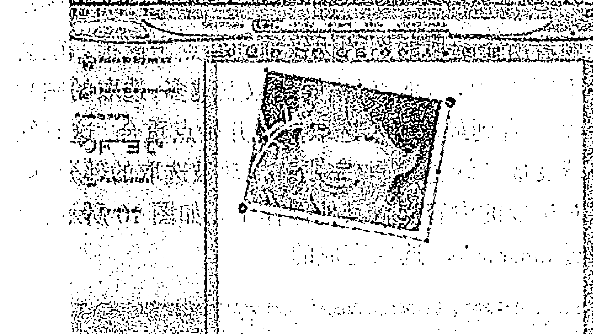

## (2) Trim

此工具可以修改图像的外形，当我们需要将一成不变的图像外形修改成自己想要的效果，Trim工具可以帮助你简单实现。当选中了该工具后，会在图片中增加一个外形边框轮廓（如图4）。可以通过放大、缩小轮廓来改变外形的大小。左边的Trim Share中显示出可供使用的外形库；Soft Edge是改变外形渐变度的。当我们需要在不改变原图的情况下，应用该工具新建一幅图片时，可以选中“Create A New Image”单选框。这样，当我们按下“Apply”按钮后，效果图会以新文件的方式产生。

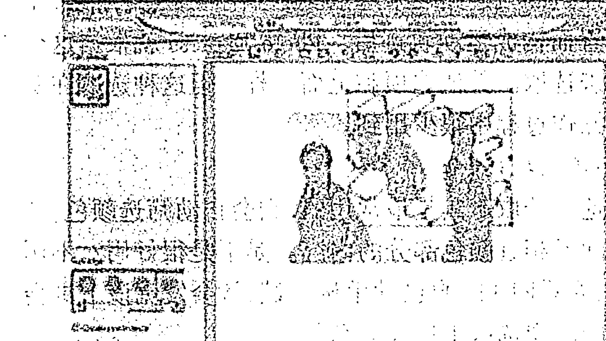

## (3) Resize

看到这条命令时，可能你会想起刚才介绍的“Rotate&Resize”命令，是不是重复了？不过这里的Resize并不是简单的放大或缩小。Ulead公司可能当初已经考虑到有不少用户需要根据自己的要求来精确定义图片的大小。所以在Photo Express 4中的Resize是精确改变图片大小的命令。在对话框的上部显示这些图片的属性（如图5），在改变大小对话框中提供了几种改变大小的方式，一种是标准模式，另一种是用户自定义大小，在自定义大小时，我们可以将“Keep Aspect Ratio”选上来保持纵横比。

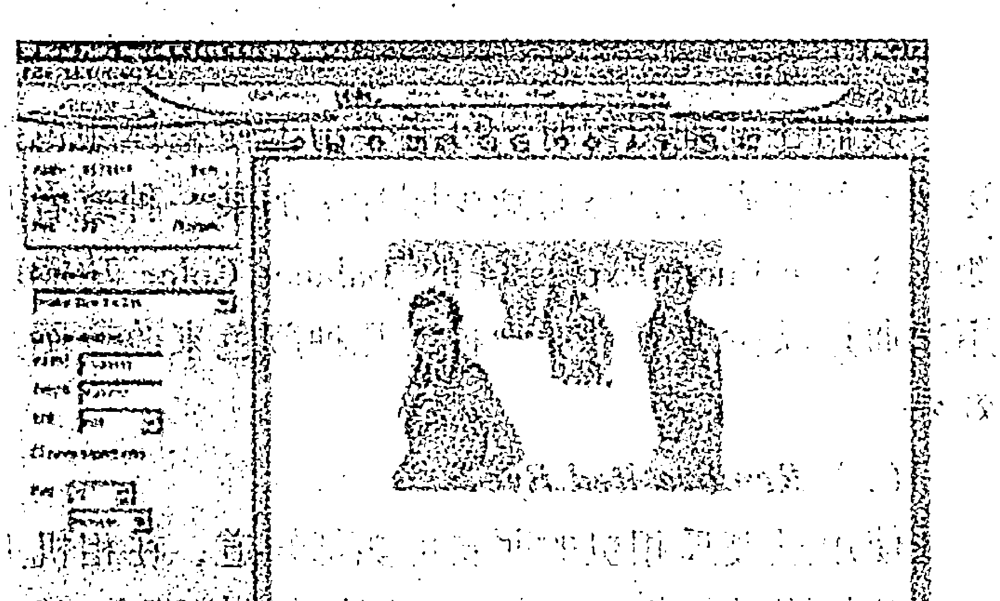

## (4) Focus

这一项是改变图片的焦点，当选中此命令后，我们可以通过点击“Advanced Mode”来进入高级模式设置对话框，通过拉动水平、垂直条来改变焦点的大小。另外在Preset Mode下，我们可以改变预览图的大小；点击“Preview Size”按钮，弹出改变预览图的窗口。在设定预览图窗口中提供了三种预览方式，第一种是整图预览、第二种是规定大小预览方式，我们可以通过拖动方框到合适位置，被方框圈住的图片内容可以预览到；还有一种就是自定义，我们只需确定预览图的任意两个对角就行了（如图6）。

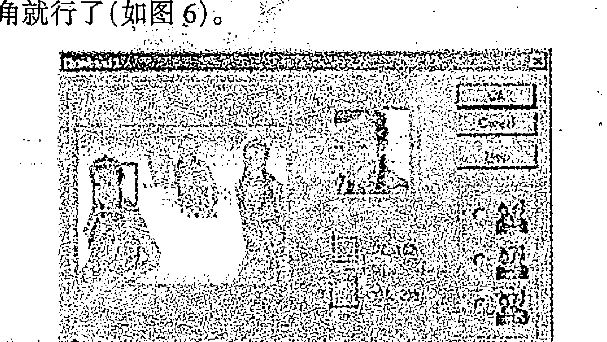

## (5) Lighting

这一项是改变图片的亮度，和上面的命令一样，进入高级模式可以微调图片亮度。我们可以通过改变明亮度、对比度来改变亮度。在高级模式对话框中，我们可以通过改变“Gamma”的值来改变单位大小（如图7）。

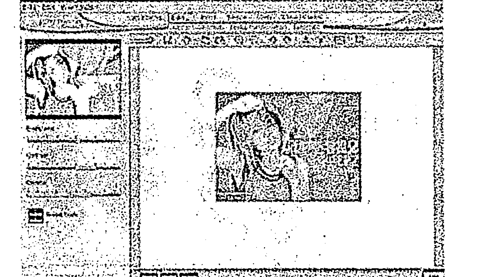

## (6) Balance Color

我们在处理图像时，可能会为了使整体颜色效果达到一种平衡的状态而减少图片中的某一种或者几种颜色。Ulead Photo Express 4 的“Balance Color”功能就是用来通过减少或者增加某种或几种颜色来改变图片的效果。

## (7) Remove Red Eye

使用过傻瓜相机的朋友可能都知道，在相机上有一种防红眼的按钮，只要在拍照的时候按下去，就可以防止拍出来的照片中眼睛中有红色。也许有人会问如果拍出来的照片的人物眼睛中已经有了红颜色的话，通过处理软件能不能去掉呢？不错，我们可以使用这个命令在对话框中改变刷子的大小，另外我们还可以通过这个命令来让图中的一种颜色转换为另一种颜色。我们可以使用自定义红眼颜色工具将图中的青色转换为白色(如图8)。

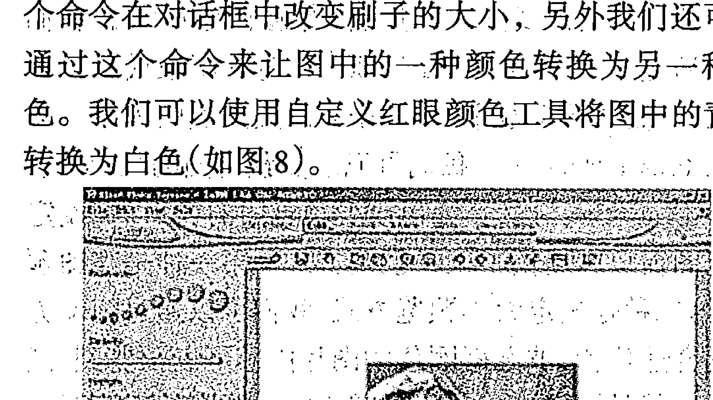

图 8 消除红眼效果

# 2. Selection 菜单

## (1) Share

是指根据外形选择。通过选定外形的样式来选择图片中的内容。选择模式提供了三个选项：“Create A New Selection”、“Add to a Selection”、“Subtract From The Selection”。外形提供了四种样式分别是:长方形、正方形、椭圆形和圆形。另外，还可以通过 Soft Edge 来改变边框的渐变度的大小。图 9 显示的就是通过外形选取制作出来的效果。

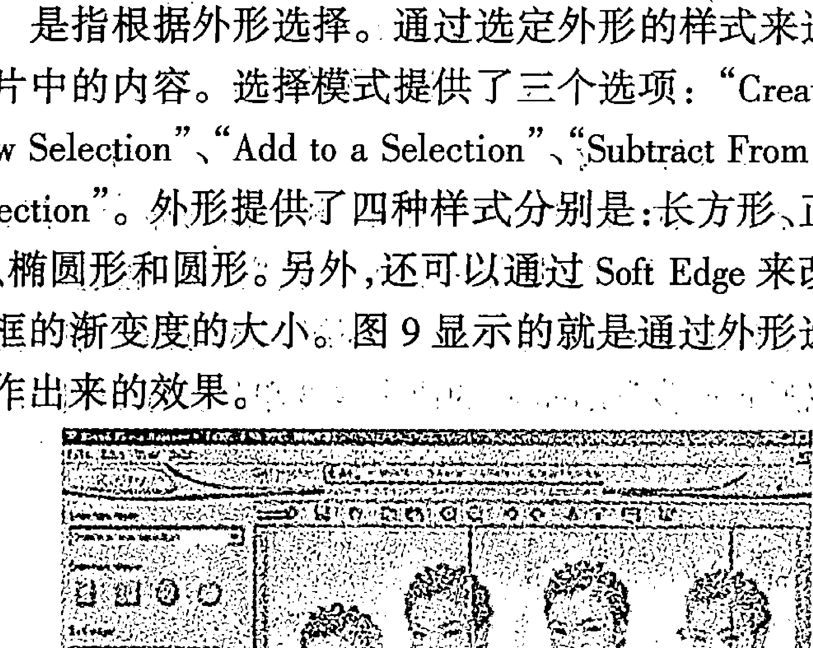

图 9 通过外形选取制作效果

## (2) Smartselect

与上面所不同的是，这一命令可以根据颜色来进行细微的选取。在图中第一下单击鼠标的地方为选取的开始点，这时在开始点的地方会出现一个红色小球。顺着所需选取的图的边缘拖动并点击鼠标，就会产生不同的中间选取点(中间选取点越多，选取的图片越准确)，直到最后一个选取点与开始点重合，这时红色小球变成了绿色，选取完成。拖动被选取的部分，就可以对选取的内容进行其他操作了。如图 10 所示，就是通过 Smartselect 选取完成的。

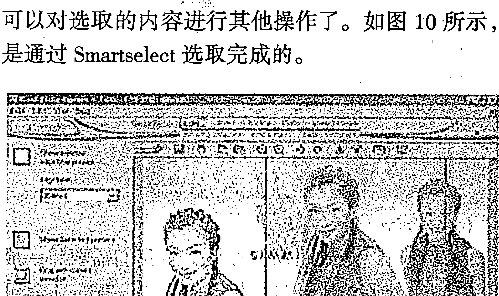

图 10 根据色彩细微选取

## (3) Trace

这个选取命令与上面两个又有所不同，它是根据鼠标经过的轨迹路径来选取。当鼠标在图像中经过不同位置而构成运动轨迹后，Photo Express 就根据这个轨迹来选取。其他选项和上面一样，但这种选取在实际的操作过程中很少用到。

## (4) By Color

这个选取工具是最常用的，它会自动筛选颜色，选取相同或相近颜色部分的内容。是不是很好用？不用说了，看看图 11。自己动手试一试，就会发觉该工具会使你的图像选取工作大大简化。

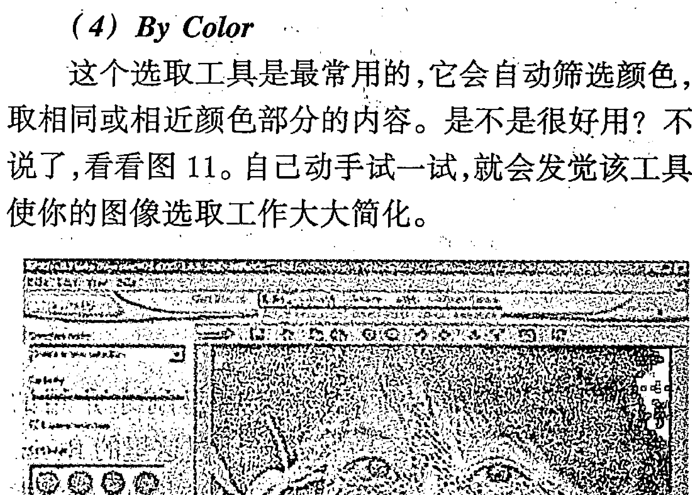

图 11 根据色彩进行选取

# 3. Text菜单

## (1) Add / Edit

指在图像中输入文本。在对话框中，上面是文本输入框，我们将需要输入的文字输入到文本框中；再看文本框下面的文本格式，一共有七个按钮，分别表示粗体、斜体、加下划线、文字靠左、居中、靠右、文字竖排。下面是字体下拉列表，当输入文本后，我们需要在字体下拉列表中为其选择合适的字体；接下来就是字体的颜色，有单一色、渐变色、材质等选项；在“Option”属性框中，有“Enter New Text”、“Update The Selected Text”两个选项，分别表示输入新文本和更新被选中的文本。当这些属性全部设置好后，按“Apply”按钮，就完成了文字的输入或者更新工作（如图12）。

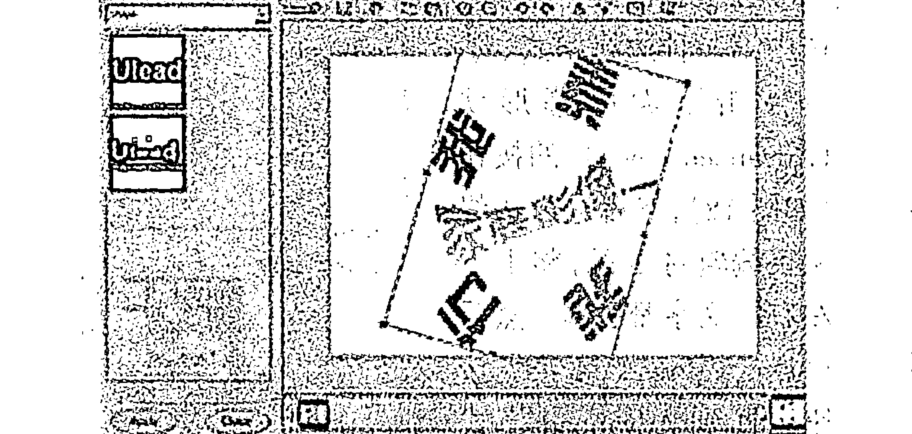

图12 利用文字输入工具输入文字

## (2) Reshape

此命令可以修改被选中文本的外形，当我们选中某文本后，执行了该命令，左边对话框部分就显示了外形库，双击合适的外形该文本就会引用被选择的外形样式。其实制作环绕或变形文字，使用该命令的确是个不错的主意。制作的效果如图13所示。

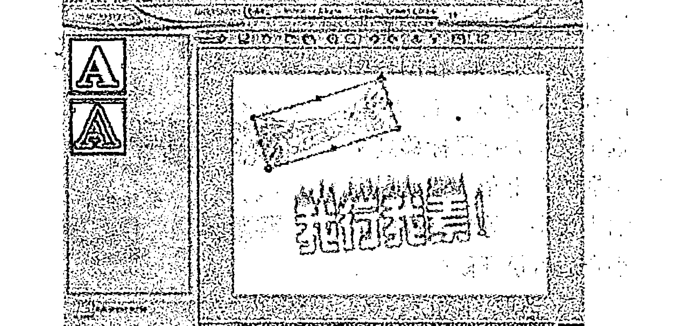

图13 制作特殊文字效果

## (3) Special F / X

这个工具提供了10种文字特效样式，只要我们选中需要套用特效的文本，然后执行相应命令就可以完成了。操作简单，效果惊人，一直也是Ulead公司产品受欢迎的最主要原因。

## (4) Shadow

这一工具是为文本增加阴影效果的，当执行该命令后，被选中的文本即增加了默认的阴影格式，我们可以在左边的对话框中进行参数设置从而改变阴影的效果（如图14）。“Color”是改变阴影颜色的，“Transparency”是改变阴影透明度的，“Soft Edge”是改变阴影边缘渐变度的。如果需要去除阴影的话，按一下上面的“Remove Shadow”按钮。

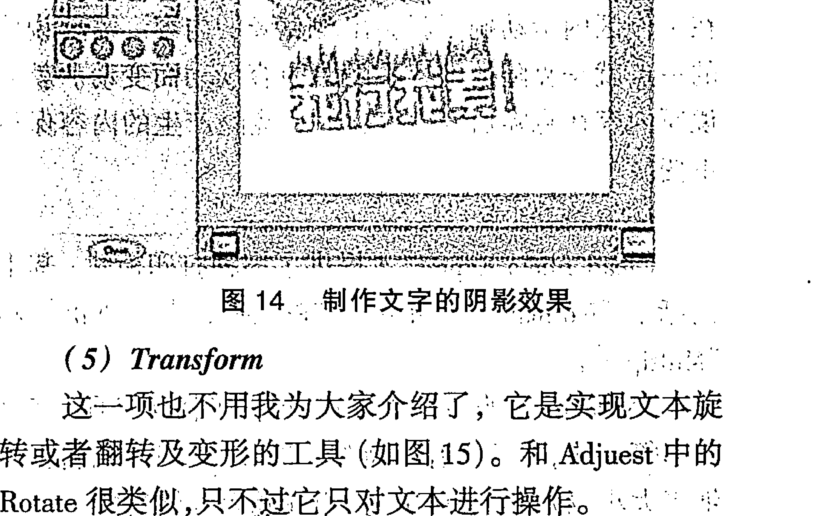

图14 制作文字的阴影效果

## (5) Transform

这一项也不用我为大家介绍了，它是实现文本旋转或者翻转及变形的工具（如图15）。和Adjust中的Rotate很类似，只不过它只对文本进行操作。

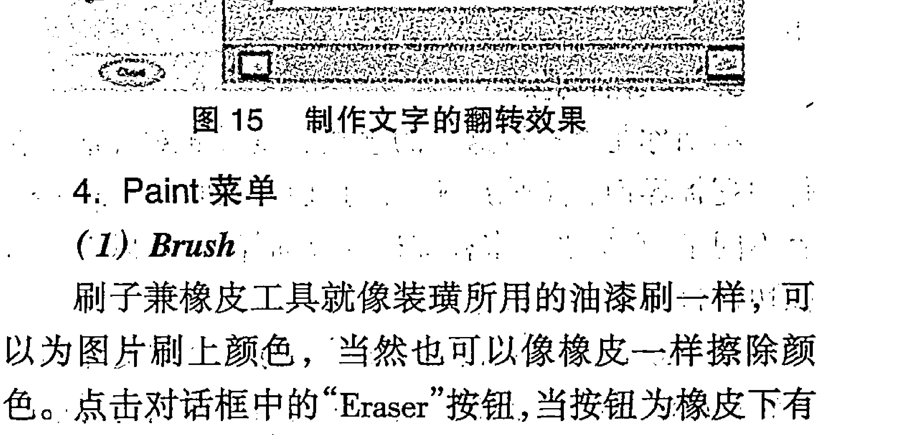

图15 制作文字的翻转效果

# 4. Paint菜单

## (1) Brush

刷子兼橡皮工具就像装潢所用的油漆刷一样，可以为图片刷上颜色，当然也可以像橡皮一样擦除颜色。点击对话框中的“Eraser”按钮，当按钮为橡皮下有颜色的图标时，表示该工具为橡皮擦，如果是只有橡皮擦没有颜色的图标时，表示该工具为刷子。图16中的背景颜色就是用刷子刷的，而背景的白色部分则是用橡皮擦成的。

## (2) Clone

就是在原图中克隆一个与被选目标一样的东西。当执行了该命令后，将目标瞄准器指向被选内容，然后在工作区内滑动刷子就会出现克隆的内容。需要说明的一点就是克隆的内容不随原内容变动而变动。就是说原内容在克隆后发生变化时，克隆产生的内容保持不变。

## (3) Paint 菜单

Ulead Photo Express 4 提供了多种打印模式，其中包括：“Normal”、“Tiled”、“Poster”、“T - Shift” 和 “Multiple”。
“Normal”为普通打印方式，提供了横竖打印、多页打印等功能，并且具有扩展整个图片，让图片充满整个纸张大小以及靠左、居中、打印标题等细微功能。
“Tiled”为平铺打印，它适合打印名片等，可以在一张纸中打印出多个图片。
“Poster”为海报打印方式，它可以将图片分割成多张打印，这种情况在打印特大图片时经常会用到。
“T - Shift”为翻转打印方式，它是将图片水平翻转打印出来，其他功能与“Normal”方式一样。
“Multiple”为多样化打印方式，它可以将图片按照多种模板方式打印出来，样式很多，大家可以试用一下。

# 5. 界面的切换

不知你是否有过这样的感觉，整天面对着常用软件的死板界面，特别沉闷。有了 Ulead Photo Express 4 就不同了，它提供了多种多样的界面样式，可以随心所欲切换自己喜欢的操作界面。
在 Photo Express 4 的工具栏中有一个改变界面的按钮（如图 17）。按下该按钮会弹出切换界面的对话窗口，“Preset Skin”提供了 10 种界面样式。“Background”可以改变背景，这里也有 12 种现成的样式供选择。换一个界面试试，是不是有了新的感觉。

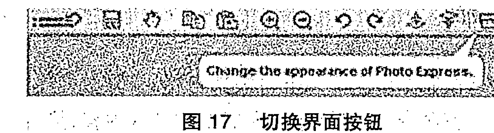

# 四、实例制作一：个人影像处理

用过 Photoshop 的朋友都知道，在 Photoshop 中可以借助各种滤镜工具和通道运算来制作出独特的图像和艺术字效果，但操作起来异常复杂，如果对 Photoshop 不是很熟悉的话，就要照着参考书提供的步骤一步一步来完成。Photoshop 没有提供一些图像特效和文字特效的确是一大遗憾，但 Ulead Photo Express 4 提供的图片和文字处理特效却可以完全满足一般用户的要求。下面我们就来看看应用多种特效处理一张图片的详细步骤：

- 1. 用 “File/Open/Open Photo”打开一图片。
- 2. 选取 “Edit/Decorate/Edges/Text” 工具，选中第一种边缘格式，然后点击下面屏幕形状 (Advanced mode) 的按钮（如图 18），然后进入边缘文字编辑对话框。将上下左右的文字都去掉，然后再点击 “Preset Mode” 按钮，回到 Advanced 模式中来，然后单击 “Apply” 按钮，引用效果。
- 3. 选取 “Edit/Text/Add/Edit”工具，在左边的对话框中输入文字（如图 19），并选择相应的字体和文本颜色，选中在 “Options” 属性框中的 “Enter New Text”，然后按 “Apply” 按钮，在图片中出现了刚才输入的文字，选中文字并把鼠标移到文字框的左上角，拉动鼠标缩小文字，等到字体的大小合适后松开鼠标。
- 4. 选取 “Edit/Text/Special F/X/Imprint” 文本特效样式，双击第二种应用文字效果。点击下面的 “Advanced Mode” 按钮，切换到 Advanced 模式（如图 20），设置相应的参数，按下 “Apply” 按钮。
- 5. 选取 “Edit/Effect/Particle/Firefly” 图像特效样式，同样将对话框切换到 Advanced 模式，可以通过“Amount”、“Size”、“Adjust Firefly Color”来改变渲染物的数量、大小和颜色等。设置完成后按“Apply”按钮，这样一个简单的图片处理就完成了；效果如图21所示。

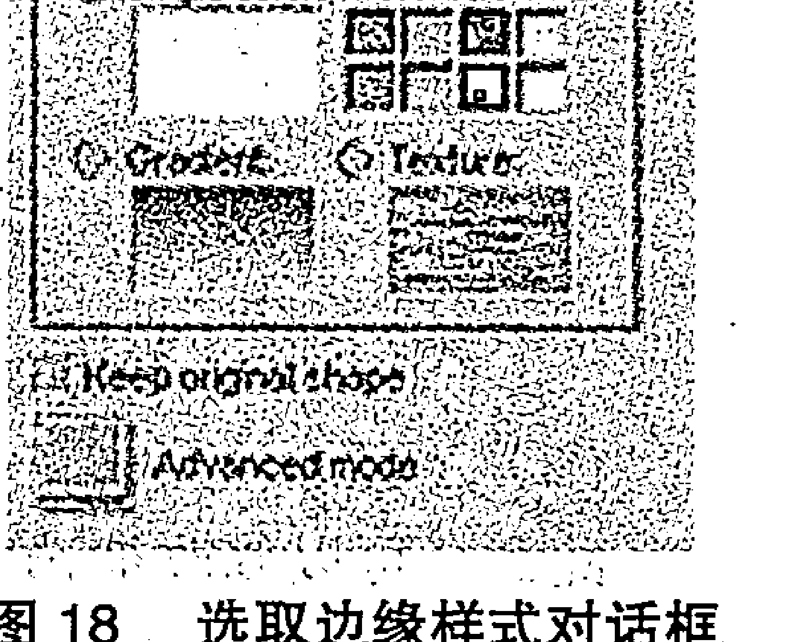

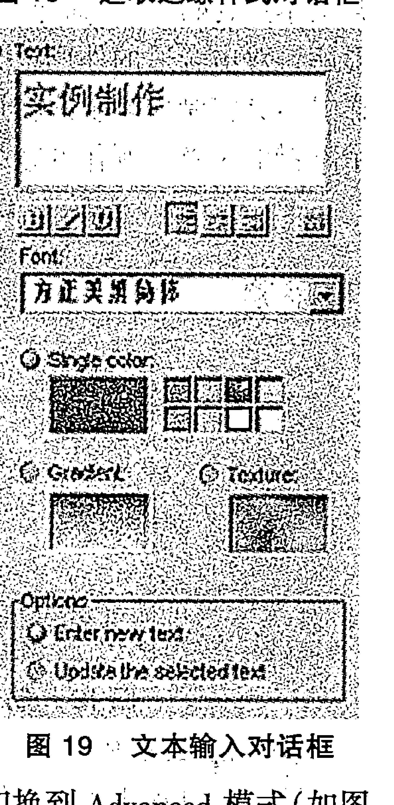

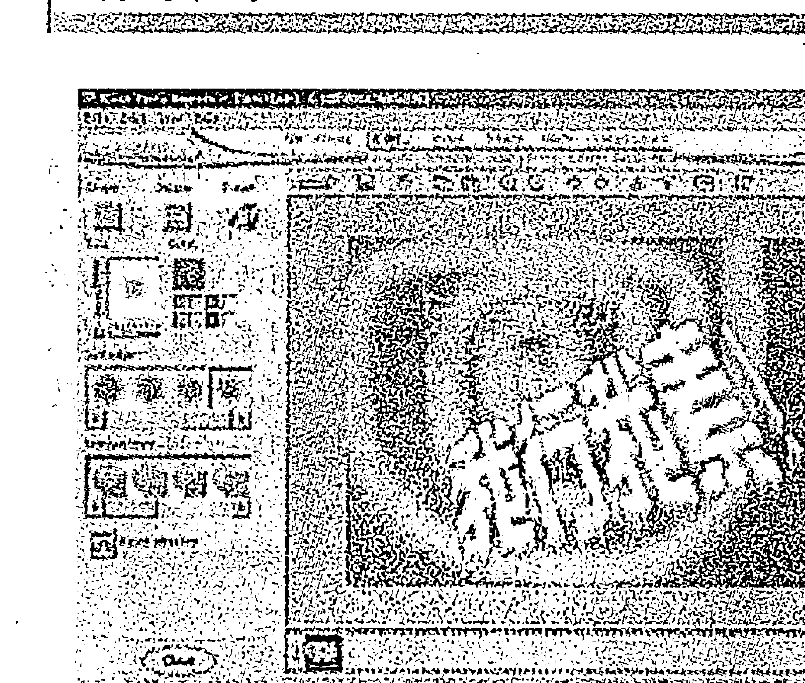

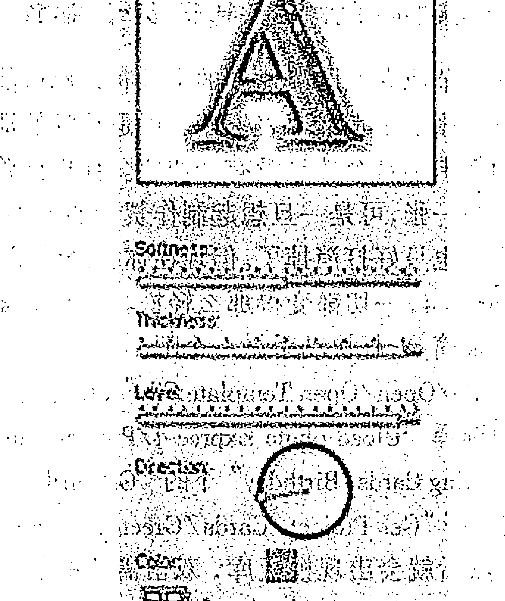


# 五、实例制作二：日历的制作实例

上例中我们利用了 Ulead Photo Express 4 自带的文本和图像特效样式完成了简单的图片处理效果，下面我们再引用上面完成的图像来制作一个日历，详细步骤如下：

- 1. 继续上面的步骤，选取“Edit/Share/Calendar”工具，选择“Calendar Type”为“One Week”由于我们刚才制作的图片是较宽的，我们将“Orientation”设置为横向，然后再选择一种日历样式，单击“Next”按钮。
- 2. 接下来出现的是年月日的范围选择和日历上的日期语言，选择好后再按“Next”按钮。
- 3. 这时出现的对话框包括了“Add/Edit Text”、“Change Background Image”、“Add Year String”、“Add Date Table”和“Change Date Attributes”等选项，它们可以实现在日历中加入文本、改变日历的背景图片、加上年文字、加上日文字、改变日文字串的相应属性等功能。选择合适的参数后，日历就已经制作完成了效果如图 22 所示。如果我们还需要继续上面步骤的设置，可以按左箭头按钮，如果需要保存、打印、设置为壁纸及将此日历样式保存为模板的话，按“Next”按钮就可以出现相应的输出对话框。

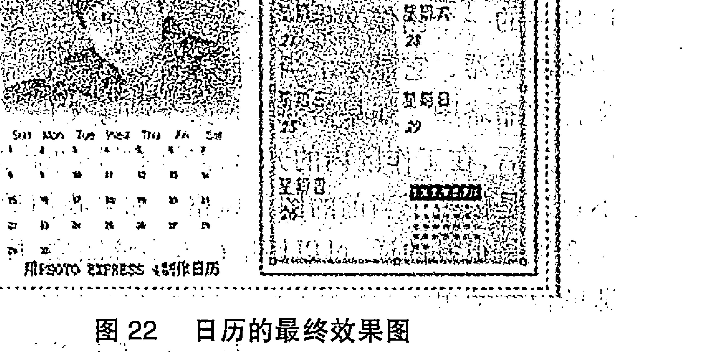

# 六、实例制作三：CD 标签的制作

大家都会感觉到，家中的 CD、VCD、软件光盘等好多的光盘放在一起，找的时候非常麻烦，有没有想过为这些光盘做个标签，然后贴在上面，这样会大大方便查找。很多朋友都在为制作有个性的 CD 标签伤透脑筋，其实如果选择了 Ulead Photo Express 4 的话，就不必再为这些小事情伤脑筋了。下面，我们就来看看如何利用 Ulead Photo Express 4 提供的 CD 标签样板制作极具个性的 CD 标签。

- 1. 这一步是新建 CD 标签的步骤（如果我们调用模板的话，这一步这可以省略了，请直接到第二步）。选取“File/New/New Template”，然后将“Images Size”设置为“CD Label 4*4 in”，然后按“OK”按钮。在这里，还可以设置图像的背景颜色，可以点击“Canvas”方框，在弹出的颜色框中选择合适的颜色。另外，也可以自定义图像的大小（如图 23）。
- 2. 选取“File/Open/Open Template File”，在弹出的路径对话框中，选择 “Ulead Photo Express 4/Project Category/Stationery/Labels/Cd Labels”下的“LbCv_general01b.TPX”文件。
- 3. 这样，就打开了一个类似光盘的图像文件，接下来我们就可以改变图像中的文本和图像，从而达到自己需要的效果。选中需要改变的图像，点击图像的图标，在弹出的菜单中选择图像文件的来源（如图 24所示)，这里提供的来源方式有从数码相机、扫描仪、视频捕捉或者本地计算机内等，我们可以选择本地计算机地址中的一个图像文件。这时，左边的对话框变成了图像浏览器，它显示了当前计算机选中目录中的图像文件的缩略图，如果需要选择某个图像文件，双击即可。然后，在工作区内的光盘标签内的图像将被替换，不过还是保持了当前的图片风格。如果我们觉得图像位置不是很好的话，可以用鼠标点中该图像，拖动到合适的位置即可。
- 4. 另外对光盘标签中的文本也可以进行改写。双击模板中的文本，左边对话框栏中即显示出该文本对象的对话框，在文本输入框内改写文本。另外还可以改变字体、颜色及大小(如图25所示)。
- 5. 接下来的工作就是打印和保存了，这一步可以参考上面的教程中得到启示，这里就不再赘述了。

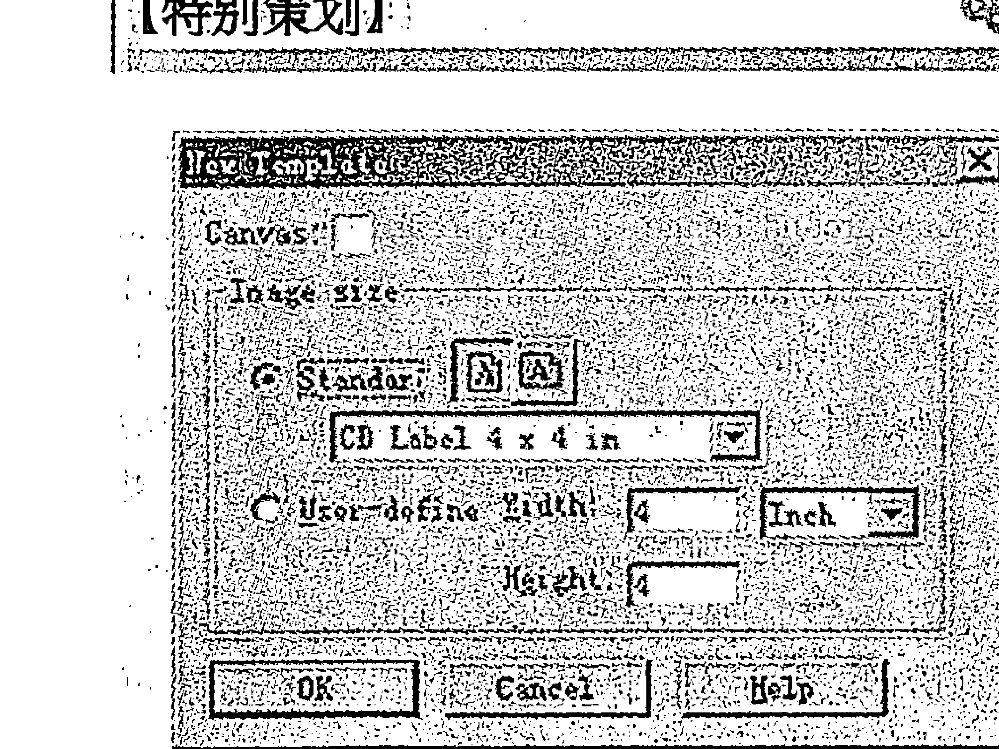

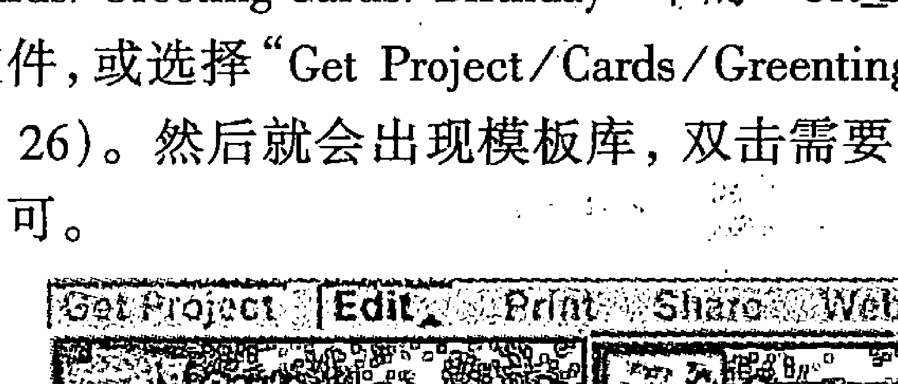

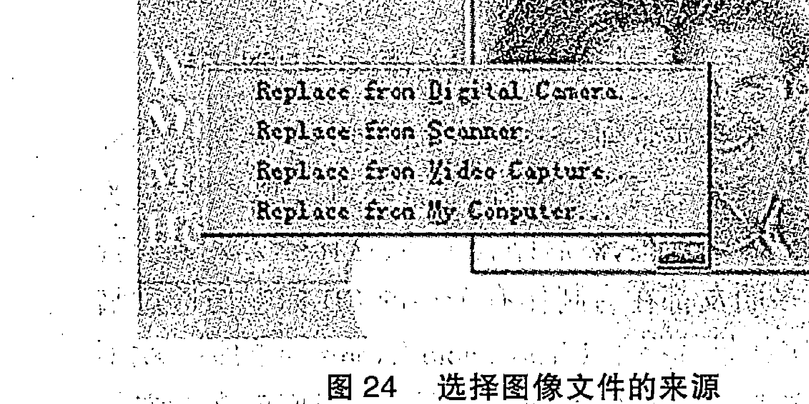

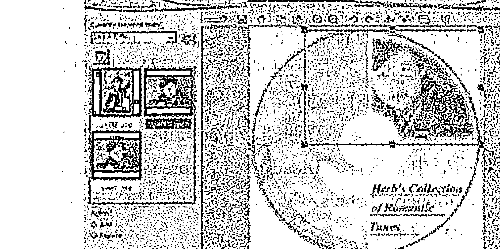

# 七、实例制作四：电子贺卡制作

每逢佳节或者亲朋好友们的生日时，你可能想起给他们发一张电子贺卡以表祝贺，可是总觉得那些网站提供的贺卡不具个性且没有亲切感。你也许曾想过自己动手做一张，可是一旦想起制作贺卡的繁琐步骤，所有的念头也只好打消掉了。但现在你已经装了 Ulead Photo Express 4，一切都变得那么轻松。看看下面的步骤是不是很简单，赶快动手做一个吧。

- 1. “File/Open/Open Template File”，在弹出的路径对话框中选择“Ulead Photo Express 4/Project Category/Cards/Greeting Cards/Birthday”下的“Grt_birth07.TPX”文件，或选择“Get Project/Cards/Greeting Cards”（如图26）。然后就会出现模板库，双击需要的贺卡模板即可。
- 2. 和制作光盘标签一样，我们可以更换贺卡上的任何图片，选中需要更换的图片，单击一下，在弹出菜单中选择替换文件的来源，我们可以选择图像的来源路径有数码相机、扫描仪、视频捕捉仪和本地计算机硬盘等。当确认选择后，左边的对话框中会出现相应的对话框。选择本地计算机硬盘，在左边出现对话框的下拉框中选取相应的文件目录。如果此目录下包含有图片文件的话，会在下拉框的下面显示出这些图片文件的缩略图。
- 3. 双击需要选中图片文件的缩略图，这时此图片文件就替换了模板中的图片。在缩略图下方有两个单选项：“Add”和“Replace”，它们分别表示在目标中新增加一个图片，还是替换原图片。如果我们刚才在上面的操作中选择了Add的话，就会在贺卡中新增加一个图片。替换了模板中的图片后，我们会看到刚才替换的图片继承了原模板中图片的风格，四周引用了渐变效果。由于替换后图片的色彩度与贺卡的整体主色调不是很协调；看上去有种别扭的感觉。其实，不用为这点小问题着急，Ulead Photo Express 已经为我们考虑到了。选中该图片，单击鼠标右键，选择“Transparency”选项，这时出现了菜单的下级选项，这些选项就是目标效果图的缩略图(如图27所示)。


## 八、实例制作五：GIF 动画制作

选取相应的效果后，目标马上就会引用该效果。这一个选项主要是调节色彩的亮度以达到让整体色彩效果平衡的目的。

3. 选中贺卡中的文字双击，在左边显示出该文本相应的对话框，重新输入其他文本。当然，我们也可以改变其文本的字体、颜色，并设置文字的横排竖排、靠左、居中、靠右等属性。如果想在目标中增加新文本，我们可以选定对话框下面的 Option 选项。“Enter New Text”表示添加新文本，“Update The Select Text”表示用当前设定的文本更改原来选定的文本（如图28所示）。

如果我们只是需要在贺卡上新增加文本的话，还可以利用“Edit/Text/Add/Edit”来增加新文本，并且可以利用字体的修饰效果来改变文本的效果，以达到最佳状态。

4. 电子贺卡制作好了，如果想亲手将你制作好的贺卡交给对方，可以将它们打印出来。如果对方有“Email”的话就更好了，选取“Share/Email”，左边的对话框会变成了图29所示一样。

示标准的大小，我们选择“800 * 600 in pixels”表示用800 * 600的分辨率来显示。在“Quality”下拉列表中列举了三种图片质量选项，分别是“Best”、“Good”、“Fair”三种。不同的质量，图片的体积大小也不同。当然如果愿意牺牲体积，图片的质量自然就会好得多。

5. 全部设置完后，点击“Send”按钮，这样就调用了系统默认邮件软件如 Outlook Express，并新建了一封邮件，我们只需在邮件的收件人地址栏中写入收件人地址，邮件就可以发送了，是不是很简单。当你的亲朋好友们收到你亲手制作的贺卡后一定会为之兴奋。图30就是本例中制作的电子贺卡，看看效果。

从上面介绍的功能可以看得出 Ulead Express 4 不仅包含了家庭影像系统的全部功能之外，而且也具有部分专业图像处理软件所不具备的额外功能。作为一款专业的家庭影像处理软件，Ulead Express 4 得到了众多家庭用户的青睐，但 Ulead Express 4 提供的 GIF 动画的制作和输出也得到了较多的专业用户的使用。下面介绍一下利用 Ulead Express 4 提供的 GIF 动画模板制作的几款不同风格的 GIF 动画。

### 1. 万花筒

- (1) 当选用 Ulead Express 4 打开的一个新图片文件或者在“Browser”状态下选中一个图片文件后，选取“Web/Kaleidoscope”命令，这样对话框栏即显示出当前支持的万花筒效果的库。我们选取其中的一种效果后，点击“Advanced Mode”进入高级模式设置对话框或者按“Next”按钮。

- (2) 进入了高级模式后，我们可以看到左边的对话框中包含了“Type”、“Adjust Pattern”、“Preview”三部分。“Type”选项框中提供了多种花纹供用户选择，每一种不同的旋转花纹对应着不同的效果。我们可以选择其中的任一种花纹效果。“Adjust Pattern”是让用户自行调整样式的。我们可以利用旋转、放大、缩小旋转和固定范围以产生不同的效果。“Preview”显示当前效果的动态效果图。在对话框中还提供了“Preview in the Workspace”按钮，这个按钮的作用是让工作区中的图片应用刚才设置的效果（如图31）。

烟花效果的样式库。烟花效果是我们经常使用的一种动态特殊效果，它的效果很像放烟花，可以使你的图片效果更加绚丽。选中样式库中的任一个烟花效果后，按“Next”按钮，就可以输出效果图了（如图33）。

（2）输出步骤和上面万花筒的输出是完全一样的，读者可以参照上文。

（3）效果设置好后，按“Next”按钮。这时，在左边的对话框中出现了两个选项：“Gif animation file”和“Output to a web page”。前一选项是将该动态图片效果存为 GIF 动画文件，后一项是将该动态图片效果应用到网页中。当我们选中“Gif animation file”后，弹出了如图32所示的对话框。在对话框中的 Output Options 中，我们可以设置动态 GIF 的帧数。拖动标记或者在文本框中直接输入，将 GIF 文件的帧数设置为10帧。Dimension 选项可以改变输入的 GIF 文件的大小，在下拉列表中列出了“320*320”、“240*240”、“160*160”、“80*80”和“48*48”等五种规格，选择其中一种规格后，如果点击 Preview 按钮后，Ulead Express 4 就会调用相应的图片预览软件来显示出该规格的实际大小及动态效果。这样我们可以根据预览的实际大小和效果来确定是否存盘。在文件名文本框中输入需要将该图片效果保存的文件名称后，按“保存”按钮就完成了 GIF 动画的保存。如果我们选择了“Output to a web page”后，打开的将是 Ulead Express 4 中的 Webpage 对话框，它会自动将刚才制作的动态图片应用到网页中去。然后，我们还可以将该网页保存、用 EMAIL 发送出去或上传到网络上。

### 2. 烟花飞舞

（1）和上例一样，打开或者选中一个图片文件，然后执行“Web/Fireworks”命令，弹出对话框中即显示出所有

### 3. 魔方体

Ulead Express 4 提供的这三种动态效果中，要算“Magic Cube”最酷了，笔者的个人主页的首页就是利用该效果制作出来的，赶快来看看制作方法。

- （1）打开或者选中一个图片文件，然后执行“Web/Magic Cube”命令。左边的对话框立即显示出该效果所包括的样式库，选中其中的一种效果后，按“Advanced Mode”进入高级模式设置对话框。

- （2）在高级模式对话框中，我们可以看到好几个选项。其中“Border”是改变魔方体每小块之间的边框线粗细程度的。向右、向左拖动滚动标记可以增大、减少粗细程度。“Apply color tint”是改变魔方体不同面上的颜色，如果该选项被选中，我们就能看到魔方体的各个面上的颜色是不同的，通过图与图中的目标效果我们就可以看得出，“Border color”是改变边框线颜色的，我们选择“黑色”；“Transparent Background Color”是用来选择背景颜色为透明色，如果该选项未被选中的话，下面将会出现一个“Background Color”选项，用户就可以自定义背景颜色了。定义好上面的选项后，按“Next”按钮。

- （3）输出方法与上面的两个例子同样，这里就不一一赘述了。

## 九、实例制作六：礼品盒的制作

不知您有没有这样的经历，当为自己的好朋友或者亲人准备好生日礼物后，又开始为没有一个个性的礼品盒而烦恼。如果你有过这样的经历或者你也正想自己动手做一个很具个性的礼品盒的话，请跟我来吧，有了 Ulead Express 4 一切将变得非常简单（我可不是在为 Ulead 公司做广告呀）。

- 1. 选取“File/Open/Open Template File”打开模板文件。在文件选取对话框中选择 Ulead Express 4 目录中的“Project Category/3D Folding Projects/3D Gift Boxes/3DPj_box05.tpx”文件。即打开了礼品盒模板文件，因为制作礼品盒可以说是对 Ulead Express 4 的一种高级应用，我们只对修改礼品盒模板制作以及自己所需要的礼品盒的方法做一下介绍，并未真正涉及到自己制作礼品盒的全过程。

2. 我们可以看得出，工作区中的图片实际就是一个礼品盒的平铺图（如图35）。

3. 双击图中的“Sweet Gift”文本，对话框即变成了文本修改对话框，将文本输入框中的文本换成我们所要输入的文本，如“生日快乐”，当然我们也可以修改其文本字体、颜色等属性，完成后按“Apply”按钮。如果需要在图片中新建文本的话，可以利用“Edit/Text/Add/Edit”来加入。如：我们在文本输入框中输入“父亲节快乐！”，然后将文本的文字设置为“黑体”，颜色设置为“黑色”，将 Option 选项设置为“Enter New Text”，按“Apply”按钮。这时，在工作区中就增加了刚才输入的文本，拖动文本框的左上角或右下角来改变文本的大小，拖动文本框的左下角或右上角来旋转文本。另外可以用“Edit/Text/Shadow”来为文本增加阴影效果。

4. 这样我们就可以输出刚才制作的礼品盒了，选取“Print/Normal”，在打印对话框中选择合适的打印机和相应的纸张，设置为横向打印，取消打印标题选项，选中“Fit image to page”，将图片扩展到整个纸张。这里有一个小技巧：如果将纸张定义为较大的纸张后，选中“Fit image to page”选项，这样就可以将礼品盒放大打印了，同时，打印出来的礼品盒就比原制作实物大的多了。设置好后，按“Print”按钮，打印图片（如图36）。

5. 我们知道打印出来的礼品盒还需要经过裁剪、粘合才能搭建成真正的礼品盒。相信这一步的工作就不用我再介绍了。动手实践一下，你会从中得到无穷的乐趣的。

## 十、总结

通过上面对几个实例的制作过程的分析，我们可以看得出，制作个人影集或者制作日历是多么简单的事情。“我形我素”这个光彩夺目的软件可以让你以极其超凡的创造力来设计亲友的相片，Photo Express 4 这个顶尖级的工具可以化腐朽为神奇，将平凡的相片变成高雅的艺术佳作，给平淡乏味的相片带来无限生机。而且它的功能远远不止这些，借助其中的导向流程和直观的用户界面，可以不费吹灰之力便可以创作出极具个性魅力的生日卡、网页特效动画、CD 标签、礼品盒以及海报等。不过话又说回来了，对于高级用户来说，这些功能还是不满足他们要好。对于大部分用户来说，Photo Express 4 的功能已经足够复杂，效果已经足够完美，当初 Ulead 公司为其取了“我形我素”这个中文名，也就是针对家族影像用户来说的，他们的目标就是让广大的家庭用户自己也能制作出非常满意的家族影像，也能彻底地“我形我素”一回。

## WEB图形处理专家

## Ulead SmartSaver Pro 3.0 秘籍点点通

自打上次网络图形界华山论剑以来，江湖一直归于平静。可最近，友立派的 SmartSaver Pro 3.0 却因高超的技巧而出尽风头，大有向盟主看齐的势头，长江后浪推前浪固然是好事，但各位前辈也不可不防啊。好在织秋一叶聪明又不乏胆识，冒着天大的危险得来了 Ulead SmartSaver Pro 3.0 的武功秘籍（老外叫技术内幕的那种），情愿无偿与各位分享，唯一的条件就是您看完之后，别忘了自己的感受告诉十个不同的朋友，这样，您将收到一份来自织秋一叶的遥远的祝福。

说起这个友立派，最早成立于上个世纪的80年代末，在图形、图像和视频软件领域都有着可圈可点的记录。SmartSaver Pro 作为其在图形处理方面的看家功夫之一，经过一次次的改进，功能一再加强，现在已经达到了3.0版本，除了提供图片和动画文件减肥的功能外，还针对网页图形的处理加入了许多好用的功能，譬如 Image Map 影像地图、图片剪裁、图片平均分割、HTML 原始码输出、批量处理、JavaScript Rollover、JPEG/GIF/PNG 格式间转换和背景透明处理等等（如数家珍噢），而且还可外挂于 Photoshop 和 PhotoImpact 使用。正如权威的 Shutterbug 杂志在1999年10月评说的一样：“在 Windows 计算机上为 Internet（包括电子邮件）准备图像的最佳方法是使用「友立资讯」的‘SmartSaver’。”

SmartSaver Pro 的奇妙之处举不胜举，下面就请各位系好安全带，我将带领大家进入 SmartSaver Pro 的奇妙世界。

SmartSaver Pro 对于硬件的要求并不是很高，相信您机器的配置已经完全能够满足这些最基本的条件。好啦，万事俱备，至于安装程序嘛，可以在配套光盘的精品软吧中找到，这可是免费的午餐噢（尽管只能用15天，15天后，您也可以再想办法避免时间限制的困扰）。安装程序是一个自动解压的程序，双击它就可以安装 Ulead SmartSaver Pro 3.0 试用版软件了。在安装的过程中，您可以选择是否在 Photoshop 和 PhotoImpact 中安装外挂插件，如果不想安装，就点击 ignore (忽略)按钮，如果要安装的话，得手工在 Photoshop 或 PhotoImpact 的根目录下建立 Plugins 文件夹，点击 Next (下一步)按钮就可以了。

## 一、SmartSaver Pro 3.0 外观

执行 Ulead SmartSaver Pro 3.0 程序后，就可以进入它的主界面，在未打开任何文件时，很多工具是灰色的，为了便于讲解，选择“文件 > 打开”命令，打开一幅图片，这样工具和大家的眼睛都变亮了！

- 1. 菜单条：菜单条中包括文件，编辑，查看，格式，帮助五个菜单命令。点击相应的菜单名称，就可以选择它们包含的命令。比如要打开一个文件，在文件菜单就有四个命令可以选择：打开、可视化打开、从剪贴板打开，重新打开。值得一提的是选择“可视化打开”命令将打开“可视化打开”对话框，该对话框左边的部分有层次地显示了硬盘中的文件夹，选中某个文件夹以后，右边的部分就会显示其中的图片，这样就可以有选择地打开某个图形文件了。而“从剪贴板打开”用于打开一幅当前存储在剪贴板中的图片。“重新打开”将把当前正在编辑的图形文件重新放入工作区，执行这个命令之后，您对这个图形所做的任何编辑将会消失。

### 2. 标准工具栏:

菜单条下排列的是标准工具栏，其中包括了许多经常用到的菜单命令的快捷工具，比如打开文件，就可以点击 📂 图标。在主界面窗口中，工具条可以垂直和水平地拉伸，也可以将它随意拖动，使它浮动在用户界面上。

### 3. 工具栏:

工具栏一般在界面的最左边，其中包括了在切割、JavaScript、图像映射和优化工作区中要用到的工具。根据您正在使用的工作区，不同的工具的可用性是不同的，当然，如果某个工具是灰色的，那就代表它在当前面板中是不可用的。在主界面窗口中，工具条可以垂直和水平地拉伸，也可以将它随意拖动，使它浮动在用户界面上。要想知道某个工具的名称，只要将鼠标停留在该工具的图标上，该工具的名称就会自动出现。

### 4. 工作区:

在界面正中央的就是工作区，它包括五个选择模式按钮和一个编辑窗口，当您点击其中的任一选择模式按钮时，编辑窗口和属性面板就会根据您选择的模式而做相应的变化，而您在其他模式中做的编辑工作将随之而来新的模式中，不会丢失。

- (1) 切割模式: 将图像分割成多个部分，这样可以使图片所在网页的下载速度加快，当经过剪切的图片放入网页的时候，Ulead SmartSaver Pro 3.0 将会自动产生对应的表格代码。

- (2) JavaScript 模式: 可以产生富有吸引力的 JavaScript 翻转事件代码，利用这个特点，您不需要书写一行代码就可以得到满意的效果。

- (3) 图像映射模式: 运用该模式中的图像映射工具可以在图片中创建用户可以点击的热点区域，您可以用任何一个形状工具来产生热点，也可以引入遮罩在图片的某部分自动产生热点区域。

- (4) 优化模式: Ulead SmartSaver Pro 3.0 在保存文件时会尽量地压缩图形文件而又不牺牲图像品质。优化模式将以当前最常用的三种网络图像格式（GIF、JPG 和 PNG）来保存文件。在这种模式中，工作区被分成两部分，左边的是源图像文件、单元格或帧，右边是应用了优化选项的图像、单元格或帧。

- (5) 预览模式: 当您用的是 Windows 98 操作系统和 Internet Explorer 3 以上版本的浏览器时，该模式才会有用。在该模式下可以直接在 SmartSaver Pro 的窗口中预览图像放在网页中的综合情况。

- (6) 工作区属性面板: 不同的工作模式对应不同的属性面板，当您切换工作模式时，对应的属性面板也会做对应的切换。

- (7) 切割属性面板: 切割属性面板使您可以控制特定的切割图形单元格所对应的 HTML 标记，切割过的单元格可以产生影像地图的热点区域。

- (8) JavaScript 属性面板: JavaScript 属性面板使您可以获取切割过的图像单元并给它指定翻转图像。通过这个面板，也可以控制特定的切割图形单元格所对应的 HTML 标记。

- (9) 图像映射属性面板: 图像映射属性面板使得您可以控制图像内某个热点区域所对应的 HTML 标记，热点可以映射到被切割的单元格中。

- (10) 优化属性面板: 优化属性面板使得您可以控制当前图形文件的格式，可以进行设置的格式有三种: JPG、GIF 和 PNG。

- (11) 帧和单元格属性面板: 帧和单元格属性面板中存储了当前图形文件的所有帧和单元格的信息，根据您正在使用的工作区，不同的属性面板的可用性是不同的。

- (12) 帧属性面板: 显示了当前正在编辑的帧的详细信息，如果您正在制作 GIF 动画文件，这个面板是非常有用的。您可以通过下拉列表或滚动按钮来选择不同的帧。

- (13) 单元格属性面板: 显示了被切割的图像中包含的所有单元格，并且高亮显示当前选中的单元格，可以通过点击面板中的某个单元格名称选中它；也可以点击工作区中某个单元格来直接选中它。

- (14) JavaScript 面板: JavaScript 面板控制了 JavaScript 翻转事件的产生，当工作区是 JavaScript 模式时该面板才会有效。

- (15) 调色板: 在进行 GIF 和 PNG 格式优化时，调色板中存储了所有可用的色彩，鼠标移过图像中的任意位置时，都可以在调色板中看到与之相关的 RGB 色彩信息；同时还有一系列可以用来编辑、排列和保存调色板色彩的工具。

### 5. 状态栏:

状态栏在主界面窗口的最下方，这里显示了正在 SmartSaver 中进行的项目信息。

好啦，介绍完 Ulead SmartSaver Pro 3.0 的外观界面，有没有觉得它比想象中设计的更方便周到啊？使用这些面板，将会给您的 Web 图形设计带来前所未有的轻爽感受！如果您觉得哪个面板碍眼的话，可以点击其左上方的小叉叉关掉它，要它出现的时候只要执行“查看 > 工具栏及面板”命令，在随后出现的选项前打上勾就可以啦，很 Easy 的。

## 二、强大的 Web 图像制作

了解了 Ulead SmartSaver Pro 3.0 炫目的外观以后，您是否已经摩拳擦掌，跃跃欲试了呢（要得就是这种求知的感觉啊）！不过 Ulead SmartSaver Pro 3.0 可谓身怀诸多绝技，先介绍哪一个可叫织秋一叶犯难了。作为网络图形处理软件，还是先讲它强大的 Web 图像制作功能吧。

利用 Ulead SmartSaver Pro 3.0 的图像制作功能，可以进行：

- （1）精确的图像分割——使用分割工具创建复杂的表格。
- （2）单元格图像替换——方便地合并静态图像和动画。
- （3）背景色和图像——为单元格或表格背景指定色彩或图像。
- （4）动画控制——更改动画设置。

### 1. WEB 图像分割

您在网页上放置大型图像时，图像分割通常是将大型图像分割成多个部分的便捷方法。这未必会使这些图像下载得更快（可能适得其反，有待争议），但可以使场景便于显示。实际上，较小的图像块通常最先显示，这样就可以较快地预览到图像（或至少是图像的一部分），显然比仅用一个大型图像要好。它的优点是还可以在图像指定的位置上创建 mouseover（mouseover 是指当鼠标移到图像上时，发生相应的事件）。利用 Ulead SmartSaver Pro 3.0，无论是静态图片还是 GIF 动画图像都可以轻松进行精密切割。

下面来制作一幅冠亚季军的热点介绍图片，点击图片上代表冠亚季军位置的部分就可以进入相应的详细情况介绍页面。

- （1）打开一幅待切割的图片。
- （2）点击工作区中的切割模式标签按钮 "Slice"（或按下 F3 快捷键）切换到切割模式。
- （3）在工具栏中点击添加切割线按钮，在工作区编辑窗口中，待鼠标变成[切割线图标]形状后，沿着准备要分割的路径画分割线，这样就分出了单元格，可以通过鼠标拖动分割线来改变单元格的位置。

注意：如果对某条分割线不满意，可以通过点击工具箱上的擦除切割线按钮 [擦除切割线图标]，在您要擦除的切割线上点击一下，要清除全部分割线，可以通过点击属性面板上的“清除所有分割线”按钮 [清除按钮图标]来擦除所有的分割线。

- （4）点击工具箱上的吸管按钮 [吸管图标]（在切割模式、JavaScript 模式或图像映射模式下，该工具可以让您选中某个切割线或图像映射区域），在代表冠军的单元格中点一下，可以发现它周围的切割线高亮显示，说明该单元格被选中了，这时，下面的属性面板也发生了相应的变化。
- （5）在该单元格属性面板中设置优化值为 JPEG Q75 Progressive，URL 为 http://www.Champion.com，目标为 _blank，Alt 属性为 champion。

注意：切割模式工作区属性面板使您能够控制切割后的某个单元格的 HTML 标签。可以通过切割后的单元格创建影像地图热点区域。

这些标签是：

- ① 优化：指定这个单元格通过 SmartSave 优化时的默认图像格式，有 GIF、JPG 和 PNG 三个选项可供选择，可以通过按下代表它们的选项按钮，也可以从下拉列表中选择优化的预设值。
- ② 目标：目标设置了以上 URL 地址打开的目标视窗。可以在以下四种类型的选项中选择一个。
  - blank: 选用 -blank 关键字时，会使用全新的视窗来打开指定的文件，而原来的页面则会维持不变。
  - parent: 选用 -parent 关键字时，会在包含链接的文件的上一层视窗中显示链接文件的内容。假如包含链接的视窗不嵌套，会使用全新的视窗来打开指定的文件。
  - self: 选用 -self 关键字时，会使链接的文件在目前的视窗中打开。
  - top: 选用 -top 关键字时，它将清除所有的视窗，而使用全视窗来打开链接的文件。
- ③ Alt 属性: Alt 属性创建了图像单元格的描述性质，当图像载入时，这是浏览者首先看到的东西（在不支持图像显示的浏览器中，这是浏览者唯一看见的东西）。在图像的  标签中包含 ALT 属性是一个好习惯。

多学一招：如果您觉得这样逐个设置大同小异的单元格的属性比较麻烦，可以用 Ulead SmartSaver Pro 3.0 的复制单元格属性功能，复制后只需在单元格属性面板上略做修改就可以了，省去了许多重复的输入工作，很是方便！

在切割模式下，点击工具箱上的  按钮，在代表冠军的单元格上点一下以选中它，再点右键，在弹出的菜单中选择“复制单元格属性”，也可以选择“编辑> 复制单元格属性”来复制当前单元格的属性。

选中代表“亚军”的单元格，再点右键，在弹出的菜单中选择“粘贴单元格属性”，也可以选择“编辑> 粘贴单元格属性”，这样这两个单元格的属性就完全一样了，表现出来就是“亚军”的属性面板上的设置和刚才冠军的一样。

剩下的工作就是做少许的修改，把 Champion 改成 Runner-up 就轻松搞定了。

同样的，您也可以这样来设置季军的属性。

- （6）预览结果
  有两种方法可以预览：
  - ① 点击工具栏上的全屏预览按钮 ，可以进入全屏预览模式。
  - ② 点击工具栏上的 IE 预览按钮 ，可以进入 IE 浏览器预览模式。

- （7）保存图像
  您也许会注意到“输出绝对位置至 Html”图标 ，按下它后，在保存文件时会按照图像在全屏预览模式下的位置保存图像和代码。执行“文件> 保存 HTML”，在保存文件对话框中，可以看到“输出绝对位置至 Html”前面已经被点选了。

### 2. 单元格图像替换

也许您会觉得这样的冠亚季军都是木球，（有点抽象），那么现在我们用 Ulead SmartSaver Pro 3.0 的单元格替换功能来形象化地设计它吧，把这些木球换成美丽的模特，让她们从 T 型舞台走上领奖台。

首先，要准备三幅模特的图片，在别的图形处理软件里面把这些图的背景变换成天空的背景，这样就要替换的单元格的背景接近了。

- （1）点击工具箱上的  按钮，在代表冠军的单元格上点一下选中该单元格，您可以发现主界面右上方单元格属性面板中“当前单元格”的名称列表中该单元格的名称高亮显示，这代表它被选中了，也可以直接在名称列表中点选名称选中该单元格。在单元格属性面板上还显示了该单元格图像的名称、大小和位置。
- （2）点击单元格属性面板中的载入图像按钮 ，在弹出的“打开文件”对话框中选择一幅图片。
- （3）现在模特的身材有点失真，主要是因为单元格的大小和图像的大小不匹配。我们可以点击单元格属性面板中的“吸附单元格为图像大小”按钮，这样单元格的大小将随图像的大小而改变了。
- （4）同样的方法可以替换代表亚军和季军的单元格图片，是否吸附单元格为图像大小要根据实际效果来决定，如果不是很失真，那么可以通过拖动切割线来稍微调整它的大小。

### 3. WEB 动画控制

到这里，我们已经初步见识了 Ulead SmartSaver Pro 3.0 的图像处理功能，以上都是局限于静态的图像处理（还不能称的上强大的 Web 图像处理功能啊）。可是，当您看到它在动态图像处理上的美妙功能，我保证您一定会对 Ulead SmartSaver Pro 3.0 赞不绝口的。

举例来说，刚才我们是用不动的 JPEG 格式的图片来替换单元格中的图像，那么可不可以用动画来换它呢，答案是肯定的，就是：“Yes! Absolutely yes!!”

可以利用其他的动画制作软件把这三张模特图片制作成 Gif 动画格式（只是可惜在纸上看不到动的效果，只好听织秋一叶口述来望梅止渴啦），这里我们利用友立的另一款优秀的动画制作软件 Gif Animator 给每张图片加上从右至左的滚动字幕（Gif Animator 5.0 的详细入门教程见本书同栏目）。

运行 Gif Animator 后，打开其中的一幅图片（图片的格式必须是 gif 格式，如果不是该格式，还得先在 Photoshop 里面转化），选择命令“Layer> Add Banner Text> Simple”，在弹出的“Add Simple Banner”菜单中设置滚动文字的内容、颜色、滚动形式和有无边框。预览效果如果满意的话，就优化保存这幅 Gif 图片。用同样的方法给另外两张图片制作滚动字幕。制作好以后，就可以用这三幅图片替换单元格图像了。这样，不但有三个模特亭亭玉立在领奖台上，还配以滚动字幕，效果非常酷。

在 SmartSaver Pro 3.0 中不但可以在单元格中插入动画，还可以结合 Photoshop 的层制作动画，原理就是将 PSD 文件的某些层变成动画的帧。这里有必要说说 Gif 动画的原理。所谓 Gif 图形文件，也就是一种包含两张以上独立 Gif 图形文件或 FRAME（帧或影格）的文件。每一影格均设定了画面的播放时间和重播次数。控制动画的设置主要是指定每一个轮回的动画播放时间与回放次数。

下面我们就来制作一幅露珠滴落在鲜花上的动画，很精彩的！

- （1）在 Photoshop 中准备好一幅鲜花图片，并且根据露珠滴落的过程，分别在上面放置七个图层，这七个图层代表了露珠滴落的不同位置（加上背景层，一共有八层）。
- （2）运行 SmartSaver Pro 3.0，执行“文件> 打开”命令，会弹出“打开 PSD 文件”对话框。
- （3）在该对话框中进行动画各项参数的设置，设置好后点击确定按钮。
  - ① 在图层下的选框中勾选后，被选中的图层将变成动画的帧。
  - ② 点击箭头标记将会移动图层，即改变动画中各帧的先后顺序。
  - ③ 点击动画按钮将进入动画控制的详细信息对话框。
  - ④ 在循环后的选项中设置循环的次数。
  - ⑤ 在延迟时间后可以设置帧延迟的时间。

注意：设置好后可以在帧属性面板中看到各个帧，选中某个帧后可以发现对应的编辑窗口也起了变化。

- （4）设置完成后，点击标准工具栏上的“在 IE 中预览”按钮，就可看到水珠滴下的效果了。

## 三、强大的优化效果

一直以来，Ulead SmartSaver Pro 都以它强大的图形优化功能而著称，它是网页图像压缩的最佳工具；可以压缩 GIF、JPEG 及 PNG 文件，能够进行批量处理。可不要小看这项功能，要提高网站的访问率，打开页面的速度起着决定性的作用，据权威机构调查表明，一个网站如果在最多 30 秒内打不开的话，浏览者一般就不会访问了。这是关系到网站命运的重大问题，所以应该尽量缩小网页的体积，加快图像的下载速度。利用 Ulead SmartSaver Pro 3.0，这个问题可以轻松搞定。它的优化功能主要表现在：

- 1. 强大的图形优化—独立的优化部件。
- 2. 调色板管理—设计调色板来满足您的需求。
- 3. 多区域强化—在 GIF、JPEG 和 PNG 图像的选定区域保持质量。
- 4. 遮罩选项—通过选取色彩或导入遮罩文件来创建透明度。

该软件的图像优化功能通过压缩图像的体积使它们更容易下载来实现，同时又保证了图像的品质。对于现在的 web 图像来说，只要超过 50KB，就会变的太大而影响下载速度，通过 web 图像优化可以减小它的体积。遗憾的是，它往往会有牺牲图像质量的副作用。

然而，Ulead SmartSaver Pro 却在最大的压缩和最好的质量之间找到了平衡点，不得不说是图形界的一大创举！

Computer Fan 2001

### 1. 优化单个图像

下面，我们就来优化前面制作的露珠滴鲜花图片。

- （1）点击工作区上方的优化模式选项卡 [Optimizer]，进入优化模式状态。图像编辑窗口被分成了两部分，第一部分以图像本身的大小显示，它的尺寸显示在图像上方，第二部分显示了优化后的图像，它的尺寸和平均下载时间显示在图像上方。点击“只显示优化后的图像”按钮 [Icon] 后，在编辑窗口中将只显示优化后的图像。
  - ① Transparency(透明处理)可将吸管点取的颜色区域变成透明区域。
  - ② Background(背景)与标识 a 相结合。设置预览时，透明区域应该显示的背景颜色或背景图片。
  - ③ Resample 可非常方便地将图片转换成任意大小比例。
  - ④ Crop(剪切)可以剪掉没有选择的区域图形，这个功能可挤掉图形的水份，使图形更短小精悍。
  - ⑤ Save(保存)可以将图像优化后存盘。
  - ⑥ 调色板中列出了索引色文件中的颜色，当您的鼠标移过颜色单元格时，颜色的 RGB 数值信息就显示在调色板下方。

- （2）在优化模式属性面板中选择一种适合的优化模式 [Icon]，可以从 GIF、JPG 或 PNG 三种模式中选择一种，这里我们选择 GIF 格式（因为这是一幅动画）。

这里还得简洁地谈谈图像格式，对于需要颜色较少的图像，特别是以文本为基础的图像，最好用 GIF 格式，而 GIF89a 格式还能存储动画文件；JPG 格式有百万种色彩，最适用于照片的真彩色为基础的图片，PNG 格式适用的范围更广泛，但是该格式图像的大小比 GIF 和 JPG 格式的图像略大一点，因为这种格式更接近于无损的真彩色。

- （3）在属性面板中进一步调整图像的压缩率和质量的设置。每种图像格式都对应了不同的设置，您可以慢慢摸索，这里就不再赘述。1~3K 的小图形，色素一般控制在 9 点或更少；8K 的有控制在 40K 以下。这也不是绝对的，视图形的色彩丰富程度有变化。
  - ① 选择图形的压缩模式。Jpg 有四种，Gif 有六种。Jpg 一般选 Progressive 模式；Gif 一般选 Optimized 模式。
  - ② 混合调色板中的颜色以产生新的颜色，这在 16、24 或 48 色向 256 色转化时特别有用。
  - ③ 根据你输入的值决定从图像中移除的像素，输入的值越大，移除的像素就越小，图像文件也越小。
  - ④ 设置用于柔化图像的数值，便于在压缩图像时创建高质量的画面质量。
  - ⑤ 设置把图像上的当前色彩转化为 web 安全色的数目，这个值越大，被转化的色彩就越多。
  - ⑥ 添加注释块，添加关于图像的信息，对于一个 GIF 动画来说，这样会创建一个新的注释层。

- （4）设置完毕，可以看到这个图像由 9434 字节减少到 7577 字节，应该满意了吧！可以点击编辑窗口中的“保存优化”按钮，也可以执行“文件> 保存 HTML 文件”命令，保存优化后的图像。

### 2. 批量处理图片

学习了这么好的优化功能，您是否想把自己网站上的图片都这样优化处理呢，千万别怕麻烦啊（虽然图像是多了点），可以利用 Ulead SmartSaver Pro 3 的强大的批处理功能，真的是流水线的感觉，无比轻爽！

- （1）打开文件菜单，选择“批量处理”命令。
- （2）在弹出的“批量处理”对话框中通过切换“文件”和“选项”标签来设置文件的来源和优化设置参数。

引入来源：选择你希望批处理优化的文件夹或一组文件，选择“按文件夹”将处理这个文件夹下的所有图片，选择“包含子文件夹”选项将处理选中的文件夹下的子文件夹下的所有文件，选择“按文件”将把这些文件添加到批处理列表并处理（这些文件不一定必须位于同一文件夹下）。

输出结果：设置优化后的图像存放的位置，可以是与原始文件相同的文件夹，也可以选择一个已经存在的文件夹。而选择“保存图像文件至 image 子文件夹”将创建一个 image 子文件夹专门存放处理过的文件，这样在创建整个网站时就方便多了。

命名：允许您为优化后的文件选择标准的前缀或后缀。

图像优化：设置批量处理图像时所用到的预设值，这些值将应用于所有的图像，而预设值是在优化模式里面设置的。

图像切割：在切割批处理所有的图像时同时输出 HTML 代码，可以设置为平均切割所有图像，也可以引入表格数据来切割图像。这时，可以对不同的表格使用不同的优化设置。

调整大小：使用用户定义的设置来调整批处理中所有图像的大小，保持宽高比例将使用当前的比例，但是会根据用户指定的宽高数量来重新调整图形大小，“单位”让你选择当重新调整图像大小时使用的度量法，“品质”让你定义重设置图像大小、色彩的输出质量。

- （3）设置完毕，点击“确定”按钮，就开始批量处理图像了。

### 3. 制作遮罩

好了，一个网站的图像优化就轻松搞定了！下面我们将介绍优化模式下的遮罩选项。通过遮罩可以在 JPG、GIF 或 PNG 上创建透明的区域，可以选择一种颜色指定透明区域，也可以通过图像遮罩来突出图像上的区域并用透明色（默认的是用户选择的图像底色）替换该区域，可以使用工具箱上的“添加透明区”吸管来添加透明区，用“擦除透明区域”橡皮来擦除透明区。

下面，我们来做一个用 GIF 动画和静态相片组成的像框。

- （1）在 Photoshop 中制作一个像框图片和 Memory 的六个字母图片，再用 Ulead Gif animator 的动画向导在像框下面添加 Memory 滚动字幕。
- （2）运行 Ulead SmartSaver Pro 3.0，执行“文件> 打开”命令，打开该文件。
- （3）点击工作区上的优化模式标签，切换到优化模式，在优化模式属性面板上选取“屏蔽选项”选项卡，您可以用该功能来选取透明色。使用工具箱上的“添加透明区域”吸管，在像框的中间区域点一下，使得该区域变成透明色。

值得一提的是属性面板中屏蔽选项的几项设置：

- 无：选中后将在图像上不应用透明遮罩。
- 选定颜色：选择图像上要设置为透明的颜色，可以使用“仅接近的颜色”来选择一个接近被选择颜色的某个范围内的颜色，“容差”定义了被选定颜色的接近程度。
- 反转透明区域：用可见的区域替换透明区域。
- 从文件引入屏蔽标签：使用该选项将选择另一个图像作为遮罩区域，引入的遮罩文件将高亮显示，原图的相关区域将变的透明。
- 从插件图层透明引入屏蔽：该选项使得你能够使用直接从 Adobe Photoshop 输出到 SmartSaver 的图像的透明层。
- 应用当前屏蔽到所有帧：将当前的遮罩设置应用到 GIF 动画中被选中的帧或所有帧。
- 重置原始屏蔽：将您对原始图像的所有改变重新置换为最初的设置。

淡化：淡化选定的颜色使得它与背景颜色混合，当你在浏览器中预览效果时，这些区域仍然可见，也就是说并不是绝对的透明。

调整屏蔽：定义了遮罩如何与原始图像混合，以便更好地创建透明和可见的区域。“无”使得遮罩不变，“阀值”混合了选中区域的所有颜色，“阀值”的数值定义了选中的第一种颜色。“图案”使用图案抖动方式将引入遮罩的透明区域与原始图像混合。“扩散”使用图案扩散方式将引入遮罩的透明区域与原始图像混合。

注意：JPG 图像格式不支持透明，但是 SmartSaver 可以方便地解决这一问题，通过屏蔽选项卡可以在要嵌入 JPG 图像的区域将透明的区域与网页的背景色或背景图像混合，其实这并不是真正意义上的透明。

在选取了颜色或遮罩文件后，所应用的区域将变为透明。这样，设置预览时，透明区域应该显示背景颜色或背景图片。

- （4）打开格式菜单，选择“表格属性”，选择“用户选定的图像”，在弹出的选择图像对话框中选择一幅图片，点击确定按钮。

## Ulead SmartSaver Pro3.0

(5) 因为原始图像是GIF动画。请记住我们的原始图像是GIF动画。将我们插入的相片设置为GIF格式时，其质量不是很好。如果用JPEG格式，可以获得更好的质量。点击工作区中的切割模式标签按钮（或按下F3快捷键）切换到切割模式。切割线按钮在工作区编辑窗口中，待鼠标变成形状后，沿着相片的左下角绘制一条水平线。我们要使所有的“MEMORY”文字保留为一个GIF动画，因此我们要对其做分割。

(6) 选取顶部的片段（有相片的单元格），并单击「优化」选项卡。单击“JPG”按钮，在下拉菜单中选择“JPEG Q75 Progressive”，将顶部的单元格设为JPEG格式。

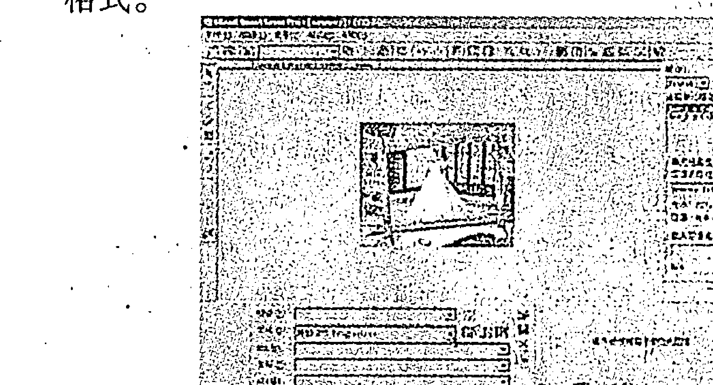

(7) 点击工具栏上的预览按钮预览效果，怎么样啊？动静结合，很满意吧！

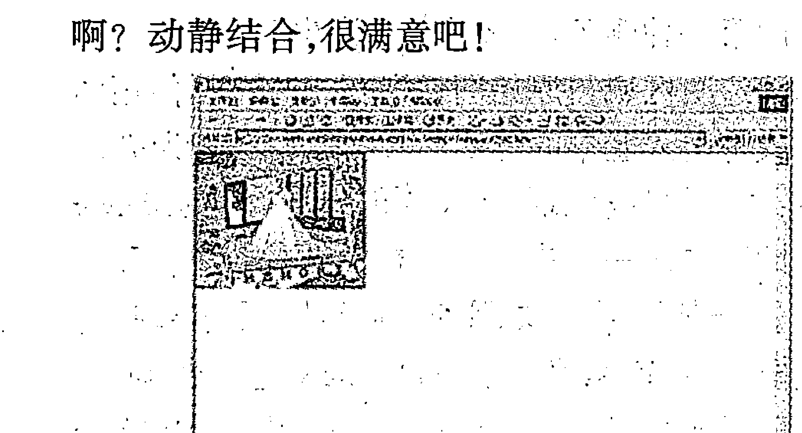

如果满意的话，执行“文件 > 保存”命令保存该文件。查看图片的属性，可以看出分割图片的上部分是Jpg格式，下部分是Gif格式。

## 四、先进的交互性

Ulead SmartSaver Pro3.0除了具有以上令人眩目的功能以外，另一个突出的优点就是具有先进的交互性，在JavaScript模式下可以产生一系列的交互触发动画事件，而且产生的过程完全自动化，不需要使用脚本，这些动画主要有：

- (1) 远程 rollover——鼠标放置到单元格上，以便在另一个单元格中显示 rollover 图像。
- (2) 一对多 rollover——鼠标放置到一个单元格上，以便在多个单元格中显示 rollover 图像。
- (3) 多个鼠标事件——不同的操作（如 mouse-over、mouse-out 等）对应有不同的 rollover 事件。
- (4) 音频 rollover——鼠标放置到单元格中，以播放 MIDI、WAV 或 MP3 文件。

下面，我们来制作一个酷酷的互动媒体播放器，当鼠标点击按钮时，按钮颜色变红，并且屏幕上的图片将起变化。

1. 先准备好图片，这里要用到一张控制台图片，一个红色按钮图片，五张个人介绍图片。在 Photoshop 中先做好这几张图片（一共有七张）。

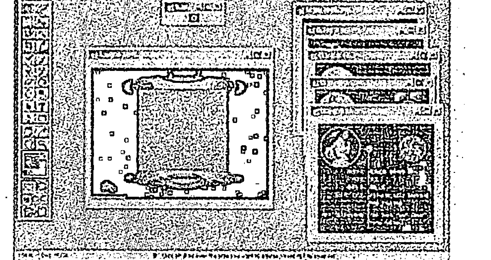

2. 运行 Ulead SmartSaver Pro 3.0，执行“文件 > 打开”命令，打开控制台文件。点击工作区上的切割模式标签，切换到切割模式。

3. 在工具栏中点击添加切割线按钮，在工作区编辑窗口中，待鼠标变成形状后，沿着准备要分割的路径画分割线，如果对某条分割线不满意，可以点击擦除切割线按钮，在您要擦除的切割线上点击一下。

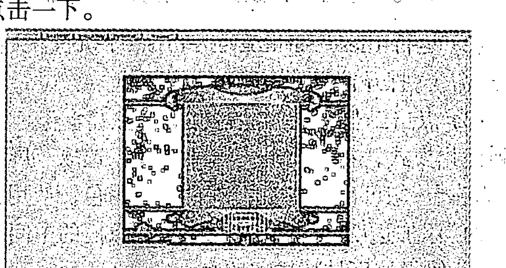

4. 现在开始正式的 JavaScript rollover 图像设计了，在项目完成后，当您将鼠标移过蓝色按钮时，它们会变蓝。这些按钮实际上并不是真正变为蓝色了，您实际看到的是 JavaScript rollover 图像。点击工作区上的 JavaScript 模式标签，切换到 JavaScript 模式。

5. 点击工具箱上的选择按钮，在第一个单元格上点一下选中它，在 JavaScript 面板中会看到当前单元格的信息显示，并且在“事件”栏目中该单元格会高亮显示，在“事件”栏目中确定鼠标动作是“通过”。单击“选择翻转图像”文件夹图标，在“选择翻转图像”对话框中选取一个红色的按钮图像。

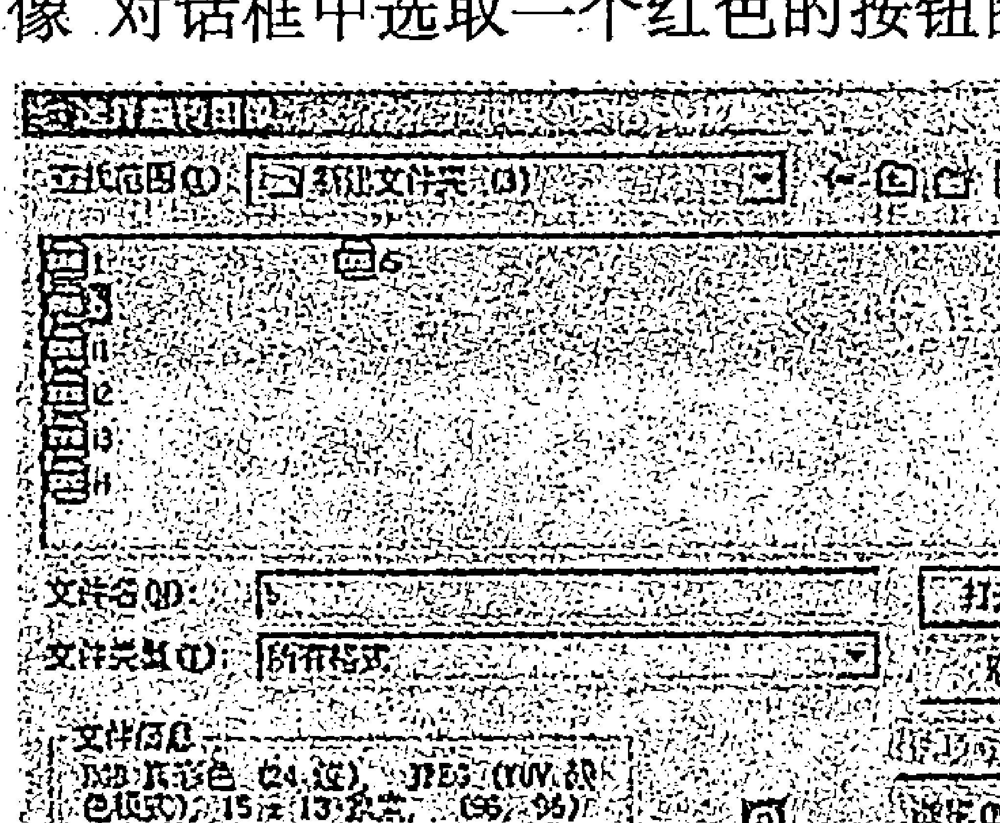

注意：请确定在单击‘打开’前，不要勾选‘吸附单元格为图像大小’。否则此单元格的尺寸将被缩减。

设置好后的Javascript面板如图26所示。

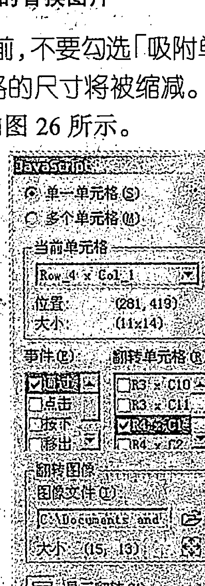

可以点击面板上的‘显示翻转’按钮来查看翻转图片的信息，要还原图片只需再点击一次该按钮就可以了。

假如你想为所有的图像单元格引入背景图像，可以点选‘多个单元格’，这样图像就会自动地根据原始图像的分割线被切割，并且会根据原图像单元格的大小而改变自身的大小，我们在这里还用不到如此复杂的东东，所以就选择‘单个单元格’吧！

6. 用同样的方法给其他四个按钮添加翻转事件，当鼠标移过时显示红色的按钮图片。

这里的翻转事件有四种，可不要选错了：

- “通过”：当鼠标移过图像时会用一幅新的图片替换它。
- “点击”：在图像上松开鼠标左键时触发rollover事件。
- “按下”：当你按住鼠标左键并且光标也在图像上时。
- “移出”：当你把鼠标从图像中移开时触发rollover事件。

7. 刚才完成了鼠标移过按钮时图片变蓝的效果，现在我们要使控制台上的图片同时发生变化，这也叫作远程触发。点击工具箱上的选择按钮，在第一个按钮单元格上点一下以选中它，同时在按下Ctrl键的时候点中控制台单元格，然后单击‘选择翻转图像’文件夹图标，在‘选择翻转图像’对话框中选取第一幅介绍图像，注意不要选取‘吸附图片为单元格大小’。

8. 用同样的方法为其他四个按钮添加控制台图像。然后预览一下，当鼠标移过时，按钮变红，控制台也出现了图片介绍。

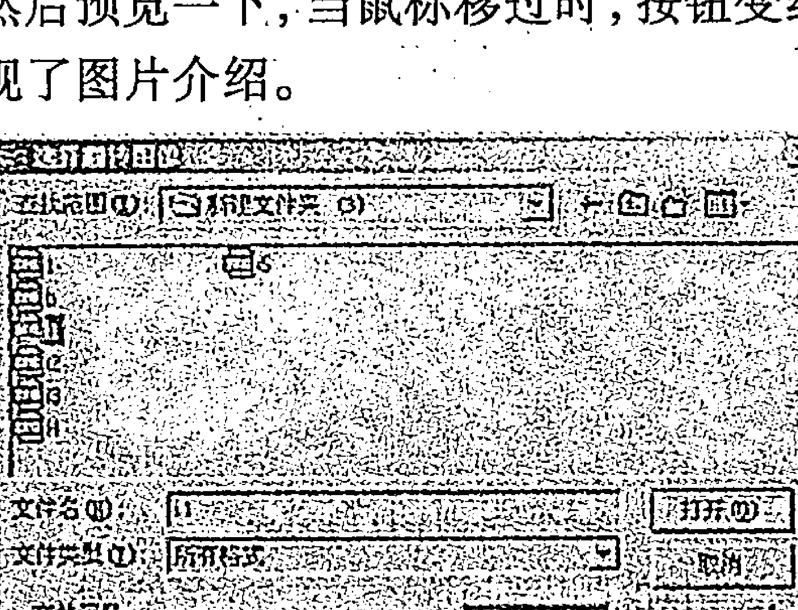

不过像作者这样的追求完美者，可能会觉得有点缺憾，因为界面这么酷的播放器没有声音，的确美中不足，不用担心，现在就来实现它！

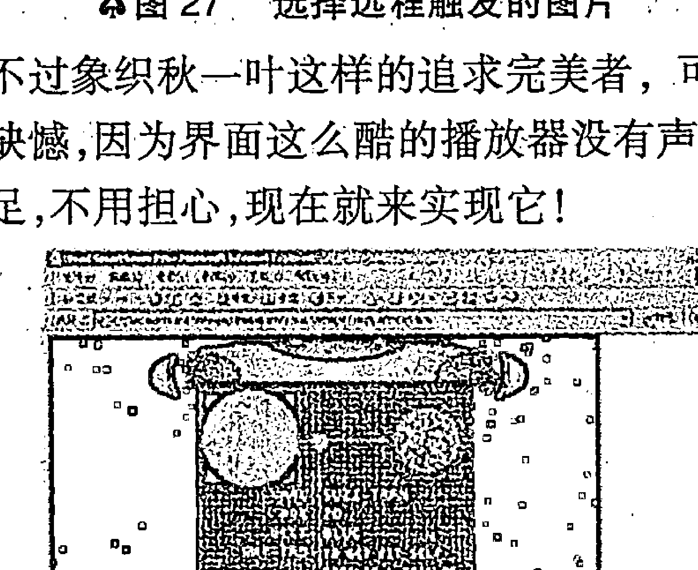

选中第一个按钮单元格，在Javascript属性面板中选中‘启用音频’，接着点击‘选择音频文件’，在弹出的‘选择音频文件’对话框中选择一个音频文件。用同样的方法给其他按钮添加声音文件，这样，预览的时候鼠标移过按钮时就会有声音啦！

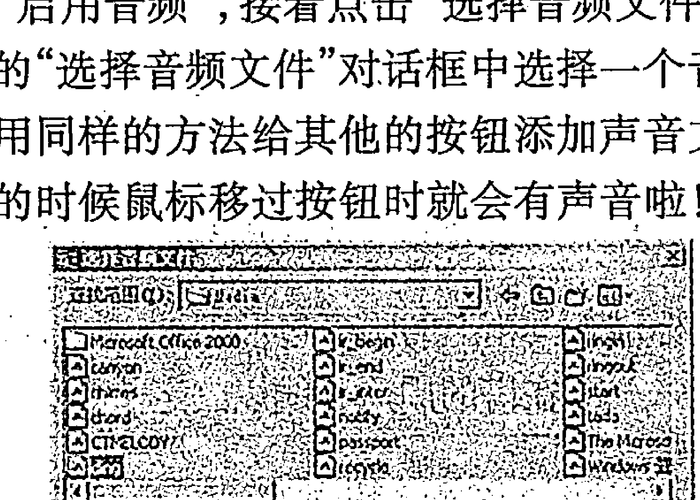

9. 要了解SmartSaver Pro神奇的作用，请单击工具栏上的‘显示项目信息’图标。您可以看到项目中所有图像的名称和尺寸，以及针对当前项目的HTML的大小。说到HTML，可以选择‘文件>保存HTML’菜单命令保存文件，这可以将所有的分割图像、JavaScript以及其它表格属性数据保存到一个HTML文档中。这些代码可以被剪切和粘贴到其它 HTML 文件中。

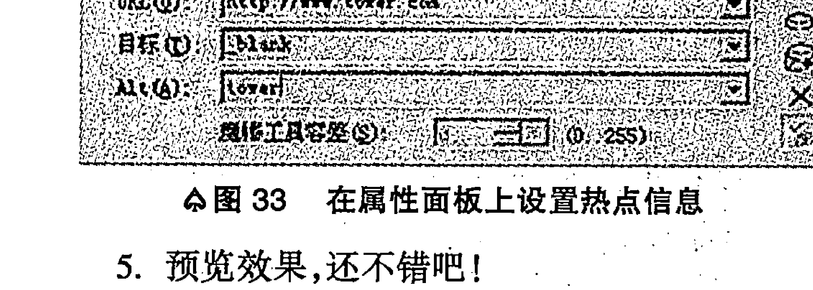

在图像映射模式中,使用该工具可以创建基于相同色彩的多边形热点区域,按下 Ctrl 键可以自动反转选区,可以在属性面板中调整相同值的参数。

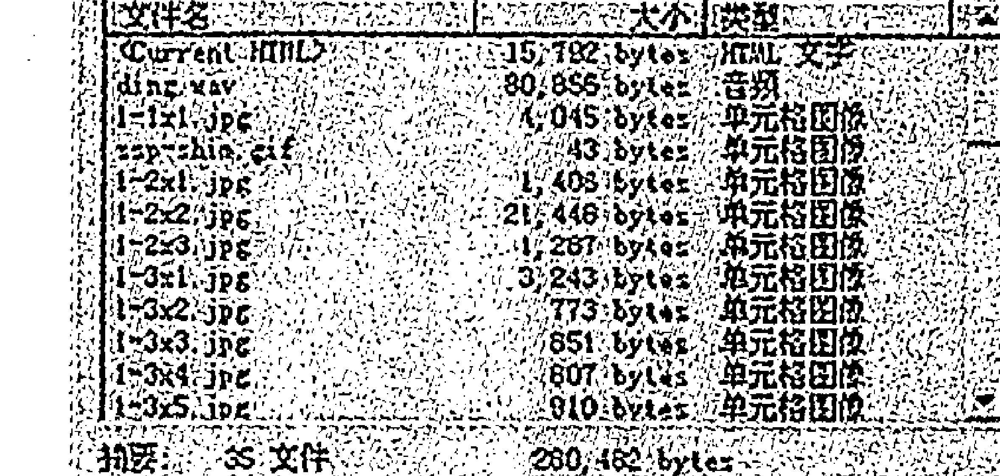

4. 在「属性面板」上,输入热点信息,如:目标 URL 和目标(- blank)以及 ALT 文字。

## 五、最后学一招兼结束语

介绍了这么多,您对 Ulead SmartSaver Pro3.0 的感受是不是日渐加深以至于爱不释手呢？如果达到了这种境界,作者就要奖励你啦。压轴节目是告诉你一个绝技: 使用图像映射模式创建不同形状的热点区域,真得很棒!

5. 预览效果,还不错吧!

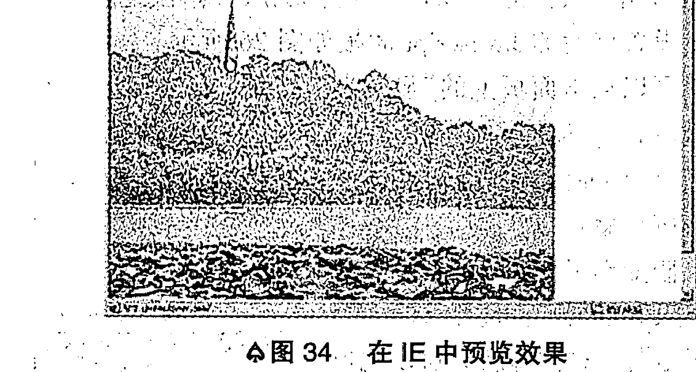

1. 在 Ulead SmartSaver Pro3.0 中打开这幅西湖风景图,我们的目的是介绍有名的“保淑塔”,当浏览者点击图上代表区域时,将进入介绍塔的页面。

2. 点击工作区上的图像映射模式标签 Image Map,进入图像映射模式。

打开文件菜单,选择保存 Web 图像命令,保存图像和相应的 HTML。所有图像映射的代码均被保存在由 SmartSaver Pro 生成的 *.htm 文件中了。要使用它,可以在记事本中打开,复制所有的代码 (不要忘了 <map> 标记!) ,并将它们粘贴到您的网页中。您还必须将这些图像移到同一个文件夹,因为您的网页或  将链接到相应的位置。

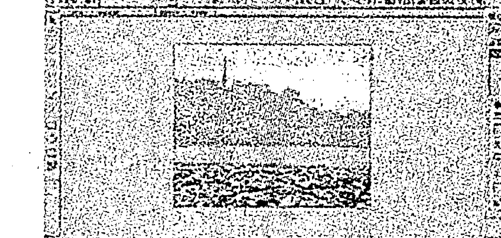

3. 选取标准工具箱上的画多边形工具 ✏️,待鼠标变成手形后 ✋,在塔的周边画线以圈定热点区域。

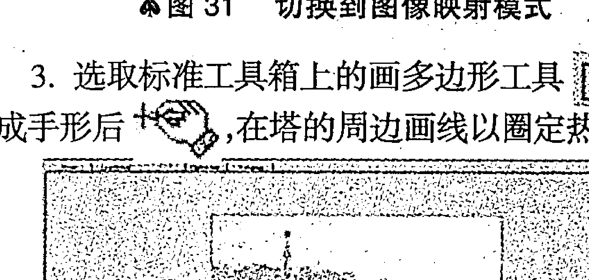

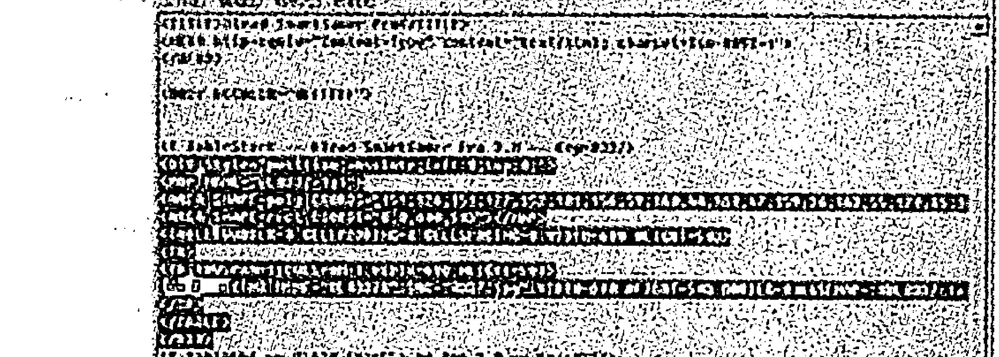

注意:标准工具箱上一共有四个画热点区域的工具。

好啦,到这里我们的 Ulead SmartSaver Pro 3.0 之旅就要结束啦,希望您能喜欢这个软件并毫不犹豫地去试用吧。别辜负了作者辛苦得来的这本秘籍呀,还有就是别忘记把你的惊喜感受告诉十个不同的朋友!

- 📦:在图像映射模式中创建矩形热点区域。
- ⭕:在图像映射模式中创建圆形热点区域。
- ✏️:在图像映射模式中创建多边形热点区域。

## Ulead GIF Animator 5.0

互联网不断地发展，导致网站不断地增加，其中不乏一些优秀的个人网站。做网站其实很容易掌握，但是如何做出漂亮而又吸引人的网站，并不是所有掌握技术的人都能实现的。在网页设计中，不外乎有两种情况，一种是文字在设计中占主体，另一种是图片起到了主导地位。在图片当中，动态图片又是一枝独秀。网站的各类Banner和Logo也都采用了动态图片。对于动态图片大家都不陌生，但是如何达到预期的动态效果却是相当的困难。但是自从Ulead GIF Animator推出后，动画制作变得相当简易，而这次Ulead公司又推出了5.0的新版本（如图1），这个版本让笔者体会到制作动态图片的乐趣，现在就让我们来看看吧。

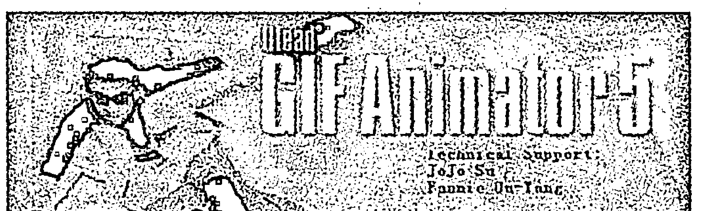

## 一、新增功能

### 1. 更人性化的用户界面

GIF Animator5.0重新设计了用户界面（如图2），让你在制作动画图片的时候更方便，这个版本的工作区域已经完全支持真彩色，无论你是在设计还是预览的时候都可以在真彩色的环境下进行了。同时，常用的做动画的流程都已经简化在编辑、优化和预览选项卡之中了，很大程度上降低了操作难度。

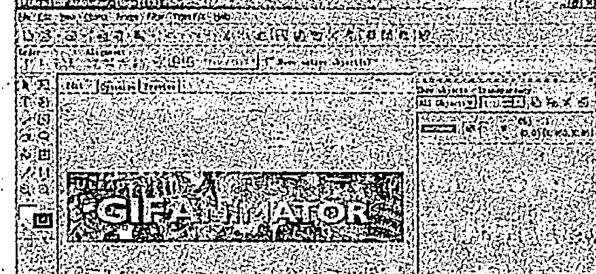

### 2. 增强的编辑能力

GIF Animator5.0的文字编辑器、选色器和选取工具都加强了各自的功能。同时转换器的功能也得到了相应的增强，用户可以随意调整对象的大小和角度了。

### 3. 支持更多的输出格式

GIF Animator 5.0除了支持标准的GIF格式以外，现在还可以输出FLASH格式的SWF文件了。也就是说，你可以用它来做FLASH动画了。当然它还可以输出MPEG、avi、mov等视频格式的文件，这样一来，只要你的系统安装了MPEG4的驱动程序，GIF Animator 5.0也可以直接输出MPEG4的动画了。另外值得一提的是，它还支持Photolmpact的UFO和Photoshop的PSD文件，这样你辛辛苦苦做出来的动画里面的层不但可以保存，而且可以让你的动画效果更精彩。

### 4. 增加对象管理器

这个功能在Photoshop等软件中早就有了，其优点也已经得到了广泛的认可，GIF Animator 5.0当然也不会漠视用户的需求，终于在这个版本里加入了这项功能，有了它以后，管理、编辑起动画里面的各个对象元素就方便多了。

### 5. 外部编辑器调用

你现在可以在GIF Animator5.0里面直接调用更好的图像编辑软件如：PhotoImpact、Photoshop等来编辑GIF Animator5.0里面的图形对象了，这在很大程度上加强了GIF Animator的图像处理功能。当然我推荐大家还是用Photoimpact比较好，毕竟它与GIF Animator是同一家公司的产品，兼容性更好，操作界面也更简单。

### 6. 强大的优化功能

GIF Animator 5.0在图像压缩优化方面更完善，你可以利用有损压缩、抖动颜色、颜色索引编辑等等功能来进一步优化你的作品的输出效果，而这些操作都会即时看到预览效果。

### 7. 新增两个滤镜

新版本的GIF Animator 5.0增加了两个特效滤镜：Color Replace和Color Shift，让你只需进行简单步骤操作就可以做出漂亮的效果。

### 8. 其它

GIF Animator 5.0除了可以输出SWF等文件外，还可以把你的动画导出为一个可以执行的EXE文件，让别人无需看图工具也可以欣赏到你的作品。同时，这个可执行文件还可以在你的作品展示完后，用一些图片做背景显示你预先输入的一些文字，这个功能用来做电子贺卡相当不错。

## 二、下载与安装

以上粗略介绍了 GIF Animator 5 新版本中的功能，使大家对它有了一些感性的认识，下面我们就一步步深入地挖掘 GIF Animator 5.0 的强大功能。

GIF Animator 5.0 可以在 Ulead 公司的官方网站 (http://www.ulead.com/) 下载得到。下载得到的是一个试用版本，只能试用 15 天，当然这是免费的！

只要点击安装文件，一路“Next”下来就可以完成安装，如果你想更改安装路径的话，在系统提示你是否需要更改时更改就可以了。

下面我们介绍一下如何使用 Ulead GIF Animator 5.0：

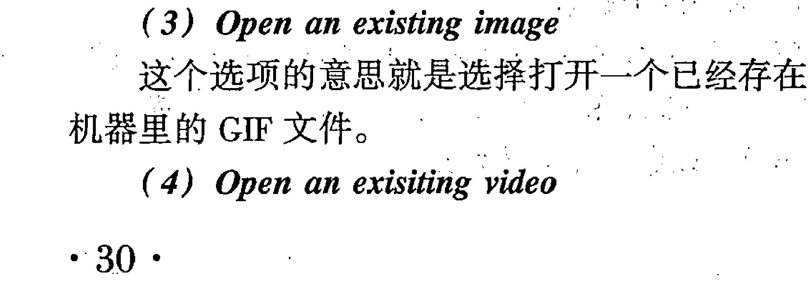

在新建栏中你可以使用动画向导创建 GIF 动画，在打开栏中有三种打开方式，另外你还可以选择 “Do not show this dialog box next” 来关闭向导功能。

- （1）Animation Wizard
选择这个选项可以教你一步一步地完成一个 GIF 动画图片的制作，所以如果你是初学者，强烈建议你选择这个选项。我个人认为，这个动画向导创建功能提高了我们制作图片的速度。
- （2）Black animation
选择这个选项可以建立一个空白的动画文件，选择（如图 6）它你就可以制作一个全新的 GIF 图了。
- （3）Open an existing image
这个选项的意思就是选择打开一个已经存在于你机器里的 GIF 文件。
- （4）Open an existing video
如果你想利用视频文件的片段来制作 GIF 动画的话，就可以选择这个选项。我们知道视频文件其实是由 N 个图片组成的，这个后面再详细介绍。
- （5）Open a sample file
Ulead GIF Animator 5.0 中有很多的示例文件，所以如果你想偷点懒，或者不是很熟悉 GIF Animator 5.0 的 GIF 动画制作过程的话，就可以选择这个选项。

## 三、实战 GIF Animator 5.0

### 1. 相关设置

在使用 GIF Animator 时，进行相关的设置，会得到更好的效果。选择 File> Preferences，在设置选项中共有 7 个设置面板（如图 4）：在 General 中设置 GIF Animator 的普通设置，进行有关默认的设置修改；Optimize 面板中可以设置有关动画优化的参数；Plug - in Filters 面板中可以设置 GIF Animator 所支持外挂的配件。由于篇幅关系，这里就不介绍有关设置的具体操作了。

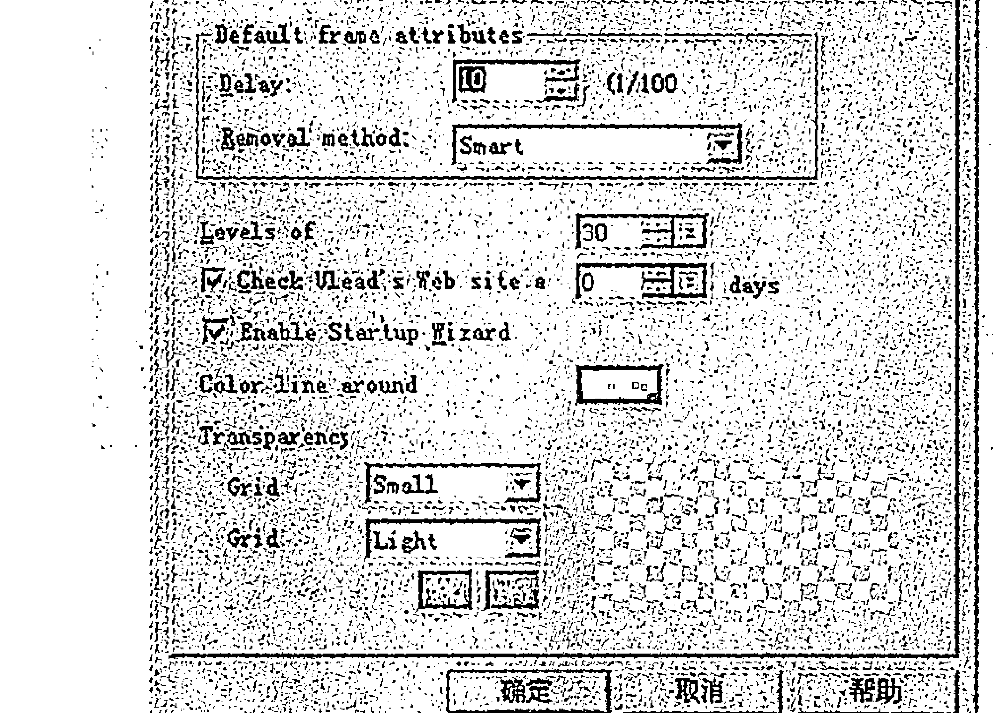

### 2. 软件界面介绍

GIF Animator 5.0 的菜单栏包括文件、编辑、查看、层、图层、滤镜、视频 F/X 和帮助七个菜单，分别完成从图像创建导入到图层滤镜和视频特殊效果的功能（如图 5）。

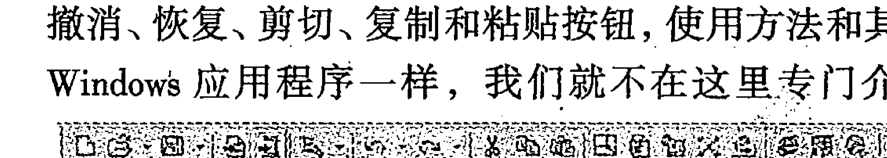

Ulead GIF Animator 5.0 的工具栏上包含标准的 Windows 应用程序按钮（如图 6），即新建、打开、保存、撤消、恢复、剪切、复制和粘贴按钮，使用方法和其他 Windows 应用程序一样，我们就不在这里专门介绍了。


在工具栏上还有一些 Ulead GIF Animator 5.0 专用的按钮，这是我们要着重介绍的（如图7）。这些按钮是: Add Blank Image（加入空图像）、Add Images（从外部插入图像，包括从外部插入 GIF 动画）、Add Video（加入视频）、Add Comments（加入注释）等。

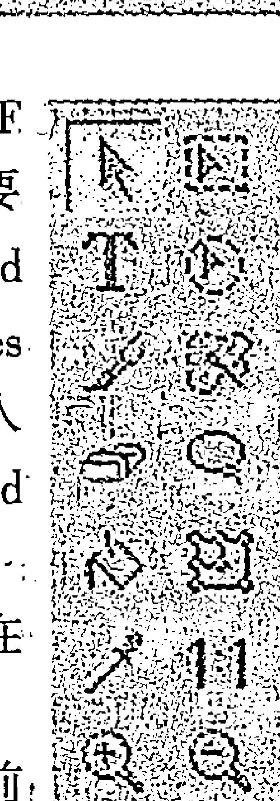

**Add Blank Image（加入空图像）**：在当前层的后面加入一个新的空白层。

**Add Images（加入图像）**：在当前层的后面加入一幅新的图像；新的图像是从外部文件获得的，如果您插入的是一个 GIF 格式的动画文件，那么 Ulead GIF Animator 5.0 会自动把动画中的所有帧都插入到新的层；Ulead GIF Animator 5.0 根据动画的帧数相应地产生新层以容纳插入的图像；可以一次选择好几幅图像一起插入到动画中。

**Add Video（加入视频）**：可以插入视频文件，如 aiv, flc, psd, fli 等；Ulead GIF Animator 5.0 会自动把视频文件中的所有帧都插入到 GIF 动画中。

**Add Comments（加入注释）**：在动画中加入注释，如果您想在动画中保存版权和版本，就可以使用注释。

**Move Layer Up（将当前层向上移）**：把当前层向上移动；也就是说，在播放这个动画的时候，让当前层出现的次序提前一个单位。

**Move Layer Down（将当前层向下移）**：把当前层向下移动，使当前的播放次序推后一个单位。

**Preview in Internet Explorer**：在 Internet Explorer 中预览动画。

**Preview in Navigator**：在 Navigator 中预览动画。

**Preview in Custom Browser**：在用户指定的程序（能播放 GIF 动画的程序）中预览动画。

**Help（帮助）**：求助按钮，点击此按钮后，鼠标指针会变成箭头和问号，这时您可以在 Ulead GIF Animator 5.0 的界面上随意点击，Ulead GIF Animator 5.0 会告诉您点击处是什么地方以及点击处的功能等信息。

**常用工具面板**：在这里可以对图像进行修改，例如写字，填色等（如图8）。使用方法同 Windows 中自带的画图工具一样。

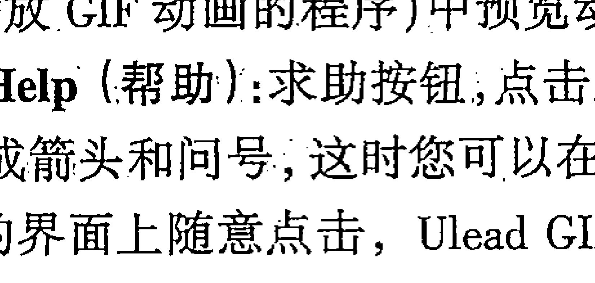

**层面板**：在第一次启动程序时，层面板显示为列表形式，我们可以点击缩略图和胶片标签查看每一幅图像的缩略图和相应的位置顺序。在导入多幅图像时，列表中列出了每个图像的标题（每幅图像的文件名，在参数设置区可以进行修改）（如图9）。

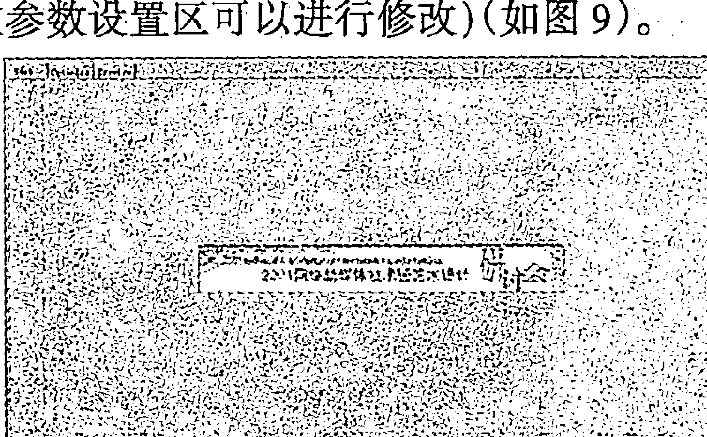

**工作区**：在这个区域中可以查看 GIF 动画的结构，还可以针对每一幅 GIF 动画图像进行编辑。在选择工作模式中有“编辑”、“优化”和“预览”三个功能，其中最强大的是 GIF 的优化功能，在 GIF Animator 5.0 中预设了七个方案，可以将图像优化成色彩数不同的 GIF 动画，相应的优化后的质量也是不同的。同时还可以对优化的各种参数进行设置，在优化后程序还会显示优化的效果。

### 3. 使用动画向导制作 GIF 动画

GIF Animator 5.0 提供的动画向导功能可以在几分钟之内完成 GIF 动画制作。当然在制作 GIF 动画前要找素材，同时也可以自己设计素材。我们知道 GIF Animator 实际上是把一系列的 GIF 图片联在一起而成为一个动态的图片文件的，那么这些 GIF 图片就是我们所说的素材，需要我们提前制作完成；制作的工具有很多，比如 Photoshop、Fireworks 和 Freehand 等软件，素材准备好后就可以通过 GIF Animator 中的动画向导功能制作出专业级的动画了。

在启动程序时，通过 GIF Animator 5.0 显示的一个启动向导来引导我们创建动画。也可以通过 “File” 菜单里面的 “Animation Wizard” 命令创建动画。

打开动画向导按钮后，会弹出一个对话框（如图10）在这个对话框中可以选择我们要制作的 GIF 动画的尺寸。

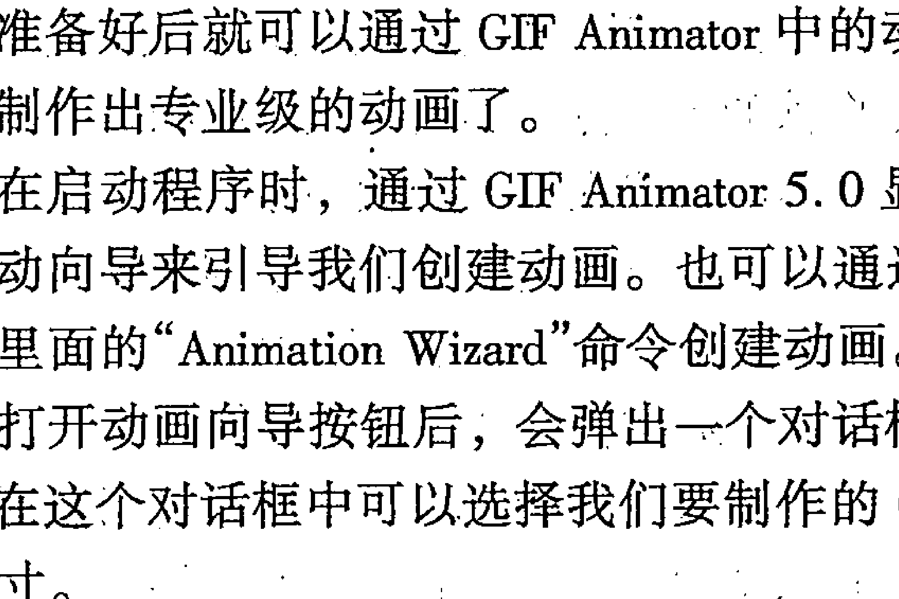

一般一个普通的 Banner 的尺寸是 468 * 60 像素，系统默认值也是这个。当然软件还自带了一些常用的尺寸。

尺寸规格。对于特殊的要求你可以自己进行修改。

尺寸设置好后，点击“下一步”按钮，进入“Select Files”对话框（如图 11）。进行有关素材的设置。

点击“Add image.”按钮，进行图片素材的引入，可以一次引入多项素材，也可以一项一项分别引入。Add video 与 Add image 的不同之处在于一个是引进图片作为素材，而另一个是引入电影。

进行完素材的导入后，点击“下一步”进入“Frame Duration”设置对话框。在提示栏里面有很详细的解释，根据解释再设置每个帧的延迟时间，值得注意的是在参数栏中填入的数值要除以 100 才是真正的延迟时间，你还可以指定帧的速率，同时在下面的演示框中可以预览设置结果。

点击“下一步”按钮后，将弹出动画向导——完成窗口。点击“完成”按钮后，一个动画就制作完成了。

## 4. 优化 GIF 动画

在设计动画过程中，当帧数较多时，这个动画文件可能会较大，不适合于在网络上传播，所以 GIF Animator 5.0 中提供了对动画进行优化的功能。这种功能的原理是将帧的图像分割为若干块，在帧之间的变换过程中，相同的块将在第二个帧中被删除，达到减小文件大小的目的。所以我们要对自己创建的动画再进行一下优化，使之更适合在网络中传播。

点选 Optimize 按钮，进入优化设置，窗口如图 11 所示。在这个窗口的左侧是原始图像，右侧是系统按照默认优化设置所优化的图像。另外有一个窗口是 Color Palette，此窗口中显示了优化后的图像中使用的颜色。如果对优化的效果不满意，或者对优化后所取得的大小不满意，可以进行有关像素的设置。最高的像素是 256，也就是系统默认值，最小的是 16，像素值越小效果越差。

## 5. 预览 GIF 动画

完成一切的制作后，是不是想欣赏一下你的大作？点击 Preview 预览窗口，就可以发现这个动画正在不断地闪烁。同时你可以调用一些浏览器观看它。GIF Animator 5.0 允许 Internet Explorer、Navigator 和 Custom Browse 这三种浏览器查看动画。

## 6. 输出 GIF 动画

完成这一步，你的 GIF 动画就顺利成形了。最直接的输出就是把动画保存为 GIF 格式，可以让他在网页中随意地插入。选择 File> Save As> GIF File，输入文件名称即可。当然 GIF Animator 5.0 同样支持其他文件格式，例如 PSD 格式以及非常流行的 SWF 格式。

这些文件格式都只能用于浏览，如果再次进行编辑则需要重新来过。因此 GIF Animator 自己开发了一种保留 GIF 动画信息的文件格式：uga 格式。选择 File> Save 即可进行这种文件格式的保存。当需要再次修改这个动态 GIF 的时候就可以调用这个文件，然后再直接进行修改。

GIF Animator 5.0 同时还支持输出为网页格式、输出为桌面项目。网页格式在这里就不介绍了，桌面项目是一个很有意思的功能，它利用了 Windows 中自带的桌面自定义功能，可以把动态的 GIF 动画放置在桌面上。

点击 Export> As an Active Desktop Item，出现相应对话框。如果没有什么特殊的要求的话就选择 OK。这时桌面就会出现一个动态的 GIF 动画。是不是很有意思？更有意思的是 GIF Animator 5.0 可以直接输出为 EXE 文件，让用户只需双击此文件，即可观看到动态图片的内容。

点击“Export> As Animation Package(EXE)…”，出现相应的对话框。在 Select sound file 中可以输入动态 GIF 所采用的声音，支持的文件格式有 WAV 和 MID。在 Generate executable file 中输入要输出的运行文件名。此外，GIF Animator 5.0 还支持 URL 链接以及最后发送消息等。一切设置完毕后点击 OK 按钮，就可以运行这个文档了！

## 7. 渲染

GIF Animator 5.0 不仅可以支持最简单的动画，还可以在图片中加入特殊的效果，例如 3D 等。当然，这样的效果用多了，文件就变得相当大。其次，这样的效果必须与动画的主题相配合。现在我们来看看在 GIF Animator 5.0 中内置的渲染效果。

所有的渲染效果均在 Video F/X 菜单栏中能够找到。我们以最简单的文字来查看渲染效果。在一个 468*60 像素的 Banner 中输入简单的文字，然后选择 Video F/X> 3D> Gate 3D，出现如图 12 所示的对话框，然后进行相关的设置。

在 Frames 中设置 4-40 的帧数，帧数越多，文件越大。在 Delay time 中设置帧与帧间隔的时间。Soft 中设置框的粗细，一共有 4 种选项：“None”、“Large”、“Medium”和“Small”。在 Border 中设置有关边框的颜色。选择“Reverse”，表示将原本逆时针运行的方向变为顺时针。进行完以上设置后，点击 OK 按钮，就可以输出动画了。

当然，GIF Animator 5.0 可以运用很多渲染效果，当然其设置效果类似，如果你觉得麻烦，就用默认设置，点击 OK 按钮就行了。

不同的渲染效果如右表所示。

| 效果 | 功能 |
| :--- | :--- |
| **3D**<br>Gate - 3D(三维立体) | 在动画中实现两个帧之间的动画 3D 过渡效果，可以在对话框中设置过渡方向、填充颜色和柔化过渡边界的参数。 |
| **Build**<br>Diagonal - Build (倾斜过渡) | 按照不同的倾斜对角线路径，逐渐的按照不规则块的方式实现两个帧之间的过渡 |
| **Clock**<br>Sweep Clock (时钟式过渡) | 按照顺时针和逆时针方式实现过渡效果 |
| **F/X**<br>Diamond F/X (菱形 F/X 动画) | 菱形效果 |
| Iris F/X (彩虹 F/X 动画) | 十字心形的彩虹效果 |
| Mosaic F/X (马赛克 F/X 动画) | 马赛克元素效果 |
| Power off F/X (关机 F/X 动画) | 显示器关机效果 |
| **Film**<br>Flap B - Film (分割的倾斜翻页效果) | 将原来的帧分为四份，分别从中心开始倾斜的实现与目标帧的过渡 |
| Progressive Film (前进式翻页效果) | 也是将原来的帧分为四份，分别从中心开始以前进式的方式实现到目标帧的过渡 |
| Turn Page - Film (整页翻页效果) | 整页翻页效果来实现两个帧之间的过渡，同时可以设置翻页的方向等参数 |
| **Peel**<br>Turn Page - Peel (整页翻页的剥落效果) | 以剥落的效果实现两个帧之间的过渡，与上一个翻页效果略有不同。 |
| **Push**<br>Run and Stop Push (移动到停止间的推动效果) | 为了消除两个帧之间生硬的动画元素移动，使用这种效果可以将这种效果作成好看动态效果 |
| **Roll**<br>Side Roll (整面翻转效果) | 整面翻转效果 |
| **Slide**<br>Bar - Slide (条状滑动效果) | 可以从不同的方向用两个条状的滑动实现过渡 |
| **Stretch**<br>Cross Zoom - Stretch (交叉缩放拉伸效果) | 交叉缩放拉伸效果 |
| **Wipe**<br>Star Wipe (星形擦除效果) | 星形擦除效果 |
| **2D mapping**<br>Crop... (修剪效果) | 修剪效果 |
| **Camera Len**<br>Gradient (倾斜效果) | 在原帧中加入模糊的镜头，可以设定移动方向等参数 |
| Mirror (镜象效果) | 对原帧中的明显的对象加以处理，实现两个帧之间的过渡 |
| Zoom Motion (缩放动作效果) | 缩放效果 |
| **Darkroom**<br>Hue&Saturation (色调饱和) | 设置图像中的颜色的变化效果 |
| **Nature Painting**<br>Charcoal (木炭效果) | 木炭效果 |
| **Special**<br>Add Noise (加入噪音) | 在原帧中加入噪音干扰效果 |
| Wind (风) | 风的效果 |

## 四、综合实例

### 1. 座右铭制作

一直想找一个软件，可以在桌面上显示座右铭，曾经想到过运用系统的桌面设置功能，但是一条座右铭没有必要占据整个桌面。现在问题解决了，在新版本的 GIF Animator 5.0 中，增加了将动画输出到桌面项目，那么就让我们来制作一条座右铭的动态动画吧！

首先创建一个新 Banner，尺寸为 468 * 30 像素，当然可以根据自己座右铭的长短进行设置。然后在新建的文件中，使用文字输入工具，输入文字并进行美化。为了有一个感性的认识，我们来具体操作一下。选择文字工具点击空白处的任意地方，弹出如图 13 所示的对话框。

在文本区域中输入 "You are the best!"，字体选择 Comic Sans MS 字体，字体大小设置为 30 并加粗，Script 选择西方语言。点击 OK 按钮，把文字拖到中间。效果选择 Video F/X > Special > Wind，然后点击 OK 按钮，出现如图 14 所示画面。不需进行任何设置，点击 OK 按钮，动画便生成了。

最后就是输出效果了。选择 File > Export > As an active desktop Item，在新出现的窗口点击 OK 按钮。桌面就会出现这样的动画，并且可以随意的移动以及关闭（如图 15）。

——玩得就是心跳”。在输入文字时，不但要考虑到文字的大小、颜色还要考虑到与背景图片相协调。制作完这些之后，就可以进行渲染设置，这次采用 Iris F/X 渲染项，然后输出图像。

我们现在来讨论一下文字的效果，毕竟文字是体现 Banner 主题的，应当受到足够的重视。在制作 Banner 时，可以在背景上直接增加文字，软件把文字与图像看成一个部分。或者在进行完渲染之后，在某一个需要出现文字的 Frame 中，单击右键，选择 Add Banner Text 加入文字。我们现在就来一次这样的制作。

一开始进行渲染以及 Banner 背景制作与前面介绍过的步骤类似，这里不再重复。在第一帧处点击右键，选择 Add Banner Text 选项，出现如图 16 所示画面。

### 2. 祝福语制作

萌发祝福语制作的念头，是来源于 GIF Animator 5.0 自带的输出为 EXE 文件功能。这样就可以将祝福通过 eMail 发送到朋友的信箱里，给他一个小小的惊喜。

新建一个 500 * 500 像素的素材，作一个有关生日主题的动画，创意可以任意发挥，当然也可以来自一些网站。在制作图片动画时用渲染效果，容易令人感到杂而乱，因此不建议在动画中加入渲染。制作完一切动画后，选择 Export> As Animation Package，出现输出 EXE 对话框。

在 Message Box Style 中选择 Dialoguel. emf 文件，在用录音机中录入自己的祝福语 (birthday.wav)，在 Select sound file 中选择文件来源，在 Generate executable file 中输入要输出文件的位置。在 Enter Message 中输入“生日快乐～～”字样，选择 Font 进行有关字体的设置，在 Loop Count (循环数) 中设置循环次数，如果要使用无限循环，选中 Loop infinitely (无穷循环)。分别在 Start Frame Position (开始帧位置) 和 End Frame Position (结束帧位置) 中设置动画的起始位置。如果要随机显示，将这两项设置为 Random (随机)。最后点击 OK 按钮输出动画。

在 Text 面板中输入文字，Effects 面板中进行有关文字的特效的设置，有移动、跳出等效果。进行完相关设置后，点击 OK 按钮，此时会出现两个选项，选择后文字就出现在 Banner 中。与前面制作不同之处在于，Banner 中文字的设置需要等待图形效果制作完毕之后 (当然要看你把文字帧插放在那里) 才能进行。最后输出为 GIF 动画，或者 Flash 动画。

GIF Animator 5.0 最强大的功能在于它还支持很多种特效，你可以在一个 Banner 中插入同样文字的几种特效，这样会使整个 Banner 变得更美观，所付出的代价就是有可能使文件过大。在这里笔者也善意地提醒一下您，如果您的艺术细胞不是很丰富的话，那么最好记住这句话：简单就是美。往往网站 Banner 的制作成功与否主要不是靠技术，而是靠创意。

### 3. 网站 Banner 制作

在网页动画领域中，制作网站 Banner 的现象相当普遍，一般尺寸为 468 * 60 像素。在 GIF Animator 5.0 中新建一个同尺寸的文件，为了使得 Banner 更加美观，我们先要特别为 Banner 做一个背景图片。当然可以调用功能强大的 Photoshop 软件，或者单一的使用 Windows 自带的画笔程序，同样也可以在网上找到素材，然后在素材上输入有关 Banner 的主题“心跳回忆”

### 4. 用一个视频的局部来制作 GIF 动画

用 Windows 视频文件，(如 AVI)，或 Quicktime 影片，(如 MOV)，是快速制作极酷动画的最轻松方法 (如果不加修饰，它看上去和原始视频一样)。但是，大多数视频文件都很大，在 GIF Animator 中打开整个视频会影响效率。幸运的是，GIF Animator 5.0 带有一个内置的解决该问题的功能，可以选取并只打开视频中某个特定的部分。下面讲述一下该操作的步骤。

- (1) 打开 GIF Animator 5.0，创建一个新的空白动画。
- (2) 单击标准工具栏上的 Add Video 按钮，打开 Add Video 对话框。
- (3) 找到要用的影片文件选中后，单击 Duration 按钮。
- (4) Duration 对话框打开后，有两个属性需要定义：要使用的开始和结束的视频段，即 Mark in 和 Mark out。有两个方法可以用这些属性来选取视频段：用手工输入帧编号 (如图 17)，或通过预览窗口和视频控件，拖动 Mark in 和 Mark out 按钮，来标记出要使用的部分。

- (5) 在标记出要使用的部分之后，单击 OK 按钮。Duration 对话框关闭，返回到 Add Video 对话框。再单击 OK 按钮，选择的帧就被加载到 GIF Animator 中了。

### 5. 使用布局功能制作动画

在 GIF Animator 5.0 中，有两个方法可用来创建移动的动态精灵。您可以很方便地在 GIF Animator 5.0 中打开一个元素，并自动完成使它穿越该 GIF 文件的逻辑屏幕的运动过程。第一个方法用于简单的、静态的帧，详细描述如下(下一页讲述第二个方法，用于动画)：

- (1) 在 GIF Animator 5.0 打开背景图像。在此我将用 ocean.gif 作为背景 (如图 18)。

- (2) 下面，打开一个精灵图像 (如图 19)。该图像应该比您刚打开的背景图像小，否则它将不起作用。左边的海豚包含一个透明的蓝色背景。在将它导入到 GIF Animator 5.0 中后，选取该层面。

- (3) 在刚选取的精灵层面中单击 Object> Duplicate 菜单命令。
- (4) 在本例中，因为背景不是很大，所以我们设置 5 个副本就足够了。
- (5) 下面，输入每个副本相对于上一个副本所偏移的像素值。您可以使图像水平或垂直偏移。
提醒您：每个副本层面包含的设置均基于原始层面。

### 6. 压缩实例

在制作一个 Banner、或者是要应用到网上的动画时，必须考虑到的一点就是图像的大小如何。因此这个问题成了阻碍图像采用多种特效的最大绊脚石，通过 GIF Animator 5.0 中的压缩功能可以轻松做到使图像文件容量减小。

- (1) 使用动画制作向导，将准备好的素材导入进来。
- (2) 点击 Optimize 标签，在 Preset 栏中选择 GIF Animator 5.0 预设的七种方案：256 色优化、256 色无损失优化、128 色优化、64 色优化、32 色优化、16 色优化或者优化局部调色板。在这里需要说明的是，全局调色板是为了优化而创建的在多个帧之间应用的调色板而局部调色板是为每个帧创建的调色板，保留局部调色板可能起不到优化的作用，所以我们选择使用全局优化调色板。
- (3) 如果要对这七种方案进行高级设置，点击“高级>>”按钮，在右边的栏中会出现高级设置的详细参数。
- (4) 在高级参数设置区中可以对一些参数进行修改，当您认为修改的参数要在以后经常使用的话，点击按钮保存为自定义的优化方案，在“预设”栏中填入预设的名称，也可以删除自定义的优化方案，但切记不要删除 GIF Animator 5.0 程序自带的优化方案。

### 7. 真正的压缩实例

- (1) 如果预设的优化方案中的设置令你摸不清头脑，你可以使用优化向导。点击 File> Optimize Option Wizard，启动优化向导 (如图 20)。

- (2) 在弹出的优化向导对话框中，选择推荐的“是”选项，点击“下一步”按钮。
- (3) 在出现的对话框中，设置 GIF 格式的颜色数，并且在下面可以设置图像的抖动。值得注意的是，正如在对话框中提醒的一样，颜色应用太少，虽然可以减小整个文件的大小，但是也可能使图像中的颜色失真，使整个动画的视觉效果变差，这样就得不偿失了。点击 Advanced 按钮对 GIF 优化引擎和使用的调色板进行设置。

- (4) 在新出现的对话框中选择是否要删除多余像素、注释块和标题。
- (5) 最后出现的一个总结性的窗口中，前面的选项都汇集到此，如果要重新定义一些参数，就点击“上一步”按钮重新设定。如果对当前的设置满意，点击“完成”按钮。GIF Animator 5.0 将对动画文件进行优化。
- (6) 优化完毕后，优化结果的窗口显示优化的成效(如图21)。点击 Preview 按钮，可以预览 GIF 动画的效果。

- (7) 如果对优化的效果不太满意，点击 Another Try 按钮，又回到向导的第一步，再对 GIF 动画的各个参数进行设置。
- (8) 如果不想覆盖当前的 GIF 动画文件，点击“另存为”按钮，将优化后的 GIF 动画文件另行保存。
- (9) 点击“确定”按钮，完成优化。

- (10) 同时可以点击菜单 File > Batch Process，可以批量优化处理一个文件夹中的所有 GIF 动画文件。
- (11) 在弹出的对话框中可以对优化处理的参数进行设置。若子文件夹中的 GIF 动画文件也需要优化处理，在包含子文件夹的选项前点钩。
- (12) 如果要选择文件夹中的个别文件，点选 By folder，并点击 Browse 按钮选择文件(如图22)。

- (13) 如果要创建新文件或删除原始文件，在创建新文件和删除原始文件前点钩。
- (14) 如果没有必要，不要随意添加自定义注释块，那样可能不会起到优化的作用。
- (15) 点击“确定”按钮，GIF Animator 将对文件进行批量优化。

## 8. 利用视频文件来制作GIF动画

前面我们已经说过，可以利用视频文件来制作GIF动画，比如AVI、Quicktime、MOV等，实际上这是利用了视频文件都由N个动画元素组成动画的特性。我们可以把它的每一个元素——帧，想像成我们制作GIF动画的每一个GIF图片。不过有一点需要特别指出，由于视频文件都比较庞大，如果转成GIF动画，将是一个巨大的图片，在网上几乎无法传输了，所以我们只能截取视频文件的片段来做动画处理。

基本步骤和打开一个GIF动画没有什么区别。

- (1) 在文件菜单里选择 Open Video，弹出选择文件窗口。
- (2) 选中你要编辑的视频文件，按 Open 按钮。
- (3) 那么这个视频文件就自动被解析成N个图片，和我们打开一个GIF动画的效果相同。
- (4) 其它如编辑、优化的处理方法也都相同。
- (5) 最后保存成GIF格式的图片。

## 注意以下问题：

- (1) GIF Animator 5.0 是一个相当强大的网页图像动画制作软件，支持多种格式的文件，大家不要误解它为只支持GIF格式。
- (2) 我们在调入文件时，最好按照动画的播放顺序打开，尽管调入文件后对文件的次序我们还可以随时修改，但是为了避免出错，养成这样的习惯还是很有必要的。
- (3) 在其它图像处理软件中设计每幅图像时，要尽量使用比较简单的颜色，否则保存为GIF格式时，颜色会有很大改变。
- (4) 利用一张图片，我们就可以制作出非常漂亮的GIF动画图片出来，对图片我们可以进行复制、旋转、翻转等处理。
- (5) 设计完每幅图像后，应将文件保存为GIF格式，以减小动画大小。
- (6) 研究使用滤镜和透明效果，其实图片的制作水平，高低主要看你如何运用滤镜和透明效果了，这同运用Photoshop作图是一个道理。
- (7) 在编辑完动画后，要将动画优化，同时可以设置优化参数以减小动画大小。
- (8) 养成随时使用预览功能的习惯，控制好动画的制作和调试。

## 9. 使用 Simple Text Objects 制作文字Banner

我们在前面已经提到过 Simple Text Objects 这个功能，在这个实例中，我们将学习只用这个功能作出一个文字类型的Banner。

- (1) 先建一个460×80像素的文件，背景色为白色。
- (2) 在 Banner 的四周画一个细小的矩形边框。
- (3) 现在我们就可以输入我们的文字了，选择 Frame > Duplicate Frame 新建一个帧(如图 23)。
- (4) 在第二帧，选择输入文本工具。
- (5) 输入完文字之后，在文字处单击右键；选择 Shadow。勾选 Shadow 的方框后，可以选择样式来给文字添加阴影效果(如图 24)。
- (6) 选择 Object > Text > Split Text，这个时候可以看到一个个文字独立存在着(如图 25)。
- (7) 现在我们按照文字的数量，建立十个帧，每帧一个字母。
- (8) 在第二帧中，只保留 I 这个字母，其他字母层均为隐藏。
- (9) 当然，在第三帧时，保留 I 和 a 这两个字母，其他字母为隐藏属性。
- (10) 以此类推，就可以做出一个正在打字的效果了。

## 10. 朦胧就是美

在这个例子中，你将成为一个设计大师，为你自己或者你心爱的女子做一张图片，并作成朦胧的效果。

首先在 GIF Animator 5.0 中打开如图 26 的照片，对图片加以修饰。选用文字工具输入图片中女主角的名字，当然要与背景相衬。

选择文字工具，在照片的最底部，使用字体工具输入“Coolergirl”，考虑到照片是窄长形，因此字体选择 20。在图片中单击右键，选择 Text > Neon，对文字进行特别的修饰，弹出如图 27 所示对话框。

在 Neon 项上打勾，就可以发现图中的文字产生变化(如图 28)，点击 OK 按钮。

现在开始制作有关朦胧效果，朦胧效果是在 GIF Animator 5 版本中新增的一种效果，选择 Video F/X > Nature Painting > Charcoal，效果如图 29 所示。为了使朦胧效果比较突出，在 Apply this effect to how many 数字框中输入 20。点击 OK 按钮，出现图 30 所示对话框。

由于图片不是等像素压缩，因此有变形。不用修改任何设置，点击 OK 按钮。这样一个朦胧效果的动画就算完成了(如图 31)。

你可以制作一个自己的网页，或者制作一张贺卡发给你的朋友，快来试试吧。

## 五、外挂软件

GIF - X Plugin 是一款 GIF Animator 的外挂软件。GIF - X Plugin 2.0 增加了不少动画功效外,还引入了图库 (Gallery) 的方式,你既可以自己设计出能体现个性的作品,也可以直接从友立提供给你的图库 (Gallery)中选择一个满意的效果。由于 GIF - X Plugin 是外挂在 Photoshop 中的一个外挂滤镜,所以,如果你对创作的动画不很满意,或者出来的效果不太明显,你还可以在 Photoshop 中进行其它的特效处理。当然直接存储在 GIF - X Plugin 2.0 中做好的动画不仅可大大减少做好后的动画的字节数,而且还可以不让图片太失真。因为友立的 GIF 动画软件的一大缺点就是做出的 GIF 图片字节数太大,一般我们做好后都要用一些减肥软件压缩一下,但压缩后的图片颜色会失真,而用 GIF - X Plugin 2.0 制作出来的 GIF 图片能够保证失真小,即如果你使用的图片是 16M 的话,出来的 GIF 图片一定不会是 256 色的,这样你的 GIF 看上去就不会效果太差。下面我们就 GIF - X Plugin 2.0 做一下简单的介绍,如果你看了下面的介绍后对 GIF - X Plugin 2.0 有兴趣的话,就赶紧到友立 GIF - X Plugin 的网站 http://www.webutilities.com 上去下载一个 GIF - X Plugin 2.0 的试用版来玩玩吧,界面如图 32 所示。

GIF - X Plugin 2.0 提供有 “Motion” 动作与 “Light” 灯光两类特效。

“Motion” 特效包括旋转 (Rotation)、扫描 (Scan)、自动换片 (Nickelodeon)、立方体 (Cube)、克隆 (Clone)、书状翻页 (Open book)、弹球状 (Bounce)、放大、缩小 (Zoom) 等特效,每一种动画效果又可以通过旁边的参数 (Parameters)选项来调节,选择一种自己满意的模式,设置好参数,就可以在 “Key Frame Control” 项中进行效果预览,满意的话就按 OK, SAVE 你的作品,不行再来,效果多多,如果真的嫌这样选来选去太麻烦,那么,直接从 “Gallery” 里选择一种效果吧:看见 “Gallery” 选项没有?这里相信有你需要的东西,看看下面的一些效果吧,绝对不是一般的 GIF 动画制作软件所能匹敌的!

在上面的图片中,你可以看到 GIF - X Plugin 2.0 中 “Motion” 特效制作出来的各种效果图,第一种是旋转 (Rotation)效果; 2 - 3 是扫描 (Scan)效果:有条柱状 (beam)、金属状 (metal)、聚光灯状 (Spotlig) 三种方式; 4 - 6 是自动换片效果:有上 - 下形 (Top - down)、下 - 上形 (bottom - up)、左 - 右形 (left - right)、右 - 左形 (right - left) 四种方式; 7 是 3D 模式效果 (3D MAP),有球状 (Sphere) 与立方状 (Cube) 两种方式; 8 - 9 是立方体 (Cube) 效果,同样有上 - 下形 (Top - down)、下 - 上形 (bottom - up)、左 - 右形 (left - right)、右 - 左形 (right - left) 四种方式; 10 是书状翻页 (Open book) 效果,也有上 - 下形 (Top - down)、下 - 上形 (bottom - up)、左 - 右形 (left - right)、右 - 左形 (right - left) 四种方式; 11 - 12 是弹球状 (Bounce)效果; 13 - 14 是放大、缩小 (Zoom)效果,有放大模糊 (Zoom blur)、缩小透镜 (Zoom lens) 两种方式; 15 - 16 是旗子效果 (FLAG); 17 - 18 是色彩变化效果 (Color Shift); 19 - 20 是氖光灯效果 (Neon)。当然,你还可以自己添置一些效果进去,在使用中就可以自由运用了。

上面介绍了 GIF - X Plugin 2.0 中 “Motion” 特效,下面让我们看看 GIF - X Plugin 2.0 中的 “LIGHT” 特效,其全部的效果如图 34 所示:

怎么样, GIF - X Plugin 2.0 的灯光效果是不是比其它 GIF 动画制作软件的灯光效果好许多呀! 其主要的特效有闪电 (lightning)、烟火 (fireworks)、透镜闪耀 (lens flare)、阳光四射 (light bulb)、光环 (halo)、聚光灯 (spotlight)、闪光灯 (flashlight)、流星 (meteor)、激光 (laser) 等。这几种特效可以反复交替使用,这样不仅为你的 GIF 动画增添了灯光效果,更使你的动画整体效果增色不少。

## 实例制作一、闪电效果

闪电效果有两个控件组：“基本”控件和“高级”控件。“基本”控件用于创建动画（设置窗口如图35所示），“高级”控件用于微调闪电发出的分叉，以及周围的光芒(设置窗口如图36所示)。

我们开始按照图35和图36的设置来调整闪电控件。如果您想将这些设置保存下来，以备将来使用的话，请单击屏幕底部的“添加”按钮。接下来，将闪电条的顶部拖到天空中闪电开始的地方。然后拖动闪电条的底部，直到该闪电条位于动画开始的位置。

提醒您：如果您觉得预览窗口中的场景太暗，请增加“周围光线”的值。该控件位于“确定”按钮的上方。另外如果“自动倒退”按钮是打开的，请将其关闭。

现在闪电条已放置好了，我们开始设置关键帧。

对于这个闪电效果，我们将使用5个帧的动画，在第1、2和5帧处设置关键帧(如图37所示)。

我们将修改每个动画关键帧的下列设置：

- 第1帧：阻光度=0，这将使闪电在动画的第一帧中变成完全透明。这样在动画循环时，在一个循环结束和下一个循环开始之间将有一个暂停。
- 第2帧：亮度=40，如果该帧在预览窗口中是空白的，请确定将“阻光度”的值设为原始值(100)。将“亮度”设为40，这样设置可以使闪电条的亮度在从第一帧到达最后一帧的过程中逐渐增加，最后一帧的亮度设置为80。
- 第5帧：重新放置闪电条（无其它变化），拖动闪电条的底部，使它看上去与地面最接近。就是这样！单击“保存”将其保存到硬盘。您可以直接使用这个文件，或将其在动画程序，如：Ulead GIF Animator 4中打开，来修改该动画的速度并优化它的压缩。

## 实例制作二、烟花效果

注意：如果您要将这些设置保存下来，以备将来使用，请单击屏幕底部的“添加”按钮。这样您就可以在下次使用的时候，通过单击“画廊”按钮，来重新打开它们了。

接下来，用关键帧控件将动画设为10帧，并在第2帧和第10帧处添加关键帧。如果“自动倒退”按钮是打开的，请将它关闭。

完成上述操作后，现在需要做的是调整关键帧，目的是使图像随着关键帧的移动而改变。我们将做下列修改：

- 第1帧：亮度=0，这可以使动画的第1帧包含不显示的效果。这样，在动画循环时，在一个循环结束和下一个循环开始之间将有一个暂停。
- 第2帧：不做任何设置，如果在预览窗口中，这个帧是空白的，请确定将“亮度”设为原始值(228)。另外，注意将“完成”值设为0，这将使该动画中第一个可见帧显示为一个即将爆炸的烟花组合。
- 第10帧：完成=90，这里创建的是该动画的最后一帧，烟花在此将落向地面。理论上，将该值设为100将创建一个空白帧，但实际上它未必有用。这就是为什么我总是将亮度设为0，来创建动画中的空白帧的原因。就是这样！单击“保存”，来创建动画并将其保存到硬盘。具体设置如图42所示：

烟花效果有两个主要的控件组：基本控件和高级控件。“基本”控件用于创建动画，“高级”控件用于微调特效，如：烟花尾部的长度。

您应该已经开始在预览窗口中执行单击并拖放的操作了，在背景图像上，将特效移到相应的位置。接下来，调整“基本”和“高级”对话框中的设置，使用的设置如图39、40所示。

这样一个烟火效果就制作完成了，可以将其调入 GIF Animator 5.0 中加以修改。

## 六、总结

无论从软件本身去讨论它的价值还是从公司对它的开发价值去讨论，GIF Animator 5.0 的的确确是一款好软件，并且在作动画时，操作起来相当简单。希望这款软件能带您进入更美好的动画之旅。

Photoshop 作为图像处理软件的霸主，长期以来一直是设计师们做图形处理的首选。其超强大的功能，更是让我们不得不赞叹 Adobe 的实力。但是任何事都有两面性，超强的功能带来的是复杂的学习环境，我们不得不花相对多的时间来学习 Photoshop，然后才称得上使用起来得心应手。现在以 Macromedia 为首的反 Adobe 联盟针对 Photoshop 难以掌握的弱点，推出了很多易于使用的、面向中低级用户群的图像处理软件，比如 Macromedia 推出的专门面向网页图像制作的 Fireworks，Ulead 公司推出的专门面向家庭摄影爱好者的“我形我速”，这些软件都对 Photoshop 的霸主地位产生了强大的冲击和威胁。虽然它们的功能比不上 Photoshop 强大，但简单易用正是它们的优势所在。毕竟，并非每一个人都是设计师或者软件专家。我们需要实用、方便的软件，正是基于这个原因，Photoshop Elements 上市了。

作为 Adobe 公司市场战略中重要的一环， Photoshop Elements (以下简称 PSE) 以商业用户、网络用户和家庭用户为对象，大幅度强化图像编辑的易用和快捷性，意图占据 Photoshop 未能占据的中端市场。经过一段时间的使用，我们有理由相信，Adobe 能够做到。挟着 Photoshop 强大的威力，加上自身拥有崭新的界面，PSE 给我们带来了从未有过的图像设计新体验。(如图1)

### 一、特点简介

既然叫做 Photoshop Elements，那么它同 Photoshop 有些什么联系，又有什么区别呢？下面我们一一介绍。

- 1. 针对输入图像的优化处理功能：我们在使用数码相机或者扫描仪来输入图像时，总会出现色彩上的不如意，这时 PSE 就派上用场了，它提供了一整套专业并且方便的色彩校正功能，我们可以轻而易举的完成色彩的校正。例如拍摄过程中经常出现的“红眼”现象，只需要使用去红工具轻点几下既可完成修正。稍后我们将通过实例进行详述说明。
- 2. 强劲的易用性：这可以算得上 PSE 的最大特色了，独具特色的向导模式，使你可以轻松地完成一系列的图像操作，只需照着向导所示点几下鼠标，复杂的操作即可瞬间实现，大大节省了操作时间，而且这对于我们学习 Photoshop 也有很大的帮助。直观的即时帮助窗口。当我们把鼠标指向任何一个菜单命令或者工具时，帮助窗口会立刻显示相关帮助，边用边学习，真是相当体贴的功能呢。使用可视化的滤镜及样式工具，让我们在使用 Photoshop 的滤镜时不再有无从下手的感觉。
- 3. 强化的网络功能：PSE 针对网络设计师们推出了一系列强劲的网络图像设计功能，我们可以轻松地制作 3D 效果、阴影效果、图像导角、制作按钮等。整合 Save For Web 功能，使网络出版更加的得心应手，专门针对网络 GIF、JPG 格式进行的优化功能，使我们完全不需要借助 IMAGE READY 既可轻松完成对网络图像文件的输出，动画 GIF、透明图像皆可轻松实现。
- 4. 针对普通用户群建立的一系列特别功能：借助 PSE，可以迅速完成对多张图片的无缝连接，创造立体感很强的全景图像。通过自定义模板，快速建立自己的网络画廊 (Web Photo Gallery)。

### 二、软件详解

当我们启动 PSE 后，会出现如图 2 所示界面。在此我们可以选择建立新文件、打开文件、打开剪贴板中的拷贝、通过外部设备输入文件、教程以及帮助等命令。

以后在软件使用过程中，我们随时可以通过 Windows - Show Quick Start 来启动这个界面。

进入软件后，我们先来认识一下整个软件的界面(如图3)。

- A: 快捷工具栏——提供一些操作中的常用工具
- B: 菜单——所有的操作命令在这里都能找到。
- C: 标签面板——PSE 的特色，大部分的浮动面板## 图2 Photoshop Elements启动界面

## 图3 Photoshop Elements操作界面

都被整合到了标签面板区里。

- D:工具面板——编辑图像时使用的各种工具。
- E:编辑区——这里就是我们操作的舞台了。
- F:浮动面板——PS系列的特色，也是整个软件的重头戏。

初一看，和 Photoshop 6没有多大区别，但只要细心观察就会发现，两者还是有一定的区别的。首先是在PSE中，大部份的浮动面板被整合进了右上角的标签面板区里，这样省掉了很大空间，愿意的话你可以把所有面板放进去，我们的操作区域将大大增加。不过我个人倒不是很赞成这样做，有些常用面板还是让它们浮动着比较方便，比如信息面板和图层面板，当然，前提是你的屏幕足够大。

细心的读者一定发现 PS 系列的重头文章：通道和路径没有了！唉呀，这可叫我们怎么办啊？其实不必在意，ADOBE正是为初、中级用户着想，省掉了复杂的通道，取而代之的是方便的图层特效，这样我们过去必须在通道中完成的很多效果现在只需对着可视化的特效缩略图轻点鼠标就可以了。虽然有了很大的局限性，不过这毕竟是PSE的初衷啊，本来就是面向普通用户的图像操作软件嘛，当然强调易用和简单啦。要是加上通道功能，那就变成超级Photoshop了。

下面，我们来详细介绍软件中的各个功能。注意，因为许多功能大同小异，所以我们只重点介绍PSE的特色功能。

## 1. 菜单

各个菜单同 Photoshop 大同小异，在此我们只介绍PSE的新增功能。

File(文件)菜单：除了常用的新建(New)、打开(Open)、存储(Save)等命令外，PSE新增了几项非常实用的新命令。我们着重介绍一下：

- (1) From Clipboard(打开自剪贴板)：使用这项功能，我们可以直接从剪贴板里打开拷贝的图像，而无需像过去一样新建文件再粘贴。
- (2) Photomarge(照片合并)：这个算是重要功能了。使用这项功能，可以迅速对多张图片进行无缝连接，它也是制作全景图的一个好工具。我们先打开它(如图4)。

## 图4 照片合并设置

点击 Add(添加) 按钮来输入我们需要拼贴的图片，然后注意一下 Settings 中的两个参数选项。

- Attempt to Automatically Arrange Source Images: 尝试自动排列原始图像
- Apply Perspective: 应用透视

根据个人喜好选择好参数之后，点击OK，系统便会自动地为我们拼贴图片，形成全景图。当然，电脑总不能总是那么理想。

## 图5 全景图编辑界面

- (3) Web Photo Gallery(网络图像画廊)：选择 File - Automate—Web photo gallery 命令，我们可以迅速建立自己的图像画廊，这对制作图片展示网站或图片资源网站都相当实用。

## 图8 Styles(样式)

首先在 Styles 下拉菜单中选择我们需要的画廊样式。

- Simple(简洁)：标准样式，简洁明了(如图8)。
- Table(表格)：通过表格的形式来展示画廊图像(如图9)。
- Horizontal Frame(水平框架)：图像通过水平线方式横列(如图 10)。
- Vertical Frame(垂直框架)：图像通过垂直线方式竖列(如图 11)。

接下来在 Operation(设定) 下拉框中，我们选择一下画廊的类型及做一些具体设置。

- Banner(标帜)：也就类似于我们常见的网络广告条吧。它有如下设置(如图 12)：
  - Site Name(站点名称)：输入喜欢的名称吧。
  - Photographer(摄影师)：写上你的大名！
  - Date(日期)：这由系统自动生成。
  - Font(字体)：供你选择字体。
  - Font Size(字体大小)：调整字体大小。
- Gallery images(图像画廊)：也就是一个图片网站了。它有如下设置(如图13)：
  - Border(边界)：设置图片之间的间距。
  - Resize(调整大小)复选框：如果我们选中，则可以对画廊中的图片进行大小调整。下面的滑动块可以调整图片质量大小。往左是小，往右是大。
- Gallery Thumbnail(小型画廊)：建立袖珍型的图片画廊，它有如下设置(如图14)：
  - Caption(标题)：提供一个名称，我们可以选择使用文件名 (Use Filename) 或文件信息 (Use File Info Caption)来作为图像标题。
  - Font(字体)、Font Size(字体大小)：有关字体的相关设置。
  - Size(大小)：图像的大小调整。通过在下拉菜单中选择，后面的数字设定会相应变动，当然我们也可以选择自定义(Custom)。
  - Columns(专栏)：我们可以定义专栏的数目，以及行(Rows)的数目。
  - Border(边界)：同前面一样，用来设置图片的间距。
- Custom colors(自定义颜色)：由我们自己来定义整个网络画廊的颜色。有如下设置(如图15)：
  - Background(背景)：也就是网页的背景色。
  - Banner(标帜)：网页标帜的颜色。
  - Text(字体)：网页所用字体的颜色。
  - Active Link(激活链接)：就是我们指向链接时文字体现的颜色。
  - Link(链接)：链接字体的颜色。
  - Visited Link(访问过后的链接)：也就是我们已经访问过了的链接字体颜色。
- Source(源文件夹)：选择图片所在的文件夹。勾选 Include All Subdirectories(包含所有子文件夹)选项，则所选文件夹里的所有子文件夹中的图像文件也会包含进来(如图16)。
- Destination(目标文件夹)：选择画廊需要放置的目标文件夹，我们可以新建一个。稍后我们将通过实例进行演示。

文件菜单中的两个重要功能我们做了详解。这也是 PSE 的几个最大特色之一。其它功能同 PS 类似，大家自己去细心琢磨吧。

Edit(编辑菜单)：这个菜单没有新东西，所以不用多说了，只简单介绍一下吧。

- ① Undo(取消)：撤消上一步操作。
- ② Step Forward(向前一步)：我们选择撤消或者向后一步后，可以通过这个命令重新执行上一步操作。
- ③ Step Backward(向后一步)：类似 Undo 命令，用来撤消操作，不过可以多次执行。
- ④ Duplicate image(拷贝图像)：建立一个和当前文件完全相同的文件，以防止源文件被误操作。
- ⑤ Fill(填充)：对图像进行各种类型的填充，我们可以选择用颜色、图案等来进行填充。
- ⑥ Stroke(描边)：对选定的选择域进行描边处理。
- ⑦ Define Brush(定义笔刷)：我们可以自己建立喜爱的笔刷样式，以丰富 PSE 的笔刷库。
- ⑧ Define Pattern(定义图案)：同定义笔刷相同。
- ⑨ Color Setting(颜色设定)：PSE 的颜色设定没有 Photoshop 那么多丰富的选项，但简单明了，这里我们可以选择三种类型：
  - 无颜色管理 (No Color Management)
  - 有限的颜色管理 (Limited Color Management)
  - 完全颜色管理 (Full Color Management)
- ⑩ Preferences (参数设置)：此命令中包括了所有 PSE 的系统参数设置。基本同 Photoshop 相同，只是大家要注意把 Show Font Name In English(用英文显示字体名称)去掉，这样才可以正常显示中文字体名。

Image (图像)菜单：在这个菜单中，PSE 放置了许多实用的图像操作功能，我们选择新增功能进行介绍。

- ① Rotate (旋转)：在这个菜单里，整合了许多实用的功能，比如对图像进行自由旋转，指定角度旋转，水平或垂直翻转等等。我们着重对新增功能进行介绍。
  - **Straighten And Crop Image (拉伸并且修剪图像)**：相当实用的功能。执行这项命令后，PSE 会自动把你不规则的图片拉直，并且把无用的部分修剪掉（相当于 Photoshop 6 的 Trim 功能）。
  - **Straighten Image (拉伸图像)**：那就是只拉直图片，不修剪了。
- ② Crop (修剪)：同上面的介绍相同。
- ③ Resize (调整大小)：这个命令内建四个子命令。
  - **Images Size (图像大小)**：这项命令可以重组图像文件的大小。
  - **Canvas Size (画布大小)**：这项命令可以重组画布的大小。
  - **Reveal All (显示全部)**：显示整个图像。
  - **Scale (比例)**：这项命令可以进行三项操作，放大缩小图像、旋转图像和透视变形图像。
- ④ Mode (模式)：通过这项命令，我们可以调整图像的色彩模式，共四种选择。包括 Bitmap (点阵)、Grayscale (灰度)、RGB Color (RGB 彩色模式)、Indexed Color (索引色模式)。
- ⑤ Adjustments (调整)：这是 PS 系列中非常重要的功能，色彩调整分为以下几个子命令。
  - **Equalize (均匀分配)**：执行此命令，PSE 会自动找出你的图像中颜色最深和最浅的像素，将它转为黑色与白色，并将其它图像内的颜色平均分配到各阶调中。
  - **Gradient Map (渐变对映)**：这是一项新的功能，类似于渐变填充。打开后注意里面的两项参数。Dither (抖动)指在渐变填充中对渐变色进行色彩抖动，以达到特殊效果；Reverse (反相)是指在渐变过程中对渐变色进行相反操作。
  - **Invert (反转)**：把整个图像的色彩进行阶调反转调整，进行颜色互补。就像照片和底片的关系一样。
  - **Posterize (色调分离)**：将图像中的色彩阶调减少，制作出阶调分离的效果。
  - **Threshold (高反差)**：使整副图像的色彩趋向极端，呈现出黑色和白色。

Enhance (增强)菜单：这部分里，PSE 提供了一系列增强性的色彩调整命令。

- ① Auto Level (自动色阶)：使用此命令，PSE 会自动将图像的色阶分布调整到最适合的位置。
- ② Auto Contrast (自动对比度)：执行此命令，PSE 会自动将图像最深的部分加黑，最浅的部分加白，增强图像的对比。
- ③ Adjust Backlighting (调整逆光)：调整逆光效果。
- ④ Fill Flash (填充闪光)：这是一项有趣的功能，我们在拍照过程中因为技术以及其它的客观原因，经常造成照片曝光不足现象，使照片出现很多阴影及暗面，通过使用 Fill Flash 命令进行调整，我们便可以加强曝光，对照片进行了很好的修补(如图 17)。

## 图17 使用Fill Flash前后的对比

- ⑤ Color (色彩)：此命令包含四个相关的色彩调整指令。
  - **Color Cast (色彩计算)**：使用此功能，可以对图像色彩进行计算；
  - **Hue / Saturation (色相及饱和度)**：调整图像的色相及饱和度；
  - **Remove Color (去掉色彩)**：去除掉图像中的彩色，而呈现出灰度图的模样；
  - **Replace Color (替换色彩)**：替换掉图像中的色彩。
- ⑥ Brightness / Contrast (亮度及对比度)：包含两项子命令。
  - **Brightness / Contrast (亮度及对比度)**：此命令可以调整图像的亮度和反差；
  - **Levels (色阶)**：手动调节图像的色阶范围，相当于 Auto Levels (自动色阶) 命令，但灵活性比自动色阶命令更大。
- ⑦ Variation (综观变量)：这是一项相当实用方便的色彩调整功能，完全可视化。我们可以使用它修正图像的色彩偏差，并且它也是上色的好工具。

Layer(图层)菜单：这应该算是PSE最重要的一项菜单功能了，所有的操作基本上都是围绕着图层展开的。下面我们着重对比较重要的命令进行讲解。

- ① New(新建)：新建图层，包括以下子命令。
  - Layer(图层)：直接新建图层；
  - Background From Layer(从图层建立背景)：使用当前图层生成背景；
  - Layer Via Copy(通过拷贝建立图层)：拷贝当前剪贴板中的图像建立新的图层；
  - Layer Via Cut(通过剪贴建立图层)：剪切当前剪贴板中的图像建立新的图层。
- ② Duplicate Layer(复制图层)：复制当前图层为新的图层。
- ③ Delete Layer(删除图层)：顾名思义了；
- ④ Rename Layer(重命名图层)：对当前图层进行重新命名。
- ⑤ Layer Style(图层样式)：相当重要的功能，结合样式面板，我们可以迅速制作出漂亮的特效来。包含以下子命令。
  - Style Settings(样式设定)：在这里我们可以通过调整参数来建立一系列的图层样式(如图 18)。

## 图18 样式设定参数

里面的参数如下：

  - Lighting Angle(灯光角度)：设置照明灯光的照射角度，勾选 Use Global Light(使用球形灯光)可以将灯光设置为球形；
  - Shadow Distance(阴影距离)：为图层建立阴影效果，并设置阴影与实物之间的距离；
  - Outer Glow Size(外发光大小)：为图层建立外发光效果，并设置发光大小；
  - Inner Glow Size(内发光大小)：为图层建立内发光效果，并设置发光大小；
  - Bevel Size(斜角大小)：为图层建立斜角效果，并设置斜角的大小；
  - Bevel Direction(斜角方向)：设置斜角的方向，可选 Up(上)或 Down(下)。
  - Copy Layer Style(拷贝图层样式)：把当前图层的样式设置进行拷贝。
  - Paste Layer Style(粘贴图层样式)：把拷贝的图层样式进行粘贴。
  - Clear Layer Style(清除图层样式)：清除当前所应用的图层样式。
  - Hide All Effects(隐藏所有图层效果)：暂时隐藏所有图层效果，可以再通过 Show All Effects(显示所有图层效果)来还原。
  - Scale Effects(比例调整图层效果)：通过百分比的方式来加强或者减弱图层效果。
- ⑥ New Fill Layer(新建填充图层)：建立颜色填充图层，分为三项子命令。
  - Solid Color(单色填充)：使用单一颜色进行填充；
  - Gradient(渐变填充)：使用渐变色进行填充；
  - Pattern(图案填充)：通过 PSE 内建图案进行填充，我们也可以填充自己定义的图案。
- ⑦ New Adjustments Layer(新建调整图层)：新建一系列的色彩调整图层，同上面介绍的色彩调整是相同的意思，但调整图层的可编辑性更大，我们可以放心大胆地使用，如果不如意的话，随时可以更改，所以笔者强烈推荐大家在进行色彩调整时使用调整图层。
  - Level(色阶调整)：建立色阶调整图层；
  - Brightness / Contrast(亮度及对比度)：建立亮度及对比度调整图层；
  - Hue / Saturation(色相及饱和度)：建立色相及饱和度调整图层；
  - Gradient Map(渐变映射)：建立渐变对应调整图层；
  - Invert(反相)：建立反相调整图层；
  - Threshold(高反差)：建立高反差调整图层；
  - Posterize(色调分离)：建立色调分离调整图层；
  - Change Layer Content(更改调整图层内容)：这个命令继续验证了我所说的调整图层的强大，它可以更改调整图层的内容，比如我们新建了一个 Level 色阶调整图层，那么使用这项命令，我们可以把这个 Level 色阶调整图层变换为其它类型的调整图层！比如我们可以变成 Invert 反相图层；
  - Layer Content Option(调整图层内容设置)：新建了调整图层后，我们随时可以通过这项命令来更改其中的参数设置。等同于在图层面板里双击调整图层。
- ⑧ Type(文字图层)：文字是图像设计中不可缺少的一项重要功能。文字图层共分为以下子命令。
  - Horizontal(水平)：文字水平排列；
  - Vertical(垂直)：文字垂直排列；
  - Anti-Alias Off(关闭防锯齿功能)：关闭文字的防锯齿功能；Anti-Alias ON (打开防锯齿功能): 打开文字的防锯齿功能。

Warp Text (弯曲文字): 这也是PSE 和 Photoshop 6.0 的新增功能。可以对文字进行各种特效弯曲（如图 19）。稍后我们将通过实例进行详述。

Simplify Layer (普通图层): 因为文字图层属于特殊图层，有些操作不能在文字图层上进行，所以这项命令的功能就是将文字图层转换为普通图层。

Group With Previous (同上级图层群组): 将当前图层同上级图层进行群组。

Ungroup (撤消群组): 撤消群组的图层组。

Arrange (排列): 对图层顺序进行排列，更方便的方法是在图层面板中操作，所以我们略去不谈。

Merge Down (向下合并图层): 将当前图层与下层图层进行合并。

Merge Visible (合并可见图层): 合并所有可见层。

Flatten Images (压平图像): 也就是合并所有图层。

Filter (滤镜) 菜单: 应该说是 Photoshop 系列的精华所在了。很多人就是冲着滤镜才去学习 PS 的，在 PSE 中，对过去的 Photoshop 滤镜进行了极大变动，单独建立了可视化的滤镜面板。这不能不说是一个极大的创新。我们将在稍后通过实例详细叙述。

Select (选择菜单)、View (视图) 菜单、Windows (窗口)菜单以及Help (帮助菜单) 中的命令同其它软件大同小异，限于篇幅，我们就不再介绍了，大家在实际中体会吧。

## 2. 工具

接下来我们来看 PSE 的工具栏。相对于 Photoshop，在 PSE 中新增了去红工具，去掉了钢笔工具。并且因为没有了通道，所以快速蒙板也没有了。下面我们根据工具的重要性，进行详简不一的介绍（如图 20）。

- Marquee Tool (选取框工具): 这项工具是我们最常用的了，它可以生成选取范围，我们可以在选取范围中进行操作。分为矩形工具和圆形工具（如图 21）。
- Move Tool (移动工具): 移动拖拽图层。
- Lasso Tool (套索工具): 也是生成选取范围，不过通过套索工具，我们可以生成不规则的选择域，实用性更强。分为套索 (Lasso)、多边形套索 (Polygonal Lasso)及磁性套索 (Magnetic Lasso)（如图 22）。
- Magic Wand Tool (魔术棒): 同样也是用来生成选择范围，它的特点是根据鼠标点击处的颜色，自动选取连续且色彩相近的部分。色彩的相近程度通过参数设置里的容许度 (Tolerance) 来决定。
- Crop Tool (裁切工具): 用来裁剪图像，留下需要的部分，去除不需要的部分。
- Type Tool (文字工具): 用来在图像中输入文字。有两项选择，竖排文字工具或横排文字工具（如图 23）。
- Rectangle Tool (矩形工具): 其实这是一套绘图工具，可以用来绘制矩形 (Rectangle)、圆角矩形 (Rounded Rectangle)、椭圆 (Ellipse)、多边形 (Polygon)、直线 (Line)及自定义图案 (Custom Shape)（如图 24）。
- Airbrush Tool (喷枪工具): 同现实中的喷枪相同，主要用来绘画。可以选用不同的笔刷而达到不同的效果。
- Paintbrush (画笔): 画笔工具同喷枪有些类似，用来模拟现实中的不同笔触而产生不同的绘画效果。
- Gradient Tool (渐变工具): 对图像实施色彩渐变填充。
- Paint Bucket (油漆桶): 对图像实施单色填充。
- Pencil (铅笔): 基本等同于画笔工具，也是用来模拟现实中的画笔进行绘画的。
- Eraser (橡皮擦): 橡皮擦可以擦去图像中的颜色，并且填入背景色。分为普通橡皮 (Eraser)、背景橡皮 (Background Eraser)和魔术橡皮 (Magic Eraser)。其中背景橡皮用来擦去图像色彩，而呈现出没有颜色的透明状态。魔术橡皮则是以颜色判断的方式将相同条件的颜色范围变成透明色（如图 25）。
- Impressionist Brush (艺术画笔): 类似于画笔工具，但使用艺术画笔可以得到比较特殊的艺术效果。
- Blur (模糊工具): 使用模糊工具，可以使图像变模糊，以达到特定效果。
- Sharpen (锐化工具): 同模糊工具相反，可以使图像变得清晰，以达到特定效果。但不宜过度使用，以免造成图像失真。
- Sponge (海绵): 海绵工具可以修改色彩的饱和度，根据参数设置中相应的选择，可以提高或者降低饱和度。
- Smudge (涂抹): 涂抹工具可以晕开图像上的颜色，就像在没有干的画板上用手涂抹一样。
- Red Eye Brush (去红眼笔刷): 这是 PSE 的特色工具。我们在拍照过程中经常会因为镜头的原因造成图像出现红斑，用这个工具可以很方便地去除这种现象，也是相当实用的工具。
- Dodge (亮化): 亮化工具可以加亮图像色彩。
- Burn (加深): 加深工具可以加深图像色彩。
- Stamp (图章工具): 图章工具分克隆图章 (Clone Stamp) 和图案图章 (Pattern Stamp)。其中克隆图章用来复制定义的局部图像，而图案图章用来填充选定图案（如图 26）。
- Eyedropper (吸色管): 用来吸取当前点的色彩，用以作为前景色。如果按住 ALT 键再点击，则所选颜色作为背景色。
- Hand (手): 当图像超出了我们的显示范围，则可以通过按住并拖动手工具来移动观看区。双击手工具可以让图像以最适合的大小显示。
- Zoom (放大镜): 用来放大或缩小图像百分比显示。点击图像则放大，按住 ALT 键再点击则缩小。双击放大镜工具可使图像以百分之百显示。

## 3. 面板

接下来就轮到最后一项：面板工具了。面板一向都是 Photoshop 的特色之一。我们的大部分工作也都是在面板中完成的。首先我们来看一下 PSE 的面板有些什么样的改动。先来看看面板的布局（如图 27）。

怎么样？有些不适应了吧？这正是 PSE 的创新之一，把大部分面板集合到了右上角的标签框里，大大地节省了屏幕空间，需要时只需点击相应标签即可。当然，最常用的一些面板依然放置在屏幕右边，以方便我们的操作（如图 28）。

面板的基本操作与 Photoshop 相同，我们不做介绍了，下面着重看一下 PSE 的新增功能面板。

PSE 新增了图像浏览面板，可视化滤镜面板，可视化样式面板，向导面板及快速参考面板。

File Browser (图像浏览面板)：通过使用图像浏览面板，我们可以快速浏览机器中的图像文件，过去 Photoshop 因为没有内建 GIF 观察机制，所以打开文件对话框中是无法看到GIF图像的预览图的，而PSE的图像浏览面板几乎能够支持所有的图像格式，我们可以当成简化的ACDSee来用了（如图29）。

Filters (可视化滤镜面板)：这是笔者最喜欢的PSE新功能之一了。可视化滤镜面板完全抛弃了过去Photoshop生涩的文字描述，而代以简单明了的缩略图表示，我们需要应用滤镜时，只需打开面板，浏览自己需要的滤镜，然后双击即可，就是这么简单（如图30）。

面板中有Filter Options (滤镜设置) 这一可选项。勾选它，那么我们在应用滤镜时会弹出滤镜参数设置框供我们进行设置。如果不勾选的话，则自动以缺省值进行应用。另外要注意的一点，许多相似的滤镜，可视化面板只做出一份样本，如果我们需要其它滤镜时，同样还是要到滤镜菜单中去选择。

Effects (可视化样式面板)：同样也是相当实用的新功能。PSE将许多图层样式制作成缩略图，我们可以选择喜欢的样式，然后双击套用即可（如图31）。

Recipes (向导面板)：好东西说也说不完，这不？又是一个巨好的东西来了——向导面板，PSE的又一大创举。当我们在处理图像过程中，有些效果怎么也做不出，那么它就排上用场了，PSE提供一套如向导般的系统，我们可以一步一步地照着向导所说的去做，做完一遍，我们就又学习到一样新东西。并且在过程中需要操作的地方会有一个小三角形，点击即可进入当前介绍的操作，真的是非常方便（如图32）。

Hints (快速参考面板)： 当我们在将鼠标移向任一菜单命令及各项工具时，快速参考面板会迅速给出当前工具或命令的解释及相关参考，非常方便（如图 33）。

## 三、实例

前面我们学习了 PSE 的一些基本要素和特殊功能，接着我们用一系列的实例来应用这些新功能，以便读者深入领会 PSE 精神。

### 1. Warp Text 文字变形应用实例

首先我们在图像中输入一些文字 （如图 34）。

接着使用 Warp Text 或者在文字工具的参数选项里单击 Warp Text 按钮，出现参数设置面板 （如图35）。
在下拉菜单中，我们选择 Fish (鱼) 这一样式。然后设置具体参数。
首先我们选择水平 (Horizontal) 或垂直 (Vertical) 方向弯曲，在这里选择水平。
接下来调整弯曲的程度 (Bend)、水平扭曲度 (Horizontal Distortion) 及垂直扭曲度 (Vertical Distortion)，我们按示例图中的参数进行设置。
点击 OK，哈哈，文字的整体外观变成了鱼的样子 （如图 36）；酷吧？我们可以举一反三，做出许多不同的文字特效来。

### 2. Photomerge 全景图的制作

执行菜单命令： File - Photomerge，出现对话框 （如图 37）。
按 Add 按钮加入需要合并的图片，在这里我们选择PSE教程目录中的图片作为范例。把Attempt to Automatically Arrange Source Images (尝试自动排列原始图像)和Apply Perspective (应用透视) 打上勾。点击OK，PSE便开始自动处理图片了，稍等一下，即会出现如图38所示的界面。这里便是我们最后进行处理的界面了，按照图39所示进行相同的参数设置。点击OK，全景图就制作好了，不过参差不齐，我们用剪切工具裁剪一下，就成了图40所示的全景图。

### 3. 网络画廊的实例

执行File – Automate – Web Photo Gallery，出现对话框，我们依以前的介绍进行设置。选择Gallery Thumbnail (小型画廊)，其它参数可以依你的个人喜好来设定。最后，再把File (文件) 框中的目标文件夹和源文件夹设定好，点击OK，画廊就开始自动建造了，完成后如图41所示。

在这里我选择的是小型画廊功能。我们点一幅进去看看（如图42），哈哈，是不是酷呆了？快，整理好自己的图像文件，我们也到网上发布一个自己的画廊吧。记得，建立过程是全自动的哦。

### 4. GIF动画制作实例

下面我们运用PSE来制作一个GIF动画。首先我们要制作动画中的每一帧，一个图层代表一帧（如图43）。

然后选择 File - Save To Web，出现对话框后按图44所示设置参数。

我们着重注意几个参数。首先，因为只有GIF格式支持动画，所以我们必须选择GIF格式保存；接着选择 Transparency (透明) 格式；最后，也是最重要的，我们必须选择 Animate (动态)，这样动画才会动起来。设置好了以后，在下面的 Animation (动态设置) 中我们可以选择 Loop (循环)、Frame Delay (帧延迟) 时间，这样，我们的GIF动画就做好了，可以在 Preview In 里选择使用浏览器来进行预览，完全符合我们的要求后，点击OK输出即可。

### 5. 去红工具、滤镜、样式、向导综合使用实例

最后，我们通过一个例子来表现PSE中的这些特色功能。

首先我们打开一副图片 （如图45）。

我们可以明显地看到人物的右眼有红光，这是因为照相机的镜头造成的“红眼”，所以，首先我们用去红工具去掉它。

点选去红工具，出现相应的参数设置框。
首先在 Brush (笔刷) 里我们选择合适大小的笔刷样式，Current (当前颜色) 指的是当前鼠标所在位置的颜色，然后我们在 Replacement (替换颜色) 里设定好我们要替换的颜色，因为眼珠是黑色的，所以我们选择黑色。在 Sampling (取样) 中我们可以选择以当前的点击处 (First Click) 来取样或是以背景色 (Current Color) 来取样。设置好之后，使用去红工具在眼睛红色的地方点击和涂抹，即可去掉“红眼”。

接下来要为照片增加艺术性的灯光效果。打开可视化滤镜面板。选择 Lighting Effects (灯光效果) 滤镜 （如图46）。

因为我们选择了滤镜设定 (Use Options)，所以双击后会出现此滤镜的参数设置框。根据个人喜好设置好后，点击OK，图像就添加上了灯光效果 （如图47）。

接着我们利用可视化样式面板，把照片做成立体效果。打开可视化样式面板，选择 Drop Shadow Frame (往下的阴影样式) 效果 （如图48）。
双击后PSE会自动进行一系列操作，然后完成套用，呈现如图49的样式。
最后我们利用向导功能为图片添加文字效果。在向导面板的下拉条中选择 Enhance Text (增强文字)，再选择 Fill Text With Pictures (在图像中填充文字)（如图 50）。根据向导上的提示，一步步照做，有小三角的地方，直接点击就开始相关操作。最后我们完成文字的输入（如图 51）。OK，我们漂亮的图片制作完成！这么快就做出来了。感谢 PSE，感谢 Adobe 吧。

## 四、结束语

通过以上的学习和几个实例操作，相信大家对 PSE 都有了一个初步的认识，PSE 不愧是一款出色的图像编辑软件，易用性和实用性都相当强，绝对是家庭用户、网络用户和商业用户的理想选择。这篇文章不过起到一个抛砖引玉的作用，相信每一位读者都能运用自己的智慧，去征服它、驾驭它，翱翔于 Photoshop 的精彩天地。另外，因 PSE 刚推出不久，国内还没有相关的文章及书籍对它进行详细介绍，所以在没有任何资料的情况下摸索着写完这篇文章，加上作者水平有限，所以如有不正确的地方，还请大家指正。

## Adobe Atmosphere 基础教程

迄今为止绝大多数软件都停留在 2D 时代，包括 Internet 世界的网站和聊天室。然而，3D 时代的到来已是大势所趋。所以，作为传统出版设计界的老大 Adobe 公司对这种趋势自然了如指掌，本周一 Adobe 宣布了今年夏末即将出品的交互式 3D 网站制作工具 Adobe Atmosphere。有了 Adobe Atmosphere，在不久的将来，浏览网站就会进入一个 3D 空间，直接和其它来访者或站长对话，还可以实时看见许许多多活生生的东西，以前可望而不可及的 3D 网站，随着宽带的普及和 Adobe Atmosphere 的出现都将成为现实。

### 一、‘巨匠’简历

Adobe 专门负责 Atmosphere 的产品经理 Asako Yoshimur 说，开发者可以在 Viewpoint、Curious Labs 或者 Discreet 3DStudio Max 里面建模，然后将它们直接导入到 Atmosphere 中使用。Yoshimura 说，使用这款软件甚至可以在网站上创建带有墙壁、柱子和楼梯的展览厅，以及将音乐和视频流文件导入到网站中。Atmosphere 还将会给网上购物、教学、娱乐和其它方面带来翻天覆地的变化。Atmosphere 1.0 beta 版收录于本附录配套光盘‘精品软吧’栏目中。

- 注意：
  - (1) 该软件只可以在 Windows 98/98SE/ME/2000 等操作系统下运行。
  - (2) 硬件要求至少应该是 Pentium CPU、64M 内存和 48M 剩余硬盘空间。
  - (3) 浏览器需要 IE4.01 或 Netscape Navigator 4.7 以上版本。

下载的文件为自解压文件，解压后即可以安装。只要按照提示一步一步地做下去，即可完成安装。安装后重新启动计算机，即可以运行 Atmosphere 了。

### 二、‘巨匠’初显身手

下面我们将以一个实例开始来介绍 Atmosphere 的使用方法。

### 1. 建立模型

在桌面上找到 Atmosphere Builder（安装程序会在桌面上自动创建快捷方式），双击打开。Atmosphere 的界面很简洁，浮动面板排列整齐，也没有一般软件的欢迎界面。

- （1）选择 File> New 创建一个新的场景（World）。
- （2）在组合工具（Variable Tools）面板中的地面（Floor）工具上单击鼠标左键，选中地面（Floor）工具（如图 1 所示），在视图（Views）面板的俯视（Top）方式下，将鼠标移到工作窗口，单击鼠标左键，绘制一个地面。此时，地面以红色显示，表示处于选中状态，红框上的黄色的小正方形为图形的控制点。将鼠标置于黄色的小正方形（即控制点）上，按下鼠标左键，拖动鼠标到适当的位置；松开鼠标，你会发现地面的形状变了，用同样的方法修改其他点的位置，以得到想要想要的形状，修改后的形状如图 2 所示。

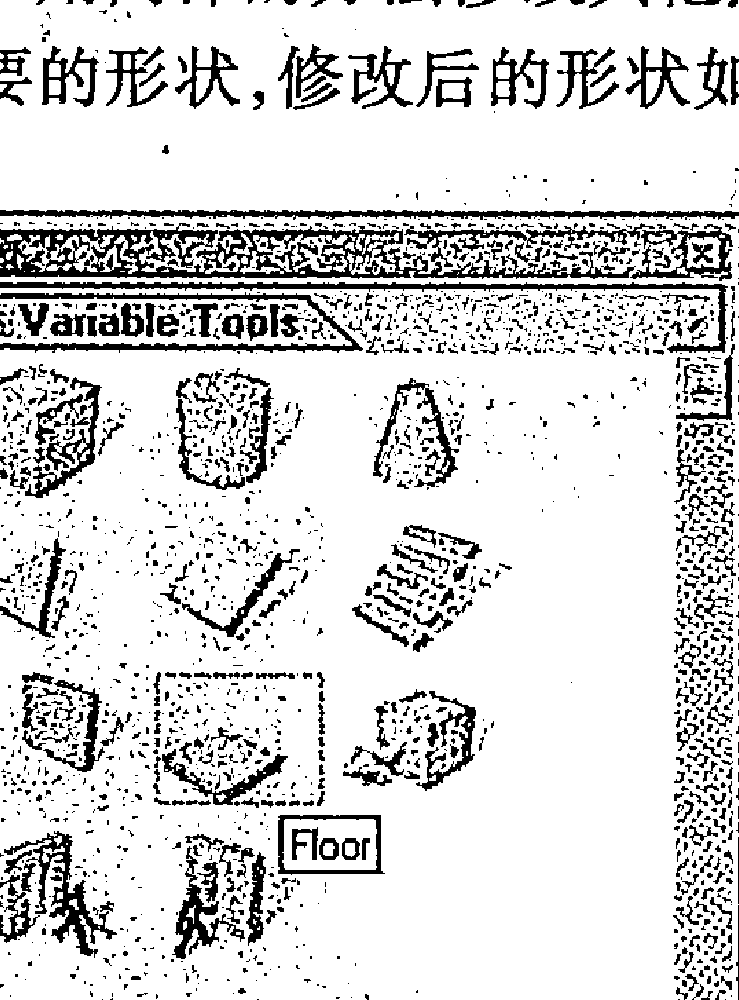

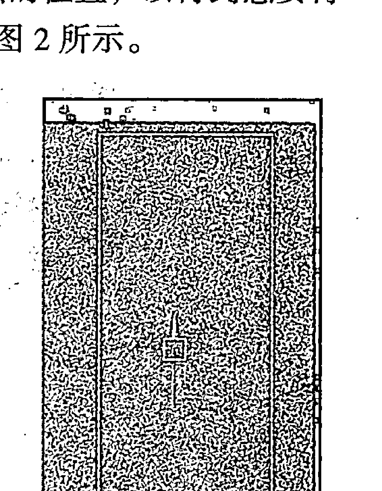

技巧与提示：在图形内任一点单击鼠标左键即可以选中该对象。但是当对象层叠时，选中的将是最上层的那个对象。这时，可以在对象（Objects）面板中找到该对象，单击其名称即可选中。对象多时，我们往往要用到这个方法。

- （3）用同样的方法我们为该地面加一堵墙（Wall），可以通过拖拽控制点的方法来修改墙的位置和尺寸。
技巧与提示：你可以在对象特性面板（Object Inspector）中修改墙和地面的厚度（Thickness）。
- （4）在加一个根柱子（Column）。在加上柱子后，你会发现柱子不是圆的，而我们想要的十圆柱子。修改对象特性面板（Object Inspector）中的 Faces 的值为最大（64），Radius 值为 2。
- （5）将视图（View）切换到侧视图（Side），单击视图面板 Side 即可。分别对柱子和墙的高度进行修改，修改完成后如图 3 所示，此时的视图（View）面板如图 4 所示。

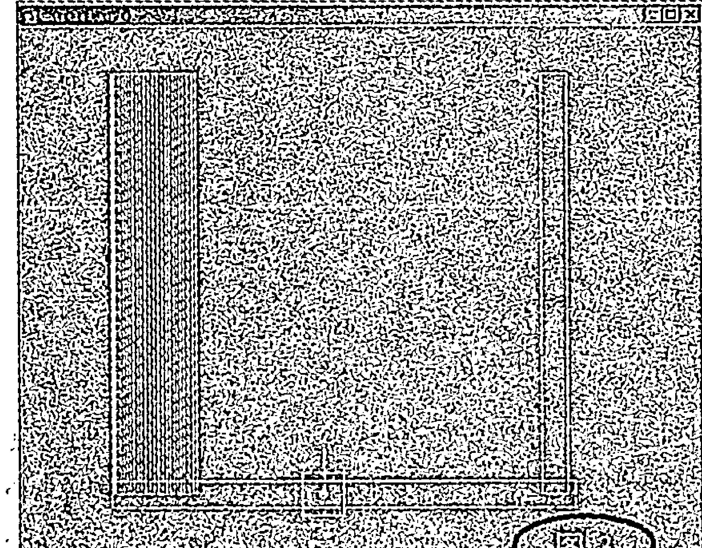

技巧与提示：锁定对象的简便的方法是在对象（Objects）浮动面板的该对象的名称前面的小框内单击鼠标左键，小框内将出现小锁图标，那就表示对象被锁定（如图 7 所示）。顺便提一下，小框前面的小框内有一个眼睛，当眼睛显示时，则该对象可见；否则，该对象是被隐藏。如果你感觉工作窗口的对象过多，你可以用该方法隐藏一些对象，以便于编辑。


- （6）我们要的不是一根柱子，而是一排柱子。所以要切换到俯视图，选中柱子，选择 Edit> Duplicate，复制一个与当前柱子完全一样的柱子。复制若干柱子（我们这里复制了 5 根）后，将它们拖到地面的边缘。完成后的图形如图 5 所示。
注意：在拖动前，请将地面锁起来，如若不然，在拖拽柱子时会不太方便（如图 6 所示）。


- （7）将视图切换到侧视图（Side），复制一个地面（Floor），将它移到柱子和墙的上面，完成后如图 8 所示。


- （8）我们现在来为走廊添加饰物。选择组合工具（Variable Tools）面板中的墙（Wall）工具，建立一个竖直的平板。如下图所示在俯视图（Top）中，通过对控制点的拖拽进行位置和大小控制，将它放在靠墙的位置，完成后如图 9、10 所示。


- （9）除了天花板以外，我们还想为它加一个尖顶，以增加美感。选择组合工具（Variable Tools）面板中的斜板（Slab）工具，在侧视图中增加一个斜板，并利用浮动工具面板的旋转和缩放工具来调整其大小和位置。切换到俯视图，调整斜板的大小，完成后如图11所示。

技巧与提示：Atmosphere 的缩放、旋转工具的使用很特别，必须先选中对象，然后用工具在屏幕上按下左键不松手，拖动出同心圆后才可进行操作（默认是等比缩放，按住 Alt 为等对边缩放，Ctrl 和 Shift 为两种类型的扭曲缩放），需要多练习几次才可熟练。

切换到测试图，复制一个斜板，并通过旋转工具调整其角度，并移到相应的位置，完成后如图12所示。


技巧与提示：如果你的工作窗口的视图不太方便，你可以用移动、缩放、缩进、缩出工具来调整。

忙了半天，我们还没有看到效果。别急，选择视图 (View)浮动面板上的浏览 (Browser)。

好像和想象中不太一样。这时，可先按 ↓ 水平后退，再按 Shift ↑ 水平升高，再按 Ctrl ↓ 降低视角（多操作几次就可以达到熟练的程度，以后经常要用到），这时的模型如图13所示。


### 2. 添加材质

虽然感觉还不错，但好像缺了点什么？对了，就是材质！下面我们为走廊添加材质。选择 File> Import Textures...，找到合适的材质，选中后单击“打开”，材质就被导入了。单击材质，将鼠标移到要添加该材质的对象上，单击鼠标左键，材质就被添加了，完成后如图14所示。

比刚才好了许多，但墙上的框中有东西。这是因为，在选好填充的材质后，如果将对象特性面板 (Object Inspector)里的“应用到 (apply to)”的默认 Object 改为 Face，则软件只对图像的一个面加材质，大家可以通过调整参数，来感受一下效果。


### 3. 添加光影效果

为了使效果更逼真，接下来我们将加入光的效果。将工作窗口切换到俯视图，在图上添加一个小柱子，调整其位置和大小。完成后，再复制4个，它们分别放在两柱子之间（如图15所示）。


将工作窗口切换到浏览窗口，通过移动鼠标，将视图调到如图16所示的样子。


选择组合工具 (Variable Tools)面板中的油漆桶，修改对象特性面板 (Object Inspector)里的参数如图17所示。注意：要选中发光 (Luminous)选项。分别对5个小灯进行填充，填充完成后，按下光控制（Lightning Control）面板的加光到场景中（Add Lighting to Scene），Atmosphere 将开始对场景进行渲染，渲染后的效果如图 18 所示。


### 4. 配以声音

当前的场景还是一个“寂静”的世界，下面我们为它加上声音。首先，我们用记事本新建一个名为 world.js 文件，其内容如下：

```
javascript
chat.print("I want to test the world")
var sound;
sound = Sound("test.wav");
sound.volume = 1;
sound.repeats = 0;
sound.play();
```

chat.print 表示在浏览器聊天栏出现的系统信息。Sound("") 中间的 test.wav 就是声音文件地址，目前只支持 WAV 和 MP3 两种格式。文件名可以使用类似 http:// 的网络地址。volume 指定音量大小，1 为原音量，0.5 为原来的一半高。repeats 设定重复播放次数，0 代表永远循环。找到场景设置（World Settings）面板。如果不在桌面上，可以选择 Windows > World Settings，该面板即可弹到桌面上。按照图 19 的参数设置好该面板，场景声音的设置宣告完成。


除了加声音外，我们还可以加雾等等效果。这一部分的内容很丰富，有兴趣的读者可以参阅 Atmosphere 的 Javascript API Documentation，当你阅读完该文献后，你已经是高手了。忙了半天，将这个东东存为 corr.aer 吧！

### 5. 场景连接

在现实世界中，场景是很多的。那么，在 Atmosphere 中如果建立多个场景，该如何连接起来呢？下面我们将解决这个问题。

首先，我们解释两个概念。场景入点（EntryPoint）和场景出点（Portal）。场景入点表示当访问者进入此地的时候的位置，而每个新场景亦默认有一个人点；场景出点表示离开此地前往其他场景的位置。类似普通网页的超连接，只不过不是点击鼠标，而是控制自己走到指定位置而已。注意出点高度可以不同，这样有可能某些矮小的角色无法进入高处的出点。解决办法是改变高度（Shift + ↑）。相信大家已经把这一招练得很熟了！

接下来，我们再建一个场景（World），建好后的场景如图 20 所示。为了简单起见，我们没有给它加材质和光。


现在我们利用 Object（物体列表）面板快速选择人点（EntryPoint），将它放到如图 21 所示的地方，红色的立方块就是入点（EntryPoint）。


严正警告：如果入点低于任何物体，可能在重力生效的情形下造成一进入场景就不断下坠的后果。如果这种情况发生，可以手动关闭浏览器的 Gravity（重力作用）选项。还可以关闭 Collide（障碍作用）选项，这样就可以漂浮着穿墙而过了。可以在发布场景中设置浏览时默认的状态。要想重力作用有效，障碍作用必须先有效。

下面该是设置出点的时候了。由于我们想由走廊到花园，所以我们的出点应该设在走廊的场景中。打开 corr.aer，选择组合工具（Variable Tools）面板中的出点（Portal）工具（如图 22 所示）。将工作窗口切换到俯视图。放置好后，到侧视图中调整位置，如图 23 所示（图中红色小方块为出点）。


选中出点，打开对象特性面板（Object Inspector）里设置一下（如图 24 所示）。Garden.aer 就是前面保存的花园的场景名，本场景保存的为 corr.aer。大家可能已经注意到在 garden.aer 中，我们没有设出点（入点是 Atmosphere 为我们设的，同时它也是必须的），因为我们只有两个场景，如果连来连去，那太没意思。大家如果有兴趣和毅力，可以将大观园建成网络，那时我一定捧场！


注意：如果想让浏览者在此场景中浏览的同时，能够看到其他浏览者（同时浏览该差场景的人），并与他们聊上几句的话，那么必须设置场景服务器。目前，Adobe 只提供了一个服务器 http://atmosphere.adobe.com。在面板的服务器（Server）地址栏中填入如图 25 所示的场景设置（World Settings），这样就可以使用聊天功能了。由于目前全世界都在使用这个服务器，速度相对较慢，很有可能连接不上，或者连上后反应迟缓。相信随着这项技术的不断发展和该软件的广泛应用，必将有很多的网络公司会加入，为我们设立更多的场景服务器（World Server）。


### 6. 导出与发布

下面我们要做的就是完成三维网页的最后一件事，将我们的作品送上 Internet。选择 File> Publish World，填上文件名，最好与场景的名称一致。点击“保存”后，即完成了 *.aer 文件的发布。发布后的 .aer 文件已经可以使用插件浏览了。但是，要想作为网页发布，还需要建立 htm 或 html 文件，文件要以插件的形式嵌在网页上（和 Flash 动画的嵌入方法一样）。大家最好使用 Adobe GoLive 5 将发布后的 .aer 文件嵌入 .html 中，毕竟都是一个公司的产品，兼容性要好一点。如果没有 Adobe GoLive 5，请大家原样拷贝下面的代码，将黑体部分换为自己的文件名即可。

> 注意：黑体部分必须是绝对路径，如 http://www.adobe.com/hello.aer。

```
<HTML>
<HEAD>
<META NAME="generator" CONTENT="Adobe GoLive 5">
<TITLE> My World </TITLE>
</HEAD>
<body marginheight="0" marginwidth="0" leftmargin="0" topmargin="0">
<center>
<hr>
<hr>
<OBJECT ID="MetaStreamCtl" CLASSID="CLSID:03F998B2-0E00-11D3-A498-00104B6EB52E" width=640 height=480>
<EMBED Component="IVirgoComponent" ComponentFileName="VirgoComponent.mtc" src="http://Mysite" type="application/x-mtx" name="simple1" width=640 height=480 script="rue" BroadcastKey="9639daf2981121afae6190d130a48d0-60a1-38.144.6.51/TestDemo/">
<param name="Source" value="http://Mysite">
<param name="Component" value="IVirgoComponent">
<param name="ComponentFileName" value="VirgoComponent.mtc">
<param name="BroadcastKey" value="9639daf2981121afae6190d130a48d0-60a1-38.144.6.51/TestDemo/">
</OBJECT>
</center>
</body>
</HTML>
```

### 三、巨匠功能补遗

上面我们介绍了 Atmosphere 的一些基本操作，下面我们将没有用到的而又十分重要的功能介绍一下。

- 1. 组合(group)

有时候，我们希望把几个对象绑在一起，这样可以很方便的对整体进行编辑。

  - (1) 新建一个圆台和一个圆柱（如图26所示）。

圆台和圆柱的参数分别如图27、28所示。


  - (2) 复制一个圆台，翻转180度（在测试图内），并将三者组合起来，完成后如图29所示。
  - (3) 按下鼠标左键，画出一个矩形将它们圈起来。选择 Object> Group 将它们组合在一起。请注意组合后的 Object 面板的内容（如图30所示）。这个柱子比上面的要漂亮不少。组合后，只要复制该组就可以获得很多柱子，这比单个对象先复制后组装节省时间，从而提高工作效率。当然，分散也是可以的。选择 Object> Ungroup，可以将组合分散开以便于编辑。


### 2. 对象的布尔逻辑运算

对象的布尔逻辑运算可以帮助我们利用 Atmosphere 提供的基本形体，创建出复杂的三维图形。上面我们讲的组合其实质就是布尔逻辑运算中的“相加”，它的使用和特性相信大家已经掌握。这里就不再赘述。“相减”在前面其实也已经用过，细心的读者一定发现我们的 garden 场景中的花坛中间有一个洞，基本形体里并没有这个。下面我们就以创建如图31所示的对象为例介绍一下相减的运算。


选中较高的对象，打开其对象特性（Object Inspector）面板，将 Subtractive 选中（如图32），得到的结果如图33所示。


## 3. 文字的创建

大家也许需要在场景中用到文字，但 Atmosphere 并没有提供文字工具。我的解决方法是用前面添加材质的方法来添加文字，可以用图形编辑器编辑文字，然后以材质的形式导入 Atmosphere 中，Atmosphere 支持 gif、jpeg 和 png 格式，建议存为 jpeg 格式。


## 四、“巨匠”显神威

### 1. 搭建房子的架构

- (1) 如同生活中建房子一样，我们需要先搭建一个房子的架子：搭建前我们还需要做好地基。新建一个工作区，选择 Variable Tools 面板中的 Floor，在工作区中绘制一个地面，根据需要修改地面的大小属性，并移至适当位置，一个简单的地面就已经铺建好了。在 Views 面板中选择 Browser，浏览地面效果(如图34)。


- (2) 地面铺好后就开始围墙了。在 Variable Tools 面板中有一个 Wall(墙壁)，我们可以依次把地面围好四个墙壁。不过，Atmosphere 为我们提供了更加方便的围墙方式，选择 Edit > Extrude Walls from Floor(在当前地面建立墙壁) 可以快速地帮我们把四个墙壁围好 (如图35,36)。


- (3) 这时一个简单的架构就搭好了 (如图37)，是不是挺快呀？在 Browser 视图中浏览框架时，地面墙壁的色彩都是随机的。我们编辑时，墙壁等物体都是可穿透的，需要在最后发布到站点后才能正常使用。


- (4) 接下来就要给地面及墙壁稍作装修了。在 Browser 视图下点击 File > Import Textures(输入图片)，选择准备好的材质图片，材质将会输入到 Variable Tools(变量工具)面板中(如图38)。选择相应材质给地面及墙壁进行填充。最后制作出的效果如图39所示。


在 Browser 视图下，工具条会变成左侧工具（如图40）。

工具按用途分别为：Move（移动视角）、Edit Tex（材质编辑工具）、Del Tex（材质去除工具）、Get Tex（材质吸取工具）、Light Obj（场景照明工具）、Light Face（面照明工具）。使用 Move 移动您的视角，给其它墙壁填充材质，使用 Edit Tex 对材质进行适当修改。填充材质错误后，可使用 Del Tex 去除错误填充，重新填充。

每次 Atmosphere 重新打开后，Variable Tools 中的材质就没有了，这时可以使用 Get Tex 吸取已有材质，并重新利用。 Light Obj 给整个场景进行简单照明。 Light Face 对单独一个面即墙壁等进行照明（如图 41）。

选择 Window 菜单下的 Object Inspector，打开这个物体属性面板（如图 44）。

如图 45 所示，在面板中勾选 Subtractive（减去形式），这时所选择的物体就不会显示了，和其它物体的相交部分就被减去了。注：减去的边缘部分可以再次使用材质。一个窗户也就差不多了。最后的效果如图 46 所示。

- (5) 使用 Floor 加上一个屋顶，移到墙壁的上面，再使用同样的方法填充材质，一个房子的架子就搭好了（如图 42）。


### 2. 门窗及室内的家居装饰

- （1）先做个窗户透透气。

选择 Variable Tools 面板中的 Box（立方体）工具建立一个立方体，并调整大小和位置使它穿过墙壁（如图 43）。


- （2）夏天到了，加个空调吧。

选择 Variable Tools 面板中的 Wall（墙壁）工具，绘制一个竖直的板块，并调整大小位置（如图 47）。

给板块贴图，加上一个空调的材质，这时可以发现 Object Inspector 面板中出现了如图 48 的属性面板。


属性说明如下：

| 属性 | 说明 |
| :--- | :--- |
| Apply To(应用于) | Object 指整个物体; Face 指物体的一个面。 |
| Scaling Type(缩放比例的类型) | Pixel 指像素; Tile 指平铺。 |
| Constrain Proportions | 强制比例。 |
| Scale U | 横向缩放。 |
| Scale V | 纵向缩放。 |
| Offset U | 横向偏移。 |
| Offset V | 纵向偏移。 |
| Rotation | 旋转。 |

在这些属性中，我们可以控制材质的大小位置等，这些都需要自己通过实践去体会了。


使用 Variable Tools 面板中的 Solid(油漆桶工具)给物体的侧边也填上颜色(如图 49)。

按照制作窗户的方式，同样可以去绘制一扇大门，供行人出入。

- (3) 放到网上，让大家共享一下快乐。

最后，必须把你所做的效果发布一下 (如图 50、51)，选择菜单 File 下的 Publish World，保存的 .aer 文件才能在网络中正常浏览，否则效果中的材质将不能显示。

到这里，我们已经把 Adobe Atmosphere 基本讲完了，但是 Adobe Atmosphere 的内容远不止这些，我们只是挑最常用的和最基础的介绍了一下，在掌握了基础技巧后，大家可以再制作一些相对复杂的效果，比如家具、楼梯、灯光、场景的转换、户外风景等等复杂效果，这些都需要大家有足够的耐心、扎实的绘制功力。有意研究 Adobe Atmosphere 的可以到 Adobe 公司的网站 http://www.adobe.com 上去找到关于 Adobe Atmosphere 更多更全的文章。我们也建议您将 help 文件和 Javescript API Documentation 好好读一下。


河南 张金贵

对于许多电脑爱好者来说，每当看到制作精美的特技电影及其广告画面时，定会赞叹不已，被制作者的巧妙构图和高超技法所折服。赞叹之余，也禁不起自己的创作冲动，想表现一下，让自己的灵感也变成作品让大家欣赏，那么用什么软件才能实现这个美好愿望呢？这就是下面我们要给大家介绍的专业视频工具 Premiere 6.0。

## 一、简介

所谓电影特技制作，实际上就是把拍摄的影片重新进行编辑制作，在编辑系统中，分为线性编辑系统 (Linear Editing System) 和非线性编辑系统 (Non-Linear Editing System) 两种。线性编辑系统指的是影片从制作到完成必须一步步循序渐进完成 (就是不能跳着制作影片)，传统的录像带 VHS、Betacam 都是这种制作系统。在计算机里制作影片时，不必从头开始制作，可以由影片的中间开始，最后在计算机中完成编排顺序，这就叫非线性编辑系统。Premiere 6.0 就是非线性编辑软件中的佼佼者，它是由在多媒体、图形图像编辑软件领域处于领先地位的 Adobe 公司开发的一个非常优秀的桌面视频编辑软件。它能完成在传统影片编辑中需要利用复杂而昂贵的视频器材才能完成的视频处理，配合 Windows 的操作界面，用户可以轻易地完成影片剪辑、音效合成等工作，通过综合运用图片、文字、动画等效果，可以制作出各种不同用途的多媒体影片。你可以加装视频捕捉卡获取影片或者利用计算机既有的影片在 Premiere 6.0 中完成特效及剪辑。而它的操作也很简单，只要定义两段影片 (也可以是静态图片) 的长度，再加上希望的转场特效就完成影片的制作了。

Adobe Premiere 6.0 是目前市场上操作最简便的超强专业用影像编辑工具，能对视窗平台和跨平台上的 DV 的所有主要网页上的影像格式提供支持。Premiere 6.0 版除了承继 5.0 专业用影像编辑工具的成熟功能外，更进一步地将现阶段最先进技术融合为一体，为所有网页上的影像格式提供高整合、跨平台的支持，轻松解决 DV 数字视频传送与网页播放影片的技术问题。如此一来，所有的影像创作爱好者，不但可以运用 Premiere 6.0 功能更强大的工具组合来雕琢自己的作品，更只需要通过一个指令，便能让自己的心血结晶与全世界、甚至于未来的新世代分享。

## 二、新功能和改进

### 1. Adobe Premiere 6.0 的新功能

- (1) 个人化的桌面工作空间
- (2) 内建数字视频装置控制器
- (3) 场景预览
- (4) 拍摄程序记事板视窗
- (5) 将多段影片加入时间轴中自动化地处理
- (6) 专业级混声器
- (7) 史料、影片、音效处理器以及效果控制盘
- (8) 超过 25 种后效处理器
- (9) 多种网络格式输出选择

Premiere 6.0 是 Adobe 公司的新产品，它不论在界面、功能方面，还是在滤镜输出上，都有了较大的改进。它提供了比以往版本更加合理的界面，使创建和编辑视频更加简洁，化繁为简从此不再只是一句口号了；在输出、预览方面功能也更加强大了，支持比以往更多的文件格式及输出方式；捕捉的质量和速度都有所改善和增强，使用户能够创作出更为精湛的数字视频作品，应用于影视、多媒体和网络等方面。在使用 Premiere 6.0 时，如能同时组合使用 Photoshop、After Effects 等软件，将会使 Premiere 6.0 更加强大。

### 2. 界面的改变

Premiere 6.0 有许多改动，在界面外观上给人一种全新的感觉，比老版本舒服多了。在 Project (项目) 窗口中大大的提高了库的功能，使用上也很简单。Adobe 真是很体贴用户，现在使用更为方便了。另外还有一个好消息，项目窗现在已经一分为二！一边是库窗口，另一边是项目窗口，可以更容易的进行项目管理了。以前是不是常感到找东西麻烦？特别是查找影片项目，现在就方便多了。

在 Transitions (转换) 窗口中，Premiere 将转换方式进行了详细的分类，应用效果就是用鼠标一点那么简单，简化了以前的许多繁琐工作，应用起来相当快捷简便。滤镜效果作为影视制作相当重要的一个组成部分，是一直为我们所关心的。在非线性编辑软件 Premiere 6.0 中亦是如此，其作用不可忽视。Premiere 6.0 重新设计了 Effect (效果) 制作工具，仿效了 After Effects 的 Effect (效果) 制作窗口的界面和使用的方法，又将 Video 和 Audio 分离，同样提高了管理的功能，使 Premiere 在 Effect (效果) 制作上有了相当大的提高。通过显示窗口进行调节，使用者可以直接观看到经过处理的效果；如在能结合 Timeline (时间标尺) 窗口中关键帧的功能，就可以使 Effect (效果) 在编辑过程中发挥出更大的作用。在 Project (项目) 窗口、Transitions (转换) 窗口、Effect (效果) 的 Video 和 Audio 窗口中，新增了搜索的功能，使用户可以更为方便地利用这些窗口，将查找要应用的工具变成轻松而又容易的事。

Premiere 重新设计了 Timeline (时间标尺) 窗口，增强的时间标尺窗口可以使编辑更加轻松，灵活的编辑工具和工具按钮的配合，使得各种命令更加容易识别。仿效了 After Effects 的关键帧功能，Premiere 6.0 增加了编辑关键帧的功能，现在时间标尺窗口里能显示关键帧，让你可以看到在哪里增加、删除或者移动的效果更好。在使用 Transitions (转换) 效果时，如果一个电影夹 (clip) 中的一个转场效果太短的话，Premiere 会提出警告，并且提供问题的解决方案。时间标尺窗口还可用于辅助创建故事板，Premiere 可以让用户组织一组电影夹，用户可以在电影夹之间指定一个重叠和一个转换的设定，然后通过一个单一的命令将电影夹中的文件取出放进时间轴窗口。还可以通过直接拖动一个新的转场效果到原来的转场效果上面，很容易地更换转场效果。

### 3. 强有力的 DV 支持

Premiere 6.0 对数字设备提供良好支持，不需要特别设置就可以配合大多数的数字视频摄像机，Premiere 6.0 支持各种非标准像素比率，可方便使用的 DV 预置功能，并且为输入 DV 服务的一个 DirectShow 模块类型的文件，对数字视频的制作提供了极大的方便。

Adobe Premiere 6.0 直接支持从家用到专业级的各种 DV 设备。您只需将 DV 摄像机连接在您的苹果电脑或 PC 机的 IEEE-1394 接口 (也称为 FireWire 和 i.LINK) 上，选择摄像机模式和制造商，就可以令您愉快地开始工作了。通过内置的 DV 支持，使得您的工作变得异常简单。

对最新 DV 硬件系统的跨平台支持：

- (1) 直接支持 Open Host (开放式宿主) 控制界面 (OHCI)，这是一种利用 DV/1394 总线，专用于 Windows 的标准化交互方式的规范。
- (2) 对宽屏帧屏幕比例和变形像素屏幕比例的支持确保您的 DV 工作的完整性。
- (3) 使用在 Load Project Settings (加载项目设置) 对话框中的 DV 预置选择对压缩、帧尺寸、像素屏幕比例、每秒帧数、深度、音频和场顺序的设定。
- (4) 利用增强的 Movie Capture (视频采集) 窗口更灵活、高效地进行 DV 捕捉。内置的设备控制提供最大限度的可靠性，令视频捕捉处理更加精确。
- (5) 使用 Movie Capture Settings (视频采集设置) 控制条观察和编辑您的视频捕捉设定，改变捕捉位置和设备控制预置。
- (6) 使用 Movie Capture Logging (视频采集加载) 控制条快速地加载视频片段，设定入点和出点，为片段和 reel 命名，轻松地批处理多个加载的视频片段、为多个片段添加注释。

### 4. 一步到位的 WEB 输出

在数字视频方面，Premiere 6.0 能导入并输出 Mac 操作系统上的 QuickTime 电影格式数字视频，以及与因特网结合很好的 Real Time 格式。Premiere 配合 GoLive 和其他的 Adobe 网络出版解决方案，可以提供一种快速的出版方式。为了方便您将视频运用到 Web 上，Adobe Premiere 6.0 提供了一整套视频至 Web 的工具，它们能够迅速地制作各种流行的流式视频。在使用“存储为 Web”功能时可以进行多种 Web 输出设定，而通过自定义的 Windows Media 或 RealMedia 输出选项，则可以更精确地控制流式格式。无论您需要何种 Web 视频格式，Adobe Premiere 6.0 都能够提供给您所要求的速度和浏览方式传递视频内容的格式。

在 Premiere 6.0 中可选样多种 Web 输出选项，包括 QuickTime 流、QuickTime 递增下载、RealG2 Web 下载、RealG2 流、Windows Media (音频和视频)、AVI CD-ROM、MPEG-I 和 MP3 等。

为在 Windows Media Player 和其它支持高级 Windows Media Export 的应用软件上回放而制作高质量的、宽带的视频(仅限于 Windows)。通过 RealNetworks 的 Advanced RealMedia Export 直接输出 RealMedia 流格式。设置时间轴标记，它们可以包含指向 HTML 页面的链接。利用这些标记，您可以开发在一个回放时的特定点上自动调用 Web 页面的流式视频。

### 5. 增强了声音的编排功能

Premiere 6.0 改善了声音编辑方式，增强了声音的编排功能，Premiere 6.0 的混声功能现在在播放期间变得实时而平稳，包括一个声音的混音器窗口控制面板和一个模拟 Audio studio 的混音控制台，包括音视频、静音和单双声道开关，允许同时控制一组频道。并能够实现实时的直播。同时在音频的格式方面已经支持 MP3 格式的声音格式。

### 6. 增强的专业工具

在 Adobe Premiere 6.0 中的新工具，诸如专业级音频混合器和创新的时间轴自动置入功能，方便您进行创新和实验性工作。新的故事板使您在开始编辑之前可以直观地排布整个节目顺序。您还将得到优化的界面所带来的优势，新控制面板，以及更直观的操作反馈，均能使您更高效地制作节目。

- (1) 监视器窗口
    - ① 利用传统的 Source/Program 高效地编辑。
    - ② 在 Source view 中打开、播放和编辑源片段，在 Program view 中回放编辑的节目。
    - ③ 在 Source view 中分割视频和音频的入点和出点，以便达到更新颖和动态的效果。
    - ④ 在时间轴上使用 Insert(插入) 和 Overlay(覆盖) 按钮，精确地放置源片段。
    - ⑤ 使用 Lift(升起) 和 Extract(抽取) 按钮从时间轴上去除素材。Lift 按钮留下一个空的位置，而 Extract 使后面的片段自动向前补齐。
    - ⑥ 在 Source 和 Program 视图中观看可定制的 Title Safe(字幕保护)和 Action Safe(实际尺寸保护)距离。
    - ⑦ 切换到 Trim(缝合) 模式中，精确地编辑两个并列的片段。

- (2) 时间线窗口
    - ① 在时间线上可以添加多达 99 个视频和 99 个音频轨道。新的视频轨道出现在已有的轨道上面，以表示出最终的电影的合成方式。
    - ② 使用 Ripple、Rolling 和 Rate Stretch 编辑工具直接在时间线上编辑视频。
    - ③ 使用 Slip 和 Slide 编辑工具，保护一个片段的持续时间和在改变片段的入点和出点时整个影片的持续时间。
    - ④ 从控制面板上向时间线上拖放需要添加的图像和特殊效果。为轨道分配描述性名字，以便分辨它们的作用。比如命名一个轨道为“标题”或“爵士乐”。
    - ⑤ 通过 Effect KeyFrame 轨道菜单命令或使用直接向时间线上拖放操作来添加、删除和移动关键帧。通过 Effect Control 面板使用关联的关键帧轨道获得无限的创造能力。

- (3) 项目窗口
    为相互关联的片段创建多个素材箱并合理地放置它们。通过 Bin View 按分级别方式观看一个项目中的文件结构。
    选择 Project 窗口显示片段的方式：是在 Thumbnail view(缩略图视图) 中以带有文字描述的缩略图显示；还是在 Icon view 中按图标显示；或者在 List view 中按文件名列表显示。
    在 Project 窗口中预览一个视频片段。预览区域中会包括这个片段的基本信息。
    改变 Poster frame，以便在 Project 和 Timeline 窗口中可以直观地识别该片段。

- (4) 故事板
    使用故事板进行作品的简单编排，在其中拖放各个片段进行快速简略的剪辑。
    在故事板中双击一个文件即可开始调整淡入淡出位置和添加标记。

- (5) Automate to Timeline (时间轴自动处理操作)
    使用 Automate to Timeline 功能从故事板或 Project 窗口向时间轴发送一个序列的片段。
    快速简略剪辑：使用 Automate to Timeline 命令将您的故事板——一组静帧图像或视频片段——直接放置在时间轴上，并含有缺省定义的过渡和覆盖参数。
    自动音乐视频：在时间轴上创建一系列无编号标记来表示音频轨道的节拍。选择 Automate to Timeline 命令，您的片段将自动被调整以符合音乐的节拍，并在您所标记的节拍处切入和切出。

- (6) 音频合成器
    在功能完整的新的音频合成器中通过动态 VU 表混合多个音频轨道，调整增益和声向，并得到实时的反馈。

## (7) 字幕控制
- 通过 Volume fader control(音量减弱控制)，精确地控制音频增益。
- 单击 Mute 和 Solo 按钮来临时关闭音频轨道。
- 通过 Pan/Balance 控制将单声道片段从左移到右，或者调整立体声片段使之左右平衡。
- 自动读写：单击 Automation Read 图标读取一个音频轨道存储的增益和 Pan/Balance 数据。单击 Automation Write 图标写入改变的增益和 Pan/Balance 数据。
- 将音频轨道组成一组，以便同时进行相同的调整。
- 添加字幕横向滚屏和纵向滚屏，并可以进行精确控制。
- 为横向、纵向，或图形字幕设定淡入淡出点，或者以秒或帧为单位指定它的持续时间。将字体、字号、颜色，或其它属性赋予独立的字符、词，或是在一个文字块中的文字。
- 为文字、图形和阴影赋予透明和渐变的特性。

## (8) Adobe标准面板
在任何 Adobe Premiere 窗口中轻松实现您的创意。History(历史)面板(在 Photoshop 中也有此项功能)，可以进行多达 99 步撤销操作，以确保您可以回到操作过程的起始状态。
使用类似于 After Effects 中的 Effects Control 面板方便地控制所有片段的有效参数，并在 Monitor 窗口中得到实时的反馈。
在 Video and Audio filters(视频和音频滤镜)面板中按名字查找滤镜，或者创建一个包含您最喜欢和最常用的效果的文件夹而方便您的工作。
在一个文件夹中组织过渡操作，在 Transitions(划像)面板中重命名、重新安排位置、隐藏或删除文件夹。
在控制面板方面，Premiere 仿效了 Photoshop 的特点，可以改变目录和隐藏不常用的选项，又新增加了输出控制面板和历史控制面板，这样就可避免繁琐的操作来完成不同风格视频影片的制作，历史控制面板的使用会极大的提高制作的效率。

## (9) 高质量的专业效果
使用内置的 Adobe Photoshop 滤镜进行色彩平衡、亮度、对比度、模糊、扭曲和变形等调整。使用 25 个以上内置 After Effects 滤镜进行各种可能的效果的实验，其中包括 Channel Mixer(通道混合)、Directional Blur(方向模糊)、Color Balance(色彩平衡)、Basic 3D(基本三维)、Drop Shadow(阴影)、Broadcast Colors(广播色彩)、Transform(变换)和 Reduce Interface Flicker(降低界面闪烁)等等。

## (10) 无缝集成
Adobe Premiere 6.0 拥有和其它 Adobe 软件类似的界面，使用过 Adobe After Effects、Adobe Photoshop 和 Adobe Illustrator 的用户会发现，Adobe Premiere 可以轻松地与这些工业标准的 Adobe 软件协同工作，以便达到出众而专业的效果。新的“编辑原稿”命令使您可以方便地在原始制作软件中编辑置入的图像和其它物件，如 Photoshop 图像。您还可以将 Adobe Premiere 6.0 中的内容输入到 Adobe GoLive 中，并保留它的 meta-data，以便将来修饰这些用于 Web 的内容。无论您进行何种视频制作工作，Adobe Premiere 6.0 都能够使它和您的创意工作一样卓有成效。

## 三、Premiere 6.0系统基本介绍
在熟悉的具体操作之前，首先我们来了解一下 Premiere 6.0 的工作界面。启动后我们就可以看到一个包括多个浮动窗口的软件界面(如图 1)，软件共有 file(文件)、edit(编辑)、project(项目)、clip(片断)、timeline(时间线)、window(窗口)和 help(帮助)七个菜单，默认情况下，启动软件，将自动打开三个浮动窗口：
(1) monitor(监视窗口)：主要是播放和剪辑影片的工具，用来进行素材的编辑和预览，它分为左右两个窗口，左面的源窗口主要用于对源素材的预览和播放，你只要把 Project 窗口中的素材影片拖拽到原始素材影片预览窗口中，然后点击下面的 Play 按钮，我们就可以观看素材影片的内容，我们也可以选择 Source 下拉列表中的其他影片，观看多个素材影片；右面的节目窗口主要用来观看编辑好的影片。

(2) project(项目窗口)：这个窗口是各种影像资料、文字素材及声音文件的大仓库，用于存放和管理编辑节目所用的素材，只有在项目窗口中存在素材才能够被其他的窗口进行编辑操作。当我们选择 File > Import > File 或 Folder，然后选择所需的视频和音频文件，按 OK 后，所选的素材就出现在 Project 窗口中，当要用这些素材时，只需把 Project 窗口中的素材直接拖拽到 Timeline 窗口中的视频轨道或音频轨道就可以了，一个素材可以多次使用。
(3) Timeline (时间线窗口)：是用来完成音频和视频编辑工作的，对素材所做的大多数编辑以及为素材所施加的特技、键控、字幕等效果也是在时间线窗口中完成的。
以上这些窗口可以随时打开/关闭，除了这三个窗口外，单击菜单还可以打开其他许多工具窗口，你可以根据需要进行选择，在后面我们要介绍的电影制作，实际上就是灵活使用各种窗口来完成影片的剪辑、特效添加等操作的。

## 四、Premiere 6.0 的简单工作流程
### 1. 建立一个项目。
运行 Premiere 6.0，在打开界面的同时，会出现一个 New Project Setting 的设置对话框，你可以输入一些你所编辑的影片的参数(如图2)。在最上面的一个参数设置页下拉列表中可以选择对不同参数页的设置，

总体参数设置时选的是 General setting。在 Editing Mode 中，可以选择影片的格式，Premiere 提供了三种格式，其中包括常用的 AVI 格式和 QuickTime 格式。在 Timebase 中一般可以选择 30 或 29.97：如果是为 Web 或 CD-ROM 设计，可以选择 30；如果是为做 VCD 或录像带，则选择 29.97。Time Display 一般无须更改，Current Setting 列表框中显示了当前所设置影片的参数。单击 General Setting 下拉列表，选择 Video Setting，在 Compressor 列表中选择影片的压缩格式。如果你的硬盘够大，可以选择 None，毕竟 AVI 格式不是我们的最终输出格式，我们还要把 AVI 转换为 MPEG 格式。在 Frame Size 中填入影片的长和宽。

### 2. 输入剪辑
选择 File > Import > File，弹出文件选择对话框，在对话框中选择 diploma.mov，按 Ctrl 键可以同时选择多个文件。再选择 flags.mov、sing.mov 和 step.mov 以及 student.mov，点击 OK 完成操作。现在所有被选中的文件都会出现在 Project 窗口中，我们可以改变 Project 窗口的显示模式，在窗口的左下方有三个按钮，右面一个是带缩略图显示，中间一个是文件列表显示，左面一个是带缩略图的文件名显示，我们一般选择右面的按钮。

### 3. 保存项目
选择 File > Save，在 Save file 对话框中输入文件名，如：mymov，并确定文件保存路径，最后按 Save 按钮。

### 4. 预览
当完成了粗剪的工作后，就可以来看一看我们刚才制作的效果了。在 Monitor 窗口中，有两个屏幕，先前已经提到过，现在我们要用右面的屏幕，在右面的屏幕下方有一排按钮，点击 Play 按钮，即可看到整个编辑好的影片，如果你会使用 VCD 或 CD 机的话，这些按钮应该都会使用。

### 5. 过渡的使用
当两段影片的连接并非直接卡接在一起，而是由一段影片渐变到另外一段影片，这称为 AB Roll 剪辑，也称为过渡剪辑。将 Student.mov 从 Project 窗口拖拽到 Timeline 窗口的 Video1A 轨道，同时将 Sing.mov 拖拽到 Video1B 轨道，并使两段影片有一秒钟的重叠(如图3)。点击 Windows > Transition，使 Transition 窗口可见。在 Transition 窗口中显示了 75 种过渡特效，如有兴趣可以点击右上角的小三角形，在弹出的菜单中选择 Animate，这时就可以看到各种过渡特效的动画效果。将选定的过渡，如：additive dissolve 拖拽到 Transition 轨道中 Video1A 与 Video1B 相重叠处，此过渡的图像会自动调整与 AB 轨道对齐。


### 6. 过渡效果的预览
刚才我们提到的预览只能观看未做效果的影片，如果要看带特殊效果的影片就要用另外一种方法来预览，首先找到 Timeline 窗口中的“工作区域指标”(如图4)，用鼠标拖动其起点和终点，使其覆盖需要预览的片段。然后选择 Project > Preview，或直接按回车键，Premiere 6.0 会先生成预览文件，然后自动播放。

### 7. 叠加轨道的运用
在 Premiere 6.0 中，Video2 以上的轨道称之为叠加轨道。我们可以利用叠加轨道制作透明、运动和键控等效果。现在选择将 Graduation.psd 文件输入 Project 窗口，并将它拖拽到 Video2 轨道中，并与 diplomat.mov 的两端对齐。具体做法是：将鼠标移至 Graduation.psd 的尾端边缘处，可以发现鼠标的指针变为双箭头，然后按住鼠标将它拖到与 diplomat.mov 的尾端对齐的位置即可。由于 Graduation.psd 的背景是不透明的，所以在下面的影片将会被覆盖，点击一下 Graduation.psd 图像，然后按鼠标右键，在弹出的快捷菜单中选择 Video，在弹出的子菜单中选择 Transparency 命令，就打开了 Transparency Setting 对话框，在对话框中的 Key Type 下拉列表中选择 White alpha matte，并点选“掀纸”图标(如图 5)，按 OK 完成操作。


### 8. 设置影片的不透明度
刚才我们看到的影片中，字体出现的很生硬，不是很自然，我们可以改变影片的不透明度，来制作出淡入淡出的效果。点击 Video2 轨道旁的小三角形，此时 Video2 轨道变宽并出现控制透明度的红线。用鼠标将最左端拉下，再取三分之一处往上拉(如图 6)，代表影片由开始完全透明渐变至三分之一处时完全不透明，并持续到影片的最后。按 Enter 键重新预览影片。


### 9. 加入音效
将 Grad.wav 输入 Project 窗口，并将其拖拽到 Timeline 的 Audio1 轨道中，如果音频文件太长，可以用先前调整图像文件的方法来调整音频文件，使之与影片的长度一致。我们也可以用调整影片透明度的方法，来调整音频文件的淡入淡出的效果。

### 10. 输出影片
在 Timeline 窗口被选中的状态下，选择 File > Export > Movie 命令，单击 Setting 按钮，在 Export Movie Setting 对话框中确认 File Type: AVI， Range: Entire Project，点击 OK，键入文件名，点击 OK，Premiere 立即进入 Making Movie 状态。当影片制作完成后，影片会自动打开。按 Play 键便可以观看影片了。

## 五、Premiere 6.0 的基本操作
### 1. 准备素材、建立新项目
我们先来欣赏一段 Premiere 5.1 提供的一段电影，这段电影中有一段小孩骑自行车的场面，然后是两段自行车比赛的电影，而且还伴有精彩的音乐。下面就让我们来看看这段电影是怎样制作的。
首先还是先了解一下电影的原始素材，这些是合成这段电影的原始电影文件，第一个是小孩骑自行车的片段，接下来的三段电影是从不同角度拍摄的自行车比赛的电影，这个 Music.aif 是电影的背景音乐。
有了这些素材之后我们就开始制作电影。先建立一个新项目，打开“File”菜单，选择“New”下的“Project”，出现新项目设置对话窗，这里我们设置一下电影的格式，打开设置选项，从中选择 "Video Settings"。将画面的大小设置为 240*180 像素，每秒钟播放 15 帧的速率。其它的就不用设置了，最后点 "OK"。
画面中出现一个空的 Project 窗口，下面我们将素材文件导入。在 Project 窗口里双击，出现导入文件对话窗，切换到 Tour 目录，选中要导入的文件，点“打开”按钮。在 Project 窗口下方有三个按钮，点击它们可以改变素材的显示方式；第一个 Icon View 代表以图标方式显示；第二个 Thumbnail View 表示以小图标方式显示；第三个 List View 就表示以列表方式显示(如图 7)。

将 Boy.avi 拖放到 Timeline 的 Video 1A 通道，这里我们可以看到每一个通道前面都有一个小三角，点 Video 1A 前的这个小三角，你会发现下面的三条通道被折叠起来了，再点一下通道又会展开，这些功能有时也会用得上。

### 2. 剪切一段电影
我们再来看一下最后的作品；根据最终的电影效果，我们来安排这些素材；从画面中可以看出来，小男孩骑自行车到一个位置静止一下，然后画面就直接切换到了赛车的画面。
我们先来制作这一段。我们先看一下 Boy.avi 的内容，在 "Project" 窗口中直接双击 Boy.avi，再点一下 Monitor 窗口左边的“播放”按钮，可以看得出来中间有一段静止的画面，然后又开始继续骑。现在第一步要做的就是将静止后面的一小段电影去掉，然后再连接上赛车的电影。
在 Monitor 窗口的右侧“目标窗口”中拖动时间滑块(如图 8)，同时观察动画至小孩停止骑车的位置，松开鼠标，可以通过点击前进或后退按钮进行准确微调，此时可以看到，TimeLine 窗口的标尺上有一个小滑块，小滑块的位置就是当前 Monitor 窗口中显示的画面所在的位置，在 TimeLine 窗口中将鼠标移动到电影 Boy.avi 的最后面，这时鼠标会变成一个左右方向的箭头，按住鼠标左键，向左拖动，此时鼠标的位置处会出现一条竖线，当竖线到达小滑块的位置时，松开鼠标按键，这样后面这一段电影就被剪切下来了。

我们先来看一下效果，在 Monitor 窗口里点一下“播放”按钮。
接下来，我们将一段赛车的电影加在 Boy.avi 的后面，从 Project 窗口中将 Cyclers.avi 拖放到 TimeLine 的 Video1A 通道里，使这段电影的开始部分和前一段电影 Boy.avi 的尾部衔接起来。这段赛车的电影我们只播放它的一半，这里我们要将它的后半部分去掉，将鼠标移动到 Cyclers.avi 的最后面，当鼠标变成现在看到的这种左右的箭头后，按住鼠标左键，向左拖动大概一半的位置，松开鼠标按键，这样就调整好了。

### 3. 添加过渡
现在第一小部分的电影就可以了，我们再来看一下最终的电影片段，你会发现，Cyclers.avi 的赛车电影播放了一小段后就平滑的过渡到了另一段赛车的电影，播放到赛车的慢镜头后，画面逐渐变黑，然后是另一个赛车的画面。看了这一段后，我们下面就来做赛车的过渡部分和逐渐变黑的部分。
先把第2段赛车的电影 FastSlow.avi 拖到 Video 1B 通道中，然后用鼠标拖动这一段电影，使其和前一段电影 Cyclers.avi 有约 1 秒种的重合部分。拖动 TimeLine 窗口下面的水平滑块，使通道中的电影向左显示一些。
接下来就是添加过渡，在过渡窗口中找到我们需要的渐变过渡 Cross Dissolve[交叉消融]，用鼠标将它拖到 Transition 通道上，使其位置在两段电影重合的部分，因为没有处在重合部分的过渡将不起作用，过渡通道上便出现了蓝紫色的过渡标识。
我们来看看这个过渡具体是什么效果。双击过渡动画，出现此种过渡的设置对话框(如图 9)。在对话窗的右下角可以看到这种过渡的替代演示。选中 Show Actual Sources(显示真实源文件)，对话窗上方的 A 和 B 变为动画的两帧，我们还可以拖动滑块看到过渡效果，这里就不做修改使用默认设置，点 OK 关闭对话窗。其它的一些过渡同样也可以这样打开，有时还可以自己设置一些变化效果。

### 4. 预览动画
好，我们来看一下添加过渡后的动画效果。打开“Project”菜单，选择“Preview”，屏幕上出现要我们保存当前项目，点“是”按钮，屏幕上便出现了保存文件的对话窗，先给文件取名为 practice，再点“保存”。此时画面中出现建立预览文件的状态条，结束后，动画 Monitor 窗口的右侧便开始播放了。刚刚添加的过渡是不是给我们一种很平滑的感觉？

### 5. 画面的淡化处理
FastSlow.avi 电影的的前一长段是快速的赛车镜头，后面的一小段是慢镜头，我们需要做的是把慢镜头结束部分的画面逐渐变成黑色。这样的效果我们把它叫做画面的淡化处理，就是使画面的亮度逐渐的减弱。
在 TimeLine 的几个电影通道中只有 Video2 这样的通道才能使画面实现这种淡画的效果，但此时我们又不能把电影的 FastSlow.avi 都移动到 Video2 通道中，因为这样过渡就没有作用了。所以这里我们将电影 FastSlow.avi 切成两段。为了便于编辑，我们将标尺的显示单位更改为 1/2 秒。再将标尺上的滑块拖动到 FastSlow.avi 上比较合适的位置上，然后点一下 Time-Line 窗口左上角的“剃刀”按钮，在标识当前位置的竖线处单击，电影立刻被切成了两段，然后点中在电影下方左上角的小箭头按钮，把后部分的电影拖动到上面的 Video 2 通道里，并使其和前面的电影首尾相接。
点一下 Video 2 通道前的小三角，将该通道展开(如图 10)。可以看到动画下方有一个带红线的黄色长条，这条红线就表示画面的亮度，红线在最上方，表示画面的亮度保持原始不变。将鼠标移到红线上，鼠标会变为一只带有“+”或“-”的手形，鼠标移动慢镜头开始的位置，单击鼠标左键，红线上便出现一个红点，再将鼠标移动到红线最后的小点上，向下拖动小点到最下方，这样两个小点之间的红线变为一条斜线。我们可以将鼠标移动到标尺上，然后按下 Alt 键，拖动鼠标预览这段电影，可以看到画面由亮变暗。这样淡化的效果就做好了。


接下来我们要把最后一段赛车的电影拖放到 Video 1A 通道中，并将其拖放到与前一电影画面首尾相衔接的位置上。

### 6. 添加音频文件
现在电影的大框架基本上就搭好了，下面我们来给电影配上背景音乐。将 Video 1 和 Video 2 通道折叠起来，从素材窗口中将 Music.aif 拖到 Timeline 窗口的 Audio 1 通道中。在 Monitor 窗口的右侧点播放按钮，观看效果。音乐的节奏和画面的变化多端还没有很好的吻合，需要我们进行一下调整。
由于音乐无法在 Premiere 6.0 中进行编辑，所以我们要根据音乐的节奏来调整画面的变化。
为了便于调节，点一下“Audio 1”通道前面的小三角，声音通道便被展开了，此时可以看到声音的波形，从波形的变化中我们就可以判断音乐的音量变化和节奏了，这样调整上面的电影就比较容易了。这些细节上的调节很多时候就是凭感觉了。
调整好后我们可以预览一下，为了可以预览到整个电影，我们需要拖动标尺上的淡蓝色条的首和尾，使其覆盖整个电影区域。按一下回车键，Premiere 6.0 便开始生成预览文件了。现在看上去效果已经很不错了。

### 7. 设置图片的透明
我们再来看一下 Premiere 6.0 中的这个电影例子，在播放到后面时，我们可以看到画面中出现了一个标志，从小变大，又从大变小，并且是旋转着变小的。我们刚才制作的电影里还缺少这一小段，下面我们就来制作标志的变化。
在素材窗口中的“Veloman.eps”便是这个标志，这个文件是带有 Alpha 通道的，这里我们要使用 Alpha 通道使图片透明。将其拖放到 Video 2 通道里，调整到现在画面中看到的位置，距电影结束约 5 秒钟；然后将鼠标移动到其结束位置，当鼠标变成左右的箭头时按住鼠标左键，向右拖动，一直到电影结束的位置，然后再松开鼠标。
用鼠标点一下图片上方的标尺，标尺上的滑块就代表当前帧的位置。在 Monitor 窗口中观看效果，可以看到图片覆盖在下面的影片上。为了使图片产生运动效果，我们需要打开 Motion Settings 对话框。在 Video 2 通道中，点击图片文件，然后右键选择 Video > Motion，就打开了 Motion Settings 对话框。
在对话框中，我们可以设置图片在时间线上的位置、缩放、旋转和变形等属性。时间线上的两个点分别代表开始和结束状态。我们可以在时间线上添加更多的控制点，来制作复杂的运动路径。例如，我们可以让标志从屏幕外旋转着飞入，然后缩小并移动到屏幕一角，最后再旋转着飞出。
设置完成后，点击 OK。然后我们可以按回车键生成预览，观看标志的动态效果。

### 8. 最终输出
当所有编辑工作完成后，就可以输出最终的影片了。确保 Timeline 窗口是当前激活窗口，然后选择 File > Export > Movie。在弹出的对话框中，可以点击 Settings 按钮来详细设置输出格式、压缩参数、分辨率等。设置好后，指定文件名和保存路径，点击 Save，Premiere 6.0 就会开始渲染并输出最终的影片文件。

## 8. 添加运动

我们再让标志运动起来。在Timeline中选中图片，单击鼠标右键，选择Video项下的Motion，出现运动设置对话框（如图12）。Premiere默认的运动为左右横向运动。点住运动轨迹的起点，将它拖到可见区域的左边缘，将Zoom缩放值改为0%。在运动轨迹的中间点一下，插入一个红色的控制点，将它拖到可见区域的下边缘，将Zoom值改为100%。最后将运动轨迹的终点移到可见区域的右边缘，将Zoom值改为0%，Rotation旋转值改为720。此时在对话框的左上角可以看到运动的演示。如果你对设置不满意，点Reset按钮可以重新设置。最后点“OK”。

最后我们来输出最终的电影，打开“File”菜单，选择“Export”下的“Movie”，屏幕上弹出输出对话框，输入电影的名称；然后点Settings按钮，屏幕上出现了设置对话框，在前面我们已经遇到过这个窗口了，这次做的电影里面有声音，所以要将Export Audio选中，然后再打开设置选单，选择“Video Settings”，这里我们将输出电影的尺寸更改为和原始电影一样大小，都是240*180像素，并选择每秒播放15帧，画面的质量保持100%，压缩的方式仍选择CinePak格式。最后点“OK”，然后再点“保存”，等待一会电影就输出好了。

## 六、Premiere 6.0的高级使用

### 1. 调整图片播放的时间长度

我们要对第一张图片制作3种不同的效果，这里要将第一张图片在TimeLine窗口中放四段，把第1张图片拖入Video1通道；再将图片拉到1/2秒的长度。为了准确的控制图片长度，我们来换一种方法，在Project窗口中可以看到每一张图片的下面都有一个时间，其长度是1秒，表示这些图片的默认的情况下直接摆放到TimeLine通道中要占用1秒钟的时间。双击第1张图片，屏幕上会出现一个窗口，图片就显示在其中，点图片下方的Duration按钮，在弹出的对话框中输入0:00:00:15，点OK关闭窗口，再关闭图片显示框。将Video1通道展开，把第1张图片拖入Video1B通道，此时它在通道中的长度自动定为0.5秒，这样交错的排放编辑起来比较方便，将两段图片首尾衔接。接下来再将第1张图片在TimeLine窗口中再分别摆两段，并使图片之间衔接起来。调整第四段图片的长度到1.5秒。

### 2. 使用滤镜

我们来给第2、3、4段图片加上滤镜以形成马赛克、锐化和风的效果。选中第2段图片，单击鼠标右键，选择Filters滤镜，屏幕上出现滤镜对话框，在Available列表中选择Crystallize滤镜，点Add按钮，屏幕上又会出现一个对话框，将Cell Size值改为6，此时可以看到图片变成马赛克效果，点“OK”关闭对话框，再点“OK”关闭滤镜对话窗,这样第2段图片就被加上滤镜。被加上滤镜的图片上方都会出现一条青色的条。然后我们再选中第3段图片,同样点鼠标右键,选择“Filters”,再选择“ Convolution Kernel”,从预览窗口中可以看到图片被增加一些锐化的效果,然后点OK返回,再关闭滤镜窗口。接下来选中第4段图片,打开滤镜设置,选择“Wind”,在 Wind 对话窗中,可以改变风的大小和风向,这里我们使用默认设置。好,三段图片都被加上了滤镜,按 CTRL+S保存一下,拖动标尺上的蓝色条尾部,使其覆盖后面的电影区域,然后我们按回车键预览一下,此时的图片是不是生动一些了？

### 3. 使用滤镜、运动、过渡

继续制作之前我们再看一看下一段将要制作的电影效果,这一段中包含有特殊的过渡及拉远拉近效果,下面我们就来具体的制作一下。把第2张图片拖入 Video 1A 通道两次,形成两段独立的图片。使第1段图片与 Video 1B 中的第4段图片重合一部分,从过渡框中拖入 Zoom Trails 过渡,该过渡会在画面上留下缩放痕迹。

选中Video 1A通道中的第2段图片,我们将对它做重点处理。单击鼠标右键,选择 Filters,给这段图片加上 Camera Blur 虚化滤镜,将虚化度定为78%(如图13)。

接着再给这段图片加上运动效果,单击鼠标右键,从快捷菜单中选择 Video 下的 Motion,屏幕上会弹出运动设置对话窗,选中运动路径的起点,点 Center 按钮,将起点定位于画面中心。选中运动路径的终点,同样点 Center 按钮将其置于画面中心,将 Zoom 值改为 150%,这样就形成了图片向外扩张的运动,点 OK。

下面我们要给这段图片加上过渡,向 Video 1B 通道中再拖入两次第2张图片,使前面一段图片与 Video 1A 通道中的第2段图片完全重合,从过渡窗口中拖入 Luminance Map(亮度面板过渡),单击过渡动画中的箭头标志,使过渡方向箭头指向上方,这样画面从 B 通道过渡到 A 通道(如图14)。

拖动标尺上的蓝色条尾部,使其覆盖电影区域,按回车键预览一下效果;前面的这一段缩小再放大的画面就做好了。

### 4. 镜头的拉远拉近

接下来我们制作后面这段镜头从远拉近,再从近推远的效果。选中 Video 1B 通道中的最后一段图片,单击鼠标右键,选择 Filters,在弹出的对话窗中选择 Image pan(图像面板滤镜),点 Add 按钮,屏幕上出现设置对话窗 (如图15),将左边的图片显示范围定在人物的脸部,在对话窗上方的预览窗中可以看到镜头被逐渐推向人物的脸部,点“OK”关闭对话窗,再点“OK”关闭滤镜对话窗,这样就实现了镜头的拉近。将第3张图片拖入 Video 1A 通道两次,形成两段图片,选中前一段图片,给其添加 Image pan(图像面板滤镜),与前面一样将右边的图片显示范围定在人物的脸部,即可实现镜头的由近推远,点“OK”,再关闭滤镜对话窗。这样这一小段动画就制作好了,看一下效果,现在做的已经比较令人满意了。

### 5. 添加通道、分割屏幕

下面我们再来看一下接着要做的这段电影,它看起来有些复杂,有图片的转动消失,有图片的“闪电”效果;这种复杂的画面我们分步来完成。将第4张图片拖入 Video 1B 通道,使其与 Video 1A 通道中最后一段图片重合一部分,再其中添加 Slash Slide(斜线滑动过渡),这里我们需要改变一下斜线滑动的方向；双击过渡标识，将过渡设置窗口打开，点一下右上角的这个小三角，斜线的方向就变成从右上角到左下角了，设置好了点“OK”。

接着我们制作这段动画的关键部分。将第5张图片拖入 Video 1A 通道，这段图片要做为背景使用，所以需要将它调暗一些，给图片添加 Gamma Correction（微调滤镜），将 Gamma 值设为最大，图片变暗，关闭滤镜对话窗。接着制作旋转的图片。将第4张图片拖到 Video 2 通道的相应位置，先添加 Gamma Correction（微调滤镜）将图片调亮，然后再添加运动，使运动的起点位于中心，运动的终点位于右上角，并设置结束点要旋转720度，再将 Zoom 值设置为0，这样图片就会逐渐的变小、消失；设好后关闭对话窗。

下面我们先要添加一个通道，用来放分割屏幕的闪电图片。点 Timeline 窗口右上角的黑色三角，会出现一个菜单，选择“Track Options”，屏幕上会出现一个设置窗口。其中列出了现有通道的名称，点 Add 按钮，出现添加通道对话窗，文字提示我们还可以添加视频通道和音频通道各96条。在默认情况下是添加视频、音频通道各1条，点 OK 关闭对话窗。新通道 Video 3 出现在通道列表中。再点一下“OK”。

下面来制作分割屏幕的“闪电”。将第5张图片拖入新通道 Video 3 的相应位置，选中图片，单击鼠标右键，选择 Video 项下的 Transparency，弹出透明度设置对话窗，将 Key type 项设为 Alpha Channel，将预览窗中的图片拉成箭头，此时下面的图片显示出来，画面被分割，点 OK 关闭对话窗。再给这段图片添加 Gamma Correction（微调滤镜）将图片调亮。

此时这个箭头是不动的，而且没有闪光。我们先让箭头运动起来，选中图片调出运动设置对话窗，将运动路径的起点移到中心位置，使其处于对角线的延长线上，并将 Zoom 值设为0，把运动路径的终点定在右下角，Zoom值为100%，关闭对话窗。这样箭头就运动起来，我们再给它加上闪光。调出滤镜对话窗，选中 Lens Flare 滤镜，点 Add 按钮，弹出对话窗，将光源定在画面左上角，将亮度调为100%，关闭滤镜对话窗。按回车预览一下，呆板的箭头，变成了一道“闪电”。

再向 Video 1B 通道中拖入两次第5张图片。并将其拉到2秒钟的长度，这样，这段动画就做好了；按回车键生成预览看一下效果。

### 6. 标题字

下面我们来做转动的标题字。点 File 菜单，选择 New 项下的 Title，出现一个的 PTL 面板，这是 Premiere 提供的一个简单的绘图板。选择文字工具，在面板上输入“三冠王”，注意要使文字处于里层的虚线框内，这样才能保证文字在电影中被显示出来。接着我们设置文字的字体及字号，将文字选中，点鼠标右键，从快捷菜单中，选择 Size 项下的 Other，在弹出的对话窗中将字号定为 60，点“OK”关闭对话窗。再点鼠标右键，选择 Style 项下的 Bold 和 Emboss，将文字加粗并变为浮雕效果。

下面我们再设置一下文字的颜色，点渐变起始色标识（红色），将起始色定为淡黄色，点渐变终止色标识（蓝色），将终止色定为橙黄色，使渐变的路径（绿色）为从左上角到右下角，最后将文字移到面板中央。打开 File 菜单，选择 Save，将标题字命名为“Title.ptl”然后保存起来，关闭绘图板（如图16）。

接着将做好的 Title.ptl 文件导入，在 Project 窗口的空白处双击鼠标，选中 Title.ptl，点“打开”，将其导入到素材窗口中。将标题字拖到 Video 2 通道的合适位置，单击鼠标右键，选择 Video 项下的 Motion，将运动路径的起点移到左上角，并将 Rotation 值改为 540，将 Zoom 值改为 20%。选中运动路径的终点，点 Center 按钮，将其置于画面中央，点“OK”完成运动设置。按回车键观看一下转动的标题字效果。

### 7. 滚动文字

我们再来做标题字下的滚动文字。打开 File 菜单，选择 New 下的 Title。这次选择滚动文字工具，在白色区域内拉一个方框，输入“联赛 杯赛 冠军杯赛”（如图17），因为要使这段文字横向移动所以不要换行。将文字字号定为 30，颜色定为红色，并使文字加粗。再点 Title 菜单，选择滚动设置“Rolling Title Options”，将移动方向定为 Move Left，点“OK”关闭对话窗，这样就完成了文字向左滚动的设置。将文字移到画面下方。然后我们将文件保存起来，打开 File 菜单，选择 Save，将其命名为 Movie.ptl。然后关闭绘图板。

接下来我们导入刚保存的 Movie.ptl 文件，将其拖入 Video 3 通道，并将它拉长到 2 秒钟。再预览一下，这次就可以看到滚动的文字了。

### 8. 声音的淡出

最后我们再给这段动画配上音乐，将音乐拖入 Audio 1 通道，显然这段声音太长了，用剃刀工具将其切断并删除后一段声音。用鼠标在声音结束前的红线上点一下，添加一个控制点，然后选中结束点，将其向下拉至底端，这样音乐就会由大到小逐渐消失，实现声音的淡出效果(如图 18)。

现在整个的电影就编辑好了，我们再来输出一个电影文件，在标尺的上方可以看到有一个淡蓝色的条，通过设置我们可以选择只输出蓝色条所覆盖范围内的电影。拖动蓝条的头部到时间轴的最前面，然后打开“File”菜单，选“Export”下的“Movie”，再点“Settings”，这个窗口中有一项叫做 Range，它就是用来设置输出的范围的，现在选择的是“Entire Project”，表示输出全部的电影，打开选单，其中还有一项“Work Area”，它就表示 TimeLine 中蓝条所覆盖的区域，我们把它叫做工作区，这次我们就选择 Work Area。

接下来我们再设置画面的大小，打开设置选单，选择“Video Settings”，这里选择新的压缩方式 Intel Indeo 4.3，将画面的大小设置为 240 * 180 像素，并选择每秒播放 12 帧，压缩品质选择 100%。然后点“OK”。然后我们给文件取一个名字，再点保存。稍等一会儿，电影就做好了。

好，Premiere 6.0的一些使用就介绍到这里了，掌握这些基本的使用，就可以做到入门了；今后只要多练习，你就会熟练的掌握它了！

## 七、影像编辑常用术语

- (1) Clip (剪辑)：一部电影的原始素材。它可以是一段电影、一幅静止图像或者一个声音文件。Adobe Premiere 中，一个剪辑是一个指向硬盘文件的指针。
- (2) Frame (帧)：电视、影像和数字电影中的基本信息单元。在北美，标准剪辑以每秒 30 帧 (frames per second, fps) 的速度播放。
- (3) Time Base (时基)：在北美，时基等于每秒 30 帧 (fps)；因此，一个一秒长的剪辑就包括 30 帧。
- (4) Hours : Minutes : Seconds : Frames (时:分:秒:帧) 以 Hours : Minutes: Seconds : Frames 来描述剪辑持续时间的 SMPTE (Society of Motion Picture and Television Engineers, 电影与电视工程师协会) 时间代码标准。若时基设定为每秒 30 帧，则持续时间为 0:00:06:51:15 的剪辑表示它将播放 6 分 51.5 秒。
- (5) QuickTime: Apple 公司开发的一种系统软件扩展，可在 Macintosh 和 Windows 应用程序中综合声音、影像以及动画。QuickTime 电影是一种在个人计算机上播放的数字化电影。
- (6) Microsoft Video for Windows: Microsoft 公司开发的一种影像格式，可在 Windows 应用程序中综合声音、影像以及动画。AVI 电影是一种在个人计算机上播放的数字化电影。
- (7) Capture (获取)：将模拟原始素材 (影像或声音) 数字化并通过使用 Adobe Premiere Movie Capture 或 Audio Capture 命令直接把图像或声音录入 PC 机的过程。影像和声音可实时获取 (电影以正常速度播放) 或非实时获取 (电影以慢速播放)。
- (8) Compression (压缩)：用于重组或删除数据以减小剪辑文件尺寸的特殊 (硬件或软件) 方法。如需要压缩影像，可在第一次获取到计算机时进行或者在 Adobe Premiere 中编译时再压缩电影。

## 实战 After Effects 5.0

视频制作领域由于“数字化”理念的深入已产生了深刻的革命。非线性编辑系统迅速在国内各电视台、影视制作中心和多媒体出版物各领域起到了主导作用。数字化浪潮正猛烈冲击着传统的影视制作。视频领域面临着从模拟制作全面走向数字化的一场革命。由 Adobe 公司推出的非线性工作软件 After Effects 与 Premiere 凭借其强大的影视处理能力以及低廉的价格, 成为 Macintosh 与 PC 平台上的主流非线性工作软件。

After Effects 5.0 在 After Effects 4.0 的基础上加入了众多崭新的编辑合成理念，使软件日趋完美, 因而拟定了其在高端视频系统中的主导地位。

## 一、After Effects 5.0简介

After Effects 是一款用于高端视频编辑系统的专业非线性编辑软件。它借鉴了许多软件的成功之处，将视频编辑合成上升到了新的高度。

Photoshop 中层概念的引入，使 After Effects 可以对多层的合成图像进行控制, 制作出天衣无缝的合成效果；关键帧、路径概念的引入，使 After Effects 对于控制高级的二维动画如鱼得水；高效的视频处理系统，确保了高质量的视频输出；而令人眼花缭乱的特技系统，更使 After Effects 能够实现使用者的一切创意。

After Effects 还保留有 Adobe 软件优秀的兼容性。在 After Effects 中可以非常方便地调入 Photoshop 和 Illustrator 的层文件；Premiere 的项目文件也可以近乎于完美的再现与 After Effects 中；在 After Effects 中, 甚至还可以调入 Premiere 的 EDL 文件。

相对于 Premiere 来说, After Effects 更擅长于数字电影的后期合成制作。其强大的功能以及低廉的价格, 使它在 PC 系统上可以完成以往只有在昂贵的工作站上才能够完成的合成效果。现在, After Effects 已经被广泛地应用于数字电视、电影的后期制作中，而新兴的多媒体和互联网也为 After Effects 提供了宽广的发展空间。相信在不久的将来, After Effects 必将成为影视领域的主流软件。

后期合成系统主要用来完成视频合成工作, 系统的好坏完全依赖于计算机本身高速处理数据的能力，所以 After Effects 对于计算机本身有着较高的配置要求。

After Effects 对于计算机本身有着较高的配置要求。

## 二、After Effects 5.0的安装

1. 在配套光盘中找到 After Effects 5.0 的安装界面, 按下安装按钮。屏幕上出现的窗口表示计算机正在准备安装程序。
2. 接着将会看到引导界面(如图 1)。看清上面的注意事项, 然后用鼠标单击“Next”按钮, 进入下一步。

3. 在随后显示的对话框中, 需要选择所在的国家或地区以适合 After Effects 5.0 工作的语言环境。选择 All Other Countries, 然后用鼠标单击“Next>”按钮进入下一步。
4. 确认协议对话框中所显示的条款之后单击“Accept”(接受)按钮进入下一步。
5. 在新弹出的窗口中列出了 4 种安装模式: 典型 (Typical)、便捷 (Compact)、Render Engine 和用户自定义 (Custom)。建议选择典型安装, 如果认为有必要选择 After Effects 的组件, 可以选择自定义 Custom 安装。选定后用鼠标单击“Next>”按钮, 进入下一步。
6. 在弹出的表格中，按照要求填写完毕, 并注意一定要填写正确的序列号, 单击“Next>”继续安装。
7. 接着就等待 After Effects 安装完毕了。

安装完毕后，请别忘记进行产品注册：这样就会得到 Adobe 公司优良的售后服务。

提示：安装前，请退出所有的程序，不然会影响安装程序正常运行。

## 三、设置 After Effects 5.0

在开始工作之前，有必要对 After Effects 5.0 进行必要的设置，这将使工作更加得心应手。在设置之前，After Effects 5.0 以缺省的设置进行工作。

运行软件后，选择菜单命令“Edit > Preferences”，打开偏好设置对话框。After Effects 5.0 的偏好设置主要有：General、Previews、Time、Display、Output、Grids & Guides、Labels 和 Cache、Video 等九项。

### 1. General(一般)设置

一般设置主要管理一些系统方面的设置。选择菜单命令“Edit > Preferences > General”命令，弹出如图 2 所示的对话框。


- (1) Undo-able Action：在其中可以设置恢复。After Effects 最多可以进行 99 步恢复操作。不过要注意的是，恢复操作多，占用的系统资源以及内存也多。
- (2) Show Tool Tips：当鼠标悬停在某工具按钮时，是否提示该工具信息。
- (3) Tabbed Windows：是否使用标签功能。使用标签功能，可以将同类窗口以标签形式组织在一个窗口之中。
- (4) Switches Affect Nested Comps：包含开关箱的图像是否受到影响。一般情况下，层的开关设置（质量、变换、帧融合和解析度）的变换将影响包含这些开关的合成图像，以及所有嵌套在其内的合成图像。该选项将确定层开关的变化是否只影响包含开关项的合成图像。
- (5) Default Spatial Interpolation to Linear：是否将关键帧设置在运动中，缺省的空间插值为线性插值法。
- (6) Preserve Constant Vertex Count when Editing Masks：编辑遮罩时，保持顶点不变。

### 2. Previews(预览)设置

在显示设置框中单击 Next 按钮进入 Import 对话框，再次进入预览设置。Previews 设置中包含了两类：

- (1) Use wireframe Interactions while alt：当高音时使用交互式线框。
- (2) Use Dynamic Resolution：是否使用动态决议。
- (3) Degradation：降级，选项有 1/4、1/8、1/2。当 Use Dynamic Resolution 不选择时，此项不会出现。

在音频预览中包括了：

- (1) Duration：持续时间。默认值为 4 秒，可随意更改。
- (2) Sample Rate：取样速度。一般均为 4 KHz，若无特殊要求，请勿修改。
- (3) Sample Size：取样大小。
- (4) Channels：通道。选项有“Stereo”和“Mono”两项。

### 3. Display(显示)设置

在预览设置对话框中单击 Next 按钮，进入 Display 对话框进行设置。这里可以进行运动路径关键帧、安全区域以及一些显示方面的设置。

- (1) Motion Path：设置运动路径关键帧。选择 All keyframes，显示路径上所有的关键帧；选择 No more than: keyframes，显示不超过数值框中所设关键帧；选择 No more than: 0:00:15:00 Base 30，显示不超过数值框中所设时间的路径；选择 No motion path，不显示路径。
- (2) Disable thumbnails in project window：是否在项目窗口中显示素材缩小图。
- Auto – zoom when resolution changes：选择该项后，改变合成图像解析度时会自动缩放合成图像窗口，保持图像清晰度。不选择该项，在改变合成图像解析度时合成图像窗口尺寸保持不变，图像清晰度降低。

### 4. Import(导入)设置

在显示设置对话框中单击 Next 进入 Import 对话框。

- (1) Still Footage：设置引入静态图片的长度。选择 Length of composition，导入静态图片长度以合成图像长度为准；选择 0:00:01:00 Base 30，导入静态图片长度以数值框中时间为准。
- (2) Sequence Footage：设置导入的序列图片按每秒多少帧导入。
- Interpret Alpha as：确定导入的带有 Alpha 通道的素材及其 Alpha 通道的类型。共有以下几种：
- (3) Ask User：每次导入带有 Alpha 通道的文件时，显示解释素材对话框，等待选择。
- Guess：由系统决定 Alpha 通道类型，系统不能确定时，发出蜂鸣声。
- (4) Ignore：忽视透明信息。
- (5) Straight (Unmatted)：将 Alpha 通道解释为 Straight 类型。
- (6) Premultiplied (Matted With Black)：将 Alpha 通道解释为带黑色的 Premultiplied 类型。
- (7) Premultiplied (Matted With White)：将 Alpha 通道解释为带白色的 Premultiplied 类型。
- (8) default drag import as：当成默认值拖曳输入。

### 5. Output(输出)设置

在导入设置对话框中单击 Next 按钮进入 Output 对话框。在渲染时，当渲染文件是磁盘剩余空间超出了制定限度时，After Effects 认为磁盘已满，这种现象称为溢出。这时，渲染文件将转入 After Effects 跨卷设置中指定下一个盘符存放渲染文件。利用跨卷设置，可以指定多个盘符存放渲染文件。

- (1) Make Movie Contingencies：设置影片跨卷存放时的存放位置。
- (2) Segment sequences at：设置每一段中存放序列文件的最大数量。
- (3) Segment movie files at：设置每一段中存放文件的最大数据量。
- (4) Minimum diskspace before overflowing：设置当磁盘空间少于多少时进行跨卷存放。

### 6. Grids & Guides(网格和参考线设置)

在输出设置对话框中单击 Next 按钮进入 Grids & Guides 设置对话框，该项用来设置网格、参考线的颜色和线条风格等。

- (1) Color：设置网格和参考线的颜色。可以单击色块，在弹出的颜色调板中选取颜色；也可以选择吸管工具，在桌面任意区域吸取颜色。
- (2) Style：设置网格和参考线的线条风格。选择以直线、虚线或点来显示。
- (3) Gridline every：输入一个网格线间隔值及单位，并输入划分网格的值。
- (4) Subdivisions：细分网格。
- (5) Proportional Grid：在 Horizontal 水平与 Vertical 垂直栏中输入固有的网格数。

### 7. Labels Color(标记颜色设置)

在网格和参数线对话框中单击 Next 进入标记颜色设置。标记所能使用的颜色，可以将其变为其他颜色。单击颜色块，在弹出的颜色调板中选取所需颜色或选取吸管工具在桌面任意区域吸取颜色。改变颜色后，在颜色旁边的文本框中输入新颜色的名称。

### 8. Label Default(标记默认设置)

在标记颜色设置中单击 Next 到标记默认设置。选择所要指定颜色的文件类型，在其下方的下拉菜单中选取颜色即可。

### 9. Cache(缓存设置)

在标记设置中单击 Next 按钮进入 Cache 对话框，该项用来设置图像和内容缓冲区大小。

### 10. 恢复默认设置

如果偏好设置恢复为系统默认，可以在 After Effects 文件夹下的 Prefs 文件夹中找到 AEPrefs4.txt，将其删除或移动到其它地方。

## 四、功能介绍

After Effects 5.0 适用于从事设计和视频特技的机构，包括电视台、动画制作公司、个人后期制作工作室以及多媒体工作室。而在新兴的用户群如网页设计师和图形设计师中，也开始有越来越多的人在使用 After Effects。新版本的 After Effects 5.0 带来了前所未有的卓越功能。在影像合成、动画、视觉效果、非线性编辑、设计动画样稿、多媒体和网页动画方面都有其发挥余地。

### 1. 主要功能

- (1) 高质量视频的支持：After Effects 5.0 支持从 4*4 到 30000*30000 像素分辨率，包括高清晰度电视 (HDTV)。
- (2) 多层剪辑：无限层电影和静态画面的成熟合成技术，使 After Effects 可以实现电影和静态画面无缝的合成。
- (3) 高效的关键帧编辑：After Effects 中，关键帧支持具有所有层属性的动画，After Effects 可以自动处理关键帧之间的变化。
- (4) 无与伦比的准确性：After Effects 可以精确到一个象素点的千分之六，可以准确地定位动画。
- (5) 强大的路径功能：就像在纸上画草图一样，使用 Motion Sketch 可以轻松绘制动画路径，或者加入动画模糊。
- (6) 强大的特技控制：After Effects 使用多达 85 种的软插件修饰增强图像效果和动画控制。
- (7) 同其他 Adobe 软件的无缝结合：After Effects 在输入 Photoshop 和 Illustrator 文件时，保留层信息。
- (8) 高效的渲染效果：After Effects 可以执行一个合成在不同尺寸大小上的多种渲染，或者执行一组任何数量的不同合成的渲染。

### 2. 新增功能

- (1) 3D合成：After Effects 5.0 的新 3D 合成功能可以让你将 2D 媒体运动在 3D 空间中。你几乎可以把它当作一个没有渲染 3D 几何形体能力的动画程序来使用。通过单击 3D 层开关，你可以获得超越 X 轴 Y 轴的 Z 轴定位和旋转能力。你可以看到多个摄像机在 3D 层中。每个都带有标准或者自定义的灯光设置。包括多种光源，点光源、平行光、环境光和聚光灯。摄像机和灯光的属性，包括摄像机的位置和角度，可以通过关键帧制作成为动画。同样的，你可以定义运动阴影效果。假如你设置了多个摄像机，你在最后合成的时候可以在其中切换。你可以通过摄像机来定位 3D 层，并且可以设定摄像机追踪某个特别物体。任何 2D 层在合成时候将不会受到 3D 层灯光和摄像机的影响。
  键盘命令可以让你在 top、front、back、right、left、bottom、camera 和多达三个自定义的视图中来回切换。你可以通过设定额外的合成窗口来获得多种视角的模拟效果。当然默认的不会是双视图和四视图。Adobe After Effects 5.0 不会像其他 3D 动画程序一样具有导入 3D 模型的能力。
- (2) 子层和表达式：After Effects 新的 parenting 功能的运作方法像 3D 图像处理软件一样，允许你定义一个层作为父层或者子层或者其他。子层自动继承父层的变化；如果父层旋转了某个角度，子层同样运作，不需要制作单独的关键帧。你可以在时间轴上用弹出列表来定义父子关系，或者使用 "pick whip" 命令，这个功能借鉴了 Adobe GoLive 拖选功能。
  Expressions 提供了一个定义层关系的强大途径。它让你能够链接一个层属性到另外一个层属性，这样可以按照你的定义把一个层的动态和另外一个层联系起来。例如，假如你有一个大齿轮在一个层上，一个小齿轮在另外一个层上，可以输入一个表达式让大轮子每次转一圈，小轮子就转两圈。假如你修改了大齿轮的旋转，小齿轮会跟着自动调整。可以连接不相似的属性，比如一个层的位置影响另一个层的旋转，或者一个层的透明度控制另一个层的尺寸。
  可以使用弹出菜单或者定义基本表达式以及使用 JavaScript 建立复合表达式。

## 五、快速入门

对 After Effects 的操作，首先需要建立一个项目，并在项目中添加各种所需要的素材。然后需要建立合成图像，并在合成图像视窗中进行一系列操作，如动画、效果等。最后还要对制作好的影片进行渲染。

### 1. 建立项目文件

在 After Effects 中进行操作，项目是必不可少的。一个项目就是一个简单的 After Effects 文件。它里面存储着用户所使用的所有素材资料的信息。如在合成图像中如何安排素材，使用了哪些特殊效果和动画等。

- (1) 执行 “File > New > New Project” 命令，即可创建一个新的项目文件。
- (2) 建立好新项目之后，可以在项目窗口中添加新的文件夹。方法是执行 “File > New > New Folder” 命令。
- (3) 在项目视窗中，凡是图标前面有小三角的，即表明此为文件夹。单击它可以隐藏其中的素材。
- (4) 项目建立好后，下一步操作就是将各种素材引入项目文件。After Effects 允许引入的素材类型是极其丰富多样的。从电影、连续的图像、静止的图像到声音文件，真可谓无所不包。下面就依次加以介绍。

### 2. 引入素材

- (1) 素材的引入：如何在已有的项目文件中引入素材呢？选择 “File > Import” 命令，将弹出菜单。若想引入一个素材，单击子菜单中的 Footage File 选项，弹出对话框。在对话框中确定文件路径、文件类型和文件名。然后单击 “打开” 按钮，所选的素材便将引入项目文件中。
  当然，采用鼠标拖动的方法来实现素材的引入也不失为一种好方法。用鼠标拖动桌面上或其他文件夹中的素材到项目视窗中即可完成素材文件的添加。
- (2) 素材的设置：素材引入后，并非就万事大吉了，根据所引入的素材文件类型的不同，还需要进行一些相应的设置。例如，当引入静态图片时，可通过偏好设置中的 Import 选项改变默认时间。又如，如果所引入的素材包含有 Alpha 通道，则通常需要确定通道类型。具体的设定方法是：
  - ① 在项目中选择所要设定通道类型的素材文件。
  - ② 选择 “File > Interpret Footage > Main” 命令。
  - ③ 在弹出的对话框中选择一种通道类型。可供选择的通道类型包括 Guess、Ignore、Treat As Straight 和 Treat As Premultiplied 几种。若由 After Effects 决定通道类型，则选择 Guess。若想丢弃透明度信息，则选择 Ignore。若认定该通道为 Straight 通道，则选择 Treat As Straight。若认定该通道为 Premultiplied 通道，则选择 Treat As Premultiplied。
  Straight 通道和 Premultiplied 通道是这样定义的：Straight 类通道的透明信息保存在一个单独的通道中，其他色彩通道中则不包含透明信息，这种 Alpha 通道又叫做无蒙版通道；Premultiplied 类通道的透明信息除了保存在 Alpha 通道中外，也保存在色彩通道 R、G、B 中，Premultiplied 通道也叫做带背景色的蒙版通道。Straight 类通道更有利于高精度色彩的产生，而 Premultiplied 类通道更有利于和应用程序的兼容。如果 After Effects 无法判断所引入的素材的通道类型，它将自动弹出对话框，可以在此对话框中设置通道类型。

### 3. 建立合成图像

合成图像是制作影片的基础。当在项目窗口引入素材之后，就应该着手建立合成图像了。一个简单的项目可能只包含一个合成图像，而复杂的项目则由几个或许多合成图像构成。

建立新的合成图像的方法如下：
首先单击主菜单中的“Composition”，执行其中的 New Composition 命令。执行上述命令后，便会弹出一个设置对话框。其中包含了合成图像的一些关键信息。用户可根据实际需要进行设置。

- （1）合成图像的名称：在 Composition Name 栏中输入合成图像名称，例如“Comp1”。
- （2）确定帧的尺寸：在 Frame Size 节中输入帧的宽 (Width) 和高 (Height)。尺寸大小一般设置为“320 * 240”。
  注意：帧尺寸越大，在预示和渲染时所耗费的时间也就越多，所以不要设置过大的帧尺寸。
- （3）像素的百分比：在 Pixel Aspect Ratio 栏中选择像素的纵横比。
- （4）分辨率：在 Resolution 栏中选取分辨率，After Effects 提供了 4 种可供选择的分辨率。若想渲染合成图像中的每一个像素，则选择 Full。Half、Third 和 Quarter 依次渲染合成图像的 1/4、1/9 和 1/16 量的像素。使用 Full 得到的图像质量较好，但所需渲染时间也最长。Half、Third 和 Quarter 的质量不如 Full，但耗时相对较少。用户可根据实际需要确定所需分辨率。例如，当在制作初期，完全可以选用 Third 或 Quarter，从而节约大量时间，待到后期制作时再改为质量较高的 Full 和 Half。
- （5）帧速率：在 Frame Rate 栏中输入合成图像的帧速率。
- （6）持续时间：在 Duration 栏中输入合成图像的持续时间。

### 4. 在合成图像中添加素材

建立好合成图像之后，需要向其中添加素材，才能完成后面的操作。

在合成图像中添加素材的方法是：
- （1）首先在时间布局视窗中拖动当前时间标记到所需时刻，即新添加素材的开始时刻。
- （2）在项目视窗中选中要添加的素材，用鼠标点中素材，将其拖动到合成图像视窗中的合成图像上即可。

### 5. 创建层

在 After Effects 中，层是一种被广泛运用、十分方便的工具。我们在 After Effects 中所进行的大部分操作其实都是对各式各样的层进行的操作，如移动、旋转、制作蒙版等。层的引入给我们带来了极大的方便：我们可以在某一层上进行任意操作，而不必担心由于疏忽所导致的错误操作会影响其他的层。

- （1）创作新层：当我们用鼠标拖动项目窗口中的素材文件到合成图像窗口或时间布局窗口中时，一个新层便建立好了。
- （2）层的简单操作：一个层创立好之后，我们可以在时间布局视窗中对其进行简单的编辑操作。如改变层名，调整层的排列顺序、移动层的定位点、改变层的位置，旋转和缩放层等。

### 6. 制作动画

要制作电影，光有静态的图像是不够的，还需要进行动画制作。其实动画制作非常简单、易学，并非像许多初学者想象的那样神秘莫测。

动画制作通俗地说就是让层和图像的某些属性随时间进行变动。进行动画制作是 After Effects 最擅长的，也是最能体现其强大的非线性编辑能力的特点之一，它可以对几乎所有层属性进行动画。

在 After Effects 中进行层的动画操作十分简单。只需在一个时间点上设置要动画的层属性的数值，然后在另一个时间点上改变层属性数值即可。After Effects 会自动对两点之间的帧插入过渡值，形成动画。

### 7. 制作蒙版和效果

蒙版与效果是 After Effects 中的关键技术。利用蒙版和效果可以将多个画面叠加在一起，或对颜色、亮度等属性作特殊处理，产生神奇的视觉效果。在 After Effects 中，可以直接建立蒙版并把它应用到其它合成图像中去。用户可以利用 3 中已建立好的蒙版：

- （1）矩形蒙版：矩形蒙版的形状为矩形或正方形。

## (2) 椭圆形蒙版

这也是比较常用的一种蒙版。

## (3) Bezier蒙版

Bezier 蒙版的形状为手画的多边形。它所受的限制最少，可以随意建立，产生形状丰富的蒙版。

## (4) 利用蒙版编辑图像的步骤如下：

- ①在时间布局窗口中，双击特定层，打开该层的层窗口。
- ②选取 Window > Show Tools 命令，打开工具控制面板。
- ③在工具控制面板上，单击矩形蒙版或椭圆形蒙版工具。
- ④在层窗口中，拖动鼠标，建立所需的蒙版。

## (5) 制作效果

对合成图像的某一层添加效果的步骤如下：

- ①在时间布局窗口中或者合成图像窗口中选择一个层。
- ②在 Effect 菜单中选择一个效果组，然后从子菜单中选择一个效果。

## 8. 保存项目

当用户对项目文件进行了一段时间的操作后，应随时注意进行保存。用户要养成隔一段时间就进行一次保存的好习惯，否则一旦出现问题，辛辛苦苦所做的工作将付诸东流。

进行项目保存非常简单，只需选择 File 菜单下的 Save Project 命令即可。

## 9. 渲染影片

在 After Effects 中完成了一个合成图像及其动画的制作后，便可以渲染影片了。在项目制作过程中，渲染影片不一定是最后一个工作步骤，有时为了简化结构和加速预示的渲染速度，也经常渲染合成图像和影片。

渲染电影的步骤如下：

- (1) 对要渲染的项目进行保存。
- (2) 从项目窗口中，拖动要渲染的合成图像到渲染队列窗口。
- (3) 单击带下划线的 Current Setting，进行渲染设置。
- (4) 从 Log 菜单中选择等级类型。
- (5) 单击 Output 后的带下划线的文字，指定输出文件的文件名和位置。
- (6) 单击 Render，进行渲染。

合成图像制作电影的过程可能花费几分钟到几个小时不等。合成图像的帧尺寸、质量、复杂度和压缩方式都会影响渲染时间。

注意：After Effects 在进行渲染时，不能进行其它操作。

## 六、制作故事板的实例

本例制作一则运动鞋广告。在制作之前，首先要根据广告的要求确定内容，制定一个故事板后开始收集素材。

本则广告创意：本则广告准备使用 4 则体育运动镜头来表现运动鞋。首先，选用一组肌肉强健的运动员锻炼镜头；第 2 组镜头选择自行车运动镜头；第 3 组镜头选用短跑运动镜头；最后则选择网球运动镜头。第 4 组体育运动镜头要与准备好的天空云雾进行叠加，以表现运动鞋的无所不在。在每一组镜头的开始，制作一个在黑屏中沿对象描边的镜头，以加强镜头节奏感，最后使用一组叠加多层画面的字幕切换至品牌标志结束。整个广告长 40 秒，富有节奏感。

- `Comp1`: 制作第 1 组运动镜头。开始画面使用描边效果，后面画面和背景素材叠加合成，时间 9 秒左右。
- `Comp2`: 制作第 2 组运动镜头。开始画面使用描边效果，后面画面和背景素材叠加合成，时间 8 秒左右。
- `Comp3`: 制作第 3 组运动镜头。开始画面使用描边效果，后面画面和背景素材叠加合成，时间 8 秒左右。
- `Comp4`: 制作第 4 组运动镜头。开始画面使用描边效果，后面画面和背景素材叠加合成，时间 8 秒左右。
- `Comp5`: 制作字幕叠加中使用不断变化的数字素材，时间 5 秒左右。
- `Comp 标志`: 制作运动鞋公司标志动画。时间 5 秒左右。
- `Comp6`: 制作多层字幕叠加，时间 5 秒左右。
- `Comp7`: 制作运动鞋品牌名称字幕，并与前边制作的其他分镜头素材合成最终广告片，时间 40 秒左右。
- `Comp8`: 为广告配乐，时间 40 秒左右。

本例使用 9 组合成图像完成广告制作。首先制作广告使用的分镜头及素材，最后对各个分镜头进行合成。

## 1. Comp1

首先制作广告所用的分镜头一，肌肉强健的运动员锻炼镜头。

- (1) 选择菜单命令 “Composition > New Composition”，建立一个新的合成图像。在合成图像设置对话框中，将合成图像尺寸设为 320 × 240，帧速率为 2.5 帧/秒，持续时间为 9 秒 2 帧。
- (2) 在项目窗口中选中“素材1.avi”，将其加入合成图像。
- (3) 确认合成图像窗口中显示“素材1”第一帧画面，选择菜单命令“Composition > Save Frame As > File”，将“素材1”的第一帧画面输出一个静态图像。该图像用于制作描边效果。
- (4) 在项目窗口中打开刚刚输出的图像“1.tga”，并将其加入合成图像。双击“1”，打开其层窗口。在工具面板中选择路径工具，在层窗口中沿人物轮廓绘制一条路径，如图3所示。


- (5) 在层窗口或时间线窗口中拖动“1”结束点至 4 秒 21 帧位置。
- (6) 选择菜单命令“Effect > Render > Stroke”，打开效果制作对话框。为1层应用描边效果。调节参数如下：Path(Mask1)，Color(白色)，Brush Size(2)，Brush Hardness(100%)，Opacity(100%)，Start(100%)，End(100%)，Spacing(15%)，Paint On(Transparent)。
- (7) 按 [E] 键打开效果属性卷展栏，激活 Start 关键帧记录器，为描边效果在 0 秒记录一个关键帧。将时间指示器拖动至 1 秒 20 帧，将 Start 设为 0%，系统在该位置记录一个关键帧。选择菜单命令“Effect > Stylize > Glow”，为描边路径应用辉光效果。调节参数如下：Glow Based On(Alpha Channel)，Glow Threshold(0%)，Glow Radius(12%)，Glow Intensity(1.3)，Glow Colors(A&B Colors)，Color A(白色)，其他设置使用缺省值，效果如图4所示。
- (8) 在时间线窗口中，移动素材1，将其在合成图像中的入点改变为 4 秒 21 帧位置。


- (9) 选择菜单命令“Layer > Time Stretch”，将素材1持续时间改为 4 秒 12 帧，选择 Layer In-point，为该层做慢动作效果。
- (10) 确认时间指示器在 4 秒 21 帧位置，在项目窗口中选中“背景.avi”，将其加入合成图像。并将其拖动至素材1层之下，处于层3位置。
- (11) 选择菜单命令“Layer > Time Stretch”，将背景持续时间改为 4 秒 12 帧，选择 Layer In-point，为该层做慢动作效果。
- (12) 选中“素材1”，按 [F4] 键切换层模式面板，在层模式中选择 Add。

Comp1 完成，效果如图5所示。


## 2. Comp2

接下来制作自行车运动镜头，制作方法与Comp1相同，效果如图6所示。


## 3. Comp3

接下来制作短跑运动镜头，制作方法与Comp1相同，将素材3层模式改为 Hard Light，效果如图7所示。

## 4. Comp4

接下来制作网球运动镜头，制作方法与Comp1相同，效果如图8所示。

## 5. Comp5

接下来制作一组不断变化的数字，该数字用于后边字幕叠加中的背景贴图。

- (1) 选择菜单命令“Composition > New Composition”，建立一个新的合成图像。在合成图像设置对话框中，将合成图像尺寸设为 20 × 20，帧速率为 25 帧/秒，持续时间为 5 秒。
- (2) 选择菜单命令“Layer > Solid”，建立一个固态层，尺寸为 20 × 20。选择菜单命令“Effect > Text > Numbers”，为“Solid 1”应用文本效果。参数如下：Size (24), Value/Offset/Random Max(9) 并激活 Random Values, Decimal Place(0)。将数字在合成图像中居中放置。并为数字颜色设置动画。


## 6. Comp 标志

接下来制作运动鞋品牌标志。这里制作耐克运动鞋标志。

- (1) 选择菜单命令“Composition > New Composition”，建立一个新的合成图像。在合成图像设置对话框中，将合成图像尺寸设为 320 × 240，帧速率为 24 帧/秒，持续时间为 5 秒。
- (2) 选择菜单命令“Layer > Solid”，建立一个固态层，尺寸为 320 × 240。
- (3) 选择菜单命令“Window > Plug-in Palettes > Motion Sketch”，打开运动草图对话框，为“Solid 1”建立运动路径。单击“Start Capture”，建立运动路径，如图 9 所示。


> > 注意：如果对路径形状没有把握，可以在合成图像中导入一个耐克标志图像，放在 Solid 1 之下，并激活“Motion Sketch”对话框的“Keep Background”。沿图像绘制标志。
- (4) 单击 [P] 键，打开位置属性卷展栏，选中运动路径上的所有关键帧。
- (5) 选择菜单命令“Window > Plug-in Palettes > The Smoother”，打开平滑运动对话框，调整宽容度，单击“Apply”，为“Solid 1”的运动路径进行平滑。
> > 注意：由于标志形状非常简单，“Solid 1”上的运动路径有 3 个关键帧即可。
- (6) 在合成图像窗口中调整运动路径至满意位置。
- (7) 确认时间指示器在 0 秒，选择菜单命令“Layer > Solid”，建立一个固态层。尺寸为 320 × 240。
- (8) 选中“Solid 2”，选择菜单命令“Effect > Stylize > Write – On”，为 Solid 2 应用笔触效果，不用调整参数。
- (9) 选择菜单命令“Layer > Keyframe Assistant > Motion Math”，打开数字运动对话框。
- (10) 单击“Load”，在弹出的打开对话框中调入 toeffects.mm 脚本。
- (11) 在第 1 个菜单中，Layer 中选择“Solid 2”，Property 中选择 Write – On/Brush Position，Channel 选择 All；在第 2 个菜单中，Layer 选择“Solid 1”，Property 选择 Position，Channel 选择 All。数字运动将“Solid 1”的运动位置数值应用于“Solid 2”的“Write – On”效果点位置属性。单击“Apply”。
- (12) 按 [E] 键打开效果属性卷展栏，选中所有关键帧，在平滑运动对话框中，调整宽容度。单击“Apply”为 Solid 2 的效果点运动路径进行平滑。
> > 注意：“Solid 2”上的效果点运动路径上有 3 个关键帧即可。
- (13) 双击“Solid 2”，打开其层窗口。在层窗口右上角菜单中选择 Write – On，显示效果点运动路径，调整运动路径至满意为止。
- (14) 打开“Solid 2”效果属性对话框，调整 Write - On 效果设置。参数如下：Color(红色)，Brush Size(0)，Brush Hardness(9%)，Brush Time Properties(Size & Hardness)，Paint On(Transparent)。
- (15) 激活 Brush Size 关键帧记录器，在 0 秒为其记录一个关键帧；将时间指示器拖动至第 2 个效果点关键帧处，在该位置调整 Brush Size 为 13；将时间指示器拖动至第 3 个效果点关键帧，在该位置调整 Brush Size 为 0，效果如图 10 所示。


## 7. Comp6

接下来制作字幕叠加画面。

- (1) 选择菜单命令 “Composition > New Composition”，建立一个新的合成图像。在合成图像设置对话框中，将合成图像尺寸设为 320 × 240，帧速率为 25 帧/秒，持续时间为 4 秒 20 帧。
- (2) 在项目窗口中选中“素材1.avi”和“Comp2”，将其加入 Comp6，并关闭其图标，将其隐藏。
- (3) 选择菜单命令 “Layer > Solid”，建立一个固态层，尺寸为 320 × 240。
- (4) 选择菜单命令 “Effects > Simulation > Particle Playground”，为其应用粒子运动场。关闭加农粒子发生器，本例使用网络粒子发生器。注意：将 Cannon 属性下的 Particle Per Second 设为 0，即可关闭加农粒子发生器。
- (5) 打开 Grid 发生器卷展栏，调节参数如下：Position(160,0)，Width(320)，High(240)，Particle Across(18)，Particles Down(1)，其它使用缺省值。
- (6) 打开 Layer Map 属性卷展栏，调节参数如下：Use Layer(Comp 5)，Time Offset Type(Random)，Random Time Offset，Random Time Max(0.2)，其它使用缺省值。
- (7) 打开 Gravity 属性卷展栏，调节参数如下：Force(1000)，其它使用缺省值。
- (8) 打开 Ephemeral Property Mappers 属性卷展栏，调节参数如下：Use Layer As Map(素材1.avi)，Map Red to(Opacity)，Map Green to(Green)，Map Blue to(Blue)，其它使用缺省值。选择菜单命令 “Effect > Stylize > Glow”，为粒子运动场应用辉光效果。参数如下：Glow Based On(Color Channel)，Glow Threshold(6%)，Glow Radius(14)，Glow Intensity(4)，其它使用缺省值，效果如图 11 所示。


- (9) 选择菜单命令 “Layer > Solid”，建立一个固态层，尺寸为 50 × 240，颜色为红色。
- (10) 选中 “Solid 2”，在层模式面板中选择 Color Dodge。
- (11) 为 “Solid 2” 设置运动路径，使其从屏幕左侧运动至右侧。
- 重复步骤 10 ~ 13，建立若干个不同尺寸、不同颜色的固态层矩形，并为其设置运动路径和层模式，效果如图 12 所示。
- (12) 选择菜单命令 “Layer > Solid”，建立一个固态层，尺寸为 100 × 100，将其放在合成图像中心位置。
- (13) 在层模式面板中选择 Add。
- (14) 选择菜单命令 “Effect > Text > Basic Text”，在当前固态层上建立文本。在文字处理对话框中输入文字“n”，挑选字体，调节参数：Display Options(Stroke Over Fill)，Size(95)，Fill Color(黄色)，Stroke Color(白色)。将文字在固态层上居中显示，其它参数使用缺省值。
- (15) 选择菜单命令 “Effect > Blur & Sharpen > Fast Blur”，为文字设置模糊动画。参数为 0 秒(0)， 15 秒(8)，24 秒(128)。
- (16) 单击 [S] 键打开固态层尺寸属性卷展栏，激活关键帧记录器，为其记录动画，参数为 0 秒(0%)， 10 秒(100%)。
- 重复步骤14~16，另外建立3个固态层叠加字幕。将文字内容分别改为“i”、“k”、“e”，改变字体颜色，并使4个固态层字幕顺序出屏，效果如图13所示。


注意：要是字幕顺序出屏，只要改变每个固态层缩放属性关键帧位置即可。可以复制固态层“n”，并对复制层进行修改，更为简便。
- (17) 选择菜单命令 “Layer > Solid”，建立一个固态层，尺寸为 100 × 100，颜色为黄色。双击该固态层，打开其层窗口，为其建立一个不规则形状的封闭遮罩，如图14所示。


- (18) 羽化遮罩边缘，并在不同时间改变遮罩形状，为遮罩建立形状动画。
- (19) 移动遮罩固态层位置，为其随意建立一个运动路径，并选择运动路径上的所有关键帧，选择菜单命令 “Layer > Interpolation”，将关键帧插值法改为 Hold。
- (20) 选择菜单命令 “Effect > Blur & Sharpen > Fast Blur”，为遮罩固态层设置模糊动画。
- (21) 将遮罩固态层的层模式设为 Color Dodge。
- (22) 选择菜单命令“Layer > Solid”，建立一个固态层，尺寸为 200 × 70。
- (23) 将层模式设为 Color Dodge。
- (24) 选择菜单命令“Effect > Text > Basic Text”，在当前固态层上建立文本，在文字处理对话框中输入文字“nike”，挑选字体，调整参数。在不同位置设置关键帧，为该层建立文字尺寸与颜色动画。
- (25) 选择菜单命令“Effect > Stylize > Glow”，为该层应用辉光效果。调节参数如下：Glow Based On(Alpha Channel)，Glow Threshold(26%)，Glow Radius(10)，Glow Intensity(4)，Glow Operation(Difference)，Glow Colors(A&B Colors)。
- (26) 移动固态层位置，为其随意建立运动路径，并选择运动路径上所有的关键帧，选择菜单命令 “Layer > Interpolation”，将关键帧插值法改为 Hold。复制该固态层，并随意改变各项关键帧位置与参数，效果如图15所示。
- (27) 接下来为合成图像应用闪电效果。选择菜单命令“Layer > Solid”，建立一个固态层，尺寸为 320 × 240。
- (28) 选择“Effect > Render > Lightning”，打开效果控制对话框。设置闪电开始与结束位置，调节相应参数。激活 Start point、End point 关键帧记录，在不同时间改变闪电开始与结束位置，为闪电制作不同位置动画。

注意：可在一个效果中制作不同时间不同位置的激光，只需改变开始与结束位置，并对效果点位置关键帧使用 Hold 插值。

动画。并选择效果点运动路径上所有关键帧，选择菜单命令 “Layer > Interpolation”，将关键帧插值法改为 Hold。将层模式设为 Add,效果如图 16 所示。

(29) 选择菜单命令 “Effect > Render > Beam”，为该层制作激光效果。
(30) 将激活的开始位置与结束位置分别放在屏幕两头，并使水平或垂直坐标相等。例如 Starting Point (320,15)，Ending Point (0,15) 为水平方向激光。将激光长度设为 100%，激活 Time 关键帧记录器，将动画开始位置设为 0，动画结束位置设为 50%，并调整激光粗细和颜色至满意为止，形成激光发射效果。
注意：激活 Composite On Original，以免屏蔽闪电效果。
依上述方法制作几束激光射出效果，如图 17 所示。
(31) 接下来制作光束划过屏幕的效果。选择菜单命令 “Layer > Solid”，建立一个固态层，尺寸为 320 × 240。选择菜单命令 “Effect > Render > Beam”，为该层制作激光效果。将光束长度设为 100%，光束开始点放在合成图像下方居中位置 (160,240)。结束点记录动画，开始时间在合成图像左方居中位置，结束时间在合成图像右方居中位置。并设置光束结束密度大于开始密度，使光束形成由左而右滑过效果，如图 18 所示。
(32) 选择菜单命令 “Layer > Pre-compose”，在弹出的对话框中选择 “Move All Attributes in the New Composition”，重组该固态层。
(33) 选择菜单命令 “Effect > Time > Echo”，为光束制作轨迹效果。参数如下：Echo Time(0.11)/Number of Echoes(10)/Starting Intensity(1)/Decay(0.96)/Echo Operator(Add)。设置层模式为 Color Dodge,效果如图 19 所示。
(4) 选择菜单命令 “Layer > Solid”，建立一个固态层,尺寸为 320 × 240。
(5) 选择菜单命令 “Effect > Text > Basic Text”,在当前固态层上建立文本, 在文字处理对话框中输入文字“nike”,挑选字体,调整参数。参数如下: Size(32)/Tracking(490)/Fill Color(白色),其它使用缺省值。
(6) 按 [E] 键,打开效果属性卷展栏,为 Tracking 属性记录动画。参数为 35sec(490), 36sec22frame(7)。
(7) 选择菜单命令 “Effect > Blur & Sharpen > Fast Blur”, 将 Blur Dimensions 设为 Horizontal。并为 Blurriness 设置动画,参数为 35sec(50) / 36sec22frame(0)。
(8) 将时间指示器拖至 36sec23frame。将 Comp6 加入 Comp7。

在项目窗口中选中 Comp 标志,将其加入 Comp6,移动其位置至合成图像右上方,层模式为 Add,效果如图 20 所示。

## 8. Comp7

分镜头与素材已制作完成,接下来需要将制作完成的分镜头串接在一起,并制作运动鞋品牌名称字幕。
(1) 选择菜单命令 “Composition > New Composition”, 建立一个新的合成图像。在合成图像设置对话框中,将合成图像尺寸设为 320 × 240, 帧速率为 2.5 帧/秒,持续时间为 40sec。
(2) 分别将 Comp1、Comp2、Comp3、Comp4、Comp6 首尾连接加入 Comp7,时间线窗口如图 21 所示。
(3) 将时间指示器拖至 35sec。

## 9. Comp8

广告图像部分已全部完成。接下来为广告配乐。
(1) 选择菜单命令 “Composition > New Composition”, 建立一个新的合成图像。在合成图像设置对话框中,将合成图像尺寸设为 320 × 240, 帧速率为 2.5 帧/秒,持续时间为 40sec。
(2) 在项目窗口中选择 Comp7, 将其加入 Comp8。
(3) 在项目窗口中选择 “音乐.mav”, 将其加入 Comp8。
(4) 单击数字键盘 [.] ,或按住 [Ctrl] 键拖动时间指示器,可以预览音频。通过设置标记,可以更方便地重新确定音乐的开始与结束位置。
(5) 单击数字键盘 [.] ,开始播放音乐。听到要进行设置的声音时,按住数字键盘【*】键,在该位置产生一个标记点。
注意:音频层标记点要到音频停止播放后才会显示。
(6) 根据影片结构进行配乐。
(7) 影片全部完成。检查各合成图像时间线窗口,将各项设置打开,为所有改变速度的层应用帧融合效果,并为产生运动的层打开运动模糊效果,将分辨率和层质量设为最高。
(8) 选择菜单命令 “Composition > Make Movies”, 弹出存储对话框,选择输出文件的存盘目录,并为输出文件起名。单击“保存”,弹出渲染队列对话框。在渲染队列对话框中,单击 “Render Settings” 和 “Output Module”, 可以打开对话框,分别对渲染和输出进行设置。单击“Render”,开始渲染合成图像。
注意:在输出模块对话框中,打开“Audio Output”,并进行相关设置。

After Effects 5.0 的学习至此已全部结束。在今后的工作中,各位读者一定要注意对 After Effects 中各种工具的组合使用,以发挥出 After Effects 的最大潜力。

# 元月刊

微软一直引领着操作系统、办公软件和浏览器等大型应用软件的潮流。进入新世纪，随着 Windows XP 的悄然而至，微软又一次向世人吹响了全面升级的号角，几枚迅速投放市场的重磅炸弹引起了人们的极大关注。本栏目抢先出击，为您送上最新的 Windows XP、Office XP 和 IE6 的试用手记，希望能够对您今后的升级和使用带来帮助。

对于那些消息灵通人士来说，Windows XP 已经不再是一个新鲜的名词了，这个继 Windows 2000 之后的视窗操作系统以 Windows 2000 的代码为基础，不仅继承了前者的可靠性和其它优良性能，而且还加强了 Windows Me 操作系统的系统回复、媒体播放器、图像获取等新功能，从而给用户提供更稳定的运行环境和便捷的操作。但是对于大多数计算机爱好者来说，由于没有办法接触到这款最新的操作系统，所以对于 Windows XP 也就只有一种雾里看花的感觉，所以笔者就带各位与 Windows XP 来一个全方位的第一次亲密接触。

# 第一篇 让 Windows XP 进驻硬盘

和以前的 Windows 2000 一样，Windows XP 也分为个人版、专业版、服务器版和高级服务器版四个版本。要是你以前安装过 Windows 2000 的话，那肯定应该知道它对计算机的硬件要求比较高，而 Windows XP 也一样，安装时候最低配置为 Pentium II 233、64MB 内存和 2G 可用空间的硬盘，并且要流畅运行 Windows XP，你的硬盘至少得保证有 650MB 剩余空间！虽然要求的确是稍微高了一些，但是在如今硬件价格一泻千里的情况下，这些配置也还算不上主流呢！

Windows XP 的安装分为 Windows 升级安装和 DOS 模式安装两种，而且还支持保留原先的操作系统来让你的计算机拥有一个双系统。但并不是以前的每一种 Windows 操作系统都可以升级到 Windows XP。比如 Windows 98/Me 可以升级到个人版，Windows 98/Me/NT 4.0 工作站能够升级为专业版，而想升级到高级服务器版的话就要保证原先的系统为 Windows NT 4.0 服务器版/终端服务版/企业版或者是 Windows 2000 服务器版/高级服务器版。因此你如果想将现有的系统升级到 Windows XP 的话，就要考虑采用哪一种操作系统了。本文就以 Windows 98 下升级安装为例向大家简单介绍一下 Windows XP 的安装方法。

将 Windows XP 的安装光盘放入光驱之后，系统将会自动运行安装程序。要是你将光驱的自动运行关闭的话，不妨进入 i386 目录，其中有一个 winnt32.exe 程序，这就是在 Windows 下的升级安装程序，双击就可以开始升级安装了 (如图 1)。在安装的时候，可以选择全新安装或者是升级安装(如图2)。

由于现在的 Windows XP 还是一个测试版本，多少还存在一些不够完善的地方，所以建议你选择全新安装来获得一个双系统，这样，需要品味 Windows XP 的时候就进入这个系统，玩游戏或者是使用其它程序还可以在 Windows 98 下正常运行。安装过程中，我们可以定制自己的语言选项，其中当然有咱们中国的啦(如图3)!而且只有选择了中国之后，Windows XP 才能支持中文显示和输入，不过界面还是英文的，想看中文界面就慢慢等吧。
接下来的过程就是漫长的复制安装文件 (在笔者PIII 800、256MB内存的机器上还需要 46 分钟?! ), 这段时间你可以看看 VCD，不然这么长时间盯着屏幕看进度条可不是一种享受 (如图 4)。等到复制文件完成之后，系统会自动重新启动，然后对计算机硬件进行检测，同时定义一些诸如超级用户和普通用户的口令、网络等方面设置，再次重新启动计算机之后就能够进入到 Windows XP 了。
在此提醒大家一下，如果你在一块全新的硬盘上安装 Windows XP，那可以使用系统引导盘开机，然后进入 i386 目录中运行 winnt.exe 文件来开始安装。不过此时一定要加载 smartdrv.exe 程序，否则复制文件过程会长的让你受不了。笔者的一位朋友就从晚上8点开始安装，结果到了次日早晨系统还是处于复制文件状态。

# 第二篇 Windows XP给我们带来了什么？

第一次运行 Windows XP 的时候，你会发现登录窗口改变了很多，它已经附带了 Administrator 和 Guest 两个用户名，其中后者是供访客使用的用户，无需口令就可以进入，但有一些功能不能使用；而 Administrator 则是为超级用户准备的。而且如果你在安装过程中就已经设置了其它用户的话，这些用户名都会自动显示在窗口中，所以我们只要在相应的用户名一栏中输入口令就能够进入 Windows XP 了。
进入 Windows XP 之后，出现在你眼前的界面保证会让你大吃一惊。虽然 Windows 2000 问世的时候已经给我们带来了极大的视觉震撼，但和 Windows XP 比较起来又是小巫见大巫了 (如图 5)。 Windows XP 带给我们一种全新风格的画面，从现在开始你就会被它所征服。怎么来形容这个界面呢？漂亮？精美？完善？看来美仑美奂还是绝对不足以形容它的了，反正看着这些画面就给你一种置身于艺术殿堂之中的感觉。真是对微软的美工技术佩服的五体投地，如果它改行专门做游戏的话，一定很少能有与其匹敌的了。

除了外观界面的改变之外，习惯了 Windows 98 或者是 Windows 2000 的朋友在 Windows XP 中也会发现很多细节的更改。就拿点击“开始”按键之后出现的窗口来说吧，这里的布局和以前有了很大的变化，其中我们经常使用到的程序都采用图标的形式放置在左边，这样可以方便我们对程序直接调用，大大提高了工作效率（如图 6）。而且右边区域中也只有 My Documents（我的文件夹）、My Pictures（我的图片库）、My Music（我的音乐集）和 My Computer（我的电脑）等几个按键，如果需要查看其它应用程序的话，将鼠标放置在下部的 More Programs（更多的程序）按键上就可以看见所有已经安装的程序了。

再来看看 Windows XP 的资源管理器吧。整个窗口中按键很少，但是在以往的目录列表和文件显示区域中增加了一列控制栏，其中提供了更名、移动、复制、上传到站点、电子邮件发送等常用的功能按键，并且根据你所打开的目录中包含的文件类型不同，这里还会显示出相应的操作按键。比如当我们选择了一幅图片文件之后，最右边窗口就会用相当大部分的区域来对这张图片进行即时预览，在图片下部还有放大、缩小、旋转等按键，并且点击左向和右向箭头还能直接查看下一张图片，这就有点 ACDSee 的味道了（如图 7）。而当你打开一个专门存放 MP3 歌曲的文件夹时，资源管理器会自动显示出歌曲的名称、演唱者以及下载歌曲的站点等相关信息，同时中间的控制栏里还多出了播放歌曲的按键，直接点击就可以调用媒体播放器来欣赏歌曲。另外，在控制栏的最下方还显示了歌曲的文件大小、文件格式、播放长度等更为详细的信息，这也可以帮助你更好的管理自己的音乐文件（如图 8）。

简单的说了一下 Windows XP 的外观和资源管理器方面的新改进，咱们再一起来看看它的实用功能吧。

## 一、个性化设置

还记得 Windows 98 附带的诸多主题模板吗？通过这些模板可以体现出自己的个性，这下就极大的丰富了我们的桌面。但是在 Windows XP 中仅内置了 Whistler 风格和 Windows 标准风格两种模板（如图 9），但是我们可以通过 “More themes…” 选项链接到微软官方站点来下载更为丰富的主题模板，这对那些喜欢与众不同的玩家来说是一个好消息。另外，你还可以在 http://www.stardock.com 站点找到一个名为 WindowBlinds XP 的工具，使用它能够更为轻松的制作出独一无二的 Windows XP 桌面主题。

有了漂亮的桌面之后，屏保程序也是一个不可或缺的重要部分，你总不喜欢天天都面对着一成不变的屏保吧。以前要想更换一款屏保程序必须借助第三方的制作工具，但是在 Windows XP 中我们可以直接定制自己的屏保程序了。在“Screen Saver”标签下你可以在下拉列表中选择“My Picture Slideshow”项目（如图 10），然后再通过“Settings”按键进入到屏保设置窗口。这里只要简单的确 定图片文件所在的文件夹路径、图片更换的时间间隔以及图片显示大小等属性，这样就能通过硬盘中现有的图片文件制作一个屏保程序了（如图11）。虽然这个屏保程序没有声音效果，但是也不会由于安装第三方软件而造成垃圾文件残留在系统中的问题了。

另外，在 Windows XP 中还能够设置每一个用户登录时候显示出来的图标。其中有体育、文艺、动物和卡通等十余个图标，按照你的兴趣爱好选择之后就能够创建出有个性的登录图标（如图12）。

## 二、全新的媒体功能

用电脑来欣赏音乐是一件非常惬意的事情，如果你使用了 Windows XP 之后，千万别忘记来体验一下这个五彩缤纷的媒体世界。

### 1. 出色的 MediaPlayer 8.0

在 MediaPlayer 7 面世之后，笔者对其进行了试用，结果发现使用 56K 的 Modem 基本上能够比较流畅的观看视频动画，但这还是建立在原有压缩技术基础上的。而 Windows XP 中内置的 MediaPlayer 8.0 中采用了最为先进的压缩技术 - - - Media 8，使得它的压缩率比以前还要高出 30%！这就是极大幅度的提高了单位时间内网络数据流的传输速度，让我们能够以更少的时间欣赏到更多的影像文件。所以微软官方站点声称：在 250Kbps 的速率下以 320X240, 24fps 标准播放网络影像文件的效果接近 VHS (Video Home System)，也就是以前我们常见的录像机品质；如果能够使用 500Kbps 的告诉专线上网的话，那么在 640X480, 24fps 标准下所观看的视频文件将接近 DVD 效果（如图13）！

当然，这是针对有条件使用专线的朋友而言，若你还在使用普通的 Modem 上网也不要失望，因为你能够通过它欣赏更为美妙的在线音乐。和以压缩率高而著称的 MP3 相比 Media 8 所支持的音频文件个头只有它的 1/3 大小！！！而在个头急剧减少的同时，音乐的品质并没有因此而下降。在 48Kbps 的传输速率下，我们可以享受到近似于 CD 品质的音乐；而当速率提高到 64Kbps 之后，那此时就能够播放与 CD 品质相同的音乐了；更让我们惊讶的是，使用 ISDN(双通道)上网的朋友则能体味一下超越 CD 音乐的感受（这时计算机的声卡和音箱就是要重中之重了）。利用这项技术，微软没准还会推出 Media 8 标准的随身听呢！

这么多新的特点集成在 Media 8 中，所以无论我们利用 MediaPlayer 8.0 来单机欣赏现有的 MP3、MPEG、AVI 或者是在网上观看视频文件，都将会给你带来全新的感觉（如图14）。

## 2. 自制家庭录像

Windows Me中附带了一个MediaMaker，它可以帮助我们轻松的制作出自己的家庭录像，而Windows XP中也集成了这个功能，它能够把录像带上的内容复制储存成数字格式文件；而每1G的硬盘空间可以存储20小时的影像，并且它还可以自动为硬盘上的每个视频文件作索引；或者是对特殊效果、背景音乐、声音效果等方面进行编辑。

使用MediaMaker真是简单到家了，如果你没有摄像机也可以直接利用现有的图片制作一段类似PowerPoint的幻灯片文件。此时先要将图片文件一张一张拖拽到编辑器下部的“胶片”中，然后就能够让程序帮你自动将这些图片整合起来制作一个动画流程，而且你还可以对图片的顺序、特殊效果等方面进行修改编辑，有兴趣的话不妨再加入一些音乐和自己录制的语音旁白，相信这样的动画还是蛮有专业水准的呢(如图15)!


## 三、令人心动的网络特性

在如今Internet席卷全球的时候怎么能不上网呢？而且家里好几台计算机也能够很方便的组建一个局域网，这些在Windows XP能够轻易实现，而且还能体验到它附带的各种强大网络功能。

### 1. 神秘的IE 6.0

从来没有见过微软对它的测试产品如此保密，测试版在去年11月推出后的相当长时间里除专门的测试人员外，竟然几乎所有用户都只闻其声，无缘一试。但是在安装了Windows XP就能够揭开这层神秘的面纱，亲自来看看这个最新的IE浏览器。

IE 6.0最显著的变化应该是新的Explorer Bar(位于浏览器窗口左侧的工具栏)，在这个工具条的帮助下，我们处理音乐、视频、图片等数字多媒体的操作将会显得更为轻松。比如其中提供了图片快捷工具条，当把鼠标定位在网页中的图片上，就会立即显示出一个工具条，我们能够利用它方便快捷地对网页上的图片进行保存、打印、通过E-mail发送等操作，而且还可以快速打开我的图片文件夹。但最令人心动的还要数IE 6.0中增加的Media(多媒体播放)、Contacts(也就是Instant Messenger bar——即时信息工具栏)和MSN系列工具栏。

### (1) Media工具栏

就像以前我们见到的MSN Explorer一样，微软现在将Windows Media Player与IE紧密地集成在一起，通过这个Media工具栏，不但可以欣赏网上的在线音频和视频广播，还能够播放本地硬盘中的音乐。这确实是一个不错的功能与创意，我们无需单独打开专门的播放软件即可方便地欣赏网络多媒体或是自己收藏的各种音乐。(如图16)


### (2) Contacts

微软自从推出网络即时通讯软件MSN Messenger后，一直不遗余力地将其推入各个系统中。在Windows Me中也开始集成这个软件，其后推出的MSN Explorer更是把它设计成不可分割的一部分，而现在IE 6.0中MSN Messenger也成为浏览器亲密无间的组件，甚至还专门作为Contacts工具栏出现。选择它以后，MSN Messenger和Outlook Express中的联系人会以不同的图标列出来，而上面的文件和查看菜单则是MSN Messenger的主要功能的移植。

### (3) MSN系列工具栏

在微软Net策略的指导下，IE 6.0与微软的MSN.com连接非常紧密，而MSN系列工具栏就是从MSN Explorer继承过来的，利用它我们无需登录到门户站点来搜索网站、获取新闻、收听热门音乐、查看城市天气预报和股市行情等内容。

值得注意的是这个Explorer Bar还提供了用户个性化设置，我们可以定制显示的工具栏、显示顺序、添加更多的工具栏以及卸载MSN系列等(如图17)。这样就能够把我们喜欢的栏目直接放置在工具栏中，需要的时候点击进行链接查看。

除去这些之外，其实IE 6.0还有许多变化，比如增加了对于DHTML、XML、CSS提供更好的支持、安全性更高、关闭浏览器时删除临时文件等功能。而且就微软官方站点声称，在Windows XP正式版中集成的IE还能够将网页中的SWF文件保存下来、查看背景图片的URL、自动调整Explorer bar宽度和Cookie管理器，这些也都会让IE 6.0的功能更加强大。

### 2. 美丽的花蝴蝶

如果说IE 6.0的主要功能还是浏览网站的话，那么Windows XP中的MSN Explorer就是门户网站和浏览器的结合体了。因为它并不仅仅是浏览器，而更像一个以IE为软件核心、MSN.com站点为内容核心的网络平台。在这个软件中集成了网页浏览、Hotmail信箱、MSN Messenger即时聊天程序、网络文件夹、网络图片库、个人主页、网络聊天室、在线理财、在线购物、网络广播、股票即时跟踪、天气预报、新闻、在线个人日程管理、网络搜索、书签管理等众多功能，还支持多用户使用。虽然功能相当繁多，但使用起来并不会给人一种复杂纷乱的感觉，由于软件的集成度相当高，各种功能无缝地连接在一起，再加上有着强大的MSN.com站点的内容、服务作为后盾支持，就更使得MSN Explorer的内涵得到极大地扩展。

第一次使用MSN Explorer的时候有几个地方需要手动选择设置一下。首先就是用户所采用的上网模式：Modem拨号、ISDN专线或者其它的上网方式，如果你使用的是Modem拨号并且机器中已经建立了帐号，它还会显示出所有的帐号列表，因此只要选择你最常用的一个上网帐号即可(如图18)。接下来是进行用户注册，因为微软已经将Hotmail收罗到自己的阵营之下，所以大家在使用前必须要拥有Hotmail帐号或是MSN.com帐号进行登录，如果没有的话就还要申请一个新的帐号，这可能会让新手们感到有些头痛。


在MSN Explorer中可以根据不同用户来进行不同的设置，这也迎合了现在人们追求个性、自我的心态，绝对是一个充分体现你自己个性的好场所。比如它所支持的每个用户都可以设置自己独有的收藏夹、E-mail、MSN Messenger Service好友列表，并且软件还提供给用户不同的图标进行区分，所以你完全可以找到一个与你性格相符的图标(如图19)。


此外，通过MSN Explorer的文件和图片管理功能可以把文档上传到服务器保存，还能进行诸如复制、删除、查看之类比较基本的操作，这样你就拥有一个网络硬盘，以后外出公干的时候就不要再随身带上N张软盘了(如图20)。更需要指出的是，MSN Explorer还有制作个人网页的服务，由于属于模板式建站方式，因此用户可以在很短的时间内拥有自己的个人网页。虽然是全英文界面的，不过你以后可以自豪的和别人说：“我在MSN.COM有自己的主页！”。


使用MSN Explorer的时候，只要你顺利登录，软件就会自动连接其他的MSN服务，比如Hotmail信箱、MSN Messenger service、MSN日历等，这样用户无需分别输入密码就可以轻松使用各种服务，确实为大家节省了不少时间。其内置的MSN Messenger Service和出色的在线网络试听享受也都是一大卖点，不过这里的电子邮件也很眩目。这个电子邮件程序的编辑功能非常全面，不仅可以对字体从形状、大小、风格和颜色等方面进行设定，还能够进行背景颜色设置、段落位置选择等，几乎就是一个简化版的Word了。而且它的使用也是非常方便的，比如字体形状和字体大小的选择都使用了样例窗口，这样用户可以直观地看到不同字体和大小的实际效果；还可以直接从地址簿中添加收信人的地址，所以使用起来要比一般的在线式邮件更为方便（如图21）。

### 3. 在线防火墙


都说黑客恐怖，上网的时候惟恐一个不小心落入了木马陷阱中，所以安装一个防火墙还是必须的。不过在Windows XP中就给我们准备了一个在线防火墙，在它的帮助下无需借助第三方软件就能有效的保障我们的系统安全。比如你是通过调制解调器上网的，那么可以右击拨号连接打开它的设置属性，其中有一个“Advanced”标签，点击之后会发现多出了一个Internet Connection Firewall选项，点中这个选项之后就能够激活系统附带的防火墙功能（如图22）。而且在下部还有一个“Settings…”按键，点击之后可以针对防火墙进行更深层次的设置。比如针对FTP服务器就能够允许是否开通IMAP3、IMAP4、SMTP、POP3等功能，还有关于程序、传输加密等相关的内容，这对于使用Windows XP架设服务器的朋友来说可以轻松实现自己机器的安全（如图23）。同时，它还能将所有访问计算机的活动记录在一个日志文件中，有了这个文件就可以查出究竟有谁进入到你的系统中了。


还记得前一段时间有人侵入微软站点盗取资料的事情吗？试想一下，如果换成了Windows XP系统并且开启了这个在线防火墙功能之后，黑客又会不会这么轻易的得手呢？也许你对这个防火墙是否能够抵御所有的外来攻击有些担忧吧，也没关系，因为Windows XP还提供了另外一个组件功能，它可以查看出当前登录到你的计算机上的所有用户明细。可以在按下“Ctrl + Alt + Del”组合按键之后选择“Users”标签进行查看，所以当你觉得某个IP地址并不是你允许的，就需要对其严加防范了。

### 4. 轻松构建局域网

对于计算机新手来说，在家庭中组建局域网是一件让人头痛的事情，如果要实现共享上网的话还要借助其它软件的帮助。没想到Windows XP也为我们考虑到这个问题，并且给出了一个很简单的解决之道。

- 1. 在资源管理器中选择“My Network Places”，这时中间的控制栏中会显示有关网络的功能选项，点击其中的“Set up a home network”之后开始家庭组网（如图24）。
- 2. 首先看见的是选择连接方式窗口，这里为我们准备了五种现成的连接方案，比如设置Windows XP的计算机直接连接到Internet，而其它的计算机通过它进入Internet；安装Windows XP的计算机通过局域网内其它计算机连接入Internet；安装Windows XP的计算机接入Internet，但是还没有组建局域网等，这要根据自己的实际情况进行选择（如图25）。


- 3. 接下来是确定家庭网络的连接方式，这时系统会自动检测出来计算机当前安装的网络连接方式，比如网卡、调制解调器等。选中了局域网采用的连接方式之后点击“Next”继续。


- 4. 设置当前计算机的名称和描述，这将用于在网络上标识出安装Windows XP的计算机。
- 5. 最后，系统根据你前面所做的设置内容来生成配置文件，并自动将配置文件进行升级（如图26）。

完成之后无需重新启动计算机，只要再将计算机当前的IP地址和工作组名称确认一下即可完成家庭局域网的组建。如果要实现共享上网的话，别忘记在修改IP地址的时候对DNS进行相应的设置。


## 四、Windows XP中的月光宝盒

在使用计算机的时候，无论你怎么小心，总是会遇到一些问题，比如当你得到一个新软件之后，安装的时候却需要对一些dll文件进行更新，是否会感到一丝不安？或者当你下载并安装了新的显卡驱动程序之后，却只能使用8位色、640X480分辨率，而更糟糕的是不知道原来的驱动程序放在哪里了。又或者是遭受到“I Love You!”之类的病毒而束手无策的时候，你该怎么办？也许大多数朋友选择的是重新安装系统，但是如果你有了《大话西游》中的月光宝盒之后，你会不会改变初衷呢？

这个月光宝盒就是Windows XP为一些对计算机有特殊要求的用户比如IT专家、系统测试员等提供的一个全面的系统恢复解决方案。它最突出的特点就是即使Windows崩溃，但只要硬盘中的数据没有被删除，它就能保证系统恢复正常运行，而且在恢复到原先正常状态的时候甚至连一张启动盘都不需要，这可是那些系统维护工具和克隆软件所不能实现的。

### 1. 硬件驱动程序恢复

在Windows XP中新增了一个硬件驱动程序恢复功能，当你在升级某个硬件的驱动程序后出现问题（比如更新了显卡的驱动程序）时，就可以迅速恢复到以前所使用的那个驱动程序。而且既不用卸载现有的驱动程序，也不用重新启动计算机，在控制面板中选择“System→Hardware”之后点击Device Manager（设备管理器）按键，在这个界面中使用鼠标双击相应的设备列表项，接着在设备属性窗口中切换到“Driver”选项卡（如图27），单击界面中的“Roll Back Driver”按钮即可继续使用原先的驱动程序了，是不是很简单呢？


### 2. 系统恢复

Windows XP另外一个重要的变化还在于系统恢复功能的加强，起初Windows早期的版本只能够在系统运行出现问题后恢复操作系统。但是在Windows XP中除了恢复操作系统之外，还可恢复诸如WORD文档、图片、E-mail记录甚至是浏览器的历史资料等。只要你的硬盘足够大，任何文件都可以备份保存下来。

使用这个功能的时候，可以通过“开始”菜单激活BackUp Utility命令；此时将看见一个备份向导界面（如图28），点击Next按键之后开始文件备份工作。


- （1）首先要确定你所要备份的文件种类，Windows XP给你三个选项：当前计算机中的所有文件、自定义选中的文件和重要的系统文件。此时可以根据实际需要进行选择，比如我们通过自定义的方式来对文件进行备份（如图29）。


- （2）接着就是选择备份文件的名称，只要在窗口中采用鼠标点选文件夹或者是相关的文件名即可（如图30）。
- （3）然后要设置备份文件存放的路径和文件名。需要提醒大家注意的是，最好不要将备份的文件和源文件存放在同一个分区中，比如我们需要针对C盘进行备份，那么最好将备份文件存放在D盘或者是E盘中，这样能减少一些不必要的错误（如图31）。
- （4）最后开始备份工作。Windows XP备份文件的速度还是很快的，一般100M的文件只要1分钟左右就可以备份完成，不过这要根据个人的计算机配置情况来决定了（如图32）。


恢复文件的操作也很简单，同样在“开始”菜单中找到Restore Utility命令，运行它之后也会有一个恢复向导帮助你完成一系列的工作。

- ① 首先向导显示的是以前曾经备份过的文件名称以及备份的日期，如果你进行了多次备份操作的话，这些文件会被存放在一个文件包中，此时双击备份文件名称就能够看见所有备份过的文件记录（如图33）。
- ② 用鼠标点选一个需要恢复的文件记录，并点击下面的“Start Restore”按键开始备份恢复工作（如图34）。


根据备份文件的大小，Windows XP将花费相应的时间，不过笔者感觉速度还是很快的，至少和Ghost不分上下。

## 五、其它实用功能

除去上面所提及的这么多新鲜特性之外，Windows XP还有很多实用的功能，下面就给大家简单介绍几个。

### 1. 游戏迷的福音

Windows 2000并没有被更多的人选择，一个很重要的原因就是它对于游戏的支持不好。由于Windows 2000采用的是NT技术基础，而NT与许多软、硬件的兼容性不太好，因此就造成了数百种游戏不能在Windows 2000下运行，但游戏开发厂家也不太愿意为一个专为办公任务而设计的操作系统编写补丁程序，所以Windows 2000并不是一个游戏迷的理想平台。但是在Windows XP中附带了一个名为AppFixes的程序，它可以让Windows XP运行大多数针对Windows 9X而开发的软件。这个程序的功效就是让Windows XP识别并骗过有冲突程序的安装过程，让它以为PC运行的是兼容的Windows版本，同时模拟一个Windows 9X的注册表和安装文件夹。虽然这个办法并不能解决所有问题，不过目前来看效果还是不错的，至少笔者喜欢的古墓丽影已经能够正常运行了。

### 2. 智能任务栏

在以前的Windows中打开几个窗口之后，它们会在任务栏上自动显示，可要是窗口开启多的话就很难找到自己需要的窗口，但Windows XP任务栏的智能化管理给你一个不错的解决之道。当程序打开很多的时候，系统会根据类别来把它们缩小为上滑式的按键(比如全部的浏览器窗口缩小为一个按键)，点击之后能够出现一个弹出菜单，里面详细显示了所有相同类别的窗口(如图35)，这时直接点击窗口就可以了。在这种智能任务栏的帮助下，我们即使打开了十几个窗口也不会找不到需要的窗口了。


另外，在Windows XP中可以快速创建桌面工具栏，使用这项功能的方法很简单：首先将需要在工具栏上显示的应用程序的快捷方式复制到同一个文件夹下，然后使用鼠标拖曳该文件夹图标到系统桌面上的屏幕边缘，可以是屏幕的左边、上边或者是右边，此时系统会自动创建相应的工具栏。在这个按钮条上单击鼠标右键，在关联的菜单中能够设置按钮条图标的显示方式，如使用小图标、不显示按钮文本等。还可以用鼠标拖曳按钮条到系统桌面上，这时会单独出现一个窗口，在窗口空白处单击鼠标右键，将弹出一个关联菜单，其中包括窗口图标显示方式、按钮条显示对象、总在前端显示、自动隐藏、关闭显示等控制命令，直接选择即可(如图36)。


### 3. 文件的Zip功能

以前安装好Windows之后第一个要安装的软件就是WinZip，否则很多打包的软件都无法安装，不过在安装了Windows XP之后却惊奇的发现它竟然支持Zip格式的文件了！这不仅仅是说能够对Zip文件进行解压缩的操作，而且可以直接把任意的文件或者文件夹压缩为Zip包，这样一来我们不需要WinZip也可以实现压缩和解压缩的任务了。

当我们在资源管理器里点中一个Zip文件之后，会发现Windows XP将这个文件作为一个文件夹来看待，双击它就可以查看到其中的文件，并且通过鼠标拖拽到其它文件夹还能实现解压缩操作。如果打开的是一个图片压缩包，还能让ACDSee直接对Zip文件中的图片进行浏览，就像是在文件夹中操作一样。若是想在Windows XP中将文件压缩为Zip包的话，只要选中这个文件，然后右击鼠标，在“Send to...”一项中有“Compressed Folder”命令，点击它就可以将文件进行压缩了(如图37)。


### 4. 增强的任务管理器

在Windows XP中按下“Ctrl + Alt + Del”组合按键之后，会发现除了原先Windows 2000中有的应用程序和任务进程之外，这里还多出了一个系统性能和网络功能，其中的系统性能就是给你提供当前关于CPU占用率、内存占用率以及它们的历史占用图表，还有物理内存、核心内存等相关信息(如图38)，这样可以很清楚的了解到哪些程序是资源消耗大户，并决定是否要升级计算机配置或者是对系统进行优化，以便充分发挥Windows XP的强大威力。有了这个功能，以后的系统资源检测工具就要面临下岗的危险了！


### 5. 直接刻录CD-R和CD-RW

随着计算机技术的发展，刻录机已经低下了它那颗高贵的头颅，君不见很多电脑爱好者都已经将刻录机作为标准配置了。在以前的操作系统中，我们想要刻录一张光盘还必须借助第三方的刻录软件，不过Windows XP中却集成了刻录功能，这样一来我们不需要任何第三方软件就可以轻松完成光盘刻录工作了。

在Windows XP中刻录光盘非常简单，因为我们只需要把要刻录的文件拖放到刻录机所在的盘符中，或者是在右键菜单中选择“Send To”命令把文件发送到刻录机中，这时系统并不是立即开始刻录，而是先把文件复制到一个临时目录中，等我们确认所有文件都准备就绪之后，点击刻录机图标工具栏中的“Write to CD”按钮即可开始刻录（如图39）。而且在刻录之前，Windows XP还能够自动检测刻录机是否支持CD-RW包写入方式，如果支持的话还可以像使用软盘一样直接将文件拖放到刻录机中进行快速复制，这就为我们频繁地备份和更新数据提供了极大的方便。


此外，Windows XP还附带了一个简单的CD音频播放器，我们可以在“我的电脑”中直接双击音乐CD，这时会启动一个类似于媒体播放器的窗口，在其中可以对CD进行播放、暂停、快进等控制（如图40）。最为重要的是，Windows XP还提供了将CD音轨直接转换成WAV格式文件的功能，这样我们就可以把喜欢的音乐CD保存到硬盘中，以后欣赏的时候再也不用频繁地更换光盘了。


多机器都将刻录机作为标准配置了吗？可随机附送的刻录软件使用起来多少有些不便，不妨试试 Windows XP 提供的对 CDR 和 CDRW 的直接刻录功能。现在你不需要使用任何的刻录软件就能刻录光盘，可以直接在资源管理器窗口中实现光盘刻录操作。

使用这项功能之前，需要先对相关的属性设置一下。在资源管理器中右击刻录机的图标，并从弹出的菜单中选择“Properties”选项，接着选择“Recording”标签，这时会有一个设置窗口出现。其中“Enable desktop CD recording for this CD - R device”复选框表示使用直接拖曳文件和文件夹图标方式进行 CD 刻录功能，“Store staging disc image on”项中提供的是暂时保存刻录文件镜像的分区路径，这可以选择一个硬盘空间比较大的分区作为交换空间，最后在“Write speed”对话框中确定光盘写入速度（如图39）。


表示当前的文件还没有刻录。然后点击右边窗口的“Write to CD”命令就可以进行文件刻录了。对于可擦写的 CDRW 来说，还可以通过 “Erase files on CD - RW”来擦除盘片中的所有内容。

## 第三篇 试用体会

刚开始运行 Windows XP 的时候，就被它华丽的界面和众多的功能所震撼。特别强调的是 Windows XP 对于计算机硬件的支持非常好，虽然这只是一个测试版，但以前 Windows 2000 都不能检测出来的声卡在这里竟然不需要安装驱动程序就可以使用了。而且在一台主板上整合了网卡和调制解调器的原装机上安装时，连网卡和调制解调器都可以自行找到，这真是大大的方便了我们的使用。

当 Windows 2000 推出之后， 很多熟悉 Windows 98 的朋友连如何创建一个拨号连接都找不到，但是在 Windows XP 中却变得异常简单。而且不仅仅是创建拨号连接，只要你选择了一个文件夹或者是文件之后，控制栏中马上会显示出与此相关的操作指令，这一智能化的思想为初次使用的朋友提供了很大的便利。可以说，无论是 Windows 2000 的老用户还是 Windows 98 转型的朋友，在 Windows XP 智能帮助体系下都能够很便利的掌握它的使用方法。

出于微软的 .Net 战略思想，Windows XP 中的很多功能都在往这个方面靠拢。虽然许多软件公司纷纷打出软件的网络概念，但无论是和集成在 Windows XP 中的 MSN Explorer，还是和整个 Windows XP 相比，都没有一个能够达到同等水平。其主要原因是这些公司都没有一个可以像 MSN. com 站点一样的强大后盾，因此不能很好地把软件与网站相结合并有机地融为一体，使之达到了软件 + 内容 + 服务 = 网络软件的效果，这也许是 Windows XP 最大的特色所在，也是未来软件的发展趋势。软件本来的目的是服务用户，网络的目的也是服务用户，将两者紧密地结合在一起，用户得到的实惠将会更多更好。因此，Windows XP 不仅可以使得其本身更具竞争力，而且对于 MSN 网站的推广也有很大的影响力；这在网络泡沫经济充斥全球的今天，又重新让大家看到了网络赢利的曙光。所以至少到目前为止，Windows XP 应该是最好的网络平台了。仔细分析一下，我们会发现在 Windows XP 中纯粹软件功能的方面并不是很多，由于整合性出色，所以它能够给人一种非常博大、功能众多的感觉，这是否又值得我们国内的软件同行深思一下呢？

但是在使用过程中，也发现 Windows XP 存在的一些问题。比如这个系统也是一个资源消耗大户。笔者的 C 盘在安装之前还有 1.4G 的可用空间，但是安装完成之后只有 130M 了！而且一进入系统之后就会弹出窗口提示可用资源不足，所以当你决定要感受一下这个最新的操作系统时，先给自己的计算机升级再说吧。再如 IE 6.0 引入的 Media 工具栏和集成 Windows Media Player 的主要目的是与 Realplayer 竞争，将其从网络播放的宝座上拉下来，因为谁都知道未来网络将是多媒体的世界。不过，在此版本中 Media 工具栏还有一些问题，根本无法播放本地文件，虽然目前它的音频播放（本地音乐文件、网络广播）功能比较完备，但视频播放方面的功能还存在一些欠缺。

瑕不掩瑜，虽然我们看见的测试版本中还有一些不足之处，可是等到微软正式推出 Windows XP 之后，相信这些问题都将不会存在了，而那时我们看见的 Windows XP 将是一个具有划时代意义的产品。

## 一、IE6 新功能概述

微软推出的这款简体中文 IE6 （Internet Explorer 6.0）浏览器是建立在 IE5. x 基础之上的，IE6 的安装操作平台为 Windows 95/98/Me/NT/2K，启动后的主窗口界面如图1所示。


IE6 最显著的变化是新增加了浏览器工具栏。事实上，Microsoft 公司早在 IE4 浏览器中就引入了 Explorer Bar，由于它与浏览器的合理集成，加之使用上的便捷，所以深受广大用户的好评。同时受到 Netscape6. 0 中的 SideBar 的影响，使得微软将大部分笔墨都投入到浏览器窗口左边的这个“Explorer Bar”区域。IE6 浏览工具栏包括：“Media”、“联系人”、“搜索”、“个人条”等工具栏，并且您还可以在浏览器中增加微软或者第三方制作的基于 Web 方式的工具栏。

- 1. “Media”工具栏：正象 MSN Explorer 一样，微软将 Windows Media Player 与 IE6 紧密地集成在一起，通过这个“Media”工具栏，不但可以在线欣赏音频和视频广播，而且还能够播放本地硬盘上的音乐，这的确是一个不错的功能和创意，您完全没有必要再单独打开一个专用的媒体播放器，即可方便地欣赏网络多媒体或者自己收藏的各种音乐了。
- 2. “联系人”工具栏：微软自从推出网络即时通讯软件 MSN Messenger 后，一直不遗余力地将其添加到用户的系统。开始在 IE5. x、OE5. x、Windows Me 中集成该软件，其后在 MSN Explorer 中更是将其设计成不可分割的一部分，现在 IE6 中的 MSN Messenger 也成为浏览器亲密无间的组件，甚至还专门作为“联系人”工具栏出现。选择它以后，MSN Messenger 和 OE6 中的联系人会以不同的图标列出来，而上面的文件和查看菜单则是 MSN Messenger 主要功能的移植。IE6 在 IE5. x 的基础上吸收了一些 MSN Explorer 的特点，而 MSN 系列工具栏就是从 MSN Explorer 继承过来的，您可以利用它来搜索网站、获取新闻、收听热门音乐以及查看城市天气预报等内容。
- 3. 图片工具栏（如图2）：用 IE6 浏览 Web 页面，当用鼠标指向一幅图片时，即可弹出一个图片工具栏，上面有四个图标工具按钮，分别提供了保存图片、打印图片、用浏览器默认的电子邮件服务程序发送该图片以及快速打开我的图片文件夹等功能。


| 图标 | 功能 |
| --- | --- |
| 保存此图片 | 保存当前图片 |
| （打印图标） | 打印图片 |
| （邮件图标） | 通过电子邮件发送图片 |
| （文件夹图标） | 打开图片文件夹 |

- 4. 隐私保护：浏览器的安全一直为众人所瞩目，IE6 使用的是 P3P（隐私参数项目平台，即 Platform for Privacy Preferences Project）隐私报警技术，有六个不同的隐私级别可供选择，您所浏览的 Web 站点会提供对隐私策略的编码，这些编码将由浏览器阅读。当站点的隐私保护等级不符合用户要求时，屏幕下方会出现红色的惊叹号，提醒您小心泄密。当您点击惊叹号后，会看到详细的提示信息，并对此作出相应的处理。另外，第三方 cookie 在默认情况下（隐私中级保护）都是拒绝接收的，不过有时可能会造成访问失败的情况。IE6 中还提供了一个新的隐私状态图标，位于浏览器状态栏锁定图标的左侧，能够向你报告不符合隐私参数的网站域名。
- 5. 动态 HTML 扩展功能：IE6 提供了动态 HTML（DHTML）扩展功能和一些为网站开发者提供的功能。
- 6. 新协议的支持：IE6 引进一个新的协议，该协议能让用户定义他们不想在网络中共享的信息，这个新协议与 W3C（World Wide Web Consortium）的隐私参数项目平台毫不相干。

## 二、IE6 技巧篇

- 1. 让你的 IE6 变成资源管理器：倘若您正在网上冲浪，忽然想查看一下硬盘上的某个文件，此时您完全没有必要启动 Windows 的资源管理器，IE6 提供的“文件夹”工具栏能够帮助您很好地管理这些文件，使用方法如下：
    (1) 选择“查看/浏览器栏/文件夹”命令。
    (2) 此时便在 IE6 浏览器的左侧出现“文件夹”工具栏（如图3），看看像不像 Windows 的资源管理器，至于如何操作和管理你的文件，在此我不再多言了。


- 2. IE6 发送电子邮件更方便：当您在网上冲浪时，倘若想给某位网友发个电子邮件，这时，您不必启动专用的电子邮件服务程序，IE6 提供的“联系人”工具栏将大大方便您撰写和发送电子邮件，您只要用鼠标双击工具栏中的联系人，IE6 即可启动系统默认的邮件服务程序给您的网友撰写、发送电子邮件了。激活“联系人”工具栏的方法为选择“查看/浏览器栏/联系人”命令。
- 3. 定制“浏览器栏”：如果您想添加或者删除“浏览器栏”下的一些基于 Web 方式的工具栏，具体操作步骤如下：
    (1) 选择“查看/浏览器栏”菜单下的“添加/删除浏览器栏”命令。
    (2) 弹出“添加/删除浏览器栏”窗口，在“选择一个任务”下面有“添加新的浏览器栏”和“从您的计算机删除浏览器栏”两个选项。
    (3) 单击“添加新的浏览器栏”超级链接，在出现的“添加浏览器栏到您的系统”列表中列出了从网上下载的插件（如图4），根据提示即可将新的浏览器工具栏添加到浏览器栏中。


- 4. 删除 IE6 临时文件夹中的“Cookie”：当您上网浏览一些站点后，通常这些站点会在您计算机的硬盘中放置一些 Cookie。Cookie 是一些文本文件，它们记录着您在这些站点上的浏览信息，有些心怀不轨的站点可能利用这些 Cookie 来窥视您的个人隐私，为此，我们必须提防 Cookie 给我们带来的安全隐患。IE6 提供了一项直接删除临时文件夹中“Cookie”的新功能，您可以在“Internet 选项”对话框的“常规”选项卡中，直接点击“删除 Cookies”按钮，即可彻底地将其从你的计算机中铲除。
- 5. 自动调整浏览窗口中图片的大小：当您访问某些 Web 站点时，如果打开的 Web 页面中的图片对于当前的浏览器窗口太大的话，那么 IE6 浏览器提供了可自动调整图片大小的功能。具体实现方法为：在“Internet 选项”对话框中选择“高级”选项卡，然后在“设置”列表框中将“启用自动图像调整大小”复选框选中（如图5）。


- 6. 关闭 IE6 的图片工具栏：当您浏览 Web 页面中的图片时，如果将鼠标停留在某个图片的上面，则会自动弹出一个图片工具栏，该工具栏提供了对图片进行打印、电子邮件发送图片、保存图片和打开“我的图片”文件夹等功能，这确实大大方便了我们上网冲浪。如果您觉得它有些碍事，可以将其关闭。在“Internet 选项”对话框中选择“高级”选项卡，然后在“设置”列表框中取消“启用图片工具栏（要求重启动）”复选框的勾选标志。
- 7. 屏蔽“浏览器栏”中的某些工具栏：
    (1) 在“Internet 选项”对话框中，选择“高级”选项卡。
    (2) 在“设置”列表框中，取消“启用基于 HTML 的浏览器栏（要求重启动）”复选框的勾选标志。
    (3) 单击“确定”按钮，重新启动计算机后，设置即可生效。
- 8. 播放本地硬盘中的多媒体文件：
    (1) 在“查看/浏览器栏”菜单下选择“Media”命令。
    (2) 在浏览器左侧的“Media”工具栏中，用鼠标单击“媒体选项”下拉菜单，然后选择“播放/媒体文件”命令。
    (3) 在弹出的“打开”对话框中，选择“文件类型”下拉列表中的多媒体文件类型，然后在指定的文件夹中选择欲播放的多媒体文件。
    (4) 这样，IE6 即可用默认的媒体播放器来播放多媒体文件了。另外，在“Media”工具栏面板上提供了“暂停”、“播放”、“上一曲目”、“下一曲目”、“关闭/打开扬声器”和调节音量等工具。


- 9. 巧用图片工具栏处理图片：
    (1) 保存图片：单击工具栏上的“保存此图片”图标按钮，弹出“保存图片”对话框，IE6 默认的保存路径是“C：\My Document\My Pictures”。“文件名”框内出现的是 Web 页面默认的名称，您可以将该文件保存为“bmp”格式（默认是 gif 格式），然后单击“保存”按钮即可。
    (2) 打印图片：单击“打印此图片”图标按钮，您可以用默认的打印机将该图片输出到纸上。
    (3) 电子邮件发送图片：单击工具栏中的“在电子邮件中发送此图片”图标按钮，您可用 IE6 默认的电子邮件服务程序将该图片发送到网友的信箱中。
    (4) 图片一定保存不少了吧？想用资源管理器打开该文件夹看看吗？这有什么麻烦的，您用鼠标轻点一下图片工具栏中的“打开 My Pictures 文件夹”图标按钮不就得了。另外，笔者提醒您注意的是，当用鼠标右键单击此图片时，弹出的右键快捷菜单中也提供了相应的菜单命令。不嫌麻烦的话逐个试一试吧！
- 10. IE6 的搜索技巧：
    (1) 选择“查看/浏览器栏”菜单下的“搜索”命令，激活“搜索”工具栏。
    (2) 单击“新建”按钮，在该页面中提供了“查找网页”和“以前的搜索”两个选项（如图7）。
    (3) 用鼠标点选“查找网页”单选按钮，这时 IE6 会使用默认的搜索引擎“Excite”对某一特定的关键词进行搜索，例如，在“查找包含下列内容的网页”框内输入“计算机杂志”，然后单击“搜索”按钮即可。
    (4) 倘若您单击“以前的搜索”单选按钮，会出现一个“您进行过以下搜索”列表，在该列表中列出了您曾经搜索过的关键词，单击其中的某个超级链接，可以显示搜索结果的页面；如果您对搜索过的一些或者全部内容保密的话，可以单击“清除”按钮，将其清除。另外，单击“自定义”按钮，会弹出“自定义搜索设置”窗口，在该窗口页面中提供了“使用 Search Assistant 进行搜索”（即搜索助理）和“为所有搜索使用同一个搜索服务”两个设置选项。根据实际需要，可根据不同的设置选项进行搜索。特别有趣的是，双击该窗口左上角的图标，可以弹出一个“Explorer 用户提示”对话框，在下面的文本框内输入您想保存的搜索数目，单击“确定”按钮关闭该窗口。


- 11. 给 IE6 做个首页：网上冲浪时，每当您遇到喜爱的站点或者页面时，总是不遗余力地将其添加到收藏夹里；时间一久，收藏夹就被搞得乱七八糟的，这给我们再次访问这些站点时设置了诸多不便，我们何不变换一种方式，利用 IE6 提供的收藏夹“导入/导出向导”功能，将收藏夹里的站点整理后，再将导出的书签页面设置为 IE6 浏览器的首页，这将极大方便我们的上网冲浪。具体实现步骤如下：
    (1) 整理收藏夹。选择“查看/浏览器栏”菜单下的“收藏夹”或者“个人条”命令，或者单击工具栏中的“收藏夹”图标按钮。在浏览器左侧出现“收藏夹”工具栏，单击“整理”按钮，弹出“整理收藏夹”对话框（如图8），在右边的收藏列表中，你会发现各个站点的书签，为了把这些书签分门别类地进行存放，我们必须新建几个文件夹，单击“创建文件夹”按钮，然后输入文件夹的名称，回车后即可实现创建文件夹的目的。我们以此可以分别创建“电脑文摘”、“软件下载”、“热门站点”和“编程园地”等文件夹，然后把书签按照类别一个个地拖进这些新建的文件夹中即可。全部归类完毕以后，单击“关闭”按钮结束整理工作。如果想选择不再需要的书签或文件夹进行删除，单击“删除”按钮即可。
    (2) 导出书签文件。选择“文件”菜单的“导入和导出”命令，弹出“导入/导出向导”对话框，出现“欢迎使用导入/导出向导”画面，单击“下一步”按钮。这时我们可以看到“导入/导出选择”，在“请选择要执行的操作”列表中选择“导出收藏夹”，单击“下一步”按钮，出现“导出收藏夹源文件夹”画面，请您在下面的列表中选择“收藏夹”文件夹，单击“下一步”按钮，出现“导出收藏夹目标”画面，我们可以通过单击“浏览”按钮在“导出到文件或地址”文本框中来指定存放书签页面文件的文件夹。我们不去理它，单击“下一步”按钮，出现“正在完成导入/导出向导”画面，在该画面中我们还发现书签文件 Bookmark.htm 已经被保存在“C:\Documents and Settings\马宪廷\My Documents\bookmark.htm”文件夹中的提示信息。单击“完成”按钮，稍等片刻，系统弹出“收藏夹导出成功”的提示信息对话框，单击“确定”按钮，导出书签文件就算大功告成了。
    (3) 将书签页面文件设置成 IE6 首页。用 IE6 浏览器打开 Bookmark.htm 文件，选择“工具”菜单的“Internet 选项”命令，弹出“Internet 选项”对话框，在“常规”选项卡中，单击“使用当前页”按钮，然后单击“确定”按钮。当再次打开 IE 浏览器时，各个热门站点会按照类别排列在您的首页中，怎么样？还不赶快点击一个站点试一试。


- 12. 整理“历史记录”列表：随着上网时间的推移，IE6 浏览器会自动将以前打开过的 Web 页面放到“历史记录”列表中，倘若在“历史记录”列表中一直保存这些资料，总有一天会耗尽硬盘的存储空间，况且很久以前打开过的 Web 页面可能已经没有任何价值了，再存放在计算机中只能是白白浪费磁盘空间。为此，我们必须对 IE6“历史记录”列表进行整理，具体方法如下。
    (1) 如果要在“历史记录”列表中删除 Web 页面，以节省磁盘空间，执行的操作为：单击工具栏的“历史”按钮或者选择“查看”菜单的“浏览器栏”选项，在其子菜单中选择“历史记录”命令，激活“历史记录”列表，用鼠标右键单击列表中欲删除的历史记录，选择快捷菜单的“删除”命令，系统将弹出一个提示信息为“是否确定要删除历史记录项：xxx”的警示对话框，然后单击“是”按钮。
    (2) 倘若通过设置 IE6，使其只保存最近打开过的 Web 页面信息，以前保存的信息自动被删除掉。这样即保存了有意义的信息，又节省了磁盘空间。操作步骤为：选择“工具”菜单的“Internet 选项”命令，弹出“Internet 选项”对话框，在“常规”选项卡的“历史记录”区域中，您可以设置网页保存在历史记录中的天数，系统默认为 20 天。当然，您也可以根据自己的需要增减天数，然后单击“确定”按钮。

## 13. 整理 Cache 文件夹：

Internet 临时文件夹 (C: \ WINDOWS \ Temporary Internet Files，以下称 Cache 文件夹) 通常位于本机硬盘的“C”逻辑分区，增加该文件夹的空间可以更快地显示以前访问过的 Web 页面，但由此却减少了计算机上可提供给其它文件所需要的空间。为此，必须根据网虫的实际情况设置该文件夹的大小或者将文件夹清空以便释放被占用的磁盘空间。具体操作步骤如下：

- (1) 选择“Tools”菜单的“Internet 选项”命令，弹出“Internet 选项”对话框。
- (2) 在“常规”选项卡的“Internet 临时文件”框中，倘若单击“删除文件”按钮，即可释放被 Web 页面和图片文件所占用的磁盘空间，达到清空 Internet 临时文件夹的目的。
- (3) 如果想要改变 Internet 临时文件夹存储空间的大小，请单击“设置”按钮，弹出“设置”对话框(如图 10)，在“Internet 临时文件夹”框中，在“使用的磁盘空间”下面，用鼠标拖动滑块，即可改变 Internet 临时文件夹存储空间的大小，向右拖动滑块增大空间，向左拖动滑块减少空间，同时在右边的框中会显示调整后的 Internet 临时文件夹的空间大小，单位为 MB。连续两次单击“确定”按钮，设置完毕。


## 14. 重新指定 Cache 文件夹：

当您访问 Web 站点时，下载到本地硬盘上的页面和图片文件通常保存在“C”逻辑分区的 Cache 文件夹中，由于该逻辑分区最易受到病毒的攻击，为了达到保护 Cache 文件夹中这些文件的安全，必须改变 Cache 文件夹的位置，例如将其指向逻辑“D”区，具体设置方法如下：

- (1) 在“Internet 选项”对话框中选择“常规”选项卡。
- (2) 单击“Internet 临时文件”框内的“设置”按钮。
- (3) 在弹出的“设置”窗口中单击“移动文件夹”按钮。
- (4) 在弹出的“浏览文件夹”窗口中指定另外一个分区的文件夹(该文件夹必须事先创建好, 如 D: \ MyCache), 然后连续单击“OK”按钮。
- (5) 此时便出现一提示信息为“Windows 将重新启动以完成对 Internet 临时文件的移动, 是否继续?” 的警示对话框, 回答“是”后, 便可自动重新启动计算机。这样系统临时文件夹便指向了“D: \ MyCache”。

另类方法：通过修改 Windows 注册表也能达到重建 Cache 文件夹的目的。运行 regedit.exe, 打开 “HKEY_LOCAL_MACHINE \ Software \ Microsoft \ Windows \ CurrentVersion \ Explorer \ Cache \ Paths”分支, 将右窗口中的“Directory”字符串值设置成“D: \ MyIECathe”(文件夹事先建立)即可, 重新启动计算机, 使设置生效。

## 15. 给书签做个备份：

众所周知，由于各种病毒的攻击以及 Windows 的稳定性等原因, 每隔一段时间我们不得不重装系统, 为此我们必须把自己辛苦很长时间才收集起来的书签做个备份, 以防不测。

至于备份方法嘛, 在技巧一的步骤2中已经讲过了, 您只要打开“我的文档”, 将 Bookmark.htm 文件拷贝到一个软盘上即可。倘若恢复备份, 可以采用上文步骤 2 的类似方法, 选择“导入收藏夹”, 然后指明这个 Bookmark.htm 文件所在的路径和盘符即可导入, 久违了的书签就会重新回到 IE6 浏览器的收藏夹。

独门绝招：您觉得上文介绍的方法很笨的话, 您不妨用资源管理器打开“C:\WINDOWS\Favorites”文件夹(Windows2000 为“C:\Documents and Settings\马宪廷\Favorites”), 那里面的一个个URL快捷方式文件就是收藏夹中的书签, 您只要将其全部选中, 复制到软盘上, 待重装系统后, 再将其拷回该文件夹即可。

## 16. 共享书签：

作为一个网虫, 在异地上网冲浪, 如果随身携带一个电子“网址”簿(书签), 将免去输入和记忆网址之苦。按照上文介绍的方法, 将随身携带的书签导入到其它计算机即可。如果在网吧里上网, 计算机没有软驱, 怎么办? 这也不用着急, 假设您自己的计算机已经将书签页面文件设置为IE6的首页, 请选择“文件”菜单的“发送”命令, 然后在子菜单中选择“电子邮件页面”, 启动默认的电子邮件收发程序(例如Outlook Express6), 给支持Web收发信的免费信箱发个伊妹儿吧, 在网吧里登录到该免费信箱的页面, 赶快打开看看吧, 往下我不用说, 想必您也明白了。

## 17. 打开浏览器时先发个伊妹儿：

如果您是一个很发烧的网虫, 每当上网时总忘不了给网友发个电子邮件的话。现在笔者就给您教一个绝招, 让你一打开IE浏览器就弹出写新邮件窗口。具体方法嘛, 您只要选择“Internet选项”对话框的“常规”选项卡, 然后在“主页”框的“地址”栏内输入“mailto:sunbird0451.com”代码即可。

## 18. 清除IE6记住的表单用户名和密码：

访问Web站点时, 一些表单页面会将你输入的一些帐号和密码等信息记录下来, 为了保证您私人信息的安全, 所以有必要清除误让浏览器记忆的用户帐号和密码, 具体方法如下：

- (1) 选择“工具/Internet选项”命令, 在弹出的“Internet选项”对话框中选择“内容选项卡”, 然后单击“自动完成”按钮。
- (2) 在弹出的“自动完成设置”对话框(如图 11)中将“表单上的用户名和密码”和“提示我保存密码”两个复选框的勾选标志取消, 然后再单击“清除密码”按钮,


这样即可清除您在Web页面中输入的所有用户名和密码的相应历史记录(即“History”文件夹)。
- (3) 在弹出的提示信息为“清除以前保存的所有密码”的对话框中, 单击“确定”按钮。这样, 其他人将无法再通过查看“自动完成”功能所列出的条目来使用您的计算机以及查看您以前输入的任何私人信息。

## 19. 清除表单中记忆的私人信息：

当访问某些站点时, Web页面有时会提示您输入一些有关您个人的私人信息。例如, 当系统提示您填写姓名时, IE6会列出您曾经使用的姓名列表, 然后单击列表中的相应选项即可选定并输入该姓名。类似的, 在Web页面中输入搜索内容、股票牌价或者任一字段内容时, 自动完成功能都将提供可能的匹配选项。倘若您不想让其他人知道这些私人信息, 清除方法为：

- (1) 在“自动完成设置”对话框中将“表单”复选框的勾选标志取消, 然后单击“清除表单”按钮。
- (2) 在弹出的提示信息为“是否清除以前保存的表单条目(密码除外)”的对话框中, 单击“确定”按钮。即可将历史记录文件夹中所记录的、您以前在Web页面中建立的全部条目清除掉。

## 20. 清除URL地址列表中的Web站点地址：

在IE6浏览器的地址栏内, 当您键入要访问Web站点地址的部分字母时, URL地址栏会自动打开一个列表, 其中列出了您曾经访问过的与键入字母相匹配的站点地址, 倘若您不想让其他人知道您曾经访问过哪些站点, 解决方法是：在“自动完成设置”对话框中将“Web地址”复选框的勾选标志取消, 这样别人将无法通过使用部分地址内容相匹配的方法找到您曾经访问过的Web站点。但这种方法是不彻底的, 只能蒙骗一些网络知识浅薄的人, 最为彻底的方法是在“Internet选项”对话框的“常规”选项卡中单击“清除历史记录”按钮, 在弹出的提示信息为“是否确实要让Windows删除已访问Web站点的历史记录?”的对话框中单击“是”按钮。这样, 将彻底清除了URL地址栏内所有曾经访问过的Web站点地址。

## 21. 实现数学计算：

当您在网上冲浪时, 面对着这五彩缤纷的世界, 忽然想起计算点儿什么, 怎么办呢? 那就运行Windows附件中的计算器吧。赶快Stop! 倘若您的机器配置不够高的话, 不扫兴才怪呢, 其实足不出户完全可以完成计算, 您只要在IE浏览器的地址栏中键入“javascript:alert(数学运算表达式)”, 然后回车, 运算结果便出现在一个警示对话框中, 单击“确定”按钮后可以继续您的网上冲浪, 是不是很爽呀! 至于应用举例见附表1所示。

## 22. 完整保存Web页面：

IE6提供的“另存为”命令可以让您在浏览Web站点时将感兴趣的页面完整地保存下来, 以便日后脱机浏览。另外, 它还能够将一些页面中的图片分离出来, 从而达到批量下载图片的目的。具体操作步骤如下：

- （1）用IE6访问某些站点, 当您发现比较感兴趣的Web页面时, 选择“文件”菜单中的“另存为”命令。
- （2）弹出“保存Web页”对话框, 在“文件名”文本框内输入一个文件名, 例如“MyWebOrPicture”, 单击“保存”按钮。

这样便在事先指定的某个文件夹中, 保存了一个名称为“MyWebOrPicture”的页面文件, 同时在该文件夹中自动创建了名称为“MyWebOrPicture”的子文件夹, 打开该文件夹后, 您会发现该页面下的所有图片都保存在这里。此时, 您可以用ACDSee等看图软件进行浏览, 还可以把不需要的图片删除掉, 把那些精品图片放到您的“百宝箱”中。

**附表1：**

| 序号 | 运算类型 | 举例 | 运算表达式 |
|---|---|---|---|
| 1 | 四则运算 | 1+2+6×8+18÷3-6+0.8 | javascript:alert(1+2+6*8+18/3-6+0.8) |
| 2 | 幂运算 | 9^8^9 | javascript:alert(Math.pow(98,9)) |
| 3 | 对数运算 | log168 | javascript:alert(Math.log(168)) |
| 4 | 三角函数运算 | sin(π/4) | javascript:alert(Math.sin(3.1415926/4)) |

## 23. 中文名称的Web页面浏览：

当采用IE6浏览器浏览某些以中文命名的Web页面时, 会出现无法正常浏览的错误提示信息, 但以西文命名的Web页面却能够正常浏览。解决此类问题的具体方法是：在“Internet选项”对话框中选择“高级”选项卡, 在“设置”列表框中将“始终以UTF-8发送URL（需要重新启动）”复选框的勾选去掉。单击“确定”按钮。此时, 便可以正常浏览以中文命名的Web页面了。另外, 该方法也可以解决某些以Web方式收发电子邮件的免费邮箱当接收电子邮件时打不开以中文命名的电子邮件附件的难题。

## 24. 快速启动IE6：

系统默认状态下, “快速启动”工具栏为网友们提供了“启动Internet Explorer浏览器”、“显示桌面”和“启动Outlook Express”等应用程序的快捷方式。单击“启动Internet Explorer浏览器”按钮, 可以快速打开IE6浏览器窗口对Web页面进行浏览。当桌面被开启的窗口遮挡时, 单击“显示桌面”按钮, 可以运行位于桌面上指向热门站点的Web页快捷方式。单击“启动Outlook Express”按钮, 可以进行伊妹儿的收发操作。另外, 根据网友们的实际需要, 还可以把断点续传（如网络蚂蚁）、远程登录等应用软件的快捷方式添加到此工具栏中。

## 25. 把“地址”栏放到“任务栏”里：

每当上网“冲浪”时, 必须打开IE6浏览器或启动“运行”对话框, 才能在地址栏里键入Web站点网址。久而久之, 总觉得很麻烦, 能否有一个两全其美的方案呢? 答案是有的, 那就是在任务栏里创建一个“地址”工具栏, 您只需在此工具栏里输入欲访问的Web站点网址, 便可自动打开IE6浏览器窗口进行网上冲浪了, 具体实现步骤为：用鼠标右键单击“任务栏”的空白区域, 选择快捷菜单的“工具栏”选项, 在其子菜单中选择“地址”命令, 即可将“地址”工具栏激活。

## 26. 把Web站点添加到“链接”工具栏：

可爱的小虫虫们, 现在一定有许多非常喜爱的站点了吧? 通常情况下, 您会把它们保存在收藏夹中, 当再次访问这些站点时, 必须打开收藏夹菜单, 觉得是不是很不方便? 当然, 您还会把这些站点用鼠标拖放到桌面上建立快捷方式, 虽然的确为访问这些站点提供了便利, 但笔者认为, 这样的快捷方式建立的比较多时, Windows的桌面会给人一种比较凌乱、拥挤的感觉。为此, 仿效上文介绍的方法, 在Windows的“任务栏”里将“链接”工具栏激活, 把您的Web站点页面拖放到此工具栏中, 就能够更加有效、便捷地管理这些站点。当该工具栏中的Web页快捷方式较多时, 在工具栏的右侧会出现“》”箭头, 单击此箭头可以在“链接”工具栏中显示被遮挡住的Web页快捷方式。另外, 可以将“链接”工具栏拖放到桌面上, 根据您的需要改变其大小, 以便显示更多的Web页快捷方式；当然也可将该工具栏中的Web页快捷方式删除, 即用鼠标右键单击欲删除的Web页, 选择快捷菜单中的“删除”命令即可。

## 27. 在“任务栏”里开个“浏览器”窗口：

在“任务栏”里也能够浏览Web页? 没听说过, 不信那就试试吧, 用鼠标右键单击“任务栏”的空白区域, 选择快捷菜单中的“工具栏”选项, 在其子菜单中选择“新建工具栏”命令, 如果您曾经访问过“电脑爱好者”站点, 那就在“新建工具栏”对话框的文本框中键入“http://www.cfan.net.cn/”, 然后单击“确定”按钮, 稍等片刻, 即可在“任务栏”里创建“电脑爱好者”的“浏览器”工具栏。哇! 它那副“犹抱琵琶半遮面”的样子能行吗? 别担心, 您用鼠标将该工具栏拖动到桌面上, 再看看效果吧。这时出现一个“浏览器”工具栏窗口（如图12）, 您可以根据需要调整该窗口的大小。此时您的那只“猫”若在连通状态, 您可以随时浏览该窗口的各种链接, 看看《电脑爱好者》网站的最新版有什么消息吧。


## 28. 重新设置IE6默认的邮件程序：

喜欢使用FoxMail 3.11的网友, 为了能够让外部程序（例如, Internet Explorer、Microsoft Office 2000）调用FoxMail, 或者当系统遇到“mailto:”这样的URL时, 自动激活FoxMail进行处理, 我们可以将FoxMail 3.1设置为IE6默认的E-mail收发程序, 具体方法如下：

方法一：运行IE6, 选择“Tools”菜单的“Internet选项”命令, 弹出“Internet选项”对话框, 选择“程序”选项卡, 在“Internet程序”框中单击“电子邮件”下拉列表框, 选择“FoxMail”选项, 然后单击“OK”按钮。

方法二：运行注册表编辑器程序(regedit.exe), 逐级展开HKEY_LOCAL_MACHINE\Software\Classes\mailto\shell\open\command分支, 在右窗格中将默认的字符串值改为“"C:\FOXMAIL\FOXMAIL.EXE" %1”, 关闭注册表编辑器程序设置即可生效。

## 29. 预置搜索引擎：

作为一个网络爱好者, 当上网冲浪时如果要找到自己所需要的站点, 最快捷的方法是借助搜索引擎。如果希望快速查找信息, 可在地址栏中输入“Go”、“Find”或“?”, 后面是要查找的关键词（即单词或短语）。然后回车, IE浏览器便会使用预先设定的搜索引擎立即开始搜索。对于不同的搜索引擎可能出现不同的搜索结果, 那么在地址栏中如何设置我们喜爱的搜索引擎呢? 那就按如下步骤进行吧。

首先启动Windows注册表编辑器, 然后打开“HKEY_CURRENT_USER\Software\Microsoft\Internet Explorer\SearchUrl”分支, 例如使用“InfoSeek”搜索引擎, 只要将右窗格中的默认字符串值改写为“http://guide-p.infoseek.com/Titles?qt=%s&col=WW&sv=I2”即可。倘若使用其他搜索引擎, 只要将该字符串值的内容用附表2所列的搜索引擎网址替换即可。

**附表2：**

| 搜索引擎名称 | 搜索引擎网址 |
|---|---|
| AltaVista | http://www.altavista.digital.com/cgi-bin/query?pg=q&what=web&fmt=.&q=%s |
| Excite | http://www.excite.com/search.gw?search=%s&trace=2 |
| HotBot | http://www.hotbot.com/search.html?-v=1.0&MT=%s&SM=MC |
| InfoSeek | http://guide-p.infoseek.com/Titles?qt=%s&col=WW&sv=I2 |
| InfoSeekUltra | http://ultra.infoseek.com/Titles?qt=%s&sv=I2 |
| Lycos | http://www.lycos.com/cgi-bin/pursuit?query=%s |
| Magellan | http://www.mckinley.com/extsearch.cgi?query=%s |
| MetaCrawler | http://www.metacrawler.com/cgi-bin/nph-metaquery.p?general=%s |
| OpenText | http://search.opentext.com/omw/simplesearch?mode=and&SearchFor=%s |
| WebCrawler | http://www.webcrawler.com/cgi-bin/WebQuery?%s |
| Yahoo | http://av.yahoo.com/bin/search?p=%s |

## 30. 设置URL历史地址：

- (1) 退出IE时是否保存历史URL地址：运行regedit.exe, 打开“HKEY_USERS\.DEFAULT\Software\Microsoft\Internet Explorer\Main”分支（Windows 2000为“HKEY_USERS\S-1-5-21-1960408961-1202660629-1343024091-1000\Software\Microsoft\Internet Explorer\Main”）, 编辑右窗格中的“Save_Session_History_On_Exit”字符串值, 当其为“no”时, 则不保存历史地址；当其为“yes”时, 则保存历史地址。重新启动后使设置生效。

另外, 在该分支下, 若字符串值“Show_FullURL”为“yes”时, 则显示URL地址的全部内容；若为“no”, 则只显示有效的URL地址。

- (2) 历史URL地址保存天数：运行regedit.exe, 打开“HKEY_USERS\.DEFAULT\Software\Microsoft\Windows\CurrentVersion\Internet Settings\UrlHistory”分支（Windows 2000为“HKEY_LOCAL_MACHINE\SOFTWARE\Microsoft\Windows\CurrentVersion\ings History”）, 编辑右窗格中的“DaysToKeep”二进制值, 默认状态是20天, 根据您的需要, 可以将其改为其它值。

## 31. 用别名输入网址：

网上冲浪时, 记忆大量的网址简直是活受罪, 所以, 你会毫不犹豫地将大量的热门网址统统地收入收藏夹。但这样以来, 当上网访问站点时, 到收藏夹中寻找曾经访问过的站点地址便成了一件很不方便的事。难道没有更简单的办法了吗? 有的, 您只要运行regedit.exe程序, 逐级展开## 三、OE6 技巧篇

1.  OE6新的防病毒功能：上文介绍了不少有关IE6的使用技巧，但作为IE6附带的电子邮件服务程序OE6（Outlook Express 6.0），我们不能不谈一谈它的一些使用技巧。这不？它还真的为我们提供了一项新的防病毒保护功能呢！具体设置方法如下：

    -   (1) 在OE6中，选择“工具”菜单的“选项”命令。
    -   (2) 弹出“选项”对话框，选择“安全”选项卡（如图13）。
    -   (3) 在“病毒防护”对话框中，若将“当别的应用程序试图以我的名义发送电子邮件时警告我”复选框打上勾选标志。

    这样，当您在“Options选项”对话框的“常规”选项卡中将OE6设置为系统默认的邮件服务程序时，该选项可以在您无须干预的情况下防止梅丽莎之类的蠕虫病毒自动向地址簿中的伊妹儿地址发送电子邮件。另外，如果您将“不允许保存或打开可能有病毒的附件”复选框选中，还可以使OE6禁止那些可能包含有病毒的应用程序被保存或者打开。

2.  远程删除垃圾信件：大量的垃圾邮件常常困扰着每一位网虫，这不仅因为下载这些垃圾邮件浪费口袋里的银子，而且处理这些垃圾邮件也浪费网虫的许多宝贵时间，那么如何拒绝这些垃圾邮件呢？最好的办法就是在邮件服务器上直接删除这些垃圾信。具体操作步骤为：

    -   (1) 选择“工具”菜单的“邮件规则”选项，在其子菜单中选择“邮件”命令，弹出“新建邮件规则”对话框。
    -   (2) 在“选择规则条件”列表框中，将“若‘发件人’行中包含用户”、“若‘主题’行中包含特定的词”和“若邮件正文包含特定的词”等选项的复选框选中。
    -   (3) 在“选择规则操作”列表框中，将“从服务器上删除”复选框选中。
    -   (4) 在“规则描述”列表框中，单击“包含用户”超级链接，在文本框中直接键入拒收垃圾邮件的伊妹儿地址，然后单击“添加”按钮，这样便将该伊妹儿地址添加到“个人”列表中，重复此操作，可以将其它垃圾信件的伊妹儿地址添加到“个人”列表中（或者通过单击“地址簿”按钮，在弹出的“规则地址”对话框中指定垃圾信件的伊妹儿地址）。单击“和”超级链接，弹出“和/或”对话框，选中“邮件符合任一条件”单选按钮，此时邮件规则之间的逻辑关系由“和”变为“或”。单击“包含特定的词”超级链接，弹出“键入特定文字”对话框，在文本框内键入垃圾邮件常出现的词语，例如“赚钱”这样一些利用网络宣传如何赚取美元的垃圾信便在远程服务器上被删除了。单击“添加”按钮，即可将该词语添加到“字”列表框中；采用同样的方法，将下一个“包含特定的词”超级链接设置完毕。
    -   (5) 在“规则名称”文本框中键入“从服务器上删除垃圾信”，单击“确定”按钮。
    -   (6) 出现“邮件规则”对话框，如果希望设置立即生效，请单击“立即应用”按钮；然后单击“确定”按钮，设置结束。

3.  远程砍杀大字节邮件：

    一些网站提供的免费邮箱容量越来越大，长达几兆的电子邮件也时常光顾我们的信箱，下载这些“巨”型信件是一件即费时也费钱的事。倘若您不希望接收这种类型的信件，OE6提供的“邮件规则”功能能够帮助我们在邮件服务器上直接删除这样的大字节信件。具体操作步骤与上文介绍的方法类似，在“新建邮件规则”对话框的“选择规则条件”列表框中，将“若邮件长度大于指定的大小”复选框选中；在“选择规则操作”列表框中，选中“从服务器上删除”复选框；在“规则描述”列表框中单击“指定的大小”超级链接，弹出“设置大小”对话框，在“大于”框中输入欲删除邮件的字节数，单位为KB。例如将数值设置为“4000”，这样位于邮件服务器上4MB以上的信件在下载过程中将被删除；在“规则名称”框中输入“远程砍杀大字节邮件”，然后连续单击“确定”按钮。

4.  为网友自动回信：

    当您接收大量的邮件时，如果没有时间马上回信，为了出于礼貌或者消除网友对信件是否被送达的担心，最好用OE6将一封事先拟好的标准电子邮件回复给网友。具体实现方法很简单，只要在“新建邮件规则”对话框的“选择规则操作”列表框中，将“使用邮件回复”复选框选中；在“规则描述”列表框中单击“邮件”超级链接，弹出“打开”对话框，文件类型就选系统默认的“Mail(*.eml)”格式，在指定的文件夹中找到要回复的邮件，单击“打开”按钮。如果您只想给特别要好的网友回信，只要在“选择规则条件”列表框中将“若‘发件人’行中包含用户”复选框选中，再单击“规则描述”列表框中的“包含用户”超级链接，在弹出的“选择用户”对话框中指定网友的伊妹儿地址；在“规则名称”列表框中输入“自动回信”，单击“确定”按钮。另外，提醒网友特别注意的是，要慎用此项功能，假如某些网友的Web信箱也设置了自动回信功能，后果将如何呢？笔者不说，想必您也能猜得出来。

5.  自动分检电子邮件：

    如果将所有网友给您的信件统统放在一个收件箱内，这将给您阅读和整理这些信件带来许多的不便和麻烦。幸运的是，OE6的“邮件规则”为我们提供了自动分检电子邮件的功能，具体实现步骤为：

    -   (1) 在OE6左边的窗格中选中“收件箱”，然后选择“文件”菜单的“文件夹”选项，在其子菜单中选择“新建”命令，或者用鼠标右键单击“收件箱”，选择快捷菜单的“新建文件夹”命令。在弹出的“创建文件夹”对话框的“文件夹名”文本框中键入分信箱名称，例如“张三”。采用相同的方法再分别创建“李四”、“王五”和“赵六”等分信箱。
    -   (2) 按照上文介绍的类似方法，在“新建邮件规则”对话框的“选择规则条件”列表框中选中“若‘发件人’行中包含用户”复选框。然后再将“选择规则操作”列表框中的“移动到指定的文件夹”复选框选中。在“规则描述”列表框中单击“包含用户”超级链接，弹出“选择用户”对话框，在“添加”按钮行的文本框中直接键入发件人的伊妹儿地址，例如sunbird@0451.com。单击“添加”按钮即可将伊妹儿地址“sunbird@0451.com”添加到“个人”列表框中（或者通过单击“地址簿”按钮，在弹出的“规则地址”对话框中指定发件人的伊妹儿地址），单击“确定”按钮。然后，再单击“规则描述”列表框中的“指定的”超级链接，弹出“移动”对话框，在“将邮件移到选定的文件夹中”列表中选中“张三”选项，单击“确定”按钮，最后在“规则名称”文本框中键入“自动分检信件”，连续单击“确定”按钮。

6.  备份邮件规则：

    OE6(Outlook Express 6.0)提供的创建邮件规则功能能够帮助我们比较方便地进行邮件分检，从服务器上直接删除垃圾邮件以及拒收大字节容量的邮件等操作。为此，必须创建许多这样的邮件规则，为防止因系统瘫痪重装OE6时，造成不必要的损失，必须对您创建的邮件规则进行备份，可是OE6并没有提供可用的备份工具，我们只能借助于导出注册表文件的方式，来备份邮件规则。具体实现方法为：

    -   (1) 运行注册表编辑器程序regedit.exe，逐级展开“HKEY_CURRENT_USER\Identities\{8DF4E840-04BF-11D5-AB41-F6E61151D3BE}\Software\Microsoft\Outlook Express\5.0\Rules”分支，再进一步展开“Mail”主键，在其下面您可以发现“000”和“001”等子键，这就是您创建的各个邮件规则。
    -   (2) 用鼠标点选“Mail”主键，然后选择“注册表”菜单下的“导出注册表文件”命令。
    -   (3) 弹出“导出注册表文件”对话框，在该对话框中指定保存导出注册表文件的文件夹，然后在“文件名”文本框内输入文件名，例如“MyReg”，并且确保“导出范围”框内的“选择的分支”单选按钮处于选中状态，单击“保存”按钮，即可将邮件规则导出到注册表文件中。
    -   (4) 重装OE6后，倘若恢复您备份的邮件规则时，则选择“注册表”菜单下的“引入注册表文件”命令；弹出“引入注册表文件”对话框。在该对话框中打开保存有备份邮件规则的注册表文件夹，选择“MyReg.reg”文件，单击“打开”按钮。稍等片刻，弹出“已经成功将信息输入注册表”的提示信息，单击“确定”按钮，备份的邮件规则即被恢复。

7.  备份新闻规则：请在注册表中备份“HKEY_CURRENT_USER\Identities\{DF4E840-04BF-11D5-AB41-F6E61151D3BE}\Software\Microsoft\Outlook Express\5.0\Rules\News”分支。

8.  备份邮件签名：撰写邮件时，每次都重复输入地址、姓名、邮编以及其他伊妹儿信息，是一件很麻烦的事。OE6的邮件签名功能为我们在撰写邮件时提供了方便。对于文本型的签名您也不必每次在重装OE6时重新创建，您完全可以将其备份导出。在注册表编辑器中，逐级展开“HKEY_CURRENT_USER\Identities\{8DF4E840-04BF-11D5-AB41-6E61151D3BE}\Software\Microsoft\Outlook Express\5.0\signatures”分支，在“signatures”主键下您还可以发现“00000000”子键，将其点选后，在右窗格中您会发现字符串值“text”的数据就是文本型签名的内容。当然您也可以在注册表中直接修改签名，双击字符串值“text”，弹出“编辑字符串值”对话框，在“键值”文本框内即可尽情地修改了。备份签名时，请点选“signatures”主键，然后按着上文介绍的方法将文本型签名导出到注册表文件中，恢复方法同上。

9.  备份信纸列表：信纸亦称邮件模板，它能规范邮件的格式，提高撰写邮件的效率。OE6会将我们经常使用的邮件信纸放在“邮件”菜单下的“新邮件使用”列表中，这一功能非常方便我们撰写新邮件。有时当系统瘫痪重装OE6时，列表中的信息会全部丢失，我们何不将列表中OE6提供的信纸列表信息备份出来呢？当然，如果是您自定义的信纸文件，也要将信纸文件备份。否则，恢复后的信纸列表信息也无法使用。在注册表编辑器中，逐级展开“HKEY_CURRENT_USER\Identities\{8ENT_USERDF4E840-04BF-11D5-AB41-F6E61151D3BE}\Software\Microsoft\Outlook Express5.0\Recent Stionery List”分支，然后再以注册表文件的方式将其导出。

10. 备份地址簿：如果您不想将辛辛苦苦积攒的伊妹儿地址毁于一旦的话，那就将OE6的地址簿作一个备份吧，具体方法嘛！您只要在“C:\WINDOWS\Application Data\Microsoft\Address Book”文件夹中将扩展名为wab的文件复制到软盘或者其它安全的地方即可。Windows 2000的地址簿保存在“C:\Documents and Settings\马宪廷\Application Data\Microsoft\Address Book”文件夹中。

11. 随心所欲删除最近使用过的信纸列表：在“邮件”菜单的“新邮件使用”下面列出了您最近使用过的信纸列表，在实际应用中，有时出于某种目的，需要对其进行整理，比如删除某些不用的信纸。具体实现方法是，运行注册表编辑器程序regedit.exe，逐级展开“HKEY_CURRENT_USER\Identities\{8DF4E840-04BF-11D5-AB41-F6E61151D3BE}\Software\Microsoft\Outlook Express\5.0\Recent Stationery List”分支，在右窗格的名称下面，您会发现“file0”~“file9”这样一些字符串值，它右边的“数据”下面所列的键值就是您在OE6里所见到的信纸列表。那么，我们是不是就可以任意砍杀了呢？绝对不行的，它们可是顽固的很呀。在删除的过程中，它要求您必须遵守这样的规则，按照先“file0”后“file1”再“file2”的顺序进行。如果要有选择性地进行删除，比如要删除字符串值“file7”所代表的信纸该怎么办呢？这好办，执行删除操作前，您只要在OE6中调用一次欲删除的信纸，这样该信纸的字符串值在注册表中的顺序便会出现在最前面，此时您便可以采用上文介绍的方法将其从注册表中删除。

12. 给“个人邮件夹”放个安全位置：默认安装时OE6的“个人邮件夹”位于“C:\WINDOWS\Application Data\Identities\{8DF4E840-04BF-11D5-AB41-F6E61151D3BE}\Microsoft\Outlook Express”文件夹中（Windows 2000为“C:\My Documents\documents and Settings\马宪廷\Local Settings\Application Data”文件夹），为了防止C区经格式化重装系统等其它原因而丢失电子邮件，最好在逻辑D区新建一文件夹，例如“MyInbox”，将上述文件夹中的所有文件移动到此文件夹中。具体实现步骤为：在OE6中，选择“工具”菜单的“选项”命令，弹出“选项”对话框，选择“维护”选项卡，单击“清除邮件”框中的“存储文件夹”按钮。弹出“存储位置”对话框，在灰色的文本框中显示的是“个人邮件夹”存储位置，单击“更改”按钮，弹出“浏览文件夹”对话框，在列表中我们选择“D:\MyInbox”文件夹，单击“确定”按钮。这时，我们会发现“存储位置”对话框的文本框中显示的是我们更改后的“个人邮件夹”存储位置，单击“确定”按钮。此时弹出一个提示信息为“只有关闭并重新启动Outlook Express之后存储区位置才会改变”的对话框，连续两次单击“确定”按钮。重新启动计算机，使设置生效。另外，我们也可以采用注册表法，具体实现步骤为：逐级展开“HKEY_CURRENT_USER\Identities\{8DF4E840-04BF-11D5-AB41-6E61151D3BE}\Software\Microsoft\Outlook Express5.0”分支，在右窗格中将字符串值“Store Root”设置为“D:\MyInbox”。然后再将“C:\WINDOWS\Application Data\Identities\{8DF4E840-04BF-11D5-AB41-6E61151D3BE}\Microsoft\Outlook Express”文件夹中的所有文件复制或移动到“D:\MyInbox”文件夹中。重新启机，使设置生效。

## —— 初探 Office XP 新功能

也许当你读到本文时，微软公司已经开始为OfficeXP的上市而大张旗鼓地宣传了。希望本文刚好能适时让你了解一下这个全新的Office版本，从而决定是否有必要对你的软件进行升级。

### 一、概述

每当微软的某个产品有了大的改变，其名字也会与以前的版本不同。如同当年从Windows3.1到Windows95的巨大飞跃，OfficeXP也被微软视为历史上最重要、最具开创性的一个Office版本。作为Office2000的后继版本，原名为Office10。今年2月6日，微软正式宣布将其定名为OfficeXP，同时还宣布了将名为Whistler的新版Windows定名为WindowsXP。产品名称中的XP，是英文“体验”(experience)的缩写，代表着Windows和Office在包容覆盖广泛设备的Web服务之后将给用户带来丰富的、充分扩展的全新计算体验。

微软当初提出.NET构想，就是旨在帮助用户超越互不相联的应用软件、服务和设备而去感受重新定义了的人、软件和Internet的相互关系，并且获得完整的、互联的全新计算体验，WindowsXP和OfficeXP正是迈向这一构想的重要步骤。看看微软公司董事长兼首席软件设计师比尔·盖茨是怎么说的：“作为Windows和Office的最具开创性的版本，新一代WindowsXP和OfficeXP将赋予人们有史以来最强有力的、端到端的计算体验，它们将使用户更有效地进行交流与合作，更富有创造力，工作更有成果，并从技术中领会更多乐趣。”他还说：“.NET平台支持XML标准，这使单一PC平台扩展成囊括其它PC、服务器、智能设备和Web服务的综合平台。以前，每一台设备上都有一个独立的应用。现在，用户获得的是统筹所有设备的丰富体验。WindowsXP和OfficeXP将正式标志着这种从‘应用型’到‘体验型’的重心转移。”

在撰写本文时，还只能找到OfficeXP的Beta测试版，拿到手时才觉得有点奇怪，因为虽然整个软件名字是OfficeXP，但里面各独立套件的名称却是诸如Word2002、Excel2002等等，不由让人产生怀疑：将Office软件改名主要是想将其与即将问世的WindowsXP保持一致，虽然两者在外观和给人的感觉上几乎毫不相同。到底是不是这样呢，还是要用过才知道。

测试版的OfficeXP包括了Word2002、Excel2002、PowerPoint2002、Access2002、Outlook2002和FrontPage2002，另外还有大部分Office工具，如传统的照片编辑器、新增加的文档OCR识别工具等等。可惜没能找到Publisher2002、SharePointTeamServices和Web-basedcollaborationtool，而后两者正是OfficeXP的特色所在。

根据微软自己的资料，OfficeXP的主要改进包括以下方面：

### 1. 提高工作成效的简单途径

OfficeXP大幅度提高了个人工作成效，并且简化了工作方式：

-   （1）崭新的TaskPanes使人们可以随时获得所需工具，让用户有效控制Office工作方式；
-   （2）通过SmartTags使人们快捷地存取Office内部信息，或进入其它应用程序和Internet；
-   （3）新的文件恢复工具可以确保用户在出现错误的时候并不丢失信息。

### 2. 促进人与人之间的协同工作

OfficeXP使得任何计算机用户，不管是PC新手还是计算机专家，都可以很容易地针对文件进行协作，与别人更有效地合作。

-   （1）新的SendforReview工具使文件编辑和审阅过程发生革命性的变化；
-   （2）利用名为SharePoint(tm) TeamServices的一个预设网站解决方案，提供一个易于创建的团队工作空间，赋予团队管理他们的项目和活动的强大能力；
-   （3）将流行的交流工具如Hotmail(r) Web-based电子邮件服务、MSN(r) Messenger整合到Outlook(r)消息和协作客户程序中，使人与人之间的交流更加容易。

### 3. 将办公空间扩展到桌面之外

OfficeXP作为一个信息交换中心，使得人们可以通过如下功能，有效利用来自多途径的信息。

-   （1）提供新的Web服务，并使之高度整合到Office中，持续提升Office的价值；
-   （2）使人们利用Web来存取他们的Office信息，并与移动设备无缝地保持同步；## 二、Word2002

第一次启动 Word2002 时，其界面跟 Word2000 着实大同小异，没什么明显的变化，不过整个外观色彩看起来比较舒适。虽然界面还是全英文的，不过好在完全支持中文文本的编辑。

### 1. 初探 SmartTags

#### (1)首行缩进

没来得及寻找传说中的 TaskPane，SmartTag 就已经迫不及待地跳出来表现自己的风采了。当我像在 Word2000 中一样使用 Tab 键进行第一段的首行缩进时，如图 1 的 Tag 出现了，用鼠标点击可以看到三个选项，用来进行有关首行缩进的格式设定，包括：以后每段开头都自动缩进、其余段落首行不再缩进、进入格式自动更正设置页面(如图 2)进行更详细的设定。


#### (2)粘贴

既来之则安之，于是决定继续看看 SmartTag 还有些什么表现。另外打开一个文档并从中复制一段文字粘贴到原文档中，果然一个剪贴板 Tag 出现了（如图 3），用鼠标点击后出现的选项很让人高兴，因为你可以让粘贴的内容保持原有的格式、转换成目标文档的格式或不要任何格式，还可以调出格式页面进行设置。这应该说是个很大的进步，再不用为了使格式一致而每次都要手动对粘贴的文档重新进行格式调整了。

| Word新功能         |
| ------------------ |
| 功能               |
| 排版更容易         |
| 提供了很棒的新功能来修饰你的文档版面格式。 |
| 面板中的 Styles and Formatting |
| (选项：Keep Source Formatting, Match Destination Formatting, Keep Text Only, Apply Style or Formatting...) |


#### (3)项目符号

当你在一个段落的开头使用了数字，那么当回车另起一段时，Word 总会自动将前面的数字更改为项目符号并在新的一段上自动顺序添加，同时段落的缩进格式也会被改动。现在对应的 SmartTag 可以让你自己来决定是否使用项目符号格式了（如图 4）。


能够自己掌握文档的许多格式设置而不再由程序自己擅做主张，的确是 Word2002 的最大进步，可以免除许多烦人的自动格式更改。

上面已经初步领略了 SmartTags 的魅力，它的确为我们带来了不少的方便，相信大家在不同的 OfficeXP 套件中的不同应用场合还会不断地碰到它。不过也许 SmartTag 最能发挥用处的地方还是在 Word 和后面要提到的 PowerPoint 中，因为这两者中有关格式和各种对象的应用大概是最多的。好了，关于 SmartTag 的话题先到这儿，接着还是来看看久闻大名的 TaskPane 吧。

### 2. TaskPane 的用途

通过菜单栏的“View→TaskPane”就可让它现形了。默认出现的 NewDocument 栏实际就是把菜单“File→New”中的内容搬出来，方便自己选择。不过最有用的还是另外两个。

#### （1）Styles and Formatting

点击右边的三角形，从下拉列表中调出 Styles and Formatting 页面（如图5），你可以创建、查看、选择、应用甚至清除文字的格式，而文档中现有的格式也都会出现在列表中。那么利用其可以干点什么呢？举例说明：比如你刚对一篇文章完成了排版格式化工作，其中每一部分的标题都使用了相同的格式（包括字体、大小、颜色等等），而现在你觉得这些标题使用另一种字体会更好看。要在以前，必须对需要修改的部分逐个选定再修改，最多可以通过格式刷工具来减轻一点重复性劳动，但逐一访问每一个标题是不可避免的。现在好了，先用鼠标选中一个标题，可以看到 Styles and Formatting 页面中的格式栏中显示出标题所对应的格式，用鼠标打开该格式中的下拉列表选项，选择第一项 Select All X Instance(s) 就可以将所有具有相同格式的标题全部选中了（如图6）！其中 X 的值就是文档中相同格式实例的数目（具体到这里就是标题的数目）。接着使用下拉列表中的 Modify Style 命令进行格式修改（如图7），现在所有标题都统一更改，不再像以前到满篇文章中去找了。顺便说一下，你现在可以使用 Ctrl 键与鼠标组合同时选中文档中多个不连续的文本块了！


但是，如果想改变格式的部分跟正文中其它部分有格式相同的情况，那么就无法采用上面的方法了，因为会将不该修改的部分也选进去。这时候通过 New Style 按钮，可以自行建立所需的新格式，其会出现在格式列表中。这样当要把文章中某一部分改变为该种格式时，只需直接将该部分文档选中后点击格式列表中的新格式就行了，比之格式刷还是方便了许多。


#### （2）Reveal Formatting

为了保持文档中格式的一致性，通过 TaskPane 中的 Reveal Formatting 页面可以对文档中的两个部分进行比较。该页面可以让你快速浏览选定部分的样式和格式，如果选中 Compare to another selection 复选框，就可以分别在上下两个空白框中分别选定原始文本和要进行格式对比的文本，下面会详细列出两者格式上的不同之处。你可以很轻松地使用选项让选中的对比文本的格式转换为与原文文档格式相同，或者清除掉对比文本的格式（如图8）。这样来确保内部文档格式的相同。


记得以前吗？当你将自己的文档交付他人审阅后，除非你是亲自看着他修改，否则当文档重新回到你的手中时，要找出哪些地方被改动过实在是一件费神费力的事情。Word2002 针对这一点想出了一个解决方法，还是来举例说明吧。打开一个文档，然后选中菜单栏的“Tools→Track Change”命令，现在在文档中输入文字，看到了吗？新输入的文字与原文档的字体格式和颜色都不同了，这样很容易发现哪些地方进行了文字的添加。那么删除原文档中的一些文字呢？你会看到文字的确从正文中消失了，但在删除的地方出现一个向下的红色箭头，同时在文档右边会显示出被删除的内容。同样，如果字体、字号、颜色等做了修改，也会同样在文档旁边出现标记提示。另外，为避免查看时有的地方因改动过小而被忽略，在作过修改的文本行前面就会出现一根短竖线，可以让你更快速地找到做过修改的地方，从图9中大家可以看到被修改文档的各种表现形式。在被修改的地方点击鼠标右键就可以选择接受修改还是保持文档原样。


当然你也可以将这些修改标记隐藏起来，只显示修改过后的文档，那么只要点击菜单栏中的“View→Markup”命令就 OK 了。要重新显示修改标记，再次执行该命令。

### 3. 画字

用过手写板吗？我可没用过，不过有了 OfficeXP，现在我也可以感受一下了。别误会，并不是购买 OfficeXP 就会赠送一块手写板，而是它提供了手写输入的功能，你可以使用软件手写板用鼠标像在画笔中作画一样来写字，而 Word 既可以将其转换为印刷体，更可以直接以你的“真迹”来显示！很有意思吧，要不要来过过瘾？

首先 Windows 任务栏右下角应该显示有输入法状态图标，如果没有看到，那么通过 Windows 的“控制面板→Text Services”选择 Language Bar 按钮，再选中里面的 Show the Language bar on the desktop (如图10)调出语言栏。如果你是在英文输入法的状态，就可以看到在语言栏里比之中文输入法时多出了几个图标，选择其中的 Writing Pad，软件手写板出现了！其中有三个按钮最重要。


- ① Ink 笔迹按钮最有趣，使文字完全按你的笔迹原样显示在文档中，而且也可以对其进行诸如缩放、拉伸、加粗等基本的字体调整功能，图11即为手写效果。
- ② Text 印刷体按钮则将你书写的文字转换为标准的印刷体，不过目前只能识别英文。
- ③ Write Anywhere 按钮更可以让你脱离手写板范围直接用鼠标在屏幕桌面的任何地方随意书写，然后会根据你的选择，转换成印刷体或者以手写体形式插入文档的当前光标处。

不过鼠标写字实在不怎么方便，也不好看。如果你有一块真正的手写板，看着自己真正的笔迹出现在文档里，相比看惯了的工整的印刷体来说，一定是另一种感觉。

### 4. 其它值得一提的新功能

- (1) 新的安全标签：现在安全选项例如密码保护、文件共享、数字签名以及宏安全等都可以方便地在一个单独的安全标签里设置了。另外，你可以将个人信息从文档中移去，比如作者、公司、最近修改日期、评阅人名字等。
- (2) 改进的表格和列表格式：提供了表格的拖放复制、定制表格与列表样式、改进的排序。也可以以列表中文本的不同方式来对项目符号和数字进行格式化。
- (3) WEB 文档和 WEB 网站：你可以使用 Word 来附加、移除和管理样式表(CSS可以提供简单的方式来对一些网页或整个文档进行格式化)。要改变网页格式，你只需改动样式表即可，不需要对每个网页一一编辑。为减小网页和 E-MAIL 的体积，可以将其保存为过滤的 HTML(filtered)，这样会将使用的标签都移去，这适合有经验的网页设计人员使用。
- (4) Word在任务栏中使用了全新的方法来连接你的数据源，你可以创建信件、邮件标签、信封、目录以及 E-MAIL 和传真的群发。邮件合并向导使用简单，同时也提供了一些丰富、高级的功能。
- (5) 改进的图片项目符号：图片项目符号可以像 Word 中的其它项目符号一样，不同的图片项目符号用在不同的层次，可以增强其表达信息的作用。你还可以自由地给图片定位。
- (6) 增强的自动完成：凡是你用 Outlook 发送过 E-MAIL 的收件人名字将都在 Word 中被识别出来并且可以自动完成拼写。
- (7) 新的字数统计工具栏让你不再需要每次都要从菜单中进行文档字数的检查。
- (8) 使用绘图工具栏新增加的图形工具可以添加各种各样的图形。
- (9) 改进的水印功能：你可以将图片、LOGO或自定义的文本作为打印文档的背景。
- (10) 支持 ODMA(开放文档管理接口)，刚好及时与微软新的 SharePoint Portal Server 文档管理系统相结合。值得宽慰的是它没有危及到版本兼容性。Word2002文档可以无缝地与使用 Word95 及以上版本的用户共同工作，甚至是使用 MAC 版本也没问题。
- (11) 当你不正常关闭 Word 再重新启动时，崩溃恢复功能会让你决定是否打开文档上次手工保存的副本，或者打开在崩溃时最后自动存储的版本(如图12)。

总的来说，Word2002在与排版格式有关的方面有了比较大的改进，对于那些对文档版式功能比较看重的用户来说，这是个值得期待的版本。

## 三、Excel2002

也许我所知有限，Excel电子表格软件好像在国内还没什么势均力敌的对手，不知国外市场上情况如何，不过也许竞争也不大吧。所以国外评论 Excel2002 总的来说没有什么太值得惊喜的变化，甚至有人说 Excel2002 是否值得升级是在 OfficeXP 各组件中最富争议的了。不过孰是孰非，还是看了本篇后你自己来做判断吧。Excel最大的改进来也许是以下几个方面：

### 1. 网页表格数据导入

#### (1)静态数据导入

将网页表格数据导入 Excel 最简单的方法就是直接将网页表格选定并复制（如图13），然后在 Excel 中使用粘贴命令，就可以将网页表格搬到 Excel 中来了，表格格式仍然保持不变，行列都是一一对应，你现在可以对单元格内容进行编辑了。


网页上的数据是时常更新的，是否希望 Excel 表格中的数据也能随网站一起更新呢？没问题，不过当粘贴完毕时，记得在出现的粘贴 SmartTag 中选择最后一项 Create Refreshable Web Query（如图14），不过要是这样，那不如跳过复制和粘贴操作直接创建 Web Query 这样将会更方便，请接着看！


#### (2)建立动态数据——Web Query

建立一个 Web Query 也非常简单。首先从菜单栏的“File→New”新建一个 Blank Workbook(空白工作簿)，然后选择菜单栏的“Data→Import External Data→New Web Query”（如图15），在弹出的 New Web Query 窗口的 Address 地址栏输入包含表格数据的网页地址，比如263网站的天赢财经股票行情快递（http://hqw.money263.net），该窗口如同一个最简单的浏览器，地址栏旁边也有诸如刷新、停止等常用按钮。当网页出现后，可以看到凡是有表格的地方都会出现一个黑色的小箭头，只要点击就可以使其变成小勾，表示该箭头所指的表格将引入 Excel (如图 16)。全部选定后可以先通过 Save Query 按钮将该 Web Query 单独保存，这样可以以后在其它工作簿中重复调用。现在点击 Import 按钮，出现图 17 的对话框询问该 Web Query 是放在当前 Worksheet (工作表) 中，还是新建一个工作表。最后，一个可根据网页进行更新的表格就出现了。


要对表格数据进行更新很简单，从菜单栏的 “View→Toolbars” 调出 External Data 工具栏，点击其中的 Refresh All 按钮，Excel 就会自动连接网站对所有表格数据进行更新 (如图 18)。当然也可以只对某一部分数据进行更新，那么通过鼠标和 Ctrl、Shift 键的组合就可以选中多个连续或不连续的单元格，然后通过工具栏中的 Refresh Data 按钮就搞定了。要在另外的工作簿中再次使用该 Web Query，那么通过菜单栏的 “Data→Import External Data→Import Data” 就可以调用了。


最后，如果觉得 Web Query 里面有些表格不需要，或者网页中还有些表格也应该添加进来，没问题，进入 Web Query 所在的工作表，选择菜单栏的 “Data→Import External Data→Edit Query 命令”，图 16 的窗口将重新出现，你在其中可以进行表格的重新选择了。

#### （3）其它数据源导入

数据导入也不难，在 Select Data Source 对话框中你可以很容易地选择和寻找所需的数据源。如果要从远程数据源获得数据，使用数据连接向导就可以从 SQL Server、ODBC 或 OLAP 等各种数据源中定位和进行数据的导入。

### 2. 函数与公式

#### （1）函数智能推荐

当你想使用函数完成某个工作，但却不知道函数的名称，那么函数向导可以帮助你。点击工具栏中的 fx 添加函数按钮，在图 19 的窗口中可以让你输入一个自然语言查询：比如 “How do I determine monthly payment for a car loan” （我怎样确定一辆汽车贷款的按月付款额），之后函数向导将列出一个推荐函数列表，你可以从中选出适合的来完成你的任务。不过注意查询语言只能使用英文，这是一个遗憾。


#### （2）单元格数值监控

公式评估器是 Excel2002 中新增加的一个好东西。当选中一个使用了公式的单元格，然后通过菜单栏“Tools→Formula Auditing → Evaluate Formula”调出公式评估器窗口，其中就显示出了单元格中的公式（如图20），每按一次 Evaluate 按钮，将计算出公式中下划线部分的值。这样如果觉得某个单元格的值有误时，就可以通过这种单步调试来检查是在哪个部分出了问题。


同样你还可以通过 “View→Toolbars→Watch Windows” 调出监视窗口来不断跟踪一个或多个单元格数值的变化情况，即使单元格不在当前工作表或被隐藏了也能同样监控。监视窗口跟踪了单元格的许多属性，如所在工作簿、工作表、单元格位置、数值、所用公式等。只需选中需要监视的单元格，点鼠标右键选择 Add Watch 命令就行了（如图21）。


除此之外，要想直观了解一个单元格的值跟其它哪些单元格有关；那么可以从菜单栏“View→Toolbars”调出 Formula Auditing 工具栏，在选定了单元格后，按 Trace Precedents 按钮就会有蓝色箭头出现，表示该单元格的值由其它哪些单元格决定。按 Trace Dependents 按钮则显示该单元格的值又会影响到其它哪些单元格（如图22）。是不是很形象呢？


### 3. 全工作簿查找

新的查找和替换功能使你可以在一个工作簿中贯穿所有工作表进行搜索，Excel会将所有的结果返回到一个单一的窗口中，这个功能虽然用起来很简单，但的确非常有用，可以节省很多的时间和重复性操作，早就该提供了。此外，你还可以搜索格式化的元素，Excel让你从已存在的单元格中提取格式信息并快速设置你的查找参数（如图23）。查找对话框是从菜单栏的“Edit→Find”调出。


### 4. 值得一提的其它新功能

- (1) 当数据输入时缺乏一致性或从网页中粘贴大量数据时，在同一列中可能既有数字又有数字形式的文本。如果想对其统一排序，将会弹出对话框让你选择是否将被定义为文本类型的数字也识别出来跟标准格式数字一起进行操作。
- (2) 自动合计（AutoSum)命令表中增加了平均、计数、最大、最小等计算功能。
- (3) 可以通过给工作表标签加上颜色来组织自己的任务。
- (4) 如果你的一些工作表有特定的列宽，那么在将其复制到另外的工作表时，选择粘贴 SmartTag 中的保持源列宽选项，就可以保留这个特定的列宽不变了（如图24）。
- (5) 新的边界绘图工具可以让你轻松勾画出复杂的边界。

## 四、PowerPoint2002

PowerPoint 在 OfficeXP 的各组件中应该说是进步比较明显的，因为它增加了一些很重要的新功能，使幻灯片的制作更加方便，制作出的效果也更加丰富多彩。由于我也不时用到 PowerPoint，因此对这些新功能所带来的好处很有体会，迫不及待地想介绍给大家。

### 1. TaskPane 的最佳舞台

TaskPane 在 PowerPoint2002 最能体现其价值了。由于 PowerPoint 中的绝大部分工作是设计，包括版式、背景、颜色、动画等等，所以经常需要调用各种命令，原来大部分都得从菜单中寻找，而现在的 TaskPane 使得工作简单了许多，比如选择新幻灯片的版式、模板、动画、配色、幻灯片切换效果等最常用的操作都可以在 TaskPane 中找到了，而且在设计视图中就可以直接看到效果。

#### (1) 幻灯片版式(SlideLayout)

在图 25 的 TaskPane 中是 SlideLayout 幻灯片版式选择。现在对各种版式进行了分类，比如文本型、对象型、混合型等等，让你可以更快地找到所需的类型。而每个版式的隐藏菜单里，既可以用来设定新幻灯片，也可以用来将选定的多个幻灯片同时更改为新的版式。注意到了吗？在图 25 的左边还显示有幻灯片略图，因此你可以直接在其中选定要操作的幻灯片，不再需要进行界面的切换。


#### (2) 配色方案(ColorSchemes)

进入 TaskPane 的配色方案，你同样可以立即为一个或多个幻灯片设定配色方案，并且由于设计界面与之同在一屏，所以马上就能看到结果，如不满意可以重新选取，不再像以前要在另一个窗口进行选择，之后退回到设计界面才能看到效果。

#### (3) 幻灯片切换(SlideTransition)

以前设置幻灯片的切换效果要在专门的窗口中选择，而且之后必须进行幻灯片播放才能看到运行情况。现在 TaskPane 中的幻灯片切换（如图 26）使得你可以在选定一种效果后能马上就在设计界面中看到结果。同时还有诸如设置切换速度、是否添加音乐等控制参数可以设置。同样，你仍然可以从左边的幻灯片略图中同时选定多个幻灯片进行操作。


### 2. 多个模板共存

由于 PowerPoint 自身附带的模板大都比较美观实用，因此经常会用到。但单一的模板并不一定适合一个演示文件中的所有幻灯片，我们有时会希望在其中的一些幻灯片中使用其它的模板，但在以前这是不可能的。因为一旦你为一张幻灯片选中了一个模板，则整个演示文件的所有幻灯片也就全都会使用该模板。
最麻烦的是将一些使用不同模板的幻灯片插入当前演示文件的情况，这时所有插入的幻灯片的模板将转换成当前演示文件的模板，而由于这些幻灯片中的字体、对象位置、颜色等都是按照原来的模板而设置的。现在突然改变，通常这些参数都不合适了，比如字体、颜色跟新模板背景很相近而难以分辨，这时候你只能一张张对幻灯片进行手工更改，非常麻烦。

在 PowerPoint2002 中，将 TaskPane 切换到图 27 的 DesignTemplates 模板设置，任务面板中会显示出当前使用的模板、最近使用过的模板和所有可用模板。通过每个模板的隐藏菜单，除了 ApplytoAllSlides(将该模板应用于所有幻灯片)选项，还有 ApplytoSelectedSlides (将该模板应用于选定的幻灯片)选项，也就是说你可以使用该选项为同一演示文件中的幻灯片设置不同的模板了。


当使用菜单栏的 "Insert→Slides from Files" 命令来插入其它演示文件中的幻灯片时，图 28 的窗口跟以前的版本基本一样，但最下面多了一个 Keep source formatting 复选框，选中它，那么幻灯片插入时就可以完全保持原样了(包括模板、字体、颜色等等)。


### 3. 崭新的图片控制和动画效果

#### (1) 图片控制

幻灯片中图片是很常见的，因为它比文字更加直观有效。但以前图片只能四平八稳地摆放。在 PowerPoint2002 中，终于可以对图片进行自由旋转了。在图 29 中可以看到，选中一个图片后，除了通常的 8 个尺寸控制点，中间还多伸出了一根短线和一个控制点，只要用鼠标点击该点并拖动，就可以对图片进行自由旋转了。如果是要对图片进行 90 度的翻转，那么可以使用 Picture 工具栏的 Rotate Left 按钮来完成，每按一下图片逆时针旋转 90 度。其实，文本框也可以同样进行旋转。


凡是使用 PowerPoint 的朋友都知道，如果演示文件中只有文本，那么整个文件通常都只有几十到几百 KB，而一旦其中添加了图片，那么文件大小将很快达到 MB 级。而超过 1MB 的文件传送起来总是比较麻烦的，软盘容量不够，通过网络发送会比较耗时，除此之外就只能用 CD-RW 等大容量存储介质来进行保存携带，这又要求电脑配有刻录机等相关设备。现在，Picture 工具栏的 Compress Pictures 按钮可以通过更改图片分辨率来减小图片的大小。在图 30 的窗口中，图片的(特别是照片)分辨率通常都比较高，如果你的演示文件只是用于在屏幕上显示，那么可以在 Change resolution 中设置为 Web/Screen，这样图片分辨率将只有 96dpi，从而使整个文件的大小得到控制。虽然不能用于打印，但在屏幕或网页中演示完全够了。


#### (2) 自定义动画

在 PowerPoint2002 中，动画效果较以前有了更大的进步，特别是在自定义动画中有了较大的创作空间。图 31 即为 TaskPane 中 CustomAnimation 自定义动画面板。动画的作用对象既可以是文字也可以是图片，选中对象后（可以是多个对象），就可以通过 Add Effect 按钮来为其设置动画效果了。现在动画效果较以前多了对象进入和退出效果，也就是说一个幻灯片中的对象可以跟幻灯片的切换类似，以动画效果显现出来，最后还可以以动画效果消失。


图 31 中的幻灯片由两行文字和九张图片组成。现在还没有设置任何动画效果。如果希望两行文字以不同的动画方式出现，且下一行文字晚于上一行出现，那么先用鼠标选中第一行文字，然后从 Add Effect 按钮的 Entrance（进入）中选择一个效果，比如 Diamond（如图 32），之后可以看到在该行文字的左边出现了一个标有 1 的方框，表明这是该幻灯片中的第一个动画效果。TaskPane 的效果列表中也对应出现了该效果名称，如果用鼠标拖动其后的色条就可以调整该动画的运行起止时间，上面的一些选项框还可以设置动画效果的一些参数，比如动画速度等。如果对该效果不满意，那么在列表中选中该效果，按 Remove 按钮即可删除。


第二行文字用同样的操作也可以完成动画的设置，不过由于希望它在第一行文字显示完后才出现，所以动画效果一定要是 Entrance 中的（否则文字开始时会隐藏起来），而且要在 TaskPane 中的 Start 项选 After Previous，表示在前一个动画效果完成后才开始运行（如图 33）。


除了这些，现在你还可以自己指定动画对象的运动路径，比如选中一个图片，然后选择 “Add Effect→Motion Paths”，其中有许多的路径供选择，既有标准的直线运动，又可以在 Draw Custom Path 中选择使用鼠标自由绘制路径（如图 34），而在 More Motion Paths 中，更有许多定义好的复杂的路径供选择。最后图片将完全按照你指定的路径进行运动，这是 PowerPoint2002 中最新功能。


### 4. 其它值得一提的功能

1.  如同 Word2002 一样，你同样可以把自己的作品交与他人评阅，而评阅之后同样可以方便地看到他人所做的改动，将鼠标指针移动到一个改动标记处将看到具体的改动细节，你可以决定是接受还是拒绝。在 TaskPane 还可以同时接受或拒绝所有的改动。在评语方面也有了新的特点，评论者可以使用彩色标注，而且评论也会智能安排自己的位置而不会挡住幻灯片中的主要内容。
2.  你可以使用绘图工具来制作组织结构图了，这样文件体积更小而且易于编辑。PowerPoint2002 中包含了崭新的常用图形库，你可以使用文字、动画效果或各种格式风格来自定义这些预先画好的图形。比如使用金字塔图形来表示一种关系组成结构，而用辐射状图形来表示核心元素与其附件间的关系。
3.  如果你的演示面向一个大的团体，你使用的

## 五、FrontPage2002

要说到专业的网页制作软件，高级网页设计人员的第一选择肯定是 Micromedia 公司功能强大的 Dreamwaver。而微软公司的 FrontPage 一直处在一种很尴尬的位置，因为同样作为 Office 办公套件之一，其在网页制作软件领域的地位远比不上 Word 或 Excel 在各自领域的领头地位。不过还是应该承认，FrontPage 对于刚开始学习网页制作的新人来说的确是最容易上手的，由于它具有所见即所得的功能，你制作网页可以像在 Word 中打字画图一样，而 FrontPage 会自动将你的内容转换成网页语句，非常简单，你甚至根本无需掌握网页编辑语言。因此，不妨将 FrontPage 作为一个学习网页制作的入门软件吧，更何况它也一直都在进步。来看看 FrontPage2002 又有些什么新东西了。

### 1. 新的网页制作工具

#### (1) 建立图片库

以前要在一个网页上放置多个图片时，需要自己建立图片表格来管理，现在 FrontPage2002 中可以快速简便地建立图片库，并提供了四种图片在网页中的排列布局。你可以自由添加图片，可以为图片添加标题和介绍，可以给图像排序，重新定义大小或者改变字体等。要建立图片库，在菜单栏中选择“Insert→Picture→New Gallery”。

##### ① Picture 标签

在图 35 的窗口中，通过 Add 按钮就可以添加需要在网页中显示的图片，当添加了多个图片后，用 Move Up 和 Move Down 按钮可以调整图片的排列顺序。左边的 Thumbnail Size 用来设定图片在网页中以略图显示时的大小。下面是用来撰写该图片的标题和说明，字体既可以使用当前网页的默认格式，也可以自己在这里重新指定。


另外，通过 Edit 按钮还可以对图片进行一些简单的编辑（如图 36），如改变长度、宽度、旋转、翻转、剪切等等。


##### ② Layout 标签

图 37 的页面中提供了四种图片在网页中的排列方式，其中标准的横竖排列方式还可以指定每行的图片数目。其中 Slide Show 方式将直接在当前网页中显示原始图片，而其它几种都只显示略图，当用鼠标点击后会刷新网页单独显示该图片。


#### (2) 新的绘图工具

现在，在 FrontPage2002 中的增强型绘图工具可以简单地制作连接线、自动成形、投影、艺术字及引人注目的文本框效果，就像在 Word 和 PowerPoint 那样。这些效果在浏览器中看起来将会更棒。这也意味着你可以直接把在其它 Office 程序中创建的各种图形粘贴到 FrontPage 中。图 38 中就是直接在 FrontPage 中制作的艺术字效果，通过艺术字工具栏就可以完成。艺术字下面则是上面建立的图片库显示出来的图片略图效果。


### 2. 网站管理

#### (1) 报告

Report 报告让你可以了解到你的网页和网站中的许多资料，通过这些汇总和分析报告可以使你更好地对网站进行管理。可以在前面图 38 界面的左边完成从网页设计的 Page 页切换到 Reports 页，然后在上面工具栏的 Reports 项中就可以选择要查看的内容（如图 39），比如可以看看在一天、一周或一月中都有谁访问了你的网站，其中哪些网页点击率最高，用户是如何找到你的网站等等。你可以根据这些资料信息来更好地定制网站，以吸引更多的人。这些报告可以导出成 HTML 文档或导出至 Excel，再在其中筛选出自己最需要的信息。


#### (2) 发布

进入 Folders 项，其中以文件列表方式显示了网页中包含的所有对象，当你修改了其中某一个对象的内容后，要将其重新上载到网站 Web 服务器上进行更新，那么直接选中该对象，然后用鼠标右键菜单中的 Publish Selected Files 命令就可以完成了（如图 40）。也就是说你可以只针对单个网页进行更新，而无需因为某个部分的改变而对整个网站全部重新上载。


### 3. 其它值得一提的新功能

1.  FrontPage2002 与基于 Web 的服务，尤其是 SharePoint Team 站点结合得更加紧密。对于在家中进行 SharePoint Team 站点配置的网管来说，FrontPage 是最好的工具。SharePoint 和 FrontPage2002 的结合使得同时在 Internet 和 Intranet 站点创建讨论区、在线调查及基于浏览器编辑的列表都变得更加容易。
2.  为增加微软自己的 MSN 网站的访问量，特地新增了某些新特性，比如某些组件可以自动显示 MSNBC 新闻和 Expedia 旅游信息。
3.  FrontPage2002 拥有更多的表格格式，Fill Right 和 Fill Down 使我们可以很方便地将一个表格的数据拷贝到其它的表格之中。提供了快速简单的方法来为网站创建专业外观的表格，如同在 Word 和 Excel 中工作一样。边界下拉按钮提供了控制单元格边界和表格外观的简单方法。
4.  新的剪贴板中可以存储来自不同程序的最多 24 个复制和剪切对象，并将其快速粘贴到使用 FrontPage2002 创建的网页中。从其它程序粘贴内容时，可以保留原来的格式、按网页的风格进行更改，或者忽略一切格式只按纯文本粘贴。
5.  你还可以决定超链接是否要加下划线。

FrontPage2002 基本没有什么太大变化，只是对界面进行了改进，并加入了一些新的网页设计特性，并把一些原来深藏在菜单中的功能放到了容易访问的位置。但要注意新的网页效果在使网页更美观的同时也让访问速度变慢。当然对于使用网页设计语言来编制完美网页的人来说，FrontPage2002 并不太合适，但对于大多数普通用户，它其实也还不错。

## 六、Access2002

说到数据库，Oracle 自然排老大的地位，其后诸如 Sybase、Infomix 等各有特色，微软的 SQL Server 也算一号人物。由于数据库多是用于大型的商业领域，所以通常数据库软件都是很复杂而庞大的，前面这几位也的确如此。Access 作为桌面型数据库程序，说实话专业的数据库人员根本不把它放在眼里，就像 FoxPro 从来也难登大雅之堂。不过它们倒是给广大小型企业用户和个人用户提供了一个编制数据库的简易途径。因为它的使用相对于专业的数据库软件要简单许多，而功能上也足以应付大多数常见的任务。微软的目标是使用 Access2002 的 WEB 技术来支持公司内部网、B2B 和家庭应用。

自从十年前微软的第一个桌面型数据库程序发布，Access 走过了漫长的道路，其重心不断向 Internet 转移并深入企业应用。Access2002 在外观上与以前的版本几乎保持一致，但并不是说 Access2002 没有什么改进，只不过所有的新特性都是毫不张扬地分别安置到整个软件当中。让我们深入其中，看看都有些什么大的改进。

### 1. 数据访问页面

数据访问页面（Data Access Page）首先出现在 Access2000 中，多表现为 HTML/XML 格式的表单和报表，它是新版 Access 许多新特性的中心。数据访问页面的作用是让用户可以直接在浏览器中就能进行数据的录入和修改，你可以将任何表单或报表存为数据访问页面并立刻得到一个网页，比如为图 41 中的 Products 表格建立一个数据访问页面，那么从菜单栏选择“File→Save as”命令，然后取个名字，再选择保存类型为 Data Access Page 就 OK 了。该页面除了用 Access 打开，还可以用 IE5 或以上版本来操作。


图 42 就是在 IE5 中打开的 Products 数据访问页面。如果你用 IE5.5 作为浏览器，那么数据访问页面将支持选择多重控制进行移动和调整。可以看到数据访问页面下方有一个工具栏，工具栏中会显示出该数据访问页面所对应的表格名称、当前记录号和记录总数。你可以在其中进行无限次的撤销，还可以针对选定的字段进行筛选，而 Access 开发小组内部称为“固定光标”的功能，可以在数据访问页面记录更新时仍然保持筛选功能。而在 Access2000 中，一旦字段更新，筛选也就失效了。

### 2. 数据透视图形和数据透视表

数据透视图形和数据透视表的作用是为了更便于用户分析表格中的数据，你可以单独创建只包含某几个字段的一个表格或图形，还可以设置某个字段作为筛选条件，这样可以将关心的几个字段集中到一起，更便于我们进行分析比较。

Access2002 在表格、查询、视图、存储过程、函数和表单中都插入了数据透视图形和数据透视表视图。现在你进行数据分析和建立数据透视图形和数据透视表视图将比以前快得多。虽然 Access2000 就已经可以创建数据透视表来分析和表示数据，不过对于新用户来说很难找到。在 Access2002 中，使用数据透视表或数据透视图形来查看表格就像使用设计视图或数据表视图那样简单，只需将需要分析的字段拖到指定的区域即可。你可右击数据来建立分组或筛选。下面来具体看看如何创建一个数据透视图形。

还是以 Products 表格为例，在其标题栏点鼠标右键，选择 PivotChart View，然后就出现一个如图 43 的空白数据透视图形窗口，右边的小窗口中显示了 Products 表格中所包含的字段列表。现在我们来创建一个产品价格对比关系的数据透视图形，那么用鼠标将字段列表中的 ProductsID 字段拖放到空白窗口下方的 “Drop Category Fields Here” 处作为横坐标，将 UnitPrice 字段拖放到 “Drop Data Fields Here” 作为纵坐标，再将 RecorderLevel 字段拖放到 “Drop Filter Fields Here” 作为筛选条件。现在你已经可以看到价格图形条出现了。不过由于产品太多，导致显示过密，可以在横坐标的 ProductID 处点击取消一些产品的显示，比如只显示编号 1～40 的产品。而在 RecorderLevel 处设置筛选条件只显示数值为 0 和 5 的产品，这样一个如图 44 的清晰简洁的数据透视图形就出现了。可以从中很直观地看到各种产品之间的价格差距。


此外，通过鼠标右键菜单的 ChartType 命令还可以更改图形的样式，使其更加美观（如图45）。

使用完全相同的方法你可以创建数据透视表，只不过最后的结果仍以表格形式显示而已（如图46）。

数据透视图形和数据透视表可以保存为数据访问网页，也可以在数据透视图形和数据透视表视图中使用跟数据表视图表单样式完全一样的子表单。开发人员会发现和利用数据透视图形和数据透视表视图中的新事件，并在其表单后编写代码会很容易。

## 3. XML与SQLServer支持

### (1) XML支持

除了作为WEB数据内部交换的标准技术，XML正迅速成为商业软件应用之间数据交换的优选技术。Access2002提供了强大直观的方法来共享XML数据，而不用管平台、数据格式协议、模式或商务规则是否相同。通过熟悉的用户界面，你可以从JET或SQLServer结构及数据中轻松创建XML数据或模式文档。你也可以在表单、报告和数据访问页面中使用来自其它应用程序的XML数据，比如你的数据分散在各种各样的数据源中（内部SQLServer、Excel电子表格或SAP等），由于它们都将XML作为其数据内部交换格式，你就可以在Access中创建一系列聚合查询并将数据拖入视图中，然后设计表单和报表来使用这些视图。

具体时，所使用的语言就是XML。Access2002支持XML的导入和导出。当两个公司都使用Access2002，那他们就可以使用XML格式进行数据交换。Access2002增加了新的选项可以将XML模式保存为独立或嵌入式文件，如同可以将简报信息根据需要保存为客户端（HTML）文件或基于服务器的应用程序（ASP）。你也可以将数据访问页面与XML文件连接，这样不用连接服务器就可以取得数据进行工作。这样当大家使用静态数据时，可以减少数据库和网络的流量，比如定价表格或月度报表。一个开发人员在未连网的机器上通过IE5的脱机浏览功能就可以使用数据访问页面的只读XML数据来创建一个完整的应用程序。开发人员也可以通过IE5或在SQLServer中合并和复制数据访问页面，使用内部MSDE（微软数据引擎）来配置应用程序。一个完整的数据录入程序可以使用IE5和MSDE来创建客户端机器。

### (2) SQLServer支持

Access2002的一个目标就是让SQLServer用户能更加轻松，如果你使用SQLServer2000，就可以利用Access的扩展属性，例如给字段使用更加友好的标题。以前你必须为每个使用了SQL表格的表单创建字段标签。有了扩展属性，你只需设置一次标题，所有的表单或页面就都有了新的标签。新的表格向导可以让你更轻松地将表格与SQL7.0和SQL2000连接。有了改进的数据访问页面设计器，即使不是程序员也可以快速创建连接到Access和SQLServer数据库的网页。另外，可以直接从Access2002的菜单中更改Access项目连接SQLServer6.5或以上版本数据库时的登录密码。

## 4. 其它值得一提的新功能

(1) 可以直接在Access2002中使用Access2000的文件而无需格式转换，使你方便地与使用其它版本的Access用户共享数据库文件，而且默认使用的文件格式也跟Access2000一样。不过多年来，每个新的Access版本都带来了一个新的文件格式，Access2002也不例外。除了仍然保留有Access2000的MDB文件格式，可选的新文件格式让用户可以保存为MDE或ADE文件，其中编译了一些VB代码。为了更好的安全性，除去了其中的MDB或ADP文件代码。当从Access95或以后的版本进行格式转换时，一旦发生问题，Access2002会创建一个表格，列出所有错误信息，从而方便你进行鉴别和解决。

(2) 当用户进行数据定位、关闭表单或执行命令时，Access2002项目都会自动批量更新所有的数据表目并发送到服务器。你可以在表单中创建一个按钮来保存所有的记录或者用来取消所有对记录的改变。

(3) 你可以在自己的笔记本电脑上离线修改数据访问页面，待重新连上SQLServer后会自动进行同步更新。比之微软的另一个桌面数据库产品VisualFoxPro，Access在可视化开发方面做得更好，甚至无需编写任何代码就可以创建一个数据库，如果再加上VBA的编程控制，可以说Access是当前开发个人数据库的不二之选。

## 七、Outlook2002

本来，现在应该轮到最后一位——Outlook2002了，但对于这个软件实在有点难以下手。一方面新版的 Outlook 软件有了不小的进步，确是一个强大的网络信息收发软件。而另一方面它又是国外几乎所有电子邮件病毒所攻击的对象。在如今网络病毒泛滥的情况下，同时拥有多个防毒软件也不一定能完全免疫，一不小心就中了某个未知的病毒并不是在吓唬谁。因此，实际上我并不推荐国内用户来使用它。相反对于绝大部分个人用户，国产的 Foxmail 虽然功能比较单一，但同时也安全得多，可以避免许多的麻烦。

所以下面我就只泛泛地提一下 Outlook2002 有哪些新的特性，有兴趣的朋友可以自己去深入了解。

首先其界面不再零乱，为了 Internet 和 Exchange 专门将“模式”选项分离了出来。整个界面有着符合逻辑的布局，而且整合了 Internet 和 Exchange 邮箱，同时提供了对本不具有 POP3 功能的 Hotmail 的支持，不过仍然不能支持新闻组，同时取消了原版本中的加入传真功能。默认的 E-mail 编辑软件是 Word，现在它能够迅速运行，而不象以前那样缓慢了。对于新收到的明文信息中的换行符将被自动删除，不过你也可以点击突出显示的恢复按钮来显示换行符。支持组计划表，同一时间的提醒信息将会显示在一个单一的对话框中。

Outlook 其实有了许多长足进展，使用也更加方便。预览板中显示了激活的链接，在你输入时，email 地址可以自动完成。而且发信时可以一起选中多个帐户。这是第一个没有重大缺陷的 Outlook 版本，同时有了许多受到好评的进步。但基于安全的原因，使用时一定要慎重。

对于国内的用户来说，大概在今年第三季度才能看到 OfficeXP 的简体中文版上市，不过预览版可以用到今年 8 月 31 日，而且对中文支持也非常好，可以利用这段时间来慢慢熟悉它。现在 OfficeXP 的各种版本及其价格已经公布，大家可以参照自己的需要来选择最适合自己的。

## 八、OfficeXP 产品线

- 1. 标准版
包括了所有核心的桌面应用工具：Word2002、Excel2002、PowerPoint2002 和 Outlook2002 的邮件及协作客户端部分。建议零售价为升级版 239 美元，完全版 479 美元。

- 2. 专业版
包含了绝大部分用户解决方案：Word2002、Excel2002、Outlook2002、PowerPoint2002 和 Access2002，建议零售价为升级版 329 美元，完全版 579 美元。

- 3. 专业特别版
这是一个为某些特殊地区现有的 Office 用户所提供的版本。该版本物超所值且功能强大，包括了 OfficeXP 中的所有部分：Word2002、Excel2002、Outlook2002、PowerPoint2002、Access2002、FrontPage2002 和管理工具、SharePointTeamServices、Publisher2002 和一个新的 IntelliMouse 浏览器，不过有使用期限。建议零售价为 479 美元。

- 4. 开发版
包括了专业软件开发人员为快速建立和展开强大集成的基于 XP 的商业解决方案所需的一切。除了包含专业版中的所有部分，还有 FrontPage2002、SharePoint-TeamServices 和其它专业工具和资源。建议零售价为升级版 549 美元，完全版 799 美元。

- 5. 预装机版
现在一个新的变化是电脑生产商除了在它们的产品中预装操作系统外，还可以预装 OfficeXP，因此 OfficeXP 产品线中也包括这种针对预装机的版本，有两种可供选择：
(1) 小型商业版：专门针对小型企业或那些需要核心桌面工具的用户。包括 Word2002、Excel2002、Outlook2002 和 Publisher2002。价格将由电脑生产商决定。
(2) 专业版 + Publisher：该版本基本为用户提供了完整解决方案。包括 Word2002、Excel2002、Outlook2002、PowerPoint2002、Access2002 和 Publisher2002。价格同样将由电脑生产商决定。

OfficeXP 到底怎么样呢？是否值得升级？看完了本文，相信是仁者见仁、智者见智了。由于本文的撰写即是在 Word2002 中完成的，在使用过程中，说实话与 Word2000 差别实在不大，如果你平时只用 Word，那么完全可以继续用下去。但 OfficeXP 中的一些新功能也是非常有用的，比如对于使用 PowerPoint 的朋友来说就绝对应该升级。由于个人情况不一样，大家可以通过本文和自己对 OfficeXP 的具体试用感觉来作决定。

最后要说的是，OfficeXP 实在是一个非常庞大而复杂的软件，本人水平有限，不可能对其中的每个部分都面面俱到，本文只是根据个人体验将一些认为对大家可能比较有用的新功能做了简要的介绍，应该会有不少的疏漏和不足之处，还请大家批评指正。

曾几何时，局域网的组建是检验电脑高手的标准之一。但随着家庭和办公电脑的普及，以及网吧在各地的风靡，组建各种用途的小型局域网已经逐渐开始出现在普通爱好者的日程安排上。本栏目就是希望对那些动了组网念头的读者朋友提供一个系统的解决方案，让他们尽快将这个宏伟计划付诸实施，组建成自己的小型网络。

## 第一篇 家庭组网的硬件准备

对于家庭用户来说，至少要有两台计算机（不然怎么实现网络呢？），然后首先要考虑的就是它们之间的物理连接。就目前的状况来看，实现机器与机器之间的物理连接的方法比较多，比如直接利用电话线和 Modem 实现资源共享、采用串口线对连、通过网卡连接，或者使用最新的 USB 口连接线来组网。不过电话线和 Modem 工作方式的费用比较高，如果想浏览或者传输一个文件的话必须要付出一定的电话费。串口线连接方式的费用很低廉，只需要花几元钱买一根连接线即可，但是这种方式受到串口传输速率的限制，在运行 Diablo II、Quake III 这类大型网络游戏的时候将严重影响到游戏效果，在复制文件的时候也需要很长时间，所以一般不被大家所采用。而 USB 口连接的工作原理和串口连接方式类似，传输速率比采用串口快了许多，可是由于需要计算机必须有 USB 口支持，这对计算机主板的要求比较高；再者 USB 连接线的价格达到了三百多元，还算是比较昂贵的。并且它们还有一个通病——扩展性不好，也就是说只能连接两台计算机，如果有第三台计算机添加到网络中就非常麻烦了。因此，通过网卡连接才是普通家庭用户最终的选择。如果你到电脑耗材市场看看的话，会发现有同轴电缆网卡（BNC网卡）、双绞线网卡（RJ45网卡）和笔记本电脑专用网卡（PCMCIA网卡）三种，下面分别通过对它们对组网的前期硬件准备工作进行介绍。

- 1. 同轴电缆组网
采用这种方式组建网络的时候，需要 BNC 网卡和同轴细缆的支持。与其它两种网卡相比，BNC 网卡与网线之间的接口是圆形的（如图1），因此可以很容易的从外观上进行识别。它所使用的细缆看起来与有线电视的电缆差不多，在用线缆连接计算机的两端需要安装 BNC 接头，其中一端插在网卡上，另外一端连接到专门的 T 形连接器，就可以将两台计算机连接起来了。为了防止网络中无效信号的堵塞，还要在 T 形连接器的一端安装相匹配的终端电阻器（如图2）。同样，在多台计算机组建网络的时候，只要通过多个 T 形连接器就能很方便的将它们连接起来。

同轴电缆组网的优点在于成本低廉，因为它不需要 HUB（集线器）等设备就可以轻松实现多台计算机的连接。但另一方面由于 BNC 网卡一般都是安装在 ISA 插槽上，速度并没有同等级的 PCI 网卡快；而更为主要的是，这种组网方式实际上是环形网，一旦其中某一台计算机出问题或者没有开启的话，整个网络将无法使用。鉴于这两点，同轴电缆在多台计算机组网中被采用的并不多。

**三台计算机组网预算费用：**

| 项目 | 数量 | 单价 | 小计 |
| :--- | :--- | :--- | :--- |
| 10M的BNC网卡 | 3块 | 50元 | 150元 |
| 细缆 | 20米 | 0.5元 | 10元 |
| T形连接器 | 2个 | 2元 | 4元 |
| 终端电阻器 | 2个 | 2元 | 4元 |
| **总计** | | | **168元** |

- 2. 双绞线电缆组网
这种组网方式需要 RJ45 网卡和双绞线的支持。其中 RJ45 网卡的网线接口处的外观是方形的（如图3），支持的速率有 10M 和 100M 两种。它所使用的网线种类繁多，但目前对于家庭来说传输速率和性价比最合适的一种还要数五类线。使用的时候，在五类线的两端安装水晶头制成双绞线，然后分别将双绞线的两头插入计算机的网卡中即可完成两台机器的连接。如果用多台计算机组建网络的话，就需要使用到 HUB，这时双绞线的一端插入网卡内，另外一端接入 HUB 的插口，就可以实现机器的物理连接。

和同轴电缆组网相比，双绞线构建的网络速度快、稳定性好，比较适合家庭使用。并且在多台计算机组建网络的时候，如果其中的一台计算机没有运行或者出现故障，并不会影响其它计算机之间的通讯。但是需要提醒大家注意：两台计算机直接连接所使用的双绞线和通过 HUB 连接所使用的双绞线制作方法不同，如果对此不是很清楚的话，可以在电脑市场中购买现成的。

**三台计算机组网预算费用：**

| 项目 | 数量 | 单价 | 小计 |
| :--- | :--- | :--- | :--- |
| 10M的DLink DE200PT网卡 | 3块 | 75元 | 225元 |
| 五类线 | 20米 | 1.2元 | 24元 |
| 水晶头 | 6个 | 2元 | 12元 |
| TP-Link 8口 10M集线器 | 1个 | 160元 | 160元 |
| **总计** | | | **421元** |

此外，有些笔记本本身集成了网卡，或者配置了 PCMCIA 网卡，如果你希望将其添加到网络中的话，也很简单。因为无论是笔记本内置的网卡还是另外配置的 PCMCIA 网卡，所采用的都是 RJ45 接口，因此物理连接方法和双绞线购置网络基本相同，在此就不详述了。

在确定好采用何种组网方式之后，最重要的就是网线的制作。在制作线头时要注意方向和线的排列顺序问题：双绞线的排线顺序从1到8分别为红白、红、褐白、褐、绿白、绿、蓝白、蓝，制作时左手拿线，右手拿水晶头，注意水晶头有弹片的一面向下，由外向靠近自己的方向数，对应的排线顺序就是1至8，也就是说8号线离自己最近。不过由于一般用户对此不熟悉，而且自己制作还需要另外购置压线钳等工具，所以不如直接让商家代劳，并且经过专门的测试可以确保网线通畅。

把组网必须的网卡、网线等硬件设备买回来之后，将网卡插入到计算机主板中，并利用网线将计算机连接起来以实现家庭组网的物理连接（如图4）。

## 第二篇 软件实现家庭组网

有了前面的硬件支持，我们所需要做的就是安装必须的软件来构建自己的家庭局域网。下面就先以大家目前使用的 Windows 9X/Me/2000 为例分别介绍一下如何组建自己的局域网。

### 一、安装网卡驱动程序

无论采用哪一种方式来组建家庭网络，网卡的驱动程序都是必须要安装的，否则计算机之间将无法建立连接。由于现在我们所使用的 Windows 9X 都支持即插即用，所以当我们将网卡安装好之后，重新启动计算机的时候，系统会自动找到硬件并提示你安装相应的驱动程序。不过还有一些型号比较旧的网卡不能被 Windows 识别，如果你没有这些网卡的驱动程序的话，不妨试试笔者在这里向大家介绍的通用网卡驱动程序安装方法。

- 1. 首先在控制面板中双击“添加新硬件”图标，这时会出现添加硬件向导，点击“下一步”开始搜索硬件设备。
- 2. 在图 5 所示的窗口中，我们可以选择让 Windows 搜索新硬件，或者是在列表中手工选择新硬件。一般说来，由于我们已经明确需要添加网卡的驱动程序，所以，可以在列表中手工选择，以减少系统的搜索时间。
- 3. 这时，系统会弹出一个包含了所有硬件设备的窗口供我们选择，用鼠标点选列表中的“网络适配器”（如图 6）。
- 4. 点击“下一步”按键之后，我们可以看见 Windows 附带的诸多网卡品牌与各自的型号（如图 7）。如果你知道所使用网卡的型号，那么可以在左边的“厂商”列表中选择品牌，然后在右边的“型号”中查找到自己的网卡。不过无论是 Windows 9X/Me 还是 Windows 2000，都不可能将所有网卡的型号记录在案，所以这时我们可以通过下部的“从磁盘安装…”按键来进行安装。
- 5. 若采用了“从磁盘安装”的模式添加网卡驱动程序的话，就要在图 8 所示的窗口中找到驱动程序所在的路径，然后点击“确定”按键即可。
- 6. 最后，系统会提示你重新启动计算机，等到重启系统完毕之后可以进入 “控制面板→系统→设备管理器→网络适配器”查看是否多出了一个网卡的子项（如图 9）。如果这个子项和其他设备一样，并没有出错信息的话，就说明已经安装好网卡的驱动程序了。

由于这种方法的适用性非常好，尤其是对于那些不支持即插即用的网卡，更能让它们顺利的装上驱动程序，所以当大家为网卡的驱动程序所烦恼的时候，不妨试试。要是你手头没有相应网卡的驱动程序，也可以在制造厂商的网站或者国内知名的驱动程序下载站点（如驱动之家-http://www.mydrivers.com）中找到。

### 二、Windows 9X对等网的建立

简单说来，对等网的含义就是处于这个网络中的计算机的地位是平等的，每一台计算机都可以作为服务器端，也能够看作是客户端的机器，这和一些网络中专门设置一台服务器有差别。而 Windows 9X 操作系统下建立网络最为简单的也就是组建对等网，这也是最适合家庭适用的一种组网方式。

在建立 Windows 9X 对等网的时候，很重要的内容就是安装、设置网络协议和标识网络中的计算机两个方面，下面就先分别对其进行介绍。

#### 【安装网络协议】

1. 直接在桌面上右击“网络邻居”图标并选择“属性”命令来打开网络协议设置窗口（如图10）。
2. 刚开始，网络协议设置界面中只安装了几个网络组件，这时先点击“添加”按键，接着在弹出的窗口中双击“协议”选项（如图11）。
3. 在网络协议选择窗口中先点中“Microsoft”，此时右边的列表就会列出有关的网络协议。一般说来，我们需要添加的协议有 IPX/SPX、TCP/IP 和 NetBEUI 三个。其中前者可以在局域网内实现联网游戏；TCP/IP 是登录到 Internet 上所必须的一个网络协议；而 NetBEUI 则是保证了让局域网内部计算机之间能够互相访问。因此这三个网络协议也是 Windows 9X 对等网中最基本的协议。这时我们选中“IPX/SPX 兼容协议”之后按下“确定”按键来添加这个协议（如图12）。
4. 在安装协议过程中，系统会提示你放入 Windows 安装光盘，或者是指定 Windows 安装文件所在的路径。
5. 参照上两步，将 TCP/IP 协议和 NetBEUI 协议添加到系统中。

最终完成之后，系统会提示你重新启动计算机以便完成系统文件的更新，不过此时可以先不予理会，等到下面的网络协议配置完成之后，再一次次重新启动计算机。

#### 【配置网络协议】

1. 在图10所示的网络协议设置窗口中双击网卡所对应的 TCP/IP 协议，此时会弹出 TCP/IP 属性设置窗口，其中有网关、WINS配置、DNS配置和IP地址等七个标签。
2. 点击“IP地址”标签，并选中“指定IP地址”，然后在IP地址栏中输入“159.156.1.1”之类的IP地址，同时在子网掩码输入框中键入“255.255.255.192”（如图13）。

## 【实战组网】

这一操作系统，如何用几台使用Windows Me的计算机实现组网呢？这比Windows 9X下的设置要简单许多，甚至连IP地址都无需设置就可以轻松完成！

在开始之前，我们一定要确保两台计算机中至少有一台使用的是Windows Me操作系统，而另外一台计算机使用的是Windows 9X或者也是Windows Me操作系统。还有一个很重要的条件就是这两台计算机都已经正确安装了网卡和相应的驱动程序，并且计算机之间已经用网线连接起来。然后，先在安装有Windows Me的计算机上运行“开始→程序→附件→通讯”，此时能够找到“家庭网络向导”这个子项，点击运行它之后就可以在这台计算机中进行下述的家庭网络安装步骤。

- 首先我们看见一个家庭网络向导的欢迎界面，点击下部的“Next”之后能够看见图16所示的窗口，这里显示的是关于你所组建的网络中Internet的连接设置情况。
- 接着在另外的窗口中键入计算机的名称，这时你可以输入中文或者是英文，不过如果所组建的网络中有计算机使用的是英文Windows，那就建议你还是采用英文作为计算机名称比较合适。下部的工作组名称你可以采用系统默认的“MSHOME”，当然也可以自己定义一个新的工作组名（如图17）。
- 在图10所示的窗口中点击“标识”标签，然后分别输入计算机名、工作组和计算机说明三栏的内容（如图14）。
- 按下“确定”按键，并重新启动计算机完成配置。
- 在另外一台计算机上，参照上述步骤配置IP地址。不过IP地址不能和原先计算机一样，比如可以设置为“159.156.1.2”；而子网掩码必须设置为“255.255.255.192”，否则这两台计算机不会处于同一个网段，就会出现找不到计算机的情况。设置计算机标识的时候，也要注意工作组必须一致，否则无法在网络邻居中直接查看到对方，使用起来比较麻烦。

## 【建立对等网】

完成上述配置之后，还无法直接在网络邻居中看见对方的计算机，这是因为还有一些网络服务没有安装。这时可以在图10所示的网络协议设置界面中按下“添加”按键，并在弹出的窗口中双击“服务”选项，接着选择“Microsoft网络上的文件与打印机共享”进行安装。安装完毕后根据系统提示重新启动，此时我们就可以在网上邻居中看见对方的计算机了（如图15），这就说明我们的Windows 9X对等网已经建立完成了。

由于Windows Me对于计算机配置的要求比Windows 9X要高不少，通常都采用这台计算机作为主机连接到Internet上，而另外一台计算机则作为从机通过主机进入Internet的连接方法，这样才能充分发挥出高配置的作用。所以在此你就先要选定“使用下列设备直接连接到我的ISP”，然后在下拉列表中选择你连接到Internet的设备种类。

## 三、Windows Me的对等网组建

Windows Me作为Windows 9X的最终版本出现之后，虽然受到了一些非议，不过还是有许多朋友采用了。

- 下一步你需要针对文件夹和打印机的共享进行设置。在此只能对“我的文档”这个文件夹进行共享设置，而且在选中共享之后还必须要定义一个文件夹的访问密码，另外在下部可以选择共享的打印机种类或者是相关的打印程序（如图18）。
- 接下来系统会询问你是否创建家庭网络的安装软盘。因为只有在Windows Me中才能对家庭网络进行自定义安装，对于Windows 9X来说就必须要依靠这张安装软盘上的程序进行，所以建议大家最好制作一下并妥善保存（如图19）。
- 将一张空白软盘放入软驱之后，系统会自动写入一些文件，最后显示正在完成家庭网络向导的信息。此时请按下“完成”按键让计算机重新启动，当再次进入Windows的时候，会有图20所示的窗口出现，这就意味着家庭网络系统已经在这台Windows Me的计算机上安装成功了。
- 这时开启另外一台安装Windows 9X系统的计算机，当进入Windows界面之后，将刚才制作的那张家庭网络安装软盘放入软驱。然后进入A盘，运行其中的setup.exe文件，接着会有类似上述的欢迎界面出现。而且下面的安装步骤基本上与前面的步骤一样，唯一需要大家注意的地方是，在图18所示的方法确定连接进入Internet方法时，你就要选择“到家庭网络中其它计算机的连接”选项，这时你在连接到网络上的时候就能够通过前面设置的Windows Me机器来进入Internet实现网上冲浪。
- 在安装完毕之后重新启动计算机，这时两台计算机的家庭网络就组建完成了，同时也可以在网络邻居中看见对方的计算机。

## 四、Windows 2000 与 Windows 9X 的对等网建立

如果你家里的计算机使用了Windows 2000操作系统，把它与现有的Windows 9X之间组建对等网和前面介绍的方式有些不同，所以在此简单介绍一下有关的步骤。

- 在安装有Windows 2000的计算机上选择“控制面板→网络和拨号设置”，此时出现图21所示的界面。点击图中的“网络标识”链接，对计算机进行标识设定。
- 这时会有一个系统特性的窗口弹出，选中“网络标识”标签并点击“属性”按键。（如图22）

## 五、常见故障分析

在家庭组网过程中，经常会遇到一些小麻烦，有时候网卡安装好之后不能正常工作，或者是在网络邻居中查看不到对方的状态，这些都影响了网络的正常使用。因此，笔者将常见的一些故障列举如下，并提供了简要的解决办法供大家参考。

1. 网卡安装后不能工作，怎么办？首先要确保网卡的驱动程序是正确的，最好使用网卡附带的驱动程序，如果实在没有驱动程序的话，可以根据网卡上主芯片的厂家进行尝试性安装。如果这样还不能安装网卡的话，大家可以试试用NE2000的网卡驱动，因为目前市面上许多杂牌网卡都是兼容NE2000的。

在网卡驱动程序安装完毕之后，进入“控制面板→系统”中，这时在“设备管理器”下面应该能够看见当前安装的网卡，要是网卡前面有一个带圆圈的“!”，则说明系统已经安装了网卡，但是和其它硬件有冲突。这时先选中网卡，然后按下“属性”按键，在“设备状态”标签下可以看见当前网卡的故障类型和推荐的解决方法。如果存在资源冲突的话，在“资源”标签中的“冲突设备列表”中会给出与网卡发生冲突的设备以及冲突的IRQ中断号或者是I/O地址（如图27）。

在找到哪些硬件与网卡所使用的资源冲突之后，就要动手进行资源分配。比如早期的一些网卡使用的是IRQ3，这和COM2串口会产生冲突，要是你的COM2串口闲置不用的话，可以在“通讯端口→属性”中将其关闭，把这个资源让给网卡使用。还有一些PCI网卡使用的是IRQ10，这会和一些显卡发生冲突，这可以在BIOS中将“Assign IRQ For VGA”设置为“Disable”，不给显卡分配固定的中断。当然，也存在一些资源无法释放的情况，像笔者使用的帝盟MX300声卡和3COM 905网卡之间就有资源冲突，两者只能有一个正常工作，最后还是换了一块网卡了事。

2. 如何正确配置IP地址和子网掩码？

IP地址在网络中实际上就是一台计算机的名称，只有分配给每台计算机一个特定的IP地址之后，才能够在这个局域网中找到它。IP地址一共由四个字节组成，其形式如“159.156.1.32”，但是在局域网中要保证每一个字节的数值在1到254中，而且每台计算机分配的IP地址都不能相同，不然在使用的时候会出现IP地址冲突的情况。

子网掩码用于区分不同的网段，只有相同网段之中的计算机才可以进行连接和资源共享。子网掩码的形式如“255.255.255.192”，在这四个字节中也要保证每个字节的数值范围在1到254之间。不过和IP地址不同之处在于，所有局域网中的子网掩码设置必须相同，否则在网络邻居中就不能看见其它的计算机。

3. 为什么我可以使用别人的资源，但是别人不能使用我的资源？

这是因为当前计算机中的网络协议没有安装正确。一般在局域网中添加网络协议的时候，先在“控制面板”中双击“网络”图标，这时会看见关于网络协议配置的窗口，然后点击“添加”按键之后选择“协议”对局域网中常用的Microsoft网络协议进行添加。在局域网中一般需要添加的网络协议有TCP/IP（连接到Internet上时使用）、NetBEUI（连接Windows NT/Workgroups或LAN Manager服务器的协议）、IPX/SPX（Windows 9X计算机相互通信使用的语言）这三个。另外在“服务”栏还有一个“MicroSoft网络上的文件和打印机共享”服务选项，添加之后才可以设置自己的共享文件夹，并通过网络邻居看见网络上其它计算机来，使用它们共享的资源。

4. 我找不到别人的计算机，这是怎么回事？

首先可以使用“ping”命令来测试自己的网卡是否正常工作，其具体操作方式为，在“开始→运行”对话框或者是DOS窗口模式下键入“ping 159.156.1.1”（159.156.1.1为自己计算机的IP地址）。若是网卡正常的话，将会每隔一定的时间间隔（大约为65毫秒）得到一个反馈信息，否则会出现“timeout”的出错信息。

如果得到的是出错信息，就要检查自己机器中的网卡的驱动程序是否损坏、网卡是否和其它硬件资源有冲突等现象，若是这些有问题的话，就要按照上述的步骤对其进行修正。在网卡设置和工作正常的情况下，就要查看所安装的网络协议是否完整，子网掩码设置的是否和其它计算机在同一个网段中。同时对网线进行检测，看看网线是否有松动，有没有完全插入网卡和HUB中。然后再检查HUB是否打开、对方的计算机是否正常运行等。一般这些问题解决之后，就能够在局域网中查看别人的资源了。

## 第三篇 实用家庭网络

组建好家庭局域网之后，如何充分发挥它的功效呢？就像本文一开始所说的那样，在家庭局域网内，我们可以实现文件资源共享、联机游戏、局域网内播放影碟、上网冲浪等功能，这对于使用惯了单机的朋友来说，是别有一番滋味的。

## 一、文件资源共享

有了局域网的支持，我们就可以将文件存放于不同的计算机内，需要的时候再通过网络调用，这样实际上是大大扩充了文件资源的利用率。而且还能够共享打印机，在局域网内的任何一台计算机上都可以将文件输出到指定的打印机上。

### 【共享网络文件】

在Windows 9X下共享文件的时候，可以在资源管理器中选中文件所在的文件夹，然后右击鼠标并选择弹出菜单中的“共享”命令（如图28）。这时会出现相应文件夹的属性窗口，在其中的“共享”标签下可以对有关共享的属性进行设置。比如我们点中了“共享为”选项之后，可以给这个文件夹定义一个在网络上显示的文件夹名称，还可以设定文件夹共享为只读、完全或者是根据密码访问等类型（如图29）。

需要指出的是，如果将文件夹设置为完全访问或者根据密码访问的话，系统还会弹出对话框要求你输入两次密码，而且当别人连接到这个文件夹之后，必须先输入正确的密码才能够查看到其中的文件信息。

这些设置完成之后，原先的文件夹外观就多出了一个手形图样，说明文件夹已经实现共享（如图30）。

如果你在另外一台计算机上打开网络邻居之后，将可以看见当前系统中共享的文件夹，打开文件夹之后可以象在本机操作一样对其中的文件进行查看、复制或者是运行等操作，而且文件夹设置为完全共享的话还能够删除不需要的文件。

### 【共享打印机】

- 共享打印机的时候，要先在一台计算机上安装好打印机的驱动程序并且要保证能够正常打印，同时在这台计算机上将打印机设置为共享状态，以便其它计算机添加网络打印机。
- 然后在另外一台计算机上运行“控制面板→打印机”，并双击其中的“添加打印机”图标。
- 这时会出现打印机安装向导，安装过程中要注意在图31所示的窗口中选择“网络打印机”项。
- 接着在下一个弹出的窗口中点击“浏览”按键，再确定网络打印机所在的路径和共享的打印机名称（如图32）。
- 顺利的话，系统会找到正确的打印机，此时输入打印机的名称（比如“HP 6L”），这将在本机上作为系统默认的打印机使用（如图33）。
- 为了保证网络打印机安装正确，在最后还可以进行打印测试，如果能够打印出测试页就说明安装完成了。

在使用的时候，只要我们先运行Word、Photoshop之类支持打印的软件，然后编辑好相应的文档，再按下“打印”按键就可以直接将文件发送到网络打印机上进行打印，因此多台计算机可以在局域网内共用一台打印机进行打印工作了。

## 二、局域网内播放影碟

以前在局域网内播放影碟的方法是通过上述的文件共享方法，调用在其它计算机中的影像格式文件。但这并不是真正意义上的局域网内播放影碟，因为当你直接欣赏其它机器内的影像文件时，对于双方系统资源都有比较大的消耗。所以笔者在此给大家介绍一种通过一台计算机作为服务器向其它网内计算机发送影像的方法，这样你在欣赏VCD的同时不会占用对方机器的系统资源，而且别人可以在需要的时候随时开始接收影像，真正做到了自主控制。

实现网内发送影碟需要超级解霸的支持，相信这个软件对于大家来说不会觉得陌生的吧，在它最新的2000+版本中实现了局域网内播放影碟的功能。首先运行超级解霸2000，点击“控制”菜单中的“控制设置”，这时会出现图34所示的窗口，这里可以对超级解霸的有关属性进行设置，但为了实现网内发送影碟，必须将左下角的“允许DVB功能”复选框选中。然后点击“配置DVB”按键，在弹出的窗口中选择“进行网络DVB广播”（如图35）。

设置完成之后就可以通过正常的方式播放VCD/DVD（或音频解霸中的MP3）了，此时播放影碟的计算机作为服务器端。如果需要在其它计算机中接收网络中传送的影像，那么在这台计算机上同样运行超级解霸，点击“控制”菜单中的“控制设置”，选中“允许DVB功能”，接着点击“配置DVB”按键，在弹出的窗口中选择“接受网络DVB广播”（如图36）。这样当服务器端开始播放影碟的时候，接收端就会自动弹出窗口显示影像了。

## 三、联机游戏

联机游戏应该是家庭网络中最为激动人心的一项功能了，随着目前支持联网对战的游戏越来越多，诸多游戏迷已经不再满足于和电脑一较高下，能够和家人或者朋友共同游戏人生倒也是一件趣事。目前有些联网游戏设置非常简单，程序所使用的网络协议和IP地址无需你来选择和设置。但有些游戏必须要选择相同的网络协议，甚至还要求你提供IP地址，否则无法开始游戏。针对这两个方面，笔者分别介绍一下。

### 【无需设定类】(代表作：红色警戒2)

- 首先在一台计算机上运行红色警戒2，并在主界面中选择“网络”（如图37）。
- 接着输入游戏中玩家的名称（比如King），并点击“新游戏”来创建一个游戏，此时这台计算机就成为联机游戏的主机（如图38）。
- 在另外一台计算机上运行红色警戒2之后，同样选择“网络”，不过此时可以看见窗口中有“King的游戏”字样，这就说明系统已经查找到网络中有主机建立了游戏，此时点击“参与”按键加入到游戏中（如图39）。
- 这时创建游戏的主机端将看见有第二个玩家进入游戏，设定好国家与所使用的色彩之后就可以开始游戏了（如图40）。

### 【需设置类游戏】(代表作:帝国时代II)

- 在一台计算机上运行帝国时代II，在主界面上选择“DirectPlay的IPX连接”，并点击“创建”按键来作为主机新建的游戏。（如图41）
- 在另外一台计算机上运行帝国时代II，在主界面上选择“DirectPlay的IPX连接”，并点击“加入”按键来查找到网络中已经创建的游戏，最后按下“确定”按键加入游戏。（如图42）

帝国时代 Ⅱ 之后，同样选择“DirectPlay 的 IPX 连接”，接着按下“显示游戏”按键，并在弹出的窗口中输入主机的名称或者是相应的 IP 地址进行查询（如图 42）。

- 3. 完成之后，可以看见已经找到了主机建立的游戏，此时按下“加入”按键（如图 43）。
- 4. 这时主机端能够看见新的玩家加入游戏中，设置好所选的国家、色彩与组别之后就可以开始游戏了（如图 44）。

怎么样，看来联机玩游戏并不困难吧。我们可以与朋友一起携手抗敌，或者彼此之间来一个实力大比拼，可不要太过瘾哟！

## 四、共享冲浪

家庭网络组建完成之后，要是你想使这个网络内的机器同时连接到 Internet 上，是不是还要分别加装一个调制解调器，再申请第二部电话呢？这都不需要，只要我们有一台计算机可以连接到 Internet 上，局域网内的其它计算机都可以共享上网冲浪。

### （一）Windows Me 下共享冲浪

Windows Me 的一大特色就是内置了局域网共享上网的功能，所以使用这个操作系统的朋友配置起来将会非常的方便。假设我们已经在一台安装有 Windows Me 系统的计算机（A 机）上配置好了调制解调器和上网的相关参数，只需要对另外一台计算机（B 机）进行相关的配置即可。

- 1. 由于前面介绍的组建 Windows Me 局域网的时候无需设置计算机的 IP 地址，所以在实现共享上网之前需要参照前文所述的步骤对每一台计算机分别设定 IP 地址和子网掩码（此时假设 A 机的 IP 地址为 159.156.1.1，B 机的 IP 地址为 159.156.1.2）。
- 2. 在 B 机上双击“控制面板”中的“添加/删除程序”图标，然后单击“Windows 安装”标签，并选中“通讯”选项，然后单击“详细内容”。
- 3. 在“通讯”中点击选择“Internet 连接共享”复选框，最后单击“确定”（如图45）。接着单击“下一步”，并按照前文“家庭网络”向导中的指示进行安装操作。
- 4. 右击 B 机桌面上的“网上邻居”图标，并选择“属性”命令。接着打开 TCP/IP 属性设置窗口，在图46所示的窗口中选择“网关”标签，填入 A 机所使用的 IP 地址作为网关地址，比如在上述的例子中网关就是“159.156.1.1”（如图46）。
- 6. 然后对上网工具进行一些设置。比如你上网的时候需要浏览网页，那么还要在 IE 浏览器中定义代理服务器的地址为“159.156.1.32”，而使用 Foxmail 收信和网络蚂蚁下载文件或者是其它工具来上网的时候也要注意代理服务器地址的设置。

好了，现在只要主机连接到 Internet 时，另外一台计算机只要打开 IE 浏览器就能够直接连到网上冲浪或者是收取信件，还能够下载软件，这样就实现两台计算机通过一个 Modem 上网了。

### （二）实战 SyGate 共享网络

说起 SyGate，相信大家都不会感到陌生的，因为这是目前市面上最为常用的 Internet 共享软件之一，通过它可以很方便的实现局域网内部的多台计算机使用一个帐号连接到 Internet 上，从而大大减少了上网的开销。而且针对目前 Modem、ISDN、Cable Modem、xDSL 和 DirecPC 等 Internet 接入方式，它都能够提供很好的支持，并且作为客户端的操作系统可以为 Linux、Macintosh 和其它的 Unix 等。再加上 SyGate 窗口化的操作界面使得任何 Windows 用户都可以轻而易举的上手，强大的诊断工具可以在任何时候帮助你诊断系统，从而识别配置或者诊断连接时出现的问题。端口模块化技术可以保护内部节点不受来自于 Internet 的入侵，使得 SyGate 在各种网络共享工具中独树一帜，成为许多朋友的首选。不过笔者在实际使用过程中还是遇到一些问题，也许有的朋友也被这些疑问所困扰过，所以这里就特地为大家简单介绍一下 SyGate 的使用方法。

### 【使用前的准备】

既然 SyGate 是让局域网内部的计算机共享 Internet，所以它的前提条件就是要在局域网内部使用，这就要求计算机之间已经使用网卡、直连线缆或者是其它方式连接好了，并在每台计算机上都安装了 TCP/IP、IPX/SPX 等网络协议和网络文件、打印机共享。而且最好所有的计算机都使用 Windows 98 操作系统（如果是 Windows 95，需要加装 IE 4.0 以上版本的浏览器），还可以在“网络邻居”中查看到对方，或者是通过 ping 命令确保计算机之间的正常通讯。另外，至少要保证有一台计算机可以通过上述的方式连接进入 Internet。

接着，大家可以到 http://www.sygate.net.cn 站点下载得到 SyGate 最新的 4.0 版本。在安装这个程序的时候，系统会让你选择所使用的模式——服务器端或客户端。此时需要注意，可以在接入 Internet 的计算机选择服务器端（需要注册码才能继续安装），而其它不能直接连接到 Internet 上的计算机就要选择客户端了。安装好 SyGate 之后，每次重新启动计算机的时候，服务器端或客户端都会自动运行，这样在使用的时候就无需手工激活它了。

### 【SyGate 的相关设置】

和其它的 Internet 共享软件比较起来，SyGate 的设置非常简单，这也是它的最大特色所在。不过话可说回来了，SyGate 还没有智能到可以自动完成所有配置的地步。因此还是需要我们手工来完成一些相关的设置。为了便于介绍，我们假设有局域网内有两台计算机 A 和 B，其中 A 机作为服务器端，其网卡 IP 地址为“159.156.1.1”，子网掩码为“255.255.255.192”；B 机作为客户端，其网卡 IP 地址为“159.156.1.2”，子网掩码相同。

### 1. 服务器端的设置

在 SyGate 的服务器端基本上无需任何设置，不过提醒大家注意一点，就是要在 A 机的 TCP/IP 协议属性中将“DNS”定义为所上网使用 ISP 公司的 IP 地址。比如南京地区电信 163 的 IP 地址就是“202.102.13.141”，另外一个地址是“202.102.15.162”，最好将这两个地址全部输入进去（如图 47）。

需要特别指出的是，如果你使用的是专线上网，那么这个 IP 地址原先就是已经设置好的，无需进行更改。不过对于采用普通 Modem 拨号上网的朋友来说，即使不输入这些内容也能够正常浏览页面、下载文件，但若是 SyGate 服务器端（A 机）是通过普通 Modem 拨号上网的话，千万不能忘记添加这个设置，否则客户端（B 机）在共享 Internet 的时候将无法查找到可以登录的 ISP 公司。

### 2. 客户端安装设置

其实 SyGate 的客户端安装与否都不会影响其它计算机上网，但是安装了客户端程序之后可以实现一些诸如检查 Internet 的连接状态、自动拨号上网或挂机等特殊功能。所以是局域网内部朋友使用的话，还是建议花费很小的硬盘空间来安装一个客户端比较好。

在安装完毕后，会有个检测程序自动检测，查看你的网络设置是否正确。如果正确，会给出成功的信息。而且和服务器端一样，SyGate 的客户端会自动完成 TCP/IP 的相关设置，一般不需要改变系统设置，仅仅把 B 机 TCP/IP 协议属性中的“DNS”地址和“网关”地址定义为 SyGate 服务器端的网卡 IP 地址（159.156.1.1）即可（如图48）。在设置DNS的时候，主机名可以随便输入一个，但同一个局域网中的主机名是不能有重复的，否则会有错误信息出现。

对于非Windows的计算机来说，客户端的设置就有些麻烦了。比如拿苹果机来说吧，最简单的就是确定SyGate内建的DHCP服务器已经正常运行，并且在你的苹果机TCP/IP设置上指向SyGate服务器；而Unix或Linux计算机则需要将静态IP地址设置成与服务器端的子网掩码相同、DNS与服务器端的DNS相同，以及将网关指向SyGate的内部IP地址就行了。这个在此不加详述，有需要的朋友可以和笔者联系进行讨论。

在服务器端和客户端全部配置完成之后，为了验证它是否能够正常工作，建议大家做一个测试。其实也非常简单，首先在服务器端（A机）激活SyGate的主窗口并按下“Start Server”按键，然后通过“Dial”按钮来进行Internet登录工作，当图标呈绿色的时候就说明它已经连接到Internet上了，接着在安装了客户端的计算机（B机）上打开IE窗口并尝试浏览网页，如果能够顺利下载页面那就说明配置工作完成了。而且在客户端连接到Internet上之后，还可以从服务器端查看到连接的速度、发送和接收的字节等信息（如图49）。

### 【其它网络软件的设置】

其实完成了前面所说的设置之后，就可以实现多台计算机通过SyGate连接到Internet上的目的了，不过有些网络软件在共享上网的时候还需要有针对性的进行一些设置。为了更好的使用SyGate，笔者还是向大家介绍一下常用网络软件的设置方法。

### 1. NetMeeting的设置

SyGate不能传递来自NetMeeting的呼叫，这是因为NetMeeting动态分配呼叫者的端口。所以安装有SyGate服务器端的计算机能够发送并接收NetMeeting呼叫，而SyGate客户端发送NetMeeting呼叫没有问题，而接收就不可以了。

### 2. 电子邮件程序的设置

如果SyGate服务器端使用的是普通Modem拨号上网方式接入Internet的话，那么Foxmail、The Bat!和OutLook系列电子邮件程序都可以正常运行，但是在使用Cable Modem接入Internet的时候，就要将域名后缀(Domain suffix)设置于每一台计算机上。通常只要将设置在SyGate服务器TCP/IP上相同的域名后缀使用在客户端计算机上就能够解决这一问题。

### 3. OICQ的设置

OICQ是目前国内使用人数最多的一个在线聊天软件，当通过SyGate客户端连接到Internet之后，必须在OICQ的综合参数设置窗口中选择“网络设置”标签，并将其中的上网类型改变为“局域网接入Internet”方式才行（如图50）。

### 4. Net2Phone的设置

在客户端安装Net2Phone软件后，必须在Windows目录中找到一个名为net2fone.ini的文件，然后通过写字板等文本编辑器打开它，在文件中找到[NFIG]段落并插入下面两行内容：

```
TCPPORT = 6613
UDPPORT = 6613
```

完成设置之后，我们就可以在SyGate客户端运行Net2Phone了。

## 五、局域网中的邮差

在组建自己的家庭网络时候，很多朋友都是在不同的房间分别放置一台电脑，可当我们有事情的时候必须大声通知或者是亲自到另外一个房间中来传递信息，这样非常不方便。其实在 Windows 9X 中就有一个 Win popup 程序可以在局域网内部传递信息，但是需要传输文件的时候就不行了，必须要先通知对方文件所在的路径，然后再将这个文件夹共享，使用起来也很麻烦。那么你想不想尝试一下在局域网既可以聊天又能够发送文件呢？这在局域网邮差——NewPost 的帮助下可以非常轻松的实现。

实际上说白了 NewPost 就是一个可以在局域网中进行交流的软件，一方面它可以像 Win popup 一样发送消息，更主要的是可以向也使用 NewPost 的朋友发送大小不限的文件。所以在它的帮助下，只要别人的计算机开着，我就可以随时将编写的程序发送给他了。想着可能还有更多的朋友还在使用“Win popup + 共享文件夹”的方式工作，就将它介绍给大家吧。

启动 NewPost 后，它会自动以图标形式运行在右下角的图标栏中，当你点击这个图标时，它就会自动弹出图 51 所示的窗口。窗口中一共有 3 个标签，分别用于接收、发送和配置。

- 1. 网络邮箱：主要是用来监控其他人是否发来文件或者发来信息，并且对这些信息进行管理。当有人给你发送信息时，这个窗口会马上弹出，并且将文字信息用红心表示，接收到的文件用曲别针代表。
- 2. 网络邮差：用于向他人发送信息或者文件。先在“发送到”的可编辑下拉列表框中填写目标机器的名称或者是 IP 地址，然后根据需要进行发送邮件信息还是发送文件的选择操作。要是发送邮件信息，则点击“发送消息”，并在弹出的对话框中键入想要发送给对方的内容，然后再点击“发送”，你刚刚键入的内容就全部发送出去了。需要发送文件时就要按下“发送文件”，并在弹出的窗口中选择需要发送的文件，并按下“发送”即可（如图 52）。
- 3. 配置邮箱：可以对 NewPost 进行一些配置，如是否在 Windows 启动时运行、消息是否在发送之后就立即清除、文件发送后是否清除列表等，以及设定接收对方发送文件的目录（如图 53）。

当笔者将这个可爱的邮差推荐给家人之后，大家立即就喜欢上这个 NewPost 了，这样我们能够在一起聊天或者是传递信息。或者你也可以在休息的时候整蛊他们一下，比如给他的硬盘中发送几百兆的文件，或者是给他来一个黑客软件戏弄戏弄。笔者就曾经将 Net-Spy 改名后发送给家人，然后自己在计算机上使用监控程序让家人运行的程序强制退出，还时不时的来一个 Restart，多有趣呀！可要提醒的是，如果为此影响了正常的工作甚至是和朋友闹僵了，可不要来找我算帐！

另外在 Internet 上也可以使用这个软件来实现点对点的文件传输，只要你知道对方的 IP 地址，就可以给他发送一些软件。这样的做法在朋友急需一个无处下载的软件，或者是需要传递一个比信箱容量大的软件时就会获得意想不到的功效。

好了，这个网络邮差已经为你介绍完了，若是你也需要它的话，不妨下载 http://www.worldstar.online.sh.cn/tongzhen/download/save/internet/newpost.zip，它的个头只有 117KB，而且还是一款免费的软件。

限于篇幅，还有很多关于家庭组网的内容无法一一详述。不过按照上述的步骤组建起来的家庭局域网一定会让你兴奋不已的，所以没事的时候就和家人在一起享受吧……

## SOHO-族网络组网指南

江西 好冷

### 一、SOHOer 网的概念及特点

什么是 SOHOer 网呢？这要从 SOHO 一族说起。我们都知道 SOHO 即 Small Office and Home Office 的缩写。而 SOHOer 就是指在家办公的自由职业人！由于使用网络可以实现高效、安全、快捷的工作环境，致使局域网在 SOHOer 中也得到广泛应用！在这里我们就把专为 SOHOer 组建的局域网称为 SOHOer 网。

#### 1. SOHOer 网与办公网的相似之处

由于同样是基于办公的需要，所以 SOHOer 网与一般的办公局域网有相似的地方。它们同样要求达到如下效果：

- (1) 共享资源、节约资金投入
局域网的一个重要优势就是可以实现资源共享，不仅是硬盘资源和文件资源的共享，同时可以共享打印机、扫描仪等计算机外围设备。最大程度的减少重复投资，提高设备的利用率。SOHOer 网在这方面的优势就更大，对于 SOHOer 来说能够配备打印机、扫描仪等外围设备已经不容易了，更不要说配备多台。所以共享外围设备的意义更大。
- (2) 实现数据的安全管理
办公文档资料对一个公司或者 SOHOer 来说是非常重要的。如果不慎丢失的话，那等于一段时间的工作就白做了。而用网络可以轻松的实现安全管理。网络中的文件服务器就是专门用于存放和备份工作文档的。想想看，如果每台电脑保存它自己的工作数据，不仅杂乱无章，甚至时间久了会发生误删等现象，不利于数据的安全。
- (3) 实现异地办公
办公网络和 SOHOer 网一般都会提供远程访问功能。它大大扩展了局域网的应用范围。不论你身在何方，都可利用电话线和办公室的网络互联，调用需要的文档资料进行异地办公，甚至实现网络对话、远程控制等应用。

#### 2. SOHOer 网与办公网的区别

前面讨论了 SOHOer 网和一般办公网络的相似之处，那是不是它们就是同一个东西呢？看了下面的讨论之后相信你会有一个新的认识！

- (1) 网络成本要求
作为自由职业人，SOHOer 们的收入虽然有高有低，但不管怎么说，他们的财力不可能去和一个公司或者企业相比。这就决定了 SOHOer 们在组网的时候会尽量选择那些即能满足自己的组网目的同时成本又很低廉的方案。如果 10Base-T 星型网络和 100Base-T 星型网络都能满足需要，那他们选择的绝对是前者，虽然说后者代替前者是网络技术发展的必然。在规模上来说 SOHOer 网也要小的多，一般不会超过 10 台机器联网。
- (2) 网络组建的目的不尽相同
大部分的企业建立网络，方便管理和协同合作可能是最主要的。而 SOHOer 们建网的目的却是多种多样。比如从事程序编写的 SOHOer 们建网的目的可能仅仅是建立一个编程的网络环境，从而方便编写和调试网络程序。而对像我一样的 SOHOer 们（其实我并不是 SOHOer），建网只是为了实践和摸索各种网络应用和技巧。
- (3) 网络的易维护性
在和办公局域网要求同样的稳定性和安全性的同时，网络的易维护性对 SOHOer 网来说同样重要。因为 SOHOer 们通常就是局域网的网管，他们更愿意把时间花在从事的事业中，而不愿意把时间花在维护网络上面。虽然 SOHOer 可以自己把握工作时间，但并不意味着时间对他们不重要（有时正好相反），毕竟他们要通过自己的努力来养活自己。
- (4) 单机功能更加个性化
办公网络中一个很普遍的现象是，网络中大部分机器安装的软件都相同——都是一些字处理和数据库软件。因为每个部门每天都有不少的报表要处理和打印（这可能是他们的计算机的唯一用处）。而 SOHOer 每台机器都有专门的用处。像我这样的计算机应用文章的撰稿人，一台机器是工作机（写文章和保存资料）。另外的机器则作为实验机器，用来尝试不同二、SOHOer 网的方案选择

## 1. 可供选择的网络结构

- （1）总线型网络结构：在这种网络结构中，所有的机器都是通过一条通讯线路连接起来的。它的特点是由于一般使用同轴电缆做为通讯线路并且不需要任何连接设备，所以造价低廉。但它的致命缺点在于网络中一台机器出现问题，整个网络就将瘫痪，并且连接的计算机数目较少。
- （2）星型网络结构：这种网络结构是以集线器或交换机为中心，局域网中的每台电脑都通过一条通讯线路与集线器或交换机相连。它的优点在于稳定性好，网络中的某一台电脑出现问题时不会影响到整个网络，它可满足多种网络带宽的需求。
- （3）环型网络结构：在这种网络结构中，使用一条通讯线路把所有的机器连接成一个闭合的圆环。它有和总线型同样的缺陷，网络的可靠性差，并且不易管理。同样只适用于小型的局域网，现在已经很少使用。

## 2. 可供选择的网络类型

- （1）对等网结构：这种结构的特点就是网络中不需要专用服务器，网络中每台机器既是工作站又是服务器，它们在网络中的地位是平等的。不同的机器可以实现文件交换和互访，并且可以共享网络中的打印机、光驱和硬盘设备。对等网按网络结构划分，有两种常见的对等网结构——总线型和星型；由于对等网使用简单，网络的组建和维护都非常容易，因为不需要服务器，所以它的组建成本最低，一般家庭网络、网吧等小型局域网均采用这种网络结构。对等网的操作系统一般使用 DOS、WINDOWS95/98/NT/2000。
- （2）专用服务器结构：这种结构的最大特点是网络中有一台专用服务器，所有的工作都是以服务器为中心，工作站与工作站之间不能进行直接的通信。这种网络结构的优势在于可靠性、保密性非常好。例如 NETWARE 网就是这种网络结构的典型代表。缺点是安装和维护需要专业技术人员，并且网络资源不能共享。
- （3）主从式结构：它的工作方式和对等网有些相似，客户端可以和服务器通讯，客户端之间也可直接对话，不需要服务器的参与。它的出现主要是为了解决专用服务器结构的一些不足。WINDOWS NT/2000 是应用于这种网络结构的典型代表。虽然它的网络工作效率以及资源利用方面优于服务器结构，但它的安全性却比不上对方。

## 3. 网络速度的选择

局域网的最初传输速率为 3Mbps，在此后随着局域网技术不断发展，以太网的传输速率不断的得到提升，10 Mbps 标准以太网、100 Mbps 快速以太网、千兆以太网等相继出现。而我们现在组建的小型局域网中常用的就是 10 Mbps 和 100 Mbps 局域网。如果在局域网的数据传输量比较大的情况下（如多媒体应用、CAD 设计、软件联合开发等），可选用 100 Mbps 局域网。其他的情况下，10 Mbps 局域网就足够满足日常工作的需要了。

顺带提一下，上面两种速度的局域网，它们建网的过程完全相同，唯一不同的是选择的硬件不一样，在 10 Mbps 局域网中使用 10 Mbps 网卡和 10 Mbps 集线器。100 Mbps 使用 100Mbps 网卡（或者 10/100 自适应型网卡）和 100Mbps（或者 10/100 自适应型）集线器。

## 4. SOHOer 网选择组网方案的建议

正如前面介绍的一样，SOHOer 建网的目的因人而异。所以组建方案也就不能千篇一律，我们应该根据实际需要进行选择。针对于 SOHOer 的特点，选择组网方案时应注意以下几个方面：

- （1）尽量使用以双绞线为主的星型结构网络。虽然 SOHO 一族的联网规模不可能非常大，但它同其他大型的办公网络一样，需要良好的稳定性。总线结构的网络显然不满足需要，何况现在各种网络设备的价格已经很低廉，网卡、集线器和交换机的价格都已经很低，星型网络的组网成本已经能够被大家所接受。当然如果网络规模小到只有 2~3 台计算机时又另当别论了。
- （2）使用专用服务器的主从式网络。在网吧以及其他的一些局域网中，对等网是人们的首选。但办公局域网中有大量的工作数据和重要资源需要保护。对等网的安全性和稳定性都不能满足需要。虽然 NET-WARE 网也能满足上面的各种需要，可在易用性、易维护性方面却比不上 WINDOWS NT。

三、SOHOer 网组建的硬件篇

在了解了一些局域网的基本知识之后，我们将建立的是一个以双绞线、集线器连接组成的星型结构的网络。操作系统采用 WINDOWS 2000 SERVER。

## 1. 硬件的准备

为了建立我们所选定的局域网络，我们需要购买一些双绞线和一个集线器并且为每台电脑配上一块网卡。集线器根据端口分类有 8 口、16 口、24 口三种，根据网络中计算机的数量选择足够端口的集线器就可以。并且应用于局域网的集线器按速度的不同总共有 10M、100M、和 10/100M 三种。具体选什么速度的集线器，应该根据网卡来考虑。如果网卡决定选 10M 的，那集线器选择 10M 的就可以了。网卡是 100M 的，集线器也就应该选择 100M 的。

## 2. 网线的制作

RJ45 头的连接标准一个是 T568A，另一个是 T568B，这两种标准规定的排布不一样。用双绞线连接设备时有两种接法，当我们要连接的是网卡和集线器时，在双绞线两头的 RJ45 头要按照某一个标准来制作，即同时选择 T568A 或者是 T568B 中的一个。如果要制作的电缆要用来连接网卡和网卡或者集线器和集线器，那么我们制作时，线缆两头的 RJ45 头就需要一个用 T568A 标准，另一个用 T568B 标准（混接法）。具体步骤如下：

- （1）找到一段双绞线，用剥线钳或其他工具剥出双绞线头上的一小段外皮，并将双绞线反向展开。
- （2）根据前面说的接线标准排好线。
- （3）将双绞线插入 RJ45 水晶头，一定要插到底，直到另一端可清楚地看到每根线的线心为止。
- （4）用压线钳压紧。
- （5）用同样的方法处理双绞线的另一头。
- （6）用一些专业检测工具对制作的双绞线进行测试。

## 3. 网络的连接

网线全部做好之后，我们可以打开机箱，把网卡插入 ISA 或者 PCI 插槽（视网卡的类型而定）。用制作好的网线连接计算机上的网卡和集线器，走线时要注意美观和安全的原则。

四、服务器的安装和配置

## 1. WINDOWS 2000 SERVER 的基本知识

Active Directory 是用于 Windows 2000 Server 的目录服务。它存储着网络上各种对象的有关信息，并使该信息易于管理员和用户查找及使用。网络操作系统一般都利用一个称为“DIRECTORY”的数据库来保存用户、组及其他安全设置方面的信息。NTDS 就是 WINDOWS NT 采用的具体形式。NOVELL 也有相同的机制。它的目录服务被称为 NDS，有兴趣的朋友可以察看相关的文献资料。

- （2）工作组
工作组是由同一局域网连接在一起的用户组成的小组。同一工作组的用户可以共享资源。利用工作组的形式扩大了网络中的可利用资源。
- （3）域
这也是 NT 网络管理的一种机制。一个网络可以有多个域组成。而一个域又可以分为多个小域。通过这种域层次可以方便网络的管理。

## 2. NT 网络中服务器的分类

- （1）主域控制器（PDC）
它用来管理域内所有用户账号和使用权限。一个域内有且只有一个主域控制器。
- （2）备份域控制器（BDC）
顾名思义，这是为了防止主域控制器因故障不能工作时所使用的。在主域控制器不能工作时就由备份域控制器接管所有的管理工作，来维护网络的正常运行。
- （3）一般服务器
在一台机器上安装有 WINDOWS 2000 SERVER，又想不浪费机器本身的资源，我们可以将它设置为一般服务器。不过安装之后不能更改。

## 3. WINDOWS 2000 SERVER 的安装

- （1）WINDOWS 2000 SERVER 中文版的安装盘是自启动的。在安装前，首先在 CMOS 中设置 CDROM 启动，然后放入 WINDOWS 2000 SERVER 中文版安装光盘，并且重新启动机器。
- （2）电脑重启后，首先监测 CDROM，检测到启动文件后，提示你敲任意键来选择以 CDROM 启动，否则从其它盘启动。由于 WINDOWS 2000 SERVER 安装比较简单，下面不准备详细介绍，只是对几个需要注意的问题作一说明。
- （3）在选择安装分区时，最好选择 C 区，并以 NTFS 格式进行格式化。因为 WINDOWS 2000 SERVER 系统中建立域服务器的目录必须是 NTFS 格式，并且 NTFS 格式有利于 WINDOWS 2000 系统性能的提高。
- （4）网卡的安装：WINDOWS 2000 SERVER 对网卡的支持非常广泛，对于大多数兼容网卡来说，一般都可自动识别并驱动。如果不能识别的话，我们就必须手动安装驱动程序，并且要有正确的驱动程序。这在我们购买网卡的时候，商家已经提供。
- （5）网卡安装成功后，会要求对网络进行设置。在“网络设置”对话框中选择“自定义设置”，点击“下一步”，双击“Internet 协议 (TCP/IP)”。进入“TCP/IP”属性窗口后选中“指定 IP 地址”，并且在“子网掩码”中输入 255.255.255.0（局域网中的所有机器相同）。而 IP 地址的设置有一定的规范。Internet 规定了局域网专用的保留地址，那就是“192.168.0.x”（x 为 1～254）。按照这个规范设置 IP 地址，以后可以保证不会与 Internet 上的其他地址冲突。当然如果你的局域网以后不需要连接到 Internet，那就不需要遵照这一规范了。为了方便我们对局域网的管理，我们可以按某一顺序标识网络中的每台电脑，比如第一台 IP 地址为“192.168.0.1”，第二台的 IP 为“192.168.0.2”。在这里我们把服务器的 IP 地址设置成“192.168.0.1”。默认的网关设置为“192.168.0.1”，首选 DNS 设置为“192.168.0.1”，设置完成后，点击确定返回。
- （6）在上面的设置完成之后，点击下一步，在“工作组或计算机域”对话框中选择“是，把计算机作为下面的域成员”并在“工作组或计算机域”中输入域名“com”。点击下一步，出现“授权把计算机加入域的用户名和密码”输入框，在其中输入管理员账号和密码，点击“确定”。
- （7）进行了上面的设置之后，稍后会出现网络配置警告对话框，点击“是”来设置计算机以后再加入域。
- （8）设置完上面的介绍后，WINDOWS 2000 SERVER 在经过一些步骤后，就可顺利的安装成功。重新启动后就可对需要的功能进行设置了！

## 4. WINDOWS 2000 SERVER 的设置

WINDOWS 2000 SERVER 每次启动都要求用户登录，按“Ctrl + Alt + Del”组合键来打开登录对话框，输入管理员账号和密码就可登录 WINDOWS 2000 SERVER。首次登录时，WINDOWS 2000 SERVER 在启动完成之后会自动打开 WINDOWS 2000 配置服务器（如图1），让我们进行服务器的配置。

- （1）域控制器的配置
由于我们组建的是一个小型的局域网，在网络中我们只有一台配置较好的电脑来担任服务器，所以我们要把这台服务器配制成主域控制器。在 WINDOWS 2000 配置服务器窗口左侧点击“Active Directory”，然后向下拉动窗口右侧的滚动条，直到出现“启动 Active Directory 向导”字样，点击其中的“启动”（蓝色字体，如图2）来启动 Active Directory 向导。配置步骤如下：

- 1. 第一步：欢迎信息，点击下一步；
- 2. 第二步：选择域类型为“新域的域控制器”，点击下一步（如图3）；
- 3. 第三步：保持默认的“创建一个新的域目录树”，点击下一步（如图4）；
- 4. 第四步：保持默认的“创建新的域目录树”不变，点击下一步（如图5）；
- 5. 第五步：设置新域的 DNS 域名，在输入框中输入域名，比如 XIAOHUAW.COM（如图6），点击下一步；
- 6. 第六步：设置域 NetBIOS 名，比如 WANG（如图7），点击下一步；
- 7. 第七步：设置 Active Directory 数据库的路径，一般默认的路径不需要改变（如图8），点击下一步；
- 8. 第八步：设置共享卷的路径，可以保持默认路径不变，如果要更改这个路径的话一定要注意这个路径一定要建立在 NTFS 格式的磁盘上（如图9），点击下一步；
- 9. 第九步：系统检测 DNS 是否安装配置好，如果没有配置好的话，会出现 DNS 配置选项（如图10），由于我们将单独介绍 DNS 的配置，这里选择“否，我将自己安装并配置 DNS”。如果 DNS 已经配置好了，系统将直接进行第 10 步的设置；
- 10. 第十步：权限设置，考虑到安全性和稳定性，选择“只与 WINDOWS 2000 服务器相兼容的权限”，这样只有经过验证的用户才能读取该域的内容（如图11），点击下一步；
- 11. 第十一步：设置管理员密码（如图12），点击下一步；
在出现摘要信息窗口中，你可察看刚才的设置情况，如果没有错误的话点击下一步，系统开始配置 Active Directory。几分钟后，单击完成结束向导的运行，然后点击“立即重新启动”来使设置生效。

- （2）配置文件服务器
所谓文件服务器就是指提供那些可以让网络用户共享的文件的服务器。说白了就是设置文件的共享。WINDOWS 2000 SERVER 为我们提供了一个设置向导。看到了 WINDOWS 2000 配置服务器窗口左侧的文件服务器吗？点击它，然后在右侧找到“启动文件夹共享向导”，点击其中蓝色的“启动”两字，打开向导程序。

- 第一步：设置共享文件夹的位置、共享名，以及对这个共享文件夹的描述（如图13），点击下一步；
- 第二步：设置这个共享文件夹的访问权限（如图14），这可根据实际情况设置。点击完成结束一个共享文件夹的设置。
- 第三步：重复以上的设置可以再次设置其他的文件夹为共享文件夹。

- （3）配置打印服务器
打印机是我们平时使用比较多的一个资源。很显然，为每台电脑配置一个打印机是不实际的。如果通过网络共享打印机的话，实现的效果是非常显著的。所谓的打印服务器，指的就是安装了打印机并且打印机可以让网络中其他用户使用的电脑。打印机可以安装在网络中的任何一台电脑上，不过我们一般习惯让网络服务器兼做打印服务器。

点击 WINDOWS 2000 配置服务器窗口左侧的打印服务器，找到并点击“启动添加打印机向导”。

- 第一步：在欢迎界面上点击“下一步”，由于是把服务器当成打印服务器，所以选择“本地打印机”（如图15），再点击下一步；
- 第二步：选择打印机端口，一般为 LPT1（如图16），点击下一步；
- 第三步：在窗口左边选择打印机厂商，然后在右边列表中选择打印机的具体型号，如果列表中没有你的打印机，就可选择从磁盘安装（如图17），点击下一步；
- 第四步：设置打印机的名字，保持默认的就可以了。有必要的话可以把它设置为默认的打印机，点击下一步；
- 第五步：选择“共享为”，并且设置打印机的共享名（如图18），点击下一步；
- 第六步：填写相关的注释信息，比如办公网络中有多个网络打印机，填写了位置和注释有利于其他网络用户选择使用（如图19），点击下一步；
- 第七步：让你决定是否测试打印机，建议选是。下一步就是设置完成的提示信息，点击完成结束打印服务器的安装。
打印服务器设置好了，并不是网络其他用户就能直接使用了。在客户机上面我们还要进行相关设置，具体介绍要看客户机的安装和设置。

- （4）配置 Web 服务器
WINDOWS 2000 SERVER 中文版中附带了 Internet Information Services 5.0 版，它比以前版本的功能有了较大的提高，值得一用。它的配置方法如下：

- 第一步：点击 WINDOWS 2000 配置服务器窗口左侧的 web/媒体服务器，可以看到下面有两个分类，选择其中的 web 服务器。然后在右侧点击“打开 Internet 服务管理器”来打开 Internet 服务器管理器（如图20）。
- 第二步：在“默认的 web 站点”上单击右键并选择“属性”，可打开 web 站点属性设置窗口（如图21）。
- 第三步：“主目录”页主要用来设置 web 根目录的实际路径和读取、写入、执行等权限。
- 第四步：“文档”页中设置的是默认的文档顺序，保持默认值就可以了。
当然 web 服务器还有更多的选项，一般没有特殊的要求，保持这些默认的选项已经能够满足日常应用了，所以就不作过多的阐述。

- （5）配置远程访问服务器
办公网络的远程访问功能是必需的，有时我们出差在外，但又要及时了解公司的信息，远程访问公司的网络就是一种快捷方便的解决方案，如果可以充分利用的话就能实现远程异地办公。下面我们就来了解方案的实施办法：

- 第一步：在配置之前，我们必须要保证服务器安装了调制解调器并且连接了电话线，如何确定呢？局域网能够上网就可说明一切问题。当然在你想远程访问公司网络的时候，必须保证这条电话线没有被占用。
- 第二步：在 WINDOWS 2000 配置服务器窗口左侧点击连网下的“远程访问”，然后点击窗口右侧的“打开路由和远程访问”来打开路由和远程访问管理窗口（如图22）。
- 第三步：在管理窗口选中服务器的名字，单击右键选择“配置并启用路由和远程访问”来打开“路由和远程访问服务器安装向导”（如图23）。
- 第四步：在欢迎界面下点击下一步，进入公共设置窗口（如图24），选择“远程访问服务器”，点击下一步；
- 第五步：选择“设置一个高级远程访问服务器”（如图25），点击下一步；
- 第六步：选择远程访问所用的协议，查看协议列表。中是否有 TCP/IP 协议。如没有就选择“否，我要添加协议”，有的话保持默认的选项（如图26）。当然协议一定要用 TCP/IP，这里是按我的习惯来设置的。点击下一步；
第七步：为远程客户分配 IP 地址请选择“自动”，点击下一步；
第八步：提示配置完成，点击完成退出设置。
第九步：这时我们可以看到服务器下多了不少东西（如图27）。点击其中的远程访问策略，然后在右边的策略列表中选择策略，用右键点击“属性”菜单打开策略属性设置窗口（如图28），选中其中的“授予远程访问权限”。

## 五、客户机的安装和设置

客户机也就是网络中的工作站，它可以采用的操作系统可以是 Windows 95/98/ME/2000/NT。对于 Windows 95/98 客户机的安装，很多资料上都有介绍。在客户机配置较低的情况下安装它们是一个不错的选择。在考虑办公网络对稳定性的需要，还是建议尽量采用 NT 或者 Windows 2000 Professional。下面，我们就将以 Windows 2000 Professional 为例讲述客户机的安装和设置。

### 1. 网卡的安装和设置

比起 Windows NT 来说，Windows 2000 Professional 硬件的安装非常方便。对于现在的大部分兼容网卡，Windows 2000 Professional 都能正确的识别，并且自动安装好驱动程序。硬件安装之后，重新启动 Windows 2000 Professional 还可以自动帮我们设置好了本地连接。在拨号和网络中可以看到这一连接。

### 2. 添加和设置网络协议

客户机网络协议的安装和设置与服务器的安装和设置相同，参看上面的内容就可以了，不再作重复的介绍了。

### 3. 设置网络环境

完成上面的设置之后，我们还有一个小问题需要解决，那就是设置每台计算机在网络中的名字，由于同一个网络中计算机的名字不能重复，所以我们可以效仿网吧命名的方式，按照它们的顺序分别命名为 01、02…或者也可以以计算机的使用者名字来命名。设置方法是：在控制面板中双击“系统”图标，在弹出的“系统特性”窗口中选择“网络标识”标签，在网络标识页中点击“属性”按钮（如图29）。这时会弹出一个“标识更改”窗口，在这里设定好计算机名和工作组名。
注意：工作组的名字一定要和服务器的相同。

第十步：当然，我们还可以用编辑按钮来修改远程访问策略，我们这就不多作介绍了。点击确定，完成配置。

## 六、设置资源共享

虽然我们在前面已经配置了文件服务器，网络中的计算机都可以访问。可有些资源是客户机上的，共享这些客户机上的资源可以扩大整个网络的资源。

### 1. 文件共享

在服务器上我们是通过添加向导来设置共享文件夹的，这里我们介绍手工设置的方法：

- （1）在我的电脑或者资源管理器中选中你想要让网络中其他用户可以使用的文件夹或者驱动器，然后单击右键，在右键菜单中选择“共享”。
- （2）在出现的共享对话框中点击“新建共享”（如图 30），在“新建共享”窗口（如图 31）中输入共享名等信息。为了访问的安全性，我们还可以用“权限”按钮设置共享的类型，并用密码进行访问控制，只允许知道密码的用户共享相关的资源（其实，Windows 2000 默认的情况下已经把驱动器设置为了共享，只是由于 Windows 2000 构建于 NT 的技术上，共享名后面有一个 $ 符号，使得我们在网络邻居中看不到这些驱动器，所以我们才需要重新建立共享）。

## 七、网络安全与数据备份

### 1. 用户账号的建立和管理

什么是用户账号呢？简单地说就是我们登录网络所用的一个身份。它包括用户的名称、密码和拥有的访问权限。在 NT 和 Windows 2000 Server 网络中账号有全局账号和本地账号之分。全局账号是指使用范围在整个网络。本地账号一般在有两种不同的网络操作系统的情况下使用。一般的我们在 Windows 2000 Server 中新建的账号默认的都是全局账号。下面我们就来介绍账号相关的建立和管理。

#### （1）建立账号

Windows 2000 Server 有两个内置的账号，administrator 是管理员的账号，拥有最高的管理权限，另外一个是 guest，它主要是给那些临时登录网络的用户使用。这两个账号当然不能满足我们办公应用的需求！新建账号的步骤如下：

- 第一步：从开始菜单的程序组进入管理工具并且点击“计算机管理”来打开计算机管理界面；
- 在管理窗口左侧的树状列表中展开“本地用户和组”，右键单击用户，在弹出菜单中选择“新建用户”（如图 32）。
- 第二步：在“新用户”窗口中设置用户名和密码等信息。点击创建结束一个账号的创建。

#### （2）设置账号信息

刚刚我们创建的账号默认是属于 user 组。它有什么权限呢？在管理窗口左侧的树状列表中展开“本地用户和组”，点击下面的组，这时在右边窗口就可看到已经存在的组，双击其中的一个就可看到该组用户的使用权限。如何修改呢？简单的方法是把新建的账号加入其他组。

- 第一步：在管理窗口左侧的树状列表中展开“本地用户和组”，单击用户，然后在右边窗口中双击刚刚新建的账号。
- 第二步：在属性窗口中的隶属页中点击“添加”，把用户添加到其他的组中，使它拥有更高或者更低的权限。

### 2. 数据备份

数据备份对于一般的个人用户或者网吧来说可能并不重要，可对于办公网络来说就是必要的安全措施了。对于有条件的大公司完全可以使用磁带机等专业备份设备来进行备份，在没有足够财力的情况下，如何来备份呢？

#### （1）用备份向导进行备份

Windows 2000 中专门提供了一个备份工具来简化日常文件资料的备份。我们从开始菜单中进入程序组，然后在附件的系统工具中可以看到“备份”这一工具。它的使用方法如下：
第一步：进入系统工具，点击“备份”，来运行备份工具；
第二步：在备份界面中点击默认的欢迎页中的“备份向导”按钮来运行向导程序（如图33）；
第三步：在备份向导的欢迎界面直接点击下一步；选择备份的选项，我们在这里以“备份整个系统”为例来讲述备份工具的使用（如图34），点击下一步；
第四步：用“浏览”按钮来指定备份文件存放的位置（如图35），当然最好选择备份到网络中的其他机器上，点击下一步；
第五步：点击完成开始备份。如果有特殊需要的话，可以使用“高级”进行特殊设定。
备份工具的使用方式不仅只有向导式的，我们还可以用“备份页”进行手工备份。虽然方法不同，实现的功能却完全一致。还原的方法不用说，当然是使用还原向导或者还原页了。

#### （2）使用目录复制功能进行备份

Windows 2000 Server 提供了“目录复制”功能，可以实现异地自动备份（Windows NT 也有同样的功能）。也就是将指定服务器中的一个或者几个目录下的文件和子目录复制到网络中的另外一台计算机中，整个复制过程系统可以自动完成，不需要人为的干预。备份过程需要两个参与对象，一个是被备份的服务器（备份过程中我们称之为导出服务器），另外一个是备份服务器（导入计算机用来保存服务器的重要内容）。要注意的是导入计算机的操作系统应该为 NT 或者 Windows 2000，而不能是 Windows 95/98。由于条件限制，这里就不具体的介绍操作过程了，感兴趣的朋友可以查看 Windows 2000 的帮助文件。

#### （3）手工备份

在没有条件进行异地备份的情况下，手工备份也是一种可行的方法，但是需要人工参与，需要一定的工作量。另外，可以利用一些专业的备份软件进行备份，ghost 克隆软件就是不错的选择！

办公局域网到这里已经可以正常的工作了！当然我们这里讲解的知识不可能是办公局域网组建的全部内容，比如办公局域网的安全，我们这里介绍的只是一些最基本的方面。如果是从局域网连入互联网的话，它的安全内容就远不止这些了，起码应该包括网络黑客的防范等。但那些内容太多，这里就不详细介绍了。大家可以在掌握这里介绍的组网知识的基础上，参看相关的文献资料自然会有所收获！

随着 Internet 的普及，上网的人越来越多，但并不是每个网迷都有自己的电脑，因此提供上网服务的网吧也就应运而生了。网吧就是为大家提供一个上网的场所，因此，上网所需要的电脑以及相关设备都应该有，而且网吧中应该不只一台电脑，而且要求每台电脑都能够上网。

开办网吧的第一步是选择一个 ISP（互联网接入商），向其申请《网吧特许经营证》；然后到网吧所在地公安分局（信息/计算机）安全科领取《网吧安全许可证》；再去工商局办理《网吧营业执照》，接着到物价局办理《网吧收费许可证》和到税务局办理《网吧税务登记证》。

## 一、Internet 接入方式

目前，较为流行的 Internet 接入方式主要有普通 Modem 接入、ISDN 专线接入、DDN 专线接入、宽带上网和 ADSL 接入等。

- 1. 普通 Modem 接入就是我们常见的通过 Modem 拨号接入 Internet 的方式，也是应用最多的接入方式，现在 Modem 接入的最快速度是下行 56Kbps，上行 33.6Kbps。
- 2. ISDN 的中文名称是综合业务数字网，俗称“一线通”。一条线路同时承载多种业务，可以连接电话、传真、电脑以及其他终端。基本速率接口有 2 个 B 信道和 1 个 D 信道（2B + D），传输速率 144kbps。基群速率接口有 30 个 B 信道和 1 个 D 信道（30 + D），传输速率 2Mbps。综合业务数字网有窄带（N - ISDN）和宽带（B - ISDN）两种。窄带综合业务数字网向用户提供 2B + D 和 30B + D 两种，宽带综合业务数字网向用户提供 155Mbps 以上的通信能力，也就是实现了信息高速公路，这是正在开发的服务。
- 3. DDN 专线接入的最大速率可达 2Mbps，能满足顾客在网吧的快速上网需要，但是费用较高，所以一般只有银行和证券公司等资金雄厚的单位才采用，不适于普通网吧采用。
- 4. ADSL 是近两年流行起来的接入方式，它采用频分技术，最大下行传输速率可达 8Mbps，而且上网时只收取信息费，不收高昂的电话费。

几乎所有用户都希望以相对便宜的价格获得相对较高的带宽和速度，因此普通拨号上网、ISDN 和 ADSL 是现在网吧采用的最主要接入方式。每台电脑各配一台接入设备，上网速度自然较快，但这样做不仅成本高，而且设备利用率低。从经济角度出发，不可能为每台电脑都单独安装一根电话线，实际上，我们可以把网吧中的电脑组成一个局域网，然后通过一台主机连接到 Internet 上。采用多机共享一个接入设备便可以充分地利用了设备的能力和资源，提高使用效率。大多数在网吧上网的人都是进行聊天和浏览网站，很少有人下载大的软件，连续传输的数据量并不是很大。因此，在网吧里让所有的电脑共享接入设备是可行之计。不过要求服务器和接入设备质量要过硬。要不，老是掉线和死机会让顾客很痛苦的。

网吧和前面讲的各种局域网最大的区别就是通过软件设置对 Internet 的共享，还有就是要解决让人头疼的管理问题，因此下面就教大家如何组建自己的网吧以及对网吧的管理。

## 二、组网硬件

我们首先来看看，组建网吧需要什么硬件？

首先数量不等的电脑是必需的，具体数量要以网吧的规模来定。网络基础设备包括集线器（HUB）、网卡、网线、RJ45 水晶接头以及其他网络杂件等。在选择这些设备的时候先要考虑的是组建 10M 网络还是 100M 网络。考虑到网吧的实际情况，推荐使用 10M 网络以节约资金。网线最好选用 5 类网线，否则无法达到 10M 速度。

要想实现一线多机接入，必须在局域网内安装一台主机，相当于该局域网的代理服务器，服务器接 MODEM 或 ISDN 适配器。然后用网卡把服务器和其它主机连接起来。配置的 IP 地址与网内的其他机器在同一地址网段中。拨号上网与专线接入相比，投资少、配置简单、施工快、通信费用低。缺点是速度慢，通信质量无保证，易发生掉线、占线等情况。因此目前大多网吧采用拨号上网接入 Internet 的方式，根据带宽和经验，一个 64K 的 Modem 带的电脑不要超过十台，一个 2B+D 的 ISDN 带的电脑不要超过二十台，不然的话网速会慢得令人无法忍受。 在网吧中指定一台计算机为网关服务器，通过拨号上网后，其他局域网中的机器都可以共享该机器的拨号连接。共享上网只需在所有的上网机器中安装 TCP/IP 协议和在网关服务器中安装代理服务软件即可实现。

### 1. 网卡：

网卡我们又将它称之为网络卡或网络接口卡，英文简称 NIC，全称为 Network Interface Card。它的主要工作原理为整理计算机上发往网线的数据并将数据分解为适当大小的数据包之后向网络发送出去，同时接收通过网线传来的数据包，解调还原后送给电脑来处理。对于网卡而言，每块网卡都有一个唯一的网络节点地址，它是网卡生产厂家在生产时烧入 ROM 中的，且保证绝对不会重复。

网卡如果按主板上的总线类型来分，又可分为 ISA、VESA、EISA、PCI 等接口类型。目前市场上的主流网卡是 PCI 接口的网卡，我们日常使用的网卡都是 PCI 的以太网网卡。PCI 网卡的理论带宽为 32 位 133M，按其传输速度来分，可分为 10M 网卡、10/100M 自适应网卡以及千兆（1000M）网卡。10/100M 自适应网卡可根据需要自动识别连接网络设备的工作频率，自动工作于 10M 或 100M 的网络带宽下。PCI 总线网卡的另一好处是比 ISA 网卡的系统资源占用率要低得多。目前我们生活中常使用的是 10M 网卡和 10/100M 自适应网卡两种，它们价格便宜，比较适合于一般用途，10M 网卡的价格一般在几十元左右，10/100M 自适应网卡的价格一般在百元以上，根据品牌稍有不同，一般的就一百多元，而 3COM、TP-LINK 等品牌货就要三四百元才能搞定了，推荐选用 10/100M 自适应网卡，它的各方面都要优于 10M 网卡。

网卡按其连线的插口类型又可分为 RJ45 水晶口、BNC 细缆口及综合了这两种插口类型于一身的 2 合 1 网卡。RJ45 插口是采用 10BASE-T 双绞线网络接口类型；而 BNC 接头则是采用 10BASE2 同轴电缆的接口类型，它同带有螺旋凹槽的同轴电缆上的金属接头相连，如 T 型头等。BNC 细缆口和 2 合 1 网卡多为 ISA 结口卡，不支持即插即用，配置较 PCI 网卡复杂，其速度最快也只能到 10M，因此一般不推荐采用。

### 2. 网线：

要连接局域网，网线是必不可少的。在局域网中常见的网线主要有双绞线、同轴电缆、光缆三种。

- 1. 双绞线是由许多对线组成的数据传输线。它的特点就是价格便宜，所以被广泛应用。它又有 STP 和 UTP 两种，我们常用的是 UTP。STP 的双绞线内有一层金属隔离膜，在数据传输时可减少电磁干扰，所以它的稳定性较高。而 UTP 内没有这层金属膜，所以它的稳定性较差，但它的优势就是价格便宜。采用 UTP 的双绞线价格一般在 1 米 1 元钱左右，而 STP 的双绞线便宜的几元 1 米，贵的可能十几元 1 米。
- 2. 同轴电缆是由一层层的绝缘线包裹着中央铜导体的电缆线。它的特点是抗干扰能力好，传输数据稳定，价格也便宜，同样被广泛使用，如闭路电视线等，同轴电缆用来和 BNC 头相连。同轴细电缆线一般市场售价几元一米，不算太贵。
- 3. 光缆是目前最高档的网线了，但是它的价格较贵，一般很少使用。它是由许多根细如发丝的玻璃纤维外加绝缘套组成的。由于靠光波传送，它的特点就是抗电磁干扰性极好、保密性强、速度快、传输容量大等等。

### 3. 网络结构：

网络拓扑结构主要有星型和总线型两种。总线型结构简单，网络各节点通过简单的搭线器（T 头）即可接入网络，而且布线量小，星型网络需要从中心集线器向每个网络节点单独布线。总线型网络所有节点共用一条电缆，走线量要比星型少许多，并且看起来很整齐美观，除个别地方外，可以不用线槽。总线型网络因用线量小，无需集线器等昂贵的网络设备，不用线槽、接线盒等结构化布线材料，成本要大大低于星型网络。如果在网络最初规划时留的空间较小，星型网络在增加节点数目时，可能会因为只增加一个节点而必须购买一个集线器；而总线型网络只需增加一段电缆和一个 T 头就可增加一个节点。不过总线型结构最高网络传输速度只能为 10M/秒，而且无法应用交换技术，也无法采用分层结构。另外有一个最大的缺点就是网络容易瘫痪，只要其中一个节点出了问题，整个网络都将陷入瘫痪。因此这种布线方式适合对网速要求不高、电脑连接数量少的家庭使用。考虑到网吧机器的管理与维护，采用星形网络拓扑结构比较好，也就是通过网络集线器（HUB）将每台计算机连接起来。

### 4. 集线器 HUB：

如果采用星型网络的话，就需要一个集线器（如图2），它的作用就是把各个单机集合起来。

## 三、安装步骤

对于现在的网吧来说，都应该选用 10/100M 自适应 PCI 网卡，然后用星型结构组网，方法如下：

### 第一步 布线和制作网线头

首先确定网络集线器和每台计算机之间的距离及位置，分别截取相应长度的网线，然后将网线穿管（如 PVC 管），不用穿管而直接让网线沿着墙壁走也可以。要注意双绞网线的最大长度不得超过 100 米，否则就得加装中继器对网络传输信号进行放大，因为五类双绞线的最大传输距离是 100 米，超过后信号将严重衰耗丢失，影响网络通畅，一些质量不好的网线，超过十来米就不通了。把线布好后，下面开始制作网线头。

RJ45 水晶头的标准有两个，分别是 T568A 和 T568B。二者只是颜色上的区别，本质的问题是要保证 1-2 线对是一个绕对、3-6 线对是一个绕对、4-5 线对是一个绕对、7-8 线对是一个绕对。注意：不要在电缆一端用 T568A，另一端用 T568B，因为这个混用跨接线是特殊接线方法，两台电脑接连时为了省去一个 HUB 就可以用 T568A/T568B 的混用跨接方法；两台 HUB 连接时，也采用此接法，我们常用的接线法是 T568B 接线方法。用刀将双绞电缆外层的皮剥掉大约 2 厘米，把里面的 8 根线弄直，然后依白橙，橙，白绿，蓝，白蓝，绿，白棕，棕的顺序排好，从水晶头的 8 个金属片正上方的方向看，顺序也不能随意换，不然会在 10M 网络上可以通过，但在 100M 网络上却通不过。把线排好后，将多余的网线剪掉然后插入水晶头里面，用驳线钳压紧，另一端按照同样的方法制作，特别要注意两端线的排列顺序要一致，否则网络将不能正常连接。

### 第二步 安装网卡

拆开机箱，找一条适合的 PCI 插槽插进去，先将网卡插入各台电脑的 PCI 插槽，如果主机是通过非 Modem 上网的话，则主机需要安装两块网卡，一块负责接入 Internet，另一块负责和网吧中的其它电脑连接。上好网卡螺丝，然后盖上机箱，将上一步做好的网线接头分别插入网卡和网络集线器，注意主机和分机的插口，一般把主机插入第一个接口，其它接口可随意接任意一台分机，接通集线器电源，然后启动计算机。如果操作系统安装的是 Windows 98，那么系统会发现新硬件，然后按照它的向导一直按“下一步”，选择“从软盘安装”，插入软盘或者光盘，按照提示装好驱动程序。

如果没有自动发现新硬件，那么就在 Windows 的“控制面板”的“网络”选项中选择“添加→适配器”，然后选择厂商和网卡型号，按“确定”后，在网络窗口中会显示添加的网卡设备（如图 3）。

### 第三步 添加协议和网络组件

要实现网络通信，就得安装必要的网络协议和组件，接下来我们安装相应的网络协议和网络客户组件。鼠标双击控制面板中的网络图标，在配置选项中将显示已经安装的网络组件。网吧一般只需要安装 TCP/IP 协议、Microsoft 网络客户、文件和打印机共享即可（如图 4）。

在控制面板网络配置选项卡中单击“添加”按钮，从列表框中选中“协议”后再次单击“添加”按钮，会出现图 5 所示的“选择网络组件类型”选择框，用鼠标双击“客户”组件，出现“选择网络客户机”选择框（如图 6）。

从厂商中选择 Microsoft，然后在右边的网络客户中选择“Microsoft 网络客户”，单击“确定”按钮并根据提示插入 Windows 98 安装光盘即可完成。用同样的方法从协议中安装“TCP/IP 协议”（如图 7）。

从服务中安装“Microsoft 网络上的文件和打印机共享”（如图 8）。

## 第四步 配置IP地址

完成上面的网络设置后，单击“确定”退出，系统将寻找 Windows 安装文件进行安装，指定合适的源文件路径即可完成安装，这时，桌面上将出现“网络邻居”图标(如图10)。

首先设置主机的 TCP/IP 参数，用鼠标单击“网上邻居”图标，或者在控制面板中点击“网络”图标，再次进入网络设置窗口。主机如果安装了两块网卡，“配置”选项卡中应该有两块网卡和 TCP/IP 协议绑定，选择和 HUB 相连网卡绑定的 TCP/IP 协议(如图11)。

单击“属性”按钮，出现“TCP/IP 属性”设置框，在 IP 地址选项中选中指定 IP 地址，如“192.168.0.1”，然后键入子网掩码“255.255.255.128”(如图12)。另外一网卡绑定的 TCP/IP 协议可按 ISP 规定设置。

接下来对各台分机进行 TCP/IP 协议设置，按上面的方法打开客户机的“TCP/IP”协议，选“指定 IP 地址”，设该机的 IP 地址为“192.168.0.2”，那么下一台机器就为“192.168.0.3”，依次类推，要注意的是最后一个数字不能取重了，如重复了，电脑启动后马上就会报“I/O 错误，X 处网络有冲突等”，这时改为不同即可，“子网掩码”亦为“255.255.255.128”。

打开网络对话框中的“标识”标签，这是给机器取网名和划分工作组的地方。在“计算机名”中填入计算机的名称，如.net001 等，然后在“工作组”中填入一个工作组名，如dynetbar。注意：在同一局域网中工作组 (Work Group) 的名字必须相同，否则不能在网上邻居中显示所有的计算机(如图9)。

接下来设定“网关”主机网卡的 IP 地址为“192.168.0.1”，然后点“添加”即可(如图 13)。

最后设置“DNS 配置”，选“启用 DNS”，假如本机在局域网中的编号为 1，就设置主机为 1，其它电脑以此类推，不要重复，“DNS 服务器搜索顺序”同样为“192.168.0.1”(如图 14)。

“添加”后“确定”即可，然后依次设置以后的各台电脑，完成后检测一下网络是否顺利连通。在 Windows 桌面上双击“网上邻居”，如果在打开的窗口中看到自己和其他计算机的名称，这就表示网络已经连通。

也可用 DOS 命令 Ping IP 地址，比如在开始/运行中输入命令：Ping 192.168.0.1 -t，如果窗口中返回连接时间，表示网络已经连通(如图 15)。

如果返回 time out 或者 Destination host unreachable，则表示网络不通(如图 16)。

此时 WINDOWS 桌面上多了一个“网上邻居”。用鼠标右键点击它，然后用左键选“属性”，进入“网络”窗口，应有网卡、MICROSOFT 网络客户、TCP/IP、MICROSOFT 网络的文件和打印机共享等组件，另外安装有 MODEM 的主机上还应有拨号网络适配器，如没有可按“添加”加上，多了的协议也最好删掉，否则会影响速度。

接下来可实现资源共享，方法是打开“我的电脑”，选择需要共享的硬盘或光驱软驱盘符或打印机等图标，例如我们要将该机 D 盘共享，就可用鼠标右键单击 D 盘，然后选“属性→共享”(如图 17)，在这里将“共享为”设为只读或完全即可(如图 18)。其它驱动器的共享也可同样操作。

完成以上操作之后就可在局域网内的任意一台电脑上访问其它电脑中的共享资源了，比如文件、光驱、软驱、扫描仪和打印机等设备(如图 19)。

等。其中使用最广的应属 SYGATE 和 WINGATE 两种。WINGATE 虽然功能强大，但由于其安装和设置比较复杂，不太适合初学者掌握；而 SYGATE 不仅功能同样强大，而且安装设置也很简单，菜鸟也能一看就会，所以更受网吧等使用场所人士的欢迎。不过，WIN98SE 版也提供了 Internet 共享功能。这些产品有些提供较简单的代理服务，有些提供了更高级的网络管理甚至是防火墙服务。

SYGATE 在 WIN9X 下都能很好的运行，其对电脑配置的要求也不高，在安装 SYGATE 前要先安装好 MODEM(含 ISDN MODEM 或 ADSL MODEM)，并确保 MODEM 和 INTERNET 的连接是正常的。其次应检查局域网内的各个电脑之间的连接是否正常，也就是说每台电脑都必须能在"网上邻居"中看见其它电脑。另外要确定每台电脑都添加了"TCP/IP"协议，如没有可马上添加一个。

在完成上面的主客机 IP 设置后，进行 SYGATE 的安装，完成后运行程序将进行系统代理设置(如图20)。

## 四、代理设置

当完成上面的设置后，网吧中只有主机能上网，其他电脑还不能上网，因此下面将进行主机代理设置。对于网吧来说，负责接入 Internet 的代理服务器无疑是网络的灵魂。代理服务器(Proxy Servers)顾名思义是提供网络代理服务的服务器，提供因特网资源的共享服务。其主要功能之一是允许多个用户通过一个任意类型的网络连接 (Modem、ISDN、ADSL 等) 同时访问因特网。有了代理服务器，多个用户只需要一条电话线、一部调制解调设备和一个 ISP 入网账户就能同时上网。这样，所有用户花费的只是一个 ISP 入网账户和一部电话的费用，既节约了大量的硬件设备，又降低上网费开支。

网络用户可以通过代理服务器来访问 Internet 网上的 Web 服务器、Ftp 服务器、Pop3 服务器等等。通过代理服务器可以实现整个局域网共享一个 Modem、一条电话线上网，同时又把各工作站访问过的内容存储在代理服务器的 Cache 中，为局域网上的工作站所共享。当用户访问网站及其链接时，代理服务器首先在 Cache 中搜索它的内容，若有需要的内容就直接从 Cache 中读取，若没有就自动通过 Modem 访问该网站及其链接，以加快访问速度。

使用代理服务器还有一个好处，就是可以起到防火墙的作用，因此代理服务器可以说是开设网吧的必要设备。

在主机中选择 server mode(服务器设置)，在其它电脑中选择 client mode(客户端设置)，然后在下面的输入框中为该电脑输入一个名字，注意每台电脑的名字不能相同，完成后进入 sygate 主界面(如图 21)。

网关类共享上网服务器软件目前较常用的主要有 MS Proxy Server、WinProxy、NetProxy、WinGate 和 SyGate

在客户端和主机端分别按下图设置（如图22、23）。

完成上面的设置后，只要网吧中的主机连在网上，那么与其连接的其它电脑也可以通过该主机连接上网冲浪了。

## 五、Windows 的连接共享

随着微软的 WINDOWS98 第二版和 WINDOWS2000 的推出,使用这两者内置的“INTERNET 连接共享”来共享上网的也越来越多了。它不需再另外下载网关类软件, 只要主机上安装有 WINDOWS98 第二版和 WINDOWS2000 这两种操作系统就能利用这两者自带的“INTERNET 连接共享”上网了, 且设置也比较方便。它同样也支持 ISDN、ADSL、DDN 等上网方。由于两种操作系统的共享连接安装方法稍有不同, 因此下面我们分别对其进行简单介绍:

### 1. WINDOWS98 “INTERNET 连接共享”

前面的建网过程和上面一样, 确保每台电脑连接好, 并保证接入设备和 INTERNET 连接正常, 然后在主机上进行如下安装。

先检查主机“网络”中是否已安装有“INTERNET 连接共享”协议, 如果还没有, 那么进入“控制面板”, 选“添加/删除程序”中的“WINDOWS 安装程序”, 然后找到“INTERNET 工具”选项, 双击打开它, 把“INTERNET 连接共享”前面的勾打上, 然后“确定”, 系统自动安装完该程序之后, 按提示重新启动电脑生效(如图 24)。

添加好后在“网络”中可以看见多了“INTERNET 连接共享[协议]/INTERNET 共享连接”等协议。接下来

### 2. WINDOWS2000 中的“INTERNET 连接共享”的安装

同样, 首先组建好局域网, 接下来就可开始安装了。在 WINDOWS2000 中设置网络共享也比较简单。主机安装好“INTERNET 连接共享”协议后, 可进入“控制面板→网络和拨号连接”, 然后用右键单击建立的 INTERNET 连接, 选择“属性→共享”。然后选择“启用此连接的 Internet 连接共享”即可, 也可以选择“启用请求拨号”, 它的好处是在设置网络共享的主机没有上网的情况下其它分机也可要求它拨号。这样, 主机就设置好了(如图 25)。

接下来可同样设置客户机, 方法是将同网卡绑定的 TCP/IP 设置为自动获取 IP 地址, 如有问题也可参考上述方法指定 IP。最后要做的是在 IE 中的 INTERNET 连接设置中选“从不进行拨号连接”, 然后选“局域网设置”。然后在“自动配置”中不要选“自动检测设置”和“使用自动配置脚本”, 在“代理服务器”中, 也不要选“使用代理服务器”。

现在, 讲一下网吧常用应用软件的设置, 如 IE5、OICQ、ICQ、邮件等。首先是对 IE5 浏览器的设置, 用鼠标选择IE5的图标，再单击鼠标右键，在出现的“INTERNET属性”窗口中选择“连接”项，接着点击“局域网设置”按钮，在“代理服务器”栏目下选择“使用代理服务器”，然后在地址中填上代理服务器地址“192.168.0.1”，端口为80(如图26)。再点击端口旁边的“高级”按钮，在“代理服务器设置”窗口中选择“对所有协议均使用相同的代理服务器”项，最后点“确定”按钮，便完成了IE5浏览器设置。对于OICQ的设置，重点在最后的网络设置项，在此要把“使用PROXYSOCKETS防火墙”前面的框打勾，然后把代理服务器IP地址“192.168.0.1”填在防火墙地址处，端口号为1080(如图27)。

而邮件设置我们就以MICROSOFT OUTLOOK收件箱为例，打开收件箱，点击“工具”下拉菜单的“帐号”项，在“INTERNET帐号”下选择“邮件”项，在此也可以添加邮箱，也可以修改，例如用鼠标双击要修改的XXX帐号，紧接着在XXX帐号属性窗口中选择服务器项，把接收邮件和外发邮件处都填成代理服务器的IP地址“192.168.0.1”，并且在帐号设置处把邮件地址名称写上，最好别在“记住密码”处打勾，否则别人在使用这台电脑收邮件时，会把你的邮件也收下来（如图28）。

## 六、网吧管理

在进行以上几项的设置后，就可以使局域网内的用户共享一条电话线上网了。但为了便于网吧的计费管理和安全管理，最好还是再安装一个网吧管理软件。网络管理确实是一件十分麻烦的事，要在网吧中东奔西走，对一台台计算机进行设置，时间全部耗费在大量的重复劳动中。头疼的还不止这些，随着用户操作本领的提高，删起东西来也方便多了……怎么办？只能大肆修改注册表，对系统进行一点脆弱的保护。

常用的网吧管理软件有美萍管理大师、网吧管理专家等，下面就以网吧管理专家为例向大家介绍如何对网吧进行日常收费管理。“网吧管理专家”是为了适应上述需求应运而生的，是专为网吧、培训班设计的管理软件，适应面很广。它有强大的计费功能，能够自动给出用户的上机费用，还可以在上网、游戏时各用不同的价格，而会员制管理更是它的一大特色。它还有强大的网络功能，能够很好的远程管理网络内的其它机器，甚至能强制结束其它计算机上正在运行的应用程序。它的决策功能让管理员可以更好的调整自己的经营策略，从而在激烈的竞争中处于领先位置。

首先确认你是否安装了IPX协议，打开控制面板的“网络”，看看里面是否有IPX/SPX兼容协议，如果没有，将其安装上，就像安装TCP/IP协议一样。其次，确认你要用来收费的计算机上是否安装了ODBC，打开控制面板看是否有“ODBC数据源（32位）”，如果没有，则用WINDOWS光盘进行安装。

### 1.客户端设置

接着进行程序安装，若是安装客户端则在第二步的时候选择“客户端”，如果是安装服务器端就选择“服务器端”。执行安装程序，在退出的时候，客户端设置程序就会自动执行。客户端设置程序分为“一般设置”、“系统设置”、“密码”、“插件”、“可用资源”等几个选项卡(如图29)，分别代表以下意义：

#### (1) 一般设置:客户端执行时候的一些选项。

Windows 启动就运行：这个选项选择以后，当 Windows 启动客户端就会得到控制权。

允许用户使用“快速启动”工具栏：如果不选择这个选项，用户就不能使用“快速启动”，这样避免了用户按快速启动工具栏上面的“显示桌面”快捷方式来看到 Windows 的原始桌面。

不显示文档菜单：这个选项选择以后，在模拟的 Windows 菜单中就没有“文档”菜单。

屏蔽掉 F4、F5、F8：这个选项能屏蔽掉开机时的 F4、F5、F8 功能。

将历史纪录保存到服务器：当在有界面方式下，用户每执行一次快捷方式就会纪录到服务器上，避免用户删除。这个选项对无界面方式无效。

使用网络集中管理模式：如果你有一台专用的计算机来计费（即要安装服务端），最好将这个选项选中。

采用无界面模式执行：无界面模式就是不替换 Windows 的界面，而使用 Windows 原始界面以及开始菜单，只用来计费和管理之用。

自动选择按上网还是按普通计费：如果这个选项选择了，当客户从客户端上机的时候，按照普通计费。一旦用户使用了上网的快捷方式，则按照上网来计费。此时，服务端的收费种类自动变化。

强行将主页设为以下连接并禁止修改：这个选项使用户无法修改主页，不能将黄色网站设为主页。如果用户修改了，等他下机以后自动改回来。

禁止用户使用和修改墙纸：这个选项使用户无法修改 Windows 桌面墙纸，就算被修改了，等他下机以后自动改回来。这个选项只对 Windows 真正的桌面有效，而采用虚拟桌面（有界面方式）添加的墙纸，用户是不能改的。

在锁定屏幕上显示关机按钮：在锁定屏幕上显示关机按钮，让用户可以直接关机。

不允许客户端发送消息：如果选择这个功能，用户就无法用发送消息功能来骚扰别的用户上机。

背景图片：显示在虚拟桌面（有界面方式）上的图片。

桌面文字：显示在虚拟桌面（有界面方式）上的文字。

用户使用权限设置：将你不允许用户通过资源管理器访问的目录添加进去就行了。可以在“禁止以下扩展名的文件被下载”中输入扩展名（一定要带“.”号）。另外，过滤黄色网站也是这样，在“禁止以下扩展名的文件被下载”里面写入这个网站的关键字串（例如：SEX、ADULT等等）。

#### (2) 系统设置:对 Windows 系统的设置，一般可以不选。这些设置一旦选择了，不管客户端是否在运行状态都有效。

#### (3) 密码:客户端操作的一些密码。

退出密码:退出客户端的时候需要输入的密码。

运行设置程序密码: 执行设置程序的时候需要输入的密码。

计算机解锁密码: 当计算机被锁定而操作员需要维护计算机的时候就输入这个密码。

查看历史纪录密码: 查看保留在客户端历史纪录时所需要的密码。

IE 设置密码: 设置 Internet 属性的时候需要输入的密码。

下载软件密码: 当需要下载软件的时候需要输入这个密码打开下载选项，这个选项需要与“一般设置”中的“禁止以下扩展名的文件被下载”配合使用，如果没有设置“禁止以下扩展名的文件被下载”，这个密码就无效。

#### (4) 插件:可供用户选择的一些扩展功能。插件里面包含一些插件的设置，大部分用户不需要插件。

#### (5) 可用资源:显示于“桌面”或“程序”中，供上机用户使用的快捷方式。可用资源里包含了用户可以使用的一些东西，只需要从开始菜单或者桌面拖入就行了。当拖入以后，选中一个或者多个快捷方式，单击鼠标右键，就会有更多的选项。

如果你的软件比较多，可以对它们进行分类，便于查找，分类方法是：在左边的“程序”上面单击鼠标右键，选择“添加一个类别”，然后对新增加的类别改名，在这个类别中拖入相应的可用资源（如图30）。

以上就是所有的客户端设置，设置好以后按确认按钮退出客户端设置程序。一般情况不需要重新启动计算机，如果看见客户端里面相应设置没有生效，注销一次，再进入或者重新启动计算机。

当客户机在网络集中管理模式下，一开机自动进入锁定状态，屏幕变黑，出现要求输入密码的画面。如果是会员上机，输入会员卡号和密码即可进入，如果是普通客户上机，需要在服务端为这个用户开通服务。如果是管理员要管理计算机，输入密码以后按“解除锁定”按钮。

在客户端的开始菜单中可以看到自己一共上了多长时间的机、查看本机执行的程序，输入密码以后可进行下载操作、修改会员卡密码。

用鼠标右键按右下角的图标后出来一个菜单（如图31）。

# 2. 服务端设置

启动服务端以后，如果你下面的客户端都在执行状态，计算机列表中就会有这些计算机的计算机名称（如图32）。

最上面一排主菜单包括大部分功能，下面是工具栏。
在执行菜单中，可以将服务端程序最小化、将计算机锁定、可以隐藏 Windows 中的一些东西、退出服务端并关闭计算机。
在消息菜单中可以显示收件箱、查看其它计算机发来的消息、向其它计算机发送消息。

选中任意一台或多台计算机单击鼠标右键会弹出一个快捷菜单（如图33）。

开始计时：选择了这个菜单项以后，出现以下对话框，你可以一次选择多个计算机同时操作、同时上机。“玩游戏”表示按普通价计费，“上网”和“无限制”都表示按照上网价格计费，不同的是如果你在客户端设置程序标记了哪些是游戏项目，哪些是上网项目，那么玩游戏不能使用上网项目，上网不能使用游戏项目，无限制就什么都可以使用（如图34）。

结账：选择一台正在使用的电脑以后，选择这个菜单项会弹出右边的对话框。如果没什么可以修改的，直接按确认按钮。如果需要打印，按打印按钮。折扣是以数字表示的，例如“8”就代表8折，“9”就代表9折。如果这个用户下机以后需要关闭所有程序，选择“关闭所有客户端正在运行的程序”。如果这个用户下机以后有人要接着玩，选择“锁定计算机，不做任何操作”。

修改机时：选择一台正在使用的电脑以后，选择这个菜单项会弹出上机对话框，可对这个上机用户的属性，比如修改预定机时等进行设置。按确认按钮完成改变（如图35）。

附加收费：选择一台正在使用的电脑以后选择这个菜单项会弹出附加收费列表，按“添加”按钮以后弹出添加附加费项目。你可以直接输入附加费项目，也可以选择已经输入好了的收费项目，你可以在主菜单中“管理/附加收费项目管理”里面添加默认附加费项目，具体操作方法参见以后的内容。

通宵、定额收费：选择一台电脑以后，选择这个菜单项会弹出通宵、定额收费对话框，里面包含两个选项。如果你选定的是一台正在计费的计算机，第二个选项会起作用。如果选定的是一台没有开始计费的计算机，这个选项就灰掉。选中第二个选项，它会自动将以前上机的费用变成附加费添加到后面，然后开始定额收费上机，也就是不管多少时间，都按照这个费用计。这里没有通宵这个概念，用“定额”来代表，你可以随时开始定额收费，定额收费的费用在“可选项设置/计费设置”里面设置，这个功能通常用在通宵计费上。

查看该会员信息：如果所选择的计算机是会员在上机，选择这个选项以后，系统自动到会员记录中查找这个会员，不用再次麻烦人工查找，比如这个会员要加钱就可以用这个功能。

删除：从列表中删除选中的计算机。

远程操作计算机：里面包含一些远程控制命令。

隐藏菜单中的游戏项目：如果你在客户端标记了哪些快捷方式是游戏项目，并且拖到了“程序”菜单或“程序”菜单下面的分类中，选择这个选项就会隐藏这些游戏项目，当重新启动计算机以后又会出现。如果某台客户机的音量过大，影响了其他人的上网，可用远程音量控制来调节音量，不过这个音量调节只对 wav 声音有效（例如 Winamp 放出的音乐），对 MIDI 和部分使用 DirectSound 的游戏无效。选中“可选项设置”后出现一个对话框，分为一般设置、密码设置、用户设置、上机费用、其他设定选项卡。上机费用是所有设置中最复杂也是最关键的地方，如果设置不正确就可能导致无法计费或者计费错误。

分时段计费：每一个时段有 4 种价格，分别是上网价、上网会员价、普通价、普通会员价。一天最多可以分成 3 个时段，从 0 点开始到次日 0 点形成一个时间循环，注意不能让时间有重复，否则会出错。例如不能这样设置：从 0 点~7 点、7 点~6 点、6 点~0 点。

费用收取方式：如果选择使用会员卡内部预交款方式结账。那么，在下机对话框结账方式中就优先显示“刷卡”，如果选择直接收取现金方式结账，则在下机对话框结账方式中优先显示“现金”。

使用会员卡校验密码：如果选中了这个选项，在服务器端上机的时候就要求用户输入会员卡密码才能上机，如果是在客户端输入卡号上机，则无论是否选择了这个选项，都必须输入密码。

上机者最少要上 x 分钟：这个选项的意思是当用户开始上机以后，就按照 x 分钟来计算，相当于最低消费的意思。例如设为 30 分钟，那么当用户一开始计时就按照 30 分钟的钱来算。

最小收费单位：这是四舍五入的标准，如果设为 0.5 元，则每 0.5 元加一次价；如果设为 1 元，则每 1 元加一次价，通常这个选项应设为 0.1、0.5 或 1。

定额收费：这个选项设置了当你选中一台计算机进行定额收费的时候所需要付的费。相当于包机费或通宵收费。一次上机超过 x 分钟以后按原价的 y% 收费。如果你的机房是这样收费，你就可以使用这个选项。30 分钟以前是 4 元/小时，30 分钟以后是 3 元/小时。如果你机房不是这样计费，不要选择这个选项。

网吧管理专家计费原则：一个用户来上机，首先判断最少要上多久，算出价钱，过了最少机时以后按照每最小收费单位加一次的原则计费。其中，如果到了整点，还要进行一次模糊判断，看是否算到下一个计费单位。单击了“管理”菜单里面的“会员管理”以后会出现一个界面，里面是你的所有会员资料。

添加：添加一个会员，其中需要注意的是“折扣”，你可以为每一个用户设定一个折扣率，它会按照会员上机价格再次进行折扣得出这个会员的上机费。如果设为 0 则不收费，设为 100 表示全额收费。如果你的机房是按照 100 元 30 小时这种按机时出售会员卡的话，把会员卡上的金额写得很大。这样，等卡上时间被扣完，这张卡也就失效了。如果你是按照预交 100 元进行消费的话，把会员卡上的机时写得很大。这样，等卡上余额被扣完，这张卡就失效了。

整理：整理会员数据，如果没有整理出符合条件的数据就会出 SQL NO DATA 的提示，如果整理出符合条件的数据则报告一共删除了多少个会员。

详细：选中一个会员，按“详细”按钮，就可以看到这个会员的详细上机记录。

条码：你可以打印条形码，供会员卡使用，只要买一个条形码识别器就可以用了。

查找：查找符合条件的会员卡。

过滤：你可以选择性地显示某些会员卡。

总金额、总机时：你可以找到累计上机时间或金额达到某一个数的会员。如果是会员上机，它可以从客户端输入会员卡，然后按“上机”按钮进行自动登录，下机的时候按开始菜单中的“结账下机”即可。这样可以实现自动无人管理。注意经常备份 octlog.mdb 文件，里面是你的所有上机数据和会员卡记录。还要定期清理里面的数据，否则这个文件将越来越大，速度也就越慢。如果是让系统自动识别并刷新的话，也许计算机状态不准确，你可以按一下“刷新”按钮，这样计算机状态就是准确的了。

怎么样？看了上面的文章，你对网吧的组成、工作方式和管理应该是心中有数了吧？那么有兴趣的朋友，就赶快动手吧！

黑鹰创作社 曾庆祝

# 信息存储是一个久远的话题

从计算机诞生以来，存储设备便陪伴左右，用其有限的身躯存储和传递着一代又一代IT人士的数据。现如今，随着计算机技术的发展，存储设备早已超越了当年的界限，被赋予了更新更广的含义，其性能、品种、容量及应用范围都已今非昔比，我们再也不用为存储信息等上漫长的时间了。存储设备的发展和计算机主机的发展是息息相关的，每次计算机主机性能有一个飞跃，必然导致存储设备发生一次技术革命。所以说，存储设备在计算机系统中扮演着至关重要的角色。今天，我们将向您全面介绍信息存储方面的知识，希望您能从中选择适合您的方式，给您的数据存储带来方便。

磁盘存储设备是以两种磁场方向将磁性物质磁化，而磁化后的极性则分别表示资料0与1来进行存储数据的，这种存储技术成熟、使用范围广、购买方便，是存储设备中的主力军，主要产品有磁盘、磁带、磁光盘等等。“磁盘”是软盘、硬盘和虚拟盘的一个通用术语。

# 1. 软盘

目前在微机中使用的软盘按尺寸分类有5.25英寸盘和3.5英寸盘两种。按容量分，在5.25英寸盘中有360KB(低密度)和1.2MB(高密度)两种容量的软盘；3.5英寸盘中有720KB(低密度)和1.44MB(高密度)两种，现在已有3.5英寸的2.88MB高容量软盘。因为3.5英寸高密度盘体积小、易携带，容量又大，且保护装置要比5英寸软盘好，所以很受用户的喜爱，现在微机存储中大量使用此类软盘。

# 2. 硬盘

硬盘也称为固定盘，是所有用户的共享资源，一般不随意取出带走。大多数硬盘由两个或多个涂有固铁氧化物薄膜的铝盘片组成，两个盘片和记录头都封装在密闭容器内，这样使得硬盘不易被折压或划损，也可以避免一些特殊物质污染高灵敏的记录头，比软盘的可靠性高得多。

# 3. 虚拟盘(VDISK)

也称为随机存储磁盘(RAM disk)或快速磁盘(fastdisk)，它是利用计算机内存储器的一部分区域作为存储介质的仿真磁盘驱动器。虚拟盘不受机械速度的限制，因而它的存取速度比软盘或硬盘快得多。它最大的特点是一旦关断计算机电源，则存储在盘上的数据将全部丢失。使用虚拟盘时应先将数据拷贝到虚拟盘上后再工作；关断计算机电源前，再将数据拷贝回软盘或硬盘中。

在各种磁盘当中，硬盘是最常用的，而且也是电脑当中必配的存储设备，它具有性能稳定、运行速度快等特点。主流的硬盘接口主要有IDE(E-IDE/ATAPI)、SCSI以及USB接口三种，今天应用得比较多的当然就是IDE接口了。IDE实际上是指把控制器与盘体集成在一起的硬盘驱动器，这样减少了硬盘接口的电缆数目与长度，数据传输的可靠性得到了增强，硬盘制造起来变得更容易，对用户而言，硬盘安装起来也更为方便；SCSI接口是一种总线型的系统接口，每个SCSI总线上可以连接包括SCSI控制卡在内的8个SCSI设备；USB硬盘是最近才发展起来的一种接口方式的硬盘，它的特点是简单方便。我们将在下面着重介绍SCSI接口硬盘和USB接口硬盘的具体使用方法、维护事项及常见故障的解决等。

# USB硬盘

黑鹰创作社 薛芳

USB 技术可以说是计算机外设连接技术的重大变革。现在，随着众多设备比如键盘、鼠标、游戏杆、扫描仪、显示器、数字相机以及 MODEM 等对 USB 接口的支持，USB 接口也变得越来越重要起来。特别是 USB 硬盘的推出，更为存储领域增添了一道靓丽的风景。

它通过将内部时钟加快和其他方法，将传输速度提高到 V1.1 版本的 40 倍，达到了 480M 的速度。在以前的 USB V1.1 时是每毫秒发送一个信息，而在新的 USB2.0 中，则将每毫秒发送一个信息加速至每毫秒发送 8 个信息，也就是说速度相应地提高了八倍。

# 一、USB 技术

USB 是 'Universal Serial Bus' 的缩写，意思是 '通用串行总线'。USB 是由 Compaq、DEC、Intel、Microsoft、NEC 和 Northern Telecom 公司制定的，目的是替代现有的并行和串行接口，成为新一代个人电脑标准通讯口。它是电脑系统接驳外围设备（如键盘、鼠标、打印机等）的输入/输出接口标准。现在电脑系统接驳外围设备的接口并无统一的标准，如键盘的插口是圆的、连接打印机要用 9 针或 25 针的并行接口、鼠标则要用 9 针或 25 针的串行接口。USB 把这些不同的接口统一起来，使用一个 4 针插头作为标准插头。通过这个标准插头，采用菊花链形式可以把所有的外设连接起来，并且不会损失带宽。也就是说，USB 将取代当前 PC 上的串口和并口。

USB 是在 1994 年年底提出的，从 1994 年 11 月 11 日发布了 USB V0.7 版本以后，USB 版本经历了六年的发展，到现在已经发展到了 2.0 的版本。早期的 USB 版本，在推出时普遍不受到重视。其实最大的原因是：当时的主板结构以 Baby-AT 板型为主，USB 功能接口在许多主板上都是一种选择的功能，有些主板制造商在主板上提供了 4X2 或 5X2 的 USB 针脚接口，而更多的制造商则为了节省成本，连 USB 针脚接口在主板上都省掉了。另外，在 BIOS 固件方面也缺乏支持：当时很多主板都是只提供有 USB 连接针脚接口，而主板的 BIOS 没有真正支持 USB。这样，很多玩家为了使用 USB，只有通过升级主板 BIOS 的方法，将主板 BIOS 刷新成有支持 USB 功能的 BIOS 才行。随着新一代的 USB V2.0 标准正式推出，一切问题都迎刃而解了。在新的 USB2.0 接口标准技术中，

# 二、USB 硬盘的特点

-   1. 速度快：USB 接口的传输速度高达 480Mbps，和串口 115200bps 的速度相比，相当于串口速度的 4000 多倍，完全能满足需要大量数据交换的外设的要求。
-   2. 连接简单快捷：USB 硬盘的安装非常简单，在电脑正常工作时也可以进行安装，通过单一线缆与电脑进行连接，可以不关机重启电脑就可以连接或者断开 USB 外部设备，完全的 Plug-and-Play 即插即用，不再需要复杂的设置 IRQ 和 IO 地址的工作就可以将最多 127 个设备串行连接。
-   3. 具有良好的兼容性：USB 接口标准有良好的向下的兼容性，以 USB 2.0 和 1.1 版本为例，2.0 版本就能很好的兼容以前的 USB 1.1 的硬盘，系统在自动侦测到 1.1 版本的接口类型时，会自动按照以前的 12Mbps 的速度进行传输，而其他的采用 2.0 版本的硬盘并不会因为接入了一个 1.1 标准的设备而减慢它们的速度，它们还是能以 2.0 标准所规定的速度进行传输。

# 三、USB 硬盘的选购

# 1. USB 硬盘选购参数

了解了硬盘的一些主要也是最重要的技术，下面来谈谈具体应该怎样选购硬盘。从用户的角度出发，笔者认为需要考虑的主要有以下几点：

-   （1）容量要足够大：硬盘的容量是选购时最先考虑的大指标，大多数硬盘被淘汰都是因为容量不足、不能适应日益增长的海量数据存储的需要。目前处于热卖的 USB 硬盘多为 5GB - 40GB 的各种各样的产品，这么大容量的硬盘几年以内应该还是够用的。
-   (2)速度一定要快：硬盘的速度是众多用户都十分关心的指标，它的作用仅次于CPU和内存。在此，笔者向大家推荐使用7200转/秒的硬盘，如果实在是腰包不够鼓，只好选5400转/秒的了。
-   (3)缓存要足够用：增大硬盘缓存容量是提高硬盘性能的一条捷径。目前USB硬盘的缓存一般都为512KB，这样大的缓存也够用了，只要你不将其作为主硬盘使用的话。
-   (4)价格要合理：对我们这些消费者来说，价格无疑是制约我们购买好产品的一个瓶颈。现在主流的USB的硬盘价格大都在2000元以上，广大的硬盘消费者只能说还勉强能接受。

# 2. 常见的产品介绍

-   (1)爱国者USB硬盘：爱国者USB硬盘的包装非常简单，只不过是一个小包，也就稍微比钱包大一点，随身携带起来非常方便。打开黑色的小包，一块硬盘、一张驱动盘、一根USB线，显得非常简洁。硬盘外壳为黑色，右下角有两个小灯，分别是电源灯(绿色)和硬盘灯(红色)。右侧有两个接口，一个是USB接口，另一个为类似电源的接口，对于电量不足的情况，这个接口可以通过计算机上的PS/2接口来补充电压不足时的电量。您可以在不关机的情况下，直接增加一块硬盘在你的系统里，享受到服务器专用的热插拔硬盘的各种优势。插上硬盘，机器马上检测到有新设备，利用随机附带的软盘，安装好驱动就可以使用了。以后这台机器就不需要再安装驱动了，只要一插上硬盘，资源管理器中就会在光驱下立即多了一个“可移动磁盘”，马上就可以使用了，拔下硬盘，这个分区就会消失。该产品提供了5-30G不同的容量，可以提供12Mb/s高速传输率，转速为4200转/秒，磁盘缓存512K，平均寻道时间12毫秒，这款硬盘的内核实际使用的是IBM的硬盘，它采用的是IBM的玻璃盘片，噪音小，抗震性能强。您可以直接在硬盘内进行文件的修改、添加。在操作中感觉和高速硬盘也没什么区别。您不必像对其他存储设备那样担心静电对其产生损害，也不用担心在携带过程中产生的一般震荡，更不用担心锐物、灰尘、高温和磁场对硬盘及硬盘中的数据造成影响。
-   (2)追踪者USB硬盘：追踪者USB移动硬盘目前有6GB、10GB和20GB等几种容量规格，它是用IBM Travelstar玻璃盘片制作的，一般寻道时间为12毫秒，数据传输数率最高可达到12MB/S，它的转数是5400转/秒，缓存512KB。它具有体积小，容量大的特点，具有标准的USB接口，即插即用。提供最高120MB/S的传输速率，是标准串口的10倍，并且不占用任何COM口资源，只占用一个ID地址，它具备连接单一化、软件自动“侦测”及热插拔功能。它在盘体上精密地设计了独特的防震、防静电保护膜，增加了抗震性能。您可以在个人电脑、网络服务器、笔记本电脑、苹果机上使用，适用于WIN98、WIN98SE、WINDOWS ME、WIN2000及苹果机操作系统。
-   (3)华友USB硬盘：USB活动硬盘容量6.4GB到27GB，平均寻址时间10毫秒到13毫秒，数据传输率最高为8Mb/Sec，转速5400到10000转/秒，界面USB port，2.5寸硬盘的尺寸为“1.5×5.5×4.625”，3.5寸硬盘的尺寸“1.5×5.5×8.25”。由于USB自身的电源不够驱动，所以这款USB硬盘需要外接电源。另外，由于微软的WINDOWS NT不支持USB，所以在该系统下不能用，但是WINDOWS 2000(NT5)可以支持USB。这款USB硬盘驱动器携带方便，和硬盘的连接没有麻烦，重量只有2磅，旅行的时候携带非常方便，3G、6G和10G硬盘的尺寸和重量相同。
-   (4)台湾大船USB硬盘：台湾大船便携硬盘适用于多种办公用途，尤其适合移动办公，它速度高达12M/S，是串口的100倍，并口的十多倍，比最新的ZIP驱动器快2倍，它的存储容量更是高达40G，随软件的升级存储容量更大。相对于其它移动存储器来说，其价格低廉得多，而传输速率却是ZIP、MO等存储器所无法比拟的。USB外置硬盘采用流线型的外壳。抗冲击、隔磁、隔尘等指标都较同类产品有大幅度的提高。
-   (5) V-LINK的USB外置硬盘：V-LINK USB外置硬盘盒采用流线型的铝合金外壳，抗冲击、隔磁、隔尘等指标都较同类采用塑料壳体的硬盘有大幅度的提高，使数据得到更安全的保护。它的容量最高可达27GB，传输速率最高12Mb/s，外型尺寸4×14×20，外壳采用铝合金材料，重量约0.9KG，连接设备为USB连接线，电源要220V电压。

# 四、USB硬盘的安装使用

# 1. 安装前准备

如果您想要使用USB的设备，您的计算机必须满足两点要求：

-   (1)操作系统的支持：以前的有些操作系统是不支持USB接口的。从WINDOWS95 OSR2开始，操作系统就内置了对USB接口标准的支持，好在现在大多数的家庭用户都使用了WIN95或者WIN98的系统，所以在系统支持上应该不成问题。即使您的操作系统不支持，您也可以通过下载补丁程序来解决。

### （2）主板的支持：

判断您的主板是不是支持 USB 标准，您可以先从您计算机采用的芯片类型当中去判断。如果你的计算机已经是奔腾 II 或者以上级别的话，那么您的主板肯定已经支持 USB 功能了。奔腾 II、III 级的 ATX 主板将 USB 定义为标准的接口设备而直接安装在主板上，您只要找到 USB 外设的接口，把外设插上去就可以了。而如果是奔腾级的主板，由于没有专用的 USB 外设接口，从机箱外观上无法判断其是否支持 USB，只好到 WINDOWS 系统里面去比对主板的类型来确认了。一般的来说，586 级的计算机的主板已经在芯片组中内置了 USB 连接功能，SiS、Ali 和 VIA 等芯片组也都有类似的功能。由于主板采用了 Baby - AT 的结构，通常只在主板上安装了 USB 的针状插头而没有提供 USB 标准的外接连接器，那么就需要我们自己来安装 USB 的接口啦。

## 2. USB 接口的安装

前面说过，奔腾主板的芯片组大多已经内置了对 USB 的支持，但需要专用的 USB 接口将它从主板引到机箱挡板上，供外设使用。虽然奔腾级主板的芯片组多种多样，但 USB 接口的位置都相差不多，接口针脚的定义也基本相同。

一般来说，一些名牌的主板都配套了相应的 USB 连接卡，可以将主板上的 USB 插座引到挡板上来。上面一般包含了两个标准的 A 型 USB 插座，可以供外围设备使用。

当您采用这样的 USB 连接卡连接时，只要按指定的方向插入，然后将挡板用螺丝固定到机箱上就可以了，不需要做其他任何的调整。而如果您的板子没有 USB 连接卡，那您就需要选用通用卡了。使用通用卡的时候，要根据主板 USB 插座和通用 USB 卡插头上每根针脚的定义来对应。一般来说：红色为电源，两根黑色是地线，而白线和绿色则为信号线，按正确的方向将两个 USB 插头插入主板后固定即可使用了。

## 3. USB 硬盘的安装步骤

在安装 USB 硬盘之前，请先检查您的计算机中 USB 端口设置是否开启。若没开启，系统将检测不到 USB 设备。

（1）安装与你的计算机系统相应的驱动程序，如果在 WIN98 中安装，需先运行安装磁盘中 WIN98 目录下的安装文件，依照安装向导提示一直点击下一步，直至完成后重新启动即可。然后将本移动存储器的 USB 连线插在主机 USB 接口上（主板上的两个扁型接口中的一个），系统将会自动侦识；在 WIN2000 中安装，直接插在主板的 USB 接口上，系统将会自动找到新硬件，这时插入软盘，系统将自动安装驱动程序；而在 MAC 中安装，则需要把驱动盘中 Mac 驱动文件 COPY 到桌面并双击该文件，系统会自动生成一个驱动文件，然后我们把生成文件 COPY 到系统功能扩展文件夹中并重新启动电脑即可。

（2）重新启动后，在“我的电脑”中出现“可移动磁盘”图标（Mac 会在桌面上自动弹出图标）。

（3）格式化。如果只在 PC 机上使用，在 PC 机上格式化即可；如果在 PC 机和 MAC 机上无法通用，可使用 PACOPEN 软件（可从网上下载），然后在 PC 机上格式化成 MAC 模式即可。

（4）在已安装驱动的计算机上就可以进行热插拔操作而不用再行安装驱动程序。由于移动存储器启动时所需电流较大，所以必须连接在主板的 USB 接口或并行接口上，而非串行接口。

## 4. 安装时的注意事项

看了上面的安装方法后，大家会这样想，好像 USB 硬盘的使用和安装也挺容易的嘛！是这样的，USB 就是以其安装使用的便捷而著称的。但是你也千万不要小瞧它了，在您安装和使用它的时候，还是有几点须特别注意的事项：

- （1）如果您使用的是比较旧的主板，那么在您安装 USB 接口前最好能升级主板的 BIOS 来保证最佳的兼容性；
- （2）如果您在安装了 USB 连接卡以后无法找到 USB 设备，那么您最好检查一下主板的 BIOS 里指定的 USB 资源功能项是否打开，否则将无法找到 USB 设备。当然，如果您使用的是 USB 键盘的话，您还要顺便看一下 BIOS 中的 USB 键盘支持功能是否打开；
- （3）SiS 和 VIA 之类的芯片组虽然也支持 USB 功能，但要想正确使用 USB 接口，必须安装主板所匹配的 USB 驱动才可以。尽管如此，连接中还是有可能出现莫名其妙的事情。

## 五、用 USB 硬盘实现整盘复制

## 1. 精确复制法

```
执行 NU8.0 工具中的 DISKEDIT 程序（需 NLIB200.RTL 库，如为中文版，还需 CHINA16.FNT 的支持），以中文版为例，进入 DISKEDIT 主程序后，按 ALT + T 键选择（T）工具栏，再执行（N）配置项，将只读模式改为允许读写，确认（O）可以后回主程序。再选中（0）对象，选择 (D) 驱动器，在磁盘类型中选择物理磁盘，确认后在左窗口中会出现硬盘1和硬盘2，选择硬盘1后，按下 ALT + W 键，出现一个写的窗口，选择 (P) 物理扇区，再选择硬盘2，确认后硬盘1中的所有扇区内容将被逐一写到硬盘2的对应扇区中，从而实现硬盘的整盘复制。
```

此种拷贝法要求目标盘与源盘的容量大小完全一致，复制耗时长，需一至数小时。由于是从源盘到目标盘之间对应扇区的精确复制，因此称为精确拷贝法，它支持各种磁盘操作系统、磁盘分区及大部分加密软件的复制（除非加密软件以硬盘系列号为加密对象）。实现精确拷贝法的软件还有一些，如IBM公司的hddcopy，但这些软件市面上一般很难见到。实现精确拷贝法可靠性最高的还是诺顿工具系列中的Diskedit，也最易获得。

## 2. 快捷复制法

这就是使用硬盘专用复制工具GHOST，GHOST是美国人编写的一个目前最好的硬盘专用复制拷贝共享软件。GHOST的使用也非常简单，键入GHOST回车，选择LOCAL/SERVER→CLONEDISK TO DISK→DRIVE 1→DRIVE 2→调整有关分区参数→开始执行。GHOST的功能非常强大，它不但支持各种磁盘操作系统和分区，支持双机并口互连，还能将磁盘的全部内容形成一个压缩映像文件保存在另一个硬盘上，必要时再展开拷贝到新的硬盘上。GHOST拷贝时间特短，十几分钟到几十分钟就可搞定，特别适合于硬盘的升级或操作系统的迁移复制。GHOST要求目标盘的容量大于或等于源盘，若目标盘的容量大于源盘，则目标盘新的分区容量大小还可以进行适度调整。但由于GHOST是共享软件，有试用期限的限制（即机器系统日期和硬盘上文件形成的日期都不能超过规定的试用期限），要想无限制使用，就必须按规定进行注册，拥有合法的用户号和密码。

具体采用哪种方法来实现硬盘的整盘拷贝复制，这就需要根据目标硬盘的容量大小、源盘的内容、复制的要求以及你所拥有的工具来选择一种合适的拷贝复制方法。

## 六、常见问题解答

- 1. 是否可以用fdisk对USB硬盘分区？
可以。首先要说明的是，目前USB便携式硬盘在只能使用fdisk分区，不支持其他外部分区软件（如partitionmagic）。这可以分两种情况来说明：对于没有分区及格式化的新硬盘，首先进入windows操作系统，依照说明书的操作步骤安装好硬盘及驱动程序，在便携式硬盘处于工作状态下重新启动计算机，然后进入windows的MS-DOS中使用fdisk对硬盘分区即可。对于硬盘已经分区但是需要重新分区的，您需要先备份该硬盘上的数据，然后才能使用fdisk进行分区，和新硬盘一样，在便携式硬盘处于工作状态下重新启动计算机，然后进入windows的MS-DOS中使用fdisk对硬盘进行分区。
- 2. 是否可以将软件安装到USB硬盘上？
可以。对本机硬盘的所有操作均可使用于USB硬盘，如分区、文件的拷贝、删除等，当然也可以将应用软件安装到USB硬盘上。在使用安装到USB硬盘上的软件时，必须开启USB硬盘，否则计算机将因为找不到源程序而无法运行该软件。
- 3. 如何知道USB硬盘是否正常工作？
可以使用USB检测软件（USB READY）进行检测，该软件将检测操作系统、主机硬件、USB驱动三项参数。该软件可到一些共享网站下载，或者到一些拥有USB接口技术的公司的网站下载。
- 4. 为什么USB转串口产品接串口设备时无法使用？
在排除USB转串口线本身的质量及安装问题的前提下，可能是由于该串口设备需要12V电压才能正常工作，而所使用的USB转串口线不能提供足额12V电压，导致该串口设备无法正常工作。您可以检查一下。
- 5. 无源USB HUB和有源USB HUB有何区别？
USB有源HUB顾名思义就是使用外部附加电源的USB HUB。在实际使用过程中，USB有源HUB能够为接入设备提供稳定的供电，从而使接入设备工作时更可靠，并且不必再担心USB HUB因接入设备多而无法带动的问题，这些是普通无源USB HUB所不能比拟的。

SCSI 就是指 Small Computer System Interface（小型计算机系统接口），它最早研制于 1979 年，原是为小型机研制出的一种接口技术，但随着电脑技术的发展，现在它被完全移植到了普通微机上，且 SCSI 硬盘已被普遍使用。

## 一、SCSI 硬盘的有关概念

SCSI 硬盘的外观与普通硬盘大体相同，但现在 SCSI 硬盘的最高转速已达到了 10000rpm，平均寻道时间在 6ms 左右，数据传输率可达到每秒 160MB。尤其关键的是，SCSI 硬盘的 CPU 占有率非常低，只在 5% 左右。这些都使得 SCSI 硬盘的性能比 IDE 硬盘有较大的提高。除此以外，SCSI 接口设备还有一个很大的技术优势，那就是不同的 SCSI 接口设备可以同时使用一条数据总线进行数据传输，而连接在同一条数据线上的 IDE 接口设备只能交替（占用数据线）进行数据传输；IDE 接口只能连接四台设备，而 SCSI 接口可以连接 7 至 15 台设备。再加上它的多任务处理能力，使得 SCSI 硬盘获得了“不死硬盘”之美称。

## 二、SCSI 硬盘的选购

SCSI 硬盘属于高价位的储存设备，若与同容量、同转速的 IDE 硬盘来比较，SCSI 的价格大约为 IDE 的 1.5 倍。在购买 SCSI 硬盘的时候，可以从规格、价格、需求以及搭配上来挑选。

- 1. 价格上的考虑：我们都知道 SCSI 硬盘的容量愈大，价格也相对愈高，因此硬盘容量的大小是影响价格的因素之一。除了容量之外，其他例如 SCSI 规格、厂牌、转速高低等也有相当大的影响。例如我们知道的最新 SCSI 规格———Ultra2LVD，便属于高级、高价的硬盘；但也有刚好相反的情况发生。
- 2. 搭配上的考虑：如果你已经有一块 SCSI - 2 或是 UltraSCSI 的接口卡，由于卡上只能搭配 50 - Pin 的 UltraSCSI 硬盘使用，除非换 SCSI 卡，否则最好搭配具有 50 - Pin 接头的硬盘。若是你未来想将 SCSI 卡换成 Ultra - WideSCSI，倒是可以买块 Ultra - WideSCSI 的硬盘，再加个 50 - Pin 转 68 - Pin 的转接头；待以后换了卡，硬盘就可以发挥最大性能了。另外，缓存的大小、超频性能、发热、噪音及售后服务也是需要考虑的问题。
- 3. 常见的 SCSI 硬盘
    - (1) IBM SCSI 硬盘：IBM 硬盘大致可以分为三大家族———Ultrastar、Travelstar、Deskstar。这三大家族的分界相当明显，例如 Ultrastar 属于 SCSI 系列硬盘、Travelstar 属于 2.5 寸笔记型计算机专用硬盘，Deskstar 则大部分属于 IDE 硬盘的范畴。因此如果你想要买 IBM 的 SCSI 硬盘，就可以指定 Ultrastar 家族的硬盘。IBM 硬盘的型号可以明显看出接口规格与硬盘容量大小。
    - (2) Quantum SCSI 硬盘：Quantum 的 SCSI 硬盘可以分成两大家族———应用于工作站与服务器，如：Atlas 系列、Viking 系列；另一个家族则应用于一般桌上型计算机，如 Fireball 系列。Quantum 硬盘的标签很明显地标记着家族名称，也会直接注明容量等相关信息。
    - (3) Seagate SCSI 硬盘：Seagate 硬盘可以分成 Barracuda、Cheetah、Conner、Decathlon、Elite、Hawk、Marathon、Medalist 几个家族。
    - (4) 富士通（Fujitsu）SCSI 硬盘：富士通的硬盘对于一般人而言可能比较陌生，其实它也是硬盘的知名品牌。富士通硬盘上的标签，很清楚地标记这块硬盘的型号、规格，你可以不必靠着分辨型号的意义才知道规格。

## 三、SCSI 硬盘安装

硬盘安装的过程并不复杂，但是其中所涉及到的各方面的因素可能会影响到最终硬盘的正常运行和使用。下面介绍一下SCSI硬盘的安装。

### 1. 安装前的准备

在你购买SCSI设备的时候，你必须要首先知道该设备是否带有SCSI控制卡，如果没有（大多数设备不带控制卡）就必须另外购买一块SCSI控制卡。一般市面上的SCSI控制卡有ISA控制、PCI控制、SCSI－1、SCSI－2、SCSI－3以及不同的FAST、WIDE或ULTRA-SCSI等规格。一般大部分的SCSI设备采用FASTSC-SI－2的控制卡就可以了。

### 2. SCSI 硬盘安装说明

SCSI硬盘的跳线与IDE截然不同，硬盘ID号的设置使用的是二进制数字。不过，只要我们对二进制略微了解的话，也并不困难。对于SCSI，我们首先要记住的一点就是缺省状态下SCSI控制器的ID号为7。虽然我们可以更改该设置，但是建议保留默认值。对于各种SCSI硬盘ID号的设置并没有任何严格的规定，也不存在象IDE硬盘那样的主盘和副盘之分。虽然没有任何限制，但是我们还是应当合理的分配ID号。绝大多数SCSI硬盘在出厂前ID号都被预先设置为6，这里建议将系统启动盘的ID号定为6，然后随着硬盘的增加，依次递减设为5，4，3等等。

### 3. 确定硬盘的安装位置

一般来说，机箱中都会有现成的空间供我们使用，但是这并不是唯一需要考虑的因素。如果系统中已经有一块硬盘的话，我们还需要考虑两块硬盘之间的距离。通常，硬盘之间的距离越近越好，因为这样可以很容易使用一条数据线连接两块硬盘。否则，我们就需要使用更长的数据线。数据线包括18″，24″和36″三种长度，而我们通常所使用的是18″的数据线。对于数据线，在安装硬盘时一定要注意尽量避免扭曲数据线。数据线之所以被设计成带状形式就是为了尽可能的减少信号线之间的相互干扰。如果数据线被扭曲，就有可能在计算机和硬盘之间出现信号传递问题。

### 4. SCSI 卡的连接

一般SCSI卡的接入非常简单，只需根据型号把控制卡插入相应的主板ISA或PCI插槽连接好连线就可以了。SCSI控制卡一般带有内、外置头供用户选择连接。

### 5. 设置 SCSI 硬盘 ID

SCSI硬盘使用3个跳线设置ID，其中的每一个针脚各自对应一个二进制数，依次为1、10和100，即1、2和4。我们已经提到过绝大多数SCSI硬盘的ID都被预先设为6，也就是使用第2和第3个针脚进行跳线。这是因为第3个针脚的对应值为4而第2个针脚的对应值为2，所以跳线值为6。如果我们需要把一块硬盘的ID号设为5，可以将1、3针脚跳线，从而得到1+4=5。不过关于针脚的设置完全取决于生产厂商的规定，因此我们一定要首先查看一下硬盘上的说明。

### 6. 进行硬盘检测

当我们安装好硬盘并认真检查跳线设置和数据线连接都正确无误之后，就可以启动系统了。一般来说，系统在启动过程中可以自动检测到新的硬盘，如果不是这样，我们可以通过BIOS中的硬盘检测功能进行手动设置。

### 7. 安装使用中的一些问题

SCSI硬盘和IDE硬盘能否共存的问题。SCSI硬盘和IDE硬盘可以共存，不过要注意电脑在开启时会首先启动主板BIOS，然后才会引导SCSI控制卡的BIOS，在此情况下IDE硬盘会有较高优先权而作为启动盘。

当在装有外部SCSI设备的系统冷开机时一定要首先打开外部SCSI设备电源，再开系统电源。这是由于SCSI卡在加电初始化时要搜索SCSI设备来调整SCSI总线的设置，此时若外部设备未开机则系统将忽略该外部设备从而造成设备不能运转。这一点要特别注意。

在早期的主板上安装SCSI硬盘作为系统引导盘时，一定要将CMOS中的硬盘类型设为“NOT－INSTALLED”，因为早期主板BIOS的IDE类型硬盘具有绝对的优先权。

## 四、对硬盘进行分区格式化

对硬盘安装以后，接下来就是对它进行分区格式化了，这样您才能储存数据。在建立磁盘区以前，你必须对“物理磁盘（Physical Disk）”和“逻辑磁盘（Logical Disk）”有点概念才行。物理磁盘就是你购买的磁盘实体，逻辑磁盘则是经过分割所建立的磁盘区。

如果你在一个物理磁盘上建立了3个磁盘区，每一个磁盘区就是一个逻辑磁盘，你的物理硬盘上就存在3个逻辑磁盘了。

### 1. 分区前合理规划

在建立分区以前，最好先规划你要如何配置，也就是要先解决以下问题：

这个硬盘要分割成几个区？每个分区占有多大的容量？每个分区都使用什么文件系统？要分割成几个分区以及第一个分区所占有的容量，这都取决于使用者自己的想法，有些人喜欢将整个硬盘规划单一分区，有些人则认为分割成几个分区比较利于管理。例如，分割成两个分区，一个储存操作系统文件，另一个储存应用程序文件；或者一个储存操作系统和应用程序档案，另一个储存个人和备份的资料。至于分区所使用的文件系统，则取决于你要安装的操作系统。

如果你要安装的是 Windows98，可以选择的文件系统则有 FAT16 和 FAT32，使用 FAT16 的分区大小不能超过 2GB，而且会浪费较多的硬盘空间。如果你打算执行一些 DOS 工具程序，可以考虑将操作系统分区规划成 FAT16 文件系统，如果没有特别的打算，还是建议使用 FAT32 文件系统。

### 2. 整块硬盘分为一个分区

这种分区方法比较简单，可以按以下方法操作：

- （1）使用 Windows98 的启动盘开机，选择开机选单的第一个选项，开机后在 DOS 命令行输入“fdisk”，按下 Enter 键执行；
- （2）屏幕上出现信息问你是否要启用 FAT32 支持，回答“Y”会建立 FAT32 分区，回答“N”则会使用 FAT16，决定以后按 Enter 键。
- （3）出现 FDISK 的主功能表，要建立分区请选择“1”再按 Enter 键；建立主分区（Primary Partition），选择“1”再按下 Enter 键；
- （4）系统会询问你是否使用最大的可用空间作为主分区，缺省的回答是“Y”，你只要直接按下 Enter 键即可；
- （5）主分区完成后，按 Esc 键回到主功能表，如果要查看刚才所建立的分区，请选择“4”，再按下 Enter 键；
- （6）这是能够看到整个硬盘划分成单个分区的具体信息，按 Esc 键回到主功能表；
- （7）回到主功能表后再按一次 Esc 键，画面会出现信息提示你，刚才建立的分区要重新开机后才有效，再按一次 Esc 键跳出 FDISK 程序重新启动即可。

### 3. 硬盘分成多个分区的方法

这种分区方法稍微复杂一点，您可以按以下方法操作：

- （1）使用 Windows98 的启动盘开机，选择开机选单的第一个选项，在 DOS 命令行输入“fdisk”，按 Enter 键；
- （2）出现信息提示你是否要启动 FAT32 支持，回答“Y”会建立 FAT32 分区，回答“N”则会使用 FAT16，决定了以后按 Enter 键；
- （3）画面会出现 FDISK 的主功能表，要建立分区请选择“1”再按 Enter 键；建立主分区（Primary Partition），选择“1”再按下 Enter 键；
- （4）当程序问你是否要使用最大的可用空间作为主分区时，回答“N”然后按 Enter 键，程序会要求你输入主分区的大小，①全部的硬盘空间，②可用的硬盘空间，③输入主分区的大小，输入以后按 Enter 键；
- （5）主分区建立完后，会显示主分区的相关资料，按 Esc 键回到主功能表，回到主功能表后，会出现警告信息，提醒你没有可开机的分区，选择“2”再按 Enter 键；
- （6）输入可开机的分区号码，由于目前只有一个分区，输入“1”再按 Enter 键，设置完后会显示相关资料，位于“Status”栏的“A”表示 active，也就是此分区可开机的意思，按 Esc 键回到主功能表；
- （7）由于 FDISK 程序只支持一个主分区，因此如果现在要划分剩下的硬盘空间就必须建立扩展分区，请选择“2”再按 Enter 键；
- （8）程序会要求你输入扩展分区的大小，①全部的硬盘空间，②可用的硬盘空间，③输入扩展分区的大小，输入以后按 Enter 键；
- （9）扩展分区建立完成后，会显示主分区和扩展分区的相关资料，按 Esc 键；
- （10）此时出现没有逻辑磁盘存在的信息，你可以将整个扩展分区划分成一个逻辑磁盘，或者分成几个逻辑磁盘。目前你要做的就是输入第一个逻辑磁盘大小，①全部的扩展发区大小，②可作为逻辑磁盘的空间，③输入逻辑磁盘的大小，输入以后按 Enter 键，如果整个扩展分区要划分一个逻辑磁盘，只要直接按 Enter 键即可。
- （11）屏幕上会显示第一个逻辑磁盘的资料，并且要求你输入第2个逻辑磁盘的大小，输入以后按 Enter 键。如果整个扩展分区被划分成一个逻辑磁盘，此步骤将自动省略；
- （12）所有的扩展分区都划分成逻辑磁盘以后，会显示所有逻辑磁盘的资料，按 Esc 键回到主功能表；
- （13）回到主功能表后再按一次 Esc 键，屏幕上显示示信息提示你，刚才建立的分区要重新开机后才有效，再按一次 Esc 键就会退出 FDISK 程序。
不管是划分成单一分区还是多个分区，都必须等到重新开机后才有效，你可以按主机面板上的“RESET”按钮，或者按键盘上的 Ctrl + Alt + Del 三键，重新开机后分区才算真正建立完成。

### 4. 关于分区的两个问题

可能有许多人都会有这样一个错误的认识，那就是在对硬盘进行分区时最好多创建几个逻辑分区，这样可以避免出现问题的分区影响到保存在其它分区中的数据。但是事实往往并非如此，一个被损坏的分区往往会导致整个硬盘无法正常使用。主分区和扩展分区的信息都是被保存在 MBR 中，如果由于某种原因使 MBR 受到破坏，硬盘主分区将无法使用，进而使包含操作系统的启动盘也无法使用。

但是也许有人会认为逻辑分区的信息并不保存在 MBR 中，因此逻辑分区并不会受到任何影响。其实我们忽略了这样一个事实，那就是虽然逻辑分区的信息保存在扩展分区内，但是扩展分区的信息却是被保存在 MBR 中。这样，通过相互之间的作用，使逻辑分区最终也不能免受影响。

## 五、硬盘使用时的注意事项

合理的使用方法，能够延长您的硬盘的使用寿命，在硬盘使用过程中，您最好能注意以下几点：

-   1. 不要关掉正在使用的硬盘
    硬盘进行读写时，硬盘处于高速旋转状态中，现在大容量硬盘的转速高达每分钟 7200 转，在硬盘如此高速旋转时，忽然关掉电源，将导致磁头与盘片猛烈摩擦，从而损坏硬盘，所以在关机时，一定要注意面板上的硬盘指示灯，确保硬盘完成读写之后才关机。

-   2. 注意防尘，保持使用环境的清洁卫生
    环境中灰尘过多，会被吸附到印制电路板的表面及主轴电机的内部，硬盘在较潮湿的环境中工作，会使绝缘电阻下降，轻则引起工作不稳定，重则使某些电子器件损坏，或某些对灰尘敏感的传感器不能正常工作。因此要保持环境卫生，减少空气中的含尘量。用户不能自行拆开硬盘盖，否则空气中的灰尘便进入盘内，磁头读/写操作时将划伤盘片或磁头。因此硬盘出现故障时决不允许在普通条件下拆开盘体外壳螺钉。

-   3. 防止硬盘受震动
    硬盘是十分精密的设备，工作时磁头在盘片表面的浮动高度只有几微米。不工作时，磁头与盘片是接触的；硬盘在进行读写操作时，一旦发生较大的震动，就可能造成磁头与数据区相撞击，导致盘片数据区损坏或划盘，甚至丢失硬盘内的文件信息。因此在工作时或关机后，主轴电机尚未停机之前，严禁搬运硬盘，以免磁头与盘片产生撞击而擦伤盘片表面的磁层。在硬盘的安装、拆卸过程中更要加倍小心，严禁摇晃、磕碰。

### 4. 用正确方法拿硬盘

硬盘拿在手上时别磕碰，这只是要求之一；另一个忌讳是“静电”。气候干燥时极易产生静电，在这种情形下若不小心用手触摸硬盘背面的电路板，则“静电”就有可能会伤害到硬盘上的电子元件，导致硬盘无法正常运行。正确姿势应该是以手抓住硬盘两侧，并避免与其背面的电路板直接接触。

### 5. 控制环境温度，防止高温、潮湿、磁场的影响

硬盘的主轴电机、步进电机及其驱动电路工作时都要发热，在使用中要严格控制环境温度，微机操作室内最好利用空调，将温度调节在 20-25℃。在炎热的夏季，要注意监测硬盘周围的环境温度不要超出产品许可的最高温度（一般为 40℃），在潮湿的季节要注意使环境干燥或经常给系统加电，靠自身的发热将机内水汽蒸发掉。另外，尽可能使硬盘不要靠近强磁场，如音箱、喇叭、电机、电台等，以免硬盘里所记录的数据因磁化而受到破坏。

### 6. 防止计算机病毒对硬盘的破坏

计算机病毒对硬盘中存储的信息是一个很大的威胁，如 CIH 病毒，所以应利用版本较新的抗病毒软件对硬盘进行定期的病毒检测，发现病毒，应立即采取办法去清除，尽量避免对硬盘进行格式化，因为硬盘格式化会丢失全部数据并减少硬盘的使用寿命。当从外来软盘拷贝信息到硬盘时，先要对软盘进行病毒检查，防止硬盘由此染上病毒，破坏盘内数据信息。

### 7. 养成正确关机的习惯

如今的操作平台已是 Windows 的天下了，请您一定要养成点击开始菜单正确关机的习惯。千万不要随手按电源关机，这样会使磁头不能正确复位而造成硬盘的划伤。

### 8. 时常备份重要信息

对硬盘中重要文件，特别是应用软件的数据文件要按一定的策略进行备份工作，以免因硬件故障、软件功能不完善、误操作或病毒破坏等造成损失。常用工具有 NORTON 的 COAST 和微软的 MS-BACKUP 等等。

## 六、硬盘故障的处理

### 1. 一般故障的处理

对于硬盘故障中的“硬盘丢失”的情况，首先要检查。

### 2. 硬盘坏道的维修

首先来看看硬盘有了物理损伤，也就是有了坏道后有哪些现象：读取某个文件或运行某个软件时经常出错，或者要经过很长时间才能操作成功，其间硬盘不断读盘并发出刺耳的杂音，这种现象意味着硬盘内载有数据的某些扇区已坏；开机时系统不能通过硬盘引导，软盘启动后可以转到硬盘盘符，但无法进入，用 SYS 命令传导系统也不能成功，这种情况比较严重，因为很有可能是硬盘的引导扇区出了问题；正常使用计算机时频繁无故出现蓝屏。

对于以上提到的 3 种情况，我们一般都有办法来或多或少地补救：以下提供了几种方法对硬盘的坏道作修复，要注意的是，应该优先考虑排在前面的方法。

首先从最简单的方法入手。在 Windows98 的资源管理器中选择硬盘盘符，右击鼠标，在快捷菜单中选择“属性”，在“工具”项中对硬盘盘面作完全扫描处理，并且对可能出现的坏簇作自动修正。对于以上第 2 种情况即不能进入 Windows98 的现象，则可以用 Windows98 的启动盘引导机器，然后在“A:>”提示符后键入“scandisk X:”来扫描硬盘，其中“X”是具体的硬盘盘符。对于坏簇，程序会以黑底红字的“B”(bad)标出。

当然，有时这种方法往往不能奏效，因为 Windows98 对“坏道”的自动修复很大程度上是对逻辑坏道而言，而不能自动修复物理坏道，所以有必要考虑对这些坏道作“冷处理”。所谓“冷处理”就是在这些坏道上作标记，不去使用，惹不起还躲得起。记住第 1 种方法中坏道的位置，然后把硬盘高级格式化，将有坏道的区域划成一个区，以后就不要在这个区上存取文件了。要说明的是，不要为节约硬盘空间而把这个区划得过分“经济”，而应留有适当的余地，因为读取坏道周围的“好道”是不明智的——坏道具有蔓延性，如果动用与坏道靠得过分近的“好道”，那么过不了多久，硬盘上新的坏道又将出现。

如果这样还不行的话，可以用一些专用的硬盘修复软件。如果实在不行，那就要进行格式化了；不到万不得已，这一招最好不要用：即对硬盘作低格。因为对硬盘作低格至少有两点害处：一是磨损盘片，二是对有坏道的硬盘来说，低格还会加速坏道的扩散。

## 七、硬盘加速技巧两则

### 1. 调整虚拟磁盘缓冲区

首先从系统的虚拟磁盘缓冲入手，他使用内存作为硬盘的数据交换空间，对硬盘进行读写的性能控制，在 Windows98 中系统会自动设定一个数值，当然为了对整个系统进行优化，合理的设置是非常有必要的。那么如何来实现对他的设置呢？你可以在开始菜单中选择运行选项，输入 system.ini，会打开一个文本文件，它就是整个 windows 系统的核心配置文件，在里面查找一组以 [vcache] 为名字的设置项，下面包含有 Min File Cache 和 Max File Cache 两个参数，等号后面的数值可以根据自己系统的内存容量来进行修改，一般改为内存大小的百分之二十五左右较为合适。比如内存为 128M，那么该项就可设置为：

```
[vcache]
Min File Cache = 32696
Max File Cache = 32696
```

### 2. 增大设置文件分配缓冲

其功能就如同 IE 浏览器中的 CACHE 一样，在第一次运行了某个文件以后，系统会自动的将其存储在缓冲当中，当下次再次使用的时候，系统会首先从缓冲中搜寻，这样大大的减少了文件的调用时间，那么又如何增大文件的分配缓冲呢？安装的 windows98 中系统默认电脑为台式机，存储的只有已访问过的 32 个文件夹和 677 个文件，我们可以通过将计算机设置为“网络服务器”，从而达到可存储 64 个文件夹和 2729 个文件的功能。具体的做法为对桌面“我的电脑”点击右键，选择“属性”，然后从上方选择“性能”选项，点击“文件系统”，就可以看到默认的硬盘控制选项，在此计算机主要用途中选择网络服务器，预读方式滑动杆拉到最右边，然后再次按确定按钮，就大功告成啦。

要说磁盘存储是存储设备中的大哥大，那么光盘存储可就算得上存储设备中的老二了，长期以来，光驱成了电脑必配设备之一。随着光学技术、激光技术、微电子技术、材料科学、细微加工技术、计算机与自动控制技术的发展，光存储技术在记录密度、容量、数据传输率、寻址时间等关键技术上将有巨大的发展潜力。

## 光存储三步曲

### 小常识

■ 黑鹰创作社 姜晓峰

所谓光学存储设备就是指任何使用激光技术获取和保存数据的存储设备。光盘的主体是一个1.2mm厚的塑料圆片，中间有一个15mm的圆孔用于将盘片固定到回放设备。所有的光盘数据都被保存在一个非常薄的铝质薄膜上；薄膜层之外还有一层起保护作用的塑料层。光盘驱动设备主要是通过发射低能量的激光穿透保护层，从铝质薄膜层中读取数据。光盘具有很好的可保存性，理论上它能保存100年以上，是永久保存数据的好设备之一。

光盘标准最终于1982年发布。该标准对光盘的录制和采样等进行了详细的规定，并将光盘的大小确定为我们目前所使用的4.72英寸(直径)。据说，当初之所以把光盘的直径定为4.72英寸是因为这么大的一张光盘正好可以完整的保存大概有70分钟长度的贝多芬第九交响曲。光盘所确定的最终格式可以存储74分钟(约650MB)的音频和数据信息，另外还预留一部分用来保存错误修复和其它控制信息。

光存储设备当中主要有CD-ROM、CD-RW、DVD、DVD-RW、PD以及MO等设备。我们下面将向大家着重介绍CD-ROM及CD-RW的使用、维护及故障处理。

## 一、刻录设备及盘片的选购

### 1. 选购光盘刻录机

光盘刻录机CD-RW是CD-ReWritable的缩写，代表一种“重复写入”技术。光盘刻录机除了可以刻写CD-R/CD-RW碟片外，大多数性能指标与普通的CD-ROM类似。

（1）读写速度：CD-RW刻录机有三个速度指标：刻录速度、复写速度和读取速度。前两项指标是CD-RW刻录机的主要性能指标，读盘功能通常作为CD-ROM的备用，另外对于CD-RW而言还有一个擦写速度，通常和复写速度一样。刻录过程中有一个对光盘记录层的激光烧结操作，刻速过高会造成CD-RW光盘记录层烧结不完全，目前主流刻录机的写入速度为8倍速-12倍速。读取速度已发展到24倍速。

在选购CD-RW刻录机时，通常会碰到这样的问题，商家在价格单上写着某某牌子CD-RW“24X4X4”或者“6X4X2”，这些标注是CD-RW一个非常重要的性能参数，指的是CD-RW刻录机在三种工作状态下的读盘速度，第一个数字一般是读取CD-ROM盘片或者CD-R盘片的速度；第二个数字是刻录CD-R盘片的速度；第三个数字则是擦写CD-RW盘片的速度。通常的说法是“24速读，4速刻，4速擦写”或“6速读，4速刻，2速擦写”。对于读取普通光盘的速度，现在光驱已经达到了40X，相比之下，用CD-RW刻录机来读取大量数据不是明智的做法，因此这个速度就不如后两个速度来的重要了。我们选购时应注意以下性能指标：

（2）接口方式：光盘刻录机按接口分类，内置的有：SCSI接口、IDE接口，外置的有SCSI、并口、PC卡接口以及目前最新的USB接口等。SCSI接口在CPU资源占用和数据传输的稳定性方面要好于其它接口，系统和软件对刻录过程的影响也低很多，因而它的刻录质量最好。但SCSI接口的刻录机价格较高。IDE接口的刻录机价格较低，兼容性较好，但由于对系统和软件的依赖性较强，刻录质量要稍逊于SCSI接口的产品，这两种接口是主流。并口方式的接口由于速度慢，目前基本上被性能更好的USB接口替代。

-   3. 缓存容量：缓存的大小是衡量光盘刻录机性能的重要技术指标之一，因而缓冲的容量越大，刻录的成功率就越高。市场上的光盘刻录机的缓存容量一般在1MB~4MB之间，最大的有8MB缓存的产品，建议选择缓存容量较大的产品，尤其对于IDE接口的刻录机，缓存容量很重要。

-   4. 兼容性：首先是对盘片的兼容性，CD-R盘片根据介质层分为金碟、绿碟和蓝碟三种，好的刻录机对各类碟片都应有好的兼容性。此外还包括刻录方式的兼容性，比如是否支持AudioCD、PhotoCD、CD-I、CD-EXTRA等多种光碟格式，是否支持DAO(Disk-At-One)、TAO(TrackAtOnce)、MS(Multi-Session)、PACKETWEITING等多种刻录方式。

-   5. 价格：在刻录光驱技术上已相对成熟的今天，价格是大家最为关心的问题，也是影响CD-RW能在更大程度上普及的问题。如今市场上销售的主流刻录机其价位多在1000-3000元之间。

怎么样，您看了以上的内容，知道怎么样选购刻录机了吧！

### 2. 选购光盘盘片

目前，光盘刻录机已经非常普及，价格也越来越便宜，制作自己的光盘已经不是遥不可及的事情了。为了更好地使用它，最好能选择好光盘盘片。CD-R盘片具有与一般CD盘片相同的外观尺寸，它上面所记载资料的方式与一般CD盘片一样，也是利用激光的反射来读取资料，所以CD-R盘片可以放在CD-ROM上读取。CD-R盘片的基板与传统的CD盘片基本一样，但表层的“刻痕”不同。

目前市面上的CD-R空白光盘主要有绿盘、金盘和蓝盘三种类型。它们主要区别在于使用了三种不同颜色的有机染料，从而呈现不同的颜色，从数据记录和读取的原理来看，它们都具有相同的功能。

绿盘是最早开发生产出的CD-R光盘，所有的刻录机均按照橙皮书规格进行设计生产，具有可以接受较广泛的激光读取范围的特点，因此绿盘对各种刻录机的兼容性较强，目前很多光盘刻录机都用绿盘来进行测试。

金盘因呈现金黄的颜色而得名，它采用了酞花青染料，具有较高的稳定性，对室内和室外强光均不敏感，能延长存放资料的时间，保存期在100年以上，但金盘对刻录机的写入激光功率要求较高。

蓝盘使用成本较低的银作反射材料，写入与读取数据有较高的准确性，可以保存100年，且比较便宜。

您需要什么样的光盘，请根据您的实际情况选择吧！

## 二、光盘的刻录

### 1. 光盘刻录机的安装

-   1. IDE 接口刻录机的安装：安装IDE接口刻录机非常简单。就像装普通光驱或硬盘一样，跳好主从跳线，接好电源，然后接在IDE口上即可，当然你最好将刻录机作为主盘，单独接在IDE2上。接好连线后，你不需要在Win9x里安装驱动程序，Win9x会自动识别它，只需直接安装CDR烧录软件便可以使用了。

-   2. SCSI接口刻录机的安装：SCSI接口刻录机的安装略为复杂。首先你需要正确安装好SCSI卡，与安装计算机的其他扩展卡类似，安装SCSI卡应注意IRQ等资源的设置，避免与机内其他板卡冲突，并安装最新的SCSI驱动程序。安装好SCSI卡后，刻录机的安装就与IDE接口的类似了。

-   3. 外置刻录机的安装：安装SCSI接口的外置刻录机，也首先需要正确安装好SCSI卡，对于并口等其他接口的外置刻录机还需安装其附带的专用驱动程序。

### 2. 用 Adaptec Easy CD Creator 刻录光盘

拥有一个好的光盘刻录机是一种时尚，要它发挥好的作用还得需要一个功能强劲的光盘刻录软件。Adaptec Easy CD Creator是一个光盘刻录软件，它具有简单易用的操作界面以及对多种光盘格式的支持，受到了广大用户的欢迎。

当安装完成以后，你会发现：Adaptec Easy CD Creator有许多的可执行程序，这些都是它强大功能的体现，首先来说明这些应用程序的作用：

-   1. Easy CD Creator：这是该程序最主要的部分，在这里提供了CD-ROM、Multisession CD-ROM、Audio CD、Mixed-mode CD、CD Extra等各种光盘的刻录功能，并且支持Track at once和Disk at once两种刻录方式(它们的区别在下面我们将会说到)。

-   2. CD Spin Doctor：该应用程序主要是用来制作音乐光盘的，它可以从录音带、电视等外界通过声卡输入电脑来制作。说得简单一些，就是一个录音程序和一个刻录程序的合成。

-   3. CD Copier Deluxe：这也是一个光盘数据刻录程序，它可以自己设置刻录的光盘数量，然后将这些数据存储在硬盘中，以节省光盘刻录的时间。

-   4. Picture CD Creator：一个专门针对图形文件的光盘刻录程序，只支持将Corel and Kodak的Photo Images图形(文件名为*.PCD)刻录成图形(相片)光盘。

-   5. Session Selector：可以让你切换要读取哪一个“地段”的资料，用它可以让你设定要直接读取哪一部分的数据资料，对于在刻录过程中发生错误而想将前面的资料读出来的用户可以说是“无微不至”了。

-   6. Sound Editor：音乐格式文件的一个编辑程序；和刻录程序并没有直接的关系，所以在这里就不多说了。

-   7. Video CD Creators：影音光盘的制作程序，只支持将 MPEG-1 的影音文件刻录成 VCD。在实际的操作过程中你还需要其他影音处理软件的帮助。

上面我们说了 Adaptec Easy CD Creator 在刻录方面的一些功能和特点，下面我们以刻录一个数据光盘为例来说明刻录的过程。

在刻录光盘之前，首先要确定你需要将哪些文件刻录到光盘上，然后执行程序组中的 Adaptec Easy CD Creator/Easy CD Creator 程序，首先你会看到向导的选择画面（如图1），因为我们刻录的是数据光盘，所以我们选择第一项“Data CD”，如果你要刻录音乐光盘，那么你也可以选择“Audio CD”；

选择完毕之后，点击“下一步”，然后你会看到选择画面，可以选择要刻录的文件以及文件夹，在这里你可以使用 Windows 的标准选择方法进行选择，也可以多次选择，比如我们在 D 盘中选择了一个文件或者文件夹，然后点击“Add Now”将它添加到列表中（如图2），然后你可以再切换驱动器到 C 盘，选择另外一个目录或者文件，同样点击“Add Now”命令，当你选择完成以后，接着点击“下一步”命令；

这时你可以看到是否进行检测的询问，在刻录以前是否进行检测，这种检测可以完全模拟刻录过程，为你检测可擦写光盘是否良好，建议选择“Perform the test”命令，对光盘进行检测再刻录（如图3）。选择完成以后，点击“下一步”命令；

接下来出现的是询问你是立即刻录还是稍后再刻录（如图4），在这里您如果选择“Create CD now”选项即可立即刻录光盘，选择完成以后点击“完成”命令，你会看到窗口的右下方就是你刚才选择的要刻录的全部文件列表。同时你可以点击工具栏中的红色圆形按钮进行刻录工作。

当刻录进行的过程中，你所需要做的仅仅是等待，它完成以后会等待你进行干涉，那个时候要做的就是点击“OK”了。

### 3. 刻录时的注意事项

光盘刻录不是一件简单的事情，操作不好就有可能导致“盘坏机死”，也正因为如此，如何刻好光盘就成了我们非常关心的话题。为了能帮助大家在刻写光盘时减少无谓的损失，下面向大家介绍一些使用技巧及注意事项，帮助您刻录成功。

(1) 保证硬盘稳定：现在的光盘刻录机都是从硬盘上将数据先读入到刻录机的缓存中去，然后再从缓存中写到盘片中的。因此，硬盘是否能稳定地传输数据对光盘刻录能否成功有极大的影响。所以，选择一个传输速度稳定的硬盘至关重要。另外，在录制期间输入的数据首先传送到缓冲区中，然后该缓冲区可连续地将数据流输送到录制器的激光写机构，硬盘的容量大可以提供较大空间的硬盘缓冲区，从而可以确保数据流的连续。

(2) 保持激光头清洁：刻录 CD-R 盘时，光盘刻录机的激光头通过向光盘发射激光束来完成刻录工作。当激光头受到灰尘等污染物的附着时，会影响激光束的发射，从而导致刻录失败。因此，保持激光头的清洁对于刻录成功是非常重要的。

录机的激光头通过向CD-R盘片发射较高功率的激光来实现信息的“写入”。因此激光头清洁与否对刻录成败有着举足轻重的作用。因为，落在激光头上的灰尘有可能在激光束的强烈照射下而发生轻微的烧结现象。故此时若用普通清洗盘来清洁，效果往往不能令人满意。并且，由于刻录机内部较为精密，若自行开盖清洁显然不太稳妥。所以，最好的办法就是：保持周围环境的清洁干净！

（3）避免执行无关程序：这些程序不仅包括屏幕保护程序和内存驻留程序，而且还包括其它后台运行的程序以及游戏等等。这些程序都有可能在数据流从硬盘转移到刻录机中光盘上的紧要关头，来与刻录软件争夺有限的系统资源，从而影响数据流的正常传输而引发缓存器欠载等问题。

关闭光驱的自动插入通告功能。设置时，用鼠标一次单击“控制面板——系统——设备管理器——CDROM——属性——设置”，然后在弹出的窗口中将“自动插入通告”功能一项屏蔽掉；

为了防止屏幕保护程序突然运行，影响刻录工作的稳定性，我们可以打开控制面板窗口，在该窗口中将屏幕保护程序设置为“无”；

为了防止计划任务在刻录时运行其它程序，用右键单击任务条上的计划任务，选择“暂停执行计划任务程序”；为防止网上邻居“访问”而导致刻录失败，须终止你的网络共享。

（4）关闭能源管理：一般刻录光盘的时间较长，如果设置了能源管理，可能会导致计算机长时间停止响应，从而导致刻盘失败。所以首先要关闭能源管理，关闭能源管理要从两方面入手：一是在CMOS中将Power Management中的Power Saving设置为NONE；二是进入Windows的“控制面板”，双击“电源管理”图标，将“系统等待状态”、“关闭监视器”及“关闭硬盘”的内容均从下拉列表中选择“从不”，单击“确定”按钮返回。

（5）坚持写前测试：虽然现在大部分的刻录机都支持直接写功能，但是最好在正式写之前，要进行一次测试，如果出现速度跟不上或者操作超时错误，则应该再次整理硬盘，并降低刻录的速度，直到成功为止。光盘刻录前进行的写前测试（即模拟刻录）虽然从眼前看会耗费一点时间，但这是值得的。因为通过写前测试能够使一些容易导致写盘失败的问题被及早发现，使我们在真正刻录之前能够及时加以纠正，有效防止废盘的出现。当然，也不是任何一张盘片都必须做写前测试。可以这么说，测试是正式刻录的模拟演习，它可以把在正式刻录过程中可能出现的故障全部检查出来。

（6）用低倍速刻录：尽管市场上流行的刻录机都支持4倍以上的速度来刻写光盘，但是速度太快可能会造成读写数据的不稳定性，如果刻写中途再遇到其他不稳定的因素的话，就会导致刻录的数据发生中断现象，严重的话有可能就会把光盘损坏。另外，较高的刻盘速度可能会在数据传输的过程中产生较大的噪音，从而影响最终的光盘刻录效果和性能。因此，在开始尝试刻录时，我们一定要先使用比较慢的速度来刻录，看看在刻录过程中是不是有噪音出现或者其他不稳定的因素存在，一旦出现意外情况我们可以及时地采取措施来补救，而不致于毁坏光盘。在设置刻录速度时，一般的刻录软件都会提供1倍速、2倍速以及4倍速等几个选项的，在开始刻录时我们最好选择1倍速来进行刻录。

（7）保证数据连续：由于刻录机在刻录过程中，必须要由连续不断的资料供给刻录机刻录到光盘的空片上，如果刻录机在缓冲区已空出却还得不到资料的情况下，就会导致刻录失败。所以，我们在刻录之前一定要认真做好准备工作，确保被刻录的数据要保持完整连续。要保证数据的连续，一般来说可以采取以下几个措施：

首先通过文件操作命令，把需要刻录的一些文件都存放到同一个分区中，并且把该分区中不需要的文件信息删除掉，以便能腾出更多的硬盘空间出来。

经过文件的移动、删除操作后，硬盘上的数据可能会变得比较混乱，那么光驱在读写这些数据的时间可能会加长，所以我们下面还必须对硬盘进行整理碎片的操作，一个已整理完碎片的硬盘可以提供对文件的快速访问，因为文件不再零散地分布在硬盘上。文件能被快速检索，所以录制性能能够得到改进。

为了加快刻录的速度，我们可以在刻录前录制一个物理盘片映像，然后再由该映像进行光盘录制，几乎所有的刻录软件都支持这种盘片的创建方式。如果我们的系统有多个驱动器，则应确保该物理盘片映像被存储在快速的硬盘驱动器中。

为了避免在刻录盘片的过程中出现数据中断现象，我们还要运行硬盘修复程序，大家可以使用Windows系统内置的scandisk扫描程序，也可以使用其他专业的扫描程序。

（8）避免长时间刻录：刻录机在工作的过程中，刻录机内部的激光头是高速运转的，而且在刻录光盘时，激光头必须达到一定的功率才能够将盘片上的材料熔化，进行刻录时必须达到一定的功率才能够将CD-RW或CD-R上的材料熔化，如果长时间进行工作，会导致激光头热量越来越高，对应的刻录光驱上的温度也会变得非常高，并有可能导致刻录出错甚至损坏光盘，因此，我们最好不要让刻录机长时间进行工作。

（9）注意刻录散热：散热不良也是导致刻坏盘的一个重要原因。由于刻录机在工作的过程中会产生相当的热量，如果散热不良，轻则刻录失败，重则机器会损伤，尤其是在炎热的夏季，这个问题就更为突出。您可以把刻录机放在一个通风良好的地方，来保持它具有良好的散热性，以便保证刻盘的成功率。也可以在刻录时打开机箱散热，当然有条件的话最好安装空调。

## 4. 制作开机光盘

开机光盘，顾名思义就是可以拿来开机的光盘，不用软盘就可以开机呀！跟一般磁盘开机一样，开机后可以装入光驱的驱动程序，立刻读取光盘上的资料，比较软盘更加耐用，而且又不怕病毒感染。配合Ghost使用，开机后可以立即还原系统。

+   （1）光盘开机所需配置：首先要有支持光盘开机的光驱；第二要有支持光盘开机的主板BIOS，现在新的主板在出厂时，BIOS大都已经有支持光盘开机的选项。老式主板找不到光盘开机的选项，但只要去网络上Download最新的BIOS来更新，就可以支持了。BIOS有关光盘开机的选项在“BIOS Features Setup Menu”里面，有一个“Boot Sequence”，按Page Down键选到“CD ROM”排在选项的最前端就可以了。

+   （2）准备开机磁盘：准备一片干净无毒的开机磁盘，将必要的系统文件拷贝至这张磁盘中。像Format.com、Fdisk.exe、Sys.com、Xcopy.exe、Mouse.exe、Mscdex.exe、Himen.sys、Emm386.exe、光驱驱动程序等。

```
接着在磁盘中编写好可以顺利安装光驱驱动程序的Autoexec.bat以及Config.sys。如：[Autoexec.bat]
LH [MSCDEX.EXE /D: MSCD000 /M: 2 /V;
[config.sys] DEVICE = \ HIMEM.SYS/VDEVICE = \ EMM386.EXE ram/vDOS = UMB, HIGHDEVICE = \ cdrom.sys/d: MSCD000。其中，cdrom.sys请改成你使用的光驱驱动程序，这样就可以做出一张可以顺利开机的磁盘了。
```

+   （3）用Easy CD Creator刻录：运行Easy CD Creator，取消“Wizard(创建向导)”窗口，选择“File \ CD Layout Properties”；点选“Data Settings”，选择“File System”为ISO9660，复选“Bootable”框，并且将前面制作好的启动盘插入A驱，按下“确定”按钮；按住鼠标左键，拖放数据到列表中，可自动产生可开机的文件，然后单击工具栏上的刻录按钮；选择合适的刻录机，点选“Close Disc”选项，并按下“确定”按钮，就开始刻录了。

## 三、光盘拷贝机

可对CD-R光盘进行小批量复制的“光盘复印机”在国内被称为光盘拷贝机。光盘拷贝机通常由一台CD-ROM驱动器、数台CD-R或CD-RW刻录机与一个拷贝控制器组成。拷贝控制器首先从CD-ROM驱动器中读出源盘数据，然后再将数据流分多路传输到各个刻录机，控制所有的刻录机同步刻录CD-R光盘。

## 1. 光盘拷贝机的种类

目前市场中的光盘拷贝机主要有联机拷贝机、脱机拷贝机和自动拷贝机三种类型。

+   （1）联机拷贝机：联机光盘拷贝机由一台通用PC机和一个装有SCSI接口刻录机的塔式机箱所组成，塔箱与PC机之间用SCSI电缆相连。联机拷贝机使用PC机作为光盘拷贝机控制器，并利用专门的CD-R拷贝软件将刻录数据通过SCSI母线传输到各个刻录机上。

+   （2）脱机拷贝机：脱机拷贝机是所有CD-R光盘拷贝机中使用最简单的一种拷贝机，也是目前使用最多的一种光盘拷贝机。脱机拷贝机使用专用的硬件控制器进行源盘读取和多路数据传输，因此数据传输的速度很快，不易产生缓存器欠载运行错误，复制CD-R光盘的成功率高于联机拷贝机。

+   （3）自动拷贝机：自动拷贝机是在脱机拷贝机的基础上又增加了一套机械手装置，用机械手自动将CD-R空盘放入刻录机。完成拷贝后，机械手将已刻录的CD-R光盘从刻录机中取出，然后再放入新的CD-R空盘。有些自动拷贝机还带有光盘打印机，可直接在CD-R光盘背面打印用户自己设计的盘标。

## 2. 光盘拷贝机的选择

首先您面临的就是选择通过电脑操控的拷贝机还是通过独立的控制器来控制的拷贝机。两者比较起来，前者操作相对复杂，在安装调试等方面需要有经验的人员来进行，但很重要的一点就是排错和扩充都比较容易进行。后者则操作相对简单，通常是以整机形式提供，不过可惜由于系统本身是一个封闭式的系统，排错和扩充都比较困难，而且从价格上来说，相对比较昂贵。

其次应该算得上一次拷贝数量了，一次拷贝的光盘越多，它的价格就越高，例如清华同方1拷1、1拷4、1拷4（带硬盘、8X刻）和1拷7型（带硬盘）光盘拷贝机的国内市场参考售价分别为4800元（送100张清华同方cd-rom空白光盘）、19000元（送200张清华同方cd-rom空白光盘）、21000元（送300张清华同方cd-rom空白光盘）和28000元（送400张清华同方cd-rom空白光盘）。

## 3. 清华同方光盘拷贝机的使用

清华同方光盘公司推出“傻瓜型”光盘拷贝机。这种拷贝机可对多片CD-R或CD-RW光盘同时进行快速拷贝，您可象使用复印机一样对CD、VCD、超级VCD、CD-ROM、CD-ROMXA和CD-I等各种格式的光盘进行小批量复制。

同方傻瓜型光盘拷贝机的使用操作极其简单，完全脱离计算机工作，不需要安装任何刻录软件和驱动程序，只要直接接通电源，就可以轻松复制光盘：分别将要拷贝的源盘（母盘）和CD-R空盘（目标盘）装入拷贝机中的CD-ROM驱动器和CD-RW刻录机后，只需轻松一按其前面板上的拷贝键，拷贝机即可在8-17分钟内同时拷贝出7张记录有74分钟音频视频信息或存储有650MB数据的光盘。

同方光盘拷贝机采用了国家工程研究中心开发出的高速光盘拷贝器进行源盘数据读取和多路数据传输。由于数据传输的速度很快，不会使拷贝机中的CD-RW刻录机产生缓存器欠载运行错误，因此光盘拷贝的成功率要远高于联机型光盘拷贝机（使用PC机进行源盘数据读取和多路数据传输的光盘拷贝机）。同方光盘拷贝机还具有盘片自动检测功能，可在拷贝前检验CD-R目标盘和源盘的质量，从而确保光盘拷贝的成功率。

为了提高批量拷贝光盘的效率，同方光盘公司还推出了一种带内置硬盘的光盘拷贝机。拷贝机先将源盘内容镜像（拷贝）到硬盘中，然后再根据要拷贝的数量，可分多次将硬盘中的镜像“光盘”快速拷贝到CD-R光盘上。

## 四、光盘保护

尽管现在各类盘片都声称可以保存数据一百年以上，但实际上CD-R从诞生到现在也不过十来年的历史，保存数据的年限还缺乏实践的检验，只是一种理论上的预测。虽然人们在光盘中已经加入了一层保护层，但是由于光盘本身是塑料物质制成的，还是很容易产生各种刮痕，因此必须加以保护。

+   1. 注意光盘的存放环境
光盘作为一种数据的载体，由于它体积小、容量大、携带方便等特点得到大家的广泛使用。一张光盘是由聚合塑料层，铝膜层和保护涂层三部分组成，由于它的制造材料的特性，我们在存放时应尽量避免放在温度较高的地方，并避免阳光直接照射。因为这样会使塑料加速老化，外层的铝膜也会慢慢地被氧化，进而影响到它里面存储的数据。我们在存放时应把光盘装进塑料盒里，放在一个干燥阴凉的地方。另外还要防水防潮，长期放在潮湿阴暗的环境中，烧录面会生出一层霉菌，运气好的话，擦一下就擦掉了，运气不好的话，资料面可能就毁了。

2. 保护光盘的内道
光盘上数据的存储方式是从里向外的形式，这与软盘的存储方式不同，所以在光驱读盘的时候，最先读取的是光盘的内道。换句话说也就是如果光驱读不出一张光盘上的最内道的数据，这张盘就废了。因此我们在对光盘进行保护时要特别注意重视这一点，您再买光盘时也要注意这一点。

3. 清洁光驱的激光头
光驱使用一段时间后，空气中的灰尘，特别是光盘上的灰尘、油污，很容易粘附在光驱的激光头的凸镜上，使得光通量减少，读盘灵敏度下降。对此，可采用CD盘清洗或手工擦拭激光头的方法来解决。CD清洗盘的工作原理很简单，盘上有一个小毛刷，并且有一段声音，把CD清洗盘放入光驱后，用播放CD唱片的方法播放它，盘片上的小毛刷在旋转中就可以把激光头扫干净（平时存放CD清洗盘时要注意把小毛刷放在盘盒中有孔的位置，以免把小毛刷压倒了，使用时不能扫到激光头）。

4. 保护光盘的层面
要防止刮伤，刻录片的两面都怕刮，上层的资料面要是刮了，伤及资料储存用的染料层，资料就全完了。光盘的数据是保存在中间的铝膜层下的，一般我们总是重视对盘片光面的保护，忽视了另一面。其实这是非常错误的，光盘两面的保护层都很薄，很容易造成划伤，从而对铝膜下的数据造成破坏，所以我们今后同样要重视对它另一面的保护。

5. 用光盘保护膜保护
保护膜可以保护光盘的信息面不受损坏，从而延长光盘的使用寿命。但现在市场上的一些保护膜是由透明胶带改制的，价格很便宜。用来做胶带的透明胶，为了粘贴牢固，多呈酸性。这种保护膜贴在光盘上，非但不能保护光盘，而且还会和光盘表面的激光反射膜发生化学反应，腐蚀盘面，严重损坏光盘。希望大家不要贪小便宜吃大亏。

另外，在盘片上不要贴标签。当光盘在光盘机中高速旋转时，会产生重心不稳的情况，对于光盘机的读取会产生一定程度的影响。

## 五、光盘故障处理

如果不小心维护，光盘很容易损坏。VCD光盘和CD-ROM上数字数据的损坏会比音乐光盘上信息的损坏产生更为严重。下面介绍光盘常见故障的处理。

## 1. 光盘表面划伤简易修复

光盘上的划痕对光驱来说是一大杀手，激光束射到带有划痕的盘片上会产生反射偏移或反射强度太弱，长时间使用这样的光盘会使光驱的激光头加速老化，并使光头组件的机构部分磨损，所以我们要尽量避免这种情况。当划痕较轻时，我们可以在划痕处涂上适量的牙膏，具体方法为：

+   （1）准备一支牙膏、一瓶缝纫机油（油中不能有任何杂质）、两块比光盘大得多的平绒布、一盆40－50℃的温水、少许餐具洗洁剂。
（2）将其中一块平绒布浸入温水中，来回揉搓后拧干，平铺于一张表面平整的桌子上。将光盘上印有商标说明的一面朝下平放在平绒布上，被划伤的一面朝上。
（3）挤少许牙膏（比平时刷牙用量多一点）在另一张平绒布上，然后在牙膏上按1:2的比例倒缝纫机油，之后用力揉搓，使之与牙膏充分混合。待牙膏被油充分分散成稀泥状且有少量小气泡出现时，说明已混合均匀。
（4）手持混有牙膏和缝纫机油的平绒布轻轻擦拭光盘表面，注意擦拭是没有方向性的，绝不能沿着光盘的径向擦拭。擦拭时力度要适当、均匀，不能用力过猛，划痕较深的地方要来回多擦拭几次。
（5）反复擦拭数次后，将其放入40－50℃的温水中，然后在温水中放入少量的餐具洗洁剂，用干净的平绒布清洗光盘表面的油污。光盘清洗干净后，再用干的平绒布擦干，晾晒片刻即可。

## 2. 如何使用质量不好的光盘

光盘进入光驱后，是由上下两块磁铁做为压片装置把光盘片夹住的，由于压片装置使用时间久了压力减小，或是由于光盘质量不好（不平或厚薄不均），导致压片装置夹不紧光盘，在高速旋转时，光盘打滑发出“咕，咕”的声音，最终导致激光头无法准确定位，当然也就拒绝读盘了。您可以对光盘片进行加工，在正面（读数据的一面）的内圈贴上透明胶布加厚（用其它材料也可，但要注意贴得对称，以免光片不对称旋转）。经过加工，所有以前读不出的光盘全部都能读出。只要CD-ROM没大问题，对光盘片加工后应该都能读出。

## 3. 对光盘变形的处理

有时一张光盘虽然没有什么划痕，光驱却就是读不出来，还会有较大的噪声。这一般是由于光盘的变形引起的，对这样的光盘，我们可以用两块玻璃夹住光盘，放在热水中保持几分钟，然后拿出来直至冷却，注意在冷却过程中仍然要夹紧。

## 4. 对光盘表面的清洗

光盘上的灰尘会使部分灰尘附着在光驱的激光头上，久而久之造成光驱读盘能力的严重下降。处理光盘上的灰尘有人习惯用嘴吹或用手来擦，这都是很不好的，不仅不会擦掉灰尘，反而更容易对盘面造成新的伤害。您可以用柔软的绒布蘸上专用的CD清洗剂，对光盘的表面擦拭，注意应从光盘中央往边缘或从光盘边缘往中心擦拭，如果沿着光盘的圆形路径擦拭，可能会由于微小的划伤而造成大量的数据丢失。在没有专用CD清洗剂的情况下，我们也可以用普通的中性洗涤剂清洗，然后在清水中冲洗晾干即可。

## 六、光驱故障处理

## 1. 光驱故障的一般处理方法

光驱在使用过程中，经常出现读光盘错误的情况，故障表现各不相同，有的是光驱指示灯闪几下便熄灭，读不出任何数据；有的是读出的光盘文件目录混乱异常，或读文件时出错。造成读光盘错误的原因很多，可以按下面步骤进行处理：

+   （1）首先检查光盘放置是否到位，或光驱门是否关好。
（2）然后，仔细观察该光盘是否有划痕或污渍，可换一张好盘试试，若能够正常读盘，则证实的确是光盘破损所致。另外，光盘数据存放格式不对也会出现上述故障现象。
（3）如果换入的好盘仍不能正常读取，则说明故障是由光驱出现问题引起。检查Config.sys及Windows的System.ini中的驱动程序是否正确，可以作适当调整或重新安装驱动程序。因为许多光驱在驱动程序兼容性差或安装驱动程序时未对System.ini作相应修改，都会出现故障。
（4）若光驱驱动程序及相关配置完全正确，则请检查总线工作频率是否适当，如果总线工作频率过高，往往会导致光驱读软件光盘错误。
（5）如果还不能解决问题，可以初步断定故障出在光驱硬件部分了。首先检查光驱连线接触是否良好，有条件最好换接另一台相似型号的光驱进行实验，以排除连线故障或主板上接口部分的故障。
（6）如果仍不能排除故障，则说明原因在光驱本身，而且最大可能是激光镜头积尘或偏位等原因所致。

可对激光镜头进行清洗并进行例行检查。
(7) 如通过以上从软件到硬件的一系列检查仍不能解决问题，则说明光驱内部元件有损坏的可能，如果你熟悉光驱的工作原理及组成元件功能，也可自己修理，否则，只好请专业人员维修啦。

## 2. 对光驱积尘太多读盘能力下降的处理

随着光驱使用时间的增长，会有细微的灰尘沉积在激光头上，这将会严重的影响光驱的读盘能力，甚至造成不能读盘。在我遇到过的十几例光驱故障中，这占据了绝大多数。

处理方法：解决光驱激光镜头积尘的一般方法是进行清洗。清洗激光镜头通常采用光驱专用清洗盘，如果用清洗盘清洗后故障依然，就只得进行手工清洗了。先取下光驱，对于拆下的光驱，应先仔细观察一下，弄清其外盖结构。然后拆下光驱的前面板，这时就能看到光驱弹出门部分的积尘。此处的积尘最多，可用棉花棍先将此部位清洁干净。然后打开光驱壳盖，由于厂家不同，有时需要将光驱的机芯整个从光驱外壳上拆下来，才能观察到光盘托架的中央部分。在拆卸过程中，应特别注意不要误将光驱的控制电路板从光驱机芯上拆下来！此时，还看不到激光镜头，但可以把能观察到的积尘先擦干净。在清洗过程中，若认为光盘托架运动滑道上的润滑油已经太脏，可将其擦掉后另加少许高级黄油。为了能清洁光驱的激光镜头，需要将已打开外盖的光驱电源线、扁平数据线与电脑主机连接好（音频信号线可暂不连接），此时光驱的电路板若外露，应注意绝缘，以防其电路短路而损坏器件。在确认光驱已经重新连接好后，可将电脑启动，轻触光驱门的开启键，使光驱门自动弹出。放上一张光盘，便可观察光驱的内部工作状况。使光驱托架弹出后，便可看到一个表面上向，比衬衫纽扣略小的圆形激光镜头。对激光镜头的清洁是维修光驱的关键，但是并不复杂，用酒精棉球将其表面的灰尘擦拭干净即可。激光镜头是一个可以活动且有弹性的装置，在清洁的过程中动作要轻。同时，在擦之前要将电脑电源关闭，以防在操作过程中由于短路而损坏电脑内部器件。清洁完毕后将光驱重新组装好即可。

## 3. 光驱故障处理两例

- (1) 故障一：一台 40X 光驱出碟、进碟时噪音很大，且伴有机械摩擦的杂音，进出碟速度不稳定，有时进出碟电机会空转，导致舱门无法弹出。

故障分析：此故障在于“噪音”和“电机伺服机械部分”，噪音可能是由于光盘旋转不稳定或者是机械摩擦所致，电机伺服机械部分最有可能出毛病的就是传动齿轮和橡皮胶带，一般电机和电路出毛病的可能很小。

故障排除：首先在通电的情况下，打开光驱的舱门，取下光驱打开盖板，取下光盘托架，经仔细检查发现控制进出碟的传动橡皮轮已变形老化且还有裂纹，加之橡皮轮和电机齿轮上有很多灰尘，更换橡皮轮并清洁灰尘后进出碟电机空转现象消失，弹出、进碟时噪音仍很大，仍有机械摩擦的杂音，于是再次打开光驱，终于找到问题所在，原来是光驱托盘左侧的齿槽，进出轨道有轻微的磨损，原本少得可怜的润滑油已被灰尘“吞噬”，用润滑油均匀的涂抹在进出轨道上，安装复原，故障排除。

- (2) 故障二：一个 40X 光驱，运行一些光盘正常，运行另一些光盘时，驱动器内有时发出明显的摩擦声，这时读取数据的速度明显变慢，有时甚至读不出数据。取出这些光盘，可以看到在其中心夹紧部位的有机玻璃上面有圆形的划伤印迹。将这些光盘放在其他光驱上运行，正常。

故障分析与排除：将此光驱从主机中取下，小心打开光驱的金属外罩，露出光驱的驱动部分。将出故障的光盘装入运行，经观察发现，上夹盘由于和支撑架的间距 h 过小，在高速旋转时，有时发生摩擦，使上夹盘不能随光盘同步旋转，在其表面产生相对运动，这样就使得光盘转速变慢，从而导致夹持面划伤。再观察运行良好的光盘，不会出现以上现象。故得出结论：出现故障的光盘的夹持面厚度比不出现故障的光盘的夹持面厚度稍薄，而此光驱的上夹盘和支撑架间距 h 过小，运行夹持面厚度稍薄的光盘时，有时会产生摩擦，使光盘和主动轴不能够同步旋转。将不锈钢的支撑架轻轻向下压，加大支撑架与上夹盘支撑面的间距 h。试运行故障光盘，一切正常。

- (3) 故障三：一个 32X 倍光驱，光盘进入后旋转时，颤抖很明显，且嗡嗡作响，读盘不稳定。

故障分析：这类现象有两个可能一是光盘质量差、片基薄、光碟厚薄不均所致；二是由于光驱的压碟转动机构的松动造成。

故障排除：根据分析这台光驱经检查是属第二种情况；首先打开盖板，取下压碟机制的上压转动片，由于上压碟转轮是塑料的且有少许的磨损，加之光碟也是塑料的，故而上下压碟时碟片夹不稳，在高速旋转时会发生抖动。解决方法可找来一块麂皮或薄的绒布将其剪成小圆环，大小与上压碟轮一致，再用万能胶将其与压碟轮粘在一起即可，安装复原后测试，光碟旋转十分稳定，嗡嗡声消失，故障排除。

前面主要介绍了固定存储设备，如今，随着应用软件的体积日趋庞大、图像的分辨率越来越精细、Internet上的多媒体文件急剧增多，交换数据越来越大，几年前使用1.44MB软盘进行存储就够了，但是对于现在这种情况，这样大的工具越来越不能适应需求，越来越多的用户渴望能够拥有一个比以往更大、更方便的交换数据工具，移动存储设备逐渐成长为电脑存储设备中的骨干力量。现在可以用来做为移动存储的产品很多，如活动硬盘、MO、PD、光盘、大容量软驱、磁带机等等。


移动存储设备就是指存储内容后储存介质易于移动、拆装方便。当然，我们说的“易于移动”主要还是对介质本身携带方便而言。几年前使用1.44MB，到今天还是1.44MB。不过随着现在软件向大容量的方向发展和移动存储器价格的降低，越来越多的用户开始注意移动存储器的重要性。毕竟用几十张软盘拷贝软件象是一场灾难；速度慢不说，而且对数据读写的正确率也难以保证。

## # 一、移动存储设备的种类

目前市场上的移动存储设备类型和品牌较多，如果按介质划分，可以分成大容量软盘驱动器、活动硬盘、可写光盘类、磁带机和磁盘阵列以及一些存储卡等五大类，下面来分别介绍其代表产品。

## # 1. 大容量软驱

这种软盘驱动器与现有软盘结构基本相同，但是绝大多数都为100M以上的大容量。因此，这种产品的适用范围主要是针对应用于多台电脑的数据传送、网络下载数据文件的保存等。ZIP和LS-120这两类为市场主流产品。

- +   (1) Iomega的ZIP：美国艾美加(Iomega)公司推出的ZIP、ZIPPLUS等应该算是市场上最早推出的大容量软驱了，是当前比较流行的替代传统软驱的大容量存储设备。最初每张盘片提供100MB和250MB的存储空间，采用非接触式磁头，速度较快。我们有专门篇幅将详细介绍，在此不多叙述。
- +   (2) LS-120：它的最大优势是兼容普通软盘，但正因为兼容普通软盘，所以速度很慢。LS-120采用接触式磁头，内建8KB缓存，平均寻道时间为65ms，转速为720rpm，数据传输速率为565KB/S。速度比ZIP要慢很多(ZIP的速度是它的4-5倍)。但LS-120在读取普通软盘时的转速也是720rpm，因此读软盘的速度要快很多。而且，大多数主板都可用LS-120开机，极大方便了LS-120的用户。总体看来，LS-120就象一个加大了容量、加快了速度的软驱。它在大容量软驱的市场上发展前景并不乐观。
- +   (3) SyQuest EZFlyer 230：美国赛快公司(SyQuest)是一家几乎与艾美加齐名的专门生产移动存储设备的多媒体公司。Flyer230是一种很流行的驱动器，是原130的换代产品，普及率仅次于ZIP，每片盘片提供230MB的存储空间，寻道时间为13.5ms，整体速度大约比ZIP快五分之一。驱动器的价格不高，但盘片太贵，每兆价格与ZIP相近。国内市场目前主要有三种类型：内置EIDE型、外置SCSI型和外置的并口型。
- +   (4) Super Disk：这也是当今市场上的一种主流大容量软驱，应该算是除ZIP和LS-120外市场占有份额最大的一种。但其技术一般，现在的产品尚不成熟。SuperDisk的单位容量为120MB，也属于向下兼容的产品，可以读取1.44MB的普通软盘，但速度却相当慢。

## # 2. 活动硬盘

活动硬盘不但容量比大容量软驱要大，而且性能和低档硬盘的差距也已经很小。一般活动硬盘同样采用Winchester硬盘技术，所以具有固定硬盘的基本技术特征，速度快，平均寻道时间在12毫秒左右，数据传输率可达10M/s，容量从230MB到4.7GB。活动硬盘的盘片和软盘一样，是可以从驱动器中取出和更换的，存储介质是盘片中的磁合金碟片。根据容量不同，活动硬盘的盘片结构分为单片单面、单片双面和双片双面三种，相应驱动器就有单磁头、双磁头和四磁头之分。活动硬盘接口方式现有内置SCSI、内置EIDE、外置SCSI和外置并口等四种方式。用户可以根据自己的需求和计算机的配置情况选择不同的接口方式。

（1）艾美加公司Jaz（如图1）：JAZ是一种很早就流行起来的活动硬盘，也是大家比较熟悉的一种，现在新推出的JAZ主流配置是2GB。平均寻道时间为12ms，传输速率为8兆/秒（SCSI接口的JAZ甚至能达到20M/s），内建512K高速缓存，速度完全能和硬盘相比。

## # 3. 光存储设备

光存储设备除了可擦写CD-ROM外，另外还有可擦DVD、磁光盘MO等设备，后面有专门篇幅介绍。

## # 4. 磁带机

磁带机设备是一些大公司中常用的存储介质，它的传输速率和读写速度都较慢，使用寿命也存在缺陷，主要是用于大型的备份和存档工作；而对于个人和小型办公室来说则并不适用。新型的磁带机也已经出现，如Onstream磁带机驱动器，用户对象定位在小型办公室和普通的家庭用户，容量超过24GB，读写速度快，使用SCSI接口，工作时CPU占用率极低。做为大任务量的移动存储和备份设备，它还可以提供针对不同需求的相关个性化设置。如果你需要每天定期对硬盘中的数据进行备份，那么你就选择它。

（2）赛快SyQuest公司：赛快SyQuest公司在移动硬盘方面似乎比艾美加要强上一些，特别是他们公司生产的SyJet是一种比Jaz还快10%左右的快速存储器，外形简单、漂亮，重量也较轻。常见的是2GB的容量，10GB的产品很快就要面市。SyJet驱动器的价格还算适中，盘片每兆价格大约为ZIP的一半。速度也还能让人接受，平均寻道时间为12ms，可以用于扩充硬盘的备份选择（如图2）。

## # 5. 半导体存储卡

近年来，由于MP3音乐播放机的流行，半导体存储器作为一种影音器材的存储媒体可谓是光彩夺目、熠熠生辉。这种只有一枚邮票大小的存储装置使随身听可以做得非常小巧玲珑，不仅能播放一两个小时的音乐，还能够像使用磁带一样方便地进行录制。

MP3音乐播放机仅仅是使用半导体存储器作存储媒体的影音器材的一种，目前已出现了各种各样的影音存储卡，如快闪存储卡、智能存储卡、多媒体存储卡（MMC）、安全数字（SD）存储卡、记忆棒（MS）等。使用半导体存储器作存储媒体是影音器材一个新的发展热点和潮流。目前的主流存储卡有以下几种：


（3）ORB：CASTLEWOOD生产的MR产品ORB，使用3.5英寸的可移动存储介质，容量高达2.2GB，传输速率达到12.2MB/秒，而同步SCSI传输速率为20MB/秒，是目前现存所有可移动存储设备中最高的传输速率。采用磁阻（MR）头技术，MR硬盘驱动器技术首先由IBM开发，允许在存储介质上密集存储大量的数据。MR磁阻头的基本设计由分立的使用共同的材料层读写元件组成，宽写及窄读MR头提高了可移动磁盘的搜索可靠性，超过其它的可移动存储介质驱动器，如：MO、光学DVD，感应式磁头技术，高容量软盘及磁带。

## # (1)Compact Flash卡(简称CF卡)

Compact Flash卡（CF卡）意为“小型快闪卡”，这种存储介质采用闪存技术，它无需电源即可永久性保存信息。CF卡的外形尺寸为42.8mm×36.4mm×3.3mm，遵从ATA IDE工业设计标准。CF卡存取速度快、重量轻，存储容量从4MB（兆字节）到192MB不等。

## # (2)Smart Media卡

Smart Media卡意即“智能媒体卡”它是日本东芝的技术，第二大厂商是韩国三星。智能媒体卡的外形尺寸为37mm×45mm×0.76mm。目前流行的智能卡的容量一般在16MB，预计即将达到64MB和128MB。

## # (3)Multi Media Card（简称MMC）

小型快闪卡已经很小，但人们还需要更小的存储卡来用于更新一代的设备，如Smartphone（智能电话）。于是，Multi Media Card（多媒体卡，简称MMC）应运而生。它是SanDisk公司和西门子公司合作发明的存储卡，虽只有邮票大小，外形尺寸为24mm×32mm×1.4mm，却具备小型快闪卡的全部特性。

## # (4)Memory Stick存储棒（简称MS）

Memory Stick（存储棒）是由索尼公司开发出来的一种数字式数据存储技术，它采用索尼独家开发的版权保护技术Magic Gate（MG）。索尼公司的记忆棒是一种口香糖形状的固态存储卡，现在已经被用在了录音机和数字相机中。索尼公司正在开发采用记忆棒技术的电子图书、桌面音响系统、液晶电视机和数字随身听等产品。存储容量分别有4MB、8MB、16MB、32MB和64MB。

另外还有一些存储卡，在此不一一介绍了，感兴趣的朋友可以自己再找一些资料看看。

## # 二、移动存储设备的选购

## # 1. 移动存储设备的选购要点

如果你的存储要求只是定期备份一下一般的Word文件或Excel数据库材料，那么我认为简单的普通软盘已经完全能够胜任这项工作，因为毕竟这种盘片和相应的设备随处可见，可以方便你在不同的地方使用，而且在可见的将来，这种设备的高使用率估计还会持续一段时间，软驱的使用率仍然非常高。

如果你是在前几年购买的计算机，那么估计你的硬盘最多也就是5GB，由于占用大量空间的Windows2000和Microsoft Office 2000这类软件的推出，以及网上信息的膨胀，你的硬盘估计不会坚持太长的时间。但当你发现硬盘空间已经不再够用，希望购买一种新的存储设备时，有几个值得考虑的问题：

首先是容量，不同的人、不同的单位，由于数据量大小不同，首先考虑的就是容量问题，容量比较大的非磁带机莫属，另外还有DVD光盘、ORB盘片等可供选择；其次是速度，那么你就需要了解不同的接口设置对数据传输的影响，就必须考虑不同的设备和接口类型，

从读写速度来看，排在第一位的是活动硬盘，USB移动硬盘写入速度接近12MB/S，远超过MO、ZIP；三是便携程度，既然是移动储存设备，那么必须考虑携带的方便程度，优盘类和USB接口的活动硬盘最适于携带，JAZ和MO稍逊色。

设备使用介质也是一个方面，现在除了磁存储设备而外，还有光存储设备，它们的存储时间各不相同，光盘存储理论上可保存100年时间，是个很好的长期存储设备。MO盘片用树脂做基盘，采用磁光记录方式，数据保存时间长；ZIP、JAZ和ORB是硬磁盘的延伸物，采用磁记录方式，它在耐用性方面不尽人意，数据保存时间稍短；USB移动存储器采用IBM的玻璃硬盘，噪音小、高端应用性能强、抗震性能强、数据保存时间长。

价格也是不容忽视的，对于大容量移动存储器，人们注意的往往首先是介质的价格，但是驱动器价格也不容忽视。如果驱动器价格低，每台PC上都配一台，那么只要携带介质即可满足交换数据需要，非常灵活。反过来说，无论驱动器怎么便宜，如果介质单位容量价格高，而且消耗量很大，则也可能导致总价格很高。您还可以从更小的单位成本考虑。例如，在以每张盘片考核时，软盘仍旧是最便宜的介质，大概是8元左右就可以得到，但是如果以每MB存储单元价格考核，它却是属于相当昂贵的介质之列，每MB差不多需要6元，而最超值的还要数CD-R，每MB的成本低于0.1元。

## # 2. 不同移动存储设备的选择

- # (1)ZIP、LS-120等大容量软驱：

普及率较高，特别是Zip的普及率很高（尤其是在国外），所以数据的通用性比较好。可是作为传统的磁介质存储器他们存在不可避免的读写速度慢、盘片容易损坏的缺点，而且保存数据能力有限，所以我不看好它们的未来前景。Zip和LS-120等大容量软驱主要还是集中在移动办公、快速简单的备份、储存较大的扫描文件或网络下载及或商务数据传送等领域。

- # (2)活动硬盘：

各式活动硬盘以读写速度快、容量大、便携性好等优点得到了移动存储发烧友的青睐，但是它价格高，导致了普及率不够。活动硬盘具备大容量软驱的所有优势，还能广泛地应用于数据备份、音频/视频的编辑、向服务中心和印刷厂传送巨型图形文件、将大量的扫描文件甚至整个网址存档等工作。其用户应该属于那些有特殊用途的群体或公司，而不是一般的PC用户。

- # (3)CD-R/CD-RW：

从光驱入主电脑以来，它凭着较低的价格，极高的性价比，迅速在用户群中普及，现在的普及率已几近100%了。作为个人，如果您近期要添置大容量的存储器，那么CD刻录机绝对是首选，当然要买支持CD-RW的。

- (4) **DVD-RAM**：现在，它开始取代光驱的地位，将成为下一代光盘事实上的标准。如果有海量数据需要存储，就考虑DVD-RAM吧。一款稳定工作的IDE内置刻录机可以满足你的大多数需求。但刻录时间过长、操作性差，以及没有统一标准，又让我们裹步不前。

- (5) **MO、PD**：在排版、制版、编辑工作中已成为首选。如果您是这方面的专业人士，那么一台640MB的MO或一台Panasonic的PD再好不过，保证数据兼容率在90%以上。MO具备活动硬盘的全部优势，目前国内的应用范围还主要是限制在广告制作和图像编辑行业中。

- (6) **磁带机**：常常用于网站、大型数据库海量数据的备份和高阶工作站上。如果磁带机的价格能进一步下调、提高速度、统一标准的话，完全可以在移动存储领域有一番作为。

- (7) **MP3随身听、优盘、sony记忆棒等**：体积小巧、易于携带，但因为使用了闪存，所以价格一直居高不下。但发展前景非常广阔。

## # 三、两款移动存储设备的使用

## # 1. ORB 移动硬盘的使用

ORB是一种快速、廉价的储存介质，而且性能稳定。它的软件包也非常不错，种类丰富，但其软件操作稍微有点复杂。

ORB磁盘驱动器的前面板上有一个弹出键；右边是LED，可以根据驱动器的工作状态，显示为绿色、棕色或红色。在驱动器的前面有一个小孔，与光驱的弹出口类似。驱动器的背后，左边为一个标准的40针EIDE接口，中间为跳线区。在ORB的顶部，有图标指示如何设置跳线。跳线默认为从盘，也可以将ORB设定为硬盘的从盘。把它装在三寸槽中，拧好四颗螺丝后，ORB驱动器就安装完毕了。

重新启动后，ORB驱动器被系统自动识别出来。其实在老版本的BX主板上，ORB是不能被识别的，它只会被系统认为是一块普通的硬盘；但是在810主板以后的芯片上ORB会被自动识别出来，且在窗口中显示Castlewood ORB的字样。接下来安装软件，包括工具盘和ORB内部安装软件。ORB硬盘只有得到软件支持才能发挥效用。

安装的软件包括ORB磁盘上的ORB驱动程序，支持的操作系统包括Windows95/98/NT4(SP3或更高版本)及Windows 2000及MacOD，并带有简体中文驱动。第一次打开ORB工具，系统会提示是否需要扫描ORB驱动器以确保系统是否已经完全识别了该设备，按“是”它将能够扫描ORB盘片的错误。然后，用它自带的软件包对它进行格式化，在购买ORB的同时，Castlewood公司还提供了一系列的工具软件，囊括了各种各样的磁盘操作功能，如硬盘复制、文件复制、写保护、盘片复制、文件检索、盘片状态报告等。格式化后就可以象普通硬盘一样存储数据了。

描ORB驱动器以确保系统是否已经完全识别了该设备，按“是”它将能够扫描ORB盘片的错误。然后，用它自带的软件包对它进行格式化，在购买ORB的同时，Castlewood公司还提供了一系列的工具软件，囊括了各种各样的磁盘操作功能，如硬盘复制、文件复制、写保护、盘片复制、文件检索、盘片状态报告等。格式化后就可以象普通硬盘一样存储数据了。

## # 2. LS-120大容量软盘

LS-120软盘驱动器采用了光学定位技术，这种光学式定位又称为Laser Servo，中文称为“激光伺服”。该驱动器每条磁道的扇区数不相同，由于磁头灵敏度的提高，扇区划分可以不再迁就读写头，越外围的磁道，可划分越多的扇区。LS-120的最内圈磁道有51个扇区，而最外围高达92个扇区。在盘面材质上，LS-120盘片采用一种“高密度金属粒涂料”(High-Density metal particle pigment)，用这种涂料作为数据的储存介质。

LS-120磁盘仍采用传统的磁记录存储方式，但其磁头定位却使用了新颖的激光伺服定位技术。LS-120磁盘上的磁道之间有一宽度为4.57μm的伺服参考光道，LS-120软盘驱动器利用伺服技术参考光道反射回来的光束，能立即搜索到磁头在软盘片上的确切位置。LS-120软盘驱动器的平均寻道时间为65ms，盘片转速为720转/分。

LS-120磁盘的外形尺寸虽然与传统的1.44MB磁盘完全相同，但其容量却是1.44MB磁盘的80多倍。为了与1.44MB软盘有所区别，LS-120磁盘的读写保护孔位置正好与1.44MB软盘相反。LS-120磁盘的道密度为2490TPI(每英寸道数)；而1.44MB软盘的道密度仅为135TPI。由于采用了激光伺服定位技术，即使道密度很高，也不会因磁脉冲干扰而丢失磁道，因此LS-120软盘驱动器具有很高的可靠性和稳定性。另外，在LS-120磁盘的磁性介质中，又增加了钡铁介质来提高位密度，同时也提高了磁性介质的抗腐耐磨性能。

LS-120软盘驱动器在设计上特别考虑了向下兼容的问题，它的读写磁头设有两个铁芯，一个用于读写120MB的LS-120软盘，另一个用于读写1.44MB和720kB的标准普通软盘。

LS-120软盘驱动器从外形尺寸到操作命令都与1.44MB的标准软驱完全相同，安装方式也一样，您可以象操作1.44MB软盘一样对它进行操作。它有IDE、ATAPI、Parallel、SCSI及USB等多种接口方式。DOS、Windows3.1、Windows95和WindowsNT等操作系统会自动将LS-120软盘驱动器识别为A驱。

## 磁光结合的移动存储
——MO磁光盘

©黑鹰创作社 曾庆彬

如今，随着信息量的暴涨，软件的不断增大，小容量的外存设备已越来越不能适应人们交换数据的需要了，因此出现了多种诸如移动硬盘、ZIP驱动器、可擦写光盘以及MO等的移动存储设备。这里要介绍的是其中的一种，即MO磁光盘。

## 一、磁光盘的一些概念

### 1. 什么是磁光盘

MO是一种磁光介质的记录设备，它的全名为Magneto Optical，它是结合光学与电磁学的一种储存技术。它是80年代初的新技术，1989年开始进入市场。测试表明它具有优异的性能，而且体积小，驱动器的抗震性能好，安装时不需要任何驱动程序，操作简便，读取速度超过了固定硬盘、大容量软驱等同类存储介质，且具有相对低廉的存储费用。由于MO碟片磁性物质的磁化次数是不限的，所以MO盘片就可以进行不限次数地读写。不过物质的特性也会随着使用次数的增加与时间的延长而老化的，但其可改写次数在50万次以上，一般来说，寿命可达30年以上，所以也可称为“永久使用”。

### 2. MO的工作原理

MO所用的磁性物质抗磁性超过软盘的十倍，这表示你记录在MO里的资料不容易受其他磁场的干扰而破坏。不过，要把新的资料写入MO也需要十倍的磁场强度。不过磁性物质会由于温度升高而导致抗磁性能的降低，在达到某个临界温度（称为居礼温度，摄氏180度至200度）时，磁性物质甚至会成为非永久性的磁铁，在冷却到临界温度以下一度时，磁性物质的永久磁性就会恢复。MO使用激光来加热磁碟表面，当某一点的磁性物质加热到接近居礼温度时，磁头会产生磁场来改变这个点的磁性，在磁性物质冷却之后，新的极性就会保留下来。

读取MO上的资料，是利用光通过磁场会产生偏极化的原理来实现的，由于激光是单一波长与单一方向的光线，本身磁场的振动方向与行进方向垂直，而且会因为其他磁场的影响而改变振动方向，所以把激光照射在磁碟表面上时，反射光的磁场振动方向会旋转一个角度，这个角度随照射点的极性而异，接着让反射光通过一个起偏振器，设定起偏振器只让某一个振动方向的光线通过，最后只要侦测光线振幅的改变，就可以获知媒体表面的极性。

MO在写入资料时，必须让磁碟经过磁头两次，因为资料是以一次512 bytes的区块写入，要改变某些点就必须改变整个磁区。因为不知道哪些点是1，哪些点是0，所以在第一次经过磁头时，激光会加热磁区所有的点，磁头会把它们初始化为0，在第二次经过磁头时，激光只加热要设定为1的点，磁头则改变这些点的极性，所以写入MO的时间大约是读取时间的两倍。

### 3. MO与其它外存技术的比较

MO技术一直存在着一个不小的市场，作为外存技术的重要分支，它与其它外存技术有什么区别呢？

- (1) MO与硬盘的差别：尽管MO驱动器最具与硬盘竞争的实力，但要取代硬盘驱动器成为计算机的主要外存设备还为时尚早。关键问题是要解决MO技术现存的一些问题，加速产品更新换代，努力降低成本。当然，硬盘也有其自身的弱点，除有少数活动硬盘驱动器上市外，大多数硬盘驱动器不具备象MO驱动器那样的可换性和扩展性，并且磁头碰撞始终是硬盘驱动器难以逾越的障碍。
- (2) MO与光盘及可重写光盘的差别：MO与光盘是现行可重写光盘技术的两种主要类型，它们都具有高容量、高性能的存储能力，但在发展时机和市场方面有很大区别。MO融光学、磁学和激光技术于一体，进行信息的读出和写入；而光盘只是采用了光学和激光技术，通过改变相变介质的分子结构进行信息的读出和写入，从而使设备简化，成本降低，而且容易实现小型化。现行光盘容量较小，而且是非标准的。与之相比，MO具有容量和成本优势，并具有介质互换性和向后兼容性。MO技术以介质使用寿命长、速度快（能以ns级的速度改变磁场状态）为突出优势。光盘的读写周期为50万次；材料从晶体到非晶体的变化使其必须具有很强的抗疲劳性；而MO技术只改变磁场的极性，因此重写周期几乎是无限的。
- (3) MO 与 ZIP 大容量软盘的差别：ZIP 驱动器是美国 Iomega 公司研制生产的一种大容量磁盘驱动器，每张磁盘的存储量为 100MB，适用于 DOS、Windows、Mac OS、OS/2 等操作系统。ZIP 和 MO 的主要区别在于两种介质的使用寿命。一般 ZIP 盘片使用数百次后，会不可避免地出现一些坏道或坏扇区，而 MO 光盘则不存在这种问题，这在选购上需要用户注意。

## 二、MO 的选购

### 1. MO 的选购要点

- (1)数据传输率：这项参数当然是越高越好。目前 MO 的高速缓冲存储器和 4335RPM 的磁盘转速使其在同步和异步传输时的最大传输速率分别可达 10MB/S 和 4MB/S，已接近低速硬盘。又如富士通 MCB3064SS 的 640MB MO 驱动器有 4300 RPM 的转速和内置 2MB 高速缓冲区。现在买 MO，2M 的高速缓存应是必须的了。驱动器的电机马达同硬盘驱动器的一样，多采用 CAV 或 ZCAV（区域恒角速）原理。
- (2)寻址时间：这项参数自然是越小越好；而高速缓冲存储器的容量当然是越大越好！目前 Power MO640 有 2MB 的高速缓冲存储器，使数据传输速率大为提高。由于采用了提前读缓冲机制，使得它读数据时的传输速率也大为提高。
- (3)防尘及噪音控制：MO 应该具有良好的防尘技术，在光学系统中采用了独特的防尘措施，这能使它的可靠性大为提高，它允许在不更换空气过滤器和不擦洗镜头的情况下长时间的使用；对于工作时的噪音问题，不用说，一提起“嘎嘎嘎”的硬盘噪音是多么的令人心烦与心疼，选择 MO 时当然要注意调试，看看它工作时的噪音怎么样，如果噪音太大，可要换一个！
- (4)接口问题：MO 的接口类型现阶段主要有如下几种，SCSI 接口是最早的 MO 接口型式；使用最普遍，支持的操作系统平台最多，使用环境相对较广泛；ATAPI 接口直接和计算机 IDE 口相接，安装和使用都很方便，特别适合 PC 机内置使用，数据传输速度不亚于 SCSI 接口；USB 接口是一种较新型的 MO 接口，支持热插拔功能，用于支持 USB 功能的主机和系统上，发展潜力较大；IEEE1394 接口是新型 MO 接口类型，苹果机上称作“火线”（FIRE WIRE），起初用于苹果机，随着 PC 机的发展，以后会逐步过渡到 PC 机。接口数据传输速度很快，支持热插拔；PARALLEL 接口直接和计算机并口连接，可同时连接打印机和并口 MO，传输速度相对较慢。当然，应该选择您的计算机支持的一种接口型式！

### 2. MO 产品介绍

#### (1) SONY 的 SMO - F561

索尼是世界级鼎鼎大名的电子电脑专业开发生产厂商。它的产品线也一样很广泛，单看 MO 光盘存储器产品就有多款在市场上销售。这里仅以有代表性的“SMO - F561”来做个介绍， SMO - F561 为索尼上市的对应双面容量为 9.1GB 的 5.25 英寸光磁盘的驱动器，在基于现行 ISO 规格的 5.25 英寸型光磁盘中，索尼实现了每张最大可容纳 5.2GB 数据的光盘产品化。驱动器采用磁气超解像读取技术——CAD（center aperture detection） 方式的 MSR（magnetic super resolution） 技术，可以读出比激光光束点还要小的记录点。在光磁盘中则采用 LandGlove 方式提高了面记录密度。媒体的记录轨道间距为 0.652μm。扇区大小为 4096B。同时还准备了扇区大小为 2048B、容量为 8.63GByte 的媒体。在该驱动器中使用波长为 660nm 频带的半导体激光用于记录及读取。SMO - F561 确保了与过去的双面 5.2GB、2.6GB、1.3GB、650MB 光磁盘之间的互换性。光盘转数当使用 9.1GB 媒体时为 3000RPM；使用 5.2GB 媒体时为 3300RPM；而使用 2.6GB 媒体时则为 3600RPM。连续数据传输速度为最高 6.14MB/S。平均搜索时间为 25MS。

#### (2)富士通的 ATA - 5

提起日本的富士通公司，国内爱好者可以说无人不晓，它的产品线之广泛也算是别有特色。富士通的 ATA - 5 为 3.5 英寸 MPG3XXXAT 硬盘驱动器系列，单磁片能储存 10.2GB 及 20.4GB，两磁片容量高达 30.7GB 及 40.9GB。另外备有 512KB 和 2MB 缓存可供选择。绝对是要求高性能的商业和个人计算机用户的理想存储设备。最新 MPG3XXXAT 系列的数据传输速率高达 49.4MB/s，平均寻道时间为 9.5 毫秒，凭着这些卓越性能，富士通硬盘驱动器足以使商业和个人计算机用户能快速处理日益增多的数据。在可靠性方面，MPG3XXXAT 系列支持 SMART（自监测分析系统），透过硬盘的监测提醒用户在问题发生前把重要资料储存起来。MPG3XXXAT 系列同时备有 CRC（循环后备检测）功能，确保数据能完整传送，避免受到破坏。此系列硬盘驱动器的平均无故障时间（MTBF）为 500，000 小时，是最可靠的桌上存储产品。

#### (3) 富士通 FN640 SlimMO（SCSI 接口）

富士通全新 FN640 SlimMO 在性能和外形上设置了新的标准，其单片磁光盘的存储能力可达 640MB，数据传送速率每秒超过 3.9 兆字节，转速高达 3600RPM，平均寻道时间只需 23 毫秒，可无限次擦写，数据资料保存达 30 年以上，由于使用盖写（OW）技术，读写和存取信息的速度已经和硬盘很接近，但是它体积轻巧，重量仅 1 公斤。

640MB MO 盘片尺寸与软盘相同，但容量是软盘的 440 倍，同时 MO 盘片可擦写无数次。高容量、性能优越使它完全适用于储存大量的多媒体信息，包括影像、图表、照片图像和声音文件。它的可靠性高，跟硬盘比较，MO 不易受物理碰撞的影响及磁场的干扰，因而避免了灾害性磁介质损坏的问题。X 射线、潮湿、灰尘、以及磁场都不会抹掉 MO 上的数据。数据一旦储存在 MO 里，就永保不失；FN640 SlimMO 拥有优越的性能，其平均寻道时间约 35ms，驱动器转速高达 3600RPM，而且 MO 备份的速度比磁带机快很多倍。其高可靠性及直接读取数据的功能，足以完全取代磁带机。使用 FN640 SlimMO 盘片，每 MB 容量的使用成本为同类储存产品中最低廉的。其向下兼容的特性容许用户选用成本更低的 540MB/230MB/128MB 盘片。

#### (4) Olympus Power MO640

Power MO640 为外置式驱动器，大小与内置光驱相仿，容量不用说了一一640MB。磁盘的大小和普通 3 英寸软盘一样。用有机玻璃的封套封装盘片，保护膜十分坚硬，比起普通的软盘，可靠性大为提高。其写保护的位置和操作方法也与软盘相同。它可以平放也可以利用托架垂直放置。输出为 5V/3.0A。有“通电”和“正在工作”的两个指示灯。Power MO640 是支持即插即用的设备，当硬件正确连接好后，不必作任何软件安装，开机后即可使用。它兼容于 Macintosh 和 PC 机，SCSI 卡也不需要特殊的软件安装。

## 三、MO 的使用

MO 盘片的主要功能是存储和移动，它在 PC 机和 Mac 机使用的格式（Format）是互不兼容的。主要区别是 PC 机操作平台 Windows 使用 Format，而 Mac 机操作平台 OS 使用 MacFormat。要想互相兼容必须先统一 MO 盘片格式（MacFormat），PC 机要使用 MacFormat 格式的 MO 盘片就需要一个转换软件，这也是下文的主要内容。

常见 MO 都是 SCSI 传输接口的，PC 机要安装 MO 必须要选一块 SCSI 卡，市场流行的 SCSI 卡的种类和品牌很多，价格在 270~470 元之间，笔者选用的是 53C8XX PCI - SCSI。MO 安装时，先切断 PC 机的所有电源，打开机箱，将 SCSI 卡紧固在主板相应的扩展槽中，盖好机箱，连接 MO，设置 MO 背面的 SCSI ID 号（SCSI 传输接口的设备可连续串接好多台，每个 ID 号对应相应的设备），接通 MO 电源，打开 PC 机后，Windows 通过自检会发现新硬件，这时将 SCSI 卡自带的程序盘插进小驱并安装，成功后在 Windows 的桌面上双击“我的电脑”，会看到新添的“可移动磁盘”图标。到此，PC 机的 MO 安装已完成了，就这么简单。当然，目前许多厂家也推出了 USB 接口的 MO 驱动器，它不需要任何设置，支持即插即用，各位最好选择这样的 MO。

MO 安装好就可以用了，先来格式化一张 MO 盘，将新盘插入磁盘驱动器，用鼠标右键点击“我的电脑”中的“可移动磁盘”图标，在弹出的菜单中选 Format，或双击“可移动磁盘”图标，在出现的提问“是否要格式化”的对话框中，选择“是”，便会出现磁盘格式化界面。选择“开始”后，蓝色的进度块不断爬满格子，然后显示格式后的信息。“确认”后，在格式界面选择“完成”，这张新盘已被格式化好。打开该盘后，盘是空的，可以在上面擦写内容，跟使用 1.44MB 磁盘一样。

经过上述格式化的 MO 盘片是 PC 格式的，在 Mac 机上的 MO 是打不开，要想使两者互相兼容，还需安装两个软件 Macopen 和 WinMac，软件的安装和使用非常简单。安装时根据安装提示一步步进行。安装后，在“开始”的“程序”中会添加一个苹果图标（WinMac）和 Dataviz 文件。Macopen 在开机后会自动执行，在“可移动磁盘”图标上或“软驱”图标上右击鼠标后，在弹出的菜单中添加了“MacFormat”选项（这说明 Macopen 安装运行成功）。WinMac 是一个在 PC 机上模拟苹果电脑（Mac）操作界面的软件，在“开始”菜单的“程序”中选“彩色苹果图标”便可运行，运行后屏幕上方出现苹果电脑（Mac）的桌面菜单条。这两个软件可以使 PC 机用 MacFormat 格式化任一张磁盘和打开任一张 MacFormat 格式的磁盘。

现在，我们实现了 PC 机与 Mac 机磁盘格式的相互兼容。赶快找来 Mac 机格式好的 MO 盘片，最好带有几张图片，将盘片插入 MO 中，双击“我的电脑”中“可移动磁盘”图标，你会惊奇地发现，MO 盘片中的内容已经显示在桌面上了，用相应的程序可打开盘中的内容。接下来，用鼠标右击“可移动磁盘”，在弹出菜单中选 MacFormat 格式化一张 MO 盘片，并将已经制作好的文件写到盘中，把该盘拿到 Mac 机试一试，你会顺利打开并使用盘中的文件。

## 四、MO 的使用注意事项

### 1. 并口 MO 使用注意事项

并口 MO 用户在 WINDOWS 系统同时使用 MO 和打印机时，可能会出现因操作不当导致不能正常读写 MO 盘片或发生打印故障，为了不致发生此类故障，用户应按下面的方法操作：

- (1) 安装驱动程序时，将 MO 后的“COMPUTER”接口和主机并口接好后，打开 MO 电源，在 MO 后面的“PRINTER”接口上不接打印机或接上打印机但不要打开打印机电源，启动 WINDOWS 后，按说明书上安装驱动程序的方法安装 MO 驱动程序；
- (2) 当 MO 和打印机都在同一主机上使用时，按第一步接好线，装好驱动程序后，开机过程为：先开 MO 电源，再开主机电源，待 WINDOWS 完全启动后，再开打印机电源（请确保以上顺序操作）。
- (3) 只用 MO 不用打印机时，请不要打开打印机电源或将打印机并口线从 MO 后面的“PRINTER”接口中拔出；
- (4) 不用 MO 而要用打印机时，请将打印机并口线直接接在主机并口上。若是通过 MO 和主机连接的，请确保 MO、主机和打印机电源，开机顺序按第二步进行。不能因为不使用 MO 而不开 MO 电源。

### 2. MO 在 NT 下格式化盘片时的注意事项

在 Windows NT 下使用 MO 时，由于对 MO 盘片格式化操作或使用不当，会出现一些问题，甚至导致数据丢失或 MO 与盘片出现问题。因此在对 MO 盘片进行格式化操作时，均需使用厂商提供的专用格式化软件，这样才能保证性能。厂商提供的专用格式化软件能将所有 MO 盘片格式化成 HARD DISK（含 NSR） 或者 SUPER FLOPPY 格式，您可根据需要选择。

已经格式化成 HARD DISK（或 NSR）格式的 640M 盘片，可以用 WINDOWS NT 自带的格式化程序将盘片重新格成 FAT 或者 NTFS 格式。但格成 NTFS 格式后，MO 驱动器前面的退盘按钮将失去退盘作用，此时请用鼠标指向 MO，并按下右键，再单击菜单里的“弹出”退出盘片。

已经格式化成 SUPER DISK 格式的 640M 盘片，不能用 Windows NT 自带的格式化程序来格式化 MO 盘片。如果一定要这样操作，Windows NT 系统会提示你无法格式化 MO 盘片，然后退出格式化，但此时 MO 盘片原来的格式已被破坏，系统已不能对盘片进行存取操作了。必须用厂商提供的专用格式化软件重新格式化该盘片。

小于 640M 的盘片无论原来为 HARD DISK（含 NSR），还是 SUPER DISK 格式，都可以用 NT 自身的格式化程序将其格成 FAT 或 NTFS 格式，但 SUPER DISK 格成 NTFS 格式后，盘片变得不能正常使用了，需用厂商提供的专用格式化软件重新格式化后才能恢复。此外，所有已格成 NTFS 格式的盘片，都不能用 MO 面板上的退盘按键退盘，需用鼠标指向 MO 并按右键，再单击菜单中的“弹出”命令退出盘片。

### 3. MO 在 PC 机和 Mac 机的使用

在 PC 机上，开机之前要打开 MO 电源，这样 MO 才能被检测到，并显示在“我的电脑”中。MO 可以象光驱和小驱一样使用，双击可打开盘内内容，右击后可使用相应菜单内容、格式化或弹出磁盘。在 Mac 机上，要先将 MO 盘片插入 MO 内，再用相应的磁盘工具将 MO 盘片格式化或显示在桌面上（每次开机后，第一张 MO 盘片需要这样，以后的 MO 盘片再插进 MO 内，盘片会自动显示在桌面上），将 MO 盘片取出可采用直接将盘片拖入垃圾桶内或按一下 MO 上的弹出按钮。

### 4. MO 盘片内的文件存储

在往 MO 盘片中存储需要进行 PC 与 Mac 机交换的文件时，其文件名一定要用汉字除外的键盘字符，否则会出现打不开文件的问题，其原因是 Windows 和 MacOS 两种操作系统支持的汉字不兼容。同样因为这个原因，当 PC 上用 PageMaker 排版的文件在 Mac 上打开时需要更换字体。这是 PC 机做彩色印刷前从设计到输出菲林最复杂的环节，其余皆同 Mac 机一样。

## 一、ZIP简介

ZIP驱动器所采用的读写技术与标准的硬盘基本相差无几，即读写磁头靠高速旋转的磁盘片产生的磁浮力升高，数据的读写则主要是通过磁性感应来进行，从而避免了磁头与磁盘片之间因接触而产生的损毁。

艾美加的ZIP驱动器的外型跟普通软驱差不多（如图1），但它的ZIP盘片的容量却有100MB和250MB两种，这就避免了软驱1.44MB的容量限制。同时使用附送的Copymachine软件能轻松实现两张ZIP盘片之间的对拷，可以说是既方便又好用。

最初每张盘片提供100MB的存储空间，采用非接触式磁头，速度较快。平均寻道时间为29ms，带32KB的缓冲区，每分钟2945转，数据传输速率为1.4MB/S。目前最新的Iomega ZIP产品是ZIP 250 USB，它在体积上比其它外置式设备小一半，而且支持USB接口，因此可以即插即用，非常方便。ZIP 250 USB看上去比其它任何版本的ZIP驱动器都要小，适合于放在衣服口袋中，看起来挺舒服的。

当然，作为一种产品，也不可能没有缺点，ZIP软驱首先是存储容量不够大，100MB的空间并不是很大，只能把它定位在软驱的范围内；不能兼容原来的3.5寸软盘，使原有的资源得不到利用，这点会令ZIP失去不少用户；盘片的价格偏高，一张100MB的盘片竟要100元，和购买100MB的软盘价格相近，这是ZIP的致命弱点。

## 二、ZIP100的安装和使用

虽然目前ZIP有100MB和250MB的两种，下面先来介绍ZIP-100外置并口驱动器的安装和使用。ZIP-100外置并口驱动器包括以下几部分：主机、电源、数据线（用于连接ZIP驱动器和计算机主机）、工具盘（包括1.44软盘和ZIP-100盘片，内容是ZIP-100驱动器DOS、Windows驱动程序和应用软件）。

### 1. 硬件安装

首先将ZIP-100外置并口驱动器与计算机主机用数据线连接，这时你会发现它的后部有两个并行口，一个并行口标着ZIP标志；另一个并行口标着打印机的标志，原来这是IOMEGA为了使用打印机的用户着想而特意设计的，通过这个并口不仅可以连接打印机，还可以连接另一台ZIP-100外置并口驱动器。最后再连上电源线就完成了硬件部分的安装。

### 2. ZIP100的软件安装

首先打开计算机，接通ZIP-100的电源，进入Windows操作系统后，将1.44软盘放入软驱并将标有“TOOLS”的ZIP-100盘片放入ZIP驱动器。进入“我的电脑”，在A盘中找到SETUP.EXE，运行这个程序即可。安装过程中系统将自动查找ZIP-100驱动器并安装工具软件。如果找到硬件则表明连接无误。点击“OK”后进入安装选项，选择程序项时，使用默认选项即可。

安装结束后，桌面和程序组中会出现“Iomega Tools”的快捷方式。由于安装程序是英文版的，它会在程序组中添加一个“startup”组，需将其中的三个快捷方式“Iomega Disk Icons”、“Iomega Startup Options”、“Iomega Watch”拷贝到“启动组”中。

### 3. Iomega Tools软件应用

- (1) 在'Iomega Tools'快捷方式中主要有以下几个应用程序
一步备份(1-step backup for zip & jaz)
这是一个方便的备份程序，使用它可以轻松地备份重要的数据，使它们不至于被病毒损坏或由于程序错误、系统瘫痪等原因造成损失。
在'Iomega Tools'的快捷方式中或'Iomega Tools'程序组中选择'1-step backup for zip & jaz'进入程序主画面后，首先选择'customize(定制)'; 在'customize'中的'General'设置中，你可以在Description(描述)中添加备份任务的描述，单击'Compression On'左侧的复选框设置是否压缩; 在'File Selection'选项中单击需要备份文件左侧的复选框; 在'Security'选项中，设置备份文件是否需要口令保护; 在'Run Options'选项中，可以设置'audible prompt(声音提示)', 'automatically eject backup disk at the end of backup(备份完成后自动弹出磁盘)', 'always show 'Backup Complete' screen(显示备份完成画面)'. 设置完成后，单击'确定'回到程序主画面，装入ZIP-100盘片，然后选择'backup now'. 如果盘片中有其他内容，程序将提示是否清除盘片内容，可以选择'Don't Erase(不清除)', 'Erase(清除)', 'View Files(查看文件)', 'Try Another Disk(更换盘片)'或'Cancel(取消)'选项(默认为'Don't Erase')。备份程序将显示备份进程，如果需要换盘，程序将出现提示，出现备份完成提示后，备份过程就结束了。

- (2) 一步恢复(1-step restore for zip & jaz)
'一步恢复'过程的画面与操作跟'一步备份'基本相同。进入程序主画面后，首先选择'customize(定制)', 然后选择所要恢复的文件，单击'确定'后回到程序主画面，选择'restore now'后开始恢复，完成后会出现提示画面。

- (3) 移动应用程序(AppMover)
'Appmover'的作用是将一些平时不常用的应用程序移到ZIP-100盘片中。它并不是将程序删除，而是将程序转移到ZIP-100盘片中，而原程序的快捷方式等仍然留在硬盘中，只是其原有快捷方式所指向的位置已改变。当你需要执行这些程序时，只需将存有这些程序的ZIP-100盘片放入ZIP，这些程序仍能正常运行。

- (4) 拷贝机(Iomega Copy Machine)
拷贝机是用于复制磁盘内容的工具，它的使用方法就像'hdcopy'一样，但它们也有不同之处，拷贝机能复制普通软盘、硬盘和ZIP-100盘片。

- (5) 查找ZIP(Iomega Guest95)
'Iomega Guest95'的作用是在你的系统中寻找ZIP设备。当你重新安装系统或在系统中增加另一部ZIP设备时，你只需运行'Iomega Guest95', 它就会自动寻找ZIP设备，一旦ZIP设备被发现，该设备就可以被直接使用。

- (6) 并口加速(Parallel Port Accelerator)
'并口加速'可以更改并口设置，改变其传输速度。

### 4. 新增右键功能简介

打开'我的电脑', 在ZIP设备图标上单击鼠标右键，你会发现弹出的菜单发生了变化，这些是IOMEGA为方便用户对ZIP设备进行操作而增加的新功能。分别是: 'Copy Machine(拷贝机)', 'Format(格式化)', 'Protect(保护)', 'Make Nonremovable(移动设置)', 'Status(状态)', 'Eject(弹出)', 'Catalog & Eject(创建目录及弹出)'等，这些功能让您可以轻松地进行各种各样的操作。

其中, 'Format'的功能与Windows的格式化功能相同，分为'快速(Short Format)', '慢速(Long Format with Surface Verity)'两种，也可以制作系统盘。
'Protect'的主要功能是设置盘片的读写保护，你可以通过口令设置盘片的写保护和读写保护。
'Make Nonremovable'将ZIP驱动器设置为Nonremovable时，ZIP驱动器的图标将变为硬盘的图标，此时驱动器中的盘片不能取出。
'Status'可以查看驱动器和盘片的状态。
'Eject'可以用来弹出盘片，当驱动器设置为'Nonremovable'时，此项不可选。
'Catalog & Eject'可以为盘片添加目录，添加完成后盘片弹出。
'属性': 当你用鼠标右键单击ZIP驱动器图标时，弹出菜单中的'属性'项也有所不同，其中增添了'disk(盘片)', 'drive(驱动器)', 'startup(启动)', 'diagnostics(诊断)'功能。'disk'可以查看盘片状态; 'drive'可以查看驱动器状态; 'startup'可以设置驱动器进入睡眠状态的时间，以增加盘片和驱动器寿命; 'diagnostics'可以对盘片进行诊断。

## 三、ZIP250的安装

首先在ZIP250驱动器的后部插上USB电缆，然后接上电源并连上电源保护器。完成硬件准备工作后，接着在Windows 98中安装驱动程序，由于该驱动器本身支持USB、热拔插等特性，所以当启动计算机后不到一秒的时间内，系统便会检测出新硬件并要求搜索驱动程序(如图2)。

将含有驱动程序的CD-ROM光碟放入光驱中，然后指向Windows版的安装程序并开始一步步安装；当然你也可以使用ZIP盘附带的驱动程序。在Windows 2000下，驱动程序将会自动安装，并不需要任何驱动盘。

只有在安装IomegaWare软件之后，这款驱动器才能体现其优越性能。为充分利用该特性，我建议最好下载该软件最新的2.2.1版，实际上，光盘上所带的软件的版本为2.1，不支持Windows 2000系统。

在安装IomegaWare之后，必须重启Windows 98/2000，这样所有的设置才能生效。不过，在Windows 98状态下，安装程序会再一次列出所有的Iomega驱动器，如果被检测的驱动器是正确的，点击“是”就可完成所有的安装进程。

IomegaWare增添了一些额外的功能，例如，上下文相关菜单打开功能、快速备份功能等。其中QuikSync就是Iomega的一个小型备份程序，能够备份所指定的任何内容，并可以在后台处理这些数据。另外，IomegaWare还包括Adobe ActiveShare和Real Jukebox功能。

## 四、使用注意事项

首先软盘要轻拿轻放，绝对不能弯曲，哪怕一点点也不能，因为这都可能破坏软盘的物理结构和软盘里面的数据！

如果遇到从软盘上拷贝文件提示出错时，多数情况都是软盘在移动时文件受到了损坏。在某些时候，使用一些软件如WINDOWS自带的磁盘扫描程序对软盘进行扫描，有可能能够修复文件。也有一些软件是专门用来读这样的坏文件的，如BADCOPY。但这样读出来的文件不能保证完全正常。所以最好还是重新拷贝一次。如果重新拷贝后还是一样，那很可能是你的软盘已经出现坏磁道。因为在坏磁道还没有标识出来前，文件还是有可能拷贝到这些坏磁道上的，这就会导致后来读盘时读不出这些地方的数据。这时候使用快速格式化已经没用了，只能使用完全格式化，这样可以把坏磁道标识出来，以免以后使用到这些坏磁道。如果系统提示说零磁道损坏，在这种情况下基本上是无力回天了，不过有些软件还是可以把它修复，实际上是把一磁道当成了零磁道。但这样做软盘的质量很不稳定，非常容易损坏，而且软驱工作起来连你都会感觉到软驱的辛苦。

软驱和软盘都要注意防尘。如果碟片或磁头表面积了灰尘，在工作时磁盘和磁头都会加速磨损，更容易损坏。而且读写数据也会不稳定。严重时根本就不能读盘。所以软盘、软驱都要防尘，软驱过一段时间就用专门清洗磁头的软碟清洗一次！

## 五、故障解决两例

### 1. 盘片不易取出。

故障分析：故障的原因是由于使用时间较长后，有个别涨压轮受环境温度的影响有所变化而导致与盘片主轴轮孔的结合过紧，使得磁头抬杆不能完全抬起，造成涨压轮不能完全脱开盘片。

故障处理：维修时，将加载臂板上的两颗固定螺钉松开，然后用手移动涨压轮的中心位置，使涨压轮与盘片主轴轮孔能较轻松地配合（没有卡边的感觉）。此时，将固定螺钉拧紧并开关驱动器门几次，如果涨压轮能自如地抬起，故障即排除。

### 2. 划盘。

故障分析：划盘的主要原因是由于空气干燥，灰尘进入机内并积于磁头与软盘表面，当软盘转动时充当了研磨剂，从而划伤软盘表面的磁层。另外，由于摩擦而脱落的磁粉及粘合物等产生的一些氧化物附着在磁头上，也易造成划盘故障。

故障处理：一般情况下，用无水酒精经过细心地清洗磁头后，故障可排除。

## 一、简介

爱国者USB移动存储王是以USB作为接口标准的硬盘，它可以方便地连接USB设备，并支持即插即用和热插拔；在数据传输率方面，爱国者USB移动存储王可以提供8~12Mb/S高速传输率，与一个标准的串口相比，约快出100倍，与一个标准的并口相比，约快10倍，是现在所有移动硬盘望尘莫及的；因为它采用USB接口，所以不占用任何COM口资源，只占用一个IRQ地址；它具备连接单一化、软件自动“侦测”以及热插拔的功能，也就是说，在电脑不关机的情况下，就可以将设备连接到电脑上或是将设备从电脑上拔下来。

## 二、特点

爱国者USB移动存储王具有以下特点：

- 1. 携带轻便：整个硬盘大小和手掌差不多，重量也很轻。无论是放在包内还是兜内都非常方便。
- 2. 简单易用：由于采用的是USB接口，所以该设备支持热插拔和即插即用，操作完成后拔下USB连线即可。普通PC机和苹果机可通用。
- 3. 速度快：爱国者USB移动存储王的传输速率峰值可达到12兆/秒，是光盘刻录机的9~10倍，MO的6~8倍。和普通的硬盘一样，我们还可以直接在硬盘内进行修改、添加内容。
- 4. 安全性好：由于采用了IBM玻璃盘片和巨阻磁头，不用担心静电、锐物、灰尘、高温、磁场以及震荡等会对硬盘造成损害。
- 5. 容量大：USB移动存储王总共有5~30G不等的容量，最小容量5G，是容量最大的MO、光盘和ZIP的10~20倍，极适合需要携带大型的图库、数据库、软件库的用户。

## 三、安装使用

在安装爱国者移动存储器之前，请先检查您的计算机中的USB端口设置是否开启。若没有开启，系统将检测不到USB设备。

- 1. 安装存储器：它的安装很简单，只需将连接线一端插入存储器，另一端插入电脑主板的USB端口即可，不需要另外的电源。
- 2. 安装与你的计算机系统相应的驱动程序：它提供了WIN98、WIN2000和MAC三种系统环境下的驱动程序，以满足不同需要。
  - (1) 在WIN98中安装时，需先运行安装磁盘中WIN98目录下的安装文件，依照安装向导提示一直点击下一步，直至完成后重新启动即可。然后，将本移动存储器的USB连线插在主机USB接口上（主板上的两个扁型接口中的一个），系统将会自动侦识。
  - (2) 在WIN2000中安装时，直接插在主板的USB接口上，系统将会自动找到新硬件，这时插入软盘，系统将自动安装驱动程序。
  - (3) 在MAC中安装时，首先把驱动盘中Mac驱动文件COPY到桌面并双击该文件，会自动生成一个驱动文件。然后把生成文件COPY到系统功能扩展文件夹中并重新启动电脑即可。
- 3. 重新启动后，在“我的电脑”中出现可移动磁盘”图标（Mac会在桌面上自动弹出图标）。
- 4. 格式化：如果只在PC机上使用，在PC机上格式化即可；如果在PC机和MAC机上无法通用，可使用PACOPEN软件（可从网上下载），在PC机上格式化成MAC模式即可。
在已安装驱动的计算机上可以进行热拔插操作，而不用再行安装驱动程序。由于移动存储器启动时所需电流较大，所以必须连接在主板的USB接口上或并行接口上，而非串行接口。

## 四、注意事项

- 1. 爱国者USB移动存储器不可在DOS环境下使用。
USB是Windows支持的接口设备，一般来说在纯DOS下都不能识别，但是在Windows环境的DOS下，爱国者USB移动存储器可以正常发挥作用。
- 2. 在PC机上格式化后在苹果机上不能用。
爱国者USB移动存储器如果在PC机上使用，直接格式化即可。如果在PC机和MAC机上无法通用，可使用MAGOPEN软件（可从网上下载）在PC机上格式化成MAC模式即可。如果您使用过MO在这方面会比较有经验，因为MO在格式化时会遇到同样的问题。但必须提醒大家，即便是普通硬盘太多的格式化次数，也会使硬盘的寿命降低。

不知何时，冒出了“网络存储”这个新概念，网络硬盘、网络相册、网络书签等一个又一个进入人们的视线。最早崭露头角的是“网络硬盘”，其它通过网络进行存储的存储方式都是网络硬盘的功能扩展。随着信息量的加大和数据稳定性要求的增强，选择“网络存储”正在被越来越多的人视为数字生存的解决之道。

我们现在常见的网页存储空间、大容量免费邮件空间，都可以达到网络存储的目的。用网络存储，不仅使用方便，而且可以将重要的数据保存在网络上，避免数据丢失，减少损失。下面来介绍一下网络存储的具体内容。

## 一、网络硬盘

目前网络硬盘还都是免费的，是完全属于私人的安全因特网络存贮空间，可以用来直接存放你喜欢的东西，比如私人文档、照片、MP3音乐等。下面就让我们来看看它的详细内容吧！

### 1. 什么是网络硬盘？

所谓网络硬盘，是由网络服务商划分出来的一定的网络空间形成的虚拟磁盘，有了它您就可以在互联网上实现文件的备份与转移，当然您也可以通过客户端软件将这个网络硬盘虚拟成一个本地目录，并完全集成到Windows的资源管理器中，让您使用起来就像使用本地硬盘一样方便。

网络硬盘与免费主页不同，它是面向所有网民的，只要希望在全球范围内随时随地存取自己的各种文件信息，您就可以使用网络提供的这种服务。它和个人主页不同，免费个人主页主要面向于主页制作爱好者，用于发布自己所制作的一些静态页面，并且个人主页侧重于网页文件的发布，功能相对简单；而网络硬盘则侧重于个人文件的存储、共享、发送等综合性网络文件管理功能。

### 2. 网络硬盘的功能

- 1. 文件网络存储：该项目是网络硬盘最主要也是最基本的一个服务项目，可以利用它进行基于浏览器的文件管理，只要您能上网，就可以用您所注册的有效帐户登录到网站进行个人文件的上传、下载、删除及文件目录的新建、修改、删除等操作，随时随地存储自己的所有个人文件。
- 2. 文件网络共享：如果您想将个人文件与世界各地的朋友共享，有了网络硬盘，一切都变得非常简单。您可以非常方便地在网站内部的所有会员间实现文件的共享。您不但可以设定文件共享的帐户，而且可以设定共享过期等相关属性，使您能够安全快捷地对自己所有共享文件进行操作。
- 3. 网络文件快递：它可以让你非常方便地发送十几兆甚至几十兆的文件，而且发送文件的大小不受收件人邮箱空间的限制，从根本上解决了以前免费邮箱不能收发大文件的问题。可以先将您要邮寄的文件上载到您的网络硬盘中，然后找到您想要发送的文件，单击该行中的“邮件”，然后在文件发送页面中输入收件人地址并按发送即可。
- 4. 快速下载：网络硬盘与不少知名的软件下载网站倾力合作，建立了网络软件下载快速通道，您只要有该站的有效帐户，就可以将其它下载网站上的文件通过这条软件下载快速通道保存到用户的个人网络硬盘中。速度极快且不受个人网络硬盘空间限制。
- 5. Web文件夹：Web文件夹是Windows资源管理器中一个特殊的文件夹。通过这个文件夹所提供的拖放式的操作特性，不但可以从任何支持Web文件夹的Windows应用程序如MS Office2000中直接将文件保存到网络硬盘的个人帐户中，还可以不用安装任何客户端软件就轻松地将您的网络硬盘如“世纪驱动”集成到您的Windows资源管理器中，象管理本地硬盘一样管理您的网络硬盘。

### 3. 网络硬盘的使用

下面以“世纪驱动”网络硬盘的使用为例，详细介绍其网络硬盘的使用方法：

首先，让你们进入世纪驱动的主页http://www.21drive.com（如图1）注册这项服务。进入其注册## 4. 网络硬盘的网上资源

目前国内已有几家网站提供网络硬盘，下面将一一介绍给大家：

- (1) 三九汽车网网络硬盘
http://nhd.999car.com/
该网站为每一位注册用户提供免费的 20MB 在线数据空间。在这里，您既可以上传文件，也可以对网上的文件夹进行创建、删除、跳转以及打开等操作，您还可以对文件夹的文件进行删除、拷贝、移动、改名以及下载等操作，使用方便快捷，不信您可以去试一试。

- (2) 热巢网络硬盘
http://hd.cityhot.com/
它也提供 20MB 存储空间，它提供了与资源管理器相似的使用界面，让您平常的使用习惯延伸到网络硬盘中，不需要花费时间去熟悉界面。它清楚的树状目录清单能让您清楚的将档案分类。而且不管分几层，都可以清清楚楚的呈现出来。另外，还可以参加各种社团活动，享受到种种贴心的服务。它的使用也非常简单，您可以轻松地对档案进行编辑，对目录进行管理，还可以对功能做进一步的设置，功能设定将显示目前所有目录的属性，在此可设定垃圾桶在您退出时自动清空。如果您的网络硬盘里的档案太多了，可以用搜索功能查找档案。

### (3) 数据银行
http://databank.6ax.com/
数据银行是国内首家拥有自主知识产权的提供网上虚拟硬盘服务的商业网站。它是中国人自己开发制造的产品。只要您在“数据银行”网申请一个属于自己的专用密码，就可以随时随地通过客户端工具或浏览器来管理自己所有的个人秘密文档，如 Office 文档、MP3 音乐和数码相片等。

### (4) 迈联
http://www.myplanchina.com/myfile/
为您提供 100MB 的免费网上硬盘，同时注册后还可以得到 30M 免费主页空间及免费邮箱，是不是很爽，来申请一个吧！

以上介绍的都是国内的网络硬盘，而国外开展这方面的服务较早，已有比较多的网络硬盘了，您如果觉得国内网络硬盘不是很满意，可以到国外的网站去看看。

### (1) DocSpace Driver
http://www.DocSpace.com
它提供大小为 25MB 的免费空间给用户。通过“Drive”您能把文件存放在网站上；通过“Express”能够处理文件的传送，加快传输的速度；通过“Security”加强文件的安全性；而“Manager”则是一整套的文件管理工具，能满足商业用户的全部需要。但是它也有使用繁琐，速度较慢的缺点，比如想在两个文件夹之间移动文件的话，就会深感不便。

### (2) FreeBack
http://www.freeback.com
它提供 10MB 的免费空间，但是却采用了一种非常出色的压缩方法，能保证文件有较大的压缩率。通过它的服务您可以快速地备份文件，也能够非常方便地下载文件用来恢复原本已损坏的东西。相对来说，FreeBack 缺少相应的服务功能，在它的免费空间里，您无法创建文件夹，也无法让您的这些文件能够和别人共享。

### (3) X: drive
http://www.xdrive.com/
它的基于 Windows 的桌面软件使用起来很方便，可以把您的 X: drive 映射为 PC 上的驱动器，所以您可以在任何 Windows 应用程序中打开并保存您的在线文件。它只提供 25MB 的空间，如果需要更大的空间，就必须额外付钱了。但是它的共享功能较差，您与朋友或工作伙伴共享文件的唯一方法是在站点上给他（她）发送电子邮件，收件人收到的邮件中包含一个链接，这个链接指向共享的文件。在那里，收件人可以下载、查看或将文件保存到他（她）的 X: drive 上。

### (4) i-drive
http://www.idrive.com/
它只分配给您 50MB 的空间来存放您的文件。i-drive 具有极好的文件共享功能，您可以向 Web 上传文件或通过下载得到文件，以及与朋友或工作伙伴共享某些（或全部）文件。它允许您把整个文件夹或单个的文件设为公开（任何人都可以访问）或私有（只有您可以访问）的。它的智能同步功能能够根据您设定的进度表将您的 PC 硬盘上的文件夹和一个 i-drive 文件夹进行同步。但是它有一个致命的缺点就是运行缓慢。

### (5) netdrive
http://www.netdrive.com/
它提供的存储空间较大，您可以快速访问 100MB 的数据。它的 Web 界面看起来很醒目，顶部有一个工具栏，具有上传、查看和复制等功能。它的响应非常快，在点击文件夹后几乎可以立刻看到里面的文件。但是它的文件共享功能较少，My Pictures(我的照片)和 My Public Files(我的公共文件) 两个文件夹和它们的内容总是开放给公众的，而所有的其它文件夹和里面的文件都是非公开的。

### (6) iBackup
http://www.ibackup.com/
您想找大存储空间就来找它吧，它可以把您的存储空间从最初的 50MB 扩展到 200MB，iBackup 会因为每一个被您说服来站点注册的新用户向您奖励 10MB 的存储空间。它提供的名称叫 iBackup 的应用程序能够为您提供定时备份，它可以定时自动在您的计算机和在线存储空间之间上传和下载。但是它的文件共享功能很差，一旦您选择共享一个文件或文件夹后，iBackup 会给出这个文件或文件夹的独立的 URL，您必须将这个 URL 通过电子邮件发送给您的朋友，他们才能访问。

## 二、网上通讯录

我相信，诸位每个人手上都有一份通讯名单，可是时间一长，许多信息往往成了老信息，比如工作单位等。其实大家不妨到这个免费提供网上通讯录的站点来，这样你就可以自己创建自己的通讯录了；其他朋友也可以将自己最新的个人信息放到这里。这样，您就可以轻松地与朋友联系上了，并且不必担心通讯录遗失！

### 1. 什么是网上通讯录?

网上通讯录就是一个能够提供一定空间，让您的朋友、单位等信息的网站，它是一个朋友之间交流感情、互相联系的地方，可以在这里给朋友留言、上传昔日的照片，还可聊天、发表文章！不管您走到天涯海角，只要能登录到互联网，就能顺利地打开它，找到您的朋友。如果您的地址改变，只要上去更新一下，您的朋友再次打开后，就会用新的地址与您联系，是不是很方便！

### 2. 如何使用网上通讯录

目前网上已有很多站点提供网上通讯录，我现在以目前国内最大的、学校最全、人数最多、功能最强的中国同学录 (http://www.5460.net) 为例 (如图2)，详细介绍其使用方法。

(1) 注册：就像您到一所新的学校报到一样，到该网站来首先要进行报到注册，这样才能有您的学籍。方法为：单击同学录主页上的“注册”，就会来到“申请加入”页面，在“注册新用户名”框中输入您喜欢的名字，然后单击“申请加入”按钮，然后填写一些信息，最后单击“完成”即可。

(2) 注册新班级：您可以先查看一下，看您的班级是否有人注册，如果没有别人注册，您可以先注册一个。方法为：登录注册新班级的页面，从“注册新班级”下选择学校所在地和类型，单击下一步；接着选择学校名，输入入学年份，再单击下一步，这时就会找到该校该年级已注册的所有班级；如果你的班级已经存在，就可以从表中直接选择；否则可以输入班级名称添加该班级。单击“下一步”按钮就可以完成班级注册了。以后登录后，就会在主窗口的“班级功能”下列出你所注册的班级名，可以在本班留言，在本班、本站或本站聊天室中发言；根据个人资料或班级查询同学或校友等。

好了，该同学录还有许多其它功能，在此不一一介绍了，请您自己去试试吧。另外，该同学录除了提供同学录以外，还提供了网络文学、真情祝福、寻人启事、同学录查询、聊天室、个人名片夹等栏目，可谓是服务到家了。

### 3. 网上通讯录资源简介

#### (1) 新浪网上通讯录
http://address.sina.com.cn/
这是一个个人电子通讯录，无论您身在何处，只要连上互联网，就能看到完整的通讯录信息。网上通讯录方便实用，永不丢失。您可以随时在网上查询通讯信息，而且通讯录与个人信息中心的日历和邮件等充分结合，使您在网上联系朋友时轻松快捷。但是，只有在新浪注册后，您才可拥有享受电子通讯录的服务。

#### (2) 碧海银沙个人地址簿
http://address.silversand.net/
这也是一个免费的网上通讯录，它给您提供一个存储通讯记录的电子簿，放置在服务器上，您可以随时在网上访问。该地址簿包含对记录的查看、添加、修改、删除、复制转移和对类目夹的添加、修改、删除功能，使用类目夹可以按照您所需的要求进行记录的分类存放。

#### (3) ChinaRen 校友录
http://alumni.chinaren.com/
这里可以记录您大、中、小学的同学信息，您可以随时同他们联系；也可以以最快的方式找到自己的母校、昔日好友和美好回忆。它选择地区时非常直观方便，使用了电子地图式界面，如您要选择江苏，只需要地图上单击“江苏”即可，它还提供了如日本、韩国等五大洲其它国家的校友录。它的班级群体信件功能很有特色，您只需要给一个地址发信，就可以联系所有的同学，联络起来很方便。

#### (4) 中国学友会
http://www.xueyou.com/
该网站提供了同学联络感情、交换信息的免费网上平台和留言簿、论坛、通讯录等多种附加的免费服务。除了个人注册的同学录外，它还有团体注册功能，包括法定组织、企业单位、同乡会、战友会、同好等。在这里，您可以上载班级和团体主页。如果您已经成为注册用户，就有了查看班级其它同学资料的权利，可以浏览和上载班级和学校的照片，注册新班级、系别、学校，随时更改个人资料等。即使您没有注册，您也可以查看网站留言簿、寻人启事、学校班级查询、各校相册等。

#### (5) 中国大专院校校友录
http://www.daxinghua.com/xiaoyou
顾名思义，该网站主要提供大专院校的同学录，目前这里已涵盖千余所大专院校。该站实行开放式免费登录使用的模式，可以利用该站直接制作贵校校友录网站。您只要是国家教育部门承认的大专或大专以上在校生、毕业生，就可前来登记。

#### (6) LOOK4U
http://www.look4u.com/gb/
它是全球最大的华人网络通讯录，拥有数量庞大的华人资料及 E-mail 账号，免费开放给全球 WWW 使用者提供登录及查询服务。它具有界面简洁友好，提供多种搜寻条件和搜寻速度快等特点。可免费申请添加自己的个人资料到通讯录中，以便你的朋友能通过网络找到你。

## 三、网络相册

相册是每个家庭的必备品，现今电脑风靡神州大地，电子相册也随之出现。可是，总不能带着几个磁盘到处去炫耀吧？有否想过在网上拥有一本属于自己的相册，把你最美丽最珍爱的照片收藏在上面，或者公开让大家一起来分享呢？网络相册正是最理想的选择！利用它，不仅可以在网上分类收藏您喜爱的影像，还可以让亲朋好友一起分享你的喜悦和精彩；甚至还可以定制电子贺卡送给你亲密的朋友。

### 1. 什么是网络相册？

“网络相册”与“网络硬盘”的概念十分接近。将自己或家人的相片传送到“网络相册”中，让远在他乡的亲戚朋友能够一起欣赏，的确是一个好主意。况且，相片数字化后就不会褪色了，复制也十分容易。使用网络相册可以让您的照片轻松上网，并和您的朋友家人分享你的快乐。提供服务的站点多数提供功能强大的上传工具，可以直接访问您的 Windows 资源管理器，从中浏览图片并选择中意的照片，将其非常方便地上传到您的相册中。

### 2. 雅虎网络相册的使用

雅虎网络相册是雅虎提供的，它的主页为 http://cn.y42.photos.yahoo.com/。要使用网络相册，首先要申请，您可以按照一般申请电子邮件的方法申请一个，只要简单填写一些信息即可。

#### (1) 创建相册：
在 Yahoo! 相册的首页，只要单击位于左侧的创建新相册链接即可。接下来，输入相册的名称，并选择可以访问这个相册的人群。其中“私人”表明只有您有权访问该相册及其中的内容；“公开”则表明任何人都有访问该相册及其中的内容；“朋友”规定只有指定的朋友有权访问该相册及其中的内容。现在，您可以在一个相册中创建子相册（它们的访问权限相同），也可以随时更改相册的名称及访问权限，请单击最上一级的相册页进行编辑即可。

#### (2) 添加照片：
您可以从计算机中上传照片或链接到一个网上的照片。如果您有数码相机，可将其中的图像下载到您的硬盘中，并使用相同的方法进行上传。要将一张照片上传到 Yahoo! 相册上，请按以下步骤进行：

在 Yahoo! 相册主页上，单击“添加照片”的链接并选择一个相册；在添加照片页面上部的黄色栏中选择上传方式。“多张照片”允许您一次上传多达 6 张照片；“上传工具”可以让您浏览硬盘，并上传您计算机中任何文件夹中的照片。但您只能上传 JPEG(jpg) 和 GIF(gif) 格式的文件。

- 单张照片：单击浏览按钮，在您计算机的硬盘中选择要上传的照片，找到照片后单击打开按钮。如果找不到此文件或照片，请确保没有在浏览窗口限定文件类型。您也可以使用“单张照片”选项预览并重新调整您照片的尺寸。
- 多张照片：与“单张照片”选项类似，不过您一次最多可以上载 6 张照片。但您无法利用此选项调整照片的尺寸或预览照片。

为您的照片命名并提供简要说明，然后单击上传按钮。根据文件的大小和因特网的连接速度，文件发送时可能会出现延迟或滞后。

#### (3) 发送邮件共享照片：
要共享照片，您可以从相册中选择一张或多张照片，然后选择“通过电子邮件共享”选项。在接下来的页面中，输入您朋友的电子邮件地址，还可以加入个人注解或注释，然后单击发送邮件。 我们将发送一个包含您电子邮件地址的信息。该电子邮件将包含指向所选照片的链接，以及照片的名称、说明和照片文件的大小。您还可以设定链接的有效期：两周、一个月或无限制。

### 3. 互联网上的网络相册简介

- (1) 易拍网
http://www.e-pic.com/chongyin/
注册成为 e-pic 会员后，在影像中心可以享受到 25M 的免费电子相册空间，您可以保存、展示、管理自己喜爱的数码照片及图片，并进一步进行数码照片冲印(进口数码印像机)，它的网上冲印店可提供网上冲印服务及个性化礼品制作服务，可将您的任何数码影像和数码相机所拍摄的影像照片通过网络上传到影像中心的个人像册。易拍成员中的任一家易拍数码冲印加盟店可以直接从事相纸冲印或制作成各式个性化商品，然后直接寄送到府上，让您不需出门，只需上网就可享有易拍提供的完整方便的网上冲印服务。

- (2) 七彩人生网络相册
http://www.photolife.com.cn/
注册这个网络相册时，您要填写一个正确的 Email 地址，系统将在您注册以后把带有密码的确认信发送到您所填写的 Email 地址里。在您得到密码以后，就可以登陆到系统里进行建立相册、添加照片等操作。在您登陆以后，就进入了七彩人生为您提供的空间中。在这个区域里，您可以方便地建立像册。如果您是第一次进入，那么将没有像册记录。这时可以通过点击来建立一个新的像册。在点击之后，将弹出添加像册窗口，可以给您的像册填上名字以及其它描述信息，您还需要选择一个 JPG 格式的图片作为像册的封皮，如果您没有适合的封皮，系统会给您指定一个默认封皮。当然，这个网站对图片格式有点要求，所有上传图片的格式都必须为 JPG 格式。

- (3) ChinaRen 个人相册
http://album.chinaren.com/
这是国内规模比较大的免费个人网络相册，设有个人像册精品榜。个人相册精品榜是该站的工作人员从众多相册中精挑细选出来的。细致的分类可以使网友方便的从中找到自己喜爱的相册进行浏览。同时，如果你觉得自己的相册足够好的话可以毛遂自荐。如果您也想在网上展示魅力，可要先看看这里。ChinaRen 的每一个注册用户都可以拥有一个自己的永不发黄变旧的网上相册。在 ChinaRen 成功登陆之后，进入个人相册的首页，就会看到页面的右面有 “enter my album”。点击下方的 “进入”，就进入了相册的设置页面。在该页面中需要设置相册的背景色、每页的图片数、相册的上传权限、相册的简介，编辑相册的分类。一切都设置完成之后，点击“修改设置”就大功告成啦，快快上传你的照片，增加你的点击率吧！不过，要注意，不要上传非法的图片，不听劝告者后果自负。

- (4) e人相册
http://www.ladynow.com/club/form/community.php3
Ladynow 社区的 e 人相册给您一个展示自己的收藏和相片的新天地。您可以创建各种类型的相册，上传、修改照片，察看别人的图片资源。让您生活中精彩的一瞬成为永久的收藏！Ladynow 社区的 e 人相册不限空间，也没有过多的其他限制。在相册一览表中，您可以以封面形式列出所有已经存在的相册，方便您浏览及下载；在我的相册中，能令您和您的亲朋好友随时浏览您已上传的图片；而最 cool 相册将向您展现最 Cool 最炫的相册。

## 四、网络名片

每个人的日常工作和生活中都离不开名片。在网络时代，我们也需要网上的名片来让您轻松地与网友联系。在网上发布和管理你的“网络名片”也许会成为一种新的时尚和必须要做的事情，它是网络时代的身份标识，您可以将它存放在网上，能让您的朋友、商业伙伴方便地通过网络名片联系到您。

### 1. 什么是网络名片？

所谓网络名片，就是一种电子名片，它的用途和传统的名片一样。不过，它是透过电脑展示的。如果您拥有某个人的网络名片，您就可以很快的将对方资料建立您个人的电子联络簿中。除了对方的名字与 e-mail 帐号外，还包括对方的所有详细资料，如个人网址、工作、电话、传真和其他使用过的 e-mail 帐号等内容。尤其当您碰上单位、电话等个人信息改变的时候，会苦于没有时间一个个的通知朋友和客户，这时网络名片能够有效的帮您解决这个问题，他能将这些经常变化的个人信息以名片的方式输入到网上。

### 2. 怎样使用网络名片？

上面说了那么多，到底怎么使用呢？下面我以 3721 的网络名片 (http://www.letscard.com/) 为例，来详细介绍其使用方法。网络名片是 3721 为您提供的免费服务之一，它集电话、传真、电子邮件、留言板、ICQ 等多种联系方式于一身，不仅可以将最新的联络方式及时更新在您的 3721 网络名片上，还可以在您的网络名片上发表简短留言，使您无论身处何方、联系方式如何变化，您的亲人、朋友和商业伙伴都能够方便的了解您的情况并联络到您(如图3)。

文件的同时上传，选中所要上传的本地硬盘文件，单击“提交上传”即可，不过你可能要花点耐心等待上传完成。

- (3) 下载文件：有上传就有下载，下载很方便，在“我的硬盘”页面中单击需要下载的文件名称，然后选择保存的文件夹，单击“保存”即可！

- (4) 邮寄文件：目前该系统只支持对单个文件的邮寄功能。可以先将你要邮寄的文件上传到你在世纪驱动的硬盘中，然后进入“我的硬盘”，找到想要发送的文件，单击选中，然后在文件发送页面中输入收件人地址并按发送即可。

页面后，输入登录账户、登录密码和用户邮箱等信息。注意，用户邮箱必须是正确的，因为系统会发一份确认信给你。上网后，用你在“世纪驱动”注册的有效账户登录到 www.21drive.com 进行个人文件的上传、下载、删除及文件目录的新建、修改、删除等操作，随时随地存储自己的所有个人文件。

- (1) 目录的操作：如果觉得目录不够用，可以自行创建目录，在“我的硬盘”中点击“新建目录”，然后输入目录名，按下提交按钮即可，目录名可以为中文、英文、数字等，注意：每次新建的目录都是指当前目录的子目录。

- (5) 共享文件：有了好文件，当然要送给朋友共享了。系统目前只支持“世纪驱动”注册用户之间文件级别的共享，暂不能对目录进行共享。在“我的硬盘”中的文件列表中选中要共享的文件，然后单击“共享”按钮，系统将会载入文件共享页面。该页面的下方显示了用户当前共享所选中的所有文件列表，用户填入需要共享的目标帐户，并可指定过期属性如永不过期、指定天数后自动过期等，然后单击“提交共享”按钮即可。

如果要切换目录，进到“我的硬盘”后，右上方有一“选择当前目录”的下拉菜单，该下拉菜单列出了你的个人目录下的所有子目录，可以直接选中要去的目录。你也可以从根目录开始一级一级进入下级或按返回上一级回到上一级目录。

- (6) 用下载快速通道下载文件：软件下载快速通道是世纪驱动为了使用户能够将专业下载网站所提供的各种软件下载到他的网络硬盘中来开辟的一条快速下载通道，通过这种服务，您可以将很多暂不使用但又很有价值的软件放在“世纪驱动”为每个用户开设的个人下载驿站中，以后需要下载到本地时再从下载驿站下载。使用方法非常简单，用户只要登陆到我们的合作网站如天空软件，点击“下载到我的世纪驱动网络硬盘”，再在弹出来的页面上填写用户名称和密码以及相关类别，提交即可，软件就会自动将软件下载到用户的网络硬盘中。

当然，您还可以重命名文件或目录，在“我的硬盘”的文件列表中的每一个目录或文件项目行中有一个图标，单击这个图标然后输入新的名称再提交即可。

对于不需要的文件，您可以删除它。首先选中“我的硬盘”文件列表中你所要删除的文件或文件夹行中左边的复选框，然后再单击“删除”按钮即可。特别注意：如果选中的是目录，系统将自动删除该目录下的所有子目录和文件。

- (2) 上传文件：上传文件是网络硬盘操作的重点，在“我的硬盘”页面中单击“文件上传”按钮，系统将会载入单个文件上传页面，首先单击“浏览”按钮选择本地电脑硬盘上的文件，然后再选择你所要上传的个人目标文件夹，还可以设定上传后文件的名称和是否覆盖服务器上的同名文件，最后单击“提交上传”按钮即可。虽然我们不提倡用户进行多文件同时上传，但用户可以在“文件上传”页面中单击“多文件同时上传”链接进入多文件同时上传页面，最多可以一次进行 5 个文件的同时上传。

## 五、网络书签

不知你有没有这样的经历，偶然机会你的系统要重做，而忘了将书签备份。完了，辛辛苦苦收集了几个月的上百个书签顷刻化为乌有，那种感觉真是痛苦。有的时候使用其他的电脑，想去某处浏览时却发现上面没有自己要的地址。用本子将网址记上，随身带着吗？太老土了吧，现在网上书签已经成功地帮我们解决了以上问题。有了网上书签，不用再怕丢失地址，可以在任何地方、任何时刻，到网上任意遨游了。

### 1. 什么是网上书签？

所谓网上书签，就是用户通过 Web 申请后，可以获得的 ICP 商提供的一个服务账号。凭借这个账号，可以获得网上的存放空间。在这个空间里，我们可以建立自己喜欢的个人书签集。这对于经常出差而又没有便携机的网友来说，是绝对必要的。如果你不想每次出差都带着一个拷贝有自己浏览器书签文件的磁盘，那么，你就需要申请这样一项服务，把自己常去的网址存放在这里，然后在其他地方通过 Web 访问来提取使用。

### 2. 互联网上书签

在互联网上，有许多地方提供已整理好的书签，用了它您就可以省事多了，不必麻烦去自己找了。另外还有一些提供存放书签的地方，有了它，你就不必担心系统崩溃而导致书签丢失了。

-   (1) 碧海银沙网上书签
    http://bookmark.silversand.net/
    这是个可以保存自己书签的好地方，在使用时，只需申请一个帐号便可使用。这里的书签具有导入/导出功能，可以与浏览器进行交换。书签具有添加、删除、修改、移动及排序等功能，并且把这些功能直接列在了书签弹出窗口的下面，操作相当方便。申请也非常简单，在该网站页面左面的“申请”选项中，填上您所选定的用户名和密码，再写上联系用的 EMAIL 地址，按“申请”就可以了。申请成功以后，系统会把用户名和密码自动发送到您的信箱中。

-   (2) 成都支点热线
    http://emarker.777.net.cn/index.php3
    它提供的免费个人电子书签服务，功能更为强大。并提供了丰富的分类选择“书签树”，在申请登录时可以选择自己的书签所属的类别。它还提供了一种独特的“快速标记”功能。如果你在用浏览器时突然发现了一个好站点，想要加入自己的网上电子书签，只要你在第一次登录时费点时间，用鼠标右键点击一下使用指南里提供的“快速标记”链接，并选择“添加到收藏夹”，系统便可自动在你的 IE 浏览器里添加一个“快速标记”书签。它的“快速邮寄链接”功能设计也很有特色，你可以通过类似“快速标记”的步骤操作，方便地将自己整理好的电子书签和正在浏览的精彩网址快速发送给你的朋友。它的个人书签搜索引擎功能也相当强大，网站提供了多种搜索方式，可以通过书签名字、关键字、URL、描述等条件来搜索你想要查找的书签。

-   (3) 悠游网上书签
    http://www.goyoyo.com.cn/fuwu/shuqian.shtml
    悠游网上书签是免费为用户存放个人书签的地方，它收集您自己喜爱的、经常访问的站点地址，放在悠游网络服务器上，您可以随时随地访问它，不受您所处位置或所用机器的限制。书签查看使用折叠式目录方式，用户界面友好，管理方便。当您在网站指南中发现了好的站点时，您只需点击该站点名后的书夹图标就可以直接加入到您的书签中去，很方便的！

-   (4) 麦子网络书签
    http://maizi.ccoo.com/
    它不仅提供网络书签，还提供了网络书签配套插件——麦子网络书签客户端软件。它可以帮助您轻松地将平时辛苦收集保存在 Internet Explorer、Netscape 或其他浏览器中的书签导入到您的网络书签中去，或者将您的麦子网络书签恢复到浏览器中，让您的本地书签即刻与网络书签保持同步。

## 六、其它网上存储

当然了，除了网络硬盘等以上提到的网络存储方式外，您还可以利用免费电子信箱进行存储，用来存放一些重要文件。免费信箱传输速度较快，操作简单，容量大，具有一些其它方式没有的优点。例如：新浪提供 50M 信箱容量，而且稳定性不错；中华网提供 88M 的空间。你可以申请一个或几个专门用来存放文件的信箱，然后将需要转移的文件发送到该信箱中就可以了。当然，您在收取时要注意，您在帐户属性的邮件接收设置中，一定要选择“在邮件服务器上保留备份”，否则您发送到这个存储空间的资料会在提取后自动删除！

-   1. 网络日历：时间就是金钱，效率就是生命！在生活节奏日益加快的现代社会里，你每天都不得不去应付各种各样的事务。难免会出现顾此失彼，把握不住重点的情况。网络日历服务就是为现代人移动办公而精心设计的，能够方便地指导用户处理各项事务，使之可以在任何可以连接到服务器的地方通过网络进行在线个人日程安排。

-   2. 免费主页：利用免费主页空间也是一个不错的选择，目前提供免费主页空间的站点也很多，而且空间也都很大，利用上传软件如 WS-FTP 或 Cuteftp 将要存储的文件直接上传到服务器上就可以了。以后如果要下载使用，就可以利用相同的软件将文件下载下来。具体的操作也很简单，在此就不详说了，您自己慢慢摸索吧。

DIY 这个词汇对于广大读者朋友早已是耳熟能详了，可以自主攒机的朋友也越来越多了。但是在我们攒机和用机的过程中，经常会遇到各种各样的疑难杂症，令我们倍感困惑。本栏目针对各种电脑配件的特点，集中介绍了各部件在选购、使用和维护等环节的注意事项，希望能为您答疑解惑、排忧解难。

四川 熊义珍

CPU 即中央处理器，电脑中的“天字第一号”部件。CPU 的职责是运算与控制，它的处理能力直接关系到计算机的整机性能。下面，笔者将同大家探讨一下 CPU 的选购策略和使用注意事项。

理论上可以通过倍频来无限提升。所以，CPU 主频=外频×倍频。外频是制约系统性能的重要指标，所以 100MHz 外频之下的赛扬 800 绝对比 66MHz 外频之下的赛扬 800 更快。另外，英特尔公司的 CPU 锁了倍频，因此这些 CPU 超频只能超外频。

## 一、CPU 常识篇

在谈 CPU 的选购与维护之前，我们需要先来了解一些关于 CPU 的常识。

-   1. 主频：反映的是 CPU 的速度，所谓的“奔腾 III 1G”、“K7 800”说的都是主频，也就是 CPU 的工作频率。CPU 的工作频率也不是越快越好，因为 CPU 的速度还跟它的外频、指令集、内核架构以及 Cache 大小等指标密切相关。

-   2. 外频：这个指标和计算机系统总线的速度一致。286 时代还没有倍频的概念，CPU 的主频和系统总线的速度一样。随着计算机技术的发展，CPU 速度越来越快，内存、硬盘等配件逐渐跟不上 CPU 的速度了，而倍频的出现解决了这个问题。它使内存等部件仍然工作在相对较低的系统总线频率下，而 CPU 的速度。

-   3. 倍频：指 CPU 的主频和系统总线间相差的倍数，倍频越高主频就越高。因为前端总线（指 CPU 到芯片组之间的总线）是 CPU 获取数据的瓶颈，所以通常提高外频比提高倍频更能有效地改善系统性能。举个例子来说，一块超频到 450 的赛扬 300A（4.5×100）要比一块赛扬 466（66×7）还快，就是系统总线提高的结果。但是需要注意的是，由于 AMD 公司的毒龙处理器已经拥有比较高的外频，因而毒龙和雷鸟处理器的超频是通过超倍频来实现的。

-   4. 缓存 (Cache) 大小及速度：缓存大小也是 CPU 的重要指标之一，而且缓存的结构和大小对 CPU 速度的影响非常大。缓存的作用简单地讲，就是用来存储一些常用或即将用到的数据或指令，当需要这些数据或指令时直接从缓存中读取，这要比到内存或硬盘中读取要快得多。所以缓存能够大幅度提升 CPU 的处理速度。但是由于 CPU 芯片面积和成本的限制，缓存不可能很大。市面上常见 CPU 的一级缓存多为 32KB 到 128KB，而二级缓存则从 0KB 到 2M 不等。缓存也有速度之分，一般来说集成在 CPU 核心内部的（比如铜矿、赛扬Ⅱ等）缓存速度均为全速，也就是和 CPU 的速度一致；而放在 CPU 核心外部的缓存（比如 PENTIUM Ⅱ、Ⅲ 等）就只有 CPU 主频的 1/2 或 2/5。需要注意的是，缓存容量的大小直接制约着 CPU 高端性能的表现，赛扬Ⅱ便是 PIII 减小 Cache 之后的杰作。PIII 是 512K，而赛扬仅 128K。

## 5. 生产工艺：

早期的 80486、PENTIUM 等 CPU 的制造工艺水平很低，仅为 0.35 或 0.6 微米。后来的赛扬、PⅡ、PIII 则为 0.25 微米，而现在的铜矿、赛扬Ⅱ等 CPU 的制造工艺达到了 0.18 微米。生产工艺越先进，CPU 的功耗和发热也就越小，还能极大地提高 CPU 的集成度和主频，一般来说 0.25 微米制造工艺的 CPU 极限频率（也就是主频）在 600MHz 上下，要想再提高速度也只有改进制造工艺了。

## 6. 工作电压：

CPU 的工作电压直接关系到 CPU 的发热和功耗，进而影响 CPU 的寿命。随着制造工艺的不断提高，CPU 的工作电压从 286 时代的 5V 逐渐下降，现在赛扬Ⅱ的工作电压仅为 1.5V。提高工作电压，能够加强 CPU 的内部信号，使 CPU 的工作更加稳定。所以超频时一般都适当增加电压，以提高超频成功率。但增加电压会使 CPU 发热量增大，缩短其使用寿命。

## 7. 封装引脚形式

-   (1) Socket 7：PC 机从 386 开始普遍采用 Socket 插座来安装 CPU，从 Socket 4、Socket 5 一直延续到现在最为普及的 Socket 7。Socket 7 是方形多针脚 ZIF（零插拔力）插座，插座上有一根拉杆，在安装和更换 CPU 时只要将拉杆向上拉出，就可以轻易地插进或取出 CPU 芯片了。Socket 7 插座不但可以安装 Intel 公司的 Pentium、Pentium MMX，还能安装 AMD 公司的 K5、K6 和 K6-2，Cyrix 公司的 6x86、6x86MX、MⅡ 以及 IDT 公司的 Winchip C6 等，适用范围非常广。Socket 7 也是 CPU 进入“奔腾”时代后最常见的主板构架，一般采用 Intel 的 HX、TX 等芯片组，主要特点是具有 66MHz 的标准外频（最高 83MHz），一般提供双电压供电机制，有多个 PCI 及 ISA 插槽用以支持 PCI 及 ISA 接口设备，VX、TX 等芯片组还支持 168 线的 SDRAM。

-   (2) Super7：这是 Socket 7 系列的升级版本，一般采用 MVP3、AladdinⅡ等非 Intel 芯片组。与 Socket 7 相比主要有两点改进，将总线频率提高到 100MHz（最高到 133MHz）以上；提供了 AGP 插槽，可以使用 AGP 显卡。Super7 兼容 Socket 7 所支持的所有 CPU，目前主要与 AMD 的 K6-2、K6-3 配合，构成价廉物美的高性价比 PC。

-   (3) Slot 1：与 Socket 7 相比，Slot 1 是一种完全不同的 CPU 插槽。Slot 1 是一个狭长的 242 引脚的插槽，可与采用 SEC（单边接触）封装技术制造的 PentiumⅡ处理器紧密吻合。Slot 1 是目前主板的主流架构 Intel 440BX 芯片组配合，适应的 CPU 有 Intel 的 PentiumⅡ、PentiumⅢ、Celeron 及 Celeron A 系列 CPU。与 Slot 1 类似的 Slot 2 应用于高端服务器，在 Intel 440GX 或 440NX 芯片组的配合下与 Intel 的高端产品 Xeon 处理器配合。

-   (4) Slot A：AMD K7 所用的 Slot 接口被称为“Slot A”。从外观上看，Slot A 接口与 Intel 的 Slot 1 接口完全相同，但两者在电气性能上完全不兼容，为 K7 设计的芯片组或主板不能使用 Intel 的 CPU。

-   (5) Socket 370 系列：这是 Intel 在低价电脑风潮逼迫下的“回头草”。Intel 一度希望凭借拥有专利保护的 Slot 1 架构拉开与 AMD 和 Cyrix 的差距，从而独霸 CPU 市场。结果事与愿违，反而为对手创造了生存空间。现在，Intel 新型的处理器具有 370 条针状引线，与 296 针的 Socket 7 插座不兼容。外形与 Intel 的 MMX “黑金刚”非常相似，但它们并不完全相同，因为集成二级 Cache 的缘故，Socket 370 的赛扬处理器要大些。通过转换卡，Socket 370 CPU 也可以安装在具有 Slot 1 插槽的主板上。

## 8. 指令集：

先进的指令集将极大提高 CPU 处理多媒体和其它数据的能力，起到事半功倍的效果。下面我们一起来看看主流计算机拥有的指令集。

-   (1) MMX 指令集：计算机的多媒体处理是指动画再生、图像加工和声音合成等。在处理过程中，对于连续的数据必须进行多次反复的相同处理。利用传统的指令集，无论多小的数据一次也只能处理一个数据，因此耗费时间较长。为了解决这一问题，在 MMX 中采用了 SIMD（单指令多数据技术），可对多个数据进行同步处理，它可以一次处理 64bit 任意分割的数据。MMX 的另一个特征是在计算结果超过实际处理能力的时候也能进行正常处理。而传统的 x86 指令计算结果一旦超出 CPU 的处理限度，数据就要被截掉。MMX 利用所谓“饱和(Saturation)”功能圆满地解决了这个问题。计算结果一旦超过限度，就能在可处理范围内自动变换成最大值。

-   (2) 3DNow! 指令集：AMD 在 K6-2 中一炮打响的 3DNow! 技术实际上是指一组机器码级的扩展指令集（共 21 条指令）。这些指令仍然以 SIMD（单指令多数数据）的方式实现浮点运算、整数运算、数据预取等功能。而这些运算类型（尤其是浮点运算）是从成百上千种运算类型中精选出来的在 3D 处理中最常用的。3DNow! 似乎与 MMX 如出一辙，但是二者的用途不完全相同。MMX 侧重于整数运算，因而主要针对图形描绘、数据压缩与解压缩、音频处理等应用场合，而 3DNow! 侧重的是浮点运算，因而主要针对三维建模、坐标变换、效果渲染等三维应用场合。3DNow! 指令不仅以 SIMD 方式运行，而且可在两个暂存器的执行通道内以一个时钟周期同时执行两个 3DNow! 指令，即每个时钟周期可执行四个浮点运算，这就是 AMD K6-2 能大幅提高 3D 处理性能的原因。

-   (3) SSE 指令集：面对 AMD 3DNow! 技术的挑战，Intel 在最新的 Pentium III 处理器中添加了 70 条新的 SSE（KNI）指令，以增强三维和浮点运算能力，并让原来支持 MMX 的软件运行得更快。SSE 指令可以兼容以前所有的 MMX 指令，新指令还包括浮点数据类型的 SIMD，CPU 会并行处理指令。因而在软件重复做某项工作时可以发挥很大的优势。SSE 指令可以说是将 Intel 的 MMX 和 AMD 的 3DNow! 技术相结合的产物，由于 3DNow! 使用的是浮点寄存存方式，因而无法较好地同步进行正常的浮点运算。而 SSE 使用了分离的指令寄存器，从而可以全速运行，保证了与浮点运算的并行性。尤其是两者所使用的寄存器差异颇大——3DNow! 是 64 位，而 SSE 是 128 位。

## 二、CPU 选购策略篇

当前市面上的 CPU 主要分为英特尔阵营（Intel）和超微阵营（AMD）。Intel 阵营中 PIII 处理器挑大梁，P4 压阵脚，低端则以赛扬 II、赛扬处理器为先锋。AMD 阵营中雷鸟处理器挑大梁，毒龙处理器对抗英特尔的赛扬 II，K6/2、K6/III 对抗赛扬处理器。目前，英特尔公司的处理器仍占据了处理器市场的大半壁江山。

### 1. 选择 CPU 的三大策略

-   (1) 不要盲目追求频率：虽然拥有 1700 元的 PIII-1800EB 或 1600 元的雷鸟 1G 可以在朋友面前吹嘘一阵子，但 CPU 是计算机内部降价最快的部件，符合每过 18 个月能用相同价钱买两倍频率 CPU 的摩尔定律。所以首先要想清楚，究竟想让它发挥什么作用，需要多高的工作频率。

-   (2) 正确看待 CPU 质量：很多人存在原装 CPU 就比散装好的认识误区。有时，实际情况并非如此。原装 CPU 保修由 CPU 生产厂家负责，并附赠一个四五十元的 CPU 风扇，价格也要高一些。而散装 CPU 由经销商保修，购买时要讲好保修时间。所以，要从价格等方面权衡一下哪个更划算。

-   (3) 超频问题：现在很多柜台都在卖保超的 CPU，但普遍比不保超的贵几十元。一般赛扬 CPU 超频性能最好，PIII 也能超一些，而毒龙和雷鸟需要修改 L1 CACHE 才能超频。但要注意 CPU 超频后一定不会有超频前稳定。目前除 66/100 外频可以稳定超频外，VIA693/694、KT133A 和 INTEL 的 815 主板也支持 133 外频的超频。而其他外频会使硬盘和 PCI 设备工作在非标准外频下，长期使用将导致硬件损坏。所以笔者建议，如果 CPU 的速度还能满足目前需要，尽量不要超频。

### 2. 什么样的 CPU 适合您呢？

-   (1) 玩游戏：现在的游戏对硬件的配置要求越来越高。但要注意，即使一些对画面要求很高的大型 3D 游戏（如《三角洲 III》等）用雷鸟 850 也绝对够了，省下的钱去买块好显卡，绝对要比雷鸟 1G 加 VANTA 的配置好。游戏中对 CPU 要求最低的是 RPG 游戏，这类游戏 CPU 运算量不高，老式的赛扬 466 足以胜任。另外，近期毒龙 750 的性价比很高，但发热大、稳定性一般。如果只是用来玩游戏，只要解决好散热问题，游戏性能绝对超过赛扬 II。

-   (2) 炒股票：这种用途对 CPU 要求很低，586 时代的奔腾 100 已可很好的完成那些老旧的 DOS 程序。现在很多配合新 CPU 的主板不含有 ISA 插槽，意味着有可能无法插上你的股票卡，所以购买时要注意。另外，炒股需要整天开着电脑，所以对 CPU 稳定性要求较高。因为这种用途甚至不用进 WINDOWS，所以不需要选择功耗太大的 CPU，目前赛扬 600 加 BX 主板能够满足您的这一需要。

## 三、CPU使用注意事项篇

-   1. 注意风扇的散热效能：超频后的CPU或AMD毒龙、雷鸟处理器的工作发热量很大，因此使用时应注意风扇的散热效能。为了保障CPU的安全，最好采用风力强劲的品牌散热风扇。另外，为了更好的散热可以使用纯铜风扇并在CPU与散热片之间加入导热性良好的硅脂辅助散热。

-   2. 炎热的夏天，如果遇到机器频繁死机，应考虑是否CPU过热。目前许多主板都有CPU温度检测能力，通过BIOS和专用软件能监测CPU的工作温度（如微星主板就有很强的CPU温度检测能力）。

-   3. 切忌让CPU工作在严重偏离额定电压的状态下。即使是为了超频，也不要严重偏离工作电压，否则CPU极易过压烧坏。CPU电压通过BIOS软跳线或硬跳线来调节，由于装机人员的马虎，完全可能工作在高于自身额定电压的状态下。因此，大家发现电脑不稳定时，需请硬件老鸟帮忙检查一下。

-   4. 别让CPU工作在过于潮湿或干燥的环境中。过于潮湿的环境容易使CPU发生漏电的情况而烧坏，而过于干燥的环境则容易产生静电击穿CPU。

-   5. 切忌过度超频。虽然有些CPU由于制作工艺极佳，成为DIYer手中的超频佳品（如笔者的赛扬300A可不加压超到450）。但是，并非颗颗CPU都是超频能手，所以极易烧坏，倍频越高的CPU越是如此。

-   6. 选用通风条件良好的机箱将有助于更好的将CPU的热量带出。

-   7. 单独购买CPU时，应用静电袋或者其它防静电的容器作为载体。否则，容易产生CPU被静电击穿的不幸事件。

-   8. CPU的引脚都有方向，切勿强行将CPU插入，否则容易烧坏CPU。

-   9. CPU转接卡的质量对于CPU来说也是至关重要的，劣质的转接卡极易造成CPU的损坏，因而大家在选择转接卡时，应选用质量上乘的转接卡。

-   10. 灰尘也是威胁CPU的杀手之一。灰尘容易让CPU散热风扇堵塞，并且附着在CPU散热片上影响散热片的散热效能，而且灰尘也容易产生静电。因而，电脑在使用一段时间后，应注意清理机箱内部和CPU散热装置上的灰尘。

-   11. 选购一个压力适合的散热风扇。压力过大或者同CPU不匹配的散热风扇极易压坏赛扬Ⅱ、雷鸟、毒龙处理器的内核。

-   12. 别让CPU长期在炎热的夏天工作，半导体器件最大的弱点就是怕冷不怕热。长期工作在热浪汹涌的环境中，极易造成CPU过热而死机，更甚者发生损坏。

## 四、超频篇

我们知道一般超频有超外频和超倍频两种方法。但现在Intel公司的CPU基本上都采用了锁定倍频系数的锁频技术，也就是说CPU最高倍频系数是一定的，提高主板的倍频设定，CPU仍按原来的频率工作。这类CPU通常只有采用超外频的方法进行超频。近期AMD公司也对其旗下的雷鸟和毒龙锁了倍频，但是轻轻一支铅笔便能轻松解锁。

### 1. 外频和倍频调节

-   (1) 最早采用的方法是硬跳线，这类主板上有一组外频和倍频数的选择跳线，需根据说明书来跳接这两组跳线，从而实现对外频和倍频数的设定。

-   (2) 一些主板采用了 DIP 开关来代替跳线，它的操作较跳线方式更简单，因此很受欢迎。

-   (3) 还有一些主板采用了“免跳线”技术，通过修改 BIOS 设置来实现对外频和倍频数的调节。如升技主板著名的 soft menu II/III 技术。

以上三种方法，对用户对相关知识的了解有一定要求，而且操作较繁琐。其中，跳线、DIP 开关方式需打开机箱，再对照说明书进行相应的设置；而 BIOS 设置又要求用户对 BIOS 的含义比较清楚。那么有没有操作更简单、更安全的方法呢？回答是肯定的，SoftFSB 就是一种操作安全简单的超频软件。SoftFSB 采用 Windows 界面，通过改变时钟芯片中部分寄存器数值来改变系统总线的频率。在使用时您只需指定自己主板或时钟芯片的型号，它便会显示出可供选择的所有外频值，从中选择您想用的外频值，便可实现对 CPU 的超频。超频不成功时，只要重启计算机，系统时钟会自动恢复到原来数值。

### 2. 超频前的考虑

超频并不是有百利而无一害的事情，超频对 CPU 的寿命肯定会有影响，将引起 CPU 工作温度的增加，使 CPU 的电子迁移加快，这一损害在短期内是看不出来的。现在 CPU 的设计寿命一般为十年，超频也许会让 CPU 寿命缩短一倍，但从现在 CPU 技术的发展趋势来看，CPU 也许用不到五年就会面临更新换代的问题，这也是超频之风如此盛行的原因。但现在很多朋友在超频不成功的情况下，采用加大 CPU 核心工作电压的方法，这一方法虽然能提高信号的清晰度，降低数据出错率，但过高地提高 CPU 工作电压，会因高温而烧毁 CPU，或使 CPU 的寿命缩短到几个月。因此提高 CPU 电压存在一定的危险性，在一般情况下尽量不要提高或少提高 CPU 的工作电压，电压的提高幅度应控制在 CPU 正常工作电压的 10% 范围内。现在在超频主要是采用提高外频的方法，外频的提高将可能引起一系列相关设备工作条件的改变，因此在超频时我们要对整个系统的超频能力进行综合考虑。

### 3. 超频的前提条件

-   (1) 主板有丰富的频率才能超频，我们知道这个频率是由主板上的时钟芯片产生的。主板外频是否丰富对于超频是否成功非常重要，90/95/103/110/117 等过渡频率有时对于能否发挥 CPU 的最大潜能十分重要。同时我们还要注意主板对 PCI 和 AGP 频率的处理，因为在高频率下许多设备都可能因为频率过高而罢工，现在许多主板的 PCI 频率可在总线频率的 1/2 或 1/3 之间选择，而 AGP 频率可在与总线频率同步或 2/3 之间选择，有的甚至提供了 4 分频的选择。这样可以保证系统总线频率提高时，PCI、AGP 的频率不变或变化不大，使各种设备可以正常工作。我们知道主板的制造工艺和元件的选材等对主板的高频性能很重要，好的主板大多采用了高频性能良好的钽电容，点焊饱满，有的主板还可以关闭未用的 PCI、ISA 和 DIMM 插槽，有效的降低了干扰。

-   (2) 内存对超频成功起着相当重要的作用，要想系统工作在 100MHz 外频以上，内存必须是符合 PC100 或 PC133 标准的高质量内存条。100MHz 和 133MHz 的频率对应 10ns 和 7ns 的存取时间，在购买内存时应注意板面上的字迹是否清晰，电路板是否是六层或八层。另外还要特别注意内存条上是否有 SPD EEPROM，因为没有 SPD EEPROM 的 SDRAM 一定不是 PC100 SDRAM。名牌厂家的产品在质量和性能上留的富裕量较大，因此超频的成功率也较高。

-   (3) 前面已经提到，AGP 显卡在进行超频时对正式支持 133 外频的主板来说可能没有什么问题，因为此时 AGP 的频率为总线频率的 1/2 即 66MHz。而对 BX 等主板虽然也可提供 133MHz 外频，但不提供 AGP 2分频技术，此时的 AGP 频率达到了 88MHz，这对显卡在高频率下工作的稳定性就是一个考验了。显卡中 TNT2、Voodoo3 等的超频性能较好。另外，显卡板载内存的存取速度也需要考虑，如显存的质量不好，跟不上内存的速度，将会出现花屏现象。

-   (4) IDE 频率和 PCI 频率同步，因此在使用 75、83、112、124、133MHz 等频率超频时，硬盘可能工作在高频率上，超频性能不佳的硬盘会出现读写错误、无法启动等故障，甚至会因为高负荷而烧毁。

-   (5) 超频势必引起 CPU 温度的提高，而良好的散热有利于系统稳定性的提高。现在普遍采用的散热方法是使用大功率风扇和大散热片。在安装散热片时应注意在CPU和散热片之间均匀涂抹导热硅脂，可以使散热片和CPU顶盖之间的空气排走，使之结合更紧密。涂抹时只要在CPU顶盖和散热片底面接触部分涂上薄薄一层就可以了，越薄越好。另外有些原装CPU（如编号为SL32A的原包赛扬300A）配有的风扇设计比较成功，噪声小、寿命长、散热效果好，因此如果您的CPU带有这类的原装风扇时，不必更换风扇。

除了采用散热设备为CPU降温外，有些软件如CPUIdle、Rain、Waterfall等也能降低CPU的温度，有时效果还相当明显。同时应注意超频后除了给CPU加装散热设备外，还要注意显示芯片的散热问题，因为显示芯片也是个耗电大户，它的温度过高将会引起花屏或死机。

### 4. 怎样才算超频成功

系统开机正常，工作一段时间后出现莫名其妙的重启或死机等情况就不算超频成功。测试时可运行一些对CPU要求较高的三维游戏，一般几个小时就能初步评判CPU超频是否成功。另外，如果CPU只有调高电压才能稳定时，建议将工作频率调低一个档次，而恢复CPU电压。还有，半导体制冷片虽然降温效果明显，但会将热量转移到了机箱内，同时耗电量增加会加重电源的负担，因此最好不要使用。综上所述，只有同时满足上述条件的超频才能算是成功的超频。

## 五、散热篇

### 1. 决定散热效果的因素

散热是电脑维护的关键问题，直接决定系统能否正常、稳定的运行。决定散热效果的因素很多，下面给大家简单介绍一下。
(1) CPU的主频与核心电压：通过加压方式使信号增强、主频提高时，运算速度加快会散发出大量热量，导致系统的不稳定（如经常死机）。
(2) 机箱的通风性能：机箱的大小从很大程度上决定了散热的效果，只有宽敞、结构合理的机箱才能具有良好的通风性能，气流在其内部能够很好的循环，从而带走大部分的热量。
(3) 外界环境：冬天当然比夏天好散热了，是超频的最佳时机。

### 2. 加强机箱散热效能

为了把机箱内部的热量散去，在机箱内加一个或多个进气风扇或排气风扇，利用风扇的风力在机箱内部形成对流，从而促进空气在机箱内不断循环，带走大部分热量。

### 3. 加强CPU散热效能之方法

风冷法是最普遍的方法，在CPU的散热片上安装风扇，利用它制造的气流不断吹散CPU散热片上凝聚的热量；水冷法是近两年流行起来的，用密封性良好的水槽（一般用铝或铝合金制成的）贴在CPU表面，然后通以循环水来给CPU散热，散热效果十分出色，但难度颇高，只适合高级电脑发烧友使用；研磨法不知是哪个大胆玩家发明的，用细砂纸反复打磨CPU外膜直至露出红色铜，以便让CPU核心内部的高温更快的传导出来，此种方法效果虽好，但一不小心CPU就有报废的危险，所以不赞成初级玩家使用；软件法是使用相关的降温软件来给CPU降温，降温软件有CPU Cool、CPU Cooler、CPUIdle、CPU Monitor和Rain等，它们的散热原理是在CPU空闲时下达一条节能指令，让CPU保持最小能耗，从而达到散热之目的。

### 4. CPU散热风扇的选购

有人认为风扇的转速越高越好，其实这并不完全正确。风扇的转速增加，的确能增加进风量，提高散热效果，但速度越高噪音也越大。而且过高的转速也将大大缩短风扇的寿命。正确的风扇转速应该根据CPU的发热量决定，最好在3500转至5200转之间。如果确实需要散热效果比较好的风扇，采用多叶片的风扇也是一种不错的选择。散热器的制造材料是影响散热效能的因素之一，大多数CPU散热片都采用铝合金。这是因为铝合金的加工性好、表面处理容易（例如研磨、切削等加工工艺）、成本低廉。当然，纯铜材质散热器的散热效能几乎是铝材质的2倍，散热效果虽好，但成本也相应高出不少。另外，风扇轴承也是影响寿命和噪声的关键。每个风扇都需要两个轴承，但需要注意的是，许多玩家认为风扇上标有“BS”字样就证明这个风扇使用的是滚珠轴承，其实BS的真正含义是“1ball + 1sleeve”，即单滚珠式轴承，依然带有自润轴承的成分。目前比BS更高级的是Two Balls，即双滚珠式轴承。纵观整个CPU风扇市场，ADDA、富士康、TT、台达、COOLMASTER将扮演CPU风扇市场的主角。就目前的情况看，ADDA风扇品质不错，散热效果奇佳，其产品的做工和用料虽非特别考究，但其11叶片的S38系列产品着实代表了风扇技术的新走向（高散热效能、低耗能）。最后提醒大家市场上最近出现了大量的冒牌INTER、AMD风扇，选购时一定要注意。


□ 四川 垂直起降

主板是整个攒机过程中最重要的部件，它的质量和性能将直接影响到整台电脑的性能。而且，其价格占到了整台电脑价格的10~15%，可见对它的选购确实不容马虎。更需注意的是，由于主板价格不菲、品牌杂乱，往往成为JS谋取利润的空间，因此学习并掌握主板的选购策略与方法，正是克敌制胜的不二法则。

## 一、主板的选购策略

-   1. 芯片组结构：芯片组是主板的灵魂，购买时一定要注意是否适合您的 CPU。一般对于 Intel CPU 的用户来说，采用 Intel 芯片组的主板产品是上佳之选，如440BX、i815E、i815EP。VIA 公司的芯片组如 VIA Apollo Pro 133A，尽管功能众多，性能也不错，但兼容性始终稍逊一筹。雷鸟和毒龙的用户则可采用 VIA 公司的KT133、KT133A、AMD 760、SIS730 芯片组主板。
选购主板时应充分考虑性价比。对于 Intel CPU 的高阶用户来说，建议尽量采用微星、华硕、升技等大厂生产的主流芯片组主板（i815EP、i815E）。而对于 AMD K7 CPU 的高阶用户来说，应选用 KT133、KT133A 等主流芯片组主板。而对于 Intel CPU 的普通用户来说，可采用 VIA Apollo Pro 133A（694X）等兼容主板或 i810E、SIS 630 主板，价格便宜一些。最后还要注意所选主板是 AT、ATX 结构还是 Mini ATX、Flex ATX 结构。目前 ATX 技术已经成熟，在搭配机箱电源时比较方便。

## 2. 主板主流技术特色一览（卖点）

### （1）超频性能

-   ① CPU 核心电压可调和 I/O 电压可调：目前不少主板带有这两个功能，这将极大提高 CPU 和相关外设在超频时的稳定性。

-   ② 多外频技术及多分频技术：多外频技术主要体现在主板外频的增高，对如今的 PC133 总线及将来的高速总线都能起到很好的作用。多分频技术主要体现在主板总线的频率稳定上，使主板设备即使在高外频下也能获得稳定的性能。

-   ③ 异步内存调整技术：这种技术可以稳定或增加内存速度，可以看作是多分频技术的一个变种。

-   ④ 不少主板产品采用更先进的硬件技术设计，如镀金插槽接口、镀金散热片、高质量电容和超频失败恢复装置。这些独具匠心的设计，很大程度上增加了超频成功的机会和超频的安全性。

### （2）安全监测能力

-   ① 监控管理技术：主要体现在主板温控和电压管理上，有些主板还额外提供了显卡、硬盘甚至声卡、电源的温控装置。此外，不少主板还提供了对机箱、主板电池的测试功能，这些先进技术对主板设备的稳定性起着重要作用。

-   ② 板载指示灯技术：板载指示灯可随时有效监控系统情况，保证了机器的安全运行。

-   ③ 主板的防毒能力：不少可干扰破坏电脑硬件设备运行的恶性病毒对电脑硬件设备特别是主板的 BIOS 有很强的破坏作用。目前主板产品多采用 BIOS 内置升级允许选项、主板硬件固化跳线、双 BIOS 芯片（双重 BIOS ）技术、BIOS 清洗恢复技术及类似“超级保镖”的系统恢复功能等技术来保护主板 BIOS 不受病毒侵扰。此外有的主板甚至还能方便的替换便携 BIOS 芯片，这些防毒功能都可以大大降低意外事故的发生。

### （3）方便快捷性能

-   ① 免跳线技术：通过在BIOS中方便的对CPU的各项参数进行设置，可免去打开机箱找跳线的繁琐操作，一些厂商在提供免跳线功能的同时还提供了硬跳线及DIP开关等功能。

-   ② PC99技术规格：它提出主板的设计必须符合人体工程学的要求。首先布局要合理，以保证正常装配，其次各接口必须采用有色标识以方便识别。

-   ③ 某些主板厂商在主板上固化了CPU固定支架和IDE接口固定支架，可有效的保护相关设备，避免出现接触不良的情况。

### （4）其他技术支持

-   ① Ultra DMA66/100硬盘数据传输技术：支持此技术的主板能有效提高硬盘外部传输速度，减轻CPU资源占用率。

-   ② AGP 4X支持：相对先前的AGP 2X技术提高了近一倍的带宽，目前已被最新的VIA Apollo Pro 133A系列及Intel i815、i820等绝大多数主板芯片组所支持。此外，有的厂商还开发出AGP Pro技术，使得AGP显卡能获得更多的能源支持。

-   ③ STR（Suspend to RAM）：这项技术是配合Win98的高级能源管理的On Now功能设计的，它的目的是在不损失内存数据的前提下达到10秒内瞬间开机恢复的功能，它配合Modem电话即可满足用电脑即时传真恢复、应答电话、网络远程管理等需求，是一种很先进的技术。

还有象双CPU、BIOS修改、Wake On Lan、Modem Remote、板载蜂鸣器等技术目前也已在许多主板产品上出现，因尚未普及，这里不再叙述。

## 3. 厂家的工艺水准

一分钱一分货用在主板上绝对正确，在选购时厂商的工艺水准很重要。华硕、微星、升技等正规大厂的产品均用料上乘、设计合理，采用优质元件装配，其超频和稳定性都很不错，但价格也相对较高。检测主板质量工艺水准可从以下几方面查看：一是主板的做工，看其做工是否精细，电路板的层数是否为多层板（一般要大于4层，最好是6层以上），各焊点接合处及波峰焊点是否工整简洁，走线是否简洁清晰，有无过多纠缠；二是所用元件包括各种插槽接口是否采用高质量贴片元件、镀金处理和高容量钽质电容，拿在手上有没有份量；三是设计结构布局是否合理，是否利于安装其他配件和散热处理，其设计是否符合未来升级安装需要；四是主板是否通过相应的安全标准认证测试如ISO、FCC、CCEE等；最后是要查看主板的包装和相关配件包括各种连接线、驱动盘、保修卡等是否齐全，说明书上的产品清单是否齐全。

## 4. 主板产品的售后服务

选择大厂家的产品能够获得较好的售后服务，因为这些厂商都有一定的开发研制实力和良好的售后服务网络，购买它们的产品能及时有效的得到升级相关的BIOS及相应驱动程序，这对于主板的使用和CPU超频的稳定都是很重要的，如华硕、微星等主板大厂在他们的主页上都有相应的主板BIOS及驱动等的升级栏目，通过这些服务，用户可以自行解决识别新类型CPU和一些硬件兼容性问题，同时这些大厂的BIOS升级服务更新也比较迅速。一般来说，大的厂商都能提供一到三年的保修保换售后服务，这对于大多数用户来说是十分重要的。如果主板产品不幸出了问题，大的厂商一般都能及时有效的进行维修等服务，而一些杂牌产品一无升级服务，二无售后承诺，出了问题后果不堪设想。

## 二、主流芯片组及主板

### 1. Intel阵营

-   （1）i815E/815EP芯片组：支持PIII/II、赛扬II处理器。I815E内建i752（相当于TNT2）显示模块，并在815的基础上改良了GMCH芯片，增加了A - DIMM插槽。支持AGP 4X模式，当内建图形芯片无法满足要求时，可加装更为优良先进的AGP4X显卡。支持ATA/100硬盘传输模式，内建10/100M网卡。815EP作为最新推出的i815E的简化版，除改进了GMCH芯片外，还去除了内建的i752显示模块，其它功能和815E芯片组类似，它是Intel公司用来接替440BX霸主地位的一张王牌。主流产品有联想QDI SX2EP主板和技嘉GA - 60MM7E主板。

(2) VIA Apollo Pro 133A(694X)芯片组：此芯片组支持PIII/II和赛扬II，66/100/133MHz外频、100/133MHz内存工作频率，支持2GB的SDRAM内存和内存异步工作模式。支持2个USB端口、ACPI/OnNow技术、AGP 2x/4x和ATA 33/66/100硬盘传输模式，移动电源管理符合PC98/99规范。它是VIA芯片组中极为成功的一款芯片组，其性能堪与815系列主板抗衡，功能众多，但兼容性略差。主流产品有MSI（微星） MS-6309NL 100主板。

(3) 440BX芯片组：Intel的440BX芯片组曾火爆一时，具备很好的稳定性和兼容性。440BX芯片组支持100MHz外频，由于芯片组具有4端口加速技术，可以有效的增加北桥设备之间的访问速度，而且采用了增强总线仲裁、深度缓冲、开放页面内存结构、ECC内存控制等一系列新技术，使其更加稳定高效。很多厂商通过改造主板，使BX芯片组不仅能够支持133MHz的系统频率，而且还能进一步支持ATA/66或ATA/100硬盘传输模式，增强了BX芯片组的生存竞争能力。主流产品有梅捷SY-6BA+IV主板。

(4) VIA Apollo Pro266芯片组：支持PIII/Celeron和DDR 200/266 SDRAM，并针对PIII/Celeron作了优化，提升了系统整体性能，内存峰值带宽达2.1GB/S。最高支持2.0GB内存，采用高速低延迟的新型V-Link总线，使南北桥间的通讯速度达到266MB/S。Pro266的北桥芯片为VT8633，支持DDR266内存和AGP4X，支持133MHz外频和多达4处理器的工作方式；南桥与KT266相似，也是VT8233、376针BGA封装，除了具有原686B的功能（即支持2个ATA100 IDE控制器、6个PCI插槽等）外，还整合了家用网络通信解决方案，包括10/100M以太网支持或家用PNA、6声道的AC’97声音芯片和MC’97调制解调器的支持，还支持6个USB接口和新的LPC接口。主流产品有艾崴DVD266-R主板。

(5) i850芯片组：为了配合P4处理器，Intel推出了新的i850芯片组；P4的总线速度为100MHz，但是Intel采用了QDR技术，通过同时传输4条不同的64位数据流来达到400MHz，所以芯片组与CPU之间的总线带宽将达到3.2G/S，而且芯片组与内存之间的带宽也可以达到3.2G/S。i850支持双通道RDRAM，支持266MB/S的I/O设备传输率和AGP 4x。但不支持64位的PCI插槽，同时芯片组还是会使用支持6条PCI插槽、4个USB端口、整合10/100M网卡的ICH2芯片，并支持ATA/100硬盘传输模式。主流产品有微星850 Pro主板。

## 2. 超微（AMD）阵营

(1) KT133/KT133A芯片组：是在KX133芯片组基础上推出来的，唯一的差别是CPU插座。KT133用来搭配Socket A的毒龙或新制的雷鸟处理器，是和K7（老速龙）处理器搭配得最好的一款芯片组。它同样支持200MHz的前端系统总线、AGP4x、4个USB端口、PC133内存以及ATA 66/100（686B南桥）硬盘模式，并内建了硬件监测功能。而KT133A则是当前主流的K7芯片组，它除具备KT133具备的特点外，还支持最新的133MHz雷鸟和毒龙处理器。主流产品有微星KT7-Turbo主板。

(2) AMD760芯片组：由AMD761（北桥）与AMD765（南桥）芯片组合而成。AMD761北桥芯片为整个系统芯片组核心，负责控制处理器、内存、AGP及PCI总线等部分，并支持100/133MHz系统总线频率与内存同频工作。但内存种类只支持DDR（DDR200、DDR266规格），最大支持4GB内存。AMD765南桥芯片负责控制硬盘、软驱、鼠标等周边设备，架构特殊，没有整合I/O芯片，而是以LPC总线与I/O芯片相连接。支持ATA/100硬盘传输规格和2组USB输出。目前，也有不少厂商试用AMD761北桥芯片和VIA 686B超级南桥搭配，让用户拥有更多的选择余地。主流产品有微星MS-6341、扬智 Ali MagiK1ALI和艾崴KA266-R主板。

(3) VIA KT266芯片组：与KT133、KT133A相比，KT266采用了更前卫的设计，采用EV6系统前端总线，支持DDR200/266 SDRAM、SDRAM、VC-SDRAM和全系列的Athlon/Duron处理器，支持AMD第二代PowerNow!技术，能有效地降低功耗，也可作为笔记本电脑的主板芯片组。它同样采用南北桥结构，北桥 VT8366，南桥 VT8233，南北桥之间通过高速的 V-Link 总线连接。与 Pro266 芯片组一样，KT266 芯片组在搭配 VT8233 南桥芯片后，已可支持 ATA/100 IDE 设备及最高内建 6 组 USB 接口。主流产品有微星 MSI K7T 266 Pro 主板。

(4) VIA Pro Savage KM133 芯片组：VIA 收购 S3 公司之后推出了这款芯片组，是在 VIA 的 Apollo Pro 133A 主板芯片组的基础上加入了 Savage 4 Pro 图形芯片而制成的，内建了 S3 Savage 4 的 3D 显示单元和 S3 Savage 2000 的 2D 显示单元，这款芯片主要针对低端市场。支持 K7 的 Socket A 架构。其芯片组虽然提供了内建的显示单元，但还是提供了 AGP 4X 接口。KM 芯片组支持 66/100/133MHz 的系统内存频率，支持最大 2GB 的 PC133 或 1.5GB 的 VCRAM 内存。支持 Ultra DMA 100，内建了网卡、AC-97 音效卡、硬件监测和 4 个 USB 端口。主流产品有 SOLTEK（硕泰克） SL-75MAV 主板。

## 三、故障分析与排除

## 1. 主板故障的分类

- (1) 根据对微机系统的影响可分为非致命性故障和致命性故障。非致命性故障发生在系统上电自检期间，一般给出错误信息；致命性故障也发生在系统上电自检期间，一般导致系统死机。
- (2) 根据影响范围不同可分为局部性故障和全局性故障。局部性故障指系统某一个或几个功能运行不正常，如主板上打印控制芯片损坏，仅造成联机打印不正常，并不影响其它功能；全局性故障往往影响整个系统的正常运行，使其丧失全部功能，例如时钟发生器损坏将使整个系统瘫痪。
- (3) 据故障现象是否固定可分为稳定性故障和不稳定性故障。稳定性故障是由于元器件功能失效、电路断路、短路引起，其故障现象稳定重复出现，而不稳定性故障是由于接触不良、元器件性能变差，使芯片逻辑功能处于时而正常、时而不正常的临界状态而引起。如由于 I/O 插槽变形，造成显示卡与该插槽接触不良，使显示呈变化不定的错误状态。
- (4) 根据影响程度不同可分为独立性故障和相关性故障。独立性故障指完成单一功能的芯片损坏；相关性故障指一个故障与另外一些故障相关联，其故障现象为多方面功能不正常，而其故障实质为控制诸功能的共同部分出现故障引起（例如软、硬盘子系统工作均不正常，而软、硬盘控制卡上的功能控制较为分离，故障往往发生在主板上的外设数据传输控制即 DMA 控制电路）。
- (5) 根据故障产生源可分为电源故障、总线故障、元件故障等。电源故障包括 +12V、+5V 及 +3.3V 电源和 Power Good 信号故障；总线故障包括总线本身故障和总线控制权产生的故障；元件故障包括电阻、电容、集成电路芯片及其它元部件的故障。

## 2. 引起主板故障的主要原因

- (1) 人为故障：带电插拔 I/O 卡，以及在装板卡及插头时用力不当造成对接口、芯片等的损害。
- (2) 环境不良：静电常造成主板上芯片（特别是 CMOS 芯片）被击穿。另外，主板遇到电源损坏或电网电压瞬间产生的尖峰脉冲时，往往会损坏系统板供电插头附近的芯片。另外，如果主板上布满了灰尘，也会造成信号短路等。
- (3) 器件质量问题：由于芯片和其它器件质量不良导致的损坏。
- (4) COMS 设置错误：COMS 中的 CPU 电压、倍频、外频设置错误、内存读写等待时间设置不当，均有可能造成死机黑屏。解决方法是将 COMS 电池取下，然后通过 COMS 放电跳线对 COMS 放电，放电之后重新设置成正确的参数即可。

## 3. 主板故障检查维修的常用方法

主板故障往往表现为系统启动失败、屏幕无显示等难以直观判断的故障现象。下面列举的维修方法各有优势和局限性，往往需要结合使用。

- (1) 清洁法：可用毛刷轻轻刷去主板上的灰尘，另外，主板上一些插卡、芯片采用插脚形式，常会因为引脚氧化而接触不良，可用橡皮擦去表面的氧化层，重新插接。
- (2) 观察法：反复查看待修的板子，看各插头、插座是否歪斜，电阻、电容引脚是否相碰，表面是否烧焦，芯片表面是否开裂，主板上的铜箔是否烧断，还要查看是否有异物掉进主板的元器件之间。遇到有疑问的地方，可以借助万用表量一下。触摸芯片表面，如果异常发烫，可换一块芯片试试。
- (3) 电阻、电压测量法：为防止出现意外，在加电之前应测量一下主板上电源 +5V 与地（GND）之间的电阻值。最简捷的方法是测芯片的电源引脚与地之间的电阻。未插入电源插头时，该电阻一般应为 300Ω，最低也不应低于 100Ω。再测一下反向电阻值，略有差异，但不能相差过大。若正反向阻值很小或接近导通，就说明有短路发生，应检查短路的原因。产生这类现象的原因有以下几种：
    - 1. 系统板上有被击穿的芯片。一般来说，此类故障较难排除。例如 TTL 芯片（LS 系列）的 +5V 连在一起，可吸去 +5V 引脚上的焊锡，使其悬浮，逐个测量，从而找出故障芯片。如果采用割线的方法，势必会影响主板的寿命。
    - 2. 板子上有损坏的电阻、电容。
    - 3. 板子上存有导电杂物。
    当排除短路故障后，插上所有的 I/O 卡，测量 +5V、+12V 与地是否短路。特别是 +12V 与周围信号是否相碰。当手头上有一块好的同样型号的主板时，也可以用测量电阻值的方法测量板上的疑点，通过对比，可以较快地发现芯片故障所在。
- (4) 拔插交换法：主机系统产生故障的原因很多，例如主板自身故障或 I/O 总线上的各种插卡故障均可导致系统运行不正常。采用拔插维修法是确定故障在主板或 I/O 设备的简捷方法。该方法就是关机将插件板逐块拔出，每拔出一块板就开机观察机器运行状态，一旦拔出某块后主板运行正常，那么故障原因就是该插件板故障或相应 I/O 总线插槽及负载电路故障。若拔出所有插件板后系统启动仍不正常，则故障很可能就在主板上。采用交换法实质上就是将同型号插件板，总线方式一致、功能相同的插件板或同型号芯片相互交换，根据故障现象的变化情况判断故障所在。此法多用于易拔插的维修环境，例如内存自检出错，可交换相同的内存芯片或内存条来确定故障原因。
- (5) 静态、动态测量分析法：
    - ①静态测量法：先让主板暂时稳定在某种工作状态下，然后根据芯片间的输出与输入逻辑关系，用万用表或逻辑笔对相关关键测试点的电平进行测量，藉此分析判断故障原因。
    - ②动态测量分析法：编制专用论断程序或人为设置正常条件，在机器运行过程中用示波器测量和观察有关组件的波形，并与正常的波形进行比较，判断故障部位。
- (6) 先简单后复杂并结合组成原理的判断法：随着大规模集成电路的广泛应用，主板上的控制逻辑集成度越来越高，其逻辑正确性越来越难以通过测量来判断。可采用先判断逻辑关系简单的芯片及阻容元件，后将故障集中在逻辑关系难以判断的大规模集成电路芯片。
- (7) 软件诊断法：通过随机诊断程序、专用维修诊断卡及根据各种技术参数（如接口地址），自编专用诊断程序来辅助硬件维修可达到事半功倍之效。程序测试法的原理就是用软件发送数据、命令，通过读线路状态及某个芯片（如寄存器）状态来识别故障部位。此法往往用于检查各种接口电路故障及具有地址参数的各种电路。但此法应用的前提是 CPU 及基总线运行正常，能够运行有关诊断软件，能够运行安装于 I/O 总线插槽上的诊断卡等。编写的诊断程序要严格、全面、有针对性，能够让某些关键部位出现有规律的信号，能够对偶发故障进行反复测试并能显示记录出错情况。

## 内存选购维护指南

陕西 极品金士顿

当前，已经到了购买内存的黄金时节，现代PC133 128MB内存条业已落至290元的谷底价格，使128MB内存俨然成为装机的主流配置。然而，现在市场上的内存条品牌众多、良莠不齐，不具备一定的鉴别能力和相关知识很难买到质优价廉的内存，下面我们就来接受一次至关重要的启蒙教育。

## 一、内存主要指标

- 1. 时钟频率：内存能够稳定运行的最大频率，一般分为PC100、PC133和PC150三种类型，分别表示可在100、133、150MHz的时钟频率下稳定运行。现在PC150标准的内存条还不是很常见，只有KINGMAX等为数很少的品牌才支持。当然，支持时钟频率越高的内存其性能也越是出众。现在，PC133标准的内存已经占据了绝大部分的市场分额，当然PC100还是有一定的市场。
- 2. 存取时间：存取时间代表了读取数据所延迟的时间。目前常见SDRAM芯片的存取时间为5、6、7、8或10ns。以前人们有个误区，认为它和系统时钟频率有着某种联系，其实二者在本质上有显著区别，完全是两回事。例如，同样是PC133的内存，市面上-7和-6的存取时间分别为7ns和6ns，但它们的时钟频率均为133MHz。存取时间和时钟频率一样，数值越小则性能越好。
- 3. CAS的延迟时间：这是指纵向地址脉冲的反应时间，也是在一定频率下衡量支持不同规范的内存的重要标志之一。我们用CAS Latency (CL)这个指标来衡量。对于PC100和PC133的内存来说，其规定的CL应该为2（即它读取数据的延迟时间应该是两个时钟周期）。也就是说，它必须在CL=2的情况下在其工作频率下才能稳定工作。
- 4. 校验纠错方式。
    - (1) 奇偶校验：数据中每一个字节在存入内存时，产生一个奇偶位来记录此字节中1或0的奇偶数。当CPU从内存读取数据时，便会自动检测所读数据中的奇偶数和奇偶位是否相符，并以此判断数据是否正确。
    - (2) ECC（类似奇偶校验）：即在一组数据中多加入几位数据来记录具体是哪一位数据发生了错误。如8位数据就需要4位错误纠正码。带ECC校验的内存条往往在高端服务器中使用，价格也相应更高。
- 5. 内存封装形式：如同微处理器一样，内存条的技术也在不断更新，颗粒变得更小、更精致，这些内存在适用频率和电气特性上也有了长足的进步。这一切应归功于那些厂商选用了新型内存芯片封装技术。目前芯片的封装主要有以下几种：
    - (1) BLP（底部引出塑封技术）封装形式：新一代封装技术中的佼佼者，其芯片面积与封装面积之比大于1:1.1，符合CSP封装规范。不仅高度和面积极小，而且电气特性得到了进一步提高。品质不错的金邦金条就是采用此种封装形式。
    - (2) uBGA（微型球栅阵列封装）封装形式：芯片面积与封装面积之比大于1:1.14，是Tessera的独家专利，尤其适合工作于高频状态下的RDRAM，但制造成本极昂贵，目前主要用于RDRAM。
    - (3) Tiny BGA（小型球栅阵列封装）封装形式：其芯片面积与封装面积之比不小于1:1.14，是Kingmax的专利，属于BGA封装技术的一个分支。著名的Kingmax即采用这种封装形式。
    - (4) TOSP II（薄型小尺寸封装）封装形式：目前广泛应用于SDRAM内存的制造上，但是随着时间的推移和技术的进步，TOSP II已越来越不适用于高频、高速的新一代内存。GL2000千禧条、HY等内存采用这种封装方式。

## 二、内存选购策略

- 1. 内存品牌的重要性：要了解内存的品牌，就不得不先说说内存芯片的品牌，这点对于内存品质的好坏至关重要。可以说，内存芯片决定了内存产品的性能与品质。
国内市场最便宜或最常见的是HY（现代）内存，其实这种内存并非现代原厂生产，它只不过是用现代内存芯片加以组装而成。不过由于价格便宜、性能也不错，成为国内装机内存中使用最为广泛的一种内存品牌。
当前出现在国内市场的内存品牌主要有三星（SAMSUNG）、华邦（Winbond）、南亚（Nanya）、Elite mt、金邦（GELL）、胜创（kingmax）、创见（Transcend）、NCP、宇瞻（Apacer）、三菱（Kingmatch）、金士顿（Kingston）、PQI和维京（VKING）等。
后面，笔者将逐一向大家介绍这些内存品牌和其主流的PC133内存，这里就不做详述了。
- 2. 注意芯片的封装形式与PCB做工：良好的芯片封装形式和PCB将极高的提高内存的超频性能和工作时的稳定性。随着内存运行频率的不断提高，内存条的电气性能要求也变得更加严格，六层PCB的设计可以说非常必要，尤其是对于超频来说，内存运行在高出标准频率很多的情况下或者高负荷以及恶劣的环境下，这些就变得更加重要了。
- 3. 按需购买：选购内存应当量力而行。64MB内存是入门级标准，而128M才是主流标配。内存容量的大小对整机性能的影响至关重要，流行的Windows2000操作系统至少要求128MB内存，许多顶级游戏也需要更大容量的内存来支持，否则你就看着硬盘狂转吧。笔者强烈建议现在装机的朋友至少要用128MB，最好是256MB。
- 4. 内存类型的选定：SDRAM是市场上的主流产品，占据了绝大部分市场。DDR SDRAM虽然性能更高，但由于价格过高，建议大家不要急于购买，而且使用DDR SDRAM需要支持DDR SDRAM的主板配合才行。对于普通用户来说，一根现代128M SDRAM足矣！当然，如果你是超频一族，那么选择内存时，不仅要注意内存类型，更要注意内存品牌。
- 5. 选择有保障的售后服务：目前我们最常看到的情形是用橡皮筋将内存扎成一捆进行销售，用户得不到完善的咨询和售后服务，也不利于内存品牌形象的维护。目前部分有远见的厂商已经开始完善售后服务渠道，如Winward就拥有完善的销售渠道，可以切实保障消费者的权益，享有很好的口碑。选择良好的经销商，一旦购买的产品在质保期内出现质量问题，只需及时去更换即可。
- 6. 严防假冒：内存号称电脑配件中最容易被“改头换面”的产品。许多JS为了谋取不法商业利益，以次充好、以低充高、以假充真。一根好的内存条应该管脚和焊点很少，整条内存整洁清爽。然而目前市场仍然还有不少的内存条是一些人在手工作坊里“攒”出来的。这些产品缺乏检测措施，质量没有保证，不适合高速CPU的要求，超频更不可能。但是由于它比正规产品的价格便宜很多，有的还许诺可以调换，所以伪劣条子还是具有一定的诱惑力。除了这些“攒”品，还有个别不法之徒，将一些“垃圾”内存条上的芯片进行重新组装，称之为补位条。这种劣质内存条不仅印刷电路板的薄厚各不相同，且做工粗糙，边缘不整齐，有时还带有毛刺，芯片的焊点和印刷字样特别模糊粗糙。购买者一旦发现内存条是由不同型号（或不同厂商、不同速度、不同日期）芯片组合而成，必定是伪劣产品。
那如何辨别这些造假之后的内存条呢？内存条电路板的做工要求板面光洁，色泽均匀。元件焊接要求整齐划一，绝对不允许错位。所有焊点均匀而有光泽。金手指闪闪发亮，而不能有发白或发黑的现象。电路板上应该印刷有厂商标识。常见的劣质内存经常是芯片标识模糊或混乱，电路板毛糙，金手指色泽晦暗，电容歪歪扭扭如手焊一般，焊点也不够干净利落。

7. 软件测试：在购买时也最好能够使用如 HWINFO、SiSoftware Sandra 类的专用内存测试软件进行测试。在软件中会详细地告知用户所测试内存的性能、编号等能证明内存身份的信息。最好能够当场检验要购买的内存，虽然这样做可能会引起商家很大的不满。可以用专业测试软件或者像 Intel 原装主板等检测一下，因为它们会读取内存上的 SPD，所以真假一试便知道了。

## 三、国内主流内存产品一览

### 1. 主流 PC133 128MB SDRAM

+   (1) Kingston（金士顿）
封装形式：TSOP
芯片结构：16 x 8MB 单面
内存编号：TC59SM708FT -75
最高运行频率：160MHz（CL=2）， 176MHz（CL=3）
简评：金士顿内存历来便是超频玩家的首选超频利器，在 153MHz（CL=2） 时依然健步如飞，并且做工和用料都十分值得称道。

(2) GELL（金邦）金条
封装形式：BLP
内存编号：GP6LC8M84TG7
最高运行频率：138MHz（CL=2）， 140MHz（CL=3）。
简评：GEIL（金邦） 内存是目前国内卖的最好的 PC133 内存品牌之一，最高支持 150MHz（CL=2）。金条内存采用它的专利技术 BLP 形式封装。很特殊的 是，一改内存普遍使用绿色 PCB 的习惯，金邦采用了 黄颜色的 PCB，所以它也有一个外号叫“金条”。GEIL 金条做工尚可，虽然兼容性很一般，但是价位还是非常合理的。

GEIL 还针对不同主板芯片组推出了不同类型的内存条（红、绿、蓝），可以针对不同的主板要求调节 SPD 信息，这个方法能够方便很多的用户。

(3) ACER - Apacer（宇瞻）
封装形式：TSOP II
芯片结构：16 x 8MB 单面
内存编号：AM2V668A2T75
最高运行频率：146MHz（CL=2）、155MHz（CL=3）。
简评：Apacer（宇瞻科技） 是 ACER 集团属下的内存生产厂家，做工和用料也十分不错，在市场上也比较多见，价钱也属于中等的范畴，是 DIYer 比较多采用的内存品牌之一，属超频能力和兼容性超强的内存品牌。

+   (4) SAMSUNG（三星）
封装形式：TSOP II
芯片结构：16 x 8MB 单面
内存编号：K4S280832B - TC75
最高运行频率：158MHz（CL=2）、160MHz（CL=3）。
简评：三星内存在国内市场上比较少见，三星原厂 内存做工一流，选用的原装三星内存颗粒也属极品，使用六层电路板，使得它的电气性能更为出色，是可遇不可求的极品内存之一。三星 PC133 内存条的表现也令人十分振奋，在 CL=2、CL=3 时的稳定工作频率分别为 158MHz 和 160MHz，的确让人领略到原厂晶圆的魅力所在。

(5) Kingmax （胜创）
封装形式：TinyBGA
芯片结构：16 x 8MB 双面
最高运行频率：146MHz（CL=2）、155MHz（CL=3）。
简评：Kingmax 系列内存条一向都是玩家追捧的对象，因为该系列内存条质量可靠，超频性能优越，而且价钱不算太贵，通常是用户想买好一点内存时的首选。Kingmax PC133 内存推出的时间比较早，所以早已闻名遐尔，做工和用料都十分精良。

(6) Kingmatch（三菱）
封装形式：TSOP II
芯片结构：8 x 16MB 双面
内存编号：5264805FTT75
最高运行频率：154MHz（CL=2）、160MHz（CL=3）。
简评：三菱内存条的做工向来比较严谨，精致的做工就是性能的最好保证。三菱内存的超频性能非常不错，价格也不贵，具有良好的性价比。

(7) 普通 HYUNDAI（现代）
封装形式：TSOP II
芯片结构：16 x 8MB 双面
内存编号：GM72V55841GT75或T-H。
最高运行频率：115MHz（CL=2）、140MHz（CL=3）。
简评：现代是一款比较老牌的内存产品，无论在技术上还是产量上在世界上都是首屈一指的，领导着内存市场的发展方向。市面上所销售的大量HY PC100和HY PC133内存无论在用料还是做工上和原厂的内存都有一定的差距，所以内存条的性能差异很大，在购买和使用时要十分注意分辨内存条所使用的内存芯片型号。

### 2. 新型 PC150/166 标准 128M SDRAM

(1) PQI PowerModule PC166
极佳运行频率：146MHz（CL=2）、170MHz（CL=3）
产品采用传统的 TSOPⅡ 封装形式。为了加强内存在高频工作时的稳定性，减少电磁干扰，此内存特地在内存芯片上加了一层金属外壳，在屏蔽干扰的同时还能加强散热。

(2) Tonicom PC166
极佳运行频率：158MHz（CL=2）、178MHz（CL=3）
采用专利的 SIM BGA 封装形式，从外型去看，Tonicom PC166 与一般的内存不同，这来源于 SIMBGA 的封装方式与一般的 TSOP 方式的差异。TSOP封装在高频下容易产生干扰，SIM BGA 封装能提供更好的散热系数，并大幅降低了 EMT电磁波影响，令内存能高速运作，有助超频。Tonicom PC166 128MB内存采用 16M 的 6ns 的内存芯片，共8颗，内存芯片都放在PCB板同面，SIM - BGA - 54pin 封装

(3) KingMax PC150
极佳运行频率：141MHz（CL=2）、170MHz（CL=3）
采用 Kingmax 专利的 Tiny BGA 封装形式，Tiny BGA 封装的芯片是由芯片底部的锡球而不是像传统的 TSOP封装那样通过芯片两边的引脚与 PCB 底板相连，芯片与底板连接的路径更短，使得引线中的电阻、电感及引线间的电容都有很大程度的下降，可以达到更好的频率特性。Kingmax PC150 128MB 内存采用 16M 的 6ns 的内存芯片，共8颗，内存芯片都放在PCB板同面，Tiny BGA 封装。

## 四、内存软硬故障分析与处理

-   1. 故障现象：内存检测时间长。
原因：BIOS 设置不当。
处理方法：开机时，按 Del 键进入 Setup；选择 BIOS Features Setup，回车；使用 PgDn 键把 “Quick Power On SelfTest” 设置为 “Enabled”；使用F10 键退出（回答 Y）；开机自检内存时，按 Esc 键跳过自检。

-   2. 故障现象：无法识别 512M 以上的大容量内存。
原因：主板 BIOS 程序有问题或主板芯片组无法管理 512MB 以上内存。
处理方法：如果是主板芯片组无法支持 512MB 以上内存，那么只好更换主板。如果是 BIOS 程序有问题，那么请下载此主板最新的 BIOS 程序，并刷新。

-   3. 故障现象：两根 64M 共 128M 内存条在自检和使用时，实际容量只有 64M。
原因：内存与主板之间，内存与内存之间的兼容性差，严重时还会出现开机无显示故障。
处理方法：调换为与主板兼容的内存条或使用品牌、生产批次相同的内存条。

-   4. 故障现象：开机无任何显示（黑屏）。
原因：内存条与主板内存插槽接触不良造成。另外，内存条自身损坏或主板内存槽故障也会造成此类现象。注意，内存条原因造成的开机无显示故障，主机扬声器一般都会长时间蜂鸣（针对 Award BIOS 而言）。
处理方法：对于内存与内存插槽接触不良，只需用橡皮擦来回擦拭其金手指部位即可解决问题。而对于内存损坏或者主板内存插槽损坏的故障，只好更换内存或主板了。

-   5. 故障现象：Windows 系统运行不稳定，经常产生非法错误。
故障原因：一般是由于内存芯片质量不良（劣质内存或被静电软杀伤的内存容易出现此类故障）。当然，操作系统损坏也会造成系统运行不稳定，如果重装操作系统之后，仍出现系统运行不稳定，那么就应该考虑内存条的质量了。
处理方法：先重装操作系统。如无效，则更换内存条。

-   6. 故障现象：Windows 注册表经常无故损坏，提示要求用户恢复。
故障原因：此类故障一般都是因为内存条质量不佳引起，很难予以修复，唯有更换一途。注意，如果电脑处于超频状态，应考虑超频带来的不稳定，特别是硬盘。
处理方法：只能更换内存条。

-   7. 故障现象：Windows 经常自动进入安全模式。
故障原因：由主板与内存条不兼容或内存条质量不佳引起，常见于 PC133 内存用于某些不支持 PC133 内存条的主板的情况。
处理方法：可以尝试在 CMOS 设置中降低内存读取速度，看能否可以解决问题。如若不行，那就只有更换内存条了。

-   8. 故障现象：随机性死机。
故障原因：此类故障一般是由于采用了几种不同芯片的内存条，由于各内存条速度不同，产生一个时间差从而导致死机。
处理方法：可以在 CMOS 设置中降低内存速度予以解决。否则，唯有使用同型号内存。还有一种可能就是内存条与主板不兼容，此类现象一般少见。另外，也有可能是内存条与主板接触不良引起电脑随机性死机，此类现象倒是比较常见。

-   9. 故障现象：内存加大后系统资源反而降低。
故障原因：由主板与内存不兼容引起，常见于 PC133 内存条用于某些不支持 PC133 内存条的主板的情况，即使系统重装也不能解决问题。
处理方法：刷新主板 BIOS、调换内存插入位置、调节 BIOS 中的内存设置项。

## 五、内存打假告示牌

### 1. 现代（HY）PC133 杂牌内存条打假

HY 现代内存现在也使用了新的内存芯片，韩国现代电子从今年开始将逐渐停止编号结尾采用数字的内存芯片，如 -10S、-7J、-75 等等，而全面采用英文字母作编号的标识方式，市面上常见的有 T-S 和 T-H 两种。前者代表 PC100 颗粒，后者代表 PC133 颗粒，分别用来取代市场上最为常见的 -7J（K） 和 -75。现在市场上有将 PC-100 标准的 T7J、T7K 打磨成 T75 冒充 PC-133 的条子。如果拿不准，最好购买 0040 以前的 T75 或 0040 以后 T-H 芯片的 HY 条，一般不会搞错。

### 2. 现代（HY）原厂内存条打假

现在一些柜台把做工较好的普通内存当原厂的条子来卖，大家购买时要小心。原厂内存条有以下几个特点，采用 6 层 PCB 板，内存颗粒精良，精密电阻细小而整齐，整体布线合理，金手指明亮牢固，焊接工艺优良。原厂内存的 SPD 不是放在正面而是放在背后的。另外 PCB 板正面最左边有“HYUNDAI KOERA”字样，反面中央偏左有“PCSDRAM”字样，板型也比普通 HY 内存的 PCB 板宽一些，购买时多比较一些柜台的货，就很容易辨认出来。

### 3. 金邦金条内存条打假

在购买金邦金条时要注意，假货字迹模糊，特别是那个“金”字。SPD 颗粒上也是字迹模糊，不仔细看很难看清。假货电路板质量明显比真的差，颜色也较暗。假的金邦金条只有一个透明的塑料包装，缺少正品的包装盒。假货内存芯片上的编号和品名有打磨过的痕迹，字是印上去的，缺少激光蚀刻的那种质感。

### 4. 金盛怡银豹内存打假

近来，金盛怡的银豹内存在市面上也出现了假货，鉴别方法如下：

真银豹内存上面有四色质保签 （Three-year warranty 字样） 以及黄色条形码，假货则没有。真品是黑紫相间的外包装，在包装左下角有一只奔跑的豹子标志，假货则没有。真银豹内存内包装盒为黑色底托，透明外盖上印有凸起的“WINWARD”字样，这也是假银豹所没有的。市场上现在所谓的“散装银豹”并不是盛怡销售的，所以盛怡对其也不会负责。消费者在购买银豹内存后只要妥善保管包装盒并保证不揭下四色质保标签和条形码，都可得到盛怡三年质保服务。


四川 王军

硬盘作为计算机重要的存储体，目前正朝着更大容量、更高转速和更高稳定性方面急速发展。面对众多的品牌和型号，怎样才能挑选到一款称心如意的硬盘呢？另外，硬盘作为宝贵数据的重要载体，使用时应当注意一些什么？出了故障又应当如何解决？下面将全面向您讲述。

## 一、评价硬盘性能的重要指标

硬盘性能的优劣，同单碟容量、转速等指标紧密相关，因而要判断硬盘性能的好坏只能从其性能指标来判断，其中重要的几个性能指标如下：

-   1. 主轴转速：内部数据传输率的决定因素之一，很大程度上决定了硬盘的速度，同时这也是区别硬盘档次的重要标志。从目前的情况来看，5400RPM 的硬盘已成昨日黄花，而7200RPM硬盘正逐步取而代之，成为新的主流。而更高转速硬盘（如 SCSI 硬盘）的主轴转速已经达到10000RPM 甚至15000RPM，但由于价格原因普通用户尚难以接受。

-   2. 寻道时间：指硬盘磁头移动到数据所在磁道所用的时间，单位为毫秒（ms）。平均寻道时间则为磁头移动到正中间的磁道需要的时间。硬盘的平均寻道时间越小性能则越高，现在一般选用平均寻道时间在10ms 以下的硬盘。

-   3. 单碟容量：因为标准硬盘的碟片数是有限的，目前仅有 IBM 公司生产五张碟片的硬盘，其他IDE硬盘最多只有四张碟片，靠增加碟片扩充容量满足存储容量的需求是不可行的，只有提高单碟容量才能从根本上解决题。现在的大容量硬盘都采用新型 GMR巨阻型磁头，磁碟的记录密度大大提高，硬盘的单碟容量也提高了。大容量硬盘的单碟容量大都在10GB以上，而 IBM Deskstar 75GXP的单碟容量甚至高达15GB，使硬盘总容量达到了75GB。单碟容量的另一个重要意义在于提升硬盘的数据传输速度。硬盘单碟容量的提高得益于数据记录密度的提高，而记录密度同数据传输率是成正比的，并且新一代 GMR 磁头技术确保了这个增长不会因为磁头灵敏度的限制而放慢速度。

-   4. 高速缓存：指硬盘内部的高速存储器。目前硬盘的高速缓存一般为52KB～2MB，SCSI 硬盘的更大。购买时应选择缓存为512KB 以上的硬盘。

## 二、硬盘主流产品

-   1. 迈拓：目前全球最大的硬盘提供商。迈拓在国内由蓝德公司代理，拥有三年全国联保。迈拓硬盘中性价比最高的是星钻系列，虽然转速仅5400转，但由于单碟容量大，因此平均寻道时间较短。
-   2. IBM：IBM 硬盘品质上乘，采用玻璃盘基，拥有很好的稳定性。无论是传输速度还是噪声系数，IBM 硬盘均有上乘表现，但性价比不是很好。
-   3. Seagete：希捷硬盘表现平平，噪声有些大，但是希捷硬盘普遍较其它硬盘便宜10%左右。
-   4. Quantum（昆腾）：已经退出江湖的硬盘厂商，它的火球系列硬盘曾经拥有很高的人气。昆腾硬盘的超频性能是一流的。但是考虑到它的售后服务问题，请购者慎之。
-   5. Western Digita：西数公司是欧美一家资深的硬盘厂商，进入大陆市场时间不长。西数硬盘拥有极高的稳定性和不错的综合实力。而且它的硬盘价位也不高，具备一定的竞争能力。
-   6. 富士通：名不见经传的硬盘厂商，不过其硬盘性能非常不错。由于它的名气并不是很大，因而市面上的货源比较丰富。其实富士通硬盘各项性能指标还是不错的。贵150~200元。

## 三、硬盘挑选策略

-   1. 容量的选择：目前来说，家庭用户挑选20~30GB的硬盘比较合适，够用且性价比高。企业用户如果需要可挑选40~60G的硬盘。
-   2. 接口类型：家庭用户选择IDE接口硬盘为宜，SCSI价格过高仅适于企业用户。硬盘接口传输方式最好同主板匹配，如主板仅支持UltraDMA/66，硬盘具备UltraDMA/100传输方式也是浪费。
-   3. 品牌的选择：目前市场上，IBM的硬盘虽性能出色，但价格也贵了不少，而且货源较少。迈拓的金钻五代/六代硬盘（7200转）性能不错，水货较少、货源较稳定。另外，迈拓低端的星钻一代硬盘也非常不错，大容量缓存（2M）、UltraDMA/100、单碟容量大、内部传输上佳，同时价格也不贵，性价比非常高。选择迈拓硬盘时应选择盒装迈拓硬盘，因为蓝德盒装硬盘可享受三年质保。希捷高端的酷鱼III做得不错，但是低端则表现平平。但应该看到，希捷硬盘的价格最低。西数硬盘各档次做得均不错，属中上水平，而且价格也不贵，但西数的货源不是很稳定。曾经风光十足的昆腾硬盘已经退出市场，其质保和售后服务显然已成问题，建议大家不要购买。富士通、三星硬盘做工一般，性能还算不错。国产长城硬盘笔者曾见到一次返修10块的景象，因而笔者对长城的信心不大，当然确实“爱国”也可以购一块试试。
-   4. 硬盘的速度：各硬盘厂商均有不同转速的产品（5400、7200、10000、15000），当前市场上最常见的是5400转和7200转。5400转硬盘适合家用，7200转硬盘则是主流。笔者认为7200转硬盘较之5400转来说，小数据量读写时优势并不明显，但是大数据量时7200转硬盘的优势则很明显。因此应根据用途来决定是否选用7200转硬盘，因为7200转硬盘较5400转要贵150~200元。
-   5. 性能价格比：硬盘的价格可从两个角度看，一是绝对价格，二是相对价格。绝对价格是产品出售时的价格；相对价格是对单位容量和性能所支付的价格。硬盘的绝对价格低一点，容量就降低很多，性能也下降，而相对价格则显著上升。用户可以通过每GB容量的价格来衡量硬盘的性能和价格，数值越小，表明单位容量的价格越低，也就越合算。
-   6. 售后服务：在整机配置中硬盘的价格不菲，因此应尽量选择声誉较好的商家和售后服务较好的厂商产品，价格贵一点也尽量确保售后质保。
-   7. 避免旧货和水货：水货虽然便宜，可是售后服务很成问题，一旦坏了哭诉无门，大家切不可贪一时之便宜。许多二手硬盘均是游戏室淘汰之物，平时工作负荷非常大，用不了多久就会报废，而且根本没有质保，所以选购时切不可选择水货旧货。

## 四、硬盘维护

-   1. 硬盘维护六技巧
    （1）整理碎片加速硬盘运行速度：Win98及DOS系统采用的是FAT（或FAT32）分区格式，由于管理方式的限制，磁盘文件在反复读写过程中不可避免的会出现碎片，既影响系统对磁盘文件的读写速度，又有可能因为碎片过多而导致文件分配表错乱，最终造成数据丢失。因此应经常对磁盘碎片进行整理，来加快磁盘运行速度并保证数据安全，可通过Win98的“磁盘碎片整理”程序或其他软件来实现。
    （2）清除系统无用文件回收磁盘空间：无论多大的硬盘使用一段时间后都会觉得不够用，这时最简单的解决办法莫过于删除磁盘上的无用文件，回收磁盘空间，效果往往非常明显。为帮助用户快速进行此项操作，Windows 98特意提供了“磁盘清理程序”，可自动查找无用文件，指导用户删除，简化了操作步骤，提高了清除文件时的安全性。
    （3）扫描硬盘排除系统软故障：硬盘的使用寿命有限，使用一段时间后不可避免的会出现一些坏簇，需要将坏簇标记出来以防系统误用，导致数据丢失。另一方面，硬盘的某些软故障也可通过磁盘扫描来纠正和修复。可运行 Windows 98 的“磁盘扫描程序”来检查和修复磁盘错误，它将检测磁盘的逻辑和物理错误，并标记坏扇区以避免数据写入其中。
    （4）备份重要数据以防不测：硬盘作为数据存储中心，其安全性至关重要。重要数据应定期备份到外部存储介质（如光盘、另一块硬盘或网络存储）上，以防硬盘突然损坏造成不可挽回的损失。Windows 98自带的“备份”工具可以方便地完成整个硬盘或指定文件夹的备份操作。
    （5）保持良好的散热环境：硬盘在高速读写时会产生热量，良好的散热环境有助于延长其寿命。确保机箱内空气流通，硬盘周围没有阻挡散热的物体，必要时可以考虑加装额外的散热风扇。
    （6）避免震动和静电：硬盘是精密设备，剧烈的震动可能导致磁头划伤盘片，造成物理损坏。在移动或安装硬盘时应轻拿轻放。同时，人体静电可能损坏硬盘电路板上的电子元件，在接触硬盘前应先释放静电，如触摸金属机箱。
-   2. 硬盘物理故障处理
    硬盘的物理故障通常表现为系统无法识别硬盘、读写时发出异常声响、数据传输错误等。此类故障普通用户难以自行修复，需要专业人员处理。如果硬盘仍在保修期内，应立即联系厂商售后。如果数据极其重要且硬盘已过保，可以考虑寻求专业的数据恢复服务，但费用通常较高。

停电、死机等原因都会造成磁盘链接、分配等逻辑错误，这些错误看似没有多大影响，但往往“潜伏后发”，积累到一定程度时就会对用户数据的安全带来危害，因此必须对磁盘逻辑错误进行检查，将这些错误消灭在萌芽状态。可利用Win98提供的磁盘错误检查程序SCAN-DISK清除几乎所有的磁盘软故障，并可对硬故障进行标记，防止系统再次使用，保护用户数据的安全。

-   (4) 备份及恢复硬盘分区表：硬盘分区表的重要性就不必多说了，为了防止病毒、误操作、磁盘故障等对硬盘分区表的破坏，必须及时备份。不过令人遗憾的是，微软公司的DOS及Win98都没有提供这个功能；只有使用第三方应用软件（如各种杀毒软件、专门的系统维护软件等）来保护自己的安全了；国产杀毒软件KV300便有此功能。
-   (5) 将计算机设置为网络服务器，提高硬盘文件查找速度：DOS下可通过BUFFER命令来扩大文件缓冲区的大小，提高系统访问速度；在Win98下通过在控制面板的系统属性里将计算机设置为网络服务器来扩大缓冲数量，提高磁盘访问速度。
-   (6) 增大Vcache设置，提高硬盘读写速度：Win98使用虚拟磁盘缓冲Vcache代替了原有的磁盘缓冲，提高了磁盘读写性能。不过Win98会自动设定使用最大量内存来当作Vcache（有时甚至会消耗所有的内存来作Vcache），这反过来也会影响系统性能，因此必须对其数值进行设定，以节省系统计算VCACHE的时间并保证其他程序对内存的要求。Win98默认的Vcache最大值为系统所有内存，默认的最小值为0，这显然不能满足系统运行的需要，我们将它们同时设定为物理内存的25%效果可能会更好（如你的内存为8MB，那么就应该设为2048；16MB就是4096；32MB就是8192；64M就是16384）。用户只需打开system.ini文件，然后根据这个计算值对[vcache]段中的有关命令（“MinFileCache=XXXXX”和“MaxFileCache=XXXXX”）进行适当修改即可。假如广大用户从来没有对VCACHE进行过设置的话，那么我们可能无法从system.ini文件中找到上述命令，此时我们则应手工在该文件中加上下述命令：

```
[vcache]
MinFileCache=16384
MaxFileCache=16384
ChunkSize=512
```

## 二、硬盘使用时应当注意的问题

-   (1) 硬盘正在读写时不可突然断电：硬盘读写操作时处于高速旋转中（目前通常为7200或5400转/分钟），突然断电可能会导致磁头与盘片猛烈摩擦而损坏硬盘。因此最好不要突然关机，关机时一定要注意面板上的硬盘指示灯是否还在闪烁，只有当硬盘指示灯停止闪烁，硬盘结束读写后方可关机。
-   (2) 注意保持环境卫生：在潮湿、灰尘、粉粒严重超标的环境中使用微机时，会有很多污染物吸附至印刷电路板的表面以及主轴电机内部。潮湿环境还会使绝缘电阻等电子器件工作不稳定。因此必须保持环境卫生，减少空气中的潮湿度和含尘量。注意，一般计算机用户不能自行拆开硬盘盖，否则空气中的灰尘进入硬盘内，在磁头进行读写操作时划伤盘片或磁头。所以当硬盘出现故障时，切勿自行拆卸硬盘外壳，应该交送专业厂家修理。
-   (3) 注意防震：硬盘是一种高精设备，工作时磁头在盘片表面的浮动高度只有几微米。当硬盘处于读写状态时，一旦发生较大震动，就可能造成磁头与盘片的撞击，导致损坏。所以不要搬动运行中的微机。在硬盘的安装、拆卸过程中应多加小心，硬盘移动、运输时严禁磕碰，最好用泡沫或海绵包装保护一下，尽量减少震动。
-   (4) 注意控制环境温度：使用硬盘时应注意防高温、防潮、防电磁干扰。硬盘工作时会产生一定热量，使用中存在散热问题。温度以20～25℃为宜，温度过高或过低都会使晶体振荡器的时钟主频发生改变。温度还会造成硬盘电路元件失灵，磁介质也会因热胀效应而造成记录错误；温度过低，空气中的水分会凝结在集成电路元件上造成短路。湿度过高时，电子元件表面可能会吸附一层水膜，氧化、腐蚀电子线路，以致接触不良甚至短路，还会使磁介质的磁力发生变化，造成数据的读写错误。湿度过低，容易积累大量机器转动产生的静电荷，烧坏CMOS电路，吸附灰尘而损坏磁头、划伤盘片。磁盘片，湿度以45～65%为宜，注意使空气保持干燥或经常给系统加电，靠自身发热将机内水汽蒸发掉。另外，尽量不要靠近强磁场，如音箱、喇叭、电机、电台、手机等，以免硬盘所记录的数据因磁化而损坏。
-   (5) 养成使用与整理硬盘的好习惯：根目录存放系统文件和子目录，尽量少放其它文件。要经常运行磁盘碎片整理程序对硬盘进行整理，经常删除“垃圾站”与“\WINDOWS\TEMP”目录中的临时文件。
-   (6) 防止计算机病毒对硬盘的破坏：硬盘是病毒攻击的重点目标，应注意利用最新的杀毒软件对病毒进行防范，对重要的数据进行保护和备份。
-   (7) 注意静电杀手：气候干燥时极易产生静电，这种情况下若不小心用手触摸硬盘背面的电路板，则“静电”有可能会伤害到硬盘上的电子元件，导致无法正常运行。正确的姿势应该是手抓硬盘两侧，避免与背面的电路板直接接触。此外，有些厂商（如Seagate）会在硬盘外部包上一层护膜。

# 五、硬盘故障处理

## 表现一：开机自检内存后死机，有时候出现“HARD DISK DRIVE FAILURE”。

分析原因：CMOS中硬盘参数设置不当、频繁开关机造成了物理损坏。

处理方法：进入CMOS，检查硬盘设置参数值是否恰当，最好使用硬盘自动检测功能设置（IDE HDD AUTO DETECTION），如果还是无法检测硬盘参数的话，检查硬盘的数据连接线和供电端口状态是否正常，最好重新拔插一遍。如果仍然没有效果可以使用CMOS中的硬盘低级格式化命令（HDD LOW LEVEL FORMAT）或者硬盘附带的DM程序检查，如果硬盘没有物理损伤应该可以修复，要是不能执行并出现“HARD DISK DRIVE FAILURE”的话，很大可能是硬盘物理损坏。

## 表现二：开机自检完成后，不能进入操作系统。

分析原因：误操作或者病毒破坏了引导扇区、系统启动文件被破坏、0磁道损坏。

处理方法：用启动盘启动硬盘，用SYS C:命令修复系统启动文件。如果无效可以使用杀毒工具检查是否有病毒；如果属于病毒破坏引导扇区的情况就可以解决。如果不是这些问题，就用NORTON工具修复引导扇区和0磁道；如果无法修复0磁道就没有法子了，送修吧。

## 表现三：写入的数据经常丢失。

分析原因：上网的时候不注意受到了攻击、硬盘出现了逻辑错误、出现坏磁道。

处理方法：使用病毒防火墙软件，黑客软件会原形毕露，系统恢复正常。如果不是这个原因可以用SCANDISK和CHKDSK命令检查是否存在硬盘逻辑错误，也可用功能更强大的NORTON磁盘医生按照提示检查修复即可。如果硬盘扫描时出现了大量红色B符号，说明硬盘出现坏磁道，一般可以用NORTON工具修复，建议使用硬盘厂商提供的DM磁盘工具，不建议大家使用低级格式化，因为它对硬盘的损害不小。遇到坏磁道集中而且实在无法修复的，可以重新分区，把有坏道的部分分在一个逻辑区，分好区以后删除了逻辑区就可正常使用了。

## 表现四：使用过程中硬盘经常停转，出现死机状态。

分析原因：市电电压不稳定、硬盘供电不足、硬盘马达问题。

处理方法：用万用表测量市电电压，如发现电压过低或不稳定现象应使用稳压器。测量电脑电源电压输出是否正常，或是否有电源接口接触不良的情况。如有更换电源或换一个电源接口就可解决。排除到最后如认定是马达故障，最好更换硬盘。

## 表现五：BIOS检测不到硬盘。

分析原因：如果BIOS无法自动检测到硬盘，通常有下面四种原因：

（1）硬盘未正确安装：这时首先要做的是检查硬盘数据线及电源线是否正确安装。一般情况下可能虽已插入相应位置，但未正确到位所致。
（2）Jumper（跳线）未正确设置：如安装了双硬盘，需要将其中的一个设为主硬盘（Master），另一个设为从硬盘（Slave），如都设为主或从硬盘又用一根数据线连接到主板的IDE插槽，BIOS就无法正确检测到硬盘信息。最好是分别用两根数据线连接到主板的IDE插槽中，这样还可以保证即使你的硬盘接口速率不一，也可以稳定的工作。
（3）硬盘与CD-ROM接在同一个IDE接口上：一般情况下只要正确设置，接在同一个IDE接口上也会相安无事，但可能有些新式CD-ROM会与老式硬盘发生冲突，因此分开接比较保险。
（4）如果BIOS仍然检测不到硬盘，那么最大的可能就是IDE接口发生故障。可以试着换一个IDE接口试试。假如仍不行，那么恐怕你的硬盘有问题了，接到另一台电脑上试一试，如果能正确识别，说明IDE接口存在故障。假如仍然识别不到，表示硬盘有问题，可用另外能正常工作的硬盘试试，如果BIOS还是识别不到，表示电脑的IDE接口有故障，如果可以识别，说明原来的硬盘确实有故障。

## 表现六：硬盘既无法启动又没有任何错误信息。

分析原因：遇到这种情况是最恼人的事情，因为判断故障比较困难。

处理方法：一般是用替换法，先用DOS系统盘从“A:”启动，出现“A:>”后键入“C:>”切换到“C:”盘，假如出现“Invalid drive specification”错误信息，说明是硬盘的MBR（主引导记录）故障；DIR后出现“Invalid media type reading drive C:”错误信息则说明是硬盘的DBR（DOS引导记录）故障；如果使用“DIR”命令后可以正确显示文件名称、大小、日期等信息，表示文件正常，请立即将硬盘中的文件进行转移，然后重新分区、格式化。

## 表现七：出现“Disk boot failure”提示信息。

分析原因：引导扇区中数据格式或系统文件被损坏，启动程序读入内存时发生错误。

处理方法：首先听硬盘转动声音是否正常，若不正常或无声音，可能是磁头不到位或出现物理损坏。若转动正常，重新分区、格式化可以解决。

## 表现八：出现“Non-system disk or disk error”提示信息。

分析原因：引导扇区中隐含文件名信息被破坏或引导程序从根目录的开始扇区读取的前两个文件名与DOS引导扇区中数据保存的系统文件名不符。

处理方法为：先用无毒系统盘启动，用 Format c: /s命令解决之。

## 表现九：CMOS参数正确，出现 “Error loading operating system” 或 “Missing operating system” 等提示信息。

分析原因：这大多是由于系统文件错误造成的。

处理方法：用干净系统盘（版本与C盘一致）从A驱启动，删除C盘系统文件，利用SYS传送系统到C盘。另外的情况为引导扇区错误。处理方法为对C盘进行格式化，重新安装操作系统。

## 表现十：出现“Device error”提示。

分析原因：CMOS掉电造成信息丢失引起的。

处理方法：打开机箱观察电池是否松动，如果是将其固定再开机；如不是则可能电池有故障，换块好的电池，重新设置CMOS参数。仍不能正常启动则需对硬盘进行低级格式化，重新分区后再格式化，重新安装操作系统。

## 表现十一：主板BIOS无法管理大容量硬盘。

分析原因：主板BIOS太老。

处理方法：下载主板BIOS数据后刷新主板BIOS。如不行，下载硬盘厂商提供的大容量分区软件，各大硬盘厂商为了解决老主板BIOS不支持大容量硬盘的问题，均开发了支持自家硬盘的大容量硬盘分区软件，几乎可“根治”此问题。

## 表现十二：开机内存自检后显示 “FDD controller failure HDD controller failure Press to Resume” 的信息。

分析原因：出现上述信息通常是连接软、硬盘的I/O部分接触不良或有损坏。

处理方法：换一根数据信号线，如果故障解决，那么便是数据信号线的问题。无效则可能是主板IDE接口损坏，解决方法是加装ISA多功能卡（AT卡）。

四川 太平公主

随着人们对更绚丽的色彩、更细腻的画质的追求，显示器终于去年年底迈入了17寸纯平时代。随着著名显示器厂家美格的率先降价，17寸纯平彩显终于降低了它那高不可攀的身价，走进了百姓的生活。面对市场上众多品牌的主流17寸纯平显示器，我们应当如何选择呢？首先，还是让我们先来了解一下主流17纯平显示器的指标和技术吧。

# 一、显示器主要指标与技术

1.  **点距**：点距是同一像素中两个颜色相近的磷光粉像素间的距离。点距越小，显示图像越清晰细腻，分辨率和图像质量也就越高。如今主流17寸纯平显示器大多为0.25mm点距，而小于0.25mm的显示器几乎是专业级的显示器。需要注意的是：屏幕越大，点距对视觉效果影响也越大，因此选购17纯平显示器时至少要求显示器的点距达到0.25mm。
2.  **最大分辨率**（Resolution）：一个定义画面最大解析度的标准，是由每帧画面的像素来确定。如800×600，便是由水平显示的图素个数×水平扫描线数来表示的，说得简单形象一点，就是说当在800×600分辨率下，每幅画面由水平方向上的800个点和垂直方向上的600个点组成。对于一般的应用来说，1024×768（17寸）或800×600（15寸）已经足够了。
3.  **场刷新频率**：此指标表示在一秒钟更新几次画面，单位赫兹（Hz）。例如：85Hz即表示一秒钟更新屏幕画面次数为85次。目前17纯平显示器基本上都能达到100~120Hz的场刷新频率，此指标越高，从屏幕上感觉到的闪烁感就越少。反之，则图像闪烁的程度越厉害，人眼疲劳得也越快。
4.  **带宽**：这是显示器非常重要的一个参数，能够决定显示器性能的好坏。所谓带宽是显示器视频放大器通频带宽度的简称，一个电路的带宽实际上反映了该电路对输入信号的响应速度。带宽越宽，惯性越小，响应速度越快，允许通过的信号频率越高，信号失真便越小，它反映显示器的解像能力。
5.  **调节方式**：调节方式从早期的模拟式到现在的数码式，可以说是越来越方便了。数码式调节与模拟式调节相比，对图像的控制更为精确，操作更加简便，界面也友好得多。另外，还可以让你存储多个屏幕参数，以便适应更多的环境要求。目前，它已经全面取代了模拟式调节，而成为主流调节方式。数码式调节按调节界面分主要有三种：普通数码式、屏幕菜单式和单键飞梭式。它们均有各有的特色，用户可以根据自己的喜好来选择。
6.  **涂层技术**：CRT自身存在的缺陷（比如反光，带静电等问题），因此近年生产的显示器均在CRT玻璃壳表面涂有种类不同的涂层以增加防静电、防辐射和防反光作用。显示器在采用特殊涂层之后，便能更加充分显示出无畸变、色彩均衡的艳丽图像。
7.  **低辐射和环境保护标准**
    (1) MPR标准
    MPR是显示器环保方面的一个国际认证标准，目前主要有MPR-I和MPR-II两个标准。MPR-I是由瑞典技术工业局就电磁场放射对人体健康影响而出台的一个标准。MPR-II进一步扩展了MPR-I标准。它更为详细地制定了显示器的21项标准，包括闪烁度、跳动、线性、光亮度、反光度及字体大小等，同时对ELF（超低频）和VLF（甚低频）辐射提出了最大限制。如今MPR-II已经成为了一种比较严格的电磁辐射衡量标准。
    (2) TCO'9X标准
    TCO'9X是一种较之MPR标准更严格的辐射及环保国际认证标准，它由瑞典专家联盟（TCO）提出来。TCO'92是针对显示器提出的一个标准（包括电磁辐射、可用性、自动电源关闭、耗电量、防火及用电安全等方面）；TCO'95则加入了对环境保护和人体工程学的要求，覆盖了对显示器、键盘和主机单元的要求；TCO'99是刚刚发布的，它提出了更严格、更全面的环境保护、用户舒适度等标准，对键盘和便携机的设计也提出了具体意见。建议选购时，选用通过TCO 99标准的显示器，虽然价格稍贵，但是对保护你的视力和健康，益处颇大。

# 二、主流显示器一览

## 1. 厦华 太平公主17ZF

太平公主采用17英寸防眩、黑底屏、防静电涂层纯平面显象管。水平扫描频率为30kHz~85kHz，垂直扫描频率为50Hz~130Hz，带宽为175MHz。符合EPA能源之星VESA DPMS标准、NUTEK标准。工作状态功率小于100W，电源LED绿色节能，低功率状态小于15W。从它的提供的175MHz带宽来看，太平公主的解像能力是很不错的，特别是对于文字处理来说。实际使用中，太平公主的对比度、会聚、色纯均非常不错。它的控制面板采用OSD单键飞梭设计，并提供了消磁、电源等快捷按钮。但唯一的遗憾便是它只通过了MPRII防辐射标准。

## 2. 爱国者自然窗700FT

采用国际先进技术，日立合资超黑晶纯平显像管，0.25mm点距。场刷新频率85~160Hz，带宽110.0MHz。700FT色彩艳丽、聚焦清晰，在平面显示的基础上引用了最新的折射视觉补偿技术，实现了视觉纯平面，并彻底消除了普通物理平面显像管的内凹感。具有9300K、6500K和5000K三档色温和RGB三原色独立调节功能。支持多国语言选择和摩尔效应消除功能，通过TCO95低辐射认证。

## 3. EMC（唯冠）D777

这是一款采用了LG未来窗平面直角显像管的17英寸显示器，点距为0.25mm。此显示器外型采用弧线型设计，其金属彩色外壳显得圆润而时尚。采用四键OSD菜单，因此功能的调节十分简单。这款显示器的聚焦效果不错，亮度均匀度很好，整个屏幕的色彩很均匀。场刷新频率为50Hz~160Hz，带宽110MHz，动态双路聚焦，画面显示真实而清晰。最高分辨率支持1280×1024，并通过了TCO'99认证。

## 4. 长城1700DF

此显示器的显象管采用三星丹娜（Dynaflat）技术，外形新潮时尚，体现强烈现代感，性能和品质都具有很高的水准。完全视觉平面，画面清晰细致逼真，色彩艳丽，感觉自然，任何角度都一样精彩；显示器的屏幕表面还采用了防静电无反光复合涂层，因此大幅度有效地增强了防静电、防反射功能。它的会聚和解像力表现均非常好，没有任何拖尾和扰色现象。数码OSD调节功能全面，最大限度满足了用户的需求，具有多达6种语言选择功能，独特的中文OSD菜单让国人使用起来方便自如。长城1700DF纯平彩显在设计上以用户最佳设置为目的，舍弃了用户不太常用的高指标参数，转而提高显示画面素质，从而使此款显示器的画面鲜艳，字体清晰、边角犀利。主要指标有：最高分辨率为1280×1024，带宽为110MHz，点距为0.25mm，场刷新频率为50Hz~160Hz。

## 5. AOC（冠捷）7Klr

冠捷电子的旗舰级产品，它采用了最新的 Pure-Flat 增强技术，该项技术的应用全面提升了纯平显示器的综合性能。它采用国际流行的键控 OSD 调节方式，内置 8 种工厂预设模式，并且允许用户根据自己的偏好自行设置 20 种用户自定义模式。AOC 7Klr 具有极高性价比，最大分辨率可达 1280 × 1024，在分辨率 1024 × 768 下，刷新率在 85Hz 以上，因此可以做到画面无任何闪烁感。0.25mm 的超细点距为此款产品提供了更为精细、锐利的画面质量。它的屏幕表面采用了 ARAS 涂层，从而极为有效地增强了它的防静电、防反光、防辐射的能力，而且通过了 TCO 92 国际认证。

## 6. Acer（明基）78g

Acer 78g 使用三星的 “丹娜” 管（Samsung DynaFlat），点距 0.25 毫米（水平点距 0.22 毫米），带宽 150MHz，最高刷新率 1600 * 1200 @ 69Hz，并通过了 TCO'99 认证。Acer 78g 最大的特点就是呈深蓝色的防静电、防眩、防反光涂层，是一种增透膜，有效减低显示屏的反光，提高图像清晰度。它还采用了边缘显示补偿技术，使图像不再有扭曲现象。其三枪一线的电子发射模式，聚焦精确。独特的底部散热技术，延长使用寿命。数控方式调节，菜单位置可调。体积更小，节省桌面空间，动感外形，富有青春气息。

## 7. ViewSonic

拥有最先进 PerfectFlat 纯平直角显像管技术的 ViewSonic PF775，提供完全不失真的画面，让影像呈现最佳效果。0.25mm 栅距，支持 1,600 x 1,280 超高分辨率。由于采用了 ARAG 多层涂层，显示器的抗静电、抗眩光、抗反光的能力大为增强。作为一款专业型显示器，它提供了色彩清晰、锐利及明亮的图像，并可满足电脑玩家及专业用户的各种需求。

## 8. MAG 796FD

MAG 796FD 采用索尼的平面特丽珑显像管（Sony FD Trinitron），栅距 0.24mm，带宽 203MHz，最高分辨率 2048x1536@60Hz，通过 TCO'95 认证。美格一向都是优秀显示器的代表之一，而 MAG 796FD 更是 17 寸显示器中的佼佼者。单键飞梭的 OSD 调整旋钮，让人感觉调节更为方便。MAG 796FD 是图像效果最出色的显示器之一，包括图片和游戏的显示效果。

# 三、显示器的使用维护事项

1.  **防尘**：灰尘是电器大敌，显示器尤其。因为显示器内的电压高达 10KV - 30KV，这么高的电压极易吸引空气中的尘埃粒子，灰尘对电脑的威胁是很明显的。大量的维修实践证明，显示器在灰尘大的环境中工作时，由于印刷电路板会吸附灰尘，灰尘的沉积将会影响电子元器件的热量散发，使得电路板等元器件的温度上升，产生漏电而烧坏元件。
2.  **防潮**：潮湿对电脑十分有害，如果在开关机时听到显示器内发出 “吱吱” 声，说明你的电脑使用环境潮气太大，高压包上已凝聚了细微水珠，偶尔发生可能还无妨，若长期如此，就会引起行输出变压器工作异常。实践证明，室内湿度小于 30% 会使显示器机械摩擦部分产生静电干扰，内部元器件被静电破坏的可能性增大，会影响显示器正常工作。室内湿度保持在 30% ~ 80% 之间显示器都能正常工作，但一旦室内湿度高于 80% 后，显示器内部就会产生结露现象。其内部的电源变压器和其它线圈受潮后也易产生漏电，甚至有可能霉断连线。
3.  **防电磁干扰**：电磁场干扰是指电路或环境中出现了不该出现的电压电流。电磁干扰来自元件、导线、接头、日光灯、雷电、电冰箱、电风扇等耗电量较大的家用电器的周围或其它如非屏蔽的扬声器或离显示器太近的电话甚至传呼机。这些器件产生的电磁干扰，时间久了可能会磁化或损坏显示器，使显示器显示混乱。
4.  **防热**：显像管作为显示器的一大热源，在过高的环境温度下工作时，元器件会加速老化，某些虚焊的焊点也可能由于焊锡熔化脱落而造成开路，使显示器工作不稳定，轻则使显示器“罢工”，重则可能击穿或烧毁其他元器件，从而严重影响显示器的工作性能和使用寿命。在日常使用中，显示器要有良好的通风环境，并在其周围留下足够的散热空间。特别是在炎热的夏季，如条件允许，最好把显示器放置在有空调的房间中。

## 5. 防强光

显示器屏幕怕受阳光或强光照射。因为强光照射不仅会使屏幕反光、造成画面昏暗不清，而且对显示器工作极易伤害眼睛，更严重的是，容易加速显像管荧光粉的老化，降低发光效率，缩短显示器寿命。为避免光照因素对显示器的危害，不要把显示器摆放在日光照射较强的地方，尤其是光线强烈的夏季，一定要注意显示器遮光问题，在光线必经的地方，挂块深色的布减轻它的光照强度。

## 四、显示器常见故障维修

注意：由于显示器内部的开关电源电压和阳极高压均能对人体造成一定程度的伤害，因此维修时千万小心，对于维修期内的显示器，最好找厂商协助解决。没有一定电子专业知识的电脑爱好者，最好请家电维修人员协助维修。

- 故障现象：图像一直模糊，或者一开机就模糊，需要等十几至三十分钟后图像才逐渐清晰。
故障原因：显像管管座聚焦极受潮漏电。
处理方法：更换一只型号相同的显像管管座。更换之后，最好微调一下聚焦极电压电位器，调节时以获得最清晰图像为原则。

- 故障现象：有“噼里啪啦”的放电声，且图像大小随之变化，图像上夹杂着不规则的干扰横条。
故障原因：显像管受潮造成阳极高压打火。需及时处理，否则会造成故障面扩大。轻则击穿行输出管，重则击穿损坏行输出变压器或显像管本身。
处理方法：断开电源，放掉显像管中残存的高压电荷；然后用纯酒精（浓度为99%以上）将高压橡皮帽擦洗干净，如果高压卡簧生锈的话，最好更换。万一没有卡簧可换，用小刀除一下锈也可以。对于显像管锥体部分，先用软布把灰尘去除干净，再用脱脂棉蘸酒精将高压阳极内以及高压阳极周围的脏污及高压打火之后的残存物质清理干净。然后充分晾干，按上阳极帽，高压打火故障便解决了。

- 故障现象：显示器屏幕四周颜色发生变化，仅中间颜色正常，或是只有某个角的颜色发生变化。
故障原因及处理方法：故障具有两种可能。第一种可能是因为显示器被摔或外部原因引起显示器的磁化，这种情况只需要停机几分钟再开机自动消磁即可。有的显示器是手动消磁，只要按一下消磁键，能听到显示器里面的继电器发出“咔嗒”响声之后便行了。如果这样还不能消磁的话，就只能用外部人工消磁的方法来消磁了，方法是把消磁器接通电源，然后缓缓移近屏幕表面，从中心向四周作旋转运动，直至异色消失，再慢慢逐渐离开显示器屏幕表面，最后才能断开电源。第二种可能是由于显示器里的消磁电路出了问题，如果是手动消磁的显示器，可以按一下消磁键，听到“咔嗒”的响声，屏幕却不抖动，说明极有可能是消磁电阻损坏；如果没有响声则可能继电器及其控制电路有问题；如果是自动消磁的显示器，每天开机时屏幕上都有异色，很可能是消磁电阻损坏。更换消磁电阻之后，故障即可完全排除。

- 故障现象：（电调显示器）个别按键不起作用，其它按键正常。
故障原因：按键损坏。
处理方法：更换同样的按键即可。由于方法较简单，这里就不多说了。不过要提醒一句，依笔者经验，按键损坏有很多原因，并不是我们按坏的，而是一种我们大家都没有引起注意的东西—空气腐蚀。如果空气中的腐蚀成份含量过重，那么时间久了便容易腐蚀显示器包括电脑主机中的元器件。特别是蜂窝煤燃烧散发出来的二氧化硫，对元器件的“杀伤力”异常厉害。

# # 年中显卡选购维护大放送

江西 镭眼观潮

显卡发展的速度终于在新世纪来临之前超过了CPU的发展速度。面对市场上众多档次的显卡，从中挑选到一款称心如意、价廉物美的显卡就成了众多“菜鸟”级用户面临的难题。下面笔者将为大家介绍显卡的构成、选购以及如何优化维护好你的显卡。

## 认识显卡

显卡主要由以下几个部分构成：

1.  图形处理器芯片：显卡的核心，显卡上面最大的芯片就是图形处理器了。作用如同PC系统里的CPU，图形卡的性能和功能主要就是由它来决定。
2.  显示缓存：主要是存放待显示的数据，这些数据已经按照所需要的显示模式组织好放在里面了，显示缓存的大小必须至少能容纳显示完整的一帧所需要的数据，对于存放有待显示的一帧数据的这部分存储空间称为帧缓冲。由于三维图形加速器的出现，显示缓存除了容纳帧缓冲外，还需要存放更多的数据，主要是双缓冲、Z缓冲和纹理数据。
    目前的显存种类有三种：SDRAM由于成本较低，因而大量使用在中、低档显卡中。SGRAM具有快写等图形常用操作功能，在某些情况下性能要比SDRAM稍好。从外观上看，SDRAM对称两边有脚，SGRAM四边有脚。DDR显存中的DDR的意思是双倍数据率，它与传统的SDRAM/SGRAM或者称为SDR(单数据率)SDRAM/SGRAM不同的是，在每个操作信号的上升沿和下降沿分别能完成一次数据传输，因此在相同的频率下，它的数据传输速率比SDR SDRAM/SGRAM要高一倍，并且由于主流显示芯片对高带宽的苛刻要求，SDRAM/SGRAM显然已经无法满足。因此，DDR SDRAM正在逐步取代SDRAM/SGRAM成为新的缓存标准。另外，DDR显存与SGRAM显存从外观上极为相似，因此只能从内存芯片编号上加以识别。
3.  显卡BIOS：作用和主板上的BIOS类似，存放着显卡最底层的硬件代码，对于显卡的硬件兼容性有非常大的关系。显卡的BIOS现在基本上都是存放在一片FLASH ROM里面，可以用软件进行改写，方法和主板的BIOS升级很类似。
4.  RAMDAC：从字面上来看，RAMDAC可以翻译成RAM数字/模拟转换器，作用是将显示缓冲区里面待显示的数据转换成具体的显示器信号。由于现在所有的CRT显示器（就是我们常用的那种）都是采用模拟量输入显示信号的，因此显示缓存里面的数字量就是利用RAMDAC转换成为模拟量输出的。
    较早期的显卡RAMDAC都是一个单独的芯片，但最近的图形处理器大多都将它集成到了内部，因此很多显卡上都看不见它的踪影了，但并不能因此忽视它的作用。RAMDAC的速度决定了显卡能支持的最大分辨率和刷新频率，如：仅有135MHz的RAMDAC在1600×1200分辨下最大的刷新频率在理论上能达到73Hz左右，但实际能达到的可能远远低于此数，特别是在真彩色下。较新的显卡的RAMDAC普遍在250MHz以上，满足大部分的需求，一般都没有问题。
5.  外部接口：VIP接口主要用于输入一些视频设备（如VCD/DVD解码器、电视接收卡等）的视频信号，然后通过覆盖的方式和显示信号进行重叠显示。与我们常见的通过串联的连接方式相比（就像我们常见的某些 VCD/DVD 解压卡、Voodoo 卡和显卡的连接方式），通过 VIP 接口接收视频信号有它的一些好处；如它的视频窗口往往可以缩放，不会使显示卡的显示信号产生衰减等。不过，采用这种方式进行连接一般会有更多的兼容性问题。
    视频输出口可用于连接电视机，在玩游戏和看电影时就可以享受到大屏幕带来的乐趣，就像专用的 TV 游戏机或 VCD/DVD 机一样。视频输出口分为复合视频输出和 S 端子。S 端子输出的信号一般比复合视频端口的信号好一些。视频输入可用于连接摄像机、录像机一类的视频设备的视频输出，可以把显卡作为视频采集卡，或把显示器当成视频监视器。视频输入主要也是采用复合视频和 S 端子两种。
    DFP(Digital Flat Panel) 输出口主要用于连接液晶显示器，它与 VGA 的连接口不同的是，它采用数字方式输出显示信号。显卡上有 DFP 的现在似乎并不常见，但是随着使用液晶显示器的用户越来越多，显卡上带有这个端口的也会越来越多。
6.  金手指(物理总线接口)：目前显卡的金手指共经历了四代，第一代的 ISA 接口早已退出舞台。第二代的 PCI 接口也逐渐淡出。第三代的 AGP2X 接口由于 AGP4X 的出现也较少使用了。第四代 AGP4X 正是风华正茂，主流显卡几乎全部采用了 AGP4X 方式，AGP4X 能带来更高的数据传输率和传输带宽。

## 二、主流显卡的挑选

- 1. 普通用户显卡的选购：尽管高档显卡的 3D 图形处理能力和显示效果都很好，但往往最新的高性能显卡价格昂贵，除了狂热的游戏迷和专业 3D 制作需要顶级的显卡，大多数用户并不需要使用太高档的显卡。下面介绍的中低档显卡，价格基本都不超过 800 元，适合广大普通用户购买。

    - (1) 整合型主板中的显示卡：在主板中整合显示功能是降低整机成本的有效途径。出于成本和市场需要的考虑，现在整合主板整合的基本都是中低档显示芯片，比如 Intel 810 系列整合的 i752、SiS620 整合的 6326、MVP4 整合的 9880 等，性能都非常一般，最新推出的 SiS630 整合的 S300 显示芯片性能稍好。尽管如此，整合主板的显示性能，对于一般用户来说还是足够了。

    - (2) nVidia 的 TNT/TNT2 系列：这应该是目前中低档显卡市场销量最大的系列。TNT 系列显卡一向以速度快著称，并得到广泛的软件支持，驱动程序编写得比较完善。TNT 系列性能比较均衡，在游戏和图形设计方面都有不错的表现。下面主要介绍 TNT2 系列中两款针对中低端市场的产品：TNT2 M64 和 TNT2 VANTA，它们都采用 64 位的内存接口；只有标准版 TNT2 的一半，但价格要低不少，TNT2 M64 具备 300MHz RAMDAC 和 150MHz 的显存频率，虽然性能与标准版的 TNT2 还有一定差距，不过用来对付常规应用还是绰绰有余。而另一款 TNT2 VANTA 的性能更差一点；其 RAMDAC 频率为 250MHz，标准显存频率只有 125MHz，而且最大只支持 16M 的显存。

    - (3) Savage4 系列：根据不同的显存和 RAMDAC 频率以及支持最大显存容量的不同分为 LT、GT、MT、Pro、Pro+ 等。GT/Pro/Pro+ 的显存频率分别为 125MHz、125MHz、143MHz。Pro 及 Pro+ 版本兼容 AGP4X，支持 32MB 显存。Savage4 拥有很多新特性，如双渲染流水线支持单周期多重纹理、32 位真彩色渲染等。Savage4 在 DVD 解压方面也有独到之处，显示芯片中集成有 DVD 动态补偿线路，使得中档配置的电脑也可看 DVD。尽管在兼容性和游戏效果等方面还存在一些问题，但 Savage4 芯片的价格比较便宜，应该说该系列显卡的性价比还是不错的。

    - (4) ATI Xpert Rage 128：优势在于视频功能和真彩渲染，其游戏和商用性能比较均衡，无论是需要 Direct3D 还是 OpenGL 的场合都能胜任，可满足普通家庭和办公应用的需要。另外它的 DVD 解压性能一流，CPU 占用率极低，能够与硬解压卡媲美。

- 2. 游戏发烧显卡的选购：不可否认电脑 3D 游戏对显卡的发展起到推波助澜的作用，不少电脑爱好者不惜花费重金购置高档显卡的主要目的便是希望得到更好的游戏效果。

    - (1) GeForce 256 及 GeForce 2 GTS：3D 图像处理过程中，T&L (Transform & Lighting) 消耗了绝大部分的 CPU 运算，而目前 CPU 的 T&L 处理能力有限，是影响图像处理速度的瓶颈。GeForce 256芯片内含有能进行T&L运算处理的功能单元（GPU），将T&L处理从CPU转移到自己身上，一台CPU速度不很快的电脑使用GeForce 256也可以获得和装有顶级CPU的电脑几乎相同的图像处理效果。随着价格的不断下降，GeForce 256是目前不少游戏发烧友的首选。
    具备第二代硬件‘T&L’引擎的GeForce 2 GTS应该是目前家用显卡市场最高档次的显示芯片了。GeForce 2 GTS的硬件T&L有接近它的上一代GeForce的两倍的处理能力，再配合64M DDR-RAM，其性能更是惊人，但现在价格还高达3000元左右。随着支持硬件T&L的游戏的增多，相信有更多的‘骨灰级’发烧友会勒紧裤腰带选择这款显卡。另外GeForce 2 GTS的简化版GeForce2 MX已经全面上市，价格在700元左右，具备很好的性价比。

    - (2) Voodoo系列：
    Voodoo系列由于优异的游戏效果，一直是游戏玩家的至爱。Voodoo2是一款经典的游戏3D加速卡，虽然Voodoo3早已成为主流，但Voodoo2的性能依然不能小视，在很多流行的游戏中仍有不俗表现，最重要的是PCI子卡形式和SLI功能是许多老机器升级显卡的唯一选择。和TNT2一样，Voodoo3系列显卡通过设定不同的核心频率将产品分为Voodoo 3 2000（143MHz）、3000（166MHz）、3500（183MHz）等不同档次的系列产品，其高端产品中还对视频功能作了强化，目前流行的是Voodoo3 3000。Voodoo 3系列由于在本质上还是PCI结构（还能找到几款PCI接口的版本），因此兼容性非常好，而且对CPU的依赖程度较小，虽然在某些技术方面不及同时代的其他产品（如不支持真彩渲染），但由于在游戏中出色的表现依然受到游戏爱好者的推崇。3DFX最新的Voodoo5 5500具有全新的FSAA（全屏反锯齿）功能，通过平滑和消除3D图像中物件边缘的锯齿和不连续，大大提高了游戏画面的质量和观赏性，值得‘Voodoo迷’们期待。尽管3Dfx已被收购，但其出色的游戏性能还是让游戏迷为之倾倒。

    - (3) RIVA TNT2 Pro/Ultra：
    RIVA TNT2除了中低端的标准版TNT2/M64/VANTA外，还有基于0.22微米的TNT2-PRO和增强核心的TNT2 Ultra。TNT2 Ultra性能最好但价格也最贵，而TNT2-PRO在使用0.22微米制程后，提高了核心频率，再加上显存频率的提升，使整体效能有较大的增强，与TNT2 Ultra不相上下，价格却便宜不少，是很超值的选择。

- 3. 3D设计显卡的选购

    - (1) Permedia 2：
    这是3DLab的一款经典产品，在NT下的OPENGL性能相当不错，如果你喜欢玩3DMAX的话，这是非常超值的选择。市场上常见的产品有Winfast 2300、CREATIVE EXXTREME、Winfast L2300等。作为偏重专业应用的显示芯片，支持DX、OpenGL、Heidi，尤其是OPENGL性能在相近价位上无可替代，不少初级图形工作站都使用它。

    - (2) G200、G400、G450系列：
    Matrox的产品在商用领域一直具有很高知名度。G200由于具备优异的2D性能和尚可的3D性能至今仍有生存空间，国外不少商用品牌机依然采用G200作为标准配置。采用双128位内部总线的G400是第四代显卡中上市最晚的一个产品，但专业图形处理能力的确不俗，引人注目的有Bump Mapping的硬件支持和双头显示功能。G400系列显卡通过显存容量大小和是否提供双头输出等为不同用户提供了多种配置的产品，但价格都较贵，最低端的16MB单头G400价格也在千余元。而对于高端用户Matrox备有性能超群的G400 MAX，并为多媒体用户提供整合有强大视频功能的Marvel G400-TV。最新推出的G450符合AGPx4规格，芯片为0.18微米制程，且内建几何运算引擎，工作频率比G400更高，G450也支持T&L，但只有转换由硬件完成，而光照由软件完成。

## 三、影响显卡选购时的几种因素

1.  显存类型及容量：
    显存的容量直接关系到显卡支持的最高分辨率和色深，并且与显卡的3D处理速度关系也很密切，显存越来越大是显卡发展的趋势，不过就目前来说16M或32M显存对一般家庭应用完全足够了。SDRAM属目前价格最低的显存，适合普通用户。DDR显存成本较高，因此适合高级游戏玩家和3D图形设计者选购。选购时应该根据自身需要选择显存大小和显存类型。

2.  RAMDAC：
    的显卡一般都在300MHz左右。

3.  接口类型：当前PCI接口的显卡在市场上几乎已经绝迹。最新的接口类型是AGP 4X，理论传输率达到了1.066GB/s。由于AGP4x显卡采用了“AGP 4X/2X万用插脚向下兼容”接口方式，因此，AGP4X显卡完全可以插到AGP2X、1X的插槽上。原则上购买AGP4X显卡应当选购支持AGP4X的主板。

4.  BIOS和驱动程序：现在很多显卡都使用Flash BIOS，可通过软件对BIOS升级。另外显卡的驱动程序对显卡来说极其重要，它的作用是告诉显示芯片怎样对每个绘图函数进行加速，在很大程度上影响着显卡的性能。一般来说名牌大厂显卡的BIOS和驱动程序做得都很不错。因此应尽量选择大厂的产品（如著名的华硕、微星、耕升、爱尔莎等）。

5.  设计及做工：好的显卡只有强劲的显示芯片是不够的，芯片、显存、RAMDAC到BIOS和驱动程序都要有良好的品质。而且显卡的整体设计及PCB板、电容等其他元器件质量的好坏都影响着显卡的性能。很显然名牌大厂在这些方面会做得更好，但在价格上也会更贵。原则上建议大家购买大厂产品，因为大厂产品故障率低、工艺好、兼容性也不错。

6.  价格因素：这是影响显卡选购的最重要因素。为了节约每一分宝贵的银子，购买时应尽可能的对某档次的产品进行比较，选择价廉物美的购买。另外，由于显卡淘汰速度比CPU还快，因此建议大家在购买显卡时，尽量不去冲高，原则是物以致用。

7.  注意与其他配件的配合：现在新一代显卡的确具备强劲的3D性能。但要注意的是大多数产品的性能表现对电脑CPU速度依赖性很大，较慢的CPU将严重限制这些显卡性能的发挥，如果还在使用PII300以下的机器，在升级显卡时就需多加注意了。另外象GeForce256/TNT2 Ultra这样的耗电大户，主板的AGP槽供电不足容易产生死机、不稳定、在3D游戏中死锁等现象，有些主机板采用了Super2 AGP或AGP PRO技术，单独对AGP供电，可提供高达20A的电流，能够使高档显卡稳定工作。

8.  注意识别假货：现在各种显示芯片的规格众多，为JS制假提供了方便，不少JS鱼目混珠，用低档显卡冒充高档显卡。这方面尤其以TNT2系列为甚，比如用标准版的TNT2超频后冒充TNT2-PRO。有的JS将TNT2 VANTA装上32M显存当标准TNT2来卖，其实在TNT2 VANTA上装32M显存，有16M是永远也用不上的。作假手段不一而足，在选购时一定要注意识别假货，最好不要买价格太便宜的杂牌产品。

## 四、显卡的优化与升级

### 1. 超频大法：
超频当然是玩家优化显卡的首选了，虽说超频带有一定的危险性，但是不花一文就可以获得更高的性能，诱惑力的确令人难以抵挡。为了榨干显卡的每一滴“油水”，玩家们“不择手段”地对显卡超频，超核心、超显存，还有就是给芯片增加额外的散热系统，以期望可以超到更高。国外的DIYER甚至在显存上也加了散热片从而把显存超到更高来获取更高的性能。
显卡超频是通过一些软件来提高显卡的核心频率和显存的频率，针对不同的显卡也有专用的超频和优化软件，用得最多的就是PowerStrip，几乎适用于所有的显卡，当然除此之外，还有一些专门针对某些芯片的优化调试工具。利用这些工具，我们可以使显卡工作在一个比较高的频率之下，性能当然会有提高。不过超频也不要贪得无厌，否则会损坏显卡，最好一点一点往上超，然后测试一下是否稳定，不稳定的显卡无论多快都是没有意义的。

### 2. 更新驱动程序：
驱动程序对于显卡性能的重要性是众所周知的，各大显卡厂商也积极地推出新版驱动来提升显卡性能，但也要根据实际情况来使用，并不是最新的驱动程序就可以带来最好的性能。当然也可能某个版本的驱动会有BUG，不过定期到厂商下载最新驱动也是一个提升显卡性能的途径。还记得以前S3刚出Virge芯片时，几乎没什么3D效果，但后来的驱动竟然可以提高3D速度两倍，增加3D特效20多个，让人惊讶不已。
有些驱动的安装还要有一些注意事项，安装驱动时请注意是否安装了主板补丁。现在无论是哪种芯片组，都必须先装补丁，在Win95中还要装USB升级程# 五、显卡常见故障维修

- 显卡金手指接触不良：这是显卡经常发生的故障，特别是使用环境较差的电脑更是如此。显卡一旦发生接触不良，将造成死机黑屏故障。解决方法是用脱脂棉蘸工业酒精仔细清洗后，再认真插入显卡插槽中。
- 插槽故障：插槽中簧片弹性太弱，无法紧密接触显卡金手指。解决方法是用镊子仔细将簧片挑出，使之具备更好的弹性。当然插槽发生故障之后，多数时候也表现为死机黑屏。
- 显存故障：许多显卡留有显存扩展插口用来扩充显存。由于新加入的显存与原来的显存不兼容，容易产生Windows窗口下鼠标花屏的故障。解决方法是更换匹配显存。
- 散热风扇故障：当今主流显卡个个都是发热大户。如果显卡风扇一旦停转将使显卡图形芯片温度急剧上升造成死机。一般来说，显卡使用中出现死机故障，多是散热风扇停转所致。另外，显卡散热风扇的电源接口脱落也会造成风扇不转，从而发生死机故障。解决方法是如风扇损坏找一个替换之。如果是接口脱落，那么直接焊好便可。
- 显卡VGA接口接触不良：如果接口接触不良，将造成图像不同步或者丢色故障。解决方法是仔细用电烙铁认真将松动的VGA接口焊脚焊好。
- 显卡内部漏电：多发生在南方的霉雨季节。由于潮湿的原因，显卡上附着的灰尘发生漏电故障。显卡内部漏电也会造成死机或者显示不正常的情况。解决方法是用毛笔刷蘸酒精认真清洗之。
- 显卡与某些游戏或应用程序冲突，造成死机或无法运行的情况。解决方法是刷新显卡BIOS程序或者更新显卡驱动程序。对于Savage 3D之类的显卡来说，此法极为有效。
- 显卡只能显示16色。一般来说，这是显卡驱动程序未安装或安装不正确所致。解决方法是安装驱动程序或者更新正确的驱动程序。
- 显卡与其它设备冲突。显卡容易与声卡等设备产生资源冲突，产生冲突之后故障表现为显卡无法正常工作或工作不稳定。解决之道是主板打补丁程序或进行资源调配跳过冲突。确定资源冲突的方法可以采用替换法来测试，即替换一块显卡，看是否继续冲突。如果再无冲突，即表示原来的显卡存在资源冲突。经常产生的冲突的有 i740 显卡与 Super 7 主板兼容性差、TNT 显卡与 Super 7 主板兼容性差、Savage 4 与 440LX/VIA MVP3 芯片组冲突。
- 高分辨率下花屏。一般来说是驱动程序的问题，如果重装驱动程序无效则可能是显卡故障。
- 带TV输出显卡不支持TV输出。原因是显卡处于800*600分辨率下，将显卡分辨率降为640*400之后，带TV输出的显卡便支持TV输出了。

# 电脑大厅：主流声卡选购与维护

四月春之颂

电脑能做的事真是越来越多了，听CD、MIDI、玩游戏、看VCD都是多媒体电脑的主要用途。现在电脑之所以能发出声音与产生音乐都得归功于声卡。声卡算得上是电脑多媒体系统的心脏。在多媒体这部分，决定系统好坏的部件中，CPU及内存等只能起到辅助作用，真正的动力源泉在于声卡。声卡的好坏在很大程度上决定了电脑的影音质量。从技术上看，声卡已基本完成了由ISA接口向PCI接口的过渡，增强3D音效尤其是多声道化是现在声卡产品的重要特点。如何选购一块适合的声卡，已成为大家普遍关心的话题。

# 一、选购时应考虑的因素

- 1. 音色信噪比: PCI声卡一般拥有较高的信噪比（大多数可以轻易达到90dB）。更高的信噪比能保证声音输出时的音色纯净度，从而将杂音减少到最低限度。而音色的好坏则取决于产品所选用的音效芯片和声卡的做工上（良好的布线和接口材料可以有效避免外界信号的干扰）。当然，购买声卡前最好先进行试听，耳朵对音色的判断永远是最准确的。
- 2. MIDI合成效果: PCI声卡的优势之一是可使用先进的DLS(DownLoadedSound)技术。它首先将波表音色储存于硬盘中，然后在播放MIDI时再调入内存，并通过声卡芯片进行处理。这样不但提供了良好的MIDI合成效果，又可免去ISA波表声卡上必须配备的音色库内存，节约了制作成本。除了大容量的波表，好的MIDI合成效果还取决于声卡上波表合成芯片支持的最大复音数（复音数即声卡可以同时发音的个数。复音数越多，在播放MIDI音乐时听到的声部就越多。如果一首MIDI乐曲中的复音数超过了声卡的最大复音数，则会丢失某些声部）。
- 3. 接口方式: 采用PCI接口的声卡产品，其最大数据传输率为133MB/秒，而ISA接口的声卡传输速率只有6MB/秒，因而PCI声卡不像ISA声卡那样会因数据带宽较低而成为系统运行的“瓶颈”。借助PCI接口，声卡可以实现更多的技术特性，它可以将波表样本存放在系统硬盘中，借助PCI的较高带宽实现即用即取，这就使得波表声卡的成本大大减低。在即插即用方面，PCI声卡也要比ISA声卡好得多，不会受到诸如中断分配等问题的困扰。同时PCI声卡的系统资源占用率仅为10%~15%，而一般的ISA声卡要占用30%左右，这样系统有更多时间去处理别的事情，在效率上PCI声卡也要高出许多倍。
- 4. 3D音效的支持: 在ISA时代就有不少标榜“3D音效”的声卡，但由于ISA接口声卡的带宽较小，其处理和回放三维音效的能力十分有限。目前PCI声卡产品的3D音效支持分为两大派，A3D(由傲锐公司开发的一种突破性互动3D定位音效技术）和EAX(EnvironmentalAudioExtensions环境音效扩展集，主要职责是为游戏加入3D混响效果）。A3D技术声称只要两个音箱即可营造出不凡的三维效果（4音箱当然更好），而EAX则必须有四个音箱方能有良好的表现。除此之外，还有使用CRL公司的Sensaura技术处理三维音效，但效果不是十分理想。
- 5. 做工与用料: 声卡的用料做工同样很重要。

# 二、声卡选购三部曲

- 1. 情报搜集：所谓情报搜集就是对准备购买声卡的品牌、价格、技术规格以及评测报告等资料进行搜集，做到购买前心中有数。
- 2. 外观检查
    （1）焊接质量
    从外观上观察声卡的表面，元件引脚的焊接点焊接质量和焊点接触应该良好。如果元件的引脚焊点焊接质量不好，往往是手工焊接的，容易生产虚焊，对产品的质量有较大的影响。
    （2）焊点外观：要注意焊点的光泽度，选择涂有保护层的产品。由于接触点的氧化易造成声卡接触不良，性能下降，寿命减少。因此，在选择声卡时要注意焊点的颜色与光泽，银白色以及锡的金属光泽表示焊点未被氧化；而暗灰色、非金属光泽或半金属光泽则说明焊点已被氧化。另一方面，声卡在使用中焊点易于在高温中被氧化，因此许多厂家为保证声卡的良好性能和使用寿命，给声卡上了一层保护漆，以避免高温工作时焊点的氧化。所以，应该选择有保护层的声卡。
    （3）检查影响声卡音质的主要外围元器件。
        ①电阻：由于电阻体内载流子浓度的变化，在电阻器的两端产生不规则的电位起伏，称为电阻器的噪声。在声卡上使用的电阻器有碳膜电阻和金属膜电阻两种。其中金属膜电阻噪声最小，应为首选。
        ②电容：声卡上使用的耦合电容器接在声卡输出接口和主合成芯片输出之间，在声卡输出插口附近，一般有两种——铝电解电容或钽电解电容。
        铝电解电容的特性较差。它的损耗较大，容量和损耗会随温度产生明显的变化。由于介质氧化膜容易被腐蚀，寿命和可靠性都受到影响。但其成本低廉，因此大多数低价声卡选用铝电解电容。
        钽电解电容由于金属钽和作为介质的氧化钽的化学稳定性很高，因而寿命长，可靠性高，频率特性好。然而由于钽这种材料比较稀少，且价格昂贵，因此钽电解电容器一般使用于要求较高的场合。
- 3. 试听：这是最直观的一种方法，而且它对购买声卡的满意度也具有很大的决定作用，因为声卡本身的特性就决定了它必须能发出良好的音质，否则它也就失去了它本身的价值所在。这种方法做起来是很简单的，就是将声卡的输出音量调至最大，试听声音，不应有沙沙声，高频听感应该清晰透明。否则，对于要求较高的用户来说，建议您还是不要购买，免得事后抱怨。

# 三、主流声卡一览

- 1. 创新SB Live!(数码版)
SB Live! Digital的主音频芯片采用的是著名的EMU-10K1-NDF芯片。EMU-10K1-NDF是创新子公司EMU System公司开发研制的，采用了0.25微米的制造工艺，集成了200多万个晶体管，此款芯片能提供7.1通道环境音效，32位、48KHz数字信号处理的音频质量(高达102dB的信噪比)，64位复音的硬件波表合成器，128个独立的音频通道，声音硬件加速。凭借着EMU-10K1芯片的强大性能，SoundBlaster Live! Digital可以进行近乎专业级的数字式混音和效果处理。另外，它的发热量也是很低的。

对游戏发烧友来说，SoundBlaster Live! Digital 的最大买点是它支持 EAX 环境音效。EAX 环境音效几乎可为所有的游戏、音乐及其他应用增加声音的现场感。除提供真实 3D 音效定位，EAX 环境音效还可以应用在制作几乎任何真实或虚拟的音响环境，在使用了 EAX 技术的游戏中，声音的定位非常准确，给游戏者以强烈的现场感。

但是，它也有一个美中不足的地方，那就是取消了 Live! Value 原来板载的 CD SPDIF 接口，这给用户带来了稍许不便。实际上，CD SPDIF 输入可以自己用简单的音频线修改而成，在数码版的右边有两列子卡接口，按从上到下，从左到右的顺序数到第 15、16 条针，15 针接光驱数字音频插座 (Digital Audio) 的 D 口 (正极)，16 针接插座的 G 口 (地线)，即能达到数码版子卡的 CD SPDIF 输入功能。虽然此做法有不特定声道冲突和某些软件不兼容的问题。然而幸运的是，故障只在使用 SPDIF 时出现，总比购买贵 200 元的数码豪华版划算。

评价：性价比颇高的一款创新产品，适合于音乐发烧友和初级音乐制作。更为出色的是，它的游戏音效表现能力非常之好。

- 2. 帝盟 Monster Sound MX400
帝盟 Monster Sound MX400 藉着强劲的 ESS Canyon3D 音效处理芯片、精致的做工、高档的用料、准确的 Sensaura3D 音效定位及 EAX 音场模拟技术。丰富的捆绑软件及众多的游戏，能让玩家在游戏中体验到真正 3D 音效的临场效果。由于具有 Canyon 3D 提供的低音炮输出接口，所以 MX400 可以轻松实现对 5.1 声道的支持。同时由于 Canyon3D 完整支持高端的 SPDIF 数字音频传输端口，因而可以能够通过软件，比如 PowerDVD 和 WinDVD 直接输出双声道 PCM 到 AC-3 解码器。

但由于现在的驱动程序未能将 Canyon3D 的性能完全发挥，因此在 MIDI 回放方面 Sound MX400 目前与 SBLive! 系列相比尚有一段距离，所以该卡更加适合于游戏玩家。

评价：帝盟 MX400 功能齐全，附送软件丰富，声音干净利落，输出方式完备，游戏 3D 定位效果不错，并能够提供对 5.1 声道的支持。

- 3. AUREAL(傲锐)V2 SQ2500
AUREAL Vortex2 SQ2500 的主音频芯片采用的是 AUREAL 自家的 AU8830A2 芯片。AU8830A2 芯片能提供 48KHz 数字记录和回放，76 条硬件加速 DirectSound3D 音频流 (SB Live! 为 32 条，MX400 为 48 条) 或 96 条硬件加速的 DirectSound 音频流。支持的硬件波表发音数为 64，软件波表发音数为 512。其音效程序编程接口支援 DirectSound、DirectSound3D、A3D 1.0、A3D 2.0 和 EAX 1.0。在 Wave 处理上此声卡也有独到之处，其信噪比高达 96db，并同时提供了一个硬件处理的 10 波段 EQ 均衡器，可以使声音 (尤其是音乐) 在回放效果上达到令人震撼的感觉，而 EMU10K1 在这方面只提供了一个高低音的增强衰弱调。

在输入输出端口方面，AUREAL Vortex2 SQ2500 提供了前后四声道输出口，同轴 SPDIF 输出，可以把环绕声输出到外置的 AC-3 解码器，而大多数 Vortex2 产品需要增加子卡才能实现此功能，SQ2500 则集成在声卡本身中。

凭借 AUREAL 公司自家研发的 A3D 2.0 技术，SQ2500 在游戏中的声音定位感非常之好 (A3D 2.0 完全支持用 4 声道来表现三维音效，加入了声波追踪技术，可获得更多的声音变化体验，所以在游戏效果上与 EAX 2.0 有得一拼)。

评价：AUREAL Vortex2 SQ2500 声卡无疑是一款出色的声卡，尤其在游戏音效方面，它藉由 A3D2.0 技术产生的准确的 3D 音效定位给我们前所未有的听觉快感。

- 4. 瑞丽春之颂 Pro DVD6
声卡采用 FM801 - AS 芯片，其中主数字处理器采用 WM 公司的 XWM9704，辅导数字处理器采用 SigmaTel 公司的 STAC9721，这是很多 801 六声道卡普遍的运用方案。功率放大芯片采用的是两块 PHILIPS 的 TDA1308。

FM801 - AS 是较早推出的 801 芯片，最新推出的

# 四、声卡故障分析与处理

- 1. 故障现象：无法正常安装。
故障分析与处理：早期的声卡在安装过程中比较麻烦，需要改动各种跳线和进行比较复杂的软件设置。后来随着“PnP”即插即用技术的广泛运用，声卡的安装被简便化，但依然有不少中小厂商设计的产品在安装过程中会出现这样那样的麻烦。或是 Win95 系统无法正确识别声卡，或是无法正确设置中断号，出现设备冲突。如今流行的 PCI 声卡则已经比较好的解决了这些问题。鉴于眼下还有许多用户在使用 ISA 声卡，我们有必要对这类无法安装的故障进行探讨。
当系统属性中“惊叹号”频频的时候，就是遇到设备冲突问题了，这在 ISA 声卡中是非常常见的毛病。这时候我们可以手动调整声卡的各种设置属性，一般正常情况下 ISA 声卡的输入/输出范围是在 0220-022F 之间，直接内存访问是 01，而中断请求通常是 05 或者 07。用户可以按照这个标准上下微调，直至解决系统冲突。
笔者认为驱动程序的质量对于声卡的安装难易程度也有很大影响，而且 Win 9X 有自动检测即插即用设备并自动安装驱动程序的特性。如果安装的这个驱动程序偏偏不能正常使用，这就麻烦了。以后，每当你删掉设备重新启动后，Windows 都会自动匹配原来的驱动程序，并且不能用“添加新硬件”的方法解决。此时我们可以进入 Win9X\inf\other 目录，把与声卡相关的 .inf 文件统统删掉；再重新启动后进行手动安装，这一招有时非常管用的。
- 2. 故障现象：PCI声卡在WIN98平台下无法正常工作。
故障分析与处理：在声卡驱动程序安装过程中一切正常，也没有出现设备冲突，但在 WIN98 下面就是无法出声或是出现其他故障。这种现象通常出现在 PCI 声卡上，请检查一下安装过程中您把 PCI 声卡插在哪条 PCI 插槽上。有些朋友出于散热的考虑，喜欢把声卡插在远离 AGP 插槽，靠近 ISA 插槽的那几条 PCI 插槽中。问题往往就出现在这里，因为 Windows98 有一个 Bug，只能正确识别插在 PCI-1 和 PCI-2 两个槽的声卡。而在 ATX 主板上紧靠 AGP 的两条 PCI 才是 PCI-1 和 PCI-2（在一些 AT 主板上恰恰相反，紧靠 ISA 的是 PCI-1），所以如果您没有把 PCI 声卡安装在正确的插槽上，问题就会产生了。
- 3. 故障现象：声卡无声。
分析与处理：如果声卡安装过程一切正常，设备都能够正常识别，也没有插错插槽，但却依然无法发出任何声音，这就需要从以下几个方面来着手检查了。
    - (1) 音箱或者耳机是否正确连接。
    - (2) 音箱或者耳机是否性能完好。
    - (3) 音频连接线有无损坏。
    - (4) Windows 音量控制中的各项声音通道是否被屏蔽。
如果以上4条都很正常，依然没有声音，那么我们可以试着更换较新版本的驱动程序试试。如果还不行则可把声卡插到其他的机器上进行试验，以确认声卡是否损坏。
- 4. 故障现象：播放 MIDI 无声。
如果您的声卡在播放 WAV、玩游戏时非常正常，但就是无法播放 MIDI 文件，则可能有以下 3 种可能：
    - (1) 早期的 ISA 声卡可能是由于 16 位模式与 32 位模式不兼容造成 MIDI 播放的不正常。
- 5. 故障现象:播放CD无声
故障分析与处理: 如果您无法正常欣赏 CD 唱片, 最大的可能就是您没有连接好 CD 音频线,这条 4 芯线是 CD - ROM 和声卡附带的。线的一头与声卡上的 CD IN 相连,另一头则与 CD - ROM 上的 ANALOG 音频输出相连。需要注意的是早期声卡上 CD IN 类型有所不同,必须用适当的音频线与之配合使用。
- 6. 故障现象:无法录音
故障分析与处理: 在麦克风和声卡连接正常的情况下,无法录音通常是由于用户没有设置好录音通道所造成的。在 Win98 中您可以到“控制面板/多媒体/音频/录音首选设备”中,点击那个麦克风小图标就可以进入“录音控制”了,在这里您可以预置好您需要的录音通道,随后就可以尽情录音了。
- 7. 故障现象:噪音过大
故障分析与处理: 廉价的低档声卡往往在放音时会出现较大的噪音。这是由于这些产品往往采用了比较廉价的功放单元,同时在做工上也不能令人满意,很容易受到电磁干扰。一般这类声卡往往有一个 Speaker out、Line out 的切换跳线。Speaker out 表示采用声卡上的功放单元对信号进行放大处理,通常这是给无源音箱使用的,虽然输出的信号“大而猛”,但信噪比很低。Line out 则表示绕过声卡上的功放单元,直接将信号以线路传输方式输出到音箱,这样廉价声卡的噪音问题就可以得到适当的解决。
- 8. 故障现象:爆音现象
故障分析与处理: “爆音”特指声卡在放音过程中出现的间歇干扰声, 而不是诸如信噪比低而引起的信号“噪音”。爆音问题主要出现在 PCI 声卡上, 主要是由 PCI BUS Master 控制权引起的,并在 PCI 显卡与 PCI 声卡共同工作的电脑中显得尤为突出。其“病症”通常 是:在 PCI 声卡处理声音信息的同时,运行其他大型的应用程序,在诸如下拉菜单滚动条,使图形画面出现变化的时候,会发出间歇的“噼啪”声。究其根本原因,其实就是 PCI 显卡在从中作梗。
由于当时显卡制造厂商为了最大程度的提升自 己产品在运行 Winbench 之类软件时的图形测试分 值,往往将 PCI 显卡设置为 BUS Master 的方式。在放 音时,画面有所动作,显卡瞬间抢过了 PCI BUS Master 的主控权,势必造成 PCI 声卡受到干扰,以至出现瞬 间的爆音。
如果是 AGP 接口的显卡则不会有这类困扰,且也 并非所有的 PCI 显卡都有抢夺 PCI BUS Master 主控权 的“恶习”。这类原因引起的爆音是非常容易被解 决的。即在 Windows 安装目录下找到 system.ini 文件, 对其进行编辑,我们可以试着添加或寻找这样两段语 句:

```
[splay]
busthrottle=1
optimization=1
```

如果已经有了这两段话, 则一定要注意将 busthrottle 和 optimization 后面的变量设置为“1”。如果 您的 PCI 声卡爆音来源于 BUS Master 控制权的争夺, 那么修改了以上设置,重新启动机器以后,应该可以 解决问题了。
另外 SB Live 声卡与 VIA 主板的兼容问题,以为 CD - ROM 的数字音频输出等也会引起爆音,这里我 们就不详细讨论了。
- 9. 故障现象:不能正常使用四声道
故障分析与处理: 最近时常听一些朋友反映某些 声卡号称支持 4 声道,但使用中有时不正常,譬如 SB PCI 64 和 PCI 128。具体表现为在玩游戏时 4 个音箱 可以同时发音,但在听 MP3 或是 CD 的时候,却只有 前面的两个音箱有声音。其实这主要是因为这类声卡 的 4 声道是需要 DS3D 支持的。在 DS3D 环境下可以 正常使用,而到了非 DS3D 环境下只有立体声输出。也 可以说,这类声卡的 4 声道不是真正的 4 声道,而是 通过软件模拟的。


◆ 新疆 激光神剑

CD-ROM是多媒体时代最重要的外部存储设备之一，它的特点是数据存储容量大、具备移动存储能力、数据交换方便、盘片数据保存时间长。也正是由于CD-ROM的出现才极大地推动了计算机多媒体技术的发展，因而CD-ROM被称为多媒体时代的发动机。

然而，CD-ROM也是电脑配件寿命最短和故障率最高的设备之一，且不同光驱由于使用的技术和制造工艺水平不同，从而在读取速度、纠错读盘能力、使用寿命等诸多方面均有较大差异。另外，科学与否的使用方法对光驱寿命影响也极大。下面，本文将针对CD-ROM的挑选、常见故障维修、使用注意事项等，谈谈笔者的经验和见解。

## 一、CD-ROM概述

- 1. 读取方式：数据读取方式对于一台CD-ROM来说至关重要，CD-ROM主要有三种数据读取方式。

(1) 恒定线速度（Constant Linear Velocity, 简称CLV）方式。
此类型光驱特点是：读取光盘内圈时加快转速，可以保证在读取盘片内外圈时有大致相同的传输速度。不过大家也知道，现在的光驱速度已经达到了40速或更高，转动速度通常和硬盘相差不多，一般在7200转以上。而在如此快的旋转速度下，读取里外圈时经常改变马达转速，那光驱没几天就要报废了。因此恒定线速度CLV技术已经无法适应现代高倍速CD-ROM驱动器。

- (2) 恒定角速度（Constant Angular Velocity）方式。
即“无论激光头读取光盘片外圈还是内圈时，马达都以相同的速度旋转”。光盘内圈的周长在任何时候都会小于外圈，而光盘上存取数据区域的密度是恒定的，更长的周长意味着更多的数据。也就是说“恒定角速度”技术的CDROM驱动器在读取盘片外圈和内圈时的传输率不一样，这样的光驱只有在读光盘外圈时才基本达到其标称速度。而我们知道，大部分光盘是没有刻满数据的，如果遇到只在内圈有数据的盘片时，使用“恒定角速度”技术的光驱速度会比标称值低的多。

- (3) 局部恒定角速度 PCAV (Partial Constant Angular Velocity)方式。
这是现代光驱才具有的，属于最高级的一种读盘方式。它把CAV和CLV方式的优点合二为一。其主要特点是，当激光头读盘片的内圈数据时，旋转速度保持不变，而大幅增加数据传输率；当激光头读取外圈数据时，逐渐增加旋转速度，使性能保持提高。
大家在选购光驱时请注意要购买使用局部恒定角速度PCAV技术的产品，因为只有这样的光驱才能基本实现其标称倍速值。

- 2. 机芯：机芯有“塑制机芯”和“钢制机芯”两种。其中“塑制机芯”有价格低廉的特点，所以被多数光驱厂商采用。不过众所周知，现在高倍速光驱的转速极高，几乎赶超了硬盘，所带来的最大弊端就是发热量极大。对于市场上大部分以塑料为机芯的光驱来说，高热量是降低其寿命的重要因素，因为塑料的耐热能力较差，长期使用自然会出现问题造成读盘不顺利。但光驱的机芯又很难像显卡或CPU那样依靠散热片和风扇来散热，因此高发热造成的塑料机芯快速老化问题必须引起人们的重视。

为了解决机芯的快速老化问题，钢制机芯应运而生。钢的耐热能力要比塑料好的多，这样光驱的寿命便会更长。但是全钢机芯的光驱成本要比塑料的要高一些，不过从长远角度看，多化10元20元买“全钢机芯”的光驱还是比较值得的。如何鉴别所购光驱是塑制还是钢制呢？很简单，份量较重的光驱一般来说是钢制机芯，而较轻的一般则是塑制机芯。

## 3. 主流光驱应当具备的技术

### (1) 人工智能纠错(AIEC)技术

它是被记录在驱动器的程序芯片(Fireware)中的信息，类似于模糊控制的信息一样，是预先对很多数量的各种制造缺陷的盘片进行研究、处理和计算，记录下偏心、密度不均、划痕、反射层薄、沟槽不整等缺陷状况，研究开发出相应的应付方法存储在Fireware。当遇到某些读盘不好的情况时，便用事先制订好的方案进行纠错工作，因此人工智能纠错可以大大的提高光盘读取正确数据的数量。

### (2) ABS自动平衡系统

这是在光驱托盘下配置一具钢珠轴承，当光盘出现振动时，钢珠在离心力的作用下会跑到质量较轻的部分起到平衡作用，从而保持光盘始终水平转动，从而使光驱的读盘能力得到提高。ABS自动平衡系统对于那些盘片不平整的光盘（光盘平放于桌面上与桌面的倾角高于规定值）和密度不均匀（光盘的质量分配不均，某一部分较重或某一部分较轻）的光盘有比较好的读盘效果。使用具有ABS自动平衡系统的驱动器时，当盘片进入驱动器后和弹出盘片以前，这种平衡系统都会发出轻微的“刷刷刷”的响声，这是平衡系统中的钢珠在进行自动调节时发出的声音，这也可以用来判别一个驱动器是否真正具有ABS自动平衡系统。

### (3) 双动态抗震悬吊系统(DDSS)技术

此技术将极为有效的吸收主轴电机高速旋转时产生的震动。它使用两个抗震动装置与动态阻尼器，可以有效的减少光驱在高倍速转动时的震动。

### (4) 数字伺服系统

此种光驱在出厂前不需要手动调整激光发射的增益/衰减值，光驱在使用过程中会通过伺服机构自动调整，这使光驱读取数据的准确性大大提高。

## 二、光驱选购策略

- 1. 速度:对于速度这个指标，笔者认为CD-ROM的主要功能是存储数据信息，在普通使用中能够体现出光驱速度优势的地方无疑是大容量数据的传送（譬如安装大型游戏），而其间速度差距所带来的效率差异不是很大。而发挥多媒体功能（如欣赏CD、观看VCD）对光驱的要求更低，4X就可以满足要求了。高倍速光驱其实很少达到其标称速度，是厂商为了炒作才不断提高光驱的标称速度的。其实32X光驱就已经满足大部分要求了，高倍速光驱往往带来的只是噪声和发热量。

- 2. 容错:即光驱读取划伤烂碟的能力。为了在选购时找到一款容错性好的光驱，带上几张烂碟测试一下光驱的容错能力还是非常有必要。然而，新光驱一般来说，容错能力都是不错的，而且有些厂商为了片面的追求容错能力，将激光头功率调得过大，这样做虽一时提高了容错能力，但是光驱的寿命却大受影响。真正容错能力好的光驱其激光头功率应保持在中等功率，并采用先进的容错技术和优异的伺服系统。

- 3. 稳定性:稳定是压倒一切的关键。我们往往会遇到这样的情况，一款光驱买回来时，怎么用都好，任何盘片都能通吃。可一旦用了一段时间后（通常3个月以上），却发现读盘能力有迅速下降。遇到这样的产品，谁也不会满意的。所以在当今速度与纠错(指新出厂产品的纠错能力)差距并不大的情况下，稳定的表现显得尤为可贵。普通用户在选购光驱时，不可能逐一从硬件结构方面分析产品的优劣，所以笔者建议选购CD-ROM时不可贪图新品，应尽量购买推向市场时间较长，口碑一直不错的产品，这样的光驱往往稳定性较好。

- 4. 品质：光驱也有大厂产品与小厂产品、水货与名牌之分。由于光驱的纠错能力与寿命很大程度与其制作工艺和元器件有很大关系，因此建议大家尽量选择名牌产品，切不可为了便宜，而使用水货产品。由于水货产品一般无售后服务，而且制造日期较长，技术陈旧，而且故障率也较高，故奉劝各位切不可购之。

- 5. 缓存：缓存对光驱读取数据的性能也有一定的影响，缓存越大其光驱读取数据的性能就越好。一般来说，多数光驱使用128K、256K缓存，但也有部分光驱使用了512K缓存。使用更多的缓存虽然成本高一些，但是光驱性能的提升也是相当明显的。

- 6. 售后服务：光驱可谓电脑配件中最“短命”的。因此厂商均提供了三个月或者六个月的保换期。更有甚者还提供了一年的保换期。这一方面是用户对光驱保换期的要求越来越高。另一方面也是厂商对自己产品质量的一种自信。

## 三、光驱使用注意事项

从前面大家已经知道，CD-ROM是非常短命的电脑配件，但是通过正确的使用方法，还是能够从一定程度上延长一台光驱的寿命。

- 1. 防尘：由于光驱采用了非常精密的光学部件，而光学部件极怕灰尘污染，平时使用时，灰尘主要来源于光盘的装入、退出过程。光盘是否清洁对光驱的寿命也直接相关。所以，光盘在装入光驱前应作必要的清洁，对不使用的光盘要妥善保管，以防灰尘污染。当读盘速度减慢，显示屏画面和声音出现马赛克或停顿，严重时可听到光驱频繁读取光盘的声音。这些现象对激光头和驱动电机及其它部件都有损害。所以，使用者要定期对光驱进行清洁保养，或请专业人员维护。

- 2. 使用位置：在机器使用过程中，光驱要保持水平放置。其原因是光盘在旋转时重心因不平衡而发生变化，轻微时可使读盘能力下降，严重时可能损坏激光头。有些人使用电脑光驱在不同的机器上安装软件，常把光驱拆下拿来拿去，甚至随身携带，这对光驱损害很大。其危害是光驱内的光学部件、激光头因受振动和倾斜放置发生变化，导致光驱性能下降。

- 3. 及时退盘：光驱内一旦有光盘，不仅计算机启动时要有很长的读盘时间，而且光盘也将一直处于高速旋转状态。这样既增加了激光头的工作时间，也使光驱内的电机及传动部件处于磨损状态，无形中缩短了光驱的寿命。建议使用者要养成关机前及时从光驱中取出光盘的习惯。

- 4. 虚拟光驱：为了减少光驱的使用时间，以延长寿命。使用电脑的用户在硬盘空间允许的情况下，可以把经常使用的光盘做成虚拟光盘存放在硬盘上。如把教学软件、游戏软件、常用工具软件盘等存放在硬盘中，这样以后可直接在硬盘上运行，并且具有速度快的特点。

- 5. 少“啃”劣质光盘：不少用户因盗版光盘价格与正版光盘价格有一定差距，加上光盘内容丰富而购买使用，其实用户大为吃亏。因为你的光驱长期读取盗版光盘，因其盘片质量差，激光头需要多次重复读取数据。这样电机与激光头增加了工作时间，从而缩短了光驱的使用寿命。而正版光盘虽价格高点，但光驱读盘有了保障。所以建议用户少用盗版光盘，多用正版光盘。

- 6. 轻放轻触：无论哪种光驱，前面板上都有出盒与关盒按键，利用此按键是常规的正确开关光驱盘盒的方法。按键时手指不能用力过猛，以防按键失控。有些用户习惯用手直接推回盘盒，这对光驱的传动齿轮是一种损害，建议用户克服此不良习惯。利用程序进行开关盘盒效果更好，在很多软件或多媒体播放工具中都有相应的功能。

## 四、CD-ROM 故障分析与检修

- 1. 开机检测不到光驱或者检测失败

(1) 光驱 IDE 接口插接不良
处理方法:重新插好、插紧。

(2) 硬盘数据线由于鼠咬、虫蛀等原因损毁
处理方法:更换一根良好的数据线便可。

(3) 跳线错误
处理方法:重新设置 CD - ROM 跳线。

- 2. 进出盒故障（不能进出盒或者进出盒不顺畅）

(1) 进出盒仓电机插针接触不良或电机烧毁。
处理方法:重插或更换。

(2) 进出盒机械结构中的传动带松动打滑
处理方法:更换尺寸小一些的传动带。

- 3. 进给电机故障：出入盒正常，但放入光盘后光驱作几次加速读盘动作（也可以从声音上判断出来），然后一直高速旋转读盘，但仍读不出信息。
故障原因：进给电机插针接触不良或者是电机烧毁。
处理方法：重插插针或更换进给电机。

- 4. 激光头故障：挑盘（有的盘能读，有的盘不能读）或者读盘能力差。
故障原因：光驱使用时间长或常用于看 VCD 或听 CD,使激光头物镜变脏或老化。
处理方法：用脱脂棉蘸纯净水清洗可改善读盘能力，而对于激光头老化则可调节激光电路上的可调电阻以增大激光的发射功率。
另外敬告大家千万不要使用市面上销售的一些低价劣质光头清洁盘，因为这些盘的刷毛太硬，反而会刮花物镜，并且还有可能引起静电危害，甚至缩短光驱使用寿命。

## 5. 激光信号通路故障

激光头与电路板之间的连接线一般为一条扁平硬直的塑料导线，它是激光与其他电路信息交换的通道。此处产生的故障较多，但维修却很简单，只要把这条导线换一条就可以了。

## 6. 主轴信号通路故障

一般情况下，主轴电机与其驱动电路是合二为一的，我们把它称为主轴信号通路，此电路也由一条与激光信号通路连线一样的连接线连接，只不过股数不一样罢了。由于它与激光头信息通路都是由伺服电路进行信息沟通的，因而在故障现象上有许多相似的地方，但由于激光头信息通路在进出盒时，其连接线易被拉折而损坏，所以在遇到相同故障现象时应先考虑激光头信息通路故障，再考虑主轴信号通路故障。在此，我只把该电路出现的一些特殊现象罗列出来供大家参考。

- (1) 加电后指示灯闪动不止，但盘片不转；
- (2) 读盘加速的声音和振动特别大，重复几次后停止，但读不出数据。

另外，由于市面上各种光驱牌子和型号太多了，说不定有的激光信号通路和主轴信号通路共用一条连接线，但万变不离其宗，故障也是这么维修的。

## # Modem选购要点与故障处理

湖北 天幕驰猫

尽管随着 ISDN 和 ADSL 的逐步普及,传统的 Mo-dem 渐渐显得有些落伍了。但是,传统 Modem 对于家庭上网的个人用户来说,依然是首选利器。这是因为 Modem 的价格毕竟较之 ISDN 和 ADSL 便宜很多(最便宜的内置半软猫仅 90 大洋)。而且对于不是经常上网的家庭用户来说,Modem 的网费也相应的节约不少。Modem 的优劣,将直接影响我们上网的效率,更为直接的说,直接关系到我们每月的电话单上能够节约多少大洋。下面我们一起来看看如何选购 Modem 和 Modem 故障的分析与处理吧。

## 一、购猫策略一席谈

GVC 的超级魔电 300、400、500 提供一系列语音功能,如麦克风和耳机插口、数据/语音切换、语音信箱系统、免提通话和传真、视讯会议等。

- 1. 传输协议:首先要根据用户所在城市 ISP(因特网接入服务提供商) 所能提供的接入标准进行选择,其中最主要是传输协议。如果本地 ISP 支持 V.92 协议的话,建议大家尽量选择 V.92 协议的 Modem。

- 2. 速度:目前市场上基本上都是 56K 的 Modem。其实,在上网高峰期,由于通道拥塞的原因,即使连接速率再快,实际感受到的速度仍然不会超过 33.6K。此时 56K 与 33.6K 的差别不会很明显,而在凌晨 5 点左右,差别才会体现出来,这时也是检验 56K“猫”是否名副其实的最佳时段。

- 3. 功能:Modem 除了上网之外,最主要的功能便是传真了。其中还有一种技术参数涉及到 Modem 能否支持语音功能和视讯会议,这就是语音数据同传技术。在选购时应该根据各自的使用情况进行选择。

- 4. 价位:目前外置式 Modem 的价位主要分为三个档次,三四百元是低档,六七百元属中档,千元左右的是高档。国外品牌价位一般都比较高,而国内品牌相对而言比较便宜。在选购时关键是要实用,有些功能如果暂时用不了可以不要。国产猫其实都不错,根据国内的网络状况进行了专门设计,因此国产猫更加适应国内线路的状况。

- 5. 猫的内外之分:Modem 可以分为内置和外置两种,两种 Modem 各有千秋,目前外置式是主流,著名的有 3Com 讯息猫、全向天幕驰舟、超级魔电 450/500 都是外置式的代表。而对于追求性价比的朋友来说,内置 Modem 当然是首选。它不仅使用方便、无需电源,而且价格相对外置 Modem 也便宜许多。可问题是现在没多少厂商生产“全硬”的内猫,所以你必须具备一定的硬猫识别方法。而对于不是很内行的朋友来说,最好选择外置 Modem。

- 6. 猫的“软”“硬”之分:根据 Modem 的工作原理,猫又可以分为“软猫”和“硬猫”。选购时应根据自己的承受力、系统状况及需求速度来选择使用。外置 Modem 都是硬猫,而内置 Modem 绝大多数是软猫。笔者认为,只是用来上网而不追求过于华丽的功能的话,内置软猫还是很不错的。主要原因是目前 CPU 的速度越来越快,完全有协助软猫工作的处理能力(笔者的赛扬300A就能非常轻松的协助“本家”的金网霸3621内置猫处理“日常事务”）。对于速度快的系统来说，将Modem芯片的部分功能转移到主机来处理，并不会大幅度降低系统速度。但是对于那些本来速度就不是很快的系统来说，使用软猫会给系统带来非常大的负担。因此，486、老奔或者奔腾MMX机型，还是选择外猫吧。

至于半软的Modem，有HSF和HCF两类。HSF用主机实现大部分的芯片功能，而HCF仅仅将控制器的部分给主机，自己有数字信号处理器（DSP）。根据实际情况来看，HSF需要配合350MHz以上的CPU才能较好地工作；而HCF也要200MHz以上CPU才能很好的工作，千万别相信厂商给出的最低配置要求。此外还需注意：软猫是不能在DOS下使用的。如果选择软猫要注意驱动升级是否支持Win2K和Linux等操作系统。当然，如果选择硬猫，价格也是不得不考虑的因素。

对于菜鸟级用户来说，建议选购外置硬猫，而对于电脑高手或者DIYer来说，笔者建议选择内置软猫。因为电脑DIYer们具备强大的挖掘潜力和优化水平。即便是动起电烙铁和万用表来，也绝不含糊。

- 7. 稳定性：稳定性指的是Modem的各种性能指标在实际应用中的真实表现，包括下载速度、掉线次数等。这是使用者最关心的问题，也是衡量一只“猫”好坏的最终标准。

- 8. 品牌：品牌与性能、品质、服务等都是息息相关的。贵的不一定就好，经销商推荐的也不一定就好，因为他们主要根据利润率来推荐。

- 9. 服务：服务主要涉及到产品的包换、保修等，Modem性能受到多方面影响，在选购时一定要问清楚有关包换、保修的条款，同时还要看各厂商服务渠道的完善程度。

- 10. 包装备件：在选定Modem后，先要仔细观察包装，精致包装代表的是对用户的态度。还要看看产品铭牌是否与商标一致，以防伪劣产品。打开包装核对一下里面的备件、附件是否齐备，外置的必须提供外接电源、电缆、电话插头连接线、驱动程序、产品安装与使用说明资料、其他应用软件及其说明资料，内置的则必须提供Modem卡、安装和使用说明资料、支持传真和语音的应用软件，以及电话插头连线和其他应用软件。

## 二、Modem 推荐

### 1. 外置式

- (1) Creative(创新)加州猫: Creative 56K Modem Blaster加州猫采用ROCKWELL芯片，支持语音/数据/传真。内部结构紧凑、质量上乘、界面友好，支持各种网络通讯协议。标称传真收发速度14.4Kbp,上传速度33600bps,下载速率56000bps。基于Creative控制器DSP技术的Modem丝毫不会占用CPU资源。安装简便，只需短短几秒，和Web Cam配合使用，可轻松实现面对面交流。其丰富的捆绑软件，让您尽情体验激动人心的因特网生活，支持V.80视频会议功能(需摄像头和软件配合使用)。

- (2) 大白鲨56K可爱型:采用CL芯片,最显著的特点是采用V.92标准。支持V.44压缩技术，将客户端和局端拨号Modem之间的实际数据吞吐量提高了20~60%(图像与文本混合)，压缩数据的效率提高了25%。理论上V.92协议对上网的稳定和速度有很大的改善作用。大白鲨承袭了良好的做工用料，上线稳定,极少掉线,而且外型设计动感十足。

- (3) 云舟专线型:外型设计时尚美观。采用美国CL公司出品的超强防掉线芯片组，支持即插即用特性，支持V.90协议。具备数据、传真、语音传送功能，并支持ASVD(语音数据同传)功能。支持自动收发传真、语音信箱功能，还可自动存录语音。极强的线路自适应能力，上网快速而稳定。还具有极其良好的ISP兼容性和优秀的文件传输性能。用户可享受完美的售后服务。

- (4) 全向“天幕驰舟”(V.92):这是一款支持最新V.92标准的小猫。采用美国Conexant(Rockwell)主芯片R6764。全向“新大众”在外形上做了全面改进，采用纵向布局,电源开关嵌在外壳正中,八个信号指示灯点缀在面板中央,前面流闪着透明的蓝三角,可以清楚地看到内部的电路板。外形边缘清晰,犹如刀削斧砍。

## 【硬件杂谈】
个性强悍，充满特立独行的前卫风格。还增加了音量调节电路和音量调节旋钮。

- (5) 全向 '蓝潭星跃'：极光Ⅱ外形俊朗，匠心独运。采用超薄设计，最厚处24mm，体现了全向作为 Modem 专业品牌杰出的设计功力。装配音量调节旋钮，夜半上网不再担心扰邻。中间透明三角形莹如蓝潭之水；前嵌指示灯发光时隐然若星。详尽的中文使用说明使 Modem 的安装更加快捷方便。在不久结束的《计算机世界》DIY 大赛的配置调查中，全向 Modem 的选择率为25.3%，高居众品牌之首，足见全向品牌在中国猫界的王者地位。

### 2. 内置式(纯硬)

- (1) 全向 ISA 内置：根据中国本土国情设计的一款内置避雷器 Modem。其采用 RockWell 的 56Kbps 最新芯片，同时支持 V.90 和 K56flex 标准。具备数据传输、传真、语音、FDSP(全双工免提电话)、ASVD (AudioSpan)等多项功能。并还可根据线路的状况自动降速，保证顺利连接。

- (2) Aopen FM56 - ITU/2：支持语音/数据/传真和各种传输压缩协议，传真速率14.4Kbps，上传速度33600bps，下载速率56000bps。兼容性好，并全力支持 Win 98 即插即用功能。内置 MIC、音频输出端口。具有硬件答录、传真等多种功能，支持全双工音效，铃声自动唤醒和 V8.0 视频会议功能。

### 3. 内置式(半软)

- (1) Conexant HSF 1101：这是一款具备 56Kbps 下载速率和语音/数据/传真功能的 Modem。采用 Conexant 芯片并符合多项网络数据传输和压缩协议。传真速率14.4Kbps，最高上传速率33600bps，最高下载速率56000bps，自动侦测终端机的速度可高达115.2Kbps。通讯中，支持流程控制和速度缓冲，以减少掉线机率。支持 H.324 视频会议功能，全双工音效，即插即用，易于安装。

- (2) 松景金网霸 FM - 3621：松景 FM - 3621 采用 ESS2898/28188 芯片，支持语音/数据/传真传输。符合各项网络数据传输、压缩、传真协议。传真速度14.4Kbps。笔者就使用这猫，一年多来，很少掉线，而且 CPU 占用率也很低，连接速度基本上都在52000bps上，并且非常稳定。

- (3) ECOM EM - 56HSF：采用 Rockwell HSF 芯片，支持语音/数据/传真功能。支持各项网络数据通讯、传真、压缩协议。发速度可达14.4Kbps，上传极速可达33600bps，下载极速可达56000bps，自动侦测终端机的速度可高达115.2Kbps，通讯中可作流程控制及速度之缓冲以减少掉线机率，全双工语音功能 (FDSP)。ECOM 的猫做工、质量历来不错，而且上线稳定，极少掉线。

## 三、Modem 故障与处理

### 1. 拨号故障分析与处理

- (1) 检查 Modem 连接的电话线路有无问题：Modem 若与某些传真电话并接，或电话线路上装有电话防盗器等，皆有可能导致出现无法正常拨号或上网后易断线。确认 Modem 本身有无硬件故障，对外置 Modem 可以通过观察面板上的指示灯是否正常，而对内置 Modem 可以使用专门的诊断软件或在 Win98 的 Modem 属性中进行诊断。

- (2) 检查软件方面是否正常：某些为 Win3.x 设计的通讯程序安装了不兼容的驱动程序文件，可能导致 COM 端口和 Modem 不正常工作，因而应检查 SYSTEM 目录中的 COMM.DRV 和 SERIAL.VXD 文件是否被替换或破坏并确认在 SYSTEM.INI 文件中有以下几行：
```
[boot]
comm.drv = comm.drv
[386Enh]
device = *ved
```
- (3) 检查“Modem”配置是否正常：在“控制面板”中双击“Modem”图标，仔细检查并调整各项配置及属性，注意确认没有选中“使用流控制”，因为很多Modem都不支持此功能。

- (4) 检查是否正确安装了串口：串口的I/O地址和IRQ设置正确与否，如与其他设备有冲突，将直接影响Modem是否能够正常工作。

- (5) 如果使用内置Modem则应避免在COM3上使用Modem，并在CMOS中屏蔽掉COM2口。

- (6) Modem的驱动程序安装不正确是否会造成无法拨号的故障。

- (7) 外置Modem需要外接电源方能正常工作，如果外接电源工作不正常，也将导致无法拨号。

### 2. Modem连接速率与标称连接速率不符

- 1. 电话线路在很大程度上影响Modem的传输速率，如果电话线路质量不好，线路电压不稳，56K的Modem就上不到其标称速率，56K是实验室理想速率，实际环境中均达不到此值。但是，连接速率如果同标称速率差距过大（如33.6Kbps）时，那么就有问题了。
- 2. 如果您的ISP不提供56K服务，那么56K Modem将无法发挥其性能，只能作33.6K猫用。
- 3. 您的ISP除了要提供56K服务外，还要看它能提供V.90、X2、K56FLEX协议中的哪一种，只有您的Modem和您的ISP协议相同时，Modem才会达到56K的标准。
- 4. 实际的56K Modem最高速度只能达到53K左右，考虑各种影响，56K Modem的速度一般在45~53K之间。
- 5. 未安装正确的驱动程序。
排除以上原因，如果您的56K Modem仍为33.6K，说明是Modem的硬件问题，可以考虑更换或送修。

### 3. 如何让猫闭嘴
夜深人静上网时，为了不使拨号音影响别人睡眠，可以通过适当的AT命令来改变，用ATM0设置Modem无拨号音，而ATM1设置Modem从拨号到连接时有拨号音。对于音量的选择可以通过以下指令改变，ATL0（低音量）/ATL1（低音量）/ATL2（中音量）/ATL3（高音量）。

### 4. Modem经常无故掉线

- 1. 电话线路质量不好。
- 2. 若数据终端就绪，DTR信号的无效持续时间超过Modem默认设置值，就会引起掉线。
- 3. 如果您的电话具有“呼叫等待”这一程控电话新功能，每当有电话打进来，Modem会受到干扰而断开。目前V.92标准已经完全解决了这个问题。
- 4. Modem本身的质量以及不同Modem间（用户端与局端）的兼容性问题也是引起Modem掉线的一个普遍存在的原因。
处理方法：先检查电话线路的质量，用分机上网的用户经常会发生这种情况。可拿起电话随意按下一个数字，听一下听筒里有无明显的噪音，如果有，则是线路的原因，可同当地电信局联系。
如果条件不允许，也可以按如下办法修改Modem初始化参数：打开“拨号网络”，进入某一连接的“属性/常规/设置/连接/高级”设置，在附加设置里添加S108 = 0，使猫能适应更差的线路状况；S63 = N（N = 0 - 15）调整发送电平；S10 = 6加大载波丢失到挂机的延迟，使载波有机会重新建立连接。其次，检查电话是否有呼叫等待、三方通话等程控业务，这些业务会在电话中产生警告声，干扰Modem的正常工作。

### 5. 传真速率与标称速率不符
Modem的最大传真速率是14400，而发传真时速率只有9600。这是因为大部分传真机的发送和接受速率都是9600，只有对方使用传真速率为14400或是33600的传真机时，Modem的传真速率才会达到14400。

## 机箱电源
## 机箱电源装机三步曲
广州 世纪之星

对于众多攒机用户来说，购机时最容易忽视的莫过于机箱与电源了。其实，品牌机与兼容机最大的区别也在于此，良好的机箱和电源能够极大的提高硬件系统的稳定性，将联手构筑起合理的通风环境，改善散热，帮助机内的发热大户更有效的排放热量。而设计合理、做工精良、用料厚实的电源还能够为你的超级平台提供更为有力的“供血”支持。因此，有人将电源称之为电脑的“动力之源”，攒机朋友对其的重要性可绝对不能小视啊。

## 第一部分 机箱
### 一、机箱选购策略

- 1. 机箱类型：机箱主要有立式的和卧式两种类型。两种类型的机箱各有所长，立式是最普通的一种，它的高要比宽长，是被设计放在地板上的。立式机箱要比卧式的能装更多的软、硬盘驱动器等电脑部件。而且，立式机箱能够提供比卧式机箱更好的散热环境。而卧式机箱看上去扁平一些，被设计放在桌面上用，卧式机箱可以节省桌面空间，你可以把显示器放在卧式机箱上，使你的桌面不再拥挤。其实对于个人装机来说，讲求的就是一个可扩充性和散热环境，因此大家在选购时应尽量选择立式机箱。如果你拥有更多的电脑配件时，那么完全有必要选择一个高大而威猛的机箱。
- 2. 机箱的用料：机箱主要由前部的塑料面板和钢制铆接而成的框架两部分组成，高档机箱的前面板采用硬度较高的ABS或HIPS工程塑料制成，即使使用很长时间也不会泛黄或开裂，而且易于清洁。至于机箱本身的钢板厚度则至少应在一毫米以上，并且板材应该是经过特殊处理的SECC冷镀锌钢板，这样制成的机箱具有高屏蔽性、刚性好、不易生锈、耐腐蚀等特点。由于较厚的冷镀锌钢板的导电率比较高，所以对机箱内外的电磁辐射有一定的屏蔽作用，不易与其他电器相互干扰，有利于提高整个系统的稳定性。而劣质机箱的前面板采用的塑料多是一般塑料，时间一长就会泛黄、老化甚至开裂，其机箱箱体所采用的钢板也很薄，整个机箱显得很软很轻，甚至只要拎起一个角后整个机箱都会变形，再有就是由于板材较软，极易导致插卡槽位定位不准确，使安装板卡发生困难，此种机箱无论多么好看多么便宜都不要购买。
- 3. 机箱的设计和制造工艺：光有好的板材是不够的，还要将其加工成机箱，而工艺的好坏直接决定了机箱的品质。工艺较高的机箱钢板边缘绝不会有毛边、锐口、毛刺等痕迹，并且所有裸露的边角都经过了折边处理，不会划伤装机者的手。而且各个插卡槽位的定位也都相当准确，不会有某个配件由于机箱质量的缘故而插不上这样的情况发生。箱内有撑杠，以防止外盖下沉，底板厚重结实，沿对角抱起不会发生变形，具有很强的抗冲击能力。
好的机箱在内部设计方面是下了一番工夫的，一般来说各个品牌的机箱之间除了质量上的差异就是设计方面的问题。有的机箱在三英寸和五英寸驱动器架的位置安装了一块挡板，能够提高安装在这个位置驱动器的防尘能力，比如 CD-ROM 等，而且有滑动、推拉、伸缩等多种方式；有些机箱采用了免螺丝设计，比如爱国者的“月光宝盒”系列。从外盖到驱动器架到主板底盘没有一个螺丝，全部使用锁扣或镶嵌的方式来固定，如果想拆卸某个部件的话根本不需要螺丝刀，比较适合经常拆卸电脑的 DIY 玩家使用。很多机箱在前部和后部均留有散热孔以及机箱风扇的位置，如果在这两个位置各安装一个机箱风扇的话，可以大幅度提高整机的散热能力，保证系统稳定地运行。

### 4. 机箱内部布局：
- (1) 散热设计：随着计算机速度的提高，其发热量也呈直线上升的趋势，计算机散热设计的合理与否对系统尤为重要。而此时机箱的整体散热也起着举足轻重的作用，如果机箱散热设计低劣，无法完全排出机内的热量，就会使机箱内热量积累下来引起整个系统的温度增高，最终导致计算机稳定性下降、死机甚至烧毁硬件等严重后果。所以，对于 DIYer 最理想的机箱莫过于那种箱体宽大，前后面板有足够多的通风孔，且均留有机箱风扇安装位置的大型 ATX 机箱了。
- (2) 电磁屏蔽：一般的攒机者都不会考虑到机箱的电磁屏蔽性，但计算机运行时会产生大量的高频电磁波，这不仅会对身体造成一些不利的影响，而且也影响到机箱内配件的正常工作（如声卡和内置调制解调器）。只有那些四壁皆为钢板的机箱才能发挥有效的屏蔽作用，这种机箱能有效将泄漏电磁波控制在安全幅度内。有的机箱在前面板的位置便没有采用钢板，只靠一层硬塑料面板就不能更好地形成电磁屏蔽。爱国者新近推出的“月光宝盒”机箱就符合电磁屏蔽的特性，由此也说明机箱的电磁屏蔽特性正逐渐被更多的厂商和用户所重视。所以，本着“对自己身体负责”的出发点，想来也没有必要去买那种廉价而没有任何保护措施的机箱吧？

### 二、优秀机箱推荐：

- 1. 华旗爱国者月光宝盒系列 -564D01：采用全钢制冷镀锌材质，100%全折边工艺。卡插式前面板和侧板，轻松拆装，无需工具。全屏蔽防电磁辐射，抗干扰构造，并采用双程互动式散热通道设计。
- 2. 银河 宝鼎 YH -5DF03：银河公司为适应电脑新产品的不断涌现而开发的 ATX 机箱系列。前面板设计得简洁明快，颜色以蓝白为主，给人以典雅大方的感觉。各外部扩展槽布置合理，5 寸扩展槽位于面板上部，可直接安装 CD-ROM、CD-R、CD-RW、DVD、MO 等设备，外加支架还可以安装外置 ZIP；内藏式软驱扩展槽设计使整个面板混成一体，避免松散呆板。从内部看，机箱所用钢板较厚而且采用全包边设计，这样就避免用户安装设备时把手划伤；整个机箱内部空间宽敞，不会因拥挤而导致散热不良。

## 第二部分 机内开关电源
作为电脑的动力源泉，电脑电源的优劣对电脑本身是有非常大的影响的，电源的好坏直接影响着电脑的使用寿命。熟悉电脑的用户可能都知道，电源的好坏直接关系到系统的稳定与硬件的使用寿命。尤其是在硬件升级换代的今天，虽然工艺上的改进可以降低 CPU 的功率，但同时高速硬盘、高档显卡、高档声卡对机内电源近似苛刻的要求，使相当一部分电源不胜负荷。而且，面对日渐激烈的市场竞争，部分厂商并不通过加强管理、改进技术等手段来巩固自身的地位，而是不顾广大消费者的利益，不惜偷工减料。因此，选购优质电源的重要性绝不亚于选择硬盘、CPU 等关键配件。

### 一、电源挑选策略
挑选电源要注意许多方面，首先看它的做工和用料。好的电源拿在手里沉甸甸的，其散热片不仅够大，而且好的散热片还用高导热铝甚至铜材质做为热传导材料。其次，看看电源线是否够粗，粗的电源线输出电流损耗小，输出电流的质量可以得到保证。劣质电源的散热片多为铝质，厚度较薄，体积较小，这都是为了降低它的生产成本。此种劣质电源的质量可想而知。拆开电源的外壳，看到电源的内部结构，从电路板和各个元器件的布局可以看出它的质量优劣。名牌电源的电路布局严谨，元器件做工精细。更有的高档电源还设计了智能温控系统，此系统可以根据电源内部的温度自动调节风扇的转速，当电源风扇意外停止转动，导致温度升高时，智能温控系统会马上发声报警，提醒用户尽快关机以免损坏电源和其他硬件。
电容在电源中也扮演着重要角色，大容量的滤波电容可以为主机提供更好的更纯净的输入电流，这对电脑的稳定工作非常重要。如果输入电流不纯将会导致主机信号扰乱，干扰电脑正常处理信号，引起不稳定现象。许多廉价的电源厂商为了降低生产成本，采用低容量的滤波电容，使电脑的性能大打折扣。有的劣质电源在遭到雷击或其他意外情况时甚至会发生电容爆炸的危险情况。而优质电源针对这种情况设计了专门的屏蔽罩和防雷击设计，从而极大提高了电源本身的质量和安全系数。
大家挑选电源时不要贪图便宜。质量好的电源可以为电脑提供更优质的工作环境，毕竟使用电脑是以稳定性为主的。因为图便宜买劣质电源导致电脑其他配件损坏或烧毁是非常得不偿失的。市面的电源有许多品牌，推荐大家尽量挑选名牌电源，还有一点要注意的是，市场上品牌电源大多和配套品牌机箱一起销售。而奸商最爱钻这个空子，用劣质电源配品牌机箱售出，从而赚取大量利润。买的时候要看清楚电源的品牌和功率，有的普通电源实际功率根本达不到包装上标称功率，在购买之前一定要了解电源的各种性能和指标做到心里有数。

### 二、优质电源推荐

- 1. 沙漠之舟 宽频电源：最大输出功率250W，能承受128~298V交流电压输入和4~8A交流电流输入。它通过了中国电工产品认证委员会CCEE认证。世纪之星电源做工精良，用料扎实，稳压性能良好。此款宽频电源为电压过低和不稳定地区用户提供了更宽的输入电压适应能力。
- 2. 长城电源 P4(300W)：历来就是高品质电源的代名词。它还是国内电源行业唯一通过 Intel 官方机构严格测试，并推荐为首选电源的品牌。此款电源允许300W功率输出，具备强大的能源输出力，可以充分满足各类用户最高档次的配置需求。峰值功率可达380W，完全可作为服务器电源，并有六路普通接口、两路主板接口、一路 CPU 直接接口、一路软驱、ZIP 接口，共计十路输出。输出线体加长、加粗可保证电源在满载工作状态下正常工作。流畅的散热通风结构设计，极大的支持并解决了 P4 机器的系统散热需求。E形铝制大散热片，可使电源的散热提高17%。良好的动态响应能力，完全适应加带多个 CPU 和硬盘工作时所固有的峰值电流状况。长城特有的“2+1”过压保护线路设计，真正为 P4 CPU 提供了安全可靠的电源支持。

### 三、电源常见故障分析与检修
微机的故障经常出在电源上，由电源造成的故障约占整机各类部件总故障数的20%~30%。而对主机各个部分的故障检测和维修，也必须建立在电源供应正常的基础上。

- 1. 电源与电脑是否正常工作的关系：电脑能否正常工作与电源的工作正常与否、电源的质量优劣的联系非常密切，出现问题时，其表现是多方面的。
  - (1) 导致硬盘出现坏道或损坏：不好的电源易导致硬盘出现假坏道，这种故障一般可通过软件修复。如果用户碰到此类情况，首先要检查电源。在修复硬盘的同时，还应换一个好电源。
  - (2) 噪声增大：不仅电源本身风扇的噪音会增大，还可能导致声卡的噪声增大。
  - (3) 光驱读盘性能不好：如果新配的计算机或新买的 CD-ROM 读盘不好，很可能是电源有问题。
  - (4) 超频不稳定：超频是否稳定与电源质量的坏关系很大。
  - (5) 显示屏上有水波纹：有可能是电源的电磁辐射外泻，干扰太大。
  - (6) 主机经常莫名其妙地重新启动：有可能是电源的功率不够等。
  - (7) 不好的电源在+5VSB上提供不了10mA的电流，造成进入睡眠状态后就长睡不醒，且+5V不稳定，会导致鼠标经常失灵。

- 2. 电源一般容易出的故障有以下几种：
  - (1) 保险丝熔断故障
  故障分析与排除：出现此类故障时，先打开电源外壳，检查电源上的保险丝是否熔断，据此可以初步确定逆变电路是否发生了故障。若是，则不外如下三种情况造成：
    - ① 输入回路中某个桥式整流二极管被击穿。
    - ② 高压滤波电解电容C5、C6被击穿。
    - ③ 电源开关管损坏：主要原因是直流滤波及变换振荡电路长时间工作在高压(+300V)大电流状态，特别是交流电压变化较大、输出负载较重时，易出现保险丝熔断的故障。保险丝熔断后，关机拔掉电源插头，首先仔细观察电路板上各高压元件的外表是否有被击穿烧糊或电解液溢出的痕迹，若无异常，用万用表测量输入端的值，若小于200KΩ，说明后端有局部短路现象，再分别测量两个大功率开关管e、c极间的阻值，若小于100KΩ，则说明开关管已损坏，测量四只整流二级管正、反向电阻和两个限流电阻的阻值，用万用表测量其充放电情况以判定是否正常。另外在更换开关管时，如果无法找到同型号产品而选择代用品时，应注意集电极-发射极反向击穿电压Vceo、集电极最大允许耗散功率Pcm、集电极-基极反向击穿电压Vcbo的参数应大于或等于原晶体管的参数。再一个要注意的是，切不可在查出某元件损坏时，更换后便直接开机，这样很可能由于其它高压元件仍有故障又将更换的元件损坏。一定要对上述电路的所有高压元件进行全面检查测量后，才能彻底排除保险丝熔断故障。
  - (2) 无直流电压输出或电压输出不稳定
  故障分析与排除：若保险丝完好，在有负载情况下，各级直流电压无输出，其可能原因有电源中出现开路、短路现象，过压、过流保护电路出现故障，振荡电路没有工作，电源负载过重，高频整流滤波电路中整流二极管被击穿，滤波电容漏电等。处理方法为：
    - ① 用万用表测量系统板+5V电源的对地电阻，若大于0.8Ω，则说明系统板无短路现象。
    - ② 将微机配置改为最小化，即机器中只留主板、电源、蜂鸣器，测量各输出端的直流电压，若仍无输出，说明故障出在微机电源的控制电路中。控制电路工作是否正常直接关系到直流电压有无输出。过压保护电路主要由小功率三极管或可控硅及相关元件组成，可用万用表测量该三极管是否被击穿(若是可控硅则需焊下测量)、相关电阻及电容是否损坏。用万用表静态测量高频滤波电路中整流二极管及低压滤波电容是否损坏。
  - (3) 电源有输出，但开机无显示
  故障分析与排除：出现此故障的可能原因是“POWER GOOD”输入的Reset信号延迟时间不够，或“POWER GOOD”无输出。开机后，用电压表测量“POWER GOOD”的输出端(接主机电源插头的1脚)，如果无+5V输出，再检查延时元器件；若有+5V输出，则更换延时电路的延时电容即可。
  - (4) 电源负载能力差
  故障分析与排除：电源在只向主板、软驱供电时能正常工作，当接上硬盘、光驱或增加内存条之后，无法正常工作。其可能原因有晶体管工作点未选择好，高压滤波电容漏电或损坏，稳压二极管发热漏电，整流二极管损坏等。调换振荡回路中各晶体管，使其增益提高，或调大晶体管的工作点。用万用表检测出有问题的部件后，更换可控硅、稳压二极管、高压滤波电容或整流二极管即可。

## 第一部分 键盘

键盘作为计算机中最基本而且也是最重要的输入装置，在计算机的发展历史中起着很重要的作用。每一段程序，每一篇文章都是通过键盘一个字一个字地敲入电脑中的。键盘的发展过程也是经历了不断的改革与创新才一步步发展到今天的。从早期的机械式键盘到今天的电容式键盘，从83键键盘到101(102)键键盘以至于现在的108键的Windows 98键盘、人体工程学键盘、手写键盘、无线键盘，这都说明了计算机日新月异的发展态势。

### 一、键盘选购策略

-   1. 按键数目：无论是从哪方面考虑，现在选购键盘都应该以108键的Windows 98键盘为主。
-   2. 键盘的类型：键盘分为电容式和机械式两种。当前选购时，理应选购电容式键盘。
-   3. 接口的类型：键盘接口分为AT、PS/2、USB三种。由于新型主板全部取消了AT键盘接口，因此我们购置键盘时，应该选择PS/2接口的键盘。
-   4. 手感：每个人对手指的手感是不同的，选购时你只需选择适合自己手感的键盘就行。
-   5. 键盘的做工：这是键盘的一个重要指标，因为键盘的做工直接影响到键盘的质量。做工的好坏从外观上就可以分辨，如键盘的表面、边角加工是否精细、合理，按键的弹性是否有力。
-   6. 按键的排列习惯：挑选计算机键盘，应该考虑键盘上的按键排列是否符合你的使用习惯。一般说来，不同厂家生产的计算机键盘，按键的排列并不是完全相同的。
-   7. 品牌：不同厂家生产的计算机键盘品质有很大差异，因此购买键盘时，首先要查看键盘外露部件的加工是否精细，表面是否美观。劣质的键盘不但外观粗糙、按键弹性差，而且内部印刷电路板工艺也不够精良，选用劣质键盘将让你烦恼不断。著名键盘品牌有ACER、罗技、爱国者、Genius等。

### 二、“键”中精品

-   1. ACER 52V：这是一款非常著名的普及大众型键盘。首先，其相对低廉的价格和较为舒适的手感，使得它在装机市场上占据了不小份额。其次此键盘最大的特点就是“薄”，厚度仅13mm，且它还采用了高强度薄钢板作为后盖，拿在手里简直就是一个大刀片。此键盘接口为PS/2，采用了符合标准的紫色接头，单键敲击次数达到了1千万次，因此拥有极长的键盘寿命。
-   2. 罗技“抢手”键盘：一款专为快速上网而设计的高级键盘。使用其配备的iTouch软件，将极大简化网上冲浪步骤。具有超强的防水特性，并在键盘附带的配件中还有一个手腕托板，用于保护手腕。更加“得意”的是此键盘在敲击时几乎一点声音也没有，让使用者感觉无比舒适。
-   3. Genius（五洲）Comfy KB -16M：一张多媒体键盘，可以轻松定义和储存16个多媒体、互联网快捷功能。设计合理的人体工程学造型，将使您充分享受使用电脑的乐趣。强大的多媒体、互联网支持；支持Win98下的睡眠功能；可以自动监视音乐CD或VCD是否放入，并自动播放。轻触式按键设计，有效减轻打字时的疲劳感。

### 三、键盘使用注意事项

-   1. 装卸键盘时，应该切断电源。经常在电脑市场中看到这样的事，商家为了图省事，严重违规的带电插拔键盘，实际上这是非常危险的，极易烧坏主板电路。所以，大家插拔键盘时一定要先关机。
-   2. 定期对键盘除尘，但要注意不要让水流进键盘。操作时可用干净的湿布擦拭，灰尘可用吸尘器吸净或压缩空气吹去。必要时可将按键键帽拔出，方法如下：关机，选好要取下的按键，用小螺丝刀轻轻撬动，小心不要损坏其它键。如果取下了多个键要记住位置恢复。然后可以对按键键槽周边除尘。注意：切不可让污物或液体掉入键槽中。
-   3. 如果不小心把水倒在了键盘上，那么要立即做如下处理：即刻关机，并拔下键盘插头。将键盘翻转，让液体尽量排出来。使用电吹风或电风扇对着键盘表面吹，并注意一定要把电吹风设成冷风档，以免烤坏键。

### 四、键盘故障的诊断维修

-   1. 某键无法键入。
    故障原因：某键触点部分由于脏污或受其它化学成分腐蚀，接触不良。
    处理步骤：关机，拔下键盘（注意拔下时键盘接口上的箭头或“TOP”提示，以便插回）。然后使用酒精擦洗键盘按键导电接触部分。注意，如果表面有一层比较透明的塑料薄膜，请揭开后再清洗。
-   2. Win9x中鼠标使用正常，但键盘不可用。
    故障原因：键盘接口松动，维修或搬动电脑时容易产生此类故障。
    处理步骤：使用鼠标软关机以防硬关机使系统瘫痪。关机，拔出键盘接口一部分再稍用力插回。注意不要用力过猛，以免损伤主板上的键盘接口。如果是刚组装的电脑，请注意检查是否是键盘接口损坏或主板键盘接口故障。如果损坏则需及时更换，以免过保修期。键盘接口损坏情况时有发生，而主板接口故障少有。
-   3. 进入Win9X操作系统之后，有时键盘、鼠标皆不能使用。
    故障原因：系统有不稳定的因素，死机的表现。
    解决方法：请拆下系统中不必要的部分，使系统只剩下主板、内存、CPU、显示卡、显示器、键盘和硬盘，看死机否？然后，每次验证之后添上新的硬件，直到发现死机。
-   4. 开机黑屏。
    故障原因：键盘、鼠标位置插反。
    解决方法：调换鼠标和键盘的接口位置。新的电脑主板上，鼠标和键盘接口均使用PS/2接口。如果连接反了，很容易产生黑屏现象，但不会烧坏设备。通常来说，鼠标口在上面，键盘口在下面。
-   5. 键盘无法插入主板接口。
    故障原因：此键盘采用的是PS/2接口，而主板的键盘接口为AT键盘接口，两者的接口不匹配。
    解决方法：使用键盘接口转换接头，将PS/2接口的键盘转换成AT接口。当然，如果主板是PS/2接口，而键盘是AT接口，那么我们同样也可以使用键盘接口转换接头，将其转换为PS/2接口。
-   6. 部分键位，无法使用。
    故障原因：导电薄膜上的镀膜导线开路，导致与之相关联的键位无法使用。
    处理方法：找根细铜丝，置于开路处，然后用塑料胶带将其粘牢。当然如果能找到能够导电的胶水就更好了，直接用胶水连接即可。

## 第二部分 鼠标

真是难以想象，视窗平台一旦离开了鼠标，将是怎样一种情景。作为视窗操作平台中最重要的人机交互输入设备，鼠标的重要性是不言而喻的。但是，往往众多购买者在购买电脑时只注意CPU等主要部件的选购，而忽视鼠标器的选购。而且，鼠标作为平时使用极为频繁的设备，它的寿命是直接受制于产品质量和科学使用方法的。

### 一、鼠标选购策略

-   1. 在选购时，首先要明确自己的需求和用途。如果只是用于文本输入、网上浏览等方面的操作，选择一款价低实用的光电机械鼠标就足够了。如果是绘制高精度CAD制图，则应该选用精密度高、可靠性更好的鼠标。类型则多以光电鼠标为主。
-   2. 根据实际财力，选购价廉物美的产品。尽量选择那些性价比高、功能较全、灵活顺手、可靠性高的鼠标。
-   3. 选择接口类型。根据主板接口配备情况，选择RS-232串口、PS/2接口还是USB接口。由于外置调制解调器或者手写笔往往占用RS-232串口。因此在主板支持PS/2接口的前提下，尽量选择PS/2接口的鼠标。
-   4. 注意一下分辨率。分辨率即DPI（Dots Per Inch），是指鼠标器内的解码装置所能辨认每平方英寸内的点数。分辨率越高，也就意味着鼠标光标在屏幕上的移动定位将更为准确，而且移动速度更快。
-   5. 留意硬件上的扩展功能。比如微软的IntelliMouse只要拨动中央滚轮，就可以自选速度来阅读文件或网页，免去了不断翻页的烦恼，尤其适合长篇阅读。再就是只需拨动中央滚轮，同时点击鼠标，就能随意地缩放页面。
-   6. 选择品牌产品。不必说，你也应该知道，罗技、微软和Genius都是很不错的国际品牌。当然，国内价格较低的双飞燕品牌也非常不错。
-   7. 最后从设计、样式、手感等方面进一步挑选。如果还能够再挑选出样式新奇靓丽、设计采用人体工程学、手感光滑舒适、操作灵活自如的鼠标就更无遗憾了。

### 二、鼠中精“鼠”

-   1. 平民至爱—罗技劲貂：此产品充分结合了艺术科技的精华，鼠标正面左、中、右三键完美的落于您的指尖上，圆滑的造型及美妙的弧线，无论是左手或右手皆能感受到罗技电子的贴心设计。搭配功能强大的罗技鼠标驱动程序，把中间键设定成滚轮模式功能，只需轻轻按下按钮，即可于 Window9X、NT4. 0 及 Internet 的应用程序中做任意方向(垂直、水平、对角线)的卷动，再也不用不停地使用卷动轴来卷动文件。同样的，在 Office 中也可以使用滚轮模式来缩放文件。做工精细、定位准确、性价比极高，非常适合普通用户。
-   2. 女士首选—Genius 小旋风：Genius 迷你鼠是专为笔记本电脑的使用者、女性、儿童设计的一款鼠标。体型小巧玲珑，易于携带。并能兼顾左右手的操作习惯。手感舒适并符合人体工程技术。另外，原创的魔术滚轮专利技术使上网冲浪更为惬意，能极大的提高上网效率。它提供 3 个可设置按键，其中包括滚轮键。
-   3. 超酷之作—罗技极光银貂：四键滚轮光学设计，采用了其独特的激光发射扫描技术，使其完全摒弃了传统光学鼠标必须同光学鼠标垫配合使用的不足（光盘鼠标垫有不耐脏和不便于携带的缺点）。尽管它采用 USB 接口，但是为了照顾 PS/2 接口占用系统资源低的优势，鼠标还附配了 USB - PS/2 转换接头。罗技鼠标产品的唯美设计理念在这款极光银貂可谓发挥到了极致，其极为舒适的人体工学设计、超酷的流线造型，使之更为时尚和舒展。借助其先进的 Mable 光学感应技术，极光银貂的定位性能颇佳，且移动极为流畅。在强大的服务程序支持下，极光银貂的互联网操控能力和自身调节能力上乘。

### 三、鼠标的科学使用方法

-   1. “温和”对待鼠标：游戏室中的按键经常损坏的主要原因就是使用者用力过猛，特别是玩激战类游戏更是如此，鼠标触点开关的设计是以平常用力作为设计标准的，过大的敲击力将使触点开关当场“光荣牺牲”或者大大缩短触点开关的寿命。
-   2. 选用好的鼠标垫：做工良好的鼠标垫将极为有效的延长鼠标的寿命和改善鼠标的精确定位。在使用劣质鼠标垫的情况下，笔者每月报销一只双飞燕 2D 鼠标，但是自从使用软布胶鼠标垫之后，不仅鼠标寿命已经超过半年，并且指针定位极佳。
-   3. 爱护鼠标连接线：平时使用鼠标时，不可将鼠标连接线拉得太紧，应留有一定的松弛度。否则，鼠标连线极易受损。
-   4. 爱护卫生：对于灰尘多的环境，应经常清洗滚动球和机械定位滚动磨擦轴，使之保持干净。
-   5. 注意油性物质：对于轨迹球鼠标来说，手指上的油性物质将导致轨迹球与滚动磨擦轴之间的磨擦系数大为降低，从而导致鼠标移动灵活性和精确定位性能大大降低。

### 四、鼠标的简单维修

鼠标的维修比较简单，几乎全部故障都是断线、按键接触不良、机械(光学)系统脏污造成的，少数劣质产品也会有虚焊和元件损坏，其中元件损坏多以发光二极管老化、晶振、IC 损坏为常见。

-   1. 断线故障：断线故障经常发生在插头或鼠标连接线的弯头处，表现为指针不动或时好时坏。用手触及连线时，指针便有轻微抖动。这样的故障只要不是断在 PS/2 口插头处，一般就不难处理，只要用相应工具剪断后重新焊接即可。
-   2. 按键故障：表现为指针移动正常，但按键不工作。原装鼠标可采用焊下触点开关，清洁触点的方法来修复。而杂牌劣质鼠标的按键失灵多为簧片断裂，因而无法通过清洁触点的方法来解决。一般情况下，只能通过更换触点开关来解决。对于原装鼠标的损坏，我们可以找来一只廉价鼠标将它的触点开关拆下来互换。而对于使用特殊规格触点开关的鼠标，可能无法找到代用品，此时，可以拆下不常用的中键触点开关，来暂时接替左右触点开关的工作。
-   3. X、Y 轴失灵：还有些鼠标的故障表现为 X 轴或 Y 轴完全失灵，在清洁鼠标球窝后没有明显效果。遇到这种情况需要打开鼠标外壳进一步检查。打开鼠标外壳时不要硬来，注意标签或保修贴下是否有隐藏的螺丝，有些鼠标连结处还会有塑料倒钩，拆卸时要多加小心。打开鼠标外壳后检查一下有否明显的断线或元件虚焊现象。故障原因多由发光二极管与光敏接收三极管之间距离太远，或者发光二极管、光敏三极管损坏所致。一般情况下，适当调整发光管和接收管之间的距离，即可排除故障。而如果是发光管或光敏管损坏，那么就只好更换了。
-   4. 鼠标指针移动不灵活：灵活性下降，鼠标指针不像以前那样随心所欲，而是反应迟钝，定位不准确，或干脆不能移动了。这种情况主要是因为鼠标机械定位滚动轴上积聚了过多污垢而导致其磨擦系数降低，造成滚动不灵活。维修的重点放在鼠标内部的 X 轴和 Y 轴的传动机构上。解决方法是，可以打开胶球锁片，将鼠标滚动球卸下来，用干净的布蘸上中性洗涤剂对胶球进行清洗，摩擦轴等可用采用酒精进行擦洗。最好在轴心处滴上几滴缝纫机油，但一定要仔细，不要流到摩擦面和码盘栅缝上了。将一切污垢清除后，鼠标灵活性将恢复如初。

江苏 王志军

## 让你的系统获得优化
——谈谈主板和硬盘的优化策略

作为一个 DIYer，最关心的当然是如何让自己的系统获得最优化了。遵从“摩尔定律”，硬件升级换代的时间周期越来越快（特别是 CPU、显卡、硬盘等部件），即使是软件（如 Windows 操作系统、Office 软件）也不断推出功能更强大的新版本，这些都对原有系统提出了新的要求。普通用户当然不可能永远跟随升级的步伐，那么优化系统就是一个很重要的手段了。

今天，笔者就结合自己的 DIY 体会，来谈一谈系统中最重要的两大部件——主板和硬盘的优化策略。

## 主板的优化策略

现在，主板对计算机系统的重要性越来越大，由于其它部件如 CPU、显卡、内存、声卡等都是直接插到主板上的插槽中（硬盘、光驱等也是通过数据线与主板相连），因此主板优化作用在系统中是不言而喻的。

### 一、选购篇

“工欲善其事，必先利其器”，要想优化主板的性能，选购一块好主板是第一步。在以前只有英特尔公司一家产品唱主角的时代，我们其实是并不需要考虑这个问题的。不过，现在随着 AMD 公司的 Duron、雷鸟系列的推出，你的可选择范围就太多了。下面，笔者就谈谈在选购主板时必须要考虑的几个方面：

-   1. 主板使用了什么芯片组？
    芯片组是一块主板的灵魂，我们讲选购主板其实就是讲选择主板所采用的芯片组。如果你选用 AMD 系列的 CPU 产品，那么主板的芯片组必须是 AMD 自己的 AMD760、VIA 的 KT133/KT133A、KM133 等，不过建议朋友们还是选择 VIA 的芯片组比较好，这是因为 VIA 在驱动方面做得比较完善；如果你选择 Intel 系列的 CPU，这就比较麻烦了，因为现在市场上这一系列有着 PIII、Celeron、P4 等多项选择，不同的 CPU 必须对应不同的芯片组，除了 Intel 自己的芯片组 BX、i815、i815E、i815EP、i820、i850 外，VIA、SiS 等都推出了各自的兼容芯片组，特别是 VIA 的 693/694X、KT133/KT133A、KT266 系列更是抢占了主板芯片组市场很大一部分的份额，不过请朋友们注意 i815EP 去掉了 i815E 芯片组中的集成显卡，694X 系列中也有 686A、686B 之分的南桥芯片，前者仅支持 Ultra ATA/66 硬盘，而后者可以支持 Ultra ATA/66/100 硬盘，你在选购时可要睁大眼睛哟。
-   2. 主板是集成性的吗？
    现在，集成主板大行其道，有一些主板甚至将显卡、声卡、网卡、MODEM、ATA66/100、IEEE1394、RAID 等多项技术全部整合在一起，使得主板的原有功能得以大大扩展，这样做的优势在于一方面提高了整机的性价比，另一方面减少了各部件间的兼容性问题。不过，集成性主板的最大弱点就是可升级性太差，因此并不受 DIYer 的欢迎，倒是在 OEM 市场（特别是品牌机中绝大部分都是集成主板，而且还多是 SiS 的比较多见）。但现在有很多主板厂商在推出集成主板的同时，都逐渐注意到了这一问题，开始提供额外的 AGP4×插槽（英特尔的 i815EP 芯片组就是索性去除原来 i815E 上的集成显卡，使得成本大大下降，另一方面也使得用户的可选择性更强）。如果你使用 Intel 的 CPU，那么 i815EP 系列主板绝对是你的首选；如果你使用 AMD 的 CPU，那么只有 VIA 的 KM133 啦。
-   3. 主板的可扩展性如何？
    现在，主板上大多提供5个PCI、1个AGP、1个AMR、4个DIMM、2个IDE、2个USB，在选购主板时这些因素都是必须要充分考虑的。如果你还想使用图文接收机、股票卡等设备，那么有一个ISA插槽就是很重要的了；另外，也要注意主板是否支持大硬盘（Ultra ATA/66/100）、大内存（如单条256MB的大容量内存）、100/133MHz外频等，这些都是很重要的。如果主板上有RAID、IEEE1394、软跳线、线性调频、故障诊断支持、系统恢复等特色功能，那就更好了。例如你现在选购了i815EP芯片组的主板，由于这款芯片组最大只能支持512MB的内存，因此即使你使用了大于此容量的内存，也无法发挥效能。
-   4. 主板所支持的内存？
    有一个问题很值得朋友们重视，那就是Rambus内存和DDR SDRAM内存的问题，虽然现在主板一般都仅支持SDRAM内存，但Intel的P4、VIA大力提倡的DDR主板势头正盛，我们究竟该选择哪一种呢？依笔者个人的看法，支持DDR SDRAM的主板和支持Rambus的i850主板由于价格原因暂时还无法形成主流市场，普通爱好者朋友选择支持133MHz外频SDRAM内存的主板也就足够了。
-   5. 哪一家的主板好？
    其实，一块主板的性能在确定芯片组的时候就已经基本上确定了。笔者认为，同样芯片组的主板，除去一些厂家自行添加的扩展功能外，基本性能都是差不多的，不过名牌大厂的主板产品做工、稳定性、兼容性、售后服务做的更好一些，因此朋友们还是选择大厂的产品放心一些。

总的来说，主板的选择难度丝毫不亚于CPU，除去上述你必须考虑的因素外，主板上的CPU插槽（对应不同的CPU，主板上的CPU插槽有Slot1、Socket 370、Socket A等，有些支持双CPU的主板还同时具有两个CPU插槽）、内存插槽的数量（它决定了以后内存的可升级性）、总线扩展卡插槽（即AGP、PCI、ISA、CNR等）、外设接口（如IDE接口、ATX电源接口、I/O接口）、BIOS功能、主板板型（AT、ATX）等也要全盘考虑！

### 二、设置篇

在讨论主板的设置之前，我们先来了解一下主板的主要工作流程：朋友们都知道，电脑上电后，首先是通过POST(Power On Self Test)上电自检程序对系统设备进行检查，这是BIOS程序功能的一部分；其次是硬件中断处理，如果没有什么问题，BIOS将按照CMOS中设置的启动顺序搜索软驱、硬盘驱动器、CD-ROM、网络设备等有效的启动驱动器读取主引导记录，然后将系统控制权交给引导记录，再由引导记录完成系统的启动过程。

主板BIOS提供了最基本的功能设定，因此如果想全面优化主板，首先要做的就是正确设置BIOS。由于BIOS的一些基本设置各大报刊介绍的已比较多了，因此笔者在这里只谈谈影响主板性能的一些设置参数：

-   1. BIOS Features Setup/ Quick Power On Self Test：建议选择“Enabled”，这样可以使用快速自检功能，加快系统启动速度。
-   2. BIOS Features Setup/ OS Select For DRAM>64MB：这里有OS2、Non-OS2两项选择，想来你总不会使用除Windows以外的操作系统吧？那么，在这里当然是选择Non-OS2啦。
-   3. Chipset Features Setup/ Bank 0/1, 2/3, 4/5 DRAM Timing：注意这里的设置项对不同的主板会有所不同，它取决于主板提供的DIMM内存插槽数量而定，建议可以选择Normal或Turbo模式，不过它还取决于下面要谈到的Interleave设置。
-   4. Chipset Features Setup/ SDRAM Cycle length：这里是选择内存的CAS反应时间，缺少参数是3，假如你的内存质量较好，建议选择2。
-   5. Chipset Features Setup/ SDRAM Bank Interleave：以前，很多朋友都忽略了这一项的设置，最近笔者试着打开Interleave模式，发现系统性能提升不少。因此，下面笔者准备详细谈谈：

#### （1）Interleave是什么意思？

简单来说，Interleave是指内存交错运行模式，它最早起源于高端主板市场，是用来提升内存性能的一种技术，这种技术可以提供更多传输管道，来提供更高的内存频宽，使内存在同一时间内，能同时进行多个写与读的工作，可以有效地把整体系统性能加以提升，也是早期服务器级主板多采用这种技术的最主要原因。

#### （2）Interleave有几种模式？

从目前芯片组厂商提供的技术来看，内存交错运行模式主要有2-Bank Interleave(2路交错)、4-Bank Interleave(4路交错)两种交错模式，当内存使用交错模式后，就能提供更多的传输管道、更高的内存频宽，使内存在同一时间内能同时进行多个写/读的工作，从而有效地提升整体系统性能。

### （3）如何从BIOS中打开Interleave？

一般来说，最近出厂的主板都会有“SDRAM Bank Interleave”这一项设置，那么接下来的工作就轻松多了。进入BIOS后，找到“SDRAM Bank Interleave”项中，这里有2 Bank(2路交错模式，注意有些主板BIOS可能显示为2-Way)、4 Bank(4路交错模式，注意有些主板BIOS可能显示为4-Way)、Disabled(禁用)三项选择，一般来说如果你使用的是PC133内存，那么就可以选择最快的4 Bank模式了。

现在，你可以运行SiSoft 2001中的Memory Benchmark进行比较性测试，看一看它的得分情况。

其它选项，笔者在这里就不多谈了，有兴趣的朋友可以自行查看有关参考资料。

## 三、优化篇

对主板的优化而言，恐怕最重要的是安装驱动程序了。由于操作系统总是滞后于主板芯片组，因此可能会出现在安装操作系统时无法被正确识别并自动安装和配置驱动程序的问题，这一点无论是对于Intel还是VIA主板来说都是相同的，因此假如你使用的是新近出厂的主板的话，那么一般来说都需要另行安装主板驱动程序，否则系统运行速度和性能会受到很大影响。

### 1. Intel主板的驱动程序安装

在你选购主板时，一般都会附带有一张配套的驱动程序光盘，其中大多会有可以让操作系统识别主板设备的INF驱动配置文件、ATA磁盘接口驱动、主板内置显卡的驱动和内置声卡驱动，当然有时还会有一些内置驱动如RAID、IEEE1394的驱动等，当然这些驱动程序的版本一般并不是最新的；如果你想获得最新版本的话，那么可以到主板厂家的网站或驱动之家下载。

### 2. VIA主板的驱动程序安装

谈到VIA主板的驱动程序安装，恐怕很多使用VIA主板的朋友心头都有那么一道伤痕，VIA的四合一驱动程序包太难安装了。其实，作为一家芯片组大厂，VIA的驱动程序做的已经比较完美了，而且推出新版本的速度也很快，关键是需要正确安装驱动程序，你的主板才能发挥更大的效能。下面，笔者就详细谈一谈：

#### （1）如何获得四合一驱动程序？

如前所述，从随主板附送的配套光盘上可以找到这个四合一驱动程序，如笔者的磐英6VBA主板上的四合一驱动程序版本是4.13（确实比较古老），假如你想找最新版本，那么可以从驱动之家 http://www.mydrivers.com 下载，不过从驱动之家下载时要注意测试版、正式版、官方版的区别，建议朋友们还是到威盛的主页 http://www.via.com.tw 下载比较保险。从驱动之家或威盛公司的主页中，我们可以找到很多不同版本的VIA四合一驱动程序，一般有4.14、4.16、4.18、4.19、4.20、4.22、4.23、4.24a、4.25、4.26、4.27、4.28a等版本，目前的最新版本是4.30，这是VIA的官方版本。至于你喜欢哪一个就随便你啦。不过，我想大多数朋友还是愿意下载最新版本吧？

#### （2）如何正确安装四合一驱动程序？

一般说来，我们从网上下载得到的是一个名字类似于4in1429v(a)1.zip的压缩文件（4in1即“四合一”之意，429v(a)1即是指版本号为4.29a，v是指官方版本，如果没有这个v可就不是VIA官方认可的版本），其中一般包括Bus master IDE Driver(可以使IDE设备使用Ultra DMA模式)、VIA AGP VxD driver(为使用AGP显卡的用户提供更快的图形存取速度)、IRQ Routing Miniport Driver(修正了IRQ运行顺序)、VIA Chipset Functions Registry(可以进行VIA电源管理控制)四个驱动，所谓四合一驱动程序包就是指包含了这四个驱动程序，主板配套光盘上附带的一般也就是指这四个驱动程序。

将4in1429v(a)1.zip解压缩后，找到其中的Setup.exe程序，一路“Next”即可完成安装过程，系统重启后会报告说找到一些新的设备，从“系统/属性/设备管理器/系统设备”中可以看到安装前后一些明显的变化(如图1所示)。

#### （3）安装VIA四合一驱动程序后经常出现的问题


假如你从未安装过 VIA 四合一驱动程序包,那么以下内容还是请耐心看一看,这些都是经常出现的问题。

- ①设备管理器无法识别硬盘型号。

最常见的一个问题只能看到“GENERIC IDE TYPE 47”的信息,这说明你还没安装 IDE 总线控制程序,正常情况下应当看到如图2所示的信息;


- ②DMA 选项不可见。

其实这是一种正常现象,因为 UDMA 设备已改由 VIADAMTOOL 程序管理(如图 3),这一点笔者在后面还要详细讨论;

- ③驱动器工作在兼容模式下。

一种可能是安装了 4.20 版本的驱动程序,该版本的 IDE 部分存在 Bug,建议升级至其它版本;另一种可能是更改了四合一驱动程序包中的 install.dat 文件,请勿更改。

### 3. 及时更新主板的驱动程序

有很多朋友极为重视主板 BIOS 的升级,其实主板的驱动程序及时更新也是非常重要的。具体升级步骤笔者就不详谈了;朋友们可以从主板厂商的网站或驱动之家下载主板驱动程序的最新版本进行升级。

### 4. 为系统添加更多的内存

对于一台电脑来说,内存肯定是越多越好,到现在为止,笔者还未听说过有哪一位朋友嫌自己的内存多的。随着 SDRAM 内存的大降价,64MB 内存早已成为昨日黄花,128MB 内存逐渐成为配机时的标准配置,256MB 也慢慢走入装机一族的视线。那么,内存的大小对系统特别是主板的性能有哪些影响呢?

- (1) 可以同时运行更多的程序。

毫无疑问,许多程序特别是图形处理软件对内存的要求是近乎苛刻的,即使是你在上网时同时打开多个 IE 窗口对内存资源的要求也是越大越好,虽然现在有一些内存释放软件,但如果系统中的物理内存本来就不多,内存释放从何谈起?

- (2) 打开文件的速度更快。

以前笔者的计算机只配了 64MB 的 PC100 内存,当打开一个 Word 2000 文件时,总是会出现“正在安装,请稍候......”的信息,这个时间大概需要 2-3 秒钟,后来添加了一根 128MB 的 PC133 内存,就再也看不到这个提示框了,当然大容量内存对在 3DMAX 中渲染处理的速度更为迅速。

- (3) 进行多媒体处理。

在进行音乐、图像等多媒体处理时,128MB 内存绝对是你的必需。

依笔者的看法,64MB 内存仅能 Windows 98 下普通软件的应用需要,而且 64MB 内存根本无法流畅运行 Windows 2000 (虽然 64MB 内存是微软关于 Windows 2000 的最低配置)；128MB 内存只是 Windows 2000 的一个基本要求，不过运行 Windows 98 绝对是没问题的，也可以打开比较多的窗口了；其实，现在的内存这么便宜，256MB 也应该不成问题吧？在 256MB 内存的条件下，无论是运行 Windows 2000 还是其它大型软件 (如 3DMark 2001)都绰绰有余了。

### 5. 设置永久性页面文件

有了大容量内存，并不代表你的系统资源就永远没有枯竭的问题，我们仍然需要在 Windows 中进行一番正确的设置。最主要的问题是设置好永久性页面文件的大小，也即虚拟内存的设置问题，如图 4 所示，缺省情况下我们都是选择 “让 Windows 管理虚拟内存设置”，此时的页面文件大小是不固定的，这也是不断产生文件碎片的一个重要原因。其实，如果你想优化系统性能，完全可以选择“用户自己指定虚拟内存设置”，将页面文件放置在一个剩余空间比较多的分区，并且将 “最小值”和 “最大值”设置为相同，一般为物理内存的 1.5 倍左右，这样在选定分区下就会出现一个大小固定、文件名为 Win386.swp 的文件。以后就只要对该分区进行磁盘碎片整理，主分区 C 盘就不会受到文件碎片的影响了。


## 硬盘的优化策略

在计算机的各个部件中，笔者觉得硬盘的优化相对于主板而言，重要性完全可以相提并论。因为我们的操作系统、应用软件、游戏等都是需要安装到硬盘上才能使用，用户所建立的文件、图片等数据资料更是需要储存到硬盘上才能进行保存 (虽然还可以将资料刻录到光盘或保存到网络硬盘中，但对大多数朋友来说毕竟还只是非常遥远的事)，虽然硬盘的寿命比较长，但仍然相当脆弱，一旦发生事故，其后果就不堪设想。下面，笔者向朋友们介绍如何对硬盘进行全面优化：

## 一、选购篇

与主板一样，优化硬盘的前提当然是选购一块质量好的硬盘，这是先决条件。许多朋友都知道，计算机系统性能的高低并不仅仅取决于你的 “芯”有多快，其它部件尤其是硬盘起着相当大的作用，这主要是因为在 Windows 环境下，大多数情况下我们都需要同时运行多个应用程序，这使得许多的数据流要同时从硬盘上读出或写入，能否快速完成读写操作，是全面衡量系统性能的重要标准，而影响硬盘速度的主要因素不外乎转速、接口技术、单碟容量、Cache 等。

### 1. 硬盘的工作流程

在介绍硬盘的选购之前，让我们先来看一看硬盘的工作流程：硬盘在读写数据前都必须先检测到扇区的地址标志，读取扇区地址和检验码，核对无误后才能进行读写操作。电脑在进行运算时，硬盘担当了传送数据到内存以供 CPU 进行运算，然后将运算结果储存下来的任务。

### 2. 容量

现在的硬盘容量是越来越大，记得笔者 1999 年购机时的 10.2G 还算是豪华配置了，不料到了 2001 年 40G 的容量已逐渐成为标准配置，真是 “摩尔定律”威力无穷的。从现在的发展趋势来看，操作系统、应用软件、电脑游戏所占用的硬盘空间越来越大，而现在硬盘的容量与价格之比并不是一个常数，基本是容量越大，单位字节的价格越低。因此，如果你的经济条件允许，当然是选购容量更大的硬盘啦。

### 3. 转速(Rotational Speed)

毫无疑问，硬盘的转速是硬盘中除容量以外的另一个重要参数。转速越高，硬盘的平均寻道时间和实际读写时间越短，它对于硬盘随机传输速度和持续传输速度也有很大的影响。当然，我们这里所讲的硬盘转速实际上是硬盘电机主轴的转速，目前市场上常见

### 4. 单碟容量

从目前的技术而言，靠增加碟片来增加硬盘的容量的发展空间很小，因为一般IDE硬盘中最多只能放进4～5张碟片，只能提高单碟容量才能进一步增加硬盘的容量。另一方面，提高单碟容量也能提高硬盘的数据传输速度，这是因为单碟容量越大，磁道和磁道内线性磁密度也相应增加，这些都会大大提高磁盘的持续数据传输速度。

### 5. 数据缓存

与硬盘容量相比，现在的硬盘缓存一般有512KB和2MB两种，由于硬盘的内部数据传输速度（数据从硬盘碟片到高速缓存的速度）和界面传输速度（从硬盘高速缓存到系统主内存的速度）不同，因此需要缓存来做一个速度适配器。如果硬盘缓存越大，在数据的读取过程和数据写入过程中，系统等待的时间会大大缩短，因此缓存的大小对硬盘的持续数据传输速度也有着极大的影响。

### 6. 接口技术

从Ultra ATA/33发展到现在的Ultra ATA/100，用户几乎还来不及充分发挥原有硬盘的高速性能，就被硬盘厂商们带入更高数据传输速度的世界。笔者认为，在2001年Ultra ATA/100将彻底取代原有Ultra ATA/66硬盘的地位，虽然目前还只有Intel的i815EP和VIA的686B可以支持这一最新的接口技术，而且硬盘的内部数据传输速率还远远达不到100MB/S，但毕竟可以将CPU从大量的数据传输中解放出来，将数据从HDD直接传输到主存而不占用更多的CPU资源，从而在一定程度上提高了整个系统的性能。

### 7. 附加技术

现在硬盘市场的竞争也日趋激烈，各大厂商都极力在加强硬盘稳定性、可靠性、降低噪音等方面下功夫，如大家所共有的S.M.A.R.T技术外，迈拓公司推出了DPS（数据保护系统）、IBM公司推出了DFT（硬盘适当测试）、希捷公司推出的EDST（扩展硬盘自检技术）、西部数据公司推出的Data Lifeguard（数据卫士）等技术都大大加强了硬盘资料的安全性；另外，IBM、迈拓公司还分别推出了硬盘降噪软件来减低硬盘工作时的噪音。

当然，硬盘的其它参数如平均寻道时间（Average seek time）、平均潜伏时间（Average latency time）、平均访问时间（Average access time）等也是我们在选购硬盘时必须考虑的因素。

## 二、设置篇

买回家一个质量好的硬盘，并不代表它就一定能工作在最佳状态下，我们还必须进行一些必要的设置：

### 1. BIOS部分

#### (1) STANDARD CMOS SETUP

“Hard Disks”中“MODE（硬盘工作模式）”的设置必须注意，这里一般有NORMAL（普通模式，可支持的硬盘最大容量为528MB）、LBA（逻辑块地址模式，可支持的硬盘最大容量为8.4GB）、LARGE（大硬盘模式，可支持的硬盘最大容量为1GB）、AUTO（自动模式），一般情况都是选择AUTO模式，这样系统就可以自动选择硬盘的最佳工作模式。

| 模式 | 描述 |
| :--- | :--- |
| NORMAL | 普通模式，可支持的硬盘最大容量为528MB |
| LBA | 逻辑块地址模式，可支持的硬盘最大容量为8.4GB |
| LARGE | 大硬盘模式，可支持的硬盘最大容量为1GB |
| AUTO | 自动模式 |

#### (2) BIOS FEATURES SETUP

最好将“Boot Sequence”中的磁盘引导设置为“C Only（只由C盘引导）”，这样可以从很大程度上避免病毒的侵入，也可以大大加快系统的启动速度。

#### (3) Integrated Peripherals

这里有IDE Prefetch Mode、Primary Master/Slave、Secondary Master PIO/Slave PIO、Primary Master UDMA/Slave UDMA、Secondary Master UDMA/Slave UDMA等多项重要设置，假如你设置为“Disabled”，则硬盘将工作在“Normal”模式下，此时并不能保证其在最佳状态下工作，建议朋友们全部设置为“Auto”模式。

### 2. 选择分区格式和容量

朋友们都知道文件系统有FAT16、FAT32、NTFS三种，它们有各自不同的特点。NTFS是一个安全且高效的文件系统，不过它只能被Windows NT/2000所管理；而FAT32就可以很好地兼容这几种操作系统。因此，在分区时就一定要考虑到这些方面。假如你只想安装 Windows 2000，那么就可以选择如图5所示的


NTFS文件系统(也可以先采用FAT32文件系统,待安装 Windows 2000 后再转换。NTFS 分区的安全性、容错性、稳定性极高, 而且存储效率较 FAT 和 FAT32 都要更高, 它还可以实现动态磁盘功能、对磁盘进行无损空间调整、加密等)假如想实现双启动的话, 那么还是选择 FAT32 为好(可以用 Windows 98/Me 的超级启动盘来分区); 假如有些朋友还想同时安装 DOS, 那么就只能选择 FAT16(可以用 Windows 95 启动盘分区)。

确定分区格式之后, 一般还必须合理设置各分区的大小, 因为 Windows 启动时总是从引导分区查找并调用相关系统文件, 此时如果主分区过大或者根目录下文件过多, 启动时间就会较长, 主分区的容量当然不能太大, 这也就是必须进行分区的意义。不过现在的操作系统也越做越大, 而且安装各种软件时还会不断往 System 目录中塞很多的东东, 因此这个分区的容量也不能太小, 那么合适的容量到底是多少呢? 从笔者的经验来看, C 盘的容量控制在 3G 以内也就足够了, 假如空间再大一些, 无论是进行磁盘扫描、碎片整理、主分区备份等操作都需要极长的时间, 实际上也没有什么必要。其它分区的容量没有什么特殊要求, 可以平均分配或自由确定。

### 3. Windows 设置部分

在 Windows 中, 我们还必须进行一番设置, 以让硬盘更好地工作。

#### (1) 回收站空间调整

缺省状态下, 回收站中的所有驱动器均使用同一配置, 而且容量统一被设置为驱动器总容量的 10%, 由于现在的硬盘大多是恐龙级硬盘, 虽然只有 10%, 但浪费的空间也相当可观。其实, 这样的回收站空间根本没有必要, 笔者认为将它设置为分区大小的 3% 也就够了(如图6所示)。


#### (2) 预读优化

如图7所示, 我们可以将硬盘的属性从“台式机”更改为“网络服务器”, 这样可以从一定程度上提高硬盘的性能, 不过假如你的内存容量在 128MB 以下也就没有这个必要了; 另外, 再将“预读式优化”的滑杆拖动到最大, 这样当程序连续请求的数据增大到 64KB 时, Windows 会自动预读。


### （3）建立交换文件

在“主板的优化策略”篇我们已经讨论过,为了提高系统的性能,必须在硬盘上建立一个永久性交换文件为额外内存保留磁盘空间,假如你以前从未修改过虚拟内存


那么请朋友们依照前面所讲的步骤进行设置。

### （4）为单独的内存部分打开每个文件夹。

打开“控制面板”中的“文件夹选项”,在“查看”选项卡上,选中“在单独的进程中打开文件夹窗口”复选框(如图8所示)。当在不同的内存部分中打开每个文件夹窗口时,Windows的稳定性将会增加,不过计算机性能可能会稍微有些下降。

## 4. 让计算机启动时自动检查磁盘错误

单击“开始”,指向“程序”,指向“启动”,然后用右键单击“磁盘扫描程序”,单击“属性”,在“快捷方式”选项卡的“目标”框内显示的文本后(如图9所示)键入以下一项或多项:

- 指定要检查的驱动器：x: （其中 x 为驱动器符号）
- 检查所有本地硬盘: / a
- 自动启动和退出磁盘扫描程序: / n
- 禁止磁盘扫描程序纠正所发现的错误: / p

```
假如你要检查驱动器 D 并自动启动和退出磁盘扫描程序,请在“目标”框中键入下列内容: c: \ windows \ scandskw.exe d: / n ;如要检查所有硬盘但禁止磁盘扫描程序纠正所发现的错误,请键入: c: \ windows \ scandskw.exe / a / p。
```

## 5. 启用 Ultra ATA/66/100 模式

我们现在所使用的硬盘接口相信应该都是 Ultra ATA/66/100 模式,不过遗憾的是许多朋友并未能真正启用 Ultra ATA/66/100 模式,因此也就限制了硬盘性能的发挥。下面,笔者就详细讨论一下这个问题:

### (1) Intel 主板如何启用 Ultra ATA/66/100 模式?

Intel 系列芯片组中,能支持 Ultra ATA/66/100 接口模式的也就只有 i815 系列。如同“主板的优化策略篇”中所介绍的那样,如果你没有安装相应的硬盘驱动程序,那么 Windows 操作系统是无法正确识别 i815 主板上的 ICH2 芯片的,你在“设备管理器/磁盘驱动器”中所看到的也就是“GENERIC IDE DISK TYPE47”之类的信息,而看不出自己的硬盘到底是何方神圣,当然此时你的硬盘也就只能工作在 Windows 98 默认的 Ultra ATA/33 模式下了,即使是 Windows 2000 也是如此。

看完了上面的内容,可能朋友们着急了吧?其实,我们只要找出主板附带的驱动程序光盘 (或者到驱动之家下载最新版本),一般是在 Intel 目录下找到 Intel 的硬盘驱动程序包,直接双击 Setup.exe 程序即可安装 Intel Ultra ATA Storage Driver 6.0 程序,完成安装后重新启动就可以从“设备管理器”中看到自己硬盘的具体型号了,从 Intel Ultra ATA Storage Driver 中还可以对自己 IDE 设备的各项信息和工作状态进行查看。当然,你也可以到驱动之家下载最新版本的驱动程序。

### (2) VIA 主板如何启用 Ultra ATA/66/100 模式?

如果你仅仅执行四合一驱动程序包中的 Setup.exe 程序的话,那么是无法启用 Ultra ATA/66/100 模式的,也就是说此时你从“设备管理器/磁盘驱动器器”中所看到的也只是“GENERIC IDE DISK TYPE47”，你必须另行单独安装IDE部分的控制程序。
笔者需要说明的是，VIA四合一驱动程序包中也有一个IDE总线控制程序，但这个程序功能比较简单，从这里根本看不出你的UDMA设备到底是工作在Ultra ATA/33/66/100的哪一种模式下面。因此，请到驱动之家或VIA的主页单独下载，笔者下载的是版本号为3.01.1版的IDE Busmaster驱动，不过它并不是VIA正式发布的官方版本，而是为硕泰克主板量身定做的。程序安装后会默认与系统一起启动，不过你可以从注册表或从系统配置实用程序中禁用，双击该图标后可以看到如图10所示的界面，最上面是File、Help两个菜单，后者当然不用多说，前者可以让你保存当前的修改，下面是Drive Feature(驱动器特性)、IDE Controller Feature(IDE控制器特性)两个标签页，通过Drive Feature标签页，我们可以很清楚的看到自己的硬盘工作在哪一种接口模式下，右下角的“Current Mode”是硬盘当前的接口工作模式，你可以通过“Update to”下拉列表框在不同的接口模式之间进行切换，当然这需要你的硬盘本身支持该接口模式才行，而且关闭该程序前还必须保存设置。如图4所示，可以清楚的看到硬盘当前是工作在Ultra - DMA Mode 3模式下，也即Ultra ATA/66模式，这下你可放心了吧？当然，在这里你除了可以对硬盘的Ultra ATA/66/100模式进行控制外，还可以了解到硬盘和光驱的不少附属信息，如硬盘的出厂序列号、Firmware版本、型号、柱面数、磁头数、扇区数、容量、光驱的序列号、Firmware版本、型号等详细信息，信息还挺丰富的呢。

## 三、优化篇

### 1. 用“维护向导”提高计算机的性能

可以使用“维护向导”加速程序的运行，检查硬盘有无问题或释放硬盘的空间，定期运行这些工具可确保计算机性能处于最佳状态。

### 2. 更改硬盘自动关闭前的等待时间

打开“控制面板”中的“电源管理”，在“关闭硬盘”列表中，单击所需的时间。假如未显示该选项，说明你的硬盘可能不支持此功能。

### 3. 通过休眠功能节电

休眠模式会将内存中的所有内容保存到硬盘，关闭监视器和硬盘，然后关闭计算机。如要恢复计算机操作，只要快速地按一下计算机上的电源按钮，关闭计算机时打开的所有程序和文档将全都还原到桌面。

如果你的计算机具有休眠功能，默认情况下计算机将自动休眠。不过，我们可以自行设置计算机是否可以休眠，方法是：单击“开始”，指向“设置”，单击“控制面板”，然后双击“电源管理”，如果“电源管理属性”对话框中有“休眠”选项卡，说明支持休眠功能（反之则不支持），如果休眠功能已启用，它也将列在“关闭Windows”对话框中。需要说明的是，有些系统中是提供了“启用休眠功能”的复选框（如图11所示）；而不是“休眠”选项卡，如果有该选项卡，你就可以手动或自动使计算机进入休眠状态。如果未从休眠状态继续操作计算机，或是安装了不支持休眠功能的新硬件，“休眠”选项卡可能会从“电源管理属性”对话框中消失。

### 4. 使用“磁盘清理程序”释放计算机上的空间

这是我们的老招数了，但经常运行“磁盘清理程序”确实可以帮助我们释放磁盘上的空间，而且由于“磁盘清理程序”是微软公司提供的程序，它的安全性是不容置疑的，它可以快速搜索硬盘，然后列出临时文件、临时 Internet 文件和可以安全删除的不需要的文件，你不用担心删除后会产生什么不良后果。

### 5. 使用“磁盘碎片整理程序”提高计算机性能

经常 DIY 的朋友都知道，使用“磁盘碎片整理程序”可以重新整理硬盘上文件和未使用的空间，以提高程序运行速度。其实，优化硬盘最主要的方法也就是经常整理文件碎片，这样自然就可以提高读取数据的速度和效率，硬盘的效能才能充分发挥出来。

不过，虽然现在有 Vopt99 等多款碎片整理工具，但笔者仍然建议朋友们还是使用 Windows 自带的“磁盘碎片整理程序”，虽然它的整理速度比较缓慢，但毕竟更安全，而且 Windows Me 中的磁盘碎片整理程序已较 Windows 9x 中的整理速度进行了大幅优化，其速度极快，而且效果也好，朋友们可以将它拷贝到 Windows 98 中使用。下面，是笔者使用“磁盘碎片整理程序”的一些体会：

#### (1) 正确的设置碎片整理选项

其实硬盘整理应该包括根目录和硬盘碎片整理两部分，一个清晰、整洁的目录结构会为你的工作带来方便，同时也避免了软件的重复放置及“垃圾文件”的产生；当然影响更大的文件碎片，朋友们都使用过 Windows 中的“磁盘碎片整理程序”，在使用时要注意选中“重新安排程序文件以使 Windows 启动的更快”选项，这样就可以将某个特定文件由原来的不连续存放整理为连续存放，这样就可以大大加快系统的启动和程序运行的速度。

#### (2) 自定义磁盘碎片整理程序的工作对象

其实，Windows 的碎片整理程序并未对硬盘中的全部应用程序的文件位置进行优化，而默认最多只对 50 个文件有效。不过，现在我们的系统中安装的应用程序通常都会远远超过 50 个，如何在进行碎片整理时获得更大的自由权呢？

从 Windows 的安装目录下可以找到一个名为“APPLOG”的子文件夹（必须从“文件夹选项/查看”设置为“显示所有文件和文件夹”才可以看见），该文件夹下有许多扩展名为 LGC 或 LGD 的文件，如 WINZIP32.LGD，它的文件名其实就是应用程序的程序文件名，LGD 则是“LG + ‘应用程序所在盘符’”，也就是说假如该应用程序被安装在 D 盘，该文件的扩展名就是 LGD，假如被安装在 C 盘，则扩展名就是 LGC，假如你不想对某个应用程序继续进行整理，只要将该程序的记录文件直接删除即可。这里有一个 OPT-LOG.TXT 文件，该文件决定了磁盘碎片整理程序的工作方式，你只要对该文件进行修改就可以了。

#### (3) 让磁盘整理程序不受干扰

我们进行碎片整理时一般不会同时运行其它程序，但很多驻留内存的程序如实现实时防病毒程序、垃圾邮件清除程序、计划任务调度程序等经常会在整理期间被自动激活，特别是原来设置的屏幕保护程序影响最大，从而使磁盘碎片整理的工作无法进行下去，有一些朋友采取了定时移动鼠标的“笨”办法，实在是太麻烦了。其实，我们只要让“开始”菜单处于打开状态，那么无论你多长时间内不去操作电脑，屏幕保护程序都不会被激活。当然，更保险的办法是在 HKEY_CURRENT_USER/Software/Microsoft/Windows/CurrentVersion/Applets/Defrag/Settings 分支下创建一个名为 DisableScreenSaver 的字符串，将其值修改为“yes”即可，这样在进行磁盘碎片整理时，系统就会自动禁止启动屏幕保护，不用担心了吧？

### 6. 让你的硬盘轻装上阵

你的硬盘为什么会越来越庞大、越来越缓慢，系统启动速度为什么会越来越无法忍受，这是因为随着硬盘上安装软件的不断增加，各种垃圾也随之增加，即使是你将有关软件卸载后，由于许多软件安装时都会往 Windows System 目录下和注册表中写入许多相关信息，它们卸载时并不能彻底清除干净，长此以往，当然系统的启动和硬盘的读写速度会把越来越慢啦。

总的说来，硬盘中可以删除的垃圾信息很多，不过删除的危险性也很大，稍不留神，很容易发生系统崩溃的事情。因此，删除也是一项 DIY 基本功：

- **(1) 及时清除回收站中的文件**
前面我们已经谈到过如何合理设置回收站的容量问题，其实如果文件被送到回收站后一段时间后，假如你的系统和程序运行时并没有什么问题，那么完全可以“清空回收站”，这样可以回收相当可观的硬盘空间。

- **(2) 对主分区下的根目录进行清理**
一般来说，主分区根目录下的文件是越少越好，除了 Autoexec.bat、Config.sys 等必要的文件外，尽量不要有其它文件，特别是安装软件时请尽量安装在主分区以外的分区中。

- **(3) 经常删除无用的临时文件**
虽然系统在退出时会默认删除 Temp 目录下的临时文件，但 Windows 系统却不是那么自觉，笔者经常发觉下一次启动时 Temp 目录下的文件还是有很多仍旧在那里，因此请朋友们经常去看一看，必要时手工清除它们。

- **(4) 删除无用的 DLL 文件**
DLL 文件的删除比较危险，但只要你从注册表编辑器中的 HKEY_LOCAL_MACHINE\SOFTWARE\Microsoft\Windows\CurrentVersion\SharedDLLs 分支下进行查看，如果发现有键值为“0x00000000”的 DLL 文件名，那么就说明该 DLL 文件并没有被程序所共享，你就可以放心删除啦，现在请你记下这个文件名，关闭注册表编辑器后到 C:\Windows\System 目录下删除对应的文件即可。如果你的英文水平比较好，也可以使用 CleanSweep 等工具软件代劳。

- **(5) 对注册表进行清理**
注册表也是我们清理的一个重点地方，虽然绝大多数应用程序都自带了卸载程序，但它们在被卸载前或多或少还会在注册表中留下一些垃圾信息如软件的发布者、ID号、用户名等；不信你用查找功能试一试，肯定可以找到不少的垃圾信息（看来真正的绿色软件还是不多）。天长日久，注册表中积累的东东当然会越来越多，这样自然就影响了系统启动的速度，我们可以使用注册表编辑器的“导出注册表文件/引入注册表文件”功能来实现注册表垃圾信息的清除，虽然只能清除一些已卸载软件的信息，但也相当可观了，也可以使用 RegCleaner 代劳。

## 四、维护篇

其实，硬盘的维护和优化应该是密不可分的。经常性对硬盘进行磁盘碎片整理、垃圾信息清理等工作固然可以大大提高硬盘的使用效率，但笔者认为我们在使用硬盘的过程中更重要的应该是注意平时的维护。下面，笔者就简单地谈一谈：

- **1. 使用高保密性的密码保护信息**
密码可以成为计算机安全性里最脆弱的环节，如果你的密码意识不强，即使是经过了种种优化策略，但你的硬盘数据仍然是极其危险的。妥善的计算机安全性意味着为共享资源使用高保密性的密码，由于密码破解工具不断改善，用来破解密码的计算机的功能也越发强大，所以具有高保密性的密码就显得非常重要，过去需要几个星期才能破解的密码现在只需几个小时就可以破解了。具有高保密性且难以破解的密码应该是这样的：长度至少为 7 个字符（最多为 14 个字符）；包含下列三组字符中的每一种类型：
字母（大写字母和小写字母）A、B、C、...；a、b、c、...
数字 0, 1, 2, 3, 4, 5, 6, 7, 8, 9
符号（字母和数字以外的其它所有字符）`~!#$%^&*()_+-={}|[]\\:";' <>,.?/
在第二到第六个位置中至少应有一个符号字符；而且和以前的密码要有明显的区别，不要包含你的名字或用户名，最好是不能在任何字典中找到的字或名称。而且，养成良好的密码使用习惯，最好经常性更换密码，这是保护数据的一个重要手段。

- **2. 养成使用硬盘的好习惯**
尽管硬盘的可靠性指标在不断提高，各大硬盘厂商也都有相应的保护措施推出，但我们仍然需要充分注意到硬盘的使用问题：

#### (1) 保持良好的工作环境。

虽然硬盘在一个全封闭的环境下工作，但它仍属于精密的电路设备，假如周边环境中灰尘过多，在硬盘高速旋转下，就有可能会被吸附到印制电路板的表面及主轴电机的内部，轻则引起工作不稳定，重则使某些电子器件损坏，绝对禁止私自拆开硬盘保护盖，否则空气中的灰尘便进入盘内，磁头读/写操作时将划伤盘片或磁头。

#### (2) 对硬盘读写时要避免关闭电源。

这是因为硬盘进行读写时，往往是处于高速旋转状态中，即使是 5400rpm 的硬盘，突然关闭电源时，也将导致硬盘的磁头与盘片猛烈摩擦，从而会对硬盘的寿命带来严重影响。因此即使是系统死机不得不通过重启或复位键来重新开机，也要注意机箱面板上的硬盘指示灯，一定要等灯熄后再重新开机，这也就是为什么关机后要等几分钟再开机的原因。

#### (3) 防止硬盘受大力震动。

硬盘是十分精密的设备，工作时磁头在盘片表面的浮动高度只有几微米，假如在数据的读写操作过程中，硬盘受到大力震动，那么就有可能造成磁头与数据区相撞击，导致盘片数据区损坏或划盘，甚至丢失硬盘内的文件信息。因此在开机状态下严禁搬动机箱，即使关机后也要等待一段时间，以免磁头与盘片产生撞击而擦伤盘片表面的磁层，当然支持热插拔的 USB 硬盘除外。

### 3. 保护好硬盘上的数据。

硬盘上最重要的是什么？当然是我们放在硬盘上的重要资料和数据了，如果硬盘受损或遇到病毒破坏（特别是一些类似 CIH 的恶性病毒会对硬盘造成灾难性后果），其损失是不可估量的。因此，一定要做好硬盘数据的保护工作。

#### (1) 安装实时防病毒软件。

现在的病毒越来越多，特别是 E-mail 病毒十分猖獗，因此在系统中一定要安装一个功能较强的防病毒软件进行实时保护，一旦发现病毒应立即清除，而且还要注意及时升级病毒库版本。

#### (2) 做好数据备份工作。

一般来说，重要的数据最好不要放在“我的文档”或 C 盘下，笔者是将它放到另外一个路径下，并且将它备份到网络硬盘中，虽然世纪驱动的 30MB 空间并不是很多，但备份一些重要的数据和个人资料相信还是足够了，再说你还可以同时申请两个帐号嘛。当然，将这些资料和数据放到免费大容量信箱（如新浪的 50MB 信箱）也是一个好主意。

#### (3) 利用 Ghost 软件。

Ghost 软件一直是笔者备份系统的最爱，它可以将整个硬盘高速复制到另一硬盘之中（一般来说可以达到 70MB/Min 以上的速度），支持 DOS、Windows 9x/Me、NTFS、OS/2、Unix、Linux 等多种操作系统，当然更为实用的是可以将整个硬盘或某个分区转化为一个镜像文件（即后缀名为 gho 的文件），以后我们就可以利用这个镜像文件迅速将它还原到硬盘或分区之中。6.0 版本后的 Norton Ghost 还附带了一个 Ghost Explorer 程序，它可以像资源管理器一样读取 gho 文件，并且可以将其中的任何一个文件单独恢复。当然，也可以添加新文件进去，这样就大大提高了工作效率。Norton Ghost 不仅可以进行单机备份操作，还可以用于局域网络上的系统复制和备份。正是基于这一强大而且实用的功能，我们可以利用它来备份硬盘上的数据和完全恢复系统，以后升级驱动程序和试用新软件可再不用发愁了。对单位和网吧而言，使用 Ghost 软件进行硬盘对拷可迅速方便的实现系统的快速安装和恢复，而且维护起来也十分轻松。这总比重装系统（重装系统虽然简单，但驱动程序和应用软件的重新安装、设置不是一件短时间内就能做到的事吧？）要容易吧？

另外，很多朋友在系统出现问题时都喜欢使用 Format 命令重新格式化以重装系统，有些朋友甚至使用极其危险的低级格式化工具，对硬盘作低级格式化一是容易磨损盘片，二是如果硬盘有坏道，还会加速坏道的扩散。因此，笔者认为除非万不得已，否则还是尽量使用其它手段修复系统，这时你就会体会到 Ghost 的好处了吧？

上面，笔者仅仅介绍了在 Windows 9x/Me 下的主板和硬盘的优化策略，至于 Windows 2000 由于已经进行了充分的优化，笔者就不多谈了，有兴趣的朋友可以自行参考帮助文件。

电脑爱好者 2001年合订本(上)

## 附赠光盘粘贴页

### 光盘使用指南

#### 系统要求：

- 1. Pentium 166/16MB 内存/4 倍速光驱/SB 或兼容声卡
- 2. Windows 95/98/2000/Me 操作系统
- 3. IE 4.0 或以上版本浏览器
- 4. 显示环境为 800×600 分辨率,16 位增强色。

#### 使用方法：

- 1. 在合订本光盘粘贴页上的塑料袋中取出配套光盘。
- 2. 放入光驱后，光盘程序会自动运行，出现片头动画。此时不必进行任何操作，直到出现光盘主界面。
- 3. 在主界面中移动鼠标，在标有文字的热区点击，即可进入下级菜单或调用其他程序。
- 4. 在各界面的指示按钮处停留鼠标，会弹出提示文字，提示点击可以返回上级界面或进入下一级界面。
- 5. 各级界面均设有退出或声音开关按钮，通过点击可以退出光盘程序或开关背景音乐。
- 6. 当通过点击退出按钮退出光盘程序时，会出现退出画面，单击后即可消失。

## 具有强大反黑客功能的反病毒软件

### 安全之星XP

e时代电脑安全新体验

- 病毒实时监测与互联网防火墙完美结合，防病毒、反黑客于一体
- 近100%查处未知病毒，排除电脑定时炸弹
- 查杀6万余种病毒，杀毒不破坏文件
- 全球病毒同步监测，解国内病毒准确及时
- 底层支持Word/Excel，根治宏病毒
- 防范1000多种黑客手段，查杀电子邮件病毒
- 在线智能增量升级，7*24免费800技术支持热线
- 支持鼠标右键杀毒、文件属性杀毒，轻松杀毒

编程是人类控制电脑的最原始手段，也是爱好者通向高手殿堂的必经之路。但各种程序语言给大家的印象总是深不可测、难以把握，是初学者很容易产生畏难心理。不过，只要您走进我们的编程课堂，就会觉得编程不再是一件枯燥的事情，而是充满乐趣，充满挑战。本课堂主要讲解了用 Delphi、FoxPro 和 API 编程的入门知识和基本原理。

## 小叮当七日谈之Delphi七日谈

江苏 赵江

人们都说本命年不好过，现在我才知道有时候迷信还是要信的。还记得以前一个不小心，把我的 VB 倾囊相授，全部交给了我妹妹小叮当的事吗（详情见《电脑爱好者合订本》2000 年（下）《小叮当七天学 VB》一文）？这丫头现在整天有事没事的做一些 VB 程序在我面前炫耀，好像她是女比尔似的。想想我堂堂男子汉大丈夫，可不能在她眼中变成了大豆腐呀，所以就遍访名山大川，拜师学艺，在花费了 N 斤银子之后，终于学成了号称吃遍天下无忧愁的 Delphi 大法，这下子可以扬眉吐气了吧，哈哈！
不过在我下山之前，师傅说了一句话，“身为侠士者必须虚怀若谷”，也就是这句话把我害惨了！Why？还是那个叮当 MM 呀，不知从哪里听说我得到了绝世宝典，非要以洗一个月衣服为代价要我教她学习 Delphi，拗不过她，只得再来个七日速成了。

可视化编程语言，也就是说你也可以像搭积木一样来把各个组件放置好，再对它们进行代码定义。”
小叮当：“这个我知道，那么，是不是有了 VB 的基础，学习起来会更快一点呢？”
小飞侠：“可以这么说。不过 Delphi 实际上是建立在 PASCAL 语言基础上的，这和 VB 有些不同。但是你现在有了这么好的 VB 编程基础，相信学习起来会很简单的。”（实际上是我懒得花费更多的时间来教她，嘻嘻！）
小叮当：“好呀，那你就赶快教我吧。”
小飞侠：“这就是 Delphi 的主窗口界面（如图1）。

### 第一日 初识 Delphi

#### 一、Delphi 的界面

小飞侠：“Delphi 实际上和 VB 一样，都属于一种## 二、组件板介绍

小飞侠: “在Delphi 5中一共附带了19个类别的组件，总不能一个一个给我说吧。那就把一些常用的组件说给你听。”

### Standard组件板(如图6)

这里的组件都是创建程序所不可缺少的，它附带了Windows中常见的界面元素，比如按键、复选框和菜单等。主要有下列组件：

| 组件名称 | 功能描述 |
| :--- | :--- |
| (1) MainMenu | 设计和创建窗体的菜单栏和下拉菜单。 |
| (2) PopupMenu | 设计和创建弹出菜单，当我们右击鼠标的时候，这个菜单将出现。 |
| (3) Label | 使我们在窗体和其它组件中放置不可修改的文本组件。 |
| (4) Edit | 这个组件可用来供用户输入单行文本，而且还可以用于显示文本。 |
| (5) Memo | 让用户能够输入多行文本。 |
| (6) Button | 可以在窗体中创建按钮，我们通过这些按键在程序中选择选项或者是完成其它相应的指令。 |
| (7) CheckBox | 这就是我们常见的复选框组件，如果在编写程序的时候需要同时选中多个选项就需要使用到这个组件。 |
| (8) RadioButton | 利用这个组件可以创建一个选项集，但是在这些选项中只能选中一个选项。而选项集实际上就是在窗体、屏幕中放置了多个 RadioButton 组件。 |
| (9) ListBox | 这是 Windows 标准的列表框，它使我们能够创建一系列供用户选择的条目。 |
| (10) ComboBox | 这个组件有点像 ListBox 的功能，但它增加了一些 Edit 组件的功能，能够给用户提供可以选择的选项，而且用户能够直接在对话框中输入文本。 |
| (11) ScrollBar | 用于创建 Windows 标准的滚动栏，可以在需要显示的内容超出窗口范围的时候滚动窗口。 |
| (12) GroupBox | 组织相互关联的组件，比如 RadioButton 和 CheckBox 组件就可以全部放置在这个组件中。 |
| (13) RadioGroup | 这是一个 GroupBox 和多个 RadioButton 组件的结合体，专门用来创建成组的单选按键。 |

### Additional组件板(如图7)

这里的组件也是大家经常需要使用到的，主要有下面的组件构成：

- (1) BitBtn: 用于创建带有位图的按键，比如可以在按键上添加一个勾号代表着确定的含义。
- (2) SpeedButton: 这是一个专门化的组件，用于创建工具栏和专门化的按键集，包括哪些处于按下状态的按键。
- (3) MaskEdit: 用于正确的输入数据，在使用过程中要求键入固定格式的字符。
- (4) StringGrid: 以行和列的形式显示串数据。
- (5) DrawGrid: 用于显示不同于行列文本形式的信息。
- (6) Image: 可以显示诸如图标、图片等格式的图像文件。
- (7) Shape: 它能够绘制出圆形、正方形之类的图形。
- (8) Bevel: 绘制得到嵌入或者凸起的矩形。
- (9) ScrollBox: 创建一个可以滚动的显示区域。
- (10) CheckListBox: 它结合了 CheckBox 和 ListBox 的特点而成为一个单独的组件，如果需要这两个组件的功能就能用这个组件实现。
- (11) StaticText: 类似 Label 组件，但提供了一些附加的功能，比如可配置的边界样式等。
- (12) Chart: 用于创建图表或者图形。

### Win32组件板(如图8)

通过 Win32 组件板，我们可以制作出具有 Windows 9X/NT 观感的应用程序，这里主要包含了下面几个组件：

- (1) TabControl: 这是一个 Windows 9X 样式的组件，可以给窗体添加标签，供用户选择。
- (2) PageControl: 用于创建使用 Tab 按键或者是其它组件能够改变的页面，这样可以节省更多的屏幕可视空间。
- (3) ImageList: 这是为图像列表所提供的一个组件。
- (4) RichEdit: 它是 Windows 9X 样式的编辑框，可以使用多种字体、色彩，以及文本搜索功能来编辑文本。
- (5) TrackBar: 滑块条组件，可以用鼠标拖拽移动。
- (6) ProgressBar: 进度条组件，能够在安装或者是调用程序的时候显示进度。
- (7) UpDown: 这个组件可以通过点击鼠标来更改一些数值。
- (8) HotKey: 给程序增加快捷热键，以方便程序的调用。
- (9) Animate: 用于播放一些没有声音的 AVI 影像文件。比如在复制文件的时候就可以显示从一个文件夹移动文件到另外一个文件夹的动画。
- (10) DateTimePicker: 可以在系统提供的多种日期格式中挑选一种。
- (11) MonthCalendar: 能够让用户在日历中指定具体的日期或者是一个日期范围。
- (12) TreeView: 以树型结构方式查看文件。
- (13) ListView: 以文件列表形式查看文件。

### Dialogs组件板(如图9)

这个组件板上有 10 个组件，可以创建 Windows 应用程序中各种常见的对话框。这样可以赋予程序整体一致的观感。

- (1) OpenDialog: 打开文件对话框，用于打开一个新文件。
- (2) SaveDialog: 保存对话框，用于保存文件。
- (3) OpenPictureDialog: 可以打开 BMP、ICO、WMF 等格式的图片文件对话框。
- (4) SavePictureDialog: 保存打开的图片文件。
- (5) FontDialog: 显示当前系统中所附带的字体文件，可以从中选择使用。
- (6) ColorDialog: 打开色彩设置对话框，可以对图片中的色彩进行选择编辑。
- (7) PrintDialog: 将已经打开的文件发送到打印机上打印。
- (8) PrinterSetupDialog: 打印机设置窗口，对打印机属性进行设定。
- (9) FindDialog: 查找窗口，可以查找输入的字串内容。
- (10) ReplaceDialog: 替换窗口，将选中部分替换为输入的内容。

### Win 3.1组件板(如图10)

这个组件板下面提供了已经被新组件所取代的组件，但是为了保证程序的向后兼容，这里还是提供了许多组件。这里的组件可以运行在 Windows 9X 下面，但如果你在制作一个纯 32 位的程序，那么最好不要使用这些组件。

- (1) TabSet: 创建记事本标签。
- (2) Outline: 实现一个树型组件，以便更为直观的以层次结构显示文件。
- (3) TabbedNotebook: 制作出带有标签的多页窗体，这样可以通过标签进入到不同的页面中。
- (4) Notebook: 创建与 TabSet 共同使用的组件。
- (5) Header: 创建一个可重置在小区域里显示文本的组件。
- (6) FileListBox: 文件列表组件，用于显示选定目录中的文件。
- (7) DirectoryListBox: 目录列表组件，可以显示指定文件夹或者分区中的目录。
- (8) DriveComboBox: 创建一个组件框，用于显示或者选择一个驱动器。
- (9) FilterComboBox: 定义显示文件的过滤准则，比如仅仅在窗口中显示后缀名为 BMP 的图片文件，而 JPG 格式的文件就不能显示。
- (10) DBLookupList: 用于在一个列表框中查找一个文件。
- (11) DBLookupCombo: 通过组合框在列表框中查找文件。

小叮当: “哇赛，这里的组件比VB中多多了呀，看的我头都大了！”
小飞侠: “其实我告诉你的组件是最常用到的，并不需要你每个都记住，反正使用的时候能够看到相关的提示。就这样吧，你先把这些组件熟悉一下，说了这么多我也累了，去玩实况足球啦！”

## 第二日 Delphi的基本语法

小飞侠: “叮当呀，虽然你会使用VB编程，但是Delphi和VB是两种截然不同的语言，Delphi的基础是Pascal。所以要想掌握好Delphi编程，就必须要了解它的基本语法。”
小叮当: “那是不是很难学呢？”
小飞侠: “哎呀，当初你学习VB的时候不也是什么都不会吗？没事的，都很简单的。尤其是名师出高徒，跟着我学不会错的，哈哈！”
小叮当: “又在自我崇拜了，别浪费时间了，赶快说吧。”

### 一、常量和变量

小飞侠: “Delphi中的数据类型分为常量和变量两种，其中常量代表的是一个固定的数值或者字串。比如在编写程序的时候，有一个固定的数值需要调用，这时就可以利用常量对其进行赋值，因为记住一个常量的名称比记住一串数值要简单的许多，而且以后如果需要对这个数值进行修改的话，只要重新给这个常量确定一个新的数值就可以了。比如：”

```
const //确定常量赋值
a = 100; //将 100 数值赋予 a
b = "Delphi"; //定义 b 的内容为字串"Delphi"
```

小叮当: “这个我知道了，可以说常量在程序运行的过程中保持唯一的值，但是变量代表的值是可以更改的，对吗？”

```
a := 10; //将 a 的数值指定为 10
a := a + 3; //将 a 的数值指定为 a + 3 运算的结果
```

小飞侠: “非常正确。在使用变量之前，你要知道Delphi有哪些数据类型。一般说来，不过也就三个种类：数值型、字符串型和布尔型。其中数值型(整数、实数)就是将某一个数值赋予变量，字符串型是让变量代表一个字串内容，布尔型则是代表着 True 还是 False 之类的逻辑量。比如下面是 a 的定义情况：”

```
a := 1234; //数值型，定义 a 为数值 1234
a := "Delphi"; //字符串型，定义 a 的内容为字串"Delphi"
a := True; //布尔型，定义 a 的返回值为 True
```

小叮当: “嘿嘿，那倒是挺简单的嘛！”
小飞侠: “先别高兴的太早，需要特别注意的是当数值型和字符串型分别存储 1234 的时候，它们之间有一些差别。从下面这个例子可以看出。比如我们设定数值类型变量 a 为 1234，字符串类型变量 b 为"1234"，当分别对其进行加 1 操作的时候，会得到不同的结果。此时 a + 1 得到的是 1235，而 b + 1 得到的则是 12341，这是因为 a 是一个数值变量，所以采用数值加法计算，而 b 被定义为字符串变量，所以加 1 的时候会在字串末尾添加上 1 这个字串。”
小叮当: “嗯，还幸亏你这么一说，不然我编程的时候肯定会出错的。”
小飞侠: “在声明变量的时候，需要首先定义它的变量类型，然后才可以进行相关的赋值。在定义变量的时候要注意两个方面。”

1.  Delphi 的代码编辑器窗口会自动创建“var”一栏，这就是定义变量的地方，可以按照下面的格式来定义：

```
var
  a: Integer; //定义 a 为数值类型变量
  b: string; //定义 b 为字符串类型变量
  c: boolean; //定义 c 为布尔类型变量
```

在变量与变量类型之间要通过冒号 (:) 让系统识别每一个变量的类型，而且别忘记在最后加上分号 (;)，不然这个语句就是错误的。

2.  给变量赋值的时候，必须在程序主体的 begin 与 end 之间。但刚开始的时候代码编辑器窗口中没有这部分代码，我们可以添加自己所需要的按键、对话框等组件，然后双击组件切换到代码编辑窗口中进行输入。赋值的时候可以采用下面的格式：

```
a := 100; //赋予 a 的数值为 100
b := "Delphi"; //赋予 b 的内容为 "Delphi"
c := false; //赋予 c 的返回值为 false
```

赋值的时候也要注意，在变量与赋值内容之间要有冒号 (:) 和等于号 (=)，否则 Delphi 将认为赋值语句出错，这也是常量与变量赋值之间的最大区别。当然，赋值语句的最后也要一个分号 (;) 告诉 Delphi 赋值完毕。

小叮当: “原来如此呀，不是老哥你提醒，我还真的没有注意到这么多细节问题呢！”
小飞侠: “现在知道 Delphi 的常量与变量了吧，那我们再来看它主要使用到的函数语句。”

### 二、常用的函数语句

小飞侠: “在 Delphi 中编写程序的时候必须使用到函数语句，一般说来，我们需要对所添加的组件进行语句代码编写。比如当我们在窗体窗口中添加了一个 Button 组件之后，双击这个组件就可以进入代码编辑窗口，此时 Delphi 会自动给出下面的段落：”

```
procedure TForm1.Button1Click(Sender: TObject);
begin
end;
```

我们只要在 begin 和 end 之间输入语句代码即可。这些代码可以是前面所述的赋值语句，也可以是一些常用的指令，或者是 Delphi 可以识别的函数语句。具体的常用指令我会在以后告诉你的，还是先来看看常用的函数语句吧。

小叮当: “这个结构倒是蛮新鲜的，和 VB 大不相同呀。好，你说吧，我听着呢！”
小飞侠: “这些函数语句可以控制程序的行为，而且还能够使程序模块化，大大减少了错误，提高了代码的可靠性。通常有下面几种语句。”

#### 1. If…Then…Else 语句

这个语句的结构为：

```
If 条件表达式 1 Then
  程序代码
ElseIf 条件表达式 2 Then
  程序代码
……
Else
  程序代码
End If
```

举例来说吧，我们可以在窗体中放置一个 Edit 组件，然后添加一个 Label 组件和 Button 组件，然后在代码编辑窗口中定义 a 为 string 类型的变量，并输入下列代码：

```
procedure TForm1.Button1Click(Sender: TObject);
begin
  a := edit1.text;
  if a <> "小叮当" then
    label1.caption := "没交学费，不许学习！"
  else
    label1.caption := "欢迎 MM 学习";
end;
```

这样一来，运行程序之后在 Edit 框中输入你的名字，如果不是“小叮当”的话就会出现“没交学费，不许学习！”的字样，而当姓名输入正确的时候会出现“欢迎 MM 学习”的内容。你试试，是不是挺好玩的？

小叮当：“等一下，我来运行一遍。哈，果然如此！但是输入小飞侠也不能学习啦，哈哈，老哥你赔啦！”

小飞侠：“别胡闹了，不然我就不教你了！继续听好了。”

## 2. While…Do语句

这个语句可以实现反复执行一个指令，直到满足某个条件为止。还是拿这个例子来说吧，我们可以简单修改一下代码：

```
procedure TForm1.Button2Click(Sender: TObject);
begin
  a := edit1.text;
  while label1.caption <> "小叮当" do
  begin
    label1.caption := "没交学费, 不许学习！";
  end;
  label1.caption := "欢迎 MM 学习";
end;
```

这样只有输入“小叮当”才可以看见“欢迎 MM 学习”的字样，否则显示的都是“没交学费, 不许学习!”。

## 3. GoTo语句

GoTo 语句可以在运行程序途中跳转到其它的语句中继续运行，这是最基本也是最简单的控制语句，除了可以单独使用之外，也能够配合条件表达式来使用，但是它只能在当前程序中使用。一般格式为：

```
（条件表达式）GoTo 标记
......
标记 程序代码
```

在此，我们来看一个简单的程序片段：

```
var
  a: integer;
  b: integer;
......
begin
  b := 1;
A1: a := b + 1;
  If a < 10 Then GoTo A1 //如果 a < 10，就跳转到 A1 继续执行
end;
```

这个程序是对 a 每次进行加 1 的运算，如果 a 小于 10 的话，就跳回到 A1 标记处继续进行加 1 操作，一直到满足 a = 10 的条件成立。

## 4. For……Do语句

这个语句的结构是：

```
For 计数器变量 = 起始值 To 终止值 (Step 步长) Do
程序代码
```

举例来说吧：

```
For I := 2 to 63 Do
  if data[I] > Max then
    Max := data[I];
```

在运行它的时候，Delphi 首先会在 data 数组中读取一个数值，然后在运行的过程中先检查这个数值与设置的 Max 谁更大，如果是数组数值大的话，就将其赋予 Max 参数；若是 Max 大的话，就保留原先的 Max 数值。接着读取下一个数组数值，并重复上面的步骤。这段代码可以在一个数组中查找到最大的一个数值。

## 5. Case…of语句

这个语句可以对获得的变量进行检查，以确定它的内容并作出相应的处理。我们先来看看下面的代码：

```
case I of
  1..5: Caption := "小数";
  6..9: Caption := "大数";
  0, 10..99: Caption := "超出范围";
else
  Caption := "";
end;
```

运行这段代码之后，程序会检查变量 I 的数值，如果数值在 1 到 5 之间，就显示“小数”，在 6 到 9 之间就显示“大数”，而 0 以及 10 到 99 之间的数值则显示“超出范围”，其余的数值不显示内容。

小叮当：“看来这些函数语句和 VB 中的有很大不同呢！”

小飞侠：“是呀，别以为你会了 VB 就可以不学这些东西了，Delphi 和 VB 之间的差距多着呢！所以你要好好用心的学习呀。”

小叮当：“放心啦，我一定会的！”

小飞侠：“说了这么多，累死了。对了，把这件衣服和袜子洗了去！”

小叮当：“啊？？？不脏呀，要洗吗？”

小飞侠：“不要吗？”

## 第三日 Delphi 的事件

> > 小叮当：“老哥呀，一早起来就看见你在这里玩实况足球，什么时候教我继续学Delphi呢？昨天说的我都会了呀！”

> > 小飞侠：“别急,别急嘛。好,孙继海带球过了4个人,到禁区了,晃过守门员,射门!哈哈,进了!等我这场踢完吧,都进半决赛了,对手是巴西呢！”

> > 小叮当：“臭脚！”

> > 小飞侠：“胡说,你怎么知道的?没看见我领先了吗?”

> > 小叮当：“昨天洗袜子时候发现你袜子臭臭的,嘻嘻！”

> > 小飞侠：“算了,我先教你Delphi吧,别和老妈说我3天没洗脚,不然我就惨了！”

> > 小叮当：“这还差不多,那今天学什么呢？”

> > 小飞侠：“我们来看看Delphi的事件吧。事件主要包括窗体、鼠标和键盘三个方面。”

### 1. 窗体的事件

> > 小飞侠：“新建好一个窗体之后,我们先什么组件都不要添加,这时进入对象观察器中的Events标签,可以看见Delphi已经提供了很多的事件(如图13)。比如OnActive就是激活当前的窗口、OnClose在关闭窗口的时候调用这个事件、OnCreate是在创建窗口的时候调用此事件、OnKeyDown是在按下了任意按键的时候发生效应、OnMouseDown则是当鼠标处在窗体中的时候,点击鼠标按键调用这个事件,这些都是在编写程序时候经常需要用到的事件。”


> > 小叮当：“哎呀,你叽哩呱啦的一下子说了这么多,我还没有反应过来呢!你还是用实例给我讲吧。”

> > 小飞侠：“真是唯女子与小人难养也。算了,我就你这么一个MM,我就再依你一次吧。”

> > 小叮当：“嘻嘻,GG真好!”

### (1) 退出确认窗口

> > 小飞侠：“你不是在玩游戏的时候,经常看见退出时有一个确认窗口吗?那我就教你如何制作这个窗口吧。首先在窗体中插入一个Button组件,接着双击Button组件并在begin和end之间输入“close;”。然后在窗体中点击一下鼠标,确认没有选中Button组件,这时在Events标签下找到OnCloseQuery事件,在它右边的空白区域双击鼠标,再切换到代码编辑窗口中输入下列代码:

```
delphi
procedure TForm1.FormCloseQuery(Sender: TObject; var CanClose: Boolean);
begin
if messagedlg("End program?", mtconfirmation, [mbYes, mbNo], 0) = mrYes
then CanClose := True; //如果选择了Yes就退出
else CanClose := False; //否则不退出
end;

```

> > 运行这个程序之后,点击按键就会弹出一个窗口要求你确认是否真的退出(如图14)。”


> > 小叮当：“不错呀,原来一个确认窗口就这么简单呀!”

### (2) 窗体关闭时去执行某一程序

> > 小飞侠：“经常可以看见一个程序在退出的时候还会自动调用其它程序,其实这也很简单,可以通过OnClose事件来完成。比如,我们可以编写一个关闭窗口时自动运行记事本的程序。先在窗体中放置一个Button组件,然后双击Button组件并在begin和end之间输入“close;”。接着,选择窗体之后双击OnClose事件右边的空白区域,并在代码编辑窗口中输入下面的代码:

```
delphi
procedure TForm1.FormClose(Sender: TObject; var Action: TCloseAction);
begin
winexec("notepad.exe", sw_normal); //通过Winexec函数调用程序
end;

```

> > 运行这个程序之后,退出程序的时候就会自动打开一个记事本程序。”

> > 小叮当：“怎么你用了一个Winexec函数?这是什么意思呢?”

> > 小飞侠：“Winexec函数可以在Delphi中直接调用其它可执行的程序,大大简化了我们编程时候的麻烦。像在上面的范例中,notepad.exe就是需要调用的程序名称,这个程序可以根据我们的需要更改,比如修改为“C:\program files\ACDSee.exe,就会调用ACDSee浏览程序；而sw_normal就是窗口运行之后的大小，还可以修改为sw_minimize(最小化)和sw_maximize(最大化)。

小叮当：“嘻嘻，那我下次编写一个程序退出的时候自动运行 Format 程序，哈哈！”

小飞侠：“别瞎闹！”

### (3) 在窗体上设置一个热键

小飞侠：“知道热键吧，就是在按下了设置好的组合按键之后可以快速实现一定的功能，想不想知道怎么在 Delphi 中实现呢？”

小叮当：“当然想了。”

小飞侠：“那你就别再想着 Format 了，不然哪天我的计算机坏了就全是你的事情！说正经的，其实这就是 OnKeyDown 事件的本领了，再举一个例子来看看吧。”

首先新建一个窗体，然后双击 OnKeyDown 右边的空白，并在代码编辑窗口中输入下面的代码：

```
pascal
procedure TForm1.FormKeyDown(Sender: TObject;
var Key: Word; Shift: TShiftState);
begin
if (ssCtrl in Shift) and (chr(key) in ['A', 'a']) then
showmessage("设置的热键是 Ctrl + Z");
end;

```

运行程序之后，程序就会弹出一个窗口并显示出当前设置的热键了(如图15)。


小飞侠：“别着急，这是键盘事件的事件设定，下面再和你慢慢说。心急吃不了热豆腐呀！”

### (4) 制作可移动的分割窗体

小飞侠：“利用 OnDragOver 事件，可以制作可移动的窗体，比如制作一个可移动的分割窗体。”

在窗体中放置一个 Memo 组件和一个 Panel 组件，并在对象观察器中设置它们的 Align 属性为 AlTop，然后将 Panel 的 Height 属性设置为 6. DragMode 和 Cursor 的属性设置为 crVSplit，接着在窗口中再放置一个 Memo 组件，并将其 Align 属性定义为 AlClient。最后分别选中两个 Memo 组件对它们的 OnDragOver 事件添加下面的代码：

```
pascal
accept := false;
if source = panel1 then
begin
accept := true;
memo1.height := y + (sender as tcontrol).top;
end;

```

运行程序之后，我们就可以通过鼠标拖拽中间的分割条来改变两个 Memo 窗口的大小(如图16)。


小叮当：“好，这样我可以制作一个多窗口的文档编辑器了，而且两篇文章都在一个窗口中显示，方便对比修改呀。”

小飞侠：“不错的创意，那你等会就制作一个程序吧。”

### (5) 用鼠标拖动无标题窗口

小叮当：“什么是无标题窗口？”

小飞侠：“一般的窗口都是有标题的，但是一些特殊的窗口没有标题，要想拖动它怎么办呢？就要使用 OnMouseDown 事件了。比如我们可以在一个有标题的窗口中实现不通过标题栏来移动窗口。”

新建一个窗体之后，分别双击 OnMouseDown 和 OnMouseMove 事件右边的空白区域，然后切换到代码编辑窗口中进行定义。

这时先要在 var 下面设置两个变量——“Ylx: integer;”和“Yly: integer;”，然后输入下面的代码：

```
pascal
procedure TForm1.FormMouseDown(Sender: TObject;
Button: TMouseButton; Shift: TShiftState; X, Y: Integer);
begin
Ylx := x; //定义鼠标原来的 X 轴坐标
Yly := y; //定义鼠标原来的 Y 轴坐标
end;

```

```
pascal
procedure TForm1.FormMouseMove(Sender: TObject;
Shift: TShiftState; X, Y: Integer);
begin
if ssleft in shift then
```

### 2. 键盘的事件

小飞侠：“前面你不是问 ssCtrl in Shift 起什么作用吗？其实，这就是键盘事件的一种。那现在就给你说说键盘的事件吧。键盘事件主要有三种，OnKeyDown（按下任意按键，包括功能键和特殊键）、OnKeyPress（按下 ASCII 键和控制键）和 OnKeyUp（放开一个按下的键）。还是通过简单的程序来说明吧”

### (1) 查看 Shift 按键是否被按下

小飞侠：“比如新建一个窗口，然后在它的 OnKeyDown 事件中编写下面的代码：”

```
procedure TForm1.FormKeyDown(Sender: TObject;
var Key: Word; Shift: TShiftState);
begin
if Shift >= [ssShift] then
showmessage(“刚才你按下了 Shift 键”)
end;
```

在这个程序中就可以检测到你是否按下了 Shift 按键，而且只有在按下 Shift 按键之后才会在弹出窗口显示信息（如图 17）。


小叮当：“检测 Shift 按键是这样的，那对于其它的按键呢？”

小飞侠：“对于 Alt 和 Ctrl 按键，也可以通过这种方法实现，只要将[ssShift]改为[ssAlt]或[ssCtrl]即可。”

### (2) 使回车按键代替 Tab 键

小飞侠：“你以前使用 Excel 之类的表格软件时，如果从一个输入框进入到下一个输入框是不是用 Tab 键？别和我说你用鼠标选取的，呵呵！”

小叮当：“才不是呢！当然是 Tab 键了，但总是不方便。”

小飞侠：“所以呀，我来帮你做一个程序，实现回车键取代 Tab 的功能，这样输入起来效率就快多了！这要借助 OnKeyPress 事件的帮助了。举例来说，我们先在窗体中添加两个 Edit 组件和一个 Label 组件，然后选择窗体，并双击它的 OnKeyPress 事件右边的空白区域。接着输入下面的代码：”

```
procedure TForm1.Edit1KeyPress(Sender: TObject;
var Key: Char);
begin
if key = chr(vk_return) then //检测是否按下回车键
postmessage(edit2.handle, wm_keydown, vk_tab,
0); //若是就将当前光标移动到 Edit2 窗口
end;
```

```
procedure TForm1.Edit2KeyPress(Sender: TObject;
var Key: Char);
begin
if key = chr(vk_return) then //检测是否按下回车键
postmessage(edit1.handle, wm_keydown, vk_tab,
0); //若是就将当前光标移动到 Edit1 窗口
end;
```

运行程序之后，就可以利用回车键来代替 Tab 按键的作用了（如图 18）。


小叮当：“果然如此，那我等会写信给微软，让他们采用我写的这个程序，以后咱也是微软的程序设计员了，哈哈！”

小飞侠：“做白日梦呢！别胡思乱想了，继续和我学吧。”

### 3. 鼠标的事件

小飞侠：“和键盘的事件差不多，鼠标的事件主要有 OnMouseDown（按下鼠标任意按键）、OnMouseMove（移动鼠标光标）和 OnMouseUp（释放鼠标光标）三种。这些事件可以为鼠标活动接收很多信息，比如当你按

### (1) 实现大十字光标

小飞侠：“你不是用过 AutoCAD 的吗？是不是对它提供定位的大十字光标印象特别深刻呢？我也可以帮你在程序中调用这种光标，嘿嘿！”
小叮当：“那你告诉我嘛，现在看着这么小的图标都快变成斗鸡眼了！”
小飞侠：“好，为了 MM 的身体健康，我就再教你一招。实现这个图标的方法是通过 OnMouseMove 事件来确定坐标原点，而 OnPaint 用于画出坐标线，看看这个例子就明白了。”
新建一个窗体，接着双击 OnMouseMove 和 OnPaint 事件右边的空白区域，并在代码编辑窗口中进行代码输入。
首先要创建两个数值型变量：

```
var
mX: integer;
mY: integer;
```

接着输入下面的代码：

```
procedure TForm1.FormMouseMove(Sender: TObject; Shift: TShiftState; X, Y: Integer);
begin
mX := X; //获取鼠标 X 轴坐标
mY := Y; //获取鼠标 Y 轴坐标
Invalidate;
end;

procedure TForm1.FormPaint(Sender: TObject);
begin
with canvas do //调用画图功能
begin
moveto(0, mY);
lineto(Width, mY); //画出 Y 轴方向的直线
moveto(mX, 0);
lineto(mX, Height); //画出 X 轴方向的直线
end;
end;
```

运行程序之后就可以看见 AutoCAD 中的大十字光标了(如图 19)。
小叮当：“哇赛，哥哥你好厉害呀！你都快成为我的偶像了！”
小飞侠：“又在给我灌迷魂汤了，谁知道你下面又要说什么？我知道，是呕吐的对象，是不是？真是气死我了！”


### (2) 鼠标发声

小叮当：“才怪呢！鼠标怎么会发出声音呢？”
小飞侠：“嘿嘿，这就是你的不对了吧，我又没说是鼠标发出声音，而是用鼠标控制声音呀。再说了，你按下鼠标的时候没有声音的吗？我就不信了。”
小叮当：“哦，这倒是。算了，不和你争了，等会你又来白马黑马不是马，马才是马的歪理了。”
小飞侠：“懒得和你说，看着吧，我怎么用鼠标控制声音的。”
新建一个窗口之后，为窗口的 OnMouseDown 事件插入一个事件处理器，并在代码编辑窗口中输入下面的代码：

```
procedure TForm1.FormMouseDown(Sender: TObject; Button: TMouseButton; Shift: TShiftState; X, Y: Integer);
begin
if button = mbleft //检测是否按下鼠标左键
then messagebeep(0); // PC 喇叭鸣响
end;
```

这样运行之后，点击鼠标的左键就可以听见 PC 喇叭发出的滴滴声了。”
小叮当：“挺有意思的呀，我可以用它来演奏呢！”
小飞侠：“而且你还可以将它与其它的按键组合起来使用。比如将代码修改一下：

```
if (button = mbleft) and (ssCtrl in Shift)
then messagebeep(0);
```

这样只有同时按下了鼠标左键和 Shift 按键之后才会让 PC 喇叭鸣响。”
小叮当：“好神奇呀，真好玩耶！”
小飞侠：“哎，真是一个长不大的孩子。得，也不和你说了，你就玩吧，我也去玩了，嘿嘿！”

## 第四日 Delphi 的程序窗口

小飞侠：“该死的小叮当，一晚上都在滴滴哒哒的，害得我世界杯都没有得到，烦死了！

小叮当：“睡不着觉怪床歪呢，你自己的水平不好，关我什么事情呀。别埋怨了，赶紧继续教我学习吧。”

小飞侠：“你到底还是认识我这个师傅呢！那好，今天就教教你怎么制作 Delphi 的窗口。一个标准的窗口应该由菜单、按键和工具栏组成，那我就一步一步告诉你吧。”

## 一、构造菜单

小飞侠：“Delphi 提供了 MainMenu 和 PopUpMenu 两种组件，前者主要用于制作固定格式的主菜单，而后者则可以得到弹出式的菜单，我们就用它们来构造程序的菜单。”

- 1. 固定格式的主菜单

小飞侠：“大多数的 Windows 程序都有自己的主菜单，可以先在窗体中添加一个 MainMenu 组件，双击之后进入到 MenuDesign 中进行编辑（如图 20）。”


MenuDesign 中，我们可以按照下面的步骤来得到一个简单的 File 菜单：

（1）点击窗口中蓝色的空白区域，然后在左边的 Properties 标签下的 Caption 一栏中输入 “File”，此时就作出了第一级菜单命令。

（2）当 File 菜单出现后，下面会自动给出第二级菜单，按照这种方法输入 New、Open、Save 和 Exit 等常用二级命令（如图 21）。


（3）再采用同样的方法制作出其余的菜单命令，但如果需要得到 “Language→简体中文” 之类的第三级命令，可以在 Language 命令中按住 Ctrl 之后按下右箭头（→），这样就可以得到下一级菜单，同样给它们进行命名（如图 22）。

（4）通常程序中都有相应命令的快捷按键，要是想在菜单中实现快捷按键的话也很简单。比如要将 “File” 的快捷键设置为 “Alt + F” 的话，可以在 Caption 中输入字串的时候改变为 “&File”，这样 “F” 下面就多出了一条下划线，这样在运行程序的时候就可以通过组合热键来调用菜单（如图 23）。


小叮当：“咦，有意思。那怎么对这些菜单命令来编程呢？”

小飞侠：“嘿嘿，双击需要编辑的菜单命令，这时就可以进入代码编辑窗口，直接输入相关的命令就可以了。比如设置 Exit 命令的时候，只要在代码编辑窗口中输入 “close;” 命令即可。”

小叮当：“明白了！”

小飞侠：“但是在设置快捷按键的时候要注意，不要随意的设置热键，最好按照大家已经习惯的方式来设置，否则别人用你的程序就会很别扭了。再者，比如 “Ctrl + C” 代表复制、“Ctrl + V” 代表粘贴，这些快捷按键无法直接进行输入设置，只有在 Properties 标签里的 “ShortCut” 下拉菜单中进行设置（如图 24）。这里有所有热键的组合方式，直接选择就可以了，应该够你用的了吧！”


小叮当：“如果我想美化一下菜单，怎样在菜单中采用图标呢？”

小飞侠：“在 MenuDesign 中注意到 Properties 标签下有一个 “Bitmap” 属性没有？在设置图标菜单的时候，先选中相应的菜单命令，然后点击 “Bitmap” 属性右边的省略号，不就出现一个添加图片的窗口了吗？选择你喜欢的图标就可以了（如图25）。然后对每一个命令都通过这种方法添加图标，运行之后程序就带有图标菜单了（如图26）。”


小叮当：“那如何设置某些命令不可用呢？这样我做程序的时候就让没有注册的版本在功能上不完全。”

小飞侠：“你还真是会赚钱，告诉你可以，但是赚钱要和我分。其实可以通过一个简单的语句指令来实现。比如将前面菜单中的‘保存’按键设置为不可用状态，那只要在代码编辑窗口中输入下面代码就可以了：

```
procedure TForm1.FormCreate(Sender: TObject);
begin
  filemenu.items[1].enabled := false; //设置 File 菜单下的第二个命令不可用
end;
```

这里 filemenu 指得是“文件”菜单的名称(name)，而 item[1]就是第二个命令，采用这段代码让“保存”功能不可用。

另外，如果想设置某个一级菜单不可用的话，也可以用这段代码：

```
procedure TForm1.FormCreate(Sender: TObject);
begin
  with mainmenu1 do
  begin
    items[1].enabled := false; //设置第二个菜单不可操作
  end;
end;
```

这样以来，“帮助”菜单就不可使用了（如图27）。而且在程序中随时都可以通过代码让这些菜单或者是命令恢复到可操作状态，并能对它们进行更名、隐藏等定义。


```
procedure TForm1.FormCreate(Sender: TObject);
begin
  filemenu.items[0].caption := '小飞侠'; //将 File 菜单下第一个命令更名为“小飞侠”
  filemenu.items[1].enabled := false; //将 File 菜单下第二个命令设置为不可用
  filemenu.items[2].visible := false; //隐藏 File 菜单下第三个命令
end;
```

运行程序之后，就会发现命令已经都更改了吧（如图28）。”


## 二、弹出式菜单

小飞侠：“在一些程序中右击鼠标之后，会弹出一个可选菜单，可以在其中进行命令操作，这就是弹出式菜单。创建弹出式菜单的时候需要使用到 PopUpMenu 组件，双击这个组件之后，可以采用固定菜单的制作方法来创建相关的命令，它们具体的命令命名、快捷方式、下级菜单等方法完全一致（如图29）。”

小叮当：“那有没有区别所在呢？”


小飞侠：“当然有啦，固定菜单直接在对窗体进行代码编辑，而弹出式菜单必须针对窗体的 MouseDown 事件来写代码。其中最重要的就是确定鼠标点击时候的当前坐标，这可以通过下面的代码实现：

先声明一个 TPoint 类型的变量：
var
  Pt: TPoint;
然后针对窗体的 MouseDown 事件编写下列代码：
procedure TForm1.FormMouseDown(Sender: TObject;
Button: TMouseButton; Shift: TShiftState; X, Y: Integer);
begin
  Pt.x := x; //获取鼠标 X 轴坐标
  Pt.y := y; //获取鼠标 Y 轴坐标
  Pt := ClientToScreen(Pt); //使用 ClientToScreen 将相对坐标转换为绝对坐标
  PopUpMenu1.PopUp(Pt.x, Pt.y); //弹出菜单
end;
这样当我们在窗体中按下鼠标之后就可以弹出一个菜单，而且菜单中的命令都可以选择使用了（如图30）。”


小叮当：“原来弹出菜单也不过如此，真是简单，呵呵！”

小飞侠：“当然了，我告诉你之后当然简单了，你自己慢慢试呢？不急死你才怪！”

## 三、Delphi 中的按键

小飞侠：“有没有程序不附带一个按键呢？很少吧，所以按键在程序中的作用非常大，那我就再教教你如何使用按键。”

小叮当：“不就是 Button 组件吗？然后双击它进行代码编辑呀。”

小飞侠：“你只说对了一部分，因为主要的按键有 Button 组件、CheckBox 组件和 RadioButton 组件三类，而且它们的用法也不仅仅是你说的这一点。”

### 1. Button 组件

小飞侠：“在窗体中添加了按键之后，可以在 Properties 标签中对字体、大小和颜色进行设定，这些都和使用其它 Windows 程序一样。但是为了更好的显示，可以用 BitBtn 组件来代替标准的按键，因为它可以显示一个彩色的位图，别看这一点点很小的装饰，却能起到很大的作用。

比如添加了一个 BitBtn 组件之后，可以在 Properties 标签中的 Kind 下拉列表中选择属性，其中有 About、Close、No、Yes、OK、Help 等很多种，选择之后原先的 BitBtn 组件上就多出相应的图标（如图 31）。”


小叮当：“这样呀，的确不错，但是如果我想自己创建一个图片呢？”

小飞侠：“也可以呀，只要选中 BitBtn 按键之后，可以通过属性窗口的 “Glyph” 来添加自己的图片。嘿嘿，你看我做的游戏开始菜单列表，是不是挺好玩的（如图 32）？”


### 2. CheckBox 组件

小飞侠：“CheckBox 组件可以用来进行多个选择，比如在设计你的兴趣爱好的时候，就可以采用这种方式来设计程序（如图 33）。”

小叮当：“那如何对它进行编程定义呢？”

小飞侠：“一般采用下面的代码来确定 CheckBox 组件的状态：

```
if MyCheckBox.Checked Then (do something);
```

举个例子给你看吧。首先在窗体中放置三个CheckBox组件（如图34），设置CheckBox1的State属性为cbChecked，CheckBox3的State属性为cbGrayed。然后对窗体编写如下代码：

```
procedure TForm1.FormCreate(Sender: TObject);
begin
  checkbox1.allowgrayed := true;
  checkbox2.state := cbchecked;
end;
```

运行程序之后，复选框初始状态为选中，但是当你点击一次复选框的时候，它并不是马上变为没有选中状态，而是先变灰，然后才变为未选中状态。”

小叮当：“可是CheckBox组件每次添加都要好多个，有没有简单一点的方法呢？”

小飞侠：“你算是问到点子上了，一般添加CheckBox组件的时候都是好多个，所以我一般都是先添加一个，然后按Ctrl + C将其复制，再把它粘贴到窗体中。这样保证了每个组件的大小一致，而且当你在对第一个组件的背景色等属性进行设定之后，还能保证所有的组件都在外观上统一，这也省去了你的不少麻烦吧。”

小叮当：“不错，我记下了，等会儿制作程序的时候要试试。”

### 3. RadioButton 组件

小叮当：“不用你说，我知道RadioButton组件只能在多个选项中挑选一个。”

小飞侠：“真是聪明！一般RadioButton组件都是和GroupBox一起使用的，也就是像一个外框将所有的选项框起来一样。但是手工添加RadioButton组件也是很麻烦的事情，不如直接放置一个RadioGroup组件，然后双击“Items”来打开String列表编辑器（如图35），在其中输入每个单选项的文字内容即可快速制作一个RadioButton组件合集。”


举例来说吧，先定制好这个RadioButton组件合集（如图36），然后添加一个Button组件，并双击它进入代码编辑窗口输入下面的代码：

```
procedure TForm1.Button1Click(Sender: TObject);
begin
  with Radiogroup1 do
    if itemindex > 0 then
      showmessage("你的年龄是 " + Items.strings[itemindex]);
end;
```

运行程序之后，先选择你的年龄，然后点击按键，就能看见一个弹出的窗口显示你所选择的内容了（如图37）。


## 四、工具栏

小飞侠：“工具栏在 Windows 程序中也是非常重要的，而一个设计合理的工具栏会给别人带来很多意想不到的方便。创建工具栏主要使用到 Panel 组件和 SpeedButton 组件。我就举个例子给你演示一下吧。”

- 1. 在窗体中放置一个 Panel 组件，将其 Height 属性设置为 25，并删除 Caption 中的内容。
- 2. 设置 Panel 组件的 Align 属性为 alTop，这样使得工具条可以放置在窗口上部。
- 3. 在 Panel 组件中放置几个 SpeedButton 组件，然后通过前面所说的 BitBtn 组件更改图标的方法来定制这些 SpeedButton 的外观图标。

最后得到的窗口就有一个简单的工具栏了（如图 38）。


小叮当：“还真有点样子呢！不过要是想将鼠标放置在按键上会有信息提示怎么办呢？”

小飞侠：“差点忘记告诉你了，这可以通过 SpeedButton 的 Hint 属性实现。比如将这三个按键的 Hint 属性设置为‘新建文件’、‘打开文件’和‘保存文件’，然后将它们的 ShowHint 属性全部改为 True，这样运行程序之后就有功能信息提示了（如图 39）。”


小叮当：“好棒呀！真是好玩呢。”

小飞侠：“双击这些 SpeedButton，并对它们进行相关的代码输入就可以通过点击按键来实现相应的功能了，所以这是一种提高程序运行效率的方法，编写程序的时候一定要注意哟。不说了，我还要再次冲击世界杯呢！”

## 第五日 对话框和列表框

小飞侠：“哈哈，又一次杀人半决赛了，看来中国队也是一支强队呢！咦，你什么时候来的？别站在那里看我呀。别，别拔显示器！”

……

小飞侠：“衰，被意大利灌了一球，都是你惹的祸啦！”

小叮当：“我昨天做了一堆漂亮的菜单，但是不知道怎么使用呢，你来帮帮我呀！”

小飞侠：“哎，混凝土防守不好攻破呀。还是先把你的事情搞定吧，不然我的袜子又要自己洗了。”

小叮当：“那今天学什么呢？”

小飞侠：“你不是说菜单不会使用吗？那我就教你一些对话框方面的相关内容吧。”

## 一、文件目录对话框

小飞侠：“Delphi 中内置了诸多关于目录对话框的组件，使得创建目录对话框是一件非常简单的事情。这其中主要有 DriveComboBox 组件、DirectoryListBox 组件、FileListBox 组件和 FilterComboBox 组件，它们分别用来选择分区、显示分区中的目录树、目录中的文件和设置显示文件的过滤，所以这四个组件结合的非常紧密，能够创建出效果一流的目录对话框。现在就教你使用方法吧。”

- 1. 首先在窗体中添加这四个组件，并添加三个 Label 组件和两个 BitBtn 组件。
- 2. 修改 Label 组件的 Caption 属性为“目录”、“文件”和“选择盘符”，再将 BitBtn 组件分别设置为“OK”和“Close”（如图 40）。
- 3. 选中 DriveComboBox1 组件，并将 DirList 属性设置为 DirectoryListBox1；同样选择 DirectoryListBox1 组件并设置 FileList 属性为 FileListBox1；再点选 FilterComboBox1，并将 FileList 属性设置为 FileListBox1。完成这步操作之后，四个目录组件之间就建立了关联。
- 4. 双击名为“OK”的 BitBtn，在代码编辑窗口中输入下列代码：

```
procedure TForm1.BitBtn1Click(Sender: TObject);
begin
  showmessage(FileListBox1.filename);
end;
```

运行程序之后，可以在不同分区中选择目录，再点选文件，最后按下OK按键。此时就有这个对话框弹出告诉你所选择的文件路径和名称了（如图 41）。


小叮当：“还是蛮简单的呀，但是文件过滤似乎没有起作用嘛！”

小飞侠：“你先别着急呀，我下面就要说呢！”

选中 FilterComboBox1 组件之后，点击 Filter 属性旁的省略号来打开过滤文件编辑器，在左边列举的是过滤文件的名称和后缀名，而右边就是过滤文件的后缀名（如图 42）。设置好这些内容，再运行程序试试？看看有什么变化了（如图 43）？

小叮当：“原来如此呀！明白了。”


## 二、与对话框通信

小飞侠：“这些只是最简单的对话框而已，Delphi中还有一些公共对话框可以直接调用，这些就是Dialogs组件板下的ColorDialog（通用颜色对话框）、FindDialog（查找对话框）、FontDialog（字体设置对话框）、OpenDialog（打开对话框）、ReplaceDialog（替换对话框）和SaveDialog（保存对话框），它们可以直接调用Windows中现有的对话框，所以编程的时候大大减轻了工作的负担。”

小叮当：“这么好的东东，赶紧告诉我呀！”

小飞侠：“这个当然了，不和你说还能和谁说呢？举个最简单的字体设置对话框的例子来说吧。”

- （1）在窗体中放置一个 FontDialog 和一个 Memo组件。
- （2）再添加一个 MainMenu 组件，并增加命令“设置→字体”，然后对“字体”命令添加下面的代码：

```
procedure TForm1.FontClick(Sender: TObject); // Font为“字体”命令的名称(name)
begin
  if fontdialog1.execute then
    memo1.font := fontdialog1.font;
end;
```

这样运行程序之后，先在Memo区域中输入一些文字，然后点击“设置→字体”命令，这时就会弹出Windows附带的字体设置对话框，你也就能对Memo区域中的文字进行字体相关的属性设定了（如图 44）。而且其余的通用颜色对话框、查找对话框、替换对话框都可以采用类似的方法来实现。但是打开对话框和保存对话框就有些不同了，我们再来看一个例子吧。

- （1）将刚才范例中的FontDialog组件删除，添加一个OpenDialog组件和SaveDialog组件。
- （2）在MainMenu组件中增加“文件→打开”和“文件→保存”命令。然后先对“打开”命令添加下列代码：## 第六日 多窗口的制作

小飞侠：“嘿嘿，今天真是心情好，终于拿到了一次世界杯的冠军，爽呀。对了，叮当在哪里呢？不会是主动给我洗衣服去了吧，我来看看。”

小叮当：“我在看程序呢。看 Word 的窗口有一个大的，还有一个小的，我在想怎么制作呢！”

小飞侠：“哎呀，这不就是多窗口吗？对我来说简单啦。”

小叮当：“好，那你就教我制作多窗口吧。”

小飞侠：“好的，先给你说说多窗口的概念。在多窗口程序中，必须要有一个主窗口，在这个主窗口的基础上才能有子窗口。并且子窗口只能显示在主窗口内部，当最小化子窗口的时候它的图标显示在主窗口内，而不是显示在 Windows 的任务栏上。除了这些区别之外，子窗口和主窗口在功能上一样，比如可以拥有自己的菜单、工具栏等内容。下面你就和我一起来制作一个多窗口程序吧。”

1. 创建一个新的程序之后，将这个窗口的 Name 属性更改为 MainForm，这就是主窗口的名称了。然后把它的 FormStyle 属性改为 fsMDIForm，这样 Delphi 就将这个窗口当作主窗口看待。
2. 通过“File→NewForm”命令新建一个窗口，它的名称应该是 Form2，这是因为原先已经有了一个窗口(MainForm)。将它的 Name 改变为 ChildForm，并设置 FormStyle 属性为 fsMDIChild。

这样就建立了一个多窗口的外观界面，运行之后最小化子窗口，它是不是还在主窗口中内部呢(如图49)?

小叮当：“不过这只是一个界面而已，如果我们运行程序的时候只要显示一个窗口，需要子窗口的时候通过命令来激活，这怎么办呢？”

小飞侠：“问的好，其实我下面就要说的(哎，她怎么这么烦呢？)”

比如我们还是接着上面的范例来说，现在制作一个通过菜单新建子窗口，并且最多只能打开10个子窗口，还可以实现子窗口多种摆放的例子。

(1) 在 MainForm 窗口中添加一个 MainMenu 组件、一个 Opendialog 组件和一个 SaveDialog 组件，编辑 MainMenu 组件，使它的文件菜单下有新建、打开、关闭、保存、另存为和退出功能，而窗口菜单下有标题显示、最小化和全部关闭的子菜单(如图50)。

(2) 为了控制子窗口打开 10 个的限制，先在代码编辑窗口中输入：

```pascal
const
  maxChildren = 10;
```

(3) 接着编写一段创建子窗口的代码：

```pascal
procedure TMainForm.CreateChild(const Name: String);
var
  Child: TChildForm;
begin
  Child := TChildForm.Create(Application);
  Child.Caption := Name;
end;
```

这段代码声明了 CreateChild 隶属于 MainForm，其中使用到了 Application 这个参数，通过这个参数来创建子窗口。

(4) 对菜单的“文件→新建”命令编写下列代码：

```pascal
procedure TMainForm.FileNewClick(Sender: TObject);
begin
  CreateChild("Untitled" + IntToStr(MDIChildCount + 1)); // 确定新建窗口的标题
end;
```

(5) 对菜单的“文件→打开”命令编写代码：

```pascal
procedure TMainForm.FileOpenClick(Sender: TObject);
begin
  if OpenDialog.Execute then
  begin
    CreateChild(Lowercase(OpenDialog.FileName));
    with ActiveMDIChild as TChildForm do
      LoadData(OpenDialog.FileName);
  end;
end;
```

这段程序调用子窗口来打开一个文件。

(6) 对菜单的“文件→关闭”命令编写代码：

```pascal
procedure TMainForm.FileCloseClick(Sender: TObject);
begin
  if ActiveMDIChild <> nil then
    ActiveMDIChild.Close;
end;
```

对当前子窗口进行关闭操作，而且必须确认子窗口是当前活动的窗口才可以关闭。

(7) 对菜单的“文件→保存”命令编写代码：

```pascal
procedure TMainForm.FileSaveClick(Sender: TObject);
begin
  if Pos("Untitled", ActiveMDIChild.Caption) = 1 then
    FileSaveAsClick(Sender)
  else with ActiveMDIChild as TChildForm do
    SaveData(Caption);
end;
```

如果保存的时候调用子窗口的 SaveAsClick 事件来保存文件，否则就直接以子窗口的标题名称作为保存的文件名。

(8) 对菜单的“文件→另存为”命令编写代码：

```pascal
procedure TMainForm.FileSaveAsClick(Sender: TObject);
var
  FExt: String;
begin
  with SaveDialog do
  begin
    FileName := ActiveMDIChild.Caption;
    FExt := ExtractFileExt(FileName);
    if Length(FExt) = 0 then
      FExt := '.*';
    Filter := 'Files (*' + FExt + ')|*' + FExt;
    if Execute then
      with ActiveMDIChild as TChildForm do
        SaveData(FileName);
  end;
end;
```

另存为的方法和保存差不多，不过它通过 FExt 变量来获得打开文件的后缀名，如果需要将文件重新命名的话，可以选择用原后缀名来保存文件，这样可以确保文件存盘之后可以继续使用。

(9) 对菜单的“文件→退出”编写代码：

```pascal
procedure TMainForm.FileExitClick(Sender: TObject);
begin
  Close;
end;
```

(10) 对窗口菜单的“标题显示”编写代码：

```pascal
procedure TMainForm.WindowTileClick(Sender: TObject);
begin
  Tile;
end;
```

(11) 对窗口菜单的“最小化”编写代码：

```pascal
procedure TMainForm.WindowMinimizeAllClick(Sender: TObject);
var
  I: Integer;
begin
  for I := MDIChildCount - 1 downto 0 do
    MDIChildren[I].WindowState := wsMinimized;
end;
```

在这其中使用了一个 For…Do… 语句，目的就是将当前的子窗口一个一个全部最小化。

(12) 对窗口菜单的“全部关闭”命令编写代码：

```pascal
procedure TMainForm.WindowCloseAllClick(Sender: TObject);
var
  I: Integer;
begin
  for I := MDIChildCount - 1 downto 0 do
    MDIChildren[I].Close;
end;
```

和最小化命令一样，它也是采用 For…Do… 语句来实现子窗口的全部关闭。

这样以来，我们就可以在主窗口中打开多个子窗口，并对它们实现标题方式排列或者最小化显示了(如图51、52)。而且在添加了Memo等编辑组件之后还可以对TXT格式的文档文件进行编辑，是不是有了一点Word的味道呢？

小叮当：“老哥你行呀，看来微软没有找你去是他们的损失呢！”

小飞侠：“承蒙夸奖，谢谢，谢谢！哈哈！今天真是爽，MM也对我这么……，我都不好意思啦！”

## 第七日 Delphi 实例编程

小飞侠：“叮当，6天你才帮我洗了一次衣服呀，这可不行！”

小叮当：“我没有时间嘛！都在不停的编程编程，再编程了。”

小飞侠：“虽然前几天说了那么多，但是还有很多很多的内容没有告诉你呢！今天可是要告诉你一些非常实用的东西，也就是可以用来制作出能够实际使用的程序来，想不想知道？”

小叮当：“当然想了！”

小飞侠：“那先洗衣服去，都好几天没洗了。”

小叮当：“你先说嘛，说完了我再洗。”

小飞侠：“我就再信你一次，不许耍赖哟！”

### 一、简易时钟

小飞侠：“看你每天晚上都像夜猫子一样，到半夜都不晓得睡觉，那我就先给你做一个简易的时钟程序，让你可以定时睡觉吧。”

1. 首先在窗体中添加一个 Panel 组件，将其 Height 和 Width 属性均设置为 150。
2. 在 Panel 组件中放置一个 Image 组件，并拖拽它的大小直至适合整个 Panel。
3. 添加一个 Timer 组件，设置它的 Interval 属性为 1000 (1000 毫秒)。
4. 定义 Timer 组件的 Timer1Timer 事件，并编写下列代码：

```pascal
procedure TForm1.Timer1Timer(Sender: TObject);
var
  Now: TDateTime;
  Hour, Min, Sec, mSec: Word;
  vh, vm, vs: Real;
begin
  Now := Now;
  DecodeTime(Now, Hour, Min, Sec, mSec);
  vh := Hour / 12.0 * 2 * Pi;
  vm := Min / 60.0 * 2 * Pi;
  vs := Sec / 60.0 * 2 * Pi;
  with Form1.Image1.Canvas do
  begin
    if not FirstTime then
    begin
      Pen.Color := clWhite;
      MoveTo(60, 60);
      LineTo(60 + Round(45 * Sin(vh)), 60 - Round(45 * Cos(vh))); // 画出时针
      MoveTo(60, 60);
      LineTo(60 + Round(55 * Sin(vm)), 60 - Round(55 * Cos(vm))); // 画出分针
      MoveTo(60, 60);
      LineTo(60 + Round(55 * Sin(vs)), 60 - Round(55 * Cos(vs))); // 画出秒针
      // 这段代码擦除前一个时间点的指针
    end
    else
      FirstTime := False;
    Pen.Color := clBlack;
    MoveTo(60, 60);
    LineTo(60 + Round(45 * Sin(vh)), 60 - Round(45 * Cos(vh))); // 画出时针
    Pen.Color := clBlack;
    MoveTo(60, 60);
    LineTo(60 + Round(55 * Sin(vm)), 60 - Round(55 * Cos(vm))); // 画出分针
    Pen.Color := clRed;
    MoveTo(60, 60);
    LineTo(60 + Round(55 * Sin(vs)), 60 - Round(55 * Cos(vs))); // 画出秒针
    // 这段代码画出新时间点下的指针
  end;
  vho := vh;
  vmo := vm;
  vso := vs;
end;
```

5. 定义窗体的 OnCreate 事件为 FormCreate，并输入下面的代码：

```pascal
procedure TForm1.FormCreate(Sender: TObject);
var
  i: Integer;
begin
  with Form1.Image1.Canvas do
  begin
    Pen.Color := clWhite; // 画笔的颜色
    Pen.Style := psSolid; // 画笔的类型
    Brush.Color := clWhite; // 画刷的颜色
    Brush.Style := bsSolid; // 画刷的类型
    Rectangle(0, 0, Width, Height); // 画出一个矩形
    Pen.Color := clBlack;
    for i := 1 to 12 do
```Pixels[60 + Round(60 * Sin(i / 12.0 * 2 * Pi)),
60 - Round(60 * Cos(i / 12.0 * 2 * Pi))] := clBlack; //画出时针的表面
end;

FirstTime := True;
Form1.Panel1.Left := 0;
Form1.Panel1.Top := 0;
Form1.Width := Form1.Panel1.Width;
Form1.Height := Form1.Panel1.Height;
//设置窗体的大小和 Panel 组件的大小一致
end;

运行程序之后就能够看见一个时针了，把它放在桌面上，夜深人静的时候也不会忘记休息了，多好(如图53)！最终程序可以在配套光盘中找到。


## 二、简单统计文章字数

小飞侠：“看你每次写作文的时候还要调用 Word 来统计字数，真是辛苦。不如我再教你做一个简单的文章字数统计程序吧。”
小叮当：“好呀，在我的破机器上运行 Word 慢死了，要是你有这个程序就太好了。”
小飞侠：“那就按照我的步骤进行吧。”

1.  在窗体上放置四个 Button 组件、两个 Label 组件、一个 Memo 组件、一个 OpenDialog 组件和一个 SaveDialog 组件。
2.  分别将 Button 组件的 Caption 属性更改为打开、保存、统计和退出。设置 Memo 组件的 ScrollBars 属性为 ssBoth，这样可以在文字内容比较多的时候自动显示滚动栏(如图54)。
3.  对命名为“打开”的 Button 编写如下代码：

```
procedure TForm1.Button2Click(Sender: TObject);
begin
  if opendialog1.execute then
    memo1.Lines.loadfromfile(OpenDialog1.FileName);
end;
```

这样在通过 OpenDialog 对话框选择了一个 txt 格式的文件之后，Memo 组件自动将其显示。

4.  对命名为“保存”的 Button 组件编写下列代码：

```
procedure TForm1.Button4Click(Sender: TObject);
begin
  if saveDialog1.Execute then
    memo1.Lines.savetofile(saveDialog1.FileName);
end;
```

在点击了保存之后，可以在 SaveDialog 对话框中确定文件名进行保存。

5.  对命名为“统计”的 Button 组件编写下列代码：

```
procedure TForm1.Button1Click(Sender: TObject);
var
  s: string;
  i, e, c: integer;
begin
  s := memo1.text; //将 Memo 中的文字内容赋予变量 s
  e := 0; c := 0;
  for i := 1 to length(s) do
  begin
    if (ord(s[i]) >= 33) and (ord(s[i]) <= 126) then //通过 ASCII 代码确定所查看的文字是不是英文字符
    begin
      inc(e);
      label1.caption := "英文个数:" + inttostr(e);
    end
    else
      if (ord(s[i]) >= 127) then //通过 ASCII 代码确定查看的文字是中文
      begin
        inc(c);
        label2.caption := "中文个数:" + inttostr(c div 2);
      end;
  end;
end;
```

上面的代码能够自动对文章中的中文和英文进行统计，并分别在 Label1 和 Label2 中进行显示。

6.  对命名为“退出”的 Button 组件编写下列代码：

```
procedure TForm1.Button3Click(Sender: TObject);
begin
  close;
end;
```

运行程序之后，就可以直接调用现有的 txt 格式文档，在点击了统计之后查看到所有的中文和英文字符数量。还能够在 Memo 组件中对文章进行编辑修改，并将它们保存下来(如图 55)。


> 小叮当：“不错，真是好东东呀，以后我写作文的时候也不要在 Word 中写了，直接用这个就可以很快得到字数了，嘻嘻！”最终程序可以在配套光盘中找到。

## 三、彩票号码生成器

小飞侠：“对了，你不是喜欢买彩票吗？那每次看你选择号码时候那个痛苦劲，不如试试咱帮你做的彩票号码生成器了，要是再买彩票的话，让它来帮你吧。”
小叮当：“是吗？那这可真是方便了，我来瞧瞧。”
小飞侠：“先在窗口中放置七个 Label 组件、1 个 Timer 组件和三个 Button 组件，然后将 Button 组件的 Caption 属性更改为开始、停止和退出(如图 56)。然后分别编写下面的代码：


```
1. 对命名为开始的 Button 组件编写代码：
procedure TForm1.BitBtn1Click(Sender: TObject);
begin
  timer1.Enabled := True; //启动 Timer 计时器
end;
```

```
2. 对命名为停止的 Button 组件编写代码：
procedure TForm1.BitBtn2Click(Sender: TObject);
begin
  timer1.Enabled := false; //关闭 Timer 计时器
end;
```

```
3. 对窗口的 Timer1Timer 事件编写代码：
procedure TForm1.Timer1Timer(Sender: TObject);
begin
  Randomize;
  Label1.Caption := IntToStr(Random(10));
  Label2.Caption := IntToStr(Random(10));
  Label3.Caption := IntToStr(Random(10));
  Label4.Caption := IntToStr(Random(10));
  Label5.Caption := IntToStr(Random(10));
  Label6.Caption := IntToStr(Random(10)); //随机产生 0-9 整数
  Label7.Caption := IntToStr(Random(5)); //随机产生 0-4 整数，第七位为特别号
  Application.ProcessMessages; //处理 Windows 消息，属简单多线程
  Label9.caption := Label1.Caption + Label2.Caption + Label3.Caption + Label4.Caption + Label5.Caption + Label6.Caption + Label7.Caption;
end;
```

```
4. 最后对命名为“关闭”的 Button 组件编写代码：
procedure TForm1.BitBtn3Click(Sender: TObject);
begin
  close;
end;
```

这样在运行程序之后，点击开始按钮就能够看见彩票的号码。其中前面六位是 0-9 的随机数，而最后一位是特别号码，所以将它定义在 0-4 之间(如图 57)。


> 小叮当：“这是个宝贝，但中奖率有多少呢？”
小飞侠：“没准了，反正都是碰运气，这还是花了你不少心思的呢，应该会有效的吧。”
小叮当：“哈哈，我要中奖啦！然后我就买好多好多 Delphi 的书来学习，也要自己编写一个大型程序给你瞧瞧。”
小飞侠：“有志气，不过现在该去洗衣服了吧？”
小叮当：“嘿嘿，你上当了。臭袜子还是留给自己洗吧！”
小飞侠：“这个该死的……”

最终程序可以在配套光盘中找到。
……
小飞侠：“各位看官，现在小叮当正在着手策划编写一个实用的软件，而且据可靠消息透露，这是一个网络方面的工具，它集成了浏览器、邮件、在线聊天、即时传送文件等若干项功能。叮当的目标就是制作出咱们中国人自己的网络工具，哈哈。什么，工具的名字？这个可要保密，不过叮当两个字是少不了的，到时候多多捧场哟！”(最终程序见配套光盘 A \CXDM\flbook\Delphi)

Visual FoxPro 简称 VFP，起源于 xBase 系列编程语言，VFP 是目前个人计算机上比较优秀的数据库管理系统软件，VFP 引进可视化的、面向对象的程序设计方法，能够大大加快数据库程序开发的进程，同时提供了大量的系统开发工具和向导工具，减少了编写大量程序代码的烦琐工作，最大限度的提高了工作的效率。VFP 作为一款优秀的数据库设计和管理程序，非常适合初学者使用，对于了解和掌握面向对象化程序设计思想和手段有着非常重要的意义，下面就以 VFP6.0 为例，共同领略来自数据管理空间的魅力和程序设计思想。

命令窗口是最重要的一个部件，可以在其中直接输入 VFP 命令。菜单栏里的菜单选项会在不同的使用环境下，显示不同菜单选项，比如打开一个数据表时，系统会自动添加“表”菜单，并在其菜单中进行数据表的操作。在工具栏中，VFP 提供了丰富的工具选项，在使用不同操作的同时，可以激活相应的工具栏。“项目管理器”窗口是 VFP 系统工作的“控制中心”，通过建立一个新项目，可以进行一个数据库系统的管理与开发工作，一个项目就是多个文件、数据、文档和对象的集合，项目文件以扩展名 PJX 及 PJT 保存。

## 一、第一次握手

1.  安装

在安装之前，要关闭当前计算机系统中运行的应用程序，特别是些病毒防火墙程序，执行 Setup.exe 安装程序文件，按照屏幕提示，一路点击下一步就可以完成安装了。

2.  界面认识

启动 VFP6.0，只需执行“开始→程序→Microsoft Visual FoxPro 6.0→ Microsoft Visual FoxPro6.0”菜单项即可，进入 VFP6.0 以后，会自动开启系统主界面(如图1)。


系统的主界面主要分为标题栏、菜单栏、常用工具栏、项目管理器、命令窗口和状态栏。其中，命令窗口是。

## 二、建立项目

“项目”是由程序、表单、菜单、数据库、表、报表、标签、查询、视图等各种类型的对象组成，并作为文件纳入项目进行管理，并且都可以通过“新建”对话框来建立。在主界面窗口中，执行菜单“文件/新建”命令，打开“新建”对话窗口(如图2)。


在“新建”对话框中选中“项目”单选项，然后单击“新建文件”命令按钮，在打开的“创建”对话框中，在“项目文件”文字编辑框中输入项目文件名，并单击“保存”按钮，这时就可以返回到 VFP 的主界面窗口，一个新的项目管理器窗口就显示在 VFP 的主窗口中了。

位于项目管理窗口右侧的控制按钮是用于管理项目不可缺少的部分，其中“新建”按钮用于创建一个新部件，“添加”按钮则可以选择一个已经存在的部件，以包含到项目中，“修改”按钮可以修改选中的部件。

## 三、数据库与表

### 1. 建立数据库

在“项目管理器”中选中“数据”选项卡，在下面的列表框中选中“数据库”选项，并单击“新建”命令按钮打开“新建数据库”对话框，单击“新建数据库”按钮，在打开的“创建”对话框的“数据库名”文字框中输入数据库名称，然后单击“保存”按钮，这时系统会自动打开“数据库设计器”窗口（如图4）。同时“数据库”菜单条也自动增加到系统菜单中，这时就能通过工具栏和“数据库”菜单对数据库进行操作了。


### 2. 建立表

在 VFP 中，表是存放在数据库中的，这样的表被称为数据库表。每一个数据库都必须包含一张或多张相关联的表。在数据库设计器窗口中单击工具栏的“新建表”命令按钮，在打开对话窗口中，单击“新建表”按钮，在“创建”窗口中输入表的文件名，单击“保存”按钮，进入“表设计器”窗口（如图5）。

在“标题栏”会显示当前表名，这时就可以定义“字段”了，字段是由“类型”、“宽度”、“小数位数”、“索引”、“NULL（空值）”等要素组成的。单击“字段名”下方的文字编辑框，输入字段名为“姓名”，在默认状态下，字段的类型为“字符”，长度为10。接着输入“性别”字段，单击“宽度”栏中的微调按钮将宽度值设置为2，重复以上步骤，分别定义“年龄”、“工作单位”、“出生日期”等字段名。需要注意的是，将年龄字段设置为整数型，出生日期字段设置为日期型。完成数据表的结构设置以后，就可以单击“确定”按钮保存了。在附表1中列出了 VFP6 常用的一些数据类型和取值范围。


附表1
| 数据类型 | 中文名称 | 用途 | 长度 |
| :--- | :--- | :--- | :--- |
| Character | 字符 | 任何文本 | 1 – 254个字节 |
| Currency | 货币 | 货币计数 | 8个字节 |
| Date | 日期 | 月/日/年期数据 | 8个字节 |
| DateTime | 日期时间 | 月/日/年 期/时间 | 8个字节 |
| Logical | 逻辑 | “真”与“假”的布尔值 | 1个字节 |
| Numeric | 数字 | 记录整数或者分数 | 8个字节存内存中，在表中1 – 20个字节 |
| Double | 双精度 | 记录双精度浮点数 | 8个字节 |
| Float | 浮点 | 与 Numeric 型相同 | 与 Numeric 型相同 |
| General | 一般 | 参考对象连接嵌入 | 在表中为4个字节 |
| Integer | 整型 | 记录整型值 | 4个字节 |
| Memo | 备注 | 参考引用一个文本数据块 | 在表中为4个字节 |

### 3. 输入数据记录

数据表结构建立完成以后，VFP 会打开一个对话框，询问“现在输入数据记录吗？”，单击“是”按钮，会打开表数据输入窗口(如图6)。在“姓名”栏中单击，这样就可以输入数据记录了，输入完毕，按下 Enter 键可以继续在“年龄”栏中输入数据，数据输入完毕以后，单击“关闭”按钮完成表的数据录入。


### 4. 修改表结构

在项目管理器中，切换到“数据”选项卡(如图7)。


单击“表”列表项前的加号，选中数据表“表1”，就可以看到数据“表1”中各字段的组成了；如果需要修改表的结构，比如添加或者删除字段等，可以单击“项目管理器”中的“修改”按钮进入“表设计器”中进行修改操作，这里就不多说了。

### 5. 浏览与修改数据表

在“项目管理器”中选中“表1”，然后执行菜单“显示/浏览表”命令，进入“浏览”方式查看表中的数据记录，这时会显示出“表1”的“浏览窗口”(如图8)。

在“浏览窗口”中不但能浏览当前数据表的数据记录，还可以编辑和修改所有数据记录，一张表装入“浏览窗口”后，还可以使用“显示”下拉菜单中的“浏览”或者“编辑”命令在浏览与编辑窗口之间进行切换。“浏览窗口”中的各“字段”名称与数据记录是分“行”显示的，而在“编辑”方式下则以纵列的形式显示。


### 6. 查看记录

如果一张存放有多个记录的数据表，使用浏览方式来查看指定记录会非常不方便，这时就需要定位到指定的记录号中，将记录指针定位在某一行记录上，进行查阅、编辑操作。在“浏览窗口”查找指定的记录，可以执行主菜单“表/转到记录”命令，在其展开菜单中(如图9)共提供有六条命令，它们的功能分别是：


-   第一个：将当前显示记录转至第一个记录上。
-   最后一个：将当前显示记录转至最后一个记录上。
-   下一个：将当前显示记录转至紧跟当前记录之后的记录上。
-   前一个：将当前显示记录转至当前记录的上一个记录上。
-   记录号：显示“转到记录”对话框，从中可以指定一个记录号。
-   定位：按指定的条件显示记录。

对于表中记录非常多的情况，在“浏览窗口”查看会非常不方便，可以使用“指针”命令来进行定位。“指针”指向某一行记录时，可以在“浏览窗口”中观察到该行记录，并且编辑它。在“转到记录”中就是用来控制指针位置的；如果执行了“记录号”命令，就会进入“转到记录”对话框(如图10)，输入记录编号值并单击确定后，就可以将记录“指针”定位在指定的记录上了。


## 7. 记录的编辑

一个完善的数据表离不开数据的不断增加，当我们要为数据表添加记录的时候，就需要用到 VFP 的追加记录的功能了。首先打开要追加记录的数据浏览窗口，然后执行主菜单“显示/追加新记录”命令，就会在“浏览窗口”中的最后一行记录后增加一行新的空白记录（如图9），这时就可以在各字段中输入新的数据记录了，如同建立表后输入数据记录的操作一样，将新记录添加到记录中。

下面我们再来看一下如何删除记录。首先在数据浏览表中单击选中要删除的记录行，然后单击位于该行记录左端的“标记框”，把它填充为黑色，这只是为该记录添加了一个删除标记。同样道理，为其他要删除的记录分别做好删除标记，完成以后执行主菜单“表/删除记录”命令，在打开的删除对话窗口中（如图11），完成记录的删除。如果要取消删除标记，可以执行菜单“表/恢复记录”命令来进行恢复。如果要真正删除记录，可以执行“表/彻底删除”命令，此命令会删除所有在“浏览窗口”中做了删除标记的记录，并重新构造表中的记录。针对最后一种彻底删除记录的方式，被删除后的记录是不能恢复的。

## 四、建立 VFP 应用程序

在前面我们已经完成了项目的建立和数据库的建立，下面就来通过“项目管理器”来建立一个简单的实例，讲述一下如何建立一个完整的 VFP 应用程序。

### 1. 项目管理

在建立应用程序之前，需要建立一个新项目，这在前面已经介绍过了，需要注意的是，在项目保存的时候，应该为项目取一个容易理解的名称，这样有利于我们日后的维护操作。VFP 应用程序至少应该包括一个菜单、一个表单和一个主程序，下面就介绍一下如何把这些元素添加到项目中。

### 2. 添加数据库

单击“数据”选项卡并选中列表框中的“数据库”项，再单击右侧的“添加”按钮，然后在弹出的“打开”对话框中选取已经创建的数据库，确认后，列表框中“数据库”项的左边出现一个加号，单击加号展开“数据库”项，可以看到添加以后的数据库已经被加入到项目中了。

### 3. 添加表单

下面我们来为应用程序创建一个表单。在项目管理器中，单击“文档”选项卡并选中“表单”项，然后单击“新建”命令按钮，在弹出的“新建表单”对话框中单击“表单向导”按钮，在“向导选取”对话框中选取“表单向导”列表项并确认，进入表单向导对话窗口（如图12）。在“可用字段”中选取字段名称后，然后单击箭头按钮使被选定的字段列于右侧的“选取字段”列表中。然后单击“下一步”进行表单样式选择，在这里选择“新奇式”和“文本按钮”，然后单击“下一步”按钮，根据自己的需要选取排序字段。在接下来的一步中（如图13），设定表单的标题为“数据输入”。然后就可以单击“预览”命令按钮来预览表单了，如果效果满意的话，就可以选取“保存并运行表单”选项，并单击“完成”按钮，在弹出的“另存为”对话框中为表单命名后单击“保存”按钮，就可以看到完成后的表单效果了（如图14）。

移动鼠标到表单底部的文字按钮上，就可以根据按钮文字来增加和删除当前数据库中的数据信息了，这样就可以省去了在前面提到的“浏览窗口”中添加数据不方便的问题了。同时，在项目管理的“文档”选项卡中，也同时新增加了一个表单。

### 4. 添加菜单

在 Windows 的应用程序中，菜单是必不可少的，下面就来介绍一下如何在 VFP 应用程序中设计菜单。在项目管理器窗口中切换到“其他”选项卡，选中“菜单”列表项并单击右侧的“新建”按钮，在弹出的“新菜单”对话框中单击“菜单”按钮，这时就会出现“菜单设计器”窗口（如图 15），分别在菜单名称中输入菜单栏的名称以后，然后选定“子菜单”选项，并单击“创建”按钮可以为菜单项设计子菜单，方法和建立菜单项都是相同的，这里就不多介绍了。完成菜单的设计以后，可以单击“预览”命令按钮查看菜单的效果。最后单击“菜单设计器”屏幕右上角的关闭按钮，在“另存为”对话框中设定菜单文件的名称为 menu.mpr 后单击“保存”。

### 5. 添加主程序

下面就可以设计整个应用程序的主程序了，在“项目管理器”窗口中切换到“代码”选项卡，选中“程序”列表项后单击“新建”，在弹出的“程序 1”窗口中输入如下代码：

```
CLEAR SCREEN
OPEN DATABASE 数据库
DO MENU.mpr
READ EVENTS
CLOSE DATABASE
SET SYSMENU TO DEFAULT
```

关闭“程序 1”窗口并命名为 MAIN，将自动加入并返回到项目管理器，用鼠标右键单击主程序文件名称，在弹出的快捷菜单中执行“设置主文件”命令，完成后，MAIN 会被加粗显示。这个应用程序将完成以下任务：清屏后，打开数据库，并执行我们设计的主菜单，执行 READ EVENTS 命令会使表单和其它对象处于激活状态，直到用户选择退出之前一直有效，如果退出执行 “CLEAR EVENTS”命令，会立即传递给“READ EVENTS”命令后的语句，并关闭用户数据库，恢复原来的 VFP 菜单。

### 6. 建立应用程序

最后就可以建立我们的应用程序了，单击“项目管理器”窗口右侧的“连编”按钮，会打开“连编”选项对话窗口（如图 16）。这里有几个选项，其中“重新连编项目”可以读出应用程序的各种组成部分，建立项目文件，加入屏幕、程序和菜单中所引用的种种元素。“连编应用程序”可以建立一个带有扩展名 APP 的 VFP 输出文件，只能在 VFP 数据环境中运行。“连编可执行程序”选项可以建立一个可独立运行的 EXE 文件，“连编 OLE DLL”选项是使用项目文件中的类信息，创建一个具有 DLL 文件扩展名的动态链接库。根据自己的需要，选择好程序输出的类型后，就可以单击“连编”按钮进行项目连编了。也就是说，到目前为止，我们已经完成了一个应用程序从设计到输出的过程了。

## 五、表单的设计

在前面，我们使用表单向导创建了一个表单，不过很多时候，程序生成的表单往往不能满足我们的需要，这时候，一个向导生成的表单，就无法满足应用程序的需要了，所以这个时候，我们需要定制符合应用程序要求的表单，来完成程序的制作与数据管理、查询的工作。

### 1. 建立新表单

首先需要在项目管理中，选择“文档”选项卡，选定“表单”并单击“新建”命令按钮打开表单设计器窗口，VFP 会自动创建一个空白的、默认名为“Form1”的表单对象，同时系统会打开“表单控制”工具栏、“表单设计器”工具栏和“属性”窗口（如图 17）。将鼠标移动到工具栏的图形按钮上，可以看到该按钮功能的提示文字。

### 2. 设置数据环境

表单的操作是针对数据库进行的，所以需要为表单设计一个数据环境，数据环境包括与表单交互作用的表和视图，以及表单所需要的表与表之间的关系。

在空白表单页面上单击鼠标右键(如图 17)，执行数据环境命令，会打开一个“添加表或视图”对话框(如图 18)，在“数据库”中选好数据库的名称，然后在“数据库的表”中选取“表 1”，然后单击“添加”命令按钮将其加入到表单的数据环境，完成以后单击“关闭”按钮。

### 3. 添加字段

设置完数据环境以后，就可以将数据环境中的表添加到表单中了，并作为操作的对象，同时，还可以为各个对象设计属性、事件和方法等处理方式。

在“表单控制”工具栏上单击“文本框”图形按钮，将鼠标指向空白表单上，鼠标的指针会变成十字形，在合适的位置按下鼠标左键，创建一个名为“Text1”的文本框对象，下面我们来将这个文本框与数据库表中的“姓名”字段创建关联关系。在属性窗口“数据”选项卡中，选取“ControlSource”属性，然后单击“FX”后面的下拉列表框，从中选取字段“表1. 姓名”，这时就可以将数据环境中的姓名字段创建关联了(如图 19)。接下来，我们再为Text1 对象增加说明文字，在“表单控制”工具栏上单击“标签”按钮建立一个“Label1”，在属性窗口的“布局”选项卡中，修改“Caption”属性为“姓名”，并设置“AutoSize”属性为 .T.。

添加字段还有一个更加简单的方法，就是在数据环境中，将表中的字段直接使用鼠标拖放到表单中。方法很简单，就是打开数据环境，然后在数据环境的表中，选择表中字段名称，然后按住鼠标左键不放，然后拖到空白表单中，系统就会自动创建一个新的表单对象了，同时会标注出对象的名称和字段输入的文本框。

接下来，我们来设计一下性别字段。由于性别字段的取值范围是确定的，只能是“男”或“女”，因此我们可以使用选项按钮组控件与性别字段相关联，首先删除原有的性别字段文本框对象，然后创建一个选项按钮组对象，该对象包含两个选项按钮对象，分别是 Option1 和 Option2，在对象上单击鼠标右键，执行“生成器”命令打开生成器(如图 20)。将两个对象的标题分别设置为“男”和“女”，在“值”选项卡中设置其字段名为“表1. 性别”，最后单击确定按钮完成。同时设置其 “AutoSize”属性为 .T.。

按照上面的方法，我们可以将数据环境中其他的字段对象添加到表单中，同时还可以在属性对话窗口中，分别设置对象的文字属性，比如包括字体的颜色、字体类型、字号、前景色、背景色等，最后单击工具栏的“运行”按钮就可以预览其表单效果了（如图 21）。

### 4. 加入控制

在表单中仅显示字段还是不够的，还必须添加一些有效控制按钮，才能实现对数据库的控制。

首先我们来添加一个“关闭表单”的命令按钮。在“表单控制”工具栏上选择“命令按钮”，然后在表单上创建一个命令按钮对象，缺省名为 Command1，改变其“Caption”属性为“关闭表单”，并双击该按钮打开代码窗口，在 Click 事件中输入关闭表单的代码：Thisform. Release。

接下来我们再来为表单创建一个命令按钮组对象，用来实现数据库指针的移动，它的缺省名为 CommandGroup1，包含两个命令按钮 Command1 和 Command2，用鼠标右键单击按钮组，执行“生成器”命令，在生成器中设置其标题分别为“上一条记录”和“下一条记录”，并在“布局”选项卡中设置其布局排列方式为“横向”。然后双击对象并激活代码窗口，在 Click 事件添加如下代码：

```
DO CASE
CASE THIS. Value = 1 && Value 属性指明单击了哪个按钮
Skip - 1 && 记录指针向前移动一个记录
If Bof() && 记录指针在表头，则 Bof() 返回 .T.，否则返回 .F.
Go Top && 记录指针移动到第一个记录
Endif
Thisform. Refresh
CASE THIS. Value = 2
Skip 1 && 记录指针向后移动一个记录
If Eof() && 记录指针在表尾，则 Eof() 返回 .T.，否则返回 .F.
Go Bottom && 记录指针移动到末一个记录
Endif
Thisform. Refresh
ENDCASE
```

通过加入以上代码后，就可以使用 SKIP 命令来移动记录指针了，在数据库中的各个记录之间实现跳转。

### 5. 运行表单

我们已经完成了一个简单的表单创建工作，至此我们已经创建了一个简单的表单，只要运行这个表单就可以对当前数据库的内容进行修改了，单击工具栏的运行按钮，系统会提示保存当前表单，保存后就可以看到这个表单的运行界面了（如图 22）。

## 六、报表的设计

表单作为一种屏幕输出的手段，可以为使用者提供丰富的操作功能，当然了，我们还可以将当前数据库记录以报表的形式打印出来，这时就要用到 VFP 的报表功能了。在 VFP 中提供了自定义设计报表和报表向导生成的两种方法，后者相对来说使用简单，更主要的是比较实用，通过它生成的报表还可以进行修改完善，下面我们就来看看如何使用报表向导生成一份报表。

### 1. 报表向导

在项目管理器的“文档”选项卡中，选定“报表”后单击“新建”命令按钮，在向导选取中单击“报表向导”命令按钮，进入了“报表向导”对话窗口（如图 23）。

这个报表向导和前面介绍的表单向导的使用都差不多，首先在“字段选取”中选定全部字段，然后进入“分组记录”界面，选取以“工作单位”为分组对象，然后单击下一步进入“选择报表样式”界面并选取“经营式”（如图24），然后进入“定义报表布局”界面，在这里选择“列布局”和“纵向”，单击下一步进入“排序记录”界面，选择“编号”字段作为排序依据，然后单击“完成”按钮，在弹出的“另存为”对话框中输入报表文件名后单击“保存”即可。

### 2. 修改报表

在项目管理中切换到“文档”选项卡，选中报表，并单击“修改”按钮进入报表设计器（如图25），可以使用“报表控件”工具栏中的“标签”图形按钮修改对象的名称，双击对象会弹出“报表表达式”对话框（如图26）。

单击“表达式”框右边带圆点的命令按钮可以打开表达式生成器，在字段列表框中可以双击各个字段名称进行编辑和设定。此外，还可以利用网格线、“布局”工具栏、系统的“格式”菜单以及“调色板”工具栏来美化报表，其中网格线、“布局”工具栏和“调色板”工具栏的使用方法与它们在表单中的用法相同。

设置报表的页面可以执行“文件/页面设置…”命令，打开“页面设置”对话框（如图27），单击“打印设置…”命令按钮用来设置纸张的大小，打印精度等。

## 七、结束语

Visual Foxpro 6.0做为一款数据库管理与设计软件，非常适合初学者使用，对于开发一些日常办公、生活中的小程序都比较方便，比如你可以自己建立一个通讯录管理程序、制作一个家庭理财软件，都是可以非常方便的实现的。本文中所提到的VFP的一些功能都是最常用而且也是必须要掌握的，对于了解VFP面向对象化程序设计思想可以起到抛砖引玉的作用，但是这些还是远远不够的，要深入掌握和运用VFP还需要不断深入学习和掌握它的各方面的功能，比如SQL语言的使用，各种控件的使用，事件、方法的调用等，这些都需要在实践中不断摸索，领会其含义，达到运用自如的目的。对VFP感兴趣的朋友不妨访问“鸣涧动力”主页（http://chinamingjian.yeah.net），来与鸣涧共同切磋，不断提高。最后，预祝每位朋友都可以成为一个数据库编程大师^_^。

## 一、准备部分

要想能比较顺利的来学习用 API 编程，您最好是能具有用 C 或 C++ 编程的经验。除此之外，您还应掌握下面的内容。

### 1. 几个关键词

在具体学用 API 编程之前，还必须对在编程中经常要涉及到的几个关键性术语，来事先理解和熟悉一下，这对您理解具体程序代码的含义以及各代码相互之间的关系，和对于提高您的编程水平都有很大的帮助。

- (1) 对象: 什么是对象,打个比方吧，在现实生活中我们可以把一辆汽车看成一个对象，若把汽车中的如发动机拆卸在一边，该发动机也可以称为一个对象。在 Windows 中也同样如此，例如，一个按钮控件是一个对象，一个窗体也是一个对象，把这些控件和窗体结合起来将构成一个更大的对象，即应用程序本身。因此，对象的概念是比较灵活的，在具体操作时，必须明确对象所指的具体内容，不可任意扩大或缩小对象的范围。

- (2) 句柄: 在 Windows 中，句柄是用来识别对象的一种方法（但不是唯一的方法）。简单的说，可以把句柄理解为如同一个人的名字一样。当给一个对象赋予一个句柄后，对对象的调用就可以通过该句柄来实现了。当然，在程序的运行中可以使用控件的标识符，但使用句柄将更加灵活、方便和安全。

- (3) 实例: 应用程序的代码文件只有一个，那就# 【编程课堂】

是存放在磁盘上的可执行文件。运行或启动某一个应用程序，实际上是把该可执行文件中的相关代码复制到电脑中的内存中，这被复制到内存中的程序代码模块，就称为该程序的一个实例。实例也可以理解为应用程序的句柄，在 Windows 系统中就是通过实例来跟踪具体应用程序的。由于 Windows 是一个多任务运行环境，允许应用程序的多个模块同时运行，为了在系统中能很好地来区分和管理这些相同的程序模块，将每一个模块看成是一个实例。在 Windows 中每个实例都是唯一的。所以实例就是应用程序当前运行着模块的句柄。

- 事件：事件就是在程序中所发生的一个动作，一个变化。例如，当将鼠标指向一个窗口时，就发生了一个事件，该事件就是鼠标指向了窗口。Windows 将对该事件进行解释，并发送出相应的消息。
- 消息：在 Windows 中，消息是对事件行为的响应，是事件行为的继续，每一个消息都与一个具体的事件相关联。例如，当使用者在程序窗口中单击了一下鼠标按键（发生了一个事件），这时 Windows 就会发出一个 WM_LBUTTONDOWN 消息（对事件行为的响应）。

以上这些不知您弄明白了没有？若还不明白也不要紧，通过下面的内容您一定会明白的。

## 2. API程序的编译方法

由于学习本篇对源程序的编译操作，是今后要频繁使用的一个重要操作，由于其编译方法又不同于对MFC的编译方法，因此，有必要事先将其编译方法向您进行介绍，由于本文中的所有源程序代码都是在 Visual C++ 5.0 中编译的，所以下面就以 Visual C++ 5.0 为例来说明对 API 源程序代码的编译方法：

- 设置编译器选项：在 Visual C++ 5.0 菜单栏上打开【Project】菜单，单击【Settings...】菜单项，弹出一个“Project Settings”对话框（如图 1）。选择【General】选项卡，在“Microsoft Foundation Classes”列表框里，选择“Not Using MFC”选项（不使用 MFC 类库），然后按【OK】键后返回。因为 MFC 类库是以 API 为基础，API 则处于 MFC 的底层。所以直接使用 API 来编程时，就不需要 MFC 类库的支持。
- 创建源程序代码：编写 API 程序代码的格式，与编写 C++ 代码文件的格式完全一样，所需要文件的类型也是一样的，如果您曾学习过用 C++ 编程的话，那以下的内容对您来说，将易如反掌。

### ① 创建一个项目工程


运行 Visual C++ 5.0 并打开【File】菜单，选择【New】菜单项。在弹出的“New”对话框中选择【Projects】选项卡，并在其下面列表框中选择“Win32 Application”选项。并在“Project name”文本框中键入该项目的名称，可按您熟悉或习惯的来填写，例如“MyWnd”等；“Location”文本框使用缺省设置，按【OK】键返回，将创建出一个项目工程文件。

### ② 创建代码文件

用 API 编程需要三个类型的文件，即源代码文件(.cpp)、预定义文件(.h)和资源文件(.rc)。

重复第一步，在弹出的“New”对话框中选择【Files】选项卡，并在其下面列表框中选择：“C++ Source File”选项；在其右边“File”文本框里键入文件名，例如“MyWin.cpp”，将建立一个源代码文件；

在【Files】中选择“C/C++ Header File”选项，将建立一个预定义文件；

在【Files】选项卡中选择“Resource script”选项，可建立一个资源文件，按【OK】键退出。也可以直接在文本编辑器中来编制各类文件，只要在保存文件时，将其扩展名设置为 cpp、h 或 rc 即可。

除此以外，还可以在文本编辑器中，直接来创建上述三个文件。

### ③ 打开代码文件

通过上述在 Visual C++ 5.0 中创建的代码文件，当打开其项目工程文件时，所属的各种类型文件将自动随之装入并打开；而通过文本编辑器创建出的代码文件，还必须进行如下的操作，才能将其加入到其项目工程文件中去：

首先，打开其项目工程文件，然后选择编译器窗口中的【Project】/【Add To Project】/【Files】菜单项，打开“Insert Files into project”对话框（如图2），在其中选中所需的 cpp、h 或 rc 文件，按“OK”按钮退出即可。


用上述两种方法获得的文件，都将存放在项目工程的工作区窗口中（如图3）。若该工作区窗口未显示时，可选择通过【View】/【Workspace】菜单项来打开工作区窗口，选择【FileView】选项卡，单击其中的某一个文件，就可以将该文件打开并在其中添加代码行了。


- 编译程序：当所有的代码文件都编制好后，就应进行编译操作了，其方法是，在菜单栏上打开【Build】菜单，单击【Execute】菜单项，则开始编译程序，如果程序录入时没有错误，则编译将一次成功。如果有差错，则编译器将提示信息，以便您及时修改更正。

为了节省文章篇幅，在下面的具体介绍中，不准备将程序所有的程序代码在文中全部列出，只将其关键的语句列出并加以解释。而将其完整的源程序代码放在配套光盘中，以供引用和查阅。若您需要引用配套光盘中的源代码（路径见本文末尾处），有两种方法可以将其加入到编译器中：
一是采用粘贴的方法，将代码语句粘贴到编译器中的相关文件中去；
二是先建立一个项目工程文件，然后再按上述的方法，将需引用的代码文件直接打开到项目文件中去。本篇中所有引用的程序源代码，全部在 Visual C + + 5.0 下编译通过。

# 二、框架窗口（例1）

Windows 系统中的应用程序大多数都是从框架窗口开始，再通过扩展堆积而成为具有不同功能作用的实用程序。因此，框架窗口是 Windows 程序中的一个最基本的单元，它虽然不具备任何实用功能，但已有程序窗体中的一般属性，是一个标准的、最简单的 Windows 程序，而且也是创建其它 Windows 程序的基础。也许，您曾通过其它的高级编程工具编译出这样的框架窗口，而且是非常容易，只需按几下鼠标就大功告成了。但是，得意过后，您仔细的想过没有，您得到了什么？结论是您什么也没有得到，因为此时您说不出个因为所以来。而通过例 1 介绍创建出的这个框架窗口程序，则是您经过一个个字符、一行行代码，一步一个脚印地创建出来的。所以当您将其创建并编译成功后，对其必定已是了如指掌了，若此时再来问您时，您必定是胸有成竹而滔滔不绝了。好了，闲话少说，下面就来介绍如何利用 API 编程接口编制出一个 Windows 框架窗口。

## 1. API 函数

为了使大家能轻松地来理解本例程序中代码的内容及原理，首先将在本程序中所涉及到的 API 函数罗列出来，并给出其在本程序中的功能作用。请见如下内容：

- LoadIcon()：装载图标资源，用于框架窗口标题栏左边的图标等。
- LoadCursor()：装载光标资源，设置窗口用户区域中的光标形状。
- GetStockObject()：将系统预定义库中的画刷赋给窗口类中的设置描述表，来设置窗口用户区域内的背景颜色。
- RegisterClass()：该函数注册一个窗口类，使得随后的 CreateWindow()函数能够使用该类。
- CreateWindow()：该函数创建一个弹出式窗口，在本例中是创建框架窗口。它指定所创建窗口的类型、标题、式样、大小以及窗口的初始位置等。
- ShowWindow()：显示由 CreateWindow()函数创建的窗口。
- GetMessage()：获取与给定窗口有关并且位于给定消息值范围内的消息。
- TranslateMessage()：处理键盘中的按键消息。
- DispatchMessage()：将 GetMessage() 函数获取的消息，传送给窗口回调函数。
- PostQuitMessage()：该函数通知系统该应用程序中有一线程已发出终止请求，系统则马上关闭该程序。
- DefWindowProc()：该函数可对应用程序未处理的任何窗口消息进行缺省处理，以确保每一个消息都被处理。

在 API 中象这样的函数有上千种，通过使用各种这样的函数，而最终能编制出具有不同功能作用的 Windows 应用程序来。以上各 API 函数的函数原型请见相关的资料。

## 2. 程序结构及代码

为了简单起见，本程序代码只用了一个 *.cpp 文件。下面就按照程序代码格式的顺序，来创建并解释该程序代码。创建一个 Windows 框架程序，至少需要定义两个函数，即 WinMain() 和主窗口回调函数。

### (1) WinMain() 函数

WinMain() 函数与 C 语言中的 Main() 函数执行的是一样的功能 (DOS 时代过来的朋友，应该对其有曾相识的感觉)，是 Windows 程序代码执行的入口点。下面就来看看它的调用语句：

```
int WINAPI WinMain(HINSTANCE hInstance, HINSTANCE hPrevInstance, LPSTR lpCmdLine, int nCmdShow)
```

其中，int 是该函数的返回类型，在正常的情况下，该返回值是 PostQuitMessage() 函数的返回值。而关键字 WINAPI 则为调用协议。

该函数的功能是，首先初始化应用程序，然后，实现对消息的检索和发布，直到检索到一条 WM_QUIT 消息时，该循环才停下来。接下来 WinMain() 函数就向 Windows 系统返回由 PostQuitMessage() 函数传递过来的值，而系统在收到传递过来的值后，就会关闭该程序。

在该函数中需要注意的是它的第一个参数 "hInstance"，它是当前程序实例的句柄，这个实例不需要开发者来确定，而是由 Windows 系统自动确定的，以后还多次要用到它。而其它三个参数，作为初学者不需要过多的研究它，只要照写无误就可以了。

前面已经提到过，WinMain() 函数主要是完成两项任务，即初始化应用程序和实现消息循环。

#### ① 初始化应用程序

##### i 定义一个窗口类

在 windows 系统中，每一个窗体控件都要有一个窗口类来说明，它是一个结构类型数据，若在一个程序中有若干个相同的窗体，则可以共用一个窗口类。窗口类的功能主要是说明将要创建窗口的一些最基本的属性，如背景颜色、用户区所使用的光标（鼠标指针）形状以及窗口图标等，因此，窗口类的功能主要是确定将要创建窗口的显示风格。

对窗口类的定义是在一个 WNDCLASS 结构类型中进行的，因此，在 WinMain() 的函数体中，首先必须为该结构声明一个结构类型变量 "WNDCLASS ws"，同时，还应将该函数中所需要的另外两个变量也一起声明出来：MSG msg; HWND hwnd; 它们一个是与处理消息有关的消息结构变量，另一个则是主窗口句柄变量，在下面的代码中将要使用到。接下来，就是要对窗口类结构中的成员进行定义，由于该结构的成员有多个，在此只举两个例子进行说明：

```
ws.lpfnWndProc = MainWndProc;
```

为将要创建的窗口实例声明一个回调函数，该回调函数将在后面涉及到。

```
ws.hInstance = hInstance;
```

输入一个程序模块的实例句柄，也就是在 WinMain() 中的第一个参数，在此是表示将该窗口类赋于 hInstance 程序实例。对该窗口类中的其它成员的定义，请见配套光盘实例一中的源程序代码，在其中都附有简单的说明。

##### ii 注册该窗口类

注册窗口类（此处的类，不是指 C++ 语言中所使用的类，而是在前面已介绍过的窗口类）就是将在窗口类中所定义的信息保存到内存中去。用下面的语句就可以完成：

```
RegisterClass(&ws);
```

##### iii 创建一个窗口

前面已经讲过，窗口类是可以共用的，所以窗口类并不是窗口实例，它只是可供窗口实例使用的信息资源，凡是相同类型的窗口实例都可以使用该窗口类中的信息资源。而创建一个窗口就是将该窗口的信息资料保存到一个独立的内存模块中。每创建一个窗口（需要说明的是，此处所创建的窗口也就是程序启动时所显示的主窗口，但它并不是该程序的一个实例，而是该程序实例中的一个控件）都要占用一块内存资源，为了节约宝贵的系统资源，编程者并不是将程序中所有的代码模块一次性地装入电脑，而是尽量地将其编制成动态链接库（*.DLL）文件，在程序需要使用时，再将其调入内存，而且是一使用完就立即再将其从内存中释放。当然这需要一定的编程经验，初学者通过努力，也是不难达到的。创建窗口可通过调用下面的API函数来实现：

```
hwnd = CreateWindow("mins", "实例1 - 框架窗口", WS_OVERLAPPEDWINDOW, 200, 140, 400, 250, NULL, NULL, hInstance, NULL);
```

其中，第一个参数为已注册的窗口类的类名，接下来依次是窗口标题栏上的标题名、窗口的显示风格、窗口左上角在屏幕上的坐标值X和Y，窗口的宽度、窗口的高度、父窗口句柄、主窗口菜单句柄、程序实例句柄和附加信息。该函数若调用成功的话，将返回一个窗口实例句柄hwnd。该hwnd句柄是在前面声明的句柄变量。

##### iv 显示窗口

创建窗口只是将其创建在电脑的内存中，并没有在屏幕中显示出来，还必须通过下面的函数调用，才能最后将所创建的窗口在显示屏幕上显示出来。具体调用如下：

```
ShowWindow(hwnd, SW_SHOW);
```

第一个参数是调用 CreateWindow() 函数时所返回的窗口句柄，第二个参数是确定窗口显示的方式。

#### ② 消息循环

初始化程序的工作是在启动程序时的一瞬间就完成了，以后的主要工作就是对消息循环的操作。在DOS中是通过对不同中断的调用来完成不同的功能操作的。与其相似，在Windows中则是通过响应不同消息来执行不同的功能操作的。在应用程序的运行期间，程序中始终是存在着一个消息队列，该循环就是一直在不停地检索该队列中的消息，并将其发送到相应的窗口或模块中。具体实现代码如下：

```
while(GetMessage(&msg, NULL, 0, 0))
{
    TranslateMessage(&msg);
    DispatchMessage(&msg);
}
return msg.wParam;
```

其作用机制是：该消息循环不间断地接收并处理由Windows发送的消息。Windows程序在运行时，总是在不断地发送各种消息，这些消息在被应用程序处理之前，都是存放在该程序的消息队列中。每当程序需要读入一条消息时，都要调用一个API函数GetMessage()，其中，第一个参数接收由Windows发送来的消息，第二个参数是消息发送到目标窗口的句柄，如果该参数为 NULL，将发送到程序中的所有窗口中；第三、四个参数是确定接收消息的范围，在一般的情况下，应用程序应接收所有的消息，那么只要将这两个参数值设为零即可。

在消息的循环体中调用了两个函数：第一个是API 函数TranslateMessage()，此函数将windows所生成的虚拟键代码转换成实际的字符，与使用键盘有关；第二个函数是DispatchMessage()，它可以将由GetMessage() 函数接收的消息，再发送给Windows，由Windows保存并发送该消息，直到将消息传递到应用程序的回调函数中去。

当 GetMessage() 函数的返回值为零时 (将接收到一条 WM_QUIT 消息)，则停止消息循环，而执行WinMain()函数中的最后一行语句：

```
return (msg.wParam);
```

该返回值即为 WinMain() 函数的返回值，并由WinMain() 函数将该值传递给 Windows 系统，最终将导致应用程序的关闭。

### (2) 回调函数

所谓回调函数，指不是由用户程序调用的，而是由Windows调用的函数，又叫窗口函数。其函数名可以由开发人员自行确定，但其所需的四个参数的类型，则必须按要求来设置。该函数的作用是，每当Windows需要发送一条消息给应用程序中的相应窗口时，Windows就调用该窗口的回调函数来接收该消息。下面是该回调函数的函数原型：

```
LRESULT CALLBACK MainWndProc(HWND, UINT, WPARAM, LPARAM)
```

其中，LRESULT 是通过 typedef 定义的一个长整数类型，CALLBACK 是一种调用协议。回调函数名“MainWndProc”可由开发者自由确定，参数 HWND 是主窗口句柄，UINT 为一个消息类型，WPARAM 和 LPARAM 用于存放与 Windows 消息相对应的数值。

在该函数中只包含一个 switch 条件语句，可以根据不同的消息来进行不同的功能操作。其中在 default 语句的后面，有一个很重要的 API 函数，就是 DefWindowProc() 函数，对于该应用程序不能处理的消息，将统统的传递给它来处理，该函数中包含有一些系统默认的消息处理过程。在本例中需要由窗口函数处理的消息，只有一条 WM_DESTROY 消息，该消息是用户在终止程序时发出的。

### (3) 关于文件的开始部分

该回调函数还需要在程序代码文件的开始部分声明它的函数原型。

另外，还需要在代码文件的开头声明程序中所需要的包含文件（即预定义文件）。在该类文件中，包含有在程序代码中将要引用API函数的函数原型及函数参数所需的结构、全局变量等数据信息。在本例中只需要“windows.h”一个包含文件就可以了，但随着以后对API函数使用数量的增多，需要的包含文件将会越来越多。包含文件的声明格式如下：

```
#include <windows.h>
```

将要创建的框架程序是最小的Windows程序，它生成一个标准的Windows窗口，窗口中包含系统菜单，利用该菜单可以把窗口最大化或最小化，可以移动、缩放或关闭窗口，窗口中还包含标准的最大和最小图标。

本例中完整地源代码，请见配套光盘实例1中的内容，其实际显示效果如图4。


## 3. 实例体验

您可以将配套光盘中的源程序代码，拷贝到编译器中，按前面所讲述的编译方法就能将其编译成一个可执行文件。另外，在此基础上您还可以对源代码中的一些语句进行修改，看看窗口能发生哪些变化，从而加深对程序代码的理解，如：

- (1) 可以将 `ws.hIcon = LoadIcon(NULL, IDI_APPLICATION)` 语句中的“IDI_APPLICATION”改变为“IDI_EXCLAMATION”或“IDI_QUESTION”等。
- (2) 可以将 `ws.hCursor = LoadCursor(NULL, IDC_ARROW)` 语句中的“IDC_ARROW”改变为“IDCIBEAM”或“IDC_WAIT”等。
- (3) 可以将 `ws.hbrBackground = GetStockObject(GRAY_BRUSH)` 语句中的“GRAY_BRUSH”改变为“WHITE_BRUSH”或“LTGRAY_BRUSH”等。

# 三、菜单栏（例2）

上例所创建的只是程序的一个框架窗口，代码还是比较简单，不知您的感受怎样？从本例开始将以此为基础，逐步为其添加一些常用控件，使之更加趋于完善。

在Windows中使用最多的控制元件恐怕就是菜单了。实际上，在所有程序的窗口中都有一个与之相关的菜单，单击一个菜单项就可以进入程序中的不同部分。在windows中，菜单栏一般显示在程序窗口标题条的下面，而其菜单项则是通过所谓的下拉式菜单显示出来的。下面我们就在例一的基础上，为其添加一个菜单栏。

向一个窗口增加一个菜单栏，一般有几种方法可供选择：

- 一是利用 Visual C + + 5.0 编译器中的菜单编辑器；
- 二是可以重新创建一个资源文件，在资源文件中来定义菜单栏的格式和内容，以上两种方法都是在程序的设计阶段时进行的；
- 三是通过在程序中设置相关的代码语句，使其在程序的运行期间来动态地装载菜单栏。

在本例中将按第二和第三种方法来介绍程序菜单栏的创建和调用方法。因为通过这两种方法，可以使您学会用API来创建程序的主菜单、在程序的启动和运行过程中动态的菜单创建、弹出式菜单的实现以及菜单项的一般调用等。

由于该例中的程序代码要比例一的代码复杂一些，将其全部放在一个文件里不便调试和管理。实际上，在标准的C++源代码文件中，一般是根据程序代码的性质和作用将其分别放入不同类型的文件中。因此在创建程序代码之前，应新建一个工程项目文件（.dsw），然后再创建三个空白文件，即一个主程序代码文件（.cpp）、一个资源文件（.rc）和一个预定义文件（.h）（如图5）。为了便于说明，在本例中将其命名为## 1. 创建资源文件(.rc)

在资源文件中主要是设置与程序相关的资源，比如菜单、对话框、位图和字符串等。本例主要是为程序创建菜单资源，其语法格式举例如下：

```
MYMENU MENU DISCARDABLE
BEGIN
    POPUP "文件(&F)"
    BEGIN
        MENUITEM "打开视图菜单(&O)", ID_OPEN
        MENUITEM "关闭视图菜单(&C)", ID_CLOSE
        MENUITEM SEPARATOR
        MENUITEM "退出(&X)", ID_EXIT
    END
    POPUP "帮助(&H)"
    BEGIN
        MENUITEM "关于(&A)...", ID_HELP
    END
END
```

在第一行中，“MYMENU”为菜单标识符，可以由开发者自行确定；“MENU”为关键字，它告诉编译器将要创建的是一个菜单资源；“DISCARDABLE”是一个选项，可以设定菜单在装入内存时的装入方式，有以下几个选项：

- DISCARDABLE：菜单不再需要时可以在内存中清除。
- FIXED：菜单固定在内存中。
- LOADONCALL：菜单在使用时才装入。
- MOVEABLE：菜单可以在内存中移动。
- PRELOAD：菜单在程序开始执行时才装入。

在定义菜单时可以使用两种类型的语句来定义菜单项，一类是使用关键字“MENUITEM”，用该关键字设置出的菜单项，在其下面是没有子菜单项的。其设置格式是：

```
MENUITEM 菜单名，菜单的标识符，[选项]
```

另一类是使用关键字“POPUP”，用该关键字设置出的菜单在其下面，可以再设置出一个弹出式子菜单来，其设置格式如下：

```
POPUP 菜单名，[选项]
```

其中在两类语句中的 [选项] 内容是一样的，为如下几项：

- CHECKED：在菜单项名的前面会显示一个选中标记（不适用于顶层菜单）。
- GRAYED：菜单项名将变为灰色显示，表示该项菜单不能被选择。
- HELP：将该菜单以后的菜单在菜单栏中按右对齐排列。
- INACTIVE：该选项不能被选择。
- MENUBARBREAK：对于菜单条，会引起菜单显示在一个新行上。对于弹出式菜单，会引起菜单显示在一个不同的列上。在这种情况下，菜单项单独地使用一个条。
- MENUBREAK：除了不使用独立的条外，其余同上一语句。

MENUITEM SEPARATOR 语句则表示在菜单项之间划出一条分隔线。

本例中完整的资源文件(.rc)请见配套光盘实例2中的 myMenu.rc 文件中的“MYMENU1”菜单。

## 2. 创建预定义文件(.h)

在预定义文件中，可以声明程序所需的其它包含文件，声明程序所需的全局变量、常量或其它的数据类型变量，声明函数原型，定义函数体等。

### （1）声明包含文件

在本例中需要声明的包含文件是“windows.h”，该包含文件是 Windows 应用程序的基础，其中声明和定义了 Windows 系统所必须的预定义常数、预定义宏等。并随着程序结构的复杂，使需要调用的 API 函数的种类增多，所需要引用的包含文件也将是越来越多。其声明语句有如下两种形式：

```
#include <windows.h>
```

当声明系统中的预定义包含文件时，应使用尖括号格式。当声明开发者自定义的预定义文件时，应使用如下格式：

```
#include "myMenu.h"
```

### （2）声明菜单项的标识符

开发者自定义的菜单项、工具按钮、快捷键等，必须向程序声明或定义后，才能被程序代码识别和引用。为每一个标识符确定一个整数值，是因为 Windows 系统在调用和识别这些项目时，需要使用其 ID 值。其具体声明格式举例如下：

```
# define ID_OPEN 1100
#define ID_CLOSE 1101
#define ID_EXIT 1102
```

其中所设置的整数值，可由开发者自行确定，但不能与 Windows 系统中已使用过的整数值相冲突。

### （3）声明过程和函数原型

按照 C++ 的语法规则，函数与过程必须是先声明后引用，在声明时不能只声明函数或过程的名字，还必须将其函数类型、过程类型及函数和过程中的参数类型一起声明齐全，回调函数还需要将其调用协议也要标明清楚。如该程序主窗口的回调函数的声明语句如下：

```
LRESULT CALLBACK MainWndProc(HWND, UINT, WPARAM, LPARAM);
```

其中各数据类型和参数类型因在例一介绍过，故在此就不多说了，若有不明白的地方，请翻看前面的内容即可。在该文件中还要声明一些函数原型，请见下面的函数及其说明：

```
BOOL MainCLASS(HINSTANCE): 定义和注册窗口类。
BOOL MainWindow(HINSTANCE, int): 创建和显示程序主窗口。
void InsertMenu(HWND hwnd): 在程序启动时，向主菜单栏中动态地插入一个“编辑”菜单。
void MenuPopup(): 创建一个弹出式菜单（即右键菜单）。
```

### （4）声明全局变量

同例一不同的是，例二中的程序代码是存在于几个代码文件中，为了使在所有的文件中能引用到同一个变量，必须将这些变量声明为全局变量。而在函数体内声明的变量称之为局部变量，只能为该函数所用。在本例中，需要将下列变量声明为全局变量：

```
HINSTANCE hInstance;
HWND hwnd;
HMENU winmenu, menu1, menu2, menu3;
```

前面两个变量都是在例一中使用过的，就不必介绍了。最后的一个变量是菜单句柄变量。共声明了四个菜单句柄变量，其中：winmenu 为主菜单句柄，menu1 为下拉式“编辑”菜单的句柄，menu2 为下拉式“视图”菜单的句柄，menu3 为弹出式菜单的句柄。他们将在下面的函数定义中来使用。

### （5）定义过程和函数体

前面两个函数的定义过程中的内容与例一中的相关语句是相似的，只是用了两个函数将其分别进行包装罢了。需要说明的是，上述四个函数并不是 Win32 API 函数，而是开发者自己定义的函数。API 函数在使用时，不需要在程序代码中进行声明或定义，可以直接进行调用。只是有一点需要注意，那就是若您在对程序代码的编译过程中，遇到调用 API 函数出错时，除了需要检查该函数的各项参数的设置是否正确外，还应着重检查与其相关的预定义文件，是否已声明在该代码文件中，检查与其相关的库文件是否存在于编译器的相关文件目录中。下面将介绍这四个自定义函数：

### ① BOOL MainClass(HINSTANCE hInstance)函数

在该函数中，与实例一相比，只需要修改一行语句，就是将 ws.lpszMenuName = NULL 语句修改成 ws.lpszMenuName = "MYMENU1" 即可，为该窗口类定义了一个名为“MYMENU1”的主菜单栏。

### ② BOOL MainWindow(HINSTANCE hInstance, int nCmdShow)函数

该函数也是同样在实例一的基础上，再增加如下的两行语句：
InsertMenu(hwnd);
MenuPopup();
第一行语句的作用是当启动程序时，在程序的主菜单中插入一个“编辑”菜单。第二行语句的作用是，在程序中创建一个弹出式浮动菜单（右键菜单）。这两个函数都是在 myMenu.h 文件中所创建的自定义函数。是对例一中相同语句的包装，因为这些语句在以后的每一个实例中都要使用到，为了简洁和不出错才组织成这样的结构。同时，也使您体验到在创建代码时的灵活性。

### ③ void InsertMenu(HWND hwnd)函数

在该函数中，其函数类型是一个空类型，也就是说不需要该函数的返回值，只需要它的执行过程。它的唯一的参数是程序主窗口的句柄，因为在该函数体中调用的其它函数都需要该参数。该函数的运行过程如下：

首先，利用 GetMenu(hwnd) 函数来获得程序窗口中的主菜单（包含文件和帮助菜单项）句柄，再调用 CreatePopupMenu() 函数来创建一个空的下拉式菜单并返回一个句柄，其目的是为了在主菜单中插入一个新的菜单预设一个内存空间。为了将其在主菜单中显示出来，还要利用 InsertMenu() 函数将其插入到主菜单上的指定位置上，并确定一个菜单名。具体的调用见下面的调用实例：

```
InsertMenu(winmenu, (UINT)1, MF_BYPOSITION | MF_POPUP, (UINT)menu1, "编辑(&E)");
```

其中：

参数1是刚获得的主菜单句柄，创建的菜单插入在主菜单中；

参数2表示将该菜单插入到原主菜单栏上第二个菜单项的前面。主菜单栏上的菜单是按其索引值排列的，排在第一位置的索引值为0，其它的则以此类推；若在主菜单上的菜单还具有标识符的话，也可以用其标识符来指定，这要通过参数3来确定其表示的方式。

参数3是确定参数2和参数4中参数值的表示类型。例如，若参数3中的值为 MF_BYCOMMAND 则说明参数2与参数4中的值应为菜单的标识符；若参数3中的值为 MF_BYPOSITION 则说明参数2与参数4中的值为索引值；另外，若参数3中的值为 MF_POPUP 的话，则参数4中指定的是一个弹出式菜单句柄（参数3中的值可以组合使用，只要在两个参数值之间用一条竖线分隔即可）。

参数4为将要插入的菜单的标识符或索引值，或是一个下拉菜单的句柄，这一切都要由参数3中的参数值来确定。

参数5中的值则根据参数4中值的类型，可以是一个菜单名或是一个菜单项名，在本例中“编辑(&E)”是一个放在程序主菜单栏上的菜单名。

上面所创建出的菜单只是一个空的菜单，即只有其菜单名，而没有实际内容，下面将利用 AppendMenu() 函数向该“编辑”下拉菜单中增添菜单项。请看下面的语句：

```
AppendMenu(menu1, MF_STRING, IDM_ALIGNCUT, (LPCTSTR)"剪切(&T)");
```

该函数的调用结果是向“编辑”菜单中增加一个“剪切”菜单项。其中：

参数1是“编辑”下拉菜单的句柄，表示该“剪切”菜单项是增加在“编辑”下拉菜单上。

参数2表示该菜单项是一个文本菜单项，通过改变该参数的设置值可以将该菜单项设置成为一个位图菜单项。

参数3是为该菜单项指定一个标识符，以便程序能识别该菜单项。但是，该标识符必须是在 myMenu.h 文件中声明过的标识符。

参数4是为该菜单项确定一个名字字符串，该字符串将显示在主菜单中。

如法炮制，根据需要可以为该下拉菜单增加许多的菜单项。最后，还要调用 DrawMenuBar(hwnd) 函数，将窗口中的菜单重画一遍，使窗口中的菜单按修改后的内容显示出来。

### ④ void MenuPopup()函数

该函数是创建一个弹出式浮动菜单。同样利用 CreatePopupMenu() 获取一个空菜单句柄，利用 AppendMenu() 函数向其增加菜单项。这两个函数的设置方法与在 InsertMenu() 中讲述的一样。而语句 AppendMenu(menu3, MF_SEPARATOR, 0, 0) 的作用则是在此位置上插入一条分隔线。

最后需要提示一下，在本预定义文件中声明和定义自定义函数或回调函数，还需要注意将相关的系统预定义文件的文件名，如 windows.h 等包含在该文件头中。另外，对这些函数的声明和定义也可以在下面的主代码文件中进行，根据情况由开发者灵活掌握。

## 3. 创建主代码文件(.cpp)

### (1) 设置文件头

资源文件和预定义文件的建立，都是为主代码文件的顺利运行做前期准备的，为了使在主文件中能调用到预定义文件中的数据参数，必须将该文件的文件名包含进来，因此，就必须在该文件的头部添加如下两行语句：

```
#include <windows.h>
#include “myMenu.h”
```

您可能已经发现这比例一中多了一行 #include “myMenu.h” 语句，这就是在前面所创建的 myMenu.h 文件，如果您所创建的有多个这样类型的文件，应全部将它们在此处声明。

### (2) 设置WinMain()函数

现在在例二中来设置 WinMain() 函数要比在例一中设置同样的函数要轻松得多。请见下面的语句：

```
if (! MainClass(hInstance)) return FALSE;
if (! MainWindow(hInstance, nCmdShow)) return FALSE;
```

只是简单地调用在预定义文件中定义的两个函数就可以了，其中的判断语句表示若这两个函数调用不成功的话，则退出该应用程序，这是进行的一个简单的异常处理。WinMain() 函数中的其它语句请见配套光盘实例二中的源程序代码。

### （3）设置回调函数

### ① 设置 WM_RBUTTONUP 消息

添加该消息的作用，是当单击鼠标右键时，弹出一个浮动菜单来。为了在单击鼠标右键时，能获得鼠标的当前位置，需要在回调函数中声明一个 POINT 结构变量：

```
POINT Mouse ;
```

该结构中的两个成员变量 X 和 Y 将获取鼠标指针的当前坐标值。接下来，在 WM_RBUTTONUP 消息中设置如下两行语句：

```
Mouse.x = LOWORD(lParam);
Mouse.y = HIWORD(lParam);
```

以上所获得的鼠标点击时的位置，就是弹出式菜单的显示位置，也就是说弹出式菜单的显示位置将由鼠标指针的当前位置来确定。 lParam 是 WM_RBUTTONUP 消息中的附加信息，记载的是单击鼠标右键时鼠标指针的当前坐标位置。

由于该坐标数据是当前窗口客户区中的坐标数据（以窗口客户区的左上角为 0,0 坐标值），而下面将要调用的 TrackPopupMenu() 函数的坐标数据为屏幕坐标（以屏幕左上角为 0,0 坐标值），因此必须将其转换一致。因此，可调用如下所示函数：

```
ClientToScreen(hwnd, &Mouse);
```

该函数的作用是将窗口客户区中的鼠标指针值转换为以屏幕坐标为标准的坐标值，以便符合 TrackPopupMenu() 函数所需的参数要求。接下来，就可以调用该函数了：

```
TrackPopupMenu(menu3, TPM_LEFTALIGN | TPM_RIGHTBUTTON, Mouse.x, Mouse.y, 0, hwnd, NULL);
```

其中：参数1 为弹出式菜单的句柄。

参数2 确定菜单的弹出位置；TPM_LEFTALIGN 表示在鼠标的右侧显示。并确定了用来做出选择的是哪一个鼠标按键，TPM_RIGHTBUTTON 表示当单击鼠标右键时显示该菜单。

参数3 为菜单左上角的水平位置，即为鼠标的水平位置。

参数4 为菜单左上角的垂直位置，即为鼠标的垂直位置。

参数5 必须为 0。

参数6 是拥有这个活动弹出式菜单的窗口的句柄，指定该弹出式菜单在哪个窗口中显示。

参数7 指向一个 RECT 结构，其中包含矩形的屏幕坐标，在这个矩形中，用户可以按下鼠标键而不会取消这个活动的弹出式菜单。而在一般的情况下，只要是在任意位置中单击鼠标左键，将关闭该弹出式菜单。但在某些情况下，需要在该弹出式菜单显示的同时，用鼠标左键去进行其它的操作，又不至于将该弹出式菜单关闭掉，此时就可以利用该参数来设置出一个区域来，只要是在该区域中单击鼠标，该弹出式菜单就不会被关闭，而此时若要关闭该弹出式菜单的话，就必须在该区域以外的位置单击鼠标左键了。不过，在一般的情况下，不必做此设置，可将其设置为 NULL 即可。

在 WM_RBUTTONUP 消息中的其它语句中所使用的 EnableMenuItem() 是为了改变菜单项的显示方式，即可使某些菜单项变为灰色，使其暂时失去作用等，因顾及篇幅就不一一讲述了，留着您去慢慢地研究吧。

### ② 设置 ID_OPEN 菜单项标识符

设置该语句的目的，是通过该菜单项动态地在窗口主菜单中插入一个“视图”菜单。由于 ID_OPEN 只是一个标识符不是系统消息，所以就不能直接在 switch 语句下设置，但 WM_COMMAND 消息中 wParam 参数中的低位字节中，可以返回该标识符信息，所以应做如下设置：

```
case WM_COMMAND:
    switch(LOWORD(wParam))
    {
    case ID_OPEN:
        winmenu = GetMenu(hwnd); //获取主菜单句柄
        menu2 = LoadMenu(hInstance, "MYMENU2"); //获取 "MYMENU" 菜单句柄
        InsertMenu(winmenu, (UINT)1, MF_BYPOSITION|MF_POPUP, (UINT)menu2, "视图(&V)"); //插入一个菜单
        SetMenu(hwnd, winmenu); //重新创建菜单
        break;
    }
```

该菜单也可以用前面所介绍的方法来创建，但为了向大家多介绍一种菜单的创建方法，在这里将向大家介绍一个新的创建方法，以供大家进行比较或选用。

首先，需要在资源文件(.rc)中定义一个菜单模块，请见配套光盘实例二中的 myMenu.rc 文件，其中的"MYMENU2"菜单模块，就是为该处准备的。

然后，还是用 GetMenu(hwnd) 来获得主菜单的句柄，并将其赋予 winmenu 菜单句柄变量。再用 LoadMenu(hInstance, "MYMENU2") 函数将 MYMENU2 菜单模块装载到系统内存中，并获取该菜单模块的句柄，同样将其赋给一个菜单句柄变量 menu2。接下来的其它步骤，因与上面讲的内容有所重复，就不多说了，您只要对照查看一下也就明了了。需要说明的，在该步骤中，SetMenu(hwnd, winmenu) 函数的作用是对主菜单进行重新设置，使其能显示改变以后的菜单内容。

### ③ 设置ID_CLOSE菜单标识符

单击该菜单项可以将在 ID_OPEN 中所创建的菜单重新消除掉。这主要是通过调用 DeleteMenu() 函数来达到目的的，该函数的功能就是删除一个菜单，请见下面的语句：

```
DeleteMenu(winmenu, (UINT)1, MF_BYPOSITION);
```

其中，参数1是主菜单句柄；参数2是将要删除的菜单项的索引值；参数3则是说明参数2中数值的模式。

以上是用 API 为程序创建菜单的一般过程，为了使您所设计的菜单项更加美观实用，还可以为菜单设置位图菜单项、定义菜单选中标志等。

## 4. 菜单的高级设置

### (1) 位图菜单项

以上设置菜单项中的标签都是以文本方式出现的。实际上，菜单项中的标签也可以用位图的形式来显示，其实现方法如下：

### ① 创建菜单项位图

在菜单项中所需要的位图，可以事先在程序的资源文件中定义，也可以在程序运行时用 API 函数来临时创建，我们就以弹出式菜单为例。

首先，应为每一个菜单项创建一个相关的位图文件，为简单起见，就将所需位图设为纯色条（如图6）。其文件名分别为 Menu1.bmp 和 Menu2.bmp。

### ② 添加程序代码

在 myMenu.rc 文件中加入下列语句：

```
MyMenu1 BITMAP DISCARDABLE "Menu1.bmp"
MyMenu2 BITMAP DISCARDABLE "Menu2.bmp"
```

在 myMenu.h 文件的开始部分添加下列语句：

```
HBITMAP Menubmp1, Menubmp2;
```

该行语句定义了两个位图句柄。

### ③ 修改MenuPopup()函数

该函数是在 myMenu.h 文件中由开发者自定义的函数，在前面已经介绍过，只是其中菜单项的标签是文本方式，在这里为了演示用位图方式创建的菜单项，应在该函数中再添加下列语句：

```
Menubmp1 = LoadBitmap(hInst, "MyMenu1");
Menubmp2 = LoadBitmap(hInst, "MyMenu2");
```

这两条语句是将在资源文件中所定义的两个位图加载到系统内存中去，并返回它们的句柄。

另外还要修改下列两条语句：

```
AppendMenu(menu3, MF_BITMAP, ID_OPEN, (LPCTSTR) Menubmp1);
AppendMenu(menu3, MF_BITMAP, ID_CLOSE, (LPCTSTR) Menubmp2);
```

其中，在每一条语句中将 MF_STRING 改为 MF_BITMAP，将最后一个参数由原来的文本串修改成现在的位图句柄 Menubmp1 和 Menubmp2。这样，位图式菜单项所需的代码就全部添加完毕，其实际显示效果如图7所示。

### (2) 设置菜单项选中标志

### ① 使用系统默认的选中标志

当一个菜单项被选中时，在该菜单项的前面就会出现一个钩号(√)或是一个小圆点(·)作为一个选中标志。若该菜单项未被选中，则选中标志设为空。同样也用弹出式菜单为例：

在回调函数 MainWndProc() 中的 WM_RBUTTONUP 消息语句中，加入下列代码：

```
if(by == TRUE)
{
    CheckMenuItem(menu3, ID_CLOSE, MF_CHECKED);
    EnableMenuItem(menu3, ID_CLOSE, MF_DISABLED);
    CheckMenuItem(menu3, ID_OPEN, MF_UNCHECKED);
    EnableMenuItem(menu3, ID_OPEN, MF_ENABLED);
}
```else
{
    CheckMenuItem(menu3, ID_OPEN, MF_CHECKED);
    EnableMenuItem(menu3, ID_CLOSE, MF_ENABLED);
    CheckMenuItem(menu3, ID_CLOSE, MF_UNCHECKED);
    EnableMenuItem(menu3, ID_OPEN, MF_DISABLED);
}

其中：CheckMenuItem() 函数是设置标识或不标识指定的菜单项。第一个参数是菜单句柄，第二个参数是要设置选中标志的菜单项标识符，第三个参数是设置或不设置障碍标识标志。MF_CHECKED 表示设置选中标志，而 MF_UNCHECKED 则表示要去掉已设置的选中标志。

EnableMenuItem() 函数是用来改变菜单项的显示状态。其中前两个参数的含义与上一个函数的同样参数一样，第三个参数则是确定该菜单项是否可以选择。MF_DISABLED 参数值表示该菜单项不能被选择，但不变灰显示；而 MF_ENABLED 则表示该菜单项可以被选择，显示效果如图7所示。

if(by == TRUE)语句的作用是使“文件”菜单中的相同菜单项的显示状态能同步变化。

源程序的完整代码请见配套光盘实例二，该程序编译后的实际显示效果如图8所示。至于其它创建菜单的技巧，如给菜单项增添位图标志等，将在以后的内容中涉及到。

## 四、状态栏（例3）

状态栏又称状态窗口，它是位于窗口下沿的一个水平长条区域，它的功用主要是用来显示程序当前的各种状态信息或提示消息，让使用者能更好的来了解和使用程序。实际上，该状态栏也是程序开发者玩弄小技巧的地方，相信您通过本例的抛砖引玉，也将会引
发出您的高招来。下面我们通过创建出一个具有三个分栏的状态栏，来具体的说明状态栏的一般创建和使用方法。

### 1. 创建状态栏

状态栏作为一个特殊的窗体控件，当然也可以通过创建窗口函数 CreateWindow() 或 CreateWindowEx() 来创建，但用其专用的 CreateStatusWindow() 函数来创建一个状态栏控件的话，将会更为方便。下面将分步骤来说明其创建过程(本例中所涉及到的代码文件,都是建立在上一例的基础上)。

#### (1) 建立源代码文件

请按前面已经介绍的方法，新建一个工程文件并将其取名为 myStatus(开发者可以自行确定),并将例2中的 cpp、h、rc 三个类型的文件，拷贝到 myStatus 目录下,将这三个文件的文件名重新命名为“myStatus”。但若此时打开 Visual C++ 编译器，这三个文件并没有包含在 myStatus 工程文件中 (在 Workspace 窗口中找不到这三个文件)。因此，还应采用下面的方法，将其包含进去：

选择编译器主窗口上的【Project】→【Add To Project】→【Files】菜单项，打开 “InsertFiles into project” 对话框，在其中选中所需的 cpp、h 或 rc 文件，按“OK”按钮退出即可。这时这三个文件就包含在“Workspace”窗口中了。

#### (2) 关联相关的数据文件

状态栏属于以后新增加的一个控件，而使用的是专门的预定义文件和库文件，所以要想正常地使用该控件的话，就必须将这些文件包含到 myStatus 中的相关文件中去。

- ① 添加 commctrl.h 文件

在 myStatus.cpp 和 myStatus.h 文件首部，将 #include <commctrl.h> 语句添加进去。

- ② 添加 comctl32.lib 文件

选择编译器窗口中的【Project】→【Settings】菜单项，打开一个 “Project Settings” 对话框，选择其中的 “Link” 属性页，在其中的 “Project Options” 编辑框里键入 “comctl32.lib” 字符串，将状态栏所需的库文件注册进去(将在 myStatus.dsw 记载)。

#### (3) 创建文件代码

- ① 修改 myStatus.h 文件

首先在其开始部分添加一条 “#define IDD_STATUS4000” 语句，为状态栏声明一个标识符。再声明一个整数数组 “int STR[3] = {180, 300, 600}”，这是为状态栏分栏用的，表明该状态栏将分为 3 栏，每栏的宽度为 180、300、600。但由于每一栏的宽度都包含前面栏的宽度，所以各栏的实际宽度分别是 180、120、300。而且，最后面一栏的宽度，还将随着窗口大小的变化而变化。

最后，还要为状态栏声明一个句柄变量：HWND hStatusWnd。

- ② 修改 myStatus.cpp 文件

首先在 WinMain 函数中，添加 InitCommonControls()函数。该函数的功用是将状态栏所需的动态链接库引用到内存中去，该函数是一个共用函数，在后面创建工具栏时也要调用它。它并没有参数可供直接调用。

然后在 MainWndProc() 窗口的回调函数中，添加一个 WM_SIZE 消息。该消息是在改变窗体大小时发生，利用它可以改变状态栏的显示宽度，使状态栏能随着窗口的变化而变化。所以，可以在此添加创建状态栏的代码语句（当然，也可以在程序中的其它位置上创建状态栏）。请看下列语句：

```
hStatusWnd = CreateStatusWindow(WS_CHILD | WS_VISIBLE, "这是一个最简单的状态栏!", hwnd, IDD_STATUS);
```

该语句使用的是创建状态栏的专用函数，使用 CreateStatusWindow()函数的程序代码数量相对要少一些，该状态栏将自动地显示在其父窗口的下边沿上。

其中，第一个参数是设置状态栏中的风格属性，其中 WS_CHILD 表示状态栏是一个子窗体（在 Windows 中，控件一般都是窗体对象）；WS_VISIBLE 则表示所创建的状态栏是可见的，有了该风格值，就不需要再调用 ShowWindow() 函数来显示状态栏了。当然还有其它的参数值可供选用。

第二个参数是可以显示在状态栏第一分栏中的字符串。

第三个参数是状态栏父窗口的句柄，以确定该状态栏是显示在哪一个窗体上。

第四个参数是该状态栏的标识符 ID，在以后对状态栏的操作中要用到，该标识符 IDD_STATUS 就是我们在 myStatus.h 文件中声明过的。

不过，由于该消息并不刷新窗口，当改变窗口的尺寸后，显示效果如图 9 所示。为此，必须利用 ShowWindow(hStatusWnd, SW_HIDE) 语句将原来的状态栏消隐掉。

### 2. 为状态栏分栏

对状态栏的分栏代码也放在 WM_SIZE 消息中，利用下面的代码可以将状态栏分为3栏来显示：

```
SendMessage(hStatusWnd, SB_SETPARTS, (WPARAM)3, (LPARAM)STR);
```

该语句是通过向状态栏发送 SB_SETPARTS 消息，表示要将状态栏分为 3 栏，其中各栏的显示宽度由 STR 参数确定，而 STR 参数是在 myStatus.h 文件中声明过的一个整数数组。

#### (1) 操作状态栏

- ① 在第 1 分栏中显示提示字符串

在 WM_SIZE 消息中还有一条语句，就是：

```
SendMessage(hStatusWnd, SB_SETTEXT, 0, (LPARAM)"状态栏分栏演示");
```

其中 SB_SETTEXT 消息的作用是在状态栏的指定分栏中显示一个字符串文本。由于状态栏各分栏的索引值是从 0 值开始的，所以本例指向第一分栏。通过为其第四个参数输入一个变量参数，可以动态地显示出程序中的各种数值或信息。

- ② 在第 2 分栏中显示鼠标的当前坐标值

WM_MOUSEMOVE 消息可以返回鼠标在窗口客户区域中鼠标的当前坐标值。该消息的 Lparam 参数可返回当前鼠标在窗口客户区域中的坐标值，可将这个数据在状态栏上显示出来。请见下面的两条语句：

```
wsprintf(szpt, "\t鼠标坐标：%d / %d", pt.x, pt.y);
SendMessage(hStatusWnd, SB_SETTEXT, 1, (LPARAM)szpt);
```

其中的第一条是将鼠标的坐标数据存放到一个缓冲区中，再由第二条语句将其显示在状态栏的第 2 个分栏中。

- ③ 在第 3 分栏中显示当前时间

在 WM_TIMER 消息中，利用下列语句就可以将时间信息在状态栏的第 3 个分栏中显示出来：

```
char times[10];
SendMessage(hStatusWnd, SB_SETTEXT, 2, (LPARAM)times);
```

在 WinMain() 中新增加了一条 SetTimer(hwnd, 1, 500, NULL)语句,其中:
- 参数1 为窗口句柄。
- 参数2 为该记时器的标识符 ID。
- 参数3 为记时器触发的间隔时间。
- 参数4 在本次调用中不用, 可设为 NULL 值。

该语句可以打开一个标识符为 1 的记时器, 并且是每隔 500 毫秒就触发一次, 每触发一次就发送 WM_TIMER 消息一次, 刷新 times 变量中的内容, 从而改变在状态栏中所显示的内容, 使时间值得以不断地更新。

在退出程序前, 应调用 KillTimer(hwnd, 1), 函数将该记时器关闭, 以释放记时器所占用的内容资源。在实际编制过程中您应注意上述两个函数在代码中的插入位置。

本例中的完整源程序代码, 请见配套光盘实例 3 中的内容, 其实际显示效果如图 10 所示。

## 五、工具栏(例4)

工具栏上的命令按钮实际上是菜单栏中各菜单项的快捷方式, 它可以方便对菜单选项的操作, 将那些常用的或深层次的菜单项放置在工具栏上, 可以减少对其的操作步骤, 加快对其的操作速度。它是菜单栏的一个辅助工具, 是对菜单功能的重要扩展。因此, 在 Windows 的各种应用程序中不可缺少地都在使用工具栏。

### 1. 创建工具栏

工具栏一般设置在窗口菜单栏的下面, 但也有的设置在窗口的下边、左边或是右边。工具栏同样也是一个特殊的窗体控件, 当然也可以通过创建窗口函数 CreateWindow() 或 CreateWindowEx() 来创建, 但若用其专用的 CreateToolbarEx() 函数来创建工具栏控件的话, 将显得更为方便。但创建一个工具栏比创建一个状态栏的过程和所需的程序代码要复杂得多。下面将在例 3 的基础上来说明创建工具栏的一般方法。

#### （1）建立源代码文件

因其方法与形式都与创建状态栏时一样, 故在此就不重复了, 请见例 3 中的相同步骤。只是需要将其文件名都改为“myToolbar”即可。

#### （2）关联相关的数据文件

同样, 请见例 3 中的相同步骤中的内容。

#### （3）创建文件代码

- ① 修改 myToolbar.h 文件

在该文件的开始部分, 添加下列语句:

```
#define ID_EXIT 1100
#define ID_SHOWSTATUSBAR 2100
#define ID_HIDESTATUSBAR 2101
#define ID_TOOLBAR 3200
#define ID_BMP 110
```

HWND hToolWnd 的具体解释请见附录中的源程序。

- ② 修改 myToolbar.rc 文件

在工具栏中, 每个按钮显示的图象都是存储在一个位图中(如图 11)。其中, 每一个图象的尺寸都是一样的, 为 16X16(像素)。因此, 在创建出工具栏之前, 必须创建出一个这样的位图来。

接下来, 在 myToolbar.rc 文件中添加一行这样的语句:

```
IDB_BMP BITMAP DISCARDABLE “Toolbar.bmp”
```

其中: IDB_BMP 是该位图的标识符, BITMAP 为关键字, 表示与该 IDB_BMP 标识符关键的位图文件为 “Toolbar.bmp”, DISCARDABLE 为选项, 确定该位图装入内存的方式。

- ③ 修改 myToolbar.cpp 文件

##### i 定义 TBBUTTON 数据结构

该结构是用来定义工具栏每一个按钮的显示风格及属性的。若有若干个按钮需要定义的话, 则应声明一个具有 TBBUTTON 数据类型的数组变量。在 TBBUTTON 结构中有如下几个成员参数:

int iBitmap: 确定在按钮上显示图像的索引。该索引是从零开始的, 那就是说第一个图像的索引是 0。改变该索引号, 就可以改变按钮上所显示的图像内容。要注意的是, 该索引顺序并不是按钮在工具栏上的显示顺序, 而只是图像在一个位图中的排列次序(该位图就是已在上面创建的那一个位图)。
int idCommand: 一个命令标识符, 例如可以是菜单项的标识符, 单击该工具按钮就可以执行与按钮相关联命令标识符的执行代码。
BYTE fsState: 按钮状态标记, 如 TBSTATE_ENABLED 等，可以设置按钮为有效、无效或变为灰色等。
- BYTE fsStyle：按钮的显示风格，如TBSTYLE_BUTTON等，可以设置按钮显示时的样式等。
- DWORD dwData：由程序定义的任何值，一般不用时填为零即可。
- int iString：从零开始的按钮文本索引。所谓按钮文本就是在按钮上除了显示一个图象外，在其上还可以同时显示的文字。如没有设置文字，则该参数为0。

这些参数只要在被引用语句之前进行定义都可以，其定义格式举例如下：

```
TBBUTTON tbb[]
tbb[0].iBitmap = 0;
tbb[0].idCommand = ID_EXIT;
tbb[0].fsState = TBSTATE_ENABLED;
tbb[0].fsStyle = TBSTYLE_BUTTON;
tbb[0].dwData = 0;
tbb[0].iString = 0;

tbb[n].iBitmap = BMP_COPY;
tbb[n].idCommand = ID_SHOWSTATUSBAR;
tbb[n].fsState = TBSTATE_ENABLED;
tbb[n].fsStyle = TBSTYLE_BUTTON;
tbb[n].dwData = 0;
tbb[n].iString = 0;
```

按钮将按其定义的顺序，在工具栏上依次排列出来。上述格式显得有些麻烦。编译器还支持一种比较简单的定义方法，请见下面内容：

```
TBBUTTON tbb[10] = {{0, ID_EXIT, TBSTATE_ENABLED, TBSTYLE_BUTTON, 0, 0},
{......},
{2, ID_SHOWSTATUSBAR, TBSTATE_ENABLED, TBSTYLE_BUTTON, 0, 0}};
```

是不是要简单一些，只是要注意各参数的排列顺序不要颠倒了。

##### ii 创建工具栏

在做出上述的准备工作后，就可以开始编写创建工具栏的代码了。其实，这个操作要比以上的操作简单的多，只需要在 WinMain() 函数中的 InitCommonControls()函数下面再调用一个 CreateToolbarEx()函数就可以了。

```
hToolWnd = CreateToolbarEx( hwnd, WS_VISIBLE | WS_CHILD | TBSTYLE_TOOLTIPS | CCS_ADJUSTABLE, IDD_TOOLBAR, 10, hInstance, IDB_BMP, tbb, 4, 0, 0, 16, 16, sizeof(TBBUTTON));
```

其中，hwnd参数为工具栏的父窗口句柄。接下来的一排参数是为工具栏设置的风格和状态值。其中，TBSTYLE_TOOLTIPS为工具栏风格，表示为该工具栏关联一个工具提示控件。CCS_ADJUSTABLE风格将使用户能使用一个自定义的工具栏对话框，来对工具栏上的按钮进行移动、添加和删除等操作。IDD_TOOLBAR为该工具栏的标识符(是开发者在 myToolbar.h文件中定义的)。接下来的一个参数，为由后面两个参数所决定的位图中的图像总个数，本例为10个。hInstance为该程序的实例句柄。IDB_BMP为该位图的标识符(已在 myToolbar.h 文件中定义)。tbb为前面定义的TBBUTTON数组结构的指针。接下来的两个参数为按钮在工具栏上的尺寸，本例为0x0,表示使用默认值。再接下来的两个参数为图像在按钮上的尺寸，本例为16X16。最后的一个参数是将TBBUTTON结构的大小告诉给工具栏控件。现在若编译该程序，在程序窗口中将会创建出一个工具栏来。

### 2. 创建工具栏提示

虽然在创建工具栏时，在风格参数中添入了TBSTYLE_TOOLTIPS风格，这只是说明给工具栏关联了一个工具栏提示机制，但具体到每一个按钮应显示出什么提示内容，还必须由开发者来设置。下面我们就来编制这方面的代码内容。

在 windows 中，一般控件发出的通知消息，都是由WM_COMMAND消息处理的，而公共控件发出的通知消息则是由WM_NOTIFY消息来处理的，因此必须在回调函数 MainWndProc() 中的消息处理中添加WM_NOTIFY消息。所谓通知消息，是由具体的控件向所属窗口发送的一个消息，是控件向其上级发出的通知要求，而其上级对象必须对其要求作出响应。因此在本例中，由工具栏所发出的通知消息将由WM_NOTIFY消息来响应。

#### (1) WM_NOTIFY 消息

该消息的 lParam 参数可以返回一个 NMHDR 结构数据。在该结构数据中包含着与通知消息相关的信息。例如，语句：

```
switch (((LPNMHDR)lParam)->code);
```

其中code是NMHDR结构中的成员，它所返回的是发送消息控件所发出的通知代码，若该通知代码是TTN_NEEDTEXT通知消息，则程序将激活该消息。

#### (2) TTN_NEEDTEXT 通知消息

该通知消息的作用是通知控件的父窗口，显示一个控件对象的提示文本框。当switch语句检测到code中的通知消息是TTN_NEEDTEXT通知消息时，就将程序的控制权交给case TTN_NEEDTEXT语句，并执行TTN_NEEDTEXT中的语句代码。

在TTN_NEEDTEXT通知消息中的lParam参数中，也返回了一个TOOLTIPTEXT结构数据，在该结构数据中也包含着许多与工具栏提示相关的信息数据。

语句lpttt = (LPTOOLTIPTEXT)lParam 就是将TTN_NEEDTEXT通知消息返回的信息存放到lpttt中。然后，再根据lpttt->hdr.idFrom语句中的值作出判断后，再执行相关选择语句中的语句代码。其中，idFrom参数中的值是发送通知消息控件的标识符。例如，如果鼠标指向工具栏上的第一个按钮时，则idFrom参数中的标识符是ID_EXIT，将执行该标识符中的语句，提示框中将会显示“退出程序”字样。而提示框中字样的获得，是通过在ID_EXIT语句直接向lpttt->lpszText中输入字符串获取的。

### 3. 自定义工具栏

不知您还记不记得，在前面创建工具栏时，在其风格参数中曾设有一个值，那就是CCS_ADJUSTABLE；它表示当用鼠标双击工具栏（注意，点击的必须是工具栏，而不是工具栏上的按钮）时，将自动显示出一个“自定义工具栏”对话框（如图12）。

不过，此时当您在工具栏上双击鼠标左键时，该对话框只是一闪而过。若要想稳住该对话框，可将下面的语句加入到回调函数MainWndProc()中：

```
case TBN_QUERYINSERT:
    return TRUE;
    break;
```

上述语句虽然可以使该对话框显示出来，但还是不能工作。若想使其能正常地工作，还必须设置以下程序代码。

首先，应将工具栏中已在工具栏中显示的按钮信息资料和还未在工具栏上显示的按钮信息资料设置到程序中去。具体的说，需要将已显示在工具栏上和未显示在工具栏上的按钮信息都放在一个tbb[]组中，该数组是由编程者定义的：

```
TBBUTTON tbb[9] = {
{0, ID_EXIT, TBSTATE_ENABLED, TBSTYLE_BUTTON, 0, 0},
{0, 0, TBSTATE_ENABLED, TBSTYLE_SEP, 0, 0},
{2, ID_SHOWSTATUSBAR, TBSTATE_ENABLED, TBSTYLE_BUTTON, 0, 0},
{3, ID_HIDESTATUSBAR, TBSTATE_ENABLED, TBSTYLE_BUTTON, 0, 0},
{1, 3100, TBSTATE_ENABLED, TBSTYLE_BUTTON, 0, 0},
{4, 3400, TBSTATE_ENABLED, TBSTYLE_BUTTON, 0, 0},
{5, 3500, TBSTATE_ENABLED, TBSTYLE_BUTTON, 0, 0},
{6, 300, TBSTATE_ENABLED, TBSTYLE_BUTTON, 0, 0},
{7, 3700, TBSTATE_ENABLED, TBSTYLE_BUTTON, 0, 0},
};
```

其中，每一对括号中的内容为一个结构变量，即一个按钮数据。每个结构类型中的参数1，是显示在按钮上的位图标识符，可以是标识符也可以是位图的ID值；参数2是按钮的标识符，同样也可以是按钮的ID值；参数3是工具控件中各按钮的状态属性；参数4是工具栏中各按钮的显示风格；参数5是可由程序定义的其它数值，一般为0；参数6是从零开始的按钮上显示文本的索引。

然后，还需要在程序中添加以下代码：

```
tbn = (LPTBNOTIFY)lParam;
return TRUE;
```

在该消息中的lParam参数将传回一个TBNOTIFY结构数据，其中是有关工具栏中所插入按钮的各种信息；tbn是用户定义的一个TBNOTIFY数据类型的结构变量，用户可以从中获得所插入按钮的相关信息。在这里，该消息的最后一行语句不能是break，而只能是return TRUE，即向该工具条的父窗口返回一个TRUE值。根据需要，在该消息中还可以添加任意的代码。

## 4. 工具按钮的设置

case TBN_GETBUTTONINFO 消息为工具控件的通知消息，可以获取当前工具条中的按钮信息。

```
tbn = (LPTBNOTIFY)lParam;
tbn->tbButton = tbb[tbn->iItem];
if(tbn->iItem > 8)
    break;
```

在上述语句中，第一行代码同上一个消息一样，是获取工具条中按钮的信息；第二行语句是将编程者所设置的所有按钮的信息传递给工具条控件：“tbn→tbButton”为一个 TBBUTTON 结构变量，其中存放的是工具条中按钮的数据；“tbn→iItem”为工具条中按钮的索引号，其初始值为工具栏中第一个按钮的索引编号，该通知消息的作用主要是将 tbb[] 结构数组中由编程者所定义按钮的数据依次传递到工具条控件中（包括已显示在工具条上和还未显示在工具条中的按钮）；“tbn→iItem>8”语句的作用是，如果“tbn→iItem”中的索引号大于8时，则意味着 tbb 结构数组变量中的所有按钮数据已传递到工具条中去了，应终止该消息调用。

其中，已显示在工具条中的按钮放在自定义工具栏对话框中的“当前工具栏按钮”列表框中，而那些已在 Tbb 结构数组中定义，但还未在工具条上显示的按钮则放在该对话框中的“可用工具栏按钮”列表框中，以供用户选用（如图13）。

case TBN_QUERYDELETE 消息为通知代码，表示要从工具条中删除一个按钮。当用户在删除一个按钮时，将激活该消息。其中下列语句同样是将要删除按钮的信息数据告诉给工具栏的父窗口，以便将该按钮删除掉。

```
tbn = (LPTBNOTIFY)lParam;
return TRUE;
```

以上代码语句的作用同上述消息中的相同语句是一样的，在此就不多说了。

在工具栏上，可以在按住 Shift 组合键的同时，用鼠标左键指向程序工具栏上的任意一个按钮后，按下鼠标左键，可以改变该按钮在工具栏中的位置；若将其拖下工具栏，就可以将其删除掉。

在自定义工具栏对话框中，除了可以通过“添加”或“删除”按钮来增加或减少工具栏中的按钮外，还可以采用拖动的方法将按钮从一个列表框直接拖放到另一个列表框中去，非常的方便。

本例中所涉及的完整的程序代码，请见配套光盘实例4中的内容，其实际显示效果如图14所示。

## 六、结束语

在学习本篇时，大家可先照葫芦画瓢，将实例中的源代码录入文件中，并力求能编译成功。然后，运行编译出来的可执行文件，再对照该程序在屏幕上所显示的内容来查看相应的源程序代码。对不理解的地方，可对照本文中相应处的文字说明，也可以有针对性的查看有关资料。最后，在对基本源程序完全熟悉和理解的基础上，对源程序作相应地修改，再编译源程序，看看程序能否通过或程序内容发生了哪些变化。利用上述方法，通过反复地练习，就可以达到对程序中的 API 函数及相关语句完全理解了。开始可以简单一些，慢慢地增加难度，使程序变得复杂起来。这样，您就会在反复的操作过程中，逐步悟出其中的真谛，最终使您步入 API 的大门。

最后，要提醒大家，在平时编制代码的过程中，对于那些已编制成功的、可以重复使用的代码模块，要注意妥善保存，当以后需要这些模块时，就可直接将其拷贝利用，这样可以减少键入代码的繁琐程度，减少工作量。好了，本篇到此为止。如有可能，将在下半年继续为大家介绍 API 中的其它内容，如果您对此感兴趣的话，那么朋友咱们年底再会！

（本文中的原程序代码见配套光盘 A 根目录下 CXDM\flbckt\API\）

设计论坛：现在，各行各业的多媒体设计从业人员越来越多，还有更庞大的业余爱好者队伍在实践中苦苦摸索。遇到疑难问题去论坛求助已经成为很多人工作和学习的固定模式。我们这次在附录中开辟了全新的设计论坛，就是为了让更多没有条件去论坛或找不到合适的论坛的朋友们能够从中受益，从而深切体会技术论坛对设计人员的巨大帮助。

### 问: PS 6(Photoshop 6.0)有什么新功能?

答: 总体感觉是多了一个属性栏，另外控制面板的界面也有所变化。其实 PS 6.0 这次升级的功能很多，要一一说清楚非要写一本书才可以，在这里只说最重要的部分——工具箱(Toolbox)。以前我们在使用工具箱中的各个工具都是先选中后，在控制面板或者弹出的对话框中修改相应的选项。这一点在 PS 6.0 中有很大的改变，当用户选中某个工具以后，上方的属性栏就会改变为相应的项目，例如当选中渐变工具后，属性栏会显示出渐变方式、渐变类型、模式等选项，用户选择好后可以直接做出渐变方式来。在输入文字的时候也是如此，而不是像以前需要弹出对话框。这一点改变的确给我们带来了很大的方便，但需要使用一段才能够适应。工具箱的子菜单栏也变成了带有文字说明的样子。这次 PS 6.0 中新增加工具有三个，分别是切图工具、多边形工具和注释工具。切图工具：和 Imageready 中的切图工具基本相同，看来以后要完成切图不需要再启动 Imageready 了。多边形工具：用户可以使用该工具生成各种图形。另外，直线工具也归到这个工具中了。注释工具：这个工具可以在你做一张复杂的图形时，方便地在图像中直接加入注释，记录一些数据、做法等，以免过后忘记。用户可以增加文字注释，当点击注释图标的时候就可以在弹出窗口中看到注释。如果有候用文字表达不清楚，甚至可以直接对着麦克风说话，把注释录下来。除了工具箱外，PS 6.0 在层功能、文件打开保存、图像调整上也有不小的改进。

### 问: 能介绍一下 PS 中的一些基本概念吗?

答：
- 位图：又称光栅图，一般用于照片品质的图像处理，是由许多像小方块一样的“像素”组成的图形。位图的位置与颜色值可以表示颜色阴影的变化。Photoshop 主要用于处理位图。
- 矢量图：通常无法提供生成照片的图像物性，一般用于工程技术绘图。如灯光的质量效果很难在一幅矢量图表现出来。
- 分辨率：每单位长度上的像素叫做图像的分辨率，简单讲就是图像给观看人的清晰度感觉。分辨率有很多种，如屏幕分辨率、扫描仪的分辨率和打印分辨率等。
- 图像尺寸与图像大小及分辨率的关系：图像尺寸大，分辨率大，文件就大，所占内存就多，电脑处理速度慢。相反，任意一个因素减弱，处理速度也会加快。
- 通道：在 PS 中，通道是指色彩的范围，一般情况下，一种基本色为一个通道。如 RGB 颜色中 R 为红色；所以 R 通道的范围为红色，G 为绿色，B 为蓝色。
- 图层：在 PS 制作中，一般要用到多个图层。每一层好像是一张透明纸，叠放在一起就是一个完整的图像。对每一图层进行修改处理，对其它的图层不会造成任何的影响。

### 图像的色彩模式:

答：
1.  RGB 彩色模式：又叫加色模式，是屏幕显示的最佳颜色，由红、绿、蓝三种颜色组成，每一种颜色可以有 0-255 的亮度变化。
2.  CMYK 彩色模式：由品蓝、品红、品黄和黄色组成，又叫减色模式。一般打印输出及印刷都是这种模式，所以打印图片一般都采用 CMYK 模式。
3.  HSB 彩色模式：是将色彩分解为色调、饱和度及亮度，通过调整色调，饱和度及亮度得到颜色和变化。
4.  Lab 彩色模式：这种模式通过一个光强和两个色调来描述一个色调叫 a，另一个色调叫 b。它主要影响着色调的明暗。一般 RGB 转换成 CMYK 都先经 Lab 的转换。
5.  索引颜色：这种颜色下图像像素用一个字节表示。它最多包含有 256 色的色表储存并索引其所用的颜色，图像质量不高，占用空间较少。
6.  灰度模式：只用黑色和白色显示图像，像素 0 值为黑色，像素 255 为白色。
7.  位图模式：像素不是由字节表示，而是由二进制表示，也就是说黑色和白色由二进制表示，从而占用磁盘空间最小。

### 问: PS 6 中当屏幕分辨率高于 800×600 时右上角出现的条形框是为什么?

答: 当分辨率高于 800×600 时，任务栏最左边有一深灰色条形框，可以把常用面板拖放上去，节省了很多空间。

### 问: PS 6 怎样正确显示中文字体名?

答: 按 Ctrl+K，然后把 Show Fonts Name In English 去掉就可以了。

### 问: 输入文字的时候只显示一半该如何处理?

答: 这是字库的原因。建议使用特粗 XX 时，用“方正字库”或“微软”。文鼎字库在字体的间距设置不好时，就会出现上述情况，汉仪的“turetype”字体也会出现类似问题。

### 问: 使用路径(Path)工具有什么技巧吗?

答: 使用笔形(Pen)工具制作路径时按住 Shift 键可以强制路径或将方向线呈水平、垂直或 45 度角，按住 Ctrl 键可暂时切换到路径选取工具，按住 Alt 键，将笔形光标在黑色节点上单击，可以改变方向线的方向，使曲线能够转折；按 Alt 键的同时用路径选取 (Direct Selection)工具单击路径会选取整个路径；要同时选取多个路径可以按住 Shift 后逐个单击；使用路径选工具时按住“Ctrl + Alt”键移近路径会切换到加节点与减节点笔形工具。若要切换路径(path)是否显示，可以按住 Shift 键后在路径调色板的路径栏上单击鼠标，或者在路径调色板灰色区域单击即可。

### 问: 使用宏命令有什么技巧吗?

答: 若要一起执行多个宏(Action)，可以先增加一个宏，然后录制每一个所要执行的宏。若要在一个宏(Action)中的某一命令后新增一条命令，可以先选中该命令，然后单击调色板上的开始录制(Begin recording)图标，选择要增加的命令，再单击停止录制(Stop recording)图标即可。

### 问: 使用滤镜有什么技巧吗?

答: 在使用“Filter→Render→Clouds”滤镜时，若要产生更明显的支纹图案，可先按住 Alt 键后再执行该命令；若要生成低漫射支彩效果，可先按住 Shift 键后再执行命令。在使用“Filter→Render→Lighting Effects”滤镜时，若要在对话框内复制光源时，可先按住 Alt 键后再拖动光源即可实现复制。

### 问: 色彩模式有什么技巧吗?

答: 若要在 Color 调色板上直接切换色彩模式，可先按住 Shift 键后，再将光标移到色彩条上单击即可。

### 问: 如何制作透明背景的图片?

答: 首先，只有 GIF 才可以使用透明，所以在保存文件的时候不要选择保存或另存为，而是直接选“输出 GIF”，然后，选择透明色，如果你需要透明的部分都是白色就选白色。依此类推，做图片时把背景图片隐藏掉，然后再“Save for Web”就可以透明了。

### 问: 在 GIF 图上写上中文，字迹不连续如何解决?

答: 先把 GIF 转成 RGB，写完字再转回 Index Color，选择 Image> Mode> Rgb / Image> Mode> Index Color 就可以了。

### 问: 怎样用 PS 做一个实体的倒影和背影?

答: 我们用制造瓶子的倒影和背影为例来解释这个问题。复制一层放到原来层下面，选中这层，然后执行 Blur 命令，最后对这层执行 Transform> Distort 命令，对好比例后，调整透明度。或者直接对瓶子层执行 Shadow 或 Outerglow 命令，然后把 Effect 层独立出来，接着就要扭曲变形了。如果希望从瓶子正面看到背面反射的周围物体的画面，可以用 Render> 3D Transform 命令，但这样的方法不如用 3D 建模逼真。PS 里有 Lens Pro 滤镜，可以直接做玻璃球之类的表面倒映。如果想让倒影在水里，复制瓶子层，翻转过来，把透明度降低，放在水层上，如果觉得太清楚了，就选择 Filter> Distort> Ripple 命令，加点波纹。如果觉得太生硬，就在 Layer Properties 里调整一下和水层间的颜色关系。

### 问: 能介绍一下 PS 中的一些技巧吗？

答:
① 当你想“紧排”(调整个别字母之间的空位)，首先在两个字母之间单击，然后按下 Alt 键后用左右方向键调整。
② 要快速的改变在对话框中显示的数值，首先用鼠标点击那个数字，让光标处在对话框中，然后就可以用上下方向键来改变该数值了。如果在用方向键改变数值前先按下 Shift 键，那么数值的改变速度会加快。
③ 如果现在鼠标正处于以下的状态：毛笔、喷枪、铅笔或橡皮时，只要按下 Alt 键，就可以临时地切换到滴管工具（不过鼠标要在已经打开的图像区域上）。
④ 按下 Ctrl 键，用鼠标点击预览区域，图像放大；按下 Alt 键，用鼠标点击预览区域，图像缩小。
⑤ 改变绘图（包括用毛笔，铅笔，喷枪，橡皮画的东西）的透明度：首先，画上一笔，然后在滤镜菜单下面会出现“退去 X”（X 取决于刚在的那笔是用哪个工具），点击它，出现“退去”菜单，现在就可以改变上一笔的透明度了。
⑥ 裁切工具大家一定都用过，这种情况也一定遇到过：在调整裁减框，而裁减框又比较接近图像边界的时候，裁减框会自动地贴到图像的边上，令你无法精确裁减图像。不过只要在调整裁减框的时候按下 Ctrl 键，那么裁减框就会服服帖帖，让你精确裁减。
⑦ 如果用钢笔工具画了一条路径，而现在鼠标的状态又是钢笔的话，只要按下小键盘上的回车键（记住是小键盘上的回车，不是主键盘上的！！！），那么路径就马上就被作为选区载入了。
⑧ 可以用以下的快捷键来快速浏览图像。
Home：卷动至图像的左上角；
End：卷动至图像的右下角；
Page Up：卷动至图像的最上方；
Page Down：卷动至图像的最下方；
Ctrl 加 Page Up：卷动至图像的最左方；
Ctrl 加 Page Down：卷动至图像的最右方。
⑨ 要把当前选中的图层往上移，只要按下 Ctrl 键后，再按下 ]键，按下 Ctrl 键后，再按下[键可以把当前的图层往下移动。
⑩ 要把一个彩色的图像转换为灰度图像，通常的方法是用图像→模式→灰度，或图像→去色，不过现在有一种方法可以让颜色转换成灰度时更加细腻。首先把图像转化成 Lab 颜色模式：图像→模式→Lab 颜色，然后来到通道面板，删掉通道 a 和通道 b，就可以得到一幅灰度更加细腻的图像了。
⑪ 要自动选择图层（如果用过 Flash 就知道什么叫自动选择图层了），当然可以把移动工具选项面板上的自动选择图层打上钩，不过在某些时候，在不需要这项功能时，又要手动取消这个选项，真是麻烦。现在教你一个方法：按下 Ctrl 键后，移动工具就有自动选择功能了，这时只要单击某个图层上的对象，那么 Photoshop 就会自动的切换到那个对象所在的图层；但当放开 Ctrl 键时，移动工具就不再有自动选择的功能了，这样很容易防止误选。

### 问: 如何在 PS 中增加更多中文字体并设置粗细?

答: 字体是在系统里加的，PS 会自动识别。粗细是由字体决定的，可以找一些专业字库，例如文鼎等装上。

### 问: PS 的路径怎么使用?

答: 路径是矢量曲线，可以利用路径来进行填充(Fill)、勾边线(Stroke)、做选区(Selection)等。也可以通过选区来生成路径。

### 问: 如何在 PS 实现画虚线的功能?

答: 双击想用的 Brush，在 Spacing 处把 100% 改得更大些，就会留下空隙了，然后用 Brush 画就是了。先画路径，定义 Brush, Space 设在 200 以上，打开 Path 面板选择 Storke Path。

### 问: 如何将两张同等大小的图以半透明效果重叠?

答: 在层面板中：可以改变上层的透明度，或者改变层的混合模式。

### 问: 在 PS 中如何输出 GIF 文件?

答:
① Save For Web，选 GIF。
② Export> Export GIF89A。

### 问: 为什么有的文件打开后不能预览?

答: 因为 JPG、TIF、PSD 等格式可以自带 Thumble，而 GIF 却不可以。

### 问: 在 PS6 中，工具栏里 Annotation 和 Wave 起什么作用?

答: Annotation：提示，可以用来在多人开发时，告诉别人这里该干什么。
Wave：语音提示，系统会提示你录音，下次别人可以通过听录音来知道你的意图。

### 问: PS 里的蒙板和通道有什么区别?

答: Channel 可以储存 Mask（Mask 就是选区），选中之后就只能在选区里面进行修改，但是 Channel 可以说是将 Mask 实体化，并且可以像一般图层一样对 Channel 进行编辑，得到很多不同的效果（可以分别对 R、G、B Channel 或者单独的 Channel 进行操作）。蒙版其实是一个临时通道，可以利用它做出复杂的选区或柔和的渐变效果。Alpha 通道可以任意制作复杂的效果，然后转化为选区，再转成快速蒙版。

### 问: 图像边缘渐渐淡出的效果怎么做?

答: 全选图形，然后加上 Layer Mask，选择渐变工具，前景色纯黑，背景色透明，然后在 Mask 里一拉，效果就出来了。

### 问：PS 中的读取/嵌入水印有什么用？

答：作用是为 Photoshop 格式的图像加入著作权信息。当用户使用这类用滤镜处理过的图像时，就会提醒用户，该图像受到一个数字化水印的保护。

### 问：实现如何把层上的图形用 Edit 菜单下的变形工具变形后没有锯齿？

答：这是插值算法的局限，把图放大 200%，转变好再缩回来就可以了。

### 问：PS6 中该怎样将文字层改为图片层？

答：右击文字层（Layer 面板里面），选 Rasterize Layer 就可以了。

### 问：用 PS 做的图可以存为矢量图吗？

答：一般来说，只有路径（Paths）才能存为矢量格式的。可以从 Files> Export> paths to Illustrator 将你的路径输出，输入的格式是 *.AI 的。

### 问：如何做腐蚀的图形效果？

答：
① 背景高斯模糊 0.3。
② 建层，加少量杂点（模式为叠加）。
③ 高斯模糊 0.5 左右，合并层。
④ 降低对比度。
⑤ 选择局部羽化，建层，填充灰或灰白色。修改模式为叠加，再合层。
⑥ 调整对比度。

### 问：怎样将一幅图片切割成几部分？

答：在 Photoshop 6.0 中，有一个 Slice Tools（切割工具），可以将一幅较大的图片，分割成若干个小的图片。这在 WEB 制图中是非常有用的。

### 问：在 PS 里怎样创建一个简单的三角形？

答：在 Photoshop 6.0 以前版本里，画诸如三角形、五角形之类的多边形是比较麻烦的。在以前的版本中画三角形，可以这样做：先画一个长方形；然后“编辑→自由变换→透视”，出现 8 个小矩形，向中间拖动上边靠右的小矩形到中间即可。
而在 Photoshop 6.0 工具栏中，添加了多边形的绘画工具，可以直接画出标准多边形，非常方便。

### 问：在 PS6 中无法找到编辑对话框，怎么办？

答：在 PS6 中，没有明确的标明编辑位置，不过可以在渐变示例上双击鼠标进行编辑。

### 问：如何让一张图片铺满整个画面？

答：将一张图片定义成图案，然后进行填充。首先，用矩形选择工具选择要定义的图片。然后，点取菜单 Edit > Define Pattern 将其定义成图案。
切换到要填充的页面，点取菜单 Edit> Fill，在弹出的对话框中设置填充内容项为图案，点击确定，就可以填充了。

### 问：文字对话框到属性栏下面拉不上来怎么办？

答：用 Ctrl + K 调出面板后，用鼠标点击 Reset All Tools 按钮，可把所有面板都恢复到缺省位置。

### 问：怎样把一个圆五等分？

答：建一个正方形文件（W: H = 1: 1），用网格把宽五等分，相邻区域填上不同颜色，最左边与最右边的颜色要不同，可以在图像底边画条直线当作圆的边线，选 Filter> Distort> PolarCoordinates（极坐标转换）即可。

### 问：PS6 中渐变工具选项中的“仿色”是什么意思？

答：仿色就是“Dither”，是指在渐层中产生色彩抖动，使得色彩过度区域更柔和一些，这样形成的渐层效果更好一些。

### 问：为什么用扫描仪扫入的图片不能在 PS 中转换成 JPG 格式？

答：这是由于您是用 48 位色来进行扫描的，而 JPG 最高只支持 32 位色，可以把色彩格式转化为 RGB 格式。选择菜单 Mode > RGB Color 即可。

### 问：PCD 格式的图片在 PS 中怎么打开？

答：
① 在 PS 中的选择打开 PCD 文件。
② 选择将要打开文件的大小。
③ 设置 Source（来源）为 Kodak Photo CD 4050 - 6V3.4。
④ 设置 destination（目标）为 sRGB IEC61996 - 2.1。

### 问：那种逼真的人体纹身效果如何做？

答：
① 首先准备一幅花的图像和一幅人的图像。
② 用钢笔工具或是套索工具将头像多余的部分去掉。
③ 将头像复制到花的图像上，生成新建图层 Layer1，在图层面板上选择图层 Layer1，然后单击下方的添加图层蒙版工具，为 Layer1 添加一个图层蒙版。
④ 置前景色为黑色，背景色为白色，在图层蒙版的状态下用黑色涂抹头像外不需要的部分，以显示出背景层的图像。
⑤ 双击笔刷工具，在笔刷面板中设置合成模式为“Color”。
⑥ 用滴管工具单击花瓣，得到花的颜色，然后用笔刷工具在女孩脸部进行涂抹，这时人和花就溶为一体了。
⑦ 按下 ALT 键的同时单击花瓣，得到花的颜色，然后用笔刷工具在女孩脸部进行涂抹，由于笔刷工具的合成模式设置为“Color”顶，因此，涂抹后只会改变女孩脸部的颜色，而不会改变其饱和度和亮度，最后完成制作。

### 问：如何在 PS 中画一个立体状的球面？

答：先选择一个浮动的圆，再编辑一个三色渐变色，第一色为高光色，第二色为背光色，第三色为反光色（即比背光色稍浅一点的颜色），然后用球形渐变工具从浮动圆中的高光部分向背光部分拉出渐变。取消浮动即可。

## Photoshop 常见问题解答

**问：如何添加外置滤镜？**

答：添加外置滤镜一般有两种可能。一种是滤镜本身是安装版本，可以直接执行安装程序。另一种是滤镜并不是一个安装程序，需要自己动手安装。Photoshop 的滤镜目录一般在 Photoshop 所在目录的 Plug-Ins 下，直接将滤镜拷贝过去即可。

**问：怎样去除毛边？**

答：可以试着用路径工具或魔术棒勾出图像的外轮廓，再用 Select 下的 Feather，然后反选再 Delete，可能会好一点。

**问：PS 中如何输入特殊标识符号？**

答：在字体状态下切换到“智能 ABC”方式，右键单击输入法状态栏上的软键盘，你会看到各种符号及外文输入的菜单。还有一种方法，也是切换到智能 ABC 方式，左键单击软键盘，然后敲“V”，再敲数字 1-9，所看到的东西是一样的！可用 PAGE DOWN 及 PAGE UP 翻页。

**问：怎样才能存储抠出来的图而不要后面的底色？**

答：将虚线所选区域“copy”，然后“paste”，接着删掉底层，最后“ctrl + s”。注意存储格式应为 *.PSD 格式或者 *.EPS 格式或 *.AI 格式。

**问：同一图像中用层效果做投影，方向不相同的字该如何做？**

答：做完了一个层后将其合并到背景，或合并到另一个空白层中，然后再做另一个不同的投影。

**问：如何去除图片的网纹？**

答：① 扫一张画报或杂志的图片。
一般情况下，网纹的产生是由于画报或杂志印刷用纸的纹理较粗糙而造成的。在扫描时 dpi 的值应该设置得高一些，分辨率越高，扫出的图片也就越大，相对的精细程度也就越高。较高的分辨率为下一步的图片缩小和滤镜处理创造良好的条件。
② 把图片调整到合适的大小。
在 Image 菜单下选择 Image size 选项，弹出 Image size 对话框，确定其下的 Constrain Proportions 限制比例选项为勾选状态，在 Pixel Dimensions 像素尺寸中将 Width 后的 Pixels 像素改为 Percent 百分比。此时的 Width 值变为 100，这时可以输入所需的百分比数值，将图片等比缩小。缩小后的网纹情况已稍稍减弱。
③ 用高斯模糊消除网纹。
在 Window 菜单中选择 Show channels，这时出现了通道面板，四个通道分别为 RGB、Red、Green 和 Blue。选择 Red 通道，图片显示为黑白效果。在 Filter 菜单中选择 Blur→Gaussian Blur，即弹出高斯模糊对话框。调整 Radius 值，控制模糊的范围，使 Red 通道中的网纹几乎看不到，图片内容微呈模糊状即可。接着照此方法分别调整 Green 和 Blue 通道，以使该通道中的网纹消失。最后回到 RGB 通道，这时的图片已经没有网纹的干扰了。注意：Radius 的值不可设置得过大，以免造成对 RGB 通道过大影响而使图片变朦胧。
④ 调整最后效果。
如果网纹过于清晰以致 Radius 值设置较大，那么 RGB 通道中图片会有些模糊。如果想使图片的内容清晰一些，还可以执行 Filter 菜单中的 Sharpen→Sharpen 清晰效果。最后，再用 Image 菜单中的 Adjust→Levels 或 Curves 选项设置所需的对比度等数值，以达到最终满意的效果。

**问：如何使一个矩形四周有明显的凹凸感？**

答：画个矩形选择框填充，使用“Filter > Blur > Gaussian Blur”命令，设置圆角程度，然后再用“Image > Adjust > Levels”命令，把三个三角形都移到中间重合。

**问：如何给 PS 设置硬件加速？**

答：① 充分利用内存
任何一种图像处理软件对内存的要求都很高，Photoshop 也一样。如果在使用 Photoshop 时，没有使用其它的大软件，可以将 Photoshop 占用内存资源的比例提高。方法是：打开 Photoshop，选择编辑菜单下预置选项中的内存与图像高速缓存，在物理内存用量中将 Photoshop 的比例提高到 80% ~ 90% 即可。
② 指定虚拟内存
在处理 Photoshop 时，内存被用完是很正常的，到时会大大影响 Photoshop 处理图像的时间，怎么解决呢？方法是：可以用硬盘来作为内存来使用，也就是常说的虚拟内存。请在编辑菜单下预置选项中的“增效工具与暂存盘”中指定四个驱动器来作为虚拟内存，软件默认的虚拟内存是在 Windows \ Temp 下。当第一个虚拟内存被使用光之后，Photoshop 会自动去使用第二个 Scratch Disk，这样就提高了执行速度。
③ 释放内存与硬盘空间
在进行图像处理时，所进行的操作将会被记录在 Photoshop 的 History（历史记录）工作板中。这些操作包括：复制到 Clipboard（粘贴板）、Undo（恢复）、Pattern（填充物）、Histories（记录）等几种，选择“Edit/Purge”命令后，就可以将这些被占用的内存空间释放出来。这样就让 Photoshop 有更多的 Resource（资源）可用，自然就提高了效率。但注意，如果这些操作占用的内存比较少时，就没有必要使用啦！
除此之外，在处理大型图片时，Photoshop 会自动产生一些临时文件，一般都很大，如果处理的是一个 20MB 大小的宣传画时，临时文件可能就是 100~150MB。请在 Windows \ Temp 或在你设定虚拟内存的驱动器里，将产生的 Photoshop 临时文件 *.tmp 删除掉。

## Dreamweaver 常见问题解答

### 问：CSS styles 和 HTML styles 有什么区别？

答：HTML style 是指自定义 HTML 标识中的一些标签，例如说在 HTML 中 `<B></B>` 标签是代表加粗的字体，那么在 HTML Style 中你可以改变对该标签的定义，它是针对元素标签进行定义的。

CSS Style 是指自定义 CSS 样式表：在这里，你可以按照自己的意愿指定文本、表格、背景等一系列元素在页面中所能体现的样式。它是针对内容或者说从总体上对页面进行定义的。

从应用来说，当然是 CSS 样式表更广泛些。

在建立一个新样式时，DW 的默认项是建立外连式样式表，因为你可以随时改变它，应用起来很方便。但它还有另一个选项，就是内部样式，只应用到指定的页面中。

推荐使用外连式样式表，便于应用于其它页面和编辑修改。

### 问：怎样在网页中设置链接的颜色和下划线，以及响应鼠标的颜色和下划线变化？

答：方法一（最简单的方法）：按 Ctrl+J 键，打开页面属性设置对话框，直接改变 Links、Visited Links 和 Active Links 的颜色值。但该方法不能设置鼠标悬停色和下划线变化。

方法二：利用 CSS 设置。按 Shift + F11 键打开 CSS Style 浮动面板，点击其下部的“+”号，建立新样式。在弹出对话框的中部，选择 Use CSS Selector，在上部的下拉框 selector 中，分别选择 a:link（超链本身样式）、a:hover（超链鼠标悬停样式）、a:active（正激活的超链样式）和 a:visited（已访问链接样式），在分别弹出的对话框中可随意设置不同状态下的颜色、字体、是否下划线等。

当然，也可直接在 `<head></head>` 之间直接加入以下代码：

```html
<style type="text/css">
a:link {}
a:active {}
a:visited {}
a:hover {}
</style>
```

### 问：如何在同一页面中定义两套不同的超链本身和其鼠标的响应样式？

答：

```css
a.class1:link {}
a.class1:active {}
a.class1:visited {}
a.class1:hover {}
```

并且在要应用该 CSS 的链接上加上：`<a class="class1" href="###">link</a>`

以此类推，可以设定多套，名字不一定为数字，可以随便设定。

### 问：在 DW 中，怎样设置页面的滤镜效果（如阴影、光照、透明、页面切换等）？

答：下面是让图片半透明的例子，可以直接用代码实现。

在 `<head>` 之间加入：

```html
<style type="text/css">
.pic{filter: alpha(opacity=50)}
</style>
```

在图片上加上 ``。

### 问：怎样设置表格虚线？

答：方法一：做一个 1X2 的图，半黑半白，再利用表格做成线。这种方法虽然麻烦，但在任何浏览器中均可浏览，兼容性最好。

方法二：在 CSS 里面设定。

在 CSS 面板里“new”一个 style，选择“redefine HTML Tag”，再在下拉菜单里先选“table”。在弹出的面板里，在 category 里选择 border，在 border 里，将 top、left、right、bottom 都设成 1px，颜色设成你想要的边框颜色。然后，在 style 下拉框里选择 dashed，一切 OK 了。

只是所有的表格都会用虚线做边框。注意，这个效果在浏览器里才能看见。

### 方法三：直接在 html 里设置（如果你只想让某一个表格边框是虚线的话）。

在表格的 html 里加上这个：

```html
style="BORDER-LEFT: #000000 1PX DASHED; BORDER-RIGHT: #000000 1PX DASHED; BORDER-TOP: #000000 1PX DASHED; BORDER-BOTTOM: #000000 1PX DASHED"
```

颜色是十六位代码，你可以自己设。方法二、三，只能在 IE5.5 里用，到了 NETSCAPE 里一点用处都没有，除非你用做好的底图填充。

### 问：怎样在 DW4 中设置表格边框和暗边框？

答：可以用以下三种方法来解决或者变通实现：

1.  做一个 1px 宽度，有颜色的表格线，将表格边框 border 设置为 0，Cell space 设置为 0，Cell padding 设置为 0。打开样式面板新建一个样式。选择 Border 设置边框属性。选中整张表格应用这个样式即可。
2.  利用制作好的第三方的插件。可以下载 `http://www.paladinland.com/dreamweaver/tablebordercolor.zip`，把解压文件直接放入 Dreamweaver4/Configuration/Objects/Common/就可以了。打开 Dreamweaver4，把 Object 面板拉长，就可看见增加了新的表格对象插入选项。
3.  内外边框的边框颜色可以用鼠标来选择。从表格的上方或者左方选择表格，鼠标会变成一个向下或向左的箭头形状，这时就可以选中表格单元的内边框了。这时再设定属性栏中“Border”的颜色即可。这样可以设定表格单元的内边框为不同颜色了。把 cellspace 设的大一点，效果更明显。

推荐采用第一种方法。

### 问：怎样让表格紧贴页面的左上方？

答：方法一：Ctrl + J，弹出 Page Properties，将 Left、Top、Margin Width、Margin Height 全部设为 0。
方法二：把下面一段代码加到你的 `<body> </body>` 中：
```html
topmargin="0" leftmargin="0"
```
方法三：方法二只适用于 IE，如果让其也适用 NETSCAPE 加入下面代码：
```html
<body topmargin="0" leftmargin="0" marginheight="0" marginwidth="0">
```

### 问：怎样改变下拉 LIST 表单的背景颜色？

```html
style="BACKGROUND-COLOR: #ffd25b"
```

这个 `#ffd25b` 就是我们想要的颜色值，可随意选择。
下面就是一个具体的例子：

```html
<SELECT
style="FONT-SIZE: 9pt; WIDTH: 120px;
BACKGROUND-COLOR: #ffd25b"
onchange="window.open(this.options[this.selectedIndex].value, '_blank')"
size="1" name="select2">
<option value="" selected> === 合作伙伴 === </option>
<option value="http://ent.sina.com.cn/"> 新浪网 </option>
<option value="http://www.163.com/entertainment/"> 网易 </option>
<option value="http://entertainment.sohu.com/"> 搜狐 </option>
</SELECT>
```

### 问：怎样保证在不同分辨率下，浏览器中显示的字体比较美观？

答：一般说来，9 磅字比较美观，目前也最为流行。注意我们说的 9 磅字是 9pt，而不是 9px。若选择后者，就难保在不同分辨率下字体的显示大小。对于新闻，常采用更大一号的字体。对于英文而言，可以选择 7 磅字，也很好看的。

### 问：为什么在 DW4 中字体设定不能保存？

答：退出运行中的 Dreamweaver，先备份好注册表。建立一个纯文本文件，其内容如下：

```reg
REGEDIT4
[HKEY_CURRENT_USER\Software\Macromedia\Dreamweaver 4\Font Preferences]
"Number Encodings"=dword:0000000c
"Default Encoding"=dword:00000005
```

保存成为一个后缀是 reg 的文件，然后执行这个 reg 文件，修改就会自动完成。

### 问：如何在 DW 中加入空格？

答：对于 DW 的初学者，也许都曾经为空格的输入问题伤过脑筋。这是 DW3 就有的老问题了。可以用以下方法解决：
① 输入全角空格
可以使用中文输入法全角下的空格来输入。如果用的是智能 ABC 的拼音输入的话，那请按“SHIFT + 空格”，这时输入法的属性栏上的半月型就变成了圆型了，然后再敲空格键，空格就出来了。
② 你也可以在输入的时候直接按“CTRL + SHIFT + 空格”，连按四次，就可以得到两个汉字大小的空格。或者直接输入 `&nbsp;` 也可。如果用全角空格的话，可能在某些浏览器中看不到，这种方法虽然在制作过程中看不到空格，但对浏览器兼容性更好。
③ 把输入法转换成智能 ABC，打“V+1+空格”，也很好用的。
④ 将属性栏中的 FORMAT 设定为 Preformatted 后，就可直接输入空格。

注：对于段落的首行缩进，不用加空格，最好设置 CSS，让 `<p>` 缩进来得到首行缩进效果。

### 问：DW 中的文本汉字输入为什么总有问题？

答：① 更换另一种输入法
② 建议采用全拼输入、紫光拼音、拼音加加等输入法，不要采用常用五笔输入法。
③ 直接将中文文本信息拷贝进去。
④ 尽量采用中文的 Windows 或 Windows ME 系统。

有时可输入，有时不可输入，就像输入法失去焦点一样，对这种情况，请点击一下 DW4 的标题和属性栏就可以输入了。

### 问：如何在页面中制作由下向上滚动的文字？

答：实例如下：

```html
<marquee direction="up" width="110" id="cool" scrollamount="2" scrolldelay="80" height="50" onMouseOver="cool.stop()" onMouseOut="cool.start()">
要得到最新更新信息 <br>
请订阅本站更新邮件 <br>
列表。 <br>
</marquee>
```

其中 `SCROLLAMOUNT='*'` 设置快慢 `DIRECTION='*'` 设置方向。

### 问：如何改变浏览器滚动条的颜色？

答：把下面代码加入到 head 之间改变一下颜色值就可以了。

```html
<STYLE type="text/css">
BODY {
SCROLLBAR-FACE-COLOR: #666666;
SCROLLBAR-HIGHLIGHT-COLOR: #000000;
SCROLLBAR-SHADOW-COLOR: #000000;
SCROLLBAR-3DLIGHT-COLOR: #000000;
SCROLLBAR-ARROW-COLOR: #000000;
SCROLLBAR-TRACK-COLOR: #666666;
SCROLLBAR-DARKSHADOW-COLOR: #000000
}
</STYLE>
```

注意，只有 IE5.5 以上版本才有效。

### 问：如何设置一打开页面就弹出一定大小的窗口？

答：把下列代码加到 `<head> </head>` 之间即可。

```html
<script language="JavaScript">
<!--
window.open('sample.htm', 'toolbar, menubar, scrollbars, resizable, status, location, directories, copyhistory', height=200, width=300);
//-->
</script>
```

其中 sample.htm 为要打开窗口的文件名。

### 问：如何设置点击链接后，弹出一定大小（甚至全屏）的窗口？

答：方法一：在链接（link）或在图片上设定 behavior，然后执行“open browser windows”，在弹出的对话框中设定其参数（包括弹出窗口的大小、浏览器有无工具条、菜单条、状态栏等）即可。

方法二：在 `<body> </body>` 之间加入以下代码即可：

```html
<SCRIPT language="JavaScript">
ONCLICK="window.open('test.htm', 'Sample', 'toolbar=yes, location=yes, directories=no, status=no, menubar=no, scrollbars=yes, resizable=no, copyhistory=yes, width=300, height=200, left=100, top=100')"
</script>
```

window 各项属性说明：
toolbar = yes，显示工具条
location = yes，显示网址栏
directories = no，导航条
status = no，状态条
menubar = yes，菜单
scrollbars = yes，滚动条
resizable = no，是否可以改变大小
copyhistory = yes，历史按钮
width = 300，宽
height = 200，高
left = 100，距离左边 100
top = 100，距离顶端 100

### 问：怎样定位新弹出窗口的位置？

答：在 `<body> </body>` 之间加入以下代码即可：

```html
<script language="javascript">
```

var popup = window.open("aaa.htm", "", "width=*, height=*");
popup.moveTo(*,*);
</script>

* 为数字，打开的文件要用相对路径。

## 问:在 DW 中如何使插入的 FLASH 透明?

答: 可以在 FLASH 文件发布为 html 文件的时候作处理，可自动在页面上生成可让 swf 文件透明的代码。最直接的办法是选中 swf，打开源代码窗口，在 `</object>` 前输入 `<param name="wmode" value="transparent">` 即可。

## 问:怎样保证别人能搜索到自己的页面?

答: 应该用网页头部信息中的表单 insert meta 达到目的！详细的解释：META 是 HTML 语言 HEAD 区的一个辅助性标签。可以用于鉴别作者、设定网页格式、标注内容提要和关键字，以及刷新页面等。META 标签的 NAME 变量语法格式是：`<META NAME="XXX" CONTENT="参数">` 参数为：

1. **Keywords(关键字)**
   - 说明: Keywords 用来告诉搜索引擎网页的关键字。
   - 举例: `<META NAME="Keywords" CONTENT="love, universe, plants, computer">`

2. **description(简介)**
   - 说明: description 用来告诉搜索引擎你的网站主要内容。
   - 举例: `<META NAME="description" CONTENT="This page is about love, universe, plants, computer.">`

3. **robots(自动向导)**
   - 说明: robots 用来说明搜索哪些页面需要索引，哪些不需要。CONTENT 的参数有 all、none、index、noindex、follow、nofollow，默认值为 all。
   - 举例: `<META NAME="robots" CONTENT="none">`

4. **author(作者)**
   - 说明: 标注网页制作者或制作组。
   - 举例: `<META NAME="author" CONTENT="xiaxue, linpingq etang. com">`

## 问:如何让网页的大图片更快更好的显示?

答: 首先在保证图片允许效果的情况下，尽量压缩图片大小，将其保存为优化的 jpg 或 gif 格式，这是加速图片显示速度的关键。还可在要求显示的图片之间先显示一张低质量的图片。在图片属性面板的 lowsrc 中设定。对于几何尺寸较大的图片可用 Firework 切割成小图片。如果是 Gif 格式的图片，保存时选择“交错”显示，可以让图片由模糊到清晰的显示出来。但对 Jpg 格式的图片，只能由上到下逐渐显示。

## 问:怎样保证网页在不同分辨率下没有显示差异?

答: 做网页时的表格宽度应该用百分比，不要用固定的像素，这样在不同的分辨率下就是一样的，只是页面在进行缩放，不过这种方法适用于以色块布局的页面比较好，如图像为主的就不是很好。要用表格全部用表格，要用层就全部用层。还有，字体大小以 point 定义，而不用 pix 定义。

## 问:如何改变鼠标形状?

答: 打开 CSS style 浮动窗口，按“+”号 new 一个样式。确定弹出的窗口后，进入“style definition for xxx”窗口，选择最后一项“extensions”，并点击右边 Visual Effect 下面的 Cursor 下拉框中的各个选项，即可对鼠标的形状重新设置了。

## 问:如何简单地清除 HTML 文件中的垃圾?

答: 在 DW4 中，自带了一个 html 减肥工具。使用方法是：选菜单 commands→clean up HTML 和 clean up word HTML，再在弹出的对话框中勾选相应的选项，按确定即可。

## 问:怎样建立 DW 的模板 (Template) 与库 (Library), 二者之间有何区别?

答: 库和模板的应用能大大提高网站维护的效率，因为更新库和模板时，能使所有应用该库和模板的页面同时自动更新，二者在商业站点中应用很广泛。如果多个页面中用到许多相同的内容(例如每页的导航区等)，则可将相同的部分做成一个网页，并保存为模板 (File→Save as Templates)，再在不同页面中使用不同内容的部位建立可编辑区 (Modify→Templates→New Editable area)，可建多个不同名字的编辑区。DW 会自动建立 Templates 子目录，模板文件名以“dwt”为扩展名。如果许多页面中要用到相同的部件，如网站图标，固定的导航条等，可将其拖到库面板中变成库项目，当其它页面要用时，再从库面板中拖到页面中，当更新库项目时，DW会问你是否更新所有应用该库项目的页面。

模板和库在本质上差异不大。模板针对的是页面大框架的、整体上的控制，其文件目录在/Templates中。而库则更多的针对小元件的标准化，其文件目录在/Library下面。

## 问:怎样实现在任务栏上显示小图标的效果?

答: 有些站点，访问时会在地址栏的地址前显示小图标，添加到收藏夹后，也在收藏栏中显示图标，这样很好的与其它站点有了区别。

要达到这个效果，先需做出这个图标文件，图像为 16*16 像素，不要超过 16 色。文件格式为 ico，然后上传至你的网站。

然后，在需要的页面中，加上以下 html 语句到文件的 `<head>` 和 `</head>` 之间（假设以上 ico 文件的地址为 http://happyisland.126.com/icon.ico）。

如果访问者的浏览器是 IE5.0，就不需加任何代码，只要将图标文件上传到网站的根目录下即可。

```html
<link REL="SHORTCUT ICON" href="http://happyisland.126.com/icon.ico">
```

## 问:怎样使鼠标滑过链接的图片时，图片由朦胧到清晰地逐渐显示出来?

答: 将下面的代码加入到 head 之间

```javascript
<SCRIPT language = JavaScript>
<!--
function high(which2) {
    theobject = which2
    highlighting = setInterval("highlightit(theobject)", 100)
}

function low(which2) {
    clearInterval(highlighting)
    which2.filters.alpha.opacity = 40
}

function highlightit(cur2) {
    if (cur2.filters.alpha.opacity < 100)
        cur2.filters.alpha.opacity += 30
    else if (window.highlighting)
        clearInterval(highlighting)
}
// -->
</SCRIPT>
```

在每个图片连接加入以下代码：

```html
style="FILTER: alpha(opacity=40)" onmouseout="low(this)" onmouseover="high(this)"
```

## 问:怎样制作在网页中加入“把本站加入收藏夹”的功能?

答: 在 `<head>` 与 `</head>` 之间加入如下代码：

```html
<script language = javascript>
<!--
function Addme() {
    url = "http://your.site.address"; //你自己的主页地址
    title = "Your Site Name"; //你自己的主页名称
    window.external.AddFavorite(url, title);
}
-->
</script>
```

然后，随便在您需要的地方如下链接就行了：

```html
<a href="javascript:Addme()">将本站添入收藏夹</a>
```

## 问:为什么在 DW 里编辑时可看见的图片，在浏览器里却没有显示?

答: 你可能使用了中文的文件名和路径，DW对此不支持。当使用中文做路径和文件名时，DW会自动转换为ASCII码，从而发生文件查找错误。赶快把目录名和文件名（包括图片文件）改为英文吧，一切就ok了。

另外，有的网络服务器也不支持中文路径和文件名称，甚至对英文文件的字母大小写很敏感（如unix系统）。因此建议网页制作中，所有路径和文件使用英文标识，并且统一使用小写字母。

## 问:在 DW 中怎样设置水平标尺的颜色?

答: 由于在NC中不支持水平标尺的Color属性，所以在DW中没有此项设置，你只能在Html中加入代码：`color="颜色代码"`。有的朋友可能喜欢使用表格来做水平分割线，即将表格高度设置为 pix=1，然后填充表格的背景色，但在NC中不兼容，建议使用此方法时填充一个高度为1像素的图片。

据消息称，新出炉的DW5，将可以在属性栏中直接设置水平线的颜色。

## 问:用 DW 制作网页时，怎样才能实现在浏览器的状态栏中显示滚动字幕?

打开 Behaviors 浮动窗口，在 Behaviors 窗口中点 Behaviors，单击“+”号，选“set text → set text of status bar”，然后写上你需要的文字。

## 5D多媒体 飞来客 I服了YOU

### 闪友问Flash

问:论坛上常说的 MC、FS、AS 代表什么意思?
答: MC 为 Movie Clip(动画片断); FS 为 FSCOMMAND, 是 Flash 的一个非常重要的一个命令集合; AS 为 Action Script,是 Flash 的编程语言。

问:如何把动画输出成动态的 gif 文件?
答: 先执行 Publish Settings(发布设置)→Format(格式)→Gif image(gif 影像), 并对其进行相应的设置, 用 Publish(发布)功能便可输出 GIF 文件。如果 Fla 文件中含有 MC, 那么 GIF 文件中将不会包含 MC 中的动画, 而只将 MC 的第一帧转化为 GIF。

问: 请说一下 MC 的详细运用, 它和一般的层有什么区别? 它用在什么情况下?
答: MC 可以看成一个独立的对象。并且他是一段动画。它的特点就是无限嵌套。层是一个独立的空间, 它可以更好的规划你的制作思路, 一个层里有一个事件。

问:Flash 中如何输出一帧帧的图片?
答:选择“File> Export Movie”,在弹出的对话框中的类型下拉列表中选择 Bitmap Sequence 或其他 Sequence。

问:MC 在场景中是如何播放的?
答: 把 MC 拖到场景中, 动画播放时它就会自动播放, 如果没有在最后一帧加上 Stop, MC 会默认为循环。要观看播放的效果需执行“Ctrl + Enter”。一个很长的 MC 放入场景中也只占据一帧的位置, 如果它是一个很多帧的动画片段, 执行时每隔一帧 MC 都会重放。

问:如何设置 FLASH 的背景?
答:设定背景颜色可以按“Ctrl + M”, 选 Color 项里的 Backround(背景), 如果想用一幅图形做背景只需在最下面的一个层 Import(输入)一幅图像便可。

问:做“沿轨迹运动”的动画的时候, 物件为什么总是沿直线运动?
答:首帧或尾帧物件的中心位置没有放在轨迹上。有一个简单的检查办法: 把屏幕大小设定为 400% 或更大, 察看图形中间出现的圆圈是否对准了运动轨迹。

问:如何在 FLASH 中把背景设为自己想要的颜色?
答: 选择背景颜色是没有方框让你填写颜色代码的, 但是我们可以通过别的方法, 先在场景中随便画一个方框, 用你想要的颜色填充(这时候应该可以选择填写颜色代码了, 如#ff9900), 然后再选择 Modify Movie(Ctrl + M), 用滴管工具选取刚刚画好的颜色就可以了。不过即便是这样, 颜色可能还会有点不一样, 也许是 Flash5 的 BUG。

问:为什么在做封闭轨迹路径动画的时候, 物件总沿着直线运动?
答:把封闭的路径去掉一点点试一试。

问:画圆时如何改变圆边线的颜色?
答: 通过选择 Mixer 面板左上角的 Stroke Color 按钮调出调色板来改变边线颜色。

问:如何解决在 Flash 中做旋转转速问题?
答: 使用 “Modify→Movie” 命令, 将 Frame Rate 后的文本框中的值调整一下即可 (或者按下 Ctrl + M), 或者将帧运动距离缩短。

问:如何画标准的正圆正方?
答:按住 Shift 键配合鼠标同时绘制。

问:文字按钮为什么不灵活?
答:在制作按钮的时候, 未指定 HIT 区(HIT 区也就是按钮的触发区), 特别在做文字按钮的时候, 一般定义一个矩形来作为 HIT 区, 如果未定义 HIT 区, 系统会将文字作为按钮的触发区, 在用的时候自然不是很灵活。HIT 区域是隐藏的, 在场景中并不会显示出来。

问:如何对齐目标, 并把它们放到想要的位置?
答: 选中目标, 然后选择主菜单→Windows(窗口)→Inspector(查看窗)→object(对象)然后便可以调节它的高(h)、宽(w)、起始位置(x, y)和是否中心对齐(use center)。对齐多个物件的方法是按 Ctrl + K。

问:如何做文字的变形动画?
答: 将前后相关两帧内的文字 Ctrl + B(打散) 后，在前一帧文字上做 Shape（形状）运动。另外，Symbol 不能做 Shape。也就是说要变形的物件是矢量图形。新建层做动画。

**问：如何找到放在窗口外边的面板？**
答：将 Windows 下面的状态栏先放到最下面，然后缩放 Flash 的窗口，找仔细点就可以找到面板露出的角，然后拖动就可以了。如果你的显示器分辨率是 800×600 那么把它调到 1024，然后就可以看到丢失的面板了。

**问：请问如何将文字或图镂空？**
答：打散字或者图形，先用墨水瓶工具将它的边缘上色，然后再选取中间部分将之删除便可。

**问：制作的 Symbol 可能会超出屏幕范围该怎么办？**
答：先做个小的，然后在 Transform 面板中按比例放大。

**问：如何调整调整多个场景的播放次序？**
答：选择“Windows（窗口）> Inspector（查看窗）> Scene（场景）”，可以对场景进行调整播放次序、改名、删除等操作。

**问：怎样在本地机上测试 Loading？**
答：以 Flash5 为例，选择 Control→Test Movie，在测试窗口中打开 Debug 菜单，然后选择模拟不同的下载网速，也可选择 Custom，任意设置下载的速度，这样你就可以轻易了解在各种连接速度下，你的 Loading 所起的作用了。

**问：一段 MC 的帧如何挪到 Scene 中？**
答：可以先全部选取 MC 的帧，按 CTRL+ALT+C，然后切换到 Scene 中按 CTRL+ALT+V 即可。

**问：如何自定义快捷键？**
答：选择 Edit→KeyBoard Shortcuts 命令。

**问：如何把 Swf 放到 FP2000 中去？**
答：先选择菜单下“插入→插入 ActiveX”，看看有没有 Shockwave Flash Object 项目。如果没有的话就选择下面的“自定义”，在“Shockwave Flash Object”前面的框中打勾，然后按确定。这时候，在编辑区中会多出一个白色的选项。选择它，双击。这时可以输入 FLASH 的路径、是否循环等。记住，在 FrontPage 中插入 FLASH，FrontPage 是不会为 FLASH 定义大小的，必须要自己定义（双击白色块选项，选择 Object 标记，改变宽度和高度为你想要的大小即可）。其实，用 FP 不如用 DW 好。

**问：如何将 Flash5 的帧工作区调为像 Flash4 那种？**
答：选择 Edit→Preferences 命令，在弹出的面板中将 Flash4 Selection Style（选择 Flash4 风格）和 Flash4 Frame Drawing（Flash4 帧制作）前面的方框中打上对勾。

**问：怎么让一条线一点点延伸出来？**
答：在一个关键帧插入一条短短的线段，在另一关键帧插入一条长长的线段，在前一关键帧上做 Shape 动画。

**问：如何去掉 Flash 动画的右键快捷菜单？**
答：选择“File→Publish Setting”，然后选择 HTML 标签，把 Dispsay Menu 前的勾去掉，然后发布即可。

**问：在 Flash5 里如何整体改变大小？**
答：新建一个 Fla，然后用 Load Movie 方法将原来的 Swf 导入一个空 MC，然后控制这个 MC 的位置和缩放比例。也可以按 Ctrl+A 把所有图层的所有对象选中然后调整大小。

**问：如何将 Swf 文件转换为 EXE 文件？**
答：带有控制菜单的 Swf 文件，可以选择 File（文件）→Creat Projector（建立项目）命令，将文件转换为 EXE 文件。如果是全屏的，可按 CTRL+F 调出菜单，用上述方法来生成 EXE 文件。

**问：如何合并层？**
答：从第一层的第一帧拉到最后一层的最后一帧进行 Copy，再新建一层进行 Paste。

**问：如何在一个电影里实现不同的背景？**
答：不同的背景的实现，在 MC 中通过帧自动读取或按钮手改变即可。

**问：如何进行多帧选取？**
答：用 SHIFT+ALT+CTRL 可以选取多帧，也可以在要选的第一帧处点 CTRL，然后按住 SHIFT 点结束帧。

**问：如何让自己的变形动画的变形过程更精确？**
答：选择菜单“Modify→Transform→Add Shape Hint”就可加上一个变形关键点，同时在形变的最后一帧也会同步的出现相应的关键点。按此法可根据需要选择多个关键点。适当的选择关键点的数量，调整关键点的位置就可实现精确的变形效果。注意：要保证菜单“View - Show Shape Hints”已打开，不然，加上的关键点就看不见了。

**问：如何固定一个背景图片不动，然后在上面做动画？**
答：把图片单独放一层，把这层锁定，然后在上面新建层做动画。

问：如何让动画在停留一段时间后继续播放？
答：加入空帧来让动画停留，根据要停留的时间加入帧的数目。

问：字一个一个出来的打字效果是怎么做的？
答：可以在字上加一层，然后用底色做一个矩形，把字遮住。并将矩形设定为 MC，给实体取一个名字(Instance name)，然后用 Set Property 语句编程实现矩形的跳着移动便可。这种办法适于字数较多的地方，也可以用 Swish 做。

问：一串字或一幅图由模糊变清晰的效果怎样做？
答：先建立两层，第一层放置原来清晰的图片，第二层放置被 blur(模糊)过的图片，把第一层的图片生成 MC 或者是 Graphic，然后进行 alpha 渐变就可以了。

问：如何使声音无限循环？
答：在 Sound 面板中把 LOOP 后的文本框中填入足够大的数值。

问：如何使 Flash 的影片和声音同步？
答：在 Sound 面板中设置声音为 Stream。

问：在放大缩小实体时，总是两边同时放大和缩小，如何固定一边，放大或缩小一边呢？
答：单击工具面板的 Snap to Objects 按钮，然后选择菜单 Modify > Transform > Edit Center 命令（注意，要先把此对象生成 Graphic，或者 MC），在实体中心出现空心的十字后，用鼠标拖动这个十字，把它移动到需要固定不变的那条边线上，接下来缩放另一边即可。如果水平调宽和水平调高同时进行，那么把十字移动到需要固定的两条边线交汇的那个角上。

问：如何制作一个字幕由上向下滚动的效果，使字幕比场景小，而字幕上下两端又都能正常的显示文字？
答：可以先制作好整个文字，然后让它产生 Motion 动画，使它从上端移动到下端。新建一层，在新建的层上绘制一个矩形，并把该层定义为遮罩层，将文字所在的层定义为被遮罩层，这样测试影片就能达到预期的目的了。

问：Graphic（会动的）和 MC 有什么区别？
答：会动的 Graphic 在时间线上必须以固定的长度来表现，而 MC 则不受此限制。假如说用 Stop 命令停止动画运行，Graphic 就停止了，而 MC 则可以继续循环运行。它们还有一个最大的区别，就是 Graphic 不能做 Tell Target，而 MC 可以。

问：如何在鼠标接近的时候产生动作？
答：先做一个按钮，然后在按钮的 Over 帧处，放一个 MC（也就是要产生的动作），其他帧做成空帧，也就是做个隐形按钮。

问：如何使 Symbol 水平转动？
答：在两个关键帧之间为 Symbol 建立 Motion 动画，然后选中第二帧位置上的 Symbol，打开菜单选择 Modify > Transform > Flip Vertical（垂直翻转）/ Horizontal（水平翻转）命令就能达到你预期的目的。

问：如何修改画布大小而不改变已经完成的元件的位置？
答：这个提问本身就是错误的。需要说明的是元件位置是不随着画布的改变而改变的，而你想让元件随着画布大小的改变而改变。最好的办法是完成动画在发布过程中勾选发布设置中 HTML 选项，改变 HTML 文件的大小格式。如果你想在场景中添加一些元件而需要画布有富余的地方时，那么你只需增加画布的宽或高即可。

问：Flash 怎么读取文本框“Textfield”？
答：Load Variables（“*.txt”，1）——建一个文本框，variable 填你要的名字。例如：text——建一个 txt 文件，放在和 swf 同一个目录下，里面的内容：text=你要的内容

问：导出透明图片的方法有哪些？
答：在 Flash 中只支持透明 GIF 图像的发布。勾选发布设置中的 GIF 选项，GIF 选项中包含透明项目（默认格式是不透明），在其下拉列表中第二项即为透明项目，勾选它，然后进行发布，即可得到透明的 GIF 格式图像了。

问：如何保持导入后的位图仍然透明？
答：尽管 Flash 动画是基于矢量图的动画，但如果有必要，我们仍然可以在其中使用位图，而且 Flash4 支持透明位图。为了引入透明的位图，我们必须保证含有透明部分的 GIF 图片使用的是 Web216 色安全调色板，而不是其他调色板。以常用位图处理软件 Photoshop 为例，我们在将图片转化为 GIF 格式之前，先要将它的模式改变为“Indexed color”，然后再选择调色板为“Web”调色板，最后输出为 GIF89a 格式。将这样的透明 GIF 图片引入 Flash 后，原来透明的部分仍能够保持透明。

问：如何能为自己的作品加上密码保护？
答：选择菜单 File - Export Movie 弹出下面的 Export Flash Player 对话框，勾选其中的“Protect from import”选项，就可限制别人对你的作品的 import 使用。但有时自己的源文件搞丢了，或者是要让好友导入使用你的动画就不方便了。这时可先勾选对话框中的"Password"选项，再输出动画，这样你只要牢记你的密码，就可让自己或者好友导入使用你的动画了。

答：在 flash 里面直接输入的文字都可以圆滑显示，注意选中菜单 View→Antialias Texts 项。

### 问：如何快速缩放已完成动画的场景大小？

答：方法是这样的：先按 Ctrl+A 键全选时间轴编辑区的全部对象（如果图层已锁定，要先解锁），再按“编辑多帧”按钮（Edit Multiple Frames），单击其右边的“洋葱皮”按钮（Modify Onion Markers），选择 “Onion All”，这时就可用“缩放工具”把全部对象缩放到需要的大小了。最后按 Ctrl+M 打开 “场景修改”对话框（Movie Properties），更改你要求的场景尺寸。并在对话框中按下“匹配内容”（Match: Content）按钮。于是，场景的大小就会刚好与场景中各元件自动匹配。这种方法也可实现多帧动画位置的同时调整，即某一段动画（注意：不是某一帧）构图偏离一边时，可用此方法进行调节，不同之处在于不必进入“场景”对话框进行处理。

### 问：如何整齐规划 Flash 中的工具面板？

答：选择菜单 Window – Panel Sets – Default Layout，一切又会排列得整整齐齐。你觉得每个浮动工具窗口太大了吗？请双击该窗口上面的蓝色标题条，窗口就会缩至最小，要用时再双击打开它。另外，整个 Flash5 窗口的右下角也设有这些窗口的快捷按钮，非常方便。

### 问：如何使 Layer 靠的紧一些？

答：点击时间轴最右方的黑三角标志，在菜单中选 Short 命令。另外菜单里还有可以调节帧的显示比例的选项命令，你可以根据需要调节。

### 问：在 Flash5 中如何缩放场景？

答：以前的版本只能用鼠标或者放大镜工具来增大或缩小场景的大小，但在 Flash5 中就不一样了。只要按 Ctrl+ 或 Ctrl- 就能轻松改变场景的大小。

### 问：如何设置动画背景为透明的？

答：在发布设定中的 HTML 栏中有一项是窗口模式，选透明的窗口一项就 OK 了。不过透明只在 IE 中可以实现，在 NC 中便失效了。

### 问：如何调用外部的库文件？

答：打开菜单 “File→Open as Library”，就可轻易的利用其中的符号。这个如此简单实用的问题，居然很多人并不知道！更深一步，你还可选择 “File→Open as shared Library” 命令来直接调用网上的 Fla 文件中的符号库，而且这个 Library 中的元素在客户端浏览时只需要下载一次，所有这个项目中用到这个 Library 元素的 Movie 的地方，在客户端都会自动调用这些元素，无需再次下载，可以节约用户大量的下载时间。这在团队协同开发的时候特别有用。这就是 Flash5 “共享元素库”的魅力所在。

### 问：如何将一张图变成 Flash 文件后任意缩放而不出现锯齿？

答：导入的如果是位图，必须转换为矢量图格式，矢量图容量小，放大后不失真，有很多软件都可以把位图转换为矢量图，但实际上 Flash 中已提供了把位图转换为矢量图的方法，而且非常简单有效。先按 Ctrl+R 键导入需转换的位图，再选菜单 Modify – Trace Bitmap，在弹出的对话框中，把 Color 和 Minimum Area 设得越低，后两项设得越加紧密、越多转角（即下拉菜单越偏前面的选项），得到的图形文件就会越大，转换出的画面也越精细。

### 问：在 Flash5 中转换格式有那些技巧？

答：Flash5 中增加了对 Realplayer 文件格式输出的全面支持，对于自己的作品在网上的发布，从此又多了一个选择，真是令人惊喜。有人喜欢用 Flash 制作 GIF 动画，或因其它用途，需转换为 AVI 或 MOV 格式。但有时发现许多动画信息都无故丢失，究其原因，是因为 FLASH 动画中应用了 Movie Clip。准确讲这不算一个技巧，但往往会困惑一些初学者。根本的解决办法就一个，动画中不要用 Movie clip。当然你更别指望生成的 GIF、AVI 或 MOV 动画能支持 SWF 文件的交互了。在输出动画为 AVI 格式时，注意要选用 Windows 自带的压缩方式（如 Microsoft Video1 等）。

### 问：如何让一行汉字围绕一个圆心排列呢？

答：先随便打一个字符（不要打散），画一个圆作为引导线，用引导线做这个字符环绕一周的动画，有几个字环绕动画就做成几帧，Rotate 选 None，把 Orient to path 的勾打上，然后把每一帧都变成关键帧，删掉引导层，选中洋葱皮功能的编辑多帧选项，选所有帧，把第一帧往后的所有帧都剪切，Ctrl + Shift + V 到第一帧，环绕就做好了，再把每个字符改成你想要的就行了。

### 问：输出动画保存为 AVI 格式后观看时 MC 都不动，该如何解决？

答：
- ① 将你想要用的 MC 的大小做成和想要的影片同样大小，如 400 * 500。
- ② 建一个新层。
- ③ 将你的 MC 直接输入到这个层上面。
好了，你再输出个 avi 试试，如果位置不对，就调整 MC。

### 问：Flash5 里面消除文字锯齿用哪个命令实现？

### 问：在 Flash 中如何画多边形？

答：以六边形为例，首先画一条水平线段，然后复制线段并将其旋转120度；重复第2、3步骤，共复制和旋转5次，最后用箭头工具将各线段头尾相接摆放即可，注意打开吸附功能。

### 问:如何对声音进行裁剪?

答:选中声音所在的层,然后按 Ctrl+F,选择上面的声音选项卡,下面有个"Edit…"按钮,点击它就可以对你导入的声音进行裁切了。

### 问:在 Flash 中如何使字体清晰?

答:用 Ctrl + B 打散字体,或者用 CW FONT,就是繁体字,效果也比较好。

### 问:如何制作文字圆周运动?

答:执行“File→New”,用文字工具输入“B”(字体 Arial Black,大小24,蓝色),然后执行“Add Guide Layer”,最好选中磁铁工具(Snap)。选画圆工具,Line Color 选个醒目的颜色,Fill Color 选无色(调色板左上角有个方框,点一下变成 X 就行了),在 Guide 层按住 Shift 画个圆,用箭头工具拖动“B”,吸附到圆的顶部正中央,在“B”左边一点,用橡皮把圆擦一个很小的缺口,选字母层,在第16帧按F6插入几个关键帧(你想做的共有几个字就在第几帧插入几个关键帧),把“B”拖到缺口左边的圆上(这是最后一个字母的位置,可多试几次,以使所有字母能均匀排开),在第一帧点右键选 Properties,设置 Motion 变化,在“Orient to path direction”前打上对号,好让字母能垂直圆周排列,OK确定。点字母层,选中所有帧,按F6把所有帧都变成关键帧。点选“Time Line”的第四个图标“Edit Multiple Frames”,再点第五个图标“Modify Onion Markers”,选“Onion All”。好了,所有16个字母都显示出来了,当然都是“B”。删除 Guide 层,选中所有字母,按 F8 转变为符号 Symbol 1。按 Ctrl+L 打开库窗口,双击 Symbol 1 进入编辑界面,选择一个字母,双击,改为你需要的字母和颜色。依次把所有字母都修改好,OK确定,主体工程已经完成。下面可以小试牛刀了,新建一层,删除原来的字母层。把 Symbol 1 拖入新层第一帧,在第40帧插入关键帧,在第一帧右击选 Properties,选 Motion, Rotate 选 Clockwise,1 times,然后发布就可以了。

### 问:一张图片不断循环怎么制作?

答:可以在一个 MC 中多做几个层,每一层导入一张图,然后安排好次序就可以了。

### 问:如何制作写字的效果?

答:先输入要写的文字例如说“动”字,选好字体,调整好大小,打散,这就是最后一帧。复制,插到前面一帧。用橡皮擦掉“动”的最后一笔的一点,这就是倒数第二帧。再复制,再按笔划的逆顺序擦掉一点,这是倒数第三帧。下面同理,每次擦多少,可自己感觉,也可参考一些写字效果的源文件。有一点要注意,就是平常写字时停顿的地方要添加一个或更多的关键帧,要依据播放速度而定。

### 问:如何优化自己的作品?

答:尽量少用大面积的渐变,特别是形变(Shape),还是保证在同一时刻的渐变对象尽量少,最好把各个对象的变化安排在不同时刻。
减少动画的文件大小的方法是:少采用位图或者结点多的矢量图。线条或者构件的边框尽量采用基本形状,少采用虚线或其它花哨的形状。尽量采用 windows 自带的字体,少用古怪的中文字体,尽量减少一个动画中的字体种类。少采用逐帧动画。重复的运动变化应采用 Graphic 或 Movie clip。动画输出时,采用适宜的位图及声音压缩比。

### 问:如何在 Flash 中调用 EXE 文件?

答:可使用 fscommand (“exec”, “path/*.exe”) 函数。其中，path 为路径名,而且必须是绝对路径。

### 问:导出的 *.EXE 文件如何自动关闭?

答:在 *.flash 最后一帧上或在按钮上加上 fscommand quit。

### 问:如何调整 Action 中的字体大小?

答:点击 Action 面板右上角的三角形按钮,在菜单中选择 Font Size,然后根据自己的需要选择大号或中号,系统默认的是小号字体。

### 问:如何禁止菜单、Zoom In(Out)功能,以及完成双击 SWF 文件时直接全屏?

答:全屏:FS Command (“fullscreen”, true),本全屏只是简单地将屏幕占满,动画部分并不会因此而放大。
禁止缩放:FS Command (“allowscale”, False)。
禁止菜单:FS Command (“showmenu”, False)。

### 问:如何通过按钮给别人发 E-mail?

答:添加下列语句:
get url: mailto: yourname @ sina.com

### 问:电视干扰的效果怎么做?

答:
- ① 先画一些短的白线条(细一点,稍微有点灰度),然后做几个关键帧,每帧里随机的放一些,连续播放一下就有效果了。
- ② 用 PS 做一个电视雪花的图片,然后导入到 flash 中,选中该图片,按 F8 把此图片生成 MC,把它放到主场景中,命名为 xh,在场景第一帧添加:
setProperty(“xh”,_x,random(10)-5);
setProperty(“xh”,_y,random(10)-5);
在第二帧添加:gotoAndPlay(1);

问:关键帧中的脚本里,Stop 后的脚本会不会起作用?
答:Stop 语句只停止帧的播放,并不能停止该 Stop 所在关键帧的 Action 语句的执行。

问:Flash 中的路径的作用是什么?
答:如果你用过 DOS,就可以很容易理解 FLASH 的路径。简单地说,路径就是在 FLASH 编程时能够找到变量或者符号(Symbol)所经过的路。其方式跟 DOS 一样,分成相对的和绝对的两种。

问:Action 中, / 与 / 有什么区别?
答: / 是表示某一路经下的变量,如 /: a 就表示根路径下的变量 a,而 / 表示的是绝对路径。

问:如何在 MC 中控制主场景的播放?
答:Flash5 中 _root 表示主场景,用 _root play() 即可控制主场景的播放。

问:如何在 Flash 中打开一个定制的浏览器新窗口?
答: 添加 Get URL (" javascript: window.open(' new.htm','newwin','width = 320,height = 320');")

问:点一下按钮就放音乐,再点一下就停音乐,这个效果该如何做?
答:第一下设置 gotoandplay(),那一帧设置成 play sound,第二下再跳到另一帧,然后 stop all sound。

问:如何改变调入后的 SWF 大小?
答:使用 setProperty ("MC_Name", _xscale, size_x) 和 setProperty ("MC_Name", _yscale, size_y)。
"MC_Name" 顾名思义就是那个 MC 的名字了，"_xscale" 和 "_yscale" 是指这个 MC 的 X 与 Y 坐标点的位置,这个位置是用来控制 MC 大小的。其 "size_x" 和 "size_y" 为设定这个 MC 具体大小的数值。

问:如何改变调入后的 swf 的位置?
答: 一个简单的方法是:我们可以来移动那个已经置人 Movie 文件的 MC,就像我们用来改变一张图的位置那样用鼠标拖动它。

问: 另一个方法是利用 setProperty 来进行改变这个 MC 的位置,格式为:
答:setProperty ("MC_Name", _x, "position_x"); setProperty ("MC_Name", _y, "position_y");
"MC_Name" 是 MC 的名字,"_x"和"_y" 指的是 X 坐标和 Y 坐标点,而 "position_x" 与 "position_y" 是位置具体的数值。

问:如何让一个 MC 调用另一个 MC 里设置的变量?
答:在 mc 里输入此语句:a = _root. mcname. b;
a b 均为变量名,mcname 为 mc 的实体名此语句是使本 mc 的变量 a 调用 _root. mcname 这个 mc 里的变量 b。

问:在 Flash 中如何打开 Word 文档?
答:Flash 不支持调用 Word 文件，但浏览器可以直接打开 *. doc 文档,那么就用 getURL 来解决即可,路径用绝对地址,如 "http: //www. . . /word. doc "。

问:在 Flash 中如何调用 mpeg 文件?
答:Flash 中不支持调用 mpeg 文件,首先要安装一个三方软件,名字为 Swiffcanvas1.0; 接着打开 fla 文件,如果 mpeg 文件的目录为 aa,mpeg,文件名字为 bb,那么就可以添加下面的语句:
FS Command ("exec", "SwiffEXEC(LOCAL:aaa \ 111. mpeg)",并用 Swiffcanvas 打开这个 exe 文件,然后在 Swiffcanvas 里设置完成自己的要求。最后再输出为 *. exe 文件? 就可以了。

问:如何在 MC 中载入外部动画或其他动画?
答:我们经常要用到在主动画中载入子动画(swf 文件 )的情况。但是,这种方式载入后,载入的动画往往不在我们需要的坐标位置上。有个简单的办法可解决这个问题。我们先建立一个空 MC,将该 MC 拖到主场景中,并为之命名(Instance),如 "bb"。然后在主场景的相应帧加上 Action,在 Action 面板中的 URL 中填入要载入的 swf 文件,“Location”栏选“Target”,在其后的空栏中填入 “/bb”。这样, swf 文件就载入到实体名为 “bb”的 MC 中了。现在,我们只要控制该 MC 在场景中的位置,就可控制载入的子动画的精确坐标了。

问:Flash 内怎么用 js 或 java?
答: on (release) { geturl(" jscript: alert ' ... ' ";) } on (release) { thanx = " thanks "; }

问:在 ActionScript 的编辑窗口中怎么输入中文?
答:可以更换 Flash 的字体,也就是删除 Windows \ Fonts \ modem. fon,这样,编辑窗口的字体就好看多了。

问:Flash 如何与数据库连接?
答:只能通过后台文件,如 CGI 脚本、Active Server Pages (ASP) 或 Personal Home Page (PHP)等传递值到 flash 中,实现数据库的操作。

问:在 FsCommand 中可以调用 JavaScript 吗?
答: FsCommand 可以调用 JS 函数 MovieName_DofsComimand 装人 Flash 动画。MovieName 是 Flash 动画的名字,由 Embed 标签的 Name 属性或是 Object 标签的 ID 属性指定,如果 FlashPlayer 的名字为 MYMOVIE,应该调用 JS 函数名字为 MYMOVIE_DOFSCOMMAND。

## Fireworks 灵感

问：我的 Fireworks4 中为什么无法输入中文？
答：首先你要选一种中文的字体，另外可以试试不同的输入法。但是使用 Windows 自带的输入法，则肯定没问题，如微软拼音等。

问：用 pointer 工具仅可以大致定位对象，有什么办法可以准确地设置其 x, y 坐标？
答：可以使用 info 面板，在上面的小窗口中输入数值，然后按下 enter 键。

问：在 Fireworks 中想把多个文件连成动画，该怎么做？
答：Fireworks 可以基于一组图像文件来制作动画。例如，通过将每个图形文件打开，把每个图形放到同一个文档的不同帧，来制作一个旗帜广告。
- ① 选择 “File > Open Multiple”，Open Multiple Files 对话框打开。
- ② 查找文件，将这些文件添加到作为动画帧打开的文件列表。
如果要将文件添加到列表，点击 Add。如果要将当前文件夹中所有的文件都添加到列表上，点击 Add All。如果想从添加的文件列表上删除文件，从列表上选择文件，点击 Remove。
- ③ 选择 Open as Animation，点击 OK。Fireworks 会将所有这些文件在一个单独的文档中打开，每个文件放在一个不同的帧，其顺序就是在 Open Multiple Files 对话框中选择文件的顺序。

问：怎么设置帧延迟？
答：帧延迟决定当前帧播放的时间长度。帧延迟是把一秒当作 100 来设置的。例如，如果设定帧延迟为 50，就是表示半秒钟，如果将帧延迟设定为 300，就是表示 3 秒钟。

问：怎样给输入的位图加入描边的效果？
答：要给位图加描边，只要画一个相同大小的矩形，设定其描边色彩然后设置为无填充，在 object 面板中选择最右方的 Stroke Placement 就可以了。

问：怎样才能将 Fireworks 输出的文件输入到 Dreamweaver 中？
答：选择 Fireworks 菜单 “File -> Export”，选择 “html and image”，输出文件后，打开 Dreamweaver，点击 object 面板中的 Fireworks html 按钮，定位刚才 fw 输出的 html 文件就可以（注意，文件都在本地站点中操作）。

问：怎样在 Fw4 里调整圆角的度数？
答：选中圆角矩形，在 object(对象) 面板调整 Roundness 的数值。

问：请问 Fireworks4 能否做出使 text 沿 path 运动的动画？
答：可以在 Object 面板上，一帧帧设 Text Offset 路径文字的偏离量，文字偏移是使文字路径中文字的起始位置在路径上发生偏移，最后在输出成动画格式。

问：如何用 Fireworks 做突起效果的按钮？
答：选择 Effect 面板中的 Bevel And Emboss 子菜单，例如 inner bevel，好的按钮效果主要靠比较好的 effect 参数，细心调试一下就可以做出好看的按钮。

问：请教 FW4 中的 Copy -> Paste、Duplicate、Clone 三者的区别？
答：① Paste(粘贴)是针对 Copy(拷贝)而言，点选或框选的图片目标经拷贝后可以被粘贴到当前图层或其他的应用图层上，如你在 FW4 打开一幅图片，想把它粘贴到 Photoshop 图层上(或选择图片的一部分)，用拷贝后执行粘贴也可粘贴在当前图层上，而拷贝过的图片将以位图的形式同时被保留在 WINDOWS 的剪贴板上，根据需要仍然可以把这个图片继续粘贴。
② FW4 中的 Duplicate(复制)是把当前图层上已有的图片重新在新的图层上“复印”一份，不能以位图的形式粘贴。
③ Clone(克隆)基本和复制一样，所不同的是克隆可以精确定位，克隆后的图片与原来的目标图片完全相同且默认重叠在一起，需要用键盘方向键或鼠标将其移开。

全重合，可以利用光标上下左右键进行相对移动，FW4中可以设定移动量。④ 复制和克隆不能用框选，而拷贝则可以。

### 问：怎样用 Fw4 分割保存图片？

答：可以使用工具箱里的 Slice 工具。

### 问：怎样使用 Fireworks 画虚线？

- ① 先建立新文档，按住 Shift 键再用直线工具（Line tool）画一条直线。
- ② 选择 Stroke 面板，在面板中选择 Random，Dots。
- ③ 选择右上角的三角形，选择 Edit Stroke 后会出现面板，共有 Option、Shape 和 Sensitivity 三个项目。
- ④ Option 面板：Ink Amount 为 100%；Spacing 为 300%（注意：不要设为 100%，必须大于 100%）；不要选 Build-up，Tips 为 1。
- ⑤ Shape 面板：可以不选 Square，那么虚线的点就是圆的。
- ⑥ Sensitivity 面板：Brush Property 里面有以下几项：Size、Angle、Ink Amount、Scatter、Hue、Lightness、Saturation。每选取一项时，Affected By 里面所有项的值都设为 0。然后，按应用→确认。
- ⑦ 制作完成后，点击右上角的三角形选取 "Save Stroke as"，存为你想要的名字。
- ⑧ 要在以后调用 FW 时使用这项命令时，必须再选取历史面板的最后一项命令，存储为你想要的名字，这里存为 "dashed line"。
- ⑨ 以后要调用时就选取 "Command→dashed line" 就可以了。

### 问：怎样输入类似于网页中常见的 9 磅字？

答：输入文字时选择宋体、12px、no antialias。

### 问：怎样将两个位图对象合并位一个对象？

答：全选这两个位图对象，执行“Modify> Convert to Bitmap”。

### 问：怎样做出电视扫描线的效果？

答：打开或插入要处理的图片，然后画一个与图片大小、位置都相同的矩形（可用 Info 面板进行精确设置），矩形填充类型为 Solid，填充色为 Black，纹理 Texture，选择“Line→Horiz4”，纹理量为 100%，并选中 Transparent 选项。调整透明度，使效果更柔和些，可以设置为 15 左右。

### 问：怎么设置帧延迟？

答：帧延迟决定当前帧播放的时间长度。帧延迟是把一秒当作 100 来设置的。例如，如果你设定帧延迟为 50，就是表示半秒钟，如果你将帧延迟设定为 300，就是表示 3 秒钟。

### 问：如何为每一帧输入帧延迟的设定值？

- ① 打开 Frame Properties 对话框，双击帧面板上帧的名字。突出帧的名字，从帧面板的 Options 弹出菜单中选择 Properties。
- ② 在 Frame Delay 选框中输入一个数字。
- ③ 敲击回车或者点击面板以外的地方关闭对话框。

### 问：FW 预览以及输出时，HTML 文件的左边和上边总有空隙，没有紧靠边。怎样使预览和输出时没有空隙？

答：通常我们可以在 DW 中修改导出后的 HTML 文件，只要设置 topmargin = "0"；leftmargin = "0"；marginheight = "0"；marginwidth = "0" 即可。

同理，我们也可以修改 FW 的输出模板，使导出和预览时的文件直接就靠边，修改如下文件：\ Configuration \ HTML Code \ Dreamweaver \ slices. htt  
找到其中的下面这句：  
WRITE_HTML("bgcolor = "", exportDoc.backgroundColor.toString(16), "")"  
修改为：  
WRITE_HTML("topmargin = "0" leftmargin = "0" marginheight = "0" marginwidth = "0" bgcolor = "", exportDoc.backgroundColor.toString(16), "")"  
保存后，重新启动 FW 即可。

### 问：用 Fw4 打开 psd 文件，会提示缺少字体，而且 psd 中的文字走样，怎么解决？

答：Fw4 现在可以很好的支持 PSD 多图层多格式文件，但是对汉字字体的支持是两套引擎，所以会出现不匹配的问题。这里的字体在 FW4 中打开还是可以编辑的，可以再次选中原有字体。FW3 虽然没有这个问题，但字体已转换为位图。

### 问：请介绍一下 Fireworks 中的对象混合模式。

- ① (Normal) 普通模式  
这是最基本的也是 FW3 默认的图像混合模式。在这种模式下，位于上层的图像将覆盖掉下层的图像，并根据透明度的设定来显示被遮盖的部分。
- ② (Multiply) 累加模式  
累加模式是以上层图像的色彩为标准来增加混合后图像重叠处的深度，因此结果往往会产生亮度更低的颜色。用黑色叠加其他颜色的图像产生的结果永远是黑色，而用白色叠加其它颜色的图像将不起任何变化。累加模式和屏幕模式配合使用可以给底图加立体效果。
- ③ (Screen) 屏幕模式  
这种模式的作用与累加模式正相反，它是根据上层图像的色彩为标准来减少混合后图像重叠处色彩的深度，因此结果往往会产生亮度更高的颜色。同样，相反用黑色图像作为上层，使用屏幕模式后底图将不会改变，而使用白色图像将产生的结果将永远是白色。
- ④ (Darken) 暗模式  
暗模式计算混合的上下层图像，如果下层图像色彩的亮度高于上层图像同位置处色彩高度，则将在显示结果中使用上层高度低的色彩代替下层高度高的色彩。
- ⑤ (Lighten) 亮模式  
与暗模式相反，亮模式计算混合的上下层图像，如果下层图像色彩的高度低于上层图像同位置处色彩亮度，则将在显示结果中使用上层高度高的色彩代替下层高度低的色彩。
- ⑥ (Difference) 交错模式  
交错模式计算上下混合层中的颜色，用亮度高的那个颜色减去亮度低的那个，得到的结果作为混合结果所显示的颜色，因此使用白色和底图进行交错模式混合产生的将是底图的反色图像，而使用黑色与底图进行交错混合将无任何变化。
- ⑦ (Hue) 色调模式  
色调模式根据下层图像的亮度和饱和度以及上层图形的色调创建一个新颜色作为显示结果。
- ⑧ (Saturation) 饱和度模式  
饱和度模式根据下层图像的亮度和色调以及上层图形的饱和度创建一个新颜色作为显示结果。因此如果上层图像的饱和度为 0（灰色），结果图像将保持底图色彩不变。
- ⑨ (Color) 色彩模式  
色彩模式根据下层图像的亮度以及上层图像的色调和饱和度创建一个新颜色作为显示结果。这种模式保留了底图的灰度，因此可用于制作单色图像。
- ⑩ (Luminosity) 亮度模式  
与色彩模式相反，亮度模式根据下层图像的色调和饱和度以及上层图像的亮度创建一个新颜色作为显示结果。
- ⑪ (Invert) 反色模式  
反色模式是根据上层图像的灰度计算下层图像颜色的反色作为显示结果。
- ⑫ (Tint) 上色模式  
上色模式根据上层图像的灰度给底图增加灰度。
- ⑬ (Erase) 擦除模式  
擦除模式的作用是将底图中被上层图像覆盖的部分擦除，和橡皮工具的作用相同。

### 问：优化面板上的 Matte 和 Interlace 有什么作用？

答：Matte 是使图像在透明时更好的与底色融合。Interlace 产生交错的 GIF，简单的说，就是下载 GIF 图时，是先模糊后清楚，不必一次全下载完。

### 问：可以介绍一些 Fireworks 中的小技巧吗？

- 答：① Brush 工具特殊的性能：按住 Shift 键用 Brush 工具画出一条水平或垂直线后，释放鼠标，但不要松开 Shift 键，在 Brush 光标附近会出现一个小加号，用 Brush 再画一条线（仍按住 Shift 键），Fireworks 会把所画前一条线的终点和后一条线的起点连接起来。
- ② Pencil 工具的一个用途：在图像编辑模式下，当改变一个像素构成的图像时，Pencil 点到任何像素都会变成当前的描边颜色。
- ③ 移动光标时，如果按住 Shift 键不放，那么每移动一次为 10 个像素点。
- ④ 选择工具：Shift 键除了可与矩形或椭圆形选框工具组合来选择正方形或圆形区域，还有另外一个功能，可在已经选择好的区域上增加选择区域。例如，用选框工具已经选择好了一个矩形区域，发现应该选择的是正方形区域。这时，如果在矩形选择区域仍存在的情况下，按住 Shift，将得到矩形选择区域与正方形选择区域的叠加区域，而不是单独的正方形选择区域。为了避免这个问题，可在用 Shift 键选择正方形或圆形之前，执行 “edit→select none” 命令或者使用快捷键 Ctrl + D。也可以在选择区域外单击鼠标取消原来的选择。

### 问：如何修改渐变填充？

答：在 Fill 面板中使用了渐变填充后，如果想修改的话，开启并修改渐变图案的关键是漆桶工具。

- ① 在使用渐变填充的图片上点击 F，出现渐变控制柄。
- ② 要移动渐变的起始点，拖动圆形手柄。
- ③ 要旋转渐变方向，将光标移动到控制手柄之外，直到出现 Rotate 光标，然后拖动手柄到一个新的位置。在旋转渐变的时候，FW 将渐变的起始点作为旋转的中心。
- ④ 要改变渐变的大小，直接拖动正方形手柄到新的位置。
- ⑤ 要修改椭圆渐变、矩形渐变、星爆渐变或者波纹渐变的斜切效果，沿某个方向拖动其中一个正方形手柄即可。

注：并不限制一定要将渐变控制保持在所选对象的内部。任何渐变控制的起始点、终止点或者大小/斜切控制手柄，都可以移动到对象之外。

### 问：如何制作无缝平铺的背景图案？

答：制作新图案填充过程中最大的问题就是如何使图片拼接时无缝。当 FW 在填充大于图案图片的区域时，将图案图片重复平铺，直到充满整个对象。如果图片使用了哪怕最小的边框，在重复拼接之后就非常明显；在大多数时候，这种情况是不能满足要求的，有几种方法可以避免这种接缝的出现。

首先，最简单的方法就是不要将图形元素放到图案图片的边缘。这就使得各个图片的画布（或者是背景颜色）可以平滑混合。

当然，许多情况下图片已经覆盖了整个背景，画布的颜色完全被遮盖住。对这种类型的图形要转换为图案的时候，必须进行一定的图片编辑工作，以保证边缘消除。很幸运，FW 具有足够的图形编辑能力来完成这种操作。平铺放置图片的时候，图片的各个边都将与另外的图片连接要消除所有的边界，必须模拟一个平铺后的图案，然后对图片的边缘进行混合，从而消除边界。

下面是在 FW 中对图案边缘进行平滑处理的操作步骤：

- 1. 打开要转换为图案的图片文件。
- 2. 选择图片的某一部份作为图案的基础部份。使用扫描图片或者其他图形的一部份作为图案是一种常规方法。首先确定图案的大小（128 * 128 就是不错的选择），然后通过选项面板使用 marquee（选框）工具的 fixed size 功能设置相应的尺寸。这样就可以方便地使用预设的选框，并且可以灵活地在图形中移动，从而定位所需的部份。
- 3. 选择菜单命令 “edit→copy”拷贝选择的区域。
- 4. 选择菜单命令 “file→new” 创建一个新的文档。该文档应该至少是所选图片的三倍以上。如果选择 128 像素的正方形图片，那么新文档的最小尺寸为 384 * 384。
- 5. 为了准确定位，可以选择菜单命令 “view→grid option→edit grid” 来将网格线的尺寸设置为所选图片的尺寸，并且选中 “show grid” 和 “snap to grid” 选项。
- 6. 选择菜单命令 “edit→paste”，将剪贴板中的内容粘贴到文档的左上角。
- 7. 使用 Alt + 拖动方法复制图片，将复制的图片放到第一幅图片的右边。
- 8. 重复第 7 步两次，在前两幅图片的下面再粘贴两幅图片。
- 9. 关闭网格线显示，关闭 snap to grid 选项。
- 10. 选择所有四幅图片，使用命令 “modify→merge images”。这一步是必须的，因为这种技术的核心是使用橡皮图章工具，这个工具只能对于图片对象操作。由于使用命令之前选择了所有图片，所以四幅图片被合并到一个图片中。
- 11. 从工具箱中选择橡皮图章工具。
- 12. 首先处理左右两边图片之间垂直方向上的接缝，在边缘附近某一侧离边缘几个像素的地方点下橡皮图章源点，从左到右拖过边缘（或者从右到左，这取决于橡皮图章的源点在哪一边），将一个图片的边缘扩展到另一个图片的边缘。从上到下处理完垂直接缝，有时需要切换方向和源点以便改变模糊操作方式，可以按住 Alt 键重新设置橡皮图章工具源点的位置。如果有必要，可以在选项面板中将橡皮图章工具选项设置为最柔和的边缘。
- 13. 在对垂直接缝进行模糊处理结束之后，按此法对水平接缝进行模糊处理，根据需要改变橡皮图章的方向。当完成垂直方向和水平方向的接缝模糊处理之后，应该得到无缝图案，这一步完成之后，就可以复制图片的某一部份用于图案了。

### 问：Fireworks 中如何在不同的图中使用同一种切割方法？

答：拷贝 WEB 层，把别的层锁定，全选拷贝，打开另一个图，粘贴就可以了。

### 问：PNG 格式有什么特点？

答：PNG 格式的全称为 “Portable Network Graphics（移植的网络图像文件格式）”。

优点：① 压缩比率高，并且是无损压缩，适合在网络中传播；② 具有 8 位、24 位和 32 位三种色彩深度；③ 支持 Alpha 通道透明（32 位）和色彩索引透明（8 位）。

缺点：① 没有动画功能；② 浏览器支持不理想，只有最新的主流浏览器才支持；

目前最新的版本是于 1996 年 10 月 W3C 组织制定的。适用于色彩丰富复杂，图像画面要求高的情况，比如作品展示等。

### 问：FW 中可不可以将彩色位图转成灰度图？

答：“选择 Xtras→Adjust color→Hue/Saturation”，或者 Effect 面板中的 “Adjust Color→Hue/Saturation”，将 Saturation 选项调为 0，或者在优化面板 GIF 的色彩 setting 中选 Grayscale，可以输出灰度图（JPEG 不支持）。

### 问：怎样把在 FW4 里做的网页中的一部分做成 GIF 格式，一部分做成 JPG 格式？

答：在 Optimize 面板中将一部分设置为 GIF 格式，另一部分设置为 JPG 格式。

### 问：历史记录默认是只有 20 条，增加在哪里设置呢？

答：打开 “Edit→Preferences”，在 General 选项中有 undo steps 选项，调整即可，不过太大了，因为对内存和硬盘都有要求，一般 40－50 即可。

### 问：如何使文字按照一定的路径排列？

答：同时选择文字和路径，然后执行 “Text/Attach to Path.”

### 问：如何把矢量图转化为位图？

答：用 “Modify→Convert to Bitmap” 命令可以将矢量图转化为位图。

### 问：FW4 做的下拉菜单在鼠标离开后消失得不太灵敏，怎么办？

答：这个问题可以通过修改 fw_menu.js 文件来解决，首先找到控制菜单显示速度的以下代码：

```javascript
setTimeout("fwDoHide()", 1000)
(elapsed < 1000)
setTimeout("fwDoHide()", 1100 - elapsed)
```

默认的数值 1000 表示当前的延迟时间是 1 秒，如果想将延迟时间修改为原来的一半，可以将上述代码里的数值修改如下：

```javascript
setTimeout("fwDoHide()", 500)
(elapsed < 500)
setTimeout("fwDoHide()", 550 - elapsed)
```

可以通过不断的修改找到满意的数值，注意不要将这个延迟时间设置的太短，以避免浏览者还没有看清菜单内容，菜单就消失了。

### 问：如何调用 Photoshop 的滤镜？

答：选择 “Edit → Preferences”，点 Folders 标签，选取 “Photoshop_plug - ins”，点 Browse 按钮，选择 Photoshop 安装目录下的 plug - in 目录，重新启动 FW4 后，Photoshop 滤镜就会出现在 xtra 菜单和 effect 面板中。如果没安装 PS 的话，可以将插件解压到 “X: ……\macromedia\fireworks 4\configuration\xtras” 目录下，重新启动 FW4 即可。不过 FW4 只支持部分 PS 的插件，我知道的主要有 KPT6、KPT3、Eye Candy 4000、AVBrosPageCurl（用来卷页的）。

### 问：如何改变颜色模式？

答：点 Mixer 面板右上角小箭头的弹出菜单，可以选择色彩模式，RGB 为基本色，Hexadecimal 是 RGB 的十六进制，CMYK 为印刷色（RGB 的补色 + 纯黑），HSB 是色相/饱和度/亮度模式，Grayscale 是灰级模式。

### 问：在位图模式下，选中一些像素，如何实现反向选择？

答：执行 “Modify→Marquee→Select Inverse”。

### 问：怎样才能画出圆角三角形？

答：
- ① 用多边形工具画一个三角形。
- ② 选中这个三角形。
- ③ 选择菜单 “Modify→Alter Path→Inset →Path” 将 Direction 选为 Outside，宽度自己修改一个合适的值，Corner 选为中间的那个圆角形。

### 问：怎么样才能实现跨帧共享图层，一般用在什么地方？

答：图层将 Fireworks 文档分成了不同的平面，就如同不同的描摹图纸重叠了一样。对于动画而言，你也可以使用图层来对作为动画的背景或场景的一部分的对象进行组织。如果你需要一些对象的出现贯穿动画的始终，就可以把这些对象放到一个图层上，然后使用图层面板来跨帧共享该图层。选择该图层后，点选图层面板右上角的三角形菜单，选择 “SHARE THIS LAYER” 即可。

你可以在任何帧上对共享层上的对象进行编辑；这些编辑操作会在所有其它的帧上得到反映。

提示：Web 层上只包含有切割对象和热区对象，永远是跨帧共享的。

### 问：如何制作 Commands？

答：Fireworks 中的 commands 都是由 javascript 编写的。可以有三种制作方法：
- ① 用 “History” 浮动面板生成 commands：在历史面板上，将有用的步骤选中，单击右下角的保存按钮，将文件保存为 *.jsf 文件，放在 “command” 目录下的 “creative” 目录中。
- ② 用 “batch process” 生成批处理命令：设置好批处理内容后，单击对话框右下角的 “script” 按钮，将文件保存。
- ③ 自己编写自己的 commands 命令：可以用 “Ultraedit” 打开 *.jsf 文件，了解 Fireworks 中正确的编程方式。  
做好了 commands 命令，就可以用 “commands” 菜单下的 “batch a command…” 对大批的文件进行你自己操作了。

## Director篇

**问:** Director 中如何对 Access 数据库进行读、写和字段匹配?

答: 通过 DBGrid 控件可以实现这一功能。

**问:** 在 1024*768 像素分辨率下做的 dir 文件大小为 800*600，播放时上面和左边均有一条白边，在 800*600 满屏下播放也去不掉，生成后依然存在，怎么解决?

答: 主要是没有居中，在打包成为 exe 的时候，在 project 的对话框里面选择 option 按钮，然后选择 Center window 就可以了。

**问:** 在 Director8.0 中，如何在播放头离开后，停止播放 SWF 的声音?

答: 7.02 以后，Director 对支持 Flash 的插件进行了更新，使得 Flash 的视觉效果大大改观，比 Flash 直接打包成的 exe 还要好很多，尤其是在有颜色渐变时。但是也带来了一个问题，就是声音会独占资源。解决的方法是在 start movie 里加上如下语句:

```
on prepareMovie
    the soundKeepDevice = 0
end
```

**问:** 在 Director 8 中如何插入用 JAVA(APPLET) 编写的程序，可否利用 IE 的 ACTIVEX?

答: 在 Director 8 中插入 JavaApplet，我是用 IE 的浏览器 ActiveX 来显示带了 Applet 的 homepage。但注意在 ActiveX 中的任何事件都会被 ActiveX 自己吸收。至于要用 Director 8 输出了 ava 源代码再修改，应该可以。但小程序继承于 Applet 类，要用反编译软件将显示图形的 JavaApplet 译成源代码并加以修改。

**问:** 如何把 * . wrl 文件运用在 Director 中?

答: 用 IE 控件连接文件就可以了。

**问:** 使用 WEBXTRA 可以插入 ActiveX，在 WIN2K 下运行可以，在 WIN98 下速度很慢。在使用 ActiveX 时会不会存在的兼容性问题 (如 IE5 和 IE4)？使用 ActiveX 时，如果 IE 禁止 APPLET，还会显示吗?

答: 如果只是插入 Applet 那就没有问题了。IE4 与 IE5 的差异我个人认为在 VB 与 JAVA 脚本程式上。如果在设置中禁止 Applet，那么 Applet 将不会显示。在 Win98 下确实很慢，所以要配背景音乐，不要放在 D8 中播放。用 html 中的 bgsound 语句调用 mid 会好很多。

**问:** 如何在 Director 7.0 以上版本实现从某一 movie 内写好的脚本切换至另一 movie 时继续有效?

答: 第一点，你要保证在另外的 Movie 里用的变量在主 Movie 里都已经定义为全局变量，再就是你可以在主 Movie 里用 TELL 命令告诉另一 Movie 要做什么事情，这就需要具体情况具体对待了。

**问:** GIF 文件导入 Director8 时，用 BACKGROUND TRANSPARENCY 的墨水效果，但当显示屏颜色调到 256 色时，所有白色以及浅色的地方都变透明了，什么原因? 如何解决?

答: 因为颜色数减少以后，白色和浅色被视作为一种颜色，最好的解决方法是，用带有 Alpha 通道的图片透明选项，选用 Alpha 透明，这样就非常的干净了。

**问:** Director7.0 以上版本从一个 movie 切换至另外一个时，原 movie 的 WAV 背景音乐不能连续 (6.5 可以)，用 Directmedia 播 mid 也一样，如何解决?

答: 这是文本的原因，因为 Director 6.5 默认存储文本的方式就是按照位图 (1 Bit) 格式，可是 Director 8.0 默认的不是，而 Director 对于文本的处理需要预调一大段时间。动手写一个将电影中的所有文本全转成图片的程序，问题就可以解决了。其实这主要因为在 dir 中使用

**问:** Flash和Director怎样传递变量？

答: 在安装目录的 show me 目录下有一个 flash 与 lingo 交互的例子，它用了三个不同的方法，大家可以看一下。在 flash 中设置变量并赋值，在 director 中用 getVariable(sprite flashSpriteNum; "variableName"; ) 函数获得此变量的值。 如: 在 flash 中设变量为 v=5，在 director 中假设一个临时变量 tempv，假设此 flash 演员在 2 号通道，则 tempv=getVariable(sprite 2, "v"; )就可以得到 v 的值了。

**问:** 在Director 8.0的Paint中画椭圆和线时，会有黑色阴影出现，画矩形则没问题，是什么原因？

答: 显卡驱动程序已经旧了，与 win98 不能很好的工作，换个比较新的显卡就可以了。

**问:** 几个Cast分别为obj、obj1、obj2、obj3，如何用lingo给sprite 1指定随机轮流出现这4个Cast？用set the member of sprite 1 to member “obj” of castLib “internal”只能出现一个，是否要用random？

答: 首先要把这几个members摆放在cast window里连续的位置上，就可以用random function.

```
sprite (me.spriteNum).member = member(random(4))
```

**问:** 在Director 8.0中的字段中不能输入中文，一输入就死机应该怎么办？

答: 这是一个 Director 8.0 的 bug，在 director 8.5 就已经解决了。

**问:** 如何才能在Director 8.0里加入PowerPoint2000的文件？

答: 可以用 PowerPoint2000 的 ppt 文件打包为播放器的可执行文件，然后用 Director 的 open 命令打开这个 exe 文件。这样你必须安装打包模块，执行“文件”菜单中的“打包”命令，按照步骤可以生成播放机可执行文件 *.pps、*.ppt。文件播放依赖于 powerpoint 环境。Office2000 安装光盘的“x:\PFILES\MSOFFICE\OFFICE\XATORS”中有 PPT 和 PPS 文件的播放器(PPView32.exe)，建议把这个包含播放器的文件夹“XATORS”拷贝到你的 projector 路径下，在 Director 内部用“*.open *.pps” with the moviepath&“xators\PPView32.exe”调用即可。这样即使用户机器上没有安装 Office，你的 PPS、PPT 文件仍可以正常播放。同时，你也可以通过使用 PPViewer Xtras 来实现。

**问:** 播放一段avi，能否让Director自动设置必须的长度？

答: 用设置 sprite 帧数去匹配 avi(声音也一样)时间是不保险的做法。因为 director 的播放速率最终还受客户机速度的影响。若客户机速度较慢，将不能达到正常的播放速率。而 avi 等视频文件会采用丢帧的方式维持时间长度。解决方法是，avi 只需设置一两帧，在最后一帧的 tempo 里设置 wait for cue point 为 avi 通道的 end。

**问:** 在Director的sprite 1中插入一个MPG文件，只想让它占用一帧的空间，然后使用lingo来判断它是否正在播放，用什么命令来判断？

答: 用 Director Media Xtra 插入 mpg，就可以用 lingo 很好地进行控制。

**问:** 想做一个小球由左往右运动，如何用Lingo改变运动的速度？

答: puppetTempo x

**问:** 如何让一个物体在一定的时间内渐渐地变暗？

```
on beginSprite me
    pSprite = sprite( me.spriteNum )
    pSprite.blend = 0
end

on exitFrame me
    if pSprite.blend < 100 then
        pSprite.blend = pSprite.blend + 5
    end if
end
```

**问:** Director电影如何随机播放外部声音文件？

答: 用随机函数 random(n) 生成一个数，再用 sound playFile 调用一个外部声音。
例如：
```
set rannum = random(10) -- 有10个外部声音
set soundfilename = "sound" & string(rannum) -- 生成外部声音文件名，如：sound1, sound2...sound10
sound playFile 1, soundfilename
```

**问:** 在Director中，如何将从文本库中搜索到的文本一行行地显示在一个field中？

答: member("text").line.1.text = gtext

**问:** 在Director中如何做屏保？

答: 下载一个 Cinemac For Macromedia Director1.5u。

**问:** 如何实现对Stage尺寸的缩放？

答: (the stage).drawRect = (the stage).rect =

**问:** 在 Director 8 中如何使用 alpha 通道?

答: 先在 Photoshop 中输出 tif 带通道的图(将所需图像选取，在 select 菜单下选取存储新通道就可以了)。Director 8 中使用 alpha 通道绝对可以避免毛边问题! 要注意只能含有一个 alpha 通道，在输出时不要选中“exclude alpha channal and exclude non - image data”，不能选 lzw 压缩, Dr 导入是 32bit。

**问:** 怎样才能在 Director 7.0 中控制 QuickTime VR?

答: 控制 QTVR 全景最好的方法就是 swing(sprite whichQTVRSprite, pan, tilt, filedOfView, speedtoSwing)。

**问:** 如何在 Director 7.0 中使用 Access 或 SQL Server 数据库呢?

答: director 有一些插件可以连数据库，如 Fileflex 和 V12 - DBE，有用 ActiveX 连的，但速度很慢。

**问:** 在 Flash 中做的按钮，在 Director8 中使用时，鼠标老是呈箭头状，请问如何与在 FLASH 里一样，变成手指状?

答: 用 mouseOverButton 属性:
```
if sprite(flashSprite).mouseOverButton then
    sprite(flashSprite).cursor = 280
else
    sprite(flashSprite).cursor = -1
end if
```

**问:** 如何在 Movie 中实现邮件递交功能?

答: 在 macromedia 站点的“www. macromedia. com/ support/director/ ”中查找有关 multiuser 的 xtra 的一篇 article，它详细描述了如何用 multiuser xtra 发送 email，其实如果你仔细看过有关 multiuser xtra 的帮助文件，里面捎带提到了一句，很容易被忽略掉。但是你不要指望复杂的带附件的 email 发送，而且也只是实现了 smtp 协议，而没有 pop 协议的实现，但是对于发送文本已经够了(好在是免费的)。

**问:** 如何在 miaw01 开始另一个 miaw02，且在不同的播放环境中保持 miaw01 与 miaw02 空间关系相对固定?

答:
- ① director 8.0 可以在 MOVIE 属性中直接设定每个 DIR 离屏幕左上的值
- ② 用 Rect 算法来得到。
- ③ 用系统属性“the DeskTopRectList”获得监视器分辨率，根据监视器分辨率的不同来确定 miaw02 的位置。

**问:** 出现“director player error this application requires an xtra(text) that eighter does not exist or failed to intialize prorerly please make sure the appropriate xtras are in the xtras folders(s)”该如何处理?

答: 是 xtra 的问题，在 projector 的同级目录下建一个 xtras 文件夹，把用到的 xtra 都放进去就没事了。或者打开每一个 dir 文件，把“modify \ movie \ xtras”里边列出缺省打包的 xtra 都抄下来，然后打开你想单独打包的 dir，打开“modify \ movie \ xtras”，把缺少的 xtra 添加进去。

**问:** 请问在创建 exe 文件时，系统报错“this file is locked.”是怎么回事?

答: 很有可能是局域网的其它用户正在打开使用这个文件。

**问:** 如何在 movie 播放后，检测如果鼠标没有点中屏幕一段时间让 Director 返回到 frame 1?

答:
```
on startmovie me
    the timeoutlength = yourtimelength -- for example: 60 * 60 * 3 (三分钟)
    the timeoutMouse = true
end
```
在需要等待的地方放上以下程序:
```
on timeout
    go to 1
end
```

**问:** 用 OpenWindows 打开新窗口，但是原来主窗口的声音继续播放，关掉新窗口，但新窗口里的影片声音也在继续，该怎么处理?

答: 可以在 Open Window 语句前加上 sound stop 1 或 sound stop 2 之类的语句，让声音停止。
在新窗口里写一个公用函数，里面也加上声音停止的语句。在关掉新窗口时调用这个函数，声音就停止了。

**问:** “#”操作符号的功能是什么?

答: 定义一个符号类型，是与字串、整数、浮点数相类似的一种对象类型，使用符号类型的速度要比字串快，可以到达对程序的一定优化。

**问:** 在 Director 中插入 *.mov 后体积很大，有无办法将执行文件变的小点儿?

答: 对于 WAV, 你可以压缩成 SWA, 如果牺牲一点品质就可以控制在 1M 以下。对于 MOV, 也可以压缩,如果还不行,那就没法子了。另外 MOV 的动画可以用 director 来做或是用 flash 做,这样体积会减少不少。

**问:** Director8 中只要点击一个按钮就可将当前图案设为墙纸,应该如何作?

答: 使用 Xtrabuddy API 可以实现。

**问:** 可以谈谈关于 the key 的问题吗?

答: the key 的值是一直不变的, 除非下一次再按一个键, 没有办法清除 the key 的值, 所以编写程序的时候会出现一些问题，有如下解决办法:
- 第一种 就是使用 if the keypress("字符名称") 来解决。
- 第二种 就是使用 on keydown, if the key = "xXXX" 来解决。
要避免 the key 的这个问题, 就要把它放在 on keydown 这个事件中。这样, 只有当按键以后才会执行这个 the key。避免了不变化的问题。
发生问题的原因是首先设置 sprite(1).visible 为 false, 在帧脚本中加了
```
on exitframe
    if the key = "1" then sprite(1).visible = true
end
```
结果在后来若干帧之后我同样再操作一遍的时候, sprite(1).visible 为 false, 没有。原来是该帧中写了一句
```
on exitframe
    if the key = "1" then sprite(1).visible = true
end
```
而前面的 1 已经按下去了, 所以一进入这个帧条件就生效。所以, 隐藏的那句话就不起作用了。而用 keypress 就没有问题。

## Authorware 篇

**问:** 如何使制作的光盘自动播放?

答: 在根目录下加入 Autorun.inf 文件。其格式为:
```
[autorun]
ICON = 图标文件名
open = 应用程序文件名
```

**问:** 怎样才能让图片全屏?

答: 双击图片，设置图片比例。

**问:** 在 AW 中如何插入动态的 GIF 图片?

答: 在菜单中选择“insert/media/quicktime3”，在弹出的页面中单击 browse，选择 gif 文件就可以了。Authorware 5.1 以上的版本可以直接插入。

**问:** 怎么能够实现配音说完以后背景音乐还能够播放?

答: 如果你两个声音都是 .wav 文件就会有问题，Authorware 里面不可以同时播放两个 .wav 文件的解决方法:
- ① 把背景音乐做成 midi，配音用 wav。
- ② 使用 Directmedia Xtra 插件可以同时播放多个声音。

**问:** 如何插入并控制一段 Powerpoint 的文件?

答: 插入后，在 Edit 下的 OleObject 下面选择 attribute，在 Ole Package 前打勾即可。用 Ole 的话，打包后在其它计算机上播放可能会不正常（如果它没装 PowerPoint 的话）。

**问:** 导入 AVI 打包后，不能正常运行该视频怎么办?

答: 播放时需要 A5VF32.XMO 文件，看看有没有 Copy 过去。

**问:** 程序播完后，如何换掉 MM 公司的版权信息? 另外打包后的图标如何更换?

答: 关键在 runa5w32.exe 这个文件，用一个编程用的资源编辑器改一下就可以了，同时也可以更改打包文件的图标、版权信息和状态栏信息。不要试图去修改打包完成的 *.exe 文件，往往会破坏文件，造成运行失败。

**问:** AW 中用哪一个命令可以调用 *.A5R 文件?

答: jumpfile 跳到 .a5r； jumpfilereturn 跳到外部文件 .exe。

**问:** 怎样加入 GIF 动画?

答: 用 aw5.1 以上的版本可以通过 “Inset→Media→a gif”命令加入； 5.1 以下可以用外部函数调用。

**问:** 等待图标上 Continue 字样能改成别的吗?

答: 能，用 “Modify→File→Properties→Interaction”命令可以修改。

**问:** 如何制作一个根据显示器分辨率自动调整的课问：调用外部函数 Cover.U32，里面有两个选项，Cover 覆盖屏幕，Uncover 显现屏幕，一定要记得退出程序时用 Uncover 还原。

问：请问在 AW 里用什么记录 Windows\system32\ 的路径？

答：函数在 Fileio.x32 中，getOSDirectory() 可以得到安装操作系统的目录，“windows\system32\” 即为 “getOSDirectory()\system32\“，另外还有很多外部函数具有这样的功能。

问：怎样在 Authorware 中插入 mp3？

答：插入 mp3 的方法很多，主要有：
1. 使用 QuickTime 插入，同样可以插入多种媒体文件，而且 AW 对 QT 的支持也是很好的。最重要的是它是免费的，只要你安装了 QT4.0 以上版本就可以了。
2. 使用外部函数调用，我们可以通过调用外部扩展函数来插入 mp3，很多函数都支持！（可以在网上查找一下）。

问：移动鼠标就自动退出的程序该如何做？

答：可以由两种方法制作：
- 做一个热区交互（鼠标移入响应），把热区覆盖整个屏幕，后面放个退出按钮。
- 使用计算图标：
```
mx := CursorX
my := CursorY
repeat while mx = CursorX & my = CursorY
end repeat
Quit()
```
注意：执行程序时鼠标千万不要动，一动就退出，可以放在屏保中用。

问：在 AUTHORWARE 中导入 WORD 或 EXCEL 文件，如何实现滚屏显示？

答：目前只有 ole 可以做到。

问：如何快速选择图标？

答：
- 快速选择连续的图标：如果要选择一组连续的图标，可以用左键在流程线上拖动产生一矩形框，包含在框中的几个图标就被选中，然后统一操作。
- 快速选择不连续的图标：对于不连续的图标，可先按住 SHIFT 键，然后用左键依次选择所需的图标，选择完毕，统一操作。

问：如何快速引入多媒体对象？

答：为了在程序中插入一段声音，往往是先在流程线上放一声音图标，然后再通过该图标插入声音，其实 Authorware 支持文件的直接拖放，你完全可以不用声音图标，而直接将某一个目录下的一个声音文件用左键拖到流程线上，Authorware 会自动替你将声音图标加上，方便快捷。对于图像、影像、文字等都可以采用这样的方法，使得多媒体的创作更为直观。

问：如何快速调整文字界宽？

答：将鼠标箭头置于字符边框的调节方框上点击，就可以快速微调宽度，使字符正常显示。

问：如何将图片作为外部链接引入到程序中，如何设置引入图片的路径？

答：Import 时选择 Link 方式，如果希望动态改变链接的文件，在 Import 时文件名一栏中填一个等号和一个变量名如 “=MyDynFile”，程序中动态改变 MyDynFile 变量的内容就可以动态显示不同的文件。

问：如何显示函数中的变量值？

答：在显示图标中使用这样的形式：“{变量名}”。

问：怎么才能在程序中实现对 WAV 的控制？

答：使用 Authorware 提供的函数 MediaPause、MediaPlay、MediaStop、MediaSeek 等。

问：如何去掉文件的 File 菜单项？

答：先设置一个与 File 重名的下拉菜单交互（把交互名改成 “File”），然后用擦除图标将其擦去即可。

问：如何才能随心所欲地暂停和继续程序播放？

答：在程序前面做一个永久交互，方式为 return，分支中放一个 wait 图标。

问：在 Authorware 中如何制作一组 bmp 文件，然后用数字电影引入？

答：制作一组 256 色的 BMP 位图，并以数字序列的方式命名，数字长度为 4 位，如 my0001.bmp，my0002.bmp...，然后在 AW 中用数字电影图标选择 BMP 序列类型并导入第一幅图即可，AW 会自动导入全部图片组成动画。透明色同 FLC 动画。
注意：目前的 Photoshop 等工具制作出的 256 色 BMP 图 AW 不能识别，解决方法是，可以用画图工具打开每一张图，做一点看不出来的改动，再存盘即可。

问：Authorware5.0 中“级别”、“图标名称”等一系列文字变得看不清楚，该如何解决？

答：这是因为你的系统中装了与 AW 冲突的字体，找一下，把那些字体删掉就行了。

问：怎样用 Authorware 全屏播放 MPG 或 AVI？

答：在视频图标下放一个空图标，执行之，到空图标时会自动进入编辑状态，点中视频就可以放大它了。

问：如何使用 ODBC 连接数据库？

答：
1. ODBCOpen(WindowHandle, Var, 数据源, 用户名, 密码)，WindowHandle 只要照写就行了，它是 Authorware 的系统变量，是演示窗口的句柄。举个例子：odbchd := ODBCOpen(WindowHandle, Var, "dd"，假设这里 dd 是我在控制面板中设的 ODBC 数据源，是 PARADOX 数据库，所以不用用户名和密码。
2. 然后，可以用 SQL 语句来查询结果，如果要从我的 PARADOX 目录中的 KEY.DB 表中查出所有记录的 KEYNO 字段值，这样写：Data := ODBCExecute(odbchd， "select KEYNO from key.db") ODBCClose(odbchd)。从中取出 KEYNO 的值放在变量 DATA 中。
3. 关闭数据库连接：ODBCClose(odbchd)。要注意结果是一个字符串，可以用字符串处理函数处理，为了防止不必要的麻烦，请构造好合适的 SQL 语句，以免产生巨大的结果串，详见各种 SQL 语言资料。

问：如何制作永久性按键交互？

答：在触摸屏查询项目的制作中，我们不能在鼠标上加入退出功能，因为不能让用户中断程序的运行。但是维护人员每天要结束程序关机如何处理呢，简单的做法是用键盘实现退出，而键盘平时是锁在机柜中的。但是你可能发现，想在程序运行的任一时刻结束运行，通过按键交互是不行的。因为按键交互没有永久性选项！这里提供一种变通的做法：在程序开始处加入一个热区交互并设为永久性，然后把热区拖到屏幕外面不可能点击到的位置，最后给它设置一个热键如 ESC 即可，程序运行的任一时刻按 ESC 都会进入这个交互分支。不通过其他工具调用默认浏览器打开 Html 文件，还记得我们提过的 JumpOutReturn 吗？用它将要打开的 HTML 文件名放在第二个参数——文件名参数中就可以了。如 JumpOutReturn("", FileLocation"readme.htm"); 就是这么简单:)。要打开 WEB 上的网页？这样做：JumpOutReturn("", "http://studybk.my169.com/index.htm")。注意：文件名不能省略，所以只能打开指定的 Web 文件，而不是任意的 URL。同理，这个方法不能调入默认邮件程序发邮件，看来第三方的工具还是有机可乘的。

问：如何快速预览一个图标中的内容？

答：用右键单击，就会自动演示其中的内容，再次单击则结束。对于显示图标，会显示其中的内容；对于声音图标，则自动播放声音；对于影像图标，则播放包含的影像；对于擦除图标，自动显示要被擦除的对象，非常方便。

问：如何制作隐形菜单？

答：用热区与热对象结合。

问：如何改变鼠标样式？

答：可在 AW 中加载（增加）自定义鼠标，然后使用 SetCursor(type) 系统函数更改鼠标样式。其中自定义鼠标样式，type 从 51 开始。详见 AW 中 SetCursor(type) 函数说明。

问：做 Login 时怎么让 Password 显示为星号？

答：插入 ActiveX：RefEdit.Ctrl，将 PasswordChar 设置为 * 即可。

问：如何在显示图标里面播放声音？

答：
1. 打开显示图标。
2. 选择 File\Import。
3. 选择 external 选项。
4. 把 file name 这里改成 *.*。
5. 试图导入一个 wav 文件，但是你被告知不可那么做。
6. 先导入一个图片代替一下（外部连接）。
7. 双击图片。
8. 单击导入按钮。
9. 把 file name 这里改成 *.*。
10. 导入 wav 文件。这次你可以导入了，不管外部还是内部。直接双击图标播放。

作者语：在整理资料期间，本论坛接连受到了两次数据损坏的重大打击。但是支持论坛的朋友们没有气馁，而是再接再厉，发动了更多有意义的讨论。这对于我们这些论坛管理员来说，是最直接的工作动力。在此，对于所有在论坛上为我们提供消息的成员表示感谢。同时，为了保证资料的完整和客观，我们部分参考了一些其他优秀的论坛。它们是：闪客帝国（http://flash.ting365.com）、蓝色理想（http://www.awcn.com）、中国 Authorware 联盟（http://www.awcn.com），向这些论坛的朋友们致意！