# 电脑爱好者2001合订本（下）附录分册

全套含正文、附录分册及配套双光盘

一本荟萃精华的工具书 一个包罗万象的软件包


## 电脑散热问题解决专家

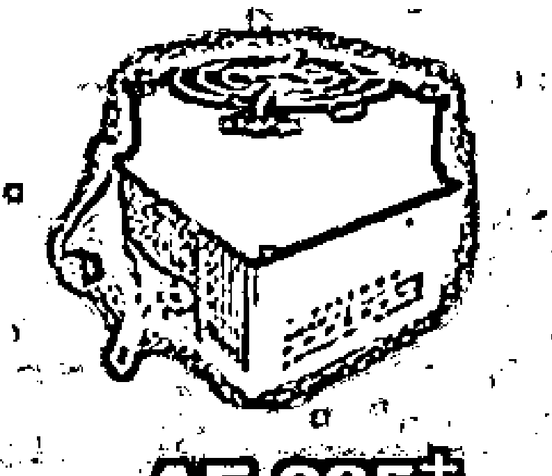

> 昨天，我们用汗水浇铸理想；
今天，我们用成绩回报信任；
明天，我们会一往无前，开拓进取……
继往开来，同步时代科技潮流；
全力以赴，打造民族卓越品牌。
追求的信念，从未动摇；
创新的脚步，永不停歇！
九州风神，一定做得更好！

九州风神 2002年新品XP系列

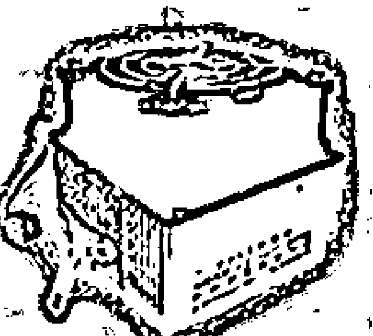

AE-035

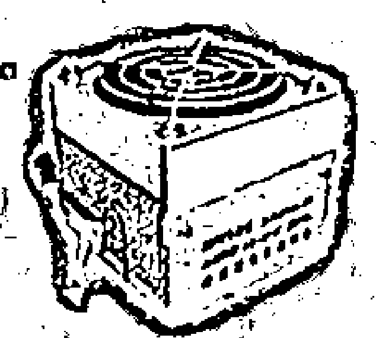

AE-070

## 欢迎加入九州风神代理商行列！

清华华天 技术开发公司
www.aedus.com.cn

诚征电话: 13701029355
传 真: (010)62780386

## 电脑爱好者合订本

### 2001年 (下)

## 正文分册

- 二次编辑、合理整改的期刊2001年下半年全部文章。
- 栏序编排，同类内容就近安排，更加贴近读者阅读习惯。
- 两套目录，可根据需要按照页码顺序和文章类别进行检索。

## 附录分册

- 全新组稿，汇聚热点话题，提供系统方案，为您排忧解难。
- 容量惊人，80万的文字量，400页的文章，全面提升附送价值。
- 精心策划，选题切合需要，内容深入具体，符合工具书的全部要求。

### 配套光盘A

- 期刊全文检索系统图文并茂，真实再现全年期刊原貌。
- 智能检索，查询便利，轻松找到心怡文章，为您解惑救急。
- 体积小巧，便于携带，突破传统收藏限制，珍贵资料永久保存。

### 配套光盘B

- 精选数款软件珍品，配合附录文章，轻松掌握高级技能。
- 汇集正文涉及软件工具，即学即用，全面提高电脑应用水平。
- 提供详细分类，提示软件出处，高级软件工具包任您按需取用。

### “虚拟光驱”正式版

- 正版软件免费赠送，游戏玩家的挚爱，光驱卫士的精英。

### 有奖调查问卷

- 关注合订本，填写反馈表即可拥有赢得优厚奖品的机会。

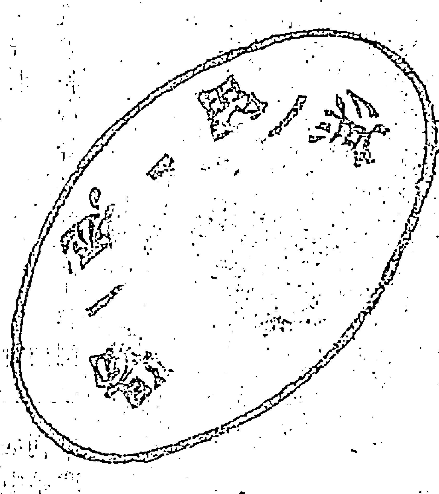

## 内容提要

附录是一本以应用专题和系统方案的形式，向读者提供实际问题全面解决手段的实用工具书。本书内容精炼，实例丰富，实战性和可操作性强，适合具有一定计算机应用水平的中高级读者和渴望提高实际操作技能的电脑爱好者使用。

**特别策划:** 本策划聚焦热点软件和热点技术，提供了大量构思新颖、实用性强的操作实例。从中，您既可以感受到经典软件最新版本在功能上的改进和增强，又可以领略到时下最新技术在实际应用领域的震撼表现，涉及到图像处理、动态网页、网络三维、流视频、格式转换以及多媒体制作等方方面面的知识。

**攒机一条龙:** 购买、升级、维护、安装软件……这就是DIYer们的日常生活，虽枯燥但也有趣。长期的磨练使DIYer成长为高手。当您看完本专题，这个世界就多了一个DIYer，我们的目标就是“生产DIYer”。

**刻录全接触:** 本专题全面介绍刻录机、刻录盘片的选购，主流刻录软件的使用方法以及各种中高级技巧，不仅能让打算购买的朋友轻松选中满意的型号，更能让拥有刻录机的朋友很快成为刻录高手。

**编程课堂:** 这堂课的主题是网络编程，内容包括静态页面、Java Script网页特效、动态页面和网页数据库的设计制作，以及最新的XML应用。另外，为方便读者学习，文章中涉及的所有网页和程序代码都已收录到配套光盘B中。

**建站攻略:** 本专题集中介绍了服务器相关原理及其管理方法，通过学习可以完全打消您对网站服务器设置管理的陌生感和畏惧感。其中包括架设Windows 2000网站服务器完整过程的实例讲解、局域网通讯服务器软件的详细介绍，以及对远程访问原理与实现方法的深入描述。

**宽带无限:** 宽带的普及为网络这个造梦机插上冲天的翅膀，让它引导我们的生活飞向幸福的远方。什么是宽带，有哪些宽带，怎么用宽带？看完本专题您会发现，宽带不再遥远。

**QQ全家福:** 本专题会让您重新认识QQ这个老朋友。它的功能比您想象的要强大的多。我们通过“OICQ小小教程”、“QQ超级技巧”、“QQ工具全家福”等系列文章，让您全面掌握QQ相关工具以及其他主流即时通讯软件。能够更加收发自如地从事网上聊天这项其乐无穷的事业。

本书附赠配套光盘B收录了相关软件并给出详细目录，欢迎查阅。

### 目录

#### 特别策划

- Ulead 硬派 6 制作大放送……………………………………………………………………19
- 一、企鹅贺卡轻松制作………………………………………………………………………19
- 二、从无到有制作逼真的调色板………………………………………………………………21
- 三、电影胶片巧制作…………………………………………………………………………22
- 四、给图像添加电视扫描线效果………………………………………………………………23
- 五、燃烧的火焰字……………………………………………………………………………24
- 六、雕刻文字效果……………………………………………………………………………24
- 七、方格花布纹理……………………………………………………………………………25
- 八、图像混合魔法……………………………………………………………………………26
- 九、淡出花朵拼贴画…………………………………………………………………………27
- 十、制作一条金项链…………………………………………………………………………28

#### 实例演练 Authorware 6.0

- 一、即时光标跟随提示………………………………………………………………………30
- （一）实例说明………………………………………………………………………………30
- （二）制作步骤………………………………………………………………………………30
- 二、光驱开关控制……………………………………………………………………………34
- （一）实例说明………………………………………………………………………………34
- （二）操作步骤………………………………………………………………………………34
- 三、声音和视频对象播放的方法和技巧……………………………………………………35
- （一）声音图标和视频图标…………………………………………………………………35
- （二）一屏显示四种视频格式………………………………………………………………36
- （三）用声音图标播放 WAV 和 MP3…………………………………………………………36
- （四）利用 UCD 播放音频和视频……………………………………………………………37
- （五）利用 ActiveX 控件制作两个媒体播放器……………………………………………38
- （六）利用第三方多媒体控件 DirectMediaXtra 播放声频、视频…………………………39
- （七）利用 "Movie Controller" 知识对象播放 avi、dir、mov、mpeg 文件 …………………40
- （八）调用外部多媒体播放软件直接播放……………………………………………………41
- 四、小 结……………………………………………………………………………………42

### Windows media 互动杂谈

- 一、Windows Media 如何嵌入网页………………………………………………………43
- 二、广告条…………………………………………………………………………………44
- 三、与老师互动的网页………………………………………………………………………45
- 四、文本控制视频跳转………………………………………………………………………46
- 五、和 Flash 进行互动……………………………………………………………………47
- 六、网页式的 Windows Media Download ………………………………………………48
- 七、结束语…………………………………………………………………………………50

### 牵手 WEB 3D

- 一、WEB 3D 简介……………………………………………………………………………51
- 二、Cult3D 实战演练………………………………………………………………………51
- 三、结 语…………………………………………………………………………………58

### 用 Dreamweaver UltraDev 4 建立网上书店实例

- 一、网站规划……………………………………………………………………………59
- 二、网页和插件说明………………………………………………………………………59
- 三、准备工作……………………………………………………………………………60
- 四、制作书目浏览页面……………………………………………………………………63
- 五、制作显示图书详细信息页面…………………………………………………………65
- 六、制作购物车页面………………………………………………………………………67
- 七、制作收集顾客个人资料页面…………………………………………………………68
- 八、制作确认订单页面…………………………………………………………………68
- 九、制作确认订单后的页面……………………………………………………………69

## Flash辅助软件……………………70

- 一、字体特效辅助软件……………………70
- 二、Flash 3D 辅助软件……………………72
- 三、swf解密软件……………………77
- 四、文件格式转换软件……………………81
- 五、口型音量模拟软件……………………81

## 数字化生活……………………83

- 一、个人电脑录音一点通……………………83
- 二、视频格式转化三两招……………………85
- （一）RM转AVI……………………85
- （二）AVI转MPEG……………………85
- 三、突破DVD锁区的限制……………………86
- （一）NEC奔驰16X DVD区码破解……………………87
- （二）MIDA 10X区码破解……………………87
- （三）SONY DDU1211 12X DVD区码破解……………………87
- （四）华硕12XDVD区码破解……………………88
- （五）Acer 16X DVD的区码破解……………………88
- 四、VCD制作试试看……………………89
- （一）视频制作概念的解释……………………89
- （二）硬件配置详解……………………90
- （三）实战……………………91
- 五、时髦的MPEG4……………………94
- （一）认识MPEG4……………………94
- （二）MPEG4的制作……………………94
- （三）MPEG4的播放……………………96

#### 刻录全接触

- 了解刻录机和盘片……………………98
- 一、刻录机在2001年的大发展……………………98
- 二、刻录新技术简介……………………98
- 光盘刻录机及盘片选购指南……………………99
- 一、刻录机的选购……………………100
- 二、CD-R/CD-RW盘片的选购……………………102
- 刻录基础应用……………………104
- 一、刻录的基本原理……………………104
- 二、盘片的文件系统……………………104
- 三、光盘的刻录方式……………………105
- 四、盘片的格式……………………105
- 五、刻录前应注意的问题……………………105
- 主流刻录软件应用指南……………………107
- 一、Easy CDCreator 4.02 简体中文版……………………107
- （一）安装与卸载……………………107
- （二）界面简介……………………107
- （三）CD版面操作……………………108
- （四）文件夹操作……………………108
- （五）CD版面属性的编辑……………………109
- （六）编辑音乐CD版面……………………109
- （七）刻录的基本操作……………………109
- （八）制作音乐CD……………………110
- （九）混合刻录……………………111
- （十）可引导CD的制作……………………111
- （十一）映像文件的刻录……………………111
- （十二）光盘复制……………………111
- （十三）清除 CD-RW 数据
- （十四）提取音轨保存为 WAV 文件
- （十五）制作 CD 封套

- 二、Nero Burning ROM 5.5
- （一）软件安装与卸载
- （二）Nero 的启动
- （三）界面介绍
- （四）基本操作

- 三、其他主流刻录软件
- （一）Direct CD 5.0
- （二）克隆圣手 CloneCD
- （三）Padus DiscJuggler
- （四）音乐刻录伴侣Papayatech TuneSpark
- （五）NTI CD - Maker 2000 Professional

### 实战刻录

- 一、CDRW 用用通
- （一）CDRW 的擦除操作
- （二）特殊刻录软件对 CDRW 的操作
- 二、光盘复制
- 三、镜像（映像）文件的制作
- 四、启动光盘
- 五、视频 VCD 的制作
- 六、音乐 CD 的制作
- 七、数据刻录
- （一）使用 Nero 进行数据刻录
- （二）使用 Easy CD Creator 进行数据刻录
- （三）使用 Winoncd 进行数据刻录

### 刻录进阶之技巧放送

- 一、刻录软件特殊应用
- 二、多合一光盘的制作
- （一）简单多合一光盘的制作
- （二）带启动多合一光盘的制作
- 三、多系统启动光盘的制作
- （一）制作前的准备
- （二）具体制作过程
- 四、分片系统还原（Ghost)光盘的制作
- （一）Ghost 程序制作分片系统的 Ghost 备份
- （二）制作恢复启动软盘
- （三）用刻录软件刻录分片系统还原光盘
- 五、光盘刻录中的矛与盾——加解密
- （一）制作加密光盘
- （二）加密光盘常见破解方法
- 六、不引人注意的小技巧
- 七、常见刻录软件的安装使用问题

#### 攒机一条龙

### 年末攒机硬件选购评述

- 一、INTEL 还是 AMD —— CPU 的选购
- 二、芯片组和主板
- 三、显卡选购指南
- 四、显示器选购
- 五、硬盘的选购
- 六、内存的选购
- 七、流行声卡和音箱的选购 ········································································ 161
- 八、光介质读取设备的选购 ········································································ 162
- 九、网络设备的选购 ·················································································· 163
- 十、计算机智能配件 ·················································································· 164
- 防奸识假全攻略 ························································································ 166
- 一、打假策略与经验谈 ··············································································· 166
- （一）奸商手段大揭密 ············································································· 166
- （二）奸商心计大透视 ············································································· 167
- （三）容易用“奸计”的产品 ···································································· 167
- 二、火眼金睛的专业硬件测试、调试软件 ······················································ 168
- （一）全身“体检”—— HARDiNFO Pro ························································· 168
- （二）专家级的“全面体检”—— SiSoft Sandra 2001 ···································· 170
- 三、内存测试软件 Doc Memory 1.45a ··························································· 172
- 四、专业级显卡测试软件—— 3DMark 2001 Pro ················································· 172
- 五、专业级声卡测试—— ZD Audio Winbench 99 ················································· 173
- 六、来自硬盘厂商的专业级硬盘测试软件 ······················································· 174
- 七、CPU 主流测试软件 ··············································································· 176
- 八、光驱测试软件 ······················································································· 177
- 九、显示器、普通显卡测试—— Power Strip ······················································ 178
- 攒机硬件组装实战 ······················································································· 179
- 一、安装 CPU 和风扇 ·················································································· 179
- 二、安装内存条 ························································································· 180
- 三、将已经安装好 CPU、内存的主板放进机箱 ················································ 180
- 四、安装 AGP 显卡和各种 PCI 卡 ···································································· 180
- 五、硬盘及各种驱动器的安装 ······································································· 181
- 六、机内开关电源的安装与电源线连接 ··························································· 182
- 七、P4 处理器的安装方法、P4 与雷鸟处理器散热器安装的区别 ···························· 182
- 电脑散热全面指南 ······················································································· 184
- 一、CPU 散热 ······························································································ 184
- 二、显卡散热 ······························································································ 185
- 三、硬盘散热 ······························································································ 186
- 四、机箱散热 ······························································································ 186
- 走进 BIOS 的世界 ······················································································· 187
- 一、基础认识篇 ··························································································· 187
- （一）BIOS 基础 ·························································································· 187
- （二）BIOS 的主要功能 ················································································ 187
- 二、科学设置篇 ··························································································· 188
- （一）进入 BIOS 设置程序 ············································································ 188
- （二）AWARD BIOS 的科学设置 ······································································ 188
- （三）AMI BIOS 的科学设置 ··········································································· 191
- （四）免跳线主板的 BIOS 设置 ····································································· 194
- 三、升级 BIOS ····························································································· 195
- （一）升级 BIOS 的原因 ················································································ 195
- （二）升级 BIOS 的几道工序 ·········································································· 195
- （三）升级时应当注意的问题 ········································································· 195
- （四）如何了解你的 BIOS 的“底细” ······························································· 195
- （五）BIOS 升级实例 ···················································································· 197

七、网上的 BIOS 的资源

FDISK 分区实战

一、分区前的准备

二、开始分区

三、要说明的问题

分区魔术师的超级魔法术

一、程序操作界面介绍

二、操作实战

三、使用注意事项

装机鬼手——Norton Ghost 2002

一、系统备份

二、系统克隆

三、系统还原

四、支持存储介质

五、兼容性

六、配套软件支持

七、软件使用注意事项

硬件驱动程序安装指南

一、即插即用设备的安装

二、非即插即用硬件设备的安装

三、驱动程序的另类安装方法

四、常见问题的解决方法与技巧

五、硬件资源冲突的解决

六、驱动程序资源网站介绍

新手装机——多系统并存之道

一、通过 Win2000 轻易实现双系统共存

（一）双启动支持

（二）双启动安装

（三）双启动注意事项

（四）NT 环境双启动

二、利用 System Commander 2000 实现多系统共存

（一）软件的安装

（二）设置暂停、卸载 / 恢复暂停程序提供的启动引导菜单

（三）使用 Special Options 菜单

（四）使用 OS Wizard 管理操作系统的安装

（五）硬盘分区管理及操作纪录恢复

2001 年 DIY 装机软件大拼盘

一、操作系统

二、系统维护检测软件

三、应用类软件

#### 编程课堂

ASP 网页数据库程序设计全接触

一、ASP 程序初体验

二、VBScript 介绍

三、数据库的建立与设置

四、ASP 中的数据库访问技术

五、ASP 操作数据库的方法

六、设计实例

七、结束语

Java Script 精解

一、初识 JavaScript

二、全面认识 JavaScript

三、深入理解 JavaScript

XML与Flash

一、什么是XML

二、Flash对XML的支持

三、实例一

四、XML能帮助我们做什么

五、实例二

六、实例三

七、后记

#### 建站攻略

Windows 远程访问探索

一、远程访问简介

二、Windows Me拨号网络服务器

三、Windows 2000拨号网络服务器

四、Windows 2000虚拟专用网络

五、远程访问服务器的安全策略

局域网通讯服务之——架设FTP服务器

一、简单易用的 WFTPD

二、功能完善的 FTP Serv-U

三、简易的 FTP 服务软件 ExpressFS Server

局域网通讯服务之——局域网上聊天路路通

一、最简单的聊天工具 WinPopup

二、聊天、通讯即时通 Bassline WinPopup

三、无需服务器照样能聊天的 WinPopup 2001

四、用 My Chat 架设局域网上的聊天服务器

五、局域网上的寻呼机 NetCall

六、语音聊天过把瘾

七、打造视频聊天室

局域网通讯服务之——局域网上的ICQ

一、服务器端的配置

二、客户端程序的使用

局域网通讯服务之——局域网上的电子邮局

一、CMailServer 的电子邮局

二、FTGate 的电子邮局

三、高效快捷的邮件服务器 Easymail

四、功能完善的 Forward Mail Server

个人网站服务器架设完全实战

一、什么是网站服务器

二、准备工作

（一）学习目的

（二）软硬件的准备

三、服务器系统的安装设置

四、建立远程访问服务器

（一）远程访问服务器的安装

（二）远程访问服务器的配置

五、架设你的域名服务器

（一）DNS 域名服务器的概念

（二）域名服务器的配置

六、建立你的 Internet 服务器

（一）安装 IIS5.0

（二）创建个人 Web 服务器

（三）个人 Web 服务器的管理

（四）建立个人FTP和Email服务器

（五）建立个人FTP服务器

（六）个人FTP服务器的设置和管理

（七）建立Email服务器

八、服务器测试

（一）添加访问服务器的用户

（二）客户端电脑的设置

（三）测试浏览

个人WEB伺服器PWS使用指南

一、PWS的概念

二、PWS的安装和配置

三、PWS功能简介

四、虚拟目录

五、文件的发布与管理

#### 宽带无限

宽带上网纵横谈

一、什么是宽带上网游

二、宽带上网的特点

三、宽带上网技术分类

四、宽带上网术语简解

一线通ISDN

一、ISDN功能简介

二、选购ISDN的适配器

三、ISDN的安装使用

四、ISDN RVS - COM 软件使用攻略

五、ISDN常见问题及解决方法

超级一线通ADSL

一、ADSL的选购

二、ADSL的硬件安装

三、ADSL PPPOE软件的使用

四、ADSL使用常见问题

Cable Modem走一遭

一、Cable Modem简介

二、Cable Modem产品简介

三、Cable Modem的安装使用

四、Cable Modem常见问题及解决方法

常用宽带技术大比拼

一、三种常用宽带上网方式之间的区别

二、三种常用宽带上网方式与普通拨号上网的区别

三、三种常用宽带上网方式的优缺点

四、三种宽带上网方式的上网速度比较

五、三种宽带上网方式的费用比较

六、选择适合您的宽带上网方式

其他宽带上网用用看

一、光纤局域网FTTB

- 四、用防火墙保安全

- 五、天网防火墙使用简介

- 六、端口预防

- 七、宽带上网安全须知

# ## QQ 全家福

- QQ 使用的小小教程

- 一、安装和注册时要注意的问题

- 二、使用中的问题

- OICQ 技巧超级放送

- QQ 工具全家福

- 一、聊天辅助工具篇

- (一) 秋枫贴图 2.0

- (二) 万能工具网络企鹅 QQ2000

- (三) Flash Oicq V2.6

- (四) 葵花神脸 1.0

- (五) QQ 图形留言器 4.0

- (六) 聊天圣手 2.0

- (七) QQ 动作先锋

- (八) QQ 聊天机器人 2.1

- 二、个性化 QQ 工具篇

- (一) QQ 换音大师

- (二) 全新 QQ 声音 V2.0

- (三) 完全 QQ 头像

- (四) 皮肤大师 SkinMaker 0.99

- 三、信息管理工具篇

- (一) QQ 列表通

- (二) QQ MessagesSniffer 1.5

- 四、其他的辅助工具

- (一) 窗口精灵 WinFairy1.0 版

- (二) 腾讯浏览器清除器

- (三) 龙飞 QQ 伴侣 V1.0.1

# ## 特殊的 QQ 工具

- 一、追踪 IP 的工具

- (一) Locate 6.0

- (二) IpSniper

- (三) TraceIcq

- 二、安全工具

- (一) QQ 保镖 1.0

- (二) 木马 GOP 清除器 KillGOP

- (三) QQ 密码侦探终结者

- 三、密码破解工具

- (一) QQ 密码侦探特别版 2

- (二) QQ 远程暴力破解软件 1.00 版

# ## 其他即时通讯软件简介

- 一、即时通讯软件群英会

- 二、MSN 使用指南

- (一) 安装与注册

- (二) 使用介绍

- 三、网站伴侣——“快狗”

- (一) 特别的“快狗”

- (二) 拥有自己的“快狗”

- (三) 善于沟通的“快狗”

#### 配套光盘B软件目录

虚拟光驱6.1正式版:有了它不但可以省去光驱的磨损，同时还大大提高了游戏速度。虚拟光驱可以在你的计算机上创建23个以上的虚拟光盘驱动器，并且每个驱动器都有自己的名称。该虚拟光盘可以存储任何类型的数据，包括音乐文件和数据库文件，其运行速度高达200X (\Virtual\Setup.exe)。

#### 正文涉及软件

##### 一、实用工具

# 1.多媒体

Musicard:音乐贺卡工厂2000 (\zhengwen\sygj\dmt\Musicard.zip)。

Createt:强大的屏保制作工具 (\zhengwen\sygj\dmt\createt.zip)。

Audiotools:电脑录音工具，让您电脑录音好轻松 (\zhengwen\sygj\dmt\Atools350.exe)。

MediaJukebox:强大而小巧的音乐制作软件 (\zhengwen\sygj\dmt\MediaJukebox71241.exe)。

MP3EXE:MP3转化工具，将 MP3 转化成可执行文件，这样就不用 MP3 播放器的支持了 (\zhengwen\sygj\dmt\MP3EXE26.zip)。

Advanced WMA Workshop:音乐格式转换新贵,非常好用 (\zhengwen\sygj\dmt\advancewmaw.zip)。

Mp3ProAudioPlayer:MP3Pro 的制作和播放软件 (\zhengwen\sygj\dmt\mp3PROAudioPlayer_v1_0_2.exe)。

Flix:可将视频文件转换为 Flash 的利器 (\zhengwen\sygj\dmt\Flix.zip)。

dub it:好用的影音合成工具 (\zhengwen\sygj\dmt\dub it.exe)。

Goldnwave:专业音乐处理软件 (\zhengwen\sygj\dmt\gwave425.exe)。

CamtasiaFV:强大的录音制作工具 (\zhengwen\sygj\dmt\CamtasiaFV221.exe)。

DivX4Codec:能将DVD影像复制并压缩为标准650 MB CD-ROM 格式的影像压缩软件 (\zhengwen\sygj\dmt\DivX4Codec.exe)。

Mp3cdmaker:可将 Mp3 直接刻录成音乐光盘的软件 (\zhengwen\sygj\dmt\mp3cdmaker.exe)。

Rmfix:RM 文件修复利器 (\zhengwen\sygj\dmt\rmfix.zip)。

GraFXSV:一个相当棒的屏幕保护程序制作软件,能用图像、动画、视频和声音文件制作个人化的屏幕保护程序，提供 2000 个特殊的过渡效果 (\zhengwen\sygj\dmt\GraFXSV.exe)。

# 2.图像处理

Wingrab:图像捕获新贵 (\zhengwen\sygj\txcl\wingrab15008.exe)。

Pic2txt:图片磨牙器 (\zhengwen\sygj\txcl \pic2txt101.zip)。

Allicon:图标搜索器 (\zhengwen\sygj\txcl\allicon.exe)。

Photoprint:图片册制作工具 (\zhengwen\sygj\txcl\photoprint.zip)。

飞鹰玉玲珑图片大师:国产图片处理利器 (\zhengwen\sygj\txcl\fyyll.zip)。

iHCOPY:屏幕截屏助手 (\zhengwen\sygj\txcl\ihcSetup15040.exe)。

artIcon:图标绘制软件，绘制图标不再难 (\zhengwen\sygj\txcl\aipro.zip)。

CrazyTalk:图像语音脱口秀,让屏幕上的图像开口说话 (\zhengwen\sygj\txcl\crazytalkcomplete.exe)。

ASCII Pic:将图片转成 ASCII 文本字符格式，让你随心制作文本格式的小图片 (\zhengwen\sygj\txcl\asciipic.zip)。

魔法转换:功能强大的图像转换工具，包括图像浏览、批量转换、图像增强及作品预览四大部分。同时它还能方便的将图像生成.EXE 可执行文件 (\zhengwen\sygj\txcl\mfzh.exe)。

HyperSnap-DX:最为著名的抓屏工具,提供专业级影像处理功能 (\zhengwen\sygj\txcl\HyperSnap.exe)。

MosASCII:能将图片转换成 ASCII 码组成的文字图,并且储存成 html 文件 (\zhengwen\sygj\txcl\mosascii.exe)。

Arles:个性化网页图库的制作工具 (\zhengwen\sygj\txcl\arles.zip)。

# 3.文件工具

拷贝王 KingCopy:应用于复制与修复文件的实用工具 (\zhengwen\sygj\wjgj\kc25b.exe)。

Virtual DAEMON Tools:能将镜像文件直接映像成光盘使用的虚拟光驱软件 (\zhengwen\sygj\wjgj\daemon274.zip)。

Hyper Maker Html:可将你制作的HTML格式的文档转化成 EXE 文件，无需 IE 就可观看,帮你制作最眩的电子出版物 (\zhengwen\sygj\wjgj\HyperMaker.exe)。

###### 4. 系统工具

- 侠客系统修改器:可轻松修改Windows系统中大部分注册表选项，还可以对一些非注册表选项进行设置 (\zhengwen\sygj\xtgj\sysset.zip)
- Windows 优化大师:优秀的系统修改优化工具 (\zhengwen\sygj\xtgj\womV4.31.920.exe)
- 注册表之指南针:学习使用注册表的小工具，让你明明白白修改注册表 (\zhengwen\sygj\xtgj\regtools.exe)
- XDESK:桌面管理好助手 (\zhengwen\sygj\xtgj\xdesk_382_846.exe)
- IconPackager:个性化系统图标的工具 (\zhengwen\sygj\xtgj\ippackager151_pub.EXE)
- 超级兔子魔法设置:对系统进行设置、终极加速、注册表扫描、安全视窗、修理的专家 (\zhengwen\sygj\xtgj\ms388pi.zip)
- Customizer 2000:优化系统性能的超级工具 (\zhengwen\sygj\xtgj\cstmiz.zip)
- Folder Guard:强大的计算机资源保护工具 (\zhengwen\sygj\xtgj\folderGuard52.exe)
- Tweak-ME:提升系统性能的利器 (\zhengwen\sygj\xtgj\tweakmegold.exe)
- Registry Studio:一款以 Windows 注册表编辑器为主体的注册表编辑工具 (\zhengwen\sygj\xtgj\registrystudio.exe)
- EasyRecovery:威力非常强大的硬盘数据恢复工具，能够帮你恢复丢失的数据以及重建文件系统 (\zhengwen\sygj\xtgj\ERPERFUS.EXE)
- Hare:计算机系统加速利器 (\zhengwen\sygj\xtgj\HareSetup.exe)
- Tweaker 2001:简单易用的系统修改设定工具，可以帮助您透过几个简单的步骤一下子让Windows操作起来更加顺手 (\zhengwen\sygj\xtgj\tweaker60.zip)
- LunaXP eXperienced for DesktopX:XP易容工具，让你的桌面变个样子 (\zhengwen\sygj\xtgj\Lunabeta2.zip)
- DesktopX:XP 界面易容软件 (\zhengwen\sygj\xtgj\dx100_pub.exe)
- XP Set v2 for IconPackager:XP 桌面美容工具 (\zhengwen\sygj\xtgj\XPSetv3.ip)
- IconPackager:XP 桌面美容器 (\zhengwen\sygj\xtgj\iconpacker.exe)
- XPLuna for WindowBlinds:XP桌面工具 (\zhengwen\sygj\xtgj\XPLuna.zip)
- Netexec:XP中快速切换用户的工具 (\zhengwen\sygj\xtgj\NetExec_Newest.zip)
- Desktop DNA:XP用户状态移植工具 (\zhengwen\sygj\xtgj\desktopdnav25eval.exe)
- Zone Alarm Pro(ZoneAlarm):保证上网安全，可在电缆调制解调器用户上建立防火墙 (\zhengwen\sygj\xtgj\zonealarmpro26z126.exe)
- Effective Desktop:XP系统托盘工具 (\zhengwen\sygj\xtgj\efdsk101.zip)
- IEradicator:卸载IE5.0的工具 (\zhengwen\sygj\xtgj\IErad6.zip)
- Taskbar Executive:任务栏程序窗口群组工具 (\zhengwen\sygj\xtgj\freetex.zip)
- Zip Project1.10:系统文件快速备份 (\zhengwen\sygj\xtgj\ZipProjects.zip)
- Go back:XP恢复工具 (\zhengwen\sygj\xtgj\goback302b38.exe)
- O&O BlueCon 2000 Pro:在 NT 出问题的时候帮您修复，让您可以从软盘启动 NT，读取 NTFS 分区上的任何信息，还可以修改任意用户的密码 (\zhengwen\sygj\xtgj\ooblueconpro20b337e.exe)
- WinRescue for Win95/98/Me/NT/2000:系统备份利器 (\zhengwen\sygj\xtgj\rescue64.exe、rescue81.exe、wnrsqmez.exe、wnrsqntz.exe、wnrsq2kz.exe)
- 98toxp:用它将你的Win98/ME的界面变成WinXP的界面 (\zhengwen\sygj\xtgj\win_xp_se_me.rar)
- Msrdpcli:移植远程桌面 (\zhengwen\sygj\xtgj\msrdpcli.zip)
- WaterWall:可以让Windows每次开机时更换不同的桌面壁纸，也能够设定以幻灯片方式更换桌面壁纸 (\zhengwen\sygj\xtgj\waterwall.exe)
- TouchPro:可修改文件和文件夹时间日期的工具，甚至所有子文件夹里的文件也可一并修改。但对文件时间日期修改要注册后才可以使用 (\zhengwen\sygj\xtgj\touchpro.exe)
- MSTBOOT:允许你在一个硬盘上同时安装多达 12 个操作系统 (\zhengwen\sygj\xtgj\mstboot.zip)
- RegRun II:Windows启动加速器，在你加电启动Windows之前检查注册表和添加到启动菜单中的程序项，并对这些程序进行优化和检测，从而加快Windows的启动时间 (\zhengwen\sygj\xtgj\regrun.exe)
- IE 反修改精灵:专门修改注册表中的IE相关键值 (\zhengwen\sygj\xtgj\IEantireview.exe)
- Add/Remove Plus:可以帮助你管理控制台中的新增、移除程序 (\zhengwen\sygj\xtgj\addremove.exe)
- WindowBlinds: XP 桌面美容工具，全面控制Windows的各种图形界面 (\zhengwen\sygj\xtgj\windowblinds.exe)

###### 5. 硬件相关

- MouseStar:鼠标增强工具 (\zhengwen\sygj\yjxg\MouseStar.zip)
- Ibmftool:针对IBM硬盘的维护工具包 (\zhengwen\sygj\yjxg\ibmftool-install111.exe)
- TestCPU:让你“知心”的CPU测试软件 (\zhengwen\sygj\yjxg\testcpu.zip)
- Super π 1.0:计算圆周率的软件，但它更适合用来测试CPU的稳定性 (\zhengwen\sygj\yjxg\super π.zip)
- CPU Stability Test:专门测试CPU的软件，使用者可以利用他得知处理器的稳定度，对于怀疑硬件有问题的使用者可以试一试 (\zhengwen\sygj\yjxg\StabilityTest.exe)
- CPU Stability Test 1.3:这是CPU Stability Test的早期版本，不过数据似乎更可靠 (\zhengwen\sygj\yjxg\cpustabtest13.exe)
- Passmark BurnInTest:该软件主要测试计算机系统与其它周边设备的状态 (\zhengwen\sygj\yjxg\passmark.exe)
- Qaplus:个人电脑最权威的诊断工具，这个版本是NEC、东海等知名PC厂商使用的工厂版。执行TEST.BAT可以对PC进行4小时的不间断烤机，如有错误发生结果将存放在.LOG文件中，可供察看 (\zhengwen\sygj\yjxg\qaplus.zip)
- Hot CPU Tester:CPU 测试程序，特别适用于超频玩家的CPU稳定性能测试工具，同时还能测试主板，内存稳定情况 (\zhengwen\sygj\yjxg\hotcpu.exe)
- Award WinFlash Utility 1.2:Award 出品的WinFlash，可以在所有的使用 Award BIOS 的主板上运行 (\zhengwen\sygj\yjxg\WinFlash.exe)
- DM955cy:DM万用版 9.55，最强大、最通用的硬盘初始化工具，它可以在一分钟内把一个大硬盘重新分区并格式化完毕，它使DM能够在各个厂家的硬盘上运行 (\zhengwen\sygj\yjxg\dm955cy.zip)

###### 6. 其他工具

- DesktopX:桌面布景切换工具 (\zhengwen\sygj\qtgj\dx100a_pub.exe)
- Chameleon Clock:很酷的桌面时钟 (\zhengwen\sygj\qtgj\cham251.exe)
- TurboLaunch:工具软件导航器 (\zhengwen\sygj\qtgj\turbolaunch.exe)
- AutoMate Win9x/Win2000&WinNT:电脑的定时器，可以让你即使在离开计算机的时候，也能让电脑依照定好的安排帮你完成想做的事 (\zhengwen\sygj\qtgj\automate.exe、amservic-2knt.exe)
- ASPack:程序压缩器，将32位可执行文件和动态链接库压缩60% (\zhengwen\sygj\qtgj\aspack211.zip)
- FX Saver:个性化屏保自己做 (\zhengwen\syj\qtgj\fxsaver.EXE)
- Patch maker:为软件打补丁 (\zhengwen\syj\qtgj\Patchmaker12r.exe)
- Iaall:应用程序加速器 (\zhengwen\syj\qtgj\iaall_multi.exe)
- Alkonost MaxFormat:是专门用来格式化磁盘的好工具，可以让你快速地将磁盘格式化 (\zhengwen\syj\qtgj\alkonostmaxformat.zip)
- Password Keeper:一个良好的密码管理工具，使用它，你就不再会忘记你的密码了 (\zhengwen\syj\qtgj\PASSKEEP.ZIP)
- eXeScope:小巧强大的汉化工具，可以直接修改用 VC++ 及 DELPHI 所编制程序的资源，包括菜单、对话框、字串表等 (\zhengwen\syj\qtgj\exescope630.zip)

##### 二、网络

###### 1. 电邮

- MailBell:邮件即时检查 (\zhengwen\wl\dy\mailbell125.exe)
- Foxmail:最为著名的国产电邮程序 (\zhengwen\wl\dy\foxmail40chb2.exe)
- 短信小精灵: 发送短信息的好用工具 (\zhengwen\wl\dy\smself28.exe)
- ForwardMail:自动发电子邮件的小工具 (\zhengwen\wl\dy\fdmail30e.zip)
- IncrediMail:具有非常酷的视窗界面和寄信动画效果，可以组合成出非常炫的电子邮件 (\zhengwen\wl\dy\IncrediMail.exe)
- MailSweep:使用它不需要从服务器下载Email就可以阅读其内容，甚至删除 Email (\zhengwen\wl\dy\mailsweep.zip)

###### 2. 即时通讯

- OICQ聊天快贴:方便聊天妙语编辑，能够快速发送聊天妙语 (\zhengwen\wl\jstx\ltktpaste0120.zip)
- Socks2Http:让你可以突破各种围堵来使用 QQ (\zhengwen\wl\jstx\socks2http088a.exe)
- 聊天动作生成机:此软件内置众多诙谐幽默 QQ 聊天语，让你口才一流，妙“键盘”生辉 (\zhengwen\wl\jstx\semot10.exe)
- 签名档:让你制作得心应手的制作可爱的聊天贴图字符 (\zhengwen\wl\jstx\emefx16.zip)
- OICQ头像:拥有与众不同的头像实在是小菜一碟，用用这款软件你就知道了 (\zhengwen\wl\jstx\oicqface.exe)

###### 3. 局域网

- ICQ 服务器 (服务器端/客户端):开通局域网内ICQ的工具 (\zhengwen\wl\jyw\icqgwserver.exe, icqgwclient.exe)
- RealServer:在局域网上建立网络小广播台 RealSystem Server的工具 (\zhengwen\wl\jyw\rs8-0-winnt-int.exe)
- 通知精灵:利用系统内部网络，快速传递通知的工具，特别适合网点众多而且比较分散的局域网 (\zhengwen\wl\jyw\Tzjl.zip)

###### 4. 上传下载

- FlashFXP:功能强大的 FXP / FTP 软件，融合了一些其他优秀 FTP 软件的优点 (\zhengwen\wl\scxz\ffxp1.3.778.zip)
- 网龙下载器 NetDrag:好用的下载软件 (\zhengwen\wl\scxz\netdrag_cn.exe)
- RegetDX:单线程下载软件，不过速度很快 (\zhengwen\wl\scxz\regetdx.exe)
- Go!Zilla:一流的下载软件。该软件可修正下载错误并恢复下载，并可管理以后下载的文件 (\zhengwen\wl\scxz\gozilla-beta4.0b7.exe)
- LeapFTP:一款非常优秀的文件传输软件 (\zhengwen\wl\scxz\lftp272.exe)
- FlashGheck:结合 Flashget 进行远程下载操作的工具 (\zhengwen\wl\scxz\fc057b.exe)
- FlashFXP:可以实现在两个服务器上直接互传文件的工具 (\zhengwen\wl\scxz\flashfxp148.zip)
- 网络蜘蛛: 专门从网上“DOWN”图的高手 (\zhengwen\wl\scxz\Netspider1225.zip)

###### 5. 网页制作

- Atonreg:网站注册利器，只要点一下鼠标就可以帮你填写各种注册信息 (\zhengwen\wl\wyzz\atonreg.exe)
- 有声有色7.0:有了它你再也不必为自己网页的平淡无奇而感到困扰了 (\zhengwen\wl\wyzz\musrea7.zip)
- Hotdog Pagewiz:利用它可以快速建立自己的 WEB 站点 Hotdog Pagewiz (\zhengwen\wl\wyzz\hotdogpagewiz.exe)
- 世纪鸟特效手册：专门制作网页特效的小工具 (\zhengwen\wl\wyzz\javabook.zip)
- PhotoVista:让你做个虚拟现实的全景网页 (\zhengwen\wl\wyzz\photovista.exe)
- Start:这个小程序可以帮您自动从光盘片中呼叫出网页，还是全屏幕的呢 (\zhengwen\wl\wyzz\start.exe)
- Sawmill:它可以通过分析 Log 的方式来提供网站的访客流量数据 (\zhengwen\wl\wyzz\sawmill.exe)
- NetLoad:除了标准的FTP客户软件功能外提供只传输新## 6. 其他

- Advanced Call Center: 一个专为voice modem设计的答录机软件有来电显示功能 (\zhengwen\wl\qtwl\acc.exe)。

- Stay Connected: 让你的猫永不掉线 (\zhengwen\wl\qtwl\stayconn34.zip)。

- Iparmor: 木马克星 (\zhengwen\wl\qtwl\iparmor.exe)。

- ZoneAlarm Pro: 可以保护你的电脑免受特洛伊木马的侵袭。(\zhengwen\wl\qtwl\zonealarmpro26231.zip)。

- Modem booster: 让你的小猫立刻加速 (\zhengwen\wl\qtwl\modembooster26.zip)。

- eLib: 把网页作成电子书(\zhengwen\wl\qtwl\elib_cn.zip)。

- FileGateway: 你可以通过它穿透防火墙与你的QQ朋友直接传输文件 (\zhengwen\wl\qtwl\FileGateway.zip)。

- Pop-Up Stopper: 可以让您不再忍受令人头痛的 Pop-Up 窗口了 (\zhengwen\wl\qtwl\PopUpStopper26.exe)。

- Cogitum Co-Citer 1.0.4: 网页文字捕捉圣手 (\zhengwen\wl\qtwl\cociter.exe)。

- SearchKing: 中文网络搜霸 (\zhengwen\wl\qtwl\searchkingV3.0.exe)。

- 魔装网神2001: 超级好用的采用IE内核的浏览器 (\zhengwen\wl\qtwl\netmyth.zip)。

- Killmuma: 木马终极杀手 (\zhengwen\wl\qtwl\killmuma.zip)。

- PopUp Killer: 在浏览网页时，PopUp Killer 可以在不断弹出的广告视窗尚未出现之前，让你完全不受广告视窗的影响 (\zhengwen\wl\qtwl\popupkiller.exe)。

- Smart Explorer: 一款使用IE内核的浏览器，功能强劲 (\zhengwen\wl\qtwl\smartexplorer.exe)。

- 网络鹦鹉－听新闻: 自动朗读网上的新闻。边上网，边听新闻 (甚至是刚发生的)，还能流畅朗读英文句子 (\zhengwen\wl\qtwl\wlywnewsread.zip)。

- CoffeeCup Firestarter: 能让您在网站上轻松建立Flash效果。可以只通过简单的鼠标点击，建立复杂的文字或图象特效(\zhengwen\wl\qtwl\CoffeeFire42.exe)。

##### 三、娱乐

###### 1. 音乐播放

- 木子播放器Ⅲ: 可以播放RAM电影、flash动画、vqf音乐、mp3、cd、vcd等媒体，还能对文件进行分类管理，各项操作都方便快捷 (\zhengwen\yl\yybf\mp3play26.zip)。

- SoundVQ Player: VQF音乐播放器 (\zhengwen\yl\yybf\vqp252ble.exe)。

- Audio Sliders: Windows音量控制新工具 (\zhengwen\yl\yybf\aslidres.exe)。

###### 2. 视频播放

- DVD-AutoPlayer: DVD自动播放器 (\zhengwen\yl\spbf\dvdautoplayer.exe)。

- WinDVD 2000: 这是第一个可以在NT4.0环境下运行的DVD播放软件(\zhengwen\yl\spbf\WinDVD_GB.exe)。

- CoolDVD: 高品质的影音光盘播放程序。可以让您播放DVD、VCD电影及MPEG、AVI影音文件 (\zhengwen\yl\spbf\CoolDVD.exe)。

###### 3. 其它

- 变速齿轮: 想要在游戏中常胜不败就要拥有它(\zhengwen\yl\qtyl\gearV023b.zip)。

- 兄弟变速器: 变速器软件的后起之秀 (\zhengwen\yl\qtyl\speederV1.07.zip)。

- 九星彩乐彩票选号分析系统: 九星彩乐可在对号码作多项统计、筛选、排列、组合的基础上，进行判断选号和随机选号 (\zhengwen\yl\qtyl\jxcl_v2.exe)。

- 九星彩乐-乐透共享版: 一款超值的乐透型彩票分析软件 (\zhengwen\yl\qtyl\jxcllt304.zip)。

- 英语会话精灵: 一款非常实用、有效的英语会话学习软件，其中包含9大类1000余句日常英语会话例句，采用拉幕式播放方式，在屏幕顶端自动播放，用户在使用电脑进行工作、学习或娱乐的同时，就能不知不觉、轻轻松松地掌握各类日常英语会话 (\zhengwen\yl\qtyl\yyhjl.zip)。

- 电视导航iTV: 国人开发的一款电视节目下载工具，利用了互联网的便捷性和数据库的强大查询功能，使你可以方便地下载最近一周的电视节目并选定自己最喜欢看的内容，在这些节目开演前1~4分钟内本软件还能用声音和闪动的图标通知你注意收看 (\zhengwen\yl\qtyl\iTV.exe)。

- Rave Karaoke: 卡拉ok软件，让你可以在电脑上练歌 (\zhengwen\yl\qtyl\RaveKaraoke.exe)。

### 附录涉及软件

#### 一、特别策划

- Cycore Cult3D 4.2: 可以为3D对象添加交互效果的3D应用软件 (/fulu/tbch/Cult3D.exe)。

- Swish 2.0: 可以立即上手的网页文字动画特效制作软件 (/fulu/tbch/Swish200.zip)。

- Flax 1.31: 支持效果最多、最绚丽的特效软件(/fulu/tbch/Flax131.zip)。

- Adobe Dimensions 3.0: 可以轻松转换2D图形的3D绘图软件(/fulu/tbch/Dim3try.zip)。

- Flash Deprotector 1.2: 一个出色的解swf保护软件 (/fulu/tbch/flashit.zip)。

- Action Script Viewer 2.0: 一个可以阅读fla文件Action代码的绿色软件(/fulu/tbch/asv20demo.zip)。

- swf Scanner 2.01: 可以阅读、修改和替换Action Script的代码阅读器(/fulu/tbch/swfscanner.zip)。

- URL Action Editor 2.0: 可修改文件链接和分析影片片断的swf解密软件(/fulu/tbch/Uae20.zip)。

- swf Browser 2.90: 可以观察swf元素和结构的Flash学习工具( /fulu/tbch/SWFBrowser290.zip)。

- Vid2Flash: 一款简便的视频类文件格式转换软件(/fulu/tbch/Vid2Flash.zip)。

- FlashAmp 1.0: 可精确模拟口形和音量的Flash辅助软件 (/fulu/tbch/Flashamp.zip)。

- TINRA: 可以轻松将RM格式转化为其他格式的工具 (/fulu/tbch/tinra/tinra.zip)。

- XingMPEG Encoder: 著名的视频转换工具,是视频刻录的重要转换软件之一 (/fulu/tbch/xingmencoder.exe)。

- bbmpeg: 为Premiere设计的第三方插件 (/fulu/tbch/bbmpeg.zip)。

- DVD Genie: DVD区码破解工具 (/fulu/tbch/DVDgenie.exe)。

- Drive Region Info: DVD区码察看工具 (/fulu/tbch/DRegionInfo.exe)。

- VCD Gear: 制作MPEG4的主要工具 (/fulu/tbch/VCDGear.zip)。

- VirtualDub: 另一款制作MPEG4的软件 (/fulu/tbch/Vdub.exe)。

- DivX MPEG4: Media Player的MPEG插件 (/fulu/tbch/dimepg4.exe)。

- Global DivX Player: 方便好用的MPEG4播放软件 (/fulu/tbch/GDP.exe)。

#### 二、刻录全接触

- DirectCD: 著名的刻录软件,通过封装写入技术能够将刻录盘当做硬盘来使用 (/fulu/kelu/directcd.zip)。

- CloneCD: 大名鼎鼎的克隆圣手，即使加密的盘也能够 1:1 的复制 (/fulu/kelu/cloned.exe)。

- Padus DiscJuggler: 这个刻录软件不仅拥有常规的复制功能而且能够提供一对多的复制光盘 (/fulu/kelu/padus.exe)。

- NTI CD-Maker 2000 Professional: 方便好用的刻录软件，而且可以将现场录音直接刻录进光盘 (/fulu/kelu/nticd.exe)。

- WinISO: 光盘镜像的解压程序。支持各种常用镜像格式 (/fulu/kelu/winiso.exe)。

- ISOBuster: 方便好用的光盘镜像解压程序，让你轻松的提取镜像中的文件 (/fulu/kelu/isobuster.zip)。

- Getbtimg: 制作开机启动镜像文件的必备工具 (/fulu/kelu/getbimg.exe)。

- DiskGuard: 功能强大的光盘加密程序 (/fulu/kelu/diskguard.zip)。

- Daemon: 非常著名的虚拟光驱软件。可以用来辅助破解加密的光盘 (/fulu/kelu/daemon.zip)。

#### 三、攒机一条龙

- HARDiNFO Pro: 能够对计算机系统进行全面综合性测试的软件，不仅能够判定 CPU 的真伪和系统表现，还能帮助你诊断计算机硬件设备中可能存在的问题。(/fulu/cuanji/hardinfo.zip)。

- SiSoft Sandra 2001: 诸多专业硬件IT媒体和网站常用的专家级硬件测试软件。(/fulu/cuanji/sandra2k1.zip)。

- Doc Memory 1.45: 著名的内存测试软件，人称“内存神医” (/fulu/cuanji/docm.exe)。

- Data LifeGuard Tools (数据卫士工具): 针对西部数据硬盘的配套公家软件包,拥有多种独特的检测和维护功能 (/fulu/cuanji/dlt.exe)。

- Intel Processor Frequency ID Utility: 由Intel公司开发的可以使用户能正确识别自己机器内的Intel处理器，同时还能够检测所用CPU是否已超出额定的运行频率 (/fulu/cuanji/ipfiu.exe)。

- WCPUID: 著名的CPU测试软件，可以正确的检测目前市面上流行的各种 x86 系列 CPU。而且软件体积极其小巧。(/fulu/cuanji/wcpuid.exe)。

- CD Speed99: 功能强大而且使用也非常方便光驱测试软件，测试数据非常直观 (/fulu/cuanji/cdspeed99.zip)。

- DVD Speed99: 非常好用的DVD检测软件,和著名的CD Speed99系出同门 (/fulu/cuanji/dvdspeed99.zip)。

- PowerStrip: 火眼金睛的显示卡、显示器测试软件。任何以次充好的显示器都难逃法眼 (/fulu/cuanji/powerstrip.exe)。

- System Commander 2000: 实现多系统共存的利器。支持在一台机器中安装多达100个以上的不同操作系统 (/fulu/cuanji/syscomm.zip)。

- Dr.Hardware 2001: 全能型的系统硬件检测工具(/fulu/cuanji/drhardware.exe)。

- WinBench99: 最权威的检测平台，可对PC性能进行全面、合理的检测 (/fulu/cuanji/winbench99.exe)。

- WinZip8.0: 压缩工具中的王者，装机必备软件 (/fulu/cuanji/winzip8.exe)。

- 南极星全球通: 非常好用的内码转换软件，让你轻松浏览中日韩三国网页 (/fulu/cuanji/njstar.zip)。

- 紫光拼音: 目前最为流行的拼音输入软件，能够极大的提高你的输入速度 (/fulu/cuanji/zgpy.zip)。

- 智能五笔: 非常好用的五笔输入软件 (/fulu/cuanji/znwb.zip)。

- Realplayer 9.0: 著名的视频播放软件，支持多种音视频格式 (/fulu/cuanji/realplayer9.zip)。

- VoptMe V6.2: 功能强大、体积小巧的硬盘整理软件 (/fulu/cuanji/voptme62.exe)。

- CPU Cool: 大名鼎鼎的CPU降温软件，让你的CPU可以安然度过炎炎夏日 (/fulu/cuanji/cpucool.zip)。

- RAM Idle: 内存优化软件，能有效的提高内存的利用率 (/fulu/cuanji/ramidle.exe)。

- Windows优化大师: 提供从黑客搜索到系统检测的非常全面的优化功能 (/fulu/cuanji/yhds.exe)。

- UltraSnap Pro: 图像截取软件中的精英，不仅具有图像截取功能而且还有强大的修改功能 (/fulu/cuanji/ultrasnap.zip)。

- Foxmail 4.0: 国产的最为著名的电子邮件程序。其4.0版已经具有电子邮件程序该有的全部功能了 (/fulu/cuanji/foxmail4.zip)。

- FlashGet 0.96: 非常好用的下载工具，和网络蚂蚁并称下载双雄 (/fulu/cuanji/flashget.zip)。

- OICQ 2000 V710: 著名的网上聊天软件，您不会不知道吧 (/fulu/cuanji/qq2k710b.exe)。

- CuteFTP Pro: 著名的上传工具，制作网页的必备利器 (/fulu/cuanji/cuteftp.exe)。

- LockDown: 著名的防黑软件，可以防止各种木马程序和黑客攻击 (/fulu/cuanji/lockdown.exe)。

#### 四、建站攻略

- WFTPD V3.10: 功能完备的FTP建站软件，设置简单，可限制用户数量和时间等 (/fulu/jzgl/wftpd.zip)。

- Serv-U3.0.0.18: 一个被广泛应用的FTP服务器端软件 (/fulu/jzgl/serv.zip)。

- ExpressFS Server 1.4: 简易的FTP软件，可让Windows系统变成一个FTP服务器 (/fulu/jzgl/expressfs.exe)。

- ICQ Groupware server(服务器端): 可以非常方便的在局域网内部建立起ICQ服务系统。ICQ Groupware分为服务器和工作站两个版本，其服务器端必须运行在 Windows NT/2K 环境下，而工作站端则可运行于 9x/ME/NT/2K 等系统平台下 (/fulu/jzgl/icqserver.exe)。

- ICQ Groupware client (工作站端): 可以非常方便的在局域网内部建立起ICQ 服务系统。ICQ Groupware 分为服务器和工作站两个版本，其服务器端必须运行在 Windows NT/2K 环境下，而工作站端则可运行于 9x/ME/NT/2K 等系统平台下 (/fulu/jzgl/icqclient.exe)。

- Cmail Server V3.23a: 一个电子邮件服务器软件，它可以实现在局域网内提供电子邮件收发的功能且支持通用客户端邮件软件如 Outlook Express、Foxmail等收发邮件 (/fulu/jzgl/cmailserver.zip)。

- FTGATE: 这是一个安装配置简单，但功能也比较齐全的邮件服务器软件，有SMTP,POP3代理服务器功能。可以在 Windows 95/98 或 Windows NT 上安装运行 (/fulu/jzgl/ftgate.exe)。

- EasyMail: 这是一个基于Windows的邮件服务器软件，小巧而且稳定，它的设置简单方便，而且完全免费 (/fulu/jzgl/easymail.exe)。

- Forward Mail Server: 轻松建立局域网内部电子邮件系统，可以代理邮件收发，对于局域网内部用户无须拨号上网，便可自由收发邮件 (/fulu/jzgl/forwardmail.zip)。

- Bassline WinPopup: 一款可以在局域网内部进行实时通讯的工具，它可以实现在局域网内部收发短信息、开聊天室、传送文件等功能 (/fulu/jzgl/bassline.zip)。

- 局域网聊天服务器 MyChat V0.91: 这是一个支持局域网内部聊天的服务器软件 (/fulu/jzgl/mychat.zip)。

- NetCallb0.3.1 Build0418: 这是一个局域网内即时联络和通讯的工具，使用起来非常方便，能实现局域网内(外)的短信息传递，为 WinPopup 的替代品 (/fulu/jzgl/netcall.exe)。

- 网络聊天2000 version 2.0: 这是一款免费的局域网聊天工具，它不但提供了文本消息传递功能，而且还提供了语音聊天功能。而且无需网络聊天2000主要为局域网设计，无需服务器支持，并基于 TCP/IP 协议的聊天工具 (/fulu/jzgl/netchat.zip)。

- WinPop 2001: 这是在局域网中实现网络寻呼、信息交换的聊天通讯软件，是一款非常不错的网络消息传递工具软件(/fulu/jzgl/winpop.exe)。

#### 五、宽带无限

- ISDN RVS-COM: 著名的ISDN工具软件，可以让你的ISDN真正插上翅膀 (/fulu/wxkd/isdnrvs.zip)。

- Enternet300: 最为常用的ADSL工具包，让你在ADSL上轻松驰骋 (/fulu/wxkd/enternet300.zip)。

- PortMapper: IP 地址限制和端口转向工具 (/fulu/wxkd/portmapper.zip)。

#### 六、QQ全家福

- **QQ皮肤大全**: 数款精美QQ皮肤,将压缩文件解压到QQ安装目录下的“skins”文件夹下。每套皮肤所在文件夹的名字将显示在QQ的“更换皮肤”菜单中(/fulu/qq/qqskin.zip)。

- **秋风贴图2.0**: 秋枫贴图是一款免费的绿色软件,在该软件中收录了大量的文本图形供用户在QQ中使用(/fulu/qq/qftu.exe)。

- **QQ好友资料查询器**: 不用登录腾讯网站就可以看到好友的详细资料(/fulu/qq/qquserinfo.zip)。

- **万能工具网络企鹅QQ2000**: 网络企鹅QQ2000是专为QQ2000量身定制的一款综合辅助工具,它可以直接在QQ的发送对话框或接收对话框显示好友的IP地址及该IP的所在地理位置。具有大量的聊天贴图和精彩语句可以供用户随意复制到QQ中使用(/fulu/qq/netqie.exe)。

- **FlashOicq**: 可以让用户很快地找到需要发送的语句,所有的类别利用窗口上方的选项卡就可以轻松转换(/fulu/qq/flashoicq.zip)。

- **葵花神脸**: 提供了常用的表情符号,包括微笑、不高兴等,虽然不是很多,但已够初学者应付平时的聊天了(/fulu/qq/khsl.zip)。

- **QQ图形留言器**: 一款功能强大的管理文字图形的软件。能够自动将图形复制到QQ等聊天软件发送信息的窗口,并发送出去(/fulu/qq/qqlyb.zip)。

- **聊天圣手**: 一款比较经典的聊天辅助软件,从1.0版本开始就受到广大QQ用户的喜爱,其简洁的界面,丰富的聊天话题,以及极其方便的使用特性,成了许多网迷的聊天好帮手(/fulu/qq/ltss.zip)。

- **QQ朝语衣 1.05**: 可以在腾讯OICQ的基础上输入韩语,并传输。可以完成简单的韩语聊天。即使你不会韩语的输入法,也可以使用本软件自带的小键盘功能来输入韩语(/fulu/qq/qqcyy.exe)。

- **QQ动作先锋**: 一款相当新颖的QQ聊天辅助工具,可以在用QQ聊天时能象在聊天室里一样做出各种搞笑动作(软件内附数百条聊天动作)(/fulu/qq/qqdzxf.zip)。

- **聊天机器人**: 它可以让你在用QQ和好友聊天袖手旁观,一旁偷着乐了。最新的机器人不但支持QQ最新2000版,而且适用于聊天室里(/fulu/qq/chatrobot.zip)。

- **QQ换音大师**: 内置大量各色声音及几款不同风格如“水声”、“枪炮声”等,只需按一下按钮就可以改变OICQ一成不变的声音(/fulu/qq/hyds.exe)。

- **全新QQ声音V2.0**: 一个EXE文件,只需要运行一次安装过程,就会将一组崭新的QQ音效安装到您的QQ目录(/fulu/qq/qxqqsy.exe)。

- **完全QQ头像**: 只需要运行一次安装的过程,装了这个东西后将发现你的QQ头像数量突然增加到了近700个,并且全都是非常精美的极品头像(/fulu/qq/qqtx.exe)。

- **皮肤大师SkinMaker 0.99**: 是3L软件工作室推出用于皮肤制作的一款工具软件,它是基于皮肤模板的方式进行工作的,挂接不同的模板可以设计不同种类的皮肤(/fulu/qq/skinmaker.exe)。

- **QQ列表通**: 能帮助你把QQ的聊天记录保留吗、把好友分组带到不同的网吧并且能清除使用QQ的痕迹(/fulu/qq/qqlbt.exe)。

- **QQMessagesSniffer**: 一款QQ本地信息查看工具,可以省去每次离线状态下登录QQ查看聊天记录时其烦琐的密码输入过程(/fulu/qq/messagesniffer.zip)。

- **窗口精灵 WinFairy**: 这款小工具是用来即时隐藏计算机桌面上的程序窗口的,尤其是当你不希望被老板看见在使用QQ或玩游戏时(/fulu/qq/winfairy.zip)。

- **腾讯浏览器清除器**: 它能让用户自由选择是使用IE浏览器还是腾讯浏览器做为系统的默认浏览器(/fulu/qq/llqqcq.zip)。

- **龙飞QQ伴侣**: 此软件可以用同一个窗口在前台接收信息、写信息、发送信息,完全不必理会后台的QQ如何运行,免除了反复切换窗口的烦恼(本软件需要vb运行库)(/fulu/qq/lf.zip)。

- **IpLocate6.0**: 是用来查看QQ上好友的IP地址的工具,它支持在线和离线两种查询方式,能查看QQ上好友和陌生人的IP地址及所处地区(/fulu/qq/iplocate.zip)。

- **IpSniper (build 0506)**: 是针对腾讯QQ2000的IP地址查询工具,它支持目前QQ2000几乎所有的版本(/fulu/qq/ipsniper.zip)。

- **Traceicq**: 一款小巧的IP查询综合工具(/fulu/qq/traceicq.zip)。

- **QQ保镖**: 可以帮助用户清除使用QQ后遗留下来的密码等信息(/fulu/qq/qqbb.zip)。

- **木马GOP清除器KillGOP**: 木马GOP清除工具(/fulu/qq/killgop.exe)。

- **QQ密码侦探终结者**: 专门对付窃取QQ密码的“QQ密码侦探” (/fulu/qq/killpass.zip)。

- **QQ密码侦探**: 近来流行甚广的用来盗取QQ密码的工具(/fulu/qq/getqqpass.zip)。

- **QQ远程暴力破解软件1.01版**: 这款软件是目前比较流行的QQ密码破解工具之一(/fulu/qq/qqycbl.zip)。

- **即时通讯元老ICQ**: 最为老牌的聊天工具(/fulu/qq/icq2k1b.exe)。

- **V2 Communicator**: 一款比较优秀的即时通讯工具(/fulu/qq/v2comm.exe)。

- **TOMQ**: 一款新颖的在线即时通讯软件,它不仅具有ICQ类软件的网络交友、网友聊天、即时信息传送,文件传输等功能,还在语音聊天的功能上大有突破(/fulu/qq/tomq.exe)。

- **量子小信使**: 一个全新的信息发布系统,可以及时的发送短信息到目标用户的手机上(/fulu/qq/lzxs.exe)。

# Ulead Photo 硬派 6 制作大放送

当你看到出色的电脑图像设计作品时，是不是很羡慕呢？你也想自己来试一试吧，但是要学会那些复杂的专业图像软件，比如 Photoshop，实在不是一件容易的事，不过有了 PhotoImpact，一切就变得简单而轻松了。

PhotoImpact 是一款集平面、手绘、特效、网页制作、图像管理等功能于一身的软件，提供了众多“即拖即有”的现成效果和创意工具，为网页设计和图像编辑的需要提供了最完整的实现方法。

PhotoImpact 将图像处理与网页设计结合起来，让您不需要分别购买多套软件，就能同时拥有图像与网页设计所需的各项功能。同时摆脱了传统图像编辑的复杂操作方式，以完全直观的拖放式即时编辑环境提供各项网页设计功能以及强大的创作工具，让用户快速完成专业水准的图像与网页制作！

PhotoImpact 提供所有创作、分类及分享高质量网页图形制作的功能，包含有三维按钮、标记、旗帜、GIF 动画、JavaScript 按钮设计、图像切割、图像优化、图像映射标签、无缝背景等多项工具，让网页设计更方便快速！

结合各种传统的绘图工具，PhotoImpact 提供了非常丰富的图像处理功能，让用户在运用绘图及图像处理功能的同时也能保持最佳的图像质量。PhotoImpact 还提供了以对象为主的图像编辑环境，以及强大的绘图、润色、仿制及特效功能，让使用者可以轻松完成专业水准的创意表现！

利用“部件设计器”中的模板，可以立即制作出亮丽的标志、按钮、图标、分隔线等，其中的文字与颜色均能自定义与修改，还可直接保存为 JPEG、GIF 或是 PNG 文件。

对于初学者来说，它非常的容易上手，只需要简简单单的几步，你就可以创作出足以向别人炫耀的作品了。而对于专业的设计人员，PhotoImpact 全面而强大的功能，完全可以满足你的需要。下面我们将通过一些精彩的实例来展示 PhotoImpact 的无穷魅力，你会很快发现 PhotoImpact 的奇妙之处，使用 PhotoImpact 可以发挥你无限的创造力，并让你充分地体会到创作的乐趣。

在这里，我们为你准备了几个有趣的创作实例来引导你学习使用 PhotoImpact。即使你在图像处理方面还是个生手，也不用有任何担心，我们能够让你在轻松愉快的操作过程中学习体会 PhotoImpact 的强大功能，看了这篇文章，你完全可以自豪地说：“我也能够轻松完成自己的创作了”。来吧，现在就让我们开始学习。

#### 一、企鹅贺卡轻松制作

新年就快到了，我们用 PhotoImpact 做一张新年卡吧。这是一个很有趣的教程，因为我们要学着做一个卡通企鹅，它的制作过程你一定会喜欢的，在制作中我们还会学习将贺卡上的贺词沿着一条弧线排列的方法。

我们的教程从一张空白的画布开始，首先新建一个文件，然后选择路径绘制工具，将形状改成椭圆形，色彩设置为黑色，模式为二维对象。如图1所设置。

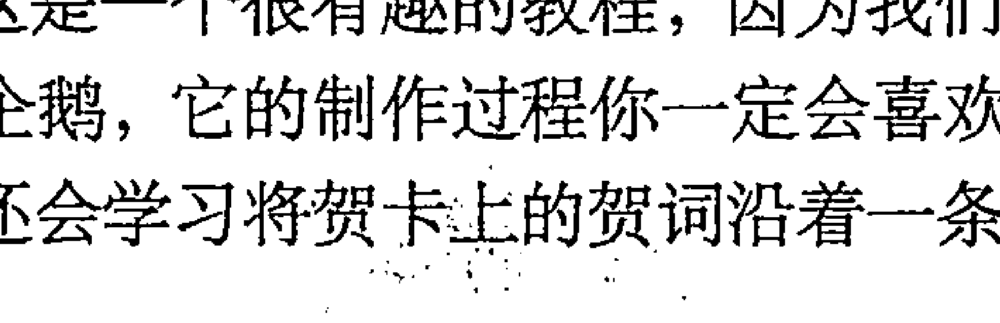

使用路径绘制工具在画布上绘制出一个如图2所示的椭圆形，大小大约是 30 × 300 像素。


这个椭圆型将作为企鹅的身体，选择变形工具，在上面的工具属性栏中选择扭曲属性。拖动下面的两个控制点向内调整，将椭圆形变为上大下小的蛋形，如图3所示。


然后，选择画笔工具，在属性栏中选择大小为20，透明度为0，将颜色设置为白色，柔化边缘设置为30。点击一下模式按钮，将模式变为“作为对象绘制”，这样接下来绘制出来的图像就是一个单独的对象了。使用画笔工具画出一个如图4所示类似于长的心形的图形，作为企鹅的头和肚子。

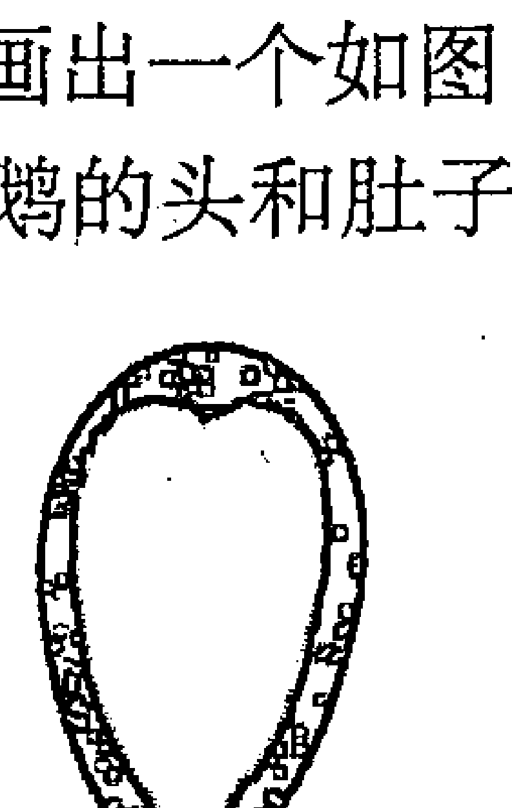

将颜色改成黑色，如图5所示，画出企鹅的眼睛。


接下来画的是企鹅的鼻子，可以选择路径绘制工具，前面已经说过这个工具了。不过这次我们要将形状设置为自定义形状，点击自定义形状按钮。打开自定义形状库，这里有各种各样的形状，我们要找到心形的形状。注意在右下角的选项卡组里要选择全部或者是边框形状，找到心形后点击确定。在企鹅上绘制出一个心形，作为它的鼻子，画好以后选中这个图形，点击对象菜单中的“转换对象类型”→“从路径到图像”，将我们刚才绘制出的路径对象转化为图像对象，因为接下来我们要进行渐变填充，路径对象会有一些功能不能选择。现在点击菜单命令“编辑”→“填充”，打开填充对话框，进行如图6所示的设置。


渐变的填充类型选择放射渐变。填充色彩为双色填充，编辑一个从金黄色到橙色的填充，这两种颜色的RGB色值为(247, 188, 91)和(255, 102, 0)。点击确定以后，渐变填充就会自动应用到心形上。下面画企鹅的两只脚，我们可以直接把刚才的心形拿过来用。在心形上点击鼠标右键，选择添加副本，点击两次，复制出同样的两个心形，将它们移动到企鹅底部，分别放在左边和右边。选择“编辑”→“旋转和翻转”→“垂直翻转”，并且使用变形工具，分别顺时针和逆时针旋转30度，可以使用工具属性栏上的旋转角度进行精确的调整。用箭头工具选中左边的心形，点击鼠标右键，选择“排列”→“移到底端”，将这个心形移到最下面，同样的将右边的心形也移到最下面，效果如图7所示。


下面画企鹅的翅膀，选择路径绘制工具，并且选择“自定义形状”→“四分之一圆”。颜色设置为黑色，并将模式设为二维对象。在画面上绘制出一个四分之一圆，使用变形工具调整一下大小，并且旋转一定的角度，直到形成一个略略向上倾斜的翅膀的样子。点击鼠标右键选择添加副本，再复制出一个，并且将它移到企鹅的另一边，选择菜单命令“编辑”→“旋转和翻转”→“水平翻转”，这样两边的翅膀都完成了。企鹅的外形就在我们的画布上出现了，如图8所示。


企鹅做好以后，我们需要增加一个漂亮的背景，用箭头工具在背景上点击一下，然后打开百宝箱，我们可以点击标准工具栏上的布局按钮，在百宝箱前面打上勾，打开百宝箱中的填充画廊，然后选择渐变类，双击一下放射1，如图9所示。

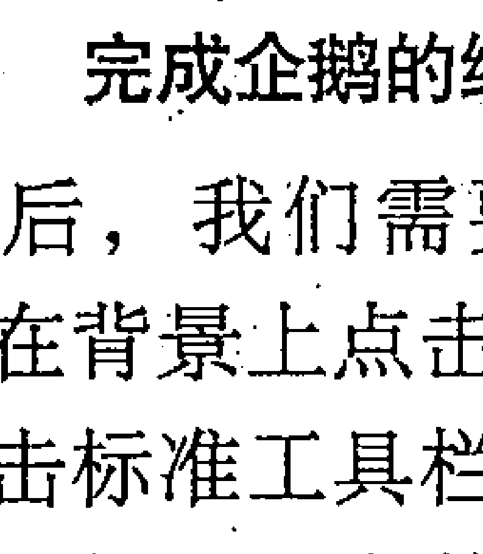

我们已经将这种渐变应用到背景上去了，下面我们要制作出彩色纸屑分飞的效果，给贺卡制作出喜庆的气氛。点击“颗粒画廊” -> “瑞雪”，在“瑞雪2”上点击鼠标右键，选择修改属性并应用，打开颗粒设置的对话框，原来的设置是白色的，现在我们将颜色设置为黄色，点击确定，颗粒对话框中的设置如图10所示，重复上面的步骤，这次我们在颗粒设置对话框中将颜色设置为蓝色，我们可以点击右下方的随机按钮，随机地改变颗粒的排列方式。最后再重复一次上面的步骤，将颜色设置为绿色，我们就可以看到如图11所示的完成后的效果了。

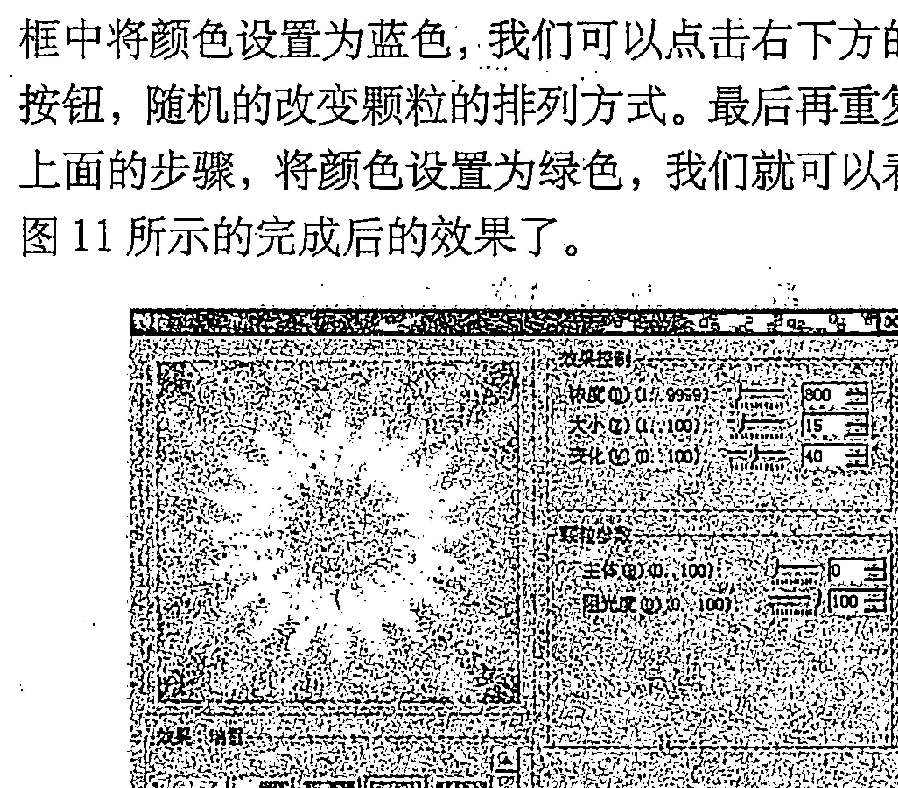


下面我们让企鹅的手中举起一杯葡萄酒，来庆祝新年。点击百宝箱上的库按钮，打开库，选择对象库，找到如图12所示的葡萄酒杯对象。

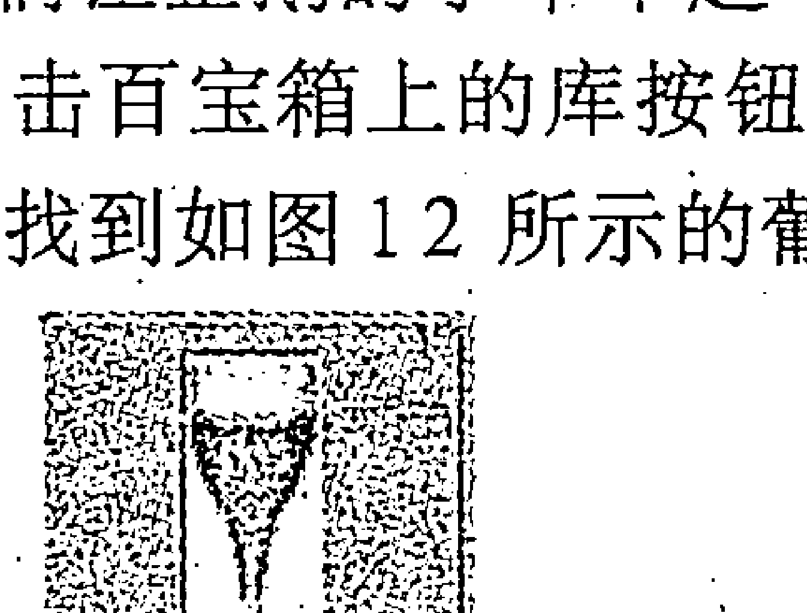

然后将葡萄酒杯拖到画面上，用变形工具将它缩小并且放到企鹅右边翅膀的位置上。

最后输入文字，使用文字工具，在画面上点击一下，并且在文本输入框中输入 happy new year 几个字，文本输入框中的设置如图13所示。选择百宝箱中的“环绕画廊” -> “弯曲文字” -> “弯曲4”，使文字变为弧型。最后再在画面的上方输入2002这几个字，贺卡的制作就完成了，最后的效果如图14所示。


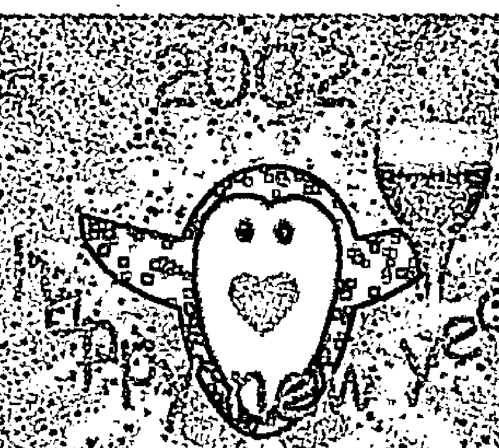

#### 二、从无到有制作逼真的调色板

PhotoImpact的路径绘制功能很奇妙，我们可以轻松地绘制一个逼真的立体调色板，能完全达到三维软件的制作效果，其操作过程却十分轻松简单。

首先新建一个尺寸为 300 × 300 像素的文件，然后选择路径绘制功能，并且选择自定义形状，在如图15所示的形状库中找到调色板。


点击确定，并且将路径绘制的模式调整为三维圆形，如图16所示。在画面上绘制出一个立体的调色板。

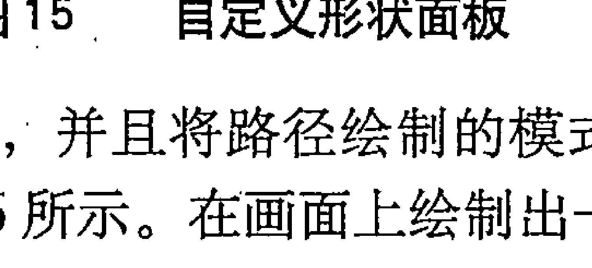

接下来我们还可以对这个立体图形的边框和深度进行一些调整。将边框设置为17，深度设置为30，就会产生如图17所示的立体图形。


选择菜单命令 “编辑” → “填充”，点击填充面板上纹理标签，在选项卡组中选择自然纹理，我们在这里选择一种类似木纹效果的纹理，可以选择木质2。现在就产生了如图18所示的效果，仿佛是一块用木头做出来的调色板。


在调色板上点击右键，选择右键菜单中的阴影选项，我们要给调色板加上投影的效果，添加阴影对话框的设置如图19所示，在阴影对话框中，首先在阴影的选项前面打上钩，在阴影的类型中选择最后一种向左的投影效果。将透明度调高一点，使阴影显得稍淡一些，我们也可以根据自己需要调节一下其他的参数。

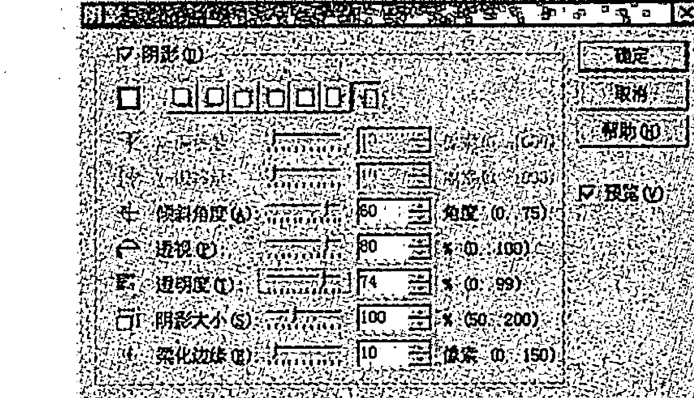

接下来让我们再给这块调色板上加上一些颜料的效果，使它看上去更逼真。按住工具箱中的笔刷工具，直到出现其他的选项，选择油画工具，并在预设值的下拉菜单中选择粗笔画，选择了这个预设值后所默认的颜色是紫色，这种颜色并不是我们所想要的，所以我们可以点击颜色按钮，改换成红色。你可能会注意到，在选择了另一种颜色以后，预设值显示的是无，但是不要紧，除了颜色以外，刚才我们所选择的预设值的其他属性都还在。在工具属性栏上，将模式设置为对象绘制模式，如图20所示，用油画笔工具在调色板上绘制出一小团红色。

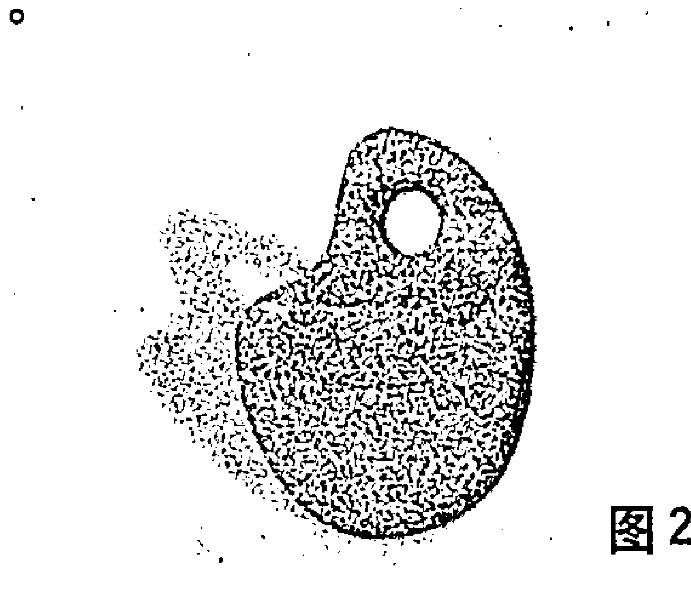

接下来再换成其他的颜色，分别绘制出白色、黄色、蓝色和绿色的颜料。OK，调色板的制作过程完成了，看看图21的效果，一块逼真的调色板已经制作出来了。


#### 三、电影胶片巧制作

在电影胶片的例子里，我们要学习PhotoImpact中路径的编辑方法。新建一个640 × 480像素的文件，然后使用路径绘制工具画出一个黑色的长方形，大小大约是560 × 107像素。保持长方形的选中状态。在图22中工具属性栏中的模式菜单里选择继续绘制模式。

- 二维对象
- 三维圆形
- 三维雕凿
- 三维修整
- 三维管道
- 三维定制
- 选定范围

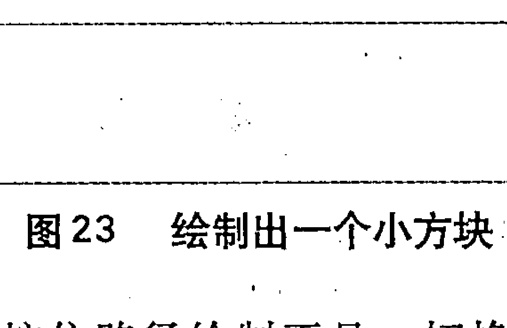

这时就进入了路径编辑状态，在长方形的左上角上画出一个小方块（如图23）。


接下来按住路径绘制工具，切换到路径编辑工具，点击工具属性栏中的添加副本按钮，复制出一个同样的小方块，将它移到刚才的小方块旁边。再同时选中两个小方块，再次点击添加副本按钮，就这样依次进行选择和复制，直到复制出一长条方块，从左到右都排满。然后选中所有的小方块，点击鼠标右键，选择顶部对齐，再次点击右键选择水平分布，使这些小方块之间的距离都相等，在保持选中的所有的小方块的状态下，点击添加副本按钮。再复制出一行，把它移动到大方块的底部，完成后可看到如图24的胶片外形效果。

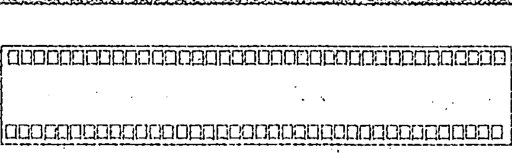

点击切换按钮，退出路径编辑模式，现在就绘制出类似胶片轮廓的效果了（如图25）。


选中图像，点击鼠标右键选择阴影，在阴影对话框中可以使用默认的设置，给胶片添加上阴影。然后选择对象菜单中分割阴影使图像与阴影分离开，这时阴影就变成了一个独立的对象，如果移动胶片，阴影就不会跟着移动了。

重新选择路径绘制工具，在模式下拉菜单中选择水平变形，这时我们会发现四个角上都有一个控制手柄，分别拖动左边上下两个控制手柄都向上移动10～20个像素（如图26）。


这时我们返回到二维对象时会发现我们变形的只有胶片上的小方格，胶片的外形没有发生变化，所以接下来我们要切换到路径编辑工具的路径模式，调整长方形的外形，点击长方形上面的一条路径，这时单独的一条路径被选中，路径转变为红色，点击鼠标右键选择转换为曲线，点击曲线两端节点就会出现控制手柄，拖动调整控制手柄可以调整曲线的弯曲度，在路径的中间点击鼠标右键，选择添加点，添加一个控制点，如图27所示，调整路径曲线直到胶片轮廓线与小方格的弯曲度相吻合为止。

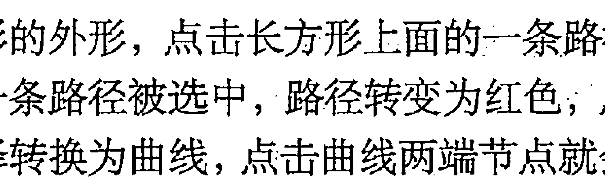

同样调整下面的一条路径，使上下两边都调整到合适的弯曲度。完成路径编辑后，我们就得到了图28这样的图像。


接下来在胶片上用路径绘制工具画一个白色的方块。选择变形工具，并且选择倾斜，使白色方块微微向上倾斜，使它和胶片弯曲的方向一样。

同样在胶片上绘制出多个白色方块，排满整个胶片，并且都沿着胶片弯曲的方向进行倾斜，完成后效果如图29所示。


下面让我们找一些适合放在电影胶片上的图片。选择第一个白色方块，点击“编辑”→“填充”，在填充类型选项卡中选择图像文件，找到我们要填充的图像文件，填充方式选择调到图像大小，这样图像就被填充到白色的方块中去了，就这样分别用不同的图像逐个填充各个方块，就完成如图30所示的电影胶片的艺术处理效果了。


#### 四、给图像添加电视扫描线效果

最近网上非常流行这种效果，实际上制作这种效果的方法并不复杂。首先新建一个文件，大小设置为1×2像素，背景设置为白色，选择放大镜工具，在上面的缩放程度调整为1600%。然后用路径绘制工具选择矩形的形状，颜色为黑色，画一个高度为文件的一半的矩形。在选项中注意要设置为不要选择平滑边缘。选择“对象”→“全部合并”，使所有对象和基底图像合并。全选所有的图像，选择“编辑”→“复制”，将图像复制到剪贴板里，然后打开我们要制作电视扫描线效果的图像（如图31所示）。


接下来选择菜单命令“编辑”→“填充”，点击图像标签，这次我们要将剪贴板上所保存的图像进行填充，所以选择剪贴板，填充方式选择平铺图像（如图32）。在合并的下拉菜单中选择叠加，透明度设置为100%。

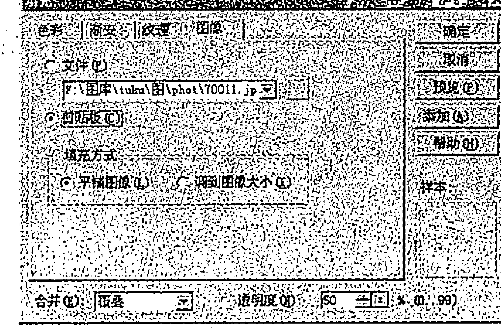

点击确定以后就完成了如图33所示的电视扫描线的效果。如果你改变一下合并方式和透明度，还会有不同的效果。

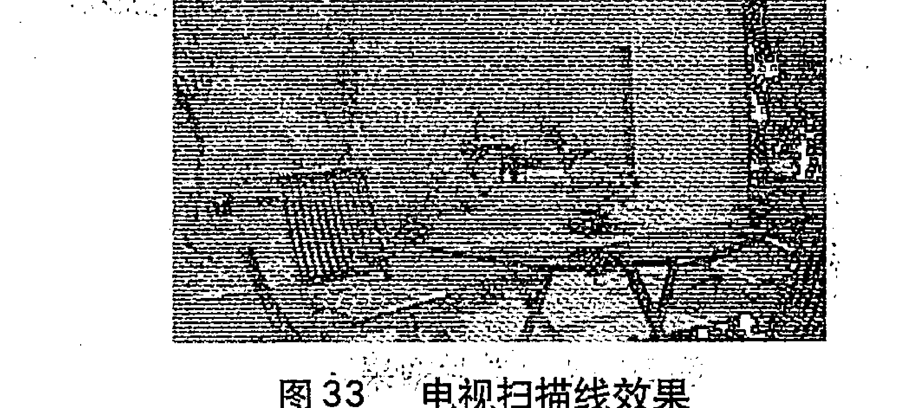

#### 五、燃烧的火焰字

在PhotoImpact6中，我们可以使用文本特效来制作富有创造性的文字，还能把静止的文字变成动画。

下面我们就来制作一个燃烧的火焰字的动画效果。首先新建一个350 x 50像素的新文件，选择文本工具，在画面上点击一下，打开文本输入框，选择合适的字体和字号，输入PhotoImpact几个字（如图34）。


保持文字的选中状态，选择“效果”→“创意”→“字型效果”，打开字型效果对话框，在对话框的左下方有很多效果的缩略图，在这些效果中选择火焰效果，右上方是火焰的参数的设定，可以设置火焰的颜色和强度，在这里我们保持默认的设置不变。右下方可以进行动画的关键帧的设置，单击预览滚动条可以查看动画的播放过程，关键帧控件上的方块就是一个关键帧，可以跳转到各帧上，修改每一帧的设置。单击，可以添加一个关键帧，单击，可以删除一个关键帧。你可以根据自己的需要调整预设的动画效果。点击播放按钮，就可以看到动画的播放效果，点击停止按钮将停止动画的播放。现在我们所看到的动画播放是只循环一次的，如果我们按下循环按钮，就可以看到无限循环播放的效果。

如果要将动画效果保存为一个动态GIF文件，我们可以点击保存按钮，就会弹出如图35所示的另存为对话框。

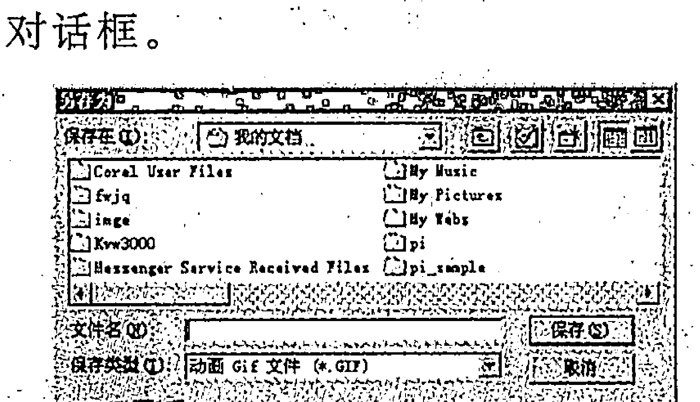

输入你所取的文件名，下面有一些GIF动画选项可以进行设置，一般按照默认的设置就可以了。并且点击保存按钮，这样就可以输出一个动画的GIF文件。

如果选中了用Ulead Gif Animator打开选项，就会在保存文件的同时，打开一个Ulead Gif Animator，我们可以使用Ulead Gif Animator对动画文件进行进一步的压缩。

在Ulead Gif Animator中我们可以看到这个动画文件由10帧组成，点击优化标签可以看到图像的原始大小，和进行优化以后的大小，我们可以选择一个优化的预设值，并且点击立即优化按钮，你会发现优化后的文件比原来小了许多。点击保存以后，我们就可以将优化后的文件保存起来。

#### 六、雕刻文字效果

想知道怎样制作出雕刻在石头上的文字效果吗？下面这个例子将告诉你。首先新建一个400 x 400像素的文件，背景为单色。当然你也可以设置为其他的尺寸。

选择“编辑”→“填充”，打开填充对话框，在如图36所示的填充对话框中选择纹理标签，在选项卡组中选择自然纹理，这里包含了一组模拟自然的纹理填充图案，我们在这些缩略图中找到大理石4纹理，用这种纹理来对背景进行填充。

#### 七、方格花布纹理

无缝平铺的方格花布纹理很有用，它可以用来作为网页的背景，或是作为填充的图案，这部分就带你学习如何制作方格花布纹理。

新建一个 20 × 20 像素的文件，背景设置为白色。选择放大镜工具，将图像放大至 600 倍。

选择标准选定范围工具，然后在工具属性栏上进行以下的设置：模式选择增加，形状选择正方形，选中固定大小，设置为 10 × 10 像素，这样就可以建立一个 10 × 10 像素的正方形选定范围。用标准选定范围工具在图像内点击一下，并且不要松开鼠标，将选定范围移动到画布的左上角，选择桶式填充工具，在选定范围内填充上深蓝色，然后回到标准选定范围工具，在画布的左下角建立一个选区，如果位置没有完全对齐的话，可以在松开鼠标之前移动到合适的位置，并且用桶式填充工具填充上浅蓝色。接下来用标准选定范围工具在画布的右上角建立一个选区，同样填充上浅蓝色，结果如图 40 所示。


下面选择 “格式” → “尺寸”，在尺寸对话框中将宽度和高度的单位改为像素，重新设置宽度和高度为 10 × 10。当然如果你需要制作大一点的纹理图案，可以省略这一步。这样就完成了方格花布纹理的制作，如果想看一下将这个纹理作为网页背景的效果，可以选择 “文件” → “在浏览器中预览”。如果满意的话，就可以选择 “文件” → “针对网络保存” → “整个图像”，这时会弹出友立图像优化器，对于像这样颜色数比较少的图像，选择 GIF 格式会获得比较好的效果。

选择保存以后，我们就可以在制作网页时调用这个文件作为背景图案。或者在进行填充的时候作为纹理，我们也可以给图像填充上不同的颜色，产生不同的效果，如图 41 所示。

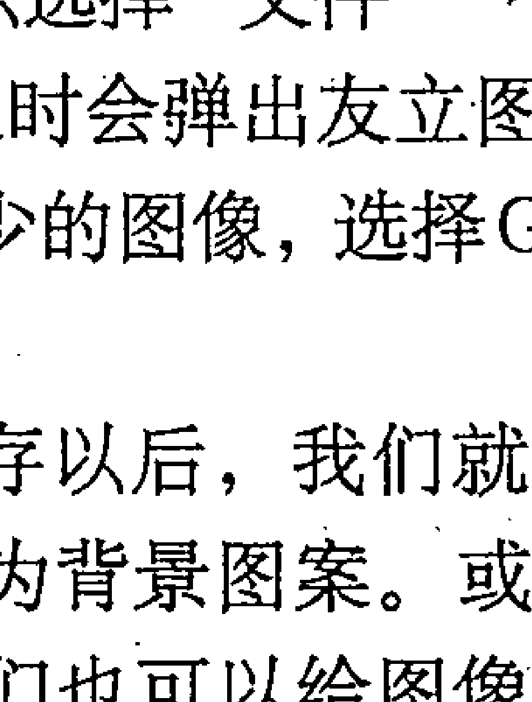


接下来使用文本工具在图像上输入文字，选中文本工具，在图像上点击并在弹出的文本输入框中输入文字。这里的字体选择 Times New Roman，把字体大小设置得大一些。在文字换行时可以按下 Ctrl+Enter 键，然后点选将文字设置为居中对齐。输入文字后的效果如图 37 所示。

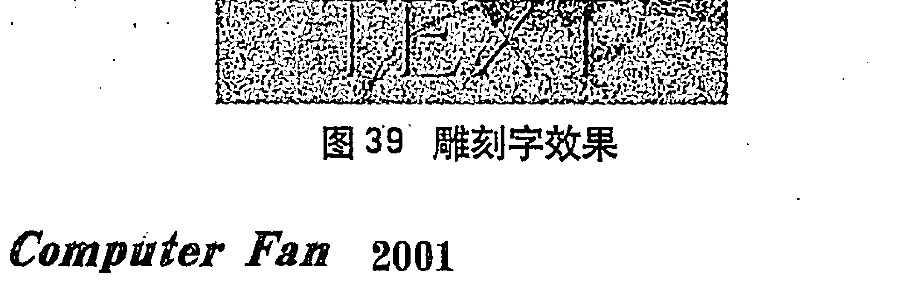

保持选择文本工具，将属性栏上的模式改为选定范围模式。这时文字就会被转化为选定范围，然后在选定范围上点击鼠标右键，在右键菜单上选择反选将原先的选定范围反转过来，再次点击鼠标右键选择转化为对象，将选定范围转化为一个对象。接下来为对象添加上阴影，选择 “格式” → “边框与阴影”，点击阴影标签，在阴影对话框中进行设置，x 和 y 轴的偏移量设置为 4，透明度设置为 25，柔化边缘设置为 0，其他用默认的设置。最后产生了如图 38 所示的效果。

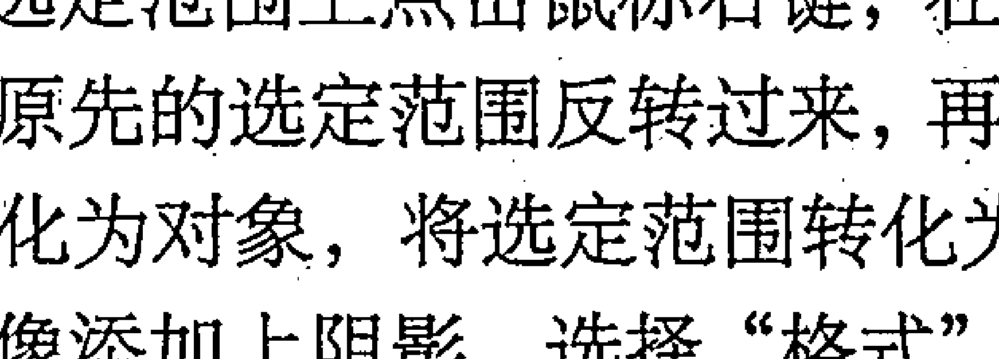

选择菜单命令：选择 “范围” → “选中基底图像”，点击调色板下面的亮度减低按钮，点击 2 到 3 次，用箭头重新选中上面的对象，点击鼠标右键，选择添加副本，新复制出一个对象，然后再次点击鼠标右键，在右键菜单中选择阴影，重新打开阴影对话框，将阴影颜色改为白色，x 和 y 轴的偏移量设置为 1，其他的设置不变。

如图 39 所示，雕刻字效果就完成了。

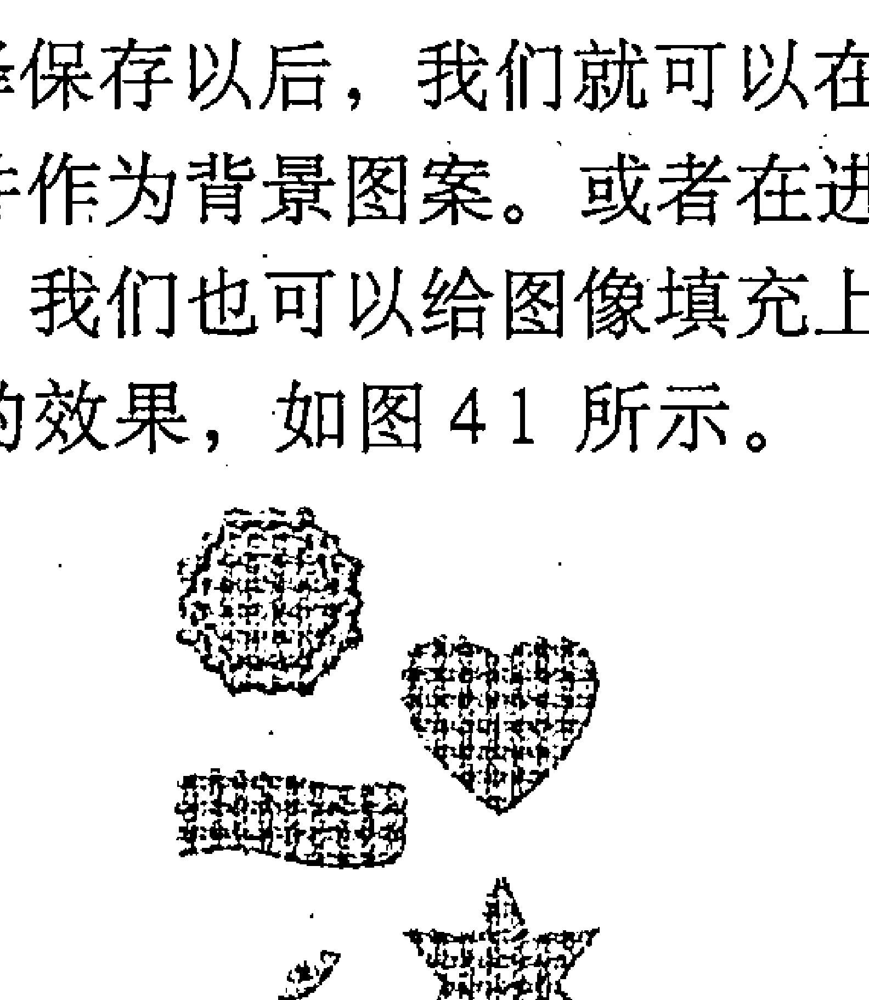

#### 八、图像混合魔法

在PhotoImpact6中新增加了几种图像的混合方式，下面我们就来看一下奇妙的图像混合魔法。在填充对话框和对象属性对话框中，都可以来设置图像的混合方式，在PhotoImpact中称作合并。

图42是一张照片，我们可以用PhotoImpact将照片中的人物和不同的背景组合在一起，并且选择不同的图像混合方式，产生特别的效果。


因为照片的背景是白色的，所以我们可以比较容易的使用魔术棒工具将背景与前景分离，魔术棒工具是隐藏在标准选取工具下面的，所以要先按住标准选取工具直到出现隐藏的工具条，然后使用魔术棒工具在白色的背景上点击一下，选中背景图像，再选择菜单上的“选定范围”→“反转”，这样就可以选中前景的人物，然后选择“选定范围”→“转换为对象”，将选中的部分转化为独立的对象。并且选择“编辑”→“复制”，将它复制到剪贴板上。

打开另一张背景图像，将剪贴板上的图像粘贴到背景上去，这样仅仅是使上面的图像覆盖住了下面的图像，并不会给人留下深刻的印象，但是我们可以改变一下图像的混合方式，选中上面图像，然后点击鼠标右键，选择属性，打开对象的属性对话框，我们将在合并的下拉菜单中选择覆叠，如图43所示。

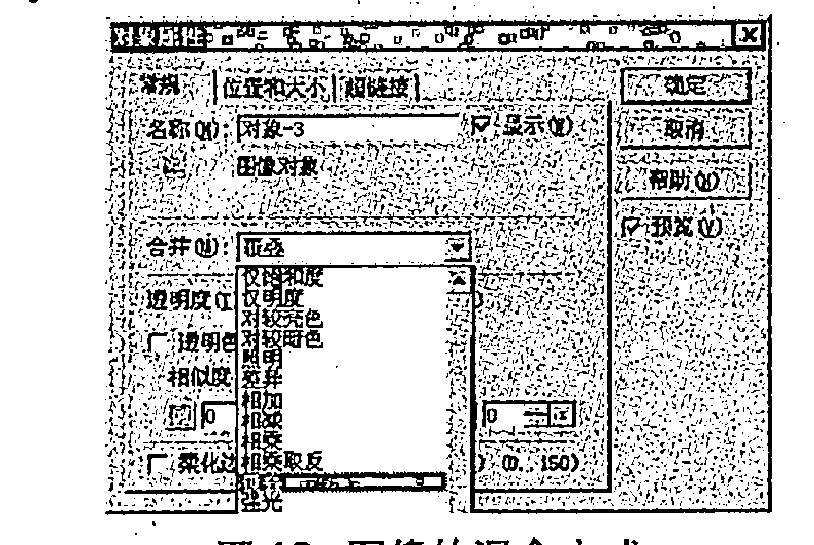

再移动调整一下人物图像的位置，就产生了如图44所示的图像效果。

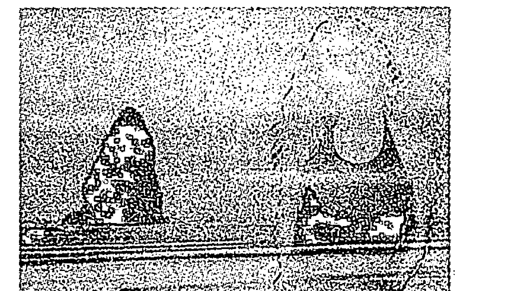

如果希望这个效果更加强烈一些。我们还可以给背景添加上照明效果，使用箭头工具在基底图像上点击一下，选中基底图像，选择“效果”→“创意”→“照明”，打开照明效果对话框，我们在下面的各种照明效果的缩略图中选择镜头闪光效果。在左上角的预览图像中我们可以用鼠标拖动调整闪光光晕的位置。然后点击确定并且选择将当前帧效果应用到图像，在照明对话框中的设置如图45所示。

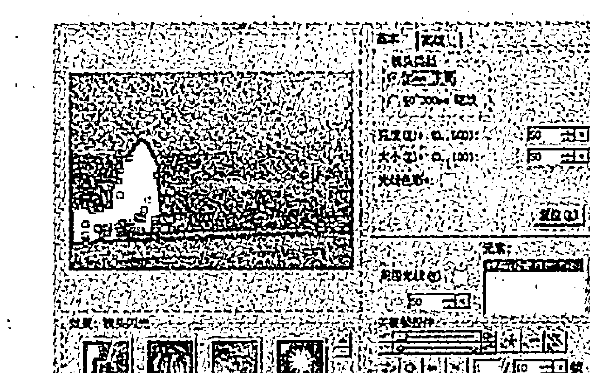

现在就产生了如图46的效果。这样的效果是不是很cool呢？

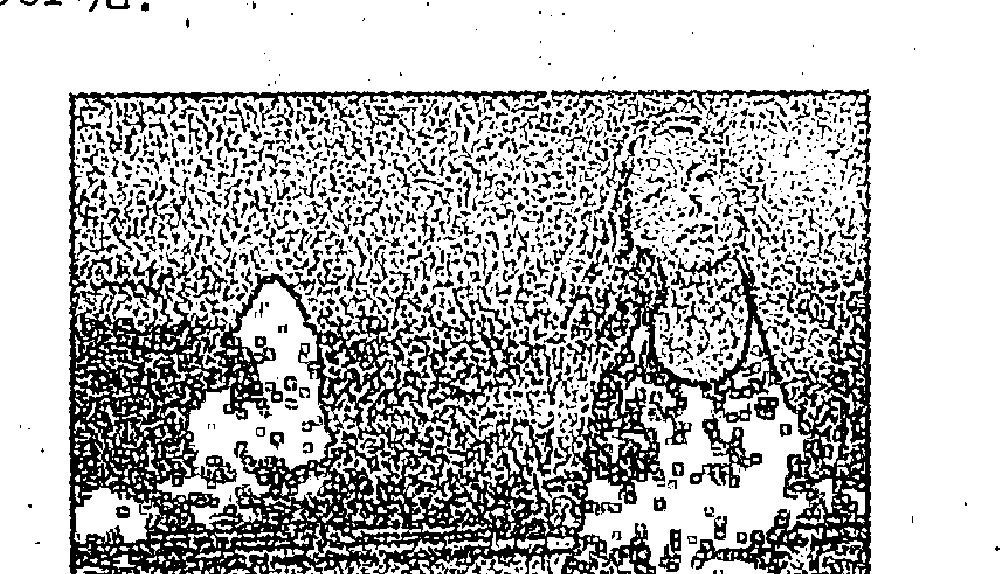

再打开另一张作为背景的图像，并且将剪贴板上的图像粘贴到背景上去，这次我们在合并的方式中选择强光，这种混合方式似乎是在图像上照射一束耀眼的强光，和覆叠的混合方式相比，有更多的不透明部分，感觉更加强烈，但是依然可以清楚透出基底图像上的明暗对比。同时我们可以选中属性对话框中的柔化边缘选择并且设置8～10像素的柔化值，这样可以使图像的边缘和基底图像混合并且产生出发光的效果。强光合并方式所产生的效果如图47所示。


##### 图47 强光合并方式效果

接下来我们再将人物的图像粘贴到一副蓝天白云的背景上面，然后将图像的混合方式改成柔光，这样图像就会有更大的透明度。柔光方式所产生的效果如图48所示。


##### 图48 柔光混合方式效果

怎么样，图像混合魔法是不是很有趣呢？你也可以尝试一下其他的混合方式，看看会产生什么样的效果。

#### 九、淡出花朵拼贴画

在本例中我们将使用淡出的功能将花朵的图像和纹理背景图像融合在一起，图49、图50就是我们要使用的花朵图像和网点状背景图像。


##### 图49 花朵图像


##### 图50 背景图像

首先同时打开这两幅图像，点击菜单上的“选择范围”→“全部”，全部选中花朵图像，然后点击复制，将图像复制到剪贴板上，再回到背景图像，将图像粘贴上去，单击格式菜单中的边框与阴影，在边框样式中选择“边缘边框画廊”，形状选择第一个按钮，然后点击确定，这样图像的边缘就会变的比较柔和，使用箭头工具将花朵图像移动到背景的左上角，效果如图51所示。


##### 图51 将花朵粘贴到背景图像上

点击菜单命令“编辑”→“淡出”，在淡出对话框中选择从左到右的填充类型，填充色选择多色，点击多色下面的方框，当色盘编辑器打开时，我们选择7号色盘，点击确定。具体的设置如图52所示。

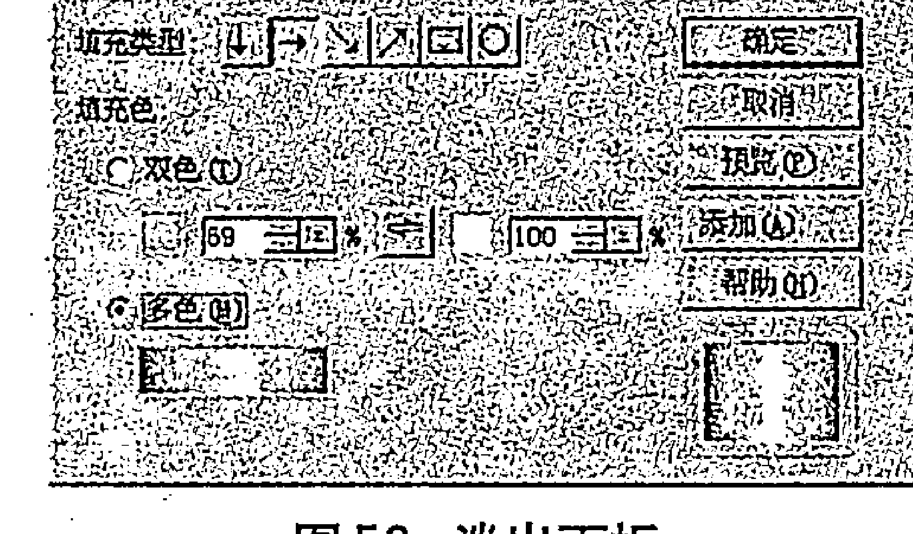

##### 图52 淡出面板

这时我们看到花朵图像从左到右淡出了，淡出填充色中较深的部分，图像的透明度就较高，较浅的部分则相对不透明，白色不会对图像产生影响。再次选择粘贴，将花朵图像的另一个副本粘贴到背景图像上，单击格式菜单中的边框与阴影，在边框样式中选择“边缘边框画廊”，形状同样选择第一个，单击编辑菜单中的淡出命令，这一次在填充类型中选择最后一个放射状填充，填充色选择多色，当色盘编辑器打开时，选择8号色盘，单击确定，会看到图像产生类似涟漪的效果（图53），用箭头工具将图像移动到中间的位置。


##### 图53 设置放射状淡出效果

和前两次一样，对花朵图像的第三个副本作处理。选择“格式” → “边框与阴影”，在边缘边框画廊中，选择第一个边缘样式，单击“编辑” → “淡出”，淡出类型中选择从左到右，点击多色下面的方框，在打开的色盘编辑器中选择6号色盘，点击确定。效果和第一个花朵相似，只是有稍微的不同，用箭头工具将它移到右下角，如图 54 所示。

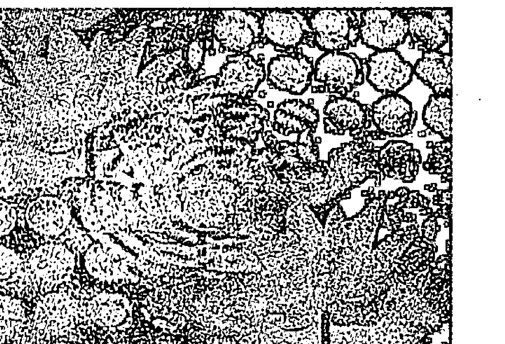

现在我们完成了所有的淡出操作，三朵花的边缘都和背景很好的融合到了一起，接下来我们再给图像增添一些艺术气息。

使用箭头工具选取画面左上角的第一朵花，单击鼠标右键，然后在右键菜单里选择属性，在对象属性对话框内按图 55 所示进行设置，选择合并为全部，透明度为 15，柔化边缘为 5。

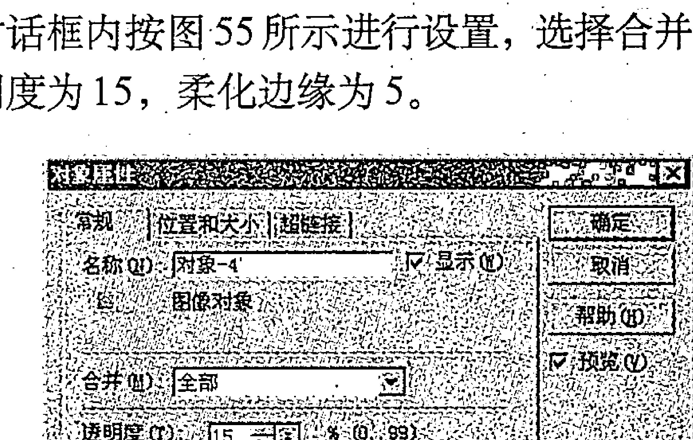

选中中间的花朵图像，单击鼠标右键，选择属性，在属性对话框中设置合并为相加。

选中右下角的花朵图像，打开属性对话框，选择合并为相减；透明度为 10，柔化边缘为 5。

使用箭头工具和右键菜单中的排列命令来改变一下 3 朵花的叠放顺序，将左上角的第一朵花放置在中间的花的下面，将右下角的花也放在中间的花的下面，移动调整一下花朵图像的位置直到满意为止。然后我们可以选择“对象” → “合并对象”，将所有的图像合并为一层，如图 56 所示。

如果我们要再给拼贴画增加一些修饰，可以点击“格式” → “边框和阴影”，边框样式选择边缘边框画廊，选择一个边缘边框。如果不想让太多的图像边缘被边框占用，我们可以在设置边框之前，先选择“编辑” → “扩大画布”。将画布的上下左右四边各扩大 10 个像素，画布颜色选黑色。接下来再给图像增添一个边缘边框，这样拼贴画的效果就更完美了。最后完成的效果如图 57 所示。


#### 十、制作一条金项链

在这部分，我们将学习用 PhotoImpact 来打造一条金光闪闪的项链。

一条完整的项链是由一个一个的小金环组合起来的，我们首先就来制作这样一个小金环，然后用它串成一条项链。

新建一个 7 × 8 像素的文件，背景色设置为黑色，这样的文件尺寸是很小的，所以如果我们看不清楚的话，可以使用放大镜工具将它的放大比率设置的高一些，选择路径绘制工具，形状设置为正圆形，颜色设置为一种金黄色，RGB 值为“36，61，97”。模式设置为三维管道，边框设置为 1，深度设置为 30。

然后在新建的文件内画出一个圆形，因为我们的模式是三维管道，所以圆产生了立体的环形效果。点击材质按钮，在材质对话框中点击遮光标签，按如图 58 中参数进行设置，这里选择金属材质，在下拉菜单中选择“金”，耀眼度设为 16 ，强度设为 5。

因为我们在以后还要调用这个材质，所以可以点击添加按钮，打开如图 59 所示的窗口，将它添加到百宝箱，这样再次调用时就方便多了。

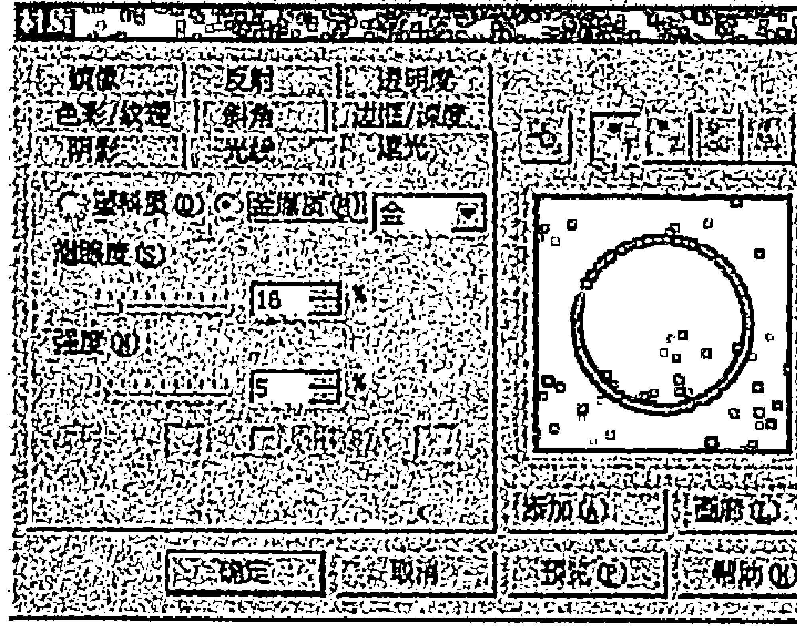

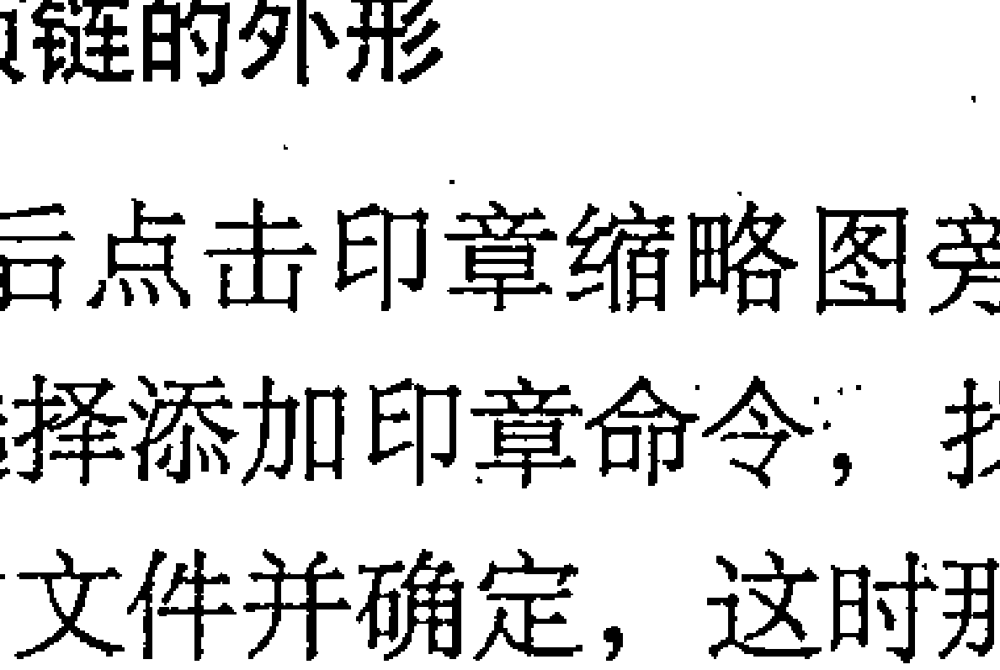

然后选择变形工具，在工具属性栏上选择倾斜图，拖动环形使它变得倾斜一些，接下来将它保存为一个 ufo 格式的文件。我们需要将这个环形定义为一个印章。再次新建一个 600 × 400 像素的文件。然后使用贝氏曲线工具画一个如图 60 所示的图形作为项链的外形。


选择印章工具，然后点击印章缩略图旁边的小三角，在下拉的菜单中选择添加印章命令，找到我们刚才保存的那个金属环的文件并确定，这时那个文件就会被作为自定义印章导入进来，将图章的间距设为 70。接下来是很有趣的一步，同时按下 Shift 和 P 键，这些小金环就会自动的沿着这个图形的外形进行排列，组合成一条链子，因为通常黄金制品是放在黑色的背景上比较好看，所以将中间的图形删除，并将背景填充上黑色，结果如图 61 所示。

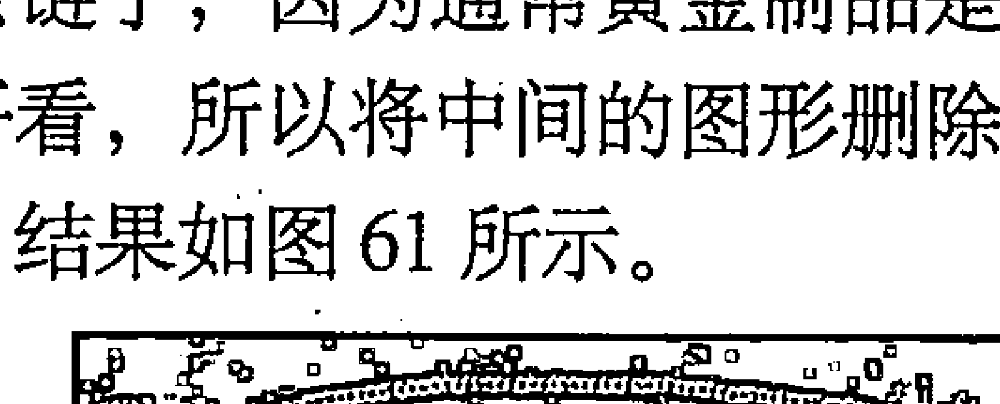

使用箭头工具选中链条，再切换到对象橡皮工具，将项链的顶部擦除一部分，擦除的时候小心一点，注意保持留下来的环形的完整，可以将橡皮的尺寸和柔化边缘都设置为 5。擦出后的图像如图 62 所示。

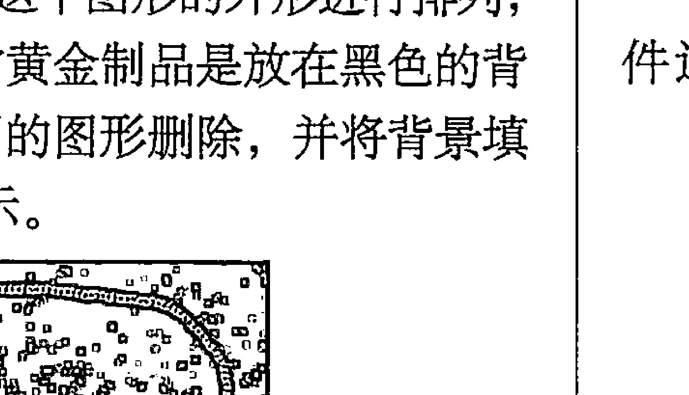

然后制作项链上的装饰挂件，用路径绘制工具画出一个长的椭圆形，颜色和材质的设置和刚才的项链一样，属性设置三维管道，边框为 2，深度为 30。点击鼠标右键选择添加副本，再复制出一个，将新复制出的对象，拖动到文件以外工作区空白的地方，这样就新建了一个文件，打开一张如图 63 所示的照片。

按 Ctrl 全部选中，点击鼠标右键选择复制，将图像放入剪贴板。然后返回到我们刚才新建的那个圆环的文件，选中圆环，点击路径绘制工具，并将圆环的属性改为选定范围，现在我们要将剪贴板中的图像放入选定范围。选择“编辑”－>“粘贴”－>“调到选定范围大小”，效果如图 64 所示。

选中图像，点击鼠标右键选择复制，回到项链的文件，将图像粘贴上去，用箭头工具和圆环重合，点击鼠标右键，选择“排列”→“向后一层”，将照片移到圆环的后面，再给照片上加上一个透明罩，选中圆环，再次复制一个，将模式改为三维圆形，点击布局按钮打开百宝箱，选择“材质画廊”→“玻璃”，双击灰色 3 的缩略图，将圆形变为半透明，然后移动到照片上对齐，点击鼠标右键，选择“排列”→“向后一层”。完成挂件的制作，效果如图 65 所示。


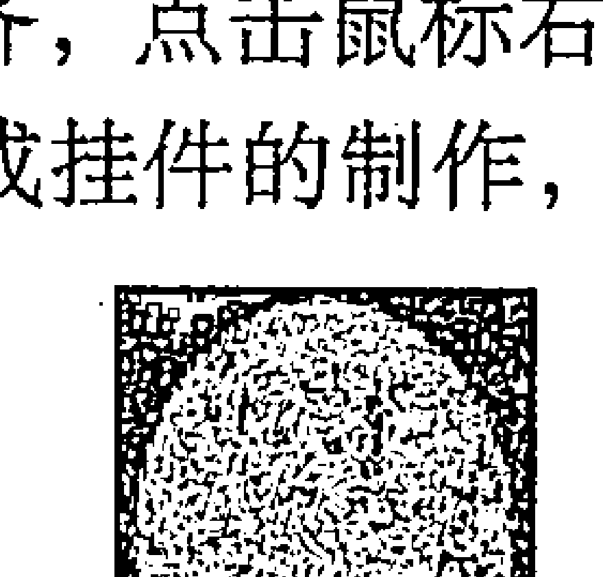

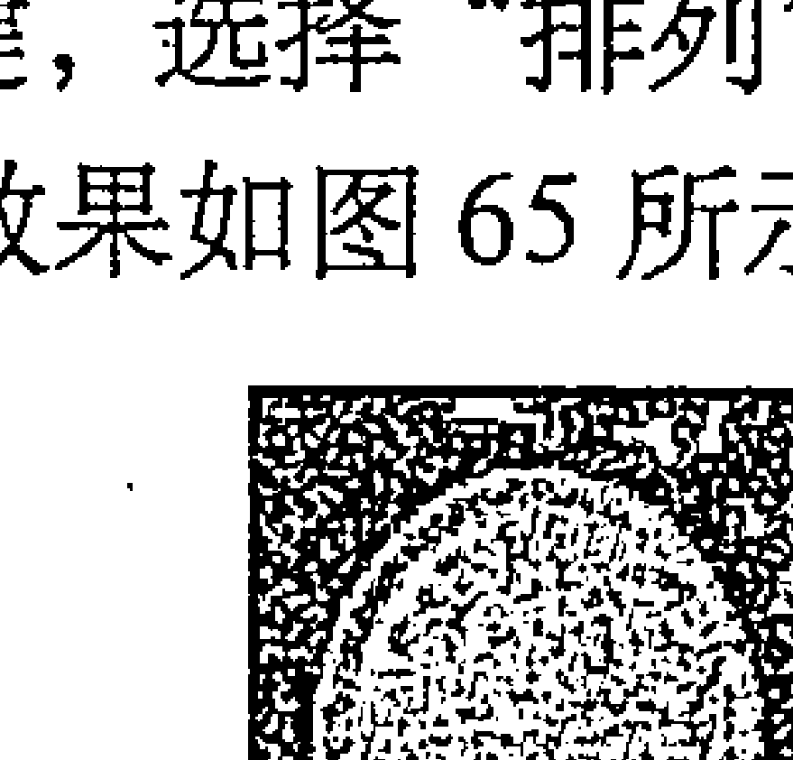

好了，现在再用一个小小的金属环将项链与挂件连起来，如图 66 所示。

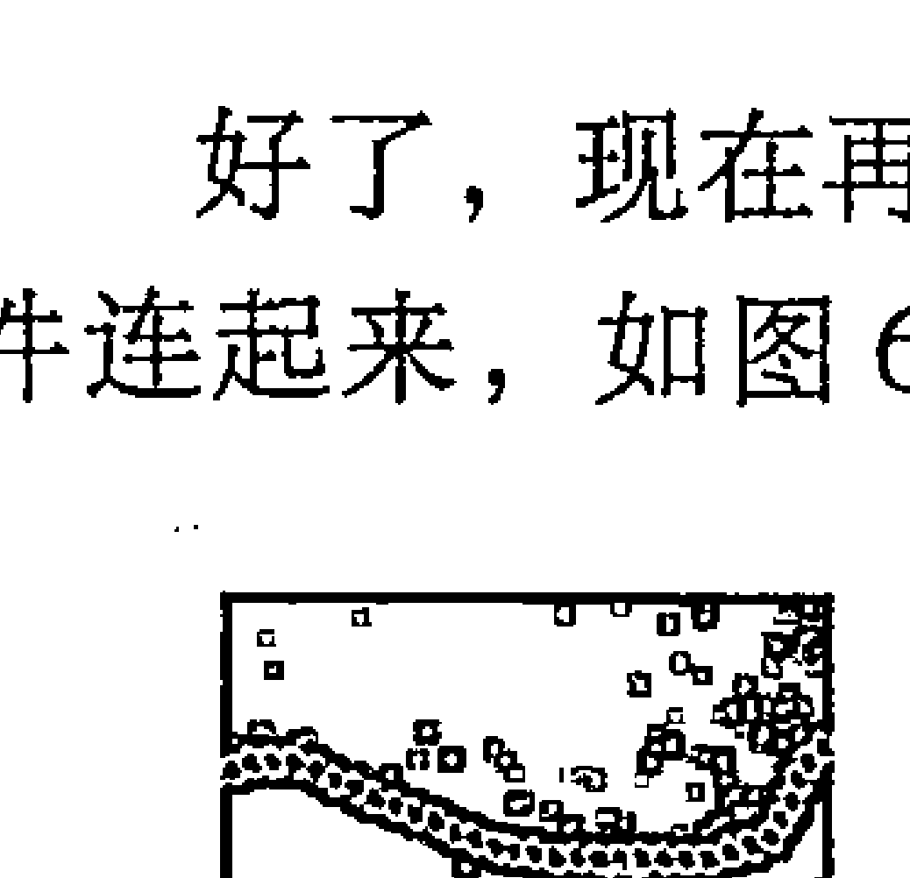

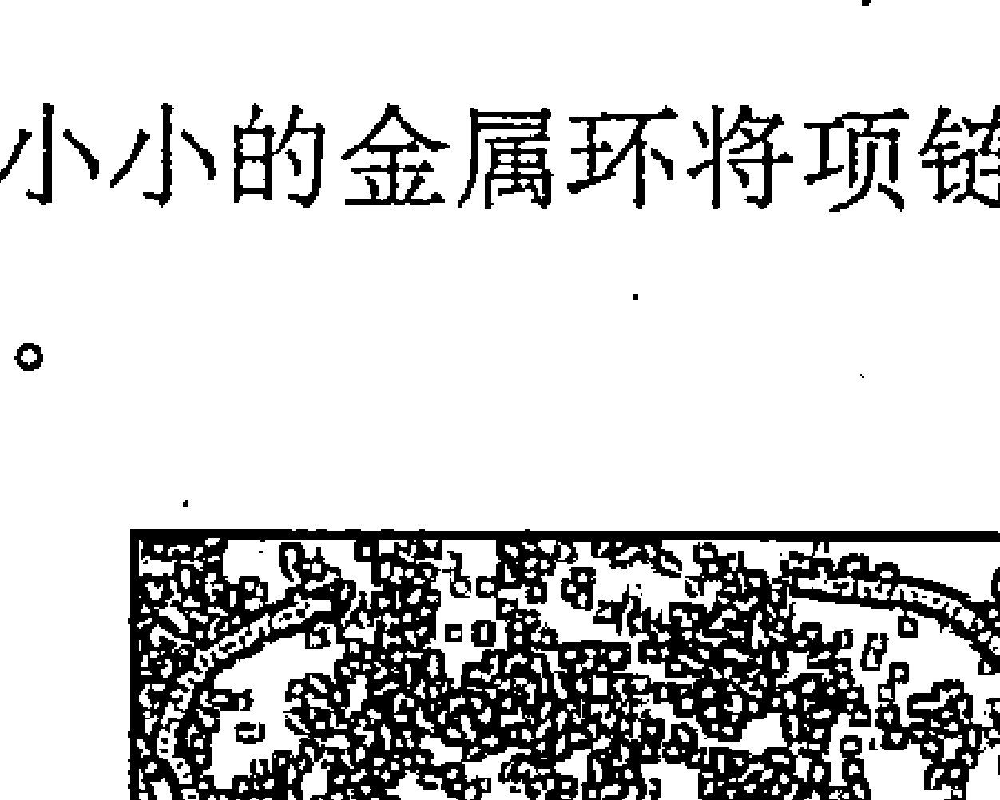

最后再使用路径绘制工具在项链开口的两端各画一个矩形，模式选择三维圆形，使项链可以扣合起来。一条美丽的项链就完成了，就像图 67 的效果，怎么样，这条项链你喜欢吗？

（文 \ CANDY）

## 实战演练Authorware 6.0

由于各种原因，Authorware的最新版本姗姗来迟，最近终于升级到6.0了。Authorware 6主要加强了Web发布的功能，用户能够充分利用Authorware 6的工具进行多媒体、交互性、可跟踪的网络程序的创作，6.0的新增功能有一键发布、新的“Commands”菜单、RTF文件格式编辑器和RTF知识对象、增强与改进界面、媒体同步与直接支持MP3、增强的Web技术与新的SCO编辑环境等。

本文的所有实例是在WIN98环境的Authorware 6版本实践通过的，除了个别利用到6版本的新功能之外，大部分的内容在5.x版本也可以运行。由于使用了大量的UCD、ActiveX、第三方控件和知识对象，所有相关文件在光盘中都已完整提供。

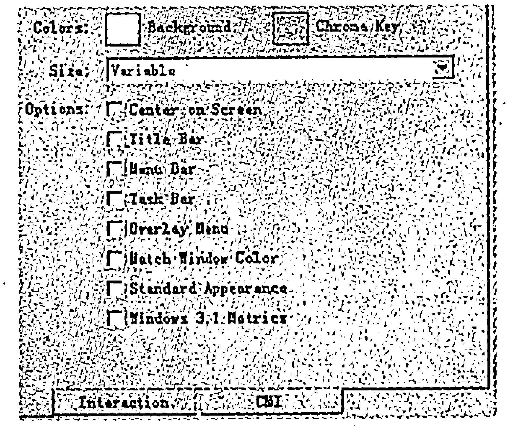

#### 一、即时光标跟随提示

##### （一）实例说明

这个实例完成的作品是在一幅美丽的大自然画卷中，雄鹰在天空中翱翔，广阔的草原上一只美洲豹在奔跑。雄鹰和豹子是两幅动态GIF格式的图片，鼠标停留在大自然背景图时出现跟随光标的提示“美丽的大自然”，当光标移动到GIF图片时，分别出现提示“翱翔的雄鹰”和“奔驰的美洲豹”的即时提示，单击两幅GIF图片时分别作具体介绍；光标移动到草原上的屋子时出现离开提示信息，单击鼠标时有退出选项，退出功能利用了“Message Box”知识对象以确定是否退出。

##### （二）制作步骤

1.  界面设定：为了屏幕美观，程序不需要标题和菜单栏。点击Authorware主菜单下的“Modify”下的“File”里面的“Properties”(快捷键Ctrl+Shift+D)，在“Playback”选项中设定显示屏幕为“Variable”(由变量决定屏幕显示大小)，点开“Title Bar”和“Menu Bar”(如图1)，在下面的其他例子中都采用相同的设定，就不再作重复解释了。
2.  在新流程线上放一计算图标“start”，标志程序的开始，在里面输入注释文字“程序开始”。
3.  继续在流程线上拖放计算图标“setwindows”，里面输入：

```
ResizeWindow(640,480)
ShowMenuBar(OFF)
ShowTitleBar(OFF)
ShowTaskBar(OFF)
```

系统函数ResizeWindow利用width和height参数来调整窗口的大小，它只使用在计算图标中，调整窗口的系统变量包括WindowHeight、WindowWidth、WindowTop、WindowLeft。

ShowMenuBar(display)：ShowMenuBar用来显示或关闭用户的菜单栏，它只使用在计算图标中。注意，即使用户关闭了菜单栏任务条，用户仍然可以在运行的任何时候按Alt + F4退出程序。

ShowTitleBar(Display)：显示窗口标题栏，“Display=off”是隐藏，“Display=on”是显示。

ShowTaskBar(OFF)：关闭系统任务栏，但当Windows的任务条设定为“总在最前”时会忽略你的这个设定。
4.  在流程线上放置一个显示图标“nature”作为背景图，调整好位置，使它覆盖全部画面。右击这个图标，在“Properties”里面的“Display”选项里面设定“Prevent automatic Erase”，防止自动擦除图画，其他设定用缺省值就可以了。
5.  在主菜单下“Insert”的“Media”里面选“Animated Gif…”，点出一个图标“eagle”，浏览文件夹，将一幅GIF格式的雄鹰图放进来，设定好位置、大小(如图2)，并右击这图标，把属性的显示方式设定为“transparent”(透明)，这个设定和图片本身有一定关系，要看图片的实际来处理(如图3)。

6. 在 “eagle” 下放一个运动图标 “move_eagle”。选择运动的对象是 eagle，双击鼠标打开这个运动图标，在 “Properties” 里面的 “Motion” 选项里面设定 “Type” 为 “Path to end” (指向固定路径的终点)，设定运行时间为 25 秒，“Concurrency” 设定为 “concurrent” (同时运行下面内容)，在 “Move When” 选项打上 “True” (目的是让运动循环进行) (如图4)。所定义的路径一般在背景图的天空部分，可以让雄鹰的部分路径显示在画面外边，一般采用圆滑路径 (将关键点点击设定圆点就可以了)。这样雄鹰就可以循环翱翔在天空中了。

7. 用步骤5 同样的方法添加图标 “panther” (豹子的 GIF 图片)如图5所示。

8. 用步骤6 同样的方法添加运动图标 “move_panther” (如图6)，但在设定豹子的运动路径时有所不同，可以设定四个三角形的标志，做成矩形的环路，目的是使豹子的运动路径在背景图下面的土地上单向循环奔跑，这四个标志都应该放在图画外边。

9. 在流程线上继续添加一个房屋的 GIF 格式图片 “Home”，属性设定和步骤5的相同，将它们设定为 “Prevent automatic Erase” (防止自动擦除) 和 “transparent” (透明) 模式。

10. 在流程线上放置一个交互图标 “Tips”，它右边是两种各四个的交互，一类是当光标在屏幕上的提示，另一类是当点击图画时的引申，四个交互分别对应于大自然、鹰、豹、屋。

11. 在 “Tips” 交互图标右边放置一个群组图标 “nature”，设定交互方式类型为 “Hot Object” (热对象)，在 “Match” 匹配为 “Cursor on Object”，并将光标变成粗 “十” 型 (如图7)，设定 “Scope” 为 “perpetual” (永久)。接下来分别放置计算图标 “x y ”、擦除图标 “x”、显示图标“美丽的大自然”以及计算图标“goxy” (如图8 )。在计算图标“xy”里面输入: x:=CursorX, 将光标当前位置距窗口左边的距离像素数值赋给变量x； y:=CursorY, 将光标当前位置距离窗口顶端的像素数值赋给变量y。

```
x:=CursorX
```

```
y:=CursorY
```

将擦除图标“x”的“Icon”属性设定为“Icons to preserve”，列表图标留空，就可擦除前面的所有显示内容。在显示图标里面写上“美丽的大自然”，它的“Display”属性里面一定要勾选“Update Displayed Variable”（更新变量）（如图9），把“Positioning”和“Movable”属性都设定为“On Screen”，在初始位置“initial”中把x值设定为x, y值设定为y+18（如图10）。这个显示图标的作用就是当光标出现在背景图时，光标显示为粗“+”型，并出现紧跟随光标的即时提示！它是通过更新光标位置变量来实现的。

12. 采用完全相同的方法在流程线右边加上“panther”、“eagle”、“home”，因为即时提示的字数有区别，在初始位置“initial”中的x、y有所不同。当GIF图片运动时，这些即时提示也是有效的。

13. 继续在流程线右边加一个计算图标“nature.”。它是当鼠标点击是所要执行的任务，所以，它的设定和步骤11、12有一个不同地方，就是“Match”设定为“Single-click”（单击），并把这时的光标改成手型。在计算图标里写上“GoTo(IconID@”-nature")”，注意跳转目的图标的名称只能是唯一的，否则提示出错。让程序执行到流程线下面的“-nature”图标处执行。这里面的跳转，也可以采用导航图标进行跳转，它们实现的方法其实是一样的。

```
GoTo(IconID@"-nature")
```

14. 同样的方法在流程线右边设定好“panther”、“eagle”、“home”三个计算图标，并在计算图标里面设定好要跳转的目的图标名称。这些交互对象，都一定要设置“Scope”为“perpetual”，因为提示部分的更新跟随一定要这样设置才可以实现。

15. 在流程线下添加一个等待图标“interrupt”里面设定等待的时间为99999，作为中断、隔离之用，下面的内容都是由前边跳转过来执行具体的任务的。

16. 在流程线下添加一个框架图标，承接上边跳转，当鼠标点击图片时要执行的内容。框架图标里面的内容全部删除，留空框架。

17. 在框架右边添加群组图标“-Nature”，里面主要显示一些说明。先添加一个擦除图标，像前边步骤设定一样擦除前面内容；再加一个显示图标做说明；接着加一个单击鼠标继续的等待图标；最后加一个计算图标，里面写上： Restart() 初始化，重新定义变量。 GoTo(IconID@”start") 这个图标让程序继续从头开始执行（如图11）。

```
Restart()
```

```
GoTo(IconID@"start")
```

18. 流程线右边继续添加 “-panther”、“-eagle” 群组，设定的方法基本同步骤 17，它是鼠标单击热对象时的反应。

19. 继续添加 “home” 群组图标。下面先加一个显示图标显示背景图，再加原来那个屋子的 GIF 图片，再添加一个 “消息框知识对象”，最后加一个计算图标，里面写上以下代码（如图 12）：

```
if button=6 then
    Quit()
else
end if
Restart()
GoTo(IconID@"start")
```

其中 button 是消息框知识对象里面的返回变量的数值，其中 OK=1；Cancel=2，Abort=3，Retry=4，Ignore=5，Yes=6，No=7。这里的计算图标的作用是：当点击 “Yes” 是确定退出，否则重新执行程序。

“消息框知识对象” 的设置步骤：
(1) 点击主菜单 “Windows” 下的 “Knowledge Objects”，双击打开一个 “Message Box” 的知识对象。
(2) 按 “Next” 选择修改成 “System Modal”（如图 13）。
(3) 按 “Next” 在 “Message Box buttons” 里选择 “Yes, No”（如图 14）。
(4) 按 “Next” 在出现的消息框中选择图标为 “?” 形状的选项（如图 15）。
(5) 按 “Next” 填上 “Message Box” 的标题及正文提示内容（如图 16）。
(6) 按 “Next” 填上返回变量名称为 “button”（如图 17）。
(7) 按“Next”并确定，然后生成消息框知识对象。至此，本实例制作完成，主流程线如图18所示。

——定位显示窗口放置位置，+– 的数字是用来做小位置调整（如图19）。

#### 二、光驱开关控制

##### （一）实例说明

利用第三方屏幕检测模块 alTools.u32（由于现在大多数操作系统平台是 32 位的，所以对 16 位的 UCD 不再做说明）检测屏幕分辨率，动态将提示放在系统托盘上方，通过对 GIF 小图像的变换形象地控制光驱开关，类似用普通编程控制光驱。注意：在使用 UCD 文件时，要将文件拷贝到 Authorware 目录下面，通过调用自定义函数来使用，在程序打包发行时，UCD 是外置的外部文件，必须将要使用到的 UCD 文件复制在程序同一目录下运行。

##### （二）操作步骤

1. 首先在流程线上放置一计算图标，里面写上以下内容（注：以下的内容中，“——”后的文字是说明的文字）：

```
w:=GetIconProperty(@"cdrom", #videowidth) ——用来检测 GIF 图像的宽度
h:=GetIconProperty(@"cdrom", #videoheight) ——用于检测 GIF 图像的高度
ResizeWindow(w, h) ——设定显示窗口的大小（和 GIF 图像一样大小）
x:=ScreenWidth ——利用 alTools.U32 的 alChangeRes 函数里面的 ScreenWidth 变量计算屏幕的宽度
y:=ScreenHeight ——利用 alTools.U32 的 alChangeRes 函数里面的 ScreenHeight 变量计算屏幕的高度
MoveWindow(y-w-20, x-h-10) ——定位显示窗口放置位置
```

加载 UCD 先点击工具条上面的函数小图标，在“Category”属性里面选现在制作的 a6p 文件，点击“Load...”按钮，选择要装载的 UCD，这是会出现相关的 UCD 的属性，选择装载“alTool.u32”的“alChangeRes”函数以及“a5wmme.u32”的“CDRetract()”、“CDEject()”函数。虽然 alTools.U32 里面的 alChangeRes 函数没有直接使用，但使用了它里面的两个变量 ScreenWidth 和 ScreenHeight，所以运行时要有这 UCD 支持。

2. 选择在主菜单的“Insert”的“Tabuleiro Xtras”里面的“DirectMediaXeras”，在流程线上出现一个插件图形，改名字为“cdrom”，用它作 CDROM 开关的图形显示，笔者现在使用的这个 DirectMediaXeras 是 2.0 版本，在这图标的“Display”属性的 Mode（模式）中选择“Transparent”透明效果。

3. 在图标属性里面点击“Options...”打开“DirectMediaXeras”属性设置（如图20）。在 “Digital Video File” 里面浏览文件并作选定，DirectMediaXeras 本身系统说明支持 MPEG、AVI、Quicktime、WAV、AIF、MP2 和 MIDI 文件，如果系统安装了 Windows Media Player，你还可以打开ASF、WMV、WMA等流媒体格式文件，但实际上它还支持动态GIF、JPG、BMP等一部分的图像文件，笔者就是利用它来打开一幅动态GIF图片的。要打开的GIF图片运行一遍的时间为2900ms（毫秒），其中0~1900ms时间段为打开过程，1900~2900ms时间段为关闭CDROM图像的过程，其他的设定按省缺值。

```
CallSprite(@"cdrom", #videoplaysegment, 0, 1900)
——定GIF图像的片段
程序运行时，先关闭CDROM，0~1900ms便是关闭的过程。
```

由于关闭功能是利用第三方的UCD文件A5wmme.u32里面的函数，它不是直接开关CDROM的函数，关闭的过程有一个短时间的过渡，所以在流程线下还要加一个计算图标，设定等待1秒。

```
CDRetract()
——利用A5WMME的函数关闭CDROM
A5WMME.U32的函数CDRetract()和CDEject()，可以用来关闭和开启CDROM。
```

A5wmme.u32包含的自定义函数可以实现以下几种媒体格式文件的控制：动画文件（*.mmm）、CD音乐、MCI（媒体控制接口）调用、MIDI音乐、WAV文件，在这里只使用其中开关光驱的两个函数。

4. 在流程线下拖放一交互图标“开关”，在下面继续放两个群组图标和一个计算图标。把这3个图标都设定为“Hot Object”热对象交互，并且热对象都是图标“cdrom”。对于Xtras控件热对象，只要一运行，它将自动提示你选择热对象，这时点击准备运行的Xtras，就可以选择热对象。前两个群组图标的交互响应属性设定基本相同，在“Match”属性选择“Single-Click”，在“Cursor”里面选择你需要的光标指针，以便在单击时表现出明显变化。在“Response”属性里面，“Scope”中不选“Perpetual”，“Erase”选“After next entry”，“Branch”选择“Try again”。这两个“开”和“关”的群组图标，关键在于设定激活响应交互。“开”图标在“Active if”设定“b=0”，“关”图标设定为“b=1”，初始值设定为0。群组图标下层设置为两个计算图标及中间的一个等待图标（作用同步骤4），在“开”群组第一个计算图标写入以下内容：

```
CallSprite(@"cdrom", #videoplaysegment, 1900, 3200)
这段代码的作用是运行GIF图形“cdrom”在1900~3200ms时间段的内容（打开光驱动态过程）。
```

在第二个计算图标写入：
CDEject()——作用是打开光驱
b:=1

在“关”群组第一个计算图标写入：
CallSprite(@"cdrom", #videoplaysegment, 0, 1900)
这段代码的作用是运行GIF图形“cdrom”的0~1900ms时间段内容（关闭光驱动态过程）。

```
CDRetract()——关闭光驱
b:=0
```

点击的热对象只有一个，这两个计算图标与响应条件相配合，使点击变换执行开关命令，这是设计技巧关键所在。右边的计算图标响应“Double-click”，里面写上退出程序函数：quit()。由于前两个交互执行的前效性，它实际是没效果的，所以要使用一个快捷键“Esc”退出程序，由于执行窗口比较小，不适合用其他方法退出，主流程线如图21。程序关键在于通过赋予变量b的变化和击活响应的条件来达到设计的目的。

#### 三、声音和视频对象播放的方法和技巧

在同一屏场景内，理论上可以将Authorware所有可以处理（间接或直接的）类型的多媒体对象全部演示。由于各种对象运行会消耗大量系统资源，在使用时要注意一定的方法和技巧，在实际应用中，多种媒体一起同时使用还是比较少见的。下面通过结合具体实例阐述多媒体对象播放的各种方法和技巧。

##### （一）声音图标和视频图标

###### 1. 实例说明

Authorware 6的声音图标能够直接支持MP3格式的播放了，可以把MP3文件当成内部文件调用。Authorware 6采用媒体同步技术，它的作用是使声音或视频与前后的媒体更协调的展示。

###### 2. 操作步骤

在流程线上放置一个声音图标或视频图标，在这图标右边放置一个其它的图标例如显示图标，这时会出现一个象小时钟的图标，双击这个图标可以进行媒体同步设定，选择时间或位置同步，擦除相邻图标的时效（如图22）。

注意：使用声音图标和视频图标播放声音在Authorware中是单线程的，因为它不支持微软的DirectDraw和DirectSound技术，凡是支持这两种技术的都可以多线程使用声频和视频资源，一些第三方插件是可以支持的，包括tabuleiro公司的DirectMediaXtra、MpegXtras、StreamingMediaXtra。例如：先后放置两个声音图标，如果第一个声音图标的“Concurrency”设定为“Wait until done”，不管你后一图标设置如何，它都是先执行完前一声音段后再开始执行后一声音段。如果前一声音“Concurrency”设定为“concurrent”，那么后面的声音不管如何设定，结果都是前一声音只是极短的出现后就播放后一声音。两个视频文件是可以同时展示的，但对于包含单线程音频的视频文件来说，它的效果和上面所说的情况是一样的。也就是说，对于包含单线程声音流的两个视频文件只能有一个线程的声音展示，但对于视频流则没有限制。Authorware 6的声音图标可以直接支持AIFF、MP3、SWA、PCM、SWA、VOX、WAVE等格式音频，接入这些声音文件后就可以当成内部文件处理，所以当使用比较大的声音文件时，会因占用系统资源过大而产生死机，所以应该尽量避免使用过大的声音文件。Authorware视频图标支持Bitmap Sequence（8位非压缩的小型点阵图片序列）、FLC/FLI、Director（包括已作保护的DCR格式，目前Authorware 6没发行新的Director的驱动程序，Authorware 6最多只部分支持Director6.5, Director7以上都不支持。

##### （二）一屏显示四种视频格式

###### 1. 实例说明

四个视频图标分别展示FLC、FLI、DIRECTOR、MPEG的格式，可以全部同时展示，对于可以导入的DIR文件的交互是完全支持的。直接用视频展示消耗大量系统资源，建议尽量少使用。

###### 2. 制作步骤

1. 在流程线上放置一个计算图标“初始化”，填上：ResizeWindow(640,480)
2. 在流程线上拖放四个视频图标：“p_fli”、“p_dir”、“p_mpg”、“p_mov”，让它们分别插入视频文件fli、dir、mpg、mov，设置好位置，在这里fli、flc文件格式是不能改变文件大小的，效果如图23所示。

##### （三）用声音图标播放WAV和MP3

###### 1. 实例说明

在屏幕上有两个按钮，按钮按下时会转换显示文字以及转换开关声音，并有简单操作提示。

###### 2. 操作步骤

(1) 拖放一个计算图标，写上如下内容：
```
ResizeWindow(300,180) —— 设定显示窗口大小
wav:=0
```MP3:=0

（2）在流程线上放置两个交互图标以分别处理WAV和MP3。在它们下面都挂3个群组图标，前两个都是按钮，后一个是热区。各组的图标所定义的位置完全相同。

（3）双击第一个交互按钮，在“Button”的“Options”属性点选“Hide When Inactive”，使无响应时按钮隐藏起来，这样可以在同一放置下放两个按钮也相互不影响。在“Cursor”选择好交互响应时的光标。在“Response”的“Scope”设定为“Perpetual”（永久），在“Active if”里面填上“wav=0”（在这里不能填wav:=0，这和在计算图标里不相同的，否则出错），在“Erase”里设定“Don't Erase”（不要擦除）。

在“播放WAV”图标下先放置一计算图标，填上：

```
wav:=1 ——先改变WAV变量值
wavstop:=0 ——定义wavstop变量为0时才进行WAV播放。
```

在流程线下放置一声音图标，Import所需要播放的声音文件，声音图标属性下的“Timing”里面的“Concurrency”设定为“concurrent”，“Play”设定为“Until True”（设定不停循环播放，直至条件“wavstop=1”成立，播和停就靠这来进行的！），其他选项使用缺省值就可以了。

利用Authorware 6的新特性“媒体同步”，在声音图标下挂一个等待图标，让声音可以播放（这是因为WAV声音是单线程声音流。如果不这样做，在没设定声音防止擦除时，当有其他声音或刷新时都会使声音播放停止的）。

在按钮交互的“停播WAV”图标下放置一群组图标，这里的设定除了在“Active if”里面设定为“wav=1”以外，其他的和“播放WAV”图标的相同，它的目的就是通过WAV变量的变化，选择出示哪个按钮。这个按钮交互里面有一个计算图标，上面写上：

```
wavstop:=1 ——改变wavstop的变量值，与声音播放的条件控制播放或停止
wav:=0 ——停止播放后，让“播放WAV”按钮有效。
```

右边的热区交互“tips_wav”用来作提示用，当鼠标在按钮位置上时提示操作，所以，这个热区响应match于“Cursor in Area”。让人看到提示可以设定在几秒等待后就用擦除图标把它们擦除。

（4）由于MP3已经可以在Authorware 6中直接调用，它的使用和WAV完全相同，所以，交互的设置也完全相同，只是改变一下两个变量名称就可以了（主流程线和效果图如图24）。

##### （四）利用UCD播放音频和视频

### 1.实例说明

UCD是User Code Document（用户代码文档）的缩写，它是用户为了扩展Authorware功能而开发的函数的一种标准，象系统函数一样使用。UCD文件同样对应有16位（“*.ucd”）和32位（“*.u32”）两种版本，在使用UCD文件时，要将文件拷贝到Authorware目录下面，通过调用自定义函数来使用。

Authorware 6自带的UCD只有A5wmme提供音频和视频的播放，它支持的MMM动画格式是很久以前定义的格式，现在已经很少人用了。所以，利用UCD主要讲述对音频的处理，我们可以利用UCD播放MIDI和VQF文件，这里需要使用的UCD是：A5wmme.u32和xjvqf.u32。A5wmme.u32是Authorware自带的，xjvqf.u32是由国内开发的。

### 2.操作步骤

（1）在流程线上放置一个“初始化”计算图标，里面写上：

```
ResizeWindow(240,180) ——设定展示窗口大小
midi:=0 ——给变量midi初始值
vqf:=0 ——给变量vqf初始值
```

（2）首先装载A5wmme.u32和xjvqf.u32。

点击工具条栏的函数窗口，在“category”选择当前编辑的文件，点击“Load...”按钮，在弹出窗口先找到A5wmme.u32，选定打开后弹出“custom function”窗口，这里只要用“Ctrl”键选定“MIDIPlay”和“MIDIStop”就可以了。同样方法装载xjvqf.u32的“X_playvqf”和“X_stopvqf”这两个函数。

（3）在流程线上放置一交互图标“midi”，在右边放一个计算图标“播放midi”，交互方式为“Button”，输入：

```
MIDIPlay(FileLocation^"sample3.mid", 100, 0) ——播放midi
midi:=1
```

其中的100表示按正常速度播放，0表示播放当前midi音乐的同时继续向下执行，相当于声音图标的“Concurrent”属性设定。

双击“播放midi”图标，在“Button”属性里面size（大小）设定为“x=100，y=50”；Location（位置）设定“x=30；y=15”；在“Options”勾选“Hide When inactive”（无效时隐藏图标）；在“Cursor”中选择手型指针。在“response”属性里面Scope勾选“Perpetual”；在Active If填上midi=0，意思就是当变量midi为零时激活图标。其他选项使用省缺值就可以了。

（4）继续在右边放置一计算图标“停播midi”，交互方式也是“Button”，写入内容：

```
MidiStop() ——停止播放 midi
midi:=0
```

在计算图标“停播midi”的图标属性里面除了在“Active If”填上“midi=1”以外，其他的属性设置和“播放midi”图标相同。

（5）在右边拖入一群组图标“midi_tips”，设定交互类型为“Hot Spot”，热区的位置和范围和前2图标相同，但Match选择“Cursor in Area”，Cursor选择手型，Scope设定为“Perpetual”。

打开“midi_tips”，先放入一显示图标“tips”，在视窗适当位置写上提示内容。在流程线下继续放一等待图标，在Time limit填上3，其他项不勾选。

（6）在流程线上放置一个交互图标“vqf”，在右边放一个计算图标“播放vqf”，交互方式为“Button”，输入：

```
vqf:=1
X_playvqf("sample2.vqf") ——播放 vqf
```

在使用前应保证“twinvq2.cdb”，“vqf.dll”这两个文件已经复制到window的system目录了。

“播放vqf”属性设置与“播放midi”雷同，不同地方是在位置上做调整，在Active If中填上“vqf=0”。

（7）在右边放一个交互方式为“Button”的计算图标“停播vqf”，输入：

```
vqf:=0
X_stopvqf("sample3.vqf") ——停播 vqf 文件
```

与“播放vqf”不同的属性设定在Active If中填上“vqf=1”。

（8）最后在“vqf”交互图标右边再加一个“Hot Spot”类型的热区交互，命名为“vqf_tips”，它的交互方式设定为“Hot Spot”，它的设定基本与“midi_tips”相同，里面放置也是相同类型的图标；就是将提示内容改动一下就可以了。

这个程序的主流程图如图25所示。这个程序播放操作很简单。有个缺陷就是当midi或vqf文件播放完毕后，按钮没有变化，这是UCD的不足，没有对播放次数和时间做处理。当然，你只要知道播放文件的长度，就可以在播放按钮下面加一个等待图标，设定好时间，再在下面加一个计算图标，将变量midi或vqf改变一下就可以了。

利用UCD播放音频和视频制作时要注意调入的函数准确使用，加上一定的技巧，就可以轻松地设计一个播放程序。

##### （五）利用ActiveX控件制作两个媒体播放器

### 1.实例说明

ActiveX技术是一种嵌入式程序技术，它其实就是OLE和OCX的融合。Authorware调用控件的方法是通过ActiveX Xtra函数的“CallSprite”。利用ActiveX控件必须要安装和注册，但对于设计者来说需要用的控件一般都已经安装过了。所以，在这里也不说安装和注册的方法了。

在一个屏幕中利用不同的两个ActiveX控件制作两个媒体播放器，分别是Shockwave flash ActiveX控件和Windows Media Player ActiveX控件，它们分别可以播放SWF与MPG、DAT、WAV、MID等格式，Media Player ActiveX控件是可以播放音频和视频格式的。

### 2.操作步骤

（1）在流程线放置一个计算图标“初始化”，里面填上：

```
ResizeWindow(640,480)
```

——设定显示窗口大小为640×480像素。

（2）继续增加一个显示图标“背景”，双击打开，在上面写上说明，并制订好两个正方形大格，用于定格播放的位置。

（3）在主菜单上的“Insert”的“Control”下点选“Active...”，在出现Select ActiveX Control中选定“Shockwave flash Object”，点击确定。在出现的属性设置中，先不用理会那些属性，按确定一路关闭就可以了，名称是“flash_player”。

（4）在流程线下放一个交互图标“dispose”，在右边放置三个计算图标，名称分别为：open、play、stop，设定它们的交互属性为按钮，并执行一下，按暂停按钮或Ctrl_P，调节好三个按钮的大小和位置。在“Button”的Cursor中设定手型指针，Scope设定为Perpetual，Erase设定为On exit，Branch设定为Try again，其他属性使用省缺值。

在“open”计算图标中，填写上：

```
object:=NewObject("fileio")
flashFile:=CallObject(object,"displayOpen")
SetIconProperty(@"flash_player",#pathName,flashFile)
```

先定义“fileio”子对象，用变量flashFile保存从[打开文件对话框]中所选的文件，然后用pathName属性把flashfile保存的文件赋给flash动画图标。

在“play”计算图标中，填写上：

```
SetSpriteProperty(@"flash_player",#movie,flashFile)
CallSprite(@"flash_player",#play)
```

设定flashFile的movie属性，对flash对象驱动播放。

在“stop”计算图标中，填写上：

```
CallSprite(@"flash_player",#stop) ——停止播放flash。
```

按 flash 的属性和方法的介绍，SetSpriteProperty(@"flash_player",#sound,FALSE)应该可以停止声音的播放，但由于某些SWF文件对声音流的处理，用stop属性只能停止动画部分，对声音没效果，停不了声音的播放。按停止以后，再按“play”继续播放。

（5）在主菜单上的“Insert”的“Control”下点选“Active...”，在出现Select ActiveX Control中选定“Windows Media Player”，点击确定。在出现的属性设置中，先不用理会那些属性，按确定一路关闭就可以了，名称叫“wmp_player”。

（6）采用步骤4的方法设置好播放Windows Media Player的四个图标。

在“open”计算图标中，填写上：

```
w_file:=NewObject("fileio")
wmpFile:=CallObject(w_file,"displayOpen")
SetSpriteProperty(@"wmp_player",#fileName,wmpFile)
```

先定义“fileio”子对象，用变量wmpFile保存从[打开文件对话框]中所选的文件，然后用fileName属性把wmpfile保存的文件赋给图标“wmp_player”。

在“play”计算图标中，填写上：

```
SetSpriteProperty(@"wmp_player",#movie,wmpFile)
CallSprite(@"wmp_player",#play)
```

——设定wmpFile的movie属性，对媒体对象进行播放。

在“stop”计算图标中，填写上：

```
CallSprite(@"wmp_player",#stop) ——停止播放音、视频文件。
```

由于Windows Media Player采用自己定制的DirectDraw和DirectSound技术，对于声频视频的多线程处理，不会受其他媒体驱动的影响。

（7）最后加一个交互图标，下面带一个“按钮”交互的计算图标，写上“quit()以便退出程序”。

Windows Media Player用来播放视频和音频两大类型的素材。所以，在画定的ActivX的播放框中，如果播放的是音频，当然也没有画像出现的。

通过ActivX技术可以充分利用系统资源，它山之石可以攻玉，它扩充了Authorware自身的不足。但由于接口的原因，加上属性和方法的数量多，难以控制，使用时要充分弄清各种相互属性和方法的操作（全流程线图如图26）。

##### （六）利用第三方多媒体控件DirectMediaXtra播放声频、视频

###### 1. 实例说明

由于Macromedia公司的开放，很多厂商和个人都可以自己对 Authorware 进行二次增强开发。所以，网络上的第三方多媒体控件很多，比较出名的有 Tabuleiro 公司的 DirectMediaXtra（最新的 2.01 版本）、MpegXtras、StreamingMediaXtra， visiblelight 公司的 ONSTAGE（最新 4.0 版本，支持 D V D 模式），在这里采用在国内使用最多的 DirectMediaXtra 作实例介绍。

DirectMediaXtra 完美支持 Microsoft 的 DirectDraw and DirectSound 技术，支持 MPEG、AVI、Quicktime、WAV、AIF、MP2、MIDI，如果 Windows Media Player 已经安装，可以支持 ASF、 WMV、WMA 格式，可以说是一个大集成，单一使用它已经足以处理好各种视频和音频。

这个实例显示出 DirectMediaXtra 强大的多媒体支持技术，它可以在一个屏幕中集成多种声频和视频对象。

###### 2. 操作步骤

1.  在流程线上放置一计算图标，写上 "ResizeWindow(640,480)"。
2.  在你安装 DirectMediaXtra 后，可以选择 "Insert" 主菜单下 "Tabuleiro Xtras" 里的 "DirectMediaXtra"，打开属性设定，在 "Digital Video File" 的 "Browse Files" 选择装载一个 MP3 文件，在 "Playback Options" 里设定 "Tool Bar"(显示工具条)和 "Loop"(循环)，其他用省缺值。
3.  在流程线上按顺序用同样方法分别装载 ASF、AVI、MID、WAV、MPG、GIF，属性设定也相同。
4.  DirectMediaXtra 也太夸张了，不单是音频视频一起包揽，竟然连图片也可以放在里面，可以显示 BMP、JPG 和动态的 GIF，还可以控制动态的属性设置！当然，很多别的图片，DMX 是不支持的。
5.  在主菜单的 Insert 的 Media 里面点选 Animated Gif...，在弹出的属性设置里面，通过 Browse 来选择要显示的 gif 图片，放置在流程线上，图标名为 "gif"。
6.  在主菜单 Insert 的 Media 里面点选 "Flash..."，在弹出的属性设置里面，通过 Browse 来选择 flash 文件，并勾选 "Loop"，在流程线上图标改名为 "flash"。
7.  在主菜单的 Insert 的 Media 里面点选 "QuickTime..."，在弹出的属性设置里面，通过 Browse 来选择 MOV 文件，并勾选 "Loop"，在流程线上图标改名为 "mov"。
8.  让程序运行，这次可热闹了，声音够乱，视频也多，这时按 Ctrl_P，将需要调整的位置处理好（最后效果如图 27）。

这样，流程线上有 10 个图标，都是常用的音频和视频，并且都可以在同一时间运行，并且运行也比较稳定，你看看，有了 DirectMediaXtra，还有什么能难倒你呀？

DirectMediaXtra 的属性设置主要分几个区域：Preview、Digital Video File、SearchPaths、Cue Points、Playback Options、Play Control。只要文件格式接受，它在 Preview 里一定有展示，不能演示的肯定用不了。在 Playback Options 里面，可以设定循环、分段、显示工具条等。在 Play Control 里面，可以设定音量、均衡、重放设置、CPU 占有率控制等。像背单词之类的软件，它的音量是很大的，你可以将声音做成一个大容量文件，利用 Cue Points (提示点) 可以分段，这样在录制声音时就大大方便了。

使用 DirectMediaXtra 可以使你有一种“一旦拥有，别无所求”的感觉，对于绝大多数的视频音频处理，有它足矣。而且，它占资源不是很大，即使在一个屏幕内多个一起使用也不会轻易出问题。从使用方便、易用、实效、高效的角度上来说，它绝对是吐血推荐的！

注意：如果程序有菜单条，它使用视频时会有 20 个像素的位置偏差，制作时会造成一些不便，使打包后展示的效果和制作是有些位置的偏异。

##### （七）利用 “Movie Controller” 知识对象播放 avi、dir、mov、mpeg 文件

###### 1. 实例说明

知识对象（Knowledge Object）是 Authorware5以上版本新增的内容，它将一些常用的程序片段集成为一个带有向导的独立模块，一般用户可以利用它们进行高效的创作。在6.0版本中，共有八类知识对象，现在我们利用“Movie Controller”来制作播放视频的实例。

###### 2. 操作步骤

（1）在流程线上拖入一个计算图标“初始化”，填上“ResizeWindow(640,480)”。

（2）继续放置一个显示图标，用来作背景。

（3）在流程线下加一个交互图标“播放”，右边放置四个群组图标，都是相同的按钮属性，分别命名为“play_avi”“play_dir”“play_mpg”“play_mov”。继续在右边放置一个计算图标“退出”，用来退出程序使用，里面填着：quit()。

（4）整理一下按钮的放置，让它们整齐摆成一组。每组群组图标的内容都相同，先是一个擦除图标，运行一下，按Ctrl_P暂停一下。在擦除图标里面的“Icon”属性里面，在List点选“Icon to preserve”，点选背景图、按钮为不擦除。将这个擦除图标复制一下，然后在其他的群组下面放置这样的一个擦除图标。

（5）在“play_avi”之下，将指针指到擦除图标之后，将鼠标移动到右边的知识对象处，如果没看到，按Ctrl_Shift_k就可以出现。移动滚动条，找到“Movie Controller”知识对象，双击之后先出现要求保存的提示，保存好后打开对话框。这部分是入门介绍，说这个知识对象模块支持AVI、MPG、DIR、MOV格式的文件。

点击“Next”，第二步是选择数字视频文件。点击右上角的“...”按钮，选择要播放的视频文件，如果视频文件格式不对或其他问题，会提示有错误，确定后可重新作选择。左下角有一个预览小窗口可以进行预览（如图28）。

确定没错误后，点击“Next”进入下一选择，这里有五个控制工具条可以选择，勾选就可以使用工具条进行操作了。也可以按自己的喜好作处理。

点击“Next”进入下一选择，这时可以进行大小、比例的选择，其实这步没有必要，因为视窗大小在播放窗口里更好控制（如图29）。

然后是位置的选择，这里也可以不理会，按“Next”继续就可以了，应该在这两步里面，这个知识对象好象不完善，有些数字改动不了（如图30）。

最后看着完成的说明，按“Done”就大功告成了。这时将知识对象改名成“play_avi”。

（6）重复上个步骤，将其他的3个播放视频的知识对象也设置好。

（7）暂停运行时，将知识对象的大小和位置调整好就可以了。

“Movie Controller”知识对象不支持director文件的交互性，视频图标是直接支持的，它支持分段跳进，对资源是独霸的，在一时间段只可以有一个视频播放，而且要选定停止播放时，其他对象才可以使用。

用“Movie Controller”知识对象播放视频时，视频部分的层次是无限大的，而播放的工具条则是0层的，视频部分与工具条衔接不连贯。

使用“Movie Controller”知识对象，由于它集成了一些程序片段，占用资源较高，运行效率比其他的方法要差一些，这体现在调用知识对象时速度会很慢。这是目前所有知识对象的通病，相信在以后的发展中，这应该是值得注意的一个地方。

##### （八）调用外部多媒体播放软件直接播放

###### 1. 实例说明

可以利用跳转函数直接运行多媒体播放软件播放多媒体文件。

###### 2. 操作步骤

- 由于本程序利用 Cover.u32 的 Cover() 函数实现屏幕遮盖，所以先点击工具条的函数图标，在“category”选择当前编辑的文件，点击“Load...”按钮，在弹出窗口先找到 cover.u32，选定打开后弹出“custom function”窗口，在这里只要用“Ctrl”键选定“cover”和“uncover”就可以了。

- 在流程线上放置一个计算图标“初始化”，里面填上：
```
ResizeWindow(640,480)
Cover()——利用 Cover.u32 的 Cover() 遮盖屏幕背景
```

- 在流程线下加入一个显示图标，加上背景图，并打上文字说明：“本程序利用跳转函数 JumpOutReturn 调用外部播放软件播放 AVI、MPG、WAV、SWF 媒体文件，由于调用的外部播放软件版本有冲突或其他原因，如果不能调用，请将相关软件拷贝到当前运行目录下”。

- 在流程线下放入一交互图标“调用”。在右边放置五个计算图标，它们分别命名为“播放AVI”“播放MPG”、“播放WAV”、“播放SWF”、“退出”，交互方式都设定为“Button”。在这些图标的属性“Button”里设定“Cursor”为手型指针，其他的属性不用改变。

- 按 Ctrl_alt_k 调整好这五个按钮，或者在主菜单的“Modify”里选择“Align”。

- “播放AVI”图标里面写入：
```
JumpOutReturn("QuickTimePlayer.exe", FileLocation^"sample.avi")
```
——如果当前目录没有调用文件，请详细给出具体路径—— JumpOutReturn(" C:\Program Files\QuickTime\QuickTimePlayer.exe", "C:\sample1\sample2\sample.avi")

- “播放MPG”图标里面写入：
```
JumpOutReturn("wmplayer.exe", FileLocation^"sample.mpg")
```

- “播放WAV”图标里面写入：
```
JumpOutReturn("SNDREC32.EXE", FileLocation^"sample.wav")
```

- “播放SWF”图标里面写入：
```
JumpOutReturn("flashpla.exe", FileLocation^"sample.swf")
```

- “退出”图标里面写入：
```
Uncover()——去除屏幕黑色遮盖
Quit()
```

程序运行时，背景被黑色所遮盖，按提示说明，点击相应的按钮就可以调用程序播放音频和视频文件。当退出程序时，要选择“退出”按钮正常退出，否则背景还有黑色遮掩，流程图如图31，效果图如图32。

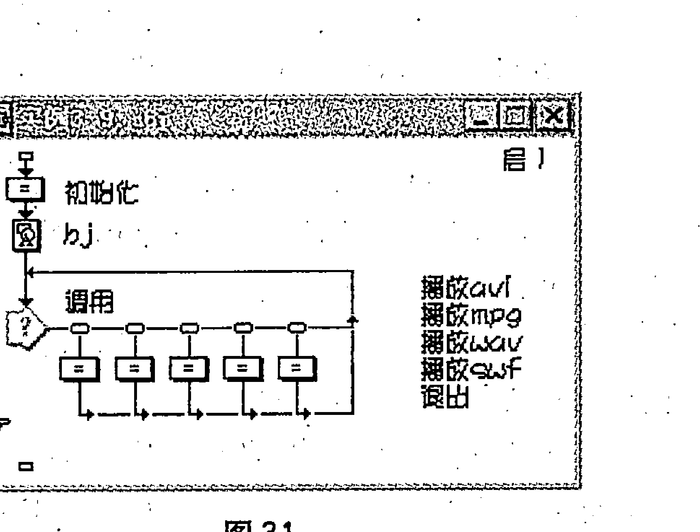

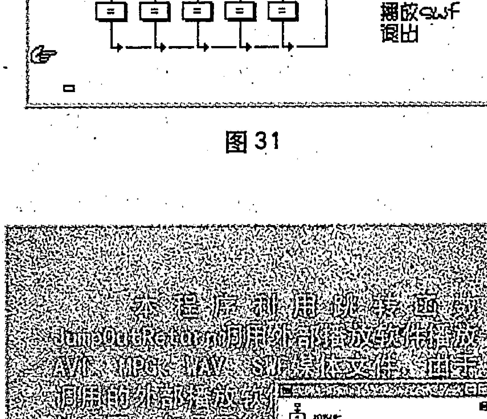

#### 四、小结

以上各个实例在 WIN98+Authorware6.0 环境测试通过。

对于音频、视频文件格式，首推使用功能强大，资源消耗相对较少的第三方插件。对于大容量文件尽量使用链接的方式，并尽量使用压缩率高的同类型文件，例如：声音类可以使用 MIDI、RMI、SWA、VOX、ASF、WMA、RM，少使用 WAV、MP3、VQF 等；视频类可以使用 RM、FLASH、动态 GIF（与视频有雷同效果，当视频类处理）、视频 ASF、WMV 等，少使用 AVI、MPG、MOV、DAT 等，最近随着 MPEG4 技术的不断发展，对于采用 MPEG4 压缩技术的文件，压缩率已极高，例如采用 MPEG4 技术压缩的 AVI 比同等质量的流媒体 RM 或 ASF 还要好，但 Authorware 要利用 DivX 等插件才可以支持。

（文\苏武）

### Windows Media 互动杂谈

#### 引子

宽带时代的到来，让我们可以在网络上观看电影、MTV等各种视频节目。流视频也已经悄然进入我们的视线，说起流视频，Real 和 Windows Media 恐怕是大家最熟悉的两大主要流媒体了。Real 是流媒体市场的老前辈，Windows Media 是微软主推的流媒体格式之一。流媒体市场的早期是 Real 的天下，随着带宽的逐渐推广，作为市场一霸的微软当然早就觊觎这块市场。自从 Microsoft 收购了一家流媒体技术公司的技术以后，逐渐推出了 NetShow 播放技术，进而演变成了今天的 Windows Media。凭借微软操作系统的优势，微软在自己的操作系统中免费发送的 Windows Media Player 作为 Windows Media 的播放器。鹿死谁手，当然还未可知。我们今天要讨论的话题则是作为流视频中近来逐渐开始发掘的一个技术亮点——流媒体交互技术。解剖的对象就是 Windows Media 流媒体。

惊奇吧，什么是流媒体交互技术？流媒体可以互动？Windows Media 不就是可以播放视频，直播点播嘛？其实不然，Windows Media 可以和网页互动，嵌入广告，甚至可以控制大家所熟悉的 Flash 的播放。你可以想象一下在网页上一个主持人在侃侃而谈，一举手另外一处的 Flash 演示开始播放起来（如图1）。这就是 Windows Media 的互动技术。OK，下面我们就开始正题。

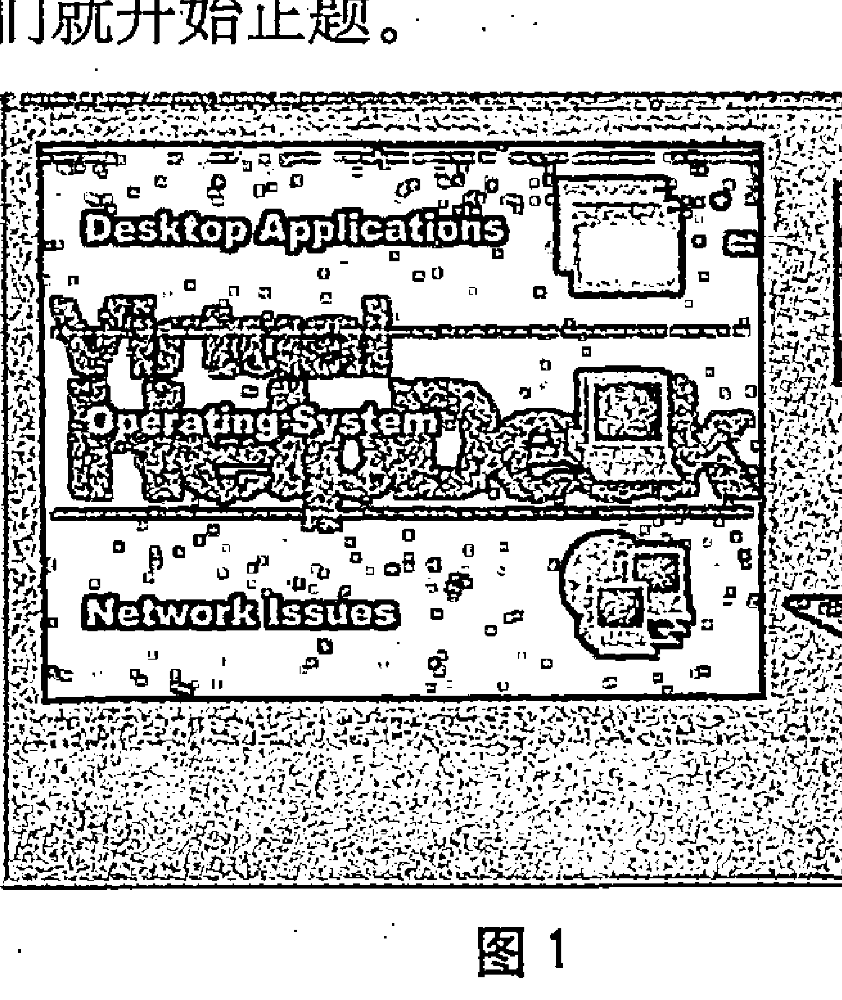

#### 一、Windows Media 如何嵌入网页

在正式讲述交互技术之前，我们要先了解一些基本的知识。如何将 Windows Media 嵌入网页。在这里我们直接采用源代码，我不想举出任何一个可视化的网页编辑器 Dreamweaver 或者 Frontpage 作为例子，况且我们在一些代码参数上需要小小的说明，您不必对于代码心存恐惧，因为它们非常的简单。

##### 1. 一个标准的 Windows Media 代码

在网页中嵌入 Windows Media 就是嵌入 Windows Media Player ActiveX 控件。说白了就是在网页中插入了一个播放器。而由播放器本身来调用 Windows Media 文件。

下面我们就在网页 HTML 代码中嵌入 Windows Media 代码。下面就是一段标准的 Windows Media 嵌入代码。

```
html
<OBJECT ID="WMPlay" width=320 height=240 classid="CLSID:22D6F312-B0F6-11D0-94AB-0080C74C7E95"
codebase="http://activex.microsoft.com/activex/controls/mplayer/en/nsmp2inf.cab#Version=5,1,52,701"
standby="Loading Microsoft Windows Media Player components..." type="application/x-oleobject">
    <PARAM name="FileName" value="demo.asf">
    <PARAM name="DisplaySize" value="0">
    <EMBED type="application/x-mplayer2"
           pluginspage="http://www.microsoft.com/isapi/redir.dll?prd=windows&sbp=Media Player&ar=media&sba=plugin"
           filename="demo.asf"
           displaysize="0"
           name="WMPlay"
           width=320 height=240
    >
    </EMBED>
</OBJECT>
```

我们首先来分析一下这段代码，这段代码有两个部分组成，<object> 对象标签部分和 <embed> 插件标签部分，这样的写法是为了解决 IE 和 Netscape 的兼容性问题，IE 可以识别 <object> 标签，读取 ActiveX 控件，而 Netscape 则只认识 <embed> 插件标签。我们只要明白了 Object 是怎么一回事情就可以很方便的理解 <embed> 标签中的作用了。

在 <object> 标签中我们需要了解的是下面的这些参数

classid="CLSID:22D6F312-B0F6-11D0-94AB-0080C74C7E95": 这个参数定义了我们调用的是 Windows Media Player 6.4 版本的控件，这一点很重要，不一样的控件调用的参数和属性都不同，要确认好。

ID="WMPlay": ID 标签用于给 Windows Media Player 这个元素命名，以便于以后网页中使用脚本控制它进行互动的时候进行调用，<embed> 标签中使用的是 name="WMPlay"。

width=320 height=240: 设定 Windows Media 的宽度和高度。

```
<PARAM name="FileName" value="demo.asf">
```

Param 是参数，用来设定控件的参数。这个参数是文件名。也就是指定了要播放的流文件的名字。这里是 "demo.asf"。在 <embed> 标签中是 filename="demo.asf"。文件名可以直接是流媒体的文件，比如 asf、wmv、wma 格式的文件。也可以是 meta 文件。meta 文件是一个类似于导引的文件，文件里面记录的是流媒体文件的格式和参数等等。这个我们稍候会做一些解释。

##### 2. 几个小概念

这里要说说 ASF、WMV、WMA 的区别。现在 Windows Media 的媒体文件名出现了一些小小的变动，以前扩展名是 ASF，现在扩展名是 WMV、WMA。它们之间有什么区别呢？在微软的 MSDN 网站上，说明了 asf 和 wmv、wma 没有区别，只是换了一个名字而已。早期的 Windows Media 文件都用 ASF 作为扩展名，后来为了声音和视频文件加以区别，分成了 wmv（视频文件）wma（音频文件）。ASF 对应的 meta 文件为 ASX；wmv 对应的为 WVX；wma 文件对应的是 WAX。

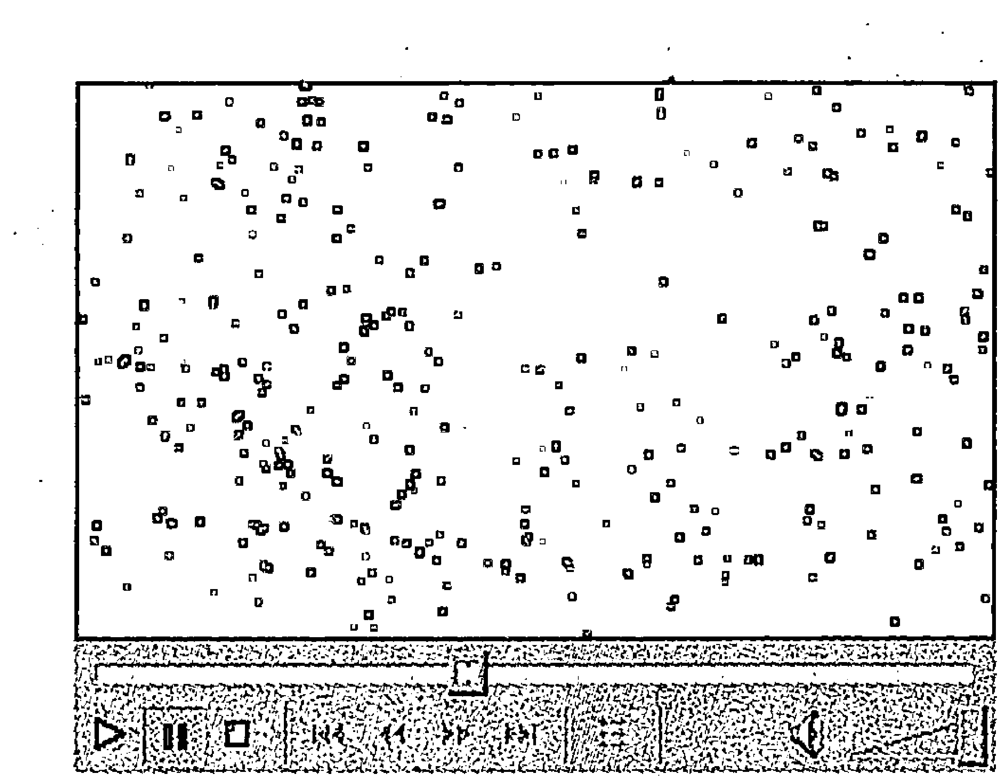

上面这段代码在网页上浏览结果如图2所示，代码的分析我们就到这里，更加深入的概念在我们下面的例子中没有应用，在嵌入的时候只要全部照抄就可以了。如果您觉得这些代码麻烦，直接找一段现成的复制粘贴就可以了，嵌入在 HTML 代码中 <body></body> 标签中的任何一个地方都可以。

#### 二、广告条

了解了上面的基本概念以后，我们就可以来小试牛刀，为你的流媒体文件加上广告。让浏览者在观看流文件的同时可以顺便直接访问你的网站。用流媒体做广告有两个比较好的途径：一是 Banner 条，二是插播广告片断。Windows Media 在这里为我们提供了比较好的解决办法。

在这里我们要使用上面提到的 Meta 文件，Meta 文件是一个文本文件，它的扩展名可以是 asx、wax、wvx，区别前面已经说明了。在这个文本文件中，可以存放一些特殊的标签，比如放 banner 用的 <banner> 标签，使用 meta 文件也很容易，只要在 Windows Media 嵌入代码中把原来流媒体文件的名字换成 meta 文件的名字就可以了，比如 <PARAM name="FileName" value="demo.asx">。运行的时候，控件播放 asx 文件，然后通过 asx 文件找到对应的流媒体文件，asx 起到了中转站的作用。

下面我们来看看 asx 文件中的一些标记。

```
<asx></asx> 表示 asx 文件的开始和结束，类似 <html></html> 标签；
```

```
<ENTRY></ENTRY> 表示一个节目的片断；
```

```
<REF HREF="" /> 指向一个流文件，可以是 asf、wma、wmv；
```

```
<Abstract></Abstract> 插入描述性的话；
```

```
<MoreInfo href = "" /> 指向某个地址。
```

下面我们来看这个加入广告和 banner 的代码：

```
<ASX version ="3.0">
<Title> 标题：这是广告</Title>
<Abstract> 演示文件</Abstract>
<MoreInfo href = "http://www.microsoft.com"/>

<!-- 一开始就播放广告 -->
<Entry>
<Title>标题：这是广告</Title>
<Author>作者：广告事业部</Author>
<Copyright>版权：2000 电脑爱好者 </Copyright>
<Abstract>这个广告的内容描述 </Abstract>
<MoreInfo href = "http://www.microsoft.com/" />
<Ref href = "ad.asf"/>
</Entry>

xml
<!-- 正片开始 -->
<Entry>
    <Banner href = "purchase.gif">
        <Abstract>Click here to go to our Web site</Abstract>
        <MoreInfo href = "http://www.sina.com.cn" />
    </Banner>
    <Ref href = "show.asf"/>
</Entry>
</ASX>
```

上面这段代码就是一个广告片段与正片 Banner 的例子，这个 asx 文件里面有两组 <Entry> 标记，表示有两组视频片断播放。第一个片段是广告 <Ref href = "ad.asf"/> 指向广告文件 ad.asf，其余的标签比较简单这里就不说什么了，第二个片段是正片 show.asf，其中加上了 banner 代码。

<banner> 中 href 指向 banner 的图片，<abstract> 显示的是当光标移动到图片上的时候，显示的提示文字，<MoreInfo href = "http://www.sina.com.cn" /> 制定当单击 banner 以后跳转到新浪网。

播放整个网页，先播放一段广告片，之后就是正片，下面有一个 banner 条，单击以后可以跳转到新浪网。

Meta 文件是用来控制 Windows Media 文件的很好的方法，里面有很多的标签，有兴趣的朋友可以仔细察看微软的有关开发文档，这里就不再具体解释了。

#### 三、与老师互动的网页

怎么样，做了一个 banner 以后你是不是觉得有趣呢？下面我们就接着来做一些更有趣的小东西。我们的目标是制作一个在网页上讲课的老师，让他在一边说话的时候旁边出现一些文字材料（如图3）。原理很简单，整张网页左右分帧，左边播放老师讲课，使用 Windows Media 格式的电影，右边显示文字内容。电影播放到某一时刻的时候，电影打开某一张网页。其中根据时间来进行控制的信息是直接书写在视频文件本身里面的，难做么？一点也不。下面请大家跟我一起来做这个小玩意儿。

##### 1. 准备素材

制作一个网页，左右分帧。我们把左边的帧命名为 video，在其中播放视频；右边命名为 content，在其中放文稿。左边帧连接的文件为 video.htm，右边帧连接的文件为 page0.htm（如图3）。然后我们制作三张文稿，page1.htm、page2.htm、page3.htm，分别在里面放上讲稿的内容。training_28.asf 为教师上课的视频文件，将视频文件嵌入到 video.htm 中，现在目录中有如下的几个文件。

index.htm: 首页也就是最外面的框架。分为左右两帧，左边为 video 右边为 content
video.htm: 框架左边的页面，放视频文件。
page0.htm: 框架右边的页面，放出示的页面。
page1.htm、page2.htm、page3.htm 是将在浏览网页时依次在右边的帧里的内容。
training_28.asf: 教师说话的视频文件。

在浏览器中打开 index.htm 页面，你会发现左边的帧中视频文件正在播放，右边默认的是 page0.htm。电影播放不会改变右边的页面。

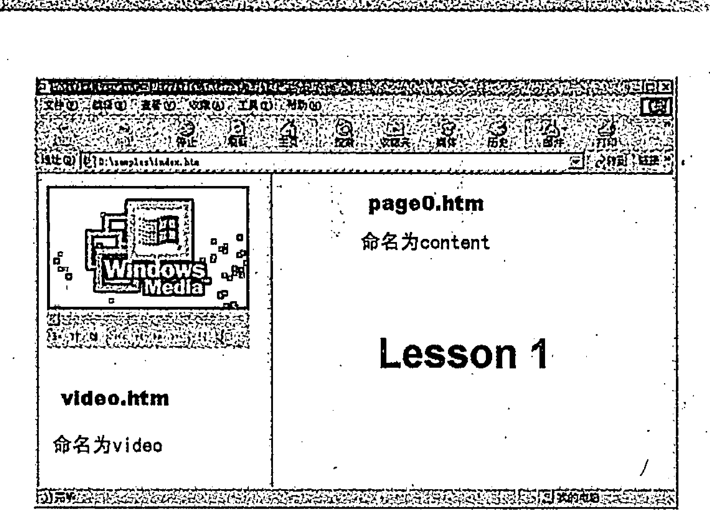

##### 2. 给视频文件加上控制信息

视频和网页的同步是通过在视频文件中嵌入控制信息，由 Media Player 控件控制来实现的。我们需要一个软件来把控制信息写入视频文件中去，这个软件就是 Windows Media Advanced Script Indexer。用于把控制信息写入视频文件里面去，这是一款免费软件，可以从微软的 Windows Media 技术网站上下载。

打开 Windows Media Advanced Script，我们首先来熟悉一下这个软件的界面。整个软件划分为四大块信息区（如图4）：显示打开的流文件的自身信息；视频区显示流文件视频和控制条；标记区用于给流文件添加标记，脚本区用于添加有关控制使用的脚本。

选择菜单 “File” → “Open” 打开准备好的 training_28.asf 文件。可以从视频区按播放按钮观看，看到你所要出现网页的那个时候按暂停键，你会在播放区看到当前暂停的时间，我这里选取了 11 秒的时候暂停。

在脚本区按鼠标右键，选择 Add。系统弹出 New Script Properties 新脚本属性菜单，时间部分已经自动选好了，在 type 类型中选择 URL，表示打开的是 URL 类型的地址。
接下来在参数 Parameter 里选择 “page1.htm&&content” 然后按 OK 确认（如图 5）。重新播放电影，你会发现在 11 秒的时候系统自动弹出一张网页，就是前面我们指定的 page1.htm，如果使用 index.htm 观看，电影播放到 11 秒时，page1.htm 出现在页面的右边。

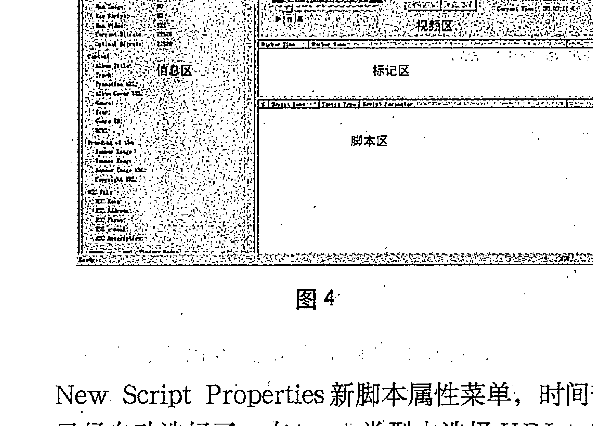

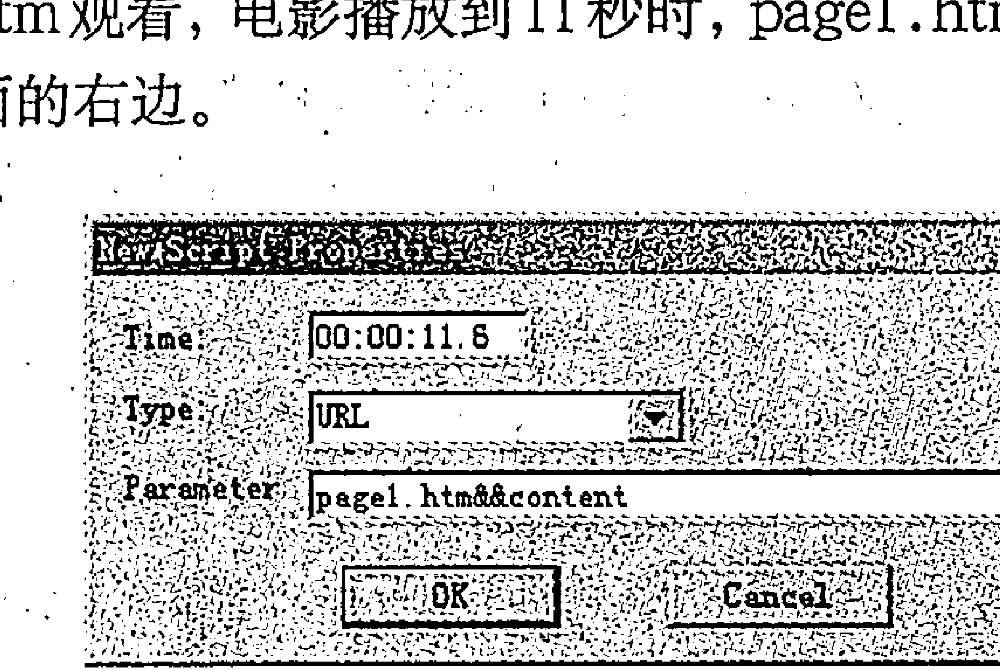

这里我们来解释一下 “page1.htm&&content” 的参数：“content” 指的是帧的名字，也就是我们刚才给右边的帧起的名字，表示弹出的 page1.htm 页面出现在 content 帧中，中间我们用 && 加以连接。
接下来的事情就容易了，像上面那样如法炮制，在适当的时间把剩下的页面都嵌入进去，在脚本区会看到所有的脚本连接（如图 6）。

##### 3. 保存并观看

选择菜单里面的 “File” → “Index this file”，系统会提示是不是继续操作，选择 “OK”，控制信息就保存好了，可以用浏览器打开 index.htm 进行观看。OK，大功告成。

##### 4. 小结

这个例子的要点是使用 Windows Media Advanced Script Indexer 给视频文件加上时间点从而实现控制功能。在时间点的脚本中类型 URL 用来打开某个 URL 的网页。如果打开的网页要求在某个帧中出现，那么地址的最后要加上帧的名字，并且用 && 加以连接。例如 “abc.htm&&target”。

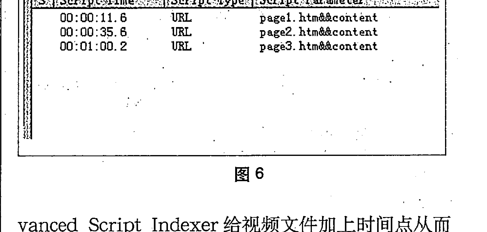

#### 四、文本控制视频跳转

完成前面的实例以后，你可能会发现还没有实现动态交互。假如我要找老师说的某一个关键的知识点就非常不方便，要拖来拖去找。最好是这个知识点在网页上有链接可以点击查找，这样的话就方便了，下面我们就来对上面例子进行这样的交互功能改进。

##### 1. 加上超文本链接

打开 video.htm，在页面上建三个超文本链接，链接指向的地址都为 “#”，加 “#” 以后单击链接不会做任何事情，这样做的目的是为了给链接加上脚本，因为纯文本无法添加事件，我们就用超级链接来实现（如图 7）。

##### 2. 给视频文件做上标记

接下来我们要在视频文件的相应时间位置点打上标记，来实现对关键部分的定位。运行 Windows Media Advanced Script，打开 training_28.asf；在标记区按鼠标右键，选择 Add，然后输入标记的名称和时间按 OK（如图 8），一个标记就做好了。接下来如法炮制所有的标记，标记的时间可以按需要的间任意选取（如图 9），然后重新把文件像上次那样加上时间点。

##### 3. 编辑网页

在这里我们采用控件的 CurrentMarker 属性，链接的 Html 源代码原本为 <a href="#"> 现在为了使链接在单击的时候生效，我们必须使用 OnClick 事件来完成。调用控件的属性 CurrentMarker。注意，调用的时候大小写要严格遵循。如果要让当前的控件播放头跳转到第一个标记就令这个属性为 “1”，即把这个语句改写成为如下所示：

```
html
<a href="#" onclick="WMPlay.CurrentMarker=1">第一个知识点</a>
```

图7

图8

| Marker Time | Marker Name |
|-------------|-------------|
| 00:00:11.6  | page1       |
| 00:00:45.3  | page2       |
| 00:00:45.4  | page3       |

图9

`WMPlay.CurrentMarker='1'` 其中WMPlay是这个控件的ID和Name。也就是前面我们在把视频嵌入网页的时候所起的名字，我们是通过“id=”和“name=”设定好的。“WMPlay.CurrentMarker='1'”表示设置WMPlay这个播放控件的当前标记为“1”。也就是让播放头走到第几个标记那里。注意，参数要用单引号。因为onclick已经使用双引号包含后面的语句了。

如法炮制给每个连接都加上事件。

```
<a href="#" onclick="WMPlay.CurrentMarker='1'">
<a href="#" onclick="WMPlay.CurrentMarker='2'">
<a href="#" onclick="WMPlay.CurrentMarker='3'">
```

大功告成了。单击链接就可以跳转到指定的位置并播放，当然我们可以不必拘泥于文字，用图片也是可以加上事件的。

#### 五、和Flash进行互动

制作了上面的东东以后，我想一定有读者在思考这样的问题。既然视频文件可以调用网页，如果在网页中插入Flash是否可以制作出更丰富多彩的内容呢？其实如果善于利用Windows Media的脚本功能，我们还可以直接对Flash进行控制。

首先说说原理，在流视频文件中加入脚本，到达某时间的时候发出信息。网页中的事件处理程序接收到信息，然后控制Flash的播放，下面我们开始实际制作。

### 1.素材准备

准备一段视频和一段Flash，插入网页中。注意要给视频和Flash命名，不然以后程序将无法进行调用（如图10）。在本例中，Windows Media命名为“WMPlay”，Flash动画则命名为“flash”。

图10

### 2.处理视频

在脚本区单击鼠标右键，选择菜单中的“Add”，在Type类型里面选择“Text”。在parameter参数里写上文本，我们将对Flash进行四种功能的控制：播放Play、暂停Pause、停止重新开始“stop”（如图11）。

### 3.添加脚本

打开网页文件，在`<head></head>`标签中间添加下列代码。

```
<script LANGUAGE="JavaScript" FOR="WMPlay" EVENT="ScriptCommand(ScType, ScCmd)">
if (ScType =="TEXT"){
if (ScCmd=="play"){flash.Play()};
if (ScCmd=="pause"){flash.Stop()};
if (ScCmd=="stop"){flash.Stop();flash.Rewind()};
}
</script>
```

注意这里 “For=” 填写的是 “WMPlay”，表明是接受视频文件传递的信息。在 “EVENT="ScriptCommand(ScType, ScCmd)"” 中使用 ScriptCommand 函数接受控件的参数：ScType 为脚本的类型，ScCmd 为脚本的参数。第一个 if 语句判断传输的是否为 TEXT 类型的脚本，接下来根据参数来调用 flash 控件的方法来实现对 Flash 的播放控制，这里用了 flash 控件的三个方法：
- Play () 播放
- Stop () 暂停
- Rewind () 播放头回到起点

### 4.技巧

由此，我们可以想到我们可以利用这一特性控制更多嵌入网页中的各种参数和控件，而不是仅仅限于控制 Flash。比如让电影控制网页的背景颜色，想想看怎么做？等等。

以上的三个互动的例子经常用于远程教育之中，现在流行的许多远程教育课程和系统的核心就是基于这些类似的技术，这些技术其实是比较容易实现的。最后再给出一个小小的技巧提示：我们使用 Windows Media Advanced Script Indexer 可视化操作界面可以给视频文件加上时间点，但当我们要制作大量的时间点的时候似乎就很不方面了，怎么解决呢？我们可以使用外部的编辑器来进行编辑。

可以用 Windows Media Advanced Script Indexer 打开了前面做过的一个片断，选择 “File → Export Script File”，便生成一个文本文件，打开看其中内容就一目了然了。

```
; ***********************************************
; Exported by ASI ver 1.0
; Source File : C : \ W I N D O W S \ D e s k t o p \ 1 . t x t ;
; ***********************************************
; Attributes
Title               :
Author              :
Description         :
Rating              :
Copyright           :

; Markers
start_marker_table
00:00:11.6    page1
00:00:45.3    page2
00:00:45.4    page3
end_marker_table

; Scripts
start_script_table
00:00:11.6    URL    page1.htm&&content
00:00:20.0    URL    page2.htm&&content
00:00:45.3    URL    page3.htm&&content
end_script_table
```

整个脚本分为三大段，每一段格式都非常清晰。我们可以按照这个结构在自己喜欢的文本编辑器中编写文本脚本文件。然后用 Windows Media Advanced Script Indexer 打开了前面做过的一个片断，选择 “File → Import Script file”。直接将文本文件导入电影文件就可以完成时间点的制作。

#### 六、网页式的 Windows Media Download

上面介绍的几种互动手段都是在网页上面实现的。现在，请大家来看一个全新的东东 Windows Media download。Windows Media download 有什么新奇之处呢？当然了，这个软件能把界面和播放列表，多媒体内容全部整合在一个文件扩展名为 “wmd” 的文件里面，可以在 Windows Media player 7中播放（注意是7.0以上的版本），其中带有交互功能，就像一张网页一样可以点击交互。

wmd 是本文中所涉及的最复杂的一种 Windows Media 交互，要用到 asx 文件、windows media 皮肤文件和媒体文件。因此这里我们只做一个最简单的 wmd 文件，帮助大家理解 wmd 是怎样制作的，而具体许多复杂的参数，我们将不做详细介绍。Windows Media Download有三个部分组成：界面、Meta文件和媒体文件。它们打包在一起组成了wmd文件。下载到本地的时候，wmd释放到硬盘上。Windows Media player首先调用meta文件，然后根据meta文件找到界面文件，界面文件采用的是和Windows Media Player皮肤一样的技术（熟悉播放器的朋友一定知道“皮肤skin”的含义，这种可换界面的概念已经很普遍了）。界面生成以后，再根据meta文件中的播放列表来播放媒体文件。

我们来看看我们要做的例子（如图12）。

图中的界面上有两个按钮play（播放）和stop（停止），音乐只有一段。我们就来制作这个wmd文件。

### 1.制作界面

###### (1) 准备好界面图

首先需要准备三张界面图片：background.bmp, hover.bmp, map.bmp。

背景图background.bmp（如图13）：大家可能注意到我将按钮也画上去了，这是以后制作活动按钮所需要的。

图13

按钮的hover状态图hover.bmp（如图14）：按钮有两种状态，一种是没有操作的默认状态，这已经在背景上画好，而鼠标移动上去的状态就是hover状态，这里用hover.bmp来实现。注意这里图片的尺寸大小和按钮的位置要和界面背景完全一致。一旦对位不准，就会出现错位。

图14

遮罩图片map.bmp（如图15）：这个图片用于遮掩按钮的出现或者隐藏。第一个按钮的颜色为绿色，颜色值#00FF00，第二个按钮的颜色为黄色，颜色值为#FFFF00。在默认状态下遮罩全部开启，hover.bmp不显示出来，一旦当鼠标移动到按钮上的时候，便会根据事先定义的遮罩颜色把这块区域透明出来从而显示hover状态的按钮。

图15

###### (2) 编写wms (Windows Media skin) 界面文件

以下是wms界面文件代码。

```
<THEME>
    <VIEW backgroundImage = "background.bmp" >
        <BUTTONGROUP mappingImage = "map.bmp" hoverImage = "hover.bmp">
            <BUTTONELEMENT mappingColor = "#00FF00" upToolTip = "Play it" onClick = "JScript:player.controls.play();" />
            <BUTTONELEMENT mappingColor = "#FFFF00" upToolTip = "Stop it" onClick = "jscript:player.controls.stop();" />
        </BUTTONGROUP>
    </VIEW>
</THEME>
```

`<THEME>`标签表示界面文件的开始，就像html中的`<html>`一样；`<view>`表示一个视图；标签中一个参数“backgroundImage = "background.bmp"”表示了背景图片为background.bmp。

`<BUTTONGROUP>`标签表示按钮组，这个按钮组参数“mappingImage = "map.bmp"”表示遮罩文件是map.bmp， “hoverImage="hover.bmp"”表示hover状态为hover.bmp。

在按钮组中有两个按钮元素BUTTONELEMENT，其中的参数需要注意一下。mappingColor 是遮罩颜色。当鼠标移动到遮罩颜色的地方时候，遮罩透明，显示hover状态的按钮。例如：“mappingColor = "#00FF00"”意味着当鼠标移动到遮罩的绿色部分时候，这个部分透明，显示play按钮的hover状态。

upToolTip：鼠标在上面时显示的提示文字。

onClick：单击按钮的时候执行javascript语句，“JScript:player.controls.play()”表示播放；“jscript:player.controls.stop()”表示停止。

这样整个界面文件就是有一个视图view，一个按钮组，其中包含两个按钮所组成。把界面文件保存为扩展名为.wms的文件。

###### (3) 打包

界面文件wms做好了，为了观察效果我们可以双击这个文件，在Windows Media player中看看效果，正确以后把wms文件和有关的图片文件等等打包成为zip格式的压缩文件。把zip扩展名修改为*.wmz。这样就做好了一个界面文件。

### 2.制作播放列表

播放列表就是一个asx文件。

```
<asx version = "3.0">
  <title>Package Sample</title>
  <skin href = "tiny1.wmz" />

  <entry>
    <title> Rudolf's Toys </title>
    <param name="link" value="http://www.yeworld.net"/>
    <ref href="no1.wma"/>
  </entry>
</asx>
```

其余内容第一个例子已经解释过了，重点在于“`<skin href = "tiny1.wmz" />`”，在这里指定了播放的皮肤为前面制作的wmz界面文件。这里播放列表只有连接了一个wma文件。

### 3.打包成为wmd文件

把wma文件、wmz文件、Asx文件都打包成zip格式的压缩文件。然后把扩展名改成“.wmd”。这样一个wmd文件就做好了。双击wmd文件，Windows Media player会把文件释放并运行。

### 4.锦上添花增加效果

我们还可以给这个wmd加上一些动态的播放效果。打开wms文件，在view标签下面（注意不是里面）加上这段代码就OK了。

```
<effects
  id="effect1"
  visible="True"
  windowed="false"
  allowAll="true"
  top="0" left="0"
  height="jscript:view.height-280"
  width="jscript:view.width"
  currentEffectType="ambience" />
```

重新打包wmz和wmd文件就可以了。

#### 七、结束语

写到这里，Windows Media的基本交互功能就介绍完了，其实其中还有非常多的细节内容，这里限于篇幅只能介绍一个大概的情况，更详细的内容可在微软网站的msdn.microsoft.com中有介绍，另外大家还可以在http://www.microsoft.com/windows/Windows Media/en/default.asp下载SDK开发包来看看，里面有很多类似的实例。

> (文\机器猫)

### 牵手 WEB 3D

#### 一、WEB 3D 简介

随着网络技术的发展和网络应用的不断深入，网络已经成为我们日常生活的一部分，并且在我们的生活中扮演着越来越重要的角色，网络上的内容越来越丰富，几乎我们所需要的任何信息都可以从网上得到。而且网络传媒的形式也越来越多样化，从最初单一的文字符号发展到以图形、图像再到声音、视频多媒体为信息载体。几乎是单机上可以做到的一切在网络上都可以实现。但是，目前我们的网页内容基本都是平面的（就是二维的，简称2D），几乎没有三维立体效果，这不能不说是一个遗憾！目前，在Web中创造出更真实和引人入胜的三维（简称3D）图像将是令人称奇和值得关注的新技术，这就是网络三维WEB 3D技术，其目的是在网络上实现3D图像显示效果。经过一段时间的发展，WEB 3D的制作从最初的VRML语言到现在以Cult3D、Viewpoint等工具，WEB 3D技术正在逐渐走向成熟，随着宽带网的来临，WEB 3D进入大规模实际应用阶段指日可待。

WEB 3D技术将有极其广泛的用途，主要有以下几方面：

- 1. 对企业产品的宣传和电子商务
三维的表现形式，能够全方位地展现电子商务中对企业的的产品等实体，具有二维平面图像不可比拟的优势。将产品发布成网上三维的形式，能够展现出产品外形和结构上的方方面面，加上互动操作，演示产品的功能和使用操作，可以充分利用互连网高速迅捷的传播优势来推广公司的产品。顾客通过对产品进行相关操作和观察能够对产品有更加全面的、深入的认识和了解，从而促进产品销售。

- 2. 远程教育和开放式教学
目前，教育领域已经不单是采用传统的教学模式，计算机辅助教学(CAI)和远程教学的引入，弥补了传统教学方式的不足，并受到了人们的欢迎。与远程教育相结合的WEB 3D在传送和表现一些需要空间感和立体化的知识信息，如原子、分子的结构、分子的结合过程、机械的结构、运动等方面，可以达到逼真三维效果，使学习过程形象化和更生动，从而更容易理解和掌握。对计算机远程教育系统而言，引入WEB 3D技术必将达到更好的在线教育效果。

- 3. 娱乐游戏业
娱乐游戏业是一个永远不衰的市场。目前互连网上已不是单一静止的世界，动态HTML、Flash动画、流式音、视频等技术的应用使整个互连网呈现出一片昂然生机。动感的页面较之静态页面更能吸引浏览者。三维的引入，必将造成新一轮的视觉冲击，提高网页的访问量。比如娱乐站点可以在页面上建立三维虚拟主持这样的角色来吸引浏览者。游戏公司除了在光盘上发布3D游戏外，现在可以在网络环境中运行在线三维游戏。利用互连网络的优势，受众和覆盖面得到了迅速扩张。

- 4. 虚拟现实展示与虚拟社区
使用WEB 3D实现网络上的VR（虚拟现实）展示，只须构建一个三维场景，人以第一视角在其中穿行。场景和控制者之间能产生交互，加之高质量的画面使人如身临其境。对于虚拟展厅、建筑房地产虚拟漫游展示，又能提供更好的解决方案。如果是建立一个多用户而且可以互相传递信息的环境，也就形成了所谓的虚拟社区。Adobe公司的Atmosphere和Web Maker就是这种应用的典范。

在去年SIGGRAPH上，全球的技术厂商展示了超过30种WEB 3D格式。我们认为在这些技术中，Cycore公司的Cult3D是比较成熟的，是真正能够实际应用的产品。而且Cult3D的学习也是很容易的，所以我们在这里选择Cycore公司的Cult3D介绍给大家。

#### 二、Cult3D 实战演练

##### 1. Cult3D简介

Cult3D是Cycore公司开发的WEB 3D应用软件。它可以为3D对象添加交互性动作，并将3D对象嵌入到Microsoft Office的PowerPoint、Excel中，或者嵌入到Adobe的Acrobat中，当然最重要的还是嵌入到web网页中。Cult3D不需要特殊的硬件的支持就可以完成上面的工作。由于采用了很先进的压缩算法，Cult3D 最后生成的文件（co 为扩展名）的体积很小，这使得*.co文件非常适合于在网络上传输；流技术的采用使我们不用等到全部文件下载完后才可以观看3D对象，我们在下载的时候就可以观看，这对于网速较慢的条件下我们观看3D对象非常合适。由于 Cult3D 是使用 Java 语言开发出来的，所以它生成的文件可以无缝的嵌入到网页中，而且不容易出错。

##### 2. 使用 Cult3D 必备的条件

使用 Cult3D 以前你先要注意一下机器的配置，下面是推荐配置：

-   CPU：主频 333 MHz 以上；
-   内存：128 MB 以上；
-   硬盘：100MB 以上的自由空间（当然，如果你不想用 Cult3D 进行开发，而只是想看看别人做好的 3D 文件，那 1MB 的空间就够了！）；
-   操作系统：Windows 95/98/Me、Windows NT 4.0、Windows 2000；
-   浏览器：Netscape 4.5 以上版本或者 Internet Explorer 4 以上版本；

另外，由于目前 Cult3D 自身不能建模，所以你还要有建模软件（3D Max 或者 Maya）。

除以上要求之外，Cult3D 最好需要下面软件的支持，它们都可以在我们的配套光盘中得到：

Cult3D Viewer plug-in：用户在网上浏览 Cult3D 发布的 3D 文件的插件（现在 http://www.cult3D.com 上提供了该插件的在线安装功能。但是，如果你不能在线安装该插件，你就得自己下载。下载时要注意你的浏览器的类型，IE 和 Netscape 所用的插件是不一样）。

Cult3D Exporter plug-in：将在第三方 3D 建模软件中创建的3D对象文件转化为Cult3D Designer 所需的要文件格式（下载该插件时请注意下载与你用的建模软件的对应的插件。在安装该插件时请注意选择与建模软件版本相对应的安装选项）。

Cult3D Designer：对从建模软件中转化而来的 3D 对象做进一步的加工，把它加工成带有动画和声音的、具有所要求的交互性的 3D 对象文件，并且可以压缩、导出和发布。

##### 3. 实战演练

###### （1） Cult3D “小试牛刀”

在实际应用中有很多的 3D 对象要求的是全方位展示其结构，为了达到这个目的，这里从一个最简单例子开始讲起。

####### ① 3D 对象的导出

当你运行 3Ds Max 时，你可以在 “File/ Export” 下（Maya 是在 “File/ Export All…” 或者 “File/ Export Selected” 下）找到 Cult3D 的导出插件。

-   A、在下拉保存列表框中选择 Cult3D Designer (*. c3D)（Maya 是在 Files of Type）。
-   B、为你想要导出的对象键入文件名。
-   C、点击 save（Maya 是 Export），你将会看到导出选项对话框。

按照上面的提示一步一步完成 3D 对象的导出。

#### ②在 Cult3D designer 中完成 3D 对象交互性事件的添加。

注意：由于我们的 Cult3D Designer 没有注册，所以每次启动的时候，我们都会看到 Cycore 公司关于 Cult3D Designer 的使用协议，我们只有同意（I agree）协议，才可以使用 Cult3D designer。而且在我们最后导出的 *.co 文件上还会有 Cult3D 的水印。好在这一切并不影响我们的学习这个软件。

为了方便大家的学习，我们利用 Cult3D designer 本身带有的 3D 对象作为例子。

选择 “File/Add Cult3D Designer File” 命令， Cult3D Designer 自身带的文件放在安装目录的 Objects 文件夹下，我们选择 Openbox.c3D 这个文件。完成后，在预览窗口就可以看到我们即将要处理的 3D 对象，如图 1 所示。

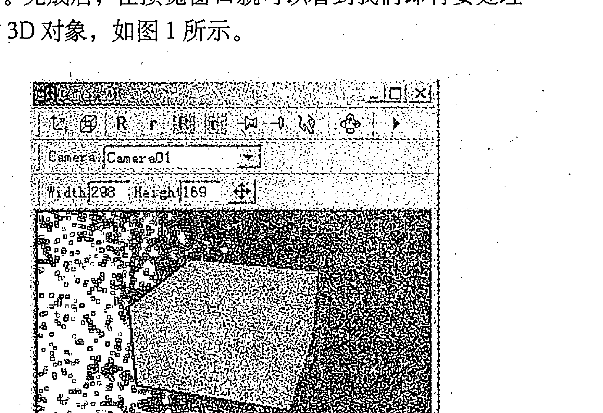

将事件 (Event) 窗口左边的 World start 事件拖到右边的空白区。将动作 (action) 窗口下的 Object Motion 下的 Arcball 动作拖到事件图窗口右边空白区的 World start 事件上，将场景图 (Scene Graph) 窗口下的 box 对象动作拖到事件图窗口右边空白区的 Arcball 动作上。完成后事件图窗口如图 2 所示。

到这里我们就完成了我们的最简单的交互性事件，你现在就可以在预览窗口预览一下了，按下 Play 按钮（就是图 1 右上角的黑色三角），在 3D 对象上按下鼠标左键并托拽，你看到了什么？是不是 3D 对象随着你的鼠标的拖动而转了起来，这样我们就可以全方位地观察该对象了，你现在看到的、做到的就是将来别人在网络能够上看到的、做到的！

下面我们要对 Rotation XYZ 动作进行设置。在 Rotation XYZ 动作上单击鼠标右键，在弹出的快捷菜单中选择“Details...”，填写弹出对话框，完成后如图4所示。

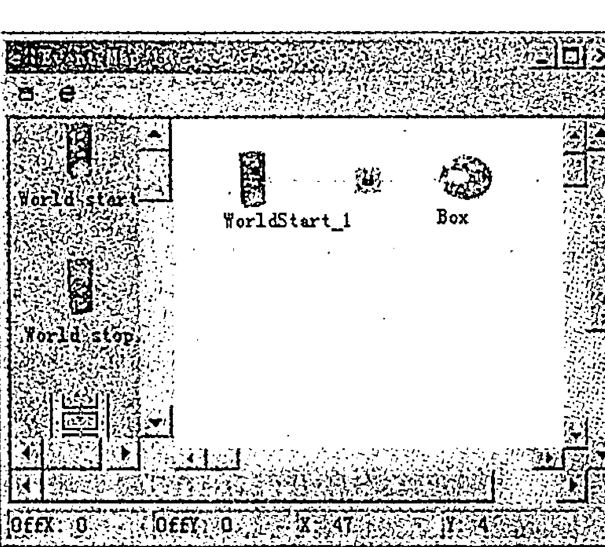

###### （2）Cult3D “向纵深方向延伸”

从上面的例子我们看到了这个盒子外部的结构，遗憾的是我们并没有看到它的内部结构。下面的工作是要打开盒子，让我们看看内部的结构。具体的实现过程是：我们点击盒盖上面的小柄时，把盒盖打开。

将事件（Event）窗口左边的 Left mouse click on object 事件拖到右边的空白区。将动作（action）窗口下的 Object Motion 下的 Rotation XYZ 动作拖到事件图窗口右边空白区的 Left mouse click on object 事件上，将场景图（Scene Graph）窗口下的 lid 对象拖到事件图窗口右边空白区的 Rotation XYZ 动作上，将场景图（Scene Graph）窗口下的 handle 对象拖到事件图窗口右边空白区的 Left mouse click on object 事件上。为了直观方便我们将 Left mouse click on object 事件更名为 open（在 Left mouse click on object 事件上单击鼠标右键，在弹出的快捷菜单中选择 change name，在弹出的对话框的 to 后面的空白框中输入 open，点击 OK，完成更名。），完成后如图3所示。

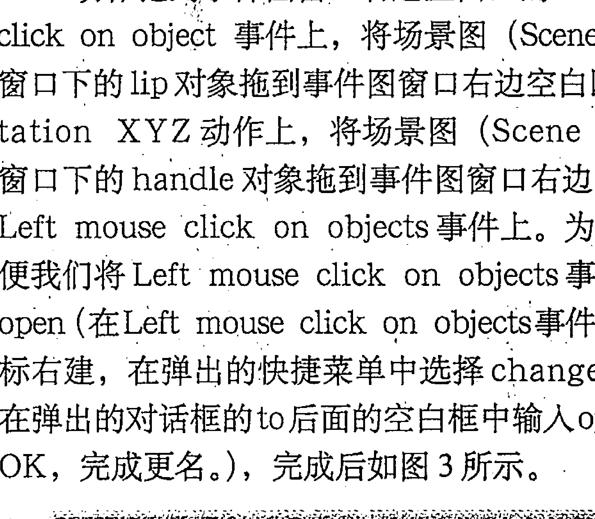


其中 Rotation XYZ controls 框中的 -150 表示顺时针旋转150度，2000 表示的是旋转该角度（150度）用时2秒（2000毫秒=2秒），如果我们不设置或者设置不合理的话，看起来就会很不自然。

测试一下吧，觉得怎么样？

我们发现上面的盒盖只能打开不能关闭，真是美中不足，下面我们就解决这个问题，我们的想法是：当盒盖打开后，点击盒盖，盒盖关闭。

将事件（Event）窗口左边的 Left mouse click on object 事件拖到右边的空白区。将动作（action）窗口下的 Object Motion 下的 Rotation XYZ 动作拖到事件图窗口右边空白区的 Left mouse click on object 事件上，将窗口中的 lid 对象拖到 Rotation XYZ 动作上，将窗口中的 lid 对象拖到 Left mouse click on object 动作上，将 Left mouse click on object 动作更名为 close，设置 Rotation XYZ 参数：其中 Rotation XYZ controls 框中填入 150；Time 框中填入 2000，完成后如图5所示。


好了，到这里就基本上可以了，你做的怎么样？我的是这样（如图6所示）。


###### (3) Cult3D “大手大脚办事”——综合应战实例

现在我们对于 Cult3D 基本上有了一些认识。下面我们讲一个稍微复杂一点的例子（呵呵，不用担心，很简单的，一看就会！）。

我们用的依然是 Cult3D designer 本身自带的 3D 对象，这次我们用的是一个 CD 机。

选择“File/Add Cult3D Designer File”。Cult3D Designer 自身带的文件放在安装目录下的 Objects 文件夹下。我们选择 minidisc.c3D 这个文件。我们同样想看看它的外观，所以我们就对整个 minidisc 使用 Arcball 动作，完成后如图7所示。


下面要做的是为 minidisc 的 play 和 stop 按钮添加交互性事件，以达到较好的逼真效果。导入一段声音，注意不要太长，最好用 *.mid 格式的 midi 音乐（尽管 Cult3D designer 支持 *.mid 格式和 *.avi 格式的音乐），这样可以避免最后生成的文件由于声音的庞大而庞大！选择“view/sounds”，在弹出的对话框中点击 add，在弹出的对话框中选好你要的音乐，点击“打开”。声音浮动面板中显示了你添加的声音，同时在场景图浮动面板中的声音（sounds）也显示了添加的声音。

将事件（Event）窗口左边的 Left mouse click on object 事件拖到右边的空白区并更名为 play；将场景图（Scene Graph）浮动面板中 button – playpause 对象拖到 play 事件上；将动作（actions）中的 sound 下的 play sound 动作拖到 play 事件上；将场景图中的 sounds 下的声音拖到 play sound 动作上。完成后如图8所示，到这里我们就完成了 button – playpause 对象的交互性事件。


接下来的工作就是要为 button – stop 添加交互性事件。将事件（Event）窗口左边的 Left mouse click on object 事件拖到右边的空白区并更名为 stop；将场景图（Scene Graph）浮动面板中 button – stop 对象拖到 stop 事件上；将动作（actions）中的 sound 下的 stop sound 动作拖到 stop 事件上；将场景图中的 sounds 下的声音拖到 stop sound 动作上。完成后如图9所示，到这里我们就完成了 button – stop 对象的交互性事件，我们现在可以在预览窗口中预览一下我们的作品。


我们还可以对这个模型添加很多的交互性事件，至于具体的添加工作大家只要看看这个模型的组成元素就可以想的出来。当然，如果你要实现的功能很复杂的话，那你就得写 Java 程序来实现这些功能，由于这主要是针对入门者的教程，所以这部分我们就不讲了，有兴趣的可以参考 Cult3D java API 规范（Cult3D java API Specification）。

###### (4) 导出与发布

下面我们将要讲的是如何将我们的作品发布到网上去。当我们在预览窗口中观察我们的作品满意后，我们就可以发布我们的作品。

导出：选择“File/save internet file”，弹出 Cycore 公司关于 Cult3D Designer 的使用协议，同意后，弹出保存对话框，选好保存的文件名，选好保存文件的文件夹，系统经过短暂的时间的压缩后，完成导出。

发布：在你的 Server 上添加 mime-type，添加 mime-type 是任何不是服务器标准或者默认插件和文件格式所必须的，Cult3D 的 mime-type 是“application/x-Cult3D-object”。默认的扩展名是 co。

嵌入网页的准备：添加一些特殊的 Cult3D HTML 代码，Cult3D HTML 代码需要一些特殊的标签，下面是一段代码实例。

```
<object classid="clsid:31B7EB4E-8B4B-11D1-A789-00A0CC6651A8" width="400" height="300" codebase="http://www.Cult3D.com/download/cult.cab">
<param name="SRC" value="file.co">
<param name="ANTIALIASING" value="0">
<embed pluginspage="http://www.Cult3D.com/download/" width="400" height="300" src="file.co" type="application/x-Cult3D-object">
</embed></object>
```

把上面代码中的 file.co 换成你的文件名就可以了。

代码解释：

`<object>` 代码是 Internet Explorer 识别的，`<embed>` 代码是 Netscape 识别的，那就是为什么你书写文件名在两个地方的原因。

-   参数 antialiasing(抗锯齿)有三个不同的值：
    -   0 = automatic 自动
    -   1 = disable 禁止
    -   2 = enable 允许

注意选择“2”的时候即便对象在移动的时候也是抗锯齿的。

如果认为上面的方法很繁的话，我给你介绍一个简单的。用 Dreamweaver 或者 Frontpage 中的插入 ActiveX 控件的办法也可以。不过，不但插件的参数没有加上，而且当用户没有装 Cult3D 察看插件时，浏览器也不会提示到哪里下载插件，所以我们建议你最好采用原代码的方法。

###### (5) Cult3D 应该注意的几点

-   ①在 3D 建模阶段，我们一定要处理好各个 3D 对象的层次关系。举个例子来说明这个问题。在我们第一个例子中，我们为了能够将整个盒子作为一个整体来操作（添加 Arcball 动作，以使得我们可以从不同的角度全方位的察看盒子的外部结构），我们把所有的 3D 对象组合为 box 对象；为了盒盖和小柄为一个整体，我们把它们也进行了组合，组合成 lid 对象。所以我们一定要注意它们的层次。
-   ②我们导出的 *.co 文件经过了不可逆的压缩，所以不可以再放到 Cult3D designer 中进行编辑。所以我们建议你在导出发布你的 *.co 文件以前，先保存你的 3D 对象文件，存储的格式为 *.c3p，以为将来重新编辑作好准备。

###### (6) 窗口功能介绍

以上我们讲述了 Cult3D designer。为了大家能够更好的理解和掌握，我把各个窗口的作用简单介绍一下。

#### ①场景图（如图10）


该窗口用于添加、删除、重命名、选择以及在场景中选择并重新排列元素。场景图中各部分基于其资源类型共分为以下十一类：

-   Header (标题) : 这类资源是一个文件标志，这可用于指定作者和项目。这个标题标志同时也显示了当前场景中所用的资源。
-   RootNode (节点) : 列出了所有的几何对象，包括网格元素、仿制对象、摄像机和粒子系统。
-   Named Selection (命名选择) : 利用这类资源可与应用于许多单独对象作用的动作一起使用。
-   Materials (材质) : 列出了场景中定义的材质，利用这类资源可以编辑材质属性。
-   Textures (贴图) : 包括在场景中一系列可用的贴图设置，能够添加新的贴图。
-   Worlds (场景) : 一个“场景”是一个发布的*.CO格式的cult3D对象。
-   Sounds (声音) : 列出场景中所有可用的声音元素。cult3D设计工具支持*.wav和*.mid文件格式，使用它来载入、选择和预览场景中的声音文件。
-   Expressions (表达式) : 包括场景中所有可用的表达式，表达式用于通过数值或等式来改变一个对象的属性。
-   Cursors (光标) : 这类资源用于载入和选择光标类型，在其它光标编辑工具中创建自己的光标，然后在设计工具中引入。
-   Tool Tips (提示) : “提示”是当鼠标在对象上激活而显示的文字。“提示”可用于标记对象或为用户提供额外的指导。
-   Java actions (Java动作) : 用于在设计工具中增加选择Java功能，Java可用于扩展cult3D的设计工具的功能。

在场景图的上方是一个空的下拉菜单，这里列出了所有根节点下的元素，利用这点可以简化定位场景图中的元素位置；点击靠近窗口的箭头，可以看见场景中所有按字母顺序排列的元素；通过按下字母键，可以自动优先选中最先匹配的项目；通过按向上和向下键可以滚动这些按字母顺序排列的元素。

#### ②动作窗口

该窗口包括了一系列在设计工具中可用的动作。

-   a. Object Motion (对象运动)
    -   Reset: 重置一个对象的移动和旋转到初始位置。
    -   Rotation XYZ: 在一定时间旋转一个对象到特定角度，或持续旋转一个对象。
    -   Rotation LookAt: 控制一个对象的旋转方向，使之一个方向轴时刻指向一个对象，当目标对象改变位置时，此对象也随之改变方向。
    -   Translation XYZ: 在一定时间移动一个对象到特定位置，或持续移动一个对象。
    -   Animation Play：播放在三维程序中已建立的动画（旋转和移动）。
    -   Animation JumpTo: 跳转到在三维程序中已建立动画的特定时间位置。当设定的持续时间大于0时，建立从当前时间状态到特定时间的过渡动画。
    -   Arcball: 在窗口中拖动鼠标时旋转或移动对象。可以设置鼠标特定键的功能，旋转轴或移动方向。缺省是左键旋转对象，右键拉远、拉近对象，两键同时按下移动对象。当作用对象是摄像机时能实现控制视图的导航。
    -   Stop: 停止正在播放的动画过程（由 action 引发或是对象本身的动画）。
-   b. Vertex-level animation (顶点层次动画)
    -   Vertex animation play: 播放在对象本身的三维程序中建立的顶点运动动画。
    -   Vertex Animation JumpTo: 播放到特定时间点位置的顶点动画。当持续时间为0时是跳跃到该时间状态，当持续时间大于0时是建立到该时间点状态的变形动画。
-   c. Camera (摄像机)
    -   Select Camera: 选择（切换）当前摄像机。
    -   Stereoscopic features: 把摄像机显示模式变为 Stereoscopic模式。
-   d. Sound (声音)
    -   System Beep: 播放系统的警报声。
    -   Play Sound: 播放一个已引入的声音资源，midi 或 wav。
    -   Stop Sound: 停止指定声音的播放。
-   e. Worlds (场景)
    -   Load world: 载入一个 Cult3D场景。Cult3D场景在 Scene Graph 中 Worlds->new world 加入。
    -   Unload world: 卸载一个 Cult3D场景。
    -   Hide/Unhide world: 隐藏 / 显示一个 Cult3D场景。
-   f. Connection (连接)
    -   Load URL: 打开一个 URL 地址，可以选择目标窗口。
    -   Load CO: 从一个 URL 地址载入 Cult3D co文件。
    -   Send Message to host: 给宿主程序传递字符串消息，如网页中的javascript函数。
-   g. Event (事件)
    -   Trigger Event: 用行为引发一个事件。主要用于引发自定义事件。只有当事件处于reset状态才能引发。

######## Reset Event
重置一个事件到 reset 状态。

######## Activate Event
事件在当前状态可以是可用的或不可用的，不可用的不能接收相应事件。用此行为将不可用事件激活为可用事件。

######## Deactivate Event
把可用事件变为不可用事件，不能引发此事件联系的动作行为。

######## Toggle Event Activation
如果事件当前是可用的，使之不可用；如果是不可用的，使之可用。

######## Swap Two Events Activation
交换两个事件的可用性。

######## h. Render (显示)
对场景的显示控制。

######### Set Background Color
设置背景的颜色、纹理图案。

######### Hide Object
将行为所连接的对象隐藏。

######### Unhide Object
显示行为所连接的对象，如果当前是隐藏的话。

######### Bilinear Filtering Toggle
切换（打开／关闭）纹理的 Bilinear 过滤效果。

######## i. Textures (纹理)
######### Toggle HotSpot's Alter Ego
在物理表面的纹理上可以设置一个特定的区域作为热区，热区内的纹理可以替换为另一图案，该行为替换此热区的纹理。

######## j. Expression (表达式)
######### Execute Expression
执行表达式运算。

######### Conditional Test
进行条件测试，对是否满足条件做分别的分支处理。

######## k. Cursors/Sprites (鼠标)
######### Set Mouse Pointer
改变光标形状。

######## l. Particle Systems (粒子系统)
######### Start Particle Emission
打开粒子的释放。

######### Stop Particle Emission
停止粒子的释放。

## ③对象属性窗口
对象属性窗口如图11所示。该窗口即显示了一个对象的默认属性，也包括自己选择设置的一些属性。通过结合表达式工具和定制属性来管理场景中对象的信息。这一窗口的右上方有四个按钮：


图11

- Edit: 编辑定制属性的参数值。
- P－：这一按钮用于删除一个定制属性；
- P＋：这一按钮用于添加一个新的属性；
- Ps: 这一按钮用于为已存在的属性添加一个子属性。

## ④事件窗口（图12）
该窗口显示了在设计工具中的一系列的事件设置。这是获取和编辑事件和事件数据而不使用事件图的一种可选方法。


图12

## ⑤预览窗口（图13）


图13

窗口上方的一列按钮用于辅助控制对象。从左到右依次是：

- 坐标轴显示／隐藏按钮：按下这一按钮引发显示选中对象的本地坐标。
- 显示／隐藏选择框按钮：按下这一按钮引发显示选中对象的选择框。
- 重置所有对象按钮：按下这一按钮将所有对象重置到上一次“锁定”的位置。
- 重置对象按钮：按下这一按钮将选中对象重置到上一次“锁定”的位置。
- 重置所有对象到初始位置按钮：与“重置所有对象按钮”类似，但这将清除所有应用于对象的移动操作。对象被重置到从模型文件包中输出时的位置。
- 重置对象到初始位置按钮：与上一按钮类似，只是仅应用于选中对象。
- 锁定所有对象按钮：将当前位置设定为场景中所有对象的默认位置。可将手控工具设置的移动应用于对象。
- 锁定对象按钮：与上一按钮类似，只是仅应用于选中对象。
- 选择模式按钮：通过这一工具可以在预览窗口中选择对象。
- 旋转按钮：使用这一工具可以在预览窗口中操作对象。
- 播放按钮：这一按钮引发播放预览的启动和停止。使用这一按钮来播放当前场景。

在工具栏之下是一个用于选择预览场景的摄像机的窗口。

底部的一栏用于设定预览窗口的大小。只需在高度和宽度输入框中输入数值即可设定预览窗口的大小。点击箭头按钮即应用设置。

## ⑥事件图窗口（图14）


图14

该窗口中可以完成大多数的设计工作。在这个窗口中我们可以设置事件，决定这些事件将要完成的动作和动作的作用对象。窗口的左侧列表列出了Cult3D能接收的事件类型。

- World Start: 在Cult3D场景加载初始化后引发。
- World Stop: 在预载Cult3D场景时引发。
- World Step: 该事件在场景运行时频繁发生。引发的频率依赖于系统速度的快慢和场景的复杂程度，一般能达到30或15次每秒。该事件主要用于需要时刻监测某状态变化并引发操作的情况。
- Timer: 该事件在一定时间后引发。双击该图标设置要延迟的时间量。
- Left Mouse Click on Object: 鼠标左键单击一个对象时发生。该事件必须和一个几何体对象关联（拖动一个几何体到该图标上建立一连线）。
- Middle Mouse Click on Object: 同Left Mouse Click on Object，鼠标中键单击一个对象时发生。
- Right Mouse Click on Object: 同Left Mouse Click on Object，鼠标右键单击一个对象时发生。
- Keyboard's Key Press: 当按下特定的键时发生。双击该图标设置按下哪个键或哪几个键引发该事件。
- Keyboard's Key Release: 当释放特定的键时发生。双击该图标设置释放哪个键或哪几个键引发该事件。
- Object Motion Completion: 一个对象运动过程结束时引发该事件。
- Sound Completion: 播放的声音结束时发生。
- Manual: 自定义事件，用于特定情况下由其它事件激发或浏览器外部事件激发。

#### 三、结语
学习了以上内容，我们对 WEB 3D 制作软件 Cult3D有了一定的认识。作为一种新兴的技术，这让我们感到很新奇和兴奋，但随着我们学习的深入，我们也会发现 Cult3D 也有一些不足之处尚待解决。

1. Cult3D本身不能建模，我们不得不在第三方的建模软件中建模，这不能不说是一个遗憾。
2. 当我们要实现比较复杂的功能和效果时我们必须学会写Java语言，这种不为很多人所掌握，而且学起来不是很容易的语言给我们的使用造成了一定的难度。
3. 现在我们学习使用 Cult3D并不觉得它的效率很低，与一般的 WEB 3D开发工具相比，它的开发效率是比较高的。但如果真的应用于专业制作，它的效率还不能满足需要。

目前有一种 WEB 3D 开发工具 Viewpoint Experience Technology （简称VET）可以采用一种名为Canoma的相机对实物进行扫描采样，直接生成三维立体模型，这将可以解决大规模制作的难题。当然，这种扫描的模型只是外观的，内部的结构没有办法扫描，目前这种相机的价格也是高的惊人，并非普通用户所能承受。

相信随着 WEB 3D 技术的不断进步，这些问题都会得到解决，未来的 WEB 3D 会更精彩!

(文\litteruser)

### 用 Dreamweaver UltraDev 4 建立网上书店实例
随着互联网的飞速发展，电子商务应用越来越普遍，许多传统意义上的购物活动都被搬到了网上，网上商店如雨后春笋一般迅速增多，它极大的方便了用户的购物行为，让你足不出户就可以选购到称心如意的商品。因此，如何开发和建立网上商店就成了热门的话题，许多读者都想涉足这一领域，以便能让自己的网站也具有电子商务功能，增加网站的吸引力，扩大与用户的交流。下面我们就通过用 Dreamweaver UltraDev4 和它的扩展插件来建立一个网上书店的实例操作，告诉大家如何快速、方便地建立自己的网上商店。Dreamweaver UltraDev 功能强大，使用方便，可以开发跨平台的 web 应用程序，它让你在一个单一的开发环境中就能够建立 Asp、Jsp 和 ColdFusion 网站，是个人用户和小型网站的最佳选择。

#### 一、网站规划
作为一个书店，它要有陈列书的地方，以便顾客能够选择购买，顾客选好书之后，一般是把它放到自己的购物车中；然后去收款台，在那里你可以选择付款的方法，是现金结算还是用信用卡；最后是结帐，拿着包装好的书籍回家。以上就是一个购书的完整过程，各个环节紧密相连，非常流畅。因此，在我们设计的网上书店中，它尽管是一个虚拟的网上书店，但是采用的购物方法与现实生活中是一模一样的，它也需要有这些过程和环节才能完成购书的活动。在设计网站时，我们就要把这些过程转换成我们设计的网页，利用网页实现这些行为。

第一部分是要有一个浏览网上书店中所有图书的页面，它就像我们生活中的书柜一样，用来展示书店中各类图书，以便顾客选择。顾客在此页面中不但能够浏览所有的书目，而且可以查看每本书的详细信息，或者直接选购，把它添加到购物车中。

第二部分是图书的详细信息页面，用来显示每本书的详细信息，帮助顾客确定是否需要购买。

第三部分是购物车页面，用来存放顾客选购的各种图书，它简要列出了所购图书的名称、数量、定价等信息，用户可以随时查看和修改购物车中的图书，或者去收银台结帐。

第四部分是收集顾客个人资料页面，它用来让用户输入自己的姓名、地址等信息，选择自己的付款方式等。

第五部分是确认订单页面，让用户确认自己的个人资料和选购图书准确无误，然后提交订单，让网站配货发送。

下面就是我们建立的网上商店的购物流程图(如图1)。


#### 二、网页和插件说明
本例中要建立的网页有：

- shumu.asp：用来显示书店中所有图书的书目，也是本网站的首页。
- details.asp ：是显示每本图书详细信息的页面。
- gowuce.asp：购物车页面，显示顾客选购的图书信息。
- user.asp：收集顾客个人资料的页面。
- order.asp：确认订单页面。
- thanks.asp：结束页面，当用户确认订单后显示此页面，给出一些提示信息或引导用户继续选购。

这些文件都保存在本地站点 c:\bookshop 目录中，对于每个页面的制作你可以先建立一个通用模板，把每个页面中都用到的内容做好，这样就不但可以提交制作效率，而且保持整个网站的风格统一。对于每个页面中不同的部分，在下面的制作中我们将详细讲解它的制作方法，因为这些都涉及到网上书店的具体功能，对于页面美化和修饰我们都略去不讲了，你可以根据自己的爱好灵活设计。在本例中我们选择了一个购物车插件UC_Cart_V12Beta2.mxp，利用它可以极大的方便我们设计网上书店，该插件可以在http://202.102.233.134/plugins/uccartv12.mxp下载。下载之后，可以用Dreamweaver UltraDev的插件管理器Extension Manager进行安装，然后就可以在Dreamweaver UltraDev中使用了。由于这个插件存在一些小错误，所以在安装完该插件后，必须要进行一些修改才能正常使用。找到Dreamweaver UltraDev安装路径中的\configuration\serverbehaviors\下的文件UC_Save TO TableOninsert.htm，然后用Dreamweaver UltraDev打开它，在显示源代码视图模式下找到代码<script src="../SQLTypes.js"></script>，将它改成<script src="../../shared/Ultra Dev/Scripts/SQLTypes.js"></script>，然后保存文件即可。该插件在以后的制作过程中也会遇到一些小错误，我们会在相应的内容中讲解它的修改方法。

#### 三、准备工作
用Dreamweaver UltraDev来开发网上应用程序与一般的网站设计有一定的差别，我们平时所说的设计个人网站，内容比较简单，用常用网页设计软件，如FrontPage、Dreamweaver设计各个页面后，直接上传就可以了。用Dreamweaver UltraDev开发的网站，如我们要制作的网上书店，它不仅仅具有一些静态的页面，同时还具有交互性，可以通过该网站查询、定购图书，网站上页面的内容会随着你的需求而发生变化，这就是动态页面。它需要后台的数据库支持，并且需要在服务器上运行一些指令，这样才能实现用户与网站的互动效果。鉴于此，所以和Dreamweaver UltraDev设计出来的页面不仅具有传统意义上的静态页面显示效果，而且还包含一些程序代码，可以在服务器上运行。因此，用Dreamweaver UltraDev开发出来的动态页面又叫Web应用程序。由于Dreamweaver UltraDev功能是如此的强大，所以用它来设计网站的操作也复杂一些，与平时所用的网页设计工具不同，它需要进行一些相关的设置，运行环境要达到要求，各种应用程序和设置要安装和配置好，否则，程序就不能正常运行。所以我们在进行具体的设计工作之前，一定要做好这些准备工作。

##### （一）设置运行环境
Dreamweaver UltraDev是用来开发web应用程序的，要想让它正常使用，发挥出它的全部功能，在使用前还必须在计算机上安装一系列相关的程序，这样才能满足开发和运行web应用程序的需要。由于Dreamweaver UltraDev可以开发asp、jsp、coldfusion三种应用程序，对于不同的应用程序，它所需要的开发环境是不同的，三者之中，asp是目前应用最广泛、使用最普遍的web应用程序，下面我们就讲开发ASP所需的环境设置。事实上，本例中网上书店就是一个asp的应用实例，后面我们不作特殊说明的话，都是以开发asp程序为例。

1. 服务器软件

开发asp应用程序，可以用微软的PWS（personal web server）或IIS（internet information server）作为服务器软件。对于不同的系统平台，使用又有所差别。windows 95/98/me平台，可以安装pws，它可以在windows98安装光盘的\ddd-ons\pws 目录中找到，安装过程非常简单，安装后pws会自动运行，而且每次重新开机后，它也会自动运行。

windows NT4.0 server平台需要安装IIS4.0，它在安装光盘的\ntoptpak1\x86\winnt.srv 目录中可以找到。

windows2000系统可以内置了IIS5.0，无须再另外安装，可以直接运行。

在本例中我们选择windows98 + pws平台。

2. 数据库软件

由于Dreamweaver UltraDev要通过网页与数据库建立关联，进行访问，所以要设计好一个web应用程序，必须要有一个数据库软件来设计、创建和维护数据库，为网页设计提供后台支持。

对目前的网络应用来说，特别是一些小型或个人的商务站点，可以选用使用简单，功能强大的microsoft access 97/2000来作为数据库软件。对于大型网站，可以选择microsoft SQL server2000 或 Oracle8i 。在本例中我们选用的是Access2000。

3. 数据库驱动程序

数据库驱动程序是ASP 应用程序和数据库之间的翻译，它可以使ASP 应用程序读取和处理保存在数据库中的数据。对于不同的数据库管理系统所需要的驱动程序也有所不同。windows 系统提供了许多常见数据库驱动程序，这些驱动程序通常会随着office 或windows 2000的安装而自动安装。对于一般的用户来说，只要安装了office，就可以满足Dreamweaver UltraDev 开发 asp 应用程序所需要的数据库驱动程序。另外，你也可以通过免费下载 MDAC2.5 软件安装驱动程序，该软件包的下载地址是: http://download.microsoft.com/download/dasdk/install/2.50.4403.12/w9xnt4/cn/mdac_typ.exe 要想查看系统中安装了哪些数据库驱动程序，可以进行如下操作：

在 windows98 中，单击 “开始→设置→控制面板”，然后双击 “ODBC 数据源” 图标，选择 “驱动程序” 选项卡，就可以看到当前系统中安装的 ODBC驱动程序。本例中我们要用到的是 “microsoft access driver (*.mdb)” 驱动程序。

##### (二) 建立数据库
由于在后面的网页中要用到数据库来显示动态的页面内容，所以在正式设计页面之前我们必须要把用到的数据库建立好。这里我们选择最简单、最容易使用的 access 数据库。下面我们用 Access2000 建立一个名为 “bookshop” 的数据库。

1. 启动 Access2000，在出现新建数据库窗口中选择 “空 access 数据库”，然后单击 “确定” 按钮。
2. 出现保存数据库对话框，给数据库命名为 “bookshop.mdb”，然后单击 “创建” 按钮，就可以保存起来。
3. 出现创建数据库表窗口，双击 “使用设计器创建表” 选项。
4. 出现设计窗口，在 “字段名称” 中输入 “ISBN”，在 “数据类型” 中选择文本，在下面的字段属性中，将 “字段大小” 改为30，“必填字段” 选择 “是”，“允许空字符串” 选择 “否”。然后右键单击该行，在弹出的菜单中选择 “主键”，这样就把书号字段建立好了。
5. 使用相同的方法，我们可以把其他的字段也都建立起来，表1是该数据表中所包含的各字段的参数设置及含义：
6. 全部输入完毕，然后单击 “文件→保存” 命令，将该表保存为 “books”，至此，我们的第一个表就建好了，关闭该窗口。
7. 在设计表窗口中，双击 “books”，就可以打开刚建立的表，然后输入具体内容，该表保存了图书的详细情况，以便后面浏览时调用。输入完毕，保存数据内容。
8. 按照同样的方法，我们可以给该数据库建立表2. 表3. 表4。表2的名称为 “orderID”，用来生成订单号；表3的名称为 “orderdetails”，用来记录订单的详细内容；表4的名称为 “orders”，用来记录顾客的详细信息。

表建立之后，在nextorderid中输入一个数值，比如10，以后订单号就从10依次递增了。

**表1 books 表中各字段的参数及含义**

| 字段名称 | 数据类型 | 字段大小 | 必填字段 | 允许空字符串 | 注释 | 含义 |
|----------|----------|----------|----------|--------------|------|------|
| ISBN     | 文本     | 30       | 是       | 否           | 主键 | 书号 |
| bookname | 文本     | 30       | 是       | 否           |      | 书名 |
| category | 文本     | 30       | 是       | 否           |      | 分类 |
| author   | 文本     | 30       | 是       | 否           |      | 作者 |
| price    | 货币     |          | 是       | 否           | 有效性规则≥0 | 定价 |
| press    | 文本     |          | 是       | 否           |      | 出版社 |
| date     | 日期/时间 | 30       | 是       | 否           |      | 出版时间 |
| intro    | 备注     |          |          |              |      | 内容介绍 |
| weight   | 数字     | 单精度型 |          |              | 小数尾数设为2 | 重量 |

**表2 orderID**

| 字段名称 | 数据类型 | 字段大小 | 必填字段 | 允许空字符串 | 注释 | 含义 |
|----------|----------|----------|----------|--------------|------|------|
| ID       | 自动编号 |          |          |              | 主键 | 编号 |
| nextorderID | 文本     | 30       | 是       | 否           |      | 订单号 |

**表3 orderdetails**

| 字段名称 | 数据类型 | 字段大小 | 必填字段 | 允许空字符串 | 注释 | 含义 |
|----------|----------|----------|----------|--------------|------|------|
| number   | 自动编号 |          |          |              | 主键 |      |
| orderid  | 数字     | 长整型   |          |              |      | 订单号 |
| ISBN     | 文       | 30       |          |              |      | 书号 |
| quantity | 数字     | 长整型   |          |              |      | 数量 |
| totalprice | 货币     |          |          |              | 有效性规则≥0 | 合计 |
| pack     | 文本     | 30       |          |              |      | 包装 |
| totalweight | 数字     | 长整型   |          |              |      | 总重量 |

**表4 orders**

| 字段名称 | 数据类型 | 字段大小 | 注释 | 含义 |
|----------|----------|----------|------|------|
| orderID  | 数字     | 长整型   | 主键 | 订单号 |
| name     | 文本     | 30       |      | 名字 |
| address  | 文本     | 100      |      | 地址 |
| postcode | 文本     | 6        |      | 邮政编码 |
| orderdate | 日期/时间 |          | 默认值now() | 订购日期 |
| type     | 文本     | 30       |      | 付款方式 |## （三）设定DSN

数据库建好之后，要设定系统的DSN（data source name， 数据源名称），这样才能让网页知道数据库所在的位置以及数据库相关的属性。设定系统DSN的操作是：

- 1. 在Windows 98中，单击“开始→设置→控制面板”，双击“ODBC数据源”图标，打开ODBC数据源管理器窗口，选择“系统DSN”标签页（图2）。
- 2. 单击“添加”按钮，出现“创建新数据源”窗口。
- 3. 在窗口中间的驱动程序列表中选中“Microsoft Access Driver（*.mdb）”项，然后单击“完成”按钮。
- 4. 出现“ODBC Microsoft Access 安装”窗口（图3），在“数据源名”文本框中输入“bookshop”，在“描述”文本框中可以自行输入一些说明文字，然后单击“选取”按钮，选择刚建立的数据库文件“bookshop.mdb”，然后单击“确定”按钮。
- 5. 返回“ODBC 数据源管理器”窗口，这时我们就可以看到新建立的系统DSN——bookshop，最后单击“确定”按钮结束DSN的创建工作。

## （四）定义站点

在使用Dreamweaver UltraDev创建Web应用程序之前必须要先定义站点，确定采用的服务器端技术。站点包括本地站点和远程站点，本地站点就是在本机中建立的一个保存各种文档的文件夹。除了本地站点以外，我们还需要定义一个远程站点，这样，Dreamweaver UltraDev 才会知道本地站点的文件将存放到Web服务器上的何处，同时，定义了远程站点以后，我们就可以使用实时数据预览窗口（Live data）来浏览动态页面的内容了。 尽管在本例中，远程站点也和本地站点一样保存在本机中，但它们所处的文件夹不同，远程站点一般放在Web服务器（PWS）的安装主目录c：\inetpub\wwwroot下。

定义站点的具体操作是：

- 1. 启动Dreamweaver UltraDev，单击“Site → New Site”命令，出现定义站点对话框（图4）。
- 2. 在左边的Category列表中单击“Local Info”选项，然后就可以在右边定义本地站点的各种参数。Site Name：站点名称，输入“网上书店”。Local Root：本地站点文件夹，可以单击右边的文件夹图标，进行选择，这里我们指定的本地站点文件夹是c：\bookshop。
- 3. 单击“Remote Info”选项，定义远程站点，在Access下拉列表中选择“Local/Network”选项，然后单击“Remote Folder”右边的文件夹图标，选择远程站点所在的文件夹。远程站点一般放在Web服务器的主目录下，我们在主目录下建立了一个bookshop文件夹，所以远程站点所在的目录是“c：\inetpub\wwwroot\bookshop\”（图5）。
- 4. 单击“Application Server”选项，确定服务器端采用的技术。在Server Model下拉列表中选择ASP 2.0，在Page Extension下拉列表中选择.asp，在URL Prefix文本框中输入“http：//localhost/bookshop/”（图6）。
- 5. 单击“OK”按钮，弹出一个窗口询问是否建立网站缓存，单击“OK”，站点就建立好了。

## （五）建立数据库链接

要想让Dreamweaver UltraDev建立的Web应用程序能够对服务器上的数据库进行访问，就必须要建立数据库链接。没有数据库链接，应用程序就无法知道在哪里找到数据库，也不知道如何连接到数据库。

创建数据库链接的具体操作是：

- 1. 在Dreamweaver UltraDev主窗口中单击“Modify → Connections”命令。
- 2. 出现Connection窗口，单击New按钮，在弹出的菜单中选择“Data Source Name（DSN）”命令。
- 3. 出现定义数据库链接的对话框（图7），在Connection Name文本框中输入我们刚才建立的“bookshop”。
- 4. 单击OK按钮，返回Connection窗口，就可以看到所创建的数据库链接connbookshop，然后单击Done按钮，结束操作。

#### 四、制作书目浏览页面

该页面用来显示网上书店中的所有图书目录，通过该页面你可以了解每本书的详细信息，也可以把它添加到购物车，进行订购。对于这个静态页面的制作，我们不打算详细讲，你可以根据自己的喜好进行美化和修饰，下面我们重点讲解如何让它动态显示书目内容。

- 1. 启动Dreamweaver UltraDev，打开站点管理窗口，在本地站点文件夹中新建一个名为“shumu.asp”的文件，然后双击该文件，在文档编辑窗口中打开它。
- 2. 编辑网页。在文档中插入一个两行三列的表格（图8），在表格第一行的前两列中分别输入“书号”、“书名”，在第二行的第三列中输入“添加到购物车”。至于页面的其他部分，你可以发挥自己的想像力，适当地进行美化，使整个页面看起来更美观。
- 3. 为页面添加一个记录集。虽然我们前面建立好了数据库链接，但是它并不能直接作为数据源在动态网页中调用。如果应用程序使用一个数据库，还必须在数据库链接的基础上建立记录集作为动态网页的数据源，从而达到在动态网页中显示数据库记录的目的。所谓记录集，就是通过数据库查询从数据库中提取的一组记录所构成的一个子集。一个记录集可以包含一个数据库表中的所有字段和记录，但一般情况下，只选择用到的字段和记录来建立记录集。单击“Window → Data Bindings”命令，打开数据绑定面板。
- 4. 单击数据绑定面板上的加号按钮，在弹出的菜单中选择“Recordset（Query）”命令。
- 5. 出现记录集设置对话框（图9），其中各项内容设置分别是：
  - Name：输入“rsbooks”。
  - Connection：选择“connbookshop”。
  - Table：选择“books”。
  - Columns：选择“All”。
  - Sort：排序，我们选择按出版时间（date），进行降序（descending）排列，这样就可以在书目列表中先看到最近出版的新书。
- 6. 设置完毕，单击 OK 按钮，就可以在数据绑定面板中看到建立的记录集 rsbooks，单击该记录集展开它。
- 7. 将插入点移到“书号”下面的单元格中，然后在数据绑定面板中选择ISBN选项，单击面板下部的 Insert 按钮，将该字段插入到表格中，这时在单元格中就会出现占位符，表示字段已经插入到表格中了。
- 8. 采用同样的方法，将 name 字段插入到“书名”下面的单元格中。
- 9. 在页面中显示多个记录。用上面的方法建立的表格在显示时只能显示一行书目内容，这显然不能满足我们的需要，我们需要的是在一个页面中能够同时显示多条记录。这就要用到 Repeat Region 服务器行为。首先单击“Window → Server Behaviors”命令，打开服务器行为面板。
- 10. 选中页面中第二行表格，然后在服务器行为面板中单击加号按钮，在弹出的菜单中选择“Repeat Region”命令。
- 11. 出现重复区域设置对话框（图 10），在 Recordset 中选择“rsbooks”，在 Show 右边的文本框中输入 5，这样就可以每次显示 5 条书目，然后单击 OK 按钮。
- 12. 给页面添加翻页功能，由于书目较多，每次只能显示 5 条记录，因此我们必须给页面添加“上一页”和“下一页”浏览功能，以便能够方便地查看其他记录。首先在表格下面输入“上一页”和“下一页”文字。
- 13. 选中“上一页”文字，单击服务器行为面板上加号按钮，在弹出的菜单中选择“Move to Record → Move to Previous Record”命令，出现一个设置框，直接点击 OK 即可。
- 14. 利用这种方法添加的“上一页”浏览功能，在浏览时，就会发现一个问题：即使已经翻到了第一条书目，但“上一页”链接仍然在页面上显示，再单击它已经没有意义了。因此我们需要给页面添加一点智能化的功能：它浏览到第一条记录时，“上一页”链接自动隐藏起来。这个功能可以通过以下方法来实现：选中“上一页”文字，单击服务器行为面板上的加号按钮，在弹出的菜单中选择“Show Region → Show Region If Not First Record”命令，出现一个设置框，直接点击 OK 即可。
- 15. 采用同样的方法，选中“下一页”文字，然后在服务器行为面板中分别给它添加“Move to Record → Move to Next Record”命令和“Show Region → Show Region If Not Last Record”命令即可。
- 16. 在页面上选中“书号”下面单元格中的ISBN，然后单击服务器行为面板上的加号按钮，在弹出的菜单中选择“Go To Detail Page”命令。
- 17. 出现细节页面设置对话框（图 11），在 Detail Page 文本框中输入“details.asp”，该页面用来显示图书的详细信息，我们后面将要制作它。在 Recordset 中选择“rsbooks”，在 Column 中选择“ISBN”，然后单击 OK 即可。
- 18. 保存页面，然后在浏览器中进行预览，就可以看到我们的设计效果（图 12）。下面我们给页面添加购物车。
- 19. 单击数据绑定面板上的加号按钮，选择“UltraDev Shopping Cart → UltraDev Shopping Cart”命令。
- 20. 弹出购物车设置对话框（图 13），购物车默认设置五个字段：产品编号（productid）、数量（quantity）、产品名称（name）、定价（price）、合计（total），你可以根据需要自行添加新的字段。如果默认的字段正好是你需要的，直接单击“OK”按钮即可。你不一定要使用全部字段，但必须包括产品编号字段，在本例中我们需要重新设置购物车。
- 21. 在 Days 后面的文本框中输入 3，表示 cookie 的有效时间为 3 天。
- 22. 在 Select a Cart 栏中，选中 name，在 Edit Column Name 中将它改成bookname，以便和前面数据库表中的字段相对应。
- 23. 我们在数据库表中有书的重量这个字段，用来计算邮费，所以我们需要把书重量这个字段添加到购物车中，单击 Add/Delete Column 右边的加号按钮，新增加一个购物车字段，将它命名为 weight，与数据库表 books 中的 weight 字段对应。
- 24. 用同样的方法，新增一个 totalweight 字段，这个字段表示所购书的总重量，也就是单本书的重量乘以所购书的数量，所以在下面 Compute by 一栏中，选中 weight 项。
- 25. 再增加一个 pack 字段，表示书的包装情况。
- 26. 单击“OK”按钮，在数据绑定面板和服务器行为面板上就可以看到添加的购物车。下面就可以给页面设置“添加到购物车”的功能了。
- 27. 选中页面上的“添加到购物车”文字。
- 28. 单击服务器行为面板上的加号按钮，选择“UltraDev Shopping Cart → Add to Cart via Link”命令。
- 29. 出现添加到购物车设置对话框（图14），在 Link 栏中选中“Selection： 添加到购物车”。
- 30. 下面将记录集中的字段与购物车中的字段建立一一对应关系。首先选中“Cart Column”栏中的“productID”项，然后单击选中下面的“Recset Col”，在下拉列表中选择“ISBN”字段。
- 31. 同样的方法，分别将“Cart Column”中的“weight”、“bookname”、“price”与“Recset Col”中的“weight”、“bookname”、“price”对应。
- 32. 在“Cart Column”中选中“quantity”，然后选择“Literal”，在右边的文本框中输入1，表示默认的产品数量是1。
- 33. 同样选中 Cart Column 中的“Pack”，然后选择“Literal”，在右边的文本框中输入“不包装”，表示顾客购买时默认的情况是没有包装的，当然它还可以选择有包装，在后面我们要讲到。
- 34. 确认在“Recordset”选择的是“rsbooks”，在“Index Column”中选中“ISBN”。
- 35. 下面的 Go To URL 选项是用来设置完成将商品添加到购物车后要转向的页面，你可以根据需要设置它指向的页面，在本例中我们保持为空，不输入任何内容，这样的话，添加购物车完成后将返回原来的页面。
- 36. 单击 OK 按钮，完成“添加购物车”功能的设置。
- 37. 在页面中输入“查看购物车”文字，将它链接到购物车页面 gouwuce.asp（后面我们将要制作），以便用户能够方便地查看自己购物车中的商品。
- 38. 保存页面，就可以在浏览器中浏览效果了（图15）。

#### 五、制作显示图书详细信息页面

该页面用来显示每本书的详细信息，通过本页你可以把该书添加到购物车，并且可以选择书的包装。

- 1. 在站点管理器中建立一个 details.asp 的文件，并且双击打开该文件。
- 2. 编辑页面，在页面中插入一个表格（图16）用来显示图书的详细信息。

你要查看的图书详细信息

| 书名 | 分类 |
| :--- | :--- |
| 书号 | 出版社 |
| 作者 | 定价 |
| 出版时间 | 内容介绍 |

- 3. 给页面添加记录集。单击数据绑定面板上面的加号按钮，选择 Recordset（Query）命令。
- 4. 出现设置记录集对话框，在 Name 框中输入 "rsbooks"，在 Connection 中选择 "connbookshop"，在 Table 中选择 "books"，在 Columns 中选择 "all"，在 Filter 中选择 "ISBN"，并且将它的参数也设置为 "ISBN"。
- 5. 设置完毕，单击 OK 按钮，在数据绑定面板中就可以看到添加的记录集，单击展开它。
- 6. 将记录集中的字段插入到页面中，方法是：将插入点移到 "书名：" 右面，然后选择记录集中的 bookname 字段，单击 Insert 按钮，将它插入到表格中，这时可以看到占位符出现在插入点位置。
- 7. 同样的方法，将记录集中的 author 字段、category 字段、press 字段、date 字段、ISBN 字段、price 字段、intro 字段分别插入到表格中作者、分类、出版社、出版时间、书号、定价、内容介绍的相应位置，同时还可以添加一些辅助文字，如在书名前后加上书名号，定价后面加上 "元" 字等。

下面给所选图书选择包装形式，并将包装信息添加到购物车中。

- 8. 在页面中插入文字，另外，你可以为选购的图书选择包装，并将它添加到你的购物车。
- 9. 在上面文字的下方，单击 "Insert → Form " 命令，插入一个表单，在表单属性面板上，将表单命名为 form1，Method 选择 post。在该表单的前面，输入文字 "选择包装"。
- 10. 单击 "Insert → Form → List/Menu" 命令，在表单中添加一个下拉列表对象。
- 11. 在下拉列表的属性面板上单击 "List Values" 按钮，出现下拉列表设置对话框，单击加号按钮，依次添加上 "不包装"、"简单包装"、"礼品包装"，单击 OK 确定。
- 12. 在该表单的右面，单击 "Insert → Form Objects → Button" 命令，插入一个按钮，在属性面板上将该按钮的标签 Label 改为 "添加到购物车"，Action 选择 "Submit Form"。
- 13. 这样我们就完成了表单的建立，下面我们为该页面添加购物车功能。由于我们在书目浏览页面已经完成了一个购物车，现在把它直接复制到当前页面即可。这样可以减轻我们的工作量，提高工作效率，打开 shumu.asp 文件，在数据绑定面板中选中购物车，单击面板右上方的箭头按钮，在弹出的菜单中选择 Copy 命令。
- 14. 在当前页面 details.asp 中，打开数据绑定面板，单击右上角的箭头按钮，在弹出的菜单中选择 Paste 命令，就可以把购物车复制到当前页面中。
- 15. 单击服务器行为面板上面的加号按钮，在弹出的菜单中选择 "UltraDev Shopping Cart → Add to Cart via Form" 命令。
- 16. 出现通过表单添加到购物车的设置对话框（图 17），在 Form 中选择 form1。
- 17. 然后将 Cart Columns 中的字段与 Recset Col 中的字段分别一一对应，在 Cart Columns 中选中 product ID，然后单击 Recset Col，选择 ISBN 字段。
- 18. 同样的方法，将 Cart Columns 中的 weight、bookname、price 字段分别与 Recset Col 中的 weight、bookname、price 字段相对应。
- 19. 在 Cart Columns 中选中 quantity，单击选中下面的 Literal，并在后面的文本框中输入 1，表示默认的产品数量是 1。
- 20. 选中 Cart Columns 中的 pack，单击选中下面的 "Form Element" 选项，并在右边的下拉菜单中选择 "select"，表示顾客购买图书的包装内容等从下拉菜单中进行选择的。
- 21. 在下边的 Recordset 中选择 rsbooks，Index Column 选择 ISBN。
- 22. 在 Go To URL 中不输入任何内容，表示添加购物车完成后，返回原页面。
- 23. 最后单击 OK 按钮，完成设置。
- 24. 在页面的下方插入 "查看购物车" 文字，并将它链接到 gouwuce.asp 页面，以便用户可以随时查看自己的购物车。
- 25. 保存页面，在浏览器中浏览效果（图 18）。

#### 六、制作购物车页面

购物车页面用来显示用户所订购的图书信息，你可以在此页面上更改所购图书或者直接去收银台结帐。

1.  在站点管理器中新建一个名为 gouwuce.asp 的文件，然后双击打开它。
2.  打开前面完成的图书详细信息页面 details.asp，在数据绑定面板中选中购物车数据源，然后单击面板右上方的箭头，在弹出的菜单中选择 copy 命令。
3.  在购物车页面 gouwuce.asp 中，单击数据绑定面板右上方的箭头按钮，在弹出的菜单中选择 paste 命令，将购物车数据源复制到当前页面中。
4.  在购物页面中，单击“insert→form”命令，插入一个表格。
5.  将插入点移到表单中，然后单击“insert→form”命令，在表单中插入一个表格，并在各单元格中输入相应的文字（图19）。
6.  在数据绑定面板中，单击 ultradev shopping cart，展开购物车数据源。
7.  将购物车中的字段分别插入到当前表格中。方法是：将插入点移到相应的单元格中，然后选定购物车中的相应字段，单击 insert 按钮即可。其中的对应关系是：书号对应 productid 字段，书名对应 name 字段，包装对应 pack 字段，定价对应 money 字段，合计对应 total 字段，全部费用对应 sum(total) 字段。
8.  将插入点移到“数量”下面的单元格中，单击“insert→form object→text field”命令，插入一个文本框，用户来显示数量。
9.  在文本框属性面板中设置它的属性，charwidth 为 10，maxchars 为 6。
10. 选中文本框，然后在数据绑定面板中选择 amount 字段，单击 insert 按钮，将表单与数量字段绑定。
11. 选中页面上显示购物车内容的第二行表格，然后单击服务器行为面板上的加号按钮，在弹出的菜单中选择“ultradev shopping cart→repeat cart region”命令，这样就可以同时显示购物车中的所有内容。
12. 在表格的下面单击“insert→form object→button”命令，插入一个表单按钮。
13. 在表单按钮属性面板中，在 label 框中输入“更新购物车”，同时选中 submit form 选项，按钮上面的就会出现“更新购物车”文字。
14. 选中显示数量的文本框，单击服务器行为面板上的加号按钮，选择“ultradev shopping cart→update cart”命令。
15. 出现更新购物车设置对话框。在 form 框中选择 form；在 form element 中选择 text field；go to URL 保持空白，这样在更新购物车内容后仍返回原页面。如果你希望在更新购物车后指向其他页面，可在该框中输入相应的文件，然后单击 OK 即可。
16. 在“更新购物车”按钮右边输入“清空购物车”文字。
17. 选中“清空购物车”这几个字，然后单击服务器行为面板中的加号按钮，在弹出的菜单中选择“ultradev shopping cart→empty cart”命令，用来添加一个清空购物车的行为。
18. 出现清空购物车对话框，如果你希望在清空购物车之后将用户指向其他页面，在 go to url 中输入相应的文件名即可。本例中我们输入 shumu.asp，表示清空购物车后用户可以返回书目浏览页面继续进行选购。
19. 然后单击 OK 按钮即可。
20. 如果购物车为空，我们可以把用户引向其他的页面，这样可以引导用户继续进行选购。我们首先在站点管理器中建立一个名为 empty.asp 的文件，然后双击打开它，在页面中输入“你尚未选购任何图书”，然后再输入“继续选购”，并将它链接到 shumu.asp 页面上。
21. 在购物车页面 gouwuce.asp 中，单击服务器行为面板上的加号按钮，在弹出的菜单中选择“ultradev shopping cart→redirect if empty”命令。
22. 出现对话框，在 go to URL 后面的文本框中输入 empty.asp，然后单击 OK 即可。
23. 在页面中输入文字“去收银台”，并将它链接到 user.asp。
24. 保存页面，然后在浏览器中测试效果（图20）。

#### 七、制作收集顾客个人资料页面

这个页面用来收集顾客的个人信息，如姓名、地址、采用的付款方式等，以便为后面的订单收集用户信息，然后将这些信息插入到数据表 orders 中。

1.  在站点管理器中建立一个名为 user.asp 的文件，然后双击打开它进行编辑。
2.  在页面中输入“请输入你的个人资料”文字。
3.  单击“insert → form”命令，在页面上插入一个表单，然后在表单中单击“insert → table”命令插入一个表格，在表格中输入相应的内容。姓名、地址、邮政编码都是文本框表单，付款方式是一个下拉菜单，其中供用户选择的类型有：现金付款、邮政汇款、信用卡。在表格的第一行输入“你的订单号是”文字，用来显示顾客的订单号，在表格的最下面一行插入一个“提交”按钮，用来把顾客的信息提交给数据库（图21）。
4.  单击数据绑定面板上的加号按钮，在弹出的菜单中选择“session variable”选项。
5.  出现对话框，在 name 框中输入 orderID，然后点击 ok 按钮结束定义会话变量，就会在数据绑定面板中看到定义的 session 变量。
6.  将插入点移到“你的订单号是”文字后，在数据绑定面板中选中 orderID，然后单击 insert 按钮，将它插入到当前位置。
7.  单击服务器行为面板上的加号按钮，在弹出的菜单中选择“Ultrader shopping cart → Get unique ID from table”命令。
8.  出现设置对话框，在 connection 中选择 connbookshop；在 table 中选择 ntxtorderID；在 field 中选择 nextorderID；在 session var 中选择 order ID。
9.  将插入点移到“提交”按钮后，单击“insert → form objects → hidden field”命令，在页面中插入一个隐藏的表单域。
10. 选中这个隐藏的表单域，然后在数据绑定面板中选中 orderID，单击面板下面的 bind 按钮，将会话变量 orderID 与隐藏区域的值绑定。
11. 单击服务器行为面板上的加号按钮，在弹出的菜单中选择 insert record 命令。
12. 出现插入记录设置对话框，在 after insert Goto 框中输入 order.asp；在 get values from 中选择 form1，这样，表单对象将与数据库中对应字段一一对应。然后单击 OK 按钮。
13. 将编辑窗口切换到显示源代码模式下，我们对源代码进行一些改动。找到源代码 UC_rsId.Active Connection="dsn=boodshop; UC_rsId.Active Connectio="dsn=bookshop;"，将 "dsn=bookshop;" 改为 "dsn=bookshop" 即可，这是购物车插件的一个小错误。
14. 保存页面，就完成了收集顾客个人资料页面的设计工作。

#### 八、制作确认订单页面

该页面用来让顾客确认自己的个人资料和所购图书的信息是否正确。

1.  在站点管理器中新建一个名为 order.asp 的文件，然后双击打开它进行编辑。
2.  在页面中插入两个表格（图22），用来显示顾客的个人资料和所选购图书的信息。
3.  单击数据绑定面板上的加号按钮，在弹出的菜单中选择“recordset(query)”命令。
4.  出现设置记录集对话框，在 name 框中输入 rsorders；在 connection 中选择 connbokshop；在 table 中选择 orders；在 filter 的第一个框中选择 orderid，在第三个框中选择 session variable，在第四个框中输入 orderid，然后单击 OK。
5.  打开数据绑定面板中的 rsorders 记录集，将记录集中的字段分别插入到显示顾客个人资料的表格中，其中的对应关系是：名字对应 name 字段，地址对应 address 字段，邮政编码对应 postcode 字段。
6.  打开书目浏览页面 shumu.asp，在数据绑定面板中选中购物车数据源，然后单击面板右上角的箭头。
7.  切换到 order.asp 页面中，单击数据绑定面板右上角的箭头按钮，在弹出的菜单中选择 paste 命令，将购物车数据源复制到当前页面中。
8.  将购物车中的字段插入到显示顾客选购图书信息的表格中，其对应关系是：ISBN 对应 productid 字段；书名对应 name 字段，包装对应 pack 字段，数量对应 amount 字段，重量对应 weight 字段，定价对应 money 字段，合计对应 total 字段，购买的总书数对应 sum(amount) 字段，总重量对应 sum(total weight)，总计费用对应 sum(total) 字段。
9.  选中顾客订购图书信息表格中需要重复显示多条记录的单元格（2~5行）。
10. 单击服务器行为面板上的加号按钮，在弹出的菜单中选择“ultradev shopping cart→repeat cart region”命令，这样就可以显示所有选购图书的信息。
11. 在页面上单击 “insert → form objects → button” 命令，插入一个表单按钮，将它的 label 属性改为 “确认”，一个 “确认” 按钮就建立好了。
12. 在 “确认” 表单按钮的后面单击 “insert → form objects → hidden field” 命令，插入一个隐藏表单域，在属性面板中将它命名为 confirmorder，value 值设为 1。
13. 单击服务器行为面板上的加号按钮，在弹出的菜单中选择 update record 命令。
14. 出现更新记录设置对话框，在 connection 中选择 connbookshop，在 table to update 中选择 orders，在 select record from 中选择 rsorders，在 unique key column 中选择 orderID，在 get values from 中选择 form1。最后单击 OK。
15. 选中 “确认” 表单按钮，单击服务器行为面板中的加号按钮，在弹出的菜单中选择 “ultradev shopping cart → save cart to table” 命令。
16. 在出现的对话框（图）中将购物车与数据库中的对应字段绑定。在 connection 中选择 connbookshop，在 table 中选择 orderdetails，然后在购物车中选定一个字段，将它与数据库中的目标字段（destination column）一一对应。其中的对应关系是：productID 对应 ISBN，quantity 对应 quantity，pack 对应 pack，weight 对应 weight，price 对应 totalprice。
17. 在 unique ID value 栏中选择会话变量 session ("orderID")，在 destination colum 中选择 orderID 字段；在 go to URL 框中输入 thanks.asp，表示提交表单之后将转向该页面。
18. 将编辑窗口切换到显示源代码视图模式下，找到 UC_connCart.open "d sn=bookshop;" 代码，将其中的 "d sn=bookshop;" 改为 "dsn=bookshop;"，这也是购物车插件的一个小错误。
19. 保存页面，完成该页面的制作。

#### 九、制作确认订单后的页面

1.  在站点管理器中建立一个名为 thanks.asp 的文件，然后打开它进行编辑。
2.  在页面中输入“非常感谢你在本店购书！”，“请记住你的订单号，以便查询。”，“返回首页”等内容，同时将“返回首页”链接到 shumu.asp 文件，以便用户返回首页继续浏览（图23）。
3.  将插入点移到“订单号”的后面，然后打开数据绑定面板，选中 orderID，点击面板下面的 insert 按钮，将它插入到当前位置。
4.  将编辑器切换到显示源代码视图模式下，然后在所有代码的最上方添加 <％ session .abandon％> 代码。它的作用是清除会话变量，这样，当顾客继续在本店购书时，系统将产生一个新的订单号 orderID。
5.  保存页面。

至此，一个网上书店就算建好了，当然它的功能与实际的书店相比还有一定的差距，需要你在此基础上逐步完善、扩充，基本的框架都是一样的。相信你通过这个网上书店的建立过程，对电子商务网站建立的基本过程和步骤有所了解，经过一番努力和学习，你一定能够设计出比较出色的电子商务网站。
（文/张金贵）

### FLASH 辅助软件

美国 Macromedia 公司出品的 Flash 软件已经是众所周知了，这个用于矢量图形编辑和动画创作的软件主要应用于网页设计和多媒体创作，其技术已经在网页动画制作、教学动画演示、网上购物、在线游戏等的制作中得到广泛应用，功能十分强大，可以说已经成为互联网交互式矢量动画的标准。随着网络带宽的增加，网页制作技术日新月异，相对于普通静态网页来说，动态网页的优势是毋庸置疑的，目前很多大型网站的主页上都使用了 Flash 技术。

随着 Macromedia 公司发布了 swf 格式后，市场上也出现了大批的 swf 格式开发软件，这些软件简化了 Flash 动态网页制作的复杂程度，网络上各种各样的 swf 文档开发包更是举不胜数，我们都知道 Flash 虽然经过了几个版本的升级，一直到现在的 Flash 5.0 版本仍然不是十全十美的。比如说这个软件本身没有三维建模功能，要想在 Flash 里实现 3D 效果只能运用视觉欺骗，这很大程度上要依赖于设计者的创造力和审美意识；另外 Flash 也不支持灯光和镜头的自由运动，所以在 Flash 中制作 3D 动画（带光影效果）基本上是不可能的；虽然目前 Flash 在二维动画技术方面是十分优秀的，但是制作很多的特殊效果操作起来很麻烦，往往要多个场景、上百个层才能完成，因此很不方便，另外 Flash 也不支持 AVI 等常见的视频文件格式，到了 5.0 版本仍然是只支持美国苹果公司的视频标准——mov 格式，而且在 Flash 里面引用 mov 格式之后必须要求输出的文件格式也是 mov 才能动起来，还有很多操作烦琐的特殊效果等等，这些都极大的限制了 Flash 在更广阔领域的应用，正由于 Flash 的这种种缺陷，才使得众多的软件开发商开发研制出大量用于弥补 Flash 不足的插件和外挂程序，来帮助用户用最少的时间，完成更复杂，更 Cool 的 Flash 作品。

对这些辅助软件，大家都习惯称为第三方软件，在本文中我们将对这类软件作一个介绍，接下来我们将把这类软件分为文字特效篇、3D 效果篇、Flash 解密篇和格式转换篇来分别作介绍，由于篇幅的限制，我们不可能把每个软件的具体操作都介绍全面，但由于这些软件可谓一脉相通，大同小异，相信读者能从中举一反三，快速地学习和掌握这些软件，并能利用这些软件制作出更好的作品来。

#### 一、字体特效辅助软件

用 Flash 制作文字特效是相当麻烦的事，复杂而烦琐的操作常常令人头疼，而且很多都是在作重复的操作。这里即将介绍的文字特效软件能够解决这些问题，这些软件使用简单、方便、快捷，用户只要输入文字，然后就可以直接添加特效，在很短的时间里即可完成相当漂亮的文字动画，因此目前已经被广泛采用。此类软件主要有 Swish、Flax、Swfx 等。

##### 1. 文字特效尽在 Swish

Swish 是 DJJ Holdings Pty Ltd 公司推出的网页文字动画特效制作软件，它可以轻松快捷的制作出生动的网页文字特效，最新的版本是 Swish 2.0。除了制作出淡入淡出、滑出滑入、模糊等简单动画特效，还可以完成诸如爆炸、挤压、打字、波浪、缩放、替换、转换、涡旋、三维旋转等复杂文字效果动画。此外还支持标准图像格式和声音格式的导入，其作品还可以导入到 Flash 里作为大型 Flash 动画的一个组件，而且 Swish 的预览也不需要启动外部浏览器和 Flash 播放器，现在的 2.0 版本的 Swish 还支持 Action 角本，操作将更为简捷，功能也更加强大，我们给大家介绍的这个 Swish 2.0 版本下载地址是：http://www.swishzone.com，文件大小 1.31MB。为了方便讲解，本文中我们使用的是经过汉化后的版本，下载地址为：http://202.97.175.46/hanhua/detail.asp?SOFT_ID=2898，该软件已收录于光盘中。

Swish 的安装很简单，我们下载了安装包后双击运行安装程序，采用系统的默认设置就可以顺利完成，Swish 对系统的要求不高：PII233，64MB 配置的机器就可以很流畅的运行，系统的兼容性也很好，在 Windows 95/98/NT/2000 都可以运行，也不需要预先安装 Flash 支持就可以稳定运行。

首先我们先来熟悉 Swish 的界面（如图 1），和以前的版本不同，1.5 版本的程序界面是由主程序窗口和预览窗口这两部分组成的，而 Swish 2.0 的界面就是一个主程序窗口，预览的时候会显示在 Layout 窗口里，在主程序窗口里可以看到 Swish 采用了类似 Flash 的浮动窗口技术，其中主程序窗口里的面板的大小和位置是可以用鼠标拖动调整的，预览窗口的大小是不变的，可根据 Swish 电影文件的设置所决定出显示的比例，非常的直观。主窗口是用来创建和编辑 Swish 电影的主要部分，它是由菜单栏、工具栏场景列表和属性标签组成，我们可以在场景列表中通过单击选定场景和文本对象。

下面我们就通过一个实例的制作，来完成对 Swish 的了解吧。启动 Swish 之后，点击“电影”标签，在切换到电影属性设置后，在宽度和高度后的文本框中输入动画大小分别为410×410像素，然后单击“背景颜色”按钮，弹出调色板面板后，设置好背景的颜色。

然后单击工具栏上的按钮，在弹出的文本输入对话框中，输入文字“5D Media”，并调节大小及文本在场景中的位置。

然后在时间线面板上单击鼠标右键，在弹出的快捷菜单中选择“滑入”菜单组，在其菜单组中选择“到左”命令，在弹出的对话框中设置“持续”帧为15；然后点击“颜色”，然后选择“渐进到颜色”，并单击出现的色彩设置按钮，设置渐变后的颜色为黄色。

其实 Swish 与其他软件最大的不同点就是支持多场景，这可以使我们在场景中添加更多的元素。接下来再点击文本按钮，在文本输入对话框中输入“原创的魅力”几个字，并调整在场景中的位置。然后继续添加效果：单击鼠标右键，选择“爆炸”命令。

然后在“场景 1”层的 54 帧处，单击鼠标右键，在弹出的快捷菜单中选择“停止”命令，这样动画在播放到 54 帧时，将停止播放，设置完成后的时间线如图 2 所示。

然后选择“文件”→“导出”命令，并选择“Swf”即可将文件导出为 Swf 格式文件。Swish 还有很多功能，如其工具箱可以绘制图形，还可以插入比如声音文件等等多种对象；这些操作起来都是非常简单明了，限于篇幅就不能在本文中详细介绍了。学完操作比较烦琐的 Swish 之后，我们还是来看看下面这个更简单的小东东吧！

##### 2. 轻松易学之 Flax

Flax 是一个类似于 Swish 的特效软件，支持效果更多也更加复杂，但效果也更加绚丽。该软件目前的最新版本是 V1.31 已收录于光盘中，文件大小 452KB。

Flax 的运行界面看起来很简捷、漂亮，类似于 Flash 5.0 的浮动面板，所有工作区域都可以拖动，程序是由一个预览显示窗口和三个属性栏组成，如图 3 所示。

这三个属性栏分别是：Movie Properties：影片属性栏，在这里可以定义电影文件的长度、宽度、影片帧速率、背景颜色以及显示方向等等基本要素。Text Properties：文本属性栏，我们在这里输入文本，并且可以定义输入文本的字体、字号、在屏幕上的坐标和字与字之间的距离等要素，更方便的是 FLAX 在 style（字体风格）上为我们预置了三种漂亮实用的字体形式，特别是两种颜色混合的字体，上、下的颜色都可以自定义。FX Properties：特殊效果设置属性栏，这是整个 Flax 的核心部分，所有的特技效果都在此设置，不同效果的选项和设置是不同的。

下面我们结合实际例子给大家演示 Flax 的强大功能，启动程序后就有一个默认的新项目，首先我们在影片属性栏里设置影片大小，把新影片定义成宽为 550 像素、高 400 像素，黑色背景，并在帧速率里选 20，也就是每秒播放 20 帧，然后在文本属性框里输入 'Macromedia'，在 X 轴（也就是到屏幕左面的距离）里输入 100，在 Y 轴里（到屏幕上方的距离）输入 250，文本就保持在中间偏下的位置上了，接着选择字体和风格，这里我们选择两种颜色的字体风格，上面的颜色选 #6666FF（浅蓝色），下面的色彩选择 #FFFF00（黄色），这样，一个漂亮的文本就作好了。

接下来我们制作特殊效果，先进入到特殊效果设置属性栏，在属性栏左面的下拉菜单里选择 Curl（卷曲效果），靠着它的下拉菜单可以选择是从屏幕里飞出还是从外面飞入，如果不满意自定义的效果，可以修改下面的像素值和重合比例，下面的 direction 选项可以更改文本飞入飞出的方向，整个修改过程中我们都可以在屏幕上及时的观看到变化，非常的直观实用，如图 4。


#### 二、Flash 3D 辅助软件

我们都知道 Flash 在二维动画方面具有无与伦比的优势，能制作出非常绚丽的效果，但是在三维方面（有 X、Y、Z 轴的情况）就是力不从心了，往往只能运用视觉欺骗来模拟三维效果，对于带光影的动画更是无能为力了。为了弥补这个缺陷，相关的 3D 辅助软件就应运而生了，其中具有代表意义的软件分别为：Swift 3D、Vecta 3D、Adobe Dimensions、Rhinoceros 等。

##### 1. Swift 3D

Swift 3D 2.0 由 Electricrain 公司出品，最新版本是 V2.0，与 1.0 版本相比，在操作上更加方便，功能也更加强大，该版本除了和 1.0 版本一样的支持灯光和材质等以外，还支持镜头运动动画和更加复杂的渲染技术，下载地址：http://www.erain.com，文件大小 7.15MB。

找到光盘中的这个安装包，双击运行安装程序，Swift 3D 的安装过程很简单，采用默认的安装路径就可以很顺利的完成整个安装过程，安装完成后你可以在 'C:\Program Files\Electric Rain\Swift 3D\Version 2.00\Program\' 下找到 Swift 3D.exe 的执行文件，软件的界面如图 5 所示。


这就是默认的程序界面，我们来看看 Swift 的新版本有了什么新功能。我们可以看到工作区和 1.0 版本的相差不大，在工作区分成了四个部分，分别是场景编辑区、建模编辑区、模型加工区和输出编辑区四项，而且新版本的 Swift 工作面板采用了类似 Flash 的浮动面板技术，所有的工作面板的位置都是可以拖动调整的，你可以随便的放在你顺手的地方，简化了操作复杂性。

当然在场景编辑区里背景和环境的颜色是可以调整的，比如我们修改成黑色背景，点击程序界面左侧中间部分的 Background Color（背景颜色），跳出的对话框是 Windows 默认的色彩调整对话框，如图 6 所示。

然后我们点击文本标记，就是菜单栏下方的那排快捷工具栏中的大写字母 'T' 创建一个新的字体模型，切换输入法输入 'i M A C'，新版本的 Swift 处理中文毫无问题，这时候在程序的工作区里就会直接显示出结果，不用象 1.0 版本那样还得按 '应用' 按钮才能查看效果。输入的字母是白色的，我们可以在屏幕右下角的材质窗口里面选择一种合适的颜色赋予它，这里我们选择宝石蓝色，用鼠标把色彩球拖动到字母上就可以完成操作，如图 7 所示。


怎么样？图形很漂亮吧，图中所示的高亮部分就是灯光运用效果，熟悉 1.0 版本的朋友们会发现这个新版本的灯光系统并没有多大的改变，还是在屏幕的左下角的灯光调整位置，点击手电筒标志就可以新增加一个点光源，并且可以用鼠标拖动来调整灯光的角度，同样的固定光源的位置也可以用鼠标拖动来调整，如图 8 所示。


如果工作区里面显示的图像大小有问题可以通过调整照相机镜头来修改，点击屏幕左上角的 Camera（照相机），然后在下面的 Lens Length（镜头长度）对话框中改变数值来完成，当然也可以手工输入合适的数值，如图 9 所示。


调整好之后我们就可以创建运动动画了，将所有的对象都选中（方法：选中一个后，按住 Shift 键用鼠标点击其它的对象）。我们这里想要实现的是整个对象的转动。将时间线面板的旋转（Rotation）时间线指针拖到第 20 帧，时间线面板上的位置时间线（Position）用于设置对象的位置动画；缩放时间线（Scale）用于设置对象的缩放动画；上面的三个动画可以同时进行。也可以在屏幕右下角的预置运动里选择一项合适的效果，Swift 里面预置了很多的运动效果，点击其中一项就可以预览具体的运动情况，使用上也很方便，把需要的效果用鼠标直接拖动到工作区里面的模型上就可以了，如图 10 所示。


接下来我们看看照相机动画，Swift 的新版本增加了镜头移动效果的动画，大家都知道以前只有象 3DMAX、MAYA 之类的大型软件才支持镜头动画，虽然 Swift 的镜头动画功能不是很强，但已经是一个突破了，使用它我们可以很方便地创建出镜头移动效果，下面我们就来自己动手试试看，先创建一个图标，我们让镜头从这个图标上飞过，也就是类似飞机掠过的效果，然后点击照相机标志创建一个自由摄像机，如图 11 所示。


接下来我们只要确定摄像机开始的位置和结束的位置就可以了，简单吧。完成后点击 Preview And Export Editor（输出设置）按钮，在输出设置选项里面我们可以先预览一下最后的结果，如图 12 所示。


Swift 输出支持的格式有四种，Macromedia 的 swf 格式当然是大家的首选，目前 Swift 能够支持输出 Flash3.0、4.0、5.0 版本的 swf，此外还可以输出 Adobe Illustrator 的 AI 格式、EPS 格式和 SVG 格式，这里选择目前使用比较多的 Flash5.0 版本的 swf，在输出的时候注意 Swift 既可以输出全部的动画文件，也可以输出单帧，我们选择 Export Entire Animation（输出全部动画），然后在保存对话框里选择一个保存路径就可以把我们制作好的动画文件保存起来，如图 13 所示。


###### Swift 3D使用中应该注意的若干问题

- （1）Swift 3D 最大的一个问题是最后渲染输出的速度太慢。如果机器的配置稍微差一点就更加缓慢了，此外 Swift 3D 只是针对于 Intel 的 CPU 作了优化，目前对 AMD 公司的处理器支持还不是很好，所以使用 AMD CPU 的朋友们在制作时要多考虑输出时速度的问题。另外需要注意的是使用时系统的稳定性，建议采用 Windows2000/NT 操作系统，以免输出时发生程序无响应和死机。
- （2）导入 *.3ds 格式的速度太慢，内存消耗很大。
- （3）建立模型的过程非常繁杂，而且要求用户有比较好的空间感和良好的美术设计基础，这在很大程度上限制作品的质量。
- （4）尽可能减少动画的帧数以及删除无用的修饰以减少文件的体积，不然制作出来的 swf 文件体积将十分惊人。

##### 2. Adobe Dimensions

Adobe Dimensions 是由 Adobe 开发的 3D 绘图软件，其操作界面（如图 14 所示）有些象大名鼎鼎的 Adobe Photoshop。Adobe Dimensions 可以快捷、方便地将 2D 图形转换成为 3D 物件，只要能够将 2D 绘图掌握好，就可以用 Adobe Dimensions 协助来完成 3D 立体影像的制作。还可以把 Adobe Dimensions 与 Adobe Photoshop 以及 Illustrator 等软件相互配合使用，但目前和这些软件还不能完全紧密的结合起来。


Adobe Dimensions 具有下面的功能特点：首先，它可以快速的制作出一些基本的 3D 影像，并不需要你一砖一瓦的把所有的 3D 模型亲手建立起来，而是可以通过直接把 Adobe Dimensions 内建的一些 3D 物件加入到你的 3D 影像中，再进行一些手动参数调整来很快的建立栩栩如生的 3D 图片。如果你能熟练的运用 Illustrator 绘图，那也可以将这些矢量图形直接导入到 Adobe Dimensions 中使用，然后从 Adobe Dimensions 中做一些相关的 3D 的设定就可以把 2D 矢量图形转换成 3D 影像，而且最聪明的设计是如果你已经先前在 Illustrator 中对 2D 图形做过一些属性的修改，比如颜色等等，当把这些 2D 图形导入到 Adobe Dimensions 中时都可以保留下来，不会因为文件转换的缘故而丢失这些 2D 矢量图形属性的设定。

目前有些 3D 软件虽然可以让你快速的建立起 3D 模型，但是建模的精度并不理想。如果你使用的是 Adobe Dimensions 就不用担心这个问题了，因为你可以使用它内建的路径工具来制作所需要的模型，如果你感觉 Adobe Dimensions 的工具不能满足使用要求也不要紧，可以先在 Illustrator 之中将路径画好，再输出到 Adobe Dimensions 之中使用，同样也能制作出 3D 影像！目前 Adobe Dimensions 可能不是 3D 绘图的主流软件，但是对于具有 2D 绘图经验或者是习惯于使用 Photoshop 以及 Illustrator 的朋友们来说是个不错的选择。用户不需要再花费过多的时间去学习如何操作和使用，只要将你把原来使用其它软件的经验直接转移到 Adobe Dimensions 就可以很快的上手了。我们在这里给大家介绍它的目的是因为 Flash 能够导入 Adobe Dimensions 所生成的图像。

Adobe Dimensions 的菜单栏由七项组成，分别是：

- File：文件菜单，主要对文件进行打开、保存、关闭、参数选择等等；
- Edit：编辑菜单，主要对选定的对象进行复制、粘贴、剪切、撤销等等操作；
- Operations：操作菜单，主要对选定对象进行挤压、旋转、变换等操作；
- Artwork：艺术菜单，主要用来生成新的图像、编辑图形图像等操作；
- View：查看菜单，主要对工作区里面的对象进行视图切换、镜头角度、放大和缩小等一些经常使用的查看命令；
- Windows：窗口切换菜单，熟悉 Windows 视窗操作的朋友们都能明白用法，这里就不再多说了；
- Help：帮助菜单，里面有目录、版本信息等等普通项目；

除了菜单栏以外还有两个下拉列表，如图 15 所示，第一个下拉列表的功能是改变对象的效果，它分为 Postscript（柔化），Wireframe（网状图），Raster（光栅图）和 Draft（草图）四个选项，第二个下拉列表的功能是改变工作区的视角，我们可以从前后左右上下等多个方向进行查看。


介绍了 Adobe Dimensions 的菜单栏，接下来为大家介绍一下 Adobe Dimensions 里的工具栏，只有掌握了工具栏的功能，才能在使用的时候得心应手，工具栏如图 16 所示，里面主要包括以下这么几项：


- （1）选择工具：选择工具有实心箭头和空心箭头：实心箭头在三维环境中，它允许你选择整个的 3D 对象，或者是输出对象；在 2D 环境下，我们既可以选择整个的 2D 对象，也可以选择完整 2D 路径上的任何一点。空心箭头在 3D 环境中直接就可以选择 3D 对象的单个表面，这样在进行立体着色的时候就方便了很多，而在 2D 环境下可以选择单个的点或是一个路径中的某一个部分。
- （2）手形工具，它的作用是调整工作区域的位置。
- （3）缩放工具，在进行细节部分的调整和修饰的时候缩放工具可以放大局部以便观察和操作。
- （4）立方体工具，就是生成立方体，也可以生成不同位置的图片，接下来我们就动手先制作一个立方体：点击立方体工具，在工作区里用鼠标拖动画出一个立方体，默认的颜色是黑灰色，应用组合键 Ctrl + I 调用表面属性对话窗口，这就可以进行颜色调整了，记得要单击下面的 Apply 来应用设置，如图 17 所示。怎么样？制作就是这么简单。
- （5）球体工具。
- （6）圆锥工具。
- （7）圆柱工具。球体工具、圆锥工具、圆柱工具的操作和立方体工具基本上是一样的，在这里就不再多说了，我们看看最后的一项 2D 切换工具，它可以把平面图形生成不同形状的三维图形，这可是很重要也是很强的一个功能，先自己动手操作来熟悉一下吧。

首先在 3D 环境中点击 2D 切换工具，然后画出一个矩形，点击 Operations 菜单中的 Revolve 选项，如图 18 所示。


Angel 表示旋转的度数，我们可以手工输入角度，然后点击 2D 环境右上角的 Apply 按钮使设置生效，切换回 3D 环境，就会生成一个圆柱体，如图 19 所示。


上面是磨刀，现在该砍柴了。接下来我们制作一个月亮围绕地球旋转的动画。

首先在下拉列表中选择 PostScript，制作一个地球和一个月亮，注意图形的大小和相对的位置，如图 20 所示。然后切换回 2D 环境，再画一个椭圆，然后点击屏幕右上角的 Apply 应用设置并返回到 3D 环境（图 21）。


然后选择 Operations 菜单中的 Generate Sequence 选项，在弹出的对话框里面选择 OK 按钮，开始记录每一帧，用鼠标拖动小球，沿着路径运行一段距离后选择 Operations 菜单中的 End Sequence，会弹出一个对话框，如图 22 所示，选择输出的文件格式，然后点击 Generate 按钮，在保存设置对话框里面选择生成文件的保存路径并确定，一小段的动画就完成了，重复上面的操作，使这个小球正好围绕大球一周。把输出的文件保存在一个文件夹里，以后就可以在 Flash 里面调用这些图片序列文件并制作成动画。详细的制作过程就不予赘述，整个操作简单而充满乐趣。

#### 三、swf解密软件

在网上可以经常看到别人精彩的 swf 文件，其中绚丽的效果让爱好者心动不已，可限于水平制作不出那么好的效果。于是很多爱好者开始研究别人的 swf 文件里面的结构了，希望能借鉴别人的作品为我所用！由于 Flash 的源文件一旦输出生成 swf 后是无法转回成 FLA 格式的源文件，那怎么办呢？于是就有了解密软件，它们虽然不能把 swf 格式的文件转换成 FLA 文件，但却可以提取 swf 文件里的各种素材，包括声音、图形以及 Action 编码，从而能够对别人作品进行剖析，以启迪自己的思路，下面就给你介绍几个这类软件的具体用法吧！

##### 1. Flash Deprotector

Flash Deprotector 是一个出色的解 swf 保护软件，目前的最新版本是 V1.3，其界面如图 23 所示。


这是一个不用注册的自由软件，文件大小 248KB，下载地址：http://www.Flashsun.com，从图中可看出这个程序的界面很 COOL，而且使用起来也非常的简单，先选择一个 swf 文件，然后再选择一个保存解密后文件的路径就可以了。下面的选项也一目了然，Method 选项是让你选择扫描 swf 文件的方式，一共有两个选项，第一项是 Thorough（彻底扫描方式），第二项是 Quick（快速扫描方式），这两种选择相差的只是速度问题，对于现在绝大多数的奔腾级别的机器来说没有多大的差异，一般选择彻底扫描方式，扫描完成后在下面的对话框里面就会显示出 swf 文件的大小、帧速率、屏幕尺寸、版本等等详细的信息，解密后的 swf 文件可以轻松地导入到新的 Flash 里面作为大型 Flash 动画里面的组件，整个操作过程非常的简单。

##### 2. Action Script Viewer 2.0

学过 Flash 的朋友们当然都知道在 Flash 里面的 Action 语句是交互动画的核心，可以说没有 Action 就没有 Flash 强大的交互能力，一般的 swf 格式的作品中是无法看到 Action 的，现在有办法了，Action Script Viewer 可以让我们即使没有 fla 源文件，也照样能看到 swf 格式文件的 Action 代码，这对于学习编程的菜鸟们是一个的学习的捷径。看名字就知道，Action Script Viewer 是一个 Action 代码阅读器，目前的最新版本是 2.0，文件大小 334KB，下载地址：http://www.buraks.com/asv，这也是一个自由软件，而且还是一个纯粹的绿色软件，不用安装就可以运行，系统的兼容性也非常出色，笔者曾经在 Windows 95、Windows NT/2000 系统上都使用过都十分稳定，其运行界面很简洁，如图 24 所示，


软件个头虽然小但功能却不弱。我们还是通过实例来学习软件的使用吧。首先打开一个有着复杂 Action 代码的 swf 文件，swf 文件在打开的过程中就已经进行了扫描和分析。这是一个来自足球王国巴西的纯 Flash 站的 swf 文件，制作水平一流，美工、创意和 Action 编程都没得说，来看看分析后的结果吧，如图 25 所示。

先来看看Frames（帧结构对话框），在屏幕中间的位置上分左、右两部分，左面的对话框里面显示的是全部的帧数据，有眼睛标示的就是有Action代码的关键帧，点击其中的一帧，右面的对话框里面就会显示出这个帧上的相关数据，可以看出是影片片段还是文本、或图片文件，同时下面的显示窗口就会显示出Action代码。哈哈，这正是我们梦寐以求的！想知道制作的时候都是由什么组成的吗？我们来看看第二个属性对话框－Library（库），学过Flash的朋友们都知道“库”在Flash里面的重要性，所有的元素都存在库里面，我们都知道Flash5.0版本的Action比起来4.0要强大得多，而且语法更加的规范，在使用的过程中命名很重要，正确的命名策略可以使得编程要轻松很多，我们来看看第三项，Instance name（事例名称），如图26所示，在这个对话框里面显示得是全部元素的名称和被引用的位置，看看我们的这个例子，竟然有600多个影片片段，嘿嘿，很复杂吧！我们已经知道全部的秘密了，自己慢慢的研究吧。


再来看下一项，第四项是Frame Labels（帧标签对话框），如图27所示，所有的帧标签在这里都可以找到它们的身影，结合前几部分对照，一个swf的Action代码的原理和作用已经尽在掌握之中，接下来请大家看看最后的一项也是最重要的一项：Action Script 对话框，如图28所示，看到右面中间箭头所指的按钮了吗？对，就是它，我们可以把全部的Action Script语句保存成TXT文档仔细的研究，这样我们就能够了解高手们的创意和制作的技术了，只要我们多学多看，就能迅速的提高Flash编程水平。这里需要提醒读者，我们介绍这类软件的目的是希望读者通过运用这类软件来促进对Flash制作的学习，我们不应该以此来投机取巧，这不仅对学习毫无益处，也是和我们的目的背道而驰的。


### 3.swf Scanner

和 Action Script Viewer 相类似，这也是一个诱人的软件，而且它的功能更加强大，不但可以阅读swf文件中的Action Script语句，而且支持修改和替换，这可以让当你对自己的作品不满意时不用通过Flash也能对swf作品进行快速的修改。
目前swf Scanner的最新版本是2.01，文件大小1.44MB，下载地址：http://www.livetronix.com 这是一款共享软件，软件安装的过程很简单，使用默认设置就可以很顺利的完成安装。

软件的运行界面如图29所示。


打开一个swf文件后程序就会自动进行扫描分析，运行的速度很快，在屏幕左面的显示窗口里面显示出扫描后的结果，在屏幕左下角会显示出文件的尺寸、大小、版本、总帧数、帧速率长宽等详细信息，点击菜单栏里面的“工具”选项，然后选择“编辑影片属性”，如图30，在跳出的对话框里面就可以修改原swf的长宽比例和帧速率，如图31，在屏幕左上方的详细资料里面有影片对象、声音文件和图像文件等几种分类，我们先点击一个图像文件，右面的预览窗口里显示出图像文件的尺寸，然后选择菜单栏里面的“工具”选项下的“替换图像”，如图32所示。


可以选择一幅图像来替换原swf里面的图像文件并保存设置，接下来看看Action代码，首先选择详细信息里面的有Action代码的一个影片片段，在右面的显示窗口里面就会显示出Action代码的具体情况，如图33所示。
同样，这里也能对其中的数据进行修改，比如我们可以修改里面的一个循环设置，把原来里面的


循环次数50次修改为30次等等，然后点击上面的把修改后的swf另存为一个新的swf文件。
swf Scanner还有一个功能是点击可以在不同版本的FLASH语法之间进行转换，这里可以轻松的看到4.0版本和5.0版本之间的Action语法之间的差别。

### 4.URL Action Editor 2.0

这款软件有两大功能特点，一是可以修改正常swf文件中的链接（URL 地址），还有一个更加强大的功能是可以分析影片片段（完全分析）。目前这款软件的最新版本是2.0，文件大小362KB，这是一款免费软件，下载地址：http://www.buraks.com/uae，而且是一款绿色软件，不用安装即可运行。
URL Action Editor version 2.0的运行界面如图34所示。


打开一个swf文件后软件开始查找里面的超级链接，并显示在Url Actions对话框里面。只要选择一个超级链接，点击下面的Edit selected action（编辑所选择的Action代码）然后就可以修改里面的链接地址，如图35所示。


图35

在第二个属性对话框Library（库）里包含了所有的素材，如图36所示。这个就不用多说了，熟悉Windows的朋友们可以轻松掌握。


图36

接下来我们介绍另一个强大功能：影片片段分析。可能有很多的朋友都深有体会，我们经常可以看到网络上有很多一流的作品，对于美术设计基础比较差的朋友来说，调出合适的色彩是个难题，呵呵，想学好可不是一天半天的事儿，怎么办呢？现在使用这个软件可以解除大家的烦恼，我们来看看第三个选项：Timeline（时间线选项）。学过Flash的朋友们当然知道时间线的重要了，Flash所有的设置都离不开它，先打开一个美工设计很好的swf作品，然后我们选择其中的一个影片片段，也就是Flash里面的MC，看看我们得到了什么？如图37所示，预览窗口上面的数据不就是我们需要的色彩数据嘛，而且还有位置的数据，呵呵，怎么样？以后看到漂亮的作品就可以Down下来看看色彩是怎么调配的，并可以慢慢的体会和领悟，通过这种方法来学习一定是有如虎添翼


图37

了？

##### 5. swf Browser

对普通的爱好者来说，自己动手制作一段令人满意的音效可不那么容易。一个好的swf是多种媒体相互配合的结果，即使单个的影片片段很精彩，音乐也很动听，但如果结合不好的话不可能成为吸引人的好作品。那么如何学习优秀作品的结构组合呢，因为一个swf生成之后就很难看到里面的结构了。有办法，swf Browser就是一个可以可以观察swf里面元素和结构的好东东，最新版本是V2.93，文件大小1.16MB，下载地址：http://www.Flashsun.com/soft，这是一款共享软件。

swf Browser的安装也很简单，程序的运行界面如图38所示，屏幕正中央区域是swf文件浏览区，屏幕的左面上半部分是系统文件夹浏览区，这是一个类似资源管理器的操作方法，你想对哪个文件夹中的内容进行查找，就先选择它，然后按左面中间的Start Search（开始搜索）按钮，swf Browser就会自动搜索选中文件夹（包括子文件夹）里所有的swf文件，搜索后显示在左下部分的显示窗口里。


图38

我们先打开一个 swf 作品，选择后点击播放按钮，在屏幕中间的浏览区就可以欣赏了，除了浏览以外，你还可以用左屏幕中间的控制按钮进行播放控制，从上到下的功能依次是：

- 播放
- 返回到开始
- 前进
- 后退
- 放大
- 缩小
- 全部显示
- 100%显示
- 锁定播放质量
- 导出成*.exe文件等等！

接下来我们进行 swf 文件的拆分，先选择这个 swf 文件，然后选择 Tools（工具）选项里的剪刀项 Parse Current Movie，在屏幕上方的进度条充满之后拆分工作就完成了。swf Browser 强大的功能不只是浏览 swf，我们来看看拆分 swf 文件后浏览区的右面的选项：

- Sound Events: 显示 swf 文件里引用的全部声音文件，选择其中的一个就可以单独保存成 WAV 文件；
- Sound Streams: 这里显示的是 swf 未能使用的自适应音频脉冲编码流；
- Graphics: 这里显示的是 swf 文件里引用的图形文件，上一栏显示的是使用了什么图形，选中的图形在下面可以预览具体的内容，点击“Save as bitmap”可以另存为 BMP 位图格式；
- Movie Clips: 影片片段，学过 Flash 的人不会不知道吧，这一项显示的是 swf 文件里引用的 MC 片段，同样的选择“Save as swf”我们可以把里面引用的 swf 另存成一个新文件；
- swf Internals: 这里显示的是 swf 文件的内部信息，包括版权、版本、文件尺寸、swf 的帧数等，在帧信息里还包含了每一帧的背景、符号、Action 代码等，我们可以看到整个 swf 文件的详细情况和大概的制作流程。

有了 swf Browser，我们可以对一个 swf 文件


的整体、制作流程、内容进行分析，从而能快速地从别人的优秀作品里学到制作手法和创意。

接下来再教你如何用 swf Browser 把 Flash 作品制作成屏幕保护程序。选择 Tools（工具）选项里的 Set as Screensaver，弹出一个对话框，其中 Wake up on 选项是设置什么时候退出屏幕保护，从上到下依次是：鼠标移动、鼠标左键单击、鼠标右键单击和键盘按下， Mouse pointer 是隐藏鼠标指针；Sound声音选项是用来设置静音（如果这个 swf 文件里有声音文件的话）设置完毕后按 Apply（应用）按钮，如图 39 所示。

这时就会弹出系统属性中的屏幕保护程序窗口，可以预览屏幕保护程序，操作起来很轻松方便。

#### 四、文件格式转换软件

Flash 对视频文件的格式支持不是不好，能直接调用的视频文件格式只有 mov 格式，而且在使用 mov 的时候必须也要输出成 mov 格式才行，如果想使用 mov 文件里面的内容，那就只能动用 Premiere 等视频编辑软件，把 mov 格式的文件转换成连续的图片，然后在一幅一幅的导入到 Flash 里面使用，过程非常的麻烦。其实有简单的方法，这里就给大家介绍一款简便的视频类文件格式转换软件 Vid2Flash，软件的大小为 296KB，下载地址是 Http://Flash.fan8.net，这是一款免费软件，软件的运行界面如图 40 所示。


Vid2Flash 支持的视频文件格式很多，有 avi、mpg、mov 等常见的视频文件格式，另外还支持直接把图片格式的文件转换成 swf 格式。我们只需要选择要转换的视频文件，然后点击 Generate 可以进行预览，点击 Save as 就可以把转换后的 swf 文件另存。是不是很简单呢？

#### 五、口型音量模拟软件

FlashAmp 是一个比较有趣的软件，我们可以使用它得到一段声音（或音乐）的音量表，用连续的数字来表示；然后在Flash 里面用Action Script 编写一段程序，通过不断的读取音量的数值，并改变Flash 里面MC（影片片段）的大小，就可以精确的模拟出口形或者音量的变化，这样我们在作口型配音和实时音量显示的时候就方便得多了，这个软件的下载地址是：http://www.Flashsun.com，目前最新版本是1.0，文件大小为3.20MB。程序界面如图41所示，下面对其使用方法作简单介绍。


第一步，先选择一个声音文件，然后进入下一步，选择“对号”，生成声音文件的数据，接下来的这一步很重要，是让你选择Flash动画每秒的帧速率，我们选择默认的15，然后是选择显示比例，我们同样的使用默认的值100，再接下来选项中我们选择Smoothing平滑处理（这个选项对声音的影响不大，选不选都无所谓），然后进入到最后一项，保存声音文件的音量数据，如图42。


点击红色的文本符号，然后在选择保存的路径就可以把生成的声音文件音量数据保存成一个文本文件以供使用，比如我们这个例子里面生成的音量数据文件是这个样子的：

```
amplitude=(78, 80, 79, 71, 66, 73, 79, 77, 72, 73,
73, 75, 80, 80, 78, 69, 64, 63, 67, 75, 77, 73,
62, 50, 57, 73, 78, 80, 79, 75, 73, 76, 79, 79, 77, 72,
66, 70, 77, 80, 77, 66, 61, 62, 70, 78, 80, 78, 68, 57,
60, 70, 77, 80, 75, 72, 74, 78, 77, 73, 73, 73, 69, 71,
77, 78, 74, 69, 68, 72, 76, 75, 77, 77, 65, 50, 57, 72,
78, 77, 72, 72, 76, 79, 76, 76, 79, 77, 71, 73, 80, 79,
75, 71, 68, 72, 76, 76, 77, 78, 71, 65, 72, 78, 76,
69, 64, 62, 71, 81, 81, 79, 79, 74, 74, 82, 83, 78, 74, 69,
64, 70, 80, 82, 78, 71, 59, 61, 72, 77, 75, 67, 66, 68,
75, 80, 78, 78, 80, 69, 66, 77, 81, 77, 68, 64, 67, 73,
79, 82, 80, 76, 61, 59, 74, 80, 81, 80, 76, 74, 79, 81,
74, 76, 76, 63, 69, 83, 85, 82, 75, 72, 75, 80, 83, 81,
77, 72, 64, 68, 81, 86, 84, 80, 77, 78, 82, 81, 81, 82,
79, 76, 80, 84, 84, 81, 73, 68, 75, 82, 84, 84, 80, 71,
43, 0)&ampDone=1
```

好，现在我们已经得到每一秒的音量了，下面可以在Flash 程序里面应用了。首先启动Flash，并设置帧速率为15帧／秒，建立一个空白的MovieClip，给它一个实体名字叫作“sound”，然后再制作两个用来表示音量变化的 MovieClip，一个长方形的叫作“line”，另一个圆形的叫作“pas”。在 sound 上面写下如下的程序：

```
onClipEvent (load) {
snd = new Array(78, 80, 79, 71, 66, 73, 79, 77, 72, 73,
73, 75, 80, 80, 78, 69, 64, 63, 67, 75, 77, 73, 62, 50, 57, 73,
78, 80, 79, 75, 73, 76, 79, 79, 77, 72, 66, 70, 77, 80, 77, 66,
61, 62, 70, 78, 80, 78, 68, 57, 60, 70, 77, 80, 75, 72, 74, 78,
77, 73, 73, 73, 69, 71, 77, 78, 74, 69, 68, 72, 76, 75, 77, 77,
65, 50, 57, 72, 78, 77, 72, 72, 76, 79, 76, 76, 79, 77, 71, 73,
80, 79, 75, 71, 68, 72, 76, 76, 77, 78, 71, 65, 72, 78, 76, 69,
64, 62, 71, 81, 81, 79, 79, 74, 74, 82, 83, 78, 74, 69, 64, 70,
80, 82, 78, 71, 59, 61, 72, 77, 75, 67, 66, 68, 75, 80, 78, 78,
80, 69, 66, 77, 81, 77, 68, 64, 67, 73, 79, 82, 80, 76, 61, 59,
74, 80, 81, 80, 76, 74, 79, 81, 74, 76, 76, 63, 69, 83, 85, 82,
75, 72, 75, 80, 83, 81, 77, 72, 64, 68, 81, 86, 84, 80, 77, 78,
82, 81, 81, 82, 79, 76, 80, 84, 84, 81, 73, 68, 75, 82, 84, 84,
80, 71, 43, 0);

function go () {
    _root.line._yscale = sndnow;
    _root.pas._xscale = sndnow;
    _root.pas._yscale = sndnow;
    i++;
}
}

onClipEvent (enterFrame) {
sndnow = 100+snd[i]*5;
go();
}
```

这样我们就可以模拟实时的音量显示了。另外还可以用它来完成口型的模拟，非常的形象、有趣。

以上给大家讲解了网络上常见的Flash的第三方软件，运用好这些软件，你也能制作出更多、更漂亮的Flash作品来。

（文\赵航）

### 数字化生活

大家也许注意到我们目前的生活已经被计算机这个方头方脑的家伙改变了很多。如今大家写信用Email，聊天用QQ、打电话用IP、照相用数码相机、听音乐用MP3，连婚礼都要VCD化。

起先，总有所谓的专家告诉我们，数字化的生活是如何的可怕，人类都会变成什么都等着机器干的傻子。不过，随着数字化了这么多年，我们只看到自己的生活变得的越来越方便，我们自己不仅没有变成傻子而且还从计算机盲变成计算机通。所以，我们要对数字化的生活说：我需要你。

不过，壁垒属于人类的原罪，在数字化中，我们也总是看到人为设置的壁垒，有时候这些壁垒对我们有好处。比如防火墙能保护我们的网络安全，密码能保证我们的财产和隐私，不过更多的时候，这些数字壁垒带来的是不便。

我们目前手头掌握的资源（音乐、视频等）是很难共享的，比如录像带不能在VCD里面放，磁带里面的东东不能在MP3中听……这就是高技术升级换代形成的数字化壁垒；但我们又不能因为这些资源格式的陈旧就把它们完全放弃，好在我们有计算机，本文就来探讨突破这些壁垒的办法。

#### 一、个人电脑录音一点通

### 1.磁带数字化的好处

把磁带录入电脑带来的明显的好处主要有三个：磁带的内容从此“永不磨损”想听多久都行；节省大量存放磁带的空间（现在买房子要花多少钱呀）；最后一点是可以很方便的和朋友们共享自己的资料。可能您还能想到其他的好处，不过，这三点是显而易见的。

### 2.着手

- (1)硬件的连接

其实数字录音对设备的要求非常低：一台带声卡的电脑、音箱设备（立体声的随身听就可以）以及录音线。所有的声卡背后都有三个接口，即Line Out (SpeakOut)、LineIn和MicIn口，一般我们用第一个口LineOut来接音箱。而Line In口即声音输入插口，声卡就是通过它将外部的模拟声音信号转成数字信号。我们就可以通过它将电脑与音响系统相连接。而Mic口和Line In口的作用差不多，不过录音的音质不如Line In口，当然，如果你声卡的Line In出了问题，用Mic口也行，声音也不差。

下面介绍一下录音线，其实录音线样子很普通，最常用的录音线其两端的接头和普通耳机的接头一样。中关村的售价大约5元（1米长）。

连接有两种方法。

方法一，将录音线的一端插入音响背后的音频输出端口，另一端用转接插头（莲花转普通）接入电脑的Line In端口。

方法二，到电脑市场买一根音频转接线（即原来的接声卡和解压卡的那种），一端插在音响系统的耳机插口，一端接入Line In端口（或Mic口）。

相比之下，第一种方法虽较复杂，但音质较好。如果您只是想把随身听与电脑连接，那第二种方法最为简单。

- (2)软件的使用

以前，进行数字录音非常麻烦。要调用很多大型软件，比如Sound Forge之类，一方面它们是英文软件，操作复杂，而且没有注册的试用版有很多功能都没有。

最近，豪杰（就是出品超级解霸的那家公司）出了款非常好用又便宜的软件——豪杰音乐工作室（图1）。它包含了六个音乐工具，它们分别是超级音乐播放器、数字CD抓取、音乐格式转换器、超级录音机、音乐相册编辑器和界面编辑器等。我们就来介绍一下用它来录音并处理的方法。


首先，按照我们上面介绍的方法把设备连接完毕后，先试一试有没有声音输入。如果没有，请检查一下是不是在音量调节中的Line In选择了静音。一切调试妥当以后，就可以用电脑来录音了。录磁带、CD、广播……都可以进行实录。

软件安装完毕后，我们打开豪杰超级音乐工作室中的“超级录音机”，我们就可以见到一个简洁的界面。操作十分简单，在设备选项中，先选择好你要确认的输入设备（如图2）；然后在“当前音频属性”中选好录制格式，一般选WAV格式（如图3）。音乐工作室还允许读者直接把声音录制成MP3（不过效果不好，最好还是先存成WAV格式）。


接着在“设备”→“当前录音属性”中调整的录音选项设置（如图4）。接下来，点选音频菜单中的录音选项，就可以开始录音的。在录音的同时，我们可以看到主窗口右边黑色窗口不断地出现黄色的波浪，那就是声波的示意图。


录音完成后，可以利用音频选项中的“播放”来试听一下效果。如果不满意可以重新录制。

豪杰音乐工作室是个全面的工具。在把磁带录入计算机存成WAV格式后，可以用工作室中的“音乐格式转换器”来把庞大的WAV文件转成MP3（如图5）。


另外，豪杰音乐工作室还有抓音轨的功能（如图6），我们知道，如果想把CD盘中的音乐拷贝到计算机中必须借助抓音轨工具，普通的“复制”+“粘贴”是没办法拷贝CD的。


用音乐工作室中的抓音轨工具就可以很轻松的把CD中的音乐抓成WAV格式存入计算机。然后再把这些WAV文件转成MP3并刻盘，这样一大摞CD盘就变成了一张盘，多方便呀。

- (3)更简单的录音方法

如果读者你一时找不到类似豪杰音乐工作室这样专业的软件，只是使用Windows自带的录音机来进行录制也可以达到一定的效果。不过，值得注意的是，Windows系统自带的录音机每次只能录一分钟，如果要录制的歌曲比较长的话，可以先创立一个较长的空白文件，即空录一分钟后，再次按录音按钮录一分钟，重复直至足够长（应比待录歌曲长）。

另外一个问题是最好把Line In设置成为声音输入设备：“音量控制”→“选项”→“属性”→“录音”→“确定”→“Line In”→“选择”，并调整好输入音量（太大易出杂音，太小录音不清）。

设置完毕后，先按下Windows录音机的录音按钮，再按下音响系统的放音键，录音就开始了。录制完毕后，通过编辑选单把前后空白部分删掉并保存文件即可。如果愿意的话，还可以用MP3 Compress之类的软件把录好的声音文件转换成为MP3格式，以达到节省磁盘空间的目的。录制完毕后，您还可以用专用软件对录好的声音文件进行编辑，如变速、加入解说、变调等等，这可就是其他录音设备办不到的了。

- (4) 电脑转录

MD可以转录电脑中的MP3文件随时欣赏，的确不错，可是其1XXX－2XXX元的天价也让穷玩家们望而生畏。其实，我们也可以抛开MD，把电脑中

#### 二、视频格式转化三两招

可能很多读者都会碰到笔者这样的问题，笔者有一台掌上电脑SONY的CLES300，其可以播放AVI格式的视频文件，如果你想把普通的MPEG文件装入PDA进行播放就势必需要转换；再如，笔者从网上下载的RM格式的流媒体格式视频文件，如果想到转换到掌上电脑上播放，一样也会遇到把RM等格式的流媒体文件转换为AVI的问题。诸如此类，本文就来和读者诸君一起来讨论一下这个问题。

##### （一）RM 转 AVI

由于REAL公司对RM格式的实行“封闭管理”，所以RM到目前为止还不能像MPEG等视频文件一样用视频软件自由的编辑，虽然这样有利于保护节目的版权，但也为我们进一步编辑视频节目增加了种种麻烦，RM文件成了单向管，只进不出。也就是说你把MPEG等文件转换成RM文件后，还要留一个备份，因为你再也不能编辑它了。

现在为你介绍一个软件——TINRA，它可以轻松将 RM 文件转换为其它格式视频文件的软件，不过它是一个用命令行方式操作的软件，如果你觉得不习惯，也可以使用专门为它配套的一个图形操作用户接口软件——TINRA GUI，下面我们就来看一看把一个 RM 文件转换为 AVI 文件的全程步骤。

第一步，首先要安装 Real Player 8.0这个流媒体资源库,当然版本也是越新、越高越好，最新的版本是9.0，不过目前还只是最终测试版本，8.0已经足够了。另外读者还要注意那些 Real Jukebox、Real Download 等附件最好不要安装，以免影响转换后的 AVI 文件的流畅度。

第二步，拷贝你想要转换的RM文件和TINRA、TINRA GUI到同一个文件夹里面，如图 7 所示。


第三步，现在读者可以马上试试打开一个 DOS 的命令行模式，并以此来输入 TINRA 的运行参数进行转换，但你多半会失败。软件只运行了一会就直接退出了，生成的 AVI 文件为零字节，不可用，如图 8 所示。

```
D:\Downloads~12\RM2AVI>tinra souxin.com.rm out.avi
loaded rmacore.
#D:\Downloads~12\RM2AVI>_
```

第四步，如果上述步骤失败，可以再用 GUI 软件来试一试。运行TINRA GUI，出现两个提示窗口，按OK，进入转换选择窗口，根据文件类型相应选择正确的类型后，按NEXT，如图9所示。


第五步，当出现文件选择窗口时，请选中要转换的 RM 文件，然后按下 Convert 按钮，如图 10 所示。


第六步，此时TINRA GUI会马上调用TINRA并开始转换，让TINRA正确的运行，等待若干分钟后，AVI文件就可以顺利生成，转换成功，如图11所示。


图11

##### (二) AVI 转 MPEG

我们在制作 VCD 光盘时，经常需要将 AVI 文件（如在 3DS MAX 中生成的片头）转换成 MPEG 文件，而用于此种转换的方法也比较简单，依靠一些小巧的工具软件便完全可以办到。

- 1. 利用VideoPack转换


图12

如图12所示，从右上窗口中将AVI文件直接拖到下面的窗口中，从弹出的“Video CD editor”窗口中，选择PAL制或NTSC制，点击“Yes”按钮确认。从随后弹出的“Encoding AVI to MPGE”窗口中，我们可以看到VideoPack自动将AVI文件转换成MPEG文件。

不过VideoPack在转换的过程中是先将编码压缩Audio后，再将编码压缩Video，所以如果在AVI文件中有“配音字幕”等对“声画同步”要求较高的情况时，则会出现较为明显的声画不同步现象，笔者在将经非线性编辑系统加工的带“配音字幕”的视频素材文件（AVI格式），转换为视频点播（VOD）服务器中的素材文件（采用MPEG格式以节省硬盘空间）时即遇到上述问题。

不过，对于并不经常进行VCD编辑工作的普通用户来说一般不会遇到上述问题，所以仍然不失为一种好方法。

- 2. 利用XingMPEG Encoder转换

在 XingMPEG Encoder 中，点击“New”按钮建立一个新的JOB，(如图13)所示，选择“VideoCD -> PAL”，后点击“下一步”，从随后弹出的窗口中选择要编码压缩的源文件并指定目标文件点击“完成”按钮回到图7所示的界面，点击“Encode”按钮进行编码压缩。


图13

由于 XingMPEG Encoder 在压缩转换的过程中是将 Audio 和 Video 同步压缩的，所以不会出现声画不同步的现象。笔者遇到的前述问题就是用 XingMPEG Encoder 先将 AVI 文件转换成 MPEG 文件后来解决的，最后再用 VideoPack 刻盘。

- 3. 利用 Premiere 的第三方插件bbmpeg转换

bbmpeg 是一个为 Premiere 开发的第三方插件，这是一个自由软件，可以从http://members.home.net/beyeler/bbmpeg.html处下载。将下载的打包文件解压缩，将其中的bbmpeg.dll文件拷贝到Premiere 5.x（不支持Premiere 4.2）的Plug-ins文件夹下，并重新命名为bbmpeg.prm即可。现在运行Premiere就会装载bbmpeg，并在输出选项中增加这一输出选项。bbmpeg针对 P III 的 SSE 指令进行了优化，支持的视频分辨率最高到 1920 × 1152 (MPEG-2) 或 4095 × 4095(MPEG-1)，音频支持16位，32 KHz、44.1 KHz 和 48 KHz 的采样率。

在 Premiere 5.x 中首先导入（File → Inport）要进行编码压缩的源文件，将该文件放置于任一 Video 轨中，选择“File → Export → Movie”，在图14所示的窗口中指定输出文件名。


图14

点击Settings按钮,从“Export Movie Settings”窗口中文件类型 (file type) 选择bbmpeg Encoder, 点击“OK”按钮退出。从随后弹出的“bbmpeg”窗口中点击“Settings”按钮,从随后弹出的“MPEG Output Settings”窗口的“Video Stream Settings”面板中勾选PAL defaults,将帧率 (Frame Rate) 设为25fps。该插件默认为30fps的NTSC制式。最后点击“Start”按钮开始生成。

bbmpeg这一插件的优点是可在Premiere 5.x中直接生成MPEG文件,而且可以直接压缩成DVD、SVCD、MPEG-2格式的文件,缺点是生成的MPEG文件在VideoPack中有可能不识别,还需要用XingMPEG Encoder重新压缩。

#### 三、突破 DVD 锁区的限制

今年DVD大有取代普通光驱的趋势,同时,国内 DVD 碟片的种类也日渐丰富起来。不过很多人为了看到最新的好莱坞大片和著名大学推出优秀的DVD教学片,就要托朋友从国外代买。同时,很多旅居国外的留学生和华人华侨为了看到国内优秀的影片也会托朋友从国内购置,然而,由于 DVD 区码的限制,造成国内的朋友看不了国外带回来的片子,而国外的朋友碰到的情况也是一样。看到自己重金购买精心挑选的 DVD 在播放的时候变成一片嘈杂的信号是多么烦人,浩瀚的太平洋难道真的成为有形的数字化壁垒? 作为 CFan 的我们,不能让这小小的困难捆住手脚,下面就来教你几招,让你合法的播放各种带区码的正版 DVD 而不用四处去寻找盗版的无区码的 DVD 碟片了。

##### (一) NEC 奔驰 16X DVD(型号为 5800A) 区码破解

为保险起见,在刷新 BIOS 时先我们先认真查看了原来的 BIOS 版本,再下载最新的 BIOS,以免刷坏了 BIOS 就得不偿失了。通过常用的 Drive Region info 小工具软件我们可以看到手头上的 NEC 奔驰 16X DVD 的版本为 1.05,区码锁定为6区,而且用户可以更改区码的次数为0（如图15）。


知道这个版本号后,在网站上下载一个 NEC5800A 1.06版本的BIOS,解压后里面有BIOS刷新工具、有详细的使用方法和各种各样的使用 NEC DVD驱动器的疑难问题解决方法,不过文档全是英文的,对于英语不太熟悉的用户可能带来不方便。

详细了解了使用方法后,重新启动计算机到 DOS 模式,运行 NEC 提供的刷新 BIOS 工具 flash.exe,按照步骤提示输入 BIOS 文件名称,驱动器型号代码就可以轻松地刷新成功。(在刷新 DVD 的 BIOS 程序时,应进入纯DOS状态。DVD 的 BIOS 刷新方法与主板 BIOS 刷新方法类似)。在成功刷新 BIOS 之后,系统将提示你重新启动电脑。重新启动后,我们再用 driveinfo 查看驱动器信息,可以发现刷新成功了,版本号已经变成了1.06号、再看用户可更改次数变成了3次,如图16所示。


看到这个信息后,你是不是觉得很奇怪呢,难道没有破解成功? 为什么上面还是提示 “This Drive Has Region Protection” (这个驱动器有区码保护)? 可不管怎么说,现在还不是能更改3次区码吗? 立即找来一张3区 DVD 影碟,用 WinDVD 播放。放入DVD,这次却没有像以往那样提示说区码不对,要确认区码才播放!

这时笔者才明白,原来刷新了 BIOS 之后,无论播放多少次不同区码的 DVD 影碟都不会有区码提示,而且用户可以更改次数也停留在 3 次,不会改变。这不就是相当于成功破解区码吗?

据说NEC 奔驰16X DVD的销量还是挺大的,所以购买了这款 DVD 的朋友不妨按照这个方法,到网上去下载一个破解的 BIOS 来刷刷,你的 NEC DVD 立即会变成全区的! 不过刷新 BIOS 有一定的风险,刷新之前一定要认真阅读说明文档,否则坏了无法保修噢

##### (二) MIDA 10X DVD 区码破解

- 1.将 DVD 驱动器的 IDE 接口界面面对自己,你能看到最左边有三组跳线“ : : : ”。

- 2. 将跳线中间一组用跳线帽连接起来。（既变成此状态“ : | : ”）

- 3. 将DVD驱动器装好后，启动系统电源。当系统启动后，同时按着DVD驱动器面板上的“CD播放/快进键”和“进盘/退盘”键，就能将MIDA 10X DVD的区码限制给破解了。

注意：每当系统关机后（电源关闭），DVD驱动器内的Firmware代码会自动回复为原始设置，也就是说DVD驱动器依然为出厂时设定的区码。如果你想看其它5个区域的DVD影片，必须在系统开机时执行上面步骤的第三步。跳线部分不用重新设置，但是跳线不在相应位置或者移除，解区码操作将无效。

当然MIDA 10X DVD驱动器同样支持软件区码破解。我们建议用户使用DVD Genie v3.80，此款软件为FREEWARE，适合WIN95/98/ME/NT/2000，结合多种DVD播放软件使用（适用于ATIPlayer v1.20、ATI Player v3.00、ATI Player v3.10、ATI Player v6.00、Jammin DVD II Hardware、DecoderPowerDVD V1.22-V3.0901、Software CineMaster, all versions.、SoftDVD v2.125_9.01、WinDVD V1.00-2.00、AsusDVD v1.20、Xing DVD Player v2.xx、VaroDVD v1.34 Win98 region codin）。

##### （三）SONY DDU1211 12X DVD区码破解

SONY DDU1211是一款具备12倍速DVD-ROM和40倍速CD-ROM读取速度的DVD驱动器，拥有不错的读盘性能，并采用独特的防震降噪设计，品质可靠，使用寿命长。但他亦有大部分高速DVD-ROM存在的“缺陷”——区码锁定。

SONY DDU1211只提供5次区域码修改，5次修改完毕后DVD-ROM就永久锁定在最后一次修改的区码上，出于这个原因，许多玩家在选购DVD-ROM时都十分注重这个问题。现在好了，有许多关于DVD的网站终于出现了SONY DDU1211的区码破解程序，使用SONY DDU1211的用户有福啦。

下面是破解和验证过程：

- 1. 破解程序只有一个关键执行文件R1211.EXE（解压后），而且容量很小，看来它并不包含完整的BIOS信息，也就无需覆盖原BIOS内容，只是在DVD-ROM的firmware上作些修改而已。

- 2. 重新启动计算机，进入纯DOS模式，执行R1211.EXE，屏幕会出现有关使用的提示信息，大致如下：

使用命令：R1211 DevNO Func

命令解析：

(1) DevNO 为该光驱的IDE接口位置
Master Master 1
Master Slaver 2
Secondary Master 3
Secondary Slave r 4

(2) Func 为功能选择
RPC Reset r
RPC ON on
RPC OFF off

如光驱的位置是Secondary Master的话，只需键人命令“R1211 3 off”就能将RPC控制关闭，以后就高枕无忧啦。按这个方法能将Sony DDU1211的区码保护控制打开、关闭或重置。

注意：破解过程请在纯DOS系统（非Windows下的DOS窗口）下进行，以免破解程序误改其他驱动器而造成损坏。

- 3. 再重启计算机，完成破解。在Win系统中可使用Drive Region Info软件检测DVD-ROM是否有区域码保护了。如果软件侦测到你的DVD已经没有区域码保护，表明破解成功。

##### （四）华硕 12 X DVD区码破解

华硕向来推出的DVD都没有锁区码，因此受到不少DIY朋友欢迎。这个情况一直从8X到现在12X都是。但新一批12X DVD被传已加入了区码锁，一些朋友更因买入了已被锁区码的华硕DVD而不满．其实，新一批的12X DVD的确来货时已锁了区码，但它可以通过一个简单的跳线设定而取消．这个跳线位于DVD背面的面板上，其中一个没有标记上任何标记的便是，只要把它打开，便可解除区码锁！大家不妨一试。

##### （五）Acer 16X DVD 的区码破解

Acer的这款Acer 1640A DVD-ROM是有区码限制的。

由于Acer 1640A光驱和先锋16X DVD光驱（Pioneer DVD 115）有很深的渊源。因此，笔者到网上查阅，终于在“观察者”网站（http://lookman.126.com）找到了Pioneer 115光驱的几套BIOS更新程序，其版本分别为1.11、1.22、1.27，但这三套仍然都是RPC-2型的，即用户用完5次区码限制后，必须再重新擦写一次光驱的BIOS，才可获得新一轮的5次修改机会。

先用drive Region info V1.02程序对自己的Acer 1640A DVD-ROM进行检查，显示为DVD-ROM 1.13，这个编号与Pioneer 115的完全不同，万一升级出错，DVD光驱就只有送厂维修，然而因为我使用了其他品牌的 BIOS 升级，这款产品势必不能得到明基的质保了，因此一旦替换 BIOS 失败，我只有自认倒霉。

升级 BIOS 之前，我先作了一张系统启动盘，用它启动计算机后，我开始选择以 Pioneer 115 光驱的最低 BIOS 版本 1.11 进行升级，在 DOS 提示符下，键入“UPGSA /n atpio122.HEX”按说明提示，必须特别注意这个 /n，它代表 DVD-ROM 所在的位置，1 代表 Primary Slave，2 是 Secondary Master，3 是 Secondary Slave，用户可依 DVD 的位置将 n 代换成相应的数字即正确的指令。

等刷新完毕，重新启动 Win98。在 16X DVD-ROM 中放入一张 DVD 盘片，只听得光驱咕咕一响，DVD 开始正常播放了，看来升级已经成功。

现在再用 drive Region info V1.02 程序检查 DVD 光驱，Pioneer DVD-ROM DVD-115 1.22 的字样出现在眼前。笔者的 DVD-ROM 变成了 Acer 机件、先锋 BIOS 的混合产物了。

原 Acer 1.13 版的 BIOS 生成时间为 2000.4.18，Pioneer 的 1.11 版的时间则更早至 2000.3.28，让笔者总觉得有些亏，把新 BIOS 换成旧 BIOS 怎么成！于是再接再厉，于是笔者使用更高版本的 Pioneer 115 BIOS 升级程序再次对 DVD 的 BIOS 进行了刷新。终于，这台 Acer 1640A DVD-ROM（出厂时 BIOS 为 1.13 版）摇身一变成了 Pioneer DVD-115 1.22 版的 DVD-ROM，其 BIOS 生成时间为 2000 年 7 月 17 日。

此时，这台 DVD-ROM 已经有了号称可修改 100 次的 BIOS，但这毕竟不是 RPC-1，为了达到目标，我遍查互联网，终于在“观察者”网站找到了一个名为 Pioneer 115F 的 1.22 RPC-1 版，它将原 1.22 版 BIOS 进行修改，令其不做区码限制判断。这次刷新可算作是明基这款 DVD 的终极刷新吧。

最后，为了验证破解成果。使用 drive Region info V1.02 一检查，这次它显示 Pioneer DVD-ROM DVD-115F 1.22 的字样，同时还告诉我“THIS DRIVE HAS NO REGION PROTECTION”，这段英文的意思是“此驱动器无区域保护”，看来 RPC-2 变 RPC-1 了。至此，明基这款 DVD 的区码限制终于灰飞烟灭了。

在此提醒各位，这种修改方法仅是笔者自行的尝试结果，我不敢保证每次修改均能成功，因此请诸位谨慎从事。另外，即便是修改成功，也会因为我们已经修改 DVD 光驱的属性，今后一旦 DVD 光驱发生问题，生产厂商势必不会负责各项质保服务，大家在修改前可要谨慎选择。

#### 四、VCD 制作试试看

很多人自己拥有的第一张自制的 VCD 大多数是婚礼录像的 VCD。而制作这张 VCD 是要花不少钱的，朋友们一般是把婚礼录像带交给 VCD 制作店，然后就拿到录像带转成的 VCD。这中间的过程相当神秘。而制作人员也三缄其口，弄的这转 VCD 的勾当更加让人好奇。

随着 2001 硬件性能的大幅度提升和价格的持续走低，如今用我们手头的 PC 机来编辑视频已经是非常轻松的事情了。我们可以很容易的自己喜欢的录像带中的节目转成 VCD 并且刻成盘。再也不用担心录像带的磨损和没有录像机播放的尴尬。

##### (一) 视频制作概念的解释

有些基本概念必须要解释一下，否则看到后面会非常吃力。如果你平时关心视频的制作那么可以放弃本段内容直接进入后面的实战部分。

1. 视频

最通俗的讲就是我们身边的电影、电视、VCD、录像的画面，视频是由一系列单独的图像组成的（一幅单独的图像称为一帧），每秒钟在屏幕上播放若干张图像，对于我们的视觉就会产生动态画面的感觉，连续的播放就是我们看到的电影、电视的画面，对于人眼来说，若每秒播放 24 帧到 30 帧（fps, 即帧率为 24 — 30）就会产生平滑和连续的画面效果。

从视频信号的组成和存储上讲分为模拟视频和数字视频，模拟视频简单地说就是由连续的模拟信号组成的视频图像，我们看到的电影、电视、录像带上的画面通常都是以模拟视频的形式出现的，数字视频与模拟视频有很大不同，它具体描绘图像中的一个点（称为像素），可对图像中的任何地方进行修改，这也正是数字视频魅力无穷的起源。

2. 复合视频

常见的视频信号为复合视频（Composite Video）和分量视频（S — Video），复合视频是一种标准视频格式，而 S — Video 是一种高分辨率的视频格式，现在好的录像机后面都有这两种端口（Video、S — Video）。

3. NTSC 制信号和 PAL 制信号

视频信号有 NTSC 和 PAL 等制式，NTSC 制信号在美国和日本通行由国家电视标准委员会 (NTSC) 采用的电视和视频符合信号，采用 30fps 帧率 (精确地讲为 29.97 fps)；PAL 制信号 (逐行倒相制) 是欧洲多数国家采用的电视和视频信号，中国亦采用 PAL 制式，采用 25fps 帧率。

4. 视频捕获

通常的视频信号都是模拟信号，计算机以数字方式处理信息，因此使用它们之前必须对信号进行数字化采样，即把录像带等模拟视频信号转换成计算机可识别的数字视频信号的过程为视频捕获。

5. 视频压缩

由于视频信号包括图像的色彩、亮度、大小等因素，当把模拟视频信号转换成数字视频信号时，数据的处理量是相当大的，这对计算机 CPU 的处理速度和硬盘的容量都是一个考验，因此就有必要对采样的数据进行一定的压缩，这就是视频压缩。视频压缩的算法代码有基于软件的和基于硬件之分，硬件压缩比软件压缩速度快而且有效 (通常视频压缩卡采用硬件压缩)。视频压缩一般是有损压缩，软件压缩算法体系有 Video For Windows 软件压缩和 Quick Time 软件压缩。

6. 视频压缩卡

具备视频捕获和视频压缩功能的计算机板卡。

7. 数字化音频

用计算机处理影像，声音也必须数字化。音频的质量取决于采样频率、音频的采样位深度和模式 (立体声或单声道)。

8. 采样频率

| 音频的采样 | 位深度 | 音频质量 |
| :--- | :--- | :--- |
| 11khz | 8 位 | 接近单声道的声音(电话质量) |
| 22khz | 16 位 | 接近立体声 (fm 广播质量) |
| 44khz | 16 位 | 接近 cd 音质 |

9. 常见的音格式标准

- (1) PCM ( Pulse Code Modulation 脉冲编码调制) :是多年来用于无线电通讯的一种标准，另外还有一种标准为 ADPCM，比 PCM 标准更加有效，因为声音是被压缩之后才被存储的。
- (2) JPEG：这是连接图像编码专家组 (Joint Photographic Experts Group) 的缩写，它是一种压缩标准。
- (3) MPEG：这是运动图像编码专家组 (Motion Picture Experts Group) 的缩写。它是国际标准组织委员会专门承担开发视频和音频数据任务的压缩标准，是解决动态视频图像的压缩标准， MPEG 既是一种压缩算法，又是一种工业标准。 MPEG 常提到的有 MPEG - 1 和 MPEG - 2 两个标准，现在， MPEG - 3 、 MPEG - 4 也已经出现。

MPEG - 1 标准处理 NTSC 视频信号时，以每秒 30帧、分辨率为 352 × 240 的 SIF 进行处理；处理 PAL 视频信号时，以每秒 25 帧、分辨率为 352 × 288 的 SIF 进行处理。图像的质量与 VHS (录像带) 相当，声音质量为 CD - DC (唱盘)， VCD 采用 MPEG - 1 的压缩标准算法。

MPEG - 2 标准处理 NTSC 视频信号时，以每秒 30帧、分辨率为 720 × 480 的 SIF 进行处理；处理 PAL 视频信号时，以每秒 25 帧、分辨率为 720 × 576 的 SIF 进行处理。 DVD 即采用了 MPEG - 2 的标准。目前， MPEG - 2 主要应用于广播级电视、高清晰度电视领域。

- (4) SIF: Standard Image Format 的缩写，即为标准图像格式。
- (5) CODEC : 这是 Encoder (压缩编码) 和 Decoder(压缩解码) 的缩写。 CODEC 以驱动程序的形式表示，它是压缩、解压缩算法的通称，经常使用的有 Indeo、 RLE、 MS Video 1、 Motion JPEG、 MPEG 等。
- (6) AVI: (Audio Video Interleaved) 是 Video For Windows 的数字视频信号标准，是文件中音频和视频数据的混合，音频和视频数据交错存放在同一个文件中。它是视频编辑中经常用到的文件格式。文件后缀名为 . avi。
- (7) Quick Time 是 Macintosh 环境下的数字视频信号标准，也可应用在 PC、 UNIX 环境下。文件后缀名为 . mov。

10. 常用文件格式

- (1) . avi video for windows 标准视频文件，可方便地用 premiere 等视频编辑软件进行编辑。
- (2) . mov quick time 标准视频文件
- (3) . mpg mpeg - 1 标准文件 (音频、视频数据存在与同一个文件中)
- (4) . mpa mpeg - 1 标准音频文件
- (5) . mpv mpeg - 1 标准视频文件
- (6) . wav windows 下标准的声音文件格式

11. VCD 数据格式指标

- (1) 视频( Video) : Video Bit Rate (视频采样速率) : 1.15Mbps
- (2) 音频( Audio) : Audio Bit Rate (音频采样速率) : 224kbps
- (3) Sampling Frequency (采样频率) : 44100Hz
- (4) Audio Layer (音频层) : Layer2
- (5) Audio Modes (音频模式):Stereo（立体声）
- (6) 音频的采样位深度:16

了解这些概念对于读者下一步究竟决定选择去做什么样标准的视频节目十分重要，而且也涉及到在应用过程中能否更好地设置制作参数。

##### (二) 硬件配置详解

众所周知，要把模拟视频信号转换成数字视频信号需要视频压缩卡(又称捕捉卡)，由视频压缩卡采集的信号再经由计算机进行编辑、处理。一般的视频编辑系统由计算机、MPEG－1视频压缩卡、CD－R（RW）刻录机、扫描仪等硬件设备组成。下面就视频编辑系统的三个重要组成部分的配置、性能及选购等作一一介绍。

1. 电脑基本配置

- cpu 至少PIII450以上（AMD 同频产品也行）
- 内存 256MB以上(内存越多越好，512MB 更佳)
- 硬盘 20GB 以上空间
- 显卡 支持direct draw 显示内存16M以上，显存容量越大、速度越快越好
- 具备至少一个空闲PCI插槽，目前流行的视频压缩卡一般都是PCI卡。

在这里值得一提的是硬盘：一是必须选择大硬盘，因为不论是MPEG格式的视频文件还是AVI格式的视频文件都是很大的，二是必须选择高速硬盘(7200转以上)，如有实力购买SCSI接口的硬盘更好。这是因为视频压缩卡在采集数据时要快速连续地向硬盘里写入的要求，另一个原因是在刻录VCD或CD-ROM光盘时又要快速地从硬盘上读取数据，以保证数据正确、安全地刻录到光盘上。

2. 关于视频压缩卡

MPEG视频压缩卡是整个视频制作系统的核心部分，其好坏直接影响着数字视频的质量。现在国内市场上主要有广播级的、专业级的和普及型的视频压缩卡，广播级和专业级压缩卡，功能多多，价格不菲，在几万至十几万元之间，主要应用于广播电视出版单位。
普及型视频压缩卡现在市场上很多，价格在1000 元至6000多元之间，主要分为两类：一类采用C－Cube公司CLM 4110压缩芯片如BroadWay（百老汇卡）；一类是采用DEC 公司的Digital 21230压缩芯片如RT5、Apollo2、银河卡等，这两类卡在功能上大致相当，都具备把录像带等模拟视频信号实时压缩成MPEG－1类型文件（制作VCD 最终需要MPEG 类型文件）、采集AVI文件通过提供的软件进行后期编辑、支持VCD标准等功能。下面笔者结合Apollo2卡的性能指标看看这类卡的功能。

(1) 视频

- 1. 输入信号源：复合Composite，分量S－video
- 2. 实时捕获MPEG－1、AVI（MPEG 可直接用于制作VCD；AVI用于利用Premiere等软件进行后期视频编辑）
- 3. 高分辨率静止图像捕获 704×480（NTSC）、704×576（PAL）（即从录像带等模拟视频信号源中捕获画面为静止图像文件）
- 4. MPEG－1捕获分辨率
   标准图像格式（SIF）352×240：30帧／秒（NTSC）
   352×288：25帧／秒（PAL）
- 5. 实时控制灰度、亮度、对比度、音量（即在采集录像为MPEG－1文件时可控制这些参数）
- 6. 视频采样速率 500k－2MB/S（VCD：1.15MB/S）
- 7. AVI到MPEG－1格式转换（利用卡硬件进行转换，提高速度）
- 8. 窗口预览功能（可在采集时实时观看录像）

(2) 音频

- 1. 音频采样速率 64kB/s－384kB/s（VCD：224kB/S）
   采样频率 32kHz,44kHz,48kHz
   单／双声道
- 2. 编辑
   MPEG 流线编辑
   AVI 后期编辑
- 3. 回放
   硬件MPEG－1解压（相当于用解压卡进行回放）
   生成文件格式 AVI、MPA、MPV、MPG

在实际选购中，读者还特别需要注意以下几个问题：如采集的静止图像及动态图像质量；图像和声音是否同步，是否有马赛克现象；是否需要声卡（最好带声卡功能）；在采集过程中是否存在丢帧等等，最为重要的是看采集的动态图像是否清晰。总之，一块好的采集卡可以令你非常轻松的完成工作。

3. 光盘及光盘刻录机配置

关于刻录机和光盘的文章很多，这里不再详述，不过根据目前的刻录机性能来看，购买内置的带“刻不死”技术的刻录机就可以了。

##### (三) 实战

视频VCD编辑的工作原理是，利用视频压缩卡把录像带等模拟信号视频源采入计算机成MPEG或AVI文件格式，MPEG文件压缩比较大，一般不适于再编辑，但也可用相应的软件如Mpeg Tool对其加一些字幕、重新配置音乐、合并、剪辑等简单的编辑后就可直接用于发布或制成VCD。

AVI文件格式可用Adobe Premiere 4.2等程序如加入字幕、转换、图像的叠加、特技效果等进行后期编辑，来充分发挥你的想象力。但是AVI文件压缩比小，文件庞大，采集AVI文件时对整个计算机系统的性能要求较高，而且在采集过程中容易丢帧，这是值得注意的地方。

这里我们以Apollo2视频压缩卡为例，说明视频压缩卡的软硬件的安装及如何采集录像等模拟视频信号的。

1. 连接

连接录像机后面板的VIDEO OUT端口到Apollo2卡的VIDEO IN端口，连接录像机的AUDIO OUT端口至Apollo2的AUDIO IN端口（要用卡自带的2转1信号线连接，录像机有RIGHT AUDIO OUT、LEFT AUDIO OUT两个输出端口，而Apollo2卡只有一个输入端口AUDIO IN），把计算机音箱线连接在Apollo2卡的AUDIO OUT端口上。至此Apollo2卡的硬件安装及连线完成。安装中注意连线的可靠性，很多采集失败的原因往往都是因为连线的某个接头没有接牢，大家在采集正式节目之前可以尝试采集几次以测试连线的可靠性。

2. 实战

重新启动计算机，就可以开始采集实战了。在开始菜单上找到DSmediaVCR采集应用程序执行操作如下：

- (1) 点击Capture，选Options，在Video选项中选择录像信号制式NTSC或PAL，在Modes选项下再选择Video CD（表示选中要采集成符合VCD标准的MPEG文件，这样就不用再进行具体的VCD参数设置了），点击确定按钮完成设置；
- (2) 点击Capture，选Open，输入要采集成的MPEG文件名及路径；
- (3) 打开录像机，播放录像，点击程序界面下方的“小眼睛”观看录像，点击“红色按钮”开始采集；
- (4) 采集完成，点按“方框”停止按钮即可。

通过以上简单的几步我们已成功地把一段录像节目采集压缩成符合VCD标准的MPEG文件，这里的MPEG文件可以直接用相应的VCD刻录程序如 NTI等刻录程序，直接将文件刻录成为VCD光盘。当然还可以用相应的软件如Mpeg Tool对MPEG文件加一些字幕、重新配置音乐、合并、剪辑等简单的编辑。

(5) 特技编辑和字幕叠加

由于VCD制作系统具有处理数字视频信号的能力，并安装有功能很强的Media Studio数字视频编辑软件，因此VCD制作系统实质上是一套非线性编辑系统，可替代由多台录像机、编辑机、特技机、调音台和字幕机等设备组成的传统视频编辑系统。非线性编辑的特点一是快速方便，二是多次编辑后仍有非常高的信号质量。

Media Studio是目前比较流行的一种非线性视频编辑软件，其操作界面非常直观，并具有许多只有高档专业视频编辑系统才有的功能。该软件可对视频图像进行各种特技切换、图像叠加以及许多有趣且富于变化的滤波处理，并可进行声音剪辑，创建各种静止或运动字幕。我们通常在电视中看到的各种特技效果，都可利用Media Studio来实现。该软件支持Win 98/ME/XP。

启动Media Studio程序，打开Video Editor视频编辑窗口(如图17)。


该窗口中主要有Va、Vb、Fx、V1、Aa和Ab六条轨道(如图18)。


Va和Vb轨道为视频轨道，用于放置待编辑的原始素材剪辑（.MPG或.AVI文件），如一段电影或一幅静止图像；Fx轨道为切换轨道，用于放置从Va到Vb或从Vb到Va之间的特技切换方式；V1轨道为叠加轨道，用于放置要叠加到Va或Vb上的静止图像或字幕。Aa和Ab分别为Va和Vb视频轨道的伴音轨道。

用鼠标单击窗口上的Production Library按钮，打开Production Library窗口，可选择各种特技效果的画面切换、叠加及滤波方式（如图19）。


所有方式都相应地有一个演示其特技效果的小图标，用鼠标将小图标拖放到Video Editor视频编辑窗口中各轨道的相应位置上，就可完成对节目的特技组合和编辑。

如果需要叠加字幕，则可用鼠标单击Video Editor视频编辑窗口上面的T按钮，打开Insert Title Clip字幕插入窗口（如图20），输入要叠加的字幕，并选择字幕的字体、大小及颜色。


将字幕图标放置在Video Editor视频编辑窗口中的V1轨道上，然后在Production Library窗口中选择Moving Path（运动轨迹），屏幕上出现Moving Path运动轨迹设置窗口（如图21）。


在Moving Path窗口中，可以任意设置字幕运动的起点、终点、运动轨迹以及从起点到终点的旋转角度等运动参数（如图22）。


在编辑过程中，用鼠标拖动时间轴上的预览滑标，可在Preview窗口中随时观看任意时刻的编辑效果。编辑完成后，用鼠标单击File菜单中的Create，可将编辑好的视频节目自动保存在硬盘上（如图23）。

对于 AVI 文件的采集，可直接利用 Premiere 6.0 等专业工具软件进行采集，采集过程的原理和 MPEG 文件的采集是一样的，这里篇幅所限不再详述。

### (6) 刻录 VCD

我这里使用 WinOnCD 刻录软件为读者进行简要的说明。

启动 WinOnCD，打开光盘格式选择窗口，选取 VCD 光盘格式后，出现文件目录和 Joliet File System 两个窗口。

将要刻录的 .MPG 文件用鼠标拖放到 Joliet File System 窗口中，再用鼠标单击刻录 (Make CD) 按键，则 WinOnCD 刻录软件自动控制 CD-R 刻录机将选定的 .MPG 文件按 VCD 格式刻录到 CD-R 光盘上。

对于 12 倍速刻录机而言，只需要几分钟的时间就可以把 60 分钟左右的 .MPG 节目刻录在 CD-R 光盘上。

### (7) 要注意的问题

VCD 光盘的图像质量将主要取决于节目源的质量；其次才是 MPEG 压缩卡的性能。由于个人的录像资料都保存在 VHS 录像带上，因此使用 VHS 录像带制作出的 VCD 光盘图像质量必然要比用专业水平的录像带制作出的 VCD 质量逊色很多。

普通家用 VHS 录像机输出的复合视频信号会产生亮色串扰而降低图像清晰度，因此有条件的用户最好使用具有 S-Video 视频信号输出（所谓的 S 端子）的录像机。

另外，制作 VCD 光盘时应尽量使用母带，因为录像带每复制一次就增加一次背景噪声，噪声会大大增加每帧图像的数据量，从而影响 MPEG 压缩图像的质量。为了提高视频信号的信噪比，应尽可能消除各种噪声源，如定期清洗录像机磁头，使用屏蔽性能较好的视频电缆等等。

应该特别注意的是，录像带经录像机重放和视频电缆传输后产生的信号失真要比 MPEG 压缩失真影响更大。从录像机输入到 VCD 制作系统中的视频图像已经受到各种噪声源的干扰，因此专业的 VCD 系统中都插有一块数字滤波板首先对视频信号进行预处理，然后再进行 MPEG 压缩。数字滤波板的价格比较昂贵（近万美元），一般的用户难以承受。

如果想进一步提高 VCD 光盘的图像质量，可先对视频信号进行 AVI 压缩，然后再将 AVI 文件转换成的 .MPG 文件，这样可大大提高压缩图像的质量。

由于视频图像中的噪声频谱要比一般图像的频谱高很多，因此利用低通滤波器清除图像噪声是非常有效的。利用 MPEG 压缩卡对视频图像进行 AVI 压缩，MPEG 压缩算法中的 DCT 离散余弦变换可将数字图像的像素矩阵变换到频率域，使图像的大部分能量集中在少数几个低频频谱上，并扔掉那些对图像质量影响不明显的高频信息，从而可对视频图像进行噪声清除预处理。由 .AVI 文件转换成 .MPG 文件的图像质量要比直接生成 .MPG 文件的图像清晰，但这是以牺牲压缩时间为代价的。

当你看到自己制作的 VCD 作品成为别人的收藏时，一定会和我有同样的成就感。当你走过了从不熟悉到熟悉的过程，你会发现：影视编辑并不神秘，VCD 制作离我们并不远。

#### 五、时髦的 MPEG4

据 IDG 一份最新的调查统计表明，新世纪最时髦的新名词儿中，“MPEG4”竟然也是名列前茅。究竟何谓“MPEG4”呢？

##### （一）认识 MPEG4

MPEG 的缔造者们原先打算开发四个版本：MPEG1-MPEG4，以适用于不同带宽和数字影像质量的要求。后由于 MPEG3 被放弃，所以现存只有三个版本的 MPEG：MPEG-1，MPEG-2，MPEG-4。总体来说，MPEG 在三方面优于其他压缩/解压缩方案。首先，由于在一开始它就是作为一个国际化的标准来研究制定，所以 MPEG 具有很好的兼容性。其次，MPEG 能够比其他算法提供更好的压缩比，最高可达 200:1。更重要的是，MPEG 在提供高压缩比的同时，对数据的损失很小。

MPEG4 压缩技术可以说是挑战 DVD，对下力压 SVCD，用它来编码、压缩一部 DVD 只需要 2 张甚至 1 张 CDROM！这样就意味着你只需要拥有普通光驱就可以观看和 DVD 视频质量差不多的节目了。

但是 MPEG4 的不足之处也显而易见。MPEG4 盘毕竟用的是只有 650 兆的 CD-R，而 DVD 盘片有的是容量，在保证图像质量的前提下，压缩率小点关系不太大。更重要的一点是码率，因为只要有足够的码率才能保证在出现诸如全屏幕都在快速运动而且色彩斑斓等镜头（一些大制作的灾难片和动作片里面出现很多）的时候画面不会失真（码率不够而出现运动失真这个问题，我想大家看 VCD 的时候有很深的体会了吧）。MPEG4 的码率虽然可以调到和 DVD 差不多，但为了减小容量，大都会降低码率，不过大家放心，将码率降低而做成的单 CD 的 MPEG4 跟 DVD 比较，如果你不是专业人士，几乎看不出区别。

##### （二）MPEG4 的制作

MPEG4 有着很高的压缩比，并且对画质影响很小，如何制作 MPEG4 便成了新世纪很多玩家共同关注的话题。这里我主要和大家谈一谈怎么将 VCD 制作成 MPEG4。DVD 的转换方法和它差不多。

VCD 转成 MPEG4 的好处是可以节省大量空间。经测试，双碟的 VCD 可以在不损画质的情况下转成单碟的 MPEG4，而一首 45 兆的 MTV 转成 MPEG4，如果用 600 的码率的话，生成的 MPEG4 文件是 8.4 兆，差不多有 5 倍的压缩率！如果为了图像质量再好一点的话，码率选到 910 后，生成的文件大小是 16 兆。这样的压缩率，你能不心动吗？

###### 1. 获得 MPEG1

在进行转换过程前先要找到一个叫作 VCDGear 的软件（如图 24 所示），通过它来获得 MPEG1。

运行此软件，并将“Extraction/Conversion”中的菜单选择为“DAT → MPEG”（如图 25），下面的 4 个选项我们不用去更改。


然后，点击“LOAD”（如图 26），选择光盘中“Mpegav”文件夹中的文件，之后会弹出保存路径窗口，选择好转换后文件的保存路径并起好名字后“确定”，最后点击“start”即可（注：“Priority”中的游标可以更改转换速度，越向右转换速度越快，一般选“Normal”）。


###### 2. 音频设置

现在 MPEG1 文件有了，我们就可以用 VirtualDub 1.4D 来进行 MPEG4 的编码压缩工作（如图 27）。


首先大家一定要在安装 DIVX MPEG4（即 Media Player 的 MPEG4 插件）的压缩编码驱动程序后才进行下面的所有操作。

启动 Virtualdub，选择其“FILE”选单下面的“Oper video file”，打开要处理的视频文件（如图 28）。

接着在“Audio”选单下面把原来的“Direct stream copy”选择为“Full processing mode”，也就是说由原来的在源视频文件上直接拷贝音频模式改为经压缩处理的模式（如图 29）。

然后点击“Audio”中的“Compression”，选择 MPEG Layer-3，并在右面窗口选择采样频率，因为这些参数直接影响到做出来的 MPEG4 文件的音频质量。在大多数情况下，一般的电影选择 96 KBit/s，44,100hZ，Stereo 12kb/s 就可以的了，但如果你要做的是音乐 MTV 或你认为这个文件的声音部分特别棒，那么可以相应的选高点了，但这样会增加 MPEG4 文件的大小（如图30）。


###### 3. 视频设置

音频部分选择好后，就可以到“Video”选单里将“Direct stream copy”选择为“Full processing mode”，然后选“Compression”来进行压缩处理选择（如图31）。在窗口左边选择“DivX MPEG-4 [Fast- Motion]”项，再按下 Configure 按钮出现码率设置窗口。


我们可以在“Data Rate”里面选择码率，如果你对要制作的 VCD 画面质量特别看重，为了不在镜头里面出现太多的失真，那么你可以把这个码率选大点，一般可以选到 1200 左右。要记住，这个选择是影响 MPEG4 文件大小的主要因素，所以大家在大小和画面质量之间衡量一下，一般来说，转换 VCD 的话，910 就够了，但如果是要高画面质量的话（如 DVD），选 2000 也是可以的嘛。

###### 4. 开始转换

选择完码率后，选 OK，回到 Virtualdub 的主界面，现在已经可以生成 MPEG4 文件了，你只要选择“File”选单下面的“Save AVI”，并选择一个保存路径和名称，就开始制作一个使用 MPEG4 编码的 AVI 文件了。如果你只想截取片段，只需选中开始点与结束点再保存即可。

###### 5. 完成

MPEG4 在播放过程中有时可能出现声音与图像没有同步，这时我们还需要再对 Virtualdub 进行一番设置。

- (1) 方法之一
  - 适用情况：时间长度相同的 AVI (Video) 与 WAV (Audio) 音轨。
  - 目的：避免出现合成 MP3 音轨时可能出现的影音（A / V）不同步问题。
  - 具体设置：进入“Audio → Interleaving → 选择 Interleave Audio every → 选择 ms”（如图 32）。


图 32

### (2) 方法之二

适用情况：由于光盘转换时丢帧 (lost frame) 或坏帧 (bad frame) 所造成的时间长度不同的 AVI (Video) 与 WAV (Audio) 音轨。

目的：通过调整 Video 的帧率 (Frame Rate) 将缺帧的 Audio 或 Video 同步。

具体设置：进入 Video → Frame Rate... → 选择“Change so video and audio durations match”（如图 33）。如果大家怕自己的成果付水东流，也可以先把这两项选中再制作。


图 33

### （三）MPEG4 的播放

播放 MPEG4 对机器的要求并不算高，CPU 只要是 300 MHz 以上，再配上 64 兆的内存和一个 8 兆显存的显卡就可以流畅的播放了。

目前可以播放 MPEG4 电影的软件很多，不过全中文界面而且使用方便的软件也就是超级解霸 2001、东方影都、金山影霸以及 Windows 自带的 Media Player 8.0（媒体播放器）（如图 34）（注意 Media Player 需要一个 MPEG4 插件）。


图 34


图 35

外文软件中用的最多的是 Global DiVX Player（如图 35）。Global DiVX Player 是专为 MPEG4 制作的播放软件（DIVX 视频编码技术实际就是 MPEG4），因此播放质量、效果等方面表现都还不错。另外还有界面豪华，功能多，字幕支持好的 MICRODVD。大家可以分别试用一下，然后根据自己的喜好安装。

（文\鲲鹏）

Computer Fan 2001

### 了解刻录机和光盘片

过去，光盘刻录机在电脑用户心目中一直是一种高不可攀的专业化产品，究其原因，不外有四点：首先是价位问题，早期一台普通品牌的二倍速刻录机都要在 2000 元以上，更不用说是其它名牌产品了；其二是用途问题，早期的光盘刻录机主要用于专业备份，一般的用户也只是刻录点资料，再别无他用了；其三是刻录的安全性和稳定性一直是困扰刻录机成为个人电脑标配的重要原因；最后一点是，多数品牌 PC 坚持走低价路线，导致刻录机这种高单价、高性能的外设配件未受重视，这也是刻录机成为电脑标配道路上的一道鸿沟。因此，在过去一段时间里，以上四个原因严重阻碍了刻录机的普及和发展，不过进入 2001 年后，这些情况悄悄发生了变化。

受到限制，一直在 16× 以下。现在刻录机读盘速度随着刻录速度的提高，也由以前的 16× 提高到 24× 和 32×，有的刻录机甚至提高到 40× 读盘速度。

#### 一、刻录机在 2001 年的大发展

##### 1. 价格大战

随着刻录技术的日渐成熟，速度的成倍提高和更多品牌的涌现，2001 年的刻录机市场，开始了一场价格大战，首先是明基以一种行业领导者的姿态，率先将其主流产品 8432IA 的价格降至 988 元，把刻录机降价的热浪又推向了一个新的高峰。另据明基官方的数据统计表明，其销量增长的 50% 来自于 DIY 用户，刻录机成为个人电脑标准配置的时代已日益接近。乐观估计的话，这一时代的到来有望提前至 2001 年年底。

##### 2. 刻录速度成倍增长

目前市场上比较流行的款式是 8×、10×、12× 和 16× 刻录速度。由于以前伺服电机转速过快可能会影响刻录质量，所以刻录机的光盘读取速度也受到限制，一直在 16× 以下。现在刻录机读盘速度随着刻录速度的提高，也由以前的 16× 提高到 24× 和 32×，有的刻录机甚至提高到 40× 读盘速度。

##### 3. 高速缓存（Cache）

由于增加刻录机的高速缓存既有利于刻录机的稳定工作，同时也有利于降低 CPU 的占用率。所以目前市场上的主流 4～12 倍速刻录机产品多带有 2MB 到 4MB 的高速缓存，有的甚至破天荒地使用了 8MB 的 Cache。

##### 4. 民族品牌的推出

目前刻录机市场主要由国外品牌所占据。今年七月中旬，国内著名硬件厂商华旗资讯，以 999 元的超值价格面向大众推出一款刻龙 1232 CD-RW 刻录机，此款刻录机具有 12 倍速的 CLV 一次写入方式和 10 倍速 CLV 重写方式，以及 32 倍速的 CAV 读取速度，属于高倍速 CD-RW 中的典型代表。并且拥有卓越的刻龙“Burn Proof”技术，该技术成功的解决了长期困扰烧录效果的缓存欠载问题，突破了刻录机必须受缓存容量限制的瓶颈，被誉为刻录机发展的里程碑。

##### 5. 速度最快的刻录机

美国著名刻录机制造商 Plextor 推出了 PlexWriter 24/10/40A 最新刻录机产品，24/10/40A 采用了 E-IDE 界面，4MB 缓存，24x 写入速度，10x 复写速度，40x 读取速度，24/10/40A 也是业界第一款采用 PoweRec-II 技术的刻录机产品，刻完一张 650MB CDR 的时间只需要 4 分钟，24/10/40A 同时也具有业界普遍采用的“Burn Proof”烧不死功能。

#### 二、刻录新技术简介

##### 1. ‘Burn Proof’ 技术

随着高倍速光盘刻录机的普及，“Buffer Under Run”便一直困扰着所有的刻录机使用者。那么为什么会发生“Buffer Under Run”呢？简单的说，发生“Buffer Under Run”的原因就是刻录速度大于资料的传输速度。当我们开始一个刻录工作时，刻录程序（或拷贝机程序）就会将刻录的资料从硬盘（或另外一个盘片）里面读取出来，暂存在刻录机的“Buffer”中，然后刻录机的激光头将这些资料写到光盘片上。这一系列的动作必须环环相扣而不能中断，倘若在刻录过程中启动其它应用程序，使得系统传输速率下降，进而导致没有足够的数据传送到光盘刻录机的“Buffer”中，此时刻录机无法向刻录盘中写人数据，就会造成刻录失败和光盘损坏。

鉴于以上情况，三洋（Sanyo）开发了“Burn Proof (Buffer Under Run-Proof)”技术。“Burn Proof”提供了保证刻录过程中多任务作业的稳定性，使您在刻录的过程中可同时处理文书工作，或者进行网上冲浪。该技术能够在刻录的时候不断地对“Buffer”中存储的数据资料进行监视，当“Buffer”中的数据减少到一定程度，“Buffer”不足就会被检测到，此时刻录机就会中断刻录操作。然后系统向“Buffer”传输相应的数据，待数据存储到一定程度，再直接从刻录中断的地方重新开始无缝数据刻录，并继续对“Buffer”中的数据进行监视，这样就不会因为“Buffer”使用不足的错误导致数据传输被中断，而造成刻录失败现象（这点很象下载技术中的断点续传）。即使是早期的计算机，总线速度比较慢，“Burn Proof”也能保障刻录的安全性。

#### 2. "Just Link" 技术

理光（Ricoh）开发的“Just Link”技术与三洋 (Sanyo) 的“Burn-Proof”刻录技术相类似。“Just Link”技术的中文直译可以称做 "精确连接"，这项技术能够使光盘刻录机在刻录过程中，即使是在由于缓存不足所造成的数据传输中断条件下，依然能使其一个刻录点与下一个刻录点进行精确的连接，出色的完成刻录动作。该技术的使用允许用户在刻录的时候进行多任务操作，“Just Link”技术能够在刻录时，不间断对缓存中堆积的刻录数据进行监测。倘若由于意外原因，使得电脑中的数据传输速度低于刻录速度，堆积在缓存中的数据出现不足，当缓存中的数据量减少到一定的程度时，缓存使用不足的可能性就会在刻录的过程中被检测到，此时将停止刻录。当刻录停止以后，而从电脑传输过来的数据还在继续向缓存堆积。当数据堆积到一定程度，将直接从前面刻录中断的地方重新开始刻录，并重新对缓存中的数据进行监测。因此，“Just Link”技术享有“刻录不死”的美名。

到底谁是王中王并不是看表现，而是看有没有软件来支持。到目前为止，最著名的刻录软件 Nero 5.0 已经同时支持这两项技术，而其它的刻录软件还有待新版本的支持。不过，以目前国内市场来看，似乎使用三洋“Burn-Proof”技术的刻录机要比“Just Link”多。

#### 3. "Just Speed" 技术

"Just Speed" 是阿帕奇特有的技术，它能够在高速 (16 倍速及以上) 写人时防止写入错误的发生，此项技术是目前最先进的刻录技术之一，通过软硬件的技术配合，能够智能识别盘片所能支持的最大速度。当启动“Just Speed”时，刻录机会根据光盘的种类自行决定写人速度并执行。特别值得一提的是它还具有激光补偿功能，许多光盘刻录出来后虽然并没有刻写错误，但是却很难读取，需要很好的读盘设备（例如新光驱等）方能读出。但阿帕奇 16X 刻录机改良后的放热设计及 OPC 设计大大提升了光碟的烧录品质。电源控制的最佳化可持续监控烧录过程，提升了资料烧录的可信度，大大增加了所刻录光盘的可读性。

(文\Sunbird)## 一、刻录机的选购

购买刻录机之前，有必要了解一下刻录机的种类和规格，只有这样，您才能知道哪些类型的刻录机更适合你，不至于买回家里才知道和自己的电脑合不来。为了减少这种麻烦，您应该了解如下内容：

##### 1. 刻录机的种类

最开始的刻录机有CD-R和CD-RW（CD-R是CD-Recordable的缩写，CD-RW是CD-ReWritable的缩写）两种类型，样子和普通光驱一样。不过CD-R只能刻写一次性盘片（也叫CD-R盘），而CD-RW既能刻写CD-R盘，也能刻写CD-RW盘片（多次刻写盘片）。现在，功能单一的CD-R刻录机已经从市场上消失了，目前流行的“刻录机”全部都是CD-RW刻录机。

##### 2. 接口（Interface）

其实刻录机与普通光驱和硬盘一样，都是一种存储介质的驱动设备，在接口上可归结为如下几种类别：

- **（1）SCSI（Small Computer System Interface）接口**
SCSI接口是当年刻录机刚诞生时所采用的标准接口，具有稳定和快速的传输速率，一直为多数电脑爱好者所赞赏，具有串接设备多的优点，缺点是“物美价不廉”。倘若您希望在刻录的旅程中走得比较平稳的话，多花点银子选择SCSI接口的机种应该是值得的。
一般来说，SCSI接口机型刻出的盘片质量最好，这是由于SCSI接口的设备占用CPU资源远远低于EIDE接口方式和并行接口方式，这样CPU就可以更有效地处理数据，系统和其它程序对刻录过程的影响大为降低，所以SCSI接口的刻录机的确在性能上要好于其它机种。但是SCSI接口的光盘刻录机价格较高，大部分主板又没有提供SCSI接口，用户还需要额外购买SCSI卡，外置的还需要配置信号连接线，这都加重了用户的经济负担。

- **（2）IDE（Integrated Drive Electronics）接口**
IDE接口比较严谨的称呼应该是“ATAPI”，它是将ATA规格针对光驱特性加以修改，使得原本只能接硬盘的接口也能接光驱，因此您无须为了安装光驱而购买SCSI控制卡。另外，IDE接口的优势是价格较低，安装使用和普通的CD-ROM一样方便。现在IDE接口方式的各项性能已经赶上来了，尤其是对CPU的占有率已经与SCSI接口方式持平或略低于SCSI接口方式，数据传输速度和连贯性也有提高，加上其价格优势，因此，CD-RW刻录机的IDE接口方式将会取代SCSI接口方式。

- **（3）USB接口**
USB接口刻录机具有方便的热插拔（即插即用）功能。它的传输速度远高于原始的并行接口方式，可达4×的刻录速度，能够跨平台使用，安装方便，CPU占用率也远低于并行接口的刻录机。但是它和SCSI的刻录机一样有着价格过高的问题。而且由于USB传输速度的问题，所以刻录速度一般都非常慢。目前外置刻录机用USB接口的比较多，买的就是一个插拔方便。

##### 3. 安装方式

- **（1）外置式（External）**
外置式刻录机大多是USB接口的天下，拥有独立的机壳和电源，安装时无须拆卸主机外壳，只要连接好线缆并做一些必要的设置即可，具有“安装容易”、“移动方便”和“散热效果好”等优点，其缺点是价位较高。

- **（2）打印机或并行口连接方式（Printer port或Parallel Port）**
打印机连接方式也属于一种外置方式，安装方法更容易，如同安装打印机一样，被人们戏称为“傻瓜式”。
并行接口刻录机受并行接口传输速度的影响，刻录速度受到限制。在SPP传输模式下，刻录机只能达到2×读取、1×刻录的速度，即使采用EPP和ECP这两种高速模式，刻录机也才达到6×读取、2×刻录的速度。并行接口是当初低速刻录时期的一种简便的连接方式。

- **（3）内置式（Internal）——SCSI & IDE**
内置式刻录机是固定在主机箱内，共用主机的电源，就操作来看，和安装一部普通光驱一样，不过需要拆卸机箱，对于不熟悉装配的用户而言，可能是件苦差事。由于它具有价格上的优势和节省台面空间等优点，已经成为主流。

##### 4. 写入速度（Write speed也称Record speed）

此项指标是指CD-R刻录机写入数据或刻录CD-R光盘片的速度，单速的每秒可以写入“150KB”（150K/S）数据。以此类推，1200KB/s为“八倍速”（8X）……一般而言，速度越快越好，可以节省很多刻录时间，当然价格也就越贵。目前市场上的主流产品一般为12速。

##### 5. 复写速度（ReWrite speed）

这项指标是指CD-RW刻录机刻录CD-RW光盘片的速度。同样是用KB/s或“X倍速”来表示，我们在市面上看到刻录机广告上写着16×10×40，它的意思就是16速刻录CDR、10速复写CDRW、40速读。虽然CD-RW刻录机可以刻录CD-R和CD-RW两种盘片，可是两者的刻录速度却不一样。一般复写速度都比刻写速度慢。另外，刻录过程中有一个对光盘记录层的激光烧结操作，倘若刻录速度过高将会造成CD-RW光盘记录层烧结不完全，影响CD-RW读取时的激光反射，造成数据难以读出甚至盘片作废，所以需要选择支持相应速度的CD-RW光盘来进行高速刻录。在缓存较小的情况下，为保证盘片的刻录质量，刻录速度应该适当降低。

##### 6. 读取速度（Read speed）

这是指刻录机读取光盘片数据时的传输速率。仍以KB/s或“X倍速”来表示，理论上当然也是越快越好，可是实际上我们很少刻意用刻录机读取数据，因为普通光驱的读取速度已经大大超过了刻录机的读盘速度，读盘效果也好，相比之下，用刻录机读取大量的数据乃是不智之举，所以在比较刻录机的性能时，读取速度的地位就不如“写入速度”和“复写速度”来得重要。

##### 7. 进片方式（Disk loading）

- **1. 卡匣式（Caddy）**
光盘片先放在专用的卡匣内，再将卡匣塞入光驱，所用的卡匣又分成“掀开式”与“抽取式”两种。这种方式的优点在于使光盘片有较好的保护，不易划伤、污染和卡住，即使光驱垂直摆设也能顺利读取数据。缺点则是更换光盘片时比较麻烦，很多进口名牌刻录机都采用卡匣式，当然价格也贵出不少。
- **2. 托盘式（Tray）**
这是目前大多数机种采用的进片方式，不仅省下卡匣的制作成本，在操作使用上也比较方便。

##### 8. 缓冲内存容量（Buffer size）

以前因“缓存欠载（Buffer under run）”导致烧录失败的问题一直困扰着用户和厂商，当时唯一的办法就是增加刻录机的缓存，这也是造成刻录机价格居高不下的重要原因。不过自从出现前文所讲的“Burn Proof”等刻不死技术后，基本上刻录机配置2M缓存就足够了。目前缓存的多少已经不再是衡量刻录机的重要指标了。

##### 9. ROM类型（ROM type）

刻录机上的电路板犹如计算机的母板，也有ROM在上面，并且ROM版本的新旧会影响刻录软件的匹配，而匹配不当将导致某些功能不稳定或无法使用。因此在许多厂家的网站上都提供了“Firmware”的更新下载。当然，实现这种方式的先决条件是采用“快闪内存”（Flash ROM），倘若是采用EEPROM（或Mask ROM），对不起，您最好将其送回代理商请原厂更新。这样会省去你的许多麻烦。

##### 10. 其他因素

当然，衡量一台刻录机的性能还应包括其它许多方面。例如，是否支持AudioCD、PhotoCD、CD-I、CD-EXTRA等多种光碟格式；是否支持DAO（Disk-At-One）、TAO（Track-At-Once）、MS（Multi-Session）、PACKET WRITING等多种刻录方式。

##### 11. 选择刻录机厂商

选择刻录机的生产厂商，实质上就是选择一个比较好的品牌。这一点非常重要，它不仅关系到刻录机的质量，还关系到您的使用和售后服务。试想一下，倘若您购买的是杂牌子刻录机，不知哪一天厂家倒闭了，而此时您的刻录机又赶上出现问题，您会怎么办呢？现在市场上比较常见的品牌有：SONY、YAMAHA、HP、NEC-阿帕奇、ACER、理光、三菱、创新等刻录机产品。

##### 12. 刻录机价格

购买刻录机时讨论最多的话题就是价格了。不同品牌刻录机价格的比较一定要在同样刻录速度的机型之间做比较，因为不同速度的机型价格差异较大。建议大家货比三家。如今市场上销售的主流刻录机其价位多在1000-3000元之间，现在已经出现的一批1000元以下的刻录机，性能也相当不错，非常值得您选购。

##### 13. 售后服务

售后服务是您购买刻录机必须考虑的问题。例如，刻录机保修保换时间的长短、服务质量的好坏、响应服务时间的快慢等因素。总之，您在购买刻录机时，首先应该考虑一些性价比高、实用以及厂商实力都比较强的产品。对于一些广告中突出的性能指标和特殊参数，其实并不一定意味着整机具有高品质和卓越性能。目前北京通行的服务是：3个月保换，一年保修。

##### 14. 主流刻录机一览

为了便于您选购，笔者为您提供几种机型，仅供参考，但您千万不要受到误导，因为市场上的优秀品牌很多，哪种机型更适合您，还要货比三家才行哟！

- **（1） 大众款式**
倘若您对刻录机的要求不是很高，只是一般家用或者普通办公，要求价格相对较低（最好在千元以下）。您不妨试试NEC-阿帕奇16x10x32刻录机（如图1）。
阿帕奇与NEC合作推出的新款‘NEC-阿帕奇’16x10x32X CD-RW刻录机，该款产品为NEC马来西亚原厂产品，采用环保包装，比通常的刻录机包装要小1/3左右。它采用IDE接口，支持DMA33接口标准，具有16速写、10速复写、32速读等功能，目前的售价只有900多元，就它的品牌与它的价格来说，笔者认为它是目前性价比最高的刻录机了。它采用了2MB高速缓存（Memory Buffer），具有独特的硬件误差纠错系统，在设计上采用‘Just-Link’、‘Just-Speed’先进技术，使刻录机在刻盘时‘畅通无阻’。并且‘NEC-阿帕奇’特别采用了先进的封装，可以很好的防尘，并延长使用寿命，盘片兼容性良好，刻出的碟片通读率相当高，并具有超强的稳定性，可长时间连续读刻盘。此款产品性价比高，是家用和办公的上佳选择。

- **（2） 办公款式**
倘若您要制作大量的VCD或者在办公室作数据备份，并且对刻录机的稳定性要求比较高时。您不妨试试理光MP9120A机型（如图2）。
这是一款全能型刻录机，MP9120A可以12速写、10速复写、32速读CD-ROM，并且还带有8倍速DVD-ROM功能。除了将CD-R/RW刻录机与DVD-ROM光驱整合成一部机器外，MP9120A更特别的是拥有RICOH自行研发的‘烧不死’技术—‘Just Link’。使您在刻录盘片时不用担心由于欠载引起的刻录中断导致失败。让我们仅需一部CD-RW刻录机的价钱就能同时拥有备份数据及观看DVD的享受，更不用担心烧出坏盘。可以说，这是一款集办公和娱乐两不误的产品，动心了吧！

- **（3） 专业发烧款式**
倘若您是一个发烧级用户或者从事商业性VCD制作，并且对价格又无所谓。那就赶快试试Nichimen BP1500机型吧（如图3）！
据称是全球最快的刻录机，24倍速写、10倍速复写、40倍速读，由三洋制造，采用‘Burn proof’烧不死第五代技术，有效防止刻坏碟片，IDE接口。

## 二、CD-R/CD-RW 盘片的选购

目前，市场上最常见的是绿盘和金盘，它们分别是用青蓝色与金黄色两种有机染料制作的；另外，市场上还出现了一种蓝盘，它使用了一种叫AZO的有机染料，用银作为反射层。到底哪种盘片更好呢？很多人认为使用金盘效果好，质量高，其实这种看法很具有片面性，每种盘片都有各自的特点：

- **1. 绿盘（Cyanine）**
绿盘在市场上非常普遍，价格也很便宜。制作绿盘的有机染料叫Cyanine，非常怕强光，制作盘片时要加入适当的铁金属来降低对光的敏感程度。绿盘的颜色有翡翠绿、蓝绿、深蓝等颜色，这是与黄金反射层组合成的不同颜色有关。生产的厂家主要有理光（Ricoh）、TDK与三菱（Mitsubishi）。许多公司都建议使用绿盘，原因是这种材料可以接受较广泛的激光读取范围，兼容性较好。目前，很多光盘刻录机都用绿盘来进行测试（如图4）。目前市面上常见的银盘就是第二代绿盘，其抗光性更好，保存时间也更长。

- **2. 金盘（Phthalocyanine）**
这种CD-R盘片呈现金黄的颜色，是因为制作金盘的有机染料本身是接近透明的浅黄色。制造金盘的公司主要有柯达（Kodak）与三井（MitsuiToatsu）。他们认为制作金盘的这种有机染料有更好的抗光性，能延长存放资料的时间（在100年以上）。记录方式与绿盘完全一样。此外，金盘的反射层是以黄金作为原料，但极薄，没有回收价值。其实，在CD-R空白片上最贵的部分不是黄金而是有机染料层（如图5）。目前由于金盘的成本太高，而全球的盘片价格都在下跌，所以各大生产金盘的公司（比如Kodak）都停止了金盘的生产而转产白金盘。而白金盘和黄金盘的区别就是其反射层为银而已，其他性质都差不多，当然白金盘的价格更为便宜。

- **3. 蓝盘（AZO）**
蓝盘是使用金属化AZO有机染料加上低价银材料作为反射层的光盘片，写入与读取数据有较高的准确性，可以保存100年（如图6）。目前市面上可以看到所谓“水蓝盘”，它其实和绿盘的成分一样，其兼容性要比绿盘好，不过保存的时间不如绿盘长（当然也有至少30年）。

在挑选CD-R盘片时，这三种盘片都可以放心购买。同时，也要注意观察并测试自己的刻录机对哪种类型的盘片更加适合。一般刻录机的厂家也会推荐适合其刻录机的盘片。
另外要注意的是：目前市面上还有很多彩色的盘，比如黑盘、红盘等等。这些盘片无论从刻录效果还是兼容性都不是太好，所以，除非出于特殊的理由（比如有些人喜欢用红盘作婚礼VCD），否则不要选购。

- **4. CD-RW专用的金属薄膜**
以上提到了CD-R光盘片的记录层是采用有机染料，但是CD-RW则是采用一种截然不同的材料（金属薄膜）。实际上它是一种包含银（Ag）、锑（Sb）、碲（Te）和铟（In）等多种元素的化合物，具有结晶和非结晶两种状态，这两种状态对于激光的反射率有很大的差异。奇特的是它在这两种状态间的变化方式：假设最初为非结晶状态，当受到10mW的激光照射时，会达到“结晶温度”而转变成结晶状态；倘若再受到20mW激光照射，则会达到“熔解温度”而熔解，但冷却后并不会恢复到原结晶状态，反而回到最初的非结晶状态。利用此原理，我们便能控制它的状态变化，并应用在数据存储上。
目前能制造金属薄膜原料的生产商并不多，因此，您所看到的CD-RW光盘片的颜色也都差不多，属于“蓝中带银”（或者说是“银中带蓝”），不像CD-R有五颜六色，众多选择；不过，从另外一个角度来看，您倒是用不着为挑选何种颜色的盘片而伤脑筋了。
（文/Sunbird）

### 刻录基础应用

#### 一、刻录的基本原理

CD-R技术可以将数据写入专用的盘片内，但在同一位置只能写入一次，倘若因意外将盘片写错或者写坏，就意味着该盘片报废了。CD-R盘片的刻录原理是向盘片写入数据时，高功率的激光照射CD-R盘片的染料层，使其发生不可逆的化学变化，这将意味着无法恢复为原来的状态，所以不能重复写入。这种凭借染料层的“变化”与“无变化”两种状态，可以模拟出盘片平面（Land）与凹洞（Pit）的效果（即数字化中的“1”和“0”），理论上，这样刻录的盘片可以在任意一台CD-ROM光驱中被读取。目前CD-R盘片都使用有机染料作为记录层的主要材料，其光盘结构图（如图1）所示。

相变（Phase Change）技术是使CD-RW盘片成功刻录的关键因素，其原理是在光盘片内部镀上一层厚度为200到500埃的薄膜（成份为硒或碲），能够呈现“结晶（Crystalline）”和“非结晶（Amorphous）”两种状态，通过激光照射加热便能在这两种状态间转换，从而模拟出上面所述的平面和凹洞的效果。
由于CD-RW材料特性的关系，改变状态的次数有所限制，大约在1000次左右，而且它对于激光的反射率大约只有15%，远低于CD-R的65%，因此必须在提供Multi-read功能的光驱上才能正常读取数据，这也是CD-RW光盘片目前使用的不便之处。CD-RW盘片的结构图（如图2）所示。

#### 二、盘片的文件系统

1.  **ISO9660**：由国际标准化组织于1985年颁布，是目前惟一通用的光盘文件系统，任何类型的计算机以及所有的刻录软件都提供对它的支持。因此，如果想让刻录好的光盘都能够被所有的CD-ROM驱动器顺利读取的话，那就最好使用ISO9660或与其兼容的文件系统；其他的文件系统只能在CD或CD-RW上读取，限制了光盘的通用性。ISO9660目前有Level 1和Level 2两个标准。Level 1与DOS兼容，文件名采用传统的8.3格式，而且所有字符只能是26个大写英文字母、10个阿拉伯数字及下划线；Level 2则在Level 1的基础上加以改进，允许使用长文件名，但不支持DOS。
2.  **Joliet**：微软公司自行定义的光盘文件系统，也是对ISO9660文件系统的一种扩展，它支持Windows 9x/NT和DOS，在Windows 9x/NT下文件名可显示64个字符，可以使用中文。
3.  **UDF**：UDF格式采用的是标准封装写入技术，能够将刻录盘当硬盘来使用，著名刻录软件Direct CD支持该种刻录格式，能够任意在CD-RW刻录盘上修改和删除文件。如果用UDF格式在刻录前，首先需要将刻录盘片进行格式化操作，但格式化后的盘片容量要减少近100MB。另外，Windows 95/NT3.5x系统如果没有安装UDF Reader组件，会出现无法读取CD的情况；由于4倍速或8倍速光驱不支持Packet Writing格式的读盘，所以也无法读取UDF格式的光盘。
4.  **Rock Ridge**：一种支持UNIX系统的ISO-9660文件系统，能够识别文件名字母的大小写、符号字符以及长文件名。由于兼容ISO-9660，所以即使操作系统不支持Rock Ridge文件系统，也可以通过ISO-9660文件系统来查看。
5.  **HFS**：是Apple公司在MAC机上定义的一种光盘文件系统，该种格式的光盘无法在普通PC机上直接读取，必须借助相关的软件才能进行查看。
6.  **Romeo**：是Adaptec公司自行定义的文件系统，支持Windows 9x/NT，文件名最多可达128个字符，支持中文，但不支持DOS。

#### 三、光盘的刻录方式

- 1. 整盘刻录 (Disc at Once, 即 DAO 模式)
这种写入模式主要用于光盘的复制，一次完成整张光盘的刻录。其特点是能使复制出来的光盘与源盘一模一样。DAO 写入方式可以轻松完成对于音乐 CD、混合类型（或特殊类型）CD-ROM等数据轨之间存在间隙的光盘的复制，并可以保证数据结构与间隙长度都完全相同。特别需要指出的是：由于DAO写入方式把整张光盘当作一区段（Session）来处理，一些小的失误都有可能导致整张光盘彻底报废，所以它对数据传送的稳定性和驱动器的性能有较高的要求。

- 2. 轨道刻录(Track At Once, 即 TAO 模式)
以轨道为单位的刻录方式。它支持向一个区段分多次写入若干轨的数据，主要应用于制作音乐 CD 光盘或音乐数据混合型盘以及特殊类型的光盘。

- 3. 飞速刻录(On The Fly, 即 OTF 模式)
一种很常用的刻录方式。在早期，由于计算机运算速度无法满足要求，所以只能在刻录前将数据预先转换成使用 ISO-9660 格式的映像文件（Image File），然后再进行刻录；目前的电脑处理速度已经可以实现实时转换，这种将数据自动实时转换成 ISO-9660 格式，然后再进行烧录的方式就叫飞速刻录。

- 4. 区段刻录(Session At Once, 即 SAO 模式)
这种写入模式每次只能刻录一个区段而非整张光盘，余下的光盘空间下次可以继续使用；常用于多区段 CD-ROM 的制作。其优点是适合于制作合辑类型的光盘。但每次刻录新区段时都要占用约 13MB 左右的光盘空间，用于存储该区段的结构以及上一区段的联接信息，并为创建下个区段作好准备。因此区段过多将会造成较多光盘空间的浪费。

- 5. 封装式刻录 (Packet Writing, PW 模式)
一种主要用于制作 UDF 或 CD-RFS 光盘所使用的刻录方式，对光盘刻录机有一定的特殊要求。

#### 四、盘片的格式

CD-R 是一张完全空白的盘，与空白硬盘不一样，它没有固定的磁道或扇区，而是在刻录的同时进行格式化，应该说是以特定的格式来刻录数据比较贴切。所以刻录软件在制作一张新 CD-ROM 时会询问你用什么格式。各种格式都各有长短，适合不同场合的使用，请看下面的介绍：

- 1. CD-ROM: 通常我们购买的大多数都是这种格式。不能追加新的数据。它的好处是任何种类的 CD-ROM 驱动器都能读取。

- 2. Multisession CD-ROM: 能追加新的数据，但每追加一次数据后要花大概 22MB 的空间来完成 Close session 这个动作，那怕你这次只写入 1KB 的文件。所以应尽量把数据集中在一次写入，以减小空间的浪费。使用这种格式还有一个缺点，就是有一些早期生产的 CD-ROM 驱动器不能正确读取数据，可能只读出最新一次写入的数据。

- 3. MixedMode CD-ROM: 混合型 CD-ROM，第一条轨是装数据的，后面的都是音轨。多用于制作游戏光盘，在进行游戏的同时播放背景音乐，既不占用 CPU 的资源又有高素质的表现。

- 4. ExtraMode CD-ROM: 与 MixedMode CD-ROM 格式刚好相反，前面的是音轨，最后一条是数据轨。可在普通 CD 音响中播放，但在 PC 中就会出现最后的数据。多见于一些 Cyber 乐队，播放这些 CD 时会有他们的个人自我介绍和 MTV 等。

- 5. Audio CD-ROM: 就是我们常说的 CD 唱盘，只能用耳朵听哟。

- 6. Video CD (VCD): 其实就是普通的 CD-ROM，但有特定的目录与文件。至于 1.0、1.1、2.0 版就视 DAT 文件本身的版本而定了。

- 7. Bootable CD-ROM: 能启动系统的 CD-ROM，使用 IntelHX（或更新）芯片组的主板都能用这种 CD-ROM 来引导计算机。

#### 五、刻录前应注意的问题

正式动手刻录之前，请您务必关闭影响刻录过程的常驻程序（或者定时自动程序）。否则，当刻录机进行刻录时，需要系统不间断地提供刻录所需要的数据，而驻留内存的防病毒程序、磁盘扫描程序和屏幕保护程序都有可能在刻录的过程中突然中断刻录数据的传输，造成“Buffer under run”错误。

- (1) 关闭光盘“自动插入通告”功能
光盘“自动插入通告”功能能够使操作系统自动检查 CD-ROM 的数据，如果光盘中有“autorun.inf”文件，该文件指定的应用程序便会自动执行。通常刻录程序在安装过程中会主动询问您是否要关闭光驱“自动插入通告”，假若您一时疏忽，或者安装过程中没有出现这个提示。关闭“自动插入通告”的方法为：在“系统属性”窗口中选择“设备管理”选项卡，展开列表框中的“CDROM”设备，选定要当成数据源的 CD-ROM；点击“属性”按钮然后在弹出的“xxx 属性”窗口中选择“设置”选项卡，在“选项”框中将“自动插入通告”复选框的标记取消，单击“确定”按钮即可。

- (2) 关闭影响刻录的应用程序
影响刻录的应用程序有查毒软件、Windows 98 的计划任务程序和屏幕保护程序等。查毒程序会在数据传输过程中侦测所传输的文件，或者自启动预设的自动扫描程序；Windows 98计划任务程序会按照预先设定的时间或状态启动“磁盘扫描”和“磁盘碎片整理”程序，系统必须配合停顿相当长的时间；屏幕保护程序启动时必须从硬盘读取数据。这些程序虽然只是短暂中断刻录数据的传输，但是却可能造成刻录失败。

①关闭防病毒程序：大多数驻留内存的防毒软件都会在系统托盘出现一个代表性的图标，用鼠标右键单击此图标，选择快捷菜单中的相应关闭命令即可。

②暂停Windows 98计划任务程序：用鼠标右键单击系统托盘中的“计划任务程序”图标，选择快捷菜单中的“暂停执行计划任务程序”命令即可。

③关闭屏幕保护程序：在“显示属性”窗口中，选择“屏幕保护程序”选项卡，在“屏幕保护程序”下拉菜单中选择“（无）”选项。倘若您的监视器支持省电功能，请您一并将“低电源待命”和“关闭监视器”复选框的勾选标记取消。

- (3) 中断网络资源共享
倘若您安装了网卡，并通过网络连接到其它计算机，在您开始刻录工作前，请务必将这些共享资源关闭，以免当您刻录到中途时，被网络上的其他用户无端打断而造成刻录失败。如果您不想改变网络设置的话，直接拔掉网线应该是最好的办法。

- (4) 预留硬盘空间
在实际刻录之前，光盘刻录软件会将所要刻录的内容转换成光盘的存储格式。在这个过程中，会将一些数据暂存到硬盘上。另外一种情况，就是将转换过的数据先存储为硬盘上的映像文件（Image File），然后再将其刻录到光盘上，这种方式需要比较大的硬盘空间，整张光盘刻录至少需要650MB以上的空间。

虽然目前软硬件的发展已日臻成熟，不经过硬盘转换映像文件的刻录方式成功率也很高。倘若您要确保刻录的稳定性，最好还是保留足够的硬盘空间，作为数据转换的暂存区。

- (5) 磁盘碎片整理
将数据刻录到光盘前先要通过数据格式的转换，这些转换则必须以硬盘为中介，倘若硬盘数据有错误，或是磁道表面有损坏，那么刻录时必然无法获得正确数据。另一种情况则是，记录数据与充当暂存空间的硬盘有过多的磁盘碎片（Fragment），磁头必须花费大量的时间去搜索正确的数据位置，便有可能打断刻录数据的传输。以上两种情况都有可能导致刻录失败，所以刻录前先作好磁盘碎片整理。

整理硬盘分两个步骤进行：首先进行磁盘扫描（ScanDisk），其目的就是检查文件结构是否有错误，然后就开始磁盘碎片整理（Defragment），借此将硬盘数据重新排列整齐，不让数据与剩余空间零星散布在硬盘的各扇区中。

- (6) 设置不间断电源
由于目前的刻录机不支持续刻功能，所以一旦在刻录过程中意外失去电源，将前功尽弃，造成盘片损坏，为避免此类事故的发生，最好根据你的经济情况为你的计算机配置UPS不间断电源。

- (7) 采用专用的硬盘分区和操作系统
为了避免刻录程序同一些软件发生冲突，造成刻录失败，最好在刻盘的时候使用专用的硬盘分区和操作系统。

- (8) 选择优质盘片
为了提高刻盘的质量，特别是一些重要数据的备份，应该选择一些优质的品牌刻录盘（例如Sony和Acer），这是因为市场上一些三无产品盘片上的涂层不够均匀以及材质不佳将直接影响刻录的效果，同时也会影响盘片的使用次数和存放时间。

- (9) 采用低倍速进行刻录
为了提高刻盘的成功率，建议您采用低倍速进行刻录，这是因为采用高倍速进行刻录的时候，对于源数据的传输速率要求比较高，一旦源数据的传输速度跟不上刻录的速度将会导致刻录失败。

- (10) 模拟刻录
当您在正式刻盘之前，要进行一次模拟刻录，这样可以检测源盘或者被刻录的数据是否正常，硬盘转速是否够快，所剩盘片的容量是否足够，一旦模拟刻录发现错误，可以及时解决，这样在正式刻录的时候就不会发生坏盘的事故了。更为稳妥的办法是，把要刻录的文件在硬盘上创建一个映像文件，然后再将映像文件刻录到光盘中去。

- (11) 间断刻录
为了保证刻录机的安全使用，建议您在刻盘的时候不要连续操作，每刻完一张光盘后要停留一段时间，这是因为激光头在刻盘的时候必须达到一定的功率才可以将CD-RW盘片上的染料熔化进行刻录，时间一长，激光头上的温度就会变得很高，容易损坏激光头。

- (12) 推荐使用Nero Burning ROM
为了保证您刻录的VCD盘片能够正常使用，建议您采用支持DAO刻录模式的Nero Burning ROM刻录软件。这是因为采用Easy CD Creator这样的刻录软件制作VCD时，由于不支持DAO刻录模式，所刻录的VCD与原来盘片中的文件地址不同，以致于影碟机无法正常读盘，造成播放错误。

（文\ 马宪廷）

### 主流刻录软件应用指南

#### 一、Easy CD Creator 4.02 简体中文版

Easy CD Creator 4.02 是一款功能强大的刻录软件，其友好的简体中文界面，让你非常容易上手。该软件能够刻录各种形式的光盘，支持多种格式的混合刻录，能够进行 CD 复制和启动光盘的制作，许多刻录机厂商都将其作为随机附赠软件。

另外，其白金版 (Platinum5.0) 除提供了常规的刻录工具外，还包含了 DirectCD、PhotoRelay、SoundStream、Take Two、VideoImpression、Label Creator 和 Sound Editor 等实用工具包，您不仅可以用 Easy CD Creator 制作电子相册、VCD、光盘封套、CD 和 MP3，还可以通过 VideoImpression 比较方便地完成 AVI 和 MPEG 的制作。

##### （一）安装与卸载

安装随机附带的刻录软件后，会在“开始/程序”→“Adaptec Easy CD Creator 4”菜单下创建程序项，并在 Windows 桌面上创建相应的快捷方式；倘若卸载“Easy CD Creator”，您只要在“控制面板”中的“添加→删除程序”中进行即可，当然您也可以通过运行“开始”→“程序”→“Adaptec Easy CD Creator 4”下的“卸载”程序项来达到卸载的目的。

##### （二）界面简介

用鼠标双击桌面上的“Create CD”快捷方式图标，可以看到（如图1）所示的操作界面，在窗口的左侧，自上而下依次放置的是该软件所支持的功能按钮，它们分别是“音频”、“数据 CD”、“CD COPIER”、“JEWEL CASE CREATOR”和“升级到 Deluxe 版”，当您将鼠标停靠在按钮的上面时，窗口的右侧窗格中就会显示相应的功能简介；单击各个功能按钮，即可分别启动相应的功能窗口，让您完成刻录音频 CD、数据 CD、光盘复制和创建光盘封套等任务。

倘若您执行“开始”→“程序”→“Adaptec Easy CD Creator 4”→“功能”菜单下的“Easy CD Creator”程序项，您可以直接进入“无标题 - Easy CD Creator”窗口（如图2）。该窗口是由标题栏、菜单栏、工具栏、资源管理器、CD 版面、状态栏和 CD 信息栏构成。


另外，在正式使用 Easy CD Creator 之前，先让我们来熟悉以下几个概念：

- 1. 数据 CD：数据 CD 是指刻录不附带 CD 音轨的光盘（例如用于存储计算机硬盘上的文件或文件夹等数据）。通常可存储的数据为 650 MB，并可在几乎所有的计算机的 CD-ROM 或 CD 刻录机上存取。可用于对电子表格、税务记录和财务等重要数据的备份。
- 2. 音频 CD：音频 CD 是指从音轨和音频文件（例如 WAV 或 MP3）刻录音乐的光盘，可以在立体声 CD 播放器上播放。音频 CD 通常可长达 74 分钟，最多可容纳 99 条音轨和音频文件。
- 3. 资源管理器：Easy CD Creator 中的资源管理器是用于选择向 CD 版面添加文件、文件夹和音轨的地方。在资源管理器中，您可以查看计算机是如何组织文件夹的。如果在资源管理器的左窗格中单击一个硬盘（或文件夹），则在右窗格中就可显示其中的内容。例如单击选择一个音乐 CD 盘，在右窗格中则可显示其轨道。
- 4. CD 版面：CD 版面是汇集和组织想要刻录的文件、文件夹或者轨道的地方。CD 版面必须包含所有的文件或轨道，才可以制作 CD。
- 5. CD 映像：映像文件 (Image File) 就是先将源数据经过格式转换后保存为与目的光盘内容完全一样的文件之后，再将这个文件以一比一的对应方式刻录在光盘中。
- 6. 多段 (Multisession) 刻录格式：把数据分次写入光盘，每次产生一个段(Session)的刻录方式称为“Multisession”。

##### （三）CD 版面操作

- 1. 新建CD版面
选择“文件”菜单下的“新建 CD 版面”选项，在弹出的子菜单中（如图3）选择相应的命令，可完成“数据 CD”、“音频 CD”、“混合模式 CD”、“CD Extra”和“可引导 CD”版面的创建。


- 2. 打开CD版面
选择“文件 / 打开 CD 版面”命令。可以打开一个事先已经存在的 CD 版面（文件的扩展名为“cl4”）。

- 3. 保存CD版面
倘若以后想要刻录相同内容的 CD，您可以将创建的 CD 版面保存下来。具体方法为：选择“文件 / 保存”命令，在弹出的“保存为”对话框中，指定一个保存 CD 版面的文件夹，然后在“文件名”框内输入文件名称（例如“MyCl4”）后，单击“保存”按钮即可。

##### （四）文件夹操作

- 1. 创建新文件夹
您可以在 CD 版面中创建新的文件夹，然后将文件（或文件夹）添加到新创建的文件夹中。创建新文件夹的具体步骤为：在 CD 版面窗格中，倘若创建根文件夹，请用鼠标点选卷标，然后选择“编辑”→“新建文件夹”命令，在出现的文本编辑框内输入新文件夹的名称即可。当然您也可以通过在右键快捷菜单中选择“新建”→“文件夹”命令来实现（如图4）；按照类似的方法，你也可以在某个文件下创建新文件夹。


- 2. 调整文件和文件夹的次序
当您将文件（或文件夹）添加到 CD 版面后，在刻录 CD 前您可以改变 CD 版面中的文件（或文件夹）的次序。例如，您可以将出现在数据 CD 版面窗格尾部的一个文件夹移到列表的前面。具体方法为：在数据 CD 版面中选择文件（或文件夹），将其拖曳到想要出现的位置即可。

- 3. 删除文件或文件夹
在制作 CD 前，您可以随意删除 CD 版面中的文件（或文件夹），当然也包括文件夹中的所有资料。删除的具体方法为：在 CD 版面窗格中选择欲删除的文件（或文件夹），单击工具栏中的“删除”按钮即可。当然您也可以通过右键快捷菜单中的“删除”命令来实现（如图5）。


注意：您完全不必担心，从 CD 版面中删除的文件（或文件夹）根本不会影响到硬盘上的原来文件。

- 4. 重命名文件和文件夹
倘若您要重新命名数据 CD 版面窗格中的文件（或文件夹）。请首先在CD版面中选择文件（或文件夹），然后选择“编辑”→“重命名”命令，在出现的文本框内输入新的名称即可。另外，重命名不会改变硬盘上文件（或文件夹）的原来名称。

##### （五）CD 版面属性的编辑

- 1. 修改卷标
在 CD 版面的左窗格中，用鼠标右键单击光盘的卷标，在弹出的快捷菜单中选择“重命名”命令，在出现的编辑框输入新的卷标名称（例如“MyVolume”）即可；或者用鼠标右键单击卷标名称，选择快捷菜单中的“属性”命令，在弹出的“CD 版面属性”窗口中选择“一般”选项卡，在“卷标”框内输入新卷标的名称。

- 2. 选择文件系统
在“CD 版面属性”窗口的“一般”选项卡中，在“文件系统”的下拉列表中提供了“ISO9660”和“JOLIET”两个选项（如图6），您可以根据实际需要进行选择。


- 3. 限制添加文件类型
当您向 CD 版面添加文件时，倘若您想要限制一些添加的文件类型（例如限制添加“BAK”和“TMP”格式的文件，以便节省有限的光盘空间）。具体实现步骤为：在“CD 版面属性”窗口中选择“文件类型”选项卡，将“不添加下列类型的文件”单选按钮选中，然后将光标定位在下面的编辑列表框中，填入文件的扩展名（如图7），然后单击“保存为默认值”按钮即可。倘若您限制添加系统和隐藏文件，那么您也将“不添加隐藏文件”和“不添加系统文件”两个复选框打上勾选标记。

- 4. 编辑文件系统
在“CD 版面属性”窗口中选择“文件系统”选项卡，你可以在选项卡页面中编辑“出版者名称”、“制作者”、“版权”、“摘要”和“文献”等内容（如图8）。


##### （六）编辑音乐 CD 版面

- 1. 创建CD标题和艺术家名称
当创建一个音乐 CD 版面时，您便可以在 CD 版面的“CD 标题”和“艺术家名称”文本框内输入相应的内容。

- 2. 编辑标题
倘若您要编辑音轨的名称，具体操作步骤为：首先在音乐 CD 版面中选择一个轨道，单击工具栏中的“属性”按钮，弹出“音轨属性”窗口，然后在“一般”选项卡的“名称”框内输入标题的名称（例如“回家”）。

##### （七）刻录的基本操作

现以刻录数据 CD 为例，介绍一下 Easy CD Creator 的基本使用方法。其实很简单，您只要将其当作 Windows 9x 的资源管理器来操作就可以了。具体操作步骤如下：

- 1. 首先在资源管理器窗格中查找您想要刻录的数据文件或者文件夹，然后采用“拖曳”的方式将其放到 CD 数据版面中，首先在资源管理器窗格中查找您想要刻录的数据文件或者文件夹，然后采用“拖曳”的方式将其放到 CD 数据版面中，即可完成了数据刻录前的准备工作。当然您也可以在资源管理器窗格中选取欲添加的文件（或文件夹）后，通过单击工具栏中的“添加”按钮来实现（如图 9）。


2. 在 Windows 9x 操作系统下刻录数据时，我们会经常遇到有中文文件名（或长文件名）的文件。因此，我们在正式刻录前必须将 Easy CD Creator 设置为支持中文和长文件名的文件系统。具体方法为：用鼠标点选数据 CD 版面的卷标，然后单击工具栏中的“属性”按钮，弹出“CD 版面属性”窗口，在“一般”选项卡中先则“文件系统”下拉菜单下的“JOLIET”选项。Easy CD Creator 的文件系统有两种：ISO9660 为传统的“8.3”格式文件名；而“JOLIET”则支持 64 个字符的中文长文件名。

3. 在刻录 CD 版面之前，您应当验证源内容是否被移动、删除、重命名或者被修改。倘若一个项目找不到，则 Easy CD Creator 在刻录版面之前会提示您从 CD 版面删除此项目。若要验证 CD 版面，只要选择“文件”菜单下的“验证版面”命令即可；另外您还可以通过 CD 信息栏来获知所添加文件的大致容量。

4. 当文件或者文件夹拖曳到 CD 版面后，工具栏中的“制作 CD”按钮就会由灰暗变为红色的可选按钮。单击“制作 CD”按钮，并在弹出的窗口中选择所采用的刻录机和刻录时写入的速度。另外，您还可以通过单击“高级”按钮来设置是直接进行刻录还是检测完成之后再进行刻录，并且能够选择刻录的写入方式，例如，在完成刻录之后关闭光盘，使其不再继续写入数据；或者采用多区段的方式写入一部分内容，等待以后有文件需要刻录的时候再继续写入。

5. 将空白刻录盘放入刻录机中，单击“确定”按钮即可开始刻录操作。

##### （八）制作音乐 CD

通过 Easy CD Creator 制作音乐 CD 非常简单，操作步骤和制作数据 CD 类似。可按如下方法进行：

- 1. 首先执行“文件”→“新建 CD 版面”→“音频 CD”命令，然后再运行“文件”→“保存”保存新创建的音乐 CD 版面。

- 2. 将音乐 CD 源盘，或者硬盘中现有的音乐文件（WAV 或 MP3 格式）从资源管理器窗格中用鼠标拖放到音乐 CD 版面窗格中即可（如图 10）。在您添加音轨的过程中，CD 信息栏同样会指示所添加文件的大致容量，另外您也可以将添加到音乐 CD 版面中的音轨进行试听，方法为：用鼠标右键点击想要试听的音轨，然后选择快捷菜单中的“预览”命令，系统则会激活内置的 CD 播放器（如图 11）。


3. 倘若您制作的是专集，不妨在“CD 标题”框输入专题的名称，在“艺术家名称”框内输入某位艺术大师的名字，例如“贝多芬”。

4. 点击工具栏中的“制作 CD 按钮”同样会出现一个有关刻录的设置窗口，大多数设置项目与制作数据 CD 类似，在此笔者就不再多叙了，不过特别需要提醒注意的是，倘若您的手头有许多音乐 CD，但每张 CD 中只有几首自己喜欢的曲目，就可以在此选择“允许打开多区段”选项，就可以实现多张音乐 CD 的连续刻录。然后只要在第一张音乐 CD 中的曲目录录完成之后，再放入第二张 CD，重复前面的操作就能把不同音乐 CD 上的歌曲合并刻录到一张光盘另外，还要注意的是，当您刻录到最后一张音乐CD上的曲目时千万别忘了选择“关闭区段”选项，如果您刻录的音乐光盘没有做最后的封盘操作，普通的CD播放机是不能播放的。

注意：一张CD最大的存储容量为74分钟，添加音轨的时候不要超出这个限制。

##### （九）混合刻录

对于那些既有音乐又有数据的多媒体光盘，想必您一定不会陌生，这些光盘即能在电脑上读取也能在家用CD唱机上播放。那么如何刻录这样的光盘呢？当您用鼠标单击工具栏“新建”按扭右侧的下箭头，在弹出的菜单中您会发现“混合模式CD”和“CD Extra”两个选项（如图12），分别运行这两个菜单命令，会创建两个不同的CD版面（如图13、14），细心的朋友会发现，在混合模式CD版面排列中，“空的数据版面”在窗格的上面；“空的音频CD版面”在窗格的下面。而CD Extra版面的排列正好与混合模式CD版面排列相反，那么它们之间究竟有什么区别呢？


为了能够说明这个问题，就让我们分别了解一下家用CD唱机和电脑CD-ROM是如何读取光盘的。无论家用CD唱机还是电脑CD-ROM都是先从光盘的第一轨开始读取的。对于电脑CD-ROM来说第一轨是数据还是音轨问题无关紧要，因为它都可以通过软件来读取，但产生的结果却不一样。倘若音轨是第一轨的光盘播放时会首先播放音乐，如果数据是第一轨的光盘则会先读取该盘的目录区，若有自动运行的程序则自动启动；但对家用CD唱机来说由于它不能识别数据轨道，某些CD唱机会跳过这个轨道不播放，而另外一些CD唱机则会把光盘弹出来。说到这里，您一定清楚自己该需要制作什么样类型的混合光盘了吧？至于具体刻录嘛，请您参考数据CD和音乐CD的制作方法，只不过是两者的二合一罢了。

##### （十）可引导CD的制作

倘若您要制作可引导计算机启动的光盘，可以首先在Windows中制作一张可引导磁盘，然后选择“文件/新建CD版面/可引导CD”命令，接着根据窗口界面的提示将可引导的磁盘放入软驱，继续执行后续的操作即可刻录一张具有引导功能的光盘。

##### （十一）映像文件的刻录

如果您把处于不同分区的文件直接刻录到光盘，将有可能因为文件频繁调用而导致刻录失败，因此，我们有必要先把要刻录的文件制作成映像文件（ISO文件）保存起来，然后再进行刻录，具体方法为：

- 1. 首先在CD版面中添加好需要刻录的文件，然后选择“文件” → “制作CD映像”命令。
- 2. 弹出“选择映像文件”对话框，在“文件名”框内输入名称（例如“MyImageFile”），单击“保存”按钮（如图15），即可制作一个ISO类型的映像文件。
- 3. 选择“文件” → “从CD映像制作CD”命令并选取已创建的ISO映像文件（MyImageFile）进行刻录。


##### （十二）光盘复制

Easy CD Creator提供了光盘复制的功能，可以实现对现有的光盘进行复制，具体操作方法为：将要复制的源盘放入CD-ROM驱动器中同时在刻录机中放入一张空白的盘片，单击功能控制面板中的“CD COPIER”按扭进入光盘复制界面，此时系统回自动扫描相应的物理光驱（如图16），并显示光盘的卷标，点击“复制”按扭之后，Easy CD Creator会自动对源盘进行数据读取，并将相应的刻录到光盘中，待刻录完成以后，系统会弹出刻录盘，将其取出即可。另外，在光盘正式复制之前，建议您选择"高级"选项卡（如图17），对相关的刻录项目进行设置，这是因为Easy CD Creator采用的是直接读取数据写入刻录盘的工作方式，一旦遇到源盘有划痕或者表面脏污，就会延长读盘时间，此时光盘刻录机的缓存就会很快耗尽，从而极易造成缓存欠载并导致刻录失败。因此，您必须将"首先从来源光盘复制到硬盘"复选框打上勾选标记，并确定您的硬盘有足够的空间来存放源盘的临时文件，这样Easy CD Creator就会将源盘的内容首先复制到硬盘，然后再将其刻录到光盘中。


##### （十三）清除CD-RW数据

有时候需要将CD-RW中的数据清除，例如您刚刚刻录的实验数据，那么该如何进行操作呢？方法很简单，您只要选择"CD"菜单下的"清除CD"命令即可，为保证整张CD完全清除掉，建议您在"清除CD-X: yyyyyy"窗口中选择"完全清除"单选按钮。

##### （十四）提取音轨保存为WAV文件

倘若想要将音乐CD中的音轨提取出来，保存为WAV格式的音乐文件，您只要选择"CD：/ CD信息"命令，在弹出的"CD信息"窗口中选择欲提取的音轨，然后单击"音频抽取"按钮，弹出"音频抽取到文件"对话框，指定保存文件夹和名称后，单击"保存"按钮即可。

##### （十五）制作CD封套

您一定很羡慕市面上那些制作精美的CD光盘封套，您完全可以利用Easy CD Creator提供的CD封套制作功能，创建一个极具个性化的光盘封套，具体方法为：用鼠标单击功能控制面板中的"JEWEL CASE CREATOR"按钮，启动光盘封套编辑窗口，在左侧的窗格中分别提供了"前封页"、"内封页"、"后封页(U型卡)"和"CD标签"四个选项。右侧窗格则是编辑区（如图18）。


要快速创建一个CD封套，就是将CD光盘放入CD-ROM或者刻录机中，然后选择"添加"菜单下的"CD内容"命令，这样即可将CD光盘的内容信息添加到CD盒封页、内封页和CD标签中。然后您再作进一步的编辑和美化。

#### 二、Nero Burning ROM 5.5

Nero Burning ROM（以下简称Nero）是一个德国公司出品的光盘刻录软件，支持中文长文件名，同时对ATAPI (IDE)接口的光盘刻录机支持也非常广泛，可以刻录多种格式的盘片。例如数据CD盘、音乐CD盘。您可以制作自己的VCD以及进行光盘复制；同时它也像Direct CD一样能够把刻录盘当作硬盘来使用。在刻录光盘的时候，还能够利用硬盘的启动分区来制作开机引导光盘，可以设置文件的隐含属性和优先级别，能够把硬盘上的WAV文件直接刻录成CD音轨。另外，它还有一个功能可以对当前光盘的存储结构进行查看，这一点有点类似Norton Disk Doctor，不过别指望用它进行修改哟！

##### （一）软件安装与卸载

安装Nero的过程十分简单，只要运行安装程序，一路点击"Next"按钮，直到最后单击"Finish"按钮即可。在安装过程中Nero会自动检测光盘刻录机的参数。当再次点击"Finish"按钮后，Nero会重新启动计算机，当安装完成后，会在"开始"→"程序"→"ahead Nero"菜单下创建"Nero - Burning Rom"程序项；至于卸载Nero，您只要在"控制面板"的"添加"→"删除程序"中进行即可。

##### (二) Nero 的启动

运行 “Nero - Burning Rom” 程序项，会弹出 “Nero Wizard” 向导窗口（如图19），倘若您对Nero的使用还比较陌生的话，您不妨跟着这个小精灵走一遍，我不用说，您也知道，那就点击“Next”按钮开始吧。如果您觉得没有这个必要，请点击“Close Wizard”按钮，则会进入“New Compilation”功能窗口界面（如图20）。


##### (三) 界面简介

###### 1. 功能窗口界面

在 “New Compilation” 窗口中，在左侧的功能列表框中，依次放置了CD-ROM（ISO）、Audio-CD（数据CD）、Mixed Mode CD（混合模式CD）、CD-EXTRA、CD-Copy（光盘复制）、Video-CD（VCD）、Super Video CD（SVCD）、CD-ROM Boot（引导光盘）、CD-ROM（Hybird）、CD-ROM（UDF）和CD-ROM（UDF/ISO）等功能按钮。点击功能按钮，在窗口的右侧即可出现相应的设置选项卡。现在先不去理会它们，单击“新建”按钮，进入主窗口界面（如图21）。

###### 2. 主窗口界面

主窗口界面是由标题栏、菜单栏、工具栏、刻录窗格（左侧）、文件浏览器窗格（右侧）、信息栏和状态栏等组成。


##### (四) 基本操作

###### 1. 刻录数据CD

倘若您需要将硬盘中的文档、软件、资料、图片和数据等项目作一个永久性的备份，应该选择数据CD刻录模式，当然这也是Nero使用频率最多的一项功能。刻录的具体操作步骤如下：

- 1. （1）在“New Compilation”窗口的功能列表中，选择“CD-ROM（ISO）”图标选项，单击“New”按钮创建一个新的刻录任务。
- 2. （2）弹出主界面窗口。在文件浏览器窗格中选择想要刻录的文件（或文件夹），然后采用拖拽的方式将其拖放到刻录窗格中。例如“稿件文档”文件夹。按照同样的方法，将其它想要刻录的文件也拖拉到刻录窗格中。当您在向刻录窗格添加文件的时候，同时您还会发现在窗口下面的信息栏内还有一条不断变化的蓝色线条，可以大致获得被添加文件的字节数量（如图22）。


- 3. （3）选择“File”→“Write CD”命令，弹出“Write CD”窗口（如图23），在此我们需要对刻录前的一些必要设置，主要内容如下：
  ①在“Multisession”选项卡中选择“No Multisession”单选按扭，这样以便能够一次性进行刻录。
  ②在“ISO”选项卡中，将“ISO Level 2 (Max. of 31 chars)”单选按扭选中，以便支持长文件名；刻录格式选择“Mode 1”，其余的可选择系统的默认设置。
  ③在“Label”选项卡中，需要注意的是，在文件系统下拉列表中选择“Joliet”选项，倘若进一步编辑光盘的名称、系统标识、出版人以及版权、摘要等一系列版权方面的信息，请将“Also use the ISO9660 text for Joliet”复选框的勾选标记取消。
  ④在“Dates”选项卡中可以对光盘的创建时间进一步修改。
  ⑤在“Misc”选项卡中设置了缓存文件的大小，默认为“64KB”。
  ⑥在“Burn”选项卡中设置了刻录的速度、是否直接刻录等属性。笔者强烈建议您将“Simulation”单选按扭选中，这样可以在正式刻录之前由软件进行模拟测试，以便发现源文件中是否存在数据错误，另外刻录的速度不要选择的太高，最好采用2倍速进行刻录。
  (4) 待全部设置完毕后，用鼠标点击“Write”按扭，此时刻录机便开始进行刻录了，刻录完毕后，刻录机会自动将托盘弹出，这时您就可以取出盘片了。

###### 2. 制作音乐CD

制作音乐 CD 的步骤与制作数据 CD 的方法极其类似，根据音乐的来源不同，可以分为以 WAV 文件和音乐 CD 为源文件的两种刻录格式。现以 WAV 文件为源文件来制作音乐 CD，具体步骤如下：

(1)在“File”菜单下选择“New”命令（或者按下“Ctrl+N”快捷键），弹出“New Compilation”窗口，在左侧的功能列表框中选择“Audio CD”图标，单击“New”按扭。
(2)弹出一个类似数据CD刻录的窗口界面，在其左侧窗格中放置的是要刻录的音轨，在右侧的文件浏览器窗格中打开储存WAV文件的文件夹，选择要刻录的文件并将其拖放到左侧窗格中（如图24）。


(3)用鼠标双击出现在左侧窗格中的音轨，可以弹出一个“Audio Track Info”窗口，并且可以在“Track Properties”选项卡的“Editable Properties”框内对“Title (CD 标题)”和“Artist (艺术家)”等内容进行编辑。
(4)在您拖放音轨的过程中，您会发现在 CD 信息栏内会有一条不断变化的蓝色线条，表示当前要刻录音轨所占用盘片容量的大小。另外，倘若您要试听左侧窗格中的音轨，您只要点击刻录窗口“Audio1”中的“Play”按扭即可播放试听了。
(5)选择“File”菜单下的“Write CD”命令，同样会弹出“write CD”窗口，设置内容与数据 CD 相同，在此不在多叙。需要提醒您注意的是在“CDA Options”选项卡中，确保“Remove silence at the end of *.cda tracks”和“Cache the track on harddisk before burning”复选框的处于勾选状态，这样有利于提高刻录效果和成功率。
(6)单击“Write”按扭，即可完成音乐CD的制作。

至于刻录来源于 CD 音乐的光盘，只要将音乐 CD 盘片放入 CD-ROM 中，操作步骤与刻录来源于文件的音乐 CD 方法基本相同，在此笔者不再赘述。

###### 3. 复制CD

倘若您想获得同朋友内容一样的光碟，最好的办法就是将其借来复制一份，让Nero来完成这个任务，那简直就是轻松加愉快。不信您瞧：
(1)首先将要刻录的源盘放入CD-ROM驱动器中，然后再将一张空白刻片放入刻录机中。
(2) 在 “New Compilation” 窗口的左窗格中选择 “CD-Copy” 选项，然后单击 “Copy CD” 按钮。此时 Nero 会自动对源盘进行扫描，扫描完成后，系统会将扫描数据存放在硬盘的缓冲区内。
(3) 耐心的等待，直到刻录完毕，Nero 会将刻录盘片弹出。

###### 4. 制作引导光盘

让 Nero 制作一张能够引导计算机启动的光盘，也是一件非常容易的事情。首先是在 Windows 9x 系统中制作一张可引导的软盘；然后将软盘放入到软驱中，在 Nero 中新建一个刻录任务，在弹出的窗口中，选择左侧功能列表中的 “CD-ROM (Boot)” 图标，单击 “New” 按钮，象制作数据 CD 一样，把要刻录的数据用拖曳的方式添加到刻录窗格中；选择 “File” → “Write CD” 命令，在弹出的 “Write CD” 窗口中，选择 “Boot” 选项卡，然后选择 “Bootable logical drive (must fit on the CD!)” 单选按钮，在其下拉列表框中选择 “A:\ 2 MB” 选项；单击 “Write” 按钮即可开始刻录了。

###### 5. 制作VCD

现在市面上有许多提供制作 VCD 的商家，制作费用之高，常令人咋舌，倘若您拥有刻录机的话，费用就只是一张价值几元的空白盘片了，怎么还不赶快试试？
- (1) 选择 “File / New” 命令，在 “New Compilation” 窗口左侧的列表中选择 “Video CD” 图标。单击 “New” 按钮。
- (2) 在刻录窗格中，您会发现 Nero 已经自动创建了 VCD 盘片中必须的 CDI、EXT、MPEGAV、SEGMENT 和 VCD 这五个目录，并且目录中一些必不可少的文件也自动添加完毕（如图25）。


- (3) 剩余的工作嘛，您只需将 MPEG 视频文件拖放到指定的 MEPGAV 目录中就可以了。当然，您还可以对选定应的文件进行即时预览播放。
- (4) 运行 “File” -> “Write CD” 命令，倘若您刻录的是一部电影，采用默认的设置参数即可，否则的话请参照音乐 CD 的制作方法来修改参数。

至于制作 Super VCD (SVCD)，其具体操作步骤和 VCD 一样，只是新建任务的时候要选择 “SVCD” 的图标罢了。

###### 6. 制作CD封套

当你刻录完一张 CD 盘片后，再设计一份制作考究的 CD 封套，那将是一件很爽的事。利用 Nero 提供的 CD 封套制作功能，设计 CD 封套的使用方法如下：
- (1) 运行 “开始/程序/ahead Nero / Nero Cover Designer” 命令，会弹出 “New document” 窗口（如图26）。在该窗口的左侧窗格中提供了 “Standard”、“Multi Box” 和 “Maxi” 三个图标选项，意思是让你选择封套的格式。另外，在中间的窗格中提供了封套模板，并且下面还提供了 “Audio”、“Data” 和 “Audio+Data” 三个选项卡，您可以根据需要进行选择。当然你还可以创建自己的封套模板，方法是将窗口右侧的 “Create new template” 复选框选中，然后单击 “OK” 按钮即可。


- (2) 倘若您对制作 CD 封套还比较陌生的话，不妨在中间的窗格中用鼠标双击你喜欢的模板，然后在 “Nero Cover Designer - [New Template 1]” 窗口中编辑修改（如图27）。这个窗口界面很象 Windows 中的 “画图” 程序，另外需要说明的是，通过选择编辑区下面的选项卡，可以变换封套的款式。

#### 三、其它主流刻录软件

##### (一) Direct CD 5.0

###### 1. 软件档案

文件大小: 6.3MB

软件授权: 共享

安装平台: Windows 9x/Me/NT/2000
下载网址: http://www.adaptec.com

###### 2. 软件功能

Direct CD 也是一款比较有名的主流刻录软件，许多刻录机厂商都将其作为随机赠送软件(如图28)。它采用标准的封装写入技术能够将刻录盘当作硬盘来使用，支持鼠标拖放操作，您可以将要刻录的文件直接从Windows的资源管理器中拖放到刻录机所在的盘符进行刻录操作。其特点是界面友好，初学者比较容易上手，倘若您使用的是CD-RW刻录盘片，您完全可以在Windows资源管理器中像删除普通文件一样完成刻录机所在盘符的擦写任务。另外，Direct CD对损坏的CD-R盘片还具有很好的修复功能。

虽然Direct CD具有较好的操作便捷性，然而在使用的时候需要首先对CD-R（或CD-RW）盘片进行格式化，然后再进行刻录操作，因此将要浪费您许多宝贵的时间。更主要的是，由于该软件采用的是封装写入技术(UDF格式)，它需要对CD-RW盘片写入固定长度格式，将盘片划分为一个个长度为32KB的区间，以便让刻录机对每个区间做写入和删除操作，这使得CD-RW盘片可像硬盘一样读写和删除数据，也正因为如此，您必须牺牲30多MB的空间来记录每一个区间在光盘上的详细位置。这种用光盘空间为代价来换取操作便捷的方式实在有些划不来，但对于那些尝试刻录的新手来说也许应该是一个不错的选择。

###### 3. 使用方法

安装好Direct CD后，会在系统托盘中出现一个类似光盘驱动器的小图标，这就是Direct CD的控制符，它可以用来查看当前刻录光盘的属性以及相关的一些状态。双击托盘中的图标，弹出“DirectCD Format Utility”主窗口界面，分别由“选择CD”、“CD信息”、“格式化CD”、“弹出”、“CD实用工具”、“拭除”、“使可写”、“网络检查”、“选项”和“帮助”等功能组成。Direct CD使用方法介绍如下：

- (1) 用鼠标点击“选项”按钮，弹出“DirectCD 5.0[xxxxx] Options”窗口(如图29)，倘若您不喜欢在系统托盘中显示DirectCD图标，请将“Show Icon In System Tray”复选框的勾选标记取消；如果您想要在放好盘片后或者光盘弹出时显示信息，请确保“Show the CD Ready Notification”和“Show the Ejected CD Notification”两个复选框的勾选标记处于选中状态；还可以在“CD-R Eject Options”框中选择光盘弹出时进行何种设置。另外，也可以对光盘的卷标、刻录机的读速度以及写速度进行设置。
- (2) 在正式向光盘刻录数据之前，首先要格式化光盘。点击“格式化CD”按钮，弹出设置窗口，在“Label”框中填写光盘的卷标，注意卷标最长不能超过11个字符，并且不能为中文；如果您希望压缩，请将“Enable Compression”复选框打上勾选标记；在“Format Type”框中可以设置格式化的方式。倘若您是第一次格式化，则只能完全格式化。待全部设置好以后，点击“Start Format”按钮，Direct CD将自动开始格式化光盘。对空白的盘片进行格式化，倘若是CD-RW盘片，这个过程比较长，大约需要一到两个小时左右，在此期间您可以做一些其它事情；如果是 CD-R 盘片，只需要几分钟的时间即可。如果你的刻录机是 IDE 接口，建议你选择空闲时间做这项工作。因为 IDE 总线的光盘刻录机稳定性稍微差一些。格式化完成后大概能得到 550MB 左右的空间，这时您就可以像使用普通硬盘（或软驱）那样对该光盘进行读写操作了。
- (3) 至于刻录操作，则非常简单。如果您熟悉 Windows 资源管理器的话，您只要将欲刻录的文件（或文件夹）用鼠标拖曳到刻录机所在的盘符即可。然后根据提示操作即可完成刻录。

特别需要注意的是：为了避免数据的丢失，Direct CD 已经将刻录机的仓门强行锁定。如果需要将光盘取出，必须右键点击系统托盘中的 Direct CD 图标。

- (4) 当完成刻录弹出光盘（或者任意时刻选择 “Eject” 弹出光盘），此时，将弹出一个窗口，让您选择光盘资料的保存方式：只能在 Direct CD 中才能读出刻录的数据；采用 UDF（v1.5）文件格式，Adaptec 提供了一个名叫 “UDF Reader” 的软件使得几乎所有 32 倍速以上的光驱都可以识别出使用 Direct CD 刻写的光盘；任何光驱都能读写。可根据你自己的实际需要进行选择。

> 注：UDF（Universal Disk Format）是一种 “包式写入（Packet Writing）” 技术，它比某些一次性完成刻录工作的软件定义了更小的数据块结构，并使光盘刻录机的直接读写成为可能。

##### （二）克隆圣手 CloneCD

###### 1. 软件档案

- 软件名称：Clone CD
- 软件版本：3.0.0.20
- 软件大小：1738KB
- 软件授权：共享
- 安装平台：Windows 9x/Me/NT/2000
- 下载网址：http://www.elaborate-bytes.com

###### 2. 软件功能

Clone CD 是一款功能强大的光盘复制软件，到目前为止还没有一个软件的整盘复制功能能与 Clone CD 相媲美。它那简洁的操作界面，使初学者非常容易上手。不管您要复制的源盘是否有保护或者加密信息，它都能够按照 1:1 的格式对源盘进行复制。Clone CD 在 CD 复制过程中，首先是将源盘中的内容制作成映像文件保存到硬盘中，然后再将其刻录到光盘片中。另外，它还提供了从映像文件进行刻录和制作映像文件功能，同时还具有擦除 CD 内容和换肤等功能。倘若您从朋友那里获得一张经过加密处理的碟片，采用 Clone CD 进行整盘复制，您将获得同朋友一样的光盘副本。

###### 3. 使用方法

将 Clone CD 安装到您的电脑后，启动界面如图（如图 30）所示。工具栏中依次放置的是 “Read to Image file”、“Write from ImageFile”、“Copy CD” 和 “Erase CD” 图标工具按钮。现以整盘复制为例，介绍一下使用方法，具体操作步骤如下：

- (1) 点击工具栏中的 “Copy CD” 按钮，弹出 “Copy from CD-Reader to CD-Writer” 窗口。
- (2) 选择 “Read” 选项卡，首先在 “Select CD Reader” 框的下拉菜单中选择欲复制源盘驱动器的盘符，然后将 “Don't report read errors” 除外的所有复选框打上勾选标记。
- (3) 选择 “Image File” 选项卡，单击文件夹图标按钮，选择映像文件在硬盘上的存放位置，这是因为 Clone CD 在光盘复制的过程中，首先将源盘中的数据复制成映像文件保存到硬盘上，然后再将映像文件刻录到光盘中。
- (4) 选择 “Write” 选项卡，在 “Select CD Writer” 框的下拉菜单中选择刻录机盘符，在 “Write” 下拉菜单中选择刻录速度，在 “Write Mode” 下拉菜单中选择刻录模式。
- (5) 待全部准备工作完成后，您便可以按下刻录按钮（即双盘片图标按钮）了，此时刻录机弹出刻录进度提示窗口。
- (6) 待刻录完成以后，您需要对刻录的光盘进行测试（特别是复制加密的光盘）。

###### 4. 相关设置

选择 “Tools” 菜单下的 “Settings” 命令，弹出 “CloneCD Settings” 窗口（如图 31）。在该窗口中提供了 “Auto Play”、“Auto Insert Notification”、“Language”、“CloneCD Update”、“Buffer”、“Drive Control” 和 “Select Sounds” 七个选项卡。您可以分别对 CloneCD 版本信息自动更新检查、缓存、语言、刻录机仓门锁定以及声音提示等项目进行设置。

##### （三）Padus DiscJuggler

###### 1. 软件档案

软件大小：10.442MB
软件版本：V3.00.783-DTU
软件授权：共享
安装平台：Windows 9x/Me/NT/2000
下载网址：http://www.padus.com

###### 2. 软件功能

DiscJuggler提供了完整的光盘复制功能，它能够将数据光盘、音乐CD、混合CD、VCD或者其它类型的光盘进行整盘复制；DiscJuggler附带了直接对其它光驱中的光盘进行刻录、将光盘制作为映像文件以及将映像文件刻录到光盘等五种刻录模式；另外，笔者向您推荐此类刻录软件的目的，就是为那些购买了刻录机来充当光驱的朋友们也可以进行光盘复制。这是因为该软件既允许在另一个光驱中进行刻录，也可以在同一个光驱中进行刻录。
该软件另外一个强大的功能就是能够把映像文件刻录到多台刻录机中，从而实现一对多刻录。但是它不能单独将硬盘中的音乐文件（多张音乐CD中的曲目）制作为音乐CD，也无法将硬盘中的文件直接刻录到CD盘片上，必须借助于第三方软件，把要刻录的文件首先制作为一个映像文件，然后再进行刻录。基于此种原因，也是影响这种软件受欢迎的程度。

###### 3. 使用方法

在“DiscJuggler”的主窗口界面中（如图32），提供了两个选项卡：即“Explorer”和“CD Recording”选项卡。
在“Explorer”选项卡页面的上面窗格是系统文件结构列表以及当前光盘刻录机中 CD-R/CD-RW 轨道列表；在窗口界面的中间部分提供了刻录操作区以及当前插入的 CD-R/CD-RW 总容量以及可用容量图示；窗口界面的最下边还提供了操作状态窗口，这样你可以非常直观的看到刻录状态以及当前的 CD-Rewriter 状态。
在“CD Recording”选项卡中提供的是刻录操作环境设置：即其中包括选择可使用的刻录机、可进行的刻录方式（直接刻录、首先测试然后刻录、只进行测试、刻录后进行读写校验等）；可使用的刻录速度、刻录模式选择、刻录完成后是否关闭 CD 片段、刻录时是否进行 CAV 优化（Optimize for CAV driver）、刻录份数等项目。另外，在 "Options" 设置窗口中还提供了更加全面、更加详细的刻录设置，包括所使用的刻录 CD 格式（ISO9660）、可使用的文件名支持方式（是否使用长文件名等）、是否使用 Burn-Proof 等项目。
现以最常用的数据 CD 刻录为例，介绍一下 DiscJuggler 的具体使用方法：

- (1) 将空白的 CD-R/CD-RW 盘片放到刻录机中，启动 DiscJuggler，在出现的“New Task”窗口中选择“CD Pre-mastering to CD Recorders”选项（如图 33），单击“OK”按钮，则进入数据 CD 刻录界面。
- (2) 在“Destination”选项卡中选择可使用的 CD-Rewriter；在“Action”框中的下拉菜单中选择刻录方式，建议您选择 “Write and Verify”（刻录并进行校验）；在“Copies”数值框中设置刻录份数；在“Method”框中拖动滑动条选择刻录速度。
- (3) 选择“Advanced”选项卡，在该页面中的“Misc”框中提供了刻录方式设置，系统默认使用“Disc-at-once”模式。
- (4) 选择“Explorer”选项卡，倘若您的CD是多段刻录CD（Multisession），并且当前CD中已经存在CD片段，DiscJuggler则会给出提示对话框，询问您是否擦除当前CD，根据自己的需要选择即可。接着DiscJuggler会在界面中显示当前的系统文件列表和CD轨道列表窗口。您可以看到在CD轨道列表中有一个“Open Session”项，这就是我们可以刻录的轨道。
- (5) 在“Explorer”选项卡的系统文件列表窗口中选择需要刻录到CD中的文件（或文件夹），然后用鼠标将其拖曳到CD轨道列表窗口中的“Open Session”项上，DiscJuggler则会自动添加刻录文件列表。同时您还会发现界面下边的状态条中给出当前的CD-R/CD-RW中装载的数据容量以及该CD的可用容量。
- (6) 单击“Start”按钮，刻录就开始了，此时程序会在界面下边的刻录框中给出刻录进程。当刻录完成后，程序会自动打开刻录机的仓门。

###### 4. 相关设置

在实际刻录过程中，由于所刻录的文件命名方式不同，刻录之前我们还需要进行相关设置，例如设置使用Windows 9x的长文件名特性。具体设置方法如下：

- (1) 选择“Tools”菜单下的“Options”命令，弹出“Options”窗口（如图34）。
- (2) 选择“Pre-mastering”选项卡，该页面提供了六个标签选项，在“CD Type”标签中进行刻录模式选择；若要进行文件系统设置，请切换到“File-system”标签项。在“Primary file-system naming convention”下拉菜单中选择可使用的刻录文件名支持方式；在“File-system extensions”项中选择文件系统支持方式，DiscJuggler默认使用“Joliet”。
另外，在该界面中的其他选项卡中还提供了设置Video CD的版权文件信息、刻录可使用的硬盘缓存、是否变更刻录文件的创建日期、使用文件创建时间过滤器过滤刻录文件等项目，您可以根据实际需要进行选择即可。

##### （四）音乐刻录伴侣

###### 1. 软件档案

软件名称：Papayatech TuneSpark
软件版本：1.1（Build214）
软件大小：3.011MB
软件授权：共享
安装平台：Windows 9x/Me/NT/2k
下载网址：http://www.Papayatech.com

###### 2. 软件功能

TuneSpark的刻录界面与Easy CD Creator相类似，初学者容易上手，它支持整盘刻录、音轨刻录和区段刻录三种方式，正式刻录之前，能够进行预先校验，以防出错。特别值得一提的是，目前的所有的刻录软件之中，只有TuneSpark可以刻录超过74分钟的音乐CD，当然前提是必须要有相应的刻录盘片支持才行哟！它最多支持80分钟音乐CD的刻录。如果您不想浪费你的光盘空间的话，TuneSpark绝对是不可缺少的。
倘若您是一位音乐发烧友，拥有TuneSpark应该是一个不错的选择，它能够将MP3、WMA和WAV文件直接刻录成音乐CD，当然它还是个相当不错的音乐文件格式转换工具，它能够将音轨保存为前面提到过的几种文件格式或者在这几种文件之间进行转换。

###### 3. 使用方法

单击桌面上的“TuneSpark”快捷方式，进入主窗口界面（如图35），在左侧窗格中，自上而下依次排列着“Start”、“CD Creator”、“Convert Center”、“My Device”和“Options”五个功能按钮，点击“Start”按钮，TuneSpark会在右侧窗格中出现操作提示信息，帮助您轻松进行音频CD的制作和文件格式的转换。现以制作音频CD为例，介绍一下该软件的使用方法：

- (1) 单击“CD Creator”按钮，弹出“CD Creator”窗口，在资源管理器窗格中选择“MP3”格式文件（或者“WMA”和“WAV”格式），然后用鼠标将其拖曳到刻录窗格中，即可完成刻录任务的创建。
- (2) 倘若您要保存所创建的刻录任务，只要单击工具栏中的 “Save Track List” 按钮（磁盘图标），然后根据窗口提示即可将刻录任务保存为 “ttl” 格式的文件。若要打开已有的刻录任务文件（也即音轨列表），只要单击工具栏中的 “Load Track List” 按钮（文件夹图标）即可。
- (3) 如果您想要试听一下添加到任务列表中的音轨，可以选取欲播放的音轨，然后单击工具栏中的播放按钮，或者选择右键快捷菜单中的 “Play” 命令。另外，还可以对选取的音轨进行删除以及对播放顺序进行改变，方法是选择右键快捷菜单中的相应命令即可。
- (4) 单击 “Options” 按钮，出现 “Options” 窗口。选择 “CD Creator” 选项卡，在 “Decode Buffer Size” 下拉菜单中选择缓冲空间的大小；在 “Convert Center” 选项卡中可以改变输出文件夹的设置。单击 “Save Changes” 按钮保存您的设置。
- (5) 将空白盘片放到刻录机中，单击工具栏中的 “Create the CD!” 按钮（光盘图标），即可进行刻录了。

###### 4. 文件格式转化

倘若您需要对MP3、WMA和WAV文件进行格式转换，只要单击 “Convert Center” 按钮，在出现的 “File Convert Center” 窗口中，将资源管理器窗格中欲转化格式的文件用鼠标拖放到下面的窗格中，然后单击工具栏 “Convert!” 按钮右侧的下箭头，在其菜单中选择想要转换的命令（如图36）。并且在弹出的 “Convert Options” 窗口中对输出目录以及文件格式进一步设置，然后单击 “Convert” 按钮即可开始转换。

##### （五）NTI CD-Maker 2000 Professional

###### 1. 软件档案

软件大小：5.638MB
软件版本：4.1.46
软件授权：共享
安装平台：Windows95/98/NT/2000
下载网址：http://www.ntius.com

###### 2. 软件功能

该软件是由美国NewTech Infosystem公司推出的一款光盘刻录软件，其特点是功能齐全，操作简单容易上手，有点类似Easy CD Pro，但它的功能则要强大得多，不仅仅局限于支持包含音乐CD和VCD影碟在内的多种格式光盘的制作，还支持采用多区段方式分次刻录光盘的操作方式。另外它提供的长文件名支持和鼠标拖放文件添加操作任务的方式将为您刻录光盘提供极大的方便。

虽然NTI CD-Maker 2000 Professional在音乐CD制作上无法与Nero Burning ROM一较长短，但仍不失为一个简易好用的光盘刻录程序。特别值得夸耀的一个功能是，您可以通过麦克风将话音内容直接刻录到光盘上，在整理讲话稿时将提供很大的方便。此外，该软件也具有制作CD封套的功能，同时还可以自行设计刻录盘正面的图标以及文字内容，这使得你制作出来的CD更具有个性化。

###### 3. 使用方法

软件安装完毕后，会在 “开始” → “程序” 菜单下创建相应的程序项，并在桌面上创建快捷方式。启动后的操作界面（如图37所示），在主操作界面的功能面板中，分别提供了 “CD Copy (CD复制)”、“Data CD (数据CD)”、“Audio (音频CD)”、“Video CD (VCD)”、“Mixed Mode (混合模式)”、“CD Extra”、“Custom”、“Live”和“Session Explorer”九项功能。现以刻录数据CD为例，介绍一下使用方法：

- （1）单击功能面板中的 “Data CD” 图标按钮；弹出 “无标题-NTI CD-Maker 2000 Professional” 窗口。该窗口由标题栏、菜单栏、工具栏、Windows资源管理器窗口和刻录窗口（也即数据轨道层窗口）构成。

映像文件的具体方法为：选择 "File" -> "Create Physical CD Image File" 命令，弹出“另存为”对话框，指定文件夹后，在“文件名”框内输入映像文件的名称即可 (ISO格式)，然后单击“保存”按钮。

###### 5. 有关高级设置

选择 "Tools / Options" 命令，弹出 "Options" 窗口 (如图38)。在“Burn Proof or JustLink”选项卡中，倘若您的刻录机支持“刻不死”技术，则应确保“Enable this feature for CD-R/RW drives with Burn-Proof or JustLink technology built-in.”复选框在选中状态；在“Advanced”选项卡中设置缓存空间；在“General”选项卡中，倘若您不喜欢系统的临时文件夹作为缓冲文件夹，可以将“Use System TEMP directory”复选框的勾选标记去掉，然后在下面的文本框中重新指定；假如你是一个追求新潮的人，可以在“Background Pictures”选项卡中设置背景颜色。

(2) 在资源管理器窗口中选择欲刻录的数据 (或文件夹)，然后用鼠标将其拖曳到刻录窗口中，以便创建刻录任务。

(3) 编辑CD卷标。用鼠标右键单击刻录盘符默认的卷标，在新出现的编辑框内输入名称即可 (例如“稿件文档备份”)。

(4) 相关设置。选择 “File / CD Layout Properties” 命令，弹出 “Data CD Properties” 窗口。在 “File System” 选项卡中设置文件系统 (提供了 “Joliet”、“MS-DOS”、“ISO 9660” 和 “Romeo” 四种格式)；在 “Data Format” 选项卡中设置刻录模式；在 “Volume” 选项卡中进行有关卷标的设置；在 “Date & Time” 选项卡中对有关刻录的时间和日期进行设置，一般不去理会它。

(5) 保存任务。倘若以后要进行同样内容的刻录，有必要将您创建的刻录任务保存下来，以便日后重复使用，方法是选择 “File / Save” 命令，在弹出的 “保存为” 对话框中，指定保存路径，然后在 “文件名” 框内输入文件名称，单击 “保存” 按钮即可；若要打开已创建的刻录任务，只要选择 “File / Open” 命令，在弹出的 “打开” 对话框中，选择欲打开的任务文件 (*.cdm格式)，然后单击 “打开” 按钮即可。

(6) 待全部设置完毕后，您只要将事先准备好的空白盘片放入刻录机，然后单击工具栏中的 “Write CD” 按钮，即可进行刻录了。

至于音频CD、混合CD和VCD等光盘的刻录，其制作方法大致与数据CD相同，在此不再详述。

###### 4. 创建物理映像文件

为了保证刻盘质量，有必要将欲刻录的文件首先创建为映像文件，然后再将其刻录到光盘中。创建映像文件的具体方法为：选择 "File" -> "Create Physical CD Image File" 命令，弹出“另存为”对话框，指定文件夹后，在“文件名”框内输入映像文件的名称即可 (ISO格式)，然后单击“保存”按钮。

###### 6. 制作CD封套

当您刻录完一个盘片后，想必要为CD置办一套嫁妆吧！请您运行 “Tools / JewelCase Maker” 命令，然后进入 CD 封套编辑窗口界面，在窗口的左侧依次提供了 “Front Insert”、“Inside Insert”、“Back Insert” 和 “CD label” 四个功能按钮；点击相应的按钮，即可在右侧的编辑区内进行CD封套的编辑和设计操作，具体操作可参考 Easy CD Creator 的封套制作。

(文 \ Sunbird)

小编注：本篇文章和上篇《主流刻录软件应用指南》在部分内容上有一定的重合，不过这两篇文章的切入点是不同的。一篇是偏重教会朋友们如何设置刻录软件以及各种刻录软件中各种设置的含义，而另外一篇是从实战的角度来谈刻录软件的使用以及技巧。我希望朋友们把这两篇文章结合起来，尽快掌握常规的刻录技术及其软件，这样才能为进一步掌握高级刻录技术打好基础。另外，就是大家最好多掌握几种刻录软件的使用方法，因为每一种刻录软件都有其弱点，如果一味地倚重一种刻录软件而忽视其他软件很容易造成视野的狭窄，在碰到特殊问题的时候就会束手无策。最后要提醒大家，最好买一张便宜的 CDRW 盘片来学习刻录软件，目前市面上最便宜的 CDRW 是“立邦”(NIPPON)，中关村的售价为 10 元。其刻录速度一般为 4 速，虽然慢了点，不过便宜而且耐用。这样我们在学习某些刻录软件就不会因为担心把盘刻废而束手束脚了。

### 实战刻录

#### 一、CDRW 用用通

一般的 CDR 在刻录完成封盘后，将无法再对盘片进行任何的写入操作。而与之不同的，CDRW 除了可以象一般 CDR 进行同样的操作外，还可以在需要的时候用刻录软件擦除后重新进行刻录。

如果利用 Direct CD、Incd 等特殊的刻录软件还可以实现让 CDRW 象本地磁盘一样随意地进行删除、拷贝甚至恢复等操作。

由于使用刻录软件刻录普通方式来刻录 CDRW 和一般的 CDR 操作没有什么大的差异（唯一的差别也就在可能在刻录速度上，同一台刻录机上 CDRW 的允许刻录速度要比 CDR 的允许刻录速度低），在这里就详细地介绍一下 CDRW 其他方面的操作步骤和方法：

##### (一) CDRW 的擦除操作 (以 Nero 为例)

运行 Nero 刻录软件，进入主操作界面，在菜单“刻录器”中选择“抹除可重写光碟”命令，随后会弹出“抹除可重写光碟”窗口，在这里，可以选择擦写光盘的模式：

- ①“抹除整个可重写光碟”，选择这项会将整张 CDRW 上的数据擦除，相当于磁盘操作中的完全格式化。
- ②“快速抹除整个可重写光碟”，选择这项只是擦除了 CDRW 上的文件分配表，并没有真正将数据擦除，相当于磁盘操作中的快速格式化。

相比较而言，前者花费的时间要远远大于后者（如图1）。

##### (二) 特殊刻录软件对 CDRW 的操作

###### 1. Direct CD 的使用

安装 Direct CD 后，每次系统运行时都会自动启动 Direct CD。用鼠标双击系统任务栏托盘区内的 Direct CD 图标，启动 Direct CD 刻录程序，将 CDRW 盘片放入刻录机，Direct CD 会自动寻找系统中的刻录设备并读取相应刻录设备中的 CDRW 的信息(如图2)。

Direct CD 程序运行界面“CD info”栏中显示的就是刻录设备中 CDRW 的各种具体信息，包括卷标总容量、可用空间、是否压缩等。要使用Direct CD的特殊功能，就要用Direct CD来对CDRW进行格式化操作（如图3）。

点击“Format CD”按钮，会弹出如上图的格式化参数设置窗口，“Label”文本框中可以设置CDRW的卷标，“Enable Compression”复选框可以设定是否采用压缩模式，“Format Type”（格式化方式）中提供的是设置格式化的方式，其中包括快速格式化“Quick Format”和完全格式化“Full Format”两个选项，其含义与进行磁盘格式化时提供的相关选项含义基本上是一致的。对于以前没有用Direct CD进行过格式化的CDRW，首次使用前只能使用完全格式化，而对于已经格式化的CDRW在以后需要再进行格式化时可以选择快速格式化就可以了。用鼠标单击窗口中的“Start Format”按钮，会弹出一个对话框，通知使用者格式化操作将进行25-45分钟，当然，如果是快速格式化就不需要这么长的时间。单击确定按钮，格式化操作就正式开始了。此时程序也会给出一个格式化进程对话框，慢慢地等待它结束吧。格式化操作完成后，程序会默认给出对话框，通知使用者当前的格式化操作已经顺利完成了。这时你就可以在Windows的资源管理器或者是其他的任何Windows应用程序向CDRW中方便地进行数据操作了。采用格式化后的CDRW，只要使用者的系统中安装有Direct CD程序，就可以像使用普通的磁盘驱动器一样进行读写，包括正常的删除、拷贝，从表面上看就跟对一个小容量的硬盘操作一样，没有什么区别，你不必管什么烦琐的刻录步骤，Direct CD自动会在后台帮你进行相关的操作处理。不过要注意的是，使用Direct CD的这种特殊方式格式化后的CDRW，在格式化完成后的光盘容量会有一定的减少，通常一张标准的640MB CDRW在格式化后，可用的CD空间容量将变为529MB左右。

而且，采用Direct CD这种特殊格式化处理过的CDRW如果想在其他的普通CD-ROM中读取，一定要保证这个系统中安装有1.50版本以上的UDF Reader驱动程序（Windows 2000系统已经直接支持UDF Reader 1.5版本，不需要再另行安装），而且还要保证CD-ROM支持“MultiRead”功能（早期的一些光驱不支持，现在的光驱都已经提供此项功能），两者都要有，否则是无法正常读取这种格式的。尽管在使用这种格式的CDRW后无需自己考虑刻录的操作，但是如果想把CDRW从刻录机取出时，不能像一般CD直接按刻录机面板上的“Eject”键弹出，而需要用右键点击DirectCD中的“Eject”按钮。除此之外，为了防止格式化后的CDRW在多次删除、拷贝等操作后，CDRW上的数据出现某些不必要的错误，Direct CD还提供了两项非常实用的工具，在Direct CD的主程序界面中选择“CD Utilities”，在弹出的窗口中，窗口中显示了Direct CD为自己特定格式CDRW提供的两个工具（如图4）。

“ScanDisc”可以扫描经过它格式化处理的CDRW，来修复该种格式的CD-W中损坏数据功能，这和大家常用的磁盘扫描程序Scandisk检测和修复磁盘操作类似，这项功能不但可以校验CDRW数据的完整性，而且可以挽救损坏的数据，关键时刻会非常有用的。这项功能的操作如下：点击“ScanDisc”按钮，在随后弹出的窗口中选择“Scan”按钮，程序就自动会对当前的CDRW进行扫描工作了。如果在扫描过程中发现什么数据错误，程序会弹出修复提示，根据程序的提示进行操作就可以了。“Undelete”可以找回被使用者误删除的文件。用鼠标点击“Undelete”按钮，程序会自动扫描整张 CDRW 查找被删除的文件，发现被删除的文件可以按照提示进行恢复。不过对于经过特殊格式化的CDRW，被删除的文件在系统的回收站中也是同样可以恢复的。

最后要提一下的是，Direct CD 也提供了普通的CDRW 擦除操作，这项功能和常见的 Nero 等刻录软件提供的擦除工作是一样的，如果使用者不想再使用 Direct CD 这种特殊的格式化方式，而想使用通用的CDRW格式，只要点击主程序操作界面中的“Erase CD”按钮，按照提示重新进行擦除操作就可以了。

###### 2. Incd的使用

Incd 是 Nero 公司推出的，类似于 Direct CD 的刻录软件。安装 Incd 后，每次系统运行时都会自动启动 Incd。用鼠标双击系统任务栏托盘区内的 Incd 图标，启动 Incd 刻录程序，将 CDRW 盘片放入刻录机，Incd 会自动寻找系统中的刻录设备，对于第一次使用的 CDRW，Incd 在使用者选定刻录设备后会自动启动格式化程序对 CDRW 进行完全格式化操作。同样的，Incd 也提供了两种格式化方式，不过它的叫法和 Direct CD 有所不同，分别是快速格式化“Normal Format”和完全格式化“Complete Format”两个选项，其含义与进行磁盘格式化时提供的相关选项含义基本上是一致的，在格式化前Incd 会提示使用者输入相应的卷标，注意Incd 支持的卷标必须在11个字符以下。在格式化后，和 Direct CD 类似，一张标准的 640MB 将只能有510MB左右的空间可供使用（如图5）。

和 Direct CD 类似，在进行了特殊格式化后，就可以把 CDRW 当作一个活动的小硬盘进行各种操作处理了，使用者可以在CDRW 上自由拷贝、复制、删除相应的文件。尽管 Incd 并没有提供类似于 Direct CD 的 CDRW 扫描等工具，但是从使用的情况来看，它的稳定性很好，在多次删除、拷贝后，整个 CDRW 还是比较稳定，没有出现什么问题，而且它和Direct CD 不同的是不需要由软件弹出CDRW，可以直接按光驱刻录机的弹出键弹出CDRW。

相对来说，Direct CD 和 Incd 都是很不错的 Packet Write刻录软件，两者的功能和操作都很类似，相比较而言，Incd 无论是格式化还是对 CDRW 的操作速度要比 Direct CD 要快些，但Direct CD 提供的相应的光盘管理软件要好些，两者可以说是各有千秋。不过要注意的是，两者是不能同时安装使用，你只能选择这两种中的一种来进行使用，否则系统会出现一些意想不到的问题。

#### 二、光盘复制

对于刻录机的使用者来说，除了最常见的数据刻录操作外，用得最多的刻录操作是光盘复制刻录，也就是大家所常说的“光盘对拷”，它是利用现有的源盘CD（包括数据CD、音乐CD以及VCD等各种格式的CD）来复制相应拷贝的刻录方式。下面就让我们来看看具体的光盘复制刻录的操作步骤：

##### 1. 使用Nero来进行光盘复制

运行 Nero 刻录软件，在“新建编译”窗口中选择“CD 拷贝”选项，在右边属性“拷贝选项”中设置关于光盘复制的主要属性。

在“源光碟驱动器”中选择需要复制的源盘所在的驱动器位置；“读速度”则可以用来选择驱动器读取源盘数据的速度；“飞机式”也就是大家常说的“On the Fly”刻录模式，选择它的话，刻录时刻录机将不把刻录数据暂时存储到硬盘上而直接读取源盘进行刻录，不选择它的话，Nero在刻录时会先读取源盘的所有数据暂时存储在硬盘上然后再从硬盘上读取数据进行刻录。

相比较而言，选择“飞机式”刻录可以减少刻录时的时间，但是一旦刻录时源盘读取过程中出现什么问题（如由于读盘中由于各种原因出现中断）就极易导致刻录失败，而不采用“飞机式”的话，可以最大限度地减少刻录失败的几率，但是刻录所需要的时间相对要长一些（如图6）。

“镜像”选项是用来设置当不采用“飞机式”方式刻录时临时的光盘镜像文件存储的位置。

“读取选项”是用来设置读取源盘的模式，一般不用修改。

“刻录”选项中可以设置刻录时刻录速度、刻录的写入方式以及需要拷贝复制的份数。

在这些选项都选择好以后就可以按“复制”按钮进行复制刻录工作了。

##### 2. 使用 CloneCD 来进行光盘复制

常见的刻录软件都提供了光盘复制的选项，除了这些刻录软件外，还有一些软件公司推出专门针对光盘复制的刻录软件，如 CloneCD、DiscJuggler。

作为专业进行光盘复制刻录的刻录软件，它们具有常见刻录软件所不具备的一些光盘复制功能，如 CloneCD 可以刻录一些加密盘片，而 DiscJuggler 则可以实现1对多复制拷贝的拷贝机功能等。下面就简单地介绍一下利用 CloneCD进行光盘复制的具体操作步骤：

点击光盘复制刻录的那个按钮（就是上图中第三个），进入 CloneCD 的引导刻录程序，CloneCD会让你选择源光驱的位置（如图8）：

将需要复制的光盘放入选择的源光驱中，点击“下一步”。在随后出现的窗口中选择光驱读取时的速度以及校验属性，没有什么特殊复制要求的话，选择默认的属性就可以了（如图9）。

继续点击“下一步”，选择进行光盘复制时的工作模式，CloneCD同样提供了“On the Fly”以及先创建镜像然后进行刻录的两种复制方式，使用者可以根据自己的刻录需要进行选择（如图10）。

点击“下一步”，选择系统中相应的刻录机就可以进行光盘的复制工作了。

#### 三、镜像(映像)文件的制作

对于经常进行刻录工作的计算机爱好者来说，光盘镜像文件应该是经常会碰到的并需要进行处理的东西了。

传统意义上的光盘镜像文件，是指将光盘上的内容做成单独的一个镜像文件（这种方式有点像我们常见的压缩包），不过这个镜像文件自身（如ISO、nrg）还包括了光盘的轨道信息、文件格式等。通过相应的刻录软件，可以将镜像文件刻录成为与原始光盘完全一样的光盘。

而更广义上的光盘镜像文件除了上面说的利用光盘制作的镜像文件外，还包括使用者利用现有硬盘等存储设备上的数据自己制作的镜像文件。本文就将详细地介绍一下常见光盘镜像文件的制作以及刻录方面的内容。

##### 1. 镜像文件的制作

光盘镜像文件的制作主要包括两方面的内容：

- 将现有的光盘复制成光盘镜像文件存储在硬盘上；
- 将硬盘上的数据制作成镜像文件。

两者的制作步骤和方法有所不同，下面就以 Nero、Easy CD Creator 以及 WinISO 为例介绍一下这两种光盘镜像文件的具体制作方法：

###### (1) 现有的光盘复制成光盘镜像文件存储在硬盘上

####### ① 使用 Nero 来制作光盘镜像

运行 Nero 刻录程序，直接进入 Nero 的主操作界面，选择“刻录器”菜单中的“选择刻录器”选项，将默认刻录机装置设置为“Image Recorder”（如图11）。

然后在主操作界面中选择“新建”，在“新建编译”的左边列表中选择“CD拷贝”刻录格式，在右边的“拷贝选项”中选择源盘的来源，记住将“飞机式”钩上，并选择源光驱的读取速率等参数，然后按“复制按钮”，Nero 会弹出一个镜像文件的存储窗口，让使用者来选择存储镜像的文件名以及相应的存储位置。不过 Nero 制作的镜像文件是其自己独立的 nrg 镜像文件，并不为其他大多数刻录软件所支持。但是在很多情况下，用 Nero 生成的 nrg 的光盘镜像文件可以直接修改其后缀名为 iso 而被其他刻录软件所识别使用（如图12）。

####### ② 使用 WinISO 来制作光盘镜像

WinISO是最近才在广大刻录爱好者中流行的ISO处理文件，它可以处理几乎所有的光盘镜像文件，包括最常见的 ISO 和 BIN。通过 WinISO，你可以释放镜像文件，将其他格式的映像文件转换为标准的ISO格式，同时你也可以自己制作光盘镜像文件或者从你的 CD-ROM 中创建 ISO 映像文件。而这还只是 WinISO 一般的功能，它最大的特点在于，WinISO 是第一个能够直接编辑 BIN/ISO 以及其他几乎所有格式映像文件的软件，你可以在映像文件内部添加/删除/重命名/提取文件，甚至可以用杀毒软件对镜像文件内的文件进行杀毒处理。将需要制作 ISO 镜像的源光盘放入光驱，然后运行 WinISO，选择菜单中的“Actions”，在相应的下拉菜单中选择“Make ISO From CDROM”选项，在随后出现的窗口中选择相应的 CD-ROM 的光驱号以及输出的 ISO 镜像文件名及相应的存储路径（如图13）。

###### (2) 将硬盘上的数据制作成镜像文件

####### ① 使用 Nero 来制作光盘镜像

和上面介绍的类似，首先运行 Nero 刻录程序，直接进入 Nero 的主操作界面，选择“刻录器”菜单中的“选择刻录器”选项，将默认刻录机装置设置为“Image Recorder”。然后在主操作界面中选择“新建”，在“新建编译”的左边列表中选择“只读 CD（ISO）”刻录格式，然后像常规的数据刻录一样选择各项参数设置，并选择好需要刻录的数据，然后按刻录按钮，Nero 会弹出一个镜像文件的存储窗口，让使用者来选择存储镜像的文件名以及相应的存储位置。

####### ② 使用 Easy CD Creator 来制作光盘镜像

运行 Easy CD Creator 刻录软件，在弹出的刻录引导窗口中选择“Make a data CD”中的“Data CD”选项。将需要制作在镜像文件中的数据文件拖拉到相应的刻录选择区，等选择完毕后在主操作界面中选择菜单“File”中的“Create CD Hard Disk Image”，在弹出的窗口中选择相应的光盘镜像文件（Easy CD Creator 支持的光盘镜像文件包括标准的 ISO 以及它自己的 CIF 文件）的存储文件和存储名，点击确定就可以制作相应的镜像文件了（如图14）。

## 三、光盘镜像文件的制作和刻录

##### 1. 镜像文件的制作

###### (1) 使用 Winiso 来制作镜像

运行 WinISO，然后将需要包括在制作的 ISO 镜像中的文件——添加入 WinISO 右下空白窗口中，对于一般文件的添加，可以直接从 Windows 资源管理器中拖过去，也可以在右下空白窗口中单击鼠标右键选择 “Add Files…” 命令；对于文件夹的添加，就只能在右下空白窗口中单击鼠标右键选择 “Add Directory…” 命令了。在运行 WinISO 运行窗口的下方有相应 ISO 镜像文件的大小显示条，可供大家在制作时随时查看当前 ISO 镜像文件的大小，理论上 WinISO 可以支持容量无限大的 ISO 镜像，但目前市场上常见 CDR 光盘的实际存储容量一般都不超过 700M，因此镜像文件的大小显示条最大显示到 700M 为止。在左下空白窗口中，显示的是 WinISO 为当前文件定义的卷标，默认的卷标是 WinISO 根据使用者制作当前 ISO 镜像文件的系统时间来确定的，使用者也可以用鼠标双击它来自己定义卷标的名称。等上述操作全部完成后，单击上面的 “Save” 快捷图标，在弹出的窗口中选择相应的 ISO 镜像的文件名以及保存路径就可以了。

##### 2. 镜像文件的刻录

###### (1) 使用 Nero 来刻录光盘镜像

运行 Nero 刻录程序，在 “新建编译” 的左边列表中选择 “只读 CD (ISO)” 刻录格式，进入主操作界面后，选择 “文件” 菜单中的 “刻录镜像” 选项，在弹出的文件选择窗口中选择需要刻录的镜像文件，就目前最新的 Nero 5.5.4.0 来说，在文件选择窗口中 Nero 显示支持的光盘镜像刻录包括 nrg 和 iso 格式，但其实 Nero 也支持另外一种常见的 bin 格式的镜像文件，大家在用 Nero 刻录 bin 格式的镜像文件时，可以在文件选择窗口中的支持文件的下拉条中先选择 “*.*(所有文件)”，然后选择相应的 bin 文件。在选定刻录的镜像文件后，在 “写入光碟” 窗口中设置完刻录速度等一系列的属性后，按 “写入” 按钮就可以将镜像文件刻录到刻录盘上去了（如图 15）。

###### (2) 使用 Easy CD Creator 来刻录光盘镜像

运行 Easy CD Creator，在弹出的刻录引导窗口中选择 “Make a Data CD” 中的 “DataCd” 选项。在弹出的主操作界面中选择菜单 “File” 中的 “Record CD From CD Image”，在弹出的窗口中选择相应的光盘镜像文件（Easy CD Creator 支持的光盘镜像文件包括标准的 ISO 以及它自己的 CIF 文件），然后选择进行刻录就可以了（如图 16）。

###### (3) 使用 Daemon 来间接制作光盘镜像

Daemon 是最近在软件发烧友中非常 “受宠” 的一款虚拟光驱程序，它支持的光驱镜像文件的种类比较多，除了常见的 ISO 和 BIN 格式的镜像文件外，还支持 CloneCD 的 img、Blindread 的 bwt 以及 Discjuggler 的 cdi 这三种光盘镜像文件。它只有简单的一个安装文件，安装完成后和其他的虚拟光驱程序一样会在系统中安装一个虚拟的光驱（Daemon 可以根据使用者的需要最多同时生成虚拟 4 个光驱）。使用时单击图标并选择相应相应的 device 设备并指定需要虚拟的镜像文件，然后就可以像操作一般光驱一样操作虚拟光驱了。对于没有刻录机的用户来说，Daemon 可以说是虚拟镜像文件的好帮手，而对于有刻录机的用户来说，Daemon 同样也是一个非常好的辅助刻录软件。我们可以利用 Daemon 的虚拟镜像文件的功能来进行间接刻录一些刻录软件无法支持的镜像文件。具体做法是：先在 Daemon 中把镜像文件虚拟成光驱，然后打开刻录软件（例如 Nero 或 Easy CD Creator）选择 “从光盘复制” 选项，就可以把虚拟光驱中的内容刻录到光盘上了。Daemon 作为一款优秀的虚拟光驱软件，是制作和使用光盘镜像的好帮手。

##### 3. 镜像文件的编辑和修改

关于镜像文件的编辑和修改来说，就目前而言，还暂时只有上面提及的 WinISO 才能实现，而在它出现以前，一旦我们手工制作的镜像文件在制作完成后，就无法再对镜像文件中内容进行修改，如果发现制作中少了或者需要对其中的内容进行编辑时就无法再进行修改了。

而利用 WinISO，除了使用这些常见的镜像文件的解压处理功能外，我们还可以对各种格式光盘镜像中的文件进行轻松的编辑工作，这可以说是 WinISO 独一无二的特技。用鼠标点击 WinISO 运行窗口中的“Open”快捷图标，在弹出的窗口中选择打开相应的光盘镜像文件，镜像文件中的内容会以资源管理器的显示模式显示在 WinISO 的两个显示窗口中，然后我们就可以对打开的光盘镜像中的文件进行各种编辑操作了。双击其中的文件，我们可以查看或者运行相应的文件；我们还可以对镜像中的文件进行解压释放、更名、删除等操作，甚至我们还可以往镜像文件中继续添加一些文件，这些操作都可以通过鼠标右键快捷菜单中的相应命令来实现；双击左下窗口中的卷标我们可以更改当前镜像文件的卷标。当然，在修改完毕后还不要忘了存盘以生成新的镜像文件。

另外，我们还可以对光盘镜像文件中的文件进行查杀毒的操作，首先在菜单“Options”中选择“Configuration”选项，在弹出的对话窗口中的“Virus Scanner”中定义相应的杀毒软件以及参数，这样在打开相应的光盘镜像文件后，点击鼠标右键选择快捷菜单中“Virus Scan”就可以进行相应的操作了。

目前 WinISO 支持的光盘镜像文件有各种 ISO（Standard 格式、Blindread 格式以及 Easy CD Creator 格式）、BIN（CdrWin 格式）、CIF（Easy CD Creator 格式）、IMG（CloneCD 格式）、NRG（Nero 格式）以及各种虚拟光驱的未压缩格式镜像文件（如图 17）。

##### 4. 镜像文件的转换

虽然就目前而言，ISO 和 BIN 是两种比较通用的光盘镜像文件格式，但是各种刻录软件都还保留着自己定义的光盘镜像文件格式（如 Nero 的 nrg、 CloneCD 的 img、Blindread 的 bwt 以及 Discjuggler 的 cdi 等），由于各种镜像文件之间的格式差异，导致各种刻录软件很难刻录其他刻录软件生成的镜像文件。利用 WinISO，我们可以轻松地将各种格式的光盘镜像文件转化为相应标准 ISO 镜像文件，这样就能让大多数的刻录软件刻录了。

WinISO 为使用者提供了非常简单的镜像文件转换操作，点击 WinISO 运行界面上的“Convert”快捷图标（或者选择菜单“Convert”中的“BIN to ISO”和“Other Format Convert”选项），然后在出现的操作窗口中选择相应需要转换的镜像文件以及转换后 ISO 镜像文件的存储位置以及文件名就可以了。另外，WinISO 还为使用者提供了批量转换镜像文件的功能，那就是菜单“Convert”中的“Batch Images Convert”选项，选择它可以让使用者将多个镜像文件批量转换为相应的 ISO 镜像文件。

##### 5. 镜像文件的解压

如果你使用的刻录软件和自己拿到的光盘镜像文件不匹配而自己手头没有虚拟光驱程序或者虚拟光驱也无法识别时，你可以用光盘镜像文件解压程序把镜像文件中的内容解压到硬盘上，然后再对解压出来的数据进行刻录。常见的光盘镜像文件的解压程序有：WinISO、Isobuster 等，下面就来简单地介绍一下这几个光盘镜像文件解压程序的使用：

###### （1）WinISO

运行 WinISO，点击快捷菜单栏中的“打开”按钮，在弹出的窗口中选择 WinISO 支持的光盘镜像文件，在打开相应的镜像文件后，在右边的窗口中选择选用解压的文件，然后点击鼠标右键在弹出的右键菜单中选择“Extract…”命令就可以了。

目前 WinISO 支持的光盘镜像文件有各种 ISO（Standard格式、Blindread格式以及Easy CD Creator格式）、BIN（CdrWin格式）、CIF (Easy CD Creator格式)、IMG (CloneCD格式)、NRG (Nero格式) 以及各种虚拟光驱的未压缩格式镜像文件。

###### (2) IsoBuster

IsoBuster 也是广大刻录爱好者非常喜欢的光盘镜像文件解压软件，它的使用也非常方便，运行 Isobuster，然后从“文件”菜单中选择“打开光盘镜像文件”选项，在弹出的选择窗口中选择需要解压的光盘镜像文件，打开后，如果想要解压光盘镜像文件中的部分内容的话，可以在右边窗口中选择相应的文件点击鼠标右键选择解压命令，如果想要解压整个光盘镜像文件的话，可以在左边的窗口中选择相应的数据轨道然后点击鼠标右键选择解压命令。

目前 IsoBuster 支持的光盘镜像文件有各种 ISO (Standard格式、Blindread格式以及Easy CD Creator格式)、BIN(CdrWin格式)、CIF (Easy CD Creator格式)、IMG (CloneCD格式)、NRG (Nero格式)、C2D (Winoncd格式)、FCD (Virtual CD-ROM未压缩格式)、P01(Gear格式) 以及GCD (Prassi CD Right Plus格式) (如图18)。

## 四、启动光盘

除了常规的数据刻录外，大多数的刻录软件都为使用者提供了启动光盘的刻录选项，这样可以大大方便使用者在不同计算机上的使用，而且可以抛开软盘方便快速地启动系统。

在本篇中将介绍一些最简单的启动光盘（单一启动系统）的刻录方法，至于更高级的多系统启动的刻录制作可以详见《光盘刻录进阶之多系统启动光盘制作》中的内容介绍。下面就让我们来看看各种刻录软件在制作刻录启动光盘时的具体操作步骤。

##### 1. 利用Nero制作可启动光盘

运行Nero刻录程序，在“新建编译”对话框中选择“只读光碟（启动）”刻录选项(如图19)。

“启动”选项卡是制作启动光碟的关键，Nero除了和一般的刻录软件一样可以使用启动镜像文件来作为启动源外还支持把“可启动逻辑驱动器”制作作为启动源，这就意味着能启动的盘都能作为启动源。不过，为保证刻录时启动盘读取信息的正确性，还是建议大家最好在刻录时把启动盘做成 Img 格式的镜像文件（用 Hd-Copy 等工具软件就可以制作 Img 文件）。

选择好启动盘所在位置和相应的文件选项后即可按“新建”按钮进入下一个步骤。

进入Nero主操作界面后，就可以象刻录普通数据光盘一样把硬盘上的要刻录的文件拖到刻录选择区域，然后点击按钮打开刻录对话框，设定好刻录时的选项后按“写入”按钮开始进行刻录，刻录完成后你就可以得到一张可以启动的数据光盘了。

##### 2. 利用Easy CD Creator制作可启动光盘

运行 Easy CD Creator，在刻录引导窗口“Make a Data CD”栏中选择“DataCd”选项，然后在主操作界面中的“File”菜单的“New CD Project”中选择“Bootable CD”，这时会弹出一个关于 Bootable CD 的设置窗口，在这个窗口可以设置启动镜像的来源，可以是实际的软盘或者是已经制作好的启动镜像文件(如图20)。

点击“OK”后，Easy CD Creator 会自动加载相应的启动文件，然后返回常规的数据刻录模式，这时就可以添加要刻录的文件，然后点击“Record”按钮进行刻录。这时可以象刻录一般的数据文件一样进行文件的选择添加工作，待添加工作完成后就可以直接刻录生成一张带启动的光盘了。

##### 3. 利用Winoncd制作可启动光盘

运行 Winoncd，在刻录引导窗口的 “Data” 栏中选择 “Bootable CD”，按 “OK” 按钮后会弹出相应的刻录选择属性设置窗口。在 “Boot” 选择栏中使用者可以选择 Boot 镜像文件的来源，可以是软盘，可以是硬盘引导分区，也可以是相应的启动镜像文件。在 “Advanced” 选择栏中可以选择启动光盘制作后的使用平台以及模拟启动后虚拟盘的大小（这个和镜像文件的大小有关系）（如图21）。

设置完这些相应启动属性后，按“确定”按钮就可以进入 Winoncd 的主操作界面，接着就可以像刻录一般数据光盘一样，添加相应需要刻录的数据，刻录完成后就能得到一张可以启动的光盘了。

## 五、视频VCD的制作

视频 VCD 的刻录可以说是刻录机在家用领域一个非常有用的功能，现在拥有数码摄像机等视频设备的用户越来越多，利用光盘刻录机就可以将摄像机中的视频数据（如朋友聚会、生日Party、婚宴场景等）传输到硬盘处理后刻录备份到光盘上去了。

##### （一）VCD常识简介

VCD 的光盘结构和普通的 CDROM 的结构有所不同，VCD 采用的是多轨结构，第一轨是数据轨叫 Index Track，属于 CDROM XA Mode 2 Form 1，每个 sector 可存 2048 bytes 资料。不论是什么格式的 VCD，这个数据轨都存在。

接下来的轨叫 Image Track，用于存储 VCD 音像，属于 CDROM XA Mode 2 Form 2，每个 sector 可存 2324 bytes 资料。

如果在 Windows 的资源管理器中查看 VCD 时，可以看到每张 VCD 光盘中必定有 MPEGAV 和 SEGMENT 这两个目录，其中 MPEGAV 目录中存放的是以轨形式存放的 MPG 音像文件（一般就是大家常见的后缀为 DAT 的文件），其中每个 DAT 文件就是一个 Image Track 轨。SEGMENT 目录中存放的是不以轨的形式存放的音像文件，如高清晰度静止画面等。其余还有一些目录是在制作中系统自动生成的。

##### （二）使用Nero制作视频VCD

###### 1. VCD制作的准备工作

在自己制作 VCD 之前，首先要准备好视频文件。

根据白皮书的规定，VCD 是采用 MPEG1 格式，因此我们首先要将需要进行刻录的视频文件格式（AVI、DAT 等）转化为刻录软件可以处理的视频流 1150Kbit/s，音频流 224Kbit/s 的 mpeg 数据格式，在转化的同时还可以利用相应的软件进行必要的效果处理（如进行添加字幕、变换场景等），具体的转化和制作都有专门的工具如 MPEGTOOL、DAT2MPG、iFilmEdit、Xing Mpeg Encoder、友立会声会影5等，这些工具的具体使用在这里就不一一介绍了。

一般来说，对于普通用户来说，掌握这些处理工具也许有些难度，但是只有拿到的视频文件符合标准格式，才能利用 Nero 比较轻松地制作普通的视频 VCD。

下面以 Nero 为例来简单地讲述一下 VCD 的刻录步骤：

运行 Nero-Burning Rom，在“新建编译”窗口中选择“VCD”，确定后会出现下面的制作界面（如图22）。

在界面的左上方视频窗口中已经由 Nero 自动建立好了几个 VCD 标准格式的目录，但这些你都不用去关心，然后通过右边文件浏览窗口，将事先准备好的 MPEG 等视频文件 (Nero 也支持标准的 dat 格式) 拖拽到左下方的空白窗口中，刻录前，你可以对准备刻录的视频文件调整相应的先后轨道位置，同时你也可以按“播放”按钮来预览你添加的视频文件的效果，在一切准备妥当后，你就可以最后按下工具栏上的刻录按钮进行刻录。

#### 2. 使用 Easy CD Creator 的制作视频 VCD

运行 Easy CD Creator 刻录软件，在刻录引导“Make a Photo or video CD”栏中选择“Video CD”选项，在随后弹出的主窗口中点击快捷菜单栏中的“+”（或者从菜单“Edit”中选择“Add Item”命令）来选择添加需要刻录的视频文件，注意，Easy CD Creator 目前只支持标准格式的 mpeg 文件，如果强行添加其他格式的视频文件将导致程序出错退出。

视频文件添加完毕后，点击右边窗口的“Menu”栏，选择“New page”选项，这个选项是用来决定 VCD 制作完成后各个视频文件的播放顺序的，点击“New Page”，在随后出现的窗口中选择对应于当前 page 的视频文件，多个视频文件的话需要多次重复这部操作。另外需要指出的是，Easy CD Creator 在创建 page 时允许使用者多次选择同一个视频文件，这就意味着在制作完成后的 VCD 播放中，这个视频文件将被多次重复播放，但是在刻录时这个视频文件只是作为一个文件进行刻录的，不会因为多次选择而被多次刻录（如图 23）。

按照上面操作步骤设置完视频文件的播放列表后，点击快捷菜单栏中红色的刻录按钮就可以让刻录机进行正式的视频 VCD 的刻录工作了。

#### 3. 使用 Winoncd 制作视频 VCD

运行 Winoncd 刻录软件，在刻录引导“Video”栏中选择“Video CD 2.0”选项，点击“ok”按钮进入 Winoncd 的主操作界面，和 Winoncd 的其他操作一样，在主操作界面的下方是刻录选择区，在刻录选择中有两个标识为 XA 的轨，其中第一个轨是 ISO 9660 轨，其中放置的是 VCD 的相关信息数据，也就是用计算机光驱读取 VCD 时所显示的那些目录文件信息。这部分是由 Winoncd 在创建这个刻录项目时自己加上去的，不需要使用者操作。第二个轨是一个格式为 Mode 2、Form 2 的轨，这里就是需要刻录的视频文件放置的位置。选择你所要刻录的视频文件，用鼠标拖拉到这一个轨上就行了。

注意：千万不要放错位置，如果放置到了前面的那个 ISO 9660 的话，会导致刻录失败。重复上面的视频文件的拖拉工作，依次加入第二个轨中。

Winoncd 目前只支持标准的 mpeg 格式的视频文件，但是它可以自动提供其他常规视频格式转化为标准 mpeg 的功能，当拖放的视频不是标准的 mpeg 视频文件格式时，它会自动弹出窗口询问使用者是否马上进行相应的转化操作，如果选择不马上进行转化的话，在刻录时 Winoncd 会自动帮你进行相应的转化工作（如图 24）。

在选择完所需要刻录的视频文件后，对视频文件还可以进行刻录轨道的选择工作，具体操作就是用鼠标右键点击相应的视频文件，通过选择“Move up”、“Move down”命令来确定视频文件在刻录后在 VCD 光盘中的播放顺序。

等以上操作都完成后，选择“Record”菜单中“Make CD”命令就可以进行视频 VCD 的刻录工作了。

一点小建议：为了保证刻录后 VCD 的兼容性，建议大家在刻录时采用低速的 2 倍速进行刻录。而且刻录完成后千万不要忘记封盘，如果刻录后没有封盘的话，有可能会导致在计算机上可以顺利播放刻录的 VCD 而家用的 VCD 影碟机不认 CD 的现象。

上面介绍还是最简单的 VCD 的制作刻录过程，而要真正制作一张好的 VCD，关键还在于 VCD 视频文件的采集、压缩、编辑等处理，当然这不属于本文的讨论范围，而且也不是一言两语能介绍的，笔者就不详述了。

## 六、音乐 CD 的制作

音乐 CD 的刻录可以分为 CD 复制刻录和 CD 制作刻录两种，前者是利用现有的源盘 CD 进行复制刻录，后者是利用现成的音频文件（如 wav、mp3、vqf 等）以及 CD 格式的 cda 来组合进行刻录。相比较而言，前者的操作比较简单，和前面介绍的光盘复制操作类似，直接进行光盘对拷刻录就可以了（详见《实战刻录之光盘复制》中介绍）。而后的刻录方式则要相对灵活些，可以让使用者自己选择不同歌曲刻录成一张自己喜欢的精选音乐 CD。

在这里就详细地介绍一下利用各种刻录软件刻录音乐 CD 的具体操作方法，在进行音乐 CD 的刻录制作前，首先要准备好需要刻录的音频文件，具体的音频文件格式主要有 wav、mp3、wma、vqf 和 cda 等几种，不过要注意的是 vqf 有些刻录软件是不支持的，另外要注意的是 wav 文件必须是 44.1 kHz 及 16 位立体声格式，mp3、vqf 和 wma 要为 112K 到 160K 的速率的，高于 160K 的速度则会引起刻录后可播放但没有声音的现象。

##### 1. 使用 Nero 刻录音乐 CD

运行 Nero 刻录软件，在“新建编译”中选择“音频光碟”选项，然后点击“新建”按钮进入刻录主窗口，将需要刻录的音频文件直接拖入到左边的刻录窗口就行了(如图25)。

Nero 在刻录时自动在每首歌曲的后面加上一个默认的空白过渡时间，Nero 的默认值是2秒钟，不过在刻录时你也可以自由定义每首歌曲后面的空白过渡时间，具体操作是选择需要更改的曲目，然后点击鼠标右键选择“属性”，会弹出一个“音轨信息”窗口，在“音轨信息”中的“空白”栏中修改相应的数值。利用它可以自由定义各首歌曲之间的空白过渡时间，对于需要将多个音轨无间隙连接成一个完整的音乐片断的，只要在这里将“空白”栏中数值设为“0”就可以了。

除了上面介绍的普通多音轨 CD 的刻录制作外，刻录时我们还可以实现将一个音频文件“拆开”刻录成多个单独的 CD 音轨。

其具体做法是：首先按照上面刻录步骤将需要拆分的音频文件拖入刻录区，然后选择它用鼠标右键点击它选择“属性”，会弹出一个“音轨信息”窗口，在窗口中选择“索引、极限、分割”，会出现选定文件的参考波形图，大家可以先按“播放”按钮进行试听，在需要“拆分”的地方，按“分割”按钮就可以在此插入一个“拆分点”，等所有的“拆分点”都确定后，按“确定”按钮就可以自动各个音轨之间的切分工作，并在拆分音轨的同时自动在每个音轨之间插入默认的2秒空白过渡时间（如图26）。

##### 2. 使用 Easy CD Creator 刻录音乐 CD

运行 Easy CD Creator，在刻录引导窗口的“Make a Music CD”中选择“Music cd”选项，点击进入主操作界面，和 Nero 的具体操作比较类似，只要简单地将有关的音频文件拖放到相应的刻录选择栏中，然后点击红色的刻录按钮就进行简单地音频 CD 的刻录工作了(如图27)。

### 3.使用 Winoncd 刻录音乐 CD

运行 Winoncd 刻录软件，在刻录引导窗口的“Audio”栏中选择“CD Digital Audio”选项，点击“确定”按钮进入刻录主窗口，将需要刻录的音频文件依次拖拉到下面的刻录选择区中，和 Nero 一样， Winoncd 也同样支持除 wav 文件外的多种音频文件格式(如图 28)。

在文件选择拖拉完成后，如果没有什么特殊的编辑需要，直接选择菜单“Record”中的“Make CD”选项就可以刻录出一张简单的音频 CD 了，如果还要对选择的音频文件进行编辑的话，可以选择左下脚的“Editor”图标， Winoncd 为使用者提供了多达数10种的编辑功能，如设定音轨之间的空白时间、消除静音、降低声音等，需要制作特效 CD 的用户可以在这试试 Winoncd 强大的音频编辑功能。

## 七、数据刻录

对于广大的普通计算机爱好者来说，刻录机最重要的功能也就是进行数据的复制和备份保存工作了，也就是进行相应的数据刻录工作了。数据刻录可以分为两种方式，一种是刻录内容来自硬盘，一种是完整备份另外一张的光盘。对于后者的刻录工作比较简单，不需要太多的设置，只要使用上面介绍的刻录软件的 CD 拷贝功能直接进行拷贝就可以了。

能要比上面介绍的这些综合性的刻录软件相应的功能强的多。对于这一部分光盘复制的内容可以详见光盘复制篇。本篇将详细地介绍几款刻录软件在常规数据中的使用方法和操作步骤。

##### （一）使用 Nero 进行数据刻录

作为广大刻录爱好者最喜欢的刻录工具， Nero 为不同水平的使用者提供了两者不同刻录方式：对于高级用户，可以直接在界面内进行自由操作；对于初级用户则给出简单的精灵向导帮助使用者快速上手。下面就来对这两种刻录方式进行一下详细地介绍：

###### 1. 针对高级用户

（1）启动 Nero 刻录程序，会出现“新建编译”窗口，在这个窗口左边的列表中给出的 Nero 所支持刻录的光盘格式，使用者可以根据不同的刻录需要选择相应的刻录格式，对于进行数据刻录选择默认的“只读 CD（ISO）”就可以了。

-   ①“信息”选项中显示的是当前刻录工作所选择文件的容量以及刻录工作创建的工作时间信息。
-   ②“多记录”选项中提供的是创建数据光盘的方式设定：
    -   a. 如果你的 CDR/CDRW 是空白的，要写入的数据小于一张光碟的标准容量（650MB / 700MB），而且以后自己还想继续往里面添加刻录的话，可以选择“开始多记录光碟”
    -   b. 如果你的 CDR/CDRW 光碟已经使用过“开始多记录光碟”并且在刻录完成后没有关闭碟片，那么可以选择“继续多记录光碟”来引入以前曾写入的数据。当使用“继续多记录光碟”并按“新建”按钮时 nero 会预读取刻录机中光碟最后的 ISO 轨道，再按确定就可以成功引入了；
    -   c. 如果你要一次写满整张光盘或者不想以后在追加刻录数据的话，那么就可以选择“无多记录”以获取最大的空间，最好的兼容性和最快的读取速度（如图 29）。
-   ③“ISO”选项中提供的是光盘文件系统的设定了，这一选项关系着刻录后的光盘是否能在DOS、UNIX、MAC上读取，是否支持长文件名，是否支持中文文件名和目录名等，所以大家要一一了解清楚。
    -   a. “文件/目录长度”：ISO1级的文件名和目录名最多只能使用11个字符，也就是不支持长文件名，要放宽这个限制就得选择“ISO2级”，这样我们就能刻录出长文件名了（但是要注意Nero在这个模式下也只能支持31个字符，如果需要更长文件名刻录支持的话，可以选择NTI CDMAKER等其他刻录软件）。
    -   b. “格式”：模式1和模式2是黄皮书规格定义了两种不同型态的资料结构，其差异在于两者定义的每个数据区存放的数据块大小不同，模式1每个数据区存放2048Byte的数据，而模式2每个数据区存放2336Byte的数据，这个选项的选择对于一般的数据刻录影响不大。
    -   c. 字符集：决定了Nero刻录时所支持的文件类型。
        -   多字节：可使用的字符是以上所有的字符和中文字符（一般刻录建议选择此项）。
        -   Joliet：微软公司自行定义的光盘文件系统，也是对ISO-9660文件系统的一种扩展，它支持Windows 9x/NT和DOS，在Windows 9x/NT下文件名可显示64个字符，可以使用中文，但不能被MAC机所读取（一般刻录建议选择此项）。
    -   d. 放宽ISO限制：“允许8个目录以上的路径深度”和“允许路径超过255个字符”这两个选项是对ISO 9660标准的放宽，可有效补充该标准的不足，但如果勾选这两个选项会在旧的操作系统和MAC机上不能被读取的。
-   ④ “标签”选项是用来输入刻录光盘的卷标的，对于需要用中文名字作为卷标的，可以将左下角“将ISO9660文字也用于Joliet”前的勾选取消，并在“卷标”上面的下拉条中选择“Joliet”，另外，使用者还可以在这个选项中填写另外方面的信息(如图31)。
-   ⑤ “日期”选项中可以设定刻录文件得时间属性，包括刻录文件的原始创建时间、刻录初始时间以及自定义时间等的设置。
-   ⑥ “其他”选项中可以设置网络缓存器的大小，一般都按照默认的属性就可以，不用进行另外的修改。

对于普通的数据刻录，大家只要按照下面图片中的样式进行选项设置就可以了(如图30)。

（2）进行完上面的设置后，按“新建”按钮就进入了Nero的主程序界面。软件操作界面的左边是刻录窗口，用来容纳要进行刻录的文件，右边是类似于Windows资源管理器用来浏览显示需要刻录的本地以及远程网络上的数据的窗口。使用者可以轻松地将自己需要刻录的数据资料从右边的窗口选择拖放到左边的窗口中，Nero会自动计算使用者拖放到左边窗口的数据大小，并实时地以带颜色条状显示刻度显示在整个界面的最下方，蓝色表示选择刻录的数据容量在650M以下，黄色表示选择刻录的数据容量在650M到700M之间，红色则表示选择刻录的数据容量超过了700M(如图32)。

（3）等需要刻录的文件都选择完毕后，点击上面快捷工具栏中的“打开编写光碟目录程序”图标（也就是那个带火的光碟图标），就打开了“刻录”窗口。如果你下一次还想追加刻录数据请勾选“写入”，如果想一次写满整个光盘或以后不想再追加续刻写入数据则要勾选“终结光碟”以在刻录完成后关闭封盘。

-   选择“确定最大速度”，Nero在刻录前会自动测试系统的传输速度是否能跟得上刻录速度，如速度不够则会降低刻录速度，选择一定程序上避免了刻录失败的发生。
-   选择“模拟”选项可以让Nero在真正刻录以前模拟一下刻录的整个过程，但不包括激光对碟片的写入，也就是说可以测试出硬盘（光驱、软件、网络等）数据源的传输是否稳定足以达到指定刻录速度的需求，这样可以保证刻录的成功率，但要使的刻录的时间变长。
-   “终结光碟”是关闭光碟的意思，当选了这个选项则在刻录完成后无法再往这个光碟中再写入任何数据。
-   “写速度”选项可以设定刻录时写入的速度，具体的最高写入速度取决于使用者使用的刻录机本身的硬件性能。
-   “写入方法”中的“光碟一次性”其实就是DAO模式。
-   “拷贝数”可设定刻录光碟的数量。
-   “刻录前进行病毒检测”可以设定让Nero在刻录前调用当前系统中的杀毒软件对需要刻录的数据进行查毒工作。

当以上都设定好我们就可以开始按“写入”按钮开始刻录了（如图33）。等上面的刻录设置都选择完毕，就可以选择“写入”按钮进行真正的刻录工作了，下面就是Nero刻录时的画面（如图34）。

#### 2.针对初级用户

Nero为照顾一些对于刻录还不是非常了解的用户，还特意提供了一个简单易用的“精灵”引导操作模式，下面就来简单的介绍一下如何在这个操作模式进行数据刻录。

当使用“精灵”引导模式时，运行Nero，会首先跳出下面的一个如下图所示的窗口，“编译新光碟”表示要刻录一张新的光盘，“拷贝光碟”表示要进行光盘的对拷复制工作，对于数据刻录，我们选择“编译新光碟”选项（如图35）。

选择“下一个”，出现光盘格式选择窗口，“音频光碟”表示要刻录CD，“数据光碟”可以进行一般的数据刻录工作，选择“其他光碟格式”可以进行VCD、音频数据混和格式光碟的刻录，我们选择“数据光碟”（如图36）。

再选择“下一个”则出现刻录模式的选择，要刻录一张新光盘的，可以选择“编译新的数据光碟”，需要对原有的盘片进行加刻的可以选择“继续处理现有数据光碟（多记录）”（如图37）。

继续选择“下一个”按钮选择“结束”，就进入Nero的主操作界面，后面的选择刻录文件然后进行刻录的操作和上面介绍的差不多，在这里就不再详细介绍了。

##### （二）使用Easy CD Creator进行数据刻录

运行Easy CD Creator，在弹出的刻录引导窗口中选择“Make a Data CD”中的“Datacd”选项（如图38）。

点击“datacd”选项就可进入Easy CD Creator的主操作界面，用鼠标将所需要刻录的数据依次拖放到Easy CD Creator主操作界面下方窗口中，在操作界面下边的状态栏中会即时给出当前选择添加文件的总容量以及一张标准CDR还可以容纳的容量。（如图39）

数据选择完毕后，还要对光盘的属性进行相应的设置，有鼠标右键点击相应的光盘卷标选择右键菜单中的“Properties”命令，会弹出相应的属性设置窗口，在这里，我们可以设置（如图40）刻录光盘的卷标、文件字符集（ISO9660或者Joliet）、光盘格式（Mode1或者Mode2）等。

等需要刻录的数据以及相应的光盘属性都选择设置完毕后，用鼠标左键单击主操作界面中部右边的那个红色“Record”按钮，会弹出一个刻录属性设置的窗口，在这个窗口中使用者可以设置刻录的各种属性，“Select CD-R Driver”对于多刻录机的用户可以用来选择当前进行刻录工作的刻录机（如图41）。

-   “Number of”是用来设置刻录的份数的；
-   “Write”中选择设置刻录时的速度；
-   “Record Options”中可以设置相应的刻录方式，只测试不刻录、测试然后进行刻录以及不测试直接刻录；
-   “Record Method”中可以选择刻录时的具体操作模式，有“Track At Once”和“Disk At Once”可供选择，两者的区别在于：
    -   ①轨道刻录（Track At Once），也就是通常所说的TAO模式，这种刻录模式是以轨为单位进行操作的刻录方式。它支持向一个区段分多次写入若干轨的数据，因此在一次刻录完成但没有封盘的情况下以后可以继续加刻其他的东西。
    -   ②整盘刻录（Disc At Once），也就是通常所说的DAO模式，采用这种刻录模式进行刻录时，刻录软件会一次性完成整张光盘的刻录并封盘，无论刻录后CDR上是否还有剩余空间，以后将无法再继续加刻数据。

刻录属性设置完成后，点击“Start Record”按钮就可以开始刻录工作了（如图42）。

##### （三）使用 Winoncd 进行数据刻录

Winoncd也是一款很受广大刻录爱好者欢迎的刻录软件的，它的操作也非常简单，对于一般的数据刻录，运行 Winoncd，会出现一个刻录选择窗口，在“Data”选择栏中，“CD-ROM ISO9660/Joliet”是新建一张光盘，“Append Session (ISO9660/Joliet)”是追加刻录，“Bootable CD”则是刻录启动光盘（如图43）。

对于刻录简单的数据，只要选择“CD-ROM ISO9660/Joliet”就可以了，右下脚的Poject栏中显示的是刻录任务名，它同时也是刻录光盘默认的卷标，因此可以在这里预先设定刻录光盘的卷标，当然进入具体的刻录主界面也可以进行相应的修改。

点击 OK 按钮就可以进入 Winoncd 的主操作界面，整个界面排列有序，中间显示的是本地磁盘中的所有文件，使用者只要将需要刻录的数据直接从这里拖拉到下面的光盘选择区就可以（如图44）。

选择拖拉相应的磁盘数据后，在刻录前还要对刻录光盘的各种属性进行一下设置工作，用鼠标右键单击下面窗口中光盘卷标选择“Properties”命令，就会弹出一个光盘属性的窗口，共有下面几个属性可供使用者设置：

-   ① “General”，这里主要是设置关于文件系统的（如图45）提示信息。
-   ② “ISO 9660 Volume Descriptor”主要是用来设置光盘卷标的。
-   ③ “Checking”是用来检查刻录光盘文件格式的。
-   ④ “Multisession”是用来设置当追加刻录时间遇到同名文件的处理方案的。
-   ⑤ “Autorun”可以让使用者简单编辑生成自动运行光盘的 ini 文件。

在对上面的设置都完成后，选择“Record”菜单中的“Make cd”命令，Winoncd 会在操作界面的光盘刻录选择区内显示具体刻录方式的选择画面（如图46）：

具体的选择项有直接刻录、多区段刻录、模拟刻录以及刻录速度和刻录份数等几个方面属性的选择，这些具体选择项的含义在上面已经交待的很清楚了，在这里就不再一一介绍。等刻录属性设置完毕后，点击“Record”按钮就可以进行刻录工作了(如图47)。

（文\秋水）

小编注：根据前文的讲解，大家应该已经对刻录的基本技术有所了解，也能够轻松刻录普通的数据盘、音乐盘、视频盘。不过，对于永远追求最高境界的CFan们来说，掌握这些是不够的，我们必须有所突破才能够被别人称为大侠。下面就配合一些实例介绍一下高级刻录技巧，让大家学习一些通过普通教程又没法学到的刻录特殊盘片的方法。

### 刻录进阶之技巧放送

#### 一、刻录软件特殊应用

对于刻录软件的常规划录功能，相信大家通过上面一系列的文章都已经有了比较多的了解。但是，现在的刻录软件除了提供了最基本的刻录操作外，还为使用者提供了一系列非常特殊的功能，只是大家在使用的时候自己没有去发掘罢了，本文就给大家讲讲这方面的内容，相信通过下面的介绍大家都会喜欢上这些刻录软件所提供的特殊应用功能了。

##### 1. 超刻功能（OverBurn）

Nero为使用者提供了超量刻录的功能，使用这个特殊功能，你能突破常规的CDR容量限制，刻录更多的数据，比如将710M的数据刻录存放到700M的盘上。要使用Nero的这项特殊功能，首先要保证刻录机支持超刻录。看刻录机是否支持超刻可以通过选择主操作界面“刻录器”下的“选择记录器”来查看（如图1）。


如果刻录机支持该功能，我们就能使用Nero的这项超刻功能了。

打开“文件”菜单中的“优先选项”，在“专家功能”中勾选“启用一次性过量刻录”（如图2），并设定要超刻的范围。一般而言，可以设定超刻部分的大小约为正常大小的10%以下为好。

设定好这些参数后就可以按照一般的刻录操作方法去使用Nero来进行刻录工作，要注意的是在刻录时必须使用DAO模式来进行刻录，需要刻录的多区段光盘是不能超刻的。

##### 2. 抓音轨功能

也许大家没有想到，Nero竟然还有抓音轨的功能吧。它可以把音乐CD中音轨抓取为wav、mp3、wma等音频格式保存到硬盘上。具体的操作步骤如下：

在菜单“刻录器”中选择“保存音轨”选项，在随后弹出的“选择驱动器”中选择音乐CD所在的光驱，Nero会自动读取使用者选择光驱中音乐CD上的所有音轨并在“长度”栏中显示其相应播放时间以及对应wav格式文件的大小，在“输出文件格式”中Nero提供了wav、Mp3Pro、aif以及vqf这四种格式（这是最新的5.5.4.0版本才有的，旧版本支持的格式可能要少些）。这对于使用者来说就不要像一般抓音轨软件一样先抓wav然后再压缩了。在“设置”中可以设置压缩的采样频率等参数。选择完这些参数后就可以选择“进行”按钮进行抓音轨工作了（如图3）。


##### 3. 快速制作光碟目录

在进行普通的数据刻录时，选定需要刻录的文件后，我们可以利用Nero来快速地制作光碟上的文件列表。在“文件”的菜单中选择“页面视图”可显示你要刻录的光碟上所有文件的信息，按“打印”按钮的话就可以打印一份这张光盘的目录结构了。


##### 4. CloneCD特殊的CDRW盘的数据擦除功能

在大家使用CDRW的过程中，想必有很多遇到过这样的情况，就是在有时刻录CDRW时由于停电、系统崩溃等原因导致CDRW没有在正常情况下刻录完成，而一旦出现这种情况，就极有可能再也无法使用EasyCD Creator、Nero－Burning Rom等刻录软件对其进行任何操作了，甚至包括重新进行光盘的擦除工作。

很多人都认为这样的CDRW已经被破坏无法使用了，只好将它丢到一边。其实，这种由于意外情况导致刻录失败的CDRW都还是完好无损的，无法使用是这些常规划录软件进行擦除工作是因为这些软件在进行擦除动作之前会锁定驱动器，如果认不了盘就会不允许擦除CDRW盘。而我们在进行一般的刻录时都会选择“Track at once”方式进行刻录以便以后可以追加刻录，这样在刻录中途失败的话就会导致刻录机认不了CDRW盘的情况，从而这些常规的刻录软件就无法对它进行擦除工作了。

对于这种情况只要采用CloneCD特殊的CDRW擦除功能擦除CDRW，就能让损坏的CDRW“起死回生”了。按下主界面的清除可重写光盘图形按钮（如图4）。


按住键盘上的“Shift”键不要放开，把要修复的CDRW盘放进刻录机，然后按上面界面上的擦除按钮，当刻录机开始清除工作后就可放开“Shift”了。擦除工作完毕后，就又可以正常地使用这张CDRW了。

#### 二、多合一光盘的制作

对于MSDN公司的用户来说，在自己收到的MSDN中都有一张Windows 2000 Pro/Server/Adv Server的3合1的光盘，在Windows的资源管理器中查看这张光盘时，系统显示的只有不到500M的空间，但是利用这样光盘却可以正常选择安装Windows2000这三个不同版本的操作系统，而且如果你选择将这张光盘的内容拷贝到硬盘上的时候，你会发现拷贝后硬盘上实际的数据容量达到将近1.2G，相当于三个版本的单独拷贝容量之和。

而且除了Windows 2000三合一外，市面上还有SQL Server 2000四合一等多种多合1光盘，不过由于它的制作需要一定的工具和一定的技巧，而且其适用范围也有一定的限制（只能适用于同一软件产品的多版本之间，如Windows 2000的三个版本、SQL Server 2000的四个版本等），一般的刻录爱好者对于它还不是非常了解。但是仔细想想，利用这个方法可以在一张光盘的空间内存储原来三张光盘的容量，的确也是非常惊人的。下面就以Windows 2000三合一光盘的制作为例来详细地介绍一下这种“N合一”的光盘的制作原理和方法。

##### (一) 简单多合一光盘的制作

以WIN2000的Pro， Server和Adv Server这三个版本的三合一为例，按照一般的刻录方法这三个系统的存储容量少说也有将近1G多，把它们直接刻录存放在同一张光盘上是不太可能的。但如果你仔细观察这三个版本操作系统的安装文件后，你会发现Win2000的这三个版本的安装盘中，有大量的文件是相同的，特别是语言包、字库（在I386\LANG目录中）以及附件中自带的一些应用程序，以及那个50M的驱动程序库driver.cab。三者之间不同的只是其他相对少数的系统文件。如果排除这些相同文件的多余备份，实现这三个操作系统同时存储在一张光盘尚是完全可能实现的。现在这些实现的“N合一”光盘就是将ISO镜像文件经过特殊的处理，重复的文件在光盘上只存放一份，通过类似于修改光盘目录表的办法，让不同的目录／文件指向相同的数据区。完成ISO修改后用刻录软件刻录就可以刻录成多合一的光盘了。

下面就以制作 Windows 三合一光盘为例，来简单地介绍一下这种“N 合一”的光盘的具体做法。在制作时需要一个微软内部使用的工具——CDIMAGE，同时我们要准备好 3 个不同版本的 Windows 2000。

具体制作方法如下：

- ①建立两个临时目录（如E:\temp和E:\iso），把所要制作合并的各个版本的内容都拷贝到“E:\temp”，以Win2000为例，分别将三个版本的内容拷贝到临时目录的pro、server、advserver这三个目录中。

- ②在Win2000的DOS下，进入“E:\iso”中运行CDIMAGE，并使用下列参数：

```
cdimage -lWin2K3IN1 -t08/22/00,00:00:00 -h -n -o -m E:\temp Win2K3IN1.ISO
```

下面来详细介绍一下上面运行命令行中这些参数的具体含义：

- -l： （注意：是字母L，不是数字1）指定生成光盘镜像文件的卷标
- -t： 将镜像文件中所有生成文件都重新设成指定的时间
- -h： 包括隐藏文件
- -n： 允许长文件名
- -o： 这是CDIMAGE最重要的参数。利用它自动判断重复文件，对重复文件只处理一次，并自动修改相关的文件指向位置
- -m： 允许产生大于 650M 的 ISO 镜像文件
- E:\temp：这是光盘的源文件的根目录。CDIMAGE将以此目录开始构造光盘目录结构，硬盘上的 E：\temp\pro 在转换后将变成光盘的 x:\pro
- Win2K3IN1.ISO：这是最后要生成的 ISO 文件的名字

- ③最后再用刻录软件（如EASY CD CREATOR、Nero等）将 ISO 镜像文件刻成光盘就可以了。

##### （二）带启动多合一光盘的制作

按照上面介绍的做法就可以生成最简单的 Windows 2000 的三合一光盘，如果想做的更漂亮些，还可以再进一步做成带启动菜单的光盘，具体的做法：首先，在制作前，我们要准备好制作中使用到一些软件，和上面最简单的 Windows 2000 三合一光盘的制作一样，我们需要三个不同版本的 Windows 2000，CDIMAGE程序，除此之外还需要十六进制编辑工具（推荐Ultraedit32），软盘镜像文件img解压程序（WinImage），Win2000的启动文件（w2ksect.dat），启动制作程序（mkbootcd.exe），以及bootcat.bin，diskemu.bin，ootfont.bin，cdrom_ip.5, cdrom_is.5, cdrom_ia.5, cdrom_nt.5这几个文件。

接着就要和上面介绍的步骤类似开始制作相应的ISO光盘镜像文件了，但是具体步骤和上面的介绍稍有不同，下面就来详细地介绍一下具体操作的步骤：

- ①首先在你的硬盘上建一个目录temp（例如：E:\temp），在temp目录下再建立子目录CD，拷贝文件cdimage，mkbootcd.exe到temp目录下，在temp目录再下建立1个文本文件mkbootcd.txt（可以暂时内容为空），将上面提到的w2ksect.dat分别拷贝成wprosect.dat，wsrvsect.dat，asrvsect.dat这三个文件，然后拷贝bootcat.bin，diskemu.bin，wprosect.dat，wsrvsect.dat，asrvsect.dat到CD目录下。

- ②在CD目录下建立启动目录WPRO、WSRV、ASRV以及SIMPCHIN这四个目录，在SIMPCHIN目录下再建立子目录WIN2000，在WIN2000下建立子目录PRO、SERVER、ADV_SRV，拷贝bootfont.bin、cdrom_ip.5、cdrom_is.5、cdrom_ia.5、cdrom_nt.5到CD目录下，拷贝各个Windows 2000版本的i386目录到各自的对应目录下。

下面就是在进行了上述1、2操作步骤后的目录基本结构示意：

```
temp\cd\wpro
temp\cd\wsrv
temp\cd\asrv
temp\cd\simpchin
temp\cd\simpchin\win2000
temp\cd\simpchin\win2000\pro
temp\cd\simpchin\win2000\pro\i386
temp\cd\simpchin\win2000\server
temp\cd\simpchin\win2000\server\i386
temp\cd\simpchin\win2000\adv_srv
temp\cd\simpchin\win2000\adv_srv\i386
```

temp 目录下有这几个文件：cdimage.exe、mkbootcd.exe、mkbootcd.txt；

temp \cd目录下有bootcat.bin、diskemu.bin、wprosect.dat、wsrvsect.dat、asrvsect.dat、bootfont.bin、cdrom_ip.5、cdrom_is.5、cdrom_ia.5、cdrom_nt.5这几个文件。

- ③修改启动文件：用Ultraedit打开wprosect.dat，查找字符串I386并将它修改为WPRO，同样打开wsrvsect.dat，修改I386为WSRV，打开asrvsect.dat，修改I386为ASRV。

- ④制作引导驱动：将3个版本Windows 2000的源安装盘中BOOTDISK目录中的四个img文件（CDBOOT1.IMG、CDBOOT2.IMG、CDBOOT3.IMG和CDBOOT4.IMG）用WinImage分别解压到上面建立的各自的引导目录下，如：PRO版本的四个img文件就解到上面的temp\cd\wpro目录下，SERVER版本的四个img文件解到temp\cd\wsrv目录下，Adv版本的四个img文件解到temp\cd\asrv目录下。

- ⑤修改启动目录中的setupldr.bin和txtsetup.sif：进入各自的引导目录wpro、wsrv、asrv，用Ultraedit打开setupldr.bin，修改i386为各自的目录WPRO、WSRV、ASRV，用Ultraedit打开txtsetup.sif，找到 SetupSourcePath = “\\” (引号内有可能不同)，修改为各自的安装目录，例如：
SetupSourcePath = "\\SIMPCHIN\\WIN2000\\PRO\\"
SetupSourcePath = "\\SIMPCHIN\\WIN2000\\SERVER\\"
SetupSourcePath = "\\SIMPCHIN\\WIN2000\\ADV_SRV\\"

- ⑥在 wpro、wsrv、asrv 目录中各加入一个 bootfix.bin，这样可以在启动时增加“按任意键从CD-ROM引导；不按任何键，5秒后从硬盘引导”的功能（这一步不加也可以）。

- ⑦制作 ISO 光盘镜像文件：在 Win2000 的 DOS 窗口下，进入 temp 目录，输入以下命令：
cdimage -IW2KBOOT -h -n -o cd W2kboot.iso
这时就会在 temp 目录下产生文件 W2kboot.iso。

- ⑧编写 mkbootcd.txt。打开 temp 目录中的 mkbootcd.txt，输入如下文本：

```
;; MKBOOTCD command file created by Foxzhang
; for DiskEmu.bin v0.8 Beta

; Center the MultiBoot Menu Title in a 24-character range
; /
-S MultiBoot Menu Title
bootcat.bin

;----- Boot entries -----
; Default boot image entry
; Boot Media Type = No Emulation
-T0
; Sector Count in 512-byte sectors
-C8
; Recommended DiskEmu.bin Load Segment is between 4000 and 9000
-L5000
- diskemu.bin
; Continue with remaining boot image entries
; Only each Section's first bootable image will appear in DiskEmu.bin's Menu
; 80x86 Platform ID w/high bit set to avoid PC BIOS multiboot menu
-P80
; Use Default Load Segment (07C0)
-L0
; Up to nine boot images may be listed here
; Left justify the Menu text for each entry in a 28-character range
; /
-t0
-c4
-SSetup Win2000 Professional
wprosect.dat
-SSetup Win2000 Server
wsrvsect.dat
-SSetup Win2000 Adv Server
asrvsect.dat
; etc...
```

- ⑨制作启动 CD。在 Win2000 的 DOS 下，进入 temp 目录，输入以下命令：
mkbootcd W2kboot.iso - < mkbootcd.txt
最后再用刻录软件（如 EASY CD CREATOR、Nero 等）将 ISO 镜像文件刻成光盘就可以了。

> MultiBoot Setup Title
A.Setup Win2000 Professional
B.Setup Win2000 Server
C.Setup Win2000 Adv Server

Select item to boot...

#### 三、多系统启动光盘的制作

常见的光盘刻录软件都提供了启动光盘的刻录选项，利用这些选项再配合一张合适的启动软盘或者相应的启动镜像文件我们就可以很轻松地制作出最简单的启动光盘。
但是这样制作出来的启动光盘通常只能启动单个系统，具体是哪个系统就要看制作时使用的是何种操作系统的启动盘或者启动镜像文件了。
那么，是否可以在一张启动光盘上实现多个操作系统的选择启动呢，也就是所谓的多系统启动光盘呢？答案是肯定的，只是在制作的方法上和原先的有所不同，下面就来为大家详细地介绍一下这种多系统启动光盘的具体制作方法：

##### （一）制作前的准备工作

1.  准备好自己所常用的光盘刻录软件，如 Easy CD Creator 等。
2.  准备好在制作过程中必需的一些文件：BootcatX.bin、Mkbootcd.exe、Getbtimg.exe以及需要加入光盘启动的各个操作系统的启动盘，如 DOS 6.22、Win98 等的启动盘。

##### （二）具体制作过程(以 Easy CD Creator 为例)

1.  用 Getbtimg.exe 生成开机启动镜像文件
在 MS-DOS 环境下运行 Getbtimg.exe，注意使用下面的操作格式：
格式： Getbtimg 盘符 生成文件名 (注： 盘符可以软盘也可以硬盘)
如： Getbtimg A: win98.img
Getbtimg A: win97.img
Getbtimg A: win95.img
Getbtimg A: dos622.img
对于多系统引导，就要重复以上的操作多次，把所有启动镜像文件一次生成，对于此操作利用大家熟悉的 HDCOPY 也能同样实现。

2.  制作相应的光盘启动镜像文件
启动刻录软件 Easy CD Creator，按一般数据刻录的方式一样操作，但是要注意把 BOOTCATX.BIN 及所有的启动镜像文件 *.IMG 放在最前面，然后在 Easy CD Creator 中选 “File” 菜单的 “Create CD Hard Disk Image” 选项并保存成 ISO 文件 (注意不要保存为 Easy CD Creator 默认的 CIF 文件)，如 BOOTCD.ISO。注意，一定要先把这几个文件拖到录制窗口最前面，然后才拖其他要放在光盘里的文件，否则有可能导致制作完成后的光盘无法实现启动功能。

3.  用 Mkbootcd.exe 修改上面生成的 ISO 镜像文件
在 MS-DOS 下运行 Mkbootcd.exe，注意使用下面的格式：
Mkbootcd 光盘镜像文件名 BootcatX.bin 启动镜像文件1启动镜像文件2 ....
如： Mkbootcd bootcd.iso bootcatx.bin win98.img win97.img win95.img dos622.img
注： *.img 文件的顺序和刻好光盘的启动顺序相匹配

4.  把修改好的 ISO 文件用刻录软件 Easy CD Creator 刻录到空白 CD-R 盘片上。

选择 “File” 菜单中的 “Record CD From CD Image” 选项，在随后弹出的文件选择对话框中，选择 BOOTCD.ISO 刻录到光盘上。

经过上面的步骤，你就可以制作出一张可以在启动时选择 Win98、Win97、Win95 以及 DOS 6.22 的多系统启动的光盘了。

要提醒大家的是上面多次提及的 cdimage 程序，必须在 WindowsNT/2000 的 DOS 窗口中运行，Win9X 下的 DOS 窗口是无法运行此程序的。

#### 四、分片系统还原（Ghost）光盘的制作

尽管刻录光盘给广大的计算机爱好者带来了很大的方便，但是和容量越来越大的硬盘相比，一张 CDR650M 的容量空间还是显得太小了，一个最新的 Windows XP 操作系统全新安装后的容量就高达 1.5G，再加上一些必备的软件，容量就更大了。而为了防止意外事故导致系统崩溃，我们又必须进行相应的系统备份，如果直接采用一般的文件备份方法既麻烦又费时，幸好有 Ghost 这样的备份程序帮忙，但是制作出来的 ghost 文件通常比较大，无法直接存放到一张光盘上，下面就来为大家介绍一下如何利用 ghost 和刻录软件制作分片系统还原光盘的具体制作方法。

##### （一）用 Ghost 程序制作分片系统的 Ghost 备份

在 MS-DOS 下，用 “ghost -split=630” 命令打开 Ghost 运行画面。

Split 这个参数表示每个 ghost 备份文件是以 630M 为单位进行分割的，具体大小可以自己根据相应需要设定，但建议大家的设置值不要超过 630M，因为普通的 CDR 大小一般都是 650M，不过如果不需要还原光盘上添加启动信息的话，可以适当地设置大一些，但也最好不要超过 640M。另外，注意这个参数一定要在运行时加入，否则进入 Ghost 运行画面后是无法修改备份文件大小的，因为 Ghost 程序默认的是不分片而直接生成一个 Ghost 文件的（如图 5）。

在进入 Ghost 运行画面后，根据自己的备份需要进行选择，一般我们都是进行分区备份的，这样的话在 Ghost 运行画面中选择 “Local (本机)” -- “Partition (分区)” -- “To Image (制作成备份镜像文件)”，这样就可以把设定将 Partition (分区) 制作成 ghost 镜像文件了。

然后根据随后的画面提示选择相应需要备份的分区，多硬盘的用户注意在选择时不要选错了备份的分区。

#### 五、光盘刻录中的矛与盾——加解密

硬盘分区，选择完备份分区，还要选择好 Ghost 备份文件的存储位置以及相应的存储名。
在这些选项设置完成后，会出现以下画面：（如图6）

在这里，需要选择是否采用压缩模式制作备份文件，建议大家选择“Fast”压缩模式制作，采用这种方式制作的备份 ghost 文件大小一般都能达到原始分区文件大小的 50%~60%左右，而采用“High”压缩模式制作的 ghost 文件比“Fast”压缩模式制作的小不了多少，但是花费的时间却要多很多，并不值得推荐。

接下去就可以开始制作备份 ghost 镜像文件了，对于分区容量大于 630mb 的，在备份制作过程中达到 630M 时都会出现对话窗口，直接按 yes 就可以了，如果觉得这样麻烦的话可以在 Ghost 程序运行时再增加一个参数“-autoname 或 -auto”，如：“ghost -split=630 -autoname” 或 “ghost -split=630 -auto”，这样就会在制作过程中便会自动产生 hdbkup.gho、hdbkup.001、hdbkup.002……等一系列 ghost 备份镜像文件。

如果你对 Ghost 的命令参数比较熟悉的话，你也可以省略上面的步骤，不采用图形模式，而直接在 DOS 模式下输入以下命令行指令：
路径\ghost -clone,mode=pdump,src=1:1,dst=路径\hdbkup.gho -z1 -split=640 -auto
“路径\ghost” 是 ghost.exe 所在的磁盘位置；
“dst= 路径\hdbkup.gho” 是备份 ghost 镜像文件的存储位置；
“z1” 代表采用的压缩方式，z1 对应的是上面图中的“Fast”压缩模式，z2 对应的是上面图中的“High”压缩模式，也可以手动修改为 z3~z9，数字越大表示压缩比越高，但是所需要压缩的时间也就越长。

##### （二）制作恢复启动软盘

制作一张可以启动光驱的启动盘，首先准备一张空白软盘，在 DOS 下使用 “format /s” 参数格式化软盘并传输系统启动文件到软盘上。将 himem.sys、oakcdrom.sys、mscdex.exe（这三个文件都可以在 Windows 98 的启动盘和 Windows 98 的目录中找到）和 ghost.exe 拷贝到软盘上，然后再用文本编辑器编辑配置文件：config.sys 和 autoexec.bat，在编辑完成后将这两个文件拷贝到软盘的根目录，下面就是这两个文件的具体内容，供大家参考：

```
config.sys 的内容：
device=himem.sys
device=oakcdrom.sys /d:mscd001
（上面的是最基本的，如果大家还有什么需要加载的可以自行加载相应的程序）
```

```
autoexec.bat 的内容：
@echo off
mscdex /d:mscd001
```

##### （三）用刻录软件刻录分片系统还原光盘

对于分片系统的还原光盘，第一张光盘当然要刻录成带光盘启动的，具体的刻录步骤详见《实战刻录之启动光盘》，在这里就不再详细地介绍了，其中启动软盘的镜像可以选用上面（二）中制作的启动软盘，在刻录时务必提醒大家注意的是，为了确保制作的分系统还原光盘能在 DOS 正常读取，在刻录前请检查刻录时的文件格式属性，以 Nero 为例，请在“ISO”设定选项中选择“ISO 1 级（8+3）”、“MODE 1”、“ISO 9660”，这个是要切记切记的。

在刻录完第一张带启动的光盘后，对于其他的 ghost 分割备份文件采用一般的数据刻录方式直接进行刻录存放到 CDR 上就可以了。

在使用制作的分片系统还原光盘进行系统还原工作时，在 BIOS 中设定为“CDROM”启动（另外要注意的是，在很多系统上只有设置为Master (主盘) 的光驱才能成功用光驱启动盘启动），然后插入分片系统还原光盘的第一张光盘，等系统启动后，在虚拟的启动软盘内运行 Ghost.exe，然后选择第一张光盘内的第一个 ghost 镜像文件，进行还原操作就可以了，等第一张光盘的内容还原完毕后，按照屏幕提示按照顺序依次插入其他的备份光盘就可以了，如果你对 Ghost 的命令操作比较熟悉的话，也可以采用下面格式的命令行

```
ghost -clone,mode=pload,src=光盘符:\hdbkup.gho:1,dst=1:1 -sure
```

另外要注意的是，在更换光盘时要小心，刚刚换上CD后请不要马上按回车键继续，因为光驱在读取CD前会有个预读目录的过程，如果马上按回车的话会出现找不到下一个分卷文件的错误信息，而ghost到现在还没有提供“Retry”的功能，这样前面的恢复工作就白费了，需要从头再来。

##### （一）制作加密光盘

#### 1.超大容量加密法

软件开发商为了保证自己的软件在发售时，为大光盘“显示”容量 (如一张标准容量 650M 的光盘在资源管理器中使用显示却为2G甚至更大)，从而达到无法被正常拷贝复制的目的。

其实现的原理就是通过修改ISO镜像文件中11~18字节 (见上面ISO 9960 标准协议表) 来制作这样的超大文档的。

下面我们就来具体介绍一下这种加密方式的操作步骤：

首先，我们将需要刻录的文件制作成ISO镜像文件，制作ISO镜像文件的软件很多，如WinISO、Easy CD Creator、Cdimage、NTI CD-Make Pro，在这里我们就以 WinISO 为例，来制作一个包含一个文件 (test.exe) ISO 镜像文件。

启动 WinISO，在右下显示框中单击鼠标右键，选择“Add Files”，选择“test.exe”，然后点击快捷菜单上的“Save”按钮保存相应的ISO镜像文件(如图7)。

用第三方的编辑软件 (如 Diskedit 或者 Ultraedit 32 等) 打开刚才保存的 ISO 文件，选择查找我们例子中使用的“test.exe”，注意要在编辑软件中选择寻找“ASCII” 码的选项，以 Ultraedit 32 为例，查找到的结果如下图 (如图 8)：

大家注意一下上面图片中蓝底显示的部分“54 45 53 54 2E 45 58 45”，它对应的就是右边同样蓝底显示的文件名“test.exe”。它前面的第一个字节“08”就是我们上面介绍的ISO 9960标准协议表格中给出的第33个字节的对应位置，从这里往前数直到11~18个字节的位置，也就是上图中用线条框选的“06 F2 4B 00 00 4B F2 06”，这里显示的是相应文件的大小。

不知道大家注意到没有，“06 F2 4B 00 00 4B F2 06”这8个字节前面4个字节其实就是后面4个字节的反方向排序，而真正的文件大小是和“00 4B F2 06”相吻合的。这样，我们要修改相应文档的大小，其实就是要修改这8个字节的相应数字。

举个例子，如果我们想把这个文档在刻录后的大小修改为 3G 的大小 (即300000000byte)，那么我们首先把这个数字换算为16进制 (有专门的工具，但是最简单的工具就是Windows附件中自带的计算器，使用时在“查看”菜单中选择“科学型”就可以了)，换算的结果是“B2 D0 5E 00”，按照上面介绍的11~18 字节对应的排列方式就是“00 5E D0 B2 B2 D0 5E 00”，然后将“00 5E D0 B2 B2 D0 5E 00”替代原来的“06 F2 4B 00 00 4B F2 06”，保存修改后的ISO 镜像文件并退出。

利用常用的刻录软件刻录修改完成后的ISO镜像文件，刻好的光盘在资源管理器中显示为 2.79GB (300000000bytes)。

#### 2.目录隐藏加密刻录方法

这种通过隐藏目录来实现加密的方法和上面介绍的超大文档的实现原理基本是相似的，都是利用修改ISO 9660标准协议表格中相对应的字节来达到目的的。下面我们还是通过相应的例子来看看其具体的实现操作步骤：

首先我们还是需要先制作一个ISO镜像文件，ISO镜像文件中带有“test”目录，具体制作步骤可以参照上面的介绍，在这里就不再进行介绍了。

同样地，在ISO镜像文件制作完成后，我们用Ultraedit 32打开相应的ISO镜像文件，查找“test”（注意选中ASCII复选框），注意，和上面介绍的超大文档不一样，在整个查找过程中，我们会总共在ISO镜像文件中查找到3个有“test”的地方，那么究竟哪个地方才是我们需要修改的地方呢。让我们返回到上面的ISO 9960标准协议表格再仔细看一下，第33个字节显示的是目录长度，我们凭借这一点就可以来判断具体查找到的位置是否正确了，具体可以参照下图（如图9）。

其中蓝底显示的“54 45 53 54”就是目录名“test”，“test”是4个字符占4个字节，所以前面倒数第一个字节（也就是第33个字节）是04，我们再来看倒数第8位（也就是第26个字节），这里显示的是文件的属性标志，“02”表示的是一般的可视显示属性，要想隐藏这个目录，只要把这个显示属性标志修改为“04”～“07”之间的任意值就可以了。

把修改后的ISO文件存盘刻录，采用上面加密隐藏处理步骤后刻录的光盘在Windows的资源管理器中是看不到相应隐藏的目录的，但是你自己在DOS下或者Windows的DOS窗口中输入“cd test”可以进入“test”目录进行相应的拷贝操作。

对于需要隐藏的文件也可以采用上面同样的操作，具体修改的位置也是在倒数第8位（也就是第26个字节），修改的文件的属性标志也一样，只要把原来的显示属性标志“02”修改为“04”～“07”之间的任意值就可以了，同样你也可以在DOS模式下对这些隐藏的文件进行操作。

注意：上面我们介绍的两种方法都是采用ISO9660标准格式的ISO镜像文件为例的，但是如果你是用 Joliet 格式制作ISO镜像文件的话，文件名以及目录的记录信息在ISO镜像文件中有两个存放位置，都必须进行修改。

如果按照上面介绍的修改方法进行操作，而另外一个地方没有修改的话，所制作的隐藏目录和超大档案将只能在DOS / Win 3.1下才有效，在Windows 9X/NT/2000下会原形毕露；而对于采用ISO9660标准格式的ISO镜像文件，只要采用上面介绍的方法修改就可以实现隐藏目录以及超大档的目的了。

因此，如果是采用 Joliet 格式制作ISO镜像文件的话，切记一定要修改第二个地方，一般来说，像上面的“test”目录，对应的第2处是“t e s t”，具体修改方法以及位置还是一样的。

###### 3. 使用Freelock加密光盘

Freelock是国外比较流行的一种免费加密软件，它的工作原理是在正常的数据轨道后面加上一个Mode1及一个Mode2的坏轨或多个Mode1, Mode2, Audio所交替的坏轨，从而达到刻录软件无法判别来源光碟片的格式而复制失败的目的。

Freelock加密方法的制作过程如下：

-   (1)安装并制作Freelock软盘
在软驱内放置一张空白的软盘，然后运行Freelock软件包中的Install.bat，根据屏幕提示进行安装操作将一些加密刻录时需要的软件拷贝到软盘上，注意在安装后请不要用“磁盘扫描程序”来扫描A:，否则系统会报告A:中的文件已经受到损坏，其实这是正常的，我们千万不能去修复这个错误，因为这个错误是Freelock故意造成的。

-   (2)制作光盘镜像文件及 Cue 文件
接下来就像上面一样，先要把我们需要加密的内容做成ISO镜像文件，具体的制作方法见上面的介绍，在这里就不详细介绍了。
我们具体地讲解一下Cue文件的制作，Cue文件是一个普通的文本文件，只是扩展名为*.cue，它的作用在于指明ISO镜像文件的位置、刻录方式以及容量等。
以上面制作的ISO文件为例来说其内容如下：

```
FILE F:\TEST.ISO BINARY
TRACK 01 MODE1/2048
INDEX 01 00:00:00
POSTGAP 00:02:00
```

具体的cue大家参照此格式书写，也可以用cuecreator等工具来自动生成。

-   (3)用软盘里的Freelock.exe修改Cue文件：
利用Freelock.exe修改Cue文件有两种加密方式：

1. 在正常的数据轨道后面加上一个Mode1及一个Mode2的坏轨
把我们按照上面操作制作好的Freelock软盘放进软驱里，进入MS-DOS窗口运行如下的命令：

```
A:\>freelock f:\test.cue
```

等待屏幕显示完成画面，这时 Cue 文件已经被 Freelock 修改好了。
2. 在正常的数据轨道后面加上多个 Mode1，Mode2，Audio 所交替的坏轨
先运行 Freelock 软盘上的 genlock.exe，按照屏幕提示按“C”键，Freelock 会在 C：盘上建立一个FREELOCK.DAT的文件，然后进入MS-DOS窗口运行如下的命令：

```
A:\>freelock f:\test.cue /o
```

等待屏幕显示完成画面，这时 Cue 文件已经被 Freelock 修改好了。

-   (4)把修改好的Cue文件和镜像文件刻录到光盘上
建议大家采用CDRWIN和FireBurner来进行刻录，以CDRWIN为例，简单地介绍一下具体的刻录过程，运行CDRWIN，点击按钮启动“Record Disc”功能，按“Load Cuesheet...”按钮载入刚才由Freelock修改过的 Cue 文件，载入正确时会在“Recording Information”选框中显示 Cuesheet 信息，然后点击“Start Recording”按钮开始刻录。

在刻录到快要完成时CDRWIN就停下来不动了，这时不要理它，强制退出或重新启动电脑取出光碟，这张光碟已经是刻录好的加密光碟了，这一点都不影响使用的。

注：使用不同的刻录机刻录时会有不同的出错结果，可能是出错误提示信息，也可能是系统死机等。

###### 4. 交错轨加密刻录方法

简单地说，交错轨加密刻录方法的基本原理就是在正常的数据轨后，再加上各一个小于4秒的音轨，然后再接一个小的无用的数据轨，由于小于4秒的音轨不是标准的音轨格式，如果CD有这种音轨，刻录软件一般会拒绝复制；另外在数据轨之间夹杂音轨，更能让刻录软件对于CD的格式无法正确识别，从而达到防止拷贝的目的。

交错轨解密刻录的具体制作方法如下：
首先我们制作一个ISO镜像文件TEST.ISO，然后编写内容如下的CUE文件：

```
FILE F:\TEST.ISO BINARY
TRACK 01 MODE1/2048
INDEX 01 00:00:00
POSTGAP 00:02:00
```

然后再用硬盘里随便一些文件再制作一个data.iso镜像文件，这个镜像文件越小越好；再制作一个音频文件au.wav，文件也是越小越好，记住要小于4秒，但是一定要标准的WAV格式（即44100 Hz，16 Bit，Stereo）。
修改上面的CUE文件为下面的内容：

```
FILE F:\TEST.ISO BINARY
TRACK 01 MODE1/2048
INDEX 01 00:00:00
POSTGAP 00:02:00
FILE f:\au.wav WAVE
TRACK 02 AUDIO
INDEX 01 00:00:00
FILE f:\data.iso BINARY
TRACK 03 MODE1/2048
INDEX 01 00:00:00
```

和原来相比，多了第二轨超短音轨以及第三轨无用的数据轨。
最后用CDRWIN来进行刻录，具体刻录方法和上面使用Freelock加密刻录时的操作类似，在刻录时CDRWIN会弹出警告窗口，告诉你由于音轨小于4秒，这张CD的格式不对，不用管它，直接按“Y”按钮强行刻录就可以了。

##### （二）加密光盘常见破解方法

尽管经过多重加密，但是可恶的盗版者还是能够夺取我们的知识产权，从辩证法的角度来看，世间万物都是一个矛盾体，加密解密正符合“相生相克”之道。不过所谓：“知己知彼，百战不殆”，我们必须详细了解他们破解加密光盘的方法才能够想出更好的对策。

###### 1. 超大文档刻录加密的解密刻录方法

正如上面介绍的那样，采用超大文档加密方式刻录的光盘，由于人为地过分增大了文件原先的容量，使操作系统在进行文件操作时出错而达到避免被非法拷贝复制的目的。它的主要原理还是在于修改了相应ISO后会使刻录软件在读取光盘的TOC(Table Of Contents)的时候报错，要达到复制拷贝的目的，就要在刻录时想办法忽略相应的错误。但是并不是所有的刻录软件在复制时都能忽略这个错误，从目前使用的情况来看，能忽略这个TOC出错的刻录软件主要有Nero、CloneCd等。

在Nero的光盘复制属性中，在“读取选项”中有个“忽略非法TOC类型”的选项，要对于采用超大文档加密的光盘时，就要把这一项选上（如图10）。

###### 2. 目录隐藏加密的破解方法

对于采用这种目录隐藏加密方式加密的光盘，它只是修改了ISO文件中的相关属性，使得Windows操作系统在资源管理器中无法正常识别而已。

#### 3.DiskGuard加密光盘的破解

DiscGuard是TTR Technologies公司推出的一款很好的光盘加密软件，采用此软件加密的软件通常可以在加密盘片中找到Ioslink.vxd、Ioslink.sys、Alt.exe以及Tlll.dll这几个文件。对于此类加密光盘的破解复制，可以采用CloneCD等光盘复制软件进行复制刻录。

具体的操作操作，大家可以参照《实战刻录之光盘复制》中关于CloneCD的介绍，只是要提醒大家注意的是，大家在复制读取源盘时一定要记得在界面中选中“快速出错跳过”以及“智能坏扇区扫描”这两个复选框，如图11所示：

#### 4.SafeDisk加密光盘的破解

SafeDisk也是一种被广泛应用于光盘加密领域的一种加密软件，采用这种软件加密的光盘通常在光盘中可以找到00000001.tmp、Clcd16.dll、Clcd32.dll以及Clokspl.exe这几个文件。同样，对于此类加密光盘的破解复制，我们也可以采用CloneCD来进行复制刻录。不过除了CloneCD外，我们还需要一些另外的工具，如unsafedisc、BetaBlocker等非常规的软件，不过在这里我们将介绍一下如何利用Daemon这个虚拟光驱软件来实现对SafeDisk加密光盘的破解复制。

相信大家通过《实战刻录之镜像文件》一节已经对Daemon有所了解了，而Daemon其实还有更好的功能没有被大家发掘。下面就来介绍一下如何利用Daemon和CloneCD来破解SafeDisk加密光盘的具体步骤：

首先用Clonecd对加密光盘做硬盘的CCD镜像，然后运行Daemon虚拟此CCD镜像，但是要注意在虚拟前用鼠标右键点击Daemon在系统托盘中的图标，在“Emulation”中把“SafeDisk”选项选中(如图12)。

然后，再用CloneCD的光盘复制功能进行直接复制，只不过源盘要选择那个虚拟光驱而不是真正的物理光驱而已。

同样，采用Daemon和CloneCD我们还可以复制那些采用“Securom”以及“Laserlok”方式加密的光盘。

#### 六、不引人注意的小技巧

很多时候，一些小的技巧非常管用，但是它们都很难让人重视，不过作为一篇刻录技巧的综述，我就一定要提一提。

-   1.选择先模拟然后刻录的模式
尽管现在很多刻录机都支持直接写入功能，而且大部分也支持刻不死技术，但在刻录极其重要的资料的时候（比如银行的财务数据，光盘杂志的母盘等）为了保险起见，大家最好在刻录时选择“模拟并刻录”的方式进行刻录。也就是让刻录机先模拟刻录一次，成功后再进行正式的刻录工作。这样可以避免由于刻录中由于意外情况（例如计算机性能不稳定、电源波动、盘片质量不佳等）所造成的损失。

能不稳定，光驱的读写速度跟不上，或者是读盘过程中出现了高噪音等等）而导致刻录失败。而在模拟刻录时一旦出现了这些问题，我们可以及时采取调整措施，并降低刻录的速度，直到上面的故障全部排除为止。

目前几乎所有的刻录软件都有“刻录前先做模拟测试”的选项，尽管这会双倍增加刻录的时间，但可以大大增加刻录的质量，因此笔者建议大家刻录极其重要资料的时候还是要复选此选项(如图13)。


- 2. 刻录过程中尽量不要运行其他程序

由于光盘刻录时需要消耗比较大的系统资源，如果这时我们再运行其他的程序，就有可能会造成数据传输过程不顺畅，从而有可能导致系统繁忙，响应迟钝并造成飞盘现象。所以，我们在刻录的过程中，尽量不要执行另外的程序。

- 3. 慢工出细活

尽管目前市场上流行的刻录机都支持8倍速或更高的速率来刻写光盘，但是速度太快可能会造成读写数据的不稳定性，如果刻写中途再遇到其他不稳定的话，就会导致刻录的数据发生中断现象，严重的话有可能就会把光盘损坏。另外，较高的刻录速度可能会在数据传输的过程中产生较大的噪音，从而影响最终的光盘刻录效果和性能。因此，在进行刻录时，如果没有什么特殊需要，应该尽量在保证刻录质量的情况下，合适地选择刻录速度。在刻录重要数据时，建议选择慢速刻录，推荐用4倍速。

- 4. 硬盘的容量要大、速度要稳定

硬盘是否能稳定地传输数据对光盘刻录能否成功有着很大的影响。最好被刻录资料所在硬盘分区的空余空间比较大从而可以确保数据传输的连续。

- 5. 尽量要保证被刻录的数据连续

在刻录之前确保被刻录的数据要保持完整连续对于刻录成功是有很大帮助的。要保证硬盘数据的连续，一般来说可以采取以下几个措施：

- ① 将需要刻录的一些文件尽量都存放到同一个分区中。
- ② 在刻录前对硬盘进行碎片整理操作，这样可以保证刻录时能够快速对硬盘上的文件进行访问。

- 6. 刻录前关闭省电功能

现在的Windows操作系统支持硬盘、显示器等设备的省电功能，它会在某些设备在一段时间没有使用后启动，从而达到省电的效果。但是在刻录时如果这些功能被启动的话，会导致计算机突然失去响应而停止工作，从而有可能导致刻录的失败。因此，在刻录时笔者建议关闭省电功能。具体的操作步骤如下：

首先用鼠标打开控制面板窗口，在其中找到“电源管理”图标，然后用鼠标双击该图标，打开电源管理窗口，在该窗口中将电源使用方案设为“始终打开”，而在“关闭监视器”及“关闭硬盘”两个选项中均设为“从不”模式（如图14）。


- 7. 其他一些在刻录前要做的准备工作

- ① 关闭病毒防火墙程序，由于刻录时要从硬盘读取数据，在后台运行的反病毒软件会对这些数据进行一一检查，一旦发现病毒它会中断刻录工作而导致刻录的失败。因此，可以在刻录前对要刻录的数据用查病毒软件进行查杀工作，在刻录时将病毒防火墙关闭。
- ② 关闭光驱的自动插入通告功能。设置时，用鼠标一次单击“控制面板”→“系统”→“设备管理器”→“CDROM”→“属性”→“设置”，然后在弹出的窗口中将“自动插入通告”功能一项屏蔽掉。
- ③ 关闭屏幕保护程序。
- ④ 对于选择执行计划任务的用户要暂时关闭计划任务。
- ⑤ 为防止由于网上邻居的意外“访问”而导致刻录失败，必要时也要暂时终止网络共享。
- (9) 刻录时如非必要，尽量采用一次写入的刻录方式。

现在的刻录机和刻录软件都支持分段（次）写入的刻录方式，这样无疑是给我们使用者带来极大的方便。不用一定要满650M才能刻录（以免浪费），或有重要资料需要备份时成本不必过大。

但如果你分次写入数据，由于刻录方式的特殊需要，你将损失一定的CD-R空间，分段写入的次数越多，你损失的容量越大，一般在20－30M，损失大的则可以达到100M。

因此建议条件允许的情况下，尽量对CD-R进行一次写入（即将650M的所有内容同时写入），以求获得CD-R最大的利用空间。确有重要资料需要及时备份或硬盘太小不足以盛放那么多数据时，先用CD-RW作为数据过渡（反正现在CD-RW也很便宜），待攒满了600M以上再一次写入CD-R。这样充分利用每张CD-R的空间，今天省一点，明天抠一点，又能省出几张CD-R了。

- 8. 为CD-R保留一定的“安全区”

观察过CD-R的朋友一定会发现刻录机是由内而外烧制CD-R的，而当你写的较满（640M以上）时，CD-R便被烧满。而以后你拿取CD-R时就极容易触碰到CD-R的最外圈。这时就建议你在烧制一些需要经常读取的CD-R时尽量不要写满，以620－630M为宜。留下一圈“安全区”以保障你数据的安全，以免因为碰触造成最外圈的磨损，使文件无法读取（特别是大文件和大型游戏，一个文件的损坏可能使整个游戏或软件不能安装）。

#### 七、常见刻录软件的安装使用问题

##### 1. Nero相关

- ① Nero安装后，运行菜单“刻录器”中的“选择记录器”，里面显示的当前刻录机上有个叉，无法正常使用Nero。

这种情况一般是由于安装Nero时使用的注册码有问题，现在最新的Nero版本的注册码都是具体刻录机对应具体注册码的，错误使用注册码会导致这种Nero无法使用的情况。

- ② Nero安装后无法正常使用，系统启动时蓝屏死机。

对于这种情况，我们首先要考虑的是，在安装Nero之前，你的系统是否安装过Direct CD，如果安装过，那么引起这种情况的原因就是由于这两种软件之间的冲突。请先进入安全模式，卸载Direct CD就可以了。

对于这种刻录软件的兼容性问题，尽管从各种软件的使用说明中来看，都是申明最好只在系统中安装一种刻录软件，但是笔者测试了现在大家所有常用的刻录软件，发现除了Nero和Direct CD有冲突外，另外的软件几乎都能在同一个系统中共存。

##### 2. Easy CD Creator相关

Easy CD Creator安装到2000后，系统崩溃无法启动。

这种情况是由于使用者在安装Easy CD Creator时选择安装了它的“Take Two”硬盘备份组件引起的，Easy CD Creator在自己主页上提供了相应的补丁程序。

##### 3. CDR-WIN相关

CDR-WIN在安装时显示注册成功，刻录时也显示刻录完成，但是刻录完成的盘无法正常读取：

这种情况其实还是注册的问题，现在很多人都是通过网上其他人流传获得注册码，而CDR-WIN每次出新版本都会把自己收集到的这些注册码列入黑名单，但是它不会在使用者使用这些已经在黑名单上的注册码注册时给出注册错误的提示，而是同样显示注册成功，但是在刻录时出现上面说到的问题真是够损。

##### 4. NTI CD Maker相关

使用NTI CD Maker刻录后的光盘中只要有中文目录，那么刻录后的光盘将只能在Windows 98下正常使用，而在Windows 2000下只能显示相应的文件夹和文件名，而无法进行正常的拷贝等操作，一旦操作系统会提示所操作的光盘目录结构出错。

这种情况是由于NTI CD Maker的Joliet模式有问题，大家在刻录前时将Joliet模式修改为Romeo模式就可以解决这个问题了。

> （文\秋水）

### 年末攒机硬件选购评述

#### 一、INTEL还是AMD－CPU

2001年是众多DIYer面临最多选择的一年。这一年中，电脑最为重要的核心部分——CPU(如图1)的价格像雪崩般的下跌。而且两大处理器生产商INTEL和AMD生产的CPU的性能是如此的接近，以至于所有的人（除非是狂热的崇拜者或者有专门需要）在购买CPU的时候都要犹豫一番。因为选了AMD的毒龙或速龙系列，就等于投入了非INTEL阵营。反之，选了INTEL的奔腾Ⅲ或奔腾4，就必须买与之相配的主板，前几年那种先买主板，然后再去挑选CPU的情况将一去不复返了。


1. 奔腾III还是速龙

如果您要购买一台中高档电脑，你就要考虑是选择奔腾Ⅲ，奔腾4还是速龙了。目前奔腾Ⅲ是INTEL公司的主打产品，它采用了目前最成熟的技术。其采用铜矿（Coppermine）核心的产品目前依然是家用电脑购买的首选。而速龙正是AMD公司为了对付奔腾Ⅲ而推出的。二者的性能相当，不过奔腾Ⅲ的价格一直是广大DIYer的一块心病。目前，奔腾Ⅲ的价格虽然已经降了很多，但和AMD的速龙相比仍然贵出不少。

在此还需说明，笔者把雷鸟和速龙归为一类，因为二者有着特殊的关系，具体表现在：速龙处理器的L2Cache与内核是分离的，而雷鸟是实际上整合L2Cache的速龙处理器，其性能比速龙又提高了很多。

大量的测试表明：速龙或雷鸟与奔腾Ⅲ相比，在游戏处理方面相当，但在科学数值计算方面奔腾Ⅲ就遥遥领先了。如果您是一位狂热的游戏玩家，选择速龙（或者雷鸟）吧，物美价廉的东西谁不喜欢？如果要用电脑搞些专业影音图像制作工作（或者发射个航天飞机什么的），那稳定性更高、数据计算更优秀的奔腾Ⅲ是你的必然选择。

如果要用电脑搞些专业影音图像制作工作（或者发射个航天飞机什么的），那稳定性更高、数据计算更优秀的奔腾Ⅲ是你的必然选择。

2. 赛扬还是毒龙

在目前的低端电脑市场，几乎所有电脑都采用INTEL的赛扬II(如图2)或AMD的毒龙（Duron）(如图3)，那么哪个更好呢？


赛扬II采用奔腾III Coppermine的核心，是奔腾III的简化版本。是INTEL公司为了抢回被毒龙处理器占据的低端市场份额而专门推出的，目前流行的是100MHz外频的新型赛扬II。由于INTEL公司的强大实力，赛扬II在实用性和软、硬件兼容性上拥有众多厂商的支持。新款赛扬II的起始频率为800MHz，目前市场主流900MHz。价格在450元左右。

而毒龙与前者不同，它在速龙的基础上采用了全新的核心设计，其整数运算性能能到达同频速龙的85%。各种测试资料显示，毒龙的大部分性能测试的得分比同频率赛扬II（100MHz外频）要高，而价格要低2－3倍。不过，毒龙的发热量要比赛扬II高不少，而且要求电源要有足够的功率（AMD建议采用250W电源，而一般DIYer会建议您选用300W的电源）。上面列举的这两点吓退了不少初次装机的顾客，不过经常攒机的朋友大多是无所谓。

目前，毒龙处理器800MHz的价格在350左右，极具性价比。

目前选择低端电脑CPU的攒机原则：如果您想在您的旧电脑基础上升级系统的话，建议选择赛扬II，这样相当一部分旧配件可以不被淘汰（至少让您省去主板及电源上的投入），且拥有更大的系统稳定性；如果是新装机器的话，强烈推荐选用毒龙，尤其是它和SIS730芯片组主板的组合，极度经济。

当然，目前 VIAKT133A 芯片组主板价格也下降了不少，选用这种主板会使毒龙的性能更上一层楼。如果你打算采用全新的 DDR 架构，还可以选择 SIS735、KT266A、AMD 760 等芯片组。据专业硬件网站测试，SIS735+DDR+ 毒龙处理器的搭配，不仅性能最高，而且价格相对更为低廉。目前精英的 SIS735 主板在 650 元左右，其它的 SIS735 主板竟有 500 元左右的产品。

3. P4 现在购买合适吗

随着技术的不断更新，奔腾Ⅲ和速龙、雷鸟都要渐渐走下高档处理器的神坛，更先进、更优秀的产品又面世了，比如 INTEL 公司推出的奔腾4（如图 4）及 AMD 公司即将推出的速龙 4，它们在工作上频率有了更大的提高，技术也更先进。


但据有关测试表明，目前的奔腾4 性能并没有想象中的那么好，它与当前流行的奔腾Ⅲ和速龙相比并没有太大的提高。
奔腾4 刚上市时，很多人对它的性能做过测试，结果发现 1.7GHz 的奔腾4 在性能上仅和 1.33GHz 的速龙打个平手。这个结果让很多 INTEL 的崇拜者都陷入深思：难道这就是更先进的 CPU？不过，现在奔腾4 电脑的广告依然是满天飞。所以，对于现在就要购买电脑的消费者而言，眼下只有一个问题：奔4 或新推出时的速龙 4，我们买不买？
基于上面的情况，英特尔公司为了全力主推奔腾4，不仅全面降价了奔腾4 处理器的价格（同主频下，奔腾4 比奔腾Ⅲ还便宜几百元），而且还考虑到用户以前的投资和当前 SDRAM 的超低价位，英特尔公司设计并推出了它的 I845 芯片，用以支持 SDRAM。另外，VIA、SIS、ALI 等非 Intel 芯片组厂商也推出了支持 DDR 内存架构的芯片组，如：VIA P4X266、SIS645 和 ALi ALADDiN-P4 等（如图 5）。

由于大量支持奔腾4 的主板和 DDR 内存的踊跃参战，使得原本价格高不可攀而性能又有些名不副实的奔腾4 一下子离我们近了许多。奔腾4 处理器在今年年底成为主流，已经是顺理成章的事了。

4. 主频多少才合适

选好了 CPU 的种类，主频要多少 MHz 呢？当然是越快越好了，不过价格也越贵。

目前的潮流是选价格适当，而速度够用的处理器。有人做过这样的测试：将毒龙处理器与同频率的速龙和奔腾Ⅲ（经过超频或降频处理）在同样的条件下做对比，结果发现以目前市面上流行的显卡（Geforce2MX）、主板（694X、815E）作为平台，其各项性能基本差不多，而采用高档的镭、Geforce2GTS 等显卡时才出现毒龙的性能与后两者的差异。也就是说，对于普通的中低档电脑而言，CPU 对系统性能并没有太大的影响，主要的瓶颈是在显卡、主板等其他配件上。

一般来说，如果只是用电脑进行文字处理、多媒体播放（放 VCD、DVD、听音乐）、少量的非专业平面图像处理等工作，选择毒龙处理器，主频在 500 – 700MHz 之间即可满足要求；如果要经常玩大型 3D 游戏、或经常进行做专业的图像处理、3D 设计等工作，还是选择高档的速龙、雷鸟或奔腾Ⅲ处理器，而主频在 800MHz 左右也就差不多了。当然，如果配置高档 CPU，其它配件也要配较高档的（好马配好鞍嘛），这一点也要有思想准备。

根据上面的分析，我们完全可以不去理睬市面上的所谓 5000 元奔腾4 电脑，因为它们仅仅使用了性能优秀奔腾4 处理器，而其他配件（声卡、显卡、主板等）均性能十分低下，这些性能低下的配件会，严重束缚了奔腾4 性能。

5. 识别 Remark 的 CPU

对于 INTEL 的产品，正品水印采用了特殊工艺，无论你用手如何刮擦，即便把封装的纸抠破也不会把字擦掉，而假货只要用指甲轻刮，慢慢的可刮掉一层粉末，字也就随之混乱或脱落。盒正面左侧的蓝色是采用四重色技术在国外印制的，色彩端正，如果与假货放在一起对比一下就很容易分辨了。
你还可以用手指轻轻搓揉塑料封装纸，真品应该不易出褶，而假货采用的包装纸则较软，一搓就会出褶。另外，真品的塑料封装纸封装线不可能封在盒右侧条形式码处，如果封在此的一般可断为假货。
对于 AMD 的产品，与 INTEL 产品的判别方法类似，以速龙为例，真品的字迹相当清晰，而且位置比较固定。非正品大都也有类似的字，但位置混乱，多为印在陶瓷面上，字迹模糊。它们的塑封的背面与原厂的不同，外观比较亮，所有的边角都很圆滑，而真品的边角都是笔直的。比较保险方法就是使用软件测试，测赛扬的专用软件叫ctp2info.exe，有Windows和DOS两种版本，使用方法非常简单，在Windows中显示结果为绿色是真货，红色就说明CPU正在被超频使用。INTEL专用测试软件INTELFrequencyIDUtility，另外还有一些测试软件比如Dr.Hardware等都可以检测，是否remark过，一测便知。

#### 二、 芯片组和主板

芯片组目前有两大阵营，一方是生产CPU的INTEL，在生产CPU的同时也为自己的CPU设计相应的控制芯片组。另一方是以AMD、VIA、ALI及SIS为代表的非INTEL阵营，他们开发的芯片组有与INTEL芯片相近或者更高的性能，在价格上却比INTEL芯片组便宜的多，因此也占领了相当一部分市场。

INTEL 的芯片组给人一种华贵而时尚的感觉，在每次INTEL有新款CPU面世的时候，它就如同咖啡伴侣一样随着CPU一起进入市场，当然自己的CPU搭配自己的芯片组最能充分发挥自己CPU的性能，还有现在的奔腾4 CPU目前也还只有INTEL自己才有支持它的芯片组，当然，它们组合在一起的性能自不必多说。

AMD和INTEL一样，有芯片组开发能力，只不过由于不是主业，所以产量很少。所以你选择毒龙或雷鸟时，并不一定要遵循同一个厂商的CPU加芯片组原则，因为还有像VIA这样强大的兼容芯片组制造商可以为你提供更加优秀的产品。

VIA（威胜）是世界上最大的兼容芯片组制造商（它是台湾最大的电脑厂商之一，经常自称“中国芯”），其主打产品Apollo Pro（兼容INTEL）系列和Apollo Kx（兼容AMD）系列芯片组都是非常优秀的，尽管它在兼容INTEL系列产品时需要加装补丁，增添补充一些功能和支持协议，但这并没有影响它在全世界庞大的销量，而且它的价格低廉，故而VIA的芯片组性价比最为出众。

SIS（矽统，它也是台湾厂商）的芯片组最有个性，它一直致力于单芯片整合芯片组的研制，并且技术水平也处于领先地位。新推出的芯片组同时把南、北桥芯片整合进单一芯片，而且在一根184线内存插槽中可同时支持SDR与DDR两种不同规格的内存，在整合主板市场上首屈一指。它最近推出的SIS735（支持AMD+DDR）、SIS645（支持奔腾4），不管是从性能还是兼容性方面都比以前的SIS620、SIS630、SIS730等芯片组有长足的进步。

1. 整合主板是否可以选择

现在从性价比上考虑，够用、实用已成为人们购机时的首要原则。由于电脑的升级换代越来越快，日后升级时电脑已经换代，几乎所有的配件都需要更新，即使勉强留下，也会成为升级后性能上的瓶颈。

在这个大原则下，价格成为影响购买的主要因素，从市场形势来看，随着整合技术的成熟，采用整合型芯片组的全功能（All—in—one）主板（即显卡、声卡网卡等全部集成在主板上）将成为市场的主流。不过，用整合主板装的机器显的怪怪的，因为主板上除了CPU，内存，其他的什么都没有。

当然，整合主板也有它不利的一方面，那就是面对高端用户的需求显得力不从心。对于那些要用计算机搞艺术创作，作专业计算（发射火箭飞船、DNA测序等）的用户就不要考虑整合主板了。

2. 主板品牌的选择原则

今年，主板市场上还是充斥着质量良莠不齐的杂牌主板。市场上可以看到的大品牌有：华硕、精英、技嘉和微星等，这些品牌的产量都在100万/月以上，构成了主板的第一阵营。

以升技、捷波、承启、DFI为代表的2线厂商基本的出货量在30万/月左右以内，以生产比较有特色的产品为主。

我的建议是：主板要舍得花钱，即使买整合的也要买名牌整合主板。我推荐的品牌为：技嘉、华硕、微星和升技。整合主板的品牌为：精英。

3. 今年流行芯片组的介绍

（1）英特尔主流芯片组（如图6）


① INTEL815EP（支持SDRAM 133）

与815E相比，815EP去掉了整合的1752显卡，只提供4xAGP总线，是815E的简化版本。815EP技术上最大的优势是采用ICH2—82801BA芯片。它提供快速100MB/sec IDE控制器、支持两个ATA100 硬盘，而且向下兼容。六声道环绕（用低廉成本使 AC97 实现 6 声道环绕效果）和软猫功能；支持 4 个 USBv1.1 端口。

### ② INTEL 845芯片组 (SDRAM PC133)(如图7)


今年底，i845 将开始正式提供对于 DDR 内存的支持，DDR 内存在 i845 主板上既可以同步也可以异步工作。这样 i845 就可以提供对于 PC2100 DDR 内存的支持了。

INTEL 845芯片组支持400MHz总线的奔腾4处理器（对于目前的 Willamette 和未来的 Northwood 都将提供支持）、AGP 4x 和高达 3GB PC133 SDRAM。

而对于支持 DDR 版本的 i845，支持容量为 2GB PC1600/PC2100 DDR 内存，另外，i845 的 ICH2 芯片同 i850 的一样。

### ③ INTEL 850芯片组 (RDRAM)(如图8)


这款芯片组是随着奔腾4处理器同时发布的，目前搭配奔腾4处理器最好的芯片组。因为奔腾4具有3.2GB/s的4倍速处理器总线，所以INTEL为 i850 也设计了双通道 RDRAM 控制器。从技术的角度上看i850是一款成功的芯片组。

可惜的是，i850 芯片组的市场定位太贵。特别是它仅仅提供对于 RDRAM 内存的支持，所以利用这种芯片组根本不可能构建低价系统。目前同样容量的 RDRAM 内存的价格是同样容量的 SDRAM 的3倍多，是同样容量的 DDR 内存的2倍。i850本身的价格也不便宜，大约45美元，所以基于 i850 芯片的主板主要定位于昂贵的高性能应用方面。正是因为上面的原因，使得 INTEL 850芯片组不会成为市场的主流。

##### （2）VIA（威盛）主流芯片组

###### ① VIA KT133A (SDRAM)

其实 KT133A 芯片组就是 KT133 芯片组的改进版或升级版。与 KT133 相比，KT133A 芯片组主要增加了对 AMD Duron 和 Athlon 处理器 133/266MHz 前端总线（FrontSideBus）的支持，这样数据传输带宽得到了进一步的提高。

以往对 AMD Duron 和 Athlon 处理器进行超频的唯一途径就是提高倍频，或者需要一块能调节 CPU 倍频的主板。KT133A 的出现使这种情况成为历史，AMD 的超频者已经可以享受到以往只有 INTEL 用户才能体会到的超外频所带来的快感了。

在芯片组的组成上，KT133A 芯片组的北桥芯片由 VT8363 改成了 VT8363A，南桥仍然是现在如日中天的 VT82C686B，它最大的优点就是支持 UDMA100。与 AMD 的 760 芯片组只能支持 DDR 内存相比，KT133A 能支持普通 SDRAM。

###### ② VIA Apollo Pro266、VIA KT266A（支持 DDR）(如图9、10)


Apollo Pro 266是最早面向 INTEL 奔腾 III 平台并提供 DDR SDRAM 支持功能的芯片组之一，可以支持 PC2100 DDR，也就是说，当内存工作频率设定在 133MHz 时，理论最大带宽可以达到 133MHz x 8 bytes x 2 = 2.1GB/s。

Apollo Pro 266芯片组支持异步内存操作模式，即使前端总线速度只有 100Mhz 的处理器也可以与 PC2100 内存搭配使用。Apollo Pro 266 由 VT8633 北桥芯片和 VT8233 南桥芯片组成，首次采用 Vlink 技术在南北桥芯片之间实现高速数据传输。

VIA Apollo KT266A芯片组支持AMD的架构，与旧的KT266采取脚位兼容的设计，能够缩短资料存取时序方式，从而大幅提高内存与系统总线的传输效率，并且支持新一代的DDR200/266内存规格。另外，还采用了威盛本身的模块化平台架构（VIA Modular Architecture Platform，简称V-MAP），

###### ② SIS 645（支持P4处理器，支持DDR333）

SIS645 芯片组是 SIS 发布支持 P4 的一款芯片组，它由南桥 SIS 645 和北桥 SIS 961 组成。不同于 SIS735 芯片组，它的南北桥没有集成在一起，不过南北桥之间同样采用了 MuTIOL 技术提供 533MB/s 带宽。SIS645 北桥提供了 400M FSB，AGP 4X，支持最大 3GB 的 DDR 333 SDRAM；最值得一提的是 SIS645 整合了性能优越的 SIS315 显示芯片。南桥支持 AC97 2.2 规范的音频系统， MC97 的 MODEM，以及 ATA 100 规范和 6 个 USB 接口，6 条 PCI 插槽！可以说，SIS645 是支持 P4 芯片组中新技术成分最多，技术指标最优的一款。

###### ③ SIS635/735 (如图13)


2001 年初，DDR 的时代呼之欲出时，SIS 没有迟疑，推出了支持 PIII、赛扬的 SIS635 和支持毒龙、雷鸟的 SIS735，它们和 SIS630/730 唯一不同的是对 DDR 的支持和剔除了对显示芯片的集成，SIS 的观念由此发生了根本性转变，因为集成显示芯片，会对芯片组内部的电路产生微量的电磁干扰，使其性能下降（这就是为什么 815EP 比 815E 性能强的原因），SIS 这样做，意图很明显，就是生产一颗性能优异的芯片不怕干扰，以此打一个翻身战。当然，为 SIS 肩负重任的芯片组，还有一个重要的技术。那就是 Multi-Threaded I/O Link 技术。

也许很多人都不明白这个技术，我在此介绍一下：传统的芯片组都是采用南北桥结构，此时南桥芯片其实是一个特殊的 PCI 设备，它挂在（准确的说是桥接在）PCI 总线上，而 PCI 总线的控制权在北桥芯片，著名的 440BX 以及 VIA 的 694X、KT133A 等较新的芯片组即是如此。但 Multi-Threaded I/O Link 负责了 8 个设备的数据传输，在具体设计上，Multi-Threaded I/O Link 其实就是 8 条独立的数据管道，每条管道的工作频率是 33.3MHz，传输位宽 32bit，这样一条管道就相当于一条 32 位 PCI 总线的带宽 133MB/s，8 条的总和是 1.04GB/s，这就是为什么带宽能超过 1GB/s 的原因。

虽然每条数据管道得到的带宽仍是 133MB/s，但都是独立的，在数据传输完后立刻执行下一任务，从而有助于缩短设备和系统的等待与延迟时间，变相提高了每一设备的数据传输率。从这一点来说，Multi-Threaded I/O Link 的思路是很不错的，对多任务操作会有不小的好处。因此SIS 635/735的数据带宽要比以往的芯片组要好得多，也是这两款芯片组最大的卖点。

###### ③ VIA P4X266（支持DDR）（如图11）


VIA 推出的 P4X266 允许奔腾 4 处理器同 PC2100 DDR 内存配合使用，它提供了 2.1GB/s 的总线带宽。这个带宽介于 i850 和 i845 芯片组之间。此外，考虑到 DDR 内存的价格接近于 PC133 SDRAM，P4X266 芯片组应该是目前市场最具有性价比的奔腾 4 芯片组。

VIA P4X266 南北桥之间通过带宽为 266MB/s 的 V-Link 总线连接。北桥支持使用 400MHz 4倍速前端总线的奔腾 4 处理器、4GB PC2100/PC1600 DDR 内存和 PC133/PC100 SDRAM、AGP 4x。另外，如果主板上加入 VPX-64 芯片，那么就可以支持 PCI64 总线，不过这个时候可能无法使用 AGP 4x 了。南桥芯片支持 6 个 USB 1.1 端口、6 声道声卡、PCI 总线、ATA/100 界面和 ACR 插槽。

## (3) SIS 公司主流芯片组

###### ① SiS730（支持雷鸟、毒龙）（如图12）


SiS730 芯片组是矽统科技推出的第一款支持 AMDCPU 的整合型芯片组，这颗芯片组在去年举办的台北国际电脑展活动中，还曾经获得“Computer2000最佳产品奖”的殊荣。SIS730 就是想提供给使用者一个价格 / 功能比不错的新选择。若是想要节省经费的 AMD 玩家，强烈推荐使用这组芯片组的主板。

## (4) 扬智 (ALI) ALi MAGiK 1(如图14)


ALI这两年一直走背运，不过作为著名的ACER公司的子公司是不能轻易言败的。ALI现在奋起直追。它几乎和AMD760同时发布的ALi MAGiK 1，虽然在性能上不及AMD 760，但凭借丰富的功能和低廉的价格和AMD 760一起统治了Socket A市场一段较长的时间。

MAGiK 1与AMD760相比最突出的优势是在支持3GB DDR SDRAM的基础上提供了对PC133 SDRAM的支持。除此之外，它也具有内存异步功能。但由于内存异步时的性能不理想，所以大多数主板厂商都放弃了这一功能。

对于MAGiK 1来说，性能低是它的一个致命缺点，无奈之下ALi只能以低价竞争市场。为了扭转这一局面，ALi已经推出MAGiK 1的改进版。

## (5) AMD 760 芯片组(如图15)


AMD760芯片组是由AMD761北桥芯片与AMD765南桥芯片组合而成。AMD761北桥芯片负责控制处理器、内存、AGP及PCI总线，并与AMD765南桥芯片以PCI相连接。AMD761北桥芯片支持266Mhz前端总线的Athlon和Duron处理器，支持ECC功能及PC-1600 (100MHz DDR)/2100 (133MHz DDR)规格，最大内存寻址能力4GB。

通过在BIOS中直接设置或者采用跳线设置的方法，AMD760芯片组可以支持200Mhz前端总线的Athlon和Duron处理器。AMD765南桥芯片负责控制硬盘、软盘、鼠标等周边设备，它没有整合入I/O芯片，而以LPC总线与I/O芯片相连接，I/O芯片主要功能是用来控制并、串口，软盘等周边设备，但AMD765没有提供音效及硬盘监测功能，支持ATA-100、2组USB输出。也有主板厂商试用AMD761北桥芯片和VIA 686B超级南桥搭配，给了你更多的选择余地。

#### 三、显卡选购指南

### 1.今年显卡市场的评述

目前以中端的产品最多，其中采用nVidia GeForce2MX芯片的产品，几乎占了80%以上的市场(如图16、17)。GeForce2MX本身拥有大约1/2的GeForce2GTS核心的技术性能。为了兼顾中低端市场，GeForce2MX又分了GeForce2MX100、GeForce2MX200、GeForce2MX400三个不同的版本，其中的100、200和400表明了该显卡芯片采用的显存速率，当然数值越大速率就越快，效果也就越好了。其中，MX400的很多性能与GeForce2 GTS相当，只是在1024 x 768的高分辨率下就略显不支了。


与GeForce2MX同等级的产品还有ATI的镭(RadeonLE)LE版，这款显卡在前一段时间曾经炒的火热，在当时来说一度被认为是性价比很高的产品，的确吸引了很多的人的眼球，RadeonLE是在镭标准版的基础上，隐藏了Hyper-Z这部分的电路，以达到降低成本的目的(不过现在已经有办法可以开启此功能)。也就是说RadeonLE仍然采用了高速、高带宽的DDR显存，这一点使RadeonLE性能的表现不至于下降太多。

Hyper-Z技术是很重要的技术，它的作用是处理显示的画面纵深方向的像素点随着我们的视线远离或靠近、角度的偏转等变化造成的画面变形。Hyper-Z的精简使RadeonLE的3D画面质量相对于标准版的Radeon有了一定程度的下降，但在与GeForce2MX标准版的测试中表明，虽然在像素填充率上GeForce2MX要领先一些，但其余方面Radeon LE仍是高出一筹，当然，与GeForce2MX400相比还有不小的差距。您可能已经被GeForce繁杂的型号给搞晕了，我这里再给你列举一遍（按照性能，从小到大）：GeForce2 MX100, GeForce2 MX200, GeForce2 MX400, GeForce2 GTS, GeForce2 Pro, GeForce2 Ultra, GeForce Ti。当然GeForce3等高端显卡我这里就不详述了，估计到明年中它们的价格才能降下来。其中Ultra和Ti属于高端显卡，当然目前的价格也下降了不少，不过，它们只是适合骨灰级游戏玩家（如图18）。


另外还有 Matrox 公司的 G450，它继续沿用了上一代 G400 MAX 产品线的核心，因此继承了 G400 固有的功能，如 3D、DVD、环境影射凹凸贴图及双头显示等。但 G450 全面加强了 2D/3D 以及 DVD 图像支持功能，图像表现效果全面超过 G400。

最后，必须要提提大力神主推的 KYROII 芯片的显卡，据有关评测的结果显示它的各项性能与 GeForce2MX 相当，有的甚至超过 GeForce2MX（如游戏画质方面）。该显卡也是我们可以考虑的对象。

GeForce2MX、镭 LE 与大力神 KYRO2 的横向对比中，GeForce2MX 是市场上公认的性价比最高的产品，它采用了和 GeForce2GTS 几乎完全一样的技术，只是其核心工作频率要低于 GeForce2GTS，而且它采用的显存大部分是 SDRAM。所有这些都导致了它与 GeForce2GTS 相比性能方面就要差一些了，不过在大部分游戏测试中它仍能有让人满意的表现。

再有就是低端市场，其实高、中、低端的分类方法是比较笼统的，本文中的低端是指那些对图像处理的画面质量和速度都没有太严格要求的用户而言的。低端产品市场上的重头戏还是由 Nvidia 公司来唱，主要产品是 GeForce2、vanta、TNT2系列，关于它们的性能我们不用多讲了，TNT2 在以前可是赫赫有名的悍将。另外，还有 Savage2000 等。

目前整合显卡芯片主要由 VIA PM133 芯片组主板上集成的 Savage4、SIS730/630 芯片组主板上集成的 S300、INTEL810/815 主板上集成的 i752 等，它们的性能还可以，就是 3D 性能不是太好。

最近，SiS 公司推出了冲击低端的 SiS 315 芯片（如图19），它将是 GeForce2 MX200 图形芯片的最大竞争对手，其3D效能和MX200相当，而价格更加便宜，支持 DDR SDRAM 显存，166MHz 显示内核频率和显存频率，支持硬件T&L、DVD动态补偿，特有的非对称DRAM组合，最大支持128MB 显存（一般标配64MB）。与 SiS301 子卡搭配使用即可支持双屏幕显示，支持 DVI 和 TV Out 输出，而且价钱只有 400 元左右。


### 2.选购的建议

我的建议是： 如果你想在玩电脑游戏时享受画面流畅、爽的感觉，那就该选择 GeForce2GTS；若您对画面质量的要求较高、要进行大型的图形图像设计（3D），你可以考虑 ATI 的镭。

另外，如果主要应用 2D 平面设计(Photoshop, FreeHand)，你不妨考虑 Matrox 公司的 G450、G550 显卡，因为在 2D 平面设计这个领域 G450 和 G550 的表现是相当出众（如图20），且面质也是一流的。采用上述几款中档显卡能保证运行大部分流行的 3D 游戏（但效果可能还是无法满足狂热游戏迷的需求）以及平面设计（2D）的顺畅运行。当然按照性价比来说，毫无疑问是 GeForce2 MX 系列喽。根据自己的荷包选一款吧。


对于一般的用户，其实选 SIS 315 的显卡就非常超值了。64MB 显存的标配至少用到明年底都不会感觉到落伍，而且价格仅 400 多元。

### 3.显卡选购注意事项

显示芯片是显卡的心脏，选择显卡首先应该考虑的就是显示芯片的类型。随着竞争的日益激烈，如今显示芯片的品牌和种类也越来越多，而且每个人选择的其它配件也不相同，再考虑到各种配件的配合问题，要挑选一块称心如意的显卡，确实需要费点心思。确定了显示芯片，我们还应该考虑以下因素：

### ①显存类型及容量

显存的类型及容量在很大程度上决定了显卡性能，它们直接关系到显卡支持的最高分辨率和色深，而且和显卡的3D处理速度关系也很密切。显存越来越大是显卡发展的趋势，不过就目前来说，32MB显存对一般家庭应用足够了。至于显存类型目前主要有SDRAM、DDR-RAM等，性能和价格都依次递增，目前越来越多的显卡采用了DDR显存，尤其是中高档显卡，如GeForce2GTS、镭标准版、镭LE等，使显卡的性能得到飞速的提高。

### ②接口类型

如今PCI接口的显卡在市场上已经绝迹，显卡接口已经统一为AGP总线。目前最新的接口类型是AGP4X，其理论传输带宽达到了1.066GB/s，近期新推出的显卡几乎都支持AGP4x，不过还得需要主板支持才行，老主板用户就无法享受得到了。好在AGP4x的显卡采用了“AGP4X/2X万用插脚”，它是“向下兼容”的，完全可以插到AGP2X、1X的插槽上，只是性能要受到抑制了。

### ③设计及做工

显卡的整体设计、PCB（线路板）以及电容等其他元器件质量的好坏都影响着显卡的性能。不过对于普通用户来说，很难看出元器件的布局设计。不过，您可以从很多名牌大厂生产的显卡看出优质显卡的共同点：厚实的线路板，整齐的布线，每一个焊点都非常漂亮（决不会有狗啃般的焊点）、还有就是完备的说明书，质保卡。其实这些细微的地方就是我们选择的标准。

### ④注意识别假货

现在各种显示芯片的规格众多，这就为JS制假提供了方便，不少JS常鱼目混珠，用低档显卡冒充高档显卡。这方面尤其以GeForce2系列为甚，比如有用标准版的Vanta超频后冒充M64的。还有的将GTS MX100稍加修饰，Remark一下，刷一下BIOS当GTSPRO来卖。大家在选购时一定要注意识别假货，最好不要买价格太便宜的杂牌产品，而且如果买名牌大厂的产品，即使价格要略高一些也最好到代理商处购买。

#### 四、显示器选购

##### 1. 纯平还是直角平面彩显

纯平彩显的价格降得飞快。现在买一款17英寸名牌的纯平彩显要多少钱？朋友们，不到两千啊（LG最新产品771EF 1799元；ADIF720 1980元；三星753DF 1980元），而且这都是世界驰名的品牌啊！

所以呢，当然选用纯平彩显了！从技术上讲，17英寸纯平彩显采用的技术也比较新，点距啊什么的都比较让人满意。唯一需要注意的是或多或少存在边角失真问题，这一问题SONY彩显解决得最好，其余的品牌就差一些。不过话又说回来，家用的显示器，谁没事儿老盯着边角看啊（如果您对此心存疑虑，不妨自己到市场上去看，是不是能接受这不算严重的边角失真，反正我是觉得简直没有什么影响）。

##### 2. 显示器多大才好

是买一款17英寸的呢还是买15英寸的？其实，在目前的情况下，对于大多数用户，我们都强力推荐购买17英寸的彩显！

首先当然是价格优势。17英寸的和15英寸的仅有300元的差价，19英寸则太贵，大多数用户“高攀”不起！

其次，从可视面积上说，17英寸的比15英寸的大了30%，看起来就大了不少。

第三，17英寸的显示器大部分技术都比较新，显示效果比较好。

因此，除去“穷人”，限于价格原因不得不选用15英寸甚至14英寸的显示器，和专业人士，比如图像处理人员，必须要用19英寸甚至更大的显示器之外，对于大多数购机的家庭用户来说，直奔17英寸彩显而去吧！

##### 3. 用什么样的显像管

看到这里，有的朋友会问了，为什么有的17英寸纯平彩显竟然要3000元大洋？当然是因为技术不同所致了！纯平彩显技术有许多种，很复杂，这里就不多说了。只讲讲显像管对显示器的影响。

众所周知，SONY的显像管是最好的，所以凡是采用SONY平面珑的彩显，价格就会非常高。比如同是17英寸纯平彩显，采用日立管的ADIF720不到两千元，而采用SONY平面珑的ADIMicroScanG700就要卖2780元。质量与SONY不相上下的是三菱的钻石屏，当然价格也差不多，属于比较昂贵的东西。

凡是采用三星丹娜管、LG未来窗、以及PHILIPS或日立显像管的显示器，就比较便宜一些。至于其中的差别，笔者看来，确有一些，但不大！个人感觉，SONY平面珑画面细腻、图像清晰；三菱钻石屏色彩艳丽，但聚焦能力似乎不如SONY平面珑；LG未来窗色彩不错，但画面表现力不及前两者，内凹现象比较明显一点；三星丹娜管比较清晰，失真度较小，但色彩过度略显生硬，亮度不及SONY平面珑。

##### 4. 怎样挑到健康的显示器

人们越来越注重健康，所以许多朋友挑显示器时首先想到的是“辐射小、稳定”。在这方面，液晶显示器当然最出色，但是对于普通用户来说，还是必须在CRT显示器中挑选。

要想挑一款辐射小的显示器，只需认准那些认证就可以了。通过TCO认证的显示器，都是辐射比较小的，其中尤其以TCO'99认证最严格，不过要注意商家的文字游戏。比如，符合TCO'99认证，并不意味着通过TCO'99认证，您必须看到下图那个标志才算数（如图21）。


另外，市场上还有一些假的TCO认证。分辨的方法也很简单：显示器前面板的标志可以随便粘贴，但是显示器背壳的刷标一般却是不敢出假的。凡是正规厂出的显示器，在背面或者是显示器底部肯定都有刷标（如果没有的话，那显示器就肯定不是正规厂出的，绝对不要买），该标就象我们的身份证一样，清楚的写有产品型号、电压、电流、生产日期、流水号码、FCC ID、产地和所过的认证标准等一切显示器重要的信息。您也可以去http://www.tcodevelopment.com/ 这个网站去确认它的TCO是否是假的。

闪烁越厉害，对眼睛的损害也越大，怎样挑到比较稳定的显示器这个问题困扰大家很久了。其实也很简单，看刷新率这个指标就可以了。刷新率越高，显示效果越稳定。

##### 5. 如何挑选纯平显示器

###### 第一步、熟悉必要的知识

准备的除了钞票，还有显示器的基本知识。如果您不了解一点知识，面对数十种品牌，面对“热心”的商家，极易迷惑和盲从！需要知道的知识有：分辨率、刷新率、屏幕尺寸大小、纯平超平柱面等几种显像管的区别、几种必须知道的名厂的品牌、TCO认证等。

###### 第二步、确定尺寸、品牌

预算和需求决定尺寸，需要牢记在心的是，一旦定下来，就要坚持。听信商家的甜言蜜语最后的可能就是后悔。品牌也很重要，您可以翻翻IT类杂志，知道哪些是知名品牌，这样，就没有商家可以拿出一个烂牌子来骗你。

###### 第三步、注意外观

首先要注意的就是外观。对显示器外观的欣赏程度因人而异，但有几点是大家有所共识的：

1.  显示器外壳颜色要协调、以赏心悦目；
2.  显示器的包壳边框应尽量窄、直，以体现轻盈和现代感；
3.  显示器的尾巴要尽量短，以节省桌面空间。

###### 第四步、单独观察

不论该显示器性能指标多高，采用的技术多先进，亲自考察画质才是最重要的。您最好自己手动调节（当然首先要征得商家的同意，免得扯皮）。首先需要注意观察聚焦效果如何（有关清晰度）、亮度、对比度如何。看显示器是否清晰，可以从图像中不同物体的边缘是否锐利、细节之处各个细节是否都没有模糊感来判断。而亮度对比度的判断可以采用以下办法：把显示器的亮度调到适当的程度，亮度以刚好看不见光栅为宜。然后仔细观察，看白色是否能象雪一样白、黑色是否象墨一样黑。

###### 第五步、对比观察

单看某一款显示器不是好的挑选方法，您需要反复对比。尤其是象色彩等方面的挑选，不对比根本就无法知道谁好谁坏。由于我们眼睛的特性，您会发现，两种颜色十分接近的色（比如红色），单独看，你的感觉都是红色。但放到一起的时候，就会发现它们是两种不同的红色，其中一个可能更鲜艳。所以，要辨别显示器色彩的好坏，必须反复进行对照比较。劣质的显像管是无法通过调整亮度、对比度、RGB等参数获得高画质的。另外，对比也可以判断分辨率和刷新率。试试切换显示分辨率和刷新频率，这样，你可以清楚地看到，在达到某一数值时，哪台显示器无法再工作、哪台显示器花了、哪台显示器仍能坚持战斗。

###### 第六步、看操作是否简单

优秀显示器的发展方向是功能越多，而调节越简单。如今的数控显示器在操控上主要分按键式和飞梭转盘两类，也有混合使用的。飞梭控制更为方便、只有两种动作，简单至极。

###### 第七步、明查秋毫挑瑕疵

就算是名牌货，也不能保证每一台显示器都完美无瑕。细微缺陷虽一般不惹人注意，但却让购买者心情不畅。这些瑕疵包括：屏幕画面的网纹干扰，被磁化后的偏色，对于无旋转功能的显示器要注意屏幕是否歪斜。最好再轻拍几下看是否稳定等等。

###### 第八步、了解售后服务

为了防止万一损坏造成的损失，对售后服务也要重视。良好的售后服务可以减少损失，在信誉好的商家购买才能有良好保障，否则，你最好懂得一点维修常识以备不测。

##### 6. 现在购买液晶显示器好吗


液晶显示器（如图22）的好处非常多，稳定、辐射小、不闪烁、轻巧……从长远来说，这种健康、携带方便的显示器肯定要成为主流，然而眼下要选用液晶显示器，面临的问题还是：价格！

举例来说，爱国者330T 15.0英寸液晶显示器价格是5999元，而爱国者500A plus（15英寸／超黑晶显像管）才1380元，价格完全不在一个档次。虽然目前有一些14英寸的液晶显示器已经降到4000元以内，但是已经突破2000元大关的17英寸纯平显示器无疑要更诱人得多。况且，液晶显示器的技术飞速发展，目前比较便宜的液晶显示器几乎都是落伍产品。虽然有分析说液晶显示器时代很快到来，但无疑，今年是等不到了！从显示效果讲，普通液晶显示器效果也不及目前的一般彩显。所以，对于普通家用来说，选择比较好的17英寸纯平彩显显然更加实际。

##### 7. 液晶显示器如何挑选

首先，要注意它的可视角度，这是LCD显示器最为重要的指标之一。用户在选购时可以通过站在不同角度观察来衡量，当画面产生亮度变暗、颜色改变、内容模糊等现象时，说明已经超过了它的可视角度。一般来说，单人使用的显示器不需有太大的可视角 度，一般达到120度就已经足够。

选购LCD显示器的另一个较为重要指标就是液晶显示器的响应时间，这一点和普通CRT显示器不同。液晶显示器的响应时间指的是显示器各像素点对输入信号反应的速度，响应时间越小，则显示运动画面时就不会产生影像拖尾的现象。因为人眼对图像的反应时间大概为40ms，因此用户在选购液晶显示器时一定要选响应时间小于40ms的，这样在玩QUAKE等游戏时，才会有赏心悦目的画面。还可以通过播放具有快速动作的图像（比如flash动画）也可以看出，只要没有拖尾的现象就可以。

还有一点不可不提的就是液晶显示器的亮度和对比度也很重要，这点首先在它的调节菜单中就可以看出最大值是多少，一般来讲140流明每平方米就足够了。当然有些厂商的参数标准和实际标准还有些差距，用户可以将现场的光线调亮，或者将液晶显示器的菜单打开，看一下其目前的亮度和对比度是多少，如果只在一半左右，那说明它还有很大的调节余地，即使放在光线比较亮的地方，图像显示也没有问题。这里要说明一下，就是一些小尺寸的液晶显示器以往主要应用于笔记本电脑当中，采用两灯调节，因此它们的亮度和对比度都不是很好。

目前，市场上销售的主流15英寸液晶显示器的价位多在5000元左右，现在国内有不少低端的3000——4000元左右的液晶显示屏，虽然它们的标称指标与名牌产品差不多，但所用液晶的档次还是有很大差别的，一般这种液晶在色彩的表现力方面很欠缺。因此在选购的时候一定要根据自己的用途仔细挑选。

#### 五、硬盘的选购

##### 1. 硬盘转速

如今IDE硬盘的转速多为5400RPM(转／分钟)与7200RPM，从目前情况来看，7200RPM硬盘是市场的主流，而5400RPM的硬盘仍具有性价比高的优势。如果你只是普通家用电脑用户，或者在经济上还有些拮据，那5400RPM将是你的首选，它以极高的性价比而倍受青睐，而且随着目前硬盘技术制造技术的越来越先进，有些新5400RPM硬盘的磁盘性能可以说比老式7200RPM硬盘有过之而无不及。

对于大部分用户，推荐选购7200RPM硬盘，因为在目前如CPU、显卡等其它配件“极速狂飙”的今天，硬盘在整个主流电脑系统中的瓶颈效应越来越明显，5400RPM硬盘难免会拖整个系统性能的后腿。如果你是一位硬件、游戏及多媒体发烧友，那7200RPM硬盘是你的首选。

##### 2. 硬盘容量

现在硬盘最大单碟容量已经高达30GB，而主流硬盘的容量也都在30GB～40GB之间，回头想想笔者以前用的那款2.1GB的迈拓硬盘，真显得过于寒酸。对于目前希望购买硬盘的用户，笔者推荐购买的容量至少应在30GB以上，因为现在的游戏或软件虽然其界面越来越华丽、功能也越来越强大，但它所占据的容量也令我们瞠目结舌，动辄上G已是司空见惯的事，如果硬盘没有几十GB的容量，不够用是显而易见的。而对于一些特殊用户，如进行多媒体创作或喜欢上网 Download 东西的用户，推荐选购 50GB。

##### 3. 硬盘的品牌

今年，硬盘的品牌非常集中，低端的用户一般用西部数据（WD）和希捷（SEAGATE），其中希捷的酷鱼 III 代的性价比不错，而 WD 的硬盘则比较耐用，而且缓存较大。请注意：购买希捷硬盘还会附送一个透明塑料的硬盘盒，记得拿。别被经销商私吞了。

中高端用户今年主要集中购买迈拓（MAXTOR），分别是金钻四代、五代和六代。金钻四代的转速为7200RPM，具有2MB缓存，支持UDMA66（后期部分型号支持UDMA100），其性能虽然不很突出，但稳定性非常好，再加上有“全国联保”的承诺，使之成了很多商业用户的首选。金钻五代在四代的基础上增加了对UDMA100的支持，并且将单碟容量提升至15GB，性能上略有提升。金钻六代除了将单碟容量提升至20GB之外几乎没有什么明显的变化。迈拓硬盘的优点在于发热量和噪音都很小，而且性能比较稳定，适合那些对系统稳定性要求较高的场合使用。迈拓硬盘的缺点在于超频能力非常低。迈拓在低端推出星钻和美钻系列硬盘，不过反响平平。

至于IBM，虽然对于硬盘市场的降价有汗马功劳，不过，最近一个时期的产品质量好像不是很好，近期各大硬件网站和媒体均传闻IBM硬盘有非常严重的质量问题和高返修率，因而大家在选购时务必引起注意。

#### 六、内存的选购

##### 1. SDRAM、RAMBUS、DDR 谁是最佳选择(如图23)

自内存产生以来，从 FPMDRAM、EDODRAM、BEDODRAM 到现在占主导的 SDRAM，由于在技术上的缺陷，已开始步入末路，但它还是现行的主要标准，从 PC - 100、PC - 133 到 PC - 150 乃至 PC - 166，面对着 DDR 和 RAMBUS 的双重围剿，依然以它低廉的价格占领着主要的市场。但伴随着 CPU 突破 1GHz，SDRAM 已成为影响现行系统性能的瓶颈，INTEL 适时推出了 RAMBUS 架构，妄图以这种在理论上速度飞快的新式内存一统天下。

面对 INTEL 公司咄咄逼人的架势，VIA、AMD 等广大厂商深深地懂得在这个激烈的市场上，谁最终掌握了标准，谁就将赢得胜利。针对 RAMBUS 的架构成本太高和技术上的不成熟，以及价格昂贵这些劣势，众公司联手推出了 DDR 内存标准。在解决内存子系统带宽的问题上，RAMBUS 的解决方案的确要比 DDR 优秀，但在实际使用过程中 RAMBUS 远没有它所描述的那般完美，再加之它让人望而却步的身价，实在无法令人满意，相比之下，DDR 兼顾了带宽和价格两方面，还是比较适合国内内存市场的发展需要的，DDR 应该更具有市场前景。

最后，要提醒大家注意：DDR 和原来流行的 168 线的 SDRAM 样子很象，不过下面的缺口却不一样，DDR 下面只有一个缺口而 SDRAM 有两个（如图23）。


##### 2. 你需要多大的内存

你可以这样：打开“开始”→“程序”→“附件”→“系统工具”→“系统监视器”，单击“添加”按钮选中类别中的“内存管理程序”，选中项目中的“未使用的物理内存”，单击“确定”。单击“添加按钮”选中类别中的“内存管理程序”，选中项目中的“正在使用交换文件”，单击“确定”。单击“开始记录”按钮，将 sysmon 文件保存到“我的文档”。然后运行你平时常用消耗内存最多的软件，如：Photoshop、大型 3D 游戏等，按平时习惯使用一遍。然后用记事本打开我的文档中的 sysmon 文件，如果未使用的物理内存项目数据没有出现为零的情况，说明你的内存已经足够。反之则可以考虑增加内存，增加的容量以正在使用交换文件项目中的最大数据考虑即可。未使用的物理内存是系统当时没有使用的内存容量，也就是当时内存多余的容量。正在使用交换文件就是系统当时正在使用的硬盘虚拟内存容量，也就是当时你需要增加的内存容量。

以上的过程比较麻烦，其实目前内存价格已经在谷底，应该毫不犹豫的配 256MB 的内存。

##### 3. 内存品牌的选择

韩国产和我国台湾省产的内存芯片是国内市场上的常货，特别是韩国现代公司的内存芯片更是国内市场上的主打货。HY内存芯片的特点就是产量大，性价比高，物美价廉，对于国内一般普通用户而言，推荐选用它。而台湾省的华邦（WINDBOND），南亚（NANYA），ELITEMT等内存芯片在国内市场上也比较常见，它们的特点是价廉质量也还不错。有了内存芯片，再加上“简单”的工艺制造，许多稍有实力的厂家就可生产出成品的内存来了。

而提到内存品牌，除了如HY，NEC，三星等大厂自产自销的外，我们不得不提台湾省的一家叫胜创(KINGMAX)的公司，由于它的内存芯片采用了较特殊的封装形式和制造工艺，使其所产内存超频性能不错，受到了喜欢超频的DIY用户的欢迎，另一家叫金邦GEIL的公司，其产品“金条”也在国内很受欢迎，而且还提供了终生保换的最优质服务。

#### 七、流行声卡和音箱的选购

##### 1. 声卡


高档声卡（价格在500元以上）主要有创新的SB Live!系列（如图24），而其白金版价格高达近2000元。创新（Creative）是声卡领域的大哥大。其最有名气的声卡是尽人皆知的Sound Blaster Live!系列声卡，这种声卡采用其下属E－mu子公司研制的EMU10K1芯片，声场效果极佳。另几款比较著名档次较高的声卡有：帝盟Monster Sound MX300（采用Aureal Vortex2 AU8830芯片），另外还有一些输出为AC－3解码后5.1声道的声卡，如太阳花TFS511、瑞丽春之颂Pro，也可归入这一档次。

中档声卡（价格在200元至500元）具有代表性的是帝盟的Sonic Impact S90，采用Aureal Vorrtez芯片。Aureal A3D技术的的芯片在声卡市场上有很高的使用率，而Vortex－1（AU8820）芯片是目前市场上使用最多的芯片之一。帝盟的另一款声卡Monster Sound MX400也属于此价位，采用著名的ESS Canyon芯片，输出4声道。另外几款此档次的声卡包括启享呛红辣椒64（4.1声道输出YAMAHA YMF744芯片），瑞丽春之颂DVD6（5.1声道输出，FM801芯片）。

低档声卡（价格在200元以下）的代表是启享呛红辣椒A3D Pro，采用的芯片是著名的YAMAHA YMF724——这也是市面上被假冒最多的芯片，质优价廉。另外，花王SV750（采用Trident4D wave芯片）、创新Vibra128（采用Vibra128芯片）都是200元以下不错的声卡。

板载声卡：现在许多主板上都集成了声卡，这样用户就不必另花钱购买。板载声卡的代表是AC97声卡，但这种声卡的音质一般较差。

##### 2. 对号入座购声卡

当你买声卡的时候，首先要搞清楚自己的需求是什么，这就需要从家居环境、收入多少以及爱好需求来定。否则，一款价格低的声卡可能让您无法满意，一款不菲的声卡也可能因为环境原因发挥不出应有的效能。

1.  学生：如果您是囊中羞涩的在校学生。住宿环境必定嘈杂，所以主板集成的声卡就可以了（板载AC'97以及最近流行的CM8738声卡），要求高一些的，买块百余元的瑞丽合氏璧就已经“有点奢侈”了。
2.  音乐爱好者：喜欢听音乐的朋友对声卡要求比较高，然而通过声卡发出来的音乐音质因为干扰等原因，比起好的音响设备来差之千里，所以您预先要有心理准备。这样的朋友可以考虑200--500元的声卡，比如创新SoundBlaster PCI128、帝盟Monster Sound MX300 (PCI2.1,64复音硬波表)以及DIAMOND S70 (ESS MAESTRO－II芯片)，当然，如果钞票允许，可以考虑略为贵一点的CREATIVE SB Live! VALUE (EMU10K1芯片)。
3.  游戏爱好者：由于不少游戏支持A3D、EAX音效，所以要更多地考虑声卡的音效。多声道输出是比较时髦的。推荐产品：Aureal Vortex V1 (AU8820芯片) 或SB PCI128 Digital (CT－5880芯片)，如果还嫌不过瘾，可以考虑更高档的Aureal SQ2500 (AU8830芯片) 或CREATIVE SB Live! VALUE (EMU10K1芯片)。
4.  家庭影院爱好者：有的朋友喜欢在PC上看故事片，这样的朋友首先该考虑购买带5.1声道输出的声卡（必须是标准AC－3解码输出）。推荐的声卡有太阳花TFS511、瑞丽春之颂Pro，不需外接昂贵的解码器是它们最大的特点！
5.  专业用户：对于比较专业的用户，如小型或个人的音乐工作室等，这类用户对声卡自有一套独特的要求，如输入输出接口，SNR、THD等等，这些用户一般对音频技术比较了解，可以找些资料，按需选购。

##### 3. 音箱的选购

① 了解音箱的基本知识
功率：音箱的功率决定音箱能发多大声。
信噪比：信噪比意味着音乐的“纯度”如何！信噪比越高效果越好。
失真度：失真度越小，音质越好！多媒体音箱的失真度以小于0.5%为宜。
频响范围：人耳一般能听到20Hz~20KHz的声音，音箱高音越接近20KHz，低音越接近20Hz，效果越好。比如频响范围在30Hz~18KHz的就比频响范围在40Hz~15KHz的好。
音箱材质：主要有塑料音箱和木制音箱，后者效果更好。

② 搭配合理
许多朋友的声卡大概100元左右，但配的音箱300多元。合适吗？笔者不敢苟同。根据经验，建议如果您的声卡是YAMAHA724这一档次的声卡，200元左右的木质音箱完全足够！贵一点的SoundBlaster PCI128这档次的声卡，可以考虑配上3、4百元左右的2.1带低音炮的音箱。AC-3 5.1路输出的声卡，就按需购买，以达到影院效果为宜，允许超过千元。

③ 考虑环境条件
嘈杂的环境（比如大学宿舍），好的音箱也没用！200元以下的木质音箱就足矣；如果您的居室太小，音箱功率没有必要太大；如果是办公室，塑料音箱足矣。一般来说，如果想把PC武装成家庭影院，主音箱的功率不必超过20W。

④ 自己要成为专家
只有专业人士才能判断音箱的好坏？不对！建议您先到比较高档的音响器材商店，听一听几千元的音箱，并装作要买的样子听老板炫耀自己的东西，高音多么好，低音多么浑厚。然后您会发现，在购买档次低得多的电脑多媒体音箱时，哪一款有什么问题，一听便心中明了。

⑤ 2.1未必大于2
大多数人认为2.1（带低音炮）音箱要好于普通的左右两声道音箱，但这是不对的，低音对整个音质的贡献被夸大了。带低音炮的2.1音箱低音会足一些，但是在最关键的音质上，2.1音箱未必能胜过普通音箱。建议您宁可选木制2声道音箱，不要选塑料2.1音箱。

音箱的品牌非常多，不过目前市场上的中档货集中在几个名牌主要是漫步者，冲击波，惠威，金豪迈等几个大牌子。而象一些进口的进千元的音箱，一般很少有人问津。建议您就在这几个大牌子中间挑选。

#### 八、 光介质读取设备的选购

##### 1. 选择CD-ROM还是DVD
在几个月前这还不是个问题，因为DVD驱动器太昂贵。但现在DVD价格降得完全可以接受了，本年度装机时，完全可以考虑购买了！

① 价格
目前12速的DVD和50速普通光驱的价格相差无几，所以今年10月之后，只购买DVD而不买普通光驱的朋友越来越多。相信，明年随着DVD价格的进一步下降，普通光驱将逐渐退出市场。

② 性能
DVD可以兼容目前所有的盘片，而且DVD影片的效果要比普通VCD要好得多（呵呵，目前街上的盗版DVD的价格也和普通VCD价格一样了），而对于普通光盘的读取能力，普通DVD和目前读盘能力最好的普通光驱也相差无几。因此可以说DVD在性能以及应用的广泛性上已经全面超过普通光驱。

③ 系统需求
DVD光驱其实在许多廉价机器上也能发挥自己良好的性能。比如，要想获得DVD电影绝佳的图像，未必需要上千元的显卡。目前大多数显卡（甚至SiS6326这样200元左右的便宜货）都具有良好的DVD回放功能，不需要单独买DVD解压卡。但是要想欣赏DVD提供的AC-3超级声场效果（如果您是一名效果发烧友），可能需要投资几百到上千元购买一款不错的声卡和6只音箱（主音箱两只、环绕两只、中置一只、重低音一只）。当然您还需要一个超过50平方米的客厅。

##### 2. DVD光驱选购（如图25）


① 倍速
目前，已经有16速的DVD-ROM了！不过性价比比较高的是12速的产品，一般售价420元到450元。

② 品牌市场上比较流行的DVD光驱品牌有ACER、华硕、创新、Samsung、LG、美达、奥美嘉、昂达、源兴、Pioneer、SONY等。其中美达、奥美嘉、昂达、源兴价格便宜，纠错能力强，是比较大众化的DVD光驱；

ACER、华硕、创新、Samsung、LG中规中矩，制作工艺上乘；Pioneer、SONY则技术先进、性能出众。

### ③锁码问题

为了限制盗版，保护影片制作公司的知识产权，最初在制定DVD的规范时，将其划分为六个区域。中国大陆被划为第六区。

由于区码的限制，某些碟片可能无法被读出。所以在你选购DVD光驱时一定要选未锁区码的那种（也就是俗称“全区”）。为什么选择全区，我就不用解释了吧。

全区DVD的品牌不少，比如源兴ASOURCE10X；华硕ASUS12X；奥美嘉10X；创新8X；昂达12X等等。目前它们都是采购的热点。另外有很多国产的品牌虽然锁区了，不过会提供解锁的工具，朋友们在购买这种DVD的时候要问清楚解锁的方法。据说在不久的将来，所有的DVD驱动器都将重新设置严格的锁码功能，违反这一规定的厂家将会受到起诉和严惩，因此在未来的市场上，不锁码的DVD驱动器将有可能成为历史。

##### 3. 现在选购光盘刻录机是否适宜

当要把稍大容量的文件拷盘带走时，许多朋友就会想到使用刻录机，刻录机方便（刻盘轻松简单）、适应性强（只要有光驱，就可读出）、成本低（盘片3、4元一张），再加上刻录机价格大降，所以考虑选购刻录机的人越来越多，目前北京上海等大城市在配机器的时候DVD和刻录机已经成为标准配置。

目前比较适合普通用户的产品是：爱国者刻龙、大恒啄木鸟、NEC－阿帕奇、Acer CRW、RICOH。以上这些产品都是IDE接口内置且都带有“刻不死”技术。其中爱国者刻龙12速刻录机目前的价格是690元，性价比极高。

##### 4. 选购光盘刻录机要考虑的问题

- ①刻盘速度

至少要8速的刻录机，目前流行的是12速刻录、8速复写、32速读取的产品；对于刻录速度来讲，速度越快当然越好。不过，除了价格问题之外，你同时也得考虑盘片的问题，并不是所有盘片都支持高速刻录的。

- ②缓存容量

由于现在的主流产品都带有刻不死技术，所以缓存大小已经不重要了。目前的主流产品一般都带2MB缓存。

- ③接口方式

建议普通用户购买IDE接口的刻录机。便宜，通用性好，性能也不错。

- ④售后服务

不少著名大厂家都承诺三个月更换，一年保修的售后服务。另外，由于刻录机可能存在与刻录软件及某些硬件的兼容问题，所以即便你在商家那里测试无误，拿回家里也可能发现无法顺利使用。因此，事先了解好退换方法是很重要的。

#### 九、网络设备的选购

尽管今年中国宽带的建设如火如荼，不过大多数攒机的朋友还是离不开Modem。

##### 1. 内置、外置还是USB（如图26）


今年Modem还是以内置式和外置式两种，另外买时尚的USB猫的也不少。内置的安装麻烦，不过便宜，由于宽带逐步走入老百姓的家庭，内置猫今年成了新宠，究其原因，主要是很多人认为猫迟早要被淘汰，所以先买个便宜的，等熬到了宽带，把内置猫扔了也不可惜。

由于以上的原因，原来备受宠爱的外置猫今年就不是特别好买。不过，我还是建议对计算机不熟悉的用户购买普通的外置Modem。因为安装和使用真是方便。

至于USB猫，本来是前景一片光明的。不过由于价格一直居高不下，而且USB猫还有许多问题（比如很多厂商为了赚钱用软USB猫），所以，今年USB猫还是那些买廉价笔记本电脑的朋友的最爱。其他的用户依然是只问不买。

##### 2. 速度多少才合适

目前市场上常见的基本上都是56K的Modem，Modem的速度，实际上指的是Modem每秒钟能够下载56000或33600b（波特）的数据，换算成数据单位（要除以8）也就是7K左右。目前上网速度的瓶颈是带宽而不是猫。

##### 3. 选什么品牌

经过这么多年的考验，国外的帝盟，国内的实达、全向、GVC等都是响当当的牌子，大厂的产品的性能品质不错，而且售后服务比较齐全，附送的软件也较多，当然价格可能要贵一点但也比较有限。

##### 4. V.90还是V.92

V.90和V.92就是两种目前常见的协议。由国际电信联盟（ITU）起草的V.92标准，在2000年11月份获得批准。V.92在V.90标准的基础上体现了3个基本优势：第一、V.92可以将最大数据上传速率提高40%，提供与宽带相仿的性能；第二、由于大多数据拨号用户在各自场所连接相同的号码，V.92可在这些已连接过号码的连接中，提供10秒的快速启动功能，起到了减少连接花费时间的作用；第三、当电话网络显示外线电话进入并处于等待状态时，V.92调制解调器提供了“网络呼叫等候”功能，从而减少了用户加装另一条语音线的需要。这些功能听起来很吸引人，不过其中的大部分功能要求ISP的支持才能实现。就目前国内的ISP来说，大部分V.92的功能实现的条件都不具备，因此，我们可以这样说：V.92猫是优秀的，但短期内我们没条件使用它，就算你购买一台回来也只能当普通的猫来使。

#### 十、计算机智能配件

今年配件市场的一个奇特现象是，各大厂商纷纷推出很多很有特色的智能配件，以前这些东西会被认为是那些“吃饱了撑的没事干”的玩家的宠物，不过今年这些东东却有很多普通用户购买，可能是大家已经厌倦了PC机以及PC机所处环境（办公室、机房）的呆板，而需要一些新鲜的东西来刺激刺激。另外一个原因是，这些特殊的配件不是特别昂贵，所以即使普通用户也能负担得起。

##### 1. 不开机，不上网，邮件来了先知道——易盈小邮鼠（如图27）


上海易盈电子科技有限公司出品的专利产品小邮鼠系列鼠标，这个奇特的鼠标上面有一个指示灯，靠一个纽扣电池供电。其连接线分成两股，其中一股和鼠标一样是连接主机PS/2口的，另一股则是连接电话线。

易盈邮鼠创造了鼠标智能化的概念和模式。它将独特的邮件醒示功能赋予普通的3D鼠标，做到了邮件来敲门：只要安装了易盈鼠标，在计算机在不开机，不上网的静态状况下，凭着在邮鼠顶部或底部闪烁的小灯，就能知道邮件达到的信息。而且，机主可以凭着自己的工作时间自由地调整小邮鼠的工作时间，不会干扰正常的作息。多么方便的东东。

##### 2. 会跳舞的“老鼠”（如图28）


著名游戏设备制造商AVB宣布将推出一款能对声音作出反应的鼠标——VM-1 Vmouse，它连接在PC的声卡和一个PS/2或USB接口上。VMouse可以接收到任何游戏、多媒体软件或者交互式网站传来的声音信号，VMouse可以根据不同的声音信号，而做出程度不同的同步震动，大大增强了使用者的临场感觉，能根据音频信号振动。V M - 1 Vmouse允许用户根据自己的爱好调节振动的幅度，而且用户即便是“左撇子”也没有关系，仍然能很方便地使用它。

##### 3. 收音机鼠标——Hello Kitty鼠标（如图29）


Hello Kitty的产品一向都受广大猫迷欢迎，这款调频收音机自然亦不例外。除拥有别致的猫爪设计外，它还提供额外的拇指功能键。最特殊的当然是设有内置收音功能，可接收FM调频广播，令操作电脑时不会沉闷。另外，它可以录制声音，转换成MP3或Wave文件。

##### 4. 会发短信的“老鼠”（如图30）


很多朋友都会用手机来发短信，但是手机一没电，就没办法收到朋友的短信了。为此，德国一家公司Internet Agent特别设计了这款可以收SMS短信的Mouse，叫做Commouse，特别适用于酷爱短信传情的朋友。

这只Commouse外形前卫，很有罗技的风格，而这样的造型是完全根据人体力学设计的，完全可以满足你掌型要求。而且，Commouse是只光学鼠标，比起一般的机械鼠标要灵活很多。但是这只鼠标最特别的地方当然是它可以接收SMS短信。在鼠标上有个小型的液晶屏幕，可以收看到短信内容，十分方便。Internet Agent当然不会就让它拥有单一功能，这只可能是全球惟一可以上网（直接）的鼠标，用Commouse可以浏览Internet Agent的网站，可以看到新闻、天气、拍卖等信息，全部都通过那个小屏幕。而特设了一个@键，只要看到哪条消息有兴趣，一按@键就连到相关的网站。呵呵，厉害吧！

##### 5. 会“呼救”的散热器（如图31、32）


我们身处计算机的“G”时代，Athlon和奔腾IV处理器的工作频率都已突破1GHz大关，最新的奔腾4处理器工作频率也已经提高到了2GHz。这都让我们这些DIYer体验到了“急速狂飚”的滋味。但是大家都知道，越高工作频率的处理器，其发热量越大。如果再加上DIYer热衷的超频使用，那发热量往往是致命的。于是CPU散热器成了CPU的“护花使者”，我们当然要为CPU选择一款好的CPU散热器才能使这朵娇滴滴的小花免受“摧残”。

TITAN（泰腾）CPU散热器——水星5号、木星2号，发现它们除了有很“COOL”的外形之外，还有很“COOL”的特殊设计。

想必大家对TITAN风扇电源线上的“异物”存在不少疑惑吧？那就是TITAN CPU散热器的独特设计——风扇报警器（蜂鸣器）。这是一个很好的设计，由于现在的CPU的发热量越来越大，如果风扇坏了就会造成CPU温度过高而烧毁。为了确保CPU散热器风扇可以可靠工作，TITAN在风扇电源线上装上了报警器。有了报警器的散热器就会在风扇停转的情况下发出“嘀、嘀……”的连续声音，提醒你应赶快关机并更换散热器。同时在开机刚接通电源的时候，报警器也会先“嘀……”一声，提醒用户该报警器可以正常工作了。让我们感觉到TITAN设计这样的风扇报警器实在是深得民心。

##### 6. 明基52X “e上网”键盘（如图33）


具备三个快捷键，可以分别实现上网、收发Email和休眠/唤醒功能；1000万次的超长敲击寿命可伴你电脑终生；

##### 7. 多媒体时代的“一阳指”——华旗爱国者一键通（e-Touch）多媒体键盘（如图34）


只须手指轻轻一按，即可轻松遨游互联网络及多媒体世界，自在收发电子邮件。这就是“一阳指”，在键盘上方，一共有10个功能按键，1号键具有“拨号”功能，2号键具有“上网”功能，3号键具有“关机”功能，4号键具有“豪杰解霸”播放功能，5-8号键具有豪杰解霸的“快进”、“快退”、“音量增加”、“音量减少”功能，9号键“电子邮件”直接打开微软Outlook，10号键可以直接关闭窗口。而且全面兼容Win9x/WinNT/ Win2000等操作系统。

##### 8. 多才多艺的神笔——华旗爱国者6110神笔（无线USB口）（如图35）


繁简同体辨识，文字语音确认，笔迹自动学习，签名输入，笔控命令，方便易用，网上交流轻松自如，绘画书法随心所欲，手写笔按键功能与鼠标完全兼容，键盘取电，稳定性高，取代智能鼠标，滚屏翻页自如。支持同音字、联想词，极大的提高了输入速度。更绝的是，它还具有真人女声普通话发音，可准确识别多音字等智能化功能。为了再现个人真迹的签名功能。

（文/慧奇）

### 防奸识假全攻略

#### 一、打假策略与经验篇

##### （一）奸商手段大揭秘

###### 1. 以低充高

比如拿5400转或者更低速的硬盘冒充7200转的；拿只有512KB Cache的硬盘当成2MBCache卖给用户。所以买硬盘的时候不要单单只是说我要多大的硬盘，更加需要把硬盘的具体型号以及它的性能指标报给电脑商家。由于消费者的假货识别能力的提高，现在的奸商是越来越奸，为了防止你揭开散热片查看显卡芯片，他甚至会把散热片用强力胶粘在显示芯片上，你就是怎么弄也弄不开。碰到这种显卡，奉劝你也别买了。

###### 2. 声东击西

往往你在询问某种品牌的硬件时，奸商一般会说这个配件是有的，但是当你决定下来要卖的时候，奸商又说这种配件他那里刚好断货的时候，你就要提高警惕了。奸商往往会推荐一种你从来都没有听说过的品牌。他会主动卖力向你推荐的产品（尤其是主板、显卡等品牌众多的产品），往往就是他们利润率最大的产品。装机时一定要有自己的头脑和独立思考能力。不要随意受商家左右，在你确定的各种配件未放到你面前之前，千万别交钱。即使推荐的商品确实不错，你也要到别的商家去问一下这种类型的电脑配件的真实的性能和价格。

###### 3. 无中生有

查看配件型号和型号是否与说明书上的一致。一般商家为了做标记，在把配件拿过来的时候已经把配件给拆封了。更有甚者，连说明书都没有。这样的商品你坚决不要。一定要有说明书，然后看配件上的编号是否与说明书上的编号一致。这样就会让奸商无机可乘。还有一点就是看清包装盒中是否有另外的副赠品。如果一件产品连说明书或者质检证明也没有，那么很有可能是水货（无法保修）或者次品。

###### 4. 借尸还魂

除了要仔细地查对各个配件型号是否与配置表相符之外，还要看一下产品是否是返修货。主要是查看一下在板卡的插槽上以及接口上是否有插痕及灰尘等。发现问题要坚决更换，要知道如果是拿到返修货的话，就意味着麻烦从此将伴随着你。

###### 5. 混水摸鱼

还有就是要看配件是否有被remark过的痕迹。一般remark的配件有CPU、显卡、内存等，他们的打磨手段基本相同。CPU的打磨现象现在已经比较少见，而显卡的Remark现象就比较严重了。主要问题出在现在的显示卡的显示芯片和显存芯片上，比如说：Geforce2显卡的内存芯片有5纳秒、5.5纳秒和6纳秒三种，同时，也有MX200、400等之分，而有些商家他们会把他们的产品进行一番“加工”，然后“低价”卖给消费者。

###### 6. 鱼龙混杂

现在一些中低档的用户为了节约资金通常仍会选择810主板。810芯片组是有好多种的，I810L、I810DC-100和I810E。最早的810L不支持100MHz外频还有一些兼容性问题，810DC-100是真正支持100MHZ外频的产品，解决多处兼容性问题，而810E是支持133MHZ外频的产品。采用这三种810芯片的主板，价格也不同，即使在报价单上标明810主板，如果不问清是那一种810芯片组，那商家很可能就会用最低档的810L以次充好狠狠宰你一刀，而你还蒙在鼓里呢。购买810主板最好要那些自带4MB显存的那种，它的价格虽然比不带的要高一些，但我使用中发现如果没有自带显存而从内存中分出一部分来做显存，那分出来的显存最大也只有2M，这种方法也会降低系统的整体性能，所以这点钱可不能省啊。

###### 7. “毛遂”自荐

很多消费者买电脑时，都喜欢多到几家公司去打听，然后起到一个基本参考作用，因为很多人都不知道这里面名堂可大了，一些聪明的商家一般在报价时，会按你自己拟定的配置先报给你一个很便宜的价格（他会满怀信心等你拿着此价格去“价比三家”后又回来找他），等你交纳了定金后，商家会故作焦急状告诉你这样没货，那样缺货。然后极力推荐：主板不用XX吧，毛病多着呢，用我这儿代理的YY吧，再将WW换成SS吧、AA换成BB吧……，折腾一阵，与你原来的配置比，可能只有CPU没变。然后就等你心软（不软也没法，谁让你交了定金呢？），嘿嘿，不知道多少利润就流入了他的腰包。天下岂能有白吃的午餐？那些便宜的配件的钱全在其他配件里找了回来，趁你高兴的时候重重的赚上一笔，所以大家在报价上发现商家的报价比其他的低很多时，千万要注意，别上当了。

###### 8. 含糊不清

其一是品牌不明确。很多硬件配置都是只给出型号，而没写明生产厂家。这样商家就有可能以一款“杂牌产品”来充当“高档产品”。如果消费者不留意，就会令商家有机可乘。其二是型号模糊。不少电脑产品即使是同一型号，也有高低不同的版本之分，有的“豪华版”与普及版竟相差几百元。有些报价单干脆只写品牌而“忽略”了型号。其三是技术指标模糊。就硬盘来看，不同牌子的硬盘型号很多，消费者要注意硬盘的性能价格不只是由其容量来决定。

###### 9. 换装大法

由于配件的散装和盒装价格相差比较大，所以一些奸商就打起了用散包装的配件私下封装成盒装拿出来以盒装的价格来卖。一般来说这种用散包装的配件私下封装成盒装的配件是很容易就能够看出来的，包装接缝处有粗糙感。

##### （二）奸商心计大透视

看完了奸商常用的手段我们再来了解一下奸商的心里。奸商最易骗和最爱骗的人主要有三类，下面笔者就站在奸商的角度来谈谈这个问题。
首先，最容易骗的是什么都不懂的人。这大多是一些家庭用户，大多数人根本就是对硬件市场一无所知，他们只是知道现在是计算机时代是网络时代了，是时候应该为家里添加一台电脑了，就象添加洗衣机、冰箱或者电视机的感觉一样。就拿买彩显来打比方吧，他们根本不明白带宽、显像管是SONY的纯平特丽珑还是中华管或者是三星的丹娜，他们怎么知道这些显像管有什么分别？他们注重的只是这个显示器是不是拥有漂亮的外观，知名的品牌。现在的显示器，尤其是那种中低档产品，外壳一个比一个新潮，倒是一些高档品牌的显示器的外壳一般偏向雅致朴素，比如SONY，比如MAG，再比如ADI，它们都是朴实无华的。再说了他们什么都不懂，哪里知道什么是名牌产品，更何况名牌也有两种：一种是以质量优良，服务完善著称的名牌；还有一些品牌也是大家都知道的，配得上知名二字，不过那个质量嘛……嘿嘿，我不说您也明白了吧？
其次，是不懂装懂的人。我特意向各位JS朋友推荐此类客户，他们是最有油水的客户。这种客户的搭配很有意思。往往是一些不懂装懂的人要装机，但是又怕自己遇到JS，于是就带了一些更加不懂装懂的人来做参谋。他们大多看过一些《DIY大全》类的文章，就自认为是高手了，其实在各位看来还不是一只已经摆在肉案上的羔羊。对于这样的客户，应该先捧捧他们，最好问他们一些最简单的问题，比如赛扬和奔腾三代有什么不一样，或者问它nVidia显卡的常见分类，反正一定要问诸如此类的没有人不知道的问题，别问那些高难度的问题让他下不了台。他们自然会对答如流的，答出来后还会非常的得意，这时候你就捧他说他是内行是高手。然后做出很坦诚的样子，给他一个配件报价“底价”，再在这个价格上适当的加200元钱，跟他这样说：老兄你也是懂行的人，我也就不费力气给你报高价了，这个配置我只赚你200元，这200元里面我还要交房租、上税……这句话是核心内容，具体说什么应该根据实际情况发挥。这个时候本来对这些知识一知半解的他们会有一种捡到了便宜的幸灾乐祸的感觉。这时候你就尽情的骗吧，什么返修货、remark之类的招数随便您了。
为什么会说他们是最有油水的客户呢？因为这种人平时总是自诩高手，自然会有一些不明真相的人来求他帮忙装机。也就是说如果马屁拍得到位，说不定还就此混到一个常客，他会不停的带人来给您骗，是不是很爽呀？
最后，熟客也是一只肥羊。很多人第一次选购计算机的时候往往“货比三家”，但是机器买回家以后需要再升级换代的时候他们就失去了这种比较的习惯，一般情况下他们都会到同一家经销商去买东西，因为他们觉得变成了熟客以后可以享受一些优惠的待遇。如果您的客户中有那么一些这个“型号”的，那么可要恭喜您了，因为这等于一笔固定收入。购买了电脑以后的非业界人士（包括硬件爱好者）早就没有了一开始买计算机的时候对各种硬件产品的理性认识，而只有一种朦胧的感性认识，对这样的用户，主要要抓细节，赚一些品牌之间的差价，或者给他一些过时的货。对待这样的客户一定要把握好服务态度，这是最关键的，每次他们来的时候都要让他有一种宾至如归的感觉，这样就足够了。

##### （三）容易用“奸计”的产品

###### 1. 显示器

客户要高档的，你就先跟他推荐SONY本厂的采用纯平特丽珑显像管的产品，然后等到装机器的时候假装去调货，您就出去跟隔壁的漂亮美眉聊一会儿天，回来后一定要在脸上体现出来自内心的歉意和愧疚，告诉他，SONY的产品太俏已经断货了。在他犹豫的时候，您再给他推荐三星显示器，您可以这样跟他说：三星和SONY都是世界上响当当的大集团，在显示器的产销量上三星比SONY还强，比如去年三星就出货200万台……经过一番讲解（这个过程完全口才），使客户认识到三星的丹娜管是和SONY的纯平特丽珑可以相提并论的高档显像管，最重要的是还要让他认识到一分钱一分货，性能相似的东西的价格也是相似的。

接下来，就顺理成章的把显示器换掉，至于那个报价嘛，还是维持原来的价格好了，就这样兵不血刃，几百块就到手了。如果客户选购的是低档显示器，再使用上述手法，自然没有什么效果啦。这时候您就应该向他们推荐那些无名的产品，所谓无名就是杂牌显示器。杂牌显示器也不要忘记吹，最好再贴上 TCO 9×的标志（当然是自己印的了）。

###### 2. 内存

一般客户可以看得出现代原厂的条子和杂牌的现代有什么区别吗？答，看不出来。所以我们就可以把杂牌的现代条子当原厂的卖。您或许会问，利润是不是太微薄了？哎，我为人心软，能赚一点是一点吧！

不过如果各位实在手头缺钱花，那么各位就打磨吧，随便你把什么低档内存打磨成现代呀，Kingstone什么的……注意呀，要把所有的芯片的日期都打磨到一致的时间，还要注意人家原来内存的编号，别搞错了。人家花了那么多钱买你的打磨产品，至少也要让买家看着舒服吧！

###### 3. 显示卡

一年以来技术发展最快的就要数显示卡了，新技术层出不穷，显示芯片种类繁多。不过现在的 DIY 杂志太多，几乎有点常识的 DIYer 就知道 Geforce2 有 MX100、MX200、MX400、标准版、Pro版、Ultra版。其实这些名字比较好记，但是大部分DIYer绝对不会记得各种显示卡所使用的显存是什么速度的。各种显示卡根据显存速度的不同会有一定的价格差异，这个差价奸商就当仁不让了。

###### 4. 机箱、鼠标、键盘

这些东西别看不起眼，利润可是比硬盘还大。而且用户一般也不太在乎。一般高手的办法是购买便宜的非名牌货。因为便宜的名牌货一定是假的，而且一定比便宜的非名牌货还要糟糕，因为反正是造假了，干脆节约成本到底。

###### 5. 最后的话

其实有时大家稍微留神注意一下，就能发现一些假货的疑点。首先看产品的包装以及说明书，不少公司在大陆地区正规发行的产品，往往都是纯中文包装，说明书均为简体中文。而你如果遇到一些包装为英文，或是繁体中文包装的产品，那80%的可能都是水货。还有种鉴别水货的方法就是看质保日期，像正规IBM的硬盘在国内应该是3年质保的。

另外，购机前应尽量通过媒体和专业硬件网站的打假公告栏等了解市场的假货水货情况，尽量避免中招落马。购机时，笔者认为切忌不可贪图小便宜，往往商家会通过对某硬件价格实施超低策略（如现代256MB SDRAM装机价为143元，以吸引装机客户），在客户上钩之后，再通过其它产品（如显示器、机箱电源等价格不太透明的配件）大赚其财。

谈了这么多，笔者建议大家要不断的充实自己才能真正做到防奸高手。

#### 二、 火眼金睛的专业硬件测试、调试软件

拥有了前面的经验与策略，相信我们识奸防假的经验值已经提升了不少个点了吧。但是，就象李逍遥闯荡江湖一样仅有经验值还是不够的，我们还得借重专业硬件测试软件中的各路法宝帮助才能使自己在购买硬件时变得火眼金睛，尽斩天下斩魔。

每种硬件都有自己特定的标识，这种标识不仅仅表现在硬件的包装外壳或者它封装形式、标识上，当我们通过特定的硬件测试软件对其进行测试时，这些标识便会出现测试软件的各个标识项目，从而判断你当前装机的硬件究竟是何等“货色”。

##### （一）全身“体检”——HARDiNFO Pro

这是一款由Ultimate System公司开发的一套完整的电脑硬件配备信息基准测试软件，它的主要作用是对你的计算机系统进行全面综合性测试，可测试很多关于电脑硬件和外设信息。除了能判定你的CPU的真伪和系统表现外，还能帮你诊断计算机硬件设备中可能存在的问题。

安装运行后首先弹出软件版权标志图案，然后出现注册信息对话框，点击“确定”按钮即进入程序主界面（如图1）。窗口上依序排列着各种不同的检测类别标签，检测的项目包括：系统信息、中央处理器、存储器、显示器、音效卡、通讯系统、打印机、媒体控制接口及网络配置信息共九大类。对照各个标签选项，我们来分别介绍一下 HARDiNFO Pro 的具体功能。

###### 1. System (系统信息)

该标签页包括“Hardware”、“Operating System”、“System Tools”三个测试项目。

+   * (1) Hardware (硬件): 硬件信息栏显示的内容包括处理器、内存、BIOS、视频卡、硬盘/软盘、调制解调器、多媒体设备等。该栏目下方有三个隐形按钮，当鼠标指针指向其图标时，按钮便会凸现出来。点击“All Devices”按钮，可查看计算机中已安装的所有硬件设备及系统总线类型；点击“Conflicts”按钮，可测试计算机中可能存在的问题及与系统发生冲突的硬件设备；点击“System”按钮，即可直接调用Windows的“系统属性”设置功能。
+   * (2) Operating System (操作系统): 该项目显示的是与操作系统相关的信息，包括Windows版本号、用户资料等。
+   * (3) System Tools (系统工具): 该项目有四个图标按钮，分别代表四个系统工具：
    *   Config Editor (系统配置编辑器): 直接调用Windows的系统配置实用程序，用于编辑win.ini或system.ini等系统配置文件。
    *   Installed Software (安装软件): 可以查看已安装在Windows系统中的应用程序；
    *   Scan Registry (扫描登录库): 用于检查注册表中的错误信息，并可自动备份注册表文件；
    *   Dr. Watson (华生医生): 此项功能以快照形式收集内核模式的驱动程序信息、检测系统文件中的修改项目，同时还能诊断出改变了Windows系统文件的驱动程序模块。

###### 2. CPU (中央处理器)

该标签页包括“CPU Features”和“CPU Extended Features”两个测试项目。

+   * (1) CPU Features (处理器基本特性): 此窗口显示了处理器有无协处理器 (FPU on Chip)、是否支持虚拟8086增强方式 (VME) 等信息。
+   * (2) CPU Extended Features (处理器扩展特性): 此窗口显示了处理器是否支持MMX和3D-Now!技术等信息。

该标签页的右边提供了两个测试按钮，分别是“Bench CPU”和“Start Monitor”：

“Bench CPU”按钮: 此项功能检测CPU的整体性能。检测的项目包括: String Sort (字符串排序)、FPEmulation (浮点仿真)、LUDecomposition (逻辑单元分解)、Bitfield Test (位域测试) 等众多项目。

检测时以进度指示条的形式逐项测试所有项目，整个测试过程大约需要7分钟。

注意事项: 开始检测时应关闭其他正在运行的程序，并且不要移动鼠标位置，否则会影响测试结果，而且可能死机。

“Start Monitor”按钮: 用于适时监视CPU的使用情况。点击该按钮后，您可以从“CPU Usage”窗口中看到当前CPU的使用状况，并以百分比的形式显示数据记录。

###### 3. Storage (存储设备)

该标签页包含“Memory”、“CD-ROM”、“HDD”三个检测项目。

+   * (1) Memory (内存) 栏: 显示物理内存数和自由内存空间。
+   * (2) CD-ROM栏: 显示的是光驱盘符、制造商和驱动版本号。
+   * (3) HDD栏: 要查看不同驱动器的信息，请先点击“Drive”框内的三角形按钮，再点击下拉框中要查看的驱动器盘符，即可显示该驱动器的总计磁盘空间、剩余空间、扇区信息等。点击“Bench HDD”按钮可对磁盘驱动器的数据传输速度进行检测。其测试结果是基于几种常见的硬盘得出的，如: 昆腾、富士通、希捷等。检测信息包括硬盘品牌、数据传送速率、CPU占用率、接口类型等。

###### 4. Display (显示器)

该标签页包括“Hardware”、“Monitor”、“Display Device Drivers”、“Characteristics & Capabilities”四个检测项目。

+   * (1) Hardware栏: 列出了显示卡名称、总线结构、显存、DAC类型及其所支持的图像分辨率等信息。
+   * (2) Monitor栏: 列出了显示器名称、制造商、串行数目等信息。
+   * (3) Display Device Drivers栏: 列出了显示设备驱动程序信息，包括: GDI和DirectX程序的版本号、创建日期、当前图像分辨率、每比特像素等。
+   * (4) Characteristics & Capabilities栏: 此栏内有8个选项按钮，分别对应于不同的检测项目:
    *   Bench GDI: 测试图形设备接口的速度。测试前请关闭所有正在运行的其他应用程序，否则可能会造成系统死循环。
    *   Line & Clipping: 测试设备线条和贴图能力；
    *   DirectX Info: 测试DirectX驱动程序信息。包括显示卡硬件加速和软件模拟方面的特性，如是否支持2D、3D功能等等；
    *   Device Characteristic: 测试显示设备的特性。包括系统颜色条目、显示的宽度和高度、每比特的颜色数、斜线像素等等；
    *   Polygonal Capabilities: 测试显示设备多边形的能力。包括交互式填充、线圈数字填充等等；
    *   Curve: 测试显示设备曲线性能。包括是否支持饼状图、矩形和圆形图等等；
    *   Raster: 测试显示设备光栅性能。包括光栅传送能力及是否支持大字体、大的位图等共16项性能；
    *   Text: 测试显示设备的文本性能：包括是否支持任意角度的旋转字符、矢量字符等共15项。

###### 5. Sound (声音卡)

该标签页包括“MIDI”、“Digital Sound (Waveform Audio)”两个测试项目。如图5所示：

+   (1) MIDI栏: 列出了MIDI（乐器数字化接口）的输入／输出端口、制造商、驱动程序信息等。点击相应按钮可查看MIDI设备的技术信息和特性。
+   (2) Digital Sound (Waveform Audio) 栏: 列出了WAV（波形）音频的录制和回放性能及制造商、驱动程序信息。

###### 6. Comm. (通讯系统)

该标签页有两个测试项目。

+   (1) Modem 栏: 显示计算机中所安装的调制解调器的品牌、制造商、使用端口等信息。点击其中的功能按钮，可以测试调制解调器的连接速度及数据传输能力。它们分别是：
    - Send Command: 向调制解调器发送用户指定的命令字符串；
    - Reset: 还原原始的调制解调器配置；
    - FAX Info: 查询传真设备的详细信息。
+   (2) Network 栏: 显示网络的配置信息，如域名、IP地址、DNS（分布式网络系统）、子网络等的详细资料。点击“NetConfig”按钮，会弹出Windows的“网络”对话框，用户可在此对话框中添加新的网络组件、调整网络配置。

###### 7. Printer (打印机)

该标签页共分三个测试项目。

+   (1) Printer Configuration 栏: 列出了打印机的品牌，连接情况及各种打印特性。
+   (2) Driver Information 栏: 显示打印驱动程序、说明书的版本号和打印机的技术指标（如：光栅打印机）。
+   (3) Characteristics & Capabilities栏: 该栏中有6个功能按钮，用于测试打印机的各种特性。

###### 8. MCI (媒体控制接口)

该标签页包含“MCI”、“Audio Compression”两个检测项目。

+   (1) MCI 栏: 此项功能检测媒体控制接口的各种技术特性。
+   (2) Audio Compression 栏: 此项功能检测声卡所支持的压缩和解压缩音频数据的能力。点击该会话框右侧的三角形按钮，同样会出现下拉式菜单，选择不同选项可查看声卡对各种性能的支持情况。主要有以下三个信息框：
    - Description (描述): 显示所选项目的类型；
    - Features (特性): 显示所选项目对音频进行压缩和解压缩的编码方式；
    - Copyright (版权): 显示所选项目的版权信息（如公司名称、创建日期）。

###### 9. INet. (网络配置)

该标签页共分5个测试项目。

+   TCP/IP Information栏: 显示IP地址、子网地址和TCP/IP默认值；
+   Sockets Information栏: 显示接口信息；
+   DirectX栏: 显示驱动的加速信息；
+   Dial-Up PhoneBook栏: 显示拨号网络的持续连接信息；
+   “IP Config”按钮: 用于查询当前的TCP/IP设置，包括Ethernet适配器信息（如适配器地址、IP地址、子网掩码、默认网关器等）、主机信息（如主机名、DNS服务器、结点类型、NetBIOS标识范围等）。点击“详细信息”按钮可获得更为详细的配置信息。

HARDiNFO Pro的主要性能表现优秀，它以各种直观的分析模式，显示电脑硬件设备的详细资料。它既能让你掌握硬件的配置情况，又能协助你更好的管理系统设备，进而提高系统的使用性能。使用HARDiNFO Pro对计算机组件进行测试，您就相当于拥有一双明察秋毫的慧眼。

下载地址: http://download.pchome.net/php/download.php?sid=4090&svr=6

##### (二) 专家级的“全面体检” —— SiSoft Sandra 2001

这是一款诸多专业硬件IT媒体和网站经常使用的专家级硬件测试软件，它的测试门类广泛，涵盖了硬件的各个方面。另外，软件中还有诸多基准测试，包括CPU、硬盘、DVD、CD-ROM的基准测试。有了基准测试，我们便可以轻松识别假货了。

软件下载：http://newhua.infosail.com/down/san811.zip

###### 1. 主界面及基本功能

SiSoft启动后可以看到如图2所示的主界面。主界面窗口中显示了所有的子模块，多达47个，分属于四大类。如选择“Information Modules”则在主界面窗口中只显示此类子模块。

运行子模块的方法有两种：在主界面窗口中双击子模块图标；或者点击选单“Modules” → “所在类” → “子模块”。

在主界面打开File选单，选择“Create A Report Wizard”，可以把测试结果和提示信息以报告的形式保存起来。可以将报告以txt、htm、xml等文件格式存储到磁盘上，也可以打印出来。

###### 2. 如何辨识硬件真伪

“Information Modules”类中的模块（如图3）提供了计算机软硬件的信息，例如CPU、BIOS及CMOS、主板、PCI&&AGP总线、内存、硬盘、键盘、鼠标、声卡、光驱等硬件信息，利用这些信息，你可以辨识硬件的真伪。

"Mainboard Information" 模块提供了主板的详细信息（如图4），例如主板制造商、产品序列号、主板芯片组类型、是否支持多处理器、当前使用的FSB前端总线频率、当前内存总线速度、CPU电压、AGP&&PCI&&ISA总线频率等。你可以在这里了解你的主板，辨识真伪。

####### (1) 识别超频CPU

如果CPU超频了，在“Mainboard Information”中查看FSB前端总线速度就可知道，例如笔者把赛扬300A超到450，FSB总线速度是100MHZ，内存总线速度也是100MHz。

####### (2) 识别内存真假

如果内存有假，从这里也可以看出来，图5中“Memory Modules”项中就显示了内存的资料，其中“64MB 8X (8Mx8) SDRAM”表示HY的64MB SDRAM内存，内存条上有8个内存颗粒，“PC133U-333-542”表示标准工作频率为133MHZ、CL=3、SPD版本为2.0的PC133内存。

这些资料实际上是SiSoft从SPD EEPROM中读取的，SPD位于内存条上，存放内存速度、时间参数等数据，也是识别PC100内存的重要标志，如果没有 SPD 就说明不是 PC100 的 SDRAM。图中的 "Memory Module 3" 就是 SPD 中的信息，一般采用 PC100/133 SDRAM 的标注格式，其中 PC133 标注格式为：PC a b – c d e – ff g 其中 a 表示标准工作频率，单位 MHZ；b 代表模块类型（R 代表 DIMM 已注册，U 代表 DIMM 不含缓冲区）；c表示最小的 CL（即 CAS 的延迟时间），用时钟周期数表示，一般为 2 或 3；d 表示 RAS 相对 CAS 的延时，用时钟周期数表示；e表示RAS预充电时间，用时钟周期数表示；ff 代表相对于时钟下沿的数据读取时间，表达时不带小数点，如 54 代表 5.4ns tAC；g 代表 SPD 版本（如 2 代表 SPD 版本为 2.0）。 举例：PC133U-333-542。

###### 3. 测试硬件的性能

只要双击某个测试子模块，等待一段时间，就会显示一个测试数据和对照表，让你了解被测硬件与标准硬件的比较。

###### 4. 资源测试列表

这里包含对各项系统资源使用情况的测试，例如 CMOS Dump 显示 CMOS 每个字节的含义，Hardware IRQ Settings 显示各硬件使用的中断请求 IRQ 号的设置情况等。通过测试，我们可以发现硬件冲突产生的位置。另外，我们还可以深入了解硬件所支持和不支持的技术、功能等。

#### 三、内存测试软件 Doc Memory 1.45a

Doc Memory是由著名的内存测试设备制造公司 CST 推出的一种易用高效的 PC 内存测试工具软件，它的中文名字叫做“内存神医”。可惜的是，目前最新 1.45a 版本只有英文版。

Doc Memory可以通过对内存进行不间断的扫描测试从而达到彻底检测故障的目的，它的工作模式有两种：快速测试 (Normal) 与老化测试 (Burnt In)。前者方便快捷，适合简易测试，后者严格仔细，可应用十几种在精密内存测试器上所使用的算法和程序对内存进行系统全面的测试，一般的检测可在几分钟内完成。

#### 四、专业级显卡测试软件——3DMark 2001 Pro

3DMark 系列（如图6）是由 MadOnion（原为 Futuremark）公司出品的 3D 显示卡测试软件，自发表以来受到了显示卡 DIY 界的广泛欢迎。它的界面直观，使用简单，测试覆盖面广且针对性强，能有效地测试出 3D 显示卡产品的 D3D 性能特别是游戏效能，并且测试的 D3D 特效都可在具体游戏中得到真实体现，因而被许多权威媒体和网站推崇，在某些游戏发烧 DIYer 心目中的地位甚至盖过了 ZD Labs 的 3D Winbench 系列。

+   1. 和一些测试软件不同的是，3DMark 2000 Pro 依然象个游戏软件，运行其还需要有最低配置要求：
    - CPU: 带有 MMX 多媒体指令的 166MHz 处理器（这可是最低要求！）
    - 内存: 64MB（仅能完成部分测试项目），128MB（可完成全部测试项目）
    - 系统: 微软 Windows 95，Windows 98（含 SE 及 Me）和 Windows 2000 专业版
    - 驱动: Microsoft DirectX 7.0 及以上
    - 显示卡: 兼容 DirectX 7.0 的 3D 显示卡和相应的驱动程序
    - 硬盘: 容量大的话有利于放置更多的品质测试样图

##### 2. 3DMark经常进行以下测试

+   ① CPU Speed Test (CPU 速度测试)：该项目主要是在低分辨率显示下进行 CPU 的速度测试。其得分公式是 CPU Mark 的分数 = (Game 1 FPS + Game 2 FPS) × 5。
+   ② Fill Rate Test (像素填充率测试)：该项目主要用来测试显示卡的像素填充率，程序将进行单纹理和多纹理渲染。
+   ③ High Polygon Count Tests (多边形生成率测试)：这项测试中有 30 个晃动的绳圈，每个绳圈有 5000 个三角形，总共有 150 000 个三角形，这么多的多边形足够代表当今游戏的技术特点。
+   ④ Texture Rendering Speed Test (材质渲染速度测试)：该项测试场景是一条漫长的弯曲隧道，其分别使用了 8MB、16MB、32MB、64MB 的材质来测试速度，在这里测试软件就必须用到 128MB 的内存了。同时在测试前，还要在 BIOS 中将 AGP Aperture Size 开到 128MB 才能进行最大 64MB 材质的测试，否则将因缓冲区不够用而无法完成。这里还要提到的是，Voodoo3 由于不具备 AGP DIME 功能，将无法进行多于其纹理容量的测试。
+   ⑤ Bump Mapping Test (凹凸贴图测试)：该项主要是测试显示卡的3通道、2通道和1通道凹凸贴图能力。目前大多数显示卡都支持前面3项凹凸贴图技术，而最后一项“环境凹凸贴图”则只有Matrox G400、G450等显示卡才能支持。

###### ⑥ Image Quality Test （画质测试）

这项测试无法直接观看，但可以通过Result Browser来进行相关对比。
在测试结束后即出现总分窗口，给出最终分数，此时可进入结果浏览器（即Result Browser 2000，需另外安装）观看详细的测试结果。测试结果主要由5个栏目组成（Results、Details、Projects、Image Quality及Properties），Results（结果）主要以柱形图的方式表现测试数值；Details（细节）则详细说明每项测试的结果；Image Quality（图像质量）展示所测机器的图形质量并与原始图形质量进行比较。而Properties（属性）则是测试结果的一些属性调整。测试完毕后，由上面的几个栏目用户可以得到详细全面的测试结果，并且这些测试文件尺寸并不大，便于保存和交流。此外通过因特网还能使用Global Compare（全球比较）和世界上其他用户的测试结果进行对比，最后，使用Hardware Update选项还能得到详细的显示卡升级建议。
下载地址：http://www.MadOnion.com

#### 五、专业级声卡测试 -- ZD Audio Winbench 99

ZD Audio Winbench 99是前面曾提到的ZD Labs出品的一款基于Windows9X下的音频测试软件（如图7），它的最大特点就是能精确量化地测试出声卡的多项工作性能，通过人机交互的工作方式作出真实客观的评测，并根据一系列测试给出全面的电脑音频系统的测试报告。笔者使用的光盘版程序为1.1版本。


下载地址：http://www.zdbop.com
ZD Audio WinBench 99的主要测试项目分为CPU占用测试和主观测试两种。

##### 1. 音频CPU占用率测试 (Audio CPU Utilization Test)

音频CPU占用率测试为全自动运行，它包括8个自动测试步骤，其中4个调用DirectSound技术，4个调用DirectSound 3D技术。它们的作用是测试声卡设备在使用44KHz和22KHz、8位和16位及Static和Steaming缓冲时对CPU的依赖程序。加速能力较差或者根本不具备支持硬件混音能力的声卡则需要CPU的额外处理才能完成各项测试，所以其CPU占用率相应也较高，这项测试可以清楚地反映声卡在做各项工作时对CPU资源的使用情况，进而比较出目前市面上各种声卡的性能差异。

##### 2. 主观音频测试 (Subjective Audio Test)

目前随着3D音频技术的发展，各种3D音效游戏、多媒体程序也十分流行，所以不少电脑玩家也需要自己的声卡能够表现声音的远近、高低和移动等功能，使游戏效果更加逼真出色，而主观音频测试就是用于评估声卡的声音定位能力的。这项测试的交互性很强，它基于DirectSound 3D的交互技术，需要用户配合程序及相关的硬件设备进行测试。使用前需要注意测试的听音环境、测试声卡的稳定程度及音箱设备的摆放位置。测试共分为3大类：

- (1) 摔玻璃及火车行驶测试
  这项测试主要是让声卡执行一些简单的声音定位功能，同时在测试时让用户对声卡音箱系统的工作效果进行评判，以测试出正确的结果。
- (2) 直升机 (Helicopter) 水平及垂直盘旋测试
  这两项内容也采用人机交互方式进行测试。这种测试分为水平盘旋测试和垂直盘旋测试，产生的声音也各有不同，建议用户使用时多测试几遍。测试完毕后，程序会统计测试的总次数和正确次数，并统计正确的百分比数字。一般来说，声卡的3D定位能力越好则正确数字比例越大。
- (3) Red Book Audio Test
  在CD音轨的测试方面，Audio Winbench 99也毫不含糊，测试时用户可以自行定制各种丰富多彩的音乐曲目来测试，如经典、流行，摇滚、乐器等方面，不过测试曲目必须在测试开始前进入程序测试设置（Test Settings）的“Audio CD选项”制订，否则测试中将出现错误。测试完毕后还可以根据其不同的表现来写下相关评语。这个测试模块主观性很强，因此在测试时对其必须积极重视。

#### 六、来自硬盘厂商的专业级硬盘测试软件

##### 1. IBM 公司 DFT (Drive Fitness Test: 驱动器健康检测) 2.00  （如图8）


下载地址: http://www.mydrivers.com/cgi-bin/disk/（因原始下载地点链接过于复杂，所以使用驱动之家下载，下同）

IBM 公司的 DFT 是面向IBM硬盘的硬盘检测软件，它是基于内置于IBM硬盘的 DFT 微代码来判断硬盘的错误的。平时，DFT微代码自动地记录重要的硬盘错误信息，当开启DTF软件后则可以“快速检测”和“表面完全扫描”来读取、检测及分析硬盘的历史错误，并扫描磁盘扇区。此外它还带有检测 SMART的功能。“快速检测”完成一次所需时间在2分钟左右，而“表面完全扫描”则针对硬盘介质表面每个扇区的数据完整性进行检测，完成一次需要20分钟（视硬盘容量而定）。DFT测试软件可以查出硬盘的扇区损坏、震动损坏、质量老化等问题，并同时给出相应建议。由于 DFT 软件的特殊性，它只能在Windows 的 DOS 或纯DOS状态下运行，并不拥有Windows的即时监控功能。此外,IBM还有一款EZ-SMART的磁盘测试软件，专门对应SMART技术监控，如能配合使用，效果更佳。

DFT 测试软件目前最新版为 2.00 版，分为Windows (DOS) 版和Linux版。在驱动之家和IBM主页上均可下载，不过IBM主页上的介绍十分详细，还有正规的用户手册可供下载。

##### 2. 昆腾公司 QDPS (Quantum Data Protection System: 昆腾数据保护系统) 1.01  （如图9）


下载地址: http://www.mydrivers.com/cgi-bin/disk/

QDPS是昆腾公司针对昆腾系列硬盘开发的硬盘测试软件，它不仅具有SMART测试，还能进行RAM缓存区测试、硬盘诊断测试、快速扫描和全面扫描检测等。QDPS 软件兼容火球系列（Fireball）、大脚系列（BigFoot）及大力神系列（Atlas）。目前使用新型昆腾硬盘产品的用户均能使用此QDPS检测软件。

##### 3. 西部数据公司 Data LifeGuard Tools (数据卫士工具) 2.6 （如图10）


下载地址: http://www.mydrivers.com/cgi-bin/disk/

西部数据的硬盘检测软件“数据卫士工具”是针对西部数据硬盘的配套工具软件包，其最新版本为2.6版。它拥有多种独特的检测和维护功能：

“数据卫士工具”号称是独有硬件功能和软件实用程序的完美组合，是西部数据硬盘用户必备的安全工具之一。

“数据卫士工具”运行后将自解压到一张软盘上，用其启动电脑后即可进行测试 （注意：“数据卫士工具”只能在Win9x或者直接在DOS下创建 ）。

- 大容量硬盘支持程序（EZ-Install）
- 磁盘检测及低格（Diagnostics）
- 系统BIOS及磁盘检测（BIOS Check）
- Ultra ATA/66管理工具（切换硬盘DMA工作模式）

运行该程序时，同样需要选择测试的硬盘和测试模式。测试的时候如果发现硬盘错误，软件将自动修复。此外，它还提供了其他一些功能，不过要注意的是，对于程序主菜单中的“覆写零数据（Write Zeros to Drive）”项需要小心对待，该项的作用是低级格式化硬盘。

检测完毕后程序将给出几种结果：“Drive Has No Errors”表示硬盘测试顺利无错误；“Contact WD Tech Support”表示所测的硬盘检测没有通过，最好联系厂商的技术支持；“Non-WD Drive Detected”表示所测的硬盘不是西部数据的产品，测试不能进行；而 “ReStore The Hard Drive To A Defect-Free Status”表示所测的硬盘有坏磁道，需要选择修复功能以纠正硬盘错误，如果不能修复，则将该磁道重置。

“数据卫士工具”据说是当今民用硬盘所能具有的最高层次的数据保护软件。不过它对于某些老型号的鱼子酱系列硬盘（如AC140/160/280/2120/2170/2200 等) 并不支持。需要老型号硬盘相关维护程序的可到西部数据主页上去下载定制的检测软件。

##### 4. 迈拓公司 MaxBlast Plus (PowerMax) 2.4 (如图 11)


下载地址: http://www.mydrivers.com/cgi-bin/disk/

迈拓的 MaxBlast Plus 是一款专业的硬盘软件包，其实它就是 StorageSoft 公司的著名 Drive-Guide 软件的 Maxtor 版。MaxBlast Plus 拥有支持鼠标的图形界面，既专业又易于使用。它有着 “EZ-Copy 功能”，能突破某些老式主板 BIOS 的限制，支持超大容量的硬盘并对其进行有效的管理。其最新版本为 2.4 版。新版本还加入了 PowerMax (Maxtor 检测软件) 的支持，本文主要介绍的就是 PowerMax 的功能。

PowerMax 的主要作用是对迈拓硬盘的读/写完整性进行检验，它可以支持 Maxtor 7000、8000、5000 及 9000 系列 (Crystal Max 系列及 Diamond Max IDE 系列) 硬盘。它可以诊断出潜在的硬盘表面错误，能测试出硬盘的坏道、分区及格式化错误等，并且还能解决操作系统不能正常识别硬盘的问题。

程序包在使用前也需要进行自解压。解压后可在 DOS 状态、Windows 9X 或 Windows NT 下运行。它同样也需要从软盘启动系统，运行 PowerMax 程序后系统将显示 Maxtor 公司的图标和版本信息，接下来将检测系统配置，对 IDE 硬盘进行识别。

系统配置正确识别后，程序还将提示选择所测试的硬盘设备，然后系统将进入主测试过程。

- “Select Test (选择测试项)” 窗口中有一些基本测试项目，用户可以用上下键进行选择；
- Install Confirmation (安装确认)：确认程序检测到的系统配置是否正确；
- Basic Quick Test (基本快速测试)：90 秒快速硬盘检测；
- Advanced Test (高级测试)：完整而长时间的硬盘检测；
- Burn In Test (老化测试)：对硬盘进行长时间的反复老化测试；
- Write Disk Pack (低级格式化硬盘)：这个测试将擦除所有的数据，必须小心使用；
- Select Another Drive (选择其他硬盘)：对另外的硬盘进行测试；
- Contact Maxtor (联系 Maxtor)：对出现的问题可以联系厂商寻求帮助。

测试环节和前面所介绍的检测软件差不多，测试完毕后如果出现问题将有错误信息提示。

MaxBlast Plus 是一款功能强大的工具软件包，实用的功能和方便的图形界面是其最大的特点。MaxBlast Plus 是迈拓硬盘用户必备的安全工具。

##### 5. 希捷公司 SeaTools Disc Diagnostic 1.03 (如图 12)


下载地址: http://www.mydrivers.com/cgi-bin/disk/

希捷 (Seagate) 公司的硬盘保护技术是 SeaShield，它通过内外部的结合来保护硬盘产品。在硬盘的内部，使用了 DST (Drive Self – Test: 驱动器自我测试) 技术。这是 SeaShield 技术关键所在，它是硬盘的一个内置固件，包括一个短时测试 (1 分钟) 和一个长时测试 (20 – 30 分钟)。它可以有效地检测硬盘的状态，并且可以及时预测硬盘错误，对硬盘的数据完整性有很大的帮助。不过 DST 技术需要通过对应的软件才能支持，单独使用则不起作用。此外，SeaShield 技术还融合了原本的 SMART 和 ECC 技术，这样就使硬盘的防护能力更加完善。

SeaTools 就是这样一款希捷硬盘专用的检测软件，它是配合 SeaShield 技术使用的。按照用户需求不同，SeaTools 有几个不同的版本：带有 Seagate 品牌的标准版本是专门为希捷公司客户设计的，它提供了希捷的技术支持和维修信息；其目前最新版为 1.03，也是我们这次介绍的主角；另外一种版本的 SeaTools 是为最终用户提供的，为用户提供了厂商和分销商的一些信息；新出的 SeaTools ATA Depot 用于专业测试和维修机构，最多能同时测试 16 块硬盘；而 Strun 版则是专用于大批量硬盘性能测试。SeaTools 中的物理测试不受操作系统的限制，可以全面检测 Seagate 甚至其他厂商生产的各种硬盘。它可进行基于 FAT 结构的检测，能查出 FAT 类型分区的相关问题，但该程序并不适用于 NTFS 以及 HPFS 分区类型。

#### 七、CPU 主流测试软件

##### 1. 来自英特尔公司的 Intel Processor Frequency ID Utility 最新版 3.8（如图 13）


下载地址：http://file2.mydrivers.com/tools/cpu/fidchs16.exe

Intel Processor Frequency ID Utility 是由著名的 CPU 厂商英特尔（Intel）公司开发的，它可以使用户正确识别自己机内的英特尔处理器，同时还能检测所用 CPU 是否已超出英特尔额定的运行频率。该程序打包容量为 1MB 左右，其最大的优点是测试结果紧扣 Intel CPU 产品，测试权威可靠。但问题在于：该程序并不支持 Intel 以外厂商的 X86 系列 CPU 产品。同时，新版本的测试软件也不能对老式的 Intel CPU 进行频率测试的支持（包括 Pentium II 和 Celeron A 等），令人遗憾。

该软件有多语言版本，这里使用的是最新的简体中文版。程序安装很简单，启动后首先出现使用许可证协议，要求使用者同意该协议后方可运行程序。单击“接受”后即出现程序主界面。程序分为两大模块：“CPUID 数据”和“频率测试”。

“CPUID 数据”是使用者首先看到的数据，它由 5 个测试项目组成：

- (1)处理器类型名称
  该处显示英特尔公司处理器的品牌名称，比如目前主流的奔腾 4、奔腾Ⅲ和赛扬Ⅱ处理器等。
- (2)处理器分类
  它包括 4 项主要信息：“CPU 类型”可以标识英特尔 CPU 是属于 OverDrive CPU（1 号）还是正规封装的 Intel CPU（0 号）。“CPU 系列”可以标识所测英特尔 CPU 是第几代产品。如 6 系列就包括英特尔赛扬、奔腾Ⅱ、奔腾Ⅲ系列等。
- (3)处理器个数特性
  该信息主要识别所测 CPU 是单处理器还是双处理器结构，如果是多处理器结构则还能清楚地给出当前测试的 CPU 顺序。对于大多数 DIYer 来说，一般都只用一个 CPU 进行运算处理，所以显示出来的处理器大多为 1 号类型。
- (4)处理器技术特性
  该项测试可以提供有关所测试的 CPU 具有的技术特性。如 MMX 技术或因特网流式 SIMD 扩展（即 SSE 技术）。MMX 技术自从 Pentium166MMX 开始已广为 Intel、AMD 和 Cyrix 三家的 CPU 产品所支持，而 SIMD 技术目前只有 Intel Pentium Ⅲ 和 FPGA370 结构的新 Celeron Ⅱ 才支持。
- (5)处理器细节
  该项测试主要提供所测 CPU 的一级数据和指令高速缓存（CACHE）和二级高速缓存（假设该缓存已经存在并已启用）的大小。同时还能给出 CPU 封装模式的检测情况，如 SECC 单边接触插盒包装、FC-PGA 翻转芯片插针网阵包装、PPGA-塑料插针网阵包装，及 MC、MM、UPGA、BGA 等专门用于笔记本移动式 CPU 的模块包装。

总的来说，Intel Processor Frequency ID Utility 代表了一种权威测试的结果，在测试 CPU 基本参数的同时还给出了相对稳定正确的对比测试数据，确实是 Intel CPU 最好的测试选择。

##### 2. WCPUID 最新版 2.8（如图 14）


下载地址：http://www.h-oda.com/

WCPUID 是由日本的 H.Oda 设计的一款新型 CPU 测试软件。与前面介绍的 INTEL CPU 测试软件不同的是，WCPUID 可以正确地检测目前市面上流行的各种 X86 系列 CPU，如 INTEL 的 PⅢ、

#### 八、光驱测试软件

##### 1. CD Speed99 (DVD Speed99) (如图15)


下载地址：http://www.cdSpeed2000.com/

CD Speed99是由德国的Erik.Deppe出品的一款光驱测试软件，它的测试功能十分强大，使用起来也非常方便。它是在Windows下运行的软件（也有DOS版存在），目前最新版本为0.66。同时推出的还有一款DVD Speed99，专门用来测试DVD光盘，目前最新版本为0.2。在下面的介绍中，笔者将以CD Speed99为重点，同时简要介绍DVD Speed99。

（1）使用CD Speed99前需要有几点注意的地方

- ①测试的CD光盘必须在630MB以上（DVD光盘在4.0GB以上），这样才能尽可能地真实的测试出光驱的实际性能；
- ②测试最好使用盘片光滑无污痕的正版光盘，这样程序的读取识别会很顺利；
- ③关闭一切不利于测试的加重系统负担的在线程序；
- ④正确设置好光驱参数（如开启对DMA的支持等）。

上述几点的正确执行与否将在很大程度上影响测试的结果，所以必须认真对待。

（2）程序无需安装，运行后即出现如下界面：CD Speed的界面设计十分直观，上方左边为CD Speed99的标识，中间下拉菜单中可选择所测试的光驱，右边则是START（STOP）和EXIT两个按钮，作用不言而喻。

界面中间有一个大的坐标轴，其中，纵坐标左边标识的是光驱倍速大小，右边标识的是光驱轴转速；横坐标则标识光盘容量（以80分钟音乐CD长度为最大值）。坐标轴中右边还有一条红色竖线，表示测试时光驱中的光盘容量大小，另外两条线则是测试数据。其中呈水平趋势的一条黄色线表示光驱的转速，而呈现抛物线（CAV）的绿色线则是表示光驱的数据传输速度。

测试开始时，程序将根据放入光盘容量的大小决定红色竖线的位置，接下来黄绿两条线将随着光驱工作方式及数据读取的不同而呈现不同走向。目前主流光驱（CAV工作方式）的一般情况是，黄色的线将呈水平发展趋势，而绿色线将呈类抛物线趋势。当黄绿两线接触到红色竖线的位置时，测试即告一段落。

在测试的同时，程序下方将给出测试进度状况，并且还在状态栏显示出一些相关信息。这里还需要注意的是，测试曲线是否平滑在一定程度上取决于光驱性能及光盘质量的好坏。

右边的测试数据窗口分为左右两组。左边方框内，上方为速度测试（Speed），分别是平均速度、起始速度、终止速度、工作类型（包括恒定线速度（CLV）、恒定角速度（CAV）和半恒定角速度（PCAV））。中间是和音乐CD有关的测试，包括数字音乐抓取质量（DAE quality，范围为1至10，越大越好）和随机选曲正确性（Accurate，以打勾与否为准）。下面是关于光盘（Disc）的，依次为光盘类型（Type，分为音乐光盘和数据光盘）和光盘容量长度（Length）；右边方框内，上方为寻道时间（Seek times），分别为：随机（Random）、1／3和全部（Full）。中间为CPU占用率（CPU usage），分别表示光驱在以1速、2速、4速和8速读取时对CPU的占用率。下方则是突发传输（Burst），是测试主板适配器到驱动器的传输率大小。

此外，CD Speed还可以测试电机起速和降速时间（Spin Time），测试信息显示在主界面的正下方的框中，从中可以了解到光驱的反应速度。

程序界面最上面的工具栏中有四种选项：文件（File）中可选择保存测试结果（Save Results）及调整测试参数（Options），测试参数中可选择测试长度时间（Length）、测试栅格效果（Grid）、测试读取速度（Speed）和测试主要项目等；而测试（Run Test）中可自由选择上面讲述的测试项目；其他（Extra）中则有光盘质量检查（CD quality check）和驱动检查（Drive check）。前者可测试光盘质量，而后者运行后可以检查出关于光驱的一些信息，其中包括：操作系统、ASPI版本、适配器（包括ID、制造商、产品种类、软件版本等）、光驱支持的盘片种类、盘片信息及光驱所支持的命令等，方便用户查询和维护；最后一项则是帮助（Help），包括文档说明及版本信息等。

同样，DVD Speed99（如图16）的测试界面和测试方法也和它的兄弟CD Speed99差不多，只是在测试项目上少了光盘质量检查、驱动检查、数字音乐抓取质量和部分CPU占用率的测试。同时在光盘信息（Disc Information）中，多了一项光盘层数（Layer）的测试信息，如单面单层为1，而单面双层为2等。不过在用DVD Speed99测试有区码的光碟时，必须先解码播放再进行测试，否则会出现错误信息。


#### 九、显示器、普通显卡测试——PowerStrip

对于监视器来说，虽然现在假货似乎不是很多，但商家以次充好，乱说规格的也不少。比如，


15英寸的显示器行频只有48KHz，却乱说可上到1024 × 768@85Hz等。其实很多软件都可以通过DDC把显示器里面的详细信息读出来，这里介绍PowerStrip（如图17）。

PowerStrip安装好后，在任务栏的右下角有个带有彩虹图案的显示器小图标，单击它就可以看见菜单，选择“进阶选项”→“监视器配置...”，就可以打开监视器的配置界面。其中，在“支援即插即用规格”这一栏下面按下“DDC2B 监视器>>”按钮（这个按钮的名字依据显示器和显卡支持的DDC版本不同或许也不一样），过一会儿，在右边“Monitor details”里就可以看见显示器的详细情况了。

-   1. “product identifiers”里面的信息包括生产厂家、型号以及生产日期等。如果是生产厂家与标示的不符，则有可能是OEM的产品或者是假冒的。生产日期也是很重要的，最好不要买放了很长时间的东西。
-   2. “display parameters”里面是显示器的物理特性，其中非常重要的是：最大分辨率和最大行扫描频率和最大场刷新频率。Max Horizontal是最大水平扫描频率（行频），它决定了最高分辨率下的行刷新频率。Max Vertical指的是最高的屏幕刷新率，也就是说任何分辨率下的屏幕刷新频率都不能超过这个数值。这两个参数前面的1600 pixel（像素）和1200 pixel说的是最大的分辨率，这项其实并没有意义（因为即使上到这么高，由于行频和带宽的限制，刷新率也低得没有办法使用）。根据这些参数和显卡的能力，在“支持即插即用规格”这一栏里面就列出了这个显示器所支持的所有分辨率和刷新频率的组合列表。用户通过这些信息就可以知道显示器是否满足要求。

另外，PowerStrip其实还可以对显卡进行很多测试，限于篇幅，这儿就不多讲了。

#### 十、攒机硬件组装实战

我们从配件市场买回电脑配件后，我们需要将它们组装在一起，它们才能正常工作，不论你是新装机还是升级或是维修，配件的组装都是不可避免的。对许多新手来说，可能觉得有点不知从何下手，其实这件事一点也不复杂，下面我们就用图解的形式一步一步教你装电脑。

##### 一、安装CPU和风扇

下面我们就来学习如何安装CPU，安装CPU的步骤是非常简单的：将CPU插槽的稳定杆轻轻的翘起来。将处理器的有斜角的方向对准插槽相应的位置，插入插槽，如图1所示的那样。


接着，我们将CPU插槽的稳定杆放平，将CPU固定好。

为了更好的使CPU能够散热，我们可以在CPU的核心上涂上散热硅脂，但不要太多，涂上薄薄一层就可以了，涂多了反而形成热阻，影响CPU散热。涂上硅脂之后，CPU核心部分便能够与散热器良好接触，从而CPU能够更加稳定的工作了，如图2所示。


将散热器温柔地和CPU的核心接触在一起，不要很用力的去压，否则容易压坏CPU核心部分。将扣子扣在CPU插槽的突出的位置上，就可以了(如图3)。


另外，如果你使用的风扇是支持主板风扇接口的散热风扇，这时请注意将风扇插头插入主板散热风扇插座位置(如图4)。因为，如果不小心忘了接散热风扇的电源，那么CPU将处于非常危险的境地，特别是AMD的雷鸟和毒龙处理器更是如此（如图5）。


##### 二、安装内存条

SDRAM 是有方向性的一种内存，如果插反了将无法插入内存插槽。安装时，请看准了内存的缺口和插槽的缺口，然后对准后再插入。插入时，请务必垂直的插将下去，当然还得稍微用点力才行(如图6)。


内存插入之后，我们为了防止内存因为没有插好而不工作，需要检查内存插槽两边的白色扳手是否与内存条吻合，这时，务必再将扳手的内侧扳起，以使内存条能够更加稳固的插在插槽里（如图7）。


##### 三、将已经安装好CPU、内存的主板放进机箱

由于目前的机箱大都采用立式ATX设计，因此安装主板时，我们先揭开箱的侧板，然后把机箱平放在桌子上（如图8）。


接着我们将主板有PCI插槽（图中主板上的白色插槽）的一方对着机箱后板放下。记住放主板时，不要把其他部件（显卡、声卡、连接线等）一起放进去，那样做会很不方便的，也不利于安装（如图9）。


将主板和机箱上螺丝孔对准之后，把机箱自带的螺丝拧上，不需要拧的很死（以利于以后的拆装）。能达到稳固就行了（如图10）。


好了，主板已经稳固的装在机箱上了(如图11)。


##### 四、安装AGP显卡和各种PCI卡

将显卡垂直插入AGP的插槽里（深褐色），插入要稍微用点力。插入之后，可以左右摇一摇显存，直到显卡金手指部分完全与显卡插槽吻合。装完毕后，在左边的红色的区域拧紧螺丝，以固定之（如图12）。


图12

接着我们安装声卡，和显卡的安装一样，不过它是插在 PCI 插槽里的（白色）。我这里就不一一说明了，比如还有调制解调器，SCSI卡、网卡等等（如图13）。


图13

安装好板卡之后，我们顺势就将机箱上的各开关线头，按照主板说明书或主板上的标识，插在主板的线针上（如图14、15）。


图14


图15

##### 五、硬盘及各种驱动器的安装

从机箱里取出驱动器架，将硬盘放进架子里，然后顺势拧上硬盘螺丝。

接着我们再将软盘驱动器放入驱动器托架上（由于硬盘和软驱都采用3.5英寸标准）（如图16）。因此这两兄弟就安装在一个尺寸的硬盘托架中了（如图17）。


图16


图17

由于 CD-ROM、DVD、CD-RW 这样的驱动采用的是5.25英寸这样的尺寸规范。因而我们便将这些设备从机箱面板的上面送入，对准螺丝眼后，上好螺丝（如图18）。


图18

接着，我们陆续按照说明书的要求，将硬盘、软驱、CD-ROM等设备的数据传输线插入主板的 IDE 插槽中。插入时，请注意对准缺口，切莫强行插入。一般来说，光驱设备和硬盘应各自使用一根数据传输线。硬盘的数据传输线接第 1 个 IDE 接口，CD-ROM 等设备的数据传输线则接入第 2 个 IDE 插口（如图19）。


由于当前的硬盘支持 Ultra DMA/66/100 规范，因而使用 Ultra DMA/33 的数据传输线将影响硬盘的外部传输率，使之达不到 Ultra DMA/66/100 的要求。在主流的主板包装盒中都准备了相应的 Ultra DMA/66/100 数据传输线。安装时，请按照主板说明书上要求认真贯彻实施之。如图所示上面的是 Ultra DMA/66/100 的数据排线。下面的是 Ultra DMA/33 的数据排线（如图20）。区别是 33 排线的线数少而粗。


##### 六、机内开关电源的安装与电源线连接

如果使用机箱上已经安装后的电源，我们便不再需要重新安装机内电源了。如果机箱里没有安装好机内电源也没有多大问题，几颗螺丝一拧，电源就上在机箱上了。

接着，我们需要将 ATX 电源的插头插入主板的 ATX 电源插座中，并同时将其它的电源的电源插头插入各自的插座中。为了防止电源插反带来的严重后果，硬盘等设备的电源插座均使用了 “D” 字插座，如果插反了将无法插入。当然如果强行插入还是有可能插入的，因此在插入受阻时，可将插头换个方面再插，切不可强行插入，否则后果将是异常严重。

接着，我们需要陆续的整理好机箱内数据排线和电源线，用橡皮筋捆扎多余线路，清理出宽敞空间帮助空气流动（如图21）。


所有硬件安装步骤均应胆大心细，严格按照规程来做，切不可采用极端或者暴力手法来安装，否则造成的经济损失还得由自己来负责。

另外，如果你使用的是免跳线主板（如升技的 BH6），则可在认真检查之后，通电在 BIOS 中设置 CPU 的倍频、外频、电压等各项参数。如果不是免跳线主板，则应该仔细按照主板说明书认真设置好主板上的硬跳线。设置时，切不可乱设 CPU 工作电压和 CPU 的外频、倍频等，否则极易造成硬件损坏。

##### 附：P4 处理器的安装方法、P4 与雷鸟处理器散热器安装的区别

在安装 P4 之前，我们先来看看雷鸟的散热器扣具。雷鸟采用的是 SOCKET A 架构，这种架构的散热器的卡簧是穿过散热器的，而且是不对称的，卡子是以一点压住散热片，位于cpu核心位置（如图22）。


图22

好处是压力在核心处最大化，弱点是由于是一点支撑，散热器有些左右晃动，但不不影响使用，不过心里总有点不舒服。雷鸟的扣具实物图如图23所示。


而全新的P4完全抛弃了这种设计，转而使用一种更加科学对称扣具，如图24所示。


使用这种夹具需要在散热器上找一个比较好的作力点，而且这个作力点应该避免以前SOCKET A不对称设计容易损坏内核的缺陷（当然P4内核已经使用紫铜板保护了）。因此就出现了使用两个压簧的设计。

仔细观察图25，可以发现P4散热器的底座要比上面的散热片宽一些。这就给用来紧固散热器和托架的夹具一个作力点，由于是对称设计，所以散热器的安装是没有方向的，随便怎么放都可以。对处理器的压力也是均匀的了。应该说这个设计可以使我们不象以前安装铜矿时小心翼翼，缩手缩脚的了。希望以后AMD能够多向INTEL的这种设计学习，避免毒龙/雷鸟由于不平衡施压屡屡被压坏的惨剧再次发生。


图26就是P4散热器安装好后的画面，可以看出压簧扣具是靠托架（如图27）上的三个支点与散热器紧固的。


而托架又是通过塑料螺丝与主板和机箱面板紧固的。

由此看来P4散热器的底部同处理器接触的地方尺寸是固定的，这样就不会产生无法安装的问题，而且采用这样安装的好处就是，我们根本不用考虑散热器同处理器是否接触良好，从而方便了我们的安装工作。虽然具体的安装过程要比过去SOCKET A/370的步骤多一些，需要多花一些时间，但是无论从安装紧密度，安全性都是更加先进。

因此，P4 的安装步骤如下：

-   ①安装处理器。
-   ②用塑料螺丝将托架安装固定在机箱主板上。
-   ③将散热风扇固定在金属散热片上，组合成CPU散热器。
-   ④将散热器放在已经安装好的托架上，并用力将压簧扣具把散热器扣在散热器托架上，扣好之后便把散热器固定好了。
-   ⑤最后，别忘了将散热风扇的电源接头接好。
-   ⑥如果您购买的是Rambus内存，请注意安装Rambus的内存平衡器。
-   ⑦P4系统除了硬件的安装外，软件也要升级，不管是WIN98或WIN ME，一定要使用Direct X 8.02版。

(文\ 浮云遮掩)

### 电脑散热全面指南

电脑的发热量总是随着电脑总体速度的提高而呈增长趋势。1GHz的Athlon最高容许温度可达95度，你能想像在它高速运行时，对它停止散热一分钟会怎样？（当然是立刻烧毁了），呵呵。
高温会降低电脑的稳定性（特别是超频时就更应该注意散热），高温更严重的后果是高热部位被烧毁。显卡的提速看来并不比CPU慢上多少，显存芯片的集成度和运行频率是越来越高，一块高端显存不仅主芯片加上了散热片和风扇，而且连显存上也加上了散热装置。硬盘也亦不示弱，7200转的高速硬盘的发热量着实不敢小看。由于电子器件具有怕热不怕冷这个物理属性，因而从某种程度上来说，解决好了散热，便保证了电脑的稳定性和低故障率。

#### 一、CPU散热

自从AMD推出Duron和Athlon处理器以来，因为具有非常高的性价比，获得不少用户的青睐。但是AMD和Intel的CPU在封装工艺和结构上都有非常多的不同之处，所以不应该把支持Intel的风扇用到AMD的CPU上去。以散热标准来讲，AMD的处理相对来说热量高于Intel的，所有AMD的处理器还是使用为AMD CPU设计的风扇为好。（如图1）


购买散热风扇的时候对其散热的效果也要有一定的掌握。说的明白一点就是在CPU全速度运行的状态下，它能把CPU的温度控制在多少度。如果用BIOS的测控的温度为标准的话，1GHZ以上的CPU（无论AMD还是Intel的）的全速度工作温度不应该超过50度，而Duron和赛扬相对而言发热量要来的小些，标准温度应该控制在40度以下。

因为AMD CPU的体积和Intel CPU的体积相差不是特别多，或者说几乎就是相近的，于是有很多人为了节约开支就使用SOCKET 370结构的风扇。其实这样做是非常危险的。
实际上，安装SOCKET 370的散热风扇到AMD CPU上，并不费力，甚至十分轻松，但是最后的结果是散热效能不佳，主要是因为AMD PPGA的Athlon和Intel FC-PGA的Pentium III的核心部分的设置方向和位置都有偏差，所以在扣具方面两者的设计有不同之处，因此是不能混合使用的。（如图2、图3）。


在所有的金属中导热性以银最好，其次就是铜、铝等等。铜是价格最合理而且厂商也愿意制作的散热介质。不过由于加工工艺的问题，铜风扇的生产厂家还不是特别的多，品种也不齐全，而且有的产品效果也未必比铝散热风扇优秀，所以选购时一定要注意，好的铝散热片比一个工艺拙劣的铜散热片散热效果要好的多。另外选购的时候一定要尽量选择面积大的散热片（如图4）。


铜的比重很大，如果把一个AMD原厂的散热风扇全部改造为铜材料时，重量应该在4XX——5XX克左右，这样的重量可以轻易把CPU的核心压碎。因为SOCKET A结构的AMD CPU DIE可以承受的重量就在300克左右的散热片。如果CPU核心（就是CPU中间露出来的绿油油的东东）被压伤的话，销售商一定拒绝给更换。

为了增强散热风扇的散热效果，很多厂商都采用扇页更大转速更快的风扇，所以风扇的功耗也会增加，有的时候主板上的3针的取电口会不堪重负（如图5）。所以现在又有厂商推出直接从电源取电的风扇接口（如图6）。这样又涉及到主板电源了，主机一定有非常多的设备连接，如果电力不够或者不够稳定都会造成对整个系统的影响。所有使用大功率的电源才能解决问题（最好用300瓦电源）。


不过，当使用了足够承担整个设备电源后，我建议依然使用3针接头的风扇，这样我们可以在BIOS中设置当CPU风扇停转后，CPU自动保护。一但风扇有个三长两短的不至于把CPU一起拖累进去。
还有个另外的解决方案就是，用3针风扇的侦测线连接到主板的相对应的针PIN脚上，而其它的线和主电源连接供电。这样一来既能得到风扇的运行状况又能保证CPU的供电正常。不过这样很麻烦，一般玩家才这么干。

导热硅脂与散热膏：导热硅脂（如图7）可以加强CPU表面和散热片间接触的紧密程度。在CPU和散热片接触面涂一层导热硅脂，填补散热片与CPU表面间的空隙，可以改善CPU与散热片的接触。为了增加导热性。建议把2B或4B的铅笔芯用细砂纸慢慢磨成粉末，然后加到白色的散热膏里，注意不要加得太多，否则极大影响粘合效果，而且会把绝缘的硅脂变成导电的了。


#### 二、显卡散热

今年是第三代显卡大行其道的时候。显卡的散热只需在显卡芯片上使用一个散热片即可。而现在的主流显卡因为GPU内核的温度都比较高，所以一般都需要在GPU芯片上加风扇。

由于相当一部分显卡厂商为了节约成本，对显卡散热装置并不十分重视，因而导致许多价格低廉的显卡在运行时经常花屏或者死机。因此，我们需要对其进行改造。

在现在的显卡中基本上都装配有散热片，当然，也有一部分会直接装上散热风扇。因而，对我们安装新的显卡散热风扇也增加了一定的难度。因为你必须要把旧的风扇撬下后才能安装新的：）一般的原配的风扇是用强力硅胶粘在GPU芯片上的，所以要将原来的散热器卸下来不是太容易，弄不好会将整个GPU芯片从印刷电路板上拽下来，所以大家一定要注意了。我们以一块普通的显卡为例（如图8）。


首先，我们要用小刀将原来的散热风扇撬起。不用我说，大家也知道一定要小心啦（也听到过一个方法，说是把显卡放在胶袋中存入冰箱，过一会儿拿出，只要用手就能方便拉下来，不过我没有试过）。
当撬起后，大家可以看到有许多白色的硅脂和硅胶，一定要用麻布或擦眼镜布蘸上无水酒精，将其去除，使其表面光洁，没有异物，为下面涂抹导热硅脂做准备。
原来的风扇去除之后，就可以安装新的显卡散热风扇了。首先，用平口螺丝刀蘸了胶水以后迅速、平稳地"抹"到两个打磨后的表面上，将散热器底座和GPU芯片上均匀地涂上一层薄薄的导热硅脂（千万不能涂多）。如果你的显卡上没有安装散热风扇的安装孔，这时就比较麻烦，困难在于固定风扇，相信这是大家都会遇到的问题。一般我们是不主张在显卡上对应位置打孔的，因为现在的显卡同主板一样至少是4层电路板，你根本不清楚印刷电路板上铜箔的走线，盲目地钻孔肯定会永久地损坏显卡。解决方法比较多，一般使用粘贴的方法。这里有笔者介绍三种方法：一个是将导热用的硅脂和粘贴用的硅胶和在一起，然后马上把风扇的散热片平放到图形加速芯片上，放稳后小幅度地水平快速动一下压一下风扇散热片，把混在胶水里的气泡排掉，然后静置几分钟就可以了；第二个方法可以使用现在一种兼具导热和粘连效果的散热膏：Artic Silver，它是用银粉掺在里面的，因此尽管含有胶水，但是由于银具有极强的导热物理特性，因此总体散热效果不受影响。但是这种物质也有一个不足，就是安装好了之后，是没办法拆开的，胶水的粘力太强了，不过这种材料不太好买；第三个方法可以用橡皮圈、气门心或者五类双绞线的线芯等固定。

风扇的安装非常方便，只要把固定孔对准PCB板上的固定孔，然后把弹簧钉卡住，按下就ok了。但有一点一定要注意，如果使用弹簧钉，一定要在芯片上涂随带的导热硅脂，否则风扇底部可能无法接触到芯片。当然有些显卡上没有固定孔，不过你也可以用双面导热贴纸把风扇贴在显卡芯片上。如果你的风扇的高度达到了20mm，那么在安装时，可能会影响第一个PCI插槽上扩展卡的安装，因此如果有其他空余扩展槽，尽量不要使用第一个PCI扩展槽。

另外，风扇都要接电源的，换上去的风扇最好另外接电源，不要从卡上接，可以减轻AGP槽的供电负载。因为一般主板的AGP插槽使用的3.3V电源直接来源于主板的总线电源，当加上了风扇电源以后，AGP显卡本身的供电必然要受到影响，不过如果你的主板声明是支持Super2 AGP技术的，就可以直接接到显卡上，因为这是AGP插槽直接利用了电源提供的5V直流电，经过主板上的开关电路单独为AGP插槽提供3.3v直流电，最大可以达到20A；或者主板采用了AGP Pro供电技术，象华硕A7V主板，该技术不仅利用了原来5V和3.3V的供电线路供电，而且延伸扩展利用12V和3.3V的供电线路，最高可以满足100W的第五代3D显卡工作。对于目前的显卡，加个风扇算不了什么。

#### 三、硬盘散热

有这样一个计算法：功耗正比于转速的2.8次方。因此7200RPM硬盘的功耗比5400RPM或4500RPM的硬盘要大得多。对于4500RPM和5400RPM硬盘，可以不用过多关心散热问题，但对于7200RPM的硬盘，其散热问题就是一个值得考虑的问题了。

最简单的散热措施是从机箱设计上想办法，即使用金属安装架，好让硬盘散发的热量尽快传送到计算机系统的机箱外。比较专业的做法是采用多风扇敞开式硬盘散热器（如图9），以便更有效地降低硬盘温度。

关于硬盘风扇的选择，其实风量的多少倒不是最关键的因素，你应把目光更多的停留在风扇所产生的震动上。因为硬盘是精密仪器，让它长期工作在一个震动的环境中无疑是慢性自杀。

安装硬盘风扇前，得先把硬盘拆卸下来，此时可发现硬盘机底部有预留6个螺丝孔，把风扇所附的螺丝装在硬盘底部即可。当风扇固定好后，记得把风扇电源插头串接在硬盘电源插孔上，使风扇与硬盘可同时运作。

使用者还得将风扇电源插头与电源供应器连接，硬盘的资料排线也要一并接上，如此即完成硬件安装。不要急着盖上机壳，先开启电源检视硬盘与风扇是否能运转，再关闭电源将机壳装好。

有些计算机会仅剩刚好安装单颗硬盘的空间，无法容纳风扇，这时使用者可将硬盘风扇安装在硬盘固定架下方、隔着架子紧贴硬盘，虽有时会影响一点散热效能，但对计算机操作稳定性仍有帮助。

#### 四、机箱散热

机箱内除了电源和CPU风扇外，为了散热，有必要再安装额外的系统风扇来加强空气对流，甚至再加个额外的抽气风扇。

系统风扇可安装在机箱的右下角，产生的风吹向板卡插槽位置。抽风风扇应安装在电源的正下方，主要将机箱内空气抽出，为机箱内降温。也可以在机箱面板底部加装一个用于吸入冷风的抽气风扇，在靠近CPU和显卡附近的高温区后面板上加装一个排气风扇，这样利用风扇的风力在机箱内形成对流，加速热空气的排散。

（文\飞豹）

### 走进BIOS的世界

#### 一、基础认识篇

##### (一) BIOS 基础

BIOS (Basic Input Output System) 即基本输入/输出系统，是电脑中最基础的而又最重要的程序。这一段程序存放在一个不需要电源的记忆体（ROM 芯片）中，这就是平时所说的 BIOS。

它为计算机提供最低级的、最直接的硬件控制，计算机的原始操作都是依照固化在 BIOS 里的内容来完成的。准确地说，BIOS 是硬件与软件程序之间的一个“转换器”或者说是接口（软件）。专门负责解决硬件的即时请求，并按软件对硬件的操作要求具体执行。因此，计算机用户在使用计算机的过程中，都会接触到 BIOS，它在计算机系统中起着非常重要的作用。

谈到 BIOS，不能不先说说固件（Firmware）和 ROM（Read Only Memory，只读存储器）芯片。Firmware是一段软件程序，但又与普通的软件程序略有不同，它是固化在集成电路内部的程序代码，集成电路的功能就是由这些程序所决定的。ROM是一种可在一次性写入Firmware（“固化”过程）后，可多次读取的集成电路。由此可见，ROM 仅仅只是 Firmware 的载体，而我们通常所说的 BIOS 正是固化了系统主板 Firmware 的 ROM 芯片。

最初的主板 BIOS 芯片采用的是 ROM，它的 Firmware 代码是在芯片生产过程中固化的，并且永远无法修改。后来，电脑中又采用了一种可重复写入的 ROM 作为系统 BIOS 芯片，这就是 EPROM（Erasable Programmable ROM，可擦除可编程 ROM）。EPROM有两种，如图 1、图 2 所示。图 1 是一种不带窗口的 EPROM，只能写一次，如写错了就报废。一般显卡、MODEM 上的 ROM 上多采用这种 EPROM，它的价格相对较低。图 2 是带窗口的 EPROM 芯片，这种 EPROM 可以用紫外线来擦除原有的 Firmware，并用专用的读写器更新它的 Firmware。但这一过程需要特殊的器材，技术要求也比较专业，因此操作方法鲜为人知。

现在的主板 BIOS 几乎都采用 Flash ROM（快闪 ROM），它其实就是一种可快速读写的 EEPROM，顾名思义，它是一种在一定的电压、电流条件下，可对其 Firmware 进行更新的集成电路块。兼容机和国产品牌机 BIOS 大多采用 AWARD 或 AMI 公司的 Firmware，国外的品牌电脑的 BIOS 则几乎全部采用 Phoenix 公司的 Firmware。不管 BIOS 软件代码有何区别，它们的硬件部分（Flash ROM 芯片）是大致相同的。它一般不是直接焊在主板上，而是插在一个专用的插槽上。

Flash ROM 芯片有两种不同的芯片封装形式：长方形封装形式和正方形封装形式，如图 3 所示。

##### (二) BIOS 的主要功能

BIOS ROM 芯片管理功能在很大程度上决定了一块主板性能是否优越、兼容性是否良好。

BIOS 功能如下：

- 1. BIOS 中断服务程序
实质上这是微机系统中软件与硬件之间的一个可编程接口。主要用于程序软件功能与微机硬件之间的转接，例如：Windows 98 操作系统对软驱、光驱、硬盘等设备的管理和中断调用。

- 2. BIOS 系统设置程序
从上面大家已经知道，电脑部件的配置是记录存放在一块可写的 CMOS RAM 芯片中的。其中主要保存了硬件系统的基本情况、CPU 特性、软硬盘驱动器等外部设备的信息。在 BIOS ROM 芯片中装有“系统设置程序”，此程序主要来设置 CMOS RAM 中的各项硬件参数。这个程序在开机时按某个键就可进入设置状态，并提供了良好的设置界面。

- 3. POST 上电自检
完整的 POST 自检包括对 CPU、系统主板、基本的 640KB 内存、1MB 以上的扩展内存、系统 ROM BIOS 的测试；CMOS 中系统配置的校验；初始化视频控制器，测试视频内存、检验视频信号和同步信号，对 CRT 接口进行测试；对键盘、软驱、硬盘及 CD-ROM 子系统作检查；对并行口（打印机）和串行口（RS232）进行检查。自检中如发现有错误，将按两种情况处理：对于严重故障（致命性故障）则停机，此时由于各种初始化操作还没完成，不能给出任何提示或信号；对于非严重故障则给出提示或声音报警信号，等待用户处理。当自检完成后，系统转入 BIOS 的下一步骤：从 A 驱、C 驱或 CD-ROM 以及网络服务器上寻找操作系统进行启动，然后将控制权交给操作系统。

- 4. BIOS 系统启动自举程序
系统完成 POST 自检后，ROM BIOS 就首先按照系统 CMOS 设置中保存的启动顺序搜索软硬盘驱动器及 CD-ROM，网络服务器等有效地启动驱动器，读入操作系统引导记录，然后将系统控制权交给引导记录，并由引导记录来完成系统的顺序启动。

#### 二、科学设置篇

科学、正确的 BIOS 设置对整个系统的稳定性、兼容性和性能起着非常重要和关键的作用。下面，笔者将向大家介绍如何进入 BIOS 设置程序及如何正确设置 BIOS。

##### （一）进入 BIOS 设置程序

进入 BIOS 设置程序通常的三种方法：

- 1. 热键呼出
开机时按下特定的热键可以进入 BIOS 设置程序，不同类型的机器进入 BIOS 设置程序的按键不同，有的在屏幕上给出提示，有的不给出提示。

几种常见的 BIOS 设置程序的进入方式如下：

- Award BIOS: 按 Ctrl + Alt + Esc 或 Del。
AMI BIOS: 按 Del 或 Esc。
COMPAQ BIOS: 屏幕右上角出现光标时按 F10。
AST BIOS: 按 Ctrl + Alt + Esc。

- 2. 软件呼出
现在很多主板都提供了在 DOS 下进入 BIOS 设置程序而进行设置的程序，在 Windows 95 的控制面板和注册表中已经包含了部分 BIOS 设置项。如 QAPLUS 提供了对 CMOS 的读、写、修改功能，通过它们可以对一些基本系统配置进行修改。

##### （二）AWARD BIOS 的科学设置

###### 1. Standard CMOS Setup（标准设置）（如图 4）

- (1) IDE 硬盘的类型 (TYPE) 定义：可以设置为 Auto、User、None 或 1-45 号类型，如果把某个 IDE 通道设为 Auto，那么系统在每次启动时都会检测一次硬盘参数，这样就会浪费一些时间，所以最好利用 “IDE HDD Auto Detection” 功能事先将硬盘参数检测好，并把没有接硬盘的 IDE 通道的类型都设为 None。另外，部分机器的 BIOS 在以 SCSI 硬盘作为启动盘时，即使安装有 IDE 硬盘，也必须将其类型设为 None，否则无法从 SCSI 硬盘启动。

- (2) 如果机器上没有接软驱，那么 “Drive A”、“Drive B” 都应设置成 None。

- (3) 主流显卡都是 VGA 兼容的，所以 “Video” 应设置成 EGA/VGA。

- (4) “Halt On” 用于指定在检测到何种错误时，BIOS 将停止启动过程。建议选择 All Errors，这样当 BIOS 检测到任何一种错误时都会向我们报告，有助于尽早发现问题。

###### 2. BIOS Features Setup (Advanced BIOS Settings) 高级设置 (如图 5)

| 项目 | 设置 | 项目 | 设置 |
| --- | --- | --- | --- |
| Virus Warning | Disabled | Video BIOS Shadow | Enabled |
| CPU Internal Cache | Enabled | C0000-C8FFF Shadow | Disabled |
| External Cache | Enabled | C8000-CFFFF Shadow | Disabled |
| Quick Power On Self Test | Disabled | D0000-D7FFF Shadow | Disabled |
| Boot Sequence | A,C | D8000-DFFFF Shadow | Disabled |
| Swap Floppy Drive | Disabled |  |  |
| Boot Up Floppy Seek | Enabled |  |  |
| Boot Up NumLock Status | On |  |  |
| Boot Up System Speed | High |  |  |
| Gate A20 Option | Fast |  |  |
| Typematic Rate Setting | Disabled |  |  |
| Typematic Rate (Chars/Sec) | 6 |  |  |
| Typematic Delay (Msec) | 250 |  |  |
| Security Option | Setup |  |  |
| PCI/VGA Palette Snoop | Disabled |  |  |
| OS Select For DRAM > 64MB | Non-OS2 |  |  |
| 操作 | 功能 |
| --- | --- |
| ESC | Quit |
| F1 | Help |
| F5 | Old Values |
| F6 | Load BIOS Defaults |
| F7 | Load Setup Defaults |
| ↓↑←→ | Select Item |
| PU/PD/+/- | Modify |
| (Shift)F2 | Color |

(1) Virus Warning:打开后，可以防止部分引导型病毒感染硬盘的主引导扇区。但它可能会对一些需要写主引导扇区的软件产生影响。

(2) CPU Internal Cache、External Cache:分别指一级缓存和二级缓存。而Slot 1主板改称为“CPU Level 1 Cache”和“CPU Level 2 Cache”。这两个选项都应设为Enabled，以加快CPU读取内存的速度。此两项对整机性能影响很大。

(3) Quick Power On Self Test:应设为Enabled，这样BIOS会减少一些自检步骤，以加快自检速度。

(4) Boot Sequence:用于控制启动顺序，建议平时都设为只从C盘启动，需要时再改为先从A盘或CD-ROM启动。这样可以降低无意中感染病毒的概率。有的主板支持从第二、三、四个硬盘启动，因此装有多个硬盘的朋友可以在不同的硬盘上安装不同的操作系统，并通过更改启动顺序来启动不同的操作系统。利用SCSI硬盘作为启动盘的系统应设置先从SCSI硬盘启动。

(5) Swap Floppy Drive:可以将A、B驱动器符进行交换，一般设为Disable即可。

(6) Boot Up Floppy Seek:最好设为Disabled，不让BIOS在启动时检查软驱，可以加快启动速度。

(7) Boot Up NumLock Status:指定启动后小键盘的工作状态，由于多数情况下小键盘都是用来输入数字的，因此可将其设为On。

(8) Boot Up System Speed:控制着系统启动时总线的频率，应设为High。

(9) Gate A20:是用来寻址1MB以上扩展内存的一种特殊设备。“Gate A20 Option”可以决定它的处理方式，现在的机器都应选择Fast。

(10) Typematic Rate Setting:设为Enabled后，我们才可以调整"Typematic Rate"和"Typematic Rate Delay"两个选项，前者是持续按下一个键后，键盘重复该键的速率，后者是持续按下一个键多久之后，键盘才开始重复该键。一般设为30个字符/秒和延时250毫秒。

(11) Security Option(安全):有Setup和System两种取值，设为Setup之后，只有进入BIOS设置程序时才会要求输入口令。设为System之后，每次启动时都会要求输入口令。

(12) PCI/VGA Palette Snoop:可以解决与MPEG解压卡有关的颜色反转问题，如果没有安装解压卡，那么应设为Disabled，否则设为Enabled。“OS Select For DRAM > 64MB”，当系统内存大于64MB时，BIOS与操作系统之间的通信方式与操作系统的种类有关，由于我们一般都使用DOS/Windows 9x/NT，所以应选择Non-OS2。

(13) 影子内存:是一块RAM区域，系统在启动时可以把本来放于ROM中的BIOS拷贝到影子内存中，由于RAM比ROM的速度快，因此BIOS调用可以执行得更快。“Video BIOS Shadow”应设为Enabled，把显卡BIOS拷贝到影子内存中来执行，其它区域一般都设为Disabled，除非明确知道某个区域也有ROM。

(14) Report No FDD For WIN95:如果机器没有配备软驱，并且使用Windows 9x操作系统，那么应将其设为Yes。

(15) Delay IDE Initial (Sec): 当使用型号很老的IDE设备，则有可能因为系统自检的速度太快，这些设备加电后的自检还没有完成，BIOS就开始初始化IDE设备了，从而导致BIOS无法找到它们，并引起无法启动操作系统或设备丢失等现象，此时稍当加大该值。

###### 3. Chipset Features Setup (芯片级设置) (如图 6)

| 项目 | 设置 | 项目 | 设置 |
| --- | --- | --- | --- |
| Auto Configuration | Enabled | Memory Parity/ECC Check | Auto |
| DRAM Timing | 70 ns | Single Bit Error Report | Enabled |
| DRAM RAS# Precharge Time | 3 | L2 Cache Cacheable Size | 64MB |
| DRAM R/W Leadoff Timing | 7/6 | Chipset NA# Asserted | Enabled |
| Fast RAS# To CAS# Delay | 3 | Pipeline Cache Timing | Faster |
| DRAM Read Burst (EDO/FPM) | x333/x444 |  |  |
| DRAM Write Burst Timing | x333 |  |  |
| Turbo Read Leadoff | Disabled |  |  |
| DRAM Speculative Leadoff | Enabled |  |  |
| Turn-Around Insertion | Disabled |  |  |
| ISA Clock | PCICLK/3 |  |  |
| System BIOS Cacheable | Disabled |  |  |
| Video BIOS Cacheable | Disabled |  |  |
| 8 Bit I/O Recovery Time | 1 |  |  |
| 16 Bit I/O Recovery Time | 1 |  |  |
| Memory Hole At 15M-16M | Disabled |  |  |
| Peer Concurrency | Enabled |  |  |
| Chipset Special Features | Enabled |  |  |
| DRAM ECC/PARITY Select | Parity |  |  |
| 操作 | 功能 |
| --- | --- |
| ESC | Quit |
| F1 | Help |
| F5 | Old Values |
| F6 | Load BIOS Defaults |
| F7 | Load Setup Defaults |
| ↓↑←→ | Select Item |
| PU/PD/+/- | Modify |
| (Shift)F2 | Color |## 4. PNP/PCI Configuration (即插即用设置) (如图7)

图7)

| ROM PCI/ISA BIOS (2A69K000) PNP/PCI CONFIGURATION AWARD SOFTWARE, INC. | |
| :--- | :--- |
| PNP OS Installed : Yes<br>Resources Controlled By : Manual<br>Reset Configuration Data : Disabled<br><br>IRQ-3 assigned to : PCI/ISA PnP<br>IRQ-4 assigned to : PCI/ISA PnP<br>IRQ-5 assigned to : PCI/ISA PnP<br>IRQ-7 assigned to : PCI/ISA PnP<br>IRQ-9 assigned to : PCI/ISA PnP<br>IRQ-10 assigned to : PCI/ISA PnP<br>IRQ-11 assigned to : PCI/ISA PnP<br>IRQ-12 assigned to : PCI/ISA PnP<br>IRQ-14 assigned to : PCI/ISA PnP<br>IRQ-15 assigned to : PCI/ISA PnP<br>DMA-0 assigned to : PCI/ISA PnP<br>DMA-1 assigned to : PCI/ISA PnP<br>DMA-3 assigned to : PCI/ISA PnP<br>DMA-5 assigned to : PCI/ISA PnP<br>DMA-6 assigned to : PCI/ISA PnP<br>DMA-7 assigned to : PCI/ISA PnP | PCI IDE IRQ Map To : PCI-SLOT3<br>Primary IDE INT# : C<br>Secondary IDE INT# : C<br><br>Used MEM base addr : 0400<br>Used MEM Length : 16K |
| ESC : Quit &nbsp; ↑↓→← : Select Item<br>F1 : Help &nbsp; PU/PD/+/- : Modify<br>F5 : Old Values (Shift)F2 : Color<br>F6 : Load BIOS Defaults<br>F7 : Load Setup Defaults | |


(1) Auto Configuration 能够自动配置一些选项，如果要手工调整内存定时选项，那么应将其设为 Disabled。

(2) EDO DRAM Speed Selection、EDO CASx# MA Wait State、EDO RASx# Wait State 都与EDO内存的速度有关，如果使用了EDO内存，那么在保证系统不出现非法操作或死机的前提下，这三个值应尽量调小。

(3) SDRAM RAS-to-CAS Delay、SDRAM RAS Precharge Time和SDRAM CAS Latency Time都与SDRAM的速度有关，这三个值也是越小越好，但质量差或老型号的SDRAM可能无法在最小值下工作，或者会频繁出现非法操作，此时应将这些值调大，如果都设成最大值后仍然有问题，那么最好更换SDRAM。目前市面上很多SDRAM都带有一块串行存在检测芯片（由EEPROM构成），其中保存有推荐的SDRAM工作参数，支持存在检测的主板在启动时会读取其中的参数，如果与BIOS中设置的值不同，就会报警，此时最好按照推荐值来更改设置。

(4) DRAM Data Integrity Mode 是否打开内存的ECC自动纠错功能，如果是普通内存，则可选 Non-ECC，否则选 ECC。

(5) System BIOS Cacheable、Video BIOS Cacheable和Video RAM Cacheable分别指定是否可以使用二级高速缓存来缓存系统BIOS、显卡BIOS和显示内存。使用缓存之后，BIOS调用的执行速度以及访问显示内存的速度都会加快，因此最好都设成 Enabled。当然，如果使用缓存后，显卡发生兼容性问题，则设为 Disabled。

(6) 8 Bit I/O Recovery Time、16 Bit I/O Recovery Time分别指定在连续进行两次8位或16位的I/O操作之间要等待多长时间，尽量都设为1。对于8位或16位ISA卡，则可能需要增加该值。

(7) Memory Hole At 15-16M 设为 Enabled 之后，15M-16M之间的内存区域就被保留起来，一些特殊的老式ISA卡可能需要使用这段内存区域，建议设为 Disabled。

(8) Passive Release、Delayed Transaction 都是为了解决ISA卡的兼容性问题而设计的，它们的缺省值都是Disabled，如果ISA卡出现兼容性问题，可以试着更改这两个选项的值。

(9) AGP Aperture Size 指定AGP设备最多可以使用多少系统内存，建议将其设为系统内存总容量的1/4到1/2。

(1) PNP OS Installed: 当使用支持即插即用的操作系统时，应设为Yes，让操作系统在启动时为设备分配中断、DMA通道等系统资源。如果设为No，那么将由BIOS来分配资源。当操作系统因为资源冲突而无法正确分配资源时，可改由BIOS来分配系统资源。

(2) Resources Controlled By 设为 Manual 时，可解决当BIOS、操作系统都无法正确分配的中断或DMA强制保留给老式ISA卡。

(3) Reset Configuration Data: 当我们新插入一块扩展卡时，可能会与以前的资源分配表产生严重冲突，此时可将此选项设为Enabled，让BIOS重新为所有扩展卡分配资源。

(4) PCI IDE IRQ Map To 一般设置为 PCI-Auto。

(5) Used MEM base addr、Used MEM Length 可为某些扩展卡保留一段高位内存区域。一般设为 N/A。

## 5. Integrated Peripherals (如图8)

| ROM PCI/ISA BIOS (2A69K000) INTEGRATED PERIPHERALS AWARD SOFTWARE, INC. | |
| :--- | :--- |
| IDE HDD Block Mode : Disabled<br>IDE Primary Master PIO : Auto<br>IDE Primary Slave PIO : Auto<br>IDE Secondary Master PIO : Auto<br>IDE Secondary Slave PIO : Auto<br>IDE Primary Master UDMA : Disabled<br>IDE Primary Slave UDMA : Disabled<br>IDE Secondary Master UDMA: Disabled<br>IDE Secondary Slave UDMA: Disabled<br>On-Chip Primary PCI IDE: Enabled<br>On-Chip Secondary PCI IDE: Enabled<br>Onboard PCI SCSI Chip : Disabled<br>USB Keyboard Support : Disabled<br><br>Onboard FDC Controller : Disabled<br>Onboard Serial Port 1 : 2F8/IRQ3<br>Onboard Serial Port 2 : 3F8/IRQ4<br>UART2 Mode : IrDA 1.0<br>Duplex Select : Full<br>Tx.D , Rx.D Active : Hi, Hi | Onboard Parallel Port : 3BC/IRQ7<br>Parallel Port Mode : ECP<br>ECP Mode Use DMA : 1 |
| ESC : Quit &nbsp; ↑↓→← : Select Item<br>F1 : Help &nbsp; PU/PD/+/- : Modify<br>F5 : Old Values (Shift)F2 : Color<br>F6 : Load BIOS Defaults<br>F7 : Load Setup Defaults | |


- 1. IDE HDD Block Mode一般为Enabled，这样可以加快硬盘的传输速度。
- 2. PIO模式一般设为Mode 4。如为Ultra DMA 33/66设备，则将UDMA支持设为Enabled，并把其它IDE通道的UDMA支持设为Disabled。
- 3. On-Chip PCI IDE: Enabled，因为我们基本上都使用主板上集成的IDE口。只有集成了SCSI控制芯片的主板才有“Onboard PCI SCSI Chip”这个选项，如果要使用SCSI设备的话，应将之设为Enabled。
- 4. USB Keyboard Support当你的键盘不支持USB时，设为Disabled。
- 5. Onboard FDC Controller不使用板上FDC控制器或无软驱时，设为Disabled。
- 6. COM1和COM2标准资源：3F8/IRQ4和2F8/IRQ4。当内置“猫”或网卡必须占用IRQ3时，需将COM2设为Disabled。
- 7. Onboard Parallel Port标准资源378/IRQ7，不使用打印接口时，设为Disabled。并口的工作模式应根据要连接的打印机或扫描仪来确定。

## 6、Power Management Setup（能源管理设置）（如图9）


- 1. Power Management 设为 Enabled 之后，系统支持4种工作状态：Normal、Doze、Standby 和 Suspend，它们的能耗逐次降低。
- 2. Soft-Off by PWR-BTTN 仅用于 ATX 电源。
  - a. Instant-Off，按下电源开关后机器立即断电。
  - b. Delay 4Secs时，要连续按住电源开关4秒钟以上才断电。
- 3. Resume by Ring 为 Enabled 时，将支持外置 Modem 远程唤醒。

## 7.其它功能选项

- 1. Load Bios Defaults 将 CMOS 参数恢复成主板厂商设定缺省值。这样做可以确保系统能够正常启动，而不考虑系统的运行效率。这时对硬件要求最低，主要用来解决硬件冲突。
- 2. Load Setup Defaults 将 CMOS 参数恢复成能尽量发挥系统性能的缺省值。
- 3. Supervisor Password、User Password 分来设置超级用户、普通用户口令。通过超级用户口令验证的用户可以进入 BIOS 设置并能修改参数。通过普通用户口令的用户仅能进入 BIOS 设置，但无法进行修改。
- 4. IDE HDD Auto Dete-ction 用于检测硬盘参数，并把检测结果存入 Standard CMOS Setup 内的硬盘项中。
- 5. HDD Low Level Format 硬盘低级格式化命令。

##### （三）AMI BIOS的科学设置

## 1.Standard Setup（标准设置）

- 1. Date/Time: 显示当前的日期 / 时间，可修改。
- 2. Floppy Drive A，B：设定软盘驱动器类型为 None/720KB/1.2MB/1.44MB/2.88MB。Pri Master/Slave 以及 Sec Master/Slave：此选项可设定。
- 3. HDD Type (硬盘类型)：Auto (自动检测)、SCSI (SCSI HDD)、CD - ROM 驱动器、Floptical (LS - 120 大容量软驱) 或是 Type 1~47 等 IDE 设备。
- 4. LBA/Large: 硬盘 LBA/Large 模式是否打开。目前 540M 以上的硬盘都要将此选项打开 (On)，但在 Novell Netware 3.xx 或 4.xx 版等网络操作系统下要视情况将它关掉 (Off)。
- 5. Block Mode: 将此选项设为 On，有助于硬盘存取速度加快，但有些旧硬盘不支持此模式，必须将此选项设为 Off。
- 6. 32 Bit Mode: 将此选项设为 On，有助于在 32 位的操作系统 (如 WIN95/NT) 下加快硬盘传输速度，有些旧硬盘不支持此模式，必须将此选项设为 Off。
- 7. PIO Mode: 支持 PIO Mode0~Mode5 (DMA/33)。用 BIOS 程序自动检查硬盘时，会自动设置硬盘的 PIO Mode。

注意：当你在系统中接上一台 IDE 设备（如硬盘、光驱等）时，最好进入 BIOS，让它自动检测。如果使用的是抽屉式硬盘的话，可将 Type 设成 Auto，或把 Primary 以及 Secondary 的 Type 都改成 Auto 即可。所谓 Primary 指的是第一 IDE 接口，对应于主板上的 IDE0 插口，Secondary 指的是第二 IDE 接口，对应于主板上的 IDE1 插口。每个 IDE 接口可接 Master/Slave (主/从) 两台 IDE 设备。

###### 2. Advanced Setup (高级设定)

- (1) 1st/2rd/3rd/4th Boot Device:开机启动设备的顺序，可选择由IDE0~3、SCSI、光驱、软驱、Floptical (LS-120大容量软驱)或由Network (网络)开机。
- (2) S.M.A.R.T For HardDisk:开启(Enable)硬盘S.M.A.R.T功能。如果硬盘支持，此功能可提供硬盘自我监控的功能。
- (3) Quick Boot: 开启此功能后，可使开机速度加快。
- (4) Floppy Drive Swap:若将此功能Enable, 可使A驱与B驱互换。
- (5) PS/2 Mouse Support :是否开启PS/2鼠标口,若设定为Enable,则开机时,将IRQ12保留给PS/2鼠标使用,若设定为Disable,则IRQ12留给系统使用。
- (6) Password Check:设定何时检查Password (口令),若设定成Setup时,每次进入BIOS设定时将会要求输入口令,若设定成Always时,进入BIOS或系统开机时,都会要求输入口令,但先决条件是必须先设定口令 (Security窗口中的User选项)。
- (7) Primary Display:设定显示卡的种类。
- (8) Internal Cache:是否开启CPU内部高速缓存(L1 Cache),应设为Enable。
- (9) External Cache:是否开启主板上的高速缓存(L2 Cache),应设为Enable。
- (10) System BIOS Cacheable:是否将系统BIOS程序复制到内存中,以加快BIOS存取速度。
- (11) C000 – DC00, 16K Shadow:此8项是将主内存的UpperMemory (上位内存区) 开启,将所有插卡上ROM程序映射到内存中,以加快CPU对BIOS的执行效率。Disable:不开启本功能;Enable:开启,且可提供读写区段功能;Cached:开启,但不提供读写功能。

###### 3. Chipset Setup (芯片组设定)

说明：本功能中的选项有助于系统效率的提升，建议使用默认值。若将某些Chipset、DRAM/SDRAM或SRAM部分的Timing值设得过快，可能会导致系统“死机”或运行不稳定，这时可试着将某些选项的速度值设定慢一点。

- (1) USB Function Enabled:此选项可开启USB接口的功能,如没有USB设备,建议将此选项设为Disable,否则会浪费一个IRQ资源。
- (2) DRAM Write Timing:设定DRAM的写入时序,建议值如下：70ns DRAM: X－3－3－3；60ns DRAM: X－2－2－2。
- Page Mode DRAM Read Timing: 设定DRAM读取时序,建议值如下：70ns DRAM: X－4－4－4；60ns DRAM: X－3－3－3。
- (3) RAS Precharge Period: 设定DRAM/EDO RAM的Precharge (预充电) 时间,建议设成4T。
- (4) RAS to CAS Delay Time: 设定DRAM中RAS到CAS延迟时间,建议设定成3T。
- (5) EDO DRAM Read Timing:设定EDO DRAM读取时序,建议值如下：70ns DRAM : X－3－3－3; 60ns DRAM : X－2－2－2。
- (6) DRAM Speculative Read:此选项是设定DRAM推测性的引导读取时序,建议设定成Disable。
- (7) SDRAM CAS Latency:设定SDRAM的CAS信号延迟时序,建议设定值如下 : 15ns (66MHz) /12ns (75MHz) SDRAM: 3 10ns (100MHz) SDRAM: 2。
- (8) SDRAM Timing:设定SDRAM (同步内存) 的时序,建议设定值如下：15ns (66MHz) /12ns (75MHz) SDRAM: 3－6－9 10ns (100MHz) SDRAM:3－4－7。
- 注意：若系统使用SDRAM不稳时,建议将SDRAM速度调慢。
- (9) SDRAM Speculative Read:此选项是设定SDRAM推测性的引导读取时序,建议设定成Disable。
- (10) Pipe Function:此选项设定是否开启Pipe Function (管道功能),建议设定成Enable。
- (11) Slow Refresh:设定DRAM的刷新速率,有15/30/60/120us ,建议设在60us。
- (12) Primary Frame Buffer:此选项保留,建议设定成Disable。
- (13) VGA Frame Buffer:设定是否开启VGA帧缓冲,建议设为Enable。
- (14) Passive Release:设定Passive Release (被动释放) 为Enable时,可确保CPU与PCI总线主控芯片 (PCI Bus Master) 能随时重获对总线的控制权。

- (15) ISA Line Buffer: 是否开启ISA总线的Line Buffer，建议设为Enable。
- (16) Delay Transaction: 设定是否开启芯片组内部的Delay Transaction（延时传送），建议设成Disable。
- (17) AT Bus Clock: 设定ISA总线时钟，建议设成Auto。

###### 4. Power Management Setup (能源管理)

说明：能源管理功能可使大部分周边设备在闲置时进入省电功能模式，减少耗电量，达到节约能源的目的。电脑在平常操作时，是工作在全速模式状态，而电源管理程序会监视系统的图形、串并口、硬盘的存取、键盘、鼠标及其他设备的工作状态，如果上述设备都处于停顿状态，则系统就会进入省电模式，当有任何监控事件发生，系统即刻回到全速工作模式的状态。省电模式又分为“全速模式（Normal）、打盹模式（Doze）、待命模式（Standby）、沉睡模式（Suspend）”，系统耗电量大小顺序：Normal>Doze>Standby>Suspend。

- (1) Power Management/APM: 是否开启APM省电功能。若开启（Enable），则可设定省电功能。
- (2) Green PC Monitor Power State/Video Power Down Mode/Hard Disk Power Down Mode: 设定显示器、显示卡以及硬盘是否开启省电模式，可设定成Standby、Suspend以及Off（即不进入省电模式）。
- (3) Video Power Down Mode: 设定显示器在省电模式下的状态：Disable（不设定）；Stand By（待命模式）；Suspend（沉睡模式）。
- (4) Hard Disk Power Down Mode: 设定硬盘在省电模式下的状态（同上）。
- (5) Standby Timeout/Suspend Timeout: 本选项可设定系统在闲置几分钟后，依序进入Standby Mode/Suspend Mode等省电模式。
- (6) Display Activity: 当系统进入Standby Mode时，显示器是否进入省电模式，“Ignore”为忽略不管；“Monitor”为开启。
- (7) Monitor Serial Port/Parallel Port/Pri - HDD/Sec - HDD/VGA/Audio/Floppy: 当系统进入省电模式后，是否监视串并行口、主从硬盘、显示卡、声卡、软驱的动作。“Yes”为监视，即各设备如有动作，则系统恢复到全速工作模式；“No”为不监视。
- (8) Power Button Override: 是否开启电源开关功能。
- (9) Power Button Function: 此选项是设定当使用ATX电源时，电源按钮（SUS – SW）的作用。
- (10) Soft Off: 按一次就进入Suspend Mode，再按一次就恢复运行。
- (11) Green: 按第一下便是开机，关机时要按住4秒。
- (12) Ring resume From Soft Off: 是否开启Modem唤醒功能。
- (13) RTC Alarm Resume From Soft Off: 是否设定BIOS定时开机功能。

###### 5. PCI/PnP Setup (即插即用)

此选项可设定即插即用（PnP）功能。

- (1) OnBoard USB: 是否开启芯片组中的USB功能。
- (2) Plug and Play Aware OS: 如你的操作系统（OS）具有PnP功能（如 Win95），此项应选Yes；若不是，则选No。如某些PnP卡无法检测到时，建议设成No。
- (3) PCI Latency Timer: 此选项可设定PCI时钟的延迟时序。
- (4) Offboard PCI IDE Card: 如使用了其它的PCI IDE卡，则此项必须设定，这要视你的PCI IDE卡是插在哪个Slot（1－4）上而定，并设定以下各IDE IRQ值。Slot5、6以及Hardware为保留选项。
- (5) Offboard PCI IDE Primary IRQ: 设定PCI IDE卡上IDE 0所要占用的INT #，一般都是设定成INT # A。
- (6) Offboard PCI IDE Secondary IRQ: 设定PCI IDE卡上IDE 1所要占用的INT #，一般都是设定成INT # B。
- (7) Assign IRQ to PCI VGA Card: 指定一个IRQ给VGA卡使用，一般不用指定IRQ给VGA卡。
- (8) IRQ 3、4、5、7、9、10、11、12、14、15/DMA Channel 0、1、3、5、6、7: 本选项是设定各IRQ/DMA是否让PnP卡自动配置，若设定成PCI/PnP，则BIOS检测到PnP卡时，会挑选你所有设成PCI/PnP状态的其中一个IRQ/DMA来使用；反之，若设成ISA/EISA，则BIOS将不会自动配置。一般设为PCI/PnP。
- (9) Peripheral Setup: 外围设备设定窗口。
- (10) Onboard FDC: 是否启用主板上的软驱接口。
- (11) Onboard Serial Port 1: 选择串行口1的地址。
- (12) Serial Port1 IRQ: 此选项可设定串行口1的IRQ，建议设成4。
- (13) Onboard Serial Port 2: 选择串行口2的地址，一般设成Auto。
- (14) Serial Port2 Mode: 若设成Normal，为一般接鼠标、Modem用；如有红外线装置 (IrDA)，则建议设成IrDA ASKIR。
- (15) Serial Port2 IRQ: 此选项可设定串行口2的IRQ，建议设成3。
- (16) Onboard Parallel Port: 选择并行口的地址。
- (17) Onboard Parallel Mode: 选择并行口的传输模式 (ECP/EPP/Normal)。默认为标准模式 (Normal)。
- (18) Parallel Mode IRQ: 设定并行口IRQ，建议设定成7。
- (19) EPP Version: 设定EPP Mode为1.7或1.9版。
- (20) Onboard IDE: 是否启用主板上的PCI IDE0、IDE1接口。如果采用外接的IDE卡，则此项必须改成Disable，反之则设成Both。此选项若设错，将会导致硬盘、光驱等IDE设备检测不到。

###### 6. Security (安全)

User: 允许User (用户) 设定密码，输入密码后，必须再输入一次确认。
Anti - Virus: 此选项开启后，可防止病毒入侵硬盘的Boot区以及BIOS。

###### 7. Utility 设置

Detect IDE: 此功能可以自动检测所有接在IDE0及IDE1上的设备，包括硬盘、CD - ROM、LS - 120等，且会自动判断其PIO模式，以及LBA/Normal/Large模式，一次即可检测完毕。

##### (四) 免跳线主板的 BIOS 设置

很多主板都是采用跳线设置CPU工作状态，其主要缺点是更新设置须打开机箱，操作不便。还有一些主板采用CPU即插即用方式，自动检测CPU的种类、工作电压并设置系统的工作状态，能确保不会出现因设置不正确而使主板和CPU等设备受到损坏，其优点是确定系统工作状态极为方便，缺点是无法更改系统的工作状态，如无法超频使用。
当前有不少新型主板就采用免跳线BIOS设置。如升技BH6、微星6119 W (中文 BIOS) 等主板，只要将CPU插好，打开电源，进入BIOS，就可对设置CPU参数进行设置。
设置CPU工作状态的内容包括CPU工作电压、CPU外频（系统总线工作频率）和CPU内频（CPU内部时钟频率）设置，CPU内频设置是通过更改倍频完成的（CPU内频 = CPU外频 × 倍频）。

下文以升技BH6（440BX，Slot1主板）为例介绍用BIOS设置系统工作状态的方法。

进入升技BH6主板的Award BIOS后，选取 “CPU SOFT MENU II” 选项，可以看到以下内容（如图10）所示。

| 设置项 | 值 |
|--------|-----|
| CPU Name Is | Intel Celeron MMX |
| CPU Operating Speed | User Define |
| Turbo Frequency | Disable |
| External Clock | 100MHz |
| Multiplier Factor | ×4.5 |
| SEL100/66# Signal | Low |
| AGPCLK/CPUCLK | 2/3 |
| Speed Error Hold | Disable |
| CPU Power Supply | CPU Default |
| Core Voltage | 2.00V |

它是Celeron 300A超频设置为4.5 × 100=450 MHz时显示的状态。以下分别说明各设置项的内容：

###### 1. CPU Operating Speed

CPU的内核工作速度，有User Define、233（66 × 3.5）、266（66 × 4）、300（66 × 4.5）、333（66 × 5）、350（100 × 3.5）、400（100 × 4）等选项。选择User Define（用户定义）选项时，CPU外频和倍频由用户在下述条目3）和4）中自行设置。
说明：①对不超频的用户来说，这项功能简化了设定过程。②微星6119（W）的BIOS设置中，有CPU Plug & Play选项；即自动检测CPU、设置其工作状态的功能选项。

###### 2. Turbo Frequency

CPU外频加速模式选择，有“Disable”和“Enable”选项。选择Enable时，CPU的频率被提升2.5%，实际频率 = 外频 × 倍频 × （1 + 2.5%）。此条目仅在External Clock（外频）支持Turbo模式时方出现（目前只对100MHz提供支持）。

###### 3. External Clock

CPU外频选择，有66、75、83、100、112、124、133MHz等选项。

###### 4. Multiplier Factor

CPU倍频选择，有2.0、2.5、3.0、3.5、4.0、4.5、5.0、5.5等选项。

###### 5. SEL100/66# Signal

Signal 100/66信号选择，有“High”（高）和“Low”（低）两个选项。设置为“High”时CPU外频为100MHz，设置为“Low”时为66MHz。
说明：①PII 350和PII 400运行在100MHz外频时，倍频分别被锁定于3.5和4.0倍频，只要SEL100/66#信号被设置为“Low”，就解除了对倍频的锁定。②大多数PII CPU被锁定了倍频，包括低倍频。此信号只对1998年9月以前生产的有些PII和极少部分未锁频的赛扬起作用。

###### 6. AGPCLK/CPUCLK

AGP时钟选择，默认值为2/3，此时AGP工作频率是CPU外频的2/3，如改设为1/1，则AGP工作频率等于CPU外频。
说明：① AGP的标准工作频率是66MHz，对外频为66MHz的CPU应设置为1/1，对外频为100MHz的CPU应设置为2/3，此时AGP实际工作频率为100 × 2/3=66MHz。②当系统频率高于66MHz时，设置为1/1会大大增加AGP的性能，但对于大多数2X AGP卡，超频过高会导致不稳定。

###### 7. Speed Error Hold

速度错误处理选择，有“Disable”和“Enable”选项。默认“Disable”，如设置为“Enable”则相当于禁止超频，由系统自动检测CPU，发现设置值与CPU标称值不符时系统拒绝工作。
说明：如果选择了无法顺利开机的BIOS设定值，关机等待一定时间，系统将使用原始BIOS default值启动。

###### 8. CPU Power Supply

CPU电源（压）选择，有“CPU Default”（CPU默认）和“User Define”（用户定义）选项，选择“User Define”选项时，由下一个设置（内核电压设定）来设定CPU的内核电压，略略提高一点对CPU内核电压可提高超频的稳定性，一般加0.1V左右的电压即可。

###### 9. Core Voltage

CPU内核电压选择，有1.30V至3.2V间的电压选项，1.30V-2.10V以每档0.05V递增，2.10-3.20V以每档0.10V递增。由于电压过高会对CPU造成伤害，选择项中对调高电压有一定限制。对2.8V的Pentium II，电压最高可调至3.2V；对2.0V的Pentium II，最高只可调至2.3V。

BIOS设置的内容很多，本文仅讨论了与CPU相关的设置。另外，不同主板设置的方法不一，应参考主板说明进行设置。最后要说明的是，即使是免跳线主板，实际上在一些特殊情况下还是需要用跳线设置某些系统状态，有些声称免跳线的主板上还是有极少的跳线用于解决一些特殊问题。

#### 三、升级 BIOS

##### （一）升级 BIOS 的原因

BIOS的Firmware代码决定了系统对硬件支持、协调的能力。现在新硬件层出不穷，BIOS不可能预先具备对如此繁多的硬件的支持，这将很大程度上依赖于对BIOS Firmware的更新来完善。另外，任何一种硬件都有可能因设计上的不足或BUG（错误），而和系统发生各种各样的冲突甚至使电脑不能稳定工作。这些问题也可以通过升级BIOS来解决，解决问题的途径往往有两个：一是升级主板BIOS，一是升级具体硬件的BIOS（如果它的BIOS具有升级能力的话）。
由于Flash ROM芯片最诱人的特性，使它的Firmware更新操作只使用计算机软件便可完成。这一特性和运用，使原本深藏在计算机内部不为人知的BIOS，一下子“暴露”在了我们面前，并为我们免费获得对新硬件的支持、修正BIOS代码错误成为可能。然而，也正是由于这个能够给我们提供方便的特性，也为CIH病毒提供了便利，使其能对采用单电压读写的Flash ROM芯片进行恶意的破坏。但是不用担心，CIH病毒破坏的只是固化在芯片中的Firmware，它并不能对Flash ROM芯片本身造成物理损坏。

##### （二）升级 BIOS 的几道工序

首先，你必须知道自己的主板型号；其次，要确认主板上的BIOS的类型和版本；第三，到主板生产商的网页上去下载同自己主板型号和BIOS类型一致的BIOS升级程序；最后，进行BIOS升级操作。

##### （三）升级时应当注意的问题

- 1. 一定要用与你主板相符的BIOS升级程序码（虽说理论上只要芯片组一样的BIOS程序码可以通用，但是由于芯片组一样的主板可能扩展槽等一些附加功能不同，所以可能产生一些负作用。因此尽可能用原厂提供的BIOS升级程序码。）
- 2. BIOS写入程序，一般情况下原厂的BIOS程序码和写入程序是配套的，所以最好一起下载。
- 3. 格式化软盘，只拷贝以上两个文件即可。（软盘质量一定要好，这也是不少网友容易忽视的问题，否则一旦半途读不出盘，呵呵）。
- 4. 一定要在纯DOS环境下（就是不加任何配置和驱动）。
- 5. 升级前一定要做备份，否则如果你的升级程序码不正确，那还有恢复的希望。
- 6. 因写入过程中不允许停电等半途退出，所以如果条件允许的话，尽可能使用UPS等不间断电源，以防不测。
- 7. 如果条件允许，最好用编程器升级BIOS。

##### （四）如何了解你的BIOS的“底细”

由于升级BIOS要求十分严格，型号规格必须完全对应，而如果弄错了主板类型或者升级程序有问题，后果将非常严重，所以在升级BIOS前，还必须要弄清主板是什么类型、BIOS是什么版本，BIOS是否可以升级等问题，下面就来一一解决：

###### （1）确定BIOS是否支持升级

要想升级BIOS，前提是主板上的BIOS必须是Flash BIOS（快闪存储器），普通的BIOS是不能用软件方法升级的。识别其是否是Flash BIOS可查看电脑主板的使用手册（一般586及以上的主板都采用了Flash BIOS），还可根据主板的品牌及型号，到主板生产公司的网页上查看有无该型号主板的BIOS新版本。如有，当然就可判断其为Flash BIOS。如果是原装机，应到厂商主页去查看有无该机型的BIOS升级软件及最新BIOS。如果你无法得知上面的信息，那么再教你一种简单的方法：观察你的主板上的BIOS芯片（如图11），如果它是一个28针或32针的双列直插式的集成电路，而且上面印有BIOS字样的话，该芯片大多为Award或AMI的产品。然后，揭掉BIOS芯片上面的纸质或金属标签，仔细观察一下芯片，你会发现上面印有一串号码，如果号码中有23或29的数字，那么就可以证明该BIOS是可以升级的。
- 注：如果你的主板是98年以后的，那么无需考虑上面的问题。

###### （2）确定主板型号

要想查知主板的型号并不难，一般可通过查看包装盒和说明书、查看主板上的标注、查看开机画面上的信息、使用测试软件等方法确定。例如通过查看开机画面（如图12），可得知主板型号是华硕TX97-LE。


###### （3）确定BIOS的种类和最新更新日期

首先要确定BIOS是Award BIOS还是AMI BIOS或Phoenix BIOS，通常在启动时的开机画面上，可以看到这些信息。例如图12中，屏幕第一行显示的“Award Modular BIOS”，就表示这是AWARD BIOS。知道BIOS是什么种类后，就可以确定使用什么烧录程序了（具体操作见下文）。在弄清上面的问题后，要确定BIOS的最新更新日期，以判断BIOS是否有必要更新。一般在开机画面上可查看到此信息。例如在TX97-LE的开机画面（图12）中可得知该BIOS的最新更新日期为：1998年3月17日。另外，有的开机画面上没有BIOS的最新更新日期，这样就需确定BIOS目前的版本号，这些信息也是在开机画面上显示，例如TX97-LE主板BIOS的版本号为：#401A0-0110LE（如图12）。

###### （4）最后一招（绝招）

如果你手头没有任何有关主板的资料（既不知道主板的厂商，也不知道主板型号和BIOS型号，主板上也没有任何其他的足以辨别主板身份的标记，通过开机画面也不能识别），那么还可以通过主板的BIOS号码（ID）来获取主板及BIOS相关信息。
所谓BIOS号码是指机器启动、自检到内存时，在屏幕最下方显示的诸如“3 / 17 / 98 – 82430TX – TX97 – LE”（对于AWARD BIOS，如图12）或者“51 – 0102 – 1101 – 00111111 – 101094 – AMIS123”


- P”（对于 AMI BIOS）之类的信息。该信息内含主板所采用的芯片组、生产厂商、BIOS 版本和 BIOS 的日期等内容。通过该号码可以获得有关该主板的准确信息。

如果 BIOS 号码是 AWARD 格式的，那么可以将 BIOS 号码的倒数第二个字段记下来（前述中的 TX97)，然后到http://www.award.com.tw处,根据此号码寻找一个同样号码的 BIOS 下载。如果是 AMI 公司的,那么可以根据 BIOS 号码, 到 http://www.ping.be/bios/中找找看,该网站提供了全世界几乎全部的主板厂家以及几乎全部的主板的列表,在这里不仅能找到所需要的 BIOS 信息, 而且还可以讨论有关 BIOS 的话题以获得帮助。自然, 也可以将您的不知名的主板描述一番，让大家帮您鉴定。

## (5) BIOS ID 列表

| BIOS ID | 芯片组描述 |
| :--- | :--- |
| 2A69K | Intel 440BX chipset (Pentium II based chipset) |
| 2A69J | Intel 440LX chipset (Pentium II based chipset) |
| 2A69H | Intel 440FX chipset (Pentium II /Pentium Pro based chipset) |
| 2A59C | Intel Triton FX chipset (Socket 7 based m/b) |
| 2A59F | Intel Triton II HX chipset (Socket 7 based m/b) |
| 2A59G | Intel Triton VX chipset (Socket 7 based m/b) |
| 2A59H | Intel Triton VX chipset (Socket 7 based m/b) |
| 2A59I | Intel Triton TX chipset (Socket 7 based m/b) |
| 2A59A | Intel Natoma (Neptune) Chipset |
| 2A597 | Intel Mercury Chipset |
| 2A59B | Intel Mercury Chipset |
| 2A5C7 | VIA VT82C570 Chipset |
| 2A5G7 | VLSI VL82C594 Chipset |
| 2A5GB | VLSI Lynx VL82C541/VL82C543 |
| 2A5IA | SiS 501/02/03 Chipset |
| 2A5IC | SiS 5501/02/03 Chipset |
| 2A5ID | SiS 5511/12/13 Chipset |
| 2A5IE | SiS 5101 - 5103 chipset |
| 2A5IF | SiS 5596 chipset |
| 2A5IH | SiS 5571 Chipset |
| 2A5 II | SiS 5598 Chipset |
| 2A5IK | SiS 5591 Chipset |
| 2A5KB | Ali 1449/61/51 Chipset |
| 2A5KF | ALI 1521/23 Chipset |
| 2A5KI | ALI IV + M1531/M1543 Chipset |
| 2A5LA | VIA Apollo VP1 Chipset (VT82C580VP) |
| 2A5LC | VIA Apollo VP2 Chipset |
| 2A5LD | VIA VPX Chipset |
| 2A5LE | VIA Apollo (M) VP3 |
| 2A5L7 | VIA VT82C570 |
| 2A5L9 | VIA VT82C570M |
| 2A5R5 | Forex 601A - 613 Chipset |
| 2A5UI | Opti 82C822/596/597 Chipset |
| 2A5UL | Opti 82C822/571/572 Chipset |
| 2A5UM | Opti 82C822/546/547 Chipset |
| 2A5UN | Opti Viper - M 82C556/557/558 Chipset or Opti Viper 82C556/557/558 |
| 2A5X7 | UMC 82C890 Chipset |
| 2A5X8 | UMC UM8886BF/UM8891BF/UM8892BF Chipset |
| 2A4H2 | Contaq 82C596 - 9 Chipset |
| 2A4IB | SiS 496/497 Chipset |
| 2A4KC | Ali 1439/45/31 Chipset |
| 2A4KD | Ali 1489 Chipset |
| 2A4L4 | VIA 486A/482/505 Chipset |
| 2A4L6 | VIA 496/406/505 Chipset |
| 2A4UK | OPTI - 802G - 822 |
| 2A4X5 | UMC 8881/8886 Chipset |
| 2C403 | EFAR EC802G - B Chipset |
| 2C4I8 | SiS 471B/E Chipset |
| 2C4I9 | SIS 85C471B/E/G Chipset |
| 2C4K9 | ALI 14296 Chipset |
| 2C4L2 | VIA 82C486A Chipset |
| 2C4L6 | VIA VT496G Chipset |
| 2C4UK | OPTI - 802G |
| 2C4X2 | UMC UM82C491/82C493 chipset |
| 2C4X6 | UMC UM498F/496F |
| 2A431 | Cyrix 5510 chipset (MediaGx) |

##### （五）BIOS 升级实例

我们知道, BIOS 升级过程是不能在 Win 9x 的 DOS窗口中进行的, 必须是在没有加载任何驱动程序的“纯DOS”命令行方式下进行! 实现这个目的一个简单、可靠的办法是制作一张 DOS 引导盘, 用它来完成升级全过程。当然不做 DOS 启动盘也行, 在系统启动时按住Ctrl+Alt+键、或单按 F8 键后在启动菜单中选择“Safe Mode Command Prompt only”, 同样可以强迫系统进入 DOS 命令行方式。现在以技嘉 BX2000 +主板为例(升级程序是 Awdflash.exe, 升级Firmware文件是Bx2000p.f3, 多数升级文件的扩展名是.bin, 技嘉的比较特别), 升级BIOS的步骤如下 :

###### 1. 升级启动盘的制作

升级前, 先要制作升级 BIOS 用的启动盘, 方法如下 :

在 Win9x 的资源管理器或“我的电脑”中, 选择格式化, 对软盘进行格式化。注意! 一定要在格式化窗口的选项中勾选“复制系统文件”选项, 这样才能格式化出一张可引导的系统盘。然后将 Awdflash.exe和BIOS Firmware文件(Bx2000p.f3)一起拷入该软盘。然后将磁盘插入软驱, 重新启动系统, 即可进入“纯DOS”状态(一定要保证软盘是好的，否则就惨了)。

###### 2. 运行BIOS升级刷新程序Awdflash.exe

Awdflash.exe可以直接用命令行带参数控制的方式来执行更新 Firmware 的操作，不必进入图形界面。比如，备份当前系统BIOS Firmware 的命令是“Awdflash Bx2000p.f3/Pn/Sy”，直接更新不备份的命令是“Awdflash Bx2000p.f3 /Py/Sn /Cd /Cp”。这些命令的运行参数都可以用“Awdflash / ? ”命令来查看。因此您可以在Autoexec.bat中写入相应命令，当系统从软盘引导时，就会自动完成刷新了，您需要做的就是祈祷不要停电。

在DOS命令行方式下输入Awdflash并回车，运行升级程序。在“File Name to Program: ”提示后，输入新版本的BIOS Firmware文件的文件名如 Bx2000p.f3，并回车确认 (如图 13)。


升级程序将在最下面一行的 “Error Message: ” 处提示 “Do You Want to Save BIOS (Y/N)？”，询问是否需要备份当前的系统BIOS Firmware。此时按“Y”选择备份当前BIOS Firmware 到一个文件，以备升级失败后能用这个备份文件恢复原BIOS。

输入当前BIOS Firmware备份文件的名称（可任意命名）并回车确认，当出现 “Are you sure to program？” 询问是否开始对BIOS进行更新时，按“Y”开始更新(如图 14)。经过上述操作，现在开始正式写入 Firmware 了，屏幕下面的亮条显示的是更新的进度。更新结束之后，将提示 “F1 Reset” 和 “F10 Exit”。此时最好选择按F1键重新启动系统，至此，BIOS的升级完成了。


以上是针对读写电压均为5V的Flash ROM主板BIOS芯片升级的步骤，显卡BIOS的升级步骤与上述的不一样，并且上面的操作没有涉及BIOS写入电压的调节。少数采用双电压BIOS芯片的主板要多一个调整写入电压的操作步骤，因为平时BIOS都工作在 5V 的只读状态，如要更新必须将BIOS芯片的工作电压调整为12V。老式主板必须打开机箱去调整主板上的相关跳线，如华硕的 T2P4；新型主板则大多采用更为简便的办法——在BIOS设置中调整写入状态，如艾崴的 XA100，如图 15 所示。


现在许多主板为了防止CIH等病毒对BIOS的非法写入，都增加了类似的功能，所以当发觉BIOS无法刷新时，不妨到 BIOS 中看看是否有这样一项。

#### 四、BIOS 的防护、修复

##### (一) BIOS 易损坏的原因

BIOS 损坏的原因是多方面的，下面我们一起来了解一下造成 BIOS 损坏的几种原因。

1.  大多数主板的 BIOS 芯片没有任何“硬”保护措施，易受病毒的破坏。所谓“硬”保护措施，是指我们不能有效地控制 BIOS ROM 芯片的“写”管脚状态，不能人为防止系统程序（包括病毒在内）对芯片数据的写入。CIH 等病毒的出现，打破了病毒不能“破坏”计算机硬件的神话。雪上加霜的是：目前，破坏 BIOS 已不再是 CIH 的专利了，一种名为 Win32.Kriz 的病毒已经被人们发现。Win32.Kriz 病毒发作时不仅会破坏所有驱动器中的数据，并且还会象 CIH 一样破坏 BIOS 里的内容，使系统无法启动。由于杀毒软件的后滞性，并不能指望杀毒软件能及时有效地防杀各类新出的病毒。
2.  升级数据文件不匹配：这种情况是由于用户对自己的机器不了解而在不经意中发生的，但由于目前的刷新程序通常会对硬件进行检测，所以真正由此产生恶性后果的例子并不多。
3.  升级数据文件损坏：升级文件被病毒感染，文件在传输或压缩过程中损坏，尤其是对于下载的文件，或是一些来源不明的升级文件，这种情况更是司空见惯，但损坏了的文件通常不能通过刷新程序的检测，所以不必太过顾虑。
4.  升级过程中掉电：这是最倒霉的情况，指在刷新的过程中掉电导致写入 BIOS 中的程序不完整，造成升级失败，但愿这种情况不要发生在你的身上。
5.  刷新工具不匹配：FLASH ROM 种类较多，容量上有区别；升级文件又有版本和厂家之分，与之相对应的刷新程序也有很多种，如果二者不匹配，也会造成升级失败。
6.  芯片物理受损：28F 系列的 BIOS 芯片升级时，要加 VPP=12V 的编程电压，有的机器是用跳线来控制编程电压的有无，但在有的机器中，该管脚是和主机 12V 电源一直相联的。不论什么型号的 ROM 芯片的 Vpp 编程端的电压都有严格的限制，在对芯片编程的过程中，甚至 Vpp 供电中有毛刺超出允许值，则芯片就可能会立即损坏。在微机的开关电源中，+5V 电压是自控稳压的，而 +12V 是不控制的，当 +5V 端负载重时，12V 端电压会升高，反之则降低（无论 AT 电源还是 ATX 电源都是这样的）。一旦电压升高，超过芯片的耐压允许值，芯片有可能立即被破坏。
7.  芯片自然损坏：目前主板上大量采用的是 FLASH ROM：(29C 系列) 芯片，其读写都在 +5V 电压下进行，不存在电压升高导致受损的情况。但 FLASH ROM 与 CMOS 类似，都属电压敏感型器件，本身容易被击穿。如果在升级过程中采用了不正确的升级方法，或芯片受静电冲击，也有可能损坏。

##### (二) BIOS 损坏后的修复

BIOS 受到损坏之外，我们首先想到的便是对它的修复，因为 BIOS 受损后，你的电脑将处于“一片黑暗”之中。

首先要明确一点：升级失败，意味着并非芯片物理受损，而只是其中的 Firmware 数据受损，对于升级失败的 BIOS 芯片，只要想法把芯片内的数据复原，即可完成对 BIOS 的修复（如果芯片物理损坏，则必需要更换 BIOS 芯片）。BIOS 升级失败后，通常可用下列方法修复：

### 1 利用 BIOS Boot Block 引导块修复 BIOS

现在用 Award BIOS 的主板都有一个 BIOS 引导块，当你升级 BIOS 时，这一小部分引导块可以不被覆盖（Boot Block Write 跳线设置为“Disable”，并且在运行 Flash 程序时，不选择“Update BIOS Including Boot Block”方式）。这个 BIOS 引导块只支持软驱和 ISA 显示卡，所以很多人在升级 BIOS 失败后，当主板上仍插 PCI 显卡时，启动电脑会黑屏，但电脑却能读软驱，这就意味着主板的 BIOS 仍可以恢复。这个 BIOS 引导块可以引导正常的 DOS 启动盘并执行 Autoexec.bat，只要把 Flash 程序和正确的 BIOS 文件拷贝到 DOS 启动盘上，然后在 Autoexec.bat 中添加上执行升级 Flash BIOS 的语句，如 Awdflash Biosxxx.bin。可以在一台正常的电脑上做好这张盘，拿到需要恢复的电脑上运行；或找块 ISA 显卡插到电脑上，启动后执行软盘上的升级程序。如果没有 ISA 显卡，也可以在启动后黑屏的情况下，自己动手运行升级程序。这时电脑仍可以正常运行，只是屏幕没有显示，只要升级时键入的内容完全正确，一样可以成功。

####### 方法：

1.  做一张系统盘，删去里面的 CONFIG.SYS 和 AUTOEXEC.BAT。
2.  把公用 BIOS 更新程序 AWDFLASH 和 BIOS 数据文件拷到系统盘。
3.  在系统盘中建立 AUTOEXEC.BAT，并加入：AWDFLASH XXX.BIN /SN /PY（XXX.BIN 是你的 BIOS 数据文件）。其中的 /SN /PY 参数表示不备份而仅仅更新 BIOS。

当 BIOS 出现问题时，插入此盘后重新启动，系统会“自动”地更新 BIOS，等数分钟后再重新启动，如果没问题的话，系统已恢复正常了。

###### 2. 利用 Flash Recover Boot Block 引导块修复 BIOS

对于另一些主板（例如某些使用 Phoenix BIOS 的主板），主板上的 BIOS 中有一个 Flash Recover Boot Block 引导块，这个引导块不会被升级程序覆盖。主板上有一个 Flash Recover Jumper 跳线，BIOS 升级失败或被 CIH 病毒破坏后可以恢复。

####### 方法：

1.  把 Flash Recover Jumper 跳线设置为 “Enable”。
2.  把可引导的升级盘插入 A 驱动器（盘中的 BIOS 一定是要能正常工作的，文件名要符合主板的要求，因为要把软盘中的 BIOS 备份自动写回 Flash BIOS）。
3.  重新启动电脑。
4.  因为这一小段代码是放在不可写入的引导块区域的，所以不支持显卡，升级过程只能靠声音和软驱指示灯的提示来判断是否完成。如电脑喇叭发声且软驱灯亮着时，表明系统正在恢复 BIOS 到 Flash BIOS，当电脑喇叭不发声且软驱灯也不亮时，表明恢复完成。
5.  关掉电源。
6.  把 Flash Recover Jumper 跳线跳回默认位置。
7.  取出软盘，开启电源。

###### 3. 惊险的热拔插法

如果你欠缺“豁出去了”的勇气，那就绕过此法吧。因为，所谓热拔插，就是要在机器运行中带电拔插BIOS芯片！这听起来是不是很吓人？蛮干当然是有可能烧毁芯片或者电路板的，所以你除了需要勇气外，还必须十二万分的小心。鼓足了勇气之后，你要做的就是找一块同型号的主板，然后带上你的BIOS芯片。方法如下：

首先拔掉所有遮挡在BIOS芯片上方的扩展卡（最好把所有卡都拔掉，是不是有点把朋友的电脑大卸八块的味道），使BIOS芯片完全暴露出来，以便后面的操作。然后小心地用螺丝刀或专用工具撬起好的BIOS芯片（当然要在关机的情况下）要注意一边一边慢慢地撬，不要将芯片的引脚掰断了。在拔出BIOS芯片前，观察好芯片上半圆缺口的位置，这是定位BIOS芯片安装方向用的。

BIOS芯片完全拔出插座之后，仔细看看引脚有无弯折，如有，将它们掰正，然后再将其插回插座。但是，这回不要插得太紧，只要保证每一只引脚都和插座刚好接触到就行了（如图16）。现在开启计算机，进入“纯DOS”状态。然后转入存放有BIOS Firmware和升级程序的目录，输入更新BIOS Firmware的命令 —— `Awdflash Filename.xxx /Py/Sn/Cd/Cp`，注意：此时不要敲回车键！！


按照图17的样子用手拿住芯片没有引脚的两头，小心快速地拔起BIOS芯片。注意，一定要小心，而且尽量保证两边同时被拔起。然后将你受损的BIOS芯片插入主板上的插座，这回可以将BIOS芯片插得稍紧一些。再次告诫，一定要小心，千万不能使引脚短路。另外，插入之前必须保证芯片和插座上的半圆缺口处方向一致，这一点非常重要，如果插反了准烧毁BIOS芯片。


现在可以敲击回车键，写入Firmware。现在写入的是你的BIOS芯片，等写入结束后，你的BIOS也就被修复了。

其实，只要主板采用的BIOS芯片容量和读写电压相同，完全不必去找同型号的主板，用任何一款主板也能将你的BIOS Firmware写入你受损的BIOS芯片！需要注意的只是，在写入BIOS Firmware时，如果你的Flash ROM写入程序不允许你在其他主板上写入的话，可以尝试用这块主板的写入程序进行操作。

利用热插拔法，还可以为自己的BIOS作备份，以备“不测”。当然，这肯定不是最好的备份办法，最好的办法是用EPROM/EEPROM写入器来备份BIOS芯片。

###### 4. 借助编程器和编程卡

对于连BOOT BLOCK块都损坏的芯片，除了用热插拔外，最有效、最安全的修复方法是用ROM编程器来重新对芯片编程。不要以为ROM编程器很神秘，现在市场上流行的一种型号为MEP-100的编程器（如图18），通过串口线和PC机联机使用，可编程多家半导体公司的多种容量和多种型号的芯片，对芯片的编程无需人工干预，使用相当方便，而价格比一块中档主板的价格还要低。

###### 5. 换一片新的BIOS芯片

与主板的生产商联系，看他们是否出售BIOS芯片，一些主板生产厂商免费向其用户提供该芯片。如果他们不出售BIOS芯片，那么请和http://Bios.533.net联系，只要提供与BIOS对应的*.BIN文件，该网站就会提供你所需要的任何BIOS芯片。

通过以上修复方法，我们发现，除了用编程器修复以外，其它修复方法都要受安全和条件等诸多方面因素的限制，因此在下次升级BIOS时，千万要小心了，以免自寻烦恼。

以上所介绍的方法，经多次尝试，可行度极高。但北方的朋友要注意，在干燥的季节里，热插拔过程中产生的瞬间放电有可能对主板和芯片造成损害，在插拔前设置接地导线是非常必要的防护措施。

##### （三）对BIOS的精心呵护

如何防止病毒破坏和升级失败对BIOS造成的损失呢，我们可以采取以下方法：

-   1. 备份自己的BIOS
即对新机器的BIOS进行备份（特别是非主流、大众化杂牌主板尤为重要），供将来为其它修复方法提供源文件，同时记录自己的机器主板的型号。同时，在每次升级BIOS之前，也要事先备份BIOS的内容。对于AWARD的BIOS，使用命令：AWDFLASH Filename.bin /Pn/Sy ，就可以把Firmware保存在文件Filename.bin中。

-   2. 给BIOS芯片加个开关
把FLASH ROM的Vpp（+12V）脚彻底断开，可以避免因电压不稳造成的BIOS芯片击穿。具体方法是，拔出BIOS芯片，将1脚向外侧轻轻掰出（注意不要使管脚齐根折断），重新将芯片插入插座，使第1脚和主板电路不接触。不过这种方法只适用于28F系列的BIOS芯片，对29C系列的芯片不起作用。

## 3. 斧底抽薪：用跳线保护BIOS芯片

现在主板上用的BIOS芯片，尽管容量有1M和2M之分，然而不论是1M还是2M的BIOS ROM芯片，都有一些共性，即芯片大多为32脚的DIP封装，它们的管脚排列、功能、功耗基本上一致，不同类型芯片的不同之处是芯片的写入电压不同，有些写入电压是12V（28F系列），有些是5V的（29C系列）。除此以外，芯片的写操作时序是相同的，即只有当WE#脚（31脚，写入允许脚）从高电平变成低电平时，一个字节的数据才能写入到芯片中去。根据此原理，我们只要增加一个电阻，就可以在计算机遭受CIH病毒的攻击时，使硬件免受于损坏。具体操作是，拔出BIOS芯片，将31脚向外侧掰出，找一个10K的电阻，电阻的一端接到芯片的31脚，另一端同+5V电源（32脚）接到一起，然后，重新将芯片插回管座。由于31脚同电路脱离了联系，WE#（写入脚）一直处于高电平，即处于读状态，不论是病毒还是误操作，都不会对芯片内的数据进行改写，这样，才能实现真正意义上的BIOS保护。具体原理图见图3。

## 4. 升级时留一手：保护芯片的Boot Block块

AWDFLASH.EXE有一个/SB参数，其功能是升级时跳过BOOT BLOCK块刷新。在升级时，使用/SB参数，可以保护芯片原来的BOOT BLOCK块不被修改，万一在整个升级过程有什么失误，借助BOOT BLOCK块，用前面说的方法恢复即可。

## 5. 制作BIOS硬备份

借助于ROM编程器，可以很容易地制作BIOS硬备份。如前面所述，如果不考虑升级的因素，相同容量、不同类型的芯片，是可以互换的。由于EPROM价格较低，不怕病毒破坏，读写速度不比其它类型的芯片低，在平时的使用中比FLASH ROM要可靠，后备片最好采用EPROM，就像我一样，用一片27C020-10代替原来的29C020-12吧。当然为了便于更换，BIOS一定要可拔插，所以，以后买主板时，必须要选用带BIOS管座的主板。

## 6. 升级文件时的注意事项

保证BIOS升级文件的来源，最好到主板厂家网站上去下载。在整个升级过程中采用UPS供电，为了保证在启动时不加载其它程序，许多文章都建议用软盘启动机器并升级BIOS，其实这种方法太‘危险’，特别是当软盘质量不良时，此时软盘简直就是整个BIOS升级的“杀手”。当升级进行到一半时，万一读数据错误或读不出数据，做成一个BIOS“半成品”，可就让人欲哭无泪了。而用硬盘启动并升级，可以最大程度地避免这种出现这种情况。为了不装载程序，可以在硬盘启动机器时，强迫系统进入DOS命令行方式。

#### 五、BIOS密码破解

经常由于忘记或不知口令而无法进入BIOS设置状态或无法进入系统，这时可采用下面的方法破解。应该注意的是，CMOS密码分两种，一种是Setup密码，另一种是System密码（它们是通过BIOS设置的，具体请参考BIOS设置篇中的芯片部分及密码设置部分）。

如果选择System，那么每次开机启动时都会提示您输入密码，如果密码不对，那么就无法使用计算机了，此密码的设置目的在于禁止外来者使用计算机；如果选择Setup，那么仅在进入CMOS设置时才提示您输入密码，此密码设置的目的在于禁止未授权用户设置BIOS。我们可根据不同的目的进行设置，一般来讲，设置了SYSTEM密码，那么安全性更高些，但同时如果忘记密码，其破解也就更复杂些；而设置了Setup密码则反之。下面就列出常用的CMOS密码破解方法：

##### 1. Debug法

用Debug（DOS自带的一个程序）向端口70h和71h发送一个数据，可以清除口令设置，具体操作如下：

```
C:\>DEBUG
O 70 10
O 71 01
Q
```

另外可以把上述操作用DEBUG写成一个程序放在一个文件（如DELCMOS.COM）中，具体操作如下：

```
C:\>DEBUG
A 100
XXXX:0100 MOV DX, 70
XXXX:0103 MOV AL, 10
XXXX:0105 OUT DX, AL
XXXX:0106 MOV DX, 71
XXXX:0109 MOV AL, 01
XXXX:010B OUT DX, AL
XXXX:010C
R CX
CX 0000
: 0C
N DELCMOS.COM
W
Writing 000C bytes
Q
```

以后，运行DELCMOS.COM就能清除口令设置了。

##### 2. 无敌Copy法

在DOS状态下（也可在Win95的Dos下），键入以下命令：

```
c:>copy con cmos.com
```

（然后进入编辑状态）一手按住ALT键，另一只手在小键盘上敲击下列数字串，再同时抬起双手，如此反复：
179，55，136，216，230，112，176，32，230，113，254，195，128，251，64，117，241，195
上面的完成，再按CTRL+Z，得到一程序。
注：上面的数字一定要全部完成，不能疏漏，否则编译出来的程序可能出错而导致其他问题。另外可以用type cmos.com，显示的内容应为ASCII：）（如图19）。

以后只要运行程序cmos.com，即可解开cmos密码。重新启动，按DEL键直接进入，即可重新设置CMOS。
值得注意的是，上面的方法只适用于那些不能进入BIOS设置程序，但能进入系统的密码设置，而如果是设置了系统密码，连系统都无法进入，那么上面的方法显然是“有力也没地方使”，那么就要用到下面的方法了。

##### 3. 万能密码法

有些BIOS可以使用“万能”密码，如果BIOS支持，此法可奏效。

-   (1) AMI BIOS“万能”密码为：AMI、BIOS、PASSWORD、HEWITT RAND、AMI、SW、AMI_SW、LKWPETER、A.M.I。
-   (2) AWARD BIOS“万能”密码：AWARD_SW、j262、HLT、SER、SKY_FOX、BIOSTAR、ALFAROME、lkwpeter、j256、AWARD?SW、LKWPPETER、Syxz、aLLy、589589、589721、awkard（注意大小写）。

万用密码就是BIOS程式上面的Back Door，通常厂商用来方便自己的工程人员使用，所以万用密码一般不会出现在主板说明书上。

#### 六、错误提示

通过BIOS的检错代码和报警声，我们可以比较容易的找到产生硬件故障的原因。因此，BIOS检码代码和报警声的使用，给电脑维修带来了极大方便。

开机自检响铃代码的具体含义（关于电脑使用的BIOS型号可从BIOS芯片上或者从开机自检的信息中看到，如看到AMI的字样则为AMI BIOS；如看到Award字样则为Award BIOS）。

##### 1. Award BIOS

-   - 1 短：系统正常启动。恭喜，你的机器没有任何问题。
-   - 2 短：常规错误，请进入CMOS Setup，重新设置不正确的选项。
-   - 1 长1 短：RAM 或主板出错。换一条内存试试，若还是不行，只好更换主板。
-   - 1 长2 短：显示器或显示卡错误。
-   - 1 长3 短：键盘控制器错误。检查主板。
-   - 1 长9 短：主板Flash RAM 或EPROM 错误，BIOS 损坏。换块Flash RAM 试试。
-   - 不断地响（长声）：内存条未插紧或损坏。重插内存条，若还是不行，只有更换一条内存。
-   - 不停地响：电源、显示器未和显示卡连接好。检查一下所有的插头。
-   - 重复短响：电源有问题。
-   - 无声音无显示：电源有问题。

##### 2. AMI BIOS

-   - 1 短：内存刷新失败。更换内存条。
-   - 2 短：内存ECC 校验错误。在CMOS Setup 中将内存关于ECC 校验的选项设为Disabled 就可以解决，不过最根本的解决办法还是更换一条内存。
-   - 3 短：系统基本内存（第1 个64kB）检查失败。换内存。
-   - 4 短：系统时钟出错。
-   - 5 短：中央处理器（CPU）错误。
-   - 6 短：键盘控制器错误。
-   - 7 短：系统实模式错误，不能切换到保护模式。
-   - 8 短：显示内存错误。显示内存有问题，更换显卡试试。
-   - 9 短：ROM BIOS 检验和错误。
-   - 1 长3 短：内存错误。内存损坏，更换即可。
-   - 1 长8 短：显示测试错误。显示器数据线没插好或显示卡没插牢。

##### 3. 错误信息及其故障原因和解决办法

-   8042 Gate A－20 Error: 键盘控制器（8042）中的Gate A20开关。
-   Address Line Short: 主板的地址解码线路。
-   Cache Memory Bad. Do Not Enable Cache: Cache 出错。
-   C: Drive Failure: C.盘出错。
-   CH－2 Timer Error: 主板上的第2时钟。
-   CMOS Battery State Low: 主板电池没电。
-   CMOS Checksum Failure: CMOS RAM 和正常值不符。
-   CMOS Display Type Mismatch: 显示类型和CMOS设定值不符。
-   CMOS Memory Size Mismatch: 内存容量和CMOS设定值不符。
-   CMOS System Options Not Set: CMOS 设置被破坏或不存在。
-   CMOS Time and Date Not Set: 进入CMOS设置时时间与日期未设置。
-   Diskette Boot Failure: 启动盘失效，不能引导，换其它启动盘重启。
-   Display Switch Not Proper: 关掉机器，设置主板上关于显示器的跳线。
-   DMA Error: DMA 控制器出错。
-   DMA #1 Error: 第1个DMA控制器出错。
-   DMA #2 Error: 第2个DMA控制器出错。
-   FDD Controller Failure: BIOS不能和软驱控制器通信，检查一下软驱的连线。
-   File Allocation Table Bad: FAT (文件分配表)被破坏。
-   General Failure Reading Drive C: C盘有一般性读错误。
-   HDD Controller Failure: BIOS不能和硬盘控制器通信，检查一下硬盘的连线。
-   INTR #1 Error: 在POST时第一个中断通道出错。
-   INTR #2 Error: 在POST时第二个中断通道出错。
-   Invalid Boot Diskette: BIOS不能读A驱的盘，换一只试试。
-   Keyboard is Locked...Unlock It: 键盘被锁，必须开锁才能继续系统引导。
-   Keyboard Error: 键盘时钟有问题，在CMOS中重新设置成Not Installed来跳过POST。
-   KB/Interface Error: 键盘控制器出错。
-   Off Board Parity Error: 在扩展内存卡上的xxxx地址发生奇偶校验错误。
-   On Board Parity Error: 主内存的xxxx地址发生奇偶校验错误。
-   Parity Error ????: 内存中的不明地址发生奇偶校验错误。
-   Timer Not Operational: 计时器出错。

#### 七、网上的BIOS资源

##### （一）主板厂商BIOS更新数据网址：

-   - 华硕ASUS (http://www.asus.com.tw)
-   - 技嘉GIGABYTE (http://www.giga-byte.com)
-   - 微星MSI (http://www.msicomputer.com.cn)
-   - 艾崴IWILL (http://www.iwill.com.tw)
-   - 梅捷 SOYO (http://www.soyo.com.tw)
-   - 大众 FIC (http://www.fic.com.tw)
-   - 丽台Leadtek (http://www.leadtek.com.cn)
-   - 建基AOpen (http://w3.aopen.com.tw)
-   - 联想 QDI (http://www.qdigrip.com/driver.htm)
-   - 钻石 DFI (http://components.dfiweb.com)
-   - 磐英 EPOX (http://www.epox.com)
-   - 英特尔 Intel (http://www.intel.com)
-   - 升技 ABIT (http://www.abit.com.tw)
-   - 映泰BIOSTAR (http://192.72.144.27/service.htm)
-   - 捷邦J-BOND (http://www.jbond.com)
-   - 精英ECS (http://www.ecs.com.tw)
-   - 联尚AIR (http://www.airwebs.com)
-   - 浩鑫SHUTTLE (ftp://ftp.spacewalker.com/bios/)
-   - 迈肯MYCOMP (http://www.mycomp-tmc.com)
-   - 福扬FYI (http://www.fyi.com.tw)
-   - 中凌ATREND (http://www.atrend.com.tw)
-   - 海洋OCTEK (http://www.oceanhk.com)
-   - 明致PCCHIPS (http://www.pcchips.com.tw)
-   - 捷波JETBOARD (http://www.jetway.com.tw)
-   - 联讯DATAEXPERT (http://www.dataexpert.com.tw)
-   - 皇朝MegaStar (http://megastar.kamtronic.com)
-   - 承启Chaintech (http://www.chintech.com.tw)
-   - 致福GVC (http://www.gvc.com.tw)
-   - 华基 (http://www.zida.com)

###### 主要 BIOS 生产公司网站

-   - Award BIOS 公司 (美国) (http://www.award.com/)
-   - AMI BIOS 公司 (http://www.amibios.com/)
-   - Phoenix BIOS 公司 (http://www.phoenix.com/)
-   - 泰安TYAN (http://www.tyan.com)
-   - 松景Pine (http://www.pinegroup.com)

##### （二）第三方支持网站：

-   - 赛迪网 (http://www.ccidnet.com)
-   - 驱动之家 (http://www.mydrivers.com)
-   - 驱动王 (http://www.drivers.silversand.net/gb/default.htm)

(文\ 蕊奇)

### FDISK分区实战

装好机器后，首先就是要把硬盘分区，虽然现在硬盘都是极为庞大，不过合理的分区还是必须的。使用 Windows 系统中自带的分区工具 Fdisk 分区是目前最为传统的方法。

FDISK 是一个基于 DOS 核心的程序。不过 Win98 中也是自带这个程序。用 Win98 的启动软盘启动后，会出现 A:>，输入命令：FDISK。就开始分区了。

如果硬盘大于 2GB，将会看到一个说明界面，选择 “Y” 则使用 FAT-32 格式分区，选择 "N" 则使用 FAT-16 格式进行分区。

需要说明的是，很多人找到旧的 Dos6.22 的安装盘中的 Fdisk 程序来分区，这种旧版的 FDISK 程序对 Fat32 的分区格式（这是目前使用大硬盘的基础）支持的并不好，如果用它来分区，在格式化的时候会出现一些问题（我后面会讲到这个问题的解决办法）。所以，一定要 Windows98 本身带的 FDISK 程序。

#### 一、分区前的准备

-   1. 在进行硬盘分区之前，先要准备一张能够在 A 驱启动电脑的系统盘，在其他的装有 Windows98 系统的电脑上作一张就行。该系统盘应含有 FDISK.EXE 硬盘分区程序文件；
-   2. 将 BIOS CMOS 中 “BOOT SEQUENCE (启动顺序)” 参数修改为 “A， C”。放入启动盘，开机，至屏幕出现 A:\>，此时即完成硬盘分区前的准备工作。

#### 二、开始分区

键入 fdisk，回车，出现如（如图1）所示的 fdisk 主界面。从这个界面中，您可以创建分区、激活分区、删除主分区与逻辑分区和查看分区信息。

##### 1. 创建分区

您可以在硬盘中未用的，未格式化过的区域中任意创建主分区与扩展分区。在扩展分区中，可以创建逻辑分区。（换句话说就是：所有的空间先分成 C 区和扩展分区，再把扩展分区区分成 D 区…X 区。）

但如果您使用的是 FAT-16格式（除非您非要用到旧版的 Dos 和 Windows3.2 系统，否则不要用 Fat16 分区格式），则最大只能创建 2GB 的分区。

建立硬盘分区的规则是：建立基本分区→建立扩展分区→再分成 1～X 个逻辑驱动器。因此建立分区必须严格按照 1 → 2 → 3 的顺序进行。

说明：本文描述如何在一个容量为 500MB 的硬盘上创建一个 200MB 的主分区，两个容量为 150MB 的扩展分区。您的大容量硬盘，按照我们介绍的顺序办是一样的。

###### (1) 建立主分区输入“1”，回车，出现如下界面（如图2）。

Create DOS Partition or Logical DOS Drive
Current fixed disk drive: 1
Choose one of the following:
1. Create Primary DOS Partition
2. Create Extended DOS Partition
3. Create Logical DOS Drive(s) in the Extended DOS Partition

再输入“1”，开始创建主分区。主分区将被标志为C：盘。程序提示是否要将整个硬盘的大小（本文中为500MB）都作为主分区（如图3），输入“N”，回车。出现图4所示的界面。你可以在此界面中指定你所需要的主分区大小。

Create Primary DOS Partition
Current fixed disk drive: 1
Do you wish to use the maximum available size for a Primary DOS Partition and make the partition active (Y/N)..........? [N]

Create Primary DOS Partition
Current fixed disk drive: 1
Total disk space is 500 Mbytes (1 Mbyte = 1048576 bytes)
Maximum space available for partition is 500 Mbytes (100%)
Enter partition size in Mbytes or percent of disk space (%) to create a Primary DOS Partition......................: [200]

输入“200”（即主分区的大小），回车。出现图5所示的界面后，表示主分区建立完毕。

Create Primary DOS Partition
Current fixed disk drive: 1
Partition Status Type Volume Label Mbytes System Usage
C: 1 PRI DOS 200 UNKNOWN 40%
Primary DOS Partition created
Press Esc to continue_

###### （2）建立扩展分区

按“Esc”键返回到Fdisk主菜单之后（如图1），再次键入“1”，出现图6所示的创建分区主界面。

Create DOS Partition or Logical DOS Drive
Current fixed disk drive: 1
Choose one of the following:
1. Create Primary DOS Partition
2. Create Extended DOS Partition
3. Create Logical DOS Drive(s) in the Extended DOS Partition
Enter choice: [2]

输入“2”，开始创建扩展分区（注：逻辑分区是建立在扩展分区之上的，必须先创建扩展分区，再创建逻辑分区。）输入“2”之后，程序进入指定扩展分区大小的程序界面中（如图7）。

Create Extended DOS Partition
Current fixed disk drive: 1
Partition Status Type Volume Label Mbytes System Usage
C: 1 PRI DOS 200 UNKNOWN 40%
Total disk space is 500 Mbytes (1 Mbyte = 1048576 bytes)
Maximum space available for partition is 299 Mbytes (60%)
Enter partition size in Mbytes or percent of disk space (%) to create an Extended DOS Partition......................: [299]

这时，分区程序要求你指定扩展分区的大小（由于硬盘总容量为500M，主分区已经划走200M，因此这里我们可以将剩下的299MB全部作为扩展分区）。回车之后，出现图8所示界面，表示主分区和扩展分区的建立工作完成。

**Create Extended DOS Partition**

Current fixed disk drive: 1

| Partition | Status | Type | Volume Label | Mbytes | System | Usage |
|-----------|--------|------|--------------|--------|--------|-------|
| C: 1      |        | PRI DOS |              | 200    | UNKNOWN | 40%   |
| 2         |        | EXT DOS |              | 299    | UNKNOWN | 60%   |

Extended DOS Partition created

###### （3）建立逻辑分区

扩展分区建立之后，仅按“Esc”键一次，会出现图9所示界面。它会告诉你逻辑分区尚未建立，继而提示你建立逻辑分区。这里我们创建两个逻辑分区（D：150MB，E：149MB）。在图9所示的界面中，我们开始建立第1个逻辑分区（D:）。直接键入第一个逻辑分区的大小（本文中为150MB），回车之后D：逻辑分区便创建成功。另外，创建D：成功之后会弹出图10所示界面，要求我们进行下一个逻辑分区的创建。

**Create Logical DOS Drive(s) in the Extended DOS Partition**

No logical drives defined

Total Extended DOS Partition size is 299 Mbytes (1 MByte = 1048576 bytes)
Maximum space available for logical drive is 299 Mbytes (100% )

Enter logical drive size in Mbytes or percent of disk space (%)...[ 150]

**Create Logical DOS Drive(s) in the Extended DOS Partition**

| Drv | Volume Label | Mbytes | System | Usage |
|-----|--------------|--------|--------|-------|
| D:  |              | 150    | UNKNOWN | 50%   |

Total Extended DOS Partition size is 299 Mbytes (1 MByte = 1048576 bytes)
Maximum space available for logical drive is 149 Mbytes (50% )

Enter logical drive size in Mbytes or percent of disk space (%)...[ 149]

Logical DOS Drive created, drive letters changed or added

在图10所示的界面中，程序告诉我们第一个逻辑分区D：分区已经创建成功，要求我们继续进行第二个逻辑分区（E：）的创建。我们接着指定第二个逻辑分区的大小（本文中为149MB），回车。至此第二逻辑分区E：分区建立完毕。

###### （4）激活主DOS分区

按“Esc”退回到fdisk主菜单（如图1），输入“2”，回车，将出现图11所示的激活主DOS分区界面。在这里，程序会自动提示你，选择主DOS分区。

**Set Active Partition**

Current fixed disk drive: 1

| Partition | Status | Type | Volume Label | Mbytes | System | Usage |
|-----------|--------|------|--------------|--------|--------|-------|
| C: 1      |        | PRI DOS |              | 200    | UNKNOWN | 40%   |
| 2         |        | EXT DOS |              | 299    | UNKNOWN | 60%   |

Total disk space is 500 Mbytes (1 Mbyte = 1048576 bytes)

Enter the number of the partition you want to make active........:[ ]

键入“1”，回车，将主分区（C：）激活。当出现图12所示界面时，说明已成功激活主分区。

**Set Active Partition**

Current fixed disk drive: 1

| Partition | Status | Type | Volume Label | Mbytes | System | Usage |
|-----------|--------|------|--------------|--------|--------|-------|
| C: 1      | A      | PRI DOS |              | 200    | UNKNOWN | 40%   |
| 2         |        | EXT DOS |              | 299    | UNKNOWN | 60%   |

Total disk space is 500 Mbytes (1 Mbyte = 1048576 bytes)

Partition 1 made active

You MUST restart your system for your changes to take effect.
Any drives you have created or changed must be formatted
AFTER you restart.
Shut down Windows before restarting.
Press Esc to exit FDISK

按“Esc”键两次，退出Fdisk，将出现图13所示的提示，分区程序提醒您重新启动系统。
按“Esc”键继续，退回到DOS。按<ctrl>+<alt>+<del>，用Windows98启动软盘重新启动计算机。
请注意：每次使用FDISK程序之后，均需要重新启动计算机一次，以便使系统重新读取并装载硬盘分区表，使分区程序建立的分区有效。

启动后，输入“format c:”，回车开始格式化C：分区。输入“format d:”，回车，开始格式化D：分区。输入“format e:”，回车，即可开始格式化E分区。

##### 2. 显示分区信息

在fdisk主菜单（如图1）中输入“4”，回车，将出现图14所示的分区信息显示界面。

| Display Partition Information |
|---|
| Current fixed disk drive: 1 |
| Partition | Status | Type | Volume Label | Mbytes | System | Usage |
| C: 1 | A | PRI DOS | | 200 | UNKNOWN | 40% |
| 2 | | EXT DOS | | 299 | UNKNOWN | 60% |
| Total disk space is 500 Mbytes (1 Mbyte = 1048576 bytes) |
| The Extended DOS Partition contains Logical DOS Drives. |
| Do you want to display the logical drive information (Y/N)...?[ ] |

键入“Y”，回车，则程序将显示扩展分区的详细信息，如图15所示。

| Display Logical DOS Drive Information |
|---|
| Drv | Volume Label | Mbytes | System | Usage |
| D: | | 150 | UNKNOWN | 50% |
| E: | | 149 | UNKNOWN | 50% |
| Total Extended DOS Partition size is 299 Mbytes (1 MByte = 1048576 bytes) |

按“Esc”键可退回到fdisk主菜单。

##### 3. 删除分区

说明：删除硬盘分区的规则是：删除非DOS分区→删除逻辑分区→删除扩展分区→最后删除主分区，因此删除必须严格按照4→3→2→1的顺序进行。

在fdisk主菜单（图1）中输入“3”，回车，出现图16所示的删除分区界面。

| Delete DOS Partition or Logical DOS Drive |
|---|
| Current fixed disk drive: 1 |
| Choose one of the following: |
| 1. Delete Primary DOS Partition |
| 2. Delete Extended DOS Partition |
| 3. Delete Logical DOS Drive(s) in the Extended DOS Partition |
| 4. Delete Non-DOS Partition |
| Enter choice: [_] |

###### （1）删除逻辑分区

由于没有非DOS分区，我们跳过“4”，直接输入“3”，回车，出现图17所示的逻辑分区删除操作界面。

① 删除逻辑分区D：
输入“D”，回车，回车，“Y”，回车，将删除逻辑分区D。删除D：逻辑分区的操作界面如图17所示界面。
（注：如果D盘有Volume Label（磁盘卷标名），在输入“D”，回车后应输入Volume Label（磁盘卷标名）再回车，下同。本文中的三个分区都没有Volume Label（磁盘卷标名）。


② 删除逻辑分区 E：
输入“E”，回车，回车，“Y”，回车，即可删除逻辑分区 E。删除逻辑分区 E 的操作界面如图18所示。当所有的逻辑分区均被删除之后，将出现图19所示的提示信息，表示两个逻辑分区已经被删除。

当按下“Esc”键时，出现图20所示的信息，说明并表示逻辑分区已经全部被删除，不存在了，至此逻辑分区删除完毕。


###### （2）删除扩展分区

再按“Esc”键，退回 Fdisk 主菜单（如图1）。在主菜单中输入“3”（删除分区），回车，然后再输入“2”（删除扩展分区），回车。将出现图21所示界面，询问你是否真的要删除扩展分区。


如果确认了要删除扩展分区，那么我们可以输入“Y”，然后回车，这时将出现图22所示的提示信息，表示扩展分区已被删除。


###### （3）删除主分区

主分区的删除必须建立在逻辑分区和扩展分区已经被删除的前提下。

按“Esc”键，退回 fdisk 主菜单（如图1）。输入“3”（删除分区），回车。接着我们键入“1”（删除主分区），回车之后将出现图23所示界面。

输入 “1”，回车，回车，“Y”，回车，开始删除主分区。删除主分区的操作界面如图23所示。删除之后将出现图24所示之提示信息：主分区已经被删除。


按 “Esc” 键，退回到 fdisk 主菜单。此时就完成了删除分区的操作。您可以重新对磁盘进行分区了。FDISK 的分区调整必须建立在先删除分区，然后再重新建立分区的基础上。另外，FDISK 这个分区程序是有破坏性的，即它是通过删除分区，然后建立分区来调整分区大小的，因而它对硬盘数据将造成毁灭性的打击。

##### 4. 格式化分区

对硬盘进行高级格式化的操作是使用的 FORMAT（格式化磁盘）命令来完成的。请注意：一定要使用 Windows98 系统自带的 Format 程序，如果用旧版 FORMAT 程序会出现只能格式化 500M 空间的问题。通过系统启动软盘启动计算机；如格式化 C 盘，在盘符 A:\> 后键入 FORMAT [盘符]。这个命令有几个常用的参数：

-   “/S”：使格式化后的 C 盘成为启动盘，格式化后，可以用 C：盘直接启动。
-   “/U”：无条件格式化磁盘，格式化时将不保留磁盘原先的任何信息。一般要第一次格式化磁盘时，可使用这个参数，减少格式化所需的时间。
-   “/Q”：快速格式化，这个参数可在对已做过格式化的磁盘进行格式化时使用。可以减少对磁盘的伤害。

例：对刚分好的磁盘分区 C：进行格式化，并使之成为启动盘：FORMAT C:/S/U

#### 三、要说明的问题

1.  也许您奇怪我为什么没有介绍目前很热的分区圣手 “Diskman”，我必须承认 “Diskman” 的确是一个不错的分区软件，直观而简便。不过，经过我长时间的使用发现用 “Diskman” 分区的硬盘经常在重装系统或者重新分区的时候出现 “找不到分区” 和 “找不到硬盘” 的问题。因此，我认为 “Diskman” 所作的分区的兼容性可能还存在问题。所以，在本篇文章中我就没有介绍 “Diskman”。
2.  目前随着大容量硬盘的普及，用 Windows 系统所带的 “Format” 软件来格式化硬盘要花很长的时间，于是又有很多文章介绍用 DM 程序来快速格式化硬盘。不过我并不推荐这样做，原因有二：一是 DM 程序必须是专用的，昆腾提供的就只能用来格式化昆腾的硬盘。而且 DM 程序一般都是英文界面，而且硬盘低格功能也混在一般选项之中，普通的读者很容易就在无意中把自己崭新的硬盘给低格了。另外就是平常也能找到的一些所谓的 “通用型” DM 程序，其效果也和上面说的 “Diskman” 一样也有一定的兼容性问题。用它们格式化出来的硬盘经常出现一些意想不到的问题。所以，希望大家还是掌握使用传统 Fdisk 和 Format 的方法。因为这样最为可靠。

（文\临风）

### 分区魔术师的超级魔法术

PartitionMagic最主要的功能是可以在不破坏硬盘数据的情况下实现动态无损分区调整，即创建分区、删除分区、调整分区容量、转换分区等操作，而且与 Fdisk 不同，PartitionMagic 采用了我们非常亲切的窗口输出界面，这样，使用起来更加得心应手。

下面笔者就向各位详细讲述PartitionMagic的主要功能及操作步骤，相信读完本文后，你也能轻松使用PartitionMagic 了。为了方便起见，以下均以该软件的简体中文版本为例。

#### 下载与安装

PartitionMagic 的安装很简单，基本上只要一路“Next”下去就可以了，不过要提醒的是一定要使软件版本与所适应的操作系统相吻合。还有一点要说明的是，上面所提到的仅仅是简装的中文版本，如果你的 PartitionMagic 是完全版本的话，那么除 PartitionMagic 外，还包括 DriveMapper (可以更新注册表中的相关信息，确保增加或删除分区后原有应用程序的正常运行)、MagicMover (将程序在各个分区之间安全移动)、PartitionInfo (显示分区的详细信息)、PQBoot (多系统引导工具) 等多个工具。不过，我们还是重点讨论PartitionMagic，其它的工具在这里就不多谈了。

另外，PartitionMagic For Windows 9x/Me 和 PartitionMagic For Windows NT/2000 的操作并无多大区别，因此这里的所有操作对两种版本来说都是适用的，以下就不再另作说明了。还有，笔者建议最好将PartitionMagic安装在非系统分区中 (D 或 E 中)。

下载地址: http://download.pchome.net/php/download.php?sid=8601&svr=6

#### 一、程序操作界面介绍

在正式讲述PartitionMagic 的操作之前，还是先让我们认识一下它的操作主界面吧。

从“开始” → “程序” → “PowerQuest PartitionMagic Pro 7.0” 中选择 “PartitionMagic Pro 7.0”，或者直接双击桌面上的 PartitionMagic 图标，进入如图1所示的PartitionMagic主窗口界面。


##### 1. 菜单栏

常规：所有 PartitionMagic 的操作完成后，都必须从这里选择“应用改变”命令方可生效，在这里还可以进行参数选择、设置密码、连接远程代理等操作。

查看：这里可以选择显示工具栏、树状查看、向导按钮、图例、比例化磁盘映射等选项，操作也很简单，只要用鼠标直接勾选就可以了。

操作：在这里，你可以通过菜单命令完成调整分区容量、移动、复制、创建、删除、恢复、卷标、格式化、转换、合并、分割、信息、检查错误、MS 磁盘扫描程序、高级等操作，当然我们也可以通过右键菜单来完成。

工具：这里可以启动其它的一些附加程序，菜单下虽然有 DriveMapper、BootMagic配置、创建急救盘、启动盘建立程序、脚本等选项，由于是简装版本，因此仅有“脚本”一项可用。

向导：利用向导方式可以完成创建新的分区、调整分区的容量、重新分配自由空间、合并分区、复制分区等操作。由于有向导的帮助，一切都变得非常简单。

帮助：这就没有什么可多说的了，从这里可以查阅PartitionMagic 的帮助信息和了解一些版权信息。

##### 2. 工具栏

如果你从“查看”菜单下勾选了“工具栏”选项，那么可以在菜单栏看到一个有15个按钮的工具栏，从左至右分别是调整容量/移动分区、复制分区、创建分区、删除分区、恢复分区、设置分区的卷标、格式化分区、转换分区、合并一个分区进入选定的分区、分割分区为两个分区、分区信息、检查分区错误、连接一个远程代理、应用上次的改变、撤销上次更改。应当说这些按钮包含了PartitionMagic最常用的操作。

##### 3. 主窗口

这是PartitionMagic程序界面的主要部分，占据了最大的一块地方。如果你从“查看”菜单下勾选了“树状查看”项，那么可以在左边部分看到“我的电脑”，不过只能看到硬盘分区，软驱在这里是看不到的。右边则是分区显示区域，上部为分区的直观示意图，下部为分区的列表显示，在这里可以看到各个分区的类型、容量、已使用空间、未使用空间、状态、主/逻辑分区信息等。

##### 4. 操作向导栏

在图1窗口的最下部，有6个小人似的大图标，分别是创建新的分区、调整分区的容量、重新分配自由空间、合并分区、复制分区、退出，如果你进行了某项分区操作，这里还会多出应用更改、撤销上次更改两个图标，点击后便可以通过向导方式实现相应操作。

##### 5. 分区信息栏（状态栏）

在这里，我们可以看到许多不同颜色的小方框，PartitionMagic使用了不同的颜色来代表不同分区类型，我们可以通过颜色很直观地分辨出分区的类型。

PartitionMagic的操作可以通过菜单命令、工具按钮、向导、右键菜单的方式完成，至于你想使用哪一种，就看你的喜好了。反正所有操作最后不执行“应用改变”的话，还是不会生效的，所以你就放心使用吧。

#### 二、操作实战

讲了那么多，相信朋友们对PartitionMagic有了一定的了解。下面，笔者就带各位利用向导方式进行实战操作。

说起向导方式，其实我们也并不需要真的通过“向导”菜单来进行，只要使用图1窗口中最下方的那几个小人图标就可以了。

##### 1. 创建新的分区

点击左边第1个小人图标后，首先会出现一个如图2所示的警告窗口，告诉你“创建一个分区可能改变已存在驱动器的盘符，DriveMapper工具可以帮助您管理驱动器盘符的改变”，如果使用了双硬盘，那么还会看到选择硬盘的窗口。不用理它，点击“下一步”按钮继续。


接着，在出现的窗口中选择新分区的用途，点击“是”将在新分区中安装操作系统，点击“否”将只在新分区中存放数据和安装应用程序，系统缺省选择“否”。


继续点击“下一步”按钮，现在是请你选择新分区所用的文件系统类型（如图3），这里有FAT（缺省选择）、FAT32 (Windows Me、98、95B、2000)、NTFS (Windows NT或Windows 2000)、Ext2 (Linux)、HPFS (OS/2)，虽然系统缺省的选择是FAT，但这实际上就是原来的FAT16，由于现在的硬盘容量都比较大，为了能让操作系统访问2GB以上的分区，建议还是选择FAT32。

继续点击“下一步”按钮，我们现在需要选择分区类型，主分区主要用于新的操作系统，一个物理磁盘最多可以拥有4个主分区，逻辑分区则主要用于存放数据和应用程序，系统缺省选择“逻辑分区”。

点击“下一步”按钮后，终于到达最关键之处（如图4），在这里我们要正确选择用哪个分区来创建新的分区。系统推荐在已有驱动器盘符后创建新的分区，这样将只更改较少量的驱动器盘符。点击“下一步”按钮后，系统将询问你减少哪一个分区的空间，因为要创建新的分区，肯定要减少其它分区的可用空间，你可以选择所有分区的未使用空间创建新的分区，也可以使用特定分区的未用空间。


**图4 选择新分区位置**

点击“下一步”按钮，又是一个关键之处，如图5所示，请指定新的分区容量和卷标。基于现存分区的可用空间和数量，操作向导已计算出一个你可以接受的分区容量，如果你对默认的分区容量感到不满，可以手工输入，不过这个输入的容量必须处于最小容量和最大容量之间，否则系统会报错。至于卷标输不输入并无多大关系。


**图5 设定新分区容量和卷标**

点击“下一步”按钮，系统将向你报告新分区的容量、卷标、文件系统类型，如果一切无误，点击“完成”按钮即可，如果发现某些地方还有什么不合适，可以通过“后退”进行修改。

现在，让我们再来看看图1所示的主界面吧，可以看到分区显示区域中已经多出一个你刚才创建的分区，而且在操作向导栏内还多出来两个大图标，一个是“应用更改”，另一个是“撤销上次”（见图6），只有你点击了“应用更改”，刚才创建新分区的工作才最后生效，而且原有分区上的数据并不会丢失，如果点击“撤销上次”可以让刚才的创建工作作废。怎么样，做一次创建新分区的实验吧，只要最后不点击“应用更改”，是没有什么危险的。


**图6 多出两个图标的主窗口**

##### 2. 调整分区的容量

其实，对一般朋友来说，创建新的分区可能使用的机会并不是很大，倒是分区的容量经常需要调整，因为现在的操作系统和应用软件越做越大，起初用 Fdisk 分区的时候并没有考虑到这些方面，要是重新格式化、分区那也实在太麻烦了。现在，有了 PartitionMagic，你就可以实现无损调整分区容量了。

点击图1窗口中操作向导栏中的第2个小人图标，一开始出现的是一个显示提示信息的窗口，直接点击“下一步”按钮，在出现的窗口中选择一个要调整容量的分区，再点击“下一步”进入图7所示的窗口。注意这里有一个延时的过程，因为系统将计算所选定分区的可用空间，这里指出了选定分区的当前容量、最小容量、最大容量，在“分区的新容量”框中输入一个数字后“下一步”按钮才会变得可用。


**图7 指定新分区容量**

现在系统询问你准备减少哪一个分区的容量，这是理所当然的——如果你准备增加某一个分区的容量，势必会减少其他分区的已有空间。你可以选择所有分区也可以只选择一个特定的分区作为源分区，点击“下一步”按钮进入如图8所示的窗口；系统将让你最后确认一下，点击“完成”按钮就可以结束。


**图8 调整分区容量**

与前面一样，即使你点击了“完成”按钮结束了调整分区容量的任务，如果没有点击“应用更改”，那么所有操作还是不会生效的。如果你从“操作”菜单中选择“调整容量/移动分区”命令，那么看到的将是完全不同的如图9所示的对话框，在这里清楚地显示了该分区的最小容量、最大容量，你可以直接拖动最上部方框左、右边的容量滑动条进行调整，这时下部的“新建容量”和“自由空间之后”的数字就会即时发生更改，如果你觉得这样用鼠标拖动并不准确的话，那么索性就在这两个文本框中键入相应的数字。等调整到一个你觉得合适的容量之后，点击“确定”按钮就可以了。不过，笔者还是要建议朋友们在进行此项操作之前备份重要的数据。


**图9 直观的分区容量调整**

##### 3. 重新分配自由空间

这个功能可以重新分配一个硬盘上分区中的自由空间，自由空间包括分区中的未使用空间，以及还未分配到任何分区中的空间，只要可能，自由空间将被成比例地分配到你所选定的分区中去。点击图1窗口操作向导栏中的第3个小人图标，选择希望重新设定容量的分区（勾选即可），然后点击“下一步”按钮进入图10所示的窗口，我们可以看到这部分的步骤很简单，现在只要确认一下就可以了。


**图10 重新分配自由空间**

##### 4. 合并分区

这个功能可以合并两个邻近的FAT或FAT32分区。选择好邻近的两个分区后，第二个分区的内容将被添加为第一个分区的文件夹，第一个分区将被大大扩展而包括第二个分区的原有内容。笔者在这里要提醒大家注意，该功能只能合并两个逻辑相邻的分区，如果你选择了E盘，那么只能与D盘或F盘合并而无法与C盘合并，当然这些分区还必须是位于同一个物理硬盘中。另外，如果第一个分区是FAT16格式，而且容量已经达到2473.2MB，你必须先将它转换为FAT32格式，否则无法将第二个分区合并过来。首先，你需要选定欲合并的第一个分区，这个分区将被扩大而包括一个邻近分区，邻近分区可以是第一个分区之前的，也可是第一个分区之后的，当然两个分区必须都是FAT或都是FAT32格式。点击“下一步”，进入图11所示的窗口，现在你需要选择第二个分区，选择的原则与刚才一样，不过如果你只有2个或3个分区的话，就没有什么可选择的了，反正只有一个分区可选择。继续点击“下一步”按钮，现在你看到的图12所示的窗口是让你键入一个文件夹的名称，这个文件夹将包括所有第二个分区的内容，同时还会再次提醒你参加合并的两个分区的卷标，例如这里随便键入一个“合并分区”的文件夹的名称（笔者这里是做试验之用）。如果你真的要合并两个分区的话，还是键入一个英文文件夹名，否则在DOS下会显示为乱码的。


**图 11 合并分区**


**图 12 键入文件夹名称**

继续点击“下一步”，你还需要选择合并后的分区的文件系统，如果原来的两个分区的文件系统一致的话，那么就没有什么可选择的了，点击“下一步”将出现一个警告窗口，告诉你合并两个分区将导致驱动器盘符的更改，你可以通过DriveMapper工具查找*.INI、注册表、快捷方式中的盘符并更改为正确的驱动器盘符，再次点击“下一步”按钮后将让你最后确认一下，如果没有什么错误，点击“完成”就可以结束分区合并。

不过，与前面所谈到的一样，你同样需要在图1窗口中点击“应用更改”，合并分区的操作才会生效。

##### 5. 复制分区

这一功能允许你复制一个分区到系统中的另外一个位置，如果有必要的话，它将调整邻近分区的容量来创建足够的空间以完成复制工作。由于各个步骤都有很详细的向导作帮助，而且这一功能的实用性并不太强，因此笔者在这里就不多说了。

上面我们所介绍的都是PartitionMagic的一些基本功能，实际上，它还有好多高级功能呢。

##### 6. 分区格式转换

这一功能在操作向导栏内并未提供，也许是PowerQuest公司认为此功能比较危险吧？我们可以从“操作”菜单中找到“转换”命令，或者选定某个分区后从右键菜单中选择“转换”命令，在出现的窗口中（如图13）选择相应的分区格式，就可以在FAT、FAT32、NTFS、HPFS等各种分区格式之间实现无损转换，不过这里所使用的简装版本提供的转换功能非常有限，只有很少的几种选择。


**图 13 分区格式转换**

##### 7. 格式化

“格式化”功能可以在“操作”菜单或右键菜单中找到，选择之后出现如图14所示的窗口，PartitionMagic所提供的格式化功能比Windows 9x/Me中的格式化功能强大多了，你可以在“分区类型”下拉列表框中选择FAT32、HPFS、NTFS、Linux Ext2等四种分区格式，然后点击“确定”按钮就可以了。不过格式化操作将导致选定分区上的所有数据丢失，在操作前请三思。


**图 14 强大的格式化功能**

##### 8. 隐藏分区

这是PartitionMagic的一个高级功能。从“操作”菜单或右键菜单中选择此项命令后，将会弹出一个如图15所示的对话框，告诉你隐藏分区将导致驱动器盘符的改变，点击“确定”按钮后即可实现分区隐藏，不过只能隐藏扩展分区，主分区无法隐藏，隐藏以后可通过“取消隐藏”命令恢复。

##### 9. 了解分区信息


笔者初次看到如图16所示的“分区信息”窗口时，深深为PartitionMagic的强大功能所折服，它比Windows中的分区信息详细多了。在这里，你不仅可以看到分区的使用情况（已使用、未使用、损坏情况），还可以了解到浪费的簇（当前簇大小、数据、浪费）、分区信息（分区类型、序列号、开始的物理扇区、最后的物理扇区、物理几何学等）、FAT信息（每FAT扇区、根目录容量限制、开始FAT扇区、开始数据扇区）等。


##### 10. 删除分区

选定某个分区后，从“操作”菜单或右键菜单中选择“删除”命令就可以将之删除。

##### 11. 调整簇的大小

如图17所示，这个窗口用很大区域显示了簇的大小分别为512B、1KB、2KB、4KB、8KB、16KB、32KB、64KB时的使用和浪费情况，可以从“新建簇大小”下拉列表框中选择一种新的簇，然后点击“确定”按钮即可完成簇的调整工作。PartitionMagic还有一些比较实用的高级功能，进入“操作”菜单后就可以找到它们，如坏扇区重新测试、检查错误、MS磁盘扫描程序等，有兴趣的朋友可以自行查看。


最后，笔者仍然要再一次提醒各位，虽然PartitionMagic所有的分区操作都会在完成后点击“应用更改”按钮才会生效，从而大大增强了操作的安全性和可靠性，但毕竟分区操作不同寻常。

#### 三、使用注意事项

虽然PartitionMagic是一个Windows软件，它的向导操作方式大大减少了我们犯错的概率，不过它毕竟是一个相当危险的磁盘操作工具，在使用时请朋友们注意以下问题。

##### 1. 病毒问题

如果你的系统有引导型病毒，那么在使用PartitionMagic创建新分区、合并分区时，后果可就不妙了。因此，请一定要确保你的系统中没有病毒，最好彻底检测一次。

##### 2. 整理磁盘碎片的问题

为了保证新分区、新合并分区的可靠性，最好在进行此类操作之前使用Windows自带的磁盘扫描程序修复硬盘中的错误，并使用磁盘碎片整理程序进行碎片整理，否则有可能造成数据丢失。

##### 3. 非正常退出系统的问题

如果你在使用PartitionMagic进行创建新分区、合并分区、调整分区容量时，千万不要非正常退出系统或突然关机，否则极易造成分区中的数据丢失，严重时甚至会导致硬盘的物理损坏。

##### 4. 加载磁盘高速缓存程序的问题

由于所有的磁盘高速缓存程序都有一个无法避免的缺点，那就是当系统突然断电时，数据无法被写到磁盘上而是仍滞留在缓存区中，这样就会导致数据丢失。因此，请不要加载任何磁盘高速缓存程序。

（文/机贵）

### 装机高手——Norton Ghost 2002

如今的操作系统变得越来越庞大，安装时间也越来越长，一旦遭遇了病毒或者是系统崩溃，重装系统实在是件费心费力的事情。特别是对于有多个操作系统的用户来说，要“摆平”几个操作系统并安装上各自的软件，没有半天时间是不行的。

Ghost 的出现为我们解决了这些棘手的问题。Ghost 是 General Hardware Oriented Software Transfer 的英文缩写，意思是“面向通用硬件的软件传送”，它是 Symantec 公司出品的一款用于备份/恢复系统的软件。Ghost 能在短短的几分钟里恢复原有备份的系统，还电脑以本来面目。这样我们就可以放心大胆的试用各种软件而不必担心系统被搞乱。另外当我们为其他朋友装机器的时候，不必费时间装系统，只要用先前作好的 ghost 文件克隆一下就搞定了。

同以前的版本相比，Ghost 2002 的界面更加人性化，不过操作上就复杂了许多。刚安装完时，笔者还以为 Ghost 2002 改成了 Windows 的标准界面了。不过启动之后才发现又是一个安装向导——制作 Ghost 2002 的启动盘。

此安装向导提供了丰富的选项，包括制作支持 LPT 和 USB 的标准引导磁盘、对等网络启动盘和 CD-ROM 启动盘。从这里我们可以看出，Ghost 2002 支持的存储和传输介质是相当多的。安装向导还可以批量制作 Ghost 引导盘！这款人称“克隆王”的软件现在自己也可以无限制地克隆了。

通常我们只需制作标准引导盘就可以了，LPT 和 USB 功能用到的几率较小；对等网络启动盘适合于局域网的用户；而 CD-ROM 启动盘则适合于经常装机的朋友。

启动盘制作完毕后，用软盘引导系统就可直接进入 Ghost 2002。当然，我们不用启动盘也可以进入 Ghost 2002，只要退到 MS-DOS 或者其他 DOS 操作系统环境下，执行 GhostPE.EXE 即可。若对 Ghost 的参数不熟悉，笔者建议使用启动盘。

#### 一、系统备份

使用 Ghost 进行系统备份，有整个硬盘(Disk)和分区硬盘(Partition)两种方式。在菜单中点击 Local (本地) 项，在右面弹出的菜单中有 3 个子项，其中 Disk 表示备份整个硬盘（即克隆）、Partition 表示备份硬盘的单个分区、Check 表示检查硬盘或备份的文件，查看是否可能因分区、硬盘被破坏等造成备份或还原失败。分区备份作为个人用户来保存系统数据，特别是在恢复和复制系统分区时具有实用价值。

选 “Local” → “Partition” → “To Image” 菜单（如图1），弹出硬盘选择窗口，开始分区备份操作。点击该窗口中白色的硬盘信息条（如图2），选择硬盘，进入窗口，选择要操作的分区（若没有鼠标，可用键盘进行操作：TAB 键进行切换，回车键进行确认，方向键进行选择）。


图 1


图 2

在弹出的窗口中选择备份储存的目录路径并输入备份文件名称（如图3），注意备份文件的名称带有 GHO的后缀名。


图 3

接下来，程序会询问是否压缩备份数据，并给出3个选择（如图4）：


No表示不压缩，Fast表示压缩比例小而执行备份速度较快，High就是压缩比例高但执行备份速度相当慢。最后选择Yes按钮即开始进行分区硬盘的备份。Ghost备份的速度相当快，不用久等就可以完成，备份的文件以GHO后缀名储存在设定的目录中。

#### 二、系统克隆

硬盘的克隆就是对整个硬盘的备份和还原。选择菜单“Local” -> “Disk” -> “To Disk”，在弹出的窗口中选择源硬盘（第一个硬盘），然后选择要复制到的目标硬盘（第二个硬盘）。注意，可以设置目标硬盘各个分区的大小，Ghost可以自动对目标硬盘按设定的分区数值进行分区和格式化。选择Yes开始执行。

Ghost能将目标硬盘复制得与源硬盘几乎完全一样，并实现分区、格式化、复制系统和文件一步完成。只是要注意目标硬盘不能太小，必须能将源硬盘的数据内容装下。

Ghost还提供了一项硬盘备份功能（如图5），就是将整个硬盘的数据备份成一个文件保存在硬盘上（菜单Local -> Disk -> To Image），然后就可以随时还原到其他硬盘或源硬盘上，这对安装多个系统的机器很方便。使用方法与分区备份相似。


#### 三、系统还原

如果硬盘中备份的分区数据受到损坏，用一般数据修复方法不能修复，以及系统被破坏后不能启动，都可以用备份的数据进行完全的复原而无须重新安装程序或系统。当然，也可以将备份还原到另一个硬盘上。

要恢复备份的分区，就在界面中选择菜单“Local” -> “Partition” -> “From Image”，在弹出窗口中选择还原的备份文件，再选择还原的硬盘和分区，点击Yes按钮即可。

#### 四、支持存储介质

Ghost 2002支持的存储介质超出了我们的想象，它支持对等LPT接口、对等USB接口、对等TCP/IP接口、SCSI磁带机、便携式设备（JAZ、ZIP、MO等）、光盘刻录机（CDR、CDRW）等。而这些特性不需要任何外带的驱动程序和软件，只需一张软盘就可以做到！特别是对光盘刻录机的支持，如今的刻录机和空白光盘都十分便宜，非常适合做备份的用途。

#### 五、兼容性

Ghost 2002对现有的操作系统都有良好的支持，包括FAT16、FAT32、NTFS、HPFS、UNIX、NOVELL等文件存储格式。同以前版本不同的是，Ghost 2002加入了对Linux EX2的支持（FIFO文件存储格式），这也就意味着Linux的用户也可以用Ghost来备份系统了。

#### 六、配套软件支持

1. Ghost浏览器：在以前的Ghost版本中，我们只能对系统进行简单的备份、复制、还原，要恢复单个的文件和文件夹还要使用外带的GhostEXP软件。现在，Symantec公司已经将Ghost浏览器整合在软件中。Ghost浏览器采用类似于资源管理器的界面，通过它，我们可以方便迅速地在备份包中找出我们想要的文件和文件夹并还原。
2. Gdisk：Gdisk是一个新加入的实用工具，它彻底取代了FDisk和Format。它的主要功能如下：
    - （1）快速格式化。
    - （2）隐藏和显示分区的能力。
    - （3）此功能允许一个以上的主DOS分区，并且每个分区上的操作系统有不同的版本。隐藏分区的能力使计算机习惯于引导到选定的可引导分区，忽略其他隐藏分区中相同操作系统的安装。
    - （4）全面的分区报告。
    - （5）高度安全的磁盘擦除。提供符合美国国防部标准和更高安全标准的磁盘擦除选项。

#### 七、软件使用注意事项

1. 在备份系统时，单个的备份文件最好不要超过 2GB。
2. 在备份系统前，最好将一些无用的文件删除以减少 Ghost 文件的体积。通常无用的文件有：Windows 的临时文件夹、IE 临时文件夹、Windows 的内存交换文件。这些文件通常要占去 100 多兆硬盘空间。
3. 在备份系统前，整理目标盘和源盘，以加快备份速度。
4. 在备份系统前及恢复系统前，最好检查一下目标盘和源盘，纠正磁盘错误。
5. 在恢复系统时，最好先检查一下要恢复的目标盘是否有重要的文件还未转移，千万不要等硬盘信息被覆盖后才后悔莫及啊。
6. 在选择压缩率时，建议不要选择最高压缩率，因为最高压缩率非常耗时，而压缩率又没有明显的提高。
7. 在新安装了软件和硬件后，最好重新制作映像文件，否则很可能在恢复后出现一些莫名其妙的错误。

（文\过河卒）


### 硬件驱动程序安装指南

给硬件设备安装驱动程序对 Windows 用户来说并不陌生，在安装或重装 Windows 时需要安装驱动程序，在购买了某些新硬件之后也需要安装驱动程序。如果驱动程序安装不正确，硬件就可能无法正常使用。

虽然 Windows 支持即插即用，但由于 PC 机的设备有非常多的品牌和型号，加上各种新产品不断问世，Windows 不可能自动识别出所有设备，因此在安装设备驱动时总是需要人工干预。考虑到不少初用 Windows 的朋友对安装硬件驱动程序的方法不太熟悉，本文就来介绍一下在 Windows 9x 下安装硬件驱动程序的各种方法，以及一些特殊的知识和技巧。

#### 一、即插即用设备的安装

通常情况下，Windows 能够自动检测到 PCI 卡、AGP 显卡、即插即用 ISA 卡、USB 设备，以及多数打印机和扫描仪等外设，并提示用户插入安装盘。以帝盟 S70 声卡为例，介绍在 Windows 98 下安装驱动程序的详细步骤：

1. Windows 98 在启动过程中会自动检测即插即用设备，一旦发现了新设备，如果 Inf 目录下已有该设备的.inf 文件，Windows 将自动安装驱动程序；如果这是一个新设备，Inf 目录下没有相应的.inf 文件，那么 Windows 就会自动启动硬件向导（如图1）来指导我们安装硬件驱动程序。一般情况下，我们都通过“指定驱动程序的位置（高级）”来安装驱动程序。单击“下一步”，开始用户自定义安装硬件设备的驱动程序。


2. 在图2中只选中“指定位置”，然后插入驱动光盘，并按“浏览”，并根据声卡说明书的介绍，选择驱动程序所在的目录“I:\Win9x”（如图3），确定之后按“下一步”。这时 Win98 的硬件安装向导将在此文件夹中自动找寻驱动程序的索引文件。

3. 硬件安装向导在指定目录下查找到与设备相符的.inf文件之后，硬件向导会提示你：“搜索到适合于该设备的多个软件包”，问你希望安装什么设备？硬件向导还会提示你该驱动程序属于什么硬件设备。这里，S70声卡使用的是“ESS Maestro2 PCI AudioDrive(WDM)”设备，因此硬件向导将提示你查找到“ESS Maestro2 PCI AudioDrive(WDM)”设备。我们这里继续按“下一步”进行驱动程序的安装（如图4）。


4. 硬件安装向导显示Windows准备安装的驱动程序的信息（如图5），按“下一步”后，硬件安装向导便会根据Maestro.inf的内容把指定的文件拷贝到相应的目录下，并在注册表中写入必要的参数信息，安装成功之后显示出确定对话框（如图6）。

5. 对多数设备而言，到图6为止驱动程序就算安装完毕了。但声卡的安装过程还未结束，因为刚才安装的只是声卡驱动程序的主体部分。按下“完成”之后，Windows又会报告发现了其它与声卡相关的硬件，并自动安装各自的驱动程序。这时，Maestro.inf已被拷贝到“Windows\Inf\Other”下，所以Windows能够自动安装好这些设备的驱动程序。

6. 驱动程序安装完毕后，我们需要检查设备是否能正常工作。检查前还需要进行额外的设置，例如使用网卡之前必须先安装和设置网络协议，使用Modem上网之前要先创建“连接”等。

此例中，在控制面板里打开系统属性，可以发现设备管理器的“声音、视频和游戏控制器”下面多了已经安装成功的硬件设备（如图7），只要每个设备上的小图标上没有出现黄色惊叹号，就表示驱动程序运行正常。

7. 很多设备的驱动盘上除了有驱动程序外，还带有一些实用程序，用户可根据需要选择安装这些实用程序。

#### 二、非即插即用硬件设备的安装

前面的例子介绍了如何安装即插即用设备的驱动程序，安装过程的自动化程度较高，用户只需要进行少量的控制。可是很多朋友手里还有一些老的ISA网卡或ISA声卡，这些老设备多数都不支持即插即用，因此不能使用上面的方法来安装。下面笔者以AE2000网卡为例来介绍一下如何安装非即插即用设备的驱动程序。

##### 1. 安装前的准备工作

- （1）安装硬件
    将网卡插入空闲的ISA插槽即可。但一些老式ISA卡上有设置中断或I/O地址的跳线，在插卡前应设置成不会与机器中其它设备发生冲突的值，例如网卡通常将中断设为3，I/O地址设为2A0H或300H，而声卡通常将中断设为5，I/O地址设为220H等。

- （2）修改BIOS设置和硬件设置
    安装非即插即用ISA卡时，通常需要在BIOS中为设备保留中断资源，否则可能会因为资源冲突而无法使用设备。假设我们准备给网卡使用中断3，那么在BIOS中需要将COM2端口屏蔽掉，因为COM2也要使用中断3。此外，为了避免BIOS将中断3再分配给其它即插即用设备，最好在“PNP/PCI Configuration”中将中断3保留给老式ISA设备。另外，一些老式ISA卡有DOS下的设置程序，用来设置该设备使用的中断和I/O地址等资源。NE2000便有这样一个Diag程序，在启动Windows之前，我们运行Diag来将网卡的中断设为3，I/O地址设为2A0H，设置好之后还可用Diag来诊断一下，如果出现了错误，就需要换一种参数。

##### 2. 开始安装驱动程序

由于是非即插即用的硬件设备，因此Windows启动之后不会自动发现新硬件，我们需要从控制面板双击“添加新硬件”，直接启动硬件向导来进行安装。Windows 98的硬件向导将先搜索即插即用设备，然后询问是否检测与“即插即用”兼容的设备。


确定之后硬件向导将列出它在指定位置找到的所有驱动程序。选择“Anet PowerNIC AE2000 Jumpless Adapter”并确定，硬件向导就会开始安装驱动程序。

安装完毕后，硬件向导询问是否重新启动，此时选择“否”，然后在设备管理器中调出网卡的属性，将资源配置修改成用Diag程序设置的值，确定之后仍然不选择重启。

因为Windows 98在安装网卡驱动程序时会自动安装TCP/IP协议（Windows 95将自动安装IPX/SPX协议），但并没有配置IP地址，也没有打开共享功能，因此在重启之前最好先在网络属性中配置好IP地址、DNS域名服务器的地址、网关，并允许文件或打印机共享，然后才重启系统。

重启后如果Windows报告网络适配器工作不正常，则说明网卡与其它设置存在着资源冲突，我们必须用Diag重新设置中断或I/O地址，同时还要在设备管理器中修改，直到没有冲突为止。

#### 三、驱动程序的另类安装方法

1. 利用驱动盘中的Setup程序来安装
    一些硬件产品的驱动盘中除了有驱动程序外，还有专门的Setup程序（比如SiS的集成主板），它们将安装驱动的步骤进行了简化，使用起来极为方便。

2. 在设备管理器中安装即插即用设备的驱动程序
    设备管理器不仅可以用来查看和配置设备，还可以用来安装即插即用设备的驱动程序。如果我们按下系统中的“刷新”按钮，Windows会自动搜索一次即插即用设备，如果找到了新设备，Windows就会启动硬件向导来安装驱动程序。先删除某个发生冲突的即插即用设备（或未知设备）后，使用这种方法可以很方便地重装驱动程序。

3. 从显示属性中更换显示驱动程序
    在“显示属性” -> “设置” -> “高级” -> “适配器”中按“更改”，便可以直接启动“升级设备驱动程序向导”来更换显卡的驱动程序。

4. 从网络属性中添加网卡驱动程序
    在“网络属性” -> “添加”中选择适配器，便可以直接添加网卡驱动程序。

5. 从调制解调器属性中添加Modem驱动程序
    如果系统中还没有安装Modem驱动程序，那么在控制面板打开调制解调器属性后，Windows将自动运行一个“安装新的调制解调器”的向导来添加Modem驱动程序，实际上硬件向导在安装Modem驱动程序时运行的也是这个向导。如果系统中已经安装有Modem驱动程序，那么在调制解调器属性中按“添加”，便可启动“安装新的调制解调器”向导。

6. 从游戏控制器属性中添加游戏控制器驱动程序
    在控制面板里打开游戏控制器属性后，按“添加”，便可安装游戏控制器的驱动程序，例如安装现在很流行的跳舞毯时就需要用这种方法来安装驱动程序。

上面各种安装方法涉及到了数种安装向导，这是初学者容易产生混淆的地方。实际上，这些安装向导都可以看成是“添加新硬件向导”，只不过在升级驱动程序，安装打印机、网卡、Modem和游戏控制器等特殊情况下，硬件向导的界面和表现形式有所不同罢了。如此理解之后，这些向导之间的关系也就清楚了。

#### 四、常见问题的解决方法与技巧

下面是安装硬件驱动程序过程中容易碰到的一些棘手问题及解决办法。

1. 在某些情况下，我们选择了与设备型号相符的驱动程序之后，硬件向导却报告该驱动程序不是专门为该设备所设计的，建议不要安装此驱动程序。如果强制安装，设备便不能正常工作。这可能是因为该设备与其它设备之间存在着资源冲突或兼容性问题。

2. 如果设备是PCI或ISA卡，可首先试试更换PCI或ISA插槽，不行的话可修改BIOS设置，将主板上不使用的标准设备（例如串并口或USB端口）全部关闭，并修改PCI插槽的中断方式或中断号，或者将中断保留给老ISA设备。如果设备使用串口或USB端口，那么可试试更换一个端口，另外可考虑在设备管理器中调整最有可能发生冲突的设备的资源配置。

3. 内置Modem卡是较难安装的一种设备，它需要一个COM端口，通常是COM2（IRQ=3、I/O=2F8）或COM4（IRQ=3、I/O=2E8）。如果系统中既有内置Modem，也有老ISA网卡，那么首先必须在CMOS中将COM2屏蔽掉，然后将ISA网卡的中断调整为其它值（例如5或7等，使用7时还必须在CMOS中将并口屏蔽掉），确保让内置Modem使用中断3。内置Modem驱动程序安装完毕后，首先应在调制解调器属性中进行诊断，如果报告无法打开端口，则说明COM端口没有配置正确。我们可以在设备管理器中调出供内置Modem使用的COM端口的属性，将其资源更换为另外一种基本设置，如此反复尝试，直到找到一种能够通过诊断的基本设置为止。

4. 在极少数情况下，我们希望能彻底重装某个设备的驱动程序，但是从设备管理器中删除该设备后，Windows却在重启过程中自动安装原来的驱动程序。为了改变Windows的这种缺省行为，我们必须将Inf目录或Inf\Other目录下该设备的.inf文件及Drvdata.bin和Drvidx.bin也删掉，这样Windows重启后便会运行硬件向导来搜索驱动程序，而不是自动安装原来的驱动程序。

5. 重装某些设备的驱动程序时可能需要从驱动盘或 Windows 安装盘上拷贝文件。如果手中没有这些盘，就无法继续下去，此时我们可以尝试让硬件向导直接到 “Windows” 或 “Windows\System” 目录下去查找，绝大多数情况下都能找到所需文件，并安装成功。

6. 不少朋友知道在资源管理器中对着.inf 文件按鼠标右键后，关联菜单中有一个“安装”的命令。选择该命令来安装硬件驱动程序，却无法成功，这是因为该命令的主要用途不是安装硬件驱动程序，而是安装软件，例如安装 Windows 98 光盘上的 PowerToy 程序或通过 Windows 更新功能下载的系统部件等等。

#### 五、硬件资源冲突的解决

“硬件冲突” 是两个（或多个）设备使用相同的 IRQ（中断）、DMA 通道、I/O 地址时，导致一个（或多个）设备无法正常使用的故障现象。在电脑上新安装某种硬件设备以后，常常会出现鼠标、MODEM、声卡等设备无法使用或无法登录网络的故障现象，出现这种情况大多是发生了“硬件冲突”。

##### 1. “硬件冲突” 检查方法

检查“硬件冲突”可以通过“设备管理器”选项中的“资源列表”进行，方法如下：

- (1) 选择 “开始 / 设置 / 控制面板 / 系统”，打开 “系统属性” 对话框，在 “设备管理器” 选项的 “资源列表” 中，分类列出了当前计算机上的所有设备。想检查某一指定设备时，须单击 “资源列表” 中类别条目前的 “+” 号将其展开，下面列出了相应类别的所有设备。当某设备无法使用时，“资源列表” 中可能就会出现以下几种情况：
  - ① 设备条目前有一红色的 “×” 号，说明该设备无效，当前无法正常使用。
  - ② 设备条目前有一黄色的 “？” 号，说明该设备存在问题，无法正常工作，产生的原因可能是设备驱动程序安装不当，也可能是存在硬件冲突。
  - ③ 设备条目前一带圆圈的蓝色 “！” 号，说明该设备存在，基本能够工作，但系统认为设备有问题，例如能正常工作的非即插即用设备。

- (2) 在 “资源列表” 中双击设备条目，即可打开该 “设备属性” 对话框，在 “设备属性” 对话框 “资源” 选项的 “冲突的设备列表” 中，会给出与当前设备冲突的对象及冲突的资源内容。
  - ① 有些设备没有 “资源” 选项，表明该设备目前未使用资源。
  - ② 如果 “资源” 选项中有 “手工配置” 按钮，并提示设备存在冲突或其他问题，已被禁用。可根据提示内容检查处理。
  - ③ 如果系统提示资源设置不符合任何已知配置，请查阅设备的使用说明书，如大多非即插即用 SCSI 卡、网卡、MODEM 需占用指定的中断和 I/O 地址。
  - ④ 对有些设备（如 PCI 网卡），用上述方法无法检查到资源冲突，可选择 “开始 / 程序 / 附件 / 系统工具 / 系统信息”，打开 “Microsoft 系统信息” 窗口，双击左边窗口 “系统信息” 框中 “硬件资源” 条目前的 “+” 号将其展开，能检查到资源冲突。

##### 2. “硬件冲突” 排障方案

检查到硬件冲突后，建议按以下方法处理：

- (1) 如果某一设备在 “资源列表” 中出现两次，而实际上只安装了一个这类设备，请将出现两次的同一设备均删除，重新安装该设备驱动程序。删除的方法是在 “资源列表” 中选定该设备后，按 “删除” 按钮。
- (2) 带有黄色 “？” 号的设备如果无 “资源” 选项，大多是该设备的驱动程序安装不当或驱动程序版本不兼容导致，请将其删除并重新安装驱动程序（注意检查驱动程序的版本和兼容性）。
- (3) 如果 “冲突的设备列表” 中列出的冲突是 “系统保留” 类型的硬件冲突，这种特定设备所使用的资源冲突很可能不会出现问题，如果不影响设备的使用，可以忽略这种资源冲突。但如果上述冲突影响设备的使用，请在 “资源列表” 中双击 “计算机” 打开 “计算机属性” 对话框，在 “保留资源” 选项上，选择发生冲突的资源类型后，单击 “设置” 列表中的特定资源，将其删除。
- (4) 如果两种设备使用了相同的资源，可采取以下方法处理：

- 方法一、更改其中一种或两种设备的资源，通常可以解决问题，方法如下：
  - ① 在 “资源列表” 中双击该设备，打开 “该设备属性” 窗口，在 “资源” 选项上，查看 “冲突的设备列表”，确定哪些资源设置与其他设备冲突。
  - ② 清除 “使用自动的设置” 复选框。
    - A. 如果 “使用自动的设置” 复选框为灰色，则该硬件的设置不能更改，如果该硬件是非即插即用的设备，须要通过调整硬件接口卡上的跳线，方能更改。
    - B. 有些接口卡使用软跳线，如使用 UM9008 芯片的 NE2000 兼容网卡，须运行其配套软盘中的 SETUP.EXE 文件更改其使用资源。
  - ③ 在“资源类型”和“设置”的列表框中，双击与其他资源发生冲突的设置（或按“更改设置”按钮），打开相应资源的“编辑资源”对话框，利用资源“值”选择框右侧的滚动条，更改资源设置“值”。
    - A. 更改资源时注意阅读“冲突信息”栏目中的信息，选择不与其它设备冲突的资源“值”，以后连按“确定”按钮，根据提示重新启动计算机。
    - B. 如果资源“值”的选择范围较少，可在“资源”选项“设置的依据”下拉选择框，选择其它“基本设置 000X”（X 为基本设置编号）。

- 方法二、如果所有设置都与其他设备冲突（例如安装设备和接口卡较多的计算机，就有可能出现中断号不足，从而导致 IRQ 冲突的故障），可采用以下方法禁用暂不使用的设备：
  - ① 禁用“即插即用”设备：在“设备管理器”选项卡上，双击该设备（或选择该设备后按“属性”按钮）。打开该设备属性对话框，在“常规”选项中，选定“在此硬件配置文件中禁用”复选框，单击“确定”，按提示重新启动计算机。
  - ② 禁用非“即插即用”设备：在“资源列表”中选定需禁用的设备，然后单击“删除”按钮将其删除。
  - ③ 在 BIOS 中关闭某些不使用的设备：如 COM1、COM2、LPT 等，注意关闭 USB 有可能导致死机。

- 方法三、早期网卡使用软跳线设置，出厂设置使用 IRQ3，与 COM2 发生 IRQ 中断冲突，如果你不使用 COM2，可在 BIOS 中将“Onboard UART Port”项设置为 Disabled，关闭 COM2。也可运行网卡程序软盘中的设置程序，将网卡设置为非 PnP 模式 (jumpless)；设置中断号和 I/O 地址为系统未占用的地址；并在 BIOS 中将相应中断号由 PCI/ISA 改为 Legacy ISA。

- 方法四、有些 PCI 网卡会强行占用 IRQ10，与一些使用 IRQ10 的显示卡发生 IRQ 冲突，可在 BIOS 中将“Assign IRQ For VGA”项设置为“Disabled”，不给显示卡分配固定的中断。

- 方法五、在系统安装外设及接口卡较多时，再按上述方法检查，你会看到从 0~15 的所有中断均被占用，这种中断资源不够的情况，可按下述方法处理：
  - ① 在 BIOS 中关闭不使用的 COM 口。
  - ② 替换占用中断较少的接口卡，如雅马哈 724 占用两个中断，而雅马哈 719 仅占用一个中断。
  - ③ 拔去不使用的接口卡。

- (5) 有时“资源列表”中未列出任何冲突，但你的设备还是无法正常使用（实际存在硬件冲突），可能是该设备通过其它设备接口占用系统资源，如调制解调器是通过 COM 口占用系统资源，如果你未安装相应的 COM 口或相应 COM 口与其它设备存在资源冲突，则会导致调制解调器无法使用。

- (6) 如果你的设备未出现在“资源列表”中，可能是其它设备占用该设备的资源，导致 Windows 无法发现该设备，须按前述内容禁用或取消与之冲突的设备。例如：当你在 BIOS 中开启主板红外线接口（占用 COM2、IRQ3）时，如果有非即插即用的接口卡（如 MODEM）占用了 COM2 或 COM3（均可能使用 IRQ3），则会导致系统无法发现红外线接口。

#### 六、驱动程序资源网站介绍

除了可以在各硬件厂商的网站上下载驱动程序外，Internet 上还有不少网站专门收集了各种流行硬件设备的驱动程序供访问者下载。

- 1. 驱动之家
  驱动之家是国内最早和最大的一家综合类驱动站点，目前已在国内五大城市建有镜像站点，本地下载的速度相当快。驱动之家的另一特色是提供驱动和厂商网址查询功能。
  网址：http://www.mydrivers.com/

- 2. CPCW 网站之驱动世界
  驱动世界除了提供大量及时更新的驱动程序外，还收集了大量与驱动程序相关的技术文章，很有参考价值，另外它也有驱动查询功能。
  网址：http://drivers.yesky.com/

- 3. 驱动王
  这是一个个人网站，同样提供了大量的驱动程序，但更新速度稍慢一些，目前还没有查询功能。除了原来在湛江的站点外，驱动王近期又与金山卓越合作，开设了金山卓越的驱动栏目，两者的更新是一致的。
  网址：http://drivers.silversand.net/

- 4. 微软的 Windows 驱动程序库（英文）
  这是查询和下载通过 WHQL 认证的驱动程序的最好地方，其缺点是网站位于国外，下载速度相对较慢。
  网址：http://www.microsoft.com/hwtest/hcl
  （文/天祝山）

### 新手装机——多系统并存之道

2001年，硬盘容量膨胀如飞，40G以上的硬盘已经成为标准配置。因此，以前因为硬盘空间太小而无法实现的多系统共存，如今已经能够轻易实现。

在一个硬盘上安装多个系统有许多好处，一来可以学习几种操作系统的使用方法；二来可以使硬盘容量得以充分施展，三来可以运行分属于不同操作系统之下大量而丰富的软件。

#### 一、通过 Win2000 轻易实现双系统共存

Win2000 Professional是一个全新的操作系统，许多用户出于兼容性等方面的考虑，往往选择双启动方式安装 Win2000 Professional。本文解答有关双启动系统安装的一些问题：

- （一）双启动支持
  - 1. Win2000 Professional可与下列操作系统实现双重启动: Windows NT 3.51, Windows NT 4.0; Windows 95/98; Windows 3.1, Windows for Workgroups 3.11; MS — DOS和OS/2。
  - 2. 实现Win2000 Professional双启动的前提是每个操作系统使用单独的硬盘分区。如果用户在Win2000之后安装其他操作系统(不过一般不会这么干),应使用“附件”→“系统工具”→“备份”工具创建紧急修复磁盘以防不测。

- （二）双启动安装
  当安装程序列出硬盘中的所有分区，让你选择Win2000安装到哪一个分区时，一定要选择非系统分区(C盘)，如D分区、E分区等，这是实现双启动的关键环节，此时要求所选分区有大于800MB的剩余空间。
  选择好 Win2000 安装分区后按 C 键，会弹出创建分区窗口，在“创建磁盘分区大小(单位MB)”栏中输入新建分区的大小，然后按回车即可。如果按D键，可要删除所选的分区。
  选择好 Win2000 安装分区后直接回车，安装程序给出以下几个选项：
  - ①用 NTFS 文件系统格式化磁盘分区
  - ②用 FAT 文件系统格式化磁盘分区
  - ③保持现有文件系统(无变化)
  在双启动情况下，将要安装 Win2000 的分区一般有其他文件，应选择“保持现有文件系统(无变化)”项，然后按回车。安装程序开始检测磁盘，如果检测没有发现问题，即开始复制文件开始正式安装。

- （三）双启动注意事项
  - 1. 每个操作系统都应安装在单独的驱动器或硬盘分区。
  - 2. Win2000 安装结束后，应重新为它安装应用程序。
  - 3. 使用双启动的硬盘，最好还是使用 FAT32 文件系统，而不要采用NTFS分区。因为双启动虽然支持NTFS，但其他操作系统无法访问 Win2000的文件系统，这会给文件共享带来困难。
  - 4. 如果用户选择MS — DOS 或 Windows 95与Win2000双启动(呵呵，这么干的人很少，一般不是极菜的菜鸟就是顶尖高手),应该最后安装Win2000。否则，Win2000所需的启动文件会被覆盖。而Windows 98与Win2000的重启动则不必按上述顺序进行安装。Win2000与 Windows 95 或 MS — DOS双启动时，主分区必须采用FAT16文件系统; Win2000与Windows 95 OSR2 或 Windows 98 的双重启动，主分区可以采用FAT16或FAT32文件系统(当然是采用FAT32的好)，但不要采用NTFS文件系统。
  - 5. 如果用户要在双启动环境下访问 NTFS分区，则只能采用带有SP4的Windows NT 4.0与Win2000双启动的方式。或者用特殊的软件实现(比如NTFS for Win98)。
  - 6. 如果在OS/2与MS — DOS 双启动的电脑上安装Win2000，安装程序会自动配置系统，从而在Win2000 Professional和安装之前最近运行的操作系统(MS — DOS或OS/2)之间双重启动。
  - 7. 除非压缩驱动器是用NTFS文件系统的压缩工具压缩的，否则不要在压缩驱动器上升级或安装Win2000。如果计划用 Windows 95 或 Windows 98双启动，则不必对 DriveSpace 或 DoubleSpace卷解压缩; 但是Win2000不能访问这些压缩卷。
  - 8. 如果让某一程序在双启动的两个操作系统下都能运行，需要在每个操作系统下安装一遍，而不能让两个操作系统共享一个程序。

- （四）NT 环境双启动
  如果你想让 Windows NT 和 Win2000 双启动，应注意以下问题：
  - 1. 如果双启动的计算机属于 Windows NT 或 Win2000 域，则安装的每个 Windows NT Workstation 或 Win2000 Professional 必须使用不同的计算机名。
  - 2. 如果硬盘全部采用 NTFS 分区，最好不使用 Win2000 和 Windows NT 双启动。
  - 3. 如果必须使用 NTFS 分区并实现双启动，则必须在安装 Win2000 之前，将 Windows NT 升级到 4.0 SP4 或更新版本。

#### 二、利用 System Commander 2000 实现多系统共存

在多操作系统引导管理工具方面，目前比较好的工具是 PowerQuest 公司的 BootMagic 和 V Communications, Inc 的 System Commander，虽然前者在 Windows 环境下运行，但是由于软件容量较大，使用的用户不是很多。而 System Commander 是一个非常小巧的工具，软件的安装版本只有 2.5MB 大小，但是提供的多系统引导管理功能却是非常著名的，最近该工具推出了 2000 版。新版本的程序可以支持在一台机器中安装多达 100 个以上的不同操作系统；而且它还可以支持在同一个硬盘分区中安装 32 个以上的操作系统、在 14 个不同的驱动器下安装 56 个主引导硬盘分区等等，此外程序支持从 A:驱或 B:驱启动，即使在机器的 CMOS 中禁止使用软盘启动。

System Commander 2000 全面兼容 Windows 9x/NT/2000、Linux、OS/2 Warp、NetWare、Solaris 以及其它的操作系统，程序可以在 FAT 或 FAT32 环境下运行。虽然是 DOS 程序，但是它不是常驻内存的程序，引导操作系统启动后程序就退出内存了，并不会占用任何内存空间。System Commander 2000 可以很好的支持磁盘压缩，但是必须保证系统的 C:盘没有压缩，并且程序必须安装到未压缩的磁盘分区中。此外，如果你使用磁盘压缩，而又需要安装多个操作系统时，必须将新的操作系统安装到未经压缩的其他磁盘分区中。

新版本的 System Commander 2000 改进了多操作系统安装向导程序 OS Wizard，现在安装新的操作系统非常简单方便，虽然这是一个在 DOS 环境下使用的程序，但是由于采用类 Windows 的操作界面和操作方式，并且支持鼠标操作，但是对于熟悉 Windows 的用户而言，使用过程中不会遇到任何困难。此外，在安装新的操作系统前，System Commander 2000在不需要任何支持程序的条件下可以安全的、自动的准备硬盘空间，并且自动保护当前硬盘各个分区信息，以保证其中的文件不会丢失。这一点是笔者非常欣赏的。在 OS Wizard 中，程序在极大程度上增强了该工具的集成功能，而且程序的智能化程度非常高。该工具可以自动识别你的硬盘剩余空间是否能够满足将要安装的操作系统，并为相应的操作系统准备磁盘分割空间和分区管理。

System Commander 2000 可以自动管理系统引导文件以及系统启动配置文件，如 IO.sys、MSDOS.sys、Autoexec.bat、Config.sys、Boot.ini 等，程序可以自动记忆最后一次系统引导纪录，如果由于种种原因需要暂时中止 System Commander，程序也默认使用最后一次引导纪录作为机器的引导配置。此外，程序提供了一个名为"BackStep Wizard"的工具，通过这个工具可以恢复任何在 OS Wizard 中进行的硬盘分区改变和由于安装新的操作系统导致的硬盘分区变化。该项功能甚至可以恢复删除硬盘分区和格式化硬盘分区操作，功能极其强大。

以下让我们看看这个新版本工具的功能及用法。

- （一）软件的安装
  System Commander 2000 的安装非常简单，虽然这个工具是一个在纯 DOS 环境下使用的工具，但是程序的安装程序可在 Windows 环境下运行，直接运行 Setup.exe 程序，之后连续按下任意键，切换说明界面，并输入注册信息，即可轻松实现软件的安装。此外，在软件的安装过程中，程序会建议用户创建程序提供的机器启动引导盘，此状态下的安装界面如图 1 所示。
  从图中可以看到，程序提供的机器启动引导盘包括“Utility Disk 1”和“Restart Disk 2”两张，其中前者包括了管理硬盘分区的程序文件，以及备份文件。后者包括了有关当前的系统引导信息，如果操作过程中由于断电或复位而导致的引导失败，可以通过它重新引导机器启动。
  失败可使用这个备份记录恢复机器的引导记录。程序强烈推荐创建“Restart Disk 2”。在此需要说明的是，由于程序提供的备份盘中会包括 System Commander 2000 的引导文件及硬盘引导记录，我在此强烈建议创建，即选择界面中的“Make both diskettes”。您在安装这个工具前，最好准备两张空的软盘。安装结束后，程序会提示重新引导系统启动，按照程序的提示做。当机器重新启动后，System Commander 2000会自动扫描当前机器的磁盘分区信息和引导信息，并对其进行备份，然后根据当前信息创建机器引导启动菜单“OS Selection Menu”，此时的屏幕会显示如图2所示内容。
  从图中可以看到，程序不仅提供了系统启动引导菜单，而且直接提供了一个界面，其菜单条中的“OS Wizard”表示激活程序的操作系统安装向导 OS Wizard、“Setup”表示设置程序的运行方式，其中包括了七个设置项目，其中包括设置启动菜单的默认引导项和自动启动延时、是否允许使用鼠标、设置用户登录口令、设置程序可以控制的引导系统文件存放位置等、对启动引导菜单中的项目排序及添加/删除菜单项、设置启动菜单项的描述文字与显示图标。
  在机器引导启动菜单“OS Selection Menu”界面下，如果选择第一个启动菜单项，可引导机器启动到未安装程序时的操作系统。对于 Windows 系统而言，另外的两个菜单项分别是启动到 DOS 环境下，和使用软盘启动。

- （二）设置暂停、卸载 / 恢复暂停程序 提供的启动引导菜单
  System Commander安装到系统后，会自动设置接管机器的启动并设置相应的启动菜单，但是如果你认为暂时不需要使用它提供的功能，可暂时将其中止，具体方法是：首先切换到纯DOS环境下，切换到程序的安装目录，在命令行下键入“scin.exe”并击回车键确定，此时会出现如图3所示界面。从图中可以看到，程序提供了一个菜单，其中：
  - ① Installation Notes: 程序的安装说明。
  - ② Disable or Remove System Commander: 暂停或删除 System Commander。
  - ③ Enable/Update System Commander: 恢复暂停或更新 System Commander。
  - ④ Special Options: 特殊功能菜单。
  - ⑤ Troubleshooting: 疑难解答。
  - ⑥ V Communications Info: 程序的出品者 V Communications 公司信息。
  - ⑦ Program exit: 退出程序。
  选择第二个菜单项，此时程序给出如图4所示菜单。
  从图中可以看到，程序提供了三个菜单项，其中“Temporarily Disable System Commander”表示暂停使用程序引导系统菜单，“Remove System Commander”表示删除程序，“Return to main menu”表示返回上一界面。直接选择第一个菜单项，然后单击回车键确定即可。在此提醒您一点，由于 System Commander 会自动记忆最后一次机器引导记录，所以当禁止程序的启动引导后，系统将默认使用最后一次引导进入的操作系统作为机器当前使用的操作系统。所以在使用该项功能之前，应该首先设置好机器的引导操作系统。

如果需要恢复暂停使用的 System Commander，可选择图 3 所示界面中的第二个菜单项“Enable/Update System Commander”，其中的“Enable System Commander”表示恢复使用程序，“Update files from download”表示使用下载的升级文件更新当前的软件。移动光标到第一个菜单项上击回车键确认即可。

##### （三）使用 Special Options 菜单

在图 3 所示的 System Commander 界面中，移动光标到“Special Options”菜单项上击回车键，此时程序给出如图 5 所示界面。

在该界面中提供的菜单项包括：

- ① Make Utility Diskettes：创建程序的多操作系统引导盘。
- ② Change MultiFAT Option：更改多分区引导设置，在其关联界面中包括了“Install MultiFAT option”安装多分区管理功能和“Skip MultiFAT support”跳过多分区管理支持两个项目。如果选择前者，程序会给出一个关联界面，其中提供了“Use existing group”使用当前的启动配置菜单和“Delete current group”删除当前的启动配置菜单。
- ③ Specify Non-Compressed Boot Drive：指定非压缩驱动器。在其关联界面中只有一个设置项目“Enter boot drive letter (C to Z) and press Enter”，在其中选择硬盘中的非压缩分区，之后单击回车键确定。
- ④ Alter Current Boot Record Serial Number：更改当前引导记录序列号。在该项目的关联界面中提供了“No, skip any change”和“Yes, alter the boot record”两个选项。改变引导记录序列号是针对由于新安装操作系统而导致的引导记录改变设置的。
- ⑤ Restore Boot Record：恢复硬盘的引导记录。
- ⑥ Diagnostic Checks：硬盘引导记录诊断。在其关联界面中提供了硬盘分区表检测“Partition Checks”、引导扇区检测“Boot Record Checks”、文件存取校验“File Access Verification”、引导区病毒检测“Virus Detection”、返回上级菜单界面“Return to Prior Menu”等菜单项，根据自己的需要选择即可。
- ⑦ Transfer System (Advanced SYS)：使用程序提供的系统传送工具从软盘传送引导系统到硬盘分区 C:，其可支持的操作系统包括 DOS 和 Windows 9x。在其关联菜单中提供了“Automatic Transfer”自动传送、“Prompted Transfer”提示确认传送等两个菜单项。
- ⑧ Main Menu：返回程序主菜单界面。

由于以上各项功能菜单都是单步操作，使用鼠标选择相应的菜单项目，然后单击回车键确定即可完成相应的操作，非常简单，具体步骤在此就不再给出了。

##### （四）使用 OS Wizard 管理操作系统的安装

1.  重新引导系统启动，当出现如图 2 所示界面时，按下“Alt”键选择“OS Wizard”项，并单击回车键确定，此时出现如图 6 所示界面。
2.  从图中可以看到，这个程序界面类似 Windows 9x 的界面布局，在“OS Wizard”对话框中提供了三个复选框，其中“New installation”表示安装新的操作系统，“Reinstall existing OS, same version”表示重新安装机器中安装的某个操作系统，“Install new version on top of old version”表示安装当前机器中安装的某个操作系统的更新版本。
3.  根据自己的需要选择相应的安装项目，然后一路单击“Next”按钮，程序会自动为相应的操作系统安装创建硬盘环境，并引导你完成系统安装的。如果是安装新系统，当安装完成后，程序会给出一个选择界面，其中包括“Together with other OSes”和“Isolate by itself”两个复选框，对于常见的系统，一般选择前者即可。此时程序也会自动在机器启动菜单中创建相应的启动菜单。

在此需要说明的是，关于安装新的操作系统，程序会给出分类选择界面，此时需要根据所安装的操作系统选择相应的复选框，如果你安装的操作系统没有在界面菜单中给出，可选择“Show all OSes”项，并在关联界面中选择。对于有些操作系统，程序还会询问系统版本号、系统的安装载体、是否有启动盘等，非常详细。

##### （五）硬盘分区管理及操作记录恢复

OS Wizard 提供了一项名为“Advanced Partitioning”的功能，该项功能允许你创建、删除、复制、移动、格式化硬盘分区，甚至重新定义分区容量，它也可以很好的支持重定义 Windows NT/2000 和 Linux 的分区容量（包括 Linux EXT2 和 Swap 分区），这些功能与著名的 Partition Magic 提供的功能是类似的。此外，程序提供了一个 NTFS 到 FAT/FAT32 的转换器，不过需要到 http://www.v-com.com/ 下载，在当前程序中并没有该项功能。

如果需要是要使用程序提供的硬盘分区管理功能，可单击 OS Wizard 界面中的“Start”按钮，此时程序会给出如图 7 所示菜单，选择其中的“Partitioning”命令，程序会给出如图 8 所示。

从图中可以看到，界面左边给出了当前硬盘选择按钮以及创建分区“Create”、重定义分区容量“Resize”、移动分区“Move”和复制分区“Copy”四个按钮，界面右边给出的是当前系统硬盘的分区状况图示。除此功能外，在程序界面中的“Tools”和“Advanced”菜单项中提供了相应的硬盘分区管理命令，而且更加详细一些，如果需要直接选择就可以了。此外，在“Tools”菜单项中有一个“Validate”命令，通过它可以检测硬盘的引导区、FAT 表、目录与文件结构及丢失的簇等。

System Commander 2000 提供的 BackStep Wizard 程序可以自动的记录下任何针对硬盘分区和操作系统安装所发生的硬盘分区信息变化，当你需要将指定的操作系统从机器中删除时，并不需要额外的操作，只需调用 BackStep Wizard，程序会给出此前所有的硬盘分区信息和操作系统安装所导致的硬盘分区变化，选择需要恢复的项目，程序的操作向导会引导完成硬盘分区的恢复的。

如果需要使用此项功能，可单击 OS Wizard 界面中的“Start”按钮，并从其菜单中选择“BackStep Wizard”命令启动它，此时程序会自动扫描硬盘分区变化并给出相应的分区信息变化；选择需要恢复的项目之后单击“Undo”按钮即可恢复该项操作对系统引导记录的改变，非常简单。在此提醒您一点，这项操作会导致部分硬盘分区（需要删除的分区）中的全部文件丢失，所以使用前应该备份其中有用的信息。

(文/探路车)

### 2001年DIY装机软件大拼盘

没有软件的机器就如同没有灵魂的人，所以，机器装好之后，赶紧拿起光盘装软件吧。下面所列举的软件是2001年最为流行的软件的集合，既是作为您攒机后装软件的一个指导，同时也是对今年年终所流行的共享、商业软件的一个总结。

#### 一、操作系统

如果你经常在公司用电脑且有网络，建议使用 Win2000 Server+IIS 5.0（备选：Linux+Apache）作为中小型的服务器平台，Win2000 Server 无疑是应用最广泛的网络操作系统，加上最新的 IIS5.0（Internet Information Server）不仅能满足大多数的网络开发应用，而且最大的优点是界面友好，可操作性强，门槛一点都不高。如果你是个人家用，那么还是使用 Win2000 Professional（如图1），它比起 Win9x 系统来说，在安装、使用、备份、人性化、网络支持、多媒体及游戏性能等方面确实有了明显的增强，尤其在易用性与稳定性方面也有了质的飞跃。

#### 二、系统维护检测软件

1.  系统硬件检测：Dr Hardware 2001（如图2）
    Dr. Hardware 2000 作为一个全能型的系统测试软件（如图），不仅可以对计算机内的所有硬件设备进行一个完整的检测，而且能有所比较的将关于该设备的信息完整的提供给用户，甚至比老牌的 Sisoft Sandra 2001 还要略胜一筹。

2.  系统性能测试：WinBench99（备选：3DMark2001）
    ZD公司 PC 实验室推出的 ZD Bench 系列可以说是最权威的检测平台了，这套测试软件根据当前最流行的硬件和软件设置进行设计，包括 Winstone、Winbench、3D Winbench 和 CD Winbench 等组件，完全可对 PC 性能进行全面、合理而准确的测试，堪称专业。

3.  硬盘分区大师：Partition Magic 7.0（如图3）
    老牌的 PQMagic 被誉为“硬盘魔术师”，不仅可以在不破坏硬盘现有文件的情况下灵活的分区、进行格式化、拷贝、粘贴等等多种操作，而且最妙的是，整个操作简便易行，可视化极强，使用起来就如同玩游戏一般。

4.  磁盘诊断、分区表修复：NDD 2001（备选：KV300）
    诺顿磁盘医生 NDD 可以说是诺顿家族里最出名的工具了，对付磁盘杂症是得心应手，其自动修复功能尤其值得称道，无论是软盘还是硬盘，只要有错基本上都能够修复，即使很严重的错误不能够修复，它也可以把坏了的簇的数据移到别的簇，并在坏了的簇上做标记。此外，还能修复被 CIH 破坏的硬盘，强烈推荐！

5.  垃圾清理软件：CleanSweep 2001（如图4）
    诺顿家族中的主打精品，历史悠久，为很多朋友所熟悉，它的优点是既能使你把想卸载的软件彻底清除出系统，又兼有清除系统无用文件的功能，所以可谓名副其实的环保大师。除了功能强大外，界面和操作性也非常好，打上汉化补丁，用起来很顺手。

6.  硬盘碎片整理：VoptMe V6.2（如图5）
    虽然 VoptMe 在硬盘碎片整理的效果上比大名鼎鼎的 Norton Speed Disk 要稍差一些，但它的速度却要快不少，与 Windows 自带的磁盘整理程序更是一个天上，一个地下，所以综合性能、速度来看，对于普通家用后的硬盘整理，功能强大、体积小巧的 VoptMe 无疑是最好的。

7.  CPU 降温工具：CPUCool V6.1.6
    每年夏日的赤日炎炎都会让你的 CPU 难熬，想想吧，如果因为天气的原因导致你“奔腾的芯”烧掉，我相信你会疯的，没关系，我们有大名鼎鼎的 CPU Cool，它可是最牛的 CPU 降温软件了（支持 AMD、Cyrix、Intel 处理器，也支持 Intel、SIS、VIA、ALI 等芯片组），它通过在 CPU 空闲时发送 HLT 指令使 CPU 降温，一般可以使 CPU 的温度降低 5-10 度，更可喜的是，它还提供了对 CPU 的优化功能，实在是体贴周到。

8.  内存优化工具：RAM Idle V4.0 RC3（备选：超级兔子魔法设置）（如图6）
    RAM Idle 可以让您的内存更有效率的使用，让您的电脑用到更多的内存空间，它会确认正在执行的软件是否快速的载入内存中，并且会检查您所设定的内存下限，当内存使用程度到达下限时，会自动处理非必要的软件以释放内存，让内存尽量保持在安全使用的范围内。这个软件在执行时，是利用电脑处理工作的空闲时间，所以并不会影响系统的效率，使用者也不会感到机器变慢。如果您老是觉得电脑的内存不够用，可以来试试看这个软件。

9.  Windows98/NT/ME 优化软件：Windows 优化大师（如图7）
    从桌面到网络，从注册表清理到垃圾文件扫除，从黑客搜索到系统检测，Windows 优化大师都给您比较全面的解决方案。V3.7 版集成了 Windows 系统医生 V1.8、Windows 内存整理 V1.5、增加了针对显示卡的优化模块、改进了注册表清理、改进了自动优化、改进了垃圾文件清理、改进软件的兼容性、增强了黑客木马扫描和本地端口分析、同时修正了 V3.61 版的部分 BUG。

10. 杀毒查毒软件：瑞星杀毒软件 2001（备选：金山毒霸）（如图8）
    瑞星现在国内名气最大的杀毒软件，当然功能也是相当强大和实用的，是很多评测报告中的佼佼者，现在的用户群非常之多，而且瑞星公司的软件升级和病毒码升级也很及时。瑞星杀毒软件 2001 版采用国际上最先进的瑞星新一代病毒扫描引擎 (VST) 技术，可全面处理微软各种操作系统平台上的病毒，宏病毒、互联网病毒、黑客程序、邮件病毒以及其他类型的各种病毒，查毒高效准确。它提供邮件系统实时保护，切断各种病毒感染通道；支持众多压缩格式，各类病毒无处藏身；智能升级，方便快捷；采用数据保护新举措——病毒隔离系统，同时具有个性化设计，双界面自由切换。

#### 三、应用类软件

1.  文件解压缩类：WinZip8.0 Build3105a（备选：WinRar）（如图9）
    如果让你选择安装完 win98 后第一个应该装的软件，你会选择什么呢？反正我会选择 Winzip！它已经成为电脑上的文件压缩标准，有人统计，Internet 上存放的压缩文件中超过 80% 是用 zip 格式压缩的，虽然现在 Zip 解／压缩软件很多，其中不乏优秀之作，如 ZipMagic 等，但 Winzip 不论是在功能，还是性能上，都是毫无疑问的 NO.1！不用再说什么了，快装吧！

2.  语言翻译类：金山词霸.net2001（备选：译典通）（如图10）
    全面数字化了 12 部大词典和 23 套专业词库的标准内容，多种选择方案尽呈于斯。网络资源大全特别收藏了包含多种类型的精彩网址链接，支持 IE、Netscape 等网络浏览器的多级版本，为您畅游 Internet 提供导航。自带汉字系统，可流畅运行在中英文 Windows 3.X/95/98/NT 上。GB 与 BIG5 码的转换更是行云流水。全面兼容中文之星、RichWin 及 UCWin 等多种中文平台。

3.  内码转换类：南极星全球通（备选：Magic Win98）（如图11）
    南极星全球通允许你查看并且输入中、日、韩文到任何桌面程序中，支持各种 32 位版本的 Windows (95/98/NT) 和各种本地化版本的 Windows (简体中文、繁体中文、日文、韩文)，自动内码识别，可用各种输入方法（拼音、注音、双拼、仓颉等），自动按所查看文本的内码输入。而 Magic Win98 是一个类似南极星的中日韩多语种中文系统，马来西亚公司出品。让你顺利的浏览中日韩三国文字的网页或是文件，特点在于它可以在不同的窗口使用不同的编码来阅读不同的语言。支持 GB、GBK、BIG5、ShiftJIS、EUC JIS、JIS、KSC 等亚洲语言码。

4.  文字输入类：紫光拼音 2.3（备选：智能狂拼Ⅱ、智能五笔 V5.03）（如图12）
    对于不使用五笔输入的一般电脑用户来说，我觉得紫光拼音输入法是相当好的了，之所以觉得好就是因为其智能，输入起来方便、快捷而且得心应手，紫光拼音是一个完全面向用户的，基于汉语拼音的中文字、词及短语输入法。提供全拼和双拼功能，并可以使用拼音的不完整输入（简拼）。双拼输入时可以实时提示双拼编码信息，无需记忆。当然如果你是一个追求录入速度的用户，那么支持五笔的智能狂拼Ⅱ可能更适合你。

5.  多媒体和图像处理类：
    （1）视频播放：超级解霸2001（备选：PowerDVD3.0、RealPlayer9.0）（如图13）
    选一个看 VCD 或 DVD 的软件，其实最好的还是超级解霸，梁肇新先生的这款民族软件经过多年发展现在已经成了我们的装机必备，在目前国内的影音媒体播放软件中，就性能和便捷性来看几乎可以说无出其右者。但是如果非常看重影音质量的准专业用户，或者您是 DVD 的发烧友，建议还是使用 PowerDVD 来播放，当然它也可以用来播放 VCD 的。
    （2）MP3 播放软件：Winamp2.76 完整版（如图14）
    MP3 音乐播放软件中 Winamp 无疑一统天下，当为首选。这个著名的高保真的音乐播放软件最优秀的在于其强大的功能和出色的音质，而且还能定制界面 SKINS，同时支持增强音频视觉和音频效果的 Plug-ins，可以说是集大成于一身。
    （3）图像制作：Adobe Photoshop 6.0（如图15）
    在图形图像领域里，最出色的工具软件恐怕没有人否认是 PhotoShop 了。它可以说是真正的设计大师，利用它可以轻而易举的制作出专业级的图形/图像。
    （4）图像截取：UltraSnap Pro
    UltraSnap Pro 是屏幕拷贝工具，提供多种撷取方式及快速键的自订功能。撷取后更提供裁切、更改大小、边框、阴影、明亮度...等等功能。更特别的是可输入文字及自由加入鼠标指标，而撷取的影像更可选择自动储存于剪贴簿或硬盘，也可调整图像输出的品质、以免图形文件过大。它并支持 BMP、JPG、GIF、PNG 等图形文件。

6.  网络类
    （1）网页浏览：IE 6.0（备选：Netscape Communicator、NetCaptor）（如图16）
    IE 6 是建立在 IE 5.X 的基础之上，最显著的变化是将增加新的 Explorer Bar（位于浏览器窗口左侧的工具条，比如：现在我们所看到的搜索、历史、收藏），它将使用户处理诸如音乐、视频、图片等数字多媒体的操作更为轻松。不过 IE 6 很可能并不是 IE 生产线上的一个重要版本，它将集成在 Whistler 操作系统中于明年夏天推出。
    （2）邮件处理类：FoxMail 4.0（如图17）
    上网当然少不了收发 E-MAIL 了，FoxMail 是国内著名的 Internet 电子邮件客户端软件，支持全部的 Internet 电子邮件功能。具有 16 位和 32 位两种版本。各有中文版和英文版。中文版在国内拥有众多用户，英文版的用户遍布全球二十多个国家。FoxMail 也被著名的浏览器 Opera 推荐为 Opera 的电子邮件客户端软件。

##### (3) 下载工具网际快车（FlashGet）V0.96 Beta2（备选：网络蚂蚁1.24）（如图18，19）


下载的最大问题是什么——速度，其次是什么——下载文件的管理。网际快车FlashGet（JetCar）就是为解决这两个问题所写的，通过把一个文件分成几个部分并且可从不同的站点同时下载可以成倍的提高速度，下载速度可以提高100%到500%。网际快车可以创建不限数目的类别，每个类别指定单独的文件目录，不同的类别保存到不同的目录中去，强大的管理功能包括支持拖拽，添加描述，更名，查找，文件名重复时可自动重命名等等。而且下载前后均可轻易管理文件。这是最新版V0.96 Beta2，我认为比蚂蚁好用很多，而且占的资源小很多。

##### (4) 网络聊天OICQ2000 0710中文测试版（备选：OICQ2000 0430稳定版、ICQ2000b）（如图20、21）


腾讯QQ（OICQ）是由深圳市腾讯计算机系统有限公司开发的，基于Internet的即时寻呼软件。您可以使用QQ和好友用户进行交流，信息即时发送，即时回复，收发及时、功能全面。此外QQ还具有BP机网上寻呼、聊天室、传输文件、语音邮件、手机短讯服务等功能，QQ不仅仅是虚拟的网络寻呼机，更可与传统的无线寻呼网、GSM移动电话的短消息系统互联，目前QQ和全国多家寻呼台、移动通信公司有业务合作。是国内不可多得的中文网络寻呼机。

而ICQ是世界上最流行的聊天工具。它支持在Internet上聊天、发送消息和文件等。使用新版本ICQ，你可以查看、查找和打印消息历史，设置随机聊天，使用多种方式查找并添加别的用户，获得更详细的用户信息，接收你朋友的生日并把你自己的生日提前通知大家，创建你自己的ICQ主页等等。

## (4) 上传工具CuteFTP Pro（备选：AceFtp 2.0正式版）（如图22）


有下载就得有上传，CuteFTP最新Pro版，最好的FTP客户程序之一，如果你是CuteFTP老版本的用户，你会发现很多有用的新特色，如目录比较，宏，目录上传和下载，远端文件编辑，以及IE风格的工具条，可让你编列顺序一次下载或上传同一站台中不同目录下的文件。

## (5) 网络安全LockDown防火墙（备选：天网防火墙）（如图23，24）


随着网上各种恶意性质的木马病毒的出现，网络的良好秩序受到破坏，个人隐私受到威胁。LockDown能使各种恶意的木马程序无所遁形，并能对实时进行监控，确保计算机在网络上的安全。LockDown的功能主要分成两大模块，一是搜计算机上索恶意的木马程序并对其进行清除，二是监视当前计算机上所有的进程服务以及所有的来自网络的连接并按用户的设置进行处理和警报。

当然，可装的软件举不胜举，浩如烟海，只听说空间不足的硬盘，没听说谁能把所有的软件全部收录。从上面所列的软件可以看出，在2001年，流行的软件大多是去年常用的那些软件的新版本，不过，可不要轻视这些新版本，它们都发生很多翻天覆地的变化，所谓“士别三日当刮目相看”就是这个道理，再说，强大的Windows系统也是从小小Dos发展起来的嘛。您在新装好的一台机器后，如果把我上面所列举的这些今年流行的软件装全，而且全部学会怎么使用，那么您已经成为一个高手了。（文\ 毒刺）

### 《电脑爱好者合订本》2001年（下）

#### 附赠光盘粘贴页


##### ◆系统要求：

- 运行合订本配套光盘的计算机配置最好不低于：
1. Pentium 166/16MB 内存/4倍速光驱/SB 或兼容声卡
2. Windows 95/98/2000/Me 操作系统
3. IE 4.0或以上版本浏览器
4. 显示环境为 800 × 600 分辨率，16位增强色。

##### ◆使用方法：

1. 在合订本光盘粘贴页上的塑料袋中取出配套光盘。
2. 放入光驱后，光盘程序会自动运行，出现片头动画。此时不必进行任何操作，直到出现光盘主界面。
3. 在主界面中移动鼠标，在标有文字的热区点击，即可进入下级菜单或调用其他程序。
4. 在各界面的指示按钮处停留鼠标，会弹出提示文字，指明点击可以返回上级界面或进入下一级界面。
5. 各级界面均设有退出或声音屏蔽按钮，通过点击可以退出光盘程序或屏蔽背景音乐。
6. 当通过点击退出按钮退出光盘程序时，会出现退出画面，单击后即可消失。

## 东石再创辉煌 隆重推出……

### 虚拟光碟7.0
Virtual Drive

标准版 38元 (支持3个光驱)
专业版 58元

#### 新超强功能

- 运行免光碟
- 高速CD-ROM
- Notebook最佳选择
- 免重启（WIN2000/XP）
- 运行多光碟
- 全面支持多种保护类游戏
- 自动判断光盘格式


### 虚拟还原3.0
Restore IT

专业版 38元

#### 新超强功能

- 一分钟修复
- 支持WIN2000/XP
- 产生永久还原点和动态还原点
- 病毒防范和复原
- 操作界面友好
- 软件可靠性强


网络版适用于学校、公司、政府机关，欢迎与我们联系

东石 FarStone
上海东石计算机技术有限公司

| 地区 | 地址 | 电话 | 传真 | Email |
| :--- | :--- | :--- | :--- | :--- |
| 北京 | 阜外大街2号万通新世界广场A1605 | (010) 68056228 | (010) 68056227 | Beijing@farstone.com.cn |
| 上海 | 东方路710号汤臣金融大厦1106室 | (021) 68762448 | (021) 68671915 | shanghai@farstone.com.cn |
| 广州 | 环市东路450号华信中心1408 | (020) 87611688 | (020) 87774858 | chongqing@farstone.com.cn |


全国分销商：上海超凡（赛乐氏）软件有限公司
北京连邦软件有限公司

### ASP网页数据库程序设计全接触

随着互联网真正走向商业化，Internet正在逐渐取代传统媒体而发展成为信息最快、最多的重要媒介，人们的生活也越来越离不开互联网了。另一方面，信息的膨胀也促使互联网对相关网络技术的要求越来越高，普通的静态网页已经不能满足人们的应用需求，可以动态交互的网页和网络数据库被越来越多的采用。所以，现在要谈到网站建设的话题，就常常要涉及到网页交互与数据库的问题。目前的网页与数据库解决方案有很多种，其中的ASP是微软推出的网页与数据库解决方案，由于有微软的网络服务器操作系统Windows NT的支持，ASP技术得以迅速发展，目前在电子商务网站的建设中有很多都使用ASP来编写程序。本文将向广大电脑爱好者介绍ASP和网络数据库的相关知识，接下来，我们将在介绍ASP基础知识的前提下，一起来探讨ASP数据库程序设计的方法。希望初学者能从有限的篇幅里对ASP有所了解并能够初步入门。

看，可根据服务器端文件的不同，又有静态与动态网站之分。

所谓“静态”指的就是网页从服务器上传到客户端时，网页的内容是“固定不变”的，也就是说服务器只是把所储存的网页的内容直接传递给客户端计算机，网页文件在传递过程中没有任何改变，这种文件一般是标准的HTML代码。而“动态”网页就完全不同了，它在由服务器传递给客户端的时候必须由服务器把它转换成相应的HTML格式，而且会根据用户的要求和选择而做出动态的改变和响应。

#### 一、ASP 程序初体验

举个简单的例子，目前由于世界有些大的事件发生，大门户网站的新闻更新速度之快简直叫人惊叹不已，其实这不是通过手工修改制作完成的，这些新闻的更新靠的就是信息更新系统来读取数据库中的信息而自动生成新的Web页面，这实际上就是靠动态网页技术来实现的。就这一点，就足见“动态”网站的优越性了。

在这里，我们将撇开互联网的技术问题不谈，而是从互联网世界中最重要的参与者——“网页的提供者”与“网页浏览者”开始说起。在互联网中，我们可以这样简单的去理解：“网页的提供者”是放有制作好的网页的计算机，这就是服务器（Web Server）；“网页浏览者”则利用与服务器计算机相连接的计算机（客户机），通过网络和一定的手续（这种手续就是HTTP：Hypertext Transport Protocol协议）向服务器提出打算浏览网页的请求，服务器接到请求后把网页信息通过网络传递给“网页浏览者”的计算机上，完成一个完整的浏览操作（如图1）。

从以上也可以看出，在实际运用中，要设计出具有实用性和交互性的“动态”网站，便离不开网页与数据库的紧密结合，ASP就是在这样的环境下发展起来的，并且以它运行效率高，开发方便等优点，逐步取代CGI，ISAPI等应用程序而成为微软网页与数据库结合的最佳解决方案。

ASP实际上是活动服务页面（Active Server Pages）的意思，是一种基于Web服务器端的开发环境，利用它可以产生和运行动态的、交互的、高性能的Web服务应用程序。这里要提醒读者，ASP不是编程语言，而是一种开发环境。

##### （一）ASP 操作原理

很多读者可能注意过在很多网页上五彩缤纷的特殊效果，在此之前，你可能认为这也是动态网页，其实，这些效果只是在客户端通过Java Applet，ActiveX Control，VBScript，JavaScript等脚本编程技术来实现的。它们是“动态”的，但不是我们这里所说的动态网页，与一般客户端脚本程序不同，ASP中的命令和其中的脚本语句都是由服务器来解释执行，执行结果生成Web页面后送到客户端浏览器；而客户端技术的脚本命令则是用浏览器来解释执行的。


当然了，在实际的应用中，互联网还有提供其它服务的服务器，比如邮件服务器等等，浏览网页的服务仅仅是其中的一种，而且就从浏览网页的技术来说，可根据服务器端文件的不同，又有静态与动态网站之分。

也许这样说还是比较抽象，那么我们来实际比较两个文件first.html和second.asp吧，通过它们的执行过程看看客户端技术与服务器端技术的差别。

First.html是一个用JavaScript书写的普通网页文件，其后缀名为.html，它由客户端浏览器解释执行。在记事本程序中书写以下这段代码，然后执行“文件>保存”命令，在“保存类型”下拉列表中选择“所有文件”，将文件存储为first.html，存储的位置没有限制（注：本文中涉及的代码我们都收集到了本书附带的光盘中）。

```
html
<script language="JavaScript">
<!--
day = new Date( )
H = day.getHours( )
if (( H >= 0 ) && (H <= 6))
 mess=" 深夜了，注意身体哦！"
if (( H >= 6 ) && (H <=12))
 mess=" 上午好啊！"
if (( H >= 12) && (H <= 13))
 mess=" 是午饭时间喔！"
if (( H >= 13) && (H <= 18))
 mess=" 下午好，外面是不是有点热？"
if ((H >= 18) && (H <= 23))
 mess=" 哈喽！今晚你有没有去聊天?"
document.write(mess)
-->
</script>
```

用鼠标双击或者用浏览器逐步打开操作就可以浏览这个文件了，此时作者电脑的时间设定为晚上，所以浏览器上出现的提示是：“哈喽！今晚你有没有去聊天？”。显然，这实际上没有通过服务器而仅仅是通过浏览器运行的。这段代码的功能是根据运行时的系统时间打出相应的提示信息，其中使用的document.write是将符合条件的消息显示在浏览器上。此时，如果我们在浏览器页面的空白处单击鼠标右键，在弹出的菜单中选择“查看源文件”，就可以原封不动地看到刚才编写的源代码（如图2）。

由于这种代码是在客户端执行的，如果代码比较繁杂的话，将会加重浏览器的负担，减慢浏览的速度，这在以速度为生命的互联网中，有时是让浏览者难以忍受的。

下面，我们再用 ASP 来实现同样的功能。在记事本程序中书写以下这段代码：

```
html
<HTML>
<BODY>
<%
H= Hour(Now)
If H>= 0 And H<= 6 Then
 Response.write" 深夜了，注意身体哦！"
ElseIf H>= 6 And H<= 12 Then
Response.write" 上午好啊！"
ElseIf H>= 12 And H<= 13 Then
 Response.write" 是午饭时间喔！"
ElseIf H>= 13 And H<= 18 Then
 Response.write" 下午好，外面是不是有点热？"
Else
 Response.write" 哈喽！今晚你有没有去聊天?"
End If
%>
</BODY>
</HTML>
```


完成后，执行“文件>保存”命令，在“保存类型”下拉列表中选择“所有文件”，将文件存储为Second.asp，存储的位置必须在服务器的虚拟目录下，到这里，有的读者可能有点不懂了吧，这个所谓的虚拟目录是在服务器平台IIS中或者个人Web服务器软件PWS所设定的。先放在这里，后面我会解释的，这里将该文件存储为“C:\Inetpub\wwwroot\Second.asp”。

这里还需要电脑上安装好并启动Web服务平台软件，并确保ASP文件存放在WEB服务器的虚拟目录下，就可以通过http的方式浏览，在浏览器的地址栏键入：“http://你的电脑名（或者所使用电脑的IP地址）/Second.asp”（注：读者可以从图3中看到在地址栏输入的是“http://hps/second.asp”，这是因为这个实例中电脑的名字是“hps”，关于Web服务平台软件的内容和具体原因将在以下作具体介绍，请读者继续往下看）。回车后服务器就会执行该文件中的脚本命令（定界符<% %>之间的部分），并将Web页传送给浏览器，由于这里服务器的时间是下午，所以客户端浏览器的界面中将出现“下午好，外面是不是有点热？”的对话。此时如果在页面的空白处单击鼠标右键，在弹出的菜单中选择“查看源文件”，将看不到你刚才编写的源代码了，看到的实际上是服务器处理的结果（如图3）。这样一来，开发者就不必担心别人下载程序以窃取编程代码，更重要的是，由于所有的程序都是在服务器上执行的，减轻了客户端浏览器的负担，大大提高了交互速度。


ASP应用程序是一种Web应用程序，它必须在服务器端的环境下运行。Web应用程序采用超文本传输协议(http)来实现浏览器和服务器之间的通信。其具体过程为：浏览器创建一个到服务器的TCP/IP连接，浏览器将向服务器要求一个HTML的请求消息打包，并利用TCP/IP连接将其发送到服务器；服务器接收HTTP请求，并根据请求消息行中包含的方法对消息进行处理，然后向浏览器发送回一道HTTP响应消息，当浏览器接收到响应消息时，终止会话（如图4）。


下面还是以刚才的Second.asp为例，来看看ASP是怎么工作的。当我们在浏览器的网址栏中填入ASP文件名称Second.asp，按下回车键就触发了这个ASP请求。这时浏览器将创建一个http请求消息，并将其发送到服务器（如IIS或PWS），服务器接收了这个请求，并根据其.asp后缀判断是一个ASP请求，并响应这个请求，从硬盘中接收Second.asp文件，并调用相关的脚本引擎自动将其转换成当前的系统时间的相应的时间数，并根据其中不同的小时数显示不同的语句，生成相应的静态网页，接着创建一个包含该静态网页的响应消息发送给浏览器。

##### （二）建立ASP的运行平台PWS/IIS

从ASP的工作原理可以看出，ASP的运行环境是一种服务器的脚本环境，不能简单地在现有的操作系统下用浏览器中的“打开”命令来浏览.asp文件，运行.asp文件需要服务器支持。

目前微软提供的操作系统有Windows 95/98/NT以及Windows 2000；每种操作系统所安装的服务器版本也有所不同。但无论你的操作系统是什么版本，都必须在原系统上安装支持ASP的服务器端环境，才能使你的机器得以运行*.asp文件。对初学者来说，这类Web Server软件中应用最多的是微软的PWS和IIS，目前这些软件的版本有PWS 4.0版、IIS 4.0版、IIS 5.0版……下面就分而列举之，让你按需取材来配置自己的服务器。本文所有的实例操作中使用的是IIS 5.0提供的服务平台。

1.  Windows 98：PWS 4.0版附属于Windows 98光盘的add-ons\pws目录，执行该目录的Setup.exe，即可安装PWS 4.0版。
2.  Windows NT Workstation 4.0：可以从NT 4.0 Option Pack软件中取得PWS 4.0 NT Workstation 版本。
3.  Windows 95：可以从NT 4.0 Option Pack软件中取得PWS 4.0 Windows 95 版本。
4.  Windows NT Server 4.0：可以从NT 4.0 Option Pack软件中取得IIS 4.0版本。
5.  Windows 2000 Server/Professional：直接内建有IIS 5.0版本。

这篇文章的重点在于介绍ASP和数据库编程，对Web服务器的架设内容只作简要介绍，关于用PWS和IIS建立服务器平台的内容可以参见本书的站攻略中有相关文章，其中的《网站WEB服务器架设之IIS 5.0篇》和《个人Web服务器PWS》对如何用IIS和PWS建立Web服务器作了具体的介绍。

无论安装PWS还是IIS，为了保证服务器与浏览器的通信，都必须安装TCP/IP协议，通常，该协议会随着网卡或调制解调器一起安装。如果没有就需要你自己动手安装。

在保存一个ASP应用程序时，需要将它放置在Web服务器上有可执行权限的目录下。还记得上一节文件保存的位置吗？我们就是将second.asp文件复制到“c:\Inetpub\wwwroot”目录下，该目录就是Web服务器上应用程序的出发点目录。

每个服务可以从多个目录中发布，除了主目录之外还可以增加其它的发布目录，这些目录称为虚拟目录。其实虚拟目录，是相对于实际存储的目录来说的。建立好IIS/PWS后，在浏览器中输入http://servicename（服务器电脑或者IP地址），输入服务器名称表示此为Web服务器的根目录，而它的实际位置是在 C:\Inetpub\wwwroot 之中的，当然，我们还可以指定其它的虚拟目录。

###### 1. 配置 PWS

在现有的 Win95/98 系统上安装 MS Personal Web Server 4.0 版本。当安装完成后，PWS4.0 会在系统启动时自动加载。安装完成后，可以通过以下步骤检验 PWS 是否安装正确。打开浏览器，在地址栏输入代表本机的 IP 地址，如果接着会出现欢迎使用的画面，说明安装成功了。

打开 PWS，选择左栏中的“高级”按钮，点击“虚拟目录”下的“/_private”目录，然后点击右边的“编辑属性”按钮，如图所示，在对话框中你可以编辑该虚拟目录的物理路径和目录名，图中“/_private”的物理路径为“c:\Inetpub\wwwroot”，该目录是系统默认的 WWW 发布根目录。最后将该虚拟目录的访问权限选择为“执行”（如图 5）。这样，当在浏览器的“地址”栏中输入“http:// 电脑名字（或 IP 地址）/second.asp”就可以运行并浏览该 ASP 程序了。


###### 2. 配置 IIS

IIS 的设计目的是建立一套集成的服务器服务，用以支持 HTTP (Hypertext Transfer Protocol, 超文本传输协议)、FTP (File Transfer Protocol, 文件传输协议) 以及 SMTP 协议。它能够提供快速且集成的现有产品，同时可扩展 Internet 服务器。IIS 的一个重要特性就是支持 ASP，IIS 引入 ASP 之后，可以很容易开发基于 Web 的应用程序，对于诸如 VBScript、Java Script 开发软件，IIS 都提供了强大的服务器支持。

启动 IIS，打开“开始”菜单，选择“程序”，选择“管理工具”，然后选择“Internet 信息服务管理器”。

用鼠标选中“默认的 Web 站点”，接着点击工具栏上的启动图标，使默认的 Web 站点启动。接下来选中“默认的 Web 站点”，点击鼠标右键，在弹出的菜单中选择“属性”，在“默认站点属性”对话框中设置“Web 站点”、“主目录”和“文档”三个选项的属性。“Web 站点”选项用于设置站点的 IP 地址，在这里，作者电脑的名字是“hps”，与之相应的 IP 地址是“192.168.0.127”（如图 6）。这样，在浏览器的地址栏键入该地址“192.168.0.127”或“http://hps”，也可以访问该默认的网站。


“主目录”选项用于设置站点的物理路径，这里设置为“c:\Inetpub\wwwroot”，如图 7 所示。


##### （三）创建 ASP 应用程序

ASP 文件是后缀名为 .asp 的文本文件，制作起来非常简单，几乎不需要任何“重量级”的编辑软件，用任何无格式的文本编辑工具比如 Windows 自带的记事本程序就可以了，此外也可用专门的主页或 ASP 开发工具如 Ultraedit、VisualInetDev 等制作，编写好以后，要将它保存为后缀名为 .asp 的文件，并将其放置在 Web 服务器上有可执行权限的目录下就可以浏览了。好了，开始吧，请你打开 Windows 的记事本程序，直接在记事本中写入以下一段简单的代码：

```
<%@ Language=VBScript %>
<HTML>
<HEAD><TITLE>ASP 示例</TITLE></HEAD>
<BODY Bgcolor=#99CCFF>
国庆节晚上的月亮<br>
<% For I=1 To 3 %>
<% Next %>
</BODY>
</HTML>
```

完成后，把文件存为aaa.asp，并把该文件拷贝到C:\Inetpub\wwwroot目录下，打开浏览器，在地址栏中输入http://hps/aaa.asp并回车，就可以看到该ASP文件在浏览器上显示的结果，如图8所示。


看了这个实例，你是否觉得ASP并没有想象中的难呢。其实，ASP也就是在HTML中嵌入了一些脚本语言和ASP语法而已，现在就对这段ASP代码做一下讲解。

这个实例的第1行代码的作用是通知服务器现在使用VBScript来编写程序，在ASP中一般使用“@”符号来向服务器发送有关.asp文件处理方法的信息，这里就是用@ Language处理指令将脚本编辑语言设置为VBScript。

所谓脚本语言是一种介乎于HTML和诸如Java、VB、C++等编程语言之间的一种特殊语言，尽管更接近于后者，但却不具有编程语言复杂严格的语法和规则。ASP的脚本语言可以使用VBScript或JavaScript来编写。其默认的脚本语言是VBScript，所以，如果我们忽略第一行代码，该程序也是可以正常运行的。在同一个ASP文件中还可以混合使用不同的脚本语言，比如VBScript与JavaScript混用，这不会给执行结果造成任何影响，因为这些代码都是在服务器端解释运行的，客户浏览器得到的只是一个程序执行的结果而已。

此外，将VBScript脚本集中到ASP中的方法不止一种，最多的是使用两个特殊的字符<% %>，<% %>是标准的ASP定界符，在界定符之间的文字会被当成指令文件的指令来处理，而界定符之外的任何字符都会被当成一般的HTML代码直接传送到客户端直接显示在浏览器中。

其中的第6、第8行被界定的代码作用是执行一个VBScript循环，在VBScript中，<%For%>中必须使用对应的<%Next%>以表示整个循环，而循环变量I也只有当遇到Next指令时才做增减的动作。

当第一次循环时，计数变量I被置为1，以后逐次增加，直到I变成9时停止循环。每次循环时在页面上显示文本“非常”一次，执行循环的结果是显示了3个“非常”。

第2、3、4、10、11行代码是HTML标记，这些标记一般都是成对出现的，它们是构成网页的基础。如果说ASP程序与浏览器之间是下载网页和上传数据的关系，那么HTML标记的功能是用来控制浏览器显示内容的格式。

在这个ASP文件中，显示3个“非常”是ASP程序执行后下载给浏览器的，但网页天蓝色的背景和浏览器的题头显示“ASP示例”却是由bgcolor和title这两个HTML标记来确定的。

到这里我们应该明白了，一个ASP文件实际上是由HTML标记、脚本代码、ASP语法的相关代码构成的。

##### （四）ASP对象的使用

上面的示例其实是最简单的ASP文件，它只涉及到VBScript脚本指令，其实，要发挥ASP在动态网站建设方面的强大作用，还得依靠ASP对象（Object）以及组件（Component）。

从某种程度上来讲，ASP程序设计就是面向对象编程，这里的对象当然不是指你的girlfriend了，呵呵，大体上来讲，对象就是指由当作完整实体的操作和数据组成的变量，然后客户端可以调用这些方法执行某种操作。关于对象的具体概念，我们在本书的Java Script的文章中有比较详细的介绍。这里举个ASP对象的例子如：“Response.write 数据”，这就是属于调用对象“方法”的语句，其中各个部分代表的概念如图9所示。


在这里，如果将“对象·方法”中的“·”读成“的”，那么整个语句就是“调用Response对象的write方法”，这样理解起来就更清楚了，其结果是将数据输出到客户端机器的浏览器上。

当然，除了可以调用对象的方法以外，还可以读取和设置对象的属性。如图10所示是一个读取对象属性的实例，这里把对象的属性当作一项数据，将该数据赋给X。


在设置对象属性时，也可以将对象的属性看成是变量，将数据赋给该变量，这样对象的属性就有了数据值，如图11所示。


ASP 中提供了多个内嵌的对象，无须建立就可以在指令中直接访问和使用它们，其中有 5 个最常用的对象。

- ①请求对象（Request）：它在一个 HTTP 请求过程中，获取由浏览器传送给服务器的值。
- ②响应对象（Response）：它控制在 HTTP 响应消息中，将消息发送给浏览器。
- ③工作阶段对象（Session）：它用于存储和管理与一个特定的用户会话有关的信息。
- ④应用程序对象（Application）：它用于存储和管理与该 Web 应用程序有关的信息。
- ⑤服务器对象(Server)：它提供对驻留在服务器上的资源的访问。

这样凭空谈对象还是感觉太抽象，下面通过制作一个交互式的网页实例来帮助读者对“对象”的理解。这个实例的目的是：用户在页面中输入数据，按下提交按钮后将数据送到服务器处理，然后服务器返回一个确认页面给用户。这种程序在客户注册页面或留言板中是很常见的。在这个服务器处理程序中，将使用 Request 对象接收数据，并使用 Response 对象将数据返回并显示到客户端浏览器上。

首先制作一个输入基本数据的网页 get.html，在这个网页中，使用表单(Form)来供用户输入数据，其源代码如下：

```
<HTML>
<Body>
<Title>输入资料</Title>
<Form Name=Getinfo Method=Get Action="deal.asp">
<H2 align="center">请留下您的资料</H2>
<div align="center">姓名：<Input type="text" Name="name" Size=10></div>
<P align="center"> 年龄：<Input type="text" Name="age" Size=10>
<P align="center"><Input type="Submit" Value="送出 ">
<input type="reset" name="Reset" value=" 重置 ">
<P align="center">
</Form>
</Body>
</HTML>
```

以上网页代码定义了窗体的内容，编写完成以后，把 get.html 存放在 C:\Inetpub\wwwroot 目录下，在浏览器中输入地址：http://hps/get.html 并回车，就可以看到该网页的浏览画面，如图12所示，此时你如果对出现的表单作操作的话，只会出现错误的提示，这是由于表单提交过程中没有服务器端程序支持的缘故，这个程序就是后面我们将要给你介绍的 deal.asp。现在我们还是先来讨论一下 get.html 吧。


在这段代码中应该注意的是表单的语法结构：<Form Name=Getinfo Method=Get Action="deal.asp">

其中的 Method 指定了数据传送到服务器的方式，可以有 Get 和 Post 两种方式：Get 方法在提交数据时是将所要传输的数据附在网址后面，然后一起送达服务器，传送的数据量会受到一定的限制；Post 方法在提交数据时是等待服务器来读取数据，这是传送大量数据的方法，因此比较通用。在这里，我们采用了 Get 方法。

其中的 Action 指定了服务器上处理表单数据的 ASP 文件是 deal.asp。

下面我们继续来编写 deal.asp 文件，其源代码为：

```
<%
Dim Name,Age
Name=Request.QueryString("name")
Age=Request.QueryString("age")
If Name=Empty Then
    Response.Write" 请返回输入大名!"
    Response.End
End if
If Age=Empty Then
    Response.Write" 请返回输入年龄!"
    Response.End
End if
%>
asp
<B><font color=red><%Response.write Name%> 你好，你现在
<%Response.write Age%> 了哦!</B></font color=red>
```

完成后把文件存为 deal.asp，并存放在 C:\Inetpub\wwwroot 目录下。这里还是先按照刚才的方法打开 get.html，在出现图 9 画面以后，在相应位置填入姓名（Kitty）和年龄（22），并按下 get.html 的提交按钮以后，就会将自动触发 deal.asp 文件，这时可以看到页面返回到客户端的如图 13 所示的提示信息。


如果你细心一点的话，你一定会发现浏览器地址栏中间号后面附带的数据 “name=kitty&age=22”，这其实就是从上一个页面 get.html 传递来的数据，其中各个部分的所代表的概念如图 14 所示。


```
asp
在这个 deal.asp 页面中，我们使用 Request 对象来接收数据，其方法是：
Request.QueryString("字段名称")，也可以写成 Request("字段名称")，这里在接收上一个页面传来的名字和年龄数据时，使用了这个文件中的以下语句。
Name=Request.QueryString("name")
Age=Request.QueryString("age")
```

接收到数据是 Name 和 Age 后，又调用了 Response 对象的 write 方法将其输出到客户端浏览器上。但在进行回显之前，用两个 IF 语句进行了一个判断，如果用户没有输入姓名或年龄，将不进行网页的输出，靠 Response.End 方法来结束网页的输出并给出相应的提示语句。

意思是 Name 和 Age 两个变量不能为空，否则会结束网页输出，要使得这两个变量不为空，用户就必须在 get.html 的表单中输入数据，否则，将没有参数值传递过来。

最后，我们来仔细看看这两个语句：Response.Write "请返回输入年龄！" 和 Name=Request.QueryString("name")。

发现了吗？"请返回输入年龄！" 和 "name" 都是字符串数据（顾名思义，这是由一连串字符组成的串行），在 VBScript 中，字符串的前后一定要用双引号括起来，当放到内存中的时候，两边的双引号自然会被去掉，所以字符串输出的时候是没有双引号的。

在本例中，Name 和 Age 两个变量刚定义时是空的，而一旦有字符串数据赋给它，那么就不空了，如果一直没有赋给它数据，那么 if Age=Empty 就为 True 了，接着执行 Then 后的语句，即用 Response.End 方法结束网页输出。

#### 二、 VBScript 介绍

在编写前面介绍的几个 ASP 文件时，是否有一气呵成的感觉呢？脚本语言的简单也是 ASP 的优势之一，它使得制作动态网页不再是程序员的专利，稍微有点程序设计基础的人也可以编写出让人满意的 Web 程序。

在 ASP 程序设计中，脚本语言运用的得当与否其实是很重要的，它将直接关系到 ASP 应用程序的优与劣。现在 Web 上常用的脚本语言有 VBScript 和 JavaScript，相对来说，VBScript 比较简单，它实际上是 Visual Basic 的一个子集。工欲善其事必先利其器，下面就来介绍一点关于 VBScript 的基础知识。

##### （一） 常量和变量

在开始程序设计之时，我们一般先申明要用到的常量和变量。常量在程序运行中始终保持同样的值，它可以给抽象的数值一个形象的表示，而变量是一个存放数据的盒子，它的值是可以改变的。在 VBScript 中，我们用 Const 定义常量，用 Dim 创建变量。比如下面这段代码。

```
vbscript
1 Dim Username
2 Username = Empty
3 Username = Null
4 Username = "kitty"
5 Set Username = Nothing
```

这是一段比较特殊的变量申明和赋值代码，在给变量 Username 赋值的过程中，用到了几个特殊的常量 Empty、Null 和 Nothing。

- ①常量 Empty 用来指示一个未初始化的变量的值。
- ②常量 Null 用来指示变量不包含有效的数据。
- ③常量 Nothing 用来断开变量和实际对象的联系，把一个变量设为 Nothing，表示用完了该变量指向的对象。

这样一来，每行代码的用途也就明确了，在第一行代码中，用 Dim 声明变量 Username，第二行代码用来初始化变量，第三行代码设置变量不包含有效数据，第四行代码将字符串 kitty 赋给 Username，这样 Username 的值就变成了 kitty；如果在第四行代码下面书写“Response.write Username”，那么运行该 ASP 文件后，会发现浏览器页面中出现“kitty”，说明变量 Username 的值换成了 kitty。

第五行代码用来删除变量 Username。

下面，我们来算算刚才给变量 Username 赋了多少次值？好家伙，一共有四次，而且都是不同类型的常量，可是 VBScript 却照单全收！这在其它语言中是不可想象的，因为一般来说，一个变量只能容许一种类型的数据，如文本，整数，小数或日期等。

但在 VBScript 中是没有具体的数据类型的，因此在给变量赋值的时候，可以先后把不同类型的数据赋给同一个变量，在某种程度上，给我们的程序设计带来了方便。

另外，使用 Dim 声明变量，可以一行声明多个变量，还可以根本不声明。但这并不是一个好习惯，容易造成程序错误，因为可能重复定义一个变量。我们可以在程序中使用 Option Explicit 语句，这样在使用一个变量的时候，必须先声明它，如果使用了没有经过声明的变量，运行时程序就会出错，以下就是用 Option Explicit 来声明变量的。

```
<% Option Explicit
Dim I,J
I=10
J=#9:32#
%>
```

##### （二）变量的作用范围

变量都是有作用范围的，只有在它的作用范围内的脚本命令才能够访问该变量。凡是使用 Dim 语句定义在函数或子程序里面的变量，我们称之为“局部变量”，函数或子程序外的任何脚本命令都不能访问它；那些不是定义在函数或子程序里的变量都算是“全局变量”，它的值能被 ASP 页上的任何脚本命令访问和修改。

在对局部变量和全局变量都作了声明的情况下，局部变量和全局变量是可以有相同的名称，我们改变其中一个的值并不会改变另一个的值。

##### （三）子程序和函数

稍微复杂点的 VBScript 程序都包含有子程序和函数的，人们已经习惯将某些功能编写成独立的单元，需要的时候调用这些单元就可以了，省去了重复劳动的麻烦。下面是子程序和函数的不同特点。

- ①子程序是包含在 Sub 和 End Sub 语句之间的一组 VBScript 语句，执行操作但不返回值。子程序中可以使用参数（由调用过程传递的常数、变量或表达式）。
- ②函数是包含在 Function 和 End Function 语句之间的一组 VBScript 语句。函数与子程序类似，但是函数可以返回值。函数可以使用参数（由调用过程传递的常数、变量或表达式）。

函数与子程序是很类似的，但是函数可以通过函数名返回一个值，这个值是在函数本身的语句中赋给函数名的。函数返回值的数据类型没有限制。

下面我们来制作一个子程序“deal”，它的功能是根据表单传递过来的值是先生还是女士做出判断，在页面上回显“先生”或“小姐”，把这个判断功能做成简单的子程序之后，可以用“Call deal( )”语句在 ASP 页面的任何地方调用它。

```
1 <FORM METHOD="POST" ACTION="sub2.asp">
2 <div align="center">您的大名：
3   <INPUT NAME="name" SIZE="18">
4 </div>
5 <P align="center"> 称呼：
6     <INPUT NAME="title" TYPE=RADIO VALUE="mr">
7   先生：
8     <INPUT NAME="title" TYPE=RADIO VALUE="ms">
9   小姐：
10 <P align="center">
11   <INPUT TYPE=SUBMIT>
12   <INPUT TYPE=RESET>
13 </FORM>
14 <table width=300 border="0" cellspacing="0" cellpadding="0" align="center">
15 <tr>
16   <td>
17     <%
18   Response.write request.form("name")
19   call deal(request.form("title"))
20   %>
21   <font color=red><b>谢谢您的访问哦!</b></font>
22   </td>
23 </tr>
24 </table>
25 <%
``````


```
Sub deal(title)
If title="mr" Then
    Response.Write "<font color=red><b>先生</b></font>"
ElseIf title="ms" Then
    Response.Write "<font color=red><b>小姐</b></font>"
End If
End Sub
```

完成后存为 sub.asp，代码的第 1 至 13 行用来制作一个静态的表单供浏览者输入数据，按下提交按钮后，信息将传递到被 `<% %>` 界定的部分去处理，在这个例子中，将用于输入数据的静态页面和处理数据的 VBScript 指令放在同一个页面 sub.asp 中，运行后提交表单后如图 15 所示。


##### （四）控制流程的语句

要编写好程序，编程思路一定要清晰，也就是说，程序的流程一定要控制好。

不知你在学校里有没有被罚的体验。我们的英语老师为了提高我们的英语成绩曾经规定，考试分数在 80 分以上的同学可以去玩，凡是在 80 分以下的同学，罚抄单词十遍。这其实就是一个简单的控制流程，老师根据分数是不是在 80 分以上这个标准来处理不同的学生，最惨的就是 80 分以下的同学，要循环抄单词的动作十遍。

在 VBScript 中，我们靠条件语句和循环语句来控制流程，条件语句的目的是能依据各种条件，做出相对应的操作；而循环语句的作用是重复某种操作。在 VBScript 中可使用以下条件语句：If...Then...Else 语句、Select Case 语句。If...Then...Else 条件语句用来判断条件成立与否，以决定执行的程序范围。它又分为两种：

+   ①单行式语法：If 条件式 Then 程序语句
②区块式语法：
If 条件式 Then
  程序语句
[ElseIf 条件式 Then
  程序语句]
Else
  程序语句
End If

在单行式语法中，If 后的条件成立，才会执行 Then 后的语句，如果 If 后的条件不成立，那么 Then 后的程序语句就会被跳过去。在 If...Then... 后面可以加上 Else，这样，当 If 后的条件不成立时，会跳过 Then 后的程序语句，去执行 Else 后的程序语句。区块式的语法相对单行式语法多了一段 `ElseIf 条件式 Then 程序语句`，这是当判断的条件式有两种以上的选择时，用 ElseIf 来增加判断的条件，而 Select Case 用于多值判断。

```
Select Case 条件式
  Case 条件式结果1
    程序语句
  Case 条件式结果2
    程序语句
  Case Else
    程序语句
End Select
```

Select Case 的条件式只有一个，以后会根据条件式结果来决定执行哪一个 Case 后的语句。而 Case Else 其实是可有可无的，如果确信所设置的判断式涵盖所有的可能，那么可以不使用 Case Else，不过，建议使用 Case Else 以防止意外。

俗话说，温故而知新，让我们再回忆一下第四节中的那个小例子，在判断用户有没有输入姓名和年龄的时候，就用到了判断语句 If...Then...，这段代码是这样的：

```
If Name=Empty Then
  Response.Write "请返回输入大名！"
  Response.End
End If
If Age=Empty Then
  Response.Write "请返回输入年龄！"
  Response.End
End If
```

当时因为是刚接触，所以用了简单的 If...Then... 语句，现在可以把它改造改造，用 `ElseIf 条件式 Then 程序语句` 改造如下：

```
If Name=Empty Then
  Response.Write "请返回输入大名！"
ElseIf Age=Empty Then
  Response.Write "请返回输入年龄！"
End If
```

```
Response.End
ElseIf Age=Empty Then
    Response.Write "请返回输入年龄!"
    Response.End
End If
```

改造过的程序流程是不是更清楚了呢？还记得第一节碰到的那个根据不同时间在客户端浏览器回显问候语的例子吗，用到了“If…Then..elseif…else…end if”这个区块式语法。

```
<%
H= Hour(Now)
If H>= 0 And H<= 6 Then
    Response.Write "深夜了, 注意身体哦 !"
ElseIf H>= 6 And H<= 12 Then
    Response.Write "上午好啊 !"
ElseIf H>= 12 And H<= 13 Then
    Response.Write "是午饭时间喔!"
ElseIf H>= 13 And H<= 18 Then
    Response.Write "下午好, 外面是不是有点热?"
Else
    Response.Write "哈喽 ! 今晚你有没有去聊天?"
End If
%>
```

因为判断太多了，所以显得有点杂乱不堪，下面，我们用 Select Case 语句“改造”一下，“改造”后的语句如下。

```
<%
H= Hour(Now)
Select Case H
    Case 0,1,2,3,4,5,6
        Response.Write "深夜了, 注意身体哦 !"
    Case 7,8,9,10,11
        Response.Write "早上好, 新的一天又开始了!"
    Case 12
        Response.Write "是午饭时间喔!"
    Case 13,14,15,16,17,18
        Response.Write "下午好, 外面是不是有点热?"
    Case Else
        Response.Write "哈喽 ! 今晚你有没有去聊天?"
End Select
%>
```

循环语句的作用就是重复执行程序代码，循环可分为三类：一类在条件变为“假”之前重复执行语句，一类在条件变为“真”之前重复执行语句，另一类按照指定的次数重复执行语句。在 VBScript 中可使用下列循环语句：

+   Do...Loop: 当（或直到）条件为“真”时循环。
-   While...Wend: 当条件为“真”时循环。
-   For...Next: 指定循环次数，使用计数器重复运行语句。
-   For Each...Next: 对于集合中的每项或数组中的每个元素，重复执行一组语句。

前面那个计算阶乘的子程序就用到了 For...Next 循环。

```
<%
Function Multip(N)
    Multip = 1
    Dim I
    For I = 1 To N
        Multip = Multip * I
    Next
End Function
%>
```

因为 N=10, 所以相当于在做

```
For I = 1 To 10
    Multip = Multip * I
Next
```

那么程序结束的时候，I 的值将变成 11，那么 For...Next 是怎么执行循环的呢？

第一次进入循环的时候，将 I 赋初值 1，每次执行循环前，程序将判断 I 是否超过终止值 10，如果没有，执行循环，执行完后，来到 Next，Next 会将 I 值加 1，并且回到循环的前头。

这样一直执行下去，当 I=10 时，执行完循环，碰到 Next 语句，I 加 1，变成 11，不再满足 I>10 的条件，于是跳出循环。

如果用 Do...Loop 也可以实现这个循环， Do...Loop 的语法是这样的：

```
Do [While 或 Until 条件式]
    程序语句
Loop
也可以写成
Do
    程序语句
Loop [While 或 Until 条件式]
```

其中 While 的意思是“当...之时候”，而 Until 的意思是“直到...之时”，所以如果用 While 条件式的话，它的意思是当满足 While 条件的话，循环执行代码，而用 Until 条件式的话，它的意思是循环执行代码，直到满足 Until 条件，跳出循环。

比如我们求阶乘的程序可以改为：

```
<%
Function Multip(N)
    Multip = 1
    Dim I
    I=1
    Do While I<=10
        Multip= Multip * I
        I=I+1
    Loop
End Function
%>
```

也可以写成

```
<%
Function Multip(N)
  Multip = 1
  Dim I
  I=1
  Do Until I>10
    Multip= Multip * I
    I=I+1
  Loop
End Function
%>
```

Do...Loop 还剩两种写法, 留给你自己写吧。While...Wend 循环语句与 Do...Loop 相似, 当条件式成立时, 才会执行循环里面的语句。

```
While 条件式
程序语句
Wend
```

如果用 While...Wend 来改写这个函数, 应该这样写：

```
<%
Function Multip(N)
  Multip = 1
  Dim I
  I=1
  While I<=10
    Multip= Multip * I
    I=I+1
  Wend
End Function
%>
```

以上介绍的都是几个简单的 VBScript 程序, 可不要小看他们哦, 只要你完全吃透了其中的思想, 就可以编写出尽善尽美的程序来, 俗话说, 万丈高楼平地起嘛!

最后提醒一下, 要学好 ASP 编程, 还得掌握一些常用的 HTML 基本语法, 因为编写 ASP 网页程序的时候需要 HTML 的支持, ASP 的代码就是嵌入在 HTML 标记中的, 它们控制了服务器下载给客户端内容的形式, 具体内容请参看其它相关的文章, 这里就不再说了!

#### 三、数据库的建立与设置

对于一个站点来说, 要决胜于网络之间, 除了速度以外, 内容也是相当重要的一个因素。各家厂商都希望通过 Internet 技术与最终用户取得直接的联系, 比如在 Web 上向用户推销产品, 方便用户在网上查询自己喜欢的商品并提供网上订购服务等。这些都需要 ASP 和数据库的集成, 当然, 我们评价一个 ASP 应用程序的好坏, 很大程度上都是看它的脚本与数据集成的好坏程度。

##### （一）什么是数据库系统

相信你从接触计算机开始, 就经常听说数据库这个名词, 这在一定程度上说明了数据库在计算机程序设计中举足轻重的地位, 更不用说随着 Internet 技术的飞速发展, 越来越多的信息需要通过网页来实现和访问, 普通数据库已经很难满足这方面的需求, 数据库已经向网络方面延伸, 比较引人注目的是出现了数据仓库技术。

先声夺人, 重要性前面已经谈到, 基本的东西还没有提及, 呵呵, 那么什么是数据库系统呢? 数据库系统通常是指带有数据库的计算机系统。广义的讲, 它包括数据库, 硬件, 软件和各类相关人员, 下面探讨一下这几个概念。

+   ①数据库：数据库是长期存储在计算机内, 有组织, 可共享的数据集合。数据库中的数据是按一定的数据模型组织, 描述和存储的, 具有冗余度低、独立性高、易于扩充、修改方便、数据共享等优点。
②硬件：指存储数据库和运行数据库系统的硬件资源, 包括计算机系统以及外部设备、磁盘、磁带、光盘和相关设备、控制单元、通道等。
③软件：指数据库管理系统以及支持该管理系统运行的操作系统。数据库管理系统是位于用户和操作系统之间的一层数据管理软件, 它具有数据库描述功能, 数据库管理功能, 数据库的查询和操纵功能, 数据库的维护等功能。象用于小型和中型数据库的 Access, Foxpro, 应用于大型商务系统的 SQL Server、Oracle、Sybase、DB2 等都是优秀的数据库管理系统。作为数据库系统的核心, 数据库管理系统的强弱决定了数据库系统的优劣。
④人员：包括开发, 管理和使用数据库系统的各类人员, 主要有数据库系统管理员 (SA), 数据库系统安全员(SSO), 数据库系统操作员(SO)和数据库用户。

比如说我们要创建一个社区, 把社区成员的基本资料, 成员们活动的基本情况资料都是存储在一个名叫 trip 的数据库中, 而怎么样管理这些数据呢, 这就要用到数据库管理系统了, 当这些数据少的时候, 可以选择 Foxpro、Access 等小型数据库管理系统, 当数据多到一定的程度, 就要改用 SQL Server、Oracle、Sybase、DB2 这样的大型数据库管理系统。

##### （二）关系型数据库

当有数据要存储时, 并不是把这些数据随便扔到数据库里就可以了，还得考虑怎么样组织这些数据，这就需要用到好的数据模型。在数据库的发展历史中，曾经出现过好几种有影响的数据模型，象层次模型，网状模型和关系模型等。而优胜劣汰似乎永远是自然界乃至科学界的真理，层次模型，网状模型等，最终都因为数据描述上的缺陷而被淘汰，现在应用最广泛的，还是当属关系模型了。前面提到的 Foxpro、Access、SQL Server、Oracle 等等都是关系型的数据库管理系统，呵呵，关系模型独领风骚的局面可见一斑了吧。

关系模型其实是很简单的，使用者不需要去了解复杂的数据结构，就可以设计并使用关系型数据库了。

关系模型其实可以看成是一张二维表格，使用表格来描述实体之间的关系。在表格中，每一列称为属性，有时也称为字段或者域；每一行数据称为一条记录。关系模型既能反映属性间一对一的关系，还能反映属性间一对多和多对多的关系。

比如学生选修课程的实例，就可以用关系模型描述，其相关信息为：学生（学号、姓名、年龄、性别），课程（课程号、课程名、学时数），“学生”、“课程”是两个实体，括号里面的信息作为实体的属性。学生选课的情况就是学生与课程之间多对多的联系，一个学生可以选修多门课程，一门课程也可以被多个学生选修，可以把这个联系命名为“学习”，学习也有属性，它由学号，课程号和分数组成。

能够这样简单地描述清楚实体以及他们之间的关系，是其他的数据模型所不能比拟的，其实关系模型是有很多优点的，例如数据结构简单，概念清楚，符合习惯，格式唯一，全部是表格框架，通过公共属性可以建立表与表即实体与实体之间的关系；能清楚反映实体之间的一对一，一对多和多对多的关系。

现在我们所使用的数据库几乎全是应用了关系模型的，而且在评价网络数据库引擎时，所必须考虑的问题是所建立的数据库应该是关系型的，现在大部分的商业应用都依赖于这种系统。关系型数据库的结构如图 16 所示。从这张图中可以清楚地看到关系型数据库的结构。关系型数据库是表的集合，它包含一个或一个以上的表格，表格由数据记录所组成，每个数据记录是由数据域位(Column)组成。同一表格内的数据记录格式相同，而且每一字段都拥有自己的属性（Attribute）。表格与表格之间可能有某些关联性（Relation），关系型数据库正是利用关联性将表格串联成有组织的数据集合。


##### （三）关系型数据库设计

在着手进行应用程序设计之前，如何规划数据库的结构是非常重要的事情。一个设计不好的数据库会产生浪费存储空间，系统性能不佳，数据不一致，不易维护等潜在的问题。设计 Web 网站的一个重要途径就是进行数据的管理和查询，而这一切都是建立在对数据库的管理使用基础上的，所以将数据库的设计正规化是非常重要的事情。

一般来说，设计一个关系型的数据库应该包括以下几个步骤：

+   ①确定创建数据库的目的。
②确定数据库中需要的表。
③确定该表中需要的字段。
④明确每条记录中有唯一值的字段。
⑤确定表之间的关系。
⑥优化设计。

下面，我们通过设计一个票务查询系统的数据库来看看怎样设计一个良好的关系型数据库。

相信你一定使用过火车站的票务查询系统，只需要输入起点和终点的信息，就可以查出符合条件的车次，在实战演练中，我们要将这个查询系统放到网上，让浏览者在家中，轻轻地鼠标一点，就可以查到满足条件的车次，非常方便。我们将把各车次的信息放到数据的表中，这也就是创建数据库的目的。

在查询中，列车是一个实体，可以作为其属性的相关信息有：车次编号、起点站、起始时间、终点站、终止时间、所经站点、各站点公里数。这些信息跟真实环境是很接近的，如果你还不大清楚的话，可以去买一张火车时刻表，上面清清楚楚地有这些相关信息。

根据这些信息的实际情况，我们可以初步设计一个表的结构，如表 1 所示。

表 1 最初设计表的结构

| 字段名 | 数据类型 | 长度 | 允许空 | 缺省值 |
| :--- | :--- | :--- | :--- | :--- |
| 车次编号 | 文本 | 50 | | |
| 起点站 | 文本 | 50 | | |
| 起始时间 | 日期/时间 | 8 | | |
| 所经站点 1 | 文本 | 50 | | |
| 到站时间 1 | 日期/时间 | 8 | | |
| 各站点公里数 1 | 数字 | 4 | | 0 |
| ... | ... | ... | ... | ... |
| 所经站点 n | 文本 | 50 | | |
| 到站时间 n | 日期/时间 | 8 | | |
| 各站点公里数 n | 数字 | 4 | | 0 |
| 终点站 | 文本 | 50 | | |
| 终止时间 | 日期/时间 | 8 | | |

那么，接下来的工作，是不是把属性字段对应到关系数据库的表格中就可以了吗？

但是一个新的问题摆在面前，每趟车要经过的中间站点数目是不一样的，比如北京开往深圳的 105 次列车要经过 29 个站点，而上海开往宁波的 297 次列车只经过 5 个站点，那么必然要考虑妥善处理“所经站点”字段数目问题，也就是确定 n 的值的问题：字段数目少了，经过站点多的列车站点放不完，字段数目多了，对中间站点少的列车来说又是一种存储空间的浪费，经过详细考虑之后，决定把这一张表拆成一个主表和子表，这两个表分别如表 2 和表 3 所示，主表存放列车的起点与终点的信息，子表再存放经过的各站点的信息，这样一来，就不会对数据库的存储空间造成浪费了。

表 2 票务查询的主表结构

| 字段名 | 数据类型 | 长度 | 允许空 | 缺省值 |
| :--- | :--- | :--- | :--- | :--- |
| 车次编号 | 文本 | 50 | | |
| 起点站 | 文本 | 50 | | |
| 起始时间 | 日期/时间 | 8 | | |
| 终点站 | 文本 | 50 | | |
| 终止时间 | 日期/时间 | 8 | | |

表 3 票务查询的子表结构

| 字段名 | 数据类型 | 长度 | 允许空 | 缺省值 |
| :--- | :--- | :--- | :--- | :--- |
| 车次编号 | 文本 | 50 | | |
| 所经站点 | 文本 | 50 | | |
| 到站时间 | 日期/时间 | 8 | | |
| 所经公里数 | 数字 | 4 | | 0 |

在主表中，因为车次编号是唯一的，所以可以指定它为主键，而子表中由于同一次车可能经过很多个站点，所以这里的车次编号是不唯一的，所以不能作为主键，可以另外增加一个作为主键的编号。如果使用的是 Access 来创建数据库，你将大可不必为此操心，因为如果在保存新建的表之前没有设置主键，此时 Microsoft Access 将询问是否要创建主键。如果回答为“是”，Microsoft Access 将创建自动编号主键，这样当向表中添加每一条记录时，自动编号字段就变为自动输入连续数字的编号。

这样的数据库表结构就比较优化了，在设计查询程序的时候，可以先在子表中查询，根据终点站的公里数大于起点站的公里数，找到符合条件的火车车次，再回到主表中读出该车次的大致信息显示出来，在以后的程序设计中会有详细的叙述的。

进行了数据库结构的设计，下面，我们就在微软的 Microsoft Access 2000 平台上来创建该数据库，因为是查询系统，所以起一个一目了然的名字 find，具体步骤如下：

（1）运行 Access 2000，在弹出的初次界面对话框中选择“空 Access 数据库”，按下“确定”按钮后，（也可以按下“取消”按钮，在界面上方的工具条中按下“新建”按钮，在“新建”对话框中选择“数据库”，总之，条条大路通罗马啦！），随后弹出的“文件新建数据库”对话框中将要创建的数据库保存为“find”数据库（如图 17）。


（2）在 find 数据库操作窗口左边的列表中显示了该数据库中可以编辑的对象和组，默认的情况下是选中左边“对象”列表中的“表”，双击右边面板中的“使用设计器创建表”，进入表编辑器，这样将通过指定字段名称，数据类型和字段属性创建表（如图 18）。

（3）按照前面的设计在表编辑器中输入相关的字段名称和数据类型，为了书写查询程序的方便，我们将字段名称全部写成英文，最后，选中 TrainID 这一行，点击一下工具条上的“主键”图标，使
```

TrainID 成为主键（如图19）。

(4) 按下工具条上的保存按钮，将这张表以 “main” 表名称保存。

(5) 用同样的方法创建 Train 表，为了书写查询语句的方便，这里也将字段写成英文。先不要指定主键，在保存这张表的时候，会自动弹出对话框，提示是否创建自动编号的主键，选择“是”，这样，Microsoft Access 将创建自动编号主键（如图20）。

(6) 回到 find 数据库操作窗口，可以发现右边的“表”信息中多了刚才创建的 main 表和 Train 表。（如图 21）

(7) 点击工具条上的关系图标，会出现“显示表”对话框，因为要编辑 main 表和 Train 表两张表的属性，所以两张表都要选中，然后按下“添加”按钮（如图22）。

(8) 从 main 表中拖动 TrainID 字段到 Train 表中相关的 TrainID 字段，接着会出现一个“编辑关系”（如图23）对话框，勾选中其中的“实施参照完整性”、“级联更新相关字段”、“级联删除相关记录”，这样就建立了两张表之间的一对多的关系（如图24），并且这两张表在编辑上必须同步更新，满足参照完整性和级联更新。

注意：如果设置了“级联更新相关字段”复选框，在主表中更改主键值，将自动更新所有相关记录中的匹配值。如果设置了“级联删除相关记录”复选框，删除主表中的记录，将删除任何相关表中的相关记录。当实行参照完整性后，必须遵守下列规则：
① 如果在相关表中存在匹配的记录，不能从主表中删除这个记录。
② 如果某个记录有相关的记录，则不能在主表中更改主键值。

在关系型数据库的设计中，关联性的规划其实是占有很重要的地位的，良好的设计可以避免数据在添加，修改以及删除上的潜在问题，提高简化应用程序设计与执行的效率！

(9) 回到 find 数据库操作窗口，双击 main 表或 Train 表的名称，就可以打开它并在其中输入数据了，你可以惊喜地发现，在 Train 表中每输好一条记录，它的自动编号字段 ID 会自动加1（如图25）。

##### (四) 数据库查询语言 SQL

数据存储在数据库中，如果想要存取数据则必须有一套规则，结构化查询语言 SQL（Structured Query Language）就是存取数据库的语言。当用户想要检索数据库中的数据时，就通过 SQL 语言发出请求，接着 DBMS 对该 SQL 请求进行处理并检索所要求的数据，最后将其返回给用户，此过程被称为数据库查询，这也就是数据库查询语言这一名称的由来。

SQL 是 IBM 公司在1970年代发展出来的数据库查询语言，现在已经成为关系式数据库查询语言的标准。SQL 没有用于条件测试的 IF 语句，也没有用于程序分支的 Goto 语句以及循环语句 For 或 Do。确切的讲，SQL 是一种数据库子语言，SQL 语句可以被嵌入到另一种语言中，从而使其具有数据库存取功能。但 SQL 也不是严格的结构式语言，它的句法更接近英语语句，因此易于理解，大多数 SQL 语句都是直述其意，读起来就象自然语言一样明了。

在编写 ASP 应用程序时用来操作数据库的标准语法正是 SQL，因此 SQL 语法的重要性是不言而喻的，为了便于记忆，我们把 SQL 语言分为三大类：查询数据库，修改数据库和定义数据库。

再以我们前面建立的 find 数据库为例，它包含了两张表：火车车次的简单时刻表（main 表，如图26）和火车所经站点的详细信息表（Train 表，如图27），下面我们就用 SQL 语言来操纵数据库。

###### 1. 查询数据库

查询是 SQL 语言的核心，而用于表达 SQL 查询的 SELECT 语句则是功能最强也是最为复杂的 SQL 语句，它从数据库中检索数据，并将查询结果提供给用户。

```
SELECT (目标列)
FROM (表)
[WHERE (条件表达式)]
[GROUP BY (列名) Having (条件)]
[ORDER BY (列名) [ASC|DESC]]
```

( )表示内容由用户给出，[ ]表示为可选项，即可以选用也可以不用该项内容。

在 main 表中有五个字段，分别是 TrainID、Startport、StartTime、Endport 和 Endtime，现在我们要列出 TrainID，Startport 和 Endport，其 SQL 语句如下：

```
Select TrainID, Startport, Endport From main
```

接下来在 Access 中运行这个 SQL 语句（其方法下面有详细介绍），查询的结果如图28所示。

TrainID、Startport、Endport 都是 Select 语句要求检索的数据项，它放在 SELECT 语句开始处来指定此查询要检索的数据项，这些数据项通常用一组“,”隔开的选择项。按照从左到右的顺序，每个选择项产生的一个列的查询结果。

From 子句列出包含所要查询数据的表。

其他 SELECT 条件子句还有：

◎ Group By 子句指定汇总查询，即不是对每行产生一个查询结果，而是将相似的行进行分组，再对每组产生一个汇总结果。比如根据 TrainID 列的值将 train 表中的车次 TrainID 按照行分组，再显示出符合条件的车次，其语句如下：

```
Select TrainID From train
Group By TrainID
```

◎ Having 子句告诉 SQL 只产生有 Group By 得到的某些组的结果，和 Where 子句一样，所需要的组也用一个搜索条件指定。

比如上面的分组已经分好了，但是现在想只查询出经过站点多于三个的列车信息，可以这样写：

```
Select TrainID From train
Group By TrainID
Having count(*)>3
```

###### 2. 修改数据库

SQL 是一个完备的数据处理语言，不仅用于数据库查询，而且用于数据库中的数据修改和更新，然而对于一个 DBMS 来说，数据更新所潜在的风险大大超出了数据查询。这要求必须在更改期内保护所存储数据的一致性，还必须协调多用户的并行更新。这些事情是足够麻烦的啦，不过现在你还不用了解这么多。你现在的主要任务是了解三个用于修改数据库的语句。

◎ Insert 在表中插入新的数据行：

```
Insert Into (表名) (col1, col2...)
Values(value1, value2...)
```

◎ Delete, 从一个表中删除数据行：

```
Delete From (表名)
[Where (条件表达式)]
```

◎ Update, 更改数据库中已经存在的数据：

```
Update (表名)
Set(列名1)= (表达式1)[,(列名2)= (表达式2) ......]
[Where (条件表达式)]
```

下面每个查询指令各举一例：

◎向 main 表中增加一趟从杭州开往济南的 781 次列车，可以使用下列语句：

```
Insert Into main(TrainID, Startport, StartTime, Endport, EndTime) Values('781', '杭州', '09:40', '济南', '12:30')
```

◎将刚才增加到 main 表中的 781 次列车记录从数据库中删除掉，可以使用下列语句：

```
Delete From main
Where TrainID = 1
```

值得注意的是虽然 Delete 语句过于简单，但是也不能滥用，否则将会造成很严重的后果，因为其中的 Where 子句是任选的，但它几乎总是存在的，若将 Where 子句从 Delete 语句中省略掉，则目标表的所有行都将被删除。

◎将 train 表中名称为“杭州”的站点更改为“杭州东”，可以使用下列语句：

```
Update train
Set Port='杭州东'
Where Port='杭州'
```

###### 3. 定义数据库

SQL 生成数据库的那部分语言叫做数据定义语言，用来生成、修改、删除关系数据库的基本要素部分。它提供完整定义数据库模式所必须的全部内容以及数据库生成后的结构修改、删除等功能。

◎ Create 语句，定义基本表

```
Create Table (表名)((列名1)(数据类型1) [, (列名2)(数据类型2)……])[其他参数]
```

执行 Create 命令就在数据库中创建了一个新的表，如果语句得到正确执行，系统将显示：Table Created

但是要注意现在的表只是空表，它的行值要靠别的语句来输入，比如 insert 语句。

可以通过下列语句来创建 train 表。

```
Create Table train (TrainID char(50), Port char(50), Times Date, Kilometers int)
```

再使用 insert 语句向该表中添加数据。

```
INSERT INTO train ( TrainID, Port, Times, Kilometers )
VALUES ('781', '杭州', '09:40', 0);
```

◎ Drop 语句 删除一个表

当某些表不再有用的时候，就应该把它们从数据库中删除掉，使用 Drop Table 语句可以删除一个表，语句格式为：

```
Drop Table (表名)
```

比如想从数据库中删除整个 train 表，就可以使用如下语句：

```
Drop Table train
```

到这里，我们对 SQL 语言已经有了一个大致的了解，可千万不要小看这些语句哦，后面 ASP 应用程序对数据库的操作可全都是靠这些貌似简单的 SQL 语句呢，如果你还不熟悉的话，建议你自己建立一个数据库，然后在 Access 的查询生成器中执行这些语句，看看是否可以如己所愿地操纵数据库，具体的查询方法和步骤如下所示，读者可以按照以下步骤进行操作。

在数据库操作面板中单击左边列表中的“查询”，进入查询界面，再点击上方的“新建”选项卡，在随之弹出的“新建查询”对话框中选择“设计视图”，按下“确定”按钮如图 31 所示。

接下来将进入“选择查询”窗口，先会弹出“显示表”对话框（如图 32），因为这里不需要 Access 自动生成查询，我们要自己书写 SQL 语句，所以接下来按下“关闭”按钮，那么在“选择查询”窗口就不会显示表。

单击主界面工具栏上单击“SQL 视图”选项，进入书写 SQL 语句的视图窗口，写下你要测试的 SQL 语句（如图 33）。

单击主界面工具栏上的执行按钮，如果 SQL 语句书写正确的话，就会看到执行结果，如果写错了，会有相应的提示信息，可以参照这些信息来修改 SQL 语句（如图 34）。

如果觉得这个查询有保存的必要，可以将它保存起来，下次在数据库操作窗口双击它就可以运行了。

#### 四、ASP 中的数据库访问技术

经过前面的学习，我们了解了 ASP 程序的设计方法，完成了数据库的设计与创建，万里长征，终于走出了很重要的几步。下面我们就要真正开始 Web 数据库网页设计了。

ASP 程序要操纵数据库，先得创建与数据库的连接。利用数据库连接，可以将现有的数据库与 Web 结合起来，通过统一的编程接口和脚本代码，以实现对数据库的控制。这样我们在编写程序的时候，就不需要考虑数据库本身的格式了，全部的精力...

##### （一）ASP 访问数据库的方法

目前市场上的数据库产品和应用是多种多样的，百花盛开固然是好事，但是各种数据库本身的性能差别和文件格式差别成为制约数据库应用的瓶颈，因为人的精力都是有限的，要完全熟悉这些数据库的功能和格式几乎是不可能的事。

目前流行的解决方案是：使用数据库连接来构建系统和数据库的关联，并根据数据库连接所提供的应用程序编程接口，实现对数据库的读写。比如 Microsoft 读取数据库的主流解决方案 ODBC(Open Database Connectivity，既开放数据库互连)就是这方面的代表。它将所有对数据库的底层操作全部隐藏在 ODBC 的驱动程序内核里面，我们只要构建一个指向数据库的连接，就可以采用统一的应用程序编程接口（Application Program Interface）实现对数据库的读写，而不用考虑数据库的格式和来源(如图35)。

ODBC 提供了对大多数常见数据库的支持，对于那些不常见的数据库，只要安装数据库厂商提供的驱动程序，就可以在程序中直接使用。

想知道自己系统中有什么 ODBC 驱动程序吗，这里以 Windows 2000 为例来进行操作和说明，你只需要双击“控制面板”中的“管理工具”进入“管理工具”面板，双击“ODBC 数据源”图标，就可以查看系统中的 ODBC 驱动程序（如图36）。

OLE DB 是微软最新最强大的数据库访问方案，其驱动程序在执行效率方面要优于 ODBC 驱动程序。OLE DB 是 Microsoft 开发的一种底层接口，它采用通用的数据访问规范，能够对各种类型数据进行处理，而不用考虑它们的格式和存储方法。OLE DB 所支持的数据源是多种多样的，不仅包括关系型数据库，甚至包括非关系型数据库，电子邮件和文件系统，文本和图形以及自定义对象等。

到这里，性急的你也许要提意见了，怎么还不提 ASP 中怎么样访问数据库呢？呵呵，别着急，俗话说，磨刀不误砍柴工。ASP 中访问数据库是通过 ADO 对象的，对任何一种数据库来说，必须具备对应的 ODBC 或 OLE DB 驱动程序，ADO 对象才能进行存取。

ADO 的全名是 ActiveX Data Object(ActiveX 数据对象)，是一组优化的访问数据库的专用对象集，它为 ASP 提供了完整的站点数据库解决方案，它作用在服务器端，提供含有数据库信息的主页内容，通过执行 SQL 命令，让用户在浏览器画面中输入，更新和删除站点数据库的信息。

◎ ADO 主要包括 Connection, Recordset 和 Command 三个对象，它们的主要功能如下：

- Connection 对象：负责打开或连接数据库文件
- Recordset 对象：存取数据库的内容
- Command 对象：对数据库下达行动查询指令，以及执行 SQL Server 的存储过程。

ADO 的实际数据库存取操作是通过 ODBC 或 OLE DB 驱动程序进行的。这三个对象在登录数据库中的信息如表4所示：

表4 ADO 对象的相关信息
| 对象 | 信息 | 内容 |
| --- | --- | --- |
| Connection | 注册名称 ProgID | ADODB.Connection |
|  | 文件 | MSADO15.dll |
| Recordset | 注册名称 ProgID | ADODB.Recordset |
|  | 文件 | MSADO15.dll |
| Command | 注册名称 ProgID | ADODB.Command |
|  | 文件 | MSADO15.dll |

当访问者在客户端触发请求信息，Web 服务器通过 HTTP 通信协议接收到相应的请求信息，并加以解释执行。要存取数据库，请求页面的 *.asp 程序会使用 ADO 对象，而在使用 ADO 对象的时候，最重要的事情是指定好 OLE DB 或 ODBC 驱动程序以及打开的数据库，一旦指定好 OLE DB 或 ODBC 驱动程序以后，请求页面只要通过 ADO 对象来下达 SQL 指令，或直接调用 ADO 对象所提供的函数，就可以达到存取 Web 数据库的目的，图37是客户端使用浏览器存取数据库的示意图。

最后值得一提的是，虽然 ADO 可以通过 OLE DB 或 ODBC 驱动程序来存取数据库，但因为 OLE DB 驱动程序的执行效能比 ODBC 驱动程序高，所以微软的建议是使用 OLE DB 驱动程序的。

##### （二）ActiveX组件

当我们需要通过 ASP 编写的服务器端应用程序对数据库进行操作时，还必须依靠 ActiveX 组件的帮助。在某种意义上讲，ActiveX 组件算是 ASP 最精华的部分，它强大了 Web 应用程序的功能，譬如：连接数据库，对数据库进行在线操作或者对 WEB 服务器上的文件系统进行操作，亦或需要一个 WEB 广告交换程序，所有这一切你都必须通过调用 ASP 内建的 ActiveX 组件或自己编写所需的组件来完成。

那么，究竟什么是 ActiveX 组件呢？它又是如何运作的呢？其实 ActiveX 组件是一个存在于 WEB 服务器上的文件，它可以是动态链接库（.dll）或可执行文件（.exe）中的可执行代码，组件可以提供一个或多个对象以及对象的方法和属性，执行公用任务，这样就不必自己去创建执行这些任务的代码。例如表4中所示的 ADO 对象信息中的 ADODB.Connection、ADODB.Recordset、ADODB.Command 都是 ActiveX 组件。表4中的 ProgID 是 ActiveX 注册到系统注册表的 ID，这是可以在系统的注册表中找到。你可以在 Windows 的“开始”菜单中选择“运行”命令，然后输入 Regedit 启动注册表编辑器，通过查找是否有相应的 ProgID 来检查该 ActiveX 对象是否已经注册到系统中。

那么，在 ASP 中应该如何调用组件呢，前面已经提到过，组件可以提供一个或多个对象以及对象的方法和属性。要使用组件提供的对象，我们首先要创建对象的实例并给新的实例分配变量名。

使用 ASP 内建对象 Server 的 CreateObject 方法可以创建 ActiveX 组件的实例。接着，使用脚本语言的变量分配指令为对象实例命名，创建对象实例时，必须提供实例的注册名称“ProgID”。它的语法结构如图38所示：

```
Set 对象名称 = Server.CreateObject(ProgID) （可自行定义）
```

##### （三）数据库的链接

与数据库的所有通信都要通过一个打开的链接来进行。在对一个数据库进行数据的插入和读取之前，必须先打开与这个数据库的链接，就象阿里巴巴进山洞寻宝一样，要进入“数据库”也得用“芝麻开门”类似的方法才能与数据库链接的，我们就介绍一下数据库的“芝麻开门”的办法吧。

想链接数据库并非一件困难的事情，ASP 提供了 ActiveX 对象可以轻松地连上数据库。前面已经提到过 ADO 对象集中的 Connection 对象，它登录数据库的注册名称 ProgID 是 ADODB.Connection，我们可以先定义联机的对象，其语法结构是这样的：

`<%Set DBConnection=Server.CreateObject("ADODB.Connection")%>`

呵呵，有了前面创建 ActiveX 对象语法的基础，有没有发现这样的写法比较简单呢，可不要看轻这一点啊，这对于在接下来的应用可谓是跨出了一大步。

其实可以这样来比喻 ASP 脚本与组件的关系，ASP 脚本相当于粘合剂，把一个个有特定功能的组件结合在一起，形成了最终的软件产品。这一软件的制作思想类似于硬件工厂生产板卡的过程，一个个的组件对象就相当于芯片，而 ASP 脚本就是焊接芯片的焊接剂。

定义完链接对象后，接下来需要定义链接字符串，想链接数据库的详细参数（包括链接数据库的名称，访问的帐号和密码等）都在这里设置，DBConnection 是使用 ADODB.Connection 所声明的数据库对象，我们再使用它的 open 方法来打开链接，其语法结构是：

`<% DBConnection.Open 链接字符串 %>`

链接 Access2000 数据库的链接字符串是这样的：
`Provider=Microsoft.Jet.OLEDB.4.0;Data Source=数据库路径名称`

比如要链接 find.mdb 数据库，可以这样书写程序：

```
<%
Set DBConnection= Server.CreateObject("ADODB.Connection")
DBConnection.Open "Provider=Microsoft.Jet.OLEDB.4.0;Data Source=" & Server.MapPath("find.mdb")
%>
```ConnectionString="Provider=Microsoft.Jet.OLEDB.4.0;DataSource=" &Server.MapPath("../find/find.mdb")
DBConnection.Open ConnectionString

请注意Data Source中的数据库路径名称应该用实际路径，因为在打开数据库时，ASP要求指定文件或数据库的实际路径，所以使用Server.MapPath将虚拟路径转化为服务器上的实际路径。

虚拟路径是文件相对于IIS主目录的路径，而实际路径是文件在服务器资源管理器中的位置。比如以上提到的find.mdb放在站点根目录的find文件夹中，所以相对路径是“../find/”，而实际路径是在C:\Intepub\wwwroot\website\find下。

这种书写链接数据库的语句比较适合要设置登录帐号和密码的数据库访问方式，像SQL Server等。如果使用的Access2000数据库没有用密码保护，也就不需要数据库登录帐号和密码，那么可以更加简单地书写链接语句。

```
<% DBConnection.ConnectionString = 链接字符串 DBConnection.open %>
```

这里直接将链接字符串指定给ConnectionString属性，然后使用DBConnection的open方法来打开数据库。

以上的链接方法使用了链接字符串，在链接数据库的时候要指定数据库存放的位置，这意味着我们对数据库位置或名称的改动都会影响到链接，每次改动都要修改ASP源代码，相对来说是比较不方便的。

但是如果通过ODBC来创建数据源，指定好后，在ASP文件中只需要简单书写如下的链接语句就可以了。

```
<% DBConnection.open "数据库来源名称" %>
```

这样，以后我们可以在ODBC数据源管理器中修改数据源的位置甚至驱动程序，只要数据库来源名称不改动就没必要修改ASP源代码了。这里给你详细介绍一下如何设置ODBC数据源，其操作步骤如下。

- 双击“控制面板”中的“管理工具”进入“管理工具”面板，双击“ODBC数据源”图标，就可以进入ODBC数据源管理器窗口。
- 选择“系统DSN”标签，按下“添加”按钮(如图39)。

数据源名称(DSN)存储了有关连接到指定数据提供者的信息，不知道你有没有发现，ODBC数据源管理器中有系统DSN和文件DSN，这两种DSN是有点区别的。系统DSN在系统注册表中存储数据库的信息，文件DSN是一个文本文件，它包含数据库的连接信息。如果在本地计算机上有你使用的数据库系统就使用系统DSN（比如对于Access这样比较普及的数据库系统，一般系统都有，因此如果使用的是Access生成的数据源，那么就可以选择系统DSN了。），如果是本地计算机上没有与数据源相应的数据库产品就用文件DSN。
- 在“创建新数据源”对话框中选择要添加的数据库驱动程序，在这里单击Microsoft Access Driver(*.mdb)选项，按下“完成”按钮（如图40）。
- 在随之弹出的“ODBC Microsoft Access安装”对话框中填写数据源的名称，我们这里填写的是find，这个名称就是我们以后要链接数据库的名称(如图41)。
- 接下来按下“选择”按钮，在“选择数据库”对话框中选择数据源的位置和数据库文件；设置好后按下“确定”按钮(如图42)。


此时你可以发现在 ODBC 数据源管理器的系统 DSN 中多了刚才设置的 find 数据源(如图 43)。


至此，ODBC 数据源的设置就完成了，这样我们就可以使用以下语句来链接 Access 数据库了。

```
<%
Set DBConnection = Server.CreateObject("ADODB.Connection")
DBConnection.Open "find"
%>
```

显然，这个语句中的 find 是随 ODBC 数据源管理器中相应的系统数据源的名称改变的，免去了数据库的路径设定，因此不但简单，而且可以在改动数据源位置时减少对代码的修改。

##### （四）数据库访问的安全性设置

安全性是评介 Web 数据库好坏的一条重要标准，数据库的数据就像保险柜里的重要资料，因此对数据库的保密和安全防卫是至关重要的，这包括很多方面，比如对数据源文件存放位置的保密，对数据库文件名的保密，对数据库用户名和口令的保密等等。

为了安全起见，大型的数据库（像 SQL Server)是依照用户登录的帐号来授予权限的，并可以在各数据库，数据表中再次确认用户权限，以保护数据库的安全。这样在数据库的链接字符串中需要指定相应的访问帐号和密码等信息，才可以打开数据库，这在一定程度上保证了访问数据库的安全。

对于小型的数据库像Access 2000,虽然不能根据帐号授予登录帐户权限，但是可以给数据库设置密码，只有密码正确的用户才能访问数据库，这也不失为保护数据库的一个好措施。

对 Access 2000 中的数据库，我们可以按以下步骤来设置密码。

- 1. 运行 Access 2000，在弹出的选择数据库面板中选择“取消”按钮，这样将不对现有数据库进行任何操作。
- 2. 选择“文件>打开”命令，在打开文件对话框中选择要设置密码的数据库find，在“打开”按钮的下拉列表中选择“以独占方式打开”(如图44)。


- 3. 打开数据库后，选择“工具”菜单中“安全”选项的“设置数据库密码”，在弹出的“设置数据库密码”对话框中输入数据库的密码和校验密码，按下“确定”按钮，这样就设置好了数据库密码 (如图45)。


在ASP文件中，要链接到设置了密码的Access数据库，一般是在链接字符串中加入要连入的数据库的密码来实现的，其语句如下：

```
<%
Set DBConnection=Server.CreateObject("ADODB.Connection")
Provider=Microsoft.Jet.OLEDB.4.0;Data Source=数据库路径名称
DBConnection.open 链接字符串;Jet OLEDB:Database Password=1
%>
```

现在以链接到 find 数据库为例来说明，其相应的代码可以这样写：

```
<%
Set DBConnection= Server.CreateObject("ADODB.Connection")
ConnectionString="Provider=Microsoft.Jet.OLEDB.4.0;
DataSource=" & Server.MapPath("find.mdb")
DBConnection.Open ConnectionString & ";Jet OLEDB: Database Password=yin"
%>
```

这样一来，只有访问数据库的密码正确时，才可以打开数据库进行操作，加强了数据库的安全性。

#### 五、ASP 操作数据库的方法

ActiveX Data Objects(ADO)是将数据库访问添加到 Web 页的技术，不但容易使用而且是可扩展的。在它所包含的对象中，除了可用 Connection 对象来联接 ASP 与数据库以外，还有两个用于操作数据库的重要对象：Recordset 和 Command 对象。其中 Recordset 对象用于获取数据库中的数据，读取数据库时只需传入不同的参数，则返回的数据都会记录在 Recordset 对象中；而利用 Command 对象将可以对数据库中的数据进行查询，使用数据库的预储程序（Store Procedure）等高级技术。下面我们将对这两个对象作一个简单介绍。在后面的建立留言板和火车票查询的实例中，我们将会用到这两个对象来操作数据库。

##### （一）Recordset对象

为了检索数据，检查结果以及更改数据库，ADO 提供了 Recordset 对象。正如它的名称暗示的一样，Recordset对象可以根据用户的查询条件检索并且显示一组数据库行，即记录。Recordset对象能保持查询返回的记录的位置，一次一项地逐步扫描。

一个好的 Web 数据应用程序会同时使用 Connection对象来建立链接数据库并使用Recordset对象来使用返回的数据。只要结合这两个对象的特有功能，那么几乎能开发所有数据处理类的应用程序。

对 Recordset 对象有了一些了解之后，下面来看看如何建立它，定义 Recordset 对象和打开数据表的语法结构是这样的：

```
<%
Set RS=Server.CreateObject("ADODB.Recordset")
RS.Open 数据来源, 数据链路, 指针类型, 锁定方式
%>
```

在这段代码中，后面各个参数意义如下：

- ●数据来源：指定数据表的名称；
●数据链路：指定一个已经申明的 Connection 对象（当我们用 Recordset对象的 Open 方法建立一个链接的时候，必须使用 Connection对象保证链接的安全。）；
●指针类型：设置打开 Recordset 所返回的记录指针类型，其参数值可以设置为 0 至 3，各个值的意义如下：
① AdOpenForwardOnly/0: 打开一个只能向前移动的指针，这是为默认值； AdOpenKeyset/1 表示打开一个 Keyset type 记录指针，使用该类指针无法读取其他用户添加或删除的数据，但是更新的数据会立即显示支持双向指针；
② AdOpenDynamic/2: 打开一个动态指针，使用该指针可以实时反映其他用户操作数据库的情况；
③ AdOpenStatic/3 表示打开一个静态指针，指针无法实时反映其他用户操作数据库的情况。通常用于搜索或添加记录时使用，支持双向指针。

●锁定方式：可以设置所打开 Recordset 的锁定状态，其参数值可以设置为1到4，各个值的意义如下：
① adLockReadOnly/1: 将Recordset打开为只读状态，此为默认值。
② adLockPessimistic/2: 当用户对Recordset中某条记录作编辑时便锁定记录
③ adLockOptimistic/3: 当用户调用Update函数对 Recordset 做更新时才锁定记录
④ adLockBatchOptimistic/4: 用户做批次更新时才锁定记录

比如 find 数据库中的火车车次表 main 表中有八条记录，每条记录包含五个字段，分别是 TrainID、StartPort、StartTime、EndPort 和 EndTime.(如图 46)。现在我们创建一个 Recordset 对象，并用它打开 find 数据库中的 main 表，这样就自动创建了一个记录集对象。记录集中的每一条记录都对应于 main 表中的一条记录，语句代码如下：

| TrainID | StartPort | StartTime | EndPort | EndTime |
|---------|-----------|-----------|---------|---------|
| 10      | 杭州      | 7:00:00   | 上海    | 15:00:00 |
| 2       | 上海      | 13:00:00  | 济南    | 23:00:00 |
| 3       | 济南      | 12:00:00  | 上海    | 7:00:00 |
| 781     | 杭州      | 9:40:00   | 济南    | 12:30:00 |
| 79      | 杭州      | 7:30:00   | 南京    | 14:00:00 |
| 80      | 宁波      | 20:00:00  | 上海    | 23:00:00 |
| 9       | 杭州      | 12:00:00  | 宁波    | 16:00:00 |
| K31     | 南昌      | 16:28:00  | 杭州    | 8:00:00 |
| T101    | 上海      | 10:09:00  | 杭州    | 16:00:00 |
| Y282    | 上海      | 2:00:00   | 无锡    | 12:00:00 |

```
<%
' 声明Connection(数据库链接)对象
Set DBConnection= Server.CreateObject("ADODB.Connection")
' 设定与数据库链接的链接字符串
ConnectionString ="Provider=Microsoft.Jet.OLEDB.4.0;Data Source="& Server.MapPath("find.mdb")
' 打开数据库
DBConnection.Open ConnectionString
%>
```

###### 声明Recordset对象

```
Set RS=Server.CreateObject("ADODB.Recordset")
RS.Open "main",DBConnection %>
```

记录集可以用来代表表中的记录。与表一样，记录集包含一条或多条记录（行），每个记录包括一个或多个域（字段），在任何时刻，只有一条记录是当前记录。

比如上面的例子中，Recordset对象中的每一条记录都对应于表main中的一条记录，main表中一共有九条记录，那么Recordset对象中的记录也相应地也有九条。我们可以用一个简单的循环来显示记录集中的TrainID字段。

```
<%
While not RS.EOF
Response.Write ("<BR>"&RS("TrainID"))
RS.MoveNext
Wend
RS.Close
DBConnection.Close
%>
```

这段程序执行的结果如图47所示，可以看出Recordset对象中TrainID字段的内容与main表中TrainID字段的内容一样。


呵呵，到这里，初学者可能又会抱怨看不懂诸如：RS.EOF，RS.MoveNext，RS("TrainID")，RS.close这些写法了吧？其实这些都是Recordset对象的属性。

下面，如数家珍地把Recordset对象的属性或函数罗列一番。

Recordset.Fields.Count：返回Recordset中的字段数。比如这个RS对象中一共有五个字段TrainID、StartPort、StartTime、EndPort和EndTime.，那么它的字段数自然就是5了；

Recordset(i).Name：返回Recordset中第I个字段的名称，I由第0开始算起，因此I的最大数为Recordset.Fields.Count-1；比如这个RS对象中的RS(0).Name是TrainID，RS(1).Name是StartPort，EndTime自然是RS(4).Name。

Recordset.RecordCount：返回Recordset中数据记录的数目。比如这个RS对象的数据记录有九条，那么RS.RecordCount自然是9了。

Recordset(i)：返回Recordset目前记录中第I个字段数据。目前记录当然是当前指针指向的那条记录，如果当前指针指向TrainID为10的那条记录，那么RS(1)就是10，换句话说，RS(1)取出了当前记录第一个字段的数据。

Recordset.BookMark：返回设置的书签数据以存储现在记录的位置，可使用该属性来记录位置供以后返回使用。

Recordset.AbsolutePosition：将指针移至Recordset中的某一条数据上。

Recordset.PageSize：当Recordset数据量很多时可分为多页来显示，此时可以用PageSize属性来设置每页所显示的数据条数。

Recordset.PageCount：返回数据分页后的总页数。

Recordset.AbsolutePage：返回目前所在的页数，也可使用该属性强迫跳至某一页。

Recordset(“字段名称”): 返回指定字段名称的数据内容。比如前一个例子中的RS (“TrainID”)就是取出TrainID字段中的数据内容。

Recordset.BOF：判断指针是否已超过Recordset的顶端，如果是则返回True,否则返回False。

Recordset.EOF：判断指针是否已超过Recordset的末端，如果是则返回True，否则返回False，其示意图如图48所示。


Recordset.MoveFirst: 将数据记录指针移至第一条。

Recordset.MoveLast: 将数据记录指针移至最后一条。

Recordset.MoveNext: 将数据记录指针向前移动一条。

Recordset.MovePrevious: 将数据记录指针向后移动一条。

Recordset.GetRow: 将Recordset对象中的数据存储至数组中。

如果当前记录位于最后一项，则调用MoveNext方法之后，EOF属性将变为True。

如果当前记录位于第一项，则调用 MovePrevious 方法之后，BOF 属性将变为 True。如果被打开的数据表没有任何记录存在，则 EOF 属性和 BOF 属性将同时为 True。从这些属性和函数中，可以看出指针在 Recordset 对象中占了很重要的地位。这是因为 Recordset 对象靠指针保持查询回的记录的位置。根据它的指针类型属性设置，可以滚动和更新记录。指针还可以实现在一组记录中选定某个项。指针还用于检索和检查记录，然后在这些记录的基础上执行操作，这样就精确地控制了应用程序的行为，提高了检查和更新结果的能力。

##### （二）Command 对象

记得前面提到过，只要结合 Connection 对象和 Recordset 对象的特有功能，那么几乎能开发所有数据处理类的应用程序。那么，为什么还需要 Command 对象呢？先考虑一下现今广域网上流行的 B/S（Browser/Server）浏览器/服务器架构。在这种架构中，除了 Web 服务器以外，如果成本允许，应该单独用一台服务器来提供数据库服务，对数据库的读写发生在数据库服务器和 Web 服务器之间，客户机只是同 Web 服务器相连，下载 Web 服务器从数据库服务器得到的结果。这样既可以提高 Web 服务器本身的效率，又可以保证数据库数据的安全，成为越来越多企业的选择。再考虑一下 Recordset 对象的原理，该对象可以接收数据库所传来的数据，因此如果想要删除或更新一条数据则需要先找到该数据，这就需要寻找整个 Recordset 中的所有数据。也就是说 Recordset 对象会要求数据库传送所有的数据，那么数据量很大的时候就会造成网络的阻塞和数据库服务器的负荷过重，因此整体的执行效率会降低。而如果使用SQL语句直接在数据库服务器中进行操作，编译查询并且反复使用一组不同的值来发出查询，显然会有很高的执行效率。所以，对于大量数据的删除，更新和添加，一般都是使用 SQL 语句来完成的。Command 对象的主要用途是执行不会返回记录集的 SQL 语句，可以将要执行的 SQL 语句查询指令直接指定给 Command 对象的 Commandtext 属性。创建 Command 对象的语法结构如下：

```
<%
Set CmdObj=Server.CreateObject("ADODB.Command)
set cmd.ActiveConnection = DBConnection
CmdObj.CommandText=SQL_Statement
CmdObj.Execute
%>
```

其中的DBConnection是一个已经创建好的Connection对象，SQL_Statements是想要执行的SQL语句；最后调用Execute函数来执行。使用 Command 对象执行的是不返回数据集的 SQL 语句，虽然使用 Command 对象执行返回数据集的 SQL 语句并不会发生错误，但是因为没有接收返回值的相关对象，所以无法将返回的值显示出来。接收 SQL 语句所返回的数据集有两种方式，第一种是使用 Connection.Execute 执行SQL语句；另一种是使用 Recordset.Open 执行SQL语句，但是返回的数据集都是由 Recordset 对象来接受。使用 Connection.Execute 时必须指定一个 Recordset 对象来接收所返回的数据集，其语法结构为：Set RS=DBConnection.Execute(SQL 语句)。使用 Recordset.Open 执行 SQL 语句，所返回的数据会由本身接收，其语法结构为：RS.Open SQL 叙述，DBConnection。总之，有了 Command 对象的帮助，我们在 ASP 中使用 SQL 语句查询数据库就方便多了，如果你的 SQL 语句用的好的话，执行 WEB 数据库操作简直可以称得上游刃有余。关于该对象的用法，在随后的实例中会有描述。

#### 六、设计实例

讲了那么多基础理论，我们的基础也打的差不多了，现在该亲自动手实践了。我们在这里准备给读者介绍的是“留言板的制作”和“票务查询系统的制作”两个比较具有代表性的实例，不仅能够充分体现动态网页和数据库的结合，而且也具有比较强的实用性。此外，为了奖励你，我们还在“票务查询系统的制作”的实例中附送一个自动发送 Email 的程序。

##### （一）留言板的制作

在互动式的网页世界里，留言板是最基本的元素了，浏览者看过了你的网站以后，可以在留言板上直接留下自己的反馈意见。在这一节中，我们将制作一个留言板，它的后台是需要数据库的支持的，因为需要把留言者的信息和内容存储在数据库中。在 ASP 程序的编写中，我们要用 Connection 对象建立同数据库的联系，用 Recordset 对象和 Command 对象来实际操作数据库。此外，在程序中，还会用到具有独立功能的子程序或函数，可以算得上是一个比较完整的基于 Web 的数据库应用程序了。

###### 1. 留言板网页的组成和操作功能

####### (1) 留言板网页的组成

我们将制作的这个留言板包括以下页面及文件：留言页面（index.asp）、显示留言页面（display.asp）、管理留言页面（check.asp）、lyqgstbook.mdb（保存留言的数据库）。各个文件之间的功能关系如图49所示。

其中 index.asp 文件由两部分组成，一部分是用于提交信息的窗体，是用 HTML 窗体制作出来的，在 index.asp 页面中，输入好留言信息后，按下“提交”按钮，就会启动该页面的 asp 代码部分，这部分代码将首先检验浏览者提交的信息的正确性，如果不正确，会提示：“请输入主题、姓名、邮件和留言内容或邮箱格式不正确！请点击，重新输入！”等，如果输入的信息正确，那么将被存入数据库 lyqgstbook.mdb。

若是按下 index.asp 页面的“查看留言”链接，将会进入“显示留言” display.asp 页面，display.asp 文件将会从 lyqgstbook.mdb 数据库中取出相应的信息显示在页面上，如果记录太多的时候可以分页显示留言。

若是在 index.asp 页面的窗体“姓名”栏中输入“superuser”，再按下“管理留言”按钮，将进入“管理留言” check.asp 页面，选中要删除的留言，按下删除按钮，就可以把数据库中的相应记录删除。

如果按下任一页面上的“我要留言”链接，将回到 index.asp 进行留言。

那么留言板中的内容是如何存放的呢？这就要靠 lyqgstbook.mdb 了。我们可以先在 Access 中建立一张名为 book 的表，它的结构如图 50 所示。其中每个字段的具体含义都在表中做了具体的说明，值得注意的还有三点：

- 留言内容字段 content：其数据类型设置为“备注”，因为若设置成“文本”的话，其最大长度只有 255 字节，就可能不够长了；
- 时间字段：设置时间为文本型，因为在 ASP 程序中是调用 VB 函数读出时间写入数据库的，设置为文本型，便于以灵活的格式显示在显示留言页面中；
- 图片字段 face：这一字段不是用来存放图片的，而是用来存放图片名称的，这些图片的名称分别是 1.gif~14.gif，放在根目录的 images 文件夹下，如果选取的是第一张图片，那么这一字段的内容是“images/1.gif”（这里用的是图片的相对路径）。

在留言窗体中，我们将单选按钮（标记为 `<input type="radio"……`）与 1.gif~14.gif 图片搭配，以便浏览者可以选择代表面部表情的图片（如图 51）。

比如按下第二个单选按钮，这个单选按钮的标记为：

```html
<input type="radio" name="radiobutton" value="2">
```

它的 name 属性是 radiobutton，value 属性是 2，那么浏览者选取这一图片时，所传递的参数将等于 2，然后程序使用 Select Case 语句来根据传递的参数值将图片的名称赋值给 Recordset 对象的 face 字段。

```vbscript
face=Request("radiobutton")
select case face
case "1"
    face="images/1.gif"
case "2"
    face="images/2.gif"
......
```

最后利用 SQL 语句 `Insert Into Table name (栏位名称1, 栏位名称2…) Values (栏位值1, 栏位值2…)`，将 Recordset 对象的字段内容写入对应的数据库字段。

关于读取表情图片的详细程序请参见本书配套光盘中的相应程序清单中的 index.asp 文件。

###### 2. 分页显示留言的技巧

在查看留言 display.asp 页面中，每页显示三条记录（如图 52），点击页面左上方“分页”旁边的页码按钮就可以到达相应的页面查看记录，并且，同一页中的记录是按照时间的降序排列的，也就是说，越晚发布的留言越在前面，并可以从记录的时间项清楚地看出来。

俗话说，“巧妇难为无米之炊”，要分页显示留言记录，首先得把记录从数据库中取出来放进 Recordset 对象里。而留言是有时间性的东西，人们当然希望后发表的记录排在越前面，所以从数据库中取出数据的 SQL 语句应该让记录按照“时间”字段做递减排序。可以用这样一段代码实现该功能：

```vbscript
set rs=server.CreateObject("ADODB.RecordSet")
whichDSN="DBQ=" & server.mappath("lyqgstbook.mdb") & ";DRIVER={Microsoft Access Driver (*.mdb)};"
sql="select * from book order by sj desc"
rs.Open sql,whichDSN,1,1
```

首先创建一个 RecordSet 对象 rs，再用 `select * from book order by sj desc` 这个语句从 lyqgstbook.mdb 数据库的 book 表中取出所有的记录，并将这些记录按照时间的降序排列。最后用 `rs.Open sql,whichDSN,1,1` 执行这个 SQL 语句，所返回的记录由 RecordSet 对象 rs 本身接收。

接下来的焦点是如何显示数据的问题。当然了，这里必须先判断有没有数据取出来，如果没有数据取出，那么说明数据库中还没有记录，所以得先留言，于是出现提示信息：“还没有任何留言！请点击返回留言页面。” 判断有没有留言的依据是 RecordSet 对象 rs 有没有接收到返回的数据，如果被打开的数据表中没有任何数据记录存在，则 BOF 与 EOF 属性要同时为 True，用 `if rs.EOF and rs.BOF then` 来判断，如果 `rs.EOF and rs.BOF` 为真则提示你留言，反之就有信息可分页显示记录了。

在进行分页显示的时候，会遇到 RecordSet 对象的 Pagesize 属性，可以通过该属性来规划每页有几条数据，设置完 Pagesize 属性以后，可以通过 `RecordSet.PageCount` 来取得分页后的总页数，并使用 `RecordSet.AbsolutePage` 来切换页次。

```vbscript
rs.PageSize=3
rs.AbsolutePage=1
if request("page")<>"" then
    rs.AbsolutePage=request("page")
end if
```

这里设置 rs.PageSize 为 3，那么每页将显示 3 条数据，将 rs.AbsolutePage 置为 1，即当前页为第一页，然后根据接收到的页次信息来切换当前页次。

在程序最主要的部分，还要编写一个显示一页数据的子程序（showtable），该子程序接收 RecordSet 对象和想要显示的页数，然后根据每页的数据数和想要显示的页数来显示数据。这个子程序代码如下：

```vbscript
sub showtable
%>
<br>
<center><b><font size=6 color=maroon>留言板查看</font></b></center>
<table width="544" align="center" cellpadding="1" cellspacing="0" class="9bt">
  <tr>
    <td width="375"><%showpages %></td>
    <td width="70">
      <div align="center"><font size="-1"><a href=index.asp>我要留言</a></font></div>
    </td>
  </tr>
  <tr>
    <td colspan="4">
      <table border="0" cellpadding="1" width="490" class="smallFont" align="center" cellspacing="0">
        <%
          for i=1 to rs.PageSize
            if rs.EOF then
              exit for
            end if
        %>
        <tr bgcolor="#CCCCCC">
          <td nowrap width="134">
            <div align="center"><font color="#003399"><%=rs("sj")%></font></div>
          </td>
          <td nowrap width="352">
          </td>
        </tr>
        <tr>
          <td nowrap width="134">
            <p align="center"><font color="#003399">大名：</font>
          </td>
          <td nowrap width="352" class="smallFont">
            <p align="left"><font color="#000000">
              <%=rs("name")%></font>
            </td>
          </tr>
          <tr>
            <td nowrap width="134">
              <p align="center"><font color="#003399" face="Times New Roman">E-mail:</font>
            </td>
            <td nowrap width="352" class="smallFont">
              <p align="left">
                <%if rs("email")="" then
                  Response.Write "none"
                else%>
                <a href="mailto:<%=rs("email")%>">
                  <%=rs("email")%></a>
                <%
                end if
                %>
            </td>
          </tr>
          <tr>
            <td nowrap width="134">
              <p align="center"><font color="#003399">主页：</font>
            </td>
            <td nowrap width="352">
              <p align="left">
                <%if rs("homepage")="" then
                  Response.Write "none"
                else%>
                <a href="<%=rs("homepage")%>"><%=rs("homepage")%></a>
                <%
                end if
                %>
              </td>
            </tr>
            <tr>
              <td nowrap width="134">
                <p align="center"><font color="#003399">主题：</font>
              </td>
              <td nowrap width="352" class="smallFont">
                <p align="left">"> <%=rs("title")%>
              </td>
            </tr>
            <tr>
              <td nowrap width="134">
                <p align="center"><font color="#003399">内容：</font>
              </td>
              <td nowrap width="352" class="smallFont">
                <p align="left"><font color="#000000">
                  <%=rs("content")%></font>
                </td>
              </tr>
              <tr>
                <td nowrap colspan="2">
                </td>
              </tr>
              <%
                rs.movenext
              next%>
        </table>
      </td>
    </tr>
</table>
<%
end sub
%>
```

其中利用了 for 循环配合 Pagesize 属性来输出一页中的记录，`for i=1 to rs.PageSize …… next`，表示从第一条记录开始，逐项读取每条记录的指定的字段名称包括“时间，名字，email，主页，主题，内容”，并对应到在页面上显示 Recordset 对象对应字段的内容，使用“`Recordset（“字段名称”）`”返回指定字段名称的数据内容，比如 `rs("name")` 返回当前记录存放在 name 字段中的内容。第一条记录读完之后，调用 `rs.movenext` 方法，将指针下移一条记录，同时 For…next 的记数值加 1，接着读取第二条记录相应字段的内容，如此循环，读完一页记录后，才退出循环。

值得一提的是，在 showtable 子程序中，还嵌套了一个显示分页信息的子程序 showpages；它会在显示留言的表头上显示分页后的页数，点击具体的数字就可以到达相关的页面。

这里的 showpages 子程序的代码如下：

```vbscript
<%sub showpages()
if rs.PageCount>=1 then
Response.Write "分页:"
for i=1 to rs.PageCount
%>
<a href="<%=request("script_name")%>?page=<%=i%>"><%=i%></a>
<%next
end if
end sub %>
```

这里也是用到了“For…next”循环，从 1 循环到分页后的总页数，利用 Recordset 对象的 `rs.PageCount` 来得到分页后的总页数，然后用 `<a href="<%=request("script_name")%>?page=<%=i%>"><%=i%></a>` 为每个分页信息的数字加上相应的超级链接，使得浏览者可以通过点击具体的数字来到达相应的页面。

最后，说明一下，调用子程序只需要在程序中直接书写子程序的名字就可以执行了，比如使用“`<% showtable%>`，`<% showpages()%>`”就可以了，很方便。

###### 3. 执行数据选取的 SQL 语句

前面早有述及，利用 SQL 语句来执行数据的添加，删除和更新有很高的执行效能，而且有两种方式可以用于接收 SQL 语句返回的数据集合，语句如下：
`Set RS=DBConnection.Excute(SQL语句)`
`RS.Open SQL叙述, DBConnection`
现在来看看各个页面中是如何利用 SQL 语句执行数据选取的。

index.asp 页面如图 53 所示，从程序代码来看，这是由两部分组成：提交留言的窗体（HTML 部分）和将提交信息写入数据库的部分（asp 代码部分）。要填写信息的表格放在表单中，设置表单的 action 属性为 index.asp，method 为 post，亦即：`<form method="post" action="index.asp">`。

也就是说当留言者在窗体中写好留言，按下“提交”按钮后，服务器会来读取这些留言信息，并将启动 index.asp 中相关的 asp 代码对这些信息进行处理，这里设置表单数据的传输方式为 post 是很必要的，因为留言的数据相对来说比较多，最好让服务器读取这样大量的数据，如果用 get 方式将数据附在网址后传过去很难保证数据传递的完整性。

如果你在使用 Macromedia 可视化的编辑工具 Dreamweaver 来制作程序，可以看到页面上有红色虚线的部分，这代表其中的内容是表单，输入信息的表格在表单中，金色的标记是 ASP 代码，它们将处理表单中提交的数据。

提交表单信息后，首先使用 request 对象来读取窗体提交的信息，其语句如下（其中关于如何读取图片信息前面已经说过了！）：

```vbscript
<%title=request("title")
name=request("name")
email=request("email")
content=request("content")
face=Request("radiobutton")
%>
```

然后判断这些信息完整否，如果完整的话，就执行这段代码将信息写进数据库。

```vbscript
set rs=server.CreateObject("ADODB.RecordSet")
whichDSN="DBQ=" & server.mappath("lyqgstbook.mdb") & ";DRIVER={Microsoft Access Driver (*.mdb)};"
sql="INSERT INTO book (ip,sj,name,email,homepage,face,title,content) VALUES ('" & request("REMOTE_ADDR") & "','" & sj & "','" & name & "','" & email & "','" & homepage & "','" & face & "','" & title & "','" & content & "')"
rs.Open sql,whichDSN
```

也是先建立 RecordSet 对象，执行 `Insert Into Table name(栏位名称1,栏位名称2…) Values(栏位值1,栏位值2…)`，将接收到的信息写入对应的数据库字段内容中，这里相应栏位值要用单引号括起来才能正确执行。

在 index 页面一开始就有一个判断，如果输入的用户名为“superuser”并且按下“管理留言”按钮，就利用Response对象的Response.Redirect方法将网页转移到管理留言页面(check.asp)。语句代码如下：

```
<%if request("manage")="管理留言" then
if request("name")="superuser" then
Response.Redirect "check.asp" %>
```

管理留言页面的构成和显示留言的页面很相似(如图54)，但是每条留言前面都多了一个复选框，复选框代码设置为：`<input type="checkbox" name="checkbox" value="<%=rs("id")%>">`，这可以看出每条记录前面的复选框的值就是该记录在数据库book表中ID字段的内容，我们将该字段的内容保存进了Recordset对象。

## 管理留言


如果点选中要删除的信息，该条记录的复选框的值就会传递到Check.asp中的处理信息部分，利用request对象来接收该信息`request("checkbox")`，实际上服务器收到的是要删除的记录的ID字段的内容。相应代码如下：

```
<%
if request("Submit")="删除" then
connstr="DBQ=" & server.mappath("lyqgstbook.mdb") & ";DRIVER={Microsoft Access Driver (*.mdb)};"
set Con=server.createobject("ADODB.CONNECTION")
con.open connstr
tempid=split(request("checkbox"),",")
for i=0 to ubound(tempid)
id=tempid(i)
sqtemp="(ID=" & id & ")"
sq="DELETE FROM book WHERE " & sqtemp
con.Execute sq
next
con.close
set con=nothing
end if
%>
```

在这段代码中，先创建Connection对象，再创建用于删除数据库book表中ID字段等于传来的ID字段值的记录的SQL语句，最后，调用`con.Execute sq`执行操作。

在删除记录的时候，用到了两个VB内建的函数`split()`和`ubound()`，`split()`将接收到的数据变为数组，这是因为管理者可以同时选取多条要删除的记录，这样就会有多个checkbox的值传递过来，利用函数`split()`将这些值存储为数组`tempid`，`ubound()`函数用于返回数组`tempid`的大小，再利用`for…next`从0循环到数组`tempid`大小的上界，每循环一次，执行一次删除操作，直到删除完全，退出循环。

##### （二）票务查询系统的制作

在本例中需要涉及的数据库是上面的实例提到的票务查询数据库，相信读者应该熟悉了，前面讲关系型数据库设计的时候，就已经详细地介绍过它的表结构和查询思想，如果你有点忘记的话，可以翻到前面去看看就知道啦！

在本例中，我们侧重介绍SQL语句查询数据库的流程，再介绍一下怎么借助Recordset对象读取数据表的内容。

###### 1. 票务查询系统网页的组成和操作

票务查询系统主要根据浏览者选择的起点站和终点站信息，找出符合条件的车次，如果浏览者要预定某次列车，可以填写预定表单，服务器接收到后会给管理员和浏览者分别发送一封确认信件。它由五个网页文件组成：

- find.asp: 供浏览者选择起点站和终点站信息的页面；
- show.asp: 显示符合条件车次的起点站和终点站信息的页面；
- looktrain.asp: 显示选中的车次经过的每个站点信息的页面；
- order.asp: 填写预定信息表单的页面；
- finish.asp: 发送确认信件的页面。

这里要连接的数据库是“find”，其中包括两张表：main表和train表，main表记录列车的起点和终点信息，train表记录列车经过的所有站点信息。

这些页面和数据表之间的关系如图55所示。

系统运行后，首先浏览find.asp页面，利用javascript制作的下拉菜单可以选择起点站和终点站的信息，左边下拉菜单用于选择省份，选好左边下拉菜单中的选项后，右边的下拉菜单就变成该省份的站点了，比如我们先选择“浙江省”，选好后，右边的下拉菜单提供的选项就变成“杭州、湖州、嘉兴”等站点。起点站和终点站都选好以后，按下“开始查询”按钮，信息就提交到了Show.asp页面处理，其界面如图56所示。


####### 图55

查询信息放置在表格中，而表格又是嵌套在表单中的，页面上金色的图标代表javascript代码，这些代码定义了下拉列表选项的内容和显示方式，起点的信息标签为“catmenu_0”，终点的信息标签为“catmenu_1”。表单的属性是`<form method="post" action="show.asp" name=ListItemForSale1>`，它的action属性确定了要把信息传递给show.asp页面处理，而表单的method方式为post，触发了提交信息以后，服务器会来自动读取信息。


####### 图56

###### 2. 查询车次的流程

可以把整个查询车次的过程形象地比喻成一个逐步缩小包围圈的过程，首先是在find数据库的train表中找出所经站点包括要查询的起点站信息的列车记录，接着再从选出来的列车记录中找出所经站点包括了要查询的终点站信息的列车记录，经过两次缩小包围圈，要查找的列车记录相对来说就比较明确了，在经过两次筛选后，对筛选出来的记录与将要查询的起点站里程数和终点站里程数做比较，只有起点站里程数小于终点站里程数的列车才是符合条件的记录，这是第三次缩小包围圈。

在show.asp页面中，通过接收从find.asp页面中catmenu_0标签和catmenu_1标签的值，得到要查询列车所经起点站和终点站的信息，因为后面的looktrain.asp以及order.asp文件中显示起点和终点信息时要用到这些信息，所以我们用session对象把起点和终点站信息存储起来，这样当网页结束时，起点和终点的信息仍不会丢失，相关代码如下：

```
<%
strStartPort=TRIM(Request.Form("catmenu_0"))
session("strStartPort")=strStartPort
strEndPort=TRIM(Request.Form("catmenu_1"))
session("strEndPort")=strEndPort
%>
```

第一次缩小包围圈：从find数据库的train表中进行检索，找出所经站点中有要查询的起点站的列车记录，并指定Recordset对象`showrs`接收所返回的记录集。

```
<%
set conn = GetMdbConnection("find.mdb")
strSQL="SELECT * FROM train WHERE port='" &strStartPort& "'"
set showrs = conn.Execute(strSQL)
%>
```

执行完毕，`showrs`对象就存储了经过要查询的起始站点的列车记录，通过判断`showrs`对象的EOF属性，看是否有记录满足条件，如果`showrs.EOF`的属性为真，说明没有符合条件的列车记录，那么在页面上显示提示信息“没有查到”，否则的话，进行下一步搜索。

```
<% If showrs.EOF Then
Response.write "<font color=red>没有查到!</font>"
Else......
%>
```

第二次缩小包围圈：将`showrs`对象中的TrainID字段内容取出来，赋值给变量TrainID，从find数据库的Train表中找出TrainID字段的内容等于变量TrainID的值的列车记录，在这些列车记录中进一步查找经过站点中有要查询的终点站的列车记录，用另一个Recordset对象`showrs2`来接收返回的数据集合。

```
<%
TrainID=showrs("TrainID")
strSQL="SELECT * FROM train WHERE TrainID='" &TrainID& "' AND port='" &strEndPort& "'"
SET showrs2=Conn.Execute(strSQL)
%>
```

第三次缩小包围圈：到这里，我们可以自豪地说，`showrs2`中存储的列车记录是经过要查询的起点站和终点站的列车，但是，这样找出的列车符合条件吗？

想想实际的查询，比如查询从杭州开往上海的列车，第一次缩小包围圈，先找经过站点中有杭州的车次，可以在train表中找出79, 9, K31, 10, T101五趟车；第二次缩小包围圈，从79, 9, K31, 10, T101五趟车中找出经过的站点中有上海的车次，那么就剩下79, 9, 10, T101四趟车，但这四趟车中T101是从上海开往杭州的，看来还得再缩小包围圈。

第三次缩小包围圈：这次利用Recordset对象中的Kilometers字段（列车经过的里程数），将第二次筛选之后符合条件的列车记录中Kilometers字段的内容取出来，与第一次存储在`showrs`对象中的Kilometers字段的内容做比较，满足起点站的里程数小于终点站里程数的列车就是我们要查询的结果。

```
<%
StartKilo=showrs("Kilometers")
EndKilo=showrs2("Kilometers")
If StartKilo<Endkilo Then
……（就是符合条件的列车记录了）
%>
```

###### 3. 读取数据表的内容

无论在show.asp页面还是looktrain.asp页面中，符合条件的记录信息都是显示在表格里面的，唯一的区别是show.asp页面的表格中显示的是main表中列车记录，而looktrain.asp页面的表格中显示的是train表中的列车站点信息。

在读取这些数据表的时候，我们一般先制作好放数据的表格，可以通过可视化的编辑工具（如Dreamweaver或Frontpage）画好表格，再将代码拷贝进asp文件中，这样制作表格可以避免凭空想象带来的错误，图57所示的是制作好的静态页面表格。

制作好静态表格后，填好表头信息“车次”、“起始站”、“终点站”、“终点时间”。然后写程序读取数据表内容。

| 车次 | 起始站 | 起始时间 | 终点站 | 终点时间 |
|------|--------|----------|--------|----------|
|      |        |          |        |          |

在这里，使用外循环“Do while…Loop”来控制数据行的显示，然后在里面进行内循环，逐一读取列的字段内容并显示出来。语句如下(注意：为了方便查看说明，这里加上了行号。):

```
1 Do while not showrs.EOF
2  TrainID=showrs("TrainID")
3  strSQL="SELECT * FROM train WHERE TrainID='" &TrainID& "' AND port='" &strEndPort& "'"
4  SET showrs2=Conn.Execute(strSQL)
5  If showrs2.EOF Then
6  Else
7      StartKilo=showrs("Kilometers")
8      EndKilo=showrs2("Kilometers")
9      If StartKilo<Endkilo Then
10         i=i+1
11         session("TrainID")=TrainID
12     %>
13     <tr bgcolor=#eef9e3>
14     <td>&nbsp;&nbsp;&nbsp;<A href="looktrain.asp?id=<%=session("TrainID")%>"><%=session("TrainID")%></A>
15     </td>
16     strSQL="SELECT * FROM Main WHERE TrainID='" &TrainID& "'"
17     SET showrs3=conn.Execute(strSQL)
18     Response.Write "<td>&nbsp;&nbsp;"&showrs3("startport") &"</td><td>&nbsp;&nbsp;" &showrs3("starttime") &"</td><td>&nbsp;&nbsp;" &showrs3("endPort") &"</td><td>&nbsp;&nbsp;" &showrs3("endtime") &"</td>"
19     SET showrs3=NOTHING
20     %>
21     </tr>
22     <%
23     End IF
24 End IF
25 showrs.MoveNext
26 Loop
```

在找到符合查询条件的车次记录以后，将该条记录的TrainID字段内容写入Session对象保存起来，如第九行代码所示。然后在14行代码中将该`session("TrainID")`的内容写入单元格，注意这个列车车次是有超级链接链到looktrain.asp中的，传递的参数就是`session("TrainID")`，这就是为什么我们点击具体的车次就可以查看详细信息的原因了。

接下来，根据找出的trainID，到main表中找出TrainID等于该车次的记录，并用Recordset对象`showrs3`接收返回的记录信息。

```
<%strSQL="SELECT * FROM Main WHERE TrainID='" &TrainID& "'"
SET showrs3=conn.Execute(strSQL)%>
```

在第18行代码中将存储在`showrs3`中的字段内容显示在表格中，读取完后释放`showrs3`对象。用`showrs.MoveNext`进行下一行循环，逐行读出列车信息显示在页面上。

这样读取信息毕竟比较麻烦，因为涉及到读取数据库中的两张表，looktrain页面的读取数据表内容相对来说简单一点，它只要根据从show.asp页面传递来的车次参数去train表中找到相应的车次记录信息，返回给Recordset对象RS。

```
<%
TrainID=Request.QueryString("id")
set conn = Server.CreateObject("ADODB.Connection")
DBPath = Server.MapPath("find.mdb")
conn.Open "driver={Microsoft Access Driver (*.mdb)};dbq=" & DBPath
strSQL="SELECT * FROM Train WHERE TrainID='" &TrainID& "'"
Set rs=conn.Execute(strSQL)
%>
```

然后逐行读取记录，外循环是while…wend，控制显示的行，内循环是一个For…Next循环（9~11行代码），利用`Rs.Fields.Count`来控制循环数以控制每行读取的列数，相应程序代码如下所示，图58是显示车次站点的表格。

| 车次 | 站名 | 时间 | 公里数 |
|------|------|------|--------|
| 79 | 杭州 | 7:30:00 | 0 |
| 79 | 上海 | 10:00:00 | 201 |
| 79 | 南京 | 14:00:00 | 560 |

```
1 <%
2 while not rs.EOF
3 If TRIM(rs("port"))=TRIM(Session("strStartport")) Then
4 intStart=CInt(TRIM(rs("Kilometers")))
5 ElseIf TRIM(rs("port"))=TRIM(Session("strEndport")) Then
6 intEnd=CInt(TRIM(rs("Kilometers")))
7 End If
8 row="<tr>"
9 for i=1 to rs.Fields.Count-1
10 row=row&"<td>"&rs(i)&"&nbsp;&nbsp;&nbsp;&nbsp;"&"</td>"
11 next
12 Response.Write row&"</tr>"
13 rs.MoveNext
14 end if
15 wend
%>
```

在第2行代码中，判断`rs.EOF`是否为True，如果为True，表示当前数据记录已经移过最后一项或者train数据表根本没有任何数据记录存在，则脱离了While-Wend循环。
在第9行代码中，我们用字段数目来控制内循环中读取的字段的循环次数。find数据库的train表中的字段数目为5，分别为ID、TrainID、Port、Time、Kilometers，其中ID字段内容是不用显示的，所以字段的最大数目为`rs.Fields.Count-1`，每行会循环4次来读取字段内容。
第13行中，用`rs.MoveNext`将当前数据移动到下一项，接着继续执行While-Wend而达到读取所有数据记录的目的。

###### 4. 发送确认信件

当浏览者在order.asp页面中填写了预定表单（如图59）之后，按下“提交”按钮，将把信息传递到finish.asp进行处理，在检查了传递来的信息的完整性后，就可以使用下列代码给浏览者和票务管理员发一封确认信。

以下是处理后的文本：


您好！以下是您定的车票。
出发地
目的地
日期
车次
硬座
硬卧
软卧
姓名
电话
身份证号码
e-mail
备注

```
dim objCDOMail
Set objCDOMail = Server.CreateObject("CDONTS.NewMail")
objCDOMail.From = "yinyanfang@263.net" '发信人的EMAIL
objCDOMail.To = request("mail") '收信人的EMAIL
objCDOMail.Subject = request("name")&"-火车票预定" 'EMAIL 的标题
'EMAIL 的内容
objCDOMail.Body = body&" You are welcome" '发送
objCDOMail.Send
Set objCDOMail = Nothing
dim objCDOMail1
Set objCDOMail1 = Server.CreateObject("CDONTS.NewMail")
objCDOMail1.From = "yinyanfang@263.net" '发信人的EMAIL
objCDOMail1.To = "yinyanfang@sohu.com" 'EMAIL副本
objCDOMail1.Subject = request("name")&"-火车票预定" 'EMAIL 的标题
'EMAIL 的内容
objCDOMail1.Body =body&" You are welcome" '发送
objCDOMail1.Send
Set objCDOMail1 = Nothing
```

其中2~9行代码实现了给预定者发信，8~17行代码实现给管理员发信，所发的确认信息都是利用Request对象从order.asp页面来进行接收来的。

图60是在Outlook Express中收取的信件。

在发信时主要是利用CDONTS.NewMail对象，它是IIS提供的一种对象（PWS没有提供这个对象），CDONTS.NewMail对象必须在安装IIS时，同时选取SMTP Service，才会安装在系统中，也就是说，要向外发信，先得启动服务器的smtp服务才可以。这可以通过检查windowsnt目录下是否有CDONTS.dll动态链接库来检验系统是否安装了这个对象。


#### 七、结束语

到此为止，我们的ASP数据库程序设计全接触之旅就结束了，有没有感觉收获的行囊沉甸甸的呢？要掌握好ASP，就得具有面向对象的思想。试想一下，我们在编程的时候用到了多少对象啊，简直如数家珍。此外还要善于利用ActiveX组件来增强Web应用程序的功能，免费的午餐当然要去吃的！

最后，一定要操作好数据库，当然也要熟悉经典的SQL语言。这篇文章我们举的例子都是利用Access数据库管理系统，其实，在大型的商务应用上，用的最多的还是SQL Server、Oracle、Sybase等数据库，在多用户和安全性问题上，这些数据库都有很大的优势。因为目前我们只是初步学习网络数据库的程序设计，所以先介绍Access，以后有机会，再来接触这些大中型的数据库吧。

（文＼尹艳芳）

### JavaScript 精解

对广大网页制作爱好者来说，JavaScript 这个名字应该再熟悉不过了，对它的赞誉之辞也毫不吝啬：易于上手、运行快、系统要求低、不占资源等等之类的。然而真正用过、能用好 JavaScript 的人可能就不多了，很多读者对 JavaScript 的认识是从网页特效开始的，但很多初学者一直习惯了 WYSIWYG（所见即所得）的操作方式，不愿被语法和函数所困扰，甚至对涉及编程字样的东东一概敬而远之，其实 JavaScript 的编写十分简单，看完这篇文章，我相信你也可以品尝 JavaScript 脚本带给你的快乐了。对于已经编制过一些常见的网页特效脚本的朋友们，你们会在这里发现原来 JavaScript 还有更实用的功能。

见过，这当然也是 JavaScript 的功劳了。虽然 JavaScript 有它本身的局限性，但目前它所达到的应用程度要比大家平时想象的要多。这个页面对应的文件是“win98\tour\resource\default.htm”，找到它，双击打开这个网页文件，单击右键选“查看源文件”，可以看一段段的 JavaScript。当然，这些页面里不一定只是有 JavaScript，可能还有 VBScript，它们都是脚本语言。看完以上“探索”里面的教程和介绍，你会发现活泼生动的多媒体表现方式的确十分吸引人。其实，你也可以利用这个脚本语言让你自己的网页动起来。

#### 一、初识 JavaScript

##### (一) 邂逅

你如果没有用过 JavaScript，可能也见过别人编写的 JavaScript 特效。那些在网页上总跟着你鼠标跑、一闪一闪的等着你点击的浮动广告，在浏览器状态栏上跑来跑去的文字等等，你一定留意过吧？那就是用 JavaScript 编写的网页特殊效果。随着网络技术的发展，像 Xscript 这样的网页脚本程序随着网络普及开来，令人目不暇接。

接下来我将带你去接触 JavaScript 了，不过我不是带你上网看什么优秀站点，要知道 JavaScript 到处有，就以 Windows98 为例开讲吧。

在 Windows 98 的“程序”→“附件”中选“欢迎进入 Windows 98”，点击里面的“探索 Windows 98”（可能会需要安装盘），进入后，一个典型的温酒吧风格界面便呈现在眼前，这里面有很多很多的 JavaScript，你信吗？可以打开安装盘里的“win98\tour”目录，双击“default.htm”文件，看到了吧？有看源程序瘾的朋友恐怕已经手痒痒了，在“欢迎”程序里看不了，要是看中了哪一部分，在“tour”目录里自己找吧。接下来，我们一起来看一段：点击“探索”中的“Windows 98 相关资源”，细心的朋友可能已经发现了，这里的选项不仅可以用鼠标选，还可以用数字键，这种方式好像在网页里没

##### (二) 相识

说到编写 JavaScript 脚本，对于编程基础不好或者没有编程经验的朋友可以完全不必担心，做一个包含脚本程序的网页并没有想象中那样遥不可及，其实 JavaScript 也可以“所见即所得”。不信吗？那就跟着我试试看。

所见即所得当然要借助于良好的工具，这类工具很多，我个人比较倾向于 Macromedia 的 Dreamweaver 和 Microsoft 的 InterDev，前者适合一般用户使用，而后者在开发较复杂，特别是服务器端程序较多的网站时更为方便。下面，我们就以 Dreamweaver 4.0 为例，用所见即所得的方式来编写脚本程序。

运行 Dreamweaver 4.0 后，可以看到中间白色的编辑区域，以及旁边与 Photoshop 风格类似的浮动窗口。首先，我们要向页面中加入一个“图层”：单击图1中的2号图标，在编辑区划框以添加一个图层并指定其位置和大小；


之后再单击图中1号图标，在图层上插入一张图片并保存网页。接下来，在浮动窗口中找到 Behaviors(行为)属性页（如图2），也可选择 window 菜单中的“Behaviors”。单击图标，添加“Drag Layer”行为，在弹出的对话框中单击“OK”确定。这样，我们的第一个“所见即所得”JavaScript 网页脚本就完成了，你可以按 F12 键查看效果，然后在浏览器里用鼠标点选图片并拖动，发现了吗，这张图片可以自由拖动！如果对此稍加改动，把它应用到你的网页中去，做个浮动提示窗或购物网站上的载货车之类的，效果会很不错。在 Dreamweaver 中只要按F10键就可以看到网页的脚本代码了。

再举个例子，很多网页上都有动态按钮效果：当鼠标移上去时，按钮会发光或突起；按下鼠标左键，按钮凹陷或者上面的文字变色；移开鼠标，一切恢复原样。设计得好的网页，鼠标经过不同按钮，页面中某处还会出现关于该项目的提示或介绍，十分生动和吸引人。这些效果的实现都要依赖于脚本程序，但你是否因为不愿被一大堆变量、函数所扰而忍痛割爱了呢？其实，只要有一定的作图能力，在不用见到一句代码的情况下你就可以做得很好。

再次打开你的 Dreamweaver，开始吧。首先，当然要准备好你的按钮图片，其实就是将你设想中每个按钮在各种状态下变化的图片。在 Dreamweaver 中打开你的网页，用表格或图层把各个按钮初始状态的图片按预定位置摆放好，选中其中一幅图片，在 Behaviors 属性页中单击按钮，添加“Swap Image”行为，弹出对话框如图3所示。点击 Browse 按钮，先选择鼠标经过上方时的效果图片，点击“OK”确认退出前，记得看看“Preload Images”和“Restore Images onMouseOut”两项是否被选中，前者告诉浏览器提前下载用于替换的图片，后者使得鼠标移出按钮区域时，按钮能够恢复初始状态。完成后，按F12键预览一下，当鼠标移过按钮的上方时按钮将按你预先的计划变化！


接下来，我们要丰富这个按钮的行为：首先，重复上面的过程，把按钮在另外一种状态下（如鼠标左键按下时）的图片也引入按钮的“Behaviors”面板列表中（如图4），选中这个新行为，单击下拉箭头，在弹出菜单中的“Show Events For”项中选择“4.0 and Later Browsers”，再从这个菜单中选择“onMouseDown”，也就是说，将引发此行为的事件定义为鼠标左键按下。按照这种方法，你还可定义更多的行为及其触发事件，在此不一一赘述了。

看到这里，你是否已对 JavaScript 建立起好感了呢。其实，很多接触过 JavaScript 的人都会喜欢上编写网页脚本的精彩世界，并相信经过进一步的学习，你也会有这种感觉，那么接下来让我们全面了解一下这个好东东吧。

#### 二、全面认识 JavaScript

要真正地掌握好 JavaScript，仅仅依靠一些软件的协助并简单通过“所见即所得”的方式是不行的，接下来的几个部分需要读者能静下心来认真地了解一下 JavaScript 编程必须具备的相关知识，如果没有这些知识，学好 JavaScript 将是一纸空谈，当然了，我们这里所讲述的都是经过精心准备的 JavaScript 的知识要点，希望你在学习 JavaScript 过程中能收到事半功倍的效果。

##### (一) JavaScript 的特点

JavaScript 是一种基于对象的脚本语言，JavaScript 在 HTML 页面中以语句形式出现，并且可以执行相应的操作，它具有以下一些特点。


###### 1. JavaScript是一种脚本语言

脚本是一种能够完成某些特殊功能的小“程序段”。这些小的“程序段”并不是像一般程序那样被编译，而是在程序运行过程中被解释执行，在脚本中使用的命令与语句集称为脚本语言。

JavaScript 的标识符形式上与 C、C++、Pascal 和 Delphi 十分类似；它的命令和函数可以和其它元素如文本或 HTML 标识符一同放置在 Web 页面中，当用户的浏览器检索该页面时，将同时运行这些程序并执行相应的操作。

###### 2. JavaScript是基于对象的语言

面向对象的程序设计力图将程序设计为一些可以完成不同功能的独立部分（即对象）的组合。相同类型的对象作为一个类（class）被组合在一起（例如：“公共汽车”对象属于“汽车”类）。基于对象的语言本身可以创建完整的对象，例如在 JavaScript 中，你不必创建“日期”这个对象，因为该语言已有这一对象，你可以直接使用它。

###### 3. JavaScript是事件驱动的语言

当你在 Web 页面中进行某种操作时，就产生了一个“事件”。事件几乎可以是任何事情：点击一个按钮、拖动鼠标等均可视为事件。JavaScript 是事件驱动的，当事件发生时，它可对之做出响应，具体如何响应某个事件取决于你的事件响应处理函数。

###### 4. JavaScript是安全的语言

JavaScript 被设计为通过浏览器来处理并作显示，但它不能修改其它文件中的内容。也就是说，JavaScript不能将数据存储在Web服务器或用户的计算机上，更不能对用户的文件进行修改或删除操作。

###### 5. JavaScript是平台无关的语言

对于普通的计算机程序，它们的运行与系统平台有关。例如，除非你使用一个仿真器来模拟 Windows 环境，否则不可能在 Macintosh 上运行一个 Windows 应用程序。但 JavaScript 并不依赖于具体的计算机系统平台（虽然有一些限制），它只与解释它的浏览器有关。不论你使用 Macintosh 还是 Windows，或是 UNIX 版本的 Netscape Navigator 或 Internet Explorer，JavaScript 都能正常运行。

##### (二) JavaScript与其他语言的比较

###### 1. JavaScript与Java

许多人很容易把 JavaScript 与 Java 联系到一起，这大概是由于二者都带有“Java”这个词的缘故吧，但实际上这二者可不是一回事。

Java 是由 Sun Microsystem 公司开发的一种与平台无关的、适合分布式计算的面向对象的新型程序设计语言，是 C++ 的衍生语言。与 JavaScript 基于对象的结构相反，Java 可以用来设计独立的应用程序，也可以用来创建一种称为 Applet 的小程序。经过编译后，Applet 成为一种系统平台无关的字节代码，这种 Applet 可以运行在任何平台上，只要该平台是具备操作 Applet 的 Java 虚拟机即可，这样开发人员就可以摆脱为某个特定的平台编译代码的束缚。

JavaScript是由Netscape公司开发的一种脚本语言，结构简单，使用方便，对用户自身知识水平的要求不高，易学易懂。它的代码可以直接放入HTML文档之中，无需编译就可在支持JavaScript的浏览器中运行。最初，Netscape 创建这种脚本语言时把它命名为 LiveScript；它的整个语法以 Java 为基础，但比 Java 简单扼要，同时由于它是一种脚本语言，所以无需编译便可由浏览器直接解释运行，而不像 Java 那样需要经过编译。后来 Netscape 看到 LiveScript 大有发展前途，而 SUN 也可以利用 LiveScript 为 Java 的普及做铺垫，于是两家一拍即合签订协议，将 LiveScript 改称为 JavaScript，并共同造就了这个强力的 Web 页面开发工具。

下面列出了 JavaScript 与 Java 之间其他的一些主要区别：

- (1) Java 程序被编译成字节代码文件，以供客户端（浏览器）运行；JavaScript 则是将字符文件直接传递给客户端并由客户端解释执行。
- (2) JavaScript 是基于对象的，它自身具有已创建完毕的对象；而 Java 则是面向对象的，对象必须从类中创建。
- (3) JavaScript 的代码以字符的形式嵌入在 HTML 文档中；而 Java 的 Java Applet 则是由文档引用，其代码以字节代码的形式保存在另一个独立的文档中。
- (4) 在 HTML 文档中，用标识<SCRIPT>标明 JavaScript 脚本；而 Java Applet 则使用标识<APPLET>来标明。
- (5) JavaScript 采用弱类型，即一个变量不必声明其类型，一个被用于表示字符串的变量在后面的程序中也可用来表示数字；而 Java 则采用强类型，这意味着必须事先声明变量，并且该变量只可用于表示一种类型的数据。
- (6) JavaScript 采用动态联编，这意味着对象的引用只有在运行时才被检查。而 Java 则采用静态联编，程序中所引用的对象在编译时就应该已经存在。

###### 2. JavaScript 与 VBScript

VBScript 是 Microsoft 公司开发的 Visual Basic 程序设计语言家族的新成员，它是 Visual Basic 轻量级的子集。其使用方式及工作原理与 JavaScript 基本相同，另外它还可以作为普通的脚本语言在其他的 Microsoft 应用程序中使用。

###### 3. JavaScript 与 Perl

Perl 也是一种脚本语言，但它通常运行在服务器端，与 ASP 有些相像。其功能非常强大，上网时经常可以看到浏览器地址栏中出现 “pl” 的文件后缀，这就是 Perl。JavaScript 通常只运行在客户端，虽然 Microsoft 的 JScript 也可以用来编写 ASP 程序，但那只是使 ASP 在语法上多了一种选择，让具有 JavaScript 基础的用户在接触 ASP 时不必为 VBScript 的语法苦恼，但它所操作的对象、事件和方法都是 ASP 的，这时与一般意义上的 JavaScript 有很大区别。

##### (三) JavaScript 的局限性

JavaScript 虽然强大，但是毕竟它只是一种脚本语言，具有本身的先天局限性，以下几点是 JavaScript 所不能实现的：

###### 1. 不能直接改变 Web 页

使用 JavaScript 程序可以控制浏览器窗口或其中的某个框架区域重新载入不同内容的页，但无法直接改变页文本的内容，即不能直接改变 Web 页，而 Java 语言编制的程序不受此限制。

###### 2. 不具有通信能力

通用的 JavaScript 虽然可以制作、处理交互式表格等，但本身并不具有将数据传回服务器的能力，同时它也不具有访问服务器上任何数据的能力。要想在 Web 浏览器与服务器之间进行通信，在客户端需要 HTML 中的 FORM 元素或 Java Applet，在服务器端则需要使用 ASP、JSP 或 CGI 等解决方案的配合。

#### 三、深入理解 JavaScript

在这一部分里我们将对 JavaScript 稍作展开来讲 解，其中难免涉及到 HTML、ASP、CGI 等方面的有关知识，为使内容不致过于凌乱，不能对这些方面一一详细讲解，读者可参阅相关资料。

##### (一) 重要概念及语法

###### 1. 基本概念

下面介绍的是 JavaScript 中一些最基本的概念。语句：你可以把语句看作是一条由计算机完成的、帮助你达到某种目的的指令，一般说来，JavaScript 中的每一行都可认为是一条语句。变量：一个代表某个值的名字就是变量。表达式：A = 1 + B；这就是一个表达式，它表达了一个或数个变量或数字之间的关系。函数：具有一定功能的程序段；JavaScript 包含 3 个内置的函数：

- ① parseInt 可以将字符串转化为整型数。
- ② parseFloat 将字符串转化为浮点数。
- ③ eval 用于计算 JavaScript 表达式的值。

除了 JavaScript 内置的函数外，你也可以定义你自己的函数。

###### 2. JavaScript 的语法结构

JavaScript 的语言结构既宽松又简单；在 HTML 文档中只需用 <SCRIPT> 标记将其与正文区分开即可。JavaScript 语言编制的程序可大可小，有时即使只使用一句 JavaScript 语句，也可达到意想不到的结果。虽然 JavaScript 语言并不要求在每一语句后加分隔符，但在使用中，还是建议在每一语句后都加入分号“;”，这不仅可以使程序清晰易读，而且可以避免使你养成不良习惯，在使用其他要求严格的语言如 C++、Java 时犯低级错误。

###### 3. JavaScript 的数据类型

JavaScript 支持的数据类型并不算很多，共有如下四种：

- ① 数值型：其中包括整型数和浮点型数。
- ② 布尔型：即逻辑值，true 或 false。
- ③ 字符串型：由单个或多个文本字符组成。
- ④ 空值：由关键字 null 代表。

与 C++ 或 Java 语言不同，JavaScript 并不进行严格的数据类型检查。在定义一个变量时，无需声明它所存储的数据类型；在使用变量过程中，改变其数据类型也无需使用转换函数，这使得 JavaScript 的使用十分简单。

###### 4. JavaScript 的变量

也正是由于对变量数据类型没有严格的定义要求，在 JavaScript 编程过程中也很容易引发一些问题，而且排除这种错误往往很费时间。所以对于程序中的变量，虽然并不是必需的，但还是建议你养成使用变量前先进行声明的好习惯，这样可以在编程过程中可以提醒自己、不易混淆，而且也有利于你使用如 C++ 或 Java 这类语言。变量声明形式如下：

```
var mim = "A man, a plan, a canal, Panama!";
// 字符串类型
var ror = 3; // 数值类型
var nen = true; // 布尔类型
```## 编程课堂

除此之外，对变量还应注意 var 的使用。在 JavaScript 中，var 的作用是限定变量的使用范围，即在函数内部用 var 声明的变量是函数的局部变量，其他函数不能利用此变量。而在函数内部无 var 声明或是在函数外部声明的变量都是全局变量，在一个 HTML 文档中所有的 JavaScript 语句都可以访问它们。在这里再次建议你使用变量前用 var 在合适的位置进行声明，因为变量的声明与定义在绝大多数语言中都是很重要的。

另外，JavaScript 也有自己的变量命名规则，具体如下：

- ① 变量名中可以包含数字 0～9、大写或小写的拉丁字母和下划线。
- ② 变量名的首字符必须为字母或下划线。
- ③ 变量名对字母的大小写敏感。
- ④ 变量名的长度必须在一行内。
- ⑤ 变量名中不能有空格与其它标点符号。

##### (二) JavaScript 的对象、方法与事件

###### 1. JavaScript 的对象

前面曾经介绍过，JavaScript 是一种基于对象的语言，这里再次强调一下对象的概念。

通俗的讲，对象实际上可以理解为我们现实世界中所接触的实物，如一辆自行车。这个对象有自己的状态与行为特征，如自行车的状态包括它行驶的速度、方向等，而它的行为则包括刹车、转弯等。知道了自行车的状态与行为，我们就可以比较完整地将自行车这个对象描述出来。在众多高级编程语言中，正是利用了这种面向对象的技术，使我们能够比较精确和完整地描述出我们所感兴趣的个体。一般说来，在程序中，我们常用属性来描述对象的状态，而用方法来实现对象的行为。下面就是一个对象的例子：

```
function MakeStringArray(length)
{
    this.extent = length;
    for (iNum = 0; iNum < length; iNum++)
    {
        this[iNum] = "";
    }
}
```

大家看这个例子一定觉得眼熟，这不是一个函数吗？是的，但在 JavaScript 中，可以通过创建函数来定义对象。下面这条语句就利用上面的函数定义了一个字符数组对象，其中，数组的每一成员都被赋予了初始值——空字符串。

在 JavaScript 语言中，对象的定义是允许嵌套的，这使得用户可以自己定义出结构十分复杂的对象。大家现在对所谓的对象应该有了一个初步的了解，在 JavaScript 中要想看懂对象还应对以下常用关键字有所了解：

- new：此关键字用来创建新的对象。比如：myStringArray = new MakeStringArray(63)；
- this：即指当前对象，是当前对象名的缩写；
- with：指代某一对象；使用 with 时，在其后大括号内的语句中，如果含有没有指明是属于哪个对象的属性都将被自动认为是 with 所指代对象的属性。

###### 2. 常用 JavaScript 内置对象

在 JavaScript 语言中包含了一些可以供用户直接使用的内置对象，内容如下：

####### (1) 可用于创建数组的 Array 对象

- 属性：array 对象的属性只有 length 一个，它指明了数组的长度。
- 方法：array 对象的方法有 3 个；join() 方法将数组值连接变为一个字符串；reverse() 方法将数组值倒序；sort() 方法将对数组值进行排序，对于字符串值，一般按字母顺序排序。对于这三种方法，可以参照下面例子来理解：

```
AAA=new Array(3);
AAA[0]="B";
AAA[1]="A";
AAA[2]="C";
document.write(AAA.join());
document.write(AAA.reverse().join());
document.write(AAA.sort().join());
```

####### (2) 处理字符串使用的 String 对象

- 属性：String 对象只有一个 length 属性表明字符串长度。
- 方法：String 对象的方法种类比较多，功能强大，一般说来常可分为如下 4 类：
  - ① 字符串的转换
    - toUpperCase() 可以将字符串所有字符转为大写。
    - toLowerCase() 可以将字符串所有字符转为小写。
    - toString() 可以将非字符串对象显示转化为字符串。
  - ② 字符串的处理
    - substring() 可以将括号中参数所指的字符串片段返回。
    - charAt() 返回括号中指定位置字符串的内容。
    - split() 可以根据指定的分隔符把一个字符串划分为一个字符串数组。
  - ③ 字符串的搜索
    - indexOf() 方法可以在一个字符串中向前搜索另一字符串。
    - lastIndexOf() 方法可以在一个字符串中向后搜索另一个字符串。
  - ④ 字符串外观的改变
    - String.big() 使用 HTML3.0 中的 "BIG" 标记将文本用大字体显示。
    - String.blink() 用 Netscape 中的 "BLINK" 标记将文本闪烁显示。
    - String.bold() 用 "B" 标记使文本以粗体字显示。
    - String.fixed() 用 "TT" 标记使文本以固定高度的字体显示。
    - String.fontcolor() 用指定的字体颜色显示。
    - String.fontsize() 用 Netscape 中的 "FONTSIZE" 标记改变字体大小。
    - String.italics() 用 "I" 标记使字体以斜体字显示。
    - String.small() 用 HTML3.0 中的 "SMALL" 标记用小字体显示字符串。
    - String.strike() 用 "STRIKE" 标记使字体加入删除线显示。
    - String.sub() 用 HTML3.0 中的 "SUB" 标记使文本加入下标线显示。
    - String.sup() 用 HTML3.0 中的 "SUP" 标记使文本以上标形式显示。
  - ⑤ 链接处理
    - link() 和 anchor() 可以用来设置链接。

####### (3) 处理时间和日期的 Date 对象

- 属性：无（没办法，JavaScript 的创建者们就是这样规定的）。
- 方法：要想使用 Date 对象就得使用以下方法。
  - ① 设定日期
    - Set 方法用于设定 Date 对象的各个部分；
    - setDate() 设定日。
    - setMonth() 设定月；注意：JavaScript 的月份用数字 0-11 表示，一月为 0。
    - setYear() 设定年。
    - setTime() 设定时间；注意：JavaScript 的日期是从 1970 年 1 月 1 日零时开始用毫秒数来存储计时的，通常此方式被称作纪元(epoch)，所以应注意的是 Date 对象不能存储 1970 年以前的日期；在 setTime() 的方法中，JavaScript 通过设定据 1970 年 1 月 1 日的毫秒来设定时间。
    - setHours()、setMinutes() 和 setSeconds() 分别设定时、分、秒。
  - ② 获取日期
    - Get 方法用于获取 Date 对象中的日期信息。
    - getDate() 获取日期。
    - getMonth() 获取月份。
    - getYear() 获取年。
    - getTime() 获取时间；所得值为据 1970 年 1 月 1 日的毫秒数。
    - getHours()、getMinutes() 和 getSeconds() 分别获取时、分、秒。
  - ③ 处理时区
    - getTimezoneOffset() 用于给出时差值。
    - toGMTString() 将日期时间值转换为文本形式的字符串 (GMT 时间)。
    - toLocaleString() 将日期时间值转换为文本形式的字符串 (当地时间)。
  - ④ 日期格式转换
    - Date.UTC() 返回一个通用协调时间 (universal coordinated time) 下的，距 1970 年 1 月 1 日午夜算起的毫秒数。

####### (4) 处理数学计算的 Math 对象

首先，你要明确的一点是：在 JavaScript 语言中的 Math 从某种意义上说并不能算是一个真正的对象，它不允许用户创建自己的 Math 对象，这与使用其它的如 Date 等对象有所不同。在 JavaScript 语言中内含的 Math 对象囊括了所有 JavaScript 的数学计算能力。Math 对象的属性与方法见如下内容。

- 属性：
  - Math.E 为自然对数的底 (约为 2.718)。
  - Math.LN2 为 2 的自然对数值 (约为 0.693)。
  - Math.LN10 为 10 的自然对数值 (约为 2.302)。
  - Math.LOG2E 是 e 的以 2 为底的对数值 (约为 1.442)。
  - Math.LOG10E 是 e 的以 10 为底的对数值 (约为 0.434)。
  - Math.PI 为圆周率 (约为 3.14159)。
  - Math.SQRT1_2 为 1/2 的平方根。
  - Math.SQRT2 为 2 的平方根。

- 方法：
  Math 的方法可以粗分为如下几类：
  - ① 基础数学运算
    - Math.abs() 绝对值计算。
    - Math.ceil() 向上四舍五入取值。
    - Math.floor() 向下四舍五入取值。
    - Math.pow() 数的幂。
    - Math.round() 取数值的最近整数值。
    - Math.sqrt() 计算平方根。
    - Math.random() 返回 0-1 间的随机数。
  - ② 代数
    - Math.cos()、Math.sin()、Math.tan() 分别计算一个数的余弦、正弦和正切值；Math.acos()、Math.asin()、Math.atan() 分别计算一个数的反余弦、反正弦和反正切值。
    - Math.atan2() 计算 (x, y) 坐标的对应极坐标角。
  - ③ 统计
    - Math.exp() 返回 e 的幂值。
    - Math.log() 返回数的自然对数值。
    - Math.max() 比较两个值，返回最大值。
    - Math.min() 比较两个值，返回最小值。

以上即为 JavaScript 所内含的几个对象的简要说明，除此以外，用户也可以根据自己的需要创建定制自己的对象，这主要通过关键字 new 来实现。此外，JavaScript 还提供了一个关键字 prototype 来修改某类对象的原型（注：用面向对象的术语来解释，定义一个新对象也就是定义了一个对象原型，这个原型为对象的一些基本特征，可用来控制对象进行工作），利用它，你既可以为你的对象添加属性也可用于添加方法。

##### （三）与其他技术的联系

前面说过，JavaScript 只存在于浏览器这样一个小环境中，它的使用一定会关系到与浏览器、与 Web 有关的其他技术，抛开这些单独谈论 JavaScript 是没有多大意义的。下面，我们就简单的介绍一下。

###### 1. JavaScript 与 DHTML

实际上，DHTML 就是 HTML + JavaScript + CSS（级联样式表）这样一个组合体，但是，不能把它看成是三者简单的叠加，由于这三种技术在建立和发展时都以协同其他技术工作为目标，所以它们结合使用时，会发挥出意想不到的优良性能。

```
<HTML>
<HEAD>
<TITLE>DHTML 显示效果</TITLE>
<META http-equiv=Content-Type content="text/html;charset=gb2312">
<SCRIPT language="JavaScript">
    var i = 0;
    var j = 0;
    var jj = 0;
    function again()     // 单击数字时调用
    {
        jj = 0;
        document.all.box.filters("revealTrans").stop();
        againRepeat();
    }
    function againRepeat()
    {
        j = j % 23;
        box.style.color = j * 5000 * Math.random();  // 随机设置颜色
        jj++;
        box.filters("revealTrans").transition = j;   // 设置变换效果
        box.filters("revealTrans").apply();   // 应用变换效果
        box.innerText = jj;                 // 设置页面中的数字
        box.filters("revealTrans").play();  // 播放变换效果
        j++;
    }
    function setlight()
    {
        again();
    }
</SCRIPT>
</HEAD>
<BODY bgColor=#FFFFFF onload="setlight()">
<H1 align=center>
    <font color="#FF00FF">DHTML显示效果<br>
</font>
</H1>
<table border="0" width="62" height="23" align="center">
    <tr>
        <td>
            <div align="center" id=box onfilterchange=againRepeat() style="FONT-SIZE: 80px; FILTER: revealTrans(duration=0.5 transition=0); WIDTH: 50px; CURSOR: hand; COLOR: red; HEIGHT: 50px" onClick=again() height="2" width="2">8 </div>
        </td>
    </tr>
</table>
</BODY>
</HTML>
```

上面是使用 DHTML 编写的一个文字变换效果，你可以试着运行一下，而且建议仔细分析一下这段程序，看看它是怎样制造出这种效果的。这段程序虽短，但已经包含了 JavaScript 中的函数定义与调用、定时器和随机数的运用等重要概念，重要的是，在这里面已经包含了 JavaScript 对 CSS 的控制和 HTML 调用 JavaScript 函数等实际编程经常涉及的操作，可以说是“麻雀虽小，五脏俱全”，建议初学者花点时间真正读懂它。

另外，在本书的附带光盘中我们还为你准备了几个比较常见的 JavaScript 效果及其相应的代码，对 DHTML 比较感兴趣的朋友可以认真看看源代码，读懂它们对你的脚本编写水平一定会有不小的提高，你还可以试着改一改，把它们应用到自己的页面中去。

###### 2. JavaScript 与服务器端程序

JavaScript 可以作为服务器端脚本在 ASP 环境下运行，但这时它只是 ASP 的实现方法之一（另一种是 VBScript），与 JavaScript 原有的对象、事件和方法脱离了联系，取而代之的是 ASP 的内置对象、事件和方法，这些属于 ASP 教程的内容，在这里所要介绍的是作为客户端脚本的 JavaScript 如何更好的与服务器端程序进行交互，从而能够做到一方面可以提高服务器端获取客户端信息的能力，同时另一方面又不影响客户端浏览效果。

其实，这个问题归根到底就是如何利用脚本控制网页与 Web 服务器之间的信息传递过程。说到这里，有一定 HTML 或 ASP 基础的朋友一定会想到表单（FORM）元素了。是的，正是表单担负着绝大部分的从客户端向服务器端的信息提交工作（还有借助 URL 的 GET 方法，由于其控制不便，这里不做推荐）。实际上，表单本身及其中每一项都可以作为 HTML 对象由 JavaScript 方便地实施控制，通过修改这些对象的属性并利用其方法，可以使客户端与服务器端之间配合得天衣无缝，我们先看下面这个例子。

```
<html>
<body>
<form method="post" name=" ">
<p align="center">
请选择搜索主题类别：
<select size="1" name="select1"> // 搜索主题类别选择
<option>天文</option>
<option>地理</option>
</select>
</p>
<input type="hidden" name="hiddenField">
<p align="center">
<input type="text" name="ToSearch"> // 要搜索的内容
</p>
<p align="center">
请选择搜索引擎：
<select size="1" name="select2"> // 搜索引擎选择
<option>1号引擎</option>
<option>2号引擎</option>
</select>
</p>
<p align="center">
<a href="JavaScript:SendForm()"> 开始搜索 </a>
</p>
</form>
<script language=JavaScript>
<!--
f=document.form1;
function SendForm() {
// 根据选择确定搜索主题类别
switch (f.select1.selectIndex)
{
case 0:
f.hiddenField.value="x";
case 1:
f.hiddenField.value="y";
}
// 根据选择确定搜索程序名称
switch (f.select2.selectIndex)
{
case 0:
f.action="engine_a.exe";
case 1:
f.action="engine_b.exe";
}
f.submit();
}
-->
</script>
</body>
</html>
```

可以看到，使用 JavaScript 可以很方便直观地控制 FORM 对象的属性，结合 HTML 提供的表单控件，使网页与 Web 服务器之间的通信具有更好的可控性。

不过，表单的使用存在这样一个问题：表单的提交与页面的更新是一前一后两个紧密联系的动作，也就是说，每次提交都伴随一次页面刷新。这种方式最大的好处是方便：例如在进行查询操作的时候，用户输入查询条件并提交后，浏览器将跳转至查询结果页面，整个过程方便而自然；在编制页面时只需将表单中 Action 属性设为服务器端查询处理程序的地址。但这样也带来几个方面的不利。首先是在实际应用中，有时只希望客户端向服务器提交一定信息，而并不希望跳转至一个新页面。这样，作为数据接收方的服务器端脚本或 CGI 程序必须返回用户正在浏览的页面内容。对于一个内容较丰富的站点，要让接收客户端信息的程序判断并生成正确的页面也是一件比较麻烦的事情，如果这个站点上还有大量的动态生成数据，情况就更加复杂了。另一个问题是：客户端（即浏览器）一旦接收到从服务器返回的新页面，不论其中内容是否与当前页面中的相同，都要刷新浏览器客户区将它显示出来，由此造成的频繁刷屏会容易影响浏览效果（做得不太好的聊天程序中就存在这种问题）。

那么，到底有没有解决这个问题的方法呢？回答当然是肯定的。方法就是结合表单中的TARGET属性与HTML的FRAME（框架／帧）功能，将信息提交与页面刷新这两个原本密不可分的过程间接分割开来。

TARGET属性的功能是告诉浏览器在接收到Web服务器返回的页面后，将其中内容显示在哪里，其值可以是框架或窗口名称，默认值为当前框架或窗口。这样，我们可以使用FRAME将页面划分成若干个区域，当只希望提交信息而不刷新页面时，将TARGET属性设为某个不影响浏览的框架区域（宽度或高度为零的隐藏区域）。此时，服务器端程序的数据接收与页面生成模块可以分离。客户端真正需要刷新页面时，将TARGET属性设为“_self”，即当前框架区域，并将表单中的ACTION属性指向服务器端的页面生成模块，返回所需内容。为进一步说明问题，请看下面这个例子。

```
<html>
<body>
<form method="post" name="form1">
    <p align="center">
    <input type="checkbox" name="checkbox1" value="checkbox">选中以刷新页面
    </p>
    <p align="center">
    <input type="text" name="text1">
    </p>
    <p align="center">
    <input type="text" name="text2">
    </p>
    <p align="center">
    <a href="JavaScript:SendForm()">确定</a>
    </p>
</form>
<script language=JavaScript>
<!--
f=document.form1;
```

```
function SendForm() {
    if (f.checkbox.checked)     // 发送数据且刷新页面
    {
        f.action="newpage.asp";
        f.target="_self";
    }
    else     // 只发送数据
    {
        f.action="dataAccept.asp";
        f.target="HiddenFrame";
    }
    f.submit();
}
-->
</script>
</body>
</html>
```

###### 3. JavaScript 与 VBScript

JavaScript 与 VBScript 是完全可以同时工作的，需要注意的是，在各自脚本标签中标记清楚所用语言，即：

<SCRIPT LANGUAGE="JavaScript">

以及

<SCRIPT LANGUAGE="VBScript">

如果你找到了好的 VBS 脚本，可以尽管把它加入页面中去而不用担心与页面里原先的JavaScript相互冲突，更不需要将它们中的一个翻译成另一个。当然使用之前最好是检查一下，以免变量名和函数名有冲突，这一点不论你用什么语言都要千万注意。

其实，不知大家想过没有，既然两种语言的变量名和函数名会冲突，那是不是也能相互调用呢。当然可以，不过目前这只适用于IE环境，因为 Netscape Navigator 可不支持 VBScript 的。

（文 \ 韩视 王成）

## # XML 与 Flash

#### 一、什么是XML

XML 是可扩展标记语言（Extensible Markup Language）的简称，目前正逐渐成为各种数据文件特别是文档文件的首选格式。XML 的特点是可以容易地统一格式化和传送数据，而且撰写一个 XML 文档是非常容易的。不过现在要给 XML 下一个准确的定义却不是一个简单的事情。

XML 和超文本标记语言 HTML（Hypertext Markup Language）一样，是目前标准的通用标记语言（SGML：Standard Generalized Markup Language）的一个子集，它们都比它们的“父辈”要简单。而在比较专业的应用领域中，要更多的用到 SGML，但由于过于复杂、开发成本高和目前的主流浏览器不支持的原因，SGML 不适合一般的 Web 开发。

XML 的历史并不长，1998 年 2 月，万维网协会（或者叫 W3C，http://www.w3c.org）正式发布了有关 XML 的规范，从此 W3C 就一直在不断的完善其标准。1999年4月，W3C修订和更新了许多与 XML 有关的工作草稿，其中包括：

- 1. XML 框架交互。
- 2. XML 的辅助样式表。
- 3. 私有资源平台 (P3P) 的说明。
- 4. XHTML1.0 的修改（第一版公开草稿）。

2000年8月，W3C 推出矢量图形技术说明 SVG (Scalable Vector Graphics); 2001年1月底，W3C 发布了 DOM3核心规范1.0版本的第一份工作方案...... 除了 W3C，还有其他公司也致力推广 XML 的标准，其中最不遗余力的就是微软公司，XML 实际上是去年微软推出的 .NET平台的核心部分——当然，这些并不能成为我们使用 XML 的基本理由，我在前面说了，要准确的定义 XML 是很困难的，就是因为围绕 XML 的周边标准实在太多，你可以把它理解成一种文档，也可以理解成是 HTML 的替代品，也可以理解为是传统数据库的替代品……但是不能说以上的理解完全正确，也不能说不正确，所以造成了很多入门教材的语焉不详的错觉，也容易模糊你的理解思维。

这是一篇 Flash 与 XML 结合的应用教程，为了避免读者混淆太多的周边问题，下面让我们看看一个合法的 XML 文档是什么样的。

在开始写 XML 的时候，需要一个根元素，以保留所有文档的内容，这个范例中是<XML>，有几点需要注意一下：

- ①元素的开始用开始标记，如<XML>，元素的结束用结束标记，如</XML>。
- ②必须正确嵌套所有元素，XML 并不支持如下的嵌套。

```
<XML>
    <Flash>
        <A1>什么是XML</A1>
        <A2>撰写XML</A2>
    </Flash>
    <OTHER>
        <A1>XML 的历史</A1>
    </OTHER>
</XML>
```

```
<XML>something<Flash>something</XML></Flash>
```

正确的嵌套应该是：

```
<XML>something</XML><Flash>something</Flash>
```

而前一种嵌套在 HTML 中是合法的。

- ③XML对大小写是敏感的，即<xml>和<XML>并不是一个标记。

在这个 XML 文档中根元素包含两个子元素<flash>和<other>，<flash>元素中又包含<A1>和<A2>两个子元素，<A1>中包含了“什么是XML”的文本，而<A2>中则是“撰写XML”，当然由此我们可以知道<other>子元素中包含的是什么内容了。

在 XML 中还有一种空标记，空标记用来记录那些可能有属性，但是没有文本内容的元素，例如 `<XML xmlname="xmlValue" xmlname2="xmlValue2".../>` 或者 `<XML/>`，这里 xmlname="xmlValue" 用来描述元素的属性名和属性值，空白元素以“/>”结束。我们说，XML 文档的结构是树状的，树叶一般是指那些不包含任何元素的元素，如上面例子中的<A1>、<A2>，它们没有下级元素；叶元素是指包含着树叶的非根元素；而叶节点一般是空元素或者文本。一个XML文档有且只有一个根元素，它没有上级元素。

这是一个合法的XML，但将它存储为*.xml文件在IE中却是不会正常显示的，原因是IE5.x版本的浏览器只能解析并显示带有XML声明的XML文档。来看看XML声明是什么样的：

```
<?xml version="1.0" encoding="gb2312" standalone="yes"?>
```

一个 XML 声明包含以下部分：

- ①版本号：xml version="1.0"，这是强制性的，1.0是当前版本。
- ②编码声明：encoding="gb2312"，编码声明标识用哪一种编码表示文档中的字符，比方说要正确显示中文字符，就必须注明是用“gb2312”编码格式，如果不写这一项，XML解析器将根据文档的内容来自动确定是使用UTF-8编码还是UTF-16编码。另外，声明是不需要考虑大小写的。
- ③独立声明：standalone="yes"，独立声明指出文档内容是否能够使用来自外部的信息，如果独立声明的值是“yes”，这个XML还引用了外部文档或者实体，解析器将报告错误。如果不写这一项，其缺省值为"no"。

现在我们对XML文档的结构有了一个基本的认识，但还是会有人问，XML究竟做什么？

许多书籍或教材的前几章都非常抽象，这是因为读者正在接触一些以前从来没有接触过的概念。学习XML也一样，没有应用过之前，你不会真正清楚你现在学的东西会给你将来的开发工作带来什么。所以这里要告诉你XML能帮你做什么，简单的说，XML是一种跨平台传输数据的标准，它有一些方法，你可以在开发各种应用程序的时候调用所对应的方法，它的结构和语法都是比较严谨的，不会产生二义性，但是无论是人和机器读起来都很容易，一旦需要转化为其他格式，也是比较简单的。想象一下，你现在可以用WPS打开WORD文档，但是你就不能用WORD打开WPS文档。一种标准的文档结构，在任何时间，任何地点，只要有XML解析器（事实上现在所有的平台都能够解析XML），你就可以打开并且使用它，这有点类似于Java刚推出时的情况——“一处编写，任意运行”。 这里，我没有讨论XML的一些其他标准，如DTD，XSL，Schema，XPath，这些的确也是深入学习XML的必要课程。不过这里选择的是一条捷径，就是应用至上；在开发一个项目时，你需要使用到的很可能只是XML的一部分特性，我们这里也特别针对目前广受欢迎的Flash来对XML作具体的介绍和学习！

#### 二、Flash 对 XML 的支持

Flash5推出的时候，就有一个听起来很响亮的新特性，那就是增加了对XML的支持。

在Action Script中预定义的XML对象可以使制作的Flash能够使用XML文档的一些特性，之所以说“一些”，是因为预定义的对象确实太少，远远不如XML文档对象模型(DOM)所提供的应用程序接口(API)那样纷乱繁杂，或者说丰富多彩。但是麻雀虽小，五脏俱全，就算使用Flash的预定义对象，我们也一样可以做出相当实用的小case来。

首先要弄清楚一个概念，什么是面向对象的编程(OOP)。面向对象的编程是为处理较大的程序而设计的，它为程序员提供了一种方法，即把代码和数据集成为对象的包（数据是可以以XML的方式存在的）。要了解对象起什么作用，我们可以拿注册一个用户做比方。首先，它必须有且只有一个ID用来表示他的身份，另外他还有很多资料，例如性别，年龄，职业，所在地之类，但是你不一定对他所有的资料都有兴趣。我们可以看到他在论坛上发言，回帖，查看自己的积分等等，这是他拥有的权利。而这个用户所关心的恐怕并不会是自己怎样得到这种权利的，他知道自己能够这样做，这就足够了。 OOP与这个用户运做的方式相同，如果你有一些函数，子程序和数据来管理这个用户所能做的事情，那么可以把他的一切内容都集成到一起，并放到一个user的对象中——资料，所能做的行为结合到对象中就可能是一些函数和数据。以后有另外的用户想注册，就可以调用这个对象来产生一个新的用户。 在Flash的Action面板中，我们可以看到一个叫Objects的菜单，其中有15个子类（如图1），这是Flash预定义的对象，每一个对象都有一些方法和属性，我们可以不用预先声明而使用它们。当然，你也可以自己定义一些类以方便以后的调用，以下的代码定义了一个构造函数（类）。User声明了handmade这个新对象，并在预览的时候在input面板中输出相关内容：

```
function User(name,age,intr,from) {
    this.name = name;
    this.age = age;
    this.intr = intr;
    this.from = from;
}
handmade=new User("handmade",24,"music","武汉");
trace(handmade.name);
trace(handmade.age);
trace(handmade.intr);
trace(handmade.from);
```


了解了对象这个概念后，让我们来看看Flash中比较“少”的对象有哪些(如图2)。


##### XML 对象的方法和描述：

- appendChild(): 给指定对象的子树的末端增加一节点。
- cloneNode(): 复制指定节点，并循环复制所有子元素。
- createElement(): 给指定的XML对象建立新的XML元素。
- createTextNode(): 给指定的XML对象建立新的XML文本节点。
- hasChildNodes(): 如果指定的节点存在子元素，返回真值；否则返回假值。
- insertBefore(): 在指定的节点子树之内，在现有的节点之前插入一节点。
- load(): 从指定的URL载入文档（通过XML对象指定）。
- onLoad(): 针对load和sendAndLoad函数的回调函数。
- parseXML(): 到指定的XML对象树中解析XML文档。
- removeNode(): 从它的父元素移除指定节点。
- send(): 发送指定的XML对象到一个URL。
- sendAndLoad(): 发送指定的XML对象到一个URL，并给服务器加载另一个XML对象。
- toString(): 将指定的节点及其子树转变成XML文本。

##### XML 对象属性和描述：

- docTypeDecl: 设置并返回关于XML文档的文件类型声明的信息。
- firstChild(): 在指定节点的列表内, 访问第一个子元素。
- lastChild(): 在指定节点的列表内, 访问最后一个子元素。
- loaded(): 核对是否将指定XML对象载入。
- nextSibling(): 在父集子树上, 访问下一个兄弟元素。
- nodeName(): 返回XML元素的标志名。
- nodeType(): 返回指定节点的类型（XML元素或文本节点）。
- nodeValue(): 当指定节点为文本节点时, 返回指定节点的文本。
- parentNode(): 访问指定节点的父元素。
- previousSibling(): 在父集子树上, 访问上一个兄弟元素。
- Status: 返回数字的状态代码表示XML文档解析操作成功还是失败。
- XmlDecl: 设置并返回关于XML文档的文档声明的信息。

##### XML 对象类集和描述：

- attributes(): 返回联合数组,包含了指定节点的所有属性。

#### 三、实例一

我们通过这个实例想达到的目的很简单，就是将我的一些个人信息存储为XML格式，然后在flash中依次呈现出来，并且了解一下XML的基本结构。我使用的函数很少，撰写的XML文件也很简单……所以相信诸位看起来会顺眼一些，先看看test.xml的内容：

```
<root><name>手工感情</name><interest>web图象, 音乐, 读书</interest><from>武汉</from><age>24</age></root>
```

恩，似乎这样写更好看一些：

```
<root>
    <name>手工感情</name>
    <interest>web图象, 音乐, 读书</interest>
    <from>武汉</from>
    <age>24</age>
</root>
```

但要注意一点是，Flash对字符的支持，特别是字符串变量的支持不是很好，会自动将空格解释为硬回车，载入以后可能会造成错误，所以在这里只好顺次写下来，不能带一点空格和硬回车。

下面是界面的样子，所有的元件都在场景的第一帧中(如图3)，四个静态文本，四个动态文本，Variable分别为t1、t2、t3、t4，然后放置两个按钮，用来做载入和遍历工作。还有一个instance名字为trace的mc，这是一个非常重要的mc，能够即时记录数据的情况和输出数据。


工作界面做好了以后，开始考虑编写流程，步骤如下：

- ①建立一个xml对象。
- ②从外部载入xml文档。
- ③我需要的是各个叶元素中的内容，因此想办法把它们装载进一个数组。
- ④遍历数组，将我所需要的内容传递给各个动态文本框，显示出来。

现在可以开始写代码了，这是第一帧的frame action：

```
// 初始化xml对象
newxml = new XML();
// 初始化n
n = 0;
```

载入按钮的object action：

```
on (release) {
    // 从url载入xml文档
    newxml.load("test.xml");
}
```

next按钮的object action：

```
on (press) {
    // 设置条件
    n = 1;
}
```

trace mc的object action：

```
onClipEvent (enterFrame) {
    // 略去根元素
    thisxml = _root.newxml.firstChild;
    // 定义一个新数组
    mm = new Array();
    // 将子节点数组赋给新的数组
    mm = thisxml.childNodes;
    // 当next按钮按下时，遍历所有子元素，并将其元素值赋给t1
    if (_root.n == 1) {
        if (j>=mm.length) {
            j = 0;
        } else {
            _root.t1 = mm[j];
            j++;
        }
    } else {
        if (_root.n != null) {
            _root.t1 = mm[0];
        }
    }
    // 当xml文档载入完毕时，显示true
    _root.t2 = _root.newxml.loaded;
    // 子节点数组的长度（也就是根节点中有多少子节点）
    _root.t3 = mm.length;
    // 当前的元素名赋值给t4
}
```

我们知道，firstChild这个属性是访问指定列表中的第一个子元素。在第一帧的frame action中，newxml已经成为了一个XML对象了，按下载人按钮后，newxml这个对象已经包含了我们在外部编写的XML文档，它的第一个元素就是<root>，childNodes这个类集是返回指定节点下的所有元素，mm = thisxml.childNodes这一句的作用就可想而知了，mm这个数组在这一句之后拥有了<name>,<interest>,<from>,<age>这些元素。我们可以相应的显示元素的名字和值。在其后的if语句中，便完成了此类的工作。其实还要注意一点，就是动态文本框的属性选项中，一定要把HTML这一项钩选(如图4)。否则的话，动态文本框会连标签也一起显示。


#### 四、XML 能帮助我们做什么

看了第一个例子，你也许会说，并没有什么实际上的用处嘛，我在哪里能用得上呢？的确是这样，XML有这样一种特性，你可以使用它，也可以不使用它，它是一种界定文本数据的简便而标准的方法，它曾经被人称作“Web上的ASCII码”。就好像你可以使用自己喜爱的编程语言来创建任何一种数据结构，然后同其他人在其他计算平台上使用的其他语言来共享一样。XML的标记用来说明你所描述的概念，而属性则用来控制它们的结构。所以，你可以定义自己所设计出的语法并同其他人共享。现在，我们将目光放得长远一些，看一看XML在未来会给我们带来什么。客户端一浏览器或者程序(包含Flash做的终端)—将一个XML文档作为请求发送给服务器。同传统的Web应用程序一样，它包含了指定参数。但是，与传统的客户端不同，请求的结构会根据在运行时从服务器上得到的标准化机制来正式指定。这一机制会保证服务器所预期的结构，并允许客户端在传输前验证请求的正确性。服务器也能够在接收时执行有效性验证。

那么这些对我们来说有什么益处呢？首先，我们不再局限于基于浏览器的客户端。XML本身就是数据，而且可以由程序任意地控制。同样的数据，即可以设定其样式化以便在浏览器中显示，也可以交给一个代理进行后台处理。在这个机制中，XML文档无需假设数据的最终用途。

在这种机制下，服务器端的应用程序与客户端的接合密切程度要松散得多，因为程序具备了找出XML文档的结构的能力。这样一来，富有创新意义的应用程序就可以根据程序的要求编写结构新颖的各类文档，应用程序也无需为每一种新的文档类型编制定制的软件。更为典型的应用是创建工业标准标记集，应用程序也可以利用结构自动感知机制来避免因版本更新带来的矛盾。

下面是W3C Web 站点(http://www.w3.org/TR/REC-xml)上的XML正式规范中所阐述的XML的10个设计目标，有助于看清楚XML格式的优点和必要性：

-   1. XML 应该可以直接用于 Internet。
    这个毋须多说，和HTML一样，XML的主要应用目标就是web。
-   2. XML 应该支持各种应用程序。
    尽管XML的主要目的是通过服务器和浏览器程序在Web上传递信息，但是它还可以被其他类型的程序使用。例如，XML已被用于在财经程序之间交互信息，用来发布和更新软件，以及为通过电话传递信息编写语音脚本。
-   3. XML 应该与SGML兼容。
    正如我解释的，XML是SGML的专用子集。这种特性的一个好处是SGML软件工具可以很容易地适用于XML。
-   4. 编写处理 XML 文档的应用程序应该很简单。
    如果希望XML有实用性，那么它必须很容易编写出能够处理XML文档的浏览器和其他程序。

下列设计目标主要是为了支持这个基本目标而服务的。

#### 五、实例二

有另外的方法，比方说利用 asp, php, cgi 之类的脚本语言传递参数，这也需要设计者掌握与 flash 并无干系的语言——这不能不说是一种缺陷。

但是正如恺撒大帝说的：“我来了，我看见了，我征服了”。固然Flash有局限性，但是我们还是能只通过对 XML 的读取操作来产生一些有意思的效果。

##### ⑤ XML中可选特性的数目应该尽可能地少，理想情况是零。

XML中可选特性的数目最少使得编写处理XML文档的程序更容易。SGML中有大量冗余的可选特性是它为什么被认为对于定义 Web 文档来说不实用的主要原因。可选的 SGML 特性包括重定义标签中的定界字符(通常为<和>)，并且当处理程序知道元素结束的位置时忽略结束标签。一个处理 SGML 文档的健壮程序应该考虑所有的可选特性，而这些特性可能我们并不会用到。

##### ⑥ XML 文档应该便于人阅读而且相当清晰。

XML 被设计为混合语(lingua franca)，以便在用户和程序之间交换信息。可读性可通过允许人们(以及特殊的软件程序)编写和阅读XML文档来实现目标。这种便于人阅读的特性使 XML 区别于大部分被数据库和字处理文档所使用的专用格式。人们可以很容易地阅读 XML 文档，因为它是用纯文本编写的，而且具有类似树型的逻辑结构。你可以通过为文档元素、属性和实体选择有意义的名字，并且增加有用的注释来增强 XML 的可读性。

##### ⑦ XML 设计应该很快地准备好。

当然，只有当程序员和用户都有采纳 XML 的准备时，XML 才是一种可行的标准。如果不能以很快的速度生成现有标准，可能会被另外一种标准所取代。

##### ⑧ XML 的设计应该正式而且简洁。

XML 规范是用一种定义计算机语言的正式语言编写的，这种语言就是扩展巴斯克范式记法(Extended Backus-Naur Form, EBNF)。这种正式语言尽管看起来很难理解，但是由于解决了二义性的问题，使得它更容易编写 XML 文档，尤其是 XML 处理软件，这就进一步地鼓励了人们采纳 XML。

##### ⑨ XML 文档应该易于创建。

要让XML成为一种适用于Web文档的实用标记语言，不仅要求XML处理程序必须很容易编写，而且要求 XML 文档本身必须很容易创建。

##### ⑩ XML 标记的简洁是最不重要的。

为了满足前面目标6的要求(XML 文档应该便于人阅读且相当清晰)，XML 标记不应过于简洁，以致于含义模糊。

事实上，flash 中的预定义的 XML 对象给了我们操作 XML 文档的方法，而 XML Socket 对象则提供了和服务器端 Socket 程序的连接。因此如果需要客户端与服务器端有数据交换的话，则需要设计者能够有编写 Socket 程序的能力，当然，传递数据也

这是一个能够根据外部的 XML 文档动态产生树型菜单的实例。我们知道 XML 本身具有树型的结构，因此用树型结构的 XML 来产生树型结构的菜单可以说是相得益彰，我们不必为增加一个子菜单而修改整个 FLA 文件了，只需要对外部的 XML 文件做一下修改就可以了。

首先考虑 XML 文挡的结构问题，一个主菜单，当然就是根元素了，若干个一级菜单(也是元素)，若干个二级菜单(元素)……一直到 n 级菜单，然后最底层的是联接页，为一空元素，以下是其范例：

```
<main name="网址大全"><class name="中文网址"><class name="搜索引擎"><page name="新浪" url="http://www.sina.com.cn"/><page name="搜狐" url="http://www.sohu.com"/><page name="网易" url="http://www.163.com"/></class><class name="设计资源"><page name="闪客帝国" url="http://flash.ting365.com"/><page name="蓝色理想" url="http://www.blueidea.com"/><page name="闪盟在线" url="http://www.flashsun.com"/><page name="5D多媒体" url="http://www.5dmedia.com"/><page name="视觉中国" url="http://211.99.186.145"/></class><class name="酷站推荐"><page name="天极网" url="http://www.yesky.com"/><page name="中文热讯" url="http://www.yesite.com"/><page name="首都在线" url="http://www.263.net"/><page name="黄金书屋" url="http://www.goldnets.com"/><page name="电脑之家" url="http://www.pchome.net"/><page name="华军软件" url="http://www.newhua.com"/></class></class><class name="英文网址"><page name="Yahoo" url="http://www.yahoo.com"/><page name="Flashkit" url="http://www.flashkit.com"/><page name="MicroSoft" url="http://www.microsoft.com"/><page name="Macromedia" url="http://www.Macromedia.com"/></class></main>
```

可以看出，根元素为<main>，每一级子元素的名字都为 class，只不过其 name 属性的值不一样，叶节点是空元素，有两个属性，一个为 name，记录的是的联接页名字；一个为 url，记录了联接页的联接地址；我将它存储为 n01.xml。

接下来确定 Flash 的工作流程。

-   ①制作一个 mc，作为被复制的根对象。
-   ②在这个 mc 中再嵌套一个 mc，作为被复制的对象，其中有一个按钮，按钮上用动态文本框来记录 XML 各元素的 name 属性值。
-   ③定义各种函数，分别用来载入 XML 文档，判断载入 XML 文档，定义当前目录下的 XML 树，以及定义菜单函数和创建新的子菜单函数（注：这一部分是关键部分，所有的效果都和这些函数密切相关）。
-   ④在按钮按下时调用函数，以产生打开子菜单的效果。

在解决一个问题的时候，通常的做法是，将大的问题细分为若干个小的问题，可能的话再将小的问题细分，定义相应的函数则是细分和解决问题的关键。

使用函数可以使程序代码的执行效率提高，因为函数将代码集成为一个个的代码块，而当我们使用它的时候，就运行相关的代码而产生结果，使得程序有着良好的结构性和目的性。另外要注意一点的是，action 中的函数都是处于同一作用域级别上的，也就是说，把一个函数定义于另外一个函数的内部是不可能的。

以下是我在这个例子中使用的一些 flash 预定义函数和属性的摘要（有关 XML 部分的就不再列出来了）。

```
function functionname ([argument0, argument1,...argumentN]){
    statement(s)
}
说明：声明自定义函数；
functionname 函数名；
argument 函数的参数名；
statement 函数体
```

```
anyMovieClip._visible
说明：anyMovieClip 电影剪辑实例名；
_visible 可见属性，布尔型；
```

```
anyMovieClip._alpha
说明：_alpha：透明度属性，数值型；
```

```
anyMovieClip._x
说明：_x：MC 的 x 方向位置，数值型；
```

```
anyMovieClip._y
说明：_y：MC 的 y 方向位置，数值型；
```

```
anyMovieClip.duplicateMovieClip(newname, depth);
说明：以当前的电影剪辑为对象复制新的电影剪辑
anyMovieClip 电影剪辑实例名；
duplicateMovieClip 复制电影剪辑函数；
newname 复制后新的电影剪辑的名字；
depth 深度；
```

注：深度在 flash 中是一个比较不容易理解的概念，在使用 duplicateMovieClip，attachMovie 等函数的时候，复制或绑定的 MC 不能在一个深度，否则后来复制的 MC 将会冲掉以前的 MC，它是一个抽象的概念，并不是一个在工作区中能够显示出来的属性。

```
removeMovieClip(target);
说明：删除用 duplicateMovieClip 命令复制的名字为 target 的 MC。
```

```
getURL(url [, window [, variables]]);
说明：获取 URL 地址。
url：指定打开的目标地址，字符串型
window：通过服务器将返回的目标交给浏览器窗口显示；
_self：在当前窗口的当前框架内；
_blank：指定新的窗口；
_parent：指定当前框架的父窗口；
variables：传递参数的值；
```

```
var variablesName [= value];
说明：定义局部变量；
variablesName：变量名；
value：变量值；
```

准备工作做了这么久，可以真刀真枪的来体验一下制作过程了。

-   ①在场景中画一个矩形，填充色为蓝色（我的是蓝色，你要做别的颜色也成）；确认选中状态后按 F8 将其转化为 mc；Instance Name 为 mainbt。
-   ②新建一层，在其中拉出一条动态文本框，Variables 设为 ifload，用来判断 XML 树是否载入（如图 5）。
-   ③双击 mainbt，进入其编辑环境，将矩形再次选中，按 F8 再次将其转成 mc，Instance Name 为 page。


-   ④双击page,进入其编辑环境,选中矩形,按 F8将其转成Button;新建一层,在按钮的位置上拉出一动态文本框,Variables设为name。
-   ⑤回到场景,在第一帧上撰写代码:

```
// 设置主按钮菜单的状态为不可见
mainbt._visible = 0;
initMovie();
// 从外部载入XML树并判断是否载入
function initMovie () {
    tree = new XML();
    tree.load("no1.xml");
    tree.onLoad = treeLoad;
    pages = 0;
}
function treeLoad (success) {
    if (success) {
        initMenu();
    }
}
// 载入成功,初始化page下的myXML变量为同tree一样结构的XML树,name值为XML树根元素下的name属性的值;并将主按钮菜单的状态设置为可见,ifload变量为空
function initMenu () {
    mainbt.page.myXML = new XML(tree);
    mainbt.page.name = tree.firstChild.attributes.name;
    mainbt._visible = 1;
    ifload = "";
}
function destroyPages (theLevel, theSiblings, theOrder) {
    start = theLevel-theOrder+1;
    end = theLevel+(theSiblings-theOrder);
    for (i=start; i<=end; i++) {
        mainbt["page_"+i].open = 0;
        mainbt["page_"+i]._alpha = 100;
    }
    start = theLevel+(theSiblings-theOrder+1);
    end = pages;
    for (i=start; i<=end; i++) {
        removeMovieClip ("mainbt.page_"+i);
    }
    pages = start-1;
}
function createPages (xmlTree, thePage) {
    var j = xmlTree.childNodes.length;
    for (i=1; i<=j; i++) {
        pages++;
        mainbt[thePage].duplicateMovieClip("page_"+pages, 1000-pages-j+2*i-1);
        mainbt["page_"+pages].myXML = new XML(xmlTree.childNodes[i-1]);
        mainbt["page_"+pages].name = xmlTree.childNodes[i-1].attributes.name;
        if (not xmlTree.childNodes[i-1].hasChildNodes()) {
            mainbt["page_"+pages].url = xmlTree.childNodes[i-1].attributes.url;
        }
        mainbt["page_"+pages].open = 0;
        mainbt["page_"+pages].level = pages;
        mainbt["page_"+pages].siblings = j;
        mainbt["page_"+pages].order = i;
        mainbt["page_"+pages]._alpha = 100;
        mainbt["page_"+pages]._x = (mainbt[thePage]._x-(60*j)/2)+i*60-30;
        mainbt["page_"+pages]._y = mainbt[thePage]._y+15;
    }
}
```

编辑mc: page, 在其按钮上加action:

```
on (release) {
    var response = _root.destroyPages(this.level, this.siblings, this.order);
    var response = _root.createPages(myXML.firstChild, this._name);
    _alpha = 70;
    open = 1;
    if (url != null) {
        _root.getURL(url, "_blank");
    }
}
```

这些代码中比较难理解的是destroyPages和 createPages两个函数, function destroyPages (theLevel, theSiblings, theOrder)这个函数有三个参数theLevel, theSiblings, theOrder,分别传递进来的当前菜单的层级,兄弟数,以及目前菜单是同一级中第几个元素。
这个函数其实和createPages密切相关。因为它的三个参数都需要createPages函数运行后才能产生结果。而createPages则动态的复制了当前菜单下的子菜单,并且设置了各个子菜单下open、level、siblings、order的值。
mainbt["page_"+pages]._x=(mainbt[thePage]._x-(60*j)/2)+i*60-30;
mainbt["page_"+pages]._y = mainbt[thePage]._y+15;
这两句则是设置子菜单相对于主菜单的位置,当然你也可以改变一下以得到其他的效果。
这里要介绍Flash中一个强大的追踪变量的工具——debugger;当你按下Ctrl+Shift+回车的时候,即是用flash中的debugger工具来调试影片(如图6),它可以动态的跟踪每一个电影剪辑中的变量,属性等相关的值。合理的使用它能够使我们准确的找到程序中不合理的地方。

#### 六、实例三

新闻滚动条因其在网站上的宣传功能而被广泛采用，目前的新闻滚动条基本上都是用Javascript编写的，其实用flash结合XML也可以做到类似的效果。XML文档的载入已经不是问题了，这个实例的需要解决的问题是如何让文本从窗口的右端移动到左端，我们不妨这么想，把一个动态文本框放到mc之中，然后用空白的mc来控制带有文本的mc的x位移……嗯，是个不错的主意。当然了，还有其他的细节问题，但是确定了主思路，剩下的就好办了，以下是制作过程：

```
<news><list name="1" value="微软确定在WinXP中捆绑Flash Player5" /><list name="2" value="Flash使用跟踪软件问世" /><list name="3" value="Flash Player全球用户超过三亿六千万" /><list name="4" value="中国首届奔腾4处理器电脑Flash动画创意大赛" /></news>
```

其中共有四个新闻列表元素，value里则是新闻的内容，将它存为news.xml文件。

（2）新建一个影片，大小为320×15，修改帧频（Frame Rate）为24fps，修改第一层名字为：text backdrop，用矩形工具画一个细长矩形，我们用它作为文字的背景（如图7）。

（3）新建一层，名字为main，制作播放器的外观，这一步是考验读者的美工了。要说一句，我的美工的确不怎么样。不过记住要留出一个细长矩形的空白，大小要和第一步画的那个矩形一样，并且能够无缝拼和。播放器的两端也一定要和场景的左右坐标对齐（如图8）。

（4）新建一个层，取名为“textinfo”，在这一层上我们制作一个动态文本框，设置Variables为“tx”，将其选中，按F8将其转成mc，名字为txt，Instance Name也为txt，这就是我们要显示载入消息的内容；要注意这个文本框要足够长，因为新闻的内容有长有短，太长的新闻这个文本框可能就容纳不下了。

（5）回到场景，新建一个层，取名为text list，这一层上同样也制作一个动态文本框，输入Loading XML...的字样；设置Variables为“list”，我们用它来显示是否载入XML文档和载入的总消息数以及当前消息序列（如图9）。

（6）再新建一层，名字为button，顾名思义，这一层上要做四个按钮，分别是“back”，“play”，“stop”和“next”，用来控制显示上一个和下一个消息，播放和停止消息（如图10）。

（7）Ctrl+F8新建一个MC，取名为drag，Instance Name也为drag，在这个mc的第一、第二、第三帧加入关键帧，回到场景，并将drag从Library中拖至场景中，这个MC用来动态的设置txt的内容和位移的。

```
Scene 1
actions for back
on (press) {
    back();
}
actions for play
    on (release) {
        drag.gotoAndPlay(2);
    }
actions for stop
    on (release) {
        drag.stop();
    }
actions for next
    on (press) {
        next();
    }
actions for frame 1
    initMovie();
    function initMovie () {
        tree = new XML();
        tree.load("news.xml");
        tree.onLoad = treeLoad;
        i = 1;
    }
    function treeLoad (success) {
        if (success) {
            initMenu();
        }
    }
    function initMenu () {
        news = tree.firstChild;
        list = "";
        j = news.childNodes.length;
    }
    //当运行 next 函数时，如果当前消息序列小于总消息数，则当前消息序列向前跳一个，显示消息的MC复位;
    function next () {
        if (i<j) {
            i++;
        }
        _root.txt._x = 280;
    }
    //当运行 next 函数时，如果当前消息序列大于 1，则当前消息序列向后跳一个，显示消息的MC复位;
    function back () {
        if (i>1) {
            i--;
        }
        _root.txt._x = 280;
    }
    Symbol Definition(s)
    drag
    actions for frame 2
        _root.list = (_root.j) add "/" add (_root.i);
        _root.txt.tx = _root.news.childNodes[_root.i-1].attributes.value;
        now = _root.txt._x;
        speed = now-1;
        _root.txt._x = speed;
```

这里第一句中，if 语句是为了返回载入的总消息数和当前消息序列到主场景中的 list 变量；第二句则设将tx动态文本设置为相应的消息；第三句到第四句则实现了 txt 的位移，位移量为每次向左移动一个像素；最后一句则将前面所说的那个中间变量赋值给 txt 中的 tx 文本变量，也就是在 txt 中的动态文本框中显示相应的消息内容;

```
    actions for frame 3
        Msx = _root.txt._x;
        len = length(_root.txt.tx)/2;
        Endx = 12*len;
        if (Msx<(25-Endx)) {
            _root.txt._x = 281;
        }
        gotoAndPlay (2);
```

这里第一句是将当前txt的x位置值赋给Msx；第二句是获取当前的txt中tx文本变量中字符串的总长度，因为我们所需要的实际上是中文字符的个数，而中文字符是双字节的，所以除以2后赋给变量len。

第三句则计算出了当前文本所占据的 x 长度，为什么要用 12 乘以文字的个数呢？这是因为在设置动态文本属性的时候，我们所选择的字体大小为12px，那么以这个数字乘以文字个数自然就得到了文本的长度。

第四句if语句则在文本全部移出了文字背景范围之后，将tx的x位置重新设回初始值。其中，25为文字背景的左端边界坐标，281 为文字背景的右端边界坐标。

好了，一个功能比较简单的新闻浏览器就制作完成了。它的特点是灵活度较高，比如要载入更多的新闻只需要在 XML 文件中添加一个消息即可。

#### 七、后记

写完这篇稿子的时候，已经是深夜3点了，城市的夜色静谧动人，但明天的城市是什么样子的呢？其实说 XML 是新技术，目前也只是相对而言的，毕竟它从“出生”到现在也不过三年的时间，而风靡WEB动态页面的ASP到现在也只走过五年的时间。其实XML的应用到现在已经非常广泛了，只是它并不是显性的，能够具体看得到的。

以上这三个例子从侧面反应了 XML 的具体应用，当然 XML 的应用不只是这样的。利用 Socket、ASP或者PHP以及服务器端的程序编写，以Flash为客户端，XML作为数据流进行数据交换，在网络上的应用前景一片光明。使用 XML 还有很多好处，就是数据可以在任何地方引用而不仅仅是Flash，真正实现了跨平台的数据交换，所以也很适合团队开发项目。

因为写得过于仓促以及经验上的不足，文章中难免出现一些疏漏，谨请各位批评指正。如果这篇文章能够起到抛砖引玉的作用则幸莫大焉。

(文 \handmade)

### Windows远程访问探索

随着网络应用的日益普及，人们使用网络来进行数据和信息交换规模和距离范围越来越大，有时出门在外也需要存取家里或单位电脑中的信息。网络所提供的这种服务称为远程访问，常用的Windows操作系统都具有这种功能。本文以家庭和局域网的远程访问服务为例，介绍Windows Me和Windows 2000 Advance Server实现远程访问的方法。

#### 一、远程访问简介

#### 1.远程访问的概念

普通用户可能对“远程访问服务”比较陌生，其实大家天天与它打交道。因为拨号上网就是典型的远程访问，您使用电话线拨号到ISP的服务器，ISP就为您提供远程访问服务。由此可见，所谓远程访问是指客户机利用某种远程连接方式（如Modem、ISDN和ADSL等），登录到某台电脑或网络，从而允许客户机访问其中的资源。远程访问服务可以打破地域的限制，当用户处在局域网覆盖范围之外时，可以使用它执行网络维护等任务。同时，远程访问服务具有高度的灵活性，不论用户身在何处，都可以通过远程访问获取家庭电脑或局域网中的信息。

作为面向桌面的个人电脑操作系统，Windows Me的远程服务比较简单，它通过PSTN（公用电话网）和Modem实现远程连接。供其它用户查看本地计算机中的资源，管理其中的文件和打印机等。

而作为网络操作系统的Windows 2000 Server，其远程访问服务功能则强大的多。首先，它可以和Windows 2000 Active Directory集成，作为Windows 2000域的一部分。其次，Windows 2000 Server提供了更可靠的安全控制（如：MS-CHAP V2、可扩展的身份验证协议、RADIUS客户、账户锁定等），以及更加方便的管理手段（如路由和远程访问管理、带宽分配协议、远程访问策略等），可以使用更多的远程服务协议（如第二层隧道协议、支持AppleTalk Macintosh客户机远程访问、转发IP多播通讯等）。

当然，对远程客户机来说，访问Windows Me和Windows 2000 Server的差别很小。除了接入方式和权限不同以外，客户机可以使用系统提供的工具（如资源管理器），查看和使用服务器上的各种资源。就应用最广的Windows操作系统来说，它们支持的远程访问方式有以下两种。

### 2.远程访问方式

###### （1）拨号网络

这是发展最早的一种远程访问连接方式。它的特点是远程客户机通过PSTN（公用电话网）拨号连接到远程访问服务器，两者之间通过独占一条电话线进行通讯联系（如图1）。由于公用电话网普及率很高，拨号网络连接几乎没有地域限制，是使用最早的一种远程访问连接方式。它的缺点是带宽窄、速度慢、保密性差，属于客户机和服务器的点对点连接，大量用户远程访问局域网占用的通讯资源较多。异地访问一般需要支付长途电话费用，在用户较多和访问量较大时不够经济。

###### （2）虚拟专用网络

虚拟专用网络即VPN，它是远程客户机使用基于TCP/IP的隧道协议（如PPTP、L2TP），连接到虚拟专用网络服务器端口，通过其他网络（如Internet）与服务器实现的一种逻辑连接（如图2）。

般采用客户机通过拨号网络连接到ISP，再由Internet访问局域网的VPN服务器。当服务器回应客户机的虚拟请求后，客户机就可以在局域网内部传输数据。这种方法像在Internet上打了个隧道，所以使用的协议称为隧道协议。VPN远程访问服务具有较高的灵活性，用户不论在任何环境，只要它能接入Internet，便能够安全地接入局域网。既不受地域限制，也不受接入方式限制。用户可以选择使用本地ISP提供的任何接入技术，如ADSL、Cable Modem或信息化小区中的以太网接入。由于VPN传输的数据均经过加密和压缩后传输，为用户提供了较好安全信息保证，可以防止商业机密等敏感数据的泄漏。

#### 二、Windows Me 拨号网络服务器

Windows Me（包括Windows 98）是家庭用户首选的操作系统，如果您正在家里编辑领导交办的报告，却需要到办公室中的电脑查找资料。如果这台电脑没有联网或局域网没有远程服务器，那么Windows 98/Me提供的“拨号网络服务器”就能帮您的大忙。

1.远程服务器设置

- （1）安装拨号服务器

如果您要将办公室的电脑设置为远程访问服务器，首先需要安装“拨号网络服务器”，具体做法是：单击“控制面板”中的“添加／删除程序”图标，打开对话框中的“Windows安装程序”选项卡。选中其中的“通讯”项，单击“详细信息”按钮打开“通讯”对话框。将其中的“拨号服务器”选中，单击“确定”按钮就可以完成安装。

此后单击“控制面板”中的“密码”图标，可以看到对话框中有“更改密码”、“远程管理”和“用户配置文件”三个选项卡（其中“远程管理”是安装“拨号服务器”后增加的）。关键是选中“远程管理”选项卡中的“启用服务器的远程管理”项，然后在“设置密码”框中输入密码。它是本地客户机访问服务器必须的。

最后一步是将电脑设置为远程服务器，方法是：打开“拨号网络”窗口，单击“连接”菜单下的“拨号服务器”命令。将对话框（如图3）中的“允许拨入”项选中，接着单击图3中的“服务器类型”按钮，将“拨号服务器类型”设置为“默认值”。单击“确定”按钮关闭窗口，Windows Me的系统时钟区就会出现一个名为“拨号服务器”的电脑图标。说明远程访问服务器正在监视Modem，当客户端电脑拨打服务器电话号码时立即响应。如果您使用的是外置Modem，执行上述操作前应当打开它的电源开关，否则拨号服务器会因检测不到Modem而自动关闭。

- （2）服务器网络配置

拨号服务器安装完毕后，请您单击“控制面板”中的“网络”图标，修改“配置”、“标识”和“访问控制”选项卡中的有关内容。

首先打开“配置”选项卡，观察其中是否安装了“Microsoft网络用户”、“Microsoft友好登录”、“TCP/IP”和“拨号网络适配器”。如果缺少某个网络组件，可以单击“添加”按钮，打开“请选择网络组件类型”对话框。选择要安装的网络组件类型，“确定”后即可选择安装需要的组件。然后选中“请选择网络组件类型”对话框中的“服务”，单击“添加”按钮后打开对话框。将“选择网络服务”中的“Microsoft网络上的文件和打印机共享”选中，“确定”后按提示进行安装。还要注意“配置”选项卡下面的“主网络登录方式”，应选择“Microsoft网络用户”。再单击“文件及打印共享”按钮，将“文件和打印共享”对话框中的两项（如图4）全部选中。

最后选中“配置”选项卡中的“TCP/IP”，单击“属性”按钮，打开“TCP/IP属性”、“绑定”选项卡，将其中的“Microsoft的文件及打印机共享”、“Microsoft网络客户”和“Microsoft友好登录”全部选中。

“标识”选项卡将相互通信的电脑设置在同一组中，并赋予不同的名称，方法是：打开“标识”选项卡，在下面的“工作组”框中填一个名称（如“twz”，客户机和服务器使用的名称要相同）。然后在“计算机名”框中给客户机和服务器填写不同的名称。单击“确定”按钮重新启动电脑使设置生效。

“访问控制”选项卡是远程访问服务器控制客户端访问的主要工具，一般选中“共享级”访问控制就可以了。

- （3）服务器资源设置

服务器资源指其中可以共享的文件夹、打印机等。如果电脑已经安装了“Microsoft 网络上的文件和打印机共享”，只要打开“资源管理器”。用鼠标右键单击左窗格中允许访问的资源（如 C:\ My Documents 文件夹），就可以看到快捷菜单中的“共享”命令。使用该命令打开对话框将其中的“共享为”选中，然后在“共享名”框中填入某个名称（也可使用默认的共享名）。接着设置远程访问的权限类型，可以选择“只读”（只能读不能写）；“完全”（访问者具有读写和删除文件的权力）；如果选择“根据口令访问”，则需要输入相应的口令。通过家庭电脑访问办公室电脑的用户，可以将访问权限设置为“完全”（如图5）。按照类似方法，您可以给驱动器、文件夹和文件设置访问权限。甚至将打印机设置为共享，从而实现文件的远程打印。

##### 2. 本地客户机设置

- （1）网络设置

作为拨入方的客户机也要像服务器那样配置网络，方法与服务器相似，这里不再赘述。其重点是“网络”对话框中的“配置”选项卡，请您检查其中是否安装了“Microsoft 网络用户”、“TCP/IP”和“拨号网络适配器”。如果缺少某个网络组件，可以单击“添加”按钮，打开“请选择网络组件类型”对话框。选择要安装的网络组件类型，“确定”后即可选择安装需要的组件。注意服务器和客户机安装的协议必须相同，否则会导致访问失败。

- （2）建立拨号连接

Win 98/Me通过Modem实现客户机和服务器的远程访问，如果两台电脑可以使用 Modem 访问Internet，相互连接就不会有太大的问题。您就可以建立客户机的远程访问拨号连接，方法是：单击“开始”、“设置”子菜单下的“拨号网络”命令，打开“拨号网络”窗口。单击“建立新连接”图标，即可按照连接向导的引导下进行操作，这里要把要访问服务器的电话设置成拨打的电话号码，这样就可建立一个新连接。最后将该连接保存到“拨号网络”窗口，使用它拨打远程访问服务器的电话号码。

- （3）远程访问

执行客户机“拨号网络”窗口中的拨号连接，输入远程服务器调制解调器的电话号码及用户名和密码，“确定”后即可开始拨号。拨通远程服务器并通过密码检验后，拨号连接图标自动进入系统时钟区。您就可以打开客户机的“搜索结果”窗口，单击“搜索其他项”下的“计算机”。在“计算机名”框内输入服务器的名称（即计算机名），单击“立即搜索”按钮。当服务器名称出现在右窗格后，即可将其打开，访问其中的共享资源了。

#### 三、Windows2000 拨号网络服务器

Windows 2000 Server 和 Advance Server 支持拨号和虚拟专用网络（VPN）两种远程访问方式，其功能和安全措施也比 Windows 98/Me 完善的多。下面重点介绍 Windows 2000 Advance Server 的拨号远程访问，全部操作必须以系统管理员（Administrator）身份登录系统后进行。

##### 1. 拨号Modem安装

使用拨号网络远程访问 Windows 2000 Server，要求服务器安装调制解调器作为连接设备。如果您是用 INDS 或 ADSL 等远程接入设备，请参照相关资料进行安装。

安装调制解调器之前，必须确保它与电话线和服务器的正确连接。为了尽可能减少调制解调器占用的系统资源，最好选择质量好的外置“硬猫”；至少也要使用“半软半硬”的 PCI 内置猫。为了保证调制解调器被 Windows 2000 识别，购买时请注意它是否支持 Windows 2000，或者带有 Windows 2000 的驱动程序。Modem 安装结束之后，可以访问 Internet 试一下，确保 Modem 工作正常。

### 2. 远程访问服务配置Windows 2000 Server 的“路由和远程访问服务”是默认安装的组件，但是该服务并没有激活，需要在向导的带领下启用和配置该服务。

###### （1）开始安装向导

Windows 2000 Server 每次启动都会弹出“Windows 2000 配置您的服务器”对话框（如图6），除非您将对话框下面的“启动时显示该屏幕”前的选中标记取消。单击图6中的“联网”下拉按钮，即可看到DHCP等四个功能链接。单击其中的“远程访问”，就能在对话框中看到“启动路由和远程服务向导”，单击“打开”链接进入“路由和远程访问”窗口。选中左窗格中的“XXX本地”（XXX是服务器名称），然后选择“操作”菜单中的“配置并启用路由和远程访问”命令，屏幕显示“路由和远程访问服务安装向导”，单击“下一步”按钮正式开始配置。

###### （2）选择公共配置

此时向导给出了“Internet 连接服务器”等五个公共配置，在本文所述情况下应选择第二项（即“远程访问服务器”），单击“下一步”按钮继续。

###### （3）选择服务器类型

这一步要求您选择远程访问服务器的类型，根据用户需要和条件，对话框中提供了两种不同类型的服务器。第一项是设置一个基本的远程访问服务器，它可以创建一个独立的，有简化控制功能的服务器。第二项用来设置一个有高级功能（如远程访问策略）的服务器，或者将服务器添加到一个域。出于安全控制等方面的考虑，加之有关的配置不算复杂，建议大家选择第二项。

###### （4）选择协议

如果您选择了“设置一个高级远程访问服务器”进入下一步。向导会让您选择远程客户协议，默认使用TCP/IP可以直接进入下一步。

###### （5）IP 地址分配

这一步让您选择远程客户的IP地址分配方法，其中有“自动”和“来自一个指定的地址范围”两种。前者让DHCP服务器自动分配IP地址，它在本次操作结束后提示“要支持对来自远程访问客户的DHCP消息的中继，您必须用您的DHCP服务器的IP地址配置DHCP中断代理程序的属性”。这时必须打开图7所示窗口，用鼠标单击左窗格中的“IP路由选择”，就可以在右窗格中看到“DHCP中继代理程序”。再用鼠标右键单击后选择快捷菜单中的“属性”命令，打开“常规”选项卡将DHCP服务器地址填进去（要使用这一功能，您必须在图6的“联网”下选择安装DHCP）。

如果您选择了指定远程客户的IP地址，下一步将打开对话框让您设置远程客户的IP地址，当客户机访问服务器时，它会从其中分配一个地址。从节约服务器资源和方便的角度考虑，建议大家采用这种方式。请您单击对话框中的“新建”按钮打开对话框，估计一个大致的地址范围填入其中（如起始IP地址“202.100.120.111”，结束IP地址“202.100.120.120”），完成后单击“确定”按钮将地址范围填入对话框。如果您需要添加其他范围的地址，可以再次单击“新建”按钮，重复上述操作即可。至于估计的是否正确，可以在拨号成功后运行客户机上的“Winipcfg”命令，查看客户机使用的IP地址是否在上述范围内，然后通过修改拨入连接的TCP/IP属性加以纠正。

###### （6）选择 RADIUS

最后向导让您选择是否使用RADIUS（远程身份验证拨号用户服务），一般选择“不”，然后单击“下一步”和“完成”按钮，至此，远程访问服务器被启用。

以上设置完成后单击“下一步”按钮弹出图8所示对话框结束配置，您就可以在“网络和拨号连接”窗口中创建拨入服务器的连接了。

##### 3. 创建拨入连接

###### （1）选择连接类型

单击“开始”、“设置”子菜单下的“网络和拨号连接”命令打开窗口。单击其中的“新建连接”图标，就会开始“网络连接”向导。选中“网络连接类型”中的“接受传入的连接”进入下一步。

###### （2）选择连接设备

接下来在“拨入连接的设备”对话框中选择连接设备，其中列出了服务器已经安装的所有网络连接设备。如果您已经安装了 Modem 作为远程访问的连接设备，就可以在对话框中看到它的名称，选中后单击“下一步”按钮继续。如果已经安装了 Modem，但不能在对话框中看到，说明其工作不正常，必须排除故障后重复上述步骤。

###### （3）选择连接方式

向导的主题是“传入的虚拟专用连接”，让您选择是否使用虚拟专用连接。通过电话拨号访问远程服务器的用户应当选择“不允许虚拟专用连接”，如果您的服务器在 Internet 上有固定的 IP 地址，则选用虚拟专用连接更加安全和经济。

###### （4）用户设置

这一步设置允许远程访问服务器的用户，对话框中已经列出了 Guest 等若干默认用户。您只要选中其中的某个用户，单击“属性”按钮就可以修改密码、设置是否允许回拨等，单击删除按钮可以删除选中的用户。单击“添加”按钮可以打开对话框，执行建立新用户、设置密码等操作，“确定”后新用户名就会加入对话框中。

###### （5）选择远程客户协议

这里向导要求您选择远程客户协议（TCP/IP 之类），建议在对话框列出的全部协议前面打勾。选中“网络组件”下面的某个协议，单击“属性”按钮可以设置或修改它的属性。例如打开“传入的 TCP/IP 属性”对话框（如图9），可以设置“允许呼叫方访问我的局域网”，通常应将此项选中；在“TCP/IP 地址分配”中可以修改 IP 地址分配方法；对话框下面还可以设置“允许呼叫的计算机指定其IP地址”，如果远程客户机有固定的 IP 地址可以选中此项。

###### （6）完成拨入连接

上述操作完成后单击“下一步”按钮，要求您在对话框中输入拨入连接的名称，随便输入一个单击“完成”按钮。该连接就会显示在“网络和拨号连接”窗口中。

拨入连接建立完成后，用鼠标右键单击其图标，选择快捷菜单中的“属性”命令，可以打开“拨入连接属性”对话框。其中“常规”选项卡可以修改接入连接使用的设备，选择任务栏是否显示图标等。“用户”选项卡允许新建、删除或修改远程访问服务器的用户，请大家参考上面的介绍。“网络”选项卡供您修改各种网络组件的属性，如果您选中其中的“Internet Protocol (TCP/IP)”，然后单击“属性”按钮打开对话框（如图9），可以修改IP地址分配方法或范围，以及是否允许或禁止呼叫方访问局域网。

##### 4. 其他设置

要让客户机顺利访问服务器，还要正确设置两者的计算机和工作组名称。对Windows 2000 Server来说，单击“控制面板”中的“系统”图标打开“系统特性”、“网络标识”选项卡。使用“属性”按钮就可以在对话框中修改服务器的计算机名和工作组了，原则上客户机和服务器应当在一个工作组中，但两者的计算机名不能相同。而 Windows 98/Me 客户机的计算机和工作组名称，要单击“控制面板”中的“网络”图标，打开“网络”、“标识”选项卡进行修改。

##### 5. 远程访问操作

###### （1）拨号连接

可以通过电话拨号访问 Windows 2000 Server 服务器的操作系统很多，常用的 Windows 98/Me/2000 Professional 只要安装了调制解调器和拨号网络，建立一个指向远程服务器的拨号连接，在“连接到”对话框中输入 Windows 2000 Server 服务器 Modem 使用的电话号码，以及为远程用户设置的用户名和密码。单击“连接”按钮就可以拨号了，其他操作与上面介绍的 Windows Me 远程服务没有太大的区别。当然，您也要注意“拨号网络”、“属性”对话框中的“服务器类型”选项卡，其中选择的配置必须与服务器一致。

###### （2）接入用户管理

要想管理已经接入服务器的远程客户和客户机，可以使用“管理工具”子菜单中的“路由和远程访问”或者单击图 6 中的“管理”命令打开图 7 窗口。选择左窗格中的“远程访问客户端”，然后用鼠标右键单击窗口右边的用户，就可以执行查看用户状态、强制断开用户连接、向用户发送消息等操作。

###### （3）资源共享设置

如果您想让远程客户访问服务器连接的局域网内的所有资源。应当将“传入的 TCP/IP 属性”对话框中的“允许呼叫方访问我的局域网”项选中。如果不想让远程客户访问服务器连接的局域网资源，只要将该项前的选中标记去掉就可以了。

若客户机使用 Windows 98/Me 操作系统，您只要将图 4 对话框所示的两项选中，就可以让服务器端共享客户机的资源。

若客户机使用的是 Windows 2000 Professional 操作系统，必须打开“网络和拨号连接窗口”。用鼠标右键单击远程拨号连接，选择快捷菜单中的“属性”命令打开“网络”选项卡，将其中的“Microsoft 网络的文件和打印机共享”项选中即可。

## 5. 远程服务器管理

远程访问服务器启用后，它的管理工作主要通过图 7 窗口进行。

###### （1）服务器重新配置

从图 7 左窗格的“树”下选择要配置的远程访问服务器，单击鼠标右键选择快捷菜单中的“属性”命令。就会弹出远程访问服务器属性对话框，您可以在其中设置远程访问服务器安全策略，PPP 连接的属性和事件日志的策略，远程客户 IP 地址的分配方式等等。

###### （2）设置远程访问策略

“远程访问策略”是 Windows 2000 引入的一种安全机制，不仅 Windows 2000 Server 的远程访问服务器用它决定接受或拒绝访问连接，Windows 2000 Server 的 Internet 验证服务器（IAS）也使用远程访问策略。它能够大大减轻网络管理员的工作负担，其在线帮助中提供了远程访问策略的具体方案，大家可以根据自己的情况选用。

###### （3）删除远程服务器

如果您感觉前面配置的远程访问服务器不理想，可以将其删除，操作方法是：用鼠标右键单击图 7 “树”下的远程访问服务器，选择快捷菜单中的“禁用路由和远程访问”命令，“确定”后系统会执行一些操作停止服务器的运行。然后用鼠标再次单击“树”下的服务器名称，选择快捷菜单中的“删除”命令，就可以将服务器名称从窗口中去掉。

#### 四、Windows 2000 虚拟专用网络

如今，可以访问 Internet 的用户越来越多，虚拟专用网络是一种通过 Internet 远程访问局域网的技术，它具有廉价高效、安全可靠的特点，是今后远程访问技术的发展方向。

##### 1. VPN 客户端配置

###### （1）VPN 网络安装

常用 Windows 98/Me 提供了 VPN 客户端功能，如果您要将自己的电脑设置为 VPN 客户机，首先需要安装“虚拟专用网络”，具体做法是：单击“控制面板”中的“添加/删除程序”图标，打开对话框中的“Windows 安装程序”选项卡。选中其中的“通讯”项，单击“详细信息”按钮打开“通讯”，选中其中的“虚拟专用网络”，“确定”后即可完成安装。

###### （2）访问 VPN 服务器

使用 VPN 客户机远程访问 VPN 服务器的方法是：如果您已经有了 ISP 提供的 Internet 连接，只须新建一个通往局域网的连接。访问时首先连接到 Internet，然后运行局域网连接，输入用户名和密码，即可连接到局域网的 VPN 服务器，此时会显示连接成功的信息，您可以像局域网用户那样使用其中的资源了。

##### 2. VPN 服务器配置

###### （1）选择 VPN 服务器

根据上面的介绍，当“启动路由和远程服务向导”让您选择是否使用虚拟专用连接时，选择“虚拟专用网络（VPN）服务器”即可。

###### （2）选择连接协议

接下来的步骤是选择所使用的协议，对话框中已经提供了 TCP/IP 协议。选择“否，我需要添加协议”后单击“下一步”按钮，可以添加其他协议。

###### （3）选择 Internet 连接

连接协议添加完毕后继续选择 Internet 连接，远程客户和路由器通过这个连接访问服务器。因此，在您配置 VPN 服务器之前，应当安装好 Internet 连接，它会显示在对话框中供您选择。这里和使用拨号连接配置远程访问服务器时的选择完全相同。

#### 五、远程访问服务器的安全策略

下一步是确定远程客户的IP地址，从而允许处于这些地址内的用户进行访问。如果VPN服务器使用DHCP获取远程VPN客户机的IP地址，则选中“您如何对远程客户分配IP地址”下的“自动”。或者选中“来自一个指定的地址范围”，从而使用一个或多个固定的IP地址。如果某个地址处在子网地址范围以外，则必须在路由基本结构中添加路由，以便到达VPN客户端。完成IP地址分配后，单击下一步。此处的设置与拨号网络相似，大家可以参考上面的介绍。

局域网提供远程访问服务后，其安全问题也是十分重要的，下面是特别需要注意的两个方面：

##### 1. 服务器设置

最好设置专门的远程访问服务器，并将该服务器放在安全的地方，这样便于系统管理防止非法篡改。其次要杜绝Windows 2000远程访问服务器以外的电脑提供类似服务，最好保证整个网络只有一处提供远程访问服务，这样便于杜绝系统漏洞、减少外部入侵的机会。

##### 2. 采取技术措施

使用Windows 2000的使用远程访问策略，控制远程访问客户机的拨入时间。偶尔使用远程访问可以通过人工控制服务器的启动和停止。固定用户最好采取回叫的方式实现远程连接，虽然这会增加服务端支付的通讯费用，但这是保证远程访问安全的作重要的策略。合理分配远程访问服务器的IP地址，限制远程用户的IP地址，也可以利用防火墙控制和隔离远程用户的访问。为了保证用户口令的安全传送，可以采取口令加密鉴别的手段。

###### （5）使用RADIUS

如果网络中存在多个远程访问服务器，使用RADIUS进行身份验证和授权比较方便。您可以选择“是，我想使用一个RADIUS服务器”，然后单击“下一步”按钮。

在RADIUS服务器选择对话框中，您可以配置主要RADIUS服务器、辅助RADIUS服务器以及共享密码。完成后继续下一步，其后的操作上文已经作了介绍，这里不再赘述。

(文\张迎新)

### 局域网通讯服务之架设FTP服务器

FTP被广泛应用于Internet和Intranet上，它是一种文件传输协议，可以使用FTP客户端软件，比如Cute FTP等进行文件的传送。FTP服务器是指遵循文件传输协议并提供文件传输服务的网络服务器，用户可以在Internet或Intract网络中基于TCP/IP协议在网络的FTP服务器上实现上传或下载文件，比较常见的客户端软件比如Cute FTP等。那么如何在我们的局域网内部建立一个FTP站点，也让局域网内用户享受和Internet同样的服务呢？这可以通过服务器软件来实现FTP服务器的架设，那么下面就以几款此类软件为例来进行介绍。

在运行WFTPD前，需要为我们的局域网主机指定一个IP地址，然后执行wftpd.exe即可激活FTP服务并进入其主界面（如图1）。这是一个再简单不过的窗口了，上面有几条提示信息，包括你的IP地址、端口号和注册信息等，OK，现在我们的电脑就已经是一台FTP服务器了。

#### 一、简单易用的WFTPD

WFTPD V2.41是一个功能比较完善的FTP建站软件，而且它是完全免费的绿色软件，只要解压后即可运行。

##### 1. 建立FTP帐号
执行菜单“Security/Users/rights”命令进入用户属性设置窗口（如图2），在 “User name” 列表框中会显示着所有的用户名。单击 “New User...” 按钮，打开一个对话框（如图3），一次输入用户名、密码，这样就可以成功增加一个新用户了。返回到用户属性设置窗口，这里的 “Home” 为此用户登录后的虚拟根目录，可以在其文本框中输入该用户登录后的根路径地址。点击 “Rights” 按钮，展开下拉选项，在这里可以为此用户设置操作权限，比如设置该用户的文件读写权利，只读、列表、创建文件、删除文件等。其中，“Director” 中如果保持为 “*”，那么下面的权限适用此用户根目录下的整个目录树，否则只对 “Director” 中指定目录起作用。这里 “Restrict to home...” 项需要被选中，否则此用户的活动范围将不受虚拟根目录的限制。对于不同的用户，可以设置不同路径，这样可以更加方便用户登录浏览。

##### 2. 其他设置
执行 “Security/General” 菜单命令，打开设置窗口（如图4），在这里可以设置是否允许匿名登录、是否允许上载文件，如果运行用户匿名登录，可以选中 “Allow Anonymous” 选项。如果不选中 “Enable Security”，则所有用户均不需密码即可进入。当然了，可以根据自己的需要进行相关的设置。

##### 3. 如何登录FTP
在 DOS 环境下，可以输入命令格式如 “ftp 计算机名”，然后输入用户名和密码就可以登录了（如图5）。

```
C:\>ftp 192.168.0.1
ftp> user
Username: ftpuser
Password:
```

此外可在 Windows 环境下用浏览器登录，其方法是在浏览器地址栏中输入以下命令：“ftp:// 计算机名（或 IP 地址）”，然后在打开的 “登录” 对话框中输入用户名和密码即可。另外，还可以使用 ftp:// 用户名 @ 计算机名命令格式登录。

##### 4. 如何查看登录用户
执行菜单 “View/Connected Users” 中可查看FTP所有在线的用户（如图6），在此选中登录用户，可以单击 “Disconnect” 按钮强制使其断线。

#### 二、 功能完善的FTP Serv-U

Serv-U 是一个被广泛应用的FTP服务器端软件，支持Windows 3.x/9x/ME/NT/2K操作系统，可设定多个FTP服务器、限定登录用户的权限、登录主目录及空间大小等，支持多种用户接入，匿名用户访问，可基于目录或文件实现安全管理，支持虚拟多主目录IP站点登录，是一个功能非常完善的## FTP 建站软件。

##### 1. 建立FTP服务器

假定本机IP地址为192.168.0.1，启动Serv-U管理器（如图7），展开Serv-U扩展选项Local Server，选中Domains，在右侧按下鼠标右键，执行“New domains”命令，出现设置向导。


###### STEP 1、输入IP地址

在Domains IP address中输入本机的IP地址“192.168.0.1”，如果你的IP地址是动态的，那么可以保持此项为空（如图8），完成后单击“Next”按钮。


###### STEP 2、设定域名

在主机域名设置对话框中（如图9），输入你的FTP主机域名，比如ftp.domain.com，然后单击Next按钮。


###### STEP 3、设定端口

FTP端口号一般来说是21，这里设定默认值21（如图10），单击“Next”按钮，并进入最后的界面，单击“Finish”完成，至此我们就建立好了一个FTP服务器了（如图11）。


##### 2. 增加用户

切换到ftp.domain.com服务器的User选项，在右侧单击鼠标右键，执行“new user”命令，建立一个新用户名为no1，然后按照向导的提示，为该用户设定好密码和登录的路径地址后即可完成，最后将在窗口右侧打开该用户的设置选项（如图12）。


这里选择“Disable account”选项将禁用该帐号登录，这里的“User name”为用户名，可以修改。“Group(s)”是用来建立组的，可以点击右侧的按钮来指定组的名称。“Password”用来指定用户密码，“Home directory”为用户登录后的主目录，比如此处路径为“c:\”，点击右侧的按钮可以修改主目录。如果选择“Lock anonymous users in to their home directory”选项将用户锁定在指定的主目录中。如果不选中，则用户可一直访问到主目录所在盘的实际根目录下的子目录中。

切换到“General”选项卡（如图13），选中“Hide hidden files”选项，那么在列表中不显示属性为“隐含”的文件，选择“Always allow login”选项将一直接收此帐号登录，“Allow only N login(s) from same IP address”选项表示只接受同一个IP地址的多次登录请求，这里选择默认设置。

## 3.使用FTP服务器

在 DOS 下的登录格式为：“ftp ftp.domain.com” (domain 既主机名)，在浏览器中的登录格式为 “ftp:// ftp.domain.com”，如果客户端使用诸如Cuteftp 之类的软件，可以设定 “Ftp Host Adress” 为 ftp.domain.com，至于其他的设置方法就大同小异了。

##### 4. FTP管理使用

在其管理器中，“Local Server” 为本地服务器，在此可以设置是否自动开启FTP服务（如图15）。切换到 Settings 设置选项（如图16），这里的 “General/Max. speed” 用来设置最大传输速率(kb/s)，“General/Max. no. of users” 可以设置连接到本服务器的最多用户数目。


N 个用户登录，可以有效限制外部局域网接入的机器数量。“Allow user to change password” 可以接受用户修改密码，“Max. upload speed” 选项可以限制客户端上传文件的最大速率，“Max. download. speed” 用来限制最大的下载速率，“Idle time—out” 选项用来设置超过多长时间不工作即断开连接。“Login message file” 用来设置用户的登录提示信息，在此可以调入一个事先准备好的文本文件，如果用户登录服务器后，那么将首先打开此文本，用以提醒用户它的权限范围，和每次上传文件的最大容量等信息。

下面来为用户设定权限，切换到 “Dir Access” 目录存取权限选项卡（如图14），在这里我们可以看到此用户能够读取 C 盘下文件，可以通过选择右侧的选项来设定此用户应有的权限范围，比如 “Read”（读）、“Write”（写）、“Append”（写和添加）、“Delete”（删除）、“Execute”（执行）等，以及是否对目录拥有 “List” 显示文件和目录列表的权限、“Create” 是建立新目录的权限、“Remove” 修改目录权限，这些可以根据实际情况进行设置。


切换到 “Activity” 活动状态选项（如图17），在 Users 中可以显示当前登录的用户 IP 地址等信息，以及他们目前的工作状态，如果选中某个用户，并右键单击执行 “Kill User” 命令，可以将此用户从服务器中删除出去。


#### 三、简易的FTP服务软件ExpressFS Server

ExpressFS Server 是一个很简易的FTP软件，安装后，就可以使 Windows 系统变成一个 FTP 服务器。客户端可以使用 Cute FTP 或者 WS FTP 等软件登录。ExpressFS 也有“匿名登录”功能，同时具有下载和上传的功能，对于一个需要在两地之间传送文件的使用者来说，确实是一个不错的软件。下面来简要介绍一下它的使用方法。

在使用时，ExpressFS 会显示出客户机的IP地址，当你的电脑是使用拨号方式连接到网络，每次登录到网络的IP都不一样，还是可以使用ExpressFS。不过，因为登录到ExpressFS Server时，一定需要IP地址，所以如果是变动的IP地址，那就比较麻烦了点，必须先告诉对方IP地址，对方才有办法登录到你的电脑。

首次安装启动以后，ExpressFS 会打开一个建立新的FTP站点的设置向导，单击Next按钮，需要首先来设置它的IP地址和端口号（如图18）。这里保持默认值，单击“Next”按钮，接下来需要选择默认的登录根目录（如图19），设定好后，进入下一步，这里需要设置是否运行匿名登录，根据实际情况设置好后（如图20），单击“Next”按钮，然后单击“Finish”按钮完成设置。


接下来即可进入主界面窗口（如图21），此时我们的FTP服务器已经开始工作了，在列表框中会显示出当前登录的用户列表。如果切换到“Setting”选项卡中（如图22），可以进行服务器端的详细设置，包括登录路径设置、是否运行匿名登录，以及IP地址和端口号等相关设置。


总的来说，对于要求不是很高的朋友来说，ExpressFS 是一个很不错的选择，况且功能不差、使用简便。

(文/ 鸣涧)

### 局域网通讯服务之局域网上聊天路路通

局域网内部通信可以更加方便、快捷的传递信息。做为网络通讯的一种基本手段，网上聊天为网内实时沟通、传递信息带来可能，更加有效的提高工作效率。网上即时通讯的实现主要通过一些聊天工具软件来实现，目前这样的工具软件很多，功能各异，相对其它网络通讯的应用都比较简单。下面我们就通过几款聊天通讯工具软件及其使用来介绍如何搭建我们的局域网聊天通讯系统。

#### 一、 最简单的聊天工具 WinPopup

Windows 98为我们提供了一个小巧精悍的消息发送与接收程序 WinPopup，可以用它在局域网内部相互传递信息。在“开始 / 运行”命令中打开 WinPopup 并进入其主界面（如图 1）。WinPopup 窗口上面是菜单和工具栏，工具栏下面是信息栏，它用于显示收到的信息。使用 WinPopup 发送信息只要点击工具栏上的信封图标按钮，即可打开发送消息的窗口（如图 2），并在上面一栏中选择将消息发送给谁，如果要发给某一台计算机，可以直接填写目标计算机的名称，这里以填入 no2 为例，如果想把消息发送给一个工作组中的所有人，可以在这里选择工作组选项，输入工作组的名称就可以了。最后在下面的消息栏中填写好文本内容后，单击“确定”按钮即可发送消息了。


如果此时对方已经运行了 WinPopup 程序，他就会收到来自你的消息了，WinPopup 会把消息显示在消息栏中（如图 3），同时在状态栏中提示共收到了几条消息，可以单击工具栏上两个箭头形状按钮查看上一条和下一条消息内容，单击垃圾桶图标可以将当前消息删除，回复消息的方法和发送消息相同，点击发送按钮后，此时系统已经自动为我们填好了收消息的计算机名，写好消息后只要单击“确定”按钮即可将消息发送出去了。

此外，WinPopup 还提供了一些简单的选项设置功能，可以执行“消息 / 选项”命令，打开“选项”窗口（如图 4），这里包括三个选项设置，如果选中“新消息到达时放音”，可以在收到新消息后发出“咚”的一声提示，“前端显示”选项会使 WinPopup 窗口保持在所有窗口的最上面，选择“收到消息时弹出对话框”选项时，当有新消息到达时，那么会自动弹出 WinPopup 消息窗口。


#### 二、 聊天、通讯即时通 Bassline WinPopup

Bassline WinPopup是另一款可以在局域网内部进行实时通讯的工具，它可以实现在局域网内部收发短信息、开聊天室、传送文件等功能。相对于 Windows 9x 系统中提供的 WinPopup 消息通讯工具来说，使用起来更加方便，功能更加完善，同时可以显示当前局域网上的用户状态，为实时联系在线用户提供了完善的功能支持，另外，它还提供了发送信息、传送文件、消息的转发、回复等功能，此外，如果用户不希望别人打扰，还可以使用软件提供的自动回复和离线功能。

安装成功后，Bassline WinPopup 将自动搜寻局域网里的其他用户，这时你就可以使用它跟别人进行交流了，而无需进行任何设置，Bassline WinPopup 启动后，会在屏幕的右下角出现一个小信封状的图标，单击它，则可打开其程序界面（如图5）。


图 5

##### 1. 认识界面

Bassline WinPopup 的主界面窗口由标题栏、菜单栏、工具栏、主窗口与状态栏五部分组成。其中菜单栏包括“文件”、“通讯”、“视图”与帮助四个子菜单选项。在文件菜单中（如图6），前三条命令是用于对信息的处理，包括“删除”、“保存”、“查找”、“清空缓冲区”，这里系统提供了一条“Save message to Desktop”命令可以将收到的信息利用文本文档的形式保存在桌面的文件中，同时按照接收时间进行排列，下面是打印与页面设置相关命令，另外，软件还提供了一个“Adress Book”命令选项，执行后可以打开一个通讯簿管理程序，单击“Add”按钮，即可增加新的联系人信息（如图7），我们还可以通过相关的设置，使用它收发电子邮件。


图 6


图 7

在“Message”通讯菜单中包括了各种发送信息的命令，包括发送信息，回复等命令（如图8）。还可以通过执行“Smart Button”等命令设置智能键，以简短的短语回复信息发送者。在“View”视窗菜单中包括了六个命令，可以用来进行界面显示的设置，这里就不一一赘述了。


图 8

Bassline WinPopup 工具栏主要分为两个部分。第一部分在菜单栏的下方，是发送信息、回复信息、存盘、打印快捷按钮，这里提一下那个人头图标的“Doze”按钮，如果你暂时不想接收任何信息的时候，可以按下这个按钮，这样别人就无法给你发送消息了；在其右侧有还有一个“Auto - Reply”自动回复按钮，比如你正在吃饭，不希望别人打扰你，那么就可以单击这个按钮，此时软件会打开一个设置自动回复的设置对话框（如图9），此时只要在“Auto - Reply” 后面的文本框中输入自动回复消息就可以了，如果此时别人发消息给你，那么发送者将接收到你已经设定好的自动回复信息。工具栏的第二部分在主窗口的左侧，是 "Smart Button"、"yes"、"thanks" 等智能键设置按钮。在主界面中，别人发给你的信息内容将显示在消息框里，最上面的 "From" 是发件人的名字，"To" 是收件人，"Time" 是发送的时间，如果按下工具栏上的左右箭头键可以查看前一条或后一条信息。


图 9

##### 2. 消息的发送

下面来看看如何发送消息吧，单击工具栏第一个按钮 "Send Message" 或者直接按下快捷键 "Ctrl + S"，这时程序会弹出一个消息发送界面（如图10），我们可以注意到，界面左侧列表中已经给出了当前局域网内的所有在线用户，其中，"Smart Group" 是已经设置的可以用于使用快捷键直接呼叫的用户，可以在菜单中使用 "Smart button" 进行设置，"Email" 则是发送电子邮件，"MS Network" 是浏览整个网络的用户，而下面的 " * " 号则是选择所在的工作组的所有在线用户，再下面就是当前局域网内部在线用户了。此时我们只要使用鼠标单击需要发信息的用户列表图标，比如NO2，然后单击界面上方的 " + " 按钮，并在右侧输入消息文本就可以了。另外，如果要打算发送给多个人，还可以一次将其添加到中间的消息接收列表中。最后就可以单击界面中的 "Send Message" 按钮或者是按下 "Alt + S" 组合键，将消息发送出去。


另外，我们还可以使用 Bassline WinPopup 发送文件，这里就需要使用它的插入附件功能了，点击界面右下角回形针形状的按钮，就像添加邮件的附件一样，在打开的浏览文件对话框中选择要发送的文件后，单击打开按钮，就可以将文件通过附件的形式发送给消息接收者了。

##### 3. 回复消息

当局域网内部用户收到消息后，软件会自动打开消息窗口（如图11），回复信息跟发送信息的方式差不多，只要点击工具栏的 "Reply Message" 按钮，就会打开消息发送窗口，此时 Bassline WinPopup 已经自动填写好收件人的名字，我们只要写入回复消息就可以了。


##### 4. 开设聊天室

如果你打算与其他用户单独聊天了，可以开设一个聊天室，方法很简单了，首先可以向对方发送一条消息，并提出聊天请求，需要注意的是，在消息发送界面窗口中，需要选中界面上方的 "Chat Invitat" 复选框，单击 "Send Message" 发送聊天请求消息，此时接收者会收到来自你的请求，并在对方屏幕上弹出一个信息框，询问是否加入聊天室，如果对方按下 "Yes" 按钮答应了请求，这时就会开辟一个聊天室窗口（如图12），这样就可畅所欲言了。另外一种开设聊天室的方法是，单击工具栏的 "Chat with All" 或者按下 "Ctrl + H" 组合键，同样会弹出消息发送窗口。


##### 5. 消息的保存与删除

Bassline WinPopup 提供了消息的保存功能，对于收到的消息，可以将其保存在硬盘中，可以单击工具栏的 "Previous Message" 或 "Next Message" 按钮，切换到需要保存的消息，然后单击 "Save Message" 工具按钮，此时程序会弹出一个 “另存为” 对话框（如图13），选择好文件的保存路径和文件名后，单击 “保存” 按钮进行保存。


如果对于不需要的消息，可以将其删除，首先切换到需要删除的消息，然后按下“Delete Message”按钮；如果要删除全部消息，可以执行菜单“File/Delete All”命令。

##### 6. 自定义快捷键

下面来介绍一下快捷键定义功能，单击工具栏“Define Smart Message”按钮，打开消息定义对话框(如图14)，如果要修改快捷键，可以选中需要修改的Title文字，然后单击“modify”按钮，打开按钮定义窗口(如图15)，在文本框中输入键盘定义的说明信息；并在列表框中选择需要指定的收件人或工作组等选项，以及是否创建聊天室、是否需要回复发件人等选项，最后单击“Update”按钮更新就可以了。此外，还可以在消息定义对话框中单击New按钮定义新的快捷键，方法和前面介绍的是一样的。


#### 三、无需服务器，照样能聊天的 WinPopup 2001

在局域网中实现网络寻呼、信息交换还可以使用 WinPopup 2001，它也是一款非常不错的网络消息传递工具软件，下面咱们就来看看吧。

完成安装并启动以后，我们可以看到它的主界面窗口分为左右两部分，左边是“发送信息”、“读信息”、“历史信息”、“在线地址簿”四个主要功能按钮，右边是信息显示窗口（如图16）。


##### 1. 配置

首先来执行菜单“File/Preferences”命令对其进行参数配置(如图17)，在这里可以选择“新信息来时弹出内容显示窗口”、“新信息来时播放声音”以及“发送完信息后最小化窗口”等选项，可以根据自己的需要进行设置。


##### 2. 获取在线用户列表

想不想知道当前都有哪些用户在线呢？ WinPopup 2001 提供了一个非常实用的功能，那就是检测并获取当前在线用户列表以及用户配置情况。在主界面窗口中单击 “Address Book” 按钮，会打开Address Book 地址簿对话框，只要点击界面上方的“Connect”按钮，稍后片刻，就可以获取当前在线用户情况了（如图18），从列表情况看，当前网络上共有3个在线用户，在列表中，我们还可以查看当前在线用户的本地名称(Local name)、机器名(Computer name)、组名(Working group)、以及是否在网络上(Network present?)、以及是否启动了 WinPopup 2001 (WinPopup 2000 Ready?) 等信息，可以非常方便地进行实时交流。

##### 3. 定制用户

下面我们来为一个用户定制一个图标吧，首先选择一个用户名称，然后单击“Pictures”按钮，此时会打开一个对话框，选择一个Logo图标文件将其打开，就可以为该用户定制一个个性化图标了。如果点击“Sound”按钮，还可以定制当此用户发来消息时，播放的声音文件。

##### 4. 消息的发送与回复

在WinPopup 2001主窗口中，单击“Send to”按钮，会出现刚才已经检测到的用户列表窗口，此时我们只要选择一个用户，并双击其图标，就可以返回主界面窗口。如果要将此消息同时发送给其他人，还可以继续添加，然后在下方的蓝色文本框中输入消息文字，并点击界面上方的“Send”按钮就可以将消息发送出去了。


当你接收到消息时，此时主界面窗口会自动弹出，并显示接收到的消息(如图19)，此时可以点击“Replay”按钮回复此消息，当然了，还可以点击“Save”按钮将此消息保存。


如果你打算给对方发送文件，还可以单击工具栏的“Join”按钮，在打开的文本框中选择文件发送给对方。

那么如何查看历史消息呢？很简单，只要单击主界面的“Historic”按钮，就可以在历史对话框中查看所有接收过的消息了，同时还可以排序显示，并且选择打印、保存等(如图20)。

##### 5. 定制快速回复消息

在WinPopup 2001主界面中，单击“Favourite”按钮会打开样本消息设置窗口(如图21)，此时可以在文本框中输入一段消息文字，然后单击“Save”按钮，并且填写好保存的文件名称，这样就可以在此窗口的“Message available”下面的列表中保存了，下次我们只要打开Favourite窗口，并双击此信息，就可以返回到主界面窗口，将其发送给指定的在线用户了。


#### 四、用MyChat架设局域网上的聊天服务器

MyChat V0.91是一个支持局域网内部聊天的服务器软件，用过之后的印象是：小巧、灵活而且实用，它基于TCP/IP网络协议，支持Windows95/98/ME/NT/2000系统，不但是一个绿色软件，而且还是免费的，功能比较完善。它包括两个程序，分别是服务器端和客户端，支持多用户、远程注册、远程修改密码、网络会议等功能，下面来介绍一下如何在局域网上架设聊天服务器。

MyChat V0.91被压缩在一个ZIP文件中，解压后包括两个子目录，分别是“chatsev”和“client”，将两个目录分别拷贝到服务器端和客户端中即可使用了。

##### 1. 聊天服务器的使用

进入“chatsev”目录并运行“chatsrv.exe”程序打开“聊天服务器”主界面窗口（如图22），主界面窗口被分成上下两个部分，上半部分为当前在线用户的列表，下半部分为系统日志。


执行“文件 / 设置”命令，进入修改设置对话框（如图23），在这里可以设置是否“自动启动聊天服务器”，以及是否在“系统启动时自动装入”，和“是否允许非注册用户连接到服务器”，以及“是否允许远端注册新用户”，开放相应的功能，可以使网内用户充分使用聊天服务器的功能，参与网络聊天，当然了，这个就需要根据管理员的要求而定了。


那么如何进行用户管理呢？只要执行单击“文件 / 用户管理”命令，即可打开注册用户修改的窗口（如图24），此时可以单击“+”来增加用户，单击“-”删除用户，以达到对用户库的管理，同时还可以修改登录用户密码等。


在主界面中单击“三角形”按钮可以启动聊天服务器，单击“||”按钮可以关闭聊天服务，如果选择了登录用户列表中的用户名，并单击“X”按钮，可以将此用户踢出聊天室，如果单击书形的图标按钮可以清除系统日志记录。

##### 2. 客户端程序的使用

进入“client”目录并运行“client.exe”程序，会出打开聊天程序的客户端界面窗口（如图25）。这个窗口分为上中下三个部分，上半部分为当前在线用户的列表，中间为聊天记录显示，而下半部分则是用于聊天的语句输入，输入信息并按下回车键就可以将消息发送了。


使用的方法是，执行“文件 / 设置”命令，进入用户配置窗口（如图26），然后输入相应的昵称、密码以及IP地址，如果是非注册用户可以不输入密码，需要注意的是，这里的聊天服务器地址就是局域网中提供聊天服务那台电脑的IP地址，完成后选中“自动连接”选项，按下“确定”按钮退出。此时会有如同OICQ那样一声“声音提示”，接下来你就会登录到聊天室了。


那么如何注册或者修改用户资料呢？只要执行“文件 / 用户向导”命令，打开“用户向导”对话框（如图27），此时可以选择“修改口令”选项来修改你的密码，当然了，如果选择了“申请新用户”还可以申请成为该聊天室中的注册用户。


另外，如果你还没有连接聊天服务器，可以执行菜单“连接 / 连接服务器”命令，即可连接到聊天服务器上了。

#### 五、局域网上的寻呼机 NetCall

很多朋友都想在局域网内使用诸如类似ICQ之类的工具，可以即时聊天、添加好友等，这里就来介绍这样一款软件，它就是“局域网寻呼NetCall”了，NetCall是一个网络即时联络和通讯工具，使用起来非常方便，虽然功能不是很强大，但是作为一款实时聊天工具已经很好了，下面就来介绍一下他的使用方法。

NetCall可以运行在 Windows 95 以上平台，安装并启动以后，它会在屏幕上方建立一个工具条，不用的时候是隐藏的，只要用鼠标指向它就会显示出来。NetCall使用非常简单，打开主界面工具栏，单击最后一个工具按钮，从下拉列表中选择一个好友名称(如图28)，或者选择“指定者”命令，并在打开对话框中输入网内其他用户的机器名称后，就可以打开“发送 / 接收消息”对话框(如图29)，在正文区域输入文本信息后，点击“发送”按钮即可发送给指定的用户了。当用户收到消息后，同样会自动弹出一个这样的消息窗口，只要点击“回复”即可。它的操作和OICQ的方法很相似，使用起来特别方便。


下面来介绍一下如何添加好友名单，单击主工具栏的第一按钮，选择“设置”命令，打开“相关设置”对话框 (如图30)，单击“ADD”按钮，在打开的“增加好友名称”中输入好友名称，然后单击“OK”按钮即可，这样，下次在单击主界面第三个按钮时，就可以在下拉列表中出现刚才添加的好友名称了。此外，我们还可以在“相关设置”对话框中，设定默认的输入法，只要选择“需要默认输入法”选项后，并从下面的列表框中选择一个输入法就可以了。


#### 六、语音聊天过把瘾

网络聊天2000 version 2.0是一款免费的局域网聊天工具，它不但提供了文本消息传递功能，而且还提供了语音聊天功能。网络聊天2000主要为局域网设计，无需服务器支持，并基于TCP/IP协议的聊天工具。它对系统要求是，需要全双工的声卡支持，提供即时11K、22K、44K的语音会话功能，而且同时支持不同的聊天组，可以进行一对一、一对多的文字聊天，它的界面非常友好，而且具有信息声音的提示设定功能。

启动网络聊天2000进入其主界面窗口(如图31)，此时在窗口右侧会显示当前局域网内已经在线的用户名单，选中相应的用户后，就可以在下面输入文字消息，并单击“发送”按钮即可将消息发送给指定的用户了。


进行语音聊天的方式就更简单了，首先需要确认双方的语音采样速率一致，可以单击主界面的“设置”命令，打开“设置对话框”(如图32)，在“采样频率”设定相同的声音采样率，完成后单击确定按钮保存设置。然后就可以在主界面中右侧窗口中选择想进行语音聊天的对象，并在工具条或菜单上选择“语音对话”，此时对方屏幕会出现一个是否接受语音聊天的提示框，同意后双方就可以进行语音聊天了。

此外，网络聊天2000还提供了呼叫网络其他用户的功能，首先可以选择好呼叫对象，然后单击工具栏的“呼叫对方”按钮即可，此时会在对方屏幕上出现“某某用户呼叫您”的字样。如果要打算和局域网内其他用户进行一对多聊天，那么可以选中多个人物，这样在发信息时就可以同时对多个人发信息了。

#### 七、打造视频聊天室

在局域网内部使用语音、视频聊天要比在 Internet 上使用更加流畅，所以对于公司内部网络来说，可视电话会议可以给网内用户带来很大的便利。在 Windows 系统中提供了一个即时通讯工具Netmeeting提供了这方面的功能，可以非常方便的实现语音和视频聊天功能，而且使用起来也非常方便，下面就来介绍一下如何使用 Netmeeting 建立专业的局域网视频聊天系统，并召开网络视频会议。

##### 1. 硬件配置

要实现语音、图像传输更加流畅，需要满足一下基本条件，Windows 95 或更高版本，100MHz 以上的 Pentium 处理器，至少 16MB 以上内存，建议使用 NetMeeting3.0 以上版本。除此以外，还需要为你的电脑配置音箱、麦克风，摄像头、全双工声卡，OK，准备好以后，咱们就开始吧。

##### 2. 基本配置

首次启动或者启动 NetMeeting 以后执行“工具/选项”命令，会打开一个“选项设置”对话框（如图 33），在此选项设置中提供了常规、安全、音频、视频四个选项卡。在常规选项卡中，“位置”栏可以不必填写，“注释”栏也可以不填写，需要注意的是，如果你使用的是对等网，在目录设置选项中应当取消选择“当 NetMeeting 开始时登录到一个目录服务器”选项。切换到“音频”选项卡（如图 34），需要选中“启动全双工音频”选项，最后切换到“视频”选项卡（如图 35），在这里主要是用于对视频设置，可以设置每次启动 NetMeeting 时是否自动接收视频、视频图像质量以及摄像头属性等参数，可以根据本机的实际情况进行设置。


##### 3. 开始视频会议

返回到 Netmeeting 主界面（如图 36），点击“进行呼叫”按钮，会弹出一个“发送呼叫”对话框，输入对方的计算机名称，注意输入的计算机名称不能有非法的字符，也可以输入主持会议的计算机的 IP 地址，并在“使用”中选择“网络”选项（如图 37），然后单击“呼叫”按钮就可以实现通讯了，此时即可等待对方的应答了，当对方应答后，就可以进行聊天了，这时我们就可以对着麦克风说话了，并在主界面中点击“开始视频”按钮就可以看到对方的影像了。


（文\ 鸣涧）

## # 局域网上的ICQ

在局域网中ICQ的感觉不错，对于很多朋友来说，这可以更加有效的提高工作效率，那么我们是否可以自己建立一个小型的ICQ网络呢？在局域网内部过把聊天瘾，这是可以实现的。ICQ公司开发了一款名为ICQ Groupware的软件，可以非常方便的在局域网内部建立起ICQ服务系统。下面就来介绍一下如何使用ICQ Groupware架设局域网上的ICQ服务。

ICQ Groupware支持客户端申请号码，也可以由服务器自行分配号码，同时支持群发信息、二人世界，支持黑名单，支持文件和电子邮件的传输，支持网络电话等。ICQ Groupware分为服务器和客户端两个版本，其服务器端必须运行在Windows NT/2K环境下，而客户端则可运行于9x/ME/NT/2K等windows系统平台下。

#### 一、服务器端的配置

##### 1. 控制选项

安装服务器端软件ICQ Groupware Server并启动，即可进入其主界面（如图1）。在此界面窗口中，可以分别点击start、suspend和stop来分别执行开始、暂停和停止服务功能。如果你的服务器已经有多用户，那么还可以看出当前有多少在线用户，或者可以点击“Get user info”按钮获取用户的相应信息。“Number Of Users”为当前在线用户数量。点击“Refresh Online User List”按钮可以刷新当前用户列表。


##### 2. 用户注册选项

切换到“User Registration”选项（如图2），在这里可以查看和接受用户注册。在上面的文本框中可以修改用户申请注册界面的第一项注册信息，如果选中“Do Not Accept Any Registration Request”选项可以拒绝任何注册申请。下面的列表是已经提出申请，但未受理的客户名单。单击“Add User”按钮可以为申请者分配号码，单击“Read Request”可以查看申请者的资料，“Delete Request”按钮为拒绝并删除申请，“Send Email”可以向申请者发信。


##### 3. 用户管理

打开“User Management”选项卡（如图3），这是服务器端的一个主要的功能。设置加入新用户的方法有两种，第一种在服务器端设置，由网管把一个新用户直接加入到ICQ中去。方法是，单击“Add”按钮，打开新用户窗口（如图4），在此填写好ICQ号码UIN和用户昵称，如果希望通过邮件服务器来发送含有密码的确认信件，还需填写正确的Email地址。第二种申请的方法是，用户在安装客户端软件后，自己提出申请，方法将在下面予以介绍。单击“Start Search”按钮可以开始搜索当前已经分配了多少用户号码，并在下方的列表中显示出来。


##### 4. 连接设置

切换到“Communication”连接选项卡（如图5），这里需要设置UCP listen，也就是需要开放的端口号，缺省值为4000。另外，如果打算通过电子邮件来发送含有密码的确认邮件，必须在“Administrator Email Details”里设置发信的服务器地址“Outing Going Mailserver”和“Administrator”。


##### 5. 发送系统消息

切换到“Server Messages”选项卡，在这里可以设置服务器端向客户端发送系统消息。首先需要在“Message”文本框中输入消息的主题，然后即可在下方输入正文文本，然后选中“URL Button”选项，并输入相关的网站说明，并在下方输入网址。那么可以将此消息发送给哪些用户呢？选择“Offline Or Online Users”选项即可发送给所有在线和离线的用户；选择“Online Users”选项表示只发送给在线用户，完成以后就可以按下“Broadcast Message”按钮将消息发送出去（如图6）。此时会在“Server Messages History”列表中显示已经发送的消息，按下“Delete”按钮即可删除其中的列表内容；如果按下“Copy”按钮可以将其复制到上面对应的栏目中，可以再次发送。


##### 6. 管理员设置

打开“Admin Settings”选项卡进入管理员设置界面（如图7），可以在“Enter Password”中输入密码，这样在下次启动服务器的时候，就会自动提示输入密码了。同时还可以在“Hint”中输入用于密码提示的消息，它会出现在密码登录窗口中，以防止密码丢失。在“Administrator Settings”栏中有几个按钮选项，是用来设置管理员身份资料的。


#### 二、客户端程序的使用

##### 1. 运行ICQ

ICQ Groupware客户端程序可以从服务器端获得号码，首次启动后需要申请一个号码，如果系统管理员没有给你分配号码，那么就需要自己申请一个。运行客户端程序的ICQ Corp，打开登录窗口（如图8），在“Server”中输入服务器的IP地址。

##### 2. 申请号码

申请号码分为4步。首先，点击注册请求窗口最上方的按钮，出现界面欢迎信息（如图9），然后单击第二项按钮，在这里需要填写一些个人信息（如图10），完成后单击“save”按钮保存设置；第三步是填写加入ICQ的理由，这个就根据自己的需要填写了，点击第三个按钮即可；完成后就可以单击第四个按钮，提出申请请求，系统会给出一个提示消息（如图11），下面就要等待来自服务器的审批信息了，当服务器通过申请后，我们就可以使用此号码登录ICQ了。


##### 3. 添加好友

登录ICQ以后的主界面如图12所示，单击主窗口上的“Add User”按钮，或者执行“ICQ/Search/Add Users”命令都可以打开添加好友对话框（如图13），在“Search for”中设定好搜索对象，这里选择“UIN”号码，然后在最后的文本框中输入要查找的号码，并单击“Search Now”按钮开始搜索。找到好友以后，会在一个列表窗口中显示出来（如图14），只要双击此好友所在行，即可将其添加为好友了。当好友上线以后，会自动进入在线列表（Online）中，否则将出现在Offline离线列表中。


##### 4. 消息操作

在好友名称上单击鼠标右键，选取“Message”命令，然后在打开的对话框中输入相应的消息文字（如图15），然后单击“Send”按钮发送，也可以按下组合键“Ctrl+回车”发送消息。如果你的好友不在线的话，此时系统会提示你此好友不在线，可以在接下来的窗口中选择“Send Thru Server”通过服务器转发，这样当好友上线后就能收到这条信息了。如果有信息到来，那么在发送者名称上会有一个黄色的小条闪动，双击即可打开（如图16）。可以按下“Reply”按钮回复，单击“Forward”按钮将此信息转发给别人，单击“Message Dialog”按钮可以查看与对方的聊天记录，“Request Chat”可以和对方进入“二人世界”聊天。


如果要将一条消息同时发送给多人，可以首先选择一个好友，然后选择发送消息，填写好发送消息文本后，单击“Multiple Recipients”按钮，展开好友名单（如图17），再选中需发送的对象名称，并单击“Send”按钮即可发送消息了。


##### 5. 好友管理

在好友名字上单击鼠标右键，会打开一个快捷菜单（如图18），这里的“Message”命令表示向对方发送信息，“Chat”表示向对方请求进入“二人世界”聊天，“File”命令表示向对方发送文件，“URL”表示向对方发送网址，“Voice/Video/Games”命令表示向对方发送网络电话请求，“View History”命令可以查看聊天的历史记录，“Email”命令可以向对方发送电子邮件，“HomePage”命令选项可以进入对方的个人主页，“Info”命令选项可以查看对方个人资料，“Rename”命令可以修改好友列表中显示的好友名称，“Delete”命令可把好友从列表中删除。


##### 6. 状态提示

ICQ提供了一个在线状态菜单，只要单击窗口右下角花形按钮即可打开此菜单（如图19），其中“Online/Connect”表示用户在线，“Away”说明用户已经出门去了，当好友发信息过来，会收到已经设置的自动回复消息。“DND”说明你正在繁忙，请勿打扰。“Privacy(Invisible)”则是用于隐身登录，这样你可以看到在线好友，但是他们却看不到你。最后的“Offline/Disconnect”表示你已经离线。


### 局域网上的电子邮局

电子邮件因其快捷、便利、成本低等诸多特点，赢得了众多的青睐，是目前应用最普遍的Internet通讯方式。对网络通讯感兴趣的读者可能会注意到Internet与局域网应用的一些共同特点，于是会问，在内部局域网中是否可以实现电子邮件功能？是否同样可以象Internet上一样使用电子邮件来传递内部信件呢？回答是肯定的，这首先需要建立一台邮件服务器，和FTP服务器一样，这也可以通过相应的邮件服务器软件来实现。在本文中，将通过对多个邮件服务器软件应用和实例的介绍，教你如何架设局域网上的电子邮局，闲话少说，咱们开始吧！

#### 一、CmailServer的电子邮局

CmailServer V3.23a是一个电子邮件服务器软件，它可以实现在局域网内提供电子邮件收发的功能，其特点是安装设置简单，支持通用客户端邮件软件如Outlook Express、Foxmail等收发邮件，在客户端还可以通过浏览器来申请或注销邮箱、修改邮箱密码等资料，服务端可以管理用户邮箱的申请、密码修改和初始化设置，每个邮箱空间可以无限大，也可以由管理员限定大小，同时还可以设置邮件服务器的虚拟域名，支持邮件服务器历史记录。首先，我们就来了解一下它的安装和设置吧。

##### 1. 安装邮件服务器

服务端的硬件最低配置为：Pentium 166以上CPU，32M以上内存。如果软件系统是Windows 98/Me则需要预装微软Web服务器PWS(Personal Web Server)。如果操作平台为Windows NT，要求版本为4.0以上，需要预装微软IIS(Internet Information Server)。对于Windows 2000，因其自带IIS，无需安装其他支持软件即可使用。

对于客户端，无论什么操作系统都是可以的，但需要安装有Web浏览器，比如微软的IE或者Netscape等。

如果在Windows2000/NT+IIS环境下安装CmailServer，会自动设置一个虚拟的工作目录，CmailServer安装以后的工作目录即为邮件服务器的工作目录，运行时会在系统托盘区出现一个图标，只要双击此图标则打开邮件服务器（如图1）。需要注意的是，如果你的系统安装的是“Win98/Me+PWS”的话，就需要手工设置虚拟目录了，假设CmailServer被安装到了“c:\cmailserver”子目录中，那么可以在资源管理器中用鼠标右键单击此目录，在快捷菜单中执行“共享”命令，打开“共享”对话框，选取“Web共享”选项卡，然后设置虚拟目录为“mail”，同时设置好“读取”和“执行”的权限。


##### 2. 设置“服务器域名”

在开始使用邮件服务器之前，需要先来设置服务器域名，这个域名可以和机器名或Web服务器域名不同。首先在主界面上单击“设置”按钮，即可打开“参数设置”对话框（如图2），此时在“服务器域名设置”文本框中输入拟定好的域名，比如No1.com，这个域名是可以任意设定的，同时我们还可以设置好POP3端口、SMTP端口及邮箱大小，在这里，邮箱的默认容量为20M，然后在“Internet邮件服务器设置”中输入所需的域名，比如“mail.com”形式，其他的参数可以保持默认值不变。


##### 3. 增加新用户

下面就可以为邮件服务器添加新用户了，首先在服务器主界面上单击“新帐号”按钮，打开“新建账号”对话框（如图3），在这里填写好用户名及密码，然后单击“确定”按钮即创建了一个新的用户和邮箱，其信箱名为“账号名@邮件服务器域名”。


##### 4. 客户端如何访问

如果你的局域网中已经提供 web 服务，那么就可以在网内有关页面上设置一个链接，用户就可以通过 WEB 浏览器来申请信箱了。访问地址的格式是：http://服务器名/mail 或者 http://服务器ip地址/mail，即进入WebMail页面。在这里，我们配置邮件服务器的名称为no1，IP地址为192.168.0.1，那么客户端就可以直接在浏览器地址栏中输入http://no1/mail,或者输入http://192.168.0.1/mail即可出现一个申请信箱的页面。

##### 5. 客户端设置

如果一个用户已经申请了一个帐号为 no2 的信箱，并且邮件服务器域名为 no1.com，那么用户将拥有一个no2@no1.com 的信箱，此时在客户端，用户就可以使用 Outlook Express或者Foxmail等邮件客户端邮件软件收发电子邮件。这里以Foxmail 的设置为例，介绍一下如何配置客户端程序。在 Foxmail 中执行新建帐号，然后在向导对话框中（如图4）输入用户名为no2，点击下一步并输入发送者姓名和邮件地址（如图5），单击下一步进入“指定服务器”界面窗口（如图6），这里需要填写接收邮件服务器“POP3”和发送邮件服务器“SMTP”。还要说明一下，如果 CMailServer 安装在“Win2000/NT+IIS”环境下，同时服务器中配置了Web服务器和DNS服务器，那么就可以“POP3服务器”和“SMTP服务器”中填写域名或者服务器的 IP 地址，如果安装在“Win98/Me+PWS”环境下，由于没有域名解析功能，所以POP3服务器和SMTP 服务器地址需要填写服务器的IP地址，最后单击下一步并单击完成即可配置好我们的局域网内的电子邮箱了。


好了，到这里我们已经通过 CmailServer 建立了一个自己的电子邮件服务器，以同样的方法添加几个用户和信箱以后，大家就可以通过这个电子邮局来传送电子信件了。

#### 二、FTGate 的电子邮局

FTGATE 是一个安装配置简单，但功能也比较齐全的邮件服务器软件，可以安装在 Windows 95/98 或 Windows NT 上，接下来就一步步的了解一下 FTGate 吧。

##### 1. 安装

FTGate 安装需要系统中安装有 TCP/IP 网络协议，运行安装程序，阅读完版权信息并选择好软件的安装路径后，会提示要求选择 SMTP 网关服务器地址，可以填写服务器地址做为SMTP网关，然后选择邮箱存放的目录，接下来是选择设置远程访问连接的方式，由于我们是在局域网中使用，可以选择 “use a direct LAN connect”，完成后就可以设置主域名了，在此填写的的是nol.com，这样以后申请的信箱格式将为user@nol.com的形式，最后是设置管理员的用户和密码。

##### 2. 添加新用户

启动程序组中的Mailbox Manager邮箱管理程序（如图7），单击“Add”按钮，然后输入用户名称为no2，并单击“Create”按钮，打开用户信箱配置对话窗口（如图8），输入用户的真实姓名后，可以单击“Change Password”按钮来设置用户的密码，最后单击“OK”按钮完成新用户设置。


##### 3. 启动邮件服务器

启动邮件服务器程序FTGate Server（如图9），这时你就可以将邮箱名称和密码告诉局域网中的用户了，这时只要在客户端程序中配置好SMTP和POP3服务地址，并指向提供服务的机器就可以使用邮件服务了。

##### 4. 配置服务器

在服务器程序主界面上单击“Perproties”按钮，进入服务器端的参数配置窗口（如图10），如果你在首次安装并启动FTGate时，没有配置好你的邮箱，还可以在这里重新配置各个参数选项。在“Dialup”选项卡中选择“Connect using a lan”选项，使用局域网内部连接。切换到“Delivery”选项卡（如图11），在mail sever name中设置域名地址格式，比如nol.com，当然了，这里可以根据你的需要而定，同时设置服务器的端口号为25。


切换到“Ports”选项卡（如图12），在这里可以重新配置POP3、SMTP的端口号，以及超时时间，此外，还可以配置HTTP代理服务器的端口号等。

切换到 Paths 路径设置选项卡（如图 13），在这里可以设置主机邮件存放路径地址，同时还可以拖动下方的滑块调节检测新邮件到达的时间间隔等参数。


#### 三、高效快捷的邮件服务器 Easymail

EasyMail 是一个基于 Windows 的邮件服务器，小巧而且稳定，它的设置简单方便，而且完全免费。其主要功能有，允许自定义域名，支持 NT 的服务功能，可以全面控制所有收、发邮件的大小，并做相应处理，还可以对使用本邮件的服务器进行邮件转发限制和管理，能够给本邮件系统的任一用户设定任意多的邮件，POP3 代理下载，提供有完善的邮件投递失败处理功能，包括系统回复邮件内容的定制等，可以通过“发送次数”或“发送天数”来对普通邮件及系统回覆邮件的超期进行设定，还可以通过设定，实现拒绝手工登录，以及通过一个 ISP 邮箱实现所有用户的邮件接收和分发等。下面就来介绍一下如何架设 EasyMail 邮件服务器。

##### 1. 添加新用户

启动 Easymail 后会在系统托盘区域产生一个图标，单击他并执行弹出的菜单命令“系统设置”，进入其参数配置对话框（如图 14）。通过“用户管理”界面，可以管理邮件系统中的所有用户，并可设定用户邮箱的“用户名”、“密码”及“注释”信息。此时只需填写好用户名和密码后，并单击“添加”按钮即可将新增加用户添加到用户列表中。也只有在邮件服务器上添加了这个用户之后，该用户才可以利用 Outlook、Foxmail 等客户端邮件软件，通过设定的 POP3 用户名以及密码从 EasyMail 邮件服务器上接收邮件。


##### 2. 代理下载 Internet 邮件

如果一个用户有多个英特网信箱需要接收邮件，而他希望能通过本地邮件服务器将英特网上的多个邮箱里的邮件接收到本地，然后再一次性下载所有的邮件时，可以使用 Easymail 来代理服务。方法是，选中该用户名称，然后单击“属性”按钮，打开“POP3 接收代理设置”对话框（如图 15），在“POP3 接收设定”框中输入接收名称、该代理的服务器地址、端口号、用户名以及密码，然后单击“添加”按钮，把输入数据加入到 POP3 接收列表中，需要注意的是，只有加入接收列表的数据才是有效的，完成后再选中“启动该用户的多 POP3 下载代理”，就可以进行多用户代理的邮件下载了。


另外，在“其他设置”中还可以选择“设定该用户的邮箱大小”，在这里可以设定该用户的邮箱大小，需要注意的是，当邮箱中的邮件已经放满时，其他用户将无法再发送邮件到该用户的邮箱中，同时这个邮箱将不再接收指定的多 POP3 代理下载邮箱中的邮件。

##### 3. 设置域名管理

单击托盘区域的图标，执行“域名管理”命令，系统缺省的域名为system.mail(如图16)。


当在 Internet 上使用 EasyMail 时，其主机名需要和你的服务器域名相符，比如你的主机域名为：www.myhost.com时，就必须设定EasyMail的主机名为：myhost.com，才可以进行正常的邮件接收。

如果是在局域网上使用 EasyMail 时，用户可以自定义自己喜欢的域名格式，完成后单击对号确认，地址格式为 yourname@system.mail。

##### 4. 客户端配置

启动邮件客户端软件，比如 Outlook 或者 FoxMail等，将其“发送邮件服务器(SMTP)”及“接收邮件服务器(POP3)”项中设置为提供邮件服务的主机IP地址，并在邮件客户端软件中设置POP3用户名为自己在 Easymail 中的用户名，并指定密码，这样就可以通过客户端邮件程序发送和接收no2@system.mail 的信件了。

##### 5. 发信规则及邮件大小定义

在系统设置对话框中切换到“发信规则及邮件大小定义”选项卡(如图17)，当选中“只允许系统内用户使用 SMTP 协议发信”选项后，那么发信人是本邮件系统中的用户时，才允许他使用这个邮件系统进行发信。选中“只允许发信给本系统内用户”选项后，那么这个邮件系统只接受发给本邮件系统内有效用户的邮件，而对于其他的转发邮件将全部被拒绝接收。在“邮件大小定义”中，还可以限定允许发送的最大邮件大小，以及限定通过 POP3 代理下载以及 ISP 下载的最大邮件大小等，也就是说，如果邮件系统进行用户的多 POP3 代理下载或进行对指定 ISP 信箱内的邮件进行分发下载时，如果是超过指定大小的邮件，系统将拒收。


##### 6. 通过ISP邮箱接收和转发邮件

如果你有一个外部 ISP 邮箱，比如 263 的信箱，这时你打算使局域网内的所有用户都可以通过该邮箱接收邮件并且自动完成邮件的分发处理，可以使用 ISP 邮箱接收和转发功能。切换到“ISP 邮箱接收和转发设定”选项卡(如图18)，在此输入指定的 ISP 邮箱的地址、以及该邮箱的端口号，通常为 110，以及登录的用户名和密码，并选中“启动经由 ISP 转发邮件的服务”选项。


为了区分发给局域网中的某一位特定用户，比如“no2”，那么必须在发往该 ISP 的邮件的主题中加入一个发送指向，比如 “->[no2]” 或 “->[no2@system.mail]”，也就是说，需要在 “->[” 和 “]” 号之间指定转发收件人的用户名或该用户的本系统邮件地址。另外，在使用其他客户端程序发送邮件的时候，需要避免使用汉字主题格式，否则将无法被直接投递到 Easymail 用户的信箱中。

#### 四、功能完善的Forward Mail Server

Forward Mail Server邮件服务器可以轻松建立局域网内部电子邮件系统，可以代理邮件收发，对于局域网内部用户无须拨号上网，便可自由收发邮件。同时具有自动拨号功能，可同时管理多个邮件账号，具有收件备份、定时收发邮件、创建邮箱组，具备 Web 代理服务等多种功能，适用于 Windows NT 局域网或 Windows 95/98 对等网，也适用在 Windows 95/98 单机。Forward Mail Server 运行在 Windows 95/98/NT4.0 或 Windows2000 平台下，可以使用 Windows 95/98/NT/2000 所附带的 “拨号网络” 来上网，或在局域网或专线连接下使用。

##### 1. 用户界面

Forward Mail Server 启动后会在屏幕的系统托盘内添加一个图标，双击图标即可打开用户操作窗口(如图 19)。Forward Mail Server 提供了标准的 Windows 操作界面，用户界面共分为四个区域，最上层为 “菜单工具条区”，可以实现系统的部分功能，左侧为 “功能导航区”，选取相应选项，右侧 “参数设置输入区” 是相应的功能参数设置内容，最下层为 “状态栏”，可以显示系统的一些信息。


##### 2. 网络设置

网络设置用来设置内部电子邮件服务器，比如电子邮件的域名，服务器使用的端口，与 Internet 相连接的拨号网络的设置等参数。包括两个选项，分别是 “TCP/IP 设置” 和 “拨号网络” 设置。在 “功能导航区” 选取 “TCP/IP 设置”，此时在右侧 “参数设置输入区” 显示会 TCP/IP 设置 的操作界面(如图 19)，可以在 “内部域名栏” 中输入你希望使用的电子邮件域名，需要注意的是，不要使用与 Internet 上相同的域名，否则，通过本服务系统向外发送的电子邮件会被看作内部邮件而无法向外发送。在 “外部 DNS ” 中填写好你的 ISP 提供的 DNS 服务器的 IP 地址。完成后在端口设置栏填写好 SMTP 的端口号为 25 ， POP3 的端口号为 110。在 “ISP 提供 SMTP 服务器” 中设置 ISP 提供的 SMTP 服务器可以加快邮件的发出速度。设置完成之后，点击 “保存设置” 按钮。下面来设置 “拨号网络” 选项，在 “功能导航区” 选取 “拨号网络”，右侧 “参数设置输入区” 即可显示拨号网络的操作界面(如图20)，在 “外部网络连接” 中选取使用的拨号连接名称，同时输入用户名和密码。如果打算使用 Web 代理服务，可以设置 Web 代理服务器空闲多长时间挂断拨号连接选项。最后点击 “连接” 按钮，即可测试是否可以拨号上网了。


##### 3. 邮箱管理

邮箱管理功能可以用来设置、管理、创建内部邮箱，建立内部邮箱和外部邮箱的连接等。

###### (1) 内部邮箱

打开 “内部邮箱” 设置选项(如图 21)， 在 “新增邮箱” 中输入希望创建的内部邮箱名称，并设置好密码，然后点击 “确定” 按钮即可创建一个内部邮箱，创建成功后会在下方列表中显示新增的邮箱。


###### (2) 外部邮箱

打开 “外部邮箱” 选项( 如图 22 )，在 “外部邮箱设置” 中点击鼠标右键弹出快捷菜单，选择“新增外部邮箱”命令，即可打开“外部邮箱配置”对话框(如图 23)，在此输入外部邮箱的用户名、登录密码，以及POP3 服务器地址等信息，如果“选择对应内部信箱”，可将该 POP3 服务器接收的邮件自动转发到对应的内部邮箱中，这样此内部邮箱的用户就可以直接接收到外部发来的邮件了。


###### (3) 监视邮箱

打开“监视邮箱”选项(如图 24 )，在“可用信箱”内双击一个选定的邮箱，即可将选定邮箱加入监视邮箱，这样通过系统收发的电子邮件均会自动拷贝一份副本放入监视邮箱内，从而实现来往电子邮件的监视和备份功能。

###### （4）邮箱组

打开“邮箱组”选项(如图 25 )，在“新增邮箱组”中输入希望创建的邮箱组名称，然后点击“确定”按钮即可创建一个邮箱组，邮箱组创建成功后，就可以选中该邮箱组，并双击可用邮箱组内邮箱名称，即可将其加入该邮箱组。


##### 4. 本机设置

在“功能导航区”选取“本机设置”打开相应选项(如图26)，在这里，本机邮件固定存放在“C:\sms”目录内，如果希望在本系统载入时自动启动服务，可以选取“载入时启动服务”选项，“发送邮件大小限制”可以限制发送邮件的大小，这可以根据需要自行设置，“Web 服务端口”是用来变更邮箱用户远程修改邮箱密码的端口，本端口默认值是“1086”，用户在浏览器地址栏输入：“http://安装本软件计算机IP 地址:1086”就可以修改电子邮箱密码了，如果希望进入本系统操作界面时使用身份认证，可以选取“密码保护”选项，然后再输入用户名、密码。


##### 5. 启动服务

完成以上设置后，就可以在设置界面中执行“服务 / 启动”命令即可启动邮件服务器。对于客户端来说，使用方法和前面介绍的几款软件的使用方法是一样的，这里就不做介绍了。

(文 \ 鸣涧)

### 个人网站服务器架设完全实践

步入21世纪，Internet 已不再是什么新鲜玩意儿了，越来越多的电脑爱好者和网迷都成了网上冲浪的高手和大虾，还在这里介绍如何上网的话读者就该嫌我们唠唠叨叨了。所以我们也换个话题，其实也不打算说些什么新东西，在这里准备介绍关于网站服务器的知识。在2000年上半年的《电脑爱好者合订本》中，我们在《攒一台服务器》的文章中介绍过关于如何在局域网中架设“Internet 服务器”的知识，使读者对网站服务器有了基本的认识，应广大网络电脑爱好者和网迷读者的要求，我们安排了专门的篇幅来介绍网站服务器，不过有所不同的是，我们在文章中更注重可操作性，对很专业的知识不作过多介绍，文章介绍的实例所涉及的设备要求也十分简单，使普通的读者也有条件去实践和操作。如果你以前对此知之甚少的话也不用担心，这篇文章不去探究深层次的原理问题，我们目的是想让你在简单了解一些原理概念后，通过简单的操作过程来接触网站服务器，明白网站服务器到底是什么回事，为你以后的更深层次的学习打下基础。好了，现在我们就来继续进行下面的学习，来一同探索一下Internet服务器的奇妙之处吧！

#### 一、什么是网站服务器

对于经常上网的朋友，对一些 Internet 的专用术语比如 WWW、HTTP、FTP、Web 服务器等等肯定不会陌生了，但你是否产生过这样的疑问：这些概念到底是怎么回事？为什么我能看到网上绚丽多彩的网页？为什么我能上传下载文件？为什么远隔千里的信息资源，使用起来却如同就在身边？这一切都是如何实现的呢？答案很简单，这一切全靠网站服务器的功劳啊！但许多读者对网站服务器还是有一种神秘之感，那么网站服务器和普通的电脑又有什么不同之处呢？

在普通的读者的概念中，Internet 服务器往往是指 Web 服务器，即 WWW 服务器，在 Internet 中，这是应用最广泛，也是最重要的网站服务器了。其实，在网站服务器中，除此之外还有提供文件传输服务的 FTP 服务器、电子邮件服务器、DNS 域名服务器、Internet 代理服务器、远程登录服务器等等。我们平时能够在互联网上自由“冲浪”，轻松享受网页浏览、收取电子信件、下载文件等等服务，这些都要归功于各种服务器为我们提供了各种各样的网络服务。其实网站服务器并不复杂。从硬件上说，网站服务器其实就是一台或几台配置比较好的电脑而已。不过对网站服务器配置有所了解的读者可能知道，网站服务器有时也指服务器电脑中的软件平台。有时一台服务器电脑就能够提供若干个网站的服务功能，这就是虚拟服务器，一般的小型网站和个人站点采用的基本上是这类服务器。从软件上来看，和普通电脑一样，网站服务器也有自己的操作系统，采用什么样的操作系统要根据服务器的实际情况来做选择，目前常见的有 Unix、Windows NT/2000 和 Novell NetWare 等。大型网站一般都采用 Unix，这种操作系统以稳定见长，但开发和维护成本较高；对中小型的服务器来说，一般采用 Windows NT/2000 就能满足要求，其安装，维护和管理都比较容易，因此成为很多初学者的首选。除了操作系统之外，建立一个完整的网站服务器还需要相关网络通讯协议和服务平台软件的支持，以 Windows NT/2000 为例，这种操作系统中已经内置了多种流行的网络通讯协议，此外，Windows NT/2000 还可以和微软的服务器软件集成，比如 Internet 信息服务平台 IIS、电子邮件系统 Exchange Server、数据库服务器平台 SQL Server 等。

#### 二、准备工作

### (一)学习目的

上面说过，本文注重的是通过操作实践来学习。所以首先还要具体告诉你我们这次学习任务的目的：在这次学习过程中，我们的目的是把一台普通的家用电脑配置成为一个具有 Internet 服务功能的

##### （二）软硬件的准备

根据我们的学习目的和规划，在开始动手前，还需要你准备一下相关的软件和硬件。

###### 1. 硬件要求

服务器端要求是（也就是提供远程访问服务的那台电脑）一台PII以上的普通的家用电脑，还需要一个连接到电脑和电话线的普通的“猫”。当然了，为了能够运行好服务软件，配置越高越好。客户端（进行远程访问的那台电脑）只需要一台普通的能够运行Windows的家用电脑就可以了，当然了，还必须一个连接到电脑和电话线的普通的“猫”。

###### 2. 软件系统要求

如何选择服务器的操作系统要根据你的实际应用来决定。

如果你使用的操作系统是 Windows 98，也可以把电脑架设成一台能够提供网页服务功能的简单服务器。这项工作一点都不困难，只要你安装上微软提供的个人 WEB 伺服器 PWS 4.0 并作好配置就可以了，这也能完成最基本的 Internet 服务功能，但在服务功能、安全机制上达不到标准网站服务器应用要求，因此一般只适用于初学者学习网络编程使用。关于 Windows 98+PWS 建立个人简易网站的内容，我们会在本书的另一篇文章中详细进行讨论。

我们这里要介绍的是用 Windows 2000 架设一台像模像样的服务器，从目前来说，Windows 2000 Server (或 Professional) 是比较流行的网络操作系统，基本上能满足各种应用的网络要求。本文要介绍的是采用 Windows2000 与微软的 Internet 信息服务器平台 IIS (Internet Information Server) 来架设网站服务器。

此外，为了让客户电脑来访问你的服务器，我们还要在服务器端安装 RAS(远程访问服务)。在客户端和普通的上网设置一样，安装并设置好“拨号网络”就可以了。

#### 三、服务器系统的安装设置

服务器端我们需要安装 Windows 2000 Server 操作系统，关于安装 Windows 2000 的资料很多，这里不作详细的描述了。当然了，还要进行调制解调器的安装和 TCP/IP 协议的设置。另外要注意一下，和一般的普通个人用户安装 Windows 2000 系统不同，我们的目的是要把这台电脑配置成为一台 “Internet 服务器”，所以需要安装一些平时一般用户用不到的服务器模块，比如这里需要用到 DNS 服务，这个服务模块的安装需要把 Windows 2000 系统分区为 NTFS 格式，其他按照正常操作步骤安装。另外，安装时把主机命名为 “MYHOST”，并要注意把服务器类型选择为 “主域控制器”，在安装选项中选择安装好 “远程访问服务” 和 “DNS 服务器”。

服务器操作系统安装完成后，应该给你的电脑指定 IP 地址。在 Internet 中，IP 地址是电脑的标识代号，如果你是拨打 Internet 服务提供商的电话连接到互联网的话，你的电脑的 IP 地址一般由 Internet 上的相关服务器随机给你提供的，也就是说每次都是不同的，而且是按照严格的 IP 地址分配规则自动进行的。但在我们这个实例中，我们的电脑不打算连接到 Internet 中，而是要作为一台服务器来让别的电脑访问，其实只是与你的朋友的电脑相连，或者说你们的网络是与 Internet 相隔绝的，因此我们可以给这台电脑指定一个固定的 IP 地址，而且 Internet 上所有的 IP 地址资源都可以用，我们就给你的电脑任意分配一个 IP 地址，这里分配的是：192.168.0.20，具体操作步骤如下。

依次选择执行 “开始” → “设置” → “网络和拨号连接”，然后双击 “本地连接” 图标，在弹出的 “本地连接状态” 窗口中单击 “属性” 按钮，在出现的 “本地连接属性” 窗口的 “此连接使用下列选定的组件” 中找到 “Internet 协议 (TCP/IP)”，并双击或单击 “属性”，出现图1所示的窗口。选中 “使用下面的 IP 地址”，在 IP 地址栏中输入 “192.168.0.20”，并输入相应的子网掩码 “255.255.255.0”。在首选的DNS服务器中输入 “192.168.0.20”。这样我们就设置了服务器的 IP 地址。

下一步，点击 “高级” 按钮，在 “IP 设置” 中页面中单击 “添加”，输入 IP 地址: 192.168.0.20，“确定” 完成添加操作。然后再继续重复上面


的“添加”操作，添加以下IP地址:192.168.0.3、192.168.0.21～192.168.0.23,如图2所示。


以上添加这些IP地址的目的是为了给后面的各种服务配置不同的IP地址用的，这些IP地址和相应的各项服务如表1所示，当然了，如果你需要更多的服务，还可以添加相应的IP地址。

表1 服务器预设的各IP地址与相应的服务
| IP地址 | 相应的服务项目 |
|---|---|
| 192.168.0.3 | WINS服务 |
| 192.168.0.20 | WWW服务、DNS服务 |
| 192.168.0.21 | FTP服务 |
| 192.168.0.22 | MAIL服务 |
| 192.168.0.23 | 其他服务 |

完成后，再继续单击图1中的DNS选项，在“DNS服务器地址”中选择单击“添加”，然后输入这台电脑的DNS服务器的地址192.168.0.20。接下来再

单击“添加”，并单击“WINS”选项卡，在“主WINS服务器”中输入192.168.0.3，确定后完成设置。这样，服务器端的IP地址就设置完毕了。

#### 四、建立远程访问服务器

为了让客户机来访问你的电脑，我们还必须在服务器电脑上安装好远程服务。关于远程服务的详细内容，我们在本书的另外一篇文章中作了具体的介绍，这里我们主要针对文章中的实际应用介绍一下有关设置操作。下面就来介绍如何在远程服务器端安装RAS(远程访问服务)及其相关设置。

### (一)远程访问服务器的安装

我们这里服务器的操作系统为Windows 2000 Server版，因为这个版本在安装时，默认安装了远程访问服务和其他相关的网络组件的。如果没有安装远程访问服务组件，可以按照以下操作进行安装：“开始”→“设置”→“控制面板”→“添加/删除程序”，出现如图3所示的界面，然后添加Windows 2000的远程访问组件即可。


### (二)远程访问服务器的配置

远程访问服务有基本和高级两种配置类型，对于一般用户，配置一个基本的远程访问服务器就可以满足基本的要求了，如果是企业之类的大型单位，这就不够了。下面会分别讲到这两种配置模式，使读者对高级的配置方式也有所了解。

###### 1. 基本配置模式

首先，选择“开始”→“设置”→“控制面板”→“网络和拨号连接”→“新建连接”，在如图4所示的画面中选择“接受传入的连接”。

单击“下一步”，出现的是连接设备选择界面。这里列出了可以用于远程服务的连接的设备，这里有我们的安装好的GVC调制解调器，我们准备用它来做连接设备，勾选这一项，在它的属性项里还可以设置它的一些其他属性，一般按照缺省值就可以了。


图4

接下来，再单击“下一步”，出现如图5所示的界面，这里要求你选择是否使用虚拟专线进行连接。


图5

如果要使用虚拟专用连接，那么可以选择第一项，因为我们这里准备通过电话线和Modem进行连接，所以选择“不允许虚拟专用连接”，然后单击“下一步”，进入允许连接的用户设置界面，如图6所示。


图6

这个选项窗口比较重要，它是用来设置客户端进行远程访问服务的用户的，也就是说，只有在这里出现的用户才有权访问这台远程访问服务器。缺省模式下，本机的所有用户都可以进行访问，当然，如果我们想让一个用户进行远程访问，那么就要点击“添加”按钮，进行用户的添加和用户密码的设定操作就可以了，比如这里我们添加的是名为“黄沈娟”的新用户，如图7所示，这里的“全称”可以随便写。


图7

添加完用户，我们还可以对新用户进行“回拨”的设置。回拨指的是对方首先远程拨入这台远程访问服务器，然后这台服务器立即以同样的方式进行远程访问拨入对方的电脑。一般我们可以不设置这个选项。选择好后，单击“下一步”。

在接下来的页面有“TCP/IP”的选项。因为网络通信必须遵循同一个网络协议，因此这里的“TCP/IP”协议是必需的，再单击“属性”，出现如图8所示的“传入的TCP/IP属性”设置界面。


图8

在这里，“DHCP”（动态主机配置协议）是一种TCP/IP标准，旨在通过服务器计算机来集中管理网络上使用的IP地址和其他相关配置信息；以减少管理者管理IP地址配置的复杂性。也就是说，当有用户拨入你的服务器时，服务器可以动态的分配给这个用户一个IP地址。

完成后单击“确定”回到上一个页面，再单击“下一步”，出现如图9所示的界面，给传入的连接命名，这样，一个具备基本功能的远程服务器就配置完成了。


图9## 2. 高级配置模式

高级配置模式能够提供更好的服务和更安全的数据传输。具体设置步骤如下：依次选择“开始”→“设置”→“控制面板”→“管理工具”，选择“路由和远程访问”，出现如图10所示的“路由和远程访问”配置界面。


在这里，“MYHOST”是我们在安装系统时即设定的台服务器的名称，如果没有出现，那么只需在“服务器状态”上按鼠标右键，并选择“添加这台服务器”就可以了。然后，在“MYHOST(本地)”上按鼠标右键，在弹出的菜单中选择“配置并启动路由和远程访问”，在弹出的公共设置窗口中选择“远程访问服务器”这一项，然后单击“下一步”，在下一个界面中选择“设置一个高级远程访问服务器”，再单击“下一步”，出现如图11所示的界面。


这里是远程客户协议的信息。前面已经提到过了，TCP/IP是必需的协议。然后按“下一步”，出现如图12所示的界面。

这里和前面一样，是用于设置客户端的IP地址的，我们可以选择“自动”，让远程服务器上的DHCP服务器进行自动的分配IP地址。

选择好后，按“下一步”，进入如图13所示的界面。

这个页面就是用来加强远程网络安全的，这里有一个名词：RADIUS（远程身份验证拨号用户服务器），它是一个专门的用于远程身份验证的服务器，它提供了远程用户身份验证数据库和机密配置。在这里我们不进行深入的讨论，有兴趣的读者可以翻阅其他资料，这里我们选择第一项，然后单击“下一步”，这样，我们就完成了远程访问服务器的高级配置。

## 3. 服务器端的电话号码设置和静态IP地址的设置

接下来，也是比较重要的一步，就是设置远程访问服务器的拨入的电话号码，具体步骤如下：在如图10所示的“路由和远程访问”窗口中选择服务器名，在选择“端口”，单击鼠标右键，在弹出的快捷菜单中选择“属性”，出现如图14所示的界面。


| 设备 | 使用 | 类型 | 端口 |
|------|------|------|------|
| WAN 微型端口 (PPTP) | RAS | PPTP | 5 |
| WAN 微型端口 (L2TP) | RAS | L2TP | 5 |
| 直接并行 | 无 | 并行 | 1 |


这时，选择欲拨入的设备（这里是GVC 调制解调器），然后再单击“配置”，出现如图15所示的窗口。


在这里，我们如果仅要进行其他客户端的远程访问服务的话，那么只需在“远程访问连接（进入站）”前打勾，如果不仅要进行拨入，还要进行拨出，那么就要选择“请求拨号路由选择连接（入站和出站）”选项。在“此设备的电话号码”一栏中，加入与服务器Modem连接的电话的号码这也是以后别人访问你的服务器时应拨打的电话号码。然后按“确定”即可。

接下来，在服务器名上点击右键，选择“属性”，再选择“IP”页，如图16所示。


这里，选择“静态地址池”，再点击“添加”，在“起始”IP地址输入栏输入IP地址：192.168.0.1，在“结束”IP地址栏中输入IP地址：192.168.0.255，完成设置。这样一来，从192.168.0.1到192.168.0.255这个范围内的所有IP地址都可以被服务器动态分配给用户使用了。

在讲解具体的域名服务器的配置之前，我们有必要简要的了解一下关于域名系统（DNS）、域名服务器的概念和作用。

DNS 是域名系统（Domain Name System）的缩写，是一种组织成域层次结构的计算机和网络服务命名系统。每台与 Internet 相连的计算机是由 IP 地址来定位的，IP 地址就像每个人通讯地址，但让人来记住IP 地址的一串数字是很难的，所以在 Internet 上采用的是人们容易记住的网址即域名，比如 http://www.big-eyes.net，这就必须在域名和 IP地址间进行一对一的相互转换，目前全球 Internet 上的域名不计其数，人工查找肯定是不可能的，为了更方便地使用网络资源，在 Internet 上使用了 DNS名称服务器来完成这个工作，DNS 能够自动地将用户的计算机或服务名称映射为数字地址。图17 显示了 DNS 服务的基本实现方法。


##### （二）域名服务器的配置

接下来，我们就开始进行域名服务器的配置。

具体步骤如下：

首先，选择“开始”→“程序”→“管理工具”→“DNS”，进入DNS 服务器设置窗口。如图18所示。


然后在“DNS”上点击鼠标右键，在出现的菜单中选择“连接到计算机”，这时出现如图19所示的窗口，选择DNS 服务运行的计算机，在大型网站服务器设置中，DNS服务必须由专门的计算机来完成，我们这里只要选择自己的服务器就可以了，因此选择“这台计算机”选项。

#### 五、架设你的域名服务器

完成上面的接入配置，我们接下来的工作是进行域名服务器的配置。

##### （一）DNS 域名服务器的概念


在这里，需要说一下“区域”、“域名”、“主机”这三个概念，这对于域名服务器的配置起着重要的作用。

首先以“http://www.big-eyes.net”为例，这里的“net”代表“区域”，“big-eyes”代表“域名”，“www”代表“主机”即通常所说的提供网页浏览的服务器，如果主机不是“WWW”而是“FTP”，那么代表的就是FTP服务器，其域名就是ftp://ftp.big-eyes.net；同样，换成“MAIL”就是代表EMAIL服务器。

需要注意的是，这些域名可以指向不同的IP地址，也可以指向同一个IP地址，因为它们最终还受到“HTTP、FTP”等网络传输协议的规定限制。有了这些概念，我们就不难进行域名服务器的设置了。

接下来在“MYHOST”服务器下选择“正向搜索区域”，然后再点击鼠标右键，在弹出的菜单中选择“新建区域”，再点击“下一步”，出现如图20的界面。


这里是选择创建区域的类型，我们选择“标准主要区域”，然后按“下一步”，在出现的界面中输入准备输入的“区域名”，这里，我们准备要建立www.myhost.com这样的网络域名地址，所以在“区域”栏中添入“com”（如图21），然后按“下一步”。接下来出现的对话框询问新建区域文件保存的名称和位置，以后域名服务器就要靠这个文件里的数据来进行域名的解析。一般我们按默认方式就可以了，然后单击“下一步”，出现如图22的界面。


这样就完成了区域的设置。然后在图17所示的DNS设置主窗口中的“COM”上单击鼠标右键，在弹出的菜单中选择“新建主机”，出现如图23所示的主机设置界面。在“名称”栏中填入“myhost”，然后在“IP地址”栏中填入“192.168.0.20”，然后点击“添加主机”完成添加操作。


接下来，再在“COM”上单击鼠标右键，在弹出的菜单中选择“新建域”，写入“myhost”，然后“确定”，如图24所示。


下一步在“DNS”窗口中选择“myhost”，并在“myhost”上面单击鼠标右键，在弹出的菜单中选择“新建主机”，如图25所示。


在“名称”栏中输入“www”，然后在“IP地址”中输入“192.168.0.20”，（这里，我们把192.168.0.20作为WWW服务器的IP地址。）然后按“添加”，再按“完成”，这时，www.myhost.com这个域名就创建完成了。

用同样的方法，我们再创建与IP地址192.168.0.21对应的FTP服务器域名ftp.myhost.com和与IP地址193.168.0.22对应的邮件服务器域名Mail.myhost.com。完成后的DNS窗口如图26所示，当然，用同样的方法我们还可以进行比如“新闻组”、“讨论组”等服务器主机域名的设置。


在以上的操作中，我们实际上已经创建了如表2所示的域名服务器解析数据库。

**表2 相应的域名和对应的IP地址**

| IP地址 | 相应服务器主机域名 |
| :--- | :--- |
| 196.168.0.20 | www.myhost.com |
| 196.168.0.21 | ftp.myhost.com |
| 196.168.0.22 | Mail.myhost.com |

#### 六、建立你的 Internet 服务器

在以上的工作中，我们已经完成了域名的设置，为下面的网页浏览服务器等各种具体的服务的设置建立作好了基础工作。下面我们就开始建立自己的Internet服务器，这个服务功能必须由另外的服务器软件来完成，我们选择的是与Windows2000 Server配套的IIS5.0 (Internet Information Server)。

IIS5.0是一套集成了Web服务器、FTP服务器、SMTP服务器和NNTP服务器软件。其中Web服务器就是用来提供全球Internet网页浏览的相关服务，FTP(File Transfer Protocol)服务器是提供文件传输服务的，上传或下载都需要它的支持。接下来我们将进行以下工作。

- (1)安装IIS5.0
- (2)创建个人Web服务器
- (3)个人Web站点的管理

##### （一）安装 IIS5.0

一般安装Windows 2000 Server的过程中，系统会默认安装IIS5.0，如果你安装时没安装IIS5.0，没关系，可以等到Windows 2000 Server全部装好后，再安装IIS5.0，方法如下。

选择运行“开始”→“设置”→“控制面板”中找到添加/删除程序图标并双击之，因为IIS5.0属于Windows组件，故单击“添加/删除Windows组件”按钮，然后再单击此窗口右上角的“组件”按钮，数秒钟后，会弹出Windows组件向导窗口。

然后就可以选中Internet信息服务(IIS)，如果你只想安装IIS5.0中的部分组件，可以单击“详细信息”按钮进行更详细的组件选择安装。我们这里直接单击选中“Internet信息服务(IIS)”前面的方框安装所有组件。选好后单击“确定”回到Windows组件向导窗口，再单击“下一步”按钮，如果你的windows.2000 Server是在光盘中安装，而未拷至硬盘中安装，则在安装过程中会提示插入其安装光盘，下面就开始安装了，安装结束后，重新启动电脑。

IIS5.0安装成功后，Windows2000Server一般会自动启动IIS服务，我们可以查看是否已启动了。单击“开始”→“程序”→“管理工具”下的“组件服务”命令。然后在弹出的组件服务窗口中单击“控制台根目录”下的“本地计算机上的服务”，在右边的服务项目里就可以看见IIS Admin Serve一项，即IIS服务，我们可以看到它的状态是“已启动”(如图27)，表明IIS服务器已经安装成功并开始工作了。


安装完IIS所有的组件后，会自动创建默认的Web站点和FTP站点。我们接下来在依次选择执行“开始”→“程序”→“管理工具”→“Internet服务管理器”命令，出现“Internet信息服务”窗口，如图28。


还记得我们在安装Windows 2000 Server时设置的主机名吗？对了，是myhost。从图中我们也可以看到计算机myhost下面自动生成了默认FTP站点和默认Web站点等。我们现在就看看默认的站点是怎么样的，当然只需在本地就可以看到了。打开IE浏览器，在地址栏中输入你的电脑的主机名，我们这里输入myhost，过一会就可以看到IE打开了两个浏览器窗口，分别是IIS5.0的欢迎和帮助窗口，如图29所示。

##### （二）创建个人Web服务器

默认的Web和FTP服务器不是我们自己建立的，而是系统在安装好IIS5.0后自动生成的。下面我们开始创建一个自己的Web服务器。在建立个人Web服务器前，我们要先进行一些设置工作，因为我们要用来自己的电脑作为Web服务器，所以必须先设置IP地址。我们主要要设置Web服务器、FTP服务器和Email服务器，并且希望每个服务都用不同的IP地址，这在Windows 2000 Server中很容易实现。还有另外一种方法，我们也可以只用一个IP地址，而给这几种服务器设置不同的端口号。我们这里采用的是第一种方法。

下面我们先建立个人Web站点，步骤如下：

1.  依次执行：“开始”→“程序”→“管理工具”→“Internet服务管理器”。在打开的Internet信息服务窗口中找到我们的主机名“myhost”，当然你的电脑的主机名可能是别的，然后右键单击Internet信息服务树下的“*myhost”，在弹出菜单中选择“新建”→“Web站点”，如图30。

2.  这时会弹出“Web站点创建向导”窗口，利用这个向导程序我们可以很轻松的完成Web站点的创建。单击“下一步”即可。然后输入Web站点的说明，也就是在管理器中Web站点的名称，意义不大。我们这里假设以在本地做好的“安徽工业大学图书馆”网站为例，这个网页的制作过程在这里就略去了，记住这个网站是保存在作者电脑的“F:\library_web”目录下的，当然你也可以用自己建的网站名。在说明栏中输入“安徽工业大学图书馆”，如图31。单击“下一步”继续。


图31

3.  接下来出现的是站点IP地址和端口设置的界面，如图32。


图32

Web 站点使用的IP地址默认值“全部未分配”，也就是用本机默认的IP地址，当然这个IP地址在前面的IP地址设置中已经设置好了。所以单击右边的下拉箭头可以找到我们设置的Web服务器的IP地址：192.168.0.20。默认的端口号是80，我们也可以为此站点设置其他端口，这里我们就用默认值80。“此站点的主机头”是用来设置我们这台电脑的多个Web站点的，我们这里就使用默认值，设置好后单击“下一步”。

4.  然后是 Web 站点主目录的设置（如图33）。即指定站点网页文件在本机上的存放目录，这里就选择“F:\library_web”，可以通过“浏览”按钮定位其目录。如果你的站点可以允许匿名登陆，那么就在“允许匿名访问网络Web站点”前打勾选定。选好目录后，单击“下一步”继续。


图33


图34

5.  接下来进入站点访问权限的设置界面（如图34），在这里你可以修改别人访问你的主目录时的权限，权限有以下几种：

    - 读取：只能对主目录中的文件进行的读操作；
    - 运行脚本：使用户可以运行有脚本代码的指令文件程序，如 ASP、Perl 等；
    - 执行：使用户可以执行脚本应用程序，如 ISAPI、CGI 等；
    - 写入：使用户可以任意将文件写入主目录，这项要慎重选择；
    - 浏览：使用户可以浏览整个主目录结构。

以上权限我们要根据实际情况设定，这里用默认值，这一步是 Web 站点创建的最后一步。

检查设置无误后，单击“下一步”，出现提示信息：“您已经成功完成Web站点创建”，单击“完成”回到“Internet信息服务”窗口，在这里可以看见我们刚才创建的“安徽工业大学图书馆”站点，如图35所示。

到此为止，我们就在“个人服务器”上建立了第一个站点：“安徽工业大学图书馆”。显然，从以上的DNS设置中可以知道，这个站点对应的网址是：www.myhost.com。在“安徽工业大学图书馆”站点上单击右键，可以看到其中“启动”选项已经被选择，表示这个站点的服务已经启动，接下来可以在浏览器输入这个网址并回车，但发现看不到其中网页的内容，这是为什么呢？

从图 36 可以看到，现在共有两个 Web 站点：默认 Web 站点和安徽工业大学图书馆站点。默认的意思就是如果这两个 Web 站点设置的 IP 地址和端口都是一样的，那么在浏览器中输入这个 IP 地址，则只会打开默认的 Web 站点。因此我们可以先默认站点的服务停止，在默认站点上右键单击，选择停止选项即可。然后在浏览器中输入 www.myhost.com，回车，就可以看到其中的网页了。


##### （三）个人 Web 服务器的管理

接下来我们结合默认 Web 站点来分别介绍虚拟目录的建立、虚拟目录的管理、Web 站点的启动、停止和删除以及个人 Web 站点和单个文件的属性设置。

###### 1. 虚拟目录的建立

我们在上网冲浪时，经常能够在浏览器的地址栏中看到 http://www.china.com/~myhome 或 http://www.china.com/myhome/index.html 这样的网站，这样的网站其实都是个人主页，只是前者是在 UNIX 系统下的，后者是在 Windows NT/2000 系统下的。而 Windows 2000 的 IIS 中的虚拟目录就可以提供个人主页服务，虚拟目录其实是一个文件夹，这个文件夹可以不设在 IIS 的默认 Web 站点目录下（\Inetpub\wwwroot），在对虚拟站点进行访问时，效果与 IIS 服务的目录是一样的。虚拟目录可以分为远程虚拟目录和本地虚拟目录，使用虚拟目录有许多好处，比如可以防止网站在大规模扩容时，不会导致 Web 服务的中断、提供更强大的安全性和灵活性等。下面我们就来建立虚拟目录。步骤如下：

- (1) 击“开始”→“程序”→“管理工具”下的“Internet 服务管理器”。在 Internet 信息服务窗口中的“默认 Web 站点”上单击右键，选择“新建”→“虚拟目录”，如图 36 所示。
- (2) 弹出“虚拟目录创建向导”，单击“下一步”继续，要求输入一个虚拟目录的别名，记住这个别名一定要符合目录的命名原则，我们这里输入“myhome”（如图 37）。单击“下一步”继续。


- (3) 下面输入你的虚拟目录的路径，这个路径可以是任何一个硬盘下面的某个目录，所以说权限设置可以完全自定。我们这里选择以前建好了一个主页，这个主页是存在别的目录下的，如图 38 所示。


- (4) 单击“下一步”后，出现设置权限窗口，这个我们以前详细介绍过，这里就不细讲了。继续单击“下一步”，提示虚拟目录已经成功创建。下面我们就可以看到在默认的 Web 站点中多了 myhome 这个虚拟目录（如图 39）。

我们现在可以在IE浏览器中输入默认Web站点的IP地址：192.168.0.20，可以看到默认Web站点的主页面，再改成http://192.168.0.20/myhome/输入，出现如图40所示的myhome这个虚拟目录定义的主页。


在这里可以设定虚拟目录的权限，目录安全性等。我们单击“文档”标签切换到如图42所示的“文档”页面，这里可以对站点的默认启动文档进行设定。


启动默认文档是什么意思呢？很简单，比如我们访问电脑爱好者网站，只要输入http://www.cfan.com.cn就可以访问了，而不需输入http://www.cfan.com.cn/index.html，这是因为设定的启动默认文档是index.html，只要你输入http://www.cfan.com.cn/，服务器就会自动的在此网站的目录下查找你选择启动默认文档的文件名，如图42中设置的index.html、index.htm、default.html和default.htm，如果没有某个网站的默认主页文档名，可以单击添加按钮进行添加操作，并把添加的文档名用列表右面的箭头调整到最上面就可以了。


###### 2. 虚拟目录的管理

我们在Internet信息服务的myhome虚拟目录上单击右键，选择“属性”，弹出图41所示的界面。

###### 3. Web 站点的启动、停止和删除

- 在Internet信息服务器中，我们还可以对某个站点进行启动、停止和删除操作，主窗口中有相应的Web站点的“启动”、“停止”、“删除”按钮，如图43所示。也可以在要进行操作的站点上单击右键，选择相应的操作选项就可以了。


###### 4. 个人Web站点和单个文件的属性设置

下面我们对上面建立的“安徽工业大学图书馆”站点进行一些简单的管理，先打开Internet信息服务窗口，在“安徽工业大学图书馆”上右击鼠标，选择“属性”，出现图44所示的属性窗口。


这个站点属性设置界面中共有十个标签，可以对站点各种属性进行详细的设定。

- 1. “Web站点”标签：可以设置此Web站点的标识信息、连接的时间参数和日志的记录位置和属性。
- 2. “操作员”标签：可以添加或删除管理此站点的用户名单，默认为系统管理员(Administrator)，一般情况最好不要添加别的用户。
- 3. “性能”标签：在这里可以进行性能的调整和带宽、进程的限制。这个设置要根据具体的Web服务器的访问程度设置。
- 4. “ISAPI筛选器”标签：设置处理http连接要求期间回应事件的程序。一般无需设置。
- 5. “主目录”标签：如图45所示。这个属性标签用来设置Web站点的路径及相关的权限。


这里要注意的是，有些以php、php3为后缀名的网页文件，因为没有应用程序可以执行它们，必须安装相应的执行程序，如现在比较流行的PHP语言，就需安装PHP4.0支持。我们以后缀名为php的网页文件为例：先要安装php-4.0.0-Win32，这个服务器应用程序可以执行php文件。安装完成后，单击默认Web站点属性中的“主目录”，然后单击下面的“配置”按钮，在弹出的窗口中单击“添加”，找到php服务器应用程序的安装目录下的php.exe这个可执行文件，并在扩展名栏中输入“php”，即可识别的扩展名。如图46。


然后单击“确定”返回，这时就可以看见应用程序配置中新增了php一项，如图47所示。


- 6. “文档”标签：用来设置此Web站点默认的首页名称，默认为Default.htm及Default.html。这在前面已经讲过了，这里不再重复。
- 7. “目录安全性”标签：用来设置此Web站点的安全机制，包括：匿名存取及验证控制方法、IP地址及域名限制和安全通信机制。
- 8. “HTTP头”标签：用来设置网页的分级信息及相关的传送机制。
- 9. “自定义错误信息”标签：可以自定义的设置站点出错时的错误信息，一般不用改动。
- 10. “服务器扩展”标签。

我们也可以对单个文件的权限进行设置和管理。比如我们先单击Internet信息服务窗口中“安徽工业大学图书馆”以显示此站点下的文件，然后在右边的文件index.html上右击选择属性，弹出图48所示的窗口。


从图中我们可以看到，单个文件的属性有文件、文件安全性、HTTP头和自定义错误信息四种，同样和上面介绍的目录的属性一样可以进行安全权限等的设置，这样就实现了单个文件的安全设置。

#### 七、建立个人FTP和Email服务器

上面我们创建了个人 Web 服务器，已经设置了可以让别人通过 Modem 拨叫我们的电话号码进行远程访问 Web 服务器了。下面我们再进行一下 Internet 信息服务的扩充——建立个人 FTP 服务器和 Email 服务器，使你的服务器功能更加强大和完善。

##### (一) 建立个人FTP服务器

FTP服务器创建个人 FTP 服务器比创建 Web 服务器简单，下面我们也一步一步进行：

(1) 单击“开始”→“程序”→“管理工具”→“Internet 服务管理器”。在打开的 Internet 信息服务窗口中找到我们的主机名 myhost，然后右键单击 Internet 信息服务树下的“*myhost”，在弹出菜单中选择“新建”→“FTP 站点”(如图49)。


(2) 这时会弹出的 FTP 站点创建向导窗口，用这个向导程序同样可以很轻松的创建一个自己的 FTP 服务器。我们单击“下一步”出现“FTP 站点说明窗口”，我们在说明栏中输入“安工大图书馆资源下载”，单击“下一步”继续。

(3) 输入我们前面建立的 FTP 服务器的 IP 地址：192.168.0.21。TCP 端口号用默认的 21(如图50)。


单击“下一步”选择 FTP 的主目录。我们这里输入以前建好的 F:\lib_download 目录，这个目录下保存了许多图书馆的资源文件可供下载 (如图51)。


(4) 单击“下一步”继续，出现设置权限窗口，“读取”说明你的设置的这个目录只有读的权限，无法新建或删除，而“写入”代表允许用户对这个目录进行读和写的操作，给用户设置上传权限时就需要设置“写入”权限。设置好后，单击“下一步”就完成 FTP 站点的创建。现在再查看 Internet 信息服务，就可以看见我们新建的 FTP 服务器——安工大图书馆资源下载 (如图52)。

##### (二) 个人 FTP 服务器的设置和管理

###### 1. 虚拟目录的创建

上面建好了安徽工业大学 FTP 服务器，我们同样可以给它建立一个虚拟目录，虚拟目录的概念在 Web 服务器的设置和管理中已经讲过了，FTP 服务器的虚拟目录和 Web 服务器的虚拟目录的工作原理是一样，这里就不详细介绍了。建立方法如下：

在 Internet 信息服务下的“安工大图书馆资源下载”上右击，选择“新建”→“虚拟目录”，单击“下一步”输入虚拟目录的别名“计算机书下载”，单击“下一步”找到计算机书的目录，再设置目录权限，确定后虚拟目录就创建成功了（如图53）。


###### 2. FTP服务器的管理

在 Internet 信息服务下的“安工大图书馆资源下载”上右击，选择属性，弹出如图54所示的界面。


我们同样可以进行FTP站点、安全帐号、消息、主目录和目录安全性的设置。

FTP站点：IP地址一定要与前面设置的域名对应起来。

安全帐号：选中允许IIS控制密码复选框。同时也可添加管理FTP站点的用户。

消息：在“欢迎框”中可以输入FTP连接成功后的确认信息，在“退出框”中输入FTP断开后显示的信息，在最大连接数中还可以根据你的FTP服务器的容量定义连接数，如图55所示。


主目录：用来设置FTP服务器的目录及权限等。

目录安全性：可以设置TCP/IP的访问权限。

以上我们设置的是使用户可以下载安工大图书馆的资源，如果要想允许用户上传自己的文件，就最好用虚拟目录实现，因为虚拟目录一般不设在系统的FTP默认目录下，安全性可以得到提高，同时别忘了把虚拟目录下的写入权限选中，如图56所示。


下面你可以用 Cute FTP 等上传工具试试，这个就交给读者完成了。

##### （三）建立 Email 服务器

IIS5.0 可以支持 SMTP 虚拟服务器，但却不支持 POP3 服务器，也就是说，基于 IIS5.0 的服务器只能发出邮件，故我们这里只简单的介绍一下 SMTP 服务器的设置。

依次选择执行“开始”→“程序”→“管理工具”→“Internet 信息服务”，在出现的窗口中选择“默认 SMTP 虚拟服务器”，在其上右击，选择“属性”，弹出图57所示对话框。


在 IP 地址中找到我们以前设定的 SMTP 服务器的 IP 地址：192.168.0.22。再单击“邮件”标签，可以设置接收邮件的一些信息（如图58）。


在“传递”标签中，我们可以设置发送邮件的时间控制选项及本地通知时间，如图59所示。

下面的 LDAP 路由和安全暂时不要管它，确定后，单击“默认的 SMTP 虚拟服务器”，展开下面两项，单击“域”，再在右边的窗口中右击“myhost.www.myhost.com”域名，选择属性，可以设置接收邮件的文件夹，默认为 D:\Inetpub\mailroot\Drop (如图60)。


到此为止，SMTP 服务器的设置就完成了，你可以通过 Microsoft Exchange 等软件完成邮件的管理工作。

#### 八、服务器测试

现在，所有服务器的硬件软件配置都完成了，不过别先忙着告知你的朋友来访问你的服务器，接下来我们再作些收尾工作，好让你的好朋友们拨打你的电话来访问你的服务器中的网站。

##### （一）添加访问服务器的用户

现在你是这个“网站”的管理员了，所以也该行使一下这个权利了，为你的网站添加一些访问者，也就是给你的好朋友们设置一些访问你的服务器的用户名和口令。

这其实也就是在 Windows 2000 中建立一些新的用户，请按以下步骤进行操作：依次选择执行“开始”→“程序”→“管理工具”→“域用户管理器”，在弹出的域用户管理器中，选择“用户”→“新用户”，输入用户的相关信息，这里可以根据你的朋友的姓名进行随意设定，并选择用户的权限为“给予用户拨入的权限”，单击“添加”完成新用户的拨号访问账号的建立。接下来重复以上操作，把你想添加的用户全部添加进去，注意这些用户应该属于“Domainusers”组，当然，对不同的用户可以赋予不同的权限，为了安全起见，最好不要赋予用户比较高的访问权限，这样可以减少安全漏洞。

##### （二）客户端电脑的设置

在这里，客户端电脑也就是你的好朋友的电脑，对他们的电脑配置来要求不高，方法也比较简单，按照一般拨号上网的设置方法进行设置就可以了。

当然了，以前上网是拨打 ISP 提供给的电话号码（比如北京的 263、2911 等）来访问的，现在不同的是要把相应的 ISP 连接号码换成你的电话了，把号码告诉你的朋友，并分别给每个人一个刚才设定的用户名和口令。并让他们在“拨号网络”中建立一个连接到你的电话上的拨号连接。在用户名和口令中输入你给的用户名和口令。

##### （三）测试浏览

好了，一切OK，把你的计算机、Modem、电话线连接设置好，启动电脑，启动运行各种服务。让你的朋友进行拨号连接，当你电话铃声响后，不要去接电话，接下来你可以听到你的 Modem 接收到信号以后的连接声，过一会连接好后，让他们打开浏览器，输入你给他们提供的网址，就可以看到你电脑中的网站了。

同样，他们还可以测试其他的 Internet 服务功能，比如Email, FTP 等等，图61是作者电脑中的FTP服务的内容，在远端客户机上的浏览器中输入后 ftp://ftp.myhost.com，出现了以下的文件列表。


至此，个人网站服务器架设就告一段落了，大家可以按照本文所讲的步骤一步步进行，如果有不懂的地方，可以暂时不管，等到系统配置成功后，你慢慢会明白了其中的奥秘。好了，朋友们，赶快行动吧！

（文/徐起 徐立 黄沈娟）

### 个人WEB服务器PWS使用指南

#### 一、PWS 的概念

Windows 98 的PWS (Personal Web Server) 是 Microsoft 为解决个人信息共享和 Web 开发需要而提出的桌面 Web 服务器，PWS与 NT 上的 Web 服务器 IIS 相类似，只是PWS是面向个人用户的 Web 服务器平台，在功能上也做了简化，例如不支持 FTP 服务，安全性差一些等。但它同样支持 FrontPage Server Extentions、ASP 以及 ADO。因此，我们可以利用它来在本地调试主页，例如察看 FrontPage 活动元素的效果或调试 ASP 程序，这也是微软提供 PWS 的目的之一，PWS 加速和简化了 Web 站点的设置，包括从自动创建个性化主页以及文档的拖放式发布，安装 PWS 后，在 Windows 98 中能轻松建立个人主页。还可以在局域网中通过 PWS 平台访问所提供服务的主页，基本能够完成信息发布 的功能。

在此，我将向大家介绍 Windows95/98 下的 ASP 服务器端环境的安装和设置。事实上 MS Personal Web Server 支持通用网关接口（CGI）应用程序、Internet 数据库接口（IDC）应用程序和 IIS 应用程序接口（ISAPI）应用程序，支持运行 ASP 应用程序。您所要做的只是在现有的 Windows95/98 系统上安装 PWS，然后就可以运行调试 ASP 了。

下面我们就来安装和配置微软的 PWS。

#### 二、PWS 的安装和配置

##### 1. PWS所需要的系统配置

PWS 所需要的系统配置比较低，一般机器都可以满足其硬件上的需求。PWS可以安装到Microsoft Windows 95（或更高版本）或Microsoft Windows NT Workstation4.0（或更高版本）操作系统的计算机上。此外还需要Microsoft Internet Explorer4.01（或更高版本），相信大家应该没有问题。

##### 2. PWS的安装

在安装PWS之前，不要忘记设置自己的TCP/IP协议，设置如下：运行“控制面板”中的“网络”。选择“配置”标签页“已经安装了下列网络组件”列表框的“TCP/IP”项，再单击“属性”按钮，出现“TCP/IP”窗口。在“IP地址”标签页中单击“指定IP地址”。这里把IP地址设为“192.168.0.1”，子网掩码设为“255.255.255.0”，重新启动计算机。

Windows 98 CD中包含有PWS，但是PWS需要单独的安装步骤来完成完全安装和配置。如果手头没有Windows 98 CD，也可以从“http://backoffice.microsoft.com/downtrial/optionpack.asp”下载PWS，它的大小是30 MB。安装和配置PWS可以遵循下列步骤：

- ①将Windows 98 CD插入驱动器。在资源管理器中选择运行h:\add-ons\PWS\setup.exe(其中h表示光驱的驱动器号)。
- ②安装PWS的时候，有几种可以选择的安装方式：“最小”、“典型”和“自定义”安装。如果用户要建立网站数据库的话，需要进行“自定义”安装。所以下面的步骤3、4是可选的。
- ③点击“自定义”按钮，除了安装默认的组件以外，还要安装ASP这个重要的组件。
- ④选中“Personal Web Server (PWS)”这个组件，单击“显示子组件”按钮，然后选中“文档”组件，再单击“显示子组件”按钮，选中“Active Server Pages”选项，然后“确定”。
- ⑤其它选项均可采用默认的设置。
- ⑥安装完后根据提示重新启动。

重新启动电脑之后，在“开始→程序”中运行“个人Web管理器”菜单，PWS就开始运行了。安装工作已经基本完成，现在就让我们还需要测试一下PWS的安装是否正确。
- ⑦运行PWS，主界面如图1所示。“c:\inetpub\wwwroot”为缺省的主目录(起始页default.asp或default.htm所在的目录)，wwwroot目录下的default.asp或default.htm则为缺省主页。


- ⑧启动浏览器，输入您自己的IP地址：“http://192.168.0.1”或者输入地址：“http://127.0.0.1”(127.0.0.1是一个特殊的IP地址，代表的是本机)。接着会出现“欢迎使用Microsoft Personal Web Server”网页，如图2所示。


- ⑨然后打开“开始→程序→Internet Explorer→Microsoft Personal Web Server→产品文件”。如果帮助也正常，说明PWS已经装好啦。

到此为止，PWS的安装已经大功告成。在每次系统启动时会自动运行PWS。

#### 三、PWS功能简介

PWS主界面包括以下主要功能。
“个人Web管理器”主要包括“主屏”、“发布”、“Web站点”、“教学课程”和“高级”5个部分。
“主屏”是启动和停止PWS服务功能的地方；也可以通过它改变主目录或者监视站点的连接情况。

“发布”是将网页发布到在Intranet或者Internet上的站点时使用的。在您创建的主页上会发现一个到已经发布的文档的超级链接。“统计”中的内容是对你Web站点访问的一些统计信息。

“Web站点”也许是作为个人来说首先关心的。它可以使你在很短的时间内创建出自己的主页，并很容易地对站点进行维护。首先进入它时会运行主页向导，根据向导的提示，你可以输入主页的标题、是否需要来宾簿或留言簿、你的名称、电子邮件和个人信息等，并可以输入副标题及附加的信息，另外还可以输入你所要加上的超级链接（包括硬盘或Internet上的文档）。一旦主页发布以后，再进入它时就可以编辑主页、查看和编辑来宾簿以及查看和删除留言。如果要浏览你的大作，可以在地址栏内输入本机的IP或主机名。

“教学课程”用于学习使用PWS。

“高级”选项可以用于虚拟目录的修改和编辑目录的属性。

#### 四、虚拟目录

安装完毕PWS之后，系统就会产生默认的虚拟目录，除了这些目录之外，我们还可以自行添加虚拟目录，添加虚拟目录的步骤如下所示：

- 1. 启动“个人Web管理器”，点击左边视窗的“高级”按钮。
- 2. 在出现的“高级选项”窗口中，点击窗口右上角的“添加”按钮。
- 3. 在出现的“编辑目录”的对话框中，你可以选择虚拟目录的别名（如：PWS_WEB），虚拟目录所对应的真实目录（如：C:\Inetpub\wwwroot\我的Web目录），以及目录的访问权限等，如图3所示。
- 4. 单击“确定”按钮之后，虚拟目录就建立成功了。


现在，我们就将所编辑的网页保存为“C：\Inetpub\wwwroot\我的Web目录\default.htm”，然后在浏览器的地址栏中输入http://sey/PWS_WEB，我们就可以看到我们所编写的网页了。

在Web服务器中的虚拟目录中也可以添加虚拟子目录，只要我们选中一个虚拟目录之后再单击“添加”按钮就可以了。添加虚拟子目录的步骤同添加虚拟目录相似，可以参考前面添加虚拟目录的步骤进行操作。

如果要修改虚拟目录的属性，可以在“高级选项”窗口中选中所要修改的目录，然后点击右边的“编辑属性”按钮，在出现的“编辑目录”对话框中就可以对其虚拟目录的别名，实际目录所在的位置，以及操作权限进行修改。如果要删除虚拟目录，只要选中目录，单击“删除”按钮就可以了。注意，删除虚拟目录并不会删除实际的目录和文件。

在前面的测试中，我们只要输入“http://sey/PWS_WEB”就可以显示网页。这是因为在个人Web服务器的高级页面中，我们选中启用默认文档选项，在默认文档的编辑框中有“Default.htm”文件。

#### 五、文件的发布与管理

PWS提供了文件发布向导，我们可以很方便的将文件发布到网站上，并且可以做发布的管理。文件发布之后，PWS会自动替我们在个人主页上增加一个链接以便让别人下载这些文件。可以说这是一个文件下载中心。

##### 1. 主页的制作和发布

首先，我们来看如何发布自己的主页。PWS提供了我们个人主页发布的向导。

- ① 点击“个人Web服务器”窗口中左边的“WEB站点”。
- ② 在出现的“主页向导”欢迎页面中单击“>>”按钮。
- ③ 在新窗口中选择个人主页的模板。单击“>>”。
- ④ 在以后的页面中选择是否需要“来宾簿”和“留言簿”，选择“是”。
- ④ 完成个人主页的发布之后，我们在浏览器的地址栏中输入“http://ServerName”之后就会出现您所定制和发布的个人主页，如图4所示。


- ⑥ 个人主页的修改，可以通过点击“个人 Web管理器”中的“WEB站点”来管理你所发布的主页。在这里，你可以重新编辑主页，查看来宾簿和打开留言录。编辑主页可以使你重新修改或更新你发布的主页。查看来宾簿主要功能是管理和查看访问者的留言，网页的访问者可以查看来宾簿中的信息。留言簿主要是管理私人信息的地方，如访问者给网站管理者的留言，其它非网站管理者的访问者就不能访问留言簿中的信息。

##### 2. 文件的发布

如果你还没有发布过文件，则点击“个人 Web管理器”窗口中左边的“发布”按钮，就会进入发布文件的向导。在发布文件向导中，你只需要将要发布的文件放入“发布向导”中的路径就可以了。在此，你也可以对文件进行简单的说明，如图5所示。


除了上面发布文件的方法之外，也可以通过鼠标右键来发布文件。

##### 3. 下载发布的文件

发布过文件之后，在个人主页中点击“查看我发布的文档”的超级链接，就会出现如图6所示的页面。


下载文件只需要点击文件名的超级链接就可以了。如点击“romm.exe”的文件名超级链接，就会出现下载保存文件的页面；点击“迷失大陆”的文件名超级链接，就会在本机上打开该文件。

##### 4. 管理发布的文件

现在，我们已经发布过文件。如果再次点击“个人 Web管理器”中的发布按钮，就会出现对已经发布过的文件进行管理的窗口。在发布文件管理窗口中，我们可以对已经发布的文件进行以下的管理：

- - ① 将文件添加到发布的列表。即发布新的文件，其步骤同发布新文件相同。
- - ② 从发布的文件列表中删除。顾名思义，该项功能是将已经发布的文件从WebPub虚拟目录中删除，即是下载的网页中删除文件的超级链接，但是这样不会删除实际的文件。
- - ③ 刷新已发布文件的原始文本。该项功能是将发布的文件进行更新。
- - ④ 更改文件描述。该项功能是将修改已发布文件的说明。

(文 \ 刘立业)

### 宽带上网精谈

互联网的确给我们的工作、生活、娱乐等方面都带来了很大影响。现在，工作中依赖互联网的人越来越多，生活中不少事情也离不开互联网，不少人更是把上网作为一种娱乐和休闲方式。
目前国内的家庭用户基本上都是通过电话线拨号上网。由于线路拥挤，你不得不忍受那蜗牛般的速度，让你充分感受到“等你等到我心痛”的那份心情。但是，也有好消息，各个运营商都在积极建设宽带，最近，连我所在的小城市也有了宽带，那种上网速度真是爽啊！
下面我就给您讲讲宽带上网的来龙去脉，让您把宽带用的明明白白。

#### 一、什么是宽带上网

宽带是指在同一传输介质上，使用特殊的技术或者设备来利用不同的频道进行多重（并行）传输，并且使网速达到256Kbps以上。
与传统的互联网接入技术相比，宽带接入技术最大的优势就是其带宽速率远远超过56Kbps拨号。
宽带接入一直是整个互联网业界和广大用户所梦寐以求的。目前，业界提出了各种宽带接入方案，包括基于现有电话线路的xDSL（数字用户线路）技术、基于现有有线电视线路（同轴电缆）的Cable Modem（电缆调制解调器）技术、光纤到用户（FTTH）的宽带接入技术、宽带卫星接入、LMDS（本地多点分配系统）接入技术等。通过宽带网络，网络上的信息传输将全面转向语音、数据、图像综合化应用，而用户也可以享受更快捷的基本上网服务。
由于宽带网络为高质量的传输声音和图像提供了技术保障，在线收听音乐看电影和在线游戏将不再是神话。有了宽带网络，远程教育、远程会议协作、远程医疗、视频点播、实时证券信息查询、网上金融证券交易、电子商务等服务也都能很好地实现。
目前宽带网络的建设包括骨干网、城域网、接入网三个部分，骨干网的建设基本上都是采用光纤，而对于城域网、接入网的建设来说，分有光纤入户，以太网到户，现有电话网改造，有线电视网改造几种类型。

#### 二、宽带上网的特点

- 1. 传输速率高
每个用户的最大速率都远远大于56K，可以有效地保证了图像、声音、数据传送的清晰度和连贯性。
- 2. 相对费用低
一方面节约了大量网络等待时间，降低上网费用。另一方面，宽带接入技术一般不通过传统的电话网络交换机，因此无需交纳电话费就可以一天24小时在线。
- 3. 提供服务全
它能提供各种多媒体服务，其中包括视频点播、远程教育、远程医疗、电子商务、举行电视会议、拨打视频电话等等内容。

#### 三、宽带上网技术分类

目前接入技术很多，在数据传输特性、市场定位、在接入网中的位置及提供的业务等都有所不同。现有宽带接入技术包括ISDN、Cable Modem（HFC）、xDSL、SDH、PON与APON、IMDSL等等。

##### 1. xDSL (Digital Subscriber Line) 数字用户线

DSL是一种不断发展的宽带接入技术，该技术是采用更先进的数字编码技术和调制解调技术在常规的用户铜质双绞线上传送宽带信号。
目前已经比较成熟并且投入使用的数字用户线方案有ADSL、HDSL、SDSL和VDSL等。所有这些DSL一般都统称为xDSL。

##### 2. HFC (Hybrid Fiber Coaxial) 有线电视网

HFC网是指光纤同轴电缆混合网，它是一种新型的宽带网络，这几年随网络应用的扩大而发展起来的，主要用于有线电视网进行数据传输。采用光纤到服务区，而在进入用户家庭的"最后1公里"则采用同轴电缆。
最常见的也就是有线电视网络，它比较合理有效地利用了当前的先进成熟技术，融数字与模拟传输为一体，集光电功能于一身，同时提供较高质量和较多频道的传统模拟广播电视节目、较好性能价格比的电话服务、高速数据传输服务和多种信息增值服务，还可以逐步开展交互式数字视频应用。

##### 3. ISDN

ISDN 只能算是准宽带接入的铜线技术，提供64、128、384、1536、1920Kbps等速率；利用2B + D实现电话和数据接入，典型下载速度800bps以上，主要优点是易用性和经济性，可同时上网和打电话。
ISDN 利用其D信道永远在线和免费的特点提供窄带增值业务，仍具有市场竞争力。

##### 4. 光纤局域网 FTTB (Fiber To The Building)

FTTB 采用光纤到楼、网线到户的方式实现用户的宽带接入（单模光纤高速网络实现千兆到社区、局域网百兆到楼宇，十兆到用户），我们称为FTTB+LAN的宽带接入网（简称FTTB）。因为通过FTTB上网并没有经过电话交换网接入INTERNET，所以可以24小时在线而不花一分钱电话费。这是一种非常合理、实用、而又经济有效的宽带接入方法。

##### 5. DDN (Digital Data Network) 数字专线

数字数据网是采用数字传输信道传输数据信号的通信网，采用固定连接的方式，不需经过交换机房，直接进入电信的DDN网络，被称为固定DDN专线。

##### 6. 卫星上网

使用卫星上网的最高可达3Mbps的传输速率。用户只要通过计算机卫星调制解调器、卫星天线和卫星配合便可接入Internet。
它是一种非对称（上载和下载的速度不一样）的接入方式，其业务功能强大，可以向用户提供400Kbps的因特网下载速度，也可进行卫星广播式服务，例如大文件投递、多媒体广播、网页广播等。

##### 7. 微波无线接入

目前最常被应用于军事通信上的就是大家常说的微波（微波炉也用它），所谓微波是指频率大过于1GHz的电磁波。如果应用较小的发射功率（约一瓦）配合定向高增益微波天线，再于每隔10～50英里（约为16～80KM）的距离设置一个中继站就可以架构起微波通信系统。
数字微波设备所接收与传送的是数字信号，数字微波采用正交调幅（QAM）或移相键控（PSK）等调幅方式，传送语音、数据或是影像等数字信号。
数字微波具有较佳的通信品质，而且在长距离的传送过程中比较不会有杂音累积。作为一种无线传输方式，在灵活性、抗灾性和移动性方面具有光纤传输所无法比拟的优点，这也是它的优势所在。

##### 8. HOME PNA (Home PhoneLine Networking Alliance) 接入

HomePNA 是以现成的电话线来组建网络，利用高低差频多工（FDM）的技术，把话音与数据在同一条电话线上分开传送，并与以太网兼容，上网及通话互不干扰。它可以快速、方便、低成本地完成网络架构，不需要重新布设5类线，就能达到让所有电脑及周边设备实现资源共享。

##### 9. Ethernet（以太网）

目前国内宽带热点中有从最终用户到城域骨干网都使用以太网方式的全以太网接入方案，其基本构想是：1000M以太网为城域骨干网，实现1000M以太网到大楼、路边、小区，再通过100M以太网到楼层或小型楼宇，10M以太网到办公室和桌面；

##### 10. SDH

SDH 在核心网占据主要位置，用于接入网中。灵活、快速、有效的提供用户需求及组网需要，迅速提供2Mbps透明通道。

##### 11. 以ATM为基础的无源光网络(APON)

APON采用波分复用和光源光功率分离技术对光纤和光线路终端共享，结合ATM特点、支持多比特率、业务透明、是无源系统，支持良好的网络管理，实现多种综合业务；成本比传统以电路交换为基础的PDH/SDH低20%～40%，代表了未来宽带接入技术的发展方向。窄带无源光网络（PON）提供2Mbps及以下速率的数据传输通道；APON则可提供622Mbps的数据传输通道。

#### 四、宽带上网术语简解

宽带的术语非常的多，如果不熟悉的话，在看宽带方面的介绍文章的时候很容易迷失方向。所以，我在这里列举一些最为常用的术语以及它们的解释。希望能够对您有所帮助。

##### 1. 虚拟拨号

所谓虚拟拨号是指用ADSL接入Internet时同样需要输入用户名与密码，但ADSL连接的并不是具体的接入号码，而是用所谓的虚拟专网(VPN, Virtual Private Network)的ADSL接入地址来完成授权、认证、分配IP地址和计费的一系列PPP(Point-to-Point Protocol)接入过程。

##### 2. 分组交换网 (X.25)

采取“存储、转发”的交换方式，提供给用户交换型虚电路（SVC）、永久型虚电路（PVC）的业务，具有差错校验和重发功能和自动选择路由的功能，实现不同类型的终端接入。

### 一线通ISDN

由于 ISDN 的开通范围比 ADSL 和有线电视接入都要广泛得多，所以对于那些没有宽带接入的用户，ISDN似乎成了惟一可以选择的高速上网的解决办法，毕竟128kbps的速度比拨号快多了，ISDN和电话一样按时间收费，所以对于某些上网时间比较少的用户还是要比使用 ADSL 便宜很多的。另外，由于 ISDN 线路属于数字线路，所以用它来打电话（包括网络电话）效果都比普通电话要好得多，我们下面就来认识认识它。

#### 一、ISDN 功能简介

ISDN 是综合业务数字网的简称，它是一个全数字的网络。由于 ISDN 实现了端到端的数字连接，它可以支持包括话音、数据、图象等各种业务。
ISDN 电话线和一般家用电话最大的不同点在于它是“数字”的，而一般家用电话线则是“模拟”的。正因为使用“数字”传输，除了具有一般家用电话线较快的传输速率外，即使在打一般语音电话时，也能享受更多的附加服务，例如来电显示、通话时间、多方通话等。
严格说起来，ISDN 不能算是为了解决使用者接入带宽不足的产品，因为其传输速率最快也只有128Kbps而已。然而除了上网外，有更多的 ISDN 用户是看上它具备语音与数据传输同时使用的特性。因此点对点的通讯是 ISDN 相当吃香的范畴，例如跨市县公司的视讯会议系统、医院的远程医疗系统或是学校的远程教学等。

#### 二、选购ISDN的适配器

ISDN主要由网络终端NT1和ISDN适配器组成。网络终端NT1就好象闭路有线电视上的用户接入盒一样，必不可少，它为ISDN适配器提供了接口和接入方式。而ISDN适配器和MODEM一样又分为内置和外置两类，内置的我们一般称其为ISDN内置卡或ISDN适配卡；而外置的ISDN适配器则称之为TA。

##### 1. 设备简介

网络终端NT1全称是Network Termination 1 (即一类网络终端)，它提供了N-ISDN用户线与数字终端设备（如数字电话机）之间的接口转换。它提供一个U口和两个S/T口，其中U口通过RJ11头（即普通电话线的线路接头）与ISDN线路相连，S/T口则用于连接TE1设备（符合S/T接口标准的设备）。
现在常见的NT1有两种，一是NT1，一是NT1plus。后者和前者的最大不同就是后者结合了NT1和TA的实用功能，它把TA上提供的两个标准模拟电话接口“POT1和POT2”也集成在了NT1plus里边。NT1plus的普通电话接口“U接口”直接与电信部门的ISDN设备交换机相连，而其自身的两个数字接口“S/T接口”，可接入各种ISDN标准设备，如ISDN适配器，数字电话等等。

##### 2. ISDN内置PC卡或外置TA

由于计算机属于TE2设备（非S/T接口标准ISDN设备），并不是标准的数字设备，因此需要使用终端适配器来与NT1的S/T口连接，这种终端适配器包括内置PC卡和外置TA两大类，类似于普通Modem的“内猫”和“外猫”。
内置PC适配卡有ISA和PCI两种接口，安装时将卡插入计算机的空扩展槽中即可，它提供一个S/T口，通过RJ45线缆（产品自带）与NT1连接。外置TA有RS 232（串口）和USB两种接口，它提供一个S/T口和一个串口（或USB口），安装时通过RJ45线缆（自带）与NT1连接，再通过串口线或USB线缆（自带）与计算机的串口或USB接口连接。其中USB接口的TA其优点在于可以热拔插，速度快，能够实现1B和2B的切换。

##### 3. 常见ISDN设备简介

(1) 贝尔ISDN适配卡 (如图1)
贝尔是通讯领域的大公司，其推出的这款ISDN适配卡为上海贝尔生产。有两种，大家在选购时可根据自己的需要留意，一为ISA插口的，一为PCI插口的。PCI插口的支持即插即用，安装比较方便；而ISA插口的安装相应就有些繁琐了。它支持一个基本速率接口S0，I.430协议，支持ISDN应用程序(CAPI)，支持基于Windows 95平台的NDIS WAN Miniport驱动程序。它具128Kbps的传输速度，它所提供的CAPI平台可支持一切基于CAPI的数据传输、数据会议等应用软件，支持基于ISDN的多媒体电视会议系统。

###### (2) 贝尔ISDN外置TA (如图2)

同样为上海贝尔生产，质量很不错。它也有两种，一种为串口；一种为新型的STA/USB接口，这种接口的好处就是它通过USB口直接与计算机相连而不是串口，这样就使电脑可以通过ISDN以128Kbps的速度快速上网，从而摆脱了串口速度的限制，只不过价格稍高，它可用于台式机或笔记本电脑。

###### (3) 华勤外置TA

华勤也是生产ISDN较有实力的厂家。它的TA产品市场上主要有两款，一是华勤OMAI UTA128，一是OMAI LCD。两款在性能和功能上差不多。而后者主要是多了一个LCD液晶屏，其LCD显示和控制键专为实时显示ISDN信息而设计，能显示来话号码、资费信息，监视呼入、呼出历史记录，使用起来十分方便，比较适于家庭电脑用户、中小商务用户和公司用户使用。
华勤这两款TA支持拨入与拨出的多协议自动侦测ISDN B-信道协议、PPP、X.75、V.110&V.120；多链路PPP可使线路速率高达128Kbps；MLP捆绑了V.120MLP和X.75MLP；PPP与CHAP认证及保密，BAP/BACP提供动态B信道分配，V.42bis数据压缩。


据数据压缩用于X.75和V.120，并提供了呼叫碰撞，按需提供带宽(BOD)等功能。以及其它很多实用功能，如特殊电话功能，加密功能等等，非常不错。另外要提到的是，它自身提供的ISDN AT指令集，无须安装API或驱动程序，使用起来和常见的MODEM相同，十分方便。

## (4) 实达PCTA128系列

实达几款以PCTA开头的ISDN适配器，皆为内置卡。它们分别是PCTA128，128P，128PW，128P+。除了第一款PCTA128是ISA插口的外，其它三款皆为PCI插口。它们都支持即插即用，带有S/T接口，并符合ITU-T I.430标准；支持HDLC，T.90NL，X.75，ISO8208协议。除了PCTA128，128PW外，其它两款皆带有一个模拟电话接口。最大速度为128Kbps，支持系统为WIN9X。它的最大优点就是价格合理，质量也不错。

## (5) 实达TA128系列


这是实达推出的外置TA产品(如图3)。主要有两款，一为TA128，一为TA128U，从它们的最后一个符号上就可加以区分，TA128是S/T接口的，而TA128U则是S/T和U双接口的。

## (6) 网络终端NT1

这里推荐两款，一为实达NT1-128，它为普通的网络终端，带有一个U接口，两个S/T接口，支持ITU-T G.961和ANSI T1.601标准，支持ITU-T I.430标准，可扩展接8个ISDN终端，支持本地、远程唤醒方式，并且可以自动切换。

另外一款是贝尔的智能网络终端NT1+99，它综合了NT1和TA的功能于一身。具有2B+D的基本接入功能，具有U接口和S/T两种接口方式，可快捷的实现U接口和S/T接口之间的转换，并提供两个标准模拟电话接口(POTS)，具有冷启动和热启动两种启动方式，具有固定定时和自适应定时两种定时方式。可直接接入模拟电话，G3传真机等等各种模拟设备。

除了笔者以上介绍的几款外，国内市场上还有3COM，德国的TELES，加拿大的EICOM，以及ACER，联想等等品牌的ISDN产品。都是非常不错的品牌，大家可根据情况和自己的需求灵活选用。

## 3. 选购注意事项

除了选一个自己信得过的品牌外。首先要注意的是所选ISDN要支持MULTI-PPP，只有支持这种协议的ISDN才能达到128Kbps的速度，否则就只有64Kbps了，大家千万要注意。

其次要看该ISDN是否支持标准的V.42bis和STAC数据压缩协议，是否支持动态IP；是否支持按需分配带宽功能(BANDWIDTH-ON-DEMAND)，支持这些的好处是ISDN可以根据具体情况自动追加和断开一个B通道。最后可向已使用ISDN的用户了解下其配置工具集(Configuration Tools)是否完善，因为很多时候ISDN要靠Configuration Tools来代替AT指令集来完成许多ISDN的设置。没有这个ISDN使用起来会很不方便的。

#### 三、ISDN的安装使用

ISDN的安装与普通MODEM的安装方法差不多，为了满足不同读者的需要，下面介绍一下它的安装方法与步骤。

##### 1. 安装外置ISDN TA

在设备安装前你需要做些必要的准备工作，通常电信局是会把设备一起卖给你的，建议你选择外置，安装比较方便，并且面板上有指示灯，可以从这些指示灯来判断设备的使用状态，下面介绍一下外置ISDN TA在Windows 98的安装方法和连接步骤。

- 第一步、关闭电脑及ISDN TA电源，将RS-232电缆的针型连接器与ISDN TA后面板上的“RS-232”接口相连，上好紧固螺丝，电缆的另一头连接到电脑的串行口上；
- 第二步、将RJ-11电话线一头连接到ISDN入户线，另一头与ISDN TA后面板上的“U”接口相连，ISDN TA后面板上的“S/T”接口可连接数字话机、四类传真机等数字设备；
- 第三步、用RJ-11线连接模拟设备，如普通模拟电话机、电话答录机、三类传真机、调制解调器等设备，连接到标有ANA1或ANA2的插槽；
- 第四步、将电源的一端接至ISDN TA后面板标有PWR的插槽，另一端接上电源；
- 第五步、开启ISDN TA电源，当机器在进行开机自我测试时，DATA灯、128K灯、ANA1灯、ANA2灯会全亮后全暗，然后四个灯来回闪亮，如果所有自检测试OK，便会全部暗，此时便可使用ISDN TA；
- 第六步、打开电脑电源，安装驱动程序。这个过程很简单，只需按照提示操作即可。

##### 2. 安装内置ISDN PC卡


上面已讲到，外置的设备有外置优点，内置的设备有内置的好处，有的人就是喜欢内置的（如图4），下面我就来介绍一下内置ISDN PC卡的安装方法。

- 第一步、关闭电源，开机箱盖，把ISDN PC卡插入一空闲PCI插槽，用RJ45连接线（与NT1设备同时提供给您的导线）将卡与NT1+设备连接起来；
- 第二步、重新打开电脑，进入操作系统，操作系统将会报告：“已找到新设备，正在为其安装驱动程序”，按照提示选择确定即可。最后系统提示要重新启动计算机后才能生效，选择重新启动计算机。

Windows重新启动后，如果没有报告错误，则安装成功，若有错误，那请到控制面板／系统中查找原因吧，一般都是I/O地址冲突的问题。

到现在为止，不管是内置的，还是外置的，硬件部分就算安装好了，下面就要谈谈设置拨号网络了。

##### 3. 新建ISDN拨号网络

新建ISDN拨号网络的步骤与新建普通Modem拨号链接的方法与步骤差不多，不同的是，您在选择设备时要选择ISDN设备才行，下面就具体介绍一下它的详细设置步骤。

- 第一步、以新建一个“huaiyin”的连接为例。双击桌面上的“我的电脑”→“拨号网络”→“新建连接”建立新连接，出现一个“创建新连接”对话框，（如图5）。


在最上面编辑框中为要拨的计算机键入一个名字，可以任意取，在这里以“huaiyin”为例，在选择设备框中，可以选ISDN LINE0，也可以选ISDN LINE1，分别代表ISDN的两个B信道。再单击“下一步（N）”按钮。

- 第二步、在“区号”框中，键入要拨入地区的区号，江苏省淮安为0517，在电话号码框中，键入要拨的电话号码（例如淮安为8888），在国家代码框中，选择要拨国家代码（86代表中国）（如图6），然后单击“下一步（N）”按钮。


- 第三步、单击“完成”，就已经建立好了一个连接。现在进入“拨号网络”，可以看到一个新的图标，用右键单击它并选择属性，会出现对话框，在“使用区号与拨号属性”复选框处，若为本地用户，则可以将其设为不选中（如图7），这样，拨号连接就成功了，下面您就可以开始使用了。


##### 4. 拨号使用

ISDN的拨号过程和MODEM的拨号过程基本相同，在此不一一详述。不过ISDN与MODEM拨号有几点不同，比如MODEM从拨号到上网这个过程比较长一般需要15-30秒时间，而ISDN只要3-4秒即可。MODEM拨号过程会发出“猫”叫声，而ISDN则静悄悄地。

#### 四、ISDN RVS-COM软件使用攻略

RVS-COM是一款非常非常实用的ISDN专用软件，它的功能很多，如寄发和接收传真文、计算机之间的文档传递、使用联机服务器、借助RVS-COM和其他的应用程序使用ISDN-CAPI适配器等。下面我们来看看如何使用它。

##### 1. 下载安装

这款软件是由原德国RVS有限公司生产的，但是这款产品都附ISDN硬件赠送给用户，所以基本上在国内无销售。在购买ISDN硬件时，你最好买赠送RVS-COM软件的ISDN产品，这样你就可以发挥ISDN的无穷威力了。但是这个软件网上也不是找不到，您可以到这个地址去下载，http://telecom.shunde.net/tthy/commucation/download.htm。

它的安装很简单，下载后启动RVS-COM中的SETUP安装程序，出现一个启动安装界面（如图8），单击“继续”按钮，显示输入序列号码的对话框，您按提示输入安装盘上写明的序列号码（比如：1900-1-0003648-UHDDTSCLDD），点击“继续”便进入正式安装过程，安装完毕后重新启动计算机。


##### 2. 系统配置

重新启动计算机后，系统自动进入配置过程，（如图9），从图中我们看到有三项配置方式：“特快配置主接线”、“特快配置分机设备”和“用户设定的配置”。


前两种方式差不多，如果你的ISDN线路是直线，那就选择第一个配置，如果你的ISDN线路是分机，那就选择第二个配置。“用户设定的配置”是为那些有多个号码的用户选择配置的。

我们以“特快配置主接线”为例配置，点击后显示“通信设备”对话框，选择“继续”，出现号码对话框，在这里输入你自己这根ISDN线路的电话号码，无须加区号，点击“继续”，出现“接收来信来访”对话框，选中“激活自动接收来访通信”框（如图10）。


因为如果不选的话，那你就无法自动接收信息了。点击“继续”，系统出现安装结束对话框，单击“结束”按钮，则RVS-COM的基本配置完成。

##### 3. RVS通信中心

“通信中心”是RVS软件的“心脏”，在您结束安装助理程序时，或者在您每次启动视窗系统时，“通信中心”就会自动启动运行。当然您也能够通过按击RVS-COM的启动菜单命令来启动“通信中心”。为了确保所有的接收来访通信，RVS通信中心应该一直处于运行状态。您最好设定“通信中心”在视窗系统每次启动时自动启动运行。您可以在“通信中心”→“常规设定”→“系统启动时自动激活通信中心”（如图11）。接收来访通信功能在后台运行，这样您就能够使用您的通信设备连接网络和寄发传真了。


##### 4. 使用RVS电话机打电话

单击“开始”菜单，选择“RVS-COM简易版”中的“电话机”启动RVS电话机（如图12），这时您就可以输入一个号码，您能够借助键盘输入号码或者按击数字按钮输入电话号码，您最后一次拨通的电话号码不必输入，单击“连接”按钮，最后一次拨通的电话号码就会显示在对话栏之中；输入号码完成后，单击“连接”，然后就开始建立连接。在对方接收您的电话时，您就可以借助话筒和扬声器或者耳机和对方通话。当您想要结束通话时，您可以按击按钮“挂上”即可。


##### 5. 发送传真

发送传真很简单，单击“开始”菜单，选择“RVS-COM简易版”中的“新建传真纸”启动传真功能（如图13），这是收件人信息的设置界面，在姓名、号码栏中输入对方的信息，比如，我要发给“楚州水利局”，他的传真号码是5912472，然后点击“下一步”；出现“传真事由”对话框，在“事由”框输入传真主题，在“文本”框中输入传真正文内容，然后单击“下一步”按钮；出现“传真文首页”对话框，在这里设置传真的紧急程度等（如图14），单击“下一步”；设置传真精度等内容，完成设置，便开始发送传真过程。传真发送后，你可以到RVS收件箱查看发送的状态，一般会显示成功或者失败信息。

##### 6. RVS收件箱


RVS-COM为您提供一个使用方便的电子邮件程序RVS收件箱。您能够使用这个程序方便地管理传真和电话留言。经由RVS通信中心和RVS电话机接收到的传真和电话留言会被存入RVS收件箱内。您能够打开收件箱程序察看和答复传真，聆听并答复电话留言；您也能够将传真打印出来，将一个文件的内容贮存起来，对一个文件作上阅读过或未阅读过的标记（如图15）。您还能够为传真机和电话自动答录机作所有的设定。收件箱程序还会显示所有通信的状态（如已经寄发，已经接收等报告）。您还能够重新寄发没有寄出的传真文。

如果您在安装程序的时候已经选择使用视窗电子邮件系统，而不使用RVS收件箱，那么收件箱程序就会受到限制。


当然，除了以上介绍的功能外，还有文档传递机、终端机等功能，这些功能您只要按照它的步骤一步一步操作即可，在此不一一介绍。

另外，要提一下它的标准版的丰富功能，主要有借助带系列信件功能的文字编辑程序寄发个人系列传真文；光学字符识别（OCR）功能，能够将接收的传真文转换成可编辑的文本文件；能够将接收到的传真文自动打印出来；为RVS传真机提供自动式指令行选项功能；对来访通信和发出通信作无数量限制的记录；将RVS电话机的日志记录资料传递给MS Outlook的日志，并和Outlook的联系人链接；远程遥控功能，您能够借助这个功能从您的计算机上远程遥控一台其他的计算机；为数据传递和远程遥控设立各种安全功能，如回叫，检查通信来访者的号码，个人的读取权限和访问签到加密；网络服务器功能、多元功能，也就是RVS文档传递机能够使用两个以上的通道，同时传递数据等等。如果您感兴趣的话，不妨搞个标准版试一试，不过，它可是比较大的，有300多兆。

#### 五、ISDN常见问题及解决方法

- 1. ISDN出现故障时的一般解决方法
对于ISDN出现问题时，您要首先检查用户端设备NT-1状态。主要是查看电源是否正常（远端和本地供电指示灯是否均正常）；查看状态灯指示是否正常，例如富士通设备当U口指示灯为绿时，表明局端设备正常，否则U口检查连线；当S口指示灯为绿时，表明用户端设备正常，否则S口检查连线。
其次您要检查终端设备。主要是查看电源、连线是否正常；终端功能运行是否正常，计算机视频卡、网卡（盒）、ISDN路由器等均可自检判断，未通过，可重新安装硬件和软件；数字话机是否有拨号音等；如果是线路问题，您可以报电信局112障碍受理中心修理。

- 2. 在拨号时出现无法拨号的问题
在使用拨号网络或其它拨号软件时，如果显示没有收到ISDN的应答信号，首先可能的情况是由于你没有在“控制面板”→“网络”项中添加“拨号网络适配器”或“拨号网络适配器”被意外删除或损坏，解决的办法就是重新安装一遍即可。
还有就是调制解调器没选对，如你安装过两个以上的MODEM的驱动程序，而系统又无法正确识别哪个是当前正在使用的MODEM的，那就肯定会出现不拨号的现象，解决的办法是删除多余的驱动，指定系统当前的驱动。
还有一种原因就是没有正确安装ISDN的随机驱动程序，如安装成了其它型号的或公用型号的，都可能造成不拨号；解决方法就是安装随机带的驱动即可。

- 3. 能够顺利拨号上网，但是无法浏览信息和接收EMAIL
产生这个问题的原因很多，特别是对于局域网中的电脑更是如此。首先你应检查TCP/IP协议是否已安装，还有其设置是否正确。打开“控制面板”→“网络”项，双击开TCP/IP的属性，检查IP地址、DNS、网关等是否设置正确。如有问题更改掉即可。如果你实在是不太懂该如何设置，那就将IP地址设为动态分配IP地址、DNS配置、网关等全部设为电脑的原来默认值既可。接着可检查下IE浏览器的“连接”一项，不要设置为用代理服务器连接。最后可干脆将正在使用的拨号连接删掉，再新建一个拨号连接试试。
如果这么做之后，还是无法浏览网页，那肯定是操作系统系统有问题，笔者就曾遇到几起因Win98操作系统版本有问题而引起的这类故障，特别Win98自带的IE版本有问题，很容易出现“该页无法显示”的提示，这时你可考虑重新安装较好的使用较稳定的其它Win9X操作系统和IE。问题一般都能迎刃而解。

- 4. 拨号不成功，无应答声或应答声为盲音杂音
在保证设备安装正确，ISDN的网络终端NT1已被激活的情况下，这一是由于线路忙所致。用户太多，无法动态给出分配IP地址。这可反复拨几次即可，如还不行，大家不要着急，等个几分钟或十来分钟再拨即可；而且有些电信的ISP服务器是你只要拨号有应答（其为自动应答）无论是否是盲音杂音都要开始计费了，拨一次无论你是否连上Internet就是3分钟的费用，你如果在线路忙时无休止的连续拨，那你肯定是损失惨重。这种情况最容易在上网的高峰期时发生，所以说避开高峰期上网是解决这类问题的最好办法。

- 5. 上网时速度较慢
上网时速度慢，首先应排除上网高峰时或线路忙时引起的速度较慢的情况。如果在平常速度都较慢，可对设置做以下调整。首先进入“系统”→“设备管理”项，双击网络适配器，将调制解调器项的最快速度设为115200，然后点开“连接”，进入“端口设置”，将接收缓冲区调至最高，确定后退出；进入“高级”，将使用流控制选为“硬件(RTS/CTS)”。接下来可进入“设备管理→端口”项，点开通讯端口，进入端口设置项，将“波特率”设为115200，将“流控制”设为硬件。同样进入其“高级”按钮，将接收缓冲区和传输缓冲区都调为最高。确定后退出，重新启动电脑即可。

- 6. 上网时经常掉线
上网时经常掉线是大家常遇到的一个问题，对于频繁掉线的原因总的分析来说，它主要有以下几种：首先是ISDN在正常拨号和与远程计算机正常连接后突然掉线，在排除了口令错误之外后应主要检查TCP/IP协议是否正确安装，如不放心可将已安装好了的TCP/IP协议删掉，再重新安装，确保完整安装了该协议。如果还无效，可将“调制解调器”的“属性”项中的“仅以此速度连接”一项不要打勾，因为如果你的线路达不到这个速度，很可能就造成无法与远程计算机连接，引起掉线。
对于ISDN而言，如果掉线频繁，在安装设置和排除线路因素情况下，可先到本地其它用ISDN上网的地方去看看，是否也有类似的问题，如无，可检查一下自己的线路和ISDN适配器是否都正常，如果都没问题，那产生这类问题的根源，以笔者的经验，那就是你的计算机存在着较严重的静电或漏电现象。这个问题总的来说TA比ISDN内置卡的发病率要高和严重得多。解决的办法是，你可先将连接TA和电脑之间的串口线更换成更优质的，一些串口线偷工减料，不能将电压屏蔽，是产生问题的原因之一。如更换之后还是不能将静电屏蔽掉，那就要考虑给自己的电脑妥善接地，方法是，从机壳或TA的地线回路牵一根电线出来，埋入或插入地下数公分即可。

- 7. ISDN的最高连接速度只有115KB，是什么原因
这可能是因为采用串口连接的原因造成的，目前ISDN与PC主要通过插槽或者串/并口连接，目前卡类设备一般都通过插槽连接，外置的以串口连接居多。串口连接方式因为串线本身的速率限制，所以只能达到115K。因此建议你最好使用PC卡或者并口外置设备。

- 8. ISDN拨号上网时，电脑显示"调制解调器没有响应"，电话也无法打进打出
产生这个问题的原因很多，有可能是电脑本身的问题，也有可能是线路问题，还有可能是你以前有什么错误操作等等。初见这个问题，许多人总是对ISDN的配置和拨号属性左改右调，以为是哪儿没有调对，结果都是无功而返。其实遇到这类情况，首先应马上运行ISDN的自检程序，确保线路是否正常，如线路没问题，就应该马上将终端NT1断电关掉半分钟左右，再重开，以便重新激活NT1。可反复试几次，一般都能解决问题。如还无效，就应该马上冷启动电脑，重拨上网，这么做一般都能搞定。当然如果还没效，那就只好用“AT指令”。对终端做初始化了。

- 9. 安装ISDN外置TA时死机，反复几次都是如此
这一般是ISDN和电脑之间的连线有问题或没接好，你可先检查连线确保其已接好和没问题。如果故障依然在，那就可能是COM口有问题，对于老式主板，应首先检查COM口连线是否和主板连上和插对，可将其拔下重插一下，必要时更换一个连线。如问题依旧，可先安装一个MODEM，然后在“控制面板”->“调制解调器”栏中，运行其“诊断”程序，如果能看到详细信息，则表明COM口是好的，反之亦然。

- 10. ISDN网络终端NT1在断电后无法打电话，或在接电话时却无声音
这有可能是厂家在NT1出厂时只设置了两个模拟口，其中一个在断电时能打电话，而另一个和S/T口无法打电话，这时只要换一下插口就可以了。在接电话时没声音，很可能是线路不稳定，造成NT1无法激活，这时S/T灯的表现就是快闪几下之后就慢闪或者是根本就不闪了。这类情况你只有耐心等待或去找电信部门来解决了，当然还有一种情况就是NT1正在进行初始化，尚未激活，此时你可看见S/T灯在快速闪烁，B1、B2时亮时灭，你只要等到S/T灯长亮以后就能使用了。

- 11. 别人打进电话时，对方能听到振铃，但自己的电话无振铃声，而打出电话时，接听对方声音微弱
这个问题主要是NT1+模拟电话接口输出信号有问题。你可以做一下实验，把NT1+上除ISDN进线和电源线以外的所有线拔下，然后用其他电话或手机拨打这个ISDN电话号码。你会发现，拨打时侯你还是可以听到振铃音。这说明什么，交换机已经把振铃信号发送到你的NT1+，但是因为模拟电话输出口接触有问题，所以电话机不振铃。而且有时无振铃声，而有时有振铃声，接听后对方声音微弱，听不清楚也证明接触有问题，建议你换个NT1+试试。

- 12. ISDN适配卡安装好后，发现与声卡冲突或在控制面板中该适配卡上有一惊叹号"!"，适配卡无法正常工作。
出现这种情况是因为计算机的BIOS不能正确地处理该中断，（有时可能显示无冲突，但控制面板中卡上有感叹号，系统提示“未安装驱动程序”），这种情况只要手动配置中断号即可。卡可用的中断号为9，10，11。可在控制面板中将某些设备先禁用（如声卡，USB等），空出部分中断，先装好卡后在将其他设备打开。或者可在CMOS设置中将多个中断预留给PCI设备使用，再重新安装即可。

（文/方嘉 繁宇）

### 超级一线通ADSL

ADSL 是DSL(数字用户环路)家族中最常用、最成熟的技术，它是运行在原有普通电话线上的一种新的高速、宽带技术。所谓非对称主要体现在上行速率(最高640Kbps)和下行速率(最高8Mbps)的非对称性上。安装ADSL时，只需在原有的电话线上加载一个复用设备，用户不必再增加一条电话线，而且上网不收取电话费，只收ADSL占用PSTN线路资源和宽带网络资源（ADSL月租费）。我们下面就来介绍一下它的使用方法和步骤。

#### 一、ADSL的选购

对于广大上网者来说，Modem太重要了，而对于宽带上网，也需要一个合适的“猫”，因此如何选择一个合适的ADSL Modem对于广大网迷来说是个重要的问题，下面我就向大家介绍其选择方法。

-   1. ADSL Modem的选购要点
因为ADSL Modem的选购和普通Modem的选购就有些不同，您可以从以下几方面去考虑购买适合自己的ADSL Modem。
(1) 看接口
现在的接口方式有以太网、USB和PCI三种。USB、PCI适用于家庭用户，性价比好，小巧、方便、实用；外置以太网口的只适用于企业和办公室的局域网，它可以带多台机器进行上网。有的以太网接口的ADSL Modem同时具有桥接和路由的功能，这样就可以省掉一个路由器。这种外置以太网口带路由功能的ADSL支持DHCP、NAT、RIP等路由功能，还有自己的IP POOL可以给局域网内的用户自动分配IP，方便网络的搭建。从而给企业节约成本。
(2) 看协议
ADSL Modem上网拨号方式有三种：专线方式(静态IP)、PPPOA、PPPOE。一般普通用户，多是PPPOE、PPPOA虚拟拨号的方式来上网。现在一般的ADSL Modem厂家只给PPPOA的外置拨号软件，没有PPPOE的软件，给一些用户带来了许多麻烦。最好购买有支持这些软件协议的ADSL Modem。
(3) 看软件
ADSL的设置相对来说比较复杂，因此厂商提供安装软件的好坏将决定你是否能够顺利的安装上ADSL Modem。对于国外的一些厂商，它们极有可能会将一些质量没有什么保证的OEM的ADSL Modem拿到国内来卖，他们的安装软件既不是针对中国的具体情况开发的，也没有翻译过来的详细的中文说明。您在选择的时候一定要看清楚。
(4) 看分离器
由于ADSL走的信道与普通Modem不同，虽然利用电话介质但不占用电话线，因此需要一个分离器。有的厂家为了追求低价，经常将分离器单独拿出来卖，这样ADSL Modem就会相对便宜，在您购买时请一定注意。
(5) 看服务
但是对于安装和调试比较复杂的ADSL Modem来说，完好的售后服务和专业的技术支持则显得尤为重要。相比较来说，象全向、实达、联想这样的国内名牌Modem厂商服务做得比较好，也更适合中国用户。

## 2. 常见的ADSL Modem介绍
(1) 实达ADSL Modem （如图1）


实达网络设备可以称得上老大了，如今为了争取ADSL Modem市场，也推出了几款ADSL Modem，而且性能都很不错。网上之星ADSL Modem是其中之一，它性能高、价格低，支持的各种ADSL标准，且可同普通电话线连接，还具有监控调制解调器性能的功能，您可以通过下载软件实现调制解调器升级，这个系列ADSL调制解调器提供 PCI 总线接口、网线接口、USB 总线接口等三种接口方式供您选择，最高下行速率 8Mb，最高上行速率 1Mb。第二种是 AM2110EB，它是采用了离散多音频调制技术的外置式 ADSL Modem，这款 Modem 提供了简易的视窗化中文配置程序，代替了在超级终端中烦琐的命令行操作。

(2)同维 ADSL Modem （如图 2）


同维 ADSL Modem 的兼容性很好而且价格低廉。他们目前有 5 种 ADSL Modem，分别是 DSL388P、DSL699A、DSL699B、DSL699C、ADSL699E 五种，其中 DSL388P 采用的是 PCI 接口，DSL699E 采用的是 10Base T 接口，而其它三种都是采用 USB 接口，只要插入即可，使用非常方便。DSL388P 型 ADSL 调制解调器，基于 ITeX Apollo 3 芯片组，结构简单、安装快捷、使用方便，兼容 PCI 标准 2.1，下行数据流 8Mb，上行数据流 768Kb；DSL699A 型调制解调器是一款基于 Globespan Titanium 芯片组的外置 USB 接口调制解调器，即插即用，易操作，配置简单方便，下行数据流 8Mb，上行数据流 1Mb，支持基于 ISDN 上的 ADSL 局端设备；DSL699B 型与 A 型差不多；DSL699C 型 ADSL 调制解调器采用 ALCATEL 芯片组，它使用标准的电话线采用专线的方式与局端相连，内置语音分离器，上网打电话两不误，它的下行数据流 8Mb，上行数据流 896Kb；DSL699E 型 ADSL 调制解调器采用 Globespan 芯片组。它使用标准的电话线采用专线的方式与局端相连，带路由功能，能提供给家庭用户和远程办公提供高速的 ADSL 宽带服务，下行数据流 8Mb，上行数据流 1Mb。在这几款 ADSL Modem 中，DSL699A 性能最好，这是因为它是专门出口欧美国家的 T－DSL699A 型的中国版，在生产过程中一直以欧美的质量标准去控制产品的质量，仅在兼容性方面做了针对中国地区的改变，所以这款中国版的 ADSL Modem 无论在稳定性、兼容性及其它的性能、质量方面均不失为一款出色的产品。如果您选择同维 ADSL Modem 的话，它应该是首选。

(3)全向 ADSL Modem （如图 3）


全向也推出几款 ADSL Modem，一款是外置的 QL1680，它内嵌了 ARM 9 处理器，强劲处理能力，反应更快；有 100M/10M 自适应以太网端口，提供 USB 接口，以后提供 USB 驱动，实现一猫两用；内置 PPP 协议支持，PPPoE、PPPoA，无需任何第三方软件；单 5V 供电 Line Driver，无需 DC-DC，大大降低辐射干扰。另一款是外置的 QL8410，它具有 Bus Power，无需外接电源就可以借助 ARM 内核实现在强劲的处理能力；Soft SAR 技术，驱动直接升级，无需刷新 Flash ROM 就可以享受新版本。还有一款是 QL3380，它采用的是标准 PCI 接口，驱动程序支持多种平台、多种协议，无需第三方软件。

#### 二、ADSL 的硬件安装

安装 ADSL 是十分简单，通常你在电信局办理的 ADSL 业务都会有专业的人员上门为你调试好的，下面简单地介绍一下安装方法。

##### 1. ADSL 安装步骤 （如图 4）


ADSL 用户端使用专用的 ADSL Modem，和普通的 Modem 一样，ADSL 的 Modem 也分为内置，外置，外置又包括标准局域网接口和 USB 接口。并且外置 ADSL Modem 一般都还带有一个独立的滤波分离器，用于把电话线里面的 ADSL 网络信号和普通电话语音信号分离，内置 ADSL Modem 一般都把分离器集成在了内置卡上面，内置通常使用的是计算机的 PCI 总线接口。

(1) 外置 ADSL Modem 安装

外置 ADSL 设备主要包括以下几个部件：滤波器，使上网和打电话互不干扰；ADSL Modem，数据传输设备；交叉网线，用于连接 ADSL Modem 和网卡；用户光盘，包括使用说明和拨号的软件等。下面介绍安装步骤：

第一步、安装网卡。网卡在这里起到了数据传输的作用，所以只有正确的安装，才能使用好ADSL。现在的网卡一般都符合即插即用的标准，所以只要将网卡插到主板上，让系统自己寻找。在安装过程中可能会提示你插入网卡的驱动程序，按照提示指定驱动程序的位置即可。由于现在电脑中的部件是越来越多，所以在网卡安装中最容易出现的问题就是中断冲突，请注意合理调整避免冲突；

第二步、滤波器的安装。滤波器有三个接口，分别为外线输入、电话信号输出、数据信号输出。输入端接入户线（如果家里有分机的话，千万不能在分线器后面接入滤波器）。电话信号输出接电话机，这样你可以在上网的同时进行通话；

第三步、安装 ADSL Modem。通上电源后，将数据信号输出接到 ADSL Modem 的电话LINK端口，当你正确连接后，其面板上面的电话LINK指示灯会亮，说明你已正确连接。用交叉网线将 ADSL Modem和网卡连接起来，一端接到网卡的RJ－45口上，另一端接到ADSL Modem的ETHERNET口上，当 ADSL Modem 前面板的网卡 LINK 灯亮了就可以了。在安装的过程中，要注意查看指示灯的状态，接口处要特别注意，一定要卡紧。做完以上的步骤就已经完成硬件的安装，现在还需进行必要的软件设置。我们下面再讲如果进行设置。

(2)内置 ADSL Modem 安装

内置 ADSL Modem 卡大多数内置了滤波分离器，所以在卡后有两个RJ45/RJ11标准的插孔，标注为LINE的一般就直接连接 ADSL 电话线，标注为PHONE 的接电话机，与老式 Modem 相同。内置 ADSL Modem 的安装与安装一块普通网卡一样，在安装之前我们需要准备好 ADSL Modem 卡，螺丝刀，和 ADSL Modem 卡的驱动程序磁盘。

第一步、关掉计算机的电源，打开机箱盖，将 ADSL Modem卡插入一个空闲的PCI插槽，注意：不要离显卡太近。用螺丝把 ADSL Modem 卡固定妥当；

第二步、把 ADSL 电话线等线按照卡的说明连接好，内置卡不需要外接电源，盖好机箱盖即可；

第三步、启动计算机，进入 Windows，它将检测到安装了新的硬件，并提示“发现新的硬件...将安装新硬件的软件”，然后 Windows 启动“添加新硬件向导”来进行驱动程序的安装，单击“下一步”，进入安装向导搜索驱动程序窗口，这时插入 ADSL Modem 卡配套的驱动程序盘。选中“指定位置”，输入相应操作系统 ADSL Modem 卡驱动程序的软盘文件夹，或者单击浏览并定位到相应操作系统 ADSL Modem 卡驱动程序的软盘文件夹。然后单击下一步，Windows 就会提示找到相应的驱动程序并进行安装。然后按照提示让 Windows 完成网卡的驱动程序的安装，驱动程序安装完成以后系统将重新启动即可。

由于内置 ADSL Modem 卡很多重要功能都依靠驱动程序来完成，所以你还必须按照使用手册认真对驱动程序进行参数的设置，并且尽可能到生产商的网站获得最新的驱动程序，以保证 ADSL 的稳定性和高性能。

##### 2. ADSL 安装注意事项

-   (1) 安装 ADSL 的电话线路一定要好，ADSL 数据量大技术要求高，线路的电气性能很重要，否则严重影响ADSL的正常使用。您可以检查一下加载了 ADSL信号的电话线进入房屋以后的各个连接点是否稳固可靠，要认真处理生锈的触点。
(2) 安装 ADSL 的电话线要模拟的。决不能是 ISDN 电话线，否则不能安装。虽然普通模拟电话和 ISDN 承载介质都是铜芯线，但是 ISDN 电话线电压、信号编码不同，不能直接改成 ADSL。必须先将ISDN 改装回普通模拟电话再进行 ADSL 的安装。
(3) 电话线的走线要合理。由于 ADSL 是在普通电话线的底频语音上叠加高频数字信号，所以从电话局端设备到ADSL滤波器这段连接中任何设备的加入都将危害到数据的正常传输，这就是在滤波器之前不要并电话、电话防盗打器等设备的原因。
(4) 不能有其它连接设备。检查滤波分离器和外线之间有没有接入了其他的电话设备，任何分机，传真机，防盗打器等设备的接入将造成 ADSL 的严重故障甚至 ADSL 完全不能使用。分机等设备只能连接在分离器分离出的语音端口后面。

#### 三、 ADSL PPPOE 软件的使用

ADSL 接入互联网有两种主要方式，专线接入和虚拟拨号。所以在硬件连接完成以后，对软件的安装设置也不同。

专线接入方式：目前主要针对企业。这里就不再详解。

虚拟拨号方式：使用PPPoE协议软件，按照传统拨号方式上网，ISP 分配动态 IP。由于PPPoE形式的入网与你所使用的 PPPoE 软件有很大关系，所以请先确定你所使用的 PPPoE 软件，这里需要知道的是，由于大家都遵守PPPoE协议，完全可以使用自己喜欢的 PPPoE 软件。目前使用在 Windows 上的 PPPoE 软件主要是 Enternet100, Enternet300, WinPoET, RasPPPoE 等等，下面着重介绍一下 Enternet300 的使用方法。

##### (1) 下载安装

Enternet300 是目前最流行的 PPPOE 驱动软件，可以不依赖于操作系统的拨号网络独立工作。中国电信，法国电信等大 ISP 均选择它提供给用户，它目前的最新版本是 1.6，软件大小为 6.63M，且内含 BlackICE 防火墙简装版本，是不是很爽！如果您需要的话，可以到中国宽带网 (http://www.broadband.com.cn/) 去下载一个。

在中国宽带网下载的如 RAR 压缩格式的文件，用 Winrar 软件将其解压到一个目录下，然后进入 ENTERNET 300 v1.6 文件夹，选择 setup.exe 文件并双击，在出现的界面中选择 “Quick Install (accept default settings) 选项”（如图 5），点击 Next 按钮并等待 PC 机自动安装 PPPOE 软件及驱动程序，在出现如图 6 所示窗口时选择重新启动选项并点击 Finish 按钮，按照 PC 提示重新启动计算机，完成 PPPoE 的软件安装。


##### (2) PPPoE 拨号设置

-   第一步、PC 机重新启动后，选择并双击桌面上的 EnterNet 300 图标，在新窗口中选择 Create New Profile 图标并双击 (如图7)。


-   第二步、在出现的界面中，输入 ADSL 拨号方式连接名，这个与拨号网络一样，随便您输入连接名称，只要您喜欢就行，例如：ADSL，然后点击 “下一步” 按钮 (如图 8)。


-   第三步、在接下的窗口中输入正确的用户名和密码，在输入用户名框中输入服务商给您的用户名，再在下面的密码框中输入密码，注意，下面的两个框中的密码都要输，继续按 “下一步” 按钮，转入下一窗口 (如图 9)。


-   第四步、在 Server 窗口中双击 sypppoe，即可自动填入服务器名，然后再双击 first，自动填入服务名，点击 “下一步”，继续进行 (如图 10)。
-   第五步、点击 “Finish Connection” 窗口中 的 “完成” 按钮，进入下一窗口。
-   第六步、在 “Profile” → EnterNet 300” 窗口中出现新图标 ADSL，选择并双击此图标，打开 ADSL 连接，在拨号窗口中点击 “Connect” 按钮，建立 “ADSL PPPOE” 呼叫(如图 11)。


呼叫建立成功之后，在计算机右下角托盘区会出现双小电脑图标表示成功连接。
接下来的事就不用我说了，您就尽管在网上高速冲浪吧，不过，别忘了要注意节制，不可整天沉迷于网络！

#### 四、ADSL 使用常见问题

我们在使用 ADSL 时，不可避免地会出现问题，对于这些问题，您可以按以下原则解决：留心指示灯和报错信息，先硬件后软件，先内部后外部，先本地后外网，先试主机后查客户，充分检查后再申报。申报故障应该准确简洁，应尽量将用户遇到的问题与用户手册上提到的故障对应。向机房报故障时，应根据用户手册首先报出端口编号和用户名。对经常性的故障，用户应进行记录，并在申报时提及。

##### 1. ADSL 上网故障的一般检查步骤

您在使用 ADSL 上网时，不可避免地会出现故障，出现故障也不要惊慌，一般来说您可以先按以下步骤进行简单地检查，以便解决故障。

-   第一步、确认您的登陆用户名是否正确，正确的填法是“登陆用户名”为“用户名”+“@163”，例如：如果您的用户名是“abcdef”，那么您应该以“abcdef@163”为登陆用户名，密码正常填写，如果正确，按以下方法再行检查。
第二步、检查电话是否畅通，方法是拿起电话听一听有没有蜂音，并尝试打一个电话，如果不通，打电话找中国电信客户服务中心解决。
第三步、检查终端设备（Modem）是否加电，标志是右数第一个灯是否亮。
第四步、检查 Modem 是否同步，所谓“同步”即 Modem 检测到线路上的宽带信号，标志是在接上外线的情况下，右数第二个灯一直亮，如果闪动则说明 Modem 正在检测同步信号。如果 Modem 加电五分钟后，同步灯一直在闪烁，则说明检测不到宽带信号，线路有故障，打电话找中国电信客户服务中心解决。
第五步、检查 Modem 与网卡之间的网线是否正确连接，注意 Home 和 Pro 型 Modem 后面板有两个 RJ-45 插座，要将网线插在标有 10Base-T/MDI-X 的口上，而不是标有 ATMF-25 的口上，这两个口很容易分辨，靠近电源的是 ATMF-25 口，远离电源的是 10Base-T/MDI-X 口，而且在 10Base-T/MDI-X 右上角有一个绿色的指示灯，如果 Modem 和 PC 都正常加电时，此指示灯是一直亮的。
您作过以上检查后请再试拨一次，如果仍然拨不上去，就要打电话打中国电信客户服务中心了，他们有办法解决问题！

##### 2. ADSL 的最简单故障判断方法

可根据 ADSL Modem 面板上的信号灯的显示情况进行问题的初步判断，您可以根据 ADSL 以下的四个信号灯进行判断：

-   ❶ “ADSL”灯：用于显示 Modem 的同步情况，常亮绿灯表示 Modem 与局端能够正常同步；红灯表示没有同步；闪动绿灯表示正在建立同步；时亮时灭表示有可能是受室内电话分机的影响。
❷ “LAN(10M-100M)”灯：用于显示 Modem 与网卡或 Hub 的连接是否正常，如果此灯不亮，则 Modem 与计算机之间肯定不通，当网线中有数据传送时，此灯会略闪动。
❸ “SYS”灯：与远程管理有关，一般为常亮。
❹ “POW”灯：电源显示。

##### 3. ADSL 访问速度不快怎么办

这不是 ADSL 本身的问题，而是目前 Internet 的出口带宽比较窄所造成的，如果访问国外站点，访问会受到出口带宽及对方站点配置情况等因素影响；另外，由于 ADSL 技术对电话线路的质量要求较高，如果线路质量不好，也会影响上网速度。

##### 4. PPPoE软件安装不正常

一般来说，要从以下几个方面检查：网卡的驱动程序是否正确安装；安装之前其他PPPoE软件是否卸载干净；系统中是否安装有其他网络软件，例如共享上网软件，如果有最好卸载，PPPoE安装以后再安装它们；对于WinPoET (RASPPPoE)还需要检查操作系统拨号网络组件是否正确安装。

##### 5. PPPoE不能列出ISP的服务项目

首先检查硬件的连接是否正确，ISP是否在提供服务。这些可以通过观察ADSL MODEM同步工作灯显示状态来判断，如果同步工作灯显示正常工作，那就检查计算机内其他设备是否干扰了ADSL的工作，并且升级它们的驱动程序。我就碰到过声卡旧版本驱动程序造成PPPoE软件无法正确列出服务项目。

还需要注意的一点就是ISP是否开通了你的服务。由于ADSL还有一些特殊编号捆绑在电话交换机中，ISP需要认证了这些编号才认为你的线路合法可用。还有就是ISP的ADSL接入服务器没开，那你也不可能列出服务器项目。

##### 6. ADSL在局域网上的计算机上无法使用PPPoE

ADSL使用的是10Base-T标准即10M，它连接10/100M的HUB是不会有问题的。但是你的计算机如果和HUB的连接速度是100M，HUB的10/100交换模块目前对PPPoE支持得并不是很好，那么PPPoE就有可能无法在100M网速下找到ADSL信号。解决办法就是用于PPPoE拨号的计算机使用10M的接线方法制作10M网线，或者用网卡设置程序强行设置网卡工作在10M速度。

##### 7. ADSL常常掉线

这涉及到多方面的问题，包括ISP的接入服务器故障、线路的故障、线路干扰、ADSL MODEM故障（发热、质量、兼容性）、网卡（速度慢、驱动程序老）等等。这其中建议用户作以下力所能及的检查：ADSL电话线接头稳妥；远离电源线和大功率电子设备；ADSL入户线和分离器之间切不可安装电话分机、传真机等任何设备；正确安装分离器；淘汰老式的ISA网卡，换成10M/100M的PCI网卡及最新驱动程序；确保ADSL MODEM散热良好。

##### 8. ADSL的指示灯都正常但是会掉线

ADSL的指示灯中，最重要的灯是“ADSL”指示。在ADSL线路没问题的时候，这个灯应该是绿色的。但是有些用户在“ADSL”指示灯都正常的时候也会掉线，而且重新启动MODEM就好了。这种情况多发生在没有做代理服务器，没有做防火墙或路由器的网络用户上面，这是为什么呢？

在MODEM上有个“10Base-T”口，这个口是接局域网的，实际上是个HUB口。虽然是10M的端口，但是ADSL的上行带宽只有几百Kbit/s。如果用户局域网内部是ADSL直接接HUB，HUB再接下面的客户机，网络内的许多与ADSL无关的数据包将占用ADSL上行通道，ADSL也无法控制局域网内的广播风暴。如果超过ADSL上行传输能力，数据包将装入ADSL的缓存，如果数据量继续增大，缓存溢出，造成ADSL“休眠”现象。这样只有重新启动MODEM了。对于个人来讲，您可以做一台双网卡的代理服务器（一定要双网卡），这样可以隔断MODEM与局域网之间的直接通信，避免上述问题。单位用户最好用防火墙或路由器。

##### 9. 用ADSL虚拟拨号时出现错误怎么办

如果拨号窗口显示“Begin Negotiation”然后等待，最后直接弹出菜单“time out”。这种情况表明网络不通。原因有ADSL上的10BaseT端口上的网线没有连接好，ADSL网络不通，您可以重启ADSL后再试。

如果拨号窗口显示“Begin Negotiation”然后“Authenticating”最后“Authentication Failed”。这种情况表明你的帐号或密码有误，有时也可能是PPPOE软件问题，关闭PPPOE软件再重新打开即可。

如果拨号窗口显示“Begin Negotiation”然后“Authenticating”然后“Receiving Network Parameter”最后弹出菜单“time out”。这种情况表明拨号地址已经被占满，请稍后再拨。

##### 10. ADSL Modem上的“ADSL”灯变红怎么办

当用户将ADSL MODEM加上电源几十秒后，“ADSL”灯就从“红色 -- 绿色闪烁 -- 长绿”变化，这就是建立同步的过程。如果ADSL MODEM正在使用中出现“ADSL”指示灯变红的现象，就说明此时此刻你的电话线上有强干扰，电话线路上某个接头没接好，有松动现象，线路故障。

解决办法及注意事项：ADSL线路上不能并分机，电话只能从分离器PHONE端口引出，否则会引起ADSL失步；线路上的接头一定要接好，特别是用户房屋内部的接头；如果从电信局分线盒内出来电话线太长，应将平行线换成双绞线，提高线路抗干扰能力；ADSL有时会受到天气原因的干扰，比如大雨等，您可以等几个小时就会自然恢复。

（文\ 曾庆祝 阿芳）

### Cable Modem 走一遭

#### 一、Cable Modem 简介

##### 1. Cable Modem 的基本概念（如图1）


Cable Modem 是一种可以通过有线电视网络进行高速数据接入的装置。它一般有两个接口，一个用来接室内墙上的有线电视端口，另一个与计算机相联。Cable Modem 不仅包含调制解调部分，它还包括电视接收调谐、加密解密和协议适配等部分，它还可能是一个桥接器、路由器、网络控制器或集线器。一个 Cable Modem 要在两个不同的方向上接收和发送数据，把上、下行数字信号用不同的调制方式调制在双向传输的某一个 6MHz（或 8MHz）带宽的电视频道上。它把上行的数字信号转换成模拟射频信号，类似电视信号，所以能在有线电视网上传送。接收下行信号时，Cable Modem 把它转换为数字信号，以便电脑处理。Cable Modem 的传输速度一般可达 3－50 Mbps，距离可以是 100 公里甚至更远。Cable Modem 终端系统（CMTS）能和所有的 Cable Modem 通讯，但是 Cable Modem 只能和 CMTS 通讯。如果两个 Cable Modem 需要通讯，那么必须由 CMTS 转播信息。

##### 2. Cable Modem 的传输模式

Cable Modem 的传输模式分为对称式传输和非对称式传输。所谓对称式传输是指上/下行信号各占用一个普通频道 8M 带宽，上/下行信号可能采用不同的调制方法，但用相同传输速率（2～10Mbps）的传输模式。由于用户上网发出请求的信息量远远小于信息下行量，而上行通道又远远小于下行通道，人们发现非对称式传输能满足客户的要求，而又避开了上行通道带宽相对不足的矛盾。因此，对于网络接入来说，它一般采用非对称模式，非对称式传输最大的优点在于提高了下行速率，并极大地满足网上数以万计的客户的应用申请。

##### 3. Cable Modem 的构成

Cable Modem 是未来网络发展的必备之物，但是，目前尚无 Cable Modem 的国际标准，各厂家产品的传输速率均不相同。各个厂商生产的 Cable Modem 有很多不同之处，但是基本的体系结构都很近似。它们一般都由以下几个部分构成。

（1）调谐器  
调谐器直接与 CATV 的插座相连，通常用内置双工调谐器，这样可以通过一个调谐器实现上行和下行两个方向的信号传输。调谐器必须具有足够好的质量，从而能够接收数字调制的 QAM 信号。

（2）物理/MAC 模块  
该模块包括：解调器、突发调制器、MAC 模块。解调器主要是用在接收方向上，将 IF 信号送入解调器。该解调器通常包含 A/D 转换器、QAM-64/256 解调模块、MPEG 帧同步模块，RS 纠错模块；突发调制器用在发送方向，它的信号通过调谐器送上行信道，该突发调制器对每一个脉冲进行RS编码，对信号进行基于所选速率的QPSK/QAM-16调制和D/A转换。同时输出信号还可通过电平调整来补偿未知的电缆损耗；MAC模块是用在接收和发射链路之间的，它与以太网的MAC相比要复杂得多。

（3）CPU

Cable Modem分外置式和内置式两种。对于外置式Cable Modem，微处理器是必需的。因为这样的Cable Modem可能连接着多个PC，它必须具有内部处理的能力。通常这种Cable Modem利用内部的处理器可以处理几乎所有过程。而内置式的Cable Modem很像模拟的利用电话线的Modem，主要依赖PC的处理器来完成处理。

（4）接口

通过MAC的数据进入Cable Modem的PC接口，它可能是Ethernet、USB、PCI总线等。

##### 4. Cable Modem的种类

随着Cable Modem技术的发展，出现了不少的类型。按不同的角度划分，大概可以分为以下几种：

- 从传输方式的角度，可分为双向对称式传输和非对称式传输。对称式传输速率为2Mbps～4Mbps，最高能达到10Mbps。非对称式传输下行速率为30Mbps，上行速率为500K～2.56Mbps。
- 从网络通信角度上看，Modem可分为同步（共享）和异步（交换）两种方式。同步（共享）类似以太网，网络用户共享同样的带宽。当用户增加到一定数量时，其速率急剧下降，碰撞增加，登录入网困难。而异步（交换）的ATM技术与非对称传输正在成为Cable Modem技术的发展主流趋势。
- 从接入角度来看，可分为个人Cable Modem和宽带Cable Modem（多用户），宽带Modem可以具有网桥的功能，可以将一个计算机局域网接入。
- 从接口角度分，可分为外置式、内置式和交互式机顶盒。外置Cable Modem的外形象小盒子，通过网卡连接电脑，所以连接Cable Modem前需要给电脑添置一块网卡，这也是外置Cable Modem的缺点。不过好处是可以支持局域网上的多台电脑同时上网。内置Cable Modem是一块PCI插卡。

#### 二、Cable Modem产品简介

目前，由于广播电视部门为了占有市场，一般都是采用在收取押金的情况下，无偿提供Cable Modem供用户使用，这对于广大网络爱好者来说，毕竟是件好事。但是，有时如果我们自己想选择一款Cable Modem时，就不得不了解一下产品情况了。下面我就带大家来了解一下国内市场上的主流Cable Modem产品。

##### 1. D-LINK/联想DCM-100电缆调制解调器

这款D-LINK/联想DCM-100电缆调制解调器是国内最常用的电缆调制解调器。

- 它的技术指标：符合MCNS DOCSIS 1.0（可通过软件升级至DOCSIS 1.1标准）。
- 下行速率：30.342Mbps(64QAM), 42.88Mbps(256QAM)。
- 上行速率：300K-5.1Mbps（QPSK）、600K-10.2Mbps（16QAM）；可以同时为15个用户提供数据传输服务。
- 用户线路接口：1个RJ-45 10Base-T以太网端口、1个USB接口。
- DTE线路接口：F-Type Female 75ohm；自动查询数据发送/接收信道；支持SNMP、DHCP、DES加密/解密，GUI界面的配置程序，FEC（Forward Error Correction，前向纠错）。

##### 2. 3COM外置式电缆调制解调器（如图2）


这是3Com推出的一款新型外置电缆调制解调器，它的尺寸为：长22.86厘米、宽6.99厘米、高18.42厘米，重约0.45公斤。这种电缆返回式调制解调器具有高达10Mb/s的下行速率和高达3Mb/s的上行速率。

它具备的主要优点有：可软件升级至DOCSIS 1.1，确保网络互操作性和随网络成长的信心，并且可以从3Com公司的Web网站下载未来特性和标准升级；具备本地和远程诊断能力，基于Web的接口确保用户得到简单、方便的管理；支持分层的服务级别，让您建立多种服务选项；便于安装，便于使用。

该调制解调器支持基于56位安全密钥的安全体系。此外，这款外置电缆调制解调器还提供一个基于HTTP的接口，以便通过Web进行有效的诊断和管理。多功能的LED和用户可编程发生指示器让用户不仅能够看见而且能够听见各种性能指示，简化系统排错。

该调制解调器以一种引人注目的新的流线型外观为特色，其外观参数和标准的10BASE-T以太网接口实际上与任何可上网的计算机兼容。而且每个外置电缆调制解调器都可以支持连接多达15台PC或Macintosh计算机。

##### 3. 华硕 ACM-6000EB

它支持高速，双向MCNS DOCSIS1.0标准，支持SNMPv1/v2和IETF Cable MIB远端管理，线路安全支持56比特DES/Baseline privacy标准；频率范围为下行88到860MHZ，上行5到42MHZ；调制方式为下行64QAM/256QAM，上行QPSK/16QAM；带宽为下行6MHZ，上行200K，400K，800K，1.6M，3.2MHZ；采用RF接口，F类75欧姆接头，支持6MHZ下行及200K-3200KHZ上行频道带宽，上下行峰值速率43/10Mbps；支持单播、广播和组播IP分组，可变长分组电缆MAC传输层，混合基于竞争和预留方式的上行传输。

此外还有联想等品牌。大家可以根据自己的情况选择。（如图3）


#### 三、Cable Modem 的安装使用

Cable Modem安装相对来说并不复杂，但对于一个新手来说，也许比较麻烦一点。下面我就来向大家介绍Cable Modem的安装方法与步骤。

##### 1. 基本配件

- Cable Modem(一个)、变压器(一个)、电源插头(一个)、Hub(一个)、Ethernet 10BASE-T网卡(一块，最好是PCI的)和驱动盘、2米Coaxial Cable(两条，已经做好BNC接头)、8米Ethernet UTP Cable(一条，已经做好RJ45接头)、自行长度Ethernet UTP Cable(两条，已经做好RJ45接头)。

##### 2. 安装网卡

安装网卡很简单，您可以按以下步骤安装。

- 第一步、关掉电脑电源，打开机箱盖，将PCI网卡插在空闲插槽(PCI)上；把机箱盖盖上，重新启动电脑。
- 第二步、进入Windows后，系统提示找到新硬件，你安装网卡的驱动程序即可，(如图4)。查看是否安装成功，可以到“控制面板”→“网络”，看看有没有“xxx Ethernet”。如果有，那就代表你的Network Card 安装已成功。


##### 3. 安装Cable Modem

- 第一步、关掉电脑和电视的所有电源。
- 第二步、将连接着天线插座及有线电视的同轴线，在天线插座一端解开，然后取出Cable Modem自行组装配件中较短的同轴线，接上天线插座和Cable Modem。
- 第三步、开启Cable Modem、HUB及个人电脑的电源后，Cable Modem背面的绿色小灯会亮起，HUB的指示灯亮起，网卡上红灯和绿灯都亮起，表示Cable Modem已经成功接上电脑。
- 第四步、Cable Modem的正面设有4个小灯，分别是“Send”、“Receive”、“Message”及“Online”。Cable Modem成功接上电脑后，在Cable Modem正面的“Send”及“Receive”；任何一处的灯不亮表示那一地方可能有故障。
- 第五步、Cable Modem会不停闪动绿灯。过几分钟后，“Send”会长亮着，而“Receive”则仍然闪动。然后“Message”会快速地闪动一次，“Online”便亮起绿灯，即表示安装Cable Modem的所有程序已经完成，您可以在电脑内设定TCP/IP，然后尝试通过Cable Modem接驳上网。
- 第六步、如发现Cable Modem在接通电源后20分钟，“Online”的绿灯仍未亮起，请检查各同轴线是否正确连接。如仍未能启动Cable Modem，这里恐怕您就要与经销商联系了。

请注意：如果您是好几台机器连接一个Cable Modem，请另行购买Hub（集线器，目前8口的才200多元），把Cable Modem的接口接入Hub的Uplink口，而几台计算机网卡则接入Hub的RJ45口，就可以实现几台机器共同使用Cable Modem上网了。

##### 4. 软件设置

对Windows98的网络设定，在Windows98内，按“开始”，选择“设置”菜单中的“控制面板”命令，选择“网络”，然后选择“TCP/IP -> xxx xxx Ethernet”，点击“属性”（如图5），选择“IP地址” → “自动取得IP地址”，然后选择“WINS配置” → “启用WINS解析” → “使用DHCP for WINS解析”，确定后重新启动您的计算机即可。


对Internet Explorer设定，首先启动IE5.5，选择“工具”菜单中的“Internet选项”，单击“连接”标签，单击“局域网设置”，请确认这里面的三个选项都没有被选中（如图6），单击“确定”，关闭所有的窗口即可。


这样，基本安装设置已经完成，您就可以利用计算机遨游网络世界了，真正享受宽带网上冲浪。

#### 四、Cable Modem 常见问题及解决方法

1. CM信号灯不亮
请检查CM电源线连接是否正常；如果CM电源指示灯正常，请检查CM与计算机接口（RJ45或USB）是否正确。

2. CM信号灯锁定不了（表现为cable或syn信号灯一直闪）
这种状况主要是由于用户居住区的有线电视网线路质量不好所致。或者因为网络噪声影响所致。您可以先多试几次，如果此类现象比较频繁，最好与服务商联系，请他们来人处理。

3. 信号灯可以锁定，但是上不了网
这可能是因为没有获得IP地址造成的，您可以先用winipcfg命令查看是否已经获得IP地址，若没有获得，请给CM断电再加电重试；如仍不能解决，请重新启动计算机；另外，您还要检查您的IE浏览器的连接设置里“局域网设置”一项，确认里面的三个选项均未选中。

4. 上网速度慢
由于有线电视总线网络拓扑的缺陷、共享式的带宽模式，也会在用户上网高峰期使速度降低，这个问题是个技术问题，由于Cable Modem所依赖的HFC系统的拓扑结构是分层的树状总线结构，所以其终端用户将共享连接段线路的带宽，当一条线路上用户激增时，各个用户所得到有效带宽将远小于10Mbps，一般只能达到1～2Mbps左右，甚至更低，即在理想状态下，有线电视网只相当于一个10Mbps的共享式总线型以太网络。由于Cable Modem用户们是共享带宽的，当多个Cable Modem用户同时接入Internet时，数据带宽就由这些用户均分，速率也就会下降，可以说每一个Cable Modem用户的加入都会增加噪声，占用频道，减少可靠性以及影响线路上已有的用户服务质量，这是Cable Modem的弱点。我相信在不久的将来会解决的。

（文\ 方嘉 黑鹰 007）

### 常用宽带技术大比拼

上面我们介绍了ADSL、Cable Modem和ISDN三种快速接入上网方式的概念、安装以及软件使用等方面的内容。然而，由于很多的网友对现有的宽带速度、性能以及费用等服务还不够了解，加之有些网友在使用后对质量和服务的不满，而引发了对一些宽带服务的不负责任或称为不够客观的评论。在此我简单地从这几种宽带上网与普通拨号的区别、几种宽带上网方式的区别、几种上网速度以及费用方面进行简单地比较，为大家在选择何种宽带上网方式提供参考。

#### 一、三种常用宽带上网方式之间的区别

缆线调制解调器(Cable Modem)是连接用户的电脑至Cable Network的必需设备。这种技术利用的是有线电视网来提供的Internet服务。有线电视宽带网结构上是总线型的，其承诺的10Mbps甚至30Mbps的信道带宽是一群用户共享的，一旦用户数增多，每个用户所分配的带宽就会有所下降，因此，只有在用户数不多或网络不忙时速度才能比较快。

ADSL是xDSL家族中应用最广泛、最成熟的技术。它运行在原有普通电话线上，不过请记住：ADSL并不收取电话费。使用这种技术可将一组一般的电话线变成高速的数字线路，它可同时提供即时的电话、传真和高速的Internet服务，ADSL最高可实现1Mbps的上行速率和8Mbps的下行速率，当然，这与各地的网络结构、出口带宽、用户数量都有关系。ADSL的网络拓扑采用的是星型拓扑结构，为每个用户提供了固定、独占的带宽，保证用户发送数据的安全性。

ADSL与ISDN的承载介质都是铜芯线(普通电话线)，在应用中都能够进行语音、数据、图像的综合通信，但是，二者又有很大区别。

首先它们的线路电压、信号编码是不同的。如果要将ISDN改装成ADSL，则必须首先将ISDN线路改成普通电话线路。这里所说的“更换线路”并不是对线路本身更换，只是在电信局机房内把电话线与不同的设备相连接，作为最终用户来说是看不到的。其次，ADSL的速率比ISDN的速率要高得多。

目前国内应用的ISDN下载速率最高只能达到128Kbps。而ADSL的下行速率可达8Mbps，由于ADSL话音部分接入传统的PSTN网，而数据部分则接入宽带ATM平台。因此用于数据通信的信道是不进入市话交换机，所以用ADSL不交电话费，而ISDN则要电话费，ISDN在线时间越长，电话费越多。

#### 二、三种常用宽带上网方式与普通拨号上网的区别

##### 1. ADSL与普通拨号Modem的区别
ADSL的使用比普通Modem更加简易，ADSL不需要拨号，一直在线，用户只要接上ADSL电源，便可以享受到高速网上冲浪的服务（还可以同时打电话）。当然如上文所说，两者的速度也是不可同日而语的。

##### 2. ISDN与普通拨号的区别
与Modem方式相比，ISDN的信号传输质量好，线路可靠性高、速度也比普通Modem快不少。另外，能够提供的服务也多。ISDN是数字化的，建立连接只需几秒钟即可，不像Modem那样每次还有较长的等待时间。
ISDN可以同时使用多个终端，在一条普通的电话线上，可同时连接电话机、个人电脑、传真机、视频系统等各种数字通信设备，提高了用户手中资源的利用率。

##### 3. Cable Modem与普通拨号的区别
Cable Modem与以往的Modem在原理上都是将数据进行调制后在Cable(电缆)的一个频率范围内传输，接收时进行解调，传输机理与普通Modem相同。
但是，Cable Modem是通过有线电视CATV的某个传输频带进行调制解调的，属于共享介质系统（和其他用户共享有线电视线路），因此保密性比较差。而普通Modem的传输介质在用户与交换机之间是独立的，即用户独享通讯介质，保密性好。
另外就是速度。普通Modem在线路好的情况下，速度最高56Kbps。而Cable Modem的通信速率一般在10Mbps以上。普通Modem通常只负责将数据信号经过调制后进行传输，以及将收到的信号解调后送往计算机串行口。而Cable Modem不但有调制解调的功能，还具有局域网数据转发的功能（即还具有网桥的作用）。

#### 三、三种宽带上网方式的优缺点

任何一种宽带上网接入技术总是既有优点又不可避免地存在着缺点，下面我就介绍这几种上网方式的优缺点。

##### 1. ADSL的优缺点

#### (1)优点
-   ①上网费用低
ADSL最吸引人的大概就是不需交纳电话费，只需付少量的包月费，即可随心所欲的使用高速的网络，而且一点也不影响接听、拨打电话。
另外ADSL个人用户还具有一个静态IP地址，局域网用户则具有4个静态IP地址，人人都可在自己的PC上建立个人主页甚至网站，提供WWW、FTP、E-mail等服务。
-   ②接收速度快
ADSL骨干网络采用中国电信遍布全国的光纤传输，各结点采用ATM宽带交换机处理交换信息，能在现有的铜双绞线（普通电话线）上提供具有下行2~8Mbit/s，上行64K~640kbit/s的传输速度，为普通拨号Modem的百倍以上。
-   ③覆盖面广
ADSL不需要改造现有的线路就可以享受宽带上网的服务，所以它将是现阶段用户上网最好的选择。由于电信网可覆盖市区90%以上的地区，它可以覆盖到很大一部分有线电视、FTTB不可能触及的大批郊区和居住零散地区的用户。而其传输距离为3km到5km，更是前所未有！
-   ④提供功能多
ADSL能够支持广泛的宽带应用服务，它除了可以高速上网浏览网页、收发电子邮件等功能以外，还可以实现网络视频点播、家庭网络办公、远程事务、远程教学等多种功能。而由于上网与打电话是分离的，所以您上网时不占用电话信号，可以一边打电话，一边上网。
-   ⑤安装快捷方便
在现有电话线上安装ADSL，只需要在现有的电话线上安装一个滤波器，即可使用。

#### (2)缺点
-   ①对线路要求较高
当电话线路受干扰时，使得数据传输的速度降低。如果你离局端距离远或线路条件不好（老城区或未改造过电话线路的小区），ADSL的使用速度和稳定性有很大的影响。
-   ②产品性能待提高
从目前国内最常见的几款ADSLModem来看，它们的产品性能还不稳定，有时候计算机容易死机，有时候电话能通但不能上网，有时候能上网但电话不通等。
-   ③ADSL产品价格偏高
相对于普通Modem来说，ADSL设备的价格还是比较贵。对个人用户而言，2000-3000元左右的ADSL终端设备费用较高，因此形成了一个门槛。如果ADSL在价格上能够采取更加灵活的方式，相信可以吸引更多的用户来使用它。

##### 2. ISDN的优缺点

#### (1)优点
-   ①使用灵活方便，传输质量高
只需一个入网接口，使用一个统一的号码，就能从网络得到所需要使用的各种业务。而且由于信息信道和信号信道分离，您在这个接口上可以连接多个不同种类的终端，而且有多个终端可以同时通信，是一线多能。使用一对用户线、一个入网接口就能获得话音、文字、图象、数据在内的各种综合业务。另外，由于终端和终端之间的通信完全数字化了，因此ISDN的传送误码特性和信号失真特性都比以前改善了数倍。
-   ②终端移动性强
ISDN的终端可以在通信过程中暂停正在进行的通信，并在允许的时间内重新恢复通信。这一特点给用户带来很大的方便。用户可以在通信暂停后将终端移至其它房间，插入专用插座后再恢复通信。
-   ③经济实用。
ISDN用户的信息传送能力比普通Modem用户的信息传送能力增加数倍以上，因而可以节省通信费用和提高效率，由于ISDN可向用户提供一线多用的功能，则可大大节省了用户线的投资。以ISDN作为数字数据网（DDN）专线的备用通信手段，既可使通信有更加可靠的保证，又可节约网络的投资。对于无需全天使用数据通信的用户来说，选用ISDN的费用远低于租用数字数据网（DDN）专线的费用。

对于ISDN来说，它的缺点也是显而易见的：
-   ①相对于ADSL和Cable Modem上网来说，它的接入速度还是比较慢；
-   ②由于它使用电话线路，而且收费是按上网时间来算的，因此长时间在线费用会很高；
-   ③设备费用相对于普通Modem来说还是太贵。

##### 3. Cable Modem的优缺点

#### (1)优点
-   ①接入速率高
通过目前接入互联网来看，Cable Modem的上、下行速率均能达到技术要求。STB传输量每秒也可高达2-10M，是真正的“信息高速公路”。同时，通过有线电视同轴电缆接入Internet，不影响收看电视节目。
-   ②维护安装使用方便
为了占领市场，广电部门通常会有专业人员上门安装、布线、调试和维护工作，因此对普通用户来说，安装十分方便。而且由于不用安装什么软件和拨号程序，电脑启动即上网。如果不关机或重启，你的IP不会变。
-   ③不占用电话线
因为不占电话线，所以既没有电话线窄带的束缚，更无需交纳电话费，彻底摆脱“电信老虎”。
-   ④使个人网络服务器成为可能
传统的WEB服务器是政府、企业、公司、学校等等团体WEB服务器，当个人家中拥有Cable Modem后，他可以有一个特定的IP地址，可以自行开发一个个人（家庭）或以此为基础的服务/功能WEB服务器。
-   ⑤可以提供虚拟专用网
虚拟专用网对普通家庭用户不重要，但对企业用户相当有用，随着网络的迅速发展，很多中小企业也希望通过Internet的物理网络，利用软件和硬件两种方法，建立自己的虚拟内部网，这样，总公司就可以通过虚拟内部网管理远在它地的分公司。

#### (2)缺点
-   ①接入速度不稳定
由于是共享接入速度，小区内用户一多或在上网高峰段，个人分得的带宽自然会小得多。
-   ②外界干扰比较大
虽说数据和有线电视信号是分开走不同的频道的，不过很多网友发现在晚上电视收看的高峰时段，频繁开关和变换频道会使数据传输出现暂时停滞。
-   ③服务相对落后
很多有线用户都发现这个问题；因为有线通的服务网络刚刚成立，全部用户由一个服务部门统一支持，人员又有限，遇到报修往往无法快速应对。

#### 四、三种宽带上网方式的上网速度比较

##### 1. 速度列表
对于以上介绍的ADSL、Cable Modem和ISDN三种接入方式来说，ISDN的接入速度肯定处于不利位置，我在这里只简单地比较一下，不详细地介绍，下表是我的测试结果，这里拿来简单地说明一下速度问题。

| 设备 | 速率 | 下载10MB文件所用时间 |
| --- | --- | --- |
| 拨号 Modem | 56K | 52 分钟 |
| ISDN | 128K | 23 分钟 |
| ADSL | 1.5 - 9MB | 9 - 53 秒 |
| Cable Modem | 10 - 30MB | 3 - 8 秒 |

从上表我们可以看出，拨号Modem的上网速度最慢，这也是我们为什么要上宽带的原因，ISDN的速度较快，但是，对于视频点播等要求网带较宽的服务来说，它的速度还不足以满足要求。通过比较，我们发现Cable Modem的接入速度最快、ADSL的接入速度次之，这两种接入速度都能满足宽带内容运行的要求。

##### 2. 安全性能比较
由于CATV是一个树状网络，因此极容易造成单点故障，如电缆的损坏、放大器故障、传送器故障都会造成整个节点上的用户服务的中断。

而ADSL采用的是一个星状的网络，一台ADSL设备的故障只会影响到一个用户。另外，ADSL是点到点连接，保密性好，Cable Modem使用共享连接模式，相对来说不怎么安全，当然，您也可以使用一些Firewall软件，Cable Modem也还能在技术上增加更好的数据加密手段等。

由于ADSL使用的是没有抗干扰介质保护的双绞线，所以抵抗天气干扰（打雷／下雨）的能力会比Cable Modem差，这点和我们的普通Modem相似。

#### 五、三种宽带上网方式的费用比较

设备及接入费一直是大家比较关心的事，我下面就简单地对这几种接入方式产生的费用简单地进行比较，供大家选择时参考。下表是江苏省淮安市目前开通的几种上网方式产生的费用，其他地方有可能不同。

| 入网方式 | 设备价格 | 带宽 | 安装调测费用 | 开户费 | 使用费用 |
|----------|----------|------|--------------|--------|----------|
| ADSL | Modem+网卡=2800+200元 | 512K | 200元 | 100元 | 包月月租200 |
| ISDN | 800 | 128K | 100 | 100元 | 按时间3元/小时,包月200元 |
| Cable Modem | 租设备1200元押金 | 1-8MB | 0 | 100元 | 包月月租200 |
| Modem | 400 | 56KB | 0 | 100元 | 150元150小时/月 |

能不同，请到当地有关部门询问。

从上表的接入费用可以看出，线路安装费用，即开户费；ISDN、ADSL都是由电话公司安装，Cable由有线电视公司安装，这个费用相差不大。

从安装设备来看，ADSLModem比CableModem贵了不少，比ISDN和普通Modem的设备更是高了一大截。

从月租费用来看，基本相差不大，且月租都包括无限制(无限的流量和时间)本地网络的数据通讯。

从Internet通讯费用来看，它们大都采用了包月制，不过ISDN和普通Modem虽然也还是包月，但是费用偏高！从上表还可以看出电信部门高高在上的老大姿态。它们门难进、脸难看，还要收取安装调试费用。

至于ISDN和普通拨号，他们的使用费用还是偏高，因此有关部门一推出宽带上网，马上就吸引了大量客户入户。

#### 六、选择适合您的宽带上网方式

那么，用户在选择Internet接入方式时，究竟应当选择哪一种方式？对于一般消费者来说，不论是选择ADSL还是Cable Modem，都可以得到比现在56kbps拨接快上约十倍以上的联线速度。

从网络的架构来看，ADSL宽带上网是单一的一条专线联结到用户家中，因此不论是上传或是下载资讯，宽带都是固定的，用户彼此之间并不共享宽带，因此具有稳定的联网速度及较高的安全性。

而电缆调制解调器表面上看虽然可以提供比较高的联线速度，但是因为其网络架构采用的是宽带共享的概念，因此如果同一缆线中同时上网的人数一多，实际的联线速度就会大幅降低，加上系统本身无法有效进行流量的管制，每一个用户的宽带没有办法一直保持在最高的传输速度。

在实施简易性方面来看，Cable Modem接入取决于所处商业区是否实现线缆联接。目前线缆几乎只局限在部分的住宅区内，Cable Modem接入Internet比较复杂，因为CATV的HFC系统仅为单向广播电视节目而设计的，所以要利用Cable Modem实现在HFC网络上双向数据通信、满足。

从分址技术来看，对于构建家庭LAN的情况，如果你的家里拥有一台以上的PC机，你可能需要把它们全部连接起来。Cable Modem并不具备分地址(subaddressing)和LAN功能。而有些ADSL解决方案可以使你拥有多条虚拟线路，不必增加连线就能实现打印和文件共享。这就是“智能家庭”的一种模式。

至于传输安全问题，用户通过ADSL接入时就可以建立虚拟专用网（VPN）而与Internet网实现逻辑分流，并且还可以拥有一个固定或动态的IP地址。由于线缆是共享网络，只能提供动态分配地址，因此存在着两个潜在的安全问题。对于Cable Modem接入方式目前还只能寄希望于编码保护了，而Cable Modem所有用户的信号都是在同一根同轴电缆上进行传送的，因此有被搭线窃听的危险。解决搭线窃听问题首先要保护线缆，其次是要了解线路初始化过程中确立好的设置参数，后一点在技术上是难以解决的。而ADSL则不会有此问题。

要是Cable Modem这种接入用户不是很多的话，我推荐您选择这种接入方式，如果您考虑要组建家庭网，且考虑将来接入人数众多的话，就选择ADSL接入吧，毕竟它是电信这个老大提供的，它的技术还是很不错的，只要改一改垄断脾气的话，任何人还是会喜欢的。

从技术指标上看，ISDN与ADSL和Cable Modem相比没有什么优势可言。然而，ISDN目前不会马上被其他宽带接入方式完全代替。在一些边远地区，只要把已经铺设好电话线路进行较低成本的改造就可以了，这比需要进行彻底网络改造的ADSL接入方式来说，要便宜得多。

好了，比较做完了，希望您能通过我的文章选择到一个好的上网方式！

（文 \ 曾庆祝 华柱）

### 其他宽带上网游用看

上面介绍了最为常见的几种宽带上网游方式，不过我们平常肯定还听说了下面列举的几种宽带上网游方式：光纤、数字专线、HomePNA以及无线局域网等，这几种宽带以前基本上都是面向企业的（而且是大型企业），不过随着中国网络的发展（尤其是住宅小区的网络发展），这些昔日王谢堂前燕如今也开始飞入寻常百姓家了。

作为一种高速的上网方式FTTB具有两个主要优点：一是接入速度快，在3种常用宽带中（其他两种为ADSL、CABLE MODEM）FTTB是最快的。二是它的用户初装成本最低，多为500元（一般要求预付3个月包月费）；并且用户端只要准备一块网卡（仅几十元）即可，不用购买其他设备。

#### 一、光纤局域网FTTB
FTTB (Fiber To The Building) 的意思是光纤到楼，这是一种基于优化高速光纤局域网技术的宽带接入方式，采用光纤到楼、网线到户的方式实现用户的宽带接入，我们称为FTTB+LAN的宽带接入网（简称FTTB）。

当然，作为一种事物，必然也存在着缺点，一是覆盖面小，挑用户群。目前主要是高层住宅、新建小区，而普通住宅楼是很难安装的；二是没有公网IP，因为采用LAN方式，用户为内网IP（如10.1.1.10），使用一些客户端软件（如IP Phone）和玩连网游戏会出现问题，当然，不是所有的游戏都不行，有些联网游戏也可以玩；三是安全性差，因为采用内网技术，容易受到同网内其他用户的攻击；如果用户对局域网安全设置一点不了解，将很容易造成自己资料的泄漏。

#### 二、数字专线DDN
这是一种最合理、最实用、最经济有效的宽带接入方法。FTTB宽带接入是采用单模光纤高速网络实现千兆到社区、局域网百兆到楼宇，十兆到用户。由于FTTB等同于是互联网里面的一个局域网，所以使用FTTB不需要要拨号，并且FTTB专线用户只要开机即可接入INTERNET。FTTB上网只有快或慢的区别，不会产生接入遇忙的情况，并且通过FTTB上网不经过电话交换网，因此只占用宽带网络资源，不花费电话费，只需缴纳FTTB月租费。

DDN虽然算不上什么新兴的“东东”，不过，因为DDN更多的是面向集团公司等大客户，而家庭上网用DDN似乎并不多见。因此接入方式却并不为大多数网民所熟悉，下面就给大家简单地介绍一下。

DDN是英文Digital Data Network的缩写，即数字数据网。它采用数字传输信道传输数据信号的通信网，可提供点对点、点对多点透明传输的数据（数据、图象、声音）专线出租。

FTTB的联网设备为网卡，上、下行理论速率均达到10Mbps，是普通56K调制解调器的180倍。另外其容量很大，每户可独享双向均衡10M带宽，相当于普通电话带宽64K的156倍；FTTB高速专线可同时享受窄带应用业务和宽带应用业务，采用VPN技术还可实现家庭与单位的联网。并且FTTB和HFC相比可以充分保证每个用户的带宽，因为每个用户最终的10M带宽是独享的。

它是以光纤为中继干线网络，组成DDN的基本单位是节点，节点间通过光纤连接，构成网状的拓朴结构，用户的终端设备通过数据终端单元（DTU）与就近的节点机相连。它的主干网传输媒介有光纤、数字微波、卫星信道等；到用户端多使用普通电缆和双绞线。

它对硬件要求和普通局域网的要求一样：计算机和10M以太网卡，所以对用户来说硬件投资非常少。用这点设备您不仅可以享用Internet所有业务（通过互联网查询信息、寻求帮助、邮件通信、电子商务、股票证券操作……），而且还可享用ISP另外提供的诸多宽带增值业务，远程教育，远程医疗，交互视频（VOD、NVOD），广播视频等。

DDN利用数字信道传输数据信号这与传统的模拟信道相比有本质的区别，它主要具有以下特点：
-   1. 它是透明传输网
由于DDN将数字通信的规则和协议寄托在智能化程度的用户终端来完成，本身不受任何规程的约束，所以是全透明网，是一种面向各类数据用户的公用通信网，它可以看成是一个大型的中继开放系统。

##### 2. 可提供灵活的连接方式

DDN 可以支持数据、语音、图像传输等多种业务，它不仅可以和客户终端设备进行连接，而且还可以和用户网络进行连接，为用户网络互连提供灵活的组网环境。

##### 3. 保密性高

由于 DDN 专线提供点到点的通信，信道固定分配，保证通信的可靠性，不会受其他客户使用情况的影响，因此通信保密性强，特别适合金融、保险客户的需要。

DDN 的租用申请需要到当地的数据通信部门办理入网登记等手续，不过，客户从申请到开通，需要做的事情并不多，因为电信部门对于 DDN 的服务比较到位。

DDN 的收费一般采用的都是包月制度，这与用拨号上网的计费方式不同，使用 DDN 可以一天 24 小时泡在上面了，但 DDN 的租用费实在高，普通个人用户根本负担不起，DDN 按照不同的速率带宽收费也采用不同的价格。例如在中国电信申请一条 128Kbps 的区内 DDN 专线，月租费大约为 2000 元。

从 DDN 用于宽带接入我们可以看到一个奇怪的现象，相同带宽的费用是其他上网方式的数百倍甚至上千倍，而 DDN 唯一的好处就是它接在主干网络上反应快，相信随着 ADSL 等技术的普及，DDN 的未来将很不妙。

#### 三、HOME PNA

HomePNA全名是Home PhoneLine Networking Alliance，即用户线接入多路复用器，它是1998年6月由全球多家知名的通讯及芯片大厂共同制订的利用电话线在小范围内搭建局域网的电话网络标准，执行的是IEEE802.3的局域网标准。HomePNA系统是在现有的铜线和光纤网络上提供每个用户1Mbps至10Mbps的高速数据传输。

解决互联网接入的模型一般是这样：ISP 通过光纤或者其他方式将高速互联网接口连到小区，通过 HomePNA 局端设备（小区网络中心）和客户端设备在小区内通过小区住户的电话线连接成一个局域网，然后通过 HomePNA 设备上的共享上网服务功能为用户提供高速上网连接。

HomePNA技术能够分离通过一条电话线传送的声音和数据业务。声音传送的波段在20Hz和3.4kHz之间，而 XDSL 利用 25kHz-1.1MH 这一波段，HomeNet 设备则利用 5.5MHz-9.5Mhz波段，因此当用户利用同一条电话线访问因特网同时可以使用电话或发传真，根本不会相互影响。

HomePNA技术的出现其中一个主要目的就是解决最后几百米的互联网高速接入，其实质就是一个 ADSL 的变种，homePNA 设备就是一套简单的 ADSL 局端和用户端设备，只是速度相对标准 ADSL 慢一些，传输距离更短一些。目前速率可以达 1Mbps，距离可达 400 米。

HomePNA 主要具有以下特点：

- 一是速度快，采用 HomePNA 的方案接入速率上下行 1Mbps-10Mbps，这是拨号上网 56Kbps 所根本无法比拟的；
- 二是收费低，你可以使用网络服务不必支付额外的电话费，采用包月制或计时制灵活的收费方式，十分经济合算；
- 三是免拨号，随时在线，免除断线重拨的烦恼，即使完全不懂网络知识的人也可轻松上网；
- 四是可以共享上网，有的家庭有多台 PC 机或便携机，使用 HomePNA 控制卡可以实现公司，家庭内部共享和 Internet共享；
- 五是施工简单，无需重新布线，只需在原有的电话线路两端加装简单的端设备，不破坏装修，不影响电话的使用。

当然它也有的缺点，虽然是 HomePNA 是一项新技术，成本较低，但它的传输距离太短，长距离的传输仍然需要其他一些技术（如：ADSL、Cable modem 等）来帮助实现，不能不说这是一大遗憾，不过相信随着科技的不断发展，HomePNA 技术会逐渐走向成熟并进入千家万户。

#### 四、无线局域网

无线局域网是指以无线信道作传输媒介的计算机局域网络(Wireless Local Area Network，简称 WLAN)，是在有线网的基础上发展起来的，使网上的计算机具有可移动性，能解决有线方式不易实现的网络信道的连通问题。

无线局域网要求以无线方式相联的计算机之间资源共享，具有现有网络操作系统（NOS）所支持的各种服务功能。

计算机无线联网常见的形式是把远程计算机以无线方式联入一个计算机网络中，作为网络中的一个节点，使之具有网上工作站所具有的同样功能，获得网络上的所有服务；或把数个有线或无线局域网联成一个区域网；当然，也可用全无线方式构成一个局域网或在一个局域网中混合使用有线与无线方式。

此时，以无线方式入网的计算机将具有可移动性，在一定的区域移动而同时又随时与网络保持联系。

目前常用的计算机无线通信手段有光波和无线电波。其中光波包括红外线和激光，由于红外线和激光易受天气影响，而且也不具备穿透能力，故实际应用情况不好。无线电波包括短波、超短波和微波等，其中采用微波通信具有很大的发展潜力，是目前的热点。

90年代以来，美国几家公司发展了一种新型民用无线网络技术，是以微波频段为媒介，采用直序扩展频谱（DSSS）或跳频方式（FH）发射的传输技术，并以此技术作为发射、接收机，遵照IEEE 802.3以太网协议，开发了整套的无线网络产品。

其通信方面的主要技术特点是：用900MHz或2.45GHz微波作为传输媒介，以先进的直序扩展频谱或跳频方式发射信号，为宽带调制发射。其定向传送可达5~40公里；室外的全向天线可覆盖10~15公里的半径范围；室内全向可覆盖最大半径250米的5000平方米范围。具有传输速率高、发射功率小、保密性好、抗干扰能力强的特点。

无线网应用的典型方式是有：

- 1. 对等网方式
如果是两个局域网相联，则在两个局域网中分别接入无线路由器或无线网桥。如一边是单机，则在其机内插入无线网卡即可。视通信距离来联接相应天线，用无线网络软件设置相应的ID号、中断号和地址，即可调试天线的方向、视角。

- 2. 无线HUB方式
在一个建筑物或不大的区域内有多个定点或移动点要联入一个局域网时，可用此方式。要注意的是，各站点要与无线HUB用相同的网络ID以顺利互通，又要有各自的地址号以相区别。

- 3. 一点多址方式
当要把地理上有相当距离的多个局域网相联时，则可在每个局域网中接入无线网桥。这时主站或转接站使用全向天线，各从站视距离使用定向或全向天线与之相联。各无线网桥均使用同样的网络ID以支持扩频通信，使用各自的地址（网段）以相区别。正确的网络设置，可以使各工作站、服务器之间互访。

- 4. 不同协议网络间互联
在联网的两边各用与当地网络环境和对方网络环境相配套的设备和相应的网络设置即可实现。其通信部分和前述的相同。

目前，越来越多的无线局域网产品投放市场，价格越来越低、覆盖范围也不断增大，而依据规范开发网络底层到应用层接口的中间件厂家也将有更多的应用产品投放市场。无线局域网已作为一种宽带网络解决方案得到了应用，可以预见，随着网上多媒体技术的日益应用发展，传输速率更高的无线网络设备将会成为主流。

(文/繁宇)

### 宽带安全十问答

宽带用户网络安全问题的重要性比使用Modem拨号上网的用户要重要得多，原因就在于宽带的优越性“高速连接”，由于速度极快，破坏者入侵不仅效率高而且实施破坏行动的时候也非常快，同时极高的带宽也使用户无法察觉入侵行为的进行。同时由于宽带使用网卡和PPPoE协议来实现网络连接，整个系统就等于网卡直接连在互联网上，在专线方式下ISP还为宽带用户提供固定IP那就更加严重威胁宽带用户的安全。

#### 一、网络攻击的常见类型

由于Windows操作系统采用明文发送网络报文，报文嗅探器可以提供给其用户有意义的通常是敏感的信息，比如用户帐户名和密码。如果你使用网络数据库，报文嗅探器可提供数据库查询到的信息给用户，同样包括访问数据库的用户账号名和密码。更严重的是获得的用户账号名和密码通常是用户在多个应用中重复使用的注册名和密码。对网络通常产生的攻击有以下几个方面：

- 1. IP欺骗
IP欺骗攻击发生在这样一种情况下。网络外部的攻击者假冒受信主机，要么是通过使用你网络IP地址范围内的IP，要么是通过使用你信任并可提供特殊资源位置访问的外部IP地址。通常，IP欺骗攻击局限于把数据或命令注入到客户／服务应用之间已存在的数据流中。为了达到双向通讯，攻击者必须改变指向被欺骗IP地址的所有路由表。

- 2. 密码攻击
密码攻击通过多种不同方法实现，包括蛮力攻击(brute force attack)、特洛伊木马程序、IP欺骗和报文嗅探。尽管报文嗅探和IP欺骗可以捕获用户账号和密码，但密码攻击通常指的是反复的试探、验证用户账号或密码。这种反复试探称之为蛮力攻击。当攻击者成功的获得了资源的访问权，他就拥有了和那些账户被危及以获得其资源访问权的用户相同的权利。如果这些账户有足够的特权，攻击者还可以为将来的秘密访问创建一个后门，这样就不用担心被黑用户的账号的任何身份和密码的改变。

- 3. 拒绝服务攻击
拒绝服务攻击和其他大部分攻击不同，它们不是以获得网络或网络上信息的访问权为目的。攻击主要是使服务不能为正常的使用提供服务。通常可以用耗尽网络、操作系统或应用程序有限的资源来实现。大部分拒绝服务攻击是使用被攻击系统整体结构上的弱点而不是使用软件的小缺陷或安全漏洞。然而，有些攻击通过采用无用的网络报文也可以掀起网络风暴来提供错误的网络资源状态信息危及网络的性能。（南海撞机事件后，我国黑客就是用这种方式攻击美国网站）。

- 4. 应用层攻击
应用层攻击能够使用多种不同的方法实现。最平常的方法是使用服务器上通常可找到软件的公知缺陷，象sendmail，PostScript和FTP。通过使用这些缺陷，攻击者能够获得计算机的访问权，该计算机上有运行应用程序所需账户的许可权。应用层攻击中的一种最新的形式是使用许多公开化的新技术：HTML规范，web浏览器的操作性和HTTP协议。这些攻击通过网络传送有害的程序包括JAVA applet和Active X控件并通过用户的浏览器调用它们。

#### 二、宽带网络安全预防重点

宽带网络可以天生预防大信息破坏，除非拿出10MB以上的信息数据潮来攻击，否则一般黑客是不可能发动潮水（Flood）攻击的。对于ATH+++(拨号Modem远程挂机信息，造成用户Modem断线)攻击，则ADSL天生免疫，由于使用了完全不同的技术因此ATH+++在ADSL MODEM是不起作用的。

因此看出 ADSL 网络安全着重点是在防止入侵（包括特洛伊木马入侵），保护本机数据安全上。网络入侵行为的成功实施主要原因集中于用户自身系统设置的不安全，特别是Windows 9x用户，因此用户首先需要安全的设置自己的计算机。其次就是安装专门的防火墙软件，防火墙软件不仅可以准确拦截入侵的企图和堵住系统漏洞，并且还可以防止各种特洛伊木马的侵害，功能非常强大，因此宽带用户强烈推荐用户安装上一套防火墙软件。

#### 三、宽带安全措施

既然对于使用 Windows 的宽带用户的安全重点在于用户自身系统设置的方面，下面就给出安全的设置自己的计算机的方法。

##### 1. 正确设置保安全

在 Windows 9x 的正确安全设置。禁止文件和打印共享。如果你是单机使用或者不需要在局域网中使用文件和打印共享，那么你就把它关闭。设置方法是：进入“控制面板” → “网络” → “文件和打印共享”，然后去掉文件、打印共享的两个选定标记即可（如图1）。


文件和打印共享如果必须使用，那么最好还是不要用TCP/IP协议来实现，用NETBEUI或者IPX比TCP/IP要安全得多，毕竟入侵者很少和你在同一个网段，而NETBEUI和IPX是很难跨网段共享的。

禁止在TCP/IP协议上加载NETBIOS，设置方法是：首先安装NETBEUI协议，以保证Windows正常运行局域网的应用并且开放TCP/IP协议加载NETBIOS的修改权力，然后进入“控制面板”/“网络” → “连接互联网那个设备的TCP/IP属性（ Modem用户＝拨号适配器，ADSL用户＝PPPoE适配器）→绑定”，然后去掉“Microsoft网络用户”选定标记，“NETBIOS” →去掉“要通过TCP/IP启用NetBIOS”选定标记。有时系统会提示你是否需要绑定其他协议，你要选择NO。

##### 2. 正确设置密码

整个的网络安全绝大部分都是赖于密码，要确保安全首先要确保密码的安全，就是说密码不被轻易猜出。以下的方法设置的密码一定是不安全的。纯数字的密码，特别是123456、或者888888这样的数字，过短的密码显然是不安全的。多个资源共用一个密码，一旦你的一个密码泄露，你所有的资源都将受到威胁。

正确的密码设置方法为：密码不可少于六个字符(Character)；密码不可用单字、缩写，至少要有一个英文字符、一个数字符及一个非英文和非数字的字符；密码不要用和自己相关的资料一样（比如生日等）；密码尽量不记录在纸张、档案中，不可写入到自动拨号脚本中；设置的密码要方便记忆，你可以用谐音来记它。

##### 3. 设置代理服务器

代理服务器英文全称是Proxy Server，其功能就是代理网络用户去取得网络信息。形象的说：它是网络信息的中转站。代理服务器是介于浏览器和Web服务器之间的一台服务器，有了它之后，浏览器不是直接到Web服务器去取回网页而是向代理服务器发出请求，信号会先送到代理服务器，由代理服务器来取回浏览器所需要的信息并传送给你的浏览器。代理服务器作用很多，对于网络安全领域有2个作用比较突出：一是突破IP禁止型的访问限制（呵呵，可以利用它们访问平常访问不了的站点）；二是可以有效隐匿自己的身份。

搜索到的代理服务器地址都包括两个部份。比如说 “206.1.1.1:8080”，其中206.1.1.1为代理服务器的主机地址，8080为端口地址，需要指出的是，很多代理服务器也是禁止一般用户访问的，在搜索完以后需要耐心地一个一个试，一定可以找到一个可以使用的代理服务器。

ADSL 用户浏览器代理服务器设置方法为：

- 如果使用 WinPoET(RasPPPoE)，在IE设置代理服务器的方法是：选择IE菜单中的“工具”→“Internet 选项”→“连接”，然后单击所使用的WinPoET(RasPPPoE)生成的拨号连接，选择“设置”，在“使用代理服务器”前打勾，在“地址”栏里填入使用的http代理服务器IP或域名，在“端口”栏中填入所使用的代理服务器的端口，最后按确定结束。
- 如果使用Enternet，在IE中设置代理服务器方法是：选择IE菜单中的“工具”→“Internet 选项”→“连接”→“局域网设置”，然后在“使用代理服务器”前打勾，在“地址”栏里填入使用的http代理服务器IP或域名，在“端口”栏中填入所使用的代理服务器的端口，最后按确定结束（如图2）。


#### 四、用防火墙保安全

防火墙是指设置在不同网络（如可信任的企业内部网和不可信的公共网）或网络安全域之间的一系列部件的组合。它是不同网络或网络安全域之间信息的唯一出入口，能根据企业的安全政策控制（允许、拒绝、监测）出入网络的信息流，且本身具有较强的抗攻击能力。它是提供信息安全服务，实现网络和信息安全的基础设施。

##### 1. 防火墙的功能

防火墙是网络安全的屏障，它能极大地提高一个内部网络的安全性，并通过过滤不安全的服务而降低风险。防火墙可以强化网络安全策略，通过以防火墙为中心的安全方案配置，能将所有安全软件（如口令、加密、身份认证、审计等）配置在防火墙上，与将网络安全问题分散到各个主机上相比，防火墙的集中安全管理更经济。如果所有的访问都经过防火墙，那么，防火墙就能记录下这些访问并作出日志记录，同时也能提供网络使用情况的统计数据。通过利用防火墙对内部网络的划分，可实现内部网重点网段的隔离，从而限制了局部重点或敏感网络安全问题对全局网络造成的影响。

除了安全作用，防火墙还支持具有Internet服务特性的企业内部网络技术体系VPN。通过VPN，将企事业单位在地域上分布在全世界各地的LAN或专用子网有机地联成一个整体。不仅省去了专用通信线路，而且为信息共享提供了技术保障。

##### 2. 防火墙的种类

防火墙技术可根据防范的方式和侧重点的不同而分为很多种类型；但总体来讲可分为二大类：分组过滤、应用代理。

分组过滤（Packet filtering）：作用在网络层和传输层，它根据分组包头源地址，目的地址和端口号、协议类型等标志确定是否允许数据包通过。只有满足过滤逻辑的数据包才被转发到相应的目的地出口端，其余数据包则被从数据流中丢弃。

应用代理（Application Proxy）：也叫应用网关（Application Gateway），它作用在应用层，其特点是完全“阻隔”了网络通信流，通过对每种应用服务编制专门的代理程序，实现监视和控制应用层通信流的作用。实际中的应用网关通常由专用工作站实现。

#### 五、天网防火墙使用简介

天网防火墙是一款由天网安全实验室制作的给个人电脑使用的网络安全程序。它根据系统管理者设定的安全规则把守网络，提供强大的访问控制、身份认证、应用选通、网络地址转换、信息过滤、虚拟专网（VPN）、流量控制、虚拟网桥等功能。它可以帮你抵挡网络入侵和攻击，防止信息泄露，并可与天网安全实验室的网站相配合，根据可疑的攻击信息，来找到攻击者。

##### 1. 下载安装

目前天网防火墙最新版本为V2.4.5 beta1版，软件大小为1202KB，您可以到天网安全阵线的网站去下载(http://www.sky.net.cn)，下载后直接运行安装文件，然后只需按它的要求步骤操作即可。在第一次运行天网防火墙个人版，会弹出一个注册码的窗口，您到按弹出窗口的指示到天网安全阵线上注册即可获得注册码（注册为免费）。

##### 2. 设置天网个人版防火墙

运行天网个人版防火墙后，你可以看一款非常简洁的界面（如图3），你可以根据自己安全需要设置天网个人版防火墙，天网个人版防火墙提供了应用程序规则设置、自定义IP规则设置、系统设置、安全级别设置的等功能。


###### (1) 应用程序规则设置

天网防火墙能够对应用程序数据包进行底层分析拦截功能，它可以控制应用程序发送和接收数据包的类型、通讯端口，并且决定拦截还是通过，这是目前其它很多软件防火墙不具有的功能。

在天网个人版防火墙打开的情况下，启动的任何应用程序只要有通讯数据包发送和接收存在，都会先被天网个人版防火墙先截获并监视（如图4）。


您可以对应用程序规则进行设置，单击天网防火墙面板上的“应用程序规划”按钮，即可打开设置界面（如图5）。


单击该面板每一个程序的选项按钮即可设置应用程序的数据通过规则，你可以设置该应用程序禁止使用TCP或者UDP协议传输，以及设置端口过滤。

让应用程序只能通过固定几个通讯端口或者一个通讯端口范围接收和传输数据，当你做这些设置时，你可以选择询问和禁止操作（如图6）。

对应用程序发送数据包的监察可以使你了解到你的系统有哪些程序正在进行通讯，如现在有一些共享软件会在运行的时候从设定好的服务器取一些广告，还有一些恶意的程序会把你个人隐私信息发送出去，如微软最新要推出Windows XP操作系统就会把你计算机的一些信息发送到微软的数据库里面以防止盗版情况，通过天网防火墙你可以禁止这些程序数据通讯操作。

###### （2）IP规则设置

程序规则设置是针对每一个应用程序的，而IP规则设置是针对整个系统的，IP规则是针对整个系统的数据包监测，IP规则设置的界面（如图7）。


关于各项设置的具体意义，我们这里只拣几项重要的来解释，实际上“天网防火墙个人版”本身已经默认设置好了相当的安全级别，一般用户，并不需要自行更改。

- ①防御ICMP攻击：选择时，即别人无法用PING的方法来确定你的存在。但不影响你去PING别人。由于ICMP协议现在也被用来作为蓝屏攻击的一种方法，而且该协议对于普通用户来说，是很少使用到的。
- ②防御IGMP攻击：IGMP是用于传播的一种协议，对于MS WINDOWS的用户是没有什么用途的，但现在也被用来作为蓝屏攻击的一种方法，建议选择此设置，不会对用户造成影响。
- ③TCP数据包监视：选择时，可以监视你机器上所有的TCP端口服务。这是一种对付特洛伊木马客户端程序的有效方法，因为这些程序也是一种服务程序，如果关闭了TCP端口的服务功能，外部几乎不可能与这些程序进行通讯。而且，对于普通用户来说，在互联网上只是用于WWW浏览，关闭此功能不会影响用户的操作。但要注意，如果你用ICQ来接受文件，也一定要将该功能正常，否则，你将无法收到别人的文件。另外，选择监视TCP数据包，也可以防止许多端口扫描程序的扫描。
- UDP数据包监视：选择时，可以监视你机器上所有的UDP服务功能。不过通过UDP方式来进行蓝屏攻击比较少见，但有可能会被用来进行激活特洛伊木马的客户端程序。注意，如果你使用了采用UDP数据包发送的ICQ和OICQ，就不可以选择阻止该项目，否则，你将无法收到别人的ICQ信息。

当然，对于规则的条目，您也可以进行排序，删除，修改的操作，您可以双击要修改的规则，即可打开规则修改界面，您只需按要求进行操作即可。安全规则的设置是系统最重要，也是最复杂的地方。如果你不熟悉网络，最好不要调整它，您可以直接使用天网防火墙帮你设计的规则。当然，如果你熟悉网络，就可以非常灵活的设计合适自己使用的规则。

###### （3）系统设置

单击天网防火墙面板上的“系统设置”按钮，即可打开系统设置界面，天网个人版防火墙系统设置（如图8）。


选中开机后自动启动防火墙，天网个人版防火墙将在操作系统启动的时候自动启动，否则天网防火墙需要手工启动；防火墙自定义规则重置，单击该按钮，天网防火墙将会把防火墙的安全规则全部恢复为初始设置，你对安全规则的修改和加入的规则将会全部被清除掉；局域网地址，重新设置你在局域网内的地址；报警声音，设置报警声音，你可以自己选择一个声音文件做为天网防火墙预警的声音。初始状态是没有设置报警声音的，单击重置将采用天网防火墙默认的报警声音。

## 4. 安全级别设置

在天网个人版防火墙的面板中间中安全级别设置界面，设置时只需将鼠标移动到相应级别下面，然后双击鼠标左键即可。它的安全级别分为高、中、低三级；默认的安全等级为中，其中各自的安全设置为：

- 1. 低：所有应用程序初次访问网络时都将询问，已经被认可的程序则按照设置的相应规则运作。计算机将完全信任局域网，允许局域网内部的机器访问自己提供的各种服务（文件、打印机共享服务）但禁止互联网上的机器访问这些服务。
- 2. 中：所有应用程序初次访问网络时都将询问，已经被认可的程序则按照设置的相应规则运作。禁止局域网内部和互联网的机器访问自己提供的网络共享服务（文件、打印机共享服务），局域网和互联网上的机器将无法看到本机器。
- 3. 高：所有应用程序初次访问网络时都将询问，已经被认可的程序则按照设置的相应规则运作。禁止局域网内部和互联网的机器访问自己提供的网络共享服务（文件、打印机共享服务），局域网和互联网上的机器将无法看到本机器。除了是由已经被认可的程序打开的端口，系统会屏蔽掉向外部开放的所有端口。

## 5. 断开/接通网络

如果按下断开/接通网络按钮，那么你的机器就将完全与网络断开了，就好象拔下了网线一样。没有任何人可以访问你的机器，但你也不可以访问网络。这是在遇到频繁攻击的时候最有效的应对方法。

## 6. 日志查看

天网个人版防火墙将会把所有不合规则的数据包拦截并且记录下来，如果你选择了监视TCP和UDP数据包，那你发送和接受的每个数据包也将被记录下来。每条记录从左到右分别是发送/接受时间、发送IP地址、数据包类型、本机通讯端口、对方通讯端口、标志位(如图9)。


你看看，这么短的时间有这么多的非法数据包被拦截下来，看来，还是装防火墙好！有一点需要强调，即不是所有的被拦截的数据包都意味着有人在攻击你，有些正常的数据包但可能由于你设置的安全级别过高而不符合安全规则，也会被天网防火墙拦截下来并且报警，如你设置了禁止别人Ping你的主机，如果有人向你的主机发送Ping命令，天网防火墙也会把这些发来的数据拦截下来记录在日志上并且报警。安全日志可以导出和被删除，其上面左右两个按钮分别为存为文件和清空日志的按钮。

#### 六、端口预防

##### 1. 什么是端口

要设置端口，必须明白什么是端口。我们这里所说的端口，不是计算机硬件的I/O端口，而是软件形式上的概念。服务器可以向外提供多种服务，比如，一台服务器可以同时是WEB服务器，也可以是FTP服务器，同时，它还可以是邮件服务器。为什么一台服务器可以同时提供那么多的服务呢？其中一个很主要的方面，就是各种服务采用不同的端口分别提供不同的服务，比如：WEB采用80端口，FTP采用21端口等。这样，通过不同端口，计算机与外界进行互不干扰的通信。
根据提供服务类型的不同，端口又分为两种，一种是TCP端口，一种是UDP端口。计算机之间相互通信的时候，分为两种方式：一种是发送信息以后，可以确认信息是否到达，也就是有应答的方式，这种方式大多采用TCP协议；一种是发送以后就不管了，不去确认信息是否到达，这种方式大多采用UDP协议。对应这两种协议的服务提供的端口，也就分为TCP端口和UDP端口。常见的TCP端口有http、ftp、smtp、pop3以及telnet等；常见的UDP端口有DNS和QQ等。
如果攻击者使用软件扫描目标计算机，得到目标计算机打开的端口，也就了解了目标计算机提供了那些服务。我们都知道，提供服务就一定有服务软件的漏洞，根据这些，攻击者可以达到对目标计算机的初步了解。如果计算机的端口打开太多，而管理者不知道，那么，有两种情况：一种是提供了服务而管理者没有注意，比如安装IIS的时候，软件就会自动增加很多服务，而管理员可能没有注意到；一种是服务器被攻击者安装木马，通过特殊的端口进行通信。这两种情况都是很危险的。

##### 2. IP地址限制和端口转向工具PortMapper

PortMapper是另外的思路来限制端口的一个软件，当请求已经设置的端口的时候，该软件自动将这些请求转移到另外的IP或者计算机，这样，保护的端口就安全了。同时，这款软件也可以限制连接服务器的IP，此功能和Win2000的IP限制是一样的。在http://www.analogx.com/下载该软件，安装以后，打开它；会在系统任务栏的托盘部分出现一个小图标，右键点击此图标，选择“Configure”，出现如图10所示界面。


在这里，我们可以选择软件的两个功能：IP限制和端口转向。我们选择“Port Redirection（端口转向）”，出现端口设置界面，选择“Add”按钮增加端口，出现如图11所示界面，在该界面中您可以设置端口、端口对应的协议（TCP、UDP）、转向的目标（计算机名或者IP地址）已经接口（来自局域网还是互联网）等等，设置好后单击“done”按钮即可。


#### 七、宽带上网安全须知

当然，有了以上介绍的防火墙使用，您基本上可以对付那些一般的黑客的攻击了，但是这还不够，以下几点是个人上网的安全基本策略。现在介绍给大家，您也许会用得上。

- 1. 采用匿名方式浏览是因为许多网站利用cookie跟踪你在互联网上的活动（以便于他们更好地确定你的喜好）。你可以在使用浏览器的时候在参数选项中选择关闭计算机接收cookie的选项。或者定期清理cookie。
- 2. 在进行任何的交易或发送信息之前阅读网站的隐私保护政策。因为有些网站会将明目张胆将你的个人信息出售给别人。
- 3. 安装个人防火墙，利用隐私控制特性，你可以选择哪些信息需要保密，而不会不慎把这些信息发送到不安全的网站。这样，还可以防止网站服务器在你不察觉的情况下跟踪你的电子邮件地址和其他个人信息。
- 4. 使用个人防火墙防病毒程序以防黑客攻击和检查黑客程序。它能够保护你的计算机和个人数据免受黑客入侵，防止应用程序自动连接到网站并向网站发送信息。
- 5. 网上购物时，确定你采用的是安全的连接方式。你可以通过查看浏览器窗口角上的闭锁图标是否关闭来确定一个连接是否安全。
- 6. 在线时不要向任何人透露个人信息和密码。黑客有时会假装成ISP服务代表并询问你的密码。请谨记：真正的ISP服务代表是不会问你的密码的。
- 7. 经常更改你的密码，使用包含字母和数字的七位数的密码，从而干扰黑客搜寻最常用的密码。
- 8. 在不需要文件和打印共享时，关闭这些功能。文件和打印共享有时是非常有用的功能，但是这个特性也会将你的计算机暴露给寻找安全漏洞的黑客。一旦进入你的计算机，黑客就能够窃取你的个人信息。
- 9. 不要打开来自陌生人的电子邮件附件。这些附件可能包含一个特洛伊木马程序，该程序使得黑客能够访问你的文档，甚至控制你的外设，你还应当安装一个防病毒程序保护你免受病毒、特洛伊木马程序和蠕虫侵害。
- 10. 不厌其烦地安装补丁程序。任何一种软件都在不停地进行升级，这主要是因为软件都有不完善之处，包括存在一些安全漏洞。因此，安装软件开发商提供的补丁程序是十分必要的，像我们使用的微软公司的操作系统定期发布的补丁程序、错误修复程序等。只要我们连网后，在“开始”菜单下，运行“Windows Update”，就可以及时得到最新的系统和浏览器安全补丁程序。
- 11. 尽量关闭不需要的组件和服务程序。默认设置下，系统往往会允许使用很多不必要而且很可能暴露安全漏洞的端口、服务和协议。为确保安全，可在Windows系统设置上，删除那些不使用的服务、协议，例如Windows NT缺省的SMTP服务等等。
- 12. 使用代理服务器。代理服务器相当于您和您访问的Web页的一个缓冲，您可以通过代理服务器正常地浏览有关站点，但别人却看不到您上网的电脑。

（文＼华柱）

### QQ使用的小教程

QQ作为国产即时通讯软件的大哥大，如今的地位已经如日中天。很多人都开始把QQ号码印在名片上作为自己的除电子邮件之外的第二网络地址。

我提供的这个小小教程不去讲什么安装之类的老东东，我希望在某些朋友在使用中碰到比较陌生的或容易混淆的地方，可以通过我的这个小小教程来搞清楚。

#### 一、安装和注册时要注意的问题

##### 1. 注册向导（如图1）


QQ的身份识别是通过QQ号码和密码来实现的，QQ的号码是腾讯决定，不过QQ密码可是由自己决定，密码设置一定要复杂，最好带有特殊字符（&、#）等，让人难以破译，毕竟有许多居心不良的人会觊觎你的QQ号码。当然自己也要能够记得才好。

说到密码，必须提到的就是腾讯公司为广大网友提供的密码保护功能，一旦用户的密码失窃，则可以通过密码保护找回当前的密码。在新版本（710版）中，密码保护已经集成到了新用户的申请过程中，密码保护功能直接关系到用户的利益以及隐私问题，所以在注册时用户一定要充分重视它，不要草草填写。

##### 2. QQ的网络设置（如图2）

网络设置对于QQ的顺利使用关系很大。QQ的登陆是需要通过腾讯公司专门服务器的，所以必须选择服务器，对于普通用户来说，选择列表中的任意地址及默认的8000端口就可以了，这里告诉大家一个窍门：通过在DOS环境下使用Ping sz.tencent.com的命令来得到服务器的IP地址，这样就可以省去域名解析的时间，加快登陆速度。


我们还可以看到“使用Sock5代理”的单选框，具体的使用方法将在后面提及；最后是HTTP代理功能，目前只面对付费的会员开放。

注册向导完成的最后一项是当用户忘记自己的密码时的密码发送功能，用户只需在注册向导的忘记密码的QQ号码框里添入号码，系统便会把密码发送注册时所使用的信箱中了，这里的接收密码的邮箱是用户在联系方式中填写的邮箱，而并不是密码保护所使用的邮箱，这一功能今后很可能与密码保护的功能合二为一。

#### 二、使用中的问题

##### 1. 网上寻友碰到的问题

一般有了QQ号后，就可以找网友交流了。一般用QQ窗口上的查找功能的两个方法（自定义和看谁在线上）（如图3）查找添加用户就行，在此不再多说。


我要提醒大家的是：在QQ的安全设置的时候最好设置成为需要进行身份验证，这样其他人要把你添加成为好友必须经过你的同意，这样一方面可以让自己只和信任的朋友聊天，另一方面也可以提高QQ的安全系数，因为，很多经常破解别人号码的所谓QQ杀手经常利用QQ初哥在这方面的粗心大意来达到目的。

另外就是要告诉大家还有第三种寻找QQ好友的方法。通过腾讯公司（http://www.tencent.com/friend/）的网站进行查找（如图4），在这里除了提供与自动能够仪查找类似的简单搜索外，还提供诸如地区、性别、年龄等更多内容的搜索选项，使用户的好友查询更加有针对性。


##### 2. 网络收藏夹和好友分组（如图5）


主菜单的前两项是网络收藏夹、好友分组上传功能，它们现在只面向付费会员开放（目前QQ的会员费是每年120元）。网络收藏夹与浏览器的收藏夹的功能有些相似，但不同的是浏览器的收藏内容是通过本地机器保存的，而QQ的网络收藏夹既可以把收藏内容保存在本地也保存在网络上。

在腾讯社区的主页上以会员的身份登陆（如图6），通过页面访问网络收藏夹来直接使用自己的网络收藏夹，这样无论用户走到哪里，都可以随时随地的使用自己精心收藏的网址了。

用分组来管理自己的好友是非常重要的，安装QQ时虽然仅仅提供“我的好友”、“陌生人”和“黑名单”三类，不过可以在QQ的主界面上单击右键，在弹出菜单上选择添加组，并为分组命名（如图7），然后点选要加入到该组的好友头像拖动到其他改组别中，即可以把它们加入到新的组之中了。不过我们重新分的这些组在重撞QQ的时候就会丢失，如果是注册会员就可以把自己的好友分组设置上载到服务器上进行保存，这样一旦系统出现问题被迫充分安装QQ时也不至于丢失好友分组设置。不过对于大多数非会员来说也有其他办法。


比较流行的一个方法是：QQ的安装目录下面有一个子目录，它的名字和自己的QQ号码一样，把它备份下来，重装QQ后，再把它拷贝回QQ的安装目录就可以继续使用自己原先的分组了。

##### 3. 档案管理和好友管理（如图8）


消息管理器它可以管理的消息包括所有好友的消息、系统消息等，平时要注意导出比较重要的聊天记录以及地址簿，而对于没用的信息要及时删除免得占用空间。另外就是可以利用备注标签添加一些自己对好友的说明。

而使用好友管理器用户可以完成好友的删除与移动组别。请记住好的分组可以极大的提高效率。

##### 4. 本地密码是什么意思（如图9）

启用本地消息保密后，用户在通过登陆框登陆后，必须要输入本地信息密码才能登陆QQ，同时系统还会对用户的信息文件进行加密，在一定程度上可以避免一些消息破译软件对本地消息的破译。用户可以用口令提示来帮助自己回忆密码。


##### 5. QQ隐身的使用

QQ有四种网络状态：上线、离开、隐身和离线，可以点击主界面下端的图标来切换网络状态。隐身和离线时，头像是灰色的，不过如果以隐身状态与好友进行对话时，在好友的QQ上会显示为在线，如果一段时间不进行交流，则又会恢复到隐身状态。经常用隐身可以让自己在聊天中处于主动地位。

##### 6. 腾讯浏览器好用吗

在QQ里内置了腾讯浏览器，它采用标签的形式，浏览不同的网页只要切换不同的标签即可，在一定程度上降低了系统资源的占用程度，浏览速度也得到提高。就其功能和速度而言在国产浏览器中是很不错的。不过其强迫用户必须改变默认浏览器的做法，让大多数用户很反感。

##### 7. 免费的消息中心：QQ资讯通（如图10、11）

资讯通是腾讯与各大专门网站合作的结果，其中的信息包括新闻、体育、娱乐等12大项，点击不同分类可以弹出信息窗口。在信息窗口中会自动显示最新信息，用户可以通过的箭头来移动信息，也可以点击加号来在整个窗口中显示某一网站的信息，如果看到感兴趣的信息，直接点击标题即可在腾讯浏览器中浏览信息的全部内容了。


##### 8. 需要时才出现

QQ的窗口在默认时会悬停在其他程序的窗口之上，用户可以在QQ窗口的标题栏上按住右键来拖动窗口，如果觉得QQ的窗口有碍工作的话，可以将窗口拖动到整个屏幕的边缘，这时会出现一个与QQ窗口大小相当的虚线框，在松开鼠标并将鼠标离开QQ窗口所在的区域后，窗口会自动地隐藏到刚才拖动到位置的上方，当鼠标再次移动到屏幕的边缘时，QQ的窗口又会出现。

##### 9. 改名（如图12）


如果用户在好友头像或昵称上点击右键，也会显示一个快捷菜单，在这里可以给好友改名，一般QQ的昵称让人很难和本人的名字联系起来，时间一长，根本想不起QQ上出现的这些“小丽”，“土豆”都是谁，所以在一开始把好友加入的时候最好改成它们的真名。这样不管这些网友自己怎么换昵称，在你的QQ上始终显示它们的真名。

##### 10. 好友个人设定标签，查看用户资料时的新功能（如图13）


在这里可以设置当该好友上线或下线时QQ的状态，有了这样的功能，在不方便聊天的时就不用东躲西藏了。另外还可以个性化设置好友上线或发来信息的声音，不同的好友可以使用不同的声音来区分。

##### 11. 传送语音、二人世界和网络会议（如图14、图15）


传送语音功能使聊天变得更加有趣，要发送语音文件首先要录音，在发送语音窗口中有语音控制，用户可以进行录音并回放录音效果，在录音结束后系统会提示用户是否对生成的 Wav 音频文件进行压缩，这样会使文件变得小一些，但会损失一定的声音质量。完成录音后，用户即可以直接发送也可以把其保存到硬盘备份。由于 Wav 格式的音频文件是最基本格式的音频文件，用户根本不用考虑是否需要特殊的软件来播放它。送上一段声音礼物，一定会使用户的冲浪感觉更 High。

而 QQ 的二人世界功能可以让你专心致志地和情投意合的人来聊天，有了使这一切变得十分轻松。二人世界的窗口模式与对话模式有些相似，但不同的是二人世界的文字显示是实时的，也就是说用户每打一个字，在好友的屏幕上就会显示一字，当然连打错时的修改对方也看得到（如图16），这样一个字字的内心独白，是不是使虚拟的网络多了一份实在的感觉呢？

二人世界中的另外一个重要的功能就是实时的语音聊天功能，只要用户的计算机有话筒和音频输出设备，就可以与好友像打电话一样通过网络聊天，不过这种方式对网络速度的要求很高。

菜单上的网络会议听起来有些神秘，实际上这网络应用已经在网络上使用很久了，QQ 的网络会议功能实际上是启动了微软的 Netmeeting 功能（如图17），Netmeeting 在这里不用多说，它是微软开发出的基于网络的实时会议软件，可以支持文字信息传递、音频视频传送、电子白板等多种功能，详细的使用方法大家可以通过登陆微软的官方网站（www.microsoft.com）了解。


菜单中的发送邮件和个人主页功能需要好友填写了相关的资料后才能使用，具体的方法是点击发送邮件后会激活 Outlook Express（Internet Explore 内置的邮件管理软件）来发送邮件，点击个人主页则会激活腾讯浏览器来显示好友填写的个人主页。

如果大家觉得单单用 QQ 聊天还不够过瘾的话，还可以登陆到 QQ 聊天室里（如图18），这里包含数十台聊天服务器以及门类繁多不同主题的聊天室，在这里用户还可以自己建立聊天室，来一次网上的朋友大聚会。用户可以点击QQ主界面下端的来打开QQ聊天室窗口，包括聊天频道列表，以及当前服务器下的所有聊天主题，用户可以选择自己感兴趣的栏目进入聊天窗口后，与传统的聊天室有些相似，如果使用过IRC聊天软件的网友对这种模式就会更加熟悉了。
在窗口左侧为用户列表，右侧有为聊天信息列表，用户在信息栏中输入聊天信息并按回车后即可在屏幕上显示。其中点击功能栏上的开房按钮，可在该聊天频道下建立属于用户的自建聊天室，寻人功能可以邀请其他的QQ用户来到用户当前所在的聊天室。而加锁和加密则仅限于聊天室的管理员，加锁后的聊天室其他用户不能再进入，加密后的聊天室需要输入密码才能进入。QQ聊天室中的录音功能与QQ的聊天记录很相似，点击它后会生成一个Htm的文件记录所有的聊天信息。上面提到的功能可以通过功能栏或功能菜单进入。

##### 12. 移动的 QQ，无线互联网功能

QQ目前以手机短信和BP短信为主，使用非常方便。用户可以点击QQ主界面上端图标来进入移动QQ界面（如图19），在使用之前首先要添加移动QQ用户，用户可以右击鼠标点击添加，便会弹出添加手机对话框，用户可以在其中添加资料，确定后即可生成新的移动QQ好友（如图20）。

作为手机用户来说，使用移动QQ功能首先要进行注册，既可以通过网上注册：用户访问 www.tencent.com/mobile 选择网上注册即可（如图22）（不过现阶段网上注册的功能只限于广东移动的用户），用户也可以通过用手机来注册，各地的注册方法有所不同，大家可以通过访问www.tencent.com/mobile来查询被叫号码和指令。目前的手机用户使用移动QQ的费用是每月租金5元，每发送一条信息收费0.1元，而接受短信息不收费。


在发送移动QQ信息时，可以单击移动QQ上的用户图标，便会弹出GSM手机短信息窗口，在其中填写好要发送的内容点击发送即可。这里需要注意的是，目前的手机短信息每次可以收到160个字符的信息，加之QQ信息还要写入一些发送者的信息，所以每条移动QQ的信息不应超过50个汉字（如图21）；目前可以收到移动QQ信息的手机限于注册了移动QQ功能中国联通（如意通除外）、中国电信（神州行除外）手机。


除了移动QQ之外，QQ对无线互联网的支持还有BP短信，如果好友在资料中加入了BP机信息，并且BP机所属传呼台在QQ支持的范围之列，就可以通过QQ向BP机用户发送短信息。具体操作为单击好友头像，选择BP短信，弹出窗口的信息栏中添入信息发送即可，比用电话快捷的多。

好了，我们的小小教程就到此结束了。希望我们所讲的东东对你提高QQ技术有所帮助。（文\魏星）

### OICQ技巧超级放送

随着网络的普及，使用OICQ聊天通讯逐渐成为一种数字时尚，如何高效、巧妙的使用OICQ也成为越来越多的读者所关心的话题，所以在这里我们要向大家介绍OICQ的一些实用技巧，让您成为QQ高手。

-   1. 快速查询短信
使用OICQ聊天，每天都会收到新的号码，结交新的朋友，随着时间的推移，这些号码可是越来越多。如果我们要在这些众多的号码中，要快速找到指定的号码还真麻烦，OICQ2000在号码查询这方面的功能得到了增强，利用这些改进了的查询功能，可以快速地搜索到以前的聊天记录、好友资料、好友备注。
具体操作步骤为：首先用鼠标左键点击软件主界面的“OICQ2000”按钮，调出消息管理器，然后选择上方工具栏中的“编辑”，在下拉菜单中按下“查找信息”项，输入你想要查找的关键字(如“稿件”)，接着选择自己需要查找的范围，设定好后再用鼠标单击一下“开始查找”按钮即可，OICQ很快就会把找到的内容显示在下方的内容显示框中。

-   2. 快速登录服务器
用户使用OICQ必须首先进行登录，由于OICQ的日益普及，几乎每天都有大量的新老用户登录到OICQ服务器上，受到目前国内网络带宽限制，服务器反应比较迟钝。另一方面，还需要把大部分时间花在域名解析上。于是我们可以想到，如果将域名解析的过程省掉，登录服务器所需的时间将会大大缩短。
因此我们如果想快速地登录到服务器中，只要在QQ的网络设置里直接将服务器地址设为它的IP地址就行了。至于IP地址的具体值，可以用“Ping”命令来获得(如图1)。命令如下：“ping sz.tencent.com”，敲入回车后就可看到返回信息“Pinging sz.tencent.com [xxx.xxx.xxx.xxx] With32 bytes Of data”等，其中的“xxx.xxx.xxx.xxx”就是腾讯服务器的IP地址，例如笔者现在得到的值是“202.96.170.163”(如图1)。把这个值输入到OICQ参数设置里的服务器地址栏，并添加到列表中。
完成以上步骤后，无论是登录上线还是注册新号，速度会比以前快了很多。不过，有时服务器的IP地址会有变动，这会让我们填入的IP地址无法正确指向服务器，系统会在检测确定填入的IP地址无效后调用地址栏中其它的服务器地址，整个过程会变得比以前还慢。这时就应该再Ping出服务器的新IP地址，并把它添入地址列表就可以了。不过，旧IP地址也别急着删，因为也许过不了几天，服务器又会把IP地址改回来，到时候就可以继续使用了。在使用该方法时，笔者建议大家最好每次上网时都先Ping一下服务器的IP地址，以确保地址的正确性。

-   3. 快速回复短信
如果您同时和许多网友在聊天时，您就可能会遇到同时有多人在您的面板上晃动，没办法，只好用鼠标一个一个进行回复，如果每次回复时都输入的是相同的内容，那么为了提高回复的效率，您可以使用QQ2000最新版本中增强的回复功能，来实现对用户的快速回复。
实现方法：首先用鼠标右键点击任务栏下方的OICQ图标，从弹出的快捷菜单中选择“系统参数”命令，接着在弹出的设置对话框中选择“回复设置”标签，将自己经常用到的信息写入快捷回复设置中，并单击“增加”按钮，此条语句就保留在系统中(如图2)。


一般可多增加几条，使用起来就更加方便。设置好以后，当有人给自己发消息时，在对话框下面就会有一个“快捷回复”按钮，点击后有多条语句可供选择。该增强的回复功能除了有系统附带的留言外，还可以根据自己的实际使用情况，添加多条留言以备快捷回复。

##### 4. 快速查看“好友”是谁？

当您碰到一个“Q”友，胡侃神聊之后，觉得很有缘，想了解他的工作、年龄、电话，可对他的个人资料知之甚少时，您可以键入以下网址，找到答案。
http://search.tencent.com/cgi-bin/friend/user_show_info?ln=11111
你在操作时，只需将末尾11111替换成您所要查询之人的QQ号码就可以了。

##### 5. 快速上传分组的好友

上网时间长了，QQ的好友也多了，所以您不得不对所有在线人员进行分组处理。这样分组方法很好，只是如果您经常是在网吧上网，每次上网启动QQ就都得从远端读取大量的人员名单，很麻烦，就更别说每次还得重新分组了！最新版的QQ2000中包括了“上传好友分组”功能，只是这个功能只为腾讯会员提供！那么，有办法让不是会员的网友也能用吗？有！请往下看：
启动QQ，选择自己的QQ号码，待QQ读取完远端好友名单后，关闭QQ。然后打开QQ所在的目录，会发现里面多了一个以你刚输入的QQ号为名的目录（如图3），进入该目录，会发现里面有msg.db和user.db文件。msg.db是你的全部聊天记录，包括QQ消息、广告等。如果你的好友众多，并且聊天记录也比较多，那么该文件就一定很大。至于user.db嘛，就是记录QQ上好友名单的文件了。它记录了你所使用的QQ中的好友名单、分组信息等。


还有一点，如果你在使用QQ的过程中增加了系统的自动回复，那么该文件夹里会多出一个autoreply.txt文件，里面记录了你所有的自动回复，你还可以直接往里面添加回复留言。
看了这些文件的作用，再手工实现好友分组上传功能就比较简单了。如果你仅需要保存你的好友分组数据，只需要将user.db文件当成附件，手工发送到你的信箱里，就可以实现分组的上传。如果想下载，也很简单，将该附件下载并覆盖到你的QQ目录里，再重新打开QQ，你就会发现，分组一个都没少呢！当然，也可以把你的目录中所有的信息都拷贝过去就和以前一样了。

##### 6. 快速删除其他人的QQ号

使用QQ久了，会发现登录的时候上面有很多号码，有些是自己的，有些是人家临时用的。虽然对使用来讲影响不大，但长长的登录号码列表还是让人心里觉得不舒服。
您可以用直接删除法删除，打开资源管理器，找到QQ所在目录，里面有一个dat文件夹，打开后可以看到一个oicq2000.cfg文件，删除这个文件。同时删除QQ目录下面不属于你的号码的文件夹。连接上网，启动QQ，会出现注册向导，输入属于自己的QQ号码，进行注册，完成以后你就发现里面除了自己的号码外，再也没有其他号码了。这种方法简单易行，任何人都可以操作，唯一的缺点就是要重新读取好友名单。
您也可以用oicq2000.cfg修改法删除。UltraEdit修改法适用于那些要删除号码都集中在列表后部的情况，不然修改过程将很繁琐。用可以进行二进制编辑的软件，比如UltraEdit，用它打开oicq2000.cfg文件，注意在修改前进行文件的备份。首先记录你的QQ登录列表上面一共有几个号码，记下这个数字，再打开的oicq2000.cfg文件第一排，你可以发现一个第一个非零的数字就是表示你的号码个数，右边部分是你列表中的号码，选择不需要的号码，删除，存盘退出即可。

##### 7. 三种快速删除内置浏览器的方法

OICQ 2000中内置了一个腾讯的浏览器Tencent Explorer。不过很多人并不喜欢它，但偏偏该浏览器无自知之明，在安装OICQ程序的过程中“不识好歹”地非要与系统“集成”在一起，而且要取代我们的IE而成为默认浏览器，这下激怒了很多人。不过要卸载这个Tencent Explorer可是要一定手段的，如果蛮干很容易让QQ也不能用了。我们下面就介绍一些把它轻松删除的办法（不过，我个人觉得这个浏览器也挺好用的，我自己就没有删除）。

###### 方法1 自动卸载法

利用 Windows 控制面板中的"添加 / 删除程序"工具可以方便地从 QQ 中删除腾讯浏览器附件，方法如下：

-   ① 打开“我的电脑”→“控制面板”→“添加 / 删除程序”工具对话框。
② 在选项卡右侧列表中选择“QQ2000”，并单击“添加 / 删除”按钮，这时将弹出 Select Uninstall Method（卸载选项）对话框。
注意，不要着急按“Next”（下一步）按钮，这里我们需要“定制”卸载。单击选择“Custom”（定制）单选按钮，然后单击“Next”（下一步）按钮，如图4所示。


在接下来显示的列表中，选择所有含有“Explorer.lnk”的选项，然后单击“Next”按钮，如图5所示。


③ 再次单击“Next”按钮。

在如图3所示的“Select Registry Keys to Remove”对话框中单击“Select All”（选择全部）按钮，然后单击“Next”按钮，将删除注册表中的相关键值。

④ 继续单击“Next”按钮，直到最后单击“Finish”（完成）按钮，就完成了腾讯浏览器的卸载。

###### 方法2 修改关联法

双击打开我的电脑，在上面菜单中选择“查看”→“文件夹选项”→“文件类型”选项，在出现的列表中将“HTML Document”项删除，然后随便找一个“HTM”或者“HTML”文件，按住Shift键双击，在打开方式中选择“iexplore”，并选中底部的“始终使用该程序打开这种类型的文件”复选框，如果提示出错不要理会，最后打开浏览器，在询问是否将IE设为默认浏览器时选“是”即可（如图6）。


###### 方法3 移花接木法

这是笔者最常用的一种技巧，在这里介绍给大家。

-   ① 将安装完成后 QQ 文件夹（默认安装路径为 C:\Program Files\Tencent）拷贝一份粘贴到其它位置，例如 D:\QQ。
② 运行开始菜单中“腾讯QQ”程序组中的 Uninstall 完全卸载刚才安装的 QQ（也可在控制面板中卸载）。
③ 将刚才备份的 QQ 文件夹拷贝回去，直接在这个文件夹中运行 QQ2000b.exe，就可以象平时一样正常使用 QQ，同时也去除了浏览器的困扰。如果觉得不方便的话直接在桌面上建立一个 QQ2000b.exe 的快捷方式就可以了。

小结：以上几种方法都可以方便地删除 QQ 中附带的腾讯浏览器，其中第一种方法操作比较简单，并且真正地删除了浏览器程序文件，推荐使用。
第二种方法是最方便的，但由于并没有真正地

## 8.为QQ换身新衣服

经常使用 OICQ 的用户每天可能都要与 QQ 接触，很多用户在使用 QQ 的过程中会比较关心 QQ 的外观以及其他方面的细节，例如界面是否漂亮呀，按钮图标是否合适呀以及功能菜单是否设计得合理等。特别是 QQ 的皮肤，看一次两次还能凑合，次数看多了，总觉得单调无味。于是有好动的人，就想通过自己的智慧，来给 QQ 换换皮肤，以便每天能看到自己喜欢风格界面的 QQ，恰好 QQ2000 也充分支持换肤技术。当我们单击 QQ 面板上方的 “+” 号按钮时，就会出现八个全新界面供你选择。如果我们还想来点与众不同的，还可以下面的操作方法来对 QQ 进行换装 “手术”，具体操作步骤是：

首先在 QQ 的安装目录下打开 skins 目录，在该目录中我们将会看见已经做好供大家选择的外壳文件夹，在每个文件夹里都有使用到的所有图片和一个 skin 配置文件，这是一个完整的外壳所必须的组成部分。然后根据 Skin 目录里的 “范例” 文本文件，读懂其中的具体参数配置介绍就可以设计自己喜爱的 “皮肤” 啦！

## 9.用QQ预防邮件炸弹

“邮件炸弹”是指那些体积大并(或)数量多的无用邮件，塞满邮箱后导致邮件系统瘫痪。目前有好多工具能利用远程管理邮箱的功能来清除这些 “炸弹” 邮件，例如 FoxMail，TheBat! 等，但如果你对它们不熟悉，不如试试 QQ，它也可以帮助你解决掉这些 “无聊的炸弹” 。

选取 QQ 主菜单里面 “系统参数” 命令，然后选择 “E-mail 设置” 标签，弹出控制面板，在 “邮件检查（POP设置）” 栏的 “用户名” 中填入目标信箱的帐号，“密码” 中填入该帐号的密码。下面是相应的 POP3 服务器地址，正确填写后可以在右边设置检测邮箱的时间间隔。出于防范目的，当然要设置一个尽量短的时间间隔，设置完后按确定，重新上线就行了（如图 7）。


图7

有了上述操作，一旦到了设置的检测邮件的时间间隔，QQ 会自动检测使用者指定的信箱，如果有新信，QQ 会弹出 QQ 远程邮件管理器窗口。它会把信箱里面的信件作一个列表，到达的新信就会尽收眼底。

这个远程管理器功能相当不错，上面一排有四个功能选项，可以选定是只显示未读的邮件还是显示全部的信件，另外还可以选定是否显示已经删除了的邮件，最后一个是按时间排序。面板中央部分是显示邮件列表的窗口，这个窗口显示了邮箱目前存放的邮件，你可以通过显示的信息看到信箱现在有多少封邮件，以及每封信的发件时间、发送者、邮件主题等。下边紧跟着是一排邮件管理按钮，第一个是删除选定邮件，在上面的邮件列表窗口上选择一个或多个（按下 Shift 键的同时点击鼠标可以选择连续的多个邮件，按下 Ctrl 键同时点击鼠标可以选择不连续的多个邮件）邮件，然后按 “删除选定的邮件” 就行了。第二个和第三个按钮为 “删除相同标题的邮件” 和 “删除该用户所发的全部邮件”，在防炸弹上特别有用。一般来说，垃圾邮件一般都有相同的标题和发件人，确定选择其中一封，然后用这两个按钮把相同标题或相同发件人的邮件全都删除。另外一些垃圾广告邮件虽然标题有变化，但发件人相对来说是固定的，所以用 “删除该用户所发的全部邮件” 也可以轻松搞定。第四项恢复删除则是撤消删除任务。

如果某些邮件从标题或收件人上看不出什么问题，也就是你不敢确定是重要邮件还是垃圾邮件，那怎么办呢？对这些 QQ 也想到了，注意右下角有一个 “查看所有邮件” 的按钮，可以很方便地查看邮件的内容，这样你就不会放过任何一个垃圾邮件，也不会错过任何一个重要邮件了。

## 10.让您的QQ的脸眉目传情

如果一天到晚看到的都是一张面孔，很烦人的，那就换换吧。在 QQ 您可以改变您的形象，这些图像都是用bmp文件来实现的，你也可以设计一个具有自己个性化的QQ形象图标。具体操作方法为：
(1) 首先用画图软件设计一个自己的形象，也可以用扫描仪将自己的“光辉形象”扫进去。
(2) 找到QQ程序在硬盘中的安装位置，一般是c:\Programfiles\oicq\，把这个目录底下的“Face”子目录中的所有文件复制一份到其它地方，这是为了以后可以将被改动的肖像还原为原始的系统默认肖像组。
(3) 添加图像。在Face子目录中有两种文件，一种是代表肖像的XX-1.bmp XX-2.bmp XX-3.bmp（XX表示组的编号），共有66组198个(如图8)。其中的-1表示在线状态肖像，-2表示离线状态肖像，-3表示的是暂时离开状态肖像，而有一个文件名为Face.ini的文件则是关键的QQ肖像搜索设置文件。这个文件可以用记事本修改编辑，第一行是告诉程序要搜索的文件的个数的(198)。而下面的列表则是告诉要搜索的文件的具体名称。记住！要把第一行的198改为198+3×N，其中的“N”表示你已经加入的图像组的数目。

| 文件名 | 日期       | 大小   | 状态 |
|--------|------------|--------|------|
| 10-1   | 2000-1-14  | 600字节 | -    |
| 10-2   | ...        | ...    | -    |
| ...    | ...        | ...    | -    |

(4) 扩展工作完成之后就可以重新运行QQ看看自己的修改成果了。当然，你要将自己的头像改为已新加入的头像才可以看到结果的，而如果你想让网友也可以在网上看到你的这个头像，就要将图像文件传给他，让他修改掉图像。当然，您也可以把默认的头像覆盖为扩展的头像，这样就不必麻烦别人也跟着修改他自己的档案了。

##### 11. 让您的QQ声音美丽动人

QQ 提供了四个声音文件，分别是“客户消息”，它是用来提醒您有好友或客户传来了消息的；“系统消息”，它是用来提醒有系统提供的消息，如果您设置了要验证才能将您加入好友，当有人要将您加入好友时，系统就会发出该声音提醒您；“新上线”，它是用来提醒您有新的朋友刚刚才上线；另外还有一个“组”声音，用来设置组时提醒用的。

这四个文件都是WAV文件，它们保存在c：\Programfiles\oicq\sound文件夹中，其中“system.wav”就是发布系统消息时咳嗽声音文件、“global.way”代表的是好友上线时的“当当”提示声音，“folder.wav”文件是换组时的“咔嚓”声，“msg.wav”是好友发送信息时的“嘀”声。如果要修改这四个声音，可按以下方法实现。

(1) 先用录音机或其它声音工具录制一段音乐，然后将其存为WAV文件，把它放到c：\Programfiles\oicq\sound文件夹中，当然也可以放在其它文件夹，这是为了查找方便；
(2) 然后单击系统菜单中的“系统参数”命令，打开“参数设置”对话框，在该对话框中单击“声音”标签，此界面中有两个框，在上面的“声音开关”框中可设置“打开声音”或“关闭声音”，而下面“声音选择”框中则可以设置声音文件(如图9)；

(3) 单击“声音选择”框中的“声音”选项，可选择“客户消息”、“系统消息”、“新上线”以及“组”四个选项中的一个，然后单击浏览按钮，在“打开”对话框中选择对应的文件。好了，声音文件修改成功，这时您还可以单击“播放”按钮试听一下，若不满意还可以从头再来。

##### 12. 让老板看不见的QQ

有时我们在实际的工作中需要隐藏使用QQ，比如上班时不希望老板看见自己聊天，那么我们该采取什么办法呢?其实很简单，首先我们先来隐藏桌面上的QQ图标，大家只要按照如下操作步骤就可以了。
在Windows桌面中，用鼠标单击“开始”按钮。

##### 13. QQ聊天小技巧

- 改变发言的文字属性：正常发言时默认字体为黄色宋体小5号字，如果你希望你的发言引起他人注意，或者约定某一类朋友统一使用相同颜色和字体，可以改变字体颜色、字号等，点击“字体”，定义后立刻生效且以后也有效，直至再次修改。发言文字的颜色可使用工具条上修改，输入栏的文字颜色修改在下面的“颜色”栏选择，你在输入文字后，发送前可观察效果，不满意可以修改颜色。文字的颜色可以在一句话中多次改变。
- 调用前面说过的话：有时你希望把前面说过的话调出来，然后再发送或者稍微修改一下再发出去，以减少打字量，可以把光标移动到输入栏后按键盘的上、下键来回查找，输入栏会显示前面和后面的发言，你可以不加修改发出去，或者修改后发送出去。
- 复制粘贴发言的文字：如果你打算引用某位聊友的发言片断，可以用鼠标拖动的办法在主窗口选中文本，然后用 Ctrl+C，Ctrl+V 的办法粘贴到输入栏中，这样你就不必打字了。
- 聊天通道：如果你对某个网友的情况比较感兴趣，可以左键单击他的头像，选择“聊天通道”，这样在聊天通道里凡是和他有关的一切发言都会显示在这里。同时你可以在主窗口和聊天通道自由切换，以后还可以设置过滤词，把一切与该过滤词有关的发言显示在聊天通道里面。

##### 14. 手机给QQ发短消息的方法

QQ 给手机和 Bp 机发短消息很平常，不过，您知道怎么用手机给 QQ 发短消息吗？

首先要有一部中国移动或中国联通的手机，而且您的手机要开通短消息服务，另外当地的中国移动通信公司或中国联通公司也要开通“移动QQ”服务。

###### (1) 开通“移动QQ”服务

您可以在网上注册开通，也可以用手机发送短消息开通，具体步骤为：首先打开手机“编辑短消息”的界面，输入 50，按 OK 键；这时手机提示输入号码，则输入被叫号码，例如江苏省的被叫号码为 01700，具体您可以到它的主页去查询；按 OK 键，确认发送信息；您只要稍微等一会，系统会反馈服务开通成功的消息：“您现在已经开通了移动 QQ 服务，谢谢”。下面您就可以开始试试身手了。

###### (2) 手机用户发信息给QQ

在手机电话薄中，增加好友号码，规则：1700 后有 4 位“0”，再加上好友的 QQ 号。即 17000000 XXXXXXXX；然后在手机写信息中，输入内容，在要求输入号码中查找 17000000XXXXXXXX，确认发送即可。

手机向 QQ 发送信息在成功后，会有以下两种情况：一是 QQ 用户在线会看见闪动的“小手机”，提示有信息，点击即可看到信息(如图10)；二是 QQ 用户离线，如果您在 QQ 的注册信息中输入了手机号码，当您不在线时，消息将会自动转发到您的手机；如果您没在 QQ 的注册信息中登记手机号码，那么您也可以通过手机发送“查阅信息”等命令来阅读您离线时其他 QQ 好友发来的信息。

当然，手机用户在收到您用手机发的 QQ 信息后，即可直接按“回复”键，给 QQ 用户直接回复信息，而不用记忆复杂的指令和被叫号码。

(文\张庆祝)

### QQ工具全家福

#### 一、聊天辅助工具篇

用QQ和天下网友交流的确是件快乐的事，然而面对列表中越来越多的好友，即使是打字速度奇快的“老鸟”也难免左支右绌，应付不及的时候。如何才能让自己在任何时候都能轻松自如地妙语连珠、语惊四座呢？

其实随着各种网络聊天方式的兴起，各种聊天辅助工具早已应运而生，而大量QQ的聊天辅助工具不仅可以帮助您在一定程度上摆脱打字的困扰，还可以让你用各种趣语、图像、动作等来表达自己的情感。请看我们这次为大家精心选择的“多种武器”。

##### （一）秋枫贴图2.0

在用QQ聊天时常常会收到朋友发来的用字符组成的图形，十分新颖别致。由于QQ不支持直接发送各种图片，因此这种用文字或字母组成的图形成了一种好的表达方式。当然我们如果自己用一个个的字符来拼凑这些字符是相当不容易的，获得这些画的最佳途径当然还是利用工具软件。

秋枫贴图是一款免费的绿色软件，在该软件中收录了大量的文本图形供用户在QQ中使用，界面如图1所示。

该软件的使用也十分简单，正如其在窗口下方状态栏显示的一样，“易用为王”。使用时只需要先在左侧的列表中选择一种图形类型，右边的列表框中就会显示出该类别下所有的图形。单击类别名旁的 “+” 号，可展开该类别中的具体贴图的名称，打开QQ发送信息对话框，然后双击需要的贴图的名称，就会自动的将该图形发送到QQ中去了。

把鼠标停留在右边的贴图框中，会提示用户当前分类一共多少贴图。这款软件的特色是贴图内容十分丰富，界面简洁，文件小巧玲珑，使用也十分方便，遗憾的是该软件没有提供编辑功能。

下载地址: http://210.52.2.12/down/qfpic2.0.exe

##### （二）万能工具网络企鹅QQ2000

网络企鹅QQ2000是专为QQ2000量身定制的一款综合辅助工具，它综合了以下强大的功能：
- ① 可以直接在QQ的发送对话框或接收对话框显示好友的IP地址及该IP的所在地理位置。
- ② 大量的聊天贴图和精彩语句可以供用户随意复制到QQ中使用。
- ③ 广告过滤功能使用户免受误点广告之苦。
- ④ 快捷的消息自动发送（可用作消息炸弹）。

该软件支持 QQ2000 目前的几乎所有的版本，支持 Win9x/Win2000 等操作系统。特点：实时的监测出包括好友、陌生人、腾讯服务器及腾讯广告服务器代理的IP地址及端口号；可以同时监测多个登陆的QQ号码；通过IP查询对方的地理位置，地址数据包括国内地址数据，以及亚洲、欧洲、美洲的地址数据信息查询；直接在QQ的发送/接收窗口上显示IP以及地理位置信息，无需再切换到“网络企鹅”窗口查看IP数据；消息自动发送功能允许设置循环发送，允许自定义消息语句；可随意增加扩充新的聊天贴图及聊天用语。

下载: http://yoicq.363.net/download/peng.zip

##### （三）FlashOicq v2.6

FlashOicq是QQ聊天加速软件辅助工具中比较经典的一款，它的用户主要是利用QQ聊天的网友们，可以用它很快地找到绝妙经典的对话语言并发送到QQ中去，不必再冥思苦想之后一个个地输入汉字来应对网友时。

FlashOicq最大的特色是简单明了，可以让用户很快地找到需要发送的语句，所有的类别利用窗口上方的选项卡就可以轻松转换，界面如图2所示。

该软件的使用方法和目前流行的各类聊天辅助软件类似，单击类别选项卡后在下方的列表中可以选择所需要的发言。所有的工具按钮在窗口最下方以大图标显示。选择发言后单击“复制”可将选中的语句复制到剪贴板，然后就可以粘贴到发送窗口发送了。而对于QQ用户，先打开一个“发送消息”对话框，然后在FlashOicq中选择一个语句后直接单击窗口右下脚的“直接发送”按钮，就可以将当前选中的语句直接发送到QQ中去了，相当方便。另外，还提供了“写回”、“删除”、“添加”等按钮供用户编辑定义自己的常用语句，编辑完成后单击写入文件按钮就会保存所做的变动。

下载地址：http://www.oicq8.com/oicqdown/FlashOICQ.zip

##### （四）葵花神脸 1.0

在聊天中我们常常会用到各种有趣的表情符号来代表我们的喜怒哀乐，例如用:-)代表笑脸等，虽然对于老网虫来说这些表情符都可以信手拈来，但许多新手对这些符号还是一片茫然。

“葵花神脸”中提供了常用的表情符号，包括微笑、不高兴等，虽然不是很多，但已够初学者应付平时的聊天了，并且该软件用来作为“菜鸟”学习网络表情的入门教材也不错。该软件的使用十分简单，只需要在左边的列表框选择一个表情，然后单击“复制到剪贴板”，就可以按“Ctrl” + “V”键把选中的内容粘贴到QQ的信息发送框发送了。

下载地址: http://twww.363.net/download/fuzhuxz/khsl10.zip

##### （五）QQ图形留言器 4.0

QQ图形留言器是一款功能强大的管理文字图形的软件。它自身已经收集有1400多种不同的ASCII码文本图形，能够自动将图形复制到QQ等聊天软件发送信息的窗口，并发送出去。支持多窗口发送，并可以可作信息群发工具。支持循环发送，甚至可以用作信息攻击工具。可以自行制作文字图形，能自动将你喜爱的图片转成文字图形。软件界面华丽，并可更换不同的风格。可分类或根据关键词查询，能使您轻松找到满意的文字图形。可以自行增删图形，新建类别，建立属于自己的数据库。

###### 1. 图形浏览

启动后可以看到它的界面相当漂亮，如图3所示。在左侧的列表框中可选择图形的类别。在下方输入查询条件后可根据条件搜索图形，如输入“花”后单击“查询”，将列出所有与花相关的图形。上方的七个类似播放器的小按钮可控制中间显示图形的翻页以及对图形的增加、修改和删除等操作。

软件可以自动将该图形复制到QQ等软件，无需手动复制粘贴。使用方法为：首先打开一个QQ或其它聊天软件发送消息的窗口，单击窗口右侧“复制到QQ”按钮，即可将该图形自动复制过去，如果勾选了“复制后直接发送”复选框，则复制后会自动将该条图形消息发送出去。

###### 2. 信息群发

在使用QQ聊天时，有时候需要同时向许多网友发送同一条信息，例如节日祝福等；我们通常是依次打开一个个好友的发送信息对话框，然后不停的复制粘贴、发送。使用这款软件，只需将要发送的信息拷贝到软件显示图形的窗口，再点击“发送到QQ”按钮就可以了。

###### 3. 循环发送

想不想送99朵玫瑰给好友？选择一副玫瑰的图形，双击QQ上好友的头像打开发送信息对话框，并进入对话模式。然后单击QQ图形留言器上的“循环发送到QQ”按钮，好了，等上三分钟，99朵“玫瑰”将全部发送完毕。当然，如果使用不当的话，这个功能就会变成纯粹的信息炸弹……

###### 4. 转换图形

利用该软件可以把自己喜欢的位图转换为文本图形用于在QQ上发送，单击“转换图形”按钮，会出现转换图形对话框。选择需要转换的图形文件单击“开始转换”按钮即可生成文字图形。目前支持的图形格式有gif、jpg、bmp、ico等。

下载地址：http://www.my2222.com/oicqdown/2/qqpic4.0.zip

##### （六）聊天圣手2.0

“聊天圣手”也是一款比较经典的聊天辅助软件，从1.0版本开始就受到广大QQ用户的喜爱，其简洁的界面，丰富的聊天话题，以及极其方便的使用特性，成了许多网迷的聊天好帮手。“聊天圣手”在某些方面有独到之处，如：根据QQ的“发送信息”窗口内容自动识别接收者的QQ号码、接收者的昵称，可以自动完成发送动作，界面如图4所示。

可以看到，整个窗口简洁明了。上边是功能键，左边罗列出来的是各个话题和贴图的主题分类，单击某个分类之后，相对应的内容就会显示在右边的列表框中。在窗口最下方的状态栏还显示了自己的IP地址。

它主要有以下功能：
- 1. 自定义消息：单击按钮后会弹出“添加文本”对话框，可以加入自己定义的主题，也可以在原有的主题中增加新的文本。
- 2. 删除主题：点击按钮，将会删除你目前所选的主题中的整个内容。
- 3. 自动发送：点击按钮后，在关闭提示信息框点击按钮后，在关闭提示信息框后5秒之内将鼠标移到QQ发送对话框或聊天室窗口上，程序会在5秒钟后开始往这个窗口发送信息。发送的内容为当前所选的文本内容顺序发送，可以在参数设置中设定自动发送时的两次操作之间的时间间隔。该功能可以用于聊天室的自动发言。
- 4. 编辑列表内容：单击编辑按钮后可以对当前所选的内容修改，也可以通过“Insert”和“Delete”键插入或者删除某行。
- 5. 参数设置：单击按钮可对发送方式、昵称代换、自动发送、自我升级等进行设置。其中“自我升级”是该软件2.0版本一个很特殊的功能。由于QQ程序更新升级非常快，经常出现刚刚推出的QQ工具软件因为QQ的升级而无法继续使用。“聊天圣手2.0”推出了自我升级这项功能。通过它，用户可以自己维护，可以做到随QQ的升级而升级。
- 6. 消息突发：这是一个类似信息炸弹的功能，单击按钮会出现“消息突发”对话框，在该对话框中设定文本和发送次数后即可。发送的内容为当前所选的文本内容顺序发送，也可以发送自己定义的内容。

该软件为共享软件，未注册用户在功能上有一定限制。

下载地址：winsurf.126.com

##### （七）QQ动作先锋 （如图5）

经常泡聊天室的朋友可能不仅仅是喜欢聊天室中融洽的气氛，更是对聊天室中的各种令人捧腹大笑的“表情”、“动作”情有独钟，可惜QQ本身没有提供“动作”功能，未免有一些遗憾。

QQ动作先锋是一款相当新颖的QQ聊天辅助工具，可以在用QQ聊天时能象在聊天室里一样做出各种搞笑动作（软件内附数百条聊天动作），能自动探测识别对方昵称，自动将动作语句发送到QQ的“发送消息”对话框，并可自己任意编辑或添加各种聊天动作语句，界面如图5所示。

使用说明：
- 1. 启动QQ动作先锋后，在界面上方“你的昵称”文本框中输入自己的昵称，如果你长期固定使用同一昵称，单击“设置”按钮，在弹出的对话框中输入你的昵称，然后单击“保存设置”按钮，这样在以后使用本软件时就不需要再填写昵称了。
- 2. 在QQ中双击好友头像弹出“发送消息”对话框，QQ动作先锋就会自动探测到对方昵称，并显示在“对方昵称”文本框中，单击选择窗口左侧的动作分类项目后，右边的列表中就会显示出该类别的所有动作，双击列表框中的相关聊天动作即可自动发送到QQ的“发送消息”对话框，接下来只需要单击QQ 的 “送讯息” 按钮了。
- 3. 在左侧的列表选择一个需要编辑的类别后，单击 “编辑” 按钮会弹出 “编辑” 对话框，在该对话框中可以编辑分组的名称和每组中的聊天动作。在下方的文本框内编辑动作内容的方法就和编辑普通文本文件一样，只是需要用*代表自己的昵称，# 代表对方昵称。所有类别的动作文件以TXT文本文件保存在QQ动作先锋的安装目录下，也可以直接用记事本打开编辑。
- 4. 如果需要在其他的软件或聊天室中使用QQ动作先锋中的精彩动作，只需单击列表框中的聊天动作，即可自动复制聊天动作至剪贴板，然后就可以粘贴在任何地方了。

下载地址：http://www.my2222.com/oicqdown/3/QQemote.zip

##### (八) QQ 聊天机器人 2.1

不用打字也能聊天？ 这不是神话，很久以来，许多在聊天室中的“老鸟”就利用一种叫做“机器人”的工具，自动发送语句，愚弄了大批的“菜鸟”。聊天机器人其实是一种程序，利用事先准备好的各种语言，每隔一段时间自动发送一条，让对方感觉好像自己在不停地发言一样。现在，支持QQ的聊天机器人也出现了，可以让你在QQ 自动和好友聊天时袖手旁观，一旁偷着乐了。

这款软件较以前的聊天机器人有了很大的变动，这款最新的机器人不但支持QQ最新2000版，而且适用于聊天室里，界面如图6所示。下面我来介绍一下软件的用法。

它的基本操作如下：

首先，需要设定自己是在QQ 里还是在聊天室里聊，在“动态循环发送”下单击选择所要用的模式（“QQ”模式或“聊天室”模式），然后在右边的下拉列表框选定需要的发送速度。当然你可以锁定所需要发送信息的窗口，作法是先选中“锁定窗口发送”旁的复选框，然后切换到正在使用的对话窗口，按一下Ctrl+F8 就可以了。

接下来的发送就相当简单了，只需要选中要用的语句，然后单击“发送”按钮，就可以以逸待劳，让机器自己去舌战群雄了。

本软件还有一些特色功能：

单击“设置” → “功能设置”菜单选项，弹出如图7所示的设置对话框，在这里用户可以自定义发送速度、是否在切换任务栏窗口时停止发送以及静态单句发送方式。

其中静态语句又有三种发送方式：
- ① 仅发送到窗口（只是让选中的语句自动复制到发送窗口，不发送）
- ② 发送到窗口并发送（自动让选中的语句复制到发送窗口并发送）
- ③ 单击语句复制到剪贴板（只要单击一下选择的语句，它就已经在你的剪贴板当中了，可以粘贴到其他任意地方）

选择“功能” / “自动回复”菜单选项后，弹出（如图8）所示的对话框，可以对QQ好友发来的信息进行自动回复，特色是可以针对三个不同QQ好友的设置不同的回复，并可以设置是单句回复还是每次回复不同的循环回复，循环回复时每次回复的内容是不同的。

同时，该软件可以根据自己的需要，自行定义语句，当然也可以自己导入你自己的文本。

下载地址：www.xxxz.ccoo.com

#### 二、个性化QQ工具

在这缤纷多彩的世界，QQ当然也不能老是铁青着脸一成不变，在新版的QQ中已经提供了几种不同的皮肤供用户选择，并且可以设定音效。但真正追新的网友是不会满足的，借助各种工具，我们自己也可以DIY一把QQ，做出自己的风格来。

##### （一）QQ换音大师

您是否厌烦了OICQ一成不变的声音？现在有了“换音大师”想变就变，搞一些极具个性化的声音。“换音大师”内置大量各色声音及几款不同风格如“水声”、“枪炮声”等，只需按一下按钮就行了。如不满意这些声音，还可以自定义别的声音，界面如图9所示。


QQ换音大师的操作方法如下：
1. 选择风格，单击窗口下方的不同风格按钮可以选择程序内置的几组不同风格的声音，包括水声风格、杂声风格、枪炮风格和组合风格，单击风格按钮后QQ的声音就自动替换掉了，这时可以在程序窗口右上方的“原声音”列表中试听目前的音效是否满意，单击一个声音时在列表下方的绿色状态栏会显示该声音是用在什么地方的，例如“好友上线”或“系统广播”等。单击“试听”按钮即可播放。
2. 如果对默认的风格组不满意的话，可以在左边的列表中选择预置的各种声音进行试听，选到满意的则单击“替换”按钮，替换现有的被选中音效。
3. 如果对QQ换音大师所提供的所有音效都还不满意的话，也可以定制自己的音效进行替换。单击“自选声音”按钮，就可以在自己的电脑上寻找合适的声音文件打开作为QQ的音效了。

下载地址：http://www.my2222.com/oicqdown/3/huanyin.exe

##### （二）全新QQ声音 V2.0

全新QQ声音V2.0是一个EXE文件，只需要运行一次安装过程，就会将一组崭新的QQ音效安装到您的QQ目录，再次打开QQ，就会发现QQ的声音已经完全改变了。安装时需要把安装路径指向QQ的声音目录，默认为C：\Program Files\oicq\sound，若不是的话需要自行更改。

下载地址：http://www.my2222.com/oicqdown/3/QQsound.exe

##### （三）完全QQ头像

完全QQ头像也是一个EXE文件，只需要运行一次安装的过程，装了这个东西后将发现你的QQ头像数量突然增加到了近700个，并且全都是非常精美的极品头像！你一定会满意的。

安装时需要把安装路径指向QQ的安装目录，默认为C:\Program Files\oicq，若不是的话需要自行设置。

下载地址：http://www.my2222.com/oicqdown/chatsoft/QQface.exe

##### （四）皮肤大师SkinMaker 0.99

QQ面板的风格样式并不是不可以改变的，QQ本身已经提供了几种不同的面板皮肤风格供用户选择，而网上也有很多地方现成的QQ皮肤供大家下载使用，让大家可以使用自己的个性化QQ。能不能让大家自己设计QQ的皮肤呢？答案是肯定的。

SkinMaker 0.99v是3L软件工作室推出用于皮肤制作的一款工具软件，它是基于皮肤模板的方式进行工作的，挂接不同的模板可以设计不同种类的皮肤。目的是为了方便QQ的皮肤制作者及希望自己更改QQ皮肤的QQ迷，软件没有图像编辑功能，它简化了原来需要手工进行的图片切割过程。对于QQ皮肤的INI配置说明文件也自动生成，重要的选项也在软件中通过对话框的形式方便制作者进行调整，在生成皮肤之前也允许制作者进行简单的预览，界面如图10所示。


使用SkinMaker OICQ皮肤的流程，如图11所示。

想把QQ的聊天记录保留吗？想把好友分组带到不同的网吧吗？想清除使用QQ的痕迹吗？使用QQ列表通C将把你的梦想变为现实，让你轻轻松松聊天，安安全全上网，QQ列表通的界面如图12所示。


在准备原始图片时QQ面板不同部位图层需要准备相关数量的图片，如在OICQ模板中将需要5张图片，背景及主面板层各需要1张，按钮区需要3张，即普通状态、激活状态及选中状态（即当用户鼠标按下某按钮时显示的图片）。在调整过程中随时都可以通过选择工作区中的“预览”选项卡进行预览。各个区域的图层大小和位置都可以进行调整。

1. 特色功能：
    *   可以将用户的QQ信息（包括用户信息、聊天记录、好友分组、聊天室配置、系统配置）导出为单一文件，通过软盘、单一邮箱、或者网络硬盘进行携带，在需要的时候可以导入到别的机器。通过导入导出，可以避免每次在新的电脑上使用QQ时的注册过程和等待好友信息刷新，不用再次分组，还能一直保留和好友的聊天记录，这对经常在网吧上网的网友特别有用。即使是您自己的机器，导出功能也可以为你做聊天记录的备份。
    *   当所有区域图片及区域大小确定后，可以将皮肤工程导出为真正的皮肤，选择主菜单的“工程”/“导出”菜单选项，将弹出导出对话框，系统将会给出默认的导出路径，在QQ皮肤模板下这个路径应为QQ安装目录下的Skins目录（例如C:\program files\Tencent\skins\），SkinMaker将根据皮肤名称在此目录下建立新的以皮肤名命名的子目录，并在此新目录下建立相应的skin.ini及其它图片文件。
    *   能够删除本地QQ保存的不需要的号码以及删除号码相应的文件夹，这样可以保证在网吧或其它地方上使用QQ后不遗留下自己的信息，防止被人恶意窃取。

2. QQ列表通的使用方法

把皮肤导出到正确的Skins目录下后，就可以打开QQ，在皮肤选择面板上选择新的皮肤了。

    *   删除记录：先选择QQ所在的文件夹（如果列表通自己找到，那连这一步也省了）这时在下面的QQ号码下拉列表中就会显示出QQ中保存的所有号码；选择需要删除的号码，单击“删除”按钮。另外，如果选中下面的删除相应的文件夹复选框，列表通将删除选中号码所在的文件夹，这样的话，别人再也无法暴力破解你的密码了，不过这样的话该号码的所有聊天记录也将丢失，小心使用哦。

注意：在导出之前应确保各图层相应图片并已被装入，否则导出的皮肤也不能使用。

#### 三、信息管理工具

##### （一）QQ列表通

在长期使用QQ聊天的过程中，其中的对话记录、好友分组等信息无疑积累了很多弥足珍贵的内容。如果我们将这些内容妥善地保存起来，在需要的时候就可以在其中查阅到很多有用的消息，比如好友的联系方式、重要对话等。利用下面的工具不但能让我们做到这点，还可以做得更多。

    *   导出信息：先选择QQ所在的文件夹；然后在QQ号码下拉列表中选择需要导出的QQ号，单击“导出”按钮，在对话框中选择保存导出文件的位置，再单击“导出”按钮，该用户的所有信息会导出为qtf格式保存，如果想到别的机器上使用的话就可以通过各种方式（软盘、邮箱、网络硬盘）进行携带了。
    *   导入信息：选择 QQ 所在的文件夹，然后单击“导入”按钮，在对话框中选择 qtf 文件（用户信息文件）的位置，然后单击“导入”按钮，根据提示进行选择。完成后启动 QQ，可以发现以前保存的 QQ 记录和好友分组就又恢复回来了。

下载地址：http://www.my2222.com/oicqdown/3/qqmnger.exe

下载地址：http://www.oicq8.com/oicqdown/3lskinmaker.exe

##### （二）QQMessagesSniffer 1.5

QQMessagesSniffer 是一款 QQ 本地信息查看工具，适用于 Windows95，Windows98 和 Windows2000 操作系统，使用本软件，可以在自己的计算机上，省去每次离线状态下登录 QQ 查看聊天记录时其烦琐的密码输入过程。该软件的安装很简单，只要把解压后的文件拷贝到 QQ 所在目录中运行就可以了（目录中有自己的 QQ 号码文件夹）。当出现“QQ 用户登录”窗口后，选取自己需要查看记录的用户号码，然后单击确定即可进入该号码 QQ 的离线状态，不必输入任何密码，但对设置了本地消息密码的用户暂不适用。该软件目前支持的 QQ 版本有：QQ2000b Build (0530,0710)、OICQ 2000 Preview1 Build (1201)。

下载地址：http://www.my2222.com/oicqdown/3/QQms.zip

#### 四、其他的辅助工具

##### （一）窗口精灵 WinFairy 1.0 版

这款小工具是用来即时隐藏计算机桌面上的程序窗口的，在一些情况下也很实用，例如，当你在使用 QQ 或玩游戏时，不希望被不速之客看见，则可使用本软件设置的热键即时隐藏当前的窗口；在办公室中，如果你要暂时离开一下，又不希望别人看到你的东西，则可使用本软件设置的热键隐藏全部窗口；当在拷贝、下载文件时，不想让别人看到，也可以隐藏该窗口等等。运行该工具后只需要按键盘的“F2”键就可以隐藏当前程序窗口，而按“F3”则可以隐藏桌面上打开的所有窗口，隐藏后的窗口不是最小化，在工具栏上也看不出来。在 Windows 工具栏右下方会出现一个小的眼睛标志，单击该标志将出现快捷菜单，可进行选项设置和退出等操作。

下载地址：http://www.vbgood.com/aijun/index.htm

##### （二）腾讯浏览器清除器 (如图 13)


QQ2000 是一个非常不错即时通信工具，但有一点很霸道，它用自己的腾讯浏览器替换了系统默认 IE 浏览器，而普通用户即使不习惯使用也很难恢复成以前的设置。这个工具就是为解决这个问题而设计的。它能让用户自由选择是使用 IE 浏览器还是腾讯浏览器做为系统的默认浏览器。该软件只有一个使用步骤，打开后选择想用的浏览器，单击“确定”按钮就可以了。该软件是一个免费软件，无须注册即可使用其全部功能。

下载地址：http://61.175.154.224/aft/download/soft/coicq.zip

##### （三）龙飞 QQ 伴侣 V1.0.1

龙飞 QQ 伴侣是腾讯 QQ 聊天的一个辅助工具，利用此软件可以将 QQ 放到后台运行而用本软件用同一个窗口在前台接收信息、写信息、发送信息，完全不必理会后台的 QQ 如何运行，这样您就可以在上班的时候悠闲地聊天，而且也免除了反复切换窗口的烦恼（本软件需要 vb 运行库）。运行时的龙飞 QQ 伴侣的界面如图14所示，当 QQ 上有好友发来信息时，窗口的右侧就会显示该好友的号码、名称、发送时间等信息，这时只需要单击右边的“读”按钮，就会在窗口右边的文本框中显示该条信息，而单击“写”按钮则可在文本框中输入回复信息，输入后单击“发”按钮则发送该条信息。单击“关”按钮则关闭当前这条信息，继续显示下一条信息。


下载地址：http://yoicq.363.net/download/Lfqqbuddy.zip

### 特殊的QQ工具

QQ 的安全性总是被许多人诟病，而同时，又有许多朋友因为不重视QQ的安全问题而付出的惨重的代价，比如丢失了QQ号，或者有人用自己的QQ号恶意的在网上惹是生非而不明真相的网友们将帐统统记在自己的头上……

因此，掌握一些特殊的工具是非常必要的。毕竟小心使得万年船。本文分成追踪IP 工具、QQ 安全工具和密码破解工具三部分。

#### 一、追踪IP 的工具

和网友聊天时我们常常想知道他（她）现在到底是在什么地方，而许多好友在QQ的资料上留下的地址是不真实的甚至是空白的，其实无论他们在何处上网，他们所用的计算机总有一个唯一的IP 地址，而IP 地址是根据地理位置的不同分配的。因此，只要能够利用工具查询到对方计算机的IP 地址，就可以很容易地知道他们所在的真实地区了。

##### （一）Locate 6.0

IpLocate6.0是用来查看QQ上好友的IP地址的工具，它支持在线和离线两种查询方式，它的主要功能有查看QQ上好友和陌生人的IP地址及所处地区、输入IP地址查找与之对应的国家或地区所在地、IP攻击等，软件界面如图1所示。


查看QQ上好友的IP地址，首先按下监听按钮，然后向某好友发送一条消息或等待接收一条消息，程序自动显示该好友的QQ 号码、IP 地址、端口和所处区域。在监听过程中，如果接收到好友发给你的消息，程序显示该好友的IP 地址后将中断原来的监听，所以需再按一次监听按钮才能继续查看好友IP 地址。

可以根据已知的IP 地址查找该地址的确切地理位置，打开程序后，单击一次“切换”按钮，然后在“搜索内容”文本框内已知的IP 地址，再单击“查找”按钮，就可以在下方的文本框内出查找的结果了(如图2)。


该程序也可用来进行IP 攻击。进入程序主界面后，单击两次“切换”按钮，进入IP 攻击程序界面，如图3所示。输入对方的IP 地址后，单击“IP 攻击”按钮……


使用该软件时应注意以下问题：

1. 如果能取得IP 地址，且端口大于等于4000则是对方的真实IP 地址，如果端口为其他值，则对方可能是通过网吧、局域网或使用代理服务器上QQ。
2. 如果使用者用代理服务器上QQ，则无法监听对方IP 地址，只能得到对方的代理服务器IP 地址。
3. 如果在局域网内使用该软件，监听功能可能会不正常。
4. 不赞成使用IP 攻击功能，君子之道……

下载地址：http://yoicq.363.net/download/IpLocate60.zip
大小：563KB

##### （二）IpSniper (build 0506)

IpSniper (build 0506) 是针对腾讯QQ2000的IP 地址查询工具，它支持目前QQ 2000几乎所有的版本，能在Windows98 以及Windows2000操作系统下正常工作。它能实时地监测出好友、陌生人、腾讯服务器及腾讯广告服务器代理的IP 地址及端口号，能够显示对方的QQ号码和所在的地理位置（只有注册版本才可以显示地理位置信息，未注册用户将显示“----”），并且可以同时监视多个QQ号码的IP地址信息，该版本加入了修改QQ客户端默认端口的功能，突破了代理服务器端口的限制。

第一次运行IpSniper时，会弹出一个对话框，提示先设置好系统参数，单击窗口旁的下箭头按钮，选择菜单中的“设置”选项，弹出Winsurf IpSniper设备对话框，如图4所示。该对话框的主要作用是指定QQ程序文件所在的目录、文件名和QQ默认端口号，设置完成后，IpSniper会自动启动QQ，并且下次运行IpSniper时就会直接启动QQ程序。注意设置QQ的默认端口时，需要注意的是要避开一些常用的服务端口，以免发生冲突。


当你与好友或者陌生人通话的同时，IpSniper就会实时的截获通话者的IP地址、端口号以及对方的QQ号码，并把对方所在地的地理位置一并显示出来（注册版本）。一般情况下，为了不占用过多的窗口，IpSniper的窗体是可以收缩的。其窗口只显示当前活动的IP地址信息。当绿色条闪烁时，说明截获有IP地址信息，QQ正在进行通讯。如果需要查看所截获的所有IP地址信息，可以在窗体上单击一下，窗口就会展开，所有IP地址信息就会显示在列表中，如图5所示。


下载地址：http://www.oicq8.com/oicqdown/IpSniper.zip
大小：492KB

##### （三）TraceIcq

Traceicq也是一款小巧的IP查询综合工具，它具有以下功能：

1. 查询QQ在线好友的IP

登录QQ，登录完成后，在“程序信息”选项卡的“端口”文本框内输入自己的QQ所使用的UDP端口号。单击文本框右下侧的企鹅图标按钮，就进入了单独追踪状态。在本追踪模式可以同时追踪5个号码，只要在“程序信息”页1、2、3、4、5之间进行切换，就可以分别进入追踪状态。进入追踪状态后，企鹅的图标会变亮显示“处在追踪状态”。接下来只需要向在线好友发送信息或者等对方给自己发来信息就可查出该好友的IP了。同时，该程序的中集成了类似“追捕”的地理位置显示功能，可以直接查看到好友的地理位置，如图6所示。


从理论上，这个工具对所有版本的QQ都有效，不过在实际应用中可能会因各种原因而无法查出对方的准确IP。例如，当对方使用防火墙时，追踪的结果会是对方防火墙的IP地址和端口号；另外，当双方的网络状态不好，“通过服务器转发”的时候，追踪结果将是QQ服务器的IP。

找出自己QQ的端口号方法如下：QQ的默认端口号是4000，如果你的机器上打开了多个QQ，则每个OICQ所占用的UDP端口依次递增，即为4000，4001，4002……不过在有些情况下端口号可能不是默认的4000，用下面的办法可以明确找出自己的端口号：在运行OICQ登录前，单击“系统信息”选项卡中的UDP，然后登录QQ，登录完成后，再点一下“系统信息”选项卡中的UDP，比较一下，多出来的那个端口就是自己的QQ所使用的UDP端口（该功能在Windows95/97系统下不可用）。

2. 看QQ用户是否在线(无需登录QQ，无需将其加为好友)

但目前，此功能只能查看在线或不在线，不能查看是否隐身。

3. 系统的网络状态（如图7）


用“系统信息”选项卡的UDP和TCP可以查看系统的UDP和TCP状态，这样可以了解你的系统开放了哪些端口，有哪些TCP连接，如图7所示。如果你没运行开放端口的程序（OICQ会开放一个UDP端口），却有开放的UDP或TCP端口，那你的系统可能是不安全的，甚至有可能你的系统已经中了木马，小心为妙。

4. 单击“查看程序”选项卡，可用来查看系统中所有正在运行的程序，如图8所示。现在很多木马程序都把自己注册为服务进程，用Windows系统自身的“Ctrl”+“Alt”+“Del”组合键“结束任务”是无法看见的。而利用该程序可以列出系统中所有运行的程序及其路径，并可以结束选定的程序。这一特色功能对那些在网吧等公共机房上网的同胞尤其有用，可以保护自己不受木马的危害。


下载地址：http://www.oicq8.com/oicqdown/TraceIcq.zip

#### 二、安全工具

如果你有幸拥有一个位数比较少或者比较“靓”的号码，那么就一定有人对你的号码虎视眈眈了，更有些无聊的盗号者仅仅是为了恶作剧来窃取别人的QQ密码。而密码被盗者往往失去的不仅仅是一个心爱的号码，更大的损失是大量的好友资源、对话记录，并且自己的隐私也被别人一览无余。对于平时安全防护较差的电脑来说，各种QQ木马程序很容易在不知不觉中侵犯进来，而经常在网吧上网的用户则更加危险。要保护自己的QQ号码和隐私不被别人窃取，腾讯QQ大力推广的“密码保护策略”是一个好的办法，同时，我们利用各种安全工具为自己的QQ多上一份“保险”，就能进一步做到万无一失了。

##### （一）QQ保镖 1.0

“QQ保镖”可以帮助用户清除使用QQ后遗留下来的密码，聊天记录等信息，以防被别人所利用；另外“QQ保镖”还可以清除目前比较流行的专门盗取QQ密码的木马程序。在QQ保镖 1.0 版本中还加入了一个新的功能——“无敌模式”。使用“无敌模式”可以阻止任何一款木马盗取您的QQ密码。因此，只要合理地使用QQ保镖，将会最大程度保护QQ密码的安全。“QQ保镖”的操作非常简单，只要会使用QQ，就会很快掌握“QQ保镖”。

打开“QQ保镖”后，首先进入的窗口是设置QQ号码及QQ所在目录（例如C:\Program Files\Tencent），如图9所示。


设置好后，点击“开始清理”按钮，在弹出的快捷菜单中将出现“清理木马”和“清理遗留信息”两个选项。选择“清理木马”，“QQ保镖”将检测计算机中是否潜伏了盗取QQ密码的木马程序，并会自动清除。检测速度非常快，只需瞬间即可完成清理木马的工作。“清理遗留信息”则可以清除用户使用QQ后所留下的密码、聊天记录和自己的QQ号码等信息。

网吧使用 QQ 后，记得清除这些信息，可以防止被别人恶意破解或利用。

“QQ 保镖”独具特色的功能是“无敌模式”，使用“无敌模式”可以阻止所有的木马盗取你的QQ密码，就算计算机中已经中了木马也不用害怕。“无敌模式”可以让QQ在运行 Windows 之前运行，然后你再输入QQ密码后登录，再关闭“QQ 保镖”，Windows继续启动，这个时候木马才会被运行，此时你已经输入完QQ密码，盗取QQ密码的木马也无能为力了。注意：输入密码后一定要先回车（或点击“下一步”）后再关闭“QQ保镖”，这样才不会被木马探测到你所输入的密码。

同时组合使用“无敌模式”及“清理遗留信息”功能将可以让QQ用户高枕无忧。如果是经常在网吧里使用QQ，那么你应该先运行QQ保镖，单击“无敌模式”，重启计算机后登录QQ，再关闭“QQ保镖”。在你离开网吧的时候，再运行“QQ保镖”，单击“开始清理”按钮，选择“清理遗留信息”即可。这样，QQ的密码被盗取的概率是非常小的。

下载地址: http://yoicq.363.net/download/qqsafer.zip
大小: 142KB

##### (二) 木马 GOP 清除器 KillGOP(如图 10)


KillGOP 是著名的杀毒软件 AV98 开发者丁凯制作的木马 GOP 清除工具，十分小巧简洁，专用来清除近期流行的盗取QQ用户信息的 GOP 木马程序，界面如图所示。该软件的使用也相当的简单，只需要单击“扫描”按钮就可以对系统文件夹中的文件进行扫描，检测是否含有木马。默认为扫描 Windows 所在的系统目录，也可以选择“指定文件夹”单选按钮后，单击“浏览”按钮即可扫描指定的可疑文件夹。

下载地址: http://download7.tencent.com/download/KillGop.exe

##### (三) QQ 密码侦探终结者

目前网上非常流行一种窃取QQ密码的工具——

#### 三、密码破解工具

所谓知己知彼、百战不殆。网络时代不执“刀”何以自保。各种QQ密码破解和窃取工具虽然让大多数普通QQ用户深恶痛绝，但是适当地了解一下它们的工作原理对我们防“黑”也不无益处，并且当自己遗忘密码或者密码被盗的时候，也许还能助自己一臂之力，找回丢失的号码。下面给大家介绍两个目前比较流行的QQ密码破解工具。

##### (一) QQ 密码侦探特别版 2

QQ密码侦探是近来流行甚广的用来盗取QQ密码的工具，当计算机中潜伏了该程序时，它可以监听用户在登录QQ时输入的信息，并用电子邮件发送给监听者，以达到盗取QQ账号密码的目的。而QQ密码侦探2在以前的基础上又增强了很多功能，更加让人防不胜防。

1.  QQ密码侦探特别版2新增的功能：

    第一次运行后会自动关闭正在运行的QQ，迫使对方马上重新登录QQ，这样对方登录时的QQ密码就立即被QQ密码侦探获得了！新增了自动卸载的功能，当发送信件超过你设置的数量时，QQ密码侦探(QQSpyS.exe)就会自动卸载，即它会删除自己，并清除所有留下的信息，就跟没有运行过QQ密码侦探一样。

2.  使用说明：

    QQ密码侦探特别版2是在QQ密码侦探1.2版的基础之上改编而成，具有QQ密码侦探1.2版的所有优点。

    主要功能就是先设置好收信邮箱和密码数量，然后生成另一个可执行程序--QQSpys.exe，这个生成的QQSpys.exe就相当于设置好了的“QQ密码侦探1.2版”，只是它运行时始终都不会显示出来，也无法更改设置。

    注意：这个QQSpys.exe运行一次就会消失，但它可以与其他程序绑在一起（如小游戏之类的）——所以大家从网上下载程序的时候可要倍加留心了。

    下载地址：http://yoicq.363.net/download/qqspysp2.zip

##### (二) QQ 远程暴力破解软件 1.00 版

这款软件是目前比较流行的QQ密码破解工具之一，它利用了最“暴力”的穷举法在腾讯社区用不同密码尝试登录，直到成功为止。此工具可用来尝试找回自己遗忘的密码，但由于密码的可能范围浩如烟海，因此使用该软件会是相当耗费时间的过程，并且可能由于连续的登录失败造成自己的IP被腾讯封掉，因此建议慎用。

运行该工具后先选择“设定”/“目标地址”菜单选项，对腾讯社区的网址进行设定，然后在添入目标号码和密码字典文件位置就可以尝试破解了。密码文件是一个文件，可以自己编辑可能尝试的密码。

下载地址：http://yoicq.363.net/download/qqpassremotecracker101.zip

（文\王星刚）

## # 其它即时通讯软件简介

目前，即时通讯软件处于群雄割据的局面，当然不能否认目前用户最多的是ICQ和OICQ，不过，其他的即时通软件的用户群也不可小视。

有意思的是，作为用户的我们并不能因为某种软件的用户群少就完全摒弃它，非不愿也实不能也。最近，《电脑报》报社领导突然禁止使用OICQ，手足无措的编辑们顿时一阵大乱，不过也有处乱不惊的，立马安装MSN或者登录快狗以解危机。这就是平常多听多用的好处。

本文将首先介绍一些目前最为常用的即时通讯软件，然后集中在MSN和快狗进行详细介绍，它们两个分别是国外和国内发展最快的即时通讯软件。我们越早了解它们对我们越有利，相信您现在一定羡慕那些用4位或者5位OICQ号码的朋友，谁叫您没有早动手呢？

### ## 一、即时通讯软件群英会

#### ### 1. 即时通讯元老ICQ

ICQ就是英文“I SEEK YOU”简称，中文意思是：我找你。ICQ诞生在以色列特拉维夫的Mirabils公司，自从美国在线（AOL）买下ICQ以后所推出的99a、99b版本的功能更加强大 -- 内建了搜索器甚至连网页的制作都可以由ICQ独立完成，而且不用另寻免费空间就可以使用，当你使用时进行适当的设置，你的电脑就成了个服务器，网友们通过您的电脑就可进入您的主页拜访。而今，最新的ICQ版本更推出了SMS（手机短消息发送）、内置NET2PHONE可进行全球PCTOTELEPHONE呼叫。ICQ还加入了对语音和影像沟通的支持，另外通过外部程序还可以让你和朋友连线玩网络游戏。

#### ### 2. 微软武器MSN Messenger

业界龙头微软推出的MSN Messenger这款即时通讯工具的功能十分强大，与其Windows系统紧密集成，一如既往地体现出了微软的霸气。该软件除了具有其它即时通讯软件的常用功能外，还具有以下特色：

- (1) 联机状态和即时交换消息：当您的朋友联机时，您可以看见他们并能与他们交换即时消息。您可以与他们单个地交谈，也可以与最多四个人在同一即时消息窗口交谈。
- (2) 自动的输入状态提示：MSN Messenger Service 可以让用户看到对方正在输入回复内容。
- (3) 全球范围的电话呼叫：以很低的话费就可以拨打世界任何地方的电话。
- (4) 更容易连接：即使用户的计算机在防火墙后也能够自动地连接。
- (5) 语音对话：通过世界上任何地方的计算机与您的朋友用语音聊天。
- (6) 移动传呼：可以向朋友的移动电话或呼机发送消息。
- (7) 文件共享：可以利用 MSN Messenger Service 交换图片、音乐、文档或其它文件。
- (8) 轻松访问 Hotmail：Hotmail 的邮箱用户可以看到有多少封新的电子邮件。收到新邮件时会收到通知。
- (9) 邀请朋友加入 NetMeeting 或玩游戏：可以直接从 MSN Messenger Service 邀请朋友参与 NetMeeting 会话 (视频聊天、共享白板等) 或者进行 DirectPlay 游戏。
- (10) 丰富的自定义功能：可以自定义即时消息 (字体、颜色、大小等等)，并且可为即时消息的到达或朋友联机等设置特殊的声音提示。
- (11) 改变您的显示名称：您可以根据喜好随时切换您的显示名称。
- (12) 自动升级：无论何时，一旦 MSN Messenger Service 有了升级版，用户都将会接到自动的通知，并有机会将软件升级到最新版本。
- (13) 信息控制：用户可以完全控制让谁能看见自己的联机状态，以及如何向别人显示。在中断操作几分钟后，用户的状态将自动转成“离开”。还能控制谁能给自己发送即时消息。此外，用户可以随时查看那些已将自己添加到他们联系人名单中的人的名单。
- (14) 支持 COPPA (儿童网上隐私保护法案)：(仅适用于美国) MSN Messenger Service 允许用户控制家中的小孩是否可以使用此服务。

##### 3. 语聊利器——V2 Communicator

V2 Communicator也是一款比较优秀的即时通讯工具。它具有综合的通讯功能，使用 V2 Communicator，可以通过Internet进行实时的文本和语音交流、收发语音电子邮件、传输文件，还可以同时与多个人进行文本聊天，文本可以存盘。该即时软件最大的优点体现在其先进的语音技术方面，用它可以在占用很低带宽的同时传输优质实时的语音，因此语音聊天的效果相当好，V2 Communicator 还为ICP提供了核心的语音交流平台，为企业级用户提供了基于语音的企业内部网络。

主页：http://www.voicity.com.cn/

##### 4. 个性风采——TOMQ

TOMQ是一款新颖的在线即时通讯软件，它不仅具有ICQ类软件的网络交友、网友聊天、即时信息传送，文件传输等功能，还在语音聊天的功能上大有突破。TOMQ语音聊天只占用1KB的带宽，在普通33.6Kbps的调制解调器上也能轻松工作。考虑多种网络环境，拨号上网用户和使用代理服务器上网的用户也可以享受优质话音。

TOMQ的信息条容量巨大，每条高达16KB，可传送8000汉字信息。拥有新闻插件，能实时为用户提供网站发布的即时新闻。

而 TOMQ 最具受人喜爱的是它的个性化色彩：它的用户头像支持个性化设置，拥有数百个各具特色的头像。同时支持用户自定义头像，完全满足用户自我表现的欲望。同时，TOMQ可以非本地化存储用户列表，用户好友列表存贮于服务器，用户即使更换电脑、重装操作系统或随时在网吧上网，都可以轻松取得好友资料，绝不担心好友列表的丢失。

网址：http://tomq.cn.tom.com/

##### 5. PC－手机通讯工具——量子小信使

量子小信使是一个全新的信息发布系统，是连接“计算机－－手机”的桥梁。通过它可以及时的发送短信息到目标用户的手机上，并可以对一些祝福、提醒的信息定时发送，提供个性化的服务。量子小信使分为企业和个人版，其中企业版又分为客户端软件和服务器端软件。如果用户下载小信使个人版，无须任何改动直接就可以利用系统发送信息。而企业版的量子小信使同时提供了客户端软件和企业服务器端软件供选择。

目前个人用户如果下载小信使个人版软件并且注册使用，将赠送20条免费短信，企业用户注册后将赠送100条免费短信。

注册网址：http://hard.onlinedown.net/reg.htm

##### 6. 网站互动通讯工具——快狗

“快狗”是新近出现的一种基于浏览器使用的即时聊天工具，它具有以下特色：

- (1) 不需要下载和安装任何软件；只需要登陆有“快狗”的网站就可以使用，没有烦琐的注册步骤。
- (2) 可以实时地显示当前网站上有哪些访客或者站长，并与他们进行交流，这样就可以让浏览同一个网站的具有相同爱好的访客进行沟通交流了，并且站长能够即时地“接待”访客。
- (3) 可以和其它网站在线的站长进行交流并即时方便地转换到他们的网站进行浏览。
- (4) 同时具有留言版等功能，使访客可以用多种方式进行沟通。
- (5) 任何一个网站都可以轻易地具有快狗的互动交流功能，只需要到 www.kuaigou.com注册后在自己的主页上粘贴一段简单的代码就行了。

#### 二、MSN 使用指南

面对着即时通讯这块份额巨大的蛋糕，微软怎么能袖手旁观呢？所以在它推出的最新操作系统——Windows XP中就集成了一个非常优秀的聊天软件——Windows Messenger(以下简称为Messenger)，它为我们通过计算机进行实时交流与合作提供了方便。
和其它同类工具比较起来，Messenger聊天有几个独特之处：首先，它的使用非常方便，大家很快就能上手使用；其次除去常用的文本聊天之外，更重要的是它支持语音交流，而且通话质量相当不错，语音清晰度很高，可以充当PC－PC的网络电话软件来使用，如果你有数码摄像头的话还能够与对方边看边聊了。另外，由于Messenger的东家是大名鼎鼎的微软，可以预见在将来的一段时期内它将会向ICQ和OICQ发起极为猛烈的攻势，所以我们还是先来接触一下这个未来网络聊天霸主。

##### （一）安装与注册

首先大家可以到微软官方站点(http://messenger.msn.com)下载最新的Messenger 4.5简体中文版，采用一路回车法将其安装到系统中之后它会每次在开机的时候自动运行，对于我们这些懒人是很适合的吧。第一次运行Messenger将有一个注册窗口出现要求你申请一个新用户(如图1)，此时点击“获得Passport”申请一个用户名。需要指出的是，Messenger是用电子邮件地址来作为账号的，这也就意味着从此我们可以告别OICQ毫无个性、难于记忆的XXXXXX一串号码了。注册完成之后，MSN会发送一封确认信件到你注册使用的电子邮件地址中，然后访问信件中要求的地址进行确认注册。在以前版本的Messenger中只能使用Hotmail或者是MSN信箱名作为用户名注册，但是由于这种方式对于大家来说使用并不是很方便，所以在这个版本中就允许任何一个信箱地址作为用户名登录，同时使用信箱的密码作为用户的密码。


##### （二）使用介绍

###### 1. 添加好友

在注册完成之后，就可以上网准备聊天了。和QQ不同的是，Messenger会自动判断当前系统的上网方式并登录到公司主服务器上，这也就省却我们在不同场合频繁切换网络连接方式的麻烦了。等连接到服务器之后，我们首先需要作的就是添加好友，不然你在网上和谁聊天呢？点击主窗口下部的“添加联系人按钮”，然后出现的窗口里可以选取“使用电子邮件地址或登录名”以及“搜索联系人”两种方式(如图2)，建议大家采用前一种方式输入对方的完整电子邮件地址进行快速添加。按照这种方法，你可以多添加一些好友。


如图3所示，Messenger的操作窗口中好友的头像如果是蓝色则代表在线状态，而红色就意味着不在线，这样可以很明了的获悉朋友是否在线以及是否联机的消息。和以前的Messenger相比，4.5版本中增加了用户组功能，我们可以像使用QQ一样将不同的朋友放置到不同的用户组中，此时只要用鼠标拖拽相应的头像到用户组中即可。什么？你觉得默认的用户组太少了？没有关系，在任一个用户组图标上点击右键，这样就可以对用户组重新命名或者是创建一个全新的用户组了，如果想删除用户组也可以通过这种方法实现(如图4)。

###### 2. 文本聊天

作为网络通讯软件，Messenger一个基本功能就是能够采用文本方式与别人交流。此时先在图3所示的窗口中双击某个在线的朋友图标，这时将出现一个聊天窗口，可以在下部的文本输入框中书写文字，然后直接按下回车键将其发送出去。和QQ不同的是，Messenger可以自行定义文字的色彩和字体，此时点击“字体”按键之后可以像使用Word编辑器一样设定文字的相关参数，这样就能够轻松打造出个性化的文字。而且程序中还附带了一些有趣的图片，比如各种笑脸、生日蛋糕、小花等等，这些都能够帮你更为简单的表达自己的感情。试想一下，当你在和女朋友聊天的时候给她送上一颗心，再附加一个礼品盒，虽然这些都是虚幻的，但友情的真实却通过这些可爱的图片传递出去了(如图5)。需要指出的是，在聊天窗口的状态栏上，我们还可以看到对方正在输入文本、最后一条消息接收的日期和时间等等信息，并且我们能够一次性发送400个字符，要是你有长篇大作需要发送给朋友，相信这个特性能够让你省事不少的。


另外，Messenger提供了一个非常实用的多方对话功能。以前如果使用QQ和好几个人讨论一件事情的话，只能去腾讯聊天室创建房间或者是在QQ中与一个人交流，然后再将聊天内容转贴给其他人，所以麻烦多多。但是通过Messenger就能够让最多四个人同时参与对话，这时只要在图6所示的窗口中点击右上部的“邀请某人到该对话”按键，然后会有一个在线好友列表弹出，在其中选取需要邀请对话的朋友就能够让他参与到我们的对话中(如图6)。


###### 3. 语音聊天

说到Messenger真正特色功能就要数它的语音聊天了，而且分别支持PC-PC和PC-Phone两种对话模式。

对于PC-PC对话来说，首先要求你的计算机上安装了声卡和麦克风，然后双击需要语音聊天朋友的头像，进入文本对话窗口之后再点击右上部的“开始交谈”按键向对方发出一个交谈请求。接着需要在设置向导的帮助下设定音箱和麦克风音量设置，完成之后将看见图7所示的界面，一旦对方接受之后你们就能够通过麦克风进行在线聊天了。此时嘴巴和手指都别闲着，来一个口手并用，感觉就像是你们两个人同处在一个聊天室中。而且如果你的计算机上有数码摄像头的话，不妨激活视频对话功能，让Messenger把你们之间距离拉的更近。这时只要网络条件理想，你们就可以直接进行面对面的交流，即使朋友远在天涯海角也能够看见他的模样，倾听他的声音。


由于Messenger采用了特殊的语音压缩传输技术，所以用它聊天的语音质量特别好。像笔者采用56K的猫，在晚上八点左右的上网高峰期，也可以比较清晰的听到对方的语音，只是稍微有一些延迟现象；而在凌晨两点左右试用的时候，不仅语音清晰，而且连延迟现象也都没有了，看来它对于网络的条件并不是很苛刻的。另外，Messenger 的 PC - Phone 功能可以通过 Internet 将电话打到到普通的电话机上，此时只要点击主窗口右边的“拨打电话”按键并在弹出的拨号窗口中键入对方电话号码就能够轻松搞定了(如图 8)。不过目前版本的 Messenger 只能将免费电话打到加拿大和美国地区，所以要是你有朋友在这两个国家的话，那就真的是恭喜你了！


###### 4. 文件传送

如果在和朋友聊天的时候需要传送一些小文件怎么办呢？难道还要激活电子邮件程序发送，然后再等待对方接收吗？当然不需要啦，因为 Messenger 就附带了一个文件即时传送的功能，使用的时候点击聊天窗口右边的“发送文件或照片”按键，并在弹出的对话框中选取需要传送的文件，确认之后等待对方接收就可以很方便的将本机中的文件传送给朋友了(如图 9)。


###### 5. 其它特色

除去上述的这些功能之外，Messenger 还有许多特色，比如给朋友的手机或呼机发送文本消息、自动检测信箱中的邮件、邀请朋友参与 NetMeeting 会话，这些都可以在聊天窗口中直接点击相应的按键实现。另外，在主窗口中运行“工具 -> 选项”命令之后可以对 Messenger 相关属性进行设置，比如“首选参数”中能够设定中断操作几分钟后自动将状态转成“离开”、好友上线、收到即时消息或者电子邮件时候显示通知，还能够自定义即时消息的到达或朋友联机等设置特殊的声音提示(如图 10)。至于“保密”标签中就可以控制谁能看见你的联机状态，要是你想在上网的时候免受一些无聊滋事的“破坏分子”的骚扰，还可以将其放置到阻止名单中，让 Messenger 自动屏蔽他们的话语，而你在网络上与他人交流的世界也就清静多了(如图 11)。


好了，关于 Messenger 的基本情况就介绍到这里了，其实光说不练是没有用的，只要尝试一下 Messenger，相信你就会喜欢上这个功能强大而且操作简便的网络聊天工具，那么接下来就是看你如何使用它在网上结识更多的朋友了。

#### 三、网站伴侣——“快狗”

没人会因为自己勤买菜的原因而放弃买冰箱，同样没人会因为主页上有了聊天室而放弃使用各类即时的在线交流工具。

新近出现的“快狗”则另辟蹊径，为网站即时交流提供了一种新的服务模式。“快狗”定位的使用对象比较特别，主要针对于拥有主页的站长和他们的访客们。站长只要在主页上加入一段简单的快狗代码，自己的网站就拥有了快狗的所有功能。

站长可以观察到有哪些用户正在访问自己的主页（如图12），并和他们即时交流。还可以和所有使用了“快狗”的站长、斑竹即时交流技术和宣传。同时具有在线人数、网站热链宣传等功能。这样就使网站拥有了格外的生机，将网站与访客、网站与网站之间连接起来了，也正是由于这样的特色，才能够迅速地被网民们熟悉和使用。


##### （一）特别的“快狗”

从以下的功能设计就可以看出快狗和传统即时交流软件不同的定位。

- 1. 在线人数列表：可直接地了解到当前正在浏览自己的主页或者和自己在同一个站点的人数以及名单。
- 2. 在线寻呼：可直接和列表上的访客进行即时的对话交流，与您的用户亲密沟通。
- 3. 站长通联：在“在线站长”列表中列出了当前打开了“快狗”的所有其他网站的站长名单，并且可以和他们对话交流。
- 4. 广告热链：所有使用了“快狗”的网站名称和链接都会在“快狗”对话框上方随机显示，点击就可以直接进入该网站，也就是说每个使用“快狗”的人都有可能看到注册网站的宣传链接，从而可以很大地增加知名度和访问量。
- 5. 计数器：快狗同时具有计数统计的功能。
- 6. 其他功能：为站长、访客交流提供的留言板、社区等。


##### （二）拥有自己的“快狗”

你首先得保证有一个自己的网站（主页空间），然后到快狗的主页上登记你的网站。那么如何得到这只属于你网站的“快狗”呢？心动不如行动。下面由我们帮你实现这一想法。

其实想得到“快狗”非常简单，在IE浏览器的地址栏中输入www.kuaigou.com你就会看到一个如下面的网站（如图13）。在这里为你提供了一些指导和你在使用中遇到问题时就可以到这里和管理员进行沟通。

上。加入好后保存你的网页再将它们上传到你的服务器上。

- 1. 单击“注册”按钮，打开一个用户注册的页面；需要你填写一些必要的信息，请不要填错喽！这一步相当重要。在右侧还有一些提示要看一下（如图14）。
- 2. 输入完成后单击“取得代码”按钮，如果你填写的内容为实，就将会提供给你一段代码（如图15）。你还要看一下提示你的说明。需要你将这段代码加到你网站首页中的<body>和</body>之间的位置


```
<script src="http://www.kuaigou.com/qq/qqprg/init.asp?name=zhangtengy"></script>
```

- 3. 在打开你的网站，“快狗”就会出现在你的网站上了。同在你还是一个以访客的身份登录这个“快狗”的。你是站长你就要选择“快狗”窗口中的一个“登录”按钮，弹出一个对话框需在你输入。你的用户名和密码（这是你在申请得到快狗时输入过的）没忘吧！再单击“确定”按钮。你的名字和名字的颜色发生了变化。再单击“站长在线”，你的名字同样会出现在站长在线中。如果你是一个访客也可以改名，单击“改名”就可以改变你的名字了。
- 4. 如果你不喜欢你的头像如何办呢？当然可以你单击在“快狗”窗口上下边的一个笑脸标志会弹出一个窗口（如图16）。选择其中的一个头像，单击选定头像按钮，头像变了吧！


##### （三）善于沟通的“快狗”

###### 1. 站长的快狗

站长如果想以站长的身份登录快狗，一定要在自己网页中的快狗中选择登录，然后在弹出的窗口中填入注册快狗时的用户名和密码，就可以以站长的身份登录了。登录后的站长会在本站用户和在线站长中同时显示，站长在本站用户中的名字的颜色为黄色。登录后的站长可以接受自己网站和其他网站的访客以及其他站长的消息，可以主动给自己网站的访客和其他的站长发消息。站长可以通过快狗上的计数器了解自己网站的访问量。可以通过留言板来查看自己网站的访客留言，还可以即时的和自己网站的访客交流，解答他们的问题。也可以向其他的站长请教自己在网页制作中的疑难问题，交流主页制作的经验。

###### 2. 访客的快狗

普通访客使用快狗不需要注册，在进入装有快狗的网站后，快狗会自动弹出。此时用户可以点击“改名”，然后在弹出的窗口中填入自己的网名，确定后自己的名字就更改过来了。此时访客可以同浏览该网站的其他游客或站长进行交流。

###### 3. 在线聊天

- (1) 单击列表上的名称就会弹出发送窗口（如图17）。对话框的上方随机显示了注册网站的广告热链和对话发送者的相关信息。


- (2) 在信息输入区输入自己需要发送的话，然后点“发送”（或者按 Alt+S 键）你的消息就发给对方了。
- (3) 对方发过信息的时候会自动弹出一个窗口（如图18）。我们回复时只需点击“回复”（或者按 Alt+S），则会转换成发送窗口模式，这样就可以回复对方的消息了。


- (4) 点击“对话记录”可以查看你和对方的聊天记录。

###### 4. 不在线留言

如果站长不在线，您可以点击本站留言，这样会弹出一个留言的网页，将您想和站长说的话写在留言板里，这样就可以达到间接和站长交流的目的了。注意在线站长里的人并不都是你当前所在网站的站长，而且包括使用了快狗的其他网站的站长。你所在的网站的站长会显示在本站用户中，特征是名字为黄色。如果访客在20分钟（站长为30分钟）内不发言，则系统认为你已掉线，快狗中不再显示你的名字，如果你想继续发言，可以在快狗中按F5键刷新快狗，然后重新登录。对于没有留言簿的站长可以利用快狗提供的留言簿来做自己主页的留言本。具体方法是在自己的网站的快狗上点击留言本链接，弹出的窗口中的地址栏中的网址就是你自己的留言本的网址。把这个网址记录下来，指到自己主页的留言本的链接处，这样一个留言簿就弄好了。互联网的灵魂就是互联。可以说，快狗在某种意义正是体现了这种互联精神！

很多人可能觉得，现在已经有了很多著名的在线聊天软件了，例如ICQ、OICQ、MIRC、MSN Messenger等等。还要快狗做什么？其实，所有这些聊天软件的聊天行为，和上网者浏览网站的行为没有很好地结合到一起。微软最近推出的IE6也试图把MSN Messenger的功能和IE捆绑到一起，但是这种捆绑还是没有能把浏览和聊天有机地结合。快狗与它们不一样的，它把浏览网站的人聚集到一起，并把网站站长联系到一起，这样可以把上网的人按目的和兴趣根据实际情况更加合理的分组。正如无法用语言描绘美食的美味一样，快狗给网站带来的活力功能也是不可言喻的，还是亲身到 www.kuaigou.com来体会吧。自从快狗正式投入使用以来，这个队伍正在不断地扩大。想与他们交流？想知道哪些人正在访问你的主页？还是抓紧加入这个阵营中吧。

（文\赵江）