## 电脑爱好者2002合订本（上）附录分册

全套含正文、附录分册及配套双光盘 杂志上半年文章汇编 期刊 2002 年电子检索

SAMSUNG DIGITall
everyone's invited.
三星数字世界欢迎您

不约而同地选择了同一品牌显示器。
去年一年，全球2200万消费者

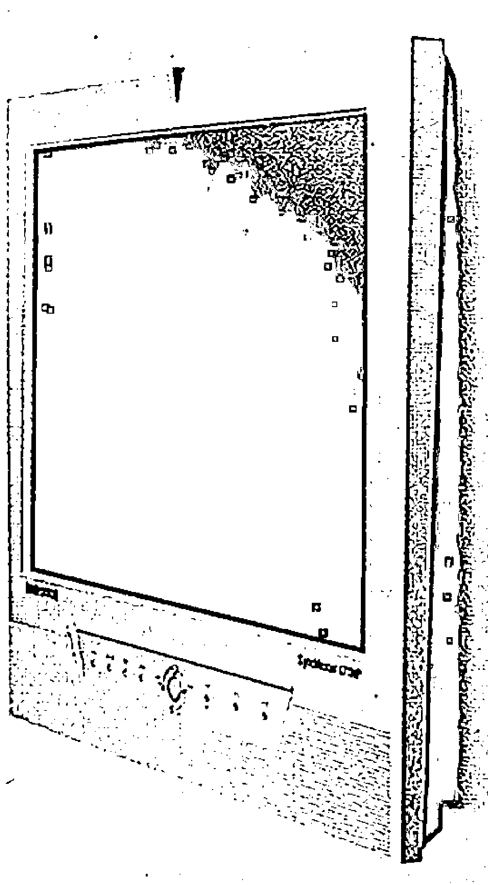

如此信赖，我们深感自豪
在全球显示器领域，三星显示器已连续多年傲视同侪。2001年在中国更突破了140万的销售记录。
以消费者为中心，以创新追求领先，以完美服务升华产品价值，是三星显示器永恒不变的追求。

SAMSUNG
三星电子
www.samsungmonitor.com.cn

Bound Edition

人民邮电出版社
POSTS & TELECOMMUNICATIONS PRESS

## 电脑爱好者合订本

### 2002年（上）·附录分册

《电脑爱好者》杂志社 编

人民邮电出版社

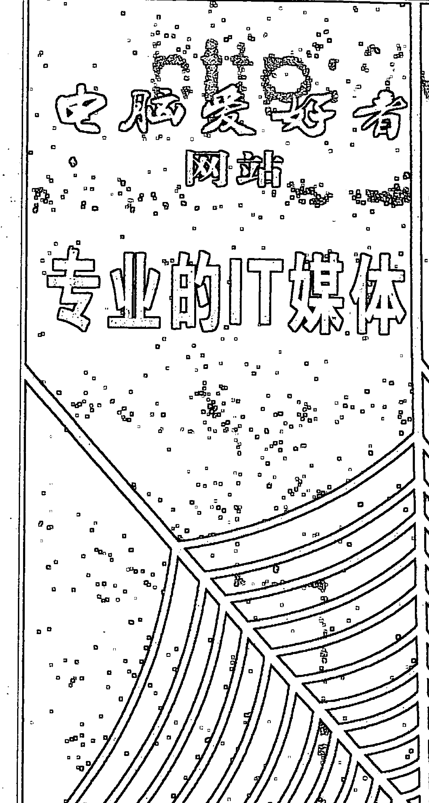

http://www.cfan.net.cn


电脑爱好者杂志网络版

E-mail:campaign@cfan.com.cn
电话：010-62161335转8318

## 内容提要

电脑爱好者合订本2002年（上）附录是一本以应用专题和系统方案的形式，向读者提供实际问题全面解决手段的实用工具书。本书内容精练，实例丰富，实战性和可操作性强，适合具有一定计算机应用水平的中高级读者和渴望提高实际技能的电脑爱好者使用。

本书共有九个栏目，三十多篇大的专题文章，包括图形图像制作技巧、数码设备的选购和使用、Windows XP与Flash MX等最新的系统软件和应用软件的使用技巧、SOHO一族电脑办公解决方案、如何在网上精确搜索信息虚拟机实战、编程课堂、硬件升级、网络应用等方方面面的内容。一册在手，应有尽有！

## 目录

## 特别策划

- 图形特技制作群英会（射雕版）
    - 楔子 绘图江湖风云再起 矢量位图决战华山 …… 21
    - 第一回 举手之间礼花绽放 技不如人位图败北 …… 21
    - 第二回 火焰熊熊位图胜出 矢量不敌败走麦城 …… 24
    - 第三回 背景转瞬踪迹不见 矢量效果略逊一筹 …… 27
    - 第四回 文字特效尽展奇功 两派高手平分秋色 …… 29
    - 第五回 卡通绘制简单明快 操作简易矢量获胜 …… 33
    - 尾声 矢量位图难分轩轾 绘图江湖天下二分 …… 36

- 网页特效魔法设置——CSS 滤镜全攻略
    - 一、在 Dreamweaver 中使用 CSS 滤镜 …… 37
    - 二、CSS 滤镜使用的条件 …… 38
    - 三、领略 CSS 滤镜的效果 …… 38
    - 四、对同一元素使用多个 CSS 滤镜 …… 38
    - 五、视觉滤镜 (Visual Filters)
        - (一) Alpha 滤镜 …… 39
        - (二) Blur 滤镜 …… 39
        - (三) Chroma 滤镜 …… 39
        - (四) DropShadow 滤镜 …… 40
        - (五) FlipH 滤镜 …… 40
        - (六) FlipV 滤镜 …… 40
        - (七) Glow 滤镜 …… 40
        - (八) Gray 滤镜 …… 40
        - (九) Invert 滤镜 …… 41
        - (十) Light 滤镜 …… 41
        - (十一) Mask 滤镜 …… 41
        - (十二) Shadow 滤镜 …… 41
        - (十三) Wave 滤镜 …… 42
        - (十四) Xray 滤镜 …… 42
    - 六、过渡滤镜 (Transition Filter)
        - (一) revealTran 滤镜 …… 42
        - (二) blendTran 滤镜 …… 42
    - 七、CSS 与脚本 …… 43

- 流媒体技术零距离接触
    - 一、走近流媒体
        - (一) 流媒体技术概念 …… 44
        - (二) 流媒体技术应用前景 …… 44
        - (三) 流媒体技术三大巨头 …… 45
    - 二、网络流媒体应用全面接触
        - (一) Windows Media 流媒体应用方案一条龙 …… 46
        - (二) RealSystem IQ 流媒体应用方案一条龙 …… 53
    - 三、网络流媒体下载秘笈 …… 58
    - 四、流媒体技术疑难问答 …… 60

- 新秀登场四板斧——Flash MX 操作实例
    - 一、诗情画意 …… 62
    - 二、风吹字动 …… 63
    - 三、水中倒影 …… 64
    - 四、可控制的三维运动小球 …… 66
    - 附：Flash MX 新功能一览
        - (一) 改进的用户界面 …… 69
        - (二) 可选择的设计模式 …… 69
        - (三) 新的属性面板 …… 69
        - (四) 新增图层文件夹 …… 69
        - (五) 改进的时间线 …… 69
        - (六) 图库功能增强 …… 69
        - (七) 增加自由变形工具 …… 69
        - (八) 模板功能 …… 70
        - (九) 新增组件 …… 70
        - (十) 增强的脚本编辑器 …… 70
        - (十一) 竖排文字 …… 70
        - (十二) 调色板功能增强 …… 70
        - (十三) 精确定位元素 …… 70
        - (十四) 输出 Flash5 格式 …… 70
        - (十五) 支持视频 …… 70
        - (十六) 多语言支持 …… 70
        - (十七) 命名锚点 …… 70

## 数码时尚

- 数码相机之精挑细选篇 …… 72
    - 一、数码相机的选购原则 …… 72
        - （一）按需选购原则 …… 72
        - （二）功能实用原则 …… 72
        - （三）价格合理原则 …… 72
        - （四）操作简单原则 …… 72
    - 二、数码相机的选购要点 …… 72
        - （一）镜头 …… 72
        - （二）焦距 …… 73
        - （三）分辨率 …… 73
        - （四）存储容量 …… 73
        - （五）取景方式 …… 73
        - （六）速度 …… 73
        - （七）传输方式 …… 73
    - 三、数码相机的选购步骤 …… 74
    - 四、数码相机选购注意事项 …… 75
    - 五、数码相机附件的选购 …… 75
        - （一）存储卡转接器 …… 75
        - （二）读卡器 …… 75
        - （三）照片打印机 …… 75
        - （四）滤镜 …… 75
        - （五）外接闪光灯 …… 75
    - 六、常见数码相机简介 …… 75
        - （一）KODAK（柯达） …… 76
        - （二）OLYMPUS（奥林巴斯） …… 76
        - （三）Sony（索尼） …… 76
        - （四）Canon（佳能） …… 76
        - （五）FinePix（富士） …… 77
        - （六）Casio（卡西欧） …… 77
        - （七）NIKON 5000（尼康） …… 77

- 数码相机之使用与拍摄技巧篇 …… 78
    - 一、数码相机的使用 …… 78
        - （一）安装附件 …… 79
        - （二）设置参数 …… 80
        - （三）拍摄相片 …… 80
        - （四）导出相片 …… 81
        - （五）数码相片格式简介 …… 81
    - 二、数码相机的拍摄技巧 …… 82
        - （一）雨天拍摄 …… 82
        - （二）雾天拍摄 …… 83
        - （三）雪景拍摄 …… 83
        - （四）夜景拍摄 …… 84
        - （五）焰火拍摄 …… 85
        - （六）日出日落的拍摄 …… 86
        - （七）云景拍摄 …… 87
        - （八）对数码相机拍摄的几点建议 …… 87
    - 三、数码相机的维护和保养 …… 88
        - （一）数码相机清洁工具 …… 88
        - （二）数码相机的日常保护 …… 89
        - （三）电池的维护与保养 …… 90
        - （四）存储卡的维护保养 …… 90
        - （五）镜头维护与保养 …… 91
        - （六）液晶显示屏维护与保养 …… 91
    - 四、网上数码摄影 …… 91

- 数码相片之后期处理篇 …… 94
    - 一、数码相片处理软件简介 …… 94
        - （一）我形我速 …… 94
        - （二）相片 e 派 …… 95
        - （三）COOL 360 …… 95
    - 二、数码相片的处理 …… 96
        - （一）智能调整数码相片 …… 96
        - （二）手工调整数码相片 …… 96
        - （三）为数码相片添加特殊效果
    - 三、数码相片应用实例
        - （一）用数码相片制作屏幕保护
        - （二）用数码相片制作 Web 略图
        - （三）用数码相片制作海报
        - （四）用数码相片制作网页相册
        - （五）用数码相片制作日历
        - （六）用数码相片制作贺卡
        - （七）用数码相片制作全景图

- 玩转 “数字电视”
    - 一、电视卡选购指南
        - （一）什么是电视卡
        - （二）电视卡的种类
        - （三）电视卡选购要点
        - （四）市场主流电视卡（盒）推荐
    - 二、电视卡（盒）安装指南
        - （一）安装内置电视卡
        - （二）安装外置电视盒
    - 三、电视卡使用指南
        - （一）电视接收
        - （二）调频 FM 接收
        - （三）第三方电视接收程序
        - （四）电视节目的录制
        - （五）视频捕捉

- 与 DV 共舞 做影视大师
    - 一、准备你的 DV
        - （一）数码摄像机
        - （二）IEEE1394 接口
        - （三）数码摄像机与电脑的连接
        - （四）电脑的配置
        - （五）拍摄中需要注意的问题
    - 二、捕获你的影片
        - （一）安装 DV 采集卡
        - （二）采集视频
    - 三、编辑影片
        - （一）使用监视窗口
        - （二）快速组装电影
        - （三）过渡效果的应用
        - （四）设计字幕效果
        - （五）淡入与淡出
        - （六）分割屏幕
        - （七）慢镜头
        - （八）分割剪辑片断
        - （九）让剪辑动起来
        - （十）屏幕嵌套
    - 四、导出影片
    - 五、简易的 DV ——八步电影

## 编程课堂

- 实战软件编程 DIY
    - 前言
        - （一）好的软件开发
        - （二）软件开发过程
    - 一、实战目标
    - 二、实战部署
        - （一）问题定义
        - （二）制订计划
        - （三）需求分析
    - 三、实战策略
        - （一）系统流程设计
        - （二）系统模块设计
        - （三）系统类设计
    - 四、实战体验
        - （一）版本管理
        - （二）软件实现
        - （三）帮助文档
        - （四）安装程序
        - （五）程序打包
        - （六）软件测试
    - 五、实战成果

- XML 打造全新 Web 世界三步曲 …… 153
    - 一、前奏之XML概述 …… 153
        - （一）风光不再的HTML …… 153
        - （二）应运而生的XML …… 154
        - （三）好处多多的XML …… 155
        - （四）学习XML的准备工作 …… 155
    - 二、第二步曲——共舞之XML语法 …… 157
        - （一）XML的逻辑结构 …… 157
        - （二）XML的实体结构 …… 159
        - （三）结构良好的（Well-Formed）XML文件 …… 160
        - （四）DTD来验证合法的XML文件 …… 162
    - 三、第三步曲——盛装舞蹈的XML …… 164
        - （一）使用CSS格式化XML …… 164
        - （二）以XSL作为样式表显示XML文件 …… 170
        - （三）展望未来 …… 177

- 深入浅出学习JSP …… 178
    - 一、JSP概述 …… 178
        - （一）Sun——一个充满阳光的公司 …… 178
        - （二）Java——来杯Java咖啡吧 …… 178
        - （三）JSP登场 …… 179
        - （四）JSP的特点 …… 179
        - （五）JSP与CGI、ASP、PHP的比较 …… 180
        - （六）"Hello, World!" …… 180
    - 二、JSP平台搭建 …… 181
        - （一）JSP平台要件 …… 181
        - （二）JSP平台组合 …… 181
        - （三）平台搭建 …… 181
        - （四）平台测试 …… 184
    - 三、JSP语法 …… 185
        - （一）HTML简要语法 …… 185
        - （二）Java简要语法 …… 185
        - （三）JSP语法 …… 185
    - 四、JSP与数据库 …… 189
        - （一）JSP操作数据库的方式 …… 189
        - （二）简要SQL语言 …… 189
        - （三）JSP JDBC – ODBC Bridge操作数据库实例 …… 190
    - 五、JSP实例 …… 191
        - （一）网站欢迎词 …… 191
        - （二）计数器 …… 192
        - （三）网站登录功能 …… 193
        - （四）综合实例——JSP制作新闻发布系统 …… 196

- Win32汇编编程实例 …… 200
    - 一、预备知识 …… 200
        - （一）Win32汇编程序代码结构 …… 200
        - （二）Win32汇编程序的编译 …… 202
    - 二、颜色值提取器 …… 202
        - （一）创建资源文件（GetColor.rc） …… 202
        - （二）编辑源程序文件（GetColor.asm） …… 203
    - 三、密码窥测器 …… 206
        - （一）创建资源文件（ShowRc.rc） …… 206
        - （二）编辑源程序文件（ShowCipher.asm） …… 206
    - 四、标准窗口 …… 207
        - （一）创建资源文件（MyRc.rc） …… 207
        - （二）创建源程序文件（MyWin.asm） …… 207
    - 五、按钮控件 …… 208
        - （一）创建资源文件（ButtonRc.rc） …… 208
        - （二）创建一个预定义文件（ButtonInc.inc） …… 209
        - （三）创建源程序文件（Button.asm） …… 209
    - 六、屏幕放大器 …… 210
        - （一）创建资源文件（Magnify.rc） …… 210
        - （二）创建源程序文件（Magnify.asm） …… 210
    - 七、编译技巧 …… 212
        - （一）使用nmake.exe工具 …… 213
        - （二）使用批处理文件 …… 213
        - （三）介绍一个具有实用价值的批处理文件 …… 213

- SOHO一族PC选购指南 …… 218
    - （一）自由撰稿人的电脑 …… 218## SOHO 外设采购

### 扫描仪篇

- 一、HP Scanjet 系列
  - (一) HP Scanjet 4400c/4470c
  - (二) HP Scanjet 5400c/5470c
  - (三) HP Scanjet 7400c/7450c
- 二、Canon 系列
  - (一) D1250U2/D1250U2F
  - (二) Canon N676U
  - (三) Canon D2400UF
- 三、Epson 系列
  - (一) Epson Perfection 1640SU office
  - (二) Epson Perfection 1650/1650Photo
- 四、AGFA 系列
  - (一) AGFA ARCUS 1200
  - (二) Agfa DuoScan 2500
- 五、清华紫光系列
  - (一) 小天使 A600
  - (二) Uniscan B0630
  - (三) Uniscan O2000

### 打印机篇

- 一、HP 系列
  - (一) HP DeskJet 840c
  - (二) HP DeskJet 920c
  - (三) HP LaserJet 6L Gold
  - (四) HP LaserJet 1000
- 二、Canon 系列
  - (一) BJC-8200
  - (二) BJC-S750/S520
  - (三) BJC-S900
  - (四) Canon LBP810
- 三、Epson 系列
  - (一) LQ-670K
  - (二) LQ-1600K III
  - (三) Epson Stylus Photo 720
  - (四) Epson Stylus Color 480
  - (五) EPL-5800L

### 移动存储设备篇

- 一、录音笔
  - (一) 选购原则
  - (二) 经典机型
- 二、移动硬盘
  - (一) 选购原则
  - (二) 经典产品
- 三、优盘
  - (一) 选购原则
  - (二) 经典产品

### 移动计算设备篇

- 一、笔记本电脑
  - (一) 选购原则
  - (二) 经典机型
- 二、移动PC
  - (一) 选购原则
  - (二) 经典机型
- 三、Palm
  - (一) 选购原则
  - (二) 经典机型
- 四、Pocket PC
- 五、商务通
  - (一) 选购原则
  - (二) 经典机型
- 六、电子辞典
  - (一) 选购原则
  - (二) 经典机型

### 其他设备

## SOHO 应用全面通

- 一、典型软件使用案例篇
  - (一) 扫出一片灿烂的天空
  - (二) 用电脑收发传真
  - (三) 免费自动应答机
  - (四) 让打印机如虎添翼
  - (五) Windows XP 的远程管理
- 二、打造SOHO网络篇
  - (一) 实战SOHO组网
  - (二) 网络共享使用
  - (三) 共享宽带上网
- 三、网上购物篇
- 四、广而告之——个人网站的推广篇
  - (一) 登录奇兵
  - (二) 商务快车

## 硬件广场

### 年中硬件大盘点——2002年上半年电脑配件点评与采购指南

#### 一、CPU篇
- (一) 2002年上半年CPU市场概述
- (二) 近期主流CPU产品点评
- (三) CPU选购指南

#### 二、内存篇
- (一) 2002年内存市场概述
- (二) 近期主流内存产品点评
- (三) 内存选购全面指南

#### 三、硬盘篇
- (一) 2002年上半年硬盘市场概述
- (二) 近期主流硬盘产品点评
- (三) 硬盘选购指南

#### 四、主板篇
- (一) 2002年上半年主板市场概述
- (二) 近期主流芯片组点评
- (三) 主板选购指南

#### 五、显卡篇
- (一) 2002年上半年显卡市场概述
- (二) 近期主流显卡产品点评
- (三) 显卡选购指南

#### 六、声卡篇
- (一) 2002年上半年声卡市场概述
- (二) 近期主流声卡产品点评
- (三) 声卡选购指南

#### 七、显示器篇
- (一) 2002年上半年显示器市场概述
- (二) 近期主流CRT显示器产品点评
- (三) 显示器选购指南

#### 八、光存储设备篇
- (一) 2002年上半年光存储设备市场概述
- (二) 近期主流光存储设备产品点评
- (三) 光存储设备选购指南

#### 九、配机方案篇
- (一) 八千元配合具备数据保护功能的液晶办公电脑
- (二) 为升级Windows XP配合新电脑
- (三) 万元出头，配合P4 3D图形工作站

## 计算机升级一二三

### 一、计算机升级之系统分析准备篇
- (一) 认识主板
- (二) BIOS分析
- (三) 主板BIOS的刷新
- (四) ATA66/100控制卡
- (五) 转接卡

### 二、计算机升级之整合升级方案篇
- (一) 细说整合主板
- (二) 常见主流整合主板芯片组介绍
- (三) 整合主板的选购
- (四) 其他计算机配件的购买选择
- (五) 使用整合主板进行升级时需要注意的一些问题

### 三、计算机升级之笔记本电脑升级篇
- (一) 升级笔记本内存
- (二) 升级笔记本硬盘
- (三) 升级笔记本电池
- (四) 升级笔记本显卡驱动程序
- (五) 升级笔记本的PCMCIA卡

## XP六日谈

### 第一日：安装与卸载
1. 关于Windows XP的安装启动盘
2. Windows XP适合我的计算机吗？
3. 在DOS下安装Windows XP时Smartdrv.exe的重要性
4. 关闭Windows XP时重启，怎么办？
5. FDISK的隐藏参数
6. 使用故障控制台修复Windows XP
7. 无人值守安装
8. Windows XP的删除

### 第二日：设置与优化
1. 如何修改驱动器盘符？
2. 怎样锁住计算机？
3. Windows XP安装好后，如何把FAT32转化为NTFS？
4. 快速锁定计算机
5. 使用MsConfig设置启动程序
6. 删除Windows组件
7. 优化内存
8. 调整应用程序的优先级来加速程序的运行
9. 设置硬盘工作模式
10. 让桌面图标的文字与桌面融为一体
11. 将最常用的程序放在随手可及的地方
12. 设置自动切换功能
13. 禁用支持ZIP文件的功能
14. 快速关机
15. 设置鼠标的单击锁定功能
16. 文件批量重命名
17. 修改boot.ini以加快Windows XP的启动
18. 解决任务栏假死的问题
19. 在Windows XP中无法使用罗技鼠标怎么办？
20. 在任务栏上显示星期与日期
21. 如何在Windows XP中使用16位的程序？

### 第三日：多媒体
1. 为何有些AVI文件在Windows XP下不能播放
2. 在Windows Media Player 8中复制音乐CD
3. 在Windows XP中刻录数据光盘
4. 修复无法快进的RM文件
5. 下载只能在网络上实时播放的流节目

### 第四日：网上冲浪
1. 图片快捷操作工具栏
2. 加快Internet Explorer 6的启动速度
3. 启动Internet连接防火墙
4. 快速浏览网页的几种方法
5. 保护上网安全——设置Cookie

### 第五日：局域网
1. 关于NetBEUI协议
2. 别人无法通过FTP连接我的机器
3. 加速共享浏览
4. 让Windows XP适应宽带上网
5. 查看共享文件的使用状况
6. 阻止其他用户使用共享文件夹
7. 对等网的连接

### 第六日：系统维护技巧
1. Windows XP终极减肥
2. 如何删除系统文件
3. 关机时自动结束任务
4. 与Internet时间同步
5. 禁止创建短文件名
6. 禁止最近访问更新功能
7. 禁用多余的服务
8. 禁用自动修复快捷方式的功能

### 实战虚拟机

### 营造安全的虚拟系统
- 一、功能超级强大的VMware
  - （一）同时运行多个操作系统
  - （二）在同一台计算机上组建小型的局域网系统
  - （三）安全体验各种新软件
  - （四）一台免费的数码相机
- 二、后起之秀 Virtual PC

## VMware之下载安装篇
- 一、软硬件环境需求
  - （一）软件环境
  - （二）硬件环境
- 二、VMware的下载
  - （一）选择版本
  - （二）选择下载链接
  - （三）获取试用码
- 三、正确安装 VMware

### VMware之虚拟机创建篇
- 一、方便的向导操作方式
- 二、DIY 自己的虚拟机
  - （一）为虚拟机添加第二硬盘
  - （二）为虚拟机添加声卡设备
- 三、看一看全新的虚拟机
  - （一）熟悉的POST 自检
  - （二）神奇的BIOS

## VMware之工作实战篇
- 一、选择引导方式
- 二、格式化虚拟磁盘
  - （一）了解一些预备知识
  - （二）为虚拟磁盘分区
  - （三）格式化磁盘
- 三、虚拟机的其他操作
  - （一）安装 Guest 操作系统
  - （二）安装显卡驱动程序
  - （三）组建网络

### VMware之问题篇
- 一、Windows 9x/Me 系统虚拟机
- 二、Linux 系统虚拟机
- 三、虚拟机使用中的共性问题

## Virtual PC 篇
- 一、软件的安装
- 二、创建一台新的虚拟计算机
- 三、为虚拟计算机安装操作系统
- 四、设置 Virtual PC
- 五、介绍几个 Virtual PC 的小技巧
  - （一）卸载已安装的 Guest OS
  - （二）没有启动盘时
  - （三）快速切换到 Host 机
  - （四）抓取 Virtual PC 窗口中的内容

### 网海淘金

### 用搜索引擎在网上掘金
- 一、搜索引擎基础知识
  - （一）严格意义上的搜索引擎 (Search Engine)
  - （二）目录索引 (Search Index/Directory)
- 二、搜索引擎的基本使用方法
  - （一）目录索引的简单使用
  - （二）搜索引擎的简单使用
- 三、搜索引擎的高级使用方法
  - （一）试着用整句话搜索
  - （二）使用多个关键字
  - （三）使用逻辑搜索
  - （四）使用引号进行精确搜索
  - （五）使用“百度快照”
  - （六）使用百度提供的其他功能

### 四、快速高效搜索的注意事项

- (一) 确认搜索目标
- (二) 选择好关键字
- (三) 确定搜索引擎
- (四) 防止搜索引擎切词的错误
- (五) 使用站内搜索引擎
- (六) 避免常见的错误

### 特殊资料的另类搜索

- 一、MP3 的搜索方法
- 二、图片的搜索方法
- 三、网上查找商品信息
- 四、网上查地图
- 五、FTP 搜索

## 搜索软件奇兵

### 一、搜索奇兵
- (一) 软件的使用
- (二) 软件的设置
### 二、Copernic 2001 Pro 5.02
- (一) 软件的使用
### 三、飓风搜索通
### 四、网络搜索王
### 五、iSearch.net

## 常用搜索引擎网站大全

- 一、常用的英文搜索引擎
- 二、常用的中文搜索引擎
- 三、中文专业搜索引擎

## 防黑前线

## 个人电脑防黑精要

### 一、预防邮件攻击篇
- (一) 预防邮件病毒
- (二) 预防邮件炸弹
### 二、防止 OICQ 攻击篇
- (一) OICQ 个人信息安全保护
- (二) 防止 OICQ 密码被破解
- (三) 隐藏你的 OICQ 行踪
- (四) 保护 OICQ 聊天记录
### 三、防止 IRC 攻击篇
- (一) 保护真实的 IP 地址
- (二) 使用防范断线工具
- (三) 防止木马等黑客攻击
- (四) 使用安全密谈
- (五) 及时打安全补丁，安装防火墙
- (六) 求助管理员
- (七) 使用 IRC 聊天时一些常见的问题和解决的方法
### 四、WWW 安全篇

## 配套光盘软件目录

《我被施了魔法》是一套寓教于乐的教育软件。
软件启动后首先会播放一段动感十足的片头动画,然后进入软件主界面。点击“开始游戏”进入游戏场景,再点击“酒馆”的大门进入酒馆场景。在酒馆里,“小猪”会给你简单介绍Flash动画的来龙去脉,“舞女”则为你讲解Flash的基础知识,“醉猫”会教给你简单的绘画技艺。
从“舞女”右侧的小门可以进入高级动画教程场景。双击魔法女巫建筑物进入魔法小屋,魔法小屋里住着一个小女巫,美丽可爱并且魔法高超,小屋的水晶球里隐藏着两个Flash动画教程,另外小屋中还有不少神奇的魔法,这些就留给朋友们自己探索去吧。
另外,在软件主界面上点进“动画欣赏”,还能欣赏到更多有意思的Flash动画呢。

## 正文软件集锦

## 实用工具

### 一、系统工具

(光盘路径: \合订本2002\实用工具\系统工具\...)

- 软件名称: Letter Assigner (\letassig.zip)
软件介绍: Letter Assigner 可以随意调整硬盘盘符。
- 软件名称: Diskeeper (\DKenTRW9i7_0_408.exe)
软件介绍: 适用于 NT 网络环境, 可以整理硬盘, 处理文件被分段的问题, 使硬盘的性能能够充分表现出来。
- 软件名称: Customizer XP (\cstmizxpV1.8.2.exe)
软件介绍: 通过一个图形化界面使用户能够安全地调整注册表信息。在这个软件里用户可以浏览和改变许多 Windows XP 的秘密设置。
- 软件名称: WinRescue XP (\wnrsqxpzV1.07.07.exe)
软件介绍: 当 Windows 操作系统发生问题无法开机, 连安全模式也有问题时, 可以使用 WinRescue 建立的救援磁盘引导开机进入安全模式, 然后还原回先前的配置。
- 软件名称: YourCPL (\yourcpl_1_1.zip)
软件介绍: YourCPL 是一个可以将任何命令都放到控制面板里面的好工具。
- 软件名称: Tiny Key Logger (\TinyKL.exe)
软件介绍: 可以记录所有的键盘输入信息, 如密码、所使用程序的路径、网址等, 不过对中文支持不好。
- 软件名称: System Commander Pro 2000 (\sc2kV5.06.zip)
软件介绍: 多系统启动工具, 支持 UNIX、Linux、Windows 98/95、Windows NT、OS/2等多种流行的操作系统, 可以在多个系统之间方便地选择启动, 灵活而互不干扰(需要序列号)。
- 软件名称: BiosPwds (\16901biospw12.zip)
软件介绍: 可以显示 Bios 版本、Bios 日期、使用的密码等信息。
- 软件名称: Second Copy 2000 (\sc2000V6.20Build37.exe)
软件介绍: Second Copy 2000 是一个优秀的自动备份工具, 用户可选择要备份的资料及备份资料存放的位置, 然后设定备份间隔时间即可。
- 软件名称: System Mechanic (\system_mechanicV3.6g.exe)
软件介绍: 一个超级系统维护工具, 内建十五种强大的系统修正工具, 对脆弱的 Windows 系统进行全面加固和优化。
- 软件名称: Tweak-XP (\tweakxp-setupV1.28.exe)
软件介绍: 针对微软 Windows XP 的优化工具, 捆绑了 22 种不同的应用功能。
- 软件名称: MView Pro (\mview50.zip)
软件介绍: 多内码汉字系统, 支持简体繁体中文、日文、韩文, 支持自动转换, 并且可以输入中、日、韩文。
- 软件名称: MemMonster 2002 (\monsters.zip)
软件介绍: MemMonster 是为了优化 Windows95/98/2000/NT 的内存而设计的一个系统内存管理工具, 可以释放更多的有效物理内存空间, 还可以调整 L1、L2 缓存。
- 软件名称: DirectX Eradicator (\dxe108.zip)
软件介绍: DirectX Eradicator 是删除 DirectX 的利器, 它能卸载 2.0 到 8.1 之间任一版本的 DirectX, 以便用户能重新安装所需要的 DirectX 版本。
- 软件名称: RAM Idle (\ramidl9xV4.8.2.exe)
软件介绍: RAM Idle 通过检查用户所设定的内存下限, 自动处理一些非必要的软件占用, 让内存尽量保持在安全使用的范围内。
- 软件名称: Dr. Salman's Windows Power Tools (\drptools.exe)
软件介绍: 它能优化用户的 Windows 图形界面(GUI)资源、改善网络连线速度、监控 Windows 中的内存使用情形。
- 软件名称: Memory Zipper Plus (\memzipV7.01.zip)
软件介绍: 协助 Windows 清理无用的内存使用, 并且能整理内存碎片以提高系统的运行效率。
- 软件名称: Ultimate Boot Disk (\UBDNT2KV4.3i.EXE)
软件介绍：用它制作的启动工具盘要比 Windows 自带工具所做的启动盘好用得多，并能进行 Y 2 K 测试、硬盘测试以及 PC100 内存的检测等。
- 软件名称：VoptXP (\VXP_v711.exe)
软件介绍：功能强大磁盘碎片整理软件，运行速度很快，并全面支持 FAT、FAT32 和 NTFS 格式。
- 软件名称：Cacheman (\cachem51.exe)
软件介绍：Cacheman 能够根据用户不同的使用需要，自动设置合理的 Cache 缓存指标。
- 软件名称：Bootmanager BOOTSTAR (\bootstar11.zip)
软件介绍：一个可以取代 Fdisk 的工具软件，它支持 4 到 15 个分区，可将 DOS、Windows 9x/NT 等系统装在同一个硬盘的不同分区中，能选择主分区或其他分区来引导系统。
- 软件名称：Intel Processor Frequency ID Utility (\fidchs14.exe)
软件介绍：检测用户的 Intel CPU 是否被正确设置，支持全新的 Pentium 4、Pentium III 以及使用 Intel SpeedStep 技术的 Mobile Pentium III、Pentium III Xeon 和 Intel Celeron 处理器。
- 软件名称：Total Control (\tc200.zip)
软件介绍：Total Control 允许用户自己定制 Windows 98/98SE 的多个选项，使操作系统更显个性。
- 软件名称：XOSL (\xosl115.zip)
软件介绍：XOSL 可以管理多达 24 个引导程序，并且为每个引导程序设置保护口令。支持 8G 以上的硬盘分区，可以与其他引导程序管理器并存。
- 软件名称：WinRamTurbo Pro (\wrtp48t.exe)
软件介绍：一个非常棒的系统优化工具，它能对内存、文件、磁盘性能进行优化，并能清除剪贴板中的资料以增进使用的效率。

### 二、文件工具

(光盘路径：\合订本 2002\实用工具\文件工具\...)

- 软件名称：pdfFactory (\fppnt142.exe)
软件介绍：一款相当好用的虚拟打印机驱动程序，它可以把单页或两页的东西直接打印为 PDF 文件。
- 软件名称：EXELOCK 666 (\26217exel666.zip)
软件介绍：一个较好的加密 EXE 文件的软件，不过兼容性不太好。
- 软件名称：Folder Cache (\fc_setup.exe)
软件介绍：Folder Cache 在标准的 Windows 打开 / 保存对话框中增加了一个新的按钮，可以快速定位到所需要的文件夹。
- 软件名称：Advanced PDF Password Recovery Pro (\apdfprpV2.0.zip)
软件介绍：如果你不小心忘了 PDF 文件的密码，可以试着使用这款软件加以恢复。
- 软件名称：PECompact (\pecsetup.zip)
软件介绍：一个能压缩可执行文件的工具，由于在运行时不需要恢复磁盘上压缩后的数据，所以与没有压缩的程序在运行时没有明显的速度差异。
- 软件名称：ZipScan (\zipscan_eval_setup1.exe)
软件介绍：通过 ZipScan 的搜寻功能，可以在 ZIP 和 CAB 压缩文件中查找所需要的文件。
- 软件名称：PowerZip (\PowerZipV6.0.3500.exe)
软件介绍：PowerZip 能加密任意类型、任意长度的文件。
- 软件名称：pdf995 (\pdf995V4.7a.zip)
软件介绍：安装一部虚拟的打印机，只要在提供有打印功能的软件上选择打印到 PDF995，便可将整页存为 PDF。
- 软件名称：ProtectZ (\pz160f.exe)
软件介绍：一个能以多种方式保护硬盘上的文件或目录的软件工具。
- 软件名称：Where Is It? (\where324.zip)
软件介绍：Where Is It? 可以给软盘、硬盘、光盘和可移动驱动器建立快捷映象，并且把资料存放在分类中以供以后参考，可以进行查找、浏览、定位、比较等操作。
- 软件名称：FinalData Enterprise (\FinalData_Enterprise_EnglishDemo10.exe)
软件介绍：只要删除的数据还在硬盘上，FinalData Enterprise 就可以很轻松地将这些删除的数据还原、恢复。
- 软件名称：WinRAR (\wrar300sc.exe)
软件介绍：WinRAR 是一款强大的压缩管理软件，对 RAR 和 ZIP 压缩格式提供完全的支持，并能够解压缩其他比较常见的压缩格式文件。
- 软件名称：AutoDialogs (\adsetup_1.3.81.exe)
软件介绍：使用 AutoDialogs 可以快速获得最常用的文件夹，并且可以对其进行打开、另存为、浏览对话框等操作。
- 软件名称：CD Recording Studio (\ashampoo_cdrecordingstudiov205_se.exe)
软件介绍：一个 CD 复制软件，无需建立任何 Image 文件，支持 Music CD 的快速拷贝。
- 软件名称：Nero InCD升级版 (\InCD3243up.exe)
软件介绍：通过 Nero InCD，可以随时随意像用软驱和 MO 光磁盘驱动器一样把文件写入光盘。
- 软件名称：DAEMON Tools (\daemon302.zip)
软件介绍：一款非常好的虚拟光驱软件。读出 ISO、BIN 等流行的镜像文件资料。
- 软件名称：CloneCD (\SetupCCD4b20.exe)
软件介绍：一款优秀的光盘拷贝工具。采用 Raw 模式写盘，因此它能真实地 1：1 复制 CD。
- 软件名称：Fantom CD (\1.2.0.1620_enu_tr.zip)
软件介绍：Fantom CD 是一套光盘虚拟软件，它结合虚拟光盘及烧录两大功能，使用户只需一套软件便可以拥有两套软件的功能。
- 软件名称：FillCD (\FillCD20b.exe)
软件介绍：FillCD能帮助用户计算哪个目录组合可以达到最大的光盘使用率。支持光盘、Zip以及Jaz磁盘。
- 软件名称：Big Crocodile (\bcrocoV3.1.zip)
软件介绍：Big Crocodile是一个专门储存密码的工具软件，它能帮助用户安全地储存那些敏感的文件信息。
- 软件名称：SuperCleaner (\cleansetupV2.37.exe)
软件介绍：SuperCleaner可以扫描用户的系统信息，让用户选择不再需要的文件进行删除。
- 软件名称：Offline CD Browser (\ocdbrowser31.exe)
软件介绍：Offline CD Browser可以将CD等可移动式媒体，或是任何磁盘、网络目录上的文件列表备份在硬盘中，当需要找某个文件时，可以在列表中进行搜录。

### 三、桌面工具

(光盘路径:\合订本2002\实用工具\桌面工具\...)

- 软件名称：Talisman (\talisman.zip)
软件介绍：这是一个可改变Windows的桌面环境，使其更眩、更美的软件。
- 软件名称：Winstep Full Pak (\winstep.zip)
软件介绍：这是一套非常特殊的桌面工具，完全颠覆了原本视窗环境下的工具栏列与菜单使用界面。
- 软件名称：FlashForge (\fforg542.exe)
软件介绍：FlashForge可以轻松地将Flash动画制作成一个精致且具有个人风格的屏幕保护程序。
- 软件名称：Boss Key (\bosskey.zip)
软件介绍：Boss Key是一个免费又小巧的虚拟桌面程序，最多能建立十个虚拟桌面，可用热键快速切换，并可自行设定热键。
- 软件名称：Pivot Pro (\601TrialPivot.exe)
软件介绍：Pivot能将屏幕旋转90度来进行显示，能够以“纵向模式”或以传统的“横向模式”浏览、创建或编辑文档。

### 四、硬件相关

(光盘路径:\合订本2002\实用工具\硬件相关\...)

- 软件名称：ADSL超频奇兵 (\adslx2.exe)
软件介绍：ADSL加速软件，通过修改PC系统注册表中原来专为“低速”接入而设置的TCP/IP默认参数以适应PPPoE方式的ADSL接入。
- 软件名称：3DMark 2001 (\3DMark2001SE1.exe)
软件介绍：3D显卡测试必备软件，它通过自带的游戏引擎对用户的显示系统进行全面测试并进行打分。
- 软件名称：Geforce Tweak Utility (\GTUsetupV3.2.1.exe)
软件介绍：该软件可以通过对注册表的修改让用户的GeForce显卡发挥出更大的威力。
- 软件名称：Photocopier (\cpV2.25.exe)
软件介绍：在Photocopier的帮助下，扫描仪和打印机像复印机般的工作，将印刷品放进扫描仪后，很快能在打印机里打印出复印件来。
- 软件名称：NVIDIA BIOS Editor (\rvbsetup.exe)
软件介绍：NVIDIA BIOS Editor支持从TNT2到最新Ti 500全系列Bios，不需要任何.dll文件支持。注意:如缺乏相关知识，请勿轻易使用！
- 软件名称：TVTool (\tvtool60.zip)
软件介绍：用于替换显卡生产商随卡附带的TV_OUT功能软件，支持NVIDIA系列（如TNT、TNT2、TNT2 Ultra等），使用BT86x的GeForce显卡（如Viper 550、Erazor 3、Xentor 32、3D Prophet等）。
- 软件名称：Dr.Hardware 2001 (\drh2001e.exe)
软件介绍：Dr.Hardware是直接自BIOS、I/O端口获得硬件相关信息。所有硬件的设备信息特性都会列出，并将测试结果输出至打印机或存入文件。
- 软件名称：MaxBlast Plus (\MAXBLAST1.27.EXE)
软件介绍：MaxBlast Plus可以让用户轻松安装和升级硬盘。
- 软件名称：Drive Regon Info (\driveinfo21.exe)
软件介绍：可以检测你的DVD-ROM是否锁码。
- 软件名称：Power YMF (\pymfl110.zip)
软件介绍：一款专门优化YAMAHA声卡的软件，适用于YMF-7x4芯片。
- 软件名称：4Safe StrongDisk (\sd_engV2.8.2.5.exe)
软件介绍：这个磁盘工具可以轻松创建任意大小、任意类型的虚拟磁盘（只要你的硬盘够大）。
- 软件名称：MBProbe (\mbprobe131b9.zip)
软件介绍：MBProbe和Hardware Sensors Monitor一样，是一个硬件监视感应工具，但MBProbe为免费软件。
- 软件名称：Virtual-Mouse (\vm10.zip)
软件介绍：Virtual-Mouse是一个能让键盘操纵鼠标的程序，用户可以任意设定键盘按键来操控鼠标，也可以在没有安装鼠标的情形下操纵鼠标游标。
- 软件名称：CPUFSB (\CPUFSB.ZIP)
软件介绍：CPUFSB可以改变用户主板的前端总线时钟频率，支持当前大多数主板。
- 软件名称：CPUCool (\CPUCOOL9.ZIP)
软件介绍：一款CPU降温软件，能监视并显示主板温度、风扇速度和电压(支持Intel、SIS、VIA、ALI等芯片组)等。
- 软件名称：Cpuidle Pro (\cpuidlepro59.exe)
软件介绍：非常优秀的CPU养护工具，支持Intel、AMD系列CPU。
- 软件名称：Fraps (\FRAPS16.EXE)
软件介绍：FRAPS测试基于DirectX和OpenGL的帧速率。
- 软件名称：Sound Card Analyzer (\scanalyzer.exe)
软件介绍：这是一款声卡测试工具，可以测试出频率响应、本底噪声、动态范围、总谐波失真+噪声、立体声分## 网络工具

### 一、联络聊天
(光盘路径：\合订本2002\网络工具\联络聊天\...)

- 软件名称：FreeICQ(\FreeServer0724O.zip)
  软件介绍：FreeICQ可以很方便地在局域网内发送消息、传送文件等。

- 软件名称：FreeICQ(\FreeICQ0724.zip)
  软件介绍：这是FreeICQ的客户端。

- 软件名称：Trillian(\trillian-v0.72.exe)
  软件介绍：Trillian是一个能同时支持AIM、ICQ、MSN和IRC的标准聊天客户端程序。

### 二、上传下载
(光盘路径：\合订本2002\网络工具\上传下载\...)

- 软件名称：FlashFXP(\ffxp1.4.844.zip)
  软件介绍：功能强大的FXP/FTP软件，支持文件夹(带子文件夹)的文件传送、删除，可以缓存远端文件夹列表，支持FTP代理及Socks 3&4。

- 软件名称：NetMoles Downloader(\NetMoles_Downloader_2_4_bate1.rar)
  软件介绍：一个不错的下载工具。通过多线程，断点续传等技术最大限度地提高下载速度，并且能够捕捉在线播放的流媒体的地址。

- 软件名称：KaZaA Media Desktop(\kmd161_en.exe)
  软件介绍：一个流行的网络资源共享软件，以点对点方式让你和其他KaZaA用户分享彼此的好东西。

- 软件名称：Flash Catcher(\FlashCatcher.EXE)
  软件介绍：IE插件，一个保存Flash动画的软件。不支持Opera及Netscape等其他的浏览器。

- 软件名称：Download Accelerator Plus(\dap5200.exe)
  软件介绍：非常不错的号称能提高下载速度300%以上的下载工具，支持多点续传，可以自动搜索镜像服务器。

- 软件名称：Download Mage(\dmageV1.85c.zip)
  软件介绍：一款小巧好用的下载利器，真正的免费软件，不像网络蚂蚁之类的软件那样要安装广告条。

### 三、网页制作
(光盘路径：\合订本2002\网络工具\网页制作\...)

- 软件名称：Anfy Java(\an145chs.exe)
  软件介绍：在这款软件中，包含了可菜单树、焰火、水面、湖面、横幅/幻灯片放映、Anfy网络摄影机、文字卷动等41种特殊效果，可以将这些效果应用到网页、桌面墙纸或屏幕保护上。

- 软件名称：Automize(\Mize30V4.31.EXE)
  软件介绍：Automize能让用户的电脑工作更加自动化。

### 五、其他
(光盘路径：\合订本2002\实用工具\其他\...)

- 软件名称：ClipMate(\clipmate5309.exe)
  软件介绍：非常出色的Windows剪贴板增强程序，自动保存从多个程序中剪切/复制的对象，然后还可以把这些对象粘贴到任何其他的应用程序中。

- 软件名称：InstallWatch Pro(\InstallWatchPro25.exe)
  软件介绍：跟踪安装或卸载软硬件时系统设置的有关变化，包括文件、INI文件、注册表等，所有的信息储存在数据库里。

- 软件名称：CatchUp(\cnetcup13.exe)
  软件介绍：CatchUP通过后台网站的支持来追踪更新本机中的应用程序。

- 软件名称：电蚊香(\antimos.zip)
  软件介绍：需要配备有音箱。它的工作原理是通过高频噪音达到驱蚊的目的。

- 软件名称：EZ Macros(\amern5.0a.exe)
  软件介绍：一个简单易用的键盘和鼠标记录器。

- 软件名称：Don't Panic!(\DontPanic40.exe)
  软件介绍：它可以通过设置快捷键来快速隐藏或关闭正在运行的一些应用程序。

- 软件名称：Printer's Apprentice(\prnapp719.zip)
  软件介绍：字体管理工具。具有强劲的检视功能：可自行调整字体的大小，可以键盘的模式来显示，可自由输入喜欢的文字来检视，且完全支持中文字体。

- 软件名称：MakeCDROM(\makecdrom.exe)
  软件介绍：MakeCD使用户不用编程即可在短时间内制作出光盘自动播放(Autorun)程序。

- 软件名称：PowerStrip(\pstripV3.16.270.exe)
  软件介绍：功能非常强劲的显示卡／屏幕功能配置工具，具有调整桌面尺寸、桌面字型调整、鼠标游标放大缩小、显示卡执行效能调整等等。

- 软件名称：Hot CPU Tester Pro(\hctliteV3.2.0.exe)
  软件介绍：CPU测试程序，特别适用于超频玩家的CPU稳定性测试，同时还能测试主板、内存稳定情况。

- 软件名称：Nero DriveSpeed(\NeroDriveSpeed_160.zip)
  软件介绍：用户通过Nero DriveSpeed可以手动设定光驱的转速，有效防止光驱转速太快而造成的高发热、高噪音等现象。

- 软件名称：Nero InfoTool(\NeroInfoTool_100.zip)
  软件介绍：一款光驱测试软件，可以显示光驱的类别、速度、生产日期、缓冲区大小以及可以读哪些格式的盘片等。

- 软件名称：SuperRam(\superram.exe)
  软件介绍：一款内存维护管理软件，占用很少系统资源，而功效却相当不错。

### 四、浏览辅助
(光盘路径：\合订本2002\网络工具\浏览辅助\...)

- 软件名称：PowerMarks(\pm_instV3.5.306.exe)
  软件介绍：这是一个功能十分强大的书签管理软件，支持Netscape、IE、Opera各个版本，能够将Netscape和IE的书签合并为一个文件。

- 软件名称：MultiNetwork Manager(\MNetMgrV6.1e.exe)
  软件介绍：这个软件非常适用于同一台电脑却经常要在不同的网络环境中上网这种特殊情况。

- 软件名称：Opera With Java(\ow32zhcnzhcn601j.exe)
  软件介绍：一个非常出色而小巧的Internet/Intranet浏览器，它尤其适合于那些系统资源贫乏的电脑。

- 软件名称：CubicEye(\CE12install.exe)
  软件介绍：CubicEye是一个功能很独特的立体浏览器。

- 软件名称：NetCaptor(\ncsetupV7.0b4A.exe)
  软件介绍：NetCaptor 是一个多线程网页浏览器，还可以关闭弹出式广告窗口。

### 五、网络安全
(光盘路径：\合订本2002\网络工具\网络安全\...)

- 软件名称：SpamMotel(\spammotel.exe)
  软件介绍：转信服务软件工具，它会在转来的信件标题中加一些关键字，通过这一特征，便可以在邮件程序中设定过滤规则，对所收信件加以过滤了。

- 软件名称：Burnt Cookies(\bcookies.zip)
  软件介绍：Burnt Cookies 除了与一般Cookie清除软件相同外，它还可将电脑里所有的Cookie文件全部找出来并显示，让使用者知道每个Cookie记录了什么内容。

- 软件名称：SpyBlocker(\SB.ZIP)
  软件介绍：SpyBlocker 将已知的间谍/广告软件向外界联络的管道阻挡起来，同时不会破坏间谍/广告软件的功能。

- 软件名称：SurfSecret(\surfsecretV4.40.exe)
  软件介绍：SurfSecret 可以自动清除电脑中的网络缓存文件、密码、用户名、历史记录、聊天记录、临时文件、查找菜单、回收站中的内容。

- 软件名称：Tiny Personal Firewall(\tpf3xp2k.exe)
  软件介绍：TinySoftware 公司开发的个人防火墙系统，该系统是 WinRoute 的子集，只具备防火墙功能。

### 六、局域网
(光盘路径：\合订本2002\网络工具\局域网)

- 软件名称：Net Block Pro(\nbpro13.zip)
  软件介绍：NetBlock 是一个专门管理电脑共享资源的工具软件，它可以新增、删除、编辑所共享的资源，并可以修改安全参数、阻挡网络连接、切断使用者、关闭文件等，还能记录共享资源的使用状况，供事后追踪分析之用。

- 软件名称：WinGate(\wingate5.0.0c.exe)
  软件介绍：代理服务器是指通过一台机器使局域网内的所有用户都能访问国际互联网资源，WinGate 是这一类软件的鼻祖。它可以让多个局域网用户都能用上 WWW 浏览器、Email、News、FTP、Telenet 等等。同时它还提供了强大的防火墙功能，防止非法用户登陆你的内部的网络。

### 七、其他
(光盘路径：\合订本2002\网络工具\其他\...)

- 软件名称：SpamEater Pro(\sepsetup3.exe)
  软件介绍：一个先进的邮件过滤器，据说过滤垃圾信的成功率能达到90%以上。

- 软件名称：Bounce Spam Mail(\BSM18.zip)
  软件介绍：垃圾信退信软件。

- 软件名称：ICQ Plus(\iplus34.exe)
  软件介绍：ICQ Plus 可以更换ICQ的面板样式。

- 软件名称：E_Cloaker(\ec2003.zip)
  软件介绍：E_Cloaker 可以将用户的邮件地址转换成unicode字符，以防止被广告信发送者搜集到用户的电子邮件地址。

- 软件名称：IP Changer(\IPChanger20Eng.exe)
  软件介绍：IP Changer 可以保存多套网络设置，选一个应用一下就可以更改网络设置而不用重启计算机。

- 软件名称：FTP Serv-U(\susetupV4.0.0.4.exe)
  软件介绍：非常好的FTP服务器软件，它设置简单，功能强大，性能稳定。通过它你就可以建立自己的FTP服务器了。

- 软件名称：Ping Plotter(\pngplt_2V2.30.1.exe)
  软件介绍：Ping Plotter 是一个多线程的跟踪路由程序，检测当前网络状况。

## 多媒体娱乐

### 一、音频音乐
(光盘路径：\合订本2002\多媒体娱乐\音频音乐\...)

- 软件名称：MusicMatch Jukebox(\mmsetup_7101057.exe)
  软件介绍：MusicMatch Jukebox 的功能非常齐全，可以播放MP3、CD、Windows Media、视频文件，还可以录制MP3 (无品质限制)、WMA等。

- 软件名称：Cool Edit Pro(\cep12dmo.exe)
  软件介绍：数字声音的制作/编辑软件，功能非常强大，支持多种格式之间的转换。

- 软件名称：Sound Forge(\soundforge50f_bld259.exe)
  软件介绍：非常棒的音效编辑软件，具备编辑Real Player G2格式文件的功能，以及将其他的音效格式也转换成Real Player G2使用的格式。

- 软件名称：Audio Converter(\audc405ev.exe)
  软件介绍：Audio Converter 可以将目前主流的音频文件(如 MP3、MP2、MP1、WAV、AIF、VQF等)和 CD 音轨直接转换为 WAV、MP3、WMA、AIFF 等格式的音乐文件。

- 软件名称：mp3PRO Audio Player/Encoder(\mp3PROAudioPlayer_v1_0_4.exe)
  软件介绍：mp3PRO 格式音乐专用播放器。

- 软件名称：AudioMagic(\AM20B1.EXE)
  软件介绍：带混音器的声音录放工具，可以制作大型 PCM 声音文件。用户界面友好，操作简单。

### 二、动画视频
(光盘路径：\合订本2002\多媒体娱乐\动画视频\...)

- 软件名称：CrazyTalk Expression Editor(\crazytalkcomplete.exe)
  软件介绍：CrazyTalk Expression Editor 可将任何 2D 照片在瞬间就变成一个既会说话又有笑、皱眉、哭等丰富表情的动画文件。

- 软件名称：DVDCutter and Merger(\dcmsetup.zip)
  软件介绍：DVDCutter and Merger 是集多媒体播放、抓取、切割/合并以及分片于一身的实用软件。

- 软件名称：DVD2SVCD(\D2S108B1.exe)
  软件介绍：全自动DVD转SVCD工具，能把DVD、PVA(DVB抓取文件)和 AVI 文件转成 SVCD。

- 软件名称：iFilmEdit(\ied14sts.exe)
  软件介绍：MPEG 文件编辑器，无需解压即可编辑，而且 MPEG 的质量不受影响。

- 软件名称：DivX Pro(\DivXPro501GAINBundle.exe)
  软件介绍：DivX5 不仅是 DivX 系列软件的全新版本，更是新一代制作和欣赏高品质视频影像的杰出工具。

- 软件名称：DVDx(\DVDx_1_8.zip)
  软件介绍：它能转换出品质良好的 AVI、MPEG1/2 格式影片，并且不需要 5GB 或以上的硬盘剩余空间。

### 三、媒体工具
(光盘路径：\合订本2002\多媒体娱乐\媒体工具\...)

- 软件名称：Winamp3.0(\wa3install-full_build473.exe)
  软件介绍：最有名的 MP3 播放器，同时支持 MP3、MP2、MOD、S3M、MTM、ULT、XM、IT、669、CD-Audio、Line-In、WAV、VOC 等多种音频格式。

- 软件名称：MP3Gain(\mp3gainFULLInstall.zip)
  软件说明：MP3Gain 对 MP3 音乐进行分析，并对 MP3 的音量进行调整以使其更适合人耳的倾听，这种调整并不会损伤 MP3 的音质。

- 软件名称：Messer(\messer-v097-setup.zip)
  软件说明：一个录音小工具，可以直接将声卡上输出的声音录制成 WAV 或 MP3 格式的文件。

- 软件名称：AltoMP3 Maker(\AltoMP3Maker.exe)
  软件介绍：AltoMP3 Maker 支持 CDDB2 和 Windows 的 Explorer shell 功能，可在资源管理器中的音轨文件上按下右键，直接制作成 MP3。

- 软件名称：BitMENU(\BitMenuV7.02.zip)
  软件介绍：BitMENU 是一个制作光盘自运行菜单的工具，它能设计菜单的标题、说明文字，还能在每一个选项中加入各自的图标。

- 软件名称：Audio CD Maker(\audiocdV5.0.2.exe)
  软件介绍：AudioCD Maker 快速高效而且不失真地把 MP3 还原成 CD 音轨，通过刻录机制作成自己的音乐 CD 合集。

- 软件名称：Mp3Trim(\mp3Trim.zip)
  软件介绍：小巧方便的 MP3 修整截取工具，可以将 MP3 中不要的部分(从头部或尾部)去掉，只保留精华，然后可以利用 Mp3Turbo Injector 等工具，将多个 MP3 合为一个 MP3 文件。

- 软件名称：NonCook(\noncook_2_0_52.exe)
  软件介绍：专门用来修正恢复从网络上下载但是却有所破损的 MP3 文件。

- 软件名称：SWF Browser(\SWFBrowser293.EXE)
  软件介绍：浏览 Flash 文件的好帮手，不但可以快速浏览电脑中现有的 Flash 文件(SWF)，还可以将 SWF 文件转成屏幕保护或可执行文件。

- 软件名称：EXE2SWF(\exe2swf-v0-01.zip)
  软件介绍：一个能把 EXE 格式的 Flash 文件转成 SWF 格式的小工具，可以集成在鼠标右键菜单里。

- 软件名称：SWF scanner(\swfscn2-6-3.exe)
  软件介绍：SWF Scanner 是一款极佳的分析 Flash 文件(.swf) 的工具。可以提取 SWF 文件中的 Action Script、图像、声音、按钮等，并可单独进行保存。

- 软件名称：Action Script Viewer(\HAF-ASViewer20-Fire.zip)
  软件介绍：Action Script Viewer 可以分析 Flash 文件(.swf) 的内部结构，并将其中的动作脚本(action scripts)分解出来，并保存为文本格式。

- 软件名称：KoolMoves(\kmsetup.exe)
  软件介绍：一个网站动画制作软件，能够制作 Flash 动画。

- 软件名称：GIF2SWF(\gif2swfV1.0.6.zip)
  软件介绍：GIF2SWF 是一个可以把 gif 文件转换为 Flash 的 swf 文件的小工具，可以快速转换大量的图形文件。

- 软件名称：SWF Convert(\swfcon1-1.exe)
  软件介绍：SWF Convert 是一款非常方便的 Flash 转换工具，它能轻松把你的电影、图片、声音媒体文件等转成 Flash。

- 软件名称：SWF Protect(\swfpro2-0.exe)
  软件介绍：对丢失了 FLA 源文件且又加了导入保护的 Flash 作品，可以试试用 SWF Protect 去保护。

- 软件名称：AVI decomposer(\avidcom1-0.exe)
  软件介绍：AVI decomposer 可以把 AVI 文件的每一帧转成 JPG 图像，声音转成 WAV 文件。

- 软件名称：MP3 Surgeon(\mp3surg2.exe)
  软件介绍：MP3 编辑工具，可以修剪、切割和合并 MP3 文件，调节所有 MP3 文件使其音量一致，且能提供音乐淡入淡出效果。

- 软件名称：Mix-FX(\mixfx.exe)
  软件介绍：文本、按钮、背景动画效果制作工具，能用它生成数以百计的不同混合效果，加上大小、色彩的变化，获得的效果就更多。

- 软件名称：Absolute MP3 Recorder(\amrV1.1.35.exe)
  软件介绍：一款录音软件。它可以把任何音源传来的信号录制为 MP3 文件，而且可以进行音质选择，并且可以直接截取 Media Player 信号。

- 软件名称：EO Video(\eo-videosetupV1.2.exe)
  软件介绍：EO Video 是一款性能卓越的媒体播放、转码、拼接工具和优秀的文件管理工具。它的操作界面简单明了，支持大多数流行音、视频格式，也提供了对播放列表的全面支持。

- 软件名称：MP3 TrackMaker(\mp3tm14.exe)
  软件介绍：MP3 编辑小工具，可以把大的 MP3 文件分割成更小的 MP3 或音轨。

### 四、媒体娱乐
(光盘路径：\合订本2002\多媒体娱乐\媒体娱乐\...)

- 软件名称：D-Player(\D-PlayerSetup.exe)
  软件介绍：D-player 将专业舞者的动作按照音乐的节奏播放，学习者可以通过它的慢动作、缩放、暂停、多视角、循环播放等功能更好地学习舞步，在播放过程中还可以切换人物及背景。

### 五、其他
(光盘路径：\合订本2002\多媒体娱乐\其他\...)

- 软件名称：Winamp Skin Maker(\sknr041.zip)
  软件介绍：专门制作 Winamp Skin 面板的一个工具。只需开启 275x116 大小的 BMP 图，再按 Make Skin 即可自动产生面板及按钮。

- 软件名称：Digital Image Recovery(\dir.zip)
  软件介绍：这是一款用来恢复数码相机中被误删除的照片的工具软件。

- 软件名称：Jugglor(\jugglor_evaluation.exe)
  软件介绍：FlashJester 公司出品的专用于对 Flash 发布的 exe 文件进行加工改良的小工具，主要功能有：屏蔽掉原有的 Macromedia 右键菜单；关闭 Flash 程序中的音乐并且另外添加 midi 音乐；制作不带边框的窗口；重新定义控制菜单项目等等。

## 图文处理

### 一、图形图像
(光盘路径：\合订本2002\图文处理\图形图像\...)

- 软件名称：FrameMaster(\fm2x.zip)
  软件介绍：这是一款专门用来设计相框的软件。软件的界面非常简洁，操作简单。这里提供的是试用版，功能和正式版完全一样，只是有 30 天的使用期限。

- 软件名称：Konvertor(\konvertores.zip)
  软件介绍：这是一个图片、音乐、文字及影音格式文件的转换程序，它总共可以转换 135 种文件格式，包含 25 种音乐格式、4 种影音格式、105 种图片格式及 1 种文字格式。

- 软件名称：Snagit(\snagit61.exe)
  软件介绍：一款非常棒的抓图软件，除了能抓取静态屏幕图外，还可以抓取动态影像以及文本抓取功能等。

- 软件名称：S-Spline(\sspline.zip)
  软件介绍：一个图像放大工具，用它放大图片不会降低图像的解析度与其他属性。

- 软件名称：Mask Pro(\maskpro203us.exe)
  软件介绍：MaskPro 是 Photoshop 的外挂滤镜，专业的去除图像背景软件。

- 软件名称：Flash Cam(\FlashCamInstallV1.79.exe)
  软件介绍：Flash Cam 可以抓取影像为 Flash 文件，还可以设定鼠标移动路径、加入文字、外挂说明声效。

- 软件名称：Universe Image Creator(\univ163.zip)
  软件介绍：一款制作逼真深奥的宇宙空间图片的小软件。

- 软件名称：Konvertor_pdf2gif(\konvertores_pdftifV1.14.zip)
  软件介绍：Konvertor_pdf2gif 是一个可以把 PDF 图形文件转换成 TIF 格式的转换软件。

- 软件名称：CDH Image Explorer Pro(\Setup_IEP.EXE)
  软件介绍：一个快速的看图软件，几乎支持所有的图形文件格式，甚至包括动态 Gif 及 Photoshop 特定格式的图像。它还可以对图形文件进行删除、格式转换、重新命名、转换等操作。

- 软件名称：ArtStudio(\ArtStudioSetup.exe)
  软件介绍：一个手绘工具，可以结合导入图像、手工绘制、输入文本等功能组合成一幅漂亮的作品，并且可以将这些作品设置为桌面、屏保等。

### 二、编辑文字
(光盘路径：\合订本2002\图文处理\编辑文字\...)

- 软件名称：AbiWord(\setup_abiword-1.0.1.exe)
  软件介绍：AbiWord 是一个免费且快速的全功能文字处理程序。

## 附录软件精粹

- **软件名称**: UltraEdit
  - **光盘路径**: \合订本2002\附录软件集粹\uedit32V9.0b.zip
  - **软件介绍**: 大名鼎鼎的超级文本、网页、程序编辑器。它的主要功能有：支持UNICODE；支持编辑2GB大的文件；支持多语言；对C/C++、VB、HTML、Java、Perl等主流编程语言的语法高亮显示；可以编辑十六进制数据等等。

- **软件名称**: txt2pdf
  - **光盘路径**: \合订本2002\附录软件集粹\txt2pdfwV5.6.zip
  - **软件介绍**: 功能强大的Perl5程序，它可以将TXT文档生成PDF文档。

- **软件名称**: Free PDF
  - **光盘路径**: \合订本2002\附录软件集粹\frpdf098f.exe
  - **软件介绍**: Free PDF是一个PDF工具，可以进行PDF制作、读取、保存等操作，还可以读取PS(PostScript)文件。

- **软件名称**: AllChars
  - **光盘路径**: \合订本2002\附录软件集粹\allchars362.zip
  - **软件介绍**: 通过该软件可以轻松键入任意一个ANSI字符，只要按一下Ctrl键并放开，再按下两个字符组合，就能键入一个对应的ANSI字符。

## 附录软件精粹

- **软件名称**: 搜索奇兵
  - **光盘路径**: \合订本2002\附录软件集粹\msearch102.zip
  - **文章引用**: 网海淘金——搜索软件奇兵
  - **软件介绍**: 《搜索奇兵》软件采用多线程技术，同时搜索各大著名搜索引擎并将搜索结果统一显示在一个页面中。显示的搜索结果可过滤掉重复的结果、死链接、无法访问的网站等，并自定义过滤国内外免费域名、很久没有更新的页面等。

- **软件名称**: Copernic 2001
  - **光盘路径**: \合订本2002\附录软件集粹\copernic2001basic.exe
  - **文章引用**: 网海淘金——搜索软件奇兵
  - **软件介绍**: 超强的搜索工具，使用多个强大搜索引擎如Yahoo、Lycos等等，并且它分成多个频道来精细搜索。它可将搜索出来的站点以浏览器列表的形式显示出来，也可将整个网站下载回来，或通过电子邮件将它传送给别人，支持中文搜索。

- **软件名称**: 网络搜索王
  - **光盘路径**: \合订本2002\附录软件集粹\winFind.zip
  - **文章引用**: 网海淘金——搜索软件奇兵
  - **软件简介**: 网络搜索王是一个可以在Internet上按照一定规则，从网页中抽取URL地址，进而打开更多的网页，然后从这些网页中检索出你需要的信息。

- **软件名称**: iSearch.Net
  - **光盘路径**: \合订本2002\附录软件集粹\iSearch.Net.exe
  - **文章引用**: 网海淘金——搜索软件奇兵
  - **软件简介**: 一款功能强大的Internet/Intranet搜索软件，主要有以下功能：允许用户同时搜索国内外数百个站点；自动剔除重复的搜索结果，自动校验搜索结果的有效性；可以加密保护存储的结果文件；允许自由编辑搜索模板，设定所使用的引擎；允许搜索局域网的共享资源等等。

- **软件名称**: 飓风搜索通
  - **光盘路径**: \合订本2002\附录软件集粹\spsetup.exe
  - **文章引用**: 网海淘金——搜索软件奇兵
  - **软件介绍**: 优秀网络信息搜索工具，整合近百个著名搜索引擎，包括网站、网页、软件、音乐、MP3、证券、新闻、购物、拍卖、游戏等数十个分类搜索。采用多线程并行运作，同时开动多个搜索引擎，高效实用。

- **软件名称**: Winamp TV
  - **光盘路径**: \合订本2002\附录软件集粹\Winamp_TV.exe
  - **文章引用**: 数码时尚——玩转“数字电视”
  - **软件介绍**: Winamp的插件，安装后，有电视卡的用户就可以通过Winamp收看电视节目了。

- **软件名称**: Virtual PC for Windows
  - **光盘路径**: \合订本2002\附录软件集粹\VPC_432_Trial.exe
  - **文章引用**: 实战虚拟机
  - **软件介绍**: 它能让你在一台PC上同时运行多个操作系统，并且不用重新启动系统，只要点击鼠标就可在操作系统之间进行切换，而且还能够使用拖放功能在几个虚拟PC之间共享文件和应用程序。使用前需要去网站注册序列号(http://www.connectix.com/)。

- **软件名称**: FlashNow! 动画浏览器
  - **光盘路径**: \合订本2002\附录软件集粹\flashnow.exe
  - **文章引用**: 编程课堂——实战软件编程DIY
  - **软件类型**: 友情共享
  - **软件说明**: 这是一款非常棒的Flash动画浏览器，具有浏览和视图双界面。它可以方便快速地查找本机中的Flash动画，在对Flash动画的播放上也很有特色，可通过快进、倒退、暂停、拖动滑钮等方式灵活控制动画的播放进程，并且能以放大、缩小、实际大小、全屏等六种模式来查看动画。本软件的开发过程，可参见附录中软件作者所写的《实战软件编程DIY》。

- **软件名称**: 快狗伴侣
  - **光盘路径**: \合订本2002\附录软件集粹\KG-Fere.exe
  - **软件引用**: 友情共享
  - **软件说明**: 这是一个非常有意思的桌面软件，爱睡懒觉的小狗狗给我们的桌面带来了不少生气。而且这只小花狗并非是无所事事的，右键单击它打开右键菜单，你可以设置定时闹钟、定时提醒、定时开机、通讯录、桌面留言等实用的功能。在你不用它的时候，还会在你的呵护下，安静地入睡。另外值得一提的是，它是一个免安装软件，双击即可直接运行。

### ◆ 图形特技制作群英会（射雕版） P21

以武侠小说的形式，写电脑应用的文章，幽默风趣之外，还能学到图形特技的制作方法，真是一举两得。其中的礼花制作，美术字，火焰字等，都是非常有意思的图形特效。

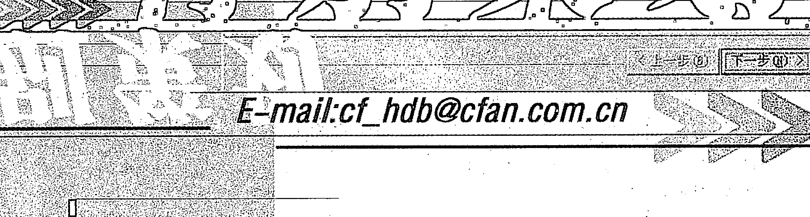

E-mail: cf_hdb@cfan.com.cn

### ◆ 网页特效魔法设置——CSS 滤镜全攻略 P37

大家对图形特效滤镜比较熟悉，实际上对 Web 网页同样可以应用滤镜效果。本文不但介绍了 CSS 滤镜的使用方法，还包括了 CSS 滤镜相当完整的技术资料。

### ◆ 流媒体技术零距离接触 P44

流媒体技术突破了互联网仅仅用来传输文字图片的简单应用模式，使视频、音频等多媒体信息在目前带宽有限的互联网上进行传播成为可能，因而也成了目前流行的网络影音传输技术。本文从流媒体的概念和原理讲起，逐步介绍了流媒体技术的实现方法和应用方案，引导读者在实践中真正接触和学习流媒体及其应用技术。

### ◆ 新秀登场四板斧——Flash MX 操作实例 P62

通过四个实例来体验 Flash 最新版本的魅力，“闪”出你的风采！

## 图形特技制作群英会（射雕版）

### 楔子
绘图江湖风云再起
矢量位图决战华山

话说自从电脑绘图界分成了位图和矢量两大门派以后，江湖便再无宁日了。位图派凭借着自身由像素组成，做出的图像过渡自然、效果逼真的优势，并依仗着掌门软件Photoshop独步江湖的色彩调整和丰富强大的滤镜神功，以及大护法PhotoImpact体贴实用的模板大法，在电脑绘图界呼风唤雨，拥趸无数。而矢量派也利用自身的各种图形均是由数学计算得到，可任意缩放却不受分辨率影响的优点，再加上门派中的两大高手——有着各种功能强大的交互式工具的CorelDRAW，上手简单、功能丰富的Illustrator——江湖人称“玉面双煞”的双剑合璧，在电脑绘图界也是响当当的角色，占着半壁江山。

且说这日，两派高手云集华山之巅，意欲决一雌雄，争个高下。为示公平，特请来江湖上有着“铁面判官”之称的奇士来做评判。

双方尚未正式开始比试，便已经唇枪舌剑起来。位图派道：“位图又名像素图、点阵图或栅格图。我派众人均是基于像素组成，像素是构成图像的最小单位，像素排列的密度便是分辨率，像素中含有色彩信息，众多像素便组成了可用于印刷、打印、网络以及多媒体等多种途径的图像。因为这一特点，所以我们制作出来的图像色彩饱满、效果自然。此外，通过扫描仪、数码相机得到的图像都是像素图，因而我们还可以处理照片，为你的照片增色，或者修补失真的照片。”矢量派也不甘示弱：“矢量图又名向量图。我派众人均是基于数学函数构成，譬如一个圆，圆心坐标、圆的半径、边框颜色和宽度以及填充颜色和类型便决定了这个圆，而所有的函数表达式便组成了一幅矢量图形，无论多复杂的图形原理都是如此。这些特点决定了矢量做出的图形不受分辨率的限制，可以任意放大和缩小；而且画出的图形线条明快、风格清新，这些都是我们的优势所在。”位图派众人听罢不住冷笑道：“说得好听。你们矢量图有着非常大的局限性，那就是很难做出逼真的自然效果，即便做出，也要费尽九牛二虎之力。可这些对于我们位图软件来说却是易如反掌。”矢量派立即反唇相讥：“你们位图呢？将一幅位图放大到一定程度时，就会看到非常严重的锯齿，也就是放大的像素。分辨率就是你们的致命要害，而我们则丝毫不受它的限制。对于自然的效果，我们可以通过混合、网格填充等手段来模拟，一些高手做出的图竟然可以达到以假乱真的照片效果。”位图派穷追不舍：“对于那些通过数码相机和扫描仪以及屏幕抓图得到的图像，你们不就黔驴技穷了吗？”矢量派众人正要反驳，忽听得人群中一声断喝：“大家稍安勿躁！且听在下几句。”

众人回头观瞧。只见奇士走到两派人等之间，朗声说道：“今日之比试，只为切磋技艺，切不可伤了两派的和气。”双方俱点头称是，不再争吵。奇士又道：“比试共分五轮，每轮一题，每题均是电脑绘图中的常见操作和效果。双方各派代表应对，根据制作效果决定胜负。双方可有异议？”双方均表示遵从规则。于是众人分别落座，摩拳擦掌地等着奇士出题。

### 第一回
举手之间礼花绽放
技不如人位图败北

在两派人的注视之下，奇士登上擂台，宣布道：“第一轮题目：制作礼花。礼花是节日里烘托气氛的必需之物，由于其绚丽的色彩、多姿的形态，如果置于节日贺卡或请柬之上，必会十分抢眼，为效果增色不少。下面就请两派高手献艺。”

奇士刚一宣布比赛开始，矢量派的CorelDRAW便跳将出来，站在擂台上大喝一声：“我来试试！”话音未落，便伸拳踢腿，演练起来。边练还边在口中念念有词。但见他先是双击矩形工具，画板上便有了一个与打印区域同样大小的矩形，在色板的黑色块上点击鼠标左键为矩形填充了黑色，“这是作为背景，黑色背景下的礼花才够绚丽。”又在其上点击右键，选择锁定对象，“这是免除错误移动的后顾之忧。”然后选择椭圆形工具，一手按住Ctrl键，一手拖动鼠标在画板上画了个正圆。“按住Ctrl是为了画出正圆，否则画出的将是椭圆。”又将属性栏尺寸输入框旁的小锁图标点击成凸起状态，“这是要锁定缩放比例。”然后将宽和高的任意一项改为5mm（如图1），按下回车，圆便成了直径5mm的小圆。“如果觉得圆太小看不清楚，可以按住Z键或F2键，这时鼠标会切换为放大镜工具，点击鼠标的左键和右键便可以放大和缩小视图——只是视图而已，物体本身的大小并没有改变——调整到合适的视图以便于下一招功夫的使出。”CorelDRAW嘴上说着，手上却毫不怠慢。选择圆形，在色盘上点击白色色块，将其填充为白色，又在色盘左上角的×上点击右键，将其边框设为无。再按住鼠标左键将圆形拖动开一段距离，并不放开左键，又按下了右键，这时鼠标变成了右下角带一加号的箭头，再放开鼠标键，就移动并复制了一个。再选择Interactive Blend Tool（交互式混合工具），从一个圆拖动到另一个圆，霎时间在两个圆之间形成了均匀的混合。将属性栏上的混合步数改成80（默认为20），回车，画板上的圆刹那间变成了82个（如图2）。接着，CorelDRAW又出奇招，用Freehand Tool（自由绘制工具）在画板上画起了螺旋，“这螺旋必要手画，用螺旋工具画的未免太不自然，而且要注意曲线的两个头要藏在螺旋线的内部，就像这样（如图3）。”众人正不解其意，只见CorelDRAW又选定了混合，点击属性栏上的Path Properties（路径属性）按钮，在弹出的菜单中选择New Path（新路径），手中的鼠标却变成了一支弯曲的黑色箭头，在螺旋线上一点，混合便奇迹般地附着到了螺旋线上。又在Miscellaneous Blend Options（混合选项）按钮弹出的菜单中选择了Blend along full path（沿全路径混合），“这是为了让混合在整个曲线上排列。”果然，混合已经均匀地分布在螺旋线上（如图4）。选择混合，在Arrange（排列）菜单中选择Break Blend Apart（打散混合），再选择Ungroup（解散群组），“这样一来，混合就被彻底解散为一个个单独的物体了。”他删除掉了分离出来的螺旋线，选择所有圆形，又将它们群组起来。CorelDRAW轻舒一口气，轻轻按了一下小键盘上的+号键，“虽然看不出什么变化，但这个圆的群组已经在原位置复制一个了。怎么样，很方便吧？”这时复制出来的群组自然处于被选择状态，CorelDRAW按住Shift键将其按中心缩小一些，再按下Ctrl+Page Down，将其后置一层，再用方向键将其向左上方移动一小段距离，将其改为淡紫色。“搞清楚对象的排列顺序是矢量软件的重要概念哟。”又用小键盘上的+号将淡紫色群组原位复制一个，按住Shift键将其按中心缩小到原来的10%左右，后置一层，向左上方移动一段距离，将其改为黑色（如图5）。“这三个群组分别是礼花的爆炸点、盛开点和闪烁点。”他又用交互式混合工具制作了从最下面的黑色群组到中间的淡紫色群组的混合（如图6）。再点击属性栏上的Acceleration（加速）按钮，在弹出的菜单中解除锁定，将对象加速和颜色加速分别向右侧和左侧调整一点（如图7）。“加速的意思就是把混合从均匀状态改为从疏到密的加速状态，调节滑动杆就是调整加速度。我刚才的调整是为了使礼花看起来更逼真一些。”接下来继续用交互式混合工具制作了从淡紫色群组到最上面的白色群组的混合。转眼间，一朵漂亮的礼花就在CorelDRAW手中绽放开来（如图8）。矢量派众人看到此处，早已按捺不住，震天价叫起好来。位图派众人也不禁连吸几口冷气，心中大叫不好，脸上却仍强作镇定。

CorelDRAW甫一出手，便不同凡响，不觉之间脸上已露出得意之色。趾高气扬地向位图派叫道：“贵派何人出来应对？” 这可惹恼了位图派的一位高手，他身形一晃，只见白光一闪，却已站在擂台之上。众人闪目观瞧，原来正是位图派的CHO（首席护法官）PhotoImpact。他并不多说，身形一转便练了起来。却新建了一个15 × 15像素的图像，背景为黑色，选择Zoom Tool（放大镜工具）将视图放大到800%，选择Path Drawing Tool（路径绘制工具），在属性栏左侧的Shape（形状）选项中选择圆形，Color（颜色）为浅紫色，Mode（模式）为2D Object（二维对象），在画布上画了一个直径为13像素左右的圆形（如图9）。PhotoImpact将其保存，口中说道：“这个小圆以后自有妙用。” 接着他又新建一个图像文件，设定尺寸为400 × 400像素，背景为黑色。在新文件中，PhotoImpact又选择了路径绘制工具，在属性栏上的形状选项中选择Freehand（自由绘制），颜色可以选择红色，模式为二维图形。“选择一个鲜艳的颜色只是为了便于操作，对结果是没有影响的。” 然后用鼠标在画布上画一个不规则的圆形闭合曲线，“如果画出的曲线不是很满意，可以点击属性栏上的Editing（编辑）按钮对其进行编辑，直到将形状改到满意为止（如图10）。下面可是很关键的一步，大家要看仔细了。” 说着，他选择了Stamp Tool（图章工具），在弹出的Brush Panel（画笔面板）对话框的形状标签中，点击Add Stamp（增加图章）按钮，在弹出的打开文件对话框中选择刚才保存的那个小圆形文件，确定之后，预览窗口中便出现了刚才画的浅紫色的圆形（如图11）。“这个小圆将作为图章在画布上绘制。” PhotoImpact将Brush Panel对话框的Shape标签中的Object Scale（对象比例）改为30%，Options（选项）标签中的Transparency（透明度）改为90%，Advanced（高级）标签中的Spacing（间隔）改为50%，然后在图像窗口中按下Shift+P键，于是浅紫色的小圆形按照设定的选项围绕画布上的图形轮廓排列出来了。“由于这些图形很透明，而且很小，在画布上可能看不出变化，但在Layer Manager（图层管理）面板上可以清楚地看到变化（如图12）。” 接着，他又选择了Transform Tool（变形工具），在属性栏的Transform选项中选择Resize（改变大小），选择Keep Aspect Ratio（保持外观比例）选项（如图13），然后按着Ctrl键将那个不规则的红色圆形拉大了一些。然后又将刚才改过的几个选项再次做些调整，对象比例改为35%，透明度改为85%，间隔改为55%，再在图像窗口中按下Shift+P键，小圆形又按照新的选项设定围绕新的轮廓进行了一次排列。“然后，逐渐增大画布上图形的大小，也可适当移动位置，不过注意移动的趋势应该是一致的。调整图章选项的规律为：对象比例逐渐增大，透明度逐渐减小，间隔逐渐增大。依照这个规律，一步一步地依图像的轮廓制作排列的图章，直到这些小圆构成的圆环的数量足够多。”最后，PhotoImpact删掉了那个红色的不规则圆形，又利用图层管理面板对那些圆环的位置进行了一些调整，然后转身面向台下，说道：“各位，我做出的礼花就是这样了（如图14）。如果更有耐心，对轮廓图形大小和图章选项的调节更细致的话，做出的效果会好得多。”说罢，下台回归位图派一边。

奇士走上擂台，高声宣布：“本轮比赛，矢量派获胜。”话音未落，矢量派一边便欢声雷动。奇士见位图派众人面露不忿之色，便又说道：“混合是矢量派最具特色的独门武功。这种功夫，简单、高效，瞬间即可制作出均匀或有规律变化的若干对象，还可以制作出渐变所不能做出的效果。就拿这礼花来说，改变混合的各项参数，还可以制作出多种绚丽美观的花型来。矢量派此项神功实在是位图派所望尘莫及的，尽管也有很巧妙的方法，但要作出类似的效果来却要颇费周折。不过位图派各位高手也不要急躁，在下面的比赛中再慢慢施展。”位图派众人心悦诚服，点头称是，并暗下决心——后面几轮必要取胜。

### 第二回
火焰熊熊位图胜出
矢量不敌败走麦城

擂台继续。奇士又宣布第二轮题目：“这一轮要制作火焰。火焰是自然界中常见的现象，能否将火焰效果制作得逼真，让人一见便有全身燥热之感，将是本轮比赛的评判标准。”位图派掌门Photoshop心下暗道：“我派开局不利，先败了一阵。这一阵我们定要胜，否则位图派有何颜面再混迹江湖？”题目刚一宣布，便一个箭步冲上擂台，意欲先声夺人。这Photoshop果然有大家风范，一招一式之间都露着一种从容不迫的气度。只见他不慌不忙，选择菜单File（文件）→New...（新建），在弹出的新建文件对话框中将长和宽均设为400像素，内容为背景色，确定后新建了一个背景为黑色的文件。“确保背景色为黑色的方法是在新建文件之前，按键盘上的D键，将前景色与背景色恢复为默认的黑色与白色，再按X键将前景色与背景色交换，这样背景色就成了黑色了。”在新文件的画布上，他用Lasso Tool（套索工具）选择出一个火焰的基本形状（如图15）。“选取的位置要靠下一些，为火焰的上部留出地方来。”他点击工具箱下部的前景色色块，在弹出的取色器对话框中将前景色设为红色。确定回到正常状态下，他按下Alt+Back Space键，用前景色将选区填充。然后，他选择了菜单Select（选择）→Save Selection...（保存选区），为选区命名为fire，确定保存选区。“这时可以看到，在Channels面板的底端多了一个名为fire的通道，这就是我刚刚保存的选区，保存选区的通道叫做Alpha通道。”在图像窗口中，按下Ctrl+D取消了选取，然后Photoshop又选择了菜单Image（图像）→ Rotate Canvas（旋转画布）→ 90° CW，将画布顺时针方向旋转了90度。接着他选择了Filter（滤镜）菜单下的Stylize（风格化）→ Wind...（风吹），在弹出的设置对话框中，选择了Method（方法）为Wind，Direction（方向）为From the Left（从左边），确定之后，画布上那块红色的色块有了些被风吹过的效应。“为加强效果，可以多次按下Ctrl+F，也就是Filter菜单下的第一个命令，是重复上一个滤镜命令的意思。之后的结果就是这样（如图16）。”然后Photoshop选择菜单Image → Rotate Canvas → 90° CCW，将画布逆时针旋转了90度，回到了原来的角度。

## 特别策划

他又选择了 Channels 面板，按住 Ctrl 键点击了一下 fire 通道，于是该通道以选区的形式载入到图像中来了。“这与选择菜单 Select → Load Selection...（载入选区），在对话框中选择 Channel 为 fire 的效果是一样的。” 然后，他选择了菜单 Select → Modify（修改）→ Contract...（收缩），在弹出的对话框中将缩小值改为20像素，点击确定之后，图像窗口中的选区明显缩小了很多（如图 17）。又选择了同在 Select 菜单下的 Feather...（羽化）命令，在弹出的对话框中将羽化值改为15像素，点击确定之后眼见得选区变得圆滑了许多。将前景色改为明黄色，按下 Alt+Back Space 键依前景色填充选区。他按下 Ctrl+D 取消了选取，可以看到画布上新填入的黄色柔和地渗入到红色中了（如图 18）。Photoshop 又选择了 Filter 菜单下的 Stylize → Diffuse...（扩散），在弹出的对话框中选择 Mode 为 Normal，点击了 OK 之后，图像中的像素均匀地扩散开来。接着选择 Filter 菜单下的 Blur（模糊）→ Gaussian Blur...（高斯模糊），在弹出的对话框中将模糊半径设为 2.0 像素，确定之后图像顿时变得模糊了许多。然后仍然选择 Filter 菜单，其下的 Distort（扭曲）→ Ripple...（波浪），在弹出的对话框中将 Amount（数量）设为 100%，Size（大小）为 Medium（中等），确定之后图像就有了自然的波状抖动效果，已经很像一团熊熊燃烧的火焰了（如图 19）。又选择了同在 Distort 下的 Twirl...（漩涡），在对话框中将角度设为 80 度，确定之后图像中的火焰有了风吹之下的扯动效果（如图 20）。Photoshop 练罢，向台下抱拳拱手道：“最后结果就是这样了，请各位过目。”

> “最后结果就是这样了，请各位过目。”

Illustrator 建功心切，不等 Photoshop 下台，便抢先上台，说道：“看我们矢量派的本事！” 接着便新建了个文件，颜色模式选择 RGB，其他为默认，确定便进入了画板。首先选择了菜单 Object（对象）→ Crop Marks（裁切标记）→ Make（制作），画板四角出现了两两成对并互相垂直的短线，他解释道：“这个菜单命令是用来制作印刷制版时的裁切线的，不过在这里我另有深意。” 说完面露微笑，又选择了菜单 Object → Crop Marks → Release（释放）。刚才那八条裁切线顿时消失了，取而代之的是一个与画板同样大小的无填充无边框的矩形，并自动处于被选择状态。“我这绘制同画板等大矩形的方法虽然没有 CorelDRAW 师弟的方法简单，可也是不传的绝技呢。” 说完，Illustrator 在 Color 面板上为矩形填充为黑色，仍保持无边框。然后他选择了菜单 Object → Lock（锁定）→ Selection（选取）（快捷键为 Ctrl+2）将矩形锁定。“我要将它作为火焰的背景，为了避免它被误移动，所以要锁定它。” 接着他选择了 Pen Tool（钢笔工具），“这其实就是 Bezier（贝塞尔）工具。” 结合着空格键、Ctrl 键和 Alt 键，画出了一朵火焰外形的曲线（如图 21）。“用钢笔工具绘制曲线时，

> “看我们矢量派的本事！”

```
Object（对象）→ Crop Marks（裁切标记）→ Make（制作）
```

> “这个菜单命令是用来制作印刷制版时的裁切线的，不过在这里我另有深意。”

```
Object → Crop Marks → Release（释放）
```

> “我这绘制同画板等大矩形的方法虽然没有 CorelDRAW 师弟的方法简单，可也是不传的绝技呢。”

```
Object → Lock（锁定）→ Selection（选取）（快捷键为 Ctrl+2）
```

> “我要将它作为火焰的背景，为了避免它被误移动，所以要锁定它。”

```
Pen Tool（钢笔工具）
```

> “这其实就是 Bezier（贝塞尔）工具。”

如果对刚刚确定的节点位置不满意，可以在不放开鼠标左键的情况下按住空格键，移动鼠标就可以移动那个节点的位置。而如果已经松开鼠标了也不要紧，按住 Ctrl 键时会暂时切换到选择工具，也可能是直接选择工具，按住 Ctrl 键的同时再按 Tab 键就会在两种工具之间切换，当然我们想要的是直接选择工具，用它移动刚才那个节点到合适的位置，松开 Ctrl 键，又恢复到钢笔工具，可以继续绘制曲线。如果想把节点改变为尖锐型节点，就在点击并拖出手柄之后，别放开鼠标左键，按住 Alt 键，这时会暂时切换到节点类型转换工具，再拖动鼠标就会打断两个手柄的关联，单独调节一个手柄，节点就成了尖锐型的了，放开 Alt 键仍然是钢笔工具，可以继续绘制曲线。这绘制曲线的功夫和技巧可非一两天能练得出来的，定要勤加练习才行。”

说完这一大段话，Illustrator 选中这段曲线，按下 Ctrl+C 复制，再按下 Ctrl+V 粘贴到前面。新曲线自动处于被选择状态，他按着 Shift 键和 Alt 键将其缩小一些，“Shift 键的作用是控制成比例缩放，Alt 键的作用是控制依中心缩放。”然后又将上面的动作重复了两次。又利用选择工具和直接选择工具调节里面三个曲线的位置和节点及其手柄的位置到合适位置（如图22），“这是为下一步的混合做准备。之所以里面的曲线要由外面的曲线复制得到，是因为混合是‘点对点’式的，只有节点数一致的两个对象之间的混合才能得到较好的效果，复制保证了节点数的一致。记住几个快捷键对调节曲线很有帮助：钢笔工具是 P，选择工具是 V，直接选择工具是 A，节点类型转换工具是 Shift+C，另外，增加节点工具是‘+’号，删除节点工具是‘-’号，不过这指的是主键盘区的按键。”调整好这四个曲线对象之后，分别为它们填色（从外到内分别是黑色，R255G220B93，R255G250B187，白色），并将边框改为无。然后，Illustrator用选择工具全部框选它们，选择混合工具，在四个曲线对象对应的节点上顺序点击，制作四个曲线对象的顺序混合。“当混合工具位于第一个节点之上时，鼠标的右下角会出现一个乘号，而位于后续节点之上时，右下角会变成加号，这有助于顺利完成混合的制作。双击混合工具，就会弹出混合选项对话框，里面有混合间距和混合方向的设置，在 Spacing（间隔）选项的下拉菜单中选择 Specified Steps（具体步数），在后面的输入框中可以输入混合的步数，较多的步数可以使混合更加细腻自然，但是步数越多就越耗费系统资源，所以应该输入一个合适的数目。对于不满意的地方，可以利用组选择工具或者直接选择工具，选择混合中的单个对象或者单个对象的单个节点进行调节，直到满意为止。”话到手到，Illustrator说完，火焰效果也制作完了（如图23）。他向大家展示了结果之后，便跳下擂台。

奇士缓步上台，仔细端详了一下双方做出的结果，然后面向台下众人，说道：“在本轮比赛中，位图派凭借自身像素之间变化细腻、过渡自然的特点，做出的火焰效果十分逼真，再加上掌门Photoshop深厚的操作功力和功能强大的滤镜，更是把这门武功修炼得炉火纯青。矢量派虽然利用混合效果也模拟出了火焰的形态，但由于自身条件的限制，神韵不足，变化不多。故此轮比赛还是位图派技高一筹，理应获胜。”位图派众人听到此处，顿时爆发出一阵欢呼，齐声称赞掌门神功盖世。矢量派虽略有不平，但深知奇士铁面无私，必无偏袒，还是自己学艺不精，遂默不作声，心中却已为下一轮打算了。

### 第三回 背景瞬间踪迹不见 天量效果略胜一筹

“第三轮题目是去背。”奇士继续言道：“去背是在做电脑设计时很重要的一项操作。很多时候，我们想要的只是图像中的一部分，而这部分之外的背景是需要去除的。下面就以这张图像为例，请两派高手为这个雕塑的图片去背（如图24）。”

位图派的PhotoImpact刚才输了一阵，正自懊恼，见此时又有了为本派争光的机会，立刻当仁不让地跳上擂台，喊道：“我先来！”
他打开这张图片，细细端详，见背景是蓝色由深到浅的渐变，与雕塑本身的灰色对比很大，当下有了主意。只见到他选择了Standard Selection Tool（标准选择工具）组中的Magic Wand Tool（魔术棒工具），在属性栏上将选择模式改为加选，Select by（选取方式）改为Area（区域），Similarity（相似程度）改为30，“相似程度是对不同颜色对比度的容忍程度，对于边缘区域对比度较大的部分，可以提高选取的效率。”又勾选了Search connected pixels（寻找相邻像素）选项，“这个选项的意思是只在选取点周围邻近的区域内寻找相似颜色，而不是在整个图像范围内，这就避免了误将雕塑范围内与背景颜色相近的部分选取（如图25）。”设定好了选项之后，PhotoImpact用魔术棒工具在图像背景上一点，一大片不规则区域被选取了。接着他又在背景上尚未被选取的几个部分先后点击，于是整个背景都被选取了。“不过此时难免会有一部分雕塑内部的区域被选取，我们需要将这些部分减选掉。”说着，PhotoImpact又选择了同在选择工具下隐藏的Lasso Tool（套索工具），将选择模式改为减选，鼠标立刻变成了带着减号的白色箭头，在多选上的部分周围用鼠标点击后圈选，当回到起点时，鼠标变成了右下角带一个虚线方框的箭头，这时他点击鼠标，选取范围自动闭合了，圈选到的部分从选取区域中减掉了。“圈选的时候一定要小心，如果觉得看不清楚，可以切换到放大镜工具，将局部放大，这样就可以选取得更精确了。”圈选几次后，雕塑已被精确地选取下来了（如图26）。“为了防止雕塑留下蓝边，还要做一点处理。”他选择菜单中的Selection（选择）→Expand/Shrink...（扩大/缩小），在弹出的对话框内选择Expand，数值改为1像素，Shape选择Circle（圆形），然后点击确定。眼见得选区向雕塑部分侵入了一些。接着又选择菜单Selection→Soften...（柔化），在弹出的对话框中将柔边宽度改为1像素，再次确定，变化却不明显。“这步柔化是为了使雕塑的边缘柔和自然，不至于太生硬。”然后他按下键盘上的Delete键，删除了背景，又按下Shift+G键取消选取，一个完整清晰的雕塑就从背景中分离出来了。“如果仍觉得边缘部分太生硬，可以选择Re-touch（修改）工具组中的Smudge（涂抹）工具，在Brush Panel对话框中将笔刷改为合适大小，譬如5像素，其他选项保持默认即可，用该工具在雕塑边缘上涂抹一圈，适当放大显示比例以看得更清楚。这样做的目的是使雕塑的边缘更加柔和地渗透到背景的颜色中去。”经过一番涂抹，雕塑显得更加自然了（如图27）。PhotoImpact转而面向台下众人道：“去背完成，谢谢各位！”得意之情溢于言表。

矢量派也不示弱，众人俱是摩拳擦掌，跃跃欲试，CorelDRAW抢先一步纵身上台，二话不说便练将起来。他新建了一个文件，然后选择菜单File→Import...（导入），在弹出的导入文件对话框中选择那个雕塑的图片，确定之后回到画板中，鼠标却变成了一个直角尺模样，旁边还有文件名。他在画板适当位置点击了一下，图片就以该处为左上角导入进来。他选择了贝塞尔工具，说道：“为了看得更清楚些，在这里我为即将勾勒的曲线选择轮廓为红色。”然后，他依次在拐点、曲线方向变化点处点击鼠标，确定了若干节点（如图28）。“由于有两段闭合曲线，还需要将它们合并。”说着，他结合Shift键，用选择工具选择了这两段曲线，选择菜单Arrange→Combine（合并，快捷键为Ctrl+L）。“这样一来，两条曲线就合二为一了，中间的那一小段曲线形成了外围大曲线的空洞。”然后，他又用节点编辑工具全部选择这些节点，点击属性栏上的Convert Line To Curve（将直线转化为曲线）按钮，将所有节点都转化成了曲线型节点。再分别选择这些节点，利用属性栏上的节点类型转换按钮（如图29），或改为尖锐点，或改为平滑点和对称平滑点，再调节手柄使曲线符合图中雕塑的轮廓。“进行微调时，可以适当地增加或减少节点，增加节点的方法是在欲增加节点的地方点击一下，出现一个实心圆点，然后再点击属性栏上的增加节点按钮，也就是那个加号，或者直接在该处双击即可；删除节点的方法是选择欲删除的节点，再点击属性栏上的删除节点按钮，也就是那个减号，或者干脆在节点上双击即可。”CorelDRAW描摹雕塑轮廓的具体动作无法一一细表，只见鼠标上下翻飞之中，雕塑的轮廓已被一条闭合路径精确地描述出来（如图30）。“在进行去背之前，首先要改变一个选项。”CorelDRAW边说边选择菜单Tools（工具）→Options...，在弹出的Options对话框左侧的选项中选择Workspace（工作区）下的Edit（编辑），将右侧的Auto-center new PowerClip contents（精确裁剪内容自动居中）前面的勾选去掉。“这样做是为了防止下一步制作PowerClip时，内容自动位于外框中央，因为这样不利于我们的调节。”确定之后，他选择了雕塑图片，然后在菜单中选择Effect（效果）→PowerClip（精确裁剪）→Place Inside Container...（置于容器内），鼠标立刻变成了一个向右的大黑箭头，他用这个箭头在刚刚勾完的曲线上一点，背景立即消失了，只留下了被曲线包围起来的雕塑。“这PowerClip可是我CorelDRAW的一项绝技呢，只有本派Illustrator的Mask才可与之媲美。别看这雕塑周围还围了一圈红色，不要紧，这是曲线的轮廓色，将曲线改为无边框就行了。”说着，CorelDRAW选择了红色曲线，在色板上的无色色块上点击鼠标右键，雕塑的红边霎时间不见了，画板上只留下了边缘清晰的雕塑（如图31）。CorelDRAW向众人展示了去背结果后，便下了擂台，与众人一起等待奇士的评判。

奇士缓步登台，在众人关注的目光中立于擂台中央，大声说道：“本轮比赛，双方的操作在视觉效果上难分伯仲，同样达到了为图片中的女孩去背的效果。但是，操作方法和最终结果上却有高下之分。位图派操作简单，只须几下点击即可，而结果是将背景完全地删除掉了，不仅如此，还可以柔化女孩轮廓的边缘，这样把她放在新的背景里也会显得自然。而矢量派呢，CorelDRAW的PowerClip以及Illustrator的Mask虽然功能强大，效果也很不错，但是‘去掉’的背景并没有真的消失，而是被掩盖起来了，在一个文件里如果这种情况很多的话，打印时会出现意想不到的错误。所以本轮比赛还是应该位图派获胜。”矢量派人群中有人喊道：“这轮比赛是针对像素图的操作，正是位图派的看家本事，胜了也算不得什么。”矢量派众人齐声应和。位图派正要反驳，却听奇士道：“为照片去背本是电脑绘图中极其常用的操作，而照片都是像素图，这是由其用途决定的。矢量派众位英雄切勿急躁，在下自有分寸。”矢量派这才无话。

### 第四回 文字特效尽展奇功 两派高手平分秋色

于是比赛继续。这一轮的题目却甚是宽泛——文字特效。“无论是海报制作、封面设计，还是电子贺卡，哪一样都离不开文字，漂亮的文字特效往往为整幅作品起到画龙点睛的作用，万万不可小视。这一轮就是要看看两派在文字特效制作方面的本事，还请各位高手不要吝惜自己的本领，都使将出来，也好趁此机会交流则个。”

Illustrator第一个跳上擂台，他见本派又输一轮，心中颇有些焦急，正想在此轮中大显身手，为矢量派挣回面子。他向台下抱拳道：“在下不才，为各位献上一个多边框字。”话一出口，身形已动，手中鼠标选择了文字工具，在画板上写下“矢量无敌”四个字。在Character面板中为其选择了字体为黑体，字号为72pt (如图32)。“使用其他字体也未尝不可，只是粗壮些的字体做出来好看一些。”Illustrator解释道，“为了看得清楚些，可以按着 Ctrl+ 空格键临时切换到放大镜工具，用鼠标框选文字，然后再放开鼠标，这样就可以把这四个字以合适的比例放大到屏幕的中央，方便以后的操作。”他边说边做，将显示比例调整到150%，在 Color 面板上为这四个字选择填充为红色，边框为黑色。在 Stroke面板上为边框选择宽度为4pt。然后又选择菜单 Type（文字）→ Create Outline（创建外框，快捷键是 Ctrl+Shift+O），于是文字转变成了曲线对象。“这样做是为了使它们能够拥有多个Stroke。这里我们不能不提到 Appearance（外观）面板，它是管理物体、组合以及混合等对象的各种属性的工具。如果没找到它，可以选择菜单 Window（窗口）→ Appearance，或者按下 Shift + F6。”他双击了 Appearance面板上的 Contents（内容）标签，于是面板又变成了这样（如图33）。他将 Stroke标签用鼠标拖动到面板下面的新建按钮上，松开鼠标后，原标签下又出现了一个同样的标签。在新增加的标签被选中的情况下，改变边框为白色，宽度为8pt。接着他又用同样的方法复制一个 Stroke，将其颜色改为黑色，宽度为16pt。于是这几个字就有了三个不同的Stroke属性。Illustrator把 Fill标签拖动到所有 Stroke标签之上，“矢量图中的路径是无颜色无宽度的，而笔画的宽度是平均分布在路径两侧的，也就是说2pt的Stroke，有1pt是位于路径内侧的，而默认顺序是Stroke位于Fill之上的，所以将有1pt的Fill被Stroke覆盖。而改变了顺序之后，Fill位于 Stroke之上，Fill就不会被 Stroke 挡住了。最后的结果（如图 34）和 Appearance 面板的示意图（如图35）请各位过目。”

## 特别策划

说着，Illustrator举起刚刚做好的多边框字“矢量无敌”向台下展示。矢量派人群中爆发出一阵热烈的掌声，位图派众人却是一副不以为然的样子。
位图派的PhotoImpact轻哼一声，说了一句：“这有何难！”纵身跳上擂台，向众人道：“我为大家献上一个‘火焰字’的效果。各位上眼，在下献丑了！”说罢，新建了一个300×200像素，背景为黑色的文件，选择Text Tool（文字工具），在文件窗口上点击，并在弹出的Text Entry Box（文字输入窗口）中输入PHOTO IMPACT几个字。选择了字体为Impact，字号为45pt，文字颜色为非黑色（如图36）。

“没有这种字体的话，也可以用类似的字体代替。文字的颜色并不重要，不会影响到最后的结果。”其他选项，他都保持了默认值。点击确定，文字便出现在文件窗口中，周围有一圈闪动的虚线，表示这是一个被选中的文字/路径对象。“将鼠标置于文字之上时，会变成中间有个小‘T’字的白色箭头，这时按住鼠标可以移动文字，双击鼠标会弹出文字输入窗口编辑文字。”PhotoImpact说着，用鼠标将文字移动到画布中央偏下的位置，“可以在文字上点击右键，在Align（对齐）选项中选择Center Horizontally（水平中心对齐），这样可以保证文字在水平方向上位于画布的中间。”他将手中鼠标高举，向台下道：“各位，我的这趟功夫的精华部分到了。可要看清楚了！”言罢，点击菜单Effect→Creative（创意）→Type Effect...（文字效果），顿时众人的眼前弹出一个硕大的对话框（如图37）。‘这就是Type Effect对话框，左下角的Effect栏内预设了很多种文字效果，右上方还有各种参数的调节，默认的状态是动画效果，所以右下方有动画控制工具，点击Still（静态）按钮切换到静态效果状态，它们就会消失。左上方可以预览效果，也可以点击Preview（预览）按钮预览画布中的效果，不满意的话再点击Continue（继续）按钮再做修改。这里我要做一个Animate（动态）效果。’他口中述说，

手上不停，在Effect栏内找到了Fire（火焰）效果，将参数中的Strength（强度）改为50，三种色彩保持不变，动画帧数仍保持默认的10帧，按下循环按钮后，再按下播放按钮。只见预览框内PHOTO IMPACT几个字上已燃起了熊熊烈火，情景甚是热烈。“如果觉得效果满意了，就可以按下Save...（保存）按钮将其保存为gif动画，应用于网页之上了，定能为其增色不少。而如果做静态效果的话，点击确定就可以将效果应用于影像之上（如图38）。”他又用选取工具选择燃烧的文字，重复了几次刚才的步骤，那几个字越烧越旺，以至于文字都烧得快要熔化掉了（如图39）。PhotoImpact举起做好的火焰字效果向台下众人展示，脸上颇有自得之色。位图派一侧已是鼓掌声、喝彩声雷动了。

这可气坏了矢量派中的一位英雄，他大喝一声：“尔等休得猖狂！”人随声到，众人举目观望，只见CorelDRAW已站在擂台之上。他向台下众人抱了抱拳，说道：“CorelDRAW不才，也想露几手功夫，做一个凹陷字。各位见笑了。”说罢，不等台下反应，便兀自练将起来。他先是选择文字工具在画板上写下“CorelDRAW”几个字，为其选择了Impact字体，字号为24pt（如图40）。“选择比较粗重的字体效果会比较明显。”他解释道。接着他配合Z键和鼠标框选将这几个字以合适比例放大到屏幕中央。然后又用矩形工具画一个比这几个字大一些的矩形，将矩形填充成为蓝色，边框为无。在矩形被选中的情况下，按下Ctrl+Page Down，将矩形置于文字之后。再同时选择两个对象，按下C键，使其水平居中对齐，再按下E键，使其垂直居中对齐。接着，CorelDRAW又选中了文字，按下小键盘上的“+”号键，将其原位复制。“这时选中的是复制出来的新文字。”他说着，按着Shift键加选矩形，选择菜单Arrange→Combine，于是文字在矩形上穿了个同样形状的“洞”（如图41）。

他为带洞的矩形选择填充颜色为Navy Blue，无边框。CorelDRAW又选择菜单Effect→PowerClip→Place Inside Container...，这时鼠标变成了向右的黑色粗箭头，用这个箭头在剩下的那个文字对象上点击一下，矩形却突然消失了。“其实它没有消失，而是置于‘CorelDRAW’这几个文字之中了，重叠的部分可以显露出来，未重叠的部分却被遮盖住了。因为矩形上的洞与那些文字刚好吻合，所以看不见了。”CorelDRAW面带得意之色，手中却并不怠慢，继续舞动。他按着Ctrl键点击文字，屏幕上出现了刚才消失的那个带洞的矩形。他解释道：“这是进入PowerClip内部编辑其内容。”他选择交互式阴影工具，从矩形中部向右下方拖动，拖动出下落阴影，调整好适当位置，将羽化值改为1（如图42）。用小键盘上的“+”号键原位复制这个矩形，接着又用交互式阴影工具为其制作向左上方的下落阴影，调整位置与刚才的阴影对称，羽化值改为1，又将阴影颜色改为白色。“改变阴影颜色的方法是用鼠标把色板上的色块拖到阴影终端色块上放开。”CorelDRAW边说边做。接着又按着Ctrl键在画板空白处一点，就结束了PowerClip内容的编辑回到正常编辑状态下了。他将该文字填充为Navy Blue色，然后，又画了一个比文字大些的矩形，填充颜色也为Navy Blue，无边框，将其置于文字之后，并将两者对齐，然后向众人说道：“结果就是这样了（如图43）。如果互换PowerClip中两个矩形阴影的颜色，结果就有浮雕的感觉了（如图44）。”言罢，向众人拱一拱手，便跳下擂台，回归本队。矢量派众人个个面露喜色，齐向CorelDRAW挑起大拇指，口中啧啧称赞。

见矢量派如此风光，位图派掌门Photoshop坐不住了，也上了擂台，说道：“既然矢量派的师兄显了两手绝技，我们也不能太保守了。我也给众位英雄练上一手三脚猫的功夫，叫做凸边透明字。就算是博众位一哂吧。”Photoshop口中说得客气，可暗中却使出十分的气力，但见他新建了一个300×200像素图像，模式为RGB，背景为白色的文件。在颜色面板上选择左上角的前景色色块，将B滑动条滑到最右端，于是文件的前景色便成了蓝色。他在Filter菜单下选择了Render（渲染）→Cloud（云彩），画布上立刻出现了氤氲的云彩效果（如图45）。“这个滤镜的作用是利用前景色和背景色随机的模拟云彩效果。”接着又在Filter菜单下选择了Distort→Ocean Ripple...（海洋波纹），在弹出的对话框中将Ripple Size（波纹大小）和Ripple Magnitude（波纹幅度）分别改为10和20，“在小窗口中可以预览滤镜作用于图像的效果。”确定之后画布上立时涌起了缎子般的蓝色波纹（如图46）。

Photoshop选择Channel面板，点击下边的创建新通道按钮，新建了一个Alpha 1通道。“Alpha通道是用于保存选区的，这可是我最厉害的一门内功呢。”又选择了Alpha 1通道，“如果此时的画布不是全黑的，就双击Alpha 1通道，确定弹出的通道选项对话框中Color Indicates（色彩指示）选项中被选中的是Masked Areas（被蒙版区域）。”接着选择了Horizontal Type Tool（水平文字工具），在画布上写下PHOTOSHOP几个字，“写字时画板变成了红色，而文字是黑色的，这是快速蒙版。”为文字设定字体为Arial Black，字号为36pt。然后选择移动工具，画布又成了黑色，文字为白色，并自动处于选择状态（如图47）。他用移动工具将文字移到画布的中央位置。他再次选择通道面板，将Alpha 1通道拖动到创建新通道按钮上放开，立刻在Alpha 1通道下面复制了一个通道，自动赋名为Alpha 1副本。“这个副本与Alpha 1是一样的，并且文字仍然处于选中状态。”说完，Photoshop选择了菜单Edit→Stroke…（描边），在弹出的描边对话框中，将宽度改成了5pt，其他项目保持不变，确定之后，画布上的文字齐齐的都胖了一圈（如图48）。保持Alpha 1副本通道被选择，他又选择了Filter菜单下的Blur→Gaussian Blur…，在弹出的对话框中将半径改成了5.0像素。点击确定，画布上的文字却变成了这般模样（如图49）。他手中仍然不停，又选择了菜单Image→Adjustment（调整）→Invert（反相，快捷键为Ctrl+I），文字内部选区中的颜色霎时间黑白颠倒。然后他按下Ctrl+D，取消了选取。还是在Channel面板中，他选择了RGB通道，回到了正常编辑状态，选择了Filter菜单下的Render→Lighting Effect…（光照效果），在弹出的对话框中，Texture Channel（纹理通道）选择了Alpha 1副本，其他保持默认值，在左侧的调整框中将光源调节到适当的角度和范围（如图50）。“点击确定，便完成了这套武功。”说着，Photoshop举起最后的结果图向大家展示（如图51）。位图派众人又是不住地喝彩。

奇士见已有四人登台献艺，台下仍有不少人跃跃欲试，心想：这样比下去只怕这擂台得开到明年。于是赶紧上台，大声说道：“众位英雄的功夫都很了得，可是比赛总有个规矩，既然双方都已有两位高手出场，我看这轮比赛就到此为止吧。”正想上台的人听

### 第五回
卡通绘制简单明快
操作简易矢量获胜

“最后一轮的题目是绘制卡通。”奇士道，“时下，卡通画正在大行其道，其风靡的势头着实了得。生动可爱的卡通形象越来越受到大家的欢迎。这一轮就要看一看谁能将这幅卡通小猪（如图52）画得惟妙惟肖。”

Illustrator闻言首先上台，说了声“我来试试”就动起手来。他先是利用钢笔工具，并结合按下快捷键切换到其他路径工具，绘制出小猪最外圈的白色轮廓（如图53）。“如果凭空绘制觉得没有把握可以将卡通小猪的图片用File→Place...命令导入，再将其锁定，以图片为底图进行描摹。用钢笔工具绘制时一定要记住空格键、Ctrl键和Alt键的作用，这会大大提高绘制曲线的效率。一条曲线是很难在绘制时就达到百分之百精确的，不必在某一个节点上纠缠太多，勾勒出大概轮廓就行，可以绘制完整条曲线后再进行细部调整。”在绘制时主要是确定节点的位置，多余的节点可以用删除节点工具删除，需要增加节点的地方可以用添加节点工具点击来增加一个节点。调整时如果能够记住A是切换到直接选择工具，Shift+C是切换到结点类型转换工具，调整工作就可以事半功倍。”Illustrator又用选择工具选中了小猪的轮廓，说道：“下面绘制小猪的粉色身体。没有必要再一点点地勾画，因为注意到粉色部分与白色部分轮廓十分相似，所以可以使用Offset Path命令。”说着，他选择了菜单Object→Path（路径）→Offset Path...（偏移路径），弹出Offset Path对话框（如图54），将Offset栏改为-6mm，其他保持默认，点击确定之后却见画板上在原曲线内部出现了一条新的曲线，两条曲线之间保持6mm的距离（如图55）。“Offset Path命令就是将曲线平行向内部或外侧复制出一条新的曲线，Offset栏填入的是偏移的距离，正值向外，负值向内。”接着他将新轮廓进行了一些调整，使其更符合粉色身体的轮廓，然后填入浅粉色。“绘制初期为了看清各部分，可以暂时保留边框，并改成较为鲜艳的颜色，比如绿色，以示区别。”Illustrator接着说道：“然后绘制小猪身上的阴影，就是那几块较深的粉色。对于这几个部分，可以只精确绘出小猪身体内部的部分，然后用路径寻找器制作出需要的部分。”说着，他用钢笔工具勾出一个多边形，将其与小猪身体轮廓相交的部分调整得符合深粉色部分的轮廓（如图56）。然后选择了小猪身体轮廓，复制并粘贴到前面，“制作一个副本，用来与那个多边形进行‘相交’。”又按着Shift键加选那个多边形，在Pathfinder（路径寻找器）面板上按着Alt键按下Intersect Shape Areas（形状区域相交）按钮（如图57），画板上选中的两个曲线只剩下了彼此相交的部分（如图58）。Illustrator又用同样的方法绘制出其他几个深粉色部分的轮廓来，然后又用同样的方法绘制出小猪四只鲜艳的蹄子。接着，Illustrator又画出小猪的鼻子、鼻孔和脸上的褶皱（如图59）。“下面该绘制小猪轮廓上的黑色笔触了。为了便于管理和临摹，可以新建一个图层，将黑色笔触画在新图层中。”于是Illustrator选择Layer面板，点击新建图层按钮在原图层上面新建一个图层，然后点击上一个图层左侧的眼睛标志，使其消失，这样就隐藏了这个图层。在新的图层中，Illustrator仍然使用钢笔工具配合空格、Ctrl和Alt等键绘制出所有笔触的外形（如图60）。“为了与刚才的小猪身体轮廓有所区别，可以将这些笔触的笔画设为红色。画完了所有的轮廓，接下来就该填色了。”Illustrator说着，隐藏了笔触图层，显示出轮廓图层，选择各部分轮廓，填充上与原图一致的颜色。“为了保持与原图的颜色一致，可以用吸管工具取色。选择吸管工具，按住Shift键的同时按下鼠标左键，不要松开，移动鼠标，鼠标所经之处的颜色就会被吸取到Color面板上。哪怕是桌面和其他程序也可以，只要鼠标是在Illustrator程序窗口内按下的就行。从原图上吸取到颜色后，从Color面板上拖到Swatch（色板）面板上，就在Swatch面板上新建了新的色板。填色时就可以直接利用这些新建的色板了。”经过Illustrator的一番填色，一只活泼可爱的小猪便出现在画板之上了（如图61）。Illustrator又用混合制作出小猪背后的图案，然后又画出一个和原图大小差不多的矩形置于混合之上，选择了矩形与混合，再选择菜单Object→Clipping Mask（剪切蒙版）→Make，于是混合位于矩形之外的部分就被蒙住了。“为了增加效果，还可以给小猪身上的黑色笔触增加不规则的边缘。方法是全选所有笔触——由于它们都在同一图层，所以可以很方便地做到这一点，点击Layer面板上该图层右侧的小圆圈即可——为它们设置笔画为黑色，宽度为0.25pt，然后在Brushes面板上选择Charcoal笔画。”Illustrator边说边做，小猪身上的黑色笔触在他的手下变得有了自然的粗糙感。他的这一趟功夫也就到此为止了（如图62）。练罢，Illustrator在矢量派众人的喝彩声中飘然下台，回归本队。

位图派这厢，Photoshop心下暗忖：这已是最后一轮，正是决胜时分，必得自己亲自出马才有取胜的把握。于是纵身上了擂台，二话不说便新建了一个背景为白色的文件，动手画了起来。“在这里，我也会用到路径。别看我是位图处理软件，但路径的绘制和编辑能力也不差。具体的方法、技巧和快捷键与矢量派的Illustrator差不多，毕竟我们都是Adobe州的人，还是有一些相似之处的。但是我这里没有绘制曲线时按住空格键移动未确定节点的功能。”说完，Photoshop利用钢笔工具并结合Ctrl键和Alt键勾勒出用作背景的葫芦形曲线（如图63）。

后他选择Path面板，只见面板上有一路径的缩略图，名为Work Path（工作路径），且字体为斜体。“新绘制的路径都将在Path面板上以工作路径的形式存在，必须将其转变为保存路径方可随文件一起保存。”于是他双击该路径的缩略图，在弹出的Save Path（保存路径）对话框中将其改名为“背景”，确定后该路径就以“背景”为名字被保存下来了（如图64）。“我要将路径载入为选区，以方便填充或描边。一个闭合路径可以十分精确地转换为选区，而相反的过程虽然可行，但精确程度却差了很多。事实上路径变选区是一个进行精确选取的经典方法。”说着，Photoshop点击了Path面板下方第三个按钮——Load path as a selection（将路径载入为选区），顿时画布上的路径变成了同样形状的选区。“路径并没有消失，而是失去了选取状态，在Path面板上选择它，画布上又出现了该段路径，在面板的空白处点一下鼠标，就又取消了选取。”对于新建立的选区，他选择了菜单Select→Feather...，羽化值设为100像素，确定之后，将前景色改成了R182 G165 B12，按下Alt+Back Space键以前景色填充选区，便看出了羽化的效果。接着他又在Path面板上新建了一个路径，又用钢笔工具勾出了小猪的轮廓，在Path面板上将其改名为“轮廓”（如图65）。又切换到Layer面板，新建一个图层，在新图层上将轮廓路径载入为选区，填充为白色。然后他再次将轮廓路径载入为选区，选择菜单Select→Modify→Contract...，将选区收缩了25像素，再利用套索工具结合Shift键和Ctrl键对新选区进行了些修改，将其填充为R250 G239 B236（如图66）。

无法一一细述，Photoshop新建Path，绘制路径，将其作为选区载入，填入适当的颜色，依照这个顺序画出了小猪的身体各部分和黑色的笔触。“也可以为小猪身上的黑色笔触加些真正的笔触效果。这就用到了对路径进行描边的方法。”他先是将前景色改为黑色，然后选择了Brush工具，在属性栏上的Brush Pre-set Picker（笔刷预设拾取器）中选择Oil Medium Wet Flow笔刷，将其直径改为5像素（如图67）。然后又在Path面板上选择笔触路径，按着Alt键点击了面板下方第二个按钮——Stroke path with brush（用笔刷为路径描边），在弹出的对话框中的下拉菜单中选择Brush，确定之后这段路径便以当前选择的Brush来进行描边。于是小猪身上的笔触便显得更加## 尾声
矢量位图难分轩轾
绘图江湖天下三分

自然了 (如图68)。画完小猪，Photoshop纵身下台，只等最后的评判。

> 本轮比赛矢量派获胜。

见位图派众人颇为不平，便接着说道：“这卡通画，要的是线条简单，色彩明快，风格清新，而这些正是矢量图所拥有的特点，再加上操作上的简易灵活，矢量派胜出当属必然。位图派的绘画别有风格，在过程中也用到了路径等一些矢量的概念和方法，可较之矢量派来过程复杂了些，落了下风。不过，位图派众位英雄在绘制水墨画、油画等作品时，就可以发挥出自身优势了。”一番话说得两派人齐齐点头。

五轮赛罢，两派众人已显露疲态。擂台是结束了，可众人清楚地记得双方都是两胜两负一平，这样一来岂不打成了平手？就连江湖经验极为丰富的奇士也没遇到过这种情况。可众人的目光此时都集中在他的身上，作为评判，他必须做出最终裁决。

> 各位英雄，今天这种局面我奇某人也是头一次遇到，真是让在下好生为难。此时此地，我想问众位一个问题：难道一场比赛非要分出胜负吗？我们今天在这里切磋武艺，最终的目的不是决出谁高谁低，而是比较一下矢量与位图彼此的优势和劣势。矢量与位图有着各自的特点，因而矢量软件和位图软件也有着各自的特色，即便同是矢量软件或位图软件，彼此之间也是各有特点，各有优势。今天好多到场的高手还未登台献艺，如位图派的 Painter、Paint Shop Pro、Corel Photo-Paint，还有矢量派的 FreeHand、Xara X、Expression 等，这些英雄豪杰个个身怀绝技，在绘图领域都能独挡一面。所以咱们的电脑绘图江湖才会百花齐放，一派繁荣景象。

> 其实矢量软件与位图软件并非泾渭分明。矢量软件中有处理位图的命令和滤镜，位图软件中也有矢量绘图和编辑的工具。在制作不同的效果，应用到不同的途径时，应根据情况选择不同类型的软件，取其长，避其短。

顿了顿之后，他继续说道。

然后，奇士提高声音道。

> 我宣布，本次比赛，双方旗鼓相当，不分胜负。

双方亦觉得这个结果是最理想的。于是一番互相吹捧和自谦之后，众人纷纷散去。
华山清静了，而电脑绘图江湖却越来越热闹了。
(文/奇士)

## 网页特效魔法师——CSS滤镜全攻略

“滤镜”(Filter)这个词对Photoshop、Fireworks一类图像处理软件的用户来说应该不会陌生，我们可以借助各种不同的滤镜方便地做出各种效果。实际上，“滤镜”这个词并不只属于图像处理软件，CSS (Cascading Style Sheets) 也为我们提供了14种视觉滤镜 (Visual Filters) 和2种过渡滤镜 (Transitions)，通过应用这些滤镜，我们可以方便地做出多种不同的效果，在后面，我将会为大家一一讲述。更重要的是，CSS和HTML一样，作为一种技术规范，我们不用付费即可使用。

视觉滤镜应用于网页中图片、文本等元素，可以使之产生透明、模糊、投影、反转、光晕等效果。过渡滤镜分为两种，一种是revealTran滤镜，应用于当一个元素的可见性 (visibility) 改变或页面切换时，产生如PowerPoint页面切换时的过场效果；另一种是blendTran滤镜，使用者可以设置效果的持续时间，使物体产生一种淡入淡出 (fade in/fade out) 的效果。

接下来，让我们一起来看看CSS滤镜是怎样使用的吧！首先介绍的是在Dreamweaver中，如何使用CSS滤镜。

### 一、在Dreamweaver中使用CSS滤镜

有人可能会担心：“使用CSS滤镜是否要手写代码？这个我可不会！”其实，通过常用的Dreamweaver 4，我们可以方便地对刚才所讲的网页元素使用CSS滤镜了。

- 1. 首先，通过菜单的“窗口 (Window) → CSS 样式(CSS style)”(快捷键 Shift+F11)调出CSS面板。
- 2. 点击“新建样式”按钮 (如图1)。
- 3. 选择“新建一个类 (class)”，并输入类的名称，本例中类名为: cssFilter。单击“OK”按钮。注意：需选中“This Document Only”一项，否则会弹出对话框要求你保存为外部CSS文件，如图2。
- 4. 在接下来定义类的窗口中点选左侧“种类 (Category)”中的“扩展 (Extensions)”项 (如图3)。
- 5. 在“滤镜 (Filter)”的下拉菜单中点选需要使用的滤镜，这时会见到滤镜中的各项属性名都已经填入，只要将各属性后面的问号“？”替换成实际的参数，点击“OK”，滤镜就设置好了。
- 6. 在Dreamweaver中点选需要应用滤镜的页面元素 (如图像等)，也可以在状态栏中点击相应的HTML标签 (如图4中的标签)。
- 7. 在CSS面板中点击刚才设置的类的名字，应用后即可完成 (图5)。

### 二、CSS滤镜使用的条件

有时候，使用了这些滤镜，却看不到效果。这可能有以下几个原因：一是IE版本过旧，因为只有IE4.0以上版本才支持CSS滤镜，另外在Macintosh平台下，滤镜也是不能用的；二是滤镜用在了窗口化(windowed)的HTML标签上（如IFRAME）；三是滤镜没有应用于合法的HTML标签，CSS滤镜可应用的合法HTML标签为BODY、BUTTON、DIV、IMG、INPUT、MARQUEE、SPAN、TABLE、TD、TEXTAREA、TFOOT、TH、THEAD、TR等。注意：这里DIV标签和SPAN标签必须定义了高度、宽度或绝对位置。如果不符合以上的条件，滤镜的效果是不可见的。

### 三、领略CSS滤镜的效果

通过对不同对象使用不同的滤镜，以及设置不同参数，可以得到各种不同的效果。在学习各滤镜的使用及其参数之前，可以浏览光盘中附带的关于本文的网页或浏览www.5dmedia.com/qqkk2000/cssfilter/showCSSfilter.htm，领略一下各种滤镜为网页带来的各种赏心悦目的效果。现在简要介绍一下“滤镜演示”页面及其制作方法。页面分效果区和编辑区，“效果区”如图6所示，是用来演示滤镜效果。共分为三大块：区域1演示滤镜应用于图片时的效果，这里选用的图片为gif98a格式，即背景透明的gif图片，这与一些滤镜的应用条件有关，在后面将会讲到；区域2和3演示的是滤镜应用于层标签<div>的效果，其中2的层是使用了背景颜色#CCFF66，3的层则为透明。试比较2、3两个层在应用同一个滤镜时文字及层背景的不同。

应用于层标签<div>的效果，其中2的层是使用了背景颜色#CCFF66，3的层则为透明。试比较2、3两个层在应用同一个滤镜时文字及层背景的不同。编辑区如图7所示。点击区域2表格中的不同按钮，可以对效果区的三个对象同时应用与按钮名相同的滤镜。这时，相应的CSS代码会在区域1的文本框中出现。若应用的是视觉滤镜(Light滤镜除外)，还可以在文本框中修改其滤镜的各个参数，按Finish Modify按钮完成修改，效果区就会按修改后的数值演示效果。如果为了便于对比，希望恢复没有使用滤镜时的效果可以按No Filters按钮显示原始状态。

注意：①当演示Light滤镜以及过渡(Transition)效果时，文本框的值是不可以修改的，即使修改了也没有任何作用。②在应用了过渡效果后，如需继续应用另一种效果，请先点击Visibility=visible按钮使对象恢复可见性。如果需要查看单个Light滤镜的各个方法(Method)时，请在使用Light滤镜方法前使用clear()方法。否则，看到的将会是多种方法集合后的效果。

### 四、对同一元素使用多个CSS滤镜

对同一元素使用多个滤镜，必须手工加入。IE4中的语法为：

```
filter:filterType1(paramName1=value1, paramName2=value2,...) filterType2(paramName1=value1,...)...
```

其中filterType为滤镜类型，paramName为参数名，value为参数值。注意：滤镜之间要用空格分隔，参数之间要用逗号分开。在IE5.5的语法中，定义单个滤镜的方式与IE4语法有所不同，具体为：

```
<Element style="filter:progid:DXImageTransform.Microsoft.filtername(sProperties)">
```

其中Element为所应用的标签名，filtername为滤镜名，sProperties为属性。IE5.5及更高版本的浏览器可以支持IE5.5语法，

同时也支持IE4.0语法，而IE4.0至5.5版本则只支持IE4.0语法。
注意：IE4与IE5.5的语法并不只是简单的写法上的不同，一些滤镜的分类、名称也不尽相同。例如，IE4语法中原来为单独滤镜的FlipH、FlipV、Gray、Invert、Xray被归入BasicImage中；而原来归在blendTran中的各种transitionshape则被分开，成为单独的滤镜，且增加了不少华丽的滤镜；还有一些滤镜被改名，如原来的Blur滤镜在IE5.5语法中被改为MotionBlur，而Blur滤镜则另作他用。在效果上，两者也有一定的区别。例如，使用dropshadow、shadow、glow或mask滤镜时，使用了IE4的语法对象。如没有设置适当边距时就会有边缘被切的现象，而在使用了IE5.5语法时，对象则会扩展出空间以使其边缘不会“被切”。尽管微软推荐使用IE5.5的语法，但在页面上使用就会导致一部分浏览者因为浏览器版本太低而不能正常浏览设置的滤镜效果。
因此，必须了解可以使更多人看到效果的IE4语法下的CSS滤镜。

### 五、视觉滤镜 (Visual Filters)

常用的 CSS Visual Filter 共有 14 种如表 1。
下面开始向大家详细介绍上述 CSS 滤镜的各个参数以及一些常见用法。

表 1
| 滤镜名 | 作用 |
| :--- | :--- |
| Alpha | 设置物体的不透明度 (Opacity)。 |
| Blur | 模糊效果。 |
| Chroma | 使指定颜色设为透明。 |
| DropShadow | 投影效果。 |
| FlipH | 水平镜像效果。 |
| FlipV | 垂直镜像效果。 |
| Glow | 在对象的外边加上光晕效果。 |
| Gray | 使彩色图像呈现黑白效果。 |
| Invert | 使物体以反色显示，反转其色调、饱和度以及亮度。 |
| Light | 为对象设置投射光源。 |
| Mask | 做出透明遮罩的效果。 |
| Shadow | 立体投影效果。 |
| Wave | 沿X轴做出正弦波扭曲的效果。 |
| Xray | 仅显示物体边缘的效果。 |

### (一) Alpha 滤镜 (如表 2)

描述：设置可见物体的不透明程度，对象可以为图像或层等级块元素。
语法：{ FILTER: Alpha(Opacity=opacity, FinishOpacity=finishopacity, Style=style, StartX=startX, StartY=startY, FinishX=finishX, FinishY=finishY)}

表 2
| 参数名 | 说明 |
| :--- | :--- |
| Opacity | 不透明度的程度，取值范围为0到100。实际上是一百分比值，0为完全透明，100则为完全不透明。 |
| FinishOpacity | 可选参数。为透明区域结束时的不透明程度，取值范围同上。 |
| Style | 指定透明区域的形状特征。可取的值为0，1，2，3。
取值0：统一形状。不透明度均匀地应用于对象各个位置。
取值1：线形。从坐标 (StartX, StartY) 到 (FinishX, FinishY) 对象的不透明度从 Opacity 到 FinishOpacity 渐变。
取值2：放射形。从中心点向外，不透明度从 Opacity 到 FinishOpacity 渐变，对象的角不受影响。
取值3：矩形。从中心到外边不透明度从 Opacity 到 FinishOpacity 渐变。 |
| StartX | 渐变透明效果的开始X坐标 |
| StartY | 渐变透明效果的开始Y坐标 |
| FinishX | 渐变透明效果的结束X坐标 |
| FinishY | 渐变透明效果的结束Y坐标 |

alpha 滤镜是最常用的 CSS 滤镜之一。一般用在 PopUp菜单的半透明显现，以及半透明拖动层等。结合脚本编程动态控制物体的透明度，会有十分赏心悦目的效果。其中用得最多的就是通过触发 onMouseOver 和 onMouseOut 事件，利用 setTimeout() 或 setInterval() 控制循环，改变 opactiy 的数值，做出图片淡入与淡出的效果。最近笔者还见到有人以此做出仿 Windows2000 淡入淡出注释 (即类似 alt 属性显示注释) 的效果。注意，这里最好使用方法 setTimeout() 或 setInterval() 来代替不可延时的 for、while 来控制循环。

```
filter: Alpha(Opacity=20, FinishOpacity=70,
Style=1, StartX=20, StartY=90, FinishX=20,
FinishY=20)
```

演示如图 8、9 所示。

### (二) Blur 滤镜(如表3)

描述: 以指定强度和方向平均化对象的各像素, 产生类似于高速移动的模糊效果。

```
语法: {FILTER: Blur(Add=add, Direction=direction, Strength=strength)}
```

| 参数名 | 说明 |
| --- | --- |
| Add | 决定是否对对象应用Blur滤镜。布尔值, 取值为0或1。 |
| Direction | 设置模糊效果的方向。缺省值为0。同“时钟”的方向: 0, 向上; 45, 右上; 90, 向右; 315, 左上, 如此类推。 |
| Strength | 模糊的强度, 即受到模糊扩展的像素范围。整数值, 默认值为5像素。 |

这里要注意的是, Blur滤镜不同于IE5.5以上的滤镜语法(使用PROGIDs)中的Blur滤镜, 而与IE5.5以上语法中的MotionBlur滤镜相同(详情可参阅MSDN, 这里就不多讲了)。

### (三) Chroma 滤镜 (如表4)

描述: 选择性地使指定颜色变为透明色。

```
语法: {FILTER: Chroma(Color=color)}
```

| 参数名 | 说明 |
| --- | --- |
| Color | 指定为透明颜色的色值。颜色表达的格式为 #RRGGBB。RR 代表红色的十六进制值, GG则为绿色, BB 为蓝色。 |

对那些24位降为8位色的图片文件, Chroma滤镜是不推荐使用的。可以看到一些已经减色和压缩的JPEG文件应用 Chroma 滤镜时, 仅有少数的点被设为透明, 甚至完全没有效果。另外, 在一些设置了抗锯齿的图像中, Chroma滤镜也不能正常工作。还有, 每张图片也只能有一种透明色, 这就意味着在一张透明的GIF图片中使用 Chroma 滤镜时, 原来图片中透明的颜色将会变为完全不透明。

### (四) DropShadow 滤镜 (如表5)

描述: 通过指定的强度和方向造出一种固体投影的效果, 使人生生物体是浮在页面上的错觉。

```
语法: {FILTER: DropShadow(Color=color, OffX=offX, OffY=offY, Positive=positive)}
```

注意区分DropShadow与Shadow滤镜之间的不同之处。DropShadow是产生“投影”的效果, 它所产生的阴影相当于原物体按指定值进行位移, 而Shadow产生的是“残影”效果, 产生的是有延伸的阴影效果。DropShadow滤镜一般是用来做出文字与图片的阴影效果, 用于文字时, 如果参数颜色、偏移量以及背景颜色搭配得当, 可以做出类似雕刻文字(凸出、凹陷)的效果。

表5
| 参数名 | 说明 |
| --- | --- |
| Color | 指定投影效果的阴影颜色, 颜色值表达格式为 #RRGGBB。 |
| OffX | 由可见物体投影沿X轴上的偏移量。整数, 以像素为单位。正值阴影向右, 负值则向左。 |
| OffY | 由可见物体投影沿Y轴上的偏移量。整数, 以像素为单位。正值阴影向下, 负值则向上。 |
| Positive | 布尔值。当值为"true"(非0)时, 为不透明的像素建立可见的投影, 这是缺省值。当值为"false"(0)时, 为对象透明的像素建立可见的投影。 |

```
filter: DropShadow(Color=#ccccc, OffX=5, OffY=5, Positive=1)
```

演示如图10、11所示。

### (五) FlipH 滤镜

描述: 做出物体的水平镜像, 同一般图像处理软件的水平翻转效果类似。

```
语法: {FILTER: FlipH}
```

### (六) FlipV 滤镜

描述: 做出物体的垂直镜像, 同一般图像处理软件的垂直翻转效果类似。

```
语法: {FILTER: FlipV}
```

### (七) Glow 滤镜 (如表6)

描述: 在物体外边加上一种类似发光的效果。

```
语法: {FILTER: Glow(Color=color, Strength=strength)}
```

| 参数名 | 说明 |
| --- | --- |
| Color | 指定光晕的颜色。颜色值表达格式为 #RRGGBB。 |
| Strength | 设置光晕的强度。取值范围为1-255, 数值越大, 强度越大。 |

使用Glow滤镜时, 要注意预留适当的边距, 否则所得的效果将与设想不同, 如外光晕被其外边切去等。

结合脚本编程, 可以在暗背景下做出文字渐亮的效果。

### (八) Gray 滤镜

描述: 降低可见对象的色彩信息, 呈现出对象的灰度图。

## CSS滤镜（续）

### （九）Invert 滤镜

描述：使物体以反色显示，反转其色调、饱和度以及亮度。

语法：`{FILTER: Invert}`

注意区分 Invert、Xray 和 Gray 滤镜的效果。

### （十）Light 滤镜

描述：模拟光源投射的效果。

语法：`{FILTER: Light}`

Light 滤镜是 CSS 各滤镜中比较复杂的一个滤镜，要掌握好它，需要比较好地把握光源的位置。一旦为对象定义了 Light 滤镜，你就可以通过调用它的“方法（Method）”来设置或改变属性。你可以通过方法来指定光源的位置、目标、颜色、亮度等属性。每一个视觉滤镜可以控制的光源数为 10 个，如果你希望使用多于 10 个光源的话，可以通过添加多重滤镜来实现。当建立光源效果以后，就有了一个默认的环境光源与之关联。这个光源将被你以后所设的第一个光源所替换。

下面介绍 Light 滤镜的各个方法（如表 7）及其参数（如表 8）。其中 object 代表 Light 滤镜所应用的对象。

注意：在使用 Light 滤镜的方法前，必须先对对象使用 Light 滤镜。

利用 Light 滤镜可以做出许多意想不到的效果，为对象添加点光源可以做出放射性渐变的效果，结合脚本动态控制光源可做出雷达般的扫描效果，光源跟随效果等。

演示：`filter: Light`

方法为：`object.filters.Light.addPoint(100,40,100,255,255,255,1000);`

注意：方法是加在 Script 脚本中的，可在应用了滤镜效果的 IMG 标志行下再加上如下代码：

```
<script language="JavaScript">
```

#### 表 7

| 方法 | 语法 | 说明 |
|---|---|---|
| addAmbient() | `object.filters.Light.addAmbient(R,G,B,strength)` | 对应用了 Light 滤镜的对象添加环境光源。环境光源是垂直于页面的无方向平行光源。 |
| addCone() | `object.filters.Light.addCone(x1,y1,z1,x2,y2,R,G,B,strength,spread)` | 添加一个锥形光源，向页面投射有方向的光源。这种光在页面的投影会有渐变效果。 |
| addPoint() | `object.filters.Light.addPoint(x,y,z,R,G,B,strength)` | 设置一个点光源。 |
| ChangeColor() | `object.filters.Light.ChangeColor(lightnumber,r,g,b,fAbsolute)` | 改变光源的颜色。 |
| ChangeStrength() | `object.filters.Light.ChangeStrength(lightnumber,strength,fAbsolute)` | 改变光源的强度。 |
| Clear() | `object.filters.Light.Clear()` | 清除所有光源。 |
| MoveLight() | `object.filters.Light.MoveLight(lightnumber,x,y,z,fAbsolute)` | 移动光源。 |

#### 表 8

| 参数名 | 说明 |
|---|---|
| x,y,z | 代表光源坐标，在 addCone() 方法中，x1,y1,z1 是代表光源的坐标，而 x2,y2 是代表目标的位置，其中 z2 暗示为 0。 |
| R,G,B | 设置颜色，R、G、B 分别为红、绿、蓝三色，取值为 0-255。 |
| strength | 设置亮度。整数值。 |
| spread | 光源位置与物体表面之间的光传播角度，取值为 0-90 度。 |
| lightnumber | 设置光的数量，一般用于脚本。 |
| fAbsolute | 布尔值。当 fAbsolute 为 true（非 0）时代表用新值替代原来值。fAbsolute 为 0 则以新值作为原值的增量或减量。 |

```
aaa.filters.Light.addPoint(100,40,100,255,255,255,1000);
</script>
```

其中的 aaa 对应的是应用了 Light 滤镜的 IMG 标志中的 ID 属性值。当然可以进行更复杂的脚本编程以达到动态灯光的效果，如图 12 所示。

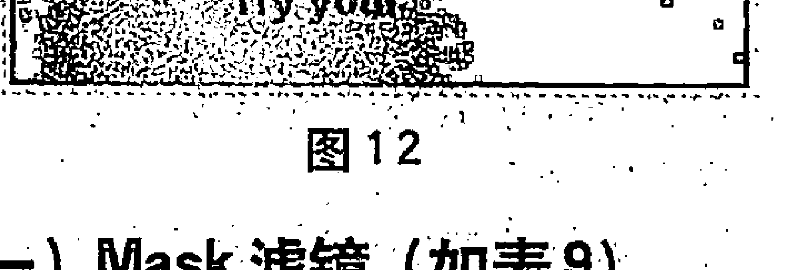

### （十一）Mask 滤镜（如表 9）

描述：做出一种遮罩效果，使对象透明部分填充指定的颜色，而不透明部分则变为透明。

语法：`{FILTER: Mask(Color=color)}`

#### 表 9

| 参数名 | 说明 |
|---|---|
| Color | 指定透明区域遮罩上的颜色，颜色值表达格式为 #RRGGBB。 |

### （十二）Shadow 滤镜（如表 10）

描述：指定强度和方向造出一种残影效果，使人产生阴影围绕物体外边的感觉。

语法：`{FILTER: Shadow(Color=color, Direction=direction)}`

#### 表 10

| 参数名 | 说明 |
|---|---|
| Color | 指定阴影效果的颜色。颜色值表达格式为 #RRGGBB。 |
| Direction | shadow 效果的偏移方向。为从垂直方向开始顺时针方向的角度值，45度为一增量。0: 向上, 45: 右上, 90: 向右, 315: 左上。如此类推。默认为 225，方向为左下。 |

### （十三）Wave 滤镜（如表 11）

描述：使对象产生一种沿垂直方向轴呈正弦波扭曲的效果。

语法：`{FILTER: Wave(Add=add, Freq=freq, LightStrength=strength, Phase=phase, Strength=strength)}`

#### 表 11

| 参数名 | 说明 |
|---|---|
| Add | 布尔值。当值为 "true" (非 0) 时，将原来影像加入 wave 打乱后的影像中。当值为 "false" (0) 则只显示 wave 打乱后影像。 |
| Freq | 频率，即可见的波的个数。整数值。 |
| LightStrength | 波纹增强或减弱光的强度。为百分值，取值范围为 1-100。 |
| Phase | 正弦波开始的偏移量。正常值为 0。"Phase" 的值从 0 到 100 之间。这个数值代表开始时的偏移量取自波长的百分比值。例如当值为 25 时，正弦波就从 90 度的方向开始。 |
| Strength | 表示 wave 效果的强度，即振幅。 |

```
filter: Wave(Add="0", Phase="20", Freq="5", LightStrength="50", Strength="10")
```

演示如图 13 所示。


### （十四）Xray 滤镜

描述：使对象以黑白 X 光片的方式展现的效果。

语法：`{FILTER: Xray}`

注意区分 Invert、Xray 和 Gray 滤镜的效果。

### 六、过渡滤镜 (Transition Filter)

使用视觉滤镜做动态渐变需要去写脚本，使用过渡滤镜只需通过简单地改变一下参数，就可以做出 20 多种渐变效果。

在 IE4 语法中，CSS 提供了两种过渡滤镜：一种是 revealTran 滤镜，另一种是 blendTran 滤镜。它们应用于一个元素的可见性 (Visibility) 改变或页面切换时，产生如 PowerPoint 页面切换的过场效果，使用者可以设置持续时间，使物体产生一种淡入淡出 (fade in/fade out) 的效果。具体用法如下：

#### （一）revealTran 滤镜

语法：`{ filter: revealtrans(duration=duration, transition=transitionsshape)}`

参数：duration 为渐变持续的时间。表格格式为“秒.毫秒”(0.000)。

transition 表示渐变类型，值为整数，取值范围为 0-23。各数值代表的效果如表 12 所示。

##### 表 12

| 取值 | 过渡效果 |
|---|---|
| 0 | 以矩形方式向中心缩小 (Box in) |
| 1 | 以矩形方式向外边扩大 (Box out) |
| 2 | 以圆形方式向中心缩小 (Circle in) |
| 3 | 以圆形方式向外边扩大 (Circle out) |
| 4 | 向上擦除 (Wipe up) |
| 5 | 向下擦除 (Wipe down) |
| 6 | 向右擦除 (Wipe right) |
| 7 | 向左擦除 (Wipe left) |
| 8 | 垂直百叶窗 (Vertical blinds) |
| 9 | 水平百叶窗 (Horizontal blinds) |
| 10 | 横向棋盘 (Checkerboard across) |
| 11 | 竖向棋盘 (Checkerboard down) |
| 12 | 随机溶解 (Random dissolve) |
| 13 | 垂直向内合上 (Split vertical in) |
| 14 | 垂直向外分开 (Split vertical out) |
| 15 | 水平向内合上 (Split horizontal in) |
| 16 | 水平向外分开 (Split horizontal out) |
| 17 | 向左下方剥开 (Strips left down) |
| 18 | 向左上方剥开 (Strips left up) |
| 19 | 向右下方剥开 (Strips right down) |
| 20 | 向右上方剥开 (Strips right up) |
| 21 | 随机水平细线 (Random bars horizontal) |
| 22 | 随机垂直细线 (Random bars vertical) |
| 23 | 随机使用上述 23 种过渡效果之一 (Random) |

#### （二）blendTran 滤镜

语法：`{filter: blendTrans(Duration=duration)}`

参数：duration 为渐变所持续的时间。表格格式为“秒.毫秒”(0.000)。

如果希望这些过渡效果应用于进入或退出页面时，可以将以下的代码加到页面代码的`<head></head>`之间。其中的滤镜以及参数可以按个人喜好和实际需要进行修改。

```
进入页面：<meta http-equiv="Page-Enter" content="revealTrans(Duration=3, Transition=23)">
退出页面：<meta http-equiv="Page-Exit" content="revealTrans(Duration=3, Transition=23)">
```

如希望应用的对象为页面元素，需要先对对象设置滤镜，如`revealTrans(Duration=3, Transition=23)`，然后用`apply()`方法对对象应用滤镜，再使其可见性(Visibility)改变，如使原来可见的对象变为不可见，最后用`play()`方法启用。用脚本控制如下：

```
object.filters.item(0).apply();
object.style.visibility='hidden';
object.filters.item(0).play();
```

其中`object`表示滤镜所应用的对象，应用时要注意脚本代码之间的差别。

过渡滤镜有`apply()`、`play()`和`stop()`三个方法。它们的作用分别是对滤镜进行应用、启用以及停止。语法分别为`object.filters.item(index).apply()`、`object.filters.item(index).play(duration)`和`object.filters.item(index).stop()`。其中`object`代表滤镜应用的对象；`index`为所用滤镜的标识符，也就是索引，从0开始；`duration`代表的意思同上述滤镜。

由于这里介绍的过渡滤镜为常用的IE4语法，因此IE5.5语法中更多华丽的过渡滤镜如Fade、Iris、Pixelate、Radial wipe、Slide、Stretch、Gradient wipe等效果都是不可以使用的。如果对此感兴趣或喜欢追求新的、华丽的滤镜，可以在MSDN中查找更多关于滤镜的资料。另外，过渡滤镜的效果由于是动态效果，很难在描述中感受到它的作用，所以实际感受一下是很有必要的。

### 七、CSS 与脚本

使用脚本控制CSS滤镜是我们动态地做出各种滤镜效果的基础，其对象模型有两种，分别为`[window.]document.all.elementID.style.filter`和`document.all.elementID.filters[i]`。利用它们，我们可以方便地控制滤镜。如“`picEffect.filters.Alpha.opacity=0;`”这一句就表示将对象`picEffect`使用Alpha滤镜，`opacity`设为0。另外，也可以用赋值的方法来控制滤镜及其各种参数。

说到脚本，就不能不提到有关CSS滤镜的属性、方法和事件。

方法共有10种。包括上面介绍过渡滤镜的`Apply()`、`Play()`、`Stop()`方法；Light滤镜的`AddAmbient()`、`AddCone()`、`AddPoint()`、`ChangeColor()`、`ChangeStrength()`、`Clear()`、`MoveLight()`方法。各方法的具体用法和参数已在上面介绍，这里就不多讲了。

属性有：`Duration`、`Status`、`enabled`三种。

-   **Duration**
    -   作用：设置过渡所持续的时间
    -   语法：`STYLE="FILTER:transitiontype(duration=duration, transition=transitionshape)"`
    -   `duration`为渐变持续的时间。表格格式为“秒.毫秒”(0.000)。
    -   `transition`表示渐变类型，值为整数，取值范围为0-23，同上面revealTrans的取值。

-   **Status**
    -   作用：返回现时过渡滤镜的状态。
    -   语法：`nStatus = object.filter.Status`
    -   `nStatus`为整数值，0代表过渡已停止，1代表过渡已应用，2代表正在启用，只读属性。

-   **enabled**
    -   作用：指定滤镜是否应用。
    -   语法：`status = object.filter.enabled=fValue`
    -   `fValue`为布尔值，指出滤镜是应用（true）还是不应用（false），为可读写属性。

相关的事件只有`Onfilterchange`一个，当视觉滤镜状态改变或过渡完成时触发事件。

到现在，所有关于IE4.0语法的CSS滤镜已经给大家一一介绍了，通过上面的学习和制作“CSS滤镜演示”网页，相信大家对CSS滤镜已经有了比较全面的了解。如果对IE5.5的滤镜相关知识有兴趣，可以查阅MSDN中的相关资料。读者如对本文存在任何疑问，欢迎到5D多媒体论坛（www.5dmedia.com/bbs）的网页编码版或Dreamweaver版提出问题，共同讨论。

> (文/qqkk2000.Jo)

## 流媒体技术零距离接触

### 一、走近流媒体

现在，互联网已经越来越与人们的日常生活密不可分了。互联网的应用可谓多种多样、五彩缤纷，人们不但要求通过互联网获得文字、图像信息，还希望能通过互联网获得一些重要的影视、新闻、体育等节目，比如实况转播新闻、重要会议、球赛在线播放电影、进行视频点播、进行网络视频电话、进行广泛的电子邮件通信等等。

一般的网民都应该了解，以前要想通过网络看到电视电影等视频节目，必须先把这个视频文件通过下载工具下载到自己的计算机上再进行播放，但随着信息量的增大和人们对此要求的提高，这种方式显然行不通了，于是便应运而生了一种可以边下载边收看的媒体文件传输方式，在用户收看节目的同时，播放软件可以自动下载后面的节目包。这种方式也就是流媒体技术的起源。

说到流媒体技术，也许很多初学者会感觉有些陌生，其实，目前的流媒体技术已经有很多应用了。举个简单的例子，平时在网上直接点击播放 rm 格式的视音频多媒体文件就是流媒体技术的一个典型应用。

#### （一）流媒体技术概念

在网络上传输视频、声音等多媒体信息目前主要还是通过下载和流媒体传输两种方式来实现。多媒体文件一般都较大，所以需要的存储容量也较大。同时，由于受到网络带宽的限制，下载常常要花数分钟甚至数个小时，所以这种处理方法延迟时间比较长。当我们使用流媒体技术传输时，声音、影像或动画等多媒体文件由网络视频服务器向用户计算机连续、实时地进行传送，用户不必等到整个文件全部下载完毕，而只需经过几秒或十数秒的启动延时即可进行播放。而在客户机上，播放多媒体文件的同时，文件的剩余部分将在后台从服务器内继续下载。流媒体技术不仅使启动延时成十倍、百倍地缩短，而且不需要太大的缓存容量。流媒体传输避免了用户必须等待整个文件全部从互联网上下载才能观看的缺点。

##### 1. 流媒体技术的原理

流媒体技术的原理是：在访问者的电脑上创建一个缓冲区，在播放前预先下载一段信息作为缓冲，当网络实际连线速度小于播放所耗用信息的速度时，播放程序就会取用这一小段缓冲区内的信息，这样就避免了播放时的中断，也使得播放品质保持不变。

流媒体技术的出现，很好地弥补了传统媒体传输方式中必须等待整个文件全部从 Internet 上下载完毕才能播放的缺点。2001年是流媒体技术快速发展的一年，业内专家预计，未来三年内将会有更多的网络用户使用流媒体技术。但另一方面；由于目前的多媒体视音频文件都比较大，如果把该技术利用到窄带网上，就会出现播放不连续、跳帧、马赛克等现象。因此，流媒体技术在网络上的应用还需要有足够的网络带宽支持，目前该技术主要还是用在宽带网上。对于网络媒体文件播放所需要的带宽，有这样一个公式：“带宽＝文件÷播放时间×8”。

##### 2. 流媒体技术的分类

按其实现功能，流媒体可分为“实时传送”和“即时传送”两种方式。

“实时传送”方式是指实时采集视音频，并同时转换成流媒体信息进行传送播放，这种方式可以实现如“网络电台”、“网络电视台”等功能，就像足球比赛的实况转播。

“即时传送”方式是把预先制作好的流媒体文件放在服务器上，由用户来选择并传送播放。这种方式可以实现如“在线影院”、“在线音乐”等功能，就像是租借影带回家欣赏一样。

##### 3. 流媒体技术的实现

不管是哪种方式的流媒体技术的实现，一般都需要由流媒体信息的采集生成相应的流媒体网络服务，以及流媒体的客户端播放等环节来完成。也就是说必须由流媒体的制作软件，流媒体的服务器端播放引擎，流媒体客户端播放器等三种软件来共同完成。通过对上述三款软件的设置及组合使用，我们就可以实现网络电台、电视台的信号发送及播放。

#### （二）流媒体技术应用前景

美国微软公司总裁比尔盖茨曾说过，“微软在成功开发了视窗操作系统后，目前正着力于开发又一重要的技术——流媒体（Streaming Media），这种技术将使互联网上的多媒体内容成为人们日常生活不可分...## 应用之一：宽带互联网络视频点播

网络视频点播这个概念已经不算是新的了，但是，由于受到技术因素的限制，当时提出的网络视频点播是建立在局域网络的基础上的，也就是说，视频点播需要在同一个局域网中进行。显然，局域网中的视频点播覆盖的范围很小，局域网外的用户就无法通过网络点播收听或观看到局域网内的节目。

现在，由于流媒体技术的出现，网络视频点播的瓶颈问题也就迎刃而解了。而且，随着宽带网和信息家电技术的发展，流媒体技术会越来越广泛的应用于视频点播系统，这样一来，我们就可以轻松的在家里或者办公室进行视频点播，接收我们所需要的信息了。进行视频点播没有时间和地域的限制，与传统广播和电视节目相比，其优势是显而易见的！目前有很多互联网内容提供商都在试行提供与网络宽带相应的服务。

##### 应用之二：宽带互联网络直播（网络电视）

相对于“现场直播、卫星转播”等概念来说，“互联网络直播”还是一个不被人们所熟知的概念。随着互联网带宽的发展和逐步推广，越来越多的网民、网虫们希望能够通过互联网直接收看到精彩的体育赛事、重大的庆典、新闻等。同时，很多厂商也希望借助网上直播的形式将自己的技术和产品向全世界进行推广，还有其他诸多此类因素也在促进着互联网直播技术的飞速发展。

流媒体技术在互联网直播中充当着重要的角色，有很多公司推出了应用流媒体进行网络直播的技术，比如RealNetwork公司推出的产品“RealPlayer”使用了智能流技术，可以保证不同连接速率下的用户得到不同质量的影音效果。此外，流媒体的Multicast（多址广播）技术可以大大减少服务器端的负荷，并能最大限度地节省网络带宽。

无论从技术上还是从市场发展前景考虑，互联网直播是流媒体众多应用中最为成熟的技术之一。目前已经有很多网站能够提供网上的直播服务，比如我们熟知的一年一度的《春节联欢晚会》就提供了网上现场直播，图1所示的界面是中央电视台在线直播的主界面，在无法收看到中央电视台节目地方，每年通过央视国际网站观看《春节联欢晚会》的网民已不在少数。此外，北京电视台、东方电视台、清华远程教育网、新浪网等都采用了网络直播技术。

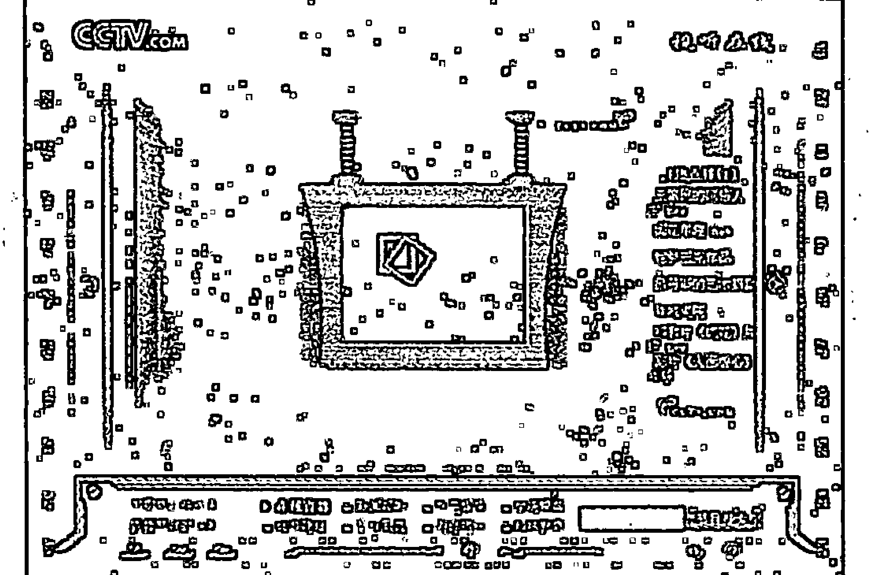

##### 应用之三：视频会议

目前的网络视频会议系统有很多，这些产品基本都支持TCP/IP网络协议，其中采用流媒体技术作为核心技术的系统并不占多数。因为，视频会议在技术上涉及到实时数据采集、数据压缩、网络传输等多项技术。

在目前的技术背景下，流媒体还不是视频会议的首要选择；但是流媒体技术的出现为视频会议的发展起到了很重要的作用。因为流媒体在网络视频会议上的应用有其独到的优势，采用流媒体技术来传输影音信息，在保证影音的质量的基础上，观看者不必等待整个影片传送完毕，就可以实时、连续不断地观看。

除了以上所述，流媒体技术在五彩缤纷的互联网中还有众多应用，比如可视电话、远程教育、视频监控等等，在此不一一详述。我们可以展望流媒体技术的未来，一定会前途再辉煌！

#### （三）流媒体技术三大巨头

提到流媒体，我们会自然而然的想到使用最多的三大媒体播放软件——RealPlayer、Windows Media Player 和 QuickTime。而它们的东家——RealNetwork、Microsoft和Apple这三大公司也堪称流媒体技术领域的三大巨头，在众多流媒体技术厂商中，它们以其稳定而优异的产品性能稳占鳌头。它们的软件因压缩技术的不同而各有千秋，其中要属RealNetwork和 Microsoft 公司最为著名了。RealNetwork 的著名软件产品有 RealPlayer、RealServer、RealProducer Plus 等；而 Microsoft 公司有我们熟悉的 Windows Media Player、Media Server 等。

下面分别来看看各个软件的特点。

**QuickTime**：Apple 公司的流媒体产品。是面向专业级的视频编辑、Web 网站创建和 CD-ROM 内容制作领域开发的多媒体技术平台，由于对于软硬件的要求过高，使用人数较少。

**RealSystem IQ**：作为流媒体领域的主导厂商，Real Networks公司凭借其高超的技术，占领了一半以上的网上流式音视频点播市场。其主打产品 RealSystem IQ 由服务器端流媒体播放引擎 (RealServer)、流媒体制作端 (RealProducer)、流媒体客户端播放器 (RealPlayer) 等三个软件组成。使用 RealSystem IQ 系列软件能以比较快的速度从网上接收/发送声音、视频、文本、动画及其他多媒体文件。缺点是软件的使用过程比较繁琐。

**Windows Media**：微软公司开发的免费软件，继承了微软的优良传统，使用起来比较容易上手。Windows Media 推出后，很快占领了一部分网上流式音视频点播市场。其核心技术 ASF 支持多种压缩/解压缩编码方式，而且可以使用任何一种底层网络传输协议，具有较大的灵活性，是新手使用与学习的最佳选择。

在以下的篇幅中，我们就会讲到如何使用这些软件来进行流媒体技术的应用。

### 二、网络流媒体应用全面接触

这部分我们就从流媒体文件的制作讲起，介绍如何实现网络视频点播、电视直播，以及如何观看流媒体文件，如何下载互联网网络上的流媒体文件等知识。看完了这些内容，就可以轻松掌握这些流媒体的技术了。

#### (一) Windows Media 流媒体应用方案一条龙

Windows Media 流媒体的服务操作较简单，功能也比较强大，比较容易上手，所以我们先来介绍一下微软公司的流媒体技术——Windows Media 流媒体技术。

- 学习之前，先了解一下所需的硬件和软件
    - 操作系统：Windows 2000 SERVER 版或者 Windows XP 企业版；
    - 所用软件：Windows Media 编码器、Windows Media Player 7.0 以上版本；
    - 硬件：多媒体电脑（有网络功能）、网卡、视频采集卡（必备）、摄像机、录像机、CD唱机等硬件（非必备）。

##### 1. 流媒体源的制作

流媒体源可以是一般的流媒体文件，也可以是通过硬件设备播放的，我们将在这里分别进行介绍。

我们先来看看所谓的流媒体文件到底是怎样制作出来的。

Windows Media 的流媒体文件的格式一般有这么几种：ASF、WMV、WMA，我们可以使用专门的软件制作流媒体文件，用于制作 Windows Media 流媒体文件的软件就是 Windows Media 编码器。

Windows Media 编码器以实时采集的信息或已存储信息文件作为流媒体源，并将这些信息转换成可由 Windows Media 服务器发送的 Windows Media 内容流（比如 asf 文件）。其中，实时的信息源可以是能够输入到音频或视频采集卡的任何硬件设备，包括摄影机、CD 播放机、麦克风等；而已存储的信息源包括电影、图片或声音文件。

使用 Windows Media 编码器将媒体源转换成流媒体源后，即可将其传递给 Windows Media 服务器，这样，就可以作为流媒体进行网络传送。

下面，我们就讲讲用 Windows Media 编码器进行流媒体源的制作。

首先，正确下载和安装 Windows Media 编码器。读者可以到微软公司的网站上下载 Windows Media 编码器安装程序，其安装方法比较简单，这里不予赘述。

安装完毕后，运行 Windows Media 编码器，可以看到如图2所示的界面。

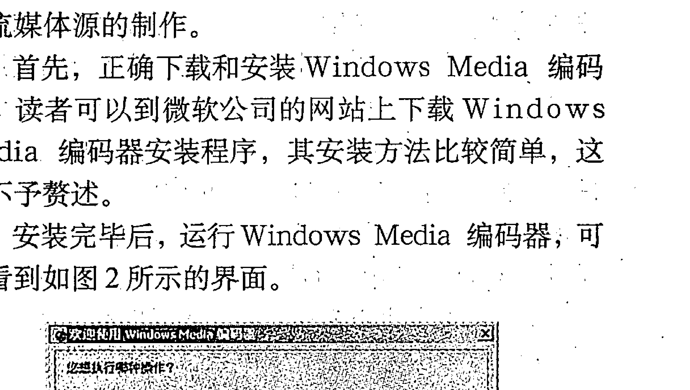

在这个界面中，我们选择第一项【使用新建会话向导广播、捕获或转换文件】，这时出现如图3所示的对话框。

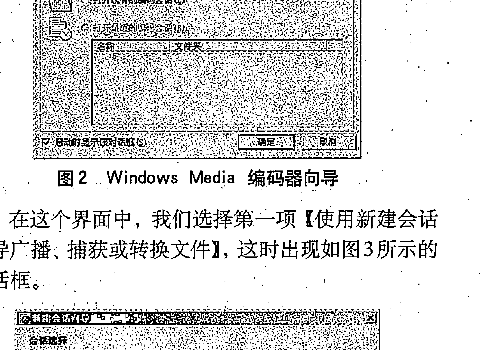

这里有三种执行方式，我们分别来介绍。

(1) 在附属设备或者计算机屏幕广播实况事件。也就是说，我们可以通过附属设备或者计算机的屏幕进行实况的播放。举例来说，就是说我们可以将现场正在播放的音乐或者视频直接通过网络播放出去，其他局域网或者互联网的用户可以通过网页浏览的方式进行即时的访问，当然，如果有兴趣，完全可以作一个网络广播主持人！

###### 下面是具体的做法：

首先选择第一项，然后单击【下一步】按钮，进入如图4所示的设置捕获设备向导对话框。

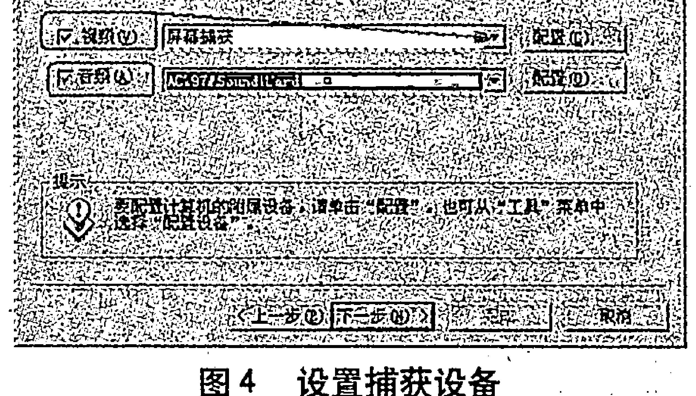

在这里，音频设备一般是必选的，而视频设备就看实际需要而定，一般可以不要。如果我们想进行网络电视直播，那么就必须购置一个电视卡。视频设备一般选择默认的就可以了。选择完毕后，单击【下一步】按钮，进入如图5所示的界面。

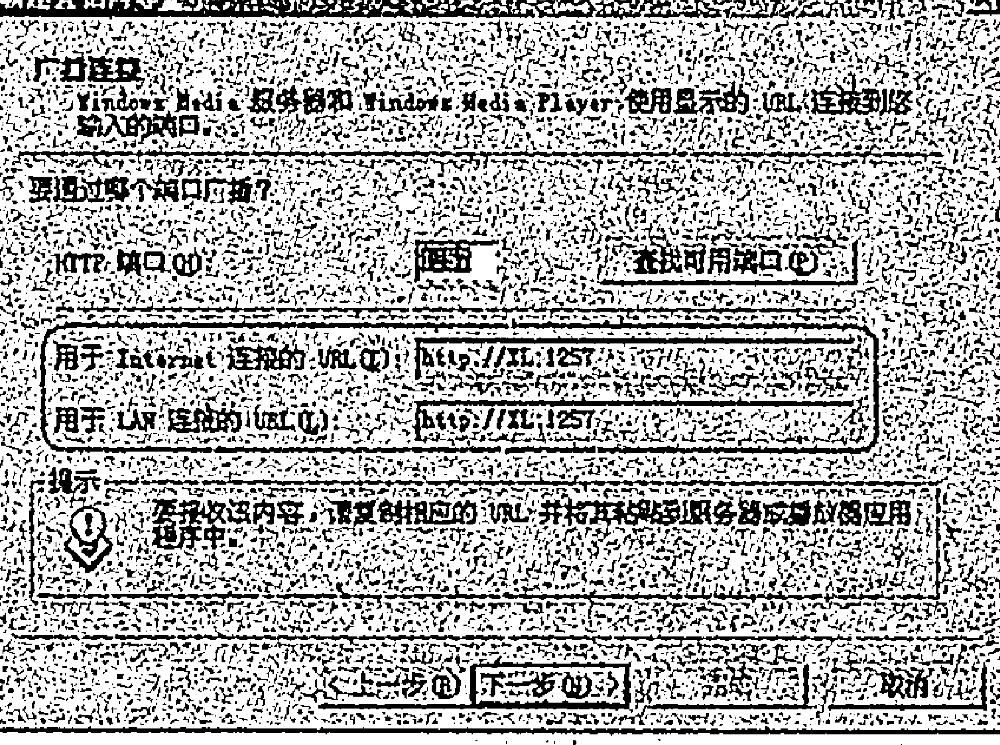

一般这个地址是默认的，我们在下文中讲到使用 Windows Media 服务器进行播放流媒体时，还会详细介绍。然后单击【下一步】按钮，进入如图6所示的配置文件选择界面。

这里，我们要根据网络连接的情况选择合适的带宽，如果是局域网，那么可以选择【CD质量音频】，选择好后，单击【下一步】按钮，就进入如图7所示的界面。

我们可以把直播的流媒体信息保存为流媒体文件，这样便于以后的查看。当然，不选择【将广播的副本存档】也可以，选择完毕后，单击【下一步】按钮，进入如图8所示的界面。

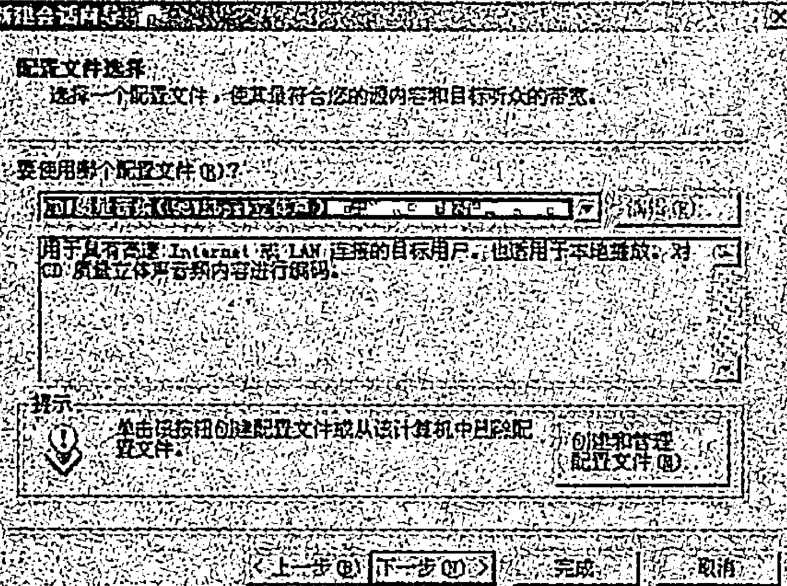
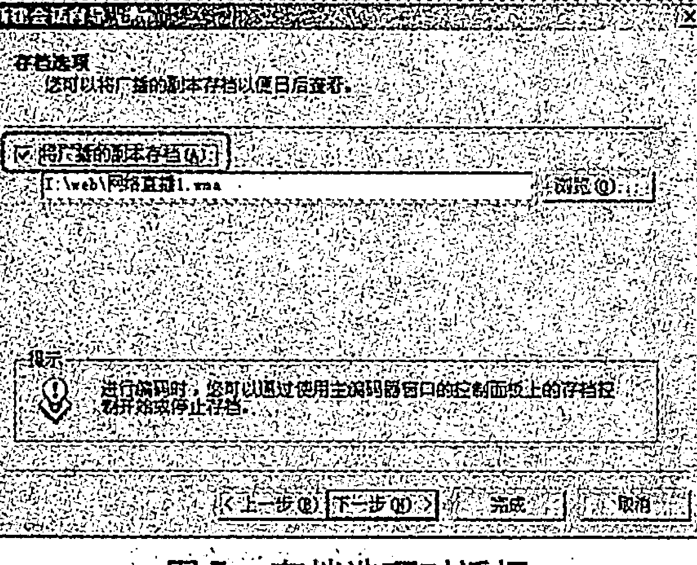
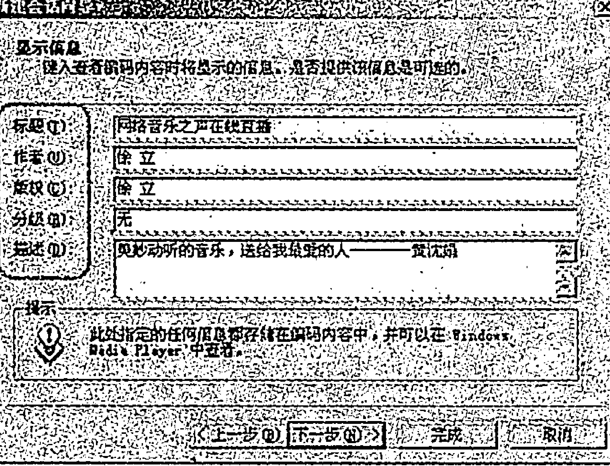

这里，我们可以设置关于这个流媒体的基本信息，比如【标题】、【作者】、【版权】等，当然，也可以不进行任何设置。接下来，单击【下一步】按钮，进入如图9所示的设置检查界面。

在这个窗口中，我们可以检查一下前面的设置是否正确，如果一切无误，那么就可以单击【完成】按钮。这时，会弹出如图10所示的窗口。

在这个窗口中，我们就可以开始流媒体的编码了。在窗口的右下脚，有一个【开始】按钮，我们单击它就可以开始进行编码。但是，我们必须先运行音频或者视频源进行直播，这里要注意的是，如果直接通过计算机的声卡进行音频的编码时，我们要选择正确的录音信号。具体做法为：双击电脑桌面工具栏右下脚的小喇叭图标，打开音量控制面板，然后在这里单击菜单的【选项】—>【属性】，这时会出现如图11所示的对话框。

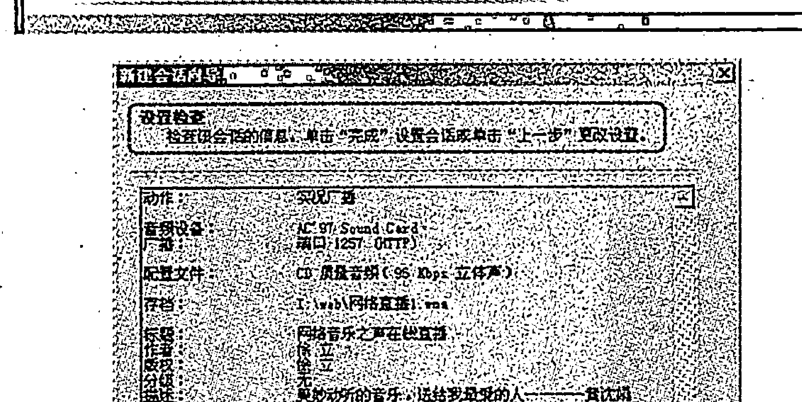
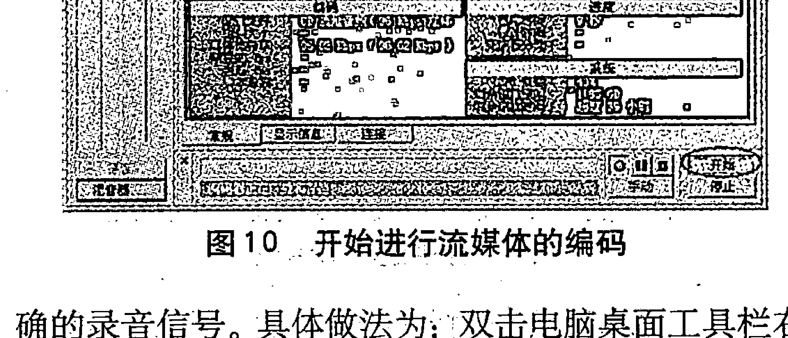

在这个对话框中，我们再选择【录音】项，并确保【显示下列音量控制】栏中的【单声道混音】和【立体声混音】被选中。设置完成后，单击【确定】按钮，接下来在音量控制面板中，我们可以看到多出了“立体声混音平衡”功能选项，如图12所示。

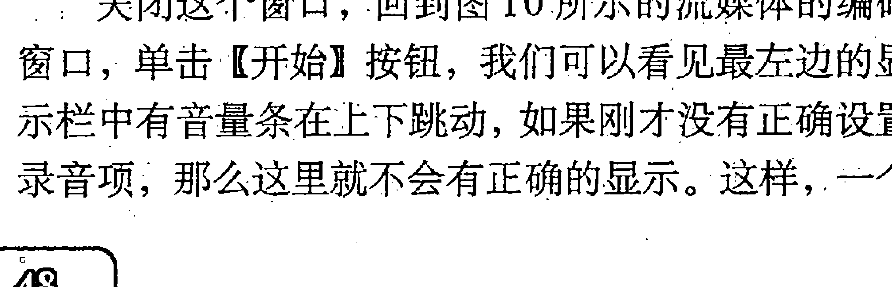
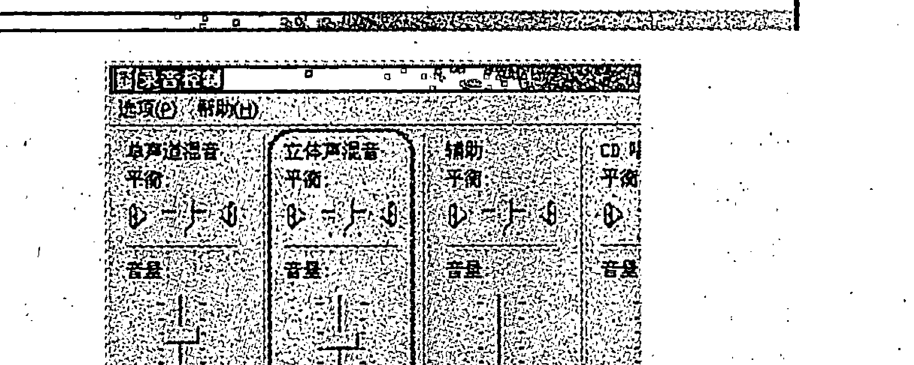

在这里，我们一定要选择【单声道混音】或者【立体声混音】二者之一，只有这样，才能正确地把音频信号编码成功！

关闭这个窗口，回到图10所示的流媒体的编码窗口，单击【开始】按钮，我们可以看见最左边的显示栏中有音量条在上下跳动，如果刚才没有正确设置录音项，那么这里就不会有正确的显示。这样，一个实况流媒体源就制作成功了！在下文中，我们将讲到如何用 Windows Media 服务器进行配置服务。

(2) 从附属设备或者计算机屏幕捕获音频或视频。这个选项用于捕获音频或者视频信息，但是不提供即时的广播，我们只有等到某一个音频或视频捕获完毕，才可以进行广播。一般情况下，我们采用的正是这种方式。

进行捕获音频或者视频的操作和上面的第一种方式极为相似，只是在一个步骤上有所不同，第二种方式不提供即时的实况直播，而是捕获成流媒体文件保存在硬盘上以供后来作为流媒体源。他们的不同之处在如图13所示的对话框中可以体现出来。

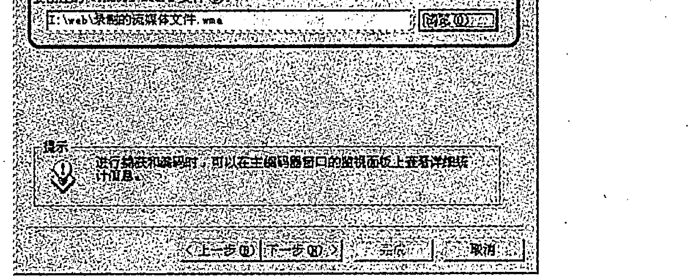

在这里，我们只要选择好流媒体文件的输出路径就可以了。其余步骤和第一种基本上是一样的。在此不作赘述。这样，又一种流媒体源制作完成了。

(3) 将音频文件或视频文件转换成 Windows Media 文件。这里，我们可以直接把一般的视频、音频文件转换成我们需要的流媒体文件。这里可以转换的媒体文件可以是扩展名为 avi、mpg、wav、mp3、asf、wma、wmv。进行此项操作时，计算机必须有视频采集卡，这样才能迅速的进行格式转换。我们选择第三项后，单击【下一步】按钮，就出现了如图14所示的窗口。

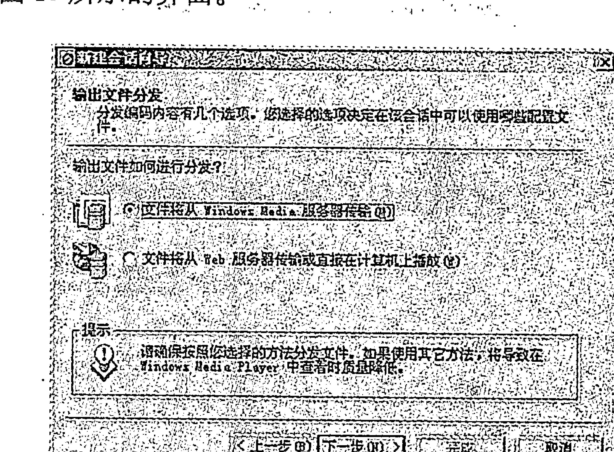

在这里，我们就可以把影碟中的电影文件通过这种转换方式制作成我们所需要的流媒体文件，这样一来，就可以供很多人同时欣赏了。选择完毕后，单击【下一步】按钮，就出现了如图15所示的界面。

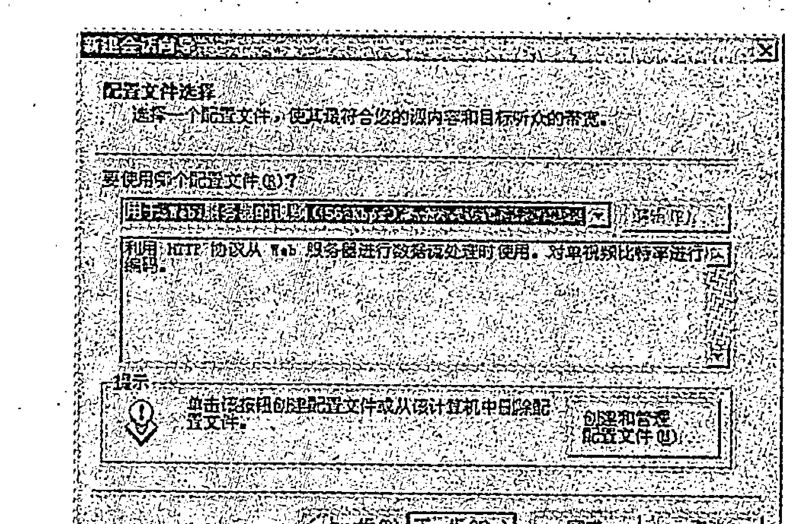

在这个对话框中，我们要根据自己的需要进行输出，一般我们选择第一项【文件将从 Windows Media 服务器传输】。选择完毕后，单击【下一步】按钮，进入如图16所示的对话框。

单击【完成】按钮，Windows Media 编码器就开始工作了。这样，流媒体源的制作就完成了！

##### 2. 流媒体服务器端配置——Windows Media 服务

###### (1) 流媒体服务器的安装

现在，有了流媒体源，我们就可以设置服务器端进行流媒体的广播发布了。首先，确定我们使用的是上文所提到的操作系统，在安装 Windows 2000 Server 的时候，一般流式媒体服务器（Windows Media 服务）是不安装的，因此一般要进行安装。

选择【控制面板】->【添加/删除程序】->【添加/删除 Windows 组件】，就出现如图17所示的界面。

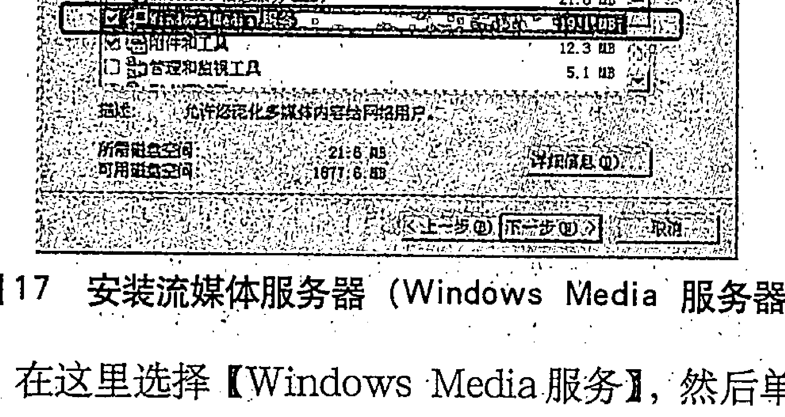

在这里选择【Windows Media 服务】，然后单击【下一步】按钮，就可以顺利完成流媒体服务器（Windows Media 服务）的安装了。

###### (2) 流媒体服务器的配置

安装好了流式媒体服务器，接下来的任务就是进行服务器的配置了。

首先，选择【控制面板】->【管理工具】->【配置服务器】，然后在左边的快速导航栏中选择【Web/媒体服务器】->【流式媒体服务器】，出现如图18所示的界面。

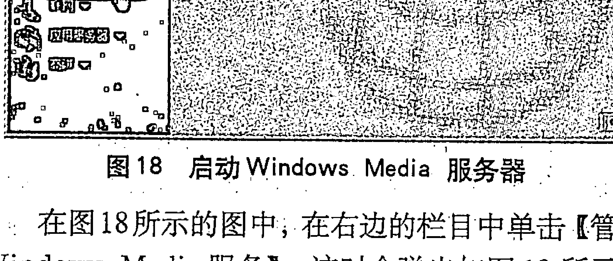

在图18所示的图中，在右边的栏目中单击【管理 Windows Media 服务】，这时会弹出如图19所示的窗口。

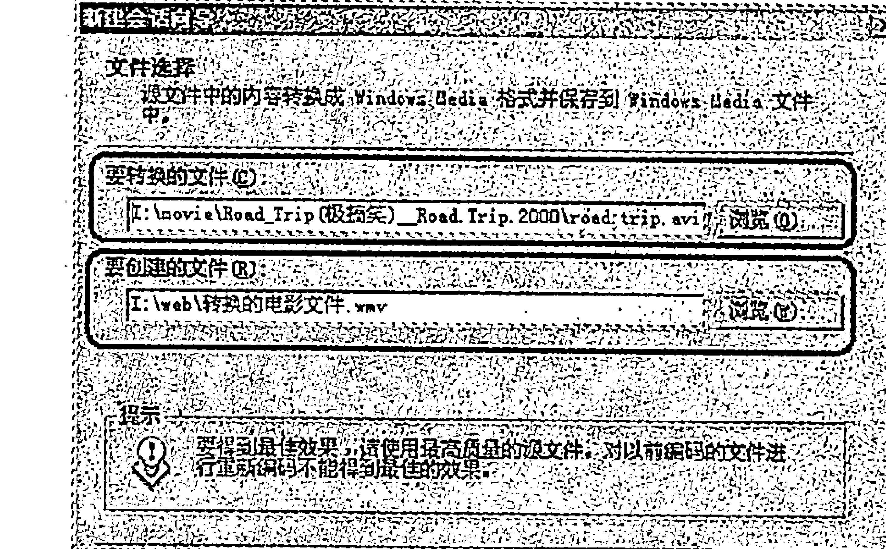

在这里，我们首先了解几个概念：“单播”、“多播”、“点播”、“广播”。

“单播” 是客户端与服务器之间的点到点连接。“点到点”（P2P）是指每个客户端都从服务器接收远程流。仅当客户端发出请求时，才发送单播流。

向客户端发布单播流有以下两种方式：“点播”、“广播”。在点播连接中，客户端是主动的，并可以控制流的启动或结束时间。相反，广播流可以被多播或单播。在广播连接中，客户端是被动的，并不能控制流启动或结束的时间。

“多播”是通过启用多播网络传递的内容流；网络中的所有客户端共享同一流。以这种方式将 ASF内容转化为流的最大好处为可以节省网络带宽。

Windows Media 服务器管理员必须创建三个项目以支持多播：广播站、节目和流。“广播站”充当想要连接流的客户的引用点；“节目”组织将要通过广播站广播的内容；“流”是实际内容。所有这三个项目都建立后，Windows Media 管理器会创建一个 *.ASX 文件，它可以使客户链接到正确的广播站的 IP 地址；此文件也称为一个“通知”。我们可以把这个“通知”以网页的形式美观的制作出来。

下面，我们首先介绍“单播点播”功能。

回到图19所示的窗口，然后选择【配置服务器】—>【单播发布点】—>【点播】—>【新建】，这时会出现如图20所示的界面。

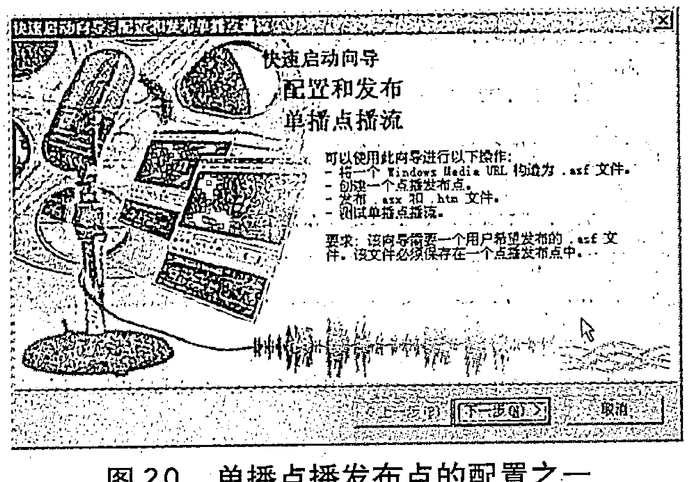

单击【下一步】按钮，出现如图21所示的界面。

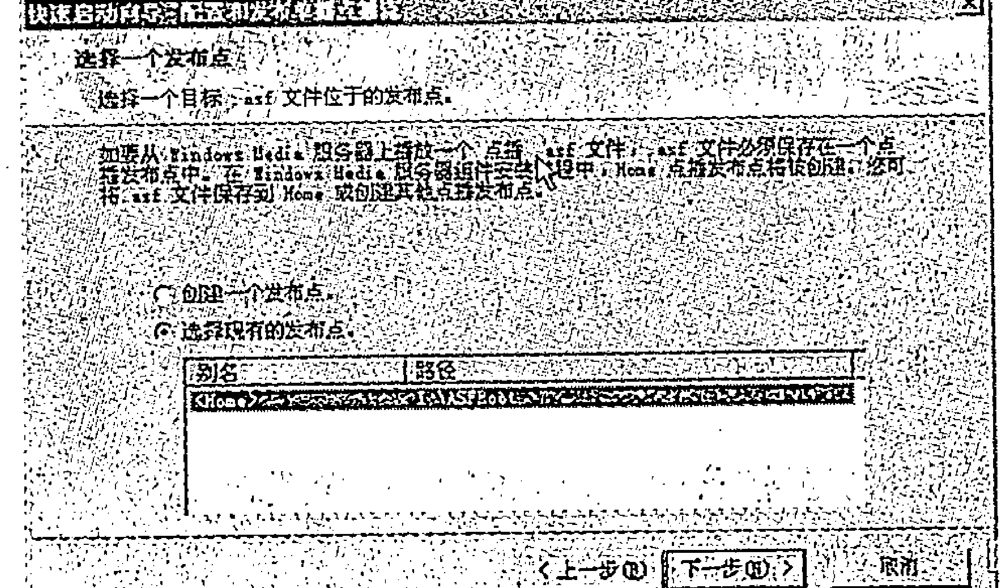

在这里，我们选择第二项【选择现有的发布点】，当然，也可以新建一个发布点。现有的发布点的路径是在系统根目录下的“ASROOT”文件夹下。选择完毕后，单击【下一步】按钮，进入如图22所示的界面。

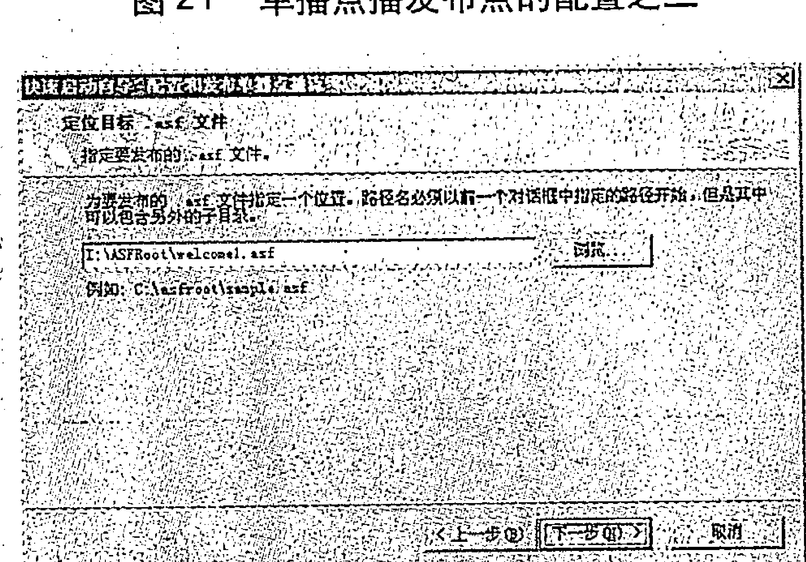

因为刚才选择的是系统根目录下的“ASROOT”文件夹，所以，我们要把以前制作完毕的流媒体源文件复制到此目录下，然后选择想要单播的文件，然后单击【下一步】按钮，进入如图23所示的界面。

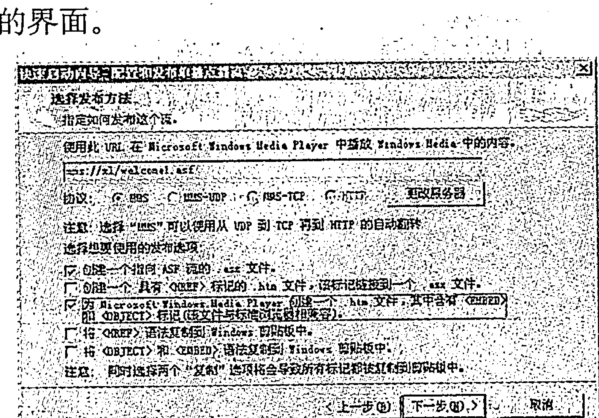

在这个对话框中，上面一栏中有一个网络地址 mms://xl/welcomel.asf, 这就是客户端进行远程视频点播时，所要输入的网络地址。由于 mms 协议适用于 Windows Media Player，所以，我们可以运行 Windows Media Player 后，用它来打开这个网址。当然，我们也可以创建一个网页，然后发布到互联网上去，这样就可以供大家欣赏了。

在这个对话框的下面，还有几个复选项，我们还可以选择第二项和第三项。选择好后，单击【下一步】按钮，会打开几个窗口，是询问你相关的配置文件存放的位置，一般我们选择默认值就可以了，最后会出现如图 24 所示的界面。

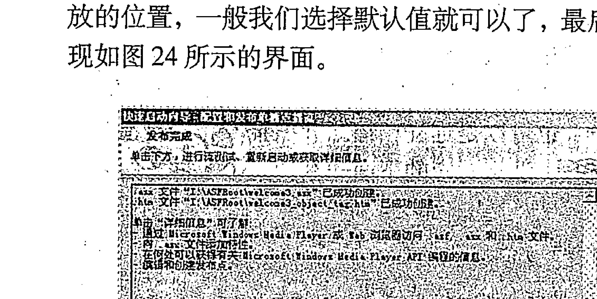

至此，流式媒体服务器的配置中的“单播发布点”的配置工作就完成了。现在就可以在客户端连接到远程视频服务器，并进行节目点播了。接下来我们简单讲讲“单播广播”的实现。

单播广播用于实况直播。回到图 19 所示的窗口，然后选择【配置服务器】—>【单播发布点】—>【广播】—>【新建】，并在接下来出现的界面中单击【下一步】按钮，进入如图 25 所示的界面。

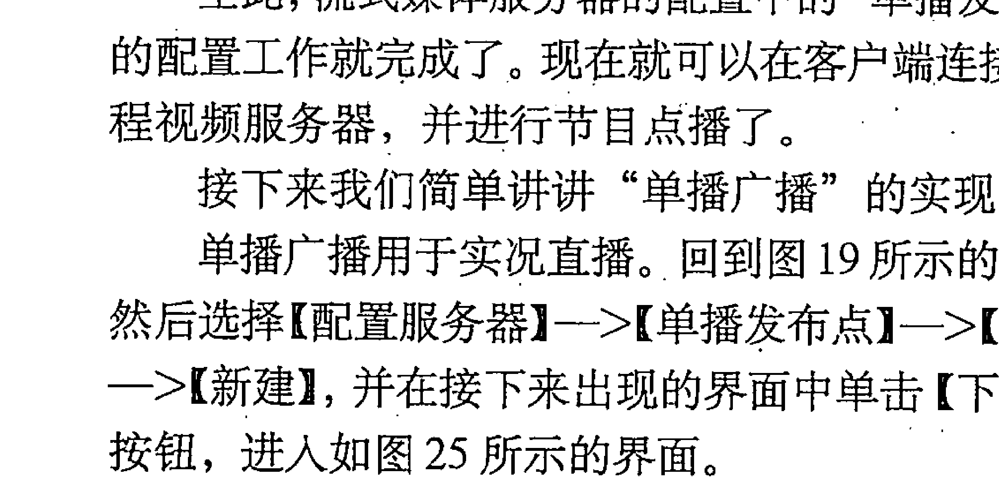

在这里有两个选项，由于现有的发布点是在 Windows Media 编码器中生成的，所以我们一般选择第二项【选择现有广播发布点】。当然了，也可以新建一个广播发布点。选择完毕后，单击【下一步】按钮，打开如图 26 所示的对话框界面。

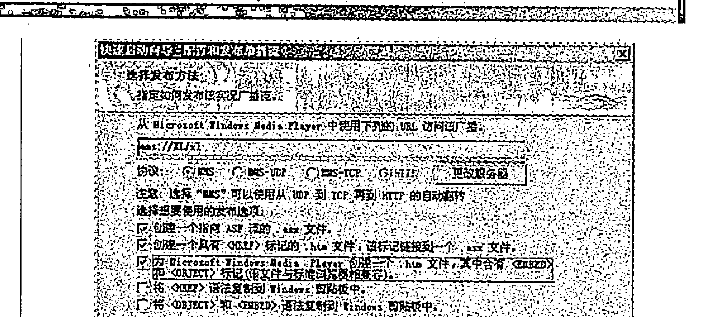

在这个对话框中根据需要选择好想要使用的发布选项，选择好后，单击【下一步】按钮，保存参数，最后会出现如图 27 所示的界面。

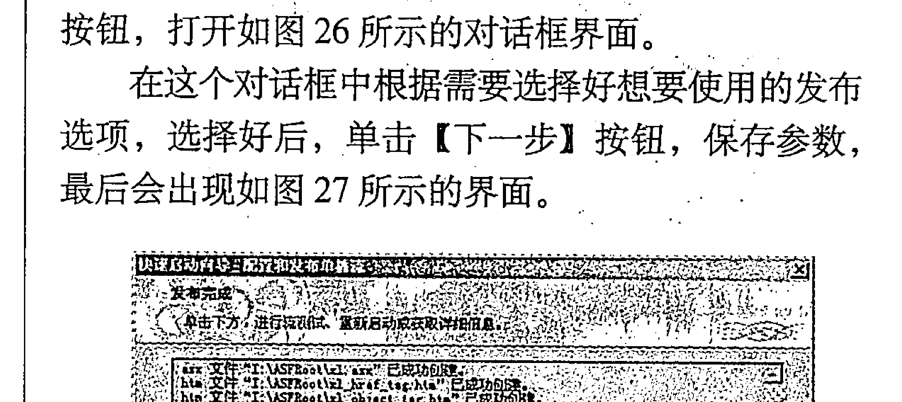

到此为止，我们就完成了单播广播发布点的配置过程。只要实况媒体源是正常的，客户端就可以轻松的收听、观看到即时的信息了。当然，如果在设置音频输出信号时，选择了【麦克风】输入，那么我们还真的可以过一把网络节目主持人的瘾呢！介绍完了【单播】，我们接下来简单的介绍一下【多播】。

由于【多播】的对象是高级用户，因此大家只需简单的了解一下就可以了。下面就讲讲如何快速的建立一个多播广播站吧。

回到图 19 所示的窗口，然后选择【配置服务器】—>【多播站】，这时出现如图 28 所示的界面。

这时，我们再选择【广播站】—>【新建】，在接下来出现的界面中单击【下一步】按钮，就会出现如图 29 所示的界面。

在这个对话框中，我们选择“创建一个新广播站”选项，然后单击【下一步】按钮，进入如图 30 所示的界面。

在这个对话框的“名称”后键入广播站的名称，并在下面键入相应的描述文字，在下面的分发模式后面，选择【多播和分发】。然后单击【下一步】按钮，进入如图 31 所示的“指定一个节目和流名”的界面。

单击【下一步】按钮，进入如图32所示的窗口。

在“指定流对象来源”画面上，我们可以选择流的来源，比如是ASF文件，或者是Windows Media编码器，也可以是远程广播站或广播发布点。选择不同的选项，那么对应的下面一个窗口就不同。如果是即时的实况信息，那么我们可以选择【Windows Media 编码器】，如果仅仅是流媒体文件，那么我们就选择【高级流格式（ASF 文件）】，如果网络中有其他的远程广播站或广播发布点，那么我们可以选择第三项。这里假设我们选择第一项，选择完毕后，单击【下一步】按钮，进入如图33所示的指定流对象来源URL的界面。

在这个对话框中，填入一个流的来源地址。然后单击【下一步】按钮，进入如图34所示的指定 asf 文件的位置的界面。

在这个对话框的“节目名”中键入节目的名称，在“流名”中键入流的名称。如果选择“向导完成后启动节目”选项，则当广播站创建完毕后将立即启动节目进行浏览，如果选择“完成后重新播放流对象（循环）”选项，将重复播放已经启动的节目。选择好后，在这个对话框中，我们要选择流媒体文件在本地硬盘或者局域网络上的位置，选择完毕后单击【下一步】按钮，进入广播站信息文件的导出路径对话框界面，如图35所示。

在这里按照缺省的进行存储就可以了，接下来单击【下一步】按钮，出现如图36所示的界面。

这里同样按照缺省的进行存储就可以了，单击【下一步】按钮，进入如图37所示的界面,选择布的方法。

这里也就是选择客户端的观看方式，既指定是通过网页链接观看还是直接通过 Windows Media Player进行观看。选择完毕后，单击【下一步】按钮，出现如图38所示的界面。

至此，多播广播站的配置过程基本上完成了，再回到流媒体服务器主窗口。在流媒体服务器主界面的右下方，有【节目】、【流】、【停止节目】三个按钮，如图39所示。如果还想再添加新节目，那么只需单击【节目】->【新建】，就可以添加了节目了。注意，这里每一个节目要对应一个流才可以。因此，当我们添加一个节目时，同时要添加对应的流媒体，因为流才是真正的内容。限于篇幅，这里不再多讲。

至此，Windows Media 流媒体服务器的设置基本上完毕了，服务器正常运行后，就可以在客户端随心所欲的进行网络点播、共享了。

##### (3) 流媒体的客户端接收、点播

一般来说，客户端的接收方式有两种：一是通过浏览网页，单击超级链接进行点播、观看；另外一种是在流媒体播放器中直接输入服务器的网络点播地址进行观看。一般情况下，我们选择第一种方式，因为这种方式既直观，而且更新的比较快。我们这里就简单讲讲第一种情况。

其实，在配置完流媒体服务器的时候，系统会自动生成相应的网页文件，网页里就有超级链接，我们可以直接引用到我们的网页中。

#### (二) RealSystem IQ 流媒体应用方案一条龙

要说起能够比微软公司在流媒体领域更具影响力的，那就非 Real Network 公司莫属了，Real Network公司有很多产品比如 Real Player、Real Producer等都已经大名鼎鼎了。

下面我们就简单的介绍一下 Real Server 的流媒体应用方案，这里使用的硬件设备和上面讲到的 Windows Media基本相同。所要用到的RealSystem IQ的软件是：Real Producer Plus、Real Server、Real Player。在一般情况下，观看人数在百人以内的我们可以使用 Windows 2000 Server 版本，对于专业化的高流量的应用情况，其操作系统推荐使用 Linux 系统，而且对于电脑的硬件配置要求较高。

##### 1. Real Producer Plus制作流媒体源

Real流媒体文件的格式一般有这么几种： rm、ra、ram，一般采用Real Producer Plus来制作Real流媒体。下面我们就来简单的介绍如何利用 Real Producer Plus 来制作Real流媒体源。

正确安装好 Real Producer Plus 并运行，会自动弹出一个工作向导对话框，如图40所示，这里有三种流媒体源的获得类型。一种是：通过媒体文件的转换；另一种是通过硬件媒体设备，比如摄像机、CD机等进行制作；最后一种是即时的实况直播，前两种已经在 Windows Media 的相关内容中详细介绍了，下面我们讲讲如何使用【Live Broadcast】进行网路实况媒体源的制作。

我们选中【Live Broadcast】选项，然后单击【OK】按钮，进入如图 41 所示的界面。

在这里，假设我们只作一个实况的网络电台，也就是说，我们只利用本地硬盘上的歌曲来作为一个网络电台，以供大家进行即时收听。因此，这里我们就选择【Capture Audio】即可，如果想进行视频的即时播放，那么也可以选择【Capture Video】，但是要确保你的计算机上安装了视频采集卡。选择好后，单击【下一步】按钮，进入如图42所示的界面。

在这里填入流媒体的标题、作者、版权、内容描述、关键词即可。填写完毕，单击【下一步】按钮进入如图43所示的界面。

在这个对话框中，可以选择合适的与网络带宽相对应的格式，一般我们选择第一项【多带宽范围】。选择完毕后，单击【下一步】按钮，进入如图 44 所示的界面。

在这个对话框中，我们可以选择有可能出现的带宽。选择好后，单击【下一步】按钮，接下来进入如图 45 所示的界面。

这是音频格式的设置界面。一般我们选择最后一项【Stereo Music】，然后单击【下一步】按钮，进入如图 46 所示的界面。

这个对话框是整个设置过程比较关键的地方，各个项目的含义如下：

注意：安装Real Server时必须输入的用户名和密码，将在下面进行介绍，我们只需按照原来的键入即可。在最下面，还有一个选项，是用来指定存储实况的临时文件，我们可以不作保存，也可以把实况保存在硬盘上。选择好后，单击【下一步】按钮，出现如图47所示的界面。

至此，Real 实况流媒体源就制作完毕了。接下来再回到 Real Producer Plus 主工作界面，如图48所示。

这时，我们单击界面左下角的【Start】(开始)按钮，就可以开始进行网络直播了，再单击【Stop】按钮将停止网络直播服务。客户端只有在网络直播服务运行时才能链接到服务器并播放这个直播流媒体，如果在开始编码之前或者结束编码之后客户端去链接实况直播这个链接，那么系统就会提示错误。

到这里，Real流媒体服务器的实况直播流就制作完毕了。下面我们将会介绍如何在客户端进行链接和播放流媒体。

##### 2. 流媒体服务器端配置——Real Server 服务器

【Real Server】项：这里是本地计算机的网络名字（或者网络标识），笔者填写的是“xl”。【Server Port】项：这里我们就使用缺省的端口。【File Name】项：这里是临时生成的，我们可以随便填写一个，但是要记住，以便在客户端链接的时候用，此外还要注意文件名中要写入完成的扩展名(rm)，笔者填写的是test.rm。【UserName】和【password】项：这两项分别对应于安装Real Server时填写的UserName和password。

首先介绍一下Real Server在安装过程需要注意的一些设置。运行Real Server安装程序，在安装过程中，会出现如图49所示的对话框。这里是安装过程中比较关键的地方了。在上面用Real Producer Plus进行流媒体源的制作时，已经用到了这里设置的Username和password。所以在这里设定的用户名和密码要记住。
在上面的对话框中填写完毕，然后单击【NEXT】按钮，进入如图50所示的界面。

这个对话框是指定PNM协议端口的，PNM协议是一种网络流媒体协议，就像http、ftp协议一样的。我们一般不用修改其默认值，接下来单击【NEXT】按钮，进入如图51所示的界面。

这里可以设置RTSP协议的端口，RTSP也是一种网络流媒体协议，我们直接单击【next】按钮就可以了。这时进入如图52所示的界面。
这个对话框中可以设置HTTP端口，使用默认的方式就可以了，单击【NEXT】按钮，进入如图53所示的界面。

这个窗口设置的是Real Server管理员登录界面的端口。我们可以不改变它，但是一定要记住这个端口，这样以后就可以通过网页登录Real Server进行管理了。接下来单击【NEXT】按钮，进入下一步，如图54所示。

如果我们所用的流媒体系统平台是Windows NT内核的，比如Windows NT、Windows 2000 professional、server)、Windows XP，那么我们就要在这个对话框的【Install RealServer as an NT Server】选项前面的方框中打勾，单击【NEXT】按钮，然后并在接下来出现的对话框中单击【Continue】按钮，安装程序就会开始自动安装Real Server了。
完成Real Server的安装过程，接下来要介绍一下它的配置和使用了。
首先，我们先运行【Real Server服务器】，如果成功的话，运行过程很快，会有一个DOS窗口一闪而过，接下来，我们再选择【开始】—>【程序】—>【RealServer】—>【RealServer8.0 Administrator】，这时会打开如图55所示的页面。

我们只有正确启动了RealServer8.0 Administrator，Real的流媒体服务才可以正确地运行。单击工作界面左边栏的【Monitor】按钮，就会出现如图56所示的窗口。

在这个网页窗口中，管理员可以实时察看到Real系统的信息，比如在线访问流媒体的用户数，各个用户的IP地址，本地计算机的CPU、内存的使用率等信息。

单击工作界面左边栏的【Configure】按钮可以设置Real服务器的一些基本参数，大多参数使用默认值即可，基本上不用改变它。我们比较关心Real服务器的主工作目录，这样才可以把流媒体的节目播放出去。一般情况下，Real流媒体文件 (*.rm) 存放在Real server安装目录下的Content子目录中，客户端访问流媒体服务器时实际连接的就是这个目录下的流媒体文件，此外，在Content目录下还有一个encoder子目录，这个目录是用于存放即时实况的流媒体临时文件的，待实况直播一结束，这个目录也就被清空了。如果没有这个目录，那么我们一定要手工建立，记住，文件夹的名字不能错！

好了，经过这些设置，Real Server服务器基本上可以正常运行了。下面讲解一下客户端如何连接到Real Server流媒体服务器上。

##### 3. 流媒体客户端的接收、点播

对于即时点播的流媒体方式，和Windows Media一样，我们一般在客户端通过浏览网页，单击超级链接来进行点播、观看流媒体，因为这种方式既直观而且更新的比较快。如果某个保存在硬盘上的Real流媒体文件test.rm的相应IP地址是202.115.2.161，那么在客户端进行连接的时候，其超级链接为rtsp://202.115.2.161/test.rm或者pnm://202.115.2.161/test.rm。

当然了，我们不能直接给用户一个这样的超级链接，最好的方法是把它做成网页就可以了，具体做法在这里就不再说了。网页作好并发布以后，当用户单击这个网页上流媒体的超级链接后，系统就会自动弹出Real Player播放程序进行流媒体的播放，下面是作者的一个演示网页，如图57所示。

那么，对于实况直播，客户端该怎么接收呢？其实方法和即时点播的方式大同小异，既可以通过单击网页上的超级链接来进行访问，也可以直接在Real Player的流媒体位置栏中输入相应的网络地址进行下载和播放，如图58所示就是用Real Player播放的即时流媒体信息。

通过以上的学习，我们对流媒体领域的两大巨头Windows Media和Real System IQ的有关流媒体源的制作、流服务器的设置以及客户端的接收等实现方法都有了一定的了解。如果读者在实践中有什么问题，可以参阅本文后面的【流媒体疑难问题解答】部分。

### 三、网络流媒体下载秘笈

随着宽带网的推广和普及，在互联网上进行视频在线点播已经成为可能，而且其操作方法简单易行。但在实际应用中，通过互联网进行在线电影电视播放仍有其致命的弱点，就是它特别依赖于网络的速度和稳定性，如果网络速度并不十分稳定，就会影响到流媒体的播放质量和效果。

因此，对于非实时性的流媒体，有很多用户更喜欢先把网络流媒体文件下载到本地计算机的硬盘上来再慢慢播放欣赏。下面就给你介绍把网上的流媒体下载到本地计算机的几种方法。

目前Real networks公司的流媒体比较普及，因此这里只介绍Real流媒体的下载方法。

Real Play的文件有两种：一种是以扩展名为*.rm的文件，这种文件是真正的流媒体文件，一般来说有几十兆左右。我们可以用一般的下载软件来进行下载。另一种在线电影的文件是*.ram文件，其大小只有几百字节，这是一种特殊的视频流文件。也就是说，这个不是真正的电影文件，因此，必须用另外一种特别的下载软件来进行下载。下面就分别介绍两种情况下的电影文件的下载方法。

首先来看以rm为扩展名的电影文件的下载方法。这里使用的是网络蚂蚁最新版netants2.4，确定系统已经安装好了netants，在网页上在欲下载的电影文件上按鼠标右键，在弹出的菜单中选择download by netants，这时弹出如图59所示的界面。

在这里就会显示出网络电影的网址以及在硬盘上保存电影文件的路径。选择好后，直接单击【确定】按钮，网络蚂蚁即可开始工作了。

如果网络电影的扩展名为“ram”，是不能直接用网络蚂蚁、网际快车、下载专家等网络下载软件进行直接下载的，我们首先应该把这个ram文件保存到硬盘上，然后用记事本打开ram文件，如果里面的超级链接网址是以“http”开头的话，就把这个网址拷贝下来，然后在网络蚂蚁等下载软件中把这个地址拷贝到文件地址栏，这样就可以下载到真正的流媒体文件了。

如果ram里的链接地址是以rtsp、pnm、mms等开头的，那么我们就不能用netants下载了，这里要用到一个专门的下载这种文件的软件，这就是在线电影的下载能手——Stream BoxVcr Suite1。下面我就详细介绍一下Stream BoxVcr Suite1的使用方法。

安装完Stream BoxVcr Suite1后，在“程序”中会出现了Stream BoxVcr Suite1程序组，其中包含了该软件的几个版本。

我们这里使用的是Stream BoxVcr Beta 3.1版。第一次运行Stream BoxVcr Beta 3.1时，会出现一个注册界面，填写好信息，下次再运行时，就不会出现这个注册界面了。接下来进入Stream BoxVcr Beta 3.1的主工作界面，如图60所示。

Stream BoxVcr可以下载的视频流文件有ram、rm、asf、ra、wma等流式文件。因此，我们必须首先得到在线影视文件，比如ram文件等，具体的步骤是：

- 第一步：得到扩展名为ram的视频流文件。单击网页上的在线电影的链接，这时会自动弹出Real Play软件，进行在线电影的播放，如图61所示。
- 第二步：设置好Stream BoxVcr Suite1软件的## 图61 获得ram文件

### 图62 网络蚂蚁下载页面

相关参数。运行 Stream BoxVcr Suite1，在主工作界面中选择【View】—>【Settings】或者使用快捷键Ctrl+T，这时会出现软件的设置对话框，如图63所示。

## 图63 Stream BoxVcr Suite1的设置页面

在这里，我们可以设置下载电影文件在硬盘上的存放位置、同时下载的文件数以及连接延时、重试次数、网络连接的带宽等参数。此外，同网络蚂蚁一样，Stream BoxVcr Suite1 也可以设置电影文件下载完毕后的文字提示以及声音提示。设置完毕后，单击【OK】按钮就可以了。

第三步：开始用 Stream BoxVcr Suite1 软件进行在线电影视频流文件的下载。具体步骤是：选择菜单上的【File】—>【open】，这时会弹出如图64所示的界面。

### 图64 打开文件对话框

## 图65 Stream BoxVcr Suite1下载文件设置页

到这个ram文件指向的真正的电影文件（*.rm）的网络地址。由于这个网络地址的协议是以“rtsp://”开头的，并不像一般的网络地址的协议（http://）开头的，所以并不能用像网络蚂蚁这一类的下载软件来下载。在【FileName】一栏中，可以看到这个rm文件的文件名；另外，在【Destination】一栏中，我们可以单击右边的【...】，用来选择下载电影文件存放在硬盘上的路径，缺省的路径就是刚才设置的路径；还有，在【Protocol】（协议）一栏中，表示的就是网络地址的协议，一般我们选择【Auto】就可以了。

需要注意的是，一般情况下一个ram文件包含了多个rm文件，因此，当选择好目的路径时，我们就单击【OK】按钮，这时，可能会出现第二个rm文件，同样，再选择【OK】按钮就可以了。如果出现我们不需要下载的文件，或者不是RM文件，那么就单击【SKIP】按钮跳过。当把所有的rm文件都加到下载栏中后，就可以进行下载了，如图66所示是电影文件的下载状态窗口。

## 图66 Stream BoxVcr Suite1下载文件状态窗口

在下载过程中，我们可以随时监视到下载文件的许多相关参数，比如文件大小、下载速度、下载时间、剩余时间、重试次数、当前状态等。等到RM文件下载完毕，就会出现文件下载完毕的提示窗口以及提示

### 四、流媒体技术疑难问答

1. 为什么我用 StreamBox 下载的 ASF 文件，播放时快进后退键全都失效？

答：有两个方法来解决：

- (1) 用 Windows Media Player6.4 来播放，就可以正常拖动了；
- (2) 把 asf 文件用 virtualdub 转换成 avi 文件后便可以在 media Player7.0 里看了，而且可以选段看，且不会等候，只是 7.0 占用资源比较高，建议还是用 6.4 看。

2. 如何把 rm 文件转换为 mpg 文件？

答：现在还没有比较完美的解决办法，能凑合用的办法有两个：

- (1) 用抓屏软件，例如 hypercam，snagit 等等，抓取播放中的 video/audio 成为 avi 文件，这个过程中可以选择 codec，所以可以适当的减小 avi 的大小，之后可以把 avi 转换成 mpg 格式；
- (2) 用 tira 直接转换 rm 为 avi，需要准备个大硬盘，因为转化出来的是没有压缩的 avi。

3. 如何调整 Real Producer Plus 制作 RM 文件时的码率？

实际上你可以自己设定 RM 文件码率的。Real Producer Plus 提供的那 8 种码率只是 Real 公司预先设定好的建议值而已，而这些建议值是可以自己改的，方法是在 Real Producer Plus 的界面上选择: Options->Target Audience Settings->or RealVideo Clips...->Target Bitrate->Target Bitrate! 用这个方法你可以把原来默认的 LAN 设置码率改为 1.2M，然后在 producer 界面的 Target Audience 处也选择用 LAN 来压缩，那么你做出来的节目就是 1.2M 的码率了。

4. rm 文件用什么软件编辑？

答：你只要安装了 Real Producer8.5 plus，就可以进行编辑了。其功能菜单是【File】—>【Edit】—>【RealMediafile】。

5. 请问怎么把多个 RM 文件合成一个完整的文件？用什么软件？

答：方法同上，不过在进入菜单【RealMediafile】后要用【append】来添加。

6. 使用下载的 ASFCUT 时，总提示 WMVCORE.DLL 是怎么回事？

答：把 Windows Media Encode 7 装上就行了。

7. 用 wm7 作的 .wmv，与 asf 有什么区别？

答：两种文件采用的 codec 不同，wmv 一般采用 Windows Media Video/audio 7，asf 采用的是 Microsoft MPEG4 V.(3/2/1)，音频部分是 Windows Media Audio v2/1。不过现在网上有些地方的 asf、wmv 采用的 codec 有些混乱，所以两种文件的界限也有些模糊了。

8. Real server 软件需要注册吗？有没有对人数的限制？

答：Real Server 的最新版 8.0 有一个注册文件，我们可以在网上下载，对于人数没有限制。

9. 什么是影音压缩转档？

答：就是将 Betacam、VHS、Digital File、Cable 等使用影音串流设备转制为网络流文件的格式，如 avi、wav、ra、rm、asf、wmv、wma、mpg 等。

10. 我用 Media Encoder Utility 8 压缩的 wmv 的图像是反的，人物头朝下，这是怎么回事？以前用 wm8 beat2 很正常，是不是参数设置有问题？

答：第一，有可能是由于采集卡驱动解释方面的原因，要换块采集卡；第二，注册表的原因，要将“KEY_CURRENT_USER\SOFTWARE\Microsoft\Scrunch\WMVideo\Vertical Flip Packed YUV”的键值改为 1。

11. 请问怎样把 asf 和 wmv 转换成 avi 的文件？

答：如果用 virtualdub1.3c (或者支持 asf 的 1.4 版也可以) 打开就比较简单了，video/audio 都选择 direct stream copy，然后保存成 avi 格式就可以了。不过 vd 好像对于 asf 支持的好一些，作者曾试过对 wmv 好像不行。另一种方法是用 graphedit 来转换，这种方法对 wmv、asf 都有效。

12. 装了 Windows Media Player7.0 之后，我还可以用 Windows Media Player6.4 版本吗？

答：当然可以。6.4 版本已经被升级成了 6.4 系列的最高版本了。这个程序的位置是 C:\Program Files\Windows Media Player\mPlayer2.exe。
（文/徐立 徐起 王江）

## 电脑爱好者合订本 精品图书

### 《实战精通WINDOWS XP》

定价：19.00 元

- 透露XP鲜为人知的弊病
- 重现久违的快速启动栏
- 揭示XP匪夷所思的设置
- 让XP更高、更快、更强
- XP完全减肥拯救小硬盘
- Ghost与winXP巧妙相处
- 用XP轻松架设家庭网络
- 通过注册表构筑强大XP

### 《伊甸新大陆：石器时代3.0攻略》

定价：19.80 元

- 提供最新石器客户端正版光盘
- 赠送四开全彩伊甸新大陆地图
- 抢先石器时代最新版推向市场
- 知名组织游侠创作室精心编写
- 全彩印刷图文并貌玩家的挚爱
- 图片文字第一手资料一应俱全

### 《电脑爱好者合订本》

定价：35.00 元

- 480页的正文分册满足您的收藏需要
- 400页的附录分册是一本实用工具书
- 包含全年杂志内容的全文检索光盘A
- 汇集全新精选工具软件的配套光盘B

### 《黑客过招》

定价：22.00 元

- 著名网络安高手执笔
- 揭露系统漏洞安全隐患
- 解析攻击原理防黑基础
- 洞悉黑客意图攻击手段
- 丰富案例讲解攻防要点
- 构筑安全壁垒防患未然
- 跟踪黑客事件业界新闻
- 整合专业方案防守策略

### 《个人服务器架设与应用》

定价：22.00 元

- LAN、ADSL、Cable MODEM宽带技术一览
- 支持CGI、PHP和Mysql的全能Web网站
- 用IIS或者Serv-U建立自己的FTP服务器
- 教您使用Imail建立自己的邮件服务器
- 轻松学用Dnews建立自己的新闻服务器
- 用个人电脑快速建立网络电台、电视台
- 活学活用，动手建立自己的游戏服务器
- 建立BBS、留言板、计数器、搜索引擎

### 《局域网故障排除与应急技巧》

定价：22.00 元

- 100个经典故障，100个最巧妙的解决方案
- 全新理念，先会再学，实现高手轻松升级
- 普通连接到路由交换，高中低端一网打尽
- 家庭、网吧及企业网，应急处理技巧大全
- 摒弃复杂的理论说教，展开全面实战演练
- 专家的经验之谈，网络管理员的必备手册

《电脑爱好者合订本》问世以来，以内容实用和信息量大的显著优势赢得了读者喜爱，成为爱好者收藏资料的首选。由于仍有大量读者反映没能在上市期内买到，所以为满足读者朋友对合订本完整收藏的需要，我社特别推出

### 《电脑爱好者合订本》——百元送大礼

### 超值大礼 等你抱回家

### 活动内容：

- ☆即日起只需百元即可得到：八本书共3200余页、8张CD、原价140元的2000年(下)、2001年(上)、2001年(下)和2002年(上)共4套《电脑爱好者合订本》。
- ☆每个购买者均有机会得到超值软件大礼包，包括各家知名公司的专业、工具及教学等软件，价值几十到几百不等，先到先得，送完为止。

### 参与方法：

即日起直接汇款（100元）到下面提供的邮购地址；同时注明参与“《电脑爱好者合订本》——百元送大礼”活动。

| 类别 | 信息 |
| :--- | :--- |
| 邮购电话 | (010)62161332<br>(010)62161335-8605/8608/8658<br>(010)62162598-8605/8608/8658 |
| 传 真 | (010)62161961 |
| 网 址 | http://www.cfan.com.cn |
| 邮件查询 | cf_hbook@cfan.com.cn |
| 邮购地址 | 北京市9615信箱<br>电脑爱好者杂志社邮购部 |
| 邮政编码 | 100086 |

# 新秀登场四板斧
## —— Flash MX 操作实例

### 一、诗情画意

提起李白的那首《静夜思》，大家都耳熟能详了，它反映了一个浪迹天涯的游子对家乡的思念之情。本例就是要制作一幅画，用来表达这种情感——夜晚，明月高挂，繁星点点，一个游子孤独地站在月光下，远望明月静思。

本例主要是熟悉 Flash MX 竖排文字的操作。

操作步骤：

1. 单击 File → New 命令，新建一个文件。
2. 在下面的属性面板中单击 Background 按钮，将画面的背景色设置为黑色。
3. 在左面的工具面板中，单击 Fill Color（填充色）和 Stroke Color（画笔色）按钮，将它们的颜色都选定为白色。
4. 单击 Oval Tool（圆形工具）按钮，在工作区中画一个大小合适的圆形。
5. 再次单击 Fill Color 和 Stroke Color 按钮，将它们的颜色都设为黑色。
6. 然后单击 Oval Tool 按钮，再在工作区中画一个圆形，要注意的是，这个圆要与前一个圆有一部分重叠，重叠的部分都变成黑色，而剩下的就是一个弯弯的月牙，这就是我们所需要的（如图1）。
7. 再次将 Fill Color 和 Stroke Color 设置为白色。单击工具面板中的 Line Tool（直线工具）按钮，在工作区中画一个小星星的形状，注意使星星图案呈封闭状态，然后使用 Paint Bucket Tool（颜料桶工具）在星星内部单击使其填充上白色。使用 Arrow Tool（选择工具）框选星星图案，通过 Ctrl+C 和 Ctrl+V 再复制几个星星并拖动到适当的位置（如图2）。当然你也可以用其他工具做好后直接导入到当前画面中。
8. 单击工具面板中的 Text Tool（文字工具），然后在工作区的右下方适当位置单击，下面我们将要输入李白的《静夜思》。
9. 在属性面板中单击 Change Direction of Text 按钮，可以调整文字的排列方式，有三种：Horizontal（水平）、Vertical Left to Right（垂直由左向右）、Vertical Right to Left（垂直由右向左）。我们单击 Vertical Right to Left 选项，选中它（如图3）。
10. 在属性面板中分别单击 Font、Font Size 和 Text Color 按钮，设置文字的字体类型、字体大小和颜色，你可以根据需要随意进行设置，以便使显示的文字更好看。
11. 各项参数设置好后，下面就可以开始输入文字了。在输入过程中按回车键可以换行。全部输入完毕，还可以单击 Arrow Tool（选择工具），选中文字调整它的位置到合适为止；至此，整个作品就算完成了（如图4）。当然，由于篇幅所限，我们的设计还略显粗糙。

有些内容还没有添加上去，比如你还可以再加上一个人和一间房子，这个人此时正在仰天眺望，意境会更好一些，当然你可以充分发挥你的创造力，给图像添加上更多东西，以便设计出意境更加优美的作品来。

### 二、风吹字动

本例用来实现风吹字动的效果，主要是熟悉文本打散和自由变形工具的使用。

操作步骤：

1. 单击File→New命令新建一个动画。
2. 在属性面板中点击Size按钮，将动画的属性Width(宽度)设为400px, Height(高度)设为300px。
3. 选择时间轴窗口中Layer1层的第1帧，然后在工具箱中选择文字工具。在字体属性面板中设置字体为“楷体”；选择文字的大小为48px；设置文字类型为加粗，即选择Bold选项；设置文字的颜色为黑色，这样就完成了对文字属性的设定工作。
4. 文字属性设置完成后，在舞台上输入文字“风吹字动”，然后单击Modify→Break apart命令或按Ctrl+B键，打散文字，使每个文字都变成一个独立的文本对象。此时所有的文字都呈选中状态，可在空白处点击一下鼠标，然后就可以使用箭头选择工具随意拖动每一个文字了（如图5）。
5. 在舞台上单击选择刚才创建的文字对象“风”，这时在文字的四周出现一个蓝色的矩形边框，然后选择菜单命令Insert→Convert to Symbol，这样会弹出符号属性(Symbol Properties)对话框（如图6），在这个对话框中为符号命名为“风”，选择Behavior为Graphic(图片)。
6. 同理将文字对象“吹”、“字”和“动”转换成图片符号，它们的名字分别为“吹”、“字”和“动”。单击Window→Library命令，打开符号库，可以看到四个图片符号都出现在了符号库中了（如图7）。符号制作完成后，将舞台上所有的文字删除。
7. 在时间轴Layer1的层名上双击鼠标，将层的名字改为“直线”。
8. 在工具箱中选择铅笔(Pencil)工具，然后在属性面板中单击Stroke color按钮设置边线颜色为黑色，单击Stroke height按钮将直线的宽度设为4.25。
9. 在舞台底部从左到右绘制一条黑色的直线。
10. 这样模拟地面作为参考的直线就制作完成了。在“直线”层的第30帧上单击鼠标右键，在弹出的菜单中选择Insert Frame选项，插入一个帧，使得这条静止的直线能够延续到该帧（下面新建的层将自动以此长度为参照）。
11. 单击时间轴左下角第一个图标按钮(Insert layer)，新建一个层，双击层名将它改为“风”。
12. 从符号库中拖动图片符号“风”到舞台上创建一个实例，并将它放置在舞台的最左边黑色直线的上方。
13. 选择“风”层的第20帧，然后在该帧单击鼠标右键，在弹出的菜单中选择Insert Keyframe命令，这样在第20帧上插入了一个关键帧。然后将“风”图片符号实例拖动到舞台的右上角，单击工具箱中的Free Transform Tool(自由变形工具)按钮将它进行旋转和调整大小成如图8所示的样子。
14. 单击选择时间轴窗口中“风”层的第20帧，然后单击舞台上那个已经被旋转了的“风”字，使其被选择，再单击编辑窗口下面的属性面板中Color下拉菜单，选择Alpha选项，单击其右边的按钮，拖动滑块，将Alpha值设为0，然后单击“确定”按钮，这样就将“风”字实例的透明度设为了0，也就是完全透明。

杆设置 Alpha 值为 0。

15. 单击选择时间轴窗口中 “风” 层的第 30 帧，然后单击鼠标右键，在弹出菜单中选择 Insert Frame 命令，这样在该帧插入了一个帧。

16. 在时间轴窗口中 “风” 层的第 1 帧和第 20 帧之间的任何一帧上右键单击鼠标，在弹出的菜单中选择 Create Motion Tween 命令，这样就在这两个关键帧之间添加了运动效果。

17. 在时间轴中单击 Insert layer 按钮，新建一个层，双击层名将它改为 “吹”。

18. 从符号库中拖动图片符号 “吹” 到舞台上创建一个实例，并将它放置在舞台上 “风” 字的右边。

19. 选择 “吹” 层的第 4 帧，然后在该帧单击鼠标右键，在弹出的菜单中选择 Insert Keyframe 命令，这样在第 4 帧上插入一个关键帧。

20. 选择 “吹” 层的第 23 帧，然后在该帧单击鼠标右键，在弹出的菜单中选择 Insert Keyframe 命令，这样在第 23 帧上插入一个关键帧。然后将 “吹” 图片符号实例拖动到舞台的右上角，使用工具箱中的 Free Transform Tool (自由变形工具) 将它作与 “风” 类似的调整。

21. 单击选择时间轴窗口中 “吹” 层的第 23 帧，再单击舞台上那个 “吹” 字使其被选择，然后单击编辑窗口下面的属性面板中 Color 下拉菜单，选择 Alpha 选项，单击其右边的按钮，拖动滑杆设置 Alpha 值为 0。

22. 单击选择时间轴窗口中 “吹” 层的第 30 帧，然后单击鼠标右键，在弹出的菜单中选择 Insert Frame 命令，这样在该帧插入了一个帧。

23. 在时间轴窗口中 “吹” 层的第 4 帧和第 23 帧之间的任何一帧上右键单击鼠标，在弹出的菜单中选择 Create Motion Tween 命令，这样就在这两个关键帧之间添加了运动效果。

24. 以同样的方法处理剩下的 “字” 和 “动” 两个图片符号的实例。分别新建 “字” 和 “动” 两个层，在 “字” 层的第 6 帧和第 25 帧分别添加关键帧，在 “动” 层的第 8 帧和第 27 帧分别添加关键帧，最后的时间轴如图 9 所示。

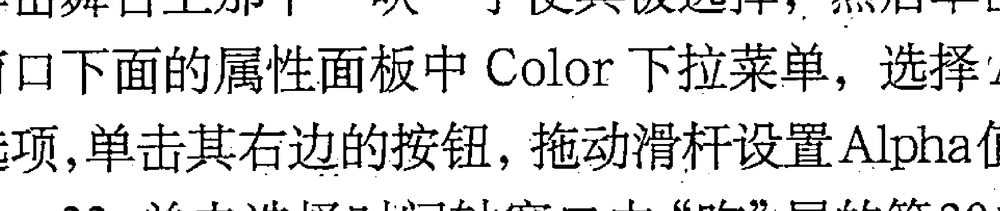

25. 按回车键可预览动画效果。可以再作修改直到满意为止。

26. 在 File 菜单下选择 Export Movie 命令，然后在弹出的对话框中选择保存播放文件的地址，并输入要保存的文件名。

27. 以后只要到刚才保存文件的目录下找到输出的文件，双击即可打开观看动画的播放效果了。

### 三、水中倒影

本例的操作重点是要进行层和帧的操作，另外还涉及到遮罩 (Mask) 和运用 Motion 命令产生运动效果。

操作步骤：

- 1. 单击 File→New 命令新建一个电影，将工作区的大小设置为 400 × 400px，将工作区的背景颜色设为黑色，帧速率为缺省的 12fps。

- 2. 从外部导入图像。单击 File → Import to Library 命令；在打开的对话框中选择要导入的图片 (如图 10)，将这张图片导入 Flash MX 中，Flash MX 自动地把它转换为一个图片格式的符号，同时把它放入到符号库中，并且它的图标是 Bitmap，单击 Window → Library 命令或按 F11 键就可以看到符号库，双击符号名将其名称改为 “正向图片” (如图 11)。

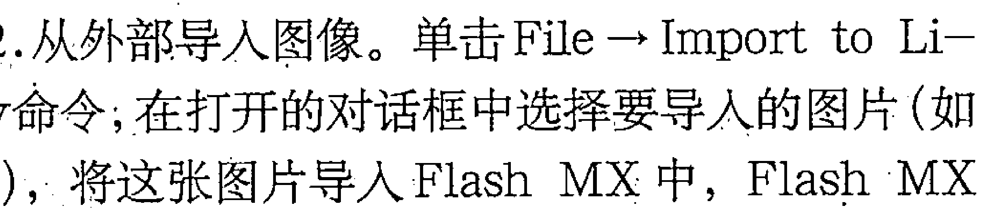

- 3. 创建各层。在本例中，将用到较多的层，并要用到一个蒙版层，它下面的两个层将被它 “蒙” 住。下面是创建各层的步骤。
    - (1) 创建第 1 层——“倒影 1”。在层面板上单击左下角第一个图标按钮 (Insert Layer)，新建一个层，双击层名将它改为 “倒影 1”，将上面导入的图片符号拖到工作区中；将它的大小调整合适。由于导入的图片是正放的，要将它作为倒影的话，还要将它倒置，倒置操作的命令是 Modify→Transform→Flip Vertical。拖动倒置后的图像到符号库中，将它转换成为符号，命名为 “倒影 1”。然后单击编辑窗口下面的属性面板中 Color 下拉菜单，选择 Alpha 选项，单击其右边的按钮，拖动滑杆设置 Alpha 值为 100 (或直接键入数字)。这样就在这个层上放置了一张作为倒影的图片，并且这张图片的 Alpha 值为 100% (如图 12)。在第 1 层第 35 帧上单击鼠标右键，在弹出的菜单中选择 Insert Frame 选项，插入一个帧，使得倒影图片能够一直延续到该帧。(下面新建的层将自动以此长度为参照)。
    - (2) 创建第 2 层——“倒影 2”。从 Library 中拖动已经调整大小并倒置了的“倒影 1”符号到工作区中，首先将它和第 1 层中的图片对齐，然后略微使它们错开一点位置，这样可以通过后面的操作做好模糊的倒影效果。放置好后，选中该图片，然后单击编辑窗口下面的属性面板中 Color 下拉菜单，选择 Alpha 选项，单击其右边的按钮，拖动滑杆设置 Alpha 值为 50，在舞台中可以看到图片变得有点透明，在黑色背景下，产生在水中一样的模糊的感觉。将第 2 层也锁定。
    - (3) 创建第 3 层——“Mask”。第 3 层是蒙版层，它作用于第 2 层。蒙版层中是一个命名为“蒙版”的符号的实例，该符号是由多条细长的矩形组成。“蒙版”符号的制作方法是：单击 Insert→New Symbol 命令，弹出新建符号对话框（如图 13），将其命名为“蒙版”，Behavior 类型设置为 Graphic。打开符号编辑窗口，单击工具栏中的矩形工具，在编辑区中画出几个矩形条，颜色可以随意选择，这不影响效果。它的宽度与倒置图片相同，这样以后可以很好地覆盖该图片（如图 14）。然后单击编辑窗口上方的 Edit Scene 按钮，选择 Scene 1，退出符号的编辑界面，返回到场景动画的编辑界面。从符号库中将“蒙版”符号拖到工作区中创建一个实例，将它放在合适的地方，正好可以覆盖倒置的图片（如图 15）。
    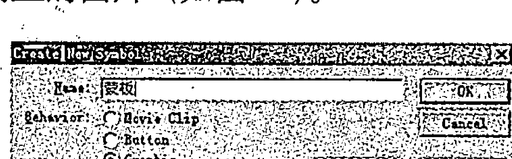
    
    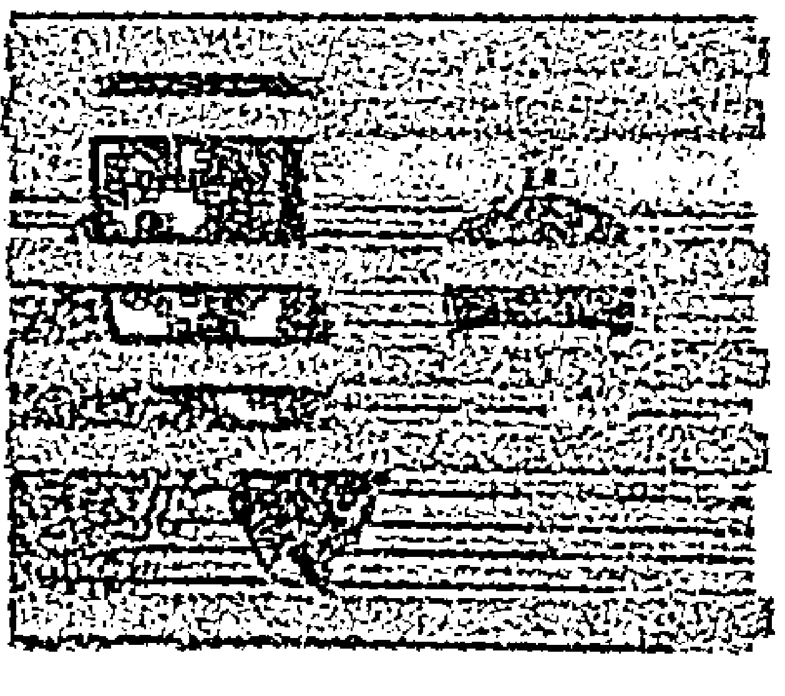
    - (4) 创建第 4 层——“水面”。这一层将制作一个朦胧的水面。本层只有一个命名为“水面”的符号实例。这个符号中蓝色的部分是矩形，白色的部分是一个有渐变效果的椭圆形。创建这个椭圆时，设置填充色为从中心到四周的发散型渐变，中心的颜色为纯白色，逐渐向外白色变淡，而和蓝色的背景色相融合。将这个实例的 Alpha 值调小一点，这样才能看到该层下面的各层。这里将值设为 40，可以收到很好的效果（如图 16）。
    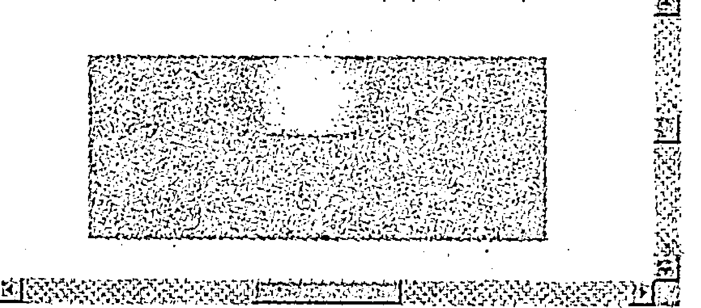
    - (5) 创建第 5 层。从 Library 中拖动“正向图片”符号到工作区中创建一个实例，将它和上面操作中已经放置的图片对齐，这是水面上的图像。

这样本例的基本界面就制作完成了，还剩下的工作是为蒙版添加运动效果。

#### 4. 动画制作

下面进入动画制作过程。
- (1) 将“蒙版”层设置为 Mask。在“蒙版”层的图标上单击鼠标右键，在弹出的菜单中选择 Mask 项，这时“蒙版”层下面的“倒影 2”层被作用。
- (2) 制作渐变效果。单击“蒙版”层，在该层的第 35 帧处插入一个关键帧。点击第 35 帧，在工作区中将“蒙版”符号的实例拖动到工作区的下方，然后在第 1 至第 35 帧之间的任何一帧处右键单击鼠标，在弹出的菜单中选择 Create Motion Tween 命令，其他参数保持默认值，这样就在这两个关键帧之间添加了运动效果。最后完成的效果如图 17 所示。
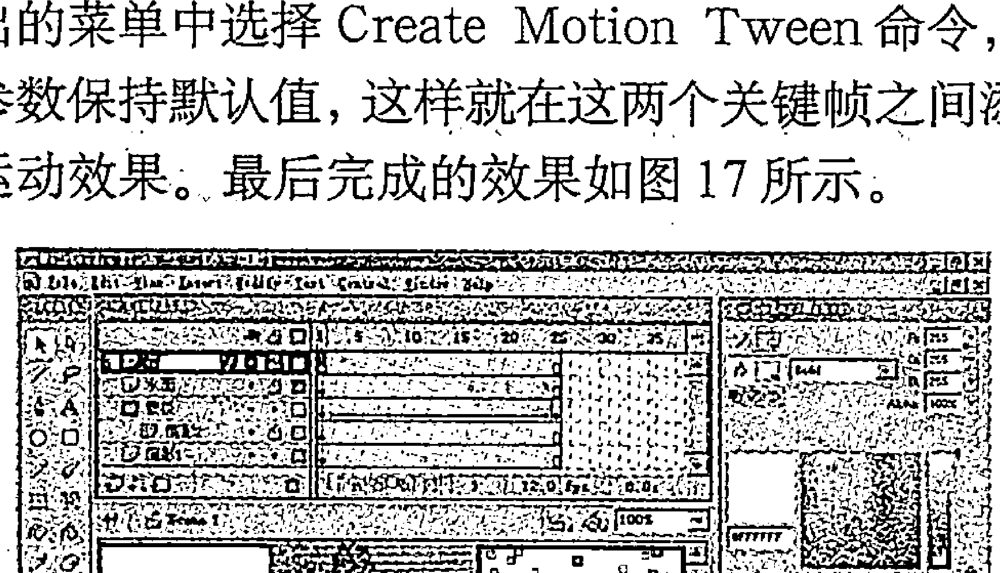

#### 5. 预览动画

本动画制作到此就都结束了，现在可以按下 Ctrl+Enter 键来预览动画了（如图 18）。
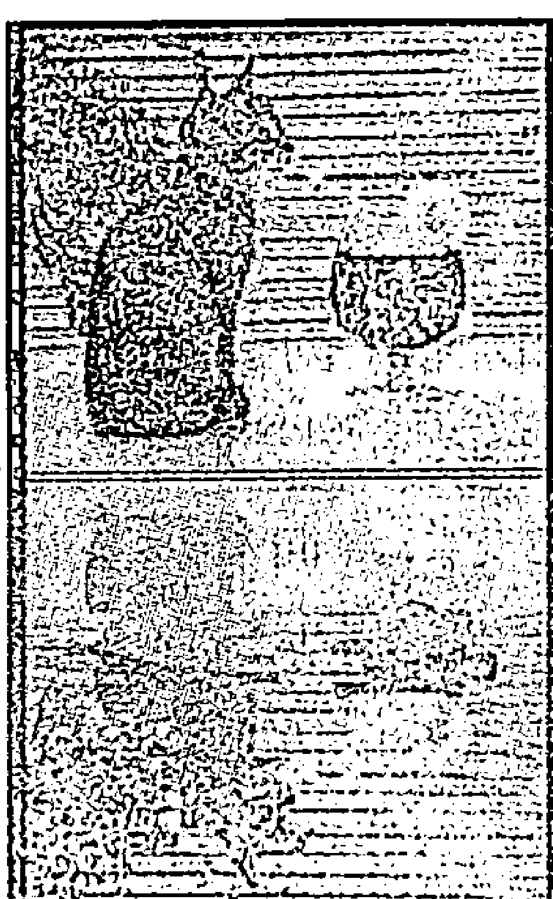

### 四、可控制的三维运动小球

本实例将介绍制作一个和物体运动有关的动画，要实现的效果是当点击不同的按钮时，图中的三维小球会按照指定的路线在不同的方向上运动，如在水平方向、垂直方向上等，例子总共设计了六种不同的运动方向，通过这个例子你可以体会到 Flash MX 在交互能力上的强大控制功能。这个动画中用到了较多的函数语句。

操作步骤：

- 1. 启动 Flash MX，选择“文件(File)”菜单中的“新建(New)”选项，新建一个页面。
- 2. 从菜单栏的 Insert 下拉菜单中选择 New Symbol，在随后弹出的对象属性对话框(Symbol Properties)中给将要建立的 Graphic Symbol 符号取名为“Ball”，如图 19 所示，点击确定后，Flash 自动将编辑窗口切换到 Graphic Symbol 符号对象的编辑界面。
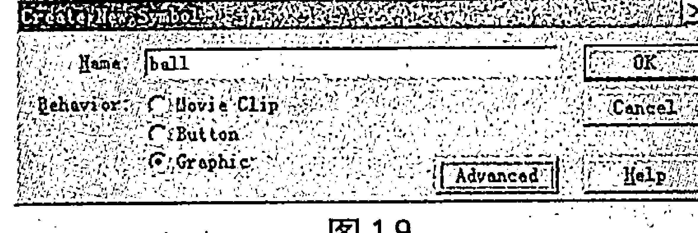
- 3. 在工具栏(ToolBar)内选择圆形工具(Oval)，接着在工具栏下方 Colors 选区单击 Stroke Color 按钮，在弹出的色盘右侧的那个带一道红斜杠的按钮(No Color)上单击，去掉圆形的外边框；单击 Fill Color 按钮在弹出的色盘里选择底部的绿色辐射渐变色彩效果，之后就可以在绘图工作区内绘制一个绿色的带三维效果的圆球，如图 20 所示。
- 4. 从菜单栏的 Insert 下拉菜单中选择 New Symbol，在随后弹出的对象属性对话框(Symbol Properties)中给将要建立的 Movie Clip 取名为“Ballx”。点击确定后，Flash 自动将编辑窗口切换到 Ballx Movie Clip Symbol 对象的编辑界面。
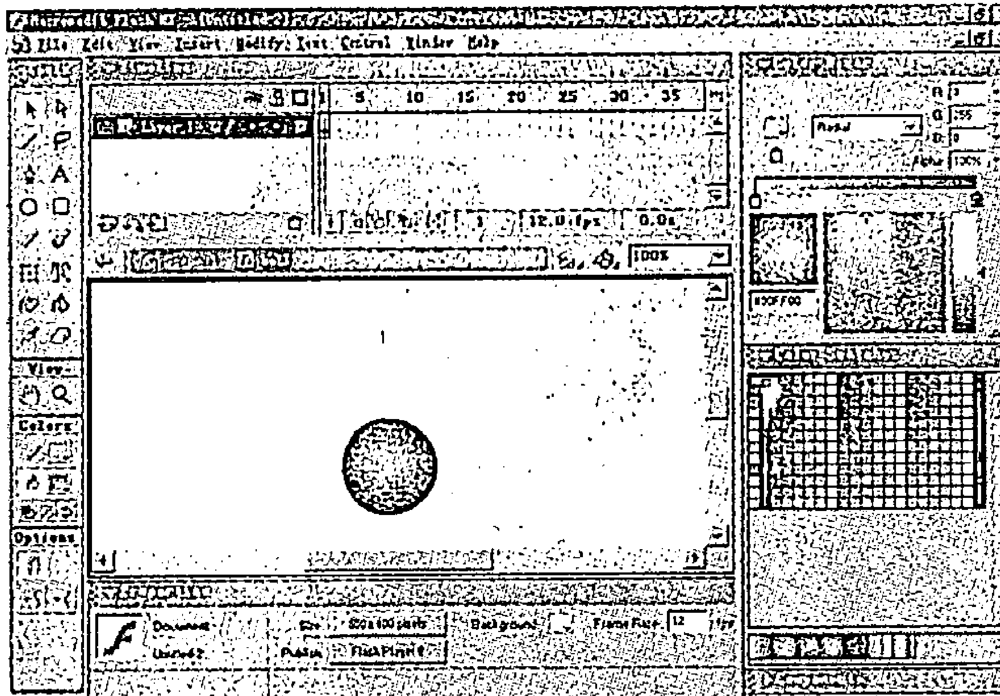
- 5. 从菜单栏的 Window 下拉菜单中选择 Library，打开此文档所建立的对象库，找到刚刚制作的名为 Ball 的 Graphic symbol 符号，用鼠标将其拖放至绘图工作区内的中心，如图 21 所示。
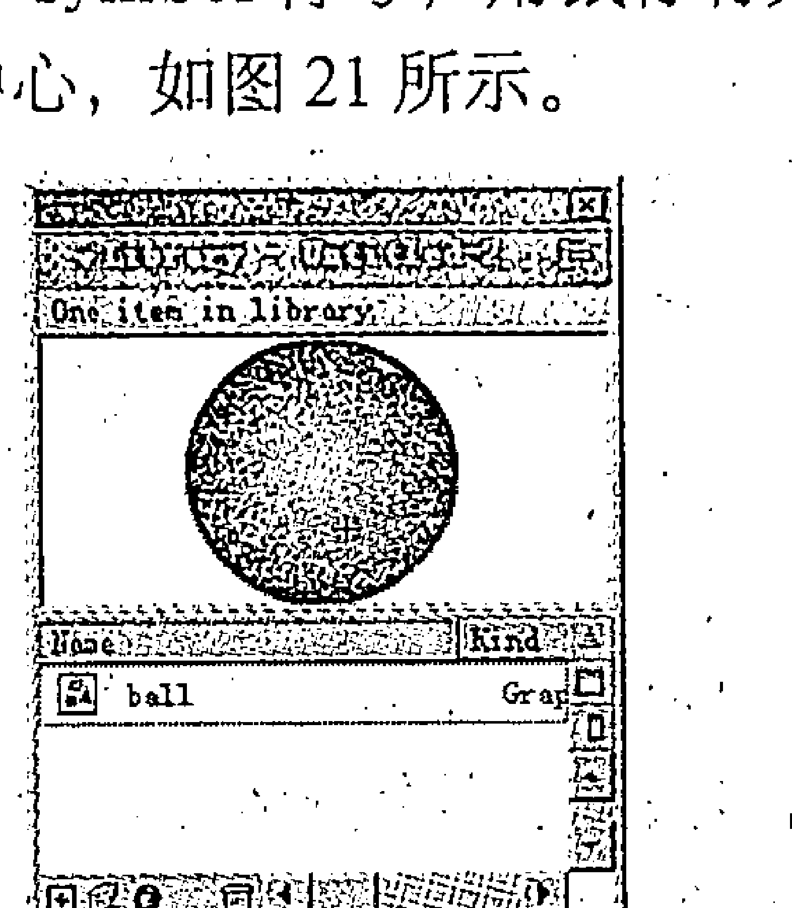
- 6. 选择 Layer1 层帧窗口中的第 20 帧，按快捷键 F6，在第 20 帧处建立一个关键帧。然后水平拖动第 20 帧内由第 1 关键帧继承来的对象实例至我们需要的地方，如图 22 所示。
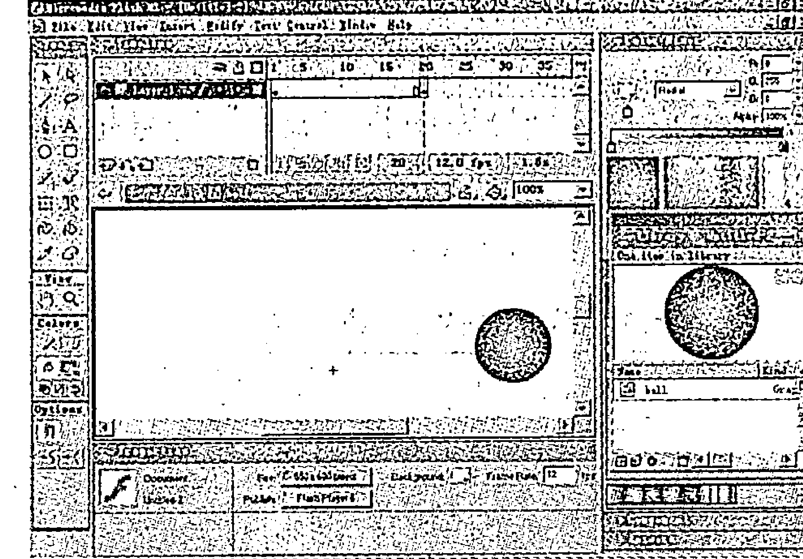
- 7. 选择 Layer1 层帧窗口中的第 1 关键帧，点击鼠标右键，在随后弹出的菜单中选择 Actions。在 Actions 编辑窗口中单击加号按钮，依次选择 Actions→Movie Control→stop 命令，该命令没有参数要求，其作用是用于停止本场景的播放。如图 23 所示。
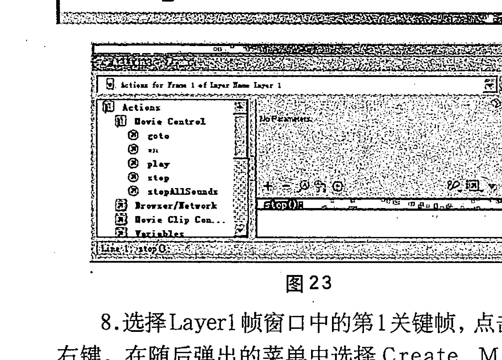
- 8. 选择 Layer1 帧窗口中的第 1 关键帧，点击鼠标右键，在随后弹出的菜单中选择 Create Motion Tween，至此一个显示小球水平运动的动画实例就完成了。最后生成动画的时间轴窗口如图 24 所示。
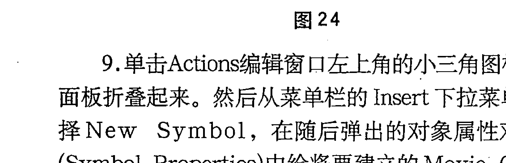
- 9. 单击 Actions 编辑窗口左上角的小三角图标将该面板折叠起来。然后从菜单栏的 Insert 下拉菜单中选择 New Symbol，在随后弹出的对象属性对话框(Symbol Properties)中给将要建立的 Movie Clip 取名为“Bally”。点击确定后，Flash 自动将编辑窗口切换到 Bally Movie Clip Symbol 对象的编辑界面。
- 10. 从对象库中找到刚刚制作的名为 Ballx 的 Movie Clip 电影夹符号，用鼠标将其拖放至绘图工作区内的中心。
- 11. 选择 Layer1 层帧窗口中的第 20 帧，按快捷键 F6，在第 20 帧处建立一个关键帧。然后垂直拖动第 20 帧内由第 1 关键帧继承来的 Ballx 的对象实例至我们需要的地方。
- 12. 选择 Layer1 层帧窗口中的第 1 关键帧，点击鼠标右键，在随后弹出的菜单中选择 Actions。在 Actions 编辑窗口中单击加号按钮，依次选择 Actions→Movie Control→stop 命令。
- 13. 选择 Layer1 层帧窗口中的第 1 关键帧，点击鼠标右键，在随后弹出的菜单中选择 Create Motion Tween，至此一个显示小球上下运动的动画实例就完成了。并且，此动画实例中嵌套了一个 Ballx Movie Clip 电影夹符号。
- 14. 将 Actions 编辑窗口折叠起来。从菜单栏的 Insert 下拉菜单中选择 New Symbol，在随后弹出的对象属性对话框(Symbol Properties)中给将要建立的 Movie Clip 取名为“Ballz”。点击确定后，Flash 自动将编辑窗口切换到 Ballz Movie Clip Symbol 对象的编辑界面。
- 15. 从对象库中找到刚刚制作的名为 Bally 的 Movie Clip 电影夹符号，用鼠标将其拖放至绘图工作区内的中心。
- 16. 选择 Layer1 层帧窗口中的第 20 帧，按快捷键 F6，在第 20 帧处建立一个关键帧。
- 17. 用鼠标选择第 20 帧内由第 1 关键帧继承来的 Bally 的对象实例，然后单击工具栏中的 Free Transform Tool (自由变形工具) 调整圆形比例，将其缩小为原来大小的 20%，如图 25 所示。
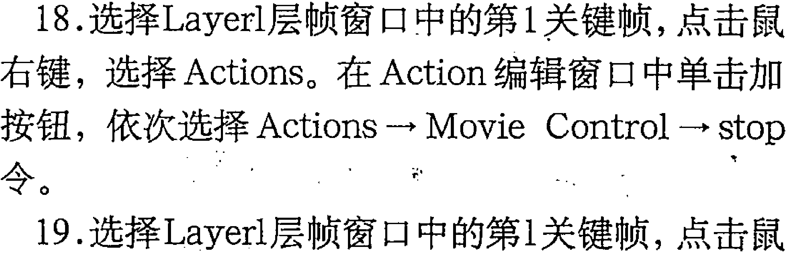
- 18. 选择 Layer1 层帧窗口中的第 1 关键帧，点击鼠标右键，选择 Actions。在 Actions 编辑窗口中单击加号按钮，依次选择 Actions→Movie Control→stop 命令。
- 19. 选择 Layer1 层帧窗口中的第 1 关键帧，点击鼠标右键，在随后弹出的菜单中选择 Create Motion Tween，至此一个显示小球沿 Z 轴方向运动的动画实例就完成了。并且，此动画实例中嵌套了一个 Bally Movie Clip 电影夹符号。
- 20. 为了方便我们控制它，还需要制作一个按钮对象。从菜单栏的 Insert 下拉菜单选择 New Symbol，在随后弹出的对象属性对话框(Symbol Properties)中给将要建立的 Button 取名为“Button”，如图 26 所示。点击确定后，Flash 自动将编辑窗口切换到 Button 对象的编辑界面。
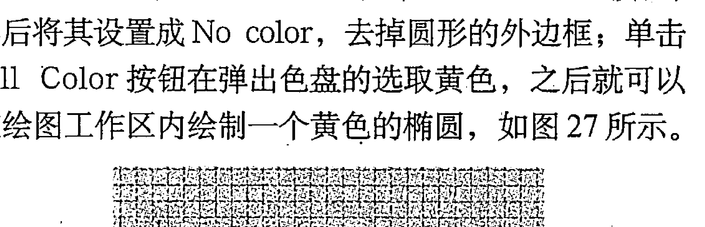
- 21. 在工具栏(ToolBar)内选择圆形工具(Oval)，然后在工具栏下方 Colors 选区单击 Stroke Color 按钮，然后将其设置成 No color，去掉圆形的外边框；单击 Fill Color 按钮在弹出色盘中选取黄色，之后就可以在绘图工作区内绘制一个黄色的椭圆，如图 27 所示。
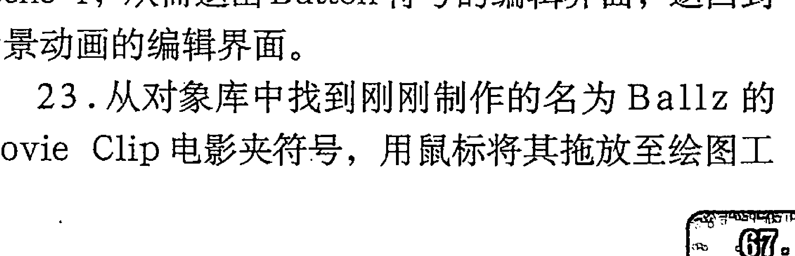
- 22. 单击编辑窗口上方的 Edit Scene 按钮，选择 Scene 1，从而退出 Button 符号的编辑界面，返回到场景动画的编辑界面。
- 23. 从对象库中找到刚刚制作的名为 Ballz 的 Movie Clip 电影夹符号，用鼠标将其拖放至绘图工作区内的左下角。
- 24. 从对象库中找到我们已经制作好的名为 Button 的按钮符号，用鼠标多次将其拖放至绘图工作区内，其位置随意摆放，我们这里一共用了 7 个 Button 的对象实例。
- 25. 在工具栏内选择文本工具(Type)，然后在属性面板中设置字体的大小、颜色等，之后在各 Button 的对象实例中输入区分各 Button 对象实例的文本。分别在七个椭圆上面加上“X 轴的运动”、“Y 轴的运动”、“Z 轴的运动”、“X-Y 轴的运动”、“X-Z 轴的运动”、“Y-Z 轴的运动”、“还原”等文字提示，具体应用如图 28 所示。
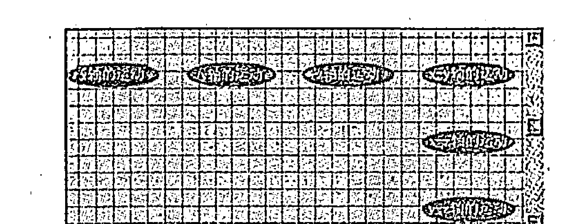
- 26. 选择对应“X 轴的运动”的动态按钮对象实例，点击鼠标右键，在随后弹出的菜单中选择 Actions。
- 27. 在 Actions 编辑窗口中单击右上角的三角按钮，在弹出的菜单中选择 Expert mode 命令，切换到专家模式，如图 29 所示，然后就可以在下面的 Actions 框内输入如下的代码。
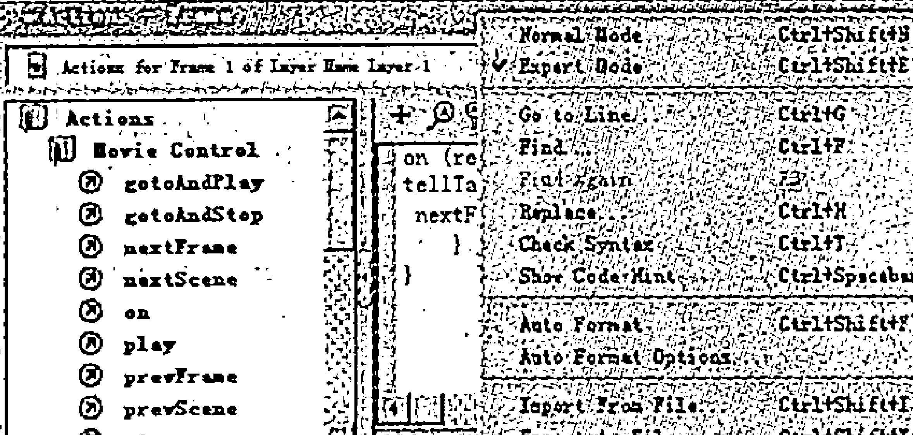

```
on (release) {
    tellTarget ("/ballz/bally/ballx") {
        nextFrame ();
    }
}
```

- 28. 这个 Button 对象实例中的代码用于控制小球在水平方向的移动。
- 29. 同理选择对应“Y 轴的运动”的动态按钮对象实例，其 Button 代码用于控制小球在垂直方向的移动，代码如下：

```
on (release) {
    tellTarget ("/ballz/bally") {
        nextFrame ();
    }
}
```

- 30. Z 轴的运动：

```
on (release) {
    tellTarget ("/ballz") {
        nextFrame ();
    }
}
```

- 31. X-Y 轴的运动：

```
on (release) {
    tellTarget ("/ballz/bally") {
        nextFrame ();
    }
    tellTarget ("/ballz/bally/ballx") {
        nextFrame ();
    }
}
```

- 32. X-Z 轴的运动：

```
on (release) {
    tellTarget ("/ballz/bally/ballx") {
        nextFrame ();
    }
    tellTarget ("/ballz/bally/ballx") {
        nextFrame ();
    }
}
```

- 33. Y-Z 轴的运动：

```
on (release) {
    tellTarget ("/ballz/bally") {
        nextFrame ();
    }
    tellTarget ("/ballz") {
        nextFrame ();
    }
}
```

- 34. 还原：

```
on (release) {
    tellTarget ("/ballz/bally/ballx") {
        gotoAndStop (1);
    }
    tellTarget ("/ballz/bally") {
        gotoAndStop (1);
    }
    tellTarget ("/ballz") {
        gotoAndStop (1);
    }
}
```

- 35. 从菜单栏的 Control 下拉菜单中选择 Test Movie。大家将可以在电影预览窗口中测试我们对小球三维运动方式的控制了（如图 30）。
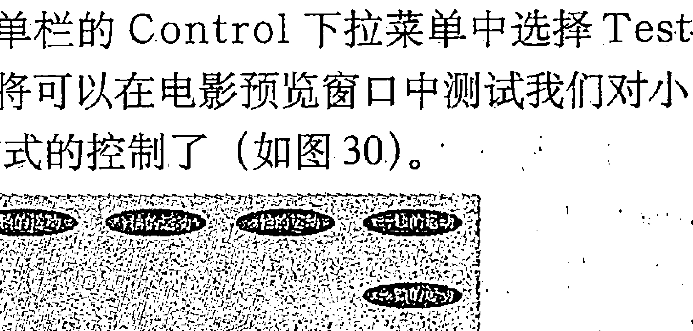## 附：Flash MX 新功能一览

作为新式网络动画的倡导者，Macromedia公司的Flash动画在网络上大行其道，掀起了一股应用Flash的狂潮，也奠定了Macromedia公司在Web动画创作领域的龙头老大的地位。2002年3月4日，让大家盼望已久的Flash MX新鲜出笼。作为最新版本的Flash（也就是Flash6.0），首先在名称上有了新变化，没有沿用以前的数字序号，这可不是简单地改变了产品的代号，它隐含着Macromedia公司更大动作。MX并不是Flash产品的专一代号，而是Macromedia公司一系列新产品的代号。Flash MX只是MX产品线的先头部队，下面接着的就是Coldfusion MX，一个重量级的后台开发工具，Dreamweaver MX、Fireworks MX也会相继出现。名称的变更预示着Macromedia公司产品策略的变化，它已经不再局限于多媒体演示，而逐渐向多媒体内容方面迈进，从MX开始，Macromedia公司将逐渐把内容整合到多媒体中，甚至会出现多媒体数据库，这样就会对多媒体行业带来革命性的变化。除了名称上的变更，Flash MX在功能上的变化更加明显，不但改进和提高了原来Flash5的许多功能，而且新增了许多功能，让用户操作起来感到更简单、更方便，功能也更加强大，下面我们就来体验一下Flash MX给我们带来了哪些新变化。

### （一）改进的用户界面

作为新版本，Flash MX首先给予我们的就是软件界面的变化，启动Flash MX（如图31），我们看到界面的整体布局与Flash5大体相同，但一些常见的浮动面板不见了，编辑窗口变小了，在编辑窗口下面出现了属性面板，时间线窗口也发生变化。这个新的开发环境比起Flash5更具人性化，更加易于管理和使用各种工具，你可以根据爱好定制软件界面，当你进一步熟悉Flash MX之后，你会更加体会到Flash MX在用户界面上的变化给你带来的便利。

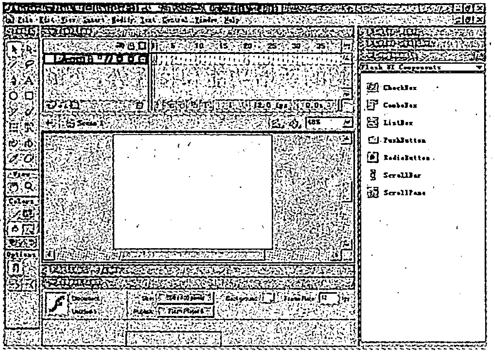

### （二）可选择的设计模式

对于不同的用户群体，Flash MX提供了不同的设计模式供用户选择，这种可定制的开发环境为不同需求的用户带来了极大的便利。例如你是一个初学者，你就不会更多地涉及到脚本编辑等高级方面的知识，这时你就可以选择普通模式，Flash MX就会根据初学者的需要布局命令和操作，免得一些不常用的高级命令让你看起来头大。Flash MX为用户提供了三种模式，即：普通模式（general）、设计模式（design）、开发者模式（developer），当你首次运行Flash MX，会弹出窗口供你选择。当然在设计过程中，你也可以通过菜单命令随时在不同的模式间进行切换。普通模式适用于一般用户和初学者，设计模式适用于设计师，而开发者模式则是为开发者准备的。

### （三）新的属性面板

用过Dreamweaver的朋友都知道它有一个属性面板用来显示和修改对象属性，非常方便。Flash MX也采用了这种设计，在编辑窗口下方新增了一个属性面板（如图32），该面板综合了Flash5中的许多浮动面板中的命令，让用户修改对象属性变得更加直观、方便。

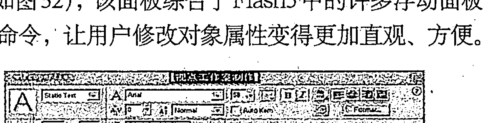

### （四）新增图层文件夹

在Flash5中对图层的管理非常令人头痛，尤其是当你添加了众多图层之后，查找起来非常麻烦。Flash MX终于在这方面有了大的改变，新增了图层文件夹（如图33），这样我们就可以把图层分门别类保存起来，以便于管理和使用。

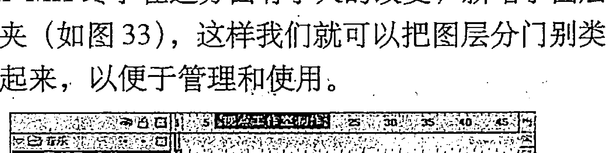

### （五）改进的时间线

在时间线的操作上，Flash MX进行了许多细微的变化，虽然变化并不是十分明显，但对用户使用来说，却感到更加顺手，也更符合要求。例如在新版本中对帧的操作变得更加直观，一些对时间线和舞台同时产生影响的快捷键，为了避免误操作，也被分开。

### （六）图库功能增强

在Flash MX中，我们不用像Flash5中那样，先新建一个符号，然后才能把它添加到库中，而是可以直接从场景中拖动一个对象到库文件中，Flash MX将自动生成一个符号，这样就简化了操作，提高了效率。

### （七）增加自由变形工具

Flash MX将原来Flash5中的旋转、变形工具合二为一，新增了自由变形工具，利用该工具就可以方便地完成图像的旋转、变形、扭曲等操作（如图34）。

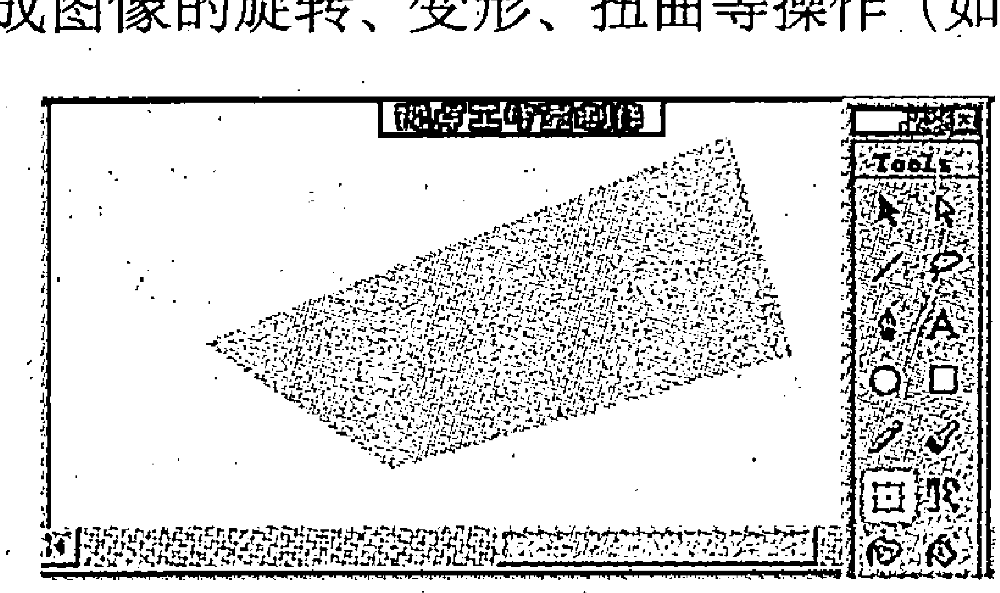

### （八）模板功能

Flash MX新增的模板功能给我们设计提供了极大的方便，你可以直接从模板库中选择Flash MX内置的几十种模板，也可以把自己的设计存成模板，等到下次用时直接调用即可。

### （九）新增组件

Flash MX取消了Flash5中的Smartclip，引入了组件（Component）的概念，我们可以自己设计组件，也可以使用程序内置的组件（如滚动条、按钮、下拉列表、滚动列表等），这就大大加快了我们开发的进度，免去了重复设计的麻烦。

### （十）增强的脚本编辑器

在Action script编辑方面，Flash MX新增加了一个Action script面板（如图35），大大方便了用户进行脚本的编辑，而且新增的代码颜色标记、行号显示、代码提示、查找、替换功能将大大提高工作效率，新增的断点调试功能，可以任意设置调试断点，方便调试。另外，可编程的蒙版（Mask）更为闪客们的设计带来更多意想不到的效果。

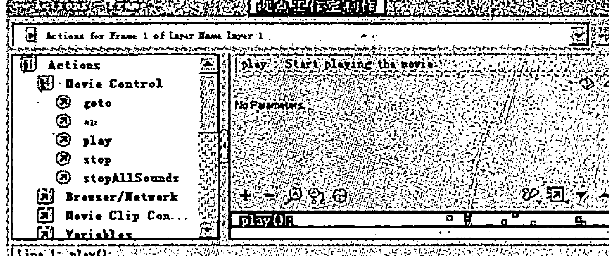

### （十一）竖排文字

Flash MX专门新增了文字竖排的选项，这下你不用再一个字一个字调节就可以轻松设计出纵向排列的文字了（如图36），这对于多媒体设计爱好者来说是一个福音。

### （十二）调色板功能增强

在Flash5中，要想调出自己满意的颜色非常不方便，在Flash MX中改进了调色板设计，让你无论手工或用鼠标都能精确选出自己需要的颜色（如图37）。

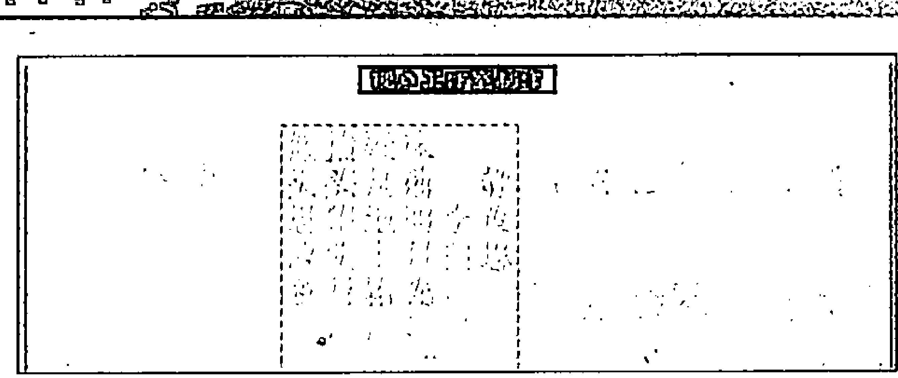

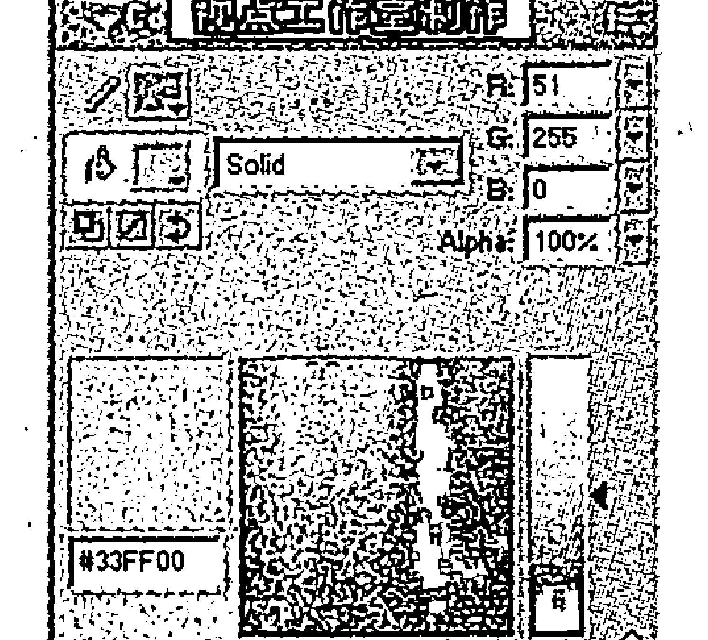

### （十三）精确定位元素

Flash MX新增了像素级定位对象的功能，这样就可以让对象精确定位，即使放大许多倍也能给人以满意的效果。

### （十四）输出Flash5格式

Flash MX为了保证向下兼容，在输出动画时可以直接保存为Flash5格式，这就方便了没有升级播放器的用户浏览动画。

### （十五）支持视频

在Flash MX中可以直接导入各种视频格式的文件，如mpeg、dv、mov、avi等，而且可以直接对视频进行缩放、旋转、扭曲、遮罩等操作，并且可以通过脚本实现交互操作，新版的Flash6播放器也支持视频的播放。

### （十六）多语言支持

Flash MX内置了包括简体中文、繁体中文在内的11种语言系统，这样浏览者不用安装各种不同的操作系统就可以浏览到用英、日、韩等不同文字设计的动画。

### （十七）命名锚点

通过这一新的工具，你就可以开发出符合标准的浏览器导航按钮的内容和应用程序。

除了上面介绍的新增功能和特性外，Flash MX还在其他许多方面进行了改进，如增强了文本打散功能、增加时间间隔、提供脚本绘图的API、图库项目冲突检测等，这些变化需要你在使用中慢慢体会。通过上面的介绍，我们可以看到，Flash MX无论在界面、操作还是功能上都有了很大的变化，这将为我们设计更多、更精彩的Flash动画提供了技术保证，让我们一起进入Flash MX神奇的世界吧。
（文/张全贵）

◆数码相片之后期处理篇 P94
拍好数码相片之后，就要对它们进行加工处理了。本文将教给你修复改善数码相片的基本技巧，还将教给你数码相片的一些特殊应用，如制作屏保、全景图、网页相册、日历、贺卡等。

## 数码新生活

E-mail:cf_hdb@cfan.com.cn

◆数码相机之精挑细选篇 P72
学习数码摄影之前挑一款称心好用的数码相机非常关键。本文将从方方面面为你的选购提供参考。

◆数码相机之使用与拍摄技巧篇 P78
教给你数码相机使用的方法和维护知识，另外还为你拍摄雨雾云雪等特殊气象的数码照片提供了专业的参考意见。

◆玩转“数字电视” P112
花几百块钱买一块电视卡（盒），就等于在家里又添加了一台“数字电视”，从此家人不再为不同的频道内容而争夺了。本文将告诉你电视卡（盒）的安装与使用技巧。

◆与DV共舞 做影视大师 P125
DV(数码摄像机)对普通大众来说不再高不可攀。现在，只要拥有了一部DV数码摄像机和一台电脑，你自己也可以过一把电视独立制片人的瘾了。

### 数码相机之精挑细选篇

数码相机拍摄的照片质量与传统的胶卷照片越来越接近，数码相机的价格也渐渐平民化，因此许多人已经把数码相机列入到了购买日程中。但是在购买数码相机前，先了解一些有关的基础知识，还要知道相关选购要素，才能保证买到一款称心如意的产品。下面我就为大家介绍数码相机选购方面的一些知识，供大家参考。

### 一、数码相机的选购原则

作为一位普通用户，如何选择一台好的数码相机来帮助自己办公、管理文档、上因特网娱乐乃至进行专业制作呢？以下就是在您选购数码相机时应考虑到的几点。

#### （一）按需选购原则

我认为选购相机的最重要的一个原则，就是按需选购，也就是根据您的拍摄目的来选购相机。对于大多数人来说，拍摄照片的目的主要是家庭纪念照和旅游纪念照，这样的话，选择轻便相机就可以满足您的需要。所谓轻便相机，也就是大家常说的“傻瓜”相机。如果您只是想省心省力地拍好各种纪念照，并且有较高的成功率，那就从轻便相机中选一款吧，这类相机即使你没有多高的技术水平也一样可以运用自如。不过这类相机品种繁多，功能繁简不一，价格更是从几百元一直到七、八千元不等，选购时也会有高、低档之分。

#### （二）功能实用原则

在选购数码相机时不必刻意追求功能齐全所有指标都最好的数码相机。由于数码相机的技术参数很多，市面上没有一种数码相机能够在所有的指标上都比其他品牌好。您应该根据自己的喜好及您的拍摄情况选择一款适合的数码相机，对指标选择一定要有重点。在你的实际使用中不重要的一些功能，就不要刻意追求最好。比如不需要近距离拍摄，就不要去管数码相机的最近拍摄距离，而白平衡也不是很主要的指标，因为这是任何图像软件都可完成的工作。

#### （三）价格合理原则

对于普通家庭来说，数码相机的价格还是比较可观的，少到2000元，多则上万元，因此对数码相机的价格还是需要考虑。如果您是一般摄影爱好者的话，选择一款四、五千元左右的数码相机就差不多了，这个价位的数码相机基本上能满足大多数摄影者的要求。另外，在选购数码相机时一定要注意您购买的数码相机有可能产生的附加费用。从目前来看，您需要在相机上额外增加的费用最为主要的是电池方面，其次为存储卡方面。另外有一个好消息就是，现在还有一种采光式节能型液晶屏的数码相机，它是通过采集外界的光源能量来使数码相机的液晶显示器发光显示图像的，大大增加了电池的使用寿命，节约了您的经费。

#### （四）操作简单原则

易用性概念的广泛程度超过了上述所有的理由，易用性体现在以下几方面：首先是产品包装，比如随机附带的安装软件和图像处理软件、说明书、电池等配件是否简明齐全；其次是连接能力，就是相机与输出设备或者PC是否容易连接，交换数据是否快速通畅；再就是使用复杂程度，相机的操作，功能的设置是否方便快捷。

### 二、数码相机的选购要点

当今市场上有许多的数码相机产品，功能范围非常广泛。下面向您介绍一下选购数码相机的要点，抓住了这些内容，可能选购就会少走一些弯路了。

#### （一）镜头

对于传统相机而言，镜头的好坏一直是影响成像质量的关键因素，数码相机也不例外，它是数码相机的关键部件，对价格也有很大的影响。虽然由于数码相机的CCD分辨率有限，原则上对镜头的光学分辨率要求较低；但另一方面，由于数码相机的成像面积较小，因而需要镜头保证一定的成像素质。镜头的物理口径也是必须要考虑的，且不管其相对口径如何，其物理口径越大，光通量就越大，数码相机对光线的接受和控制就会更好，成像质量也就越好。不同的数码相机镜头的缩放范围是有差异的，在购买数码相机之前请试一下缩放，看您是否中意。另外在部分数码相机中，还提供了远距及广角两种镜头方式。这在您选择数码相机时，也是一个参考的指标。

#### （二）焦距

与人类的眼睛一样，数码照相机通过镜头来摄取世界万物，人类的眼睛如果焦距出现误差（如近视眼），则会出现无法正确分辨事物的烦恼，同样作为数码相机的镜头，其最主要的特性也是镜头的焦距值。镜头的焦距不同，能拍摄的景物广阔程度就不同，照片效果也迥然相异。对于相同的成像面积，镜头焦距越短视角就越大；而对于同样焦距的镜头而言，成像面积越小，镜头的视角也越小。数码相机厂家通常都会标出与数码相机镜头视角相同的35毫米相机镜头焦距，这样的对应焦距值我们就很容易理解了。我们在评价与选购数码相机时，也只要参考换算到35毫米相机的镜头焦距就可以了，虽然不同型号的数码相机会有一定的差别，但差别不会太大，如果您不是很刻意追求具体的相当于35毫米相机的对应焦距，参照数码相机的光学变焦的倍数，一般就可以了。

#### （三）分辨率

分辨率是数码相机最重要的性能指标，它是使用图像的绝对像素数来衡量。数码相机拍摄图像的像素数取决于相机内CCD芯片上光敏元件的数量，数量越多则可产生的图像分辨率越高，所拍图像的质量也就越高，在同样的输出质量下可打印出的照片尺寸越大。在了解数码相机的分辨率时，一定要区分两个分辨率的概念，一个是CCD的分辨率（或像素值），另外是拍摄图像的分辨率。CCD的分辨率（像素点）是最为重要的指标，在同样的最大拍摄图像的分辨率下，CCD 的分辨率越大越好。例如对于同样可以拍摄图像分辨率如（1280 × 1024）的相机，150万像素的CCD相机的拍摄质量会好于141万像素CCD的数码相机。

#### （四）存储容量

数码相机依赖内存卡来存储相片，它们可以重复使用许多次。内存卡与计算机中的RAM相似，但在关闭时仍能保留相片。用适当的压缩格式可以在存储卡或照相机存储器中保存更多的照片。遗憾的是压缩比率越大，图像的失真度就会越大，照片放大后会表现出极差的效果，如色彩退化、阴影与高光区域分离、边缘与细节区域效果不明显等。如果要求照相机为你提供最佳的总体影像质量，就应当考虑到选购较大的存储容量的卡。现在数码相机的图像介质，一般有CF卡、SM卡和普通软盘、记忆棒等几种方式。最新的有采用IBM微型硬盘的产品，这些存储介质在性能、价格、使用方便性等方面各有特点，作为普通用户选购时主要应关心存储容量的大小，当然是越大越好，至少应该在32MB或64MB以上。

#### （五）取景方式

对不是专业摄像的人来说，取景方式也很重要。现在的数码相机一般有3种取景方式：一是普通光学取景，这是最常见的取景方式，其唯一的缺点就是取景误差大，特别在近距离拍摄上下左右位置时，看到的影像与实际拍摄影像误差较大，取景器看到的影像只有实际拍摄影像的85%大小；二是LCD取景，这是目前数码相机几乎必备的，这种取景方式的优点是改正了普通光学取景的缺点，但LCD取景也有缺陷，它耗电量大，且在LCD上显示的画面色彩、对比度与实际在电脑中看到的影像误差较大，而且即使标称百万像素的LCD，看上去画面仍然很粗糙，无法观察到拍摄的具体细节；三是TTL (Through The Lens)单反取景器，这是专业相机上必备的取景方式，也是真正没有误差、通过镜头的光学取景器。这种取景器的取景范围可达实拍画面的95%，唯一缺点就是如果镜头过小，取景器会很暗淡，影响手动对焦。

#### （六）速度

数码相机的速度有几方面的内容。一是开机速度，也就是从打开相机电源开关到拍摄第一张照片的时间。打开电源之后，数码相机一般要进行操作系统初始化、移动变焦镜头等动作，因此需要一段时间，开机速度越快的数码相机自然越好。二是快门延迟时间，胶卷相机在您按下快门释放按钮时几乎是立即作出响应。而数码相机则有一个延迟，各个数码相机的延迟时间互不相同，差异从几分之一秒到有时候的一秒以上。如果您要拍摄动态相片，则这点很重要。三是连续拍摄能力；由于数码相机需要把CCD上保存的数据读出、处理并储存，因此从一张照片到另一张照片之间的拍摄需要一定的时间间隙，这个时间当然也是越短越好！

#### （七）传输方式

数码相机所拍摄的图像，一般都需要送到计算机中进行处理。因此数码相机都有输出接口。一般的数码相机采用RS232（串口）输出，档次高点的提供了USB接口，连接容易、速度快，是目前最理想的传输方式，有些数码相机还提供了IrDA红外线接口。另外很多产品都带有视频输出接口，可在电视机上直接欣赏拍摄的图片。不同的传输方式对照片下载到计算机时的速度是不一样的。RS232方式只有115200bps的传输速度，比USB方式慢，因此专业用户最好选择带有USB接口的数码相机。

### 三、数码相机的选购步骤

对一般人而言，拿出几千元甚至上万元去买一件物品不是小事，需要仔细掂量。弄不好可能会买了“水货”，贪小便宜吃大亏，也可能想要的功能没有，没用的功能一大堆。那么究竟该怎么办呢？首先应了解购买数码相机的一般步骤，才能避免盲目购买、吃亏上当。选择数码相机，一般分为“定”“查”“比”“看”和“用”五个步骤。

-   1、“定”就是根据自己的需要，来确定您所要选择的数码相机的档次。首先您应确定自己使用数码相机是用于专业的图像输入处理，还是普通的一般应用，这两档的数码相机价格相差很大。专业级的数码相机价格很高，基本都在万元以上，而且其性能的好坏，很难从数码相机的指标中得出。如果您仅仅为了增添生活的乐趣，比如拍一些生活照及旅游纪念照，或者是用来拍摄在计算机上使用的图片，就选购一台“傻瓜”型的相机吧。

-   2、“查”就是进行广泛的市场调查。现在可以调查的地方很多，特别是互联网的发展，更为我们提供了方便，您可以到相关网站上查找数码相机的资料(在《数码相机之使用与拍摄技巧篇》一文的末尾介绍有大量的数码相机相关网站，可供参考)。主要是了解在可选择范围内各品牌数码相机的价格、功能以及性能指标等方面的具体情况，以便进行比较，从而确定一个具体的目标。目前在全球上市的数码相机产品有上千种，各厂家均极力包装、宣传自己的产品。所以在购买之前要认真进行厂家、产品性能以及功能、质量的调查，从纷繁复杂的产品中选出自己所真正需要的东西。

-   3、“比”就是比较所购数码相机的性能。选购数码相机时应该多走几家商店，多了解一些行情；不要见到就买。要想看得准，选购的商品物有所值，就要多走、多看、多比较，这是避免受骗上当的有效措施。您应该从以下几个方面比较一下数码相机，一是比所售产品是否通过正规渠道引进，正规渠道引进的都有保修卡和中文说明书；二是比售后服务系统是否完善，有无定点维修部门，名牌产品在全国各地都设有销售和维修网点；三是比是否提供咨询服务，产品是否配套齐全；四是综合比较性能与价格的高低、优劣，选择售后服务与技术保障比较好的厂家。

-   4、“看”就是到实地去查看数码相机及其部件。选购时进行直观检查的内容比较多，一是看外表，外表要清洁，有电镀的部分应明亮；漆面光滑均匀；外表应无裂纹、毛刺、变形、残缺等，彩色液晶屏表面无划伤、无色泽不均匀等；二是看镜头，镜头不应有任何尘埃、油渍、指印、霉斑和划痕；直接观察清澈的水底，应深沉而无任何反光；三看光圈快门，转动调节环或盘时，应轻松平滑，不宜过紧，光圈的变化应该平稳均匀，各档快门都应启、闭灵活；四看取景器，取景器应明亮清洁，所见景物鲜明清晰；取景器内的测距色点或小圈，应明显可辨；五看存储卡，存储卡仓盖应开启方便，关闭后应密闭，存储卡插入卡仓应非常灵活，插入后无松动感；六看附件，包括电池、驱动程序、实用工具、连线与转换插头、使用手册等是否齐全。

-   5、“用”就是现场用数码相机拍摄景物，对各项功能进行检验。数码相机有即拍即显功能，使通过实拍检验数码相机的实际性能成为可能；您购买数码相机应现场拍摄试试。试拍时应对相机的功能尽可能地进行试用和验证，对有彩色液晶屏的数码相机，在实拍后要注意检查显示质量；有视频输出接口的数码相机，要与有视频输入接口的电视机相连播放，以检验输出是否正常；试拍存储后要及时删除，以检验存储器的读写功能是否正常。另外还要对感光度、白平衡、分辨率等性能进行设置测试，看能否满足设计要求。

### 四、数码相机选购注意事项

有了上面的数码相机选购方面的知识，我相信您差不多能够买到满意的数码相机了。但是在选购时您还得注意一些事项，这样才不至于上当受骗。

要注意性能价格比。不同厂家生产的数码相机性能价格比相差非常大，通常生产规模大的公司推出的数码相机性能价格比较高。要注意数码相机的内在素质。要注意了解一些评价机构对数码相机的实拍评价，但要防止商业性、广告性评比的误导。

要防止被LCD显示屏欺骗。很多消费者购买数码相机时只会看LCD显示屏的效果。而事实上LCD屏幕有时可能会把照片的色调及光暗比弄错。你最好将照片传送到电脑中，再比较照片的品质。注意存储器容量是多少，最好能有更多的存储空间。注意镜头的扩充性，最好能具备一个带广角、变焦，甚至可以近摄的镜头。

要注意数码相机的耗电量。在选择数码相机时，最好选择使用锂电池的数码相机。如果没有配备锂电，您也一定要注意数码相机的耗电量，在选择时不要完全听信资料上对耗电的介绍，多问问周围的朋友是最好的办法。

要购买售后服务好的数码相机。现在随处都可以见到数码相机的踪影，但是各地的销售服务和货源参差不齐，在购买时，建议你到比较大型的店铺去。虽然其价格相对于一般的私人店铺可能会高一些，但质量和售后服务都有保障。尤其是数码相机这类电子产品，国内有能力维修的地方屈指可数，要靠自己更换。零件进行修理是非常困难的，所以多花些投资换来自身利益的保障是非常必要的。

要注意附件是否为正版。商家经常在数码相机附件上做手脚，以增加其利益。最常见的做法是把随机的原厂存储卡换成其他杂牌的，或把原本配带的16MB存储卡换成8MB的，有的甚至干脆把一些应有的配件收起，以后再零售。你还要看看选中的数码相机有没有随机附送图像处理软件。购买时最保险的做法就是仔细阅读说明书，上面一般都明确地标出相机应有的配件。此外，还要谨防商家用水货充当行货，赚取差价。应付的方法就是要求商家开具发票或保修凭据，写明保修日期，这样的话即使一时受到欺骗，日后也可以挽回损失。

### 五、数码相机附件的选购

购买了数码相机，还仅仅是具备了数码摄影的基础平台，想要让您手中的相机充分发挥威力，还需要考虑配备一些附件。

#### （一）存储卡转接器

从数码相机里下载照片的比较方便快捷的手段就是使用存储卡转接器。已经有同标准3寸软磁盘一模一样的转接器问世，您只需要把SmartMedia智能卡或MemoryStick记忆棒插入该转接器里，再将该转接器放入电脑上的软驱里，就可以读取并下载照片了。CF闪存卡也有PC卡转接器可供使用，只须将闪存卡放入转接器内，就可以在任何具有标准PC卡插槽的电脑上读取了。

#### （二）读卡器

读卡器是另外一种非常流行的数码相机附件，一台读卡器可以帮助您迅速传送闪存卡里的照片，给MP3播放机补充歌曲，还可以像小硬盘那样存取各种文件。这种读卡器一般会在一端具有USB口、并口或SCSI接口以便连接电脑，另外一端则是存储卡插槽。必须要确认您选择的读卡器与您的电脑在操作平台、端口和存储卡类型方面都能够兼容。

#### （三）照片打印机

数码相机的照片打印比较麻烦，一般需要先把照片传送到电脑里，然后才能打印。对于经常使用数码相机的用户，或者将数码相机用于商业用途，如风景点拍照什么的，可以考虑购置一台照片打印机，它可以直接读取存储卡里的照片，不用再经过电脑这个中间环节。

#### （四）滤镜

滤镜可以帮助摄影者更好地控制不同光照条件下的拍摄效果，或者营造一些特殊的拍摄效果。最常用的就是UV镜，一块透明的UV镜，除了可以改善强紫外光线下远处景物的清晰度外，还可以保护您的镜头不受恶劣拍摄环境的影响。一些制造商已经可以供应专门为数码相机设计的一系列滤镜，要是您手头已有的一套滤镜和您的数码相机口径不配套，那不妨买“大转小”或“小转大”转接圈来解决这个问题。

#### （五）外接闪光灯

只有那些装备着热靴或闪光灯插孔的数码相机，才能使用这样的机外闪光设备。一些相机会生产某款数码相机专用的外接闪光设备，以供使用者选用。如果没有这种限制，您最好还是购买一套第三方专业闪光设备制造商的产品为佳，因为它们往往具备更宽泛的使用条件、更好的性能和更合理的价格。

### 六、常见数码相机简介

目前，在数码相机市场上，可谓是百花齐放，而且各种数码相机都有很好的功能，及比较适宜的价格。下面我将向大家简单介绍几种常见的名牌数码相机厂商以及价格在5000元左右的代表产品。

#### （一）KODAK（柯达）

柯达可以说是老牌公司了，它成立于1881年，是当今数码相机生产商中涉足最早、阵营最强、产品线最丰富的公司。它的数码相机的系列很全，既有最低价格的普及型数码相机，又有像素水平较高的专业型数码相机。它的数码相机产品型号多，各种产品应有尽有，每一位摄影爱好者都可以从中找到自己喜爱的数码相机。

它的KODAK DX3900数码相机很不错（如图1），这是一款专为喜爱创新的用户设计的数码相机，高达310万像素影像分辨率，拍摄的照片品质精致绝伦。6倍变焦能力（2倍光学变焦和3倍数码变焦），轻易捕捉细小精密的画面，近距离拍摄也难不倒您。DX3900可以自行设定喜爱的颜色模式、ISO值和曝光模式，并且备有柯达相片存储卡（CF卡）插槽，让您尽情拍摄，不受限制。此外，还可选购望远镜头、广角镜头和近拍镜头配件，让您自由发挥创意，从拍摄中找到乐趣。DX3900可以搭配EasyShare系统相机底座使用，只需将DX3900放入底座，再按一下电钮，相片就会自动上传到电脑中。

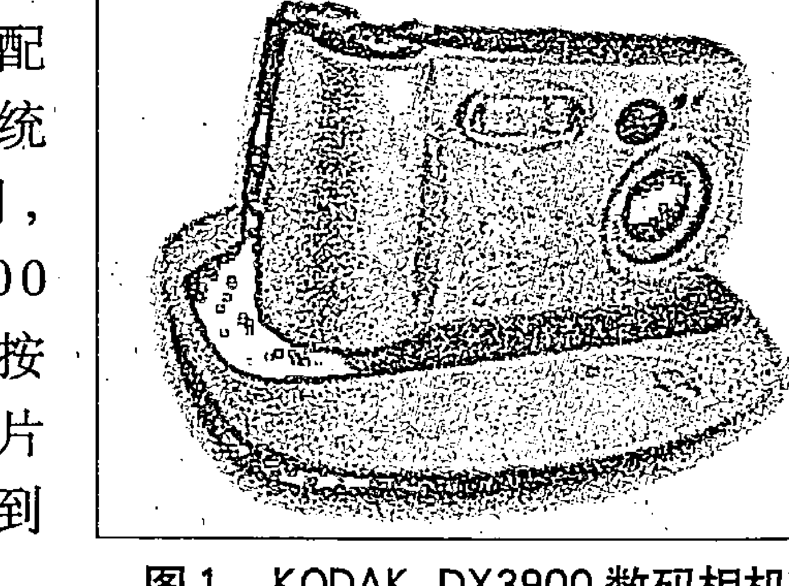

#### (二) OLYMPUS (奥林巴斯)

奥林巴斯创建于1919年，近年来它生产的数码相机很有特色，从高端到低端全线产品应有尽有，且不乏一些性能优秀的产品，我用的就是OLYMPUS的产品哦！

它的OLYMPUS C-4040Z是一款很不错的数码相机（如图2），这款数码相机配备了一枚413万像素的超高精度CCD，同时配合最大光圈F/1.8的大口径3倍光学变焦镜头，无论在广角端还是在远摄端，都有极其精细的图像细节表现，从而能获取鲜明、清晰、还原真实的成像质量。

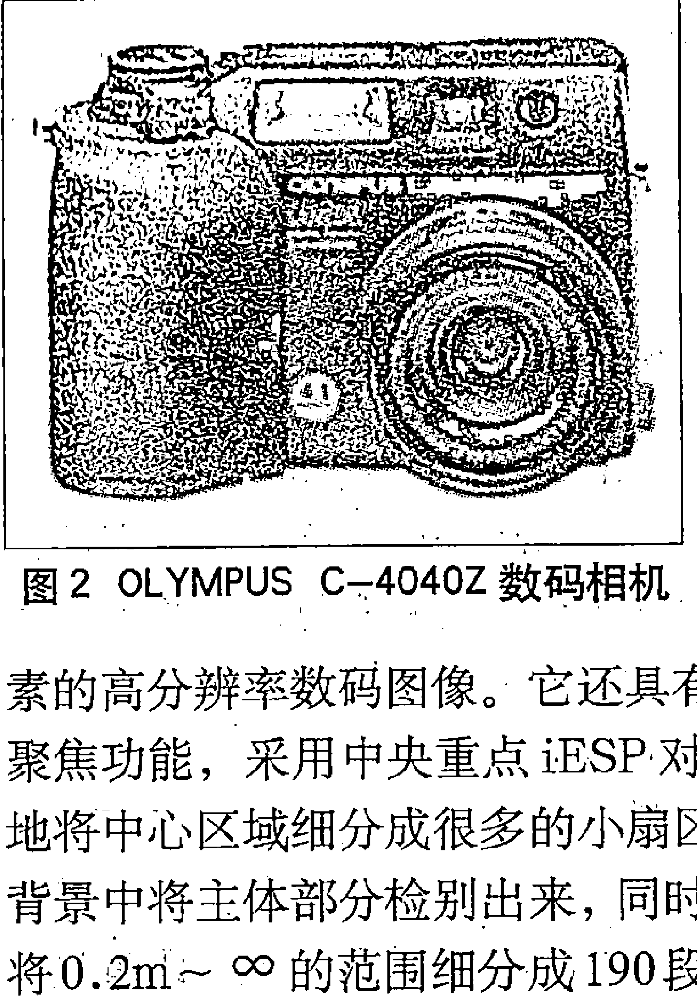

通过机内的插值运算，C-4040Z可以输出相当于3200×2400的768万像素的高分辨率数码图像。它还具有高品质的AF自动聚焦功能，采用中央重点iESP对比检出方式，有效地将中心区域细分成为很多的小扇区进行分析判断，从背景中将主体部分检别出来，同时这套聚焦系统可以将0.2m~∞的范围细分成190段对应脉冲数据进行驱动对焦。同时相机具有程序式自动、光圈优先、快门优先以及全手动四种曝光模式。最长16秒的手动长时间曝光功能，并且有AE锁定。还提供了±2EV，1/3级可调的曝光补偿功能。

#### (三) Sony (索尼)

目前国内市场上流行的Sony数码相机型号非常丰富，它们所包含的技术热点也非常之多。过去按照存储介质的不同，Sony数码相机主要有两大系列：以普通的1.44MB软盘作为存储介质的MVC系列和以Sony自行研发的MemoryStick（记忆棒）作为存储介质的DSC系列。除了在存储介质方面的多项独创，Sony数码相机普遍采用其专利的智慧型锂离子充电电池，这种电池不仅充电速度快、无记忆效应，而且持续供电时间长，配备在高性能的数码相机上可谓如虎添翼。

它的SONY DSC-S85数码相机很不错（如图3），这款数码相机配备了一枚413万像素的CCD，1/1.8英寸超级HAD CCD影像感应器。提供6倍数码变焦及3倍光学变焦，超级解像度转换器、4.5厘米（1.8英寸）彩色液晶屏幕，您可以用它的USB接口将数码影像传至个人电脑，利用连续快拍模式，可连环拍摄3张相片，这对于拍摄焰火这类的东西很有用哦！

它采用可重复充电智慧型锂离子电池NP-FM50，最长连续拍摄约3小时或3000张数码照片。它的自动对焦照明系统，于黑暗环境拍摄时，可利用补光射线帮助对焦，使焦距量度更准确。

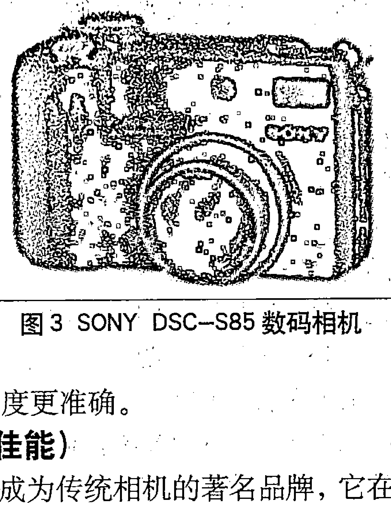

#### (四) Canon (佳能)

Canon已在全球成为传统相机的著名品牌，它在数码相机产品上分门别类进行开发，代表了传统相机厂商成熟的市场经验。它的数码相机的造型、功能及技术规格和性能等方面，差异都非常大，而且市场定位明确，以适应不同领域对数码相机的多样化需求。

佳能的PowerShot Pro90 IS数码相机性能很好（如图4），它采用了334万像素的CCD，58mm口径的10倍光学变焦（相当于35mm传统相机的37-370mm）镜头，采用13片10组光学结构，其中包括2片非球面透镜，这些都是单反相机镜头中常常出现的技术参数，但在当前的数码相机中极为罕见。它具有光圈优先、快门优先和全手动控制等人工控制的曝光控制方式。它还提供了中央重点测光和点测光两种测试方式、±2.0EV（每级1/3EV）范围的曝光补偿和闪光灯补偿、内置闪光灯，并提供能外接Canon EX系列闪光灯的热靴、具有ISO50-ISO400之间的共4种ISO感光度等效值供用户选择等，它还可以手动对焦、人工设置6种场景下的白平衡模式、具有遥控功能等。

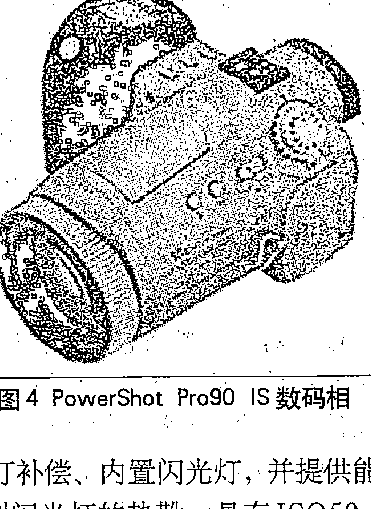

#### (五) FinePix (富士)

富士公司与柯达、爱克发并称为目前世界上最大的感光材料生产商，也是世界上较早开发高档专业数码相机的公司。它生产数码相机的历史与柯达公司不相上下，并且起点很高。早在20世纪90年代初就推出了130万像素的数码相机。

它的FinePix 6900zoom数码相机很好（如图5），这款数码相机拥有高性能330万像素的第二代SUPER CCD，与传统CCD相比SUPER CCD的八边形光电二极管的体积更大，因而光电二极管可更有效地捕捉来自镜头的光线并大大提高了感光度动态范围、信噪比和其他图片属性。根据拍摄场景情况，SUPER CCD可以12位色彩拍摄图片并以优化8位记录图片。它还拥有大口径，工作速度极快的F2.8 Super EBC 富士龙6X光学变焦镜头（相当于35mm相机的35-210mm）。它的处理速度也很快，无论是开机速度、自动对焦速度还是两次拍摄间的停顿都很快，它的AF系统不仅对焦迅速，而且可以在对焦完成后用声音作为提示。另外在使用手动对焦模式时，使用新开发的单击（one-push）自动对焦功能，可以帮助快速地确认焦点。

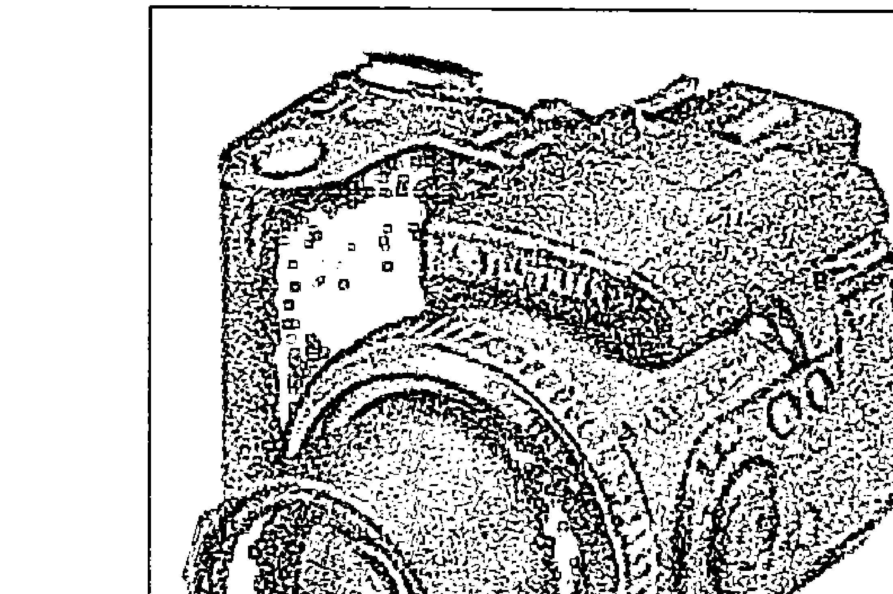

100种可选场景，将它们直接导入到CF卡就可以使用了，CF卡最多可存储250种场景拍摄模式。它的自动包围式曝光可提供最长60秒的长时间曝光，同时具备宽景模式和电影模式。其它功能还包括可调节的白平衡，闪光光量控制，曝光补偿，自动纵／横向画幅识别功能。在低电力损耗方面QV-4000也有不俗的表现：在最高画质、LCD全开、闪光灯关闭的情况下，一枚全新的3V锂电池CR-V3P大约可以连续拍摄3小时25分钟（约1230张图像），以及近6小时的连续回放时间。

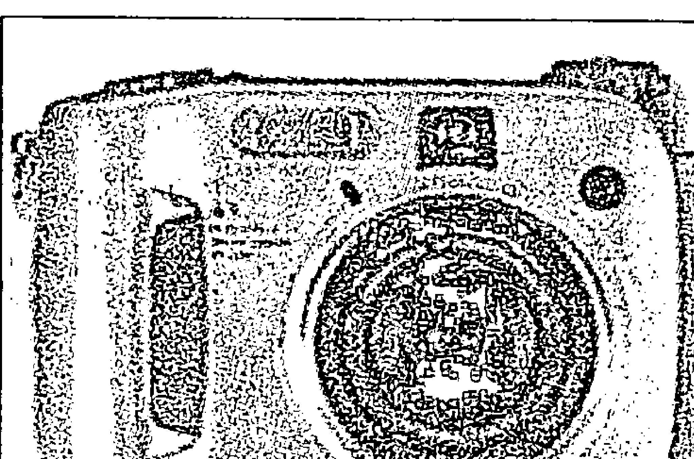

图5 FinePix 6900zoom数码相机

图6 CASIO QV-4000数码相机

#### （六）Casio（卡西欧）

卡西欧成立于1957年，最早开发的数码相机是QV-10，其后又相继推出了QV系列十数款产品。在高像素数码相机的竞争中，Casio公司可谓是先行者，它曾率先推出了世界上首款300万像素级数码相机。它的数码相机的特点是体积小，重量轻，多数产品的镜头能够旋转，所获取的图像质量较好。

它的CASIO QV-4000数码相机很好（如图6），CASIO QV-4000配备了一枚413万像素的CCD，最高画质达到2240 × 1680 像素的超高精度数码图像，可以在 A3 幅面上再现高质量的摄影画面。与413万像素CCD相配合的，是最大光圈为F2.0-2.5的佳能大口径3倍光学变焦镜头，其焦距相当于35mm相机的34-102mm。采用8片7组的光学镜片，配合非球面镜片，可以捕捉最细微的景物。QV-4000内置5种场景拍摄模式，可以将测光数值、曝光补正以及色彩校正等调整到最佳状态，同时随机附赠的光盘中存有

#### （七）NIKON 5000（尼康）

这是一款具备524 万像素CCD 的数码相机Coolpix 5000，最高图像分辨率为2560 × 1920像素，可以输出A3幅面的照片级图像画面。它采用的3倍Nikkor光学变焦镜头，光圈为F2.8-4.8，焦距为7.1-21.4mm，相当于35mm相机的28mm到85mm范围内的变焦，同时它还可以进行4倍数码变焦。它具有高速快门，最高快门速度达到1/4000秒，最长曝光时间为8秒，能够实现以1.5张/秒进行最高10张，或者3 张/秒的速度最高3 张的连续拍摄。尼康Coolpix 5000除了自动和手动白平衡功能以外，还具备包围式白平衡功能。机内可进行4个级别的色彩饱和度以及黑白模式的图像调整功能。同时相机设计有长时间曝光时的降噪模式。在SVGA模式下，相机可以通过连续拍摄2 张图像加以平均化的方式消除噪点。支持PIM打印技术。AF测距采用中央与上下左右5点测距方式。光圈能以1/3EV的幅度进行调节。

当然，除了以上介绍的几种数码相机品牌外，其他还有Epson、JVC以及JNC等数码相机，这些都是很好的数码相机，您不妨也可以看看！

（文／阿芬 箓宇）

### 数码相机之使用与拍摄技巧篇

虽然数码相机与传统相机都是基于光学原理实现成像的，但它们所使用的感光介质不同。数码相机是使用电荷耦合器件 CCD 或互补金属氧化物半导体（CMOS）来捕捉光影，它将捕捉到的所有图形信息通过“模/数”转换器的转换，以数字形式保存图像。传统相机使用基于银盐的感光材料（胶卷）来捕捉光影，胶卷是一个物理实体，具有感光特性，能根据光线的强弱重新组织银盐颗粒的排列，不同密度的银盐颗粒形成不同的影像效果，然后经过暗房的显影、定影等工序制作成照片。

使用数码相机拍摄的相片拍摄后能够立即查看，这是传统相机无法比拟的。试想在一个重要的集会或外地旅游期间用传统相机拍摄回来后冲洗，赫然发现拍摄的效果不对劲，如太亮、太暗、主题被挡甚或完全没有影像，这时候的损失真是难以补偿的。但用数码相机就不会发生这种情况，因为差不多所有的数码相机都会有一个叫液晶显示器（LCD）的东西，它可以立即显示刚拍下的影像，如果发现不对劲，可以把影像删除再重新拍摄，直到满意为止。

您用数码相机还可以任意拍摄。用传统相机拍摄，您一般都会特别小心，在同一背景下通常都不会再拍，以免增加冲印费用。但用数码相机就不用担心，因拍摄后可慢慢选择，将最好的影像拿去打印，其余可删除或储存到硬盘。

数码相机还有一个好处，那就是拍出的相片品质持久不变，用底片或照片记录影像，时间久了，都会褪色及变坏，无法保持原有的质量。而由数码相机拍下的影像只记录为一系列0和1的数字信息，可以被储存在计算机硬盘及其他储存介质中，不论被复制多少次，都可以保持品质一致。

当然，数码相机不是没有缺陷的，数码相机的技术缺陷是快门延时。对于传统相机而言，从按下快门键至快门释放这段延迟时间是可以被忽视的。而数码相机就不行，有一个快门时滞的问题，也就是说你按下快门后，CCD 并没有马上捕捉光线，而是过一些时间后才开始工作。不同数码相机的快门时滞是不一样的，价格低廉的数码相机反应速度比较慢。这使得数码相机在拍摄运动物体时显得力不从心。不过可以相信的是，随着技术的进步，快门延滞时间将会越来越少。

### 一、数码相机的使用

尽管数码摄影和传统摄影之间存在一定的联系，但也有许多不同之处，因此，不少人需要从头开始学习数码相机的使用，以期尽快提高摄影技术和水平。下面我们将向大家介绍数码相机的操作方法，下面所讲的都是以奥林巴斯 C-2000 为例讲解的，其他数码相机各有不同，但其基本原理都一样，大家只要再看一下使用说明书就可以了。

#### （一）安装附件

数码相机使用之前，需要对各个附件进行安装，这样数码相机使用起来才能安全、方便。

- 吊带的安装

手提吊带并不是数码相机的必要部件，但是，有了它可以保障在使用数码相机时更方便、更安全。安装方法为：首先将背带的一端穿过相机外套，然后再穿过相机的金属环固定稳妥。有遥控器的数码相机，一般在其外套内有一个附加的小口袋，可以将遥控器收藏其中。吊带安装好后，外出拍摄时应养成一个习惯，即将吊带缠绕在手腕，以免不小心滑落。

- 电池的安装

首先应确保数码相机电源开关处于关闭状态，滑动电池仓门的开关键，按照仓盖上所示的箭头方向向前滑动电池仓盖，然后轻轻掀开，按正确的正负极方向装入电池，关闭电池仓盖，将其向下按，然后按照仓盖箭头相反的方向滑动，将仓盖的开关键推至保险位置即可。注意，电池仓盖在没有关紧的情况下，其开关键将不能锁定。

- 存储卡的安装

不同的相机插入存储卡的方法不尽相同，所以建议用户在操作前先认真阅读用户指南，以免因操作不当而损坏插槽或存储卡，但是其操作方法大同小异。基本的安装方法和要领是：确认电源开关处于关闭位置。打开存储卡仓盖，将存储卡插入，注意反正面，SM 卡一般是将有金属的一面朝向相机后面。要注意一定要插到位，到位时应能听到数码相机发出轻微的一声“哒”。初学者因为小心翼翼而不敢用力，也会出现存储卡插不到位的情况。存储卡插好以后，应关上仓盖。

#### （二）设置参数

当您从经销商手中购得相机时，一般都是最基本的设置或是自动模式。尽管这样也可以拍照片了，但如果您需要得到更高质量的图像时，就必须首先对相机设置进行调节。拍照前的设置包括分辨率、曝光度、白平衡、感光度等，这些设置将直接影响所拍照片的质量。设置方法一般是通过 LCD 液晶显示屏的菜单进行。有些设置也采用模式转盘和开关式按钮，比如曝光模式、白平衡等。具体到不同品牌不同类型的相机会有很大的不同。

- 白平衡设置

绝大多数数码相机上的白平衡为自动调整，即数码相机根据拍摄的光照条件和当时的环境状态自行套用一种数据程序，而不需拍摄者作任何调节，保证随手就能拍出色彩较真实的图像。它也提供几种白平衡模式供您选择，您可以根据自己的需要对相机的白平衡进行调节。我用的这款相机默认的自动设置在大多数情况下的性能十分出色，还有其他一些白平衡设置。在奥林巴斯 C-2000 中设置的方法为：在拍摄模式下打开液晶显示屏后按选单键，按十字键的上（下）箭头选择开头为“WB”的选项，然后再按十字键的左（右）键选择，如果选择“自动”调节，则数码相机在拍摄时将会自动调整白平衡，如果选择其他选项，控制面板上将显示出手动白平衡的调节标志。

- 设定感光度，ISO 感光灵敏度

ISO（ASA）用来测量相机的拍摄速度，一般来说，数码相机使用 ISO100 的标准感光度就可以满足普通拍摄的需求，但是有些时候需要将感光度设置得高一些，例如在快速运动的状态下拍摄照片；在光线很暗没有闪光灯或者不能应用闪光灯的场合下拍摄照片；在远离景物时拍摄照片；想要在室内拍摄明亮的照片，而又不能或不方便使用闪光灯时等等。感光灵敏度越高，相机速度越快，在低光条件下的曝光效果就越好，但相机速度越快，拍摄的图像颗粒感就会越强，图像噪点也会相应增多。在大部分操作中，笔者将 ISO 感光灵敏度设定为 100，这种设置可以确保图像质量。如果需要重新设置，它的操作方法为：在拍摄模式下打开液晶显示屏后按选单键，按十字键的上（下）箭头选择开头为 ISO 的选项，然后再按十字键的左（右）键选择 100、200 或者 400 即可。

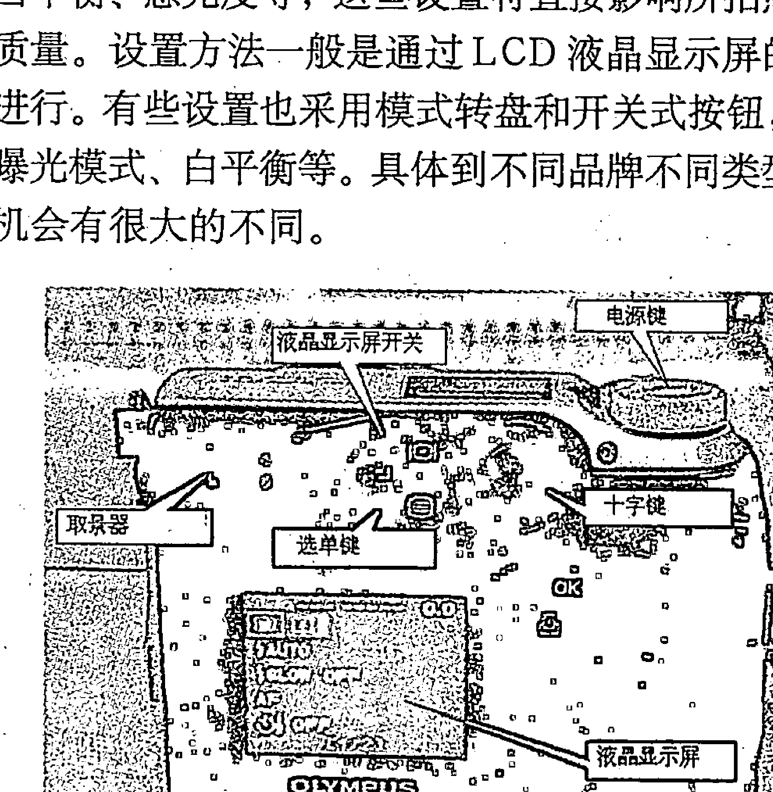

拍摄前对数码相机的设置类似于传统相机的功能选择，这个过程既简单又复杂，简单的是所有过程都可按相机面板上的功能键进行操作，复杂的是这些过程需要通过相机的菜单进行。下面就来介绍一下数码相机的设置。

- 设定分辨率

大多数数码相机都提供多种照片质量的选择，图像的分辨率越高，存储卡存储的图像数量就会越少。设置合适的图像分辨率可以合理地使用存储空间，使一次拍摄的照片更多。拍摄时究竟该用多大的分辨率，取决于对画面的质量要求以及拍摄的目的，一般有以下几种情况：①如拍摄的数码影像文件最终要通过打印或其他方法得到高质量照片、精美印刷品等，则应以最高分辨率拍摄；②如拍摄的画面通过计算机显示器观看，或通过投影机投影，则拍摄分辨率可根据计算机显示器的分辨率或投影机的分辨率而定，应力求使拍摄画面的分辨率与这些设备的分辨率相吻合；③如拍摄的画面主要是供上网传输，考虑到显示器的分辨率和目前上网传输的速率都不是很高，大的影像文件上网传输需要较多的时间，因此拍摄分辨率宜低不宜高；④如拍摄的影像文件用于书刊中作插图，则应根据印刷的分辨率和图像在书刊中的大小来确定图像分辨率，以便被采用时既不要插值处理，又不要减少像素，求得最佳匹配，使插图保持原汁原味。奥林巴斯 C-2000 设置方法为：在接通电源，不连接打印机及个人电脑的状态下将模式拨盘设定到 SETUP 位置，按十字键的上（下）箭头选择 SHQ 选项，这里有 JPEG 和 TIFF 两种选择，然后按十字键的左（右）箭头选择其中之一即可；然后再按十字键的上（下）箭头选择 SQ 选项，这里有 640 × 480 和 1024 × 768 两种选择，然后按十字键的左（右）箭头根据需要选择其中之一即可。

- 设置曝光补偿

像任何其他事物一样，摄影也有一大套规律，其中有三条最基本的规律是任何人都毫无疑问要遵循的：其一是要有严谨的构图；其二是照片要有正确的曝光。曝光；其三是聚焦要准确。准确适度的曝光是获得一张成功照片的基本条件。多数数码相机本身具有自动测光的功能，通常检测的标准以光线反射率为15%的中灰阶为依据，所以假设在相机的测光范围内纯白占了绝大多数，相机会因检测到较多的光源而误以为环境太亮，故自动减少相机的进光量，此时拍出来的照片便因曝光不足而太暗，因此在这种特殊状况下，必须进行“曝光补偿”的调整。在奥林巴斯C-2000中设置方法为：在拍摄模式下按液晶显示屏开关键使液晶显示屏点亮，然后看着液晶显示按十字键的左（右）箭头选择补偿值，按右箭头向+、按左箭头向－补偿。

#### （三）拍摄相片

好了，经过上面的安装、设置，数码相机一切准备就绪，下面就可以开始拍摄了。

##### 1. 取景

在选择好被拍摄的对象后，就要进行取景，强烈建议初学者使用LCD液晶显示屏取景的方式来观察拍摄对象，这样在液晶显示屏中显示的画面就是“所见即所得”的，最后拍摄出来的画面就是液晶显示屏上看到的画面。在取景的时候，眼睛要和液晶显示屏保持垂直角度，远近和大小通过机身后背的缩放控制按钮来调节。通过观察液晶显示屏后确定最后的取景效果，然后就可以按下快门了。

##### 2. 快门

很多初次使用数码相机的朋友在拍摄的时候还是像使用传统光学相机那样很快地按一下快门就以为完成了拍摄，结果往往失败，这是因为目前大多数的数码相机的快门都有焦距锁定功能，也就是说轻轻按下快门后，这时相机其实并没有执行拍摄动作，而执行的是焦距锁定功能，要再接着按下去后，才真正地完成拍摄动作。初学的朋友一定要记住，先轻轻按下快门后再接着用力点按下快门，这才能够完成最后的拍摄，当然在按快门的时候手一定要稳，不要晃动。很简单的，就只需要上面两个步骤，您就可以拍摄出自己的数码照片了。不过数码相机有一个快门时滞的问题需要注意。对于传统相机来说，从手指按下快门开始到快门开启工作，这段时间已经非常之短，可以说无关紧要了。但对于数码相机来说，这就变成非常突出的一个问题。不同的数码相机在这个问题上都会出现快门时滞，只是由于数码相机的档次不同，其程度不同罢了。尤其是在一些低档的数码相机上，快门时滞的问题尤其显得突出。所以在一些相机上，制造商为了提示用户，他们会在数码相机上安装一个蜂鸣器，在数码相机真正捕获影像的时候，它会发出嘟嘟或是嘀嘀的声音来提示用户。在其他时候，数码相机的内部运算还是非常宁静的，你甚至不知道它是在工作。您在拍摄时，要先轻轻地按住快门，待相机出现可以拍摄的信号后（有时是声音提示，有时是绿灯提示），这时按下快门就可以了。

##### 3. 图像回放

无论在何种模式下拍摄图像，一旦拍摄完成，将相机切换到回放模式后，都可以在相机的LCD显示屏上回放拍摄的图像。如果拍摄了好几张图像，并想全部将它们显示时，只需用索引方式即可。您可以随心所欲地将不满意的图像删除，点击删除按钮后，将会在显示屏上出现删除警告。如果用户需要确保某张图像不被意外删除，则可以使用保护按钮将其锁定，这样可以防止意外删除。奥林巴斯还提供了幻灯片显示模式，在显示模式下按选单键后按十字键的上（下）箭头，选择“幻灯片显示模式”，按OK键后幻灯片显示开始，按选单键后停止。

#### （四）导出相片

数码相机和电脑的连接一般通过两种方式：串口和USB口。串口的优点是所有的计算机上都有，但缺点是速度比较慢。USB口的速度则要快得多，是串口的二三十倍，但缺点是有的老机器上可能没有这个接口。

##### 1. 串行接口的连接

绝大多数数码相机提供串行接口，老款数码相机与计算机相连是通过配套的一根串行电缆与计算机的通信端口（COM1 / COM2）进行连接的。有些数码相机配备的串行电缆采用9针接口，如果计算机是25针的端口，应该购买一个9针的转换器进行转换。串行电缆连接的方法如下：首先将相机的模式拨盘转到“SETUP”模式，然后将串行电缆的一端插入计算机背后的通信端口COM1或COM2，在拧紧端口固定螺丝后，打开数码相机侧面串行端口的连接盖，最后将串行电缆的另一端插入相机的串行端口，这样硬件连接就宣告成功了，打开相机电源开关并启动计算机，接着进行软件安装就可使用了。所有采用Windows操作系统的计算机都支持即插即用功能，也就是通过计算机操作平台Windows 95或98会自动寻找外部设置，以确认COM接口上的外部设备，实现即插即用。而一些较高档的数码相机随机携带的软件具有智能型的搜寻COM接口功能，免去了设置COM接口的麻烦，即使没有专业知识的人也能很方便地使用数码相机。利用串行接口RS-232C连接数码相机和计算机时，必须在关机状态下连接。连接时要使数码相机和计算机都处于关闭状态，连接好后才可开启，而且应先开数码相机，后开计算机，切忌在工作时中断连接。当数码相机与计算机相连后，数码相机正在工作时一般不能取消连接，否则有可能导致数码相机中的软件出错或损失传输中的数据文件。

##### 2. USB接口的连接

使用USB线缆将数码相机连接到计算机，传输速度要快很多，被广泛应用于多种PC外设。由于USB接口即插即用，非常灵活，并且价格低，因此配置有USB接口的数码相机的市场销售量在近几年一直呈上升趋势。它的连接方法为：首先打开数码相机的接口仓盖，将数码相机附带的专用USB连接电缆中小方角一端插入数码相机的USB插座，然后将电缆的另一端插入计算机的USB端口，如果计算机处于开机状态，无须关机；最后打开数码相机的电源开关，使其处于浏览状态。此时计算机会提示安装USB接口的驱动程序和数码相机的驱动程序，按提示操作即可。

##### 3. 安装驱动程序

数码相机驱动的安装与一般硬件的驱动程序一样，只需按提示操作即可，它的一般步骤为：首先打开计算机电源，运行Windows操作系统，用USB电缆连接计算机和数码相机，将存有图像的存储卡插入数码相机并打开相机电源；然后计算机会有新硬件的提示，根据计算机提示进行选择操作，最后单击“结束”按钮即可。

##### 4. 数码相片的导出

首先，要将相机随机附带的CAMEDIA master安装到电脑上。其次，先确认电脑和相机都是关机状态，将随机附带的串口线一端插到电脑的串口上，另一端插到相机的串口输出孔。最后打开相机，将相机的多功能拨盘拨到SETUP状态，即可进行传输了。如果要在电脑上浏览相机里的照片，首先将安装好的CAMEDIA master软件启动，然后单击主窗口中左下脚窗口中的“我的相机”标题，就会显示出相机里存储的照片（如图1）。如果想把照片全部传到电脑里，则在软件菜单上选择“相机”菜单下的“下载全部影像”菜单命令，在弹出的“浏览文件夹”中选择要下载相片的文件夹，再单击“确定”按钮（如图2），则程序开始下载（如图3），就可以把相机里的照片传到电脑里了。如果要下载部分相片，您可以先选择要下载的相片，然后单击“相机”菜单下的“下载选取的影像”命令即可。

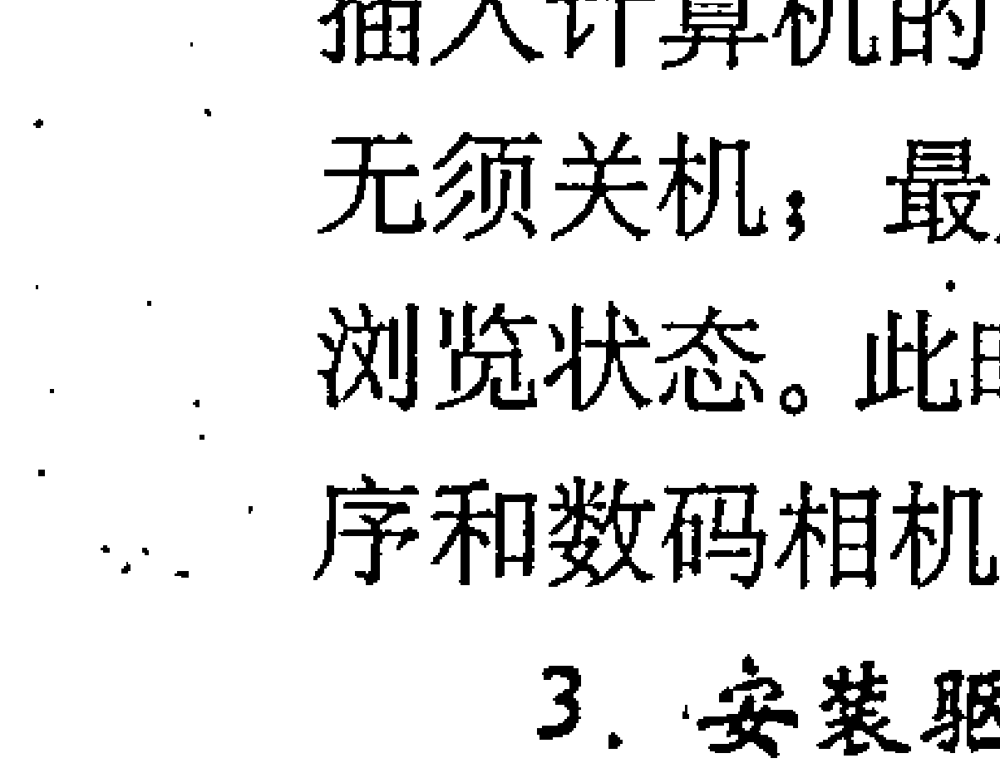

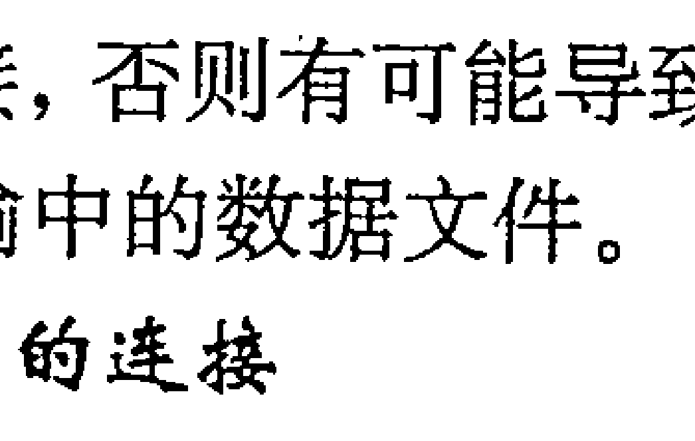


#### （五）数码相片格式简介

我们在使用数码相机拍摄相片时，常用的数码相机图像存储格式有以下几种格式，简单介绍一下，供使用时参考。

JPEG图像格式：扩展名是JPG，其全称为Joint Photograhic Experts Group。它通过有损压缩方式将图像压缩在很小的储存空间中，其压缩比率通常在10:1~40:1之间。这样可以使图像占用较小的空间，所以很适合应用在网页的图像中。JPEG格式的图像主要压缩的是高频信息，对色彩的信息保留较好，因此也普遍应用于需要连续色调的图像中。

TIFF图像格式：扩展名是TIF，全名是Tagged Image File Format。它是一种无损压缩格式，能保持原有图像的颜色及层次，但占用空间却很大，故TIFF常被应用于较专业的用途，如书籍出版、海报等，极少应用于互联网上。

GIF图像格式：扩展名是GIF。它在压缩过程中，图像的像素资料不会被丢失，然而丢失的却是图像的色彩。GIF格式最多只能储存256色，所以通常用来显示简单图形及字体。有一些数码相机会有一种名为Text Mode的拍摄模式，就可以储存成GIF格式。

FPX图像格式：扩展名是FPX。它是一个拥有多重解像度的图像格式，即图像被储存成一系列高低不同的解像度，而这种格式的好处是当图像被放大时仍可保持图像的质量。另外，修改FPX图像时只会处理被修改的部分，而不会把整个图像一并处理，从而降低处理器的负担，令图像处理时间减少。

RAW图像格式：扩展名是RAW。RAW是一种无损压缩格式，它的数据是没有经过相机处理的原始文件，因此它的大小要比TIFF格式略小。所以，当上传到电脑之后，要用图像软件的Twain界面直接导入成TIFF格式才能处理。

### 二、数码相机的拍摄技巧

用数码相机进行拍摄时，经常会遇到一些雨天、雾天以及雪天等特殊的天气，会给拍摄工作带来诸多不便，但也正是拍摄这些天气形象的最佳时机。在这些时候，掌握一些知识和技巧就显得特别重要了。这一部分我们主要介绍特殊天气下数码相片的拍摄实例及在这些天气里拍摄的注意点。

#### （一）雨天拍摄

不论是下大雨或是下小雨，都很少有人拿着照相机到外边拍摄景物的，甚至有人认为雨天根本不能拍摄风景。其实雨天的景物也有它独特的情调，何况雨天也是人们生活中必有的情景。为了反映更多的生活情景，丰富风景的内容，雨景也是我们不可缺少的拍摄题材。

##### 1. 雨天天气特点

雨天具有阴天的特点，它的光线完全是天空的散射光，光线均匀，色温偏高，被摄景物没有投影也没有明显的阴影，色调偏蓝。雨水本身具有较高的反光率，所以雨天拍摄，画面很容易出现明亮物体和高光点效果。拍摄雨景时，为要在照片上表现雨景中的雨条，除了选择大雨外，还必须要选择灰墙、绿树、山峦、深色建筑物、山洞等物体作背景，逆光或侧光拍摄（如图4）。如果雨中景物的背景是天空，那么雨天的天空一般是白色的浓密云层，即使雨下得非常大，也因背景与雨条同是白色而不能显现。另外背景越近，雨条越易显现，背景越远，景物场面必然大，雨条也不易清楚显现。因此，拍摄雨景所取的景物范围不宜过大，更要避免白色的天空占据大部分画面，而影响景物中雨条的表现。

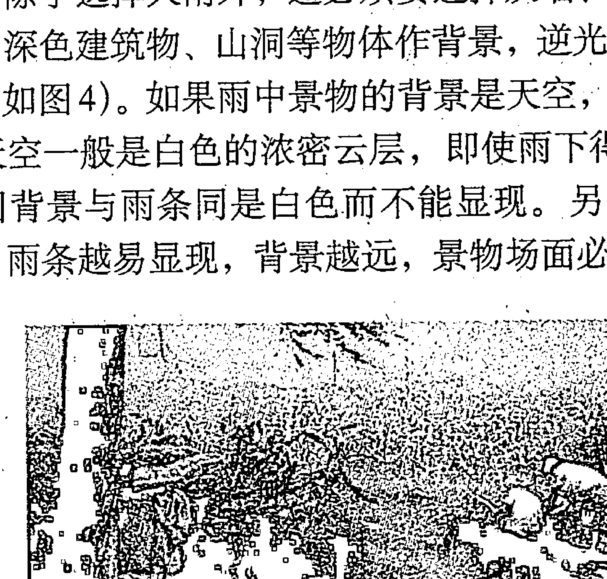

拍摄雨景时一般都要用较大的光圈及较慢的快门速度，才使雨景有足够感光。一般用1/60秒的快门速度拍摄雨景，就能显现出空间中还没落地的雨条，如果使用较快的快门速度拍摄，雨景空间的雨条会变短，而使用更慢的快门速度则能获得较长的雨条效果，不过景物中的动态可能就会不够清晰。

在小雨天气下拍摄景物，因小雨在景物中不够明显，故不能表现出雨条。但是，在拍摄深色调的树林或山峦时，由于景物中没有阳光照射，毛毛细雨在深色的物体间就会如雾层一样，显现出远浅近深的色调。如果取景范围不很大，以近处的物体明亮度作曝光基调，也能在景物中表现出如雨如雾的烟雨情景（如图5）。

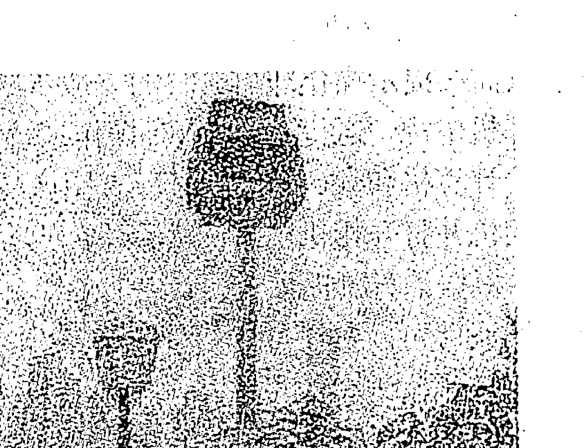

##### 2. 雨天数码相机的设置

这里的设置是以奥林巴斯 C-2000Z 为例来进行的，不同的数码相机设置方法可能不一样，请按照使用说明书进行操作，以下都以该相机为例。

首先设定快门速度，转动拍摄模式设定转盘，将拍摄模式定于“S（快门优先模式）”，然后按住十字键的上（下）箭头调整快门速度为1/60秒；然后设定白平衡，在拍摄模式下打开液晶显示屏后按选单键，按十字键的上（下）箭头移到白平衡的选项，按十字键的右箭头从“自动、日光、多云、白炽灯、荧光灯”中选择“多云”选项；最后再设定感光度，在拍摄模式下打开液晶显示屏后按选单键，按十字键的上（下）箭头移到感光度（ISO）选项，按十字键的右箭头从ISO 100 200 400中选择400选项。好了，经过这样的设定，对于雨天来说就可以进行拍摄了，当然，雨天拍摄的相片肯定不如晴天好看。

##### 3. 雨天拍摄注意事项

拍摄雨景时，注意在镜头和雨点之间拉开距离。一般可用雨伞遮住或把相机装在塑料袋里，把镜头和取景部位露出。如果在室内想透过窗子表现室外雨景时，可在室外玻璃窗上涂上薄薄的一层油。这样，水珠容易挂在玻璃上，渲染雨水的气氛。雨夜中的车灯前、路灯下、门口、窗口等光照处，雨水格外明亮、清晰、富有情调，是我们获取良好画面效果的好地方。另外，还可以利用水面或地面积水处的镜面反射，拍摄雨点打在水面上呈现出的水泡或水纹；拍摄雨点打在玻璃上形成的斑斑雨珠及模糊的水帘；拍摄花卉草木上颗颗晶莹透亮、滚滚流下的雨珠。如果选择色彩明快的物体，例如雨中行人的雨伞、自行车雨披等，利用色彩的反差，还能起到丰富雨天色彩的效果。同样，在夜景拍摄中飘洒的雨水、繁华街道、五光十色的灯光及潮湿路面上的倒影，加上变焦镜头的虚实变化，又能产生另一种风味的夜景效果。

#### （二）雾天拍摄

雾是由许多细小的水点形成的，因而它能反射大量的散射光。薄雾能掩盖杂乱无章的背景，简练地勾划出画面中的主要形象，提高凝聚力。同时，雾还能改变被摄物体的明暗反差和色彩饱和度，使被摄对象的形态与表面结构的清晰度发生变化。

##### 1. 雾天天气特点

雾天光线的色温偏高，在拍摄前，一定要调整好白平衡。为了表现雾景效果，应该巧妙地利用被摄景物的明暗反差，例如，选择暗前景和背景，就可以突出雾的形象和反映空间感（如图6）。一般来说，表现雾景的最好时机是在雾天阳光初露的那一时刻，运用逆光或者侧逆光进行拍摄，可以显示出光线透过浓雾层的美景。不过要注意，由于人的肤色和服装的反光率不如雾高，因此，在雾天摄像时，虽然可以用大景别表现雾景气氛，却只能用小景别来表现所摄人物的面部特征，否则用全景拍摄人物时，就会呈现所谓“剪影”效果或色调消减。

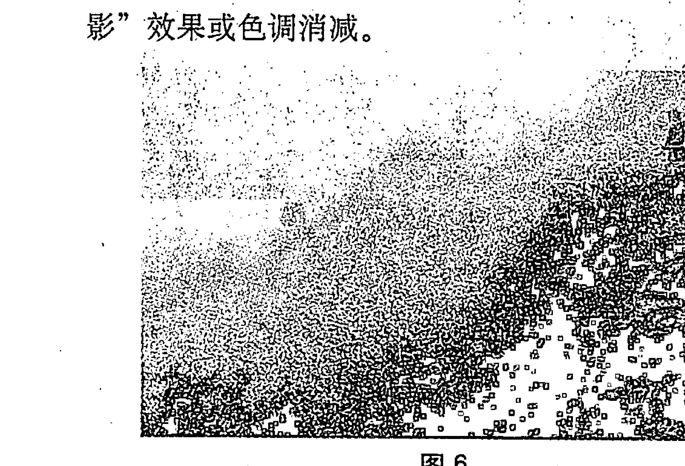

云雾在山上常会随风向移动，有时却停留在山腰间或只露出山峰（如图7），云雾存在树林中，太阳从枝叶稀疏的空间照射到林中产生一条条的斜阳光线，这种不同的光线，随着太阳高低转移投射方向和角度，显示出明暗的光柱。这一切自然景物变化，给我们拍摄山林景色创造了优越的条件，只要我们身处其景，及时掌握景物的自然变化，就能拍出有艺术性、高质量的风景照片。

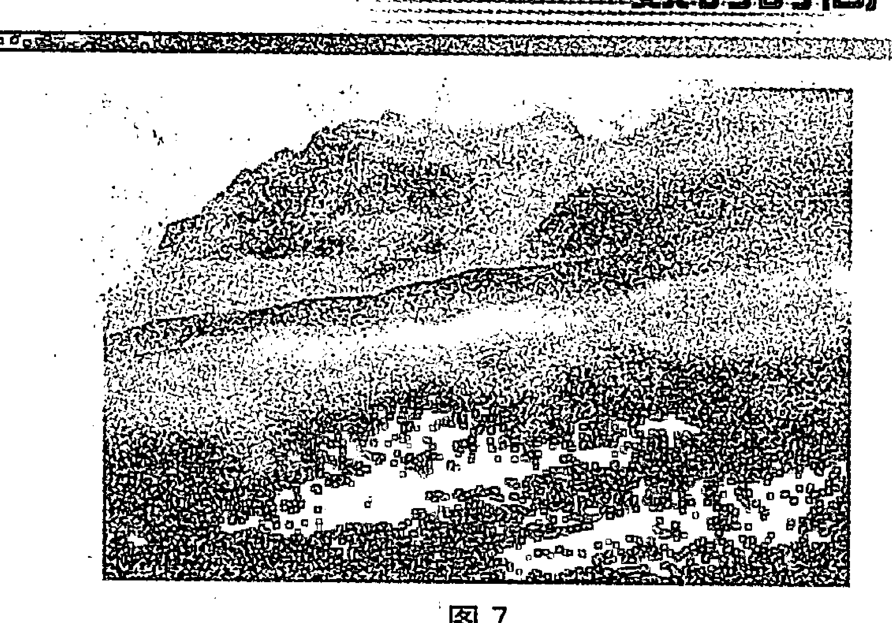

##### 2. 雾天数码相机的设置

数码相机在雾天和雨天对快门速度和白平衡的设置都差不多，在此不再叙述，只不过雾天的光亮比雨天要亮一些，这时感光度就要设定小一点了，在拍摄模式下打开液晶显示屏后按选单键，按十字键的上（下）箭头移到感光度（ISO）选项，按十字键的右箭头从ISO 100 200 400中选择200选项。这样就可以在雾天拍摄了。

##### 3. 雾天拍摄注意事项

雾天拍摄在安排画面构图时，应尽量选择有远景、中景、近景的景物，以表现景物的纵深感。前景、中景应尽量选取深暗色调的景物；浓雾时一般不宜拍摄，因为它的能见度太低，除较近的前景外，中景和远景都看不到。这时，如果加用黄滤光镜或橙滤光镜，可减弱浓雾效果。因为黄、橙滤光镜能吸收蓝、紫短波光，增强光线的透过能力。如想增强雾的效果时，可加用蓝滤光镜或雾镜，雾镜分一号、二号，可获得不同浓度的雾化效果。如想加强雾化时，还可把一号、二号雾镜加在一起使用。

#### （三）雪景拍摄

大雪过后的冬天别有一番景致，银装素裹的世界是许多摄影师的最爱。在这个时节，天空就像水晶一样透明，肃杀的树木在白色的背景上勾勒出一幅幅极其干练的轮廓，使整个冬天既显得寂寥，又显得寒冷。这样的景色进行拍摄，一定能拍出很好的数码相片。

##### 1. 雪天天气特点

雪景的特点是，反光极强，亮度极高，它与暗处的景物相比，明暗反差对比强烈。在降雪时，雪花与地面的气体和烟雾混为一体，光线显得十分柔和，但是能见度较低，所摄的画面中景物影调层次不丰富，还容易产生偏蓝色调（色温高）。因此，最好选择较深暗的景物作背景（如图8）。业余摄像时，最好选择有起伏的地形、地貌和物态，运用侧光和侧逆光来表现所摄景物的影调层次和白雪的质感。而在拍摄雪景中的人物时，则应该采用前景带雪的小仰角度。另外，在拍摄不同景别的雪景时，还要注意随时调整像机的白平衡。最佳拍摄时间可以选择早、晚，利用太阳光与地面夹角小，投影长，来增强所摄景物的立体感，达到明暗的相对平衡，而且，景物的投影还可以使空旷寂静的雪野增添生气和韵律。


##### 2. 雪天数码相机的设置

雪天快门速度不宜过慢，这时您可以用自动模式，转动拍摄模式设定转盘，将拍摄模式定于“P (程序模式)”，这种模式下对焦及曝光可以根据状况自动设定；然后设定白平衡，在拍摄模式下打开液晶显示屏后按选单键，按十字键的上(下)箭头移到白平衡的选项，按十字键的右箭头从“自动、日光、多云、白炽灯、荧光灯”中选择“日光”选项；接着再设定感光度，在拍摄模式下打开液晶显示屏后按选单键，按十字键的上(下)箭头移到感光度 (ISO) 选项，按十字键的右箭头从 ISO 100·200·400 中选择100选项；最后设定一下曝光补正，在拍摄模式下打开液晶显示屏，然后看着显示屏按十字键的左(右)箭头选择补正值为 +2 即可。好了，经过这样的设定，您就可以在雪地里拍摄了。

##### 3. 雪天拍摄注意事项

- 一是拍雪景不宜采用阴天的散漫光或顺光，因为这种光线不利于表现雪的质感。一般多采用侧光、逆光或侧逆光。使用侧光或逆光时，阴暗部分最好加用补助光，可用闪光灯、反光板，或利用周围环境中的白色反射物。
- 二是在拍摄雪景时，可加用滤光镜。除蓝色滤光镜外，其他颜色的滤光镜都可以吸收蓝、紫短波光，从而减弱雪地的亮度。一般多加UV或黄滤光镜，橙、红色滤光镜会使天空的色调过暗。拍彩色照片时，多加用偏振镜，偏振镜因为可以吸收雪地反射的偏振光，降低雪地的亮度，调节影调，而又不影响原景物的颜色。加用偏振镜可以使蓝天里的白云突出，还可提高色彩的饱和度。
- 三是利用带雪或挂满冰凌的树枝、树杆、建筑物等作为前景，可以提高雪景的表现力。因为这些前景不仅能使画面产生变化，增加空间深度，而且能增强人们对雪景的感受（如图9）。


#### （四）夜景拍摄

夜幕降临，当傍晚的天空抹去最后一缕余辉时，对于摄影者来说，都是大有可为的良宵，有可能创作出各具意蕴的作品。夜景摄影包括很多方面，主要是指在夜间拍摄室外灯光或自然光下的景物，它与日光以及闪光灯照明条件下拍摄的方法和效果都有所不同。夜景摄影主要是利用被摄景物和周围环境本身原有的灯光、火光、月光等作主要光源，以自然景物和建筑物以及人的活动所构成的画面进行拍摄（如图10）。

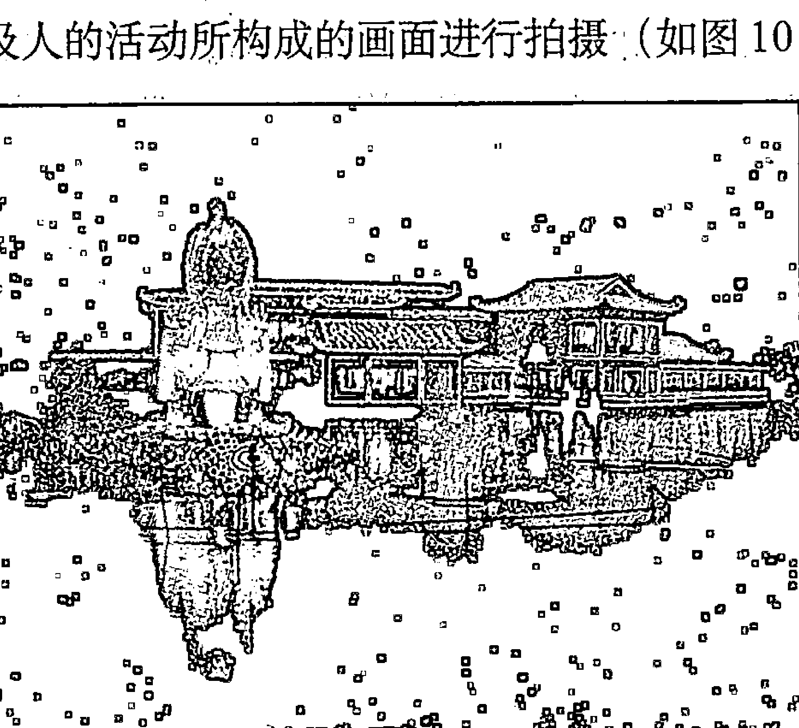

##### 1. 夜晚拍摄器材准备

夜晚拍摄需要一些必备器材。要得到理想的夜景照片，三脚架是必不可少的，当然，如果你没有带三脚架也没有关系，稳住相机或者靠在固定的物体上，尽量减小手持相机所引起的抖动；遮光罩也是要用的，夜间由于四周常有许多光源，使用遮光罩可减轻光线经过镜头折射后，在图像传感器上所产生的碍眼光斑；因此在不遮住画面的原则下，遮光罩越长越好；光线自观景窗进入，会影响到相机测光表的运作，而夜间摄影由于测光主体黑暗，所受影响更大，故需## 2. 夜景拍摄的特点

夜晚拍摄选择一个合适的地点也特别重要，选择最佳摄影角度是一幅照片成败的基础，这里需要指出的是，有时白天选好的角度到晚上去拍夜景时才发现情况有很大差异。为了稳妥起见最好在拍摄前找一个晚上到拍摄点察看了一下，灯光是否理想，拍摄点是否安全等都必须做到心中有数，机位前景最好没有高大建筑或山头等遮挡视线，前景最好选择有公路、水面，中远景有灯火辉煌的建筑群作背景，这样的夜景照片层次丰富，色彩艳丽（如图11）。

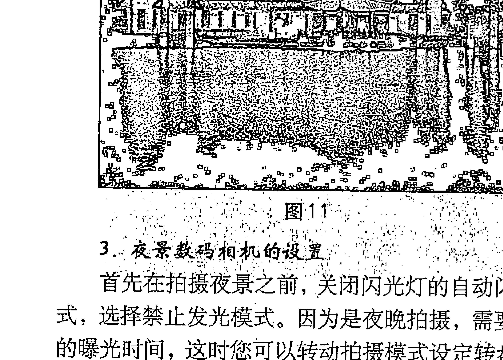

##### 3. 夜景数码相机的设置

首先在拍摄夜景之前，关闭闪光灯的自动闪光模式，选择禁止发光模式。因为是夜晚拍摄，需要更长的曝光时间，这时您可以转动拍摄模式设定转盘，将拍摄模式定于“S（快门优先模式）”，然后按住十字键的上（下）箭头调整快门速度为1/10秒；按十字键的上（下）箭头移到白平衡的选项，按十字键的右箭头从“自动、日光、多云、白炽灯、荧光灯”中选择“荧光灯”选项；接着再设定感光度，按十字键的上（下）箭头移到感光度（ISO）选项，按十字键的右箭头从ISO 100 200 400中选择400选项；最后设定一下曝光补偿，在拍摄模式下打开液晶显示屏，然后看着显示屏按十字键的左（右）箭头选择补正值为-2即可。

在较暗的环境下拍摄时，很难进行 AF（自动对焦），而且极有可能出现焦距错误的情况，使周围的影像模糊一片。所以为了准确地对焦，可以在拍摄模式下打开液晶显示屏后按选单键，按十字键的上（下）箭头移到对焦选项，然后选择 2.5m 或者无限远，就可以轻松地对焦，同时也不会出现影像模糊的照片。

好了，经过这样的设定，您就可以在夜里拍摄了。

##### 4. 夜晚运用数码相机的注意事项

- 一是防止强光直射镜头。快门开启后，强烈的光线直射镜头，容易产生光晕，造成整个拍摄过程失败，因此在取景时要仔细观察，有无强烈光亮照射镜头（远处光亮无妨）。在拍摄过程中，也要提防有突如其来的强光出现（如突然照射过来的汽车灯、行人的手电筒）。倘若快门已打开，可临时用镜头盖或帽子遮挡一下。
- 二是进行合理曝光。一张夜间摄影作品的曝光正确不正确，仁者见仁，智者见智。同一张作品，有人认为亮一点好，因为看起来比较灿烂辉煌；有人认为暗一点好，因为看起来比较有气氛，所以各有好处。由此可知，曝光的正确与否在一定意义上来说也起着决定性的作用。
- 三是防止相机移动。以上几点注意好以后，或许会因为相机有一点的移动，也会使整个拍摄过程失败。因此在进行长时间曝光时，相机一定不能有丝毫移动，要拧紧在三脚架上或放在平稳牢固的地方。拨光圈、按快门等一系列操作，都要小心。因为经过两次以上的曝光，略有微动，景物也会出现模糊和重迭现象，一幅照片即使产生的是极微重迭现象，放大时也会明显地暴露出来。所以在进行一次曝光时，不要忽略这一问题，因为这是夜景摄影常常容易发生的问题。

#### （五）焰火拍摄

用数码相机来拍摄焰火，绝对可以成为令你难忘的事情。拍摄焰火也是在夜晚中进行的，但是它不会像拍摄都市夜景那样“轻松”（如图12）。拍摄焰火的全部过程，要先把相机架好，等焰火将要开放时，打开自动功能任其在拍摄范围以内的夜空中开花、飘荡，直至熄灭，使整个过程记录在相机。应尽量使相机快门的时间延迟，当然这里的延迟，也有时间限制。等焰火开放后，在将要开花或开花时打开快门，拍摄最有代表性的一刹那。

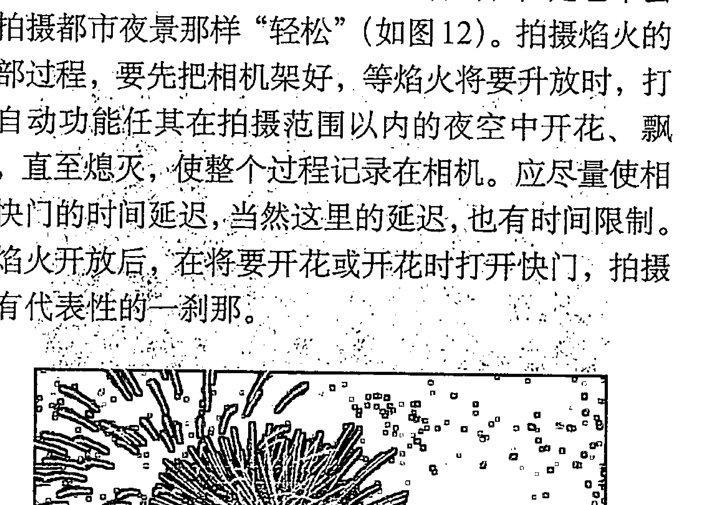

由于数码相机有拍摄延迟的问题，因此往往会错失精彩瞬间，所以在拍摄焰火时，您不妨试试看使用一下连拍功能。许多高档的数码相机都提供连续摄影功能，可以让你按2-3幅/秒的速度，连续拍摄一系列照片，这样从中选出较为合适的角度、场景的图像就会稍微容易一些，特别是你还可以将这些照片连贯起来，做成动态GIF文件，这会给你的网页或影音Email带来全新的感受。不过，有一点需要提醒的是：一般在开启连拍功能时，相机会自动关闭闪光灯，分辨率也会自动变为640 × 480以提高相机的处理速度，因此应注意保证拍摄时光线充足。

拍摄焰火是在夜晚进行的，数码相机的设置与夜景是一样的，唯一不同的是连拍功能，您可以在拍摄模式下打开液晶显示屏后按选单键，按十字键的上（下）箭头移到连拍或单拍选项，然后按十字键的右箭头选择“连拍”即可。

在拍摄焰火时，要注意一些事项，才能拍出很好的效果：首先，拍焰火要长时间曝光，不是曝光速度快，是人的反应要快；其次，拍焰火的时候为了看出焰火的花一样的光线，曝光时间应该在2-4秒左右为好，通常礼花炸开后火星从中间扩散到四周需要1秒的时间，然后就徐徐降落了，因此至少也要有1/2秒以上的曝光时间，否则看到的就不是花，而是“花粉”了；第三，如果曝光时间长可以清晰看到火光的花线，很漂亮，如果有几个礼花，则可能同时被拍下来，就更好看了，多数“傻瓜”型的数码相机曝光时间最大只有1秒左右，可以用夜景模式，关闭闪光灯，EV+2.0；最后要讲的就是用三脚架，对准目标，看到礼花升空就按快门，如果礼花密集，赶紧转到连拍模式，以免错过精彩瞬间（如图13）。

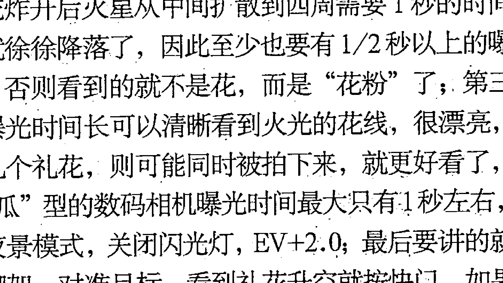

#### （六）日出日落的拍摄

在太阳刚从地平线上升起或太阳即将西沉的时候，朝霞或晚霞遮盖着太阳散射的光线，而显现出一轮没有光芒散射的圆圆的太阳，这就是拍摄日出或日落的时候了。太阳刚出或刚落时，地平线上的天空常常会有一些逆光的有色云彩，可等到云彩没有光芒散射时拍摄日出或日落景色。这样，不但可避免太阳散射而产生光晕，并可使景物的天空部分不至仅有孤单的太阳存在。

##### 1. 日落日出天气特点

在山峦上拍摄日出或日落景色，只有在云彩遮盖部分太阳或在放大时增加天空部分的曝光，才可使天空与山层的色调较为均衡。

为了避免单调，最好找一些较为稀疏的树叶、枝干等简单的物体作为图像的前景，使图像的景深加深，画面也更丰富一些。你可以选取人物的侧面像作为前景，或者是找一个轮廓非常有趣的物体背对着天空，当然也可以采用水面的反射来美化图像。

太阳的形象和色调在早晚是没有多大的区别的。如果要从照片上来区别日出或日落，应当通过景物和色调去区别，因为早晨地平线的天空一般都比较清朗，太阳上升时就会很快地散射光芒（如图14）。黄昏时候的地平线上天空一般都较为混浊，太阳离地平线尚远时就没有散射的光芒了。从色调来区别，早上天空色调偏红带黄，而黄昏色调带品红。

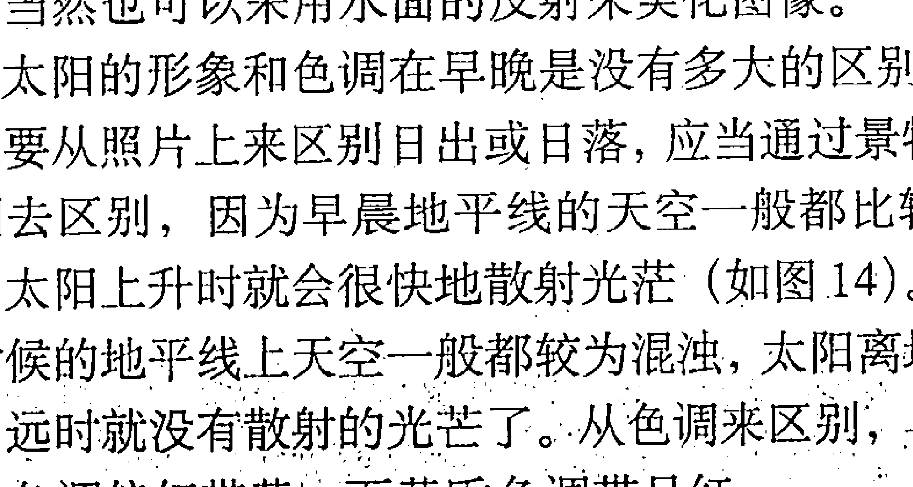

因此，拍摄日出时，太阳刚升上地平线就应该立即拍摄，不能错过。拍日落就可以从没有光芒散射的时候开始，直到将进入地平线的时候为止，都可以从容不迫地进行拍摄。拍摄日落面对的最大一个问题就是太阳本身，因为它太亮了，如果在拍摄中将太阳也摄制进去后，往往拍出的照片看起来呈一大块白色，照片也显得过度曝光，而得不到最初看到的色彩和细节。您可以等太阳落山后拍摄，或是在日落景色中想办法将太阳排除在外，比如说当云彩将太阳遮住的时候，或者是远离太阳只拍摄天空中的一部分（如图15）。

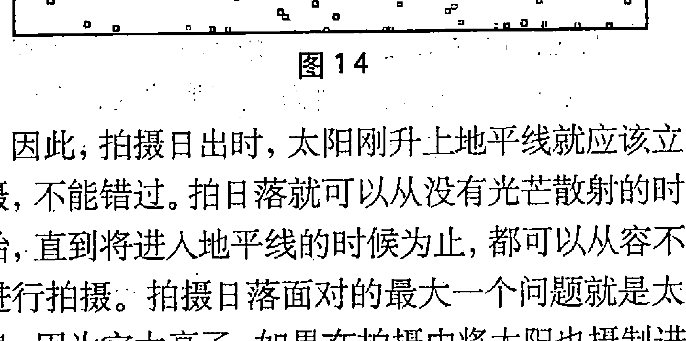

##### 2. 日出日落数码相机的设置

对于因为光线太暗而无法拍摄的夜景或黄昏，就算是在室外，也可以在不使用闪光灯的情况下，选用“低速度快门”进行拍摄。这时您可以转动拍摄模式设定转盘，将拍摄模式定于“S（快门优先模式）”，然后按住十字键的上（下）箭头调整快门速度为1/60秒；在较暗的环境下拍摄时，很难进行AF（自动对焦），而且极有可能出现焦距错误的情况发生，使周围的影像模糊一片。所以为了准确地对焦，可在菜单上选择转换为手动对焦，特别是拍摄夜间远处的风景时，只要选择无限远，就可以轻松地对焦，同时也不会出现影像模糊的照片。

另外，在拍摄夕阳的风景时，应将“白色平衡模式”设定为“日光”模式。因为原有的“白色平衡模式”会自动对色调进行修正，不能将夕阳的色彩真实地表现出来。所以为了更加真实地表现眼中所看到的夕阳，应把“白色平衡模式”转换为室外模式后再拍摄。

##### 3. 日出与夕照的拍摄注意点

旭日东升与夕阳西下，是大自然中最瑰丽的景象，也是摄影者喜欢拍摄的题材。日出与夕照的景色变幻万端，瞬息即逝，所以拍摄前要作好充分的准备工作。拍摄时要注意以下几点：

- 一是日出与日落时，光线变化很大而日出比日落变化更快，所以，拍摄时要根据光线变化情况，不断测量曝光值，以取得正确曝光；
- 二是拍摄日出时，因为地面景物亮度比较低，所以一般多拍成黑影。拍摄日落时，地面景物因有天空光照明，所以具有一定的亮度，但它与日光比起来，还是相差很大。所以选取折衷曝光量，适当照顾地面的景物。
- 三是拍日出或日落时，当人的眼睛可以直视太阳而不觉刺目时，相机镜头尽可以对着太阳直接拍摄。如果觉得太阳过亮，以致人眼不能直视时，最好不要再拍摄了，这时拍摄对人和相机都有损坏，可以添加一些其他设备；
- 四是清早的天气一般要比傍晚明朗，但日出的景象远不如落日时那样丰富多彩。太阳出来得很突然而且在高出地平线后，色彩便迅速消逝，持续时间没有日落那样长。日落在太阳还未到达地平线以前，它的云彩效果就开始出现了。而且太阳在落山之后，余辉还会保留一段时间。但拍摄日出和日落，都要抓紧时间，尤其是拍日出，更要抓紧，以免失去良机。
- 五是清晨与傍晚的太阳光的光谱成分以红色为主，色温低。拍摄影色照片时，可不考虑色温问题，仍选用日光片。因为拍出的彩色照片偏红，正可以描绘日出与日落时的真实色彩效果。

#### （七）云景拍摄

云是天空水份的凝体，它在天空中会随着天气变化而凝结、移动和消散。云的确很美很美，而且有多种不同形象，一般常见到的有浮云、朵云、鱼鳞云、片云、条云、层云、火烧云等。

爱好拍摄风景的人，对云是特别喜爱的。一张风光照片因为有了云以后会增加美观（如图16）。不少好的景物却往往缺乏天空的云彩，使画面上的天空部分过于空旷而美中不足，甚至会影响到画面的结构和色调的均衡。

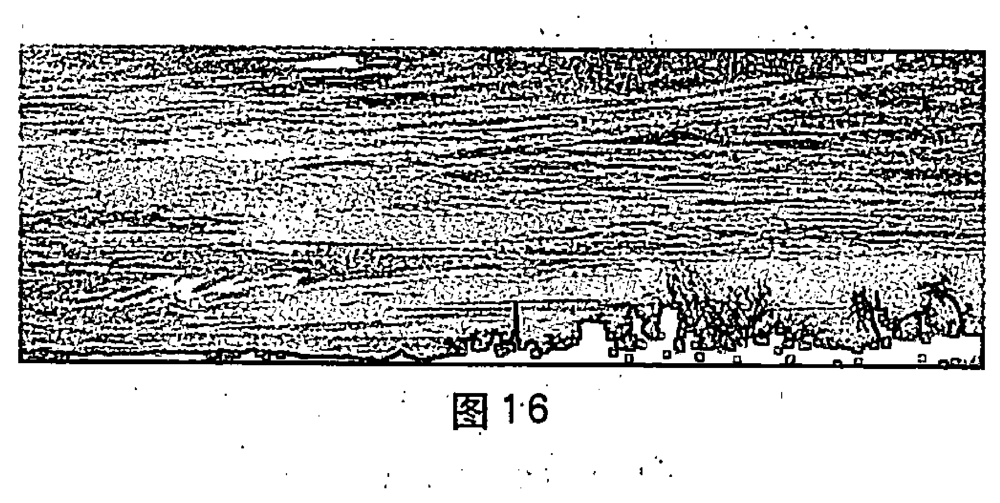

云不但能增加景物的美观和使画面均衡，而且还可利用不同形象的云表现景物的季节和气候。例如，春天早晨轻薄的浮云、夏日凝结不散的层云、秋天美丽的鱼鳞云、初冬稀疏的条云；早晨的云海和傍晚的彩云、风和日丽的朵云、台风前夕的火烧云、风雨欲来的乌云等等，都是表现每个不同季节、气候和时间的。即使景物本身完全没有明显表示时间的特征，但由于景物中有了云，从云的形象中就可以知道是什么季节气候了。

云是多种多样形象不同的。我们利用白云陪衬景物，也要注意白云的形象是否与景物相适应。例如，有显著横条的景物，就不再应选用横条的云作陪衬，不然就会使画面产生更多的横线条，造成画面呆板，线条无变化的感觉。又如采取与景物主体大小相等的白云作陪衬，也会造成画面的宾主不分。因此，采取作陪衬景物的白云，必须要注意它的形象，并要与主体物有明显不同的比例，才能使画面生动、感人。

#### （八）对数码相机拍摄的几点建议

##### 1. 详细阅读使用手册

无论你以前有没有使用过数码相机，当你拿到一款新的数码相机时，最好先拿起它的使用手册，仔仔细细地读一遍。当然，这是一件很麻烦的事情，但是数码相机不是一件简单的装置，除非你理解它所有控制钮的作用和工作原理，否则别指望拍出最佳照片。特别是其中往往有厂商针对该款相机提出的种种建议与指导，这肯定会对您有所帮助。

##### 2. 拍摄前设定好相机的参数

大多数数码相机都在设置菜单中提供多种设定值，包括图像分辨率、聚焦方式、光圈、快门等项目，其中最常用的是图像分辨率。就目前国内数码相机来说，一般家用数码相机（35万像素左右）的分辨率只提供一种：640 × 480，而像一些专业级数码相机都提供多种分辨率：2048 × 1536、1024 × 768、1280 × 960、640 × 480等等，这时你要选择好比较适合的分辨率进行拍摄。选择低的分辨率可以存储相对较多的图像但图像质量要稍差，而选择高分辨率进行拍摄，存储的图片会相对少些，图像质量也相应提高。多数相机都有一个缺省的设置，如果有一段时间未使用相机，重新开机时，有些数码相机的缺省设置会自动生效。因此，每次拍摄之前，特别是更换电池之后，必须重新检查一次相机的设置菜单，确认分辨率、光圈等的设置，否则，极有可能拍出的照片达不到预期的效果。

##### 3. 合理用好闪光灯

闪光灯的一个用处是在全日光状态下，给背光物体进行光线补偿。使用数码相机时，好的光线对拍出好的照片是非常重要的。大多数数码相机的等效感光度只相当于ISO100胶卷的感光度，在阳光灿烂的户外，自然可以大显身手，但在光线暗淡的室内或是清晨、黄昏这样光线较弱的环境下，如果没有闪光灯的配合，很难拍出高质量的照片了。由此可见闪光灯对于数码相机而言是何等的重要。而且，不仅在室内拍摄时需要使用，在室外拍摄阴影下的物体，或背光的物体时也经常需要用到闪光灯。但普通的数码相机的内置闪光灯功率有限，有效距离一般只有2-3米，因此，一些专业的数码相机还带有外部闪光灯接口，使你可以外接专用的闪光灯，以弥补光线的不足。

但是使用闪光灯有时不能完全解决问题。当在一间光线微弱的房间里拍照或在夜晚拍照时，稍近的物体会以发光体的形式出现在照片上，这样，前景与背景之间的对比度会过大，前景与背景截然不符，使照片显得极其不自然，甚至导致照片报废。不少数码相机都有曝光补偿和闪光灯强度设定功能，有些高档的数码相机还设有等效感光度设定：ISO100、200、400…，数值越大，对光线越敏感，充分利用这些功能，可以让你即使在昏暗的环境下，也能拍出好照片来。

##### 4. 避免数码变焦

很多数码相机提供了两种可变焦：一种光学变焦，一种数码变焦。在这两种变焦中，光学变焦是您应该使用的。数码变焦镜头虽然也可扩大图像。但由于使用的是插值法，所以产生出的照片有时比较模糊。如果光学镜头不能很好地扩大图像，你可以靠近物体一些再拍，最好避免使用数码变焦。

##### 5. 使用三脚架

要拍摄清晰的图像，拍照时必须绝对握稳照相机，即使最轻微的抖动都会造成模糊不清的图像，而且对于这种结果我们往往束手无策，无法通过后期制作来消除这种影响。当然，用普通胶卷相机也存在这个问题，但是，由于数码相机的光灵敏度低，它们比用快速胶卷的胶卷相机需要更长的曝光时间，在光线较弱时，更是如此。为了稳住相机，拍摄时应尽量夹紧胳膊肘，并轻轻地按下快门。但最好的办法是将相机装在一个三脚架上，或者将它放在一张桌子、柜台或其他不会移动的物体上。特别是在拍摄特写或微距摄影时，使用三脚架会得到更好的拍摄效果。

##### 6. 用电脑取舍数码相片

数码相机上一般都有液晶显示屏，这是一种特别有用的功能，但是，并不能完全依赖它。大多数LCD液晶显示屏是背光式的，在它上面显示的照片可能比在计算机上显示的照片看起来要好得多，特别是在色彩饱和以及明亮的区域。LCD最好只用于图像的定位，比如翻阅查看图像或是为图像建立索引，总之是适合于简单的查看。值得提醒的是，LCD显示屏上的图像效果并不能代表最后产生的照片。略图并不总能反映生成照片的真实情况。而且，在略图情况下看起来不太好的照片很可能有一部分是有趣的或有用的。将图像按原样下载并保存起来常常是最好的方式，因为并不知道何时才想对这些原始的图像进行处理。在做出任何修改之前下载并保存原始图像，可以保存一组原件，再取出复制件进行修饰和创意制作。

### 三、数码相机的维护和保养

数码相机是一种非常娇贵的精密光学装置，对使用环境会有比较严格的要求，尤其要避免在雨天、烟雾、结冻的天气里或爆炸性空气中使用。如保养合理，一台数码相机至少可拍约十万张照片。下面向大家介绍数码相机的保养问题。

#### （一）数码相机清洁工具

使用后的保养除了要拂去一天的尘埃，也要将遭受风吹雨打的相机做一完整、彻底的检查与整理，查看是否有部件受损需要送回公司处理等。保养步骤是先除去风沙，避免在保养或操作的过程中刮伤机身或损害机械部分；然后是消除水分，避免水气积留造成机器锈蚀故障；最后则是清除镜面与机身上的指印或污渍等。此时需要一些简易的工具来完成保养工作。常用的工具有以下几种：

- 1. 毛刷

毛刷主要用来清除“机身”的灰尘，而非用于清理镜头上的尘埃，这点大家一定要注意。在野外进行拍摄作业后，机身上非常容易沾上灰尘，使用完毕后一定要将其清理掉。毛刷的尾部有一小吹气球，若尚未购买大的吹气球时，还可以先拔下前端的毛刷，用小吹球吹去镜头上的灰尘。

- 2. 镜头擦拭纸

如有橡皮吹气球吹不走的尘垢、手渍、汗渍等，这时再使用镜头纸进行擦拭。拭镜纸是擦拭镜片专用的纸张，由于光学镜片精密度极高，使用一般纸张会有掉纤维、磨损镜片等缺点，不要使用它们来擦拭镜头。

- 3. 眼镜布或绒布

通常是用来擦拭机身的。除非是极为细致、柔软的纤维所构成的布料，才可以用来擦镜头。

- 4. 大型的橡皮吹气球

俗称皮老虎，可以用来吹走停在镜头上的灰尘，也可以使用保护镜来避免灰尘沾上镜头，做到防患于未然，在平时只擦拭保护镜即可。

- 5. 镜头清洁液

相机的清洁液有两种：一种是清理机身用的，最好使用中性且具挥发性的清洁液，但是不要使用酒精，因为机身中有些部分是塑胶制品，酒精会造成橡胶硬化；另一种则是镜片清洁液，这是为清洁镜片所设计的。一般的镜头清洁液，除非是镜片上有很难处理的油污，不得已时才使用它。千万不要动不动就用镜头清洁液清理镜头。

#### （二）数码相机的日常保护

为数码相机找一个坚固的外包装，也就是平常所说的摄影包，可用来装相机、数码存储卡、电池套件、辅助镜头等等，而且最好为数码相机的液晶显示屏配置专门的皮套。

- 1. 数码相机的存放

保存相机要远离灰尘和潮湿，保存前要先取出电池。如果数码相机长期不用时，应取出电池，卸掉皮套，存放在有干燥剂的盒子里。有条件的情况下，应该放在能够控制温度、湿度的封闭空间。相机是精密的机器，放在平常的衣橱、柜子里容易受到湿气的影响，虽然不致立刻损坏，长期下来却不是好事。能够保存在防潮箱中最好。存放前应先把皮套、机身和镜头上的指纹、灰尘擦拭干净。还要特别注意清洁取景器、机身后盖和皮套后背，因为取景时摄影者的睫毛、眼框和鼻子会接触这些地方，留下一些油迹，一旦温度和湿度适合，霉菌就会首先在这些地方繁殖起来。

- 2. 防烟避尘

数码相机应在清洁的环境中使用和保存，这样可以减少因外界的灰尘、污物和油烟等污染而导致相机产生故障。因为污染物落到相机的镜头上会弄脏镜头，影响拍摄的清晰度，甚至还会增加相机的调整开关与旋钮的惰性。在户外空旷地区，拍摄时风沙会比较多，甚至可能忽然来狂风，由于风沙容易刮伤相机的镜头或渗入对焦环等机械装置造成损伤，因此除了正在拍摄外应随时用护盖将镜头盖住，风沙大的地区最好记得将相机的护套带上。如果相机机身脏了，可以用柔软的棉绒布清洗。打开存贮仓和电池仓的挡板，用软刷或吹气球将尘土清洗干净。如果必要的话，用酒精来擦洗相机的金属部分。

- 3. 预防高温

相机不能直接暴露于高温环境下，不要将相机遗忘在被太阳晒得炙热的汽车里。如果相机不得不晒在太阳下，要用一块有色而且避沙的毛巾或裱有锡箔的遮挡工具来避光，不要用黑色工具，因为黑色只会吸光，会使情况变得更糟。在室内时，不要把相机放在取暖器或其他高温或潮湿的地方。

- 4. 预防寒冷

通过将相机藏于口袋的方法，让相机保持适宜温度，而且要携带额外的电池，因为相机在低温下可能会停止工作，这就好像在寒冷天气下要给汽车预热一样。将相机从寒冷区带入温暖区时，往往会有结露现象发生，因而需用报纸或塑料袋将相机包好，直至相机温度升至室内温度时才使用。除了结露现象，将相机从低温处带到高温处还会使相机出现一些压缩现象；肉眼不易看出，但一定要注意不要使相机的温度在骤然间变化。

- 5. 防水防潮

防止相机接触到水(特别是咸水)，但在实际使用过程中，我们不排除有突发原因或者其他方面的因素，必须在这种环境下工作，这时我们一定要采取严格的防护措施，确保在这种恶劣的环境下相机不受伤害或者少受影响。您可以随身带一个塑料拉链锁袋子，在非常潮湿或尘土的气候里，我们可以在侧面挖一个小洞刚好放得下相机镜头然后把相机放在袋子里，不让雾气、湿气和尘土进入相机，会延长它的使用寿命。如果不小心喷到水、淋到咖啡、饮料或落水时，这时您要赶快将电源关掉，然后擦拭机身上的水渍，再用橡皮吹球将各部位的细缝喷一次，最后，风干个几个小时后，再测试相机是否已有故障。注意：千万不要马上急着开机测试，否则可能造成相机电路短路。

- 6. 注意平时习惯

我们在外出拍摄景物时，还要注意背挎相机包的一些技巧，例如调整好摄影包上的带子，不要使相机离自己的身体太远，否则它会从身上弹起，碰到别人或撞到其他物体。最理想的办法是，摄影包挂得稍高一些，这样我们手臂可以防止它受碰撞，而且还可以防小偷。同时要注意，背相机时镜头朝里也可起到保护作用。

#### （三）电池的维护与保养

现在，数码相机主要是靠电池提供电源，但如果你使用的是不匹配的电池或是不注意节省，拍不了几张照片就会耗尽电力。当然，电池最终还是会用完的，当你发现它们快要耗尽时，你就需要更换它们了，下面介绍电池的清洁和维护方法。

##### 1. 合理使用电池

刚刚买回来的充电电池一般电量很低或者无电量，在使用之前应该进行充电。充满电后的电池很热，应该待冷却后再装入相机。还要注意电池绝缘皮的完整性，一旦发现有破损应该用透明胶布粘牢。这一点原来是包括笔者在内很多朋友们不太在意的地方，一次惨痛的教训引起了笔者的注意。

为了延长拍摄时间，尽量避免使用不必要的变焦操作，尽管变焦功能很不错，但在运行时要耗去大量电能。如果电池电量已经所剩无几，建议大家以移动相机的位置来得到更好的变焦效果，虽然有些辛苦，但节省了电池电量，值得！其次是避免频繁使用闪光灯，闪光灯是耗电大户，建议大家若非迫不得已一般不要使用。再者在调整图像时最好使用取景器，而不要使用LCD显示屏。LCD显示屏的能耗惊人，所以最好少用，因为普通的拍摄工作通过取景器就可以完成。当然也不能为了节省电量就将它封杀，比如在近距离拍摄时LCD显示屏就是不可或缺的重要部件。最后是记得在不使用数码相机时将其关闭。

##### 2. 用正确方法清洁电池

如果电池的电极出现氧化的情形时，需将其擦拭掉，如果是严重的氧化或脱落的情形时，应该立即更换新的电池。平时请保持电池两端的接触点（+和-）和电池盖子的内部干净。如有需要，请使用柔软、清洁的干布轻轻地拂拭，绝不能使用清洁性或是化学性等具有溶解性的清洁剂，如稀释剂或是含有酒精成分的溶剂清洁您的数码相机、电池或是充电器。

##### 3. 选择合适的充电器

充电电池当然离不开充电器，如何选择充电器，如何做到正确的充电呢？选择充电器之前，你必须明确要充电的电池类型。因为不同的电池对充电要求是不一样的，镍镉电池和镍氢电池充电曲线有区别，当选错充电器时，可能无法获得良好的充电效果甚至损坏电池。通常，充电器和电池是配套的，我们常用的充电器分为镍镉电池、镍氢电池、两用型三种。镍氢电池对充电要求较高，一般内部加设了专用的充电控制集成电路。而镍镉电池充电要求较低，可以使用镍氢充电器。而不能将镍镉充电器用于镍氢电池，否则极有可能使电池受到损伤。如果你同时具有两种电池最好购买两用型。市面上有很多劣质充电器，价格很便宜，在10-30元左右不等。这些充电器偷工减料，多半是直接将直流电压加到电池上。还有些镍氢充电器是廉价的镍镉充电器简单改进而来。鉴别的方法也很简单，这种充电器的镍镉镍氢转换仅仅是提高了充电时间，比如将5小时延长到8小时。建议大家不要购买这些廉价的充电器，否则会对你的电池造成损坏。

##### 4. 用正确方法对电池进行充电

充电时，使用原厂的充电器和电池，将有助于电池寿命的延长。对于充电时间，则取决于所用充电器和电池，以及使用电压是否稳定等因素。如果是第一次使用的电池（或好几个月没有用过的电池），其中，锂电池的充电时间一定要超过6小时；镍氢电池一定要超过14小时，否则日后电池寿命会较短。一般需经过数次充电／放电过程，才能达到最佳效率。在充电前，须确认正确的正、负极，切勿以相反的极性充电，非锂电池每次充电不可超过24小时，且电池还有残余电量时，尽量不要重复充电，以确保电池寿命。如果你对一节镍镉电池充电，只充了一会就停止充电，然后再对它充电，这样做的话是不会将电池充满的。这就是我们所称之为的“存储效应”，这种效应会降低电池的总容量和使用时间。随着时间的推移，存储电荷会越来越少，电池也就会用得越来越快。

##### 5. 正确保存好电池

如果您打算长时间不使用数码相机时，必须要将电池从数码相机中或是充电器内取出，并将其完全放电，然后存放在干燥、阴凉的环境，而且不要将电池与一般的金属物品存放在一起。因为电池长时间存放在数码相机或是充电器内，可能会造成漏电，并且造成损坏等问题。

为了避免电池发生短路问题，在电池不用时，应以保护盖将其保存。存放已充满电的电池时，要特别小心，不管是哪一类型的电池都一样，尤其是放在皮包、衣袋、手提袋或其他装有金属物品的容器中，更是不容疏忽。

#### （四）存储卡的维护保养

对于数码摄影而言，数码相机的存储性能在摄影过程中扮演着相当重要的角色。存储卡是数码照相机上较贵的附件，必须精心保护。对存储卡漫不经心的使用、处理，将导致存储卡上存有的信息丢失，甚至于损坏存储卡。因此必须注意存储卡的维护和保养。

存储卡的装载向数码相机装载或从数码相机内取出存储卡，都要在关闭数码相机的情况下进行。当存储卡正在工作时（如写入拍摄信息、删除影像文件、对存储卡进行格式化处理、读取播放已拍摄的影像等），不要试图从数码相机中取出存储卡。另外，用户在数码相机上装载存储卡的时候，一定要注意存储卡装入卡仓的方位，决不能漫不经心地乱插，而导致卡仓和存储卡损坏。对于指定存储卡，只能以指定方位装人数码相机。

##### 2. 存储卡的格式化

格式化存储卡一般利用数码相机的液晶屏所显示的功能菜单来一步步进行，但不同的数码相机对存储卡的格式化方式会有所不同，比如大多数数码相机菜单中所显示的是FORMAT，而有的数码相机显示INITIALIZE，这一点需要注意，免得出错。在格式化存储卡之前一定要确保被格式化的影像文件或声音文件没有用，否则会带来无法挽回的损失。现在，许多数码相机的随机存储卡在出厂时已进行过格式化，购买后可直接使用。

另外，在用数码照相机对存储卡进行格式化处理，或删除存储卡上已大量存储的所有影像时，必须保证数码照相机内的电池有充足的电量完成操作。

##### 3. 存储卡的存放

避免在高温、高湿度下使用和存放，不将存储卡置于高温和直射阳光下。不对存储卡施以重压，不弯曲存储卡，避免存储卡掉落和受撞击；要避静电、避磁场（如避开电视机、喇叭箱）存放存储卡，在存放和运输途中，尽可能将已存放有影像文件的存储卡置于防静电盒中。使存储卡远离液体和腐蚀性的材料。

另外，平时不要随意拆卸存储卡，避免触及存储卡的电触点，对已拍摄存储在存储卡上的信息要及时下载到计算机进行备份，以防不测。

#### (五) 镜头维护与保养

镜头是数码相机的一个重要组成部分，而且还经常暴露在空气中，因此镜头上落上一丝灰尘也是很正常的，但是如果长时间使用相机而不注意维护镜头的话，那么镜头上的灰尘将越聚越多，这样会大大降低数码相机的工作性能。例如镜头上的灰尘会严重降低图像质量，出现斑点或减弱图像对比度等。另外在使用过程中，手碰到镜头而在镜头上留下指纹，也是不可避免的，这些指纹同样也会使取景的效果下降。

只有在非常必要时才对镜头进行清洗。镜头上有一丁点儿的尘土并不会太影响图像质量。清洗时，用软刷和吹气球清除尘埃。而指印对镜头的色料涂层非常有害，应尽快清除。在不使用时，最好盖上镜头盖，以减少清洗的次数。清洗镜头时，先使用软刷和吹气球去除尘埃颗粒，然后再使用镜头清洗布。滴一小滴镜头清洗液在拭纸上（注意不要将清洗液直接滴在镜头上），并用专用棉纸反复擦拭镜头表面，然后用一干净的棉纱布擦净镜头，直至镜头干爽为止。如果你没有专用的清洗液，可以在镜头表面哈口气，虽然效果没有清洗液好，但同样能使镜头干净。注意：务必使用棉纸，而且在擦洗时不要用力挤压，因为镜头表面覆有一层比较易受损的涂层。

另外，大家千万别用硬纸、纸巾或餐巾纸来清洗镜头。这些产品都包含有刮擦性的木质纸浆，会严重损害相机镜头上的易碎涂层。在清洗相机的其他部位时，切勿使用溶剂苯、杀虫剂等挥发性物质，以免相机变形甚至溶解。

镜头除要防尘、防污染、防雨淋、防外伤外，在实际使用过程中要养成及时盖好镜头盖的习惯。镜头盖是保护镜头的最实用的工具，而及时盖好镜头盖则是保护相机镜头的最有效的方法。

#### (六) 液晶显示屏维护与保养

彩色液晶显示屏是数码相机重要的特色部件，不但价格很贵，而且容易受到损伤，因此在使用过程中需要特别注意保护。在使用、存放中，要注意不让彩色液晶显示屏表面受重物挤压，更要注意不要脱手将相机掉到地上以免摔坏液晶显示屏；彩色液晶显示屏表面脏了，只能用干净的软布轻轻擦拭，一般不能用有机溶剂清洗；有些彩色液晶显示屏显示的亮度会随着温度的下降而降低，这属于正常现象，不必维修。在温度相当低时，液晶显示屏显示的亮度将会很低，一旦温度回升，亮度又将自动恢复正常；彩色液晶显示屏的背后有一个无法从表面看到的灯，如果彩色液晶显示屏显示的影像变暗，或显示影像上斑斑点点，或根本就不能显示影像，多半是灯泡老化所致，遇到这种情况一般只要更换相应的灯泡即可。

如果怕数码相机的液晶显示屏会被刮花或拍摄时沾上面油，可以贴上PDA用的透明贴纸，这也有一定的保护作用。

### 四、网上数码摄影

互联网的发展为人们提供了极大的方便，而对于电子产品来说，这方面的优势则更为突出，特别是数码相机、数码摄影等方面。您在网上不仅能找到数码产品资料，而且能找到学习、使用方面的内容。下面介绍的这几个网站，都是很有名的数码网站。

- **IT88数码影像网**
  http://www.it88.com.cn/
  IT88数码影像网是国内处于领先地位的、内容涵盖数码影像厂家、商家、产品、社区等全方位内容的网上专业资讯网站。IT88由于定位准确，对用户的需求把握准确，建立未久访问量就迅速上升，成为国内非常有权威的数码影像专业网站。它的主要栏目有新闻信息、行情导购、销售商介绍以及数码影像社区等，其中数码影像社区内容非常丰富。在这里，既可以对生手进行培训，又可以让高手有表现的空间，还可以给不好的产品曝光，给不道德的商家曝光。它的网上相簿为您提供空间存放照片，既可以作为永久的珍藏，又非常方便与远方的朋友分享喜悦；它的网上贺卡则让您利用专业数码影像的优势，向网友提供精美的电子贺卡，为网友向亲朋好友发送贺卡提供方便。另外还有网友使用感受、驱动下载等内容（如图17）。

- **数位影像坊**
  http://www.digital.idv.tw/
  数位影像坊给笔者最大的印象就是有很多的测试报告，操作篇、测试篇、配件篇、进阶篇、实战篇等等，每一篇都写得详细并且很有特色。要看测试报告来这里就没有错了。而其他栏目就做得比较中规中矩。

- **数码时尚之数码相机**
  http://dvogue.51.net/
  这是一个关于数码摄影的专题网站，它的内容非常丰富，主要有信息快报、展示台、最新报价、风向标、深入了解、技术专题、影友论坛以及摄影基础等内容，特别是技术专题很有深度，您不妨来看一看。它的首页链接也很特别，在这您能找到特别好的数码影像网站。

- **迪派影像**
  http://www.dpnet.com.cn/
  迪派影像是笔者最常去的国内数码摄影网站，您需要什么资料，都可以在这里找到。这里的新闻基本上是每天都更新的，可以随时让你紧追数码摄影的最新资讯；当有新的机型推出的时候，还会在最新时间做第一手的测评报告；如果你想购买数码相机，“选购指南”以及“参数比较”就比较适合你了，前者可以告诉你一些购买时候的技巧，后者可以让你在一大堆相机中挑选到适合自己的相机；你还可以通过“图像样本”看看各种数码相机拍出来的效果，看了里面的照片，可不要感到惊讶哦；还有“数码学院”、“数码论坛”、“软件下载”都是很值得去看的栏目。不多说了，大家自己去看吧（如图18）。

- **数位视野**
  http://www.dcview.com/
  数位视野也是一个很酷的数码摄影网站。数位视野是台湾一个比较出名的网站，网站的内容也是包罗万象，每天更新的新闻、测评、技巧，多得令人有点眼花缭乱不知道从何看起的感觉。但和迪派影像不同的是，这里比较倾向于技术方面，你可以很轻易地察觉到，数位视野里有很多关于技巧以及技术方面的文章以及教程，所设立的“摄影教室”以及“软体教室”很适合那些对数码相机以及摄影技术一知半解的新手。还有一个“周边配件”是专门介绍各种相机的配件的（如图19）。

- **未来数码动力**
  http://www.itpower.net/
  未来数码动力是一个专注于数码信息产品的专业站点，其前身是中国第一个个人数字信息设备的专业垂直门户网站——ITPower.net。它定位于前沿的IT数码科技及产品，提供丰富的资讯内容、电子商务和其他全新理念的服务。目前的频道栏目设置涵盖掌上电脑、数码随身听、笔记本电脑、移动电话、数码影像等等。

- **摄影国际中心**
  http://www.icp.org
  摄影国际中心是享誉世界的国际性摄影机构，由著名的战地摄影师罗伯特·卡帕的哥哥科内尔·卡帕创建于1947年。该网站除了不断更新中心举办的摄影展览外，还在摄影教育栏目中提供一系列课程、讲座、专题讨论，任何人都可以付费报名参加。它的博物馆商店可以提供各种商品和世界各地难买到的书籍，主要是个人摄影家的专论、历史和批评著作、技术书籍和展览的图录，资料非常丰富。

- **摄影世界**
  http://www.photoworld.com.cn/
  由新华社摄影部主办的《摄影世界》杂志是目前国内唯一着重广泛、及时地介绍国外摄影名家名作、实用摄影技术技巧、最新摄影器材、数码影像技术最新发展动态以及国内摄影信息的综合性摄影月刊，信息量大，技术性强。它的网站也不甘落后，在这里一样可以了解到杂志的内容。

- **DIGITALCAMERA.GR.JP**
  http://digitalcamera.gr.jp/
  日本的一个数码相机网站，同一般的网站一样，介绍了各种相机的型号和价格等方面的资料。值得一去的是里面的图片库，里面收集了很多数码摄影发烧友的作品，全都水准的哦！也许你可以从这些作品当中学到一点东西呢！

- **DPREVIEW.COM**
  http://www.dpreview.com/
  这是一个专业的数码相机站点，也是国外知名的数码相机大站，里面的内容都是业界最新的资讯，最新的相机型号、规格、价格等等都可以在这里找到。还有购买手册教你如何选购数码相机。画廊里收藏了数百张由各种型号数码相机拍出来的照片，都是一些很新的照片哦！

- **摄影聚焦**
  http://www.azuswebworks.com/photography/index.html
  这个站点可以帮助你了解相机的性能、相机的历史，向你传授拍摄时自然光和人工光的利用，告诉你让画面平衡美丽的技艺。宏观和微观摄影、艺术摄影在这里你都能了解，还可以探索网上一些实用的照相站点间的联系。

- **莱卡相机网站**
  http://www.leica-camera.com/

- **佳能相机**
  http://www.canon.co.jp

- **奥林巴斯**
  http://www.olympusamerica.com

- **理光相机**
  http://www.ricoh-usa.com

- **柯达**
  http://www.kodak.com

- **乐凯**
  http://www.hgfilm.com.cn

(文/曾庆祝 天马 黑鸢)

### 重要声明

重要声明：本合订本介绍的互联网网站（主页）在刊登前经编辑审查不含色情、反动等非法内容。但由于互联网具有规模庞大、变化快速、超链接等特点，我们无法保证这些网站（主页）今后不含非法内容（链接），读者一经发现请立即向当地公安机关举报。

### 数码相片之后期处理篇

#### 一、数码相片处理软件简介

数码相机拍摄出来的是一些原始的相片，有些效果不一定会让您满意，这时借助于软件进行特殊的处理就非常有必要了，下面我先简单介绍一下本文后面对数码相片加工处理时将要使用到的几款软件。

##### （一）我形我速

###### 1. 软件简介

“我形我速（Photo Express）”是一款集图片处理、制作像册，以及图片项目管理等诸多功能于一身的软件，特别是在图片编辑处理上采用了用户易于接受的直观图方式，使图片的各项处理功能即使在初级用户手中也能发挥得淋漓尽致。

它的相片编辑功能非常齐全，并且很多都是专业级特效。主要有：对相片进行形状、大小、焦距、亮度、色彩等方面的调整，快速修复图像的不完美之处；提供多种选取形状和方式，便于对特定区域进行编辑，更利于非专业人士使用；提供多种新颖有趣字体，制作各种文字效果，包括三维、阴影、变形文本；可以充分发挥创造力的仿制功能，通过多种效果随意处理相片画面；艺术效果的特效也非常神奇，可将普通相片变成绘画艺术；另外还提供装饰功能，为相片提供边缘、画框、阴影，特别是提供的立体折叠式图像边框，非常独特。当然最妙的是提供了大量的道具，用户可任意添加至相片中，为相片增加无限的情趣。

另外它虽然提供专业化的编辑功能，但却摒弃了专业软件操作复杂的缺点，它为每一项功能都提供了鲜活的图形例子，这种所见即所得的方式，为用户提供了很大的方便。另外一个重要原因是它提供指引秘诀，用户每执行一项操作，都会出现提示，这种引导式的操作，对于初学者也是非常有帮助的。它还提供无限恢复功能，不像其他普通软件那样只能一级级恢复，Photo Express能让用户跳跃式选择恢复。

###### 2. 获取安装

该软件是款商业软件，不过您可以到 http://www.ulead.com.cn上去下载一个英文试用版用一下。如果您想获得中文版，那就只有掏腰包了，不过，48元也不算贵，人家是专业级的图像处理软件嘛！它采用的是自启动安装，您将光盘放入CD-ROM，即会出现提示画面（如果插入安装光盘后，安装画面没有自动显示，用户可双击光盘目录中的Setup来启动安装程序）。它的安装界面采用了标准的精灵式安装方法，即使初级用户也能自如地安装。安装完毕后桌面上会生成快捷图标，并在启动组中加载入Ulead Calendar Checker程序。在整个安装过程中要注意是选择安装类型，由于定制安装可选择各种组件，您可以根据自己的硬盘情况选择安装类型。但是要注意的一点是，如果您选择典型安装或定制安装时未选择全部组件，在使用某些功能时，会提示无法找到文件或要求插入光盘。

###### 3. 界面简介

“我形我速”的全中文界面非常友好，它将全部的编辑和创造工具都放在一个屏幕窗口内，非常直观。同时通过指引式的工作流程，用户可以方便地创建自己的作品。但是由于软件的窗口不能改变其大小，所以为了给用户提供更大的工作空间和查看区域，软件要求将Windows任务栏设成自动隐藏状态。

它的窗口由菜单栏、工作模式按钮、命令菜单栏、快捷工具栏、文件夹面板和浏览窗口组成。在“我形我速”中有三个模式：浏览、相片和项目。它们包含所有创意编辑、保存、打印、打开等功能。在不同的模式中，您可以找到不同的命令集合。如图1所示的浏览界面分为三个部分，第一部分是菜单栏部分，这里有三种模式转换按钮，有系统命令菜单，还有具体操作命令菜单，您可以利用这些菜单进行快速的操作。第二部分是文件夹操作部分，这里您可以轻松寻找需要的文件及其所在的文件夹；第三部分是文件显示区，在这里您可以看到图形文件正以缩略图方式显示出来，您可以轻松地浏览、查看和选择，如果要编辑某一个文件，只需双击该文件的略图即可。

##### （二）相片e派

###### 1. 软件简介

友立公司的另一款产品Ulead Photo Explorer，又叫“相片e派”，它可让您快速地查看计算机中的多媒体文件（如图像、GIF动画、视频或声音文件）。它的操作方式和Windows资源管理器很类似，都是以树状结构来显示所有的文件夹和文件。只要在此树状结构内选取文件夹，即可显示图像和图形文件的可视化略图。这样一来，您可以可视化地查找图像，而不需要记住要打开、删除、移动或复制的文件名。若要将文件插入另一个应用程序内，可采用拖放技术。此外，“相片e派”可让您立即创建包含框架和超链接略图图像的网页，或创建又酷又炫的幻灯演示、屏幕保护或Windows桌面墙纸。它还提供了数码相片软件功能，让您更轻松有趣地在PC上获取图像。它还有一个好处是您不需要另外学习如何操作，因为它每项功能的运作方式几乎都和Windows资源管理器一样。

###### 2. 获取安装

您需要的话可以到http://www.ulead.com.cn上下载一个繁体版本，简体版本可是要拿钞票的！不过这款软件也不贵，只需48元就能获得一个满意的软件。它的安装也很方便，您只需一路按“下一步”按钮就可以了。

###### 3. 界面简介

安装后打开Ulead Photo Explorer程序，会进入一个类似ACDSee程序的界面。这是图形浏览器的共性吧，作为图形浏览者一看界面就觉得设计内行，连每个按钮都很具有个性化色彩，操作也很轻松，真不愧为图形浏览器中的精品（如图2）。

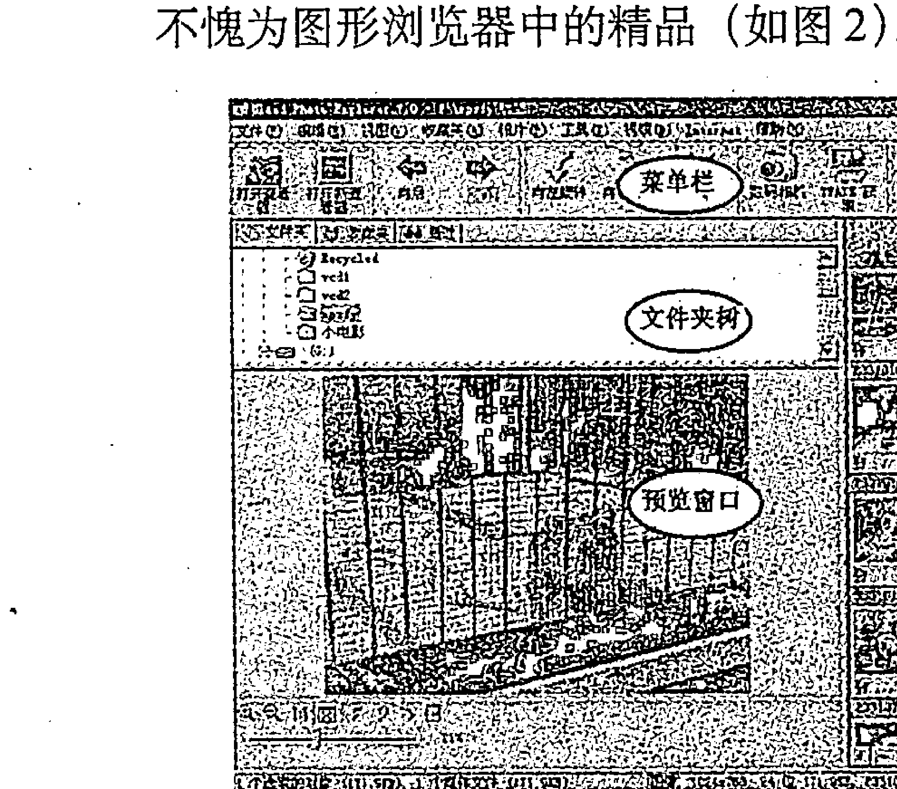

整个界面可分为工具栏、文件夹树、浏览窗口和预览窗口四个部分组成。浏览器工具栏可让您快速访问经常使用的命令，您可以根据自己的需要来自定义工具栏，当您第一次打开浏览器时，将会看到默认的工具栏；它的“文件夹树”里有“文件夹”、“收藏夹”和“最近访问的文件夹”三个选项卡，您可以在浏览窗格中切换和显示，而无需通过菜单命令；它的“浏览器窗格”，可让您轻松地以列表或略图查看模式来查看文件。列表查看模式提供了每个文件的详细信息，例如文件大小、类型和最后的修改日期；而略图查看模式则可显示可视化的图像属性，或文件的代表图标，让您轻松地找出您要的文件；它的“预览窗格”，可让您查看图像、音频或视频等文件。

##### （三）COOL 360

###### 1. 软件简介

Ulead COOL 360可让您轻松快速地将一系列的相片转变成360度的全景画或图像，并通过电子邮件、网页来发送或放到MS Office文档中。
COOL 360提供了相当简易的接口，以及好用的向导，可让您快速地制作美观的全景画。此外，它还提供高级的相片缝合、变形、对齐和混合工具，保证让您制作出顶尖的作品。通过电子邮件，您可以将完成的全景画以.exe文件（包含了Ulead Panorama浏览器）的形式传给其他人，您也可以将它们存到网页上，或插入文档及演示文稿中作为静态的图像。它生成的全景图像文件十分小，如原先18幅共778KB的图像文件(.JPG格式)，制成全景图(格式为.IVR)后只有753个字节，而将图片制作成JPG格式，也只有327KB，还不到原来的一半。此外它还能将全景图制成屏保、将作品以Email直接发送、直接用于网页制作、输出为可执行文件使未装有Cool360的用户也能浏览等等功能。它输入时支持BMP、JPG、TIF、PCD以及PNG等文件格式，而输出支持MOV、IVR、BMP、JPG、TIF、PNG以及UPJ（COOL 360 project file）等格式。

###### 2. 获取安装

如果需要的话，您可以到它的主页(http://www.ulead.com)去下载，下载大小为6.78MB，其中包括全景图制作与浏览功能。它的安装也很简单，只需要在解压缩软件窗口中单击安装软件fo-c360.exe软件，然后一路按“next”按钮即可。当然，如果您购买了友立公司的“相片e派”或“我形我速”软件，他们将赠送一个中文简体版本的Ulead COOL 360给您，让您制作一个优美的全景图。

###### 3. 界面简介

Ulead Cool 360的操作界面很简单，也很实用（如图3）。主要有以下几个部分组成：一是软件主页按钮，单击它您将进入主页了解软件的情况；二是步骤操作介绍，它分“开始”、“调整”和“完成”三个步骤来讲述全景图的制作；三是具体操作按钮，主要有新建、打开、保存项目以及打开文件和获取文件等功能；还有就是打开全景图浏览器和进行设置，利用全景图浏览器可以看到您制作的全景图效果。

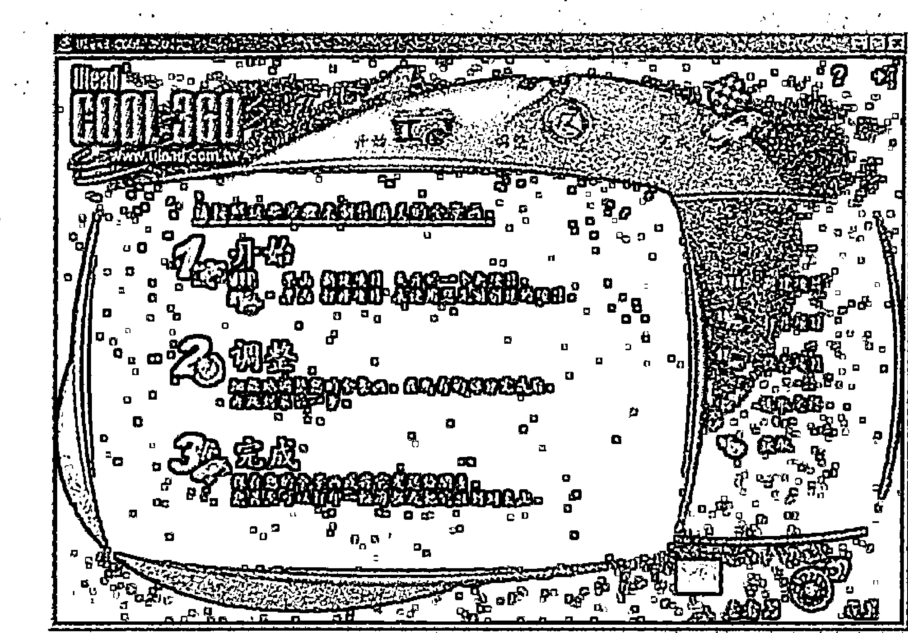

#### 二、数码相片的处理

用数码相机拍摄的相片，往往因曝光等原因不能让您满意，而为了达到某种效果，进行一定的处理就很有必要了，您还可以改变相片的大小、焦距，可以给它添加文字、增加特殊效果等等。我们下面将告诉您用“我形我速”软件进行数码相片处理的方法。

##### （一）智能调整数码相片

“我形我速”提供了智能调整的功能，利用这个功能您可以轻松地改变相片的效果。它的方法为：

首先在浏览模式下选择一张相片，双击该相片打开它，然后单击“编辑”菜单，使其显示命令操作菜单，然后选择“调整”菜单中的“智能改善”命令，在这里您就可以进行调整了（如图4）；单击“调正”按钮，将会把您的相片自动摆正，以校正拍摄时相机不正；单击“修剪”按钮，程序将自动把相片中的多余部分去除；单击“亮度和对比度”，程序将自动调整拍摄时亮度不足或光线偏暗的相片，使其更加合理；单击“色调和饱和度”按钮，程序将调整图像的色调和饱和度，来改变图像或选定范围的整体色调；单击“焦距”按钮，程序将自动使图像锐化或模糊，使其更自然；单击“色彩增强”，程序将自动锐化图像中的色彩，使它们更突出。如图5所示是经过调整的相片，是不是比前图中的相片更好看一些了。

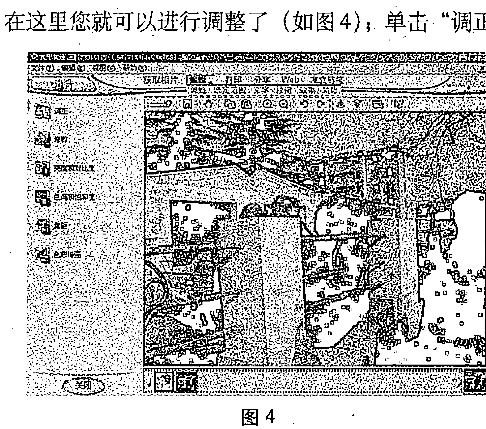

##### （二）手工调整数码相片

以上介绍的是自动调整相片的各项参数，但是有时自动调整难以让人如意，这时候就需要自己去手动调整了，这样处理出来的相片才能更让人满意。

###### 1. 调正数码相片的位置

很多时候，使用数码相机拍摄的相片并没有完全对齐或居中，这时就需要进行调正了，特别是用数码相机竖起来拍摄的相片，它在导入电脑时往往是横放的，为了方便查看与管理，就要进行调正。操作方法为：首先打开相片图像，然后单击“编辑”菜单中的“调整”命令，在工作区顶端的工具栏中选择“旋转和调整大小”命令，这时出现“旋转和调整大小”（如图6），使用左边的“选项面板”来旋转或翻转图像，单击“左转90度”，相片将逆时针旋转90度，单击“右转90度”，相片将顺时针旋转90度，您还可以在“按角度旋转”框中输入旋转的角度，程序将按您输入的数字旋转，这就看需要了，如图是经过旋转的相片，位置基本上摆正了。在这个界面中，还有一个更简单的操作方法，那就是单击并拖动图像周围的圆形拖柄，来任意地旋转图像，将其旋转到满意的位置，松开鼠标即可。

###### 2. 调整数码相片的焦距

数码相片在拍摄时，有可能由于焦距设置不好而导致相片效果不佳，这时可以通过调整焦距来改变其效果。当然，“我形我速”并不会真正调整图像的焦距，而是使用“锐化”工具来模拟此效果。对焦不好的图像可以通过此过程得到改善，但无法达到尽善尽美的程度。调整焦距可用来创建一些完美的艺术效果。方法为：首先打开相片图像，然后单击“编辑”菜单中的“调整”命令，在工作区顶端的工具栏中选择“焦距”命令，这时出现“焦距”选项板，在“预设值”选项卡中选择适合的调整选项，然后单击“应用”按钮，则该效果即会被应用于您的相片中。当然，有时候程序预先设定的值不一定能满足我们的要求，您可以单击“高级模式”按钮，在这里您可以进行精细调整，您可以拖动“程度”中的滑动条来调整图像的锐化程度，可以拖动“范围”中的滑动条来调整颗粒或分辨率的大小，数值越大，效果越柔和（如图7）。调整好后单击“应用”按钮即可。

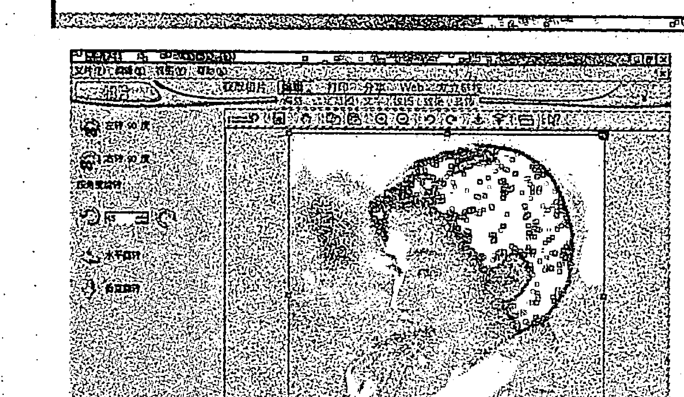

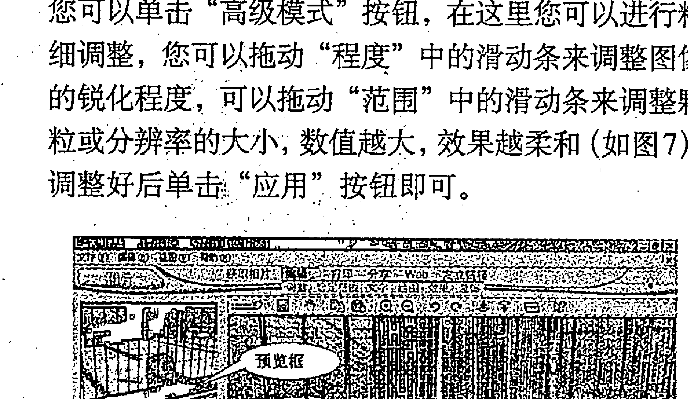

###### 3. 调整数码相片的色彩

通常从数码相机中捕获的图像，色彩总不比现实中那样鲜艳。不过，您可以快速地调整图像中的色彩，使其更加美观。另外，您也可以使用某些特殊的设置，在其他比较平常的图像中创建出一定的艺术效果。操作方法为：首先打开相片图像，然后单击“编辑”菜单中的“调整”命令，在工作区顶端的工具栏中选择“色彩平衡”命令，这时出现“色彩平衡”选项板，在左边“预设值”选项卡中选择一个预设的色彩滤镜选项，然后单击“应用”按钮，则该效果即会被应用于您的相片中。如果选择“高级模式”按钮，在这里您可以进行色彩调整，拖动色彩滑动条向青、洋红、黄或红、绿、蓝方向移动，则色彩值将发生相应的变化，这将影响整个图像的状态，您在上面的预览框中将看到相片的变化，如果调整好了，单击“应用”按钮即可（如图8）。

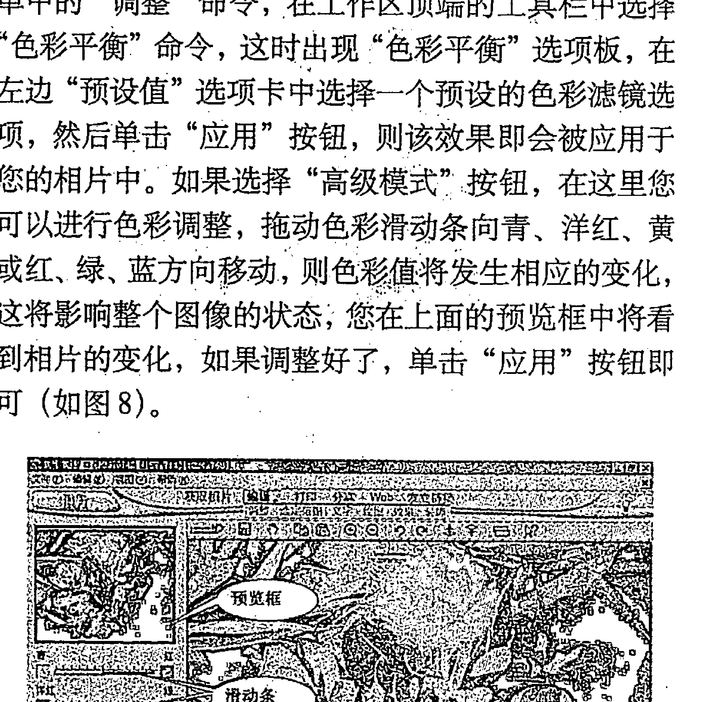

###### 4. 调整数码相片的亮度与对比度

利用数码相机在低亮度或高对比度（例如在房间内，并且窗户有阳光照进来）的状况下拍摄的图像中，可能会有较暗的区域与曝光过度的区域。这时就要进行一些调整。在“我形我速”中您可以用光线工具纠正这种状况。方法为：首先在浏览模式下打开相片，然后选择“编辑”菜单中的“调整”命令，在工作区顶端的命令面板中选择“照明”命令，这时打开“选项面板”供您选择，这里共提供了八种预设模式，您可以选择其中一种单击“应用”按钮即可。如果不满意它提供的预设模式，可以单击“高级模式”自己定义，单击“高级模式”后这里有三个选项供您自定义使用，用鼠标拖动“亮度”滑动条控制相片的明暗，用鼠标拖动“对比度”控制相片的对比程度，而调整“Gamma值”则可以根据您的监视器让您的相片更美丽。调整好后单击“应用”按钮（如图9）。

###### 5. 修剪数码相片的边幅

我们在用数码相机拍摄时常常会将不需要的景色拍摄在取景范围内，这时就需要将这些部分去掉，您可以使用“修剪”工具删除不需要的边缘、修剪图像。具体方法为：首先打开要修剪的相片，在命令面板中选择“编辑”菜单中的“选定范围”命令，这时选项面板上出现多个工具，单击“选取模式”下拉框，选择“创建新的选定范围”，在“选定范围框中”选择“长方形”。矩形（和方形）选定范围的处理方式最简单，如果您使用圆形或椭圆区域，则会创建一个遮罩，并且修剪的图像将会放在矩形底框之中；在“柔化边缘”框中选择一种模式，它是控制选定范围边缘的模糊程度，有助于选定范围和背景更平滑地混合，对修剪而言，要将“柔化边缘”设成最柔状态，这样效果较好（如图10）。选择结束后单击“下一步”按钮。

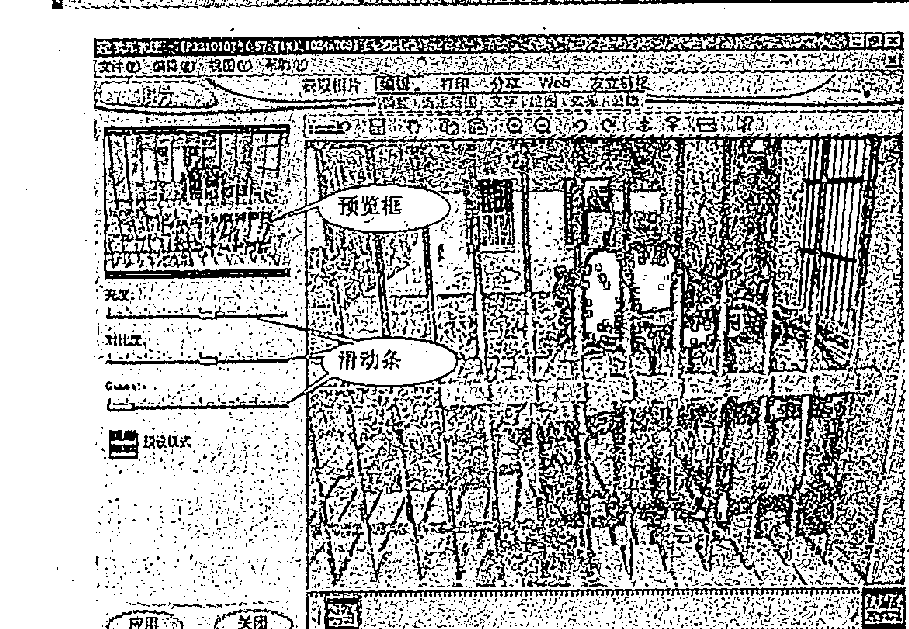

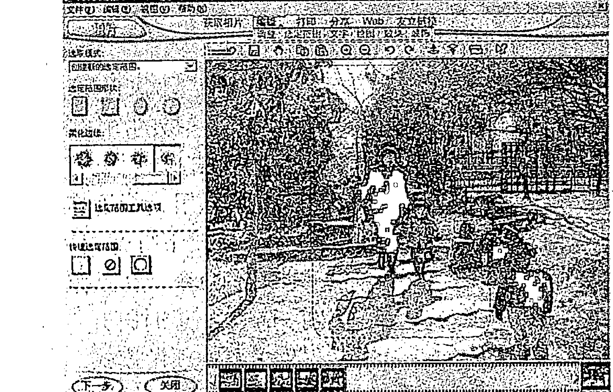

这时进入“边缘类型”设定界面，单击“边缘类型”下拉框，选择一种类型，这里有二维、魔术和文字三种，当然是选择魔术了，这样给您一种魔幻的感觉；如果单击“显示所选边缘类型所选值”按钮，您还可以改变其值，让您有更多的选择机会，如果不需要改变，那就按“以当前选定范围修剪”按钮，这样，整个相片就变成选择的相片了（如图11）。怎么样？是不是比原来的相片更有特色了。

###### 6. 为数码相片添加画框

日常生活中，经常将拍摄的相片用相框装起来，这样相片看起来不仅好看，而且有利于保护相片。在“我形我速”中，您可以轻松地在图像对象周围放置画框，让您的相片更具活力。方法为：在浏览模式下打开相片文件，选择“装饰”菜单中的“画框”命令，然后，在出现的界面中从“画框类型”略图中选择一种喜欢的画框，并用鼠标单击它，选择好后单击“应用”按钮，则画框就会被添加到相片的周围（如图12）。如果您想调整画框在模板中的位置，只需简单地在图像上移动光标，并拖动周围的拖柄栏即可。

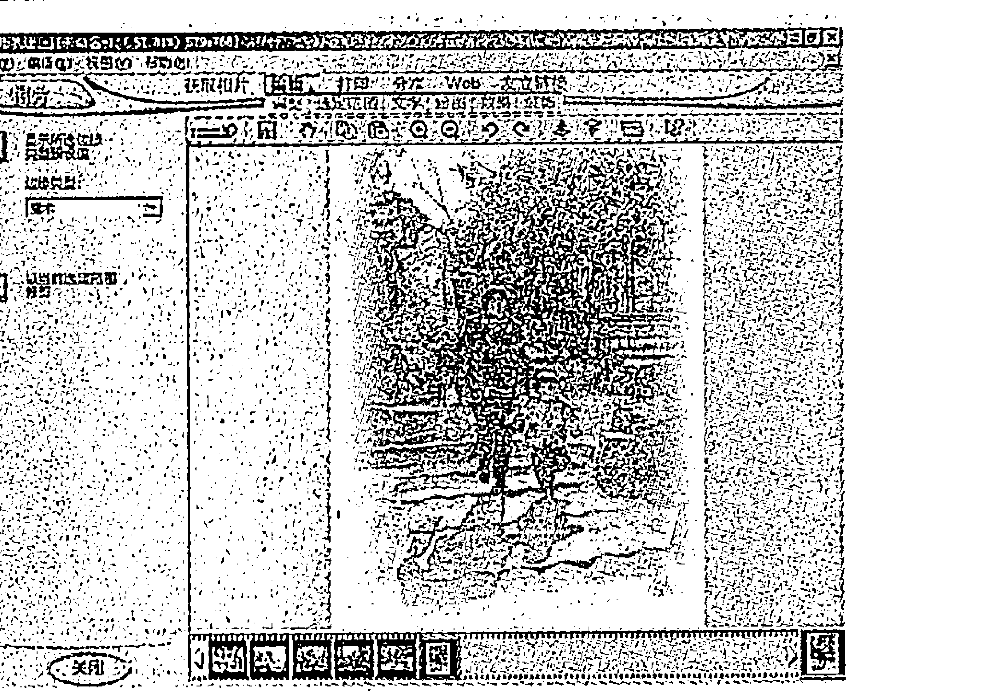

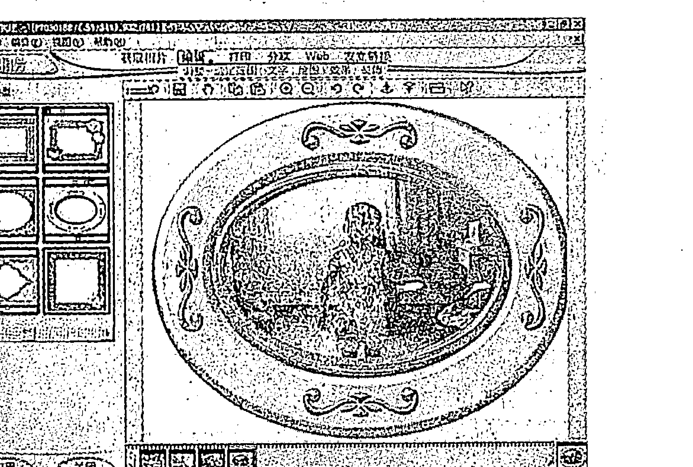

###### 7. 为数码相片添加三维文字

文字特效可以使平淡无奇的文字变得突出和更具吸引力。要应用文字特效，如：火焰、烙印和霓虹，是很容易的。还可以对大多数的效果进行微调，以满足你的需要，而三维文字是经常用的一种文字特效。方法为：

在浏览模式下打开相片文件，然后在工作区顶部的命令面板中选择“编辑”菜单中的“文字”选项，在该项中选择“添加／编辑”命令，这时出现选项面板，在“文字”框中输入文字，然后在下面的文字修饰中选择粗体和对齐方式等，在“字体”框中选择一种您喜欢的字体，至于文字的颜色效果嘛，那就看您的需要了，我选择了一种渐变的颜色，选择好了吗？选好就按“应用”按钮吧！

这样文字就添加到相片中了，这样还不行；得调整一下文字的位置，您只需用鼠标单击并拖动它就可把它放到任意位置了。然后在“文字特效”中选择“三维”命令，在出现的预设值选项面板中选取三维文字样式，这下单击“应用”按钮，三维文字才真正出现（如图13）。

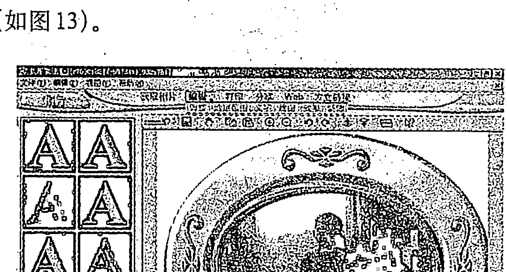

图13

对于添加的三维文字，您还可以给它添加一些阴影，这样就更有立体感了。首先在上面操作区选取文字对象，然后从命令面板中选取“编辑”菜单中的“文字”选项，再选择“阴影”命令，在出现的选项面板中首先单击“添加阴影”按钮，然后选择“色彩”中一种颜色，再在“透明度”中选择一种透明程序，在“柔化边缘”中选择一种柔化方式，在您选择这三种参数时，程序将自动把您的选择应用到文字上去，如果您对阴影位置不满意，还可以拖动阴影的拖柄，来放置阴影相对于对象的位置，怎么样，比较方便吧，看看效果如何（如图14）。当然，如果您又不想要阴影了，还可以选取文字对象，然后单击“删除阴影”按钮即可。

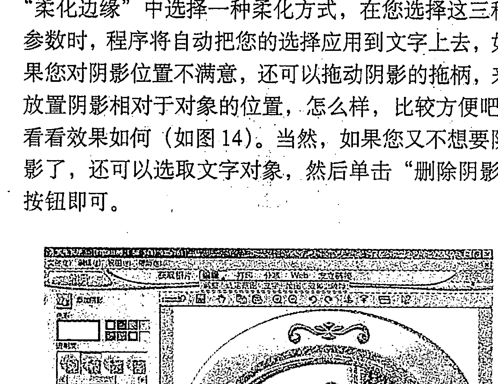

图14

除了上面介绍的两种文字特效外，您还可以为相片添加玻璃、轮廓浮雕、纹理浮雕、火焰、雪花、霓虹、烙印、雕凿以及边框等特效，具体操作方法与上面差不多，在此就不一一介绍了。

###### 8. 用仿制工具处理相片

仿制工具可快速地复制图像的一部份，并天衣无缝地将其粘贴到图像的其他位置。仿制工具可用于还原损坏的图像或仿制部份相片，例如某个人不小心被照进相片这类情况。您也可以将心爱偶像的脸孔仿制到喜欢的相片中。方法为：

首先在浏览模式下打开相片文件，然后选择“编辑”菜单中的“绘图”选项，再选择“仿制”命令；这时进入仿制界面，在“来源相片视图”框中选择仿制的源点，将指针移到“选项面板”的来源图像中。单击要仿制的区域，之后将显示一个十字形指针，并锁定到来源图像。这就是要仿制的来源区域。如果看不清楚，可以用下面的放大镜将相片放大后选取，如果要在另一个相片选择点，可以在“选择相片来源”中选择您需要的相片。接下来在工作区中要更改的图像区域上拖动鼠标，仿制来源区域将逐渐地显示在损坏的区域上（如图15）。

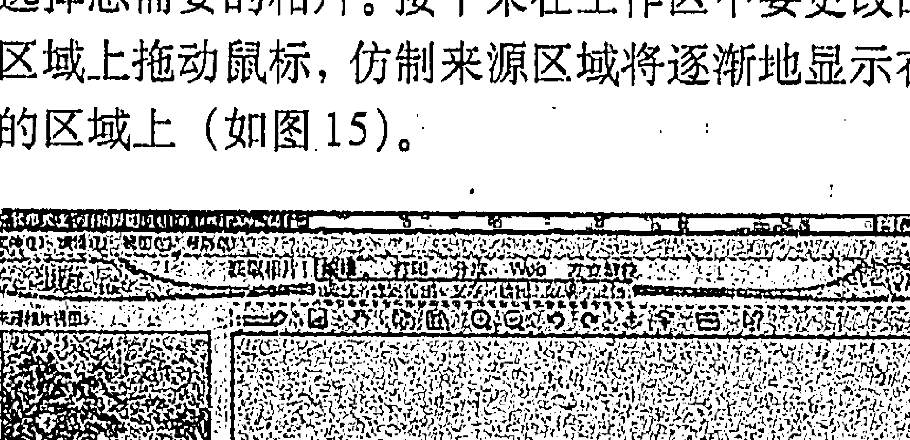

图15

注意，在使用仿制工具时，尽量使用较短的笔画并经常放开鼠标按钮。这样可以方便地撤消误操作而不会造成大的损失。单击“撤消”按钮或按 Ctrl + Z ，一次撤消一步操作，最多可达 10步。

如果您对画笔不满意，还可以改变它的属性。“我形我速”为富有灵感的艺术家提供了各式各样的画笔，使电子艺术成为真正极具创意的过程。众多的选择与选项可能会给您带来一些困惑，为自己的项目选择最适合的工具的最佳途径是多加尝试。如果要改变画笔，可以单击“调整画笔属性”按钮，这时您可以进行调整，这里有五种工具，单击“形状”可以选取画笔笔头的形状，还可以用“选项”选取绘图方法；单击“大小”可以调整笔头的高度和宽度，还可以通过单击锁定按钮，保持高度和宽度相等；单击“柔和边缘”来调整画笔笔划的柔和边缘，选取某个预设的柔和边缘值，在可用的预设值中，从左到右可以增加柔和边缘，使画笔笔划与图像更融合。单击“透明度”调整画笔笔划的透明程度，选取某个预设的透明度的值，橙色的小球代表该画笔笔划的透明度设置（如图16）。

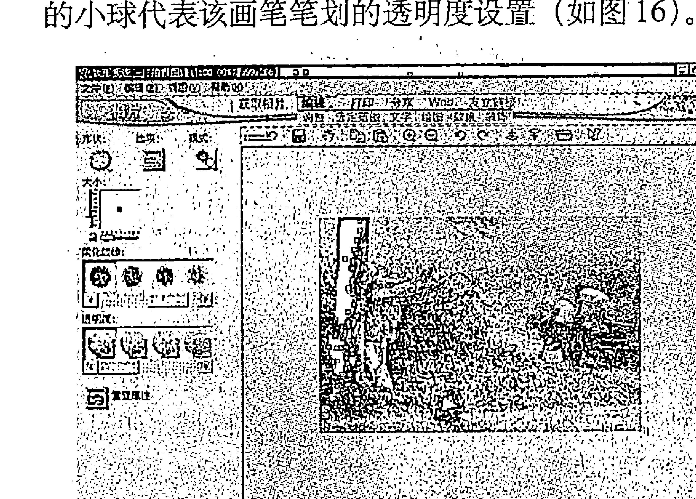

##### （三）为数码相片添加特殊效果

效果或特效是图像处理的一大类别，用“我形我速”来制作非常容易，大多数效果可以在相片模式中通过单击命令面板上的“编辑”菜单中的“效果”后看到。通常，所有的效果可以通过双击选项面板中的略图来应用，您可以单击选项面板中的“高级模式”按钮进行微调，单击“应用”可以使用该效果，按Ctrl+Z可以撤销修改。

###### 1. 翻页效果

创建图像某个角被翻起的效果，使它看起来像翻起的书页。操作方法为：首先在浏览模式下打开相片文件，然后选择“效果”菜单，再选择“特殊”菜单上的“翻页”命令，在这里有预选模式供您选择，从选项面板中单击某个翻页略图，然后单击“应用”按钮即可。

当然，您也许对程序提供的预设模式不满意，您可以单击“高级模式”按钮进一步调整该效果，单击后出现如图17所示的操作面板，在预览框中您可以看到应用到相片上的当前效果设置的略图，用鼠标单击“控制点”，可以让您微调该效果的方向和程度，红色的拖柄可以移动整个角落，绿色的拖柄可以控制角落的角度；单击“角落”可以在上、下、左、右四个角落中选择一个卷曲的位置；单击“类型”可以设置卷曲的形状；单击“背景色”可以设置背景色和卷曲形状；单击“角度和照明”可以调整光源的位置和翻页的角度，滑动顶部的灯泡，可以调整图像上光线的角度，调整螺旋控件(绿球)，可以增加或减小卷曲的紧密度。

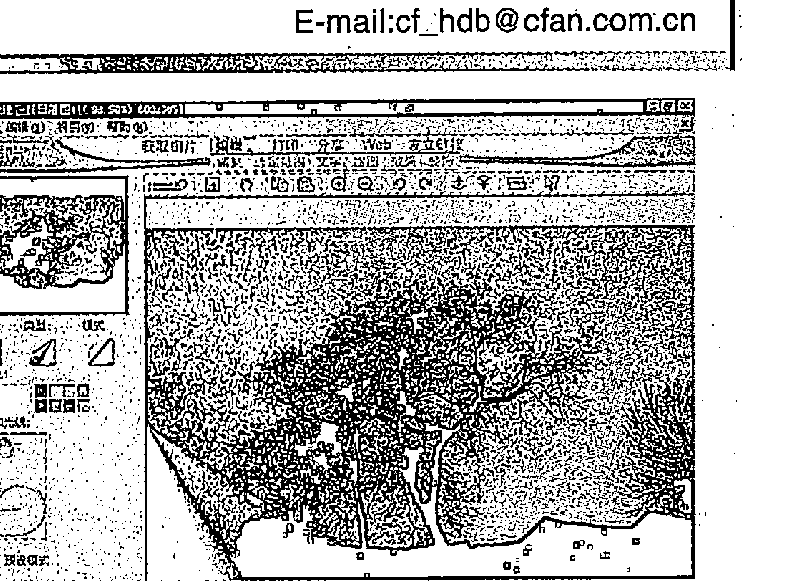

###### 2. 边缘特效

边缘效果应用于相片，可以起到装饰的作用；方法为：首先在浏览模式下打开相片文件，然后选择“编辑”菜单，再选择“装饰”菜单上的“边缘”命令，从子菜单中选择一种如“魔术”，在这里有预选模式供您选择，从选项面板中单击一个边缘样式，然后单击“应用”按钮即可。如果您不满意，可以从预设模式中选取然后单击“高级模式”调整其他属性，在“边缘色彩”中选择一种颜色，然后单击“应用”按钮（如图18）。对于更多高级效果，您可以选取渐变或纹理来装饰边缘。

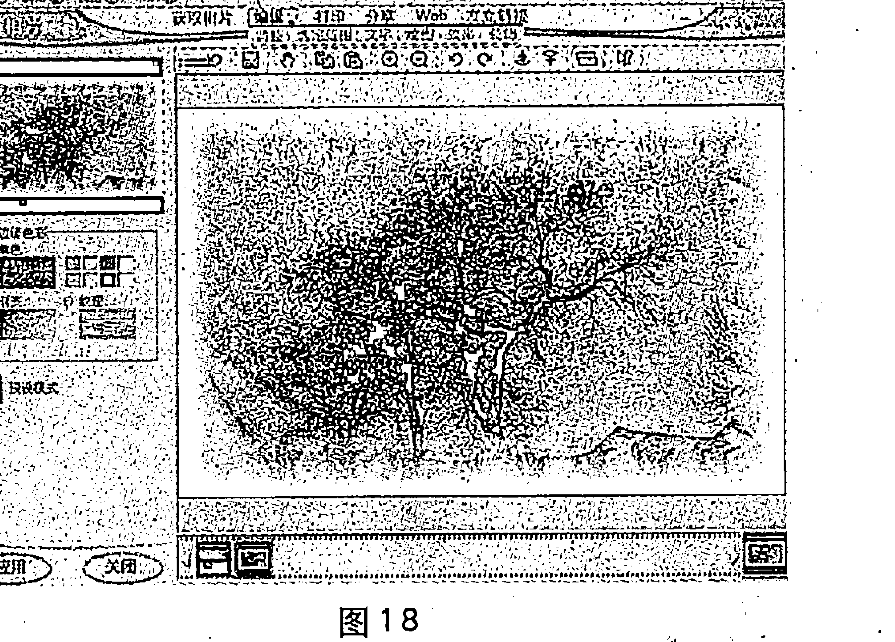

###### 3. 镜头特效

不同的镜头效果能改变图像的氛围。操作方法为：在浏览模式下打开相片文件，然后选择“编辑”菜单，在“效果”选项中选择“镜头”命令，然后在子菜单中选择其中一个命令。在子菜单中有八个命令菜单，下面以聚光灯为例介绍其设置，选择“聚光灯”命令，在出现的面板中选择预设的几种效果之一，选好后单击“应用”按钮即可。您还可以单击“高级模式”进行微调，单击后出现调整面板，最上面的是“预览图像”，您在下面调整参数，则调整的图像就会显示在略图预览框中，在“预览图像”中有两个小球，一个是红球，代表光源，而另一个是绿球，代表光线方向，您可以调整其位置来控制图像上灯光的位置和方向，只需用鼠标拖动到相应位置即可。在“预览图像”下面是“灯光控件”，这个决定光源的高度，离对象的距离，以及灯光所覆盖的区域，红球代表光源，而绿球代表该聚光灯效果的直径，用鼠标拖动调整。再下面就可以拖滑动条来调整了，拖动“曝光”滑动条改变光源的强度，拖动“外光”改变外光的强度，这会影响到该聚光灯效果的外部亮度，拖动“亮度”改变聚光灯的亮度，调整好后单击“应用”按钮，则该聚光灯效果将应用于图像中（如图19）。

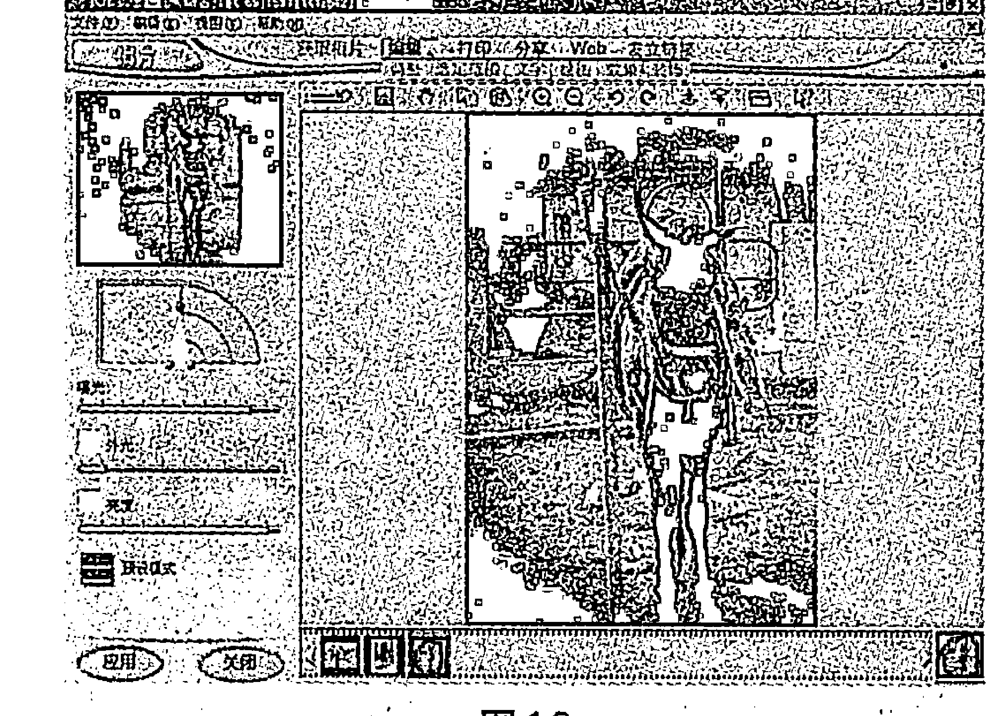

除了聚光灯外，您还可以用以下几种镜头效果：“减瘦”效果可以将图像的左右边缘向中间拉动，挤压内部区域；“加肥”效果可以将图像从当中向左右边缘拉动，创建图像内部被延伸的景象；“动态模糊”可以模拟对象横向运动，创建模糊或运动物体的效果；“马赛克”可以将图像分成碎片，模拟数码的马赛克效果；“暖色”可以在图像上添加红色调或黄色调，创建暖色调；“冷色”可以在图像上添加蓝色调或青色调，创建冷色调；“色调”可以调整图像的色调和饱和度。这些效果的操作方法与聚光灯效果的设置方法基本上一样，只不过出现在该面板中特定的操作类型和选项，它们将随功能的不同而变化，但它们有相似的结构。在此就不一一介绍了，您自己摸索吧！

##### 4. 个性化签名

可以在相片上添加上自己的手迹吗？下面介绍的签名就可以实现这个功能。方法为：首先在浏览模式下打开相片文件，然后选择“编辑”菜单，在“装饰”菜单中选择“签名”命令；在该面板上“类别”框中选择“笔迹”，然后从预设值窗口中选取预设签名，单击“应用”按钮，则该签名被用于相片之中（如图20）。

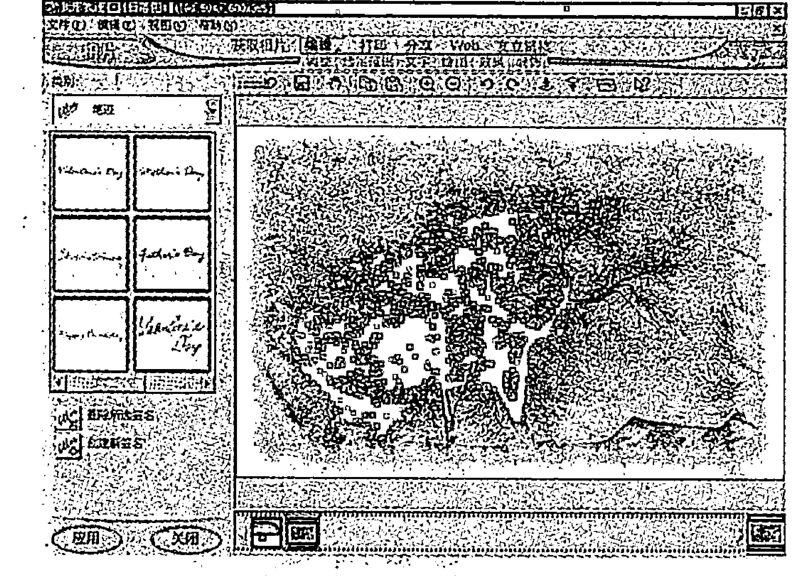

当然，您对这个签名肯定不会满意，这样就要自己创建了，单击“添加新签名”按钮，则弹出“新建签名”对话框，这时用鼠标或手写板来写下签名，对于不满意的签名，可以用“全部擦除”按钮清除签名窗口中的所有内容，而用“撤销”命令可以撤消先前的笔划，用“重复”命令可以重新应用先前擦除的笔划。当然，您还可以对字迹进行调整，拖动“平滑度”的滑动条可以调整签名转角的平滑度，拖动“厚度”滑动条可以调整笔划的厚度，而单击“色彩”命令可以显示笔划的色彩，单击它可以改变色彩（如图21）。创建好签名后单击“保存”按钮，则您创建的签名会出现在预设值中；您回到这里单击您创建的签名，然后单击“应用”按钮即可，这时您的签名就应用到相片中了，如果对它的位置不满意，可以用鼠标点击然后拖动到相应位置即可。

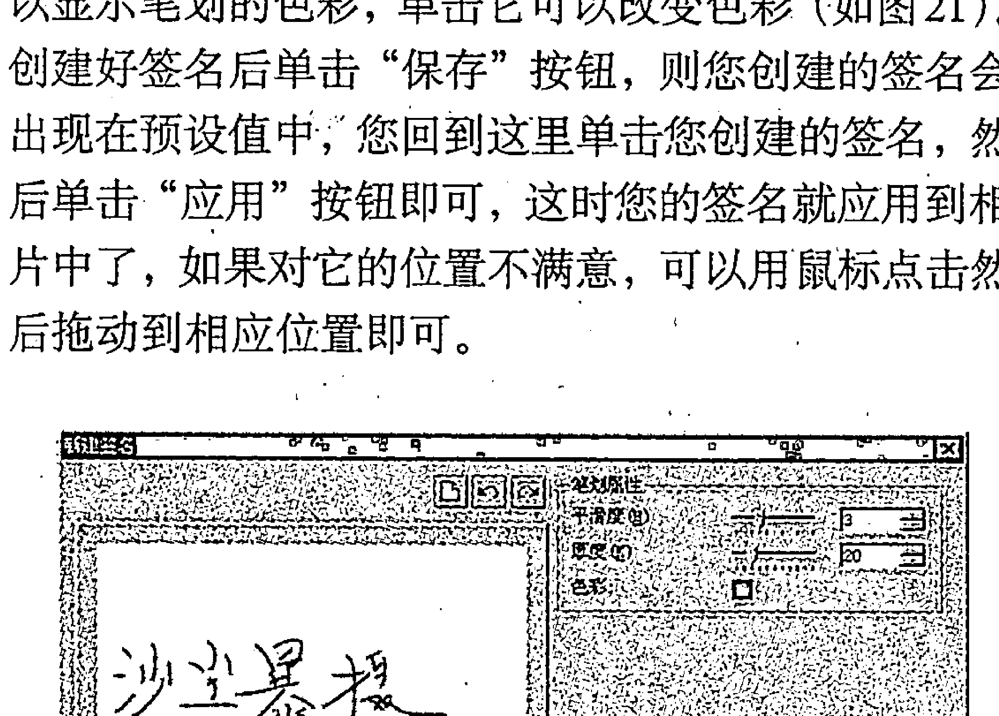

##### 5. 用弯曲效果修饰相片

通过扭曲或弯曲图像的局部，来改变图像普通的外观，因此而创建的图像可能是有趣或奇异的。方法为：首先在浏览模式下打开相片文件，然后选择“编辑”菜单，在“效果”菜单中选择“弯曲”命令，再选择要使用的弯曲的类型，我选择了挤压方式，在该面板上的预设值窗口中选取预设模式，单击“应用”按钮，则该模式被用于相片之中。如果对该效果不满意，可以对它进行微调，单击“高级模式”命令，在“高级模式”面板中，拖动滑动条调整其强度，然后单击“应用”按钮，则对所选的弯曲效果调整达到期望效果的设置（如图22）。

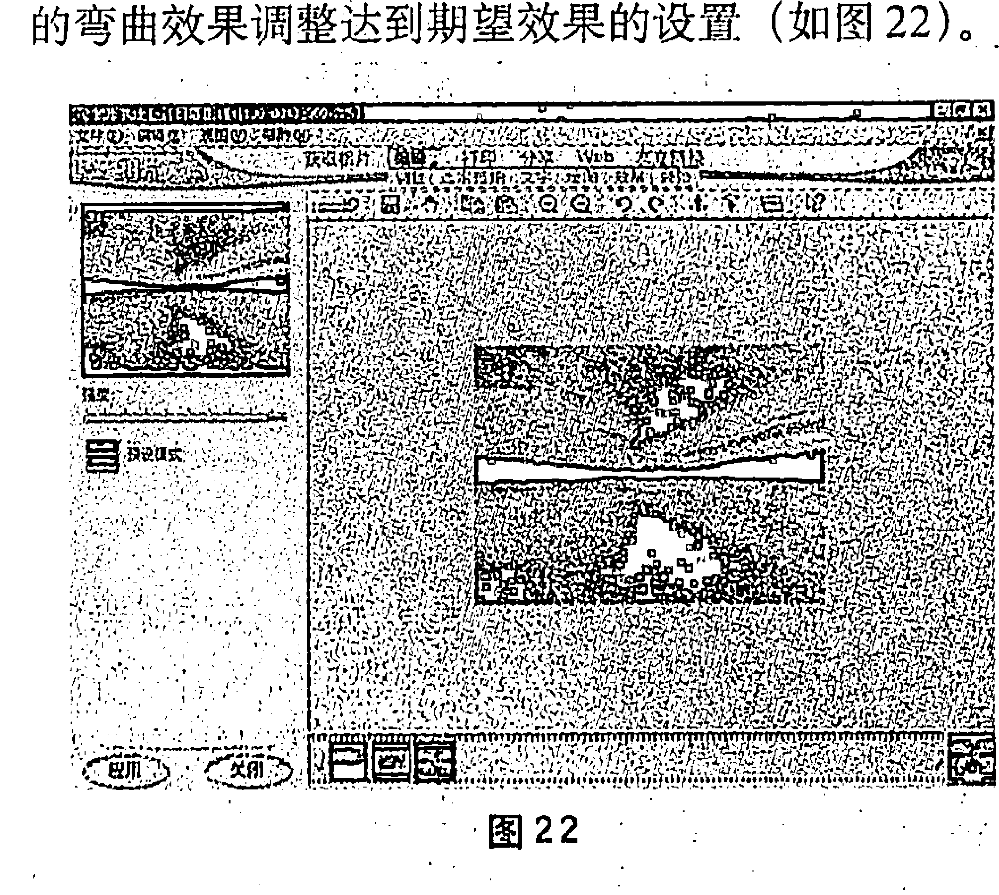

#### 三、数码相片应用实例

有了数码相机拍照片就方便多了，但是拍出大量的数码相片以后，我们还能做些什么呢？除了打印外，还有其他用途吗？不要急，下面给您讲解一些实例制作，一定会为您的数码相片提供用武之地。

##### （一）用数码相片制作屏幕保护

看着别人的屏幕保护程序那么漂亮，还有那些富有个性化的墙纸，特别是带有不同图案的精致小日历，您是不是自己也想做一个！我下面就要向您介绍用“相片e派”制作屏幕保护程序的方法。

- 第一步：打开程序。启动“相片e派”程序，选择“工具”菜单上的“幻灯演示”命令，这时在程序界面的下方出现“幻灯演示”窗口（如图23）。

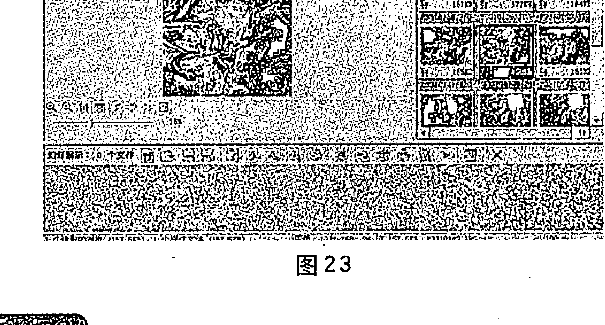

- 第二步：选择文件夹。单击“文件夹树”中的“文件夹”标签，然后找到您要做成屏幕保护程序的图片所在文件夹并单击，这时“浏览器窗格”将显示该文件夹中的所有文件，并以缩略图形式显示出来，赶快找到您心爱的图片吧。

- 第三步：选择相片。这步很简单，只要在图片浏览窗口中选定它们，再敲一下“幻灯演示”窗口中的“添加”按钮，图片就会乖乖地变成一张幻灯片（如图24），也可直接把图片拖到“幻灯演示”窗口中，效果是一样的。可以多选几张，如果不满意，只要点击“删除”按钮就会从列表中删除它，不要紧，图片还继续乖乖呆在你的硬盘中，没有影响。

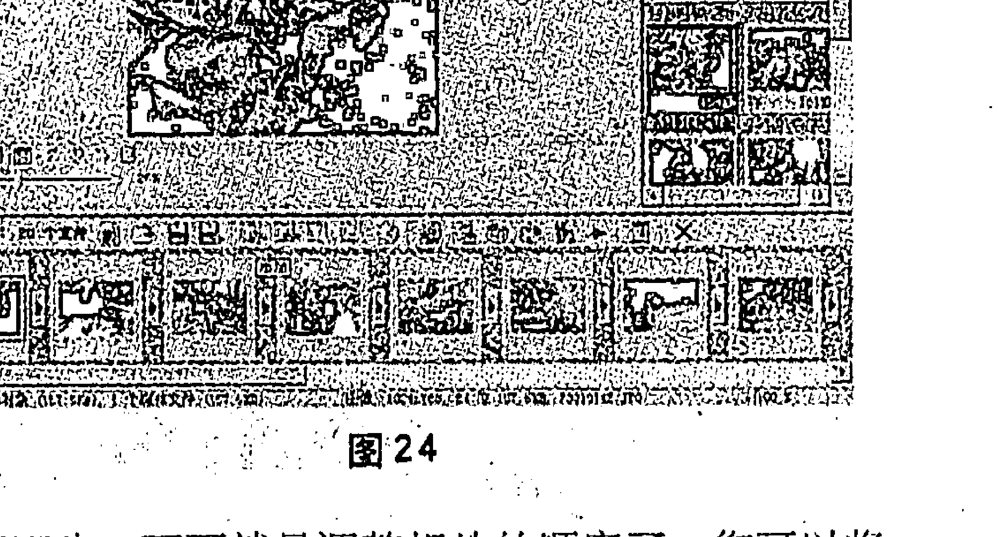

- 第四步：下面就是调整相片的顺序了，您可以将图片拖到不同的边框里来重新排序，或从故事板中选取某个图片，然后单击“幻灯演示”故事板上的“移动”，然后查找要移动的图片并单击就可以了。

- 第五步：预览幻灯片。调整好顺序，是不是有点等不及了，那就先看看吧，赶快点击一下“幻灯演示”窗口中的三角形“演示”按钮，幻灯片马上就开始放映了，不过好像每张幻灯片的间隔时间太长了。原来忘记把“幻灯演示”的属性设置一下了。

- 第六步：设置属性。鼠标右击“幻灯演示”窗口，选择“幻灯演示属性”打开“幻灯演示选项”窗口（如图25），在这里您可以自由进行设置，在“转场”里面您可以设置相片转换的方式，有百页窗、擦除、剥落、溶解等十几种方式，您喜欢哪一个就选择它吧，在下面您还可以设置每一个相片的显示时间。在“屏幕上的方案”栏内您可以设置标题、文件名、拍摄日期、相片描述以及标题位置等等，如在“标题”内容填入“家庭生活照片”。另外您还可以设置屏幕保护的背景、字体颜色等，在此就不一一介绍了，自己摸索吧！

- 第七步：添加音乐。在无声无息中看相片是不是觉得缺了点什么，不要紧，“相片e派”为您想好了，您可以在幻灯中加入音乐，选择音乐的方法与选择相片的方法一样，先选择音乐文件所在文件夹，再选择音乐文件，将它拖到“幻灯演示”窗口即可。

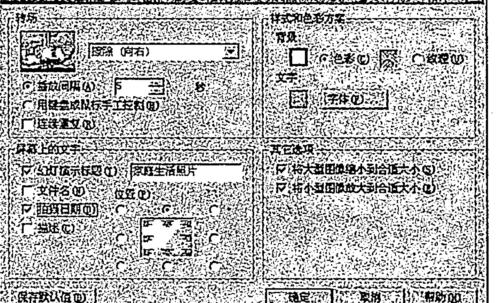

- 第八步：制作屏幕保护程序。幻灯片做好了，下面就可以制作屏幕保护了，这一步很简单，只要单击“幻灯演示”窗口中的“屏幕保护”按钮，这时屏幕保护程序就制作好了，而且添加在屏幕显示属性中。不过，它不是缺省的，您还要自己设置一下，在系统桌面空白处右击鼠标，再选择右键菜单中的“属性”，然后单击“屏幕保护程序”标签，在“屏幕保护程序”框中选择Ulead Photo Explorer即可（如图26）。

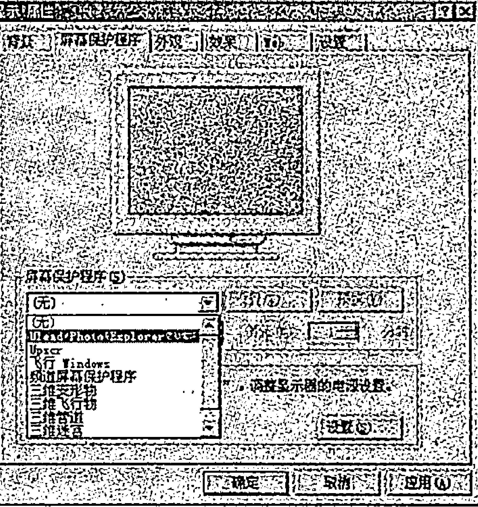

怎么样，稍微等一下，您的相片制成的屏幕保护就出现了，是不是很爽。噢，还要告诉您一件很重要的事，您制作好了后，千万不要忘了保存，如果您对幻灯片的次序满意，只需单击“幻灯演示”窗口中的“保存”命令，然后保存此幻灯演示文件（*.UES）即可。

当然，您还可以单击“打包”命令按钮，将幻灯演示使用的所有文件复制到易于访问的独立文件夹，这样您可以将电子邮件将整个演示发送给同样使用Photo Explorer的亲朋好友。您还可以单击“导出”命令按钮，这样可以创建可上载到Web服务器的Web幻灯演示，或可打包为自释放的EXE文件，这样可以通过电子邮件将它发送给同样使用Photo Explorer的亲朋好友。

##### （二）用数码相片制作Web略图

在网上，如果您使用略图格式，就可以让您的主页访问者轻松地浏览您的相片收藏，这个功能对于图片网站更为重要，下面就介绍用“相片e派”制作Web略图的方法步骤。

- 第一步：集中文件。为了便于操作，请您将要做成略图的相片文件拷贝到同一个文件夹中，这样选择起来就方便多了。

- 第二步：选择文件。打开“相片e派”程序，在“浏览”窗口中找到您存放相片文件的文件夹并选择它，这时相片文件便会以略图形式显示出来，用鼠标选择要做成Web略图格式的文件，若要选取多张图像，可在选取图像时按住Ctrl键不放，若要选取连续图像，请按住Shift键不放，然后单击第一个与最后一个图像（如图27）。

- 第三步：开始创建略图。选择好文件之后，然后选取“Internet”菜单上的“输出Web略图”命令，这里程序将打开一个“网页输出”对话框，里面包含了网页、略图、描述和高级设置等选项，您可以随时保存或预览作品。

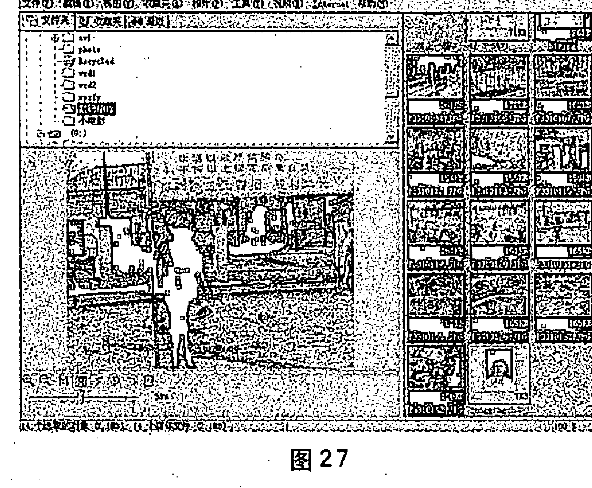

- 第四步：设置输出选项。单击“输出选项”选项卡，您可以指定输出图像网页的方式，选择保存为网页，则程序将生成HTML文档，如果选择“保存后启动默认浏览器”复选框，生成网页后，自动启动默认的浏览器预览网页像册。如果将网页保存为自释放的EXE文件，则生成可以在任何Windows操作系统中打开的可执行文件。然后在“输出文件夹”选取保存生成文件的位置，在“HTML索引文件名”中为起始（索引）页指定一个名称（如图28）。

- 第五步：设置常规选项。单击“常规”选项卡，指定目标屏幕大小或使用默认的800×600px，这个是常规性的设置，最好不要改变它，然后在“页面特征”下，定义要显示在页面顶端（页眉）和底端（页脚）的文字，如定义“页面顶端”为“动物园略图”，定义“页脚”为“曾庆祝2002年3月28日创建”，然后如果您想在查看页面时播放音乐，还可以为此文件指定音乐(如图29)。

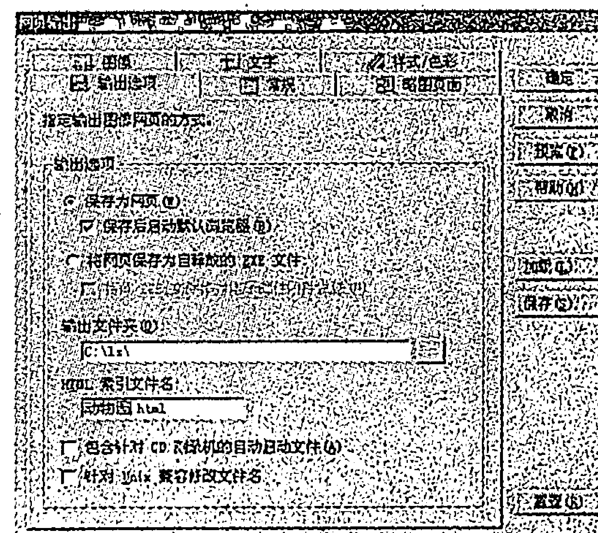

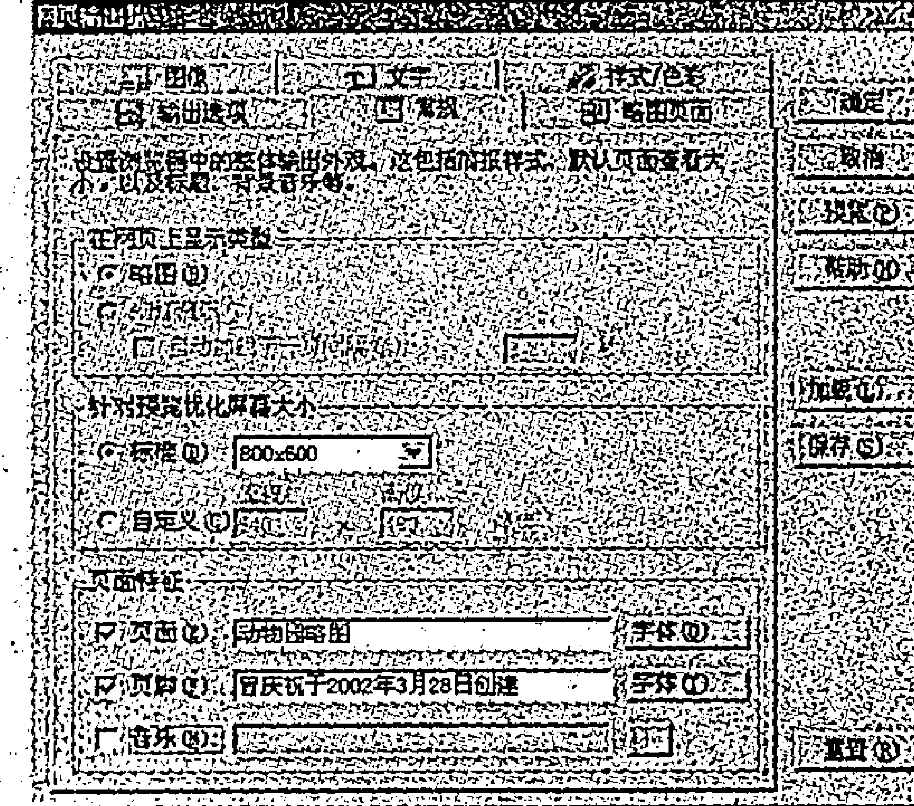

- 第六步：调整略图页面。单击“略图页面”选项卡，选取边框页面布局，如果您选择无框架，则生成不使用 HTML 框架的网页，单击略图将打开一个单独的窗口，显示整个图像；如果选择使用框架，则生成带框架网页，浏览时点击略图将在网页的另一侧显示原图而不用打开新的窗口(如图30)。

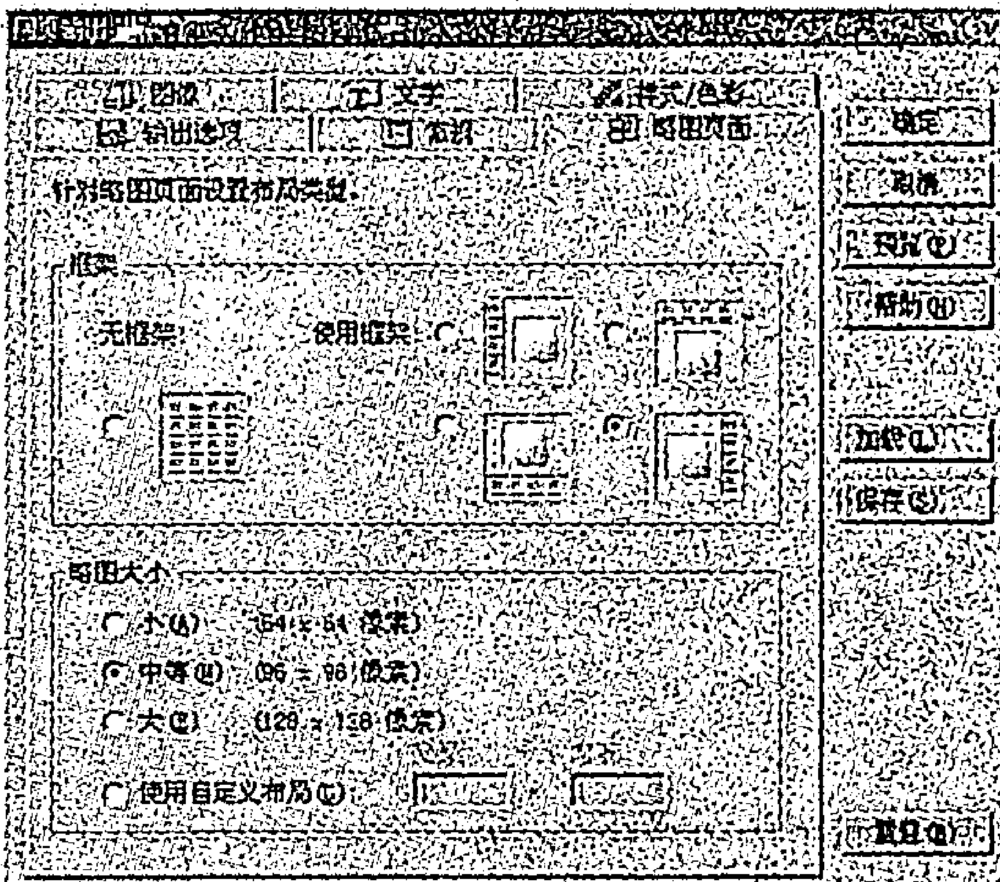

- 第七步：调整图像和文字。单击“图像”选项卡，选取可用的调整大小选项即可；然后单击“文字”选项卡，选取要与略图一起显示的信息，以及它们与略图的相对位置，单击“字体”，定义字体的类型、样式、色彩和大小等，在“图像页面”下，选取显示在图像下的信息和对齐方式(如图31)。

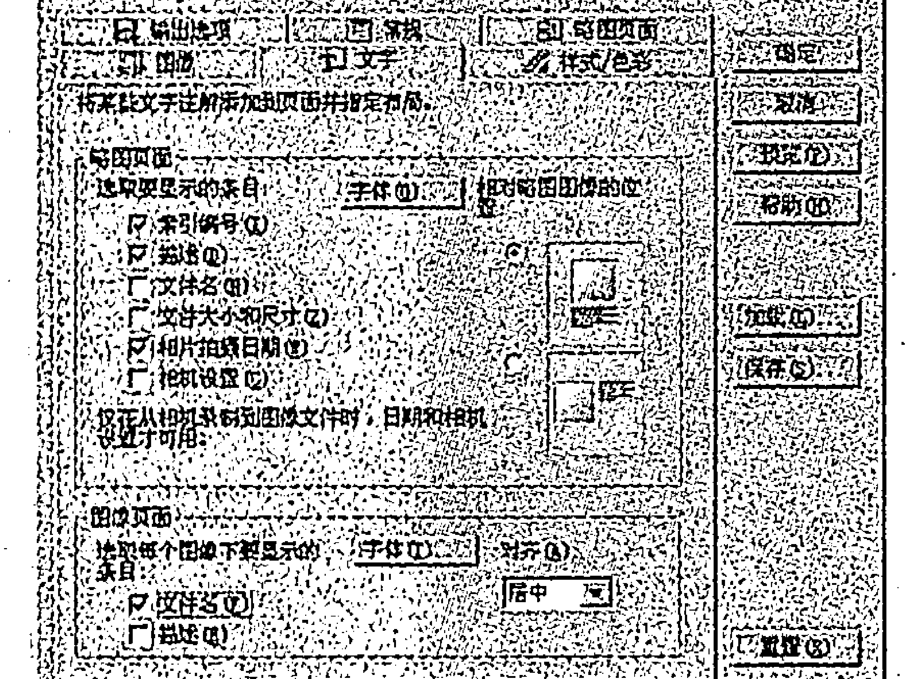

- 第八步：调整样式和色彩。单击“样式和色彩”选项卡，选取要赋予背景色或图像的元素。通过单击相应的色彩或图像方块，可以选取该元素。为“略图页面”选取“链接样式”即可。好了，通过以上的调整设置，您的网页略图就做好了，如果您想将这些设置再次应用到其他网页，那么就单击“保存”按钮吧！接下来您就可以按“确定”按钮了，这时程序将出现“网页输出”进度条，您就慢慢地等吧！好了，终于做好了，赶紧去看看。打开您输出略图的所在文件夹，找到索引文件，双击就可以进行查看了(如图32)。下面您就可以将生成的Web略图放到网上去了，是不是很方便。

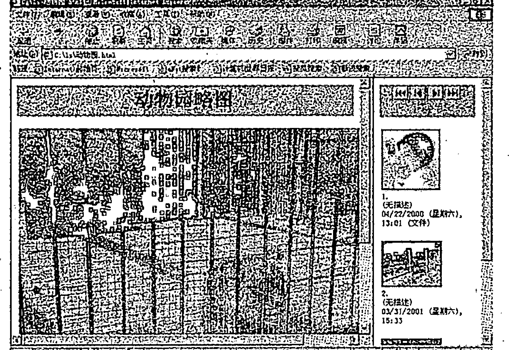

##### （三）用数码相片制作海报

海报打印是指在小幅面打印机和小幅面介质上实现大幅面输出结果。采用的方法是将大幅面输出结果按照小幅面介质的面积等分成若干份，然后利用小幅面打印机分别输出到多张介质上，最后拼贴成一张完整的大幅面海报。

利用“我形我速”软件可以轻松地制作海报，它可以将一张相片打印到多个张纸上，以便您将它们拼接起来。它的海报功能包括：支持各种格式的图像文件，支持从扫描仪、数码相机等各种图像源输入图像，同时支持图像和文字的排版，支持各种打印机，能够设定切割子画面的面积，能够在子画面中有选择地打印。下面就介绍其详细的操作方法。

- 第一步：打开图像。首先运行“我形我速”软件，然后选择“文件”菜单中的“打开”命令打开要处理的图像文件。或者点击工具栏中的“快速任务”菜单中的“海报”命令，然后单击“开始”菜单中的“打开”等按钮来打开图像文件。

- 第二步：进行必要的文字编辑。“我形我速”支持图文混合的处理。您可以点击工具栏的“编辑”→“文字”→“添加”，在图像中添加必要的文字（如图33）。文本内容与特效需要在“属性”对话框中输入和设定。如果您需要打印一张仅仅包含文字的海报，则不必打开任何图像文件，只需在此处输入和设定文字即可。或者在其他软件中对文字进行排版编辑后，输出到一个图像文件，然后用“我形我速”打开即可。

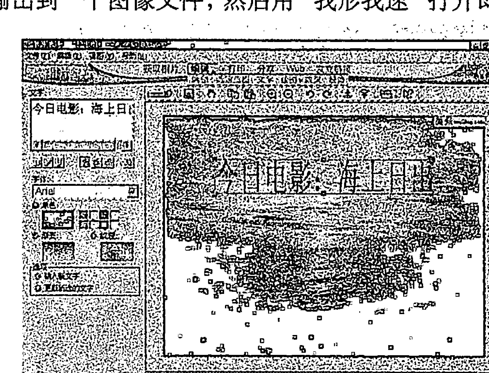

- 第三步：进入海报打印功能。点击工具栏的“打印”→“海报”进入海报功能（如图34），在这里可以进行设置，首先要设定子画面输出幅面，子画面是指按照打印纸幅面切割成的海报局部画面，通常按照打印机最大输出幅面能力设定，每个子画面占一页纸。点击“纸张大小”的下拉框进行设置，这里可以将打印纸幅面设定为打印机允许的大小，例如B5或者A4，这个设定值将决定子画面切割的结果。

- 第四步：设定海报幅面。海报幅面是指用户需要的实际海报大小，这个海报最后通过子画面的拼贴来获得，在“海报大小”下面的框中改变输出比例，即可调整海报的大小，如果选择百分比中的单位为长度单位，在此可以直接输入海报的长、宽数值，或者输入长、宽方向的放大比例。要想实现海报打印，这个步骤是必不可少的，否则图像将会按照实际大小输出，也就是打印在一页纸上，而不是切割成子画面分别打印在多页纸上。

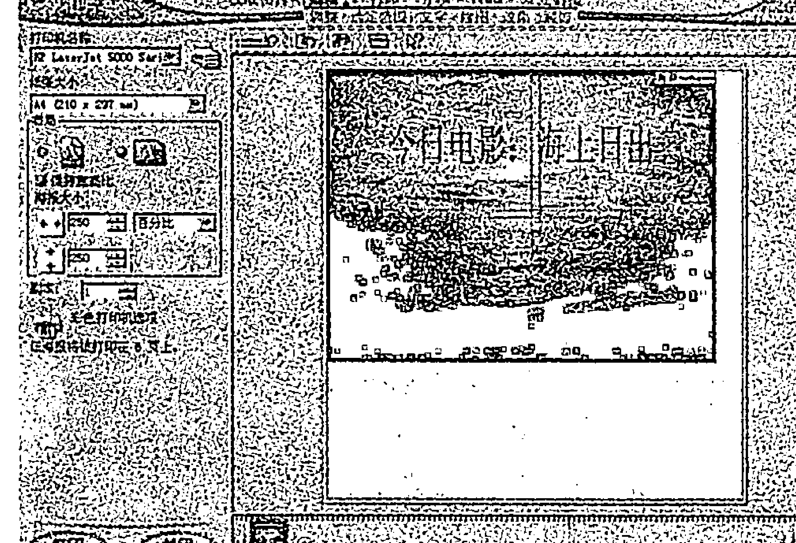

无论是否改变图像比例，在编辑窗口中的图像显示大小都不会改变，一旦设定海报幅面放大后超过子画面幅面，立刻便会显示纵横交错的切割线，以指示出切割子画面的效果，如果没有出现切割线，就说明海报幅面小于子画面输出幅面。此时用户仍然可以调整子画面或者海报的幅面大小设定。在图34的示例中，切割线表明整个海报被分割为4行2列共8张子画面。

- 第五步：打印输出全部或者部分子画面。如果您希望打印全部子画面，则点击“打印”按钮，打印好后进行拼贴即可。

上面介绍了海报打印方法，不过，您在制作海报时要注意以下几点事项：一是使用小型图像来生成大型海报的效果并不好，与传统的相片技术一样，将图像放大太多会生成颗粒状的图像，如果您想要将图像贴在卧室的墙壁上，颗粒状的图像看起来就会很糟糕。二是要注意墨水使用量，打印机墨水和所需的纸张可是要钱的！大型图像打印需要花费不少钱，并且打印很费时。三是注意原始图像的大小，您可以从使用的纸张数量看出最后的海报有多大。设计好所需的大小之后，可检查它与原始图像的百分比，您可以单击选项面板的“海报大小”，200%代表两倍大，这应该不会产生问题，而1000%则代表十倍大，生成的图像颗粒可能会相当大。

##### （四）用数码相片制作网页相册

用“我形我速”的“网页相册”功能可以将图像略图制作成个性化的网页相册，并将它们输出到Internet。下面一步一步地介绍其做法。

- 第一步：运行“我形我速”程序，在“浏览”模式下选择要做成网页相册的相片，然后选择 “Web” 菜单上的 “网页相册” 命令。

##### 第二步：选择模板。

“我形我速” 提供了许多种模板，您可以选择合适的一种，在 “模板” 下面的下拉菜单选项中有事件、常规、节日和框架共 4 类达几十种模板，选择 “框架类型” 中的 “地球” 模板（如图 35），选好后单击 “下一步” 按钮。

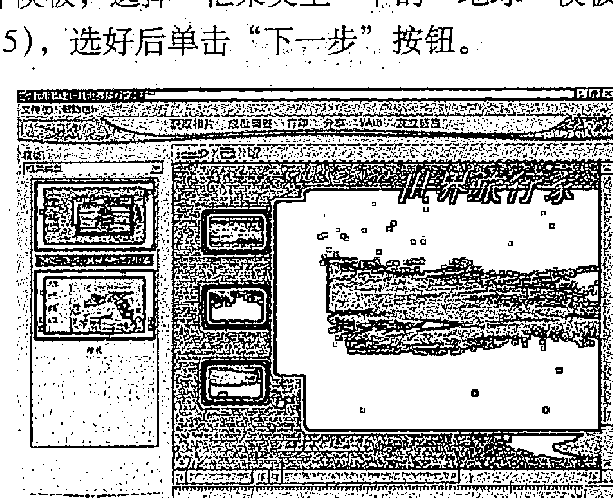

## 第三步：在这一步您可以 “设置标题”，

在 “标题” 下面的框中输入合适的文字，如 “风景数码相片”，输入时在右边的相册就会显示出来；然后单击 “描述类型” 的下拉菜单，选择文件名、文件日期或自定义，选择 “日期”，选择的信息将与相片包含在一起；单击 “改变相片次序” 可以重新排列相片的次序并调整略图大小，这时将弹出 “改变次序” 对话框，您只要选择相片并按住左键将其拖到相应的位置即可（如图 36），选好后单击 “下一步” 按钮。

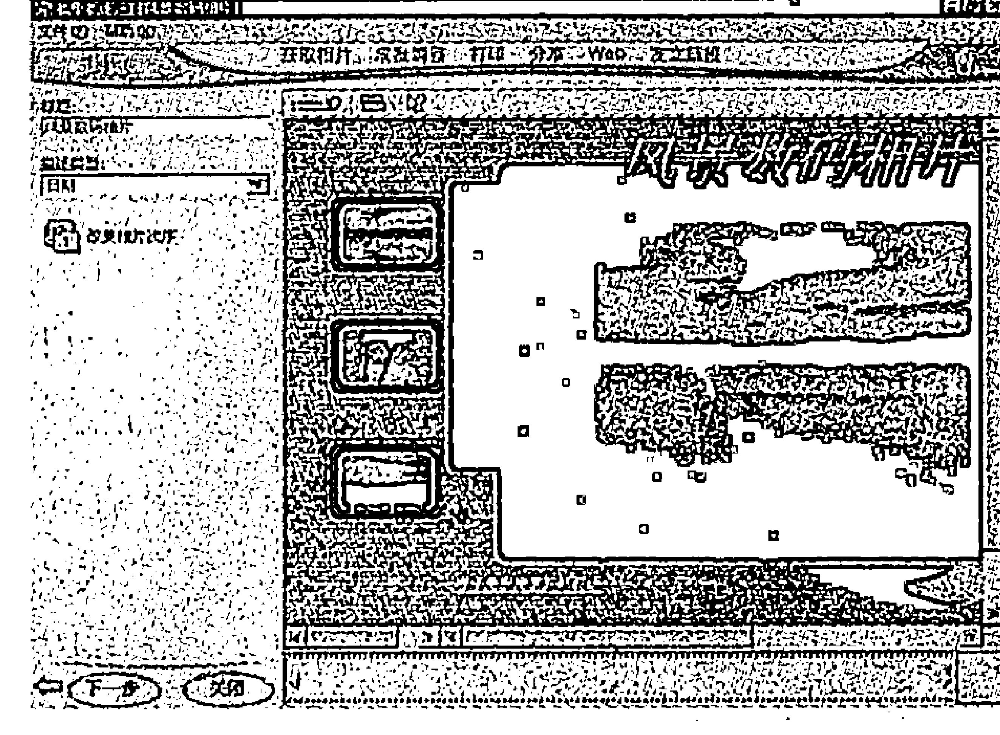

##### 第四步：设置装饰。

单击 “添加／修改／删除签名”，打开 “签名” 对话框，您在此可以输入您的联系信息，在 “标题” 框中输入联系内容，在 “电子邮件” 中输入您的电子邮件，在 “URL” 中输入您的主页，完成后按 “确定” 即可。

这时回到设置装饰界面，单击 “图像质量” 下拉菜单选择质量标准，您可以将其设置为 “最佳”；然后就可以单击 “在浏览器中预览” 按钮在默认的 Web 浏览器中简要地预览最后的网页像册了（如图37），在 IE 浏览器中，您可以选择任意一幅相片，这时在右面将放大显示相片。

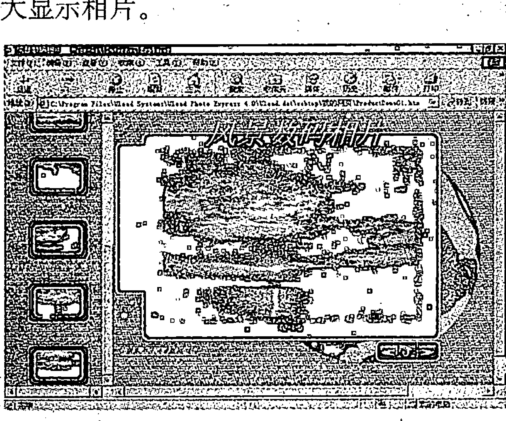

##### 第五步：设置输出目标。

这里有电子邮件、磁盘、光盘和发布到Web网页四个选项（如图38），单击 “电子邮件” 将打开一个对话框，您在此可以将网页相册加到电子邮件的附件中，如果选择 “打包到 EXE 文件” 复选框，则将该网页相册所需的所有文件打包到一个自释放的 EXE 文件中，选择 “发送” 按钮，程序将从默认的电子邮件客户程序中打开一个新邮件，并附加该网页相册文件进行发送。

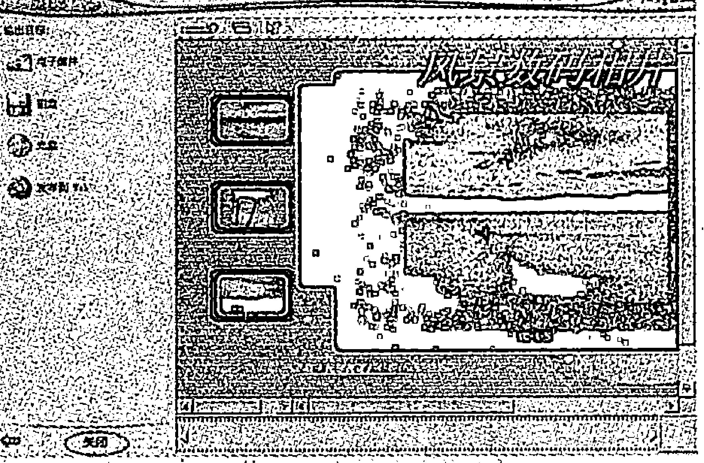

当然，您也可以选择 “磁盘” 按钮，在出现的界面中选择 “另存为” 中的 “保存到 HTML”，这时将网页相册保存为 HTML 格式，当然在这里您也可以将其保存为 EXE 自释放文件；如果选择 “光盘” 按钮，程序将打开一个对话框，您在此可以将网页相册输出为可刻录到光盘上的格式。

除了以上的三种方法，您还可以将其发布到网上，单击 “发布到 Web” 按钮，程序将打开一个对话框，您在此可以将网页相册上载到你定义的网站上，在此输入文件名，然后在 “Web服务” 定义Web主机服务，在 “用户名” 中输入所选的主机服务的用户名，在 “口令” 框中输入您的口令，设置好了单击 “发布” 按钮，您的网页相册将会被上载到所选的Web主机服务中。

##### （五）用数码相片制作日历

每到过新年前，总要买本日历。实际上，我们可以自己做个日历，而且可以用自己的数码相片来做。‘我形我速’本身就带有编辑年历的功能，而且定制简单，又非常个性化！更妙的是它可以按照系统的内置时钟自动地每月更新！下面就让我们一起来做吧。

第一步：选择相片。运行‘我形我速’，进入浏览模式，选择十二幅你喜欢的图片或照片（选取的方法和在Windows的文件夹中一样，即用鼠标左击选取；按住Shift键为连续选取，按住Ctrl键为间隔选取），当然你也可以只用一幅图片。

第二步：制作日历。选择‘分享’菜单中的‘日历’命令，进入制作日历状态（如图40），这时，‘我形我速’就会将图片嵌入到默认的模板中，并显示当前的月历，在窗口左侧的‘日历类型’下拉式菜单中选择‘每月一张’，在‘方向’下拉菜单中选择日历的方向‘纵向’，然后在下面系统所提供的模板中选择你喜欢的风格，你可以点击不同的模板以预览效果，从而确定最佳的模板。选择好后单击‘下一步’按钮。

第三步：设置日期和语言。在‘起始日期’中选择年、月、日。将它调整为2002年，我现在做的时候是四月份，就选四月份，这个是可以调整的，如果选择的起始日期改变，编辑区内的日期也自动地调整，非常方便。然后‘语言’栏中选择‘中文’，当然，如果您英文不错，或者要借此机会学习一下英文的话，也可以选择‘英文’（如图41）；如果您想调整一下日历上相片的顺序，可以单击‘改变相片次序’按钮，这时程序弹出‘改变次序’界面，它将12幅图全部显示出来，通过拖动即可改变相片次序；选择‘下一步’继续进行。

第四步：调整日历元素。在这一步要做的事比较多，您耐心地看下去。首先单击‘添加/编辑文字’按钮，这时弹出‘文字框’界面，在这里输入文字‘梦幻日历’，然后设置一下字体、颜色、字号等等，若当前没有选择文字，则是新加入文字，您也可以自行加入给朋友的祝福语（如图42）。然后单击‘改变背景图像’按钮，这时弹出‘选取图像文件’界面，在这里您选择一幅喜欢的图像作为背景，这样刚才那个模板的背景就被替换了（如图43），注意：这时出现的背景图像还需要进一步设置一下，您只需选择‘修改背景元素’下面的‘改变背景属性’，然后选择一种合适的‘透明度’。再单击‘添加年份数字’，这时‘2002’字样就显示在日历上了，您还可以设置一下它的字体、大小、颜色等；下面就要设置一下显示在日历上的日期的属性，双击日历上的日期，这时程序便会打开“文字框”，在这里设置一下字体和颜色。

好了，终于设置完了，回到主界面，再看一看，如果不满意，您还可以进行修改，如果您对日历上的各个元素的位置不满意，可以用鼠标左键单击该元素，且按住将其拖到相应的位置即可。现在我们再来看一看吧，日历是不是很不一般（如图44），我们单击“下一步”继续进行吧！

第五步：重复以上第三步、第四步的步骤，对每个月的日历加以编辑，这样我们的月历就大功告成了。当然，如果您不想做重复劳动的话，程序也为您想好了，在浏览窗口的上方有一排快捷按钮，其中有一个叫“将当前布局应用到其他页面”的按钮，它可以让你把当前所编辑的页面应用到所有月份的页面中去，您就单击它吧。在它旁边还有一个“重置日历布局”按钮；它的作用是放弃当前编辑的页面而启用系统最初给出的模板。

> 注意：你在按下这两个按钮前必须考虑清楚，因为一旦按下是没有办法恢复的，而且系统不会给出确认对话框而是直接刷新。

第六步：输出。好了，到这里我们的日历已基本上完成了，这时进入了输出状态（如图45），单击“打印”按钮打印机就会打印出您刚才制作的日历了，您还可以从多种打印布局样式中选取；单击“磁盘”按钮，您可以再将日历保存到计算机里，在弹出的“另存为”框中选择路径和文件名保存即可；单击“墙纸”按钮，您可以将日历设置为桌面墙纸，“我形我速”可以自动更新桌面日历，这样每个月你都能拥有一幅精彩的日历了。是不是很爽！

##### （六）用数码相片制作贺卡

你是不是有过从贺卡网站给你的朋友发送祝福的经历呢？你是不是有过挑了半天也找不到一张合意的卡片的经历呢？——为什么非要用别人的？为什么不自己动手做一张？为什么不用自己的数码相片做一个贺卡？“我形我速”可以帮助您完成这件事情。下面我就来介绍其做法。

- 第一步：运行“我形我速”软件，在“浏览”模式下选择一幅要做成贺卡的相片，然后选择“Web”菜单上的“网页贺卡”命令。
- 第二步：选择模板。如图46所示，在“模板”下拉表中选择一种类型如“常规”，系统会给出一些可供选择的模板，从中选择“漂流瓶”，在浏览窗口中就可以看到永远的朋友的模板，在模板中有一幅系统提供的照片，选中照片（把光标移到照片上，此时光标会变成手指的形状，单击鼠标左键就可选中图片，选中后光标变成指向上下左右四个方向的箭头）。此时左侧的面板中会出现“选取要放到当前页中的文件”的提示。
“件”对话框，此时你可以选择一幅你自己的照片或图片作为插图，单击“当前浏览的文件夹”对话框右侧的向下按钮就可以选择你想要的图片所在的目录，或者直接在地址栏中输入图片所在目录的地址。这时下面的预览窗口中会出现该目录中所有的图片，从中选择你需要的图片，选中图片后该图片即显示在贺卡中。地址栏下面的“对图像文件进行排序”按钮可以用来以不同的方式排列图片，帮助你更快地找到所需的图片，你还可以为你所选的照片加上一个网址或Email地址，以便在朋友收到贺卡后能马上联系到你，如图47所示。完成后单击“下一步”按钮。

第三步：设置对象类型。在这一步中，你可以对你的贺卡进行进一步的编辑，可以在其中加入一段文字、加入一些小插图之类的，或是修改贺卡中已有的部分。在左侧的选项面板，你可以单击系统所提供的四个按钮以增加相应的对象。
- ①单击“添加文字”按钮，你可以在贺卡中插入一段文字。在“选项”面板中输入文字为“你是我最好的选择”，你可以编辑这段文字，以及设置字体、字型（粗体或斜体）、字号和文字颜色，还可以为这段文字加上网址或Email地址使之成为超级链接，设置好后单击“添加”按钮。
- ②单击“添加图像”按钮在贺卡中加入一幅图片，你可以从你的电脑中选择一张适合送给朋友的照片。“添加装饰”的作用和“添加图像”差不多，是在贺卡中插入一些小饰件，不同的是你只能选择系统提供的图片，这里提供了诸如蜡烛、气球等，那就选择一个气球吧，选择好后按“添加”按钮，小气球就到贺卡上了。
- ③单击“添加／改变／删除背景音乐”，您可以插入、修改或去除贺卡的背景音乐，在文件列表框中选择一首您喜欢的音乐吧，如果不满意，您还可以自己录制一个文件，然后把它放到贺卡中，是不是很爽！

这样，我们的贺卡就基本上完成了，单击“下一步”按钮（如图48）。

第四步：设置输出目标。这里提供了电子邮件、磁盘和发布到Web三种选择（如图49），单击“电子邮件”按钮，在随后出现的对话框中提供了“以HTML电子邮件发送”和“以附件形式发送”其中后者还提供了“压缩成EXE文件”选项，让你可以把贺卡做成一个可执行文件，当然它也是以HTML文件的形式打开的，选择好后单击“发送”按钮，程序将从默认的电子邮件客户程序中打开一个新邮件，并附加该贺卡文件进行发送。

您也可以选择“磁盘”按钮，在出现的界面中选择“另存为”中的“保存到HTML”，当然在这里您也可以将其保存为EXE自释放文件；您还可以将其发布到网上，单击“发布到Web”按钮，然后按照它的要求填写Web主机服务、用户名及口令即可。

##### （七）用数码相片制作全景图

通过数码相机或扫描仪获得某一风景区不同方向的多张图像，用专门软件(如Ulead Cool 360)制成全景图后，通过其自带的浏览器观察时会有一种身临其境的感觉，具有强烈的影像动感效果。

###### 1. 准备图片

既然要做全景图，当然要有图片，用数码相机拍摄一组全景相片的步骤为：

第一步：使相机平行于地面，并最好固定在三脚架上。

###### 2. 制作实例

下面以一个会议室的全景图制作为例，详细介绍其操作步骤及制作方法：

第一步：新建项目。单击“新建项目”打开“新建项目向导”对话框（如图50），在“项目类型”中选择创建360度全景图（也可选择创建广角图像），在“项目名称”中输入项目名称“会议室”，然后选择保存路径，缺省路径为C:\Program Files\Ulead Systems\Ulead COOL 360\Project，如果需要的话，还可以在描述中输入一些说明文字，完成后点击“下一步”按钮。

第二步：选择相片。在出现的对话框中选择多幅用于制作的图像，您可以单击“添加”按钮来加入，若要选取多张图像，请在选取图像时按住Ctrl键，若要选取连续图像，请按住Shift键，然后单击第一个与最后一个图像。您也可以单击“全部添加”来加入文件夹内的所有图像。另外也可以用“获得”按钮从扫描仪、数码相机等外设中加入图像。加入后出现所选图片的一个预览窗口，可以利用图中的几个功能图标按钮实现对相关图片的删除、旋转、缩小、放大、改变排列顺序等调节（如图51）。操作完成后按“下一步”按钮。

第三步：选择相机镜头。可以选择程序提供的缺省的镜头，也可以自定义镜头参数，选择后单击“完成”按钮（如图52）。选中“关闭变形功能”复选框，浏览时无弯曲感；选中“关闭混合功能”复选框，则相邻两张相片连续成全景图可见其重叠部分，这两种效果可在图中左边“预览”窗口中体现出来。这两个选项最好不要选，以获得透视变形和边界混合的逼真效果，至此，已完成“开始”部分的操作，请按下“完成”按钮以继续。

第四步：调整全景图。原始图像的调整工作包括修补图像、修正问题、配合相邻图像、创意地使用色彩等工作。COOL 360提供了很多好用超强的工具供您使用。这时系统自动已进入第二个大步“调整”，此时系列图片基本上已经对位拼接完毕。如果对于拼好的图片中某一幅不满意可单击该图片，在选项面板中调节参数即可。你可以对每一幅图像进行旋转、透视效果、色调、饱和度、亮度和对比度等进行调整，还可通过鼠标拖拽来调整各幅图像间的重叠程度。若对调整效果不满意，还可以用“撤消”和“重复”两个功能进行取消和重复操作。如果调整步骤太多，可以用“重置”按钮将恢复图像的初始状态（如图53）。

第五步：查看全景图。全景画相片和其他类型的图像差异很大，因此它需要特殊的查看器。在Ulead COOL 360中单击右下角的“查看器”图标，这里查看器就自动打开您要建立的全景图, 它的用法相当简单, 当您看到导览光标时, 单击图像, 并往想要滚动的方向拖动即可, 当您看到缩放时 (在图像中央), 单击并往上拖动可拉远图像, 往下拖动可放大图像(如图54)。

第六步: 完成。

这一步就可以进行结尾操作了, 单击"完成"按钮, 这里显示如图55所示的操作界面, 你可以从多种保存输出方式中进行选择。按"保存"按钮: 保存当前全景图; 按"电子邮件"按钮: 将当前全景图转换为.exe文件 (内含 Viewer 观察器) 并以电子邮件附件的形式发送出去, 前提条件是该全景图已保存且设置了电子邮件帐号; 按"网页"按钮: 以 Web 页面的形式保存当前全景图, 且可在 Web 浏览器 (要求是IE4.0、NC4.0或以上的浏览器) 中进行观看, 就像用 Viewer 观看一样; 按"屏保"按钮: 设置该全景图为默认的屏幕保护程序; 按"打印"按钮: 以平面图形式打印该全景图; 按"复制"按钮: 将该全景图复制到剪贴板上以便其他程序调用; 按"导出"按钮: 生成一个可执行文件, 执行它就可浏览全景图的内容。

第七步: 创建网页。

您可以将全景图发布到网站上, COOL 360可以产生所有需要的程序码, 您需要做的只是将网页与图像上载至您的网特网服务供应商 (ISP)。在图55的选项面板中单击"网页"命令按钮, 这里出现"网页"对话框, 在"网页"对话框中"文件名称"输入文件名, 在"输出文件夹"中选择合适的文件夹, 在"标题"中输入标题, 然后调整嵌入全景画窗口的宽度与高度, 默认值将取决于全景图的尺寸 (如图56), 这样, 当您单击"确定"按钮时, 程序就可以将全景画图像、UVR 和 HTML 文件存到指定的文件夹了。

好了, 全景图制好了, 在页面中你可以打开看看, 找到您刚才保存的路径, 然后双击"会议室.html"文件, 就可以好好地享受一下您的创作了。为了能让IE、NC 或其他的浏览器具备浏览全景图的能力, 必须安装相应的插件。在安装 COOL 360 的过程中, 安装程序会自动检测IE或NC, 若检测到便会询问是否要安装相应的插件, 选择"是"就可以了。您还可以将它上载到你的主页了, 增加主页的动感和美感, 是不是很酷! 注意: 您的用户必须安装了查看器才能查看图像, 当用户第一次进入您的网页时, 系统会显示一个对话框请他们自动安装小型的"COOL 360 查看器"外挂程序, 当他们安装完这个外挂程序之后, 就可以查看并浏览全景画了。

(文/方嘉 华柱 曾繁宇 沙尘暴)

## # 玩转“数字电视”

### 一、电视卡选购指南

多媒体电脑的概念早在 80386 时代就已经被提出，只是当时由于受到硬件产品的限制，一台具备了声卡的电脑就可以被称之为多媒体电脑了。随着计算机硬件产品的飞速发展，多媒体电脑的概念已经有了非常大的变化，它不仅涵盖了 3 D 音效、高品质的 VCD、DVD 视频播放工具、电视卡、收音卡、视频捕捉卡等一系列计算机多媒体配件，更是包括了电视/电视接收、视频转换、视频捕捉在内的一系列多媒体应用功能，配合 CD - R/RW 还可以制作 VCD 碟片，使多媒体电脑进入了一个新的应用境界。特别是电视卡，由于其独特的“数字电视”功能，让广大的电脑爱好者不必再和家人争抢电视频道的控制权，而在电脑上就能轻松地收看自己喜欢的电视节目，甚至可以定时录制，不再会因为工作等原因而错过好的节目。

#### (一) 什么是电视卡

电视卡是一种在电脑上实现电视接收功能的电视接收设备。它的基本原理和普通电视机的接收原理相似，也是通过高频头接收标准的电视信号，然后进行图像和声音的解调，再转换成标准的 VGA 图像信号输出到电脑的显示器上，并通过计算机音频输出端口提供对应的电视伴音。从理论上讲，由于输入的模拟电视信号被转换成数字信号进行处理，配合高分辨率的显示器，通过电视卡输出的图像质量和清晰度都要优于传统的电视机，但实际上由于制作工艺的原因，并不是所有的电视卡都能达到非常好的收视效果。

电视卡除了提供标准的电视接收功能外，往往还提供了不同程度的视频捕捉功能，可以捕捉动态/静态的视频信号并将之转化为对应的计算机视频数据或者图像数据格式存储到硬盘上。另外，具备视频捕捉功能的电视卡在收看电视节目之余，还能配合一些相应的摄像装置（摄像头或者摄像机等）组成一个可视电话系统，在 Net Meeting、IPhone 等通信软件中实现视频传输。

#### (二) 电视卡的种类

多媒体电脑的电视接收设备按其连接方式来划分，可以分为外置式和内置式两种，其中外置式电视接收设备又分为外置式的电视盒和外置式的电视卡。下面简单介绍一下这几种不同接收设备的主要特点。

| 类型 | 优点 | 缺点 |
| :--- | :--- | :--- |
| 外置式电视盒 | 安装简单，受干扰少，性能稳定；可独立于主机工作；配有遥控器，操作方便；一般提供 AV/S 输入/输出端子。 | 无法实现视频捕捉；不能调节显示分辨率和扫描频率；只能全屏显示。 |
| 内置式电视卡 | 不占桌面空间，不需外接电源；可在 Windows 下多任务操作，窗口可缩放；一般带有“软”视频捕捉功能。 | 易受机箱内电磁干扰，影响播放质量；安装较麻烦，需拆机箱；可能引起中断冲突。 |
| 外置式电视卡 (USB接口) | 工作特性与内置式大致相同。 | 与内置式相比，主要不同在于采用 USB 接口。 |

#### (三) 电视卡选购要点

- 1. 根据自己的实际需要来选择在选购电视卡产品时，首先要根据自己的具体情况做好内、外置电视卡的选择。如果仅仅是需要一般的电视收看功能，可以选择外置的电视盒，其相应的价格要便宜些，电视接收效果也不错。对于希望能在工作的同时不错过电视节目的朋友来说，内/外置电视卡则是不错的选择，但是如果你还希望能录制一些电视节目的话，最好还是选择内置的电视卡。

##### 2. 根据相应产品的功能特性来选择

###### (1) 硬件特性

作为计算机配件，在选择电视卡时首先也要注意电视卡的硬件特性。就目前的电视卡来说，市面上大多数的电视卡主芯片都是采用 BT8X8 系列的，低档的电视卡多采用 BT848 芯片，高档一些的电视卡大多采用的是 BT878 系列的主芯片。建议大家采用 BT878 型以上作为主芯片的电视卡，这些电视卡的功能更强，兼容性更好。

另外，电视卡是需要高频头的。购买时需注意高频头的屏蔽是否严密，这是影响收视效果的关键因素。

###### (2) 接收能力以及接收效果

选择相应的计算机电视接收设备，最关心的还是电视节目的接收能力和接收效果。在选购时要注意的是相应的产品是否支持兼容接收 PAL、NTSC 等制式的视频节目，是否能全频道接收增补频道的节目。同时因为一般电视的分辨率多为 320 × 240，因此相应设备输出的分辨率高于 320 × 240，其显示效果才能达到相应的要求，分辨率越高的其显示效果相应地也越好。

###### (3) 播放软件

对于内/外置电视卡而言，对应的电视播放软件的质量决定着电视卡的输出效果以及其他功能的实现。好的电视卡播放软件，不仅具有动态补偿、锯齿消除等使得输出的电视显示效果更清晰更流畅的功能，还具有能够利用各种常见的视频、音频编码辅助进行电视节目的录制等功能。因此，在选择相应的电视卡时，其附带的播放软件以及其他附带软件都是需要考虑的因素。对于电视播放软件的选择，可以从以下一些方面来考察其性能：是否能正常接收增补频道、是否具有制式切换、是否支持自动搜索以及手动微调频率的功能等。常见品牌附带的比较好的电视播放软件有 Capview、Flyvideo 等。

###### (4) 视频、音频接口

无论是在挑选外置式电视盒还是内/外置电视卡时，视频、音频插孔种类多的产品相应的其增值功能也越好。一般而言，常见的计算机电视接收设备都具备标准的闭路电视插孔以及一个音频输出插孔，而一些扩展功能相对比较多的产品，除了这两个最常见的插孔外，还另外提供了一些视频、音频输入插孔、高清晰数字 S-VIDEO 等插孔，这样就可以方便地和其他视频、音频设备相连（如：影碟机、音箱等）。对于需要通过外部设备扩充相应功能的用户来说，在选购电视卡时这些方面是需要在购买时考虑的。

###### (5) 辅助功能

除了上面几个比较重要的方面外，对于另外一些功能如附带遥控、带收音接收功能等辅助功能，这些大家在选购时可以自己根据需要或者喜好来进行选择。

#### (四) 市场主流电视卡（盒）推荐

##### 1. 电视卡系列

- **丽台 WinFast TV 2000+（如图 1）**

  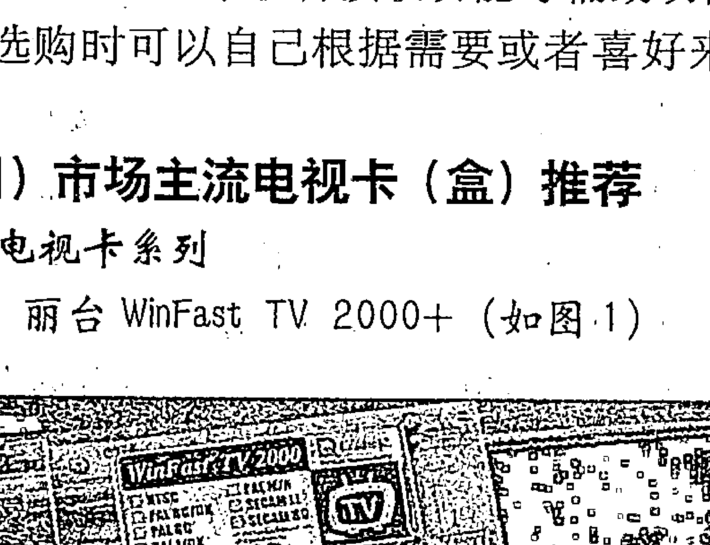

  丽台 WinFast TV 2000+ 型内置电视卡是一块集 TV 及 FM 多媒体娱乐于一身的电视卡，它安装方便；电视信号接收能力、易用性与实用性、音频效果、视频效果等都不错。配有电视遥控器，采用了自动 TV 频道扫描方式（支持手动微调功能）。附带的 CapView 应用软件可以实现浏览电视的操作控制，同时附带有 FM 天线支持 FM 的接收。

  除此之外，WinFast TV 2000+ 电视卡还有很强的视频编辑功能。WinFast TV 2000+ 提供了不同输入端子，使其能够连接 VHS 或 S-VHS 影像输出设备、CCD 摄像头等。使用 Asymetrix Digital Video Producer 4.0，3D F/X、VideoLive Mail 等附赠软件，使用者可以随时捕捉影像或者进行实时的网络电话功能。

  其市场参考价大约在 580 元左右。

- **ATI-TV WONDER 系列（如图 2、图 3）**

  作为著名的多媒体卡件制造商， ATI 除了生产其擅长的显示卡外，它生产的 ATI-TV WONDER 系列电视卡也同样是非常有名的。ATI-TV WONDER 系列包括单独的内/外置显示卡、All In Wonder（整合显卡）两大类产品。

  ATI-TV WONDER 系列采用大家熟知的 BT878KHF 芯片，做工非常精细，板上附带了音频信号输出接口、音频信号左/右声道输入接口、COMP 信号输入接口、CATV/天线接口以及 S-Video 信号输入接口，没有收音机及遥控器接头。内附 ATI 专用的 MMC 多媒体控制平台，输出的电视效果比较清晰，而且可以实现电视预览、高分辨率即时截图、定时录像等功能，其独特的“影像桌面”功能更是能让电视内容转变为桌面上的桌布。

- **品尼高 Studio PCTV（如图 4）**

  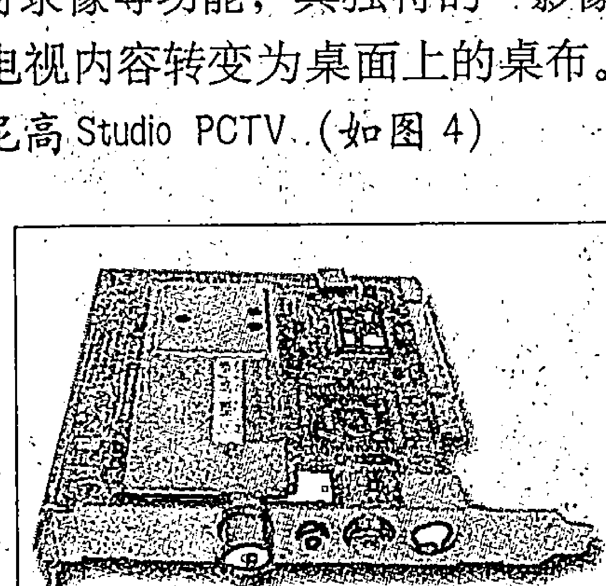

  作为美国最大的视频设备制造厂商之一的品尼高（Pinnacle），其主力产品线从民用级视频采编卡、电视接收卡到广播级非线性编辑播出系统，技术和质量均属一流。

  品尼高 Studio PCTV 具有 6 大功能：内建高保真调谐器，全功能电视接收；采用 Teletext 与英特尔 Intercast 技术，可以实现网络图文信息接收；可以进行数码视频采集，直接从电视机、录像机、摄像机将视频采集到硬盘；可通过标准 TWAIN 接口捕捉高质量单帧图像；附带 Pinnacle Studio 专业软件，可以制作视频电子文件；可外接摄像头等设备实现可视电话功能。

  品尼高 Studio PCTV 的电视输出效果很好，图像色彩比较艳丽，音质也不错。在窗口模式下，品尼高 Studio PCTV 能够提供 160×120 到 768×576 几种模式，也能够自由切换正常模式与 16:9 宽荧幕模式，也支持任意大小调节。同时，品尼高 Studio PCTV 还提供 16 个画面电视节目预览以及实时的视频捕捉功能。

  其市场参考价大约在 590 元左右。

  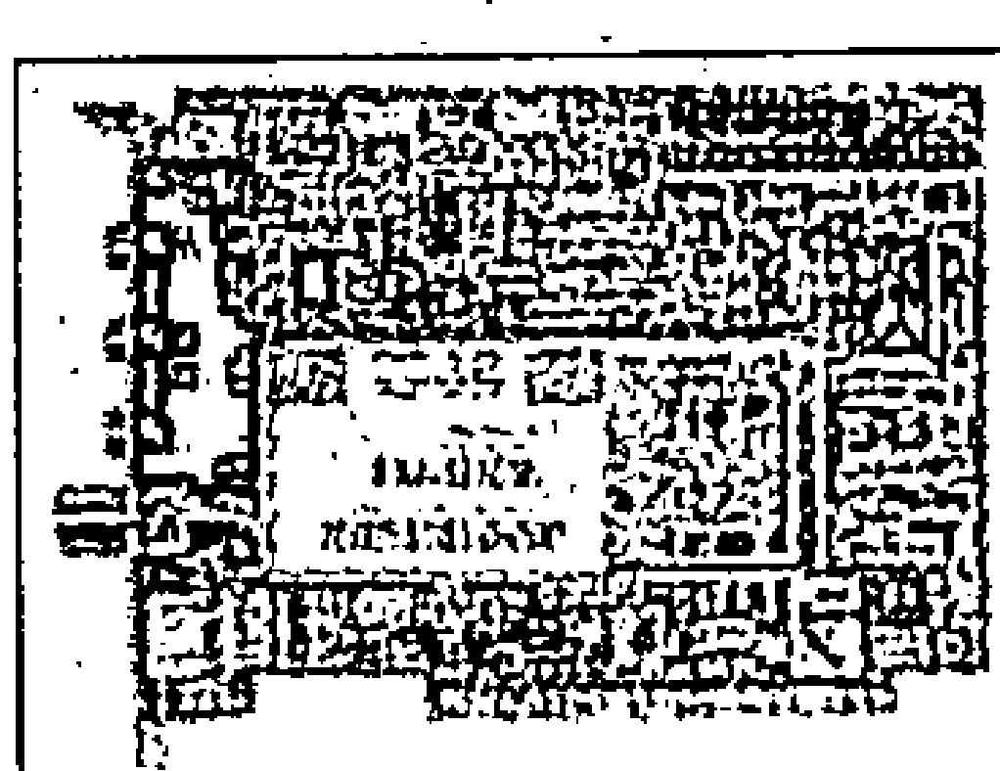

  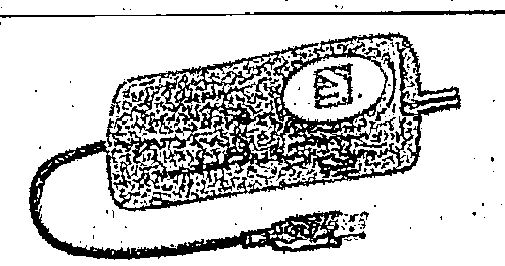

- **LifeView 的 FlyVideo98 飞影电视通（如图 5）**

  LifeView 的内置电视卡 FlyVideo98 飞影电视通，采用 878A 芯片，自带高频头，支持视频输入，支持有线电视增补频道，带遥控器。

  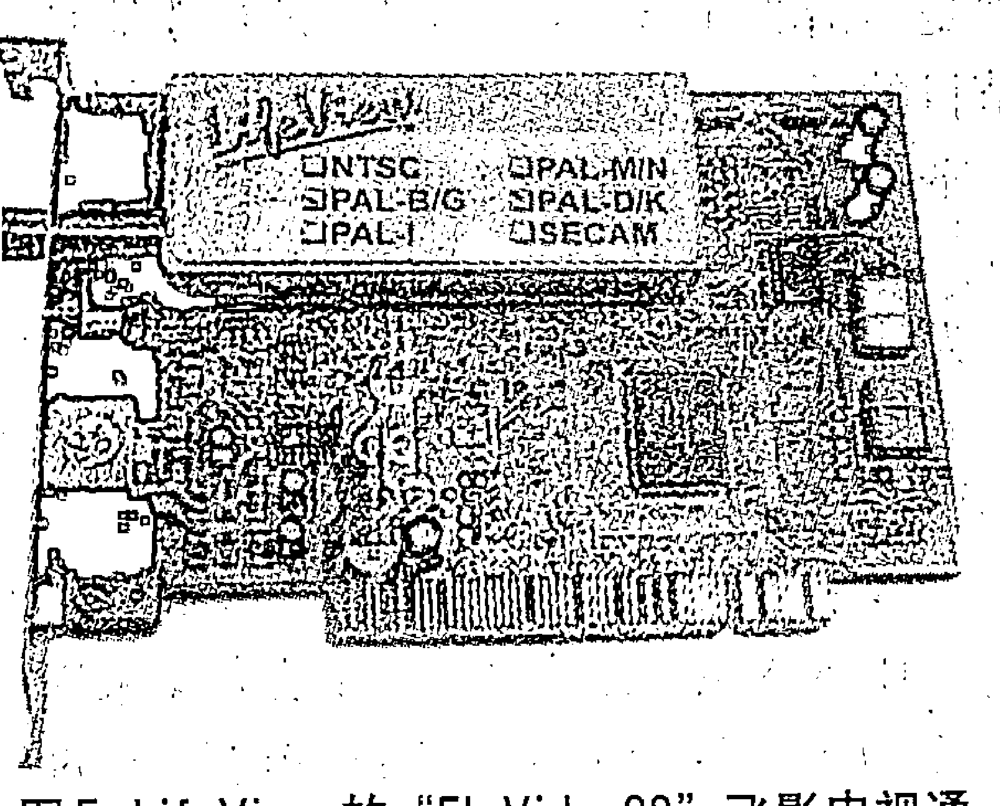

  LifeView 的 FlyVideo98 飞影电视通提供了 S-VIDEO 端子输入、有线或无线电视的同轴输入、视频输入、音频输入、遥控器红外接收器输入以及音频输出等接口。

  LifeView 的 FlyVideo98 飞影电视通的显示清晰度基本满足一般要求，使用简便，可以很方便地选择收看喜爱的频道，无须记忆编号，支持所有有线电视增补频道，颜色也很不错，但是视频捕捉功能稍差，无法自定义保存目录。

  其市场参考价大约在 510 元左右。

##### 2. 电视盒系列

- **AVerMedia TV Genie（如图 6）**

  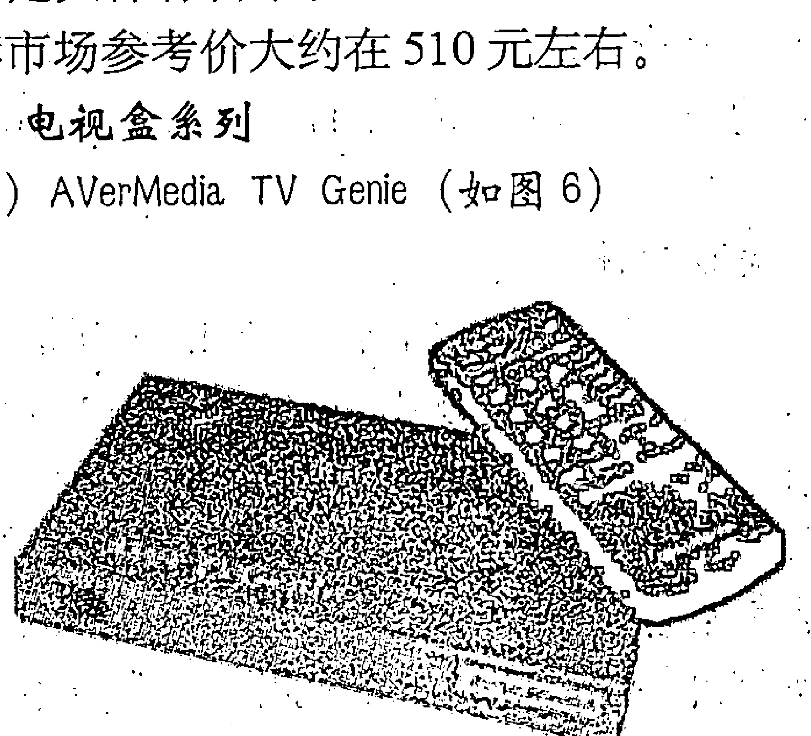

  中国台湾省圆刚系统股份公司（AverMedia）是一家 PC 多媒体专业设备制造公司，专事生产视频捕捉卡、电视接收机（卡）等设备。TV Genie 是其电视精灵一代产品，操作简便，不需要软件支持，只要接上显示器，便可收看电视、录像和 VCD 节目。提供 75 欧姆同轴天线和视频/S 端子输入，支持 PAL 和 NTSC 制式，支持全频道（181 个频道，可接收增补频道）和全面遥控功能，还提供视频输出端子、预约电视录像和定时自动开关机等实用功能。

  其市场参考价大约在420元左右。

- **同维 TW8818E (如图 7)**

  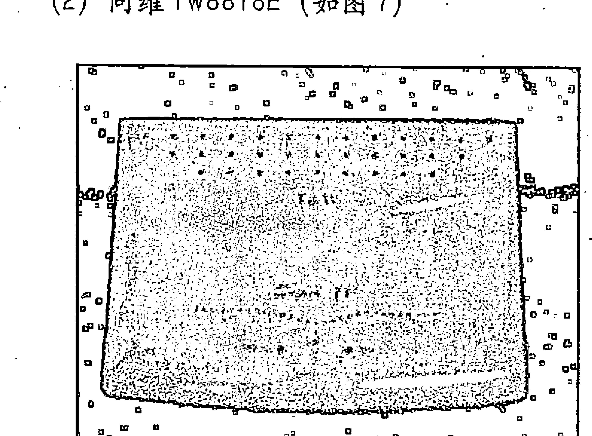

  同维 TW8818E 采用超薄流线型机身设计，高雅美观，支持即插即用，无需安装软件，直接连接显示器即可收看。采用数码电视技术，高灵敏度接收，24位16MB真彩输出，使信号接收质量达到电视机接收标准。多制式、全增补电视信号接收，可预置90个电视频道。提供全功能遥控操作，设计为电视机操作界面，具有睡眠功能，可以定时关机。具有多路音/视频/S端子和立体声插孔，可连接摄像机、录像机、高保真音响等影音终端设备。

  其市场参考价大约在390元左右。

- **佳的美 GM2000 (如图 8)**

  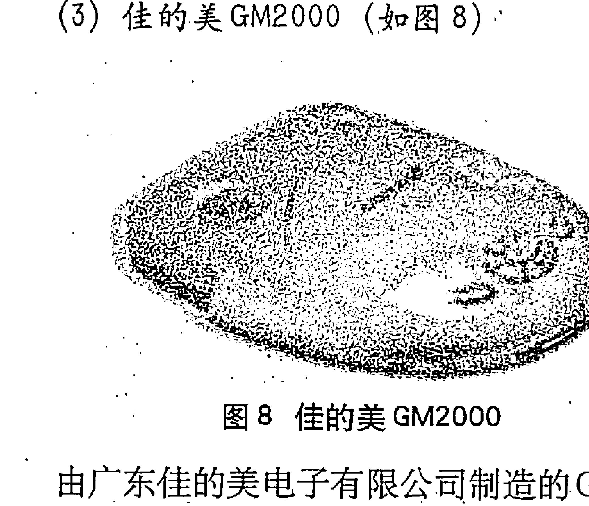

  由广东佳的美电子有限公司制造的GM2000电视接收机采用PHILIPS 视频处理芯片和大规模集成电路，运用先进的逐行扫描技术，可接收多达90个全增补的有线电视节目，接收稳定，图像细腻逼真。无需经过电脑主机，无需安装软件，即可支持用显示器收看电视。带有 AV 和 S 端子，可连接录像机、摄像机、游戏机等外设，并可自动切换不同制式的影音信号。提供全功能遥控操作，具有美观的中英文菜单和蓝屏显示。

  其市场参考价大约在390元左右。

### 二、电视卡（盒）安装指南

虽然电视卡（盒）的品牌非常之多，但是接口界面都很相似，软硬件的安装步骤也大致相同。下面的安装指南是以丽台 TV2000+ 为例来说明的，仅供大家参考。具体的品牌产品，一般都会随卡（盒）附带详细的安装使用说明书，大家一定要仔细阅读。

#### （一）安装内置电视卡

硬件安装连接：同其他的内置计算机设备一样，在安装内置电视卡时，首先关闭计算机，然后打开机箱，把电视卡插入空闲的 PCI 插槽中。如图 9 所示连接好各种连线和电视卡的各个连接接口之间的连线，最主要的在于天线插头以及音频输出的连接，如果还有其他视频源，比如录像机、VCD 机需要连接，那么可以用 AV 线或者 S 端子线进行连接。

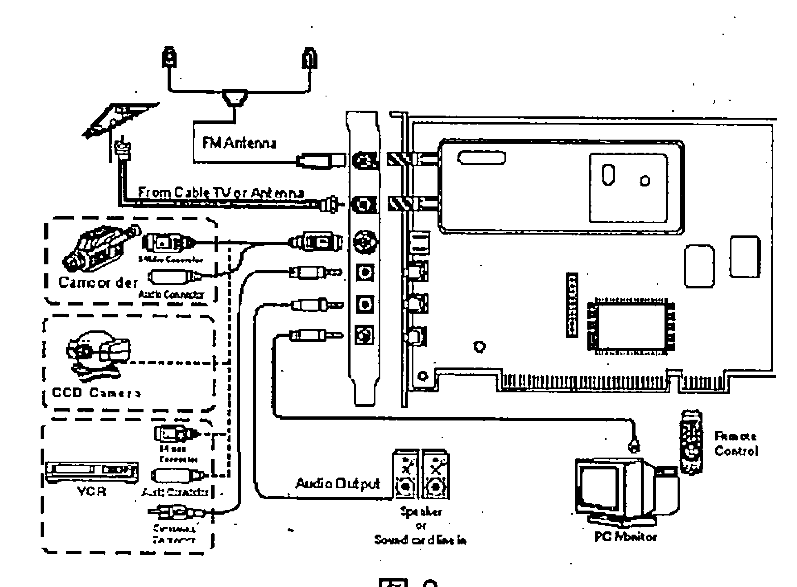

由于机箱内的电磁干扰比较多，这对于电视卡的接收效果有很大的影响，为了尽量降低其他设备对电视卡的影响，在安装电视卡时注意尽量选择离其他设备远些的 PCI 插槽安装电视卡。

在这里也顺便提一下 USB 接口的外置电视盒的安装，在安装时，外部天线、视频以及音频的连接和电视卡的安装步骤类似，唯一的区别在于 USB 外置电视盒另外需要一根 USB 接线和计算机相连。

软件安装设置：在上面的硬件安装完成后，就可以进行电视卡的软件安装了。电视卡的软件安装主要有两部分，一部分是驱动程序的安装，另外一部分就是应用程序的安装了。

打开计算机电源，在进入 Windows 操作系统时，屏幕上会显示“发现新硬件”的显示框，然后屏幕上会继续显示“添加新硬件向导”的对话框，在对话框中点击“取消”按钮。当屏幕上再次显示“添加新硬件向导”的对话框时继续点击“取消”按钮跳过。进入 Windows 操作系统后，运行电视卡附带光盘中的运行程序，运行完毕后程序会提示重新启动系统，重启系统后，系统会自动找到相应的电视卡硬件设备并为它们安装上相应的驱动程序（如图 10）。

当系统完成电视卡视频、音频设备的驱动后，可以按下面的操作步骤检查相应的驱动安装是否正确（以Windows 2000为例）：点击“开始”→“设置”→“控制面板”→“系统”→“硬件”→“设备管理”→“音频、视频和游戏控制器”，相应设备显示正常即表示安装正确(如图11)，否则就需要重新安装相应的驱动程序。

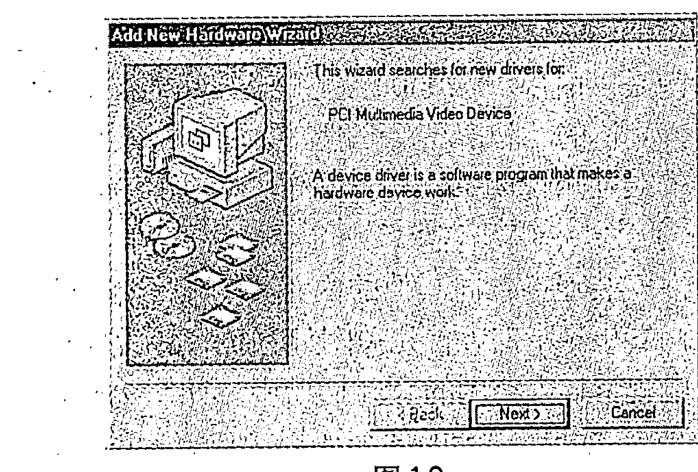

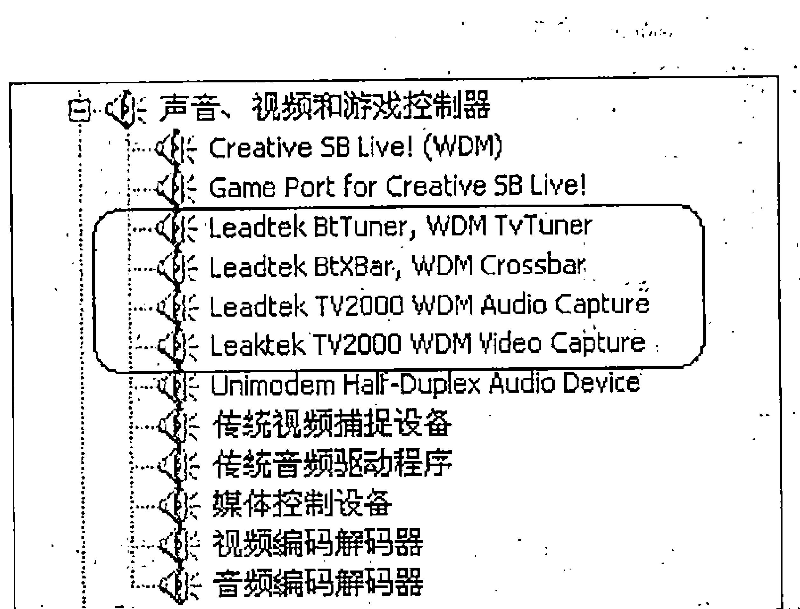

在这里要补充说明的是，电视卡的驱动安装根据使用者所用操作系统的不同而有所不同，一般来说主要分为VXD驱动和WDM驱动这两大类。VXD是Virtual X Driver的简称，即虚拟设备驱动程序，是系统用于对各种硬件资源识别、管理、维护运作的扩展。它和VMM——虚拟机管理器一起维持着系统的运行。VxD模式从Win3X时代就开始使用了，一直到了Windows 98还在Windows系列操作系统中起主导作用。WDM (Win32 Driver Model)，即Win32驱动程序模型，是Microsoft力推的全新驱动程序模式，旨在通过提供一种灵活的方式来简化驱动程序的开发。在实现对新硬件的支持上，减少并降低了所必须开发的驱动程序的数量和复杂性。除了通用的平台服务和扩展外，WDM还实现了一个模块化的、分层次的微型驱动程序结构。Windows Me和Windows 2000中引入了WDM驱动程序构架。现在市面上的电视卡一般都同时提供这两种格式的驱动程序，在安装时如果你的操作系统是Windows 9x的话，建议安装VXD的驱动程序，如果你的操作系统是Windows Me或者Windows 2000的话，建议安装WDM的驱动程序，注意不要选错了，驱动程序选择错误轻者会导致使用时电视接收效果的下降，重者可能会引起操作系统的不稳定。对于USB外置电视卡的软件安装基本上和上面介绍的类似，大家可以参照上面内置电视卡的具体安装步骤来进行相应的安装。

#### （二）安装外置电视盒

作为在PC上使用的电视接收设备之一，外置电视盒以其很好的性价比同样受到一部分电脑爱好者的欢迎。不过外置电视盒的安装与上面介绍的内置电视卡的安装有很大的区别。就一般的外置电视盒来说，其通常都是采用倍频技术来提高输出图像的清晰度，而且具有470KHz的搜索能力进行全增补电视接收，保证能正常接收所有的有线和无线电视信号。同时，外置的电视盒通常也提供一系列的输入／输出接口(如S端子、音频输入／输出等等)，以供使用者进行一些音频／视频之用。

在进行安装前，记得先关闭计算机以及外置电视盒的开关，把显示器和显卡的连线拔下连接到电视盒的monitor接口，然后通过随电视盒附带的转接线连接显卡和电视盒的“VDA IN”端口，把天线接头和电视盒上的接入端口相连，最后用音频线连接电视盒Line out和声卡的Line in(或者直接连接外部单独的音箱)。在上述步骤完成后，打开计算机电源，利用遥控器或者电视盒面板上的相应按钮进行切换，电视画面和计算机显示画面能分别正常显示表示电视盒的安装基本完成(如图12)。

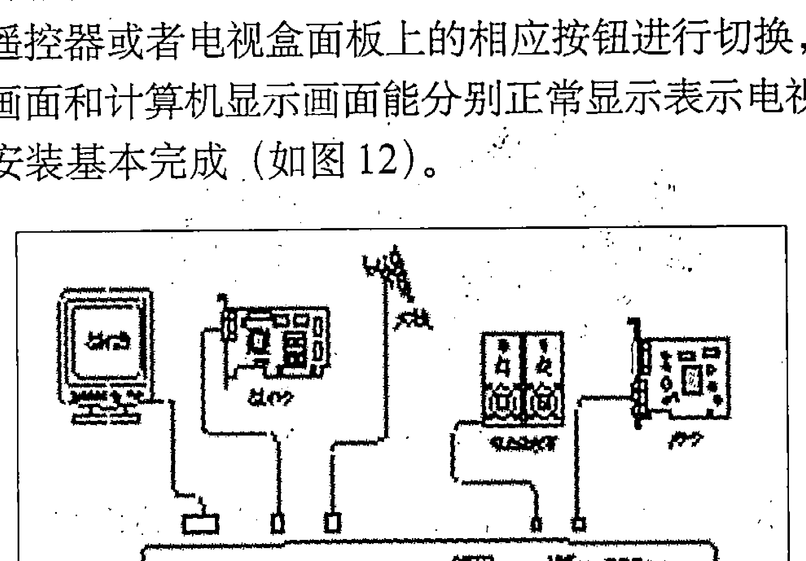

### 三、电视卡使用指南

#### （一）电视接收

在正确进行电视卡的硬件以及软件安装后，就可以进行电视的接收工作了。下面就以笔者的丽台TV2000+为例来具体谈谈进行电视节目接收的相应操作。一般电视卡(盒)都会随着产品附送电视接收实用程序。安装运行对应的实用程序，第一次运行时，电视卡的接收程序会检查使用者所在的地区并要求使用者指定对应的广播电视制式（部分电视卡会根据使用者操作系统中的设置区域自动设置对应的广播电视制式）。由于不同广播电视制式对应的图像和伴音的中心频率各不相同，因此广播电视制式的设置正确与否与电视的接收效果有很大的关系，错误的广播电视制式设置可能会导致电视图像显示以及声音播放失真甚至导致电视信号的接收失败。就目前而言，世界上的广播电视制式主要分为三大类：① NTSC：美国、日本、加拿大等国家使用；② PAL：美洲、欧洲部分国家以及亚洲、中国以及香港等国家和地区使用，而且PAL制式还细分为PAL I/DK/BG/MN等；③ SECAM：法国、俄罗斯等欧洲国家使用，同样SECAM制式也细分为SECAM BG/LL/DK等。对于中国的用户，在选择时应该选择PAL－DK或者PAL－BG，如果相关的接收程序在自动设置时设错了使用者要自己在程序中修改相应的设置。

广播电视制式设置完成后就可以进入接收程序的主运行界面了，接着需要设置的是系统的声音接收选择。对应电视卡而言，它提供了一个Line out端口，从上面的电视卡安装接线图中可以看到，通过电视卡的这个输出端口可以连接相应的音频输出设备（如音箱等），而计算机一般都是将音箱和声卡相连，因此建议大家可以通过相应的连线将电视卡和声卡相连，通过声卡的处理后再输出电视卡的伴音。具体的做法就是将电视卡的Line out和声卡的Line in接口相连，这样连接后，在电视卡接收软件中就需要进行相应的声音设置，如图13所示，在“声音采集设备”中选择自己对应的声卡，在声音输入设备中选择“Line in（线性输入）”。

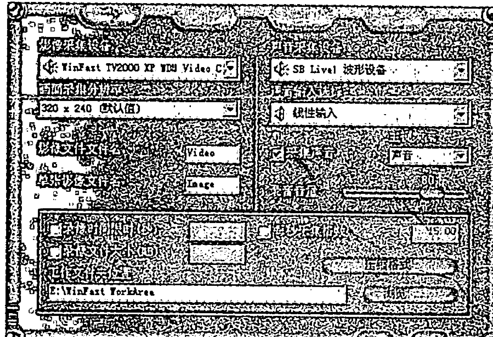

完成了上面的设置后，就可以进行电视信号的扫描了（如图14、图15）。首先根据自己目前的天线连接情况选择电视信号的来源——有线电视（Cable）输入或者无线天线输入（Broadcast）。选择有线电视输入时，接收程序会自动扫描增补频道，若选择无线天线输入则接收程序会忽略这些频道的扫描。在扫描前可以再看一下接收程序设置的广播电视制式是否正确。按“频道扫描”按钮就可以开始电视信号的扫描了，整个扫描过程大概需要几分钟，对于信号比较强的频段，接收程序会自动进行标识并存储下来加入频道列表。扫描完成后，使用者可以对扫描到的频道进行相应的处理，对于重复搜索到的或者信号差的频道可以从频道列表中删除，对于信号有些小问题的频道可以像电视机上的调频系统一样进行手动微调直到接收效果满意为止。在全部频道搜索调节完毕后，使用者还可以对频道列表中的各个频道名称进行编辑，以便以后进行选台操作。

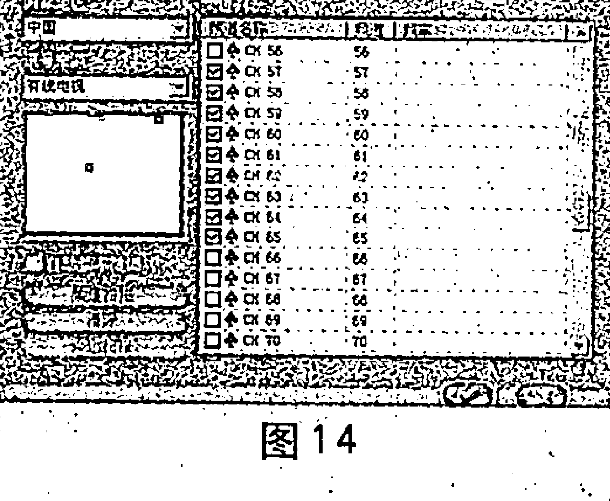

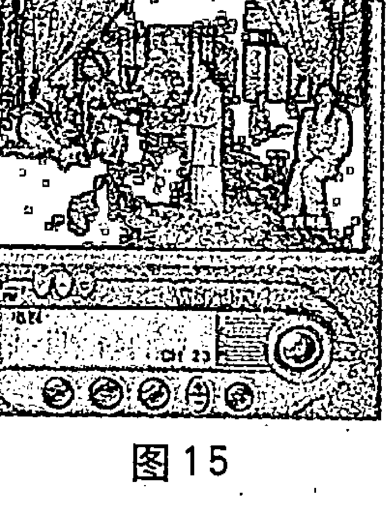

#### （二）调频FM接收

目前市面上部分电视卡还额外提供了调频FM的接收功能；要进行FM的接收，首先要按照上面的安装步骤安装相应的FM接收天线，并安装相应的FM接收应用程序。

FM的接收程序和电视接收程序相似，在第一次运行时也要进行相应的设置，全球不同地区的FM接收频率以及间隔频率是不一样的，在设置完电视接收程序的广播电视制式的同时，FM的制式也会随之相应地确定。然后同样要设置使用的设备、音频输入来源，同电视接收程序一样将输入来源设置为声卡的“Line in（线性输入）”即可。这些都设置完成后，就可以让接收程序搜索相关的FM频道，对于搜索到信号强的频道，接收程序会自动存储到频道列表中（如图16）。

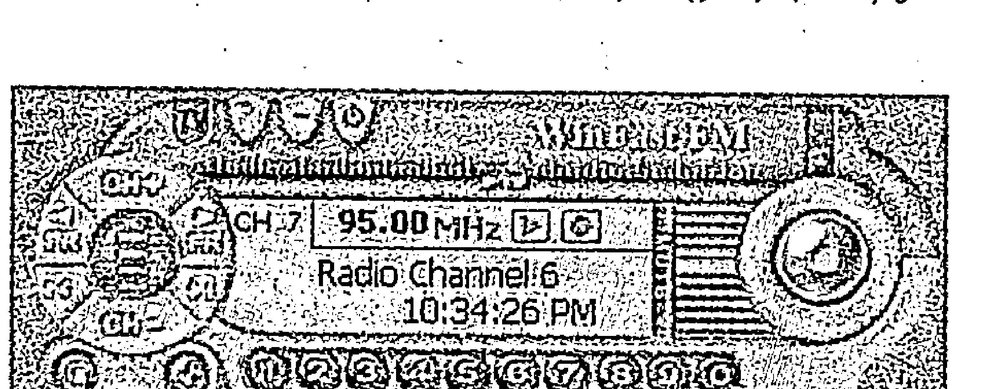

#### （三）第三方电视接收程序

上面介绍了电视接收的具体操作过程，对于不同的电视卡，其附带的电视接收程序是不同的，但是其具体的接收过程是相似的，在使用时大家可以参考上面的操作步骤。通常大品牌附带的电视接收程序功能更全面，兼容性和稳定性也更好。

程序都是针对自己相应产品的驱动进行优化配合的，功能都比较出色，能有非常好的接收效果，但不同厂家的产品，接收程序的兼容性不是太好。而对于很多小品牌的电视卡，出于成本的考虑，其附带提供的电视接收程序的使用和接收效果就差强人意了。如果你对自己的电视卡接收程序的效果不是太满意的话，可以考虑一下采用第三方的电视接收程序来提高自己的收视效果。就目前看来，很多第三方厂商开发的通用电视接收程序的接收效果也非常好，其提供的功能和那些大牌厂商附带提供的电视接收程序相比也毫不逊色，因此下面就来为大家介绍几款很好的通用电视接收程序。

##### 1. WINDVR

WINDVR 是 InterVideo 公司提供的一款功能强大的视频多媒体软件，除了具有高清晰度的电视接收功能外，还能提供预约录影、时光保留（Time-Shifting）以及通过 Internet 来取得电视节目表与时程安排功能等。而且看的时候可以控制暂停、倒转、慢动作等特效，当然也可以收看现场直播。如此强大的功能，对于购买了电视卡的计算机用户来说，WINDVR 绝对是替代那些随卡附带功能单一的配套播放软件的上佳选择。

WINDVR 提供的电视接收功能主要包括：

###### （1）收看电视

作为一款视频软件，WINDVR 支持电视卡的视频以及音频输出功能，使用 WINDVR 来观看电视节目非常简单。只要按照下列步骤进行操作就可完成。

首先确定系统安装的电视卡设备驱动必须是 WDM 标准驱动程式，就目前而言，大多数厂家都已经提供这种格式的驱动程序了。然后从程序组中执行已安装 WINDVR 主程序，在第一次运行时，程序会自动弹出相应的窗口——“初始化设置”，提示使用者进行电视信号的搜索工作，在窗口中首先在“电视”栏目中设定相应电视信号的各项参数，“国家”选择 China；“视频标准”选择 “PAL_D”；“TV 调谐器” 用来设定电视信号的接收来源，对于使用室外天线的用户应选择 “天线” 项，对于使用有线电视的用户可以选择 “天线” （Antenna）项或者 “有线” （Cable）项。

然后切换到 “初始化设置” 窗口的 “频道” 栏目，按 “自动扫描” 按钮后，WINDVR 就会自动进行电视信号的扫描，并将找到的频道自动进行标注（如图 17）。对于电视频道的扫描工作在以后的使用过程中还可以进行更改。

在设置完相应的频道后，你就可以使用 WINDVR 进行电视收看了。使用 WINDVR 观看电视

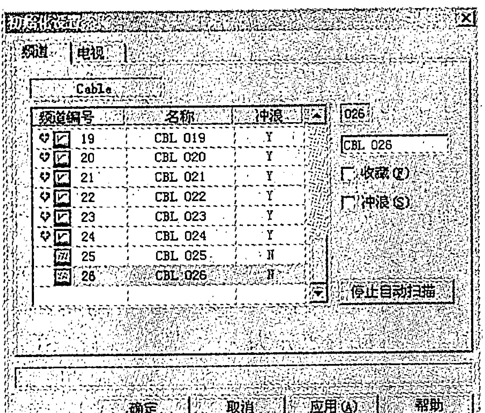

可以采用三种方式进行频道的选择，一种方式就是在上面的频道搜索画面中双击相应的频道；一种方式就是采用播放界面中的相应按键进行操作，在播放界面中控制电视频道选择的主要就是界面左边的那两个上下键，用来进行频道的切换工作；第三种就是利用 WINDVR 提供的 “多屏显示” 功能来实现的，这在下面将进行介绍（如图 18、图 19）。

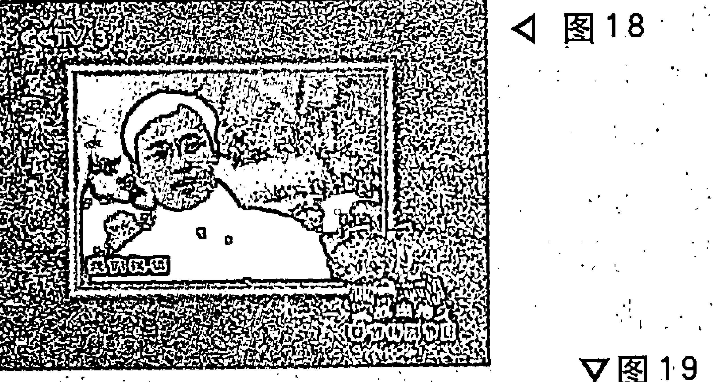

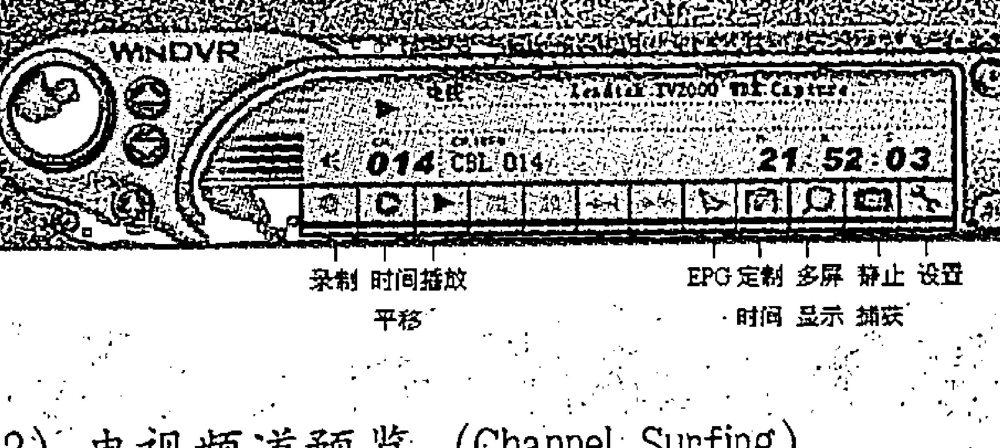

###### （2）电视频道预览 (Channel Surfing)

电视频道预览 (Channel Surfing) 功能可以快速显示所有的电视频道于一个视窗画面中，类似于电视墙的效果，使用者可以通过这项功能预览当前其他频道正在播放的节目画面从而选择自己想看的电视节目。要使用此功能时，按下操作界面中的 “多屏显示” 按钮就可以了，想观看电视墙中自己喜欢的频道，只要用鼠标双击相应的小窗口就可以了（如图 20）。

###### （3）影像视窗缩放 (Display Window)

在视频显示方面，WINDVR 为使用者提供了视窗影像的尺寸以及视窗大小的调整选择。视窗影像的尺寸可以提供 4:3 与 16:9 的画面，后者可以让你感受超宽屏幕的效果。视窗大小则提供了 240 × 180、320 × 240 以及 640 × 480 这三种格式。

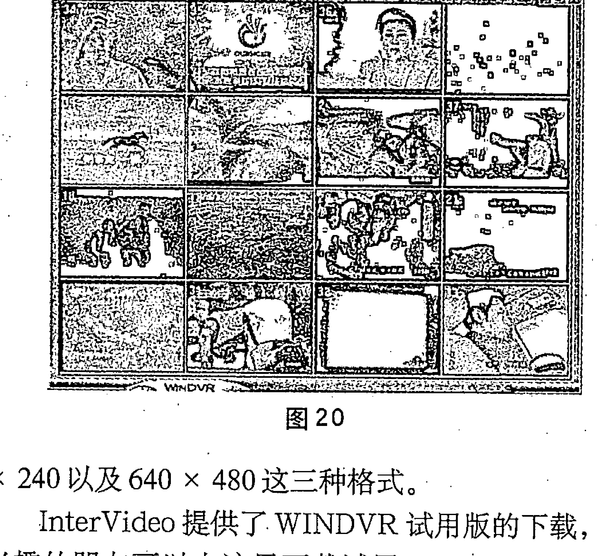

InterVideo 提供了 WINDVR 试用版的下载，有兴趣的朋友可以去这里下载试用。

http://www.intervideo.com/jsp/WinDVR_Download.jsp

##### 2. WINAMP TV

作为多媒体格式播放软件中的佼佼者，Winamp 已经从最初单纯的 MP3 播放软件发展成为目前支持几乎所有多媒体格式的软件播放平台，其最大的成功之处就在于自身开放的接口技术，这样就可以让其他的开发者通过一系列的插件，来完善 Winamp 其他方面的功能。如今的 Winamp 通过各种外围插件的支持，不仅支持各种其他格式的多媒体格式，更在视频、音效、外观等各个方面都大大超过了其他的多媒体播放器。而本文将为大家介绍的 Winamp TV 则是一个非常另类的插件，通过它，有电视卡设备的用户就可以通过 Winamp 收看到电视节目了。

从 www.winamp.com 下载 Winamp TV 的最新版本，按照屏幕提示进行安装。安装完毕后，运行 Winamp，在主菜单中 Options 中选择 Preferences，在 Plug-ins 中的 Input 中选择 Winamp TV (X86) (in_tv.dll)（如图 21），然后点击下面的 Configure 按钮，可以对 Winamp TV 进行相关的配置，配置窗口如图 22 所示，整个配置界面主要包括 4 个选项：

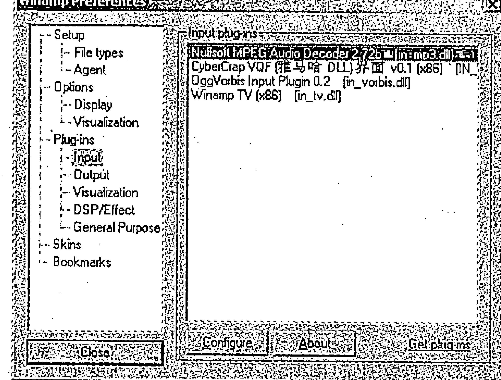

钮，可以对 Winamp TV 进行相关的配置，配置窗口如图 22 所示，整个配置界面主要包括 4 个选项：

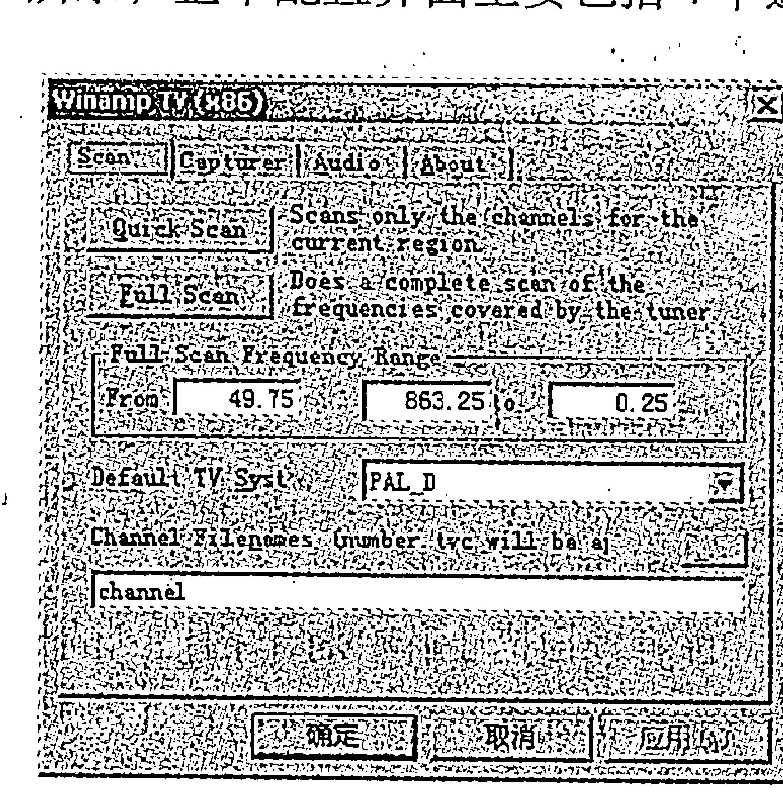

+   ① Scan选项。这个选项是用来设置频道扫描的，Quick Scan 是用来扫描当前区域的频道，Full Scan 则是在电视卡设备所能接受的所有信号的频率范围进行频道扫描，相比较而言，前者的扫描速度大大快于后者，但是有时容易在扫描时出现漏扫频道的现象，因此建议大家在使用时还是选择 Full Scan 进行扫描，这样可以保证扫描到的频道尽可能的多。Full Scan Frequency Range 中设置的是进行 Full Scan 时的起始频率、终止频率以及频率递进的频率增量，就国内各地的电视信号的频率来看，按照默认值即可，但如果你不放心的话，可以自己修改起始频率、终止频率以及频率递进的频率增量的相应值。Default TV System 设置的是使用者当前区域使用电视信号制式的类型，这个选项的设置对于整个信号的扫描以及电视播放都有很大的影响，设置错误的话，将很有可能无法搜索相应的电视信号，播放时也将出现画面失常等现象，我们国内使用的是 PAL-D 制式，因此我们在选择时就要从下拉选项中选择对应的 PAL-D。Channel Filenames 可以让我们把搜索到的频道存储为自己喜欢的文件名，这样可以方便在以后的操作中自由选台。
② Capture选项。这个选项是用来设置 Winamp TV 对输入设备（也就是电视卡）的具体控制的，在相应的设置窗口中，Capture 用来选择对应的视频输入设备，在这里选择我们使用的是电视卡；Input 中设置相应的显示输出模式，选择默认的 Preview、Video 中可以设置相应输出电视图像窗口的大小以及相应的显示模式，显示窗口默认的是 320 × 240，使用者可以根据需要自由调整相应的显示窗口的大小，而显示模式默认的是 YUY2 方式，这跟具体显卡支持的显示模式关系很大，如果默认的设置无法正常显示的话，可以在下拉菜单中选择其他可以兼容的显示模式。
③
④

显示模式。

③ Audio选项。这个选项是控制Winamp TV音频输入方面的配置的，Crossbar Input指的是最初的音频来源，应该选择Tuner；Mixer Line中选择的是声卡的输入部分，应该选择Line In选项。

④ About选项。这个选项和普通的软件一样，没有具体的设置项，是一些关于Winamp TV版本号以及作者介绍方面的信息。

在上面的设置项都设置妥当后，点击Scan选项中的Quick Scan或者Full Scan按钮，Winamp TV就开始正式的信号扫描工作，对于扫描到的比较稳定的电视信号，Winamp TV都会将对应的频率存储到默认的频道文件名中(channel00X.tvc)，默认的频道文件将保存在Winamp目录下的Plugins子目录中。扫描结束后，按扫描窗口中的Set as Playlist按钮就可以把扫描到的所有频道存储为一个类似于mp3播放列表的Playlist文件（如图23）。

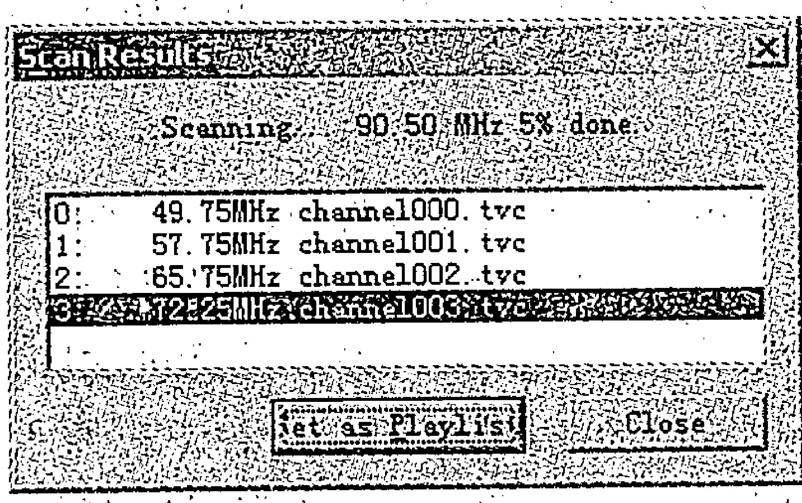

按照上面的步骤完成一系列的设置以及扫描工作后，你的Winamp已经是一个具有电视播放功能的超级视频平台了。需要观看电视节目时，你只要选择打开文件，然后进入扫描后频道文件对应的存放目录，点击后缀名为tvc的频道文件就可以进行对应电视节目的接收播放工作了（如图24、图25）。

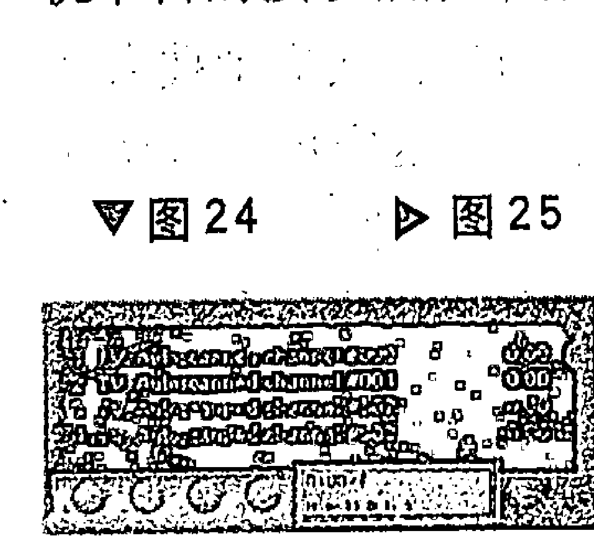

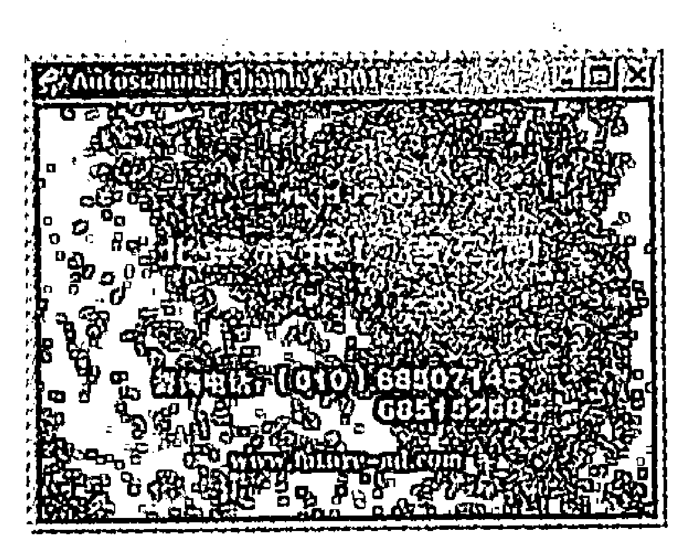

上面就是利用Winamp TV播放的电视节目的截图，而且我们也可以使用Winamp播放列表的功能，把所有的频道文件做成一个播放列表文件，这样我们就可以直接通过Winamp来控制需要观看的频道，而不必要打开频道文件来切换相应的频道了。另外，我们也可以把默认的频道文件根据对应的具体的电视台修改成相应的文件名前缀，这样可以更加便利在观看时顺利地选台，如把对应CCTV-1的频道文件修改为CCTV-1或者中央一台等。

在电视播放窗口，单击鼠标右键，还有一系列对于电视显示画面的控制选项，其中最重要的两项是Always On Top和Fullscreen。前者可以把电视窗口始终保持在屏幕的最前面，不至于因为窗口的切换而挡住了电视的显示窗口，这样可以保证边工作边观看电视，做到工作、娱乐两不误；而后者则可以实现全屏幕观看电视节目。

有电视卡的朋友可以去Winamp的网站下载相关的插件，具体的下载地址如下：

```
http://www.winamp.com/components/download_component.jhtml?filename=http%3A%2F%2Fftp.winamp.com%2Fcustomize%2Fcomponent%2F2000%2F9%2F5%2FP%2FWinamp_TV.exe&componentid=28682
```

最后要补充说明的是，Winamp TV必须运行在Windows 98第二版以上或者Windows 2000/XP等操作系统中，同时在Windows 98第二版中也必须使用电视卡对应的WDM驱动，对于Windows 9x中常见的VXD驱动，Winamp TV是无法进行工作的，对于那些没有提供9x下WDM驱动的电视卡，大家在使用时可以用相应产品2000下的WDM驱动来替代使用，一般也能正常工作。

##### 3. ATV2000

ATV2000是一款完全免费的电视接收软件，其安装文件只有1.5MB，但是安装后提供的功能却强大无比。它支持手工设定收视频率，确保能正常收看到所有的电视台。只要你的电脑安装了相应的编码解码器，就可以将录制的电视节目压缩成任意格式。

ATV2000的安装非常方便，其安装程序类似于大家都熟知的Winamp的安装界面，对于各个安装组件，使用者在安装时可以自己选择安装。要注意的是，安装ATV2000必须首先安装DirectX 8。

安装完成后，安装程序会自动启动ATV2000并进入设置画面让使用者进行相应的设置工作，ATV2000内置了很多品牌的系统参数，在TV Card选项中使用者可以选择自己对应的电视卡型号，ATV2000会自动调用相关的参数进行自动设置，不过对于其列表中没有的电视卡型号，使用者就必须自己手动来设置相关的参数了，具体的操作就是在System中设置电视卡的型号，对于目前常见的电视卡，TV Card Module通常设置为“BT8x8”（如图26）。

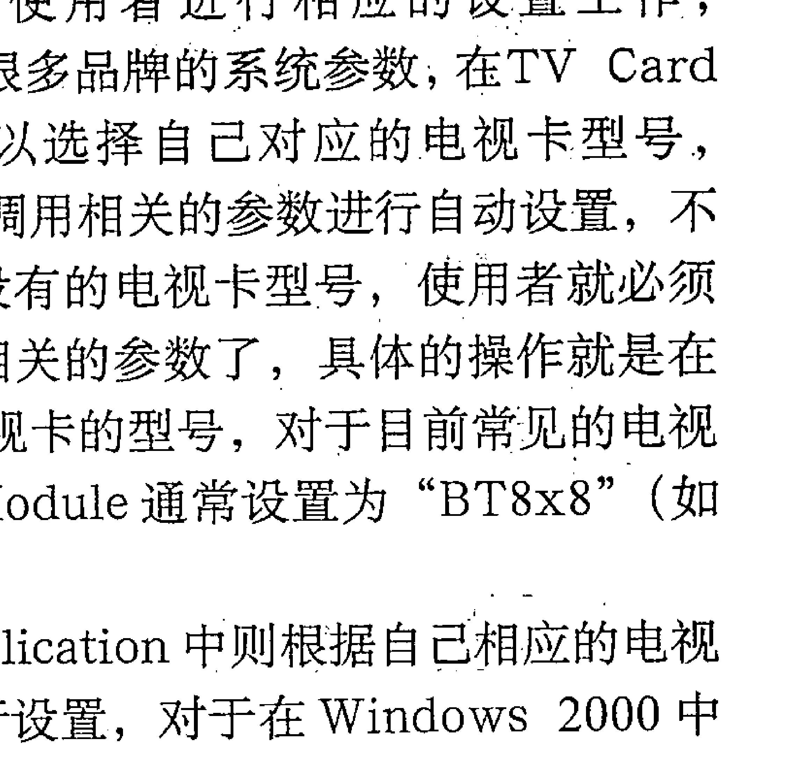

Capture application中则根据自己相应的电视卡驱动类型来进行设置，对于在Windows 2000中使用的用户可以设置为 WDM Capture，在 Windows 98下使用的用户可以设置为VFW Capture类型；Sound source 中则输入音频的输入源，通常就是声卡的 Line in (线性输入)。然后在 TV Card 选项中设置电视卡的系统参数（如图27），这里最重要的就是设置 Tuner type (电视卡的调谐处理器的类型) 和 Sound Decoder 了，这两项是决定电视卡视频和音频输出的，具体的参数不同的电视卡都有所不同，使用者可以从电视卡的说明书中查到相应的参数。

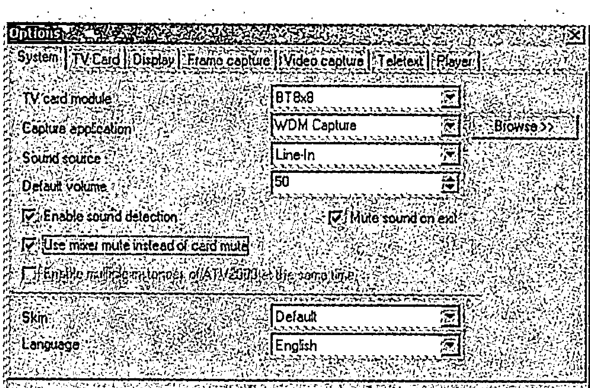

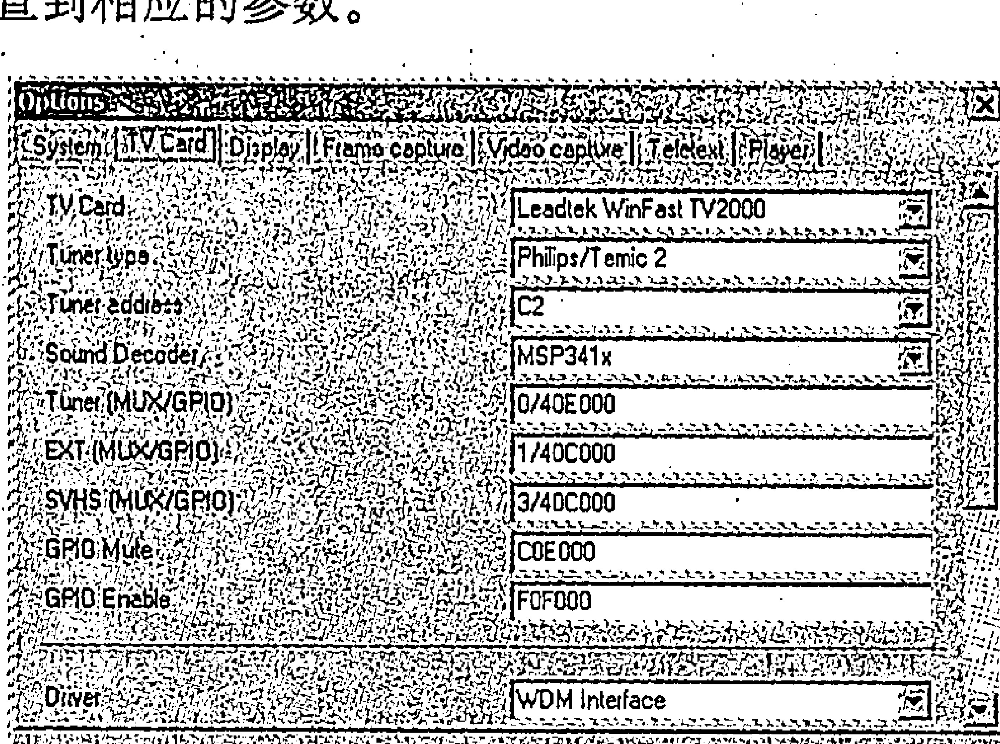

上述设置完成后，就可以进入 ATV2000 电视信号的搜索画面了，搜索首先在 Channel table 中选择对应的搜索的电视制式，对于我们而言，可以选择 PAL – DK，当然按照默认的 Full Channel Scan 同样可以搜索到所有的频道，但是这样做将大大延长搜索的时间，因此还是建议大家选择 PAL – DK 制式，搜索完成后可以对搜索到的频道进行更名、微调等操作。

ATV2000 提供了一个遥控器方式的操作面板，可以非常方便地进行频道的切换选择、软件属性以及音量调节等方面的操作（如图28、图29、图30）。

#### （四）电视节目的录制

跟普通的电视以及外置电视盒不同，电视卡除了能够在电脑上实现电视节目的接收以及多级窗口显示外，而且还可以借助于软件把自己喜欢的电视节目录制下来保存在硬盘上或者刻录成VCD以后慢慢欣赏。对于由于工作学习等原因可能会错过的电视节目还可以设置预约录制，定时让电视卡在预定节目开播的时候开始录制，节目结束时自动停止录制，这样在工作完后也可以补上没看的节目。下面就以笔者的丽台 TV2000 + 为例给大家介绍一下具体的录制过程。


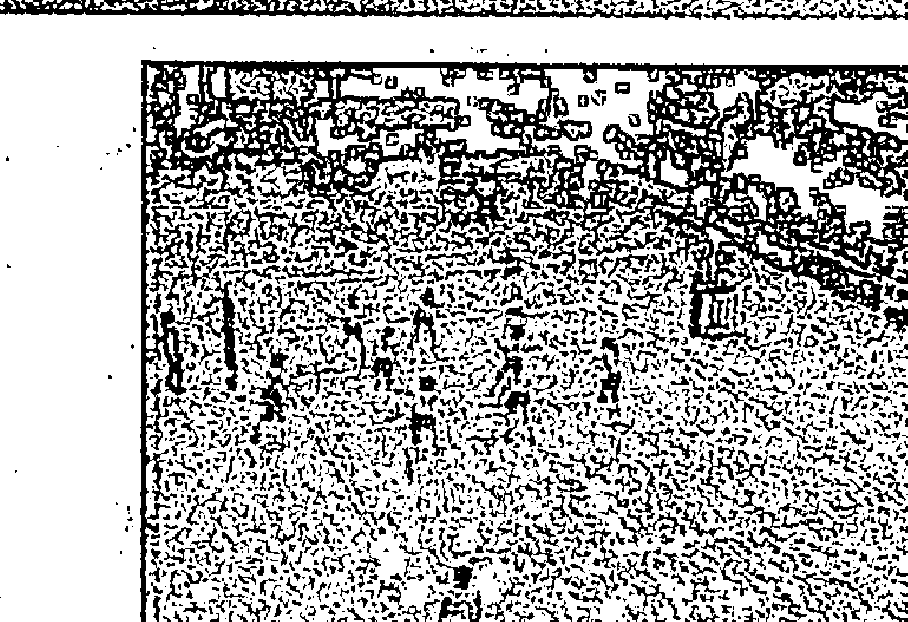


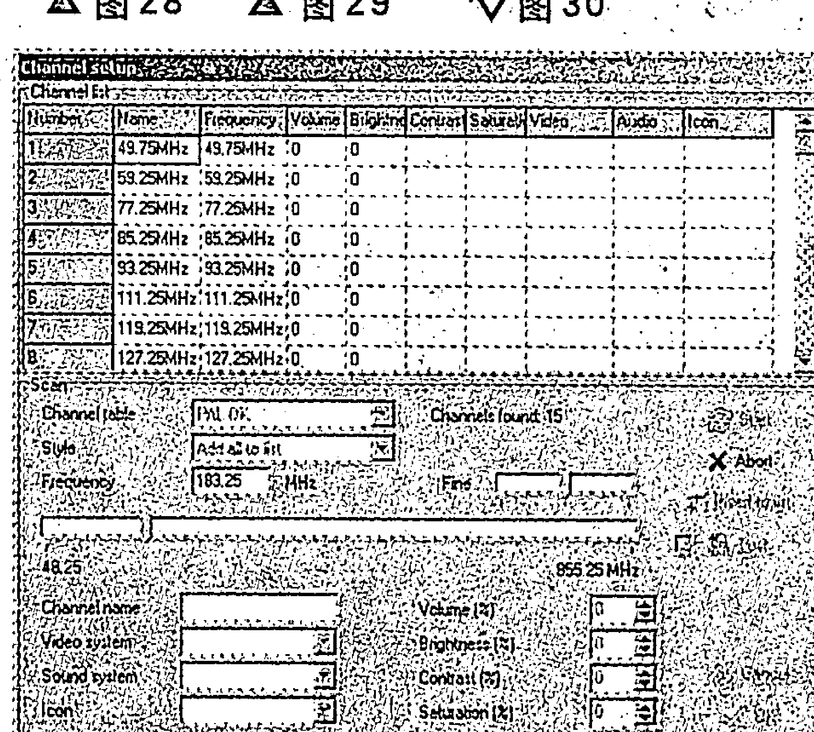

##### 1. 简单即时录制模式

首先打开相应的电视接收程序。对具有电视录制功能的接收软件，首先需要配置好录制的各项参数。进入设置选项，选择正确的视频和音频设备，通常视频设备就是电视卡，音频设备就是声卡，跟接收一样，音频输入应该选择声卡的“Line in (线性输入)”，对于画面的录制分辨率通常录制软件默认的是 320 × 240，以这个分辨率录制节目的效果基本上可以和 VCD 的效果相媲美，对于追求高画质的用户，可以自己定义相应的分辨率。另外，使用者还可以设定相应的录制文件的名字、在硬盘上的保存位置、录制的时间长度、录制文件的大小以及录制时每秒钟的帧数等相关参数（如图31）。

设置完相关的参数后，还需要进行录制文件压缩格式的设置，这个设置对于录制文件的效果以及录制后的文件的大小都有很大的影响。压缩格式的设置主要包括视频格式以及音频格式的设置，视频格式可以选择各种视频压缩编码 (各种常规格式如 avi、divx等)，音频格式可以选择和视频相对应的音频编码格式，如pcm、mp3等(如图32)。

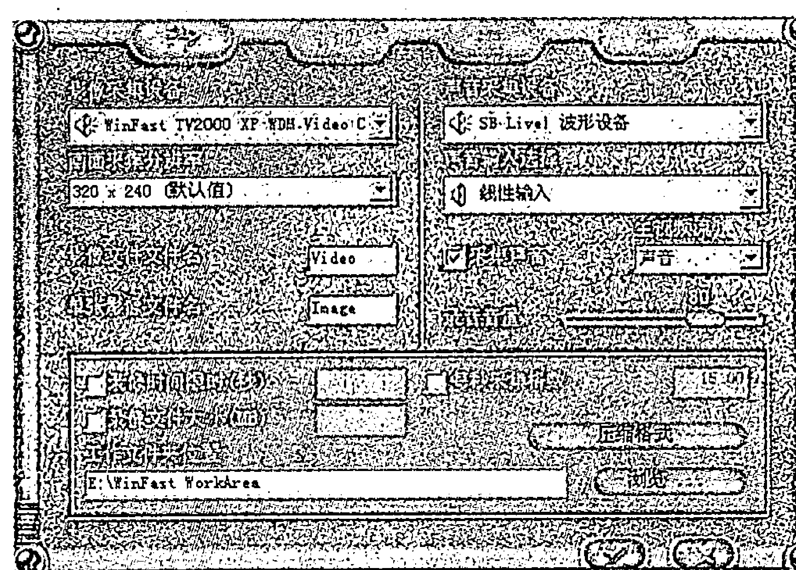

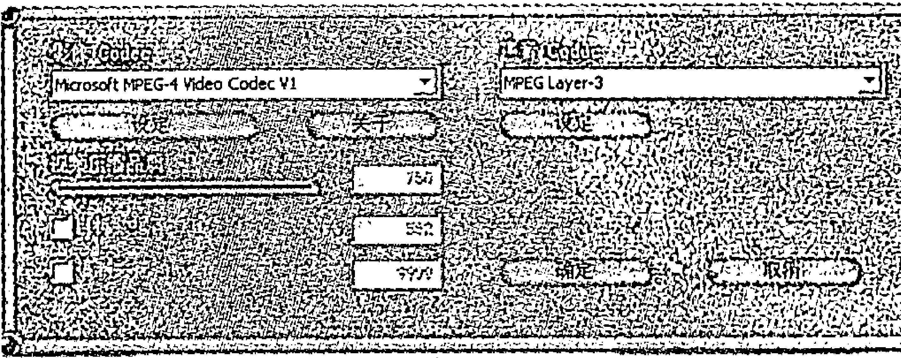

各项参数设置完成后就可以把频道调节到自己喜欢的电视节目；按录制按钮就可以开始电视节目的录制工作了。

##### 2. 预约录制模式

对由于各种意外原因而无法即时收看的电视节目，我们可以利用一些电视录制软件所提供的特殊功能——预约录制让计算机在选定的电视节目开始时自动启动程序开始录制节目，这样在有空的时候可以再回味。

进行预约录制，最主要的还是要进行相关预约录制的设置。预约录制需要设置的相关参数主要有录制开始的时间、录制结束的时间(注意，录制开始的时间必须是比当前时间晚的时间，而且录制结束的时间也必须比录制开始的时间晚，两个条件有一个不满足是无法进行预约录制的)、录制的周期（是仅仅录制一次还是有类似于每天或者每周相应时段）以及需要录制的电视频道，有了这些必需的相关设置信息，把它添加到相应的“预约录制工作表”中就可以创建一个预约录制任务了（如图33)。

跟上面介绍的一样，除了电视卡厂商随电视卡附带的各种视频捕捉程序外，很多第三方的捕捉程序也很有特色，对于那些并没有提供视频捕捉程序或者捕捉程序功能比较简单的电视卡来说，使用这些第三方的捕捉程序无疑是扩充这些电视卡功能的好方法。下面就来为大家介绍几款功能比较强大的第三方视频捕捉程序。

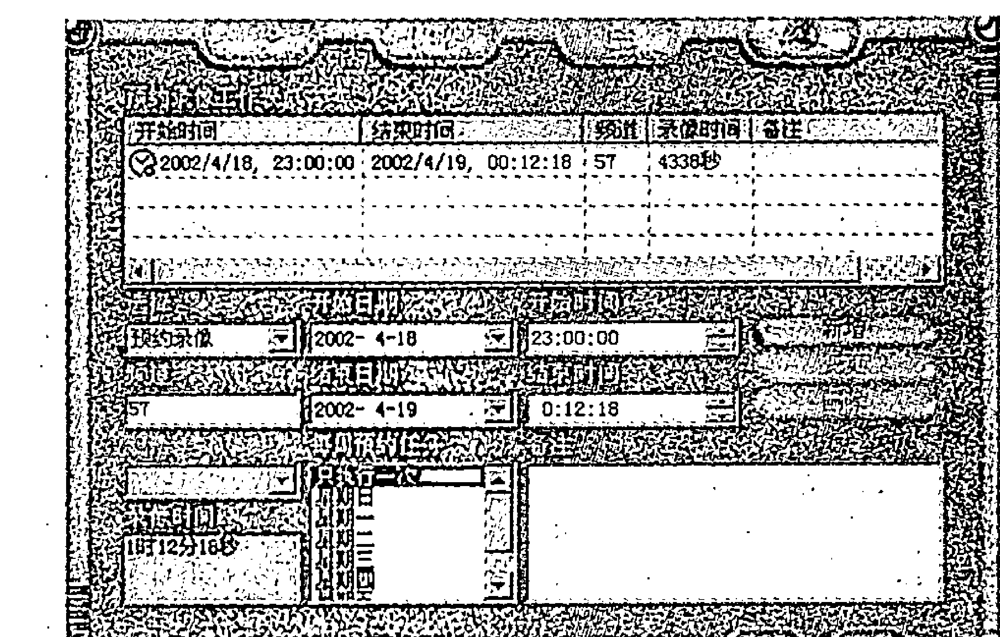

###### (1) WINDVR

WINDVR除了能提供强大电视接收功能外，在视频捕捉方面也有其独特之处，它主要有以下一些实用的视频录制功能。

①实时 (Real Time) 录像
WINDVR的实时录像功能可以将电视卡的输出信号实时地直接转录成高画质的MPEG-1/MPEG-2格式的视频文件，储存到硬盘上，完全不用经过AVI的视频文件转化过程，一次完成。在录制前，首先要根据自己的需要对于录制的格式等进行相应的设置工作，点击操作界面右边那个设置按钮，在“属性”窗口的“录制”项目中，使用者可以设置相应的视频和音频设备，在“录制质量”中可以设置相应需要捕捉的文件格式，WINDVR默认提供了VCD以及DVD效果的12种视频效果格式，使用者可以使用WINDVR默认提供的“良好”、“更好”、“最好”这三级录制效果，同时使用者也可以自己定义视频格式。在“存储器”设置中可以设置捕捉视频的保存位置。在录制时，大家要注意自己选择的录制模式，在“存储器”设置中设置完捕捉视频的保存位置后，WINDVR会根据当前磁盘的剩余空间计算出采用当前选择的录制模式可以正常录制的时间，这个可以通过“总录制”时间中看出来(如图34)。

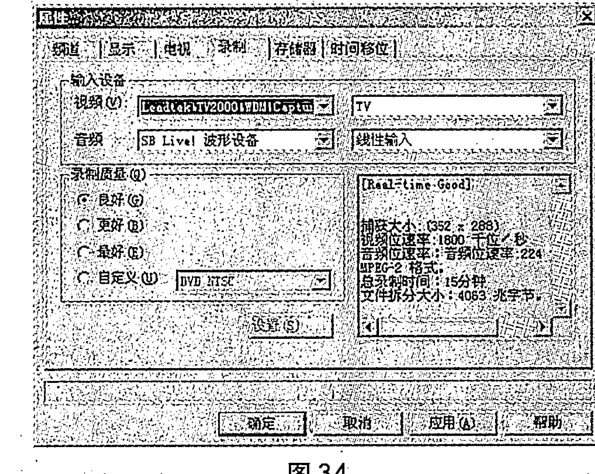

###### ② 时间移位（Time-Shifting）

时间移位（Time-Shifting）是 WINDVR 提供的一项非常特殊也是非常实用的功能，它可以让你不会因为某些事情而漏过一些精彩的电视镜头。举个例子来说，你在观看足球赛的转播时由于有事要暂时离开一段时间，这就有可能让你错过很多精彩的场面，这时只要使用 WINDVR 中提供的时间移位（Time-Shifting）功能键，在你回来后随时按下播放键，WINDVR 就会从你离开的那时开始播放。对于具体需要时间移位（Time-Shifting）的时间长短可以在“属性”窗口中的“时间移位”项中进行相关的时间设定。

“时间移位”模式可以设置为“普通”或“录制”模式。

- 普通模式——该模式允许使用时间移位功能而不必去录制完整的节目。这种模式的优点是性能更快，但限制在限定的时间缓冲内使用时间移位功能。使用者可以通过调整缓冲时间来优化硬件性能。

- 录制模式——这种模式可以在使用时间移位功能时实时录制节目。这种模式需要更多的系统资源，在录制和回放时执行起来会更慢，这取决于使用者的硬件配置。通过使用这种模式进行时间移位，使用者将不受缓冲时间的限制。

###### ③ 电子节目功能表（EPG: Electronic Program Guide）

这项功能可以即时下载取得最新的电视节目表，通过此功能，使用者不必再辛苦地找寻电视时刻表及手动输入节目预约资料，只要上网将对应电视节目安排表下载到 WINDVR 的预约节目录像的计划任务中，就可以轻松地完成预约节目录像的功能。不过这项功能需要使用者所在地的网络支持。

###### ④ 预约节目录像（Scheduling）

WINDVR 提供的预约节目录像可以让使用者自己定义电视节目的录制计划任务，这样可以让使用者不用为了录制节目而干等在计算机前。使用这一功能时，要通过操作界面中的“定制时间”按钮创建相应的计划任务以及选定需要预约录制的节目频道。和 Windows 的计划任务类似，WINDVR 为预约节目录制提供了“每周一次”、“每日一次”以及“仅一次”这三种任务方式。

###### ⑤ 节目影像静态捕捉（Capture）功能

除了提供动态的视频捕捉功能外，WINDVR 还提供了静态捕捉电视画面的功能，它可以捕捉当前显示的电视画面并将它储存为通用的 BMP 格式的图片文件。由于很多常见的图片捕捉软件对于 Overlay 的视频进行静态画面捕捉的支持都不是很好，因此这项功能对于喜欢保存电视画面的用户来说是非常实用的。

##### （2）ATV2000

ATV2000 虽然是一款免费的软件，但是其提供的电视录制功能却一点也不比那些收费软件差。在使用 ATV2000 进行录制时，用鼠标右键点击 ATV2000 的电视输出画面，首先选择 Capture — Capture Mode 进入电视捕捉模式，这时电视接收画面上出现绿色的 REC MODE 字样，提醒使用者现在的工作状态（如图 35、图 36）。

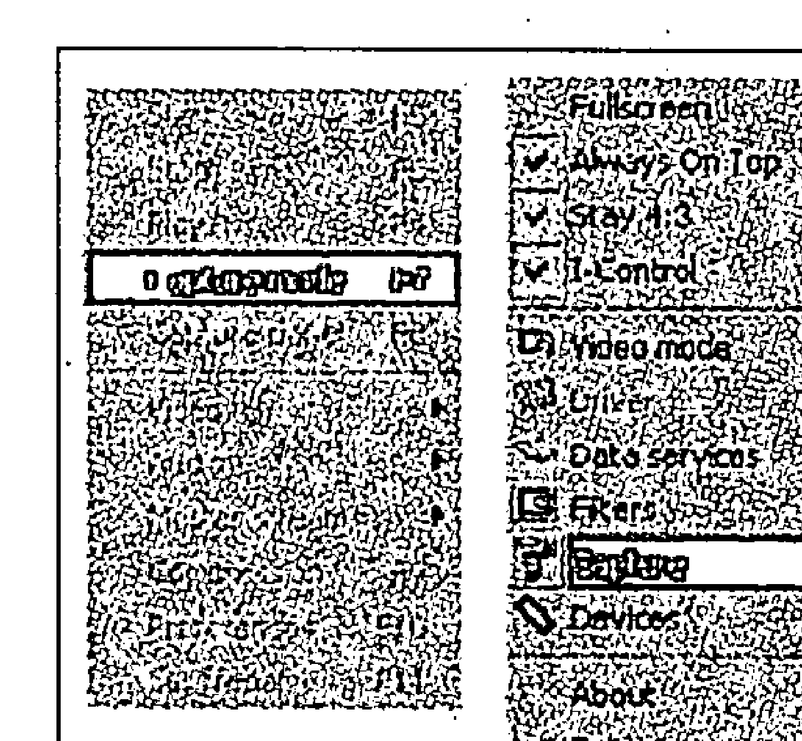

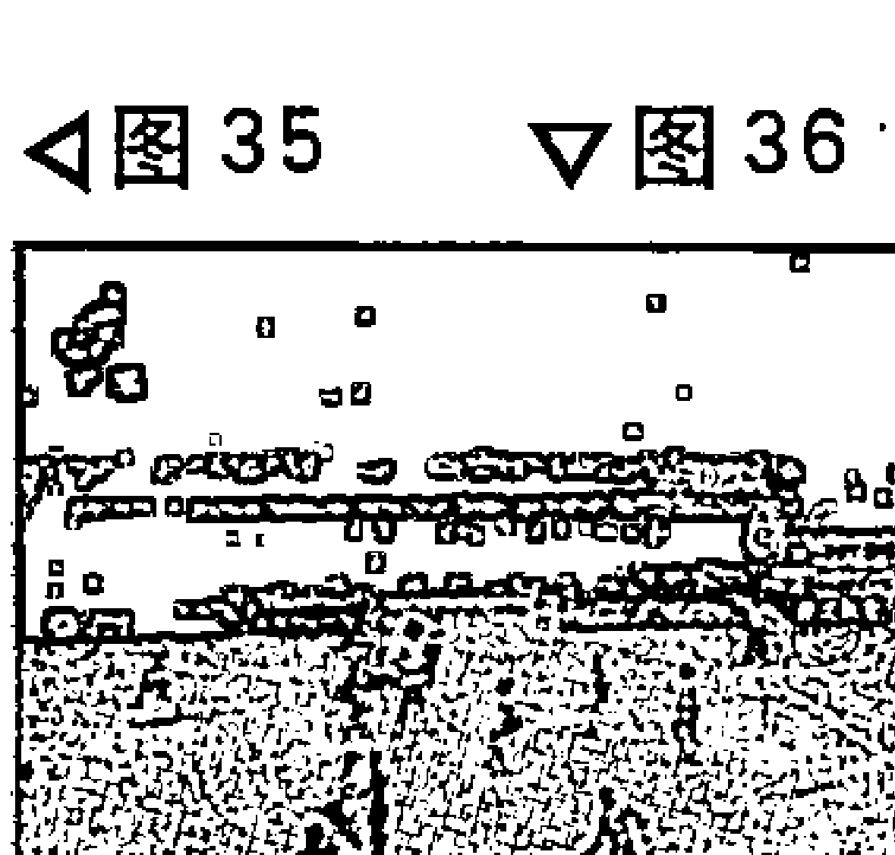

然后，在电视接收画面上再点击鼠标右键，选择 Capture — Video，就可以对录制的视频、音频的基本参数进行设置了。视频方面的设置主要包括捕捉画面的大小、视频选用显示模式、捕捉时采样频率等，而音频方面的设置主要包括采样频率、立体声等（如图 37、图 38）。

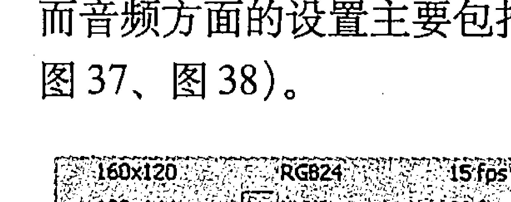

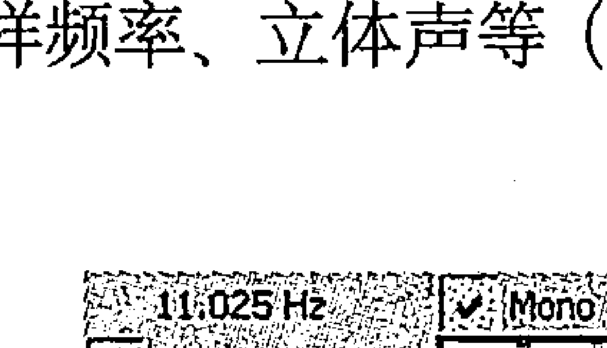

完成上面的设置后，接着就可以对视频录制采用的具体压缩模式进行设置了，在电视接收画面上点击鼠标右键，选择 Capture — Compression，在出现的对话框中可以根据需要选择不同的压缩方案。画面左边是视频压缩选项，画面右边是音频压缩选项（如图 39）。

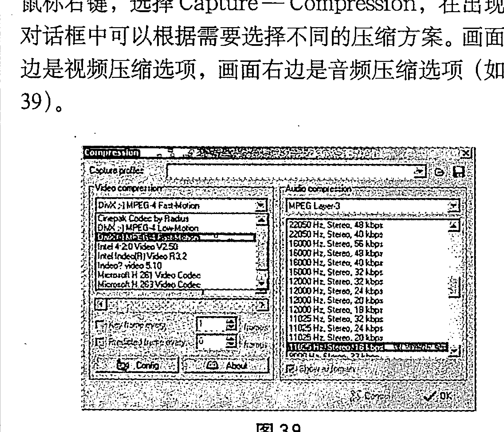

在上面的各项录制选项都设置完成后按 F5 键就可以开始录制了，按 F6 键可以随时停止录制工作。

信号，在相应的捕捉软件中可以看到对应的输出图像就表示相应的连接一切正常，当然也要注意一下声音的输出是否正常（如图 40）。

#### （五）视频捕捉

通常，我们提到视频捕捉肯定会想到市面上那些昂贵的视频捕捉卡，但是利用电视卡也可以进行简单视频捕捉功能，尽管和那些专业级的视频捕捉卡硬件动态捕捉相比，电视卡附带的软件视频捕捉的效果要差很多，但是对于普通用户来说，这样的功能已经能够满足一般的需求了。我们上面介绍的电视节目的录制其实也算是视频捕捉的一部分，不过它的视频信息的来源就是其本身电视卡产生的电视信息，而更广义范围来说，通常所说的视频捕捉，其视频源通常是来自于 DV（摄像机）、VHS（录像带）、VCD、DVD播放机等。下面我们就来介绍一下如何利用电视卡对这些外接的视频源进行简单的视频捕捉以及后续的视频处理的具体操作步骤。

首先，我们需要将 DV（摄像机）、VHS（录像带）、VCD、DVD播放机等外接视频源通过相应的连接线和电视卡背面的输入端子相连（通过 AV 端子或者 S 端子），具体做法是将外接视频源的 Video out（视频输出）端子与电视卡的 Video in（视频输入）端子用常规的梅花插头线相连，如果相应的视频源有 S-Video（高清晰）输出端子，则应用此端子连接电视卡的 S-Video In 端子，这样图像效果会更好。相应的视频源的 Audio Out（音频输出）端子直接连接到声卡的 Line in（线性输入）端子。然后在相应的视频捕捉软件中将视频源切换到正确的输入设置，通常对于电视卡而言，输入设置可以在“TV”、“AV端子”以及“S端子”这三者之间相互切换，在切换到相对应的正确输入设置后打开输入源输出相应的视频

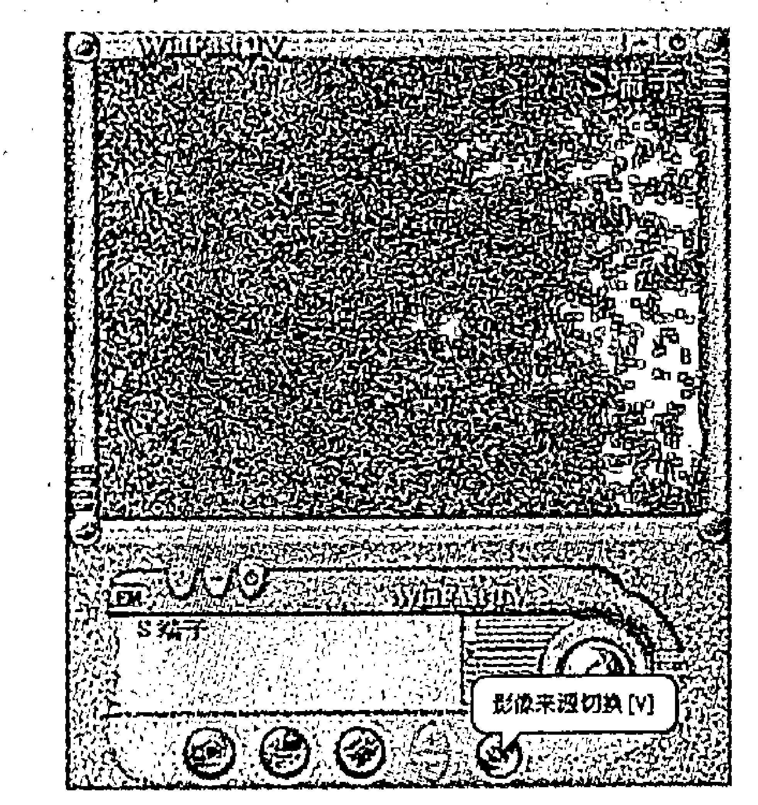

图40

在捕捉相应的输入源信息时，具体的操作就与上面介绍的录制电视节目的操作步骤类似，也要首先设置相关的音频和视频参数，具体的设置步骤大家可以参见前文。对于常规的视频捕捉而言，捕捉时选择生成的文件格式并不是非常重要，而对于需要将捕捉后的视频文件进行处理并刻录成 VCD 光盘的，在采集捕捉时必须首先采集标准的 avi 文件然后进行后期处理。相比较而言，后者对于广大的计算机爱好者来说更有实际意义。对于这种方式的采集，第一步首先将视频源输入的信号用电视卡相关的录制软件捕捉为需要的标准 avi 文件，第二步安装 Lsx-Mpeg Encoder 等，利用这些水平压缩软件将相应的 avi 转换为标准的 .mpg 文件，然后利用相关的刻录软件（如 winonce、nero 等）将相关的 .mpg 文件转刻为 VCD。

> > (文 / 张京京)

## 与DV共舞 做影视大师

你希望成为一个独立制片人制作自己的电影吗？五六年前，对于一个寻常百姓来说，这无异于天方夜谭。传统的视频编辑设备不但工作效率低，而且价格昂贵，绝对不是普通百姓靠微薄的工资所能承受的。然而21世纪的今天，这一切都在改变，随着数字技术的不断普及和发展，数码摄像机(Digital Video，简称为DV)技术逐渐成熟，并出现了许多普通大众在经济上能够接受的数码摄像机产品。现在，独立制片已经不再是遥远的梦想，只要有一台PC和一部DV数码摄像机，就可以任由你的想象力发挥到淋漓尽致。

### 一、准备你的DV

如何开始我们的DV生涯？我们需要做好哪些准备工作？下面请听我一一道来。

#### (一) 数码摄像机

目前市场上的摄像机按记录信号的方式可分为数码机和模拟机两种，按使用的录像带和结构的不同又可分为多种格式，如模拟摄像机有V8、Hi8、VHS/VHS-C与S-VHS/S-VHS-C等格式，数码摄像机有D8、DV、miniDV等格式。D8没有“记忆棒”，一般不具备数码相机的功能，即使有所谓的“静止图像”拍摄功能，也是把图像记录在磁带上的。DV、miniDV都有“记忆棒”，具备数码相机的功能，但D8比DV、miniDV便宜。

数码摄像机的信号解析度在500线以上，具有轻便易携，复制无信号损失等优点，因而被西方独立制片人所广泛采用。数码摄像机有三种输出方式，即与普通电视机连接的AV方式、S-VIDEO高清晰视频输出、DV输出（IEEE1394标准）。DV做为新一代的数码录像产品的规格，体积更小、录制时间更长，该类机型使用6.35mm带宽的录像带，以数码信号来录制影音，录影时间为60分钟，有LP模式可延长拍摄时间至带长的1.5倍。目前市面上的DV录像带有两种规格，一种是标准的DV带，另一种则是缩小的miniDV带，一般家用的摄影机所使用的录像带都是属于这种缩小的miniDV带。

购买DV摄像机，除了考虑价格因素之外，还应该了解摄像机的功能特性。在功能选择方面，如果想取得绝对优秀的画面效果和质量，那就选择一台3CCD影像感应器的数码摄像机，它会提供自然的颜色和更宽的视觉对比度，这种具有3CCD影像感应器的数码摄像机体积比只有1CCD影像感应器的数码机要稍大些。大多数的数码摄像机具有80万至100万的像素。有的人以为CCD的像素数目越多越好，实际上，一个普通的隔行扫描式CCD，其有效像素数目只有50%左右，拍摄效果优劣与否还要靠镜头和机械部分的配合，并不是单靠CCD。所以，不要直觉地认为内置800万像素CCD就一定比内置450万像素CCD的效果更好。

其次还要考虑摄像机的体积大小，如果长期使用体积大、机身笨重的摄像机就会比较辛苦，而体积太小和重量太轻的往往会因手部震动导致拍摄的影片不稳定的现象出现，因而在选购的时候，最好多拿几部摄像机掂量一下分量，然后比较选择合手机种。

再就是品牌的挑选了，目前市场上DV摄像机的品牌很多。笔者推荐选购口碑较好的索尼系列，他们的产品不但产品线很全，而且单机的质量也比较过硬。另外，像三星、飞利浦、松下等也是比较不错的。在选购的同时还要考虑售后服务等方面的因素，只有具备了良好的售后服务保障体系，才能让我们无后顾之忧。

下面介绍几款数码摄像机，仅供读者朋友参考。

1. 索尼 PC110e（如图 1）

Sony 的这台机器具有数码摄录系统520线水平解像度，具有10倍的光学变焦和120倍的数码变焦，高达107万像素CCD影像感应器，可以通过USB接口与电脑连接，采用高级专业蔡司镜头，6.3厘米液晶屏幕及彩色取景器，内置弹出式自动闪光灯和Memory StickTM记忆棒插槽；内置i.LINK数码输入/输出端子(IEEE1394标准)，模拟信号视频/声频输入/输出，超级红外线夜摄功能，不过其价格相对贵了一些，市场价在万元以上。

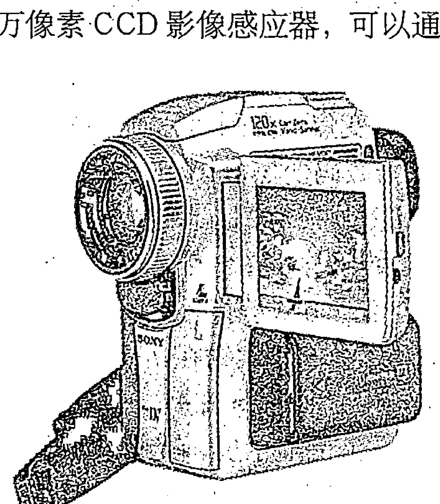

2. 索尼DCR-TRV330E (如图2)

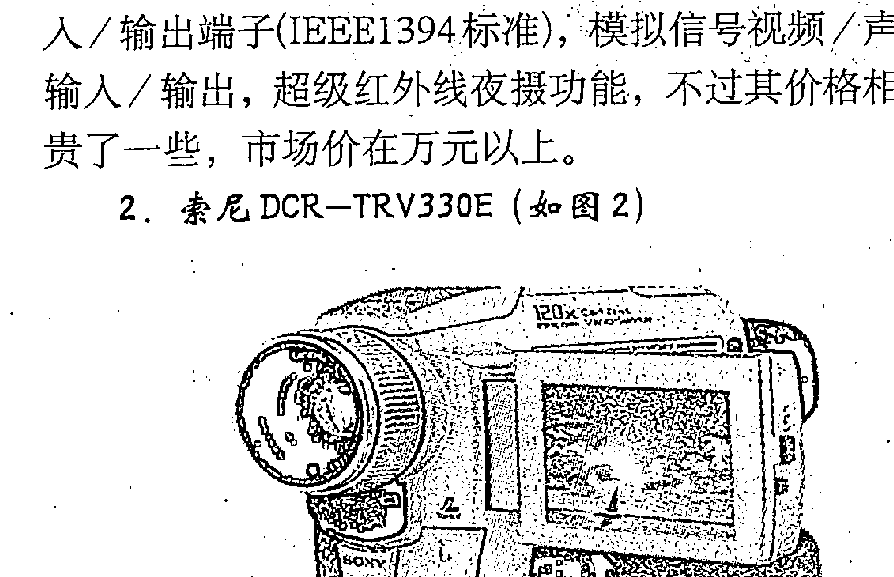

数码8毫米摄录系统，500线水平解像度，80万像素CCD影像感应器，6.3厘米液晶屏幕及黑白取景器，内置Memory StickTM记忆棒插槽，50倍~700倍选择性数码变焦及25倍光学变焦，i.LINK数码输入/输出(IEEE1394标准)，设有USB接口，内置超级红外线发射器，配备无线遥控器；其市场价格大约在5千元左右。

3. 松下NV-DS35 (如图3)

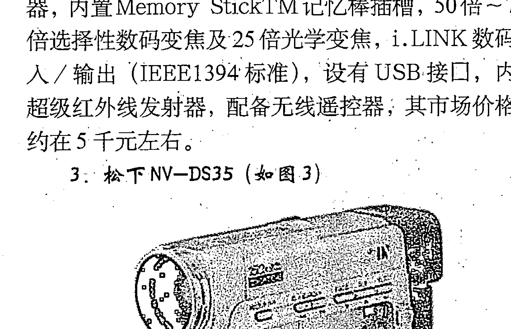

0.5秒快速变焦，多画面/画中画功能，15倍光学变焦/150倍数码变焦，16:9电影模式，彩色取景器，16比特/12比特PCM录音，2.5寸彩色液晶屏幕(20万像素)，数码静止图像输出，IEEE1394数码输出/输入，全信号方式静像拍摄，500线清晰度，11种数码特技，市场价格大约在7千元左右。

4. Canon MV430i (如图4)

具有2.5寸液晶显示屏，光学影像稳定系统，10倍光学变焦及40-200倍数码变焦，渐进式扫描CCD系统，使用MMC卡或SD卡存储和编辑影像，AV输入及声频转录/后配音功能，数码输入/输出(IEEE1394标准)，PCM数码录音系统，多种数码效果及淡变效果，手动调节曝光及手动聚焦；市场售价约在6千元左右。

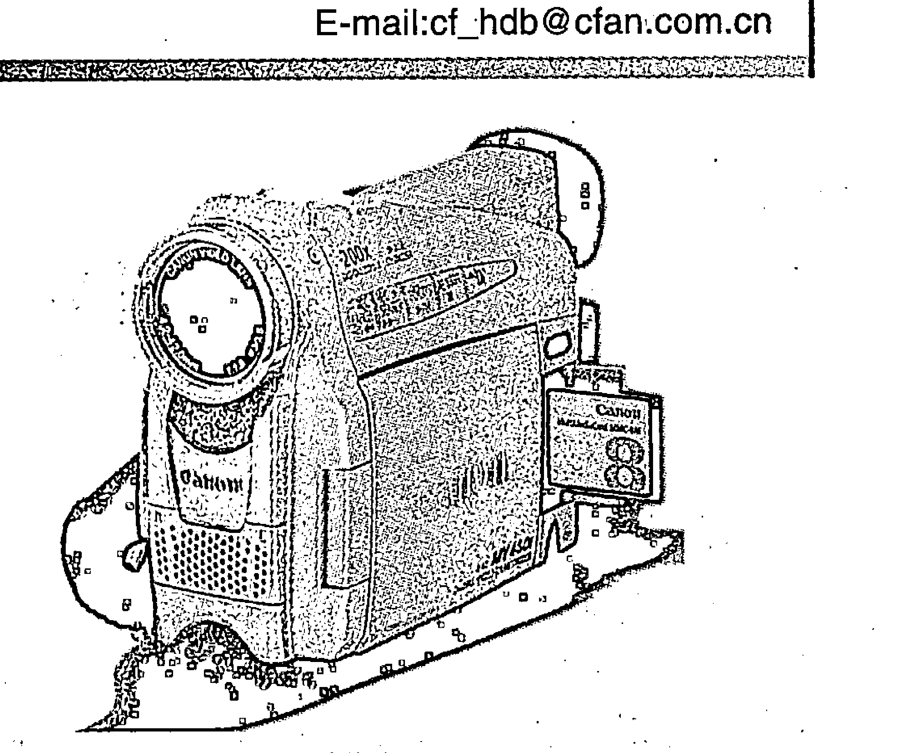

5. JVC GR-DVL411 (如图5)

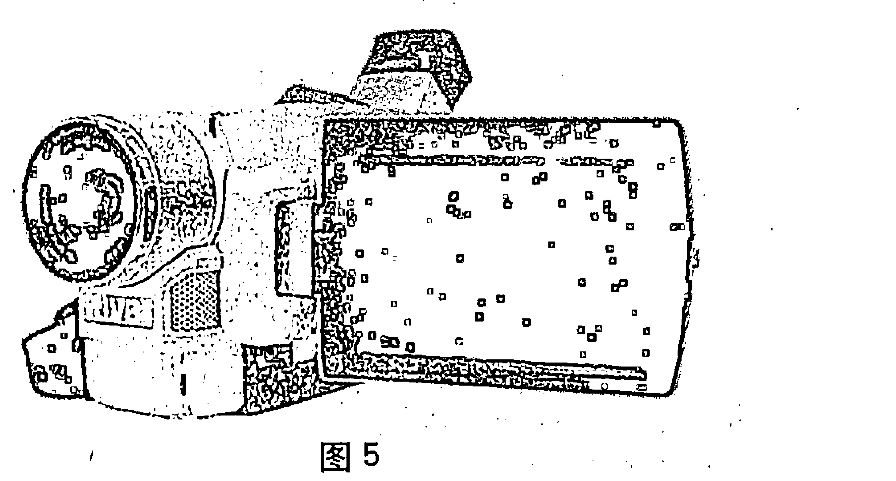

520线水平解像度，带有DV输入/输出端子和个人电脑(串行口)端子，采用样条内插法的10倍光学/500倍超数码变焦，光线极端不足时可以使用数码夜眼功能，3.5寸/30寸高解像度彩色液晶显示器，内置自动灯光灯。市场价格约在5千元左右。

#### (二) IEEE1394接口

IEEE1394接口，Apple称之为FireWire(火线)，Sony称之为i.Link，Texas Instruments称之为Lynx，但是无论如何称呼，它们的技术实质都是一样的，那就是IEEE1394。

DV上一般都有IEEE1394端子，可以通过IEEE1394接口卡轻易将影音资料输入计算机，进而利用计算机做非线性剪辑。IEEE1394卡价格一般在500到1000元之间，对于家庭来说就比较适用了，这类产品仅仅是将数码摄像机记录的DV数据传输到电脑硬盘中，其他功能如编辑、压缩均由软件实现，比如宝石394DV，如图6所示，其他的如Pinnacle、SuperDV、AverDV等产品。

如果对信号质量要求精益求精，并实时生成特技，便于多种方式的采集和输出，建议可以使用一些非线性视频编辑卡，这类产品除了以上数据卡的功能，还带有实时编辑功能，添加字幕、特技效果都是由硬件完成，不需要生成时间。除了IEEE1394接口以外，这类卡一般还配有AV、S-Video接口。这类产品如DV500的价格大约在6千元左右，RT2500价格约在万元左右，如图7所示，这些都是不错的选择。

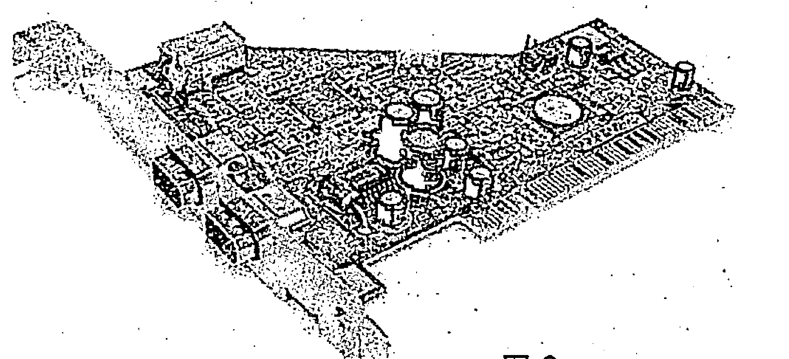

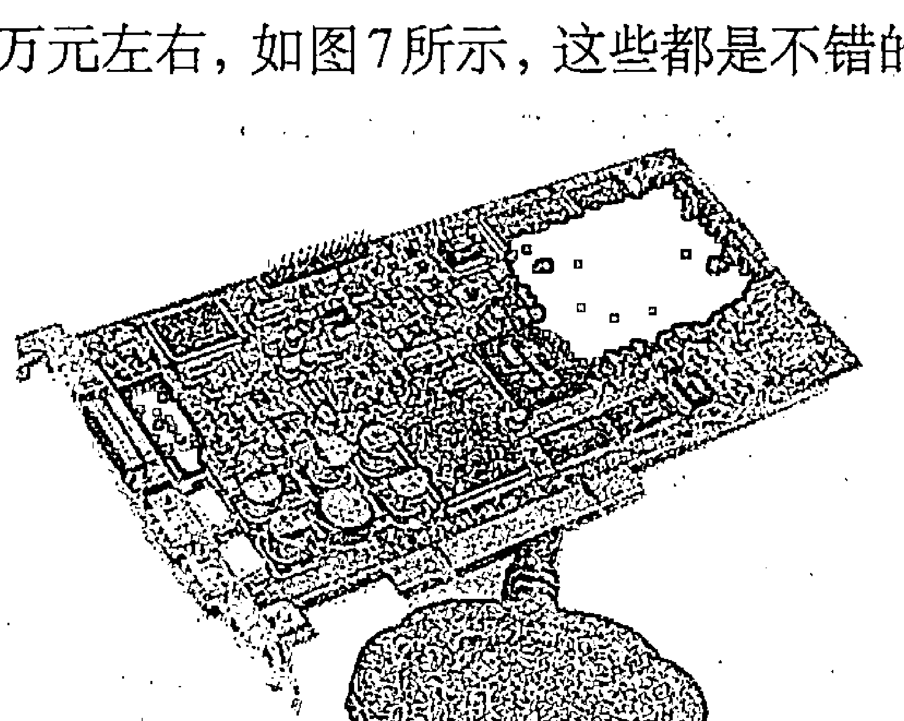

#### （三）数码摄像机与电脑的连接

一般数码摄像机都有DV输出口，即通常说的1394接口，通过该接口就可以与IEEE1394卡连接，从而把摄像带的录像传输到电脑中了。另外，还可以将数码摄像机与非线性编辑卡连接，比如前面提到的RT2500非线编卡，此类非线编卡也提供了一个IEEE1394接口，同样可以将DV摄像机中的影像传输到电脑中保存。

#### （四）电脑的配置

对进行视频影像处理的电脑首先需要保证高性能，建议选用Intel系列的CPU，这是因为视频制作的过程通常要长时间大负荷运行，而AMD系列芯片发热太大难保不死机。建议CPU至少在PII以上，强烈建议采用P4的CPU。

内存的选用最好是256MB以上，至少也要128MB，如果条件允许采用512MB内存最好，内存条的选择要选用品牌内存，以保证在视频处理过程中，数据交换的稳定性，否则很容易发生在合成时导致频频死机的现象。

接下来要说的是硬盘了，硬盘的速度非常重要，如果你使用的是普通IDE接口的硬盘，建议选用7200转、2MB缓存、支持DMA100的硬盘产品，如果条件允许的话，建议选择SCSI接口的硬盘。由于要做视频文件处理，因而需要保证硬盘的磁盘空间要足够大，除去系统盘占用的空间以外，剩余空间应在20GB左右。

如果你想制作三维动画的话，那么显示卡的选用也非常关键，建议使用ATI的产品，视频回放质量比较好，其他的如MGA G450也是不错的选择。

另外，考虑到最后作品的输出，还需要购置一台VCD刻录机或者DVD刻录机，如果你打算输出到录像带上，那么还需要准备一台带有录放功能的录像机。

#### （五）拍摄中需要注意的问题

做好准备以后就可以拍片了，在拍摄过程中，首先需要注意的问题就是一定要拿稳摄像机，一些刚刚接触摄像机的朋友往往拿不稳，在回放的时候，画面就显得非常不稳定，左右摆动，很不美观谐调。所以在拍摄过程中，最好是两手来把持摄影机，拍摄时，首先用双手紧紧地托住摄像机并将双臂紧贴两肋，然后将摄像机抬到比胸部稍微高一点的位置。有些摄像机用一个手臂就能托起，但此时最好还是将右臂紧贴右肋，之后再用左手轻轻地扶住摄像机，这样就能减少抖动以进行稳定的拍摄。另外，当用手支撑着摄像机的时候，应尽量将变焦镜头调到广角（W）的部位进行拍摄。如果将镜头调到最大倍数的变焦位置（T）时，只要稍微有一点颤抖都会使镜头产生相当大的晃动，因此需要特别留意。

另外，能使用三角架的时候尽量用三角架。在使用拍摄钮以及变焦杆等操作的时候，应一边用手轻轻地扶住一边操作。如果用力过猛，虽然摄像机已被固定在三脚架上，但还是会产生抖动的。说了这么多，一个非常值得重视的问题就是，画面的持续稳定是非常重要的。

在拍摄过程中，还需要镜头目标的相对固定性，不要做太多的变焦动作，以免影响后期制作，在选择场面时无法剪辑。另外，在变焦过程中，一定要注意起幅和落幅停留的时间和起落之间的拍摄时长，这都是为了在后期制作过程中能够很好地选择场面，为制作特技带来便利条件。

尽量顺光拍摄，不要逆光，如果逆光拍摄或者夜景拍摄时，建议使用全自动模式拍摄，如果手动调焦，注意前景和背景的层次要做到尽量分明，找到亮度调整键进行画面亮度的调整，逆光时将亮度调亮，夜景时则调暗，同时注意监视器荧幕的亮度变化。

当拍摄风景的时候，就需要掌握好画面中的天空和地面的比例。此时，如果想要体现一种开阔的画面，就让画面中天空的比例大一些；相反，如果打算表现一种压抑的感觉，就要使地面占的比例大一些，那么什么样的构景最为合适呢？虽然根据每个人的爱好有所不同，但是一般来说，画面中天空与地面的比例最好为5:3（或者3:5）左右，就是一个最适当的构景了。换句话说，如果把地平线设在画面的中间位置，就会有一种不上不下的感觉，这就不能算是好的构景。

对于无法将景物的全景拍摄进来的镜头，记住一定要将摄影机由右到左或是左到右地扫摄，千万不要在拍摄过程中摇来摇去或是忽快忽慢，这样拍摄后效果会非常不流畅，此外，还要注意身体的转动角度，不要犹豫不决，要一气呵成，比较正确的作法是以腰部为分界点，下半身不动上半身移动，比如要拍的景物，需要从甲点扫摄到乙点，首先将身体面向乙点后下半身不动，然后转动上半身面向甲点，此时摄影机是对着甲点的方向，接着按下录制键，保持画面镜头约5秒左右，开始慢慢摇向乙点，期间摇动的速度也不要太慢，这样画面效果反而不会太好，可以根据具体情况进行决定。那么拍摄的速度该如何决定呢？其实也没有一个必须遵守的准则，比如对于静态场景，拍摄速度可以快一些，如果取景内容是动态且相对画面层次、场景比较丰富，可以速度稍慢一些。

当在被摄人物的周围边走动边拍摄的时候，必须注意自己所站的位置。否则，在拍摄两个人以上的时候，就容易将刚才还在画面中面向右的人物一下子变为面向左的人，使看的人造成混乱。这时，只要有了“设想一条界线”的概念，就能避免出现这种现象：先在自己的脑子里，设想一条线将两个人串在一起，这就是“假设的界线”；之后，在拍摄时注意不要使自己跨过那条“假设的界线”。这样，就容易使看的人认清所有被拍摄人物的位置关系。

摄录像技术需要自己慢慢的钻研和体会，除了个人修养等一些因素以外，作为一个优秀的摄像师，还应具有敏锐的观察力和对场景把握的悟性，所以刚刚学习拍摄的朋友，可以参考摄像机的说明书，那里一般都会简单的介绍一些摄像中对取景、层次、画面处理等方面的一些需要注意的问题，另外，经常看看电视，学习一下别人是如何拍摄的，特别是不同场面的处理，比如会议、婚礼、文艺会演、小品的拍摄、人物专访等，这些都是我们学习拍摄的好去处，在掌握一定的理论知识的基础上，多看、多用、多想是快速入门最好的捷径。

### 二、捕获你的影片

当我们准备好了软硬件配置，并拍摄了相当的素材片以后，那么接下来就可以着手编辑自己的小电影了，首先来介绍一下，编辑电影的主要工作流程。

- 安装IEEE 1394卡或者非线性编辑卡；
- 采集视频；
- 编辑影音文件；
- 导出最后的影片。

#### （一）安装DV采集卡

首先关闭计算机电源，打开电脑主机箱，然后将IEEE 1394卡插入到PCI扩展槽中，启动计算机后，Windows系统会提示发现新硬件，这时按照提示安装驱动程序，完成后即可在设备管理器中发现已经安装了IEEE 1394设备了，如图8所示。

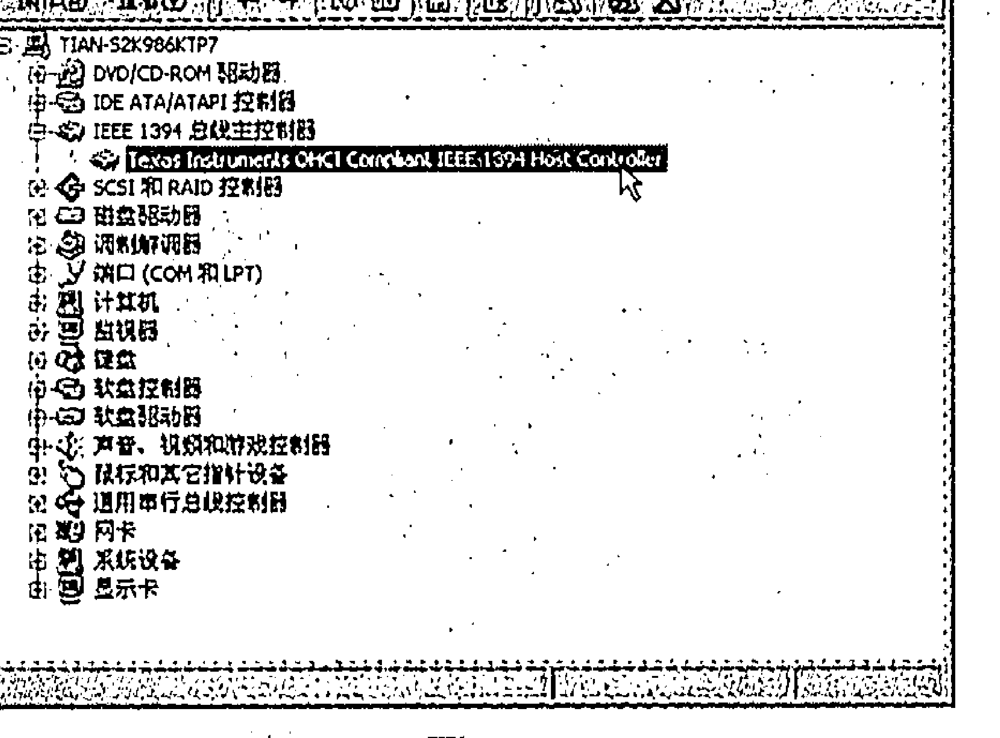

#### （二）采集视频

在接下来的步骤中，我们就需要把已经拍摄的影片采集并保存到电脑硬盘中，视频剪辑可以使用Premiere提供的视频捕获功能，通过与IEEE 1394接口相连接的数码摄像机直接获取。

首先将数码摄像机用FireWire连线与IEEE 1394接口相连接，然后打开电源。

笔者使用的是非线性编辑卡迈拓RT2500，这里就以RT2500为例介绍一下如何在Premiere 6中实现数据采集的方法。需要说明的是，如果你使用的是简单的IEEE 1394卡或者其他类型的非线编卡，操作方法也基本相似。

Adobe Premiere 6.0是目前最普及的视频编辑软件，制作灵活方便，可以制作出复杂的视频效果，它可以利用电脑对录像、声音、动画、照片、图像、文本进行采集、制作和播放的过程。

1. 建立项目方案

启动Premiere 6.0打开Load Project方案预设置对话框，如图9所示。在开始制作和采集视频之前，需要进行预设电影方案，从左侧的列表中选择DV-PAL方式下的Standard 48KHz，单击OK按钮，进入Premiere 6.0的主界面窗口。Premiere 6.0的主界面主要包括项目窗口、时间标尺窗口、信息窗口、过渡窗口、预览窗口及素材窗口等。

##### 2. 视频文件导入

视频采集分为两种途径，一是如果你的视频已经通过其他方式被采集到电脑中，可以双击Project(项目)窗口的空白处，即可弹出Import(导入)窗口，如图10所示，然后选择视频的素材，单击“打开”按钮即可将视频素材直接导入到当前项目中。

另外一种方式就是我们这里需要着重介绍的视频采集方式了，在开始采集之前需要对视频和音频的捕获参数进行设置，以符合我们的要求。

##### 3. 设置视频参数

首先来设置视频和音频文件采集后的保存位置。选择Edit菜单下的Preferences子菜单下的“Scratch Disk And Device Control”命令，打开参数设置窗口，如图11所示。在Captured Movies右侧的列表框中选择“Select Folder”命令选项，在打开的对话框中选择视频和音频采集后文件保存的位置。

完成后单击“Options”按钮打开控制设备选择对话框。在这里选择视频模式为PAL制式，此外还可以选择摄像机生产厂家、型号等。如果列表中没有自己摄像机的型号，Device Brand和Device Model选项设置为Generic也是可以的。最后单击“Check Status”按钮，可以检查摄像机是否联机(Online)。

如果是Offline，说明摄像机关闭了或者1394卡没有成功安装。完成后单击OK按钮。

##### 4. 简单的采集方法

返回主界面窗口，执行“File/Capture/Movie Capture”命令就可以开始视频捕获了。打开“Movie Capture”视频捕获窗口，在这里不但可以对视频进行捕获，而且还可以进行预览和一些初步的加工处理，单击窗口右上角的箭头，可以在弹出的菜单中选择录制音频和视频，如图12所示。

单击“Capture Settings”选项设置命令，进入视频参数选项设置对话框，在“Capture Format”列表中可以选择视频捕获格式，如图13所示。

如果你的外接数字设备已经打开电源，在Movie Capture窗口中单击“Play”按钮，就可以控制摄像机播放了，如果你准备开始采集，可以单击红色的录制按钮开始采集视频，如图14所示。停止视频采集，可以按下ESC键，会弹出一个给文件命名的对话框，在File Name中输入文件名后，单击窗口右下角的“Add new item”按钮，创建一个新的列表条目，在打开的定义窗口中可以对这个片断的起始和结束点进行设置，通过双击一个已经存在的条目也可以弹出类似的窗口以改变原来的设定。“Reel Name”是DV带的编号，同一卷DV带应该用同一个编号，如001，“File Name”是第一个AVI的文件名，“Log Comment”则是片断的说明，可以忽略不填。“In Time”为起始时间，时间格式是：小时：分钟：秒：帧。“Out Time”为结束时间，如图18所示。完成后单击OK按钮。

单击OK按钮，如图15所示。关闭视频采集窗口，返回到主界面窗口，此时会发现在项目窗口中，刚才采集的视频片断已经被导入到项目文件列表中了，如图16所示。

##### 5. 批量采集DV

通常情况下，我们所需要的视频片断往往是多个不连续的片断，如果使用前面介绍的方法，采集起来会非常不方便，这时我们可以使用Premiere 6.0的Batch Capture批捕获功能，创建一个视频捕获列表，就可以自动地一次捕获所需的视频片断了。

执行菜单“File\Capture\Batch Capture”命令，打开批捕获窗口，如图17所示。

设置完成DV批捕获后，返回到视频捕获列表，如图19所示。

单击红色录制按钮，会打开对话框，要求插入录像带，如图20所示，单击OK后，我们就可以休息一下了。当录到第一个文件结束后，Premiere会自动存盘，并控制DV机倒带若干秒，然后控制DV机播放，再从设定的In Time开始录下一段。录好的文件(File Name)前面的小黑色方块变为一个勾勾，如果采集失败，则显示红色的叉叉。

### 三、编辑影片

在Premiere中导入了视频剪辑以后，接下来我们就可以对影片进行编辑了。下面我来介绍一下编辑影片的方法。

#### （一）使用监视窗口

在Premiere中如果要预览或精确地剪切素材，可以使用监视窗口，方法是将视频素材拖入监视窗口的源素材（Source）预演区，也可以在项目窗口中直接双击视频或音频素材，即可在监视窗口中预览效果，如图21所示。

对于每个独立的视频剪辑或声音剪辑都可放在Source监视窗中进行播放，并通过播放控制按钮实现倒带、前进、停止、播放、循环或播放选定区域等。对于被装入Source窗口的剪辑文件名都会被系统记录下来，在放映区下方Clip栏显示当前素材，单击小三角按钮下拉列表，可以根据需要随时调取要预演的剪辑文件。

如果要准确定位剪辑，可以对一些关键帧做上标志，单击“Marker menu”按钮，在下拉菜单中选Mark，然后下级菜单中选择一个标志，以后当需要定位到某个标志时，只要单击“Marker menu”按钮，并从下拉菜单中选Go To，然后再选择这个标志，就能准确定位了。

#### （二）快速组装电影

在项目窗口中单击剪辑简图并按住鼠标不放，将该剪辑拖动到“Timeline”窗口中，并将其放置在Video 1A轨道上，如图22所示。在Timeline窗口中，除了Video 1A轨道外，其余轨道从Video2-Video98轨道都属于叠加轨道，我们只要在Video2以及其他轨道上加入视频剪辑或者图片即可以实现叠加功能，其中，视频剪辑将显示为图标，音频部分则显示为绿色波形图。在Video轨道上按次序排放好视频剪辑文件，这将是最后合成作品后的播放次序。

如果打算改变轨道上视频剪辑的外观，还可以在Timeline窗口的标题栏上右击鼠标，执行Timeline Window Options命令，打开“Timeline Window Options”对话框，在这里可以根据自己的需要进行视频剪辑外观设置，如图23所示。

如果我们这时想预览效果，需要首先将此项目保存，执行“File/Save”命令，在打开的保存对话框中，为项目命名后，单击保存按钮。预览效果可以执行主菜单“Project/Preview”命令或者按下回车键进行节目预览，然后Premiere就会进行渲染，完成后，即可在目的窗口中观看效果了，如图24所示。

下面就来为这部小电影添加一个过渡镜头，体会一下Premiere异彩纷呈的效果。在项目管理窗口导入一幅图片文件剪辑，将它拖放到Timeline窗口的Video 1B轨道上，然后执行主菜单“Window/Show transitions”命令，打开过渡应用窗口，选择“3D Motion”过渡方式下的“Doors”过渡方式，并将它拖到Timeline窗口中的Transition轨道上，将它的大小调节成为与位于Video 1B轨道上的图片剪辑等长，如图25所示。

在编辑过程中，如果想快速预览最后效果，可以按住“Alt”键的同时，在Timeline窗口中拖动编辑线，此时监视器窗口随着编辑线的移动，将播放已经添加的过渡效果，如图26所示。

#### （三）过渡效果的应用

一段视频结束，另一段视频紧接着开始，这就是所谓电影的镜头切换，如果要使镜头切换更加自然有趣，可以使用过渡效果来丰富界面的变化，下面就来介绍一下过渡的应用。

首先需要执行“Window/Show transitions”菜单命令，打开过渡应用窗口，如图27所示。在过渡窗口中，Premiere已经作了详细的分类，单击任意一个扩展类目名称，即可打开一组过渡效果。接下来在时间轴Timeline窗口的Video 1A和Video 1B轨道放置两段视频剪辑，再在过渡窗口中将一种过渡方式拖放到Transitions通道的两视频重叠处，Premiere会自动确定过渡长度。

在Timeline窗口中双击Transitions通道的过渡图标，打开过渡属性设置对话框，如图28所示。选中“Show Actual Sources”可以观察画面过渡的效果。

然后拖动Start显示区和End显示区下方的滑块，以调节过渡的开始状态与结束状态，在Border栏中可以拖动三角形滑块来改变条边框的厚度。完成设置后，单击OK按钮，这样就可以在两段剪辑之间添加一段过渡效果了。

#### （四）设计字幕效果

下面来编辑字幕，Premiere提供了添加字幕制作的功能，从Premiere5开始这项功能得到了完善和加强。首先要启动字幕编辑的Title窗口，选择菜单“File/New/Title”命令，打开Title窗口。

Premiere会自动向主菜单添加Title菜单项，这里包含着所有的Title窗口的命令和选项。Title窗口内包括两个虚线框，里面的框代表着字幕安全区，外框则代表动作安全区。

现在我们要将一段视频剪辑加入到Title窗口，做为字幕标题的背景参考帧，操作很简单，只需在项目窗口中选中剪辑文件拖到Title窗口中，并释放鼠标就可以了，此时在Title窗口中将显示这个剪辑片段的第一帧。

选择文本工具（T）再单击Title窗口安全区的左上角，并输入字幕文字后，用鼠标选中文字，执行主菜单的“Title/Font”，出现字体设置对话框，选择字体为“行楷”，字体样式设为“粗体”，字号大小选择为72磅，如图29所示。需要提醒的是，设定字号大小的时候，应该使用至少16磅的字体，否则在电影中都是不可见的。

下面我们来一起制作一个阴影效果的字幕，首先选取文字，在Title窗口左侧工具栏中的“Object Color”上方的样片上单击，在弹出的颜色设置(Color picker)窗口中选取黄色，然后单击OK按钮，此时，字幕文字的前景色已经被设置成为了黄色了。然后再单击“Object Color”下方的样片，将字体的背景色设置为绿色。接下来选取文字框，在Title窗口的工具栏最下方有一个Shadow position样片框，将鼠标放入其中会变成一只小手，拖动字母T，调节阴影偏移量至样片的右下脚，这时字幕文字被加上了阴影。最后制作效果如图30所示。选择主菜单“File /save”命令，将这个字幕效果保存在Title1.ptl文件中。

有些时候，我们还需要为剪辑片段添加滚动字幕效果，首先可以选择“Rolling Title Tool”工具，在Title窗口中安全区域内拖动鼠标，形成一个显示文字的滚动区域，这时在文字区域中可以看到鼠标指针变成了文本工具形状。在滚动文本区内输入需要的滚动字幕内容，可以拖动右边或者底部的滚动条来显示文本内容。在文字录入完成以后，单击文本区域外的任何地方，这时用鼠标选中文本区域，在区域四周会出现四个小方块，表明已经将其选中，用鼠标拉动小方块，调整滚动文本区至合适位置，并设置好字体、字色等参数后即可。

选中滚动文本区域框，在主菜单中执行“Title/ Rolling Title Options…”命令，弹出“Rolling Title Options”对话设置窗口，如图31所示。在Direction选项卡中可以设置文本的滚动方向，一共有上下左右四个选项，在这里我们选择“Move Left”左滚方式。如果选择“Enable Special Timing”选项，还可以在“Pre Roll”选项中设定标题开始时的静止帧数，在“Ramp Up”和“Ramp Down”选项中可以设置开始时用于加速显示的帧数和加速时用于减速的帧数。在“Post Roll”选项中设置最后结束时滚动文本静止的帧数。在这里我们设定各个数值均为10帧，然后单击OK确定完成。

关闭字幕制作对话框，返回到Premiere主界面窗口，此时字幕文件已经被导入到项目列表中了，只要把它们拖放到Timeline窗口中即可实现叠加效果。

为了使字幕剪辑能够在剪辑片段中透明显示，可以在Timeline窗口中选取字幕剪辑，然后选取主菜单“Clip/Video/Transparency…”命令，弹出“Transparency Setting”对话框，如图32所示。选取“Key Type”类型设置为“White Alpha Matte”，并且在预览窗口下方选择预览显示模式，然后单击“OK”按钮确定选择。

有时候，字幕文件需要有一个比较精确的切入与切出时间，具体设置方法如下。选择字幕剪辑，在主菜单中选择“Clip/Duration…”命令，会弹出“Clip Duration”设置窗口，如图33所示，在这里可以输入比较精确的时长，确定字幕叠加的时间。

#### （五）淡入与淡出

首先来看看如何实现视频节目的淡入与淡出。在电视节目中，经常看到这样的镜头，画面逐渐变暗了，可不长时间又逐渐由暗恢复为正常画面，这就是影视作品编辑中的淡入与淡出技术。在Premiere项目导入一个视频文件，并将它拖入到Timeline窗口中的Video 2轨道中，单击轨道名称左侧的空心小三角形，展开轨道Video 2，在轨道的下半部分是一片黄色区域，其顶端有一根红线，注意！这就是淡入与淡出(Fade)控制线。

将鼠标的指针移到黄色区域Fade控制线的上方，鼠标的指针就会变成手指的形状，并且在其下方出现“+”和“-”的符号。在控制线上左侧1/3处单击一次鼠标，此时会产生一个控制点，然后在2/3处再单击一次控制线，产生第二个控制点。拖动第一个控制点至黄色区域下边线，便会产生一条斜线，如图34所示。这样剪辑在刚刚开始播放的时候，屏幕逐渐变暗，当达到黑屏时，又逐渐变亮，直至恢复正常画面播放。

如果这条斜线的坡度越陡，说明淡入与淡出的速度就越快。如果要删除控制线上的控制点，只要用鼠标单击这个控制点，并把它拖出这条轨道就可以了。

#### （六）分割屏幕

下面再来介绍一下分割屏幕的方法。我们经常看到这样的镜头，屏幕被分割成为两个部分，分别播放不同的视频剪辑片断，那么这个是怎么实现的呢？在项目中将新导入的剪辑拖放到Timeline窗口的Video 1A轨道上，然后选择Video 2轨道上的视频剪辑。执行主菜单“Clip/Video/Transparency...”命令，弹出“Transparency Settings”对话窗口，在Key type中选择“None”。在窗口右上角的预览(Sample)窗口中，可以看到四个白色的控制方块，拖动方块把屏幕就可以划分为两部分，如果需要观察两个剪辑占用屏幕空间的情况，可以选择预览窗口下方左边并列的三个按钮中最后一个，如图35所示。如果在多个轨道中同时导入多个视频剪辑，还可以产生意想不到的效果。

#### （七）慢镜头

下面再来看看慢镜头的实现方法，有时为了突出或强调某一段剪辑片断的内容，需要延长它的播放时间，这就是慢速播放。而有的时候为了削弱某一部分的内容，则需要快速播放。首先选中Video 1A轨道中的视频剪辑片断，执行主菜单“Clip/Speed”命令，弹出“Clip Speed”对话框，如图36所示。在这个对话框中可按播放剪辑片断的速率（rate）或播放剪辑片断时间（duration）进行调整设置。在“New rate”选项中，系统默认正常速率(100%)播放剪辑片断，如果速率(rate)越高，则剪辑的播放速度就越快。另外还可以根据需要，选择“New Duration”自行调整播放的时间，系统默认值为选中剪辑的正常播放时间。在New rate文本框中输入25，然后单击OK按钮，这时Video 1A轨道中的视频剪辑就以1/4的速度播放，这也就是说，现在的播放时间是它初始播放时间的4倍。这时就为该剪辑创建了一个缓慢运动的效果。

#### （八）分割剪辑片断

如果对一段剪辑感到不满意，还可以分割剪辑片断，这是在视频剪辑的过程中，经常会遇见的操作，以删除多余不用的剪辑片断。在Timeline窗口中，选定Video 1A轨道上的视频剪辑，并且将编辑线移动到要分割的位置。选择主菜单“Timeline/Razor at Edit Line”命令，此时该剪辑就被在编辑线的位置一分为二了，并且成为两个相邻的剪辑片断，如图37所示。除了使用主菜单提供的命令外，还可以使用Timeline窗口工具栏中的切割工具，鼠标会变成切割工具图标，在需要切割的地方单击鼠标，就可以实现切割了。

#### （九）让剪辑动起来

为了添加一些特殊的效果，我们还可以让影像剪辑在定义的区域内移动、旋转，增添视觉趣味感。首先我们将一副图片添加到Video 2轨道上，然后选择图像剪辑，将它调整到与视频剪辑等长，然后在主菜单中选择执行“Clip/Video/Motion”命令，弹出“Motion Setting”对话窗口。在窗口的中央是剪辑的运动路径，缺省条件下是直线运动。现在我们为它添加一条新的运动路径。

首先选择起点(start)向右拖动，占据屏幕近一半的地方，然后选择终点(end)，在“Click on a point above”下方的“Info”坐标位置中输入20和10，这样，终点就移动到了指定的位置。在运动的区域内，单击起点和终点之间的中央位置，产生一个新的运动点，然后选取它，向上移动到一个新的位置，如图38所示。

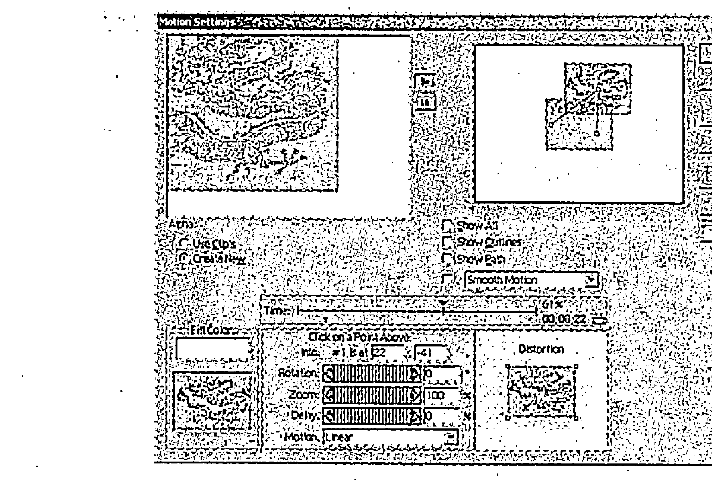

下面来使图像旋转起来，在屏幕下边的Rotation的文本框中输入720，这样可以使图像在移动的过程自己旋转两圈，增加视觉感官效果。设定好以后，就可以按“OK”按钮返回了。在Timeline窗口中，按住Alt键，拖动编辑线就可以看到刚才设定的剪辑真的动起来了。

#### （十）屏幕嵌套

在电视上经常出现屏幕嵌套的特技镜头，下面就来介绍一下如何实现屏幕嵌套。新建一个项目，导入两个剪辑文件分别放置在Timeline窗口的Video 1A和Video 1B轨道上。然后执行主菜单“Window/Show transitions”命令，打开过渡工具面板，找到“Spin away”过渡方式，并将它拖动到Timeline窗口的Transition叠加轨道上，并使其和另外两个剪辑的切入和切出点都对齐，如图39所示。

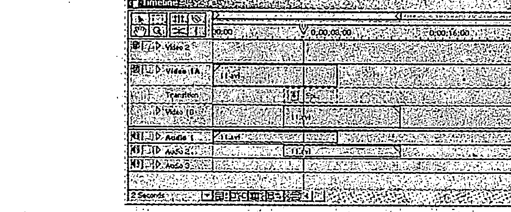

双击过渡简图图标，弹出的“Spin away setting”对话框，如图40所示。调节“Boder”滑块设定剪辑边框宽度，并在Color中设置边框的颜色为蓝色，选中“Show actual sources”左侧的单选框，拖动预览窗口下方的滑块，监视当前剪辑嵌套的情况。按OK按钮确定选择，返回到Timeline窗口，按住Alt键拖动编辑线，就可以在监视器窗口中预览效果了，如图41所示。

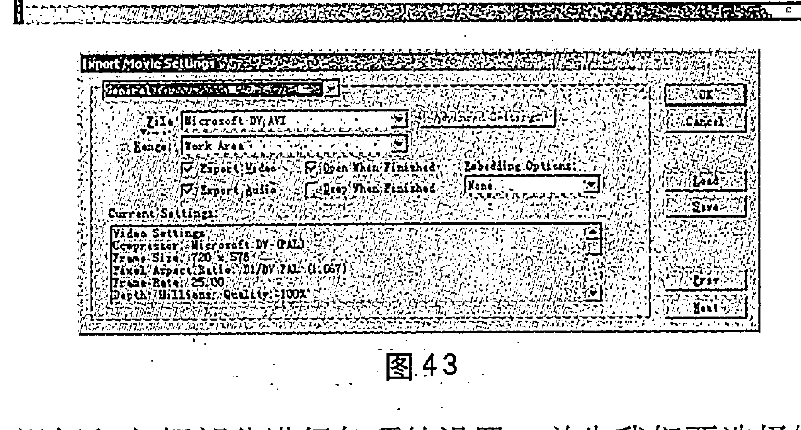

### 四、导出影片

下面就来导出我们已经制作好的影片，在Premiere中执行主菜单“File/Open”命令，打开一个我们以前已经制作好的电影项目文件。

下一步就是导出电影了，执行主菜单“File/Export Timeline/Movie...”命令，弹出“Export Movie”导出电影对话窗口，如图42所示。输入文件名Movie.avi，然后按“确定”按钮之后，弹出“Exporting”导出电影进度窗口，此时会在窗口的右下角提示当前剩余的时间，当电影导出结束以后，会弹出一个“Clip”剪辑窗口，在这里可以进行效果预览。

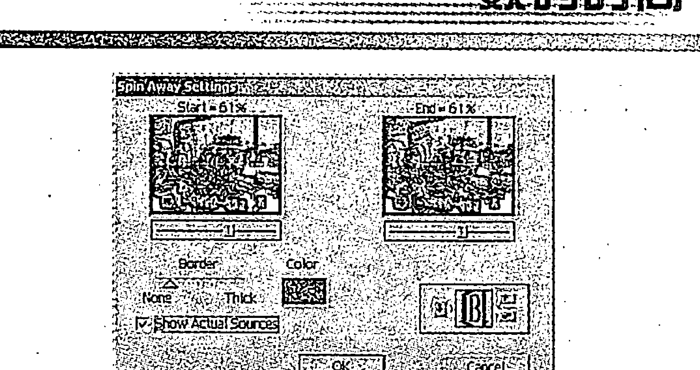

如果要改变参数设置，可以单击“Settings...”按钮，弹出“Export Movie Setting”导出电影设置窗口，如图43所示，在这里我们就可以针对输出电影的视频和音频部分进行各项的设置。首先我们要选择输出的文件类型，单击导出设置窗口中“File”右侧的下拉列表框选项，在这里有可以输出的各种文件格式的类型，Premiere可输出的电影格式有：avi电影、mov电影、gif动画、Flc/Fli动画、tif图形文件序列、tga图形文件序列、gif图形文件序列、bmp图形文件序列等。如果在电脑上安装了支持MPEG4的插件，可在对话框顶部的下拉列表中选Video，然后在Compressor项的下拉列表中选DivX MPEG-4，就可输出MPEG4电影了。通过选定“Export Video”和“Export Audio”可以输出视频轨道和音频轨道上的内容，不选则不输出。如果选中“Open When Finished”选项可以在视频输出后，播放视频输出效果。

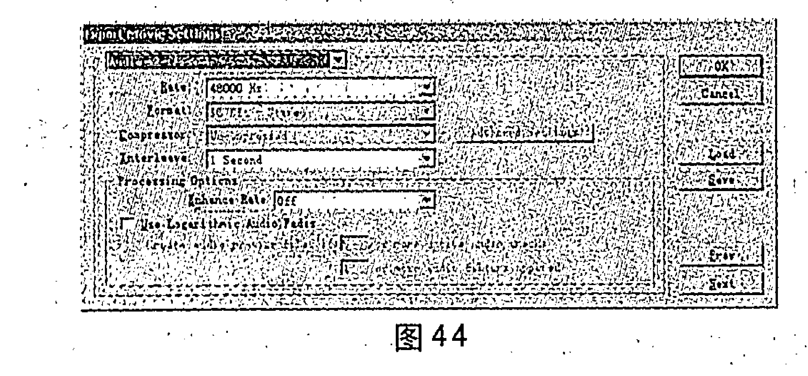

下面来进行音频的输出设置，选择“Audio Settings”，出现音频导出设置窗口，如图44所示。

先要对声音频率(Rate)进行设置，在这里提供了5至48KHz的频率，如果设定的频率越高，则声音效果就越好，但是在导出时处理的时间也就越长，存储空间也要求的越大。在声音格式(Format)选项卡中设置音频的输出的位数和声道的使用情况。在“Type”类型选项卡中，指定一种音频的压缩格式，Premiere提供支持10多种的音频压缩格式。在“Interleave”中选择限定加载到内存的文件数量，数值选择越大，播放的效果就越平稳，不过就要求更多的内存容量。在Enhanced rate conversion选项中设定音频转换的质量，参数越高，质量就相对越高。如果选定了“Logarithmic audio fades”选项可以产生更符合人听觉的音质，更加自然悦耳，若不选定的话，则按照线性曲线特点处理音频效果。

在导出对话窗口中，还可以设定特效参数。选择“Special Processing”列表项，如果在视频剪辑中应用了过渡等特殊效果，就会在窗口的中间出现一个“Modify…”的按钮，单击“Modify”按钮，弹出“Special Processing”对话窗口，如图45所示。在窗口最上方的“Cropping”页框中，用鼠标调节预览窗口四周的方形把柄，或者通过输入Left、Right、Top、Bottom的数值大小来对输出视频的边界进行大小的裁剪。如果选择了“Scale to 240 × 180”选项，则裁剪后的画面仍然和原来保持一样。设置好参数以后，可以通过拖动预览窗口下方的小滑块来观看实际的效果。在“Special”页框中，如果选定了“Noise Reduction”选项可以校正视频输出过程产生的画面噪音。

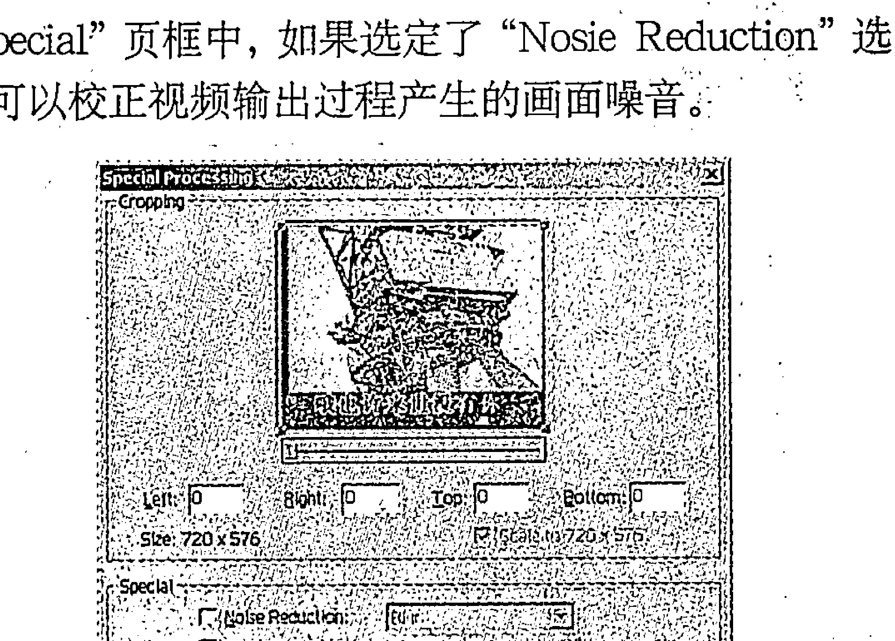

趁电影还在导出的过程中，我们可以轻松一下，去洗个澡或去吃一顿饭，或者品着一杯清茶静静地等待着自己作品的生成了。

### 五、简易的 DV —— 八步电影

“会声会影”是 Ulead 公司出品的一个消费级的视频编辑软件，它可以让用户轻松创建带有生动的标题、视频滤镜、转场和声音的家庭视频作品，而且还可以选择通过录像带、桌面回放，或通过 Internet 流式来播放我们的作品。“会声会影”完成一个作品只需要开始、捕获、故事板、效果、标题、声音、音乐、完成等8个步骤，下面就来介绍一下制作的方法。

启动“会声会影”以后，即可进入其主界面，如

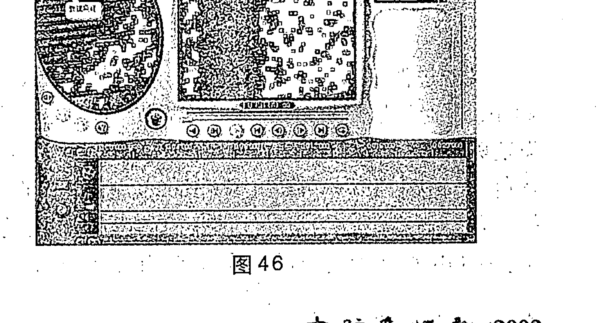

#### STEP 1 建立新项目

在开始编辑影片之前，需要新建一个编辑项目。点击“新建项目”命令按钮，打开“新建”对话框，在“项目名称”中输入项目名称为“我的家庭电影”，并在右侧“可用的项目模板”中选择“PAL VCD”格式，最后单击“确定”按钮完成，如图47所示。

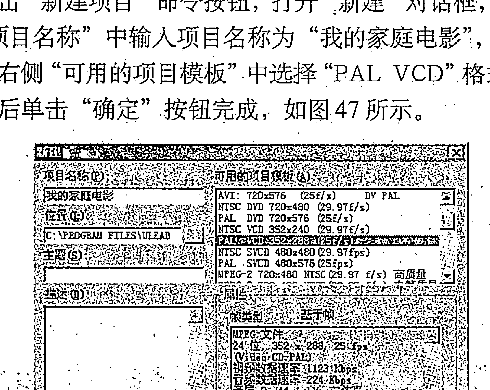

#### STEP 2 捕获视频

完成项目的建立后，下面就可以从数码摄像机中捕获视频剪辑了，此时需要你的电脑系统安装有视频采集卡，并已经开始播放视频；此时会在预览窗口看到视频信号。然后可以在“捕获区间”框中输入时间，来设定捕获某个视频区间，如果要将视频捕获到本地硬盘，可以单击“捕获视频”按钮，即可开始捕获了，可以按 ESC 或“录制”按钮来停止影片的录制。完成以后，可以单击“切换到回放”模式来预览捕获的视频或图像，如图48所示。

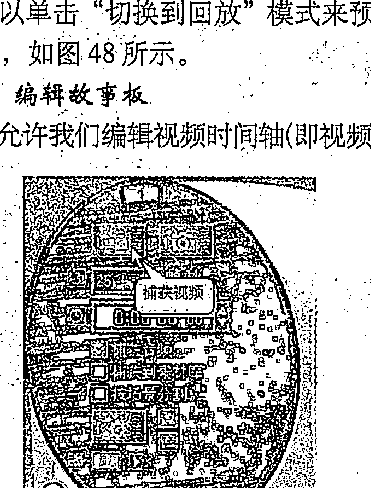

#### STEP 3 编辑故事板

故事板允许我们编辑视频时间轴(即视频轨)上的视频、图像或色彩的内容。视频捕获后，可以将他们保存在素材库中，在素材库中还有很多“会声会影”为我们准备好的视频、声音等素材。我们可以在“预览窗口”中单击“素材库”中的视频片断，并在预览窗口中查看，有关该素材的信息在左面的信息窗口显示。找到准备好的素材后，就可以将素材直接拖入到视频轨，同样道理，还可以添加更多的视频片断，如图49所示。

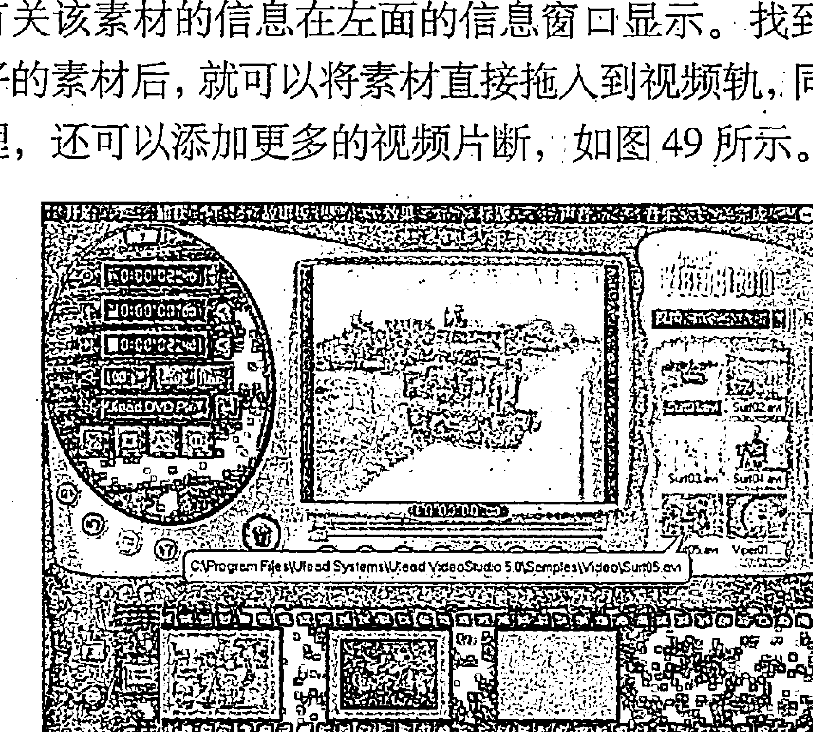

#### STEP 4 特殊效果巧制作

效果步骤用于控制两个相邻的视频素材如何相互融合，如果没有应用转场效果，一个素材播放结束后就立刻跳到下一个素材，而没有任何停顿，这样的效果显然不会令我们满意的。单击屏幕上方的效果命令。在右侧的素材库中出现了很多的转场效果，大致包括擦拭、淡化、底片、果皮、过滤、滑动、卷动、取代、三维等13种，每一种中又有很多的具体的效果。从素材库的下拉菜单中选取一个转场效果类型，需要注意的是，素材库中的转场效果是以动画略图方式表示的，如图50所示。如果要预览转场效果，可以单击此效果，并在预览窗口中单击“播放”按钮即可。选择一种转场效果，然后将它拖到“时间轴”两个素材之间。

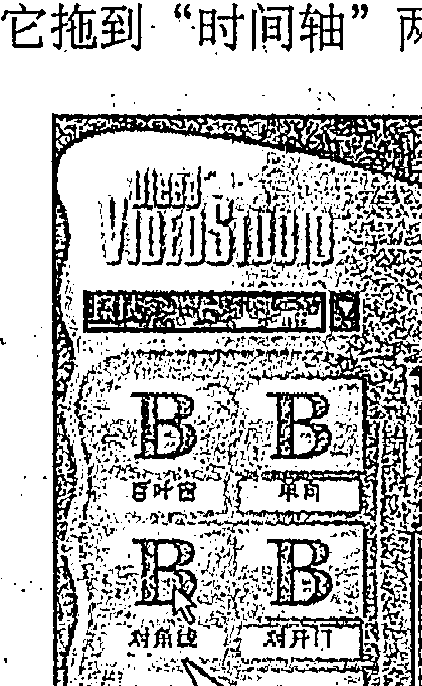

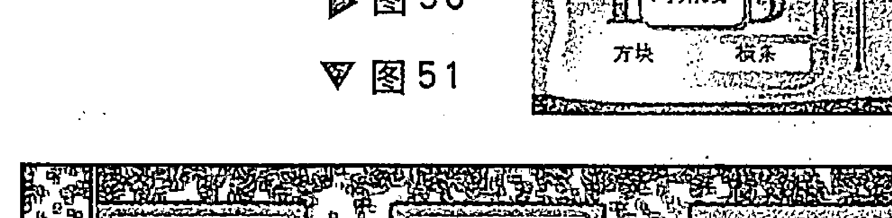

材之间即可，如图51所示。

#### STEP 5 制作字幕

下面我们就来为这部家庭电影添加一段字幕效果吧，单击“会声会影”上面的“标题”命令按钮，在右边素材库中出现了很多的标题效果。然后单击“创建或编辑标题素材”命令按钮来添加一个新标题，此时就可以在视频剪辑中出现一个标题文本框，在文本框中输入“我的家庭电影”，此时在左侧的选项面板中提供了三个页面，可以调整文字标题的各种设置效果，比如设置字体、字号、字体颜色，以及延时区间等。最后可以单击“添加到时间轴”按钮，即可将此字幕效果添加到时间轴了。如果要改变字幕效果的播放时间，可以在时间轴中拖动字幕剪辑来改变，如图52所示。

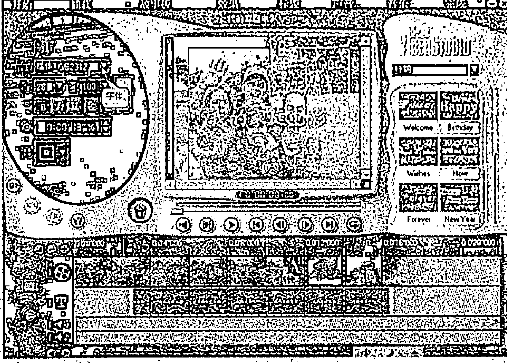

#### STEP 6 配置解说

下面我们就来为这部家庭影片添加解说词吧，单击“会声会影”最上面的“声音”按钮，在右边素材库中出现了很多的声音文件，选择你要添加的声音。这时就可以在左边的信息窗口中对声音的效果进行设置，以更好地与你的视频内容融合。

如果要打算给自己的影片配音，可以在时间轴中拖动时间线至需要插入解说的位置，然后单击“录制新声音”命令按钮并单击开始按钮进行声音的录制，如图53所示。

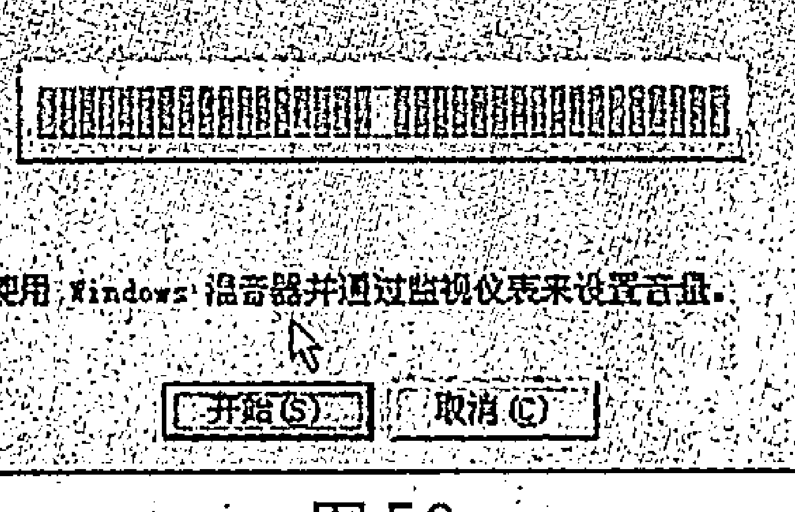

如果配音已经录制好了，从素材库中直接拖到“时间轴”的声轨上就可以了。对于已经添加的声音文件，如图54所示，可以在“选项面板”中的控件中，进行音频的区间、开始点、结束点进行设置，当然了，还可以单击淡入和淡出按钮添加声音特殊效果处理。

此外，还可以对声音进行剪裁、设置声音的大小等效果。

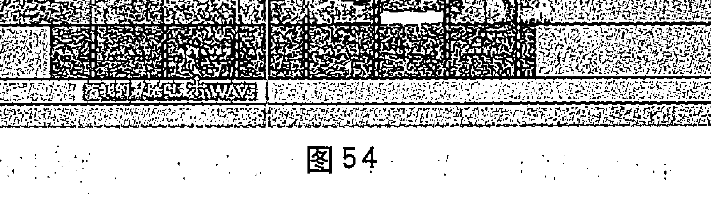

#### STEP 7 背景音乐

现在我们还可以用音频CD上的音乐录制成一个新的素材并作为该作品的背景音乐。单击“会声会影”最上面的“音乐”按钮，即可在右侧的素材库中出现很多的声音文件。选择我们需要添加的背景音乐文件即可。“会声会影”支持的声音的格式非常多，比如常见的MP3、WAV、RM等。只要把选中的音乐文件拖放到下面的音乐时间轴即可，如图55所示。在添加背景音乐的过程中，可以把背景音乐的时长和视频的时长设置为相同，这样可以起到比较好的效果。


#### STEP 8 输出最后作品

最后单击“完成”命令，进入最后输出界面。首先可以单击“保存项目”命令按钮，将项目保存，并覆盖现有的文件，完成以后可以单击“制作影片”命令按钮，在弹出的下拉菜单中选择创建视频文件的类型，比如可以是AVI、QuickTime、MPEG或其他的媒体文件格式等，如图56所示，这里我们选择一种需要输出的格式，比如MPEG1 PAL格式，然后在打开的保存对话框中输入一个文件名，并单击保存按钮，“会声会影”就开始影片最后的制作渲染过程了。完成以后，系统会自动播放我们刚才制作的小电影。

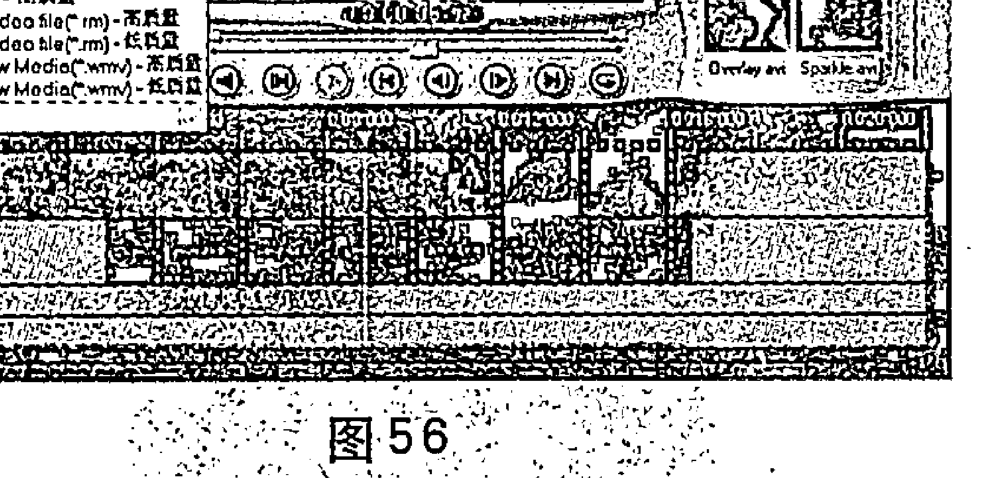

（文/鸣涧）


## ◆实战软件编程DIY

编程初学者往往有一种误解，以为编写代码就是程序员的一切。其实对整个软件开发过程清晰而有效的管理也非常重要。本文作者以自己自行开发的软件<<FlashNow动画浏览器>>完整的开发过程为例，为你讲解了难得的编程实战经验。

## ◆XML打造全新Web世界三步曲

HTML也确实风光了很长一段时间了，网络变化日新月异，HTML自身在传递、交互信息方面的不足，促使了XML技术的出现，XML给基于Web的应用软件赋予了强大的功能和灵活性……这篇文章抛开长篇大论，其活泼生动的解说方式一定能让你找到在XML的世界里翩翩起舞的感觉。

## ◆深入浅出学习JSP

在众多的动态网页制作技术层出不穷的时候，SUN推出了Java系列中用于建设和管理“动态网页”的技术——JSP。Java的世界是精彩的，而JSP的出现为Web世界增添了更精彩的一笔，JSP以其动静结合、组件共享以及可扩展性得到了广大网页制作者的青睐。在这里，我们将不失时机地为你介绍JSP，篇幅不多但简明扼要，力求让你快速了解并体会JSP编程技术的要领。

## ◆Win32汇编编程实例

多掌握一种编程语言对提高自己的编程效率、解决编程中所遇到的难题大有好处。实用的工具软件，完整的汇编代码(附光盘中)，让你的编程技术更上一层楼。

### 实战软件编程 DIY

#### 前言

开发一个属于自己的软件？让流行软件的包装打上你的名字？也许这是最令你感到振奋的事情了。然而要做到这些可不容易。如何从一个好的思路出发到软件的最终出品，个中艰辛足以让你感到迷茫……本文将围绕笔者自行开发的免费软件《FlashNow!动画浏览器》的具体开发过程，循序渐进，深入浅出，向读者朋友介绍一下软件开发的相关知识。

需要指出的是，软件开发是一件很严谨的事情，需要系统的软件工程理论知识。但是每个人又会有自己钟爱的开发方法和习惯（正如有的人偏爱用左手写字一样）。本文不想花太大的篇幅讲述令人头疼的软件工程、软件管理的概念，毕竟我们更多的潜在的“开发商”群还基本上就是那些古里古怪的只热衷于程序代码的程序员们，而程序员的特点，很简单，除了激情十足，就是懒散。抽象的概念总会让人头疼，本文所想做到的，就是根据笔者实战的具体过程，向读者朋友们推荐一种实际可行的方法，而绝不是理论。跟着我来，Do It Yourself！我真诚地希望：通过本文，读者朋友能够学到一点真正有用的东西。

#### (一)好的软件开发

那么，怎样才能保证好的软件开发呢？一般认为，以下几个方面是不可缺少的。

##### 1. 好的软件思路

idea，这是前几年IT业界非常时髦的话题，出过国的、没出过国的ITer，只要谈到企业生存之道，总会提及 good idea。确实是这样，好的思路对于软件开发来说尤为重要，它可以大大激发软件开发者的激情，有利于软件开发过程的顺利开展，好的 idea 会给你带来大把大把的钞票。要学会比较和鉴别，但不要抄袭。不要重复别人已有的劳动，这很重要。

##### 2. 好的软件管理

软件管理是一件烦琐的事情，但不掌握好软件管理将是一件更繁琐的事情，切莫“做一天和尚撞一天钟”，要有计划和有效地管理。

##### 3. 好的软件实现

“工欲善其事，必先利其器”，选择合适的高效的开发工具，正如选择了一把锋利的战刀，非常重要。

记住，要最合适最高效的工具，而不是最好的，不要人云亦云。原因很简单，没有最好的。

##### 4. 好的软件测试

软件测试是很重要的环节，Java程序员通常认为软件测试应该占用不少于30%的时间，好的测试环境和测试工具有利于软件的整体开发。程序员，包括你，用脚趾都知道。调试一行代码要比编写一行代码令人难受的多。因此，准备好的测试环境和测试工具，准备好的测试，会让你的软件开发顺利得多。

##### 5. 好的软件文档

简明完整的软件开发文档是软件开发过程中非常重要的环节，作为程序员，30%的工作时间用来撰写技术文档是很正常的。缺乏文档，一个软件系统就缺乏生命力，在未来的查错、升级以及模块的复用时就都会遇到极大的麻烦。

##### 6. 好的软件界面

如果还希望你的软件给你带来更大喜悦的话（包括名气和利润），那就给你的软件准备好友好的 UI (user interface, 用户界面)。友好的界面风格，详尽的帮助文档，不是你所喜欢的，但为了出名和赚钱，你必须做。

#### (二)软件开发过程

按照传统的观点，完整的软件开发包括以下几个阶段：

- 项目启动：启动你的软件项目，包括问题定义、可行性分析和制订计划。确定该软件的开发目标和总的要求，探索这个问题是否值得去解，是否有可行的解决办法；并根据对开发系统的理解，制订出软件开发全过程总的计划进度安排。
- 需求分析：确定系统必须完成哪些工作，也就是对目标系统提出完整、准确、清晰、具体的要求。
- 系统设计（概要设计和详细设计）：概要设计要先确定系统具体的实施方案；然后进行结构设计，确定软件结构；详细设计就是在概要设计的基础上，考虑“怎样实现”这个软件系统，直到对系统中的每个模块给出足够详细的过程性描述。
- 软件实现（编码）：将系统详细设计的结果翻译成用选定的语言书写的程序。
- 测试及运行维护：通过各种类型的测试及相应的调试，使软件达到预定的要求。

听起来一套一套的，其实没什么大不了的，实际上，包括你，大部分程序员做软件开发时，潜意识地，大抵还是按照以上的路子走的。这些阶段之间，也并没有什么严格的界限，各个阶段的反复和交错是常有的事情。此外，对于小的软件项目，以上的每个步骤也并不总是必需的。只要保证好的软件质量和开发效率，你甚至完全可以不理睬以上这些说法，去走自己的路子。
好了，准备好了吗？下面我们马上进入紧张有序的实战训练中去……

### 一、实战目标

我们到底要做什么？“一幅图画胜过千言万语”，图1为FlashNow!的最终用户安装界面（在本文的后续内容我们将学习到软件安装程序的制作）。

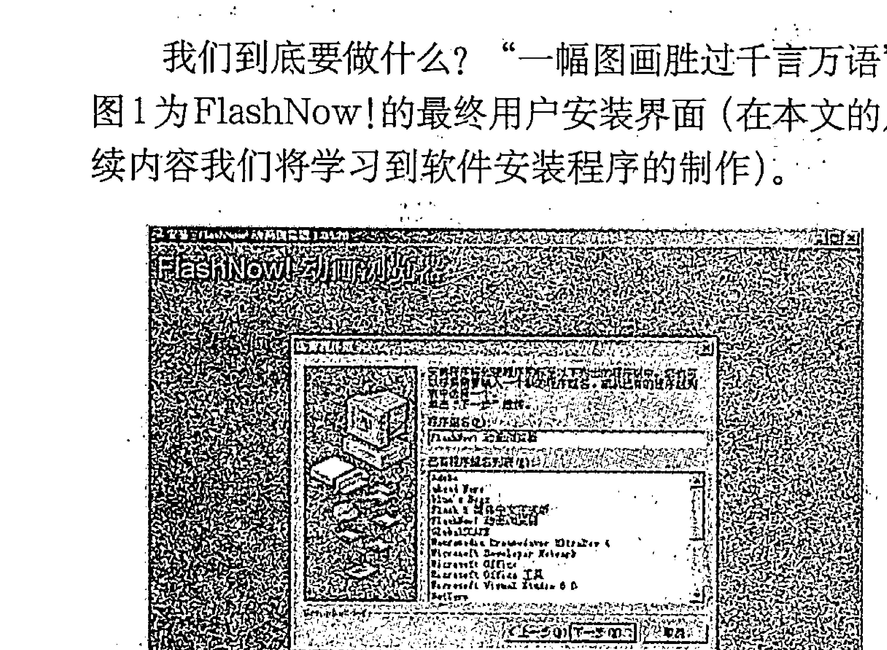

再简单不过了，我们要做的是一个Flash动画浏览器。图2是FlashNow!的查看视图，图3是FlashNow!的浏览视图，一个类似于资源浏览器的界面。

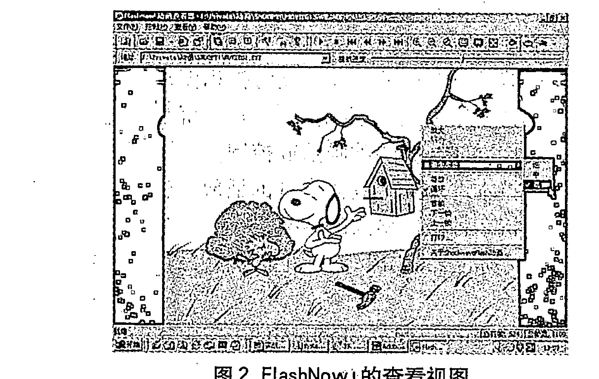

程序跑起来会有2个界面，实战目标应该清楚了，FlashNow!实际上就是一个类似于ACDSee双界面的Flash动画浏览器。

“麻雀虽小，五脏俱全”，再简单的软件都必须有详尽的帮助文档。如图4为FlashNow!的帮助界面。看来我们的实战内容还应包括帮助文档的编写。

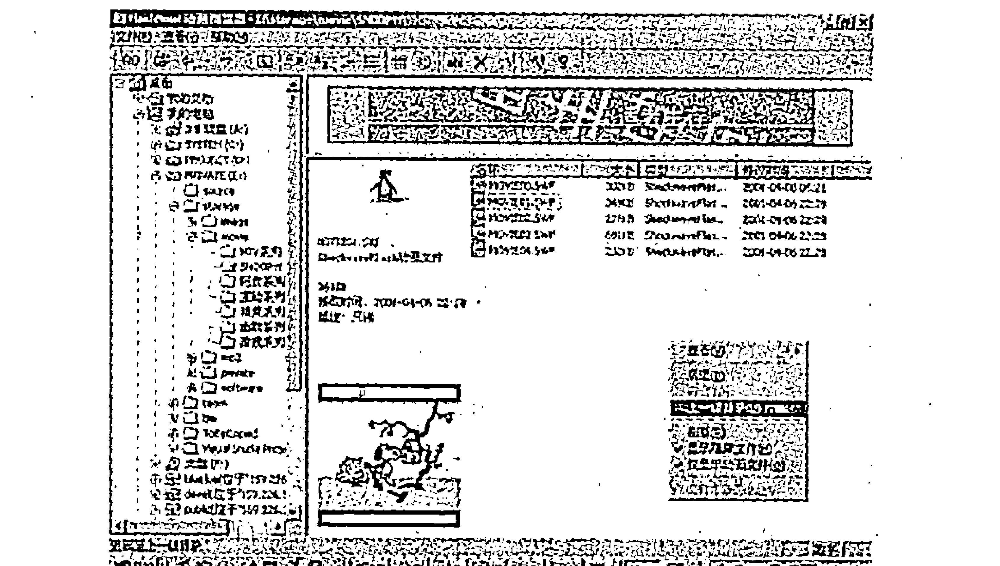

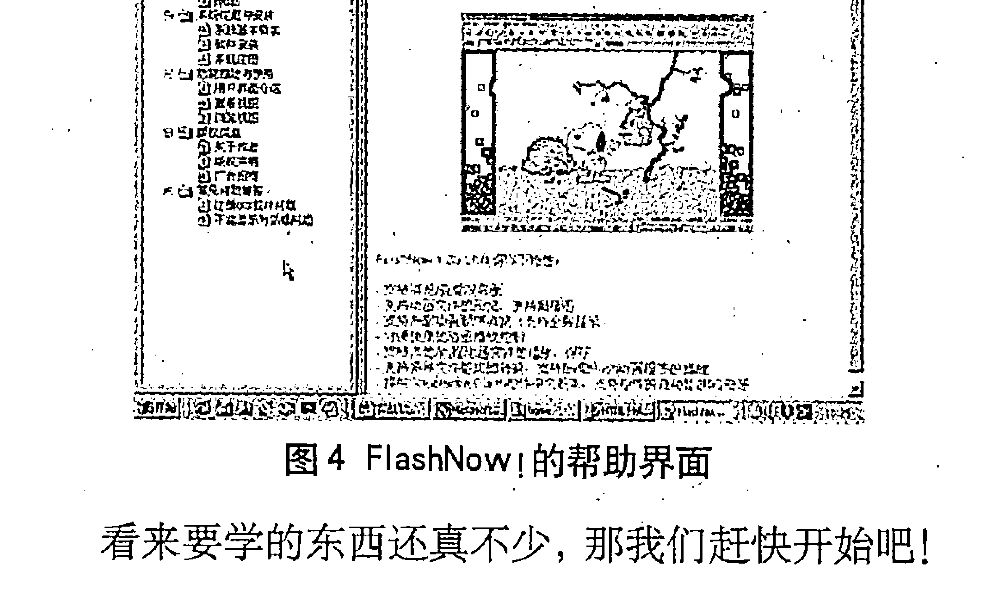

看来要学的东西还真不少，那我们赶快开始吧！

### 二、实战部署

“编码？别急。对程序员来说，编码是很惬意的事情（就像碰到咖啡和啤酒一样），但记住：不要急着编码。做好完整的实战部署，才能打好仗。

#### (一) 问题定义

为什么要开发FlashNow!？开发FlashNow!真的有必要吗？FlashNow!系统的开发真正可行吗？下面我们来具体分析一下需求产生的基本背景。
也许你使用过ACDSee，很好的东西，ACDSee是个很成功的案例。大量的收藏图片，合法的，或者不合法的，你都会想到使用ACDSee来查看它，这就是ACDSee成功的地方。那么，现在流行什么了？现在（实际上是去年或者前年）流行起Flash动画了，追美眉的男生一定很清楚，阿贵系列的、Snoopy系列的、流氓兔系列的、ShowGood MTV，还有更多的无厘头的MTV，都纷纷采用Flash动画格式，去网上随便走走，活灵活现的Flash广告比中关村的ITer还要多。

总之，Flash动画很流行了。Flash作为一种成熟的流式技术，给动画带来了丰富的声音、极快的速度和吸引人的交互性，Flash让动画火起来了。有Flash查看工具吗？有的，市场上流行的动画浏览器不少，有一款国外的产品SwfBrowser就很不错。怎么说呢，利用ShockwaveFlash控件，通过VB就完全可以做出一个像模像样的Flash动画浏览器来。作为Flash的缔造者，Macromedia也提供了界面美观（其实根本就不美观，除了菜单还是菜单，极其丑陋）的Flash Player。

在这样的市场环境下，开发FlashNow！是否还有其必要性，有的。据Flash fans反映，这些流行的Flash动画播放器还存在以下一些问题：

- 浏览、查看界面脱离，视觉上不直观，操作上不方便。
- 文件浏览、文件打开界面不支持动画预览。
- 不支持多幅动画的顺序浏览，对于大量Flash动画的收藏用户来说，操作麻烦。
- 动画播放控制不方便，跳转、定位功能不强。
- 不支持动画文件（特别是远程文件）的保存。
- 支持转换的文件格式有限，不利于Flash动画的多渠道传播。
- 不支持标准FlashPlayer动画程序（.exe文件）的播放。
- 未提供ShockwaveFlash控件中文版本，本地化程度不够。
- 不支持ShockwaveFlash控件的自动检测与安装，用户需自行安装和配置。

对于以上阶段所提出的问题有行得通的解决办法吗？问题定义接下来就是做项目的可行性分析，以探索这个问题是否值得去解，是否有可行的解决办法。做可行性分析一般要求从经济上估计开发费用以及最终的从开发成功的系统上所获得的收入或利益，衡量比较支出的费用和收到的利益；从技术上分析功能、性能以及限制条件，能否是一个技术上可实现的系统；从法律上明确系统开发可能导致的责任，有无违法的问题。

采取FlashNow！来解决以上的问题，符合其特殊的技术背景和市场背景，在技术上也是完全可行的。

以上的内容构成了对FlashNow！项目待解决问题的定义及可行性分析。明确了工程目标，下面我们将开始制订开发计划。

#### （二）制订计划

做任何事情之前必须有个完整的计划（不要老提“计划赶不上变化”），不要将你的项目置于无序的、失去控制的状态之中。在启动你的软件项目之前，你最好学会使用Microsoft Project。

严格意义上来讲，Microsoft Project是一种功能强大而灵活的项目管理工具，可以用于控制简单或复杂的项目。它能够帮助你安排和追踪所有的活动，从而使你对它们的进度了如指掌。使用Microsoft Project，可以建立软件项目的进度计划表，分配任务的资源和成本，优化项目进度计划表，并监视项目实际执行情况。

图5 显示了使用 Microsoft Project 制订FlashNow！开发计划的实况。

没有一成不变的计划，在FlashNow！的后续开发过程中，以上制定的计划内容和开发进度会根据实际情况做相应的调整和细化。

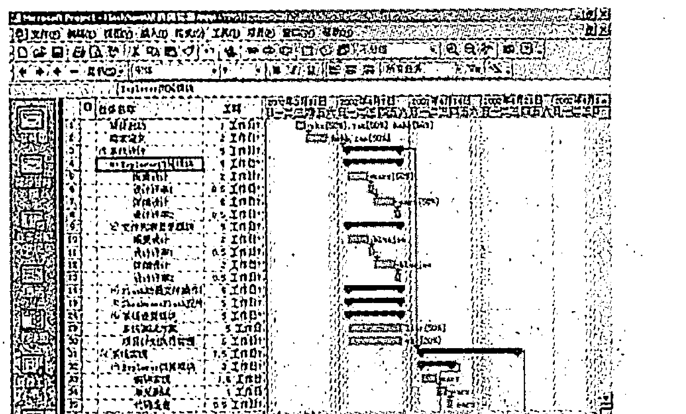

#### （三）需求分析

说白了，需求分析就是要求明白“系统必须做什么”。

系统的需求包括功能需求、性能需求、可靠性需求和资源使用需求等等，其中，功能需求是系统中最主要的需求，所以，对系统功能需求的分析是这一阶段的关键。

很简单，针对2.1的问题，就可以得出FlashNow！的简单功能需求：

- 支持浏览/查看双界面。
- 支持动画文件的预览，支持拇指图。
- 支持多个动画顺序浏览（支持全屏显示）。
- 支持方便快捷的动画播放控制。
- 支持本地/远程动画文件的播放、保存。
- 支持多种文件格式的转换。
- 支持标准FlashPlayer动画程序（.exe文件）的播放。
- 提供 ShockwaveFlash 控件中文版本。
- 支持控件的自动检测与安装。

以上的内容就构成了对FlashNow！简单的功能需求分析，当然这不是最具体的，仍需要细化。细化需求，需要更多的信息采集和文档准备，对于小型的软件开发，一种偷懒的办法就是在软件设计之前设计好系统的菜单结构和对话框界面(如图6),或者更细的，准备好帮助文档的草稿，这些都是以后要做的事情，而菜单定义好了，帮助文档设计好了，系统的功能需求也基本定好了。

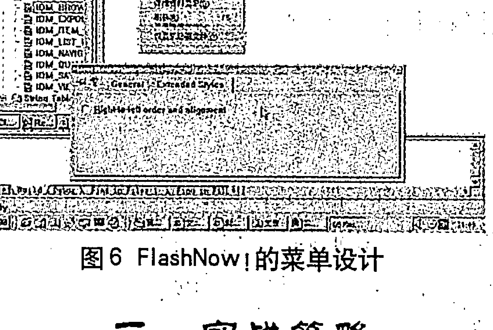

### 三、实战策略

确定了FlashNow!的功能需求之后，接下来就是系统设计的工作。很简单，“怎样解决用户需求所提出的问题”，“在多种解决方案中，哪一种方案最合适”，如此这般，就是具体的系统设计的过程。系统设计一般分成概要设计和详细设计，大抵是“逐步求精”的思路。

如何设计我们的FlashNow!呢？不要慌，我们从系统流程设计、系统模块设计和系统类设计三个方面入手。

#### (一) 系统流程设计

FlashNow!包括两个重要的流程，用户可以直接启动FlashNow!，或者从一个.swf文件关联过去。另一种方式，用户可以从文件夹的Shell菜单中选取“启动FlashNow!动画浏览器(F)”来启动FlashNow!，对于不同的系统入口，FlashNow!的系统流程设计如图7、图8所示。

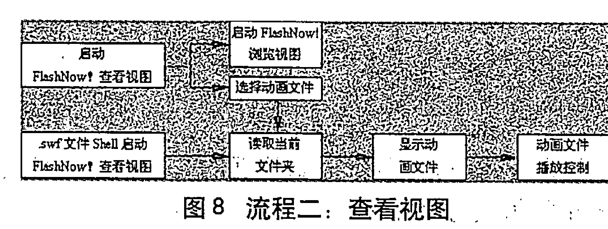

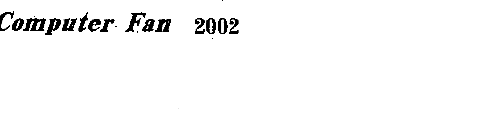

流程很简单，但愿软件实现起来也同样简单。

#### (二) 系统模块设计

总体来说FlashNow!可以分成以下几大模块：

- Flash动画播放控制模块
包括动画播放(Play)、停止(Stop)、跳转(Seek)、拖放(Drag)、放大(ZoomIn)、缩小(ZoomOut)、全屏显示(FullScreen)模块；包括动画循环播放、画面质量和动画背景色设置等模块。

- Explorer文件目录树模块
包括Explorer文件目录树(ShellTree)的显示、操作模块；包括跳转上级目录、前进、后退等模块。

- Explorer文件列表模块
包括Explorer文件列表(ShellList)的显示、操作模块；包括文件删除、更名、预览模块；包括文件信息显示、排序模块。

- Flash动画文件操作模块
包括动画文件顺序播放、文件跳转、本地/远程文件保存、文件格式转换模块。

- ShockwaveFlash控件自动检测安装模块
包括ShockwaveFlash控件自动检测模块、安装模块。

- 系统设置模块
包括用户系统设置、系统关闭和启动时自动保存和载入系统配置模块。

这六大模块具有交错的部分，例如Explorer文件目录树模块和Explorer文件列表模块，当用户选取目录树其中的文件夹时，该文件夹下的文件列表也要相应地显示出来。

#### (三) 系统类设计

类设计是更具体的面向对象(OO)的系统设计。对应于系统流程与系统模块，FlashNow!系统类设计列表如下：

- 应用类
CFlashNowApp: FlashNow!应用类。

- 框架窗口类
CBrowserFrame: 浏览视图框架类。
CViewerFrame: 查看视图框架类。
CBrowserFolder: Explorer文件目录树视图类。
CBrowserList: Explorer文件列表视图类。
CFormBar: 地址栏类。
CLogoBar: 广告条类。
CViewerClient: 查看视图类。
CDropDownToolBar: 支持下拉菜单的工具栏类。
CViewerToolBar: 动画播放控制工具栏类。
CNavigatorToolBar: Explorer文件目录树操作工具栏类。
CProgressStatusBar：显示动画装载进度的状态栏类。

- CShell*类: Explorer实现类
CShell: Shell 文件基础类。
CShellTree: Shell 文件目录树类。
CShellList: Shell 文件列表类。
CShellTreeItemData: Shell 文件目录树项数据类。
CShellListItemData : Shell 文件列表项数据类。

- 应用数据类
CHistory: Explorer 历史类。
CHistoryRecord: Explorer 历史记录类。
CStringQueue: 字符串队列类。
CUserData: 系统配置数据类。

- Flash 动画操作类
CShockwaveFlash: ShockwaveFlash 控件窗口类。
CFlashWnd: ShockwaveFlash 控件窗口扩展类。
CFlashOCX: ShockwaveFlash 控件自动检测安装类。

- 对话框类
C2HtmlDlg: HTML 文件输出对话框类。
CAboutDlg: About 对话框类。
CFileOpenDlg: 文件打开对话框类 (支持动画预览)。
CPropertyDlg: 动画属性对话框类。
CSetupDlg: 系统设置对话框类。

以上枚举了 FlashNow! 的所有类，完整的类设计应该还包括类的属性方法的原型定义，限于文章篇幅，在此略去；对于其他项目，可能的话，还要进行系统的数据库设计，FlashNow! 没有这方面的需求，亦略去。

系统流程设计、系统模块设计和系统类设计只是系统设计的部分内容，以上的内容也仅仅属于系统概要设计的层次，系统详细设计还需要对这些系统流程、系统模块和系统类设计进行更进一步的细化。

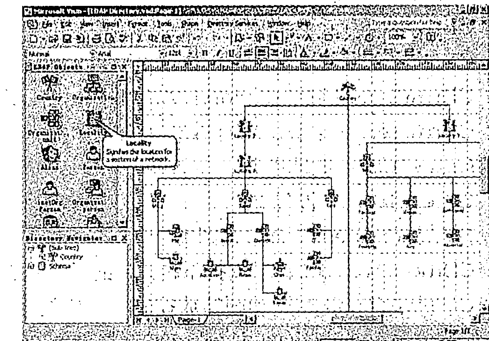

系统设计的辅助工具很多，常用工具有 Microsoft Visio、Sybase PowerDesigner 和 Rational Rose 等等，图9为使用 Microsoft Visio 进行系统设计的工作界面。

值得一提的是，系统设计主要还是大脑的活动，辅助工具毕竟只是工具，好的设计方案即便使用 Microsoft Word ——或者更简单些——圆珠笔和一些小纸片（但要保证能正确地表达你的思路）都能奏效。笔者在此不再展开，我们继续以下的实战过程。

### 四、实战体验

经过详细的实战部署和系统设计，后面就是真枪实弹的实战了。我们按照软件实现（编码）——帮助文档——安装程序——软件打包——软件测试的顺序——介绍。

#### (一) 版本管理

且慢！还是不要急着编码，在进入具体的软件实现阶段，作为常识，你应该掌握一下关于版本管理的概念。

版本管理是软件配置管理 (Software Configuration Management, 简写为 SCM) 的一个重要环节。版本管理不属于软件开发过程中某个特定的阶段，而是贯穿于整个软件开发过程中的，在软件开发过程中所有的分析、设计文档和源代码都必须有严格的版本管理来保证。

版本管理的工具软件很多，在众多的成熟产品和试验产品中，笔者推荐目前使用比较广泛、有较大用户前景且又能较易获得的版本管理器产品 Microsoft 公司的 Visual SourceSafe(VSS)。VSS 是 Microsoft Visual Studio 产品家族的一员，如图10所示为使用 Visual SourceSafe 对 FlashNow! 进行版本管理的实况。

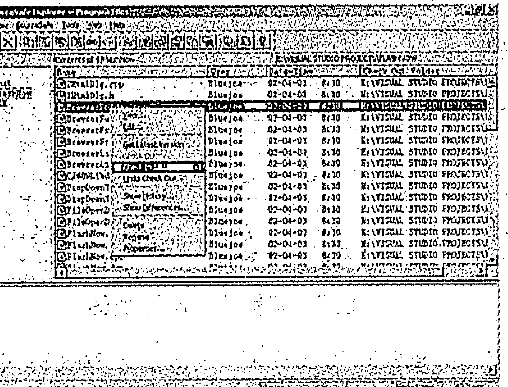

运用 VSS 进行版本控制管理的非常有效而且代价较小的解决方案是：

在一台Windows NT服务器或者是一台较为独立的 Windows 95/98 PC上安装VSS6.0的服务器端软件，创建一个为该整个项目存放用的数据库，然后在该数据库中创建各个项目和子项目，并由VSS管理员为小组的每个成员创建一个帐号及他们各自的权限。

在开发小组成员的PC上安装VSS的客户端软件，并创建自己的工作目录，这样在软件的开发过程中，只要通过该客户端软件登录到VSS服务器上，Check Out当前要进行工作的项目或文件，如有修改在工作结束时将其 Check In 提交给VSS服务器进行统一更新。

#### （二） 软件实现

你已经有了好的软件思路，有了完整的系统设计方案，而且，你还知道了如何去维护你的软件版本，但到现在为止，你的代码还是一片空白。说干就干，我们开始编码。

##### 1. 软件开发工具

“好马配好鞍”，选择合适的软件开发工具至关重要。有一句很流行的话：“真正的程序员用VC，聪明的程序员用DELPHI”，笔者不是聪明的程序员，既然我能够像使用自己的食指一样灵活地使用 Visual C++，所以，我选择了VC（如图11）。

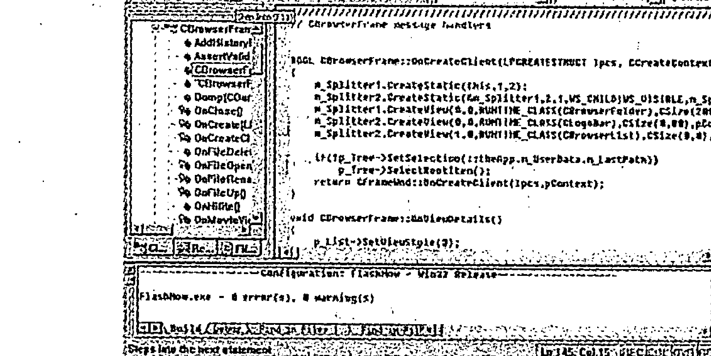

FlashNow!基本上是个很正常的Windows Explorer-like SDI应用，使用MFC AppWizard（如图12）可以迅速得到系统的框架。

##### 2. 天下文章一大抄

请不要误解我的意思，古人说“天下文章一大抄”，也并非是鼓励剽窃和抄袭。相反，笔者的意思是鼓励读者朋友们懂得借鉴，流行的开发工具包(SDK)不要太多，这些SDK提供了统一的用户界面和程序接口，你完全可以像使用自己的代码一样去使用它们。程序员要改掉顽固不化、闭门造车的臭脾气，

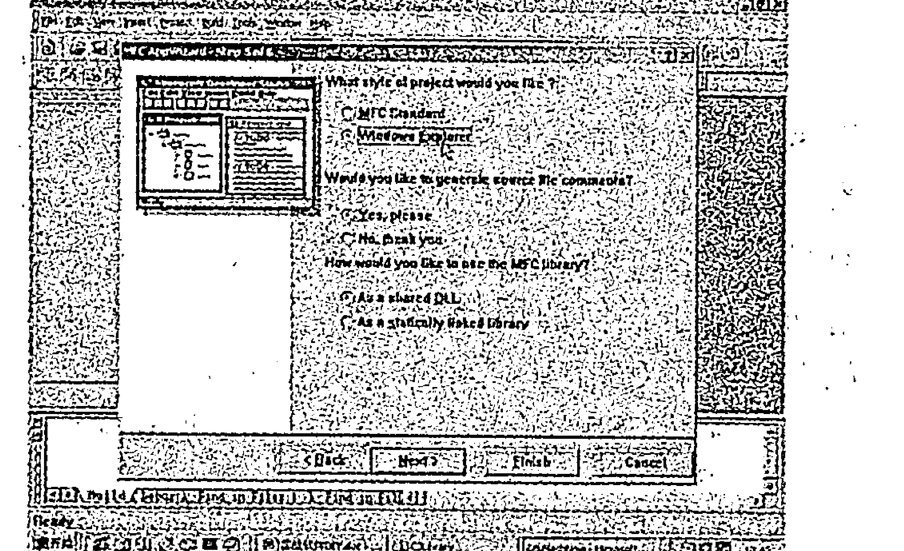

该偷懒的时候就该偷懒。确实有好多可以偷懒的地方，听说过CJ60Lib吗？我听说过。CJ60Lib 是MFC 扩展库（原名MFCXLib）针对Visual C++ 6.0进行升级的后续版本。CJ60Lib为用户提供了功能更强、界面更美观实用的类，例如 C C J M e n u 提供了图标菜单，CJOutlookBar提供了类似于Outlook的界面。使用CJ60Lib，用户甚至可以只需要很少的代码构造出类似于Microsoft Visual DevStudio的界面来（如图13）。

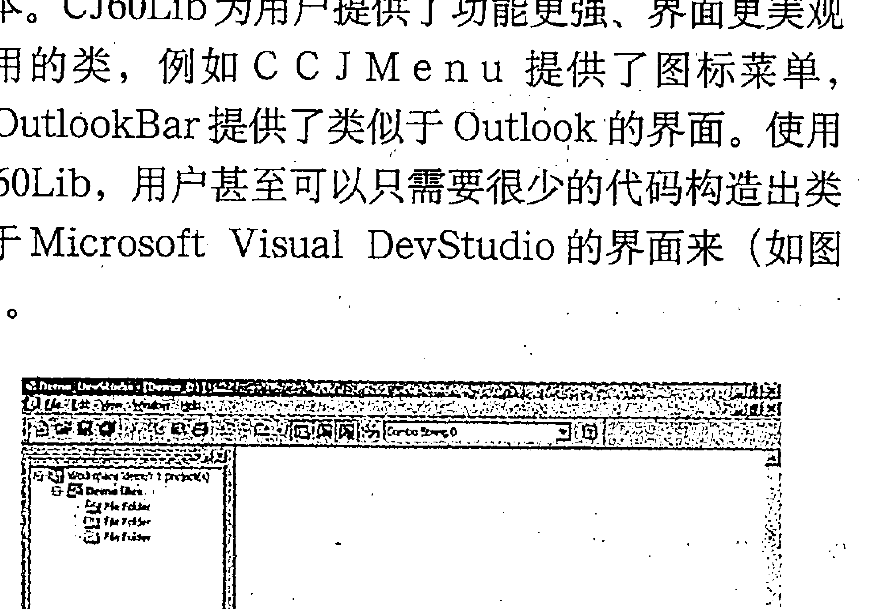

CJ60Lib提供了一组文件Shell类：CCJShell: 文件Shell操作类，如获取文件信息、文件排序、枚举Shell菜单等；CCJShellTree: Explorer文件目录树视图类，显示文件Tree列表；CCJShellList: Explorer文件列表视图类，显示文件List列表。

使用CCJShell* 可以轻松枚举出所有的文件项，包括我的文档、回收站、网上邻居等特殊文件夹，其行为完全和“资源管理器”相似。对CJ60Lib有兴趣的朋友可以参考如下地址：http://www.codejockeys.com/codejockeys/ 其中，CJ是codejockey的缩写。

##### 3. CShell* 核心代码

笔者参考（“抄袭”）了 CJ60Lib 的源码，并根据 FlashNow!的需求重新编写了 CShell*类，事实证明，参考标准的 SDK 代码很容易达到事半功倍的效果。对 CShell*代码有兴趣的朋友亦可以与笔者联系（但请勿应用于任何商用场合——不要做违法的事情）。

如下给出了 CShell*的部分核心代码：

```
// 函数 CShellTree::PopulateList, 展开指定目录项
// 参数 Item, 指定目录项
void CShellTree::PopulateList(HTREEITEM Item)
{
    CShellTreeItemData *pStid;
    LPSHELLFOLDER pShellFolder = NULL;
    HRESULT hr;

    pStid = (CShellTreeItemData *)GetItemData(Item);
    if(pStid)
    {
        // 顶级目录
        if(Item == h_Desktop)
        {
            p_List->PopulateList(pStid->m_pParentShellFolder, pStid, Item);
            return;
        }

        hr = pStid->m_pParentShellFolder->BindToObject(pStid->m_pIDList, 0, IID_IShellFolder, (LPVOID *) &pShellFolder);

        // 显示文件列表
        if(SUCCEEDED(hr))
            p_List->PopulateList(pShellFolder, pStid, Item);
    }
}

// 函数 CShellList::PopulateList, 展开指定目录项
// 参数 pParentShellFolder, 父目录
// 参数 pStid, 指定目录项的数据
// 参数 hItem, 指定目录项
// 返回操作结果, TRUE/FALSE
BOOL CShellList::PopulateList(LPSHELLFOLDER pParentShellFolder, CShellTreeItemData * pStid, HTREEITEM hItem)
{
    LV_ITEM lvi;
    int nPos = 0;
    LPENUMIDLIST lpe = NULL;
    LPITEMIDLIST pIDList = NULL, pFullIDList = NULL;
    LPMALLOC lpMalloc = NULL;
    ULONG ulFetched;
    HRESULT hr;
    TCHAR szBuff[_MAX_PATH];
    SHFILEINFO sfi;
    CShellListItemData * pSlid = NULL;
    CString FullPath;
    CString DisplayName;

    m_Building = TRUE;
    SetRedraw(FALSE);
    DeleteAllItems();
    m_SelectedItem = -1;

    // 分配内存
    hr = SHGetMalloc(&lpMalloc);
    if (FAILED(hr))
        return FALSE;

    // 设置显示标志
    DWORD dwFlags = SHCONTF_FOLDERS | SHCONTF_NONFOLDERS;
    if( m_ShowHidden )
        dwFlags |= SHCONTF_INCLUDEHIDDEN;

    hr = pParentShellFolder->EnumObjects(GetSafeHwnd(), dwFlags, &lpe);
    h_TreeItem = hItem;

    if (SUCCEEDED(hr))
    {
        // 枚举父目录下的文件
        while (S_OK == lpe->Next(1, &pIDList, &ulFetched))
        {
            pSlid = (CShellListItemData *) lpMalloc->Alloc(sizeof(CShellListItemData));
            if (!pSlid)
                goto Done;

            // 获取文件属性
            ULONG ulAttrs = SFGAO_FOLDER;
            pParentShellFolder->GetAttributesOf(1, (const struct _ITEMIDLIST **) &pIDList, &ulAttrs);
            pSlid->m_Attribute = ulAttrs;
            pFullIDList = ConcatPidl(pStid->m_pFullIDList, pIDList);
            pSlid->m_pParentShellFolder = pParentShellFolder;
            pParentShellFolder->AddRef();
            pSlid->m_pIDList = CopyPidl(lpMalloc, pIDList);
            GetFileInfo(pFullIDList,
```

## 4. 好的编码风格

```
SHGFI_PIDL | SHGFI_SYSICONINDEX | SHGFI_SMALLICON | SHGFI_TYPENAME | SHGFI_ATTRIBUTES, &sfi);
lvi.iImage = sfi.iIcon;
pSlid->m_pFullIDList = ConcatPidl (pStid->m_pFullIDList, pIDList);

SHGetPathFromIDList(pSlid-> m_pFullIDList,szBuff);
FullPath = szBuff;
pSlid->m_Flag = GetItemFlag(sfi, FullPath);

if (!GetItemName (pParentShellFolder, pIDList, SHGDN_NORMAL, szBuff))
    goto Done;

lvi.mask = TVIF_TEXT|TVIF_IMAGE|TVIF_PARAM;
lvi.iItem = nPos;
lvi.iSubItem = 0;
lvi.pszText = szBuff;
lvi.cchTextMax = _MAX_PATH;
lvi.lParam = (LPARAM)pSlid;
// 添加至文件列表
nPos = CListCtrl::InsertItem(&lvi);
InsertSubItems(nPos,sfi,FullPath);
nPos++;
lpMalloc->Free(pFullIDList);
pFullIDList=0;
}
}

Done:

// 释放内存
if (lpe)
    lpe->Release();

if (lpMalloc)
    lpMalloc->Release();

m_Building = FALSE;

if(!m_Refresh)
    ::theApp.p_Browser->AddHistoryRecord (hItem);
SortItems(SortProc, (LPARAM)this);

SetRedraw(TRUE);

return TRUE;
}
```

神奇，其定义如下：

```
struct CShellTreeItemData //Shell文件目录树项数据类
{
    LPSHELLFOLDER m_pParentShellFolder; //指向父级目录的指针
    LPITEMIDLIST m_pIDList;     //ID List
    LPITEMIDLIST m_pFullIDList; //完整的ID List
};
```

```
struct CShellListItemData: public CShellTreeItemData //Shell文件列表项数据类
{
    ULONG m_Attribute; //文件属性
    int m_Flag; //辅助标志位
};
```

值得一提的是，仅仅“抄袭”源代码还是不够的，如果有必要的话，笔者还鼓励读者朋友们抄袭一些成熟应用的思路及实现方法。对于 FlashNow! 的双界面，笔者花了不少时间和精力，但最终仍很难得到满意的思路。这时候，使用 Visual Studio Tools 组中的 SPY++，确实是另一种偷懒的办法。SPY++ 可以查看当前系统的所有应用的窗口(windows)、消息(messages)、进程(process)和线程(threads)——确实太棒了，既然ACDSee 已实现了双界面，而且据说效果还不错，那我们来用 SPY++ 来窥其一二(如图14)。

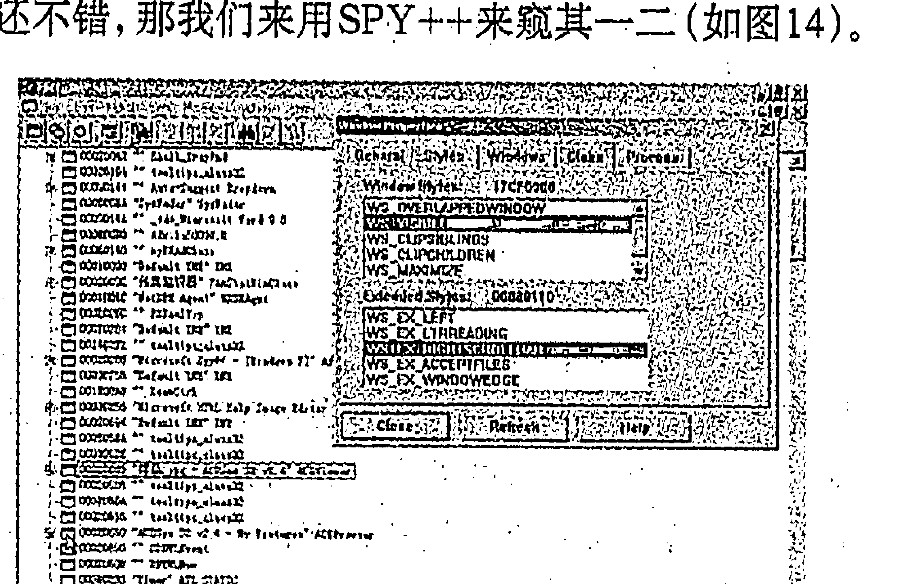

图14 使用 SPY++ 查看 ACDSee

明白了，ACDSee 同时创建 2 个窗口，一个可见(visible)，一个隐藏(hidden)，好办，我们的 FlashNow! 也这么办，因为著名的 ACDSee 已经证明这种方案是可行的，也是可以为用户所接受的。以下为 FlashNow! 的相关实现代码：

```
// 函数 CFlashNowApp::InitInstance，初始化 FlashNow 应用实例
BOOL CFlashNowApp::InitInstance()
{
    // 创建浏览视图
    p_Browser = new CBrowserFrame;
    m_pMainWnd = p_Browser;
    p_Browser->LoadFrame(IDR_BROWSER,
        WS_OVERLAPPEDWINDOW|FWS_ADDTOTITLE,
        NULL,NULL);

    // 创建查看视图
    p_Viewer = new CViewerFrame;
    m_pMainWnd = p_Viewer;
    p_Viewer->LoadFrame(IDR_VIEWER,
        WS_OVERLAPPEDWINDOW|FWS_ADDTOTITLE,
        NULL,NULL);
}
```

```
// 函数 CFlashNowApp::SwitchToBrowser，切换至浏览视图
void CFlashNowApp::SwitchToBrowser()
{
    // 设置窗口大小
    p_Viewer->GetWindowPlacement(&m_Placement);
    p_Viewer->p_Flash->SetMovie("");
    p_Browser->SetWindowPlacement(&m_Placement);
    // 显示浏览视图，隐藏查看视图
    p_Browser->ShowWindow(SW_SHOW);
    p_Viewer->ShowWindow(SW_HIDE);
    m_pMainWnd = p_Browser;
    m_Mode = BROWSER;
    p_Browser->OnHilite();
}
```

还有什么可以“抄袭”的吗？有的，显示 Flash 有Macromedia官方的控件swflash.ocx,swflash.ocx是完全共享的，我们完全可以使用它来显示 Flash 动画，但还有可以改进的地方，我们完全可以将控件的界面菜单修改成中文（注意：这种“抄袭”不要应用于商用场合，否则——准备好罚金）。用VC可以修改嵌入到.exe、.dll和.ocx的资源。启动VC，记住使用Resource方式打开swflash.ocx，开始菜单的汉化，如图15所示。汉化后的菜单界面如图2所示。FlashNow!启动时将自动检测 ShockwaveFlash控件是否安装并实现自动安装，如图16所示。除此之外，帮助文档也可以拿来“抄袭”，这是后续内容，在此不再展开。

要编写最漂亮的代码。好的编码风格是软件编码设计的基础，在团体合作开发中尤为重要。一般的观点认为，好的编码风格应包括以下内容：

- 符合一定的命名规范。
- 要有至少20%的注释。
- 要为调试阶段准备足够的调试信息。
- 加上合适的空白（包括 Tab，空格和换行）。
- 面向对象，层次清晰。
- 尽可能的模块化，消除重复与冗余。
- 逻辑清晰，不用 goto 语句，多用异常机制。

以下片段摘自于 FlashNow! 源码，仅供参考：

```
// 函数 FindChild，在子项中查找指定目录项
// 参数 hParent, 父目录
// 参数 pSlid, 指定目录项，CshellListItemData 类，参见 Shell.h
// 返回查找结果，NULL 为查找失败
HTREEITEM CShellTree::FindChild(HTREEITEM hParent, CShellListItemData *pSlid)
{
    // 是否包含子项
    if (ItemHasChildren(hParent))
    {
        HTREEITEM hChildItem = GetChildItem(hParent);
        // 查看所有子项
        while (hChildItem)
        {
            // 比较子项内容
            if(!CompareStid(GetItemData(hChildItem),
                (LPARAM)pSlid))
                return hChildItem;
            hChildItem = GetNextItem(hChildItem,
                TVGN_NEXT);
        }
    }

    // 查找失败，返回 NULL
    return NULL;
}
```

保持好的编码风格，并不是严格依照死板的标准，程序员有必要在代码的可写性（不要让自己难受是首要条件）和可读性（不要让别人难受）找到一个合适的均衡点。

#### (三) 帮助文档

对于程序员来说，编写帮助文档就象写情书一样令人头疼，但记住，你必须写下去！再则，帮助文档其实也是一个签名的好机会，何乐而不为呢？

##### 1. 帮助文档格式

如果你已经装了 Windows 98 或者后续版本，一定会发现它的帮助文档和以前已经完全两样了。它采用新一代基于HTML文件格式的帮助文档，文件扩展名为.chm（已编译的HTML帮助文件）。HTML帮助文档是一个统一的窗口（参见图4），改变了原有帮助文档目录窗口和文档内容窗口分离的情况，左侧是目录(Content)、索引(Index)和搜索(Search)这三个功能项，通过标签栏切换。右侧是帮助信息的显示部分，显示的是完全正常的HTML文档。

##### 2. 使用 HTML Help WorkShop 制作帮助文档

制作HTML帮助文档的工具很多，最常见的是微软公司的 HTML Help Workshop 工具包，感兴趣的朋友可以查看以下的地址：http://www.microsoft.com/workshop/author/HTMLhelp

HTML Help Workshop是英文版的，不过没有关系，帮助文档运行文件有简体中文版，并且运行的界面是根据用户使用的操作系统，与Workshop的语言版本没有关系。

HTML 帮助文档的核心是充分利用HTML文件的表现能力，对分散的HTML文件（包括图片、声音文件等）作整体的包装，只要你会制作HTML文件，基本上大事已备。

- .htm 文件：网页文件，用以描述各帮助页面。
- .hhc文件：content文件，用以描述各帮助内容项。
- .hhk 文件：index 文件，用以描述各帮助关键字项。
- .hhp 文件：工程文件，包含描述工程配置。

下面我们以FlashNow!为例，简单学习一下帮助文档的制作：

- 运行 Help Workshop；新建一个“工程(Project)” FlashNow.hhp，出现工程编辑界面。在工程编辑界面的上方是3个标签栏，第一个“Project”是有关工程的编辑，第二个“Contents”是目录，第三个“Index”是索引。
- 选定“工程(Project)”标签栏，单击“改变工程选项”按钮，出现工程选项对话框，这里仅改变标题 (Title) 的内容，把制作内容标题“FlashNow!1.05.20 用户帮助手册”写入，编译后这个标题将出现在窗口的标题栏中。其他的内容暂时用系统的默认值。然后单击“加入 / 删除封面文件”按钮，加入封面页的HTML文件。封面页的文件一定要有，否则编译的帮助文件运行后，系统会报错。好了，简单的工程编辑就完成了。
- 选定“目录(Contents)”标签栏，这时系统请你选定一个新目录文件的名称，指定后出现目录编辑界面。按照内容的需要添加标题(Heading)或页面目录(Page)，并对每个目录选定相应的HTML文件。标题可以分为多级，并在标题上也放置需要的HTML文件，作为标题的说明内容。如图4 所示的左侧是FlashNow!的 Contents，通过“添加标题(Insert a head)”，依次建立“What's FlashNow!”“系统注册与安装”“功能描述与使用”“版权信息”“常见问题解答”5 个标题，再在各级标题下“添加页面目录(Insert a page)”，并设定好每项页面目录所对应的页面(URL)。
- 完成目录编制后，一个 HTML 帮助文件已具备了雏形，什么都先别干，现在编译 (File\Compile)! 在当前工作目录可以找到FlashNow.chm，就是编译之后的帮助文档了，呵呵，怎么样? 看到效果了吗?
- 还没有结束呢，完整的帮助系统应该还包括索引，选定“索引(Index)”标签栏，添加关键字(Add a keyword); 这样，FlashNow.chm 就是一个完整的帮助文档了。

上述内容简单介绍的是编制 HTML 帮助文件的基本步骤，上手很容易。但 HTML Help Workshop 的功能远非这些，如在窗口定义中可以设计你所喜爱的形式，几乎所有的窗口要素都可以改变。它还支持全文检索功能，而且很容易制作。详细的内容请参考 HTML Help Workshop 的帮助文档或微软的相应网页。

如果你缺乏学习 HTML Help Workshop 的动力，试着想想别的办法，将往日的情书（当然是写给同一个人的）和QQ聊天记录用HTML Help Workshop 封装起来，送给心爱的美眉，绝对是个好主意。

#### （四）安装程序

##### 1. 规范化的安装程序

当你完成一个应用软件的开发后，如果你的软件不要求是那种“绿色”产品（“绿色”产品不会随便弄脏用户的硬盘），那么你还需要为分发该软件而做一个规范化的安装程序。这是使你的软件商品化所不可缺少的一步。

一般而言，一个规范化的安装程序应该满足以下几个条件：

- 只需安装一次。也就是安装完后，用户不用进行其他的设置就能使用你的软件（应用软件内部的参数设置是另一回事）。
- 要保证目标盘上“简洁、干净”。就是说你的安装程序能根据用户所选择的功能，仅安装所需的部分，不把多余的文件复制到用户的目标盘上，特别是不向注册表中添加无用的信息。
- 要保证对注册表的正确使用，注册表实际上是一个 Windows 的系统数据库，所有应用软件都可用它存储一些必要的信息，例如用户注册信息、类的注册、系统配置信息等，但对注册表使用不当，就会导致系统性能的降低。
- 安全性。安装程序应具备对已安装系统进行必要检查的能力，同时还应具有卸载功能，让用户可以根据自身的需要卸载你的软件。在做这些的同时，还不应影响其他应用软件的正常运行。

##### 2. 使用 SetupBuilder 制作安装程序

安装程序的制作工具很多，知名的有 InstallShield 和 Wise。图18为 InstallShield for Microsoft Visual C++ 6 的界面。

“萝卜青菜，各有所爱”，笔者比较喜欢使用国产的中文软件 SetupBuilder（如图19）。感兴趣的读者朋友可以访问以下地址：

http://www.irsys.com.cn

以 FlashNow! 为例，以下简要介绍 SetupBuilder 的使用步骤：

- 新建工程 FlashNow.spp。
- 常规设置 \ 安装程序基本设置：设置基本信息，如图20所示。
- 常规设置 \ 指定文件组、组件和安装类型：FlashNow! 设置了2个文件组：Program Files 包含可执行程序 flashnow.exe 和 ShockwaveFlash 控件中文版本 cswflash.ocx；Movies 包含范例文件 flashnow.swf 和版本信息文件 about.swf。接下来设置组件以包含不同的文件，最后设置不同的安装类型（典型、最小、自定义）以包含不同的组件。
- 常规设置\安装程序对话框设置:设置安装时各对话框的信息内容,这一项很简单,界面完全可视化。
- 完成编译\编译安装程序: 选择发布磁盘类型为1.44M,编译。

运行 setup.exe, 看到激动人心的界面了吗？“FlashNow!1.05.20安装程序正在启动SetupBuilder (TM)安装程序向导,以帮助完成接下来的工作,请稍候……”, yahoo! 感觉如何?

FlashNow.spp 还需要别的配置才算完整,因为以上的步骤生成的setup.exe除了拷贝文件这些蛮活,别的什么都不会做,没有桌面快捷方式,“开始\程序”里也没有FlashNow!,这个安装程序对于注册表没有丝毫的改动,当用户双击Flash文件的时候,如果没有合适的播放器的话,系统仍会傻乎乎地要求你选择打开方式……

好办，继续修改FlashNow.spp：

- 高级设置\指定程序组和图标: 在可视化的“所见即所得(WYSIWYG)”界面中添加桌面快捷方式和程序项; 其中程序项包括 “白乔主页”、“FlashNow!动画浏览器”和“卸载FlashNow!动画浏览器”三项。
- 高级设置\登记注册表信息: 同样的可视化“所见即所得(WYSIWYG)”界面, 添加以下内容:

```
我的电脑\HKEY_CLASSES_ROOT\.swf = ShockwaveFlash.ShockwaveFlash
我的电脑\HKEY_CLASSES_ROOT\ShockwaveFlash.ShockwaveFlash = ShockwaveFlash 动画文件
我的电脑\HKEY_CLASSES_ROOT\ShockwaveFlash.ShockwaveFlash\Shell\Open\Command = "<INSTALLDIR>\FlashNow.exe" "%1"
我的电脑\HKEY_CLASSES_ROOT\Folder\Shell\启动 FlashNow!动画浏览器(&F)\Command = "<INSTALLDIR>\FlashNow.exe" -B "%1"
我的电脑\HKEY_LOCAL_MACHINE\SOFTWARE\bluejoe\FlashNow.Vesion = 1.05.20
```

前三项操作用以注册.swf的文件类型,并指定FlashNow!为关联应用程序;最后一项注册版本信息;第四项则在文件夹Shell菜单里添加“启动FlashNow!动画浏览器(F)”项,其行为如图21所示。

怎么样？酷吧？

SetupBuilder 什么都好,就是要注册不好,否则超过2M的软件包不给制作。要么你去缴费注册,要么你就只有去学习E文软件InstallShield。

#### （五）程序打包

SetupBuilder生成出来的是一堆安装文件。打包成一个zip文件很不错,但更好的主意是打包成一个自解压文件,Winzip Self-Extractor就是这样的工具,图22为Winzip Self-Extractor的工作界面。

使用Winzip Self-Extractor制作软件包很简单,只要按照程序向导一路Next即可。运行打包后的文件,FlashNow.exe将自动解压并运行setup.exe开始系统的安装。

#### （六）软件测试

软件开发还没有完成,还有软件测试。

不要忽略软件测试。目前国内很多软件开发公司存在一个通病,那就是开发出来的软件产品的质量一直得不到很好的保证,很多产品在正式交给用户使用后总是存在诸多的问题。其原因是多方面的,很重要的原因是软件开发的管理水平不高,尤其是一直以来忽视了对软件产品进行必要和充分的测试。

完整的测试生命周期包括测试计划、测试设计、测试开发、测试执行和测试评估。以FlashNow!为例,按照测试内容,测试可以分为:

- 功能测试 (FlashNow!满足了所有的功能需求吗？)
- 用户界面测试 (FlashNow!的用户界面友好吗？)

### 五、实战成果

实战的成果就是一个exe安装文件，如图1所示。后续的内容就是你如何发布软件，如何销售软件，利用产品来为你赚钱（如果你还想要钱的话）。在知名的网站发布你的软件，或者登记你的软件，与感兴趣的商家主动联系也是好办法，好的idea，总会有明智的商家愿意掏钱与你合作。

FlashNow!至此还没有赚取一分钱的利润。

### 结束语

本文到此结尾，有所收获吗？我希望你有。正如我前面所提醒的，软件开发过程是一个严谨完整的过程，各种理论在拼命地解释程序员各个阶段的行为并得出更新更枯燥的规则，各种软件开发工具也因此应运而生，要足够时髦，就必须掌握更多更新的工具。软件开发是学问，本文只尝试以浅显的语言和具体的实例来告诉读者朋友们一种组织软件开发的思路，仅仅如此。

实战结束了，以下的经验是我想带给你的：
- 不要急着编码。编码工作量不应该超过开发工作的百分之二十，成熟的系统设计会事半功倍。
- 不要忽视测试。测试应该至少要占工程的百分之三十，如果你不想做一个不负责任的软件牛仔的话，在经历足够的测试之后，再发布你的软件。
- 不要追求怪异的界面，不要总记着在产品中显示自己的名字或者照片。
- 注释应该至少要占源代码的百分之二十。
- 最简单的程序也应该有自己的log记录，告诉用户发生了什么错误。
- 要会“抄袭”，只要不犯法，源码、思路、帮助文档都可以抄。
- 准备完整的帮助文档。
- 不要欺骗用户，不要总想着窃取用户的信息，也不要不打招呼就为用户设置新的桌面和屏保，要讲礼貌。
- 尝试团体开发，即便是一个简单得不能再简单的软件，也尽量分给几个人做；你会在团体合作中体会到前所未有的乐趣，会完善你的思路，会培养成更好的编码习惯，会得到更多项目管理的经验。
- 不要告诉别人你是“编程”的，告诉他你是“某某软件项目的主管”

> (文/白乔)

- 性能测试（FlashNow!性能稳定吗？存在“异常错误”吗？）
- 压力测试（在系统环境不正常的情况下，FlashNow!运行如何？）
- 容量测试（系统满负荷的情形下，FlashNow!的承受能力如何？）
- 配置测试（FlashNow!的软件配置和硬件配置如何？）
- 安装测试（FlashNow!安装之后，组件是否齐全，系统设置是否正确？）

测试过程包括单元测试、集成测试、系统测试和验收测试。验收测试是发布软件之前的最后一个测试操作。验收测试的目的是确保软件准备就绪，并且可以让最终用户将其用于执行软件的既定功能和任务。

实施验收测试的常用策略有三种，它们分别是：正式验收、非正式验收（α测试）和β测试。α测试是由用户在开发环境下进行的测试，也可以是公司内部的用户在模拟实际操作环境下进行的测试；β测试是由软件的多个用户在实际使用环境下进行的测试。只有当α测试达到一定的可靠程度时，才能开始β测试。β测试处在整个测试的最后阶段。同时，产品的所有手册文本也应该在此阶段完全定稿。

FlashNow!的β测试由一群热心的（也许是无奈的）网友和兄弟们帮助完成，对于他们无限的热忱和对各种bugs无限的承受力，笔者在此表达深深的敬意！

按照测试方法来分，测试包括人工测试和工具测试两种，可视测试工具有：Rational Visual Test，Rational Performance，Logiscope TestChecker 等等，在此不在赘述。

### XML 打造全新 Web 世界三步曲

互联网以前所未有的速度发展并成为与报纸、广播、电视相比肩的第四媒体，其便捷的信息传输形式改变着人们的消费模式。利用简单、快捷、低成本的电子通讯方式，买卖双方可以不谋面就能进行各种商贸活动，开展电子商务是目前互联网的发展趋势。

另一方面，电子商务要求 Web 文件更加复杂化，多样化和智能化，于是高容量，高信息量，高效率便成为网络信息技术发展的追求。如果说目前静态的基于元素位置摆放的 HTML 还可勉强应付互联网信息技术的挑战；那么其缺乏统一数据交换规范的问题无疑是电子商务的软肋。毕竟，商家之间交易所涉及的物流、管理流、信息流和资金流需要在规范和标准的轨道上进行，电子商务的开展离不开动态的交互和商业数据的存储交换。与此同时，还有另一种需求变得更加广泛而迫切，那便是同样的数据能否根据不同用户的不同需求而以不同的效果，不同的形式表达再现出来，这一切都是 HTML 所不能满足的。

在这样的情况下，对跨平台数据处理的方式和效率要求被提到一个新的高度，扩展标记语言（eXtensible Markup Language, XML）正是在这种环境下应运而生，XML 可以跨越所有边界。要获得真正独立的，跨平台的数据传送格式，XML 可能是唯一的选择。下面，我们将一起来探讨 XML 程序设计的方法。

### 一、前奏之 XML 概述

#### (一) 风光不再的 HTML

HTML是互联网上通用的标记语言。所谓标记语言（Markup Language），是由一些特殊的符号所组成的，这些特殊符号大多是码(code)或者标记(tag)，这些特殊符号的功能是提示应用软件应该如何对符号内（后）的电子文件或文字做适当的处理。本文所要讲述的，就是目前逐渐流行起来的可扩展标记语言 XML (Extensible Markup Language)，那么，既然有了 HTML 语言，为什么还要使用 XML 呢？

我们先来看一个 HTML 的例子。
下面，打开记事本程序，写入以下代码：

```
<h1>电影清单</h1>
<table border="1" cellpadding="5">
  <tr>
    <th>电影名</th>
    <th>原著</th>
    <th>出品商</th>
  </tr>
  <tr>
    <th>莎士比亚情史</th>
    <th>罗兰·约非</th>
    <th>福特制片公司</th>
  </tr>
  <tr>
    <th>醉马时刻</th>
    <th>巴曼·戈巴狄</th>
    <th>华纳制片公司</th>
  </tr>
  <tr>
    <th>哈姆莱特</th>
    <th>威廉·莎士比亚</th>
    <th>福特制片公司</th>
  </tr>
</table>
```

写好后将这段代码保存在movie.htm文件中，然后在网页浏览器程序中打开这个文件，可以看到，浏览器将把他们翻译成以表格方式排列的影片信息，如图1所示。在上面的代码中，以<table>...</table>标记来表示表格，把<th>...</th>在<tr>...</tr>之中构成一列数据，把多个<tr>...</tr>放在<table>...</table>之中即构成了一个表格。

HTML是为了网页所设计的标记语言，并以浏览器作为应用软件，是一种具有特殊用途的标记语言，自从它出现并变成互联网上的通用语言后，互联网才变得如此深入人心，规模也变得日益庞大。HTML 也确实风光了很长一段时间，正如微软总裁比尔·盖茨在1996年说的：“HTML （超文本链接标记语言）是我们的数据类型”。

在这里我们可以肯定的说，HTML的地位是不会被轻易撼动的，但是面对日新月异的网络时代的发展，HTML在机器之间相互交流、传递信息方面的不足，使其越来越陷入困境，HTML已风光不再。

##### HTML 的局限性主要表现在以下两个方面。

##### 1. HTML 语义性差

HTML 只是一种表达的技术，它并不一定能揭示 HTML 标记中所揭示的含义，它的标记大多是用来设计和呈现文章格局和外观的，HTML对外观，布局很擅长，却极度缺乏对内容和对信息表达的能力。

比如在上面的文件中，“<th>威廉·莎士比亚</th>”这行语句在网络浏览器中的显示结果是表格行的一个数据列，但是HTML却并没有告诉我们它到底是什么。在HTML的世界里，搜索引擎无法知道关于莎士比亚的电影和莎士比亚原著作品的电影的区别。

HTML 中还有一个大问题就是它的标记集合是固定的。用户不能新增有意义的能供他人使用的标记。HTML 在两大浏览器竞争的情况下，其标记已经膨胀得让人无法接受，如果各行各业都把自己需要的标记加进HTML中，那么这些各式各样的标记肯定能使HTML“撑破”！

##### 2. HTML 交互性差

网络浏览器是一个应用平台，以HTML作为数据标准，网络上的应用程序依赖服务器上的CGI（公共网关接口）脚本来处理网页上的数据。这样的结构是非常清晰的，但HTML却使在服务器的一端要处理的数据量过大，这使得网络速度降低，效率不高。

很多情况下，当我们想对同一数据以不同的方式来察看时，HTML的处理方法是请求服务器重新下传另一个页面，这无疑加重了服务器的负担。

正是HTML本身存在以上的局限性，使人们试图去寻找一种更好的解决方法，XML 标记语言便是在这样的提前下开始应用的。

#### （二）应运而生的XML

虽然现在HTML已经很流行了，但是在处理电子商务庞杂的数据上，却有很多缺陷。比如HTML无法描述数据内容，而这一点恰恰是数据检索、电子商务所必需的。另外，HTML也不能描述矢量图形、科学符号等对象，所以目前只能通过图像来表现这些对象。HTML标记语言的这些特点，已经越来越不能应对网络数据处理的要求。人们试着研究能改进或替代HTML的WEB页面制作语言，XML（eXtensible Markup Language）正是在这样的条件下应运而生的。

XML是eXtensible Markup Language（可扩展的置标语言）的缩写，是W3C组织于1998年2月发布的标准。W3C组织制定XML标准的初衷是定义一种互联网上交换数据的标准，W3C采取了简化SGML（Standard Generalize Markup Language，一种老资格的通用标记语言）的策略，但SGML太过庞杂，所以一直没有被普遍的应用，一般只有在大型企事业单位才被使用。

XML在SGML的基础上，去掉了语法定义部分，适当简化了DTD（Document Type Definition “文件格式定义”）部分，并增加了部分互联网的特殊成分。因此，XML实际上是一种定义语言，即使用者可以定义无穷无尽的标记来描述文件中的任何数据元素，从而突破了HTML固定标记集合的约束，使文件的内容能更丰富更复杂，并组成了一个完整的信息体系。

XML是一种非常灵活的标记语言，多数标记语言（包括HTML）是固定的标记语言，也就是说，它们在标记中提供了某些特征组，这些特征组在语言设计时就已经固定。例如，HTML中有一套固定的标记，如<h1>、<p>、<table>等，利用它们就可以起草文件。与之不同，XML没有任何特定的标记，它提供了标准化的结构，利用XML你可以定义自己的标记，也可以使用别人定义的适合自己需要的标记组。

XML看起来非常像HTML，XML文件包括了数据及标记，标记的语法在很大程度上与HTML类似。利用XML，我们就可以使用自己需要的名字来标记数据，也可以按字面意义定义自己的标记。

特别棒的是，在HTML中不能使用中文标记，而在XML中标记可以由编写者自己定义，所以在XML中可以放心地使用中文标记，下面我们来创建一个电影清单的XML文件。

在Windows记事本中写下关于电影信息的一段代码。

```
<?xml version="1.0" encoding="GB2312"?>
<电影清单>
  <电影>
    <电影名>莎士比亚情史</电影名>
    <原著>罗兰·约非</原著>
    <出品商>福特制片公司</出品商>
  </电影>
  <电影>
    <电影名>醉马时刻</电影名>
    <原著>巴曼·戈巴狄</原著>
    <出品商>华纳制片公司</出品商>
  </电影>
  <电影>
    <电影名>哈姆莱特</电影名>
    <原著>威廉·莎士比亚</原著>
    <出品商>威廉·莎士比亚</出品商>
  </电影>
</电影清单>
```

将这段代码保存为后缀名为xml的文件movie.xml。与上一节编写的movie.htm比较，它是与HTML所完全不同的技术，将数据从一套标记的束缚下解脱出来，就像我们说电影清单一样，比如可以直接称之为<电影清单>，而不是叫一级标题<h1>。
这就完全解决了搜索引擎的问题，在HTML的世界里，搜索引擎只能检索单词的频率，文档的标题以及某些情形下描述页面内容的元标记等，这是HTML的缺陷带来的限制。而在XML中，像<电影名>这样的标记很明确地表达了它包含的意思，这样就可以分清楚关于莎士比亚的电影和电影原著者为莎士比亚的区别了。

XML 不仅允许自定义标记，而且可以按照不同的排版样式让同一份 XML 文件显示成不同的网页效果。有一点需要说明，那就是 XML 并不是要取代HTML，事实上，HTML 是 SGML 的一个应用，而XML则是SGML的一个子集，XML仍然是一个上层语言。所以，如果认为XML只是要取代HTML的话，那么就小看了 HTML 在网页上的显示能力，也误解了 XML 的设计理念。

图2表示了HTML、XML与SGML之间的关系，从中可以看出，XML 是编写标记语言的框架，而HTML 是一种标记语言，如果HTML像面包，那么XML则像面包房，从某种程度上来说，XML恰恰能够取SGML之长且能补HTML之短。

#### (三) 好处多多的 XML

XML给基于WEB的应用软件赋予了强大的功能和灵活性，因此它给开发者和用户带来了许多好处，如数家珍，我们只列举其中四个：

1. 不同系统之间的信息传递
XML 被广泛认为是解决不同系统之间信息传递的解决方案。电子商务是 XML 应用的前沿阵地。有了 XML 之后，异质系统之间也可以很方便地以 XML来作为交流媒介，只要进行信息交流的各大、小系统上有 XML 解析器，就可以解读由其他系统传来的信息并加以利用。与以往高运营成本，低效率的电子数据交换(EDI, Electronic Data Interchange)相比，XML 的这项功能为电子商务的应用带来了革命性的进展。

2. 更有意义的搜索
XML的标记含义丰富，意义明确，能够明白地提示所标记的内容，可以让搜索引擎依靠内容和标记之间的依存关系来准确地定位，找到目标并完成任务。以上面的movie.xml文件为例，搜索引擎可以直接就探知到关于莎士比亚的电影和莎士比亚原著作的作品的电影的区别。

3. 在WEB上发布数据
在HTML的世界里，当我们在创建文档时，头脑里要想着特定的输出设备，特定的长、宽、高，当我们创建内容时，要经常观察网页文件的显示结果，而在XML的世界里，显示和内容是完全分开的。当我们想要修改程序的界面时，不会影响到程序和程序所取的数据，所以，数据制作者并不考虑日后这些数据会有哪些用途，只是尽量全面地考虑今后有可能被用到的信息，并将其完整，规范地制作成XML文件就可以了。
XML标准简单但是非常严格，主要目的就是减轻解析器、浏览器的开发负担以及这些软件的体积。一般的XML解析器的体积不过几百KB，它提供了使用者与电脑之间互动的桥梁。

4. 开放的标准
由于XML基于一系列开放的标准，而制定这些标准的不是微软，就是网景或W3C之类的“大角色”，他们致力于确保XML的互用性，以及为开发人员、处理人员和不同系统和浏览器的使用者提供支持，并进一步发展XML的标准。依靠这些公认的、开放的标准，人人都可以用它来开发软件，不怕被大的软件公司把持、要挟。
XML可谓好处多得不可胜数，越来越多的大公司开始在使用它，可以说XML是一个发展的趋势，是众望所归！

#### (四) 学习 XML 的准备工作

兵马未动，粮草先行。在学习 XML 之前，我们应该掌握一些基本的知识，这有助于我们在XML的海洋中畅游。另外，我们将介绍一款先进的XML的编写软件 XML writer 来帮助我们快速地制作网页。
要制作漂亮、功能完善的网页，必须熟练掌握以下两个方面的知识。

1. WWW、HTML和有关网页的基本常识
要想打造全新的WEB世界，当然要掌握万维网和网页的一些基本知识，特别是HTML，事实上，因为HTML与XML有很多相似之处，所以在掌握HTML的情况下，学习XML将变得更加容易。
HTML文件是标准的ASCII代码，看起来象是加入了许多被称为链接签(tag)的特殊字符串的普通文本文件。
从结构上讲，html文件由元素(element)组成，组成html文件的元素有许多种，用于组织文件的内容和指出文件的输出格式。绝大多数元素是“容器”，即它有起始标记和结尾标记。

元素的起始标记叫做起始链接签(start tag)，元素结束标记叫做结尾链接签(end tag)，在起始链接签和结尾链接签中向的部分是元素体。每一个元素都有名称和可选择的属性，元素的名称和属性都在起始链接签内标明。

一般来说，html的元素有下列三种表示方法：

- (1)<元素名>文件或超文本</元素名>
如：<h1>荔枝</h1>
- (2)<元素名 属性名=属性值...>文本或超文本</元素名>
如：<body background="back-ground.gif">岭南人</body>
- (3)<元素名>不辞长做岭南人！
第三种写法仅用于一些特殊的元素，比如分段元素P，它仅仅通知WWW浏览器在此处分段，因而不需要界定作用范围，所以它没有结尾链接签。

##### 2. 几种常见的网站脚本语言

例如 VBScript 和 JavaScript，另外，如果还要进一步深入网页制作，还应该掌握一种服务器端编程语言，如CGI、Perl、PHP、ISAPI、ASP、JSP等等。由于目前一般使用 Windows NT Server + IIS的服务器架构，考虑到易用性和尽量减少系统的运行开销等因素，一般网站选择ASP为服务器端的代码，所以至少要对ASP有所了解。

ASP（Active Server Pages）是一个基于WEB服务器端的开发环境，利用它可以产生和运行动态的、交互的、高性能的WEB服务应用程序。ASP中的命令和Script语句都是由服务器来解释执行的，执行结果将产生普通的WEB页面并送到客户端浏览器。ASP主要是由脚本（Script）、对象（Object）以及组件（Component）三大要素组成。由于篇幅有限，关于ASP的知识这里不作详细介绍，读者可以参考2001年下半年《电脑爱好者合订本》中的相关内容。

##### 3. XML编辑器XML writer介绍

XML文件本身是属于纯文本文件，但其扩展名为.XML，可以用一般的纯文本编辑器来撰写XML文件，也可以利用专门的XML文件编辑器来编写，使用文件编辑器能使编写XML时，只要书写好代码，把文件另存为.XML后缀的文件即可。

我们向读者推荐一款专门编写XML的软件XML writer。

XML writer是Wattle Software公司开发的一套XML文件编辑器，它的功能十分强大，可以编辑各种文本文件：包括XML文件，包含DTD、XSL排版样本、CSS排版样本、HTML文件等。这是一款不错XML开发工具软件。

启动XML writer应用程序，在第一个出现的对话框中选择【Creating a new project】并单级【OK】按钮创建一个新工程（如图3），接下来进入【New】对话框（如图4）。

在【New】对话框中选择【Project】标签页，设置好工程的名称和位置，这里填入的工程名称是“movie”，完成后单击【OK】按钮。

接下来进入XML writer的主窗口，在窗口左侧窗口中可以看到“movie.xwp”，选中这个文件，然后按下鼠标右键，在快捷菜单中选择【Add New File】命令（如图5），打开【New】对话框。

在【New】对话框中选择【Files】标签页，然后在左窗口中选择“XML File”，设置好文件名和存储的位置，这里输入的文件名为“Movie”，设置好后单击【OK】按钮（如图6）。

然后在工作窗口中输入movie.xml的文件内容（如图7）。

XML里面的数据是按照树状的结构排列的，打开【Tools】菜单，选择【View as Tree】命令（或按下F9快捷键），就可以查看movie.xml文件的结构，如图8所示。

除了可以查看文件的结构以外，还可以利用XML writer检查文件结构是不是优化的（Well-Formed），打开【Tools】菜单，选择【Check if Well-Formed】命令（或按下F6快捷键），就可以看出文件是否出错，如果有错误，XML writer会在相应的代码行用蓝色箭头标识出来。

### 二、第二步曲——共舞之XML语法

XML的前奏已经结束，相信大家都已经准备好并进入状态了，那么就让我们在XML的世界里翩翩起舞吧。

XML的文件结构可以分为逻辑结构和实体结构两种类型。如果将XML文件比做一栋建筑物，逻辑结构就像是建筑物的蓝图，实体结构就像是该建筑物的实质结构，指明是哪些材料所组成的。

#### (一) XML的逻辑结构

逻辑结构就是指一份文件应该如何被建立。它其实并不是XML文件的专利，如果你仔细思考一下，就会发现在HTML文件中，也存在逻辑结构。

比如在下面的HTML文件代码中，<HEAD>、<TITLE>、<BODY>等标记都包含在<HTML>标记内，<TITLE>标记包含在<HEAD>标记内，<BR>包含在<BODY>标记内，这些包含关系实际上就是文件的一种逻辑结构。

```
<HTML>
<HEAD><TITLE>html示例</TITLE></HEAD>
<BODY Bgcolor=#99FFFF>
<b><font color="#FF00FF">准备好了!</font></b>
<BR>
</BODY>
</HTML>
```

对于XML文件来说，它的逻辑结构可以分为两部分：文件头（Prolog）和文件本体（Document Element）。在图9中可以看出movie.xml的文件结构。

##### 1. 文件头

文件头内的资料大部分用来指示该文件的指令（instruction），指示处理程序（如XML文件解析器）如何执行工作。

这些指令可以分为绝对性需要和选择性需要。绝对性需要是指任何XML文件都必须有的信息。选择性需要。

###### (1) 绝对性需要

在 movie.xml 中，文件头只有一行，`<?xml version="1.0" encoding="GB2312"?>`, 这是属于绝对需要的指令。

`"<? >"` 表示该行是一道指令，而 `"? >"` 表示这条指令结束。前面的 version 标明版本属性，对于一个有效的 xml 来说必须有指令，而后面的 encoding 这个标明文字编码的属性则可有可无。如果省略了 encoding 的话，编码必须是 Unicode，以 UTF-8 或 UTF-16 作编码，由于 movie.xml 明确表明了使用的编码是 gb2312，所以我们就可以在 XML 文件中使用中文。

这句指令写好以后，它会告诉 xml 的文件解析器说该文件是以 xml1.0 规范制作出的 xml 文件，且该文件的文字编码是简体中文，解析器可以开始解析工作。

在文件头的声明中还经常会看到 Standalone 属性，表示该文件是否引用其他文件，要引用其他文件就用 “no”，不引用其他文件就用 “yes”，而这一切在 IE 5.0 中可以省略掉。

```
<?xml version="1.0" standalone="yes"?>
<?xml version="1.0" standalone="no"?>
```

###### (2) 选择性需要

xml 文件注重的只是实际的内容，如果想要用样式表来表现 xml 文件，不管是 CSS 还是 XSL，都必须有个机制让浏览器知道去哪里找这个样式表文件，为此，W3C 特别颁布了一个专为连接样式表所设计的指令。

```
<?xml version="1.0"?>
<?xml:stylesheet type="text/css" href="movie.css"?>
```

`"xml:stylesheet"` 称为指令的目标，用来告诉浏览器去找一个名为 movie.css 的 css 文件。如果要连接 xsl 样式表，就应该照下面的写法：

```
<?xml version="1.0"?>
<?xml:stylesheet type="text/xsl" href="movie.xsl"?>
```

在 xml 文件中可以不使用文件格式定义（Document Type Definition, DTD），若要载入外部 DTD 声明，需要在文件头进行说明。

```
<!DOCTYPE MOVIE SYSTEM = "MOVIE.dtd">
```

##### 2. 文件本体

文件本体中存放了 XML 文件的内容信息，所有 XML 文件中可以被应用程序使用的信息都存放在这里。

以 movie.xml 文件为例，文件本体是由 `<电影清单>` 控制标记开始并由 `</电影清单>` 控制标记结束的，控制标记的名称称为元素，该电影清单元素（Element）就称为该 xml 文件本体的根元素，而其他该文件中的控制标记均在 `<电影清单>` `</电影清单>` 的涵盖之内。

###### (1) 元素与属性

一般来讲，控制标记（tags）是由元素（element）和属性（attribute）两部分构成，元素又可以分为母元素和子元素，最高层的母元素称为根（root）元素。

元素和属性的组成如下所示：

```
<元素名 属性名 = "属性值">
 文字内容
</元素名>
```

如“电影”是属于“电影清单”这个母元素下的子元素，而我们还可以给“电影”增加一个子元素“售价”，再给它增加一个叫“货币单位”的属性，即 `<售价 货币单位="人民币">...</售价>`，这样 movie.xml 就变成：

```
<?xml version="1.0" encoding="GB2312"?>
<电影清单>
  <电影>
    <电影名>莎士比亚情史</电影名>
    <原著>罗兰·约非</原著>
    <出品商>福特制片公司</出品商>
    <售价 货币单位="人民币">56</售价>
  </电影>

  <电影>
    <电影名>醉马时刻</电影名>
    <原著>巴曼·戈巴狄</原著>
    <出品商>华纳制片公司</出品商>
    <售价 货币单位="人民币">66</售价>
  </电影>

  <电影>
    <电影名>哈姆莱特</电影名>
    <原著>威廉·莎士比亚</原著>
    <出品商>福特制片公司</出品商>
    <售价 货币单位="人民币">78</售价>
  </电影>
</电影清单>
```

###### (2) 注释

XML 文件注释的语法与 HTML 非常相似，正如在 HTML 中，XML 中的注释也是放在 `<!--` 和 `-->` 之间的部分，它们不是字符数据的一部分。出于兼容性考虑，字符串“`--`”（双连字符）不能在注释中出现。

比如我们可以给 movie.xml 添加注释：

```
<!--这是娱乐眼的预告-->
```

###### (3) 空白处理

在 HTML 中，文字内容之间可以有一个或者多个空白，结果都是一样的，因为不管连续有几个空白，一律都当成一个，这是由 HTML 标准规定的。

但是 XML 不是这样处理的，还记得前面我们曾称赞XML的核心思想是“表达清楚，实事求是地说”，所以在空白的处理上，XML 也是实事求是的，它规定，所有标记以外的空白，解析器要一个个忠实地交给下游程序处理，所以在编写程序的时候要特别小心。

如果把上面一种写法中的 <电影名>醉马时刻</电影名>里面的“醉马时刻”前后各加上一个空格，把文字和标记隔开一些，变成：

```
<电影名> 醉马时刻 </电影名>
```

这对于程序员来说只是一个小小的改变，但解析器解析出的又是另一种结果。如果在标记中加入XML:Space这个内定的属性，就可以放心地使用了，如：

```
<格言 xml:space="preserve" >
世界上怕就怕
认真 二字！
</格言>
```

#### (二) XML的实体结构

从 XML 文件内部结构的角度来观察它，我们看到的是这个文件的逻辑结构；现在我们从另一个角度，也就是文件的实际资料去讨论 XML 文件，那就是 XML 的实体结构。

实体是构建 XML 文件的物理元素，一个实体是一个文本单位，可能像一个字符那么简单，也可能像整个文件那么复杂，实体是通过实体引用包含在XML文件中的，有了实体引用，XML分析器就可以搜索引用的实体，并且将其放在上下文的适当位置。

整个movie.xml文件可以看作是一个实体，这个实体就称之为文件实体（document entity）或就称之为根（root），除此之外，可能还需要用到其他一些实体，这些实体在文件类型DOCTYPE中给出定义。

从某种意义上来说，我们讨论一份 XML 文件的实体结构，就是讨论该文件包含了哪些实体，而一般来说，实体又分为内部实体和外部实体。

##### 1. 内部实体

内部实体：在文件头处声明时已经被完整地定义，内部实体一般是文字。

```
<!ENTITY 实验名称 实验内容>
```

引用内部实体时应该用：
& 实验名称；

比如我们可以把“醉马时刻”影片简介的实体定义如下：

```
<!ENTITY drunken
“12岁的阿乐是家中的老大，在父亲误触地雷身亡后，必须开始负担全家的生计，于是他冒险从事唯一能赚钱的行业：边界走私”>
```

这里的实体充当着和别名类似的角色，即一个简单的实体名称可以代表一大段文本内容，因此每当要使用这一段文本时，只须使用它的别名就可以了，处理器会自动将这个别名替换为相应的文本。

下面我们在movieentity.xml中来看一个完整的实体声明和实体引用的实例：

```
<?xml version="1.0" encoding="GB2312"?>
<!DOCTYPE 电影清单[
<!ENTITY 莎士比亚情史 "介绍莎翁的爱情历程">
<!ENTITY 醉马时刻 "12岁的阿乐是家中的老大，在父亲误触地雷身亡后，必须开始负担全家的生计，于是他冒险从事唯一能赚钱的行业：边界走私">
<!ENTITY 哈姆莱特 "国王被其兄弟害死以后，王子替国王报仇，最后，王子，未来的王后，王后，新国王同归于尽的悲剧">
]>
<电影清单>
<电影>
<电影名>莎士比亚情史</电影名>
<原著>罗兰·约非</原著>
<出品商>福特制片公司</出品商>
<电影简介>&莎士比亚情史;</电影简介>
</电影>
<电影>
<电影名>醉马时刻</电影名>
<原著>巴曼·戈巴狄</原著>
<出品商>华纳制片公司</出品商>
<电影简介>&醉马时刻;</电影简介>
</电影>
<电影>
<电影名>哈姆莱特</电影名>
<原著>威廉·莎士比亚</原著>
<出品商>福特制片公司</出品商>
<电影简介>&哈姆莱特;</电影简介>
</电影>
</电影清单>
```

##### 2. 外部实体

外部实体将参考到外部存储体的实体，声明外部实体时应该在DTD中声明，例如：

```
<!ENTITY 实验名称 SYSTEM |PUBLIC "URL">
```

引用外部实体时应该用：
& 实验名称；

比如我们将电影简介写在与XML文件同目录的txt文件中，在外部实体声明中可以这样写：

```
<!ENTITY 哈姆莱特 SYSTEM "hamlet.txt">
```

在电影简介中可以按照同样的方法引用：
<电影简介>&哈姆莱特;</电影简介>

#### (三) 结构良好的 (Well-Formed) XML文件

目前网络上充斥着大量包含垃圾源代码的网页，多数 HTML 文件的写法和格式严格地说起来都是不合法的，因此XML的文件格式一开始就严格执行，规定所有的XML文件必须遵守几个基本规定，否则就会出现出错信息。

构成一份XML文件必须遵守一些规格限制，而最基本的限制就是这份文件应该是结构良好的。

##### 1. XML 的树状结构

为了使一个文档符合 XML 标准，必须很好地组织它。从本质上讲，一个结构正确的 XML 文件是一个 XML 解析器可以成功地创建 XML 的树形结构。

所谓解析，就是将 XML 文件依照标记、内容一一分开，然后再判断标记和相关内容是否合法。解析器是处理任何 XML 文件的第一关，分析出来的物件将交给后面的应用程序做进一步处理。

MSXML 是微软开发的一个 XML 解析器，它是一个可以检测出 XML 文件有效性的处理器。MSXML 必须运行在 DOS 环境下，利用它可以很方便地查看 XML 的文件结构，但遗憾的是，它在解析中文的时候会出现乱码，因此剖析的应该是标记和内容都是英文的文件。

下面，我们新建立了一个简历文件 Resume.xml，将利用 MSXML 来检验文件的结构。Resume.xml 的内容如下。

```
<?xml version="1.0" standalone="yes"?>
<!DOCTYPE Resume [
  <!ELEMENT Resume (name,birth,skills)>
  <!ELEMENT name (#PCDATA)>
  <!ELEMENT birth (#PCDATA)>
  <!ELEMENT skills (#PCDATA)>
]>
<Resume>
  <name>Kitty Yin</name>
  <birth>01/26/1979</birth>
  <skills>programming</skills>
</Resume>
```

读者可以在 http://www.microsoft.com/XML 网址中找到 MSXML 程序，在资源管理器中将 MSXML 拷贝到与要解析的 XML 文件 Resume.xml 同级的目录下。然后开启 DOS 窗口，在 DOS 命令行输入 "msxml -d1 Resume.xml"，这里设置参数 -d1（1 为数字）是要将 XML 文件以树状逻辑结构输出）回车，运行结果就会出现在窗口中，可以清晰地看到它的树状结构，如图 10 所示。

MSXML 是一款优秀的 XML 文件解析器，经它检测的文件不但是有效的而且是结构良好的。

##### 2. 基本的八项注意

很多情况下，一般的 XML 解析器可以不用 DTD，不太费力气地为一个结构良好的 XML 文件创建树形结构。所有结构良好的 XML 文件组是结构有效的 XML 文件组的子集，它们之间的关系如图 11 所示。

可以看出，一个 XML 文件能够达到结构良好，只是最基本的要求，否则 XML 解析器是不能解析的，第一关就被判失败。结构良好的 XML 文件应该符合以下八个条件，我们将一一地列出来。

###### (1) XML 文件的第一行必须是 XML 的声明

前面我们谈到 XML 文件的逻辑结构时，曾谈到文件头中第一行必须是绝对需要的指令，用于指示文件的版本。

在 Resume.xml 文件中，第一行代码<?xml version="1.0" standalone="yes"?>必须要指出文件版本及其属性值，如果第一行是备注行就是错误的，比如写成：

```
<!-- This is kitty's resume -->
<?xml version="1.0" standalone="yes"?>
......
```

这是绝对不允许的！这和 HTML 文件有点不同，在 HTML 文件中没有规定第一行要声明是 html 文件，如果是备注行也没关系。

###### (2) XML 文件只能有一个根结点

从前面 MSXML 解析 Resume.xml 的树状结构可以看出，"Resume" 是这个 XML 文件唯一的根元素。<Resume> 与 </Resume> 两个控制标记已经将文件本体中所有的标记都包括了，它就是根标记。

如果这些书写：

```
<?xml version="1.0" standalone="yes"?>
<Resume>
<name>Kitty Yin</name>
<birth>01/26/1979</birth>
<skills>programming</skills>
</Resume>
<Resume>
<name>Lily chen</name>
<birth>03/24/1978</birth>
<skills>Joking</skills>
</Resume>
```

在这段代码中，包含了两个<Resume>...</Resume>，这是大错特错了，因为它有两个根结点，而并不是因为这份简历只能放kitty的资料。如果一定要加Lily的资料，我们可以把文件修改成如下的形式：

```
<?xml version="1.0" standalone="yes"?>
<Resumes>
<Resume>
<name>Kitty Yin</name>
<birth>01/26/1979</birth>
<skills>programming</skills>
</Resume>
<Resume>
<name>Lily chen</name>
<birth>03/24/1978</birth>
<skills>Joking</skills>
</Resume>
</Resumes>
```

也就是说，把根结点<Resume>...</Resume>变成<Resumes>...</Resumes>就可以了。

###### (3) 起始标记和结束标记必须匹配

在 XML 中，标记有两种：空的标记和非空的标记。所有非空的标记都包括起始标记和结束标记两种标记，并且必须成对出现。
开始标记的格式为：
<元素名称 属性一，属性二, ...>
结束标记的格式为：
</元素名称>

###### (4) 空的控制标记必须含有“/”符号

所谓空的标记代表的含义是这个标记中不含有任何内容。对于所有的空标记，在结尾都必须加上“/”符号，并且只能单独出现。
空标记的格式为：
<元素名称 属性一，属性二, ... />
举个例子来说，
<title/>和<title></title>是等效的。

###### (5) 元素不能交叉

XML 文件本体中的对称型控制标记，必须以规则性的次序来出现，不同组的对称型控制标记不可以有互相交叉的现象发生。

举个简单的例子来说；在Resumekitty.xml中有这样的语句：

```
<?xml version="1.0" standalone="yes"?>
<Resume>
<name>Kitty Yin</name>
<birth>01/26/1979</birth>
<skills>programming</skills>
</Resume>
```

各标记是这样排列的：

```
<Resume><name></name><birth></birth><skills></skills></Resume>
```

这些标记中没有重叠的现象发生，如果换一种方式来书写文件：

```
<?xml version="1.0" standalone="yes"?>
<Resume>
<name>Kitty Yin<birth>
</name>01/26/1979</birth>
<skills>programming</skills>
</Resume>
```

各标记的排列形式变成了：

```
<Resume><name><birth></name></birth><skills></skills></Resume>
```

这就出现了标记之间交叉的错误。

###### (6) XML 标记对大小写是敏感的

在 XML 中，标记（包括元素和属性）大小写是有区别的，XML在这点上和HTML截然不同，比如这些是不同的元素：<Kitty> <KITTY> <kitty>。

###### (7) 属性值的设定必须被双引号“ ”包围起来

在 XML 文件中，无论是出现在指令中还是出现在控制标记中的属性值，都必须加上双引号。比如在Resumekitty.xml中，第一行指令中的standalone属性值设置，我们用双引号将yes括起来了。在movie2.xml文件中，<售价 货币单位="人民币">56</售价>，“人民币”是“售价”的属性“货币单位”的值，我们用双引号将其括起来了。

###### (8) 保留字要用特殊字符来代替

在XML文件中，有几个保留字是比较特殊的，当我们在 XML 数据中引用时，必须用特殊的字符代替它们。

| 保留符号 | 替代符号 |
| :--- | :--- |
| & (防止与代替符号的第一个字符混淆) | &amp; |
| > (防止与控制标记的第一个字符混淆) | &gt; |
| < (防止与控制标记的第一个字符混淆) | &lt; |
| " (防止与属性值设置中的双引号混淆) | &quot; |
| ' (为了使属性值设置中可以使用单引号) | &apos; |

比如在 Resumekitty.xml 中，如果 kitty 的特长远不止编程，还有游泳，那么在 HTML 中是要写成programming&swimming，但在 XML 文件中应该写成：programming&amp;swimming。

Computer Fan 2002<skills>programming&amp;swimming</skills>

#### （四） DTD 来验证合法的 XML 文件

文件格式定义DTD（Document Type Definition, DTD）相当于XML文件的蓝图，用来设定规划一份XML文件中需要包括哪些控制标记（tags）、属性（attribute）和其他实体（entity），就好像建筑设计师在规划一幢大楼应该有几层，多少房间，房间的具体格局等等。

在XML文件中使用文件格式定义是大有裨益的。在某些场合，比如在资料自动化互传的过程中，XML解析器可以根据DTD及时确认收到的资料格式是否正确，如果有问题立即返还给对方处理，这就可以避免输入有误的资料并提高传输的效率。

使用文件格式定义DTD的另一个好处就是可以重复使用，当一份文件格式定义设定好了之后就像蓝图一样，你就可以拿这张蓝图到处去盖房子了，一次设计多次使用，大大降低了成本。

当然，在XML文件中也可以允许不使用任何文件格式定义（DTD），一般的情况下，这些文件只要满足结构良好（Well-Formed）就可以了。但是很多情况下，仅仅是结构良好的XML文件还不够，还必须配合DTD来清楚地定义文件的格式，只有符合相关的DTD中的规定，结构良好的XML文件才可以被有效地细分。

##### 1. 元素类别声明

下面通过一个具体的实例Resumekitty.xml来介绍如何声明元素类别，其代码如下：

```xml
<?xml version="1.0" standalone="yes"?>
<Resume>
<name>Kitty Yin</name>
<birth>01/26/1979</birth>
<skills>programming</skills>
<Email>kitty@263.net</Email>
</Resume>
```

我们先从文件的最小元素着手，以“自小而上”的方式来分解XML文件的结构。XML文件中一共有“name”、“birth”、“skills”和“Email”四个不含更小子元素的元素，用DTD中的元素类别声明，把这四个元素定义为如下所示的代码：

```xml
<!ELEMENT name (#PCDATA)>
<!ELEMENT birth (#PCDATA)>
<!ELEMENT skills (#PCDATA)>
<!ELEMENT Email (#PCDATA)>
```

在DTD中，我们用<!ELEMENT ...>来声明元素。ELEMENT之后放的是元素名，然后接着是它的“内容模型”，它决定了在<元素>...</元素>之间的区域将出现的内容，内容模型要用小括号括起来。

#PCDATA是XML中预先指定好的标记，全称是“Parsable Character Data”，即“可解析的文字资料”，意思是说里面的文字内容可以让解析器去解析。

这四个元素的内容模型都很简单，里面只有单调的文字内容，事实上，XML元素中可能包含混合式的内容（mixed content），也就是既可以包含子元素，又可以包含文字内容，这种混合式的模型比较复杂，但按照相同的原理，也可以写出来，我们就不再深究了。

最小的四个元素声明好以后，往上走一步，开始定义上一层的元素，在这里就是“Resume”这个元素，声明的代码是这样的：

```xml
<!ELEMENT Resume (name, birth, skills, Email)>
```

这样，一个简单的文件格式定义就制作好了，如果要把它包含在文件本身中，需要把它放在文件本体的前面，因为XML文件本体就可以看成一个实体，也就是建筑物，且该建筑物是根据XML文件头中的蓝图（文件格式定义）来建筑的。

```xml
<?xml version="1.0" standalone="yes"?>
<!DOCTYPE Resume [
  <!ELEMENT Resume (name, birth, skills, Email)>
  <!ELEMENT name (#PCDATA)>
  <!ELEMENT birth (#PCDATA)>
  <!ELEMENT skills (#PCDATA)>
  <!ELEMENT Email (#PCDATA)>
]>
<Resume>
  <name>Kitty Yin</name>
  <birth>01/26/1979</birth>
  <skills>programming</skills>
  <Email>kitty@263.net</Email>
</Resume>
```

这段代码的前8行是文件格式定义，后面的是文件本体。请注意这句声明<!ELEMENT Resume (name, birth, skills, Email)>，它限制了Resume控制标记下必须包含name、birth、skills、Email控制标记，且只能出现一个，很显然这是比较死板的。例如某人可能有几个不同的Email也可能还没有，技能也可能有好几个，这就需要在元素旁加上量词来控制标记出现的次数，这些特定的符号如下所示：

| 特殊符号 | 出现次数 |
| --- | --- |
| ? | 0或1 |
| * | 大于等于0 |
| + | 大于等于1 |
| 没有符号 | 1 |

那么相关的声明可以改变为：<!ELEMENT Resume (name, birth, skills+, Email*)>。这样，特长就可以填多个（这样就不用费力去找个最擅长的技巧了），Email 可以不填，也可以填很多个。

##### 2. 属性类别声明

对于有属性的元素，在 DTD 中还可以声明元素的属性，属性是用 <!ATTLIST …> 来声明的，ATT 是属性 "attribute" 的简写，而 LIST 是列表的意思，在 DTD 中设置元素属性的语法是这样的：

```xml
<!ATTLIST 元素名称 属性名称 属性型态 属性的内定值种类>
```

下面我们为 Resume 元素增添两个属性，id 和 sex，表示个人的身份证号码和性别，而且这两个属性必须在控制标记中出现，不能被省略掉。可以这样进行声明：

```xml
<!ATTLIST Resume id CDATA #REQUIRED>
<!ATTLIST Resume sex CDATA #REQUIRED>
```

CDATA 为属性型态，表示其属性值是一般的字符串，#REQUIRED 是属性的内定值种类，它表示文件本体中的 <Resume> 控制标记必须有 id 和 sex 这两个属性的设定。值得一提的是，在 XML 中，一共有四种内定值种类：

- #REQUIRED: 表示控制标记中必须出现该属性；
- #IMPLIED: 表示控制标记中可以不出现该属性；
- #FIX: 表示该属性的属性值是固定的；
- # 内定字符串: 表示控制标记中如果没有指定该属性的值，就以该字符串为属性的设定值。

然后将元素和属性类别的声明放在一起，在前面加上 XML 宣告，请看 resumekittyattri.xml 里面的属性类别声明。其中，身份证和性别两个属性的代码行 <Resume id="510181800126630" sex="female"> 必须有。

```xml
<?xml version="1.0" standalone="yes"?>
<!DOCTYPE Resume [
  <!ELEMENT Resume (name,birth,skills+, Email*)>
  <!ATTLIST Resume id CDATA #REQUIRED>
  <!ATTLIST Resume sex CDATA #REQUIRED>
  <!ELEMENT name (#PCDATA)>
  <!ELEMENT birth (#PCDATA)>
  <!ELEMENT skills (#PCDATA)>
  <!ELEMENT Email (#PCDATA)>
]>
<Resume id="510181800126630" sex="female">
<name>Kitty Yin</name>
<birth>01/26/1979</birth>
<skills>programming</skills>
<skills>swimming</skills>
<skills>singing</skills>
<Email>kitty@263.net</Email>
</Resume>
```

##### 3. 文件格式定义的应用

现在，相信大家对如何设定文件格式定义以及对文件格式定义的功用已经比较了解了。XML 文件中文件本体的结构性主要是依文件格式定义 (DTD) 而来的，每项资料的出现都有其顺序和意义，一旦 XML 文件中使用到 DTD，就必须遵循 DTD 中的规定。DTD 使得文件本体中的结构得到控制，使用时，只需要在不同的结构中填入材质就可以了。

一旦设置好一个完整的文件格式定义 (DTD) 之后，就应该把它同 XML 文档连接在一起。我们在前面讲述 XML 文件实体结构时，介绍过内部实体和外部实体的引用，它实际上就是文件格式应用的两种方法：外接和内嵌。

使用外接的方法，必须把编写好的 DTD 文件存为一个扩展名为 .dtd 的文件，然后再在 XML 中声明这个文件，其格式是这样的：

```xml
<!DOCTYPE element-name SYSTEM DTD-URL>
或：
<!DOCTYPE element-name PUBLIC DTD-URL>
```

使用 SYSTEM 参数表示调用引用的 DTD 是属于私人用的文件格式定义，也就是说这份 DTD 并不是公开形式的 DTD，使用该 DTD 可能是某公司的全体职员或是个人用的，而非一种公开形式的 DTD。使用 PUBLIC 参数表示调用引用的 DTD 是属于公开使用的文件格式定义，也就是说这份 DTD 是经过公开讨论所获得的一致格式，它可能适用于该领域内的所有使用者。

使用内嵌的方法，只需要把编写好的 DTD 文件放到 XML 文件的文件头里声明就可以了，前面我们用到的 DTD 都是用的内嵌的方法。

下面我们在 XML 文件 resumeciting.xml 中使用 <!DOCTYPE element-name SYSTEM DTD-URL> 外接一个 DTD 文件 Resume.dtd。

```xml
<?xml version="1.0" standalone="yes"?>
<!DOCTYPE Resume SYSTEM "Resume.dtd">
<Resume>
<name>Kitty Yin</name>
<birth>01/26/1979</birth>
<skills>programming</skills>
<skills>swimming</skills>
<skills>singing</skills>
<Email>kitty@263.net</Email>
</Resume>
```

在 resumeciting.xml 的第二行中设置了引用外部 DTD 文件，这里要注意，应该将这个 DTD 文件Resume.dtd和XML文件resumeciting.xml放在同一目录下，否则就要注明被引用文件的详细地址，比较麻烦。

而在Resume.dtd中，已经设置好文件的架构，其内容为：

```xml
<?xml version="1.0"?>
<!ELEMENT Resume (name,birth,skills+,Email*)>
<!ELEMENT name (#PCDATA)>
<!ELEMENT birth (#PCDATA)>
<!ELEMENT skills (#PCDATA)>
<!ELEMENT Email (#PCDATA)>
```

##### 4. 利用DTD验证合法性

为了使一个文档符合XML标准，必须很好地组织它。只有结构良好(Well-Formed)的XML文件是远远不够的，需要定义一套法则来规范它，可以用文件格式定义(DTD)来确认其正确性。根据DTD确认为正确的XML文件被称为Valid XML（合法的XML文件）。

可以根据DTD中的定义来确认文件正确性的解析器叫确认性的XML解析器，像我们前面用到的MSXML就是一种确认性的XML解析器。

许多解析器可以利用DTD验证文档实例的有效性。只要在文档实例中写入一条简单的声明语句，解析器就可以获取DTD，并将其中的内容与文件实例进行比较。如果文件顺利通过了解析器的有效性验证，你就可以放心考虑程序逻辑，而不必再纠缠于语法问题，这其实也是DTD最大的优越性之一。到这里，可以发现DTD的功能多了吧，除了统一格式，重复使用之外，还有验证合法性，真可谓能者多担重任！

### 三、第三步曲——盛装舞蹈的XML

XML文件本身只是一些经过结构化处理的信息所组成的实体，它们只能描述信息的结构性和语意，不能像HTML文件本身有描述如何显示该文件的能力。把前面所列举的各个XML文件在IE中打开，其执行后的结果都是将XML文件以嵌套式的树状标记显示，这是因为我们没有为这个XML文件指定排版样式的结果（如图2）。

如果要把XML文件也像HTML文件一样在浏览器中显示出来，必须要有另外一个文件告诉浏览器如何将这份XML文件显示出来，这份文件就叫做样式表（Style Sheet）。可以把样式表看做是一个显示样本，用来配合标记语言在浏览器中达到显示文件的效果，我们可以在样式表中对文件表现形式的大小，颜色和空白做特殊的规定。

目前三种可用于XML的样式表：

- Cascading Style Sheet (CSS)；
- Extensible Style Language (XSL)；
- Document Style Semantics and Specification Language (DSSSL)。

XML文件本身是一个文件，文件该如何显示在浏览器中由样式表决定；同一份XML文件可以引用不同的样式表，都会达到不同的效果。当使用者对于XML文件显示在浏览器中的效果不满意时，应该修改的是排版样本，而不是文件本身。图13表示了使用不同的样式表来决定XML文件的显示效果。

根据样式表的设定，XML文件显示出的内容可以有排序处理，条件式选择的功能。同一份XML文件可以同时结合多份样式表来显示，而同一份XML文件被不同的浏览者看来可能都有不同的显示结果。

就像演员通过更换不同的衣服来演绎出不同的人物形象一样，网络新贵XML也可以通过诸多的样式表替它打扮。

#### （一）使用CSS格式化XML

CSS全名是Cascading Style Sheet，中文全称是“层叠式样式表”，它早已经被W3C通过并作为一个排版样本的标准，目前较新的版本是CSS 2，CSS样式表不仅可以用来指定XML文件的排版样式，也可以指定HTML文件的排版样式，当然这些都需要使用浏览器才能看到样式表的结果。

##### 1. CSS样式表的优缺点

CSS作为早期的排版样式技术，一开始并不是针对XML所制定的，HTML文件也可以搭配使用CSS，而当XML开发出来后，另一种样式表XSL才是针对XML所设计的。尽管XSL是针对XML所设计的，并且功能比CSS更强大，但XSL过于复杂，因此，在许多简单的网页设计上，我们仍然以CSS作为样式表。另外，由于CSS早就成为标准，因此，软件的支持度当然比较高，目前的两大浏览器Netscape和Microsoft Internet Explorer都支持CSS，而目前Netscape尚未支持XML，当然无法支持XSL。幸运的是，微软算是比较有先见之明了，在推广XML中走到了前列，IE5.0及其以上的版本都支持XSL。

CSS相对于XSL文件的缺点只有一个，也是它致命的弱点，就是能力不足与XSL相比。

CSS只是一种声明式的语法，主要依据XML文件中的控制标记来设定显示的样式，所以它与XML文件的相关性较高，这与它在HTML文件中的显示功能是类似的；而XSL是一种程序语言，使用XSL制作的样式表，基本上就是一个程序文件，它不但可以显示XML中的信息，还可以对XML文件中的信息进行排序处理，条件式选择等操作，而这些功能都是CSS所望尘莫及的。

##### 2. 在 XML 文件中调用 CSS 样式表

撰写CSS样式表的工具很简单，只要使用一般的文本编辑器（如Windows所提供的“记事本”）就可以了，我们前面介绍的XML文件编辑器XML writer也可以编辑CSS样式表，然后将它存储为扩展名为.css的文件就可以了。

下面，我们利用XML writer来编写一个CSS文件resume.css。

首先在XML writer 的【NEW】对话框中选择添加CSS文件，设置好文件名和路径后就可以进入编辑界面创建该CSS文件的代码了，如图14所示。

```css
Resume{display:block; font-size:24pt;}
NAME,E-MAIL,skills{display:block;font-size:16pt;}
```

```css
Resume TEL{display:block; color:red;}
Resume TEL MOBILE_PHONE{display:block;color:blue;}
Resume MOBILE_PHONE{display:block;color:green;}
```

完成后保存文件，这样，一个CSS样式表就创建好。它有七个控制标记，分别是“Resume”、“NAME”、“E-MAIL”、“skills”、“TEL”、“MOBILE_PHONE”、“MOBILE_PHONE”，主要是针对XML文件中不同的控制标记设定的，要应用到控制标记的属性放在同一区块中，并且每个区块均由{...}包括起来。

如第二个区块中，有display和font-size两个属性，这个排版样式同时被XML文件的NAME、E-MAIL、skills三个控制标记来应用，所以不同的控制标记名称要用“，”隔开。

下面将在XML文件cssmodern.xml中调用这个CSS样式表。

在XML文件中引用CSS样式表的语法是这样的：

```xml
<?xml-stylesheet href="CSS 样式表的URL" type="text/css" ?>
```

说明如下：

<?xml-stylesheet 表示是一个XML的指令，用来引用一个样式表。href=URL 用来指定该样式表所在的地址；type="text/css"表示该样式表是CSS的样式表。最后用“?>”结束该XML指令。下面是cssmodern.xml的文件内容。

```xml
<?xml version="1.0" standalone="no" ?>
<?xml-stylesheet href="resume.css" type="text/css" ?>
<Resume>
  <NAME>kitty</NAME>
  <skills>programming</skills>
  <TEL>88998751
    <MOBILE_PHONE>013082886118</MOBILE_PHONE>
  </TEL>
  <MOBILE_PHONE>013082886118</MOBILE_PHONE>
  <E-MAIL>kitty@263.net</E-MAIL>
</Resume>
```

第一行的文件声明指令中，要把standalone的属性值设置为“no”，表示该XML文件在调用外部文件，另外要注意，cssmodern.xml 和resume.css文件应该保存在同一个目录下。

好了，接下来让我们看看这份 CSS 样式表把 cssmodern.xml 打扮成什么样子啦？在 IE 中打开 cssmodern.xml，执行的结果如图 15 所示。

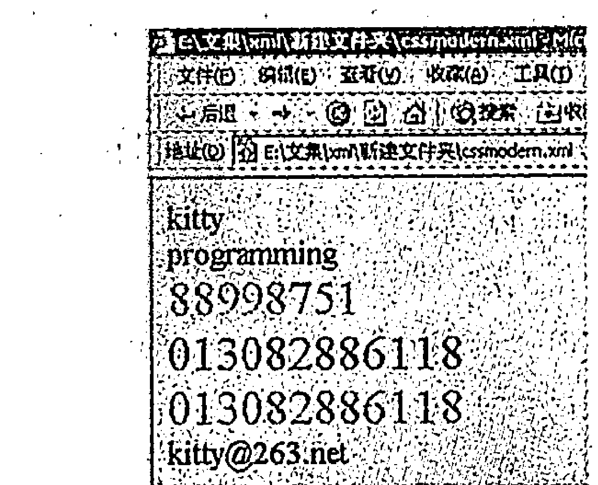

图15 使用 resume.css 后的 cssmodern.xml 的显示结果

##### 3. CSS样式表的默认值

CSS样式表是有默认值的。当CSS样式表文件为空，或是声明了 CSS 样式表却找不到相应的 CSS 文件，结果都是一样。这时浏览器IE5.0会以CSS默认值来显示整个 XML 文件。

那么 CSS 样式表的默认值是怎么样的呢？那就是把控制标记里的文字全部显示出来，且所有的文字都连成一行，字体是黑色的。

下面，我们更改一下cssmodern.xml里调用 CSS 样式表的指令，给它指定一个空的样式表null.css,里面什么内容都没有。并把文件保存为cssnull.xml，调用语句如下：

```
<?xml-stylesheet href="null.css" type="text/css" ?>
```

同样在 IE 中打开这个 cssnull.xml，执行的结果如图16所示。同样的 XML 文件，因为样式表的不同，显示结果截然不同。

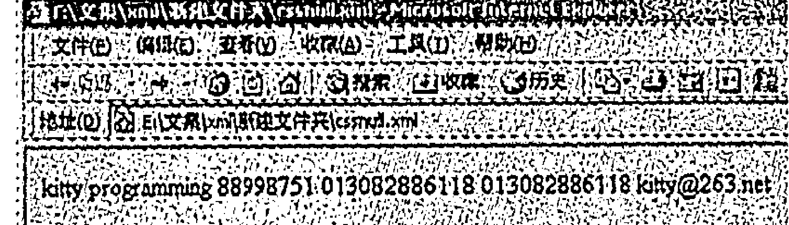

图16 cssnull.xml 调用空 CSS 样式的默认值显示效果

还有一种情况，当我们给 XML 文件指定好了 CSS样式表，但是因为某种原因，比如太粗心而忘记把 CSS 样式表放到工作目录下，这时候IE也会以默认值来显示文件。当你辛苦一番写好了CSS样式表却在 XML 文件上得不到显示效果的话，就要好好检查一下有没有把 CSS 样式表放到工作目录下，否则，浏览器找不到 CSS 文件，只好按照 CSS 默认的方式显示了。

这里把 IE 执行 CSS 文件的结果做一下比较，如表1所示。

##### 表1 在不同的 XML 调用 CSS 时的结果比较

| XML 文件 | XML文件声明了排版样式表，但却找不到排版样式表 | XML文件未声明排版样式 | XML文件声明了排版样式表，但该样式表为空 |
|----------|----------------------------------------------|----------------------|--------------------------------------|
| IE的执行结果 | 以CSS的默认值显示 | 以默认的树状排版样式显示 | 以CSS的默认值显示 |

##### 4. CSS 样式表与 DTD 的声明位置

在XML文件中可以同时调用外在的DTD与CSS样式表，这两个不同的外在文件都是在XML文件的文件头区中声明，无论哪一个先声明都可以，不论该DTD是内部的还是外部的，声明在CSS样式表之前或之后都不会影响它的正确性。

接下来，在下面resumecitingdtd.xml中，我们引用了样式表Resumedtd.css和文件格式定义Resume.dtd。文件内容如下：

```
<?xml version="1.0" standalone="yes"?>
<?xml-stylesheet href="Resumedtd.css" type="text/css" ?>
<!DOCTYPE Resume SYSTEM "Resume.dtd">
<Resume>
<name>Kitty Yin</name>
<birth>01/26/1979</birth>
<skills>programming</skills>
<skills>swimming</skills>
<skills>singing</skills>
<Email>kitty@263.net</Email>
</Resume>
```

在Resumedtd.css中,我们设置<skills>标记控制下的内容有加底线,<Email>标记控制下的内容有横线穿过，每个标记的内容分段显示。

```
skills
{
    Display:block;
    COLOR: red;
    FONT-FAMILY: arial;
    FONT-SIZE: 12pt;
    FONT-WEIGHT: bold;
    TEXT-DECORATION: underline;
}
```

```
email
{
    Display:block;
    FONT-FAMILY: arial;
    FONT-SIZE: 12pt;
    FONT-WEIGHT: bold;
    TEXT-DECORATION: line-through;
}
```

```
birth,name
{
    Display:block;
    COLOR: blue;
    FONT-FAMILY: arial;
    FONT-SIZE: 12pt;
    FONT-WEIGHT: bold;
}
```

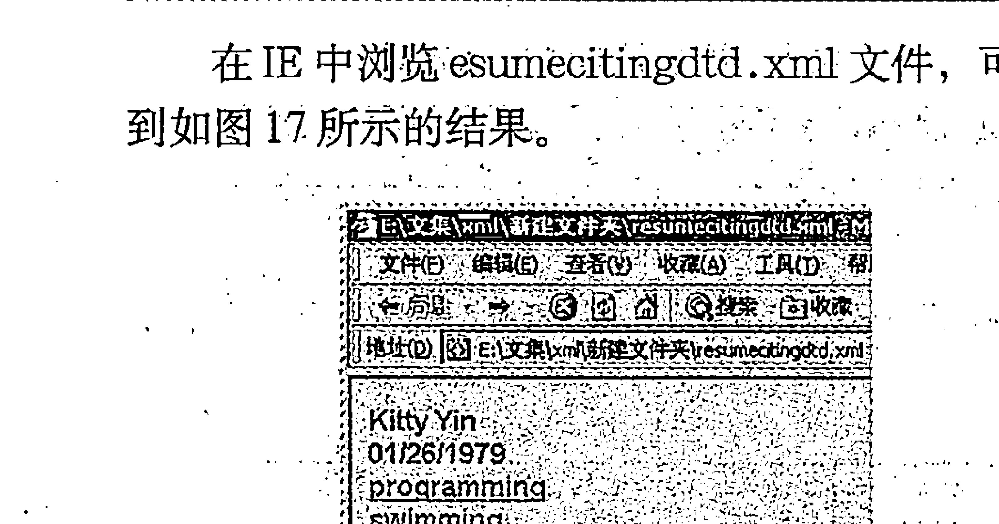

##### 5. CSS属性的设置

前面我们已经接触了好几个CSS样式表文件，可以发现这些文件内除了控制标记，就是一些称为属性的东西，像Display、COLOR、FONT-SIZE等等，而每个属性又可以指定不同的属性值，像block、blue、12pt等等。利用这些属性和属性值的变化，我们就可以使XML文件产生不同的效果。CSS属性值的设置方式有两种，一种是“:”，另一种则是“=”，并且属性之间是以“;”作为分开。这里的“:”可以换成“=”。CSS属性值的设置语法为：目标名称{属性1: 属性值; 属性2: 属性值; ……; 属性n: 属性值}。值得一提的是，CSS中属性的大小写都被认为是相同的，就连属性值也不区分大小写的。这些写法“DISPLAY:block”、“Display:Block”、“Display:BLOCK”、“display:block”，都代表显示资料时依照标记来加以分段。与CSS相关的属性很多，属性值的变化也很多，可谓举不胜举，我们可以把这些属性分成三类：与文字相关的属性，与方框有关的属性和与版面有关的属性。相关的属性介绍可以到W3C关于CSS2的网页(http://www.w3.org/TR/REC-CSS2/)去查看。下面我们来分析一下Resumedtd.css里面各标记（skills、email、birth、name）的属性设置。在图17中，有红色加深的字体，下面还有加底线，这是因为在CSS样式表中，我们设置了<skills>标记来控制的效果，skills中的属性内容如下：

```
skills{ Display:block; COLOR: red; FONT-FAMILY: arial; FONT-SIZE: 12pt; FONT-WEIGHT: bold; TEXT-DECORATION: underline; }
```

“Display”属性属于“与版面有关的属性”，它的主要用途是声明该标记内容的显示方式，共有三个属性值，代表不同的含义：· none:不要将资料显示出来，利用这个属性，可以将某些资料隐藏起来不给使用者看到，只给应用程序知道。· inline:不分段显示资料，利用这个属性，可以将所有标记内的资料挤在同一行中。· block:显示资料时依照标记进行分段。这里设置Display的属性值是block，所以会按照标记来将特长内容分段显示。

剩下的“COLOR”、“FONT-FAMILY”、“FONT-SIZE”、“FONT-WEIGHT”、“TEXT-DECORATION”都属于与文字相关的属性，因为一个网页最多的资料应该就属文字，而为了适应文字的多种变化，CSS提供了多个属性来代表各种文字的变化，如表2所示。

##### 表2

| 属性名称       | 属性值                     | 说明                                   |
|----------------|----------------------------|----------------------------------------|
| COLOR          | 文字颜色                   | 颜色的英文名称或16进制的RGB表示法       |
| FONT-FAMILY    | 字体设置                   | 字体名称                               |
| FONT-WEIGHT    | 文字粗细                   | Extra-light,light,demi-light, Medium,demi-bold,bold,extra-bold |
| TEXT-DECORATION| 线段设置                   | Underline(加底线),line-through(中间加线),overline(上方加线) |

这里设置的字体是arial，如果不设置字体名称，那么在IE将默认以“新细明体”中文和“Times New Roman”英文来显示字体。CSS样式表中还有其他属性用于设置字体，象“font-style”用于设置文字样式，指定字体是正常(normal)的还是斜体(italic)的，“text-align”用于设置文字的对齐位置，指定是以right(靠右)、center(置中)或left(靠左)对齐。同理,其他三个标记<email>、<birth>、<name>也使用了同样的属性设置来控制相应的内容在浏览器中的显示效果。

##### 6. CSS属性的声明方式

前面介绍了CSS样式表中属性的设置语法，但没有对“目标名称”做解释。其实，CSS样式表中的目标名称常见的方式有四种：· 目标为某一特定的标记；· 目标为某一特定层的标记；· 不限制标记的CLASS属性设置类别；· 限制标记的CLASS属性设置类别。接下来我们对这四种方式进行介绍。

###### (1) 目标为某一特定的标记

当目标名称为 XML 文件内某一特定的标记时，会涉及到该标记如何被 CSS 样式表中设置的属性值控制的优先性问题。一般来说，在 XML 文件内，该标记会先继承父标记的属性值，然后再以本身的设置值进行修改，如果没有父标记，则以 CSS 的默认值为准。

目标名称为特定的标记时，CSS 属性设置语法是这样的：

```
标记名称1，标记名称2，...，标记名称 n
{
    属性1：属性值；
    属性2：属性值；
    ...... 
    属性n：属性值
}
```

Resumedtd2.css 就是属于目标为某一特定标记的类型，一共有四个同级的控制标记：skills、email、birth、name，这四个控制标记的父标记是 Resume，所以 resumecitingdtd2.xml 中的标记会先继承父标记是 Resume 的属性，然后再以本身的设置加以修改。

```
Resume
{
    Display:inline;
    COLOR:blue;
    FONT-FAMILY: arial;
    FONT-SIZE: 24pt;
}
```

```
skills
{
    Display:block;
    COLOR: red;
    FONT-FAMILY: arial;
    FONT-SIZE: 12pt;
    FONT-WEIGHT: bold;
    TEXT-DECORATION: underline;
}
```

```
email
{
    Display:block;
    FONT-FAMILY: arial;
    FONT-SIZE: 12pt;
    FONT-WEIGHT: bold;
    TEXT-DECORATION: line-through;
}
```

```
birth,name
{
    Display:block;
    COLOR: blue;
    FONT-FAMILY: arial;
    FONT-SIZE: 12pt;
    FONT-WEIGHT: bold;
}
```

我们将上面的 XML 与 CSS 的设置进行整理，就可以得知每个元素的显示方式如表 3 所示。

值得注意的是，虽然 CSS 属性设置可以由父标记继承，但是 display 属性却是无法继承的。

##### 表 3 每个元素的显示方式

| XML 文字资料 | 继承的显示方式 | 本身设置的显示方式 | 最后的显示方式 |
| :--- | :--- | :--- | :--- |
| Kitty Yin | <Resume> 的显示方式 | Name 所定义的显示方式 | Block（分段落） blue（蓝色） arial 12pt Bold（加粗） |
| 01/26/1979 | <Resume> 的显示方式 | birth 所定义的显示方式 | Block（分段落） blue（蓝色） arial 12pt Bold（加粗） |
| Programming Swimming singing | <Resume> 的显示方式 | skills 所定义的显示方式 | Block（分段落） red（红色） arial 12pt bold（加粗） underline（加底线） |
| kitty@263.net | <Resume> 的显示方式 | email 所定义的显示方式 | block（分段落） red（红色） arial 12pt bold（加粗） line-through（中间加线） |

###### (2) 目标为某一特定层的标记

我们知道结构良好的 XML 文件是树形的层次结构的，可以利用 XML writer 里的 View as a tree 命令来看看 cssmodern.xml 的结构如图 18 所示。

```
<?xml version="1.0" standalone="no"?>
<Resume>
    <Name>Kitty</Name>
    <Skills>programming</Skills>
    <TEL>
        88998751
        <MOBILE_PHONE>013082886118</MOBILE_PHONE>
    </TEL>
    <MOBILE_PHONE>013082886118</MOBILE_PHONE>
    <E-MAIL>kitty@263.net</E-MAIL>
</Resume>
```

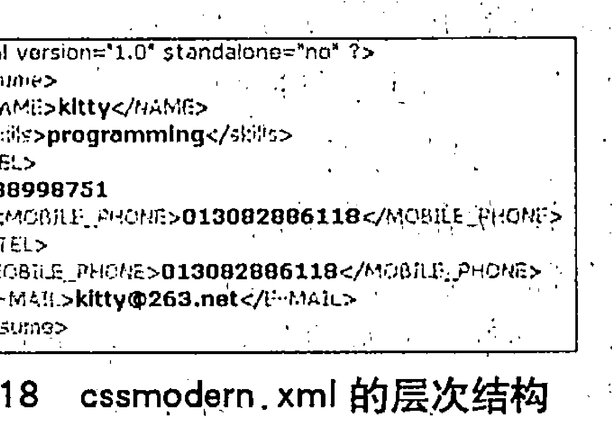

在图 18 中，该 XML 文件的层次结构一目了然。当目标为某一特定层上的标记，CSS 的属性设置语法是这样的：

```
根标记…… 目标上一层的标记 目标标记
{
    属性1：属性值；
    属性2：属性值；
    ...... 
    属性n：属性值
}
```

在 resume.css 中，以下代码就是由特定阶层的标记名称指定该标记的 CSS。

```
Resume TEL{
    display:block;
    color:red;
}
Resume TEL MOBILE_PHONE{
    display:block;
    color:blue;
}
Resume MOBILE_PHONE{
    display:block;
    color:green;
}
```

cssmodern.xml 文件中的 <TEL> 标记在 <Resume> 标记下，因此，它的内容 “88998751” 应该遵循以下声明：

```
Resume TEL{
    display:block;
    color:red;
}
```

而 cssmodern.xml 文件中第七行的<MOBILE_PHONE>标记在<TEL>标记下，因此，它的内容 “013082886118” 应该遵循以下声明：

```
Resume TEL MOBILE_PHONE
{display:block; color:blue;}
```

同理，而 cssmodern.xml 文件中第九行的<MOBILE_PHONE>标记在<Resume>标记下，它的内容 “013082886118” 应该遵循以下声明：

```
Resume MOBILE_PHONE{ display:block;color:green;}
```

###### (3) 不限标记的CLASS属性设置

当我们希望对于某些标记，特别是同名称的标记要表达不同的显示方式时，可以利用在XML标记中设置class属性的方式达到微调的功能。
首先，我们声明一个CSS的类别名称，并不限制哪个标记可以使用这个类别。这样，XML文件中的任何标记都可以使用它。

不限标记的CLASS属性设置语法如下：

```
.类别名称
{
    属性1：属性值；
    属性2：属性值；
    ...
    属性n：属性值
}
```

在 XML 文件中使用 CLASS 属性时语法为：
<标签名称 CLASS="类别名称">
比如在Resumeitalic.css中设置斜体显示的Class属性。

```
Resume{
    display:block;
    font-size:24pt;
}
NAME,E-MAIL,skills{
    display:block;
    font-size:16pt;
}
Resume TEL{
    display:block;
    color:red;
}
Resume TEL MOBILE_PHONE{
    display:block;
    color:blue;
}
Resume MOBILE_PHONE{
    display:block;
    color:green;
}
.italic{
    font-style:italic;
}
```

在cssmodernitalic.xml中，由于有两个手机号码的同名标记<MOBILE_PHONE>出现，我们将其中一个标记的属性值设置为italic，这样就可以区分了，具体内容如下。

```
<?xml version="1.0" standalone="no" ?>
<?xml-stylesheet href="resumeitalic.CSS" type="text/css" ?>
<Resume>
    <NAME>kitty</NAME>
    <skills>programming</skills>
    <TEL>88998751     <MOBILE_PHONE>
013082886118</MOBILE_PHONE>
    </TEL>
    <MOBILE_PHONE class="italic">013082886118
</MOBILE_PHONE>
    <E-MAIL>kitty@263.net</E-MAIL>
</Resume>
```

然后在IE中浏览，其显示结果如图19所示，可以看到第二个手机号码变斜了。

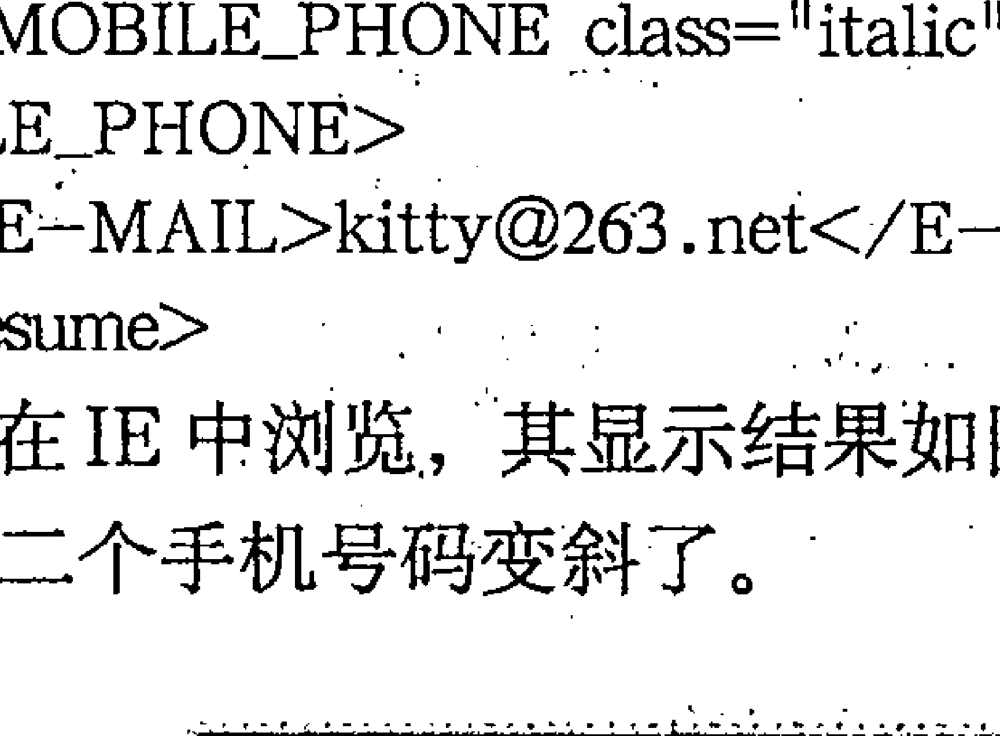

###### (4) 限定标记的CLASS属性设置

有的时候，我们希望通过 CLASS 属性设置的类别只能被某一标记所使用，那么就应该在设置属性时指定标记的名称。一旦指定了标记名称以后，其他标记通过属性 CLASS 来调用该类别就不会起作用。限定标签的 CLASS 属性设置类别的声明语法如下：

```
特定标签名称.类别名称
{
    属性1：属性值；
    属性2：属性值；
    ...
    属性n：属性值
}
```

在 XML 文件中使用 Class 属性时语法为：
<特定标签名称 CLASS="类别名称">
比如在italicskill.css中有设置让<name>标记斜体显示的CLASS属性。

```
skills.italic{font-style:italic;}
```

在cssskill.xml中，让<skills>标签调用italic属性类别，我们也可以设置让<TEL>标签调用italic属性类别，但是浏览器执行的结果告诉我们，italic属性类别只对<skills>标签控制内容有用，代码如下。```xml
<?xml version="1.0" standalone="no"?>
<?xml-stylesheet href="italskill.css" type="text/css"?>
<Resume>
  <NAME>kitty</NAME>
  <skills class="italic">programming</skills>
  <TEL class="italic">88998751</TEL>
  <MOBILE_PHONE>013082886118</MOBILE_PHONE>
  <E-MAIL>kitty@263.net</E-MAIL>
</Resume>
```

在IE中可以清楚地看到结果，<skills>标签控制的内容programming变成了斜体，如图20所示。

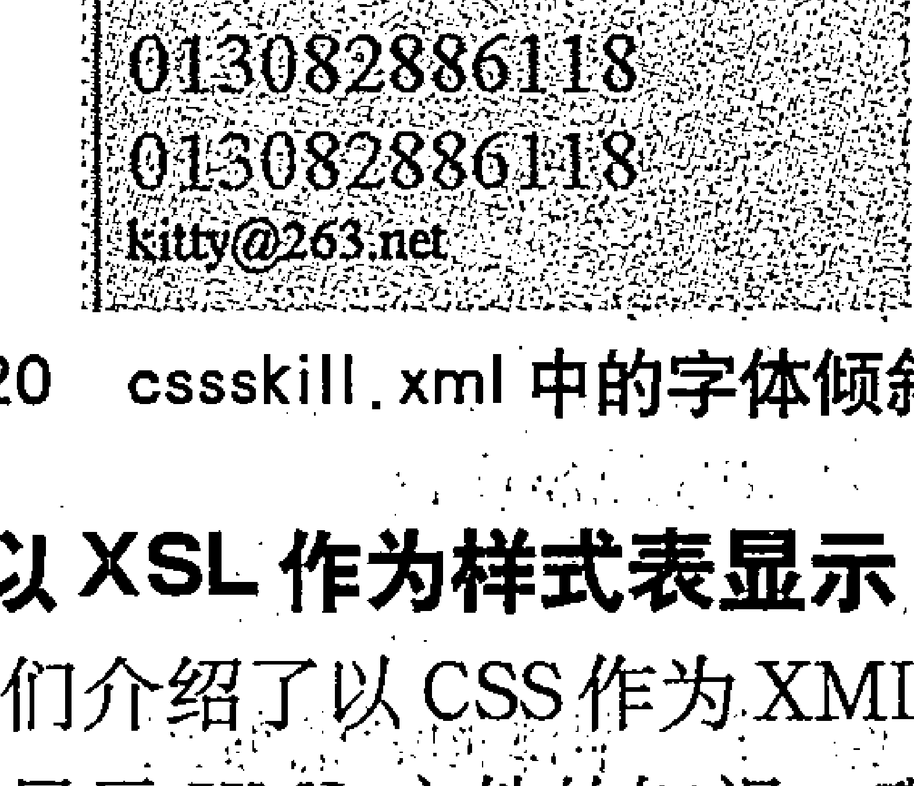

图20 cssskill.xml中的字体倾斜效果

#### （二）以XSL作为样式表显示XML文件

前面我们介绍了以CSS作为XML文件的样式表在浏览器中显示XML文件的知识，现在，我们要介绍另一种功能更强大、更复杂的样式表：XSL。

CSS适用于那些元素顺序不变的文件，对于需要经常按不同元素排序的文件，就轮到XSL闪亮登场了。利用XSL，我们可以创建能动态改变其表现的文件，比如可以包含这样的程序语句：“英语成绩大于80分的同学名称要显示出来，否则不显示。”而且，XSL还将提供多种脚本语言的通道以满足更为复杂的应用要求。

XSL是eXtensible Stylesheet Language的缩写，中文可翻译为“可扩展的样式表语言”，它是遵循XML规范来制定的，实际上XSL就是用XML所描述的一种使用于排版的语言，并且XSL所构成的样式表就是针对XML文件所设计的样式表。因此，所有的XSL文件都是结构良好（Well-Formed）的XML文件，所不同的是，XSL文件的扩展名是“.xsl”。

在IE5.0浏览器中内置了一个XSL Stylesheet处理器，它可以同时接受解读XML文件和XSL文件，并将从XML文件中获取的信息按照XSL样式表的指示产生一个显示结果。

一般来说，浏览器处理XML文件和XSL样式表的流程可以分为两个阶段：

##### 第一阶段：解读树状结构

XML文件展开后是一种树状结构，我们称这种结构为原始树（source tree），XSL Stylesheet处理器可以解读XML文件树状结构资料，并依照XSL中的控制元素（或称为条件式元素）的规定，经过重新排列组合，排序（sorting）、复制（copy）、过滤（filter）、删除、选择或运算后另外再产生一树状结构，这个新产生的结构就称为结果树（result tree），结果树的结构可能与原始树的结构是完全不一样的。

##### 第二阶段：产生显示格式

依照XSL样式表的排版，对结果树文件做排版，并产生一份可由浏览器显示的文件（如HTML文件）。

实际上，如果我们将XML文件比作结构化的原料的话，那么XSL就好比“筛子”与“模子”，筛子选取自己需要的原料，这些原料再通过模子形成最终的产品：HTML。

##### 1. 如何使用XSL排版样本

与使用CSS排版样本类似，在XML中若要使用XSL文件作为样式表，也必须在文件头（prolog）内使用特定的语法指定所要引用的XSL文件名称。

在XML文件中调用并引用XSL排版样本的语法是这样的：

```xml
<?xml-stylesheet href="XSL排版样本的URL" type="text/xsl" ?>
```

其中，“<?xml-stylesheet ”表示是一个XML的指令，用来引用一个样式表；“href=URL”用来指定该样式表所在的地址；“type="text/xsl"”表示该样式表是XSL的样式表；“?>”表示结束该XML指令。

值得一提的是，XSL是一种特殊的结构良好的XML文件，因此它可以象XML一样使用中文标记，但在第一行的文件版本声明中要将属性“encoding”的属性值设置为“gb2312”，这显然比采用CSS样式表要先进得多，因为CSS样式表是不支持中文的。

还记得我们最早接触的movie.xml文件吗？现在我们要用新的xsl样式表movie.xsl使它在浏览器中显示出来。

在movie.xsl中设置了显示的格式：

```xml
<?xml version="1.0" encoding="GB2312"?>
<HTML xmlns:xsl="http://www.w3.org/TR/WD-xsl">
<HEAD> <TITLE>电影清单</TITLE> </HEAD>
<BODY>
<xsl:for-each select="电影清单/电影">
<P/>
<TABLE border="1" cellspacing="0">
<CAPTION style="font-size: 150%; font-weight: bold">电影清单</CAPTION>
<TR>
<TH>电影名</TH>
<TD><xsl:value-of select="电影名"/></TD>
<TH>原著</TH>
<TD><xsl:value-of select="原著"/></TD>
<TH>出品商</TH>
<TD><xsl:value-of select="出品商"/></TD>
</TR>
<TR>
<TH>售价</TH>
<TD colspan="5"><xsl:value-of select="售价"/></TD>
</TR>
</TABLE>
</xsl:for-each>
</BODY>
</HTML>
```

在movie.xsl第一行中设置“encoding”的属性值为GB2312，这样，这个XSL样式表就支持中文。

而在movienew.xml文件中要做的工作是在文件头中声明链接的XSL样式表的地址，内容如下。

```xml
<?xml version="1.0" encoding="GB2312"?>
<?xml:stylesheet href="movie.xsl" type="text/xsl"?>
<电影清单>
    <电影>
        <电影名>莎士比亚情史</电影名>
        <原著>罗兰·约非</原著>
        <出品商>福特制片公司</出品商>
        <售价 货币单位="人民币">56</售价>
    </电影>
    <电影>
        <电影名>醉马时刻</电影名>
        <原著>巴曼·戈巴狄</原著>
        <出品商>华纳制片公司</出品商>
        <售价 货币单位="人民币">66</售价>
    </电影>
    <电影>
        <电影名>哈姆莱特</电影名>
        <原著>威廉·莎士比亚</原著>
        <出品商>福特制片公司</出品商>
        <售价 货币单位="人民币">78</售价>
    </电影>
</电影清单>
```

在movienew.xml中的第二行指出了要链接到的XSL文件的名称和地址。

最后，浏览器IE执行movienew.xml文件，它将把对应的信息在表格中显示出来，如图21所示。

可以看到页面中的“电影清单”几个字很特别，这是因为我们在movie.xsl中为其使用了CSS样式所致。看看，这行代码是不是CSS样式？

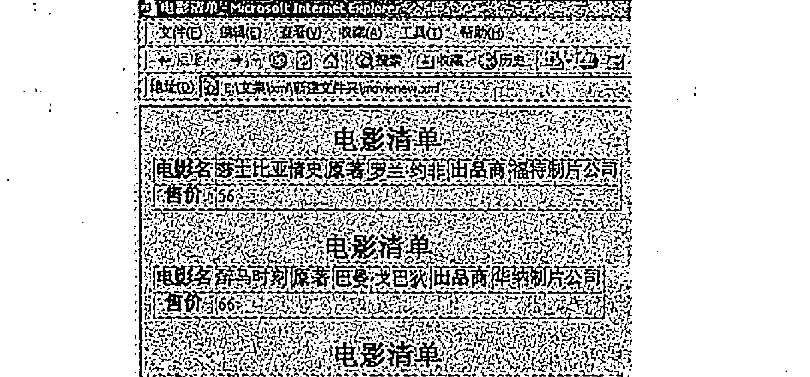

```xml
<CAPTION style="font-size: 150%; font-weight: bold"> 电影清单</CAPTION>
```

这说明在XSL文件中是可以使用CSS样式的，这也从某些方面透露出另一个信息：XSL可以搭配HTML来显示XML文件。

##### 2. XSL元素介绍

前面介绍了XML搭配使用XSL样式表的示例，XML文件在浏览器中的显示形式是靠内嵌在IE5.0中的XSL处理器依据XSL样式表的指示进行的，而XSL样式表之所以能够指示IE5.0如何来执行这些动作，主要是由XSL样式表中的元素设定来控制的，所以要了解XSL样式表，就需要先清楚了解XSL样式表中这些元素的功能作用。

仔细观察在movie.xsl中，XSL文件的元素（如xml:stylesheet, xsl:for-each, xsl:value-of）都采用了Namespace方式，并且所有的元素名称都是由“xsl:”作为前导字符，每个元素都有它所代表的特殊意义，并且有固定的属性，这些元素加上属性的变化，就可以使得XML文件呈现不同的显示方式。

XSL元素很多，我们可以按照用途将这些元素分成三类：与样本有关的元素、条件式控制元素、与资料有关的元素。下面分别作一介绍。

###### （1）与样本有关的元素

- **xsl:stylesheet**
  该元素是XSL样式表的根元素，在该根元素中包含所有的样板（xsl:template），而样式表就是由这些样板构成的；
- **xsl:template**
  指定XML文件中的特定控制标记来定义一个样板；
- **xsl:value-of**
  从XML文件中攫取被指定的控制标记的数据，并将该数据结合至样板中；
- **xsl:for-each**
  可将样板应用到XML文件中相同的控制标记；
- **xsl:apply-templates**
  指示XSL处理器在该XSL样式表中寻找适当的样板来应用。

XSL采用的一种“模式-模板”驱动转换方式。XML数据被转换成“结果树”，而转换过程由XSL模板定义。可以把XSL看作一个“壳”，XML数据利用这个“壳”来生成“传统”的HTML。

###### （2）条件式控制元素

- **xsl:if**
  在样板中，以条件式（if）测试；
- **xsl:choose**
  允许设定多重的条件设定，并与xsl:when与xsl:otherwise元素共同配合使用；
- **xsl:when**
  与xsl:choose的说明相同，允许设定多重的条件设定，并与xsl:choose与xsl:otherwise元素共同配合使用；
- **xsl:otherwise**
  与xsl:choose的说明相同，允许设定多重的条件设定，并与xsl:when与xsl:choose元素共同配合使用；

比如在movie.xsl文件中插入HTML标记，然后存为movienew.xsl，这些标记刚好构成要表现的页面的大概框架，但是没有数据内容（加灰底的部分是等待XSL语句从XML中筛出相关的数据来填充）。某些情况下，在XSL样式表中加上HTML控制标记将会使得页面信息更加规整，当然，你也可以选择不用HTML标记。下面来分析一下movienew.xsl文件。

```xml
<?xml version="1.0" encoding="GB2312"?>
<HTML xmlns:xsl="http://www.w3.org/TR/WD-xsl">
<HEAD> <TITLE>电影清单</TITLE> </HEAD>
<BODY>
<xsl:for-each select="电影清单/电影">
<P/>
<TABLE border="1" cellspacing="0">
<CAPTION style="font-size: 150%; font-weight: bold">电影清单</CAPTION>
<TR>
<TH>电影名</TH>
<TD><xsl:value-of select="电影名"/></TD>
<TH>原著</TH>
<TD><xsl:value-of select="原著"/></TD>
<TH>出品商</TH>
<TD><xsl:value-of select="出品商"/></TD>
</TR>
<TR>
<TH>售价</TH>
<TD colspan="5"><xsl:value-of select="售价"/></TD>
</TR>
</TABLE>
</xsl:for-each>
</BODY>
</HTML>
```

###### （3）与资料有关的元素

- **xsl:comment**
  该元素所产生的文字信息，在被输出的文件中这些信息都被视为备注，也就是说不会显示在浏览器中；
- **xsl:copy**
  将XML文件中被指定标签下的内容完全拷贝至输出文件中；
- **xsl:attribute**
  该元素可在输出文件的控制标记中附上一个属性名称；
- **xsl:element**
  该元素可在输出文件中新增一个控制标记。

在CSS样式表中，属性的大小写都被认为是相同的，就连属性值也不区分大小写的，而XSL由于也是一种XML文件，所以它的大小写是有区别的。也就是说，XSL的元素与属性必须按照所规定的小写字母来撰写XSL文件，属性值如果是标记的话，也得按照XML文件中标记的大小写规定，写在双引号里面。

##### 3. XSL模式语言

在介绍XSL处理器的工作原理时，我们曾经提到过，如果把XML文件比作结构化的原料的话，那么XSL就好比“筛子”与“模子”，筛子选取自己需要的原料，这些原料再通过模子形成最终的产品：HTML。

接下来的工作就是XSL如何从XML文件中筛出相关的数据了。可以利用XML Writer来查看movienew.xml的树形结构，如图22所示。

这个过程是这样的，先设计好表现的页面，再将其中需要从XML中获取数据来填充内容的部分“挖掉”，然后用XSL语句从XML中筛出相关的数据来填充。简单说来，XSL实际上就是HTML的一个“壳子”，XML数据利用这个“壳”来生成“传统”的HTML。

从这棵树形的结构可以看出，父结点是<电影清单>，它下面有三个同等的子结点<电影>，<电影>下面又包括<电影名>、<原著>、<出品商>、<售价>四个小子结点。

在movie.xsl文件中，利用<xsl:for-each select="电影清单/电影">语句将指令应用到XML文件中相同的控制标记<电影>上，程序将循环读取<电影>标记所控制的内容。

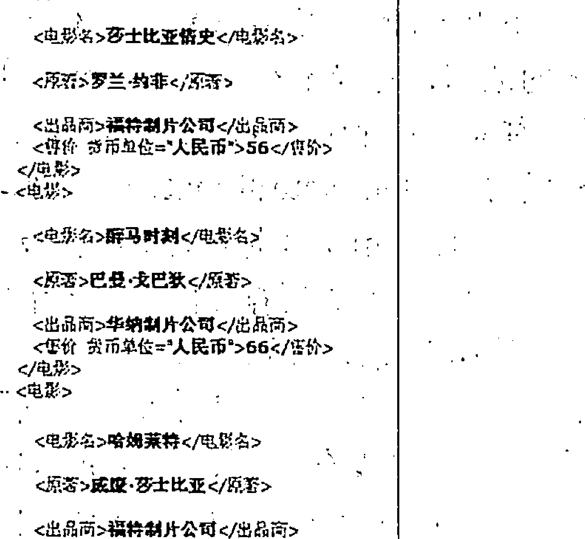

图22 movienew.xml的树形结构

<xsl:for-each select="电影清单/电影">只是选取结点，并没有取出结点的值，然后利用<xsl:value-of select=" "/>读取<电影>下面子结点的值,放入单元格中，比如<xsl:value-of select="电影名"/>，就是读取<电影名>子结点的值。因为<xsl:for-each select=" 电影清单 / 电影 ">是放在最外层的大循环，所以,程序在处理完第一个<电影>结点时，又会接着去处理下一个<电影>结点，直至三个结点全部读完,才结束循环。

在XSL处理器的工作过程中，要从原料库XML里提取相关的数据，就要用到XSL提供的模式化查询语言。所谓模式化查询语言，就是通过相关的模式匹配规则表达式从XML里提取数据的特定语句，就象上面用到的<xsl:for-each select=" 电影清单 / 电影 ">，<xsl:value-of select="电影名"/>这些语句。

- 参考微软的“XSL 开发者指南”，我们大致可将模式语言分为三种：
  - 选择模式 `<xsl:for-each>`、`<xsl:value-of>`；
  - 匹配模式：`<xsl:template>`和 `<xsl:apply-templates>`；
  - 测试模式 `<xsl:if>` 和`<xsl:when>`。

它们都是由XSL元素所构成的，所以对上一节中讲的各元素的属性应当非常了解，然后,就是要注意XSL文件也是一份结构良好的XML文件，所以,它必须满足成为结构良好的XML文件的八个条件。

特别要注意标记匹配的问题,起始标记和结束标记必须成对出现,而没有内容的控制标记必须要有“/”符号。像 `<xsl:value-of select="xml_标记"> </xsl:value-of>`或`<xsl:value-of select="xml_标记 "/>`都是合法的。

###### 1. 选择模式

所谓选择模式，顾名思义，当然是XSL样式表从XML文件中选取数据的方法了。选择模式包括两个标记<xsl:for-each>和<xsl:value-of>,这两个标记都有select属性，以针对XML文件中特定的结点选取数据。

###### xsl:for-each

该元素用于将排版样式应用到XML文件中相同的控制标记上。它有两个属性：select和order-by。Select属性设定要从XML文件中取出某一控制标记的数据。order-by设置排序的标准是依据哪一个控制标记，该属性设置值前面如果有“+”表示是由小至大的排序，如果是“-”表示是从大到小排列，如果既没有“+”又没有“-”，会自动从小到大排列。

下面是将movie.xsl做了一点修改的movie2.xsl,我们为<xsl:for-each>元素增添了排序order-by属性。

```xml
<?xml version="1.0" encoding="GB2312"?>
<HTML xmlns:xsl="http://www.w3.org/TR/WD-xsl">
  <HEAD> <TITLE>电影清单</TITLE> </HEAD>
  <BODY>
    <xsl:for-each select=" 电影清单 / 电影 " order-by=" 电影名 ">
      <P/>
      <TABLE border="1" cellspacing="0">
        <CAPTION style="font-size: 150%; font-weight: bold"> 电影清单</CAPTION>
        <TR>
          <TH>电影名</TH>
          <TD><xsl:value-of select="电影名"/></TD>
          <TH>原著</TH>
          <TD><xsl:value-of select="原著"/></TD>
          <TH>出品商</TH>
          <TD><xsl:value-of select="出品商"/></TD>
        </TR>
        <TR>
          <TH>售价</TH>
          <TD colspan="5"><xsl:value-of select="售价"/></TD>
        </TR>
      </TABLE>
    </xsl:for-each>
  </BODY>
</HTML>
```

前面已经分析过，movienew.xml中的根控制标记是<电影清单>,它下面含有三个<电影>控制区块,分别代表三笔相同的电影信息。

`movie2.xsl`文件的第五行 `<xsl:for-each select="电影清单/电影" order-by="电影名">`设定 xsl:for-each 来重复获取<电影清单>下的<电影>控制标记中的各项信息，此外还设置以<电影名>控制标记中的信息作为各笔信息显示的顺序，默认是从小到大显示的，所以显示的影片顺序是：哈姆莱特，莎士比亚情史，醉马时刻。

- xsl:value-of
  该元素用于从XML文件中获取被Select属性指定的标记中的资料，并将这个资料同样板结合。它只有一个select属性，如果没有为xsl:value-of指定Select属性的属性值，那么将以目前的工作标记的内容作为目标内容显示出来。

###### 2. 匹配模式

前面书写的都是比较简单的XSL文件，所以我们依次写下去就可以了。但是XSL文件很复杂，如果把它们都写在一个文件里面的话，一处出错，可能导致很多地方的改动，降低了程序的可读性和可维护性。

比如有一个基于XML的客户关系管理系统，里面有很多的界面信息，开发人员可以将XSL的设计细化成一个个模板，最后再将这些模板组合成一个完整的XSL，要使用相关信息的时候，用<apply templates>调用相关的模板就可以了，这样，既便于大家协作，又提高了程序的维护性。

XSL的匹配模式主要是针对模板的，它主要包括用于书写模板的<xsl:template>和用于调用模板的<xsl:apply-templates>。

- xsl:template
  该元素用于指定XML文件中特定的控制标记来定义一个模板。它包括“match”和“language”两个属性。
  match属性设定要从XML文件中的哪个控制标记开始获取数据，它确定什么样的控制标记匹配此模板，作为一种简化的说明，这里使用标记的名字；其中最上层模板必须将match设为“/”。值得一提的是，模板文件必须有一个根模板，其属性match是“/”，表示从XML文件的根控制标记开始获取数据。
  language属性确定在此模板中执行什么脚本语言，其取值与HTML中SCRIPT标记的language属性的取值相同，缺省值是Jscript，如果在该模板中使用了SCRIPT语言，则可以用这个属性设置语言的种类。

```
书写模板的语法是这样的：
<xsl:template match="node-context" language="language-name">
```

- xsl:apply-templates
  该元素指示XSL处理器在该XSL样式表中寻找适当的模板来应用。它有两个属性： select 和 order-by。

Select属性设定要从XML文件中取出某一控制标记的数据，它确定在此上下文环境中应执行什么模板，如果xsl:apply-templates的Select属性值与书写模板的xsl:template的match属性值相同，那么就执行用<xsl:template>标记建立的模板。

order-by 设置排序的标准是依据哪一个控制标记，该属性设置值前面如果有“+”表示是由小至大的排序，如果是“-”表示是从大到小排列，如果既没有“+”又没有“-”，会自动从小到大排列。

在movienewt.xml中，我们需要列出电影不同币种的售价，把每一种售价都用<售价></售价>括起来。

```
<?xml version="1.0" encoding="GB2312"?>
<?xml-stylesheet href="movietemp.xsl" type="text/xsl" ?>
<电影清单>
  <电影>
    <电影名>莎士比亚情史</电影名>
    <原著>罗兰·约非</原著>
    <出品商>福特制片公司</出品商>
    <售价 货币单位="人民币">56元</售价>
    <售价 货币单位="英镑">8镑</售价>
  </电影>
  <电影>
    <电影名>醉马时刻</电影名>
    <原著>巴曼·戈巴狄</原著>
    <出品商>华纳制片公司</出品商>
    <售价 货币单位="人民币">66元</售价>
    <售价 货币单位="英镑">9镑</售价>
  </电影>
  <电影>
    <电影名>哈姆莱特</电影名>
    <原著>威廉·莎士比亚</原著>
    <出品商>福特制片公司</出品商>
    <售价 货币单位="人民币">78元</售价>
    <售价 货币单位="英镑">10镑</售价>
  </电影>
</电影清单>
```

为了便于显示，我们再建立movietemp.xsl的模板文件，在这里把各种币种的售价分行显示，movietemp.xsl的内容如下。

```
<?xml version="1.0" encoding="GB2312"?>
<xsl:stylesheet xmlns:xsl="http://www.w3.org/TR/WD-xsl">
<!--根模板-->
<xsl:template match="/">
<HTML>
<HEAD><TITLE>电影清单</TITLE></HEAD>
<BODY>
<xsl:apply-templates select="电影清单/电影"/>
</BODY>
</HTML>
</xsl:template>
<!--电影清单模板-->
<xsl:template match="电影">
<TABLE border="1" cellspacing="0">
<CAPTION>
电影清单 ( <xsl:eval>formatIndex(childNumber(this), "I")</xsl:eval> )
</CAPTION>
<xsl:apply-templates select="电影名"/>
<xsl:apply-templates select="原著"/>
<xsl:apply-templates select="出品商"/>
<TR/>
<TD>售价</TD>
<TD COLSPAN="5">
<TABLE cellspacing="0">
<xsl:apply-templates select="售价"/>
</TABLE>
</TD>
</TABLE>
<BR/>
</xsl:template>
<!--电影名模板-->
<xsl:template match="电影名">
<TD>电影名</TD>
<TD><xsl:value-of/></TD>
</xsl:template>
<!--原著模板-->
<xsl:template match="原著">
<TD>原著</TD>
<TD><xsl:value-of/></TD>
</xsl:template>
<!--出品商模板-->
<xsl:template match="出品商">
<TD>出品商</TD>
<TD><xsl:value-of/></TD>
</xsl:template>
<!--售价模板-->
<xsl:template match="售价">
<TR><TD><xsl:value-of/></TD></TR>
</xsl:template>
</xsl:stylesheet>
```

这段程序真的很长，为了便于讲解，在每行代码前都加了行号。第4~11行是建立一个根模板，这在模板文件中是必须有的，否则会提示出错。接着，从31~49行分别建立“电影名模板”、“原著模板”、“出品商模板”、“售价模板”四个模板设置。

movienewt.xml中“电影名”、“原著”、“出品商”、“售价”四个标记控制内容的显示方式，最后，在13~30行建立了一个总的“电影清单”模板，在这个模板中，通过<xsl:apply-templates select=" "/>来应用属性值相同的模板。比如：18行<xsl:apply-templates select="电影名"/>，这里select的属性值是电影名，而32行中书写模板<xsl:template match="电影名">的match属性值也是电影名，所以，18行就会应用“电影名模板”。

最后在浏览器中打开浏览，其显示结果如图23所示。怎么样？不同币种的售价分开显示了吧！

###### （3）条件模式

前面讲到了选择模式语句<xsl:for-each>、<xsl:value-of>及<xsl:apply-template>，只是简单地选取XML文件中的结点。现在，通过选择模式的条件判断<xsl:if>与多条件判断<xsl:choose>及<xsl:when>可以选择需要的数据输出，充分体现了XML在数据输出的可选择性的优势。

###### 1) xsl:if

该元素可以设定简单的条件，这和一般程序中的“if...then”是很相似的。<xsl:if>有script、language和test三个属性。script属性用于设定script程序所表示的式子，language属性可以在使用了script语言的情况下来设定script语言的种类。test属性设定条件的叙述，只有当script属性的设置值与test属性设定的条件也是正确的，这个<xsl:if>下的控制标记才会被XSL处理器接受并解读，如果其中之一是错的，则XSL处理器不会接受处理。

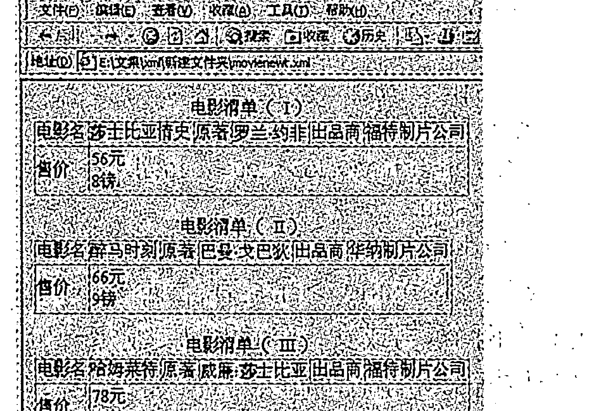

这里有一份简历的XML文件if.xml，其代码如下：

```
<?xml version="1.0" encoding="gb2312"?>
<?xml-stylesheet type="text/xsl" href="if.xsl"?>
<Rdatabase>
<Resume>
<name sex="男">张飞</name>
<birth>02/21/1976</birth>
<skills>
游泳，电脑游戏
</skills>
<email>peter@yahoo.com</email>
</Resume>
<Resume>
<name sex="男">关小羽</name>
<birth>01/21/1980</birth>
<skills>
烹饪，足球
</skills>
<email>guanyu@263.net</email>
</Resume>
<Resume>
<name sex="女">芳芳</name>
<birth>01/26/1979</birth>
<skills>
写作，游泳
</skills>
<email>kitty@263.net</email>
</Resume>
</Rdatabase>
```

注意到 <name> 标签有性别sex的属性，sex的属性值有两个：男或女，现在我们要制定一份XSL文件，它会根据sex属性值加以判断，如果是女，就在名字前面的括号里显示“MM”；如果sex属性值是男，那么当然在名字前面的括号里显示“GG”。我们用if.xsl实现它：

```
<?xml version="1.0" encoding="gb2312"?>
<xsl:stylesheet xmlns:xsl="http://www.w3.org/TR/WD-xsl">
<xsl:template match="/">
<HTML>
<BODY>
<TABLE BORDER="1" CELLPADDING="5">
<TR>
<TH>name</TH>
<TH>birth</TH>
<TH>skills</TH>
<TH>E-Mail</TH>
</TR>
<xsl:for-each select="Rdatabase/Resume">
<TR>
<xsl:apply-templates />
</TR>
</xsl:for-each>
</TABLE>
</BODY>
</HTML>
</xsl:template>
<xsl:template match="name">
<xsl:if test=".[@sex='男']">
<TD>(GG)<xsl:value-of /></TD>
</xsl:if>
<xsl:if test=".[@sex='女']">
<TD>(MM)<xsl:value-of /></TD>
</xsl:if>
</xsl:template>
<xsl:template match="birth">
<TD><xsl:value-of /></TD>
</xsl:template>
<xsl:template match="skills">
<TD><xsl:value-of /></TD>
</xsl:template>
<xsl:template match="email">
<TD><xsl:value-of /></TD>
</xsl:template>
</xsl:stylesheet>
```

这个XSL文件总体上也是建立了模板，第3~21行建立了根模板，从22行到38行依次建立了“name”、“birth”、“skills”、“email”四个子模板。在“name”模板中进行了性别的条件选择。

```
<xsl:if test=".[@sex='男']">
<TD>(GG)<xsl:value-of /></TD>
</xsl:if>
<xsl:if test=".[@sex='女']">
<TD>(MM)<xsl:value-of /></TD>
</xsl:if>
```

假如 name 结点中 SEX 属性的值是男，与 test 属性设定的条件“= 男”一致，那么就在取出的姓名前加上 GG，假如 name 结点中 SEX 属性的值是女，与 test 属性设定的条件“= 女”一致，那么就在取出的姓名前加上 MM。

最后，在IE中打开if.xml，其显示效果如图24所示。

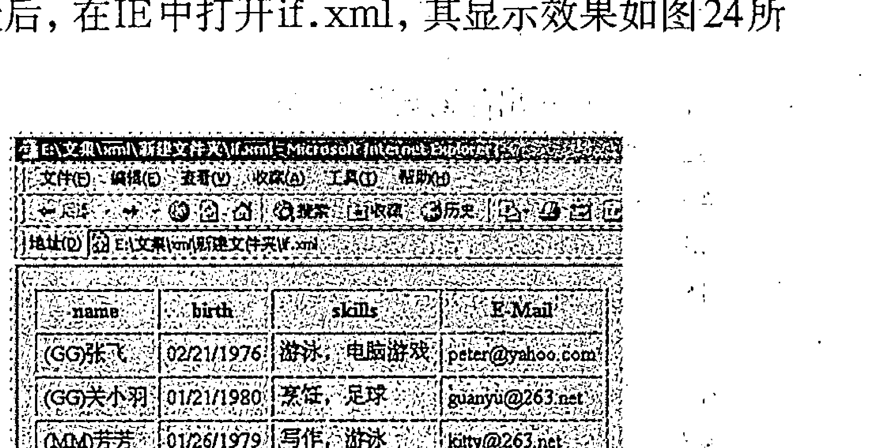

###### 2) xsl:choose

该元素允许多重的条件设定，并与 xsl:when 与 xsl:otherwise 共同使用，表示一个多选测试的开始。xsl:choose 与 xsl:otherwise都没有属性。

###### 3) xsl:when

该元素允许多重的条件设定，并与xsl:choose与xsl:otherwise共同使用，<xsl:when>有script，language和test三个属性。script属性用于设定script程序所表示的式子，language属性可以在使用了script语言的情况下来设定script语言的种类。test属性设定条件的叙述，只有当script属性的设置值与test属性设定的条件也是正确的，这个<xsl:if>下的控制标记才会被XSL处理器接受并解读，如果其中之一是错的，则XSL处理器不会接受处理。

上例if.xsl中的name模板也可以用多选择来编写，得到的结果也是正确的。

```
<xsl:template match="name">
    <xsl:choose>
        <xsl:when test=".[@sex='男']">
            <TD>(GG)<xsl:value-of /></TD>
        </xsl:when>
        <xsl:when test=".[@sex='女']">
            <TD>(MM)<xsl:value-of /></TD>
        </xsl:when>
    </xsl:choose>
</xsl:template>
```

在上面的例子中有个问题，如果在name属性中，我们将SEX的属性值不是填成“男”或“女”，粗心地写成了别的，那么为了防止显示出错，我们应该怎么办呢？可以靠<xsl:otherwise>帮忙再进一步修改name模板，变成如下内容：

```
<xsl:template match="name">
    <xsl:choose>
        <xsl:when test=".[@sex='男']">
            <TD>(GG)<xsl:value-of /></TD>
        </xsl:when>
        <xsl:when test=".[@sex='女']">
            <TD>(MM)<xsl:value-of /></TD>
        </xsl:when>
        <xsl:otherwise>
            <TD STYLE="COLOR:red">??<xsl:value-of /></TD>
        </xsl:otherwise>
    </xsl:choose>
</xsl:template>
```

再把if.xml在IE中打开，其显示结果如图25所示。

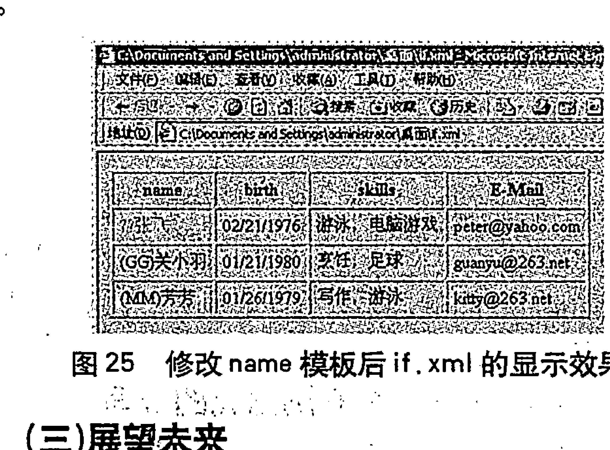

#### （三）展望未来

经过以上的学习，相信大家对XML的世界已经有了一些基本的了解！这里我们只介绍了最基本的XML知识，要对它有更深入的了解，除了必须熟悉排版样式CSS和XSL以外，还要增加对脚本语言和服务器端编程的了解，这将有助于尽早从HTML语法到XML语法的转变。

网络的世界一日千里，不仅是网络的模式，网页的技术，浏览器的更新发展随时都在进行，新科技也正在不断推动着Internet的发展，XML技术的应用，也开始对互联网产生着重大的影响，而Web应用也将随着XML的出现而更加精彩。

（注：本文中所有程序代码均已收录到本书光盘中）
（文 / 尹艳芳）

### 深入浅出学习 JSP

### 一、JSP 概述

要想了解JSP，我们首先得弄清楚几个名词：Sun、Java、JSP、CGI、ASP、PHP，此外我们还必须弄清楚它们之间的关系。好了，别急，跟我来开始JSP之旅吧！

#### （一）Sun——一个充满阳光的公司

Sun公司是美国一家规模很大的（可以与比尔·盖茨的微软公司抗衡）从事电脑方面软硬件的生产销售公司。世界上这类公司多如牛毛，不过像Sun这样的公司比较少有，Sun公司的产品侧重于网络。

从字面上理解，我们可以把Sun公司翻译成阳光公司。而实际上Sun公司的名称是Stanford University Network（斯坦福大学网络，斯坦福大学应该如雷贯耳吧）的缩略，原来Sun最早是由Scott McNealy（现任Sun公司首席执行官）等四名斯坦福大学和加州大学伯克莱分校的研究生创建的，1982年2月正式注册。

看看下面Sun公司的标志吧（如图1），是不是很有意思？这是由字母U组合成的一个连接世界的图标，充满着阳光和睿智。

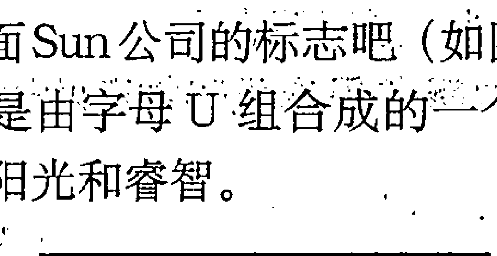

如果要进一步了解Sun公司，你可以登录以下地址：Sun总部：http://java.sun.com/；Sun中国分部http://www.sun.com.cn/。

#### （二）Java——来杯 Java 咖啡吧

1990年，SUN公司的James Gosling领导了一个六人小组Green（绿色小组）致力于开发一种新的编程语言。Gosling把这种语言称为Oak（橡树），这种语言植根于C++编程语言，但它比C++小巧。

老外很重视做品牌，当时为了给这门语言取名字时，大伙儿也绞尽脑汁。本来Oak琅琅上口，比较短，只有三个字母，应该比较好记。可惜Oak已经被人家抢先注册了，怎么办？后来大概有一个刚刚从太平洋一个名为Java的小岛旅游回来的家伙，对该岛出产的一种味道非常美妙的咖啡赞不绝口。老外是喜欢喝咖啡的，取个“香味四溢”的名字自然会吸引人。于是这门开创软件新世纪的语言就被命名为Java了。Java语言的标记如图2所示。

Java是一门非常优秀的编程语言，一直力求“跨平台、跨系统”，即Sun所标榜的“Write Once， Run Anywhere™”。什么意思呢？就是说一旦用Java写出了一个程序，那么这个程序就可以在任何平台、任何系统上运行。这多么诱人啊！要知道，当时的一些编程语言可移植性是很差的，比如在Windows下开发的程序，要想在Unix上运行是多么艰难啊。因此，Java从推出到现在，一直倍受市场的吹捧。

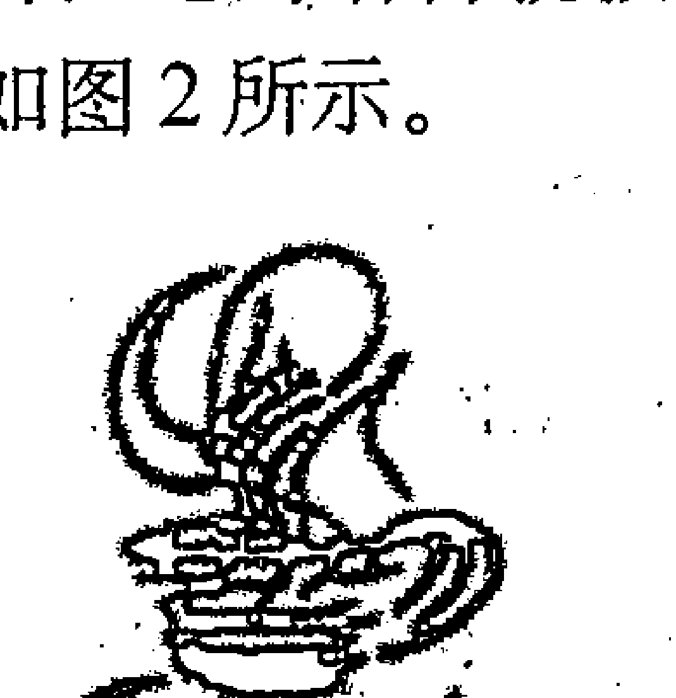

后来，整个IT市场朝网络化等方向发展，Java的开发人员也在不断地跟进市场，使得Java语言也不断的得到发展，并形成了一个开发系统。这样，我们今天看到的Java就不再仅仅是一门编程语言了，而是一个程序开发的系统了。

目前，Java系统已经发展到版本2，即Java2。Java2对以往Java系统做了很大的更新和系统化，形成了三大分支，即基于Internet技术的企业网的【J2EE】（Java 2 Enterprise Edition）、基于PC机的【J2SE】（Java 2 Standard Edition）和基于嵌入式设备、消费性电器的【J2ME】（Java 2 Micro Edition）。

为了达到“Write Once， Run Anywhere™”的目的，Java提出一个非常重要的概念——Java Virtual Machine（JVM， Java虚拟机），通过这个底层的虚拟系统支撑J2EE、J2SE、J2ME这三个具体应用体系。

Java 系列结构详细情况如图 3 所示：

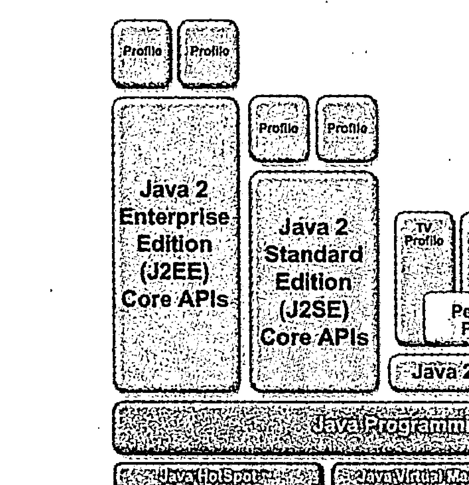

#### （三）JSP 登场

这里我们介绍的 JSP 就是 Java2 系统中的 J2SE 的一个子分支。JSP 是 Java Server Pages 的简称，是 Java 系列中用于建设和管理“动态网页”的一项技术。所谓动态网页是指网站的网页是可以动态更新维护的。目前大型专业网站都是基于这种技术的，如网上书城【贝塔斯曼】(http://www.bolchina.com/) 就是采用 JSP 动态网页技术。用 IE 上到贝塔斯曼的主页，你会发现网站的首页文件名为 welcome.jsp。

这是由 JSP 编写的页面，它通过 JSP 动态网页技术把当日网站更新内容取出，放在首页的醒目处，如图4所示。

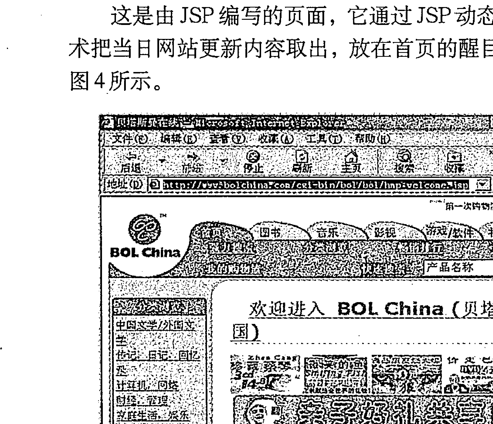

也许你会问，为什么要引入动态网页的概念？动态网页有什么优点？

首先我们来看看传统的“静态网页”的工作原理：用户通过 IE、Netscape 等浏览器，借助 HTTP 协议，向 Web 服务器提出下载的请求，Web 服务器接受请求，把静态网页内容返回给客户，并显示在客户的浏览器上，如图5所示。

这种“静态网页”的制作和推广过程是：创建网页→把网页发布出去→用户通过 IE 等浏览器浏览网页。在这些过程中，由于我们所制作的网页都是“静态”的，一旦成型就很难进行更新维护。其缺点显而易见：难以维护，难以形成“互动”服务。针对这种情况，不断有“动态网页”技术推出，如早期的 CGI (Common Gateway Interface, 通用网关接口) 和目前流行的 ASP (Active Server Page, 活动服务器页面)、PHP (Preprocessor Hypertext Page, 超级文本预处理页面) 以及我们这里所介绍的 JSP。

那么“动态网页”的工作原理又是如何呢？“动态网页”的工作原理是：用户通过浏览器向 Web 服务器要求下载文件，Web 服务器判断浏览器所下载的是否为动态网页文件。如果不是，则直接下载文件；如果是动态网页，则 Web 服务器会判断动态网页是否含有 Script 程序。如果有，则加以解释执行；否则直接交给浏览器。若执行中的 Script 程序中使用了数据库，则 Web 服务器会根据数据库所设置的参数来启动对应的数据库驱动程序，而启动数据库驱动程序后，程序可以直接利用数据库对象来访问数据库，或通过数据库对象来发送 SQL 指令，进而达到存取数据库的目的。最后，如果有数据必须要显示在浏览器上，则 Script 程序会利用动态网页所提供的输出对象送出数据，然后由 Web 服务器传送给浏览器，如图6所示。

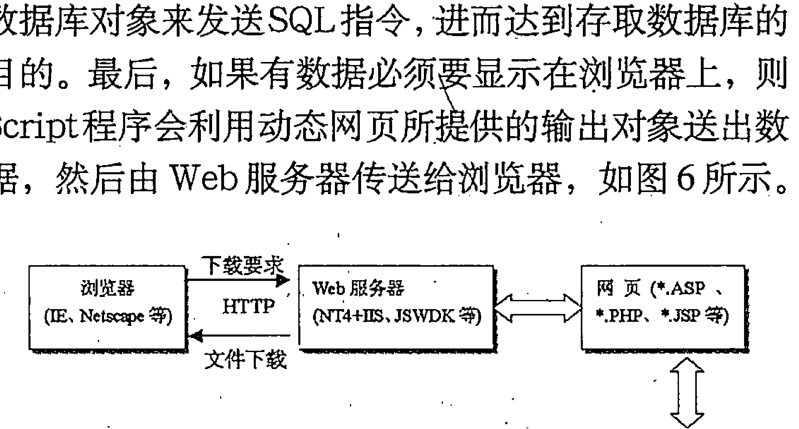

比如：某杂志制作了网站，把杂志的每期内容都上到该网站上供读者浏览。如果该网站制作时只是采用静态网页技术，则每次新内容的更新都要对所有页面进行重新设计，同时读者也无法与网站反馈和交流信息。而如果该网站采用了动态网页技术，则可以把网页内容及与读者交流的信息保存在数据库中，这样更新维护网站时，只需往数据库中添加内容，无须对所有页面进行重新设计。

#### （四）JSP 的特点

好了，到现在，你应该已经看到 JSP 的概貌了。就好像到西藏看布达拉宫，这时候，你应该已经看到布达拉宫的雄伟外貌，也知道了布达拉宫的来历了。下面我们再来看看 JSP 的特点，了解一下布达拉宫真正“吸引人的地方”。JSP 在网站开发方面十分高效，具体讲，有如下几方面特点：

- 1. 动静结合
  动态网页技术和静态网页技术各有优缺点：动态网页便于更新维护，但制作技术含量高，耗时长；而静态网页与之相反，虽然不便于更新维护，但制作技术含量低，耗时短。因此一般的网站都“动静结合”的来制作网页。JSP 是一种嵌入式语言，可以把 JSP 代码嵌入到静态网页代码中，实现动静结合。
- 2. 组件的可重用
  JSP 语言是面向对象的一种语言，开发人员通过 JSP 可以制作出很多组件（类似小孩玩的积木），这些组件可以共享和交换，提高网站的设计速度及一致性。
- 3. 通过标识简化页面开发
  JSP 可以通过开发定制的标识库进行扩展，这样，第三方开发人员和其他人员就可以为常用的功能创建个性化的标识库，使得网站开发人员可以使用熟悉的工具和组件来进行开发，简化了页面的开发。

#### （五）JSP 与 CGI、ASP、PHP 的比较

好了，知道“布达拉宫”吸引人的地方，你可能会说。是啊，布达拉宫真的很棒，不过我看过的卢浮宫也不错啊。是的，有比较才有新发现。前面我们提到了动态网页的几种技术，包括 CGI、ASP、PHP，它们又是什么？和我们这里介绍的 JSP 有什么区别？CGI（Common Gateway Interface，通用网关接口）是早期极为流行的动态 Web 开发技术，CGI 程序通常结合 Perl 语言进行开发。随着技术的进步，CGI 技术由于实现麻烦、效率低等原因而逐步被其他动态 Web 开发技术所取代。ASP（Active Server Page，活动服务器页面）是微软公司推出的动态 Web 开发技术，由于有微软公司强大的技术支持以及简单实用的特点，深受广大动态网页开发人员的青睐。但 ASP 也存在着平台限制（常用的 ASP 开发平台组合是：WinNT + IIS + ASP）、效率低及安全性低等缺点，随着微软 .net 战略的推出，ASP 技术可能被微软的新技术所取代。PHP（Preprocessor Hypertext Page，超级文本预处理页面）最初是 1994 年 Rasmus Lerdorf 创建的，刚开始只是一个简单的用 Perl 语言编写的程序，用来统计他自己网站的访问者。后来又用 C 语言重新编写，添加了可以访问数据库的内容。1995 年以 Personal Home Page Tools (PHP Tools) 开始对外发表第一个版本。在早期的版本中，提供了访客留言本、访客计数器等简单的功能。以后越来越多的网站使用了 PHP；1995 年 PHP2.0 发布了。第二版定名为 PHP/FI(Form Interpreter)。PHP/FI 加入了对 MySQL 的支持，从此建立了 PHP 在动态网页开发中的地位。到了 1996 年底，有 15000 个网站使用 PHP/FI；到了 1997 年中，使用 PHP/FI 的网站数字超过五万个。1997 年第三版的开发计划开始了。开发小组加入了 Zeev Suraski 及 Andi Gutmans，并将第三版定名为 PHP3。2000 年，PHP4.0 又问世了，其中又增加了许多新的特性。PHP 继承了 Linux 的 GNU 风格（常用的 PHP 开发平台组合是：Linux + Apache + PHP)，借助于源代码开放的方式，迅速成为目前广泛应用的动态网站开发技术之一。PHP 使用 C 语言，引入了类的概念，使得代码的可重复性应用变得非常简单。不过由于 PHP 缺乏一个统一的有实力的公司的技术支持，使得 PHP 的学习和应用变得比较麻烦。下面就这些常用的动态网站开发技术进行概略的比较，如表1所示。

##### 表1 常用动态网站开发技术比较

| 比较项目 | JSP | CGI | ASP | PHP |
| :--- | :--- | :--- | :--- | :--- |
| 支持的操作系统 | 多数操作系统 | Unix、Linux、Windows等 | Windows | Unix、Linux、Windows等 |
| 支持的服务器 | 多数Web服务器 | 多数Web服务器 | IIS、PWS等 | IIS、PWS、Apache等 |
| 执行效率 | 快 | 慢 | 快 | 快 |
| 稳定性 | 好 | 最好 | 中等 | 好 |
| 支持函数数量 | 很多 | 不定 | 少 | 多 |
| 编写语言 | Java | 不限 | VBS | PHP |
| 静态网页结合性 | 好 | 差 | 好 | 好 |
| 安全性 | 很好 | 最好 | 差 | 好 |
| 开发时间 | 短 | 长 | 短 | 短 |
| 维护时间 | 短 | 长 | 短 | 短 |
| 改版速度 | 快 | 慢 | 快 | 快 |
| 目前应用网站数目 | 多 | 很多 | 多 | 最多 |
| 学习的难易度 | 低 | 高 | 低 | 低 |

#### （六）“Hello, World！”

到现在，你已经知道什么是 JSP 了，JSP 和 CGI、ASP 以及 PHP 的区别了，下面我们就在西藏的神幡前动手扔块石头吧，听说扔块石头就可以得到一座房子的，不过是另一世界的房子。
这里我们写了一段很简单的 JSP 程序，初步了解一下 JSP 程序的结构，体会一下 JSP 程序的特点。

```
【hello.jsp】
<html>
<head>
<title>Hello, world!</title>
</head>
<body bgcolor="#FFFFFF">
<br>
<br>
<h2>
<%="Hello, World!"%>
</h2>
</font>
</body>
</html>
```

这段 JSP 代码很简单，只有一句，其他的都是静态网页中的 HTML 代码，了解 HTML 语言的朋友应该很容易理解上述代码。

没骗你吧，上面我们说过 JSP 的代码是嵌入式的代码，这里我们的 JSP 代码【<%="Hello, World!"%>】也是嵌入的。

目前，你还没办法测试这段代码，阅读完本专题第二节 JSP 平台搭建后，你就可以测试一下这段代码了。

### 二、JSP 平台搭建

不论是 ASP、PHP，还是 JSP，其平台搭建基本上都包括了服务器端操作系统、Web 服务器、程序编写调试工具、浏览器、数据库等内容，不同的是，JSP 还需要额外安装 Sun 公司的 JDK。

#### （一）JSP 平台要件

1.  服务器端操作系统

    操作系统是多数应用软件实现的基础，JSP 也不例外。JSP 支持几乎所有的操作系统，较为常见的是基于 Windows（Windows9.X、Windows2000 Professional、Windows NT、Windows2000 Server 等），Linux（Redhat Linux、SCO Linux 等）。

2.  JDK——Java 程序开发与运行环境

    JDK（Java Developers Kits）是 Sun 公司免费提供的 Java 开发工具集，是 Java 程序开发与运行所必需的环境。JDK 包括如下工具：

    - JAVAC：java 语言编译器，通常是把 *.java 文件编译成可重用的加密的 *.class 文件。
    - java：java 字节码解释器。
    - javap Disassembler：Java 字节码分解程序。
    - java prof：资源分析工具。
    - javahc：用于 Java 类调用 C++ 代码。
    - appletViewer：用于测试并运行 Java 插件程序。
    - java Debugger API：Java 调试工具。
    - API Prototype Debugger：Java 调试工具原型。

    在 JSP 程序编制调试过程中主要使用的工具是 JAVAC。

3.  Web 服务器

    正如 ASP 必须有 IIS、PWS 等服务器一样，JSP 的运行也必须在服务器端运行特定的 Web 服务器。常见的支持 JSP 的 Web 服务器有 Apache Tomcat、Allaire Jrun、Weblogic Application Server、Caucho Resin、IBM WebSphere Server 以及 Sun 公司自己提供的 JSWDK 等。这些服务器根据其是否可以独立运行而又分为独立 JSP Web 服务器和 JSP Web 服务器插件两种。比如，上述的 Apache Tomcat 就仅是 JSP Web 服务器插件，这就意味着仅仅在服务器上安装 Apache Tomcat 是不能调试和运行 JSP 的，它必须附在 Apache 服务器或者 IIS 服务器上。而 Sun 公司提供的 JSWDK 则是个独立 JSP Web 服务器。

4.  程序编写调试工具

    自从 Sun 提出了 JSP 的技术规范后，很多软件厂商开发了 JSP 的配套软件，目前常见的支持软件有：JBuilder、Dreamweaver UltraDev、Frontpage、UltraEdit 等。其中 JBuilder 是开发 Java 的工具，开发 JSP 有点大材小用，而且 JBuilder 对硬件要求比较高。而 Dreamweaver UltraDev 和 Frontpage 都是流行的网页设计工具，适用于可视化的进行网页设计，可以作为 JSP 的辅助工具来用。值得推荐的是 UltraEdit，该工具是程序员必备的文本编辑器和程序查看器，小巧玲珑，十分好用。

5.  数据库

    动态网页中，数据库是必不可少的内容，众多的可变信息都要通过数据库的存取来实现。JSP 实现数据库操作有很多方式，常见的是通过 JDBC - ODBC Bridge（JDBC - ODBC 数据桥）操作具有 ODBC 功能的所有数据库（如 Access、Oracle、Sybase 等）。此外还有一种方式，通过 JDBC 和 SQL 语句直接操作 SQL、MySQL 等数据库系统。

6.  浏览器

    浏览器是客户端浏览 JSP 的主要工具，是 JSP 开发过程中必不可少的工具。目前较为流行的支持 JSP 的浏览器有 Internet Explorer 和 Netscape。

#### （二）JSP 平台组合

如前所述，JSP 秉承 Java 的优点，具有“跨平台，跨系统”（Write Once, Run AnyWhere）的特点。因此，JSP 的平台搭建有很多形式可以选择，常见的有：

- Linux + Appache + JDK + Tomcat + MySQL；
- Windows2000 Professional + JDK + JSWDK + Access。

#### （三）平台搭建

由于很多初学者都相对熟悉 Windows 2000 Professional、Access 数据库，且这种方式较为接近 ASP，因此值得推荐给广大 JSP 初学者。本专题所有 JSP 例子都是采用这种方式，辅以 UltraEdit、Internet Explorer6.0 等软件实现的。这里假设你已经安装了 Windows 2000 Professional 和 Access 2000（是 Office2000 套件中的一部分）数据库。下面简单介绍 JDK、JSWDK、UltraEdit 的下载和安装。Windows 2000 Professional 和 Office 2000 的安装界面较为友好，也有众多的介绍文章或参考书可以参考，限于篇幅，这里不加赘述。

##### 1. JDK 下载和安装

###### （1）JDK 下载

第一步：进入 Sun 公司 Java 的 JDK1.4 版本免费安装程序，下载（选择 Windows 的 All Language 版本）主页地址是：【http://java.sun.com/j2se/1.4/download.html】，如图7所示。

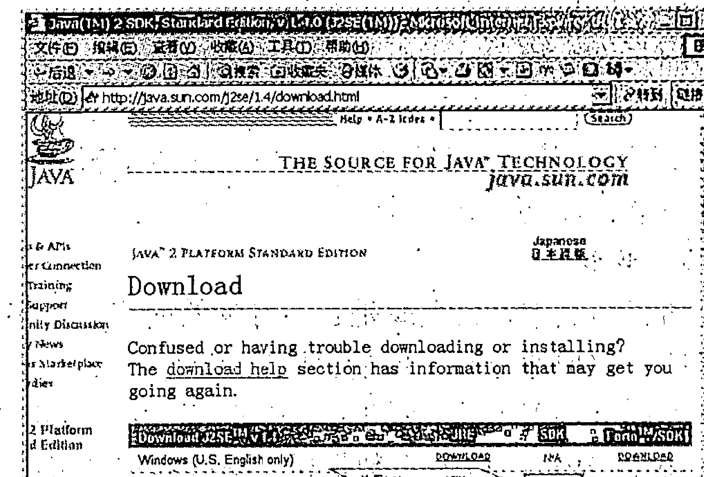

第二步：单击如图7所示的【DOWNLOAD】链接，进入下载协议页面，如图8所示。

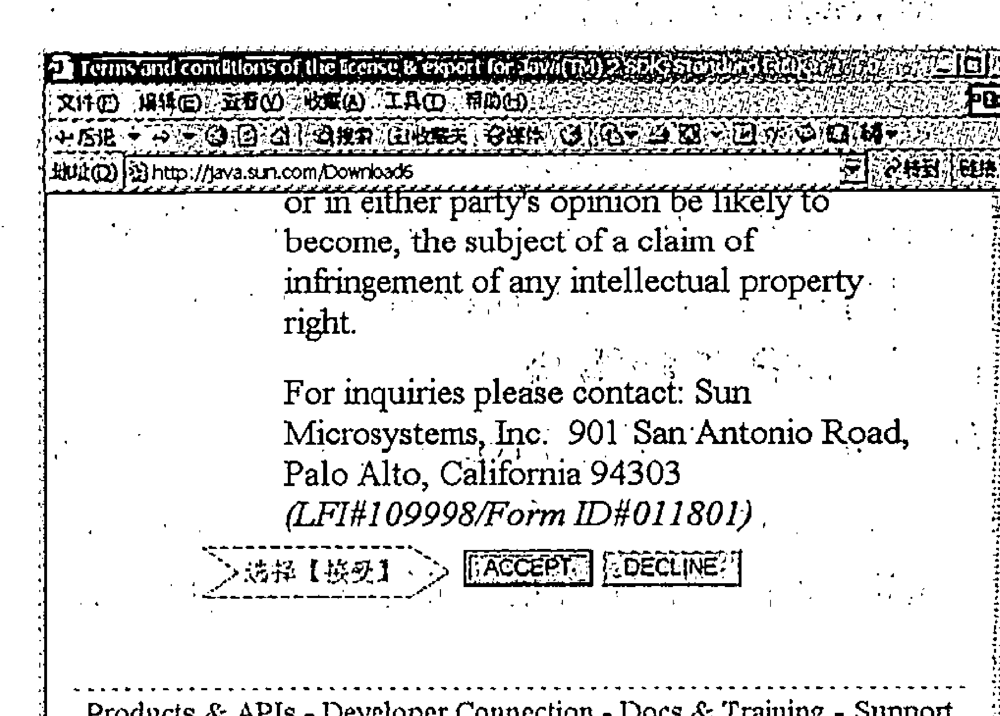

第三步：在图8 下载协议页面所示中，选择【ACCEPT】（接受）按钮，进入下载页面，如图9所示。

###### （2）JDK 安装

JDK 的安装程序【j2sdk-1_4_0-win.exe】文件（35.3 MB）下载完毕后，即可运行安装。安装程序界面和多数安装程序类似，不作赘述。

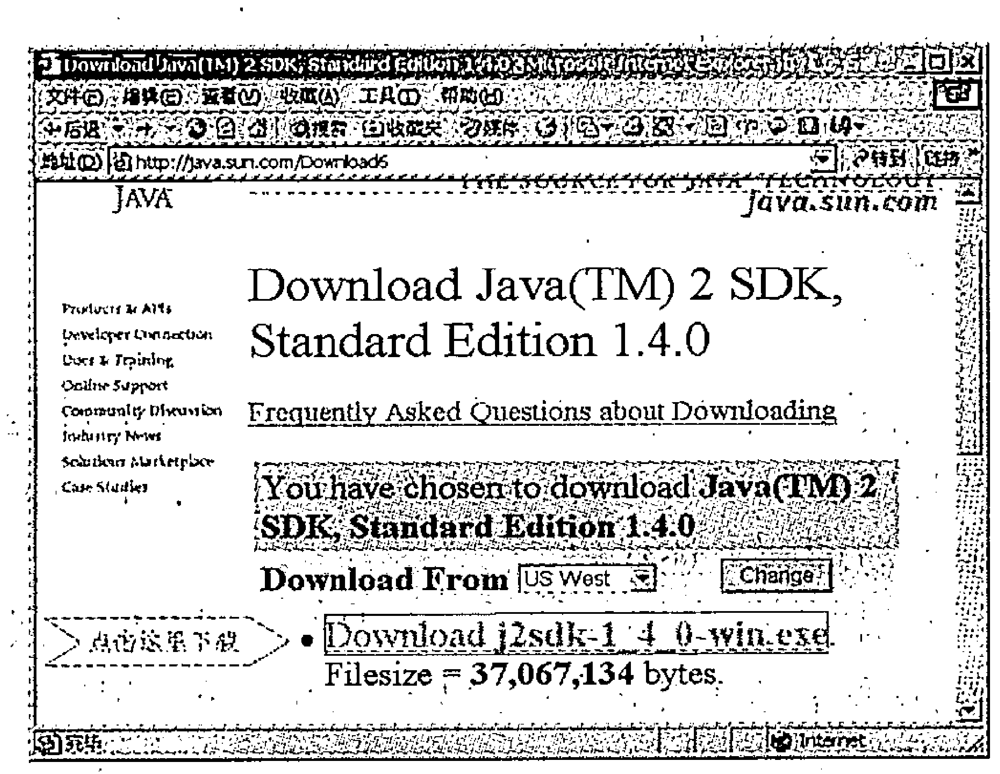

假定把程序安装在系统的根目录【F:\j2sdk1.4.0】下。这个目录下的【F:\j2sdk1.4.0\bin】和【F:\j2sdk1.4.0\lib\tools.jar】文件名很重要，在下面的 JDK 运行环境参数中要进行设置。

###### （3）JDK 运行环境参数设置

JDK 运行时要设置 JDK 工具所在路径【F:\j2sdk1.4.0\bin】和 JDK 类库路径【F:\j2sdk1.4.0\lib\tools.jar】。设置步骤如下：

第一步：选择菜单【开始】→【设置】→【控制面板】→【系统】，在跳出的【系统特性】对话框中选择【高级】页，如图10所示。

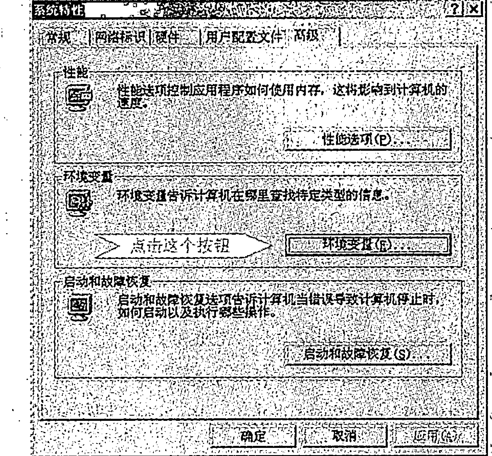

第二步：在【path】系统变量中添加 JDK 工具所在路径【F:\j2sdk1.4.0\bin】，如图11所示。

第三步：新建系统变量，变量名为【CLASSPATH】，变量值为【F:\j2sdk1.4.0\lib\tools.jar】，如图12所示。

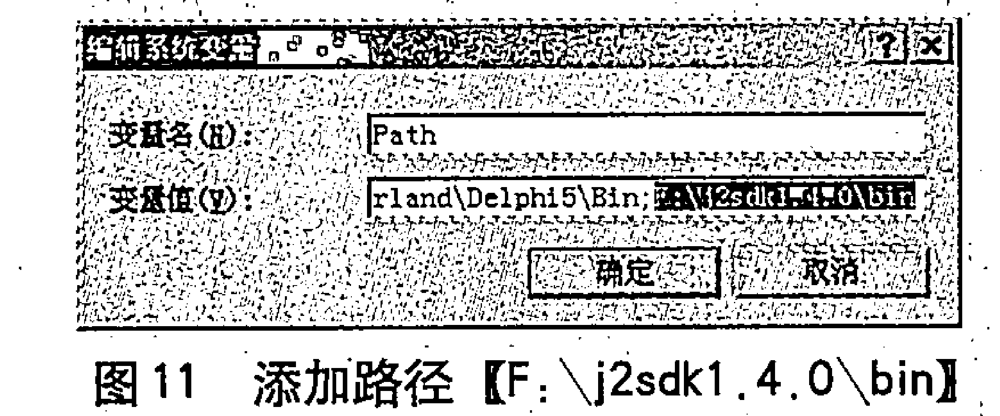

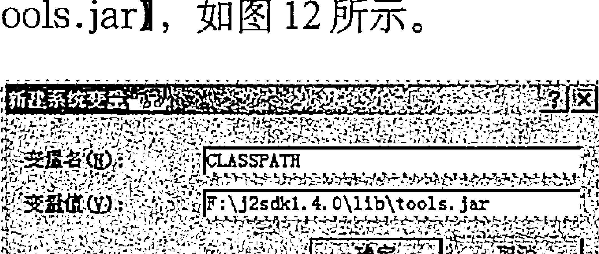

这样就完成 JDK 运行环境参数的设置。

##### 2. JSWDK 下载和安装

###### (1) JSWDK 下载

第一步：进入 Sun 公司 Java 主页 (http://java.sun.com)，search (搜索) 关键词【jswdk】，如图13所示。

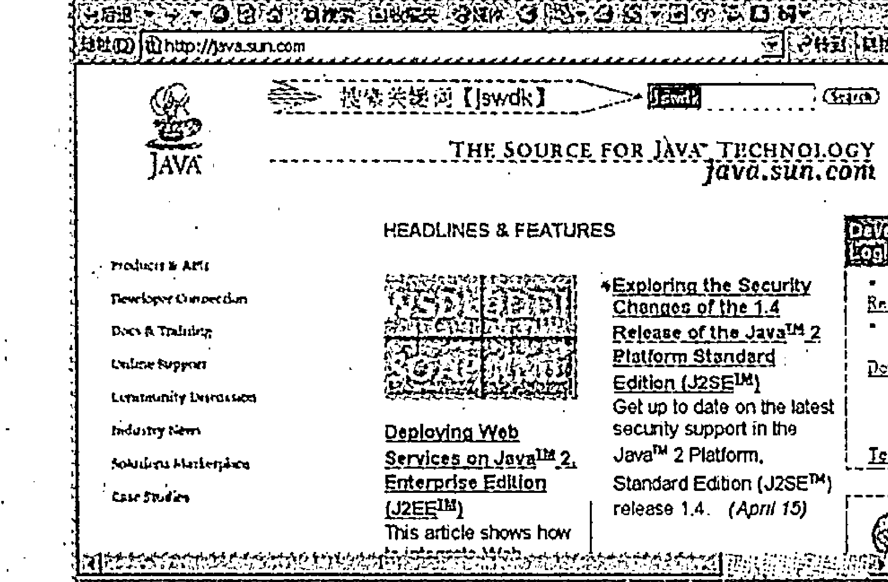

第二步：在搜索结果中，选择【6. JavaServer Pages(TM) Technology - Download】条目，如图14所示。

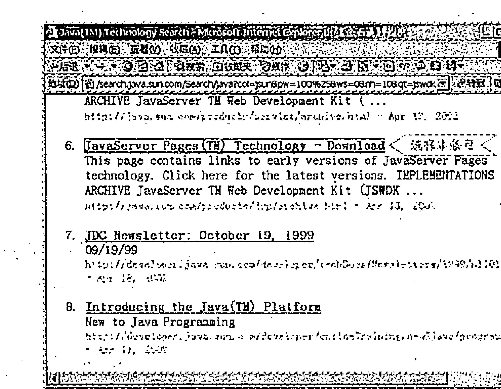

第三步：选择安装的平台【Windows 95/NT】(没关系，也可以在 Windows2000 Professional 下运行)，如图15所示。

第四步：接受协议，按动【ACCEPT】(接受) 按钮，如图16所示。

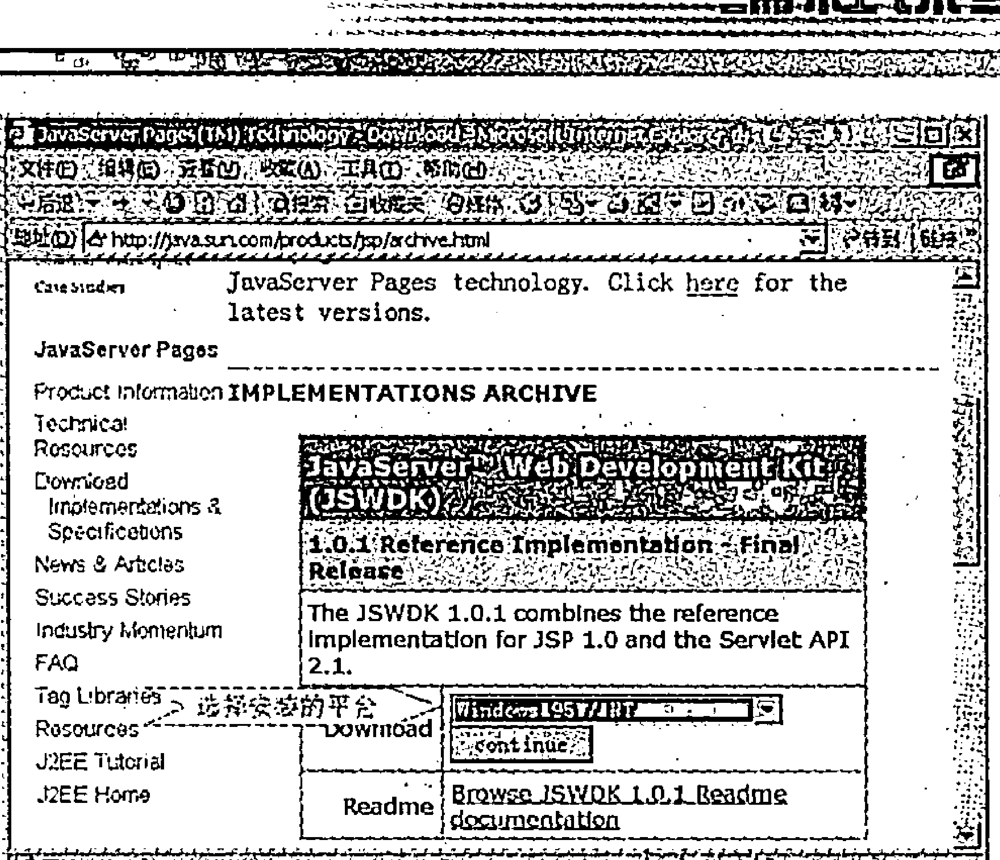

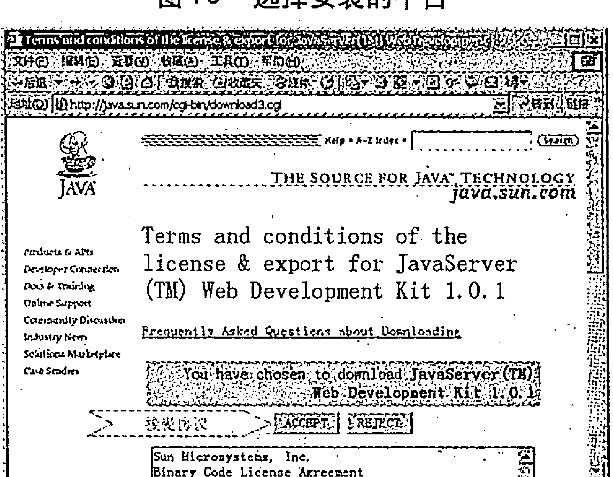

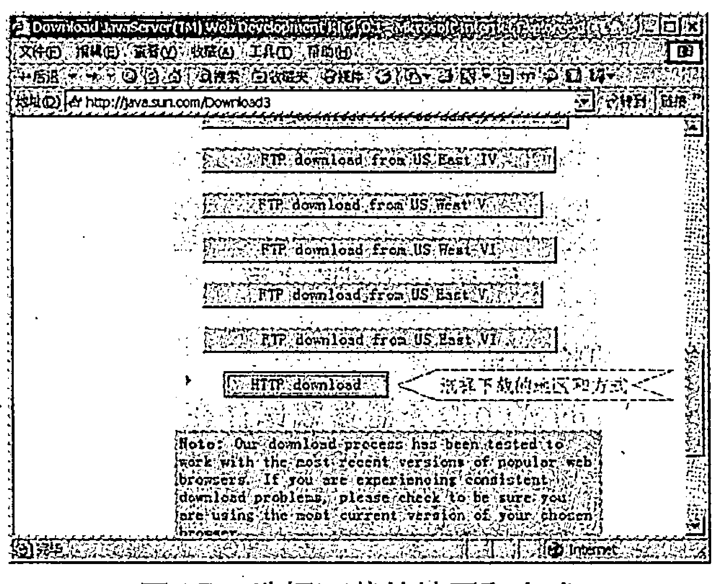

第五步：选择下载的地区和方式，选择【Http Download】，如图17所示。

###### (2) JSWDK 安装

找到 JSWDK 的安装程序后，开始安装 JSWDK。其过程很简单，要注意的是在解开安装程序压缩包的时候，要把解压出来的【jswdk-1.0.1】目录和其下面的所有内容复制或者剪切到 Windows2000 Professional 系统所在的驱动器中，这里是【F】盘。完成后就有【F:\jswdk-1.0.1】目录内容了。

###### (3) JSWDK 测试

JSWDK 安装完成后，即可启动和关闭 JSWDK。以测试一下JSWDK平台是否建立。通过运行【F:\jswdk-1.0.1】目录下的【startserver.bat】，即可启动JSWDK，如图18所示。

启动成功后，即可通过访问 (http://localhost:8080)或者(http://127.0.0.1:8080)访问JSWDK所建立的网站。打开IE，输入上述任一地址，如果能够看到如图19所示页面，说明你的JSP平台建设已经成功了(其中，8080是系统所用的端口号，默认的HTTP协议是80，为了不与这个端口号冲突，启用8080端口号)。

##### (4) JSWDK 配置

JSWDK的Web服务器参数保存在【F:\jswdk-1.0.1\webserver.xml】中，用写字板打开并编辑这个文件就可以修改默认设置值。JSWDK默认的文档目录是【F:\jswdk-1.0.1\webpages】(该目录下有【index.html】文件，它的内容就是图19所示内容)。在此目录下可以建立子目录，例如【F:\jswdk-1.0.1\webpages\test】，就能在浏览器中用【http://localhost/test】访问这个目录。为了使得这个子目录能执行JSP程序，还必须进行以下操作。

- 第一步, 在【webserver.xml】中的<Service></Service>节加入:
   <WebApplication id="test" mapping="/test" docBase="webpages/test" />
- 第二步, 建立【F:\jswdk-1.0.1\webpages\test\WEB-INF】目录，并从【F:\jswdk-1.0.1\webpages\WEB-INF】目录中把下列4个文件复制过来:
   - mappings.properties
   - mime.properties
   - servlets.properties
   - webapp.properties

完成上述两个步骤后，才能通知JSWDK的Web服务器执行【http://localhost/test】中的JSP程序。

此外，还可以把【webserver.xml】中的【<WebServer id="webServer">】改为【<WebServer id="webServer" Port="80">】，使得服务器使用默认的80端口。

##### 3. UltraEdit 下载和安装

UltraEdit是一个流行的软件，其下载要比上述的JDK和JSWDK的下载简单方便许多。在多数软件下载网站 (如中国下载: http://www.download.com.cn) 都可以找到这款软件。同时UltraEdit的安装和使用也非常简单，这里就不作赘述。有个技巧告诉大家：在UltraEdit中选择菜单【View】→【Display Line Numbers】，打开行标，对于程序的编译非常有用。比如：通过【JAVAC DBcon.java】命令编译DBcon.java文件，如果DBcon.java文件有错误，则编译器会返回错误信息和错误所在位置，这样就可以在UltraEdit中对照该行迅速找出错误，如图20所示。

#### (四) 平台测试

搭建好这些平台后，我们回过头来看看概述部分中的“Hello, World!”这个实例。这个实例操作步骤如下：

- 第一步、打开UltraEdit，输入前面所列举的“Hello, World!”的代码。
- 第二步、存文件为【F:\jswdk-1.0.1\examples\jsp\hello.jsp】。
- 第三步、运行【startserver.bat】，启动服务器；
- 第四步、打开IE，在地址栏输入http://localhost:8080/examples/jsp/hello.jsp进行浏览，出现如图21所示画面，表明平台测试成功。

### 三、JSP语法

编程语言都有语法，语法是编程语言的基础。学习JSP的过程中，如果你有HTML和Java语言的基础，那就可以很轻松地掌握了。如果你没有这些语言的基础，那你就可能要花点时间了解一下HTML和JAVA了。这里我们粗略的看看HTML和Java语言的一些基础，然后以一些实例带着大家学习JSP语法。

#### （一）HTML简要语法

打开FrontPage后，系统将自动生成一个空白的HTML页，其实这一页并不空白。在FrontPage中选择【HTML】（在屏幕左下角和【普通】、【浏览】两个按钮并列），可以看到如下代码：

```
<html>
<head>
<meta http-equiv="Content-Type" content="text/html; charset=gb2312">
<meta name="GENERATOR" content="Microsoft FrontPage 4.0">
<meta name="ProgId" content="FrontPage.Editor.Document">
<title>New Page 1</title>
</head>
<body>
</body>
</html>
```

这些代码中最为关键的就是标记，各标记意义如表2所示。

表2 常用HTML标记意义
| HTML标记 | 意义 |
| --- | --- |
| `<html> </html>` | HTML文件开始与结尾标记 |
| `<head> </head>` | 网页的文件头开始与结尾标记 |
| `<meta> </meta>` | 网页相关属性标记 |
| `<title> </title>` | 网页标题的开始与结尾标记 |
| `<body> </body>` | 网页正文内容的开始与结尾标记 |
| `<br>` | 回车符 |
| `<p> </p>` | 段落开始与结尾标记 |
| `<center> </center>` | 居中对齐标记 |
| `<font> </font>` | 字体标记 |
| `<color> </color>` | 颜色标记 |
| `<!--注释-->` | 网页中加入注释内容的标记 |

#### （二）Java简要语法

##### 1. Java的数据类型

Java支持的数据类型如图22所示。

##### 2. Java的运算符

Java的关键运算符如表3所示。

##### 3. Java控制语句

Java中的控制语句如表4所示。

表3 Java的运算符
| 运算符 | 符号 |
| --- | --- |
| 算术运算 | +, -, *, /, %, ++, -- |
| 关系运算 | >, <, >=, <=, ==, != |
| 逻辑运算 | !, &&, \|\| |
| 位运算 | >>, <<, >>>, &, \|, ^, ~ |
| 赋值运算 | = |
| 条件运算 | ?: |

表4 Java控制语句
| 语句 | 形式 |
| --- | --- |
| 条件语句 | if-else |
| 分支语句 | switch-case-break-default-return |
| while循环语句 | do-while |
| for循环语句 | for |
| 异常处理语句 | try-catch-finally-throw |
| 注释语句 | //: 单行注释<br>/*..*/: 多行注释<br>/**..*/: Java特有的Doc注释 |

#### （三）JSP语法

##### 1. JSP注释

注释是程序写作中一个良好的习惯，多数程序语言都有相应的注释语句。如上述HTML的注释语句是【<!--注释-->】。JSP的注释语句是【<%--注释--%>】。HTML和JSP注释语句不同的是，HTML注释在客户端可以通过【查看源代码】看到注释，而JSP则不会显示在客户端。

实例：
【comment.jsp】
```
<html>
<head>
<title>注释</title>
</head>
<body bgcolor="#FFFFFF">
<br>
<br>
<h2>

<!--HTML注释-->
<%--JSP注释--%>

</h2>
</font>
</body>
</html>
```

```
int addstepbystep(int i)
{
  return i+i;
}
%>

<%
 int num=1;
 for(int count=0;count<5;++count)
 {
%>
&nbsp;&nbsp;&nbsp;
num=<%=num%>
<br><br>
<%
   num=addstepbystep(num);
 }
%>
</body>
</html>
```

实例建立调试步骤如下：

- (1) 打开UltraEdit；
- (2) 新建文件，输入上述代码；
- (3) 保存文件为：【F:\jswdk-1.0.1\examples\jsp\comment.jsp】
- (4) 运行【startserver.bat】，启动JSWDK；
- (5) 打开IE；
- (6) 浏览：http://localhost:8080/examples/jsp/comment.jsp
- (7) 在IE中选择菜单【查看】→【源文件】，你会发现【<%--JSP注释--%>】这一句不见了。表明调试成功。

##### 2. JSP 声明

通过 JSP 声明，在程序中声明合法的变量和方法。JSP程序中所有变量和方法在使用前都必须声明，不然会出错。声明必须以“;”结尾，可以一次性声明多个变量和方法，只要以“;”结尾就行。一个声明仅在一个页面中有效。如果你想每个页面都用到一些声明，最好把它们写成一个单独的文件，然后用<%@ include %>或<jsp:include>元素包含进来。可以直接使用在<%@ page %>中被包含进来的已经声明的变量和方法，不需要对它们重新进行声明。

如：

```
<%! int i = 0; %>
<%! int a, b, c; %>
<%! Point a =new Point(2,3); %>
```

实例：
【declare.jsp】
```
<html>
<head>
<title>声明</title>
</head>
<body>

<%!
```

实例建立调试步骤如下：

- (1) 打开UltraEdit；
- (2) 新建文件，输入上述代码；
- (3) 保存文件为：【F:\jswdk-1.0.1\examples\jsp\declare.jsp】
- (4) 运行【startserver.bat】，启动JSWDK；
- (5) 打开IE；
- (6) 浏览：http://localhost:8080/examples/jsp/declare.jsp
- (7) 结果如图23所示，调试成功。

##### 3. JSP 表达式

表达式元素表示的是一个在脚本语言中被定义的表达式，在运行后被自动转化为字符串，然后插入到这个表达式在 JSP 文件的位置显示。因为这个表达式的值已经被转化为字符串，所以你能在一行文本中插入这个表达式（形式和 ASP 完全一样）。当你在JSP中使用表达式时请记住以下两点：

不要用分号“;”来作为表达式的结尾（注意和上述的声明有所不同); 表达式也可以作为其它JSP元素值。 如：

```
<%="这是字符串表达式"%>
<%=4+1%>
<%=new(java.util.Date()).toString()%>
```

【expression.jsp】
```
<%@ page import="java.util.*" %>
<html>
<head>
<title>用表达式取得时间的实例</title>
</head>
<body>
北京时间：
<%=
new Date()
%>
</body>
</html>
```

实例建立调试步骤如下：

- 1. 打开 UltraEdit;
- 2. 新建文件, 输入上述代码;
- 3. 保存文件为: 【F:\jswdk-1.0.1\examples\jsp\expression.jsp】
- 4. 运行【startserver.bat】, 启动 JSWDK;
- 5. 打开 IE;
- 6. 浏览: http://localhost:8080/examples/jsp/expression.jsp

结果如图24所示, 调试成功。

##### 4. JSP 程序段（Scriptlet）

一个程序段能够包含多个jsp语句、方法、变量、表达式。通过程序段, 我们可以实现以下功能：

- 声明将要用到的变量或方法。
- 编写JSP 表达式。
- 使用任何隐含的对象和任何用<jsp:useBean>声明过的对象。
- 编写JSP 语句。
- 嵌入任何文本、HTML 标记。

JSP 程序段的实例参看JSP 表达式一节中的【expression.jsp】文件。

##### 5. JSP page编译指令

Page 指令定义JSP文件中的全局属性, 它作用于整个JSP 页面, 同样包括静态的包含文件。 你可以在一个页面中用上多个<%@ page %>指令, 但是其中的属性只能用一次, 不过也有个例外, 那就是import属性。因为import属性和Java中的import语句差不多, 所以你能多次使用此属性。 无论你把<%@ page %>指令放在JSP的文件的哪个地方, 它的作用范围都是整个JSP页面。不过, 为了JSP程序的可读性, 以及好的编程习惯, 最好还是把它放在JSP文件的顶部。 如：

```
<%@ page import="java.util.*, java.lang.*" %>
<%@ page buffer="5kb" autoFlush="false" %>
<%@ page errorPage="error.jsp" %>
<%@ page %>
```

##### 6. JSP include编译指令

<jsp:include>编译指令允许你包含动态文件和静态文件, 这两种包含文件的结果是不同的。如果文件仅是静态文件, 那么这种包含仅仅是把包含文件的内容加到JSP文件中去; 而如果这个文件是动态的, 那么这个被包含的文件也会被JSP编译器执行。如果这个包含文件是动态的, 那么你还可以用<jsp:param>还传递参数名和参数值。 include编译指令常常用于包含网页的公共信息(如版权信息等), 这样便于网页的格式的统一, 同时也便于网页的制作和维护。 JSWDK 安装后, 免费提供了JSP include 这一编译指令的实例(通过include其它文件取得当前时间), 在【F:\jswdk-1.0.1\examples\jsp\include】目录下, 运行界面如图25所示。

##### 7. JSP taglib编译指令

前面我们讲到JSP特点时曾经提到过“标识库”, JSP通过taglib编译指令可以包含自定义的(第三方)的标识库, 便于JSP的扩展。

##### 8. JSP forward动作指令

JSP forward动作指令用于重定向一个HTML文件、JSP文件或一个程序段, 如：

```
<jsp:forward page="/servlet/login"/>
<jsp:forward page="/servlet/login">
    <jsp:param name="username" value="jsmith" />
</jsp:forward>
```

JSWDK 安装后，免费提供了 JSP forward 这一动作指令的实例（forward 到其他文件取得系统虚拟内存使用状态），在【F:\jswdk-1.0.1\examples\jsp\forward】目录下，运行界面如图 26 所示：

##### 9. JSP getProperty 和 setProperty 动作指令

JSP getProperty 和 setProperty 动作指令用于获取和设置 Bean 的属性值，并显示在页面中。在使用 getProperty 和 setProperty 动作指令之前，必须先用 <jsp:useBean> 创建它。

##### 10. JSP plugin 动作指令

JSP plugin 动作指令用于动态的下载服务器上的 Java Bean 或 Applet 到客户端的浏览器上执行，即直接在浏览器上执行 Java 程序，类似于 HTML 中嵌入 Applet 的方式（使用 <applet></applet> 和 <object></object> 标识）。

JSWDK 安装后，免费提供了 JSP plugin 这一动作指令的实例（在页面上设置一个区域显示图形化时钟），在【F:\jswdk-1.0.1\examples\jsp\forward】目录下，运行界面如图 27 所示。

同时，系统启动了 Java Console，其图标显示在系统托盘中。

##### 11. Java useBean 动作指令

Java useBean 动作指令用于创建一个 Bean 实例并指定它的名字和作用范围。由于这一动作是 JSP 的精彩之处，因此它的实例随处可见。

JSWDK 安装后，免费提供了 JSP useBean 这一动作指令的实例（通过 checkbox 选择喜爱的水果并返回结果），在【F:\jswdk-1.0.1\examples\jsp\checkbox】目录下，运行界面如图 28 和图 29 所示。

##### 12. JSP 的对象

JSP 基于 Java 语言，面向对象也是它的一大特色，是 JSP 的精髓之一。JSP 常见对象包括：out、request、response、session、application、pageContext、page、config 等。

out 对象是 javax.servlet.jsp.JSPWriter 的一个实例，用于输出数据，其作用范围是 page。

实例：
【out.jsp】
```
<html>
<head>
<title>OUT测试</title>
</head>
<body>
<%
out.print("Out test");
%>
</body>
</html>
```

实例建立调试步骤如下：

- (1) 打开 UltraEdit；request对象是ServletRequest的一个实例，用于封装客户端的JSP请求。JSWDK安装后，免费提供了JSP request这一对象的实例（取系统信息），在【F:\jswdk-1.0.1\examples\jsp\snp】目录下，运行界面如图30所示。

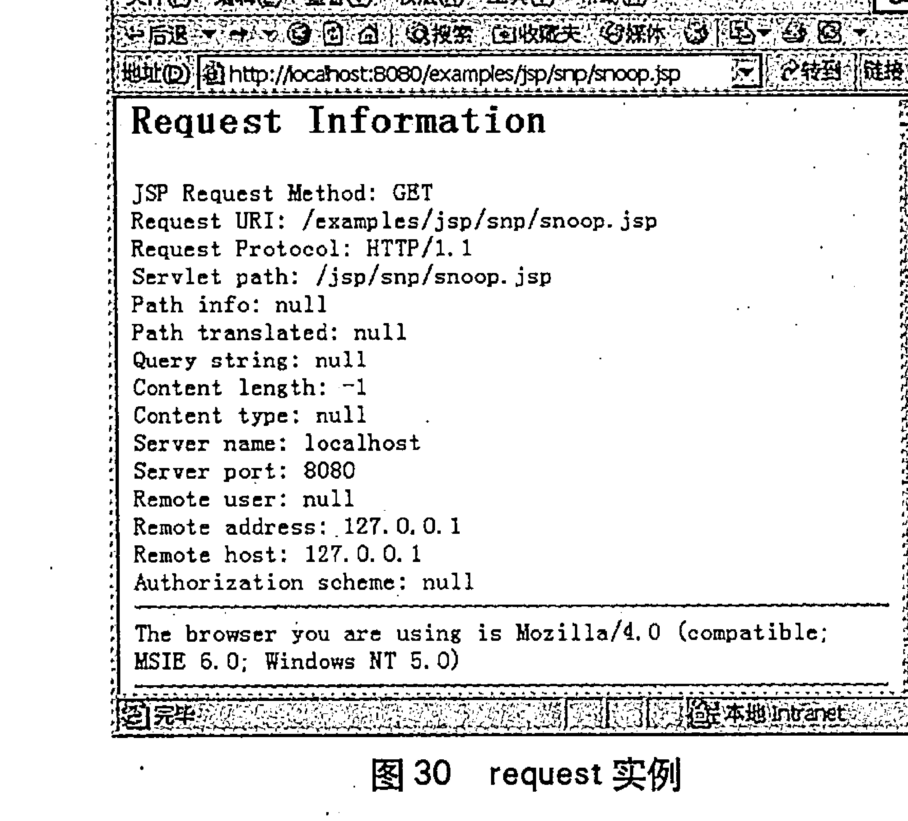

response对象是javax.servlet.ServletResponse的实例，用于将浏览器参考信息提供给客户端。

session对象是JSP中一个非常重要的内部对象，用于保存某个特定客户端一次访问的一些特定信息。JSWDK安装后，免费提供了JSP session这一对象的实例，在【F:\jswdk-1.0.1\examples\jsp\session】目录下。

application对象用于保存应用系统中一些公用的数据，它被所有客户所共享。我们经常利用这一对象的globa.jsa文件进行计数器制作。

##### 13. JavaBean

前面JSP概况中我们已经提及JSP的优点之一是基于组件的开发。

JavaBean是一种基于Java的软件组件。JSP对于在Web应用中集成JavaBean组件提供了完善的支持。这种支持不仅能缩短开发时间（可以直接利用经测试和可信任的已有组件，避免了重复开发），也使得JSP应用更富有伸缩性。

JavaBean组件可以用来执行复杂的计算任务或负责与数据库的交互以及数据提取等。如果我们有三个JavaBean，它们分别具有显示新闻、股票价格、天气情况的功能，则创建包含所有这三种功能的Web页面只需要实例化这三个Bean，使用HTML表格将它们依次定位就可以了。其实例可参考【Java useBean】动作指令一节内容。

##### 14. Servlet

Servlet是Java2中新增的一个功能模块，与我们所熟悉的Applet插件相对应。二者区别在于：Applet运行在客户端，占用客户端资源；而Servlet顾名思义是Server上的Applet，运行在服务器端，这样便于实现Sun的“Write Once, Run Anywhere”的构想。

Servlet和CGI类似的，都是运行于服务器端。不过Servlet要比CGI高效，因为对于CGI来说，每个新的请求都要求在服务器上创建一个新的进程来处理。而Servlet则在服务器首次装载时通过Init方法启动，并一直运行，直到调用destroy方法卸载它。

### 四、JSP 与数据库

动态网站的精华核心部分就是结合数据库功能，实现网站的动态更新，因此这里重点拎出这一节来详细介绍JSP中数据库功能实现的全部步骤。

#### （一）JSP操作数据库的方式

JSP操作数据库有两种方式。

方式一：直接通过Java的JDBC (Java Database Connectivity)技术操作数据库。很多数据库系统带有JDBC驱动程序，Java程序就通过JDBC驱动程序与数据库相连，执行查询、提取数据等等操作；

方式二：通过Sun公司的JDBC – ODBC Bridge（JDBC – ODBC 桥）访问那些带有ODBC驱动程序的数据库。目前大多数数据库系统都带有ODBC驱动程序，所以Java程序能访问诸如Oracle、Sybase、MS SQL Server和MS Access等数据库。

由于很多朋友都是相对比较熟悉Access数据库和ODBC的，所以下面的一些例子也主要基于这些基础知识。

#### （二）简要SQL语言

这里我们还要粗略的了解一下SQL语言。

SQL（Structured Query Language，结构化查询语言），最早是IBM的圣约瑟研究实验室为其关系数据库管理系统开发的一种查询语言，其前身是SQUARE语言。SQL语言结构简洁，功能强大，简单易学，所以自IBM公司1981年推出以来，得到了广泛的应用，广泛应用于Oracle、Sybase、Informix、SQL Server, Visual Foxporo, PowerBuilder等数据库系统或工具。

SQL包含4个部分：

-   ○数据查询语言 (DQL, Data Query Language): SELECT。
-   ○数据操作语言 (DML, Data Manipulation Language): INSERT、UPDATE、DELETE。
-   ○数据定义语言 (DDL, Data Definition Language): CREATE、ALTER、DROP。
-   ○数据控制语言 (DCL, Data Control Language): COMMIT WORK、ROLLBACK WORK。

如：创建一张学生信息表，具体命令如下：

```
CREATE TABLE Student
(学号 char(7) not null;
 姓名 char(10) not null;
 电话 char(10);
 生日 datetime;
 年级 tinyint; )
```

往学生信息表中输入一条信息，命令如下：

```
INSERT INTO Student Values
("8943123", "王小明", "0222197845", "1977/12/27",2)
```

从学生信息表中查询所有信息，命令如下：

```
SELECT * FROM Student
```

从学生信息表中查询二年级的所有学生的姓名和学号信息，命令如下：

```
SELECT 姓名, 学号 FROM Student WHERE 年级 = 2
```

#### (三) JSP JDBC - ODBC Bridge操作数据库实例

这个实例用到上述的JDBC-ODBC Bridge连接Access2000数据库，实例开始前你必须知道这个实例的结构。

这个实例通过连接数据库后，把数据库中的信息取出，显示在浏览器上。

必须在【F:\jswdk-1.0.1\examples\jsp】下新建【address】目录，用于保存这个实例的数据库(address.mdb)和JSP (address.jsp)等文件；在【F:\jswdk-1.0.1\examples\WEB-INF\jsp\beans】目录下新建【address】目录，用于保存数据库连接的Bean代码的源代码 (address.java) 和编译后的类文件 (address.class)等。

下面来看看详细的实现过程：

##### 1. 规划和建立数据库

数据库的操作首先必须规划和建立数据库。这里我们使用 Access2000建立数据库【address.mdb】文件 (保存在【F:\jswdk-1.0.1\examples\jsp\address】目录下)，在【address.mdb】中建立【address】表，该表结构如图 31 所示 (注意根据说明进行设置)。

字段名称 | 数据类型 | 说明
--- | --- | ---
id | 自动编号 | 索引，数据类型【自动编号】，注意设置为【主键】
name | 文本 | 【姓名】字段，数据类型【文本】，字段大小【10】
phone | 文本 | 【电话】字段，数据类型【文本】，字段大小【30】
meno | 备注 | 【备注】字段，数据类型【备注】

图 31 address 表结构

##### 2. 设置ODBC

选择菜单【开始】→【设置】→【控制面板】→【管理工具】→【数据源 (ODBC)】，在【系统DSN】页中添加数据源，驱动程序如图 32 所示。

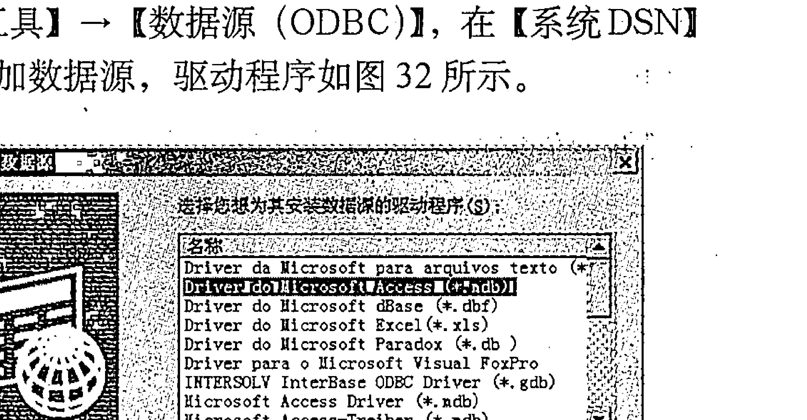

设置【数据源名】为【address】，数据库【选择】为【F:\jswdk-1.0.1\examples\jsp\address】目录下的【address.mdb】文件，如图 33 所示。

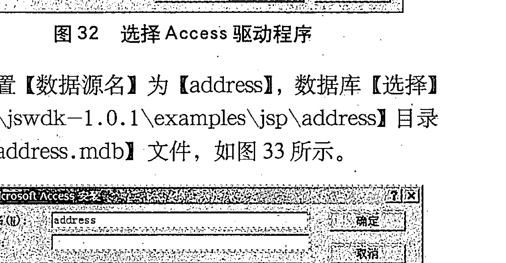

##### 3. 编写并编译【address.java】

建好数据库后，编写【address.java】文件 (保存在【F:\jswdk-1.0.1\examples\WEB-INF\jsp\beans\address】目录下)，用于操作数据库。代码如下：

```
package address;
import java.sql.*;

public class address {
String sDBDriver = "sun.jdbc.odbc.JdbcOdbcDriver";
String sConnStr = "jdbc:odbc:address";
Connection conn = null;
ResultSet rs = null;

public address() {
    try {
        Class.forName(sDBDriver);
    }
    catch(java.lang.ClassNotFoundException e) {
        System.err.println("address(): " + e.getMessage());
    }
}

public ResultSet executeQuery(String sql) {
    rs = null;
    try {
        conn = DriverManager.getConnection(sConnStr);
        Statement stmt = conn.createStatement();
        rs = stmt.executeQuery(sql);
    }
    catch(SQLException ex) {
        System.err.println("aq.executeQuery: " + ex.getMessage());
    }
    return rs;
}
```

写好代码后，需要把【address.java】编译成【address.class】文件。选择【开始】→【运行】，运行【cmd】命令，进入【F:\jswdk-1.0.1\examples\WEB-INF\jsp\beans\address】目录，输入【JAVAC address.java】命令，运行成功后生成【address.class】文件。结果如图34所示。

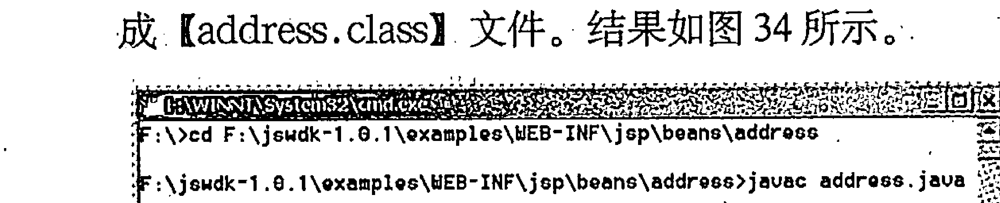

##### 4. 编写【address.jsp】

编写【address.jsp】文件（保存在【F:\jswdk-1.0.1\examples\jsp\address】目录下），代码如下：

```
<html>
<head>
<title>address book sample</title>
</head>
<body>
<p><b>My address book!</b></p>
<%@ page language="java" import="java.sql.*" %>
<jsp:useBean id="data" scope="page" class="address.address" />
<%
ResultSet RS = data.executeQuery("SELECT * FROM address");
String tt;
while (RS.next()) {
    tt = RS.getString("phone");
    out.print("<LI>" + RS.getString("name") + "</LI>");
    out.print("<pre>" + tt + "</pre>");
}
RS.close();
%>
</body>
</html>
```

运行【F:\jswdk-1.0.1\startserver.bat】命令，启动JSWDK Web服务器。启动IE浏览器，在地址栏中输入【http://localhost/examples/jsp/address/address.jsp】进行测试。运行界面如图35所示。

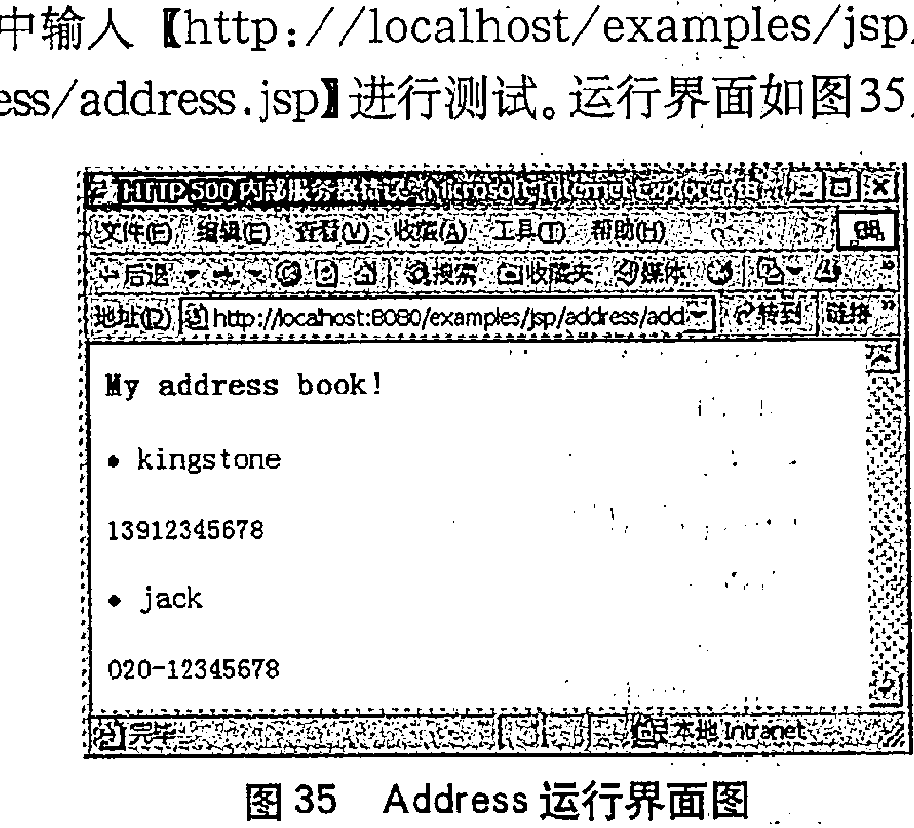

### 五、JSP实例

到现在，你已经了解或者掌握了JSP的主要内容了，下面通过一些网站建设过程中比较实用的例子再来巩固一下这些知识。

#### （一）网站欢迎词

网站欢迎词是很多网站应用的一种手法，其要领就是通过GregorianCalendar类取得当前的时间，根据时间段，进行个性化提示。在这里用到了Switch-Case分支语句，大家可以学学，代码如下：

```
<html>
<head>
<title>Welcome to sample</title>
</head>
<body>
<h5>Welcome to kingstone studio</h5>
<hr>
<%@ page import="java.util.*"%>
<%
int time;
GregorianCalendar timenow;
timenow=new GregorianCalendar();
time=timenow.get(Calendar.HOUR_OF_DAY);

switch(time)
{
case 0:
    out.print("too late?have a rest!");
    break;
case 1:
    out.print("1");
    break;
case 2:
    out.print("2");
    break;
case 3:
    out.print("3");
    break;
case 4:
    out.print("4");
    break;
case 5:
    out.print("5");
    break;
case 6:
    out.print("6");
    break;
case 7:
    out.print("7");
    break;
case 8:
    out.print("8");
    break;
case 9:
    out.print("9");
    break;
case 10:
    out.print("10");
    break;
case 11:
    out.print("11");
    break;
case 12:
    out.print("12");
    break;
case 13:
    out.print("13");
    break;
case 14:
    out.print("14");
    break;
case 15:
    out.print("15");
    break;
case 16:
    out.print("16");
    break;
case 17:
    out.print("17");
    break;
case 18:
    out.print("18");
    break;
case 19:
    out.print("19");
    break;
case 20:
    out.print("20");
    break;
case 21:
    out.print("21");
    break;
case 22:
    out.print("22");
    break;
case 23:
    out.print("23");
    break;
case 24:
    out.print("work so hard:(");
    break;
}
%>
</body>
</html>
```

##### 实例建立调试步骤如下：

-   1. 打开UltraEdit；
    2. 新建文件，输入上述代码；
    3. 保存文件为：【F:\jswdk-1.0.1\examples\jsp\welcome.jsp】；
    4. 运行【startserver.bat】，启动JSWDK；
    5. 打开IE；
    6. 浏览 http://localhost:8080/example/jsp/welcome.jsp；
    7. 运行界面如图36所示，表明调试成功。

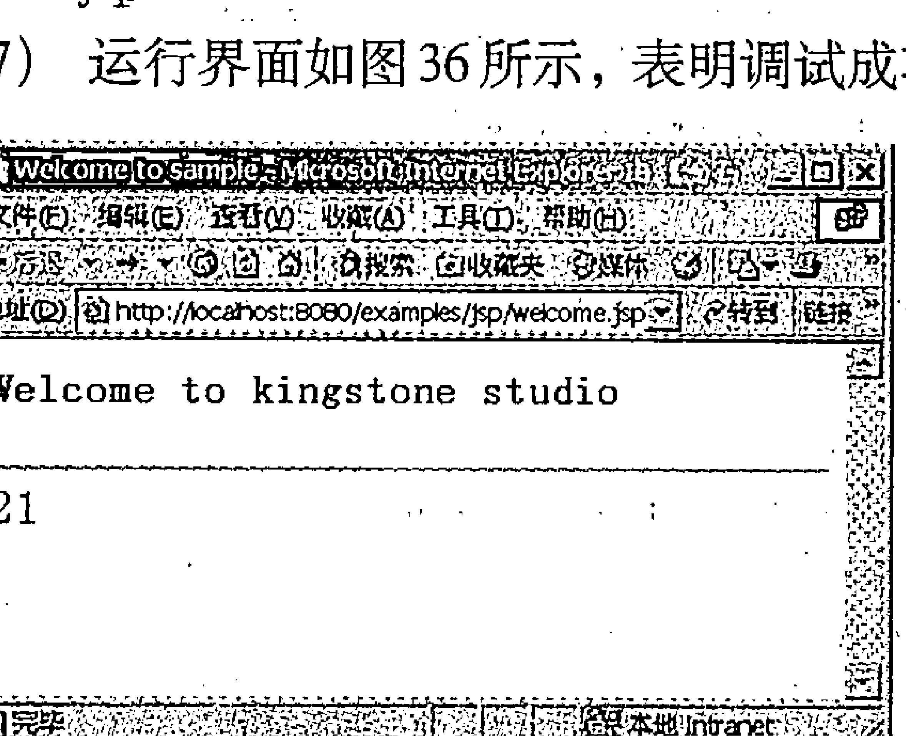

#### （二）计数器

计数器是网站统计用户量经常使用的一种手段，这里举一个简单的计数器制作，详细说明计数器的制作过程。具体步骤如下：

-   (1) 在【F:\jswdk-1.0.1\examples\WEB-INF\jsp\beans】目录下新建【counter】目录；
    (2) 打开 UltraEdit；
    (3) 新建文件，保存为：【F:\jswdk-1.0.1\examples\WEB-INF\jsp\beans\counter.java】；
    (4) 在【counter.java】文件中，输入如下代码：

```
package counter;

public class counter
{
    int count = 0;
    public counter(){}

    public int getCount()
    {
        count++;
        return this.count;
    }

    public void setCount(int count)
    {
        this.count = count;
    }
}
```

-   (5) 运行【JAVAC counter.java】，编译生成【counter.class】文件；
    (6) 在【F:\jswdk-1.0.1\examples\jsp】下新建【counter】目录；
    (7) 打开 UltraEdit；
    (8) 新建文件，保存为：【F:\jswdk-1.0.1\examples\jsp\counter\counter.jsp】
    (9) 在【counter.jsp】文件中，输入如下内容：

```
<HTML>
<HEAD>
<TITLE>Counter sample</TITLE>
</HEAD>
<BODY>
<H1>
Counter sample
</H1>
<br>

<jsp:useBean id="counter" scope="application"
class="counter.counter" />

You are the [
<jsp:getProperty name="counter" property="count" />
] user of this system!

</BODY>
</HTML>
```

-   (10) 运行【startserver.bat】，启动JSWDK；
    (11) 打开IE；
    (12) 浏览：http://localhost:8080/examples/jsp/counter/counter.jsp
    (13) 运行界面如图37所示，调试成功。

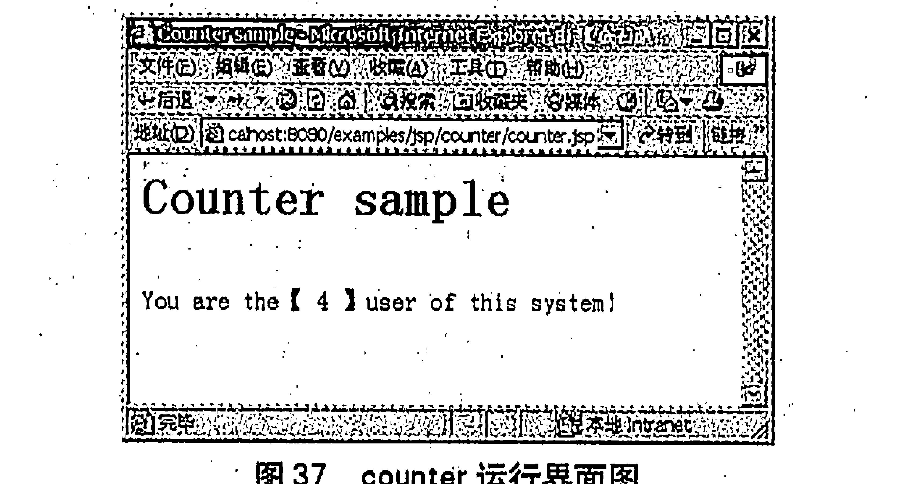

以上是计数器的一个十分简单的例子，存在两个不足的地方：

首先，计数器的结果没有保存，当JSWDK服务器重新启动后，计算器又将从1开始。解决的方法是把计数存入数据库或者文件。当服务器启动时，从数据库或者文件中读取计数器，初始化计数器；当服务器关闭时，把计数器结果写入数据库或者文件。

其次，计数器的界面过于简单，应该图形化。

限于篇幅，这些问题留待读者朋友参考JSP方面资料后自行解决。

#### （三）网站登录功能

专业一点的网站都会有自己一套网站登录功能，这对商务性网站尤为必要。下面我们结合一个网站登录功能的制作，详细介绍这一功能的实现过程。

这个实例也用到前述的 JDBC - ODBC Bridge 连接Access2000数据库功能，实例的工作过程如下：

首先，通过登录的页面（login.jsp）要求用户输入用户名和密码，然后通过密码检测页面（login_check.jsp，本例核心）进行用户和密码有效性检验，最后通过检验结果页面（login_result.jsp）将检验的结果返回给用户。

开始实例介绍之前，必须在【F:\jswdk-1.0.1\examples\jsp】下新建【login】目录，用于保存这个实例的数据库（user.mdb）和JSP（login.jsp、login_check.jsp、login_result.jsp）等文件；在【F:\jswdk-1.0.1\examples\WEB-INF\jsp\beans】目录下新建【login】目录，用于保存数据库连接的Bean代码的源代码（login.java）和编译后的类文件（login.class）等。

下面来看看详细的实现过程：## 1. 规划和建立数据库
要进行数据库的操作首先必须规划和建立数据库。这里我们使用Access2000建立数据库【user.mdb】文件（保存在【F：\jswdk-1.0.1\examples\jsp\login】目录下）。在【user.mdb】中建立【user】表，该表含【name】（文本类型，长度16）和【password】（文本类型，长度8）两个字段，具体制作过程参考前述【Address】实例。

##### 2. 设置ODBC
选择【开始】→【设置】→【控制面板】→【管理工具】→【数据源（ODBC）】，在【系统DSN】页中添加数据源，选择Access驱动程序，设置【数据源名】为【user】，数据库【选择】为【F:\jswdk-1.0.1\examples\jsp\login】目录下的【user.mdb】文件，具体过程参考前述【Address】实例。

##### 3. 编写并编译【login.java】
建好数据库后，编写【login.java】文件（保存在【F:\jswdk-1.0.1\examples\WEB-INF\jsp\beans\login】目录下），用于操作数据库。代码如下：

```
package login;
import java.sql.*;

public class login {
    String sDBDriver = "sun.jdbc.odbc.JdbcOdbcDriver";
    String sConnStr = "jdbc:odbc:user";
    private Connection conn = null;
    private Statement stmt = null;
    ResultSet rs = null;

    public login() {
        try {
            Class.forName(sDBDriver);
        }
        catch(java.lang.ClassNotFoundException e) {
            System.err.println("login(): " + e.getMessage());
        }
    }

    public ResultSet executeQuery(String sql) {
        rs = null;
        try {
            conn = DriverManager.getConnection(sConnStr);
            stmt = conn.createStatement();
            rs = stmt.executeQuery(sql);
        }
        catch(SQLException ex) {
            System.err.println("aq.executeQuery: " + ex.getMessage());
        }
        return rs;
    }

    public void executeUpdate(String sql) {
        stmt = null;
        rs=null;
        try {
            conn = DriverManager.getConnection(sConnStr);
            stmt = conn.createStatement();
            stmt.executeQuery(sql);
            stmt.close();
            conn.close();
        }
        catch(SQLException ex) {
            System.err.println("aq.executeQuery: " + ex.getMessage());
        }
    }

    public void closeStmt(){
        try{
            stmt.close();
        }
        catch(SQLException e){
            e.printStackTrace();
        }
    }

    public void closeConn(){
        try{
            conn.close();
        }
        catch(SQLException e){
            e.printStackTrace();
        }
    }
}
```

写好代码后，需要把【login.java】编译成【login.class】文件。选择【开始】→【运行】，运行【cmd】命令，进入【F:\jswdk-1.0.1\examples\WEB-INF\jsp\beans\login】目录，输入【JAVAC login.java】命令，编译成功后生成【login.class】文件。具体过程参考前述【Address】实例。

##### 4. 编写【login.jsp】
编写【login.jsp】文件（保存在【F:\jswdk-1.0.1\examples\jsp\login】目录下），代码如下：

```
<html>
<head>
<title>login</title>
</head>

<script language="JavaScript">
function isValid(form){
    if(form.user_id.value==""){
        alert("请输入用户名！");
        form.user_id.focus();
        return false;
    }
    if(form.password.value==""){
        alert("请输入密码！");
        form.password.focus();
        return false;
    }
    return true;
}
</script>

<body>
<center>
<h1>用户登录</h1>
<form method="post" action="check.jsp" onSubmit="return isValid(this)">
用户名：<input type="text" name="user_id" size="20"><br>
密码：<input type="password" name="password" size="20"><br><br>
<input type="submit" value="登录">
<input type="reset" value="重置">
</form>
</center>
</body>
</html>
```

```
<html>
<head>
<title>login</title>
</head>
<script language="JavaScript">
function isValid(form){
    if(form.user_id.value==""){
        alert("User name can not be null");
        return false;
    }
    else if((form.password.value.length<3)||(form.password.value.length>8)){
        alert("Password must > 8!");
        return false;
    }
    else {
        return true;
    }
</script>

<body>
<center>
<%
String getmessage = (String) session.getValue("login_message");
if(getmessage==null) getmessage="";
%>
<FORM METHOD=POST action="login_check.jsp" onSubmit="return isValid(this);">
<%= getmessage %>
<TABLE width='60%' height="150" border='1'>
<TR>
<TD colspan=2 align='center'>Please login for</TD>
</TR>
<TR>
<TD align='left'>User name for</TD>
<TD><INPUT TYPE="text" NAME="user_id"></TD>
</TR>
<TR>
<TD align='left'>Password for</TD>
<TD><INPUT TYPE="password" NAME="password"></TD>
</TR>
<TR>
<TD colspan=2 align="center">
<INPUT TYPE="submit" size="4" value="login">
</TD>
</TR>
</TABLE>
</FORM>
</center>
</body>
</html>
```

```
<html>
<head>
<title>login check</title>
</head>
<body>
<%@ page language="java" import="java.sql.*" %>
<jsp:useBean id="Login" scope="page" class="login.login" />
<%
String name1=request.getParameter("user_id");
String pwd1=request.getParameter("password");
String sql="select * from user where name='"
+ name1 + "' and password='" + pwd1 + "'";
ResultSet rs = Login.executeQuery(sql);
if(rs.next()) {
rs.close();
Login.closeStmt();
Login.closeConn();
session.putValue("username",name1);
%>
<script language=javascript>
window.location="login_result.jsp?showword=login"
</script>
<% }
else{
rs.close();
Login.closeStmt();
Login.closeConn();
String msg="Login error!";
session.putValue("login_message",msg );
%>
<jsp:forward page="login.jsp"/>
<% } %>
</body>
</html>
```

##### 5. 编写【login_check.jsp】
编写【login_check.jsp】文件（保存在【F:\jswdk-1.0.1\examples\jsp\login】目录下），代码如上。

##### 6. 编写【login_result.jsp】
编写【login_result.jsp】文件（保存在【F:\jswdk-1.0.1\examples\jsp\login】目录下），代码如下：

```
<html>
<head>
<title>Login success</title>
</head>
<body>
<%
session.putValue("loginSign","OK");
%>
<center>
<%= request.getParameter("showword")%> success!
</center>
</body>
</html>
```

运行【F:\jswdk-1.0.1\startserver.bat】命令，启动JSWDK Web服务器。启动IE浏览器，在地址栏中输入【http://localhost/examples/jsp/login/login.jsp】进行测试。运行界面如图38所示。

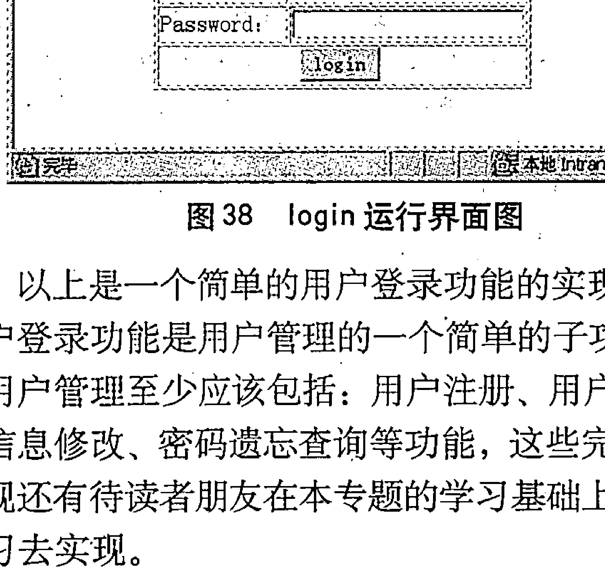

以上是一个简单的用户登录功能的实现。事实上用户登录功能是用户管理的一个简单的子功能，完整的用户管理至少应该包括：用户注册、用户登录、用户信息修改、密码遗忘查询等功能，这些完整的功能实现还有待读者朋友在本专题的学习基础上继续深入学习去实现。

#### （四）综合实例——JSP制作新闻发布系统
这里以安安论坛为例进行讲解，这是一个免费的论坛程序，是由JSP结合Access数据库制作。通过学习和修改这个实例，我们可以编写自己的新闻发布系统。读者可以到http://www.aspaky.net/download/down/200121742332.zip去下载安安论坛程序。

接下来我们结合对安安论坛的安装使用的介绍来体验和感受一下JSP的应用。

##### 1. 论坛程序的安装
(1) 解压【200121742332.zip】文件；在【F:\jswdk-1.0.1\examples\jsp】下新建【bbs】目录，把解压后【200121742332】下的所有文件及目录（除JAVAClass目录外）拷贝到新建目录下。
(2) 在【F:\jswdk-1.0.1\examples\WEB-INF\jsp\beans】下新建【test】目录，把解压后【200121742332\JAVAClass\test】目录下所有文件拷贝到新建目录下。
(3) 设置ODBC：【开始】→【设置】→【控制面板】→【管理工具】→【数据源（ODBC）】，添加系统DSN，名为【BBS】，连接到【F:\jswdk-1.0.1\examples\jsp\bbs】下的【bbs01.mdb】文件，不要设置用户名及密码。

注意：【F:\jswdk-1.0.1\examples\WEB-INF\jsp\beans\test】目录中bbsreg.java包含数据库连接部分，必要时可重新编译（JAVAC bbsreg.java）；论坛管理员名及密码：anan。

##### 2. 论坛测试
安装完成后，启动JSWDK服务器，浏览【http://localhost:8080/examples/jsp/bbs/index.htm】地址进行测试，如果运行界面图如图39所示，证明论坛程序运行正常。

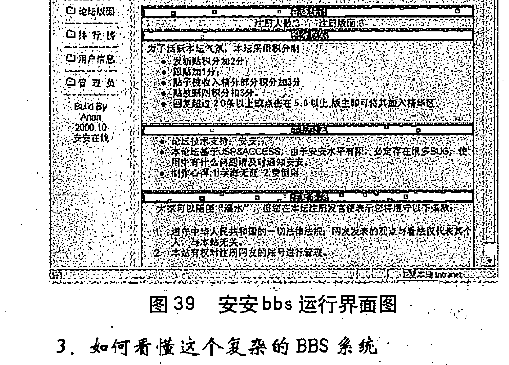

##### 3. 如何看懂这个复杂的BBS系统
要想看懂一个复杂的JSP系统，这里建议你采用“顺藤摸瓜”的方式。我们知道Macromedia Dreamweaver UltraDev 4中有一个站点导航（网站地图）功能。拿到一个JSP系统代码后，你要做的就是把这个系统代码分解到这个导航中。我们试着把上述系统分解如图40所示。

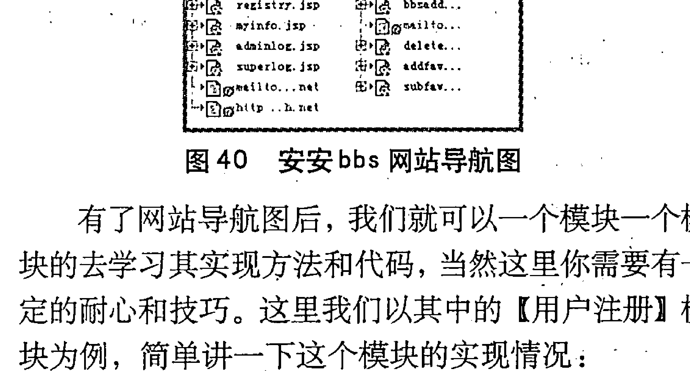

有了网站导航图后，我们就可以一个模块一个模块的去学习其实现方法和代码，当然这里你需要有一定的耐心和技巧。这里我们以其中的【用户注册】模块为例，简单讲一下这个模块的实现情况：

【用户注册】模块的核心代码是【registry.jsp】文件，这个文件又包括了：用户输入信息有效性的查询（如是否为空，密码是否合法）、用户重名处理、新用户信息添加到数据库和用户注册成功提示等。如新用户信息添加代码如下：

```
user.setUserName(username);
user.setUserPassword(userpassword);
user.setUserEmail(useremail);
user.setUserHomepage(userhomepage);
user.setUserHomepagename(hpname);
user.setUserSex(usersex);
user.setUserComefrom(comefrom);
user.setUserClass(userclass);
user.setUserSign(usersign);
user.registryNewUser();
%>
```

这里首先通过调用操作数据库的Bean（在文件开头已经定义好了，语句为：<jsp:useBean id="user" class="test.bbsuser" scope="page"/>)的setUser方法设置用户的信息，然后再通过registryNewUser方法把用户信息加入数据库。

这样层层剖析，最终你应该会理解这些代码的！了解了这段代码后，我们来试一试把它改编成一个新闻发布系统。

这个实例用到上述的JDBC–ODBC Bridge连接Access2000数据库，实例开始前你必须知道这个实例的结构，如表5所示。

表5 程序文件结构

| 文件 | 功能 |
|---|---|
| F:\jswdk-1.0.1\examples\jsp\news\news.mdb | 程序的数据库 |
| F:\jswdk-1.0.1\examples\jsp\news\news.jsp | 程序的新闻罗列页面 |
| F:\jswdk-1.0.1\examples\jsp\news\search.jsp | 程序的搜索引擎 |
| F:\jswdk-1.0.1\examples\jsp\news\text | 程序文本保存的地方 |
| F:\jswdk-1.0.1\examples\jsp\news\logo.jpg | 程序的Logo |
| F:\jswdk-1.0.1\examples\WEB-INF\jsp\beans\news\news.java | 用于连接数据库的Java代码 |
| F:\jswdk-1.0.1\examples\WEB-INF\jsp\beans\news\news.class | 编译后的连接数据库Java代码 |

这个实例通过连接数据库后，把数据库中的信息取出，显示在浏览器上。用户可以通过搜索引擎搜索内容。

下面来看看详细的实现过程，其操作过程具体如下：

(1) 规划和建立数据库
数据库的操作首先必须规划和建立数据库，这里我们使用Access2000建立数据库【news.mdb】文件，在【news.mdb】中建立【news】表，该表结构如图41所示（注意根据说明进行设置）：

图41 news表结构

| 字段名称 | 数据类型 | 说明 |
|---|---|---|
| id | 自动编号 | 索引，数据类型【自动编号】，设置为主键 |
| subject | 文本 | 新闻标题，数据类型【文本】，大小【50】 |
| text | 文本 | 新闻所在路径，数据类型【文本】，大小【50】 |
| user | 文本 | 新闻建立用户，数据类型【文本】，大小【50】 |
| email | 文本 | 新闻建立用户邮件，数据类型【文本】，大小【50】 |

(2) 设置ODBC
选择菜单【开始】→【设置】→【控制面板】→【管理工具】→【数据源（ODBC）】，在【系统DSN】页中添加数据源，驱动程序为Access，设置【数据源名】为【news】，数据库【选择】为【F:\jswdk-1.0.1\examples\jsp\news】目录下的【news.mdb】文件。

(3) 编写并编译【news.java】
建好数据库后，编写【news.java】文件，用于操作数据库。代码如下：

```
package news;
import java.sql.*;

public class news {
    String sDBDriver = "sun.jdbc.odbc.JdbcOdbcDriver";
    String sConnStr = "jdbc:odbc:news";
    Connection conn = null;
    ResultSet rs = null;

    public news() {
        try {
            Class.forName(sDBDriver);
        }
        catch(java.lang.ClassNotFoundException e) {
            System.err.println("news(): " + e.getMessage());
        }
    }

    public ResultSet executeQuery(String sql) {
        rs = null;
        try {
            conn = DriverManager.getConnection(sConnStr);
            Statement stmt = conn.createStatement();
            rs = stmt.executeQuery(sql);
        }
        catch(SQLException ex) {
            System.err.println("aq.executeQuery: " + ex.getMessage());
        }
        return rs;
    }
}
```

写好代码后，需要把【news.java】编译成【news.class】文件。选择【开始】→【运行】，运行【cmd】命令，进入【F:\jswdk-1.0.1\examples\WEB-INF\jsp\beans\news】目录，输入【JAVAC news.java】命令进行编译。

##### （4）编写【news.jsp】

代码如下：

```
<html>
<head>
<title>my bbs sample</title>
</head>
<body>
<!--设置Logo-->
<p align="left"><b>
<!--设置欢迎词-->
<marquee style="font-size: 24pt; font-weight: bold" width="753" height="32">Welcome to Kingstone News System!</marquee>
</b></p>
<!-- 搜索引擎表单，记住“textfield”这个变量名，后面有用 -->
<form name="form1" method="post" action="http://localhost:8080/examples/jsp/news/search.jsp">
<input type="text" name="textfield">
<input type="submit" name="Submit" value="search">
</form>
<p>&nbsp;</p>
<!-- 设置 JSP 的页面引用，用到SQL -->
<%@ page language="java" import="java.sql.*" %>
<!-- 引用前面编译的 News.java 这个 Bean，它的 ID 是 “data” -->
<jsp:useBean id="data" scope="page" class="news.news" />
<!-- 列出所有新闻编号 ID、新闻创建用户 user、新闻标题 subject，并连接到 email 地址，text 地址等相应的信息上 -->
<%
ResultSet RS = data.executeQuery("SELECT * FROM news");
String id,subject,text,user,email;
while (RS.next()) {
id = RS.getString("id")+". ";
subject = RS.getString("subject");
text = RS.getString("text");
user = RS.getString("user");
email = RS.getString("email");
%>
<table border="0" width="100%">
<tr>
<td width="8%">
<% out.print(id); %>
</td>
<td width="14%">
<a href="mailto:<% out.print(email); %>">
<% out.print(user); %>
</a>
</td>
<td width="78%">
<a href="http://localhost:8080/examples/jsp/news/text/<% out.print(text); %>">
<% out.print(subject); %>
</a>
</td>
</tr>
</table>
<% }
RS.close();
%>
</body>
</html>
```

运行【F:\jswdk-1.0.1\startserver.bat】,启动JSWDK Web服务器。启动IE浏览器，在地址栏中输入【http://localhost/examples/jsp/news/news.jsp】进行测试。运行界面如图42所示。

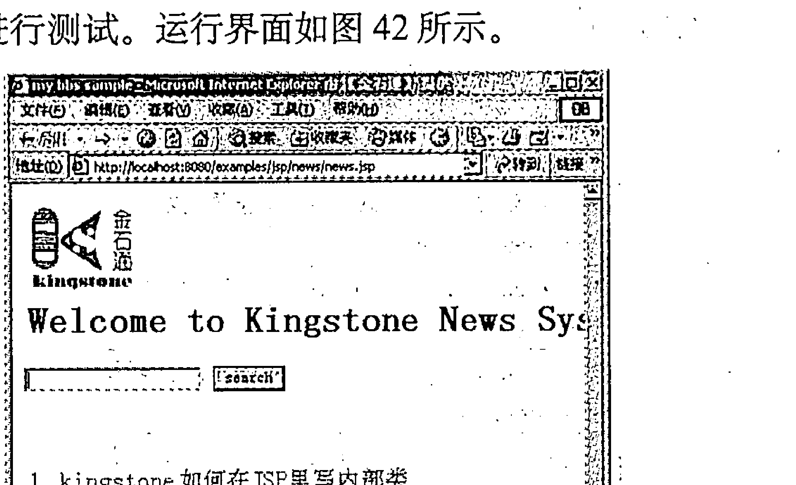

图 42 news 首页运行界面图

##### （5）编写搜索引擎【search.jsp】

代码如下：

```
<html>
<head>
<title>search</title>
</head>
<body>
<p><b>Search result:</b></p>
<%@ page language="java" import="java.sql.*" %>
<jsp:useBean id="data" scope="page" class="news.news" %>
<%
<!-- 定义搜索的变量和 SQL 语句 -->
String strSearch,sql;
String id,subject,text,user,email;
<!-- 取得搜索的内容，连接到前面提到的 textfield 上 -->
strSearch = request.getParameter("textfield");
<!-- 构造SQL语句 -->
sql="SELECT * FROM news WHERE subject LIKE '%"+strSearch+"%';";
<!-- 运行SQL语句，搜索 -->
ResultSet RS = data.executeQuery(sql);
<!-- 将搜索结构列出，与news.jsp内容类似 -->
while (RS.next()) {
id = RS.getString("id")+". ";
subject = RS.getString("subject");
text = RS.getString("text");
user = RS.getString("user");
email = RS.getString("email");
%>
<table border="0" width="100%">
<tr>
<td width="8%">
<% out.print(id); %>
</td>
<td width="14%">
<a href="mailto:<% out.print(email); %>">
<% out.print(user); %>
</a>
</td>
<td width="78%">
<a href="http://localhost:8080/examples/jsp/news/text/<% out.print(text); %>">
<% out.print(subject); %>
</a>
</td>
</tr>
</table>
<%}
RS.close();
%>
</body>
</html>
```

运行【F:\jswdk-1.0.1\startserver.bat】命令，启动 JSWDK Web 服务器。启动 IE 浏览器，在地址栏中输入【http://localhost/examples/jsp/news/news.jsp】，然后在搜索内容中输入搜索内容（如【JSP】)，进行测试。运行界面如图 43 所示。

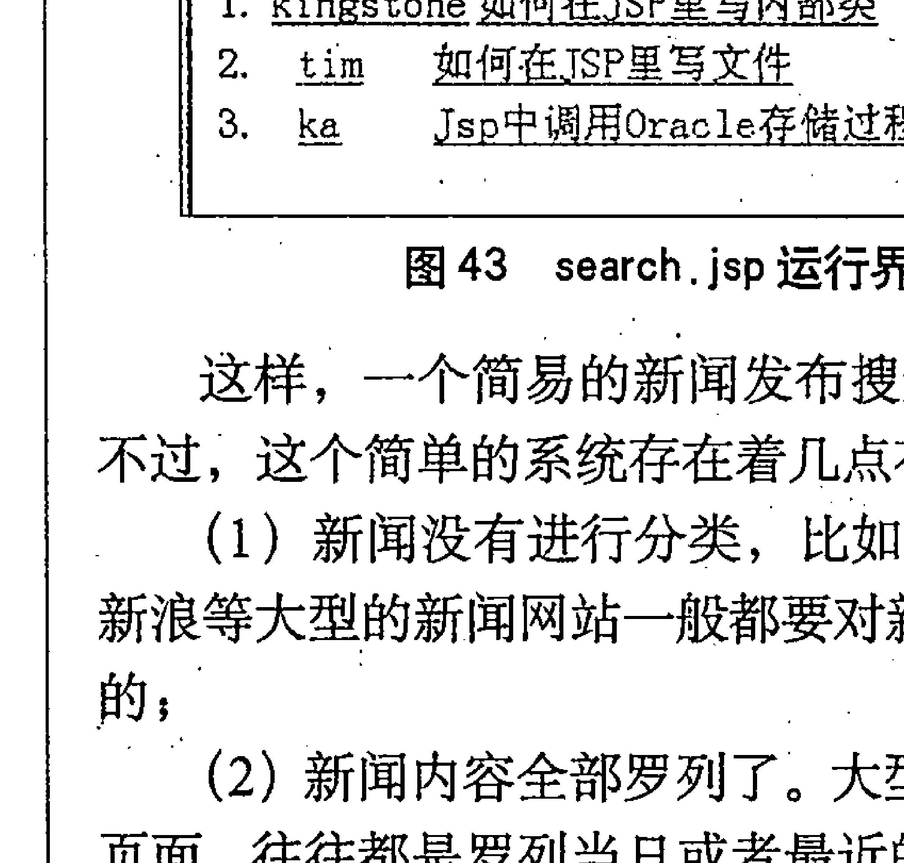

这样，一个简易的新闻发布搜索系统就完成了。不过，这个简单的系统存在着几点有待改进的地方：

- 1. 新闻没有进行分类，比如体育类、娱乐类。新浪等大型的新闻网站一般都要对新闻进行细化分类的；
- 2. 新闻内容全部罗列了。大型的新闻网站限于页面，往往都是罗列当日或者最近的新闻，全部新闻一般通过【更多】等按钮显示；
- 3. 新闻查看的窗口没有编制。较为专业的新闻网站的新闻阅读窗口一般包括：新闻内容、相关内容罗列、用户反馈信息、推荐给好友等功能。

(注：①本专题实例代码下载地址是【Http://kingstone.cn2088.com/jsp/sample.zip】；②本专题实例调试平台为：Windows2000 Professional、JDK1.4.0、JSDK1.0.1、Access2000；③平台安装路径：Windows2000 Professional安装在【F:\WINNT】目录下，JDK1.4.0安装在【F:\j2sdk1.4.0】目录下，JSDK1.0.1安装在【F:\jswdk-1.0.1】目录下。如果你的系统安装路径和本专题调试路径有所不同的话，请修改相应的代码）

(文 / 金石通工作室)

### Win32汇编编程实例

汇编语言在DOS系统中是一个最基本也是最重要的编程手段，但自从进入Windows时代后，它的作用和用途就显得不那么重要了，以致于那些在Windows中才开始接触计算机的朋友们，就根本不知道汇编语言是怎么回事。实际上，汇编语言并没有停止发展，其版本一直在不断地更新，其功能也在不断地加强，如今新版本的Win32汇编语言，同样也可以编译开发出具有精美漂亮的用户界面和功能繁多的Windows应用程序。

也许一提到汇编程序，您就会想到名目繁多的中断调用、各种寄存器的使用和堆栈的进出等等那些使人目不暇接的程序代码，将使您感到头昏脑涨。其实不然，由于编制Windows程序的最基本的手段是使用API（应用程序编程接口），无论是在VC++、Delphi或VB中都是一样，它们中的控件和类库都是构筑在API的基础上的，只是对API的封装而已。Win32汇编语言的主体同样也是以API为基础，通过对各种API函数的调用，来完成程序所要求的各种功能作用。因此，Win32汇编语言其程序结构和代码量都要比DOS中的汇编语言要精炼得多。

对于一个程序员或一个编程爱好者，多掌握一种编程语言对提高自己的编程效率，解决编程中所遇到的难题是大有好处的。并且Win32汇编语言在编制某些简单的Windows应用程序或工具软件等方面，有其独到之处。

您只要具有用C++和Windows的API编程的基础和经验，学习Win32汇编语言将不是一件难事。作为一个编程爱好者或初学者，最有效和最简单的学习方法就是亲自剖析和编译已编译成功的程序源代码。为此，本文的后面将以几个小工具程序（源代码及编译说明都收集在附录光盘中）为例，引导大家学习Win32汇编语言编程。需要说明的是，对于所举实例中的程序代码，不便于在文章中一一交待清楚，只能对其主要部分进行分析，不过，只要您在阅读本文的同时再参照一下附录光盘中的完整源程序代码，还是不难理解的。本文所有的源程序最终编译结果在附录光盘的“Win32汇编编程实例”文件夹下。

### 一、预备知识

#### (一) Win32汇编程序代码结构

Win32汇编与DOS汇编的程序代码结构非常相似，但在某些地方还是有一些区别的，我们先来看看程序一。

```
.386
.MODEL FLAT, STDCALL
OPTION CASEMAP :NONE
.DATA
......
.DATA?
......
.CONST
......
.CODE
START:
......
END START
```

编程者只要在上述代码模块中的各个关键字下写上相应的程序代码，就可以编制出具有不同功能作用的应用程序来，无论多么复杂的程序都是在此基础上充实和扩展而来的。我们先对汇编程序中的关键字（指令、伪指令和宏命令）做些说明，虽然这些会使您感到枯燥，但为了后面的学习能顺利进行，您还必须先要了解它们。对上述Win32汇编程序模块代码中所出现的一些关键字的含义和功能解释如下：

`.386`——这是一个方式伪指令，它告诉编译器当前程序是用80386指令集编写的。当然根据需要您还可以使用`.486`、`.586`等，但一般使用`.386`就可以了。

`.MODEL`——用来指定内存的寻址模式。不过在Win32模式下只有一种内存寻址模式，那就是`FLAT`，因为对于Win32来说，内存是连续的一个4GB的段，没有其他大或小的模式。

`STDCALL`——告诉编译器参数的传递规则。参数的传递规则是指参数在传送时的顺序（从左到右或从右到左）和由谁恢复堆栈指针（调用者或被调用者）。在Win16下一般有两种传送规则，即`C`和`PASCAL`：

`C`约定参数传递的顺序是从右到左，即最右边的参数最先入栈，由调用者恢复堆栈指针。
`PASCAL`约定和C约定正好相反，它规定参数是从左向右传递，由被调用者恢复堆栈。

在Win32汇编语言中则使用的是`STDCALL`传递规则，它是将`C`和`PASCAL`传递规则的某些特点综合在一起，即它规定程序代码参数的传递顺序是从右到左，而恢复堆栈的工作则由被调用者完成。

`OPTION CASEMAP:NONE`——告诉MASM编译器在汇编程序代码中，其字母的大小写所表示的内容是不一样的，譬如：`start`和`START`在MASM汇编程序源代码中应为不同的字符串。`OPTION CASEMAP`语句有三个参数：`ALL`、`NONE`、`NOTPUBLIC`。它们与LINK连接程序中的`/Cu`、`/Cp`、`/Cx`三个参数相对应。若编程者在源代码未使用`OPTION CASEMAP:NONE`语句的话，则在LINK命令行中则必须添加`/Cp`参数；若编程者在源代码中使用了`OPTION CASEMAP:NONE`语句，在执行LINK连接程序时，则`/Cp`参数可有可无。

`.data`——声明在程序中所需要的变量，在该关键字下声明的变量，有一个初始变量值。在程序加载时，将占用系统内存资源。

`.data?`——声明在程序中所需要的变量，在该关键字下声明的变量，没有初始值，因此，在程序加载之初，并不占用系统资源，而是在程序的执行过程中根据该变量的具体大小，来动态的分配内存资源。

`.const`——声明在程序中所需要的常量，这些常量中的值在程序的运行过程中是不能改变的。

`.code`——在该关键字以下，就是程序的执行代码，是程序代码的主要部分。

在Win32汇编语言中，像这样的指令、伪指令和宏命令还有很多，在下面的内容中将结合具体的内容再陆续予以介绍。

上述程序一可以在MASM编译器下编译成功，但不能正常运行。能编译成功说明其语法格式是正确地，不能正常运行则是因为其中没有一句可执行的语句。下面将在程序一的基础上再增添几行代码，编译出来的程序就可以正常运行了，见下面程序二。

##### 程序二：

```
.386
.MODEL FLAT, STDCALL
OPTION CASEMAP:NONE

INCLUDE kernel32.inc
INCLUDE user32.inc
INCLUDE windows.inc

INCLUDELIB kernel32.lib
INCLUDELIB user32.lib
INCLUDELIB windows.lib

.DATA
szCaption db "Win32汇编编程示例",0
szText    db " 这是用汇编语言编译出来的Windows程序!",0

.CODE
start:
   INVOKE MessageBox, NULL, addr szText, addr szCaption, MB_OK
   INVOKE ExitProcess, NULL
END start
```

将程序二编译成功后，运行该程序就可以在屏幕上显示出一个对话框来（如图1）。

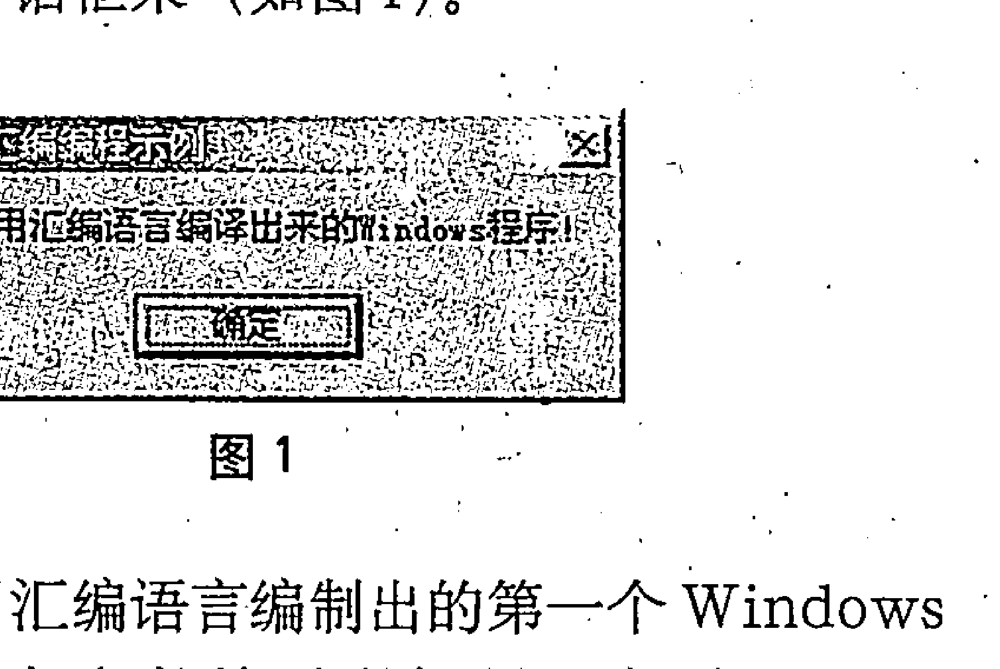

这就是您用汇编语言编制出的第一个 Windows 程序。如若不信请看对话框中的标题和对话框中的内容，是不是您在程序代码中所设置的字符串。下面再对在程序二中出现的新关键字的功能作用进行介绍：

- **INCLUDE**: 该宏命令可以使编译器在编译程序代码时，可将指定的扩展名为.inc的文件包含到汇编程序中。.inc文件中是一些数据和函数原型。例如，若用户需要在程序中使用“NULL”参数，则程序代码中必须要有“INCLUDE Windows.inc”语句，因为NULL表示的是数值0，它在Windows.inc文件中是这样声明的“NULL equ 0”，若在程序代码中没有INCLUDE Windows.inc语句，则编译器将不知道NULL所代表的是什么。
- **INCLUDELIB**: 同样也是将扩展名为.lib的库文件包含到汇编程序中。
- **INVOKE**: 在汇编程序中调用子程序时，其参数的传递是通过堆栈来进行的，例如，`MessageBox()`函数在user32.inc文件中是这样声明的：
  `MessageBox(HWND hWnd,LPCTSTR lpText,LPCTSTR lpCaption,UINT uType );`
  那么在汇编程序中，我们可以这样调用它：
  ```
  push uType
  push lpCaption
  push lpText
  push hWnd
  call MessageBox
  ```
  `push` 为汇编语言中的进栈指令。上面语句的原理是先将函数所需要的参数，压入到堆栈中去，然后再用`call`指令来调用该函数（在汇编语言中可称为模块或子程序，实际上API函数就是具有不同功能和作用的程序模块或进程）。

要注意的是，在上述的参数进栈过程中，是从左到右依次压入的，即最右面的参数是最后一个进堆栈，而恢复堆栈的工作则由被调用者完成。栈，采用的是PASCAL规则。这样调用虽然可以，但如果在程序的每一个API函数都来这样调用的话，一个是太麻烦，另一个则是很容易出错。为此，在新版本的Masm编译器中增添了一个宏命令，那就是`INVOKE`。

```
invoke MessageBox, NULL, addr szText, addr szCaption, MB_OK。
```

`Addr`——用来把变量参数的地址传递给被调用的函数（注意，是所指变量在内存中的地址，而不是变量中的值），它只能在`invoke`语句中使用。

在Windows中有许多资源供其它开发者来使用，其中最为重要的就是API（Application Programming Interface）。API表现为一个个的函数，这些函数被包含在不同的动态链接库(DLL)中。在上面程序中的`ExitProcess`，实际上就是一个API函数，它的功能就是使当前进程退出运行。正因为如此，编写Win32汇编程序将比编写DOS中的汇编程序，相对来说要简单得多。因为在DOS中有许多需要由编程者来完成的许多基础工作，如今在Win32汇编中大部分都是在API函数中就完成了，这样既省事又不容易出错。

#### (二) Win32汇编程序的编译

若要使编辑的汇编程序能在Windows系统中正常地运行，还必须对其进行编译和连接。Win32汇编程序编译器通常有两种：一种是Borland公司的Tasm5.0，另一种则是Microsoft的Masm6.11。根据各人的爱好使用哪一种都是可以的，但要注意的是，这两种编译器所使用的宏命令以及汇编格式是不尽相同的。而这两个编译器各有自己的优缺点，建议大家使用Masm32V5编译器，因为该编译器中带有比较完整的.inc文件，对于.inc文件的重要性不用我讲，您在具体的使用过程中就会感悟到的，没有它编译将无法进行。本文中所有的实例程序都是用Masm32V5编译的，Win32汇编程序的编译过程简单的介绍如下：

首先，应将编辑出的汇编源程序文件（扩展名应为.asm）编译成扩展名为.obj的目标文件，为了最终产生出能在Windows系统中运行的PE格式的可执行文件（.exe），在实际编译中应注意使用相关的参数。其编译语法是：

```
ML /c /coff /Cp *.asm
```

其中：`ML`为编译程序文件名。`/c` 表示只编译不自动连接。`/coff` 表示编译成COFF格式的OBJ文件，COFF为通用目标文件格式。`/Cp` 表示程序代码中的标识字符要区分大小写，同样字符串的大写或小写表示的是不同的对象。若程序代码中有“OPTION CASEMAP :NONE”，该参数可以忽略。`*.asm` 为需要编译的汇编程序源代码文件。

然后，将编译出的.obj文件，用LINK连接程序将其连接成扩展名为.exe的可执行文件，其具体连接语法是：
`LINK /subsystem:windows /entry:start *.lib`
其中：`LINK`为连接程序文件名。`/ subsystem:windows`——表示需要将*.obj文件连接成普通的Windows可执行文件。`/entry:start`——表示该汇编程序的入口处是从`start`标识符开始。`*.obj`为需要连接的.obj文件，若有多个.obj文件则可以空一格顺序写入。若程序中还有资源文件的话，还必须对其进行编译和连接，其具体的编译方法将结合下面的相关内容来予以介绍。

### 二、颜色值提取器

上面所介绍的程序二只是调用了Windows系统中预定义的对话框，这样可以使程序代码比较简洁，大家可以看得更加清楚，但没有什么作用。接下来再向大家介绍一个程序代码相对复杂一些的实用工具软件。该工具软件可以非常方便地来拾取出屏幕中任意位置像素的颜色值，用户只要在对话框上的吸管图标上，按下鼠标左键并将其在屏幕上任意拖动，即可将吸管所指像素的颜色及其颜色值显示在对话框中。利用Win32汇编语言编制该软件，其文件大小只有5632字节，真可谓小巧玲珑（如图2）。其具体编辑步骤如下：

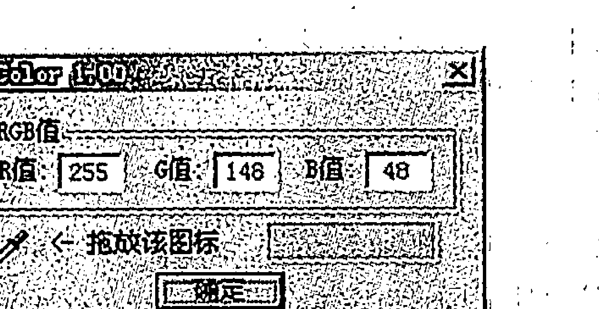

#### (一) 创建资源文件 (GetColor.rc)

在本程序中需要一个对话框模板、一个图标资源和一个光标资源，这些都可以通过创建一个资源文件来得到。

创建对话框模板的方法一般有两种：一种是通过使用 Windows 系统中的资源语句，用手工的方法一行行的编辑出来；另一种可以利用 VC++ 编译器将所需的资源文件创建出来。用 VC++ 编辑器来创建资源文件比较方便快捷，用手工的方法来编辑资源文件比较费时，但该方法具有灵活便于调整的特点。比较好的方法是先用 VC++ 编辑器将所需的资源文件创建出来，然后再用手工来对其进行一些修饰。

创建图标和光标文件的方法有多种，可以利用 VC++ 编辑器中所带的图像编辑器，还可以使用编辑图标或光标的工具软件，这些在网上都可以轻易地得到。需要提醒的是在编辑光标文件时，要注意热点的设置，在编辑图标时要注意透明色的选取，在本文的附录中已有上述两个图像文件可供选用。

由于在 Win32 汇编程序中资源文件的创建与 C++ 资源文件的使用方法是一样的，为了节约篇幅其具体创建过程及细节，在此就不细说了，详细内容请见附录中的 GetColor.rc 文件。如果您有编制 VC++ 程序的功底，那对该资源文件中内容的理解是不难的，但有一点需要说明一下，就是该文件首部 #include "resource.h" 语句中的 resource.h 预定义文件是 MASM 编译器中自带的文件，在具体编译时要注意其连接路径。下面主要说一说资源文件的编译和连接方法。

资源文件 (.RC)中的内容最终都要连接到应用程序的可执行文件 (.EXE) 中去，但 .RC 文件不能直接进行连接，必须预先将其编译成扩展名为 .RES 的资源文件或扩展名为 .OBJ 的目标文件，然后才能最终进行连接，在实际的编译过程中，上述两种文件只需要其中的一种即可。下面就来看看资源文件的编译次序和编译语法：

首先，应将扩展名为 .RC 文件编译成扩展名为 .RES 的文件，其方法是：

```
Rc GetColor.rc
```

其中，Rc 为 MASM 编译器中所带的 Rc.EXE 程序，是专门用来将 .RC 文件编译成 .RES 文件的工具，GetColor.rc 为所要编译的资源原文件。

然后，再将扩展名为 .RES 文件编译成扩展名为 .OBJ 的文件，其方法是：

```
Cvtres GetColor.res
```

其中，Cvtres 为 MASM 编译器中所带的 Cvtres.EXE 程序，也是专门用来将 .RES 文件编译成 .OBJ 文件的工具。

当将资源文件编译成为 .RES 文件或 .OBJ 文件后，就可以与 .ASM 文件所生成的 .OBJ 文件一起来进行连接，而生成扩展名为 .EXE 的可执行文件了。

#### （二）编辑源程序文件 (GetColor.asm)

按照前面所介绍的汇编程序代码结构，将相应的代码内容插入到代码结构中的对应关键字下就可以了，具体步骤及内容如下：

第一步：连接外部文件

用 include 和 includelib 语句将程序代码所需的 .inc、.lib 文件包含进来。

第二步：自定义一个宏

这个宏的功能是将 RGB 颜色值分解成 R 值、G 值和 B 值。具体代码如下：

```
getrgb MACRO color,rHolder,gHolder,bHolder
mov eax, color
shr eax, 16
and eax, 0FFh
mov bColor, eax
mov eax,color
shr eax, 8
and eax, 0FFh
mov gColor, eax
mov eax,color
and eax, 0FFh
mov rColor, eax
ENDM
```

关键字 MACRO 和 ENDM 是定义宏的伪指令，整个宏则是由 MACRO、宏指令体和伪指令 ENDM 组成，宏指令定义一般放在源程序的开头。MACRO 与 ENDM 之间的语句就是宏指令体。

Getrgb 为宏的标识符及宏名，可以由编程者自行确定，伪指令 MACRO 后面的 color,rHolder,gHolder,bHolder 为宏的形式参数，在程序中可以通过这些形参来输入或输出所需的实际参数。

这个宏的工作原理是：由参数 Color 输入一个 32 位的 RGB 颜色值，语句 mov eax,color 是将输入的颜色值写入 eax 寄存器中；语句 shr eax,16 是使用逻辑右移指令 SHR，将 eax 中的数据右移 16 位后，再写入 eax 中；语句 and eax,0ffh 是用逻辑乘指令 AND，将 eax 中的数据与 0ffh 进行逻辑乘，将 eax 中第 31-8 位中的数值进行清零处理，所剩下来的 7-0 位中的数值就是 color 中 B（蓝色）颜色的数值，然后通过语句 mov bColor,eax 将 eax 中的颜色数值写入 bColor 变量中，最后由变量 bColor 就可以获取 B（蓝色）值。

以下的代码是获取 RGB 颜色中的 R（红色）值和 G（绿色）值，其工作原理同上面所讲获取 B（蓝色）值的原理一样，在此就不重复了留着您去分析琢磨吧。

第三步：设置数据变量

程序中所需要的各种数据变量都要事先声明出来。

##### 1. 声明子程序（过程）

Win32汇编语法规定，子程序（过程）必须是先定义后引用，即定义在前引用在后。但也可违反这个规则，这就是上述语句的作用，也就是说只要是在程序代码段的前面事先对其进行声明，就可以在代码段中先引用该子程序，然后在代码中的适当的位置再对其进行定义。所以如果我们将 WndProc 子程序定义在引用它的语句前，就可以将上述声明语句省略掉。至于在实际的编码过程中如何来操作，则完全随编程者的习惯而定，因这两种方式其执行的结果是一样的。

本程序中需要声明的子程序原型如下所示：

```
assembly
WndProc PROTO :DWORD,:DWORD,:DWORD,:DWORD
```

上述语句中 PROTO 是一个关键字，表示声明的是一个子程序，WndProc 为该子程序名，可以由编程者自行设定。关键字 PROTO 后面的是该子程序中所要引用的参数，一般来说，只需要列出每个参数的类型就可以了，至于参数的名称则可有可无。

##### 2. 定义各种数据参数

在 Win32 汇编语言中数据定义的方法比较灵活，例如，我们为程序声明一个实例句柄就可以这样声明：hInstance dd ?，也可以这样来声明：hInstance HINSTANCE ?。前一种声明的含义是声明一个双字类型的变量，而后一种声明则是声明一个实例句柄类型的变量，它们的作用和使用效果都是一样的。其实，它们的实质都一样的，都是一个 32 位的数据变量。至于该文件中所声明的诸数据参数，在此就不多讲了，大家只要参照附录中的源程序代码，就可以知道它们的作用了。

##### 第四步：编制程序执行代码

本程序的执行代码请见下面内容：

```
assembly
START:
    invoke GetModuleHandle, NULL
    mov hInstance, eax
    invoke DialogBoxParam, hInstance, ADDR dname, NULL, ADDR WndProc, NULL
    invoke ExitProcess, NULL
......
......
end START
```

关键字 START 为代码标识符，它与程序最后一句语句 end START 结合起来，就使 START 成为本程序的执行点，即程序从 START 的下一行开始执行（无论 START 的前面有多少行代码）。

invoke GetModuleHandle，NULL 语句。GetModuleHandle 为一个 API 函数，是为了获取该程序的实例句柄，因为在下面的语句中需要它。在 Win32汇编语言中 API函数的返回值，一般都自动地写入到 eax 寄存器中，所以接下来，Mov hInstance, eax 语句的作用就是将 eax 中的程序实例句柄值。保存到 hInstance 变量中，以便后面的语句来引用它，这是因为 eax 寄存器中的数据不可能一直保存下来，而是根据程序的需要在不断地变化着。所以如果 eax 中的数据在程序中只使用一次，则可以即用即丢掉；如果 eax 中的数据要被反复地引用，就要将其保存到一个专用的变量中去。

invoke DialogBoxParam,hInstance,ADDR dname,0,ADDR WndProc,0 语句。DialogBoxParam 也是一个 API函数，它的作用是从一个对话框模板资源中创建一个模式对话框。其中：

hInstance 参数为该程序的实例语句，是程序在上一条语句中得到的。

dname 参数为对话框模板的名字，该模板就是在资源文件中创建的。

WndProc 参数为该对话框过程名，就是在程序的前面声明的那一个子程序。

invoke ExitProcess,NULL 语句。ExitProcess 也是一个 API 函数，其功能是使程序退出运行。

本程序运行后，就一直停留或循环在 WndProc 过程中，直到用户按下对话框上的“确定”按钮后，才执行最后一条 ExitProcess() 语句，从而结束本次程序的运行。所以 WndProc 过程是本程序的关键，下面将着重来介绍它。

##### 第五步：定义 WndProc 子程序（过程）

在子程序的第一行中有一个关键字 PROC，它表示所定义的是一个过程。在程序的开始部分，关键字 LOCAL 表示其后所定义的变量是一个局部变量，它将随着子程序的调用而存在，随着子程序的退出而消亡。这样可以节约系统资源，如果将其在程序的数据段部分来定义的话，就成为了一个全局变量，这样只要该程序没有停止运行，则该变量不管还有没有使用价值，它都将一直存在而占用着系统的内存资源。接下来的语句就是对各种消息的响应，其中：

uMsg == WM_INITDIALOG 消息。该消息在对话框被显示前发生。在下面的语句中：

- 调用 SetWindowPos 函数，可使该对话框窗口始终是处于屏幕的最上层，而不至于被其他程序窗口所遮掩。
- 接下来的语句就是获取对话框中两个控制的句柄，并使所获得的句柄分别在两个变量中保存，以便在下面的语句中来引用它。其中，IDC_STATIC2 标识符所指的控制是显示用户指定像素颜色的一个静态文本框。

##### 2. uMsg == WM_LBUTTONDOWN消息

该消息是在对话框中单击鼠标左键时发生。在该消息发生时，需要做以下的工作，其中：
- 用GetCursorPos()函数获取鼠标的当前所在的位置；
- 用GetWindowRect()函数来获取吸管图标窗口的范围位置；
- 用PtInRect()函数来判断当前鼠标光标所指的位置是否指在吸管图标窗口的范围内，如果是则返回TRUE如果不是则返回FALSE。
- 接下来是一个判断语句，如果上一个函数返回的是TRUE，则执行该判断语句中的代码；如果上一个函数返回的是FALSE则跳过该判断语句，返回WndProc 函数等待下一个消息的到来。在该判断语句中，首先调用SetCapture 函数，使对话框能捕获到所有的鼠标消息事件，而无论该鼠标事件是否是对话框窗口范围内的。这样对话框就可以捕获到屏幕上任意位置上的像素颜色值了。接下来的三行语句是将资源文件中所定义的光标装载到系统内存中，并返回其句柄值；然后作为系统的当前光标显示在屏幕上，同时，隐藏对话框上的吸管图标，由于新的光标与对话框上的吸管图标是一样的，其显示效果就像是鼠标将对话框上的吸管图标吸走了似的。
- 打开一个预定义开关。当以上一切工作都做好后，就可将Bools变量设为TRUE。
- xor eax,eax语句可将eax寄存器中的所有位的值置为0。
- 下面的三条语句是将所获得的三个颜色值分别写人到三个文本框中去。
- InvalidateRect函数是重绘hStatic控制窗口，以便使其能即时显示出用户鼠标光标所指向像素的颜色。执行该函数将激活下面所要讲的WM_CTLCOLORSTATIC消息，通过该消息将会改变hStatic 控制窗口中的背景颜色。

##### 3. uMsg == WM_MOUSEMOVE消息

该消息是移动鼠标光标时发生，当该消息发生时首先是检查预定义开关的值，如果为TRUE则执行其后的语句，其中：
- GetCursorPos 函数是获取鼠标光标的当前位置，并将其值写人数据结构 pt 中。
- GetWindowDC 函数是获取屏幕的设备描述表（DC），并将其句柄写人在 eax 寄存器中。
- GetPixel 函数是获取指定像素点的颜色值（RGB值）。
- 接下来的语句是将获取的颜色值写人到hColor变量中以便后用。
- 下一条语句就是调用在前面自定义的 getrgb 宏，将所获取像素点的RGB颜色值，分解成R值、G值和B值。需要注意的是，在编写该行语句时，一定要注意其后参数的前后顺序不能搞颠倒，否则将不会得到正确的结果。

##### 4. uMsg == WM_LBUTTONUP 消息

该消息是松开鼠标左键时发生，将执行其下的程序代码，其中：
- Show Window 函数是恢复显示吸管图标。
- ReleaseCapture 函数是释放对话框捕获鼠标的功能，使系统中其它正在运行的程序也能获得鼠标消息，即恢复正常状态。
- LoadCursor 函数是获取一个系统光标句柄。
- SetCursor函数将屏幕上的光标恢复成系统光标。
- DeleteObject函数将删除用户创建的逻辑画刷。
- mov Bools,FALSE, 该语句是关闭预定义开关，以免在不需要吸管获取颜色值时发生误操作。

##### 5. uMsg == WM_CTLCOLORSTATIC 消息

该消息是当绘制或刷新一个静态控制时发生，具体在本程序中是当调用 WM_MOUSEMOVE消息中的 invoke InvalidateRect 函数时发生。该消息所返回的两个参数中，lParam 参数中返回的是控制的窗口句柄，而wParam参数中所返回的是控制的设备描述表（DC）句柄。具体执行代码如下，其中：
invoke CreateSolidBrush,hColor 语句是按用户所选择的颜色来创建一个逻辑画刷，然后将wParam参数所指定控制窗口的背景，按该逻辑画刷中的颜色来刷新，这样就将用户所指定点的像素颜色显示出来了。

本程序代码中的主要代码段到此都介绍完了，您可以参照附录中完整的源程序代码来对比着看，相信您是完全可以正确理解的。赶紧将它编译成可执行文件，看看您编辑和编译出来的程序效果，与图2所示的是一样。您可以将它保存起来，在您创建程序或网页时，您就可以方便来获取您所需要的颜色值，不亦快哉！
在本例中只显示出了所选颜色的 R 值、G 值和 B值如255,255,255（白色），实际上为了实用的方便，应该将所选颜色的 RGB 值如 16777215（白色）和其十六进制值如 #FFFFFF（白色）也设置上去就更方便了，这些就留待您去进一步完善吧。

### 三、密码窥测器

下面再向大家介绍一个非常实用的软件工具ShowCipher (如图3)。其程序的大小也只有6656字节，同样是小巧玲珑。使用者只要将该窗口中的钥匙图标，拖到输有密码的文本框中，其所隐匿的真实密码就在密码窥测器的文本框中显示出来，而当钥匙图标拖到其他的文本框上时则不会作出任何反应。如果你不小心忘记了自己的密码，不妨试试这个小工具。下面就来看看其具体的编码过程。

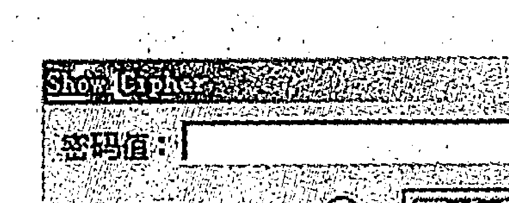

#### (一) 创建资源文件 (ShowRc.rc)

在本程序中需要一个对话框模板、一个图标资源和一个光标资源。其资源文件的创建过程与上述的颜色值提取器中的资源文件完全相同，在此就不赘述了，详情请见附录中的 ShowCipher.rc 文件。

#### (二) 编辑源程序文件 (ShowCipher.asm)

第一步: 连接外部相关文件 (方法同上略)。
第二步: 声明数据变量 (方法同上略)。
第三步: 定义 WndProc 子程序 (为对话框的回调函数)。

##### 1. uMsg == WM_INITDIALOG消息

该消息在对话框被显示前发生。在下面的语句中:

- 第一行调用 SetWindowPos 函数，可使该对话框窗口始终是显示在屏幕的最上层，而不至于被其他程序窗口所遮掩。其中:
  - hWin 参数为对话框的句柄。
  - HWND_TOPMOST 参数将窗口置于所有非顶层窗口之上，即使该窗口未被激活，该窗口也将保持其顶层的位置。
  - SWP_NOACTIVATE 参数不激活窗口。
  - SWP_NOMOVE 参数保持窗口的当前位置。
  - SWP_NOSIZE 参数保持窗口的当前大小。
- 接下来调用 GetDlgItem 函数来获取钥匙图标控件的句柄，并将该句柄存放在 hIcon 变量中，以备后用。

##### 2. uMsg == WM_LBUTTONDOWN消息

该消息是在对话框中单击鼠标左键时发生。由于其中的代码及其作用同上述颜色提取器中的相同消息中的代码，故在此就不赘述了。

##### 3. uMsg == WM_MOUSEMOVE消息

该消息是移动鼠标光标时发生，当该消息发生时首先是检查预定义开关 Bools 中的值，如果为 TRUE 则执行其后的语句，其中:

- GetCursorPos 函数是获取鼠标光标当前位置，并将其值写入数据结构 pt 中。
- WindowFromPoint 函数是利用 GetCursorPos 函数所获取的鼠标光标所指向位置的值，来获得鼠标所指窗口控件的句柄，并将该句柄存放在 hwndd 变量中，以备后用。
- SendMessage 函数是获取窗口控件的标题字符或窗口控件中文本的字符数，其具体数值将自动返回在 eax 寄存器中。
- 语句 inc eax 是将 eax 中的数值加上 1，因为 Windows 字符串是以一个 0 来作为其结束的标志，所以还必须再加上 1。不然，所获取的密码值将是不完全的。
- 接下来的 SendMessage 函数，就是获取窗口控件中的字符串，并将其存放在变量 hText 中。

为了避免将其它不相干的窗口控件中的标题或字符串也显示出来，还应添加下列语句以作限制:

```
invoke GetWindowLong,hwndd,GWL_STYLE
and eax,ES_PASSWORD
.if eax
    invoke SetDlgItemText,hWin,202,addr hText
.else
    invoke SetDlgItemText,hWin,202,NULL
.endif
```

其中，首先调用 GetWindowLong 函数。该函数是获取指定窗口的相关信息，在这里应该将该函数的第二个参数值设置为 GWL_STYLE，表示要获取指定窗口的窗口风格。
接下来，用 and eax,ES_PASSWORD 语句，将 GetWindowLong 函数的返回值同 ES_PASSWORD 进行逻辑乘，然后用 .if eax 判断语句进行判断，若为 TRUE (不为零) 则将获取的字符串在文本框中显示出来，否则将不予显示。

##### 4. uMsg == WM_LBUTTONUP消息

该消息是松开鼠标左键时发生，将执行其下的程序代码 (详情请见上一例)。

### 四、标准窗口

在上面所介绍的程序中只是简单地使用了一个对话框窗口，因而它们还不是一个标准的 Windows 应用程序，所以只能实现简单的功能。现在我将带您学习用 Win32 汇编语言来创建一个标准的 Windows 边框窗口，即所谓的主窗口。大多数的应用程序都具有其主窗口，并在其主窗口的基础上来实现其它的各种功能，所以有了主窗口就可以将上述两个小程序方便地放入其中了，如图 4 所示，下面我们就抓紧时间开始吧！

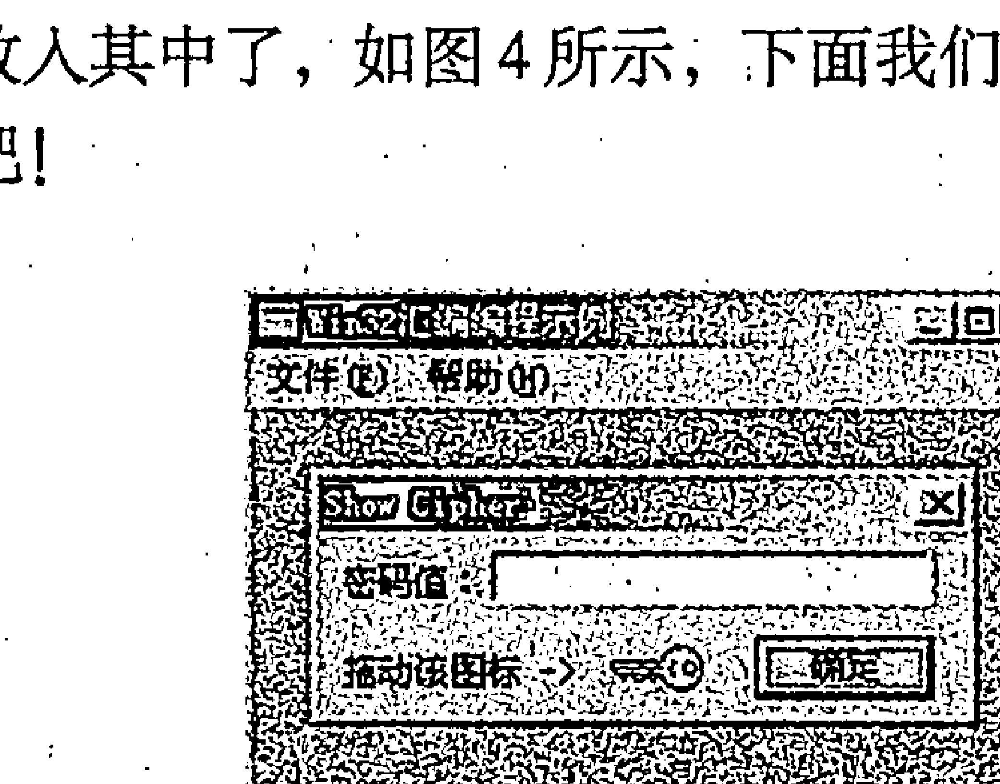

#### （一）创建资源文件（MyRc.rc）

在该资源文件中需要创建一个菜单模板，一个图标文件。由于其创建过程和语法结构与 VC++ 中的方法是相同的，在此就不占用篇幅来介绍了，具体详情请见附录中的 MyRc.rc 文件，包您一见就会。

#### （二）创建源程序文件（MyWin.asm）

如果您已经用 VC++ 编译器利用 API（不是用 MFC 类）编译出过 Windows 窗口程序，那么现在来编写 Win32 汇编程序的 Windows 窗口程序，将是一件非常容易的事，因为这两种语言代码，无论从代码语法还是代码编制顺序，都是非常的相似。为了节约篇幅，对本代码中的数据变量部分就略去不述，本文则从后面的内容讲起。

##### 1. 编制程序执行代码

本程序的执行代码请见下面内容：

```
start:
    invoke GetModuleHandle, NULL ; 获取程序的实例句柄
    mov hInstance, eax
    call GetCommandLine         ; 获取命令行参数字符串
    mov hCommand,eax
    invoke WinMain, hInstance,NULL,hCommand, SW_SHOWDEFAULT
    invoke ExitProcess,eax
```

其中，关键字 START 是汇编程序代码执行入口的标志。程序一开始将调用 GetModuleHandle 函数来获取应用程序的实例句柄，并将其写入 hInstance 变量中，以备后用。调用 GetCommandLine 函数来获取程序命令行，实际上该参数在具体的运用中很少用到，因为在 Windows 系统中应用程序在启动时，很少用到命令行参数。

接下来的 WinMain 函数是该程序的主执行函数，该函数中有四个参数，但是一般只需要注意其中的两个参数就可以了。

一个是 hInstance 参数，通过它可以获取本程序的实例句柄。
另一个是 SW_SHOWDEFAULT 参数，它主要是确定程序主窗口的显示方式。
WinMain 函数初始化应用程序，然后实现对消息的检索和发布，只有当收到一条 WM_QUIT 消息时，该循环终止，WinMain 函数退出应用程序并返回 PostQuitMessage 函数传递的值，PostQuitMessage 函数在程序主窗口的回调函数 WndProc 函数中。
WinMain 函数退出后将执行最后的 ExitProcess 函数，该函数作用是使程序退出系统，结束运行。

##### 2. 定义 WinMain 函数中代码

WinMain 函数是本程序的主运行函数，该函数中的代码主要有以下几部分组成：

（1）声明数据变量
程序开始处声明了几个所必须的变量参数，它们是：
窗口类结构数据变量     wc
消息结构数据变量       msg
主窗口句柄变量         hwnd

（2）设置和注册 wc 类
接下来就要对 wc 结构中的各个成员进行赋值，最后用 RegisterClassEx 函数对 wc 结构进行了注册。

###### （3）创建程序主窗口

CreateWindowEx 函数中共有 12 个参数，其中：
参数一是设置主窗口的扩展风格属性；
参数二是在 wc 类中定义的窗口类类名；
参数三是该主窗口的标题名；
参数四是设置主窗口的一般风格属性；
参数五到参数八是确定窗口大小，程序中所设置的 CW_USEDEFAULT 系统定义的常量，表示该窗口的初始大小将由 Windows 系统确定；
参数九是该窗口的父窗口或拥有者窗口句柄，由于本窗口就是顶级窗口，所以其值设为 NULL；
参数十是标识一个菜单句柄，一般是程序主菜单的句柄，但有一点需要说明，就是如果事先在设置 wc 结构成员时，在 wc.lpszMenuName 成员中已设置了菜单标识符时，则此处就应设为 NULL；
备注参数十一是标识与该窗口相关联的模块的实例句柄；
管理参数十二指向一个传递给该窗口的值，一般将该参数设为 NULL。

###### （4）显示窗口

上一步的操作实际上只是将与程序主窗口相关的一些数据信息，写入到系统的内存中但并未执行，所以该窗口并未在屏幕上显示出来。因此下一步的任务就是要将其主窗口界面在屏幕上显示出来，ShowWindow函数就是完成这项任务的。该函数有两个参数，一个是主窗口句柄，也就是CreateWindowEx函数的返回值；另一个参数就是设置窗口的显示风格。下一个函数UpdateWindow的作用就是将窗口工作区再更新一次，以便将窗口工作区中的最新内容显示出来。

###### （5）消息循环

组成消息循环的程序代码如下：

```
.WHILE TRUE
    INVOKE GetMessage, ADDR msg, NULL, 0, 0
    .BREAK .IF (!eax)
    INVOKE DispatchMessage, ADDR msg
.END
```

GetMessage函数从程序的消息队列中检取一条消息，并放入msg消息结构中。

DispatchMessage函数则从msg消息结构中获取一条消息，并将其传送给窗口的过程函数，在窗口的过程函数中执行该消息下的程序代码，这样通过传送不同的消息到窗口的过程函数中，以实现不同的功能作用。

WinMain函数执行到此处后，由于.WHILE的判断语句是一个常量TRUE，所以循环将一直进行下去。在这个循环过程中，程序的消息队列中存在着许多条消息，这是因为无论是由用户或是由系统发出的消息，并不是立刻就执行，而是将其放入程序的消息队列中，然后由GetMessage函数根据各个消息的优先级别依次发出。

消息循环还要受到语句.BREAK .IF (!eax)的过滤，GetMessage函数每发出一条消息后，就返回一个值到eax寄存器中，.BREAK .IF (!eax)语句判断该返回值是否为0，若为0则退出循环，否则就一直循环下去，等待处理系统或用户所发出的各种消息。在正常的情况下只有在发送 WM_QUIT 消息时GetMessage函数的返回值才会是0。

该处循环语句的设置可以有多种方式，下面就是另一种方式：

```
.WHILE Heax
    invoke GetMessage, addr msg, NULL, 0, 0
    mov Heax, eax
    invoke DispatchMessage, addr msg
.ENDW
```

其中，Heax为用户自定义的一个32位变量，其运行原理就留着大家去分析吧。

下面还有一种方式：

```
StartLoop:
    invoke GetMessage, ADDR msg, NULL, 0, 0
    cmp eax, 0
    je ExitLoop
    invoke DispatchMessage, ADDR msg
    jmp StartLoop
ExitLoop:
```

其中，StartLoop和ExitLoop为两个标识符，该段程序代码的工作原理是：将GetMessage函数的返回值，用语句 cmp eax, 0 进行比较，用语句je ExitLoop进行判断，若比较的两个值相等，则执行标识符ExitLoop以下的代码，否则则执行je语句下面的程序代码，而当执行到jmp StartLoop语句时，则程序将无条件地跳转到标识符StartLoop处，又重新进行新的判断，所以，只要GetMessage函数的返回值不为0，该循环就将继续下去。

以上三种方式所具有的功能是一样的，之所以在这里将这三种方式罗列出来，是想告诉朋友们，在Win32汇编语言中编程将是非常灵活，采取何种方式将取决您的灵感和习惯。

##### 3. 定义 WndProc 函数代码

系统将WinMain函数中所捕获的各种消息事件，映射到WndProc函数中，WndProc函数中有所映射消息所对应的执行代码。所以，程序中所有功能的实现代码都将在该函数中设置。由于本例中所实现的功能很简单，在此就不详细解说了。详情请见附录中的MyMin.asm文件。

### 五、按钮控件

我们大都习惯了使用控件来获取程序中所需要的各种对象，这在如今是很容易办到的，只要使用如同VC++那样的可视化集成编程工具，只要一个拖放动作就大功告成了。但在我们实际的编程过程中，往往又需要创建出具有个性特色的按钮，这样就必须自己来创建。下面我们就来尝试一下通过编制代码来获取按钮的一般过程，如图5所示。在该窗口中利用程序代码创建了两个按钮，单击按钮可以改变按钮中的文本或图像。

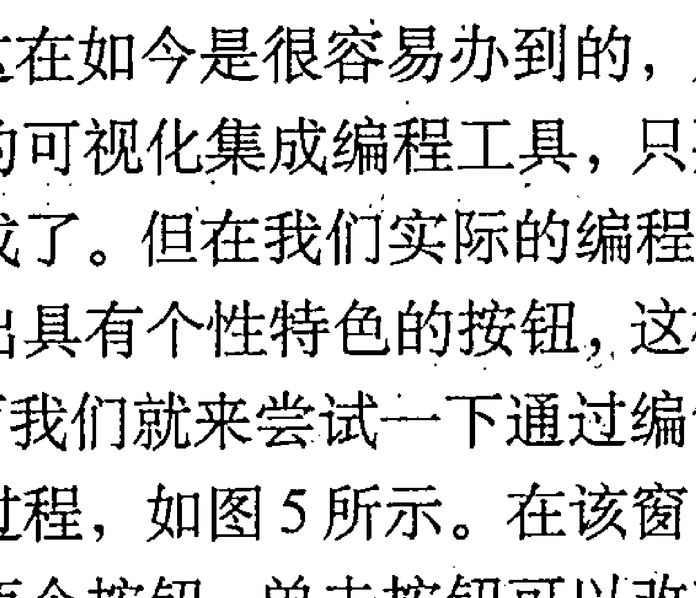

#### （一）创建资源文件 (ButtonRc.rc)

在该资源文件中只需要定义三个图标文件就可以了。

#### （二）创建一个预定义文件（ButtonInc.inc）

将各种数据变量声明、宏定义等等放置到一个单独的文件中，可使程序显示得更清晰，也可简化程序的调试，减少出错率。本例中的声明语句虽然不多但也将其单独放置在一个文件中，纯粹是为了告诉大家一个方法而已。

在.inc文件中可以设置的语句类型有很多，除了可以包含语句 include 和 includelib 外，在本例中还将自定义过程原型语句，变量的定义语句以及自定义宏都放在该文件中。

该文件中的内容，其它部分就不必细说，在此只对创建自定义宏，作进一步的解释，其代码如下：

```
m2m MACRO M1, M2
    push M2
    pop M1
ENDM
```

其中，m2m为用户定义的宏指令名；MACRO和ENDM为定义宏的伪指令；M1、M2为该宏的两个形式参数。该宏所要实现的功能很简单，就是将宏形参M2中的数据压入堆栈中，接着又将刚才压入的数据从堆栈中弹出，写入宏形参M1中。在本程序定义窗口类时使用，如语句“m2m wc.hIconSm, hIcon”所示。如果不使用该宏则该语句将变为：
push hIcon
pop wc.hIconSm

最后不要忘记在 Button.asm 文件中增添一条语句：include ButtonInc.inc，将其包含进去。

#### （三）创建源程序文件（Button.asm）

##### 第一步：定义 Xysize 过程

首先应在上述ButtonInc.inc文件中声明该过程的原型代码，其代码如下：

```
XYsize PROTO :DWORD, :DWORD
```

其中，Xysize 是由用户定义的过程名；PROTO 为声明过程的伪指令关键字；其后为该过程的两个参数，在这里只需标明其数据类型就可以了。接下来就是定义该过程中的执行代码，请见下面的代码：

```
XYsize proc wDim:DWORD, sDim:DWORD
    mov eax, wDim
    sub sDim, eax
    shr sDim, 1
    mov eax, sDim
    ret
XYsize endp
```

该过程的功能是，获取主窗口在屏幕上显示位置的开始坐标，以便将该窗口显示在屏幕的中心处。该宏在程序代码的 WinMain 函数中被调用两次，将分别获取主窗口的 x 坐标和 y 坐标。其中宏参数 sDim 为屏幕的宽或高，而参数 wDim 则是主窗口的宽或高，由 eax 数据寄存器返回的就是主窗口的 x 坐标或 y 坐标值。

其工作过程如下：由于汇编语言规定在内存中的两个变量不能同时操作，所以首先用 mov eax, wDim 语句将一个变量中的值传送到 eax 寄存器中，然后再用 sub sDim, eax 语句将两数相减，用 shr 指令将 sDim 中的数据向右移动一位（注：这里的位指的是二进制中的位），其效果相当于将 sDim 中的数值除以2，最后用 mov eax, sDim 语句将该数传送到 eax 中，这就是该过程的返回值，该返回值也就是所需的屏幕坐标值。

##### 第二步：定义 MyButton 过程

同样，首先应在上述ButtonInc.inc文件中声明该过程的原型代码，其代码如下：

```
MyButton PROTO :DWORD, :DWORD, :DWORD, :DWORD, :DWORD, :DWORD
```

接下来，在 ButtonInc.asm 文件中定义过程中的执行代码，其中：

```
jmp @@
    icoBtnCl db "BUTTON", 0
    blnk1 db 0
@@:
```

是声明数据参数的另一个方式，在这里是声明两个常量参数，其中“BUTTON”为 windows 系统中预定义的控件类名，BUTTON 为按钮控件窗口类的类名。

采用这种形式可以在程序代码中的任何地方，按需要来随时声明数据参数，该形式比较方便灵活。然而，由于一个数据参数在同一个程序中只能声明和定义一次，而该过程在程序的运行过程中可能要被调用多次，那么在该处定义的数据参数也将要被声明和定义多次，这是不允许的。为了避免这种错误的发生，在这里就必须加上一个跳转语句 jmp @@，当程序执行到该处时，将自动跳转到 @@:处，去执行其后的程序代码。在此处的跳转语句是一个特殊的跳转语句，其中标识符 @F 表示向前跳转到与其最近的 @@:处，与此相似地还有一个标识符 @B，它表示向后跳转到与其最近的 @@:处。以上的设置方法是为了向大家多介绍一些汇编语法，当然此处的跳转语句也完全可以按标准方式设置：

```
jmp label
    icoBtnCl db "BUTTON", 0
    blnk1 db 0
label:
```

上述语句看起来好像是一次也没有被执行，但实际上程序被加载和启动之初，在程序中所定义的数据变量都被写入到系统内存中了。

下面是创建按钮控件的主要代码了，其调用函数 CreateWindowEx同创建主窗口时所调用的函数是一样的，在这里就不必多讲了。有一点还需要说明一下，就是由于在该函数的参数中添加了 WS_VISIBLE 参数值，它的作用是在创建该按钮控件窗口后，立即将其显示出，所以就无需再调用ShowWindow函数了。作为实验您可以将该值删去，重新编译并运行该程序，看按钮控件是否能显示出来，然后再加上ShowWindow函数，再看按钮控件是否显示出来了。学习编程就是要如同上述那样，要不厌其烦地反复修改程序代码，反复编译运行。通过观察其中的变化，来领会其中的奥妙。定义 MyButton过程的详细代码请见附录中的Button.asm文件。

##### 第三步：定义 WndProc 主窗口回调函数

-   1. uMsg == WM_CREATE消息
该消息是在创建程序主窗口，但窗口还未被显示出来之前发生。在此时是对窗口用户区进行初始化的最好时机。
-   调用自定义的按钮过程 MyButton，将在程序窗口中创建出一个按钮控件，其中参数1是其父窗口的句柄，参数2到参数5是按钮控件的大小和在其父窗口中的位置，最后一个参数是为该按钮控件设置一个标识符，返回值就是该按钮控件的窗口句柄。接下来的语句 mov hBtn1, eax 则是将控件句柄传送到 hBtn1 变量中。
-   调用 SetWindowLong 函数以改变该按钮控件的风格属性，其中 GWL_STYLE 表示添加一个新的窗口风格，BS_TEXT 则表示按钮是处于文本显示方式。
-   由于调用上述函数为按钮控件重新设置了风格属性，系统就要重新创建和注册该按钮窗口，所以就必须调用 ShowWindow 函数将其重新显示出来。
-   调用 SendMessage函数使在按钮中显示一个字符串，hBtn1 参数为该按钮控件的句柄，WM_SETTEXT 参数为 Windows系统消息，其功能是设置文本 Str1 参数则是用户所设置的一个字符串常量。

接下来的语句是创建和设置另一个按钮控件，因其设置语句与上述按钮控件的语句是一样的，在此就不细说了。

-   2. uMsg == WM_COMMAND
当用户单击按钮控件时，系统将发送该条消息，该消息所带的 wParam 参数中的低位字中为被鼠标单击控件的标识符。语句 mov eax, wParam 就是将 wParam 中的数值传送到 eax 寄存器中。
-   语句 .if ax == 400 是判断 wParam 所返回的控件标识符值是否是 400（400 是按钮1的标识数值），若是 400 将执行下面的语句。
-   .if Bools1 == TRUE 语句也是一个判断语句，根据转换开关 Bools1 中的值，可将按钮1的文本设置为字符串 Str1 或是字符串 Str2。语句 mov Bools1, FALSE 则是改变转换开关中的值。

```
mov eax, wParam
and eax, 0FFFFh    ; 确保只使用低16位
.if eax == 400
......
```

好了，该程序代码中需要介绍的就是这些了，剩下的就您自己去琢磨吧。

下面 ELSEIF ax == 401 判断语句及其下面的语句，是为按钮2上设置不同的图像，其工作原理因同按钮1的原理一样，也就不细讲了，详情请见附录中的 Button.asm 文件。

但有一点则需要在此说明一下，就是在上述的两个判断语句中使用的寄存器是16位的数据寄存器 ax，而不是32位数据寄存器 eax。如果您习惯使用 eax 的话，该处也可以使用 32 位寄存器 eax，但需要添加一行代码，即对 eax 进行掩码处理，例如：and eax, 0FFFFh，该语句的功能是将 eax 寄存器中高16位字节中的内容清为零，只保留低16位。其代码样式如下：

```
mov eax, wParam
and eax, 0FFFFh
.if eax == 400
......
```

好了，该程序代码中需要介绍的就是这些了，剩下的就您自己去琢磨吧。

### 六、屏幕放大器

我们经常可以在一些应用程序中见到具有放大功能的工具，它可以将屏幕上的某一部分进行放大，使这部分的内容显示得更加清楚明了。下面我们就将其提炼出来，使其成为一个独立的小工具软件，图6所示的软件窗口就是具有放大功能的工具软件。

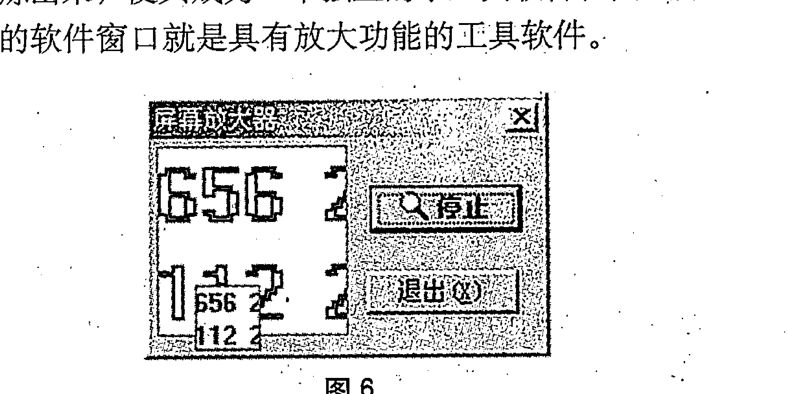

#### （一）创建资源文件 (Magnify.rc)

根据程序的需要，在该资源文件中需要创建一个对话框模板、两个位图资源、一个图标资源和一个光标资源。

#### （二）创建源程序文件 (Magnify.asm)

在 WndProc 回调函数中，将其主要代码解释如下：

-   1. uMsg == WM_INITDIALOG消息
该消息是在对话框窗口被创建显示前发生的，在这个时机里可以将程序运行前的一些准备工作放在这里来完成。

##### (1) 首先应将程序运行时所需要的资源装载到系统内存中去：

-   调用 LoadCursor 函数装载用户光标，并用 mov hCursor,eax 语句将该光标的句柄传送到 hCursor 句柄变量中。
-   调用 LoadBitmap 函数将位图1装载到系统内存中，并用 mov hBmp1,eax 语句将其句柄传送到 hBmp1 句柄变量中。
-   调用 LoadBitmap 函数将位图2装载到系统内存中，并用 mov hBmp2,eax 语句将其句柄传送到 hBmp2 句柄变量中。

##### (2) 接下来是获取相关控件的窗口句柄：

-   调用 GetDlgItem 函数来获取按钮的句柄，该按钮是控制放大功能的开启或关闭的。其中：hWnd 为对话框窗口的句柄，该句柄值就是 WndProc 回调函数中的参数1，它是由系统自动获得的。IDC_BUTTON 则是该按钮的标识符。紧接着还要记住用 mov hButton,eax 将该按钮句柄保存在 hButton 变量里，以便后面的程序来引用它。
-   调用 GetDlgItem 函数来获取一个静态控件的句柄，该控件是用来显示被放大后的内容，并用 mov hSta,eax 语句将其传送到 hSta 变量中。
-   调用 GetDesktopWindow 函数来获取桌面句柄，并用 mov hWinDesktop,eax 语句将其传送到 hWinDesktop 变量中。

##### (3) 下面的语句是获取相关的设备描述表的句柄(DC)。

-   调用 GetDC 函数获取桌面（屏幕）的设备描述表，并用 mov DCDesktop,eax 语句将其传送到 DCDesktop 变量中。
-   调用 CreateCompatibleDC 函数以获取一个内存设备描述表的句柄（DC），并用 mov DCMem, eax 语句将其传送到 DCMem 变量中去。

设备描述表是一个比较难理解的术语，若用专业语言来描述它既难懂又一下子也说不清，我们就将其比喻为一个画布吧。所以上面的两条语句也就是准备了两个画布，一个是计算机屏幕，另一个就是在计算机内存中虚拟的一个。接下来，我们就要将这两个画布的属性统一起来，以便可以将在屏幕上所选定的内容，顺利的复制到内存中的画布上。所以还需要进行下面的操作：

-   调用 CreateCompatibleBitmap 函数以获取一个与屏幕画布相兼容的位图。
-   紧接着要用 SelectObject 函数把刚才所创建的位图选入内存设备描述表中。

这样就可以将在屏幕上所选定的图像复制到内存中的DC中。接下来调用 ReleaseDC 函数及时将屏幕DC释放掉，以节约系统的内存空间。接下来，调用 SendMessage 函数在放大器开关按钮上显示出图像和文字来，最后还要调用 SetWindowPos 函数将该对话框固定地显示在屏幕的最上层。

以上所有的代码设置只是为该放大器工具的工作作好的前期的准备，其具体的工作代码将在下面介绍。

##### 2. uMsg == WM_TIMER消息

该消息将根据在 SetTimer 函数中所设置的相关数值，来确定其触发的间隔时间，这就是说每隔一定的时间，该消息中的代码将会被执行一次，这样就会将用户所指向范围中的图像及时地显示出来，这正是我们所需要的效果，下面将来介绍其中代码的工作原理。

-   首先，将根据语句 .if Bools == TRUE 的判断结果，来确定是否继续执行该判断语句范围内的代码，如果所判断的结果为 TRUE，则继续执行下面的代码。
-   一般来说，是不会需要将放大器程序窗口本身进行放大的，所以当光标指向放大器窗口时，放大器应该不工作，而仅当鼠标光标指向放大器窗口以外屏幕上的任意位置时，放大器才应将其选定的内容进行放大显示。所以接下来的语句就是来判断鼠标所指向的位置：

```
invoke GetCursorPos,addr Pt
invoke GetWindowRect,hWnd,addr rtCursor
invoke PtInRect,addr rtCursor,Pt.x,Pt.y
```

其中，第一行语句是获取鼠标的当前位置；第二行语句是获取放大器窗口的范围大小；第三行语句则是将上述所获得的两个值进行比较，若 Pt 变量所指的一个点在 rtCursor 所指的矩形范围内，PtInRect 函数将返回一个 TRUE 值，反之则返回一个 FALSE 值。

-   而语句 .if !eax 则是判断 PtInRect 函数的返回值，若返回的是 FALSE 值，则说明鼠标当前所指向的位置在放大器窗口以外，则执行 .if 语句范围内的代码，以运行其放大功能。

下面的语句代码可实现放大功能：

-   (1) 调用 SetSystemCursor() 函数将改变系统中的光标形状，其中参数 hCursor 是定义在资源文件中形状为 🖰 的光标，而参数 OCR_NORMAL 则是要被替换原系统中形状为 🔲 的光标，使光标成为一个选取框。
-   (2) 用 GetCursorPos() 函数再次获取鼠标光标当前所指向的位置。
-   (3) 下面的语句是通过将鼠标光标的坐标的 x 值和 y 值减去一个常数，来作为选取框的左上角的坐标值，从而使鼠标光标的热点处在选取框的中心位置上。

```
sub Pt.x,15
sub Pt.y,15
```

其中，sub 是一个汇编指令，它的功用是从 Pt.x 中减去15，再将其结果传送到 Pt.x 中，从而改变了操作数 Pt.x 中的值。

-   (4) 为了能将屏幕中的内容选取并复制到对话框窗口中的控件中去，首先必须获得屏幕DC和对话框控件的DC，在Windows系统中，凡是要进行图像或图形操作的，首先就必须获得操作对象的DC，即设备描述表。请见下面的几行语句：

```
invoke GetDC,hWinDesktop
mov DCDesktop,eax
invoke GetDC,hSta
mov DCSta,eax
```

其中，上一条语句是获取屏幕的DC，而下一条语句则是获得对话框控件的DC。

-   (5) 由于选取框只能将屏幕桌面范围内的内容检索出来，而对屏幕桌面边框以外的区域则是无效的，因此，当选取框处于屏幕边框以外时，其框中原有的内容将不能得到及时更新，使得显示出来的内容将是很零乱的，为了避免这种现象的出现，程序可调用下面的语句，及时用一个画刷来更新内存DC的背景，而将其中残留的内容覆盖掉。请见下面的语句：

```
invoke PatBlt,DCMem,0,0,120,120,BLACKNESS
```

该函数的功能是用一画刷填充 DCMem 句柄所指向的内存DC，按 BLACKNESS 操作码的内容来填充，中间的四个参数则是标明所填充内存DC的大小。

-   (6) 下面的函数调用是将选取框所指向区域的内容复制到内存DC中去，见下面的语句：

```
invoke StretchBlt,DCMem,0,0,120,120,DCDesktop,
Pt.x,Pt.y,40,40,SRCCOPY
```

放大功能的实现主要就是利用该函数来完成的，该函数可以将 DCDesktop 中的内容拷贝到 DCMem 中去，其中根据所设参数的不同，将会出现三种效果：

-   如果 DCMem 的大小等于 DCDesktop，则拷贝到 DCMem 中的位图与 DCDesktop 中的图像是一样的；
-   如果 DCMem 所设的矩形小于 DCDesktop，则将原图进行压缩，以将原图中的所有内容填充到 DCMem 中去；
-   如果 DCMem 所设的矩形大于 DCDesktop，则将原图进行扩展，以适应 DCMem 的大小，本程序就是利用该功能来达到大小效果的。

该函数最后一个参数 SRCCOPY 是一个光栅操作码，光栅操作码是定义图形设备界面如何在输出设备运行的标志，在这里该标志表示为将源矩形区域直接拷贝到目标矩形区域去。

-   (7) 将所选内容拷贝到内存DC中后，并不能在对话框窗口中显示出来，还需要调用下面的函数将内存DC的内容再拷贝到对话框中的相关控件上去，请见下面的语句：

```
invoke BitBlt,DCSta,-1,-1,120,120,DCMem,0,0,
SRCCOPY
```

该函数中的参数与 StretchBlt 函数中的参数非常相似，其中 DCSta 为对话框上显示框的DC。

通过上述几个步骤，该放大器就可以正常的工作了。使用者只要打开放大器开关，移动鼠标选取框，就可以将选取框中的内容放大并显示在对话框中的显示框中。接下来还有几行代码是释放所获取的各个设备描述表（DC），在Windows系统中，在一个应用程序能中同时存在的DC是有限制的，一般来说不允许超过5个，所以在具体的编程过程中，对已使用过的DC应及时予以释放，以节约宝贵的内存资源。最后，还要将鼠标光标的形状还原为原来的样子。

该放大器中的主要程序代码已介绍完了，其完整的程序代码请见附录中的 Magnify.asm 文件，相信您是完全可以理解的。该放大器还是一个简单的程序，作为一种尝试您完全可以在此基础上为该放大器再增添一些功能，比如说可以使放大器的放大倍数能进行调整，可以改变选取框和显示框的大小或形状，甚至于还可以将对话框窗口略去不要，而将显示框直接放置在桌面屏幕上等等。

该放大器在运行使用时，若需要在显示框中保持所选处的内容，可以将鼠标指向所选处，再按一下空格键或回车键即可。

### 七、编译技巧

若您在上面的学习过程中也同时进行了一些编译操作，不知您是否体验到编译操作的繁琐和不便。是的，若是按一般的方法来编译和连接汇编程序的源代码，每次都需要用键盘不厌其烦地对汇编源程序进行编译，对所需的资源文件同样也要编译好，然后还要用连接程序，将它们连接成可执行程序（.exe），每次都要依次键入编译器程序名、输入编译器编译时所需要的各种参数以及被编译的源程序名，而且是每编译一次都要重复一次上述的所有操作，让人感到烦恼和无奈。下面将介绍几种编译时的技巧方法。

#### (一) 使用 nmake.exe 工具

值得庆幸的有方法可以改变上述的烦恼，那就是可以利用 Microsoft C++ 中的一个实用程序 nmake.exe，它可以将上述的所有操作步骤，预先写入到一个文件中去（该文件无须要扩展名），若该文件名设为 xxxx 的话，则其调用语句如下：

```
nmake xxxx
```

而 xxxx 文件中的内容至少应该包括下面的语句内容：

```
NAME=Asmfile
AA=Rcfile
$(AA).res:$(AA).arc
rc $(AA).arc
$(NAME).obj: $(NAME).asm
ml /c /coff /Cp $(NAME).asm
$(NAME).exe: $(NAME).obj $(AA).res
Link /SUBSYSTEM:WINDOWS $(NAME).obj $(AA).res
```

其中，NAME=Asmfile 语句是将汇编源程序代码文件的文件名赋给变量 NAME，而语句 AA=Rcfile 则是将汇编所需的资源文件的文件名赋给变量 AA（NAME 和 AA 可以由编程者自行确定），而以下语句中的 $(NAME) 和 $(AA) 则可以将被编译和连接程序的实际文件名替换进去（具体的编译和连接方法因在前面的预备知识中介绍过，在此就不赘述了）。这样每次进行编译和连接操作时，就只需键入一行语句就搞定了，其不快哉！还告诉您一个小技巧，就是在编译任何一个程序时，可以先将该程序的源代码文件的文件名都设置成上述 xxxx 文件中 NAME 和 AA 所指定的名称，这样只要将所编译的源程序文件与 xxxx 文件放于同一个文件目录中，在 MS-DOS 方式下键入 nmake xxxx 语句，按一下回车按键，编译操作就自动开始了，而无需对 xxxx 文件作任何的修改。编译成功后只要将所编译连接生成的可执行文件名改回去，就大功告成了。

但是且不要高兴的太早了，若您只是将上面的代码照搬过去，是不一定能成功的，这是为何呢？原来，若在您的电脑硬盘中，与编译相关的所有文件不是在同一个文件夹或您未对相关的文件路径预先进行设置的话，那按上面的语句是肯定不会编译成功的，若要成功还必须在上述 xxxx 文件中，将所有文件的详细路径信息加上去，如：

```
Ml /c /coff /Cp $(NAME).asm 语句，
就应改为
D:\MASM32\BIN\Ml.exe /c /coff $(NAME).asm
```

而且，只要您有与编译相关的文件不在所指定路径的范围内，您就得重新来修改 xxxx 文件中的相关内容，这样岂不是又麻烦了，不过不要紧，这可以用下面所介绍的方法来予以解决。

#### (二) 使用批处理文件

在批处理文件中，有一个 SET 命令，它的功能是设置程序可用的环境变量，我们可以利用该命令为不同的文件设置一个环境变量，请见下面的语句：

```
set include=d:\Masm32\Include
set lib=d:\Masm32\lib
set Path=d:\Masm32\Bin
```

其中，SET 为 DOS 命令，INCLUDE、LIB、PATH 则是 DOS 系统中所默认的环境变量，指定 MS-DOS 系统：

-   到 INCLUDE 环境变量所指定的文件目录中去搜寻扩展名为 .inc 的文件；
-   到 LIB 环境变量所指定的文件目录中去搜寻扩展名为 .lib 的文件；
-   到 PATH 环境变量所指的文件目录中去搜寻可执行文件，即扩展名为 .exe、.com 和 .bat 的文件。

这样当用户调用或执行一个文件时，系统首先到当前目录中去找，再到默认目录中去找最后再到相关环境变量所指定的目录中去找，这样就必定能找到所需要的文件了。所以有了上述的预先设置，无论您是在什么文件目录中去执行编译操作，都不成问题了。

如果您需要经常进行汇编程序的编译操作，就可以将上述语句写入系统的 AUTOEXEC.BAT 文件中，这样在每次启动电脑时，就会自动将这些环境变量设置好。若您只是偶尔的编译一次的话，则应单独编制一个批处理文件，将上面的内容放入其内，等需要时将其在进行编译前运行一下即可，这样可以避免浪费宝贵的内存资源。如果您是单独编制一个批处理文件的话，还可以将上面所介绍的 nmake xxxx 语句，放到该批处理文件的最后，这样需要编译时只要在 MS-DOS 方式下的窗口中键入该批处理文件名，编译过程就将自动开始了。

#### (三) 介绍一个具有实用价值的批处理文件

在上述介绍的 xxxx 文件中，还有一个问题不好解决，那就是当一个被编译程序中没有资源文件时，还必须将 xxxx 文件中的 $(AA).res:$(AA).rc rc $(AA).rc 语句删除掉，还要将 LINK 语句中的 $(AA).res 字符串同时删除掉；而反之则需要将上述内容添加上。这其不是又是麻烦吗？

若您准备编制一个单独的批处理文件的话，我向您推荐一个功能全面而可以通用的批处理文件，有了它就可以彻底解决上述所讲的种种不足，具体文件请看附录中的 ASMLINK.BAT 文件，在这里只对其中主要的语句进行解释。

-   该批处理文件的使用格式为：Asmlink Asmfile Rcfile，其中参数 Asmfile 是被编译程序的源程序文件名(.asm)，Rcfile 则是其资源文件名(.rc)。
-   语句 if exist %2.obj del %2.obj 是判断当前文件夹中是否存在 %2.obj 文件，如果有则将其删除掉。其中 %2 则是代表命令行中的第二个参数，相应的 %1 就是代表命令行中的第一个参数，在实际的执行过程中，语句：

```
if exist %1.obj del %1.obj
if exist %2.obj del %2.obj
```

正是有了 %1 和 %2 通配符，才使得该批处理程序可以通用。

-   语句 if not exist %2.rc goto jump 是判断当前目录中有没有 %2.rc 文件，如果有就对其进行编译，否则将跳转到标识符 jump 处，去执行其后的批处理语句。
-   语句 if errorlevel 1 goto errasm 的作用是，如果在编译或连接的过程中出现错误，则跳转到标识符 errasm 处，去执行其后的批处理语句显示出错信息。
-   语句 dir %2 和 dir %1 可以将编译和连接成功的由 %1 和 %2 所指文件的信息罗列出来。
-   语句 :end 是该批处理程序结束的标志，而语句 goto end 则可以使程序跳过它其后的代码，而使该批处理程序提前结束，图 7 是用该批处理程序编译完成后所显示出来的信息。

```
H:\MASM32\Magnify>asmlink asmfile rcfile
Microsoft (R) Windows Resource To Object Converter Version 5.00.1736.1
Copyright (C) Microsoft Corp. 1992-1997. All rights reserved.
Microsoft (R) Macro Assembler Version 6.14.8444
Copyright (C) Microsoft Corp 1981-1997. All rights reserved.
Assembling: asmfile.asm
Microsoft (R) Incremental Linker Version 5.12.8078
Copyright (C) Microsoft Corp 1992-1998. All rights reserved.
编译和连接成功！
H:\MASM32\Magnify>
```

创建和使用该批处理文件要特别注意的有三点：

-   (1) 在用 SET 命令设置环境变量时，其相关文件的路径一定要按您电脑中这些文件的实际存放位置来设置，不然编译将不会成功的。例如在上述所讲的三条语句：

    ```
    batch
    set include=d:\Masm32\Include
    set lib=d:\Masm32\lib
    set Path=d:\Masm32\Bin
    ```

    表示 MASM 编译器文件放在 D 驱动器中，若您的硬盘中的 MASM 编译器文件放在 C 驱动器中的话，则应将上面三条语句中的盘符 D 改为 C 即可。
-   (2) 在具体运用该批处理程序时，其文件名后的两个参数，一定要是您正在编译和连接程序的源程序文件和资源文件，而且其键入的次序不能颠倒。实际上在使用的过程中，该批处理文件名及其参数，在 MS-DOS 方式窗口中只需输入一次就行了，以后只要是不关闭该窗口，再需要进行下一次编译时，只需在该窗口下按下键盘上的 F3 功能键，您上次所键入的字符将会自动显示出来，您只要按下回车键编译过程将会又重新开始。
-   (3) 无论在哪个驱动器中，该批处理程序文件一定与您将要编译和连接程序的源程序文件和资源文件在同一个文件夹中。

好了，本篇到此就要结束了，本篇所有实例完整的源程序文件都收集在附录中，您只要用以上所讲的内容与附录中相关的源文件进行参照对比，就会一目了然了，最后祝您学习成功！

（文/张幼真）

## 《电脑爱好者合订本》2002年（上）

## 附赠光盘粘贴页

◆系统要求：
运行合订本配套光盘的计算机配置最好不低于：

1.  Pentium 166/16MB内存/4倍速光驱/SB或兼容声卡。
2.  Windows 95/98/2000/Me操作系统。
3.  IE 4.0或以上版本浏览器。
4.  显示环境为800 × 600分辨率，16位增强色。

◆使用方法：

1.  在合订本光盘粘贴页上的塑料袋中取出配套光盘。
2.  放入光驱后，光盘程序自动运行，出现片头动画。此时不必进行任何操作，直到出现光盘主界面。
3.  在主界面中移动鼠标，在标有文字的热区点击，即可进入下级菜单或调用其他程序。
4.  在各界面的指示按钮处停留鼠标，会弹出提示文字，指明点击可以返回上级界面或进入下一级界面。
5.  各级界面均设有退出或声音屏蔽按钮，通过点击可以退出光盘程序或屏蔽背景音乐。
6.  当通过点击退出按钮退出光盘程序时，会出现退出画面，单击后即可消失。


才15天，我就成了一名Flash高手！想知道秘密吗？其实很容易，只要拥有一套《我被施了魔法》，你随时都能成为一个神奇的动画魔法大师！

## 搞笑版Flash动画教学软件

- 不会画，也能成为动画大师！
- 超级麻辣教官，全新搞笑教学法！
- 极富想象的实例，教你独家绝招！

## 强劲热卖

教学盘+素材盘+长达64页的Flash有问必答宝典 = 39元

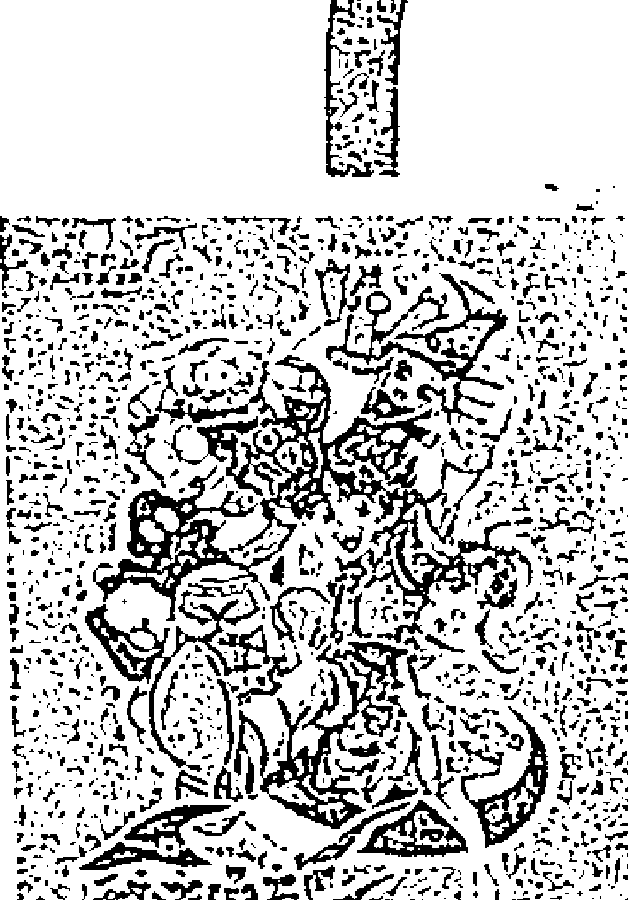

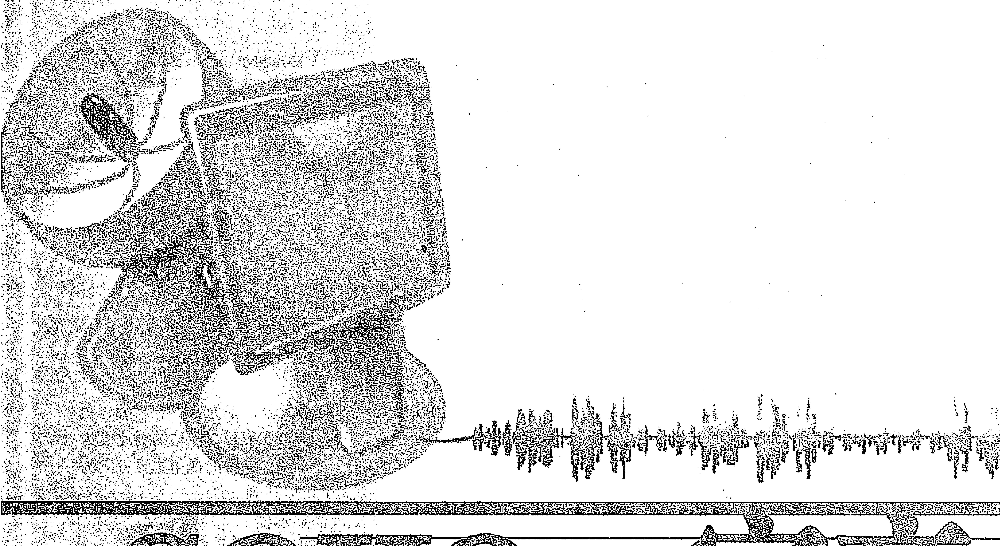

◆ **SOHO 一族 PC 选购指南 P218**

工欲善其事，必先利其器，SOHO 一族离不开一台配置合理的个人电脑。首先就让我们来为 SOHO 定制一个称心如意的工作平台。

◆ **SOHO 外设采购场 P220**

随着科技的发展，如今的外设品种不仅比以前丰富得多，而且价格也可以被一般的家庭所接受。对于SOHO族来说，有了一台计算机能够完成很多工作，但是在处理一些特殊工作的时候还是需要外设的帮助，并且当你装备了最为合适自己的外设之后，会发现很多工作将变得非常轻松。怎么样，想成为快乐SOHO的一员吗？那让我们就来看看这些心动不已的外设吧。

◆ **SOHO 应用全面通 P245**

有了 SOHO 专用的硬件设备之后，怎样完全发挥出它们的威力，同时充分挖掘这些设备的潜力，让自己的工作室变得高效多能呢？这部分内容就以实例形式向大家介绍 SOHO 中可能涉及到的各种软硬件的操作和应用。

## SOHO一族PC选购指南

SOHO是英语“Small Office Home Office”即小型办公室和家庭办公室的缩写。这种全新的办公概念将个人的自由度和业绩充分体现出来，不仅将劳动充分个性化，也反映了以人为本的新的生产方式。而且在通信设施高度发达的同时也带动了其他行业在家办公的可行性：自由撰稿人、音乐人、画家、网络主持人、电脑游戏玩家等，他们仅凭“两台电脑一根电话线”，追求事业成功和生活自由二者的和谐统一。如果你也想成为令人羡慕的SOHO一族，不妨和我们来个全方位的了解吧。

工欲善其事，必先利其器。如今的SOHO族最大的特点就是利用计算机工作，除非你有大把的银子做后盾，否则就要考虑如何根据自己的需求选购合适的计算机。首先就让我们来定制一个称手的工作平台吧。

### (一) 自由撰稿人的电脑

自由撰稿人主要以文字处理为主，偶尔辅以音乐和小游戏来轻松休闲一番，所以他们对于计算机的要求并不是很高，下面这款配置应该说是比较合适的，如表1。

表1 自由撰稿人SOHO电脑推荐配置
| 配件 | 规格型号 | 价格 |
| --- | --- | --- |
| CPU | AMD Duron 1GHz | 480元 |
| 主板 | 升技 Abit KG7-RAID | 590元 |
| 内存 | HY DDR266 128M | 280元 |
| 硬盘 | 希捷 U6 40G | 660元 |
| 显卡 | 七彩虹 MX400 白金版 | 530元 |
| 显示器 | Philips 150B | 3900元 |
| 声卡 | 主板集成 |  |
| 音箱 | 轻骑兵 B2280 | 150元 |
| 光驱 | 明基 Benq 52X | 290元 |
| 机箱 | 金和田8015 | 180元 |
| 键盘鼠标 | 明基套件 | 99元 |
| 合计 |  | 7159元 |

##### 攒机点评：

(1) KG7-RAID主板采用AMD761芯片组，支持全系列AthlonXP CPU，是全球首款可插4根DDR内存条的主板，曾经获得过Anandtech、Envy News、FiringSquad等国内外多个著名硬件媒体的推荐奖项，性能极为出色。而且它还支持RAID功能，主板集成的4个IDE通道就能让你受惠不少。因为很多用户都有了两个以上的IDE设备，比如会有一个硬盘、一个CDROM、一个DVD ROM。由于它们工作起来系统负荷很大，所以最好各占一个IDE通道来保证稳定性。非RAID主板只能提供2个IDE通道，现在有了4个IDE通道，就能让这些IDE设备各占一个，保证它们都能稳定工作，所以价廉物美的KG7-RAID非常适合对计算机性能要求不是很严格的撰稿人使用。

(2) Philips 150B最大分辨率为1024 × 768，色彩深度为16M色。带宽为80MHz，标称的对比度为300:1，亮度达到200cd/m²，标称的视角垂直方向为110°，在水平方向上可以达到150°。作为一款液晶显示器，Philips 150B的文本显示效果锐利清晰，色彩还原真实，视频回放效果可以满足一般应用的要求，加上完全没有辐射，所以非常适合长时间坐在计算机前面工作的自由撰稿人使用（如图1）。

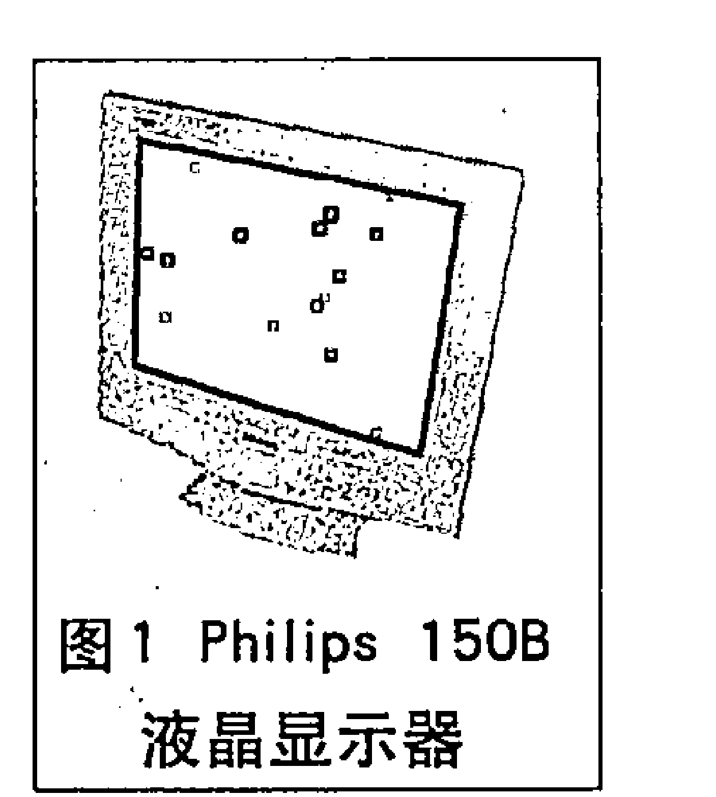

(3) 七彩虹MX400 白金版采用的是大板设计，工艺及元器件的选择上都比较讲究。板载了64位6纳秒的32MB显存，默认显存频率为166MHz，但通常均可在超频至200MHz的环境下正常工作。而且显卡具有良好的稳定性，3D效果显得更加细腻。在500元左右的显卡阵营中，七彩虹MX400白金版成为最具性价比与诱惑力的中低端显卡产品（如图2）。

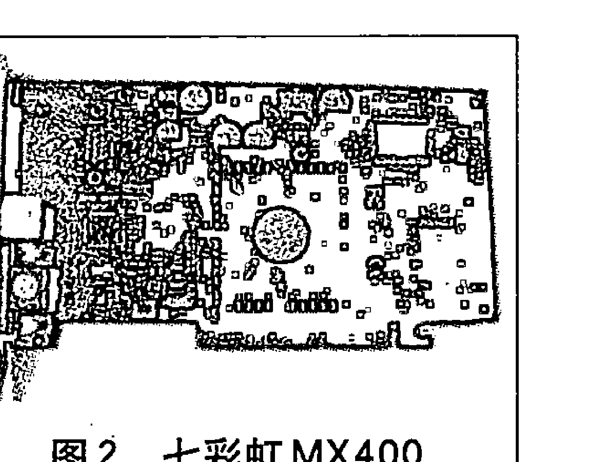

### (二) 音乐制作人的电脑

音乐制作人使用的计算机对于音效输出部分的要求比较高，而且对CPU的处理速度和硬盘的速度要求也比较快，否则在使用Cooledit Pro、GoldWave等软件编辑大容量的影音文件时将需要比较长的时间。
这里推荐音乐制作人SOHO的电脑配置如表2。

##### 攒机点评：

(1) CPU之所以选择赛扬(Tualatin) 1G是因为它具有极为出色的超频性能，配合升技 Abit BL7主板可以轻松将CPU超频至1.4G以上，花最少的钱来获得最佳的性能无疑是SOHO一族所乐意的。

表2 音乐制作人 SOHO 电脑推荐配置
| 配件 | 规格型号 | 价格 |
|---|---|---|
| CPU | 赛扬(Tualatin) 1G | 560 元 |
| 主板 | 升技 Abit BL7 | 900 元 |
| 内存 | HY DDR266 256M | 460 元 |
| 硬盘 | 希捷 酷鱼IV 60G | 660 元 |
| 显卡 | 七彩虹 MX400 白金版 | 800 元 |
| 显示器 | 三星 753DFX | 1700 元 |
| 声卡 | Creative Sound Blaster Live! Digital5.1 | 750 元 |
| 音箱 | Creative DTT2200 | 1220 元 |
| 光驱 | 明基 Benq 52X | 290 元 |
| 机箱 | 爱国者 5501 | 240 元 |
| 键盘、鼠标 | 明基套件 | 199 元 |
| 合计 | | 6709 元 |

(2) 三星显示器采用了丹娜管和钻石珑、特丽珑技术，凭借着性价比突出的优势而受到用户的青睐。三星 753DFX 采用的是性能更为出色的 Dyna FlatX 显像管，它比以前的产品拥有更佳的聚焦表现、色彩还原和色彩饱和度、白平衡表现更佳，同样也通过了 TCO 99 认证，对于长时间坐在计算机面前的 SOHO 族来说能够更好地保护自身健康 (如图3)。

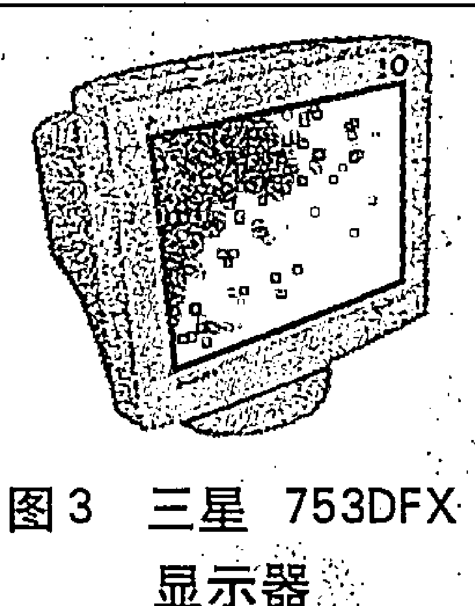

(3) 对于音乐制作人来说，声卡和音箱是整个计算机最为关键的部分，所以采用 Creative Sound Blaster Live! Digital Deluxe 5.1 正是一个理想的解决方案。它支持两声道、四声道和 Dolby Digital 5.1 音频，无需另加功放就可在音乐中感受 5.1 环绕声。同时辅以 Creative DTT2200 这款环绕音箱，能够让你体验到不同凡响的 5.1 音频感受 (如图4)。

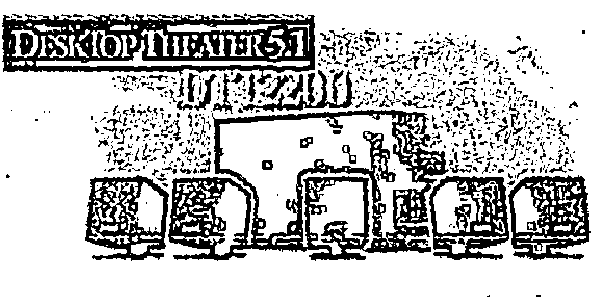

### （三）专业图像、动画制作人的电脑

专业图像、动画制作人一方面需要有强劲的 CPU 支持，同时也对显卡、硬盘、内存等方面都有着比较严格的要求，否则在打开多幅图片或者是对一个 3D 对象渲染的时候，那种慢吞吞的速度会急死人的。
这里向专业图像、动画制作人推荐一款 SOHO 电脑配置，如表3。

##### 攒机点评：

(1) P4 1.7G 的 CPU 在图像处理和 3D 渲染的时候都可以充分发挥出 CPU 强大的威力，由于图像处理对内存的需求量极大，所以配合 512M 内存使用。一旦日后发现内存容量不足，华硕 ASUS P4S333 主板还可以支持最大 2G 的内存，扩展空间比较大。

表3 专业图像、动画制作人 SOHO 电脑推荐配置
| 配件 | 规格型号 | 价格 |
|---|---|---|
| CPU | P4 1.7G (478 管脚) | 1250 元 |
| 主板 | 华硕 ASUS P4S333 | 980 元 |
| 内存 | HY DDR 512M | 980 元 |
| 硬盘 | 金钻 7 代 80G (2M 缓存) | 1120 元 |
| 显卡 | 丽台 WinFast A250 Ultra | 3600 元 |
| 显示器 | SONY G420 | 6200 元 |
| 声卡 | 主板集成 | |
| 音箱 | 轻骑兵 B2280 | 150 元 |
| 光驱 | 阿帕奇 16X 刻录机 (16X10X40X) | 590 元 |
| 机箱 | 爱国者 月光宝盒 C01 | 400 元 |
| 键盘 | 明基 AGER ERGO 键盘 (人体力学) | 300 元 |
| 鼠标 | Logitech 极光银貂 | 399 元 |
| 合计 | | 13389 元 |

(2) 丽台 WinFast A250 Ultra 显卡采用了 NV25 核心，具有 300/650MHz 的核心/显存频率，而且显存是三星 2.8 纳秒的 DDR 显存，容量为 128M，提供了解析度达 1024 × 768 的 TV-out 与 1280 × 1024 的 DVI 输出功能。在如此强大的显卡支持下，图像动画制作人将发现用它工作是一件非常愉快的事情 (如图5)。

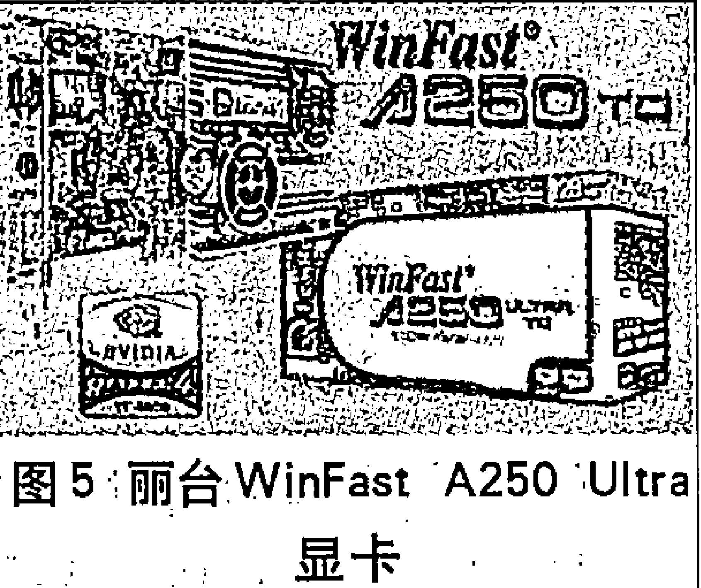

(3) Sony G420 通过了最严格的 TCO99 认证，带宽为 230MHz，最高分辨率为 1920 × 1440/70 Hz，同时保留了 Sony 独特的特丽珑显像管以及包括 EFEAL (多重透镜聚焦技术)、MALS (细微 G1 光圈)、L-SAGIC (阴极灌注) 在内的成像系统。另外，Sony 还顾及到消除环境对显示效果的不良影响，G420 包含了其开发的独一无二的地磁感应器，它们探测无所不在的地磁的细微变化，然后把数据送至内置的中央处理单元 DPU-R 系统处理，即时作出相应的电子束射击纠错，防止了周围环境干扰造成的显示误差，从而使得画面看起来更加靓丽稳定 (如图6)。

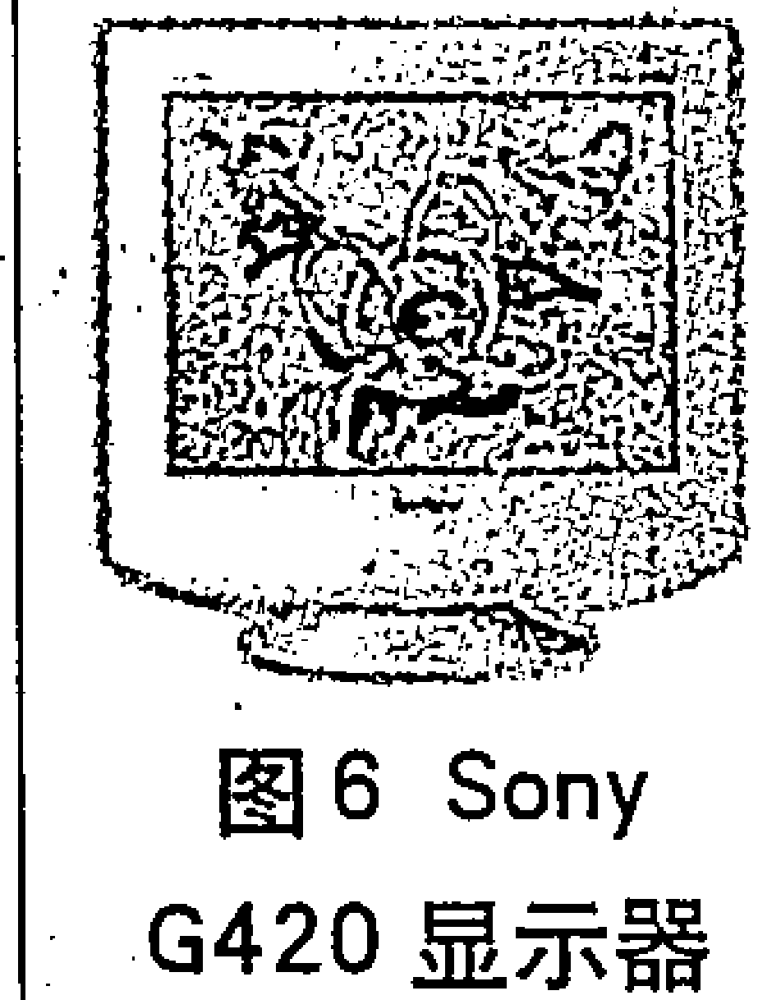

(4) 由于图像动画制作的文件个头非常大，如果全部保存在硬盘上将占用很多空间，因此配置一台刻录机将重要的文件备份下来不仅可以让硬盘有着更多的空间处理其他工作，还能够防止意外故障导致数据丢失。
(文 / 赵江)

## SOHO外设采购场

随着科技的发展，如今的外设品种不仅比以前丰富得多，而且价格也可以被一般的家庭所接受。对于SOHO族来说，有了一台计算机能够完成很多工作，但是在处理一些特殊工作的时候还是需要外设的帮助，并且当你装备了最适合自己的外设之后，会发现很多工作将变得非常轻松。怎么样，想成为快乐SOHO的一员吗？让我们就来看看这些心动不已的外设吧。

### 扫描仪篇

进入知识爆炸的信息时代之后，如何把各种文字、图像占为己有呢？对于SOHO来说，购买扫描仪最大的一个用处就是把手头的照片扫描下来以便他用，而且通过扫描仪附带的OCR文字识别软件能够将有关的书籍、报刊扫描之后进行识别，这样就可以很快地完成资料收集整理和录入工作了。目前市面上各款式的扫描仪种类繁多，下面就介绍一些优秀的扫描仪。

#### 一、HP Scanjet系列

##### （一）HP Scanjet 4400c/4470c

HP Scanjet 4400c/4470c（如图1）在设计上秉承了其技术领导潮流的理念，在外观上则沿袭传统，无论是色彩基调还是线条设计，都给人专业化的印象。它所采用的USB接口安装十分简便，还提供了EPP并口以及苹果机上的XPA接口，所以能够满足使用不同操作系统和不同硬件配置的朋友的需求。

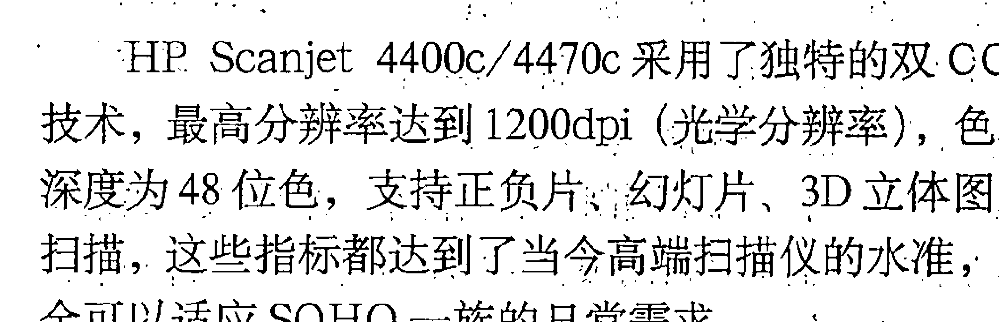

HP Scanjet 4400c/4470c采用了独特的双CCD技术，最高分辨率达到1200dpi（光学分辨率），色彩深度为48位色，支持正负片、幻灯片、3D立体图形扫描，这些指标都达到了当今高端扫描仪的水准，完全可以适应SOHO一族的日常需求。在扫描图片的时候，HP Scanjet 4400c/4470c表现出了HP应有的品质，在清晰度和色彩的表现上，都有相当不错的效果，图像色彩还原和照片的细节表现也同样出色。在OCR文字识别能力上，其OCR功能整合在扫描控制软件平台中，使用起来相当简便，识别正确率也令人满意，达到98%。

参考价格：1300元

##### （二）HP Scanjet 5400c/5470c

HP Scanjet 5400c/5470c（如图2）的最高分辨率达到了2400dpi（光学分辨率），色彩深度为48位色，支持正负片、幻灯片、3D立体图形扫描。而且也使用了双CCD技术，将一个2400dpi传感器和一个600dpi传感器合为一体，扫描仪可以根据原稿的构成自动选择合适的传感器，在不牺牲品质的前提下进行高速扫描，这样无论是常规的600dpi扫描，还是精确的2400dpi扫描，SOHO一族都能以最高速度获得最佳效果。

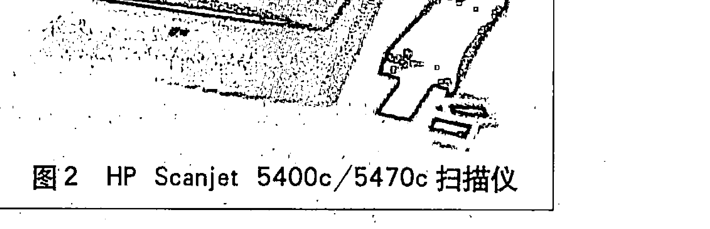

另外，在HP Scanjet 5400c/5470c的面板上有8个快捷键：扫描、电子邮件、节能、复印、照片翻印、更多选项、扫描上网、取消，只需轻轻点击一下就可以迅速完成相应的扫描任务。需要指出的是，这两款扫描仪在预扫的时候最多只需要8秒钟时间，这能够帮助那些性急的朋友节省不少宝贵的时间。

参考价格：2200元

##### （三）HP Scanjet 7400c/7450c

跟前面两款扫描仪一样，HP Scanjet 7400c/7450c（如图3）也使用了双CCD扫描技术，而且最高分辨率和色彩深度也达到了2400dpi和48位色。但是作为HP系列扫描仪中最高端的产品，它在提供了

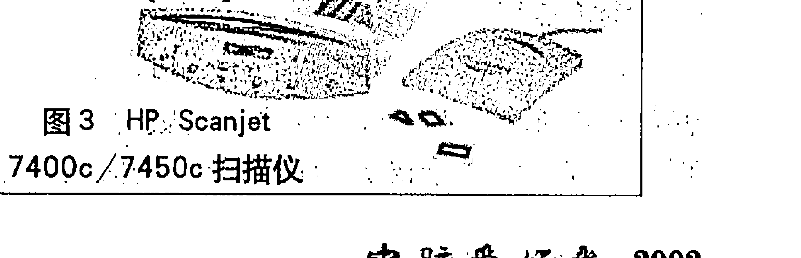

#### 二、Canon 系列

##### (一) D1250U2/D1250U2F

D1250U2 和 D1250U2F（如图4）均采用了彩色 CCD 元件，无论是照片还是文本扫描，其光学分辨率都可达到 1200 × 2400dpi，色彩深度也高达48位色。D1250U2 和 D1250U2F 具备了高速的USB 2.0标准接口，预览速度仅为8秒左右，令照片扫描速度达到极致，不仅满足 SOHO 对于高精度照片扫描的要求，也令工作和娱乐变得轻松自如。另外，D1250U2F 标准配备了胶片适配器，能够扫描35mm正片和负片，为喜欢旅游摄影的朋友提供了经典照片保存的更好途径。

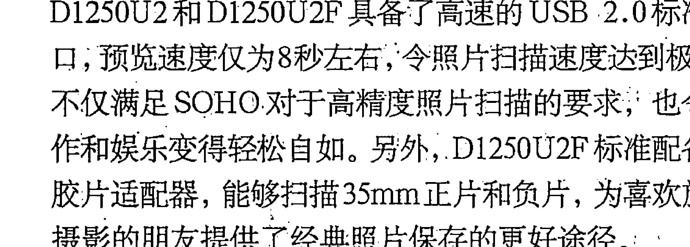

在 D1250U2 和 D1250U2F 上，采用了佳能多项先进技术。这些技术的采用，更大地提高了从普通个人用户到商业办公用户的多种需求和应用。例如它的多照片模式扫描能够使用户在同一时间内最多扫描10张照片并为每一个照片保存为独立的文件；自动倾斜校正可以对一些倾斜的照片自动修正并进行扫描；多图裁切功能可以在同一时间内对多张照片不同部位实行独立扫描，并独立保存。

除去增加以上先进技术之外，这两款产品延续了佳能以往产品的特性，还改善了Z形盖板的设计。不仅可以更高速、方便地扫描书籍等厚物体，并且能通过其前端的快捷键进行各种功能的操作，比如传送 E-mail、复印等多种功能。

参考价格：2650元/3200元

##### (二) Canon N676U

有别于通常所见扫描仪厚重呆笨的外观，佳能 N676U（如图5）设计精美之至，圆润光滑的金属盖板泛着七彩光泽的徽标，宝石蓝色的按键，超薄隽秀的机身，处处显露其不凡的气质。更新奇的是它可依靠支脚竖直摆放，且不会影响正常工作，这种与众不同的扫描方式不仅可以节省摆放空间，同时这种立体的感观也给沉闷的案头平添了几分生气，体现了使用者的不俗品味。

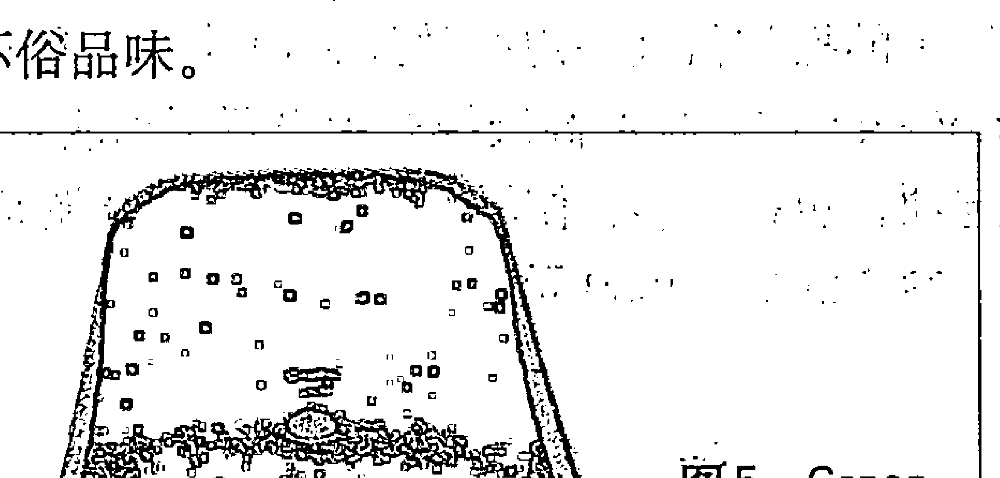

在关键的参数指标方面，Canon N676U可以达到 600 × 1200dpi 光学分辨率，色彩深度为48位色，具备多照片扫描功能。它的盖板与众不同，机身前端三角弧形凹槽方便手把持，并且它独有可伸缩的折叠式Z形铰链，当铰链在竖向完全展开时，可以将盖板水平提升大约42毫米的高度，方便了厚书的扫描。

佳能 N676U 操作简单便捷，快捷键的设置让用户操作倍感轻松，扫描、复印和创建电子邮件附件只需轻轻一按，省去了每次扫描前的复杂设置。简洁明了的软件界面、智能化的功能设置使用户操作得心应手，完成高质量扫描水到渠成。它功耗极低，工作时仅为2.5W，而待机时是工作时的一半，所以无需另配电源，凭借一根与电脑相连的USB线就实现了数据传输和电力供应。

参考价格：580元

##### (三) Canon D2400UF

Canon D2400UF（如图6）采用了同D660U相同的外形设计，机身上的曲线优雅柔和，颜色高雅宜人，不仅让SOHO一族享受这种视觉上的舒适，也充分体现了佳能公司人性化的产品设计。其实 Canon D2400UF 不只是表面功夫做得很精湛，而且性能也绝不含糊，它使用了6线彩色 CCD组件，光学分辨率达到了2400 × 4800dpi，48位色彩输入，对于专业应用人士，这样的指标可以帮助其轻易地获取清晰细腻的高质量图像。

在 Canon D2400UF 这款产品中融入了佳能公司在影像方面多年积淀的技术：它使用了伽利略镜头，

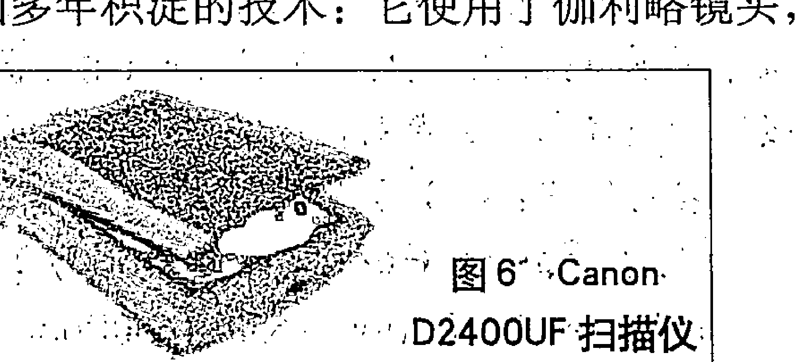

#### 三、Epson系列
##### （一）Epson Perfection 1640SU Office
Epson Perfection 1640SU Office (如图7) 是一款A4幅面的商用CCD扫描仪，它的外观呈时尚流线型设计，轻薄、小巧，迎合了SOHO一族移动办公。同时采用USB/SCSI双接口，在体积、重量大幅度减小的同时去除了多余的连接线。真真正正的小巧玲珑，其色彩基调为淡紫和乳白交配，精致、典雅，不仅与现代的办公环境完全融合，也较好地解决了扫描仪时尚的外观需求与扫描质量难以两全的难题。

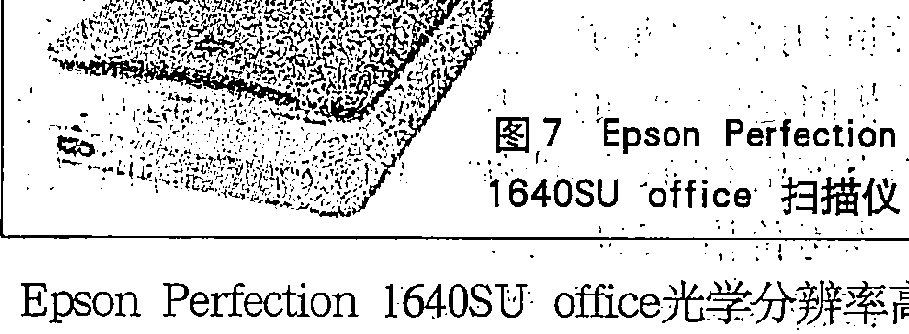

Epson Perfection 1640SU Office光学分辨率高达1600×3200dpi，色彩深度达到了42位色，这种超高分辨率可以让SOHO族在扫描600dpi以上精度的样本时游刃有余，而它42位的彩色位数更为专业用户在制作幻灯片或有美术方面的需求时提供了广阔的发挥空间。而且Epson Perfection 1640SU Office快捷功能键的设置不仅方便操作，让使用过程变得像家用电器一样简单，提高了用户的工作效率。Epson特有的Epson Smart Panel智能平台超前设置了六种快捷功能：彩色复印、照片打印、扫描至OCR、扫描至应用软件和扫描至创意模块，只需要轻轻一按，便可按照操作指示将扫描的图片作为E-mail附件直接发送、直接打印或复印，或者对扫描的文本进行直接的编辑。

参考价格：4500元

##### （二）Epson Perfection 1650/1650Photo
在Epson Perfection 1650/1650Photo (如图8) 中增加了许多新的技术：采用的感光器件运用了交错排列的传感器阵列来捕获超高分辨率图像；扫描头采用“微步进驱动技术”，通过以极小的步长移动扫描头，显著减少锯齿状波纹和色彩失真；高质量的感光镜头，即使在扫描全幅宽原稿时，也能提供杰出的边缘锐度和清晰度；扫描头移动过程中同时获取和处理RGB三色图像数据，以确保更逼真的色彩；动态范围控制技术则在对透射原稿暗部区域进行扫描时，自动调整动态范围以增强暗部细节。需要指出的是这款扫描仪也采用双CCD技术，与HP公司的双CCD技术不同的是，两块CCD交错放置，同时进行扫描操作，这样既可获得更高的扫描精度，又能得到更快的扫描速度。

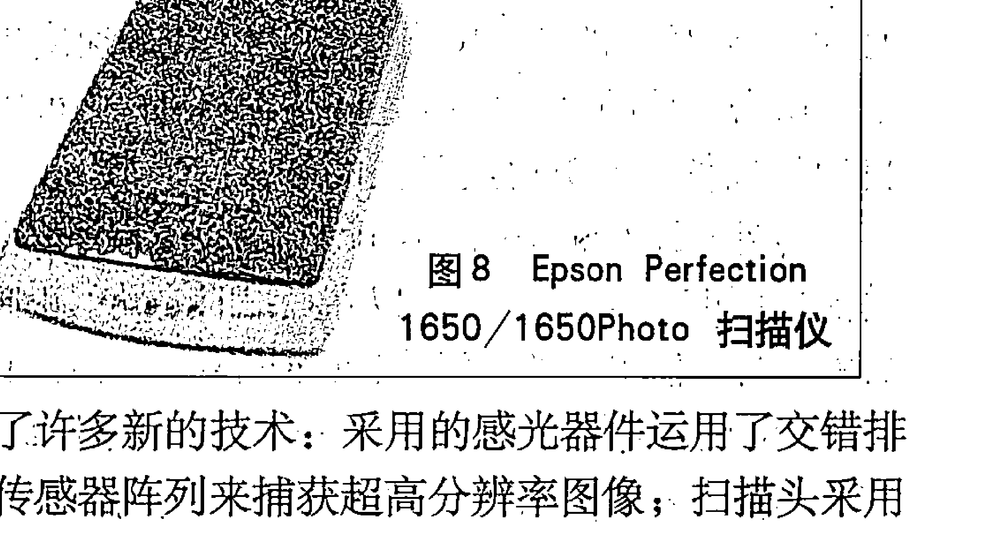

Epson Perfection 1650/1650Photo拥有1600×3200dpi超高分辨率和42位色彩深度，使用如此高的分辨率进行扫描时，你会发现获得的图像细节非常细腻平滑，边缘精细毫无锯齿，而且连每一种色调的细微差别都能准确呈现，色彩层次异常丰富清晰。另外，Epson Perfection 1650/1650Photo还为用户提供了许多易用性设计，除去智能扫描平台的六种快捷按钮之外，附带的驱动软件可以自动预览和分析扫描内容、选取正确的方位来设置，对照片、艺术线条和文本进行自动斜度校正，还有先进的多图像扫描功能，可将几幅图片合放在扫描面板上，再将它们一次扫描到各自不同的窗口中。

参考价格：2000元/2600元

#### 四、AGFA系列
##### （一）AGFA ARCUS 1200
这款由AGFA推出的Arcus 1200 (如图9) 扫描仪属于一款图像美工的专业扫描仪，它采用多平台设计，不仅能在PC机上使用，在苹果机上也能使用。AGFA ARCUS 1200提供了1200dpi的光学分辨率、

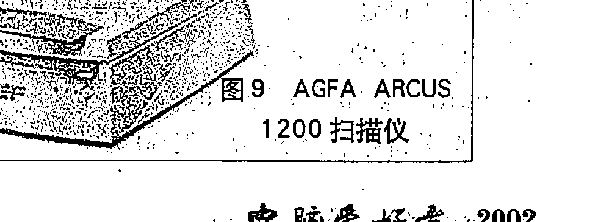

另外，AGFA ARCUS 1200还提供了48位色彩深度，能捕捉到极细微的颜色差异，适合专业图像处理使用。其扫描速度也比较快，能够满足专业用户的高效工作需求。

42位色彩深度，采用 SCSI 接口与电脑连接，但在包装中并没有提供 SCSI 卡。虽然并没有提供 SCSI 卡，但却附带了丰富的辅助配件和软件，在辅助配件方面提供了反射稿扫描支架和胶片扫描专用的支架，可以扫描 35mm、6cm × 6cm 、6cm × 7cm、6cm × 9cm 等各种尺寸的胶片。并且提供了专业图像处理软件 Adobe Photoshop5、丹青中文识别系统和 August2000 等软件，在这些辅助配件和软件的协助下可以使扫描仪的功能得到充分发挥。

参考价格：1200元

##### （二）Agfa DuoScan 2500
Agfa DuoScan 2500 (如图 10) 色彩深度为 36 位色，采用了 TwinPlate 双平台技术和双镜头系统，支持反射和透射扫描。在双镜头系统下，整个平台可进行 2500 × 1250dpi 的扫描，而半个平台的光学解析度高达 2500 × 2500dpi，因此 35mm 幻灯片可以放大至 A3 以上，进行高质量的胶印。另外，这款扫描仪还有不少特点：扫描时其光源和 CCD 一同移动，令两者同步进行；因扫描透射稿件用的镜面是向下关闭的，所以可避免出现积聚尘埃的可能；额外配置的幻灯片架中间不设玻璃片，令对焦更准确，免除由玻璃片引致的对焦扭曲、散光等问题。

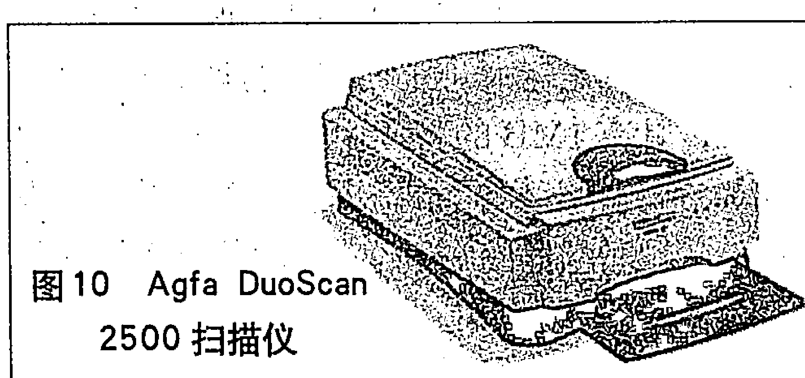

参考价格：6200元

#### 五、清华紫光系列
##### （一）小天使 A600
小天使 A600 (如图 11) 采用目前最流行的 USB 通用接口，即插即用，安装使用都非常方便，而且扫描速度较之 EPP 接口要快。在主要指标方面，它的光学分辨率为 600 × 1200dpi，色彩深度为 42 位，支持 A4 幅面的扫描。或许小天使 A600 的参数指标并不

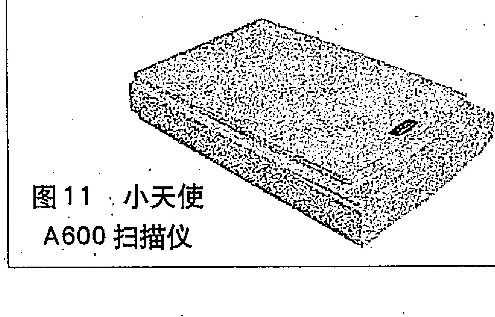

高，但是它所随机赠送的软件非常丰富，尤其是清华紫光的 OCR 识别软件功能极其强大，能够很好的解决中英文识别问题，是表格处理和版面分析的首选。

参考价格：499元

##### （二）Uniscan B0630
Uniscan B0630 (如图 12) 突出的特点为具有 USB 和 EPP 双接口方式，可用于新旧 PC 机；产品侧掀盖方式，整机的外观样式较为新颖、美观，较适合 SOHO 办公环境；同时产品的扫描质量在同类产品中比较突出，扫描速度也较快；另外它还带有五个快捷按键，操作更简化方便。

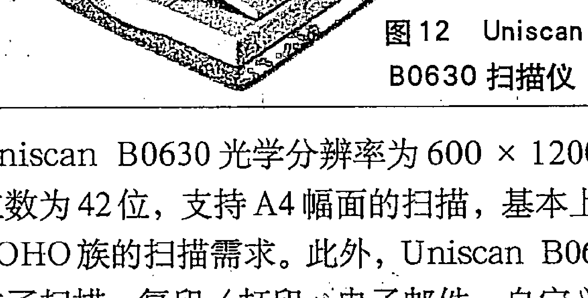

Uniscan B0630 光学分辨率为 600 × 1200dpi，色彩位数为 42 位，支持 A4 幅面的扫描，基本上可以满足 SOHO 族的扫描需求。此外，Uniscan B0630 上还集成了扫描、复印/打印、电子邮件、自定义、停止/取消键五个按钮，只需按下便能够快速完成相对应的功能。

参考价格：1130元

##### （三）Uniscan O2000
Uniscan O2000 (如图 13) 是为了追求扫描图像质量的人专门设计的，即便是最挑剔的人士，对这款扫描仪带来的高质量扫描享受也无法不满意。它采用独特线阵 CCD 设计，真正实现光学分辨率 1200dpi，所以扫描得到的图像色彩艳丽，清晰度高。而且独特的色彩增强技术和强化扫描影像的色彩表现让扫描成品达到专业水准，在 48bit 模式扫描下，丰富的色彩表现能获得最完美的图像色彩资料。

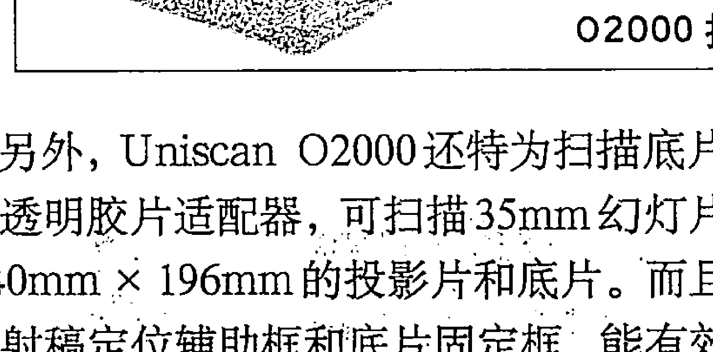

另外，Uniscan O2000 还特为扫描底片的用户设计了透明胶片适配器，可扫描 35mm 幻灯片及最大面积 140mm × 196mm 的投影片和底片。而且方便实用的透射稿定位辅助框和底片固定框，能有效防止因底片移动而带来的图像变形或发虚现象。

参考价格：3200元

### 打印机篇
SOHO一族经常需要打印一些文档图片之类的材料，所以打印机就成为SOHO族必备的外设之一。其实一台合适的打印机不仅能够满足所有日常工作的要求，更可以让你发现生活中的很多乐趣。

#### 一、HP系列
##### （一）HP DeskJet 840c
HP Deskjet 840c (如图 1) 是一款适合于大多数普通用户的品质彩色喷墨打印机，它的分辨率高达600 × 1200dpi，打印速度为8ppm（黑色）/5ppm（彩色），而且计算机附带的USB接口支持普通PC机和苹果机。在打印质量方面，HP Deskjet 840c采用了惠普第二代“富丽图”色彩分层技术，所以具有和同档次产品比较相对出色的输出品质。

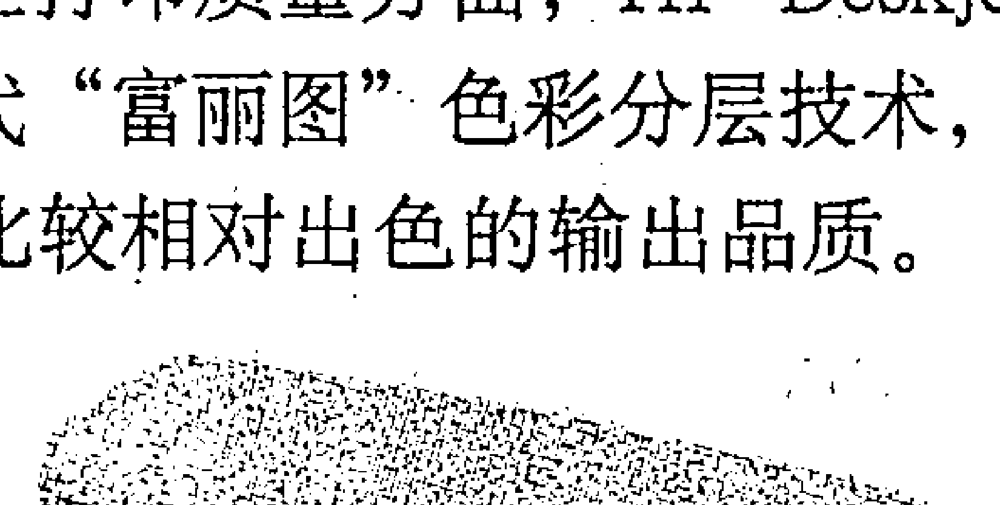

对于个人打印机的典型用户——家庭用户和小型办公室来说，尽管他们的日常应用涉及诸多方面，但任务类型多集中于以默认质量模式进行打印，大都希望在普通纸上获得比较好的图形和文字效果，如果不使用特殊纸张，HP DeskJet 840c打印质量是最优秀的。另外HP DeskJet 840c虽然将打印头和墨水集成一体，增加了使用成本，但是对于打印量不算大的SOHO一族来说，HP DeskJet 840c的使用成本是可以接受的。

参考价格：850元

##### （二）HP DeskJet 920c
HP Deskjet 920c (如图 2) 定位在超值的个人照片打印机档次，跟同类产品比较；它的性价比更高、打印成本更低，非常适合普通家庭彩色打印的要求。HP Deskjet 920c能够轻松实现2400 × 1200dpi分辨率打印，打印速度为9ppm（黑白）/7.5ppm（彩色），打印时间比同档次产品缩短了30%~40%。

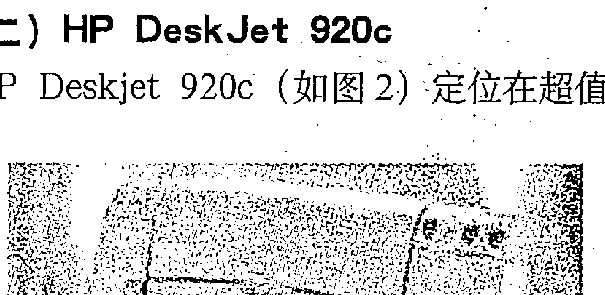

在HP Deskjet 920c中采用了第三代“富丽图”技术，精确地在每一点上分层，层叠多达29滴墨水，在进行半色调处理之前就可产生3500种真实的打印色彩，使打印色调更连续、颗粒度更小、打印质量如同照片一样逼真，因此能够提供更多色调以及不可思议的逼真图像。对于文字打印为主的SOHO族来说，HP Deskjet 920c文字打印质量更是力求完美。采用微小墨滴技术，每个墨滴的体积只有4pl，加之采用了惠普独有的漆基墨水配方，打印效果几乎能与激光打印媲美。

特别需要指出的是，HP Deskjet 920c在每次开机或更换新的打印墨盒的时候不需要大量的墨水来冲洗打印头，这也减少了许多非打印的墨水消耗。这得归功于惠普的热喷墨技术，不需要通过清洗墨头来达到防止打印头阻塞和取出喷墨腔室内气泡的目的。

参考价格：1300元

##### （三）HP LaserJet 6L Gold
在普通黑白激光打印机中，HP LaserJet 6L Gold (如图 3) 可以算是老大哥了，它的打印分辨率是600 × 600dpi，具有1MB的打印内存，标称打印速度是6页/分。在打印技术方面，HP拥有很多专利，其中HP特有的打印速度增强技术“即时热熔器”可以省

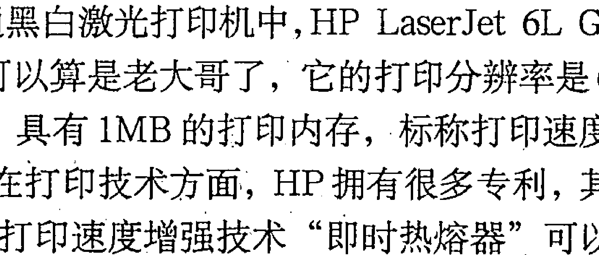

掉预热时间，改进后的I/O处理技术可以提高数据的传输能力。而且LaserJet 6L Gold驱动程序安装方便，即使没有驱动安装盘也可以正常地在Windows 9x/2000/XP系统中使用，同时可以根据打印文档的大小自动计算打印时间，显示打印进度。

参考价格：2600元

##### （四）HP LaserJet 1000
作为HP Laserjet 6L Gold的升级产品，HP Laserjet 1000 (如图4) 是专门为具有大量打印需求的SOHO一族所设计的，它可以在600 × 600dpi的

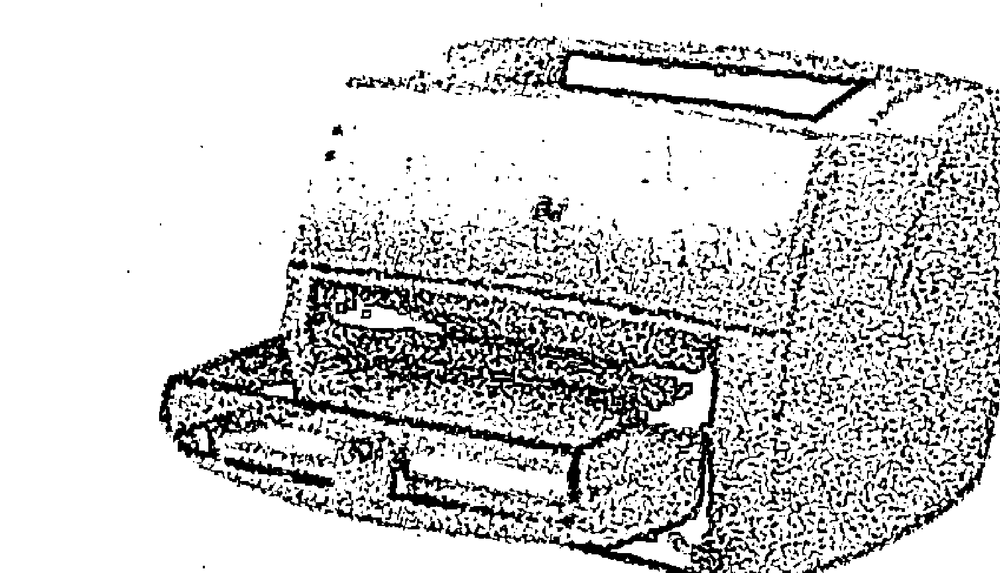

分辨率下输出接近1200dpi效果的高质量的黑白文档，在内置45MHz的处理器和1MB打印缓存的帮助下可以实现每分钟10页的打印速度。同时HP LaserJet 1000在一些细节方面也做了更为合理的改进，它采用了可以拆卸的活动进纸盒，移动时非常方便；进纸盒被设计成了全封闭结构，很大程度上防止了灰尘的进入，且可以一次性容纳250页普通A4幅面打印纸，使得打印大量文档的时候无需频繁地添加纸张。需要指出的是HP Laserjet 1000随机光盘中附带了错误信息的视频帮助，如果在使用打印机过程中遇到了问题，则可以通过直观的视频来协助解决。

参考价格：2850元

#### 二、Canon系列
##### （一）BJC-8200
Canon 公司的BJC-8200（如图5）把喷墨打印机提高了一个台阶，令各位喷墨打印机用户刮目相看。它支持最高1200×1200分辨率，4微微升的墨滴和1/6浓度的墨水使图像再现质量达到1800dpi。在打印质量方面，BJC-8200采用了6色打印和33重色彩控制，尤其是超精微墨滴技术也能极大地提高打印输出质量。通常的喷墨实现方式，在加热器的前端的墨水需要消耗能量，同时还需要墨水回收装置控制喷射墨点的大小和方向，而超精微墨滴技术下有加热器在喷嘴口的前端，不再需要墨水回收装置，喷射的能量全部集中在墨滴上，可以高速、高压、高精度、高稳定性地喷射最小的墨滴。

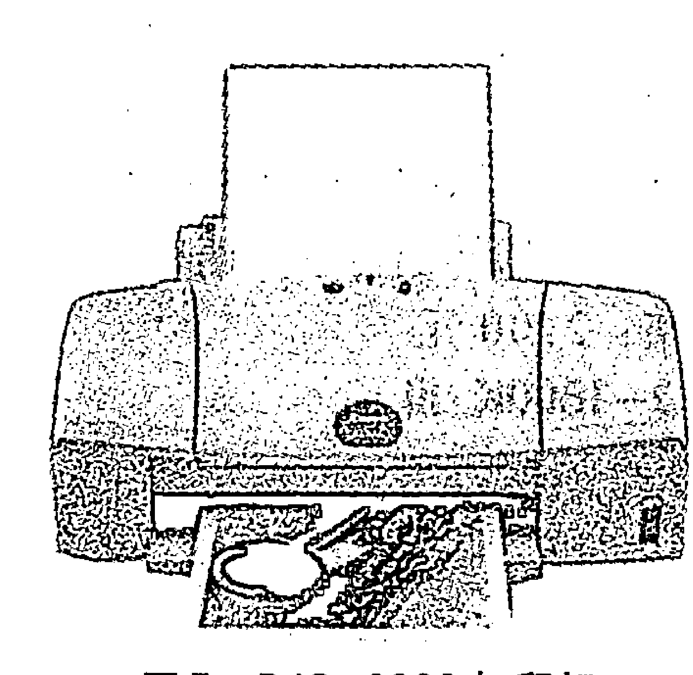

另外，BJC-8200还有一些特色所在，比如可取下来的喷头可以进行清洗，大大减轻用户的负担和烦恼；每色256个喷嘴，使得某一色缺几个喷嘴线时，打印的图片不仔细看都看不出来；六色分离式透明墨水盒可按色更换，最大限度也提高了墨水的利用率，节省资源。

参考价格：3300元

##### （二）BJC-S750/S520
BJC-S750/S520（如图6）是Canon新近推出的两款喷墨打印机，它们都采用了4马达系统、多喷嘴系统和新型进纸装置，帮助SOHO一族节约办公时间，争取最大的工作效率。其中4马达系统为进纸、自动供纸、墨盒移动及清洁单元4种操作提供了单独的马达，可以避免以前驱动马达频繁切换的麻烦，大大提高了打印速度；多达1088个喷嘴可以在部分喷嘴堵塞的时候不影响整体的打印质量，同时也极大限度地扩宽了单次打印的面积；新型进纸装置在打印出纸的同时完成进纸操作，大大减少连续打印的时间。

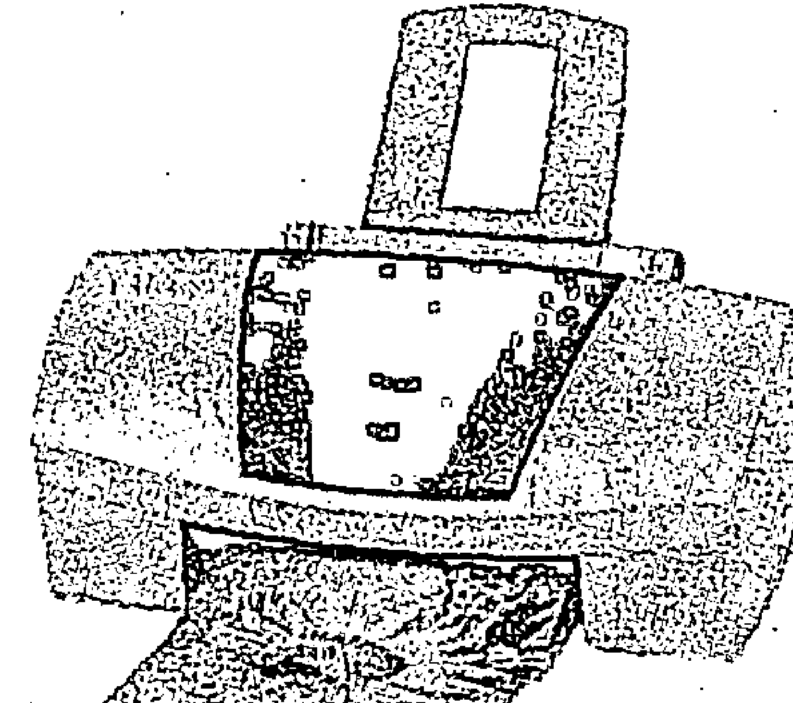

S750和S520均采用佳能新型超精微墨滴技术，每个喷嘴均能喷射5微微升的超精微墨滴，喷嘴的分辨率高达1200dpi，配合超精微墨滴技术，可实现真正2400dpi的打印分辨率。在打印速度方面，S750黑白打印高达20ppm，彩色打印也高达13ppm，即使打印满幅A4照片速度也高达2.5ppm。S520拥有黑白14ppm，彩色9ppm的打印速度。这两款打印机精确色彩分布技术应用于草稿模式，消除了因为打印头来回移动双向打印而造成的色彩差异，从黑白文本、电子邮件、网页到照片打印均能轻松胜任。

另外，BJC-S750/S520都采用了数码精细技术，从而最大限度地保证各种打印文件的高质量输出。精确色彩分布技术和高级精确色彩分布技术可以避免打印头在前行和回程时，打印色彩不一致的问题，确保打印过程中，颜色始终一致。

参考价格：2088元/1588元

##### （三）BJC-S900
BJC-S900（如图7）是一款全新超级照片打印机，它集成佳能所有最新打印技术，照片打印效果达到极致，而且外观设计截然不同于其他型号以及其他品牌的打印机，优雅典雅、精致细腻又不落俗套，是艺术与科技完美结合的极品。

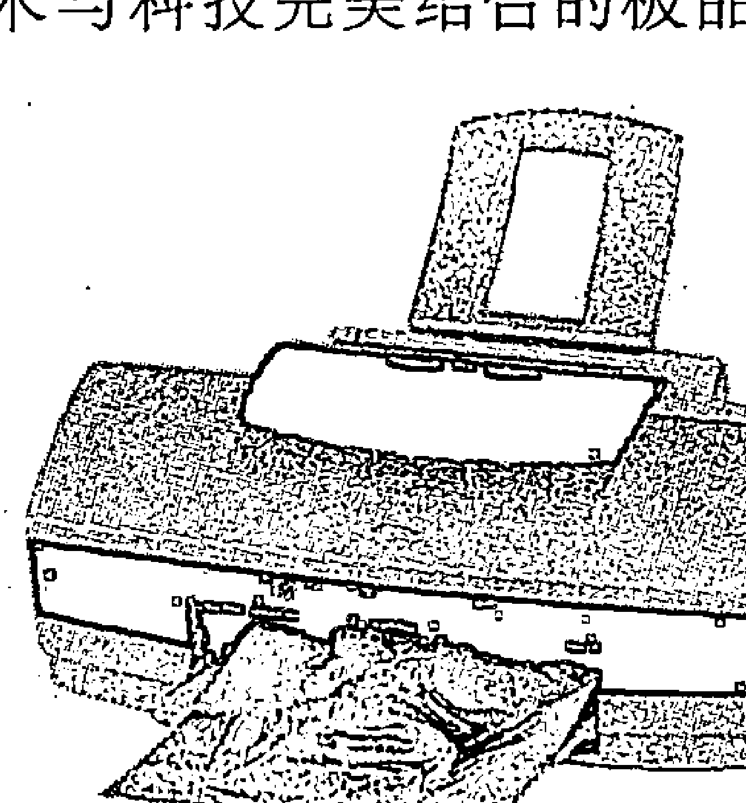

BJC-S900 支持最高 2400 × 1200 的打印分辨率，由于打印分辨率的提高，打印图片从高亮度区域、中间过渡层次，到较暗的阴影区域都得到完美的表现，栩栩如生。BJC-S900 采用了佳能最新三大技术：高速引擎系统、数码精细技术以及超智能设计，令照片打印再度提高到了一个新的境界。其中多达 3072 个喷嘴保证了每种颜色多达 512 个喷嘴，这个打印头的喷射频率为每秒 74,000,000 点，在一个方向移动进行高分辨率打印的时候，可以覆盖较宽的区域，配合双向打印，打印速度令人惊叹。

BJC-S900 采用全新的超精微墨滴技术，所有的喷嘴均喷射 4 微微升的超精微墨滴，墨滴定位极为精确，1/6 浓度墨水打印出图像没有颗粒感，如果配合专业照片纸，打印图像可以长达25年不褪色。而且照片逼真技术提供比以前更亮丽清晰的色彩还原，这个高级图像处理功能可以更自然真实地还原显示器显示的各种类型的照片图像，配合数码照相机使用最合适不过了。

参考价格：3688元

##### （四）Canon LBP810
Canon LBP810（如图 8）激光打印机就是专为 SOHO 一族或者小型办公室设计的，它反应敏捷，在开启电源后 8 秒钟内就能一切就绪，启动后第一次打

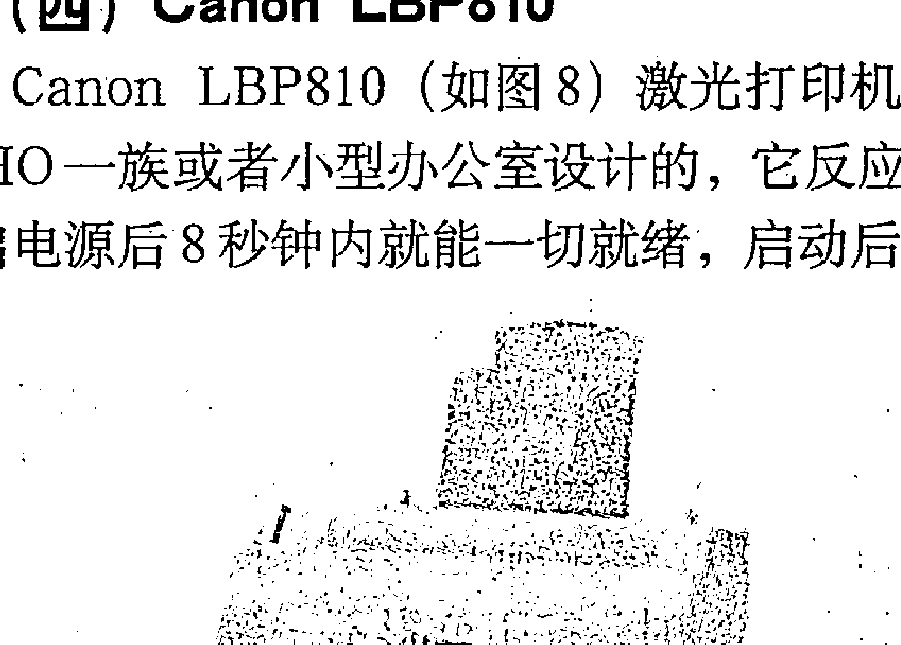

印时间小于 18 秒，打印速度达到每分钟 8 页、分辨率达 600dpi。在设计上， Canon LBP810 激光打印机将自动、手动送纸口分开，在使用中提高了它的便捷性。而它的出纸方式也提供了面向下和面向上两种不同方式。另外它内置了图像完美技术，可以将网页上低分辨率的图形图像进行插值放大，从而获得较好的网页打印效果，同时在自动图像精细技术支持下能够实现相当于 2400 × 600dpi 高质量打印。

值得一提的是 Canon LBP810 使用了全新的打印机驱动程序，这种驱动不仅安装简单，兼容多种操作系统，还提供监视打印机状态的声音和动画提示功能。当打印机卡纸、进纸盒缺纸及出现故障等情况时，可以自动测出故障原因，并作出解决建议，我们就能在它的帮助提示音下迅速排除故障。

参考价格：2420元

#### 三、Epson系列
##### （一）LQ-670K
LQ-670K（如图 9）是 Epson 公司的一款针式打印机，它最擅长的就是单据凭条打印功能，特别对打印头、打印头马达及进纸马达进行改进，从而

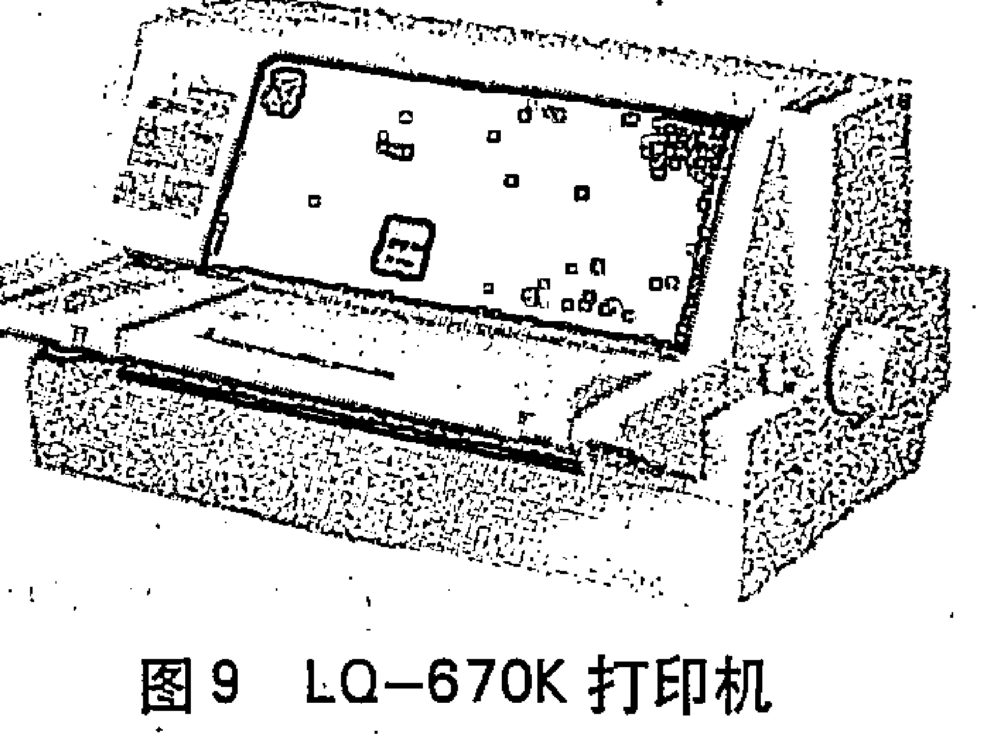

实现远高于其他针式打印的速度，在汉字超调整模式下，能以 6.7c/s 的汉字打印速度；在高速草稿模式下，能以 10c/s 的密度创造 300c/s 的英文打印速度；在 LQ 模式下则能实现 184c/s 的高速英文打印。为了适应打印票据和报表的需要，LQ-670K 的压缩打印功能只需使用窄行打印纸，即可打印出宽行报表的内容。同时，LQ-670K 兼备多样灵活的单页正向进纸或反向进纸模式和更为便利的前端输出功能，确保高品质的连续打印输出得以迅速实现。

参考价格：2200元

##### （二）LQ-1600K III
LQ-1600K III（如图10）是一款适合现代 SOHO 需求的高性能针式打印机，它改进的新型打印头可大大提高打印速度，汉字打印速度最高可达 184 字/秒，西文 300 字/秒，优于同档次的其他针式打印机。为了满足各种用户的不同要求，LQ-1600K III设计了六种可供选择的送纸方式，为用户提供了方便快捷的纸张处理功能。同时，LQ-1600K III具有标准的IEEE-1284双向并行接口和Type-B型接口选件，还可与LQ-1600K完全兼容，并且具有IBM2390/2391Plus仿真模式，为SOHO一族的多样性工作提供了便利的条件。参考价格：2800元

##### （三）Epson Stylus Photo 720

Epson Stylus Photo 720（如图11）具有良好的文本和图像打印质量，打印分辨率可以达到1440 × 720dpi，打印速度为5ppm（黑白）/ 3ppm（彩色）。它独特的微电压控制技术和高精度的六色打印一直占据着用于照片打印的喷墨打印机的大部分市场份额，其输出效果已非常接近传统照片，用肉眼很难看出颗粒状效果，色彩表现也十分准确。Epson Stylus Photo 720最大的改进是采用先进的智能墨滴变换技术，在打印深浓度区域时使用大墨滴，在打印浅浓度区域才使用小墨滴，通过自动调配大、中、小三种规格的墨滴，在保证画质的前提下提高了打印速度。另外它的打印噪声很小，适合经常打印图像的SOHO一族选用。参考价格：1400元

##### （四）Epson Stylus Color 480

Epson Stylus Color 480（如图12）是面向家庭和SOHO一族定制的打印机，它造型小巧而活泼，上盖和进纸拖板采用白色半透明塑料制成，和白色机身相映成趣，摆放在家中与家里温馨的情调非常和谐。Epson Stylus Color 480最高分辨率为720 × 720dpi，采用四色双墨盒设计，黑色墨盒和彩色墨盒分别独立，在打印彩色或黑色区域时两种墨盒可以自动切换，这种设计会令打印机更加省墨，配合Epson快干墨水，令色彩更加精确，使三色打印常见的费墨、模糊、偏色等实际问题得到一定程度上的解决。为改善打印机的颗粒感，Epson Stylus Color 480采用了7微微升超精微墨滴，直径小于发丝的四分之一，打印可再现丰富的颜色层次，画面细腻平滑，令图像质感得到更好的表现。Epson的智能墨滴变换技术可令画质与速度两全其美，它能根据色彩区域的不同，自动变换大(24微微升)、中(14微微升)、小(7微微升)三种尺寸的墨滴，使墨滴在每一颜色区域，都能实现最佳配置，特别是在浓度高的部分采用了大墨滴打印，从而加快了打印速度。参考价格：780元

##### （五）EPL-5800L

Epson EPL-5800L（如图13）的标配打印内存为2MB，最大可扩展至13MB，它采用了爱普生独有的BiRITech分辨率增强技术和MicroGray1200灰度调整技术，所以最高分辨率达到了1200dpi。在打印速度方面，Epson EPL-5800L每分钟能完成10页纸的输出打印，这种速度在同档次的激光打印机中可以称得上是非常快速的了。

在软件方面，Epson EPL-5800L的功能相当强大，通过Epson Status Monitor3监测程序可以实时监视当前的打印机状态、剩余碳粉量、送纸器中的纸张量及错误信息。在基本设定选项中还能够对打印纸尺寸、来源和打印方向等进行调整，同时还能够设定选项中用来调节打印缩放比例、水印、是否采用节电模式等参数。参考价格：2500元

### 移动存储设备篇

在瞬息变幻的资讯时代，移动存储设备对于我们的生活、工作和学习已经是不可或缺的重要工具了。在动辄几十上百兆大量数据需要“移动”的时候，作为载体的软驱早已力不从心了，新一代的信息交换需要的是快捷、可靠、容易携带和安装使用的设备。对于SOHO一族来说，如果采用了移动存储设备，就有了一种如虎添翼的感觉。

#### 一、录音笔

好记性敌不过烂笔头，但是当我们参加会议或者是需要记录一些重要内容的时候，怎样才能既轻松快速又完整的进行记录呢？其实我们完全可以找一个好助手来帮忙，这就是录音笔。

#### （一）选购原则

选购录音笔的时候主要注意以下几个方面：

- 1. 录音时间
通常录音笔都可以保证120分钟以上的录音，这对于一些简短的会议来说已经足够了，但是对于需要外出的SOHO而言，最好还是选择360分钟，甚至是600分钟的录音笔，这样可以一次性将所需要的内容全部录制下来，有空的时候再慢慢整理。

- 2. 计算机接口
目前录音笔一般有USB和串行、并行接口三种，虽然USB接口的录音笔价格要稍微贵几十元，但是在计算机主板普遍集成了USB接口的今天来看，还是USB接口的录音笔更为适用。一方面是USB接口的传输速率比串行和并行接口要快不少，而且在需要将录音笔的内容输入计算机整理的时候就无需关闭计算机，这在使用的时候显得尤为方便。

- 3. 电池寿命
电池寿命也是录音笔的一个重要指标，优秀的录音笔可以使用两节5号电池连续工作10个小时，如果你不想在会议记录的时候携带后备电池的话，最好在选购的时候多加注意这个指标。

- 4. 外形
虽然录音笔的特点就是小巧便捷，但是一些录音笔重量达到了上百克，而且块头也比较大，放在公文包或者口袋里都显得非常“突出”，这多少也影响了自己的形象吧，所以时尚的SOHO一族选购的时候也要多加留神。

#### （二）经典机型

- 1. 三星 SVR-S1330
这款录音笔（如图1）可以录制810分钟，同时可以存储400条信息，录音系统采用的是内置Flash Memory。使用的时候可以采用内置的麦克风或者是外接麦克风进行录音，输出的时候通过并口连接线导入计算机或者是直接通过耳机重播记录内容。三星SVR-S1330在不包括电池的时候重量为35克，外形尺寸为102.4毫米×36.6毫米×17.8毫米，可以说是非常小巧的。特别值得一提的是它还附带了一个电话录音用连接器，辅以配套的Voice Manage光盘能够充当电话录音记录使用，因此还是非常超值的。
参考价格：1650元

- 2. 三星 SVR-P220
三星 SVR-P220（如图2）的外形就是一只笔，所以称呼它为录音笔是最合适的。这款录音笔最长可以录音138分钟，重量仅仅为40克，放在衣服口袋或者是皮包中一点都不占地方，而且在开会的时候把它放在上衣口袋中，别人肯定不会发现你在偷偷地录音。三星 SVR-P220 录音系统采用的是内置或者外接麦克风，也可以直接通过内置的喇叭或者外接耳机来重播录制的内容。
参考价格：1400元

- 3. JNC DRSW-S216
JNC DRSW-S216（如图3）可以连续录音最长达10小时，这得益于它内置的更高容量存储介质。除了具备数码录音笔必备的功能外，它还具有显示剩余录音时间、选择录音质量、电话录音、监听录音、反复放音等多种丰富而方便实用的功能。为了弥补数码录音笔产品自身所带的喇叭音量较小的不足，该产品提供了一个简易而非常有效的共鸣音箱，不但能提高音量、多人同时共享录音资料，而且还能在平时起到保护录音笔免受物理损伤的作用。
参考价格：1050元

- 4. LG LVM-20
LG LVM-20（如图4）规格为30毫米×116毫米×14毫米，重量为36克。它的正面上方是扬声器和LCD屏，LCD最多可以显示199条信息。中间是BACK、PLAY和NEXT这三个按键，也就是播放功能主要由这三个按键来完成。而音量和录音按键被放在了侧面。在设计上这款LG的录音笔考虑得也很周到，不仅有内置的麦克风而且也留有了外置麦克风的插孔，迎合了不同场合的需要。LG LVM-20由两节七号的电池来供电，能够保证11小时的连续录音和10小时的连续播放，如果采用最长录音方式的话，则可以录制19小时20分钟的内容！另外，这款录音笔随机附件有单音耳机话筒、电话录音用的适配器及电话接线、录音接线等等，十分齐全。
参考价格：850元

- 5. K&C KCV-90FC
K&C KCV-90FC（如图5）采用了16M容量的Flash Memory，采用最长录音方式可以录制562分钟，采用普通方式也达到了258分钟，这完全可以胜任一般的用途了。难能可贵的是，录音笔只需要一节7号电池供电，不仅可以完成整个录音工作，而且单独放音也可以支持5至6个小时。另外，特别需要指出的是K&C KCV-90FC具有FM收音功能，当你在闲暇无聊的时候也可以用它来打发时间呢！
参考价格：1300元

#### 二、移动硬盘

过去我们都喜欢使用3.5寸软盘拷贝文件，但随着数据量的增大，软盘已经力不从心。因此找一种大容量的移动存储设备进行电脑之间的数据交换很有必要。目前，大容量的移动存储设备主要有CD-RW刻录机、ZIP、MO、优盘和移动硬盘等。但是CD-RW刻录机、ZIP和MO设备在使用上不太方便，所以并不适合作为交换数据的首选。倒是优盘和移动硬盘使用起来非常的方便，成为经常复制大容量文件的SOHO一族必备的外设了。

#### （一）选购原则

选购USB硬盘的时候需要注意以下几个方面：

- 1. 根据需求选择合适的产品
移动硬盘的一般用途有四种：移动办公时候转移大量数据；对于重要数据进行备份保存；在不同计算机之间进行数据交换；容量扩充，解决硬盘容量紧张问题。在购买移动硬盘时首先要确定自己买回来能否派上用场，如果买回移动硬盘却只当普通硬盘使用那就是太可惜了。在选择移动硬盘的时候，不要一味追求大容量、高速度和低价格，以为这样就是性价比好，其实除非每天都有大量的数据进行备份，否则没必要选择超过5G的移动硬盘，因为普通USB硬盘的传输速率为1.2MB/s左右，全部复制5G容量的文件需要花费2小时左右。而且大容量移动硬盘价格比较昂贵，因此对于SOHO一族来说，选择较小容量的移动硬盘才符合够用好用的原则。

- 2. 移动硬盘使用环境
理论上说移动硬盘可以在每台电脑上使用，但由于多数移动硬盘仅仅通过USB接口取电，而老主板单个USB接口理论上的最大供应电流是500毫安，对付标称700毫安的笔记本硬盘没有任何问题，可是新出的硬盘耗电在1000毫安左右，USB接口就有点力不从心了。如果硬盘长期在低于额定电流下工作很容易出错，甚至损坏，所以在选购移动硬盘时一定要确定额定电流是否适合在自己的计算机上使用。

- 3. 其他事项
在选购时，一些细节也是不得不加以考虑的。首先就是品牌的选择，优秀产品具有多重缓冲性能，外部有防震垫，内部有弹性环或者采取嵌套设计，能让硬盘高枕无忧。而一些低价产品过分追求轻、薄，根本没有防震设计，如果不慎落地或受到其他碰撞往往会导致数据丢失，严重点的会产生物理坏道甚至彻底损坏。其次是驱动程序是否完善，有些移动硬盘在Windows下工作需要必需的驱动程序支持，而且Windows 9X/NT/2000/XP的驱动程序各不相同，最好能够选购Windows可以自动识别的移动硬盘，省却安装驱动程序的麻烦。再者是查看是否有附加电源，这是因为某些主板无法使用耗电量太大的移动硬盘，这时就需要选购能够外接电源供电的移动硬盘。最后就是售后服务，因为移动硬盘的服务比台式机硬盘价格昂贵，如果不慎损坏是很大一笔损失，所以选购服务好的移动硬盘也可以为SOHO一族省去不少麻烦。

##### （二）经典产品

- 1. 爱国者系列
    - (1) 移动存储加密王
    移动存储加密王的主要特点是内置最新数据加密防卫区，128位密码加密算法确保数据密不可泄。此外数据传输率高达12Mbps，是刻录机的9-10倍。而且它仅重210克，体积小于随身听，采用了USB接口，支持热插拔，使用起来极为方便。另外独有的自动平衡滚轴系统，抗震性能安全可靠。
    参考价格：1900元（10G）

    - (2) 移动存储王II（如图6）
    移动存储王II不仅仅拥有全新的外型，并且采用全新的USB2.0接口标准，秉承了第一代移动存储王的硅氧盘片，并在原有的自动平衡滚轴系统基础上升级，采用最精密、最先进抗震设计的液压平衡滚轴系统，缓存提高到2MB，采用DMA100传输速率协议、单碟20G的超大容量，使得爱国者移动存储王II整体的峰值速度高达43Mbps，并且稳定性更高，抗震性也更强了。
    参考价格：2500元（20G）

    - (3) 移动存储烽线王（如图7）
    移动存储烽线王是爱国者第三代移动存储产品，它继承了爱国者移动存储产品安全可靠、轻巧便携、大容量等优点，并同时兼备USB 1.1及IEEE1394火线接口，使移动存储速度峰值高达400Mbps，接近普通IDE硬盘的传输速率，产品易用性和兼容性达到最大化，也更大程度地满足了用户的不同需求。爱国者移动存储烽线王采用自动平衡滚轴系统和硅氧盘片的有机组合保证爱国者移动存储烽线王强劲的抗震性、极高的数据安全性，以及运行稳定性。同时产品精密设计了防震、防静电保护膜，不用担心锐物、灰尘、高温或磁场等对它造成伤害。
    参考价格：2900元（10G）

- 2. 清华同方小旋风超薄USB加密移动硬盘
清华同方小旋风超薄USB加密移动硬盘（如图8）的最大特点是体积非常小，厚度仅为1.2厘米，重量仅有160克，是目前可以看到的最薄最轻的USB移动硬盘。它的结构紧凑，线条流畅，从外观看极为精致、时尚。小巧轻灵的外形特点迎合了目前移动类产品超轻、超薄的设计理念。此外，外壳采用富有金属光泽的铝镁合金外壳，可加速散热，而且防静电能力很好，比起用PVC塑料做外壳的机器在这些方面有了很大提高。小旋风系列容量介于5G至80G之间，配合独家研发的安全卫士加密软件，具备安全可靠，功能强大，方便易用的特点，因此让其应用范围更加广泛。
参考价格：1500元（10G）

- 3. IBM BlueGhost移动硬盘
IBM BlueGhost移动硬盘（如图9）是IBM公司为满足频繁移动用户大容量存储的需求而推出市场的移动存储产品，它的设计特别考虑了移动存储的特殊性，使用了IBM的自动平衡滚轴系统防震技术，可承受800公斤的外部冲击力。还使用了无论热胀冷缩还是剧烈震动都不易变形的IBM玻璃盘片，具备很好的防震、防磁、防静电的性能，可防高达8000V的静电，极大提高了用户移动存储数据的安全性并大大降低了噪音。超大容量从10GB到30GB，写入速度为12MB/s，寻道时间为12毫秒，缓存为512KB，BlueGhost 移动硬盘性能指标大大优于其他移动存储设备，其实我们不用多说：IBM出品，必属精品。
参考价格：2300元（20G）

- 4. 怡华通联大仓库
大仓库 USB 移动存储器（如图 10）中采用了专门为这款产品而定制的 CPU 及高集成度的控制电路板，并在此基础上运用多项专利技术，使大仓库不但性能优越，还具备了加密保护功能。它的体积只有同类产品的一半，这不仅使大仓库在外形上更为小巧精致，而且更重要的是故障率大大降低，提高了设备的可靠性。其次是独有的防潮、抗震系统设计和先进的防磁、防静电设计，适用于各种地理和气候条件，这是同类产品无法比拟的。再者是大容量、高读写速度和即插即用性，大仓库提供了 6G、10G、20G 和 30G 四种规格，其读写速度最高可达 12MB/s，能够很好地满足各类用户对大容量和高读写速度的需求。同时大仓库可与 PC 机、MAC 机和笔记本电脑方便地交换数据，只要插入 USB 接口即可使用，而无须重新启动。
参考价格：2800元（20G）

- 5. 旅之星
第三代旅之星（如图 11）除了具有普通 USB 移动硬盘原有的特点外，还具有如下创新特点：①采用欧美最新标准的 Mini USB接口，增加了与未来 USB 数字家电接口的通用性。②采用独特设计的多功能 USB 数据传输线，可用于连接各类 USB 移动硬盘、USB打印机、扫描仪及各类拇指硬盘系列，真正实现一线多用，极大地方便了用户。③在联机状态下，操作系统正常启动后通过 USB 端口智能控制移动硬盘的开启，避免了传统移动硬盘在联机启动时可能造成的不能正常启动现象。④独特工艺处理的合金外壳不仅具有防磁、防震、防辐射、防静电抗震等优点，还具有超轻，超薄，极便携带的特点。⑤随机附送 PGP加密软件，安全可靠。⑥用最新内核设计，可支持 Linux 操作系统，从而实现多种平台间的数据交换。
参考价格：1600元（10G）

#### 三、优盘

长期以来，软驱一直是 PC 机的标准配件，用户之间交换数据主要依靠软盘。但由于软盘容量小且易损坏，而且需要交换的数据量也越来越大，软盘就显得有些力不从心了。现在市面上出现了一种名为优盘的东东，它就成为以前软盘的掘墓人。不过当你面对众多品牌、各种型号的优盘，怎样进行选择呢？下面就来了解一下优盘吧。

#### （一）选购原则

选购优盘的时候需要注意以下几个方面：

##### 1. 优盘类型

目前优盘主要分三种：①加密型——本身可以通过密码进行加密，如果使用的时候密码不符就无法使用，万一优盘丢失或被窃取，数据依然不会被泄漏。②无驱动型——它主要的特点就是在 Windows Me/ NT/2000/XP、Mac OS、Linux 等操作系统中都不需要驱动，这样你完全可以用它复制电脑中的文件到其他计算机中。③启动型——除了具有无驱动型所有特点外，它还有一个特点：如果计算机主板支持 USB 直接启动的话，完全可以不需要软盘引导，直接用它来启动计算机即可。

##### 2. 使用次数

虽然市场上各类优盘都明确标注产品可以正常擦写 100万次，但由于基于 Flash存储技术的优盘在工作时是通过二氧化硅形状的变化来记忆数据的，与软盘及硬盘的磁存储技术不一样，所以 Flash 的材质直接影响了闪盘的品质。如果 Flash材质不好的话，优盘在使用了一段时间之后可能会产生容量变小的情况，这种变化会造成数据丢失，所以在选购优盘的时候需要选择知名品牌的优盘。

##### 3. 售后服务

优盘的售后服务也非常重要，由于现在各厂商看好优盘市场，并纷纷推出了自己的品牌，除了在质量上良莠不齐之外，很多小品牌的售后服务更是纸上谈兵。

##### （二）经典产品

##### 1. 朗科系列

###### （1）双启动优盘（如图12）

双启动优盘采用闪存介质和 USB 接口，它的左侧面是状态开关，可以选择将双启动优盘设为“FD”（软盘状态）或“HD”（硬盘状态）。右侧面是写保护开关，写保护开关打开时在优盘上可以进行读写操作，关闭时只能读不能写，从而有效防止文件被意外抹掉或感染病毒。需要注意的是，在切换状态开关之前，必须将双启动优盘从 USB 接口拔下，而不能直接连接在 USB 接口上切换。目前双启动优盘支持多种操作系统，符合 USB 1.1标准。此外，双启动优盘在 Windows Me/2000/XP、Mac OS 和 Linux 上无需安装驱动程序。
参考价格：228 元 (16M)

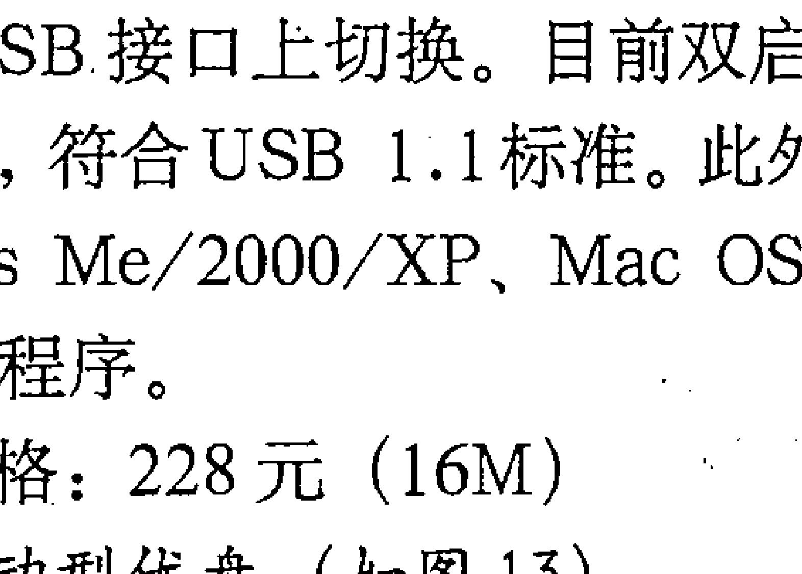

###### （2）启动型优盘（如图13）

启动型优盘支持容量从 16M 到 2G，它的存储速度快，轻巧精致，携带使用简单方便。启动型优盘最大的特点是出色地实现了软盘启动和硬盘启动，通过在 Flash Memory 存储器上模拟和实现 USB 外置软盘和硬盘的功能，能被目前主流的 BIOS 所识别，实现启动功能。只要通过启动型优盘侧面的状态开关选择：将启动型优盘设为“FD”并对系统的 BIOS 进行相关设置，就可以用启动型优盘来实现软盘启动；将启动型优盘设为“HD”并对系统的 BIOS 进行相关设置，启动型优盘又可以实现硬盘启动。
参考价格：189 元 (16M)

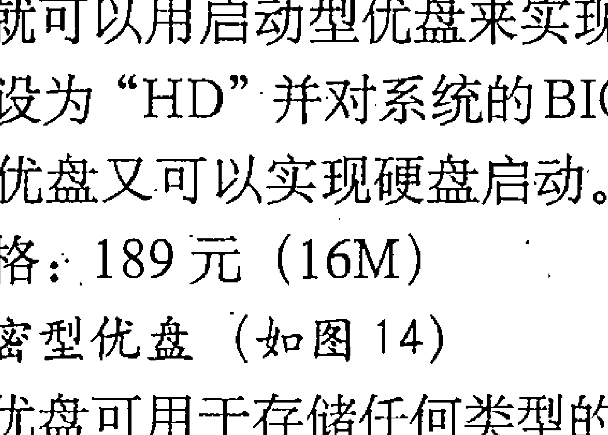

###### （3）加密型优盘（如图14）

加密型优盘可用于存储任何类型的数据文件和在电脑间方便地交换文件，它通过优盘锁和数据加密两种方法来确保数据的安全保密，其优盘锁是指可以对优盘设置密码，该密码存储在优盘内，每次使用优盘时系统会提示输入密码，如果所输入的密码与原来设定的密码相匹配，则可以访问使用优盘，否则将被拒绝使用优盘，这样就确保没有得到授权的人无法读取优盘内的数据，万一优盘丢失或被窃取，数据依然不会被泄漏，从而确保了优盘内的数据的安全；数据加密是指存储在优盘内的数据内容本身是经过特定的加密算法加密后存储在优盘内的，读取优盘内的数据时需经过解密后再传回给用户，这样企图非法窃取优盘内数据的人即使通过特殊的手段绕过优盘锁后，也无法读取优盘内数据的真正内容，这样进一步确保了优盘内数据的安全。另外，加密型优盘可以当作普通优盘使用，只要使用朗科提供的工具软件就可以在普通优盘和加密优盘之间进行转换。
参考价格：149 元 (16M)

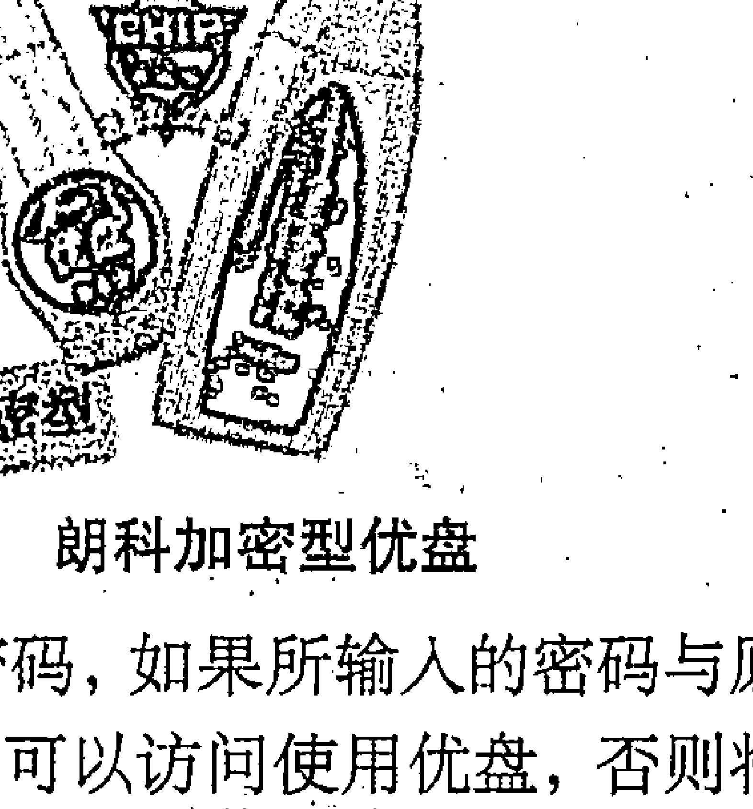

###### （4）无驱动优盘（如图15）

无驱动优盘是可用于存储任何数据文件和在电脑间方便地交换文件，它采用闪存存储介质和 USB 接口，具有轻巧精致、使用方便、便于携带、安全可靠、造型时尚新潮等特征。为了让用户更加方便地使用优盘，无驱动优盘在 Windows Me/2000/XP、Mac OS 以及 Linux 作系统上都不需要安装驱动程序，省去了用户安装驱动程序的麻烦。
参考价格：259 元 (32M)

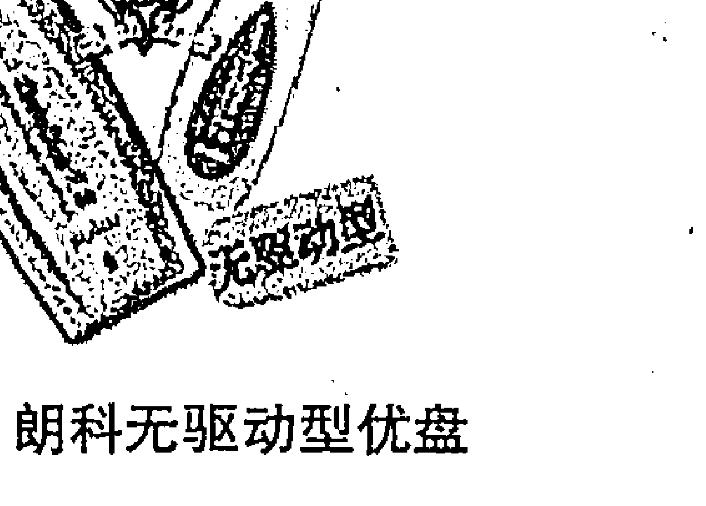

##### 2. 矽霸百事灵大男孩迷你闪存

矽霸百事灵大男孩迷你闪存（如图16）集高速、启动、加密、无需驱动于一体，其小巧轻便、即插即用、支持热插热拔的特性使用起来非常方便。安装的时候无需安装设备驱动，只需在首次连接时安装密码驱动即可，同时还为驱动器的访问提供密码保护，而且写保护开关可以防止误删除重要数据，充分保证了数据的安全性。百事灵大男孩采用的固态闪存可以使数据保存10年以上，可重复擦写100万次以上，而且它的抗震性非常好，从几米的高度自由下落也不会损坏数据，保证了存储数据的持久。

参考价格：279元（32M）

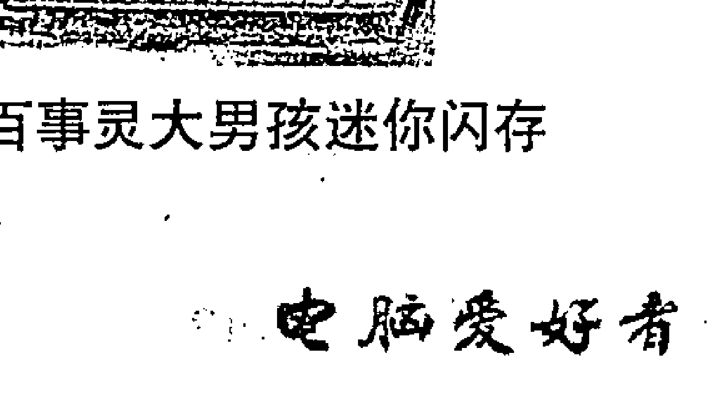

##### 3. 联想魔盘

联想魔盘（如图17）是一种采用Flash芯片为存储介质，通过USB接口与计算机交换数据的可移动存储盘，它是一种无驱动器、即插即用的电子存储盘，便于携带，耐高低温，抗震性能强，还可防磁防潮。它可以使用在带USB接口的PC机、苹果机及笔记本电脑上，在Windows Me/NT/2000/XP、Mac OS和Linux系统中无需安装驱动程序即可使用。联想魔盘写入速度为600KB/s，读出速率为800KB/s，通过LED指示灯可以知晓当前工作状态：指示灯亮表示处于等待读写状态，指示灯闪烁表示正在进行读写数据。

参考价格：458元（64M）

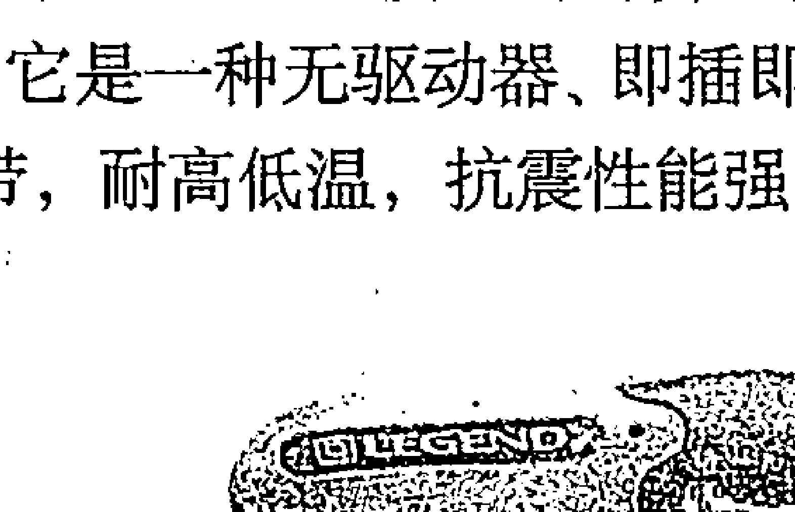

##### 4. 易盘系列

- （1）无驱启动硬加密型易盘（如图18）

无驱启动硬加密型易盘将无驱启动和整盘加密三项最实用的功能集于一身，整合了目前市场上同类产品的所有优势，将移动闪存的功能应用推向了极致。它具有写保护功能，使得存取、读写、修改数据更加安全、可靠，而且这个功能操作简单，只需拨动易盘侧面的拨动开关，即可实现写保护功能。开关在保护状态时，只能浏览易盘内数据，不能对数据进行修改、保存等各项操作，在非保护状态时，则可对数据进行各种操作。硬件加密功能通过预先烧录在易盘芯片中的加密程序对整个易盘进行加密，只有在正确输入密码之后才能打开易盘浏览文件，使易盘真正成为你的保密卫士。易盘的启动功能不同于目前市面上同类产品以1.44MB的A盘或C盘启动系统的方式，而是以ZIP格式引导整个系统的启动，无需改变易盘的容量，从而使易盘的存储空间得以充分利用，实现了真正意义上的启动功能。

参考价格：290元（32M）

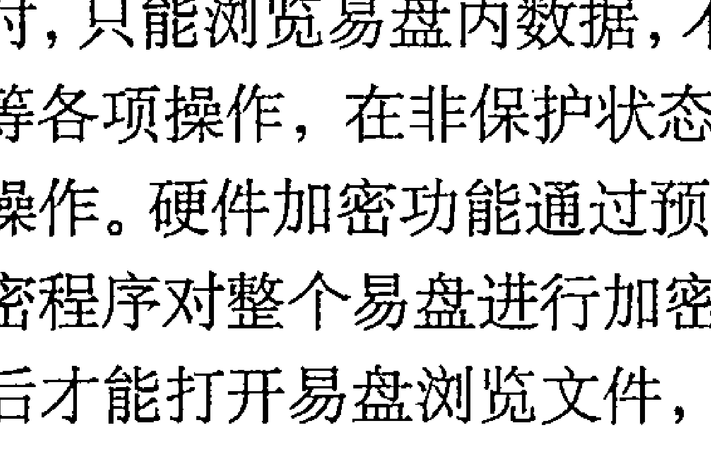

- （2）无驱型（如图19）

无驱型采用Flash芯片为存储介质，可以确保100万次以上的可靠写入，通过USB接口与计算机交换数据真正实现即插即用的迷你型活动硬盘。它体积小、重量轻、容量大。便于随身携带，而且无需驱动器和驱动程序即可使用。同时还有抗震、防磁、防潮的特点，防止引导区病毒，数据保存特别安全。无驱型写入速度为600KB/s，读出速度为950KB/s，是普通软驱传输速度的30倍以上。需要特别指出的是，这款产品可以支持用户命令的技术，使得它具有丰富的附加功能，而且还可以随软件的升级而不断扩展。

参考价格：148元（16M）

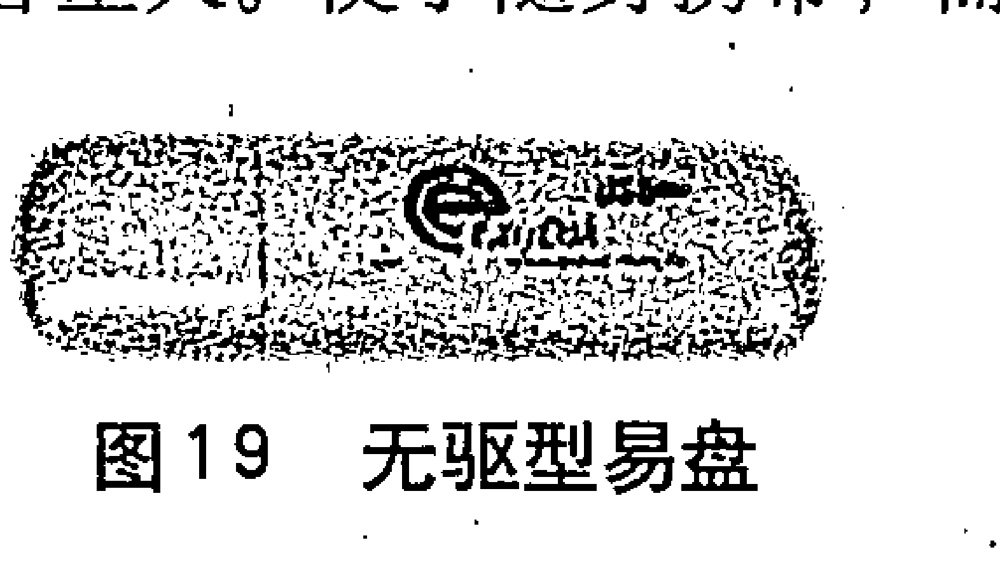

### 移动计算设备篇

时间就是生命，时间就是金钱。SOHO一族虽然谈不上日理万机，但是也有很多事情需要处理，尤其是当SOHO一族外出工作的时候更是要充分利用分分秒秒，这时就需要移动计算设备隆重登场了。

#### 一、笔记本电脑

对于每个计算机爱好者来说，拥有一台属于自己的笔记本电脑无疑是个梦想，对于SOHO一族来说自然也要先装备好自己的武器，这样才能无愧于SOHO这个时尚的称号。

#### （一）选购原则

- 1. 选择合适的笔记本类型

笔记本电脑一般分为全内置、光软互换和全外挂三种类型，考虑到SOHO使用场合和应用特点，建议应该以光软机型为首选，因为SOHO家中都有计算机，而且一般台式机的配置都很齐备，不需要通过笔记本电脑来作为硬件设备的补充，但是考虑到移动办公的特性，有可能经常携带笔记本电脑外出，所以采用光软互换的笔记本能够根据不同的场合来选择使用，这一方面减少了笔记本电脑的重量，同时也最大发挥了笔记本电脑的性能。

- 2. CPU等级

在选购笔记本电脑的时候不要追求太高等级的CPU，否则性能提升有限却大大增加了成本。其中奔腾 III 750、800都是物美价廉之选。不过一定要确定是支持 SpeedStep 变频省电技术的笔记型电脑专用CPU，因为目前有很多万元笔记本电脑采用的是FC-PGA封装的台式机CPU或者是赛扬级别，其效能与奔腾 III相比要逊色一些，选购时应加以注意。

- 3. 硬盘容量和内存

为了尽量能把数据或资料存储到硬盘上，20G的硬盘容量是目前比较理想的选择，而且笔记本电脑目前普遍配备 128M 内存，但有很多品牌的笔记本电脑是通过内存槽扩充上去的，这样对将来的扩容不利，所以在选择的时候还要注意笔记本内存的扩展性，以便将来升级使用。

- 4. LCD显示器和显示芯片组

当前主流的液晶显示器尺寸为 13.3 英寸和14.1英寸，其中13.3英寸是SOHO族较为理想的选择，它的1024 × 768分辨率完全可以满足图形细节处理要求。笔记本电脑的显示系统由于受空间的限制，性能远远落后于台式机，所以功耗和性价比较高的产品应是首选，显存容量在8M以上为宜。现在有些机型采用整合型的 SIS630 芯片组，显存是共享16M以上主内存，这就大大提升了系统对3D游戏的显示效能。

- 5. 网络通讯功能

如今网络生活已经是 SOHO 族不可或缺的重要内容，SOHO一族最重要的网络应用是在网页浏览、通讯联络、联网游戏娱乐等方面，所以选择内建Modem 和网卡的笔记本电脑是必要的。

- 6. 完备的附件

附件是否完备可以反应出厂商对用户的体贴程度，除去原包装中的用户手册、驱动程序安装手册、系统恢复光盘或附赠软件盘、驱动程序光盘、保修卡等等之外，最好还有诸如笔记本电脑包、鼠标、软件礼包等赠品。

- 7. 品牌

笔记本电脑的精密程度高，一旦出现故障很难自己解决，因此选择有实力的厂商是很重要的。应该指出的是，笔记本电脑的原始生产厂商在维修品质方面占有一定的优势，尤其是我国台湾品牌比较突出的有华硕、宏基等。其他品牌如IBM的蓝色快车服务体系以及联想的服务也很有特色。

- 8. 具有时代气息

时尚、动感、前卫已经成为年轻一族的代名词，所以造型能充分体现年轻 SOHO 一族风华正茂的笔记本电脑才是他们的首选。为此，不仅要多了解IT媒体对各品牌机型的客观评价，还要亲身去感受和体验才能找到真正适合自己风格的笔记本电脑，否则拿一笔不小的花销草率选择一款外观并不太招人喜爱的笔记本电脑就太不值了。

#### （二）经典机型

##### 1. IBM I-21C（如图1）

IBM ThinkPad I系列笔记本电脑采用灵巧的全合一设计，是一种价廉物美的台式机替代品。它新颖的ThinkLigh照明设计可以让用户在低亮度环境中正常工作，而且采用人体工程学设计的掌托，使用户在进行录入操作时感到轻松舒适。通过前置的媒体中心按钮，我们可以轻松控制 DVD 或 CD-ROM，无需打开系统就可以欣赏到动听的 CD 音乐，同时快捷的上网启动按钮，使用户在网络浏览时更加轻松。

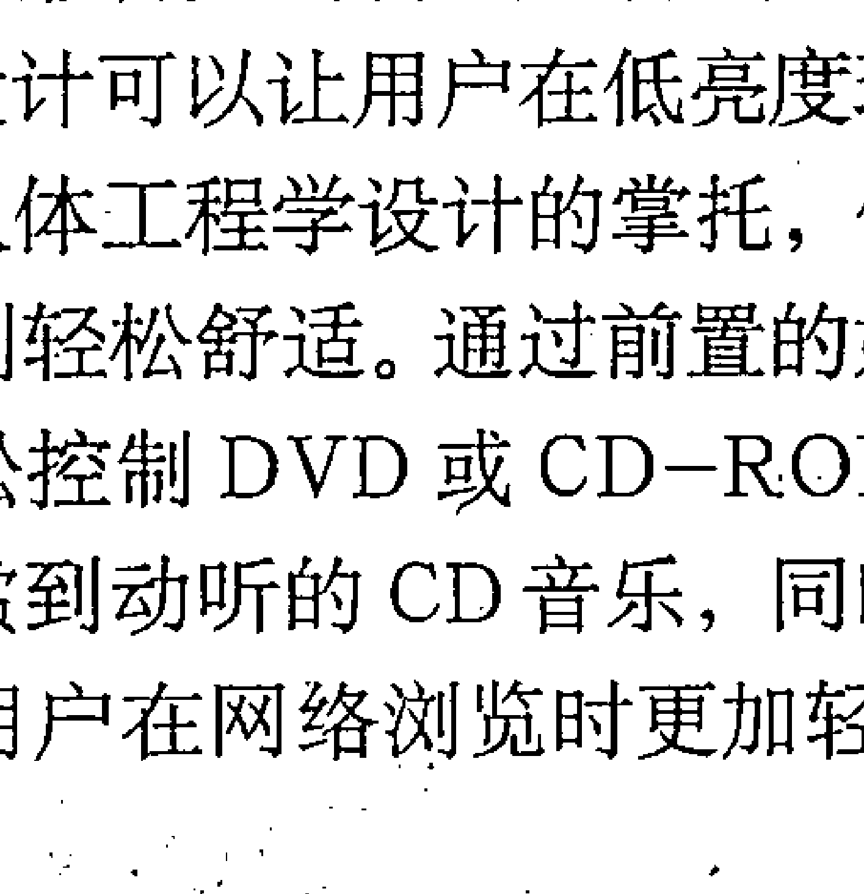

图1 IBM I-21C笔记本电脑

IBM I-21C 采用的是 Intel 赛扬 500MHz处理器，拥有 32MB 内存（可扩充至 160MB），硬盘驱动器的容量为6GB，内置有 24 倍速光盘驱动器，外置USB软驱。采用了 12.1 寸液晶屏，最大分辨率为800 × 600。内置3D立体声声卡，兼容Sound Blaster Pro，显示屏上附有立体声扬声器，内置有56K Modem，扩展槽可以插入一块TYPE 1、II或III PCMCIA卡。系统采用镍氢电池供电，最长工作时间可达2.8小时，输入输出接口主要包括 VGA 接口、标准串口和并口、PS/2接口、2 个 USB 接口、线性输出插孔和麦克风插孔，整机体积为 310 毫米 × 250 毫米 × 36 毫米，标准重量为2.7Kg，预装有 Windows 98。

参考价格：11000元

##### 2. 联想昭阳K21/31

联想昭阳K21/31（如图2）是目前联想针对中低档市场的产品，虽然定位于低档市场，但是昭阳K21/ K31系列产品采用带有 Intel SpeedStep 技术的笔记本专用 Intel Pentium III 处理器750MHz，保证了系统的高稳定性和高速数据处理。在4倍速的AGP支持下，昭阳 K21/K31 的图形显示功能强劲，配合以分辨率为1024 × 768像素的12.1寸或13.3寸液晶显示器，从而大幅提高系统在图形及3D方面的处理、显示速度和效果，因此可以完成复杂的3D图形处理和玩3D游戏。它内置24速CD-ROM使用户可以轻松欣赏优美的CD音乐和动感的VCD影片，加上符合AC97标准的PCI总线16位声卡，给用户带来超凡的多媒体享受。而且在联想昭阳K31系列产品免费捆绑163帐号，配合快捷键设计，可以使用户轻松实现网上浏览、收发E-mail等功能。

参考价格：9999元/12999元

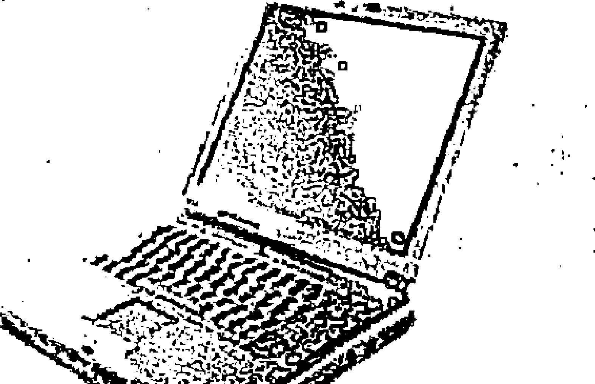

##### 3. 方正颐和E2500

方正颐和E2500（如图3）系列外观精美、工艺精湛，是为广大SOHO一族匠心打造的一款万元以下笔记本电脑。这款笔记本电脑融合了易用性、易升级性、易购买性于一身，可以用它进行文字图形处理、玩3D游戏、接入Internet和局域网，更可连接各种外设，组建个人信息中心。

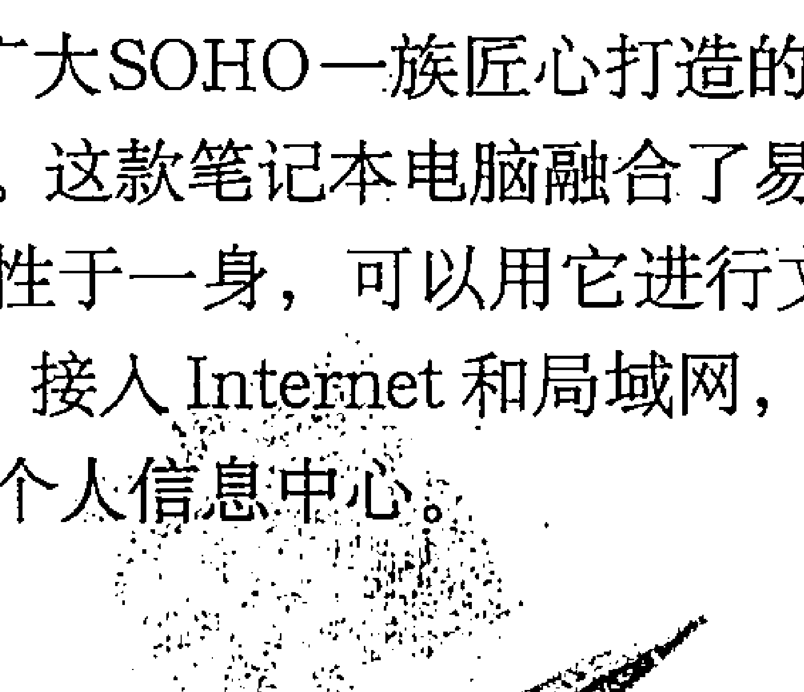

方正颐和E2500的处理器为赛扬1.2GHz，标配内存128M（最大1G），显示系统为支持2D/3D图形加速的4 x AGP图形芯片，采用动态显存分配技术，共享显存可达16MB，在14.1寸真彩液晶显示屏上能够处理3D图形以及运行3D游戏。它的硬盘容量为15G，附带了24速光驱，而且内置了56K的Fax/Modem于10/100M自适应网卡，再加上全国联保和一年意外事故保险，因此非常适合SOHO一族使用。

参考价格：8999元

##### 4. ASUS A1380C

ASUS A1380C（如图4）是华硕笔记本电脑A1系列中最新的型号，深蓝色的前侧面板上一排圆形的按键，专门用于在关机状态下播放CD盘。翻开屏幕，蓝色半透明键盘会给人以流行、时尚的感觉。A1380C同时也是一款价廉物美的笔记本电脑，配置为赛扬800CPU、128M内存、13.3英寸液晶屏、20G硬盘、24X-CD的光驱、10/100自适应网卡和56k调制解调器。全内置的设计和低廉的价格，使得它具有很高的性价比，非常适合SOHO一族使用。

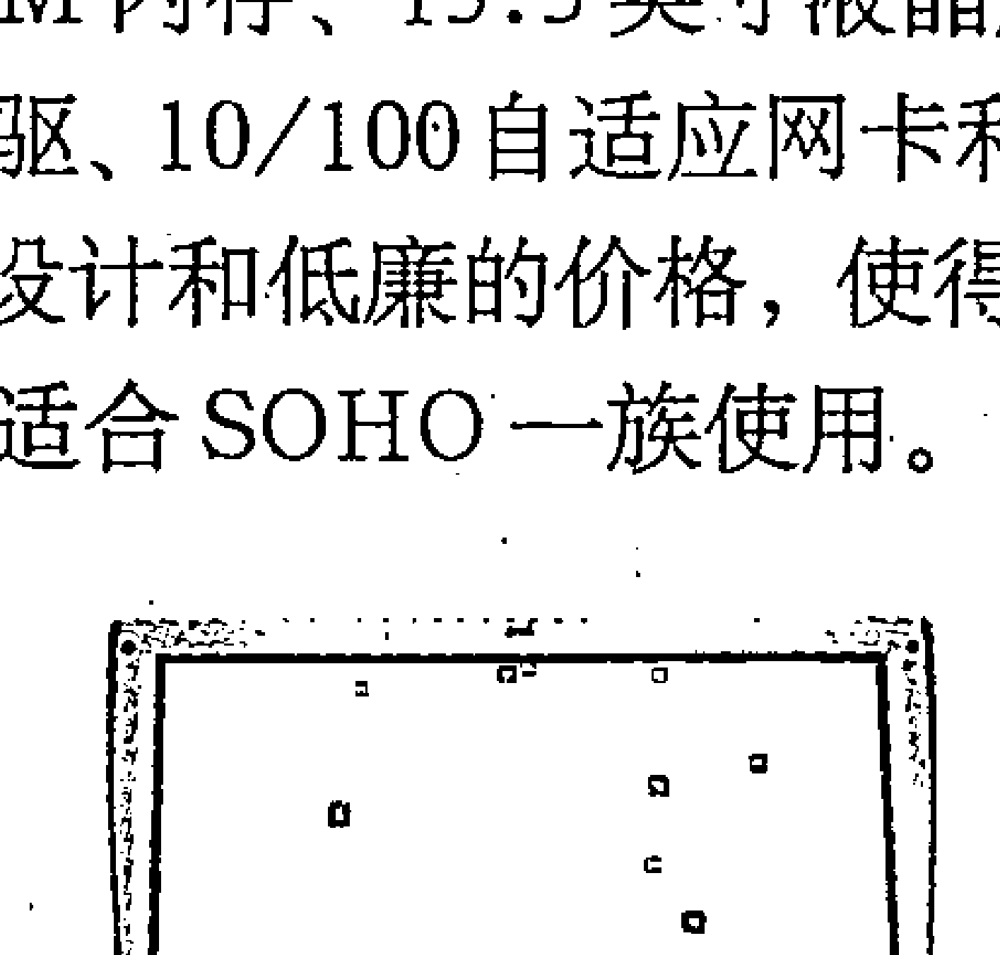

ASUS A1380C内置的网卡可以方便连接网络接口实现高速上网，它的视频输出接口连接电视以后观看影碟效果更佳，是一个不折不扣的信息和娱乐中心。此外，A1380C还附赠一个外观精美的背包，设计合理，电脑装在里面可提可背，完全看得出来是为流行SOHO一族量身定做的。

参考价格：9999元

##### 5. Acer Aspire 1200

Acer Aspire 1200（如图5）是目前Acer笔记本产品线的一个亮点，它是专为家庭用户和SOHO而设计的产品，在功能上突出了娱乐与易用性。Acer Aspire 1200采用赛扬1GHz CPU，标配128MB主流内存，10GB硬盘，24倍速光驱，14.1英寸TFT LCD，同时内置56K Modem及10/100兆以太网卡，采用最新的Windows XP操作系统，因此强大的运算处理能力和海量存储空间给SOHO族从文字处理、电子表格设计等基本应用，以及电子邮件、因特网浏览提供极大的便利。

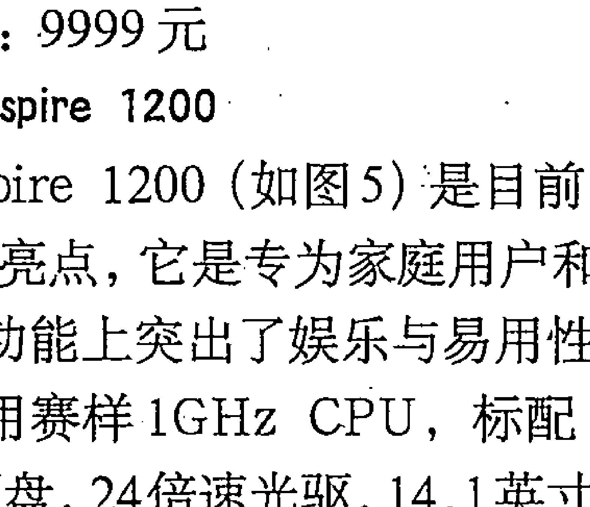

Acer Aspire 1200更加注重家用多媒体效果，它内置多媒体系统，除可以处理更多精美的图片，还可在此关机状态下播放优美音乐，且音响效果可与CD机相媲美。同时游戏玩家可通过4x AGP图形加速器体会3D游戏的动感画面，视觉效果如同身临其境，让SOHO一族轻松工作之余能够开心娱乐。

参考价格：8900元

##### 6. 紫光AL260C

紫光 AL260C（如图6）采用结构先进的紫铜加合金铝复合式散热器，并运用新一代的储能电化材料和节电技术，保证奔腾III 1GHz CPU 全速运行的情况下持续放电时间长达2小时，并支持先进电源管理功能。128MB 内存、10GB硬盘、14.1英寸的高亮度液晶显示屏、高速 AGP 图形显示、动态可调显存、3D 立体声音效和 S-Video 端口，使这台笔记本电脑成为数字多媒体影音视听中心。而集成的 56K Fax/Modem、10/100M以太网卡也方便SOHO族的使用，保证可以随时便捷地接入Internet。另外PCMCIA槽、VGA接口、并行打印口、串口、USB接口、S端子、PS2端子、红外线接口、音频输入输出口一应俱全，能轻松接驳各种外设。

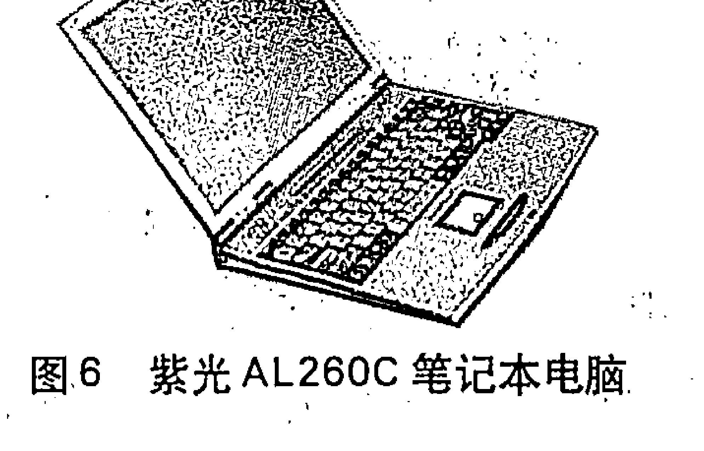

参考价格：9999元

#### 二、移动PC

随着经济的发展和实际应用对办公设备要求的日益提高，很多 SOHO 族都配备了笔记本电脑。但是，笔记本电脑昂贵的价格给不少 SOHO 族带来了沉重的负担。怎样才能在不大幅度增加成本的情况下有效提高计算机设备的质量呢，如果你把目光从传统的台式电脑、笔记本电脑身上移开而转投到移动PC上的话，那就可以找到答案了。

#### （一）选购原则

所谓移动PC，就是具有笔记本电脑的外形和大小，又完全具备台式机的规格和整体性能优势的便携式台式电脑。它只需要连接一条电源线就能长时间连续工作，而其轻薄的外形又冲破了传统台式电脑的空间限制，极大地节省了办公空间，同时能像笔记本电脑那样实现工作的空间转移。它和传统的笔记本电脑相比不带电池，而且除了外壳和液晶显示屏与笔记本电脑相似外，其他绝大多数配件都是采用台式机配件。这样不仅可以降低成本，同时还可像PC一样升级。但是在选购时候要注意哪些事项呢？下面就是移动PC的选购要点。

（1）选购移动PC除了满足自己的价格要求，还应该看看机器的具体配置。对于同样的价格，往往配置有高有低，这在选购的时候就要看仔细了。例如有的产品采用奔腾III 1G的处理器，有的采用赛扬800或是其他配置。在显示屏上，有的显示屏为14.1英寸，有的为13.3英寸，有的为15.1英寸，有的却只有12.1英寸。

（2）如果是为了便携方便，显示屏就不用选太大的，12.1英寸或13.3英寸就可以了。对于普通用户应该将重点放在内存、硬盘和上网等方面，内存和硬盘越大越好，Modem 和网卡最好都内置在其中。

（3）光驱软驱的配置，如果不常用软驱的朋友，可以不用选配软驱。至于光驱建议配置DVD或者是CD-RW，这样可省却日后升级的麻烦。

#### （二）经典机型

##### 1. 精英 A929

精英 A929（如图7）采用 Athlon XP 处理器，它可以支持包括 Duron 和 Athlon XP 在内的 AMD 全系列处理器，主板芯片采用了 SiS 740或者 SiS 961芯片组，集成 1 个 DIMM 插槽，最高支持到 1GB 的 DDR 266 内存。显示系统方面，精英 A929集成 SiS 315 图形加速器，支持64MB DDR 显存，而且提供视频输出功能，配合 14.1英寸或者15英寸液晶显示器，可以达到1024×768分辨率，完全胜任复杂的3D图形处理和时下流行的大型3D游戏。在这款移动PC中使用了 SoundBlaster Pro 声卡，同时集成两个高质量立体声音箱，所以在欣赏影片或者是音乐的时候都能够得到非常出色的效果。至于存储设备方面，预装了 8倍速 DVD-ROM，可以选用15G 至40G 的硬盘，而且它还集成 10/100网卡、56K Modem，值得一提的是提供了 IEEE 1394端口和4个USB 2.0端口，给外部设备输入提供了更快捷的通道。

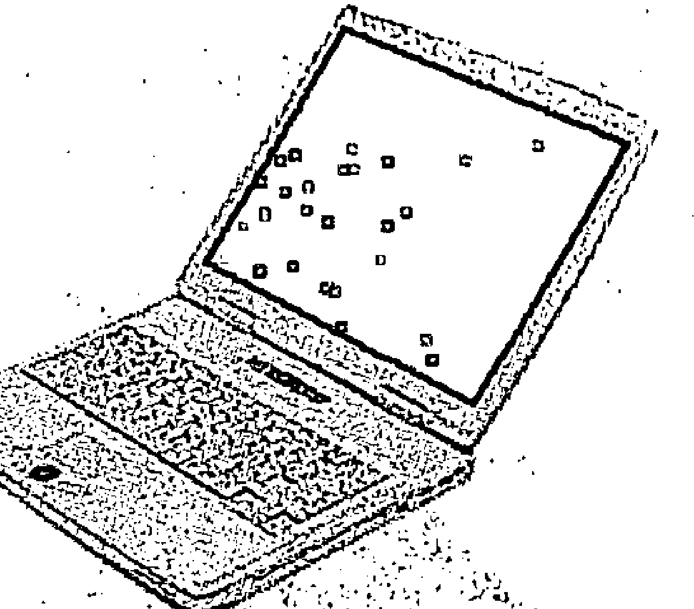

参考价格：8999元

##### 2. 精英 A928

精英 A928（如图8）采用奔腾IV级别处理器，其## 3. 清华同方超翔系列

清华同方超翔移动PC（如图9）是国内首台整合了奔腾IV和Windows XP的移动PC，它支持最高达2.8GHz的478管脚奔腾IV处理器，能够完全满足现在流行的大型应用软件对功能和运行速度的要求，支持最高1GB DDR SDRAM内存，高速的内存带宽支持，能够轻易满足应用程序大量数据传输对内存带宽的要求。超翔移动PC采用SiS 650芯片组，集成了高频率的总线接口和2D/3D图形引擎，为奔腾IV提供高性能的平台，能够在内存和集成的显卡之间搭起高达2G的数据传输带宽。同时超翔移动PC还具有高速率的IEEE 1394以及4个USB 2.0数据接口和高速率网络接口，满足SOHO一族移动高速互联的要求。
参考价格：8850元

##### 4. 实达时代风采系列

实达时代风采（如图10）配置了1.6GHz奔腾4处理器、256MB DDR内存、20G硬盘。在多媒体支持方面，时代风采不仅配备了24倍速CD-ROM、15英寸液晶显示屏和支持64M DDR显存的3D图形加速卡，还提供了TV-Out接口和IEEE 1394接口，无论是玩各种3D游戏，还是外接电视、数码摄像机，都能应付自如。此外，这款移动PC还预置了56K MODEM和10/100M网卡。该机可以支持1.6G或1.7G的CPU，内置20G硬盘、24倍速CD-ROM、15.0英寸液晶显示屏和256M的DDR266内存。同样，A928也提供了4组USB 2.0插槽、IEEE 1394接口、TV-Out扩充，并内建56K调制解调器和10M/100M自适应网卡。值得一提的是精英A928舍弃了PCMCIA设计及电池，而把电池作为移动PC的外挂设备，可根据SOHO族的需要进行选配，因此减轻了机器重量和解决了散热等问题。
参考价格：9999元

时代风采不仅具有良好的内部结构和散热性，在扩展性上也考虑周详，它可支持最高达2.8GHz的奔腾IV处理器和1GB DDR内存，为将来的升级留下了充裕的空间。
参考价格：9899元

##### 5. 福日东升N610

福日东升N610（如图11）遵循了够用、实用、专用的原则，体积仅为320毫米×260毫米×39毫米，重量不到2.3公斤，采用笔记本电脑专用的赛扬733MHz CPU，显示屏是14.1英寸的液晶显示屏，芯片组采用SiS630ST，并集成了共享32M内存的SiS300显卡。同时福日东升N610集成128M SDRAM内存和10GB硬盘，并集成10/100M自适应网卡和56K高速Modem，带有4个USB接口，其配置完全能够满足SOHO一族网上冲浪、日常办公和各种文档处理等主流应用的需求。
参考价格：5999元

#### 三、Palm

除去笔记本电脑和移动PC之外，现在市面上还有一些更为小巧玲珑的移动设备，它们的功能虽然没有笔记本电脑这么强大，但是也可以辅助我们完成各项简单的工作，这就是我们常说的掌上电脑。

#### （一）选购原则

在选购掌上电脑的时候，应该考虑以下几个要素：存储容量、扩展性、内置软件和程序支持、电池使用时间、外形和尺寸。

##### 1. 内存

掌上电脑的存储设备分为 ROM 和 RAM 两种。ROM 里面固化的是操作系统，剩余容量可用来存储数据，而 RAM 主要用来存放数据和运行程序，一般4至8M的RAM对于一般应用程序的运行已经足够，不过要存储更多数据的话应该考虑使用16M存储容量的产品，如果追求多媒体功能的话，那32M的RAM容量也只能够算是基本要求。采用 Flash ROM 的产品今后可对其操作系统进行升级，这一点在购买的时候需要注意。

##### 2. 扩展性

扩展性是掌上电脑非常重要的特性，掌上电脑常见的扩展卡类型有三种：SD卡及MMC卡、CF卡还有PC卡。这些卡都可以插到掌上电脑的扩展槽里面，或者通过外置的扩展包连接到掌上电脑。产品具备扩展功能对我们今后的应用范围的增强和扩大是必不可少的。

##### 3. 软件及支持

一般来说，掌上电脑配置的操作系统内置了许多应用程序，能够满足大部分的日常工作需要，不过有更多的第三方厂商开发了许多专业的应用软件（财务、金融、游戏等）来帮助人们提高工作效率或者获得更多的娱乐，在购买的时候要测试一下所购买的产品是否能够正常运行这些第三方软件。

##### 4. 电池

电池使用时间是掌上电脑选购时不可忽视的要素，这里有几个小窍门：采用PalmOS的产品电池使用时间比采用 WinCE 的产品长；配置彩色显示屏的产品没有单色显示屏产品的电池使用时间长；有些产品采用的是锂聚合物电池，该类电池的功效要强于锂电池。另外还需要注意的是最好选择主电池能够更换的产品，因为这样你可以随时为主机配置容量更大、功效更持久的大容量电池。

##### 5. 外形尺寸和重量

尺寸和重量是大家购买的时候对产品的第一印象，掌上电脑的轻巧灵便是它的先天优势，除了外观样式以外，还要对掌上电脑操作进行测试，看按钮设计是否顺手，按键和开关是否灵活，机身和机盖是否牢固，外壳是否容易留下指纹等。

#### （二）经典机型

###### 1. Palm m505

Palm m505（如图12）采用 Palm OS 4.0版本，处理器为 33MHz Motorola Dragonball VZ，附带 8MB内存，显示屏为160 × 160像素彩色显示屏，可以提供65000种颜色。而且Palm m505提供了红外线输出端口和扩展插槽兼容 SD 和 MMC 卡，因此提供了与外部设备便捷的连接方式与扩展。

Palm m505一个引人注目的地方就是它的丝网纹理的显示屏，其颜色由以前的黑色和绿色变成了白色和灰白色。当使用背景灯时，白色部分就会变亮，有效地增加显示屏的亮度，使得m505在光线较暗的情况下使用起来也比较方便。Palm m505增加了一个半透明的电源按钮，液晶显示器的背景颜色为绿色以方便读取信息。而且m505还有震动提示功能，这在Palm机器中是一个先河。
参考价格：2800元

###### 2. Palm Vx

Palm Vx（如图13）采用 Palm OS 3.3操作系统，集成的 8MB 内存能存储1万个地址、3000条安排项目和便笺、400个电子信箱以及大量的第三方应用，而且允许通过 Internet 下载升级 Palm OS。在 Palm V 应用程序中包括日历、地址簿、桌面电子邮件连接、安排、便笺、开支、计算器、证券、游戏、同本地及远程PC同步的 HotSync 技术等，而且还拥有简体中文界面，这对国人来说是一个福音。

需要指出的是，Palm Vx增强的LCD屏幕技术不论在较暗的光线还是在较亮的光线下，各个角度都很容易观看。而且可以同 Microsoft Outlook等流行的个人信息管理软件交换信息。同时，可在几分钟时间内利用 HotSync 托架完成锂离子电池充电，充满电后可以持续一个月的时间。并且通过 Palm V Modem，可以在几分钟内用标准电话线或GSM手机连接访问桌面计算机或者检查电子信箱。
参考价格：1550元

###### 3. Palm IIlc

Palm IIlc (如图14) 处理器为DragonBall EZ 20MHz, 这在Palm III系列中处于领先地位。它的内存为8M, 256色明亮的屏幕在室内阅读的效果要比在室外阅读的效果好得多, 而且白色的背景与文字和图像形成较强的对比。同Palm公司的所有产品一样, Palm IIlc装有GRAFFITI软件, 既可以识别用触笔手写的字母, 还可以用屏幕键盘, 供触笔输入数据之用。

Palm IIlc还可以通过HotSync底座和计算机进行数据传输, 在HotSync底座还配备了一根串口电缆, 可以直接与Outlook、Lotus Notes等程序传输数据, 实现Palm和计算机的信息共享。
参考价格：1600元

###### 4. IBM Workpad 30C

IBM Workpad 30C (如图15) 使用的处理器为EZ Dragonball 16MHz, 选用了Palm OS 3.1系统, 内置的4M内存可以同时存储100条通讯录、6000个日程安排、3000条便笺、3000个任务列表以及400条电子邮件。它体积小、操作简单、连续工作时间长、具有开放的开发环境和丰富的应用软件, 还有适合中国国情、文化习惯的拼音、首拼和笔划手写中文输入方法及中文应用软件。通过内置的红外数据传输可以在Workpad之间无线名片互传, 也可以与带有红外口的计算机之间进行Outlook、Exchange、Lotus Notes等信息的共享传输。值得一提的是, IBM Workpad 30C有蓝色快车作为售后服务支持, 可以很放心。
参考价格：1500元

###### 5. Visor Deluxe

Visor Deluxe (如图16) 除了拥有Palm系列产品的功能外, 它还新增了通讯录、待办事项及记事本等功能, 同时加上Visor个人数位处理器独特的加强型行事历、工程用数位计算机以及能转换全世界各地时间的电子时钟, 使得整体功能更为强大。而且Visor Deluxe采用USB接口和计算机连接, 让设定及软件同步变得更为快速。

特别需要指出的是Visor Deluxe有着极为强大的个性化功能, 一方面是指它有着透明、石墨色、蓝色、橙色和绿色五种颜色, 可以根据自己的心情或者个性来选择不同的色彩。Visor Deluxe还附带了一个可以无限扩充的介面槽, 通过Springboard扩充模组可以让Visor在瞬间变成为数码相机甚至是移动电话, 而且它拥有真正的即插即用的功能, 在任何时间下可轻易地更换成其他的扩充模组, 而且可以马上使用。
参考价格：1300元

#### 四、Pocket PC

在当今这个信息化的时代, 如果有一个掌上电脑, 那么它在给SOHO一族的工作与个性化生活上所带来的影响可能是前所未有的。在目前掌上电脑两大阵营中, 当基于Windows CE 3.0操作系统的Pocket PC推出以后, 它们的性能和功能都迈上了一个新的台阶。完善的多媒体功能、绚丽的彩色屏幕, 使得Pocket PC绝对是掌上电脑中的贵族, 而随着国内掌上电脑市场的高速成长, 中文化的Pocket PC已经悄悄来到我们身边。由于Pocket PC的选购要点和Palm差不多, 所以我们将目光投向一些经典的机型上看看吧。

###### 1. HP Jornada 545

HP Jornada 545 (如图17) 是款小巧靓丽且有点稳重感的Pocket PC产品, 它安装了Microsoft最新的中文版Windows CE 3.0嵌入式操作系统, 采用的是Hitachi SH3系列的32位RISC处理器，配置了16MB的ROM和16MB的RAM。显示输出设备为彩色液晶显示屏，分辨率为240×320，所以有着非常好的显示效果。Jornada 545不仅可以更细微地调节显示背光的亮度，而且还可以改变显示对比度，有利于用户在不同的环境下获得更好的显示效果，同时也能达到节省电池电量的目的。Jornada 545不具有通常意义上的按键键盘，信息的输入以及人机之间的交互是通过触摸屏来实现的。Jornada 545提供有中英文软键盘和中英文手写输入，其中中文手写输入的识别率比较高，一般的连笔都基本能正确识别，非常实用。
参考价格：3800元

###### 2. iPAQ 3630

康柏iPAQ 3630 (如图18)掌上电脑提供了快速的206MHz处理器和强大的新型操作系统，32MB内存可以在运行应用软件及丰富多彩的多媒体时变得游刃有余。分辨率为240×320，触敏TFT LCD显示屏可提供4096种色彩，可以满足一般的图像应用，但对于多媒体影像的播放会有一定的限制。iPAQ 3630显示屏上方有一个环境光感应器，可实时感知外部的光亮度，智能调节背光的强弱，而且背光的模式有5种：超高强、高强、中、弱和节能。这样无论是在室外阳光直射还是室内光线弱的地方，都可自动实时改善背光环境，在节能的同时可保持亮丽的色彩。
灵活性是一个关键的优势，只需一个灵巧的iPAQ扩展模块就可以提供WLAN/GSM/CDPD等无线局域网或广域网的网络连接、额外的存储能力，甚至是一个与众不同的多彩外壳。在其屏幕底部设有4个快捷键，左边两个是日历和联系信息按钮，右边分别用于快捷菜单和快捷开机，位于底部中央梅花状的大按钮，作为5路操纵杆和扬声器，可实现上、下、左、右的移动和单击确认，适用于各种游戏和GPS系统。
参考价格：4200元

###### 3. 天玑5000S

天玑5000S (如图19)采用了206MHz处理器和支持320×240分辨率的彩屏，运行各种程序都很流畅，尤其是玩3D游戏的时候效果也不错。在上网的时候如果关闭了图片浏览功能，那么速度几乎和传统的台式机差不多。天玑5000S有较好的扩展功能，红外口和手机通信非常方便，目前已经有红外口接口的键盘、打印机、调制解调器等多种外设，另外CF接口的扩展设备也越来越多，有调制解调器、以太网卡、无线网卡、连接打印机等。而且通过大容量的CF卡，不仅可以安装更多的应用程序和游戏，还可以存储一些MP3歌曲、电子书，甚至还能够看电影呢。
参考价格：3400元

###### 4. 天玑3000

天玑3000 (如图20)采用了206MHz的Intel SA1110处理器和Windows CE 3.0简体中文版，内存为16MB RAM和24MB ROM。液晶显示屏支持240×320分辨率，采用了16级灰度的黑白屏幕，这是国内目前唯一的一款黑白屏随身电脑，虽然彩色显示屏对多媒体的表现能力很好，却并不是所有用户都喜欢，因为Pocket PC的显示屏和计算机的显示器无法相提并论，很少有人买它来看小电影或者彩色图片，而天玑3000的黑白屏足以细腻地显示图像的层次感，对于浏览网页等已足够了。而黑白屏则大大延长了使用时间，天玑3000的锂电池充满电时可正常工作十余小时。
天玑3000将办公、上网、娱乐这三大实用功能体现得淋漓尽致，除了具有完备的记事本之外，通过Pocket Office可以随身携带办公室，或者打开IE上网冲浪，甚至欣赏MP3音乐或者看上几页电子书放松一下。同样，在CF卡的支持下能够装载更多应用程序，让天玑3000功能更为强大。
参考价格：2100元

###### 5. Casio EM-500

Casio EM-500 (如图21) 的时钟频率为150MHz，内存为16M，采用的是Windows CE 3.0操作系统。虽然它的配置不是很好，但各项功能令人满意，仅需一会工夫即可打开长长的Excel工作簿和Word文件。而且液晶屏可显示65536种颜色，不论室外还是室内使用效果都非常好，虽然跟其他大多数PDA的屏幕一样在直射阳光下也会变暗，但是图像色彩鲜艳，对比鲜明。另外，利用配备的Media Player软件可收听MP3音乐，这在闲暇的时候也可以让自己轻松一下。

在Casio EM-500前面板装有3只热键按钮可快速启动或关闭最常用的实用程序：通讯录、日历和应用程序主菜单，配套的转换软件可将MPEG-1、AVI和QuickTime文件变换成可在Casio EM-500上使用的格式，因此用它来看电影也非常棒，只是内置式喇叭音量有点小，音量大时会失真，但是从这么小的掌上电脑所期望的也只能如此了。
参考价格：3200元

#### 五、商务通

就像广告中说的一样，呼机、手机、商务通一个都不能少，如果SOHO一族对于Palm和Pocket PC不感兴趣的话，不妨将一些重要的信息存储在商务通中，这样花更少的钱就能够便捷地进行相关信息处理，也是非常超值的。

#### （一）选购原则

面对市场上琳琅满目的商务通，怎样才能选出最适合自己且质优价廉的产品呢，先来看看选购的时候应该注意些什么问题。

- 1. 时尚的外观
对于追求时尚的SOHO一族来说，商务通的外观是否亮丽是个重要因素，样式老土，颜色单调的商务通将无法体现出时尚个性，所以选购的时候要注意符合自己的个性。
- 2. 液晶显示屏
现在很多商务通厂商已经在超大屏幕、液晶显示屏、夜光功能等技术上取得了不小的进步，有些采用了以感光片为材料、清晰度更高的精显视屏，还有的采用柔和的对人的视力无害的青光为光源，即使在外部光线不足的情况下也不用为自己的视力担心。所以在选购的时候要注意这个方面。
- 3. 快速精准的识别能力
目前国内商务通厂商在实现文字快速输入上都下了不小的功夫，大部分都支持手写输入，识别率也都还不错，还有些产品可以不停书写，一段文字全部写完后能够全部识别并转换为楷书。
- 4. 联机功能
与以前相比，现在的商务通一个突出特点就是具有良好的联机性能，除去可以与计算机进行数据传输、信息共享之外，还有些机型具备了上网浏览、收发邮件功能，而且通过第三方软件下载，还能拓展应用功能。

#### （二）经典机型

###### 1. 商务通连笔王8606

商务通连笔王8606 (如图22) 采用连笔手写新科技，手写识别率高、速度快。它具有电话查找、日程管理、便笺记录、在线学习、日记记录和英汉辞典等功能，最多存储达100万字，这些都是SOHO一族日常生活中最经常使用的功能。而且它还有资料密码保护的功能，在闪速存储技术支持下确保电池用尽后资料也不丢失，也能够使用备份器将资料完整备份。另外，通过连接器可以与计算机串口接驳进行数据信息传输，让资料的编辑和备份更加轻松和安全。

参考价格：1100元

##### 2. 商务通MBA8801

商务通MBA8801（如图23）采用高识别率的手写输入技术，在占机身3/4的超大屏幕上显示十分清晰。同样，商务通MBA8801也有日程管理、在线帮助、贴身辞典、快速便笺等功能，而且还预装了超大容量实用商务资料，包括衣食住行、商务生活等方面，

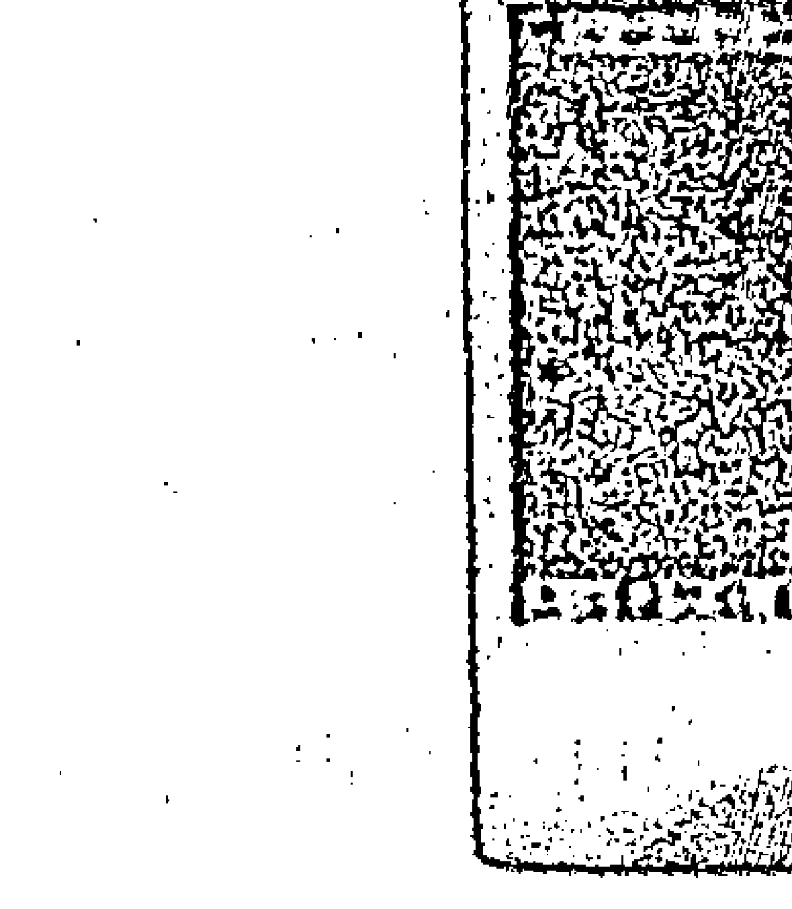

可以为SOHO一族提供贴心的服务。另外，商务通MBA8801也可以通过与计算机串口联机之后交换信息以及备份资料，并且能够通过全部/局部密码功能有选择地将资料加密，从而确保资料的安全。

参考价格：850元

##### 3. 名人草书王

名人草书王（如图24）外观非常时尚，能够充分个性化设计，它最大的特点在于能够很好地记录手写输入，在开会或者是紧急记录的时候可以按照原笔迹输入，这样不会出现识别错误而造成无法得知信息的情况。名人草书王记事功能也很强大，电话名片、行程计划、备忘记事、个人资料、日记等一应俱全，开机之后即可显示最近查询过的40个电话号码。而且内置了商务信息、处世之道、情爱之旅、商务宝典、生活之趣、名人名言、白领之路、世纪回眸等共45万字的实用电子图书，以及特别授权的《新英汉词典》和《新简明汉英词典》，信息量不可谓不丰富。另外，它还可以连接计算机互传资料、下载信息，并可作为PC手写板使用，这也是它的一大卖点所在。

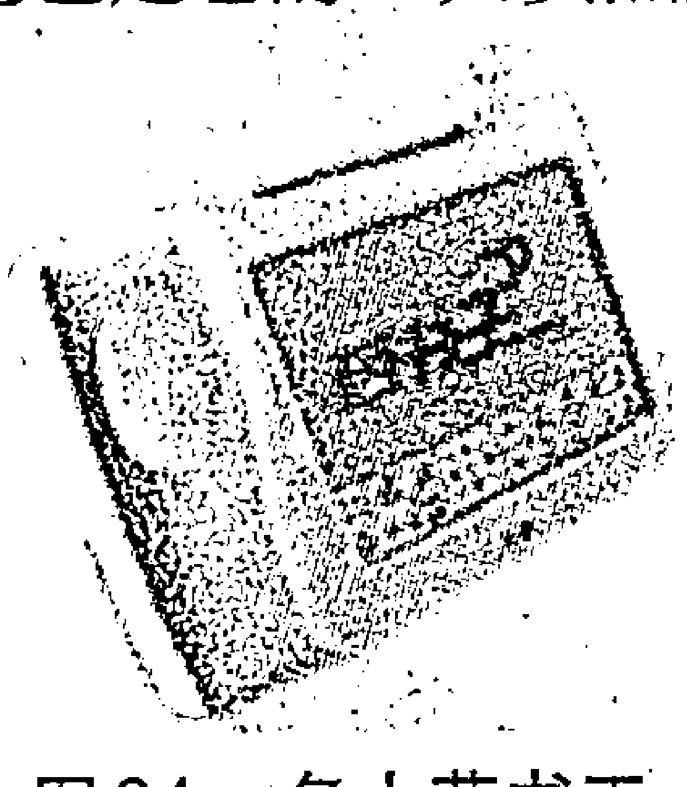

参考价格：580元

##### 4. 名人迷你王

名人迷你王（如图25）采用了太空金属珠光质感，处处流露出当今的科技时尚。这款商务通体积非常小，只有信用卡一般大，所以携带格外便捷。它除了具有原笔迹输入法记录功能之外，对于草书输入的快速识别能力也非同一般，能够充分提高工作效率。名人迷你王也支持与计算机通信，确保所有存储的资料万无一失。


参考价格：618元

### 六、电子辞典

面对最近一段时候人气飙升的高端掌上电脑，低端PDA的光环似乎比以前褪色了不少。尽管不少掌上电脑的价格很贵，但事实上很多功能并不一定实用，对于大多数SOHO来说，花大笔钱去买个功能强大却不一定适合自己的掌上电脑还是很难接受的吧？对于SOHO而言，千元以下的电子词典也具备了升级、红外传输等功能，让我们花较少的钱就能享受到超值的实惠。

#### （一）选购原则

- 1. 词汇量
电子辞典最重要的一个指标就是附带的词汇量多少，一般的产品附带5至8万词汇，高档次的可以附带十多万，甚至是数十万的词汇，这可以根据个人的需求来进行选择。另外，通常电子辞典都有中英文词汇，如果需要日、德、法等小语种，也可以根据自己的需求进行选择。

- 2. 真人发音
为了使学外语时音、形、意同步达到较好的效果，很多电子辞典设计了真人发音的功能，全部英汉单词和有声书均由真人原音录制，这比起很多非真人发音、语音功能形同虚设的电子词典要实用得多。

- 3. 外观体积
电子辞典除了能够帮助我们学习之外，同时也具有装饰的功能，所以选购的时候要注意它的外观是否符合自己的性格特点，同时体积不要太大，否则携带将非常不便。

##### 4. 附属功能

选购电子辞典的时候还要注意它是否有附属功能，比如记事、与计算机联机传输数据等功能，这些看似不起眼的功能可以在使用中帮我们解决不少实际问题。

#### （二）经典机型

##### 1. 文曲星CC300

文曲星CC300（如图26）是文曲星家族中体积最小的电子辞典，不但外形娇小玲珑，而且功能十分强大，英汉、汉英词汇量达15万，可以在用户普通型、用户学习型、下载普通型和下载学习型之间任意选择电子字典功能类型。在使用字典功能时，被认为是应该记忆的生词可选择列入生字字库，生字字库可以自动归类或者自定组名，关联性的英文生字组合记忆，让大脑轻松接受记忆内容。此外，它还附带了数百个英文寓言故事，融趣味性与学习于一体，附带的宠物世界也能够让你轻松一下。

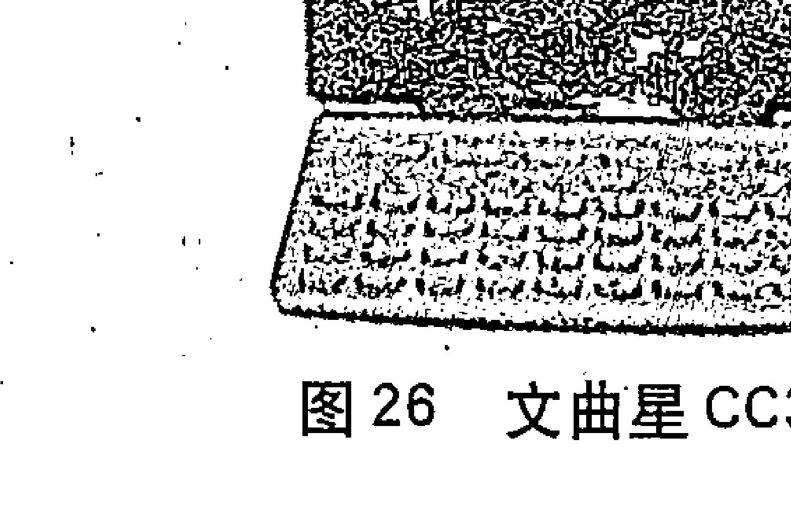

利用通信线，可以让2台文曲星CC300记录下不同个人事物管理资料之后互相自动添加，形成资源共享。更值得一提的是仅需一根连线就可以与电脑连接上网下载升级的功能和软件，让文曲星CC300功能更加强大。

参考价格：230元

##### 2. 文曲星NC360

文曲星NC360（如图27）有较大的存储能力，而且采用flash闪存技术，即使电池没电资料也不会丢失，再加上一些其他的实用功能，适合一般商务人士使用。比如NC360有15万的词汇量，还能存储2500组名片，它的名片可以分类管理，提供了首字母快速查询定位等快捷的查询方式。还可以从网络和电脑上下载各种游戏、资讯等有用信息，并能利用机身上的红外端口与手机互传名片，控制打印机打印名片，是一个名符其实的智能电子名片夹。

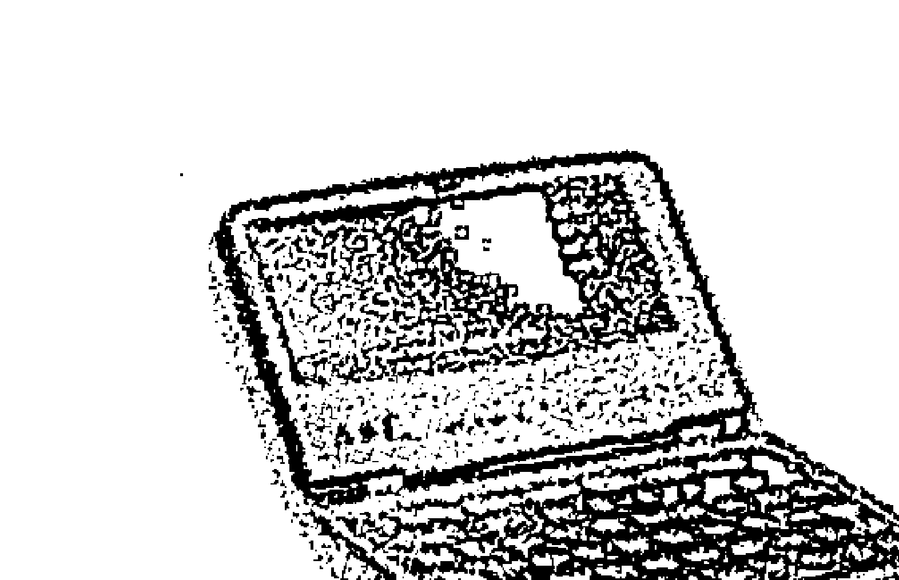

参考价格：260元

##### 3. 快译通EC3000

快译通EC3000（如图28）内置丰富英汉、汉英句库，只需输入英文单词或中文字词，便可翻查多句不同用法的中英文句子，使你对该字或词的运用有更深刻的认识，而且英汉辞典还有文法、例句、同反义、动词变化、形容词变化、词类变化等资料，在英汉和汉英两部辞典之间还有紧密联接，可相互跳查或者交互查询，因此比一般电脑辞典更臻完美。

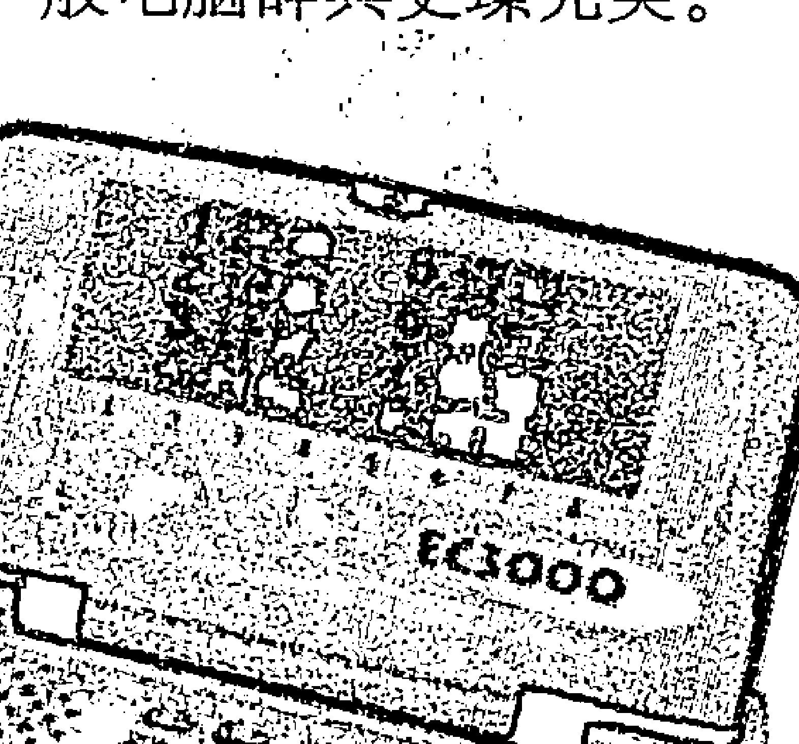

快译通EC3000除了是一部功能多元化的电脑辞典外，更是一本应有尽有的电脑记事簿，它有电话地址、备忘记事、行程约会等记事功能，能够帮助我们处理日常生活琐事，提醒约会时间，把SOHO的生活安排得井井有条。另外，快译通EC3000还有自建字库、计算功能、单位换算、汇率换算及利息计算、繁简字体显示、万年历及阴阳对照、本地及全球各地日期/时间显示、密码锁定重要资料、方块游戏、猜字旅游、猜谜语及俏皮话等功能，在同档次的电子辞典中非常有竞争力。

参考价格：430元

##### 4. 名人PDA328A

名人PDA328A（如图29）内置权威的新英汉词典和简明汉英词典，可以满足一般SOHO族学习英语的需求。它集成了640KB内存，可存储约25万汉字，而且双窗口中文手写输入能满足您的书写速度和输入要求，同时采用了Flash快闪存储，资料永远不会丢失。名人PDA328A拥有电话、备忘、行程、速记等方便的记事功能，还有独特的商务功能，是SOHO快节奏生活和工作中的好助手。另外，独立键操作的数码录音功能能够帮SOHO快速处理紧急事情，新颖的画板功能可以像便笺纸一样随时记下创意和灵感。

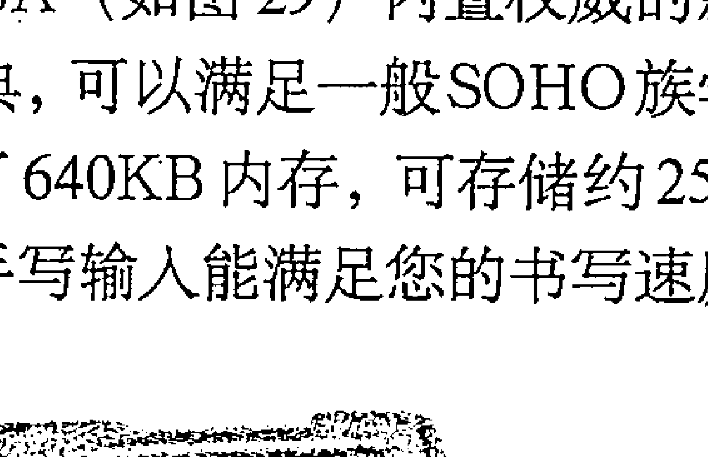

参考价格：320元

##### 5. 好易通牛津1000/3000

同属于好易通公司开发的牛津1000/牛津3000（如图30）的分类方式也大致相同，都是在辞典类、记事类、计算类以及时间类四种大功能的基础上进行各种功能的增加或者改进，内置了记事名片管理、计算和数理化公式、益智娱乐天地。因为是电子辞典，各种词汇查询以及测试功能也是必不可少的，它们的输入法采用的是拼音、笔划以及总笔划几种，同时拥有英汉/汉英/汉语/牛津四种辞典，其中牛津1000内置1.5万英汉字库，内容包括初中/高中/大学/TOFEL的英文单词内容；而好易通牛津3000则拥有英汉/汉英/汉语/英英/牛津五种辞典，词汇量19万，词汇内容是在牛津1000的基础上增加了GRE的内容，另外也增加了一个真人语音的功能。

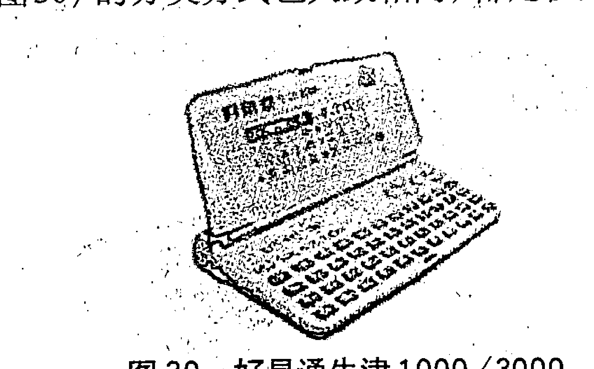

参考价格：400元/520元

##### 6. 大学士全能冠军GL-3200

全能冠军GL-3200（如图31）采用128×64的液晶显示屏，附带了英汉、汉英、词组共达30万条，可以反查词组、同义词、反义词、例句等等。它采用艾宾浩斯记忆原理来轻轻松松背单词，另外有填字、猜字等多种方法加强记忆效果，同时还提供数学公式、物理公式、语法大全、常用英语会话等丰富的学习资料。

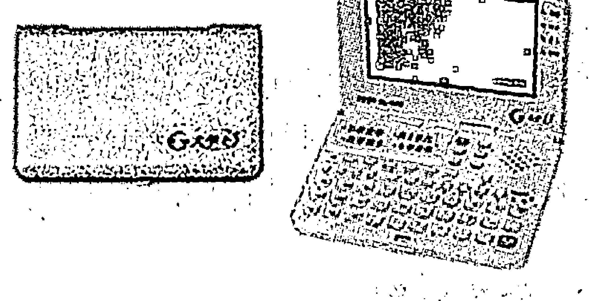

在全能冠军GL-3200中可以存储3000张名片或3000条记事，足以满足SOHO的工作，而且名片一点通能够以最快的速度查询记录下来的名片和联系电话。此外，它可以采用SIM卡来扩充内容，通过购买不同的SIM卡获得不同的软件和资料，使用的时候可以随时替换，从这一点来看它有些类似过去的家用游戏机，所以能够不断积累资料，建立一个资料库。

参考价格：680元

### 其他设备

除了以上介绍的设备外，对于SOHO一族来说，在工作中还可能会涉及到图像、视频、音频等多媒体方面的内容，比如进行图像、视音频的采集与处理等工作，这不仅能为SOHO族带来经济收入，而且也为SOHO族在闲暇时进行娱乐休闲提供了方便，给SOHO生活增添绚丽的色彩。

一般来说，电视卡、视频采集卡、数码相机、DV等都是SOHO族进行多媒体处理时必须用到的设备，有关这些设备的选购和使用在本书的“数码时尚”栏目中已经有比较详细的介绍，感兴趣的朋友请参见其中的相关内容。

(文/赵江)

## SOHO应用全面通

有了SOHO专用的硬件设备之后，怎样完全发挥出它们的威力，同时充分挖掘这些设备的潜力，让自己工作室变得高效多能？下面这部分内容就以实例形式向大家介绍一下有关的典型操作。

### 一、典型软件使用案例篇

用电脑就是用软件，而SOHO一族的办公主要是借助计算机和无所不能的网络来实现，因此在计算机上合理使用自己所需要的软件不仅能够起到事半功倍的特效，还可以有效地节省费用开支，如此一举两得的事情，咱们怎么能错过呢？

#### （一）扫出一片灿烂的天空

对于SOHO一族来说，扫描仪可是一个提高工作效率的绝佳帮手，在扫描仪的帮助下，不仅可以快速将报刊杂志中所需要的信息保存在计算机中，还能够在闲暇之余将以前所拍摄的照片扫描为图像文件存放，甚至将其制作为电子相册或者上传到自己的主页给其他朋友欣赏一番。好了，下面咱们就动手扫出一片灿烂的天空吧。

##### 1. 扫描图片使用指南

将扫描仪和驱动程序安装好之后，我们可以通过Photoshop、Paintshop Pro等主流的图像处理软件调用扫描仪，如果计算机中没有安装这些工具，也可以使用Windows附带的映象程序开始扫描，下面以SOHO最为常用的Photoshop为例简单介绍一下扫描仪的基本操作。

- 1. 启动Photoshop之后，运行“文件->输入”命令可以看见当前系统中已经安装好的扫描仪，如图1所示。用鼠标点中“UNISCAN V3.30”即可激活扫描窗口。
- 2. 把需要扫描的杂志放入扫描仪的平板上，然后先点击左下部的“预览”按钮，此时扫描仪将对此杂志进行预览扫描，并且会将预览图片显示在右边的窗口中，如图2所示。
- 3. 接着要设置扫描区域，这时可以用鼠标拖拽预览图片中的方形虚线区域，直至虚线将所有需要扫描的内容全部包含进去。
- 4. 按下“扫描”开始扫描操作，稍等片刻完成之后就能够把原先的杂志显示在Photoshop中（如图3）。
- 5. 最后，我们可以在Photoshop中直接对图片进行编辑处理，满意之后即可保存为图片。

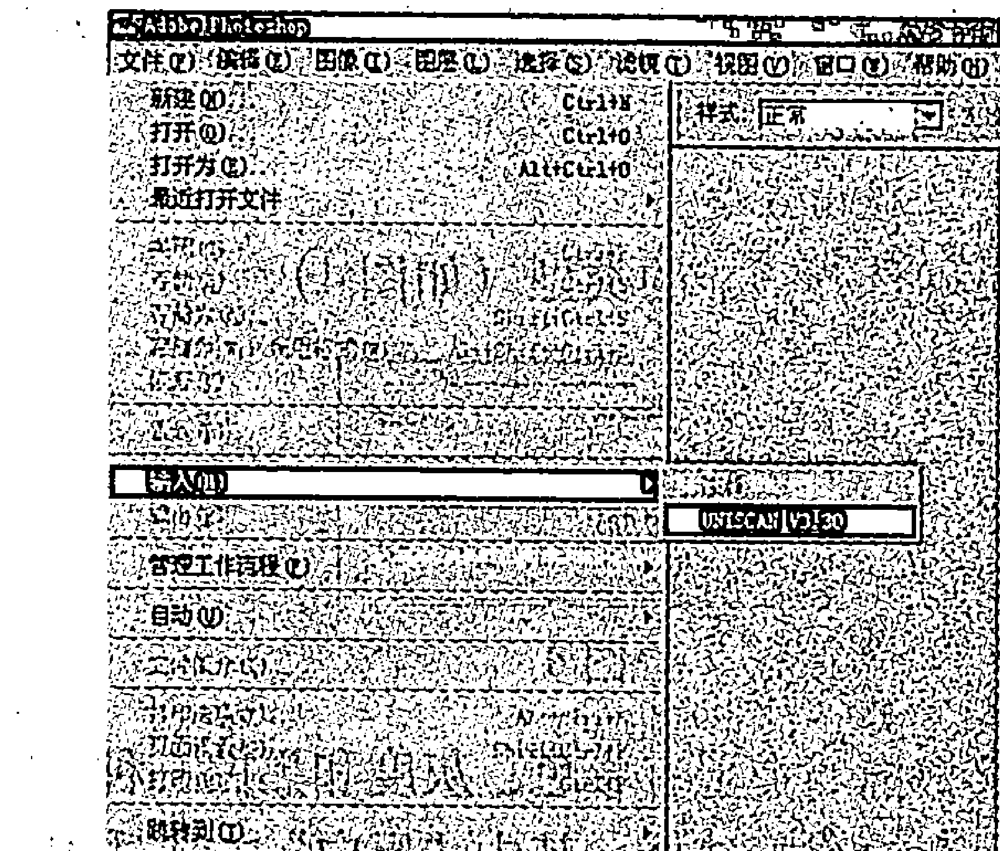

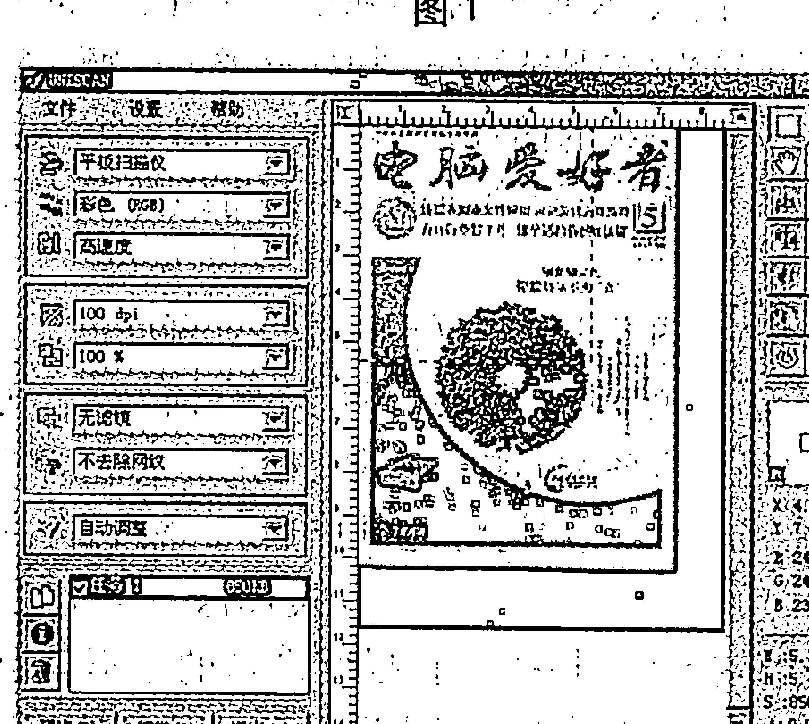

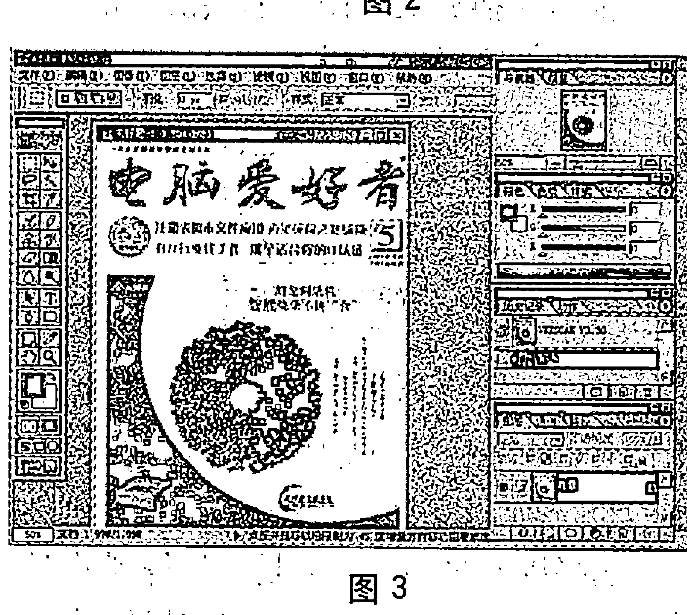

##### 2. 优化图片扫描效果

知道了怎样扫描图片之后，并不是只要把图像扫描到计算机中，便可采用图像编辑软件对它进行随意修改，就能编辑出高质量的图像文件。实际上，扫描仪的分辨率、亮度、色调等默认设置值通常不可能与被扫描对象一致，如果用默认设置扫描，其结果将损失大量的细节。而后期的软件处理，只能在原有图像的基础上通过一定的插值算法来填充像素，根本无法再生已丢失的信息。所以，要想获得好的图像质量，必须根据扫描原稿的情况及图像的用途对扫描参数进行合理的调整。

##### （1）常规设置

###### ① 正确选择扫描的类型（如图4）

目前扫描的类型有彩色、灰度和黑白三种，应该根据具体要求进行选择。其中“黑白”方式适用于白纸黑字的原稿或OCR识别；“灰度”则适用于既有图片又有文字的图文混排稿样，扫描该类型兼顾文字和具有多个灰度等级的图片；“彩色”适用于扫描彩色照片，它要对红绿蓝三个通道进行多等级的采样和存储。

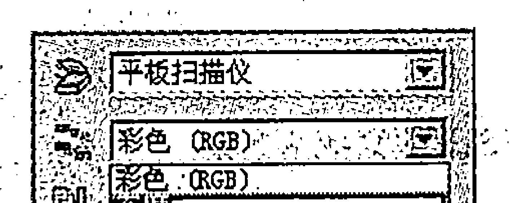

对于黑白图像来说选择黑白是毫无疑问的，但是如果有一幅彩色图像，就要采用彩色扫描，这样可以对扫描原稿进行各种调整，同时彩色扫描的色彩信息量大，扫描后得到的色彩会更丰富，然后再利用Photoshop将彩色图像转换成灰度图像。相比之下，如果直接选择灰度扫描，扫描前图像的色彩就已丢失，调整的余地非常小，扫描后的灰度图像层次显然没有彩色扫描再转换成灰度图像的层次丰富。

###### ② 扫描质量与速度（如图5）

通常说来，扫描软件中都附带了以质量为主和以速度为主两个选项。如果你想得到效果最佳的扫描图片，则需要选择以质量为主，但是这样得到的图片个头通常比较大；而以速度为主则只能够提供质量一般的图片，不过若是你有大批量对于质量要求不是很高的图片需要扫描，那么采取这种扫描方式会节省很多时间。

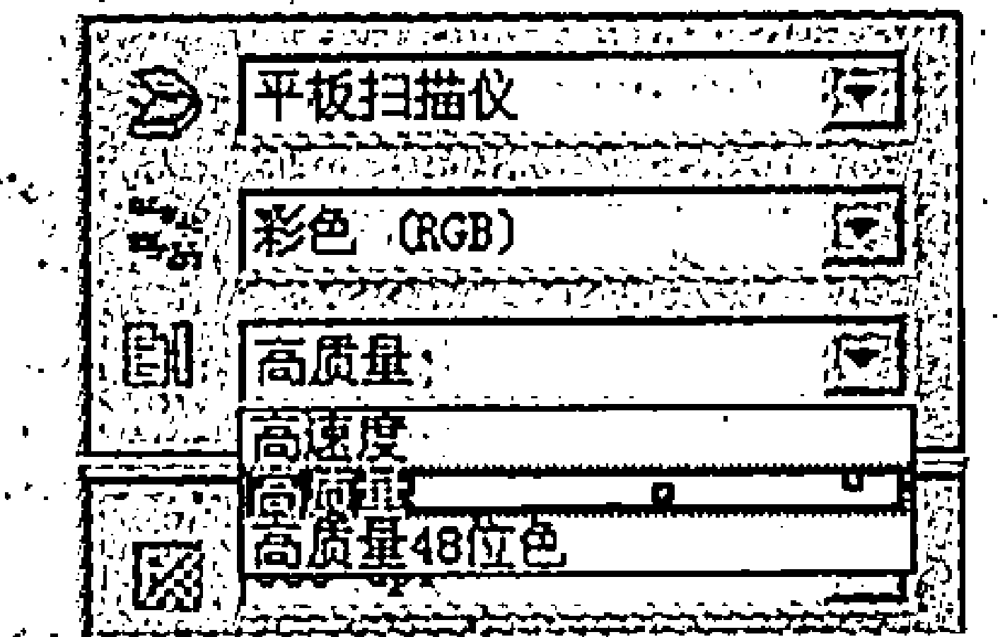

###### ③ 选择合适的分辨率（如图6）

如何设定扫描仪分辨率对于最终扫描图片的影响也很大：分辨率设置得过低，输出的图像会明显丧失锐度而呈现模糊的感觉；分辨率设置得过高，图像输出不一定由此变得更好，反而无故增大了文件的个头并降低了工作效率。所以，原则上最恰当的设定值应该是选择以达到最佳输出品质的最低分辨率，只有这样才可提高工作效率，节约宝贵的存储空间。

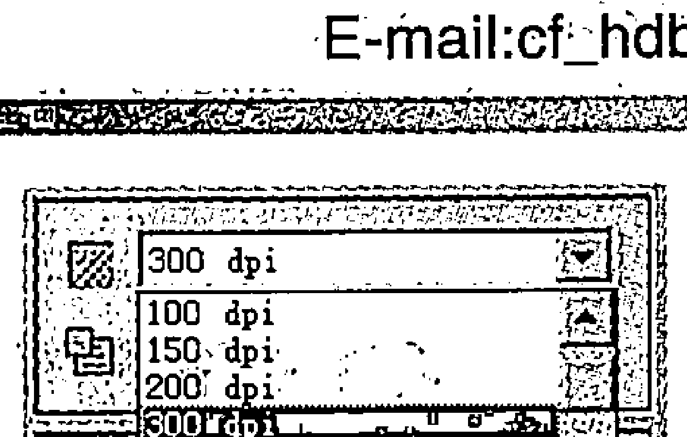

一般来说，如果扫描图像用做文字识别时，300dpi已经足够了；若是遇到字号较小、字迹模糊的文稿，可以适当提高分辨率；若使用电脑发传真，200dpi即可完全满足大家的需求，因为普通传真机的分辨率只有200dpi；如果扫描图片用于制作网页、屏幕保护、发送电子邮件等只用于屏幕终端显示，则分辨率可以再降低一些；对于需要打印输出的图片，就要根据打印机所支持的分辨率、图像品质等情况来具体考虑了。

###### ④ 设定扫描原稿（如图7）

扫描原稿的好坏将直接影响扫描图像的质量，选择好的扫描原稿对用户而言是十分重要的。虽然扫描可以利用专业图像处理软件对出现的问题进行修补，但这只是问题的一个方面，因为图像处理软件修正不出更多的层次，所以选择高质量的原稿扫描是获得高质量图像的捷径、前提和保证。

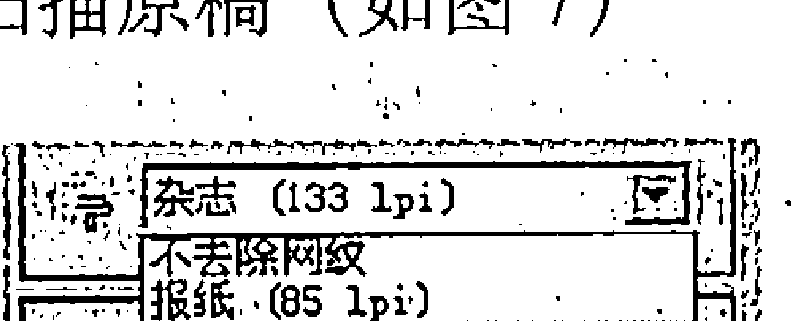

另外，扫描印刷品时，在图像的连续调上往往会有网纹出现。如果扫描仪没有附带消除网纹的功能，可以尝试寻找使网纹最小的分辨率；比如可以选择报纸、杂志、艺术杂志等类型进行网纹去除，通常是以印刷品网纹一样或一倍的分辨率，这样能够优化扫描图片的质量。

##### （2）色彩参数设置

在扫描不同原稿的时候，除去对上述各方面进行设定之外，还有一个很重要的方面需要注意，这就是需要对色彩参数进行设置，这样才可以尽可能地将原稿体现出来。下面就将扫描之前的一些色彩参数介绍一下。

###### ① 亮度和对比度（如图8）

图像的亮度是指一幅图像中亮调和暗调的平衡。对于灰阶和彩色图像来说，如果亮度太高将使得图像看上去发白，亮度太低则又太黑，这时应拖动亮度滑动条上的滑块，使图像的亮度适中。

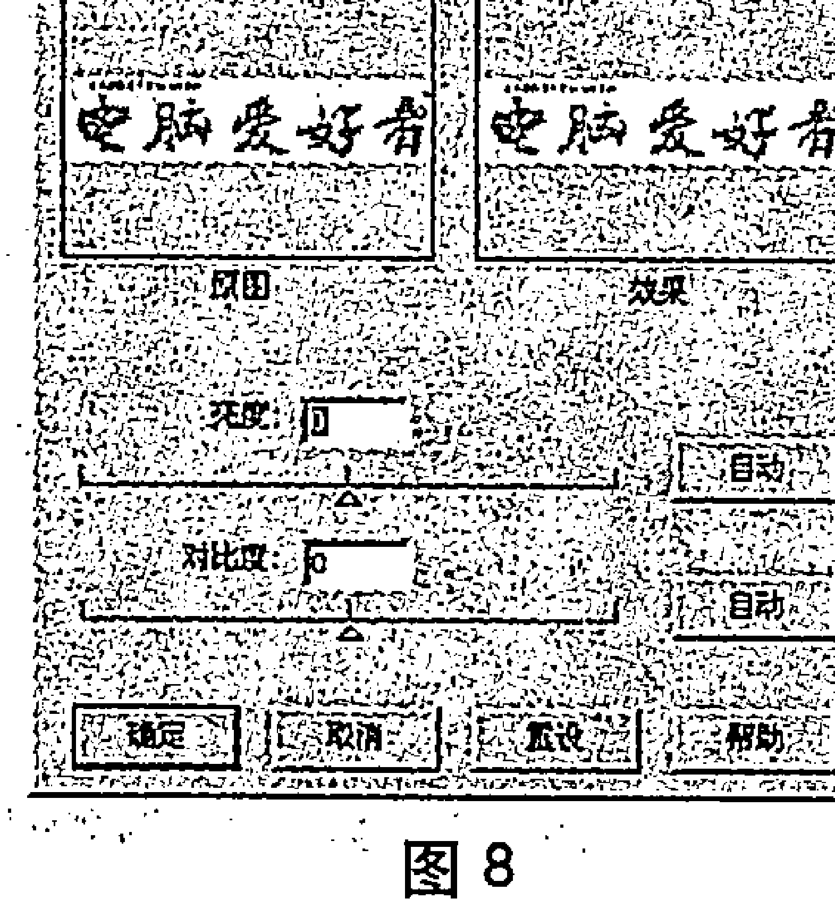

图像对比度是指图像中最暗调和最亮调之间的差异范围。对比度过大或过小都使图像层次减少，高的对比度使图像看上去像影印件那样发硬，低的对比度使图像平淡发软，此时应选择合适的对比度。

###### ② 色调和饱和度（如图9）

色调是一种颜色区别于另一种颜色的色彩表现方式，当原图像中有某种颜色偏色时，应使用色调工具调整，使图像看起来更自然。饱和度是指色彩的纯度和强度，饱和度是用与色调成一定比例的灰度数量表示的，从0%（灰）至100%（最饱和），通过拖动饱和度滑动条上的滑块控制饱和度，正确地选择饱和度会加强所有的色调。

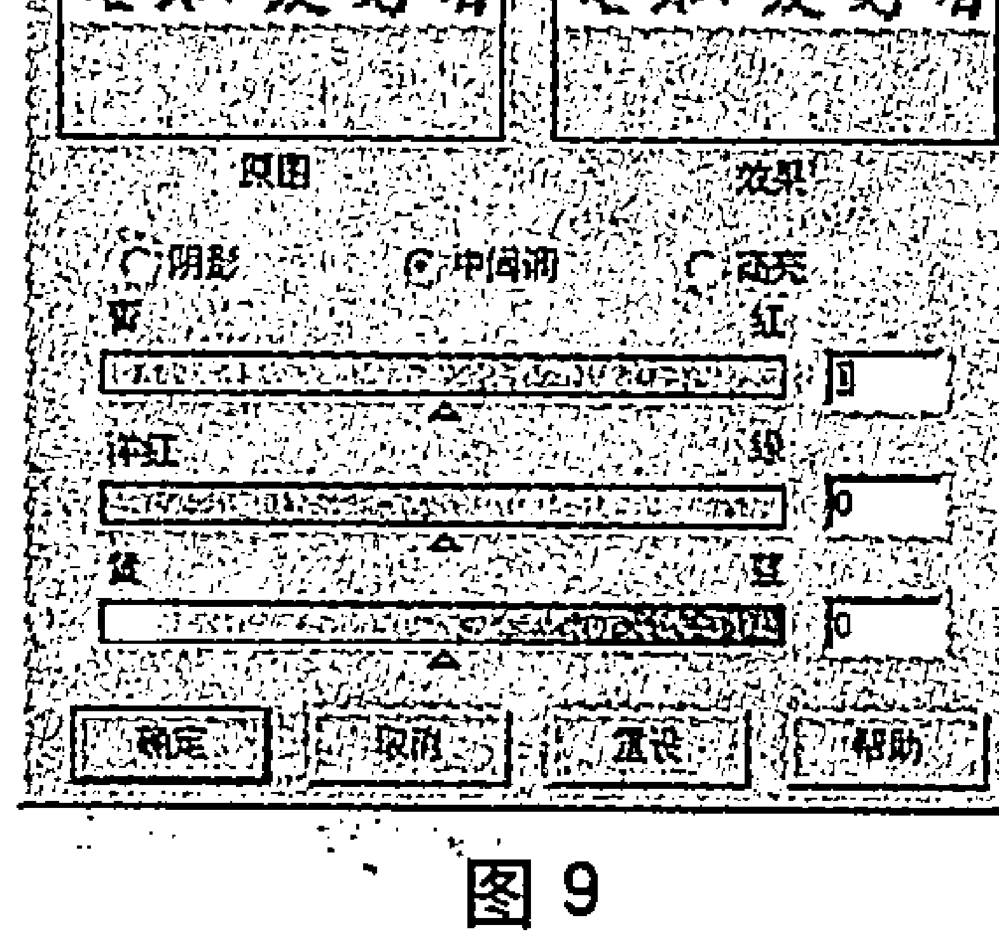

###### ③ 调整色彩（如图10）

色彩调整可以改变图像整体色调，它要求我们具有一定的色彩学的知识，尤其是三原色和补色的原理。由于具体的操作与Photoshop中基本相同，所以在此就不详述了。

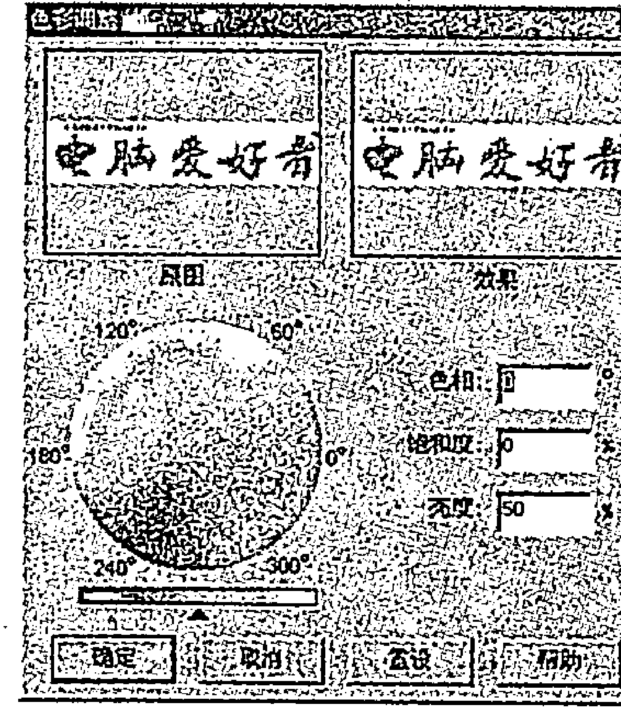

###### ④ 调整色阶（如图11）

调整色阶实际上是调整图像的色调范围，如图11所示，窗口中的X轴表示像素的色值，由左边的最暗（0）到右边的最亮（255），Y轴代表在某个色素上的像素数目。拖动窗口下面的黑色滑钮调整输入色阶的下限，灰色滑钮调整伽玛曲线部分，而白色滑钮调整输入色阶的上限，即可重新分布图像的像素，从而产生一个好的整体平衡色调。

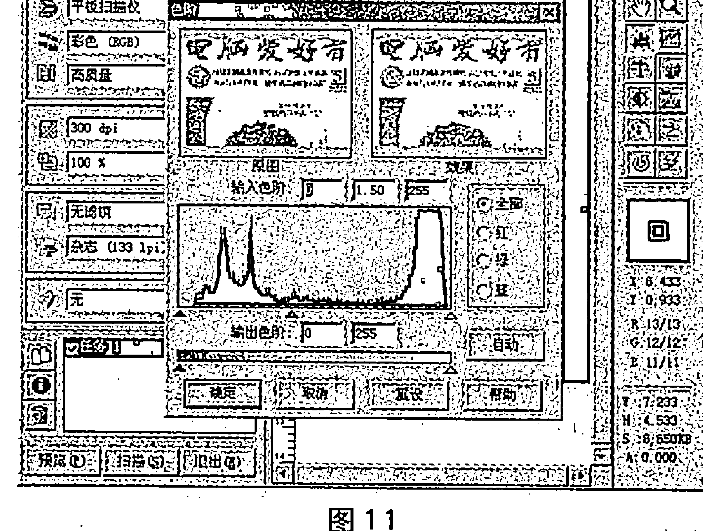

###### ⑤ 调整伽玛曲线（如图12）

通过调整图像的伽玛曲线可以调整彩色图像和灰阶图像的中间调或者中间灰度层次。伽玛曲线显示出原图像与处理结果之间的像素亮度变化。刚打开曲线对话框时，由于输入和输出图像完全一样，因此是一条对角线。图形的X轴代表原图像的像素亮度，Y轴代表处理后新图像的像素亮度。当曲线向下移动时，图像的相应像素变暗；向上移动时，相应像素变亮。它的调整往往需要与亮度、对比度共同配合使用才能达到满意的结果。

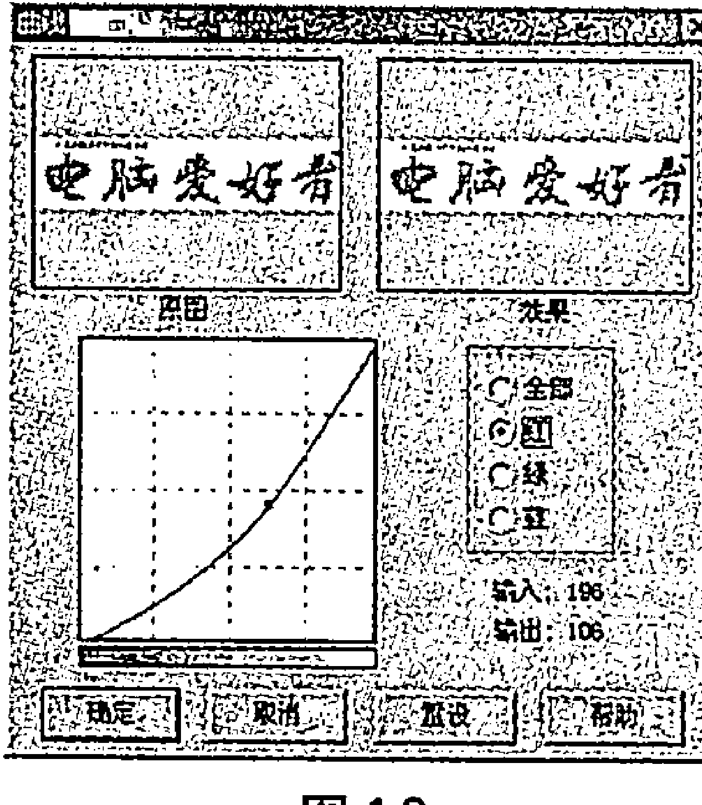

事实上，扫描图片是简单的，但是要得到高质量为了获得完美的扫描图像，对图像质量的控制就显得十分重要，不过只要认真做到以上几点，相信大家一定能够获得理想的扫描图像。

##### 3. OCR文字识别

扫描仪除了能够扫描图片之外，还有一个非常重要的用途，这就是能够把报刊杂志上的文字通过OCR软件转换为可以识别的文字存储在计算机中编辑排版，这对于在家办公的SOHO一族来说显得格外实用。

由于中国常用的汉字有几千个，而OCR技术就是扫描文本中分检出的汉字图像，并由计算机将图像转为汉字标准代码。说白了，OCR也就是一种特征比较技术，通过和‘识别特征库’比较来找到最为相似的汉字，然后提取这个汉字的标准代码，得到识别结果。所以OCR的核心在于比较汉字之间相同、相异之处，把握它们之间的关系，同时按照汉字的多级分类、多特征和全方位动态分配相似集来保证比较好的识别率。

###### (1) 选择合适的OCR软件

如何才能更好地将传统纸张文档识别为我们可以在电脑上编辑的电子文档呢？首先要注意的是关于OCR识别软件的选择。目前OCR识别软件不下十余种，但真正好用的还要数清华紫光OCR和尚书五号，这两个软件在简繁体汉字识别率方面相差无几，但如果涉及到中英文混合排版的文章时候，尚书五号的识别效果就要好一些。不过清华紫光的OCR软件有其独到之处，最显著的就是能够同时对多个区域进行扫描，而且它的自动倾斜校正功能在同类软件中也是效果最好的。因此，至于选用哪一款OCR软件，这还要根据各位的不同需求来进行选择，下面就以使用清华紫光OCR识别一则新闻为例向大家介绍一下进行OCR识别的操作。

###### (2) OCR识别

###### ①扫描之前的设置

运行清华紫光OCR之后，点击工具栏中的‘扫描’按键激活扫描窗口，在这里首先需要调整下面三个重要的参数设置。

**扫描仪模式**

在图13所示的界面左边，可以确定扫描仪采取高速度还是高质量的模式进行扫描，这两者只能选取其中的一个。一般扫描文档进行识别的时候选取‘高速度’即可，但是如果扫描之后的识别效果不好，则建议修改为‘高质量’，而且对于印刷质量不是很好的报刊建议选中‘高质量’来获取更为优秀的图片。

**分辨率**

在这里可以确定扫描时候的分辨率，对于文档来说选择300dpi的分辨率就足够了，如果使用600dpi你将会发现扫描出来的效果和300dpi差不多，不过花费的时间就要长很多了。


**临界值**

这可以说是影响识别效果最大的一个参数了，点击图13右边的黑色‘T’形按键可以激活临界值设置窗口（如图14）。在这里，我们可以通过下部的△箭头来调整临界值参数，同时能够在图14中即时预览到调整后的效果。不过这个参数并没有确切的数值指标，只有靠视觉来判断。通常说来，从整体上看文字清晰、背景干净，从文字看笔画不间断、没有毛刺就可以了。而且在扫描四号以上的大字时可以调得淡一些，而扫描五号以下的小字时建议调得深一些。


接着用鼠标框选出需要扫描的区域，最后按下‘扫描’按键开始扫描操作。

###### ②识别之前的设置

在扫描完成之后，就能够OCR识别软件中看见刚才选定的文档（如图15），但这时还不能直接进行识别操作，否则还是无法实现最优扫描效果。

**倾斜校正**

在我们往扫描仪中摆放报纸的时候不可能完全实现水平和竖直方向的完全吻合，如果对扫描得到的这张倾斜图像直接进行识别，那么识别之后将有很多错字出现。这时可以点击工具栏上的‘倾斜校正’按钮，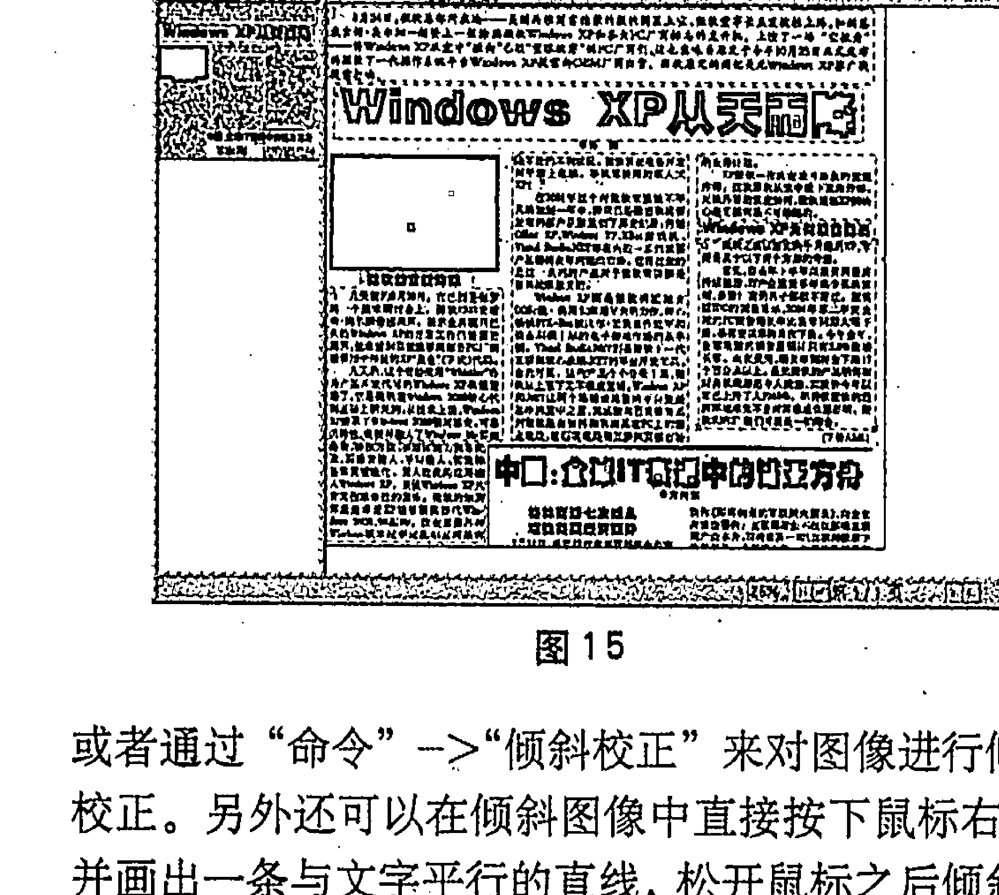

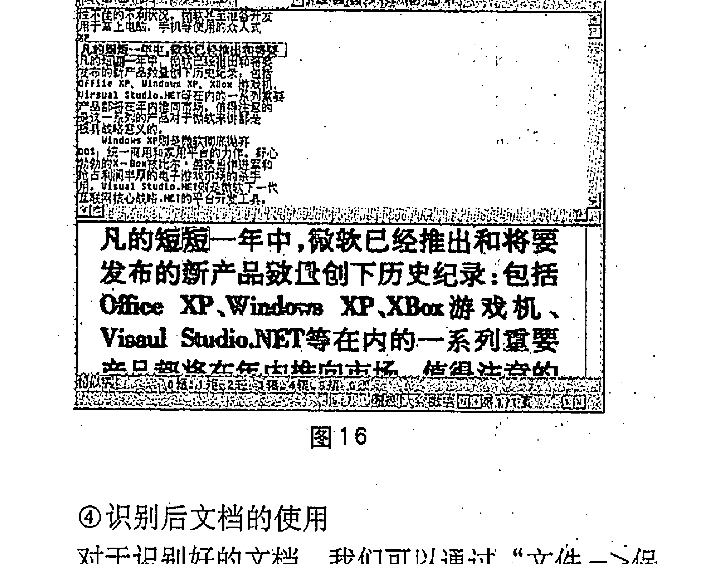

图15

图16

或者通过“命令” -> “倾斜校正”来对图像进行倾斜校正。另外还可以在倾斜图像中直接按下鼠标右键，并画出一条与文字平行的直线，松开鼠标之后倾斜的图像也会自动进行校正。

**○分割识别区域**

由于扫描的文档并不一定都是统一的字体，像我们扫描的这份报纸就存在标题、引言、正文和后续这些不同部分，而这些文字的字体通常也不尽相同，如果一次性对它们进行识别就会大大降低识别率。因此我们可以将相同字体的段落框选在一起，而其他字体也按照这种方式分别设定一个识别区域，以提高文档的识别效果。

一般识别是按照从上往下、由左到右的顺序进行，所以在框选识别区域的时候要按照这种顺序。但如果将全部的识别内容设定好之后发现有些识别区域需要调整，该怎么办呢？比如想把原先的第4个区域更改为第3个，而第3个调整为第4个，这时可以先把鼠标移动到第4个区域，按下Ctrl按键之后拖动鼠标到第3个区域，松开鼠标左键之后就发现这两个框选区域的编号已经调整过来了。不过需要提醒大家注意的是，这种方法只能从编号大的区域拖动到编号小的区域，如果从第3个区域拖动鼠标到第4个区域是不行的。

###### ③识别之后的修改

完成上述的设置之后就可以进行文档识别了，接着程序会将识别之后的内容在新窗口中显示出来（如图16），这个窗口上部是识别之后的文字内容，而下部区域则是原先扫描得到的图像。其中识别内容中会将程序认为不准确的部分用蓝色显示出来，用鼠标点击这里不仅可以看见一个原先突破内容的浮动条，而且在窗口下部还有类似文字的选项条，直接用鼠标点击或者按下相应的数字按键就能用这个字替代原先的文字，从而实现快速修改编辑的功能，最后将修改好的文档保存下来就能够作为它用了。

###### ④识别后文档的使用

对于识别好的文档，我们可以通过“文件 -> 保存”将它保存为txt或者是rtf之类的文档文件，当然也能够用鼠标选中全部内容，然后粘贴到Word文档编辑器中，或者是其他编程工具中使用。

###### (3) 注意事项

除去上述有关OCR识别软件的设定之外，还有一些影响识别效果的因素，在此请大家多加注意。

- ①建议在配置好（尤其是内存多）的计算机上进行识别操作，否则在扫描图像的时候，会遇到扫描组件长时间不移动，或者仅仅是前后移动一点的情况。这一般是由于电脑的内存太少，或者是扫描时采用的分辨率值过高，从而引起计算机内存不够。解决的方法是增加内存，或者是关闭不用的程序将有限的内存释放出来。
- ②扫描出来的图像上有一条条的白线，严重影响识别效果。这是因为扫描仪的反射镜上有灰尘，所以在扫描的时候就会在图像上留下痕迹，解决的方法是用脱脂棉签沾上少许无水酒精来擦拭反射镜。
- ③开启扫描仪之后最好不要马上进行扫描操作，稍微等待10分钟左右让扫描仪预热完成，然后再扫描才能够获得最佳效果。
- ④在扫描完成之后，建议大家先将得到的图片保存起来，如果在识别过程中有误操作的话就不要重新扫描，仅仅调入这张图片就能够继续识别了。

好了，按照上述方法试试看，相信你会发现OCR识别真的很不错。那么即使手头有一大堆文档需要处理，你也可以轻松应付了吧！

#### (二) 用电脑收发传真

现在办公室中基本上配备有传真机和电脑，通常我们都会通过传真机发送文书。但是对于SOHO一族来说，购买传真机不仅需要一小笔开销，更重要的是操作起来比较麻烦，其实我们完全可以坐在计算机前面完成传真的收发操作。也许很多SOHO族已经知道Windows中集成了传真功能，可是由于它功能简单、操作繁琐，因此很少被使用到，相反倒是各种第三方的传真软件受到大家的欢迎。

##### 1. BitWare收发传真

在众多的传真软件中，BitWare凭借着强大的功能、友好的界面以及不凡的可靠性成为SOHO一族计算机中不可或缺的通讯软件。在BitWare的帮助下，我们不仅能够实现发送和接收传真，还可以创建个人语音邮件系统、检索传真和语音信息等功能，这就如同将一台传真机、一个语音邮件系统和一个功能全面的数据通信程序放在自己的家中了。

###### (1) 发送传真

在安装好BitWare之后，系统会自动生成一个虚拟传真机，这就使得从Windows应用程序中发送传真如同打印文档一样容易。此时只需选择BitWare作为默认的打印机，然后通过应用程序的“打印”命令即可，这时BitWare会将文档作为传真发送出去而不是从打印机中打印出来。

- ①例如我们打开记事本或者是Photoshop这类程序并编辑好自己所需要发送的文档。
- ②选择应用程序的“文件->打印”命令之后可以看见类似图17所示的窗口，在这其中选择打印机为“BitWare Fax Driver”一项，这样就选定了通过BitWare发送编辑的文档。
- ③点击图17中的“确定”按钮之后将看见图18所示的窗口，此时分别在上部的对话框中输入对方的姓名、单位和电话号码等内容。此时，建议大家选中图18中的“Fine Mode Transmission”一项，这样能够以精细模式发送传真，让别人收取到最为清晰的传真。
- ④完成上述的设置之后，还可以点击右边的“Preview Fax”按键对所需要发送的文档进行预览查看（如图19）。
- ⑤满意之后先连接到Internet上，接着直接点击图18中的“Start/Fax”按钮开始最后的传真发送（如图20）。

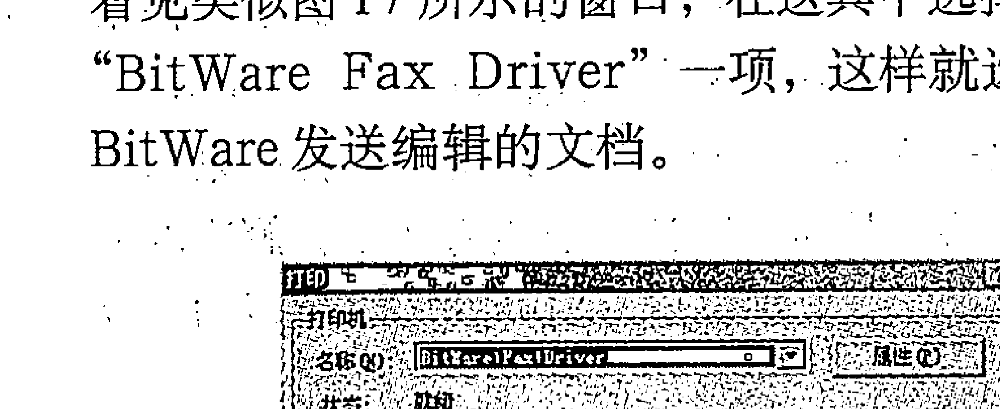

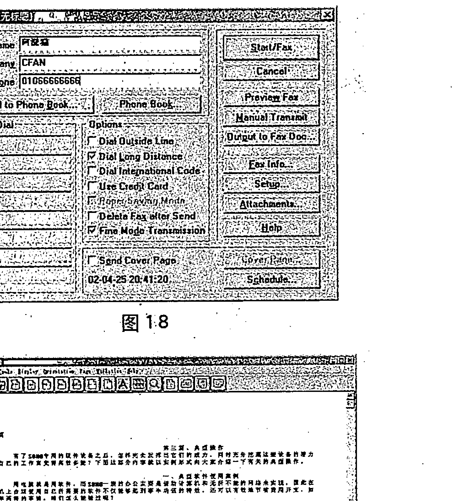

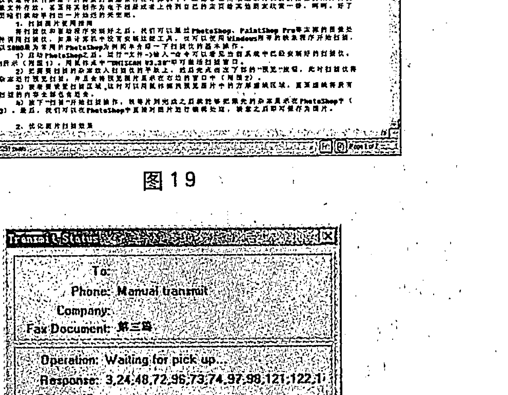

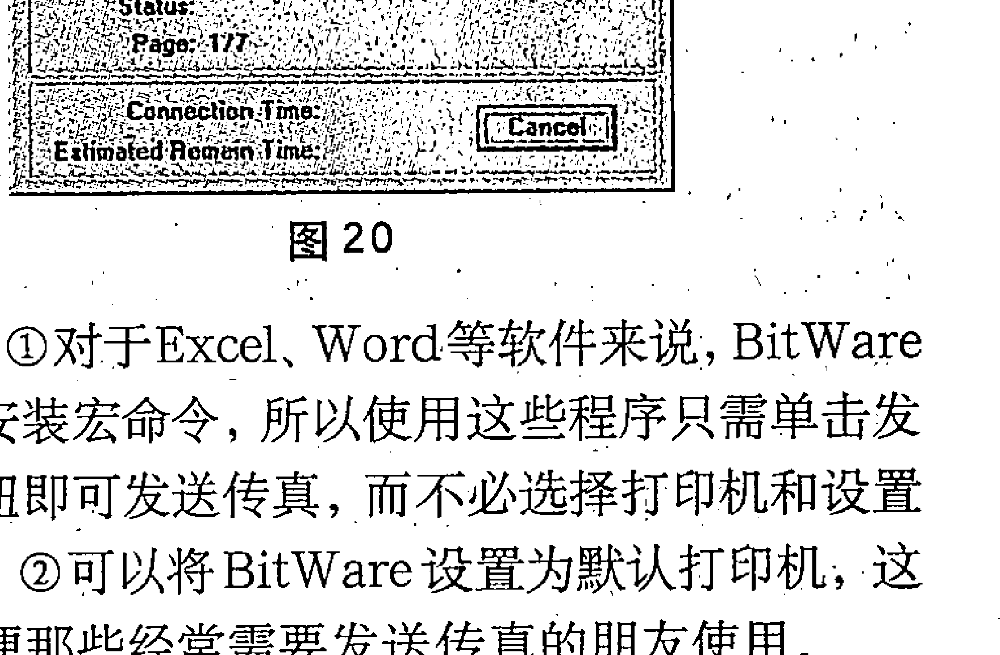

注意：①对于Excel、Word等软件来说，BitWare将在其中安装宏命令，所以使用这些程序只需单击发送传真按钮即可发送传真，而不必选择打印机和设置打印选项。②可以将BitWare设置为默认打印机，这样更加方便那些经常需要发送传真的人使用。

###### (2) 接收传真

通过BitWare接收传真也很简单，在安装过程中程序将自动检查Modem是否具备传真功能，并进行传真功能的设置。接收传真的时候，只要在BitWare主窗口选择“Receive”按钮即可出现如图21所示的接收传真界面，当“Operation”一栏出现“Waiting for call”字样时，表明BitWare已准备接收传真。如果接收到传真，BitWare还会显示对话框提示你查看传真，因此操作起来非常简便。

其实BitWare的功能远远不止这些，不过限于篇幅，在此仅仅向大家介绍一下它在收发传真方面的使用，有兴趣的朋友不妨深入尝试一下，相信你会发现更多更为实用的功能。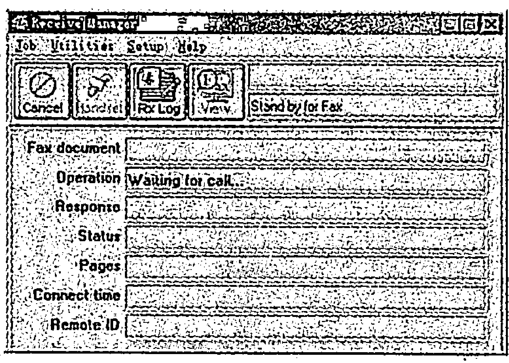

##### 2. 其他传真软件

除去BitWare之外，我们身边还有一些非常优秀的传真软件，在此介绍几款最为出色的供SOHO一族参考选择。

###### (1) Just The Fax

- 软件类型: 共享软件
- 下载地址: http://gz.onlinedown.net/down/jtf32.exe
- 文件大小: 1.24MB

Just The Fax可以发送TXT和TIF格式的文件，由于采用的是WYSIWYG（所见即所得）的编辑器来生成传真及其封面，因此它的操作性很好，而且值得一提的是它发送和接收传真的速度非常快。但因为Just The Fax是一款国外软件，所以它对中文的支持不是很好，如果对方的计算机中没有安装相应的中文字库，就很有可能看见一堆乱码。可如果你将你的文件制作成TIF格式的图形文件后，这个问题就不再困扰你了。

Just The Fax的使用也比较简单，不用有太高的英语水平也可以在几分钟之内学会使用。直接点击工具条上的“New”可以创建一个新的传真、“Edit”用于编辑相应的传真、对于不需要的文件可以用“Delete”来删除、“Send”和“Receive”就是发送和接收传真的按键（如图22）。

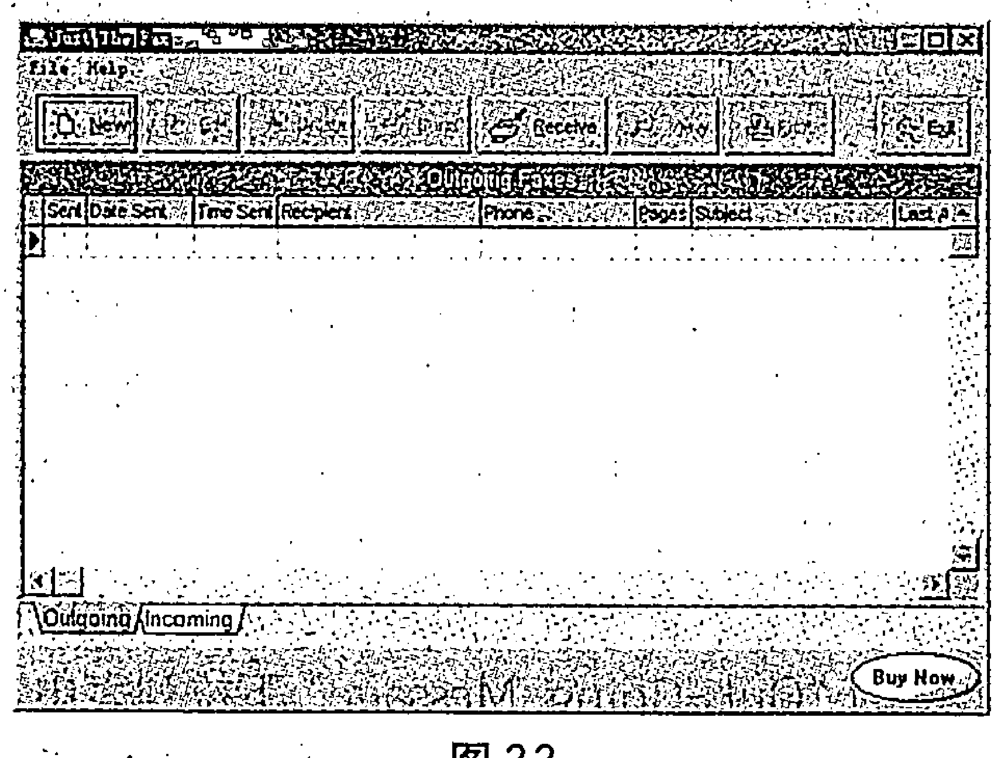

###### (2) MightyFAX

- 软件类型: 共享软件
- 下载地址: http://gwb.nonlinedown.net/down/mf32.exe
- 软件大小: 1.54MB

MightyFAX在安装的时候也会创建一个虚拟打印机，这样一来，只要我们所使用的软件有打印的功能（如Word、Excel、Photoshop等），就不需要再启动它来发送传真，而是直接将你编辑的文件发送到对方的传真机上去。另外在功能上它也比Just The Fax要强一些。MightyFAX提供了三种传真级别：Class1、Class2和Class2.0，其中Class2.0的传真速度是最快的，而Class1是速度和稳定性都比较适中的方案，这就可以根据自己的需要来进行选择，当你收到传真的时候还可以用语言来提示。

由于MightyFAX和Just The Fax的使用方法差不多，在此也就不再赘述，只是有一点要提醒大家注意。在点击了MightyFAX工具条中的“New”后，弹出的窗口和Just The Fax不一样（如图23），你可以直接在上面进行文字编辑和键入对方传真机的号码，很方便。

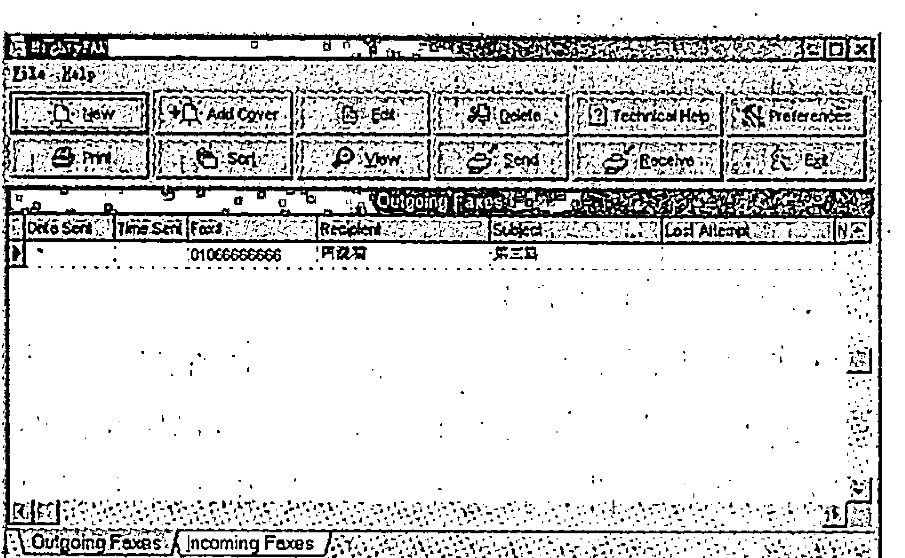

###### (3) FaxMail

- 软件类型: 共享软件
- 下载地址: http://gt.onlinedown.net/down/fm.zip
- 软件大小: 951KB

FaxMail是一个很小巧的传真软件，它通过支持打印功能的软件直接将编辑的文件传真出去，对于接收到的传真文件，它使用一个附带的观察器进行浏览，其视觉效果非常的好（如图24）。而且安装完毕后，屏幕上会多出一个浮动工具条，上面提供了所有FaxMail的功能按键，这样在操作的时候就更加方便省事。最妙的一点在于，它提供了从COM1到COM256的硬件支持，并且可以自动检测Modem，自动为Modem设置初始化字符串，这样就不必担心你的Modem缺少驱动程序而无法使用了。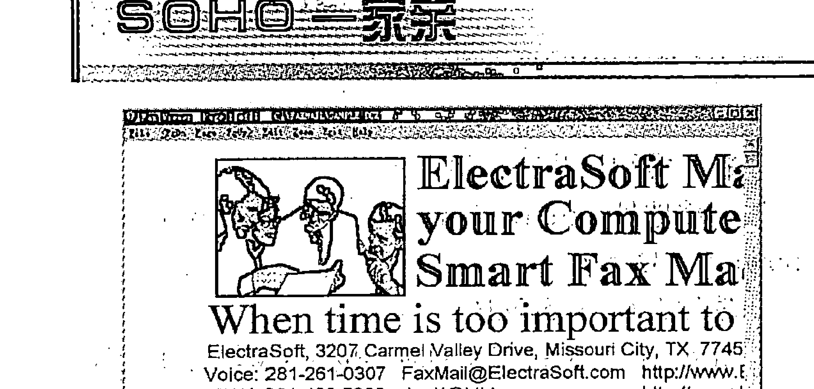在操作的时候，直接点击工具条上的“Send”按键，并根据向导的提示进行即可，操作起来比较方便。另外你如果在单位的局域网上发送传真时，也能够体现出FaxMail的优越性来。其实如果仅仅是发送软件，那FaxMail的使用还是很简单的；可是它还附带了许多额外的功能，要想将这些功能全部掌握，不是一时半会就能做到的。但当你将其精髓发掘出来之后，一定会大呼过瘾的；建议那些喜欢钻研的朋友使用。

###### (4) 免费传真之星 4.0

- 软件类型：共享软件
- 下载地址：http://www.newhua.com.cn/down/pffstar40.exe
- 软件大小：1.1MB

这个软件在安装时也会添加一个名为“免费传真之星”的打印机，并将其作为默认的打印机，然后通过可以打印的软件，只要花上网费和市话费即可发送长途传真了。它可以传送的文件格式比较多，只要可以打印出来的文件都可以直接传真出去；这点上无疑是很优越的。

在使用的时候，点击某个程序的“打印”按键，然后免费传真之星就会读取相应的文件信息；等到读取完毕之后，可以看见如图25所示的界面。这时需要键入对方收取传真的姓名和号码，在点击发送之前，最好先对自己的有关信息进行设置。点击“系统设置”后需要你键入E-mail地址和发信服务器等信息，这是用来接收有关传真发送状态的电子邮件；一般来说，邮件发送半小时左右就可以知道传真发送成功与否了。还有一点要提醒大家注意，再使用“在线查询”来确认一下对方的传真机是否在它的服务区域之内，以免传真发送失败。

#### (三) 免费自动应答机

对于SOHO一族来说，信息是最重要的，虽然如今网络将天地之间的距离拉得很近，但很多时候还是电话来得方便，可是当家中无人的时候就很难知道那些朋友打过电话找你，即使有了录音电话之后，如果你不能亲自操作它，那也无法获悉别人给你的留言内容。不过只要你有了电脑、Modem和IVM Telephone Answering Attendant（以下简称为IVM）这个软件之后，你就提前拥有了一部超级录音电话机。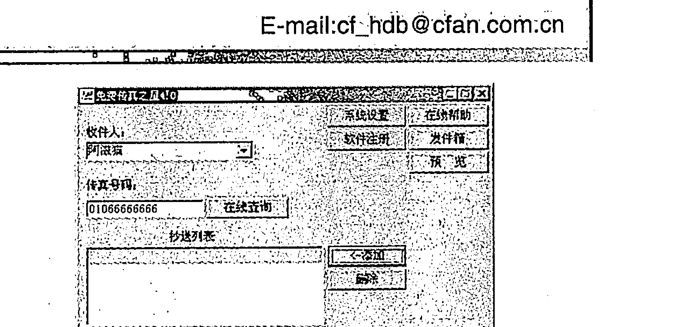

##### 1. 功能简介

IVM是在安装了语音Modem和声卡的前提上，利用先进的技术来把计算机变成一部可以自动应答和录音的多功能电话机，对于自动应答的内容能够用WAV文件格式存放在计算机中，因此可以在脱离软件的情况下收听和保存。而且IVM还可以充当一下电话总机，只要根据需要设置不同的语音提示功能；对方就可以直接通过电话机的拨号按键接驳到不同的分机上；这是不是有点专业的味道了？需要特别指出的是，目前的电话录音软件必须在本机上才可以查看有哪些电话打入；但是IVM支持远程查阅的功能。只要你在软件中进行相关的设置，就可以自动将录制的WAV文件发送到指定的电子信箱供你下载收听；或者在千里之外直接通过电话或者手机来收听别人的电话留言。

IVM在运行的时候，能够以图标形式躲藏在右下角的系统图标栏中；等到有电话拨入的时候再自行弹出；一点都不会影响正常工作。因此当你不在家的时候，就可以让IVM来坐堂值班。即使在家的时候也可以先知道对方是谁，如果你不想被这个电话骚扰的话就让它自生自灭吧。

##### 2. 基本设置篇

首先可以按照ftp://www.newhua.com/ivmsetup.exe下载一个IVM的安装文件，安装结束后第一次运行的时候，系统会自动确认所使用的Modem。所以IVM在这方面制作的智能化程度很高，不需要大家过多的参与就可以直接使用。

运行IVM之后首先看见的是图26所示的界面，可以从上部的“Out-Going Message”下拉列表中看出这个软件是针对澳大利亚、德国和美国用户所定制的，不过我们国内用户也可以使用，唯一的欠缺在于失去了来电显示的功能。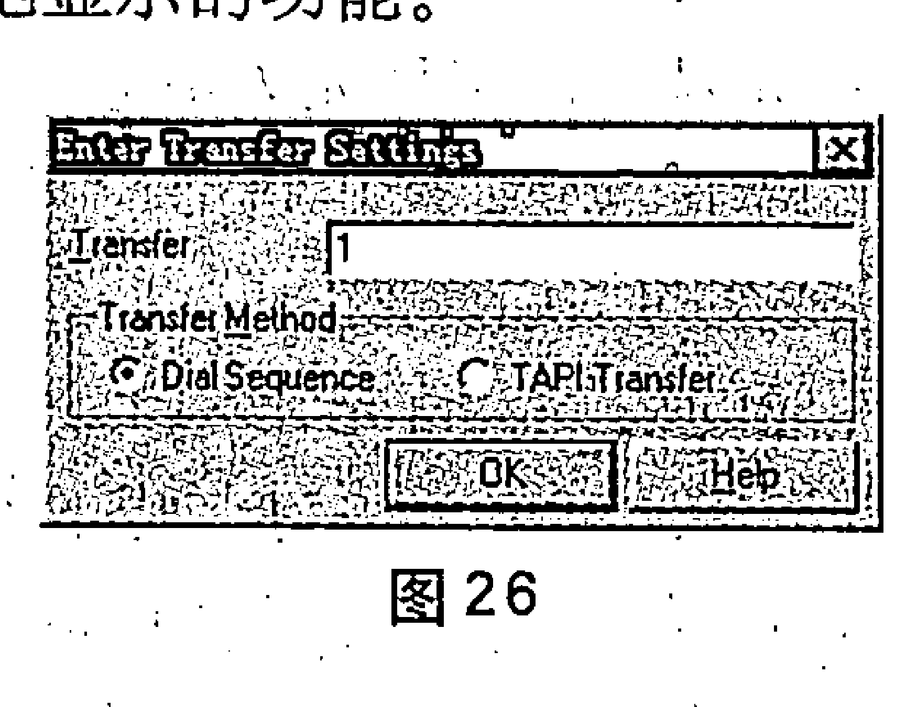

跟大多数同类软件一样，使用 IVM 之前需要对其进行一些设置。由于这些设置将在很大程度上影响到 IVM 整体性能的发挥，所以我们先点击下部的 “Settings” 按键来看看吧。

###### 【Devices】 标签

如图 27 所示，这里显示了当前使用的 Modem 型号和声音输入/输出设备，一般说来这些都是系统自动检测出来的，除非你对这些设备很熟悉或者更换了设备，否则建议大家不要轻易修改。

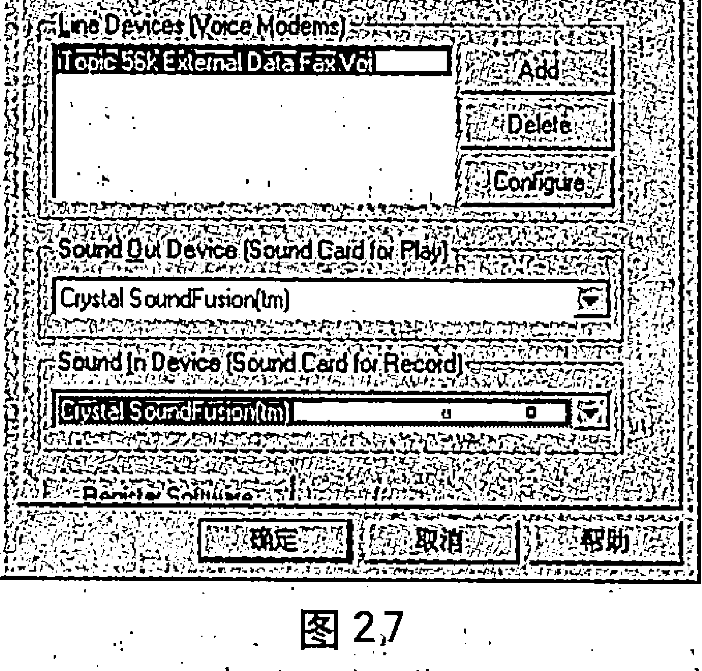

###### 【Run Mode】 标签

这里的内容比较简单，但是如果要实现电话自动应答的话，就必须选中 “Run when in Answer [On]……” 选项。

###### 【Answering】 标签

此处的 “Number of Rings to Answer” 用于确定电话铃声响了多少次之后开始自动应答，一般设置为 4-6 次为佳。而且还可以设置在工作日和周末自动应答的时间范围，比如可以设置 IVM 在早上 9 点到下午 5 点的工作时间内开始自动应答功能，这段时间之外的电话就由你来接听。提醒大家注意的是，下部的 “Maximum Record Time” 下拉列表并不是很显眼，不过它是用来定义电话录音时间的，其最大支持长达 6 分钟的录音功能使得其他同类软件难以望其项背（见如图 28）。

###### 【Voice MailBoxes】 标签

这里的设置可以让 IVM 自动将电话留言保存的 WAV 文件发送到电子信箱中，并且当你需要通过远程电话查阅留言的话还要在此输入相应的查询密码（如图 29）。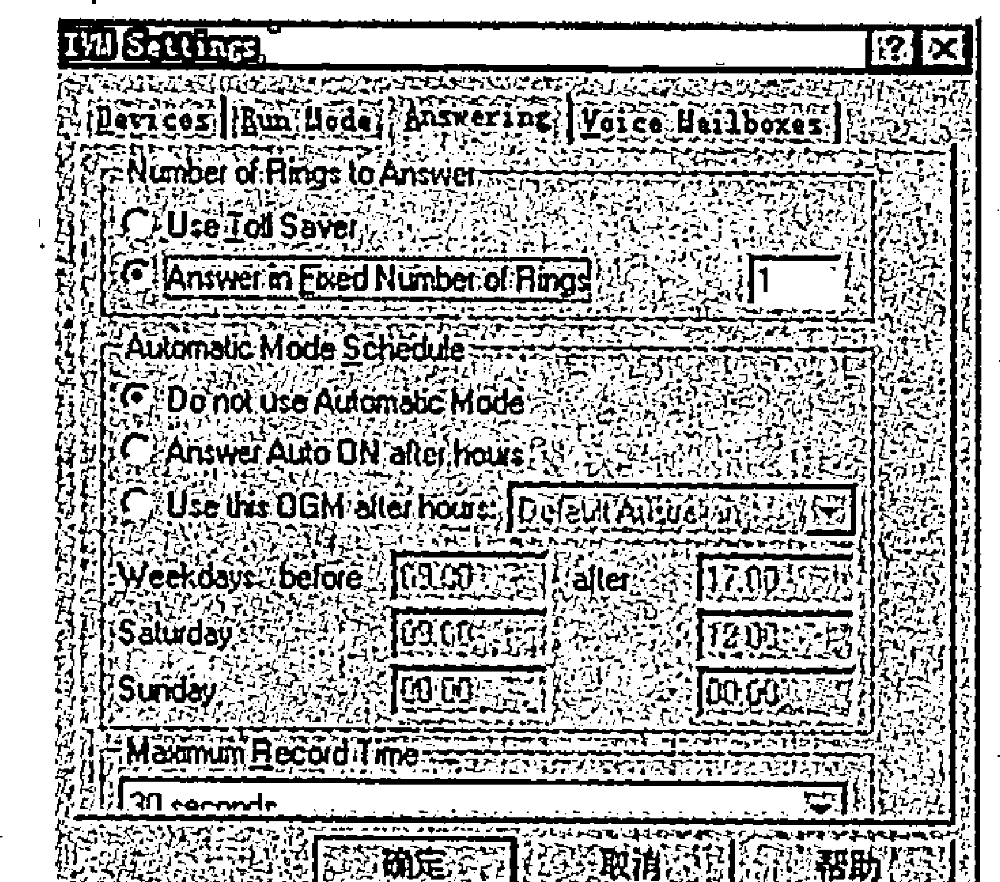

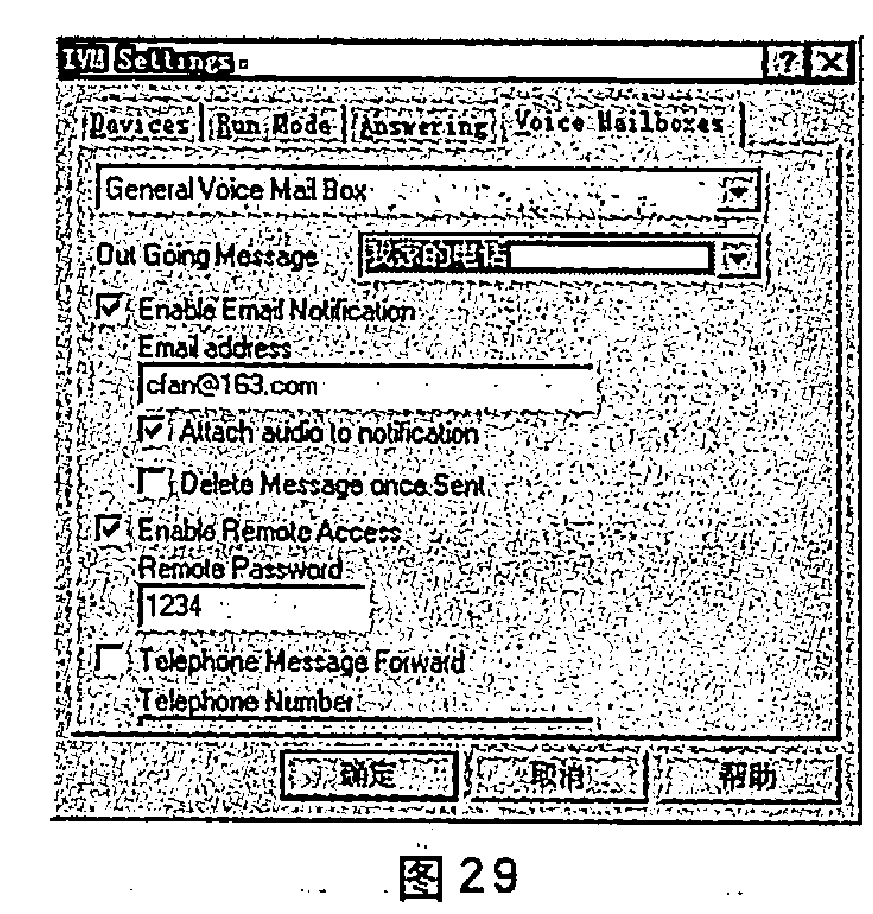

##### 3. 实战 IVM 篇

完成上述的基本设置之后，我们就可以使用 IVM 了。如果你用另外一部电话或者手机拨打连接到 Modem 上的电话时，等铃声响过几次之后就会传出非常纯正的英语问候，在最后的 “嘀” 一声响过之后开始留言录音。也许你觉得有些奇怪，其实这是因为 IVM 是老外制作的，它的默认问候语当然也是英文的。所以我们首先要自己录制一段问候语，比如 “我现在不在家，请留言” 之类，并且将其保存为 wav 格式的文件（比如 welcome.wav），然后点击主窗口中的 “OGM Control” 按钮对问候语进行更改。

如图 30 所示，左边的列表是现有应答问候模板，你可以将原先默认的几个全部删除，再点击 “New Wav” 按键重新创建一个项目，并在弹出的对话框中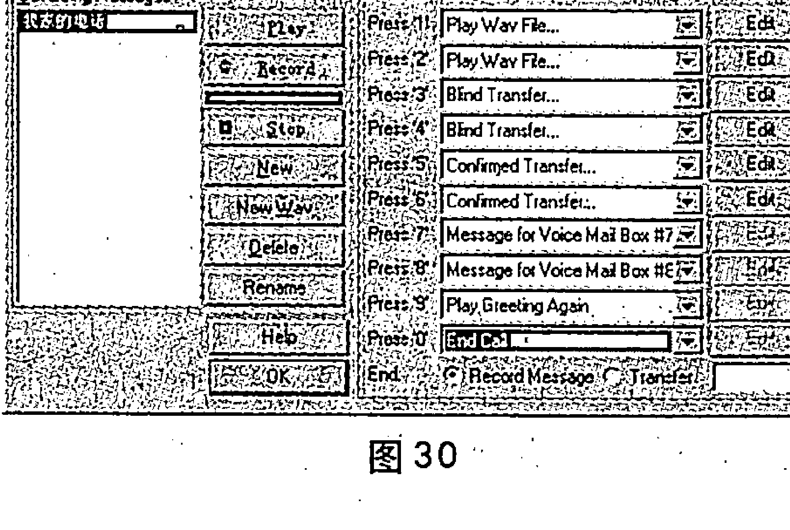确定刚才录制的welcome.wav文件。这时可以点击“Play”按键试听一下效果如何，还能够对其重新命名，比如更改为“我家的电话”以便于管理。设定完成之后，再拨打这个电话试试，你就能够听见自己录制的问候语了，而且在提示音之后还能将语音留言录制下来。当一次通话完成之后，IVM的主窗口中就多出了一条电话记录，其中记录了打入电话的时间和通话的时间长短。随着打入电话的次数增加，这些留言都会按照时间顺序排列。当我们选中一条留言之后，点击下部的“Play”按钮就可以收听了（如图31）。

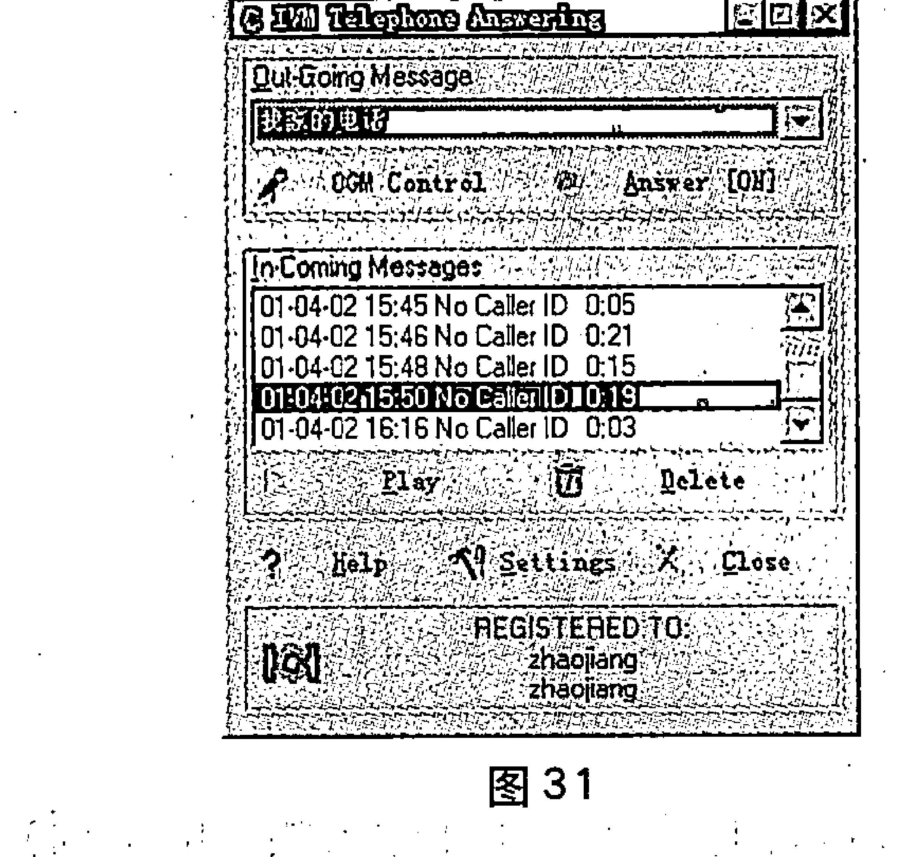

根据每一条电话留言，系统还会自动生成txt格式的日志文件，它们保存在IVM的安装目录下面供大家日后查阅。这些日志文件是按照月份来进行记录的，比如2000年9月份的记录会存为log0900.txt，而2001年3月份的记录文件为log0301.txt，因此需要查找相应月份的电话记录也是非常快捷的。

看起来IVM的使用还是比较简单的，不过这只是它最基本的功能。除此之外还可以远程收听电话留言、发送留言到电子信箱、电话转接等功能，而这些功能会让我们对它赞不绝口的。

###### (1) 远程收听电话留言

实现这个功能之前，要在图29所示的窗口中选择“Enable Remote Access”复选框，同时在下部的密码栏中输入收听时候的密码。当你暂时无法回家收听留言的时候，只要用普通电话或者是手机拨打家里的号码，等留言提示音出现之后按下电话或者是手机的“*”键，并输入设置好的密码就可以收听留言了。对于已有的留言，还可以通过“1”键来重新听取第一条信息，“2”键跳过当前的留言，“3”键删除当前听取的录音，或者按下“7”来重复播放留言。

不过提醒大家注意一点，由于IVM接收到相应的指令之后要调用wav文件播放，然后再进行传输，所以这需要大约10秒钟左右的时间，这和我们平时使用电话拨通后就能够听到语音是有些差别的。

###### (2) 电话转接

在IVM的帮助之下，我们可以利用办公室现有的电话交换机给分机编号，实现无人值守总机的功能。比如我们的问候语中提及到“销售部请按1，技术支持请按2……”之类的话语，然后就可以在图30所示的窗口中进行相应的设置。首先在“Press 1”下拉列表中选择“Blind Transfer”，并在弹出的对话框中输入“1”（如图32）。按照这种方式将其余的几个电话按键进行设置，这样就可以实现电话的自动转接功能。

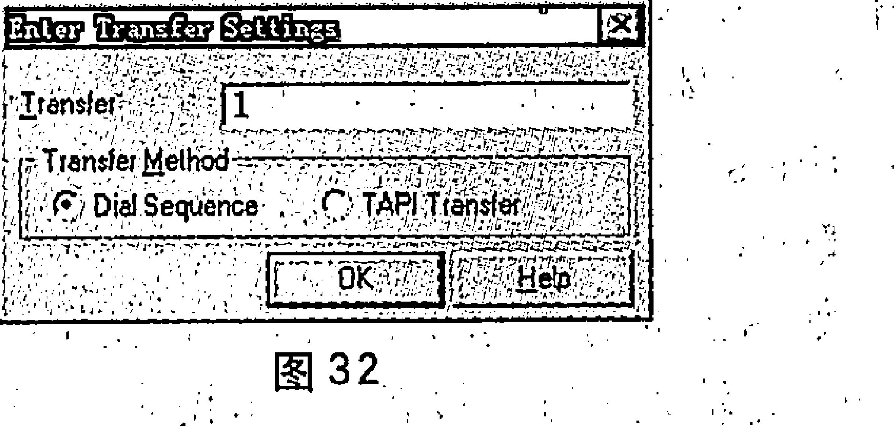

###### (3) 发送留言到电子信箱

利用这项功能，可以让计算机把已经收取的留言信息发送到指定的电子信箱中，所以我们只要收取信箱中的邮件就能听到留言内容了。使用的时候也要在图29所示的窗口中选中“Enable Email Notification”复选框，然后输入接收邮件的信箱地址，比如“cfan@163.net”。同时还能够通过选择“Delete Message once Sent”来将已经发送的wav文件删除，以腾出硬盘空间保存更多的信息。

不过目前这个功能是和Outlook系列的邮件工具结合在一起的，并要将其设置为系统默认的邮件发送工具，而且将Outlook定义为发送自动登录到网络发送邮件，发送完毕邮件之后还会自动断线。另外，IVM录制的语音文件虽然是WAV格式的，但它们的个头并不是很大，一般15秒钟的文件只有240KB，所以这将大大减少邮件发送和接收所需要的时间。

说了这么多，想必大家对IVM都有一定兴趣了吧，有兴趣的话大家不妨亲自试试。虽然IVM是个共享软件，但在没有注册的情况下，并没有任何功能的损失，只不过有30天的试用期限罢了。

#### (四) 让打印机如虎添翼

随着计算机硬件的发展和工作的现代化进行，打印机已经逐渐成为计算机的标准外设配置而步入了寻常百姓家，对于SOHO一族来说更是不可或缺的。但你是否仅仅通过打印机打印一些文档之类的资料呢？若真是这样的话，那就有点太浪费了，因为你还没有完全认识到打印机的潜力，因此不妨一起来看看这些能够让打印机如虎添翼的好软件。

- **1. FinePrint**
文件大小：1.68M
软件授权：共享软件
下载链接：http://newhua.ucatv.com.cn/down/fp471.exe（Windows 9X/Me版）http://sd.onlinedown.net/down/fpnt471.exe（Windows NT/2000版）

不知大家有没有遇到过这样的情况，就是有时候要打印的内容有二、三十页之多，打印出来的文档就有厚厚的一叠，看起来也不是很方便；或者有时打印的内容虽然并不算太多，但又只多出那一点点内容，不能在同一张打印纸上打印完毕，就得再多打印一张。此时就希望能够在一张纸上能打印出好多页，既节省了耗材，延长了打印机的寿命又能方便阅读。若是在以前，这是没有办法解决的，但现在可以用FinePrint这个微缩打印专家来轻松搞定。

FinePrint是Single Track Software公司开发的一个共享软件，在没有注册的时候并没有时间和功能方面的限制，只是会在打印出来页面的下部加上一个版权信息罢了。它的主要功能就是能让我们在一张纸上同时打印好多页，最少可以节省用纸数量的50%，而最多则达到87.5%！不要奇怪，这实际上原理是和彩显的分辨率设置是差不多的，只在一张纸上打印一页内容，就好像我们彩显用的是640 × 480的分辨率；若同时打印两页、四页甚至是八页，就相当于我们的彩显分辨率设置的是800 × 600、1024 × 768甚至是更高，这样就可以在一页中显示更多的内容。

安装FinePrint几乎不需要大家的介入，一路回车法就能把它搞定了。这时候再进入“我的电脑->打印机”目录，就能看见多了一个名为“FinePrint 2000”的打印机快捷图标，而且此时已经自动被设置为默认的打印机，这就说明FinePrint已经成功地安装到系统中了。使用的时候只要在Word或者是其他支持打印的程序中运行打印命令，此时FinePrint会在正式开始打印之前显示一个设置窗口，这对于打印文稿的模式有很大的影响，最好进行一番设置。

###### (1) Layout（版面）

在面板左侧和下部是一些内容的设定，比如在“layout”中可以将1、2、4、8页的内容缩印为一页，或者以绕过方式和小册子形式来打印。而“border”能够设定打印内容的三种边框形式，即精确、有或无。“Ordering”用于设定多页内容在一张纸上的排列方式，其中有向下、交叉和PDF等。此外，在“Options”中可以对双面打印和打印方式修正进行设定（如图33）。

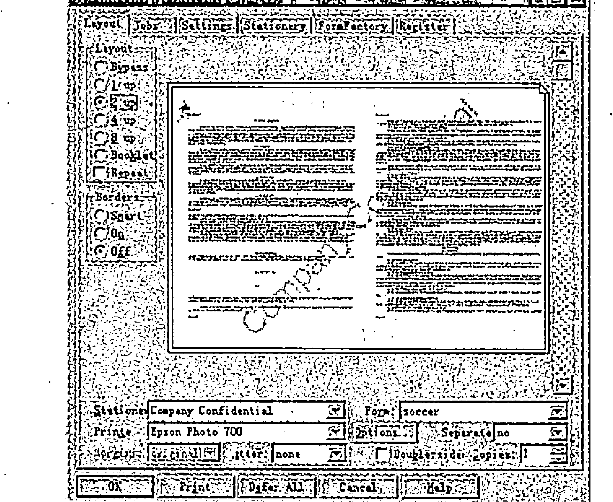

###### (2) Stationery（模板）

在这里，可以详细设置模板。比如创建新的模板或对已存在的模板进行删除、重命名；在打印纸上进行header（标头）、footer（页脚）和watermark（水印）设置；把当前date（日期）、time（时间）、page（页码）、job name（文档标题）等打印在文档上；并能够在“font”（字体）中选中有关打印的字体类型、大小和颜色（如图34）。

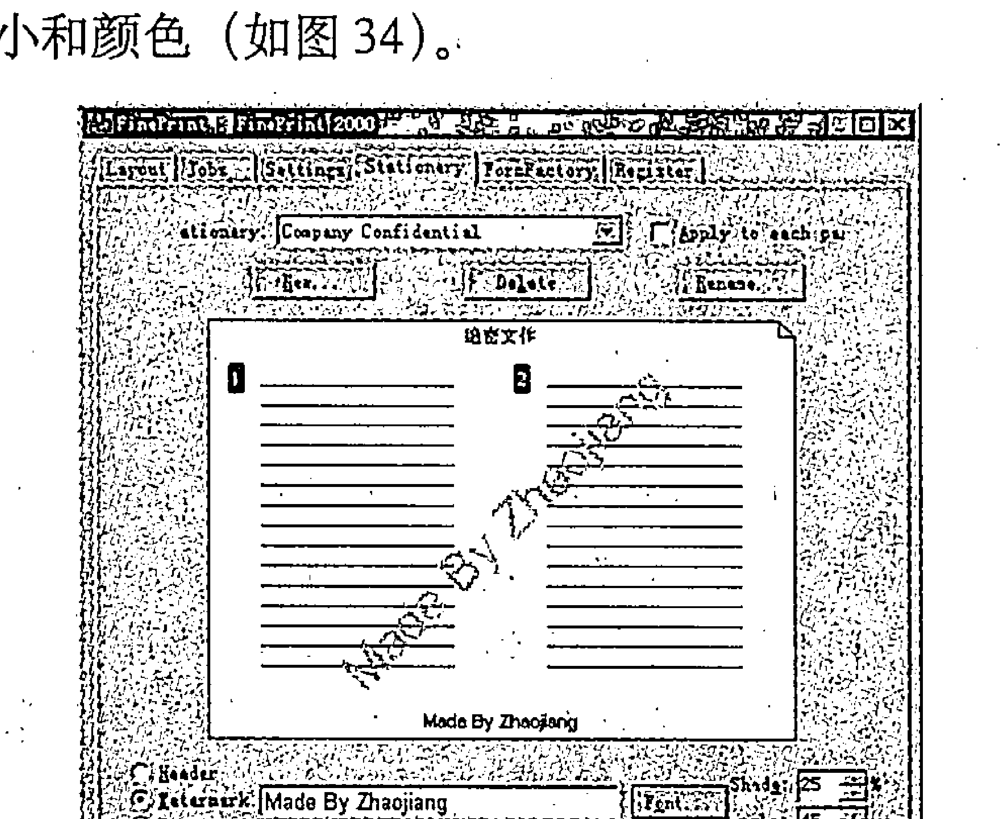

###### (3) Form Factory（表单制作）

在此可以将打印的内容设置为表单，以后需要的时候直接调用打印即可。

在设置完成之后，只要打开一个文档编辑器，然后再选择FinePrint作为打印机，确认之后很快就可以看见一份被压缩打印的文档了。由此可见，FinePrint的打印操作还是很简单的，而且打印效果还非常理想，不仅在排版上给人耳目一新的感觉，能够将比较大的文档直接打印在少数的几张纸上，而且打印出来的小巧精致的字样也会让你爱不释眼，甚至还能够将一些文档分页打印，最后制作成为一个精美的小册子呢！笔者第一次使用FinePrint的“4up”模式打印了一份文档后，见过的朋友都大吃一惊，惊叹这是怎么打印出来的，可见FinePrint的强大威力了吧。

虽然FinePrint提供了1页到8页的打印模式，不过针对每个人使用的打印机和纸张大小的不同，所选择的多页模式也不完全相同。一般采用A4纸张打印的时候，最好不要超过单张打印4页的模式，否则打印出来的字体由于太小而无法辨识；而在较高档能够支持A3打印纸的机器上使用时，就能够采用8页打印的模式了。但如果你过份追求节省纸张而盲目地采用8页打印模式的话，看不清楚字可别怪我呀！

- **2. PhotoCopier**
文件大小：875K
软件授权：免费软件
下载链接：http://newhua.ruyi.com/down/cp.exe

SOHO一族应该都有扫描仪或者是数码相机这样的电脑外设了，但是你有没有想过买一台复印机呢？要知道一台最低档的复印机也要上万元的开销呀，不过只要利用手边的扫描仪和打印机，再加上一个名叫PhotoCopier的软件，就完全可以模拟出一台复印机的效果。

听起来有点神奇吧，其实PhotoCopier的原理就是利用扫描仪作为文件的来源，将其扫描为图像格式之后转存进电脑中，然后再通过打印机来输出，这样就可以随心所欲地进行“复印”了。最主要的是，你不需要购买价格昂贵的彩色复印机也可以实现相同的目的。虽然可以直接通过Photoshop来达到上述的目的，但是要来回折腾很麻烦，而如今在PhotoCopier的帮助下只要很简单的设定就可以搞定了。

在工作之前，大家先要将扫描仪和打印机硬件连接好，并且正确安装它们的驱动程序，接下来安装好PhotoCopier，这时桌面上会多出一个快捷图标，直接双击就可以开始准备复印文件了。

在图35所示的界面中，左边是一些设置定义键，其中上部提供了黑白、灰度和彩色三种不同的复印模式，其实这主要也是用来设定打印机的打印模式。中间的“100%”和“70%”让你选择是否采取缩印模式来复印，最下面的选择条是用来决定复印的色彩深度，这在复印时可以增强色彩的深度。完成设定之后，需要在右边来决定需要复印的张数，其中“01”代表一张，“11”则是复印11张。到此为止，所有的设置工作都完成了，接下来就要把需要复印的文件或者是图像放在扫描仪中，点击右下角的“Copy”按钮，然后就会看见扫描仪开始工作了，同时界面上也会显示出相应的工作进度（如图36）。稍微等上一会，打印机中就会传出带着墨香的文件了。

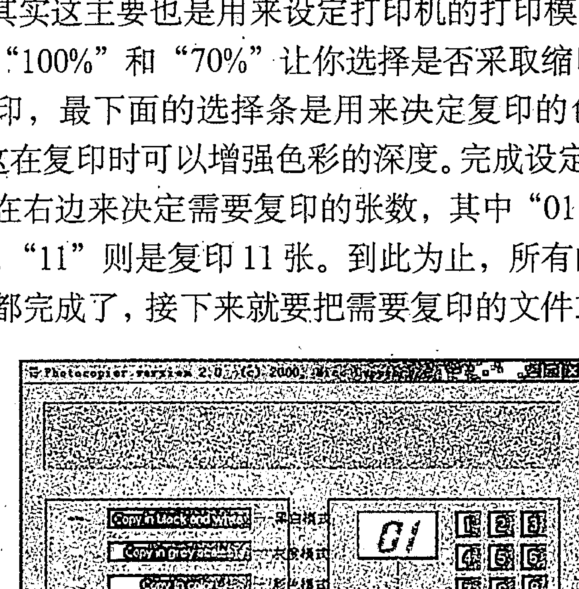

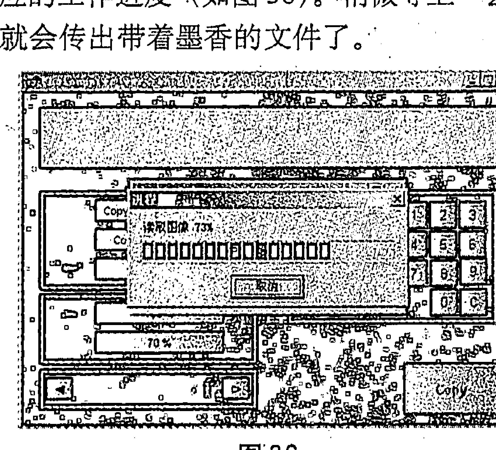

在使用的过程中，还有两点需要注意：

- (1) PhotoCopier可以实现对彩色图片的复印功能，但是这一方面取决于扫描仪的扫描精度，另外一方面是与打印机的分辨率有关。如果要达到一种真实的效果，建议使用好一点的扫描仪和打印机（如Uniscan 6C和Epson 870）。
- (2) 实际使用中感觉PhotoCopier对于文本文件的复印效果明显优于图片的复印效果，如果你使用的是HP 6L激光打印机的话，其效果比真正低档黑白复印机的效果要好许多。

- **3. PrintFolder Pro**
文件大小：868K
软件授权：免费软件
下载链接：http://newhua.ruyi.com/down/uppro30.zip

SOHO一族都有很多保存在刻录光盘上的资料吧，如果有一天你需要查找某个文件，是不是还要将每张光盘放入光驱中慢慢寻找呢？其实最好的方法是为光盘做一个目录索引，这样能够很快地找到自己所需的文件。可是又遇到了一个问题，制作目录索引的时候是否从资源管理器中一个一个地找文件，然后再键入到文档编辑器中呢？相信这种工作方式不是你所喜欢的，那么不妨来试试这个可以帮你轻松打印目录文件列表的帮手——PrintFolder Pro。

就像它的名称所说的一样，PrintFolder Pro在打印文件夹和文件名称方面的确是有其过人之处，它可以根据你的设置将选中分区或者文件夹里的所有子目录以及文件名称显示出来，还能够将其保存为TXT格式的文件，当然也能够直接通过打印机打印输出。虽然PrintFolder Pro界面是全英文的，不过那些简单的单词并不会给你的使用带来任何麻烦，同时它的操作非常简单，即使你刚刚接触也能够很快地掌握其使用方法。

运行 PrintFolder Pro 之后，将发现它的窗口分为左右两个部分：左边为当前硬盘的分区和目录树列表区域，而右边则是相应分区或者文件夹中包含的子目录与文件列表（如图 37）。举例来说吧，比如我们需要将 E 盘下面的文件夹进行列表显示，那么就可以先在目录树列表区域中选择 E 盘，接着在下部定义是否显示子目录文件夹的层数。其中点选“Recurse subfolders”之后可以显示子目录，而最为重要的是关于“Levels”的设置，如果设定它的参数为 1，那么就代表着仅仅显示出 E 盘根目录下的文件和第一层文件夹；定义参数为 2 就代表着列举出第一层文件夹中的文件与第二层子目录。依次类推，层数设置的越多则显示的文件信息越详细，要是你想列出 E 盘中所有的文件夹和文件，不妨直接选取“All Levels”了事。设置完成之后，点击“OK”按键就可以让 PrintFolder Pro 帮你把这些目录和文件信息列举出来。

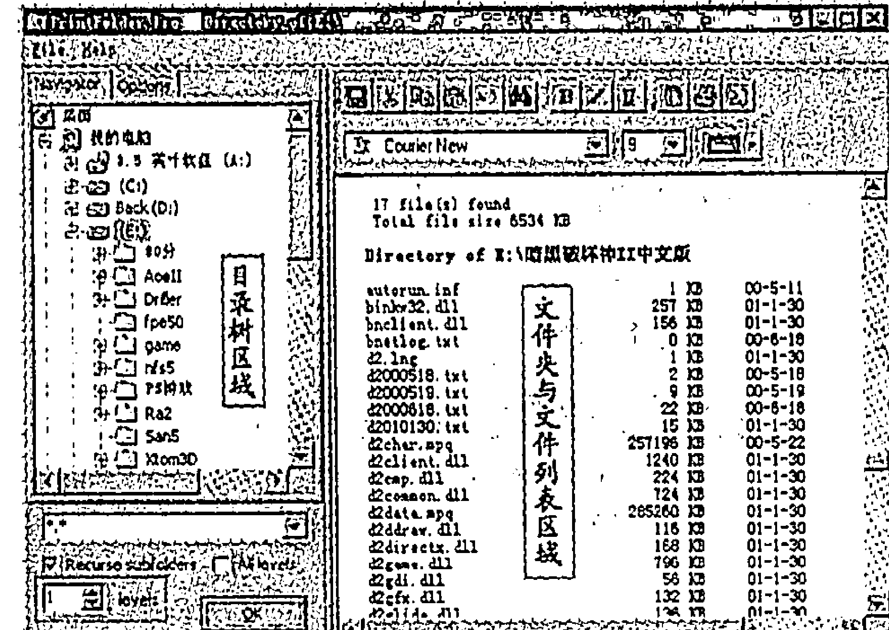

但是在很多场合下，我们并不需要每一个目录中附带文件的具体信息，仅仅是想了解有哪些文件夹就可以了，这时就要点击上部的“Options”标签进行针对性的设置（如图 38）。这里有一个“List folders only”的复选框，选中之后就可以让 PrintFolder Pro 只搜寻有关目录的信息，再将下部的“Levels”参数设置为 1 之后，就能够只显示当前分区或者目录中第一层文件夹的相关信息。另外，还可以在此设置文件列表中是否显示日期、文件大小、隐藏文件和系统文件等属性，如果你想得到更为详尽的文件列表信息，就把这些选项全部选中吧。

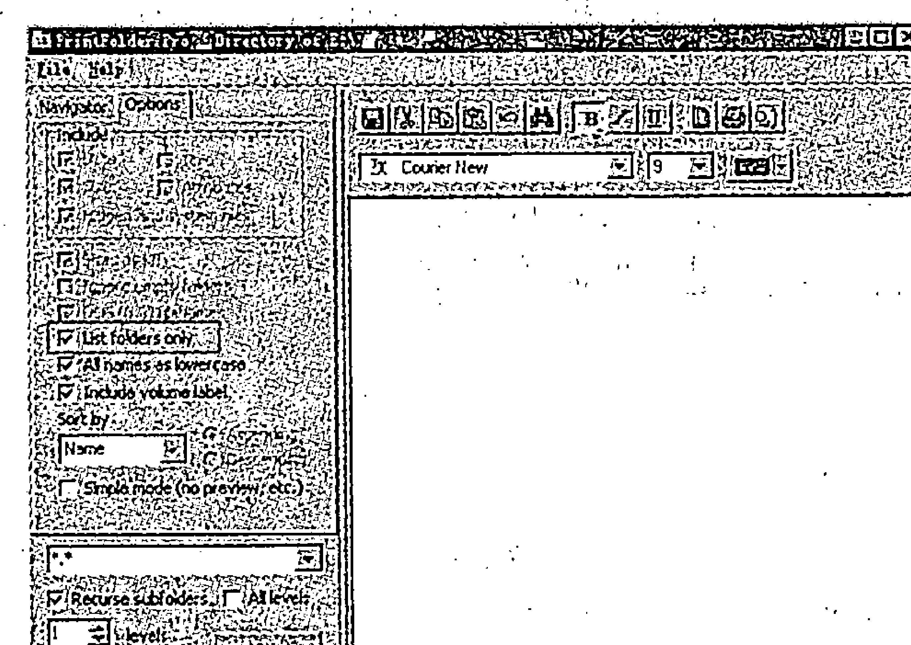

怎么样，这个 PrintFolder Pro 帮你节省了不少时间吧。像笔者以前对资料备份刻录光盘时都是用纸张写下光盘中的内容，但是在 PrintFolder Pro 的帮助下，又快又方便地完成了这项工作，看着打印出来的文件列表，真的是很舒服呢！

#### （五）Windows XP 的远程管理

为了让自己的生活更加充实一些，有些 SOHO 族会身兼数职，但是他们又不想放弃 SOHO 独特的家庭办公方式，这时候怎么办呢？其实在家上班并不是难事，我们需要做的只不过是通过远程控制来管理办公室的计算机设备，这时就要通过远程控制功能来完成了。

##### 1、Windows XP 的远程控制

很多 SOHO 族都使用了 Windows XP 系统，在这个最新的操作系统中集成了许多新鲜功能，而且整体操作方式也与以前的版本有很大的改变，如果在使用过程中遇到了问题，那只能打电话找寻朋友的帮助了。可是很多问题解决起来很方便，但是想说清楚却不容易，为此在 Windows XP 中集成了一个特殊的功能——远程控制，它能够通过网络实现对远程计算机的控制，以便排除计算机使用中的各种故障。

##### （1）Windows XP 远程协助的条件

远程协助的英文名称是 Remote Assistance，通过它只要发送一封邀请函就能够快速和远方的朋友以文本、语言来讨论问题。不过要想使用远程协助，需要具备下面两个条件：

- ①不管是发出邀请还是接受邀请的计算机都必须安装有 Windows XP 操作系统，目前的 Home 版（家庭版）和 Professional 版（专业版）都支持这项功能；
- ②使用远程协助的两台计算机必须通过网络连接起来；
- ③使用远程协助的两台计算机必须都已经安装且正确配置了 Windows Messenger 组件。

从这三个必需的条件可以看出，除去 Windows XP 是一个首要条件之外，Windows Messenger 也是必需的。

##### （2）启用 Windows XP 的远程协助

在 Windows XP 中使用远程协助的时候先要启用远程协助功能，虽然这个功能默认是启用的，但最好还是按照下面的步骤确认一下。

###### ①启用远程协助

在桌面上右击“我的电脑”图标并选择弹出菜单中的“属性”命令，接着在“系统属性”窗口中点击“远程”标签，这时可以看到图 39 所示的界面，要确保其中的“允许从这台计算机发送远程协助邀请”前面的复选框是选中状态。同时，按下“高级”按钮之后还可以设置邀请保持的最长时间，一般说来设置为1天即可。

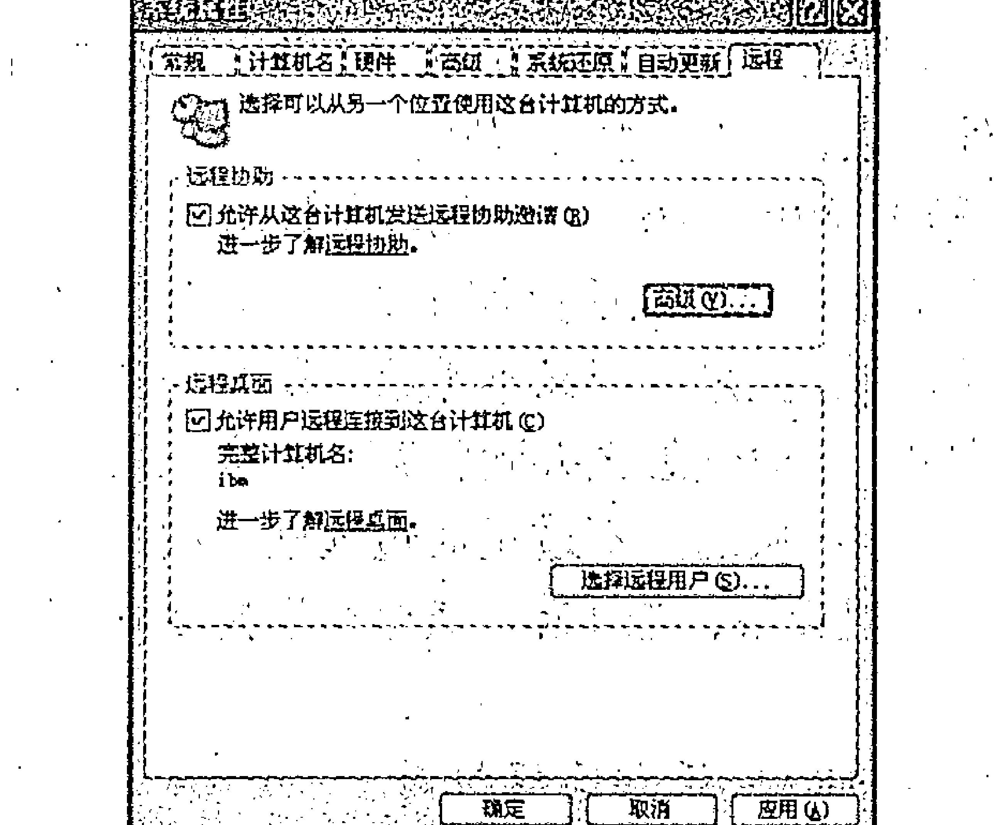

图 39

###### ②发送远程协助邀请函

确保远程协助处于启用状态之后，通过“开始->所有程序->远程协助”命令打开 Windows XP 帮助和支持中心里的远程协助程序。在这里可以看见两个选项：邀请某人帮助您和查看邀请状态（如图 40）。其中前者可以让你给别人发送一个远程协助的邀请来帮助你解决问题，而后者则是用于查看你已经发送的邀请，并且可以对这个邀请进行修改更正，或者是将其设置为过期失效状态。

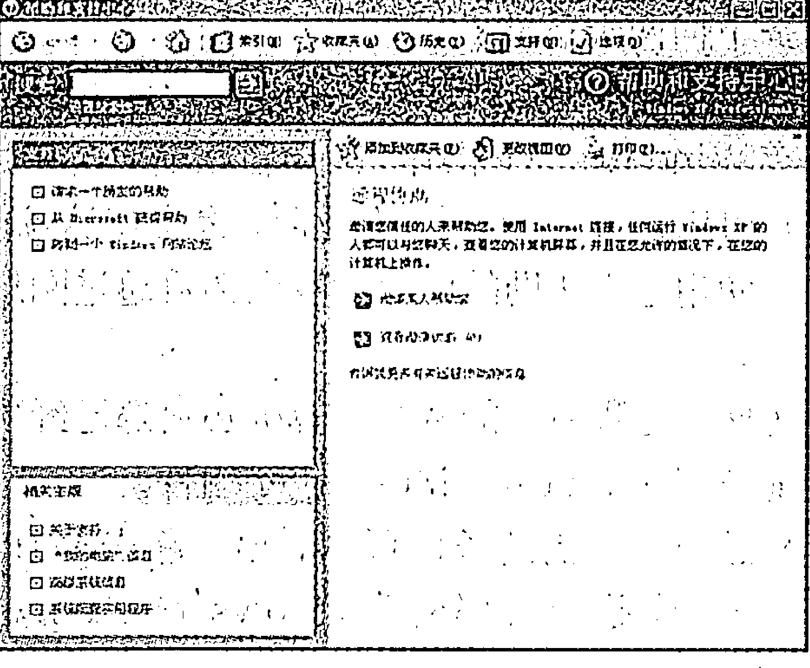

图 40

一般情况下我们选择“邀请某人帮助您”一项之后，进入如图 41 所示的邀请方式选择窗口。这里提供了两种方式来邀请你的朋友：

###### 〇使用Messenger邀请

当你已经设置好 Messenger 并且登录到服务器之后，就可以直接通过 Messenger 向对方发出邀请。此时只要在上部的“使用 Windows Messenger”区域中选择被邀请人的图标，接着点击“邀请此人”按钮即可（如图 41）。

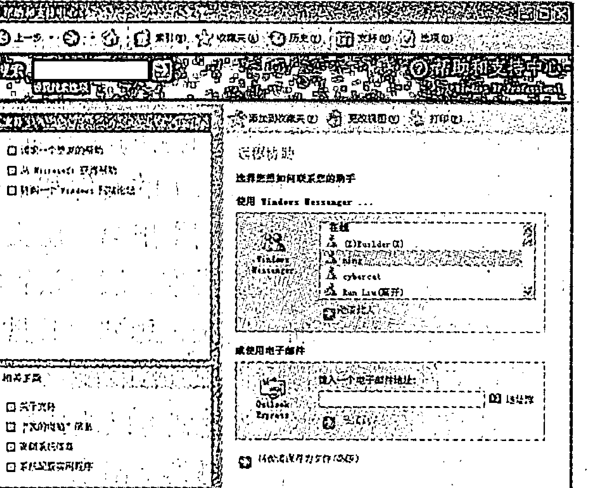

图 41

如果对方的 Messenger 处于正常工作状态的话，它的桌面上将会弹出一个窗口告诉他有人希望共享计算机的控制，当他按下“是”按钮接受之后就可以开始进行计算机远程协助了（如图 42）。

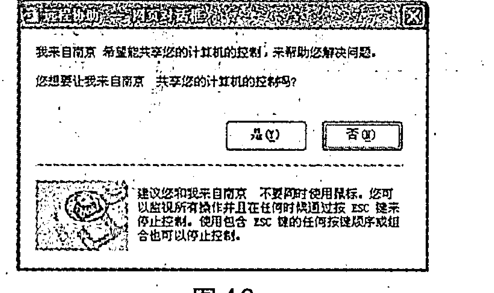

图 42

###### 〇使用电子邮件邀请

如果你没有安装 Messenger 也可以采用电子邮件的形式来发送邀请函。这时在图 41 所示窗口下部的“输入一个电子邮件地址”对话框中填写对方收信人的地址，并且点击“邀请此人”来对他发出邀请。接着需要在图 43 所示的窗口中写一封简短的电子邮件，当然在写完信件内容之后别忘记署上你的大名，否则别人是不敢随意把计算机的控制权交到你手中的。

在写完电子邮件之后，你还要设置这个邀请的有效期。为了减少其他人通过欺骗手段获取对你计算机访问的可能性，同时考虑到电子邮件的速度，一般建议将有效期设定在24个小时左右比较合适。另外出于安全原因，建议你在这里设置一个密码，只有输入正确的密码才能连接到你的计算机，所以也能够加强计## (3) 远程协助操作

- ①当对方接收到远程协助邀请并在图42所示的窗口中确认之后，在你的计算机上将出现正在连接对方计算机的界面（如图46），稍等片刻等待双方计算机建立好连接。

- ②建立好连接之后，此时会出现一个信息窗口提示你已经控制了对方的计算机，此时可以点击对方的窗口来进行操作（如图47）。

- ③点击图47中的“确定”按钮之后将看见一个包含了对方屏幕的界面，其中左边是当前计算机的即时交谈窗口，而右边则是对方屏幕的画面（如图48）。此时可以通过文本交谈或者是由对方操作计算机演示来了解存在的问题。

- ④在获悉对方计算机中存在的问题之后，也许仅仅通过语言交流很难将问题说清楚，所以这时可以点击上部的“获取控制权”按钮来接管对方的计算机进行控制。在征得对方的同意之后你就可以在别人的计算机上使用各种程序，其效果就像在操作自己的计算机一样。

注意：建立好连接之后，双方最好不要同时使用鼠标，以防止鼠标不听使唤的情况。而且注意不要按下“Esc”键或者是相应的组合按键以防止中断连接。

另外，在远程协助中还可以通过窗口上部的“发送文件”直接给对方发送一些必需的文件，如果两台计算机中都安装了麦克风和音箱的话，还能够通过“开始交谈”按钮激活语音功能，这样排除计算机故障就更加方便了。

##### SOHO一家亲

接触过Windows XP的远程协助功能之后，是不是有点喜欢上这个便捷的交互式合作模式？可惜的是远程协助需要两台计算机都是Windows XP操作系统，由于在Windows XP高昂的价格和激活机制的限制下，如果你的网络中只有一台计算机安装了Windows XP的话，那就无法领略远程协助的魅力了。不过别着急，在Windows XP中还附带了另外一个出色的远程控制功能——远程桌面，大家可以通过它来过过瘾。

###### (1) Windows XP的远程桌面

Windows XP的远程桌面采用了RDP（Remote Desktop Protocol）协议，实际上这就是一个为高带宽网络环境所重新包装的终端服务，它不仅能够让用户远程连接到Windows XP的计算机上，还能够通过IE浏览器对它进行操作管理，这就好像在本地计算机上操作一样。在这方面，远程桌面的功能和PC Anywhere这类远程控制软件的功能极为相似，不过它的设置与使用就简单多了，只要你有远程计算机的IP地址就可以简单地通过鼠标来控制远程计算机。

但是和Windows XP的远程协助不同之处在于远程桌面功能只能在Windows XP Professional以及以后的服务器版本中使用，而Windows XP Home版本中没有集成这个功能，所以想尝试这个功能的朋友一定要选择好相应的操作系统。

###### (2) 远程访问许可设置

要在Windows XP中启用远程桌面，首先要在图39所示的窗口中选择下部的“允许用户远程连接到这台计算机”选项来激活远程访问许可，然后点击“选择远程用户”按钮并通过“添加”按钮将可以远程访问的用户添加进来（如图49）。

需要提醒大家注意，在默认情况下系统管理员帐号组的成员具有远程访问这台计算机的权限，如果你仅仅需要管理员组的成员使用远程桌面的话，那么只要激活远程桌面即可，并不需要任何添加用户的步骤。

###### (3) 远程桌面Web设置

虽然Windows XP的远程桌面只要通过IE浏览器就可以进行访问，但是服务器端必须要求安装远程桌面Web服务，大家可以参照下述步骤完成。

- ①通过运行“开始->控制面板->添加/删除程序->添加/删除Windows组件”命令激活Windows组件向导窗口。

- ②在这个向导窗口中可以找到“Internet信息服务（IIS）”选项，接着点击“详细信息”按钮并找到“万维网设置”一项之后再次点击“详细信息”按钮，这时将看见其中有一个“远程桌面Web连接”选项，确保选中此项之后按下“确定”按钮开始安装相应的组件（如图50）。

在此需要提醒大家注意，当客户机使用Windows XP系统的时候不需要安装远程桌面Web连接，但是对于非Windows XP的计算机而言，这个组件就是必不可少的。

###### (4) 远程桌面的使用

完成服务器端的设置之后，从客户端使用远程桌面就非常简单了，大家可以参照下述的步骤完成。

- ①使用Windows XP的连接程序

当客户端采用了Windows XP系统的时候，可以直接运行从“开始”菜单中选择的“远程桌面连接”命令，激活远程桌面的客户端连接程序。在使用这个程序连接到远程计算机之前，建议大家先对其进行一番设置。

- ○常规设置

如图51所示，这里需要确定远程计算机的名称，同时还要输入相应的用户名和密码。如果你经常使用远程桌面来管理计算机的话，还可以通过“另存为”按钮将当前的设置以文件形式保存下来，以后使用的时候直接调用即可。

- ○显示设置

在这个窗口中可以设定远程桌面的大小，系统默认的是全屏，但是你可以拖拽滑块条来更改窗口的大小。另外，在这里还可以对色彩位数进行设定，要是自认为机器配置高的话就采用最高的色彩位数吧（如图52）。

- ○本地资源

虽然是控制远程计算机，但是在个标签下可以对很多属性进行设置。比如可以设定远程计算机的声音在本机播放，这样当你在远程计算机上播放MP3歌曲的时候就可以从自己的音箱中欣赏到音乐了。另外，还可以设定登录到远程计算机时候可以使用的设备，比如磁盘驱动器和打印机，这样就能够很方便地将远处的文档传送到本机或者是打印输出（如图53）。

- ○高级

这一部分的设置非常重要，尤其是连接速度的选择对于远程控制的性能有着非常大的影响，所以要根据自己的实际情况来选择合适的连接模式，如果你使用调制解调器和远程计算机建立连接，但是这里却选择了LAN，那么你就等着尝试一下慢如龟行的感觉吧（如图54）。

完成上述的设置之后，点击下部的“连接”按钮就可以建立与远方计算机的连接并对远方的计算机进行控制了。

- ②使用非Windows XP操作系统

对于安装了Windows 98/Me/2000这类非Windows XP的计算机来说，使用远程桌面功能就更加方便了，因为它可以通过IE浏览器实现对远程计算机的控制。

首先打开IE浏览器，在地址栏输入“http://远程计算机名称/tsweb”字串，比如远程计算机名称为“fanka”，则需要输入的字串内容为“http://fanka/tsweb”。回车确认之后可以看到图55所示的窗口，其中服务器的名称会自动帮我们填写好，此时还可以设定屏幕的分辨率，一般建议大家采用“800×600”像素为好。

接着点击图55中的“连接”按键之后就可以登录到远方的 Windows XP 计算机，这时桌面上的IE浏览器中将显示出当前对方计算机正在运行的程序，而且你还可以通过鼠标来打开文件夹、运行程序，或者是播放一首MP3歌曲欣赏一下，这种感觉就像是操作自己的计算机一样（如图56）。

### 二、打造 SOHO 网络篇

很多SOHO族都有不止一台计算机，如果能够将这些计算机连接起来组建网络，则可以让让多台计算机共享一台打印机，不仅可以节省不少开支，还能够在网络的支持下利用一个 Internet 账号接入互联网，更可以在闲暇之余邀请好朋友来联网游戏一番呢。

#### （一）实战 SOHO 组网

对于SOHO一族来说，最常用的操作系统不外乎 Windows 98 和 Windows 2000，但是考虑到系统的稳定性、安全性、适用性以及平时工作的需要，通常建议在不同的计算机中分别安装 Windows 98 和 Windows 2000 两种操作系统，所以我们就来看看如何将安装了 Windows 98 和 Windows 2000 的计算机组建成网络。

##### 1、Windows 98 计算机的安装配置

###### (1) 网卡驱动程序的安装

安装好网卡之后，我们首先要做的就是安装相应的网卡驱动程序，否则计算机之间将无法建立连接。由于 Windows 98 支持即插即用，所以有两种安装网卡驱动程序的方法：

◎ 网卡安装好之后重新启动计算机的时候，屏幕上会出现类似如下的提示：“Windows发现了新的硬件”，接着系统会提示你安装相应的驱动程序。这时 Windows 会首先在系统附带的驱动程序库中查找是否有对应的网卡驱动程序，如果有的话就会自动完成安装，否则系统要求你设定驱动程序所在的盘符或者路径，然后系统对设置的路径进行搜索，查找到相应的驱动程序之后开始复制必需的文件并完成安装。

◎ Windows 98操作系统问世已经有很长一段时间了，这期间又出现了很多新款网卡，同时还有一些型号的网卡原先就不能被 Windows 98 识别，对于这部分网卡的驱动程序安装，建议用户采用“添加新硬件”安装网卡方法来正确安装相应的驱动程序。

对于无法被Windows 98自动识别出来的网卡来说，可以采取以下方法进行驱动程序的安装。

- ① 首先在控制面板中双击“添加新硬件”图标，这时会出现添加硬件向导，选择“下一步”按钮开始搜索硬件设备。

- ② 在如图 57 所示的窗口中，选择让 Windows 搜索新硬件，或者是手工在列表中选择新硬件。一般说来，由于我们已经明确需要添加网卡的驱动程序，所以可以手工在列表中选择以减少系统搜索的时间。

- ③ 这时系统会弹出了一个包含了所有硬件设备的窗口供我们选择，用鼠标选择列表中的“网络适配器”一项（如图58）。

- ④ 选择“下一步”按钮之后，我们可以看见 Windows 附带的诸多网卡品牌与各自的型号（如图59）。如果用户了解所使用网卡的型号，可以在左边的“厂商”列表中选择品牌，然后在右边的“型号”中查找到自己的网卡。不过无论是 Windows 9x/Me 还是 Windows 2000，都不可能将所有网卡的型号记录在案，所以这时我们可以通过下部的“从磁盘安装…”按钮来进行安装。

- ⑤若采用了“从磁盘安装”的模式添加网卡驱动程序的话，就要在如图60所示的窗口中找到驱动程序所在的路径，然后选择“确定”按钮。

- ⑥最后，系统会提示重新启动计算机，重新启动后即完成网卡驱动程序的安装。

由于这种方法的适用性非常好，尤其是对于那些不支持即插即用网卡驱动程序的安装，所以当用户为网卡的驱动程序所烦恼的时候不妨试试。如果没有相应网卡的驱动程序，也可以在制造厂商的网站或者是国内知名的驱动程序站点，如驱动之家http://www.mydrivers.com下载。

###### (2) 协议的安装与配置

添加好网卡的驱动程序之后，我们紧接着就要对局域网中必需的网络协议进行安装配置。

###### ①安装网络协议

a.直接在桌面上用鼠标右键单击“网络邻居”图标并选择“属性”命令打开网络协议设置窗口（如图61）。

b.刚开始网络协议设置界面中只安装了几个网络组件，这时先选择“添加”按钮，接着在图62所示的窗口中双击“协议”选项。

c.在网络协议选择窗口中先点中“Microsoft”，此时右边的列表就会列出有关的网络协议。一般说来，我们需要添加的协议有IPX/SPX、TCP/IP和NetBEUI三个。

- ○IPX/SPX协议：这是微软推出的向Novell局域网协议兼容的协议。在一些设有Novell服务器的局域网中，可能要涉及到帧类型的调整。但在家庭联网计划中不用对它进行什么配置，它会根据网络数据包自动进行调整。同时它也是许多游戏在局域网联网的协议，有了它就可以在家里玩联网游戏了。

- ○TCP/IP协议：相信用户对这个不会陌生，Internet就是采用这个协议，我们在这个家庭联网方案中也要用到这个协议，而现在许多支持Internet联网的游戏也提供有TCP/IP的支持。在家庭组网中配置最复杂的就数TCP/IP协议了，不仅涉及到IP地址、子网掩码、网关，还有DNS等，但是如果你想通过局域网内部的计算机连接到Internet上就必须要添加这个协议。

- ○NetBEUI协议：这是微软为其局域网产品设计的网络协议，是局域网中速度最快的协议，装上后根本不用配置就可以使用，它保证了让Windows对等网内部计算机之间能够互相访问。

这三个网络协议也是Windows 98对等网中最常用的协议，建议用户都将其安装。但是如果你根本不可能在局域网内进行网络游戏，那么可以不安装IPX/SPX协议，因为安装的网络协议越少，网络的速度会越快。这时我们选中要安装的协议之后单击“确定”按钮来添加这个协议（如图63）。

d. 在安装协议过程中系统会提示你放入Windows安装光盘，或者是指定Windows安装文件所在的路径。

e. 参照上两步将其他协议添加到系统中。

最终完成之后，系统会提示你重新启动计算机以便完成系统文件的更新，不过此时可以先不予理会，等到下面的网络协议配置完成之后再一次性重新启动计算机。

###### ②配置网络协议

a. 在图61所示的网络协议设置窗口中双击网卡所对应的TCP/IP协议，此时会弹出TCP/IP属性设置窗口，其中有网关、WINS配置、DNS配置和IP地址等7个。

b. 选择“IP地址”选项卡并选中“指定IP地址”一项，然后在IP地址栏中输入“159.156.1.1”之类的IP地址，同时在子网掩码输入框中键入“255.255.255.192”，如图64所示。

c. 单击“确定”按钮并重新启动计算机完成配置。

###### (3) 标识计算机与工作组

为了使网络上的用户可以识别你的计算机，Windows需要你输入一些信息，在图61所示的窗口中选择“标识”选项卡中进行有关计算机标识和工作组等方面的设置。

###### ①标识计算机

就像我们的姓名一样，计算机标识是用于在网络中标明计算机的名称，它可以区别于网络中的其他计算机。在进行计算机标识设置的时候，“计算机名”不能有空格，字符数不能超过15个，而且计算机的名称必须是唯一的，也就是说在网络中不能存在两个同名的计算机。我们在标识计算机的时候可以用使用者的中文姓名或者是其他特殊意义的字符进行定义。

###### ②标识工作组

工作组的作用就是把一部分计算机设置为一个组别，有点类似于现实生活中的街道小区，通过工作组和标识能够让计算机分类组织起来，这样更加便于管理维护。一般，经常需要建立联系的计算机应该标识为同一个工作组，以便交换数据资料。跟标识计算机名称一样，设定工作组的时候标识字符不能超过15个，而且工作组名称建议由网络管理员进行统一规划设计，这样便于管理维护。

###### ③计算机说明

计算机说明可以方便其他用户在查看网络中计算机列表的时候看到该信息，比如将一台计算机说明为“媒体服务器”，另外一台计算机说明为“文档服务器”，那么当用户在打开网上邻居的时候可以迅速明确每一台计算机的作用。与前面两个标识定义不同的是，这里输入的字符数最多为48个，对于一般用户来说应该是足够了。

完成上述设置之后，Windows系统将要求重新启动计算机以完成更改，因此建议用户在设置有关网络属性的时候不要每次都重新启动计算机，而是将所有的参数设置完成之后再一次性启动计算机，这样能够节约不少时间。

##### 2. Windows 2000计算机的安装配置

###### (1) Windows 2000下网卡的安装

和Windows 98下安装网卡驱动程序差不多，在Windows 2000下也有两种方法：重新启动计算机时系统检测出新硬件并自动安装相应的驱动程序以及通过硬件向导方式安装网卡。

###### ①系统自动安装网卡驱动程序

a. 在重新启动计算机之后屏幕上会出现类似如下的提示：Windows发现了新的硬件。

b. 接着Windows 2000会对当前系统中新添加的硬件进行检测扫描，查找到刚才安装的网卡（如图65）。

c. 选择“下一步”之后系统会查找附带的程序库中是否已经有相应驱动程序文件，如果没有的话则需要插入驱动程序软盘或者光盘，同时还要设置驱动程序文件所在的路径。

d. Windows 2000复制所需要的驱动程序文件并完成网卡驱动程序的安装（如图66）。

需要指出的是，Windows 2000对于目前各种型号网卡的即插即用支持非常好，例如我们常见的TP-Link、D-Link、3 COM等品牌都附带了驱动程序，所以只要用户使用的不是非常特殊的网卡，驱动程序的安装都可以交给 Windows 2000来完成。

###### 手动安装网卡驱动程序

- a. 在控制面板中双击“添加/删除硬件”图标，此时将出现如图67所示的“添加/删除硬件向导”窗口。
- b. 在图67所示的向导窗口里有两个选项：“添加/删除设备故障”和“卸载/拔掉设备”，这里需要选中“添加/删除设备故障”并选择“下一步”。
- c. 在弹出的界面列表中列出了当前计算机中已经安装的硬件设备，对于那些 Windows 2000无法识别的网卡来说，需要在这里选择“添加新设备”（如图68）。
- d. 由于这些网卡不是即插即用的，所以Windows 2000系统无法搜索查找到，因此在如图 69 所示的界面中不能选择让计算机进行自动搜索，而要用户自己指定要安装的硬件设备。
- e. 选择“下一步”，系统会将所有的硬件类型列举出来，在这里用鼠标选择“网卡”进行安装（如图70）。
- f. 在如图71所示的窗口中会看见 Windows 2000附带的诸多网卡类型，如果我们所使用的网卡不在这个列表中，要选择“从磁盘安装”，并且插入附带有网卡驱动程序的软盘，或者是指定本地硬盘中有网卡驱动程序的文件夹。
- g. Windows 2000查找指定的目录中是否有合适的网卡驱动程序，并且进行系统文件的复制（如图72）。
- h. 顺利的话，最后将看见如图66所示的窗口，这意味着我们的网卡驱动程序已经安装成功了。

###### 协议安装与配置

与 Windows 98 一样，让装有 Windows 2000 操作系统的计算机能够和网络中的其他计算机通信必须要安装所需的网络协议，并且对它们进行配置设定。

###### 网络协议的安装

- a. 进入控制面板之后双击“网络和拨号连接”图标，这时将出现“网络和拨号连接”界面（如图73）。
- b. 双击其中的“本地连接”图标，并在弹出的窗口中选择“属性”按钮进入本地连接属性设置窗口（如图74）。
- c. 在安装Windows 2000的时候根据所选择的选项可能已经自动安装了TCP/IP，如果需要安装其他的网络协议，可以再选择“安装”按钮进行（如图75）。
- d. 如图76所示，这里有客户、服务和协议3种网络组件，选中“协议”之后再选择下部的“添加”按钮进入协议安装界面。
- e. 在Windows 2000中附带了微软公司有关的网络通信协议，可以在右边的“网络协议”列表里选择合适的协议，并选择下部的“确定”按钮开始安装（如图77）。如果想安装其他的网络协议，可插入磁盘或者光盘，然后通过“从磁盘安装”指定网络协议所在的文件夹进行安装。
- f. 接着系统会复制有关网络协议的安装文件，这时会要求插入Windows 2000安装光盘，最后完成协议的安装。

与Windows 98所不同的是，在安装好网络协议之后，Windows 2000无需重新启动计算机即可开始对协议进行配置或者直接使用，这将节省我们许多宝贵的时间。而且当一个协议安装完成之后，系统会将其从如图77所示的协议列表中移去，这样可以防止我们重复安装多个相同的协议，避免了多余的网络协议造成网络速度下降的麻烦。

###### TCP/IP 协议的配置

安装好所需的网络协议之后，要使 Windows 2000与网络中的其他计算机建立连接，最重要的一步就是对 TCP/IP 协议进行配置。

- a. 在如图 76 所示的窗口中选择“Internet 协议 (TCP/IP)”，然后按下“属性”按钮激活TCP/IP协议属性设置界面。
- b. 对TCP/IP协议进行设置的时候，可以采用自动获得IP地址的方案，或者选择对应的单选按钮来指定一个 IP 地址。若是选择自动获得一个 IP 地址，网络中就必须要有一个DHCP服务器，没有这样的服务器就无法使用 TCP/IP 协议进行通信。所以，一般建议用户选择“使用下面的IP地址”选项来手工配置有关的IP协议。
- c. 首先在“IP地址”一栏中输入本机所要使用的IP地址，例如“159.156.1.1”，同时在子网掩码输入框中键入“255.255.255.192”(如图78)。

在此需要提醒大家注意的是，Windows 98和Windows 2000计算机中的IP地址不能完全一致，否则会出现局域网中IP地址冲突的情况。另外，子网掩码则必须相同，否则也会出现局域网内找不到对方计算机的问题。

- d. 默认网关是可以选择的，如果在一个有路由器的网络上，就得输入路由器的IP地址或者是默认网关，这样一个默认网关实际上就是一个路由器，它能够将TCP/IP协议包发送到另外一个网络上。若是这个栏目不填写，则不能向本地网络之外的计算机发送TCP/IP协议包，所以在计算机比较少的SOHO组网时无需设置默认网关。
- e. 同样，组建的SOHO网络是一个计算机数量很少的简单局域网，如果不需要连接到Internet上，那么DNS也无需设置。因为DNS可以把域名转换为IP地址以帮助我们记忆，比如www.microsoft.com肯定比207.168.156.58要容易理解。在这里可以设置两个DNS服务器地址，对于DNS服务器也可以采用自动获得DNS服务器地址的选项，但这只有在设置自动获得IP地址方法的时候才可以用自动获得DNS服务器地址。

###### 网络标识和工作组的设置

在 Windows 2000中，网络标识是指 Windows在网络中用来表示计算机的信息，主要包括两方面内容：计算机名称和所属的工作组名称，或者是所属的域名。在 Windows 2000下查看网络标识，只要鼠标右击“我的计算机”图标，在弹出的“系统特性”对话框中有“网络标识”标签，这时可以查看到当前计算机的标识（如图 79）。下面就向用户介绍一下更改网络标识的方法。

- a. 在图79所示的窗口中选择“属性”标签，此时可以在弹出的窗口中看见两部分信息：计算机名称和隶属信息（如图 80）。
- b. 在“计算机名”对话框中可以输入新的计算机名称，下部还有一个不可输入的计算机全名预览框。单击“其它”按钮之后，能够进入DNS后缀和NetBIOS计算机名设定窗口（如图81）。
- c. 如图 80 所示，窗口下半部是隶属信息框，在这里可以选择把计算机加入到另外一个域中或者是工作组中，在相应的对话框里输入现有的域名或者是工作组名称即可。如果需要将计算机加入到另外一个域中，在选择“确定”按钮之后将有一个对话框弹出，这时需要输入正确的有加入权限的用户名称和密码，然后选择“确定”按钮完成加入到另外一个域中的操作。而在加入到工作组的过程中，如果这个工作组并不存在，那么系统会自动创建当前命名的工作组。

无论是设置网络标识还是加入到域或者工作组中，修改之后 Windows 2000 会提示重新启动计算机。根据系统的提示重新启动计算机即可完成所有参数的修正工作。

###### 组建Windows 98-Windows 2000网络

当为网络中的 Windows 2000 和 Windows 98 系统安装配置好相应的网络协议，并且设定好工作组之后，在 Windows 2000 或者 Windows 98 系统的计算机上双击“网上邻居”，顺利的话就可以在弹出的窗口中查看到当前网络中的计算机名称，如图82所示，这说明网络已经构建完成了。

###### 网络共享使用

在组建好网络之后，SOHO一族就可以直接通过局域网完成两台计算机中的文件复制，还能够让局域网中的所有计算机共享一台打印机，所以共享使用是网络的一个重要用途。

###### 文件共享

局域网中设置文件共享之后可以通过网络邻居打开某一台计算机使用其中的共享文件资源，而且对于一些没有特殊安装要求的程序（比如硬盘版的游戏、各类文档、MP3歌曲、MPEG影像等）都可以直接调用，而且除了网络带宽因素导致程序运行的速度有些慢之外，其余一切都像在本地硬盘上使用这些程序一样。

###### Windows 98下的文件资源共享

在 Windows 98 系统中共享文件资源之前，首先要对网络属性进行设置，激活文件共享权限。
- ①右击桌面上的“网络邻居”图标，并在弹出的菜单中选择“属性”命令激活网络属性设置窗口。
- ②在如图 83 所示的界面中点击“文件及打印共享”按钮，这时将出现一个对话窗口，在其中勾选“允许其他用户访问我的文件”。
虽然这一步实现起来非常简单，但它是不可忽略的，因为只有在激活文件共享权限之后才能进行文件共享操作，否则无法进行下面的共享本机文件的操作。
- ③在 Windows 98 中可以共享的文件资源有各种文件夹、硬盘盘符、光驱等，此时打开资源管理器或者是某个目录，选择好需要共享的文件夹并右击鼠标，接着点击其中的“共享”命令。
- ④在如图84所示的窗口中先点击“共享为”单选项，使下面的选项呈可操作状态。然后在“共享名”一栏中输入供别人查看的文件夹名称，比如在这里输入“E”，则别人从网络上看见的文件夹名称就为“E”；输入“共享E”则别人看见的文件夹名称为“共享E”。

另外，这个窗口中还有一个“访问类型”设定，其中有3种模式：只读、完全和根据密码访问。其中“只读”是仅提供网络用户读取文件的权限，不能对文件进行修改、删除等操作；“完全”是拥有对文件的所有操作权限，就像是在本地计算机上使用这些文件一样；“根据密码访问”则通过给同一个文件夹分别设定只读和完全两个不同的密码来授予对方权限，这样，输入不同的密码就可以获得不同的权限。

无论采用何种模式都可以对文件夹设定密码保护，在图84所示的窗口中输入一次密码，确认之后在弹出的窗口中再次输入相同的密码就完成了密码设定操作。
- ⑤完成上述操作之后，你将会发现共享的文件夹图标下部多出了一只小手（如图85），这就说明该文件夹已经共享了。

###### Windows 2000下的资源共享

对于熟悉Windows 98的朋友来说，第一次使用Windows 2000的时候肯定会遇到不少问题，而这其中就包括文件的共享。因为在Windows 2000下共享文件夹的时候，需要设置权限、用户等方面的内容。
- ①选取一个需要共享的文件夹并右击鼠标，在弹出的菜单中选取“共享”命令。
- ②在如图86所示的窗口中点击下部的“新建共享”按钮。
- ③接着在弹出的窗口中的“共享名”一栏中为这个共享文件夹建立一个名称，同时可以在“备注”里输入一些有关文件夹的说明性文字。另外，在这里还可以设定这个共享的文件夹可以同时供多少人使用，建议大家不要允许过多的用户，否则会导致自己计算机性能和网络速度的下降（如图87）。
- ④为了给不同的用户设置不同的使用权限，还可以在图87中点击“权限”按钮对用户设置完全控制、更改和只读权限。不过对于SOHO族来说，采用默认的完全共享才是最为方便的。

完成上述操作之后，Windows 2000中的文件就实现了共享，不过此时Windows 98的计算机并不能对其进行访问使用，这是由于Windows 2000中采用的是用户访问机制，未经授权的用户无法使用其中的文件资源，所以接下来还要对用户访问权限进行设置。

实现用户远程访问最简单的方法是运行“程序->管理工具->计算机管理”命令之后，在图88所示的窗口中选择“本地用户和组”中的“用户”选项，这里可以看见“Guest”图标前面有一个红色的“×”，这就说明系统默认的是将来宾访问权限关闭的。双击“Guest”图标并在弹出的窗口中取消“帐户已停用”一项，确认之后就激活了来宾访问权限，也就是说Windows 98的计算机可以直接访问Windows 2000计算机中的文件资源了。

所有的设置完成之后，无论是Windows 98计算机还是Windows 2000计算机，都可以通过打开“网上邻居”窗口来查找对方共享的文件资源了。

###### 打印机共享

在SOHO网络中最大程度地实现了软件和硬件之间的共享，个人单独使用一台打印机已经越来越不现实了。首先是家庭的空间比较紧张，不允许每台计算机旁边放置一台打印机；其次，通过网络打印可以用最小的支出来获取更多的回报。

###### 安装普通打印机

在共享网络中的打印机之前需要保证所有的计算机能够连接到网络上，而且至少有一台计算机安装了打印机，在此先简单介绍一下打印机的安装。
- 1. 关闭需要安装打印机的计算机电源，然后将打印机平稳地安放在距离计算机合适的位置，此时注意不能相距太远。将打印机线缆带有25针梯形接口的一端按照正确的方向与计算机主板上的并行接口相连，并且旋紧螺丝。再将打印线缆另外一段与打印机连接好，并合上固定的卡子。
- 2. 先打开打印机电源，启动完毕之后再打开计算机电源。
- 3. 在控制面板中找到“打印机”图标，双击之后可以看见如图89所示的窗口，接着双击“添加打印机”图标激活向导安装程序。
- 4. 进入添加打印机向导界面之后，选取其中的“本地打印机”一项，并将打印机提供的驱动光盘或者软盘放入驱动器里，点击“下一步”之后开始打印机的安装（如图90）。
- 5. 接下来，系统还会要求选择可用的端口，此时一般选择“LPT1”，再给打印机设定一个名称后，即可以完成打印机的安装。

对于一些采用USB接口的打印机来说，只要将USB连接线插入计算机对应的接口，Windows系统会自动检测到新硬件，这时再根据提示放入驱动程序光盘即可完成打印机的安装。

###### 共享打印机

为了让整个网络中的用户都可以使用刚才安装好的打印机，还要将打印机设置为网络共享状态。此时双击控制面板里的“打印机”图标，可以看见刚才添加的打印机图标。用鼠标右击之后选取其中的“共享”命令，将弹出如图91所示的窗口，在其中的“共享”标签下点中“共享为”选项，接着输入它的共享名称和描述性的备注文字，另外还可以为这台打印机设定密码来加强打印机的安全性。

如果在Windows 2000系统中共享打印机的话，那还会多出一个“安全”标签，在其中可以设定不同用户和用户组的使用权限。比如删除“Everyone”用户组可防止非授权用户使用打印机，然后再新建一个用户组并对其分配合适的权限，这样能加强打印机的安全性（如图92）。

###### 配置客户端打印机

设置好共享打印机之后，接着就要在客户端进行配置了，这时可以按照下述步骤进行。
- ①在客户端计算机上选择控制面板中的“打印机”，接着双击其中的“添加打印机”图标。
- ②在图90所示的界面中点取“网络打印机”选项，按下“下一步”按钮之后将看见如图93所示的窗口。这其中有两个选项，键入打印机名称或者是输入网络中打印机的 URL 地址，如果不知道网络中打印机的名称也不知道打印机的 URL 地址，可以单击“下一步”让系统自动查找网络中的打印机。
- ③如图94所示，在这个窗口里显示了当前网络中的工作组，而且可以点击不同工作组中的用户来查看是否共享了打印机。选定要使用的打印机之后，单击“下一步”继续。
- ④跟安装普通打印机一样，接下来确定是否将这台打印机作为默认打印机使用，同时为其创建名称。

客户端设置好之后，我们可以在控制面板的“打印机”目录中看见一个新建的打印机图标，这就说明已经在客户端添加好共享打印机了。这样，在局域网中的任何一台计算机上都能够直接发送打印文档命令，而从网络中共享的打印机里输出文档。

###### 共享宽带上網

对于SOHO一族来说网络是必不可少的，但是怎样共享让网络内的所有计算机都可以连接到 Internet 上呢？下面就详细介绍一下有关共享上网的内容。

###### 不使用第三方软件共享

在 Windows 98 SE 版本之后都附带了一个内置的 Internet 上网共享方案，这样一来，我们就可以不借助任何第三方工具就让局域网中的计算机通过一个帐号连接到 Internet 上。

###### Windows 98 共享

对于 SOHO 来说，Windows 98 是使用最多的操作系统，它们本身包含的 Internet 连接共享能够帮助我们很方便地实现网络中的计算机共享上网冲浪，而且它支持 Modem、ISDN、ADSL 和 DDN 等多种连接方式，因此非常适合家庭使用。

###### 主机的安装

使用 Internet 连接共享的计算机上必须安装下述组件：Microsoft 网络用户、拨号适配器 (Internet 适配器)、第二个网络适配器 (本地网卡)、Internet 连接共享和本地网卡的 TCP/IP，其中 Internet 连接共享要在最后安装，一切设置好，并且设立了拨号连接之后再安装 Internet 连接共享。
- a. 在控制面板中双击“添加 / 删除程序属性”图标并选择“Windows 安装程序”标签，选中“Internet 工具”选项并单击下部的“详细资料”按钮，此时将看见如图95所示的界面，其中就有我们需要的 Internet 连接共享。

E-mail:cf_hdb@cfan.com.cn

###### ②客户端的设置

有了刚才创建的配置磁盘，客户端的设置就显得方便多了，大家可以按照下述步骤完成相关操作。

- a. 将客户机配置磁盘放入需要建立连接的客户机磁盘驱动器中，并运行 “A:\Icsclset.exe”，这样将启动 Windows 中的 Internet 连接向导为客户机建立 Internet 连接。
- b. 接着配置客户端的IP地址，右击桌面上的“网络邻居”图标，并选取“属性”命令，在“网络组件”列表中选择网卡相关联的TCP/IP协议并单击“属性”按键。在“IP地址”标签下选中“自动获取IP地址”复选框，在这里还可以进入“WINS配置”标签，选中“使用 DHCP 进行 WINS 解释”（如图96）。
- c. 在图96所示的窗口中，还需要设置客户机网关和 DNS 配置。此时先进入 “网关” 标签下，删除列出的所有已安装的网关，然后在 “DNS 配置” 里选中 “禁用 DNS” 一项，最后单击 “确定” 按钮重新启动计算机。

这样，一个共享Internet连接就设置好了。在共享Internet连接的主机端拨号上网，如果一切顺利的话，就可以使用局域网中的客户机上网，在浏览、发送电子邮件的过程中不会感到与单机联网有什么区别。Windows 98 的Internet连接共享最大特点在于不管主机是否上网，局域网上的机器都能够自动调用主机的拨号连接，不过前提是主机必须预先配置好拨号连接，并记住了口令。

###### (2) Windows 2000 共享

跟 Windows 98 相比，在 Windows 2000 中设置网络共享更加简单。

###### ①服务器端设置

- a. 进入控制面板之后双击“网络和拨号连接”图标，在出现的窗口中右击已经建立好的 Internet 连接（比如拨号连接）并选取弹出菜单中的“属性”命令。
- b. 在弹出的“属性”设置窗口中选择“共享”标签，然后勾选“启用此连接的 Internet 连接共享”，这样就在服务器端设置好共享连接了。如果需要网络中的其他计算机可以在服务器端没有上网的情况下要求他拨号，可以选择“启用请求拨号”一项，然后在弹出的画面中单击“是”。

###### ②客户端设置

- a. 在桌面上右击“网络邻居”并选取弹出菜单中的“属性”命令，接着在“网络与拨号”窗口中选中“本地连接”图标，右击鼠标之后再选取其中的“属性”命令。
- b. 在网络属性设置窗口中选中“TCP/IP协议”并单击下部的“属性”按钮，此时将出现如图97所示的窗口，这里需要选取“自动获得IP地址”和“自动获得DNS服务器地址”两个选项。

完成上述设置之后，Windows 2000 下的 Internet 共享连接就建立完成了。可以看出它的设置过程很简单，而且服务器所发生的变化对用户来说几乎完全透明；其主要变化是网卡绑定的TCP/IP的IP地址改为192.168.0.1,子网掩码为255.255.255.0,另外 DHCP 分配者和 DNS 代理都将自动启用。

注意：需要特别注意的是不应该将此功能与域控制器、DNS 服务器、网关、DHCP 服务器或配置为静态 IP 地址的系统一起使用，如需要使用这样的组件，则必须使用网络地址转换。

##### 2. Sygate共享宽带上网冲浪

很多朋友都知道 Sygate 是一款非常优秀的网络共享软件，在它的帮助下可以很轻松地实现网络的共享。跟前面所介绍的共享上网方法相比更简单，也更适合安装了宽带的SOHO一族使用。

###### (1) 服务器端的设置

一般宽带分为 ADSL 拨号与网卡直接接入两种，而目前使用最多的还是网卡直接接入，因此我们需要在服务器端的计算机上再安装一块网卡作为局域网共享使用。但是由于 Windows 98对于双网卡的支持不好，所以建议大家在服务器端的计算机上安装 Windows 2000，它们最多支持四块网卡！

###### ①安装双网卡

- a. 首先在服务器端的计算机上插入一块网卡，开机之后系统会提示检测到新硬件，此时插入驱动程序盘片或者是让 Windows 自动从驱动程序库中检测相应的驱动程序。
- b. 第一块网卡安装完成之后先关机，然后再插入第二块网卡，并且按照第1步的操作完成驱动程序的安装。

不过此时提醒大家注意的是，两款网卡的品牌和型号最好一致，不要混用不同品牌的网卡，否则容易导致网卡之间的冲突而出现蓝屏死机的现象。

###### ②配置接入Internet网卡

- a. 两块网卡的驱动程序安装好之后，双击桌面上的“网络邻居”图标并点击“网络和拨号连接”，此时将看见刚才安装好的两块网卡。为便于区分，我们将其中一块网卡的名称更改为“Internet”（负责连接到外部Internet使用），而另外一块网卡名称为“本地连接2”（负责与本地其他计算机组建局域网）。
- b. 右击“Internet”图标并在弹出窗口中选取“属性”命令，这时会出现网络协议设置界面。在这里可以通过“安装”按键来添加一些网络协议，其中TCP/IP 协议是 Windows 安装时候附带的，也是上网冲浪所必需的标准协议，至于其余的IPX/SPX、NetBEUI协议可以不安装（如图 98）。
- c. 选中“TCP/IP 协议”之后点击“属性”按键对参数进行配置。由于这块网卡是连接到 Internet 上的，所以需要按照 ISP 供应商提供的参数进行配置，在图 99 所示的窗口中分别填写 IP 地址（192.168.0.23）、子网掩码（255.255.255.0）、默认网关（192.168.0.1）和DNS服务器地址（192.168.0.1）。

###### ③配置本地局域网网卡

配置本地局域网网卡的方法可以参照前文介绍的方法进行，但是 DNS 服务器地址必须设置为 ISP 供应商分配的地址，否则会造成其他计算机域名无法解析的情况。

到此为止，服务器端的所有配置工作就完成了，接下来就是对客户端的计算机进行配置。

###### (2) 客户端的配置

通常客户端使用的操作系统为Windows 98或者Windows 2000，其中有关网络协议参数和标识网络中计算机的配置可以参照前文完成，但是最为主要的是网关和DNS的设置。

无论是 Windows 98还是 Windows 2000的计算机，在“网关”标签和“DNS配置”标签下分别配置相应的参数。需要指出的是，网关需要填写服务器端“本地连接2”的IP地址，这样才能通过服务器连接到Internet上；至于DNS参数也要和服务器端相统一，不然计算机无法解析域名。

###### (3) 实战 SyGate 共享网络

SyGate是一个实现局域网内部多台计算机使用一个帐号连接到 Internet 上的软件，而且针对目前 Modem、ISDN、Cable Modem、xDSL 和 DirecPC 等Internet接入方式，它都能够很好地支持，因此我们就选择它作为共享宽带上网的工具。

首先，大家可以在http://www.sygate.net.cn站点下载得到 SyGate 最新的 4.0 版本，在安装这个程序的时候，系统会让你选择所使用的模式：服务器端和客户端。此时需要注意，可以接入 Internet 的服务器端需要选择服务器端，而其他作为客户端的计算机就要选择客户端了。安装好 SyGate 之后，每次重新启动计算机的时候，无论服务器端还是客户端都会自动运行，这样在使用的时候就无需手工激活它了。

###### ① SyGate 的相关设置

跟其他的 Internet 共享软件比较起来，SyGate 的设置非常简单，这也是它的最大特色所在。不过话说回来了，SyGate 还没有智能到可以自动完成所有配置的地步，因此还是需要我们手工来完成一些相关的设置。

###### a. 服务器端的设置

在服务器端最重要的设置就是定义哪一块网卡用于内部局域网连接，哪一块网卡是接入 Internet 的。在允许 Sygate 之后，先点击工具栏中的“Advanced”按键，并在右边新出现的工具栏中选择“Configuration”，这时可以看到图 100 所示的窗口。其中左边区域为 Internet 连接，右边为内部局域网，只要在相应的下拉列表中选取对应的网卡即可（现在知道为什么前面要对两块网卡分别命名了吧）。

另外，建议大家选中下部的“Never hang up”复选框，这样可以避免客户端在一段时间内没有浏览页面、下载网页等操作时 Sygate 自动切断连接。

###### b. 客户端安装设置

其实 SyGate 的客户端安装与否都不会影响其他计算机上网，但是安装了客户端程序之后可以实现一些诸如检查 Internet 的连接状态、自动拨号上网或挂机等特殊的功能。所以对于局域网内部朋友使用的话，还是建议花费很小的硬盘空间来安装一个客户端比较好。在安装完毕后，会有个检测程序自动检测，查看你的网络设置是否正确，如果正确则会给出成功的信息。

在服务器端和客户端全部配置完成之后，为了验证它是否能够正常工作，建议大家做一个测试。其实也非常简单，首先在服务器端激活 SyGate 的主窗口并按下“Start Server”按键，当图标呈绿色的时候就说明它已经连接到 Internet 上了，接着在安装了客户端的计算机上打开 IE 窗口并尝试浏览网页，如果能够顺利下载页面那就说明配置工作完成了。而且在客户端连接到 Internet 上之后，还可以从服务器端查看到连接的速度、发送和接收的字节等信息。

###### c. 其他网络软件的设置

其实完成了前面所说的设置之后，就可以实现多台计算机通过 SyGate 连接到 Internet 上的目的了，不过有些网络软件在共享上网的时候还需要有针对性地进行一些设置，为了更好地使用 SyGate，笔者还是向大家介绍一下常用网络软件的设置方法。

###### ◎ NetMeeting的设置

SyGate 不能传递来自 NetMeeting 的呼叫，这是因为 NetMeeting 动态分配呼叫者的端口。所以安装有 SyGate 服务器端的计算机能够发送并接收 NetMeeting 呼叫，而 SyGate 客户端发送 NetMeeting 呼叫没有问题，而接收就不可以了。

###### ◎ 电子邮件程序的设置

如果 SyGate 服务器端使用的是普通 Modem 拨号上网方式接入 Internet 的话，那么 Foxmail、The Bat! 和 Outlook 系列电子邮件程序都可以正常运行，但是在使用 Cable Modem 接入 Internet 的时候，就要将域名后缀 (Domain suffix) 设置于每一台计算机上。通常只要将设置在 SyGate 服务器 TCP/IP 上相同的域名后缀使用在客户端计算机上就能够解决这一问题。

###### ◎ OICQ的设置

OICQ 是目前国内使用人数最多的一个在线聊天软件，当通过 SyGate 客户端连接到 Internet 之后，必须在 OICQ 的综合参数设置窗口中选择“网络设置”标签，并将其中的上网类型改变为“局域网接入 Internet”方式即可。

###### ◎ Net2Phone的设置

在客户端安装 Net2Phone 软件后，必须在 Windows 目录中找到一个名为 net2fone.ini 的文件，然后通过写字板等文本编辑器打开它，在文件中找到 [CONFIG] 段落并插入下面两行内容：

```
TCPPORT=6613
UDPPORT=6613
```

完成设置之后，我们就可以在 SyGate 客户端运行 Net2Phone了。

### 三、网上购物篇

SOHO一族最令人羡慕的就是可以足不出户地完成各项工作，那么如果需要一些物品怎么办呢？其实如今的网络非常发达，SOHO族也完全可以通过网络来选购自己需要的物品，这样既节省了宝贵的时间，也不要再熙熙攘攘的人群中挤来挤去了。那么如何实现网上购物呢？下面就以招商银行一卡通为例带领大家体验一下网上购物的感觉吧。

1. 首先登录一个网上商城站点，比如我们进入8848网站，第一次登录的时候需要通过上部的“会员专区→会员注册”命令进行会员注册（如图1），在这里需要填写会员登录名、密码，以及联系方式，其中需要注意的是付款方式一栏需要选择“招商银行网上支付（一卡通）”。

2. 注册完成之后可以在8848网站浏览一番找到自己合适的物品，一般在左边价格标记下面都有“订购产品”链接，点击之后就可以将其放入自己的购物车中（如图2）。

3. 接着，在图3所示的确认窗口中选择“继续购物”来继续挑选自己中意的物品，或者直接按下“去收银台”准备付款。

4. 下一步操作中，需要填写客户信息，这和注册时候的信息差不多，但是这里的信息是提供给网站配送中心的，所以联系电话、地址和电子邮件等信息一定要确保准确无误（如图4）。

5. 确认之后，将看到图5所示的窗口，其中显示了刚才选购的物品以及填写的相关客户信息，然后单击下部的“立即划款”链接进入招商银行网上支付中心。

6. 第一次使用招商银行一卡通进行网上支付的时候，需要在图6所示的窗口中选择上部的“个人银行（专业版）”链接，这时系统会自动连接到招商银行网站下载必需的签名控件，整个过程需要几分钟时间，所以请大家耐心地等待。

7. 接下来需要根据系统提示下载并安装个人银行（专业版）的安装程序，运行这个程序之后还需要增加一个用户并设置使用的一卡通帐号，这里的用户名可以随意建立，而且一个用户可以拥有多张一卡通（如图7）。

8. 在第一次使用招商银行一卡通网上支付的时候，还需要进行证书申请，这是为了防止别人盗用你的一卡通，所以要根据向导提示分别输入一卡通查询密码、身份证号码、电话号码、电子邮件和地址等信息（如图8）。

9. 最后，我们可以看到图9所示的窗口，这里有一个证书申请序列号，必须记下这个序列号并且在15个工作日内到招商银行进行身份验证，确认之后就可以使用一卡通进行网上支付了。

10. 这时再次运行个人银行（专业版），在“银行业务”标签下输入一卡通号码和相应的密码就能够使用在线交易功能了。在“转账汇款”下面有相应的汇款项目供大家选择，因为我们购买的物品是外地的，所以要选择“异地汇款”命令（如图10）。

11. 接下来，在图11所示的窗口中填写收款方户名、地址、开户行以及对方账号、汇款金额等信息，确认之后就完成了网上汇款，然后所要做的事情就是耐心等待，几天之后你所订购的物品就会送到你的眼前，那时候只要签收就搞定了。

怎么样，看来网上支付还是蛮轻松的吧，如果你也是一个“懒人”，不妨尝试一下这种方法，但是千万不要到肚子饿的时候再买食品，因为配送都有一个时间过程，可能在食品送到之前你已经饿得没力气了。

### 四、广而告之——个人网站的推广篇

对于很多拥有个人网站的SOHO一族来说，一方面可以通过网站展现个性，另外更重要的是利用网站发布一些商品信息，从而帮助自己获得更多的收入。但是好酒也怕巷子深，在茫茫网海中怎样才能让别人知道你的网站？怎样让你的网站吸引更多人的眼球？若是依靠传统的方式来宣传自己的网站，不仅费事而且效果不好，所以我们就来另辟一条捷径，利用网站登录软件把自己的网站登录到搜索引擎上。

#### （一）登录奇兵

登录奇兵是国内开发的一个网站登录工具，它还曾荣获2000年度最佳商务工具奖的称号呢。大家可以到http://www.worldfax.net网站去下载最新的4.0版本，它的测试版本可以将你的网站登录到50个搜索引擎上，对于注册用户则能够将网站登录到5400个搜索引擎上。

安装好登录奇兵之后双击桌面上的快捷图标可以看到它的运行主界面（如图1），用它来登录网站只需要三个步骤即可完成，所以使用起来非常简单。

##### 第一步、网站信息

登录奇兵可以自动区分简体中文、繁体中文与英文，并将其分别登录到相应语言的搜索引擎中。为了能让你的网站被更多的搜索引擎收录和被更多的网虫搜索到，你的网站信息要尽可能地详细。同时填写时要注意以下几点：

(1) 网址
这里就是填写你的网站地址，比如http://www.5iweb.net。不过当你采用了一些虚拟域名的话，最好填写网站的真实地址，例如http://5iweb.126.com这类地址就不要填写，因为有些引擎是根据填写的信息进行登录，还有些引擎会自动到提交的网站上去提取相关的网站信息，一旦使用了虚拟的域名就无法保证登录的成功。

(2) 关键字
关键字是网站登录的关键所在，它的作用就是给别人提供一个寻找你的方式，这里可以根据网站的主要内容进行概括，比如免费、传真、电话、网络电话等等。一般用访问者最常用的关键字作自己的网站关键字可能会提高自己网站的点击数。但是，因为每次搜索结果都会有很多，如果一味追求用最常用的关键字，却要翻几十页后才找到你的网站就等于没有达到真正的登录效果。所以建议用你自己本身所提供的服务信息，至少应保证在查您所独有的关键字时可以排到前100名。

(3) 网页标题
网页标题就是用非常简短的一句话来描述你的网站，例如“5iweb，我们的网上家园”。

(4) 网站描述
网站描述相当于网站的简介，因为有些引擎显示的是网站标题，有些引擎显示的是网站描述，因此可以用几十个字符简单地描述一下自己网站的特色。

(5) E-mail 地址
填写E-mail地址的时候最好使用真实的地址，否则信息有可能不能登录成功，或以后不能对网站信息进行修改。不过由于一些引擎会通过电子邮件方式进行确认，所以最好不要用收费信箱，否则每周几百封邮件也会让你头痛好一阵子的。

(6) 代理服务器
如果你是使用代理服务器上网，则需要填写您的代理服务器IP和端口，否则可以不理会这部分内容。由于各搜索引擎分布在世界各地不同地区，有些引擎可能无法连接登录，如果失败数目较多，最好使用一些公开的代理服务器。

##### 第二步、选择引擎

在登录奇兵的注册版本中有5400个引擎，但是如果一个一个手工选择无疑是非常麻烦的事情，所以在最新的版本中采用了填写开始号码和结束号码设定引擎的方式来简化操作，只要输入登录引擎的范围（开始号码和结束号码）就可以搞定以前繁杂的工作。比如我们可以选择开始号码为1而结束号码为1000，这样登录奇兵会把你的网站登录到引擎列表中1到1000个搜索引擎中。

设定完成之后，直接按下图2所示窗口上部的“登录”按钮开始网站的登录操作。在登录过程中可以从右边的“登录进度”、“登录线程”和“登录成功”进度条来查看登录状态，而且上部还有即时的相应数字信息供参考。

##### 第三步、检测登录报告

登录完成之后，登录奇兵将生成一份完整的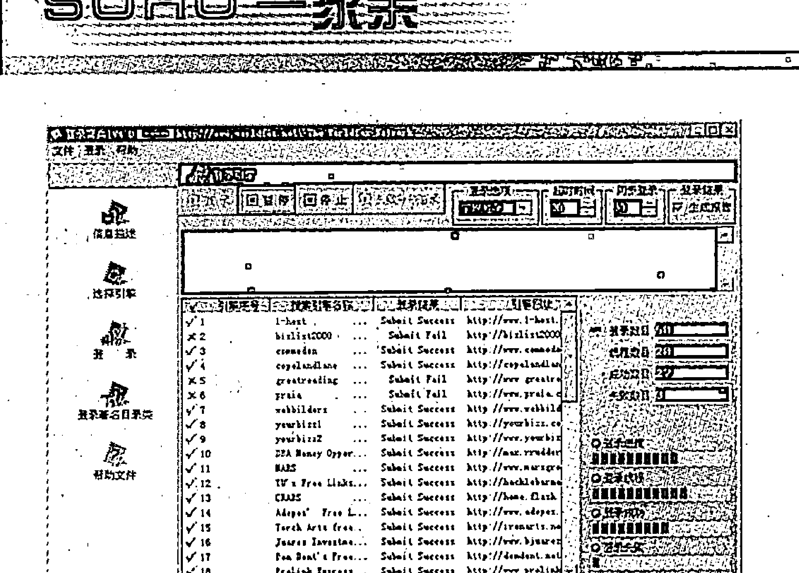

图 2

HTML格式的登录报告（如图3），其中包括登录时间、登录网址、登录人、登录标题、成功数、失败数，以及每个引擎的相应状态（连接、成功或失败，点击可进入该引擎），这份文档可以打印或保存以供参考。

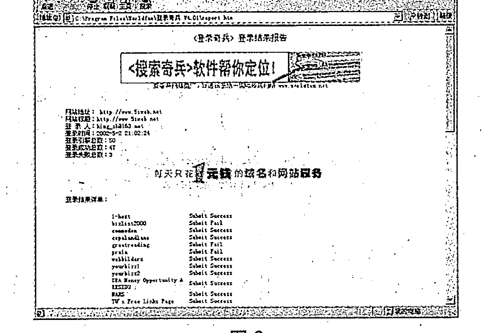

图 3

#### （二）商务快车

登录奇兵虽然功能很强大，但是它所采用的引擎很多都是国外网站，对于一些定位于国内发展的SOHO族并不是很适用，那么怎样将自己的网站及其有用信息通过Internet让国内的客户知晓呢？如果你有了商务快车之后，不仅可以将自己的有用信息发布到各大商贸网站，还可以通过它获取各种供求信息、企业目录、产品列表等庞大的信息库，你就再也不会为获得过多信息无法加以筛选而头疼了。

第一步、商务快车可以在http://www.suminfo.com网站下载得到，运行之后首先看到图4所示的界面，这时需要选择一个分类索引，比如在此我们输入“计算机”作为关键字，程序会自动将与计算机相关的主题列表显示在右边区域中，点击“确定”按钮进入商务快车的主界面。

第二步、首次使用商务快车的时候，需要对系统进行设置，其中必须填写的内容包括公司信息、联系方法、邮件服务器等内容（如图5）。需要提醒大家注意的是，在这里别忘记将你的主页地址写进去，这样发布到其他引擎网站的时候就可以一并进行发布了。

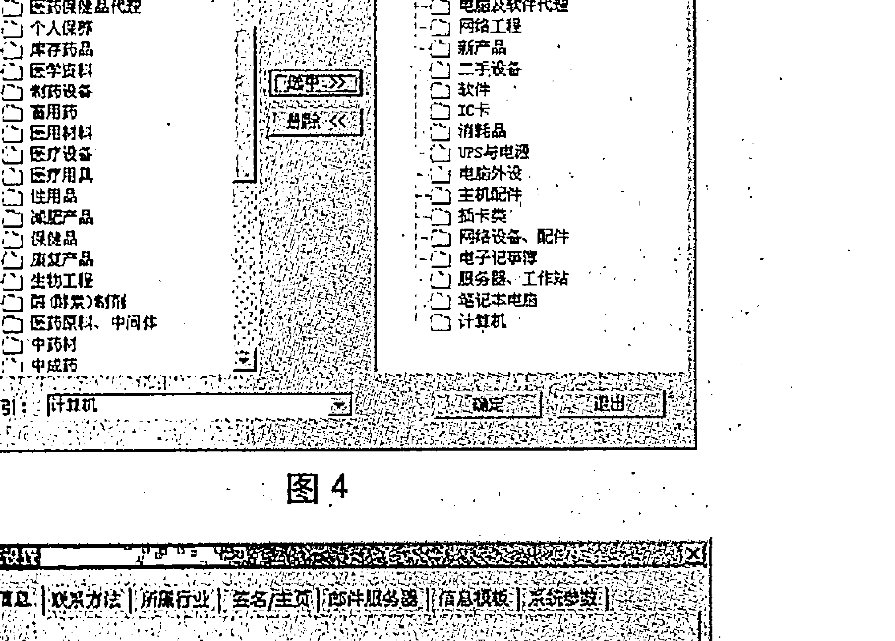

图 4

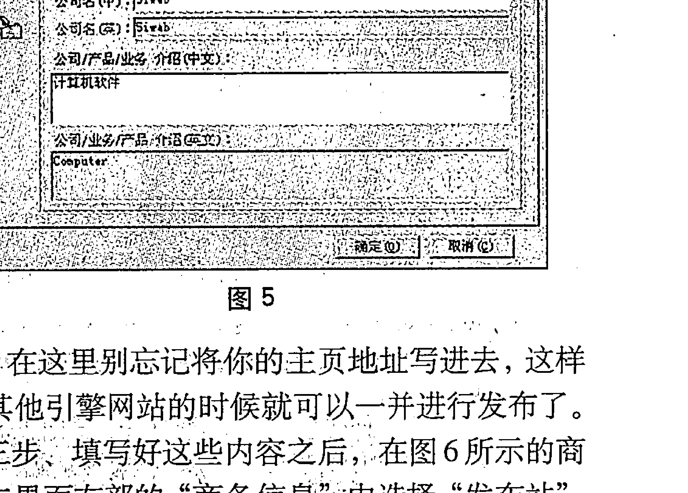

图 5

第三步、填写好这些内容之后，在图6所示的商务快车主界面左部的“商务信息”中选择“发布站”，然后单击工具栏中的“新建发布”按钮。接着，出现的是图7所示的窗口，其中右边正文区域中的信息是商务快车根据前面输入的公司信息等内容自动生成的，如果觉得有些不满意还可以直接在此进行修改。

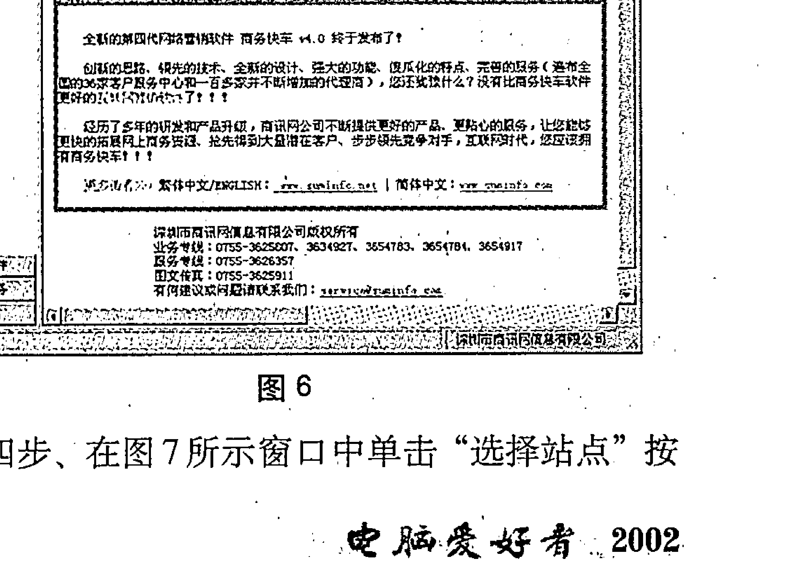

图 6

第四步、在图7所示窗口中单击“选择站点”按钮将出现图8所示的界面，其中可以查看到许多分类项目，选取其中的一个分类之后则能够看见当前类别中包括的站点。这时用鼠标选取需要发布信息的网站。

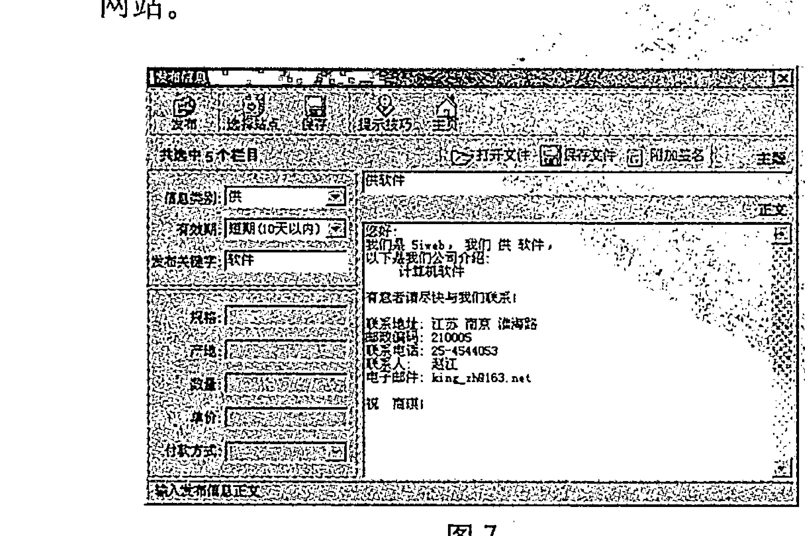

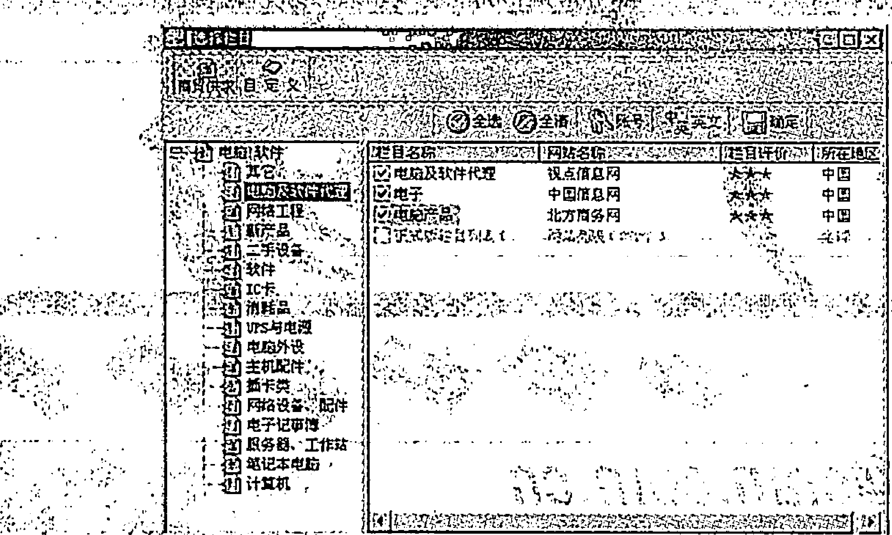

第五步、返回到如图7所示的界面之后，在连接到 Internet 的情况下点击工具栏中的“发布”按钮，这时商务快车就开始将你的信息发布到选中的网站上，而且还能够通过图9所示的窗口来了解发布的进程状况。

第六步、稍等片刻之后，商务快车将返回主操作界面，这时将在图10所示的窗口中查看到发布信息的结果。如果其中有些信息发布结果是“失败”的，则有可能是对方网站故障或者是本地Internet连接出现故障，可以重新尝试一下。

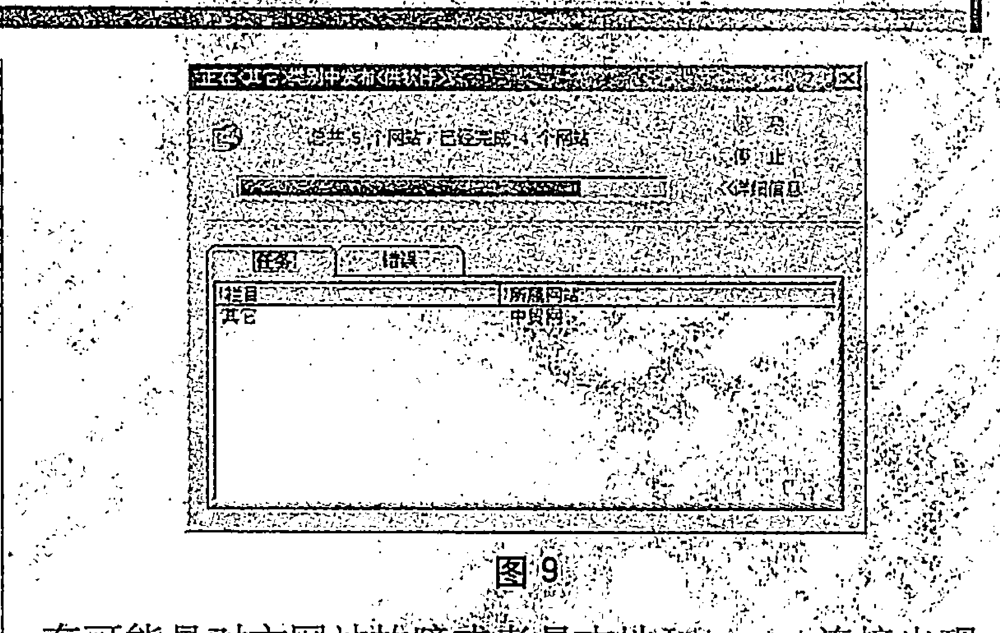

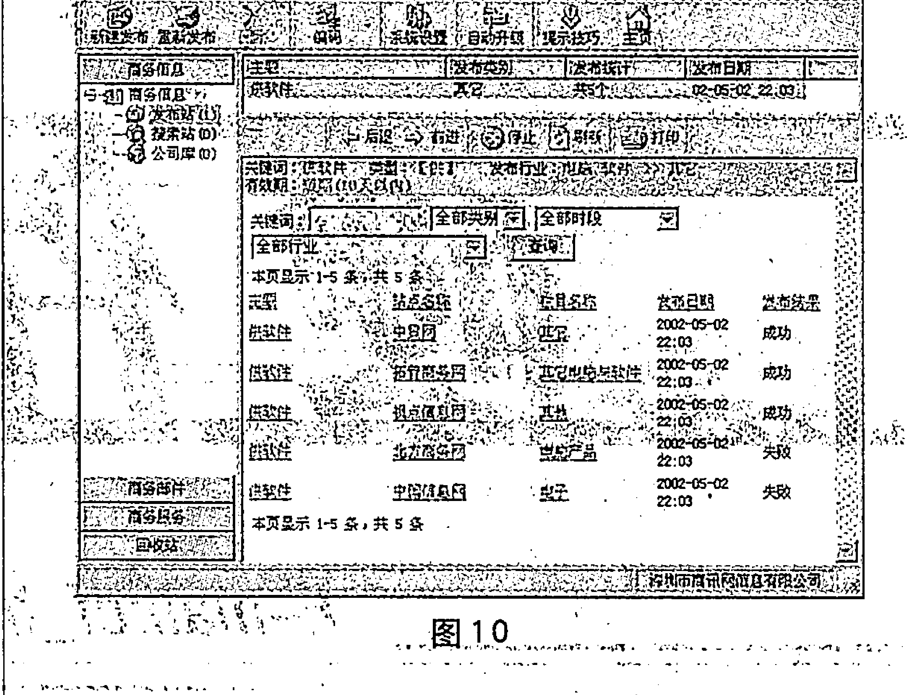

其实除去发布自己的信息之外，商务快车还可以根据需要来进行搜索，而且还能够将搜索得到的有用结果保存在数据库中以便日后调用。这些有用的功能在此就不详述了，有兴趣的朋友不妨试试，相信你会觉得非常方便的。

有了登录奇兵和商务快车的帮助，在提交登录几个星期之后再用各大搜索引擎搜索一下你的网站，看看排名靠前的网站中是否有你的网站，如果你的网站已经名列前茅，你肯定会有一种成就感的！

（文／吴三思）

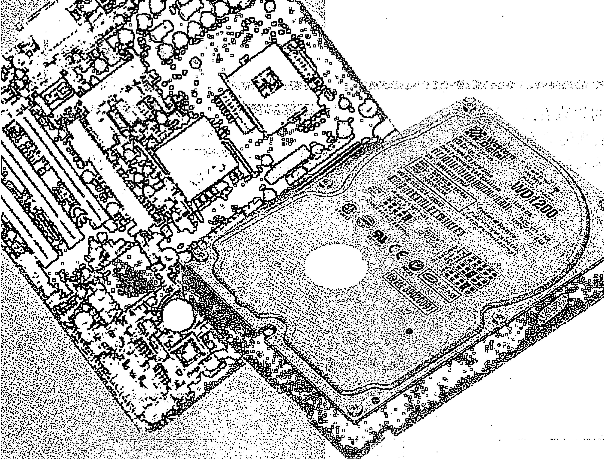

## 硬件

E-mail:cf_hdb@cfan.com.cn

◆年中硬件大盘点 P281
——2002年上半年电脑配件点评与采购指南
在过去的半年里，计算机技术正日新月异地向前发展。如何把握电脑技术的发展，了解电脑配件市场的走向，是很多打算采购与攒机的读者最关心的问题，也是我们为读者考虑最多的。我们特此请来了行家里手，把这半年来各个电脑配件市场的冷暖晴雨细数个遍，为大家采购与攒机提出最好的建议。

◆计算机升级一二三 P307
随着计算机的发展，很多用户对电脑的升级越来越理性化，已经不再盲目地追求高配置，而是讲求“实用、适用”，所以，计算机的升级逐渐注重对升级可行性的分析。为此，我们从升级前对系统的分析准备工作着手，一步步地为你提出整合升级方案和笔记本电脑升级方案。

## 年中硬件大盘点
### ——2002年上半年电脑配件点评与采购指南
#### 一、CPU篇
##### （一）2002年上半年CPU市场概述

作为电脑的核心部件，CPU市场的竞争历来都异常激烈。2002年的CPU市场主要有以下几个特点：

-   1. 由“多国演义”到Intel、AMD两强相争
在过去几年的CPU市场上除了Intel、AMD两家外还有Cyrix、IDT等公司来凑热闹，而在Cyrix被VIA收购后基本上呈现Intel、AMD两强相争的态势。AMD在推出性能不俗的Athlon XP及新毒龙等产品后，在DIY市场取得了很大的成功，市场份额也占到了30%以上。其他CPU厂商尽管也有产品推出，但基本上无力与Intel、AMD相竞争。在AMD和Intel的激烈竞争中，CPU产品的速度也不断提升（突破了2GHz大关），新品不断推出，价格更是迅速下降，广大消费者获益菲浅。

-   2. 低价产品成为主流
由于竞争的加剧和消费者日益成熟，高性价比的低价位CPU产品成为今年CPU市场的主流。价位低、性能高的图拉丁赛扬（II）、毒龙等产品在今年的CPU市场上占据了相当大的份额。

-   3. GHz时代将真正来临
尽管AMD和Intel在去年都推出了多款1GHz的产品，但这在很大程度上是在竞争形势下的应景之物。这些产品不仅价格过高，而且在稳定性等方面也存在一些问题。而在0.13微米和铜连接等先进生产工艺的推动下，今年CPU速度已全面提升至1GHz以上，高频率CPU的成本也将急剧下降，GHz时代真正来临。

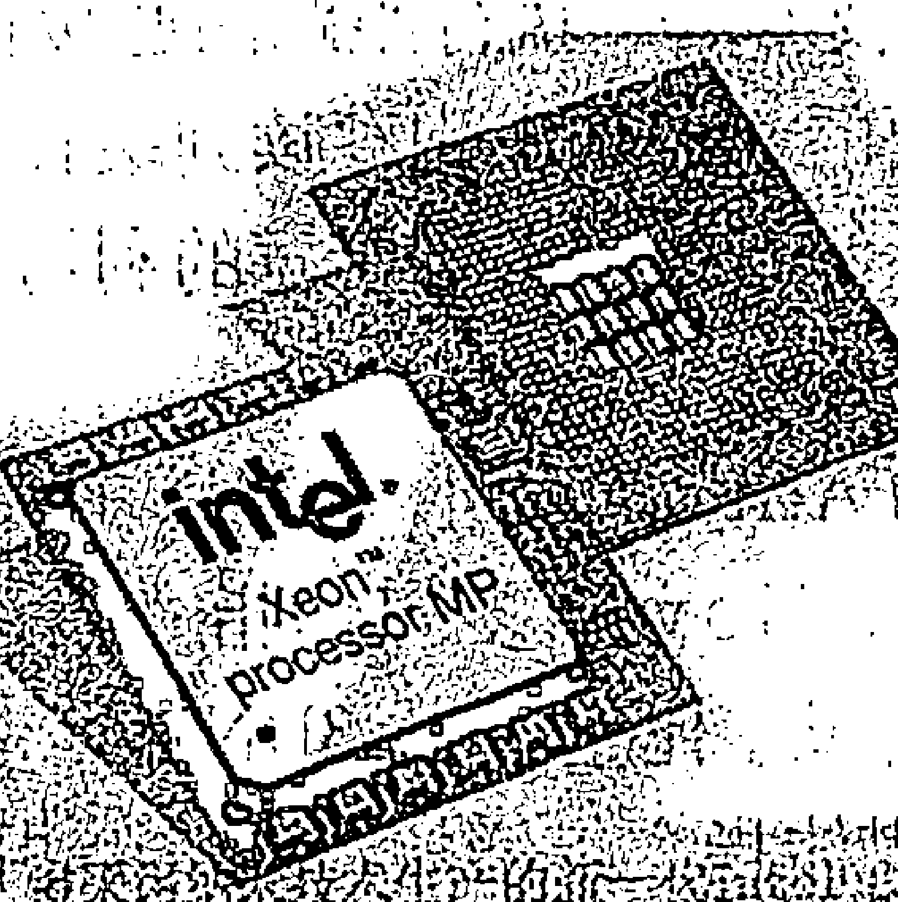

##### 4. Intel新品不断 霸业初成

在过去的半年里，CPU市场上AMD和Intel你争我夺，互不相让。但总的看来Intel不断推出新品，占据了市场的主动，AMD只是靠Athlon XP苦苦支撑。Intel依然是当之无愧的业内大哥。

随着Northwood核心P4的全面上市，未来一、两个月内，老P4价格肯定会持续下跌。按照Intel的计划，“老奔”在5月后会被逐步淘汰。到时候Northwood P4将成为市场主流。赛扬方面的“新老交替”则即将完成；随着图拉丁核心的新赛扬价格持续下跌，相同频率的产品目前已比老赛扬低50元左右。很显然除了升级等特殊需要，目前老赛扬已无多少购买价值，退出市场已指日可待。

Intel现在可谓咄咄逼人，不仅价格降得快，新品推出的速度也不慢。“北木头”P4的火气还正旺，有消息说Intel又为其在第二季度即将推出的支持533MHz前端总线的新P4作准备了。而且现在Intel不仅CPU降价，845芯片组的出货价格也即将调低。预计有十美元左右的降幅，降价后各品牌的845主板会比现在便宜大概百元左右。这无疑又将进一步增加P4的市场占有率。但近期赛扬的价格不会有大的调整，甚至个别型号还时有上涨。这主要与新赛扬的销售情况相当理想、库存量一直不大有关。

在Intel咄咄逼人的气势下，近期AMD也一直没闲着。尽管在降价上显得有些被动和仓促，但不管Intel怎么降，高端XP基本上继续与Intel P4系列保持25%左右的价差，而且低端还积极推出了新毒龙来与Tualatin赛扬抗衡。现在AMD最大的期望就是即将在6月份推出的新品：Thoroughbred XP，不知届时是否能与Intel继续争夺高端市场。

##### （二）近期主流CPU产品点评

-   1. P4系列产品
Intel P4是今年最成功的CPU产品。从结构上看，P4仍然沿用了IA-32的结构，还是属于32位处理器。但内核集成了创记录的4200万个晶体管。从技术发展角度上看，P4可以算是英特尔的第七代微处理器，包括了超级管道技术、新型快速执行引擎、改进的分支预报单元等一系列增强型功能。和其他的Pentium系列处理器的设计相比，在常规的x86运算器和浮点运算器上有较大的改进。P4平台本身留给 人的印象是深刻的，其高带宽和优化的SSE2为多 媒体应用软件提供了充分展示的舞台。

目前P4系列共有三类产品。一是最早出现的423 针P4和850主板配合，只是过渡性产品，现已基本 上被淘汰；二是478针的P4与i845系列主板配合，除 针脚数不同外，其他的与423针P4完全一致，是目前 的主流产品。

第三类是最新的Northwood P4处理器，不仅采 用了0.13微米工艺生产，其体系结构也有所改变，提 高了运算效率（指令周期）。新P4和老P4从技术上 看，主要有以下几点不同：一是新P4采用0.13制造 工艺，而老P4为0.18工艺；二是新P4的L2 Cache 由老P4的256K增加为512K；三是新P4的工作电压 为1.5V，而老P4为1.7V。正因为新P4采用了0.13微 米制造技术，而且核心电压降低为1.5V，这样不仅减 小了发热量，同时还能提供更好的超频性能。其首款 产品1.6GA，一改大多数高频率CPU超频能力有限 的局限，具有相当强的超频能力，大多数能轻易超到 2G以上，深受广大超频爱好者的欢迎。

尽管P4在技术和性能上的优势是明显的，但P4 仍存在一些不足： 虽然英特尔为P4核心的x86指令组增加了144条 指令，这一指令组主要用于提高多媒体功能。但是， 同应用以往类型的芯片一样，软件开发商为了充分利 用这些新的指令功能，需要为Pentium 4重新编写应 用程序。有测试表明在现有软件环境下，P4的性能并 不突出，甚至在某些情况下低于同频的PIII。另外值 得一提的是尽管Pentium 4的前端总线速度达到了 400MHz，其实总线速度还是100MHz。之所以能够 达到400MHz，是因为在100MHz的系统总线上同时 传输4条不同的64位数据流，从而达到了400MHz的 速度。这和真正的400MHz总线速度差异很大，甚至 在某些情况下落后于PC133和PC150系统。还有就 是Northwood Pentium 4只有8KB的L1数据缓存。 相对于Pentium III的16KB和Athlon的64KB L1数 据缓存，在容量上Pentium 4要少一些，这也影响到 其性能的充分发挥。

##### 2. Tualatin 赛扬

Tualatin赛扬采用了0.13微米的制造工艺，而且 核心电压也比Coppermine低。二级缓存采用了全速 256KB（8路），支持SSE、MMX多媒体指令级。尤 其是SSE指令集对Quake 3之类的游戏有很大的帮 助。Tualatin赛扬采用了和Pentium III同样大小的 二级缓存，这对于提高CPU的性能有很大的帮助。

Tualatin核心赛扬的性能非常不错，这得益于 256KB的全速缓存。凭借0.13微米的先进制造工艺， 超频后的图拉丁赛扬更具性能优势。这对于那些追求 性价比的朋友来说，的确是个明智之选。

Intel公司最新还推出了采用简化版Pentium 4核心（Willamette-128）的新型Celeron处理器。新型Celeron处理器运行于400MHz前端总线，基于NetBurst架构，包括两组16位算术逻辑单元，12KB快速执行引擎及执行追踪缓存（Execution Trace Cache），8KB一级数据缓存，二级缓存容量减半为128KB，基于Socket 478界面，采用0.18微米工艺制造（E0制程），首批推出的包括工作频率为1.7GHz、1.8GHz的型号。

##### 3. Morgan Duron

Morgan实际上和Palomino核心的毒龙规格相同，只是CPU内部L2 Cache容量不同。核心的改进使Morgan内核的Duron性能提高2%-8%。 Morgan内核采用了全新的设计，处理器在耗电量和热量方面比老产品大约有20%的降低，内存地址解析的通道数量也有所增加。

Morgan最引人注意的一点是改进了Cache算法。 由于缓存中存储的是解析之后的内存地址映射，所以 CPU就可以不再对这个地址进行解析，而直接从缓 存中取出使用就可以了。这样增加缓存的通道数量可 以明显解决解析“不中”的概率，从而使得系统的性 能提高。在Palomino以及Morgan中包含了一个硬 件化的数据预读取规则。这个功能就是在CPU对数 据进行了处理之后，预读取设备可以猜测哪些数据是 CPU所需要的。如果这些数据并没有在Cache中，那 么这个预读取设备就会自动到主内存中去重新获取这 个数据；而如果这个数据已经存在于Cache之中的 话，那么CPU就会更加快速地得到这个数据。通过 内建的3DNow! Professional指令集，新Duron还支 持全套的SSE指令，提供了更好的软件兼容性。

##### 4. Athlon XP

Athlon XP无疑是AMD今年最成功的产品。和 使用雷鸟内核的Athlon处理器相比，Athlon XP做了 重大改进：TLB寄存器数目增加，提高处理器的寻址 效率，进而提升处理器的整体性能；类似于Pentium 4的硬件预读技术——执行跟踪高速缓存，预先将处 理器可能需要的数据从主内存读到缓存中，这一过程 能明显提高系统总线和内存带宽的利用率，进而提升 系统性能。

与以前的Athlon不同，AMD在Athlon XP上 使用了专业3DNow!多媒体指令集，而不是增强 3DNow!指令集。比起增强3DNow!指令集，专业 3DNow!多媒体指令集增加了52条新指令，而这些指令主要针对的是浮点运算和多媒体应用方面的优化。

##### （三）CPU选购指南
##### 1. 购买CPU的一般原则

首先我要提醒大家不要盲目追求频率。目前主流的CPU工作频率已经很高了。虽然Intel的P4 2.4GHz已上市，但要注意CPU几乎是计算机内部降价最快的部件，也是使用时间比较长的一个部件。现在CPU的发展速度已经超越了摩尔定律，也就是说不到18个月，你用相同的钱买的CPU的频率就是现在频率的两倍，而今后发展可能会越来越快。大家一定要记住“DIY”的一个原则，够用就好。

具体来说，对于普通的家庭或办公用户，1.6GHz的P4就完全足够了。一般字处理、上网当然不在话下，在多媒体方面的能力也非常好。图拉丁赛扬也不差，虽然在技术方面与P4有一定差距，但在实际应用中，新赛扬并不比P4差许多，一般用户完全够用了。把买CPU节省的钱用来买一个好点的MODEM，把内存加到256MB，比一个高频率的CPU要实在多了。

尽管AMD CPU的性能不错，价格也相对便宜，但我一直不太推荐大家购买。尤其像公司和学校的机房，电脑可能要整天大部分时间都开着，AMD的CPU发热太大，肯定会影响稳定性。更令人烦恼的一点是，目前支持AMD CPU的VIA芯片组，兼容性都不太好，总要求安装这样那样的补丁，要是出现兼容性的问题就麻烦了。对于这类用户，如果要求价格便宜的话，买个赛扬2 800MHz也完全够用了。

目前市场上毒龙1G的价格仅仅300多元，想当初CPU速度达到“1G”还是一个令人心动不已的“概念”。但事实上由于硬盘、内存等配件的速度瓶颈，以及目前整个PC构架并无根本突破，使得“1G”的来临并没有导致计算机速度有太大的提升。现在影响电脑整体性能提升的瓶颈并不在CPU上。在大多数应用中，不少朋友都感觉1G以上的CPU与老的赛扬300A差不多。看来我们的确没有必要一味追求CPU的高频率。

##### 2. 选购CPU的其他注意事项

选购CPU主要应注意不要买假冒的remark产品。下面用两个具体的例子来说明此问题。

比如现在大家普遍关心的新老P4的识别，一是从外观上仔细分辨。新老P4在外观上基本相同，但并不是完全一致。首先CPU表面的标识有所不同，比如Northwood P4会在频率后加上一个“A”，1.6G的新P4就被标成1.6GA；另外缓存容量512K、电压1.5V，这些与老P4的不同之处也会出现在标识中。很显然认真查看标识是分辨新老核心P4最直观的方法，但它也有一定的局限性。因为有些不法JS可以通过打磨的手段来改变CPU表面标识，蒙骗消费者。好在从外观看，二者还有一个比较明显的区别就是：由于电压的不同，Northwood P4背面的电容数量比老P4要多出近一倍；二者一比较区别就很明显了。JS焊接电容造假的可能性不大，因此这是一个比较可靠的分辨方法。

-   AX代表AMD Athlon XP产品系列；
-   1800代表处理器的PR频率，非实际工作频率；
-   D代表封装方式，D=OPGA、A=PGA、M=卡匣式、其他为TBD；
-   M代表工作电压，S=1.5V、U=1.6V、P=1.7V、M=1.75V、N=1.8V；
-   T代表工作温度，Q=60℃、X=65℃、R=70℃、Y=75℃、T=90℃、S=95℃；
-   3代表二级缓存容量，1=64KB、2=128KB、3=256KB；
-   B代表最大总线频率，A/B=200MHz、C=266MHz；

选购CPU时还要注意和主板配合的问题。比如Athlon XP 2000+的倍频设置已高达12.5X，这也是大多数Socket A主板所支持的最高倍频了。当Athlon XP的倍频达到13X后，就必须通过升级主板BIOS才能提供对它的支持，而某些主板极有可能无法支持13X倍频。

#### 二、内存篇
##### (一) 2002年内存市场概述

一般计算机用户购买计算机或组装计算机时，比较重视的就是CPU、内存和硬盘这三个部件。内存是计算机的数据交换中心，它的重要性毫不亚于CPU。

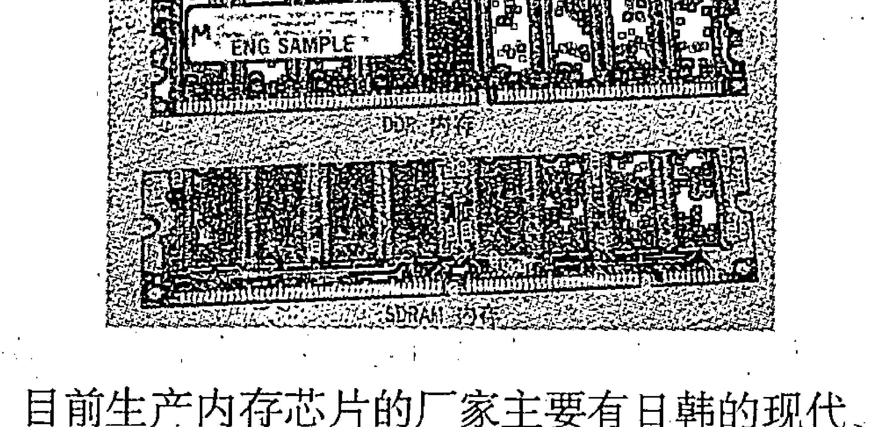

目前生产内存芯片的厂家主要有日韩的现代、三星、NEC、东芝、LG等，欧美的Micron和Infineon等。不过由于目前半导体厂家竞争激烈，倒闭并购是经常发生的事情。所以内存市场，也会跟随这些厂商的合并或倒闭变得起伏不定。今年以来，内存市场可以用“动荡不堪，惊涛骇浪”来形容。市场主流产品128M SDRAM的价格，从最低时的70元，持续上涨到近300元，才开始小幅回落到目前的230元左右，短短的几个月时间内，上涨了3倍之多。内存价格动荡的原因是多方面的，其中世界内存芯片两大巨头：现代和美光的合并谈判无疑在很大程度上左右了内存市场的走势。此外一些投机商和内存炒家的刻意炒作也使得内存价格像一支活跃的股票让人难以琢磨。内存价格的高低是整个电脑市场的晴雨表，内存涨得过高过快将造成电脑市场疲软，反过来将导致内存需求过剩而库存积压，厂商又不得不调低内存的价格，如此循环不已。

今年内存市场除了价格动荡外，另一个显著特点就是去年上演的“DDR、RAMBUS两强争霸”战，在今年已尘埃落定，DDR内存以显著的优势取得了胜利。DDR的优势首先在于价格便宜。由于它实质上是由SDRAM内存“改良”而来，可以使用现有的PC-133内存的封装和生产技术，使得厂商升级设备的费用低廉，因此DDR内存的生产成本不高，它的售价也不会比现有的PC-133内存贵多少。这次内存价格的上涨中DDR内存上涨幅度比SDRAM要小许多。目前DDR内存只比SDRAM内存贵一点，128M价格在240元左右。其次DDR内存技术相当成熟，早已在显卡方面得到了广泛应用。GeForce、Radeon等高端3D显卡都是DDR内存技术的受益者。RAMBUS则曲高和寡，四面楚歌。随着其主要支持者Intel的退出，毫无疑问，RAMBUS已经在这次内存争霸战中失败。

虽然目前市场上出货最多的是DDR内存，不过“三国鼎立”的时代并未完全结束。因为SDRAM不但没有退出市场，还依然活跃在舞台上。而RAMBUS也没有被DDR彻底打倒，仍旧是不少高端用户的选择。但SDRAM很可能在2002年后逐渐淡出市场。因为2002后的主板基本都是支持DDR或RAMBUS内存，SDRAM除了给老用户的机器升级外已不再有它的容身之处了。近期内存市场还有一个显著的特点就是，价格一度相差达数倍的SDRAM和RAMBUS，现在价格差已很小了。如果去年能保持这个价格差，RAMBUS一定能打败SDRAM，使现在其主要支持者都退出。看来电脑市场真是风云变幻无常，人算不如天算啊。

总的来说目前内存市场正处在一个转型期，“下一代个人电脑将会使用哪种内存”、“今后内存价格是升还是降”都是大家很关注的话题，从目前情况看，DDR RAM很有机会担当此重任。另外从内存的容量看，256M已经是今年电脑的标准内存容量。

##### (二) 近期主流内存产品点评

-   1. 组装无品牌兼容内存
首先要纠正一个大家选购内存上的错误认识，不要把内存颗粒的品牌当做内存的品牌。比如HY颗粒的内存，就当做HY品牌的内存。这是一个错误的认识，因为像HY、三星、NEC这些都只是内存颗粒厂家，而任何一个注册了品牌的内存厂商都可以采用以上那些半导体厂家生产的颗粒，来生产自有品牌的内存。目前国内DIY市场上价格最便宜、销量最大的就是所谓“现代条”，其共同特点就是采用现代内存芯片组装的无品牌产品，价格比品牌条要便宜不少，大家不要与真正的现代原装内存混淆。此外，目前市场上采用三星内存模组拼装的“三星内存”也不少。大家同样不要与真正的三星原装内存混淆。这些组装条最大的优点就是价格便宜，兼容性也不错，但在产品质量和稳定性方面肯定不及品牌内存好。

-   2. KingMax PC133 SDRAM
KingMax是以网络设备和笔记本周边设备起家的，KingMax内存最大的特点就是采用其自行研发成功的TinyBGA封装记忆体，属于TSOP封装到TrueCSP中相当重要的一个技术。其散热较TSOP封装记忆体要佳的主要原因，并不是在封装时所采用的材质较佳，而是在于一般记忆体散热部分大都在其脚架上，而TinyBGA与PCB的接触设计上的关系，彼此之间距离较近，因此所产生的阻抗较低，自然热能的产生也较低。而更主要的一个优点便是其体积小，同样面积的PCB上，TinyBGA能放两倍以上的记忆体，因此在体积上占了极大的优势。另外其速度也比一般TSOP封装记忆体要快，使得TinyBGA上PC133时更为容易做出CL=2的产品。尽管价格稍贵，但性能和稳定性也更好。

KingMax PC133 SDRAM一直是市场中销量大的品牌内存之一，是不少玩家心中“高品质内存”的代表。

##### 3. 金邦金条和GL2000千禧条

金邦内存采用Intel原厂六层线路板设计，其稳定度优于四层板设计，完全符合Intel PC133的标准。采用BLP (Bottom Lead Package, 底部导向封装)封装，芯片采用最先进的0.2mm生产工艺制造，运行在最优化状态CL=2时，十分稳定。外包装采用全新的小盒包装。另外由于静电和震动对内存的影响很大，金邦金条采用金黄色的塑料夹既可以防静电又可以防震。目前市场上供应的产品有：64M、128M、256M、512M、64M(ECC)、128M(ECC)、256M(ECC)等。

##### 4. OCZ DDR366 /KingMAX DDR400 高速内存

市场和消费者对于速度性能的追求是无止境的，PC2700 DDR333是最快的DDR产品已经成为过去，现在我们迎来了更快速的DDR新品，PC3000/DDR366粉墨登场了。
第一时间推出DDR366产品的厂商有三家，他们是TwinMOS、OCZ和Corsair，其中OCZ的DDR366的产品在国内市场已能见到。OCZ PC3000 DDR366 256MB 的售价大约在90美元左右，算得上是现在比较便宜的高性能的内存产品了。在256MB OCZ PC3000 内存条两边上史无前例的装有巨大的铜散热片，它可以迅速把热量导出以降低内存芯片的温度。
OCZ DDR366 256MB能够在CL=2.5时运行在183 MHz FSB(DDR 366)上，而其它大多数DDR内存只能在CL=2.5时运行在175 MHz的频率和在CL=2时运行在171 MHz的频率上。
在CPU运行频率不断提升的同时，内存的带宽也正不断地向上攀升。在我们刚刚享受到DDR333/366内存所带来的惊喜之后不久，KingMax又再一次给我们带来了新的刺激——DDR400。最大带宽达到了惊人的3.3GB。不过目前还没有合适的主板来配合这两款高速内存。

##### 5. Apacer宇瞻内存

宇瞻科技是成立于1996年的一家台湾半导体公司，隶属于宏基集团。Apacer 是其注册的内存品牌名称，宇瞻科技主要是进行内存模组的研发和销售。其Apacer品牌内存质量过硬，已经和不少主板和品牌机厂家建立了搭配销售关系。
宇瞻科技生产的内存种类主要有：168针SDRAM、184针DDR SDRAM 和184针的RAMBUS。因为宇瞻科技有自己生产内存颗粒的实力，所以其内存品质一直过硬。在国内DIY中口碑非常不错，不过因为渠道关系，Apacer的东西在国内不是很多见，而且正规的大代理商也不多。在品牌内存市场上Apacer内存属于价格偏高的那种，不过销售情况还算不错。

##### 6. VIKING RAMBUS

目前生产RAMBUS内存的厂商并不多，除了三星外，VIKING 是比较专注于RAMBUS内存生产的厂商。进入Intel在美国的指定测试实验室，VIKING的RDRAM PC100及PC133都通过Intel台式机、服务器及工作站上的测试，VIKING的RIMMS在容量及速度上已获确认。不过VIKING RAMBUS的价格相当高，不是普通消费者所能承受的。目前市场上的“兼容”RAMBUS产品，主要采用三星内存芯片组装，性能还是可以得到保障的。

##### （三）内存选购全面指南

如何选购到性价比较高的内存，也是提升系统性能的关键。因为内存本身生产工艺的复杂，加上市场比较混乱，所以导致了目前主流内存市场鱼龙混杂，我们在选购时一定要多加注意。

##### 1. 内存质量好坏的判断

我们可以通过外观大致判断内存质量的好坏：

- 首先看内存颗粒的质量。生产内存颗粒的大公司有HY(LGS)、NEC、Hitachi、Samsung、Toshiba、KingMax、Micron....等，这些公司生产的内存颗粒质量都不错。
- 其次看PCB电路板的质量。电路板的质量好坏对内存条和主板的兼容性有不小的影响。兼容性不好的话，容易造成系统不稳定、死机等难以预料的结果。好的PCB多是6层板，拥有不错的稳定性和耐热性。另外PCB 板上的布线也很有讲究。在目前市售的SDRAM所采用的各种线路板中，CCG Engineering生产的低干扰线路板（俗称“CCG线路板”）是抗干扰屏蔽性能最好的。
- 最后看内存的制作工艺。这也是我们用眼睛就可辨别的。关键看芯片和PCB 板的焊接处焊脚是否饱满，整齐；有否锡焊遗留；SPD、电阻的焊接是否整齐，从这些细节中也可以看出一条内存的质量好坏。

##### 2. 正确识别PC133内存

PC133的技术要求是tAC不超过5.4ns、tCK不超过7.5ns（对于PC100，这两项都是10ns）、稳定的工作频率为133MHz。以往PC100有分CL=3与CL=2的规格要求，但是到了PC133，已不再特别要求CL=2，只要符合CL=3的门槛即可。

根据测试，要真正做出PC133/CL=2的内存，仍有实际的困难，况且批量生产时可能只有一部分符合这样的严格要求。而实际上CL=2比起CL=3性能并不会提高太多，只是能帮助一些超频者达到超频的目的（PC133/CL=2若在CL=3，约可超频至150MHz）。

所以PC133 SDRAM若没有特别表明，大都是指PC133/CL=3。若将CL设为2，跑133MHz外频而发生当机，可不要认为这条RAM有问题，因为PC133的规格并不保证PC133/CL=2，所以能不能跑150MHz（CL=3），这也是不确定的。在购买内存之前，还是要先认清这点。

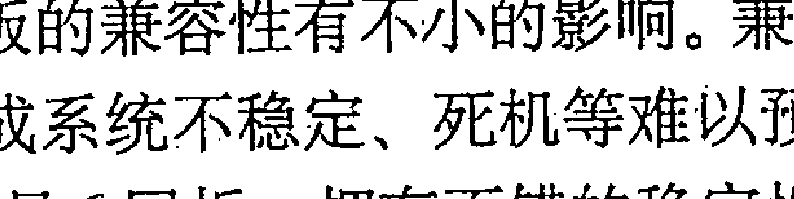

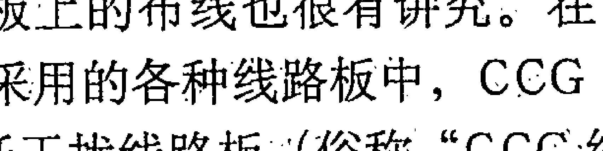

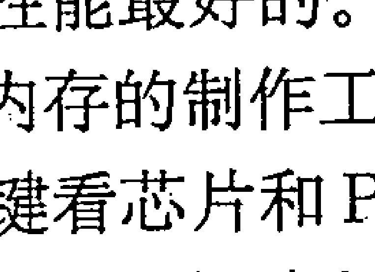

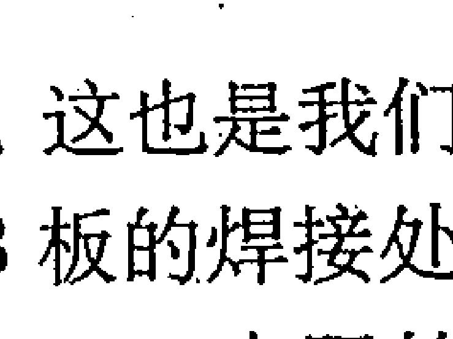

##### 3. 注意内存的兼容性

目前市面上的SDRAM分为单面与双面两大类，一般而言，单面内存每条拥有一组Bank，而双面的内存则每条提供了两组Bank。由于Intel440BX等老芯片组只能正确识别单BANK的最高容量为128M，因此造成大部分较老的主板无法完全使用采用单面来设计的256M内存的全部容量。现在市面上的单条256MB PC133 SDRAM存在兼容性问题，主要是与一些老主板不匹配。

##### 4. DDR 内存选购指南

购买DDR内存，首要的一点是要区分DDR和SDRAM，以免被商家视为外行或闹出笑话。尽管DDR内存是184PIN的，而普通SDRAM是168PIN的，但二者的几何尺寸基本是一样的，因此从外观上猛的一看，DDR和SDRAM几乎没有区别。如果仔细观察，就会发现SDRAM左右两侧各只有一个缺口，而DDR则有两个缺口，另外DDR的插槽缺口只有一个，而SDRAM有两个，再就是DDR的内存颗粒比SDRAM的要薄，PIN的排列也要略密一些，这些都可用肉眼观察到。

其次要注意技术指标。和SDRAM分PC100/PC133等类似，DDRAM也分PC1600和PC2100、PC3200等类别。简单说PC-1600 DDR内存的峰值带宽为1600 MB/s，而PC-2100 DDR内存的峰值带宽为2.1 GB/s。CL参数对DDR内存也很重要，一般而言使用2/2/2可以获得最佳的性能。不过大部分PC-2100 DDR内存在266 MHz系统前端总线下的推荐设定是2.5/3/3，标有CL2.5的字样。如果能找到CL2产品，性能会更好一些。

最后与买其他产品一样，除了技术指标，我们还应考虑品牌、做工、质量、价格等因素。当然做工和质量也遵循“一分钱一分货”的原则。选择什么档次的产品，完全看自己的经济能力及需求。

##### 5. RAMBUS 内存的选购

目前能够提供RAMBUS内存的厂商主要有三星、NEC、东芝、日立等大厂家，另外，美国著名专业内存厂商VIKING（中文译名：维京）、金士顿等，也已成为RAMBUS内存生产商中一股不可低估的力量。

部分RAMBUS具有ECC功能，但是与目前市场上的ECC内存不同。在RAMBUS内存上，你不可能找到专门的检错芯片，因此从外观上很难区分ECC的RAMBUS内存和非ECC的RAMBUS内存。具有校验功能的RAMBUS内存芯片是18位，而无校验功能的普通RAMBUS内存芯片是16位。也就是说，具有ECC功能的RDRAM只是在普通的RDRAM中增加了两个校验位。因此128MB具有ECC功能的RDRAM其实是144MB，但一般我们仍称之为128MB。

还要注意的一点是，如果主板上内存插槽未能插满的话，RAMBUS还需要与RAMBUS连接卡（简称C-RIMM）配合使用。它不附带任何RDRAM器件，只用来插在空的RAMBUS内存插槽里作为连接器件。由于RAMBUS采用传输总线技术，其所有的内存及连接卡必须连成一个整体以便维持内存数据传输通道的连续性，所以必须在空着的内存槽口插上连接卡。当需要内存升级时，只需要将相应的连接卡换成RAMBUS内存即可。

#### 三、硬盘篇

##### （一）2002年上半年硬盘市场概述

目前硬盘市场最突出的特点用一句话来概括就是：“容量越来越大，价格越来越低”。总的发展趋势就是：更大、更快、更安全、更廉价。昔日硬盘业界老大昆腾的退出并未对硬盘市场的基本格局产生太大影响。由于去年以来硬盘在国际范围内生产过剩造成市场上供过于求，竞争非常激烈，给各大硬盘生产商以巨大压力。各厂商无不采取诸如裁减员工、降低库存等手段避免进一步的损失，为此不惜以近乎成本价抛售产品。去年大陆硬盘市场产品价格的下降速度是惊人的。主流产品的价格从1200元上下下跌到目前的800元左右。今年以来硬盘市场一个显著特点就是，群雄纷争导致硬盘价格一直呈稳中有降的态势，与内存价格暴涨、CPU价格不稳定形成鲜明对比。

目前大陆硬盘市场以Maxtor、Seagate、IBM、WD等四强争雄为主。2002年中风头最劲的无疑是Maxtor，在兼并昆腾后，意气风发，接连推出了多款新产品，率先支持ATA133，同时在国内独家作出了“三年质保”的承诺，尽管其产品的价格较其他品牌要高，但仍然稳居国内硬盘市场的头把交椅。

希捷在近两年无疑也是成功的，其低端产品一改“低价低质”的形象，在质量和性能上都得到了提高；而高端的酷鱼系列，率先采用了液态轴承等先进技术，并以良好的性价比受到消费者欢迎。不过尽管其产品做得不错，但在昆腾退出市场后，仍未能如愿坐上头把交椅，只能屈居“千年老二”的位置。

WD是今年国内成长最快的硬盘品牌，虽然WD在西方市场一直不错，但在国内却做得不怎样。WD的产品一向中规中矩，性能不是特别突出，不过可靠的质量也赢得了部分客户的青睐，而近期其首推的8M大容量CACHE的100G产品，更是一鸣惊人，成为IDE硬盘中“极品”的象征。

IBM无疑是今年硬盘市场最郁闷的品牌了。在去年靠价格低廉而大获成功的基础上，未能更进一步。其单碟容量提高缓慢，更传闻其“玻璃硬盘”产品返修率相当高，真成了“玻璃产品”，而且还要将部分产品生产交给长城生产，这些都使得IBM在今年国内硬盘市场上每况愈下，无所作为。

##### （二）近期主流硬盘产品点评

##### 1. 希捷U6硬盘

希捷的U系列硬盘是以大容量和低价位为特色，转速均为5400转。最新的U6系列，单碟容量达到了40GB，理论上最高容量可达160GB。目前容量最高为80GB，作为一般的用途，也绰绰有余了。黑色橡胶外衣使得U6的外观和别的品牌一看就有很大的区别，这样的设计可以很好的减少震动和撞击所带来的伤害，而且还具有防滑功能。

这款硬盘具有2Bytes的数据缓存，8.9毫秒的平均寻道时间，5.55毫秒的转动时延。尽管转速只有5400转，但性能还是相当不俗的。且具有运行安静可靠的特点。

这款产品，应该说是希捷比较成功的一款产品。由于单碟容量较大，性能相当不俗。在玩家中的口碑也普遍不错，普遍认为是一款价廉物美的好产品。不过由于限于5400转的转速，在性能上略有不足。另外其外包的橡胶，虽然可减轻震动，但不少玩家也怀疑其是否会影响到散热。

##### 2. 希捷酷鱼IV

希捷新出的高端产品酷鱼IV，转速为7200转，Ultra ATA/100接口，不通电情况下可承受350 Gs冲击力，平均寻道时间为9ms。其他如3D防卫系统、2M缓存、DiscWizard软件也一应具备。最有特色的一点是使用了SoftSonic (TM) FDB（液态轴承）电机。使得其运行时非常安静，而且发热也比其上一代产品酷鱼III小多了。

酷鱼IV与U6一样采用40Gb单碟容量，也是首款采用40GB单碟容量的7200转产品，因此其持续传输速率也非常高，可保持在每秒24-41MB，性能相当不俗。

这款产品，应该说是希捷相当成功的一款产品。由于其采用液态轴承等先进技术，使得其发热量大大降低。当然这款产品在性能上并非顶尖。

##### 3. 迈拓DiamondMax Plus D740X

迈拓公司的最新产品DiamondMax Plus D740X（金钻七代），是迈拓自收购昆腾后推出的第一款7200rpm硬盘。其技术特点与希捷的酷鱼IV相当接近，也是单碟容量为40GB的产品。平均寻道时间为8.5ms，2MB高速缓存。

这款产品最引人瞩目的一点是它是第一款支持ATA-133接口的IDE产品。而且具有高达40GB的单碟容量，加上其三年质保承诺，在玩家心中是可靠的象征，性能也无可挑剔。不过令人遗憾的是，与希捷的酷鱼IV不同，D740X硬盘只有部分产品采用的是液态轴承电机（Fluid Dynamic Bearing）技术，其他采用的仍旧是标准电机，大家购买时要注意选择。还有一点令玩家不爽的是这款产品的价格要比其他品牌高不少。

##### 4. 迈拓DiamondMax D540X

迈拓的星钻系列硬盘，因为其内置了2M高速缓存，性能稳定可靠，运行噪音小，一直是最受欢迎的5400转硬盘之一。最近单碟容量达到40G、采用DMA/133接口的星钻三代（代号：DiamondMax D540X ATA-133）已正式上市，具有很高的性价比。

星钻三代的最大容量达到了160GB，其外观与老星钻几乎没有什么变化，只是背部的PCB电路板的设计有些改动，主要就是PRML读写控制芯片没有了，被集成于主控制芯片中。星钻三代是少有的具备 2M 高速缓存的 5400 转硬盘，其性能比一般的 5400 转硬盘要高，甚至与较老的 7200 转产品有得一拼，但在发热和噪音上更占优势。这款产品当属 5400 转产品中的“王者”，其弱点仍在于价格比较高。

##### 5. IBM腾龙系列

蓝色巨人 IBM 在全球存储器行业的地位大家有目共睹，许多硬盘专利都由 IBM 公司创下。对于普通个人电脑用户，IBM 的“玻璃之星 - Deskstar 75GXP（腾龙二代）和 Deskstar 60GXP（腾龙三代）应该是大家非常熟悉的。腾龙三相对于腾龙二，唯一的提高是单碟容量达到了 20GB，然而最多封装盘片数只有 3 张，而不像腾龙二代中的五张。

最新的 Deskstar 120GXP（腾龙四代），单碟容量也达到了 40G，Deskstar 120GXP 使用了三片 40GB 碟片和 2MB 缓存，属于 IBM 的高端硬盘。它适用于那些要求进行高速、大容量数字创作，要储存大量视频和音频文件的高端桌面系统。

IBM 的硬盘一贯以较小的寻道时间和较高的综合性能，较低的价格，受到消费者欢迎。但目前市场上较多的是腾龙三代，由于其单碟容量较小，其性能已不占优势，而且普遍认为其质量存在问题，返修率相当高，对硬盘而言质量不可靠无疑是致命的弱点。

##### 6. 西数WD1000BB-SE 8MB缓存硬盘

由于内存的读写速度大大高于硬盘的读写速度，因此大容量的缓存可以有效提高存储器的数据传输速度。但目前市面所售的大部分硬盘都只带 512K 到 2MB 的缓存。

西数最近推出的新款 7200 转、100G 硬盘特别版 WD1000BB-SE，其单碟容量为 33G，接口类型为 ATA100，平均寻道时间 8.9 毫秒，这些参数与其他硬盘相比并无特别，不过 WD1000BB-SE 将硬盘的缓存容量从 2MB 直接提升到了 8MB。引起了业界的普遍关注。经过多方面评测，由于缓存容量的加大，这款 IDE 接口硬盘的实际性能已经接近或超越了不少 10000 转 SCSI 接口硬盘，成为 IDE 硬盘中的速度王者。称得上是目前 IDE 硬盘中的极品。

##### （三）硬盘选购指南

硬盘是电脑中的重要部件之一，不仅价格昂贵，存储的信息更是无价之宝。因此，每个购买电脑的用户都希望选择一个性价比高、性能稳定的好硬盘，并且在一段时间内能够满足自己的存储需要。速度、容量、安全性一直是衡量硬盘的最主要的三大因素，更大、更快、更安全、更廉价永远是硬盘发展的方向。选购硬盘我们应该从以下几方面加以考虑：

##### 1. 确定合适的容量是关键

硬盘容量是非常关键的参数，大多数被淘汰的硬盘都是因为容量不足，不能适应日益增长海量数据的存储。如果说速度慢一点还可以等待的话，要是空间缺乏可是更令人头痛的事。硬盘的容量多大也不为过，在资金充裕的条件下，应尽量购买大容量硬盘，这是因为容量越大，硬盘上每兆存储介质的成本越低。从目前情况看，依具体需求及自己的经济能力选择 40G 左右的容量为宜。

对价格来说，一般硬盘产品在上市之初会参考市场同类产品的售价制定自己的销售策略。在某一特定的时期，市场上总有一个主流的硬盘容量。目前一般消费者能够承受的价格大至在 800 - 1000 元之间（通常认为一般装机用户的心理防线是 1200 元）。对于产品系列中小容量的产品，由于成本限制，价格下降不会很多。而对于超大容量的硬盘（相对于主流容量而言）由于购买者多数为高端用户，所以会适当的提高价格赚取更多的利润，超高容量产品的性价比要明显低于中档容量的产品。因此我们应尽量选择当前单位容量价格最低的产品。目前大约是 40G - 60G 的产品。

##### 2. 硬盘速度应综合考虑

由于硬盘的读写离不开机械运动，其速度相对于 CPU、内存、显卡等的速度来说要慢得多，从“木桶效应”来看，可以说硬盘的性能决定了计算机的最终性能。硬盘速度的快慢主要取决于转速、缓存、平均寻道时间和接口类型。由于目前内部传输率（磁头→缓存的速率）成为了瓶颈，仅仅提高外部数据传输率（改进接口类型）对总体性能的影响不大。因此，我们可以简单地认为硬盘的速度只决定于其转速、缓存大小和平均寻道时间。

从转速看，目前市场上分 5400rpm（每分钟转数）和 7200rpm 两大类。很显然，一般来说 7200 转的性能要好于 5400 转的产品。但这也不能一概而论，硬盘的综合性能还与单碟容量、缓存大小、接口方式等有关。而且 5400 转的产品也具有运行安静可靠，发热小等特点。

##### 3. 安全和噪音问题不可忽视

硬盘作为存放信息的主要场所，所存放信息的价值## 4. 假货、水货问题要注意

严格说硬盘产品并不存在假货的问题。但市场仍有一部分经销商常常在硬盘上要花招对用户进行欺诈。一是将老一代的产品以新产品的价格卖给用户，比如将金钻6代说成是金钻7代等等；二是市场上销售的硬盘，有可能由于运输或者其它环节的问题，其中的少部分在品质上可能会有一些瑕疵（比如有少量坏道），而有些经销商将这些产品卖给那些不太懂行的用户，一方面侵害了用户的合法权益，另一方面也为用户的使用埋下了隐患；三是水货问题，目前市场上有一些没有经过正常报关手续的硬盘，就是我们通常所说的“水货”。按理说，这些产品和那些经过正常报关手续的同型号硬盘在性能、质量上没有什么差别，但是由于其特殊的“渠道”，这些产品没有可靠的质保。虽然比正规渠道的相同产品便宜一些，但是“三年质保”变成了“一年有限质保”。有些经销商虽然也对这些产品做出了“质保三年”的承诺，但是这根本不可能得到落实，用户们要避免购买这一类产品。

另外要注意型号的区别，比如金钻七代具有两种不同的类型，可以从硬盘贴着的条形码标签来识别。标签上的第一行是硬盘的容量、厂家及型号；第三行也就是写着Maxtor P/N 6L040J2的那一行，标注的也是容量，里面的40表示是40G的硬盘，那个“J”表示的是这块硬盘使用的是普通的滚珠轴承电机（Ball Bearing Motor），要是标注“L”的话，那说明硬盘使用的是先进的液态轴承电机（Fluid Dynamic Bearing）。当然液态轴承版本的价格也要稍高一些。

##### 5. 按需选购硬盘要明智

选购硬盘我们首先应确定自己电脑的大致用途。如果你的机器基本是用来上网浏览、处理文档和一般的游戏，那么5400rpm的硬盘与7200rpm的硬盘之间的性能差异应该不会有太大感觉的。当然如果你的电脑主要是要进行音频视频大数据处理、3D设计、玩大型的3D游戏，应该买7200rpm的高性能硬盘。一块7200rpm、高单碟容量、大缓存的硬盘对系统整体性能的帮助往往是决定性的。

当然大容量、高性能也意味着高的价格。因此，经济条件不佳的情况下，容量和性能之间常常会出现取舍的矛盾。有朋友提出“相对惟容量论”的硬盘购买原则，我认为是很有道理的。即一旦硬盘预算资金不足以购买你预想的高性能硬盘时，应尽量选择容量大的低转速硬盘。

从品牌上看，尽管现在能生产硬盘的厂家都非等闲之辈，产品的性能和质量基本无大的差异；但不同厂家还是有其独到的技术优势和特点。同时由于生产的厂家设计能力和工艺技术的差异，也会造成相近档次的硬盘在速度和质量上的不同。目前国内市场口碑最好的硬盘品牌当属收购昆腾后的迈拓，及一向稳重的西数。

#### 四、主板篇

##### （一）2002年上半年主板市场概述

主板，就像汽车的大梁，轮船的龙骨，是电脑整机中非常重要的部件。几乎所有配件都要通过主板连接在一起，组成完整的电脑。因此主板质量的好坏、性能的高低，直接影响着电脑的整体性能和稳定性。

主板市场及相关产品的情况也一直受到广大用户的关注。随着计算机技术的飞速发展，在过去的一年中主板的发展也令人瞩目。近期主板阵营很明显分为支持AMD和Intel两大派别。伴随着Intel和AMD在CPU市场的激烈竞争，主板市场也自然裂变为分别支持这两大构架的不同阵营，不同芯片组互不兼容。奔腾时代，二者兼容，可以使用相同主板芯片组的时代已一去不复返了。目前Intel平台上基本上是Intel自己开发的i845和i815T芯片组占据绝对的统治地位；而在没有Intel参与的AMD平台的芯片组竞争中，VIA开发的KT266/333系列则完全保持着中流砥柱的态势。由于AMD本身没能为自己提供良好全面的芯片组支持，所以既不积极参与制订各种规范，也不擅长芯片组研发。这在很大程度上也影响到其CPU的推广。因此，作为AMD CPU最主要的芯片组供应厂商，VIA设计的芯片组的稳定性和兼容性，往往左右着AMD CPU的口碑和销量。尽管在技术上并没有什么突破性的进展，但今年主板市场依然很热闹，总体来看，主要具有以下特点：

由于CPU生产工艺日益进步，Socket构架已全面取代了SLOT构架。Intel放弃了SLOT 1重回Socket 370/Socket 478。AMD则淘汰了SLOT A，全面采用新型Socket A构架。另外随着称霸多年的SDRAM内存逐步淡出市场，RAMBUS内存的曲高和寡，DDR内存得到市场广泛认可，因此在今年支持DDR内存的主板日益增多，已逐步成为市场主流。支持RAMBUS的主板则很难找到了。

尽管近年来主板基本构架和技术没有什么大的变化，但远程开机、键盘开/关机、系统监控、健康检测等技术已成为了目前大多数主板的标准功能。数据保护、智能超频等其他新型技术也层出不穷。这些附加技术也成为主板市场竞争的重要方面。

由于市场竞争的加剧，用户对整机成本的降低要求越来越高。在All In One主板（在主板上集成显卡、声卡等）的基础上，随着Intel815、SiS 735等整合芯片组（将显卡声卡功能集成于芯片组中）的成功发布，今年有别于以往All In One主板的“整合型”主板也得到进一步发展。

目前主流主板产品的价格已普遍降到800元以下，和一块中档显卡的价格差不多；而且市场竞争非常激烈，厂商的利润非常薄。从品牌上看，一些曾经还做得不错的厂商（如福扬、旗舰等）在激烈的市场竞争中已经消失；而老牌的主板厂商，华硕、微星、升技等已风光不在，而且在产品质量和新品的推出上遇到了不少麻烦；但今年一些二线厂商如捷波、硕泰克、磐英、AOpen等却表现得非常活跃，其产品各有特点，但谁也不能说占据绝对优势，新的主板大品牌并未崛起。总的看来主板市场正处在战国时代。

##### （二）近期主流芯片组点评

目前大陆电脑市场上主板品牌不计其数，相关产品更是多如牛毛。其实只要采用相同芯片组的产品，性能都非常接近。在这里我就不介绍具体的主板产品了，主要给大家介绍一下近期主流主板芯片组的相关特点。

##### 1. i845系列

Intel在抛弃支持RAMBUS内存的I850芯片组后，推出了支持Socket478 P4的i845芯片组，该芯片组最大的特点在于能够搭配价格低廉的SDRAM。

i845采用的是单通道SDRAM的架构，带宽只有采用RAMBUS内存的I850芯片组的三分之一。毫无疑问，当P4搭配了普通的PC133 SDRAM之后，系统的内存带宽将明显下降。P4的400MHz前端总线所能提供的内存带宽为3.2GB/s，相比之下，i845芯片组所使用的PC133 SDRAM所能提供的内存带宽为1GB/s，仅为i850的三分之一左右。不少玩家怀疑其根本无法应付Pentium 4在数据上的传输需求。好在Intel随后意识到这一问题的严重性，及时推出了支持DDR内存的i845D芯片组，使得内存带宽的瓶颈得以消除。目前采用i845D芯片组的主板已成为P4主板产品的绝对主力。

但从i845D总的技术规格看，实在是很难对VIA公司的P4X266A形成明显的竞争优势，而且在一些新技术的支持上还要比竞争对手稍逊一筹。比如不支持ATA133，不支持533MHz前端总线。为了不在竞争中落后，今年Intel推出了845D的升级版本：845E。将对新一代533MHz (FSB) 的Northwood处理器提供完善支持。

845E和845D最大的区别就是533MHz (FSB)前端总线和USB2.0的支持，在其他方面和845D并没有本质上的区别。845E芯片组由北桥芯片82845E+南桥82801DB ICH4组成，从目前的形势来看，Intel并没有打算让他们即将推出的新芯片组支持DDR333内存和ATA 133。而更新的i845G芯片组也将在今年推出，将支持双通道DDR333内存和AGP 8X，很值得我们期待。

##### 2. i815-T芯片组

目前Intel除了和高端P4配合的i845系列芯片组外，低端方面Tualatin赛扬和PIII也占据很大的市场份额，目前支持Tualatin核心CPU（主要是新赛扬）的芯片组基本上是815T系列。像Intel其他的800系列芯片组一样，815芯片组也是基于Intel一种新的加速中心架构。与传统的芯片组必须使用南北桥芯片与PC内部的其他部件进行“通话”相比，Intel在815芯片组的中心结构体系中使用了一个内存控制器中心和一个I/O控制器中心。

815系列芯片组中最新的i815 B-Step Tualatin芯片组，支持采用Tualatin 0.13微米工艺的Pentium III和赛扬处理器。由于Tualatin核心的处理器和以往的处理器的针脚定义有一些改变（18个针脚定义位置不同）；而且Tualatin采用了新的更低电压的AGTL总线，而不象原来的采用AGTL+FSB总线的Socket=370芯片，因此新的Tualatin处理器不能使用在老的Socket-370主板上。为支持Tualatin核心的CPU，Intel发布了支持Tualatin CPU的芯片组，这就是i815E B-STEP芯片组。i815E B-STEP芯片组和i815E最大的区别就是对新Tualatin CPU的支持，815E B-STEP的其他技术特性同原来的i815E没有太大的区别。采用Socket 370结构，前端总线为66/100/133MHz，支持AGP 4X，支持AGP 2.0规范，支持PC133 SDRAM内存，4个USB接口。

##### 3. VIA KT266(A)/333

为支持AMD Athlon XP，VIA最初推出的是支持SDRAM的KT133（A）芯片组，SiS也推出了同样支持SDR的SiS730S芯片组。由于只搭配了普通的PC133 SDRAM内存，仅有1.06GB/s的峰值带宽，导致了严重的系统瓶颈；也使得AMD Athlon系列的强劲性能不能得以完全发挥。因此众厂商为了解决内存带宽等诸多问题便将目光转向了DDR。在AMD自己推出的AMD760芯片组未取得市场认可的情况下，VIA设计的VIA KT266/333系列芯片组对AMD的XP系列CPU提供了良好的支持。成为目前AMD平台最主要的主板芯片组。

KT266的一个特色就是支持V-Link总线（高速传输总线）将I/O数据传输功能发挥得淋漓尽致。在传统的南北桥芯片间，有限的频宽搭配高速的CPU及DDR内存时，经常会因传输功能及速度的不足而导致无法完全发挥DDR高速传输效率。利用V-Link总线技术，可将南北桥芯片之间的频宽扩大到每秒266MB，比起传统南北桥芯片的频宽整整提升了一倍。以V-Link总线之高效能及高频宽的特性，I/O数据传输的效能将提升很多，尤其是在影音方面的表现，更是得心应手。

Apollo Pro 266芯片组还支持异步内存操作模式，即使前端总线速度只有100MHz的处理器也可以与PC2100内存搭配使用。此外，Apollo Pro 266芯片组支持最多6个USB 1.1规范兼容接口、Ultra ATA 133规范兼容接口、AC'97音效、AGP 4X模式以及集成LAN控制器等。随后上市的KT266A芯片组，采用了VT8233A南桥芯片带来的功能，可以支持最新的ATA133硬盘。

比KT266性能更好的KT333芯片组近期也上市了，更是成为搭建最佳Athlon XP构架的不二之选。KT333支持DDR333(向下兼容DDR266/200)，这是KT333和KT266/KT266A的最大区别所在。高达2.7GB/s的内存带宽，在KT400发布之前，是单通道内存控制器速度之王。

但KT333并没有完全达成VIA事先的诺言，不能支持533MB/s的V-LINK；USB2.0和AGP8X，可以简单地将KT333视为支持了DDR333的KT266A。不过不少评测表明，KT333在应用表现上比KT266A有长足进步，但是在设备支持上却没有实现大家的期待。

##### 4. 其他芯片组

由于Intel和RAMBUS之间的合同问题刚开始，i845芯片组仅仅只支持PC133 SDRAM，正好为VIA提供了绝好的机会。VIA冒着由于未经授权可能导致的法律纠纷，毅然推出了支持DDR内存的P4芯片组：P4X266。近期威盛在推出了支持AMD Athlon XP系列处理器的DDR333芯片组KT333后，支持Intel P4处理器的芯片组P4X333也即将正式推出。矽统则在去年第四季度就推出了支持DDR333内存的SiS645和SiS745芯片组，SiS648芯片组也即将正式推出，这款芯片组也支持DDR333内存。这些芯片组尽管在内存带宽上要高于i845芯片组，但在稳定性、兼容性及整体性能上仍比i845要差。因此这些产品在市场上并未受到玩家的追捧。

##### （三）主板选购指南

主板是PC的核心，它直接影响着整个系统的性能。因此，选购一块质量优良的主板十分重要。目前市场上主板的品牌及种类有好几百种，如何选择一款适合自己的主板，是件大家都关心的事。

##### 1. 选购主板的一般原则

稳定压倒一切。电脑的基础可以说就是主板，所有其它配件都是直接或间接连到主板上工作的，如果主板工作不稳定，受到影响的将会是整个电脑。能稳定工作是对主板最基本的要求，也是首要的考察指标。所以，选购电脑的时候，一定要选择工作稳定可靠的主板！主板的稳定性必须是第一位的。对工作稳定影响最大的因素除了整体电路设计水平之外，就要看用料和做工了。由于现在主板设计方面能够自由发挥的余地越来越小，因此，稳定性主要取决于用料和做工，一块偷工减料严重的主板是不可能在任何时候都稳定工作的。兼容性不好的主板，也会给用户带来很大的困惑。

功能要完善，技术应用先进。当今的主板应该拥有系统自动监测功能。一般来说，新型主板均载有LM75和LM78系统自动监测芯片，它们能够在系统运行时监测CPU温度、CPU风扇转速、系统运作电压、系统设置等，一旦发现异常情况，便发出警告信息，同时能够进行自动调整。新型主板必须具有ACPI（高级配置和电源接口）标准、USB2.0通用串行总线接口技术、IEEE1394高速接口技术、DMI（Desktop Management Interface）桌面管理技术以及远程唤醒、数据保护、支持USB设备启动等功能。

使用方便、技术支持好。现在自己动手组装电脑的朋友越来越多。显然，大家不可能都是电脑专家，那么，一款好的主板就应该在这方面有所体现，充分照顾这部分DIY发烧友的需求，力求设置自动化、简单化，尽量减少操作步骤，降低因操作失误而造成的损失。此外厂商应有一个更新及时、内容丰富的网站。这一点不少用户容易忽视，当你在使用主板遇到困难，或需升级BIOS时，就会感到它的重要性。

性价比要高，售后服务好。这一点不用我多说；再好的东西，服务不好，价格太贵也不会有人问津。

总的说来各种主板在性能上相差极小，事实表明，以现在电脑的发展速度，过两年想升级时说不定连机箱都得换掉，“可升级性”也没啥可考虑的。我认为选择主板重点考虑的因素应在稳定性、功能及服务上。一般大厂的主流品牌做的都很好，在此原则下根据当时本地市场的具体情况及自己的偏好，随意选择即可。

##### 2、选购主板的其他细节

观察主板电池。电池是为保持CMOS数据和时钟的运转而设的。电池没电就不能保持CMOS数据。选购时，要留心观察电池是否生锈、漏液。若生锈漏液，可能会导致整块主板因腐蚀而报废。

观察芯片的生产日期。主板的速度不仅取决于CPU的速度，同时也取决于主板的芯片组的性能。一般来说，时间相差不宜超过三个月，否则将影响主板的总体性能。例如其中一块芯片的生产日期为9852（98年第52个星期），另一块芯片的生产日期9950（99年第50个星期），生产时间相差大约一年，据此就可判断此主板的技术较差，不宜购买。

观察主板的布局。CPU插座的位置很重要。如果过于靠近主板的边缘，则在一些空间比较狭小或者电源位置不合理的机箱里面会出现安装CPU散热片比较困难的情况。CPU插座周围的电解电容也不应该靠得太近，否则安装散热器不方便甚至有些大型散热片根本就没法安装，而且有可能损坏电解电容。

另外值得注意的是，不同主板的ATX电源接口可谓是千差万别。比较合理的位置应该是在上边缘靠右的一侧，或者在CPU插座同内存插槽之间，而不应该出现在CPU插座同左侧I/O接口之间。这样可以避免电源的接线过短的尴尬，也不会出现妨碍CPU散热器安装或者影响其周围空气流通的问题。

还有一个问题是P4电源的问题。为了保证高功耗的P4 CPU能得到可靠的供电，Intel要求为其专门添加供电线路。虽然新的电源多半提供了P4专用的4针接口，但也有人希望能继续使用原有的老电源。为此华硕等公司设计了可以不需要专用4针接口的主板。有的主板是使用一个为IDE设备供电的4针接口为P4 CPU供电，也有的主板干脆就取消了这一项，实际应用中也没有看到明显的稳定性降低的报道。

芯片组的散热也需注意。现在的机器越来越快，不仅是CPU，连主板芯片组的发热量也越来越大。尤其是主要控制内存和AGP显卡的北桥芯片，不需要任何附加散热措施就能保证可靠工作的已经几乎没有了。所以，采用大尺寸的散热片进行被动散热，从可靠性来说反而比小尺寸散热片加廉价风扇的组合要高。事实上很多商用品牌机和服务器里面，连CPU都是用大尺寸的散热片进行被动散热的。

#### 五、显卡篇

##### （一）2002年上半年显卡市场概述

2002年在显示芯片市场上基本只有nVIDIA和ATI两家相竞争，新品也不多。但在显卡品牌上，除了传统的ATI、华硕、丽台、爱尔莎、启亨、昂达等品牌外，又加入许多生力军，如捷锐、小影霸、七彩虹、大白鲨等。今年在国内显卡市场还有一个令人关注的事件就是“小影霸”商标争夺战的尘埃落定，使得消费者终于不用在两个“影霸”中感觉迷惑了。而去年发生的重大事件如显卡领域3dfx的倒闭并被老对手nVIDIA收购、ATI开放其显示芯片的使用权等，都对今年显卡市场格局的变化起了重大影响。

在3dfx倒闭后，目前显示芯片市场主要是ATI和nVIDIA之间的竞争。在2001年nVIDIA陆续推出了GF3以及Ti系列显卡，在高端显卡的速度上nVIDIA仍然达到了一骑绝尘的地步，而在低端市场，nVIDIA则细分了GF2 MX显卡，分出了MX200、MX400等系列显卡，这样在今年TNT2系列显卡已被彻底淘汰，从而使nVIDIA使用GF系列的产品遍布了从低到高的整个显卡市场。

另一个显卡界的巨头——ATI一向在显卡的OEM方面处于绝对的优势，但是在零售市场，ATI却一直没有什么大动作，3dfx垮掉后，ATI也展开了与nVIDIA在显卡零售市场的竞争。ATI在推出具有划时代意义的Radeon显卡后，充分表现出与nVIDIA的抗衡能力。随后ATI也像nVIDIA一样，将Radeon划分出了LE和VE等版本，在从低到高的整个显卡市场与nVIDIA针锋相对。当然ATI最重要的举动，就是开放其显卡芯片的授权，这样就吸引了很多第三方显卡厂商来制造使用ATI显示芯片的显卡，这一果断的举动无疑在很大程度上提升了ATI显卡的市场占有率。

今年在显卡高端市场方面的竞争并不激烈，基本只是ATI的Radeon 8500和nVIDIA的GF3 Ti500之间的较量。Radeon 8500显卡采用了很多令人眩目的技术，一度在速度上也超过了nVIDIA的所有产品，不过nVIDIA很快用GF3 Ti500还以颜色，更是具有惊人的速度优势。中低档显示芯片市场则比高档市场要热闹得多，有GeForce2 Ti、GeForce2 MX400/MX200、Radeon7500、RadeonLE/VE以及SiS315等诸多产品。

而且在中低端显卡市场上，大量贴牌OEM品牌的产品充斥市场，不仅产品种类繁多，产品质量也良莠不齐，价格更是千差万别。一些小型显卡芯片厂商也充满了活力，像SiS315、KYRO2等一批性价比极好的显卡出现在市场上，让消费者有了更多的选择。

今年显卡市场还有一个重要特点就是，在以多媒体应用为中心的时代，PC功能与以前相比已经有了许多的变化。现在的PC行业已经开始向数字视频行业扩展。PC的兼容性和功能性将受到巨大的影响。个人计算机的功能要与其他消费电子设备（如PS2、X-Box）相比更有优势才能具有竞争力。在这一变化中起重要作用的显卡，也起了相应的变化。集成TV、MPEG、双头显示等功能是今年显卡发展的一个趋势。很显然显卡正在成为电脑多媒体应用的中心。

##### （二）近期主流显卡产品点评

和主板一样，目前国内市场上显卡的种类和品牌也实在太多，无法逐一详尽介绍，在此我主要给大家介绍主要的显示芯片特性及代表产品。

##### 1. nVIDIA Geforce2 Ti系列

nVIDIA 的Ti系列大致有三个产品，分别是Ti500、Ti200和GeForce2 Ti。前两个基于Geforce3的核心，而后一个则是GeForce2的一个变种。

Titanium 500可以说是GeForce3的超频版本，它的核心频率变成了240MHz，而显存则使用高达260MHz的DDR显存。Titanium 500已取代了Geforce3的位置，成为nVIDIA新一代的旗舰产品。Titanium 200的核心频率为175MHz，而显存为200MHz DDR。很多人认为Titanium 200就是GeForce3的简单降频版本。

不过大家要留意，市场上有些Ti显卡是由原来的GTS Pro显卡“Remark”来的，性能和稳定性都较差。因此选择名牌产品就很重要了，比如ELSA 影雷者516，设计用料中规中矩，实际使用感受相当稳定。

小妖G9800 Ti采用了引人瞩目的紫罗兰色电路板，拥有Turbo BIOS和自动调整风扇转速功能，性能全面。耕升火狐Ti，64M/4纳秒DDR显存上覆盖有红色散热片，超级涡轮风扇加独特的非公版设计，令超频性能无与伦比，适合DIY发烧用户选购。

##### 2. nVIDIA GeForce2 MX400

在Geforce2 Ti降价前，MX400是市场销量非常大的中档显卡采用的显示芯片，选购MX400显卡关键是看显存的速度，好的MX400显卡一般选用高速128位接口的高速DDR显存。国内做得不错的几个品牌有昂达、七彩虹、“小影霸”等，型号种类繁多，消费者请自行甄别。其中捷锐的“神奇跳线”设计很有特色，能让娱乐用卡MX400“摇身一变”为专业工作用的Quadro显卡，非常超值。而耕升GeForce2 MX400黄金珍藏版板载3.5ns显存，创下MX史上的显存速度记录。

##### 3. nVIDIA Geforce2 MX200

Geforce2 MX200显卡现在已经显得比较过时了。由于其只具有64位的显存接口，并不比上代的TNT2快多少，但是因为其便宜和稳定，支持特性比较多，因此在装机市场上的销量也非常大。尤其是品牌机中，很多都用便宜的MX200做显示核心。市场上有代表性有太阳花幻影S6000、承启Geforce2 MX200、盈通剑龙G3000等产品。另外UNIKA 小妖G7200也很有特色，算是同类产品中功能最丰富的。使用它的UNIKA Turbo BIOS技术，可以在开机出现显卡信息画面时进入UNIKA Turbo BIOS的设定界面，并可对显卡内核、内存频率、内核电压等参数进行设置。在显存方面，小妖G 7200使用了茂矽(Mosel)的SDRAM，其频率为175MHz。同时，小妖G 7200也具备一定的超频余地。

##### 4. ATI 中低端RADEON系列

目前ATI的主流产品是“镭系列”(RADEON)，按性能的高低分为RADEON VE、RADEON、RADEON 7000、RADEON 7200、RADEON 7500等种类。有些类似当年NVIDIA TNT2系列繁多的分类。这些显卡的共同之处在于运算能力(Gigatexels)都达到了1.5G左右、三角形处理能力在3000万左右，都支持Hyper-Z。但RADEON VE和RADEON显存的带宽只有64bit，后三者则达到了128bit。

这五款芯片中，RADEON VE和RADEON7000不支持硬件T&L，RADEON7000应该算作是VE的一个变种（7000还不支持双头），RADEON、RADEON 7200、RADEON 7500应该是同一系列的产品。其中RADEON 7500主要是核心/显存频率比RADEON有大幅提升，但核心并没有发生质变，而RADEON 7200是很特别的产品，据说是RADEON LE ULTRA的升级版本，但仅支持最大64M的SDRAM。

##### **5. ATI RADEON 8500 / All-in-Wonder RADEON**

为应对nVIDIA的Geforce3， ATI推出了代号“镭Ⅲ”的RADEON 8500显示芯片。RADEON 8500采用0.15微米工艺制造，包括6000万个晶体管，采用了如Truform、Smartshader等新技术。并根据显卡的核心/显存工作频率分成不同的档次——核心/显存分别为275/550MHz的标准版，核心/显存为250/500MHz的RADEON 8500LE，以及核心/显存频率分别为300/600MHz增强版。

RADEON 8500还是第一款将双头显示功能引入到高端市场的显卡，过去诸如nVIDIA的Geforce2 MX系列或者ATI的RADEON VE等双头显卡都是面向中低端的产品，RADEON 8500的双头显示包括：显示器和显示器搭配，显示器和DVI显示设备(如LCD)搭配，显示器和电视机搭配，电视机和DVI模式。

七彩虹、盈通、斯巴达克相继都推出了RADEON 8500显卡。由于采用公版设计，它们的样子几乎一模一样，都带有标准的接口：一个15针D-Sub接口，S端子接口，DVI接口，附件则包括DVI to D-Sub转接卡，S端子视频线等。

这里还要给大家介绍一下ATI的All-in-Wonder RADEON，是一款7合1的多媒体图形加速卡，最主要的是内建智能电视调谐功能，最大的特色就是可以立即重播电视片段、网络电视、细致的3D绘图和令人惊讶的加速效果、影像输出、DVD播放、静态及动态影像的捕捉等各种多媒体解决方案。

##### **6. Matrox的G550 / Marvel G450-TV**

G550是昔日老牌显卡生产厂商Matrox去年惟一一款新产品。Matrox G550板载32MB 5.5ns三星DDR SGRAM，在它的256位双总线结构显示芯片的内部，集成有双RAMDAC、双TMDS、以及电视编码器，并支持完整的AGP 4X总线。Matrox G550支持DirectX 8及OpenGL，其3D性能相当一般。G550最大的特色在于延伸了双头显示技术，多种版本让G550适应性更广，第二个VGA输出接口可以更换，方便在模拟15针D-SUB与数字DVI两种方式下进行调整。G550还是惟一一张单芯片支持两台数字（DVI）液晶显示屏输出的显卡。另外，它还为我们带来了耳目一新的视觉震撼——先进的头射（HeadCasting）引擎技术，它将会激发起全新的3D网上视觉通讯。

Matrox的Marvel G450-TV也是一款很有特色的显卡，基于G450芯片制成，具有独特的256位双总线，其出色的3D性能和2D性能都受到了普遍的承认，这款Marvel G450-TV和普通的G450不同，它将视频压缩卡和显卡合二为一，这与以往的软件解码编辑不同，它可以在处理紧张的视频压缩和解压缩过程中减轻CPU的负担，可以保证全帧速率。这样的特点也说明该卡可以在配置较低的机器上使用，并达到与高端电脑一样的高质量全屏幕的视频回放。此款Marvel G450-TV是由一块整合显卡和一个外置电视卡组成，外接式Marvel 连接箱内装了一个电视调节器，通过它就可以直接向电脑传出电视信号，而且该外置电视卡会像家里电视的搜索频道一样对电视进行搜索，“当搜索到符合的节目时，电视窗口就会自动弹出。”凭借着此外接电视调节器，用户可以在打开其他程序的同时，在电脑上显示一个播放电视节目的窗口，并可以即时的进行节目录制和抓取图像。

##### **（三）显卡选购指南**

大家知道DIY的一个原则就是“选择最适合自己的产品”。我们选购显卡同样应依据自己的应用范围选择适合自己的产品。比如NVIDIA 的显卡以3D速度快为特点，而且拥有良好的超频能力，提供了广阔的DIY空间；而ATI则着眼于功能与品质，在显示画面质量、DVD播放、双头输出等方面独树一帜。其实选购显卡和选购其他电脑配件一样，最关键的是多了解欲购产品的定位和用处，了解自己的需求，扬长避短，这样才能选择到物超所值的显卡。

##### **1. 不同用户对显卡的选择**

对家庭用户而言，应用上讲究多元化，但不一定要求特别高的性能，能胜任一般的打字、上网、游戏和多媒体应用即可。从性价比来看，目前像NVIDIA Geforce2 MX 400、ATI Radeon LE/VE等产品就完全能够满足家庭用户的一般需求，这类显卡也是网吧用机的通常选择。而对于一般商业用户来说，在显卡上更没有什么好讲究的，只要价格便宜、性能稳定即可，一款300多元的Geforce2 MX 200就可以完全搞定了。甚至主板集成的显卡，或更便宜的TNT2系列都可以。对游戏发烧友而言，在显卡的选择上就比较讲究了，可以说在很大程度上，民用的显卡都是针对3D游戏而设计的。也只有3D游戏才能发挥出高档显卡的性能。因此首先应考虑NVIDIA和ATI的高端产品，像Ti500、RADEON 8500之类。这里要强调的一点是在游戏速度满足要求后，显卡的画质也不可忽视。不能一味选择“傻快”的产品。

对于2D平面设计用户，从画质上来讲，Matrox的MGA系列始终拥有非凡的品质。其G450、G550等产品在高分辨率下的2D显示质量相当出色，值得从事2D平面设计的用户考虑。而对于3D动画/图形设计、制作用户来说，可以考虑专业的Quadro等显卡。

##### 2. 选择显卡需注意的其他问题

在显卡的芯片和档次确定后，接下来就是要选择具体的品牌和型号了。一般来说，如果经济条件好一点的话就选择一些知名的品牌，如华硕、丽台、爱尔莎、微星、技嘉等；而讲究性价比的用户则可以考虑一些中小品牌产品，如太阳花、七彩虹、耕升等，最好不要选择“三无”的杂牌显卡。正规品牌的产品在做工、用料等方面都是很讲究的，比如一般采用6层PCB板，贴片式钽电容、Flash EPROM(闪存)等。

选购显卡还要注意的一个重要因素就是显存，其中包括显存的工作频率和容量大小两方面。显存的工作频率越高就意味着可提供更大的数据带宽，从而能获得更好的性能。一般可以观看显存编号末位的频率标识判断显存的标准工作频率，例如“-5”就表示该显存为5ns，工作频率为200MHz。至于显存容量大小，对一般的用户来说，目前主流显卡上采用的32MB显存已完全够用了，没有选择64MB、128MB的必要，在普通应用环境下，大容量的显存完全是一种摆设，当然对一些经常需要运行大型3D软件的用户来说，大容量显存就显得很有必要了。

和大多数电脑配件一样，现在市场上的显卡作假现象也较为常见。主要集中在采用NVIDIA的芯片产品上，比如将TNT2 Vanta打磨成TNT2 M64、TNT2标准版打磨成Geforce2 MX 200等，有些JS甚至通过BIOS Editor等工具将产品开机自检信息修改为假冒后的产品信息。对于假货的识别，最简单实用的方法是安装nVIDIA的公版驱动程序，可以正确识别出芯片的种类。

当然选购显卡还有其他一些问题需要考虑，比如对于拥有LCD的用户来说，如果你的LCD带有DVI(数字视频输入接口)，则应尽可能地选择带有DVI输出的显卡，如带双头输出的Geforce2 MX、Radeon系列等。对喜欢将视频信号输出到电视的用户来说，在选购显卡时就应注意是否拥有视频输出的功能。此外，一些显卡甚至还直接将高频头集成到显卡上，成为一种集显示、收看电视为一体的产品，如ATI的ALL IN WONDER系列，十分适合家庭多媒体的综合应用，说实话我一直比较推荐家庭用户选购这类产品。

#### 六、声卡篇

##### （一）2002年上半年声卡市场概述

2002年的声卡市场完全可以用“死气沉沉”来形容。创新（Creative）一统天下的局面并未有什么根本变化，当创新巨资收购了其有力竞争者：傲慢的傲锐（Aureal）公司后，创新便以绝对优势占据了声卡市场。无论在高端应用的声卡系列，还是价格低廉的入门产品，都无一例外地打上了创新的烙印。

去年声卡市场可以说是有史以来最黯淡的一年，只有一个新品发布：SB Audigy。相对于显卡、主板等电脑配件来说，目前可供选择的声卡产品就显得比较单一了。尤其对于想购买中高档的用户来说，除了创新几乎别无选择了。在2000年以前尚有DIAMOND与之激烈竞争，但随着DIAMOND被S3归并，不但实力削减了许多，最终还出人意料地退出了声卡市场。而在2001年初，创新更是收购了老对手Aureal公司，并取得了A3D技术的专利权，进一步巩固了自己的地位。目前国内400元以上的中高档声卡市场几乎被创新所垄断。目前国内中档声卡市场显得品种很单一，SB Live!系列似乎是惟一的选择。SB Live!系列在市场上已征战了三年多，尽管SB Live!分为几个版本，但它们的核心实际上是一样的，Digital、Value等都是换汤不换药而已。相对于2001年，CPU市场Athlon XP和P4的竞争，显卡市场GeForce Ti和RADEON 8500的火并，声卡市场就实在是显得十分平静了。

由于目前几乎所有主板都整合了AC97声卡，而普通用户对声音的要求远没有对图像要求那么苛刻，所以大部分用户都满足于AC97声卡“仅仅能出声”的效果，低档双声道声卡已经很难在市场上立足。不过，现在的板载AC97声卡功能单一，效果欠佳，而且通常只能支持双声道立体声输出。在DVD逐渐普及以后，消费者意识到只有5.1声道以上的环绕立体声效果才能完美再现DVD音场，因此5.1声卡赢得了一部分用户。据一些专卖声卡的经销商介绍，他们的生意都比较冷清，幸好现在做声卡的商家较少，才能勉强维持。

今年声卡市场的一个趋势就是支持5.1声道的产品逐渐受到欢迎。目前常用的DVD播放软件（如PowerDVD和WinDVD等）都支持AC-3或DTS音效输出。

##### （二）近期主流声卡产品点评

-   1. 创新Audigy

Creative SB Audigy 是去年声卡领域唯一的一款新产品，可谓受到万众瞩目。大家知道 Sound Blaster Live!系列声卡的成功，完全凭借了功能强大的 Emu10k1 芯片，Emu10k1 除了拥有超强的运算性能外，还具有可编程性，更可通过软件升级来支持更多的功能。Creative 公司推出的 Live! Ware 软件，使 Live! 声卡支持的 3D 音频流革命性地从 8 个增加到 32 个。Audigy 声卡采用的 DSP 芯片的体积较以前增大了不少，虽然芯片上打着 Audigy 的标志，但从研发代号上讲，普遍被视为 Emu10k2。这块芯片号称具有 Emu10k1 四倍的运算能力。除了更加强大的运算能力外，Audigy 声卡提供了大量 SB Live! 声卡所不具备的功能。比如 24bit/96kHz 声音采样率的输出和回放（不能进行 96kHz 录音），实时处理 4 个音频环境效果，可以提供更好游戏体验的 EAX Advanced HD 或 “EAX 3”（包括反射、移位、过滤和排除效果）；SB1394 “火线” 端口等。更重要的是 Audigy 声卡支持新的环境音效，EAX Advanced HD 在 EAX2 的基础上做出了大量的改进。

多重环境渲染。由于处理能力增强，Audigy 可以同时实时渲染四种音效环境。早先的 Live! 声卡利用 EAX (1+2) 也只能同时实时渲染一种音效环境。现在，能同时实时渲染四种音效环境的好处是显而易见的。游戏中的不同声音不再是一种环境效果了，我们甚至可以感觉到 “实时” 环境的声音。当前市场上还没有其它声卡能够做到多重环境渲染。

环境过渡。环境过渡与多重环境渲染相配合，可以作到不同环境音效的平滑过渡。以前的 Live! 声卡使用 EAX 时，环境音效的过渡转变非常唐突，现在的 Audigy 真正实现了环境音效之间的平滑过渡。

环境移位。环境音效都有方位感，不同的音效取决于它的位置。例如在火车驶进隧道时的音效是逐步改变的。

环境反射。如果你用过 Vortex 声卡（采用 Aureal 的 A3D 技术）就比较容易理解环境反射的原理，环境反射模拟了声音从物体表面折射后进入人耳的效果，可以使人们精确判断声源方位。

Audigy Drive 控制面板类似于以前的 Live!Drive IR 控制面板，它提供了：S/PDIF 输入、S/PDIF 输出、光缆输入、光缆输出、Aux 输入、2 耳机输出、线性输入、2 麦克风输入、2（与线性输入 2 共享）。支持所有动态和电容麦克风。MIDI 输入、MIDI 输出，另外还有其特有的红外线接收器、SB1394 端口。

Audigy 外接 5.1 声道的音箱时，提供了两种接入方式。一种是纯数字接口，适用于 DTT2500 和 DTT3500 系列；另一种是提供了三路模拟输出通道——前置、后置以及中置/低音炮。如：DTT2200、Inspire5300 等。此时数字输出插口就变成了模拟输出接口，用于接入中置和低音炮，适合于接入普通的模拟 5.1 声道的音箱。这样 Audigy 声卡几乎可以配合所有的 5.1 音箱。

Audigy 声卡是创新三年磨一剑的产品，几乎可以用 “完美” 来形容，是对声音有着较高要求的用户的不二选择。但高达 2400 元的售价几乎是一台普通电脑中价格最高的配件了，非一般工薪人士所能承受。

-   2. 创新Extigy

2002年2月4日，创新科技有限公司在北京正式发布 Sound Blaster Extigy 声卡，这也是创新出品的第一款外置声卡。SB Extigy 可以提供 24 位/96kHz、信噪比(SNR)达 100dB 的多声道音频回放，其简易、紧凑的外置结构定会令您爱不释手，它可以通过 USB 接口方便地连接笔记本电脑或台式 PC 机，令用户体验卓越的数码音乐、DVD 影片和游戏。

同带有扩展面板的 Audigy 声卡一样，SB Extigy 在前面板上也提供了 LINE IN、MIC、HEADPHONES 以及光纤输入、输出接口，由此为工作、娱乐带来的方便性是显而易见的。

Sound Blaster Extigy 的技术指标相当高。除了声卡信噪比号称高达 100dB，还支持 24位/96KHz DAC，这是专业设备才具有的规格。值得一提的是这款声卡支持创新音频去噪技术(Audio Clean-Up)，可以去掉从磁带、唱片转录的 MP3 音轨中不想要的 “嘶嘶” 声和其它噪音。在音质回放方面，SB Extigy 的表现也是相当出色。配合 Creative Inspire 5300## 3. SB Live! 系列

##### (1) SB Live! DIGITAL 数码版
采用0.25微米的EMU10K1芯片，不提供数字式子卡，提供一个数码输出接口，可以直接与数字式环绕音箱系统相连。CD SPDIF插针被取消，但预留了针位，不知道以后是否会恢复。DIGITAL的子卡扩展插针为AUD_EXT，而不是SPDIF_EXT，也就是说DIGITAL的子卡接口与原来LIVE标准版的子卡接口在结构上是相互兼容的。CREATIVE同时为它配套推出了一款名为“OPTICAL DIGITAL I/O 2”的扩展子卡产品。

##### (2) SB Live! Platinum 白金版
Platinum的主卡设计与标准版并无很大差别，只是多了一个SPDIF OUT插孔，其余基本相同。最近创新又推出一款Sound Blaster Live! Platinum 5.1，不仅支持5.1声道，还配备了革新的 Live! Drive IR，可以从您的PC机前端而不是后部同时与数码和模拟设备（如MIDI设备、MiniDisc播放机、外围数码音频设备和耳机）进行连接。Sound Blaster Live! Platinum 5.1还配有一个易于使用的无线遥控器，可方便地进行音频及视频播放。

##### (3) Sound Blaster Live! Digital Deluxe 豪华版 5.1
Sound Blaster Live! Digital Deluxe 5.1是听数码音乐、玩DS3D (DirectSound 3D)游戏和进行Internet娱乐的终极数码音频娱乐解决方案。以数码娱乐理念设计的Sound Blaster Live! Digital Deluxe 5.1，使制作、定制和欣赏具有杜比5.1环绕音效的Internet音频文件变得轻而易举。革新的Creative多音箱环绕（CMSS）技术将现存的立体声音频格式混音为令人兴奋的5.1声道音频，对于您所有的MIDI、MP3（WAVE）和CD音频源来说，均可获得更加美妙的音频体验。

##### 4. DIAMOND MX400
Diamond MX400并不与原来的MX300和MX200一样，采用Aureal公司的音频处理芯片，而是使用更为强大的、由ESS Technology Inc设计的被命名为Canyon 3D的声音处理芯片。它比原先Aureal Vortex 2有更强的声音处理能力，同时不会增加声卡的成本！这就是说，你可以用同样价格买到性能更高的产品。帝盟选择Canyon 3D而不是其他处理芯片的一个重要原因是，现在的游戏要求更高的音频处理能力，而现在的硬件却无法满足！使用Canyon 3D的MX400通过硬件支持，可同时处理20~24个常规3D音频流，为游戏提供更真实的音效环境。尽管MX300提供16个硬件加速的DirectSound音频流和16个DirectSound3D音频流，在同类声卡中是比较高的，但是MX400却翻了一番，具有对32个DirectSound和32个DirectSound3D同时硬件加速的能力！

##### 5. FM801系列声卡
近年来，采用FM801芯片的声卡也不断涌现，升技AU10、瑞丽春之颂DVD6、黑金5.1 Digital都是比较突出的代表作。FM801系列声卡并不支持波表合成和WAVE多音频流，播放MIDI、MP3音乐的效果也不佳。但其支持的5.1声道输出才是它最大的卖点，想组建廉价家庭影院的朋友千万不要错过采用这款芯片的产品。目前FM801音效芯片有AS和AU两种型号之分，后者的优势就是在于支持SPDIF输出，这一点在黑金5.1 Digital上已得到体现。

##### 6. “MAYA”专业声卡
专业声卡有时也被称作“专业音频卡”或“音频接口卡”，它是专为职业录音师、音频设计者和音乐工作者而量身定制的电脑声卡产品。韩国的专业声卡厂商AudioTrak生产的“MAYA”号称是“入门级的专业声卡（Professional Soundcard for DTMS）”，它具有2通道模拟信号输入/2通道模拟信号输出、1个光纤数字输出口、1个带前置放大器和电容幻象供电的平衡式麦克风输入口，能够提供据说是“专业品质”的完美声音。作为一款专业声卡产品，1080元的价格并不显得高贵，甚至还可以说是“最便宜的专业卡”了，因为大多数的专业声卡都是动辄数千甚至上万人民币的。

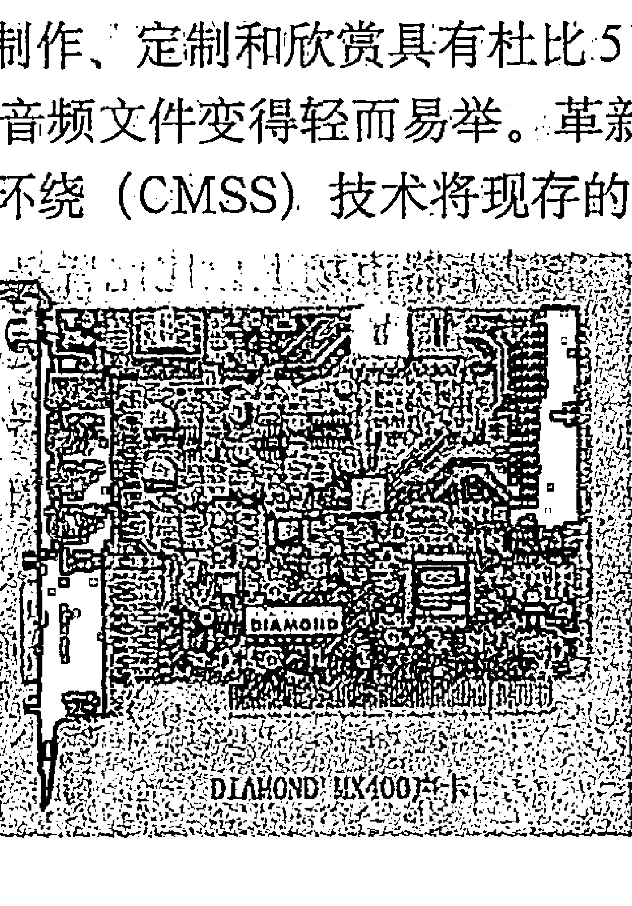

##### （三）声卡选购指南
现在计算机能做的事真是越来越多了，听CD、MIDI，玩游戏，看VCD都是多媒体计算机的主要用途。现在电脑之所以能发出声音与产生音乐都得归功于声卡。声卡算得上是电脑多媒体系统的心脏。在多媒体部分，决定系统的好坏CPU及内存等只能起到辅助作用，真正的动力源泉在于声卡本身，声卡的好坏在很大程度上决定了电脑的影音质量。从技术上看，声卡已基本完成了由ISA接口向PCI接口的过渡，增强3D音效尤其是多声道化是现在声卡产品的重要特点。如何选购一块适合的多声道声卡，已成为大家普遍关心的话题。下面给大家谈谈多声道声卡选购的一般原则。

和购买电脑任何一个配件类似，选购声卡前，我们首先应该确定我们的主要用途和能够负担的价格。比如主要是用来玩游戏还是听CD、欣赏MIDI，或者搞专业的声音创作，只想出100元买声卡还是可以出1000元以上。在确定了这两点后，我们应重点考虑声卡所使用的芯片功能及所采用的音效处理技术，以判断该款声卡的功能是否符合需求。

- 1. 采用的芯片
目前支持多声道输出的声卡芯片主要有CREATIVE的EMU 10K1、Aureal的Vortex-2 AU8830、YAMAHA的YMF-744、ESS的Canyon3D等。它们性能各异，各有特点。

- 2. 支持的3D音效
3D音效是人们对现有主流声卡的基本要求之一，要想充分发挥多通道声卡的回放效果，优秀的3D音效是必不可少的基本功能。A3D可算是最早的3D音频技术，它能够通过双通道实现较为真实的3D效果，具有很强的定位感，目前已发展到A3D 3.0。EAX则是声卡创始者创新推出的环境音效扩展API，而且是开放的API，它能够真实回放环境音效。DirectSound 3D则是微软推出的音频API标准，它嵌合在DirectX中，具有一致性的接口和很强的兼容性。

- 3. 对AC-3解码的支持
如果要用于观赏DVD影片，构建家庭影院级的PC DVD 5.1声道系统，必须注意声卡是否支持输出AC-3信号和支持5.1声道输出。声卡支持输出AC-3信号是很重要的，只有输出AC-3信号再通过AC-3解码器输出到音箱，我们才能够获得真实的5.1声道效果。

- 4. 声学性能参数
信噪比、取样频率等声学性能参数都决定着声卡的效能和质量。通常而言，信噪比(S/N)至少要在93dB以上，声卡的信噪比普遍都是96dB。取样频率为44.1kHz即达到CD的音质，而48kHz才能达到DVD的音质。

- 5. MIDI效果
MIDI效果具体表现在MIDI播放，支持复音的数量和允许加载音色库的容量。PCI声卡中MIDI播放性能得到很大的提高，音色库都是动态加载的，支持复音的数量也采用软硬结合的方式，很多中低档声卡都号称支持复音的数量达到三位数，但实际效果不一定很好。

- 6. 兼容性和做工
声卡的兼容性和做工好坏等因素，也是我们选购声卡时应该考虑的环节。这主要和声卡的品牌及价格有关系。一般而言我们应尽量选择品牌口碑较好，价格不过分偏低的产品。

- 7. 其他
比如对光纤输入输出的支持。支持光纤输出的产品，除了创新以外，比较有特色的就是CMI8738+光纤子卡的方式了。CMI8738支持四声道输出，同时也提供了SPDIF-In和SPDIF-Out功能，并且可以通过连接子卡来提供光纤输入和输出。最重要的是它的价格平易近人，这一点深受MD玩家的喜爱。甚至有些使用创新声卡的用户，也通过一些改造方法，让普通CMI8738的子卡在创新的声卡上实现了光纤输出的功能。

综上所述，挑选多声道声卡的关键就是要注重性价比，从性能上说无非就是兼容性、3D音效、AC-3支持、MIDI回放效果等。当然声卡的声音表现是一种非常主观的感受。一块声卡对某个人来说认为音效表现很好，但是对另一个人来说可能就不是如此。这是因为每个人不同的听觉构造，以及不同的聆听习性和感受造成的。因此，要挑选一款合适的声卡，还有一个重要的环节就是要多试听。

最后要提醒大家注意的一点是，“好马需配好鞍”，要想取得一流的音响效果除了有块好声卡，一套优秀的扬声器单元也必不可少，对多声道声卡而言尤其如此。

#### 七、显示器篇

##### （一）2002年上半年显示器市场概述
今年显示器市场一个显著的特点就是纯平显示器已成为市场的绝对主流。随着价格的暴跌，纯平显示器已全面取代了球面、柱面管的产品。美格、三星、LG、SONY、三菱等各大厂商相继推出了自己的纯平产品，纯平显示器也越来越被普通人所接受。现在1500元以下的17”纯平显示器市场上已比比皆是。3000元以下纯平显示器不仅让您享受平的感觉，更重要的是纯平显示器在环保和健康方面比普通显示器做得更好。现在市场中显示器各品牌间的价格战也相当激烈，今年以来价格一直处于下滑状态。但由于CRT市场的过度竞争，致使商家利润空间逐步缩小，今后CRT显示器降价的形势将趋缓，降价幅度也不会太大了。

随着17”纯平显示器的逐步普及，目前19”显示器也开始在家用电脑领域出现。个别采用普通球面管的产品，已跌破了 3000 元的心理价位。据专家研究 19″应该是适合普通家用显示器的最大尺寸。从发展趋势上来看，19″ 显示器必定会替代17″ 显示器而成为市场的主流产品，但是现阶段 19″ 纯平显示器的价格还是偏高，普遍在 4000 元以上。

今年显示器市场另一个特点就是液晶显示器成为大家关注的重点。液晶显示器工作电压低、功耗小；没有丝毫辐射，对人体健康无损害；完全平面，无闪烁、无失真，用眼不会疲劳；可视面积大，又薄又轻，能大量节省空间，适应更多的应用领域；抗干扰能力也比 CRT 显示器强得多。而它具有的一些缺陷如视角太小、亮度和对比度不够大等等，随着技术不断提高已有了改善，如现在最新的 TFT-LCD 显示器。目前限制液晶显示器普及的唯一原因就是价格，到现在仍是相同尺寸普通 CRT 显示器的好几倍。专家预计只有当液晶显示器的价格降到同样大小 CRT 显示器的 1.5 倍以内时，液晶显示器才会被大量接受。尽管春节后各方消息就开始传出市场需求火爆，LCD 面板上涨的消息，并且炒的沸沸扬扬，但从现在市场买气来看，并没有象传的那样需求巨增，相反今年液晶显示器市场显得相当平淡。

目前国内液晶显示器的品牌非常多，连新科、格力这些家电厂商都推出了液晶显示器。其实大多数品牌的液晶显示器都是购买液晶面板组装而成，只要使用的面板相同，技术参数都差不多。在这里我就不给大家介绍液晶显示器相关产品了，下面介绍几款主流 CRT 显示器。

##### （二）近期主流 CRT 显示器产品点评
1. 三菱Diamond Pro 740SB
作为世界上两大显示器珑管制造商之一，Mitsubishi（三菱）推出了一款新一代纯平显像管：DiamondTRON M2。这款显像管拥有比前一代纯平钻石珑显像管更出色的性能，是三菱今后几年中 CRT 的主力产品。
目前世界上第一台采用 DiamondTRON M2 纯平显像管的显示器已经正式进入市场，它就是三菱自己推出的 Diamond Pro 740SB。Diamond Pro 740SB 是一台 17″ 显示器，最大可视面积为 41 厘米 /16″，最大分辨率可达 2048 × 1536，最大实用分辨率也达到了 1600 × 1200，栅距 0.25mm。另外还拥有增强亮度功能 SB（SuperBright），可突出多媒体应用程序的画面。

毫无疑问这是一款相当高档的显示器，其近乎完美的显示效果受到了广大玩家的肯定。但缺陷也不是没有的，比如当文本为白色时，由于 SuperBright 技术的特性导致白色高亮，文字边缘模糊，不清晰。尽管如此这依然是一款能满足目前几乎所有用户需求的产品，当然它也具有不菲的价格，但应该是物有所值的。

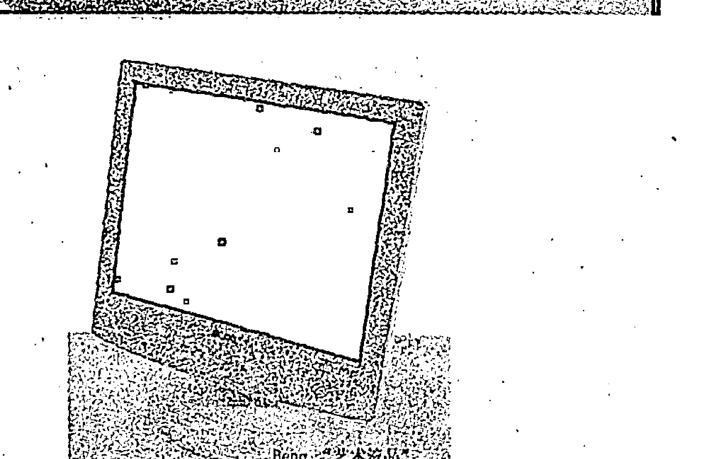

2. 明基77P显示器
明基77P是广受欢迎的77G的升级版本。技术指标几乎完全相同：三星丹娜 2 代显像管、点距 0.25 毫米、带宽 110MHz、建议分辨率 1024 × 768 @ 85Hz、调节方式4键数控、认证标准 MPR II，TCO'99。不过 77P 加入了锐彩技术（sharp clear），能够在视频讯号切换过程中缩短影像转换时间，有效阻隔高频信号干扰，消除影像残留（文字毛边和图象色块重叠），确保画面清晰锐利。锐彩技术的运用，使显示器和显卡配合的灵活度大大增加。即使采用普通显卡，也可以在文字、图像和影音文件方面取得优良的显示效果。此外 77P 具有更动感和青春的气息，能够满足用户个性化追求。

这款产品的价格是比较合理的，目前在 1500 元左右，还送一款明基光电鼠，应该说是装机用户比较理想的选择。不过这款产品的缺点也是明显的，首先作为采用三星管的低档纯平显示器，不可能具有非常出色的显示效果，而且其呼吸效应比较明显，在全屏黑白交替时，会产生明显的夸张收缩。此外 77P 还存在微弱的非线性失真。水波纹也很明显，边缘会聚效果略欠佳。

3. Sony新品E230显示器
Sony 最新的 E 系列 17″ 纯平显示器 CPD-E230，是 Sony 公司继 E200 17″ 显示器之后，面向家庭和小型办公室用户推出的又一新品。抛开 Sony E 系列产品在技术上的领先和独特不谈，此款显示器在外形设计上更是体现了个性化、时尚化的特点——乳白色的机身、超酷的外形设计充分体现出时尚品味及现代感的个性。
CPD-E230 采用 FD Trinitron 显像管，点距仅为 0.24 毫米。同时，E230 配备了 Sony 数码多重扫描（Digital Multiscan）技术，可支持水平和垂直扫描。水平扫描范围为 30-85KHz，垂直扫描范围为 48-170KHz。在 75Hz 刷新率下，可支持的解像度最高可达 1280x1024。E230还配备了高性能多层 AR 涂层，也就是防反光、防静电保护层，这样有助于减弱反光及辐射，能够舒缓眼睛疲劳。SONY的产品一向是广大DIY玩家心中的显示器的极品品牌，E230作为SONY系列产品中的低端产品，以合理的价格提供了良好的性能。当然这款产品的整体性能是不能与SONY其他中高档显示器相比的，带宽较低、存在一定的呼吸效应以及存在Trinitron显像管特有的暗线都是其缺点。

##### 4. 美格796FD II 显示器
美格796FD II是今年炒得很火的一款产品，也是美格与SONY分手后推出的一款力作。这款产品采用“美格珑”（其实就是三菱DiamondTRON）显像管的第三代产品，最大特点就是其亮度达到300cd/m²，为上一代产品的3倍，并成为在亮度上首度超越LCD的CRT产品。

796FD II具有很强的视觉保护能力。采用了MSB-DY偏转线圈，降低了放射量，使聚焦、色纯、线性表现都达到了最佳水平。通过新技术的采用，将电压和栅压分别从115V、700V降低到65V、560V，增强了显示效果稳定性，起到了保护视力的效果，并延长了整机的使用寿命。796FD II还将栅孔直径从0.4mm降至0.35mm，锐化了线条表现力，有利于DVD播放、3D游戏表现和图文设计。采用了氖荧光粉，使显示器对比度提高10%，亮度提高20%，色阶改善了17%。采用了独有的炫彩X涂层，防止了玻壳反光眩目，减少了电磁辐射。

796FD II配备了E-VIDEO(视频增强引擎)，继承了“黄金眼”系统(Golden eye)功能，可以为不同的视觉效果而提供标准模式(Normal Picture)、自动全屏模式(Zoom Picture)、逼真模式(Vivid Picture)、温馨模式(Warm Picture)、怀旧模式(Golden Picture)等五种图像模式。各种新技术的采用和人性化的设计使796FD II当之无愧地成为目前美格的最高端产品。

这款产品的市场推广力度很大，加上价格不是太高，所以在DIY市场的知名度也非常高。但作为一款定位于普通消费市场的产品，其综合性能还是无法与三菱或SONY的专业产品相比。而且存在色纯度不佳和故障率较高等缺点。

##### （三）显示器选购指南
在个人电脑的构成中，显示器属于价值高、使用寿命相对较长的部件。它一般不会像电脑其他部件那样经常被升级，可以说是电脑中最保值的东西。不少明智的玩家都表示，与其买高频率的CPU，不如买个更好的显示器。此外显示器是对人的健康影响最大的部件，因此购买什么样的显示器是一项比较重要的决策。购买前请认真确定用途、价格、尺寸、显像管类型。和电脑其他配件一样，买显示器前你首先需要明确两个问题，即你的电脑主要用来做啥，你能在显示器上花多少票子？

##### 1. CRT显示器的选购要点
从技术指标看，我们选购CRT显示器时主要应注意以下几点：

一是带宽。带宽是衡量显示器综合性能的最重要的指标之一，以MHz为单位，值越高越好。带宽是造成显示器性能差异的一个比较重要的因素。带宽决定着一台显示器可以处理的信息范围，就是指特定电子装置能处理的频率范围。一般来说，可接受带宽的一般公式为：可接受带宽＝水平像素×垂直像素×刷新频率×额外开销（一般为1.5）。带宽越大，在高分辨率下就越稳定。 带宽的大小也体现了制造厂商的实力，不是每个厂商都能把显示器带宽做得很大，带宽提高，成本随之提高，而且技术不易达到，要靠显示器电路的精心设计才可实现。很显然如果带宽不够高，会直接影响到显示器的最高刷新率。对于17"显示器，如果在1024x768x24的模式下刷新率不能上到85Hz以上（对应带宽大约为110MHz以上），这个显示器绝对不能列入考虑的范围之内。目前采用相同显像管的显示器价格差异颇大，主要原因就在于带宽大小的差异。

二是安规认证。显示器作为强电设备，它在工作时所产生的电磁辐射、X射线等都会对人体造成伤害，同时也对周围环境产生污染作用。为了让电子产品符合一定的安全规范，国际上制定了一系列的规范标准。目前要求最为严格的TCO'99认证，该认证包括了对环境保护、生物工程、可用性、电磁干扰、能源消耗和电力火力安全的考察。因此显示器最好能通过TCO'99认证，至少也要通过TCO'95认证。

三是显示效果。CRT显示器最容易出现的几个问题是：四角聚焦不准、边角几何失真、色纯度不够等。这在实际选购时要特别注意。四角聚焦不准就是在角落处文字图形显示模糊，看不清楚，所以聚焦不良的显示器肯定不能要。几何失真是目前纯平显示器存在的普遍问题，几何失真一般表现为左右边不平行、上下边不平行、边线不直等。尤其要尽量避免购买上下边不平行的显示器（这种失真是难以调整的）。和电脑的其他配件不同，光凭枯燥的技术参数是无法全面衡量一台显示器的。在评判显示器优劣时，个人的主观判断和经验判断占据着重要的位置。然而，主观判断是一个十分模糊的衡量标准，每个人的审美观不同、要求不同，爱好也不同，很可能会对同一个产品做出不同的判断。

##### 2. 纯平显示器的选购
目前市场上的主流产品是纯平显示器。选购纯平显示器的重点是确定产品采用什么样的显像管。目前国内市场中纯平显示器采用的显像管主要有四种：高档的 Sony 纯平特丽珑，中高档的三菱纯平钻石珑和 LG未来窗系列的Flatron显像管。低端以三星的IFT丹娜DYNAFLAT显像管为代表。

以上这几款纯平显像管在技术上各有千秋。无论是视觉纯平技术，还是物理纯平技术，它们都在朝着集各家优点为一身、技术上互相取长补短的方向发展。从价格上看，索尼和三菱的管子较贵，而LG和三星的管子较便宜。

目前大陆市场上ADI、美雅达、CTX等都采用索尼的特丽珑纯平显像管。优派、Decaview、美格等则采用三菱钻石珑纯平显像管。国产的低价纯平显示器一般都采用三星、三菱等品牌的显像管。LG的“未来窗”显像管目前只有LG自己采用。

纯平显示器还易出现色纯度的问题，现象为屏幕在纯白的情况下颜色不匀，有局部偏红或偏蓝的色块，一般在边角地带。这种情况几乎所有的纯平显示器都存在，只是程度不一。有时候色纯度问题可以通过消磁和长时间烤机来改善，但没有办法彻底解决。

总的来说，如果你侧重看图片、玩游戏，我建议选择索尼管的产品，如果你侧重文字、CAD设计，则选择钻石珑管的产品为佳。一般家庭普通应用则选择价格低廉的三星或LG的显像管即可。

##### 3. 液晶显示器选购要点

由于LCD与CRT在工作原理上完全不同，在选购LCD显示器时，既有与普通CRT显示器类似的注意事项，更有一些特殊的选购要点。在选购LCD显示器时，首先应重点考察与普通CRT显示器不同的特殊技术性能。

视角大小：由于显示原理的制约，LCD显示器必须从正前方观赏才能获得最佳的视觉效果。如果从其它角度看，则画面会出现不同程度的亮度变暗、颜色改变等问题。可视范围是指从画面中间，至上、下、左、右四个方向画面清楚的角度范围。数值愈大，范围自然愈广，但四个方向的范围不一定对称。一般地，140-160度的可视角度应是LCD显示器的基本指标。此外水平与垂直的观赏角度最好能够相同。

亮度与对比度：亮度值愈高，画面自然更为亮丽。亮度的单位是坎德拉每平方米（cd/m²）。一般的LCD亮度值为150cd/m²左右，而某些则能达到250cd/m²以上。目前国内能见到的TFT液晶显示器亮度基本在200cd/m²左右。液晶显示器亮度对显示效果的影响很大。还要注意有的LCD显示器有亮度不均匀问题，在屏幕的中央部分非常明亮，但在接近边缘部分，亮度却降低不少，在购买时应注意挑选。现在有些高档产品采用了四灯管技术，亮度不均匀性得到了很大的改善。对比度越高，则色彩越鲜艳饱和，还能显现出立体感。对比度低，颜色显得贫瘠，影像也变得平板。目前液晶显示器对比度值的差别很大，从100：1到300：1，甚至更高。但对比度并非越高越好，要与亮度搭配得恰到好处，才能够呈现美观的画质。

反应速度：响应时间反应了液晶显示器各像素点对输入信号反应的速度，此值愈小愈好。响应时间越小，显示快速运动画面时才不会使用户有尾影拖拽的感觉。测量反应速度或回复时间的单位是毫秒，是指个别像素由亮转暗并由暗转亮所需的时间。大多数LCD显示器的反应速度介于40-60ms之间，不过也有少数机种可以达到25-30ms。数值愈小，代表反应速度愈快，显示视频画面的效果就越好。

分辨率：由于显示原理的差异，液晶屏和普通CRT显示器不同，其屏幕分辨率并不能随意设定，一般都有一个最佳值。除此之外的其他分辨率，或无法设定，或效果不好。传统CRT显示器对于所支持的分辨率较有弹性，但LCD只支持所谓的真实分辨率。只有在真实分辨率下，才能显现最佳影像。所以，选择LCD时，一定要确保它能支持您所使用的应用软硬件的原始分辨率。千万不要盲目地相信分辨率要越高越好。要记住LCD液晶显示器是不同于一般CRT显示器的。如果日常使用要求XGA 1024 × 768的分辨率，那最好确定您的LCD液晶显示器可以支持原始XGA的分辨率，不多也不少，这样最好。

总的来说显示器是一种很主观的产品，选择时，除看具体的技术指标外，自己的主观感觉很重要，不管具体的指标怎样，起码要自己看上去感觉很舒服。

#### 八、光存储设备篇

##### （一）2002年上半年光存储设备市场概述

CDROM方面，目前CD-ROM的主流品牌依然是源兴、美达、华硕、大白鲨、ACER、SONY、NEC等。各类品牌主流型号光驱的价差不大，一般在280元左右。主流倍速则以44X和48X为主，50X以上的也开始出现。36X以下的则基本上已经被淘汰出局了。CDROM在DVD和CDRW的合围下，淘汰速度并不像预期的那样快。由于价格便宜，目前大多数品牌机及兼容机都还是将CDROM作为标准配置。

今年春节后DVD驱动器的价格开始出现了雪崩式的下跌，目前主流产品的价格已经降到了500元以内。但仍未在DIY市场掀起过多的波澜。由于DVD数据格式的不统一，目前大多数买DVD驱动器的玩家唯一的用途似乎只是在PC上观看DVD碟片。而随着家用DVD系统的日益普及，以及DVD-ROM“锁区码”等问题的出现，这个功能也在逐渐弱化。尽管如此，一些业内人士仍预计 DVD-ROM 今年将成为个人电脑的主要配件。DVD-ROM 正处在迅速发展的时期，各 CD-ROM 厂家已经把主要精力放在 DVD-ROM 的开发和生产上，Sony、Yamaha、松下、Toshiba、先锋等厂家继续扩大 DVD-ROM 产品，而且还有更多的厂商准备投入 DVD 的生产。目前 16 倍速以上的产品已成为市场主流。但也有人预言被炒得火热的 DVD-ROM 很可能成为一款“过渡性产品”，即在其尚未来得及大规模普及之时，就被淘汰掉。其替代者很可能是技术更先进、功能更实用的 DVD-RW（或 DVD-RAM）。目前 DVD 刻录机，分 DVD+RW、DVD-RW、DVD-RAM 等几大阵营，互不兼容，这影响到目前 DVD 刻录机的普及。目前国内市场上仅有理光、先锋、HP 等少数几个品牌的 DVD 刻录机，售价都高达 4000 元以上，绝对是普通消费者难以承受的。

CDRW 可能是今年最为热闹的产品了。当然目前对普通消费者而言，CDRW 刻录机应是更现实的选择。长期以来光盘刻录机高昂的价格一直阻碍着它迅速普及。不过进入 2002 年后，随着技术成熟及产量增加，光盘刻录机的价格急剧下跌，已成为目前外存储设备市场的热点。简单说今年刻录机市场呈现出以下三大特点：

产品价格急剧下跌。今年以来，除内存外的电脑配件，均无一例外处于减价的狂飙中，刻录机也难逃降价的命运。目前 16X 产品的价格在 600 元左右，24X 的在 700 元左右，32X 的价格在 1000 元左右，而速度最快的 40X 刻录机也上市了，价格在 1200 元左右。

刻录速度迅速提升。与价格急剧下跌相对应的是，刻录机的刻录速度在今年得到了快速的提升，8X 以下的机种已基本被淘汰，12X 的产品也只是昙花一现。进入 2002 年来，由于刻录技术上有了重大突破，刻录机写入速度最快已达到惊人的 40X。现在市面上主流刻录机产品是 16X 及 24X 的。相信 32X 以上的产品也会很快得到普及。

新品牌层出不穷。目前市场上出现了很多新的刻录机品牌和产品。除了老牌的 Sony、Yamaha、HP、RICH、Philips 等品牌依然“健在”外，几乎在一夜之间国内又冒出许多新的刻录机品牌，如爱国者、阿帕奇、清华同方、大恒等。许多厂商都纷纷推出了自己品牌的刻录机，连微星这类老牌主板厂商也来刻录机市场凑热闹。不过要指出的是，目前世界上真正有能力自己研发生产刻录机的也就是那么几个厂商，其它品牌的刻录机基本都是向这几个厂商 OEM 的。大家肯定也注意到市面上很有几款刻录机除了品牌、包装和标签不同之外，其它都是一模一样的。

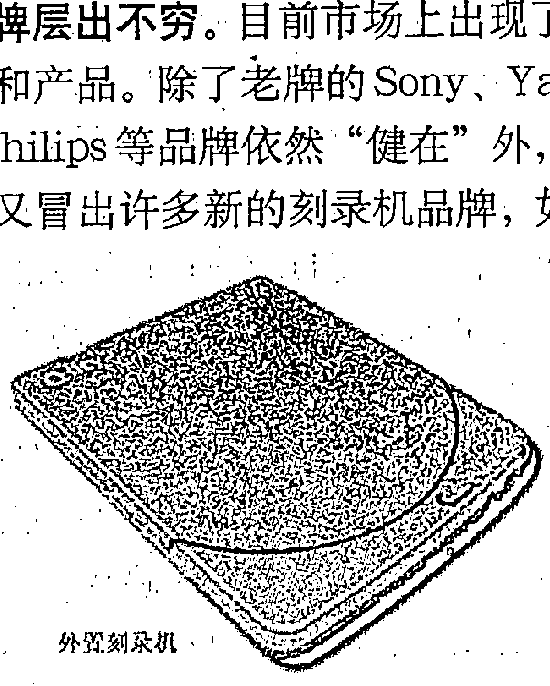

##### （二）近期主流光存储设备产品点评

普通的 CDROM 可以说已经是“夕阳产品”了，各品牌的性能、质量、价格都差不多，在此我就不作过多介绍了。下面主要给大家介绍几款 DVD 和 CDRW 产品。

1. NEC 奔驰 16X DVD

NEC 奔驰 16X DVD 在市场上的口碑非常不错，读盘速度稳定，纠错能力出色，再加上 NEC 比较具有特色的双激光头（Dual Lasers）和双透镜（Dual Lenses）读取技术，以及 Linear Error Correcting Code（线性误差校正码系统）技术，使得其 DVD-ROM 产品在性能上更加出众。

2. Aopen 16X DVD1640 Pro

Aopen 公司于目前发布的 DVD1640 Pro 速度达到了 16X DVD/40X CD，可以称得上是目前速度最快的 DVD。DVD 是否能够最终取代 CD-ROM 虽然还很难说，但是从 DVD1640 Pro 40 倍速的 CD 读取速度和 16 倍速的 DVD 读取速度来看，如果与 CD-ROM 相比，不能不令人心动。DVD1640 Pro 采用的是插盘式设计，盘的装载和弹出过程都非常顺畅。

3. Sanyo BP1500P 和 AOpen CRW2440

Sanyo BP1500P 是最早推出的 24X 的刻录机，24 倍速写入(CD-R)、10 倍速覆写(CD-RW)、40 倍速读取，由三洋制造。IDE 接口，2MB 数据缓存，具 FlexSS-BP 以及 Burn-Proof(烧不死)功能，保证刻录光盘正常。支持 Z-CLV 写入技术，支持 DAO、TAO、Packet Writing、Multisession。

AOpen CRW2440 也是一部具有 24 倍速写入 (CD-R)、10 倍速覆写 (CD-RW)、40 倍速读取功能的超强刻录机。除了延续采用 Just Link 防止刻录失败的超强新技术外，同时亦拥有 JustSpeed 最佳写入速度控制模式，能依据 CD-R 的片种及性质，自动调整写入速度，使得高速刻录时亦有绝对的稳定性及品质。

4. 8M 缓存的 LG 24X 刻录机

这款产品的型号为 GCE-8240B。24 × 10 × 40，引人瞩目的是其 8M 大容量缓存，采用 Exac-Link 防刻死技术。最大的优点也是与其它品牌唯一不同的就在于它内置了 8M 缓存，大家都明白缓存对刻录机的重要性，缓存越大刻录时就越稳定。目前市场上除了曾经风靡一时的ACER 8432外现在只有Yamaha出品的几款刻录机带有8M缓存。这款刻录机采用当今比较流行的Z-CLV写入方式，使用Oak Technology公司开发的Exac-Link防刻死技术，这是一种“精密链接技术”。另外LG 24X刻录机还增加了一个比较有意思的技术：可变刻写速度。根据盘片所支持的速度与质量，刻录机会自行调整合适的写入速度，大大缩小了因盘片质量而刻坏盘的可能性。

5. 广达USB外置刻录机

型号为SCW-44U的便携式刻录机采用银灰色设计，显得精致、时尚。CD盒为上翻式设计。既然是便携式的，那体积当然要小，这台刻录机的厚度只有16毫米，非常薄，重量仅仅230克。其样式与一个CD随身听差不多，十分利于携带。该刻录机采用的接口为USB接口，易于安装，可以热插拔传输数据，有较强的通用性，这使得这款刻录机在笔记本电脑和台式机上同样适用。刻录机尾部还有一个外接的电源接口，以满足刻录机所需要的电源。SCW-446U刻录机具有4倍速写、4倍速复写和6倍速读取的速度。搭配的是目前较为流行的Easy CD刻录软件和封包式写入的Direct CD。这款产品是目前价格相对比较便宜的USB外置刻录机产品，但由于只采用了USB 1.1接口，刻录速度还是比较慢。

6. CD-R/RW/DVD ROM

现在，越来越多的发烧友和普通用户都开始在自己的电脑上装配CD-R/RW，而DVD越来越普及了。如果能把CD-R/RW的功能和DVD ROM功能结合在一个设备中，那么该产品一定会很受欢迎。现在市场有两款这类产品。最先上市的是理光的9060A，性能为：6X/CDR、4X/CDRW、24/CDROM；DVD4X。继日本理光公司之后，三星也成功地开发出可以读取DVD光盘的CD-RW刻录机的产品，型号为SM-304。SM-304的读写速度为：CD-ROM 24倍速、CD-RW 4倍速、DVD-ROM 4倍速。三星电子估计，明年这种类型产品的全球市场规模将达到500万台，预计到2001年和2003年还可以大幅增长到1000万台和4000万台。不过目前这类产品的价格还偏高，在2500元以上。市场分析师认为，随着CD-ROM的逐渐消亡，DVD势将成为市场主流产品，可读DVD光盘的CD-RW的市场生命力肯定十分旺盛，应该会有很大的发展前景。但目前这类产品的价格还偏高，比单独买一台刻录机+DVDROM的价格还要贵不少，这也是影响到其普及的最大障碍。

##### （三）光存储设备选购指南

###### 1. 普通光驱的选购

虽然DVD将代替CD-ROM已是不争的事实，但CD-ROM目前仍是大多数电脑用户的首选，早已经成为个人电脑的标准配置了，它给我们使用电脑带来了极大的方便和乐趣。但它似乎又是电脑中最令人头疼的一个配件。光驱品牌众多，质量良莠不齐，某些品牌读盘能力差、噪音大、寿命短，令用户和商家苦不堪言。如何选购一台满意的光驱也是广大DIY玩家关心的话题。对普通用户而言，选购光驱最重要的三个方面是：读盘能力、噪音及寿命，至于速度及采用了那些新技术等虽然不是选购的关键，但也不应忽视。购买时一定要到信誉良好的商家那里选用知名品牌的产品。以免买到返修货或者用低档次、低倍速的机芯安装在新外壳里冒充高级光驱的假货。购买时要特别注意外包装及机身上的密封签的完好。另外衡量一款光驱品质的好坏不能只看其读盘能力，全面比较才是明智之举。购买时别忘了测试诸如播放VCD、抓音轨、听CD等方面的效果。

###### 2. DVD选购的一般原则

品牌：确定一个信得过的品牌是选购一款好的DVD光驱的关键步骤之一。目前市面上常见的品牌主要有索尼、建基、华硕、创新、日立、东芝、先锋、三星、LG等，这些品牌的产品在质量和性能上没有太大的差异，大家最好不要选择不知名的品牌。选购DVD时，除了一些与选购普通CD-ROM相同的注意事项外，还需特别注意以下几方面。

兼容性：在兼容性方面，要注意应能读CD-R、CD-RW碟片。有的DVD-ROM与CD-R/CD-RW存在兼容性的问题。因为用于CD-R的染料不反射光束，CD-R用DVD激光波长无法识别。一些第一代的DVD-ROM光驱和很多DVD播放机不能读CD-R。通常的解决方案是采用两个不同波长的激光，一个用于读DVD，另一个用于读CD和CD-R。因此第二代DVD-ROM都可与CD-R兼容。

光头系统：目前的DVD-ROM驱动器，有单激光头和双激光头之分。单激光头也就是用同一个光头读取DVD和CD-ROM信号，其中又可分为切换双镜头（东芝）和变焦单镜头（先锋）。双激光头是分别用两个光头读取DVD和CD-ROM信号（Sony）。DVD的单双之分其实源自于对CD-ROM的兼容性，买DVD-ROM驱动器的人大多有CD-ROM驱动器，不见得会用DVD-ROM驱动器来读CD-ROM；何况作为大量出售的产品，厂商的设计应该是可以信赖的；而且似乎并没有哪一个厂商在这一方面大做文章，因此没有必要在这个问题上太过纠缠。

区码问题：DVD-ROM的“区域代码”是大家比较关心的问题。

###### 3. 刻录机选购要点

- 读写速度：读写速度是标志光盘刻录机性能的主要技术指标，包括数据的读取传输率和数据的写入速度。理论上速度越快性能就越好，但由于技术的限制，光盘刻录机的写入速度远比它的读取速度要低得多。刻录机目前最高的读取速度可以达到最大40倍速，甚至也可以做得更高。但用户不会刻意把刻录机当做CD-ROM使用，这个指标并无多大的实际意义。而写入速度目前通常只有24速。很显然此速度越高写入时间越少，优势是显而易见的，但实际上由于盘片刻录软件以及兼容性的限制，高速的写入速度很可能引起“飞盘”现象，导致刻录失败。所以在选购刻录机时无须刻意追求它的高写入速度。基于价格、扩展性和稳定性等多方面的考虑，目前16速左右写入的CD-RW产品应该是首选。

衡量刻录机读写速度还有一个重要指标是平均读取时间，或称为平均查找时间(Average Seek Time)。它是指CD-ROM从光头定位到开始读盘的时间。一般来说此值越小刻录机的读写速度越快。现在高速刻录机平均查找时间一般在120ms左右。

- 接口方式：光盘刻录机按接口方式分，内置的有SCSI接口和IDE接口，外置的有SCSI、并口、PC卡接口以及目前最新的USB、IEEE1394接口等。SCSI接口（无论外置内置）在CPU资源占用和数据传输的稳定性方面都要好于其它接口，系统和软件对刻录过程的影响也低很多，因而它的刻录质量最好。但由于成本、使用方便性等原因，目前只在个别专业产品上使用。目前内置式刻录机基本已经被IDE接口独霸。而外置刻录机目前以USB接口最为流行。

- 缓存容量：缓存的大小是衡量光盘刻录机性能的重要技术指标之一。刻录时数据必须先写入缓存，刻录软件再从缓存区调用要刻录的数据，在刻录的同时后续的数据再写入缓存中，以保持要写入数据良好的组织和连续传输。如果后续数据没有及时写入缓冲区，传输的中断则将导致刻录失败。因而缓冲的容量越大，刻录的成功率就越高。市场上的光盘刻录机的缓存容量一般在1~4MB之间，最大的有8M缓存的产品。建议您选择缓存容量较大的产品，尤其对于IDE接口的刻录机，缓存容量很重要。增加高速缓存既有利于刻录机的稳定工作，同时也有利于降低CPU的占用率。从性价比来看，缓存大小在2~4M左右比较合适。

- 兼容性：首先是对盘片的兼容性。盘片是刻录数据的载体，包括CD-R和CD-RW盘片。CD-R盘片根据介质层分为金碟、绿碟和蓝碟三种。好的刻录机对各类碟片都应有好的兼容性。此外还包括刻录方式的兼容性，比如是否支持Audio CD、Photo CD、CD-I、CD-EXTRA等多种光碟格式，是否支持DAO(Disk-At-Once)、TAO(Track-At-Once)、MS(Multi-Session)、Packet Writing等多种刻录方式。尤其是是否支持增量包刻写(Incremental Packet Writing)的刻录方式。该技术允许用户在同一条轨道中多次追加刻写数据，提高了CD-RW盘片的使用效率和刻写的稳定性。

- 其他：和任何商品一样，购买刻录机时售后服务是很重要的问题。一些刻录机产品虽然价格特别便宜，但由于售后服务态度不佳，或者根本没有完整的售后服务，所以遇到机器故障或者是软件不兼容时难以处理也就是在所难免的了。此外刻录机的工作温度及噪音大小，配件是否齐全，保修卡、说明书等证明资料是否全面等细节，也是我们选购刻录机时需要注意的。

#### 九、配机方案篇

DIY的宗旨就是自己动手来组装性价比最高的电脑来满足自己的需要。请注意“性价比”这个词的含义是很深刻的，它不单纯指高价格、高性能、高质量，当然也不是鼓励低价格、低性能、低质量。归根结底，要提高“性价比”，就要尽可能提升你需要的那部分性能，而降低或抛弃你不需要的性能或功能，“花最少的钱，办最大的事。”

下面提出几个配机方案仅供大家参考。

##### （一）八千元配合具备数据保护功能的液晶办公电脑

对于成天在电脑前工作的朋友来讲，对显示器的要求会比较高。与普通CRT显示器相比，液晶显示器在环保、节能、健康等方面占尽优势，备受人们青睐，但价格一直高高在上，让人望而生畏。今年以来液晶显示器价格持续暴跌，为我们配置液晶电脑创造了条件。下面要介绍的这款电脑就是为整天在电脑前工作的朋友度身打造的一款低价液晶电脑。除了选择液晶显示器外，还特地使用了一款内含数据保护功能的主板，以充分保护重要办公数据的安全。这款电脑主要定位于一般办公用，因此特意配置了网卡，而省略了声卡和音箱，显卡的配置也较低。若改为家用，只需在这两部分适当增加投资即可(电脑配件的价格变化较大，地区差异也较大，本文所列价格仅供参考)。

##### 1. 推荐配置清单

| CPU | 图拉丁 Celeron 1.3G | 680元 |
| :--- | :--- | :--- |
| 内存 | HY 128MB PC133 | 230元 |
| 显卡 | 杂牌 TNT2 M64 | 320元 |
| 硬盘 | 金钻七代 40G(7200转) | 780元 |
| 主板 | 捷波 815T 芯片 | 780元 |
| 光驱 | 大白鲨 50X | 270元 |
| 软驱 | NEC 1.44M | 110元 |
| 显示器 | 优派 V150 15寸液晶显示器 | 3799元 |
| 键盘 | Acer 52G | 100元 |
| 鼠标 | 双飞燕 4D | 50元 |
| 机箱 | 金和田 ATX | 200元 |
| Modem | 全向内置 56K | 180元 |
| 网卡 | DLINK 10/100M 自适应 | 120元 |

##### 2. 主要配件点评

###### (1) 显示器

这台电脑最大的亮点就是选择了时下流行的液晶显示器作为标准配置。优派ViewSonic VE 150是第一款价格在四千元以下的15”液晶显示器。尽管价格便宜，但性能并未打折扣。它利用了主动矩阵技术制作与设计，能够呈现更高亮度的色彩，更细致的画面。对视讯信号的反应速度也更快，其视角也更为宽广，并且保证了四个角落不会变形失真，画质的表现也比传统显示器更为鲜明、犀利。采用210Nits超高明亮度和350:1的超高对比率，使画面色彩更清晰、明亮，画面稳定不伤眼睛，也提升了人们的视觉享受。值得一提的是，ViewSonic VE 150液晶显示器还具备自动调整荧幕大小、中心点及微调功能，免除了使用者设定的困扰。该款显示器支持1670万色，最佳分辨率为1024 × 768，垂直刷新率达75Hz。

###### (2) 主板

如今最令计算机用户头疼的问题是什么？毫无疑问，是在日常使用中因病毒等各种原因造成的数据丢失。为了保护数据不丢失，就必须经常备份数据或系统，用传统方法备份的缺点是耗用的时间长，备份所需要的空间资源大，非常不方便。捷波主板在BIOS中增加了一个非常有用的功能——“恢复精灵”，恰恰能解决这个问题。

捷波“恢复精灵”的原理很简单，就是在硬盘中划分一个很小的保护区来备份数据，以FAT表备份为主。可以将误删除的数据及格式化的数据进行还原，甚至可以恢复FDISK过的数据。在系统崩溃、误操作、意外掉电后迅速恢复到备份之前的状态。备份数据时，仅需很少的时间，恢复时也非常快捷，而且不用重启，直接可以进入系统。占用的空间很小，所占比例只有整个硬盘空间的1／2048。和GHOST等软件相比，占用的空间非常小。且操作简单使用一目了然。

###### (3) 硬盘

迈拓的金钻系列硬盘可能是目前口碑最好的硬盘了。金钻7代单碟容量达到40GB、7200转、2MB缓存)，是迈拓公司在2002年发布的新一代7200转硬盘，具有Texas Instruments DSP 数位讯号处理器以及50MIPS RISC处理器的DualWave双处理器技术，以提高硬盘资料处理的效能。同时也具有ShockBlock防震设计，采取在硬盘底座添加五条肋骨的设计方式，使硬盘能避免外力的撞击。该盘还具备“MAX SAFE”功能，是MAXTOR公司为其硬盘所开发出来的一种数据保护系统，使写入硬盘的数据能够快速并且正确的记录在硬盘上，再配合SMART硬盘自我检测与报错系统，数据的安全得到了极大的保障，使得数据读写错误的出现几乎为零。此外金钻7代还支持ATA133接口，且具备液态轴承版本。

钻石硬盘市场上水货很多，在此提醒大家购买时一定要找正规渠道的代理商。现在钻石硬盘国内总代理为蓝德公司，其代理的迈拓硬盘宣传彩页中有编号，此编号与硬盘内编号相符，包装盒内还另附有抽奖卡、保修卡等，对消费者有一年保换，三年保修的承诺。

###### (4) 键盘、鼠标、MODEM

键盘选用了Acer的52G网络多媒体键盘，键帽符合人体工程学和防水设计，可以减轻长时间工作的疲劳。鼠标则选用了带滚轮的双飞燕4D，价廉物美，特点多多，尤其方便上网。全向的HSF56K内置软“猫”虽然便宜，但连接速度还是非常稳定的，极少掉线，是一款高质量的产品。

##### (二) 为升级 Windows XP 配合新电脑

去年底微软在中国推出最新版本的 Windows XP。该操作系统功能强大，“XP”是“Experience”的缩写。目标是使用户在工作中能更有效地合作，更有效地交流，从而更有效率和创造性。今年将操作系统升级为Windows XP是非常必要的，但XP对硬件系统的要求也比较高，下面特向大家推荐一套可流畅运行Windows XP的电脑。

##### 1. 推荐配置清单

| CPU | AMD XP 1600+ | 800元 |
| :--- | :--- | :--- |
| 主板 | 技嘉 GA-7VTXE | 880元 |
| 内存 | 三星DDR 256M | 460元 |
| 硬盘 | 希捷 酷鱼IV 40G | 780 元 |
| 显卡 | MGAG550 | 850 元 |
| 光驱 | 爱国者 16X Cdrw | 680 元 |
| 软驱 | SONY 1.44M | 110 元 |
| 显示器 | LG 775FT 纯平显示器 | 1620 元 |
| 键盘鼠标 | Acer 52G+ 光电鼠 | 100 元 |
| 机箱电源 | 金和田 | 380 元 |

##### 2. 主要特点点评

为了与Intel的P4相抗衡，AMD公司推出了全新的Athlon XP系列。与P4 1.6G相对应的Athlon XP 1600+，虽然后者的实际主频仅为1.4G，可是在测试中表现出来的性能却超过了前者。不论从价格上还是性能上看，Athlon XP都是非常值得我们选择的。AMD还在Athlon XP新核心中加进了Intel的SSE多媒体指令集，更有利于发挥多媒体软件的性能。

这款配置还重点考虑了显卡和显示器的选择。Matrox的G550显卡面向准专业用户，虽然3D性能一般，但是它的2D画质、文本显示效果确实很优秀，能够将Windows XP的华丽界面发挥得淋漓尽致。配合LG老牌的“未来窗”物理纯平显示器，更是十分有利于2D画面的真实显示，对普通用户而言是十分明智的选择。

整台机器的总价格不到7000元，性价比非常好，不仅可流畅运行Windows XP，也能为2D图形设计提供良好的硬件支持。

##### (三) 万元出头，配合P4 3D图形工作站

随着CPU等配件价格的急剧下跌，以往许多高不可及的高档配件，价格已降到了合理的水平，现在万元出头就可以配合性能强劲的P4 3D图形工作站了。完全可以满足一般设计部门大多数3D图形设计工作的要求。

##### 1. 推荐配置清单

| CPU | P4 1.6GA | 1200 元 |
|---|---|---|
| 内存 | KingmaxDDR 256M X2 | 920 元 |
| 主板 | Intel原装845D | 880 元 |
| 显卡 | 3Dlabs OXYGEN VX1 | 1200 元 |
| 硬盘 | 金钻七代 80G (7200转) | 1280 元 |
| 光驱 | 爱国者 24X Cdrw | 980 元 |
| 软驱 | SONY 1.44M | 110 元 |
| 显示器 | SONY 17" E230 | 2900 元 |
| 键盘鼠标 | Acer 52G+ 光电鼠 | 100 元 |
| 机箱电源 | P4专用机箱电源 | 500 元 |
| 总计 | | 约11000 元 |

##### 2. 主要配件点评

###### (1) CPU

曾经高不可攀的P4价格已降到了比高端PIII还低的价位。这里选择目前性价比最好的新P4 1.6GA，为整机提供强劲的运算动力。这款1.6GA，还一改大多数高频率CPU超频能力有限的局限，具有相当强的超频能力，大多数能轻易超到2G以上。这就更加超值了。

P4 CPU很重要的一个技术特点就是具备第二代数据流SIMD扩展SSE2。P4具有一组144条新指令，这些新指令提高了视频和加密的处理性能，SSE2涉及了多重的数据目标上立刻执行一单个的指令。最重要的是SSE2能处理128位和两倍精密浮点数学运算。处理更精确浮点数的能力使得具备SSE2的P4成为加速多媒体主机、3D处理工程以及工作站类型任务的基本配置。

###### (2) 主板

主板是一台电脑稳定运行的基石。Intel“原装”主板不能超频，特色和功能也不多，但优点就是稳定可靠，兼容性好，对P4的支持最完善。

###### (3) 内存

3D图形处理对内存的需求十分严格。这里使用了性能很好的KingMax DDR内存，且直接将容量配到了512MB，可以满足复杂3D图形处理的需求。

###### (4) 显卡

显卡是图形处理用电脑的“第二心脏”。显卡选择的好坏对整机性能影响相当大。3Dlabs的OXYGEN VX1作为半专业的3D显卡，最近价格大降，因此这里毫不犹豫选择了它。

3D labs定位于制造专业制图显卡，其产品大多是供给专业人士使用的。3D labs低端的OXYGEN VX1是面对初中级用户的产品，它的多线程结构能够充分发挥你现在CPU的功能。3D labs OXYGEN VX1允许在一个场景中管理高达256MB的纹理内存，提供了虚拟纹理子系统，利用图形卡内存就能存储大量纹理。

###### (5) 显示器

Sony最新的E系列17"纯平显示器CPD-E230在前面已有介绍，此处不再赘述。

###### (6) 光驱

现在刻录机的价格已降到了600元以内，是普通消费者可以接受的水平。搞图形制作有大量的数据需要备份，这里多花几百元钱买台刻录机是非常必要的。

爱国者“刻龙”刻录机为解决因“缓存欠载”导致的刻录失败采用了全新缓存欠载保护技术“Burn-Proof”。此款CD-RW支持E-IDE，MMC2界面接口。具有24倍速的CLV一次写入方式和10倍速CLV重写方式，以及40倍速的CAV读取速度，完全可以满足一般用户的需求。

(文/龚胜 龚坚 黄鹏)

## 计算机升级一二三

### 一、计算机升级之系统分析准备篇

计算机的升级可以说是一个比较系统的过程，从分析升级的可行性到升级部件的选购，再到升级部件的安装调试，整个过程都是非常有条理的。而升级前的可行性分析，决定着升级的具体操作，对于整个升级过程都有着很重要的指导意义。分析的好坏在一定程度上决定着升级的效果，因此认真细致地做好升级前的分析准备工作对于每一个准备升级的用户来说都是非常有必要的。

#### （一）认识主板

##### 1. 芯片组

作为计算机的重要组成部分，主板负责着CPU、硬盘以及其他计算机设备之间的信息传输以及处理。而主板上最重要的部分则要属负责这些信息处理的芯片组了。芯片组控制着内存I/O、总线I/O，很多情形下还控制着集成的IDE硬盘控制器、负责处理中断请求(IRQ)和直接内存访问(DMA)等，因此，用户在准备进行升级时，首先要做的工作就是对自己正在使用的主板芯片组有个全面的认识，这样才能对自己想要升级的配件有所了解，不至于出现在购买了升级配件后才发现自己的主板并不支持或者不能很好地支持的情况。

下面就简单介绍一下比较常见的需要升级用户的老主板芯片组的情况：

###### (1) Intel 系列芯片组

###### ① 440BX

Intel 440BX芯片组是随着高频Pentium II CPU一起上市的，它支持100MHz的总线频率，采用四端口技术，有效地把CPU、内存、AGP端口和PCI总线连接起来并控制传输，提高了系统的性能。此外它还具有32位主PCI接口并支持同步AGP端口。440BX芯片组采用南北桥设计，北桥芯片型号为82443BX，负责CPU、内存、64位总线、PCI、AGP等接口及其连接控制。南桥芯片型号为82371AB，负责软驱、硬盘、键盘等接口及USB端口的连接控制，系统管理总线，同时支持UDMA 33协议。BX芯片组支持的内存扩展从768MB到1GB不等。

###### ② 440EX

它是Intel公司专门为赛扬处理器开发的一款芯片组。它也采用南北桥两片结构设计，北桥芯片型号为82443EX，南桥芯片为82371AB。为了节省成本，它的特色功能不多，外频只支持66MHz，此外PCI、ISA等插槽也较少，算是440LX芯片组的简化版。

###### ③ 440ZX

440ZX是Intel为支持Socket 370结构的赛扬处理器而开发的一款芯片组。支持100MHZ总线频率，支持2个DIMM插槽，最大支持256MB内存、3个PCI和1个ISA插槽。440ZX芯片组采用南北桥结构设计，北桥芯片组是82443ZX，南桥芯片组是82371AB。ZX芯片还有一款只支持66MHZ外频的产品。

###### (2) VIA (威盛) 系列芯片组

###### ① VIA Apollo Pro Plus (693) /VIA Apollo Pro 133 (693A)

693芯片组支持Intel的Slot1 Socket370接口的处理器。北桥芯片使用VT82C693，南桥芯片为VT82C596A 或 VT82C686A 芯片。支持66MHz 或100MHz外频的处理器，支持AGP 1x和PCI2.1规范，使用了边带寻址方式，支持并发访问CPU和AGP。使用符合PC98规范的电源管理方式，支持APIC接口配置对称多处理器模式 (SMP)，整合USB接口控制器，支持DMA 33的硬盘传输协议，如果使用686A 南桥芯片就可以支持DMA 66模式。693A是693的改进版本，支持新的Intel P3处理器，支持133MHz的外频，同时允许内存异步运行，提高了系统的性能。

###### ② VIA Apollo Pro 133A (694X)

芯片组由编号VT82C694X 的北桥芯片和编号为VT82C596B 的南桥芯片构成，芯片组支持66/100/133MHz的前端系统总线频率和66/100/133MHz的内存频率，最高支持2GB的SDRAM内存。芯片组支持2个USB端口，ACPI/OnNow技术，支持AGP 2x/4x和DMA 33/66硬盘传输协议，以及更先进的移动电源管理。符合PC 98/99规范，支持PⅢ、PⅡ和Celeron处理器，而且同样的芯片组支持内存异步工作。

##### 2. CPU

作为计算机运算处理的主要部件，CPU在很大程度上决定着计算机的性能，因此更多计算机爱好者在升级时首先想到的就是升级CPU。因此，在升级前对老CPU各方面的知识有所了解对于更顺利、更合理地更新CPU是很有帮助的。

###### (1) 老CPU的接口简介

###### ① SLOT 1

SLOT 1 接口是Intel的专利，其技术结构比较先进，能提供更大的内部传输带宽和CPU性能，这也是当年Intel下大决心抛弃Socket的原因（不过后来Intel因为商业原因又走回了老路）。目前大多数老用户手头还在使用SLOT 1 接口的主板，其芯片组有Intel的BX、i810、i820系列及VIA的Apollo系列，ALI的Aladdin Pro Ⅱ系列及SIS的620、630系列等。

###### ② SLOT 2

SLOT 2接口是Intel开发用于高端服务器及图形工作站的系统。它所搭配使用的CPU也是很昂贵的Xeon（至强）系列。采用SLOT 2接口的主板多有两个以上的CPU插槽，以供多处理器同时工作。支持SLOT 2接口的主板芯片组有440GX 和 450NX。

###### ③ SLOT A

SLOT A 接口是AMD为了与Intel分庭抗礼，另起炉灶的产物。SLOT A主板主要是给AMD的产品K7 Athlon使用的。支持SLOT A 接口结构的主板芯片组主要有两种，一种是AMD自产自销的AMD 750芯片组，另一种是VIA的Apollo KX133芯片组，还有目前正兴起的VIA KT133芯片组。

###### ④ Super 7

Super 7接口主板是当年AMD、VIA、ALI、SIS等厂商为了与Intel的SLOT 1抗衡而共同倡导创建的。它最大的特点是直接支持100MHz总线频率和AGP图形加速端口，从而延续了Socket 7接口主板的寿命。Super 7采用的芯片组有VIA公司的MVP3、MVP4系列，SIS公司的530/540系列及ALI的Aladdin V系列等主板产品。对应Super 7接口CPU的产品有AMD K6-2、K6-Ⅲ、Cyrix M2及一些其他厂商的产品。

###### (2) CPU的主要技术特征

◎主频——主频也叫时钟频率，单位是MHz，用来表示CPU的运算速度。主频越高，表明CPU的运算速度越快。CPU的主频＝外频×倍频系数。

○外频——外频是CPU的基准频率，也叫前端总线频率或者系统总线频率，单位也是MHz。在目前架构的主板上，外频频率与系统内存和L2 Cache总线时钟频率相同。CPU的外频越高，表明CPU与L2 Cache和系统内存交换速度越快，对提高电脑系统的整体运行速度很有利。

◎倍频系数——CPU主频和外频之间的相对比例关系。例如当某个CPU的倍频系数为5、外频为100MHz时，CPU的主频就是500MHz。当将外频改为112MHz时，则主频将为560MHz等等。

◎CPU内核和I/O工作电压——CPU的工作电压分内核电压和I/O电压两种，其中内核电压根据CPU生产工艺而定，一般微米数值越小，内核工作电压越低。I/O工作电压的具体数值则要根据各厂家具体的CPU型号规格确定。

##### 3．主板的电压调节

主板作为CPU、内存以及其他计算机插件的负载体，不仅联系着这些计算机配件之间的信息传输，同时也是这些配件工作时所需的电压、电流的提供者。主板电压的调节，决定着各种主板的负载的电气性能，尤其对于CPU而言，主板电压的调节范围决定着CPU是否能够正常工作。这一点对于要进行升级的用户来说是相当重要的，只有确定了主板电压的支持调整范围，才能在此基础上去选购相应的CPU升级产品。

一般来说，主板说明书上都会提供主板所支持的电压调节范围，而CPU上也会有相应的电压标识，在升级时要注意两者的匹配。

##### 4．内存

作为计算机程序运行存储的空间，计算机内存的容量和性能对于整个计算机系统性能的影响也是很大的。也正是由于这个原因，内存和CPU通常都是广大的计算机爱好者在升级时优先考虑的计算机部件。

就目前而言，老主板升级使用的还是目前比较流行的SDRAM，具体的内存接口上没有任何问题。升级时要注意的是内存速度上的兼容性，以及主板支持的单条内存的最大容量以及总容量，后两者是比较重要的，这决定了系统升级的最大可能。这些具体的参数可以从主板说明书中查到。

#### （二）BIOS分析

很多时候，许多用户在准备升级自己的计算机时，由于主板说明书丢失或者在主板和主板的说明书上并没有提及主板厂商的名称所以不能够准确的识别主板型号，后者在一些小厂生产的主板上尤为多见，从而无法获得自己升级时所需要的各种信息。不过幸运的是，AWARD等BIOS都有一个惟一的ID号，通过这个ID号，我们可以识别主板的生产厂家和芯片组。当你打开计算机自检内存的时候，你可以看到BIOS ID出现在显示器屏幕的左下方。在这时你可以使用PAUSE键使计算机暂停下来，然后就可以记下显示的BIOS ID、BIOS日期和版本等信息。通过这些信息，我们就可以识别出主板的型号、芯片组和生产厂家了。

主板的BIOS-ID一般由BIOS的生产日期、芯片组（北桥芯片）、I/O控制器（南桥芯片）、芯片组编码、厂商编码等信息组成。

下面就举个例子来讲解一下如何利用主板的## BIOS-ID 来识别具体的主板信息

假如有一系统启动后，在系统自检时显示器屏幕的左下角出现这样的 BIOS-ID 的信息：“03/03/2000-694X-686A-2A6LJPA9C-00”。那么从这些 BIOS-ID 信息中，我们可以了解到这个系统采用的主板 BIOS 是 AWARD 的，此 BIOS 编写于 03/03/2000，主板采用的芯片组是 694X，I/O 控制器型号是 686A，芯片组的编号是 2A6LJ，主板的品牌是 Epox（磐英）。

把上面的 BIOS-ID 用 “-” 划分为4段，各个部分所代表的具体含义如下所示：

- 03/03/2000 —— 这段对应的就是 BIOS 编写或者发布的时间。
- 694X —— 这段对应的就是主板所采用主芯片组的简称。
- 686A —— 这段对应的就是主板采用的 I/O 控制器型号。
- 2A6LJPA9C-00 —— 这段对应的就是 AWARD BIOS 识别号，代表含义如下：

    1. 第一位字符代表 BIOS 版本：
       - 为 1 时代表 V.4.2 以前的 AWARD BIOS 版本。
       - 为 2 时代表 V.4.5 的 AWARD BIOS 版本。
       - 为 6 时代表 V.6.0 的 AWARD BIOS 版本。
       - 常见的此位均为 2，该位为其他字符时是代表其他版本或专用、特殊的 BIOS 版本。
    2. 第二位字符代表所支持总线类型：
       - 为 1 时代表支持 ISA 总线。
       - 为 2 时代表支持 PS/2 总线。
       - 为 3 时代表支持 EISA 总线。
       - 为 A 时代表支持 ISA/PCI 总线。
       - 为 B 时代表支持 EISA/PCI 总线。
       - 为 C 时代表支持 ISA/PM 总线。
       - 常见的均为 A，为其他字符时代表该 BIOS 可以支持其他的总线。
    3. 第三位字符表明主板所支持的 CPU 类型：
       - 为 4 时代表主板支持的处理器为或相当于 Intel 公司的 486 级 CPU。
       - 为 5 时代表主板支持的处理器为或相当于 Intel 公司的 586 级 CPU。
       - 为 6 时代表主板支持的处理器为或相当于 Intel 公司的 P II 级 CPU。
       - 该位其他字符不常见。
    4. 第四位和第五位表明主板使用的芯片组的类型，其中第四位表明芯片组的厂商，第五位表明芯片组的具体型号：
       - 采用 VIA 的芯片组时位为 L。
       - 采用 Ali 的芯片组时位为 K。
       - 采用 SiS 的芯片组时位为 I。
       - 采用 Intel 的芯片组时位为 9。
       - 其他字符少见。

因此通过前 5 位的字母和数字，我们也可以判断出主板采用的主芯片代号。

    5. 第六位和第七位是 AWARD 公司的顾客编号（厂商 ID）。
       - 这两位是用来识别相应的主板生产厂商的，如上面例子中的 V3 代表 VTECH（柏能）品牌，而 A0 代表 ASUS（华硕），A1 代表 Abit（升技）等。

    6. 第八位和第九位代表主板的型号。
       - 短横线后的两位数字一般是没有固定的意义的，通常为 “00”。

下面是 BIOS-ID 中前 5 位数字、字母编码对应的常见芯片组和各个厂商的具体 ID 信息。

**1. BIOS-ID 中前5位数字、字母编码对应的常见芯片组**

| 代码 | 芯片组 |
|------|--------|
| 214X2 | UMC 491 Chipset |
| 2A431 | Cyrix MediaGx Cx5510 chipset |
| 2A432 | Cyrix GXi Cx5520 Chipset |
| 2A433 | Cyrix GXm Cx5520 Chipset |
| 2A434 | Cyrix GXm Cx5530 Chipset |
| 2A496 | Intel Saturn Chipset |
| 2A498 | Intel Saturn II Chipset |
| 2A499 | Intel Aries Chipset |
| 2A4H2 | Contaq 82C596-9 Chipset |
| 2A4IB | SiS 496/497 Chipset |
| 2A4KC | Ali 1439/45/31 Chipset |
| 2A4KD | Ali 1487/1489 Chipset |
| 2A4L4 | VIA 486A/482/505 Chipset |
| 2A4L6 | VIA 496/406/505 Chipset |
| 2A4UK | OPTI-802G-822 Chipset |
| 2A4X5 | UMC 8881E/8886B Chipset |
| 2A597 | Intel Mercury Chipset |
| 2A59A | Intel Natoma (Neptune) Chipset |
| 2A59B | Intel Mercury Chipset |
| 2A59C | Intel Triton FX chipset (Socket 7 based m/b) |
| 2A59F | Intel Triton II HX chipset (Socket 7 based m/b) |
| 2A59G | Intel Triton VX chipset (Socket 7 based m/b) |
| 2A59H | Intel Triton VX chipset (Socket 7 based m/b) with an illegal BIOS |
| 2A59I | Intel Triton TX chipset (Socket 7 based m/b) |
| 2A5C7 | VIA VT82C570 Chipset |
| 2A5G7 | VLSI VL82C594 Chipset |
| 2A5GB | VLSI Lynx VL82C541/VL82C543 Chipset |
| 2A5IA | SiS 501/02/03 Chipset |
| 2A5IC | SiS 5501/02/03 Chipset |
| 2A5ID | SiS 5511/12/13 Chipset |
| 2A5IE | SiS 5101-5103 Chipset |
| 2A5IF | SiS 5596/5597 Chipset |
| 2A5IH | SiS 5571 Chipset |
| 2A5II | SiS 5582/5597/5598 Chipset |
| 2A5IJ | SiS 5120 Mobile Chipset |
| 2A5IK | SiS 5591 Chipset |
| 2A5IM | SiS 530 Chipset |
| 2A5KB | Ali 1449/61/51 Chipset |
| 2A5KE | ALI 1511 Chipset |
| 2A5KF | ALI 1521/23 Chipset |
| 2A5KI | ALI IV+ M1531/M1543 Chipset (also known as Super TX chipset) |
| 2A5KK | Ali Aladdin V Chipset |
| 2A5L7 | VIA VT82C570 Chipset |
| 2A5L9 | VIA VT82C570M Chipset |
| 2A5LA | VIA Apollo VP1 Chipset (VT82C580VP) (sometimes relabeled as VXPro chipset) |
| 2A5LC | VIA Apollo VP2 Chipset (sometimes relabeled as AMD640 chipset) |
| 2A5LD | VIA VPX Chipset (sometimes relabeled as VXPro+ chipset) |
| 2A5LE | VIA Apollo (M)VP3 Chipset |
| 2A5LH | VIA Apollo VP4 Chipset |
| 2A6LJ | VIA Apollo Pro 133A Chipset |
| 2A5R5 | Forex 601A-613 Chipset |
| 2A5UI | Opti 82C822/596/597 Chipset |
| 2A5UL | Opti 82C822/571/572 Chipset |
| 2A5UM | Opti 82C822/546/547 Chipset |
| 2A5UN | Opti Viper-M 82C556/557/558 Chipset or Opti Viper 82C556/557/558 |
| 2A5UP | Opti Viper Max |
| 2A5X7 | UMC 82C890 Chipset |
| 2A5X8 | UMC UM8886BF/UM8891BF/UM8892BF Chipset |
| 2A5XA | UMC 890C Chipset |
| 2A69H | Intel 440FX chipset (Pentium II/Pentium Pro based chipset) |
| 2A69J | Intel 440LX/EX chipset (Pentium II based chipset) |
| 2A69K | Intel 440BX chipset (Pentium II based chipset) |
| 2A69L | Intel Camino 820 Chipset |
| 2A69M | Intel Whitney 810 Chipset |
| 2A6IL | SiS 5600 Chipset |
| 2A6IN | SiS 620 Chipset |
| 2A6KL | Ali 1621/1543C Chipset |
| 2A6LF | Via Apollo Pro (691/596) Chipset |
| 2A6LG | Via Apollo Pro Plus (692/596) Chipset |
| 2A9KG | ALI 6117 Chipset |
| 2AG9H | Intel Neptune ISA Chipset |
| 2B59A | Intel Neptune EISA Chipset |
| 2B69D | Intel Orion Chipset |
| 2C403 | EFAR EC802G-B Chipset |
| 2C4D2 | HINT Chipset (consists of HMC HM82C206 and HiNT CS8006.) |
| 2C4I7 | SiS 461 Chipset |
| 2C4I8 | SiS 471B/E Chipset |
| 2C4I9 | SIS 85C471B/E/G Chipset |
| 2C4J6 | Winbond-83C491 |
| 2C4K9 | ALI 14296 Chipset |
| 2C4KC | Ali 1439/45/31 Chipset |
| 2C4L2 | VIA 82C486A Chipset |
| 2C4L6 | VIA VT496G Chipset |
| 2C4UK | OPTI 82C895/82C602 |
| 2C4X2 | UMC UM82C491/82C493 chipset |
| 2C4X6 | UMC UM498F/496F |

##### 2. BIOS-ID 对应的厂商 ID

| 代码 | 厂商 |
|------|------|
| A0 | ASUS (华硕) |
| A1 | Abit (Silicon Star) (升技) |
| A2 | Atrend (中凌) |
| A3 | Bcom (ASI) |
| A7 | AVT (formerly Concord) |
| A8 | Adcom AB AOpen (建基) |
| AD | Amaquest |
| AK | Advantech |
| AM | Achme AT ASK Technology |
| AX | Achitec |
| B0 | Biostar (映泰) |
| B1 | BEK-Tronic Technology |
| B2 | Boser |
| B3 | BCM |
| C1 | Clevo |
| C2 | Chicony |
| C3 | Chaintech (承启) |
| C5 | Chaplet |
| C9 | Computrend |
| CF | Flagpoint (旗点) |
| CS | Gainward (耕宇) or CSS Laboratories |
| D0 | Dataexpert (联讯) |
| D1 | DTK |
| D2 | Digital |
| D3 | Digicom |
| D4 | DFI (Diamond Flower) (Crusader?) (钻石) |
| D7 | Daewoo |
| DE | Dual Tech |
| DI | Domex (DTC) |
| DJ | Darter |
| DL | Delta Electronics |
| E1 | ECS (Elitegroup) (精英) |
| E3 | EFA |
| E4 | ESPCo |
| E6 | Elonex |
| EC | ENPC |
| F0 | FIC (FICA) (大众) |
| F1 | Flytech Group International |
| F2 | ee Tech or flexus |
| F3 | Full Yes (福扬) |
| F5 | Fugutech |
| F8 | Formosa Industrial Computing |
| F9 | Fordian |
| G0 | Giga-byte (技嘉) |
| G1 | GIT |
| G3 | Gemlight |
| G5 | GVC (致福) |
| G9 | Global Circuit Technology |
| GA | Giantec |
| GE | Zaapa |
| H0 | Hsing-Tech (PcChips) |
| H2 | HOLCO (Shuttle) |
| HH | HighTech Information System |
| I3 | IWill (艾崴) |
| I4 | Inventa (Twn) |
| I5 | Informtech |
| I9 | ICP IA Infinity |
| IC | Inventec (notebooks) |
| IE | Itri |
| J1 | Jetway (Jetboard, Acorp) |
| J2 | Jamicon (Twn) |
| J3 | J-Bond (捷波) |
| J4 | Jetta |
| J6 | Joss |
| K0 | Kapok |
| K1 | Kamei |
| KF | Kinpo |
| L1 | Lucky Star |
| L7 | Lanner Electronics Inc. |
| L9 | Lucky Tiger |
| M0 | Matra |
| M2 | Mycomp (TMC) and Megastar (麦肯 / 皇朝) |
| M3 | Mitac |
| M4 | Micro-star (微星) |
| M8 | Mustek |
| M9 | MLE MH Macrotek |
| N0 | Nexcom |
| N5 | NEC |
| NM | NMC (New Media Communication) |
| NX | Nexar |
| O0 | Ocean (Octek) (海洋) |
| P1 | PC-Chips (明致) |
| P4 | Asus (华硕) |
| P6 | Pro-Tech |
| P8 | Azza |
| P9 | Powertech |
| PA | Epox (Pronix) & 2TheMax (磐英) |
| PC | Pine (松景) |
| PF | President (dead) |
| PN | Procomp Informatics Ltd. |
| PS | Palmax (notebooks) |
| PX | Pionix |
| Q0 | Quanta (Twn) |
| Q1 | QDI (联想) |
| RA | RioWorks Solutions Inc |
| R0 | Mtech (Rise) |
| R2 | Rectron |
| R3 | Datavan International Corp. |
| S2 | Soyo (梅捷) |
| S3 | Smart D&M Technology Co., Ltd. |
| S5 | Shuttle (Holco) (浩鑫) |
| S9 | Spring Circle |
| SA | Seanix |
| SC | Sukjung (Auhua Electronics Co. Ltd.) |
| SE | Newtech or SMT |
| SH | SYE (Shing Yunn Technology Co., Ltd.) |
| SJ | Sowah |
| SL | Winco |
| SM | San-Li and Hope Vision, Superpower |
| SN | Soltek (硕泰克) |
| SW | S&D or OEM Acorp |
| T0 | Twinhead |
| T1 | Taemung or Fentech or Trang Bow |
| T4 | Taken |
| T5 | Tyan |
| T6 | Trigem |
| TB | Taeil |
| TG | Tekram (建邦) |
| TJ | Totem |
| TP | Commate, Ozzo |
| TL | Transcend Information Inc. |
| U0 | U-Board |
| U1 | USI (Universal Scientific Industrial) |
| U2 | AIR (UHC) |
| U4 | Unicorn |
| U6 | Unitron |
| V3 | Vtech (PCPartner) (柏能) |
| V5 | Vision Top Technology |
| V6 | Vobis |
| V7 | YKM (Dayton Micro) |
| W0 | Wintec (Edom) |
| W1 | WellJoin |
| W5 | Winco |
| W7 | Win Lan Enterprise |
| X5 | Arima |
| Y2 | Yamashita |
| Z1 | Zida (Tomato boards) |
| Z3 | Zeling (则灵) |

#### （三）主板 BIOS 的刷新

通常来说，主板 BIOS 的刷新能够解决一些硬件不兼容或冲突问题，而对于需要升级的用户来说，更新 BIOS 能够解决主板与新型硬盘的不兼容（如突破硬盘容量的限制，支持更高容量的硬盘）、更新 CPU 微代码支持新型 CPU 等，这对于进行计算机的升级是非常有必要的。因此，在进行计算机升级工作前，更新相应主板的 BIOS 是一项必不可少的准备工作。

进行主板 BIOS 的刷新前，我们首先要去相应主板生产厂商的主页下载相应的主板 BIOS 更新文件，通常下载的是一个压缩文件，压缩文件中包含了一个刷新程序以及一个更新文件，刷新程序通常是 Awdflash.exe。在具体使用时，只要启动到纯 DOS 模式，然后运行 Awdflash.exe，按照屏幕上的提示输入相应的更新文件进行操作就可以了，如下图所示。

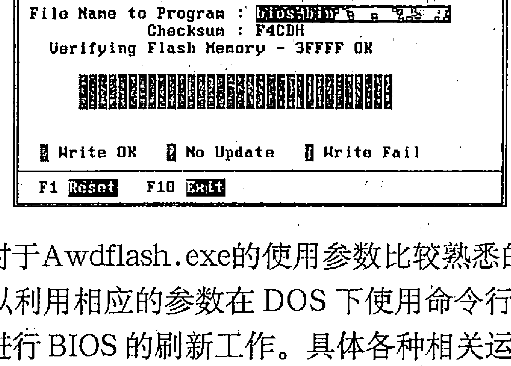

对于 Awdflash.exe 的使用参数比较熟悉的朋友，还可以利用相应的参数在 DOS 下使用命令行的形式快速进行 BIOS 的刷新工作。具体各种相关运行参数罗列如下：

Awdflash.exe 命令行的各种参数使用说明:

- /? : 显示帮助信息。
- /py: 自动完成 BIOS 的刷新任务。
- /sy: 备份原来的 BIOS 到磁盘。
- /sb: 在升级 BIOS 时强行跳过 BootBlock 模块。
- /cp: 在刷新结束后清除即插即用数据 (ESCD)。
- /cd: 在刷新 BIOS 结束后清除 DMI 数据。
- /r: 在刷新 BIOS 结束后自动重启动。
- /pn: 不运行升级程序。
- /sn: 不备份系统老的 BIOS 文件。
- /sd: 保存 DMI 数据到一个文件。
- /cks: 在更新 BIOS 时显示备份文件的数据。
- /tiny: 只占用很少的内存。
- /e: 刷新结束后自动回到 DOS 命令行状态。
- /f: 刷新时使用原来的 BIOS 数据。
- /ld: 在刷新结束后清除 CMOS 数据并且不重新引导系统。
- /cksxxxx: 将老的备份 BIOS 文件与新的 BIOS 文件进行比较校验。

另外还要指出，通常在更新主板 BIOS 时推荐创建一张 DOS 启动盘，然后把 BIOS 的刷新程序以及更新文件拷贝到启动盘上，用启动盘启动系统后，在软盘上运行刷新程序进行 BIOS 的更新工作。而从笔者多年的使用经验来看，直接在硬盘上运行刷新程序进行更新更安全、快速。使用软盘进行更新，有时容易出现因升级用的启动软盘上有坏块而导致更新文件无法正确读取而导致更新失败，这种情况不在少数，而在硬盘上进行更新则相对要安全很多。笔者的建议是，启动盘还是需要的，BIOS 的刷新程序以及更新文件在进行操作前，也要在软盘上进行备份以防不测，然后用启动盘启动或者在电脑重新启动进行至 Starting Windows 98.... 的时候，迅速按下 F8 键，选择“Safe Mode Command Prompt Only 模式”进入 DOS 模式，用硬盘上的刷新文件进行相应的更新工作，这样就能做到比较安全、快速地进行 BIOS 的更新工作了。对于实在要用软盘进行更新的用户，建议在更新前用 HD-Copy 等磁盘拷贝软件进行一下读写校验，测试没有问题再进行更新。

#### （四）ATA66/100 控制卡

随着硬盘技术的发展，硬盘的转速、盘片材质、单碟容量都有了长足的进步，硬盘传输模式也从早先的 PIO、ATA33 经历到了现在的 ATA66、ATA100 乃至 ATA133。从目前市场上常见的硬盘品牌来看，几乎所有的硬盘都已经支持 ATA66 以上的传输模式。而对于需要升级硬盘的老主板用户来说，他们的主板都只支持 ATA33 以下的模式，购买的新硬盘将只能以兼容模式运行在低的传输模式下，根本不能运行其真正应有的性能。因此，这个因素也是广大的计算机爱好者在升级时要注意的，在升级时要注意自己的主板对于硬盘传输模式的支持情况是怎么样，如果不支持 ATA66/100 的话，为保证硬盘系统的正常发挥这时就有必要购买相应的 ATA66/100 的控制卡来替代主板上的磁盘控制器了。

就目前市场上常见的 ATA66/ATA100 控制卡的产品来看，这些产品主要采用的主控制芯片一般都是 HighPoint 以及 Promise 芯片的产品。作为市场占有率最高的两个 ATA 控制芯片生产厂家，他们的产品已经被很多主板厂商所采纳，相比较而言，HighPoint 的产品在速度方面有优势，而 Promise 的产品则在兼容性方面更好些。

市场主流产品采用的芯片组主要有以下一些：

- ATA66: HighPoint 366、Promise Ultra DMA/66
- ATA100: HighPoint 370、Promise Ultra DMA/100

#### （五）转接卡

提到 CPU 转接卡，相信大家都不陌生。作为不同 CPU 接口之间转换的工具，对于广大的计算机升级用户来说，CPU 转接卡是很多人在升级时所不可或缺的。很多计算机爱好者使用的还是以前老的 SLOT1 接口的主板，对于这些需要升级的用户来说，要使用现在的 Socket 370 接口的 CPU，只有通过转接卡才能实现这一目的。

就目前市场上常见的转接卡产品来看，主要有两类 SLOT1 转 Socket 370 接口的转接卡产品，一种是只支持 PPGA 封装的赛扬 CPU 的转接卡，这类产品让大多数带 SLOT 1 插槽的主板使用 Intel Celeron PPGA 处理器（主板的 BIOS 可能需要升级），较好的代表产品是艾崴 I 转接卡、微星公司的 MS-6905（电压调整范围 1.8-2.4V）等；另外一种是可以支持 FC-PPGA 封装的 PIII 与 PPGA 封装的赛扬的转接卡，这类转接卡的电压调整范围通常可以从 1.30V 至 3.50V，较好的代表产品有艾崴 II 转接卡、技嘉-6R7 转接卡等。

除了一些品牌的转接卡外，市场上还有一些杂牌的转接卡。相比较而言，品牌的转接卡做工更精细，一般都能采用手动跳线的方式，通过跳线可以对CPU的频率、电压进行调节，而且一般都支持多外频、多电压的调节，稳定性好，升级性强，而普通的转接卡则通常只有单一的功能，不具有相应的调节功能，对主板的要求高，做工也一般。因此大家在选购转接卡产品时要多注意一下。

另外，对于部分较早的Socket 370用户来说，由于CPU针脚定义的不同，无法使用Tualatin核心的CPU，如果想升级的话，就可能需要相应的Tualatin S370转接卡了。

### 二、计算机升级之整合升级方案篇

随着计算机的发展，计算机配件价格的不断下降，越来越快的CPU、越来越强劲的显卡……都陆续出现在常见的购机配置单中。但是随着购机者的购机观念越来越成熟、越来越理性化，他们也清楚地认识到低端处理器已完全可以胜任普通用户各个方面的需要，不再盲目地追求高时钟频率的处理器和超强的3D处理性能等高配置，而是讲求“实用、适用”。于是，整合主板便成为他们购机时的一个很好的选择对象。

#### （一）细说整合主板

##### 1. 整合主板的概念

整合主板“整合”的含义在于其采用的是整合型芯片组，从目前来说，较普遍（也是相对狭义）对于整合芯片组的看法是：在北桥（即System Controller，系统控制器）或者GMCH（即Graphics and AGP Memory Controller Hub），除了包含内存控制器以外，还整合了图形内核等逻辑电路的芯片组，例如英特尔的81X芯片组系列、威盛的PM133芯片组系列等，在未来，可能还会整合显存、声卡、网卡、Modem（这些已经在现在的部分主板上得到实现）等一系列部件。如果在此基础上加上内存以及其它的一些I/O部件后，就可以充当一部完整的PC了。

目前市场上常见的整合芯片组主要有英特尔的81X系列；威盛的PM133、PLE133、KM133；SIS的630、730系列、ALI的Aladdin TNT2、ATi的S1-370TL等。

##### 2. 整合主板的优缺点

##### （1）优点

整合主板在选用高集成的芯片组（包含显示芯片）外，通常还集成了声音芯片甚至网卡、Modem芯片，这样的主板布局更简洁、制造成本更低，而且没有附加卡的主板发生不兼容的情况也要少得多。因而整合主板具有高集成度、高性价比的优点。同时集成芯片组确保了在配置的系统中固定硬件的高度统一。由于许多部件集成于芯片组上，这些不同部件的兼容性得到了保障。驱动程序更容易安装了，而且所有配置系统的检测功能也具有了相同的驱动系列。另外，对于厂家和商家来说，整合主板以其良好的性价比和兼容性，使产品的销售及售后服务费用大为降低，这样就可以通过原始成本以及减少维修成本来降低TCO。

##### （2）缺点

由于图形加速引擎整合在芯片组的内部，这些图形加速芯片也不是当前主流的3D加速芯片，而且主板上已经省略了AGP插槽，如果要添置新的AGP显示卡时便显得无能为力。而且整合主板的升级能力仍然有限，也许可以使用PCI显示卡能够获得好一些的3D性能，但由于计算机配件产品的发展远比人们想象的要快，当更新的产品出现的时候，选择性仍比非整合主板要小得多，用户所面临的只有换与不换主板两种选择。尽管现在有些整合芯片为满足市场需求，额外提供了一个AGP插槽，但这又大大提高了主板的成本和价格，直接降低了整合主板的性价比。

##### 3. 整合主板适用范围

相对于常见的主板，采用整合芯片组制造的整合主板比较便宜，而且在商业应用程序中也能提供颇具竞争力的性能。因此对于那些只想购置一台廉价的PC用于数据输入、文字处理、教育学习、网络浏览，或者数值不高的数字处理的普通用户来说，那么就无需花费更多的钱了，选用整合主板还是比较合适的。这些整合主板对于普通的家庭用户的日常作业（如一般的商业应用程序、Internet浏览），甚至对于一些要求不是非常高的3D游戏也是绰绰有余的。对于广大的公司企事业单位来说，采用整合主板可以大幅度地减少企业在购置计算机硬件设备的预算开支，从而达到减少企业投入成本，这一点对于公司、企业用户来说是非常有帮助的。另外，对于网吧、电子教室（也就是多媒体教学）等领域的用户，使用整合型主板也是一个很好的解决方案。

#### （二）常见主流整合主板芯片组介绍

##### 1. Intel

Intel在1999年底为了强化对低端市场的控制和追赶技术潮流，推出了新型整合主板芯片组i810，早期的i810不但不兼容P Ⅲ处理器，而且不提供升级扩充能力，更不能换显卡和声卡，没有达到预期的市场效应。之后又推出了i810L、i810 DC100和i810E三种类型主板，直到i810E才改正了与P Ⅲ处理器的不兼容问题，同时支持133MHz外频和PC133内存。

2000年的6月19日Intel发布了i815E（Solana），作为先期推出的i815的加强版，它是当时整合度最为齐全的芯片组，由于440BX无法再满足用户对新技术的需求，加上i810、i820系列的失败，i815E无疑成了Intel冲击主流市场的中流砥柱，它同样采用“加速集线器结构”技术，正式支持了AGP4X、PC133、ATA100、CNR和4个USB，还整合了2D/3D图形芯片i752等。

其中i810和i810E都采用内置显卡，前者采用的是Intel i740，后者采用的是Intel i752、i815和i815E除了可以使用内置的Intel i752显示芯片外，还可以另外提供一根额外的支持AGP4X的插槽供使用者提升显示性能之用。另外，i810、i810E和i815只能支持DMA66，而i815E则支持DMA100。

i815E的代表产品有：梅捷SOYO-SL-7ISA+（如图1）、精英P6ISA-II、联想SX2E等。

##### 2. VIA（威盛）

VIA面向Intel系列CPU产品而推出的整合芯片组是Apollo PM133（Premedia 133）。PM133的北桥是VIA VT8605，除了内置的集成了S3公司的图形处理器S3 Savage4NB系列（采用S3 Savage2000内核）显示核心，还像i815E一样提供了独立的AGP 4X插槽。PM133基本上等于694X+Savage Pro显卡的组合，因此它在图形性能方面甚至比i815E更出色。在搭配686B南桥芯片后，PM133也可提供ATA/100的硬盘接口。另外，PM133更有特色的是它支持双CPU。

代表产品有：技嘉GA-6PMM-L、硕泰克SL-65MV-X、创见TS-APM3、MIDA 6M8601、梅捷SY-7VMA（如图2）等。

VIA面向AMD系列CPU产品推出的相应整合型芯片组是KLE133和KM133/A。KLE133的北桥是VT8361，支持Athlon和Duron的全系列CPU，并且支持133MHz外频。该芯片组集成的是Trident Blade 3D显示核心，不过可惜的是KLE133并没有提供额外的AGP插槽可供用户升级。因此，它的应用范围较窄，只适合那些对显示系统要求较低的环境。不过采用KLE133芯片组的主板十分便宜，像美达KLE133主板上还集成了6声道声卡和100M网卡。所以，也是性价比比较高的一种选择。

KM133/A芯片组分为KM133和KM133A两种。前者不能支持133MHz外频，而KM133A则无此问题。同时，它们都集成了Pro Savage显示核心，并单独提供了AGP 4X插槽。因此在选购时，推荐选择采用KM133A芯片组的产品，只是目前在市场中并不多见。

##### 3. SiS（矽统）

SiS可算是一直潜心于整合型芯片组研发和推广的厂商之一。目前在它的整合型芯片组中最吸引人的产品应算是SiS 730、SiS630芯片组。这两款芯片组都采用了单一芯片的设计方式，并集成了显卡、声卡、网卡等众多功能；同时，也提供了额外的AGP 4X插槽，而其集成的显卡甚至还能提供环境凹凸映射的特效，这对于一些追求高性价比的用户来说是非常有吸引力的。

SiS 面向 Intel 系列 CPU 推出的整合芯片组是 SiS630，SiS 630S 是 SiS（矽统）科技推出的高性能整合式芯片组，也是全球第一颗支持 ATA100 的整合式芯片，其主要卖点是集成了相当于 AGP 4X 的高性能显示芯片 SiS300，并可提供 MODEM 、以太网（Ethernet）、家庭网络（Home PNA）等功能。另外 SiS630S 为特别的五个 USB 端口、双 USB OpenHCI 主控制器，它放弃了对 ISA 的支持。与只支持 AC97 的 i810E 不同，SiS630S 配有内嵌 DSP，可以用于波表合成、DirectSound 加速与位速率转换的 CPU 处理。这有助于在一定条件下提高帧频与音频质量。另外，SiS 芯片组还特别配有 S/PDIF 输出为外部解码器提供杜比数码输出。最重要的是为了满足市场上的强劲需求及延长主板的生命力，SIS 630S 外加了四倍速的 AGP 显卡插槽，这样的设计使整合型主板迈上了一个新的平台，迎合了消费者对高性能显卡的最新要求。

SiS 面向 AMD 系列 CPU 推出的整合型芯片组是 SiS 730S。它支持 Socket A 系列处理器，并使用价格便宜 SDRAM。它是面向低端市场 Duron 处理器的最佳搭档。由于 Duron 在价格和性能上的优势，使用 SiS730 S 芯片组的主板更能体现出最佳的性价比，而且由于 VIA 面向 AMD 的 KLE133 芯片组无法提供额外的 AGP 插槽，所以对那些有升级需求的用户来说就显得更有吸引力。值得一提的是，大多数采用 SiS 730S 芯片组的主板上还集成有 10/100M 网卡（比如精英 K7SEM 主板）。因此对于一些对系统性能要求不高的网络环境（比如一般的办公商用）也是非常合适的。

代表产品有：精英 P6SSM（630S）、华硕 ASUS A7S-VM（730S）、精英 K7SEM（730S）、技嘉 GA-7SMZ（730S）、三帝 SIS730S（如图 3）等。

图 3 精英 K7SEM（730S）

##### 4. ALi Aladdin TNT2

这款主板芯片组是 ALI 和 nVidia 联合开发的新一代整合芯片组，它的特点就是在主板上集成了最有名的 TNT2 显示卡。Aladdin TNT2 的北桥芯片是 M1631，南桥是 M1543C 和 1543D。它支持 Intel 的 Pentium II 、Pentium Ⅲ系列 CPU，同时可支持多个奔腾 II 处理器，同时还有 1X/2X 的 AGP 模式，最大可支持 1.5GB 的 EDO/SDRAM 内存，可支持多达 6 个的 PCI 设备；它的南桥芯片支持 DMA/66、4USB、PCI2.2 等功能。Aladdin TNT2 主板上集成的 TNT2（M64）显卡的性能无疑是同类主板中性能最好的，这款集成显卡可最大使用 32MB 的主显存，其显存的标准工作频率为 143MHz。另外值得一提的是 Aladdin TNT2 还对 DVD 软解压等功能进行了优化，使你可以更好地享受它带给你的好处。

主要的代表产品有：华硕 CUAladdinTNT2、三帝主板和麒麟主板均有基于此芯片组的产品。

#### （三）整合主板的选购

通过上面的介绍，相信大家对于整合主板有了一个比较深入的认识，那么具体在面对市场上各色各样的整合主板的时候，又该如何下手呢？下面就来介绍一下在选购整合主板时需要注意的一些问题。

##### 1. 芯片组部分

芯片组作为整合主板最为重要的一个部分，同时也可能是用户在选购中最为不了解的一部分。由于整合主板的芯片组通常集成显示芯片，不同的显示芯片带来的整体性能差异比较明显。而且相同的系列所使用的主芯片会有一定的差异，因此在选购时一定要注意好相应产品所使用的主芯片组。由于现在一般芯片组在南北桥芯片上通常都覆盖着散热片，所以大家很难直接判断主板所采用的主芯片组，建议大家可以参考上面的介绍的各整合芯片组的代表产品。

##### 2. 扩展槽部分

扩展槽的升级能力是用户们在硬件升级时比较关心的一部分，这一点也是不可忽视的。整合主板目前以 ATX 和 MicroATX 结构两种为多，也有一些低价主板采用了 AT 结构，更适于旧机器的升级。由于 PC’99 规范中已明确表示不支持 ISA 插槽，所以很多主板还取消了 ISA 插槽，如果有老的 ISA 设备将不能再使用。不过很多整合主板都集成音效芯片，这对扩展插槽的数量要求也少的多。这些在选购时可以根据自己需要酌情考虑。

##### 3. 显存部分

由于显示芯片整合在芯片组的内部，整合芯片组都支持主内存共享，通过调用主内存空间获得显示芯片所需要的缓存。虽然这降低了系统成本，但在一定程度上不可避免地占用主内存而造成性能下降，因而最好选择板载显存的主板。选购时必须要注意的是，自带显存和不带显存的主板存在着较大的差价，而且显存速度的不同，性能的表现也各不相同，应尽量选择集成显存速度较快的主板。

##### 4. 制造工艺

一般来讲，知名品牌主板在稳定性与兼容性方面都要比一些杂牌的主板做得好，跟那些知名品牌的产品相比，杂牌主板的制作工艺要差很多。第一是做工。一般杂牌主板的做工都很粗糙，甚至在主板上出现“飞线”现象(指元件与元件或线路与线路之间直接用导线相连)。在元件的选料上也多以低价的次品为主，各插槽，插座和元件均无厂牌。在元件组装焊接方面，板基通常只采用两层板或三层板，而且不太重要的元件均不安装。第二是产品的检测手段和售后服务。一般杂牌主板都没有经过严格的检测就出厂，而且售后服务也无法得到保障。而品牌主板在出厂前都需经过严格的质量检测，以品牌主板厂商的实力，这些主板即使在用户手中出了故障也能得到及时的保修或更换。

#### （四）其他计算机配件的购买选择

对于要采用整合主板进行升级的朋友来说，除了购买相应的主板外，还要购买CPU和内存。无论是对原有的CPU和内存进行升级还是购买新的CPU和内存而言，最重要的还是要注意所选用的整合主板和CPU以及内存的兼容能力。下面就来介绍一下各种常见整合主板以及相应搭配的CPU、内存的情况。

从目前大家所正在使用整合型主板来看，其相应的搭配组合主要有以下一些：

- 1. 英特尔I810/I810E
I810E可以支持Coppermine PⅢ，外频（FSB）为133MHz，而I810仅支持奔腾Ⅱ级的CPU。
- 2. 英特尔I815/I815E
I815E除了集成有显卡之外，还提供了另外的AGP 4×显卡的插口，并支持UltraDMA/100的硬盘，但其价格或许是所有整合主板中最贵的。
- 3. Apollo Pro 133A
使用了686B南桥芯片后，Apollo Pro 133A成为PⅢ主板市场的有力的竞争者。
- 4. ProMedia 133（PM133）
供Socket 370结构CPU使用，是VIA用来攻占主板主流市场的主打产品。
- 5. SIS630/630S/730S
SIS 630S是SIS（矽统）科技推出的高性能整合式芯片组，也是全球第一颗支持ATA100的整合式单芯片。SIS730S则是用来支持AMD的SocketA毒龙CPU的。
- 6. Aladdin TNT2
支持Intel的Pentium Ⅱ、Pentium Ⅲ系列CPU，内置TNT2 M64显示芯片，可提供快速的3D图形加速能力。
- 7. SIS540
主要是为Socket 7平台的CPU设计的，用它来跟K6-2 500搭档，是老机升级的首选。
- 8. MVP4/MPV3
支持K6-2及其它586CPU。
- 9. ALi Aladdin7
一款别具匠心的Socket 7芯片组。

#### （五）使用整合主板进行升级时需要注意的一些问题

- 1. 对于AT结构的老机器升级，选用整合主板方案的话，在具体安装操作上要注意主板电源的两个插头的方向，应该是黑线靠中间，AT电源不像ATX电源那样有容错插口，一旦插错就会导致烧毁主板，一定要注意。
- 2. 整合了显示卡的主板，其显存大都是占用系统的主内存，这就有可能存在内存条安装的位置问题。有的整合型主板，只能将第一个内存条上的部分内存划作显存，因此如果你新买的整合主板显卡没有显示，你应该检查一下内存条的安装位置是否正确。
- 3. 显存使用多少合适。以AWARD BIOS为例，在“CHIPSET FEATURES SETUP”设置一项中，有两项和占主内存的显存设置有关：“Frame Buffer Size”和“AGP Aperture Size”。“Frame Buffer Size”决定从系统从主内存中划多少大小用于显存，大都有2M、4M、8M等档次可选，实际上从整合主板的目的和用途来说，使用15英寸及以下显示器的用户，有2M就够了，如果主内存在64M以上，划出4M用于显存是一个合理的数字。“AGP Aperture Size”决定AGP使用多少系统内存作为图像纹理的处理缓存，一般BIOS中的缺省设置是64M，对于整合型主板来说，这个数字可以适当地调低。

### 三、计算机升级之笔记本电脑升级篇

笔记本电脑已经成了现代办公中的重要角色，其性能的好坏直接影响到工作效率。但是由于笔记本电脑受到体积、功耗、制作工艺等方面条件的制约，在设计时都采用了高集成度的结构，很多笔记本电脑的声卡、显示卡等部件都是集成在主板上的，这样就造成了在各种操作系统和应用软件不断升级的情况下，笔记本电脑却由于其升级空间有限而不能像台式PC那样轻松地进行升级换代工作。很多用户更是由于对笔记本结构以及升级方面的知识了解不多，往往在将笔记本电脑拿到厂商那里进行升级，既劳神又费力。其实很多厂商在设计笔记本电脑时都已经为笔记本电脑的一些部件预留了升级的空间，虽然笔记本电脑配件的安装和升级要比台式机的操作稍显复杂，但用户只要了解了相关的操作步骤，就完全可以自己来完成升级的工作。

#### （一）升级笔记本内存

在台式机中，内存对电脑整机性能的影响都众所周知。对于笔记本电脑来讲，由于其内存多数采用共享方式使用，同时负责内存、显存等所有存储功能，所以相比之下笔记本内存对于整机性能的影响则更为显著，其升级的意义要远比升级其他部件大得多。因此，升级笔记本电脑的内存，就成为了最有效、最快捷、最经济（原配的内存条也不会被淘汰）的提升笔记本电脑整体性能的方法。

虽然笔记本电脑的扩展空间很小，但多数厂商还是预留了一个内存扩展槽，为用户提供升级的方便。其实，笔记本电脑内存升级的操作并不复杂，用户只要稍做了解，完全可以自行解决。下面，就为大家详细介绍一下笔记本电脑内存升级的具体步骤，供大家参考。

升级笔记本电脑的内存，首先要做的工作就是购买相应的内存产品。由于笔记本电脑本身的特殊性，其相应的配件和台式机还是很大的差别，在购买笔记本内存时应该尽量购买高性能、兼容性好、售后服务周到及信得过的品牌产品，在此基础上可以另外再考虑下面几个方面的因素：

- 1. 容量：相比之下，相同容量的笔记本电脑的内存要比台式机的内存贵很多，而且不会向台式机那样在使用期间多次升级，所以选购的时候“一步到位”的思想很重要。另外，由于大多数笔记本电脑仅提供了两个内存扩展槽，其升级空间有限，如果内存扩展槽全部占满后再次进行升级的话，必然造成投资上的浪费，因此如果条件允许，应该尽量买容量大的，这是在升级时最需要注意的问题。
- 2. 速度：笔记本电脑也和台式机一样，常见的SDRAM内存也分为PC-100、PC-133等不同类型，要注意的是，相比之下，笔记本电脑不会像台式机那样面临DIY方式的升级，因此在速度问题上首先要考虑的是选购的产品和原先产品的“匹配”性，在此基础上再考虑速度方面的因素。
- 3. 耗电：相同容量的内存条相比较而言，如果内存芯片较少，就能够简化外部PCB板上的电路，从而减少电能的浪费。而由于不同容量的内存芯片本身的功率的差别不大，单片容量较高的内存条又能够进一步降低能量的消耗。因此，在选购笔记本电脑内存时也应尽量选择内存芯片较少的。
- 4. 散热：内存条上每个内存芯片在工作状态下，电流的作用会产生热效应，由于陶瓷封装本身的导热性较差，就会使得内存芯片的温度上升，通过减少内存芯片的数目就可以减少每一根内存条在工作状态下的功率，因此芯片较少的内存在工作状态下的发热量也会比较低，利于散热。

另外要指出的是，在参照上面的原则选购笔记本电脑内存的同时，也需要考虑到相应的兼容性问题，在各个品牌内存厂商的网站上，我们就可以查阅到兼容产品表，上面罗列了通过厂家兼容性测试的各个品牌、型号的电脑及电脑配件，我们可以根据笔记本电脑的品牌、型号来查询是否与某品牌内存存在兼容性问题，从而避免了购买时可能带来的不必要的麻烦。

目前市面上笔记本电脑内存主要有KingMax、现代、KingHorse、Kingston等品牌，其中比较有特点的是Kingmax主推的以TinyBGA封装的笔记本内存，用TinyBGA封装形式可以实现在更小的体积结构上容纳更大的晶元，实现单芯片的高容量，也使内存体积更小更薄，仅为普通TSOP封装形式的三分之一；同时Tiny BGA封装形式使内存晶元尽可能少的被陶瓷封装覆盖，从而获得更好的散热性能，其体积小、容量大、速度快、低耗电及散热好等优势，非常符合笔记本电脑的应用特点。

笔记本电脑的内存采购完毕后，就可以进行相应的硬件安装了。台式机内存的安装相信对于一般用户来说并不是什么很有难度的问题，但谈到笔记本电脑内存的安装，很多人由于对笔记本电脑结构了解的不多，都感觉有点神秘，不知如何下手。其实，笔记本电脑内存的安装也是有规律可循，只是其具体的插接方式和常规的台式机有所不同而已，只要按照一定的安装步骤再加上胆大心细就能顺利完成。

接下来，我们就来学习内存的具体安装操作。

##### 第一步：工具准备

进行笔记本电脑内存扩容前首先要准备好合适的防护垫，以免机器表面划伤。使用的工具一般有平头螺丝刀、十字螺丝刀、外六角形螺丝刀、内方形螺丝刀。打开机盖时用力一定要均匀，切记千万不能让螺丝滑丝，卸下的每个螺丝尽量集中放置到不易碰触的位置，以免小螺丝滑落。

##### 第二步：实战安装

笔记本内存插接的方式主要有以下三种形式：卡式、插座式及条式。卡式内存扩容时要注意卡的针眼排布方式与插槽的排布方式一定要吻合，千万不要插到Modem的扩展口上，那样轻则插不进去、重则可能损坏插针。插座式内存扩容时要注意对准接口均匀用力下压。条式内存则是目前比较通用的内存模组，扩容时要注意以45角斜插进入扩展槽，压紧向下均匀推进进行安装。

下面就以常见的条式内存为例具体地讲解一下笔记本电脑内存安装的具体步骤。首先把笔记本电脑翻转过来，一般笔记本电脑的内存扩展槽就在笔记本电脑的底面，通常都是一个长方形的盖板（具体在底面的位置随笔记本品牌以及型号的不同而有所不同）。用准备好的小螺丝刀拧开固定盖板的螺丝，然后拿开盖板，找到内存扩展槽后，将内存的凹口与插槽中的突出点对齐，并慢慢地滑入插槽，向下转动内存匀力压下直至听到咔嗒声，内存就安装好了（相信安装过EDO内存的计算机爱好者对于这个操作应该比较熟悉）。而拆卸的过程则是用双手按下内存两旁的塑料卡舌，内存就会自动弹出，然后再取出即可。安装完成后盖上盖板，拧上螺丝。

另外要补充的是，早期生产的部分笔记本和目前主流的笔记本产品有所不同，它们的内存扩展位置一般在键盘下面的，在安装笔记本内存时有时候是必须先打开键盘，在拆卸键盘时要注意，键盘与主板之间是用一种很软的导电薄膜相连，用力扯动很容易出现松动、断裂，而且早期生产的笔记本产品的衔接处多用塑料扣，很容易损坏，必须小心仔细，如果有困难还是请专业人士帮助。

##### 第三步：开机测试

由于笔记本电脑的高集成度特性，使其对新增内存兼容性提出了更高的要求。在对笔记本电脑内存升级后，必须对新安装的内存进行必要的测试。首先开机进行自检测试，看安装的内存是否已经被系统正确识别，通过这步最基本的测试后，在进入操作系统后进行应用程序的稳定性测试，建议大家用标准的测试软件（如WINBENCH等），看在长时间的测试过程中系统是否有不稳定的现象出现。能通过最后的检测，就意味着笔记本内存安装成功。

#### （二）升级笔记本硬盘

硬盘是计算机系统的一个重要组成部分，和常规的台式机相比，由于笔记本电脑的移动性要求，造成了笔记本硬盘在体积、稳定性、能耗等多方面的限制，而在性能上的妥协，致使硬盘在主轴转速上（现在普通的台式PC中使用的主流硬盘都是7200rpm的，低的也是5400rpm，而笔记本硬盘大部分转速还在5000rpm以下）以及盘片半径（桌面系统的硬盘现在都是3.5英寸的，而笔记本硬盘一般都是2.5英寸，盘片半径比较小，平均线速度也就比较小，读写速度自然也就比较低）等方面和一般的PC硬盘相比有很大的差异，这也是笔记本电脑跟台式计算机相比性能产生差异的最大瓶颈之一。

由于网络的迅猛发展以及大型软件的普及，对于标配硬盘容量本来就不是很大的笔记本电脑用户来说，更是显得捉襟见肘。更换大容量的笔记本硬盘已经成为很多笔记本电脑使用者的一个心愿。

和台式机的硬盘一样，笔记本电脑硬盘的大小和快慢，也是影响笔记本速度的重要因素。现在主流笔记本硬盘大部分都是4200-5000转之间，缓存为512K。

由于笔记本电脑专用的硬盘市面上零售的品牌较少（基本上就IBM、富士通两款），可供选择的余地也不大，相应零售的各种型号在性能上差异不是很大，因此具体选购的时候时只要挑有信誉的店家进行购买即可。

在从计算机配件市场上采购完笔记本电脑硬盘后，就可以进行相应的安装工作了。笔记本硬盘的更换安装也是比较方便的，和安装笔记本电脑内存相似，首先准备好相应的工具，然后把笔记本电脑翻转过来，用准备好的小螺丝刀拧开固定盖板的螺丝，然后拿开盖板，找到笔记本硬盘的所在位置，通常笔记本电脑硬盘都由小片金属盒包着并用螺丝固定（由于其外观的特殊性，笔记本电脑硬盘的具体位置在打开了后盖后是非常容易辨认的），用螺丝刀松开固定螺丝，小心向连接的反方向推就可以把硬盘拆卸出来，按照上面步骤同样将需要更换的硬盘接上，盖上后盖就可以完成相应的硬盘安装工作了。在完成安装后，和内存一样也要进行相关的测试，看看具体的容量是否能被笔记本电脑正确识别以及在使用中的兼容性是否有问题。

另外，有部分笔记本电脑的硬盘采用了抽拉式的安装，其安装位置是在笔记本电脑的侧面，对于采用这种方式制作的笔记本电脑，只要用螺丝刀卸下侧面相应的固定螺丝就可以轻松地抽出硬盘，不过你会发现抽出来的不止是硬盘，还包括硬盘托架等配件。拧下硬盘托架两边的固定螺丝，硬盘就可轻松地从金属托架中抽出。需要注意的是，笔记本电脑硬盘并不是直接插在笔记本电脑中就可以使用的，在硬盘数据接口处插有一个转接口，它必须接到新硬盘的接口上。插接妥当后将硬盘连同托架重新插回笔记本电脑中，拧好固定螺丝就完成这种类型的笔记本硬盘安装工作了。

#### （三）升级笔记本电池

众所周知，电池是笔记本电脑实现移动办公的主要支持条件。笔记本电脑的电池的发展就和移动电话所使用的电池一样，最早采用的是镍氢电池（或镍铬电池），这种电池具有较好的性价比，但电池持续放电时间随着使用时间的增长会逐渐缩短，使用寿命也就大大地缩短，而且由于电池内部的记忆效应以及使用者对电池不正确的充放电等原因都会导致电池较快的损坏。因此镍氢电池很快被目前广泛使用的锂离子电池所替代，锂离子电池储能密度大，记忆效应小，可随时进行充电，并且持续放电时间长，一般在3小时左右。

对于经常进行移动办公的用户来说，由于频繁地充放电，笔记本电脑电池是非常容易老化的，这时为了工作的需要更换相应的电池是非常必要的。

笔记本电池的容量大小是衡量笔记本电脑电池的性能的主要指标。笔记本电池的容量大小主要由电池所标识的mAh（毫安时）来判断。mAh（毫安时）的大小直接关系到笔记本的使用时间，目前市场上比较常见的笔记本电池容量多在3100mAh以上。由于笔记本电脑电池的电芯多为日本厂商（如东芝、松下、三洋、NEC等）所制造，各品牌的性能相差不是很大，因此大家在选购相应的笔记本电脑电池时应该根据自己的需要着重考虑电池容量方面的因素。另外要注意的就是电池的保修问题，由于笔记本电脑电池属于易损品，很多商家对于电池保修时间都比较短，从保3个月、半年到1年的都有，保修时间长的对于用户来说是非常有利的，所以在购买时要问清楚电池的保修时间和条件。

笔记本电脑电池的安装过程和笔记本电脑硬盘的安装比较类似，在这里就不再详细介绍相应的具体操作步骤了。除了采用更换新的笔记本电脑电池的硬升级办法外，对于已经出现待机时间明显缩短、严重记忆效应等问题的笔记本电脑电池，我们也可以采用一定的“软”升级的办法来尽量地延长其相应的使用时间，具体做法如下：首先在启动笔记本电脑后进入BIOS设置，在里面关闭电源管理，因为很多笔记本电脑都有节电模式，当电量过低时会自动关机。然后重启笔记本电脑，在进入Windows之前，按PAUSE暂停启动过程，将启动画面停留在Windows画面，直到电池电量耗尽而自动关机，重复以上过程3次后对电池进行充电。另外，除了采用上面的方法进行放电外，还可以使用IBM的笔记本电脑电池放电软件对电池进行放电操作，软件可以到IBM网站寻找。在执行放电程序后，它会自动生成一张启动软盘。插上外接AC电源，用它启动系统，然后按照屏幕上的提示拔掉AC电源，程序自动对电池放电，直到机器自动关闭为止，表示放电已完成（注：当看到百分之零时不要关闭机器，要等待它自己关闭）。然后再插上外接AC电源，用软盘引导计算机，这次软盘上的autoexec.bat就会自动运行刷新程序，问你是否进行放电操作，选“yes”，按回车，回到DOS提示符后，即表示放电已完成。最后关闭计算机，但不是拔外接AC电源，让其充电直到电池指示灯变绿为止。为达到最好的恢复效果，建议重复以上过程3次。

#### （四）升级笔记本显卡驱动程序

对于计算机而言，显示卡在计算机图形方面的应用中扮演着极其重要的角色。和台式机相比，笔记本电脑由于其体积、功耗等方面的特殊要求，其采用的显示卡通常都是集成式显示卡或者由显示卡厂商特别设计的专用型号的显示卡。目前，笔记本中性能比较好的显示卡有ATI RAGE LT PRO、ATI MOBILITY 1～3系列、GeForce2 GO系列等。这些显示卡的性能和台式机的显示卡相比要差很多，而且驱动程序对于这些显示卡的性能有着非常大的影响。因此，笔记本电脑显示卡驱动程序的升级对于笔记本电脑来说是一次不小的性能升级。

笔记本电脑显示卡驱动程序的升级和常规的台式机显示卡升级步骤基本相同，首先要去相应的网站（一般建议大家去笔记本生产厂商的网站寻找对应型号的驱动）下载相应的驱动程序，下载完成后根据驱动程序不同打包的方式分别进行安装。对于采用可执行文件自动安装的驱动程序升级，只要简单地执行下载的软件，然后根据安装后的屏幕提示进行操作就可以了。对于采用了inf文件需要手动进行安装的驱动程序，则要在控制面板的系统属性中对“显示适配器”进行手工操作，选择其中的显卡设备，点击属性按钮，然后选择升级驱动程序，把升级文件指向相应的inf文件就可以了。

笔记本电脑显示卡驱动的更新，经常能在一些方面（如3D效果、兼容性等）给笔记本电脑的整体性能提升不少，因此，建议有条件的使用者经常给自己的笔记本显卡多升级升级驱动程序，毕竟这种性能的提升是基本上不需要花升级费用的。

#### （五）升级笔记本的PCMCIA卡

PCMCIA的全称为Personal Computer Memory Card International Association，它的中文名称是“国际个人电脑存储卡协会”。凡符合此协会定义的界面规定技术标准所设计的界面卡，便可称为PCMCIA卡或简称为PC卡。

PCMCIA标准最初的意图是给笔记本电脑添加内存之用，后来经历了几次扩展，如今扩展到存储器以外的外部设备，如声卡、软盘控制器、硬盘驱动器、CD-ROM和SCSI控制器、全球定位系统（GPS）卡、数据采集卡、LAN卡、传呼机等等。目前市面上可供各种笔记本产品使用的共有3种类型的PCMCIA卡，每种卡的外形都是长方形的，具体规格如下：

TYPE I的规格：面积为8.56 × 5.4cm，厚度则为0.33cm；适用于一般存储器扩充卡。

TYPE II的规格：面积为8.56 × 5.4cm，厚度则为0.5cm；应用范围包括Modem卡、Network卡、视频会议卡等。

TYPE III的规格：面积为8.56 × 5.4cm，厚度为1.05cm；应用范围为活动硬盘。

相应地，PCMCIA插槽也分三类：Type I用来插第一种PC卡；Type II 插第二种PC卡；Type III 插第三种PC卡。较小的卡可以插在较大的插槽里，但不能反过来。

PCMCIA作为笔记本电脑的专用扩展槽，具有即插即用和热插拔特性，因此PC卡的安装和更新是非常方便的，在使用时将需要使用的PC卡沿笔记本电脑侧面的PCMCIA插槽卡口插入，然后和USB设备的安装类似，系统在找到相应的PC卡后会寻找相应的驱动程序进行安装，整个过程不需要重新启动计算机。

#### （六）升级笔记本电脑BIOS

对于台式机BIOS的升级，相信广大的DIY爱好者都早已经驾轻就熟了。升级主板的BIOS不仅可以解决主板和外设、板件以及操作系统等软硬件之间的兼容性问题，有时甚至还可以提高整个系统的性能。对于笔记本电脑而言，由于笔记本电脑是一个比台式机更加集成化的系统，其BIOS的升级往往并不只是为了解决软硬件之间的兼容性，更多的意义则是在于系统功能加强方面。因此，及时地更新笔记本电脑的BIOS是很有必要的。不过，笔记本电脑内部的集成度相对台式机要复杂很多，其具体体系结构和台式机也有不同，采用的设备也和台式机千差万别，在具体升级BIOS时需要注意一些和台式机的不同之处。下面就来介绍一下笔记本电脑升级BIOS的具体操作步骤：

##### 1. 准备工作

在进行笔记本电脑BIOS升级的具体操作前，首先，确认当前笔记本电脑BIOS的版本号，具体操作就是按住Esc键的情况下打开笔记本电脑电源开关，这时笔记本电脑一般都会跳过相应品牌的启动LOG画面，显示出类似于台式机的启动画面，在屏幕的左上角会显示当前BIOS的版本号。记录下BIOS的相关信息，然后上网到自己所使用笔记本电脑的生产厂家的网站上察看并根据需要下载自己对应型号产品的最新BIOS升级文件。在升级前有一些必要的相关事项需要注意：

- ① PC卡插槽中是否还插着PC卡，如有PC卡，请把它们暂时拔出。
- ② 笔记本电脑必须使用正常方式关机（即Windows开始菜单中的关机），不能使用休眠或者待机方式下的“软”关机。如果处在休眠方式或待机方式下，请把它们解除后用正常方式关机。
- ③ 如果设置了开机密码（加电启动密码），必须清除。
- ④ 对于需要采用外接USB软驱进行升级操作的，请在升级前务必确保软驱读写功能正常。
- ⑤ 确保电脑的外置AC适配器已经连接，电源插座内220V市电供应正常，尽量不要在使用电池供电的情况下进行BIOS升级的操作。

##### 2. BIOS升级步骤

- (1) 打开笔记本电脑电源开关，进入BIOS进行必要的相关设定，对于需要使用外置USB接口软驱进行升级操作的，必须把关于USB软驱的各项设置打开。
- (2) 对下载的BIOS升级文件进行必要的处理，从目前各大笔记本厂家提供的BIOS升级文件来看，其对应的升级方式也有两种，一种BIOS升级文件中包含了升级用的BIOS刷新程序以及相应的BIOS文件；另外一种BIOS升级文件则是一个可执行文件，运行时会自动要求创建一个启动软盘。
- (3) 对于步骤2中的前者情况，可以按照普通台式机BIOS的刷新直接进行操作，利用启动盘启动后，运行相应的BIOS刷新程序，然后在程序提示一步步进行操作就可以了；对于2中的后者情况，在启动笔记本时把软盘放入软驱中，系统在利用BIOS升级程序创建的启动盘启动后会自动调用相应的BIOS刷新程序进行升级操作，通常在刷新过程中系统会在笔记本的屏幕上显示BIOS刷新过程相应阶段的提示信息。
- (4) BIOS升级完成后会在屏幕上显示“ROM Write Successful!”等类似的提示信息，把软驱内的软盘取出。重新启动笔记本电脑，至此，BIOS升级完成。

（文/张京京）

## XP十二谈

Windows XP 是微软推出的最新操作系统，它集成了 Windows 2000 的安全性和稳定性，以及 Windows 98/Me 的易用性，实现了 Windows系统的统一。本专题包括了Windows XP的安装卸载、优化与维护、网上冲浪、多媒体等六个方面五十多条技巧，全面又实用。

PDA Windows XP 的优化设置技巧，让你的系统更快更稳定。PDA Windows XP 的优化设置技巧，让你的系统更快更稳定。本部分将介绍关于系统性能、视觉效果、服务管理等多方面的优化方法，帮助用户根据自身需求定制系统。

### 第一日：安装与卸载

##### 1. 关于Windows XP的安装启动盘

Windows XP的安装光盘是自启动的，因此我们不必像安装Windows 9x/Me一样提前制作启动磁盘。

##### 2. Windows XP适合我的计算机吗？

在安装一个新的操作系统前，首先应当想到的是我的计算机能否安装此系统呢，它的硬件要求是什么呢？下面我们就来看一下Microsoft给出的Windows XP的硬件要求。

- (1) 推荐计算机使用时钟频率为300MHz或更高的处理器；至少需要233MHz（单个或双处理器系统）；推荐使用Intel Pentium/Celeron系列、AMD K6/Athlon/Duron系列或兼容的处理器。
- (2) 推荐使用128MB RAM或更高（最低支持64MB；可能会影响性能和某些功能）。
- (3) 1.5GB可用硬盘空间。
- (4) Super VGA(800x600)或分辨率更高的视频适配器和监视器。
- (5) CD-ROM或DVD驱动器。
- (6) 键盘和Microsoft鼠标或兼容设备。
- (7) 另外，如果用户通过网络进行安装，则可能需要更大的可用硬盘空间。

##### 3. 在DOS下安装Windows XP时Smartdrv.exe的重要性

在DOS下安装Windows XP前，如果没有执行smartdrv.exe的话，进入安装程序后会出现如图1所示的画面。

该信息是提示我们应当在执行Winnt.exe安装程序之前先执行Smartdrv.exe程序。到这里，熟悉Windows 2000安装的朋友一定会明白，自己忘记加载Smartdrv小程序了，而Windows XP的安装程序很体贴地提示了用户（这一点又是一个进步）。

Smartdrv.exe是一个成长在MS-DOS下的磁盘高速缓冲程序，它的作用是将内存的一部分模拟成磁盘缓冲以加快文件的存取。可以打一个比喻，安装Windows XP时拷贝文件的过程好比是我们弯腰将地上散落的珍珠捡起后站起来将其放置在桌子上，没有执行Smartdrv时我们每次弯腰只捡起一粒，而执行了Smartdrv时我们每次弯腰则尽可能多的抓取一大把，这个工作效率就可想而知了。

如果你不想让拷贝文件的过程漫长得可以睡一觉的话，请一定先执行Smartdrv.exe。这个文件可以在Windows 98的安装文件中找到，并在安装Windows XP前执行它。

##### 4. 关闭Windows XP时重启，怎么办？

很多朋友的计算机安装了Windows XP后在关闭计算机时都遇到了重启的情况，一般来讲是由于Windows XP不支持主板的高级电源管理，使用AMI的BIOS的主板会遇到这种问题。

最直接的解决办法是升级主板BIOS，用户可以到http://www.mydrivers.com查询并下载相关的BIOS更新文件。

##### 5. FDISK的隐藏参数

从DOS时代开始，FDISK就一直是微软操作系统的组成部分，可见其重要性。它具有建立分区、删除分区、激活分区等功能。虽然现在类似的第三方工具层出不穷，而且功能和界面都远超于FDISK，但它仍然是许多用户的首选，主要原因就是其体积小巧、功能强大、简便易用。

由于篇幅有限在这里就不介绍如何使用FDISK对磁盘进行分区了（详情请见《电脑爱好者》出品的《实战精通Windows XP》或本刊附录的《实战虚拟机》的部分章节），仅介绍一下FDISK的隐藏参数开关，这对高级用户非常有用，但对于初级用户请不要轻易尝试，因为既然是隐藏开关，必然会有风险。

/ACTOK
参数功能：不检查磁盘表面是否有坏扇区。
功能说明：可以不检查磁盘表面而加快分区操作。

/CMBR## 6. 使用故障控制台修复Windows XP

需要安装多系统的朋友一定要小心，虽然Windows XP 支持多系统引导，但是要注意多系统的安装顺序，如需要 Windows 98 和 Windows XP 两个系统共存，应当先安装 Windows 98，然后再安装 Windows XP，这样可以保证两个系统都能够顺利启动。如果顺序颠倒的话，容易出现安装完 Windows 98后，每次启动电脑，都会直接就进入 Windows 98，而再也无法进入 Windows XP 了（使用 Windows 98 的光盘作为启动盘并直接安装会出现这种情况，而在 DOS 下安装 Windows 98 的用户不用担心安装顺序问题）。

如果无法进入 Windows XP 的话，可以尝试使用 Windows XP 的故障控制台来修复这个启动错误。

使用 Windows XP 的安装光盘启动计算机，系统会自动开始 Windows XP 的安装检测，几分钟后就会出现如图2所示的安装界面了。

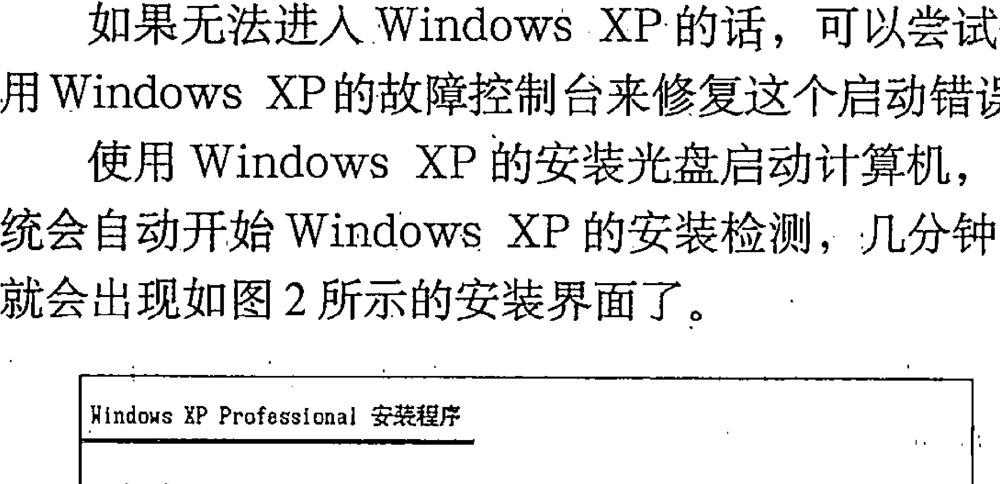

根据屏幕提示，按下“R”键选择“故障控制台”恢复 Windows XP 的安装。

随后系统就会启动“故障恢复控制台”，在如图3的屏幕上，列出了检测到的 Windows XP 所在目录，用户可以选择前面的编号如“1”，按下回车键对 Windows XP 启动进行恢复。

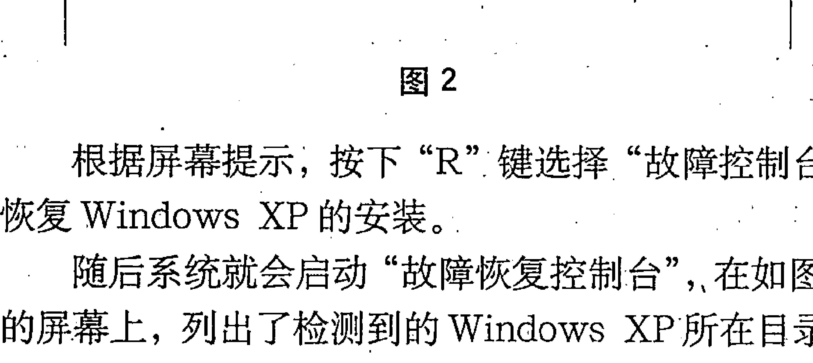

在按下回车键后，系统会提示你输入 Windows XP 的管理员密码，如图4所示。输入正确的管理员密码后，就可以进入控制台了，其界面类似于 DOS，也是命令行模式。

输入“HELP”命令可以列出控制台所支持的所有命令。

若想得到某一特定命令的帮助，可使用“HELP <命令>” 的形式调用，如 “HELP FIXMBR” 命令表示显示关于 FIXMBR 命令的帮助信息。

Microsoft Windows XP (TH) 故障恢复控制台。
故障恢复控制台提供系统修复和故障恢复功能。
要退出故障恢复控制台并重新启动计算机，请键入 EXIT.
1: C:\WINDOWS
要登录到哪个 Windows XP 安装
（要取消，请按 ENTER）？ _


下面是一些常用的控制台命令：

-   FIXMBR: 修复或替换指定驱动器的主引导记录。它检查主引导记录，如果主引导记录损坏，就用正确的主引导记录将之替换。
-   FIXBOOT: 修复或替换指定驱动器的引导扇区。它将自动重新生成指定驱动器上的引导扇区。
-   DISKPART: 该命令用于管理磁盘上的分区，如增加或删除分区。
-   LOGON: 此命令当故障恢复控制首次启动时自动运行，并自动检查已安装在硬盘上的 Win2000 操作系统，运行此命令允许登录到其他已存在的 Win2000 系统。
-   EXPAND: 展开一个或多个压缩文件，允许从一个 CAB 源文件中抽取出文件来。有两个重要参数: /D 表示列出 CAB 源文件中的文件列表; /R 表示重命名经过扩充的文件。
-   LISTSVR: 此命令创建一个服务列表，并显示服务的当前启动状态。服务一共有五种有效的启动类型。
-   DISABLE: 禁止一项服务或一种设备驱动程序。
-   ENABLE: 允许一项服务或一种设备驱动程序。
-   SYSTEMROOT: 此命令作用是进入到 Win2000 系统安装目录, 相当于 CD %SYSTEMROOT%命令。
-   MAP: 该命令显示所有驱动器映射的列表，告诉用户系统中哪些驱动器在故障恢复控制台中是可用的。
-   EXIT: 此命令退出故障恢复控制台，并重新启动计算机。

其它命令还有 CD、CHKDSK、DEL、DIR、FORMAT、MD、RD、REN、TYPE等，用法与DOS下的方法基本相同，在此不再赘述。

根据上面列出的命令，用户可以使用 FIXMBR 和 FIXBOOT 进行 Windows XP 的启动修复。最后输入 “exit” 退出 “故障恢复控制台” 并重新启动计算机，久违的多系统菜单就会出现了。

##### 7. 无人值守安装

如果你非常忙，或者有很多台计算机要安装，那么一定没时间守在计算机旁一步一步进行安装系统的设置，怎么办呢？ Windows XP 的安装文件中提供了一个应答文件，帮助我们在无人看管计算机的时候进行系统安装。通过这种方式，原来需要手动提供给系统的安装程序的信息被保存在应答文件中，并由应答文件提供给安装程序所需信息，如：协议的接收、用户名称及计算机名称和网络适配器等。

Windows XP 提供的应答文件在其安装光盘的 I386 目录下，名称为: unattend.txt。使用这个文件作为模板，我们可以修改或者加入自己的设置，创建一个适合自己的应答文件，如将用户名和计算机名等改为自己所要使用的名称等，如图 5 所示。


制作好自己的应答文件，即可在 Windows 95、Windows 98或者Windows 2000中启动无人值守模式安装 Windows XP Professional了。首先启动命令行方式，然后进入安装文件的I386目录下，在命令行上输入 “winnt32 /unattend:d:\unattend.txt”，然后回车即可进入安装程序，此时你就可以走开去做别的事情了，Windows XP 的安装能够自动完成。

在DOS下进行无人值守安装与在 Windows 下安装 Windows XP 不同，在命令行上输入的命令应该是“winnt /u:d:\unattend.txt /s:[光盘盘符]:\i386”。

##### 8. Windows XP的删除

Windows XP 的删除有很多种情况，单一系统、多系统等等，如果用户只有一个 Windows XP 系统的话，可以直接格式化 Windows XP 所在分区即可。

如果安装了 Windows Me 和 Windows XP多系统且 Windows Me安装在 C 盘，那么可以用 Win 98 启动盘启动计算机，然后将 Windows XP 所在的分区格式化，再重新启动电脑至 Windows Me，将 C 盘根目录下的 “BOOT.INI”文件打开，将 “[operating systems]” 下的 “multi (0) disk (0) rdisk (0) partition (2) \WINDOWS="Microsoft Windows XP Professional" /fastdetect” 全部删除即可。

电脑爱好者 2002

### 第二日：设置与优化

##### 1. 如何修改驱动器盘符？

从 Windows 2000开始，用户可以在操作系统中任意修改驱动器的盘符，这给日常的操作带来了很大的方便，Windows XP 自然也继承了这个优点。

鼠标右键单击“我的电脑”，执行“管理”命令，在弹出的窗口中选择“磁盘管理”，然后在需要重新分配盘符的驱动器上单击鼠标右键，选择“修改驱动器符”，如图1所示。

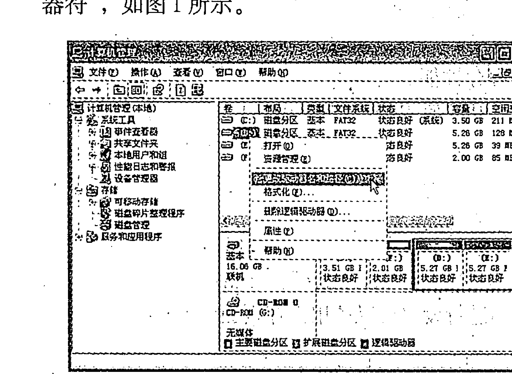

在弹出的对话框中单击“更改”按钮，又会弹出“更改驱动器号和路径”对话框，选择一个可用的驱动器号即可。注意，启动信息所在磁盘（一般是C）不可以修改。

##### 2. 怎样锁住计算机？

在 Windows 2000中为用户提供了“锁定计算机”的功能，这为用户提供了许多方便，但是在 Windows XP中用户却找不到“锁定”命令了，即使按下“Win” + “L”组合键，也只是执行了“切换”命令，其他的用户仍然可以登录并使用计算机，如何彻底找回“锁定”命令呢？

其实 Windows XP 并没有丢弃此功能。

在“控制面板”中启动“用户帐户”，在“用户帐户”窗口中单击“更改用户登录或注销的方式”选项，在弹出的窗口中去掉“使用快速用户切换”复选框，如图2所示。

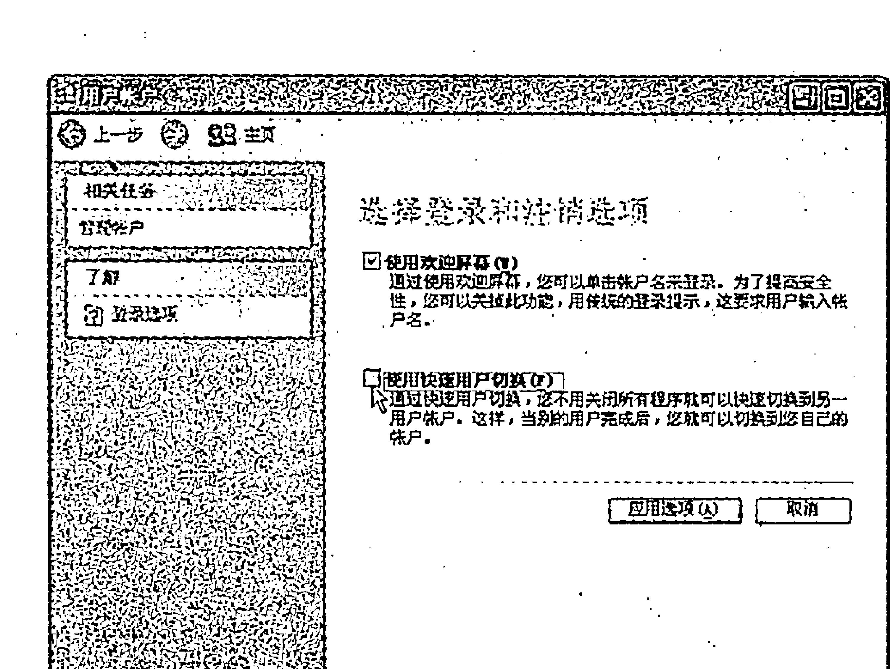

##### 3. Windows XP安装好后，如何把FAT 32转化为NTFS？

对于大多数的用户来说，使用 FAT32 文件系统是足够的，但是如果需要转化为NTFS又不想损坏数据该怎么办呢？Windows XP提供了“Convert”命令。

在命令行模式下执行“convert c： /fs:ntfs”命令并重启计算机，就可以把c盘转化为NTFS文件系统了。

##### 4. 快速锁定计算机

前面的技巧中介绍了如何锁住计算机，其实还有一种更加快速的办法，可以通过双击桌面上的“锁定计算机”快捷方式来迅速锁定计算机。

在桌面上单击鼠标右键，在出现的菜单上选择“新建”并进一步选择“快捷方式”，然后在“创建快捷方式向导”中输入“rundll32.exe user32.dll，LockWorkStation”即可，如图3所示。快捷方式建立完毕后，就可以通过双击来达到快速锁定计算机的目的了。

这样，用户在按下“Win” + “L”组合键后，就找到久违的锁定计算机功能了。

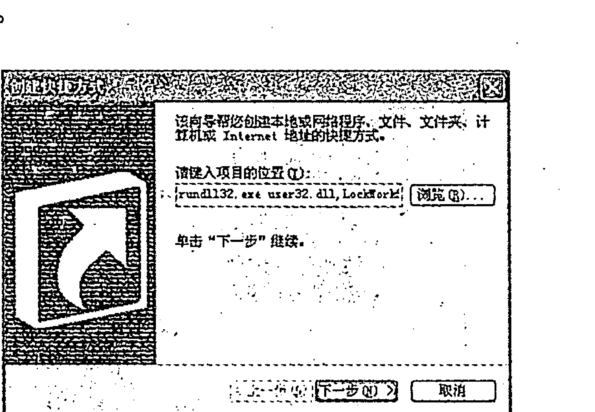

##### 5. 使用MsConfig设置启动程序

从 Windows 9X 开始，“MsConfig”就成为了用户的好助手，用户可以使用这个 Windows 设置工具对 Windows 进行全方位的设置。在 Windows 2000 中，“MsConfig”消失了，这引起了广大用户的不满，因此在 Windows XP 中又重新请回了这个助手。

在“运行”对话框中输入“msconfig”启动“系统配置使用程序”（中文名称），如图4所示。


对于广大用户来说最有用处的就是“启动”选项卡，在这里显示了 Windows 启动时自启动的大部分程序，用户可以根据实际情况进行删除，免去了修改注册表的麻烦。

##### 6. 删除Windows组件

我们可能会发现在“添加/删除Windows组件”中并不是所有的 Windows 组件都在其中，比如“写字板”、“多媒体”等等选项，如果需要删除这些组件应当怎么办呢？打开 Windows 目录下的 inf 子目录，双击 sysoc.inf 文件（一般情况下系统都会调用记事本来进行编辑）。

如果用户找不到 inf 子目录，这是因为该目录为“隐藏”属性，用户应当在“我的电脑”窗口中点击“文件夹选项”，然后选中“查看”选项卡，选中“显示所有文件和文件夹”选项，如图5所示。


执行“编辑”菜单下的“替换”命令，在查找框中输入“,HIDE,7”（英文逗号），将“替换为”框设为空（即什么都不写），如图6所示。


按下“全部替换”按钮，就把该文件中的所有的“,HIDE,7”去掉了，从而使隐藏的选项现身。存盘退出后，重新打开“添加/删除Windows组件”就会发现所有的组件都在列表中，这时用户就可以自行删除了。

##### 7. 优化内存

在 Windows XP 中用户可以通过修改注册表来优化内存性能。

打开注册表编辑器 Regedit，定位到“HKEY_LOCAL_MACHINE\SYSTEM\CurrentControlSet\Control\Session Manager\Memory Management”子键。

在右侧的窗口中，可以找到以下两个 DWORD 值“DisablePagingExecutive”、“LargeSystemCache”，对它们进行设置可以禁用内存页面调度和提升系统缓存。

在正常情况下，XP 会把内存中的片断写入硬盘，我们称之为内存页面调度，这样做会影响系统的读取速度（因为内存的读取速度要大大高于硬盘的读取速度），为了系统的优化，用户可以进行阻止，让数据只保留在内存中。具体方法是将“DisablePagingExecutive”的值改为“1”即可实现禁止内存页面调度，需要提醒用户注意的是，此方法只适用于内存较大的用户（通常要 256M 以上）。

把“LargeSystemCache”的值从“0”改为“1”，可以强行令 Windows XP 把除了 4M 之外的系统内存全部分配到文件系统缓存中，这样可以使 Windows XP 的内核在内存中运行，从而大大提高系统速度，需要提醒用户注意的是，此方法也有可能会使某些应用程序性能降低，而且计算机必须有 256M 以上的内存。

##### 8. 调整应用程序的优先级来加速程序的运行

从 Windows 2000 开始就可以为不同的应用程序分配不同的 CPU 优先级，如果某个应用程序的优先级很高的话，那么它的运行速度自然会较之那些优先级低的程序快，而且用户可以通过自定义已运行应用程序的 CPU 优先级来达到优化应用程序的目的，非常的方便。Windows XP 自然也继承了这个优点。

具体的方法是，首先运行该应用程序，接着在任务栏上单击鼠标右键，在弹出的快捷菜单中选择“任务管理器”。（注意：在 Windows XP 中，还有一种更为简单的打开“任务管理器”的方法，就是同时按下“Ctrl” + “Alt” + “Del”键）。

在“任务管理器”中选择“进程”选项卡，在进程列表中用鼠标右键单击需要优化的应用程序，在弹出的快捷菜单中选择“设置优先级”，然后在子菜单中选择“高”（如果用户的内存达到256MB以上，那么可以将其设置为“实时”，应用程序速度会更快），如图7所示。

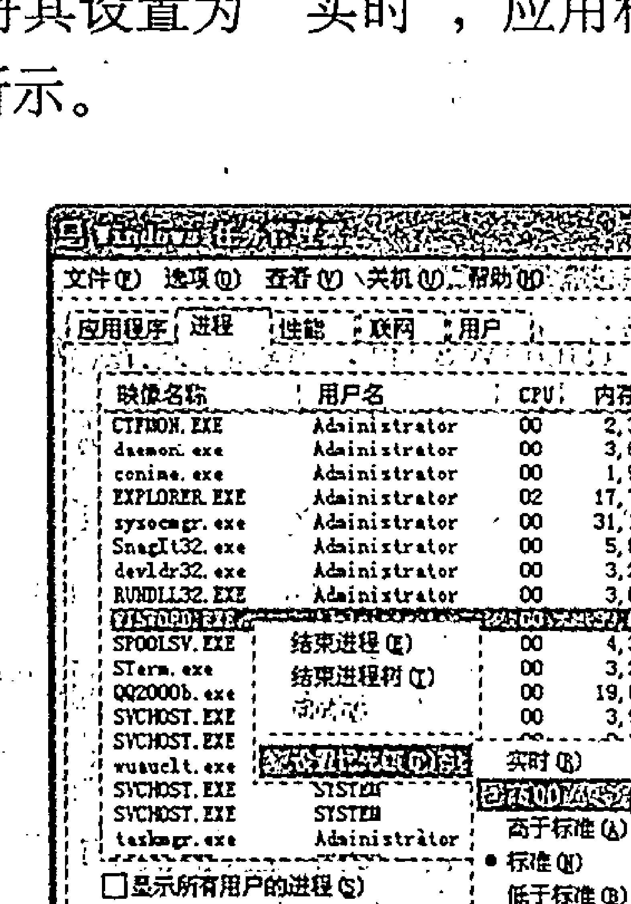

系统在用户做出选择后，会弹出一个对话框，警告用户对设置优先级的操作可能会遇到意想不到的问题，并提示是否继续，在这里可以选择“是”。在按下了“是”按钮后，该应用程序就会较以往运行得更快、更高效了。

需要注意的是，当我们关闭此程序后，如果重新启动，所有的设置将会恢复到原来的状况，即此设置不是永久性的。

##### 9. 设置硬盘工作模式

用 DMA 代替 PIO 可以提高硬盘的传输速度并减少 CPU 占用率，而且现在一般的大硬盘都支持 DMA66 甚至 DMA100 的工作模式，因此应当在 Windows XP 中用 DMA 方式代替传统的 PIO 方式。

在“设备管理器”中选择“IDE ATA/ATAPI 控制器”中的“主要/次要 IDE 通道”，选择其“属性”对话框中的“高级设置”选项卡，然后在传送模式中选择“DMA（若可用）”即可，如图8所示。

##### 10. 让桌面图标的文字与桌面融为一体

朋友们可能注意到了在以前版本的 Windows 中，桌面上的图标文字是有背景的（背景色就是桌面的背景色），这样最大的缺点就是影响了桌面墙纸的显示效果。

Windows XP 想到了这一点，因此它为我们提供一个解决办法。

使用鼠标右键单击“我的电脑”图标，在右键菜单中选择“属性”命令，在弹出的对话框中选择“高级”选项卡，在“性能”选项中按下“设置”按钮，在弹出的“性能选项”对话框中选择“视觉效果”选项卡，如图9所示。

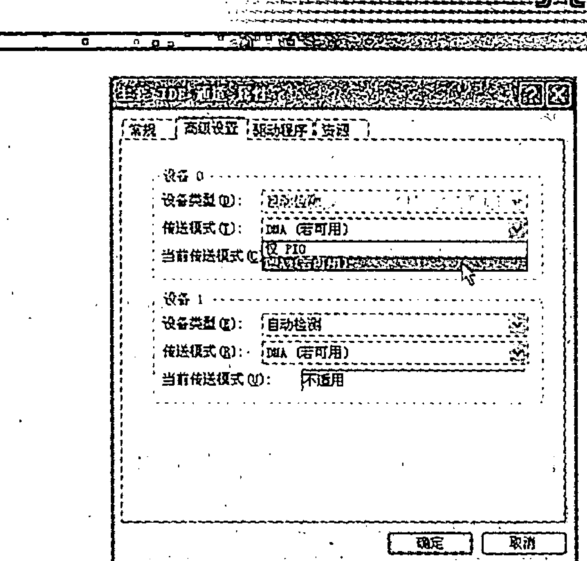

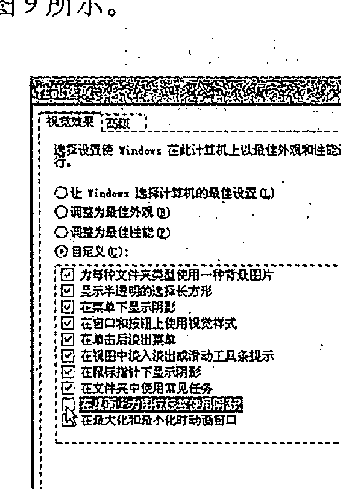

选中“在桌面上为图标标签使用阴影”选项，返回桌面，就会发现桌面上的图标已经和桌面融为一体了。

##### 11. 将最常用的程序放在随手可及的地方

每一个用户都会有几个常用的程序。出于使用方便考虑，可以将其放到开始菜单的顶部，这样就可以更快捷地启动。

单击“开始”菜单，在“所有程序”中，鼠标右键单击该程序的快捷方式并在弹出的快捷菜单中选择“附到[开始]菜单”。再次单击开始菜单，就会发现该程序已经被永久地移动到开始菜单的顶部了。

##### 12. 设置自动切换功能

一般情况下，如果要在各个窗口之间切换需要使用鼠标选择相应的窗口或者使用 Alt+Tab 组合键来选择，如果用户启用了自动切换功能后，只需要将鼠标移动到要切换的窗口上无需单击选择就可以自动将窗口切换过来。

打开注册表编辑器 Regedit，定位到 HKEY_CURRENT_USER\Control Panel\Desktop，新建二进制值 "UserPreferencesMask"，将其值修改为 "b1 32 07 80"，即可启用该功能。如果需要关闭的话，只需将其值修改为 "b0 32 07 80" 即可。

另外，我们还可以设置切换的延迟时间，方法是在相同的位置建立一个名为 "ActiveWndTrkTimeout" 的 Dword 值，用户可以根据自己的实际需要来设置这个值，如 "400" (注意，单位为毫秒)。

##### 13. 禁用支持ZIP文件的功能

在 Windows XP 中内置了对 ZIP 文件的支持，也就是说用户可以将 ZIP 文件当成文件夹来浏览。但是，这个功能还不是很完善而且比较消耗系统资源，因此可以禁用该功能。

启动“运行”对话框，输入 "regsvr32 /u zipfldr.dll" (取消 zipfldr.dll 的注册) 并回车即可达到禁用的目的，如图 10 所示。

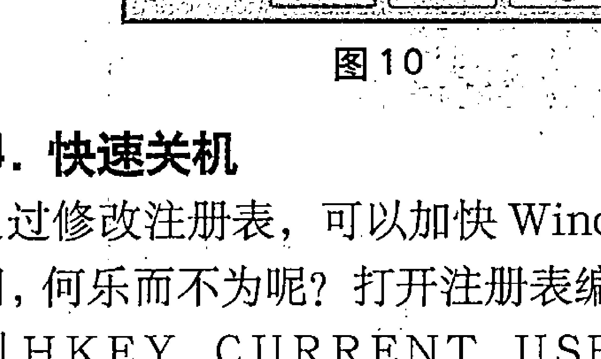

##### 14. 快速关机

通过修改注册表，可以加快 Windows XP 关闭的时间，何乐而不为呢？打开注册表编辑器 Regedit，定位到 HKEY_CURRENT_USER\Control Panel\Desktop，将 "HungAppTimeout" 的值改为 "5000"，然后将 "WaitToKillAppTimeout" 的值改为 "4000"。定位到 HKEY_LOCAL_MACHINE\System\CurrentControlSet\Control 下将 "WaitToKillServiceTimeout" 键值改为 "4000" 即可。重新启动计算机后，就可以加快关机速度了。

##### 15. 设置鼠标的单击锁定功能

在 Windows XP 中我们可以使用鼠标单击锁定功能，该功能最大的优点就是可以使我们能更加方便的进行鼠标拖拽操作，也就是说启用了该功能后，用户不必按住鼠标左键不放进行拖拽了，只需要在对象上点击一下鼠标左键即可进行任意移动。

在“控制面板”中打开“鼠标”选项，在“鼠标属性”对话框中选择“鼠标键”选项卡。选中“启用单击锁定”复选框，用户可以单击“设置”按钮，对启动锁定的单击时间进行设置，如图 11 所示。

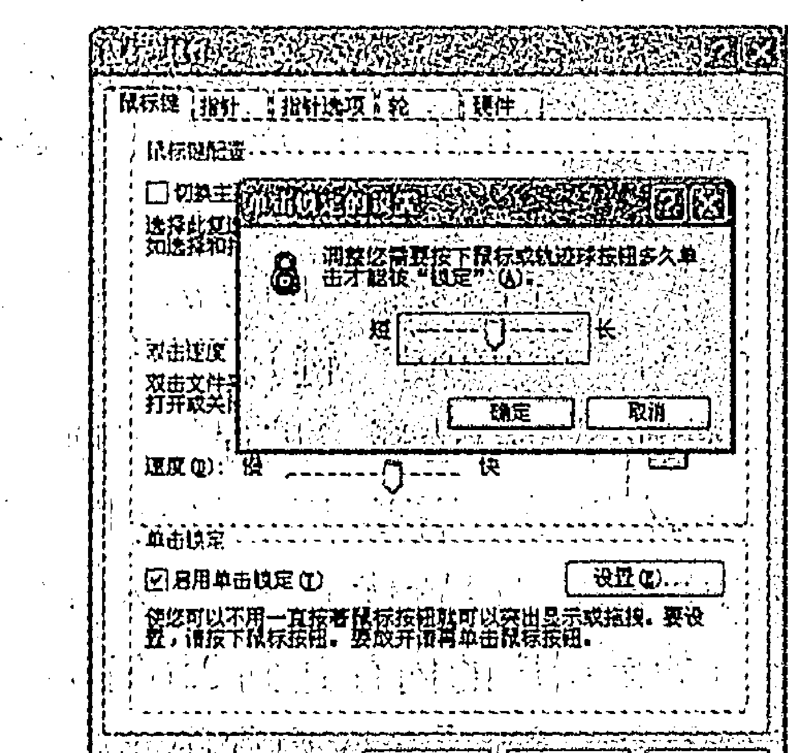

##### 16. 文件批量重命名

在前几版的 Windows 中，我们无法为多个同一系列的文件同时重命名，如大量的图片等 (pic001、pic002...)。在 Windows XP 中这一问题得到了改善。

在“我的电脑”或者“资源管理器”中，选中多个要归类的一系列文件同时重命名，Windows XP 会自动为文件名加上序号，例如选定了一系列文件，然后执行“重命名”命令，将文件重命名为“pic”后，系统会自动为系列中的其它文件命名为“pic (1)”、“pic (2)”以此类推。另外还可以指定该文件系列的起始号码，如输入“pic (10)”的话，后面的文件将被命名为“pic (11)”、“pic (12)”等。

##### 17. 修改 boot.ini 以加快 Windows XP 的启动

在用户的启动磁盘下 (一般都是 C 盘)，找到 boot.ini 文件，双击进入编辑状态。

用户可以将“timeout=30”改为“timeout=0”即把缺省的启动菜单等待时间由 30 秒改为 0 秒。

将“multi(0)disk(0)rdisk(0)partition(1)\WINDOWS="Microsoft Windows XP Professional" /fastdetect”中的“fastdetect”改为“nodetect”。

##### 18. 解决任务栏假死的问题

在安装了 Windows XP 后，可能会发现经常会出现任务栏没有响应的情况，特别是在使用 QQ 时。

应该说，这是 Windows XP 本身的一个 BUG，用户可以使用 Windows Update 功能进行更新，微软的官方网站已经给出了这个补丁。

如果不希望使用补丁的话，可以尝试采用下面的方法：

打开“控制面板”中的“区域和语言选项”，选择“语言”选项卡，按下“详细信息”按钮。

在弹出的如图 12 所示的“设置”窗口中选择“首选项”的“语言栏”按钮，在“语言栏设置”对话框中关闭“在桌面上显示语言栏”，选中“在通知区域显示其他语言栏图标”复选框。另外，如果不需要手写识别、语音识别的话，应当选中“关闭高级文字服务”。

如果该方法不能够解决任务栏假死问题的话，还是请用户直接使用 Windows Update 功能吧，毕竟这是最稳妥的办法。

##### 19. 在Windows XP中无法使用罗技鼠标怎么办？

罗技鼠标是鼠标产品中的大哥大，也拥有了很强的开发技术，如果在 Windows XP 中无法使用罗技鼠标的话，我们应当尝试寻找该款鼠标的 Windows XP 驱动程序。

例如，你使用的是动感旋貂或动感银貂鼠标，可以先去下载支持 Windows XP 的 MouseWare9.41.2 (或者更高版本) 驱动程序，在安装此驱动程序后系统就可以正确识别动感鼠标了。

##### 20. 在任务栏上显示星期与日期

Windows XP除了可以在任务栏上显示系统时间之外，还能显示星期与日期。实现方法很简单，只要将任务栏拉高一点就可以了，如图 13 所示。

注意，Windows XP 的默认设置是将任务栏锁住，如果用户拖拉任务栏边界不成功时，请先在任务栏空白处单击鼠标右键，去掉快捷菜单中的“锁定任务栏”选项前的对勾即可进行任务栏的拖动了。

##### 21. 如何在Windows XP中使用16位的程序？

虽然 Windows XP 可以说是 Windows 系列中最完美的一个，但是对于一些还需要经常使用 DOS 程序的用户来说，Windows XP 还是不敢高攀，因为它对于一些老的 DOS 程序支持的不是很好，甚至无法运行。这也使很多的人放弃了 Windows XP。

其实，Windows XP 用户可以使用“start”命令来执行以前的 16 位 DOS 程序。在“运行”对话框中输入“start/seperate d:\program.exe”即可，其中 d:\program.exe 表示 16 位程序的路径及文件名。

### 服务与诚信 第九届电脑爱好者城

##### 时间：2002年7月19日－22日 地点：北京展览馆

- 评测天地：主办方四刊联动，放眼IT产品，评测“一网打尽”；
- DIY 课堂：专业人士的 DIY 讲座和演示，观众现场的 DIY 比拼……
- 数码动力：现场数码摄影比赛，各种新潮数码精品秀，炫花你的眼……
- 宽带冲浪：远程教育、视频点播、远程医疗、远程通信……
- 超级玩家大赛：倾城大战 CS、重返德军总部、FIFA、摩托英豪……携 sina 将游戏进行到底；
- 绝对拍卖场：电脑样品、数码精品“一元”起拍，惊喜价格实现超然梦想；
- 时尚休闲赛：啪啦舞擂台赛、室内攀岩赛、野营帐篷搭建赛……把握休闲新时尚！

##### 把握时尚、惊喜不断

新款时尚的特惠商品、城内商品的双料保险、超级玩家的精彩大奖、惊喜连连的开城礼包……

“第九届电脑爱好者城超级玩家大赛”的网上比赛部分现已启动，快快登陆——

http://games.sina.com.cn/zhuanqu/supergames

主办：电脑爱好者杂志社 承办：《电脑高手》

北三环西路48号北京科技会展中心1号楼A座22层(100086)

咨询热线：010-62143105、62161578/9转8311、8310、8303

网址：www.cfan.net.cn/city 信箱：cfancity@cfan.com.cn

### 第三日：多媒体

##### 1. 为何有些 AVI 文件在 Windows XP 下不能播放？

使用 Windows XP 的过程中，有时我们会遇到无法播放的 AVI 文件，或者只有声音而没有图像，这是由于缺少解码器的原因。

现在网络上开始流行一种新的多媒体视频文件——MPEG4 影片，它拥有更好的视觉效果、更大的压缩率，用它制成的视频文件可以近似达到 DVD 的视觉效果而且更节约硬盘的空间。MPEG4 压缩技术可以说是对于 DVD 和 VCD 影碟的一大挑战，由 Microsoft mpeg4 v3 修改而来。

如果用户下载的 AVI 影片无法播放的话，一般来说可能是由于该文件是使用 MPEG4 压缩得来的，需要安装一个 500K 大小的 MPEG4 编码驱动，这样就可以使用 Windows XP 自带的 Windows Media Player 8 进行播放了，该编码驱动用户可以到 http://www.souxin.com 下载。播放这种编码格式的影片，对计算机的硬件要求不高，CPU 只要是 300MHz 以上（Celeron 和 K6/2 以上即可），64 兆内存和 8 兆显存的显卡就可以流畅地播放。

另外，如果你安装了超级解霸 XP 的话，就可以直接欣赏 MPEG4 压缩的影片了，因为在安装该软件时就已经自动安装了 MPEG4 编码驱动。

##### 2. 在 Windows Media Player 8 中复制音乐CD

Windows Media Player 8 已经完全取代了 Windows 系列操作系统的 CD 播放器，除了具有强大的 CD 播放功能外，更增添了复制 CD 以及刻录音乐 CD 的功能。

打开 Windows Media Player 8 后，将 CD 插入 CD-ROM 驱动器，单击主界面上的“从 CD 复制”，如图 1 所示。单击播放按钮就可以开始欣赏 CD 音乐了。

在如图 1 窗口的信息框中用户可以看到整张 CD 的曲目信息，选中或者清除每首歌曲前的复选框后单击“复制音乐”按钮，会弹出一个询问是否设置“音乐保护”的提示框，你可以根据实际需要进行选择，并单击“确定”按钮，如图 2 所示。

此后，Windows Media Player 8 就会将选中的 CD 音乐复制到硬盘上，信息框中会显示复制的进度，如图 3 所示。

复制完毕后，Windows Media Player 8 还会将复制到硬盘上的文件自动添加到媒体库中。

执行 Windows Media Player 8 的“工具”菜单上的“选项”命令，在“复制音乐”选项卡中，用户可以对 CD 复制的一些选项进行设置，如图 4 所示。

单击“更改”按钮，可以改变复制音乐的指定位置，单击“高级”按钮，可以设置自动创建的音乐文件名，如图 5 所示。

在复制音乐之前，还可以对压缩的 WMA 文件的质量进行控制选择，方法是拖动“以此质量复制音乐”下的滑块。

Windows Media Player 8 的一大创新就是内置了 Adaptec 公司的刻录软件，也就是说只要用户的计算机配备有刻录机的话，随时可以使用 Windows Media Player 8 制作音乐光盘。

启动 Windows Media Player 8 并将一张 CD-R 或 CD-RW 光盘放入刻录机，执行“文件”菜单上“复制”子菜单中的“复制到音频 CD”命令，如图 6 所示。

在“要复制音乐”中选中需要刻录的音乐后，单击右上方的“复制音乐”按钮，就可以进行音乐唱片的录制了。

注意：Windows Media Player 8 仅支持 WMA、MP3、WAV 这三类音乐文件的刻录，并且刻录的曲目必须在“媒体库”中。另外，Windows Media Player 8 目前最高仅支持 8X 的写入速度。

##### 3. 在 Windows XP 中刻录数据光盘

在 20 世纪的 80 年代和 90 年代初，人们使用 1.44M 的软盘存储文件并将其从一台计算机拷贝到另一台计算机中，可是现在，1.44M 对于广大电脑爱好者来说已经可以忽略不计了，光盘已经完全取代了软盘成为计算机可移动存储设备的标准，特别是 Windows XP 的出现，使得刻录光盘就像将文件拷贝到软盘上一样方便简单。

要刻录光盘，首先必须有可写 CD(CD-R) 或可重写 CD(CD-RW) 驱动器，其次就是要有光盘，拥有了这些设备，在 Windows XP 中即可像软盘那样方便地将数据复制到光盘上。下面我们就来看看如何刻录数据光盘。

首先选中要刻录到光盘中的文件及文件夹，然后在“文件和文件夹任务”下，单击“复制该文件”、“复制该文件夹”或者“复制选定项目”，然后在弹出的对话框中选中光盘刻录驱动器，最后单击“复制”按钮，如图 7 所示。

在这里告诉大家一个诀窍，Windows XP 中的刻录功能同样支持拖放操作，可以直接将要刻录的文件拖放到光盘刻录驱动器中。

将文件复制到光盘刻录驱动器中之后，系统并不会立刻开始进行刻录，而是将这些文件放到一个专门的文件夹中等待用户的刻录命令。在“我的电脑”中，双击光盘刻录机驱动器，将显示一个临时存放区域，如图 8 所示。

要刻录的文件就在这个临时存放区域中，用户应该核查要复制到光盘中的文件和文件夹是否都在“准备写入CD的文件”中，确认无误之后，在“CD写入任务”下面单击“将这些文件写入CD”，则弹出“CD写入向导”，如图9所示。用户根据向导中的提示进行操作即可。

我们可以设置在光盘刻录完成时是否自动弹出刻录机驱动器，具体方法为：在“我的电脑”中右键单击刻录机驱动器，然后在弹出的菜单中选择“属性”命令，则弹出属性对话框，进入“记录”选项卡，然后选中或清除“写入完成后自动弹出CD”复选框即可。

需要提醒注意的是，由于Windows XP没有包含ASPI层，因此Windows XP或者刻录软件在刻录光盘中出现的问题大部分都是ASPI层的问题，而微软公司已经提供了解决这一问题的补丁，所以在此建议你，安装完Windows XP系统之后，立即连接到Windows升级网站进行升级。

##### 4. 修复无法快进的RM文件

可能会遇到这种情况，从网上下载的RM文件在播放时无法快进，这就带来了很大的麻烦，它要求用户一定要一次性看完，否则下次观看时又要从头看起。

出现这种情况的原因可能是该RM文件没有下载完毕或者在制作时没有完成，如果是前一种情况的话，用户应当使用支持断点续传的软件将其下载完全，如果是后一种情况就只能借助一个修复RM的程序——RmFix了。

这是一个很简单的小程序，用户可以通过搜索在网络上找到它，最简单的使用方法是在命令提示符下输入“rmfix name.rm e”，可以自动检测name.rm文件，如图10所示。在屏幕上会提供给用户几种修复方法，在用户进行选择后（一般可以选择）即可完成对文件的修复。

```
RM-Fix 4.0b0712 (c) 2000 Magic Mystery/Hammer-RU

Checking for RmFix.rm...
RealMedia File Format Tag found!
Checking Blocks...
Current Block Header : PROP - Headers to go : 6
Current Block Header : MDPR - Headers to go : 5
Current Block Header : MDPR - Headers to go : 4
Current Block Header : DATA - Headers to go : 3
Current Block Header : INDX - Headers to go : 2
Current Block Header : PROP - Headers to go : 1
Current Block Header : MDPR - Headers to go : 1
Could not jump to DATA block, File chuncked!
Estimated time missing : 00:00:02:57.416
File has checked the blocks already, rebuild the index, otherwise check
the blocks first!
Do you want to try and rebuild the index or check the blocks ? (B/C/B/A/N)
```

##### 5. 下载只能在网络上实时播放的流节目

随着宽带技术的发展，越来越多的用户能够在网络上实时收看音频和视频节目了，目前网上使用的绝大部分流媒体格式分为RM和ASF两种（这两种是最常见的，其它的还有MOV和WMV格式）。

当遇到精彩的节目时，总是希望能够将其保存在自己的硬盘上，但是很多时候是做不到的，难道就真的没有办法了吗？

类似于“http://www.cfan.com.cn/test.rm”这样的地址，用户可以直接用网络蚂蚁或者FlashGet下载，这也是大多数用户都会的办法。如果要下载的流文件地址是“RTSP://www.cfan.com.cn/test.rm”之类的话，我们可以尝试将“RTSP”改成“HTTP”进行下载。

如果下载的RAM或者RM文件很小，只有1KB的话，可以用记事本打开这个文件，用户可以发现真正的下载文件地址，然后再用上面说的两种方法进行下载。

如果以上的几种方法还是不能够解决问题的话，用户可以使用Streambox Vcr 1.0 Suite来完成任务。这个软件包里面包含了Streambox Vcr 1.0的三个不同版本，其中Beta 2版本适合用于下载Real格式影片，Beta 3.1版本比较适合下载ASF格式影片。

Streambox Vcr 1.0采用了独特的分析技术，所以可以把那些隐藏在ASX后的ASF文件和隐藏在SMIL文件后的RM文件找出来并进行下载。支持相当多的流播放协议（http、ftp、rtsp、mms、pnm），可以在下载的时候自动识别。作为一个下载软件，它还支持断点续传、定时下载、拖放下载等等，使用方法与Netants和FlashGet类似，用户可以到http://www.souxin.com下载软件及详细的使用说明。

### 第四日：网上冲浪

##### 1. 关闭IE图片工具栏

用Windows XP自带的Internet Explorer 6浏览网页，当光标移到网页上的某一图像时，图像右上角会出现一个工具栏，它能帮助我们快速方便地存储、邮寄和打印网页中的图片。如果图像太大，浏览器窗口容纳不下时，图像右下角还会出现一个缩放按钮，单击这个按钮可以在全图显示和原图大小显示之间切换，如图1所示。

图片工具栏是IE6的默认属性，但是作为系统管理员或者网页制作者，你可以很容易地关掉这项功能，接下来我们就来介绍系统管理员和网页制作者如何关闭IE的图片工具栏。首先介绍系统管理员关闭IE图片工具栏的步骤。打开注册表编辑器，搜索到“HKEY_CURRENT_USER\Software\Microsoft\Internet Explorer\Main”分支，在左边窗口中找到并双击“Enable_MyPics_Hoverbar”，在弹出的对话框中将其键值改为no，如图2所示。确定并重新启动计算机之后，将鼠标放到网页的图片上时将不会再出现图片工具栏。如果将“Enable_AutoImageResize”的键值改为no，则重启计算机之后鼠标放到网页图片上时将不再显示图片调整按钮。上面介绍的修改注册表的方法显得较为繁琐，在“Internet选项”对话框的“高级”选项卡中，清除“启用图像工具栏”和“启用自动图像大小调整”复选框，也可以关闭图片工具栏和调整图片的工具栏，不过也需要重新启动计算机之后才能生效。实际上图片工具栏的关闭还有另外一种方法，接下来就让我们来看看一个网页制作者是如何关闭图片工具栏的。用记事本打开网页的HTML超文本文件，如果你只想对某张图片关闭图片工具栏，可以将显示图片的HTML语句改成或者；如果你是想对整个网页禁用图片工具栏，可以在整个超文本文件的前部加上<meta http-equiv="imagetoolbar" content="no">或者<meta http-equiv="imagetoolbar" content="false">HTML语句。

##### 2. 加快Internet Explorer 6的启动速度

这个技巧可以使Internet Explorer 6的启动速度加快，鼠标右键点击任务栏上的Internet Explorer图标，在快捷菜单中选择“属性”命令，在弹出的对话框中选择“快捷方式”选项卡，在“目标”中的“C：\Program Files\Internet Explorer\IEXPLORE.EXE”后面加上“-nohome”参数，如图3所示。重新打开IE浏览器，就会感受到不同的启动速度了。

##### 3. 启动Internet连接防火墙

恶意的黑客入侵，对不少用户来说是件可怕的事情，但如果装了防火墙，受危害程度就会大大地降低。而Windows XP就加入了免费的“Internet连接防火墙”，通过它来进行动态数据包筛选，禁止所有源自Internet的未经要求的连接，从而保护了联网机器的资源不被非法访问和删改。点击“开始” → “设置” → “网络连接”，单击要上网的拨号连接，从中选择“属性”，再单击“高级”选项卡，选中“Internet 连接防火墙”，如果你想对防火墙进行一些详细的设置，可以点击“设置”，并从中做一些选择。

##### 4. 快速浏览网页的几种方法

如果有你喜欢或者经常浏览的Web页或站点，可以保存其地址，以后就能轻松打开这些Web页或站点，具体的做法有以下几种：

将站点添加到收藏夹列表中，具体的方法是：进入要添加到收藏夹列表的Web页，单击“工具栏”中的“收藏夹”按钮，在IE浏览器窗口的左边就会出现“收藏夹”窗格，如图4所示，在该窗格中，单击“添加到收藏夹”按钮，则弹出“添加到收藏夹”对话框，如果需要，用户可以输入该页的新名称，然后点击“添加”按钮即可将该页添加到收藏夹中。这样，每当用户需要打开该站点时，只需在工具栏上单击“收藏夹”按钮，并从收藏夹列表中选择即可。

对于频繁访问的一些网站，使用收藏夹就显得有点笨拙了，这时我们可以把它添加到链接栏中。链接栏位于 IE 地址栏的旁边，只需单击链接即可显示站点，非常方便。将Web页添加到链接栏的方法有很多种：将Web页的图标从地址栏拖到链接栏、将链接从Web页拖到链接栏等等。

如果你有一个访问最频繁的站点，希望每次一打开浏览器，就可以进入该Web站点，可将该站点设置为IE浏览器的主页。设置方法是：点击“工具”菜单中的“Internet 选项”，在“主页”下面的文本框中，输入设成主页的站点的网址后确定。这样，每次启动 Internet Explorer 时，该站点就会第一个显示出来，或者在你单击了工具栏的“主页”按钮后立即显示。

另外，如果你想要浏览“主页”，除了点击工具栏中的“主页”按钮这种方法之外，还可以使用快捷键 ALT+HOME。

##### 5. 保护上网安全——设置Cookie

一般人都会有这样的经验，当自己登录网上邮箱的时候，只要输入用户名的开头一个字母，下面就会跳出一个用户名列表来供你选择，而输完用户名转到密码输入框时，密码就自动输入，用户只需点击“登录”按钮就能登录了。虽然这样对我们来说显得很方便，但是，这样也意味着别人在不知道我们邮箱密码的情况下也能从该机器上登录我们的邮箱，是不是觉得很不安全，如果有什么重要的信息或者文件被别人“盗取”了，麻烦就大了。

这些都祸起Cookie。Cookie是由网站创建的、将信息存储在计算机上的小文本文件，包含了我们访问网站时的一些信息。

为了防止这种情况的发生，用户可以设置 Internet Explorer 的 Cookie，使其不保存该网站的相关信息。比如你使用了某某网站的邮箱，为了安全起见，你就可以设置该网站一直不能使用 Cookie，具体的设置方法为：在IE浏览器中点击“工具”菜单中的“Internet 选项”，在弹出的对话框中选择“隐私”选项卡。

点击“高级”按钮，在该对话框中，用户应该选中“覆盖启动cookie处理”，然后在“第一方 Cookie”和“第三方 Cookie”下面都选中“拒绝”单选框，“确定”之后用户以后不管上什么网站都不会再使用 Cookie。

如果你不想让所有网站都不使用 Cookie，而只希望上某某网不使用 Cookie，可以在“Internet选项”的对话框中，点击“网站”区域里的“编辑”按钮，在弹出的“网站地址”输入框中输入某网站地址，然后点击“拒绝”按钮，则上该网站时就不会读取计算机上的 Cookie 了。

### 第五日：局域网

##### 关于NetBEUI协议

NetBEUI就是NetBIOS Enhanced UserInterface的缩写，即网络基本输入输出系统扩展用户接口。该协议主要是为小型局域网（约20-200台工作站）设计的。Microsoft从80年代中期一直在自己的联网产品中支持该协议。

但是从Windows XP开始，将不再支持NetBEUI协议了，取而代之的是更加强大且具备路由功能的TCP/IP协议。

如果用户还需要使用NetBEUI协议的话，可以在Windows XP安装光盘的Valueadd\msft\net\netbeui下找到。

##### 别人无法通过FTP连接我的机器

Windows XP更加注重安全性的提高，因此出现这种情况的绝大部分原因是由于使用了Windows XP自带的防火墙，用户只需要关掉它即可。

网络防火墙的启动和禁止都非常的简单，用户只要在网络连接的属性对话框中选择“高级”选项卡，然后选中或者清除“Internet连接防火墙”下面的“通过限制或阻止来自Internet的对此计算机的访问来保护我的计算机和网络”复选框就可以启动或者禁止防火墙了，如图1所示。

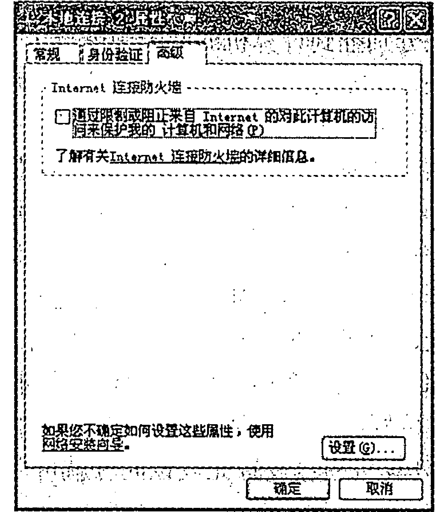

##### 加速共享浏览

在局域网上浏览其他计算机的共享目录时经常经历漫长的等待，很是烦人，这主要是因为当Windows XP连接到其他计算机后，会检查该计算机上所有预定的任务，这显然会延长等待的时间，而且很多时候我们并不需要这项功能，因此可以禁用它。

打开注册表编辑器Regedit，定位到HKEY_LOCAL_MACHINE\SOFTWARE\Microsoft\Windows\CurrentVersion\Explorer\RemoteComputer\NameSpace\{D6277990-4C6A-11CF-8D87-00AA0060F5BF}子键，将其删除，如图2所示。重新启动计算机后，用户就可以享受到更快速的共享浏览了。

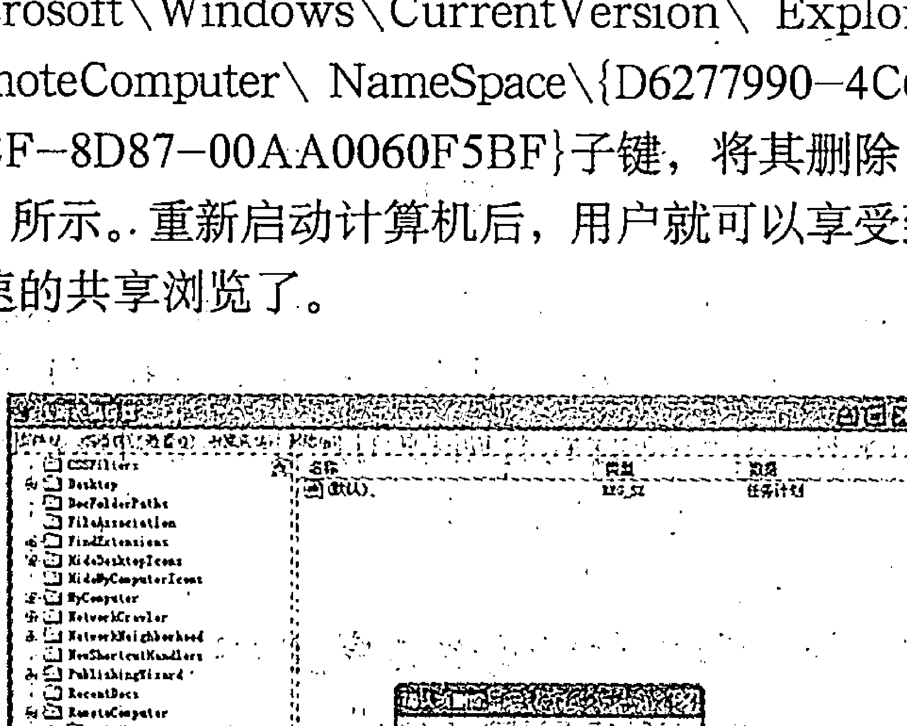

##### 让Windows XP适应宽带上网

很多用户的Windows XP能够检测并成功安装网卡，但是却无法使用PPPoE宽带联机，这主要是因为Windows XP内置的PPPoE宽带上网功能无法依据宽带线路自动调整MTU（Maximum Transmission Unit）设定值，再加上部分宽带服务供货商所采用的宽带登入服务器未能与Win XP内置PPPoE配合，因此一些宽带服务用户无法上网或者即使联机成功也会出现数据传送等问题。

目前还没有更好的解决办法，但是用户可以尝试改用RASPPPoE以代替Windows XP内置的PPPoE宽带上网功能。

##### 查看共享文件的使用状况

想看看都有谁连接到你的计算机上了，他们都在使用哪些文件，怎么查看呢？使用计算机管理控制台就可以将这些尽收眼底。

打开计算机管理控制台的方法为：在“控制面板”中，点击“性能与维护”，在新的一页中，点击“管理工具”，再在新的一页中双击“计算机”管理则打开了计算机管理控制台。如图3所示。

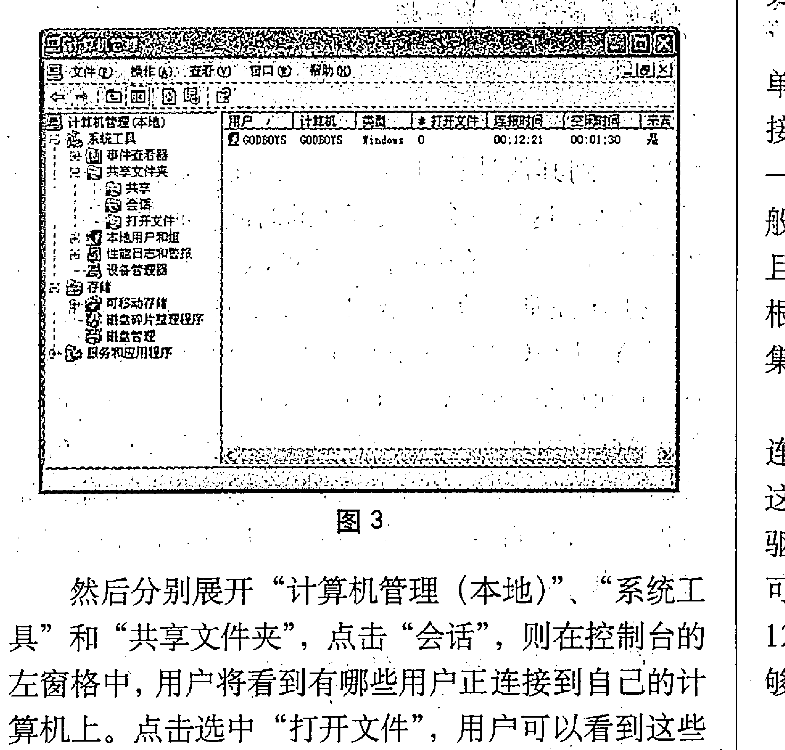

然后分别展开“计算机管理（本地）”、“系统工具”和“共享文件夹”，点击“会话”，则在控制台的左窗格中，用户将看到有哪些用户正连接到自己的计算机上。点击选中“打开文件”，用户可以看到这些用户打开了哪些文件。

##### 阻止其他用户使用共享文件夹

当我们要关闭自己的计算机的时候，可以强行中断其他用户的连接或者关闭某一个已被打开的共享文件，避免计算机在关闭的过程中出现意外状况。

点击“会话”，则在左窗格中将显示所有的连接计算机，用户选中想要中断其连接的计算机并右键单击，在弹出的菜单中选择“关闭会话”。系统会要求你确定是否中断该计算机的连接，点击“确定”按钮后则中断该计算机的连接。如果你想要中断所有计算机的连接，可以右键单击“会话”，然后在弹出的菜单中选择“中断全部会话”命令，确认即可。

如果只是想更新某个共享文件，就没有必要中断计算机的连接，只需关闭该共享文件夹或者文件即可，方法就是：选中左窗格中的“打开文件”，则在右窗格中将显示所有共享文件夹和文件，可以右键单击需要更新的文件夹，在弹出的菜单中点击“将打开的文件关闭”命令，确认即可。

注意：如果共享用户文件夹的计算机正在存取这些文件夹，则突然的中断和关闭连接会造成用户的文件数据丢失，所以没有必要，最好不要这样做。

##### 对等网的连接

对等网的连接比较简单，一般可以分为网卡连接、USB连接和电缆直接连接，这其中最常用的一种方式就是网卡连接。

利用网卡进行对等网的连接，优点是设备比较简单，各种系统都能很好的支持，传输速度快，而且连接的距离较长，可达150米。局域网拓扑结构有两种，一种是总线型，一种是星型，在对等网中也一样，一般情况下都是使用星型的结构，传输介质是双绞线并且需要使用RJ-45头，两台计算机连接时，只需要一根网线和两块网卡，如果是多台计算机，还需要增加集线器（HUB）。

现在的计算机主板上都有USB接口，利用USB连接线就可以轻轻松松的将计算机连接起来。但是，这种USB连接线是专用的，需要专门购买，安装了驱动程序之后才能使用，如果再加上USB HUB，还可以连接多台计算机，传输的速度也比较快，可达12Mbps，这种连接的最大缺点就是连接的距离不能够太长，只能在10米左右。

直接电缆连接就是利用计算机主机后面的串并口进行两台机器之间的连接，中间只需要使用一根带有串并口的连接线，不需要其他任何硬件设备，但是，这种连接只能在两台计算机之间进行，传输速度不快，而且连接距离也只能是20米左右。

USB接口的网线需要专门购买，而安装的时候只需要直接插在主板的USB接口上即可，不过由于这种方法使用较少，在这里我们就不赘述了，下面我们就简单介绍一下使用网卡连接对等网。

使用网卡连接对等网，设备和连接方法都非常的简单，如果用户只是将两台计算机直接相连，只需将网线的两头分别插到计算机的网卡中就行了，不过必须注意的是，直接相连两台计算机的网线的两端并不相同，用户在制作网线的时候一定要注意，一个接头的信号线从右到左按照“橙白、橙、绿白、蓝、蓝白、绿、棕白、棕”的顺序排列，另外一个的信号线接头则从右到左按照“绿白、绿、橙白、棕、棕白、橙、蓝白、蓝”的顺序排列。如果用户是通过HUB连接多台计算机，则网线的两头都是按照“绿白、绿、橙白、棕、棕白、橙、蓝白、蓝”的顺序排列。

网卡连接好之后，只要开机后运行“网络安装向导”，每台计算机通过设置完成该向导就可以连接成功了。

### 第六日：系统维护技巧

##### Windows XP终极减肥

随着Windows系列的不断发展，体积也是越来越大，Windows XP比以往的任何Windows系统都要庞大，大约需要1.5GB的硬盘空间，虽然现在的主流硬盘大多在30GB以上，但总是有一些挑战极致追求完美的电脑爱好者希望能够尽可能的为Windows XP减肥，在这里我向大家提供几种几经测试被证明无大害的减肥方法。

- (1) 可以删除Windows XP的驱动备份，方法是找到Windows\Driver cache\i386目录下的Driver.cab文件，删除即可，可以节省大约73MB的空间。
- (2) 删除Help文档，在Windows\Help目录下的文档可以有选择的删除一些，如果确认不需要的话可以全部删除，大约可以减掉50MB。
- (3) 删除Windows\Ime下不用的输入法如日文、韩文等，大约80MB。
- (4) 把“我的文档”、IE的临时文件夹转到其它硬盘（分区），自然可以增加系统区的空间。
- (5) 把虚拟内存的文件转移到其他硬盘（分区）。
- (6) 在“命令提示符”下输入“sfc.exe / purgecache”，清除系统文件缓存。
- (7) 精简注册表。系统长期使用后，注册表也会越来越臃肿，在这里我们介绍一个非常规的减肥方法。

首先在Windows XP下用注册表编辑器Regedit导出整个注册表（注意：要确保导出的是全部注册表而非一个分支）。

将其存为C:\Jian.reg，然后用Windows 98启动盘重新启动机器，进入DOS7.0，运行DOS版的Regedit.exe，方法是在DOS提示符下输入“regedit /c Jian.reg”，参数c表示从后面指定文件中重新生成整个注册表，这样重建后的注册表文件会比原来小很多。

在使用本方法前一定要对注册表进行备份，如果出现无法正常启动的情况，请在开机自检结束后按下“F8”键，在出现的启动菜单中选择“最后一次正确的配置”以恢复注册表。
- (8) 删除多余的字体。在Windows XP中，有大量的英文字体，对于广大用户来说，很多都是没有用处的，因此删除它们对于减小Windows XP所占的磁盘空间肯定会大有帮助。

在C:\Windows\FONTS中删除所有不用的字体，只保留Arial、Marlett、Microsoft Sans Serif Regular、MingLiU&&PmingLiU、Modern、MS Outlook、MS Serif8/10/12、Script、SimSun&&NsimSun、Tahoma、Times New Roman、宋体、仿宋、楷体、黑体等几种字体即可。

我们建议用户最好先使用压缩软件如WinRar把C:\Windows\FONTS整个目录打包压缩成一个文件，作为备份妥善保存，这样可以在需要其它字体时再解开压缩文件，把对应的字体还原到FONTS目录中。
- (9) 删除多余的屏幕保护文件。用户可以在Windows目录下找到很多后缀为.scr文件，这些都是屏幕保护文件，保留几个常用文件后，就可以删除其他的屏幕保护文件了。

##### 如何删除系统文件

在默认状态下，Windows XP的文件保护功能是禁止用户删除系统文件的，如果用户出于某种需要必须删除系统文件的话（我们极不赞成这么做），可以通过修改注册表来解除这个限制。

打开注册表编辑器Regedit，定位到HKEY_LOCAL_MACHINE\SOFTWARE\Microsoft\Windows NT\CurrentVersion\Winlogon子键，找到其下的DWORD值“SFCDisable”，把它的值改为“FFFFFF9D”（十六进制）。

重新启动计算机后，就可以对系统文件进行删除了。

如果需要重新启用文件保护的话，将其值改为0即可恢复。

##### 关机时自动结束任务

在关闭计算机时，经常会遇到一个提醒程序仍在运行，并询问用户是否结束该任务的对话框，在做出选择后才能够完成关闭的操作，很麻烦。

我们可以通过修改注册表，使得Windows XP在关闭时自动结束这些仍在运行的程序。

打开注册表编辑器 Regedit，定位到 HKEY_CURRENT_USER\Control Panel\Desktop 子键，将其下的字符串值“AutoEndTasks”值改为“1”即可。

如果找不到“AutoEndTasks”的话，可以新建一个“AutoEndTasks”字符串值并把它的值设为1即可。

##### 与Internet时间同步

我们现在可以通过 Windows XP 使自己的计算机与全世界的所有计算机的系统时间同步，当然，连接它们的是 Internet。

如果我们的计算机属于某个域，那么计算机的时钟可能自动被网络的时间服务器同步；而一般情况下，大家的计算机不是域的一员，那么就可以通过如图 1 所示的对话框使计算机时钟同 Internet 时间服务器同步，需要提醒注意的是，只有当你的计算机不是域成员时，该“Internet 时间”选项卡才可用。

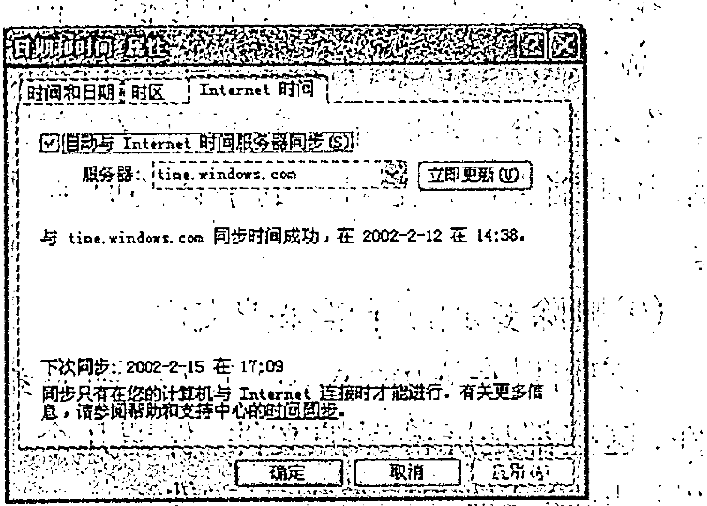

由于我们并不能保证自己的计算机与 Internet 保持连续稳定的连接，因此自动同步不可能总是发生。在这种情况下，我们可以通过单击“Internet 时间”选项卡中的“立即更新”按钮来执行手工与时间服务器的同步。

系统默认的时间服务器 time.windows.com 由 Microsoft 控制，时间服务器 time.nist.gov 由美国政府控制。

另外，如果用户希望使用一个没有列出的时间服务器，则可以键入它的名称，但是只有使用简单网络时间协议（SNTP）的时间服务器才会工作。插入使用超文本传输协议（HTTP）的 Internet 地址将无法工作。

当用户单击“立即更新”按钮后，时钟应立即同步。如果该操作失败，可能出于以下几个原因：

- 1. 没有连接到 Internet。在试图同步时钟前创建 Internet 连接。
- 2. 个人或网络防火墙阻止时钟同步。大多数公司或组织的防火墙同一些个人防火墙一样会阻碍时钟同步。家庭用户应阅读防火墙文档以得到关于除去网络时间协议(NTP)障碍的信息。如果切换到 Microsoft Internet 连接防火墙，那么您应该可以同步时钟。
- 3. Internet 时间服务器太忙或由于某种原因而不可用。如果属于这种情况的话，可以试着稍后再同步时钟或通过双击任务栏上的时钟来手动更新；也可以试着采用另外一个不同的时间服务器。

##### 禁止创建短文件名

Windows XP 能够兼容 MS-DOS 和 Windows 3.X，支持 8.3 格式的文件名，但是当用户在 NTFS 文件系统的分区上建立这样的文件，将会降低 NTFS 分区的性能，因此使用 NTFS 分区的用户应当禁用此项功能。

打开注册表编辑器 Regedit，定位到 HKEY_LOCAL_MACHINE\SYSTEM\CurrentControlSet\Control\FileSystem，将其下的 NtfsDisable8dot3NameCreation 的值由 0 改为 1。重新启动计算机，该项功能就被禁止了。

##### 禁止最近访问更新功能

Windows XP 为了方便用户管理计算机，为用户提供了很多新的功能，其中之一就是当用户在各个目录之间切换时，能够更新最近访问的目录的日期/时间标签。这样做的缺点是将会降低 NTFS 分区的性能，所以使用 NTFS 分区的用户最好禁止该项功能。

打开注册表编辑器 Regedit，定位到 HKEY_LOCAL_MACHINE\SYSTEM\CurrentControlSet\Control\FileSystem 子键，将其下的 DWORD 值“NtfsDisableLastAcessUpdate”由“0”改为“1”。

如果找不到该值的话，建一个同名同值的 DWORD 值即可禁止更新功能。

##### 禁用多余的服务

服务是一种应用程序类型，它在 Windows XP 的后台运行，与 UNIX 后台应用程序类似。服务应用程序通常可以在本地和通过网络为用户提供一些功能，例如客户端/服务器应用程序、Web 服务器、数据库服务器以及其他基于服务器的应用程序。对于大部分用户来说 Windows XP 中自动启动的很多服务都是不需要的，因此需要关闭它们，这样可以减少系统启动的时间，并降低系统资源的占用。

在“运行”框中输入“services.msc”，回车后弹出“服务”对话框，如图 2 所示。

在窗口中列出了系统中安装的所有服务。双击一个服务，会弹出该服务的“属性”对话框，如图 3 所示。

- 每个服务的启动类型都有 3 个不同的设定。
    - (1) 自动：系统的每次启动都会打开该服务。
    - (2) 手动：设定用户或者另一个服务可以启动该服务，但在启动时不运行该服务。
    - (3) 已禁用：完全禁止该服务的使用。

用户可以单击“服务状态”下的“启用”或“停止”按钮，来开始或结束服务。

以下服务，用户可以将启动类型设置为“手工”即关闭：

- **Alerter**
    通知所选用户和计算机有关系统管理级警报即处理日常的警报，就象那些系统出错时发送到网络的一样。
- **Event Log**
    启用在事件查看器查看基于 Windows 的程序和组件颁发的事件日志消息。如果用户不关心是否能找出所出现的系统错误，可以关闭此服务。
- **Messenger**
    在网络上发送和接收信息，关闭此服务后，将无法接收到其他人通过“net send”命令发送的网络消息。
- **Net Logon**
    支持网络上计算机 pass-through 帐户登录身份验证事件，可以处理像注册信息那样的网络安全功能。
- **Network DDE 和 Network DDE DSDM**
    这两个服务分别可以为在同一台计算机或不同计算机上运行的程序提供动态数据交换 (DDE) 的网络传输和安全，管理动态数据交换 (DDE) 网络共享。如果用户不准备在网上共享程序的话可以关闭。
- **NT LM Security Support**
    为使用传输协议而不是命名管道的远程过程调用 (RPC) 程序提供安全机制，可以在几种NT网络应用中提供安全保护。
- **Print Spooler**
    将文件加载到内存中以便迟后打印，管理用户的打印机，如果没有打印机的话，可以关闭。
- **Task Scheduler**
    使用户能在此计算机上配置和制定自动任务的日程，如计划每星期的碎片整理等。
- **Uninterruptible Power Supply**
    管理用户的 UPS，如果没有使用 UPS 的话，应当将其设为“手动”或者“已禁用”。

##### 禁用自动修复快捷方式的功能

从 Windows 2000开始，系统可以自动在后台修复那些已经破损（即更改了位置的）快捷方式，Windows XP中自然也不例外。那么能否关闭掉这个功能呢？

打开注册表编辑器 Regedit，定位到 HKEY_CURRENT_USER\Software\Microsoft\Windows\CurrentVersion\Policies\Explorer 子键，在右侧窗口中新建一个名为“NoResolveTrack”的 DWORD 值，并将其值设置为“1”。如果需要恢复该功能，删除此 DWORD 值或者修改其值为“0”即可。

(文 / 郑铁)

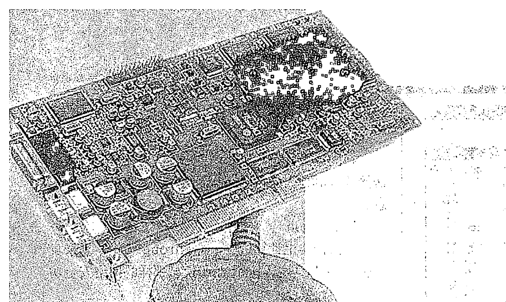

## 硬件步步升

虚拟机就是通过软件在现有操作系统下创建出“新”计算机，使一台电脑能当多台电脑来使用。只要你的硬盘空间够大、物理内存容量足够多，虚拟机的数量将不受限制。

虚拟出来的“计算机”就像真的计算机一样拥有自己的硬件如硬盘、CPU、显卡、声卡、内存等，你可以进行分区、格式化、安装操作系统和软件等操作，而不会影响到主机系统的稳定。

本专题对最流行的虚拟机软件VMware的使用进行了细致的讲解，对Virtual PC也有详细的介绍。随着计算机的发展，很多用户对电脑的升级越来越理性化，已经不再盲目地追求高配置，而是讲求“实用、适用”，所以，计算机的升级逐渐注重对升级可行性的分析。为此，我们从升级前对系统的分析准备工作着手，一步步地为你提出整合升级方案和笔记本电脑升级方案。

- 营造安全的虚拟系统 P341
- VMware 之下载安装篇 P343
- VMware 之虚拟机创建篇 P346
- VMware 之工作实战篇 P350
- VMware 虚拟系统之问题篇 P355
- Virtual PC篇 P358## 营造安全的虚拟系统

对众多的DIYer来说，经常性的安装各种新软件、升级驱动程序、尝试性地“优化”系统已经是日常功课之一，但这些DIY操作所带来的恶果之一就是令人难以回避的系统崩溃！虽然我们有种种解决系统故障的措施和手段，或者也可以利用系统还原、Ghost等保护系统，但终归是亡羊补牢而已，有无更好一些的解决方案呢？

传统的做法是：先在硬盘中建立不同的分区；然后再分别安装不同的操作系统，例如比较常见的Windows 9x/Me与Windows 2000/XP的双引导系统，如果你想让Windows与Linux共存的话，那还需要借助System Commander等引导工具才能够得以实现。不过，这种方式最大的缺点就是占用硬盘的空间太多，另外切换操作系统时只能通过重新启动的方式才能达到目的。

今天我要向朋友们介绍一种通过软件模拟实现多系统共存的解决方案，简单地说就是从原有硬盘中划出一部分空间作为你的试验田，在这块试验田中可以进行各种可能具有危险性的DIY操作。这样做的好处不言而喻，既不会影响原有操作系统的安全性，更妙的是还可以同时运行多个操作系统！这就是所谓“虚拟机”的原理，它通过软件的手段利用原有硬盘的空间和从物理内存中额外分配的内存，在现有操作系统下创建出一台新的计算机（当然是虚拟出来的啦，我们将之称之为“Virtual”），这台虚拟出来的计算机就像真的计算机一样拥有自己的硬件如硬盘、CPU、显卡、声卡、内存等，你可以进行分区、格式化、安装操作系统和软件，只要你的硬盘空间够大、物理内存容量足够，虚拟机的数量将不受限制。

### 一、功能超级强大的VMware

VMware是目前最著名的虚拟机管理工具，它是一款共享软件，可以从http://www.vmware.com/网站免费下载30天试用版本。下面，笔者就先简单介绍一下它的独特功能。

#### （一）同时运行多个操作系统

实际上，不知你是否想过，过去我们实现多操作系统的主要途径都必须重新启动后才能进行切换，而VMware可以帮助我们在同一时刻同时运行多个操作系统（注意这才是真正的“同时运行”），无论是Windows 9x/Me、Windows Me/2000/XP或是Windows/Linux都可以轻易实现，你不再需要重新启动进行切换或是重新分区创建不同的文件系统（有经验的朋友应该知道当安装Linux或FreeBSD系统时，需要创建特殊的文件系统或重新创建一个单独的分区）；唯一受限制的是你的硬盘空间和物理内存容量！

#### （二）在同一台计算机上组建小型的局域网系统

现在，你可以在同一台计算机上借助VMware组建小型的局域网系统，可以同时运行多个操作系统，VMware将原来的操作系统称之为“Host Operating System”，而将新创建虚拟机上安装的操作系统称之为“Guest operating system”，你可以在Host Operating System和Guest operating system间组建局域网，实现资源共享，当然借助Host Operating System访问Internet也是一桩极其简单的事了。

#### （三）安全体验各种新软件

现在，你不再需要通过“全新安装”来安装操作系统，尽管通过VMware创建若干个虚拟机体验各种不同版本的操作系统或新的软件，这样不仅可以避免系统臃肿、启动缓慢、不兼容、死机等恶果，而且不需要时简单删除即可，在系统中不会留下任何后患，这样经验不足的用户在操作时也就不用担心数据丢失的问题了。

#### （四）一台免费的数码相机

你可以将VMware当作一台免费的数码相机，过去像BIOS设置程序、系统初始化引导过程、Fdisk分区、Format格式化、操作系统安装等图片只能使用数码相机来拍摄或手工制作，截图时十分麻烦。现在好了，你只须利用VMware中的虚拟机即可完成，如果你是一位IT撰稿人，这一功能可特别有用。

当然啦，笔者觉得VMware对学校中进行计算机教学更为实用，过去无法让学生实际练习的分区、格式化、系统安装等操作现在可以借助虚拟机进行，最大限度降低风险。另外，企业也可以利用VMware来培训员工，或者在虚拟机系统中运行过去开发的软件，减少重复的工作量。

### 二、后起之秀 Virtual PC

Virtual PC 是一款与VMware 功能非常相似的软件，它同样可以让你在一台PC上同时运行多个操作系统（最多可达32个），使用时不需要重新启动，通过鼠标点击即可切换到不同的操作系统，从而达到我们的目的，Virtual PC 安装后可以自动运行你已经安装的多个操作系统，而且还能够使用拖放功能在几个虚拟的PC之间共享文件和应用程序。

另外，Virtual PC 对系统的软硬件环境要求较Vmware要低得多，只需266MHz以上CPU即可，但要求具有L2缓存，另外就是在硬盘空间和内存容量方面有特别的要求，当然是越大越好啦。

目前，Virtual PC 的最新版本是5.0，不过笔者觉得4.2版本比较成熟，你可以到http://www.connectix.com/下载，文件大小约17670KB。说起Connectix公司，许多喜爱游戏的朋友可能不会陌生，因为著名的PS游戏模拟器就是该公司的拳头产品，说来凑巧的是，Virtual PC 也同样具有模拟功能，它可以让你在当前操作系统中创建若干个Virtual PC（虚拟机），每个虚拟机上都可以像独立的PC机那样安装新的操作系统，这样也就达到了同时运行多个操作系统的目的。不过，Virtual PC 目前只向非注册用户提供演示版本。

(文/王志军)

## 2002年读者优先购买奖评选结果

◇经过大家热心评选，本次有奖活动的最终优先购买品牌为：

| 品牌电脑 | 联想 | 笔记本电脑 | IBM | 喷墨打印机 | 佳能 | 扫描仪 | 明基 |
| :--- | :--- | :--- | :--- | :--- | :--- | :--- | :--- |
| 主板 | 技嘉 | 显卡 | 丽台 | CRT显示器 | 三星 | 液晶显示器 | 三星 |
| CD-ROM | 三星 | DVD-ROM | 明基 | 多媒体音箱 | 轻骑兵 | 刻录机 | 明基 |
| 声卡 | 创新 | 内存 | KINGMAX | 硬盘 | 迈拓 | CPU | INTEL |
| 调制解调器 | 全向 | 机箱 | 世纪之星 | 电源 | 七喜大水牛 | Mp3播放器 | 三星 |
| 数码相机 | 柯达 | 鼠标 | 罗技 | 键盘 | 明基 | 散热器 | 九州风神 |
| 掌上电脑 | 联想 | 杀毒软件 | 瑞星 | 翻译软件 | 金山词霸 | 影音播放软件 | 超级解霸 |

不好意思，把获奖此等大事延迟了一月了，但俗话说好事多磨吗:)。我们此次抽奖规则是遵循按厂商英文排序来依次抽取中奖者的（抽完一个厂商后再抽取下一个）。

并且我们也要对此次活动投入大量超值奖品的厂商由衷感谢，更要感谢大量读者诚挚的回信，我们希望将此活动办成年度连续的形式，并以此对读者购买形成参照作用。好了! 下边是幸运者被隆重推出的时候了。

中奖说明: 除小件奖品（DVD、CD-ROM、软件、显卡）外，其余奖品（显示器、音箱、打印机）需中奖者承担奖品邮寄费用，具体问题请拨打查询电话: (010) 62161960、62161336-8076。

- ◇佳能建议奖（打印机s450） 颜昭喜 四川
- ◇创新建议奖（音箱5.1） 徐欣羽 吉林
- ◇三星建议奖（显示器19’） 张鸣 湖北
- ◇佳能奖（打印机BJC-2100sp） 共15人
  王兆鹏 山东 王辉 北京 邓超杰 河北 安旭成 吉林 张鲍 石家庄
  李风华 江苏 陈永明 浙江 苑淑娟 河北 姜龙 青岛 祝海军 江苏
  高尚斌 河南 章东兴 江苏 韩家洪 吉林 褚显辉 海南 潘栋伟 河南
- ◇三星奖（显示器17’、15’）共3人
  秦冬英 北京 毛峰 浙江 黄玲 湖南
- ◇创新奖（音箱、CD-ROM）共12人
  刁力 四川 王晶 天津 刘翊龙 河北 李栈明 广东 陈丽丽 云南
  林国强 杭州 范维 北京 胡震 湖北 赵琦 山西 梁福营 山东
  蔡昌华 江苏 戴志勇 贵州
- ◇爵士奖（5.1音箱）共5人（名单略）
- ◇轻骑兵奖（音箱v1.0）共59人（名单略）
- ◇电子工业出版社图书奖（40元以内图书一本，领奖联系电话：010-62534495、62574540）共125人（名单略）
- ◇读者建议奖（名单略）
- ◇奥美嘉奖（显卡、DVD、CD-ROM）共7人（名单略）
- ◇金山奖（词霸2001版）共77人（名单略）

## VMware之下载安装篇

看了前言中的介绍，想必朋友们一定跃跃欲试准备安装自己的虚拟机了吧？别着急，我们还需要先将VMware请回系统呢。

### 一、软硬件环境需求

VMware目前的最新版本是3.1 Beta版本，不过用的最多的还是3.0 RC Build 1455，文件大小为12348KB（个头不小），它的软、硬件环境要求如下：

#### （一）软件环境

这里要说明的是，VMware只能在如下操作系统中安装：

- Windows.NET
- Windows XP Professional
- Windows XP Home Edition
- Windows 2000 Professional/Server/Advanced Server
- Windows NT Workstation/Windows NT Server（必须安装SP3以上补丁）

如果你的系统是Windows 9x/Me，那只能遗憾的说声“免谈”了（操作系统是Windows 9x/Me的朋友，可参看本专题中的《Virtual PC篇》）。不过，令人欣慰的是，在VMware虚拟机中可安装的Guest Operating System倒是不少，例如：MS-DOS 6.0、Windows3.1/9x/Me/NT/2000/XP、Linux、Linux-Mandrake 8.0、Red Hat系列、SuSE Linux系列、Caldera OpenLinux 2.x、FreeBSD系列等等。

#### （二）硬件环境

VMware对硬件的需求颇高，要求CPU是266MHz以上（推荐使用400MHz以上CPU）、128MB以上内存（推荐使用256MB）、20MB以上硬盘空间（推荐至少500MB以上剩余空间）。

### 二、VMware的下载

VMware的老家是http://www.vmware.com/download，下面笔者就详细介绍一下它的下载步骤（注意：当你看到本文时，下文中的网页可能有一些变化）：

#### （一）选择版本

VMware有Workstation、GSX Server两种不同版本（如图1），对一般朋友来说，当然是选择Workstation（工作站版本）啦。

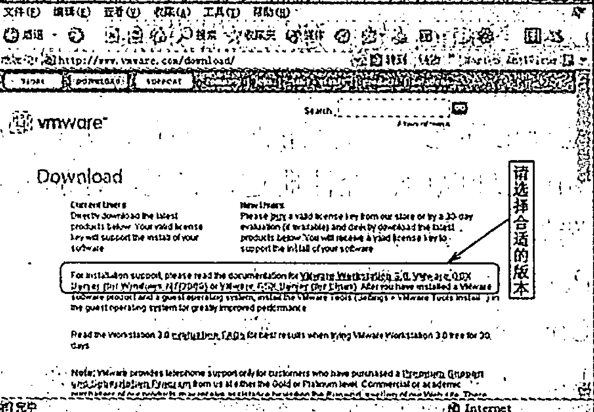

#### （二）选择下载链接

如图2所示，这里提供了7个下载链接，任意选择一个链接下载即可，或者你也可以从国内的华军软件园、天空软件站下载（1455版本大概有12MB左右），这样速度可能稍快一些。

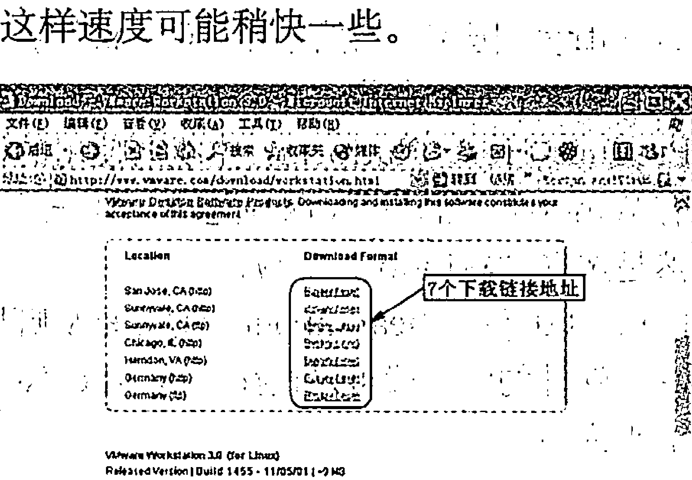

#### （三）获取试用码

VMware Workstation 3.0为用户提供了30天的免费试用期，但必须登录该公司网站注册后才能获得注册码。在网页上找到类似evaluation serial number的链接，点击进入。

如图3所示，如果你以前曾经注册过VMware，那么直接填入你的E-mail地址和Password（密码），然后点击“Login”即可下载新的版本。

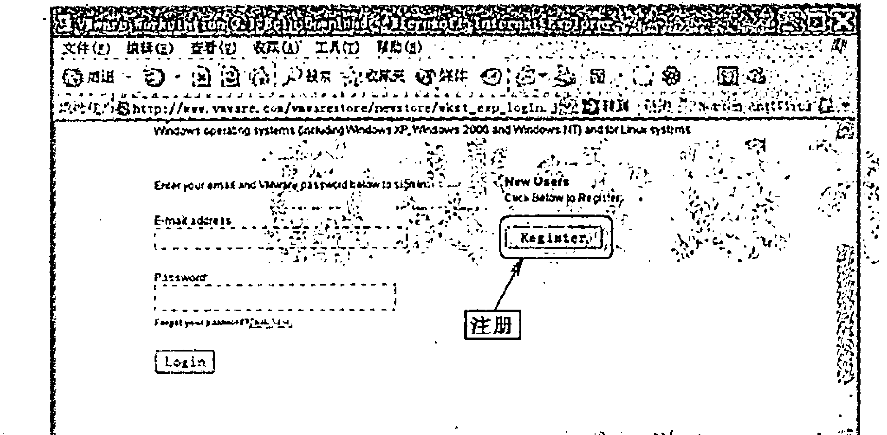

否则就需要点击右侧的“Register”按钮进入注册页面。请按照要求填写各项注册信息：

- First Name: 名字的第一个字，建议使用拼音；
- Last Name: 姓，建议使用拼音；
- E-Mail Address: 你的E-mail地址，请一定要保证地址正确无误，而且能收到回信。另外，如果该E-mail地址以前已经注册过，将无法注册成功，因此请选择一个新的邮箱地址；
- Password: 邮箱的密码；
- Confirm Password: 密码确认；
- Job Description: 工作性质，从下拉列表框中随便选择一个即可，如果找不到合适的，选择“Other”就行了；
- Company/Organization: 你的工作单位；
- Industry Category: 行业性质，也可以选择“Other”；
- Phone Number: 电话号码；
- Country: 国家，当然选择“China”啦；
- Zip code: 邮政编码；
- Product Host Platform: 本机所使用的操作系统，有Windows和Linux两种选择，对一般朋友而言当然是选择“Windows”啦；
- How did you hear about us? 你是从哪里知道VMware软件的？一般可以选择“On the Net”（从网络上听说）；
- What is your time frame for a possible purchase of VMware Workstation? 选择试用时间，这里有30 days、60 days、90 days三种选择，随便选择一个即可；
- How many licenses of VMware Workstation would you be interested in? 选择许可证数量，选择“1”即可；
- How do you plan to use VMware Workstation? 你的使用计划，建议选择“Development and testing”（开发和测试）；

### 三、正确安装VMware

得到这个序列号后，我们就可以开始安装VMware了，具体步骤如下：

#### 第一步：检查系统配置

请按照前面提到的软、硬件环境需求检查你的系统配置是否满足VMware的推荐要求，如果仅满足最低配置，那么笔者建议你不安装为好，否则运行效率会非常低。

#### 第二步：整理硬盘碎片

由于VMware需要从硬盘中划分出一部分空间给虚拟机，因此最好在安装之前先对硬盘进行一次磁盘扫描，修复系统中存在的错误，并全面整理一次磁盘碎片，这样可以减少很多无谓的错误。

#### 第三步：启动安装向导

直接运行下载文件VMwareWorkstation-3.0.0-1455.exe，即会看到安装界面，点击“Next”按钮进入下一步。在图4窗口中，你必须选择“Yes;I accept the terms in the license agreement”，然后才能进入下一步骤。

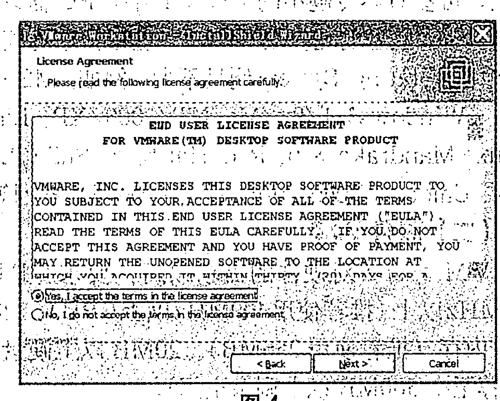

#### 第四步：选择安装路径

VMware的安装过程非常标准，接下来你需要确认软件的安装路径（缺省位置是Program Files\Vmware\Vmware Workstation\），建议点击图5窗口中的“Change”按钮选择其它路径。如果安装向导检测到有低版本的Vmware，会询问是否更新，点击图6中的“Upgrade”（升级）按钮即可。

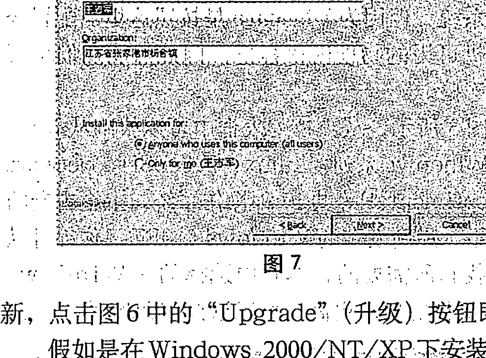

假如是在Windows 2000/NT/XP下安装，安装向导将会询问是授权所有用户使用还是仅由当前用户使用，请根据实际情况选择（如图7）。

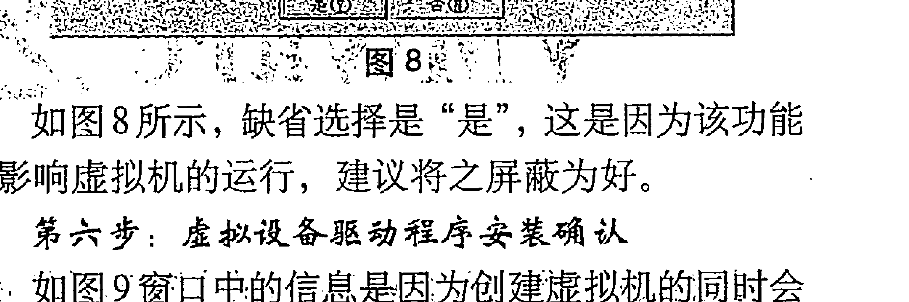

### 实战虚拟机

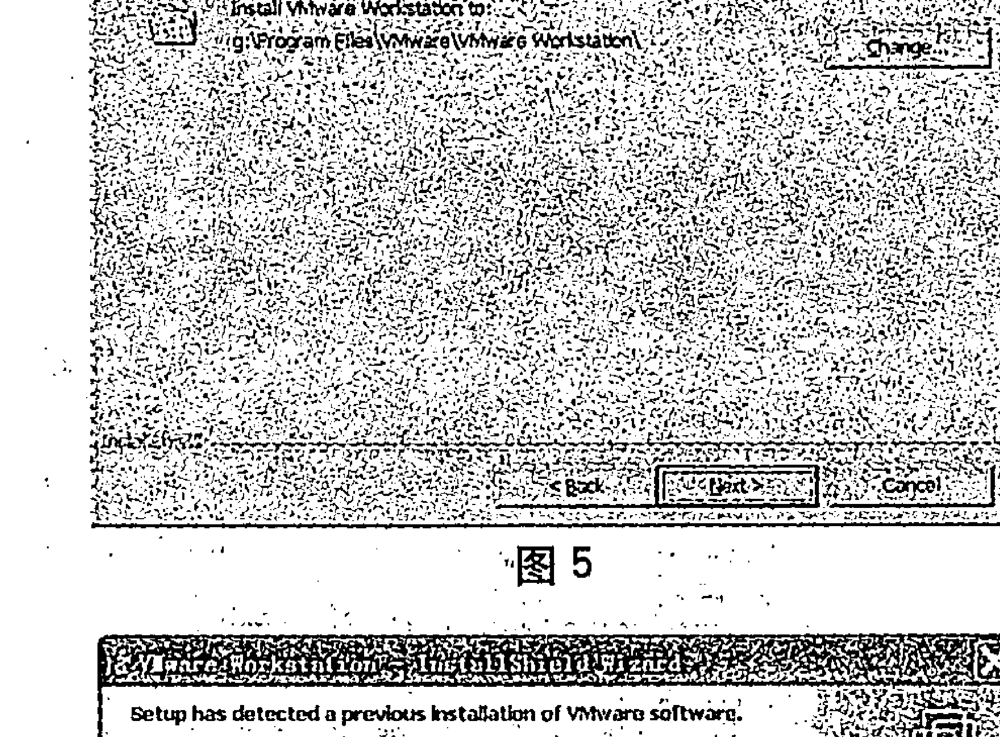

#### 第五步：屏蔽光驱的自动运行功能

在安装过程中，你会看到如下信息：Do you want to disable Autorun now?（是否禁用光驱的自动运行功能？）

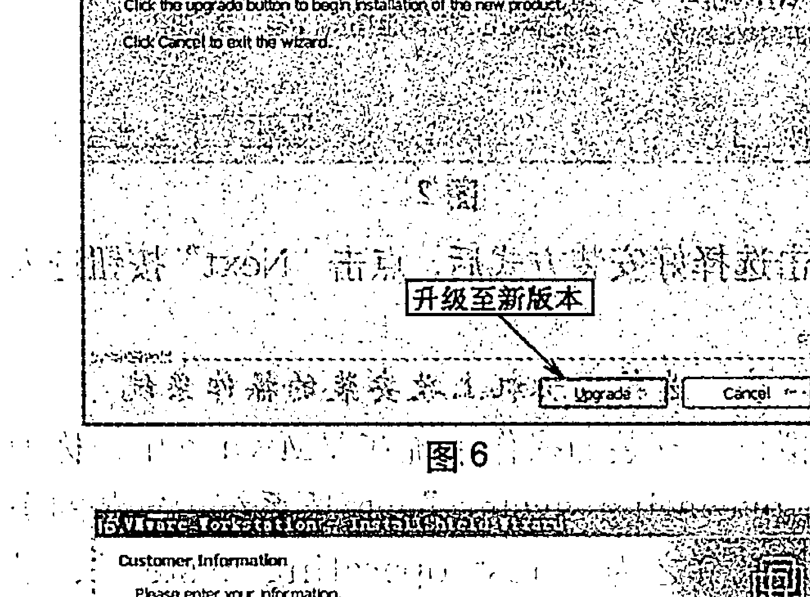

如图8所示，缺省选择是“是”，这是因为该功能会影响虚拟机的运行，建议将之屏蔽为好。

#### 第六步：虚拟设备驱动程序安装确认

如图9窗口中的信息是因为创建虚拟机的同时会自动安装Virtual Ethernet Adapter（虚拟网卡）等硬件设备，这些硬件设备的驱动程序毫无疑问是没有通过Windows的徽标测试，因此需要在这里确认一下，点击“仍然继续”按钮即可。

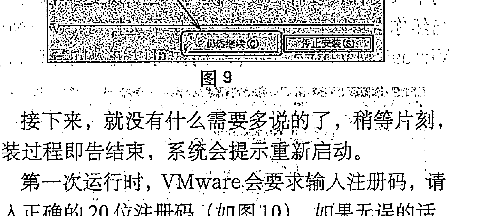

接下来，就没有什么需要多说的了，稍等片刻，安装过程即告结束，系统会提示重新启动。第一次运行时，VMware会要求输入注册码，请输入正确的20位注册码（如图10），如果无误的话，

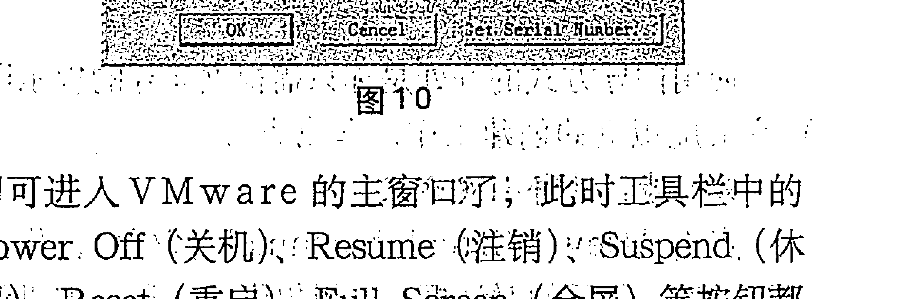

即可进入VMware的主窗口，此时工具栏中的Power Off（关机）、Resume（注销）、Suspend（休眠）、Reset（重启）、Full Screen（全屏）等按钮都呈灰色不可用状态，这是因为此时并未创建虚拟机的缘故。（文/王志军）

## VMware 之虚拟机创建篇

虽然我们已经进入了VMware的主窗口，但你会发觉此时Power Off、Resume、Suspend、Reset、Full Screen等按钮都是灰色不可用，这是因为你还没有创建虚拟机，当然无法使用啦。所以现在我们首要的工作就是先创建一个虚拟机，这里可是有很多讲究呢。

### 一、方便的向导操作方式

在图1所示的主窗口中，我们可以看到这里有New Virtual Machine（新建一个虚拟机）和Open Existing Virtual Machine（打开已存在的虚拟机）两个大图标，没什么要多说的，当然是选择前者啦。当然你也可以直接从“File”菜单下选择“New→New Virtual Machine”命令，同样可以进入向导窗口。

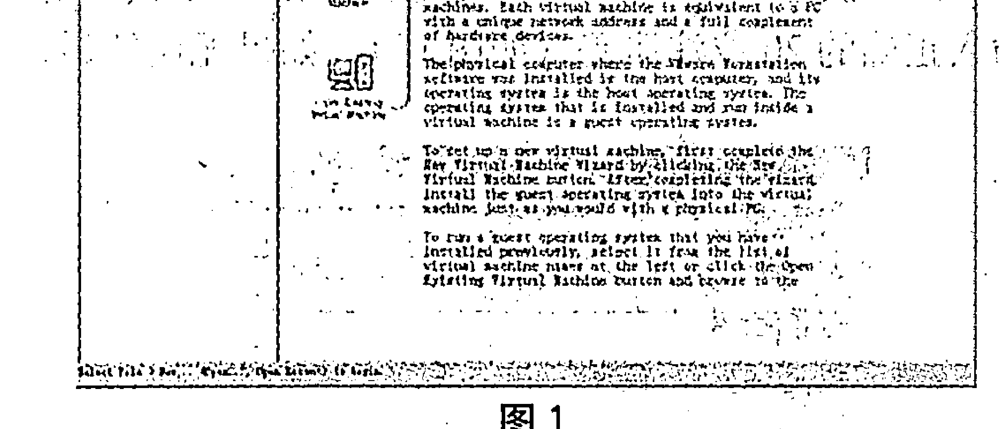

使用向导方式的好处是你只需根据向导的提示即可完成虚拟机的创建工作，非常省心。

#### 第一步：选择创建方式

点击“New Virtual Machine”图标后，你会看到如图2所示的对话框，这里提供了三种虚拟机创建方式供用户选择：

- **Typical:** 典型方法，这是创建虚拟机的缺省方式，创建过程中会加载标准硬件设备和默认设置，建议初学者选择此方式。
- **Custom:** 自定义方式，如果你需要添加额外的硬件设备或自定义可用内存，可以选择该方式。
- **VMware Guest OS Kit:** 这是VMware提供的一套工具，已经预安装了用户的操作系统，一般不用考虑。

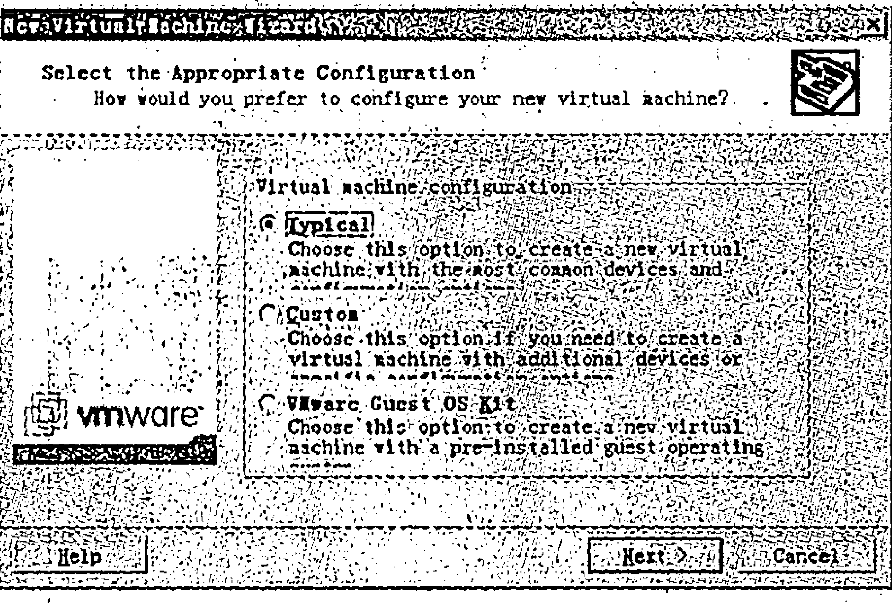

单击选择好安装方式后，点击“Next”按钮进入下一步。

#### 第二步：选择虚拟机上欲安装的操作系统

虚拟机上安装的操作系统在VMware中被称为“Guest operating system”，而原系统中安装的操作系统则被称之为“Host operating system”，虽然在这里选择何种操作系统并不会影响你安装真正的操作系统，但因为VMware是按照这里的配置分配虚拟机可用的物理内存容量，因此请朋友们尽可能真实一些。

如图3所示，从下拉列表框中可以找到从MS-DOS、Windows系列、Linux、FreeBSD、Netware 6.0(experimental)等共17种操作系统，上至古老的DOS，下至最新发布的Windows .NET，你都可以在这里找到所需要的，本刊中选择的是Windows Me。假如你的要求更高，可以选择“Other”方式。

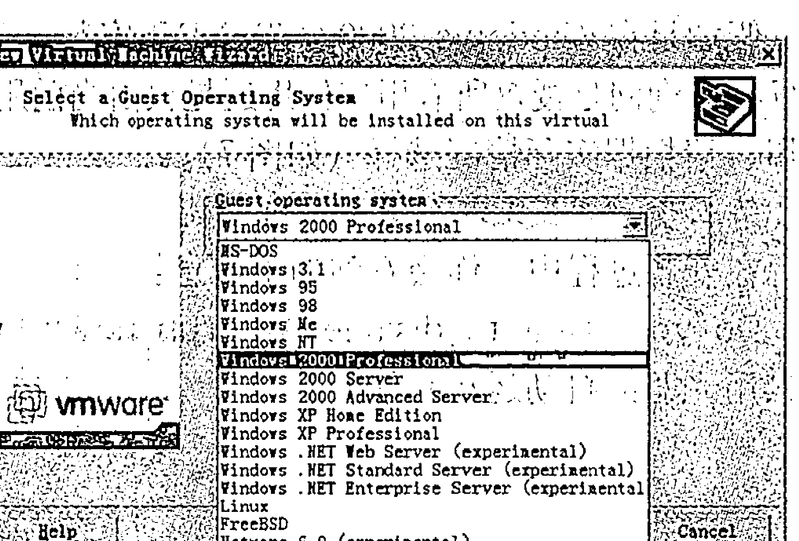

#### 第三步：设置虚拟机文件所在路径

既然VMware可创建多个虚拟机，那当然要为它起一个别致一些的名字啦，另外你还需设置一下虚拟机文件所在的路径，免得以后弄糊涂被误删除了！看到如图4所示的窗口了吧，默认的虚拟机名是第三步中所选择的操作系统名，当然也可以自行修改啦，这并没有什么特别的讲究。其实，图4中最重要的还是下面的“Location”栏，这代表了虚拟机文件所在的路径，Windows 2000下缺省位置是\Documents and Settings\Administrator\My Documents\My Virtual Machine\Windows Me下，建议点击右侧的“Browse”另行选择，这样管理起来可能更为方便一些。

#### 第四步：选择一个网络桥接方式

在前言篇中我们已经知道，VMware最大的优势之一就是它的网络功能，在这一步中可要仔细设置呀。

如图5所示，可以看到这里一共有四种网络桥接方式，我们究竟该选择哪一种呢？缺省选项是“Use bridged Networking”方式，它的含义是桥接网络，也就是说在你的系统中创建一个虚拟的网桥，这样Guest系统就可以通过虚拟的网卡与外部局域网相连，而且Guest系统也有一个单独的IP地址，可以使用外部网络提供的所有服务，包括访问Internet、E-mail服务、聊天服务等，当然要求是本机具有物理网卡，而且有固定的IP地址。

Use network address translation(NAT):网络地址翻译器，如果你希望使用HOST系统中的拨号网络设置连接到Internet或其他的TCP/IP网络，但你又不想给Guest系统配置一个IP地址（或者HOST系统中并未安装物理网卡），那么可以选择该项，不过如此设置的话外部网络就无法访问Guest系统了。

Use host-only networking: 仅主机网络，如果你不想和外部网络连接，而仅仅只想与原操作系统之间建立一个虚拟的专有网络，可以选择该项。

Do not use a network connection: 不使用网络连接，当然此时HOST和Guest系统之间也就无法访问了。

这一步骤结束后，你会看到如图6所示的窗口，它代表这个名为“Windows Me”的虚拟机已经创建成功，从这个窗口中可以查看到该虚拟机已加载的所有标准硬件设备：

Memory: 可用的物理内存容量，这个容量取决于前面第二步中所选择的操作系统类型，当然你也可以在“Settings/Configuration Editor/Memory”窗口中进行调整，方法很简单，你只要在图7所示的窗口中修改即可，当然修改的容量还决定于本机的物理内存容量，不要太贪心。

Virtual Disk: 虚拟硬盘，缺省挂接在IDE 0:0上，也就是说只有一个硬盘可供使用，最大的容量是4GB，但你可以放心，VMware不会一次就全部占用4GB的空间，空间的占用随着客户操作系统的安装以及应用软件的安装才逐渐占用，如果你觉得空间不够的话还可以另行添加第二硬盘啦。

- DVD/CD-ROM: 虚拟光驱设备。
- Floppy Drive(A:): 虚拟软驱。
- Network Adapter: 网络桥接方式。
- 2 Port USB Controller: 2个USB控制器。

如果你细心一些的话，一定还会发现此时工具栏中的Power Off、Power On按钮已经呈现可用状态，也就是说这台才刚刚创建完毕的虚拟机现在可以加电开机、关机啦。但其他按钮如Suspend（休眠）、Reset（复位）、Full Screen（全屏）却仍然无法使用，你必须启动虚拟机操作系统后才能正常使用。假如你还想再创建第二个、第三个虚拟机，继续点击图1窗口中的“New Virtual Machine”就行，但要注意剩余的硬盘可用空间和物理内存容量。

### 二、DIY 自己的虚拟机

可能有些朋友不习惯于向导方式来创建虚拟机，因为在此种方式下许多选项都无法改变，例如可用的物理内存容量等，其实我们可以事后从“Settings → Run the Configuration Editor”进入图8所示的编辑窗口，在这里尽情发挥你的 DIY 想像力吧。

#### (一) 为虚拟机添加第二硬盘

前面已经提到，缺省方式下虚拟机中只能使用一个硬盘，如果你想体验一下虚拟双硬盘的威力的话，在这里点击“Add”按钮从图9所示窗口中选择“Hard Disk”设备，具体步骤如下。

##### 1. 选择硬盘类型

一般我们都是在图10所示窗口中选择Disk的类型为“Create a new virtual disk”（创建一个新的虚拟硬盘）。而下面的“Use an existing virtual disk”是使用一个已存在的虚拟硬盘，如果你以前已经创建过类似的虚拟机，就可以选择该项。第三项“Use a physical disk”是使用物理硬盘，该项仅适合于高级用户使用，不建议新手朋友们选择该项。

##### 2. 配置硬盘容量

如图11所示，你可以在这里手工配置硬盘的容量，最大为4GB，采取默认值即可。

##### 3. 设置虚拟硬盘文件所在路径

与向导方式类似，这里你也需要为虚拟硬盘文件指定一个具体的路径，毕竟虚拟机仍然是借用了物理硬盘和物理内存容量，如图12所示，可以点击“Browse”按钮进行更改。

假如你选择了“Advanced”方式，还可以在如图13所示窗口中手工设置第二硬盘的IDE接口方式，最后点击“Finish”按钮就全部结束了。

#### (二) 为虚拟机添加声卡设备

VMware标准方式下创建的虚拟机并不包括声卡设备，不过我们可以从“Configuration Editor”窗口中手工添加，点击“Add”按钮后，在出现的窗口中选择“Sound Adapter”设备，然后根据向导的提示操作即可。

其实，VMware创建虚拟机的原理是在原系统中建立了一个以Windows Me为名字的文件夹，其中有若干以vmx或vmdk为扩展名的文件，这些就是虚拟机正常运行所必需的文件，不要随随便便将之删除！

### 三、看一看全新的虚拟机

好了，现在按下主界面中的“Power On”按钮就可以启动虚拟机，这就像一台真正的计算机一样，会给你带来好多的惊喜！

#### (一) 熟悉的 POST 自检

虚拟机的启动完全是我们所熟悉的POST自检过程，如图14所示，除了启动画面中的右上方用VMware图标替换了显示器的EPA图标之外，其他包括主板BIOS版本、内存检测、硬盘检测、光驱检测等过程一应俱全。

#### (二) 神奇的 BIOS

既然虚拟机与真正的计算机类似，当然它也拥有自己的BIOS，在启动时快速按下F2键即可进入BIOS设置程序（如图15所示）。这里要说明的是，不管你原主机使用何种BIOS、何品牌主板，虚拟机一律改用Phoenix BIOS。

其实图15所示的窗口对我们来说应该不会有什么陌生感，Main、Advanced、Security、Power、Boot、Exit六大菜单，使用“-”和“+”键可以设置各个项目的设置值，使用上下箭头切换选项，使用回车键确认选项或者进入子选项，使用左右箭头在六个主选项中切换，应该说操作比较简单，在这里笔者就不多说了。唯一值得说明的是从这里可以看到“Primary Master”和“Primary Slave”两块虚拟硬盘，这下我们可以玩双硬盘甚至三硬盘、双光驱啦。

##### 说明：怎样才能按下F2键？

可能有些朋友会发觉在启动时欲按下F2键进入BIOS设置程序时，虚拟机却没有什么反应，其实这时虽然虚拟机已经加电开机，但由于这个所谓的虚拟机毕竟只是VMware在原主机下所模拟出来的，因此系统控制权仍在Host主机上，当然此时的键盘和鼠标操作不会得到虚拟机系统响应啦。不过，你只要按下“Ctrl + Alt”组合键或者用鼠标任意点一下VMware界面的右下部区域，这样就能将系统控制权交给虚拟机，键盘和鼠标也就能正常使用了。

(文 / 王志军)

## VMware之工作实战篇

到此为止，虽然你已经创建了一个名为Windows Me的虚拟机，但这还仅仅只是一台裸机，就像新组装的计算机那样，如果你想让它工作起来，要做的事还有很多！简单地说，虚拟机也同样需要分区、格式化、安装操作系统和工具软件，该做的工作一件也少不了。不过上述操作全部是在这个名为Windows Me的虚拟机中进行，而它实际上就是Host主机中的一个普通的文件夹，只不过VMware将之虚拟成一台计算机而已，因此无论你在虚拟机上进行什么操作，实质上都是在这个Windows Me文件夹中进行而已，一般不会影响原来的操作系统。下面，笔者就带领各位来实战一番虚拟机操作系统的安装过程吧。

### 一、选择引导方式

前面我们已经介绍过，虚拟机同样有着自己的BIOS，因此你只要点击VMware工具栏中的“Power On”按钮就可以加电开机，但由于此时的虚拟磁盘还未经分区、格式化等工作，硬盘无疑是不能引导系统的啦，因此我们必须选择通过光盘、软盘来引导系统。好了，请抓紧时间在POST初始画面出来后立即按下F2键进入BIOS设置程序，通过方向键来到“Boot”主菜单下，如果你发觉键盘不能用，请切换系统控制权。如图1所示，这里有3种引导方式可供选择。

- Removable Devices: 可移动设备，包括软驱引导或USB设备引导。
- Hard Drive: 硬盘引导。
- ATAPI CD-ROM Drive: 光驱引导。

如果你手头没有可引导光盘的话，那么就选择“Removable Devices”项好了，当然事先要准备好一张Windows 98的超级启动盘，最后在图2所示的窗口中选择“Exit → Exit Saving Change”（保存设置并退出）就可以了。

这里有一点要强调的是，初次使用VMware的朋友可能会困惑于系统控制权的问题，特别是在虚拟机中无法使用键盘，这是什么原因呢？其实，这说明系统控制权并未被切换到虚拟机中，必须按下“Ctrl+Alt”组合键进行切换，更简单的办法是用鼠标在VMware主窗口的右下部任意区域点击一下，就一切OK啦。

### 二、格式化虚拟磁盘

由于虚拟磁盘上什么也没有，完全是一张空白的图画，因此我们就只能借助FDISK和FORMAT这两个古老的DOS命令来完成分区、格式化的操作了。可能朋友们对于这两条DOS命令已经有些陌生，再加上毕竟是在虚拟机中进行上述操作，因此笔者下面就来介绍一下有关步骤。

#### (一) 了解一些预备知识

##### 1. 硬盘分区的目的

就像造房子一样，一个空空如也的大房子如果不分成客厅、卧室、厨房等，住起来会很不方便。新买的硬盘也必须将它分成几个区域，然后才能开始系统的安装工作。再说如果不分区、格式化，那么根本就没有办法从硬盘启动，不信你试一试？可能有的朋友会说在购机时没有看到这一个步骤呀，那是因为装机人员已经替你代劳了。

##### 2. 分区表的知识

我们经常听说某某病毒破坏了硬盘分区表，其实我们分区后就会自动建立分区表，你用Pctools、KV3000可以查看到分区表的一些信息，不过可都是16进制的数据。下面是分区表的一些信息。

主分区表位于硬盘主引导扇区(0柱面0磁头1扇区)的后部，从1BEH字节开始，共占用64个字节，包含四个分区表项，每个分区表项的长度为16个字节，它包含一个分区的引导标志、系统标志、起始和结尾的柱面号、扇区号、磁头号以及本分区前的扇区数和本分区所占用的扇区数。其中“引导标志”表明此分区是否可引导，即是否活动分区，如果引导标志为“80”时，说明此分区为活动分区；“系统标志”决定了该分区的类型，如“06”为DOS FAT16分区，“0b”为DOS FAT32分区，“63”为UNIX分区等；起始和结尾的柱面号、扇区号、磁头号指明了该分区的起始和终止位置。分区表项的16个字节分配如下：

| 字节 | 说明 |
| :--- | :--- |
| 第1字节 | 引导标志。 |
| 第2字节 | 起始磁头。 |
| 第3字节 | 低6位为起始扇区，高2位与第4字节为起始柱面。 |
| 第4字节 | 起始柱面的低8位。 |
| 第5字节 | 系统标志。 |
| 第6字节 | 终止磁头。 |
| 第7字节 | 低6位为终止扇区，高2位与第8字节为终止柱面。 |
| 第8字节 | 终止柱面的低8位。 |
| 第9-12字节 | 该分区前的扇区数目。 |
| 第13-16字节 | 该分区占用的扇区数目。 |

##### 3. 分区时的不同格式

有朋友可能要问了，分区就分区呗，怎么还有什么分区格式呢？其实，不同的分区格式对应不同的操作系统，我们这里所讲的分区格式有时也称为文件系统，它是指文件命名、存储和组织的总体结构。 MS-DOS和旧版本的Windows使用专门的FAT16文件系统，默认情况下Windows 98也使用FAT16（在分区时你就可以看到有关选择的提示），在此种分区格式下一个分区的最大容量不能超过2GB。Windows 98可以同时支持FAT16、FAT32两种文件系统，FAT32可以支持大于32GB的分区容量（这也是FAT32之名的由来），还能将最大为2TB的硬盘分为一个区，够厉害的吧。Windows NT支持FAT16、NTFS两种文件系统，Windows 2000则支持FAT16、FAT32、NTFS三种文件系统。Linux则可以支持多种文件系统，如FAT16、FAT32、NTFS、Minix、ext、ext2、xiafs、HPFS、VFAT等，不过Linux一般使用ext2文件系统。

因此，如果你要分区，一定要根据欲安装的操作系统选择不同的分区格式。

- (1) 如果你仍希望安装DOS、Windows 95、Windows 95 OSR1，那么只能选择FAT16格式。
- (2) 如果你希望安装Windows 98/Me，那么最好选择FAT32格式，不过如果硬盘空间不足512MB，FDISK在默认情况下将不允许使用FAT32模式，这时你只能选择FAT16格式了。但笔者想来现在应该再没有朋友会使用小于512MB容量的硬盘了吧？
- (3) Windows NT只能选择NTFS格式。
- (4) 如果你仍想同时使用DOS和Windows 98/Me，那么只能选择FAT16格式。
- (5) 如果你同时安装了Windows 98/Me和Windows 2000，那么最好选择FAT32格式，因为Windows 98无法访问NTFS分区中的数据；虽然可以通过一个名为NTFS For Windows 98的软件来访问，但未注册版本只能读而无法写入。

因为我们需要安装Windows Me系统，而通过VMware创建的虚拟盘的最大空间为4GB，因此可以考虑将之分成两个区，大小均为2GB，分区格式嘛，就选择FAT32好了。

#### (二) 为虚拟磁盘分区

FDISK是一个纯英文界面的DOS命令，可能现在相当多的朋友对DOS了解并没有多少，但希望各位坚持看完，学会了FDISK这条命令以后需要分区时就不用求爷爷告奶奶了，否则就只能永远做一只菜鸟。其实呢，FDISK的操作并不复杂，只要记住下面这几个步骤，就可以轻轻松松完成了。

##### 1. 用系统盘启动系统

将一张事先制作好的Windows 98/Me系统盘插入软驱（建议不要用Windows 95启动盘，因为它只能创建FAT16分区格式），然后点击VMware工具栏上的Power On按钮启动虚拟机，注意不要真的按下机箱上的电源开关。好了，经过“漫长”的等待，这段时间里你什么也不用做，耐心看着就是了，直到显示器上出现“A:\>_”提示符（如图3）。

##### 2. 选择分区格式

从键盘上一个字母一个字母敲入FDISK这条命令，输入结束后按下回车键，这是DOS命令的要求，无论执行什么命令，最后都必须按下回车键，否则系统是不会执行的。

Do you wish to enable large disk support(y/n)? 这句话的意思是请你决定是否使用大硬盘模式（即FAT32分区格式），当然是键入“Y”啦，否则无法创建超过2GB容量的硬盘分区，其实这也是默认选项。

##### 3. 创建主DOS分区的三步曲

接下来，你会看到如图5所示的界面，这里有4个菜单，别害怕看不懂英文，笔者给你当一次翻译：

- 1. Create DOS partition or logical DOS drive
- 2. Set active partition
- 3. Delete partition or logical DOS drive
- 4. Display partition information

下面，笔者就说明一下创建主DOS分区的三步曲。

**第一步：选择创建主DOS分区**

**第二步：选择主DOS分区所使用的硬盘容量**

再次按下回车键后，会出现图7所示的界面，系统会问你“Do you wish to use Maximum available size for a Primary DOS Partition and Make the Partition active(Y/N)”，如果选择“Y”是将全部硬盘空间都创建为一个分区，因为前面我们已经决定要分为两个分区，因此这里当然要选择“N”。

经过短暂的磁盘校验后，会出现图8所示的窗口，让你设置分配给主DOS分区的硬盘空间，本来这个值取多大是无所谓的，但因为要均分为两个区，因此这里设置为2048（即2GB），按下回车键就可以了。

##### 第三步：创建完毕

好了，如果看到图9所示的界面，就说明主DOS分区已经创建完毕（也就是C盘），按ESC键退回到FDISK的主菜单窗口中继续进入下一步。

##### 4. 创建扩展 DOS 分区

按ESC键回到图6所示的主界面后，请朋友们选择 '2. Create Extended DOS Partition' 创建扩展DOS分区，系统会告诉你当前硬盘中可建立扩展DOS分区的最大空间，如图10所示，一般我们都是直接回车。

##### 5. 创建逻辑盘

在完成扩展DOS分区后，程序会提示说不存在逻辑盘，按ESC键自动进入逻辑盘符设置，这时候显示的将是扩展分区的全部容量，根据前面的设想，我们只要在图11中直接回车就可以了。当然，如果你想分的小一些，依次分配即可，这里就不多谈了。

##### 6. 设置活动分区

从图5中选择 '2. Set Active Partition' 设置活动分区，如果你在硬盘中创建了主分区和扩展分区，那么一定要激活主分区，在图12所示的窗口中键入 '1'（即C分区）就行了，否则的话硬盘可无法引导系统。

好了，到此为止，虚拟盘的分区工作已经全部结束，如果你有兴趣的话，可以在图5所示的窗口中选择 '4. Display Partition Information' 项查看分区信息（如图13）。

#### (三) 格式化磁盘

接下来要做的工作是什么？当然是重新启动系统，请注意仍然用刚才这张软盘启动，因为硬盘上还没有可引导文件。这次需要使用的DOS命令是FORMAT，它的格式很简单，用软盘重新引导系统，当出现“A:\>”提示符后，分别键入“FORMAT C: /S”和“FORMAT D:”即可，如图14所示，这里就不多说了。

### 三、虚拟机的其他操作

#### （一）安装Guest操作系统

完成了虚拟磁盘的分区和格式化工作，接下来安装操作系统的任务就比较轻松了，毕竟这是一件热门熟路的事，按照常规方法安装即可，不过因为是在虚拟机中进行操作（如图15），因此需要的时间恐怕相对较长一些，请朋友们耐心一些。

#### （二）安装显卡驱动程序

在操作系统安装结束后，必不可少的一件事是安装显卡的驱动程序，否则无法使用高于640 × 480的屏幕分辨率，当然这个驱动程序并不需要你真的找出显卡的驱动程序盘，因为这不过是一张虚拟显卡而已，它的安装可有一些技巧。

第一步：激活虚拟软盘

“Tools Install”命令，按照程序提示进行操作就可以了（如图16）。

第二步：安装显卡驱动程序

这里要请朋友们注意的是，这里必须右击桌面，从快捷菜单中选择“属性”命令进入“显示属性”窗口，而且在这里还必须选择“从磁盘安装”（如图17），虽然你并不需要插入一张实际的软盘。

#### （三）组建网络

正常情况下，我们并不需要对网络属性进行额外的设置，但如果不能通过网络邻居正常访问Host主机或局域网中的其他计算机，那么可以进入“控制面板 / 网络”窗口，双击“TCP/IP-AMD PCNET Family Ethernet Adapter”项进入图18所示的窗口进行设置，这与普通局域网中的设置没有什么区别，笔者这里就不多说了。设置结束后，重新启动系统，如果一切正常的话，我们就可以在网络邻居中访问Host主机上的资源了，当然也可以访问与之相连的局域网系统，够酷吧？

## VMware 之问题篇

VMware毕竟是一款纯英文界面的软件，在使用过程中颇多不便。这里，笔者将自己在使用VMware过程中遇到的一些问题以及解决措施介绍如下，希望能对朋友们有所帮助。

### 一、Windows 9x/Me 系统虚拟机

##### 1. 如何让虚拟机与 Host 主机共享 Internet 连接

虽然前面已经能够让虚拟机访问Host主机中的共享资源，但如果要想让虚拟机与Host主机共享Internet连接，就有一定难度了。不过，只要请朋友们按照下面的步骤进行，那一切就简单多了。这里，笔者以Windows Me为例介绍与Host主机上的Windows XP共享Internet连接的主要设置方法：

第一步：运行“家庭网络向导”

双击桌面上的“网络邻居”图标，出现图1所示的窗口，在这里双击运行“家庭网络向导”。

第二步：安装选项

当出现家庭网络向导后，直接点击“下一步”按钮，进入图2所示的窗口，一般选择“我想在本机上编辑家庭网络的设置”选项，如果你想在其他计算机上安装家庭网络，可以选择另一个选择。

第三步：选择 Internet 连接

进入图3所示的窗口。注意，这一步比较关键，由于虚拟机需要借助Host主机上的网络连接访问Internet，因此这里必须选择“到家庭网络中其他计算机的连接，它提供到我的Internet供应商的直接访问”选项，注意不要选择错误。

第四步：设置计算机和工作组名称

这没什么可多说的，使用默认设置即可，如果你愿意，也可以为虚拟机起一个比较好记一些的名字；如图4所示，这里笔者就干脆取名为“虚拟机”，但下面的“工作组名”可不要随便乱改，否则可能会出错。

第五步：共享文件

虚拟机中的文件或数据同样可以被其他计算机所访问，前提是你已经将之共享出去，如图5所示，这里还可以设置访问密码。

第六步：是否创建家庭网络安装盘

如果你还想在其他计算机上运行家庭网络向导，那么可以选择“是，创建家庭网络安装盘”，否则选“否，不创建家庭网络安装盘”。单击“下一步”进入最后一个对话窗口。

第七步：完成家庭网络向导

点击“完成”按钮，系统就会按照你刚才的设置进行所有指定的更改，最后会提示你重新启动系统。如果一切正常，就可以顺利访问Internet了。

##### 2. 为什么在虚拟机中无法使用声卡

缺省情况下，VMware在创建虚拟机时只能使用硬盘、软驱、光驱等标准硬件设备，如果你还想使用声卡、串口、并口、SCSI等其他设备的话，就只能手动添加了。但需要注意的是，添加硬件设备只能在虚拟机未加电开机的状态下进行；如果已经启动了Guest操作系统，那么即使从“Settings”菜单下打开了“Configuration Editor”窗口，其中的“Add”按钮也是灰色的（如图6）。

- (1)为虚拟机添加声卡设备

好了，关闭虚拟机后，再重新打开“Configuration Editor”窗口，现在可以看到“Add”按钮变得可用了，点击后在下级窗口中选择一个列表中出现的硬件设备进行添加，应当说这里的可选项还是比较丰富的，包括硬盘、CD-ROM、软驱、网卡、声卡、SCSI设备等。

- (2)在Guest系统中添加声卡设备

不知为什么，当重新启动Guest系统后，竟然在Windows Me中无法使用声卡，这是什么原因呢？经过多次尝试甚至重装Guest系统，笔者终于找到了其中的原因，原来这是因为Sound Adapter使用了VMware内置的虚拟驱动程序，因此Windows Me并未自动识别该硬件设备，你只能手工另行添加：从“控制面板”中执行“添加新硬件”任务，按照向导的提示操作即可，但请注意不要让Windows自动搜索非即插即用的硬件，而是应该从列表中手工选择。行了，重新启动系统后，应当能听到那美妙的启动音乐了。

Editor”窗口，现在可以看到“Add”按钮变得可用了，点击后在下级窗口中选择一个列表中出现的硬件设备进行添加，应当说这里的可选项还是比较丰富的，包括硬盘、CD-ROM、软驱、网卡、声卡、SCSI设备等。

如果想添加声卡的话，选择“Sound Adapter”后点击“Next”按钮进入。“Connect at power on”选项是代表开机后连接（即加电开机后声卡就可以用了），下面的“Use physical sound adapter”下拉列表其实也没什么选择的，直接点击“Finish”按钮结束添加过程。

现在，你再回到前面看一看，这里应该会在列表中出现“Sound Adapter”设备。

### 二、Linux 系统虚拟机

- 1. 如果VMware选NAT，Guest OS选DHCP，那么还需要在Host OS中安装DHCP服务吗？另外，当VMware中安装了ManRake 8.2后，为什么始终无法Ping通Windows 2000主机？

DHCP是VMware内置的服务，分配的IP地址是192.168.0.x。至于无法Ping通Windows2000的问题，建议检查一下Host OS的IP地址，或者设置为“自动设置”。

##### 2. 虚拟机中我安装了Linux, Host OS是Windows系统，如何实现两者的资源共享？

让Linux和Windows实现资源共享，这的确需要一些技巧，关键是Linux系统要先安装Samba组件，然后确认smb、snmpd服务已打开，当然Samba配置也是很关键的，网上这方面的资料比较多，可以借助Google进行搜索，配置结束后应该就可以从网络邻居中看见Linux机了，至于Linux访问Windows则需要借助smbclient。

##### 3. 如何在Linux下正确安装VMware Tools？

首先，你需要以ROOT身份进入Linux，按下CTRL+ALT组合键进入主操作系统，接下来就可以从“Settings”菜单下选择“Enable VMware Tools”确认安装，不过这种方式并没有让你真正将VMware Tools安装成功，而是仅将Linux的ISO映像文件进行了虚拟（从“Devices”菜单下可以看到类似于“idel: 0->C:\Program Files\VMware\VMware Workstation\Programs\linux.iso”的信息）。

mount -t iso9660 /dev/cdrom /mnt

接下来怎么办呢？你需要在Linux系统中运行如下命令，请注意大小写：

mount -t iso9660 /dev/cdrom /mnt

这个命令是让系统加载CD-ROM设备，将/mnt目录下的vmware-linux-tools.tar.gz文件拷贝到/tmp目录中，再运行umount /dev/cdrom卸载虚拟光驱。接下来当然还需要将这个文件解压缩（可以使用tar zxf命令），再进入解压后的目录，运行安装命令即可。

##### 4. 如何修改默认的分辨率？

VMware中安装了Linux后，笔者发现一个比较奇怪的问题，那就是显示器的分辨率被设置的比较高，例如在Windows下原先设置值是1024×768，但在Linux下竟然被默认设置成1280×1024，眼睛看起来实在太累了。

这个问题无法通过VMware Tools获得解决，你只能去手工编辑配置文件。首先需要退出Linux的图形界面，然后进入配置文件所在的目录（cd/etc/X11），虽然Linux提供了一个VI程序进行文本编辑，但使用非常不便，建议使用MC自带的编辑器，将光标移到XF86Config-4:vm文件上，按下F4键即可看到一个文本窗口，其中显示了一些十分重要的配置信息，然后你只要按下F7键查找“1280×1024”字符，将所有找到的有关字符全部删除即可。

### 三、虚拟机使用中的共性问题

- 1. 如何才算正确关机？

虚拟机的关机方式有些讲究，虽然VMware从本质上来说仍然是一个应用程序，但你可不能像其他程序一样直接点击窗口最右上方的“×”形按钮，因为Guest同样具有操作系统的所有特性，直接关闭窗口的话就相当于我们平时所忌讳的非法关机！

因此，正确的关机方式应当是从“开始”菜单中执行“关机”命令正常关机，你可不要直接点击工具栏上的“Power Off”按钮呀，否则下一次启动虚拟机时会自动扫描磁盘。

- 2. 自行设置切换热键？

默认方式下，VMware使用“Ctrl-Alt”组合键来切换操作系统，假如你觉得不好记的话，可以先关闭Guest操作系统（否则你会发现许多设置项呈灰色不可用状态），然后从“Settings”菜单下打开“Preferences/Hot Keys”窗口进行调节，在这里我们可以选择“Ctrl-Shift-Alt”作为切换热键，或者在“Custom（自定义）”中设置其它更容易记忆的热键。

- 3. 如何结束虚拟机任务？

请朋友们注意，你如果在虚拟机中使用“Ctrl+Alt+Del”组合键来结束任务的话，此时会发觉Hosts主机也会作出同样的反应，这可不是我们想要的！其实，你应该使用“Ctrl+Alt+Ins”组合键来结束任务，或者从“Power”菜单下执行“Send Ctrl-Alt-Del”命令。

- 4. 如何避免乱码或显示不完全问题？

有时，在虚拟机的运行过程中，你可能会发现有时会出现很多的乱码字符或显示不完全的情况，解决办法是点击VMware工具栏上的“Full Screen”按钮切换到全屏幕状态下运行，这就应该不会有什么问题了。

- 5. 如何使用虚拟光驱？

随着宽带的普及，现在很多网站都开始提供ISO映像文件供用户下载，以前我们一般都是通过WinISO、Isobuster等软件先将ISO文件解开到硬盘上再去处理，而在VMware中可以让你即时轻松设置虚拟光驱，选定“DVD/CD-ROM”项目，在右边的“Connection”小节下选择“Use ISO image”项（缺省是选择“Use physical drive”，即物理光驱），然后点击“Browse”按钮指定ISO文件所在的路径，接下来你就可以正常使用虚拟光驱了。

> (文 / 王志军)

## Virtual PC 篇

前面，我们重点介绍了 VMware 的安装和使用，下面就再来看一看另一款著名的虚拟软件 Virtual PC 有何特色功能。

### 一、软件的安装

下载文件是一个自解压文件，运行后会自动运行安装程序，如果未自动运行的话，找到解压文件夹中的 Setup.exe 手工运行即可，点击图 1 所示窗口中的 “Install Virtual PC 4.2 Trial Version” 菜单项启动安装程序，然后你还需要键入一个序列号（可以免费申请）。

在欢迎窗口和授权协议窗口之后，你还需要键入用户名、单位信息，随后会出现一个窗口让用户选择程序界面的语言，但遗憾的是只有 English（英语）、German（德语）、French（法语）、Japanese（日语）、Spanish（西班牙语）、Italian（意大利语）等六种语言版本可供选择，也只好选择 English 了。单击 <Next> 进入下一步。

在接下来的窗口中，我们可以选择一种安装方式：Typical（典型安装，将安装大多数工具，但需要较大的磁盘空间）、Custom（自定义安装，可自由定制安装内容，适合于高级用户）两种安装类型，缺省选择是 Typical；接下来就会正式开始安装 Virtual PC，缺省的安装路径是 \Program Files\Connectix\Connectix Virtual PC Trial\，如果你想更改的话，必须选择 “Custom” 方式才行，这里就不多说了。

### 二、创建一台新的虚拟计算机

首次运行 Virtual PC 时，程序会要求再一次输入序列号；这时必须连接到 Internet，因为输入序列号后程序会自动与网站服务器连接检测该序列号是否有效；如果你使用了某些破解站点上提供的序列号，将会得到出错信息而无法进入 Virtual PC，验证通过后可以获得 55 天的试用时间。

Virtual PC 的使用与 VMware 大致相仿，如图 2 所示。点击主界面右侧的 “New PC” 按钮即可启动 PC Setup Wizard 创建一台新的虚拟计算机（如图 3）。下面，笔者就简单介绍有关步骤。

第一步：为你的新 PC 取一个名字

点击 “Next” 按钮进入如图 4 所示的窗口，你需要在这里为即将新建的虚拟计算机取一个名字，这个名字可以随便取，但最好与即将安装的操作系统名相对应，这样使用时方便一些。

第二步：选择配置方式

图 5 是询问你希望如何配置这台虚拟计算机，缺省选择是 Guide Me，建议初学者选择此项。

第三步：选择欲安装的虚拟操作系统 (Guest Operating System)

现在，可以在图6所示的窗口选择虚拟计算机中将要安装的操作系统，这里有DOS、Windows 3.1、Windows 95、Windows 98、Windows Me、Windows NT、Windows 2000、Windows XP、Linux、OS/2、Netware等多种选择，如果一时找不到合适的，可以选择“Other”项进入下一步，由程序自动配置。

第四步：设置使用内存的大小

现在，我们可以手工分配虚拟计算机所使用的物理内存容量，在图7所示的窗口中选择“Yes”就会出现一个滑块，点击鼠标可以拖动此滑块在16MB-253MB之间进行调整，具体值还取决于原系统中安装的物理内存容量。请朋友们根据实际情况进行设置，可不要过于贪心，建议参考下表。

| Guest 操作系统 | 需要的物理内存 | 需要的磁盘空间 |
|---|---|---|
| DOS | 32MB | 50MB |
| Win3.1 | 32MB | 100MB |
| Win95 | 32MB | 500MB |
| Win98 | 64MB | 500MB |
| WinMe | 96MB | 2GB |
| Win2000 Pro | 128MB | 2GB |
| Win2000 Server | 192MB | 2GB |
| Win2000 Adv Server | 256MB | 2GB |
| WinXP Home | 128MB | 2GB |
| WinXP Professional | 128MB | 2GB |
| WinNT 4.0 Workstation | 64MB | 2GB |
| WinNT 4.0 Server | 128MB | 2GB |
| WinNT 4.0 Enterprise | 192MB | 1GB |
| Linux | 64MB | 1GB |

第五步：创建一个新的映像硬盘

Virtual PC通过创建映像硬盘的方法建立一个个的虚拟PC，这样可以保证不会破坏硬盘中的原有数据，可以看到如图8所示的窗口中有两个选项。

### 实战虚拟机

Select an existing hard disk image：选择一个已存在的映像硬盘。
Create a new hard disk image：创建一个新的映像硬盘。
如果你以前已经使用 Virtual PC 创建过虚拟计算机，那么可以选择第一项。不过，此时当然是选择 “Create a new hard disk image”，这也是系统的缺省选项，因为此时你还没有创建过硬盘映像呢。

### 第六步：选择映像磁盘文件的路径

现在，我们可以在图 9 所示的窗口中选择创建映像硬盘的具体路径，缺省位置在 “我的文档” 下面，不过请尽量放到剩余空间较大的分区，文件名是前面所定义的 “New PC Name”，扩展名为 VHD，以后安装的虚拟系统和虚拟系统中安装的所有软件都会被合并到这一映像磁盘文件中。

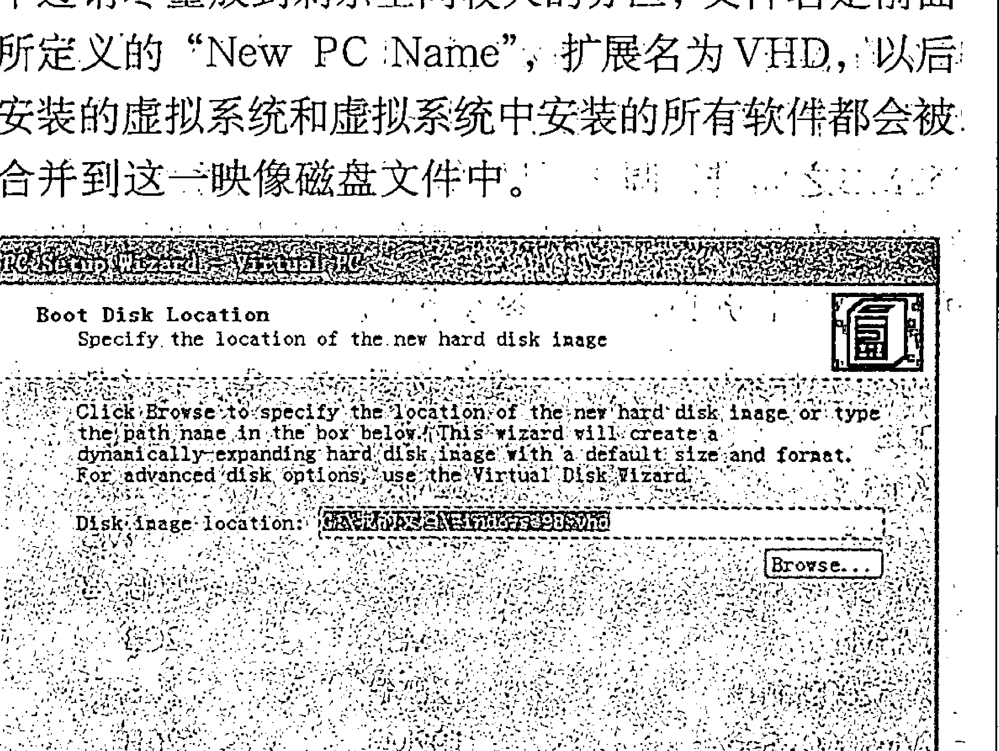

好了，看一看图 10 所示的窗口，这里显示了 PC Name、Operating System、Memory、Boot disk 引导盘路径等虚拟计算机信息，如果没有问题，点击 “Finish” 即可结束创建工作。可以看到图 11 主窗口中较图 2 新增加了一个名为 “Windows 98” 的虚拟计算机，并且多出了四个按钮。

- New PC —— 用来建立新的操作系统，其过程如图 11 同上面的第一步至第六步。
- Setting —— 可以进一步对虚拟计算机进行设置或修改，在这里面我们能够添加更多的虚拟硬盘，对机器的软驱光驱进行屏蔽，设置 COM、LPT 接口以及网络环境等等。
- Delete —— 用来删除虚拟计算机。
- Start Up —— 对虚拟计算机加电开机，开机后该按钮会变为 Shut Down（关机）。

当然，此时这台虚拟计算机还是一台裸机，分区、格式化、安装系统等工作仍然是必不可少的。

### 三、为虚拟计算机安装操作系统

接下来的任务要为虚拟计算机安装一个操作系统，先选取已建立好的一个虚拟计算机名（例如这里的 Windows 98），然后点击 “Start Up” 按钮，此时会弹出一个显示 “Invalid system disk” 的对话框，你需要使用 Windows 98 启动盘启动虚拟机，对之进行分区、格式化操作，然后重新启动并加载光驱驱动程序，这样才可以通过光驱安装操作系统，其余步骤这里就不多说了。但是，笔者要提醒各位，由于采用了虚拟的方式进行安装，所以花费的时间一般是常规安装的两倍左右。

### 四、设置 Virtual PC

如果想让 Virtual PC 发挥最佳效率，那么下面的设置可是少不了的。先选择某个已创建的虚拟计算机，然后再点击右侧的 “Settings” 按钮，即可打开图 12 所示的窗口进行设置，具体内容如下。

- 1. Memory：内存设置，可以在这里调整 Virtual PC 所使用物理内存的大小，实际上与前面图 7 所示的窗口是一样的。
- 2. Hard Disk 2/Hard Disk 3：安装第 2 块或第 3 块硬盘，安装的方法很简单，选中图 13 所示的窗口中的 “Hard disk image file” 项，然后点击 “Browse” 选择映像磁盘的路径即可。从这里也可以看出，Virtual PC 允许用户创建 3 个镜像磁盘。
- 3. CD-ROM/Floppy：根据笔者的经验，朋友的 PC 的一个重要特点，该功能可以让我们在 Windows 窗口中共享出一个驱动给 Apple 机使用。

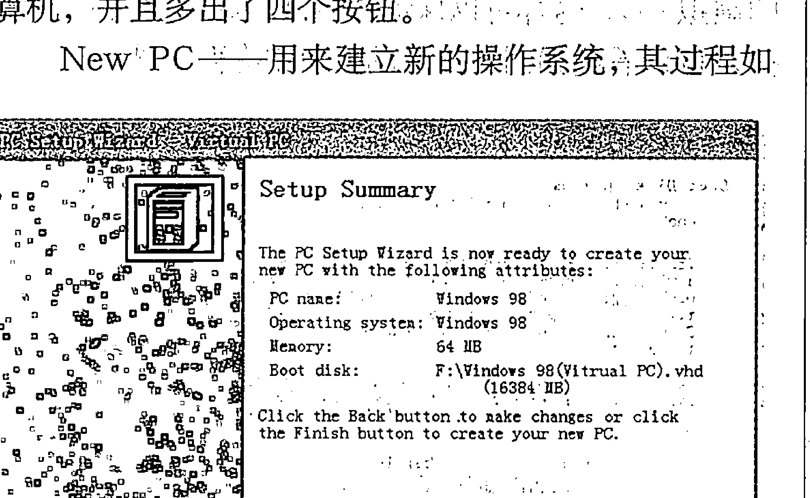

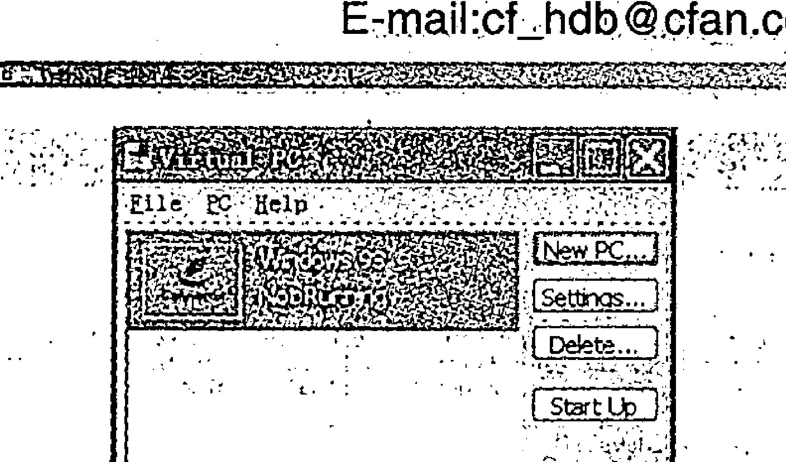

### 五、介绍几个 Virtual PC 的小技巧

虽然 Virtual PC 仅仅通过占用一定的硬盘空间和内存容量来模拟 PC，使用时不会对原有系统造成什么损害，不过下面这几个小技巧对你也许有用。

#### （一）卸载已安装的 Guest OS

可能有一天，你需要卸载已安装的某个 Guest OS，那简单的很，只要在图 11 所示的窗口中选中相应的 Virtual PC，然后点击右侧的 “Delete” 按钮直接删除即可，你丝毫不用担心删除后会带来任何影响，这就像删除一个无用文件那样简单。

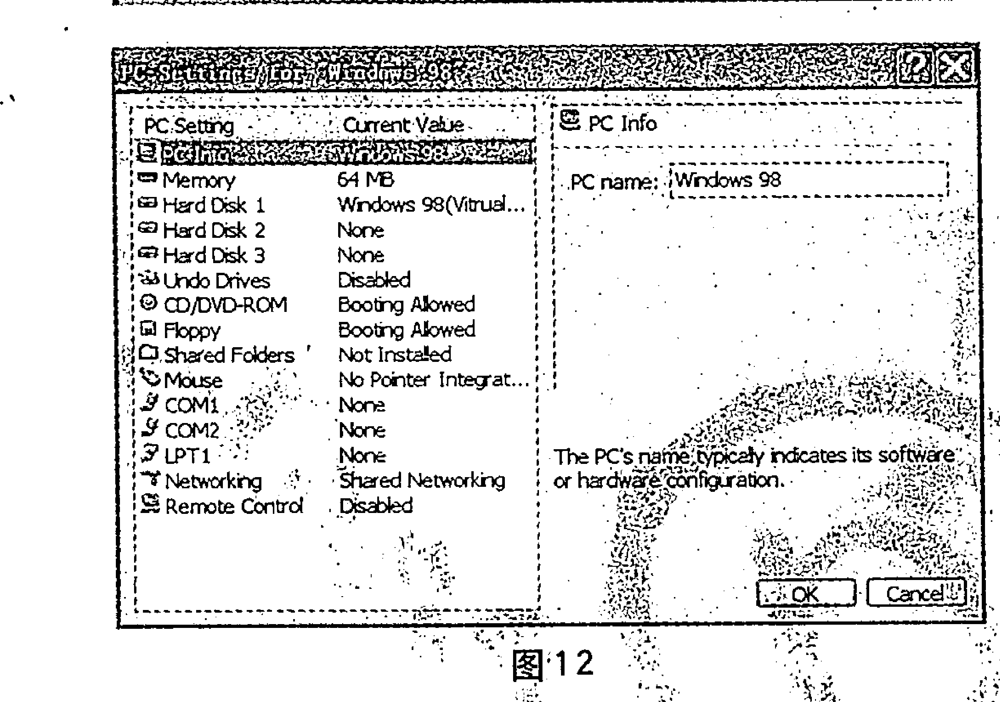

#### （二）没有启动盘时

如果你手头一时没有启动光盘或启动软盘时，该怎么办呢？不用担心，Virtual PC 为我们提供了一个名为 “Capture Image” 的工具，然后选择相应的 VFD 文件就可以了。

#### （三）快速切换到 Host 机

这也是笔者在使用过程中发现的一个非常不方便的地方，Virtual PC 不像 VMware 那样在窗口底部有切换的快捷键提示，而只能从 Readme.doc 中找到答案，应该是 Ctrl+Alt+Del 组合键。

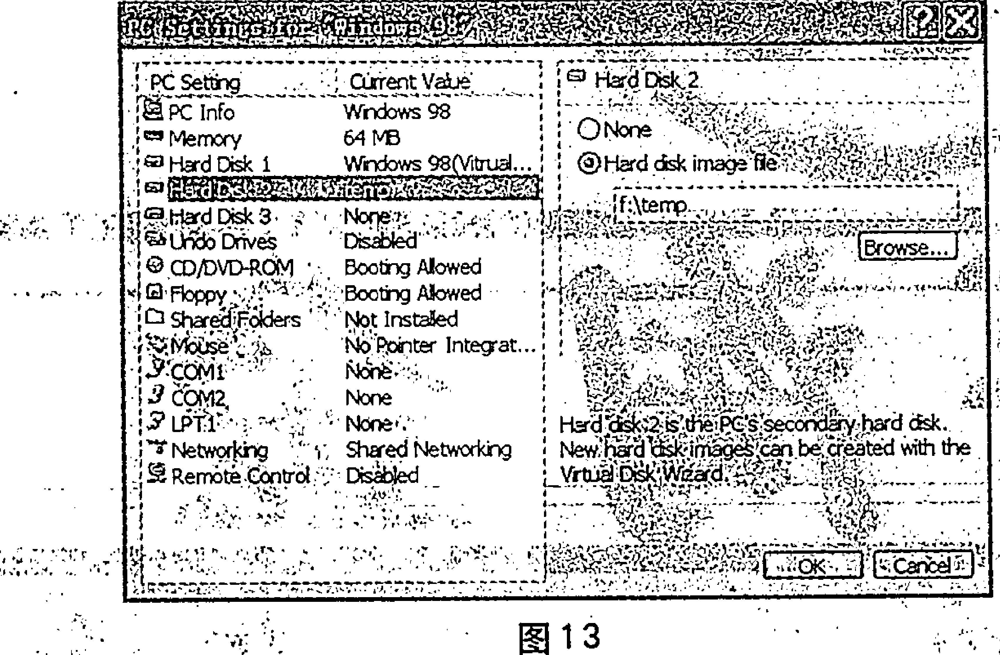

#### （四）抓取 Virtual PC 窗口中的内容

不知为什么，Virtual PC 窗口中的内容使用常规的方法无法抓取下来，无论是 PrintScreen 键还是 Alt+PrintScreen 键竟然都无效，这个问题一直折腾笔者将近一个小时，后来才发现一个简单的解决办法：利用 HyperSnap-DX、UltraSnap 等图像捕捉工具中的 “选定区域” 或 “活动窗口” 方式即可。这下，你就可以轻松地在 Virtual PC 中抓取 BIOS 升级、分区、格式化、操作系统安装、病毒发作等各种图片啦。

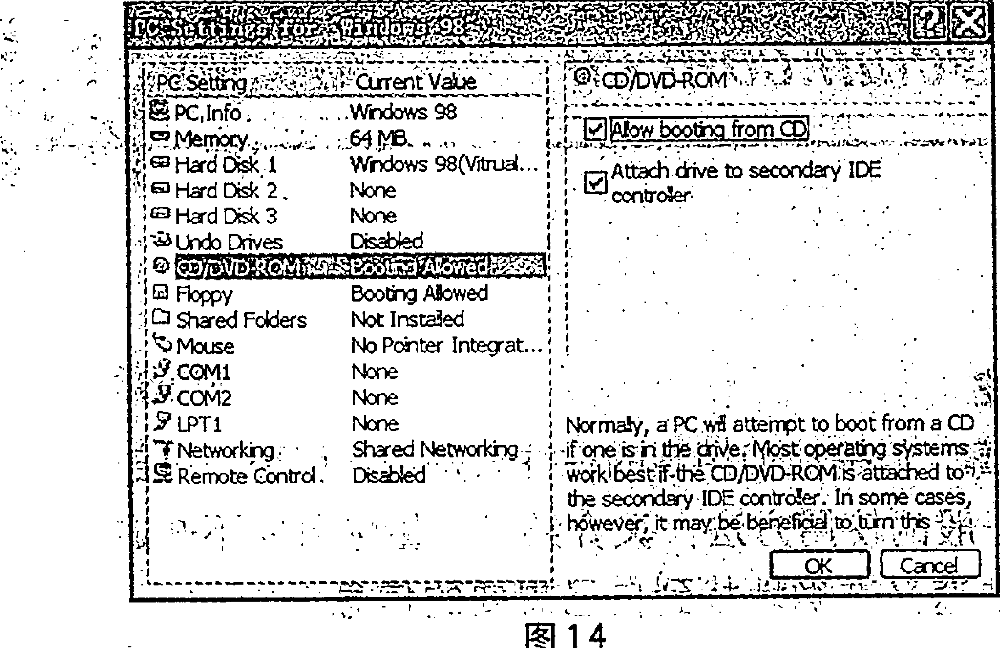

我们最好将图 14 所示的窗口中的 “Allow Booting From CD” 复选项去掉，否则每次启动时系统都会搜索光驱中有无光盘，非常麻烦。同样，如果你不想从软驱启动，可以将 “Floppy” 下的 “Allow booting from floppy” 复选项去掉。

总的看来，笔者觉得 VMware 和 Virtual PC 可以说是各有特色，至于你喜欢哪一款，就看自己的选择啦。不过，这两家都是著名的吃内存大户，因此如果你的物理内存容量在 256MB 以下，那么笔者建议你还是不要尝试的好，否则运行效率将会很低。

- 4. Shared Folders: 共享文件夹，这是 Virtual PC 的一个重要特点，该功能可以让我们在 Windows 窗口中共享出一个驱动给 Apple 机使用。

(文 / 王志军)

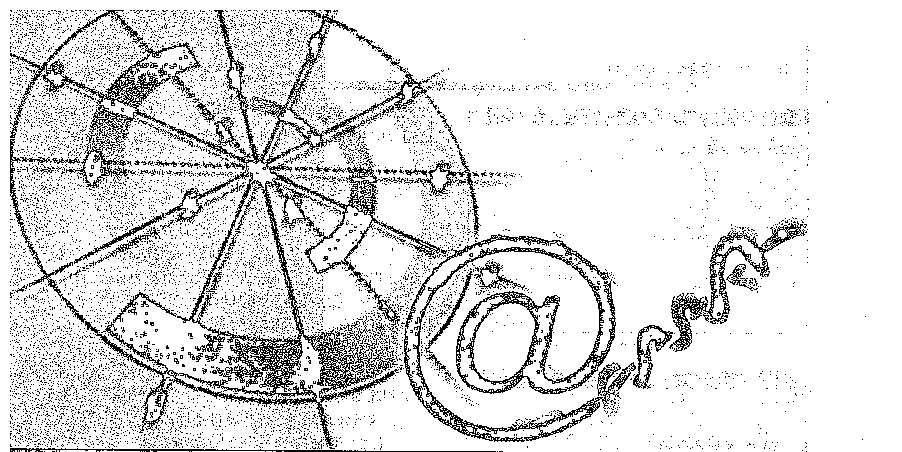

## 网海冲浪

E-mail: cf_hdb@cfan.com.cn

- ◆用搜索引擎在网上掘金
P363
很多人都知道使用搜索引擎，但是他们用到的往往只是搜索引擎一小部分的功能。本文有搜索引擎一般的使用方法，又介绍了大量你可能不知道的高级技巧，让你能在网上快速又准确地找到自己想要的信息。

- ◆特殊资料的另类搜索
P369
在网上不但能搜索文字资料，还能找到自己心仪的音乐、图片、商品等，让你体验到不一样的上网感觉。

- ◆搜索软件奇兵
P371
搜索软件集成了多家搜索引擎，并能对搜索到的结果进行去除死链接、重复页面处理，使得信息搜索更加精确。

- ◆常用搜索引擎网站大全
P375
主流、专业网站，这里应有尽有。

### 用搜索引擎在网上掘金

我们的生活、学习、工作越来越离不开网络。套用一句古话，可以说“网上自有黄金屋”，我们所想要找的资料，互联网上应有尽有。但是网络之大，茫茫无际，要淘到我们所需要的那块“金子”可不是一件容易的事情。当然你也大可不必望洋兴叹，只要你能找到好的搜索引擎，并且能掌握正确的搜索方法，网海淘金将是一件轻松快乐的事情。本专题另外的文章中介绍有大量好的搜索网站，而本篇的任务就是教你如何使用正确的方法在网络上查找信息。

### 一、搜索引擎基础知识

在讲解搜索技巧之前，先让我们掌握一点有关搜索引擎的基础知识，对我们理解后面的内容将大有帮助。

搜索引擎也是一种网站，但与其他网站不同的是，它的主要工作是搜索其他网站上的信息，并将这些信息进行分类、建立索引，然后把索引的内容放到数据库中，当用户向搜索引擎提交搜索请求的时候，搜索引擎会从这些数据库中找出匹配的资料反馈给用户，用户根据这些信息再访问相应的网站，从而找到自己需要的资料。

在互联网发展的初期，网站数目非常少，信息的查找也非常简单，但随着互联网爆炸性的发展，普通用户再想找到自己需要的资料简直比海底捞针还要困难，专业的搜索网站也就是现在我们所讲的搜索引擎应运而生了。搜索引擎的祖先是1990年由蒙特利尔大学学生Alan Emtage发明的Archie。虽然当时WWW（World Wide Web）尚未出现，但在网络上的文件传输已经相当频繁，而这些文件一般都散布在各个FTP服务器中，Archie的主要功能就是查询这些FTP服务器上的文件。Archie的工作原理已经和现在的搜索引擎相当接近了，它依靠脚本程序自动搜索各个FTP服务器上的文件，然后对相关信息进行索引，供使用者以一定的方式进行查询。后来，到了1993年，美国内华达的System Computing Services大学开发了另外一个与之非常相似的搜索工具，这个搜索工具已经能够检索网页了。由于这种搜索工具能够以人类无法达到的速度不间断地像蜘蛛一样在网络之间爬来爬去收集信息，所以一般将其称为“蜘蛛”或“网络蜘蛛”。

随着互联网的迅速发展，检索所有新出现的网页变得越来越困难，一些程序员就对传统的“蜘蛛”程序的工作原理进行了改进，其设想是既然所有的网页都可能做一个链接到其他网站的链接，那么只要从跟踪一个网站的链接开始，就有可能检索整个互联网。到1993年底，一些基于这个原理的搜索引擎纷纷出现，如JumpStation、The World Wide Web Worm等。

现代意义上的搜索引擎出现于1994年7月，也就是现在大家仍在使用的Lycos。同年4月，斯坦福大学的两名博士生David Filo和美籍华人杨致远共同创办了超级目录索引Yahoo，并成功地使搜索引擎的概念深入人心，从此，搜索引擎进入了高速发展时期。

目前，互联网上比较知名的搜索引擎已达数百家，其检索的信息量也与从前不可同日而语，如大家经常使用的搜索引擎Google，据说其数据库中存放的网页已经超过16亿！

搜索引擎主要分为两大类。

#### (一) 严格意义上的搜索引擎 (Search Engine)

这类搜索引擎是通过“蜘蛛”程序在互联网上提取各个网站的信息来建立自己的数据库，并向用户提供查询服务，是一种真正意义上的搜索引擎。如AlaVista、Google、Excite、Hotbot、Lycos等。

搜索引擎的自动信息搜索功能也可以分为两类。一类是定期搜索，也就是每隔一段时间搜索引擎就主动派出“蜘蛛”程序，对一定IP地址范围内的互联网站进行检索，一旦发现新的网站，就会自动提取网站的信息和网址加入自己的数据库。另一种是提交网站搜索，即网站所有者主动向搜索引擎提交地址，搜索引擎会在一定时间内派出“蜘蛛”程序搜索所提交的网站的相关信息，并存入自己的数据库中。

当用户以关键字查找信息时，搜索引擎会在其数据库中进行搜索，当找到与用户要求相符的网站后，按照其特定的算法排列顺序，然后将网页链接反馈给用户。

#### (二) 目录索引 (Search Index/Directory)

目录索引并不能算是真正的搜索引擎，仅是一个把相关网站信息的链接列表按照目录进行分类的网站而已。由于目录索引也为用户提供搜索服务，所以我们也将其称之为搜索引擎。在这种搜索引擎上，用户可以不需要关键字（Keywords）进行查询，只要找到相关目录，就完全可以找到相关的网站（注意：是相关的网站，而不是这个网站上某个网页的内容），就是用关键字查询，它的关键字也是由提交这个网站的人员自己编写的关于网站的整体简介而已。目录索引中最有代表意义的当属 Yahoo，其他比较好的还有 Open Directory、LookSmart 等。

其实，互联网技术发展到今天，搜索引擎和目录索引已经有相互融合的趋势，原来一些纯粹的搜索引擎现在也提供目录索引服务，有些则在搜索结果中直接列出其他目录索引的网站，比如 Google 就在其搜索结果中列出 Open Directory 的网站；而像 Yahoo 这样的目录索引也开始和 Google 的搜索引擎合作，从而扩大搜索范围。

### 二、搜索引擎的基本使用方法

虽然互联网上的搜索引擎非常多，但其具体使用方法却比较接近，只是在具体使用过程中可能稍有不同而已，所以我们只要掌握了一个搜索引擎的使用方法就几乎能够顺利使用其他的搜索引擎了。

前面我们介绍过，搜索引擎有搜索引擎和目录索引两种类型，所以这里也我们分两方面来讨论如何正确使用这两种不同类型的搜索引擎。

#### (一) 目录索引的简单使用

这里我们以非常著名的搜索引擎 Yahoo 中国（http://cn.yahoo.com/）为例进行说明。

Yahoo中国是一个典型的目录索引型的搜索引擎网站，它的主界面如图1所示。可以看到，在网页前面的部分提供搜索功能，而下面一部分则提供目录索引（如图2）。它的搜索功能分为两部分，一部分为搜索 Yahoo 内部的索引数据库，而另一部分则是通过 Google 的搜索引擎提供网页搜索功能。

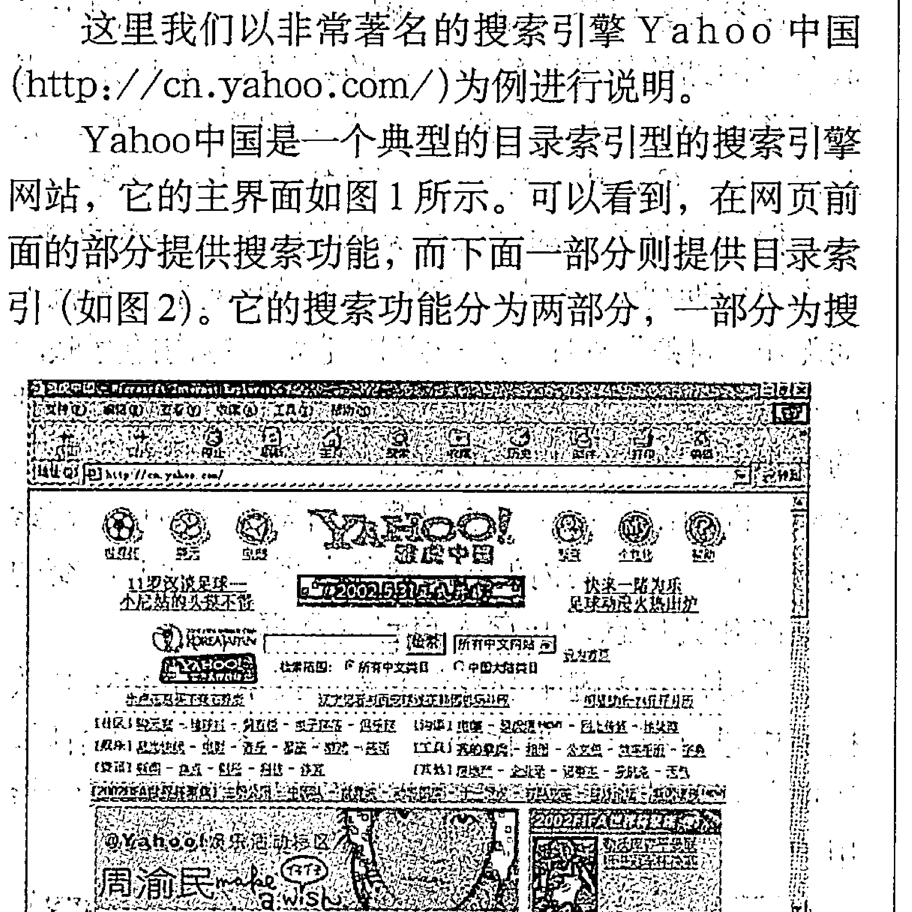

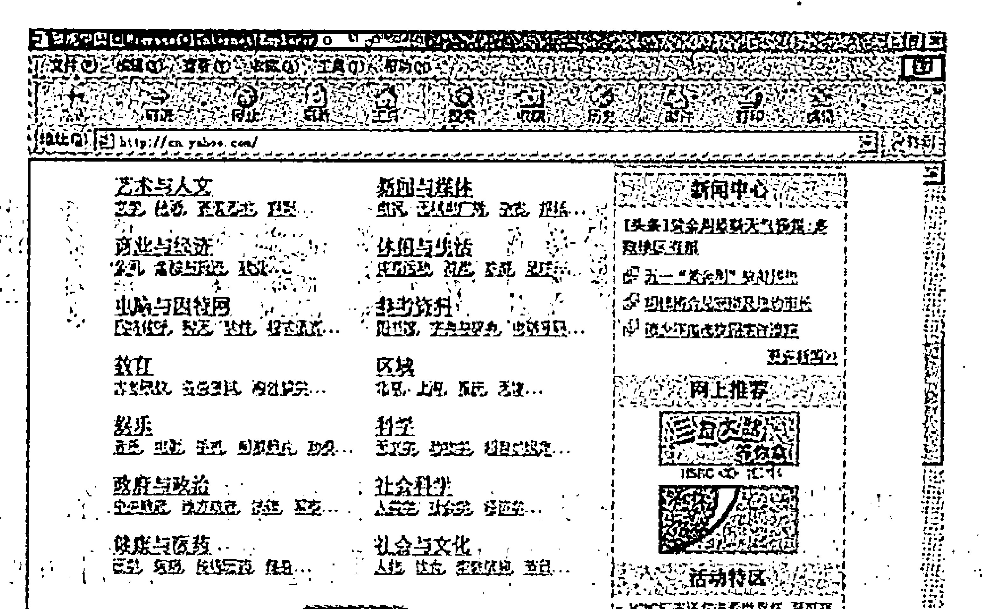

##### 1. 使用目录列表查找信息

使用目录列表进行搜索的方式适合于我们查找一些不知道关键词的资料，比如我们想查看一下 Yahoo 中国中收录了哪些电脑方面的杂志，就可以通过目录列表进行查询。

在图2所示的界面上，我们可以看到 Yahoo 把其收录的网站分为几个大类，其中有一个“新闻与媒体”的分类，点击此链接可以进入小分类列表，如图3所示。在这里可以看到“新闻与媒体”又被分为“各地新闻与媒体”、“交通运输”等几个分类，其中也包括“电脑与国际网路”这个小分类，再点击“电脑与国际网路”这个链接，可以看到图4所示的界面，点击超级链接“杂志”，即可看到已经被 yahoo 收录的电脑和互联网方面的杂志网站，如图5所示。而且 yahoo 还将其分为“程式语言”、“电脑游戏”、“个人电脑”、“因特网”和“硬件”五类，点击相应链接即可看到这些细化目录之中的网站分类。通过这种方法，我们可以找到一类相关的网站信息，而无需输入任何关键字进行搜索。

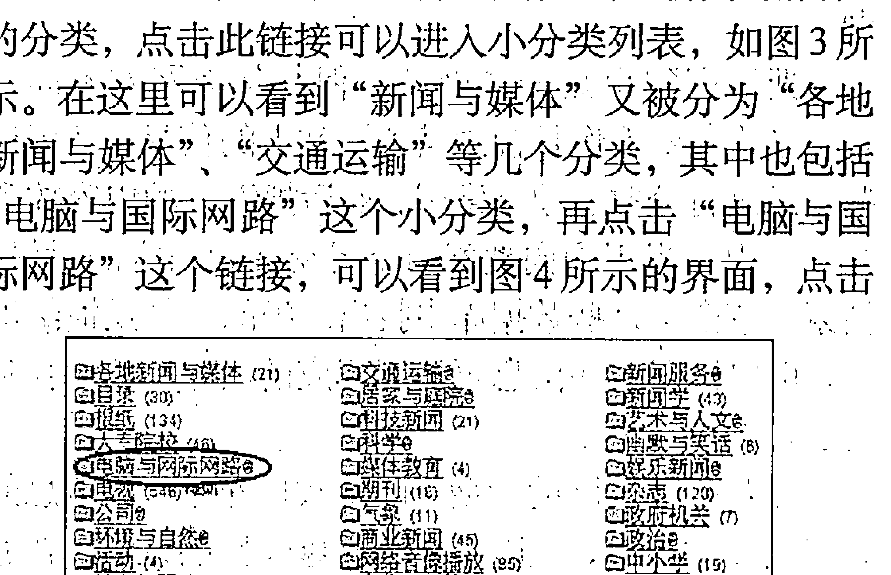

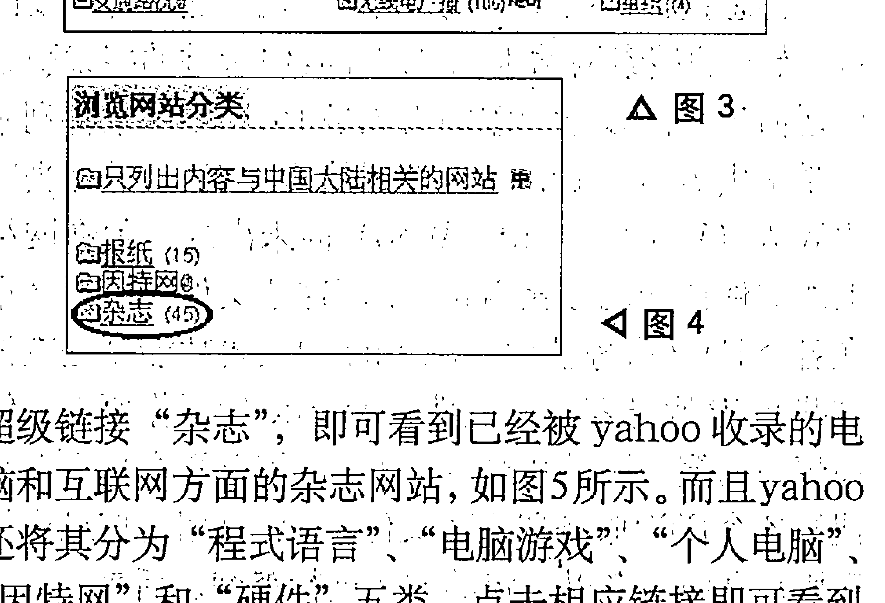

##### 2. 运用关键字搜索目录列表中的内容

- 简体中文 GB:
  - Smaart Reseller计算机产品与流通 - 提供计算机销售渠道信息。
  - ZDNet China - 电脑相关新闻、论坛、商品及厂商介绍。
  - 电脑爱好者 - 电脑爱好者杂志社官方网站，包括软件下载、游戏天地、硬件指南、网络学院、期刊上网及论坛等栏目。
  - 电脑广场 - 解放日报的电脑专刊。
  - 电脑报 - 大百科全书出版社主办，是面向学生和电脑初学者的科普月刊。
  - 电子商务在线 - 含电子商务动态报导及论坛。
  - 计算机应用文摘 - 月刊，提供杂志简介、投稿须知、全文检索和获奖证书。
  - 实用电脑与游戏机 - 提供相关文章、新闻、秘技和游戏下载。
  - 联合商讯 - 提供电脑产品报价、解决方案、市场分析及驱动软件下载。
  - 启蒙杂志 - 内容包括计算机和网络的资料，并提供共享软件。

下面我们以如何搜索《电脑爱好者》杂志为例进行说明。

前面我们讲过，在Yahoo中国的首页上有一个信息检索框（如图6），一般情况下，我们需要做的只是在“检索框”中输入关键字，然后按一下回车或者点击“检索”按钮进行查询，搜索引擎即会把搜索结果反馈给我们。这里的关键字我们使用“电脑爱好者”，其检索结果如图7所示。通过这种方法，我们能够非常轻松地找到需要的信息。

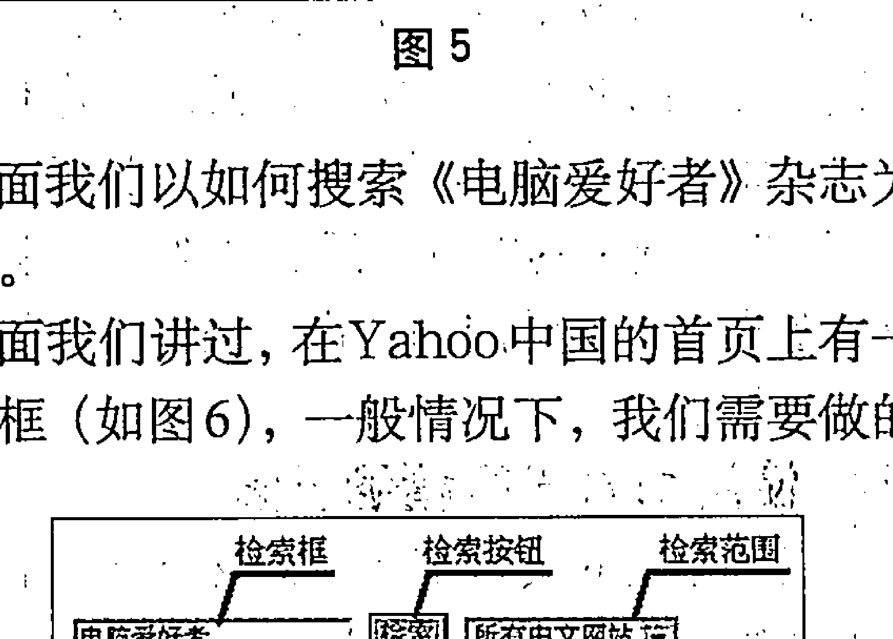

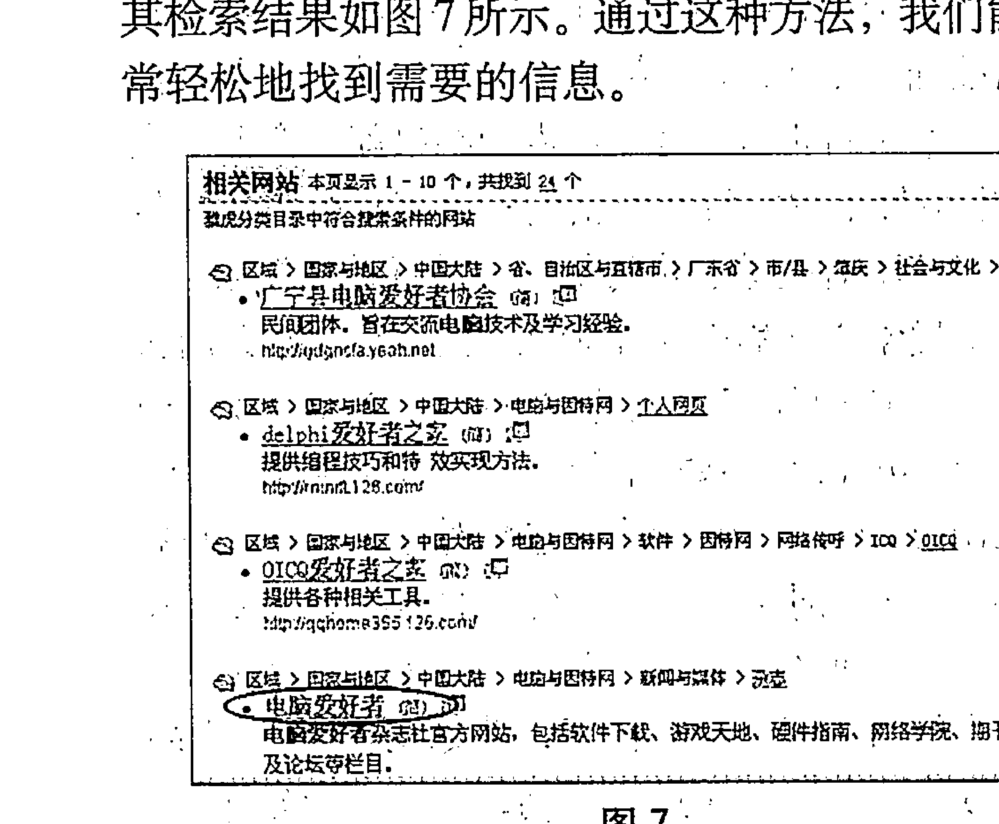

#### （二）搜索引擎的简单使用

谈到搜索引擎，尤其是谈到中文搜索引擎，我们不得不提到百度搜索引擎（http://www.baidu.com），百度问世之后，以极短的时间抢占了国内市场，目前国内的搜狐、新浪、263等使用的都是其搜索引擎，所以我们这里以百度搜索引擎为例进行介绍。

百度搜索引擎是真正意义上的搜索引擎，它采用“蜘蛛”程序搜集各个网页上的信息，然后进行归类。所以用百度搜索出来的结果不再单纯是某个网站，而是精确到了每个网页。

百度搜索引擎的首页如图8所示，其基本使用方法非常简单，只需要在搜索框中输入希望查询的信息，然后按一下回车或者点击“百度搜索”按钮即可把相关网页提供给我们。如我们输入“电脑爱好者”，百度会反馈给我们如图9所示的页面。

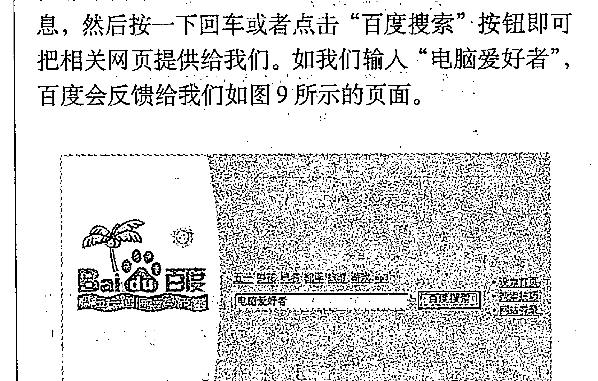

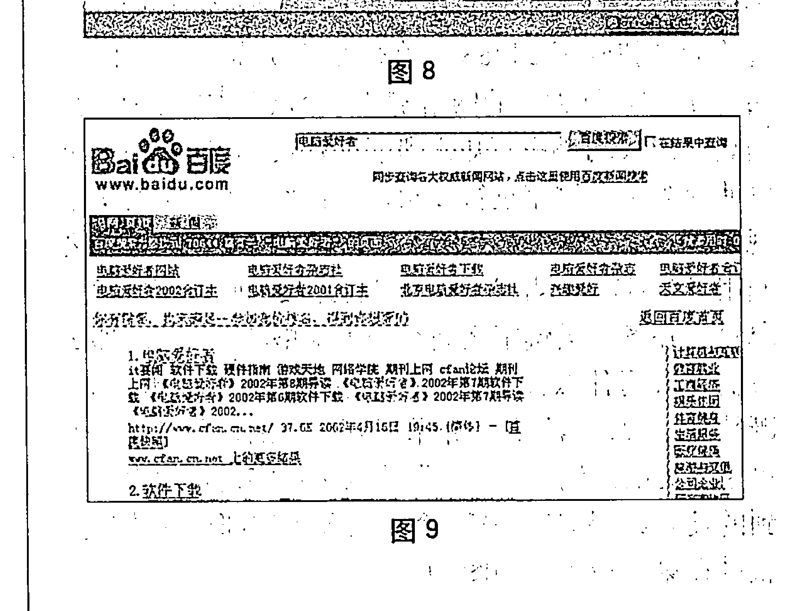

### 三、搜索引擎的高级使用方法

通过百度之类的搜索引擎，我们可以把搜索结果细化到某个网页之中，从而提供准确的搜索结果。这种搜索引擎是我们最常用的，但它也有其固有的缺点，就是如果关键词选择得不当的话，将会反馈给我们几万个相关链接，把我们真正想找的资料淹没在里面。下面我们将介绍一下如何让搜索引擎快速、准确地搜索到真正有用的资料。

#### （一）试着用整句话搜索

比如说，我们想在网上查询一下什么是搜索引擎，如果把关键字确定为“搜索引擎”，搜索的结果将会让我们大跌眼镜，基本上都是一些搜索引擎注册、哪个站点是搜索引擎之类。如果我们换个关键字，直接用“什么是搜索引擎”进行搜索又会如何呢？看一下图10，这些结果都是我们所需要的信息。

#### （二）使用多个关键字

只使用一个关键字尤其是常用的字进行搜索得到的结果对于用户来说将是一个天文数字，比如我们想在互联网上下载金庸先生的武侠小说《笑傲江湖》，如果只用“笑傲江湖”作为关键字进行搜索，百度会告诉我们“找到了 242887 篇有关“笑傲江湖”的页面”，其中包括大量的网络游戏、论坛之类的信息，我们真正想找的小说不知排到了第几页，这时我们就可以使用多个关键字进行搜索。

对于多个关键字的使用规则，各个搜索引擎有所不同，有的需要在关键字之间用“AND”或者“+”号进行连接；而百度搜索引擎只需在各个关键字之间空一个空格就可以了。

那么我们到底用什么关键字进行搜索呢？不妨回想一下，既然是小说，当然是以章节进行分页的，所以我们可以用“笑傲江湖 第一章”作为关键字进行搜索，得到的搜索结果只有 1071 个，而关于这部小说的链接就排在第一位上（如图 11）。

#### （三）使用逻辑搜索

所谓逻辑搜索，指的是我们把关键词通过某种表达式提交给搜索引擎，让搜索引擎按照我们的意思进行搜索，从而更加准确地查找到相关资料。其实我们前面介绍的使用多个关键字也是一种逻辑搜索，它属于逻辑“与”。

常用的逻辑搜索还有逻辑“非”、逻辑“或”。在百度搜索引擎当中，逻辑非用西文减号“-”表示，但在减号之前需要留一个空格。比如我要搜索关于武侠小说的页面，但希望搜索结果中不包括关于“古龙”的资料，其关键字就可以确定为“武侠小说 -古龙”，但在某些网站上可能会在“古龙”这个词之间插入一个空格，所以我们还需要再排除包含“古 龙”这个词的网页，即关键字应设置为“武侠小说 -古龙 -"古 龙"”（中间有空格的古龙需用英文双引号括起来，下同）。

百度搜索引擎的逻辑“或”用“|”（这个符号可通过 Shift+\ 键来输入）来表示，如果关键字为“A|B”，则表示希望找到“或者包含关键字 A，或者包含关键字 B”的网页。比如我们想查找关于古龙先生的资料，如果用“古龙”作关键字，则会丢失以“"古 龙"”为关键字的网页，反之亦然。这里我们就可以使用逻辑“或”进行搜索，即把关键字设置为“古龙|"古 龙"”。

#### （四）使用引号进行精确搜索

如果我们输入的关键字之中包含空格，比如著名武侠小说作家的名字“古龙”，由于网站在收录其作品时往往会在其名字中间加上一个空格，如果我们关键字输入“古 龙”，百度会认为这是两个关键词，那么连“对付古墓2代恶龙的绝招”这样的信息都会出现在搜索结果中。

为了避免这种结果，我们需要用英文的双引号将其括起来，即“"古 龙"”，告诉搜索引擎这是一个词，而不是两个关键字，其搜索结果将会更加准确。

此外，有时搜索引擎会自动把我们提交的关键字进行拆分，这样搜索的结果就不会非常准确，使用引号把中间没有空格的关键字括起来还能告诉搜索引擎不对关键字进行拆分，进行精确搜索。这一点对于搜索中文影响不是很大，但对英文搜索时关系非常大。

比如我们输入的关键字为“computer adventure games”，基本上等同于“"computer" and "adventure" and "games"”，它会对这三个词进行搜索，而且这三个词在同一个网页中的顺序对于搜索结果没有影响，而如果使用“"computer adventure games"”作为关键字进行搜索，则要求这三个单词必须严格按照给定的顺序进行排列，而且不能分开，否则就不符合搜索条件。

如果合理使用引号，就能够非常准确快速地找到真正需要的资料。

#### （五）使用“百度快照”

由于网页内容的频繁更新，有时在搜索引擎中能够搜索到相关连接，但点击链接后会发现该网页已经被删除了。为了避免这种情况，百度提供了“百度快照”功能，把网页储存在自己的服务器中，这样即使网站已经把这个网页删除了，用户也能正常浏览。“百度快照”在搜索到的每个链接的简介后面，如图12所示。

E-mail:cf_hdb@cfan.com.cn

### 网海淘金

我们就可以在“搜索框”内输入“3.11”，然后选中“在结果中查询”，再次点击“百度搜索”按钮，其搜索结果将会精练得多。

#### (六) 使用百度提供的其他功能

使用百度提供的“相关检索”：当我们输入关键字搜索之后，百度会在搜索结果页面上提供一个“相关检索”部分，也就是对我们输入的关键字进行衍生而形成的其他一系列关键字；比如我们想搜索一下关于播放MPEG4的插件DivX的信息，只要在搜索框内输入“divx”，在搜索这个关键字的同时，其相关检索为“DivX下载”、“divx 解码器下载”、“DivX插件下载”、“divx中文字幕”等，如图13所示，这时如果我们想搜索有关“Divx下载”的网页，直接点击“Divx下载”，百度就会用“Divx下载”作为关键字进一步进行搜索。通过“相关检索”这个功能，可以帮助用户设定关键字。

### 四、快速高效搜索的注意事项

前面我们简单讲述了搜索引擎的基本用法和高级用法，但对于每个搜索引擎来说，具体使用方法不尽相同，而且如果想快速、高效地搜索出需要的资料，也不是简单地了解几个技巧就可以的，在这一部分，我们将告诉您一些使用搜索引擎时应该注意的事项。

#### (一) 确认搜索目标

搜索引擎只是一种工具而不是万能的，它再厉害、再精确，也不能找到网上根本没有的资料。再者说，任何一个搜索引擎也不可能涵盖互联网上所有的网站。

所以在使用搜索引擎进行搜索之前，先要考虑清楚，我们要查询的资料是否已经发布到了互联网上，如果有，可能会在哪里，网页上应该包含哪些关键字。

而有些东西也根本不必到搜索引擎上去查询，比如说今天早上刚刚发生的新闻，我们只要直接到各个新闻网站上去看就可以了；不管这个新闻有多大，其相关网页也有可能没有立刻被搜索引擎收录，如果直接搜索的话，可能什么也找不到。

还有一些东西用其他的工具比用搜索引擎更好，比如我想查找某人的电话号码，直接用114查一下不是更迅速吗？

使用“该网站内的更多结果”：百度的搜索引擎极具智能化，一般情况下我们在搜索某个关键字时，为了让用户在同一个页面内看到更多的链接，如果同一个网站内有多个网页都包含这个关键字的页面，百度将不会全部显示出来，而只是列出一个最具代表性的页面链接。这种做法虽然照顾了大多数用户的需求，但有时恰恰我们所需要的资料没有出现在代表页面内；所以此时就需要点击搜索结果下面的“某某网站内的更多结果”，如图14所示，从而把这个网站内所有包含关键字的网页都展示给我们，让用户不漏掉一个结果。

#### (二) 选择好关键字

不知您注意了没有，前面我们讲的一些搜索技巧都是在如何确定关键字上做文章，而在实际搜索的时候也是如此：好的关键字是搜索成功的关键！

关键字确实非常重要，它代表着我们要搜索资料的特征，所以最好具有唯一性。而单个关键字所代表的往往是一类信息的特征，所以在确定关键字的时候，最好把几个关键字合起来使用。

比如我们想查找关于“申花”企业的资料，只用“申花”做关键字进行搜索，会把这方面的资料淹没在一大堆申花队踢足球的新闻之中，其实我们只要用“申花 -足球”作关键字，把体育方面的资料排除在外，剩下的资料将会准确得多。

再如我们想了解某个软件的使用方法，不妨用“某软件 使用方法|技巧”作为关键字进行搜索，就可以排除那些关于这个软件下载信息的资料。

使用“在结果中查询”：这是百度提供的在搜索结果中再次进行搜索的一个选项，如图15所示，它的作用是如果搜索到的结果过多，可对搜索结果进一步精减。比如说播放MPEG4的插件Divx，我们都知道它的3.11版本最好用，但如果我们只用Divx进行检索，将会把其所有版本的信息全部反馈给我们，这时

#### (三) 确定搜索引擎

搜索引擎分两类，一类是目录索引，另一类是搜索引擎。在搜索之前我们就应该明白这两种搜索引擎

Computer Fan 2002

867

#### （四）防止搜索引擎切词的错误

切词又叫分词，这是中文搜索引擎所特有的现象。比如我们用“品行”作为关键字，其结果中将包括很多“保健品行业”、“产品行情”等信息，显然这些不是我们所需要的，这是由于中文的特点造成的中文搜索引擎的特有缺陷，虽然目前技术人员正在努力加以改变，但不会完全得到解决，对于用户来说，只能通过一些技巧来尽量加以防止。

其实这个技巧非常简单，就是在搜索关键字上减去错误分词的衍生词，如我们可以用“品行 - 行情 - 行业 - 商品”作为关键字进行搜索。这种搜索得到的结果将相当准确，但它可能漏掉一些我们所需要的网页，比如既包括真正的“品行”，又包括“行情”这种字样的网页。

#### （五）使用站内搜索引擎

当我们已经来到一个网站，想搜索这个网站内的资料该怎么办呢？有些网站可能会提供一个“站内搜索引擎”，也就是只搜索本站资料，其结果相当准确，而且不会有死链接。

但如果这个网站没有提供站内搜索，我们也可以用搜索引擎的站点搜索功能来解决。目前百度、Google都提供这个功能。

在百度搜索引擎上，其搜索表达式为“关键字 . 网站”，比如我们要在电脑爱好者网站(http://www.cfan.cn.net)内搜索关于“上网技巧”的文章，就可以在输入关键字后，空一个空格，然后输入一个英文句点，紧接着输入网站名，也就是“上网技巧 . www.cfan.cn.net”。

Google 的表达式为“关键字 site:网站”，如“上网技巧 site: www.cfan.cn.net”。

#### （六）避免常见的错误

有时我们到搜索引擎搜索时，会发现居然没有找到需要的资料，这时我们要首先确定自己是不是犯了一些低级的、但却又常常被人忽视的错误。

##### 1. 错别字
中文的错别字和英文的错误拼写是在使用搜索引擎时最常发生的错误之一，用“以德制国”是绝对找不到关于“以德治国”方面的资料的；而查询谢霆锋时也有可能输入“谢庭锋”、“谢霆峰”、“谢廷锋”、“谢庭峰”、“谢廷峰”等，用这些关键字查到的资料也不会相同。所以我们在使用搜索引擎时要尽量避免出现错别字，因为搜索引擎在搜索时只会完全按照我们给定的关键字进行搜索，而不会替你改正错误的。

##### 2. 太常见的关键字
当我们用“手机”作为关键字进行搜索的时候，会发现很多和手机相关的网页，比如价格、技术资料、手机铃声等，所以这时应该尝试着使用更多的关键字进行搜索。

##### 3. 多义词
Java 本身是一个多义词，如果我们用“Java”作为关键字进行搜索，反馈给我们的结果将包括一个叫 java的小岛、一种著名的咖啡和一种计算机语言。如果不另加一个关键字辅助搜索，搜索引擎不知道我们到底要找什么，会把所有的东西全部提交给我们。所以在搜索之前一定要先进行判别，然后用“Java 语言”、“Java 咖啡”等分别进行搜索，从而得到自己满意的结果。

##### 4. 搜索过于提前的信息
跟我们前面讲到的一样，搜索引擎的索引库滞后于网站信息的更新，如果想看最新的资料应该直接去相关网站。

##### 5. 用停用词搜索
停用词主要见于英文搜索引擎中，指的是使用过于频繁的单词，如“is”、“i”、“what”、“it”等。一些搜索引擎在它的网页库里碰到这些词时不会进行检索。如果你的搜索关键词中使用了停用词，那么很可能得到大量毫不相关的搜索结果。比如搜索“Who am I”，“am”和“I”都是停用词，大多数搜索引擎对于搜索停用词需要使用加号来解决，如“Who +am +I”。

其实掌握搜索引擎的使用方法和掌握其他知识一样，需要一个积累过程，在真正使用的时候，可以先确定一个关键字搜索一下，然后看一看用这个关键字搜索时有多少无关信息、这些无关信息的大致特征是什么，然后再进一步确定关键字另行搜索，这样的搜索结果往往比闭门造车一次性地使用多个关键字搜索要好得多。只要我们平时有意识地在使用搜索引擎时加以注意，是很容易掌握的。

（文／周建军）

### 特殊资料的另类搜索

网上除了大量的文字资料外，还有很多特殊的资料，如图像、MP3音乐、地图等等，下面我们结合各个搜索引擎以及具体实例来讲述一下这类特殊资料的搜索方法。

### 一、MP3 的搜索方法
MP3是网友们非常喜欢的一种音乐文件格式，音质好、文件小，非常有利于网络传播，所以有很多网友把自己精心制作的MP3放到网上供人欣赏，但是其查找比较困难。

一般情况下，通过目前比较流行的P2P工具可以非常方便地搜索到MP3的信息，但由于这种信息提供的是每个网友机器上的歌曲，所以存在着下载速度慢、不稳定等问题。所以，如果可能，我们还是尽量在正规网站上查询MP3的信息。这里我们推荐的是国内非常专业的MP3搜索网站“搜刮”(http://www.sogua.com/)。

在“搜刮”网站的主页上有一个歌曲的搜索框，如图1所示，提供MP3搜索、试听搜索、Flash搜索等功能。我们在搜索MP3时，在“MP3搜索”下面的检索框内输入歌手的名字或者歌曲的名字，然后按回车键，网站就可以从网上为我们搜刮到所有关于这个信息的歌曲。比如我们想查找张学友的歌曲，就可以输入“张学友”，搜索到的结果如图2所示。可以看到，在搜索结果中不仅给出了歌曲的名字，还给出了文件大小、所需协议、响应时间等信息，连通率是用户在点击这个连接时能够成功下载的机率。

搜刮的MP3搜索还提供了高级搜索功能，在图1所示的界面中点击“MP3搜索”后面的“高级功能”，将会出现图3所示的界面，在这里，我们可以对它提供的MP3、RM、SWF、WMA、ASP等几种文件格式进行选择，也可以对协议格式如http、ftp、rtsp、pnm、mms等进行选择，从而进一步查询到相关资料。

国外搜索MP3 的网站还有http://www.3pmmp3.com/、http://www.audiofind.com/、http://www.mp3.com/、http://www.seekmp3.com/等多家网站，如果要搜索外文歌曲，到这些搜索引擎上去查找，效果一定不错。

### 二、图片的搜索方法
互联网上有很多图库网站，收集的图片非常精美，如果想找图片，这些图库网站自然是读者的首选，但这不是本文所要讨论的内容，我们这里讨论的是如何从互联网上搜索到自己需要的图片，比如找一张老虎的图片等。

提到图片搜索，一些资深网友自然而然地会想到Google的图片搜索，确实如此，Google的图片搜索功能非常强大，我们在这里也推荐读者使用Google的图片搜索功能查询图片。

Google的主页地址是http://www.google.com/，在其主页上专有一个“图像”类，如图4所示，点击这个链接后，在检索框内输入关键字，然后点击“Google搜索”按钮，即可找到相关资料。比如我们在这里输入“老虎”后，其搜索结果如图5所示，图片以缩略图的形式提供给用户，每个搜索结果都注明图片名称、类型、图片的尺寸、文件的大小、所在的网页等信息，点击链接之后，会把图片的缩略图和原网页分为两栏排在一个网页中，点击缩略图下面的“查看原始图像”链接则可以直接显示原来的图像。

用 Google 搜索图片还有一个小小的技巧，就是用中、英文分别搜索一下，有时可以找到更多的图片，比如用“tiger”作为关键字再次搜索，还可以找到一批老虎的图片，搜索结果甚至比直接用中文更准确。

Google 还提供了“高级图像搜索”功能，在图 4 所示的界面中点击“高级图像搜索”，可以出现图 6 所示的界面，在这里可以进一步设置关键字的匹配程度、图片的类型和大小，甚至还可以指定在某个网站内进行搜索，从而进一步提高搜索精度。

除了 Google，网上还有一些专门搜索图片的网站，如 http://www.ditto.com、http://www.gograph.com/、http://www.art.com/、http://www.picsearch.com/ 等。

### 三、网上查找商品信息
很多商家都已经注意到了互联网的广阔前景，把自己的商品通过各种手段展示到网上，所以在互联网上查询商品信息也很简单，我们这里以“采购 114”（http://www.cg114.com/）为例。

“采购 114”也和搜索引擎一样，把商品按照类别进行分类，还提供了一个检索工具，我们可以在其主页的检索框中输入需要查询的信息，如“节能灯”，然后在查询类别里选择“产品信息”，点击“查询”按钮，就可以找到关于节能灯方面的资料了。

### 四、网上查地图
网上查地图，当然要到“图行天下”（http://www.go2map.com.cn），这里提供比较详尽的全国地图，既可以按地区分类查询，也可以通过关键字模糊查找。例如我们要查询北京市的地图，在其首页提供的全国地图上点击超级链接“中国”，然后再点击北京的位置，就可以弹出北京市区的简要地图。在弹出的地图中可以进行放大、缩小等操作，还可以启用漫游（随意拖动地图）等诸多功能。

### 五、FTP 搜索
虽然目前 WWW 是最流行的网络应用，但通过 FTP 服务器发布软件仍是一种常见的方法，所以我们如果查找某些软件，不妨通过 FTP 搜索试一下。这里我们推荐北大天网 FTP 搜索引擎（http://bingle.pku.edu.cn/），通过这个搜索引擎，可以查询教育网内 FTP 服务器上的文档，比如程序、源代码、MP3、电影等。

使用时，在检索框内输入需要搜索的关键字；比如我们想查找 winzip 压缩解压程序，可在检索框中输入“winzip”，然后在搜索类型中选择“程序”，如图 7 所示，最后点击“搜索 FTP 文件”按钮，就可以找到很多下载链接，如图 8 所示，从而可以快速地找到相关软件。

（文／周建军）

## 搜索软件奇兵

搜索引擎为我们在互联网上查找资料提供了极大的便利，但搜索引擎本身也有着诸多不足，比如搜索引擎网站多，性能不一，在查找某个资料时可能需要登录多个搜索引擎进行查找；重复搜索结果多，需要一页页进行查找；搜索到的结果是无法访问的死链接等等。针对这些问题，有人开始在搜索网站的基础上开发了一些搜索软件，这些搜索软件一般都集成很多搜索引擎，在使用时把关键字同时提交到这些搜索引擎上进行搜索，然后把结果进行整理之后提交给我们，这样就实现了同时在多个搜索引擎上进行搜索和智能搜索，所以，这种搜索软件也深受广大网友的喜爱。本篇我们就介绍几个非常有特色的搜索工具软件。

### 一、搜索奇兵

下载地址: http://www.worldfax.net/
软件大小: 1296K

搜索奇兵采用多线程技术，能够同时搜索各大著名搜索引擎并将搜索结果统一显示在一个页面中。显示的搜索结果将过滤掉重复的结果、死链接和已经不存在的个人免费主页，过滤无法访问网站、自定义过滤国内外免费域名、自定义过滤长时间没有更新的页面，并具有搜索引擎以外先进的第三方排名方法，提供给用户精确的搜索结果。

#### （一）软件的使用

软件的界面非常朴素，如图1所示，使用也非常简单，只要在检索框内输入关键字，然后在右面设置一下过滤条件，过滤条件包括重复网址（必选项）、死链接（必选项）、重复标题（可选项）、免费域名（可选项）、曾经访问过（可选项）、半年前更新（可选项），然后根据搜索情况点击“中文搜索”或者“英文搜索”进行搜索，搜索结果将会实时出现在下面的列表中，当全部搜索完毕后，软件会一一对网址加以验证，确定是否死链接、何时更新、是否重复标题等，然后将精简的结果重新显示在列表中，同时会用浏览器开启一个搜索结果页面，如图2所示，在这个页面里可以点击搜索结果链接查看具体资料。

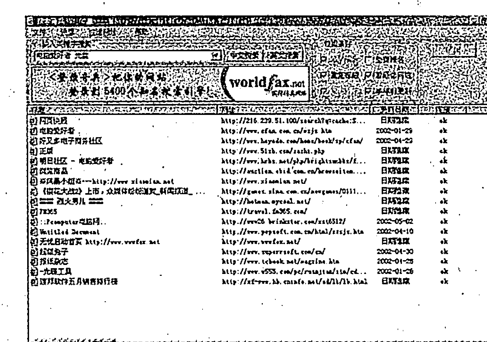

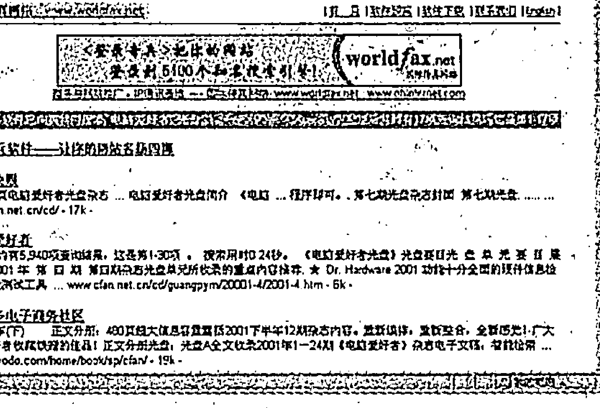

#### （二）软件的设置

搜索奇兵的设置分为两个方面，一是系统设置，二是搜索过滤设置，都非常简单。

系统设置通过其主菜单“设置”下的几个选项进行调整（如图3）。

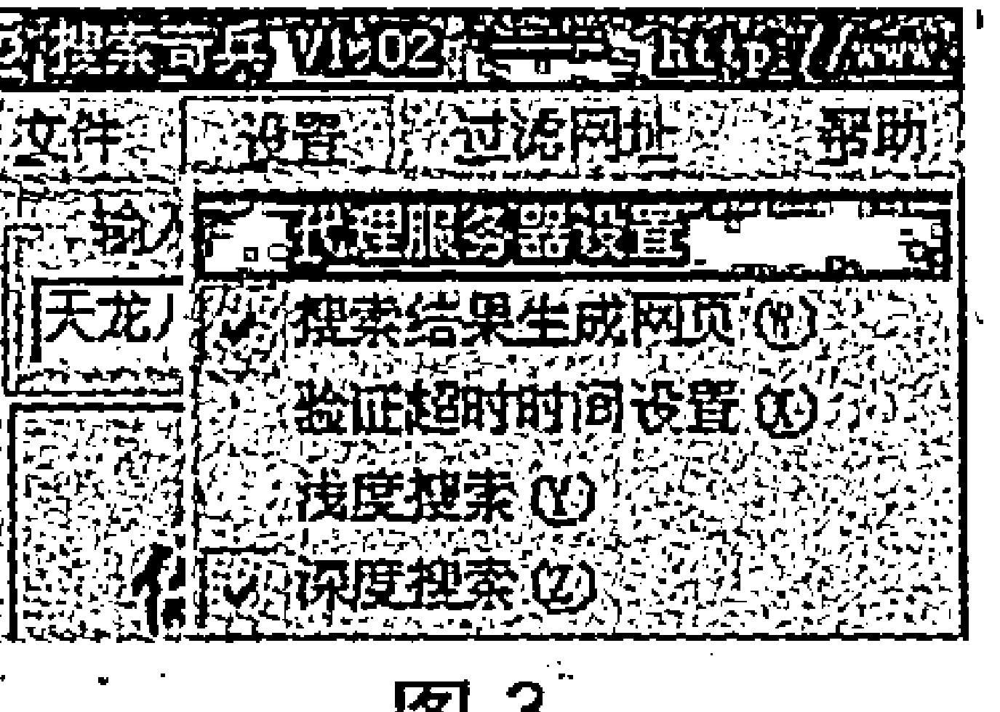

代理服务器设置：如果是在局域网内上网或者需要通过代理服务器才能访问网络，需要对此项进行设置，使用这个命令后，将弹出设置窗口如图4所示，在“IP地址”中输入代理服务器的地址，在“端口”中输入代理服务器的端口，如果需要用户名和密码进行验证的话，也可以把用户名和密码输入在相应的位置中。

搜索结果生成网页：如果选中这一项，则在搜索结束之后，会把搜索结果自动生成一个网页并用默认的浏览器打开，主要目的是便于我们保存搜索结果。

验证超时时间设置：搜索奇兵在搜索之后，会对各个结果进行连接验证，通过“验证超时时间设置”，告诉软件如果在一定时间内没有连通该网站，表示这个搜索结果是死链接，要从搜索结果中删除。

“浅度搜索”和“深度搜索”：设置搜索的范围和广度，设置为深度搜索时搜索结果较多，但耗时较长，一般情况下使用“浅度搜索”即可。

搜索过滤设置通过软件主菜单“过滤网址”或者搜索按钮右侧的复选框进行设置（如图5、6）：

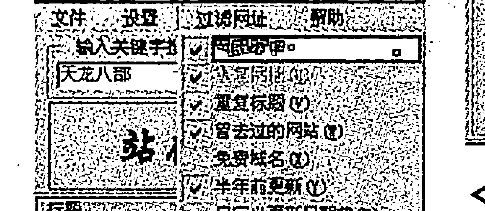

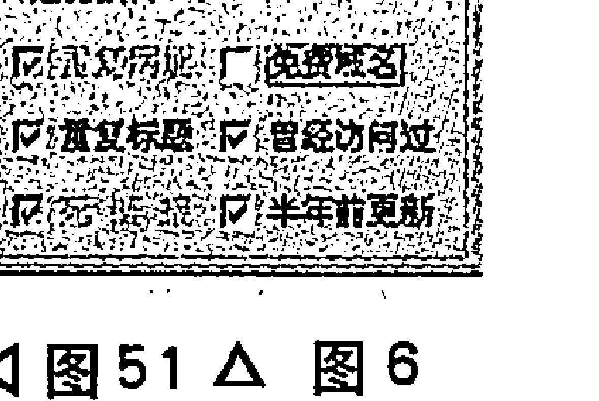

“死链接”和“重复网址”是必选项，表示在搜索结果中不包括重复网址和连接不上的死链接。

重复标题：用于过滤那些虽然不在同一网站、但是标题完全相同的网页，一般为转载页。

曾去过的网站：用于过滤在IE历史记录中存在的网站。这个选项是默认的，不过笔者认为不要选择这个选项，因为虽然我们去过某个网站，但并不代表已经把这个网站所有的网页全部浏览过，还可能有很多有用的东西我们没有看到。

免费域名：其实指的是免费的个人主页，如果选定这项，则使用免费域名的个人主页将不包括在搜索结果之中。

半年前更新：表示不显示半年前更新的网页。如果我们想查一些较老的资料，不要选中这项。

自定义更新日期前：可以自己定义一个更新日期，如果在这个日期以前，就不在最终搜索结果中出现。

总之，这款软件的使用非常简单，比较适合国内用户使用。

### 二、Copernic 2001 Pro 5.02

下载地址：http://www.soft163.com/down-load/list.asp?id=721
软件大小：3241K

Copernic 是一款非常优秀的搜寻工具，使用多个强大的搜索引擎如 Yahoo、Lycos 等等，而且分为健康、图片、新闻、软件等 63 类来精细搜寻，它可将搜寻出来的站点进行列表，然后通过内置浏览器或默认浏览器进行访问，也可将整个网站下载回来，或将它通过电子邮件传送给别人，尤其难能可贵的是，它还支持中文搜索。

软件的安装使用默认选项即可，安装之后软件将自动从网上下载最新的搜索引擎数据。启动后，主界面如图7所示。

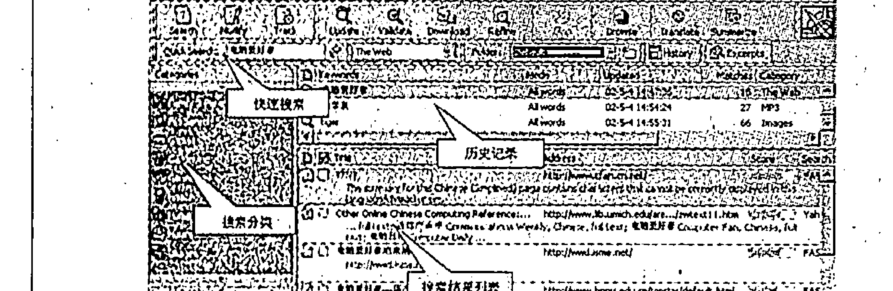

#### (一) 软件的使用

##### 1. 搜索资料

在 Copernic 中，搜索分为两种，一是快速搜索，另一种是精细搜索。

快速搜索：在快速搜索框内输入搜索关键字，然后点击后面的搜索按钮，会弹出一个搜索进度窗口，如图8所示，一方面告诉用户正在使用哪些搜索引擎；

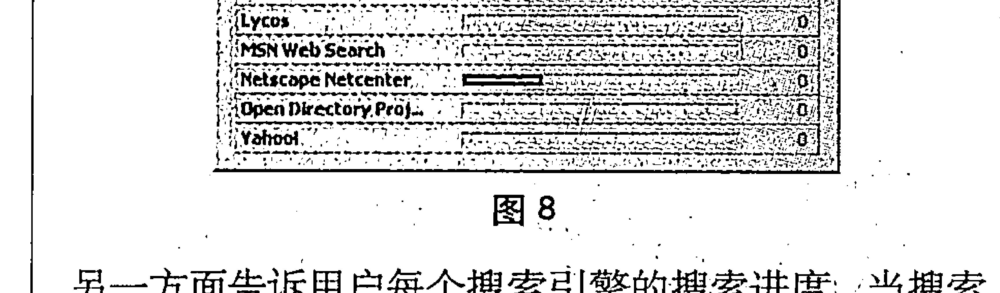

另一方面告诉用户每个搜索引擎的搜索进度。当搜索结束后，此窗口自动消失，搜索到的站点将排列在搜索结果列表中，排名越靠前的表示越可靠。选中某个搜索结果，在预览窗口中以缩略图的形式显示这个网页的内容。双击某个链接，在第一次使用时将会弹出一个提示窗口，如图9所示，选择第一项“Always use the integrated browser”表示以后将使用软件内置的浏览器进行浏览，选择第二项“Always use my default browser”表示以后将使用默认的浏览器浏览搜索结果，选定之后点击“OK”按钮，将启动相应的浏览器连接到相应的站点上。

精细搜索：点击主界面工具栏上的“Search”按钮，将弹出一个搜索对话框，如图10所示，在“General”标签页的“Category”中选择搜索的类别；在“Query”中输入搜索的关键字，关键字可以输入多个，中间用空格分开即可；下面是搜索的选项，第一个选项“Answer my question”是用自然语言搜索（当然目前它还只认识英文），第二个选项“Search for all words”表示对所有的关键字同时搜索，即逻辑关系为“与”，第三个选项“Search for any word”表示各个关键字之间的逻辑关系为“或”，即只要包括其中一个关键字即可；第四个选项“Search for exact phrase”表示把所有的关键字作为一个词组来搜索，即相当于在搜索引擎上把这个几个关键字用引号括起来。“Details”标签页是对搜索结果进行控制，“Results per search engine”表示从每个搜索引擎提取多少个结果，默认值为10；“total results”表示总共显示多少个结果，默认值为1000（如图11）。设置完毕后，可以点击“Search Now”按钮进行搜索，搜索的结果同样显示在搜索结果列表中。

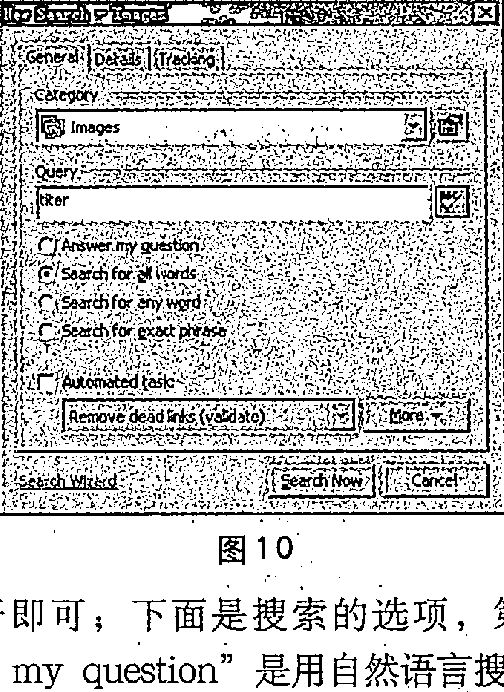

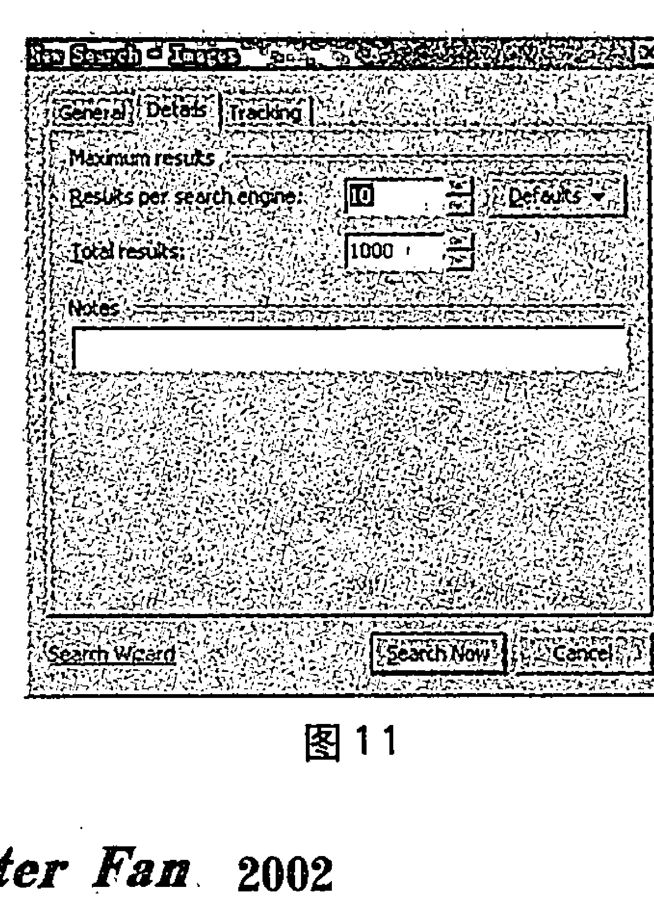

##### 2. 下载资料

当搜索结束后，我们可以把搜索结果下载到本地硬盘上。具体操作方法是点击快捷工具栏上的“Download”按钮，弹出如图12所示的下载对话框，“Remove unreachable documents”表示去除死链接；“Download images”表示连同图片一同下载；“Download selected documents only”表示只下载选定的搜索结果。设定之后点击“Download”按钮进行下载，下载的同时会弹出一个下载进度窗口，如图13所示。

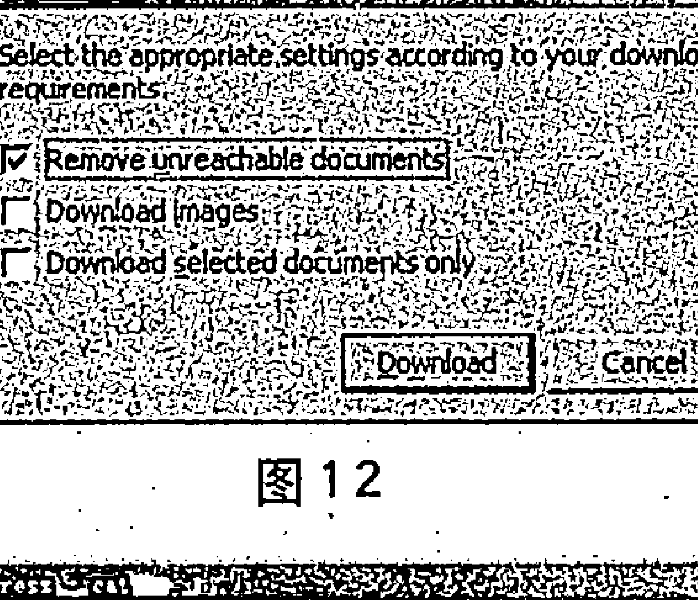

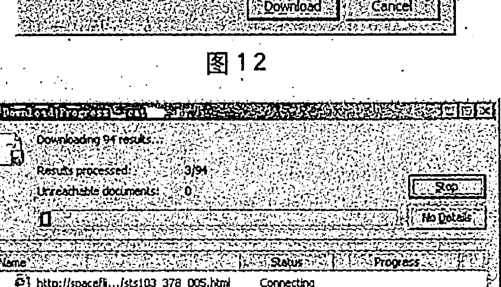

##### 3. 验证搜索结果是否死链接

对于搜索到的结果，可以通过主菜单“Results”下的“Validate”进行验证，如图14所示。

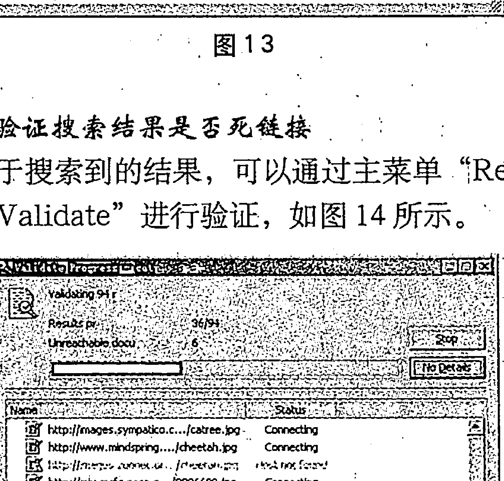

##### 4. 用电子邮件传递搜索结果

使用主菜单“File” / “send” 命令可以把搜索结果以电子邮件的形式发送出去，软件共提供三种格式，一是HTML格式的搜索报告，二是文本文件格式的搜索报告，三是搜索结果：选定某种方式后，系统将启动默认的邮件系统进行发送。

总的说来，这款软件的功能非常强大，能够为我们完成绝大多数的搜索任务，虽然是英文软件，但其使用方法也比较简单，既适合初学者使用，又适合有经验的用户使用，其唯一不足之处是虽然它支持中文搜索，但使用的搜索引擎都是国外的搜索引擎，所以在搜索中文资料时其结果不是十分全面。

### 三、飓风搜索通

下载地址: http://www.renliang.com
软件大小: 1135K

飓风搜索通是ZDNet 五星级的优秀网络信息搜索工具，整合近百个著名搜索引擎，分为网站、网页、软件、音乐、MP3、证券、新闻、购物、拍卖、游戏等数十个分类搜索。采用多线程并行运作，同时开启多个搜索引擎，高效实用，完全兼容用户搜索习惯和结果浏览方式，内嵌入浏览器窗口直接分页显示搜索结果。但它只是简单地把这些搜索引擎集中到同一个软件里，在软件的主窗口中同时打开不同的搜索引擎进行搜索，所以没有对搜索到的结果进行整理的功能，但可以对搜索结果进行校验。

该软件的使用方法非常简单，只需在“搜索关键词”中输入关键字，然后在搜索引擎列表中选择适当的搜索引擎，然后点击“搜索”按钮软件即可开始工作。这款软件最大的优势在于可以自己定义搜索引擎。如果仔细观察，可以看出搜索引擎使用的是服务器方的 Web 程序如 CGI、PHP 等加上一定的参数进行搜索，所以我们只要找到这个 Web 程序的命令就可以将其加入飓风搜索通的搜索引擎。例如我们想把Google的图片搜索添加到软件中，可以点击软件主界面上快捷工具栏“自定义”按钮右侧的小三角，然后点击“自定义搜索引擎”，打开“user.ini”文件。在这个文件中已经有中文雅虎、硅谷动力和百度搜索三个，我们可以在下面再添加 Google 的图片搜索。

首先我们先用浏览器打开 Google 的图片搜索，用“tiger”作为关键字进行搜索，在 IE 的地址栏中将会显示“http://images.google.com/images?q=tiger&hl=zh-CN”，这就是 Google 图片搜索的调用方式，在飓风搜索通中，关键字以“*”来代替，所以我们只要把“tiger”替换为“*”就可以了。下面是具体语句：

```
[4]
Name=Google图片
URL=http://images.google.com/images?q=*&hl=zh-CN
```

第一行表示这是第四个自定义搜索引擎，如果下面还要定义，应该顺延。
第二行表示把这个搜索的名字定义为“Google图片”。
第三行表示这个搜索引擎的使用方法。
如果想使用自定义的搜索引擎，可以在搜索引擎列表中选择“自定义”，然后输入关键字进行搜索即可。

### 四、网络搜索王

下载地址: http://tj.skycn.net/down/winFind.zip
软件大小: 185K

网络搜索王和前面介绍的搜索工具不同，它不借助搜索引擎，而是像“蜘蛛”程序一样，指定一个起始网站，对网页进行分析，从中抽取 URL，从而打开更多的网页，然后从这些网页中抽取出你需要的信息。它的主要特点是采用关键词对 HTML 文本进行全文匹配，适合于搜索任意类型的网页；采用搜索规则，可以更加精确地进行搜索，同时对各种类型的网页都可以进行搜索。

### 五、iSearch.net

下载地址: http://www.vanward.net/
软件大小: 2478K

iSearch.net是一款功能强大的互联网、局域网和本机搜索软件，提供搜索向导，允许用户同时搜索国内外数百个站点（搜索引擎、音乐站点、BBS、新闻组等、MP3），自动剔除重复的搜索结果，自动校验搜索结果的有效性，加密保护存储的结果文件，允许注册用户搜索无限多结果；允许自由编辑搜索模板、设定使用的引擎，提供无限引擎包升级，允许搜索局域网的共享资源。

（文/周建军）

## # 常用搜索引擎网站大全

### ## 一、常用的英文搜索引擎

- 1. Yahoo (http://www.yahoo.com)
有英、中、日、韩、法、德、意、西班牙、丹麦等10余种语言版本，各版本的内容互不相同。提供类目、网站及全文检索功能。目录分类比较合理，层次深，类目设置好，网站提要严格清楚，但部分网站无提要。网站收录丰富，检索结果精确度较高，有相关网页和新闻的查询链接。全文检索由Inktomi支持。有高级检索方式，支持逻辑查询，可限时间查询。设有新站、酷站目录。

- 2. AltaVista (http://www.altavista.com/)
有英文版和其他几种西文版。提供纯文字版搜索。提供全文检索功能，并有较细致的分类目录。网页收录极其丰富，有英、中、日等25种文字的网页。搜索首页不支持中文关键词搜索，但有支持中文关键词搜索的页面。能识别大小写和专用名词，且支持逻辑条件限制查询。高级检索功能较强。提供检索新闻、讨论组、图形、音频、视频等检索服务以及进入频道区（zones），对诸如健康、新闻、旅游等类进行专题检索。有英语与其他几国语言的双向在线翻译等服务，有可过滤搜索结果中有关毒品、色情等不健康的内容的“家庭过滤器”功能。

- 3. Excite (http://www.excite.com/)
是一个基于概念性的搜索引擎，它在搜索时不只搜索用户输入的关键字，还可“智能性”地推断用户要查找的相关内容进行搜索。除美国站点外，还有中文及法国、德国、意大利、英国等多个站点。查询时支持英、中、日、法、德、意等11种文字的关键字。提供类目、网站、全文及新闻检索功能。目录分类接近日常生活，细致明晰，网站收录丰富。网站提要清楚完整。搜索结果数量多，精确度较高。有高级检索功能，支持逻辑条件限制查询（AND及OR搜索）。

- 4. Infoseek (http://www.infoseek.com)
提供全文检索功能，并有较细致的分类目录，还可搜索图像。网页收录极其丰富，以西文为主，支持简体和繁体中文检索，但中文网页收录较少。查询时能够识别大小写和成语，且支持逻辑条件限制查询(AND、OR、NOT等)。高级检索功能较强，另有字典、事件查询、黄页、股票报价等多种服务。

- 5. Lycos (http://www.lycos.com)
多功能搜索引擎，提供类目、网站、图像及声音文件等多种检索功能。目录分类规范细致，类目设置较好，网站归类较准确，提要简明扼要。收录丰富。搜索结果精确度较高，尤其是搜索图像和声音文件上的功能很强。有高级检索功能，支持逻辑条件限制查询。

- 6. AOL (http://search.aol.com/)
提供类目检索、网站检索、白页（人名）查询、黄页查询、工作查询等多种功能。目录分类细致，网站收录丰富，搜索结果有网站提要，按照精确度排序，方便用户得到所需结果。支持布尔操作符，包括AND、OR、AND NOT、ADJ以及NEAR等。有高级检索功能，有一些选项，可针对用户要求在相应范围内进行检索。

- 7. HotBot (http://hotbot.lycos.com/)
提供有详细类目的分类索引，网站收录丰富，搜索速度较快。有功能较强的高级搜索，提供有多种语言的搜索功能，以及时间、地域等限制性条件的选择等等。另提供有音乐、黄页、白页（人名）、Email地址、讨论组、公路线路图、股票报价、工作与简历、新闻标题、FTP检索等专类搜索服务。

- 8. Google (http://www.google.com/)
提供有类目检索和网站检索两种方式。分类较详尽，网站收录较丰富，提要简明扼要。支持AND和“-”等条件查询。在普通搜索按钮旁有“I'm Feeling Lucky”按钮，具有网站直达功能，会直接到达与所搜索的关键词最相关的网站中。这是Google很有特色的一项功能。当用户明确自己的查找目的时，这个功能极大地提高了查询效率。

### ## 二、常用的中文搜索引擎

- 1. 百度 (http://www.baidu.com)
百度公司是国内著名搜索引擎，硅谷动力、Chinaren、搜狐、新浪、21CN、广州视窗、263、TOM等门户网站的全文搜索引擎服务都由百度搜索引擎提供，目前已经成为中文检索市场中的佼佼者。

- 2. 搜狐 (http://www.sohu.com)
搜狐站点全部采用人工分类，分为搜狐新闻、免费资源、企业集粹、搜狐社区、搜狐多媒体、搜狐三维空间、搜狐体育、外国参考大全等十余个栏目，是国内较有影响的中文搜索引擎。

- 3. 雅虎中国 (http://cn.yahoo.com)
它是著名的搜索引擎Yahoo!的中文站点，不论是国标码的简体字、大五码的繁体字的信息都可在这里查询到。使用的方法是：如果你清楚地知道你查询的主题，可在检索栏内键入相关主题的关键字；或者按照其分级目录一级一级地查询。

- 4. 若比邻 (http://www.robot.com.cn)
它是中国互联网信息中心（CNNIC）设计的。由三部分导航系统组成：中国上网单位导航、站点导航和网页导航。

- 5. 悠游 (http://www.goyoyo.com.cn)
它不仅仅是一个中文搜索引擎，还包含关于中文信息处理的功能，提供自动构造式的概念类型（ConceptSearch）查询。它的查询方式有：分类查询、概念查询、精确查询和网址查询。它还有一个特点是自动转换繁体、简体汉字。

- 6. 263首都在线 (http://www.263.net)
263首都在线的搜索引擎可谓百度公司技术的完美体现，它从网页搜索到网站搜索都使用了百度的技术，为广大中文网络用户提供丰富有效的目录指南服务和全文检索服务。它比较有特色的地方是除了提供基本的分类查询和关键字查询，还为用户增加本周新站、好站推荐、热门关键字搜索、专题搜索、搜索留言版等多项服务。

### 三、中文专业搜索引擎

- 1. 中国健康网 (http://www.healthoo.com/)
健康网网上药店有上千个品种，包括常用药品、新特药、保健品、妇女儿童药品及医疗器械等八大类，品种齐全。有关药品的详细介绍被制作成网页，放在健康网数据库内。通过输入药品名称或疾病名称，可以方便地查到所需的信息。

- 2. 中国医药网 (http://www.pharmnet.com.cn/)
浙江省医药管理局所开设的医药专业搜索引擎。数据库有三种检索选项，根据需要选择其中的一项：按产品查询可以检索某产品的生产厂家；按公司查询可以检索到某公司的电话、传真、Email以及网址；按原料查询可以检索某产品的需求商或厂家。内容有求购信息、供应信息、国际求购、产品检索和医药yahoo。

- 3. 和讯金融搜索 (http://search.homeway.com.cn/)
收录股票、债券、期货等金融方面17个类别的网站，以中文为主，并有部分国际知名金融站。分类明晰，提要简明。

- 4. 化工YAHOO (http://sr2.chemnet.com.cn/site/)
收录化学工业相关网站，包括厂家、公司、研究机构、院校、杂志等。提要完备，部分与Yahoo!相同。

- 5. 中国人才探索 (http://www.eastart.com/people.html)
有分类索引目录和关键字查询两种方式。分类目录细致清晰。查询结果有符合条件的个人简介，可通过EMAIL联系该人。

- 6. 招聘网 (http://www.zhaopin.com/)
可以使用中文或英文关键字任意搜索。有三种搜索方式：一是关键字检索，支持中文和英文关键字；二是职位分类目录检索；三是招聘公司目录检索。

- 7. 图行天下 (http://beta.go2map.com/)
地图服务专业网站，提供地图搜索服务，还有站内全文检索。提供了地图114、我的天下、公交换乘、地图留言板、在线地图登记等功能。还有分类查询方式。

- 8. 中国旅游资讯网 (http://www.chinaholiday.com/search/)
网站有一级目录提供分类索引。关键词查询可选择语言。收录站点较丰富，网站提要清楚完整。现已推出网络机票预订、酒店预订、网上旅游用品购物和旅行代理企业入网等电子商务服务。

- 9. 中国企业产品在线 (http://www.manufacture.com.cn/)
提供类目检索和关键词检索两种方式，收录中国的企业产品。有分类详细的目录，共有三级，其中一级目录20个。可根据产品名称、企业名称、企业网址或IP地址搜索产品。网站提要简明扼要，方便用户查看。

- 10. 中贸网 (http://cn.chinae.com/)
采用会员制的电子商务网站，其商业模式新颖，可靠。客户通过在ChinaE.com注册登记成为其会员，并自行维护其资料。搜索类目清晰，信息丰富，内容更新快而准，查询方便快捷。ChinaE.com是商家的产品搜索工具书。是中国产品资料查找的重要网站。

（文/周建军）

## 个人电脑防黑精要

作为数字时代最重要的工具，网络的作用越来越大，同时也为黑客们实施不轨之举提供了条件。面对让人又爱又惧的网络，我们惟一能做的就是举起反黑大旗，保护自己，净化网络。这里不打算再讲述防范黑客的意义了，我们只想告诉你如何去做，做得更好。谨于此，这里汇集了几点防黑精要，希望能助你一臂之力。

### 知己知彼，百战不殆——黑客工具软件及其防范

由于黑客工具软件便于操作，功能强等特点，目前几乎所有的黑客攻击都是利用黑客软件来进行的，因而黑客软件对网络安全形成了严峻的威胁。本文特别介绍了目前比较常见的几个黑客工具软件的原理及其防范措施，让读者在了解黑客工具软件的基础上，更好地防范利用黑客软件进行的攻击。

## 个人电脑防黑精要

你了解邮件病毒吗？你的邮箱被炸过吗？OICQ号被人盗用过吗？有没有在聊天室碰到过不速之客踢人？还有，是否听说过在网页上加一行代码就可以格式化浏览者的电脑硬盘？在这里，我们将为你介绍个人电脑上网过程中可能遇到的黑客攻击以及如何预防、对付这些攻击的方法和一些必要的措施，比如安装个人防火墙、杀毒软件，认识常见的网络陷阱等等。想进一步学习计算机系统安全与防黑知识的读者可以参考《电脑爱好者》系列精品图书：《黑客过招——网络安全实用技术实例精讲》。

### 一、预防邮件攻击篇

随着互联网的普及，电子邮件已经在个人与商业活动中成为最重要的通讯工具，所以电子邮件也成了很多黑客的攻击目标。针对电子邮件的攻击分为两种，一种是直接对电子邮件的攻击，如窃取电子邮件密码、截取发送邮件内容、发送邮件炸弹；另一种是把电子邮件作为间接攻击的工具，如通过邮件传输病毒木马，因此电子邮件也成为目前流行网络病毒的主要传播途径之一。

#### （一）预防邮件病毒

电子邮件是传播病毒最常见的途径之一，很多影响很大的病毒都是通过电子邮件来传输的，如造成全球经济损失十几个亿美元的爱虫病毒、臭名昭著的尼姆达病毒、极具诱惑的库尔尼科娃病毒和颇有迷惑性的求职信病毒。

电子邮件病毒通常是把自己作为附件发送给被攻击者，如果收到该邮件的用户不小心打开了附件，病毒即会感染你的计算机。更可怕的是，带有尼姆达病毒的电子邮件，不需你打开附件，只要阅读或预览了带病毒的邮件，那么你的计算机就很有可能受到病毒的侵害，并且还会沦落为病毒的帮凶，继续发送带病毒的邮件给你通讯簿里的朋友。现在大多数电子邮件病毒都会在感染你的计算机之后自动打开Outlook中的地址簿，然后再把病毒自身发送给地址簿上的每一个电子邮箱中，这正是电子邮件病毒能够一下子大面积传播的原因所在。另外，电子邮件客户端程序的一些Bug也可能被攻击者利用来传播电子邮件病毒，微软的Outlook曾经有两个漏洞被攻击者所利用，使邮件附件中的病毒程序可以不用打开即可自动运行。

##### 1. 邮件病毒的特点

1.  邮件病毒的主要特点是传播速度快，传播范围广。绝大多数通过电子邮件传播的病毒都有自我复制和传播的能力，这正是它们的危险之处。它们不仅能够在用户发送邮件时把病毒自身进行复制传播，而且还能够主动选择用户邮箱地址簿中的地址发送带有病毒的邮件，它们的主要方法是将被病毒感染的文件附到邮件上一起发送。这种传播方式往往能够把病毒以成指数增长速度进行传播，可以使病毒在很短的时间内遍布整个Internet。2000年5月4日，“爱虫”病毒爆发的当天便有6万台以上电脑被感染。在其后短短的一个星期里，互联网经历了一场罕见的“病毒风暴”！2001年，当尼姆达病毒爆发时，据防病毒企业的全球病毒跟踪中心报告，在24小时内，就有12万台计算机受到感染；
2.  邮件病毒的另一个特点是其破坏力巨大。通过邮件传播的病毒，其攻击的对象是整个计算机网络。因而其影响范围和破坏性要远比单机病毒大得多。由于其传播速度快、范围广，一台电脑上的病毒可以通过网络迅速感染与之相连的众多电脑。当其发作时，甚至可以造成整个网络的瘫痪，因此而造成的损失往往是难以估计的。

##### 2. 对邮件病毒的预防

利用防杀毒软件可以很好的预防邮件病毒。如瑞星杀毒软件中就有专门的邮件监控程序，在安装完瑞星杀毒软件后可以在瑞星运行主窗口的【设置】→【邮件监控】对邮件监控进行设置，如图1所示。选中“开机时启动邮件监控”选项，那么当你重新启动后收发邮件时就可以受到瑞星邮件监控的保护了。

如果你使用了 Outlook 等邮件客户端软件，在开启瑞星邮件监控程序时会提醒你修改邮件客户端的配置，确认之后，在屏幕右下角启动栏里就会看到一个黄色的瑞星邮件监控小图标了。另外，其他的杀毒软件一般也都有查杀邮件病毒的能力，只要在相应的选项里进行设置就行了。除了安装杀毒软件外，用户应该对邮件病毒的袭击时刻保持警惕。防御电子邮件病毒的方法和预防木马一样，不要随便打开那些来历不明的可执行文件，即使是从熟人的邮箱发来的文件，也要问清楚之后才打开，因为一些电子邮件病毒是会自动伪装成你朋友的电子邮件发送给你。另外需要特别提出，由于 Outlook 一直都是黑客们“照顾”的重点，并且 Outlook 也经常被发现较大的安全漏洞，所以要及时注意电子邮件客户端程序的更新和堵漏。

#### （二）预防邮件炸弹

电子邮件炸弹，指邮件服务器或某个用户在很短的时间内收到大量无用的垃圾邮件，通常是从某一虚设的地址发来的，这也是黑客常用的攻击手段。由于每个人的邮件信箱空间都是有限的，当庞大的邮件垃圾到达信箱的时候，就会把信箱“挤爆”，把正常的邮件给“冲掉”。另外，由于邮件炸弹占用了大量的网络资源，常常导致网络阻塞，使大量的用户不能正常地工作，所以说邮件炸弹的危害是相当大的。目前已经有多种能自动产生邮件炸弹的软件程序，而且还有逐渐蔓延的苗头。

针对邮件炸弹的特点和攻击方法，预防邮件炸弹一般可以采取以下措施：

##### 1. 不随意公开自己的信箱地址

当受到攻击后，有许多人可能不明白，这些垃圾邮件制造者是如何知道自己的电子邮件地址的呢？其实这并不是这些垃圾邮件制造者多么神通广大，而是我们自己在不经意间把自己的邮件地址留在了 Internet 上。那些垃圾邮件制造者使用一种专门的应用程序来搜索 Internet 上的 E-mail 地址。他们可能的搜索目标是各个网址、聊天室、网上讨论区、新闻组、公共讨论区以及其他任何能够收集到 E-mail 地址的地方。所以我们避免收到过多垃圾邮件的首要方法之一，就是注意在那些需要提交自己邮件地址的网站上不要随便公布自己的真实信箱地址。

##### 2. 隐藏自己的电子邮件地址

我们有时避免不了要在 Internet 的公共场合中公布自己的 E-mail 地址，为防止非法用户利用这个机会来窃取我们的信息，我们可以对自己要公布出来的 E-mail 地址进行一下“伪装”。例如，如果真实的邮件地址是 gj@263.net，现在就可以事先和对方约定，在电子邮件地址的用户名以及主机名前面各加上 WWW 等伪装字符，这样经过伪装后的地址就是 wwwgj@263.net，并在底部加一个注释以提醒对方在发送邮件之前修改地址，这样垃圾邮件制造者的自动搜索器只能搜索到修改后的地址。

##### 3. 对邮件进行过滤

如果邮件很多，则需要分类和管理所收到的邮件，并且及时过滤掉垃圾邮件，这是非常重要的。大多数邮件阅读器都提供了垃圾邮件过滤器或者一些过滤规则，使你在收取信件时能清除掉那些看起来像垃圾的邮件。但是，由于过滤器并不完美，最好不要自动清除邮件，而应把它们移到垃圾邮件活页夹里。偶尔检查一下这些活页夹，以防止把有用的邮件当成垃圾的邮件丢弃掉。

对于那些不请自来的、或者你不愿意收的邮件，你可以通过设定邮件过滤的办法，把这些邮件直接过滤到废件箱里。与此同时，我们还可以通过设定过滤器，把经常给你发信的朋友的邮件自动转到专门设置好的收藏信箱里，其道理和过滤垃圾邮件是一样的，这样就可以一举两得，既过滤了垃圾邮件，又能把朋友的信件过滤保存起来。

##### 4. 谨慎使用邮件自动回复功能

邮件自动回复是指当对方给你的信箱发来一封邮件而你没有及时收取，邮件系统会按照你事先的设定的信息自动给发信人回复一封确认收到的信件。这个功能本来给大家带来了方便，但如果使用不好，就很有可能形成邮件炸弹！试想一下，如果给你发信的人使用的邮件账号系统也开启了自动回复功能，那么当你收到他发来的邮件而没有及时收取时，你的系统就会给他自动发送一封确认信。恰巧他在这段时间也没有及时收取信件，那么他的系统又会自动给你发送一封确认收到的信。如此一来，这种自动发送的确认信便会在你们双方的邮件系统中不断重复发送，直到把双方的信箱都“撑爆”为止！现在，虽然有一些邮件系统采取了相应的技术措施，已经能够防止这种情况的发生，但是为了慎重起见，你一定要小心使用自动回复功能。

##### 5. 不在公众场合下“惹事生非”

在网上，无论在聊天室和网友聊天，还是在论坛上与人争鸣，都要注意言辞不可过激，更不能进行人身攻击。否则，一旦对方知道你的信箱地址，很有可能会因此而向你的信箱发送垃圾信息来进行攻击。另外，也不要轻易在网上到处乱贴自己的网页地址或者产品广告之类的帖子，或者直接向陌生人的信箱里发送这种有可能被对方认为是垃圾邮件的东西，因为这样做极有可能引起别人的反感，甚至招致对方的邮件炸弹报复。

##### 6. 遇到攻击时向邮箱服务提供者求援

一旦我们发现自己的信箱被轰炸了或者收到什么可疑信息，而自己又没有好的办法来对付它时，这时我们应该做的就是拿起电话向自己的邮箱服务提供者求援，请求他们采取办法帮你清除电子邮件炸弹或者提供其他可能解决的方法。

##### 7. 使用转信功能

有些邮件服务器为了提高服务质量往往设有“自动转信”功能，利用该功能在一定程度上能够解决特大容量邮件的攻击。假设你申请了一个转信信箱，利用该信箱的转信功能和过滤功能，可以将那些不愿意看到的邮件统统过滤掉或者直接在邮件服务器中删除，也可以利用转信功能将垃圾邮件转移到不重要的信箱中。

##### 8. 拒绝 Cookie 信息

许多网站会用不易察觉的技术，暗中搜集你填写在表格中的电子邮件地址信息，最常见的就是利用 Cookie 记录访客的浏览行为和习惯。如果你不想随便让 Cookie 来记录你的个人隐私信息，可以在浏览器中做一些设置，把 Cookie 功能屏蔽起来，这样浏览器在接受 Cookie 之前就会提醒你，或者干脆拒绝它们。屏蔽 Cookie 的操作比较简单，这里不予赘述。

##### 9. 通过邮箱命名技巧防止垃圾邮件

目前，申请免费电子邮箱的用户很多，一般用户比较喜欢使用简单和容易记住的邮箱名，虽然这方便了使用，但这些邮箱名字很容易就被猜中，因而往往会成为那些垃圾邮件的追逐拜访对象。目前那些常见的邮箱名字基本上都被申请了，所以有些邮件炸弹程序干脆用组合排序搜索用户名的方式寻找用户邮箱并发送垃圾邮件。由此可看出，E-mail 的命名需要一定的技巧，如果你的用户名里有字母和数字相混合，或者在字母中间加一个连接符，这样就不容易被猜中，邮箱收到的垃圾邮件要相对少多了。

## 二、防止 OICQ 攻击篇

OICQ 作为大家常用的通讯联络工具，不仅让人们有了方便的联络方式，还给生活带来了许多的乐趣。然而当你无拘无束的使用 OICQ 闲话家常、交结朋友的时候，千万不能忽视了网络安全的问题。目前 OICQ 是受各种攻击最多的在线即时通讯软件了。通过各种流行的 OICQ 黑客程序，很容易就可以得到 OICQ 上的各种个人隐私资料。虽然目前在网络安全防范方面已经有了不少的产品，然而遗憾的是几乎所有的 OICQ 黑客软件都是针对 OICQ 程序本身的漏洞进行攻击的，简单的防火墙对此也是无能为力。正因为如此，做好 OICQ 攻击的防御工作也就显得很重要了，这主要还是靠用户自己的警惕和防范了。

其实，黑客对 OICQ 的攻击之所以能够频频得手，一方面是因为 OICQ 本身安全漏洞的缺陷，由于 OICQ 一开始就采用了安全性较差的 UDP 数据包通讯，UDP 通讯不像 TCP 要通过“三次握手”认证后才能进行通讯，它是不需要认证许可即可发送的。加上腾讯公司在推出 OICQ 早期版本时没有过多的注重安全性，在帐号密码和本地消息储存加密上都出现过相当大的安全隐患。不过这些问题随着腾讯公司新版本的 OICQ 推出暂时得以缓解。

另一方面，目前用户本身安全意识不够好，如在网吧、学校等公共机房上网时没有在离开的时候把自己的信息擦除掉、或随意运行了来历不明的可执行文件……，这些都可能导致用户的 OICQ 号码被盗用或遭受其他的攻击。

#### （一）OICQ 个人信息安全保护

和其他软件一样，OICQ 需要一定的保密措施以免你的个人的信息如的邮箱地址、电话以及其他资料被人窥探。除了你的计算机本身的安全措施比如设置开机密码、屏幕保护密码等以外，我们还可以对 OICQ 进行安全设置。

设置方法如下：

*   第一步、登录到 OICQ 后，单击 OICQ 面板左下角【QQ2000】图标打开主菜单；
*   第二步、单击【个人设定】；
*   第三步、这儿有【基本资料】、【联系方法】、【移动QQ】、【详细资料】、【网络安全】等几个标签页，要想保护个人信息，在这几个标签页里就不要填写自己真实的信息。另外在【联系方法】和【移动QQ】里可以选择“仅好友可见”或“完全保密”，在【网络安全】标签里选择“需要身份验证才能把我列为好友”；
*   第四步、打开 OICQ 主菜单的【系统参数】，在其中【参数设置】标签页的【综合设置】中选择“拒绝陌生人信息”。

除了上述在 OICQ 内对 OICQ 进行安全设置来保护个人信息，还可以使用其他方法来达到同样的目的：

1.  及时更新 OICQ 的版本。因为 OICQ 软件与 OICQ 的攻击软件相比，OICQ 软件总是先行一步，也就是说，攻击软件是在 OICQ 软件的新版本出来以后再编制出来的，所以及时更新 OICQ 也能有效地达到“防黑”的目的；
2.  常修改自己的 OICQ 的登陆密码，以免被别人猜出自己的登陆密码，泄漏个人信息；
3.  不要轻易地把自己的 OICQ 号码告诉给你不熟悉的网友。

#### （二）防止OICQ密码被破解

可能不少的OICQ用户都遇到过OICQ密码和号码被盗用的情况，可是为什么OICQ的密码总是那么容易失窃呢？对于早期的OICQ版本，由于其密码文件使用明文保存，所以很容易被人破解而产生号码盗用。但是，从0220版本开始OICQ就采用不可逆算法对本地密码进行了加密，所谓不可逆算法意思就是哪怕是程序设计人员拿到了你存储的加密密码也无法从它反向推算出你的明文密码，因此OICQ软件本身并不存在这方面的缺陷，号码被盗，可能并不是OICQ软件本身的问题，很多都是由于其他原因造成的。要解决OICQ密码的破解问题，关键还要弄清楚被盗的原因，并在实际使用中注意防护。

### ### 1. OICQ密码及号码被盗主要原因

*   密码过于简单
*   中了木马
*   被骗号
*   被某些病毒感染

Worm.Gop.3(QQ窃手)是一种新型的蠕虫病毒，它以攻破OICQ密码为目标，同时也会恶意泄漏用户的重要信息。此病毒蔓延速度极快，据瑞星全球病毒监测网报告，这是一种传播力极强的病毒，国内已经发现了该病毒信息，所以广大用户应紧急采取预防措施以避免遭受损失。

Worm.Gop.3(QQ窃手)病毒主要通过邮件形式传播，最具危害的是它具有与尼姆达病毒类似的“预览信件即受感染”的能力，这样用户不用打开病毒邮件就已经遭受感染。该病毒具有传染极快、结构复杂等特点，它所造成的危害主要就是泄漏用户ICQ(OICQ)密码，而且能够同时将用户在感染前处理的最后一个文件（近期文件，对用户来讲往往很重要）通过以邮件附件形式寄出，这样用户的很多隐私就有可能在不知不觉中泄露出去。

再做怎么的安全设置也是无济于事了。OICQ本身的保密性其实是很强的，只要在使用的时候多加防范，不要下载来路不明的软件，尤其是黑客类软件，你的OICQ号码还是很安全的。而且OICQ也在不断完善密码机制，在最大程度上保护用户的利益不受损失。

*   被骗号

Worm.Gop.3(QQ窃手)是一种新型的蠕虫病毒，它以攻破OICQ密码为目标，同时也会恶意泄漏用户的重要信息。此病毒蔓延速度极快，据瑞星全球病毒监测网报告，这是一种传播力极强的病毒，国内已经发现了该病毒信息，所以广大用户应紧急采取预防措施以避免遭受损失。另外，病毒还会自动查找最近打开过的文件，如果文件是 BMP、RTF、DOC、TXT、GIF、JEPG、JPG 等类型，并且小于 80KB，病毒就将此文件捆绑在自己后面，形成一个 .exe 文件作为附件发送给别人。这样收信人会以为收到了一个无害的文件，一旦在 Outlook Express 或者 Windows 中预览了这个邮件，就会立刻感染上蠕虫病毒。

##### 清除和预防 Worm.Gop.3 (QQ窃手) 病毒的方法:

1.  发现 Worm.Gop.3 (QQ窃手) 病毒后用杀毒软件将其全面杀除。
2.  预防 Worm.Gop.3 (QQ窃手) 的办法与多数蠕虫病毒的方法类似：不要随便打开上文提到的欺骗性主题的邮件，其次是要警惕陌生邮件。为了避免受到病毒侵袭，如果你还没有使用任何杀毒软件保护你的计算机，反病毒专家建议用户及早安装和使用优秀的反病毒软件，如诺顿、瑞星、金山毒霸、KV3000 等优秀的查杀毒和防火墙软件，并养成定期升级更新的习惯，同时注意时刻开启实时监控 (病毒防火墙) 功能，严防病毒入侵，以避免不必要的损失。

##### 2. 防止 OICQ 密码被盗方法

1.  尽快将 OICQ 升级到安全性能更完善的最新版本。目前 OICQ 的新版本除了增加一些功能，往往会修正一些 Bug，其安全性能也在不断得到提高。
2.  密码的设置除了方便你记忆外，还应该注意一定要足够复杂。最好是数字、大小写英文字母和标点符号相混合，此外密码长度不能太短，8~16位比较合适；
3.  一定要为自己的号码申请 “密码保护” 服务。准备申请 “密码保护” 服务的朋友可以登录到腾讯公司的网站 (http://www.tecent.com)，在网站的【服务专区】栏目中有【密码保护】服务，按照提示要求填写相关表格，单击【确定】提交，只要填写的资料正确的，系统就会提示申请密码保护成功，并向你的邮箱发一封确认信。一旦申请了密码保护，那么当你的 OICQ 密码被盗时就可以通过密码保护功能取回自己的密码了；
4.  一定要保护好你在申请密码保护时填写的 E-mail 邮箱，建议你使用没有 POP3 的邮箱，因为破解邮箱的工具一般都是支持 POP3 的，此外信箱的密码设置也要足够复杂；这里还要规劝大家一句，不要使用安全性差的信箱来接收申请密码保护的反馈资料，电子邮件里的重要信息应另做保留后再删除，以免邮箱被盗而泄漏资料信息。
5.  在网吧和公共机房的电脑上用完 OICQ 后，一定要彻底删除 OICQ 的安装目录下存放自己的资料的目录 (目录名就是你的 OICQ 号码) 以及 dat 目录下的 oicq2000.cfg 文件，因为前者存放的是你的密码和聊天记录，后者存放的是在这台计算机上登录过的 OICQ 号码。如果想保留聊天记录的话，可以把该目录拷贝到自己的软盘上，然后删除，当然要注意把回收站也清空了；
6.  在电脑中安装杀毒软件和防火墙软件并注意及时更新，防止 OICQ 木马之类的病毒盗取密码；
7.  不要下载来路不明的软件，尤其是黑客、炸弹类软件；
8.  不要轻信 OICQ 上传递的一些颇具诱惑性的信息，这种信息一般都是通过伪装的谎言骗局，往往是通过某种利益来诱惑你以达到骗取 OICQ 密码和个人信息的目的。

#### （三）隐藏你的 OICQ 行踪

IP 地址在网络安全上是一个很重要概念，如果攻击者知道了你的 IP 地址，也很可能就准备好了他们的攻击目标，就可以恶意向这个 IP 地址进行各种进攻如 DoS 攻击、Flood 攻击等。所以一定要注意隐藏自己的真实 IP。由于 OICQ 采用的是 UDP (User Datagram Protocol 用户数据包协议) 数据包通讯，欺骗 UDP 包比欺骗 TCP 包容易得多，因为 UDP 没有建立初始化连接 (即 “三次握手” 过程)。攻击者只要向你发送一个信息，就可以通过监视 UDP 数据包来获得你的 IP 和 OICQ 的端口号。从理论上说在直接通讯的模式下，想避免攻击者发现你的 IP 地址是十分困难。正由于 OICQ 本身的这种特点，所以在使用 OICQ 过程中对自己的 IP 地址的保密就显得比较重要了。

防范 IP 探测、隐藏真实身份的主要方法是：

1.  阻止攻击者与你直接通讯。在 OICQ 的【个人设定】里修改身份验证默认值为 “需要身份认证才能把我加为好友”，这样可以在一定程度上限定不速之客找上们来，但攻击者也还是可通过某些特殊的信息发送软件与你通讯，所以还应该在【系统参数】设置里把 “拒绝陌生人消息” 的选项选中。
2.  通过 SOCKS5 代理服务器使用 OICQ。这样攻击者所看到的是代理服务的 IP 地址；设置 SOCKS5 代理服务器的方法：打开 OICQ 主菜单的【系统参数】中的【网络设置】标签页，如图2 所示，选中 “使用 SOCKS5 代理服务器”，然后填好代理服务器的地址和端口号，如果没有下面的校验用户名和校验用户密码的话可以不填，但一定要把里面的 “-” 和 “*” 删掉，填好后，单击【测试】按钮，如果代理服务器可用，几秒钟后会出现一个信息，告诉你测试成功，就可通过这个代理服务器使用 OICQ 了；
3.  隐身登陆。OICQ 隐身登陆后的消息传递是通过服务器中转的，这样传给攻击者的数据包的 IP 地址是腾讯服务器的地址，从而隐藏了你的真实 IP。

#### (四) 保护OICQ聊天纪录

如果经常在网吧或公共机房使用OICQ上网聊天，是否为自己的聊天记录或密码被盗担心。目前在网上很容易就能找到破解密码的软件，这常常被那些图谋不轨者所利用；OICQ号码被盗取，聊天记录被曝光已经不是什么新鲜事。这种行为理应受到相关法规的制约和惩罚，但面对黑客的这种威胁，我们更应该提高警惕并懂得如何从技术的角度保护自己的OICQ和聊天记录。

首先，我们来看看聊天记录是怎么回事。在OICQ的安装目录下，有以在本机登录过OICQ号码命名的目录，在这个目录下，有两个文件msg.db和user.db，其中user.db中存放的是好友的名单和信息，而msg.db中存放的就是聊天记录。当OICQ向外发送信息时，对方收到的消息都存在本地的msg.db文件中。

保护自己的聊天记录应该采取的措施：

- 1. 设置本地密码
在OICQ参数设置的【安全设置】中选中“启用本地消息加密”，输入最多16位的本地口令，设置了本地消息密码以后，启动OICQ必须正确输入密码，这样即使他人打开你的电脑也无法看到你的聊天记录和其他信息。另外一定要选中“启用本地消息加密口令提示”，这样万一你想不起来密码了，可以单击“口令提示”，填入正确答案，就能取回本地密码了。如果你选择了这两项，那么一定要将两个密码记牢，否则遗忘了就谁都帮不了你了。

只要设置了本地消息密码，不知道密码的人就看不到你OICQ里面的信息了，哪怕他把文件窃取过去也是没有办法阅读的。

- 2. 删除相关文件
由于OICQ的个人聊天记录和好友名单都是保存在客户端，所以这也他人窃取密码的和其他信息提供了条件。这就要求我们要做好本地的安全工作。如果在网吧、学校等公用机房的场所使用OICQ，最好的方法是每次下线前都更换一个新的密码，然后把包括你的帐户资料的子目录整个删掉，这样就不怕那些对付本地OICQ的黑客软件了。

### 三、防止IRC攻击篇

IRC就是指Internet Relay Chat (Internet在线聊天系统)，它使人们可以在Internet上，通过特殊的协议(IRC协议)，连到一台或者多台IRC服务器上聊天，特点是速度极快，功能多而且强大。

通过IRC聊天时，所有聊天者交流的信息都是通过一台或几台服务器(Server)来转发，聊天者通过专门的客户端(Client)程序来访问服务器。每台服务器上都有公共的聊天室或聊天者自己建立的若干个频道(Channel)，一个频道就是一个聊天室，人们就是在这里通过文字进行交流。每个频道都可以有自己的主题(Topic)，有着共同兴趣的人聚集在一起，由其中一个或多个人作为管理员(Administrator)对该频道进行管理。管理员的权力很大，他可以设定频道最多允许有多少人、指定哪些人是不受欢迎的并驱逐捣乱者，指定或撤消其他下一级管理员等等。在这里，既可以几个人一起讨论，也可以和某个人另辟小窗密谈，不影响别人也不被别人打扰。

有人说，IRC是一种生活也是一种文化，通过IRC可以和朋友尽情的享受互联网带来的快乐。但由于互联网的开放性，所以也有人说，IRC是一个“垃圾”站，上面充斥着各种骗子、Gay、Cracker、和其他种种无聊的人。但是不管怎么样，我们必须关注IRC聊天的安全问题，因为在聊天的时候可能遭到别人的攻击，使你的计算机产生莫名其妙的问题：比如死机、断线、弹出窗口等，聊天室里的捣乱者的行为，的确在一定程度上扰乱了聊天室里的正常秩序。经常光顾聊天室里的朋友对于一些攻击行为可能会有亲身体会。这些攻击行为中所使用的工具大多是从一些黑客站点上下载的攻击程序，其实攻击者本身并不一定具有编制这些程序的能力，他们只是使用者而已。下面我们以MIRC为例(注：MIRC可以说是应用最广泛的IRC聊天软件)，介绍IRC聊天时防止攻击应注意的基本事项。

#### (一) 保护真实的IP地址

IP地址相当于你在网络中的身份证，如果你使用IRC，那么别人获取你的IP地址也并不难。首先，频道的管理员是可以通过 whois 等命令查看你的 IP 地址，这是他们的权限。但你千万别以为别人没有权限就查不到你的IP地址了，有一个程序，可以unmask出你的IP地址，其原理就是运用了whois的漏洞。例如你的IP地址是210.31.55.88，那么没有管理权限的人看到你的IP地址应该是210.31.55.xxx。unmask是利用whois检查从210.31.55.1开始到210.31.55.255所有的用户信息，然后找出与之匹配的，而这一切工作利用程序来完成只需30～50秒钟。

在IRC中，可以进行密谈(DCC chat)，或者传送文件(DCC file)，因为是通过点对点进行的，当你接受了对方的DCC chat和DCC file时，你也就暴露了自己的真实IP地址。一旦你的IP地址被别有用心的人查知后，接下来自然就是准备接受攻击了。

利用IP地址进行攻击的方法主要是用一些小工具，比如NUKE、OOB等，它们都是利用Windows本身的一些漏洞来攻击某些端口；也有专门的端口扫描程序，可以通过你的IP地址，扫描你的电脑中哪些端口是打开的，然后发送一些无用的信息，导致死机。

另外一种利用IP地址攻击的方法更为简单，是利用浏览器来实现的，如果你的计算机是连在局域网中的，又没有设置访问密码，攻击者就可以通过浏览器像操作自己的计算机那样来浏览甚至是删除你计算机中的数据。有一种软件还可以搜索一定范围的地址段内的此类计算机，一旦连接成功，就可以直接映射为本地驱动器，除了速度慢之外，就和使用自己的计算机完全一样的。

既然暴露真实IP地址很危险，那么我们可以把自己的IP地址伪装一下，这样就可以避免大多数的攻击了。在Windows 98下，伪装IP的方法为：单击【开始】→【设置】→【控制面板】，选择【网络】，找到【标识】选项卡，将计算机名的内容改成10.0.0.1(你可以任意填写IP地址)，然后按【确定】按钮，再重新启动计算机，IP地址的伪装就开始生效了。

#### （二）使用防范断线工具

在IRC聊天室里，有些不法分子喜欢使用一些如nuke之类的工具让别人断线，把整个IRC聊天室搞得乌烟瘴气！有矛必有盾，在IRC中防止断线的方法很多，这里介绍两种方法：

一种方法是使用不同的服务器端口。这个方法只可以在那些开了两个以上端口的IRC服务器里面使用。如果你使用的是别人不知道的端口，那么别的人就查不到你了。

另一种方法是使用高位的客户机端口。在可能的情况下，只要你把自己的端口上升到攻击者料想不到的高位，然后再连接IRC服务器，别人就没法使你断线了。

这里要用到两个软件，一个是TCP Viewer，用来查看自己正在使用的端口号；另一个是haktek，用来提高端口，这也是速度最快的提高端口的方法。

#### （三）防止木马等黑客攻击

在MIRC中，可以使用“DCC send”命令行发送文件。你可以通过选取【DCC】→【send】，然后在弹出的【send】窗口中执行操作；也可以直接使用命令行：“/DCC send xxx”来发送文件给某人。许多破坏分子就是采取类似的手段把木马程序传送给你并欺骗你去接收，从而引你上钩，所以为小心起见，不要轻易接受别人发给你的软件，因此要记住去掉MIRC中DCC的自动接受功能。

另外，格式化你的硬盘并且重新安装Windows系统是清除特洛伊木马程序的最彻底的方法。要作好防范，最好安装天网、诺顿之类的防火墙软件。

除了木马程序，对方还可能向你的电脑或者IRC服务器发送一种特殊的数据包，这种数据包具有自动断开你和IRC服务器连接的功能，安装防火墙或跟管理员联系都可以解决此类问题。

#### （四）使用安全密谈

MIRC中，一般情况下，执行命令行“/MSG XXX 我们谈谈好吗？”可以请求与别人进行密谈，在密谈中的内容别人是看不到的，如果想跟聊天对象新开一个聊天窗口说悄悄话，可以执行命令行“/QUERY XXX 谈点什么？！”。

如果你跟别人谈要事的话，用DCC方法不容易被偷听到，因为这是点对点的交谈，不需要通过IRC服务器。DCC密谈通过执行命令行命令“/DCC CHAT XXX”实现。

#### （五）及时打安全补丁，安装防火墙

如果你还在使用没有打过“补丁”的Windows 95/98，那么就需要安装几个关于网络安全的补丁了。Windows 95至少需要依次安装4个补丁，Windows 98也至少需装一个补丁才能确保安全。假如你现在没有装补丁，就只能借助防火墙来阻挡来自网上的各种攻击了，可以说这是目前防止攻击最有效的方法。这里推荐给各位的是网络防御的坚盾——天网防火墙个人版。如果你有兴趣，可以通过它的主页上的一个在线检测系统检测一下你的系统安全性究竟如何，但愿不会是3张通红的笑脸（系统安全性较低）。

#### （六）求助管理员

IRC服务器的管理员可分为IRCOP、ADMINIS-TER等多个级别；级别高的管理员可以使你变成某种级别的管理员，也可以把你暂时甚至永久赶出IRC。如果你需要帮助的话，就得找管理员帮忙，以下是向管理员请求的命令行：

```
/DCC send xxx
```

```
/MSG XXX 我们谈谈好吗？
```

```
/QUERY XXX 谈点什么？！
```

```
/DCC CHAT XXX
```

- 寻找IRCOP：/stats o
- 寻找Administer：/admin

#### （七）使用IRC聊天时一些常见的问题和解决的方法

1. 当你聊天的时候突然死机了，尤其是你的屏幕变成蓝色。这时很可能有人在利用Windows 95或Windows 98的TCP/IP的Bug对你的电脑进行攻击，这种攻击可以使你的电脑当时就死机。
防御方法：下载 Windows 95 或 Windows 98 的补丁，运行后重新启动；

2. 当你聊天的时候看到一大片字符，而且不停的打开新窗口，直到你断线。这是对方在利用IRC的一些功能，同时制造很多个bot，不停的打开你的窗口，最后让你的IRC “撑死”。
防御方法：安装IRC的脚本，你就可以防御这种攻击了。

3. 聊天时突然与IRC服务器断开。这时可能对方在给你或者IRC服务器发送一种特殊的数据包，这种数据包的功能是告诉你或者IRC服务器“你连不到对方了”，使你或者IRC服务器误认为你断开了，从而自动断开你和IRC服务器的连接。
防御方法：你需要下载 Windows 95 的补丁，更新你的winsock，不过这也可能解决不了问题。这种攻击在没有防火墙的情况下是无法防御的。

4. 当你聊天时，MODEM的灯一直亮着，而你的网络速度却越来越慢。这时很可能对方在给你发送大量的特殊数据包，让你的MODEM阻塞，这种数据包和上边的数据包是同一种类型的，但发射方式不同。
防御方法：同上。

5. 伪装自己电脑的IP地址。对方如果想攻击你，一般需要知道你的真实IP地址，所以你可以伪装你的IP地址，就可以避免绝大多数的攻击。最简单的伪装IP地址的方法就是通过代理服务器上网，当然也可以用一些专门伪装IP地址的小工具来实现。

6. 不能随便接受陌生人的DCC CHAT和DCC FILE? 当你接受了对方的DCC CHAT和DCC FILE后，你就暴露了你真实的IP地址，对方就可以轻易攻击你了。所以陌生人的DCC CHAT和DCC FILE不要随便接收，否则你的电脑可能遭受攻击甚至被格式化了。

### 四、WWW安全篇

WEB 服务所面临的安全威胁大致可归纳为以下两种：一种是机密信息所面临的安全威胁，一种是WWW 服务器和浏览器主机所面临的安全威胁。其中,前一种安全威胁是Internet上各种服务所共有的，而后一种威胁则是由扩展WEB服务的某些软件所带来的，是用户在浏览网页时能切身感受到的。这两种安全隐患也不是截然分开的，而是共同存在并相互作用的，尤其是后一种安全威胁的存在，使得保护机密信息的安全更加困难。

#### （一）安全使用IE浏览器

上网冲浪离不开浏览器，但浏览网页时是否安全呢?是否看到这样的报道：“当心,浏览网页硬盘会被共享！”“可以格式化硬盘的网页代码”等等,这些绝不是危言耸听，这些问题在技术上是存在可行性的。在这儿提醒大家来关注浏览网页时的安全性问题。

##### 1. 使用IE的安全问题

IE (Internet Explorer) 浏览器是微软推出的与Netscape浏览器竞争的产品，几经升级，现在已经到了IE 6.0乃至XP版本。从IE4.0一直到现在安全性更高的IE6.0，伴随着IE的每一次升级，都有对前一个版本的漏洞的弥补和在功能、性能上的提升。

由于IE浏览器总是存在一些漏洞，另外IE浏览器的缺省设置也往往只是针对一般用户的，而缺省的设置往往只是方便上网操作，但这却给你的网络带来了安全问题。在浏览网页时，你的IE浏览器的确会从几个方面泄漏你的隐私。这几个方面只要有一个发生作用就够“要命”的了，如果你不加以注意的话，隐私就毫无保障。别人可以轻易地得知你经常去的站点，连每天去几次都了如指掌；你的电子邮件地址会被无敌的传播出去，成为你接收垃圾邮件的隐患；甚至哪天有人用你的名字登录了你最常去的聊天室都有可能，你不用怀疑，这就是目前你在浏览网页时所面临的安全方面的威胁。而问题的关键在于，我们必须懂得如何去防范这种威胁! 下面，我们就对IE可能给我们带来的安全性问题的几个方面进行分析。

###### （1）值得警惕的收藏夹

我们在浏览网页时，遇到了自己喜欢的站点或页面，有时会愿意直接把它们添加到收藏夹中。这样，今后再次访问该站点时，可以直接打开收藏夹，单击网站名称就直接进入想去的页面，免去了输入网址的麻烦。客观地讲，这的确是一个极为方便的功能。但是，你有没有想过，为了得到这种方便，你究竟付出了什么代价呢? 很简单，别人无需任何技术，只要打开你的收藏夹就能把你喜欢去的站点尽收眼底。

收藏夹在英文版Windows中的名称是“Favorites”，翻译为“我的最爱”。是啊，我喜欢去什么站点凭什么要让别人知道？就像我家里的彩电有几个频道,我的马桶是什么品牌,我有哪些好朋友......诸如此类的问题，别人管得着吗？别人当然管不着这些事。如果你自己把它们记录在本子上，以方便今后管理查阅，但又不把这个本子妥善保存起来的话，别人很容易在有意无意间看到你的个人资料。

###### (2) 上网留痕，管好你的历史记录

经常上网的人一定有这种经验：在你输入一个曾经访问过的 URL 时，浏览器的地址栏会自动为你补充曾经访问过的全部相关网址。比如你曾经去过 http://www.sina.com.cn/，下次你再输入到“s”的时候，浏览器就会自动在下面显示刚才的一整条地址，或者还会有其他以“s”开头的网址。你只要用鼠标直接选择候选链接，就可以打开该页面。这就是IE的“自动完成”功能，这项功能是建立在“历史记录”基础上的。IE可以自动记录你访问过的三个月之内的所有网址，一方面方便了浏览。但从网络安全和个人隐私的角度讲，它和收藏夹一样会“出卖”你的行踪。

清除历史记录的方法很简单，只要在桌面的IE图标上单击右键，选【属性】，（或者从【控制面板】中直接调用Internet属性），你就会看到IE对于历史记录的设置项目。只要单击【清除历史记录】按钮，IE中的历史记录就会全部消失。这样一来，就没有人能知道你“走过什么路”了。但你也许会问：那么，我今后访问过网址是不是还会被记录下来呢？对，是这么回事。因此如果你希望彻底做到“踏雪无痕”的话，就可以利用这里的设置项目，把IE保存历史记录的时间调为0天，从此你的IE就不会去多管闲事去保存网址了。

###### (3) 阳光下的缓存

I.E 会把你曾经浏览过的内容保存在 C：\Windows\Temporary Internet Files文件夹中，以便你今后再次访问这些站点时加快读取速度。于是，你曾经到过的站点，看过哪些页面，下载过哪些图片......全部被暴露出来。在IE的属性设置中有关于Internet临时文件的选项。如果你不想让别人看到你访问过的网页内容，就单击【删除文件】，让缓存文件夹中的东西将荡然无存。在【设置】按钮后出现的窗口中具有调节缓存文件夹容量的功能，你可以根据硬盘空间的情况自己定义。

###### (4) 并不美味的小甜饼

Cookie，直译为“小甜饼”，但在浏览网页时保存下来的那些“小甜饼”有时会让人吃苦头的，如果你经常光顾一些商业网站的话，这种事你一定经历过：当你第一次进去时可能会看见一句欢迎你的话，一般是“你好,这是你第一次光临本店......”，而当你再次进入时，欢迎的文字就变成了“这是你第二次光临本店”。你有没有这样的警觉：我来这个站点几次他们怎么会知道？难道我注定要在网上暴露我的行踪吗？

当然，这只是Cookie最普通表现而已，其他诸如在 WEB 页上保存密码、针对不同用户的自动完成某种功能等大都是通过 Cookie 来完成的。简单地讲，某些站点在你的硬盘上用很小的文本文件储存了一些信息，这些文本文件就称为 Cookie。Cookie 的用途原本就是方便人们浏览自己喜欢的页面，而且真正保存在 Cookie 中的只有你提供给网站的信息，或者是你在浏览站点时做出的选择；而且只有再次浏览创建相应的Cookie的站点时才会打开自己的Cookie。因此一般说来，Cookie 对你的系统是安全且方便的，但它惟一缺点是，它无法保护你的隐私。如果你使用的是 I E 浏览器，那么只要你打开 C：\Windows\Cookies\，就能看到这些“宝贝”Cookie了。一些具有恶意目的的网页利用浏览器的漏洞也可以得到这些Cookie，而这些Cookie的格式十分简单，甚至只用记事本打开就能窥个究竟。这样还了得？我们的隐私岂不又被出卖了！如果你对 Cookie 的功能根本没有兴趣的话，可以从 IE 中关掉 Cookie 功能，不从任何网站接受 Cookie。但是，实际上很多网站（尤其是商业站点）会要求你打开 Cookie 功能，否则就无法完成交易。

了解了这些安全问题之所在后，我们就可以采取以下措施来加以避免，虽不能预防所有的攻击，但至少可以使你在使用IE时多一些安全，少一点无谓的伤害。

- ① 使用防病毒软件或防火墙，并且经常将其升级更新，使那些具有破坏性的程序远离你的计算机；
- ② 密码设定最好不要使用名字的拼音或生日数字组合，这是黑客最容易破译的口令。最好使用无意义的数字和字母组合，并且尽量位数多一些，而且经常更换；
- ③ 在网上购物时，不要把你的信用卡资料因为任何原因而允许商家储存；
- ④ 只向有安全保证的网站发送信用卡号码，留意寻找浏览器底部显示的挂锁图标或钥匙形图标；
- ⑤ 对不同的网站和程序，要使用不同的口令，最好不要用同样的账号和密码设置你经常需要登录的一些不同的网站，以防止被黑客破译；
- ⑥ 经常注意新公布的浏览器漏洞，及时打补丁，使用最新版本的浏览器、邮件软件以及其他程序；
- ⑦ 使用可以对 Cookie进行控制的安全程序，以防 Cookie 泄漏你的一些个人隐私。

##### 2. IE6.0安全设置

微软的新一代浏览器IE 6.0因为采用开放的标准并加强了对 Cookie 的管理而受到普遍欢迎。这种在IE5.5 基础上发展而来的新浏览器，能够完全兼容Windows 98/Me/2000操作系统，而且微软采用了隐私标准P3P。从理论上，能更安全地访问网页。如果你访问的网页不符合指定的最低安全要求，IE 6.0将在任务栏上发出警告。IE6.0现在已经能从网上下载，与IE5.5相比并没有本质的改变，但区别还是比较显著的，为了让大多数人更简便、安全地浏览网页，IE6.0有许多改进。

另外，捆绑于IE6.0的免费E-mail程序Outlook Express也得到了改进。Outlook Express增加了一些极为有用的安全功能。你能拒绝任何可执行附件、压缩文件或Visual Basic脚本文件，从而阻挡E-mail病毒。当某一程序尝试访问你的Outlook Express地址簿并发E-mail时也能够发出警告。

其实，普通用户并不关心某某漏洞是怎么回事，应该如何打补丁（从技术的角度）。虽然我们应该知道这样的漏洞会对我们造成什么样的伤害，但我们更应该了解的是怎么做、如何进行一些简单的设置来尽可能地避免遭受这些攻击。

###### (1) 管理好Cookie

在IE6.0中，打开IE的【工具】菜单的【Internet属性】，专门增加了【隐私】标签来管理Cookie。如图3所示。IE6.0的Cookie策略可以设定成从“阻止所有Cookie”、“高”、“中高”、“中”、“低”、“接受所有Cookie”六个级别（默认级别为“中”），分别对应“从严到松”的Cookie策略，可以是我们很方便地根据需要进行设定。而对于一些特定的网站，单击图3中的【编辑】按钮，还可以将其设定为“一直可以或永远不可以使用Cookie”，如图4所示。

通过IE6.0的Cookie策略，就能个性化地设定浏览网页时的Cookie规则，更好地保护自己的信息，增加使用IE的安全性。例如，在默认级别“中”时，IE允许网站将Cookies放入你的电脑，但拒绝第三方的操作，例如缺少P3P安全协议的广告商。所以，安全标签选项能方便地控制安全级别。

###### (2) 禁用或限制使用Java、Java小程序脚本、ActiveX控件和插件

由于互联网上（如在浏览web页和在聊天室里）经常使用Java、JavaApplet、ActiveX编写的脚本，它们可能会获取你的用户标识、IP地址、乃至口令，甚至会在你的计算机上安装某些程序或进行其他操作。因此应对Java、Java小程序脚本、ActiveX控件和插件的使用进行限制。在IE的【工具】菜单的【Internet属性】窗的【安全】标签中，打开【自定义级别】，就可以进行设置，如图5所示。在这儿可以设置“ActiveX控件和插件”、“Java”、“脚本”、“下载”、“用户验证”以及其他安全选项。对于一些不安全或不太安全的控件或插件以及下载操作，应该予以禁止、限制或至少要进行提示。

###### (3) 调整自动完成功能的设置

缺省条件下，用户在第一次使用web地址、表单、表单的用户名和密码后（如果同意保存密码），在下一次再想进入同样的web页及输密码时，只需输入开头部分，后面的就会自动完成，给用户带来了便利，但同时也带来了安全问题。

可以通过调整“自动完成”功能的设置，来解决该问题。可以做到只选择针对WEB地址、表单和密码使用“自动完成”功能，也可以只在某些地方使用此功能，还可以清除任何项目的历史记录。

具体设置方法如下：

- 第一步、在 Internet Explorer 的【工具】菜单上，单击【Internet 选项】；
- 第二步、单击【内容】标签；
- 第三步、在【个人信息】区域，单击【自动完成】；
- 第四步、选中要使用的“自动完成”选项的复选框，如图6所示。

为了安全起见，防止泄露自己的一些信息，应该定期要清除历史记录，只需在第四步单击【清除表单】和【清除密码】按钮即可。

###### (4) 经常清除已浏览网址 (URL)

按一下地址栏的下拉菜单，已访问过的站点无一遗漏、尽在其中。但没有人可想让别人知道曾访问了哪些站点，怎么办？用鼠标右键单击桌面上的IE图标，打开【工具】→【Internet 属性】，在【常规】标签下单击历史记录区域的【清除历史记录】按钮。这时系统会弹出警告问“是否确实要让 Windows 删除已访问过网站的历史记录？”，选择“是”就行了。

若只想清除部分记录，单击浏览器工具栏上的【历史】按钮，在右栏的地址历史记录中，用鼠标右键选中某一希望清除的地址或其下一网页，选取“删除”。也可用编辑注册表的方法达到目的，在注册表编辑器中，找到 HKEY\CURRENT_USER\ Software\ Microsoft\Internet Explorer\TypedURLs，在右栏中删去不想再让其出现的主键即可，记着要让 urlx（x代表序号）以自然顺序排列。

###### (5) 清除已访问网页

为了加快浏览速度，IE会自动把你浏览过的网页保存在缓存文件夹 c:\Windows\Temporary Internet Files下。当你确信已浏览过的网页不再需要时，在该文件夹下全选所有网页，删除即可。或者打开IE的【工具】→【Internet 属性】，在【常规】标签下单击“Internet临时文件”项目的【删除文件】按钮，会弹出警告对话框，选中“删除所有脱机内容”，单击【确定】按钮就可以了。

这种方法不太彻底，会留少许 Cookies 在文件夹内。在 IE6.0 中，【删除文件】按钮旁边还有一个【删除 Cookies】按钮，如图7所示，通过它可以很方便地删除遗留的 Cookies。

如果浏览过的网页较少且希望保留部分网页时，在上述文件夹中查找并删除不想要的网页即可。

#### （二）警惕 Cookie

其实使用 Cookie 的本意是为给浏览者提供方便。当你在浏览网站的时候，WEB 服务器会先把一些资料放在你的计算机上，Cookie 会帮你把在该网站上所输入的文字信息或是一些选择和操作都记录下来，并将信息保存在用户的硬盘上（以明文方式保存的文本文件），当下次你再光临同一个网站，WEB 服务器会先看看有没有它上次留下的 Cookie 资料，有的话，就会依据 Cookie 里的内容来判断使用者，送出特定的网页内容给你，这样就提高了浏览网页的效率，但随之而出现的安全问题也不得不让我们警惕。

##### 1. 为什么要用 Cookie

Cookie 的使用很普遍，许多面向个人服务的网站，都是利用 Cookie 来辨认访问者，并根据访问者的历史记录判断并送出认为适合于他的内容，比如提供与 WEB 接口的免费 E-mail 的网站，都要用到 Cookie，如果你拒绝 Cookie 的话，将不能访问这些网站。

使用 Cookie 的好处在于：用户在首次浏览 web 页时，Cookie 记住有关信息，以后每次连接该站点时，服务器自动检索有关信息，客户机就提供这些预选信息，不再需要输入，使用户省去了一些步骤。

使用 Cookie 的缺点在于：Cookie 包含的信息包括用户的IP地址、用户密码个人资料等重要信息；服务器对其检索不是在服务器上进行，而是在用户的硬盘上进行。因此给用户的计算机带来了安全问题。

Cookie 虽然方便了用户的使用，但同时也给用户的网络安全带来了很大的危害，通过使用这些小程序，商业公司和网络入侵者能够轻易获得你计算机上的信息。现在有很多社区网为了方便网友浏览，都使用了 Cookie 技术以避免多次输入密码，所以只要对服务器递交给用户的 Cookie 进行改写，就可以达到欺骗服务程序的目的，所以我们应该在必要时候禁止 Cookie。

##### 2. 怎样定制自己的Cookie策略

如果你想知道你现在都有什么样的 Cookie，或者想从你的系统中找出 Cookie 文件，那么请在 \Windows 目录下寻找 Cookie 的文件夹。如果你使用的 web 浏览器是 IE 的话，那么你可以在如下的路径找到 Cookie 文件：c:\Windows\Cookies\。而如果你使用的是Netscape浏览器的话，那么你一般可以在c:\Program Files\Netscape\Users\YourName (这里的 YourName 就是你登录入 Windows 的用户名) 目录里找到它。

如果你不想在你的计算机里存储 Cookie，你可以用下面的方法修改 Cookie 的设置：

- (1) 改变浏览器的设置

在IE6.0中改变Cookie设置的方法前面我们已经讲过了，现在我们来看在IE5.0中的设置方法。这种方法实质上就是在IE 5.0中将Cookie设置为禁用、启用或者提示状态。

具体操作步骤如下：

- 第一步、首先通过选择IE【工具】菜单的【Internet选项】命令项来打开【Internet选项】对话框，然后选择【安全】标签；
- 第二步、接着在【请为不同区域的 WEB 内容指定安全设置】列表框中选择【Internet】项，再单击【自定义级别】按钮而进入到“安全设置”界面中，此时就可以对普通 Internet 站点的安全进行设置；
- 第三步、移动右边的滚动条，可以在【安全设置】窗口的【设置】栏中看到关于Cookie的两项设置，此时应当将这两项设置由“启用”分别修改为“提示”或者“禁用”；
- 第四步、设置完毕后，单击【确定】按钮，则可以关闭【安全设置】窗口，并返回到【安全】选项卡界面中；
- 第五步、接着在【请为不同区域的 WEB 内容指定安全设置】列表框中选择其他几个选项（包括本地 Intranet、可信站点、受限站点等），并重复上述1~4步骤，分别对是否允许在这些站点中使用 Cookie进行设置（其中本地Intranet和可信站点可设置为“提示”方式，表示根据用户需要确定是否使用；而受限站点则务必设置为“禁用”方式）；
- 第六步、最后单击【确定】按钮，即可关闭【Internet选项】对话框。

按照上述方法完成设置之后，Cookie 的运行状态就会由原来的“启用”方式变成了“禁用”方式或者“提示”方式。

- (2) 改变 Cookie 属性

虽然采用修改浏览器设置的方法可以达到禁用 Cookie 的目的，但是其操作过程比较麻烦，而直接改变 Cookie 属性的方法就显得比较简单而有效，操作步骤如下。

- 第一步、启动 Windows 资源管理器，然后找到 Windows 98 系统安装文件夹下的 Cookie子文件夹，然后单击【属性】按钮，将其属性设置成“只读”属性；
- 第二步、打开 Cookie 子文件夹，选择该文件夹下的所有文件，并将文件的属性都设置为“只读”属性；
- 第三步、完成属性的设置之后，由于 Cookie 处于只读状态，因此通常无法发生什么改变了。

- (3) 彻底删除 Cookie

尽管绝大多数Cookie都是采用文件形式存在的，但是还有少数 Cookie是保存在内存中的（也就是说，当用户访问某个站点时，系统就会自动在内存中生成 Cookie；而用户离开该站点时，系统则自动将 Cookie 从内存中删除）。对于这些 Cookie，除了采用上面的第二种方法之外，还必须通过改变注册表设置才能彻底去除 Cookie。

- 第一步、在 Windows 资源管理器中删除 Windows系统安装文件夹下的 Cookie子文件夹及该文件夹下的所有文件；
- 第二步、使用鼠标依次单击【开始】→【运行】命令项，在【运行】界面的【打开】栏中输入 “Regedit” 命令打开注册表编辑器，接着找到并删除 HKEY_LOCAL_MACHINE\Software\Microsoft \Windows\CurrentVersion\Internet Settings\Cache\Special Paths\Cookies 主键；
- 第三步、关闭注册表编辑器，并重新启动计算机完成操作。这样一来，以后就再也不怕任何 Cookie 的干扰了。

#### （三）Java安全漏洞

Java语言是目前网上最流行的编程语言之一。它不但是一种跨平台的通用编程语言，同时也是一种通用各种计算机网络、特别是因特网的技术。它的特点是简单，便于网上传输，对硬件环境依赖程度低，目前在因特网上有大量以这种语言编写的应用程序。自从1995年5月Sun微系统公司开发出该语言以来，它已从一种编程语言演化为一个极具活力的“计算平台”了，其“编写一次，到处运行”的跨平台优势给整个网络世界带来了巨大变革，也为软件开发者提供了充分展示自己的舞台。

Java作为一种技术，到底是否成功，一直倍受争议。但至少有一点是肯定的，目前很多利用 Java 的漏洞成功入侵网站服务器或者攻击网页访问者的电脑的案例。

例如，在Internet Explorer 5.5中对Java小程序的处理存在一个漏洞，所以允许运行WEB页面中加入的一些恶意代码来诱使访问者浏览，从而获得访问者的文件或所在的Intranet中的目录结构的访问权。比如，通过在WEB页面中引用标签加入一个Jar程序，恶意的Java程序就有可能读取本地系统的敏感文件并把它传送出去。

再如，贝尔实验室发现，在用Java程序编写的微软MSIE系统和Netscape的Communicator中，有一个漏洞可导致用户在登陆一些网页时，其个人数据有可能在未经允许下被窃取到。

除此之外，由于一些传统上电脑安全的漏洞，Java也是无法加以防备的: 例如黑客可以用验证的方法去破解电脑使用者的密码; 或是利用类似木马屠城的手法，骗取电脑使用者的信用卡号码之类的机密资料等等，这些常常令人防不胜防。因此，对于互联网用户而言，如果想在网络上购物，一定要本着“防人之心不可无”的心态，小心谨慎地处理自己的机密资料，以防被歹徒盗用。

#### （四）ActiveX安全问题

随着Internet使用的日益普及和网络技术的日新月异，我们已经可以通过使用Java、JavaScript、VBScript、CGI、ActiveX、Java Beans等技术来制作一个丰富多彩的WEB站点，并能有效地完成某些事务处理。其中的ActiveX是一种比较新的技术，它起源于Microsoft公司，并得到Microsoft系列开发工具的有力支持和大多数第三方软件开发商的认可，ActiveX把WWW和PC的优点结合在一起以使交互的分布式应用程序和用户间更加频繁的通讯成为可能，同时由于它能提供对客户机资源的完全访问（Java applet、JavaScript和VB Script都因为安全方面的考虑而不具备这种能力），因此在很多场合，ActiveX技术都具有相当的吸引力。

目前，支持ActiveX控件的操作系统还只有Microsoft的Windows系列操作系统。只有Microsoft的Internet Explorer提供了对ActiveX控件的内置支持，其他浏览器，如Netscape的Navigator，必须配置第三方所提供的插件才能支持ActiveX控件。实际上，当你在计算机上安装了Internet Explorer时，就已经安装了很多Internet Explorer所带的ActiveX控件。

本来这项技术的目的是为了使网页更加丰富多彩，但由于ActiveX控件和插件可以在网页浏览者的计算机里运行，因此别人也可以利用ActiveX编制一些袭击程序并加入到网页中，当用户访问网页时便攻击用户的计算机。所以，长期以来，ActiveX一直是安全专家担心的对象，虽然有时某些对ActiveX安全方面的顾虑是被夸张了的，但与ActiveX相关的安全问题是不容忽视的。

安全专家认为ActiveX是一种“一半儿是天使，一半儿是魔鬼”的功能强大的技术。一方面，它可以使浏览器与其他应用软件进行交互，但ActiveX在安全方面的不足，容易使黑客取得对系统的控制权。比如前面我们所说的浏览网页可以格式化硬盘的代码就是通过ActiveX技术实现的，还有在浏览网页时注册表被修改、硬盘被共享等等事例，其受害者都是在浏览采用了含有有害代码的ActiveX的网页文件时中招的。

一个相对片面的解决方法是采用一个不支持ActiveX的浏览器，如Netscape Navigator或Opera浏览器。

但是，由于IE被非常紧密地绑在微软的Windows操作系统里，而且会“意想不到地弹出来”，或是被第三方程序，如Quicken, TurboTax, Eudora等等激活，所以从安全方面考虑，采取措施禁用ActiveX功能也是有必要的。

我们建议用户采用以下方法来保护你的系统。

- (1) 将IE的【工具】→【Internet选项】→【安全】中的Internet区域的预设安全设置从“中”(比较安全)改到“高”(安全);
- (2) 禁用【对标记为可安全执行脚本的ActiveX控件执行脚本 (Script ActiveX Controls marked safe for Scripting)】选项，如图8所示;
- (3) 禁用【对没有标记为安全的ActiveX控件进行初始化和脚本运行】选项;
- (4) 禁用【下载未签名的ActiveX控件】选项;
- (5) 禁用【下载已签名的ActiveX控件】选项;
- (6) 禁用【运行ActiveX控制和插件】选项;
- (7) 禁用IE的【活动脚本 (Active Scripting)】选项。

（文／欧阳宇）

## # 知己知彼，百战不殆
### ## ——黑客工具软件及其防范

早期的黑客在进行攻击的时候，一般都是找出一个系统的漏洞并针对这个漏洞编写一段用于攻击的程序，然后再利用程序来实现攻击的。但随着计算机系统的发展和完善，黑客们也在不断提高自己的攻击能力，进而出现了专门用于黑客攻击的工具软件。从目前来看，只有很少的人才能做到直接编写程序代码进行攻击，几乎所有的黑客事件都是利用黑客工具软件来进行攻击的，利用现成的黑客工具软件来找出漏洞并进行攻击可以说是非常容易，例如臭名昭著的BO2000，即使是一个对系统原理和编程一窍不通的电脑用户，也完全可以利用这个软件进行黑客攻击，因此，黑客工具软件的出现对网络安全形成了相当大的威胁。对黑客工具软件进行有针对性防范是目前防黑的重要内容之一，知己知彼，百战不殆，为了更好地防范黑客利用黑客工具软件进行攻击，我们很有必要先来对常见的黑客工具软件及其原理和操作方法作一些了解，并在此基础上定制并采取具有针对性的措施来阻截黑客的攻击。

### 一、防范密码破解工具

在日常的计算机操作中，我们随时随地都离不开密码——开机要使用 CMOS 密码、进 Windows 98 要使用用户密码、编辑 Word 文档要设置文档密码……所有这些都为用户的数据安全提供了必要的安全保障！

不过，这里要提醒一声，许多黑客工具都可以破解密码，下面就来谈谈破解密码的工具及其防范措施。

#### （一）压缩文件密码破解
##### 1. WinZip 之文件解密

WinZip 的密码功能为用户文件提供了安全保障，另一方面，目前出现了许多专门破解 WinZip 密码的工具，而且一直在改进，比如 uzpc3.0 就是一款这类软件，它在不降低各项解密功能的前提下，其新版本一下子将解密速度提高了几乎 200%。

将 uzpc3.0 从网上下载过来，看看大小，才 50k 不到！比起其他动辄 800kB～1MB 大小的解密软件，真可谓是“小巧玲珑”了。uzpc3.0 本身是英文版，不过由于其短小精悍，所以也并不难懂。将自压缩解开之后，就可以使用了。启动了 uzpc3.0 的主程序之后，你就会看到其简洁朴素的界面。值得一提的是，如果启动了 uzpc3.0 之后长时间不使用，它会弹出窗口来警告你。当然，uzpc3.0 是可以长驻后台使用的，你可以将其最小化，自动“隐形”到工作栏之中。下面就简单示范一下如何破解 WinZip 文件里面的密码。

启动 uzpc3.0，然后选择【New】，程序就会弹出窗口，提示你输入需要解密的 WinZip 文件的路径。正确输入之后，uzpc3.0 就会将文件读入内存。

如果你输入错了一个没有密码的 WinZip 文件，它也会及时提醒你，免得浪费了时间。读入文件成功之后，就会显示参数窗口，让你选择参数，如图1所示。

在【Attack type】(攻击方法)中可选 “Brute force (强制破解)” 或 “Dictionary-based (以字典为基础)”。一般来说 WinZip 的加密文件里是使用同一个密码的，不过也有例外的时候，就要看实际情况来确定了。

- (1). 强制破解法

在强制破解法的界面中有 “Digits (数字)”、“Capital letters (大写字体)”、“Small letters (小写字体)”、“Special chars (特殊字符)”及十分有用的 “User defined (用户自定义)” 等选项。在【Password length】(密码长度)中可选 “Minimum (最小)”、“Maximum (最大)”。其中最小为 1，最大是无限制的 (当然如果你的计算机是 Pentium IV 或更高级，可选更多)。然后单击【GO】按钮，将从最小字符长度开始破解，直到最大字符长度的破解工作完成为止。如果你记得密码大概是由什么组成的，你最好不要选择其他的选项，因为这样会使时间增加很多的。密码的长度可以自定，不过系统通常会默认为 1～5 位。

###### （2）字典破解法

如果选择字典破解法将出现【Change】（字典选择）按钮，可以方便地选择不同的字典，其中还有三个选项：“Asis (都一样的)”、“Capitalize first letter (以大写字母为头的)”、“All available combinations (所有可以合并的)”。然后按【GO】就开始破解了！另外它能自动识别 UNIX、DOS 和回车符。

如果中途想中断，它会在正破解中的 ZIP 文件的当前文件夹保存一个和 ZIP 文件同名的 PCS 类型的文件。如果空间不够，就会提示你要将工作进度保存在那里。下次想从中断的地方开始进行，只要在【Task】（任务）中选【Open】（打开工作进度）就可以不必再从头来过。破解时 Current line（当前进度）是显示正在用来破解的密码，大约三秒更新一次。Average pps（平均每秒的工作量）就是平均每秒能以多少个密码来测试啦。Estimated time（剩余时间）就是还有多长时间就完成工作。当破解密码得到后，就会停止工作，在 Current line 中显示密码。如果完成后得不到密码就将回复到未工作的样子。这是一个注册软件，未注册的用户进行破译密码时，最大密码长度不会有限制，不过只有 60 天试用期。

一切 OK 了，现在就轮到 uzpc3.0 显示一下其超凡的本领。笔者做过一个测试，用 WinZip 替一个文件加了一个 6 位字长的数字密码，你猜猜用了多长时间来解密？一秒！绝对没有夸张。不过随着密码字长的增加，破解的时间也越来越长。一个 10 位字长的数字密码大概需要 10 秒！当然了，你的 CPU 的主频越快，破解的速度越快。

##### 2. WinRAR 文件解密

自从 WinRAR 推出后，受到了越来越多的用户的欢迎，WinRAR 在压缩文件时，也可以设置密码，对文件的访问做一定的限制。但同样，WinRAR 的破解也有工具，如 ElcomSoft 公司出的 ARPR（Advanced ARAR Password Recovery，高级 RAR 文件破解），其使用方法与 uzpc3.0 类似。

##### 3. 防范措施

从以上我们可以看出如果要破解一个简单的密码，使用工具软件是很容易做到的。这些软件一般的破解原理就是利用穷举法去试，而且现在的计算机运算速度也非常快，所以防范的办法只有一个，就是在设置密码的时候，一定要有尽量长的字符数，并尽量设置得复杂些。

#### （二）邮箱密码破解

目前，收发 E-mail 已经成为了网民们日常生活中不可缺少的一部分了。可是，网上出现了一些可以破解邮箱密码的黑客工具，一旦你的邮箱密码被其他人窃取，其后果将不堪设想。

专门用于破解邮箱口令的工具软件很多，我们这里介绍的是“黑雨 POP3 邮箱密码暴力破解器”，它是一个基于 POP3 协议的自动登录机，可以利用 POP3 协议的功能，对可能的用户密码进行登录试验，从而获得用户的密码。这种软件必须在连线状态下使用，适用于取得有邮箱的用户之密码。前提是你必须有一个目标主机的帐号。其操作方法很简单，我们就来看看黑客是如何利用它来进行邮箱密码破解的。

首先拨号上网，连接到 Internet 后，运 E-mailCrack，其主界面如图 2 所示。

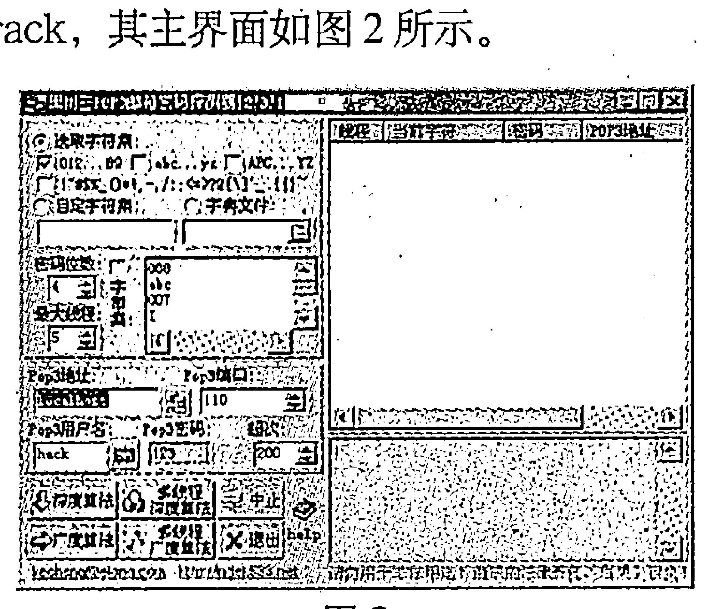

各项的含义如下：

- 字符方式：提供0, 1, 2..9 a, b, c..z A, B..Z !@$%^...{}! 及密码串为这单个字符的组合；
- 自定义字符：在框中输入连续的字符，如：0 1 2 a b Z c ! ^ u 9 w 一定不要有重复的呀！到时就会用这几个字符的组合生成密码；
- 字典：从电脑里选一个字典文件进行密码录入（选择这个方式后，只能用广度算法）；
- 字串：每输入一个单词，一定要换行，一定不要有空行，但可以加有空格的行；
- 密码位数：本软件支持最多 10 位（字符），如果用字串可以达到 10 位以上；
- 最大线程：最大 50 个线程，但作者建议最好 10 个线程以下；
- 超次：用以防止程序进入等死状态（默认是 200，设定过小，会出现连正确密码也显示错误；设定过大，会出现程序进入死循环状态）；

在“POP3地址”输入框中输入要连接的主机地址，一般都是输入 POP3 服务器地址，当然也可以输入 IP 地址和域名地址都可以（经过实验，输入 IP 地址连接的速度最快）；

在“POP3用户名”输入框中直接输入想要破解用户的名称；

POP3 端口：110。

一切设置好以后，用鼠标单击下面的按钮，选取合适的算法，程序会自动使用密码列表中的密码测试每一个帐号，如果成功，程序将会把用户名显示到结果框中。实际上它只是一个按照输入参数进行机械试验的密码破解软件。不过，这个方法对于以用户名或简单数字、字母作为密码的用户有效。

就通过这么简单的操作，黑客就能把邮箱密码给破解了。所以，用户在设置密码时，最好就不要有懒惰的心理，尽量不要把自己的E-mail密码设为自己的生日、姓名等等的简单密码。

另外，值得庆幸的是，提供E-mail的网站针对这种破解邮箱密码的软件的出现也制定了一些措施并设置了一些规则，一般来说，如果在几次之内，输入的密码不正确的话，就要中断服务器的连接，这样会使破解信箱密码难上加难。所以防范这种软件的关键，还是要求上网用户尽量把自己的邮箱密码设得复杂些。

#### （三）“*”号密码破解

有些网站在用户输入相关密码时，都是以“*”来表示的，而且在完成操作以后，有时会把所输入的密码保留在Cookie里，以后只要输入相关的用户名，其密码信息便能自动以“*”出现在输入框中，这一方面方便了操作；但另一方面，别人可以通过破解“*”号密码的工具来偷窃你的密码信息，给用户的个人信息安全构成严重威胁。在这里，我们为读者介绍两款比较常见的这类工具软件。

“123 Password Recovery”就是一款破解“*”的软件。“123 Password Recovery”的使用十分简单，当我们运行之后，出现一个很小的程序框，如图3所示。

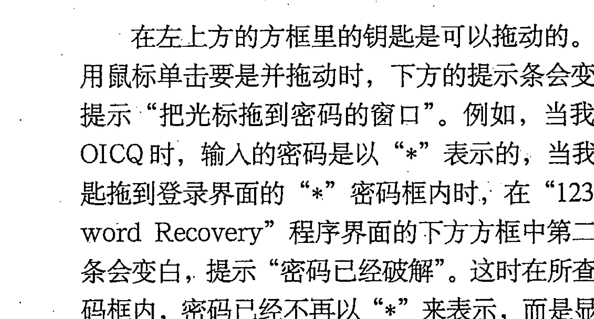

在左上方的方框里的钥匙是可以拖动的。当我们用鼠标单击钥匙并拖动时，下方的提示条会变白，并提示“把光标拖到密码的窗口”。例如，当我们登录OICQ时，输入的密码是以“*”表示的，当我们把钥匙拖到登录界面的“*”密码框内时，在“123 Password Recovery”程序界面的下方方框中第二个提示条会变白，提示“密码已经破解”。这时在所查看的密码框内，密码已经不再以“*”来表示，而是显示出原来的字样。如图4所示。

Get Password也是一款查看隐藏在星号后面密码的软件，文件大小为196KB。它的执行界面如图5所示。打开要查看密码的程序后，将鼠标指针移到显示密码星号的编辑区域，然后按F9键，即可将Get Password程序的工作窗口调到前台，在其中的对话框中会显示出隐藏在星号后面的密码字符。

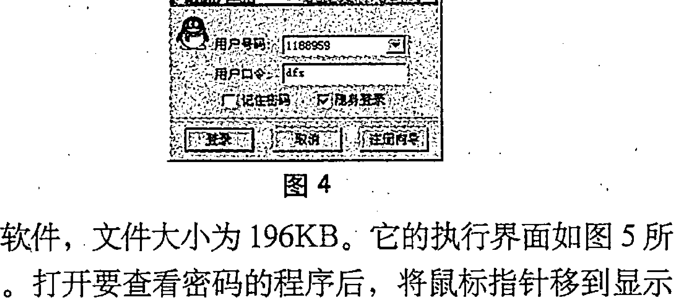

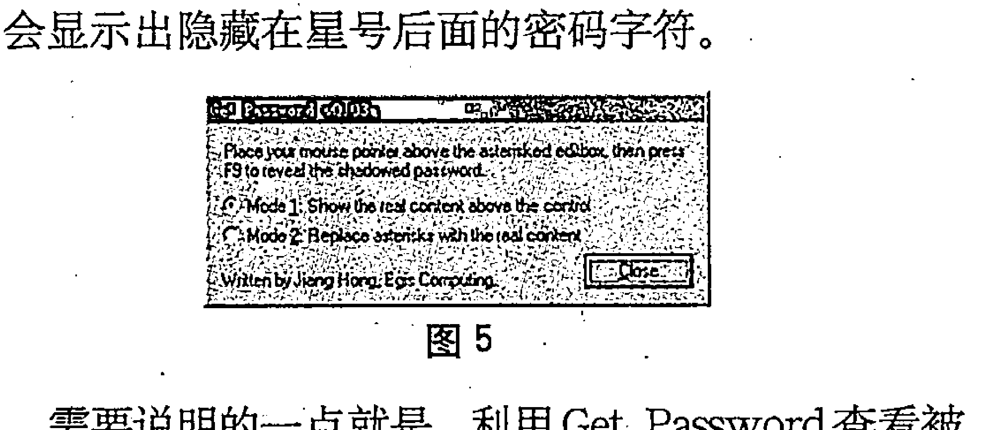

需要说明的一点就是，利用Get Password查看被隐藏的密码的时候，可以在主窗口中选择提取密码的方式两种方式之一。第一种是在密码框上面绘出密码，当窗口被重画之后（比如切换到了别的程序，或者窗口移动到了屏幕外面），密码框会恢复原来的样子；第二种是干脆把一堆星号换成真正的密码，当窗口关闭后再次打开，密码框也会恢复原状。

除了以上的两款工具软件外，同类的软件还有“密码查看器”、“东日看星星”等，这里不予赘述。它们都属于那种“术业有专攻”的程序，只完成一个功能。在这里还要向读者建议，除了了解黑客如何使用这些软件来进行破解用户密码，当我们不小心忘记了重要的密码的时候，也可以用这些工具来取回密码。

#### （四）如何防范密码破解

通过以上的介绍，我们可以对黑客破解密码的一般方法有所了解，从中我们可以看出，黑客往往利用用户的操作疏忽和密码设置缺陷来进行破解的。我们在这里向读者提出几个防止密码被盗的建议。

- 1. 密码必须设置的长一些，并设置得足够复杂，最好在密码中把数字、字母和其他不常用的字符混合设置。
- 2. 在操作过程中不要选择密码。因为选择了保存密码，Windows就会将密码保存到电脑里，它会给这个密码起一个后缀为pwl的文件，别人接触你的电脑就能很容易地看到这个文件，密码也就会暴露无遗。假如有黑客从网络上进入你的电脑，就可以用黑客程序攻破系统，找到你保存的密码文件，并获取你的上网账号和密码。比如当你在拨号上网的时候不保存密码，你的电脑里就不会有后缀为pwl的有关密码的文件，黑客也就不好窃取。
- 3. 设置不同的密码。网络上要求你设置密码的地方

### 二、防范木马程序

特洛伊木马是 Trojan Horse 的中译，是借自“木马屠城记”中那只木马的名字。古希腊有大军围攻特洛伊城，逾年无法攻下。有人献计制造一只高二丈的大木马假装作战马神，攻击数天后仍然无功，遂留下木马拔营而去。城中得到解围的消息，及得到“木马”这个奇异的战利品，全城饮酒狂欢。到午夜时份，全城军民尽入梦乡，匿于木马中的将士打开秘门游绳而下，开启城门及四处纵火，城外伏兵涌入，焚屠特洛伊城。后世称这只木马为“特洛伊木马”，现今计算机术语借用其名，意思是“一经进入，后患无穷”。它是一种基于远程控制的黑客工具。在黑客进行的各种攻击行为中，木马都起到了开路先锋的作用。

#### （一）木马的原理和危害

特洛伊木马属于客户/服务模式。它分为两大部分，即客户端和服务端。其原理是一台主机提供服务（服务器），另一台主机接受服务（客户机），作为服务器的主机一般会打开一个默认的端口进行监听。如果有客户机向服务器的这一端口提出连接请求，服务器上的相应程序就会自动运行，来应答客户机的请求。这个程序被称为守护进程。

众所周知，基于TCP/IP协议接入互联网的电脑有0到65535（共256×256个）的端口。通常我们上网的时候，电脑通过139端口与外界保持联系。运行了木马程序的“服务器”以后，你的电脑就会有另一个或几个端口被打开，使黑客可以利用这些打开的端口进入你的系统，你的系统安全和个人隐私也就全无保障了！

相信木马对于众多网民来说不算陌生。它是一种远程控制工具，以简便、易行、有效而深受广大黑客青睐。一台电脑一旦中上木马，它就变成了一台傀儡机，对方可以在你的电脑上上传下载文件，偷窥你的私人文件，偷取你的各种密码及口令信息……中了木马你的一切秘密都将暴露在别人面前，隐私？不复存在！

木马在黑客入侵中也是一种不可缺少的工具。就在去年的10月28日，一个黑客入侵了美国微软的门户网站，而网站的一些内部信息则是被一种叫做QAZ的木马传出去的。就是这小小的QAZ让庞大的微软丢尽了颜面！

为进一步了解木马，我们来看看它们的隐藏方式，木马隐藏方法主要有以下几种：

- 1. 在任务栏里隐藏

这是最基本的。如果在Windows的任务栏出现莫名其妙的图标，傻子都会明白怎么回事。在VB中，只要把form的Visible属性设置为False，ShowInTaskBar设为False程序就不会出现在任务栏里了。

- 2. 在任务管理器里隐藏

查看正在运行的进程最简单的方法就是按下Ctrl+Alt+Del时出现的任务管理器。如果你按下Ctrl+Alt+Del后可以看见一个木马程序在运行，那么这个“木马”肯定只是个“劣马”。那些厉害的木马总是千方百计的伪装自己，使自己不出现在任务管理器里，或者把自己设为“系统服务”来骗过检查，因此，希望通过按Ctrl+Alt+Del发现木马是不太现实的！

- 3. 端口

一台计算机有65536个端口，你会注意这么多端口么？而木马就很注意你的端口。如果你稍微留意一下，不难发现，大多数木马使用的端口在1024以上，而且呈越来越大的趋势。当然也有占用1024以下端口的木马。但这些端口是常用端口，占用这些端口可能会造成系统不正常。这样的话，木马就会很容易暴露。也许你知道一些木马占用的端口，你或许会经常扫描这些端口，但现在的木马都提供端口修改功能，你有时间扫描65536个端口么？

- 4. 木马的加载方式隐蔽

木马加载的方式可以说千奇百怪，无奇不有。但殊途同归，都为了达到一个共同的目的，那就是使你运行木马的服务端程序。如果木马不加任何伪装。就告诉你这是木马，你会运行它才怪呢。而随着网站互动化进程的不断进步，越来越多的东西可以成为木马的传播介质，JavaScript、VBScript、ActiveX、XLM……几乎WWW每一个新功能都会导致木马的快速进化。

- 5. 木马的命名

木马服务端程序的命名也有很大的学问，如果你不做任何修改的话，就使用原来的名字。谁不知道这是个木马程序呢？所以木马的命名也是千奇百怪。不过大多是改为和系统文件名差不多的名字，如果你对系统文件不够了解，那可就危险了。例如有的木马把名字改为window.exe，如果不告诉你这是木马的话，

##### 6. 最新隐身技术

目前，除了以上所常用的隐身技术，又出现了一种更新、更隐蔽的方法。那就是修改虚拟设备驱动程序（vxd）或修改动态连接库（DLL）。这种方法与一般方法不同，它基本上摆脱了原有的木马模式——监听端口，而采用替代系统功能的方法（改写vxd或DLL文件），木马会将修改后的DLL替换系统已知的DLL，并对所有的函数调用进行过滤。对于常用的调用，使用函数转发器直接转发给被替换的系统DLL，对于一些事先约定好的特种情况，DLL会执行一些相应的操作。实际上这样的木马多只是使用DLL进行监听，一旦发现控制端的连接请求就激活自身，绑在一个进程上进行正常的木马操作。这样做的好处是没有增加新的文件，不需要打开新的端口，没有新的进程，使用常规的方法监测不到它，在正常运行时木马几乎没有任何症状，而一旦木马的控制端向被控制端发出特定的信息后，隐藏的程序就立即开始运作。

下面将结合笔者们的实战经验，给大家介绍几种常见的木马软件的原理、症状及其防范措施。

#### （二）防范“冰河”木马程序

冰河是最优秀的国产木马程序之一，同时也是被使用最多的一种木马，如果这个软件做成规规矩矩的商业用远程控制软件，绝对不会逊于那个体积庞大、操作复杂的PCanywhere，但可惜的是，它最终变成了黑客常用的工具。目前的最高版本是8.0，由于它是国产软件，所以大多数网络黑客在初期都以它用来作为入门程序。冰河面世后，以它简单的操作方法和强大的控制能力令人胆寒，可以说是达到了谈“冰”色变的地步。

目前，冰河还在不断更新，进行版本升级，对其默认配置进行修改，来躲避杀毒软件的查杀。冰河8.0的程序界面如图6所示。那些对你的电脑不怀好意的人，就是用这个控制软件在网络的另一头，在你没有察觉的情况下，严重危害你的电脑，可以完全控制你的电脑，偷到你的电脑上的一切文件，破坏你的电脑，而这一切，你很难发现，这是很可怕的。

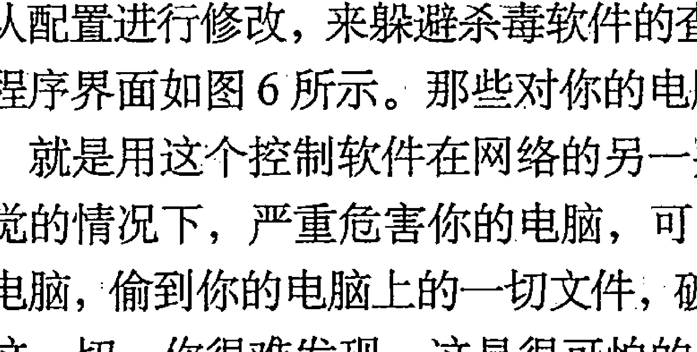

冰河 8.0 也是由以下4个文件组成：

- (1) G_Server.exe: 被监控端后台监控程序，在安装前可以先通过“G_Client.exe”进行一些特殊配置，例如是否将动态IP发送到指定信箱、改变监听端口、设置访问口令等。黑客们想方设法对它进行伪装，用各种方法将服务器端程序安装在你的电脑上，程序运行的时候一点痕迹也没有，你是很难发现有木马冰河在你的电脑上运行的；
- (2) G_Client.exe: 监控端执行程序，用于监控远程计算机和配置服务器程序；
- (3) Operate.ini: G_Server.exe的配置文件；
- (4) Readme.txt: 帮助文件。

你的电脑一旦被黑客植入“冰河”木马程序，其后果将不堪设想，一般来说，木马运行的时候有以下征兆：

- 电脑莫名其妙地死机或重启；
- 硬盘在无操作的情况下频繁被访问；
- 系统无端搜索软驱、光驱；
- 系统速度异常缓慢，系统资源占用率过高。

这些时候你就要格外小心了！你很可能已经和“木马”发生了“亲密接触”！除以上的判断方法外，在防范“冰河”木马方面，可以采取以下一些建议和方法。

##### 1. 端口扫描

端口扫描是检查远程计算机有无木马的最好办法，端口扫描的原理非常简单，扫描程序尝试连接某个端口，如果成功，则说明端口开放，如果失败或超过某个特定的时间（超时），则说明端口关闭。

##### 2. 查看连接

查看连接和端口扫描的原理基本相同，不过是在本地机上通过netstat –a（或某个第三方的程序）查看所有的TCP/UDP连接，查看连接要比端口扫描快，缺点同样是无法查出驱动程序 / 动态链接木马，而且仅仅能在本地使用。

##### 3. 观察目录

普通用户应当经常观察位于“c：\、c：\windows、c：\windows\system”这三个目录下的文件。用“记事本”逐一打开“c：\”下的非执行类文件（除exe、bat、com以外的文件），查看是否发现特洛伊木马、击键程序的记录文件，在“c：\ Windows”或“c：\ Windows\system”下如果存在只有文件名没有图标的可执行程序，你应该把它们删除，然后再用杀毒软件进行认真的清理。

##### 4. 检查注册表

察看注册表的HKEY_LOCAL_MACHINE\SOFTWARE\Microsoft\Windows\CurrenVersion和HKEY_CURRENT_USER\Software\Microsoft\Windows\Current Version下所有以“Run”开头的键值名，其下有没有可疑的文件名。如果有，就需要删除相应的键值，再删除相应的应用程序。

##### 5. 检查启动组

木马们如果隐藏在启动组虽然不是十分隐蔽，但这里的确是自动加载运行的好场所，因此还是有木马喜欢在这里驻留的。启动组对应的文件夹为 C:\windows\start menu\programs\startup，在注册表中的位置：HKEY_CURRENT_USER\Software\Microsoft\Windows\CurrentVersion\Explorer\Shell Folders Startup= “C:\windows\startmenu\programs\startup”。要注意经常检查这两个地方哦！

##### 6. 使用杀毒软件

现在国内的杀毒软件都推出了清除某些特洛伊木马的功能，如KV3000、瑞星、金山毒霸等等，可以不定期地在脱机的情况下进行检查和清除。另外，杀毒软件还提供网络实时监控功能，这一功能可以在黑客从远端执行用户计算机上的文件时，提供报警或让执行失败，使黑客向用户计算机上载可执行文件后无法执行，从而避免了进一步的损失，但是要记住，杀毒软件不是万能的。

##### 7. 使用防火墙软件

可以使用防火墙软件和各种反黑软件，用它们筑起网上的马其诺防线，这样在上网时，会安全许多。网上防火墙软件很多，如“天网防火墙个人版”、“zonealarm”等等。

##### 8. 提高防范意识

不要打开陌生人信中的附件，哪怕他说的天花乱坠，熟人的也要确认一下来信的原地址是否合法。

如果发现自己的计算机中了冰河木马，那么，也不用着急，一般来说，木马的查杀，可以采用自动和手动两种方式。最简单的删除木马的方法是安装杀毒软件(自动)，现在很多杀毒软件能删除网络最猖獗的木马，建议安装金山毒霸或安全之星XP，它们在查杀木马方面有自己独特的一套。或者是使用专门的木马清除工具，如 The Cleaner。

不过，由于杀毒软件的升级多数情况下慢于木马的出现，因此学会手工查杀也是非常必要的。一般来说，“冰河”客户端程序的自我保护的设定是与TXT文件或EXE文件关联的，其关联的文件是sysexplr.exe，所以还要把关联更改。如果是和文本文件关联的，你还必须把文本文件跟 notepad 关联上，方法如下：

按住Shift键的同时鼠标右击任何一个TXT文件，选择打开方式，选中“始终用该程序打开……”然后在程序选择列表中选择 notepad 就可以了。

如果是与 EXE 文件关联的，那么应该用注册表编辑器在 HKEY_CLASSES_ROOT\.EXE 中把“默认”的键值进行修改(注意要看清楚，下面还要改回来的)，完成后退出 Windows，然后在DOS状态下删除该“冰河”用户端程序，重新启动，并把EXE文件的注册表改回来才算是大功告成。

#### （三）防范 BO2000

BO2K全名为Back Orifice 2000，是一个名为“死牛之祭”(Cult of the Dead Cow) 的黑客组织发布的木马程序。发布一个星期不到，下载次数就达到十几万。“死牛之祭”这个黑客组织还专门为BO2K申请了一个顶级域名，可见其威力之大。让网民们心有余悸的 BO1.2 就已经够厉害了，BO2K 究竟如何呢？与 BO1.2 版本相比，BO2K 新增了许多功能，其中最引人瞩目的就是增加了对 Windows NT 的支持。

BO2000 主要由以下三个程序组成：

- (1) bo2k.exe：这是服务器程序，它的作用就是负责执行入侵者所下的命令，这个程序其实就是特洛伊木马入侵程序的主体，因为它要偷偷地放入到被入侵者的电脑里面，这样我们才可以通过它执行我们想要的动作。你可以将它的服务器程序作为电子邮件的附件而发送给对方，它可以正常地运行在安装了 Windows 95、Windows 98和 Windows NT 的计算机当中；
- (2) bo2kgui.exe：这是BO2K 的控制程序，其主要作用就是用来控制服务器程序执行我们想要的命令。当对方执行了该服务器程序后，你就可以使用 BO2K 的远程控制程序，通过网络连接获得对方系统的完全访问权限；
- (3) bo2kcfg.exe：这是服务器设置程序，在使用 boserve.exe 服务器程序之前，有一些相关的功能必须通过它来进行设置。如：使用的 TCP/IP 端口、程序名称、密码等。另外，BO2K 还支持插件功能，这样你就可以自己编写功能更强的插件来扩展BO2K的功能。

BO2K 服务器的配置相当简单，程序提供的向导会指导用户进行几个设置，包括服务器文件名 (可执行文件)；网络协议 (TCP 或 UDP)、端口、密码等。你只要根据其配置向导进行选择就可以了。

BO2K 功能强大，如果你的计算机被 BO2K 控制将十分危险，上网就毫无安全感可言了，而且还可能被他人利用作些违法之事后栽赃嫁祸，因此充分认识它的危害性是必要的，但我们也大可不必因噎废食，毕竟它只是个“后门”工具，只要我们小心谨慎，不随便运行来路不明的软件，也不轻易相信他人，完全可以避免攻击，即使中了 BO2K 也不必害怕，下面就谈谈如何清除 BO2K，具体方法如下。

##### 1. 利用注册表清除

BO2K在Windows 95/98系统注册表中注册信息的位置是：HKEY_LOCAL_MACHINE\ SOFT-## 2. 直接在系统中查找

在 Windows 98 中，运行 msconfig，在启动项下禁用 BO2K（即你判断是 BO2K 的那个名字），然后到 C:\Windows\System 下删除。此法用于不敢对注册表下手的人。在 Windows NT 中，到服务器管理中的服务查看可疑服务然后禁用该服务，再到 C:\Winnt\System32 中查找可疑程序（通过日期和文件大小查找法），用 UltraEdit32 来判断是否为 BO2K，找到即删除。

##### 3. 使用杀毒软件清除

这是最简单方便的办法。很遗憾到目前我国的杀毒软件尚未宣称可以清除 BO2K，国外已有很多杀毒软件可以清除，如著名的 Norton AntiVirus，笔者比较推崇的一个软件，它就是 The Cleaner，该软件专门清除各类特洛伊木马，可到 http://www.moosoft.com/cleaner.php3 下载。因 BO2K 公布源代码，其功能和特性不断改善，查杀难度也就越来越大，因此，必须不断更新病毒数据库。

以毒攻毒 遭到利用 BO2K 客户端程序 bo2kgui.exe 来“删除”，首先用上面方法找到“C:\Winnt\System32（或 C:\Windows\System）”下的 BO2K 程序，用 UltraEdit32 打开查看 BO2K 所用端口、密码（都是以明文形式存储在文件中），然后用该端口密码与服务端程序连接，使用 Delete（删除）参数下达 Shutdown Server 命令，删除 BO 服务器（这时已删除注册表中内容），重启动后再删除“C:\Winnt\System32（或 C:\Windows\System）”目录下的 BO2K。

##### 4. 要防止黑客在你的计算机上植入 BO2K

要防止黑客在你的计算机上植入 BO2K，还要做到以下几点：

- 1. 保证计算机的物理安全；
- 2. 不要在网上随便相信一个不认识的人；
- 3. 不要轻易的运行来历不明的软件；
- 4. 经常更新杀毒软件，并不时查杀系统中的病毒；
- 5. 设置好的密码，平时不要偷懒让 IE 记住密码；
- 6. 使用个人防火墙，监控自己计算机上所有程序的网络活动，尽量关闭不必要的网络连接。

BO2K 的功能虽然很强大，但如果你了解它的工作原理，加强防范，是完全可以避免受到黑客攻击的。

### 三、防范网络监听工具 Sniffer

网络监听是一种监视网络状态、数据流以及网络上传输信息的管理工具，它可以将网络接口设置在监听模式，并且可以截获网上传输的信息，使用网络监听可以有效地截获网上的数据，这是黑客使用最多的方法，Sniffer 就是一种黑客常用的网络监听工具软件。

#### （一）Sniffer 的工作原理

大多数的黑客仅仅为了探测内部网上的主机并取得控制权，只有那些“雄心勃勃”的黑客，为了控制整个网络才会安装特洛伊木马和后门程序，并清除记录。他们经常使用的手法是安装 Sniffer。

在内部网上，黑客要想迅速获得大量的账号（包括用户名和密码），最为有效的手段是使用“Sniffer”程序。这种方法要求运行 Sniffer 程序的主机和被监听的主机必须在同一个以太网段上，故而在外部主机上运行 Sniffer 是没有效果的。再者，必须以 root 的身份使用 Sniffer 程序，才能够监听到以太网段上的数据流。黑客会使用各种方法，获得系统的控制权并留下再次侵入的后门，以保证 Sniffer 能够执行。在 Solaris 2.x 平台上，Sniffer 程序通常被安装在 /usr/bin 或 /dev 目录下。黑客还会巧妙的修改时间，使得 Sniffer 程序看上去是和其它系统程序同时安装的。

大多数“Ethernet Sniffer”程序在后台运行，将结果输出到某个记录文件中。黑客常常会修改 ps 程序，使得系统管理员很难发现运行的 Sniffer 程序。“Ethernet Sniffer”程序将系统的网络接口设定为混合模式。这样，它就可以监听到所有流经同一以太网网段的数据包，不管它的接受者或发送者是不是运行 Sniffer 的主机。程序将用户名、密码和其它黑客感兴趣的数据存入 log 文件。黑客会等待一段时间——比如一周后，再回到这里下载记录文件。

通常在同一个网段的所有网络接口都有访问在物理媒体上传输的所有数据的能力，而每个网络接口都还应该有一个硬件地址，该硬件地址不同于网络中存在的其它网络接口的硬件地址，同时，每个网络至少还要一个广播地址（代表所有的接口地址），在正常情况下，一个合法的网络接口应该只响应这样的两种数据帧：

(1) 帧的目标区域具有和本地网络接口相匹配的硬件地址；
(2) 帧的目标区域具有“广播地址”。

在接受到上面两种情况的数据包时，NIC通过CPU产生一个硬件中断，该中断能引起操作系统注意，然后将帧中所包含的数据传送给系统进一步处理。而 Sniffer 就是一种能将本地 NIC 状态设成 promiscuous（混杂）状态的软件，当 NIC 处于这种“混杂”方式时，该 NIC 就具备“广播地址”，它对所有遭遇到的每一个帧都产生一个硬件中断以便提醒操作系统处理流经该物理媒体上的每一个报文包（绝大多数的 NIC 具备置成 promiscuous 方式的能力）。可见，Sniffer 工作在网络环境中的底层，它会拦截所有的正在网络上传送的数据，并且通过相应的软件处理，可以实时分析这些数据的内容，进而分析所处的网络状态和整体布局。值得注意的是：Sniffer 是极其安静的，它是一种消极的安全攻击。

#### （二）如何监测主机正在被 Sniffer 窃听

如何才知道有没有 Sniffer 在自己的系统上运行呢？这也是一个很难简单说明的问题，一般可以通过下面的方法来进行监测。

- 1. 网络通讯掉包率反常的高。通过一些网络软件，你可以看到你的信息包传送情况（不是 Sniffer），像 ping 这样的命令会告诉你掉了百分几的包。如果网络中有人在监听，那么你的信息包传送将无法每次都顺畅的传到目的地（这是由于 Sniffer 拦截每个包导致的）；
- 2. 网络带宽将出现反常。通过某些带宽控制器（通常是防火墙所带），你可以实时看到目前网络带宽的分布情况，如果某台计算机长时间的占用了较大的带宽，这台计算机就有可能被监听。在非高速信道上，如 56K DDN 等，如果网络中存在 Sniffer，你应该也可以察觉出网络通讯速度的变化；
- 3. 通常一个 Sniffer 的记录文件会很快增大并填满文件空间。在一个大型网络中，Sniffer 明显加重计算机负荷，这些警告信息往往能够帮助管理员发现 Sniffer；
- 4. 一个主机上的 Sniffer 会将网络接口置为混杂模式以接收所有数据包。对于某些 UNIX 系统，通过监测混杂模式的网络接口来判断是否被监听。虽然可以在非混杂模式下运行 Sniffer，但这样将只能捕获本机会话。只有混杂模式下的 sniffing 才能捕获以太网中的所有会话，其他模式只能捕获本机会话。

#### （三）Sniffer 的防范

##### 1. 改进交换机

随着交换机的成本和价格的大幅度降低，交换机已成为非常有效的使 Sniffer 失效的设备。目前最常见的交换机在第三层（网络层）根据数据包目标地址进行转发，而很少采用集线器的广播方式，从理论上讲，通过交换设备对网络进行分段后，Sniffer 将无法透过边界而窥探另一边的数据包。但是，请注意：这是在边界设备不转发广播包的情况下（这也是通常的网络情况）。一旦入侵者使用 spoofer 诱骗某个边界设备而将自己的广播包流入不该进入的网段后，原理上还是在一个共享设备端使用 Sniffer，而实际上将是听到了边界的另一边，当然，这样会牵涉到 IP 欺诈和 MAC 欺诈的问题，然而，你别忘了，Sniffer 和 spoofer 是很少分开来的。

过交换设备对网络进行分段后，Sniffer 将无法透过边界而窥探另一边的数据包。但是，请注意：这是在边界设备不转发广播包的情况下（这也是通常的网络情况）。一旦入侵者使用 spoofer 诱骗某个边界设备而将自己的广播包流入不该进入的网段后，原理上还是在一个共享设备端使用 Sniffer，而实际上将是听到了边界的另一边，当然，这样会牵涉到 IP 欺诈和 MAC 欺诈的问题，然而，你别忘了，Sniffer 和 spoofer 是很少分开来的。

##### 2. 信息加密

Sniffer 依然可以监视到信息的传送，但是显示的是乱码。一些加密技术的缺点是速度问题和使用一个弱加密术比较容易被攻破。几乎所有的加密技术都将导致网络的延迟，加密越复杂，网络速度就越慢。系统管理员和用户需要在某个地方折中一下。如果一个黑客正在你的网络上运行 Sniffer 并发现所有收集到的资料都是乱码，那么大多数会转移到其他的没有使用加密术的站点上。但是如果是一份重要资料，建议你采取复杂的加密手段。

##### 3. 入侵检测

使用诸如 Tripwire 之类的工具，生成文件系统的 MD5“数据指纹”，及时发现被修改的系统文件。

##### 4. 使用 antiSniffer 软件

一些流行的检测 Sniffer 的程序，比如在 http://www.attrition.org/security/newbie/security/sniffer/promisc.c 上有一个很小的 C 程序，当编译成功后，会查找本地计算机上任何处于混杂模式的 NIC 网络适配卡。又如在地址 http://www.attrition.org/security/newbie/security/sniffer/neped.c 上有一个用来远程检查任何嗅探活动的程序，可惜它只能在 LINUX 下编译，当然你也可以使用“ifconfig -a”来检查你的 UNIX 计算机是否有 PROMISC 标志。

### 四、防范网络“炸弹”工具

目前，网络炸弹已从个人电子邮件波及到人烟稠密的 OICQ、ICQ 和新闻组内。根据权威机构对网络用户群体行为的研究报告指出，在众多的网上活动中，除网页浏览外，电子邮件、网上对话和新闻组占了网民们的绝大部分上网时间。换句话说，现在的网上活动大多以讨论或交流的形式进行，也因此 E-mail 炸弹一出现，便引起整个 Internet 的震动。网络炸弹种类众多；最常见的有电子邮件炸弹和网页炸弹，此外还有 OICQ、ICQ 炸弹等。

#### （一）防范邮箱炸弹

收发电子邮件是网友们使用频率最多的互联网应用之一，在享受电子邮件方便快捷的服务的同时，我们还要防范垃圾邮件和邮件炸弹的侵害。电子邮件攻击主要有两种方式：一是电子邮件轰炸和电子邮件“滚雪球”，也就是通常所说的邮件炸弹，指的是用伪造的 IP 地址和电子邮件地址向同一信箱发送数以千计、万计甚至无穷多次的内容相同的垃圾邮件，致使目标邮箱被“撑炸”，严重者可能会给电子邮件服务器系统带来危险，甚至导致瘫痪。发邮件炸弹的工具软件很多，比如像 KaBoom、HakTek 等，下面结合笔者实战经验介绍一下 KaBoom 的使用方法。KaBoom 软件是此类软件的典型，3.0 版的比以前的增强了许多的功能，还可以不间断的发信，常用的匿名邮件服务器的地址列表也做到了程序里，用户还可以自己添加新的功能，再就是可以为所攻击的人订阅一些信量很大的邮件讨论组（邮件讨论组会自动地向指定的地址发送电子邮件）。启动 KaBoom 3.0 后会出现一个小视窗，上面有三个按钮，如图 7 所示，下面我们就分别来介绍一下这三个按钮和菜单选项的功能。

其中，单击 MailBomber 后会出现邮件炸弹的发送界面，然后可以进行邮件炸弹攻击；单击 Mailing Lists 后可以为别人订邮件组。KaBoom 的操作比较简单，这里不予赘述，下面是介绍一下能够有效地防范垃圾邮件和邮件炸弹的措施：

- 1. 应尽量分门别类地使用免费邮箱。互联网上有许多提供免费邮件服务的网站，应申请多个免费信箱，对于不同用途，譬如与亲朋好友通信、订阅电子邮件列表、杂志社投稿等，分门别类地使用不同的信箱。正如股市中的一句俗语所说的，“不要把鸡蛋放在一个篮子里”。这样可以保证在某个邮箱遭受邮件炸弹或垃圾邮件攻击时，其他邮箱仍可正常使用，降低了风险；
- 2. 应尽量减少使用 ISP 提供的信箱，或者干脆将它“束之高阁”。因为 ISP 信箱的密码往往与上网帐户的密码相同，这样可以避免上网密码的泄露或 ISP 信箱遭受邮件炸弹的攻击带来不必要的损失。而且国内一些地方的 ISP 提供的免费邮箱当邮件超过一定体积时收取保管费；
- 3. 用好邮件管理软件的过滤功能。Outlook Express 和 FoxMail 都有很强的邮件过滤功能，可以用此功能来拒收垃圾邮件（可以设定某一主题、正文等），或者可以将文件体积超过一定大小的邮件炸弹拒之门外；
- 4. 小心使用自动回信。有些邮件服务器为了提高服务品质往往设有“自动回信”功能，即对方给你的这个信箱发来一封信而你没有及时收取的话，邮件系统会按照你事先的设定自动给发信人回复一封确认收到的信件。这个功能本来给大家带来了方便，但也有可以制造邮件炸弹！试想一下，如果给你发信的人使用的邮件账号系统也开启了自动回信功能，那么当你收到他发来的信而没有及时收取时，你的系统就会给他自动发送一封确认信。恰巧他在这段时间也没有及时收取信件，那么他的系统又会自动给你发送一封确认收到的信。如此一来，这种自动发送的确认信便会在你们双方的系统中不断重复发送，直到把你们双方的信箱都撑爆为止！现在有些邮件系统虽然采取了措施能够防止这种情况的发生，但是为了慎重起见，你一定要小心使用“自动回信”功能；
- 5. 准备一个专业垃圾邮件清除软件。当你的信箱被垃圾邮件撑得满满的（被炸了），那么你可以试试一些专门的软件来清除垃圾软件，以下是五款常见的垃圾邮件清除软件：Kill the Spam、Spam Buster、E-mail Chomper、Mail Sweep 和飓风邮箱清理器等。

#### （二）防范网页炸弹

网络安全问题越来越被重视，随着网络的不断发展，众多的攻击手法层出不穷，现在就连普通的浏览网页也存在着不安全的因素。很多人可能不能理解，浏览网页有什么不安全的？实际上浏览网页时存在的安全隐患并不小，轻则使系统混乱，重则暴露自己的隐私，甚至使硬盘上的数据遭到破坏。网页是由超文本语句构成的，这些语句一般不会对服务器或浏览者的计算机构成安全“威胁”，但为了具备一些超文本文件所不能完成的功能，网页文件插入了 JavaScript 脚本语言编写的简单程序语句，另外在网页上还可以插入 Java 等功能强大的语言来进行编程，人们可以使用这些语言的目的是使网页能完成更多的工作，但一些居心不良的人可能也会借此编写一些具有破坏性的网页。利用网页对浏览用户进行攻击一般有以下的几种手法：

- 1. 只要稍微懂一点 JavaScript 语言的人，都可以很轻松地编写一个死循环程序，让电脑不断地打开浏览器窗口，占用大部分的系统资源，使电脑反应缓慢甚至死机。对此我们可以使用一些系统任务管理软件 WinTasks2000 来解决，因为在 WinTasks2000 中只会出现一个浏览器任务，只需关掉弹出的窗口即可；
- 2. ActiveX 控件在网页中的应用也比较广泛，通过对 ActiveX 的调用，或者是利用系统漏洞，就可以对硬盘上的文件进行访问，其中包括对文件的读取与改写，这样就有可能暴露用户的隐私，另外利用这一功能对硬盘进行格式化已经不是新闻了。通过这些代码，可以调用硬盘上的“format.com”或“deltree.exe”等文件来对硬盘进行格式化或删除文件，并且这一切都是比较隐蔽的。有可能当你在浏览某个网站时，弹出信息提示你“是否对系统进行网络优化”，如果你轻易选择了“同意”，那么很可能噩梦就此开始，数分钟后你硬盘上的数据将烟消云散。所以大家在上网时对于一些选择性的提示一定要留意，另外可以将“format.exe”和“deltree.exe”等有可能对文件数据造成破坏的程序改名，这样除了可以防止网页上的恶意代码对用户造成损坏，同样也可以避免一些宏病毒发作时造成的破坏；
- 3. 网上又还有一种修改 IE 浏览器标题栏的做法，这同样也是利用 ActiveX 代码来完成的。这种“攻击”所造成的破坏并不大，但将 IE 的标题栏改来改去总让人感觉上不太舒服；
- 4. 同样是利用 ActiveX，还有一种更加高级的手法就是修改注册表。虽然上面介绍的修改 IE 标题栏的方法也是通过修改注册表完成的，但有些网页对注册表进行的是大改特改，甚至可以让你的 Windows 变个模样。在网页代码所引起的安全隐患中，有许多都是通过 ActiveX 来完成的，因此，我们可以关闭 ActiveX 来避免受到这些骚扰。在 IE 的【安全设置】中，关于 ActiveX 的设置选项中有“禁用”、“启用”、“提示”，把 ActiveX 设置为“提示”的状态下仍有可能使 ActiveX 直接运行，这和设置成“启用”没两样。所以大家还是设置为“禁用”的好，但这会使一些正常的 ActiveX 控件无法正常运行，毕竟现在的很多网页都加入了 ActiveX 插件。在浏览不熟悉的网站时，为了系统的安全考虑，防范 ActiveX 攻击是上策。

#### （三）防范 OICQ 炸弹

OICQ 炸弹软件的原理是在瞬间发送大量的垃圾信息，让目标的 OICQ 应接不暇而无法正常使用。其实这种攻击和发普通的消息是一样的，但是它的速度很快，如果你恰好打开了自动弹出消息的功能，那么消息窗口要等到攻击停止才能关掉。

目前这类软件有很多种，比如 OICQjoke、OicqSpy、“飘叶——千夫指”和 OICQsend 就是其中的比较常见的。这些软件的使用都比较简单，只要填入对方的 IP 地址和端口号，然后再填好要发的消息内容以及发送的次数，就可以向对方按规定次数发送了。大家可以看一下 OICQsend 的界面，如图 8 所示。

有如下功能：

- ● 监视别人的 IP 地址和 Port，显示的别人上网的真实地址和上线时间；
- ● 过滤 OICQ 炸弹；
- ● 发送匿名信；
- ● 直接炸 OICQ；
- ● 服务器转发 OICQ 炸弹；
- ● 扫描指定计算机上所有 OICQ（可对代理扫描）；
- ● 扫描指定计算机的 NetBIOS 信息（如工作组、域、计算机名、登录用户名等等）；
- ● OICQ 重新安装时如果朋友很多会无法登录的解决工具；
- ● 查看 OICQ 收到和发出的数据包。

防范 OICQSpy 攻击的方法有两种方法：

1. 因为消息炸弹的本质还是消息，一般防火墙是无法过滤掉，它和你的正常消息是在一起的。所以在 OICQ 里面进行设置来防范是比较合适的。方法如下：

如果给你发消息炸弹的人在你的好友列表里面，先要把他加入黑名单。然后在 OICQ 参数设置的【安全设置】中选中“拒绝陌生人的消息”选项，同时去掉“自动弹出消息”选项，这样就可以防范 OICQ 中“陌生人”的攻击了，如图 9 所示。

OICQjoke 是比较早的 OICQ 攻击软件，每次的攻击次数最多是 999 次，它还可以查看正在实施攻击的用户是否在线。“千夫指”软件的特点是软件中有写好的消息库，发起攻击的人不用自己另外再填写了。

OICQSpy 是一个有多种功能的黑客工具，它主要

2. 另外一种方法是使用软件来进行防范，比如 OICQShield、SOCRSCAP 等软件，其中 SOCRSCAP 能让你的电脑通过代理服务器再和网络相连，这时，对方通过 OICQSpy 看到的你的 IP 地址是个代理服务器的地址，这样一来，黑客通过 OICQ 攻击你的可能性就大大降低，即使你不选中“拒绝所有陌生人的消息”选项也不会被炸了。

（文/高健）