# 电脑爱好者2002合订本（下）正文分册

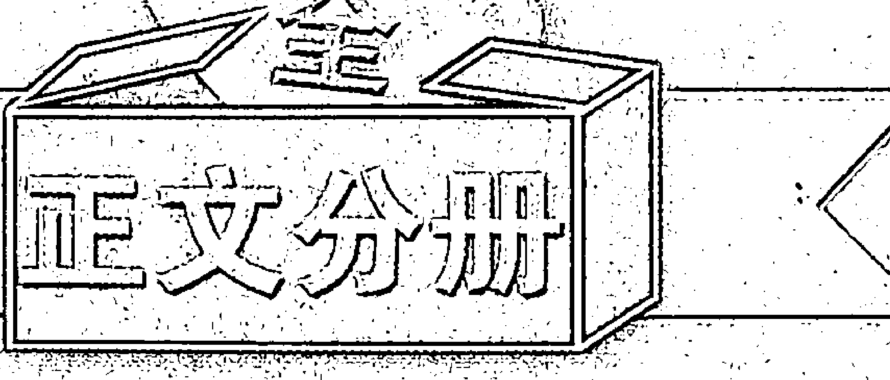

### 800元正版软件大赠送

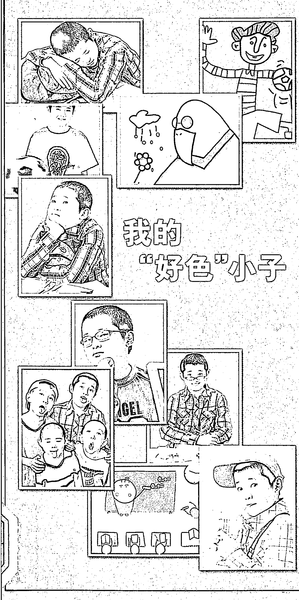

我那个小子，对什么都很“色”。生活不要无色，友情不能单色，功课更要出色。有惠普彩色喷墨打印机的丰富色彩，完美我们一家多姿多彩的生活。不但打造精彩生活，满足儿子和老婆对色彩的狂热，更创造出彩表现，令我事业锦上添花。

信心选择 惠普打印

敬请垂询：800-820-2255或 www.hp.com.cn


### hp deskjet 3420 防尘及体积超小
时尚精巧的家用彩色喷墨打印机
适用于家庭用户

- 高速打印：10PPM(黑色)，8PPM(彩色)
- 分辨率：2400X1200dpi，采用惠普第三代富丽图技术
- 省心省力省空间，重量只有2公斤
- 独特的防尘设计，体积极小的喷墨打印机


### hp deskjet 3325
超值家用彩色喷墨打印机
适用于家庭用户

- 惠普第三代“富丽图”色彩分层技术
- 照片纸上可达1200 x 600dpi分辨率的打印效果
- 打印速度8PPM(黑色)，6PPM(彩色)
- 省心省力省空间


省墨： 无需消耗墨水冲洗墨头 居民共用
省纸： 普通纸上同样精彩
省心： 惠普贴心服务 无忧购买

| 城市 | 公司名 | 电话 |
| :--- | :--- | :--- |
| 北京 | 恒 | 010 82663392 |
| 北京 | 鑫通伟业 | 010 62650126 |
| 洛阳 | 宏运 | 010 62171188 |
| 昆明 | 恒通 | 010 82664940 |
| 上海 | 中恒 | 021 62341383 |
| 上海 | 今明 | 021 63604884 |
| 上海 | 贝特 | 021 62269044 |
| 上海 | 中纺 | 021 52581041 |
| 广州 | 科海 | 020 87549988 |
| 广州 | 华汇电子 | 020 85512600 |
| 广州 | 金百合 | 020 87580664 |
| 广州 | 科辉 | 020 87568208 |
| 广州 | 创思 | 020 87567705 |
| 广州 | 悦达数码 | 020 87597571 |
| 长春 | 佳欣 | 0431 5648811 |
| 长春 | 海科 | 0431 5667716 |
| 大连 | 通网 | 0411 3638580 |
| 大庆 | 庆威 | 0459 5999999 |
| 哈尔滨 | 世纪天诚 | 0451 2564014 |
| 哈尔滨 | 冠达科技 | 0451 2560622 |
| 保定 | 思远 | 0312 3226502 |
| 石家庄 | 新思新世纪 | 0311 7018585 |
| 唐山 | 新达 | 0315 2221166 |
| 济南 | 创远 | 0531 8555743 |
| 庆云 | 普科 | 0531 8580247 |
| 济南 | 九邦 | 0531 8514291 |
| 济南 | 三佳 | 0531 8521698 |
| 济南 | 三联 | 0531 6086351 |
| 济宁 | 亿维 | 0537 2350114 |
| 青岛 | 海洋 | 0532 2717300 |
| 聊安 | 恒田 | 0532 2737714 |
| 烟光 | 凯达 | 0532 5021111 |
| 沈阳 | 金万升 | 024 23981776 |
| 沈阳 | 金三合 | 024 23969071 |
| 沈阳 | 文萃科技 | 024 23926973 |
| 沈阳 | 新北佳 | 024 23926227 |
| 天津 | 大地 | 022 27426888 |
| 天津 | 恩恩 | 022 23006000 |
| 天津 | 恩浩 | 022 27414705 |
| 天津 | 恩威 | 022 23005000 |
| 郑州 | 怡丰 | 0371 3852163 |
| 郑州 | 新教宇 | 0371 3941744 |
| 郑州 | 创达 | 0371 3348966 |
| 成都 | 德格 | 028 85436866 |
| 成都 | 金宝 | 028 85434749 |
| 成都 | 万维数码 | 028 85451371 |
| 成都 | 佳达 | 028 85438960 |
| 成都 | 新讯 | 028 85236318 |
| 眉山 | 仁寿 | 0834 3228358 |
| 绵阳 | 兴众恒 | 0816 2345183 |
| 甘肃 | 一格 | 0931 8263482 |
| 兰州 | 工联 | 0931 8279572 |
| 乌市 | 红帆 | 0991 2330888 |
| 乌市 | 汇通 | 0991 3843654 |
| 乌市 | 捷运 | 0991 5841385 |
| 乌市 | 力胜 | 0991 5825449 |
| 乌市 | 航图联合 | 0991 2834508 |
| 陕西 | 北佳 | 029 5524069 |
| 陕西 | 创信 | 029 5511333 |
| 陕西 | 西软 | 029 2222996 |
| 陕西 | 安成 | 029 5525181 |
| 西宁 | 国源 | 0971 6131979 |
| 湛江 | 麻章 | 0759 66788201 |
| 佛山 | 爱捷 | 0757 2240330 |
| 珠海 | 仓富瑞丰 | 0756 2138915 |
| 珠海 | 胜特 | 0756 2318658 |
| 东莞 | 新胜吉 | 0769 2228599 |
| 汕头 | 天亿龙 | 0754 8166666 |
| 肇庆 | 四海 | 0758 2317169 |
| 莆州 | 佳讯 | 0752 2126037 |
| 福州 | 新润丰 | 0591 3273210 |
| 福州 | 启明 | 0591 3374999 |
| 厦门 | 新泰 | 0592 2201582 |
| 泉州 | 文峰 | 0595 2167627 |
| 武汉 | 天虹 | 027 87885011 |
| 湖北 | 万达 | 0731 4151567 |
| 长沙 | 中税 | 0731 4157716 |
| 深圳 | 佳思特 | 0755 83681024 |
| 深圳 | 深邦鑫里程 | 0755 83665936 |
| 南京 | 思思 | 025 4716982 |
| 常州 | 广仁 | 0519 6649750 |
| 常熟 | 科力 | 0519 6667400 |
| 合肥 | 芝华 | 0551 3632628 |
| 芜湖 | 新佳 | 0553 3814782 |
| 杭州 | 蓝天 | 0571 88210761 |
| 杭州 | 史迪 | 0571 88201158 |
| 杭州 | 浙大田原 | 0571 85026264 |
| 杭州 | 锐捷 | 0571 88271161 |
| 杭州 | 新远方 | 0571 88994940 |
| 宁波 | 锦程 | 0574 87348269 |
| 宁波 | 华力 | 0574 87190992 |
| 宁波 | 天达 | 0574 87683293 |
| 温州 | 思源类 | 0577 88831085 |

## IT设备与时并进，Sony与您并驾齐驱！

中国总代理 HEDY 七喜电脑股份有限公司 电话：(020)82253777 传真：(020)82253887 http://www.hedy.com.cn E-mail：hedy.com.cn

Sony Corporation of Hong Kong Ltd. Electronic Devices Marketing Hong Kong Company 45/F., The Lee Gardens, 33 Hysan Avenue, Causeway Bay, HK 香港铜锣湾希慎道33号利园四十五字楼 Phone：(852)29091008

www.sony.com.cn/electronics/edmh/wais1a.html

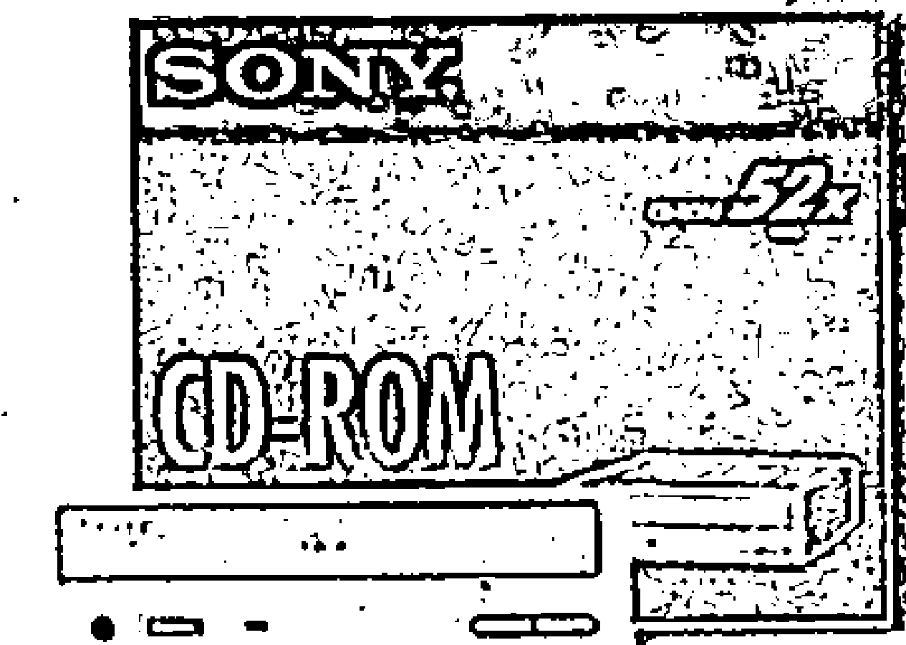

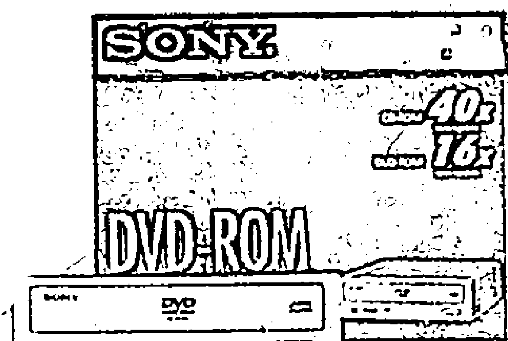

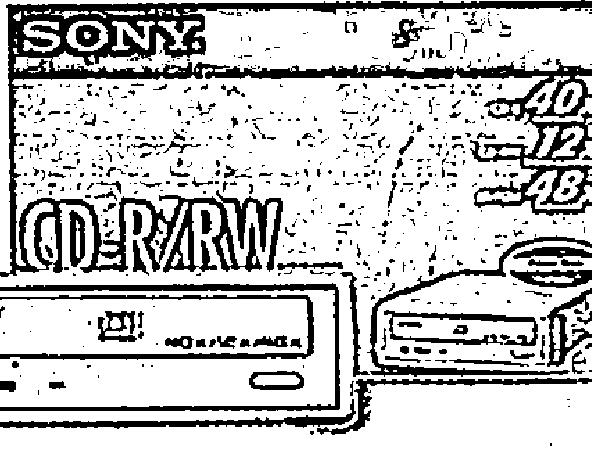

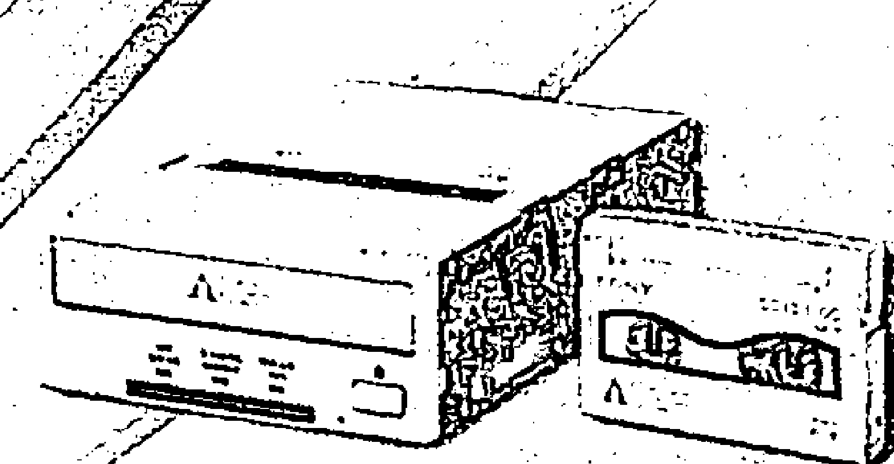

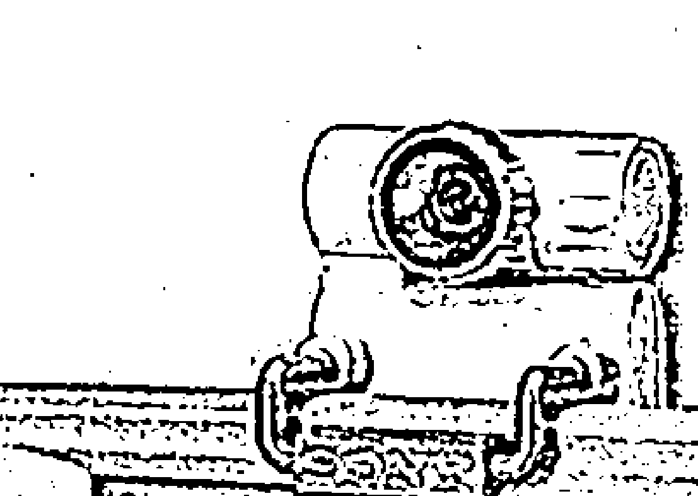

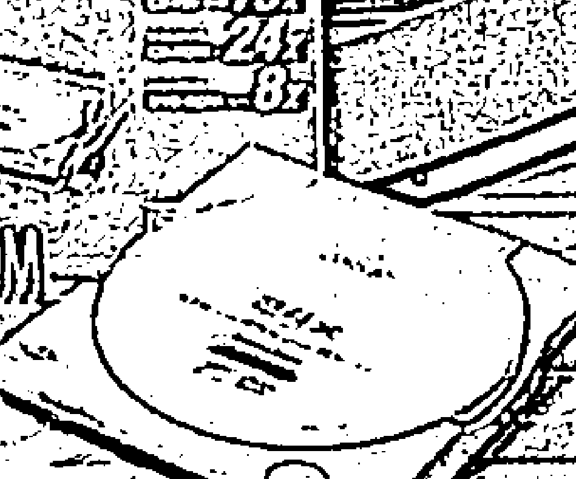

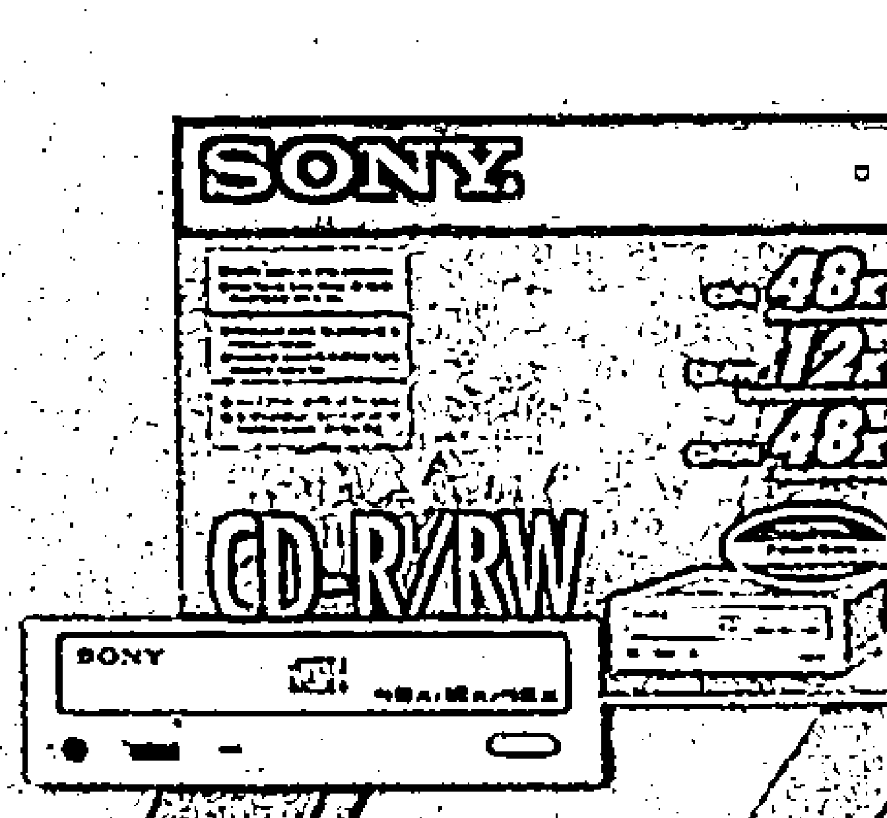

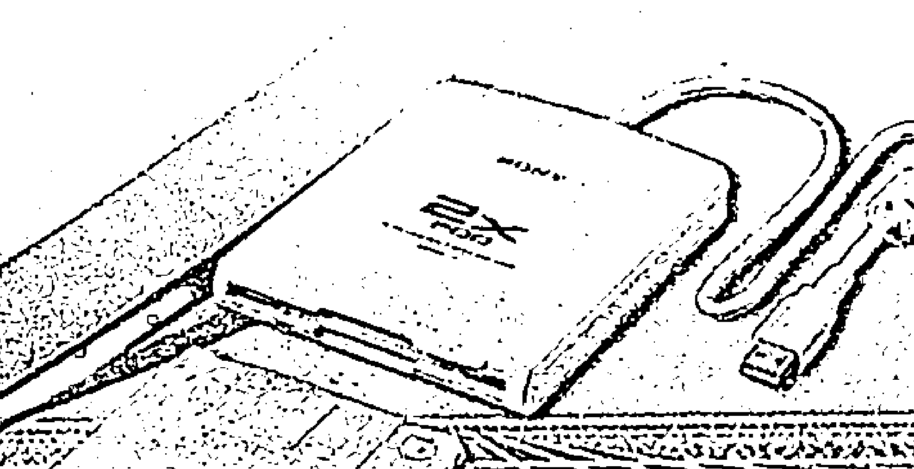

## [统一已经实现！]

### 全新概念「时尚DIY」套装系列产品


智者坐享其成

- 机箱面板采用前卫时尚的蓝色条状指示灯设计，独具个性风采；
- 采用内藏式光驱设计，外观形象不受光驱影响；
- 前置USB接口，设置了四大四小驱动器位置，扩展性更强；
- 选配个性十足的金河田JHT-331低音炮，构建完美的“时尚DIY”。

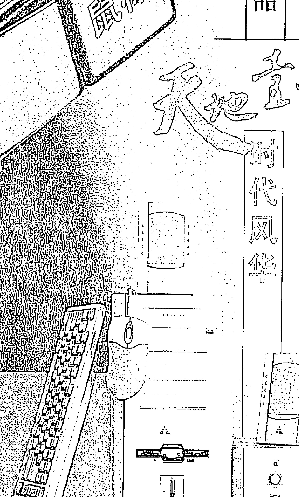

河田销售服务平台 TEL: (0769)5810968 5585691

## 酷炫工程

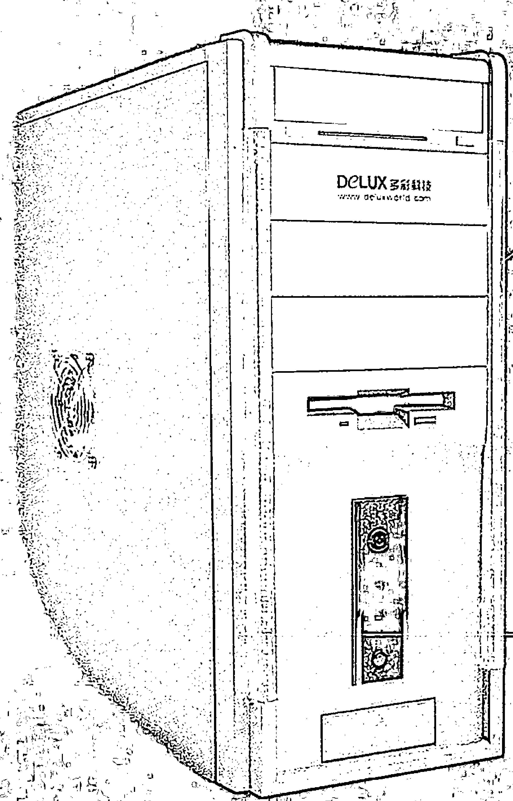

> 「星火之炼，可以燎原」

- 侧置彩灯风扇，通风性强、给箱体一个清凉世界
- 面板两侧闪烁幽蓝灯光，给您营造梦幻境界
- 加长型、四个光驱位可完全利用、自带CD旋转门
- 全屏蔽防电磁辐射、抗干扰、防静电设计
- 前置USB接口，方便USB接口外设的连接
- 采用进口抗指纹、镀锌加厚钢板
- 全折边工艺，100%不伤手设计
- 匹配龙卷风P4电源，强劲动力

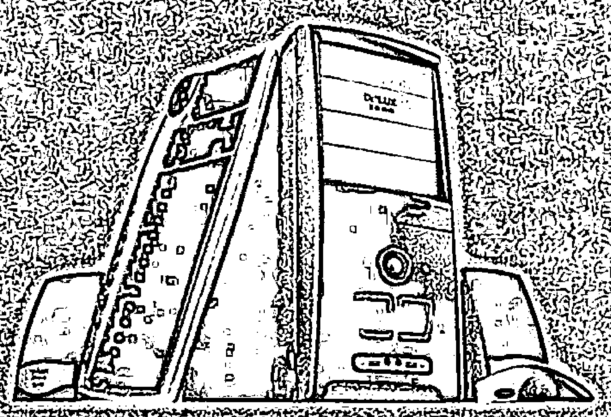

多彩科技 无限空间 ○○○○○

## 分身精灵 多重启动

对多硬盘启动的管理（开机时根据菜单选择任一硬盘启动）

**特点：简单 迅速 稳定 安全**

- 简单：操作简单，根据菜单提示用热键选择相应的启动硬盘。识别简单，放弃以前抽象的HDD0 HDD1等硬盘表示方法改用主IDE口、第二IDE口、master主盘和slave从盘来标示。
- 迅速：从菜单中选定了启动硬盘后立即从该硬盘启动，无须重起电脑。以往的方法需要进入BIOS设定，保存并重起，费时且复杂。
- 稳定：该功能可靠，稳定，并且不会对硬盘的性能和稳定性有任何影响。
- 安全：保证多人多硬盘共用一台PC时的硬盘数据的独立性与安全性。可使用用户只能看见启动硬盘的数据，而无法看见电脑上其它硬盘数据的内容。

## 冰芯精灵 智能降温

1. 系统资源零占用，性能零影响
2. 开机后任何状况都可降温
3. 增强系统稳定性
4. 延长CPU使用寿命

## 超频精灵 PCI分频技术

1. 多重PCI分频技术，最高支持PCI六分频技术
2. 控制PCI最高频率不超过40MHz，保护周边配件使用寿命
3. 大大提高超频成功率，发挥CPU极限性能

## 电源净化器 多重电控

## BIOS双重病毒防护

## 电脑爱好者

## 合订本

## 2002年(下)·正文分册

《电脑爱好者》杂志社 编

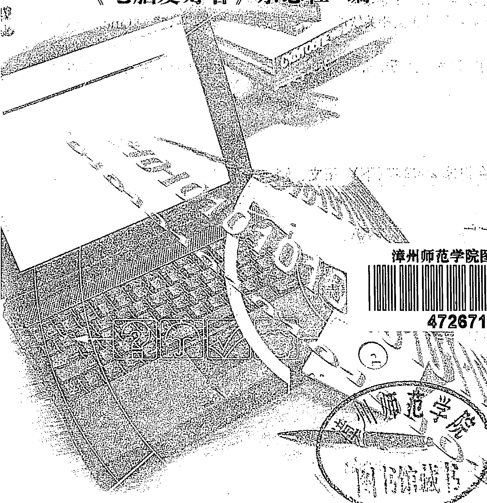

人民邮电出版社

## 电脑的静音空间

## 超大风量 超低静音

联想方正、长城商用
一大著名电脑厂商一致推荐国内十二星品牌

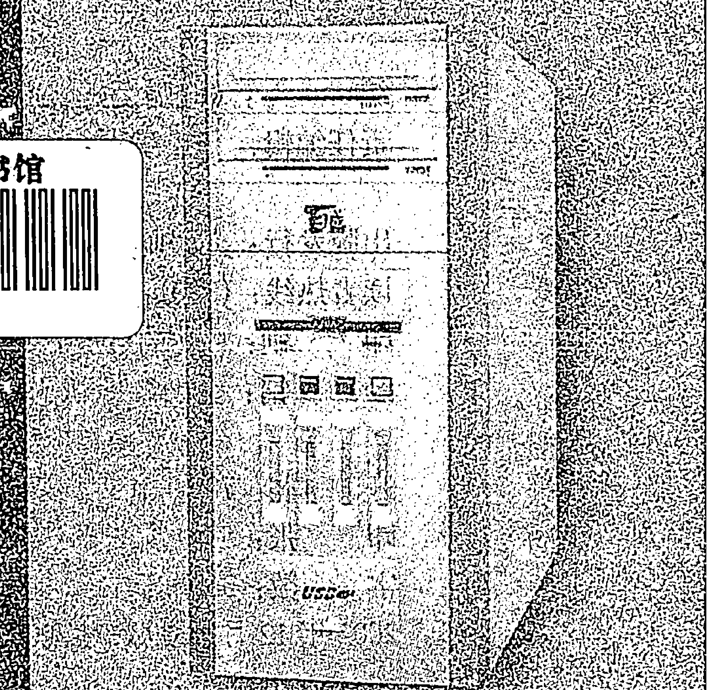

零售价：¥100.00（含光盘一张）

www.belson.com.cn
电话: 0755-2672399  传真: 8008303363

## 图书在版编目（CIP）数据

电脑爱好者合订本.2002年.下／《电脑爱好者》杂志社编.
—北京：人民邮电出版社，2002.12
ISBN 7-115-10784-X
Ⅰ.电… Ⅱ.电… Ⅲ.电子计算机—基本知识 Ⅳ.TP3
中国版本图书馆CIP数据核字（2002）第098251号

## 内容提要

《电脑爱好者合订本》2002年（下）·正文分册是一本囊括杂志2002年13～24期全部内容，并经过二次编校、合理整改、系统分类、科学编排的电脑工具资料书。
全书共分特别话题、软件大世界、硬件新天地、网络任我行、程序谷、市场一览、评测室、业界视窗、傻博士信箱等9大栏目，共1000余篇精品文章，内容涵盖操作系统、实用软件、办公软件、多媒体应用、硬件维护优化、网络原理与应用、编程技巧、市场动态、业界动态等电脑应用领域的方方面面。
图书配套光盘A开设“杂志全年电子检索系统”、“正文相关软件”、“休闲娱乐”、“教学视频”、“Linux专区”等频道，精彩超值，充实丰富。
本书信息量大，覆盖面广，信息全面，内容精练，技巧丰富，查询便利，适合专业人士及全体电脑爱好者参考与收藏。

## 电脑爱好者合订本2002年（下）·正文、附录分册

- 编：《电脑爱好者》杂志社
- 责任编辑：马 嘉
- 出版发行：人民邮电出版社发行 北京市崇文区夕照寺街14号A座(100061)
- 读者热线：(010)62161335/62162598-8603/8610
- 印 刷：中国青年出版社印刷厂
- 经 销：全国各地新华书店

开 本：787×1092 1/16
印 张：55
字 数：3500千字
2002年12月第1版 2002年12月北京第2次印刷

ISBN 7-115-10784-X/TP·3163
定价：35.00元（全套含正文、附录分册及配套双光盘）

本书如有印刷质量问题（错页、掉页、残页等），请您与我们联系，我们负责掉换。
联系电话：(010)62161335/62162598-8218 E-mail:cf_publish@cfan.com.cn
图文版权所有，未经同意不得转载、翻印。

## 电脑爱好者合订本 2002 (下) 正文目录

## 系统应用与维护优化

- 芝麻，开门！芝麻，关门！ ........................... 26
- 开机也有花样玩 ........................... 26
- 关卡，是这样设置的 ........................... 27
- 时间就是金钱——让系统启动得更快 ........................... 27
- 和你的Windows说再见 ........................... 28
- 开机问题全观察 ........................... 28
- 让电脑关闭得更聪明 ........................... 28
- 下马威是这样制造的 ........................... 29
- 下马威之无形手练成 ........................... 29
- 粘人的DOS ........................... 29
- 老人也搞怪 ........................... 30
- 不听话的键盘 ........................... 30
- 离奇古怪的文件夹 ........................... 30
- 注册表来客串 ........................... 30
- 虚幻的桌面 ........................... 31
- 下马威之花样剑谱 ........................... 31
- 相同的窗口 不同的风景 ........................... 31
- Windows家园轻松建 ........................... 31
- 系统生杀大权握手中 ........................... 32
- 量体裁衣并不难——用户环境自己定 ........................... 32
- 合理越位也可以 ........................... 33
- 私家园，非请勿入 ........................... 33
- 硬件配置任你选 ........................... 33
- 多用户安全帮手——嘉馨电脑资料锁 ........................... 34
- 破解Windows中的“生死符”........................... 41
- 第一招 天山折梅手 ........................... 41
- 第二招 天山六阳掌 ........................... 42
- 第三招 北冥神功 ........................... 43
- 绝对新鲜报道——反垄断案给Windows带来的变化 ........................... 47
- 节约内存资源八大法 ........................... 47
- 微软专用启动工具Bootvis ........................... 48
- 任务栏时间信息个性化 ........................... 48
- 注册表加强Windows 9X系统安全完全手册（三）——给我们的系统加一把锁 ........................... 49
- 非法操作的预防 ........................... 50
- 给回收站“挖”个洞 ........................... 50
- 隐藏文件夹的终极方法 ........................... 50
- 揭开Windows隐藏设置的面纱 ........................... 50
- 给鼠标右键“减负”........................... 50
- 妙用Ghost改变分区格式 ........................... 50
- UBD+傻瓜盘<多机克隆Windows XP ........................... 51
- 修复Windows 2000系统又一法 ........................... 52
- 资源管理器也看Flash ........................... 52
- 补丁升级快车道 ........................... 52、58、70、80
- 让REG文件不再罗嗦 ........................... 52
- 联想机双系统安装一例 ........................... 53
- 尝尝分区DIY的“滋味”——分区类型的手工改动 ........................... 53
- “我的电脑”不要别人的文档 ........................... 53
- 一次修复操作系统的经历——移花接木Windows ........................... 53
- 让Windows迷途知返 ........................... 53
- 关机命令Shutdown参数补解 ........................... 53
- 天网防火墙也“疯狂”........................... 53
- DOS系统的安装 ........................... 54
- 离开你的日子更好——让MSN不随OE启动 ........................... 54
- 在Windows XP中使用锁定功能 ........................... 54
- 软件安装的另一个学问 ........................... 54
- 都是IE和CMOS惹的祸 ........................... 54
- Windows不认文件名怎么办？ ........................... 54
- 红心大战赢家秘方 ........................... 54
- 一键关机/重启/注销 ........................... 54
- 硬盘也能Autorun ........................... 55
- 建立个性化的双启动菜单 ........................... 55
- 不管菜鸟、老鸟、会组策略的就是好鸟——看计算机个性化的一道彩虹 ........................... 55
- 谁也别想冒充我——Outlook Express 6.0的邮件防毒功能 ........................... 56
- Internet缘何不能上？ ........................... 56
- 浅谈WMA格式音乐的限制 ........................... 56
- 令Windows XP命令行窗口随心所欲 ........................... 57
- 用Shift键练就十大绝招 ........................... 57
- Windows安装盘上的家珍——将故障恢复控制台安装在硬盘中 ........................... 57
- 另议《Win98中巧“藏”显示属性》........................... 57
- DOS实例手册：恢复误删文件 DOS命令应用实例 ........................... 58
- 绿色软件DIY ........................... 58
- Linux自由之风：自由之旅的准备 ........................... 58
- Linux自由之风：Red Hat Linux 7.3安装 ........................... 64
- Linux自由之风：启动和关闭Linux系统 ........................... 76
- Linux自由之风：做一只会冲浪的“企鹅”........................... 81
- Linux自由之风：Linux下使用你的U盘 ........................... 86
- Linux自由之风：Linux/Windows分区资源共享零距离（上）........................... 88
- Linux自由之风：Linux/Windows分区资源共享零距离（下）........................... 89
- 系统报告可信吗——一次安装ISDN的经历 ........................... 59
- M3U将MP3预览到底 ........................... 59
- 体验没有“鸡肋”的感觉 ........................... 59
- 让你的系统兼容性更好——Application Compatibility ToolKit ........................... 59
- 找不着“北”？——来自专家推荐的14条经典丢失实例 ........................... 60
- 一“码”当关 万夫莫开 ........................... 61
- 新Windows实用技巧6则 ........................... 61
- 救命的Windows第二运行方式 ........................... 62

## “兼容模式”又一春 ........................ 62
## 和哈利波特做同班同学——电脑入门闪亮登场 ......... 168
## Windows 抓图的第二种选择 .................... 63
## 再给注册表加把锁 ........................... 63
## 没有你还有它——巧用键盘 .................... 63
## 为Wininit中的“双刃剑”开锋 ............... 63
## 一句话技巧 ............................. 63、68、79
## 合并VCD片断——Copy的完美解决方案 ........... 63
## 快速删除文件夹——Deltree小试身手 ........... 63
## 一劳永逸——批处理命令（一）................... 76
## 批处理命令应用实例（二）——让CIH永不发作 ..... 77
## 批处理命令应用实例（三）.................... 85
## 鲜为人知的Windows“插件”MSI ............... 65
## 为自己“服务”——这个自动运行有点酷 ......... 66
## 文件名张冠李戴的妙用 ..................... 66
## “造字”共享的误区与解决 ................... 66
## “绝招”也需打假——以讹传讹四例 ............. 67
## “打印机”中隐藏的秘密 ..................... 67
## DOS实例手册：低格与高格的应对 ............. 68
## 洞悉一丝一毫的变化——Windiff ............. 68
## 用Windows唱卡拉OK ...................... 68
## 智能ABC也有3张脸 ......................... 68
## 我的假系统文件夹 .......................... 68
## 你所熟悉的十个电脑误区 .................... 69
## Windows——黑客眼中最美的风景 ............. 69
## 两分钟！一个Windows 98变九个 ............. 70
## 打扮你的“新娘”——给命令提示符“美容” ..... 71
## 记下每次打开“窗户”的时刻 ................. 71
## 驯化Windows XP ........................... 71
## DOS实例手册：清除CMOS密码 Debug简单方便 .... 72
## 老树发新芽——“文件管理器”新用法三则 ....... 72
## 抓住末日前一秒：Windows的故障恢复控制台 .... 72
## 对《Windows的故障恢复控制台》一文的补遗 .... 84
## 十大荒谬的密码认知 ....................... 74
## 好马也吃回头草——Windows组件咸鱼大翻身 ..... 74
## 搜索系统的蛛丝马迹——事件查看器 ........... 77
## 序列号——很少想起的大问题 ................. 78
## 电子日记本又可以用了 ..................... 79
## 自动停止运行屏幕保护程序 ................. 79
## 提取Windows 98安装盘中文件的超级技巧 ...... 80
## 系统“DNA”乾坤大挪移 ..................... 80
## 安装Windows XP SP1全攻略 ................ 81
## Windows XP高级技巧揭秘 ................... 83
## 如何删除右键菜单里的某个项目 ............. 84
## “恢复精灵”带来操作系统安装小烦恼 ......... 84
## 发掘“绿色”简化安装 ..................... 85
## 一张软盘 轻松恢复操作系统 ................ 85
## 设置Windows XP搜索驱动程序的位置 ......... 85
## 用Windows Me启动系统后无法安装Windows 2000 . 86
## 如何找到Windows优化大师的密码 ............. 86
## 如何关闭Windows XP中的缩略图视图缓存 ....... 86
## 解决在Windows 98下无法安装ACDSee 5.0的问题 . 86
## 不显示=删除？——SP让Windows的“排异反应”强烈 ........... 87
## 回音壁 ................................. 87
## 双系统邮件“齐步走” ..................... 87
## 让Windows 98也能够进行“驱动程序签证验证” ... 87
## 用PM修复分区引导记录错误引起的磁盘坏区 .... 87
## 使用U盘更方便 ............................ 87
## DOS经典软件 .............................. 88
## 在刻录光盘中实现软件的模块化安装 ........... 89
## Windows XP命令行小技巧三则 ................ 90
## 故障解决二例 .............................. 90
## 文件关联错误 .............................. 90
## Windows XP启动与小键盘 .................... 90
## 在Windows XP中增添“关闭光驱”命令 ......... 90
## 一次系统故障的排查及思路 ................. 91
## 警惕隐性硬件故障 ......................... 91
## DOS经典游戏：成长的回忆 ................... 91
## 安装SP1之完美解决——创建整合SP1的自启动系统安装盘 .......... 92
## 一张软盘自动备份系统 ..................... 93
## 高手最常用的五个组合键 ................... 94
## 从MCSE考试看Windows的故障恢复控制台——再谈Windows的故障恢复控制台 ............ 94
## Linux应用软件的安装与删除 ............... 94
## 注册表技巧两则 .......................... 94
## 图解MSDOS.SYS .......................... 95
## “绿色”软件中的“杂草” ................... 95
## 出现错误提示“Can't find NTLDR”时怎么办？ ... 95
## 和哈利波特做同班同学之电脑的“抽屉”——文件夹 . 169
## 和哈利波特做同班同学之和电脑交谈——对话框 ... 170
## 和哈利波特做同班同学——学会找东西 ......... 170
## 和哈利波特做同班同学——文件的表情和文件的打开方式 ............ 171
## 和哈利波特做同班同学——文件的属性和文件的操作 ................ 172
## 和哈利波特做同班同学——让自己的电脑与众不同 ................. 173
## 为Windows XP安装NetBEUI协议 ............. 332
## 合适的才是最好的——如何为爱机选配操作系统 ... 401

## 办公与文字处理

## 从零开始——如何做好一个IT撰稿人 .......... 39
## IT撰稿人的要求 ........................... 39
## “精确”找好选题 .......................... 39
## IT稿件的写作方法及注意事项 ............... 39
## 文章写作的格式 ........................... 40
## 写作辅助小技巧 ........................... 40
## 图片的魅力 ............................... 40
## 小编们的“爱与恨” ......................... 40
## 如何给《电脑爱好者》投稿 .................. 41
## 微软Office使用技巧赛作品选登 ............. 96
## 在图片上添加文字 ......................... 96
## 让FLASH影片在PowerPoint中酷闪 ........... 96
## 在Excel中添加纸牌游戏 .................... 96
## 用好格式刷 ............................... 96
## Excel开口说话 ............................ 96
## Word直接调用数据库 ....................... 96
## 让文章对得更齐整 ......................... 96
## 巧妙设定Word启动后的默认文件夹 ........... 96
## 快速选择Excel工作表 ...................... 96
## 活用Word中的“版本”功能 ................. 96
## 创建带有键盘和菜单分配方案的 Word 命令表格 .. 96
## 快捷键之快捷键 ............................ 96
## 快速隐藏选中单元格所在行和列 .............. 96
## 妙用样式“管理器” .......................... 96
## PowerPoint 2002 中的对象交互效果 ........... 97
## Word 文档快速查找 .......................... 97
## 完全隐藏工作表 ............................ 97
## 用 Excel 解数列问题 ........................ 97
## Excel 的跨越合并 ........................... 97
## 竖排页眉你做过吗 .......................... 97
## 网页微调方法 .............................. 97
## 更改纸张大小无需重新排版 .................. 97
## 锁定特殊页的位置 .......................... 97
## 统计工时 .................................. 97
## Excel 中输入法的自动切换 .................. 97
## 内容走 表头不走 ........................... 97
## 进入网页先闪一回 .......................... 97
## 电子名片 Outlook 做 ........................ 97
## 利用拼音指南训练汉语拼音 .................. 97
## 用鼠标右键复制文字 ........................ 97
## PowerPoint 中背景音乐的连续播放 ........... 98
## 最简捷的填充法 ............................ 98
## 使用“选择列表” ............................ 98
## 隐藏 Word 顶部的空白区域 .................. 98
## 它到底用了什么格式 ........................ 98
## 将 Excel 中的一列分为多列 .................. 98
## 巧用 Shift 键选取文字 ...................... 98
## 只按一键 图表尽现 .......................... 98
## 快速输入小数 .............................. 98
## 快速调整行高列宽 .......................... 98
## 自定义工具栏按钮图标 ...................... 98
## 复制图形的快捷键 .......................... 98
## 将图片恢复原貌 ............................ 98
## 在 PowerPoint 里改变公式的颜色 ........... 98
## 快速精确调整表格宽度 ...................... 98
## 批量转换 Word 文档 ........................ 98
## 轻松插入“欧元”符号 ........................ 98
## 巧用 Excel 的网页导入功能 .................. 98
## 改变文本框的形状 .......................... 98
## Word 中如何使用通配符进行查找 ............ 99
## 在 Excel 中快速互换数据 .................... 99
## 禁止 Word 中图形随段落移动 ................ 99
## Excel 中快速选定大面积区域 ................ 99
## 尝尝 Word 后悔药 .......................... 99
## 接受公式标志，简化公式输入 ................ 99
## 字体大小任我调 ............................ 99
## 在 Excel 中多进制转换 ...................... 99
## 复制 Word 格式又一法 ...................... 99
## 在 Word 中实现字典式页眉 .................. 99
## 统计表格 Word 造 .......................... 99
## 两键输入当天日期 .......................... 99
## 大文档的页码编排 .......................... 99
## Word 表格后空白页的处理 .................... 99
## 改变图片形状 .............................. 99
## 轻轻松松网页优化 .......................... 99
## 更换不同段落的格式 ........................ 100
## 快速查看幻灯片动画效果 .................... 100
## 清除 Office 的历史记录 .................... 100
## word 也会画折线 ............................ 100
## PowerPoint 中目录式的跳转 .................. 100
## 快速分别设置中英文字体 .................... 100
## 开关网格线 ................................ 100
## Word 的保护功能 ............................ 100
## 好风格要保持 .............................. 100
## 行首列尾随点随到 .......................... 100
## 适当的位置准确的求和 ........................ 100
## 好样式大家学 .............................. 100
## 打开“影子”文档 ............................ 100
## 表格一次删个光 ............................ 100
## 监视你的单元格 ............................ 100
## 图形变变变 ................................ 101
## 分节文件指哪“打”哪 ........................ 101
## 在 Excel 中为计算结果添加单位 .............. 101
## 在 Word 中标记目录域项 .................... 101
## 字数即时统计 .............................. 101
## 在 Excel 中复制上一单元格 .................. 101
## 清除拼写功能 .............................. 101
## Excel 中巧用排序 .......................... 101
## 如何用 Word 实现快速隔行删除 .............. 101
## 轻松改变菜单栏和工具栏 .................... 101
## 在 PowerPoint 2002 中让物体绕其一端旋转 ... 101
## 用 REPT 工作表函数在某一单元格中多次填写某一字符 101
## 表格居中 .................................. 101
## 如何计算选手最后得分 ...................... 101
## 在 FrontPage 中的回车技巧 ................ 101
## 网站速度一查便知 .......................... 102
## 格式刷妙刷图形 ............................ 102
## 在文档中的任意地方自动插入页码 ............ 102
## 一次插入 N 行 .............................. 102
## 让文字与下划线离远点 ........................ 102
## 巧输成绩 .................................. 102
## 为 Word 文档添加行号 ...................... 102
## Office 助手颇受争议的角色 .................. 102
## 快速查看 Word 内容 ........................ 102
## 快速切换工具 .............................. 102
## 在 Word 中输入当前日期 .................... 102
## 表格的快速缩放 ............................ 102
## 快速给文字加双下划线 ........................ 102
## 快速复制文档副本 .......................... 102
## 显示单元格放不下的数据 .................... 102
## 开启 Internet 忙 / 闲共享 ................ 102
## 合并居中与居中之间的转换 .................. 102
## 让 PowerPoint 产生探照灯效果 .............. 103
## 快速输入 SUM 函数 ........................ 103
## 挖掘 Cell 函数的功能 ...................... 103
## 打开被冻结的邮件附件 ...................... 103
## 多行多列数据转换为单行或单列数据 .......... 103
## 复制 MS-DOS 窗口中的文字到 Word 中 ....... 103
## 设置数值为“0”不显示 ........................ 103
## 轻松转移和备份“自动更正”数据 .............. 103
## 连续播放多个 PowerPoint 文件 .............. 103
## 文字加粗 .................................. 103
## 一列数据快速转换成 m × n 矩阵 ............ 103
## 用 Word 快速制作名片 ........................ 103
## 收回 Word 文档页面插入的页码 ................ 103

## 多媒体应用

- 课件演示，想说交互很容易 - 140
- Authorware 6.0 和 PowerPoint 的互相访问 - 140
- 用 Authorware 制作一支画笔 - 140
- 字幕播放软件 Vobsub ——电影欣赏的好帮手 - 141
- 观赏 DVD 的好帮手——DVDidle - 141
- 在 Flash 中制作透明地球 - 141
- Flash5 中如何将位图矢量化 - 142
- FLASH MTV 音像同步小技巧 - 142
- 在 Authorware 课件中实现文字闪烁 - 142
- VolumeEasy 让你随心所欲调音量 - 142
- 浪漫舞步舞起来 - 142
- DVD 影片格式转换一步到位 - 143
- 让我行动 让你心动——美丽饰品 DIY - 144
- 做一只会动的手臂 ——3DS MAX4 中的非线性动画特性 - 145
- 《金山影霸 2003》试用手记 - 145
- Photoshop 的狂飙 - 146
- Winamp 的慕容家族秘史 - 146
- Winamp 的慕容家族秘史（续） - 148
- 电脑——吉他的第七根弦 - 147
- 学用电脑“烘”面包 - 148
- Flash 的霓虹灯动画效果 - 148
- 穷人自有穷办法——MP3 和磁带间的转录 DIY - 149
- 个性 T 恤任你穿——利用转印纸制作个性 T 恤 - 149
- 新一轮的华山论剑——体验流媒体新版三剑客 - 150
- 一路为你导航——DVD 影碟不能这么看 - 151
- 3DS MAX 的渲染不再漆黑一片 - 151
- 化腐朽为神奇 使模糊变清晰——六头会面如是说 - 152
- 学习 Flash 的一条龙服务 - 152
- 一样的格式，不一样的品质——MP3 应该这样转 - 153
- 飞舞在气泡中的蝴蝶 - 153
- 网络教学好帮手——红蜘蛛多媒体教室 - 154
- 做片头动画就这样简单 - 154
- 浅谈数字视频格式（一）——动画格式 - 155
- 浅谈数字视频格式（二）——流格式 - 159
- 浅谈数字视频格式（三）——MPEG-4 - 162
- CD 的无损压缩——轻松制作 APE 音乐 - 155
- 轻松浏览矢量图——DwgSee - 156
- 需要时大百科就在手边 - 158
- 实用插件三步曲（一）——Windows Media Player 9.0 - 156
- 实用插件三步曲（二）——ACDSee - 157
- 实用插件三步曲（三）——Winamp 还可以玩游戏 - 161
- 经典的三维风景制作软件 Vue 4 - 158
- DV 视频捕捉 - 159
- 构建属于自己的虚拟世界——Atmosphere - 160
- DivX 大片轻松看 - 161
- 用模糊来保护 Flash 代码 - 161
- 方兴未艾的三维全景 - 162
- 打造 ACDSee 的“超级版” - 162
- 高清淅 DivX 电影制作影音篇 - 163
- 多媒体关联的“和平共处” - 163
- 让 ACDSee 为 Photoshop 开一道门 - 163
- 炫出你的虚拟现实 - 164
- 优化 DVD 画面质量的方法 - 164
- 强力 Flash 3D 制作工具 Plasma - 164
- 电子贺卡制作三步曲（上） - 207
- 电子贺卡制作三步曲（下） - 208

## 实用软件与技巧

- 来自 MP3 的天籁之音——Winamp - 165
- 应用软件的安装与卸载 - 166
- 挥一挥手 留下一片云彩——SnagIt 初级指南 - 167
- 万事开头难——开机关机轻松学 - 177
- 我们拥有最棒的桌面 - 178
- 把已安装的驱动程序挖出来——WinDriver Expert - 179
- 锁出你的个性——孔明锁 2.1 - 179
- 备份出你的个性 - 179
- 改进——不改不前进 - 179
- 非法操作前的文件抢救 - 180
- 随心所欲换发型 - 180
- 听遍全世界的声音 - 180
- 一切为了更好的交流——聊天软件备份全攻略 - 181
- 体验 WAP 上网 - 182
- 为搜索“减负” - 182
- 伊妹儿花落何处？ - 182
- 加密光盘何必另花功夫 - 182
- 告别 Photoshop 多窗口的烦恼 - 183
- 轻松管理Flash - 183
- 让我一次用个透——东方大典 II 专业版潜能挖掘 - 183
- Nero-Burning ROM 另类高级玩法 - 183
- 当手机遇上一个爱浪漫的人——个性手机 DIY （一） - 184
- 当手机遇上一个爱浪漫的人——个性手机 DIY （二） - 187
- 你做的开机画面会动吗 - 185
- “文件密使”让数据彻底遁形 - 186
- 做 Flash 教学动画怎么如此简单？！ - 186
- 桌面颜色任你改 - 187
- 开开心心找改进点 - 187
- 给你的 Windows 请门神 - 188
- 签名就是“做秀” - 189
- 我养了一只另类小狗 - 189
- 魔法石 照亮你的桌面 - 190
- 免费打联通 省钱又轻松 - 190
- 开开心心找改进点 - 190
- “输”要“输”得有道理 - 191
- 编辑李红警的数码生活 - 192
- Winamp 3.0 更新换代正式版 - 192
- 物转星移——程序是怎样从 C 盘走到 D 盘的 - 193
- 电脑，助我们学习更好！——仿真物理实验室 - 193
- 电脑，助我们学习更好！ChemLab ——化学实验也要做 - 199
- 电脑，助我们学习更好！——帮你学好数理化 - 202
- 自动运行还可以更精彩 ——刻就刻出“特别精彩”补遗 - 194
- 巧取豪夺不相邻的领土 - 194
- 这样救数据最有效（一） ——格式化与克隆后的数据恢复 - 195
- 这样救数据最有效（二） ——系统崩溃导致的数据丢失 - 196
- 这样救数据最有效（三） ——误删文件与网络删除的恢复 - 196
- 这样救数据最有效（四） ——常见文件受损后的恢复 - 198
- 增强系统安全的好工具——之隐形杀手篇 - 199
- Gif·glf·giF 电脑操作随我录 - 200
- 红警“说”吧 - 200
- 强中自有强中手——东方快车 XP 携手金山词霸 2002 - 200
- 软件让你放下硬件的心——系统硬件鉴别工具总动员 - 200
- 软件可以延长硬件的命——系统硬件辅助工具总动员 - 203
- Daemon Tools 的小伴侣——DaemonUI - 202
- 跨越封锁线的网络骆驼 - 202
- 站内搜索引擎 CSM 的悲剧 - 202
- 桌面也疯狂——Cool Desk 的 9 个桌面 - 204
- EasyRecovery 实用技巧 5 则 - 204
- Title Bar 抬头吧 - 204
- 英文单词音标不求人 - 205
- 能够压缩 MP3 的 DietMP3 - 205
- 用信箱筑起网上硬盘 - 205
- 不一样的带口令加密光盘 - 206
- 让 Flashget 属于自己 - 206
- 文件搜索一秒搞定 - 206
- 软件的注册费只能偶尔买买菜 - 206
- 计划任务的绝对替代品 AutoTask - 207
- 新版 Windows 优化大师特色功能二则 - 208
- 两个窗口的 XP 资源管理器 - 208
- 不可不知的监控与反监控 - 209
- 走进 Word 2000/XP 系列之四——成绩单轻松打 - 104
- 走进 Word 2000/XP 系列之五——报刊杂志轻松编 - 104
- 走进 Word 2000/XP 系列之六——论文轻松编 - 105
- 走进 Word 2000/XP 系列之七——玩转表格 - 106
- 走进 Word 2000/XP 系列之八——玩转超级链接 - 107
- 走进 Word 2000/XP 系列之九——玩转菜单和工具栏 - 107
- 走进 Word 2000/XP 系列之十——玩转注解 - 108
- 学透 Excel 2000/XP 系列之四——创建中意的 Excel 文档 - 109
- 学透 Excel 2000/XP 系列之五——Excel 表格如此打印 - 109
- 学透 Excel 2000/XP 系列之六——表格变图表 - 110
- 学透 Excel 2000/XP 系列之七——数据透视图 - 111
- 学透 Excel 2000/XP 系列之八——数据库应用 - 112
- 学透 Excel 2000/XP 系列之九——数学与三角函数应用 - 113
- 学透 Excel 2000/XP 系列之十——函数应用集合 - 113
- 修改注册表引起的写字板故障 - 111
- 不吃草的马儿哪里找？——学者财务软件使用介绍 - 114
- 让文档“坚不可摧” - 115
- 升级你的 Word XP - 115
- 让 Excel 2000 更舒心 - 115
- 记事本文字也带下划线 - 115
- WPS Office 使用秘笈二十招 - 116
- 重温 Office97 的三种安装方法 - 116
- 在 Office 中标点“即点即输” - 116
- 小小设置惹大祸 - 116
- Excel 2000 也自动保存 - 117
- 拒绝免费的诱惑 ——OpenOffice VS Microsoft Office - 117
- 几秒钟自动生成目录 - 117
- Office 2000 光盘探宝 - 118
- 缩减图片所占的空间 - 118
- 演示文稿时也书写 - 118
- Office XP 中文版变英文版 - 118
- 再谈“在 Word 文档中插入 CAD 文件” - 118
- 快速查找 Outlook 联系人 - 118
- 在 Word 中快速输入化学方程式 - 119
- 快速访问经常使用的文档 - 119
- 给 Word 文档留个底 - 119
- Office XP 也能发短信 - 119
- 巧用 Excel 绘制函数图像 - 119
- 别忘记署上你的大名 - 120
- 巧用 Word 2002 模板做名片 - 120
- 倒立字的编辑处理 - 120
- Word 文档来去无踪术 - 121
- 藏得和别人不一样——Word 文件内容隐藏几招 - 121
- 象棋棋盘自己做 - 121
- 2 分钟做好宣传海报 - 121
- 我拿什么奉献给您，我的老师 - 121
- 金山表格 2002 之四大独创绝招 - 122
- 工资条制作另类高招 - 122
- 做个异形的相册 - 122
- 老师，节日快乐！ - 122
- 网页素材 WPS Office 里找 - 122
- 三种好学有用的 Excel 函数应用 - 123
- 幻灯片制作的“四大原则” - 123
- 工资条轻松做 - 123
- 让 PowerPoint 闪起来 - 124
- 给 Word 文档加上通用“锁” - 124
- 为“大海捞针”提速 - 125
- 把 WPS Office 文档转换成图形 - 125
- 开学了，记录下我们的集体 - 126
- 看不顺眼就得换 - 126
- 让 Word 为你数表格 - 126
- 修炼打遍天下票据的绝招 - 127
- 所见所得的手写输入 - 127
- 为文档盖上自己的印章 - 127
- 软硬兼施一拖二 - 128
- 审计工作 Word 做 - 128
- 给 Access 数据库减肥 - 128
- 办公小贴士：第三方软件帮你忙 - 129
- 漂亮也会有问题 - 129
- 到底哪里犯了错？ - 130
- 百年日期 随意查 - 130
- Excel 在超市 - 130
- 一种函数 多种统计 - 132
- Excel 表格不打印 - 132
- 揭开行号被“隐藏”之谜 - 132
- 金山演示文稿也能“眨眼睛” - 132
- 工作因 Access 而不同 - 133
- 绝对零点 直击 VBA - 134
- 找回失踪的输入法 - 135
- 幸运猜词咱也玩 - 135
- 永中 Office 到底怎么样 - 136
- 实现编号个性化 - 137
- 分辨率也会影响打印 - 137
- WPS 让文字更精彩 - 137
- 相同的问候 不同的感受 - 138
- Word 也能解锁注册表 - 138
- 为单元格拍个照 - 139
- 用 WPS 制作调查表 - 139
- 尽情遨游世界——五款翻译软件横向评测 - 393

## 网络技术及应用

### 局域网

-   WinRAR 最帅气的恢复卷 .............................. 209
-   领你入门的师傅——试用《万事无忧 4》 ................... 422
-   超强内部动态网站五分钟建立——SharePoint Team Services ........................... 298
-   局域网中“狗仔队” ................................................... 302
-   STS ——超强内部网的使用(一) ...................................... 306
-   STS ——超强内部网的使用(二) ...................................... 317
-   网吧破解集 ....................................................... 310
-   我们需要哪些网络协议 ............................................. 311
-   局域网上也隐身 ................................................... 313
-   Windows 2000 中快速切换网络配置 ................................. 314
-   Windows XP 的网桥功能的实战应用技巧 ............................ 321
-   解决IP 地址冲突的问题 ........................................... 321
-   影响上网速度的几个原因 ......................................... 333
-   让我们的局域网畅通无阻！——解决局域网互访问题 .................. 335
-   楼上楼下 共享宽带——再谈ADSL 宽带共享 .......................... 335
-   GPRS 让我们连接无极限 ........................................... 336
-   动态域名解析 ..................................................... 295
-   告别光棍 秀出真我——五分钟打造个人网站 .......................... 297
-   域名注册七步通 ................................................. 308
-   申请全免费顶级域名 ............................................. 308
-   通过网页实现文件上传 ........................................... 311
-   让你的网页熠熠生辉 ............................................. 312
-   轻轻松松建论坛之CGI 篇 ......................................... 315
-   瞒天过海之‘OR’=‘’当“黑客” .................................. 316
-   让你的桌面丰富起来 ............................................. 316
-   把网页“折叠”起来 ............................................... 318
-   用数据库实现ASP 简单计数器功能 ................................ 318
-   在网页上开聊MSN ................................................ 320
-   精确显示页面读取进度 ........................................... 323
-   弹出无边框窗口的制作 ........................................... 323
-   收费主页空间大阅兵 ............................................. 324
-   Microsoft WEFT ——摆脱网页字体束缚 .............................. 324
-   鼠标指针也扮酷 ................................................. 326
-   会员制FTP 服务器架设全攻略 ..................................... 327
-   微软菜单效果的制作 ............................................. 328
-   QQ、ICQ 和MSN 在线状态的显示 .................................. 330
-   不用图片胜似图片 ............................................... 330
-   让网页图片躲过图片下载工具的眼睛 .............................. 330
-   “mailto”的六则应用技巧 ........................................ 331
-   网页特效三则 ................................................... 333
-   免费新闻代码——让你的网站内容每天都不一样 ...................... 333
-   网页中的“每日一帖” ............................................ 334
-   圆角矩形框的制作 ............................................... 336
-   配备网络GPS——大话搜索引擎 ..................................... 34
-   认识搜索引擎 .................................................... 34
-   中文搜索引擎全家福 .............................................. 34
-   搜索咒语轻松学 ................................................. 35
-   网上抓捕有利器 ................................................. 35
-   自己打理IE 缺省搜索引擎 ........................................ 36
-   朋友啊，你在哪里 ............................................... 36
-   新手上网之图解拨号 ............................................. 175
-   新手上网之浏览器里看世界 ....................................... 176
-   网络咖啡屋 ..................................................... 327, 331
-   六步打通新闻组 ................................................. 295
-   随时随地都能搜索 ............................................... 296
-   拒绝复杂网址——简化URL ......................................... 297
-   踏网无痕 ....................................................... 297
-   巧下在线电影 ................................................... 304
-   用IE 处理照片 ................................................. 307
-   共享一切——eDonkey2000 使用指南 ................................. 307
-   警惕“文本炸弹” ................................................ 309
-   探索各大公司的FTP 站点 ......................................... 310
-   加快网页保存速度 ............................................... 313
-   超酷浏览器——秘密基地之GoSURF .................................. 316
-   微软中国开通中文新闻组 ......................................... 317
-   这样就把TE 彻底干掉 ............................................ 317
-   抢滩登陆——彻底突破网页源代码保护防线 .......................... 319
-   老牌浏览器再度出击！——Netscape 7.0 试用感受 .................. 320
-   保存网页有新招 ................................................. 322
-   轻松观看网上电视 ............................................... 323
-   全新的网络下载工具——网络鼹鼠 .................................. 325
-   网上MP3 与歌词搜索利器——Searching Songs 2000 .................... 325
-   一起上网办杂志 ................................................. 326
-   “世界上最快的浏览器！”........................................ 329
    ——Opera 6.05 中文版使用手记 ................................... 329
-   不负责任的校友录 ............................................... 329
-   让Opera 和IE 共享临时文件 ...................................... 334
-   用键盘，玩Google ............................................... 334

### 网络通讯

-   突破“禁区”——看看杀毒软盘 .................................... 210
-   Foxmail 4.1 安全隐患 .......................................... 296
-   QQ 安全小策略 .................................................. 297
-   收发电子邮件六步通 ............................................. 298
-   轻松实现远程培训——Producer应用之一 ............................. 299
-   QQ 收费我不怕 用好MSN 笑哈哈 ................................... 300
    功能篇 ........................................................ 300
    MSN 聊天篇 .................................................... 300
    昵称与登录篇 .................................................. 301
    趣味篇 ........................................................ 301
-   爱要让你听见 爱更要让你看见 .................................... 302
-   电子邮件追踪器 ................................................. 303
-   QQ 吃补药 它好我也好 .......................................... 304
-   欲把QQ 比西子 语音视频两相宜 ................................. 305
-   快刀斩QQ ....................................................... 305
-   Foxmail 4.2 技巧集锦 .......................................... 309
-   QQ 动作自己做 .................................................. 310
-   “在线”的“自动回复”............................................ 310
-   保存你的好友分组 ............................................... 310
-   在QQ 上“无名无姓”............................................. 310
-   巧上聊天室 ..................................................... 310
-   设定身份验证+好友改名 .......................................... 310
-   QQ 好友上线早知道 .............................................. 310
-   Outlook 和 Outlook Express 备份工具 .......................... 312
-   去除 QQ 广告的另一方法 ......................................... 313
-   通讯簿大转移
    -   从 FoxMail 到 Outlook Express 再到 Hotmail ....... 313
-   利用 ping 命令判断远程主机系统 .................................. 314
-   QQ 号码列表里的秘密 ............................................... 314
-   从电子信箱、QQ 和网络音乐的收费说开去 ..................... 317
-   让 QQ 的排名更靠前 ............................................... 322
-   Foxmail 中保护邮件隐私的妙招 ................................. 322
-   Foxmail 邮箱误删除之后 .......................................... 323
-   Foxmail 快速加入附件 ............................................. 327
-   用电子邮件传递文件的几个误区 ................................. 328
-   取消 MSN Messenger 的自动登录 ............................... 328
-   禁止 MSN Messenger 自动运行二法 ............................ 329
-   给你的 E-mail 夹张名片 .......................................... 332
-   新版 QQ 技巧大荟萃 ............................................... 332
-   e 时代的联系——主流电子邮件工具横向评测 ........... 417

## 计算机安全

-   父子剿毒记 ......................................................... 210
-   “爱”得越深，“伤”得越痛 ..................................... 210
-   系统资源杀手——新欢乐时光病毒 ........................... 210
-   “盛典”背后的阴谋 ............................................... 211
-   火线出击——“爱情森林”也着火 ........................... 211
-   火线出击——致命的 WindowsXP 新漏洞 ................. 212
-   火线出击——第一例 MSN 病毒 GFleming ................. 212
-   “亡羊补牢”修补系统漏洞 ..................................... 211
-   三款反病毒软件新品初试 ....................................... 211
-   新病毒大本营 ....................................................... 212
-   走进国外病毒组织 29A ........................................ 212
-   VirusScan Integrator 让杀毒软件手牵手 .................. 212
-   中国黑客 II 病毒之解决方案 ................................ 212
-   IE 漏洞病毒逐个数 ............................................... 213
-   杀毒软件三巨头的离线升级 ................................... 213
-   浅谈 OEM 版的维护 ............................................. 213
-   电脑“中弹”后的 6 项注意 .................................. 213
-   火眼金睛认 QQ ................................................... 214
-   奋战“3721”蠕虫纪实 ........................................ 214
-   未亡羊 先补牢——常见网络攻击的防范之道 ............ 214
-   网络窃听器——嗅探器 ......................................... 215
-   小心“网吧幽灵” ............................................... 215
-   如何避免掉进拨号的陷阱 ..................................... 215
-   《局域网在线杀毒 DIY》补充 .............................. 297
-   我的电脑被黑了吗 ............................................... 304
-   公共场合密码防盗一法 ......................................... 314
-   知己知彼，了解六大黑客软件 ............................... 316
-   关于局域网中网络杀毒的又一招 ........................... 329

## 硬件安装、维护及应用

### CPU、主板、BIOS、内存

-   给 BIOS 做美容——打造自己的个性 BIOS ................ 44
-   再造 BIOS 开机画面 ............................................. 44
-   扮靓能源之星 EPA 图标 ........................................ 44
-   全屏开机画面 LOGO 之变脸 ................................. 45
-   重塑 CMOS SETUP 画面 ...................................... 45
-   改装 BIOS 设置画面 ............................................. 46
-   龙腾飞跃 533MHz 前端总线
    ——新一代 Pentium 4 芯片组系列 i845E/G/GL/GLL ... 221
-   明明白白我的“芯”——看编号识 AMD CPU ........... 222
-   AGP 插槽起死回生 ............................................... 225
-   让混插内存工作得更好 ......................................... 225
-   说名词解术语——BIOS 篇 ..................................... 225
-   说名词解术语——CPU 篇(1) ............................... 233
-   说名词解术语——CPU 篇(2) ............................... 239
-   说名词解术语——CPU 篇(3) ............................... 245
-   说名词解术语——CPU 篇(4) ............................... 252
-   说名词解术语——CPU 篇(5) ............................... 258
-   说名词解术语——主板篇 ..................................... 275
-   DDR 的三级跳——DDR III 初现曙光 .................... 227
-   明明白白我的“芯”——看编号识 Intel CPU .......... 228
-   对《明明白白我的“芯”——看编号识 AMD CPU》
    一文的补充 ....................................................... 229
-   巧用隐藏跳线让主板支持高倍频 ........................... 230
-   看编号识内存——现代内存芯片篇 ......................... 233
-   看编号识内存——三星内存芯片篇 ......................... 239
-   看编号识内存——Micron 内存芯片篇 .................... 245
-   看编号识内存——金邦内存芯片篇 ......................... 253
-   看编号识内存——胜创内存芯片篇 ......................... 258
-   看编号识内存——华邦内存芯片篇 ......................... 266
-   旧瓶盛新酒——升级主板 BIOS 篇 ........................ 234
-   挖掘主板的隐藏外频
    ——让老主板支持 100MHz 外频 ........................... 242
-   对《挖掘主板的隐藏外频——让老主板支持
    100MHz 外频》一文的补遗 .................................. 268
-   寻找失落的内存 ................................................... 242
-   Pentium 4 的最佳搭档——SiS R658 芯片组 ........... 243
-   微距不代表没有差距——0.09 微米制造工艺前瞻 ... 249
-   百舸争流千帆渡——K8 芯片组前瞻 ....................... 257
-   爱“芯”就是爱自己——CPU 保养经验谈 ................. 267
-   高低起伏 各有千秋——Intel 与 AMD 的处理器大战 .. 269
-   知错能改——开机 16 种 BIOS 错误提示应对法则 .... 270
-   假的真不了 真的假不了——探索内存标注格式的秘密 . 271
-   我们都有“中国芯”——龙芯和威盛中国芯 ............. 276
-   冲出内存带宽的牢笼——七款 DDR333 内存横向评测 . 398
-   整合新势力——顶星 845G 主板测试手记 ................ 407
-   迎接 533MHz 时代——多款 i845E 主板横向测试 ...... 409
-   技术与功能的新境界
    ——2002 下半年主流主板芯片组测试 ................... 414
-   好货也便宜——昂达 P4PE 主板测试手记 ................ 420
-   Athlon 的新搭档——几款 KT400 芯片组主板测试 .... 420
-   网吧高手 ........................................................... 425
-   Pentium4 的好拍档 ............................................. 425

### 显示器与显示卡

-   Trident XP4 再次冲锋 .......................................... 216
-   NVIDIA 的绝地大反攻——nVIDIA nForce2 芯片组 ..... 231
-   玩转笔记本电脑的大屏幕输出——DVD 转接电视机 ... 236
-   “镭”霆出击——Radeon 9700 ................................. 237
-   旧瓶盛新酒——升级显卡 BIOS 篇 ........................ 240
-   显示器也能玩超频 ............................................... 248
-   改造老显卡实现双显卡 TV 输出 .......................... 260
-   看 ID 识 NVIDIA 显示芯片 ................................. 265野兽来了！——NVIDIA GeForce FX ..................... 280

更玲珑的身躯，更宽阔的视野 ——Jean JT170 美齐 17 英寸液晶显示器测试手记 . 397

新一代显卡王朝的先锋 ——ATI Radeon 9000 登场测试 ..................... 401

平平坦坦才是真 ——十一款 17 英寸纯平显示器横向评测 .............. 405

超频也疯狂 ——5 款 NVIDIA GeForce4 Ti4200 显卡横向测试 .. 412

开拓市场面向大众 ........................ 416

重返荣耀——ATI Radeon 9700 Pro 显卡测试 .......... 419

ELSA 影雷者 525 评测手记 ....................... 422

更安全 更舒适 更便宜 ——多款 3000 元级液晶显示器测试 ............ 423

显山露水看创新 ........................ 425

绝世好“招” ........................ 425

## 驱动器、存储设备

硬盘接触零距离 ........................ 23

- 娶个硬盘新娘 ........................ 23
- 硬盘分区不求人 ........................ 24
- 让系统住得更宽敞些 ........................ 24
- 硬盘新娘的陪嫁 ........................ 24
- 硬盘怪杰 ........................ 25
- 呵护硬盘有诀窍 ........................ 25
- 破除双硬盘的“谣言” ........................ 26
- 硬盘故障解决 ........................ 26

其实我懂你的心——看编号识西部数据硬盘 ............. 217

跨越鸿沟——突破 137GB 硬盘容量限制 ............. 217

USB 移动硬盘的使用技巧集 ............. 218

USB 移动硬盘的容量能有多大 ............. 218

USB 移动硬盘自己做 ............. 219

更换电路板抢救硬盘数据 ............. 220

软驱盘符也打假 ............. 221

一心也能两用——巧将 MP3 播放机变移动存储器 ..... 237

对《一心也能两用——巧将 MP3 播放机变移动存储器》一文的补遗 ..... 237

对 12 期《“盘符交错”不用愁》一文的补遗 ..... 238

旧瓶盛新酒——升级光驱 Firmware 篇 ..... 240

普通型 USB 闪存盘也能变加密型 ..... 245

让刻录机真正“烧”起来 ——将 LG 32X 刻录机变成 40X ..... 255

光驱主轴电机驱动块故障一例 ..... 261

以一敌六——打造“超级”闪存盘 ..... 266

刻录机的养生之道 ..... 272

告诉你鲜为人知的秘密——看透高速刻录机 ..... 278

光驱日常维护十法 ..... 284

光驱和硬盘的“争斗” ..... 286

低“价”高娶——ON-DATA 闪电 8420 显卡测试手记 .. 394

易拓 40G 硬盘测试手记 ..... 400

新一代光存储新贵 HP DVD 刻录机测试 ..... 400

集多功能于一身 ——新一代三星 COMBO SM-316 测试手记 ..... 403

欲与 CD-ROM 试比高——建兴 48 倍速刻录机测试手记 .. 404

稳定与效率并存——LG 高速刻录机测试 ..... 408

用色彩开创个性化 DIY 时代 ——BENQ 蓝色魅力 52X CDROM 测试手记 ..... 411

尖锋时刻——三款高倍速刻录机对比测试 ............ 411

全能冠军——三星第四代康宝产品 SM-332B 试用手记 . 423

## 网络设备、声卡、音箱

让 USB 音箱不再“沉默是金” ................. 220

防盗电话难倒“小猫” ................. 221

让你的声卡不再孤单——多声卡并存的解决方案 ............. 224

旧瓶盛新酒——升级 Modem Firmware 篇 ............. 241

自制电缆测试仪 ............. 241

尽情感受跳动的音符——有源音箱摩机实战 ............. 276

高性价比的 5.1 声道音箱 ——漫步者新品 R351T 有源音箱测试 ............. 404

个性的张扬——冲击波 SW-5101 测试手记 ............. 408

难以区分的真实与梦幻 ——三款多媒体有源音箱测试手记 ............. 416

## 机箱、电源、外设及特殊配件

谁说我只能扫描——扫描仪另类用途 ................. 36

- 平台式扫描仪结构及工作原理 ................. 36
- 巧！扫描仪会识字 ................. 37
- 酷！扫描仪变复印机 ................. 37
- 奇！扫描仪会清点“人”数 ................. 37
- 妙！扫描仪发传真 ................. 37
- 怪！扫描仪会识五线谱 ................. 38
- 喜！扫描仪扮数码相机 ................. 38
- 不常见的扫描产品 ................. 38

被遗忘的角落——深入挖掘键盘的扩展功能 ............. 218

用多功能卡巧修主板打印端口 ............. 219

接触不良引起的键盘故障 ............. 220

慎用“SPP”打印模式 ............. 225

解决喷墨打印机喷嘴堵塞一例 ............. 230

对《用多功能卡巧修主板打印端口》一文的补遗 ..... 242

ATX 电源老化引起的重启故障 ............. 248

美丽的“错误”——接口的缺针堵孔 ............. 252

为墨盒“加油”——灌墨四大名捕 ............. 253

榨干墨盒的最后一滴油水——残墨巧利用 ............. 254

为墨盒“加油”——灌墨的注意事项 ............. 255

给激光打印机补粉上妆——鼓粉盒再利用 ............. 259

稳如泰山，温柔体贴 ——记金河田海象 305WB P4 电源 ............. 260

让 Epson LQ1600K II “飚”起来 ——解决不能实现“双向打印”的问题 ............. 261

并行时代的终结——走进 Serial ATA II ............. 263

让“动力之源”更强动 ............. 273

老式机箱的超级大改造 ............. 281

非 USB 设备也热插拔 ............. 283

有电视一起看——电视卡共享一法 ............. 283

我的“电影”生活 ——品尼高 Studio 视频编辑卡使用手记 ............. 285

好马当然要吃回头草 ............. 286

细节之处彰显品位——品尼高视频采集卡 ............. 391

面面俱到的银河 YH-5B 机箱 ............. 397

就是高人一等 ——Microsoft IntelliMouse Explorer 光电鼠标试用 .. 398

体验键盘新贵 Microsoft Office Keyboard ............. 403

BenQ 5000F 扫描仪测试手记 ............. 414

个性空间 由我点缀——佳能 XNU i320 喷墨打印机 .. 426

## 驱动程序、硬件工具软件

- NVIDIA 显卡用户的福音 —— 用 nView 来创建与管理虚拟桌面 220
- 自己动手做评测——CPU 篇 226
- 自己动手做评测——主板篇 230
- 自己动手做评测——显卡篇 236
- 自己动手做评测——硬盘篇 243
- 自己动手做评测——光驱篇 249
- 自己动手做评测——显示器篇 256
- 为 NVIDIA 显卡添加超频选项 231
- Matrox 显卡也用 nView —— Matrox MultiDesk 261
- 菜鸟学装驱动系列之一——认识驱动程序 262
- 菜鸟学装驱动系列之二——认识驱动程序进阶 268
- 菜鸟学装驱动系列之三——安装主板驱动程序 274
- 菜鸟学装驱动系列之四——安装显卡驱动程序 279
- 菜鸟学装驱动系列之五——安装声卡驱动程序 284
- 让 SB Live! 散发 Audigy 2 的魅力 279
- 30 秒备份你的驱动程序 286

## 攒机、维护、升级

- DIY 的十大误区 174
- 奔腾不息 升级不止——电脑硬件升级建议 229
- 菜鸟学装机系列之二——图解内存安装 216
- 菜鸟学装机系列之三——图解主板安装 223
- 菜鸟学装机系列之四——图解适配卡安装 227
- 菜鸟学装机系列之五——图解硬盘、光驱、软驱安装 232
- 菜鸟学装机系列之六——图解电源供应器安装 238
- 菜鸟学装机系列之七——图解内部连线安装 244
- 菜鸟学装机系列之八——图解跳线设置 250
- 菜鸟学装机系列之九——图解外部连线安装 257
- 菜鸟学装机系列之十 —— 图解 CMOS 设置：“蓝色禁区”的 14 个经典设置 264
- 有奖征集升级方案作品选登：Socket 7 系统升级方案 248
- 有奖征集升级方案作品选登：Slot 1 系统升级方案 255
- 有奖征集升级方案作品选登：Slot A 系统升级方案 262
- 有奖征集升级方案作品选登：Socket 370 系统升级方案 268
- 一个都逃不掉——新外设都装到哪里去了 271
- 有奖征集升级方案作品选登：品牌电脑升级方案 273
- 有奖征集升级方案作品选登：笔记本电脑升级方案 278
- 如何正确合理的升级之我见 387

## 移动 PC 与数码产品

- 望远镜 + 数码相机 = 无级放大 242
- 旧瓶盛新酒——升级数码相机 Firmware 篇 246
- 旧瓶盛新酒——升级 MP3 播放机 Firmware 篇 246
- 旧瓶盛新酒——升级笔记本电脑 BIOS 篇 247
- SB LIVE! 光纤输出不需子卡——自制光纤输出 259
- 巧用数码相机播放幻灯片 286
- 夹缝中求发展——精英 A900 移动 PC 测试手记 395
- 精于声色 伴炫生活 —— Motorola C300 手机试用小记 425
- 拥有自己的“数码宝贝” —— 爱普生 SP925 自助式数码照片打印机使用小记 426

## 市场动态与采购指南

## 市场动态

- 硬件前线 286
- 未来主板市场风云暗涌，新入品牌扮演大腕角色 —— 观威盛、富本、华擎、三帝进入 DIY 市场有感 373
- 后 PC 时代的主力 —— 笔记本电脑的普及离我们还有多远 377
- 硬盘价格动荡 业界震惊—— Why 378
- 明年该买什么显示器 391

## 采购指南

- 2002 年电脑爱好者编辑选择奖 19
- 靠近市场，了解 DIY 装机潮流 21
- 巧识 AGP 2 × 显卡冒充 AGP 4 × 显卡 247
- 显卡选购指南 373
- 风神 FS — 021 出现假货用户打假指南 374
- DVD 光驱选购指南 375
- 电脑 CPU 散热设备导购 375
- 对付 JS 全攻略 376
- 越小越迷人——迷你 USB 移动存储器导购 377
- 教你认识正品 IBM 硬盘 379
- 识别真假技嘉主板 380
- 让假货无处躲藏——昂达产品采用新的打假防范措施 380
- 新一代整合性能——845G 主板导购 381
- 我是 JS 身后的那个人 381
- 搭建小型家庭影院——电脑 5.1 式多声道音箱导购 383
- 辨别真假 Kingston 内存条 384
- 新款喷墨打印机导购 385
- 二手显示器选购指南 386
- 为你的 PC 选一件外衣——电脑机箱导购 386
- 走进数码影像时代——200 万像素数码像机导购指南 388
- 慧眼识别真假 EPoX 磐英 EP-4BDAE 主板 389
- 不要一杆子全打死——电脑配件商家话 “JS” 389
- DVD 碟片挑选及保养经验谈 390
- JS 攻略之——模糊报价法 390
- 平板式扫描仪导购 390
- 我对你有一点动心——平价 19 寸 CRT 显示器导购指南 392
- 暑期家用品牌电脑导购测试 395

## 编程

- 用 VB 实现 “一点即填” 337
- 漫天流星雨 338
- 用 UDP 协议写局域网聊天程序 338
- 防止多实例运行 339
- 用 VC++ 对 IE 浏览器进行高级操作 340
- 在 VB6 中实现公历农历转换 341
- 轻松成为扫雷高手 341
- 广告窗口杀手 342
- Flash 深入研究之一——编程解除 SWF 文件保护 343
- Flash 深入研究之二——编程提取 SWF 中的声音文件 346
- Flash 深入研究之三——编程提取 SWF 中的图像文件 350
- Flash 深入研究之四 —— 编程还原 Flash MX 中压缩格式的 SWF 文件 352
- 用 DELPHI 做 “独立钻石” 游戏 344

- Word 文档统计程序 ................................. 346
- 实例解说 Whois ......................................... 348
- 同时控制多台打印机 ..................................... 349
- 将图片转换成 HTML 格式的文字图 ......................... 351
- 图象的动态水波倒影 ..................................... 351
- DIY CS 准星 ............................................. 352
- 利用 XML 实现「我的同学录」 ............................. 353
- 利用 VB 编写「文本朗读精灵」 ............................. 354
- 编程实现网页 Flash 动画的保存 ........................... 355
- 装饰一下你的 Windows .................................. 357
- 观雪解暑 ............................................... 358
- 用 DELPHI 写记忆力游戏 ................................ 358
- 全面获取 CPU 信息 ...................................... 360
- 限时软件的伪破解 ....................................... 361
- 我的精彩我做主——用 VB 制作精彩屏保 ..................... 362
- 初学者英文打字练习程序 ................................ 363
- 如何让应用程序使用 Windows XP 的通用控件 ................ 364
- 用 VB 画漂亮的图形 .................................... 364
- 编程实现文件预览 ....................................... 365
- DIY 一个 Flash 浏览器 ................................. 366
- 回音壁 ................................................. 367、372
- C# 网络编程之一——走进 C# .............................. 368
- C# 网络编程之二——Visual Studio.Net 简介 ................ 369
- C# 网络编程之三——网络编程中的一些技巧 .................. 370
- 汉字拼音的首字符的获取与运用 ........................... 372

## 业界看台

## 动态.简讯

- 国内新闻 ......................................... 427
- 要闻 ............................................... 437

## 业界论坛

- 网络游戏之我见 ..................................... 322
- 遐想 ............................................... 437
- 周律师话维权 ........................ 46、253、256、266
- 拜托, 给点专业精神好不好? ........................... 440
- 网络、名人与狗 ..................................... 440
- 玩游戏，有什么不好！ ................................. 443
- 师生之间的数字落差 ................................. 443
- 现代生活中的数字化陷阱 ............................. 444
- 玩健康的游戏，健康地玩游戏 ........................ 445
- 莫教软件入歧途 ..................................... 446
- 「网络，一个工具而已 ................................. 446

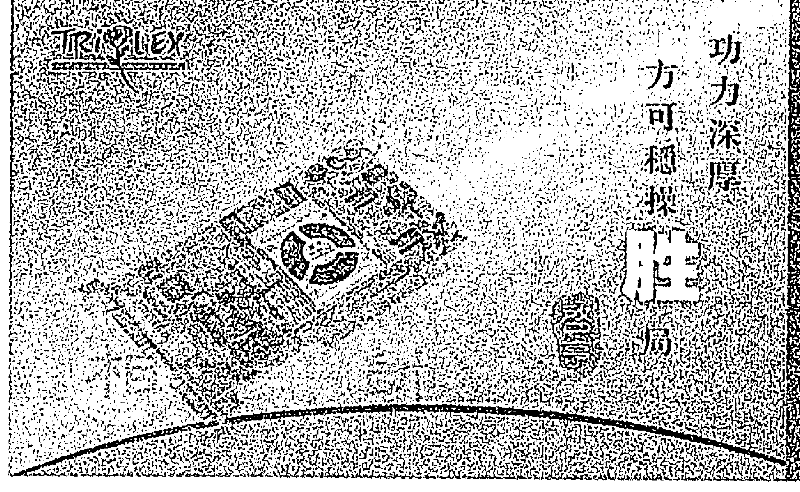

- 网络的天空如何净化 ................................. 446
- 开放源代码打败了谁 ................................. 448
- 杀毒软件「龙虎斗」 .................................. 448
- 游戏会成为一种生活的方式 ........................... 450
- 实名上网卡的理想与现实 ............................. 452
- 软件开发更「简单」——用 VS.net 有感 .................. 453

## 特别关注

- 渐隐渐现:雾中的长角牛——Longhorn ........................ 92
- 美国人和电脑 ............................................. 382
- 关于移动 PC 的讨论——应运而生还是生不逢时 ............... 384
- 十年之痒——我谈国内软件的开发 .......................... 440
- 是时尚 更是方向——谈数码影像冲印 ........................ 441
- 盛夏的果实——记第九届「电脑爱好者城」 .................... 442
- 微软的硬道理 ............................................. 443
- 云里雾里看「三包」 ....................................... 444
- 技术？价格？谁更「毒」？ ................................. 445
- 战争还将继续？ ........................................... 447
- 提高网络应变能力 美国官民步调不一 ....................... 448
- 你的？我的？大家的？——闪盘专利权风波 ................... 449
- 电脑培训的爱与哀愁 ....................................... 450
- 盲人的电脑之路 ........................................... 451
- 笔记本时代到来了吗 ..................................... 452
- 聚焦:「国产」奔腾 4 充斥市场 .......................... 453

## 电脑时尚

- 不会伤芯的理由
  ——帮助电脑新手克服常见的恐惧心理 ...................... 177
- 酷！下岗 CPU 变饰物 ..................................... 282
- 高考作文「妙语」22 则——摘自『漫游』酷论坛 ............. 311
- 爱情专线——转载自小熊在线文学论坛 ....................... 314
- 短信——转载自小熊在线文学论坛 ........................... 314
- 相思 ..................................................... 317
- CS 玩家 ID 命名规则 ..................................... 321
- 学堂趣事 ................................................. 322
- 论坛发帖经验谈 ......................................... 323
- CS 深夜战网爆笑场面集锦 ................................. 325
- 杨过交作业 ............................................. 328
- BT 的鹦鹉 ............................................... 331
- 校园趣事大杂烩 ......................................... 334

## 电脑常见故障问答

- 傻博士信箱 ......................................... 454

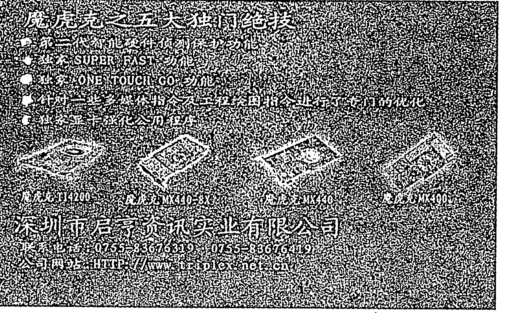

## 配套光盘 A 软件目录

## 正文相关软件

### 一、系统工具

光盘路径: `\SoftwareA\System\...`

- 软件名称: Bootvis 1.3.36.0 (`\BootVis-Tool.exe`)
  软件简介: 这个工具是微软内部提供的，专门用于提升 Windows XP 的启动速度。

- 软件名称: WCPUID 3.10 (`\wcpu310.exe`)
  软件简介: 这款软件除了检测 CPU 的 ID 信息、内/外部频率、倍频数等基本信息外，还可以检测出 CPU 是否支持 MMX、KNI 以及 3Dnow! 指令等。

- 软件名称: Intel Processor Frequency ID Utility 4.61 (`\fidchs21.exe`)
  软件简介: 如果用户担心 CPU 被销售商超频了，可以使用这个工具软件来进行检测。它通过一种特殊的频率确定算法来检测用户的 CPU 是否已超出出厂时额定运行频率，检测结果绝对权威。

- 软件名称: AMD CPU Information Display Utility (`\cpuinfo.exe`)
  软件简介: AMD 公司推出的一款检测 CPU 的专用工具，它不仅可以检测 AMD 系列 CPU，而且同时支持 Intel 型 CPU。

- 软件名称: Hot CPU Tester Lite 3.41 (`\hotcpu.exe`)
  光盘路径: `\SoftwareA\System\hotcpu.exe`
  软件简介: Hot CPU Tester 是一款系统稳定度测试工具，它能检测出超频或是有缺点的 CPU。对于喜爱超频的使用者来说，还可以使用这套软件看看超频后的系统是否稳定。

- 软件名称: SiSoft Sandra Standard 2003.1.9.26 (`\SandraStd-OCS-9260.exe`)
  软件简介: 这是一套功能强大的系统分析评测工具，不仅可以进行综合测试，而且可以单独测试 CPU、主板、CD-ROM/DVD、内存等多种硬件，还可将分析结果报告列表存盘。

- 软件名称: IBM Feature Tool 1.40 (`\ibmftool-install.exe`)
  软件简介: 这是由 IBM 公司所提供的工具软件，可以降低硬盘的噪音。它还附带了改变硬盘 UDMA 模式、高级电源模式、显示硬盘温度等功能。它支持 IBM Deskstar 40GV 和 Deskstar 75GX 及以后生产的 IBM 硬盘，对希捷等其它品牌的硬盘也有一定效果。

- 软件名称: Drive Fitness (`\ibmftool-install1.exe`)
  软件简介: Drive Fitness 能够全面检测 IBM 硬盘的质量和稳定性，它同时还具备清除引导区、低格硬盘的功能。运行 Drive Fitness 后，可自动创建一个包含了 IBM DOS2000 操作系统和 Drive Fitness 工具的启动盘。

- 软件名称: Data Lifeguard Tools 2.6 (`\dlgmaker.exe`)
  软件简介: 这套软件包含了可以让系统支持大容量西部数据硬盘的 EZ-Install 工具、全面检测并修复磁盘错误的 Diagnostics 工具、可以检测 BIOS 中硬盘数据的 BIOS Check 工具、可以切换 Ultra ATA/66 硬盘工作模式的 Ultra ATA/66 Management 等几个软件。需要注意的是：此程序不能直接在 WinNT 下自解压到软盘上，必须在 Win95/98 或直接在 DOS 下自解压。

- 软件名称: SeaTools Disc Diagnostic (`\seatoold.exe`)
  软件简介: 当系统出现故障时，可以试试用 SeaTools Disc Diagnostic 找出故障之所在，检查一下是硬盘的问题还是由其他软、硬件导致的问题。

- 软件名称: DiscWizard 2002 (`\discwizard2002-ch.exe`)
  软件简介: DiscWizard 2002 可以帮助用户方便快捷地安装希捷的硬盘，它把 Disk Manager、DiscWizard Starter Edition、BootWizard、SeaTools Disc Diagnostic 等工具揉合到了一个程序里，可以为用户创建一张启动盘，帮助用户处理希捷硬盘的几乎所有问题，还可以复制文件、分配盘符、为硬盘进行分区等等。

- 软件名称: Belarc Advisor (`\advissor.exe`)
  软件简介: Belarc Advisor 可以检测到 PC 系统中安装的各种硬件和软件信息，比如使用的是什么操作系统、CPU 型号、驱动器等，并将这些信息显示到浏览器上，供用户浏览查阅。

- 软件名称: BigFix 1.7.6.0 (`\bf1760.exe`)
  软件简介: BigFix 是一款系统修复软件，它可以自动从网络下载电脑专家为用户提供的解决方案，而且承诺绝对不会泄露使用者的隐私。

- 软件名称: HWiNFO 4.8.7 (`\hwinf487.zip`)
  软件简介: 这是一款电脑硬件测试软件，能显示很多关于电脑硬件和外设的信息，包括 CPU、内存、硬盘速度、光驱速度、显示卡、声卡、芯片组、打印机、扫描仪等。

- 软件名称: Dr.Hardware 2002 Build 3.5.0e (`\drh2002e.exe`)
  软件简介: 有别于其它类似软件是在视窗下运行获得相关信息，Dr.Hardware 则是直接从 BIOS、I/O 端口获得硬件相关信息。所有硬件的设备信息特性都会列出，并将测试结果输出至打印机或存入文件。

### 二、应用软件

光盘路径: `\SoftwareA\Application\...`

- 软件名称: CHEMLAB 2.0 (`\chemlb.zip`)
  软件简介: 一款非常不错的学习类软件，它可以虚拟化学实验，可以交互式地仿真演示化学实验，在教学中非常有用处。

- 软件名称: WriteExpress Easy Letters 2000 (`\wvdemo32.exe`)
  软件简介: WriteExpress Easy Letters 预置了超过 2000 封的商业信函供使用者参考。如果使用者对这些样本都不满意的话，该软件还可以按写作过程对使用者一步一步进行指导，并提供例句、短语等。不过共享版有一定限制，除 Acceptances、Compliments、Welcome 三大类信函外，其他类信函下一般只有 3 到 6 封样本可用。

- 软件名称: Digital Picture Recovery 2.0 (`\DPRdemo.exe`)
  软件简介: 这款软件能找回数码相机闪存、优盘、记忆卡、记忆棒、IBM 迷你盘等多媒体存储媒介上丢失或被删除的图像文件。

- 软件名称: WinHex 10.55 SR-4 (`\winhex.zip`)
  软件简介: 一个不错的16进制文件编辑与磁盘编辑软件，具有多文件寻找替换、一般运算及逻辑运算、磁盘编辑(支持FAT16、FAT32和NTFS)、文件对比和分析等多种功能。

- 软件名称: HairDresser (`\HAIPDRES.zip`)
  软件简介: 一款发型设计软件。在HairDresser中可以载入个人的数字照片，然后直接套用软件中已存在的模特儿发型样式来调整发型的大小、位置、颜色等，使用起来也非常方便。

### 三、网络相关

光盘路径: `\SoftwareA\Networks\...`

- 软件名称: Opera V7.0 Beta1b (`\ow321enen700b1bj.exe`)
  软件简介: 这是Opera的最新版本，它重新编写了核心代码，使得新版本和以前的版本比较起来，访问网页的速度更加快速。它还在其它的部分进行了许多改进，例如增强的Email和新闻组的功能、全新的界面（并可换肤）、支持直接拖拽功能、最新的书签等等。需要注意的是，安装时不要覆盖旧版本的目录。

- 软件名称: IncrediMail Build838 (`\incredimail838.exe`)
  软件简介: IncrediMail是一个与众不同的E-mail软件。它具有非常酷的视窗界面、寄信动画效果、可爱的收件信差。还有很多的信签、动画、音效、卡片等，可以组合成出非常炫的电子邮件，让写E-mail和看E-mail都变成新鲜的体验。

- 软件名称: Macromedia Contribute V1.0 (`\contribute-preview10.zip`)
  软件简介: Macromedia出品的全新概念网页设计工具，可以将网页编写程序化繁为简，使得制作网页就如使用文字处理软件一样，一般企业用户无需学习高深技术也可即时上手，而网页专家制作及管理网站时则更加如虎添翼。

- 软件名称: CoffeeCup HTML Editor 9.3 (`\CoffeeHTML93.exe`)
  软件简介: 这是一个非常棒的HTML网页编辑器。它内嵌有125种JavaScripts特效供网页编写者随时调用，使用它的Flash字体向导能轻松制作Flash特效字，通过滚动条向导可随意定制滚动条色彩等等强大的功能。

- 软件名称: 网络骆驼 NetCamels (`\netCamels.zip`)
  软件简介: 一些常规的下载工具对一些有特殊限制的服务器（例如：限制带宽，限制单个IP连接数目等）显得无能为力，而网络骆驼却能尽可能地突破各种限制，使用户在现有的条件下，大大地加快了下载的速度。

- 软件名称: NetSuper for Win9x (`\netsuperfor92.zip`)
  软件简介: 一款可以在局域网上搜索共享资源的小软件。

- 软件名称: AimingClick 2.0 (`\AimingClick.exe`)
  软件简介: 一款网络搜索工具，可直接在文本中选取关键字然后进行搜索。不过，这款软件对中文的支持不是很好。

### 四、多媒体软件

光盘路径: `\SoftwareA\Multimedia\...`

- 软件名称: VobSub 2.20 国际版 (`\VobSub-2.20.exe`)
  软件简介: VobSub是用来播放DivX格式电影必备的显示字幕工具。它除了能显示编辑DivX电影中的字幕外，还具有视频滤镜、AC3解码等其他高级功能。

- 软件名称: VolumeEasy 1.43 Build 708 (`\VolumeEasy143b708.exe`)
  软件简介: 安装了VolumeEasy后，可以在不用鼠标的情况下就能完成音量大小的改变、禁音切换、媒体播放程序的控制等。这给经常一边工作一边听音乐的用户带来了极大的方便。

- 软件名称: DVDx 2.0 (`\DVDx_2_0.zip`)
  软件简介: DVDx提供了完整的DVD备份解决方案，无论是要转成VCD、SVCD、AVI甚至于DivX，只要安装适当的Codec，DVDx都可以为你将文件转存出来，而字幕与多语旁白也可一并保存起来。

- 软件名称: Flash Cam 1.79 (`\FlashCamInstall.exe`)
  软件简介: Flash Cam能把屏幕的操作过程录制为Flash文件，还可以对录下来的Flash文件进行各种编辑，比如增加或删除帧、插入标题文字、录制旁白声音、自定义鼠标轨迹等，能够制作出非常精彩的教学视频。

- 软件名称: Guitar Pro 3.0.0 (`\GPDemo.exe`)
  软件简介: 这是一个吉他六线谱的编辑程序，可以让用户配置8个Track，除了可直接输入音符编辑外，还可以输入MIDI文件或是ASCII Tab，它会自动将其转换成六线谱。另外，该程序本身内建六国语言，而且有输出、存档与打印的功能，还附有和弦指导辞典。

- 软件名称: Super Duper Music Loope XPress V1.0a (`\sdmlxpress10a.zip`)
  软件简介: 这是一款简单易学的音乐制作软件，它的编曲方法很独特，可以用“笔”工具“画”出歌曲来。不过共享版有功能上的限制，就是不能保存，但是可以通过该软件的“E-mail Song”命令将其发送到自己的邮箱中，附件中的WMV文件就是用户所需要的曲子。

- 软件名称: DIVFIX (`\divfix1091.zip`)
  软件简介: 用DIVFIX可以修复已经坏了或者只下载了半截的AVI格式的MPEG4电影文件，使其能被正常播放。

- 软件名称: DietMP3 V3.0 (`\dietmp3.exe`)
  软件简介: 一款不错的MP3压缩工具，DietMP3可以在保持MP3音质不变的情况下把MP3文件减小30%到70%。

### 五、Linux专区

光盘路径: `\SoftwareA\Linux\...`

- 软件名称: CompuPic for Linux 5.1 6.2 Build1245 (`\compupic-t.1.1063-i386-Linux.tar.gz`)
  软件简介: CompuPic是非常好的看图程序，这是它的Linux版本，支持各种图形文件，甚至支持ICO文件及Adobe的PSD文件，也可查看多媒体文件WAV及MPEG。

- 软件名称: FreeAmp 2.1.1 for Linux (`\FreeAmp 2.1.1 for linux.gz`)
  软件简介: FreeAmp的主界面非常奇特，有如液晶一般华丽。它的功能也很强大，支持MPEG文件，选曲时可一次选择多首歌曲并可让它连续播放。

- 软件名称: RAR for Linux 3.00 (`\rarlinux-3.1.b3.tar.gz`)
  软件简介: WinRAR 对于读者来说肯定非常熟悉了，因其压缩率大、速度快，因而在同类软件中稳居榜首，并且可支持非 RAR 压缩文件，所以广受欢迎，这是它的 Linux 版。

- 软件名称: Blender for Linux 2.23 (`\blender-creator-2.23-linux-glibc2.1.2-i386.tar.gz`)
  软件简介: Blender 是一款 3D 建模软件，虽然只有 2M 大小，但它的功能很强大，效果惊人。

- 软件名称: AntiVirus eXpert 5.9.01 for Linux 2000 (`\AntiVirus eXpert for Linux-2.0.0-i386.shar`)
  软件简介: AntiVirus Expert 2000 提供给我们的是一套和操作系统高度整合的病毒防护方案，它能够有效查杀 46000 多种病毒，并为企业网络提供防火墙保护，对隐藏在电子邮件中的病毒一样能够查杀。

- 软件名称: CoffeeCup HTML Editor++ for Linux 4.1 (`\CoffeeCup HTML Editor++ for Linux 4.1.tar.gz`)
  软件简介: 一个全功能的 HTML 编辑器，包括 JavaScripts、VBScripts、ActiveX 控制、图片功能、色彩向导、多文件支持、全功能 FTP 程序、服务器扩展支持(asp、shtml、phtml，以及 css)，并有许多制作向导，使得编写网页非常的方便。

- 软件名称: Gnapster 1.3.7 (`\gnapster-1.3.7.tar.gz`)
  软件简介: Gnapster 与 Napster 非常相似，它具有搜寻、下载、上传、浏览以及聊天等功能，且界面也设计得相当好看，可以说是相当完整又好用的 MP3 社群工具，不过它需要 GNOME 的支持。

- 软件名称: MainActor 3.65 for Linux (`\MainActor 3.65 for Linux.i386.rpm`)
  软件简介: 极好的动画视频格式转换及编辑剪接工具，自带很多滤镜，支持的文件格式包括 AVI、FLI、FLC、JPEG、MOV、TGA、GIF、MPEG-I/II 等。

- 软件名称: Opera Linux 6.02 (`\Opera Linux 6.02.i386.rpm`)
  软件简介: 一个出色而小巧的 Internet/Intranet 浏览器，支持 Frames 及高级多媒体特性，具有方便的多窗口、可定制用户界面功能及随意缩放功能等。

- 软件名称: RedBlueVCD 0.2.3 (`\RedBlueVCD-0.2.3-0.i386.rpm`)
  软件简介: 这是一款 Linux/KDE 下的 VCD 播放软件，基于 SMPEG 和 SDL，遵循 GPL 规范。它具有完整的中文支持，能播放 VCD1.0/2.0、MTV、SVCD、DVCD 等多种格式的影像文件，也能播放 MP3、WAV 等声音文件，支持中文列表。

- 软件名称: UPX 1.24 for Linux (`\upx-1.24-linux.tar.gz`)
  软件简介: 非常好的可执行文件压缩软件，支持的格式包括 atari/tos、djgpp2/coff、dos/com、dos/exe、dos/sys、rtm32/pe、tmt/adam、watcom/le、win32/pe、linux/i386 等，压缩比率也非常的高。

## 附录相关软件

### 一、硬件沙龙

光盘路径：`\Addenda\hardware salon\...`

- 软件名称: InkSaver (`\InkSaver_Demo_Setup.exe`)
  软件简介: InkSaver 的工作原理是在将打印任务发送到打印机的过程中，InkSaver 会自动截获并对文档进行分解，在省墨的前提下尽量优化图像质量。InkSaver 支持的打印机型号列表见本目录下的 InkSaver - Supported Printers.htm 文件。

- 软件名称: DVDIdle 1.5 (`\DVDIdle15.exe`)
  软件简介: DVDIdle 利用了 Smart Read-Ahead 技术，将相关资料存储到硬盘的缓存中，以减轻 DVD-ROM 的工作负担，从而能够延长 DVD-ROM 的使用寿命。

- 软件名称: DVD Genie 4.10 (`\dvdgn410.exe`)
  软件简介: 一个 DVD 播放软件辅助工具，能够更改各种 DVD 播放软件未公开的隐藏设定和选项，如最常见的区码限制等。支持的 DVD 播放软件相当多，包括 PowerDVD、SoftDVD、WinDVD、ASUSDVD、XingDVD、VaroDVD 等。

- 软件名称: Daemon Tools 3.26 (`\daemon326.exe`)
  软件简介: 一个不错的虚拟光驱工具，可以打开 CUE、ISO、CCD 等虚拟光驱的镜像文件。

- 软件名称: MemTurbo II (`\mt2.exe`)
  软件简介: MemTurbo 可以在不使用虚拟内存的情况下，重新整理物理内存以改善 CPU 及主机板的效率。

- 软件名称: Soft FSB 1.7 final (`\sfsb17g1.exe`)
  软件简介: Soft FSB 基于主板时钟发生器所产生的外频进行调节，充分利用 PLL IC 的变频能力来实时超频，而且不受主板跳线的限制。需要注意的是，虽然 SoftFSB 属于软件超频，但它同样需要稳定的硬件支持，如果 CPU 的散热措施不佳或其他硬件超频能力不够或者外频升得太高，系统都可能会出现问题。

### 二、编程课堂

光盘路径：`\booksource\...`

- 软件名称: FakeQQ源代码
  软件简介: 在 `\booksource\fakeQQ\` 文件夹下，是《QQ 是怎样编成的—VC++ 进阶教程》专题中的示例程序 FakeQQ 的完整源代码文件，及其编译好的可执行程序文件。

- 软件名称: Windows 游戏模板
  软件简介: 在 `booksource\Game\Game Template\` 文件夹下，是《商业游戏编程内幕》专题中引用到的 Windows 游戏模板完整源代码文件，及编译好的可执行程序文件。

- 软件名称: 弹球游戏
  软件简介: 在 `booksource\Game\ball\` 目录下，基于 Windows 游戏模板编写的一款弹球游戏的完整源代码文件，及编译好的可执行程序文件。

## 三、网络天地

光盘路径：\Addenda\network world\...

- 软件名称：PortTunnel 1.6.3.170 (PortTunnel_ENGUK.zip)
软件简介：一个 TCP/IP 端口映射软件，可以重定向端口。它还可以自动产生 TCP/IP 纪录文件，调整网络状况，以及设置 IP 安全性等。

- 软件名称：SocksOnline XP 1.5 Build 1925 (SocksXP.zip)
软件简介：一个可以将 HTTP Proxy 或其他的 Proxy 变成 Socks Proxy 的通讯代理工具，使用户能在设置了一定限制的局域网中也能够畅通无阻地聊 QQ、玩网络游戏等。

- 软件名称：SocksCap32 2.31 (sc32r231.exe)
软件简介：SocksCap32 拥有强大的 Socks 调度功能，通过它几乎可以让所有基于 TCP/IP 协议的软件，比如 ICQ、MUD、FTP、IE、NEWS 等都能通过 Socks 代理服务器连接到 Internet。

- 软件名称：V3mail 2.100 (v3shar21.exe)
软件简介：V3mail 是一套制作和发送影音邮件的软件。它可以利用数码相机或麦克风录制影像或声音，制作独具特色的影音邮件，然后再通过 V3mai 发送出去，而且收信者可以使用任何 Email 软件来接收，收到后便可听到或看到发信者的声音或影像信息了。

- 软件名称：WinVNC 3.3.4 (vnc-3.3.4-x86_win32.zip)
软件简介：通过网络，WinVNC 可以让使用者在世界各地远端遥控自己的电脑。

- 软件名称：Vidio Suite (VIDIOSuite.exe)
软件简介：一个视频捕捉软件，可以在 Web 上共享视频剪辑，实现远程实况转播。

- 软件名称：OmniHTTPd Professional 2.10 (ohttpd210.exe)
软件简介：一个建立在 Windows 95/NT 平台上的 Web 服务器。它具有标准 CGI 支持，此外它还支持多个解释器、多个域，支持目录安全、虚拟 IP 服务器以及虚拟非 IP 服务器等。

- 软件名称：Apache 1.3.27 (apache_1.3.27-win32-x86-no_src.exe)
软件简介：最流行的 HTTP 服务器软件之一，可通过简单的 API 进行扩展，Perl/Python 解释器可被编译到服务器中。

## 四、设计论坛

光盘路径：\booksource\...

- 软件名称：Photoshop 特效脚本集
软件简介：在 \booksource\PS\ 文件夹下，收集有好几十款 Photoshop 特效 Actions 脚本，这些特效脚本的使用方法见专题《Photoshop 特效信手拈来》。

## 娱乐休闲

光盘路径：\yulexiuxian\miniGame\...

- 软件名称：TetriStation (tstation.exe)
游戏简介：一款非常豪华的俄罗斯方块游戏，另外预置有十多种异形块可供玩家挑选。

- 软件名称：游戏泡泡 (bgoldpak.exe)
游戏简介：非常好玩的一款小游戏，类似于街机上的“打砖块”，共有射击、策略、跳棋式等三种游戏模式。

- 软件名称：3D 乒乓球 (Pingpong.swf)
游戏简介：这个游戏分成低、中、高三个难度等级，可通过鼠标控制球拍与电脑对打。

- 软件名称：小鸡快跑 (runturkeyrun.exe)
游戏简介：一开始，你只是一个鸡蛋而已，可以通过小键盘上的方向键控制鸡蛋的移动，这时你只能吃最小的虫子；随着吃掉虫子的数量增加，两条腿就会破壳而出，这样就能吃大一号的虫子了。慢慢地小鸡会长大，就可以去吃更大的虫子。每长大三次就会增加一条新的生命，当把所有的虫子吃光之后，你就可以作为老农 DAN 家尊贵的客人去过一个开开心心的节日了。

- 软件名称：极地营救 (pengame.swf)
游戏简介：在这个游戏中，你就是一个在北极冒险的小企鹅，按 Play 开始游戏后，可以通过数字键 1 或 2 来切换武器，按 Shift 键可以射击，按空格键起跳，左右方向键则用来控制小企鹅前进或后退。冒险的途中设置有许多弹球，通过它可以让小企鹅越过一些比较高的障碍物。

- 软件名称：青蛙过街 (qingwa.zip)
游戏简介：一款经典的小游戏，可以通过方向键指挥青蛙行走，在汽车川流不息的马路和波涛湍急的河流上往来穿梭，一定要小心哦。

- 软件名称：Collapse (collaps-pack.exe)
游戏简介：很好玩的一款小游戏，类似于俄罗斯方块，界面也做得非常华丽。游戏画面由许多彩色的方块组成，点击两个或两个以上同色并相连的色块，则这些色块就会消失，上面的色块会顺延着塌陷下来，如此反复，直到所有的色块都消失为止。

- 软件名称：Gem Slider (gslider.exe)
游戏简介：跟 Collapse 的玩法类似，不过游戏的难度增大了不少。

- 软件名称：圣女之条件 (mystic.zip)
游戏简介：一个安宁的村庄受到怪物的威胁，如果不将村子里最美的女孩子送给怪物，它们就会发动袭击！为了保护村庄，我们可爱的武士 MM 走上了对抗怪物的道路。游戏是典型的日式风格，画面清新可爱，并且拥有漂亮的连击系统，值得一玩。

- 软件名称：PacDoom (PacDoom.exe)
游戏简介：在游戏中，你作为一小勇士，要消灭掉电脑中的所有病毒。PacDoom 类似“吃虫子”游戏，不过它的可玩性更高。

## 视频教学

光盘路径：\cai\...

- 毕业光盘设计 (cd)
- 你的观察力如何 (eq)
- 品茗赏画 (tea)

## 电脑爱好者合订本 2002年(下) 配套光盘使用说明

## 一、配套光盘的基本使用方法

1.  将合订本配套光盘放入光驱后，光盘程序自动运行，出现片头动画。此时不必进行任何操作，直到出现光盘主界面（也可以单击鼠标跳过片头动画）。
2.  在主界面中移动鼠标，在标有文字的热区点击，即可进入下级菜单或调用其他程序。
3.  在各系统界面的导航按钮处停留鼠标，将会弹出提示文字，提示点击可以返回上级界面或进入下一级界面。另外，各级界面均设有“退出”和“声音”屏蔽按钮，点击相应按钮即可退出光盘程序或屏蔽掉背景音乐。
4.  当点击“退出”按钮退出光盘程序时，会出现退出画面，单击后即可消失。
5.  本书配套光盘中，有不少软件是 ZIP 或 RAR 压缩文件格式，安装运行之前需要解压缩。如果您的系统内没有安装任何的解压缩程序，推荐您安装本书配套光盘 B 中“全免费软吧”下“应用工具”中的 WinRAR 3.0 软件。
6.  本配套光盘中还收集了 Linux 相关的应用软件，这些软件不能在 Windows 下被执行。需要使用这些软件的朋友，可通过“收藏”按钮将其保存到硬盘，再在 Linux 下进行调用。
7.  当您不想让光盘自动运行时，可以在将光盘插入光驱的同时按下“Shift”键，然后在资源管理器中点击选中光驱所在盘符，再按下鼠标右键，在弹出菜单中选择“打开”，即可浏览到光盘中的文件结构了。如果想执行自动运行程序，可以双击光盘根目录下的“start.exe”文件。

## 二、期刊全文检索使用说明

配套光盘 A 为《电脑爱好者》2002 年全年合订本电子检索光盘，内含《电脑爱好者》期刊 2002 年 1~24 期完整内容。操作步骤和使用注意事项如下。

将本光盘放入光驱中，无需任何操作，片刻后会自动出现片头动画。此时系统自动检测电脑中的 Acrobat Reader 插件以及网页动画插件，如发现没有相关插件或版本过低时会自动出现有关插件安装界面，请务必根据安装向导正确安装这些插件，否则本系统拒绝启动。动画结束后（或点击鼠标跳过）进入系统主界面，单击主界面上的“期刊全文检索”按钮进入全文检索阅读画面。

### (一) 阅读文章

全文检索界面上有菜单栏、工具栏，其中每个按钮或菜单条都配有该项详细功能说明。

本系统的阅读部分包括列表栏、概述栏、正文栏和原版栏。

- **列表**：显示某期或某次检索的所有文章目录信息，包括标题、期号、页码、作者、栏目等项目信息，各项目信息的左右位置可以任意拖动。
- **概述**：显示某篇文章的概况。
- **正文**：显示某篇文章的全部内容，包括文字信息、图表信息等。文章的显示风格可以通过菜单栏中“风格”菜单项进行设置，包括文章头部显示方式、各级子标题、段落、表格等所有文字信息的字体、字号及颜色均可任意设置，图、文、表等可以独立缩放（阅读区中点击鼠标右键）也可整体缩放（工具栏中的放大缩小按钮）。
- **原版**：显示期刊原版式的内容（PDF 格式），这个区域启动的是 Acrobat Reader 阅读器，在 Acrobat Reader 阅读器的工具条空白区点击鼠标右键会显示本页中包含的所有文章标题，点击不同标题条时进入该标题对应的“正文”栏进行正文阅读。

以上各栏内的上下翻页、翻篇均可通过工具栏中的相应按钮实现或使用键盘按键（见菜单栏中的“操作”菜单项）实现。

阅读时的背景音乐可在菜单栏中“风格”菜单项中的“视图效果”中进行设定。

### (二) 导航系统

本系统的导航阅读栏包括“出版期号”、“普通检索”。

- **出版期号**：按照出版期号方式显示光盘中所有杂志的内容。
- **普通检索**：本项的上半部分为普通检索，下半部分为历次检索光盘时的结果保留，包括检索条件的保留。

### (三) 检索功能

本系统的检索功能包括“普通检索”和“高级检索”。

- **普通检索**：屏幕左端导航栏“普通检索”的上半部分，本条件可同时或单独实现“标题”、“作者”、“全文”的快速检索，检索结果记入下面的“检索结果”中，当有两项以上内容输入时，各项目内部可以使用“与”、“或”、“非”（“与”用英文逗号“,”表示，“或”用分号“;”表示，“非”用感叹号“!”表示）；各项之间的逻辑关系为“同时成立”，若要进行比较复杂的逻辑检索，请用“高级检索”。
- **高级检索**：通过菜单栏中“文件”中的“检索”或点击“工具栏”中“检索”按钮即可，本检索与“普通检索”比较，有以下几点不同。
    1.  “高级检索”的检索项目多出“总期号”、“页码”、“栏目”。
    2.  “高级检索”各检索项之间的逻辑关系通过检索界面中“逻辑关系”栏设置。
    3.  “高级检索”的检索范围可以是“所有文章”或某次检索结果（即多次重复检索、推进检索），通过检索界面中“检索范围”栏设置。
    4.  “高级检索”的检索输入的各检索条件可以调整先后顺序或删减，通过检索界面中“检索条件表述及编辑”栏实现。
    5.  “高级检索”的检索结果计入导航栏中的“检索结果”。

### (四) “原版”阅读区常用功能介绍

1.  “保存”按钮用来保存文件副本，点击后即可将当前显示页面保存为一个 PDF 文件。
2.  按下“打印”按钮会自动调用默认打印机将本页 PDF 文件打印出来。
3.  “复制”按钮默认为不可操作状态，需要配合上排最后的两个按钮“文本选择”按钮和“图形选择”按钮来使用。在复制文本前，先点击“文本选择”按钮，再用鼠标选中文本（或点击“图形选择”工具后用鼠标拖出矩形框进行选取）。此时“复制按钮”已经变为可操作状态，点击后选中的文本就已经被复制了。之后我们就可以在其他文本编辑工具中粘贴使用，这一功能非常实用。
4.  “查找”按钮用于在当前页面中查找内容，查找到的内容会变为选中状态。我们还可以通过“查找”按钮旁边的“继续查找”按钮来找到下一个出现查找内容的地方。
5.  可以通过多次点击“放大”按钮连续放大页面，需要恢复的时候可以点击旁边向下的小三角，在下拉选单中选中“缩小”按钮就可以将页面缩小了。

## # 2002 年电脑爱好者编辑选择奖

## ## 最佳品牌电脑

### ### 最佳家用品牌电脑

实达 “时代风华” 系列 698 型家用电脑

- **【选择理由】**：硬件配置不俗，性价比一流。
- **【编辑点评】**：这是实达经济增值型 “时代风华” 家用系列电脑的旗舰机型，采用了目前主流的 Intel Pentium 4 处理器，外观设计高贵、大方，预留了即插即用的 10/100M 宽带网接口，用户只需开通宽带账户，就可立即跨入精彩纷呈的宽带影音世界；同时它还率先采用了 19" 的超大屏幕纯平显示器，视觉享受一流，它也是国内第一款将 19" 显示器带入主流 PC 市场的机型。从这款产品我们可以看到实达将成为国内一流家用电脑厂商的光明前景。
- **【参考网址】** http://www.start.com.cn

### ### 最佳商用品牌电脑

Dell Dimension 4500S

- **【选择理由】**：功能强劲的多功能系统，价格非常优惠。
- **【编辑点评】**：这款电脑采用了 Pentium 4 处理器，搭配新一代的 Intel 845G 集成芯片组，罕见地加装了 Creative Sound Blaster Live! Value 声卡，提供出色的影音输出性能，并支持能改善整机性能的 DDR 内存模组，体积小、网络性能强，适用于独立或基本网络环境，尤其适用于大功耗小型商业应用环境。Dell Dimension 4500S 虽然是商业型电脑，但从配置来看一点也不逊色于许多高档家用娱乐多媒体电脑，非常令我们称赞。
- **【参考网址】** http://www.dell.com.cn

### ### 最佳笔记本电脑

Dell Inspiron 2650

- **【选择理由】**：品牌显赫、性能强劲。
- **【编辑点评】**：Inspiron 2650 笔记本电脑采用了 1.5 GHz Intel 移动 Pentium 4 处理器，搭配支持 400MHz 外部总线频率和 DDR 内存的 Intel 845D 芯片组，性能强劲。它的具体配置包括 128MB DDR SDRAM（最大可扩充到 512MB），14" 液晶屏幕，8 芯 “智能” 锂离子电池，最长工作时间可达 3 小时。最引人注目的是它还内建了 nVidia GeForce2™ Go 100 AGP 4X 图形显示芯片，配备显存 16MB DDR，娱乐工作都可以兼顾。
- **【参考网址】** http://www.dell.com.cn

## ## 最佳电脑内部配件

### ### 最佳性价比 CPU

AMD Athlon XP 1600+

- **【选择理由】**：AMD CPU 简直就是 “物美价廉” 这句成语的最佳映照。
- **【编辑点评】**：AMD Athlon XP+ 是雷鸟 (Thunderbird) 的延续产品，处理器代号 Athlon4，芯片核心为 Palomino，生产工艺为 0.18 μm，和雷鸟相比，AMD Athlon XP+ 的 CPU 运行于更高的 FSB 前端总线 133MHz 上，而且真正的支持 DDR266 规范，另外，该 CPU 还加入了对更多 SEE 多媒体指令的支持。
- **【参考网址】** http://www.amd.com

### ### 最佳性能 CPU

Intel Pentium 4 1.6A

- **【选择理由】**：强大的超频性能。
- **【编辑点评】**：Pentium 4 A 系列是 Intel 新一代 Northwood 内核的 Pentium 4 处理器简称，和早期的 Pentium 4 相比，制造工艺革命性地采用了 0.13 μm，不但工作发热量降低，工作效率也有所提升，充分展示了 Intel 的技术实力。很多用户都有一种疑问，Pentium 4 凭什么那么贵？现在 Northwood 内核的 Pentium 4 1.6A 就给了我们一个响亮的答案：你有 60% 以上的可能性将这款处理器超到 16 × 133MHz = 2.1 GHz 的频率来工作！
- **【参考网址】** http://www.intel.com.cn

### ### 最佳 P4 主板

微星 845 Ultra-ARU

- **【选择理由】**：功能齐全、做工一流。
- **【编辑点评】**：这是一款采用了 Intel Pentium 4 低价平台解决方案 845D 芯片组的经典主板，它支持 DDR 266 规格的内存，集成了支持 ATA133 传输规范的 Promise 芯片和 USB2.0 的 NEC 芯片，并提供了有 5.1 声道输出能力的硬声卡，还具备 PC to PC、开机加密等硬件功能，工作性能稳定、出色。
- **【参考网址】** http://www.microstar.com.cn

### ### 最佳 AMD 主板

捷波 V333DA 屠龙 333

- **【选择理由】**：集优秀品质和适中价格于一身，为第四代 Athlon 处理器最佳拍档。
- **【编辑点评】**：该主板采用 VIA 最新的 KT333 芯片组，支持 AMD Athlon、Duron 和 AthlonXP 处理器，支持 DDR333，采用 Promise 芯片，支持 DMA 133 的 IDE 传输模式，最大可外接到 4 个 IDE 硬设备。主板提供线性外频调节，独创的 “电源净化器” 技术，支持多重电压调节，超频性能出色。
- **【参考网址】** http://61.151.249.180

### ### 最佳硬盘

Maxtor 金钻七代 80G

- **【选择理由】**：售后服务最正规，产品品质有保障。
- **【编辑点评】**：迈拓 (Maxtor) 硬盘向来以品质好、性能稳定著称，其金钻七代系列全部是 7200 转的高转速产品，集成 2MB 缓存，支持最新的 ATA133 传输规范，平均寻道时间小于 8.5ms，内部传输率可达 54.2MB/s，在这个系列中，80G 的产品是当前的主流，备受用户喜爱。
- **【参考网址】** http://www.lander.com.cn

### ### 最佳 SDRAM 内存

Hynix PC133 SDRAM

- **【选择理由】**：物超所值、必然之选。
- **【编辑点评】**：Hynix (现代) 是全球著名的内存颗粒制造商，它的内存产品不但品质好、兼容性一流，而且非常便宜，也是目前市面上最普及的内存产品，虽然 HY 也生产 DDR 内存，但影响力却不如它们的 SDRAM。
- **【参考网址】** http://www.hdcorp.co.kr

### ### 最佳 DDR 内存

KingSton (金士顿) DDR SDRAM

- **【选择理由】**：产品有强大的技术力量支持。
- **【编辑点评】**：KingSton (金士顿) DDR SDRAM 是最早在国内推出的 DDR 规格内存，产品性能稳定，兼容性能好。
- **【参考网址】** http://www.kingston.com

### ### 最佳 nVIDIA 显卡

微星 G4 MX460-VT (MS-8863)

- **【选择理由】**：性能表现在同类产品中出类拔萃。
- **【编辑点评】**：微星平价系列显卡中的旗舰产品，采用 Geforce4 MX460 芯片组，配备 64MB DDR 显存，具有视频输入输出功能，显卡芯片组核心频率为 300MHz，显存核心频率为 550MHz，显存带宽达到 8.8GB/s。
- **【参考网址】** http://www.microstar.com.cn

### ### 最佳 ATI 显卡

七彩虹镭风 8500 标准版

- **【选择理由】**：不错的性能，便宜的价格。
- **【编辑点评】**：这款显卡完全按照 ATI Radeon 8500 标准版规格设计，原来的 ATI Radeon 8500LE 芯片组已升级到 ATI Radeon 8500 芯片组，显卡核心频率与显存频率也由原来的 250MHz / 250MHz*2 升级到现在的 275MHz/275MHz*2。该显卡采用六层的 PCB 板设计，搭配优质的贴片元器件，显卡采用了名厂 Hynix-3.6ns 高速 64MB DDR 显存，超频性能出色。
- **【参考网址】** http://www.seethru.com.cn

### ### 最佳声卡

Creative Sound Blaster Audigy Value

- **【选择理由】**：无可挑剔的 PCI 声卡。
- **【编辑点评】**：Creative Audigy 的处理模块能同时实现多达四种环境音效的多路实时处理；高性能的 32 位、64 声道混音的处理引擎能够最大程度地优化复杂的数字音频信号的混音及处理，同时确保了如水晶般清澈纯真的音频保真。另外，Audigy 的输出模块集成高品质的 24 位/96kHz 多声道数模转换器，确保了高达 100dB 的信噪比回放。
- **【参考网址】** http://china.creative.com

### ### 最佳电源

大水牛 DP4 250W

- **【选择理由】**：性能/价格比的最佳选择。
- **【编辑点评】**：性能突出，+3.3V 电压时可以输出 26A 以上电流，+5V 电压时输出电流达 2A，可确保在电压不稳或负载过重时 PC 正常工作。DP4 的风扇采用了特殊的降噪设计，运行时噪音很小。该电源提供了足够的信号线长度和接头数量，充分满足了增加设备的需要，并且适用于各种机箱。它提供了过压、过载、高温多重保护和双重杂讯滤波装置，通过 CE、FC、UL 等多种国际安全认证。
- **【参考网址】** http://www.hedy.com.cn

### ### 最佳机箱

银河华表 II-1009 机箱

- **【选择理由】**：内外设计非常合理，价格适中。
- **【编辑点评】**：外观时尚，面板采用抽拉式设计，前置式 USB 接口，在机箱的两侧有四个通风窗口，机箱中部有许多蜂窝状小孔，降温效果很好。更为体贴的是，后面板上每个接口都采用了中文标注，解决了一些用户在安装设备时的困惑。机箱内部宽大，采用全折边设计，安装配件时很顺手且不会对皮肤造成任何伤害。
- **【参考网址】** http://www.yinhe.com

### ### 最佳 CPU 风扇

九州风神 AE-P415

- **【选择理由】**：价格便宜，质量上乘。
- **【编辑点评】**：这款 CPU 风扇采用高导热合金材料制造，尺寸为 70 × 70 × 15mm，风扇转速为 3800 ± 10 rpm，最大风量 27 CFM，工作机械噪音小于 30dB(A)，支持 1.7GHz 到 2.6GHz 的 Intel 478pin Pentium 4 或者 Celeron 处理器。虽然我们对 Cool master 之类的著名专业散热器品牌也非常喜欢，但问题是它们太贵了！
- **【参考网址】** http://www.aeolus.com.cn/

### ### 最佳 1.44MB 软驱

SONY 1.44M 软驱

- **【选择理由】**：经典产品。
- **【编辑点评】**：虽然现在软驱在电脑上的作用不大，但如果购买还是要选择一个放心的品牌，到各编辑部们走一走，九成是 SONY 的产品，三四年了照样用。
- **【参考网址】** http://www.hedy.com.cn/

### ### 最佳 CD-ROM

SONY CDU5221 G3## 最佳 DVD

三星金将军 16 速 DVD-ROM

-   **【选择理由】**：出色读盘性能和低噪音令人印象深刻
-   **【编辑点评】**：韩国原产产品，短机身设计，全金属光头驱动结构设计，结合环纹聚焦镜头专利，在保证读盘能力的同时也延长了光头的寿命；采用了全自动平衡轴 ABS 马达和 DVA 仿真抗震系统，既降低了噪音也让读盘更加稳定顺利。另外，这款 DVD-ROM 还优化了音频处理能力。
-   **【参考网址】**：http://www.samsung.com.cn/

### 最佳 CD-R/W

BENQ 3210P

-   **【选择理由】**：超大容量的缓存多给你一份信心
-   **【编辑点评】**：BENQ 3210P 具备 32 速写、10 速复写、40 速读的性能，与市面上绝大部分的盘片格式兼容，这款刻录机还具备明基专利的无缝连接技术，夸张的内建 8MB 缓存，为解决缓存区欠载问题上了一个双保险。
-   **【参考网址】**：http://www.acercm.com.cn

## 最佳电脑外部配件

### 最佳 LCD 显示器

SAMSUNG（三星）SyncMaster 151BM

-   **【选择理由】**：显示效果好，价格适中
-   **【编辑点评】**：151BM 是三星 15" 液晶显示器系列中最具代表性的一款，亮度可达 250cd/m2，对比度 330:1，可视角度为 140°/120°（上下/左右），可选三种外壳颜色（象牙色、黑、银），支持升降扭转屏幕，并内置一对 1.5W 多媒体音箱。
-   **【参考网址】**：http://www.samsungmonitor.com.cn

### 最佳 CRT 显示器

飞利浦 107P2

-   **【选择理由】**：显示效果非常出色
-   **【编辑点评】**：飞利浦 107P2 采用了第二代纯平 Aperture Grille 显像管（即三菱第二代钻石珑显像管），显示器点距为 0.25mm，带宽为 203MHz，行频达 92KHz，显示器的最大分辨率可达 1920 × 1440，支持飞利浦 LightFrame（显亮）专利技术，该显示器还采用了 XSD-XtraSpace Design（超空间设计），充分节省空间，最大机身深度仅 419mm（16.5"），与传统显示器相比，堪称世界上短小的 17" 显示器。
-   **【参考网址】**：http://www.philips.monitors.com.cn

### 最佳音箱

漫步者 S5.1

-   **【选择理由】**：顶级的 PC 环绕音箱播放效果
-   **【编辑点评】**：音箱的低音炮采用独立两腔式结构，5 只木质卫星箱按 THX、杜比 Digital（AC-3）设计，全部采用两分频，真正影院级功率推动，输出功率共达 240W（90W+25W*6），无线红外遥控，数字控制系统，精密数字电位器能够精确到 1dB，全部镀金色音频插头、插座，高纯度铜音箱连接线。
-   **【参考网址】**：http://www.edifier.com

### 最佳键盘

BENQ 52M

-   **【选择理由】**：永远的精品
-   **【编辑点评】**：关于这款键盘有一个脍炙人口的典故：52M 键盘的流线型外观是由欧洲著名设计大师乔治·亚罗精心设计而成的，设计费用为 60 万美金。
-   **【参考网址】**：http://www.acercm.com.cn

### 最佳鼠标

BENQ 蓝色魅力光电鼠标

-   **【选择理由】**：具备独特的个性化设计和优良的性能
-   **【编辑点评】**：这款鼠标设计轻盈灵动，独特的蓝光滚轮引人注目；鼠标定位精准，反应迅速，使用舒适；鼠标保养方便，滑鼠底部无需清洁；无需使用鼠标垫，使用界面范围广泛（除玻璃、镜面等）；质保期长达五年（一年包换，四年保修）。
-   **【参考网址】**：http://www.acercm.com.cn

## 最佳电脑外部设备

### 喷墨打印机

EPSON SP790

-   **【选择理由】**：价格实惠，性能出色
-   **【编辑点评】**：该机型很早在 2001 年就推出了，它首创自然色彩还原技术，通过对自然色彩，主要是蓝、绿色彩的突破性还原，加上四周边无边距打印技术，2880dpi 高分辨率与 4 微微升墨滴，效果很好，备受业界好评。
这款打印机的价格可以说是现在市面上六色打印机中最便宜的，而且墨盒一套只需要 225 元，打印成本不高，当然效果也非常出色，是我们本次推荐中最实惠的。
-   **【参考网址】**：http://www.epson.com.cn

### 最佳激光打印机

HP LaserJet 1200

-   **【选择理由】**：真正的个人最佳激光打印机选择方案
-   **【编辑点评】**：这是 HP 公司专业型快速个人激光打印机，同时也是入门级网络激光打印机，具有同类产品中最出色的打印能力（打印速度和质量），并可灵活地升级为网络打印机或多功能一体机，是商用办公个人 / 小型工作打印的最佳选择，它具备 14ppm、1200dpi 高清晰打印，标准配置 8MB RAM，通过 DIMM 插槽最大可扩充至 72MB，支持最新的 USB2.0 传输规范。除了性价比外，HP 的服务品质也令人放心。
-   **【参考网址】**：http://www.hp.com.cn

### 最佳扫描仪

Canon 676U

-   **【选择理由】**：性价比好，扫描性能出色
-   **【编辑点评】**：这是一款超薄型平板式扫描仪，600 × 1200dpi 光学扫描分辨率，具备 48 位扫描色彩深度，扫描仪元件类型为 CIS（接触式图像传感器），有着出色的多照片扫描功能，独具“Z”形盖板设计，可扫描较厚物体。
-   **【参考网址】**：http://www.canon.com.cn

### 最佳数码相机

FinePix（富士）S602

-   **【选择理由】**：最新科技产品，品质不凡
-   **【编辑点评】**：FinePix S602 是以 FinePix 6900Z 为蓝本并进行了相当的改良的机种，虽然同样是采用 310 万像素第三代 SuperCCD 和 6 倍光学变焦，但新设计让 S602 拥有更精确的测距精度。FinePix S602 镜头焦距 35～210mm，光圈 F2.8-3.1，最大的特色在于储存媒体采用了 SM 和 CF 卡双插槽设计。
第三代 SuperCCD 的特色在于高感光度、高速度和高画质拍摄与录像三大特性。FinePix S602 很好地体现了以上的特点，而且性价比也不俗。
-   **【参考网址】**：http://www.finepix.com.cn

### 最佳 USB 优盘

朗科 OnlyDisk 启动高速型优盘 32M

-   **【选择理由】**：方便实用
-   **【编辑点评】**：朗科 OnlyDisk 启动高速型优盘读写速度快（读：1000KB/S 写：920KB/S），支持 BIOS USB-HDD 启动模式，USB 接口，无需驱动程序（Windows 98 除外），即插即用，可热插拔，体积小，重量仅 20g，相当一支签字笔，抗震防潮，携带方便，提供更可靠的数据存储。
-   **【参考网址】**：http://www.netac.com.cn/

## 最佳软件

### 最佳办公软件

Office XP

-   **【选择理由】**：强大功能与便捷操作的完美结合
-   **【编辑点评】**：Office XP 的强大功能可以让我们真实地体会到办公自动化在个人应用领域的实现。几乎所有在实际办公应用的过程中能够遇到或想到的处理方式及应用需求，都能通过 Office XP 得到百分之百的体现，同时 Office 各组件内部及组件之间的协调与互动，使我们通过 Office XP 得到近乎完美的办公体验。
-   **【参考网址】**：http://www.microsoft.com/china/office/

### 最佳图形图像处理工具

Photoshop 7.0

-   **【选择理由】**：图像处理的标准工具
-   **【编辑点评】**：尽管大家依然对 PhotoShop 6.0 感到新鲜，但 PhotoShop 7.0 又出现在我们面前。PhotoShop 7.0 在保持 PhotoShop 传统风格的基础上使软件整体功能得到了改进和增加，让照片摄影师和 Web 设计师也能对它爱不释手了。毫无疑问，PhotoShop 作为图像处理工具遥遥领先于其他产品。
-   **【参考网址】**：http://www.adobe.com.cn/products/photoshop

### 最佳网页制作工具

DreamWeaver 4.03 中文版

-   **【选择理由】**：细微之处见长，整体性能称道
-   **【编辑点评】**：网页制作软件的双巨头中，DreamWeaver 以其细致的功能设置和优越的整体性能击败了强劲的对手 FrontPage XP。虽然初次使用的上手时间会相对较长，但其功能上的细致体贴终将让你爱不释手。同时借助其制作的网页在源代码的使用上简洁明了，这一点无论对于初级用户还是进阶高手都至关重要。
-   **【参考网址】**：http://www.macromediachina.com/

### 最佳股票工具

《证券之星》

-   **【选择理由】**：专而不独，简而不陋
-   **【编辑点评】**：作为专业财经证券软件的证券之星为用户提供的证券服务非常全面：从资讯提供到行情分析、从网上交易到个人管理，股民的需求就是证券之星的方向。同时，简洁的界面和方便的操作更是股民们所强调的讯息即时和交易快捷的延伸。
-   **【参考网址】**：http://www.stockstar.com/home.htm

### 最佳教育软件

《开天辟地III》

-   **【选择理由】**：紧跟时代，重在方法
-   **【编辑点评】**：教育软件必须面对的交互性和全面性都在《开天辟地III》得到很好的解决，软件的使用者能够非常快地完成从学习到应用的转化。同时软件处处渗透了科学的学习方法，使用者因此能够在更深层次上体会学习的精髓，轻松应对迅速的产品更新和知识换代。
-   **【参考网址】**：http://www.hongen.com/human/product/

### 最佳翻译软件（单词）

《金山词霸 2002》

-   **【选择理由】**：庞大的词库以及详尽的解释
-   **【编辑点评】**：一套包括了 2.6 亿多字、700 万专业词条、32 套专业词库的超级词典，可以实现了英英、英汉、汉英、汉语四向查询。抛开了全文翻译的“吃力不讨好”的功能，而使其以众多的词汇量、完善的相关功能，满足了用户对词典翻译软件的基本需求，成为单词翻译类软件中不可被挑战的佼佼者。
-   **【参考网址】**：http://www.iciba.net/

### 最佳翻译软件（网页和窗口）

《东方快车 XP》

-   **【选择理由】**：独特的智能汉化与永久汉化功能
-   **【编辑点评】**：一招鲜，吃遍天。《东方快车 XP》依靠其永久汉化功能，独辟蹊径瞄准了对常用英文软件的模块化汉化，提供了包含800多个英文软件的汉化包，为许多使用英文软件感到困难的电脑爱好者带来了幸福时光。
-   **【参考网址】**：http://dfkc.sunv.com/

### 最佳网络工具

MSN Messenger 简体中文版
-   **【选择理由】**：使用简单，功能稳定
-   **【编辑点评】**：可以单独聊天或者与多个人同时聊天，同时提供了语音聊天、多方会谈、文件传输等功能。MSN Messenger简体中文版以最基本、最实用的功能，最简单方便的操作界面，让被广告泛滥、信息丢失、密码被盗以及名目繁多的收费所长期折磨的QQ族们眼前一亮。
-   **【参考网址】**：http://messenger.microsoft.com/CN/

FlashGet 1.3
-   **【选择理由】**：以强大的下载文件管理功能凸显软件的人性化
-   **【编辑点评】**：可以创建不同的类别管理下载的文件，更可以在软件界面中进行执行文件、添加文件的简介以及移动、更名等操作，令下载文件的管理工作异常方便。不是做不到，而是想不到，FlashGet中诸多细小的功能都体现了软件作者对用户使用过程的关注与体贴。
-   **【参考网址】**：http://www.amazesoft.com/cn

### 多媒体影音工具

《豪杰超级解霸2001XP》
-   **【选择理由】**：优秀的纠错能力以及解压技术
-   **【编辑点评】**：其“防读死”技术，可以读取许多有划痕的DVD/VCD影碟片，有效地保障播放烂盘时电脑不死机，在这个最基本的功能上，豪杰超级解霸2001XP使其他的同类软件无法望其项背。
-   **【参考网址】**：http://www.herosoft.com/

### 最佳系统工具

Norton Ghost 2001 中文版
-   **【选择理由】**：丰富的存储介质、快速备份以及丰富的定制选项
-   **【编辑点评】**：Ghost让身处Windows时代的用户可以轻松克隆硬盘，以便方便地进行系统升级、备份和恢复，其独特的思路以及在映像和克隆磁盘和分区方面的灵活性使之成为最好的系统备份和还原工具。
-   **【参考网址】**：http://www.symantec.com/region/cn/

紫光拼音 2.3
-   **【选择理由】**：智能化的动态调整，简便的操作与定制
-   **【编辑点评】**：既方便初级用户掌握，也充分考虑长期使用拼音输入的老用户的习惯，提供了智能组词、智能字序调整、强大的用户自定制功能以及大容量精选词库。在考虑用户输入习惯以及提供智能使用功能方面，紫光拼音2.3彰显了“一切从用户出发”的软件设计思路。
-   **【参考网址】**：http://211.151.91.22/

### 最佳安全防病毒工具

《金山毒霸2002》
-   **【选择理由】**：满足了互联网应用中强烈的杀毒需求
-   **【编辑点评】**：基于IE浏览器进行在线查毒，对即时通讯工具QQ和ICQ进行了嵌入挂接、使用嵌入技术对邮件中的病毒进行实时拦截，要做互联网上最好的杀毒软件的金山毒霸2002，在这个网络盛行的时代体现了对前沿应用所应有的关注。

### 商业软件最佳表现

WPS Office 企业版
-   **【选择理由】**：自强国货，物美价优
-   **【编辑点评】**：做为老牌的国产办公软件，WPS Office以其出色的本地化设计和方便的操作界面使自己终于能够再次正视国人。虽然在软件性能本地化的同时还应更加注意功能的国际化，但毕竟我们看到了国产办公软件奋起直追的良好表现。WPS Office以极佳的性能价格比取得的优异商业表现是不容置疑的。
-   **【参考网址】**：http://www.wps.com.cn/

### 共享软件最佳表现

暂缺
-   **【暂缺理由】**：创意平平，思路狭窄
-   **【编辑点评】**：共享软件本应是电脑软件行业的快马先锋，由于共享软件作者的开发者与使用者双重身份非常突出，所以共享软件与商业软件相比的优势应在于集中精锐，突击软件应用最薄弱的环节，以最灵巧的方式解决最实际的问题。但在电脑硬件的飞速发展让人瞠目结舌的今天，共享软件的构思与设计上很久没有给人耳目一新的体验了。[CF]

## 走近市场 了解DIY装机潮流

□张少勇

想要拥有自己的电脑，一是直接购买品牌机，二是用户自己攒机(DIY)。相对而言，后者更具灵活性和价格优势，DIY者可以根据自己的喜好任意搭配出个性化电脑。装机思路方面，和摩托车、手机一样，电脑的更新换代非常迅速(速度上还远远超过前两者)，即便是当前顶级配置的电脑，几年后也会变得陈旧落伍，所以我们绝不要一味去追求高配置，浪费金钱去寻那种“一步到位”的感觉。当然，我们也不能走向另一个极端，一味死守“价格为先”的消费理念喔，99年曾风靡一时但旋即夭折的“低价电脑”就是典型例子。最理智的做法是根据事先拟定的预算和实际用途，再攒出一台适合自己的主流机型。下面，我们就把电脑大卸八块，对今年暑期装机热潮小作预览。

## 一、找寻电脑心脏的平衡点

CPU相当于一台电脑的心脏，其重要性自然不容置疑，但因人们对之盲目迷信而造成的错误概念亦有不少，其中最突出的一点就是把CPU的主频视作机器速度的唯一标准。

### 1. 高主频≠高性能

让许多普通消费者产生高主频=高性能的错误观念，众多品牌电脑看来难辞其咎。且不说一台电脑的整体性能尚取决于机器内其他配件，单就CPU自身而言，二级缓存的大小、外频的高低等等因素也至关重要，否则就无法解释当年赛扬300A超频至450后比直接购买的赛扬500还要快许多。去年AMD推出Athlon XP时突然宣布不再与英特尔玩主频大战了。这是为什么呢？原来，超微认为“处理器的时钟频率并不能代表一切，性能才是最重要的”。自此他们开始采用PR值(performance rating)来标识自己的新款处理器，如Athlon XP1800+的实际频率为1.53GHz。实际上，根据各方评测，在Athlon XP 2000+与P4 2.2GHz以及Athlon XP 1800+与P4 2.0GHz的对决中，主频领先的P4处理器确实未占到什么便宜，在部分项目中甚至是Athlon XP处理器占优。

### 2. 主流CPU，你要哪一位回家

当前市场上的主流CPU是英特尔公司的P4、赛扬以及超微公司的Athlon XP (如图4所示)、Duron (如图5所示)。不过对于英特尔的产品，细分之下还是大有文章的，P4处理器首先有423和478两种针脚(其中423针的P4早遭淘汰)，然后478针的P4按照内核不同又可分为NorthWood (如图1所示)和Willamette (亦属淘汰产品)两种。在报价单中的区别是前者带个字母“A”；赛扬系列产品枝繁叶茂，不过主频1.7GHz以下且二级缓存≤128KB的赛扬均已停产多时，现在热销的赛扬有Tualatin内核(一般被称为赛扬3，如图2所示)和Willamette内核(一般称作赛扬4，如图3所示)两种。对于讲究性价比的学生群来说，速龙XP

今年夏天你会买什么CPU?

开始调查的时间:2002-05-15 总票数:90583

| CPU选项 | 票数 | 百分比 |
| :--- | :--- | :--- |
| Intel奔腾4 | 23388 | 25.8% |
| Intel奔4赛扬 | 11295 | 12.5% |
| Intel旧拉丁赛扬 | 9740 | 10.8% |
| AMD Athlon XP | 21319 | 23.5% |
| AMD Duron | 24643 | 27.4% |

这是某知名网站截至6月20日调查结果，多多少少有点参考价值## 3. 一个萝卜一个坑

选择好CPU之后，接下来要为之寻找合适的主板“安家落户”。首先，我们需要了解每片CPU都有哪些芯片组与其对应，不然整出毒龙主板配赛扬的笑话就麻烦大了。

- 家喻户晓的P4

由于英特尔已将最新P4处理器的前端总线推进至533MHz（133MHz × 4），而提高前端总线无疑将大大提升机器性能。为了最大程度发挥P4潜力，我们自然也要考虑选择支持前端总线533的主板。当前市场上主要有英特尔的850E、845E、845G，威盛的P4X266AE、P4X333，矽统的SiS645DX、SiS648。

采用英特尔公司845E芯片组的主板一般均支持400/533MHz前端总线，支持DDR266，支持USB2.0，整合10M/100M网卡，是当前首选。845G芯片组集成了性能与MX200不相上下的图形加速卡，适合暂时不考虑装配显卡但准备日后升级的用户。采用850E芯片组的主板只支持Rambus内存，是高端用户囊中之物。

自P4问世以来，威盛公司便一直官司缠身，在此背景下继续推出支持533MHz前端总线的P4X266A芯片组颇带一丝孤胆英雄的凄凉意味。P4X266A的北桥芯片是VT8753A，采用带宽266MB/s的V-Link连接多种南桥芯片（例如支持USB2.0的VT8235和支持ATA/133的VT8233A），采用该芯片组的主板一般价格不高，实为追求性价比的朋友之福。而威盛P4X333芯片组是P4X266A的继任者，可以提供对双P4 CPU的支持，尤其是它支持DDR333内存和AGP 8X显卡，可以在平易近人的价位上带给我们更多惊喜。

采用矽统SiS645DX芯片组和SiS648芯片组的主板为我们提供了533MHz前端总线的更廉价方案，不过矽统的芯片组向来都会有一个小小的遗憾，就是兼容性方面比英特尔和威盛的芯片组要稍差一些。

- Tualatin Celeron

当前市场上对图拉丁赛扬支持最好的自然是815EPT的板子。此外，采用威盛694T芯片组的主板也是一种不错的选择。对图形处理要求不高的用户还可以选择810T、815ET这种整合产品。上述支持图拉丁赛扬的芯片组只能使用SDR内存，不过如果你对DDR内存情有独钟的话，威盛的Apollo Pro 266T芯片组大可以满足要求。

- Willamette Celeron

面向低端市场的“Willamette赛扬（赛扬4）”使用400MHz前端总线，故一些原先搭配P4的过季主板现在价格暴低，正好拿来便用，比如采用845D、P4X266、SiS645等芯片组的主板。告诉你一个小秘密：大多数这样的老主板由于推出日期比赛扬4早，会把赛扬4检测为P4。想想每天开机从屏幕上看到的是自己的“P4”1.7G，何等的爽啊！

- Athlon XP

尽管已受到同门师弟KT333的威胁，威盛的KT266A目前仍是速龙XP平台中销量最大的一款。它结合了具备性能激进设计的高带宽DDR266内存控制器，藉此成为最快的AMD Socket A平台芯片组。KT266A使用V-link和VT8233或者VT8233C南桥连接搭配，提供对AGP4X、ATA100和AMD第二代PowerNow!技术的支持，整合了6声道音频系统、6个USB口、LPC总线、10/100Mbps以太网/Home PNA媒体控制器。

矽统的SiS745是相对发布比较早的一款支持AthlonXP处理器的芯片组，它是对SiS735芯片组的延续设计，新加入了DDR333规范及IEEE 1394总线的支持。SiS745仍采用了单芯片开发架构和矽统独家的超高带宽内部连接技术。

考虑到KT266A架构已被市场证明是非常优秀和成熟的，所以威盛又以它为基础设计出KT333芯片组。与KT266A相比，KT333最大的改进就在于提供了对DDR333内存规格的支持和直接提供对ATA133的支持。

- Duron

对毒龙处理器的支持当属SiS730（集成SiS300显示芯片）和SiS735表现最为出众，可惜的是采用这两款芯片组的主板只有精英、蓝德和三帝等寥寥几家。相比之下，威盛KT133A的选择余地要大得多，微星K7T Turbo-NL（红魔）、升技KT7A、磐英8KTA3等等一大堆当年红极一时的经典主板现在不要白不要。

### 4. 一窖萝卜起哪个

熟悉了芯片组的情况之后，我们就可以具体查找、比较和筛选主板啦。主板品牌根据厂商规模简单可划分为一线、二线、三线及杂牌（含OEM）等四种。前三者与后者区别主要在质保上，而三线品牌（基本上都是公版设计）与一、二线品牌的差距主要在于扩展功能和售后服务上，一线与二线品牌的差距则在于对新产品的研发能力。除此之外，主板的用料、做工、出厂质检标准等等也是一分钱一分货。同时，一、二线品牌提供的BIOS升级服务也是小品牌和杂牌产品无法项背的。

这样，我们基本上就可以确认了以下选择思路：刚出来的新东东（例如现在的845E芯片组）选择一线品牌，看中其消化理解和研发能力，比如华硕、技嘉、微星等；市场上的主流产品（例如当前的845D芯片组）选择二线品牌，理由是做工不差且价格公道，有时还有一些独到的新设计，就像捷波、磐英、硕泰克这些牌子；市场成熟的产品（例如815EP这些芯片组），自然是选择顶星、金鹰、三帝这些三线品牌，价格绝对实惠。至于一些闻所未闻的杂牌主板，还是不沾不碰为妙。

后面将要提到的显卡，品牌繁多的情况和主板相似，也可以参照主板的选择思路。

### 5. 慧眼识内存

内存的容量和品质是决定电脑整机性能的一个重要因素。按规格划分，当前市场主要有SDRAM、DDR和RAMBUS这三种内存。至于选用何种内存，要依据你所选主板而定，比如845E主板只能配合DDR内存使用，而850E主板上只能插RAMBUS内存，所以你在为CPU找家的同时，要考虑一下它（主板）喜欢什么样的内存。

DDR内存的工作电压只有2.5V，大大小于SDRAM的3.3V，这种低电压设计有利于减少发热量。此外DDR内存可以在时钟前后沿采样，SDRAM只使用了一个沿，因而在同样时钟频率下，DDR传输率是SDRAM的2倍。所以，如果你仅仅是位普通用户，日常只是上上网、打打字、玩点小游戏，推荐你采用容量为128MB的DDR266内存，当然，购买256MB的内存会令你的机器速度更快些。如果你是一位超级游戏玩家，那么建议你最好选购256MB以上的DDR333内存（注意：主板需要支持DDR333哦）或RAMBUS/PC800，因为这样在速度上会更进一步。总之，只要资金允许都选256MB的。

目前内存市场鱼龙混杂，前段时间“假现代”内存事件更是搞得人心惶惶，所以为求放心，大家最好购买质量和售后都较有保障的品牌内存。金士顿（Kingston）、宇瞻（Apacer）、骏一（Kinghorse）、金邦（GEIL）等等都是不错的选择。

### 6. 最基本的攒机组合

现在，我们可以尝试攒一套运算子系统的组合啦，这是决定一台机器性能的基础。如果你还是犹豫不决的话，来看几个例子喽。

| CPU | 主板 | 内存 |
| :--- | :--- | :--- |
| P4 1.8GA | 华硕P4B533-E | Kingston DDR266/256M |
| Athlon XP 1800+ | 硕泰克75DRV5 | Kingston DDR266/256M |
| 赛扬3 1.2G | 技嘉80XT | Kinghorse SDRAM133/128M |
| 赛扬4 1.7G | 捷波845DBA | Apacer DDR266/128M |
| Duron 1G | 桦英K7SEM | Apacer DDR266/128M |

## 二、SHOW你的精彩

显示系统是我们最能直接体验电脑应用的窗口，主要由图形加速卡（显卡）和显示器两部分组成。价格一般不菲噢。

### 1. 坐好分果果

从早期功能单一的2D显卡到目前流行的3D图形加速卡，显卡领域这几年经历了不少风风雨雨，最终屹立在王者地位的是nVIDIA和ATI。虽然Matrox的Parhelia-512芯片和矽统的Xabre 400芯片最近相继问世，而且也得到了一些厂商的支持，但短期内仍无法撼动nVIDIA公司和ATI公司的大旗。

ATI与之抗衡的是ATI的Radeon系列图形处理器，分别是Radeon 8500、Radeon 8500 LE、Radeon 7500（LE）和Radeon VE。ATI所推出的同类产品与nVIDIA相比在帧率等衡量绝对性能的指标上要略逊一筹，但ATI卓越的游戏画面和出色的视频输出功能（尤其是DVD回放功能）还是要领先nVIDIA一步的，这亦吸引了不少玩家的眼球。

以家庭娱乐为主的朋友，ATI Radeon VE乃至nVIDIA GeForce2 MX200/400都是可以接受的选择。对3D性能要求高且需要价格适中的朋友可以选择NV17系列或Radeon 7500产品，其性能已能满足今天较高的3D游戏需求。对于想要体验炫酷3D效果又不在乎价格的朋友，当然是要把Radeon 8500或NV25产品化为囊中之物。

### 2. 给自己一个好面子

一台显示器往往会占用攒机总预算的1/3左右，选择这样的配件自然不能马虎从事。去年暑期，整个电脑市场被“P4+液晶”的组合撞得人仰马翻。经过一年的冷静，大家开始更深刻意识到液晶显示器（LCD）有响应时间的问题。如果你用LCD来看电影或玩游戏，场景变换快的时候就可能产生拖影和重影。

不过，相对CRT显示器而言（就是平时常说的15"显示器、17"纯平这些啦），LCD在空间和功耗的节省上占有绝对优势，另外LCD显示器已基本杜绝了闪烁现象，所以如果你只是用电脑来进行一些文字处理工作和上网的话，绝对不应该拒绝LCD给你的诱惑。

CRT显示器当前依然是17英寸纯平的天下，主流品牌的主打产品价位区间在1300元到1500元，基本上可以满足个人家用需要。当然，如果资金宽裕，还可以在一些“珑”管产品中挑选你的最爱。

## 三、存储器市场，一半是海水，一半是烈焰

### 1. 为IBM硬盘默哀

硬盘也是电脑的重要部件，同样对电脑的整体性能起着决定性的作用。就现阶段而言，7200转、2MB缓存、ATA100的产品还是首选。迈拓的金钻七代由于支持ATA133，在支持ATA133的主板上配套使用是理所当然的事情；如果你手头的主板不支持ATA133，那么西部数据的鱼子酱系列将是明智的选择，因为它具有8MB的超大缓存。西捷的酷鱼IV具有绝对的价格优势，也是一款可选择对象。

如果你对7200转硬盘的噪音和发热量特别敏感的话，可以选择迈拓的星钻或希捷的U6，这两款硬盘都是5400转的。

### 2. 市场永远是对的

CD-ROM历来是个人电脑的必备配件，虽然众多厂家异常看好的DVD光驱价格一再降低，但始终未能进入终结者的角色。CD-ROM依旧是最主要的光储设备，几乎是在垄断着庞大的市场。原因很简单，一是CD-ROM盘片资源最丰富，二是相对于CD-RW或DVD，它的技术最成熟，读盘能力最好，品质最稳定。

### 3. 谁动了软驱的奶酪

软驱作为计算机的标准配置，一风光就是十几年。不过最近半年以来，优盘的销售势头越来越猛，看起来软驱的好日子快要走到头了。优盘是一种只有手指般大小的USB接口外置存储设备，仅重20克左右，当前常见容量从16MB至64MB，可以满足日常拷贝文档、图片、MP3等需要，而软驱则无法顺利地满足这些需求。当前阻碍优盘取代软驱成为标配的最大原因是“习惯”，在某些人眼中，一台没有软驱的电脑仿佛是台残次品。不过当更多消费者对优盘取得认同之后，软驱帝国的全面崩溃就在所难免了。希望今年暑假优盘可以带给我们多一份惊喜。

## 四、音乐原来如此美丽

为了迎合消费者的廉价音频解决方案，目前几乎所有的主板都整合了声卡芯片，配上一款差不多的2.1低音炮倒也有模有样。当前音箱生产厂商及款式多若百花争艳，不过无论怎么说，自己感觉好是最重要的（萝卜青菜，各有所爱嘛）。
依据外观、音色和销量三方面综合考察，价位在150元以下的大致有漫步者211T、三诺920A、麦蓝560k等；在150~200元这一档里，漫步者301T北美版、润宝轻骑兵B2680和冲击波SD-2等产品表现不错；价位在200~300元之间的则首先要考虑迪霸139SPR、创新PCWORK-2.1或者漫步者2.1TC这些，不过既然选择这一档的音箱，说明你对音乐还是有点‘来电’的，快快掏出银子买创新VB128声卡或者启亨的呛红辣椒A3D Pro2（一百来块钱就可以搞定）。

### 1. 再多一些追求

对于有一定鉴赏能力的朋友，绝对要考虑买套惠威的M-20W或山桥DST-3000。M-20W是一款2.1声道的电子分频有源音箱，卫星箱两侧弧形面板外覆木纹装饰，上下顶板为纯黑的钢琴漆板，看上去非常高雅典雅，卫星箱使用3英寸铝镁合金振膜扬声器，低音箱采用专业6英寸长冲程大功率扬声器。DST-3000外表同样有明显专业音箱设计的痕迹，箱体的上下表面用黑色高档钢琴漆做精细的涂刷，正面和侧面都被灰色细纱提花表面附着，流露着高贵与典雅。
这两款几近Hi-Fi水平的箱子和AC97在一块儿绝对是拉郎配的行径，你能狠下心不为它配一片好声卡吗？创新SB Live! Value和帝盟MX400该是你的首选，绝对可以让你的M-20W或DST-3000发挥得淋漓尽致。降低一些标准，建基AW744和中宇Phantom 806也还算差强人意吧。

### 2. 让你的PC变DVD影院

由于DVD音效的完整回放需要借助于5.1声道的音箱和声卡，直接购买瑞丽PC影院2000套件是种省事的做法，也可以参照下面这几种不同档次的5.1组合：

| 组合方案 | 参考价格 |
|---|---|
| 创新SB Live! Value 5.1数码版+创新/音诗派5700 | 5800 |
| 创新SB Live! 5.1标准版+迪霸139 THR | 1100 |
| 启亨6Xsound+轻骑兵B6550 | 900 |
| 速捷时/夜莺5.1普及版+麦蓝M1000 | 400 |

当然笔者的观点也不可避免一定的片面性，希望以后能看到更好的参考。

| 方案 | 简约SOHO | 小康之家 | 小资生活 | 至尊影院 | 游戏悍将 |
|---|---|---|---|---|---|
| CPU | 赛龙 1G | 赛扬III 1.2G | 赛扬IV 1.7G | P4 1.8GA | Athlon XP 2000+ |
| 主板 | 技嘉 | 技嘉 | 技嘉 | 华硕 | 硕泰克 |
| 内存 | Apacer DDR/128M | Kinghorse SDRAM/128M | Apacer DDR266/128M | Kingston DDR/256M | Kingston DDR/256M |
| 显卡 | 主板集成 | 七彩虹 MX400/32M | UNIKA 速配7917 | 盈通 镭龙8500 | 丽台 A250 Ultra |
| 声卡 | 主板集成 | 主板集成 | VB 128 (简装版) | SB Live! 5.1标准版 | SB Live! Value 豪华版 |
| 硬盘 | 希捷 U6/40G | 希捷 酷鱼4/40G | 迈拓 (盒装) 星钻/80G | 迈拓 (盒装) 金钻/80G | 迈拓 (盒装) 金钻/80G |
| 光驱 | 源兴 52X | SONY 52X | 雄兵 16X DVD | 雄兵 16X DVD | SONY 52X |
| 软驱 | SONY 3.5" | SONY 3.5" | SONY 3.5" | SONY 3.5" | SONY 3.5" |
| 机箱 | 爱国者 2000 | 金河田 创世纪6118 | 技展 6600P | 世纪之星 液晶277A | 爱国者 8088B |
| 键盘 | 明基/52V | 罗技 (套装) 易上手 | 明基/52M | 罗技 (套装) 网际无影手 | 罗技 网际抢手 |
| 鼠标 | 罗技/劲貂 | 罗技/网貂 | 明基/蓝色魅力 | 罗技/无线 | 罗技/新旋貂 |
| 显示器 | 飞利浦 107T | 爱国者 自然窗777Q | LG 774FT | CTX DFX9100 | SONY E230 |
| 音箱 | 漫步者 211T | 显示器自带 JBL丽音音箱 | 创新 PC Work2.1 | 迪霸 139 THR | 惠威 M-20W |
| 参考价 | 3650.00 | 4500.00 | 6350.00 | 10600.00 | 11500.00 |

注：1.CPU风扇价格未加，由装机商从利润中让出；
2.因涉及到ADSL的原因，MODEM未列入标配清单，请大家装机时自行选择；

不过口碑较好一些的牌子至少不会在‘钢板材料’和‘电源’上乱动歪脑筋，选择这些大牌机箱，你只需要根据个人喜好选择具体型号就可以了。
补充提示：① 尽量选择全高机箱，莫让你的主板在小空间里受苦；② 机箱内电源要满足系统要求（可以要求商家更换），比如P4系统要求配置专用P4电源或者300W以上的普通ATX电源；③ 慎择‘免拆螺丝’机箱。如果你非常喜欢这样的机箱，硬盘和主板也务必使用传统方法上紧螺丝。

### 2. 舒适感第一，价格第二

键盘和鼠标这两样东东，一提起来就让人头疼，很多人都爱来一句‘随便’或者‘能用就行’。其实多花几十元购买一些知名产品，怎么着也比你年年换新要省钱省事吧。另外，现在好多知名品牌都有套装在卖，价格并不高。
还有就是电脑桌，最起码你要买张高密度板的，不能任由刨花板的桌子昂首跨进你的屋子，不然将来你一准后悔（信不信由你：）。

## 五、一猫在手，世界我有

上网、上网，现在新装电脑的几乎‘机’手一猫，是选择普通拨号还是ADSL就属于你自个儿的事了。不过有些地方的ADSL Modem已经捆绑在你的开户费中，就没必要自己再买了。

### 1. 56kbps小猫青春依旧

选购56kbps的拨号Modem时，首先要根据自己的需求确定是购买外置的还是内置的，两者速度差不多，区别在前者稳定数高（适于电话线路不好的用户）；其次还要注意‘猫’的芯片，当前市场上最高档的应该是Rockwell(conexant)，然后是Intel的芯片，最后是TI、Cirrus Logic(简称CL)、ESS这些。
还有一个小问题，就是V.90还是V.92的MODEM？虽然V.92具有连接速度快、将最大数据上传速率提高40%等优点，但是至今未打探到国内有哪个城市开通了V.92协议（由于网络发展方向是宽带，估计今后也不会有V.92的）。你说是与否该刻意去追求V.92呢？

### 2. ADSL的热浪

‘ADSL是国内最普及的一种宽带接入方式，部分城市已经放开了MODEM市场，任由我们从市场上自行选购（羡慕啊）。由于一些国内品牌的产品已经完全可以满足我们的要求，而且针对各地的局端设备做过测试（更适合中国国情？），大家最好都来支持咱们国产的东东。
一般情况下，首先建议你购买PCI接口的ADSL MODEM；如果你购买的是品牌机，因为不允许打开机箱或扩展槽不够用，那么就选择USB接口吧；如果你想和邻居共享上网（小心，别让电信抓住），那么选择内置了路由功能的MODEM之后，再多花一点小钱添台8口的交换机或HUB就可以让邻居们帮你‘共享’宽带月租费啦。

□策划：CFan·哑锣

在一台电脑的所有配件中，能和你相处时间最长的恐怕要属硬盘了，有心乎时，你的秘密由它来保密；情绪低沉时，它会奉献出自己珍藏的MP3；在电脑上的一举一动，都在它的某个地方留下痕迹；可是你了解硬盘吗？你有没有关心过它？今天就让我们一起拉近和硬盘的距离，摸摸它的脾气吧！

在本专题中你可以学到：
- 如何挑选自己喜欢的硬盘
- 如何为自己的硬盘分区
- 了解和硬盘搭配使用的软件
- 怎么样维护自己的硬盘
- 如何解决硬盘故障
- 用其它办法实现硬盘的功能

## 娶个硬盘新娘

□北京 周亚榕

现在硬盘的价格一日跌胜一日，价廉物美的评价一点都不错。可精打细算是DIY的原则，选一块什么样的硬盘进家门也逃不脱‘情人眼里出西施’的老话。

### 一、温柔文静型

每天我们和电脑打交道，各种用来散热的风扇声、光驱读盘的嗡嗡声吵得人不得安宁。如果再加上一块整日里在耳边没完没了唠叨的硬盘是不是更加让人忍无可忍？所以很多朋友都希望请一位温柔文静、不言不语的硬盘做贤内助。其实硬盘的噪音和各厂家不同的生产技术以及硬盘本身的转速等性能指标都有关系。如果你真的很在意硬盘发出的声音，那建议你买一块希捷的U Series 6系列硬盘，它的柔声细语会让你满意的。

## 六、不能遗忘的角落

### 1. 聊聊机箱

机箱市场鱼目混珠者众，产品质量参差不齐。

### 二、死心塌地型

硬盘是所有电脑配件中能陪你最久的伴侣，其它的部件也许一两年就会升级换代，可是只要你愿意，硬盘却总能恰如其分地发挥作用。早期的硬盘非常娇气，磕磕碰碰它都经受不起。虽然随着技术的改进，硬盘也坚强了不少，但仍然免不了各样意想不到的问题。如何才能让自己的硬盘留得长久呢？正品盒装的迈拓硬盘提供全国联保，而且三年保换。虽然价格相比同类的硬盘稍稍贵了一些，但换来的质量保证是不是让你放心了不少？

### 三、健步如飞型

硬盘其实也是电脑运行速度的一个瓶颈，无论CPU、显卡和内存的数据处理能力有多快，硬盘的读取速度总是一道门槛，迈也迈不过。可是我们坐在电脑前，心里是不是总盼着快点，快点，再快点？你要是个性急子，那还是请一位健步如飞的运动型新娘吧。在玩游戏、处理大图片和大文档等需要大量持续数据传输的工作时，转速达到7200转的硬盘与5400转的硬盘相比差别还是比较大。

## 特别话题

较明显的。所以只要你手中的银子足够用，那就挑一块7200转的硬盘吧。

> 小提示：
> 电脑运行速度是个整体效应，所以仅仅一块速度快的硬盘还是不够，比如128MB内存 + 7200转硬盘的效果就和256MB内存 + 5400转硬盘带给我们的速度感觉相差无几。

## 四、南方新娘

南方新娘给我们的印象是精打细算，把每一分钱都花在刀刃上。如果你真的想用更少的钱买一块更大的硬盘，那IBM硬盘应该是你的首选。不过要提醒你的是前不久IBM的玻璃硬盘可是耍了些“态度”，而且IBM与日立公司的硬盘驱动器业务刚刚并入一家独立的新公司，所以现在的降价很有赚一把就走人的味道，让人不放心。

## 五、北方新娘

电脑主机里的各个部件都是发热的大户，尤其到了夏天，散热问题总是让很多朋友头疼。如果你真的很在意硬盘的发热，那北方新娘喜凉不喜热的特点正应了你的需要。其实硬盘转速越高、功率越大，发热也就越难解决，正因为如此，一些低端的硬盘，比如迈拓的美钻系列硬盘就基本不热。

## 硬盘分区不求人

□四川 格式化

拿到一块硬盘，你首先要做的就是分区了。硬盘分区就好像为空空的大柜子添上一个个小抽屉。这样既便于存储你的各类物件，也方便日后翻箱倒柜。

### 一、完分区

利用Fdisk命令，就可以对硬盘进行分区。不过这样会使得硬盘原有数据丢失；所以如果你的硬盘原来还有数据可要当心点。首先需要进入纯DOS，然后输入Fdisk，敲击回车键，将会出现一段英文。如果你输入Y则使用FAT32格式进行分区，输入N就使用FAT16格式进行分区。使用FAT16格式进行分区的缺点是：创建的分区最大容量不会超过2GB；而且多多少少会造成硬盘空间的损失。

选择后，出现的是主界面（图1）。该界面有4个选项：第一项的作用是创建主分区和扩展分区、逻辑分区。第二项的作用是激活分区。第三项的作用是删除主分区和逻辑分区。第四项的作用是显示分区信息。

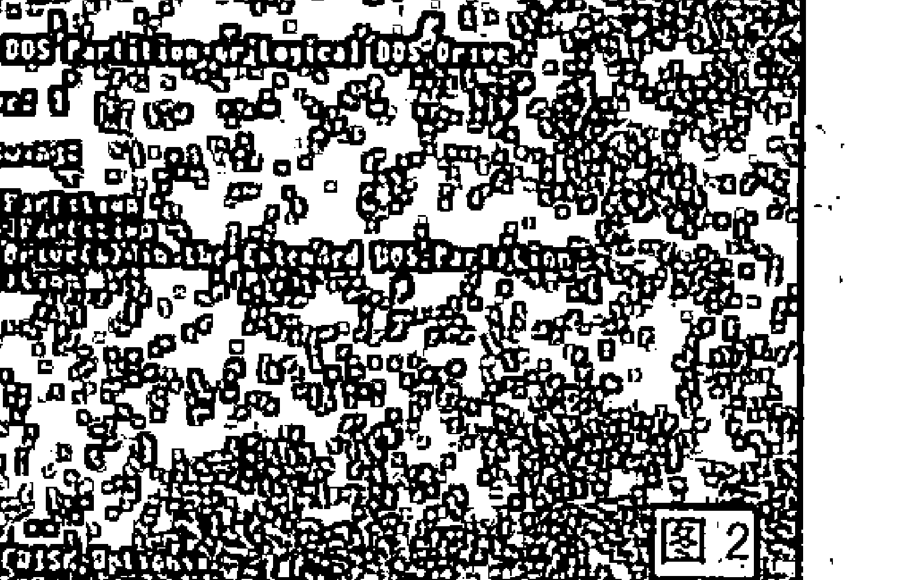

选择第一项，会出现3个选项，作用依次为创建主分区、扩展分区、逻辑分区。需要注意的是在选择创建主分区的时候，程序会询问你是否要将整个硬盘空间都作为主分区，如果你选择了Y，那么不会再创建其他分区了，也就是说你的硬盘只有一个分区。选择N后，则给主分区划分空间后还可以继续创建其他分区。

我们为硬盘创建完所有分区后，按下ESC，返回主界面，选择第二项，输入数字1来激活主分区。按热启动键，重新启动电脑后再次进入纯DOS，输入Format命令依次对所有分区执行格式化操作。

需要再次对硬盘进行分区时，就选择主界面中的第三项，会出现4个选项（图2），作用依次为删除主分区、删除扩展分区、删除逻辑分区、删除非DOS分区；我们删除分区的操作却与显示顺序相反：先删除非DOS分区，最后才是主分区。在删除分区时，需要你输入要删除的分区的盘符、卷标；再输入Y（图3）并敲击回车键。

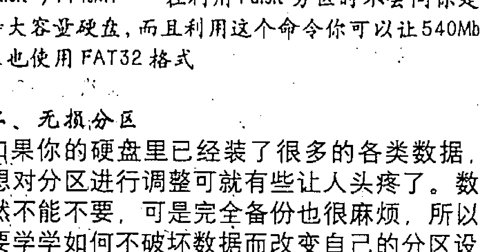

> 小提示：
> Fdisk 还有些鲜为人知的命令：
>
> - Fdisk /MBR - 重写第一块硬盘的主引导记录，有时可以用它来清除感染主引导记录的病毒
> - Fdisk/CMBR <DISK> - 重写指定硬盘的主引导记录
> - Fdisk /PR:100 - 建立一个100MB的主分区
> - Fdisk /EXT:500 - 建立一个500MB的扩展分区
> - Fdisk /LOG:250 - 建立一个250MB的逻辑分区
> - Fdisk /PARTN - 将分区信息保存在一个名为 Partsav.fil的文件中
> - Fdisk /STATUS - 显示现在硬盘的分区状况
> - Fdisk /ACTOK - 不检查硬盘的状态加快分区进程
> - Fdisk /FPRMT - 在利用Fdisk分区时不会问你是否支持大容量硬盘，而且利用这个命令你可以让540Mb的分区也使用FAT32格式

### 二、无损分区

如果你的硬盘里已经装了很多的各类数据，这时想对分区进行调整可就有些让人头疼了。数据自然不能不要，可是完全备份也很麻烦，所以你还要学学如何不破坏数据而改变自己的分区设置。Partition Resizer (http://www.cadvancedap.com/ Zeleps/Files/Presz134.zip) 就是这么一款能够在无损硬盘数据的情况下对硬盘分区容量进行调整、移动硬盘分区位置的小软件。体积只有96KB，支持 Windows 9X/Me/DOS 操作系统。

运行后，你会看到简洁的主界面（图4）。这里有4个选项，第一项是调整硬盘分区容量和移动分区位置。第二项是更改文件系统为FAT16的分区中簇的大小，运行该项将会删除分区中的所有数据。第三项是查看分区信息。第四项是退出程序。

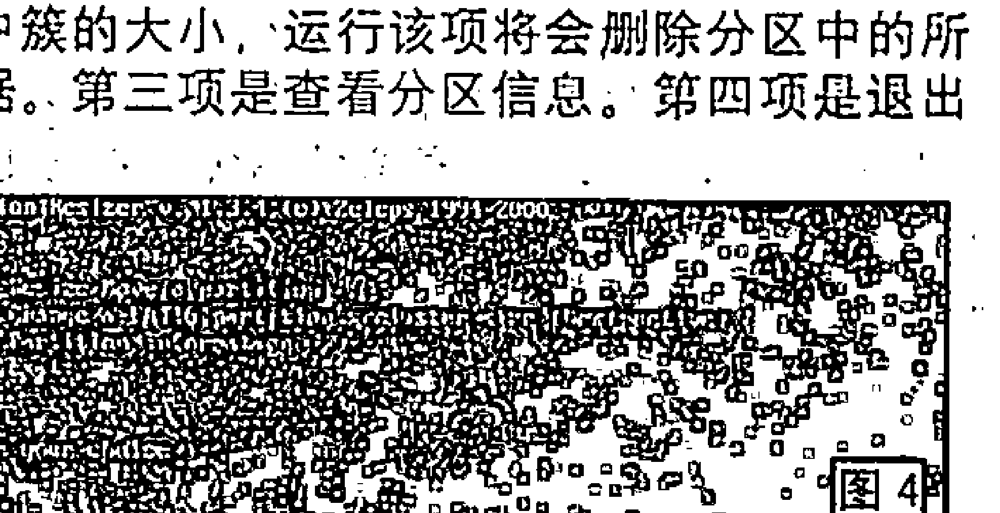

要对硬盘进行分区，按下键盘上的数字键1，然后敲击回车键，会列出硬盘所有的分区及文件系统、盘符、容量等。接着选择分区，敲击回车键进入具体设置界面（图5）。界面上方有一彩色条，其中紫色和淡紫色表方块代表硬盘中所有的分区，绿色方块代表当前你正在进行操作的分区，敲击空格键，可显示出扩展分区。按下键盘上的Tab键可选择当前输入模式（Current Input Mode），提供调整大小（Resizing）和移动分区位置（Moving）。选择Resizing就可以对分区的空间进行调整，方法是利用←和→或是PageUP和PageDown键，你会发现绿色方块所占的面积逐渐在缩小，余下的是黑色方块，而黑色方块代表你分割出来的空间，你可以将该空间添做一个分区。选择Moving模式后，可以移动分区的位置了，同样是利用PageUp和PageDown进行操作。一切完成后，敲击回车键，点击Y，Partition Resizer会进行分区，完成后，重新启动电脑。

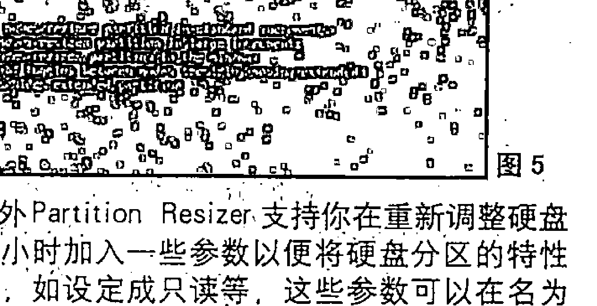

另外 Partition Resizer 支持你在重新调整硬盘分区大小时加入一些参数以便将硬盘分区的特性做调整，如设定成只读等，这些参数可以在名为 Presizer.doc 的文件中找到。

> 小提示：
> 为避免不必要的损失和减少误操作带来的危险，请你在进行无损分区之前最好仔细阅读软件的所有说明文件！

## 让系统住得更宽敞些

□北京 周亚榕

你是不是喜欢住个大房子？那你有没有考虑过让你的系统也住得更舒服些——换块更大的硬盘。可是多大的硬盘才算大？是啊，什么字节、千兆，听着都让人头晕。那就让我们形象地来看看如今的硬盘巨人究竟有多大吧！

首先，你要考虑安装系统所必需的空间。Windows 98需要480MB，Windows 2000至少需要650MB，而 Windows XP 则需要 1.5G 甚至更多。商业化的Linux（比如Red Hat Linux 7）至少需要500MB。下面你还要想想平时经常用到的应用程序，完全安装Microsoft Office 2000需要626MB。同时要提醒你的是，任何软件的安装过程中都还要在你的硬盘上建立不少临时文件，否则你根本别想把它们装好。虽然这些临时文件在安装过程结束后会自动被删除，可是没有相应的空间安装过程也是没法完成。而且只要你开始使用电脑，那就少不了要往你的硬盘里面塞上各种各样的文本文档、电子表格、音乐影视、图片动画等等。那现在流行的80G的硬盘到底能装下多少这些东东呢？它能装下摞起来有1200米高的文件资料、2万首3分钟左右达到CD音质的MP3歌曲、20部由DVD转换的MPEG电影、6个小时的数码摄影机拍摄的影视片段。

现在你觉得 80G 的硬盘真的够大了吗？

## 硬盘新娘的陪嫁

□四川 格式化

当你手里捧着一块崭新的硬盘，一定少不得盘算着如何让它发挥出最大的效率。不过你是不是知道，体贴的硬盘厂家不只让你迎娶了新娘回家，还送了不少的陪嫁给你。如果能把这些小礼物恰当运用，那你会发现自己的新娘更加妩媚动人！

### 一、IBM

1. 静音师——Feature Tool

Feature Tool 是用于开启 IBM 硬盘自动声音管理功能的小工具。提供了低噪音的安静模式和高性能的正常模式，还附带了改变硬盘 UDMA 模式、高级电源模式、显示硬盘温度的功能。它支持 IBM Deskstar 40GV 和 Deskstar 75GX 及以后生产的 IBM 硬盘，对希捷等其它品牌的硬盘也有效。

### 2. 硬盘医生——Drive Fitness

Drive Fitness 能够全面检测 IBM 硬盘的质量和稳定性。它同时还具备清除引导区、低格硬盘的功能。运行 Drive Fitness 后，可自动创建一个包含了 IBM DOS2000 操作系统和 Drive Fitness 工具的启动盘。

### 3. 安全员——SMART Defender（图 1）

SMART Defender 是 IBM 推出的一款界面友好、易于使用的硬盘检测工具。它主要功能有三项：检测硬盘、查看硬盘状态和查看硬盘容量信息。通过评估磁盘系统的可靠程度，预测发生问题的可能性，及时地减少或避免丢失数据造成的损失。

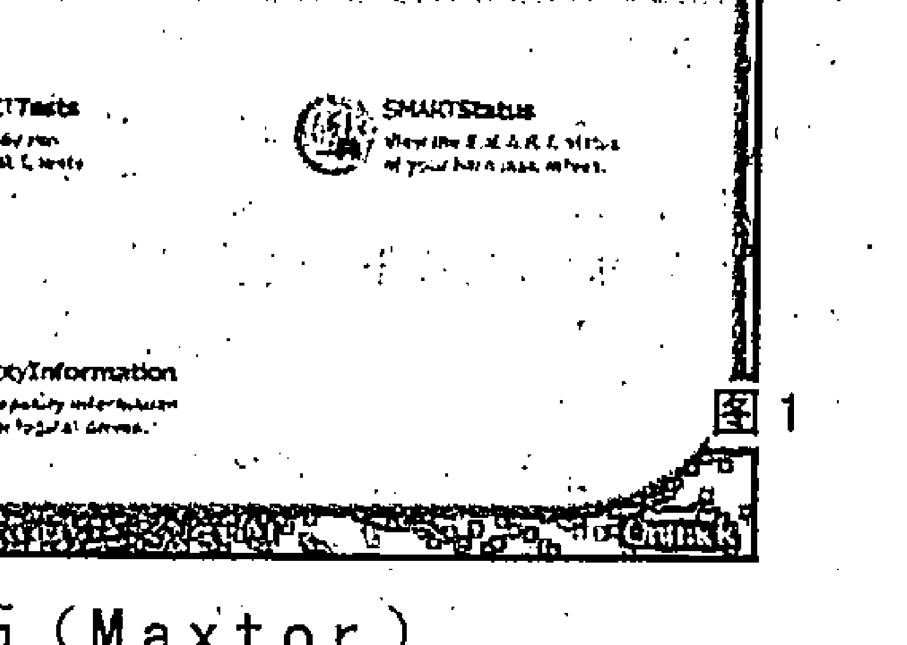

### 二、迈拓（Maxtor）

#### 1. 安然窗——Acoustic Management（图 2）

迈拓推出的 Acoustic Management 也是一款用于硬盘降噪的小工具。利用它可以控制迈拓硬盘工作时的噪音大小。它按控制程度分为 Quiet 和 Fast 两个级别。设置为 Quiet 级别，硬盘将进入安

| 命令 | 描述 |
|------|------|
| amset.exe /quiet | 设置为Quiet级别 |
| amset.exe /fast | 设置为Fast级别 |
| amset.exe /off | 关闭降噪功能 |
| amset.exe /check | 查看当前硬盘降噪功能的运作状态 |

### 2. 小管家——MaxBlast Plus II

这是款非常专业而且易于使用的硬盘工具，在支持鼠标的图形用户界面下，从最初的自动检测、分区到完成格式化，即便是电脑初学者也能轻松操作。当你的硬盘和系统本身出现问题而导致无法进入操作系统时，你可利用由 MaxBlast Plus II 创建的启动盘对硬盘进行操作。

### 3. 预言家——Power Diagnostic（图3）

Power Diagnostic 也就是大家熟悉的 Powermax，是由迈拓官方发布的硬盘检测软件，可以让用户及早发现硬盘的隐患，如坏道、坏扇区、分区格式化错误等等，也可以解决硬盘不能被操作系统正确识别的问题。

### 三、西部数据（Western Digital）

#### 全能王——Data Lifeguard Tools（图4）

整个 Data Lifeguard Tools 软件包内含四个小工具，分别为 Diagnostics、EZ-INSTALL、BIOS Check、Ultra ATA Manager。Diagnostics 是一个功能强大的硬盘检测与硬盘低格工具。它提供了快速检测及全面检测等两种方式，能够为用户全面而细致地检测硬盘，修复检测中所发现的错误并且打印出检测报告。EZ-INSTALL 是磁盘管理程序，该工具能对西部数据硬盘进行快速分区与高格，能够突破主板对硬盘容量的限制。另外 BIOS Check 能够报告系统检测到的物理驱动器数量以及驱动器的一些信息资料，同时记录下信息以备用户在必要的时候可与西部数据技术服务部门进行交流。而 Ultra ATA Manager 则能够将西部数据硬盘的传输模式在 Ultra ATA33/66/100 之间相互切换。

### 四、希捷（Seagate）

#### 1. 套错小子——SeaTools Disc Diagnostic 桌面用户版（图5）

当系统出现故障时，使用 SeaTools Disc Diagnostic 就能够帮助我们找出故障的所在，是硬盘的问题还是其他软、硬件的问题。这款硬盘工具支持检测希捷所生产的各种硬盘。

#### 2. 磁盘能手——Disk Wizard（图6）

Disc Wizard 2002 可以帮助你方便地安装希捷的硬盘，它把 Disk Manager、Disc Wizard Starter Edition、Boot Wizard、SeaTools Disc Diagnostic 等工具揉合到了一个程序里，可以为你创建一张启动盘，帮你处理希捷硬盘的几乎所有问题，还可以复制文件、分配盘符、为硬盘进行分区等等。

## 硬盘怪杰

□北京 周亚榕

在硬盘的历史上有很多让人忍不住拍案叫绝的“怪杰”，想不想也和它们认识认识？

### 一、最小的硬盘

麻雀虽小，五脏俱全，IBM 的 Microdrive 就是这么个硬盘王国里的小个子。虽然还不到 3 厘米大，但是跟存储卡不同，它可是货真价实的硬盘小子。

### 二、最薄的硬盘

你是不是也喜欢纤细的身材，看看西部数据的这款 Portfolio 硬盘够不够苗条？

### 三、最坚固的硬盘

由于受技术的限制，移动性越强的产品在性能上往往也就越受限制。昆腾（现在已经为迈拓兼并）出品的这款“固态硬盘”集成大量的 RAM 芯片并采用 SCSI 接口，速度快得惊人，当然价格也高得惊人！

## 呵护硬盘有诀窍

□北京 周亚榕

你的硬盘有没有闹过脾气？比如在读写数据时发出刺耳的吱吱声。硬盘是电脑中最常用、最重要的存储设备之一，也是故障机率较高的设备之一。其实只要在使用的过程中细心呵护，硬盘的稳定性还是能够值得我们信赖的。

### 一、防震动

硬盘是十分精密的存储设备，主要依靠磁头与盘片之间的协作读写数据。在工作时硬盘的磁头在盘片表面的浮动高度只有几微米，如果发生较大震动，就可能使磁头与数据区相撞击，导致盘片数据区损坏或划盘。硬盘的物理损伤往往是由此而产生的。因此，在电脑开机时绝对不能移动主机，每次完成工作后也一定要正常退出操作系统，等主机面板上硬盘的指示灯灭掉后再关机。这样你的硬盘才不至于过早献出宝贵的生命。

Active SMART Monitor (http://www.panterasoft.com/asm.exe) 利用 S.M.A.R.T (自我监测分析报告技术) 可以监视硬盘的健康状态，而且使用特殊的算法预知可能发生的磁盘故障来防止数据丢失。Active SMART Monitor 安装完成后会在系统启动时自动运行，并安静地退居系统托盘区，双击小图标后你就能看到软件的主界面 (图1)。在 General (常规) 和 Extended info (更多信息) 两个选项卡下你能了解硬盘和每个分区的具体使用情况。而在 S.M.A.R.T 选项卡下会把可能出现问题的项目列出，并根据硬盘的具体情况给出潜在问题可能会最终在什么时间爆发。不过这个时间并不绝对，它随时根据侦测到的硬盘数据变化而进行调整，所以你并不必因此而草木皆兵。当然了，如果软件长时间集中对某一项参数提出警告，那你最好还是认真对待。

### 二、防病毒

计算机病毒已经成为电脑公害，它们隐藏深、传播快，而且危害性大。很多病毒会对系统、数据进行破坏，甚至对硬件也有损害。如果因为病毒作怪使而硬盘某些参数遭到破坏，那硬盘的寿命也会受到影响，所以防病毒也是硬盘维护中需要特别注意的一点。

如果你还没有购买正版的杀毒软件，可以下载一个免费的 AVG Anti-Virus (http://www.grisoft.com/softw/60/fe/avg6373fu_free.exe)。别看它不要你花钱，但功能可不弱，自动升级病毒库、查杀电子邮件病毒、自定义查杀时间等等全都会 (图2)。有了它的帮助，你的硬盘应该能在病毒面前挺起腰板了。

### 三、防高温

硬盘的主轴电机、步进电机及其驱动电路工作时都要发热，在使用中要严格控制环境温度，微机操作室内最好配备空调，将温度调节在 20-25℃。在炎热的夏季，要注意监测硬盘周围的环境温度，不要超出产品许可的最高温度 (一般为 40℃)。

为了能及时了解硬盘的温度，你可以下载 HDD Temperature (http://www.hddtemperature.com/hddt1.exe) 这个小软件 (图3)。通过它可以设定硬盘最高可承受的温度 (Maximum temperature)，当硬盘温度过高时，可以让硬盘进入休眠状态 (Hibernate on overheat) 以缓解压力。

当然，除了经常注意测量硬盘的温度外，用适当的手段给硬盘降温也是必需的。尤其是如果你买了一款 7200 转的硬盘，那它的发热量可是不能小视，所以还是去买个硬盘风扇为它吹吹凉吧 (图4)。

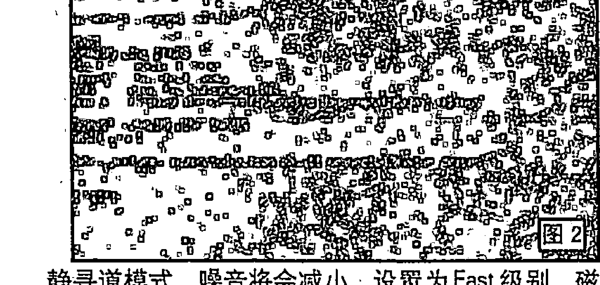

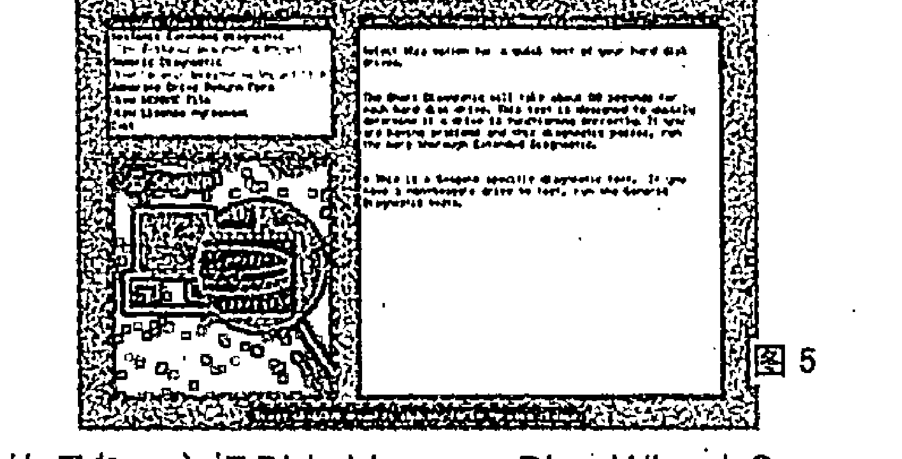

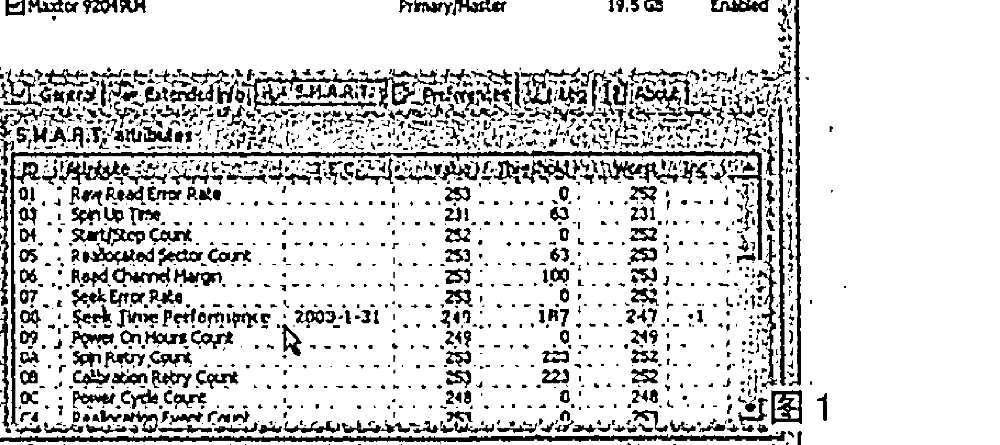

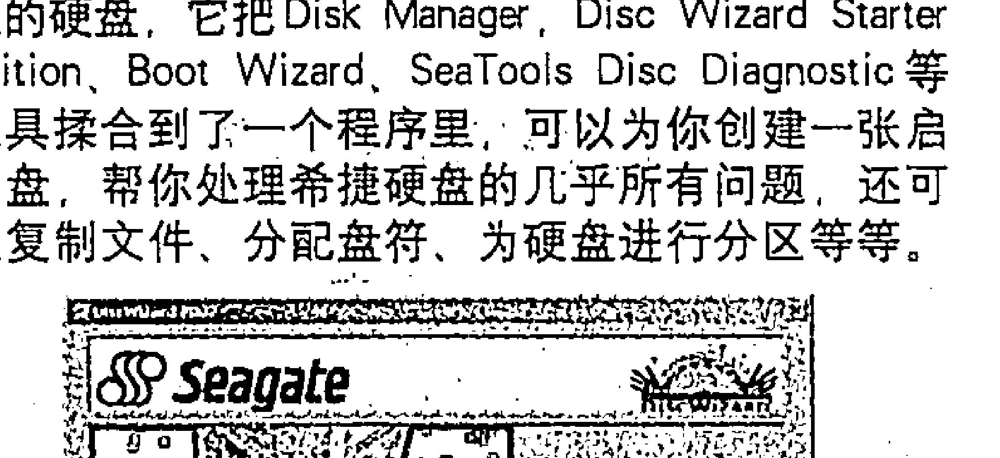

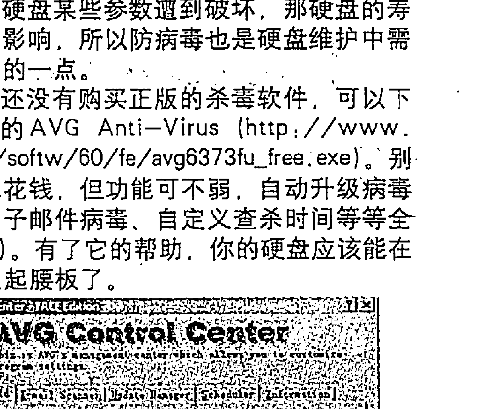

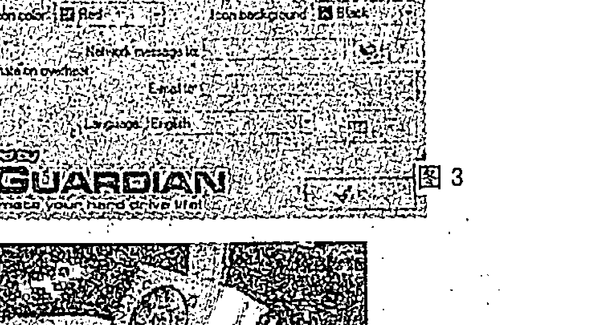

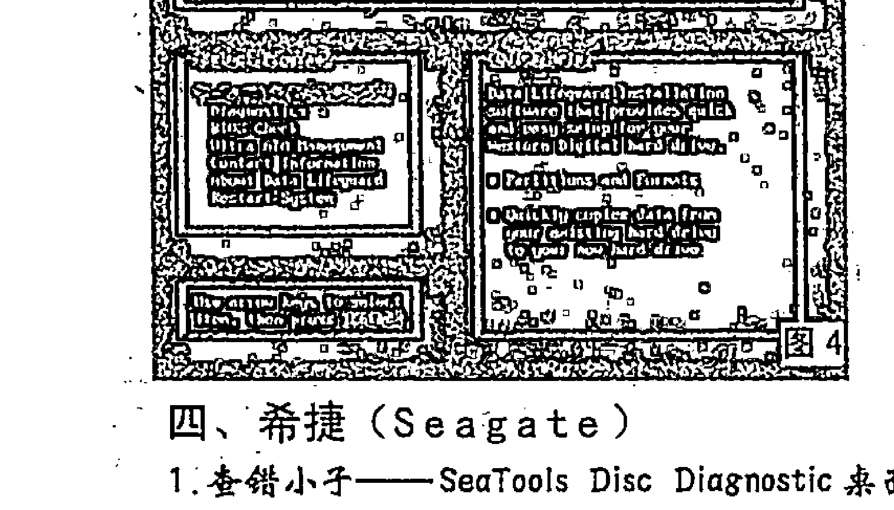

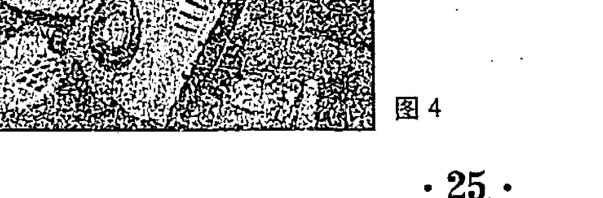

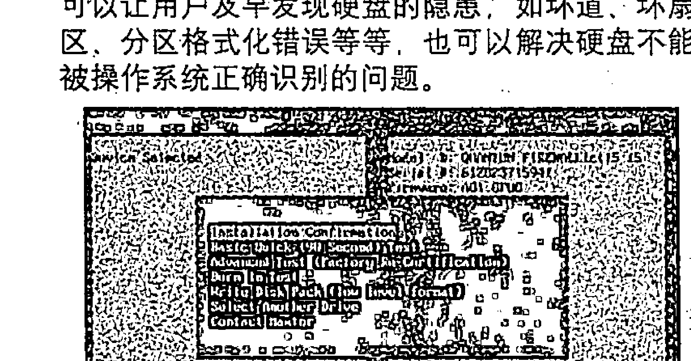

## 特别话题 FOCUS

### 四、忌杂乱

硬盘大了，存放的文件也多了，可是随之而来要注意的就是不能太杂乱。过多的“垃圾文件”浪费了硬盘空间，影响运行速度。而且硬盘在使用一段时间后，文件的反复存放、删除，往往会使许多文件，尤其是大文件在硬盘上占用的扇区不连续，看起来就像一个个碎块。硬盘上碎块过多会极大地影响硬盘的速度，甚至造成死机或程序不能正常运行。Windows系统配备的“磁盘碎片整理程序”就是来帮你的硬盘打扫家务的。

如果你是个新手或者电脑中的数据实在很重要，那么配上一块硬盘保护卡也可以保护自己的操作系统免受误操作或意外删除的破坏。对于像误删、误改、病毒恶意破坏硬盘、误改CMOS及硬盘设置参数，甚至硬盘格式化等危险操作，只要重新开机，就能轻松恢复，完好如初。硬盘保护卡根据功能的不同，价格也从几十元到几百元不等，具体挑选哪一款还要你根据需要来定。（图5）


除此之外，你还应该时刻注意让你的硬盘远离音箱、大功率的变压器等有强磁场的物体，以免硬盘中记录的数据因磁化而受到破坏。在多雨的季节还应经常开机使用，使主机通过自身的发热蒸发水汽，保证环境的干燥。

## 破除双硬盘的“谣言”

□北京 周亚榕

很多电脑爱好者的电脑里都装了不只一块硬盘，可是关于双硬盘安装的“谣言”也不少。如果不及时破除这些“谣言”，大家在选配、使用双硬盘的过程中就会走不少的弯路。

- 谣言一：双硬盘没有一块硬盘速度快
  如果你安装在同一台电脑主机里的两块硬盘转速不同，那么较快的那块硬盘很可能会受到速度较慢的那块硬盘的拖累。但是如果你的双硬盘转速一样，那么在使用上不会出现双硬盘比单硬盘慢的现象。

  如果你想知道自己硬盘的速度究竟有多快，那你可以试试HD speed这个免费的小软件 (http://ln.skycn.net/down/HAF-HDSpeed10120-Ronnier.zip)。软件很小，只有一个可执行程序。默认情况下它可以帮你检测硬盘的连续数据传输率，如果你将测试突发速度的复选框勾中，那它还可以告诉你硬盘的突发数据传输率（如图）。

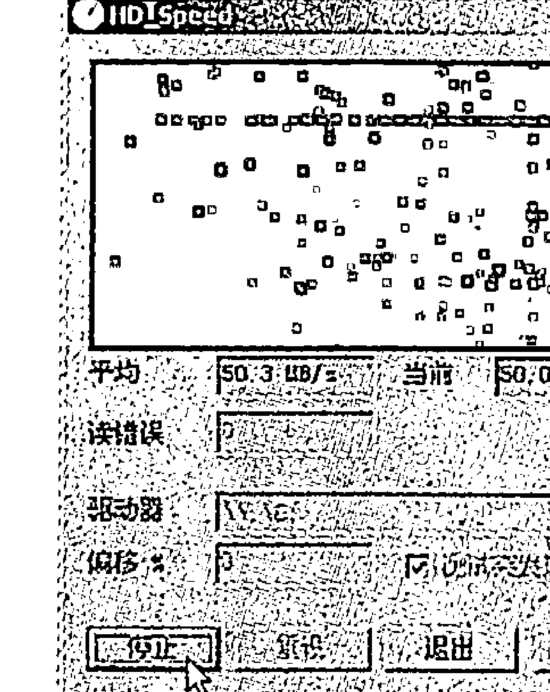

- 谣言二：两块硬盘最好是同一个厂家生产的
  这也是个误区。硬盘厂商生产硬盘的性能指标是标准的，而且不会像内存由于采用内存颗粒不同存在兼容性问题，所以尽管你的硬盘可能并不是同一厂家生产，在使用上也不会产生冲突，出现问题。如果双硬盘安装后出现不能同时正确识别，那可以将新硬盘放在第二硬盘线上使用。如果必须使用同一硬盘线，那么就将两块硬盘的主、从关系对换一下。新老硬盘不能“和平共处”很可能是由于传输模式冲突，老硬盘都用PIO传输模式，现在的都用DMA传输模式，因此可以试着把现在的硬盘设置为PIO传输模式看能不能解决问题。不过，如果两块硬盘相差年代过于久远，还是尽量不要同时使用。

那么安装双硬盘有没有什么注意事项呢？最重要的是注意散热，两个硬盘间空隙不能太小，且尽量不要超频。否则由于散热不好使硬盘工作不正常，造成数据丢失之类的现象可就得不偿失了。如果在安装过程中你对双硬盘的设置有疑问或者在安装后出现盘符交错的现象，那你可以参考《电脑爱好者》2002年第12期“硬用总汇”栏目的相关介绍。

## 硬盘故障解决

□北京 周亚榕

硬盘虽然比起软盘等存储设备要稳定得多，也免不了在使用的过程中出现这样那样的问题。你只要掌握了解决的步骤和方法，硬盘故障并不可怕。

### 一、排除故障有步骤

首先，如果在开机启动的过程中，如果电脑无法启动，你应该先记下系统提示的错误信息，确定是否和硬盘相关。有关硬盘的故障提示主要有以下几种：

- Fixed disk failure（固定磁盘出现故障）
- Hard disk controller failure（硬盘控制器故障）
- Hard disk fail(10)（硬盘资料混乱，资料无法重新修复）
- Hard disk fail(20)（硬盘初始化错误）
- Hard disk fail(80)（无法从硬盘重新开机）
- Invalid media type reading drive C:（硬盘参数不匹配）

这些问题往往和硬件的设置有关，你只要一条条检查自己硬盘的安装与设置，排除可能造成问题的原因，最终就可以确定症结所在了。首先你应该检查一下自己硬盘的跳线和数据线连接是否正确，如果还有其它数据线也可以将硬盘的数据线更换一下确认数据线没有问题。然后进入主板的BIOS，在检测硬盘一项中选择Auto，让主板自己查找硬盘的型号与规格。如果主板查找到的硬盘型号、规格与实际不符，你需要更新主板的BIOS或者使用识别大硬盘之类的软件帮助主板正确识别你的硬盘。如果在这些工作都进行完了之后仍然出现上面的提示信息，那你最好将硬盘拿到其它的电脑上进行识别，以确认硬盘本身没有故障。除此之外主板也可能是罪魁祸首，不过要在所有应该检查的方面都确认无误后再来怀疑它。

### 二、关注坏道不能忘

在日常使用电脑的过程中，如果发现平时某些曾经打得开的文件突然无法打开，并且在打开文件的过程中能听到硬盘读盘的吱吱声，那你的硬盘很有可能已经产生了坏道。首先你可以打开Windows的资源管理器，右键单击出现坏道的硬盘分区，在弹出的右键菜单中选择“属性→工具→查错状态→开始检查”，再在“扫描类型”中选“全面检查”，将“自动修复错误”选中并开始检查后，Windows系统将对硬盘做完全扫描处理，并且对可能出现的坏簇做自动修正。

> 小提示：
> 你也可以用Windows98的启动盘引导电脑，然后键入“scandisk X:”来扫描硬盘，其中“X”是具体的硬盘盘符。

不过磁盘扫描程序往往只能修复硬盘的逻辑坏道，如果硬盘已经造成了物理损害就无能为力了。为了不让已经形成的磁盘坏道迅速扩散影响硬盘的其他部分，你最好将坏道的位置记下，然后把硬盘高级格式化，将有坏道的区域单独划成一个分区，避免使用。

如果因为病毒或者误操作等其它原因造成存储在硬盘上的重要数据丢失，那你可以参考《电脑爱好者》2002年第2期“特别话题”栏目的文章自己尝试着恢复数据。不过在恢复数据前尽量不要再向硬盘进行读写或者删除文件的动作。当然了，你要是不敢冒这个险也可以找一些专业的维修人员替你恢复数据，但收费可能会高达几百元，是否值得还要看你的数据有多重要。CF

## 芝麻，开门！芝麻，关门！

□策划 CFan·哑锣

你一定听说过阿里巴巴的故事，只要善良而幸运的阿里巴巴念动咒语，那扇大门就会自动地打开或者关闭，深藏在洞中的财宝就会任凭主人发落。其实你的电脑系统就是一座宝库，这里面有各种各样的宝贝等着你去发掘。可是怎么样才能让电脑也开关自如呢？虽然咒语它不撞，但它也有自己的一套“芝麻”法则，让我们一起出出进进电脑的大门。

> 这次的专题讲了些什么
> 花样开机
> 秘密开机
> 快速开机
> 开机全攻略
> 快捷关机
> 特色关机
> 关机有学问

## 开机也有花样玩

□湖南 双龙一剑 辽宁 鸣涧

简单的开机还能玩出什么花样，“Power”一下不就得了。不知你是否也有这种想法？其实啊，这开机的学问还大着呢！

### 一、BIOS 要熟悉

为了实现这些功能，有时也许你还要升级BIOS或者了解一下主板的特点，这就需要查看BIOS的信息。而对于电脑初学者和拥有老主板（甚至是“杂牌”主板）的朋友来说可是件挺麻烦的事。不过你可以利用BIOS Wizard (http://www.esupport.com/bioswiz/bwz.exe) 这款可以在Windows下查看BIOS信息的小工具来帮忙。你只要点击“Get BIOS Info”按钮就能获取BIOS信息。

### 二、键盘催机开

实现键盘开机，你只要轻轻松松在键盘上按下几个键就能打开电脑。首先你得检查一下硬件是否支持。电源电流一般不能小于750毫安；主板必须为ATX主板，同时还得支持键盘开机。如果你不能确定主板是否支持，可开机进入BIOS，看看有没有类似“Wake up By keyboard”（一般在“POWER”或“POWER MANGGEMENT SETUP”中）。下面我们来看一个具体的键盘开机的例子吧。

### 三、Modem 请机忙

Modem开机就是通过上网用的“小猫”启动计算机。它的实现也同样需要电源和主板的支持，电源电压为5V，电流需750mA以上；至于主板，现在市面上的主板几乎都支持Modem开机。下面咱们以微星的K7Tpor2NL-A为例，介绍一下Modem开机的实现。

首先把Modem正确安装，装好驱动程序使它能正常上网后关机。如果是内置Modem还需找到主板上的调制解调器唤醒接头（一般在机箱面板线接头附近），像微星的K7tPor2NL-A其唤醒头在该面板线近旁并标有“JMDM1”。找到唤醒头后，用线把它与Modem上对应接口相连。然后开机进## 四、内部网上也开机

目前市面上销售的各类主板，基本上都具备网络开机功能。不过这可不是指Internet网络，而是指局域网内实现的“网络唤醒”。实现网络开机需要支持远程网络唤醒功能的主板（此项功能被称为Wake On LAN，简称WOL）和网卡。其次还需要安装符合ATX 2.03标准的ATX电源，而且其+5V Standby电流至少应在720mA以上。

在使用网络开机之前，还需进入BIOS设置程序，打开“POWER MANAGEMENT SETUP”选项，将其中的“Resume On LAN”或“Wake On LAN”选项设置为Enabled。下一步要做的是获取网卡硬件地址。在Windows 9x系统中可以使用Winipcfg.exe工具查询获得。在Windows 2000系统中可以打开“附件→系统信息”，然后查询到网络适配器的MAC地址。
小提示：网卡的硬件地址是一组数字组合，比如00-E0-4C-E4-11-60，在同一局域网内，不能有两块网卡的硬件地址一样，因此可作为网卡的唯一身份标识。

一切准备工作都做好后，还需要通过相应的软件向网络发出含有该地址的特殊数据包，这样就可以通过开机信号通知主板开机。AMD公司制作的Magic Packet（http://www.esoftware.com.cn/file/network/rlogin/2001052902.shtml）就是一个好用的小工具。你只要执行主菜单上的“Magic Packets/Power On One Host”命令，在“Send a Magic Packet to One Host”对话框中把要唤醒电脑的网卡硬件地址输入“Destination Ethernet Address”地址栏中，单击“Send”按钮就可以让指定的电脑开机启动了。

小提示：开机的方法其实还有很多。如果你的系统出现故障无法启动，你完全可以使用能够启动的软盘、光盘或者USB闪盘开机。

## 关卡，是这样设置的

□湖南 双龙一剑 四川 格式化

与电脑为伍，谁不希望能“独霸一机”？毕竟这里面有自己的珍藏和秘密，其实只要为你的系统打造一架防盗门，别人只有迈过这道关卡才能进入系统不就齐备了？

### 一、华山一条路——BIOS关

每次开机，你都会与BIOS打交道，它是操作系统和硬件之间连接的桥梁，负责在电脑开启时检测、初始化系统设备、装入操作系统并调度操作系统向硬件发出的指令。利用BIOS中的密码功能，你可以为自己爱机加上一把锁。下面就让我们以AWARD BIOS为例，看看究竟该如何上这把锁。

首先在开机后，通过按下Del键你就可以进入BIOS，这其中有两项是用于设置密码的。其中一项是SUPERVISOR PASSWORD（超级用户密码），另一项是USER PASSWORD（普通用户密码）。设置密码的方法是将光标移动到某项，敲击回车键后，输入6位数的密码，接着再敲击回车键，再次输入密码确认即可（图1）。这两项不同之处是：一旦设置了SUPERVISOR PASSWORD，那么USER PASSWORD就只能起到开机时输入密码进入系统的作用，虽然同样可以按下DEL键输入密码进入BIOS，但是无法对CMOS进行设置。而SUPERVISOR PASSWORD就可以对CMOS进行设置。

要想开机时输入密码才能进入系统，还需要选择BIOS FEATURES SETUP（BIOS功能设置），将光标移动到 Security Option 处，按下PageDown键进行System和Setup之间的选择。如果你选择System，那么在每次开机启动时都会出现一个白色窗口，需要输入正确的密码后才能进入系统；选择Setup，那么只会在开机后按下Del键进入BIOS时需要输入密码。设置好后，按下F10键，选择“Y”，敲击回车键即可生效。
小提示：如果你将电脑设置为只能采用键盘开机，其实也可以达到给你的电脑加密的功能。

### 二、系统防盗门——登录密码

BIOS密码的设置虽然好，不过只要把主板上的BIOS电池卸下给BIOS放电，那这个密码的设置可就失效了。所以如果你还想进一步确保自己电脑的安全，还可以利用Windows系统的登录密码实现自己的愿望。

- 1. Windows 9X用户版
对于使用Windows 9X的朋友来说，最重要的是堵住能跳过关卡的漏洞。你只要依次点击“开始→运行→regedit”，进入注册表编辑器。找到“HKEY_LOCAL_MACHINE\Network\Logon”键，然后在右侧窗格创建一个DWORD值“MustBeValidated”，并将键值设为“1”后退出编辑器。现在，谁也别想能骗开Windows的门了！

- 2. Windows 2000用户版
你用的是Windows 2000，那么你只要确保“要使用本机，用户必须输入用户名和密码”前打上勾就可以了。

- 3. Windows XP用户版
对于WinXP的用户来说就更简单，只要在系统安装结束后，设置用户时创建好密码（图2）便可以了。

你的关卡设置得怎样了？如果想在用户进行身份验证前，先来些提示美化你的防盗门，你还可以进入注册表，找到“HKEY_LOCAL_MACHINE\Software\Microsoft\Windows\CurrentVersion\Winlogon”子键，在右侧窗格找到字符串值“LegalNoticeCaption”（显示窗口的标题栏）和“LegalNoticeText”（显示窗口的内容），根据自己的需要进行调整后马上退出重启。看看，感觉好不好？

## 时间就是金钱——让系统启动得更快

□北京 Stano

现代社会的节奏非常快，每位与电脑打交道的朋友也总是希望自己的电脑快上加快。可是每次进入Windows系统时总是要经过难熬的等待，真是急煞人。那怎么样能够让我们的系统启动得更加快些呢？

### 一、揭露“发家史”

- 1. 按下电源开机，电源开始向主板供电，同时CPU执行跳转指令启动BIOS。
- 2. BIOS加电自检后检测系统中的显卡、CPU、内存等一些关键设备是否存在和能否正常工作后，检测、初始化硬盘、光驱、软驱等硬件设备，显示系统配置表。
- 3. 系统BIOS更新ESCD后根据用户指定的启动顺序从软盘、硬盘或光驱启动。

小提示：ESCD（即扩展系统配置数据）是BIOS用来与操作系统交换硬件配置信息的数据，这些数据被存放在CMOS中。通常ESCD数据只在系统硬件配置发生改变后才会进行更新，所以不是每次启动机器时我们都能够看到“Update ESCD…Success”这样的信息。

- 4. Windows 9X下面将执行msdos.sys、system.ini、autoexec.bat和config.sys中的设置并载入系统文件，而Windows 2000则只是通过NTLDR读取boot.ini信息后进入系统。
- 5. 载入系统安装的字体并显示桌面后执行所有系统启动自动运行程序。

### 二、让Windows 9X健步如飞

了解了系统开机的原理，你一定看出来与Windows 98系统启动密切相关的有四个文件：autoexec.bat、config.sys、system.ini和msdos.sys。不过一般来讲，除非你安装了在DOS模式下查杀病毒的杀毒软件，否则autoexec.bat应该是空的。至于其它三个文件的设置就很有可能会延迟系统启动的时间。比如为config.sys这个文件添加一句stacks=0,0就很有可能会加快系统的启动。不过你最应该注意的还是system.ini和msdos.sys两个文件。

首先你应该右键单击system.ini并选择“编辑”，在[386Enh]字段下添加LocalLoadHigh=1。这样电脑会把系统需要加载的文件先存放在内存的高端，进入系统的时间也会加快。而添加DMABufferSize=64会告诉电脑为DMA数据传输保留尽可能多的内存，这不仅可以加速系统的启动，也可以提升整个Windows系统的运行速度。

下面最好以同样的方式打开msdos.sys文件，添加这么几句：

```
Logo=0
Drvspace=0
Dblspace=0
DisableLog=1
AutoScan=0
BootKeys=0
BootMenu=0
```

除了用手工修改的方法，有些小软件使用起来也是非常方便。你不妨试试Bootcelerator（ftp:/gd.tuwien.ac.at/pc/simtelnet/win95/util/bootcell.zip），这个专门针对Windows 9X而设计的小软件就是利用对msdos.sys文件的处理从而达到其宣称的将系统启动所需时间降到30秒（图1）。

### 三、20秒钟就能开机

Windows 2000/XP的开机过程不象Windows 9X那样可以有众多项目进行调整，不过利用另一个功能只需20秒钟你就能一步迈进Windows。这里用到的就是“似睡非睡”的休眠功能。利用它，系统可以在关机之前把内存中的数据写入硬盘，下次开机的时候直接将硬盘映像读回内存，一切和你上次关机的时候一样，相应的程序仍然在运行。

首先你必须进入“控制面板”双击打开“电源选项”以便启动休眠功能。如果你的电脑符合启用休眠功能的要求，那你会在“电源选项属性”中找到一个“休眠”选项卡，按下其中的“启用休眠”支持就大功告成了（图2）。现在你依次点击“开始→关机”就会发现在可执行的操作中多了一个“休眠”选项。

小提示：在采用休眠关机之前你还需要把正在编辑的文件全部保存，将下次进入系统不希望继续执行的程序全部关闭。

### 四、系统工具也不赖

如果你使用的是Windows 9X或者Windows XP，那系统还提供给你一个系统配置实用程序。利用这个小工具，你不仅可以调整Config.sys、Autoexec.bat、System.ini、Win.ini等系统配置文件，还可以控制系统启动时自动装入的驱动程序或软件，这同样可以让Windows的启动更加畅快。

你只要依次点击“开始→运行”，输入Msconfig并回车后就可以打开系统配置实用程序。首先选择“启动”标签，把不想在每次启动Windows时都需要载入的程序前的对勾去掉。其次选择“Win.ini”标签，然后单击紧挨着窗口区域的“+”，找到以“load=”或“run=”起始的行，将所有不想载入的选项前面的对勾去掉就可以了。

如果你使用的是Windows 2000，那很不幸你在系统内找不到Msconfig这个工具，不过解决办法也还是有的。你可以将Windows XP下的Msconfig.exe这个文件复制到Windows 2000安装路径中的system32这个目录下或者下载一个专门为Windows 2000编写的Msconfig（ftp://61.159.224.203/cba2002/msconfig_w2k.zip）工具。

系统一般会有些默认的启动项，有些可是必不可少的，调整之前还是先来看一看吧。
TaskMonitor C:\WINDOWS\taskmon.exe 任务检测程序，这个监视器将记录你使用软件的情况，然后将这些资料保存到windows\applog的applog.ind文件中。
internat.exe internat.exe 这个internat是输入法图标的工具（系统托盘区En字样的图标）。如果你的电脑里只装了一种输入法那你就不需要运行它了。
ScanRegistry C:\WINDOWS\scanregw.exe /autorun 注册表备份程序，每次开机都备份一次注册表。如果你是个菜鸟，建议你还是使用这项功能，以免被恶意网意钻了空子。
SystemTray SysTray.Exe 管理驻留内存的程序，这对解决电脑启动的速度也有帮助。
Scheduling Agent C:\WINDOWS\SYSTEM\mstask.exe 系统计划任务程序，一般用处不大。
LoadPowerProfile Rundll32.exe powrprof.dll,LoadCurrentPwrScheme 电源管理程序，如果禁用掉后，在控制面板一电源管理，里面设置的就没有效果了。

## 和你的 Windows 说再见

□北京 Stano

人生中充满了聚散离合，即使是和电脑中的Windows系统也少不了说再见。可是你知道和Windows说再见的方法都有哪些吗？

### 一、自己动手 关机搞定

如果你使用的是Windows 98，那可以选择一种比较干脆的方式。首先在桌面上单击鼠标右键，选择新建→快捷方式，在“请键入项目的位置”框内输入“RUNDLL.EXE user.exe，exitwindowsexec”（重新启动）或者“RUNDLL32.EXE user，exitwindows”（关闭系统）。输入完成后按“下一步”后为你的快捷方式选取相应的名字，这样你和Windows 98说再见的快捷方式就会出现在你的桌面上了。

如果你使用的是Windows 98/ME，那还有一种“拖泥带水”告别方式。你只要在快捷方式的“请键入项目的位置”框内输入“runonce.exe -q”，这样建立的快捷方式会在重启系统之前留出15秒的时间（图1），是不是有点依依惜别的味道？

## 开机问题全观察

□四川 格式化 北京 Stano

使用电脑的第一步就是开机，如果这时电脑出了问题那份着急的心情真是无以言表。不过电脑是个科技的产物，它的每一步计算和运行都有着严格的轨迹可循。即使它真的罢工不干了牵扯的可能实在不少，但只要胆大心细一定能找漏洞所在。下面我们就按照开机问题发生的时间做一个全程观察。

### 一、此时有声胜无声

很多朋友都遇到过在按下电源后电脑没有正常启动而是发出有节奏的嘟嘟声的情况。这是BIOS在检测硬件时发现错误而发出的报错鸣声，这些长短相间的鸣声所代表的含义对我们自己动手解决电脑问题是很有帮助的。不过如果你的电脑启动后，屏幕一片漆黑，也没有任何报错的鸣声，你是不是会有“此时有声胜无声”的感觉？

遇到这种情况不用急，其实解决的办法很简单。这种情况一般是由于CPU安装得不够牢固，所以导致系统无法工作。你只要将电源按钮持续按住不放将主机电源关闭，然后把电脑的CPU拔下重新安装就可以了。如果反复重新安装后仍不能正常工作，建议把CPU放到其它的电脑上测试一下，看看会不会CPU本身已经损坏。

### 二、敲敲打打修台阶

很多朋友在电脑中安装了双系统，例如让Windows 98和Windows 2000和平共处，这样能兼有两种操作系统的不同优点，确实是一机多得。可是如果脆弱的Windows 98崩溃了，不得已再次重装Windows 98后，你会发现开机后Windows 2000带给你的双操作系统启动选择菜单没有了。进入Windows 2000的“台阶”不见了，你怎么享受Windows 2000卓越的稳定性呢？

其实修理这个台阶的方法有很多，比如手工编辑boot.ini文件或者利用Windows 2000的紧急修复盘，总之自己在电脑上敲敲打打就能立时解决。不过利用Windows 2000安装光盘进行修复应该最为方便，所以你最好还是先进入Windows 98，然后放入Windows 2000的安装光盘，启动安装程序，文件拷贝完成后需要重新启动。在进入“欢迎使用”安装界面以后按下“R”键选择“修复Windows 2000的安装”，再次按“R”键选择“要用紧急修复过程修复Windows 2000安装”，然后按“F”键选择“快速修复”，接下来则按“L”键选择“没有紧急修复软盘”。在几秒钟之内安装程序就可以找到Windows 2000，然后敲击回车键，经过短时间的等待即可修复完毕。重新启动机器后就可以看到双系统启动选择菜单了。

### 三、蓝天白云后的秘密

有时我们开机进入Windows的蓝天白云后，却发现没有心情欣赏这熟悉的美景，电脑死机了！在这个时间发生问题的原因有很多。首先最可能硬件问题，如果你刚刚新安装了某个硬件，那你最好将这个硬件设备先暂时移除，以便确定是否由于它才造成死机。如果在此之前没有安装新的硬件，那也有可能是原来的某些硬件设备出现了这样那样的问题，你最好将最有可能发生问题的主板、CPU、内存和显卡逐个用替换大法查查。

当然了，除了硬件的问题，软件上也是有可能的。你可以在开机后按下F8键，调出启动选项菜单并选择Step-by-Step confirmation选项来一步步执行Config.sys和Autoexec.bat中的每一行。如果当执行到某一行时造成死机，那你就可以确定究竟谁是罪魁祸首了。然后你可以重新启动进入DOS环境，用edit命令打开Config.sys或Autoexec.bat，然后在相关的条目前加上rem字样。这样你就可以顺利进入Windows系统了。

### 四、刚刚进门就送客

有时当我们刚刚开机进入Windows，还没有进行任何的操作，系统就会毫不客气地发出送客的指令“你现在可以安全地关闭计算机了”。是不是实在没有礼貌？

小提示：系统开机故障很多情况下可以利用Windows的安全模式进行解决，快去看看“系统应用”栏目的文章吧！

## 功能，但是办法总还是有的！

首先你还是需要下载安装 Kill Win 这款免费的小软件，然后在 Settings 选项卡下将 Start Kill Win automatically with every Windows-start 选中，这样 Windows 每次启动后，Kill Win 都可以自动运行。利用 Kill Win 实现关机自运行主要是依靠 Kill Win 的命令行模式，所以你还要了解一下它所支持的命令参数都有哪些：

- /b - 重启电脑
- /d - 打开 DOS 模式窗口
- /f - 关闭所有的文件夹
- /l - 注销 Windows 用户
- /p - 关闭所有进程
- /r - 重启系统
- /s - 关闭系统

下面你需要做的是了解 Kill Win 的安装路径（比如 C:\KillWin）。然后依次点击“开始→程序→附件→记事本”并根据自己需要 Windows 执行的操作键入需要的命令，例如：
c:\killwin\killwin /f（先关闭所有进程，保证数据不会丢失）
start /w del /y c:\windows\temp\*（删除临时文件夹内的无用数据，start /w 是为了当有多个文件时不同任务先后等待进行）
c:\killwin\killwin /s（关闭系统）
命令组织完毕后，你就可以按下“文件→另存为”将文件保存为以 bat 结尾的批处理文件，比如 ShutDown.bat。然后用鼠标将这个文件拖至开始菜单建立一个快捷方式（图 1）。这样，以后每次关机只要按下这个快捷方式，就可以先执行你希望的程序或者命令然后再和 Windows 说 Bye-bye 了。

## 三、用户方案任你选

Windows 2000/XP 操作系统对于权限的分配十分严格，不同的用户以不同的权限登录系统，所能进行的操作也是各不相同。这样既能保留个性化的配置，也能保证系统的安全。但是如果你是一个系统管理员或者因为其它原因需要经常切换用户身份，一再地登录、注销实在是觉得麻烦。在 Windows XP 中，微软提供了一项新功能可以让你以一个用户登录，并且打开一些应用程序进行操作，然后再以另一个用户身份登录，切换后系统并不关闭前一个用户进行的操作和打开的程序。

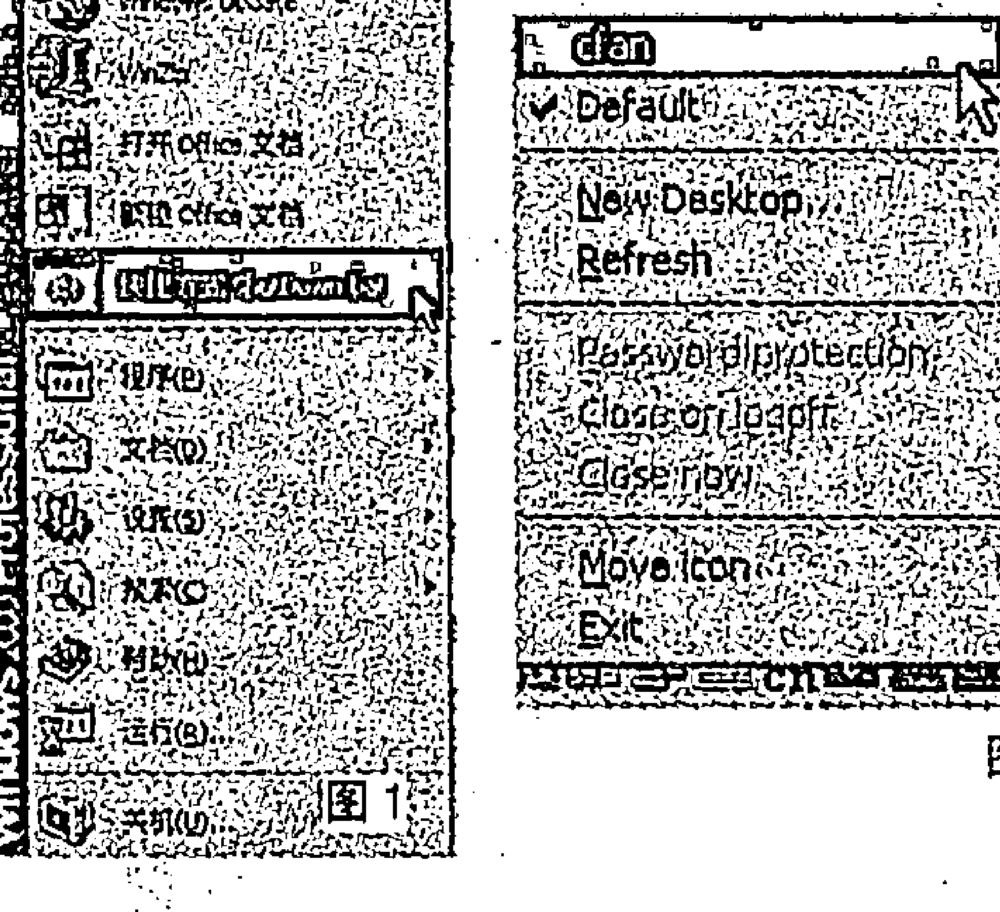

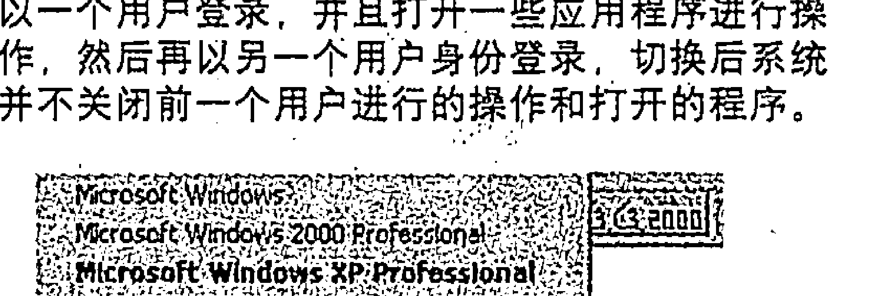

## 二、操作系统任你挑

你的电脑里装了几个系统？有很多朋友可是会同时装上两三个，同时享有 Windows 98 良好的游戏性、Windows 2000 出色的稳定性和 Windows XP 的华丽美观。可是在几个系统之间来回切换实在是麻烦的紧，电脑可不了解你的心愿只会进入默认的操作系统。如果你也时常有这样的抱怨，那就找来 Restart (http://www.gabrieleponti.com/downloads/restart.exe) 这个小帮手帮忙吧。

Restart 是个免费软件，每次运行后它就躲在系统托盘区。每当你需要关闭当前的系统选择进入其它操作系统时，你只要右键单击图标就可以看到自己的电脑下安装的所有操作系统（图 2）。按下你希望进入的操作系统，当前系统就会自动关闭。重新启动后，你会发现自己的多系统选择菜单中默认选择的系统已经变成了刚刚你指定的操作系统。不过这样一来，每次你启动电脑进入的默认操作系统就发生了变化。如果你不希望改变默认操作系统的选项也不用急，只要右键单击 Restart，然后依次选择“Advanced → Maintain default” 就可以了。

而 NetExec 可以帮你在 Windows 2000 中也实现这个好功能。当你需要切换用户时，你只要右键单击右下角 NetExec 的图标，然后选择需要切换至的用户名称就可以了，一切就是这么简单方便（图 3）。NetExec 中附带的 Desktop-Manager 可以让你同时登入多个使用者，而且各自拥有自己的桌面环境，甚至也能把它当做同一个帐号的虚拟桌面程序来使用。而利用 CustomClient-Creator 能以其它用户帐号权限，建立特殊的 .EXE 执行文件，让某个指令或应用程序能在其它进程中以别的用户身份执行，文件中能包含所设定的命令行，密码不用再次输入。[CF]

## 下马威之无形手练成

□策划 CFan · 哑锣
开学了！一个假期过去，同学们又聚到了一处。上学的日子我们总是会渴望更精彩的生活，也时时觉得课堂生活有些单调和乏味。其实开学的第一天，你就可以用电脑给同学们带一丝“惊喜”，或许把这些由惊而来的喜叫做下马威更加合适。我们的下马威是趁他不在的时候，先在其电脑上做上一番手脚（其实说白了，也就是通过电脑进行一些善意的搞怪），然后看着他被整的样子……嘿嘿，感兴趣么？快来行动吧！

## 一、自动运行

要使同学获得意外的“惊喜”，首先就要学会“搞怪无形手”，使程序神不知、鬼不觉地自动运行。多动动自己的脑子，仔细想想之后不难发现系统中有好多地方可以利用。下面抛砖引玉，数上几个给你听听。

第1种方法：利用批处理添加
在 Windows 目录下找到 Autoexec.bat 文件（如果没有可以自己创建），添加要自动运行的文件路径及文件名（如 c:\happy\happy01.exe）。

第2种方法：利用开始菜单“启动”项目组添加
在 Win9X/Me 中，可进入“我的电脑\系统盘(如 C:)\Windows\Start Menu\Programs\启动”；而在 Win2000/NT/XP 下则进入“我的电脑\系统盘(如 C:)\Documents and Settings\用户名(如 Long)\“开始”菜单\程序”，然后把要启动的文件名快捷图标拖入其中即可（如图 1）。


第3种方法：利用注册表添加
单击“开始→运行”，在运行窗中输入“regedit”，按下“确定”后在注册表编辑器中找到以下子键：[HKEY_LOCAL_MACHINE\Software\Microsoft\Windows\CurrentVersion\Run]，再在右侧窗格单击鼠标右键，选择“新建→字符串值”，并把该字符串名称进行修改（如改为“开心”）。然后双击该键，在弹出窗口中输入要执行的程序路径及名称（如图 2）。

第4种方法：利用 Win.ini 添加
找到 Windows 目录下 Win.ini 文件，然后利用记事本打开并在“[Windows]”小节下添加“RUN=要运行的程序路径及文件名”（如“RUN=C:\happy\happy01.exe”）。

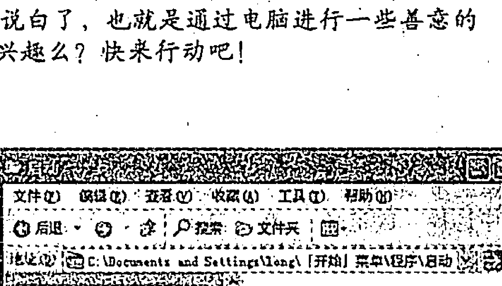

## 二、利用任务计划

Windows 中的任务计划功能相当强大，巧用它会产生意想不到的效果。启动计划任务后，单击“下一步”，再击“浏览”钮，选择好要执行的程序，选择“每天”后击“下一步”，再把开始时间设置为当前时间（如图 3），再按提示操作直至完成。

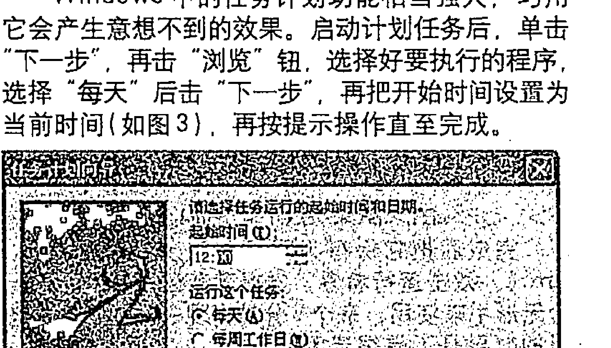

小提示：计划任务启动方法在不同系统操作有些不同。在 Win9X/Me 中双击“我的电脑→计划任务→添加已计划的任务”；在 Win2000/NT 中则可双击“我的电脑→控制面板→任务计划→添加任务计划”；而在 WinXP 中双击“我的电脑→控制面板→性能和维护→任务计划→添加任务计划”。

## 粘人的 DOS

□北京 stano
适用系统：Windows 98
下马威等级：[图标] 破坏性：☆☆☆☆☆
现在的电脑玩家对于 DOS 系统已经是很陌生了。虽然 DOS 比图形操作界面的 Windows 稳定，但由于它长得过于“丑陋”，不方便操作，所以大家还是不能抵挡 Windows 的魅力。如果每次开机后电脑直接切入 DOS，会不会让电脑的主人感觉诧异？我猜很多人可能会为此重装系统呢！
在 C 盘的根目录下，你会找到一个叫做 Msdos.sys 的文件。右键单击它，选择“属性”，将其中的“只读”属性前的对勾去掉后按下“确定”。然后用记事本之类的文本编辑器将其打开，你会看到这么一行文字：BootGUI=1。现在你的任务是将其中的数值 1 修改为 0，保存并退出后重新将其属性改回只读即可。下次电脑启动时你可以注意看一下，系统一定是直接蹦到了 DOS 状态。你的朋友肯定少不了坐在屏幕前苦苦等待那熟悉的 Windows 吧？可是他注定要失望了，除非他知道在 DOS 的黑色背景中敲上 Win，然后回车！

## 特别话题

### 老人也搞怪

□湖南 双龙一剑

- 适用系统：Windows 9X/Me/2000/XP
- 下马威等级：□□□　　破坏性：☆☆☆☆☆

如果突然从你的桌面冒出一个老人，对你的伙计说电脑哪儿出问题了，必须在几分钟内关机停止使用，他会怎样呢？呵呵，你就等着看吧。

打开记事本或网页编辑器输入以下内容：

```
<HTML><HEAD><TITLE>系统警告</TITLE>
<BODY>
<BR><BR>
<P>
<OBJECT id=sims classid=CLSID:D45FD31B-5C6E-11D1-9EC1-00C04FD7081F></OBJECT>
<SCRIPT>
var MerlinID;
var MerlinACS;
sims.Connected = true;
MerlinLoaded = LoadLocalAgent(MerlinID, MerlinACS);
Merlin = sims.Characters.Character(MerlinID);
Merlin.Show();
Merlin.Play("Surprised"); //该语句可使老人表现出惊讶地表情
Merlin.Speak("我是Windows系统安全老人");
Merlin.Play("GestureLeft"); //身体转向左边
Merlin.Think("你的主板出现了严重问题");
Merlin.Play("Pleased"); //作出请的姿势
Merlin.Think("请在二分钟内关机停止使用！");
Merlin.Play("GestureDown");
Merlin.Speak("我就先走了");
Merlin.Hide();
function LoadLocalAgent(CharID, CharACS){
LoadReq = sims.Characters.Load(CharID, CharACS);
return(true);
}
</SCRIPT>
</P>
<P> </P><BR><BR></BODY></HTML>
```

完成后把它保存为网页文件（如“wrong.htm”），双击运行看看，觉得满意么？然后让它配合无形手来使用，来个5分钟出现一次，哈哈，老人的效果是不是很灵啊？

### 不听话的键盘

□四川 格式化

- 适用系统：Windows 9X/Me/NT/2000/XP
- 下马威等级：□□□　　破坏性：☆☆☆☆☆

当你的同学忽然发现自己的键盘上有些键失灵，会不会很沮丧？因为这恐怕意味着一笔额外的“财政支出”！

Windows 系统下直接按下 Windows 徽标键就可以打开“开始”菜单，十分方便。有很多快捷键也是由 Windows 徽标键构成的，如 Windows 资源管理器的快捷键是由“Windows 徽标键+E”组合而成，“运行”对话框的快捷键是由“Windows 徽标键+R”组合而成……。所以很多朋友都会经常和这个键盘上的特殊功能键打交道。其实只要在注册表上稍加修改就可以将这两项功能完全禁掉。

首先你可以打开注册表编辑器，找到[HKEY_CURRENT_USER\Software\Microsoft\Windows\CurrentVersion\Policies\Explorer]子键，在右侧窗格中右键单击鼠标选择“新建→DWORD 键”，命名为“NoWinKeys”，输入数值1，重新启动电脑即可。以后如果你还想利用上面提到的那些组合键，必须将数值改为0并重新启动电脑。

当你的好友有一篇很重要的文章需要及时完成，可突然发现自己的键盘按键一夜之间张冠李戴完全错了位，会不会急得团团转？

KeyChange 软件可以在 http://www.keychange.com/KeyChangeTrial.exe 处下载到，支持 Windows 9X/Me/NT/2000/XP 操作系统，运行时隐藏在系统托盘处。其实 KeyChange 设计者的目的是为让你轻松地更改键盘上的按键，使失灵损坏的按键能够用其他完好的按键代替。不过利用它的这个特性，你也可以设计一个出色的下马威！

比如你要将“A”键换成“Insert”键，只需鼠标双击隐藏在系统托盘处的 KeyChange 图标，就会弹出按键设置窗口（图1）。

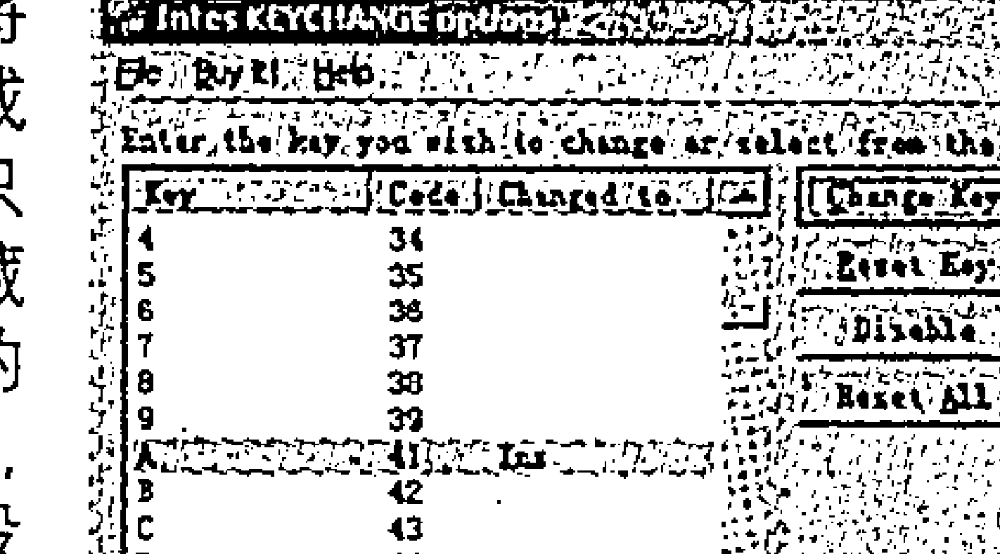

在正中央的按键列表框中选中“Ins”键，再点击“Change Key”按钮，在弹出的“Change Key”对话框中找到你要更换成的按键，即“A”键（图2），接着会自动返回初始窗口，点击“OK”按钮开始生效。此外选中“A”键，点击菜单栏上的“File→Lock”，在弹出窗口中输入密码，保存后就能让“A”键失灵。点击菜单栏上的“File→ULock”，输入密码就能恢复。

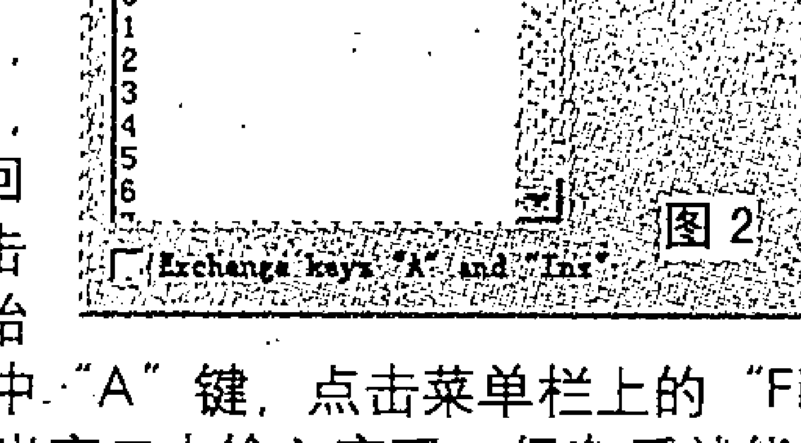

当你需要关闭 KeyChange 的功能时，鼠标右键单击 KeyChange 图标，选择弹出菜单中的“Disable”命令即可。

注意：KeyChange 和中文输入法不兼容，当开启 KeyChange 时，输入英文和数字非常顺利但无法输入中文。所以利用这一点你还能成功地破坏中文输入法。

### 离奇古怪的文件夹

□湖南 双龙一剑　　北京 stano

在使用电脑的时候，突然想起要进入一个很重要的文件夹，可是发现竟然进不了，此时此刻你又想做些什么呢？是不是非常烦恼？那这个礼物是不是也同样能为你带来很多的欢乐？只是你的开心可是建立在别人的痛苦之上，残忍，残忍！:)

#### 一、哪来的密码

- 适用系统：Windows 9X/Me/2000
- 下马威等级：□□□　　破坏性：☆☆☆☆☆

在双击文件夹时，系统提示要输入密码，密码如果不正确则自动返回该分区根目录。可是蒙在鼓中之人又岂能知道密码，有的人的脸会变白的。

第一步：打开准备设置密码的文件夹，在空白处单击鼠标右键，从弹出菜单中选择“自定义文件夹”选项；

第二步：单击“下一步”，再在自定义文件夹向导窗中选择“自定义”，在“自定义”下勾选“选择或编辑该文件夹的 HTML 模板”（图1），再进行“下一步”；

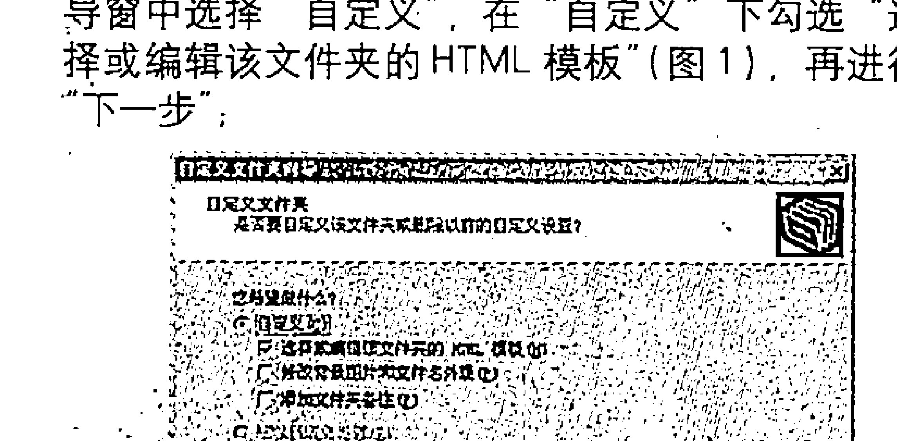

第三步：在选择模板类型中选择“标准”，再将“编辑该模板”选项选中，再击“下一步”；

第四步：在弹出的“Folder”文件中找到“<script language="JavaScript">”，在其下输入以下内容：

```
var pass = prompt("为了防止外界病毒侵入，请先输入你的身份密码，以便验证")
// 该处的汉字为系统提示语，可以更有创意地来些恐怖之词
if(pass != "1234567")
// "1234567"为预设的密码，特别提醒：设置后不要忘记哦
{window.location="c:"}
// 此处 "c:" 表示返回的根目录，如果你设置的文件夹在 D 盘，可把 C 改为 D 即可
```

输入完成之后，对“Folder”文件进行保存，再选择完成，下面马上来试试你的成绩吧，双击该文件夹，是不是出现了恐怖性的提示，哈哈。

小提示：该方法可对 Windows 9X/Me/2000 进行，在 Windows Me 中，“Folder”文件中是用“<script>”代替了“<script language="JavaScript">”字段。

#### 二、文件哪去了

- 适用系统：Windows 98/ME/2000
- 下马威等级：□□□　　破坏性：☆☆☆☆☆

要是你在进入被处理的文件夹时总显示为回收站的内容，而原文件资料都已不见踪影时，你会怎么想？欲哭无泪吧！你现在就可以轻松制造出这样的效果哟！

第一步：双击“我的电脑”，在打开的窗中选择“查看”标签，再在“文件夹选项”下勾选“显示所有文件”，按“确定”完成。

第二步：进入任意一个分区根目录，在“回收站”图标上单击鼠标右键，在弹出的菜单中选择“属性”，然后在属性窗中取消“只读”属性，单击“确定”。此时回收站图标自动变成文件夹图标，双击该文件夹进入并复制“desktop.ini”文件。

第三步：找到要处理的文件夹，在其上单击鼠标右键，选择“粘贴”把“desktop.ini”文件拷入，然后再在该文件夹上单击鼠标右键，从菜单中选择“属性”，再修改其属性为“只读”，按“确定”即可（图2）。

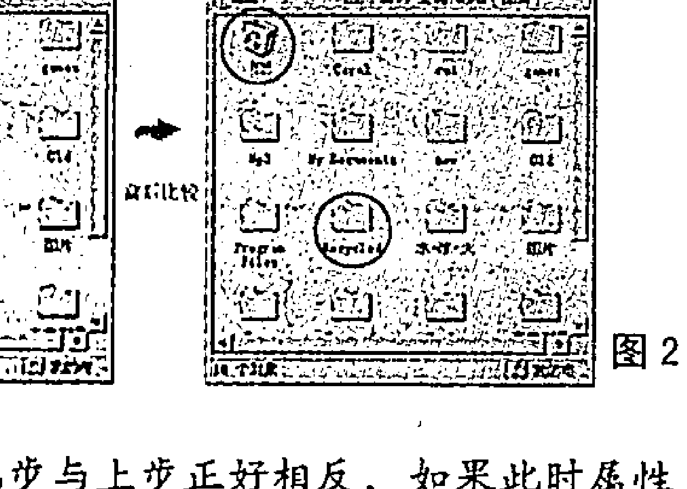

小提示：此步与上步正好相反，如果此时属性“只读”没被自动选上，则需手工修改。

#### 三、入口在哪里

- 适用系统：Windows 98
- 下马威等级：□□□　　破坏性：☆☆☆☆☆

你可以在朋友的 Windows 桌面上建立一个无法打开、不能重命名也无法删除的文件夹，如果再给它取一个恼人的名字，你的朋友恐怕会被气得发疯呢！

打开一个 DOS 窗口，然后键入 cd C:\Windows\Desktop 进入 Windows 桌面设置文件夹。下面你要做的就是在 DOS 模式下建立一个文件夹，比如“md 我 有 罪”。你要注意的是在文件夹名称之间有空格，而且这个空格不要用空格键来实现。你可以在按下 Alt 键的同时依次按下 255 这三个数字键来达到你的目的。所以你实际进行的操作应该是：md[空格键]我[ALT+255]有[ALT+255]罪。

你可以关闭 DOS 窗口，然后你就能够在桌面上看到你刚刚建立的这个文件夹了。由于 Windows 不知道如何处理这个 ASCII 的空格，所以你的文件夹名字中间有下划线相连。现在你可以试着双击打开它，是不是蹦出来一个错误提示窗口？想改名字也是徒劳无功，如果你想痛下杀手删除也无法完成。当然这个恼人的文件夹也并不是毫无破绽，你只要再次打开 DOS 窗口，利用 rd[空格键]我[ALT+255]有[ALT+255]罪就可以轻松地把它打发掉了。不过你的朋友可是不知道，所以你要注意看看他的面部表情一定在慢慢发生变化！

### 注册表来客串

□湖南 笑笑先生

- 适用系统：Windows 98/Me/2000/XP
- 下马威等级：□□□　　破坏性：★★☆☆☆

注册表可说是 Windows 系统的神经脉络，如果拉上它来客串一把，效果一定会非常不错。

#### 一、隐藏驱动器## 编辑器按以下顺序展开分支
[HKEY_CURRENT_USER\Software\Microsoft\Windows\CurrentVersion\Policies\Explorer]，在右侧窗格中新建一个DWORD（二进制）值，命名为"NoDrives"，并将"NoDrives"值设为"FFFFFFFF"。

注意：如果只想隐藏驱动器中的一个，可以把"NoDrives"值按下表进行设置（如为多个可把它们值相加即可，如要隐藏A、C、D盘，可把"NoDrives"值设成13，见表）。

|驱动器|"NoDrives"值|驱动器|"NoDrives"值|
|---|---|---|---|
|A|1|G|64|
|B|2|H|128|
|C|4|I|256|
|D|8|J|512|
|E|16|K|1024|
|F|32|L|2048|

## 二、隐藏桌面图标
在注册表编辑器中，打开[HKEY_CURRENT_USER\Software\Microsoft\Windows\CurrentVersion\Policies\Explorer]分支，在右侧窗格内新建一个DWORD值"NoDesktop"，并把该键值设为"1"。

## 三、隐藏任务栏和开始菜单
打开[HKEY_CURRENT_USER\Software\Microsoft\Windows\CurrentVersion\Policies\Explorer]分支，在右窗格内新建一个DWORD值"NoSetTaskbar"，把该值设为"1"。

呵呵。经过上面三步设置，同学的表情可想而知了哟！旁观者再来添油加醋地谈谈现在最流行的病毒……，哈哈，心里乐开花了吧？不过为了让效果更逼真些，可在注册表编辑器中打开[HKEY_LOCAL_MACHINE\Software\Microsoft\Windows\CurrentVersion\Winlogon]分支，在右侧窗格新建字符串值"LegalNoticeCaption"，内容输入"桃花警告"；再新建字符串"LegalNoticeText"，其内容来个恐怖点的，像“本机已中桃花病毒，请于2分钟内马上关机，否则会有毁灭性的灾难发生！”哈哈，注册表的威力不小吧。

特别提醒：为了避免不必要的真正灾难发生，请在动手前对注册表进行备份。

# 虚幻的桌面
□湖南 笑笑先生
适用系统：Windows 9X/Me/NT/2000/XP
下马威等级：□□□□□ 破坏性：☆☆☆☆☆

桌面这么大一块地方也有文章好做。我们进入系统后，很多操作都是通过桌面来进行的。像对盘符的操作，大部分用户是通过双击“我的电脑”进入而进行的。如果给他制造个假桌面，那又会怎样？欲知详情如何，请接着往下看。

第一步：先把所有已打开的窗口都关闭，然后单击“开始→设置→任务栏和【开始】菜单”进入任务栏设置，在其中分别单击“自动隐藏任务栏”及“显示时钟”取消方框前的小勾（如图）。

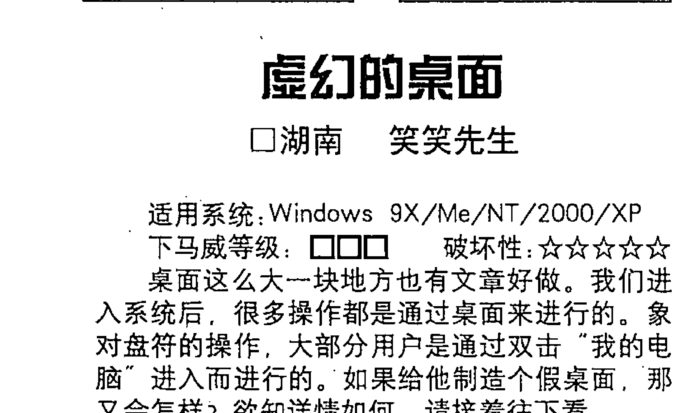

小提示：上面示范的系统为WinXP，而对于Win9X/Me/2000，则单击“开始→设置→任务栏”进入设置，并在任务栏属性窗中去掉“总在最前”及“显示时钟”则可。

第二步：敲一下键盘上“Print Screen”键抓取整个屏幕，再单击“开始→程序→附件→画图”进入画图，把抓取的图片粘入（Ctrl+V），对文件进行保存（Ctrl+S）后退出画图。

第三步：在桌面空白处单击鼠标右键，从弹出菜单中选择“属性”，选择“桌面”标签，在“背景”中通过“浏览”找到第二步所保存的图片，打开后把它设置为背景并退出显示属性窗。

第四步：连接因特网下载haha文件（下载地址：http://go5.163.com/luye100/zhengren/haha.exe），运行后即可隐藏桌面上真正的图标。此时便可只留下一个影子，任凭不知情者如何点按都毫无作用！下面就准备笑吧。

小提示：对于第四步，我们完全可采用本专题介绍的“无形手”来完成（隐藏桌面所有图标及隐藏任务栏和开始菜单）。

# 下马威之花样剑谱
□湖南 笑笑先生

互联网上其实有很多可以帮你打造下马威的剑谱，但为了使大家玩得痛快、玩出惊喜，经过苦苦搜寻，终于为大家搜罗到名扬四海的六大剑谱。

**剑谱名称：《整人精灵》**
取谱店铺：http://js.skycn.net/down/FixYou_1.exe
功力级别：★★★★☆ 适合人群：好动之人
使用该剑谱对付之人如果以前未练过该剑谱，则可使其达到求生不得、求死不能之地步。该剑术阴力十足，令受创之人毫无还手之力，发威同时还放出灰熊对对手进行精神攻击，并且它也不伤及爱机的身体，只是使其受困于缠绵之中，重新启动也不能解困。故请使用此剑术之人先掌握解困之法，否则会酿成悲惨结局，慎重慎重！
破解招术：第一招是请出键盘大侠：同时按下功能键“F8”与组合键“Alt”；第二招是麻烦鼠标壮士与键盘大侠双技合璧，当按下Ctrl键时，单击鼠标右键。

**剑谱名称：《小海盗》**
取谱店铺：http://hjcz.myrice.com/files/norun.zip
功力级别：★★★★☆ 适合人群：好斗之人
使出该剑术后，看似和蔼可亲，实则威力无比。运行后要求回答三道算术题，题目很简单，但一旦答错，机器将连续重启12次（每次都有提示）后才恢复正常。除此之外，没有其他影响。特别提示：有暗道机关可修改该重启次数。
破解招术：小海盗进行重启计数的文件保存在系统盘中Windows目录下的“Fkcq.dat”文件中，用记事本打开它之后，再把其中的启动次数值修改为“1”则只需重启一次即可。

**剑谱名称：《恭喜发财》**
取谱店铺：http://www.haha168.com/main_down/download/029.zip
功力级别：★★★☆☆ 适合人群：好财之人
在练成“恭喜发财”剑术之后可呼财唤宝，百元大钞滚滚来，其中还有一次选择机会，觉得不够者再单击“否”即可得到更多大钞，具体是多少，在这不透露了。
破解招术：第一招是不义之财不要贪，在出现“你想要钱吗？”窗口时单击“否”退出；第二招是即杀招，在运行过程中，同时按下“Ctrl”、“Alt”、“Del”三键，在进程中选择“Money.exe”文件强行结束任务即可。

**剑谱名称：《打呼噜的电脑》**
取谱店铺：http://www.lilyma.com/setup.zip
功力级别：★★★★☆ 适合人群：好睡之人
练成此剑法后，电脑都会因缺少睡眠而利用一切空闲时间睡觉。在鼠标休息一会儿后，它就会打起呼噜来了，可见该剑法练成之难度了吧……不过要记得把音箱打开哦。
破解招术：练会强行杀除指（Ctrl+Alt+Del三键同时按下），然后终止“Setup.exe”文件即可解困。

**剑谱名称：《整人鼠标》**
取谱店铺：http://www.jn.nm.cninfo.net/softdown/softfile/allure.zip
功力级别：★★★★☆ 适合人群：好玩之人
你说怪不怪？我的鼠标不听我的使唤，我要打开一个窗口，它总是帮我自动关闭。如果你发现自己遇到这种现象，那说不定已遭到关你没商量的“整人鼠标”暗算了。受“整”人遭该套剑谱攻击后，完全无法正常工作，但很喜欢看光秃秃桌面的人定是高兴。
破解招术：没有发现其他更好办法进行破解，唯有对计算机进行重启。

**剑谱名称：《超级地震》**
取谱店铺：http://www.haha168.com/main_down/download/006.zip
功力级别：★★★☆☆ 适合人群：好闹之人
“超级地震”剑谱早已扬名于各界武林之中，各路豪杰为此剑谱你争我夺，天下大乱。该剑谱使出后，犹如狮子吼般威力无穷，狂风吹、海啸起，所有窗口一齐地震般摇动……
破解招术：在强烈地震中唤出任务管理器（Ctrl+Alt+Del），从中选择“Alcap Window”强制结束搞定。整个操作还得看看你操作鼠标的功力有多深厚，如果功力太浅，建议先打鼠标功底。

俗话说得好，“师傅领进门，修为看个人”。六大剑谱究竟能练成怎样，还看个人造化了。不过在这里再提醒各位一句，六大剑谱如能配合无形手使用，让其来无踪去无影，威力更盛！

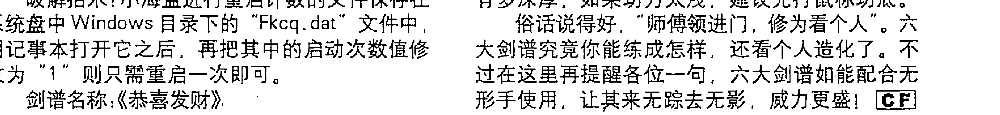

□策划 CFan 哑锣
作者 湖南 双龙一剑 阿波

每个人的爱好与兴趣都不相同，就像编辑部的Ken喜好前卫，木头却有点传统，而哑锣我是传统与现代的完美结合。如果这三个口味不同的人偏偏要被老编安排共用一台电脑，那其中的磕磕碰碰能少得了吗？无论在家里还是学校、公司，你是不是总有些小秘密、小心思不希望别人碰？如果真想充分利用自己的电脑，那么在玩游戏和做图像是不是应该换上不同的软、硬件配置，才能使电脑健步如飞？其实，所有这些电脑都能做到，只要你一招一式地跟着我们一起学，保证你的电脑会更体贴。

这次的专题教会你些什么：
- 如何建立不同的用户
- 如何设置不同的权限和不同的系统环境
- 如何让自己的系统拒绝陌生人
- 如何为不同的用户配置不同的硬件环境

# Windows 家园轻松建
每个人都有属于自己的一副面孔，要想让系统的面孔不再单一，首先你要打造一方属于自己的Windows家园。

## 一、Windows 98
进入“控制面板”，双击“用户”图标，在“允许多用户设置”对话框中单击“下一步”后在“添加用户”窗中输入要创建的用户名称（不能和已有用户名相同），再单击“下一步”输入密码（注意“密码”与“确认密码”两栏的输入要保证一致）。

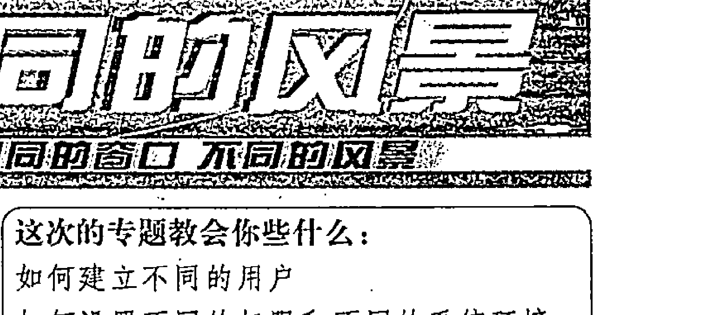

## 二、Windows 2000
双击“我的电脑→控制面板→用户和密码”，在“用户和密码”对话框中（注意勾选上面的“要使用本机，用户必须输入用户名和密码”选项以防止无密码者进入）单击“添加”按钮，然后根据提示输入“用户名”及“密码”，完成后再进入下一步，此时注意要勾选“受限用户”或从“其他”项中选择用户所属组（如图2）。从此，共用这台电脑的朋友可就分出了三六九等，对于那些可信任的或者电脑水平高超的朋友当然可以给予更多的权限，相反就只有限制使用者对系统的操作，避免由于一时疏忽影响其他人对电脑的使用。

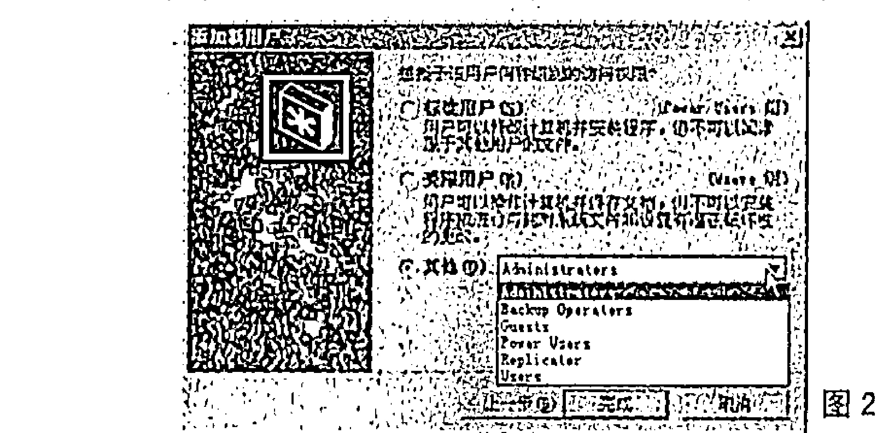

> 小提示：在上图“其他”项中各组含义及权限如下：

| 组名称 | 含义及权限 |
| --- | --- |
| Administrator | 系统管理员，有对计算机/域的完全访问、控制权。 |
| Backup Operators | 备份操作员，只能用备份程序将文件及文件夹备份到计算机上。 |
| Guests | 来宾，权限同受限用户（可以操作计算机并保存文档，但不可以安装程序或进行可能对系统文件和设置有潜在破坏性的更改）。 |
| Power Users | 高级用户，权限同标准用户。 |
| Replicator | 复制员，权限是在域内复制文件。 |
| Users | 普通用户，权限同受限用户。 |

## 三、Windows XP
双击“我的电脑→控制面板→用户帐户”，在“用户帐户”对话框中单击“创建一个新帐户”，输入要创建的用户名如“hui”后单击“下一步”，选择帐户类型为“受限”，然后单击“创建帐户”，选择新创建的帐户“hui”后，单击“创建密码”（如图3）创建好登录密码。

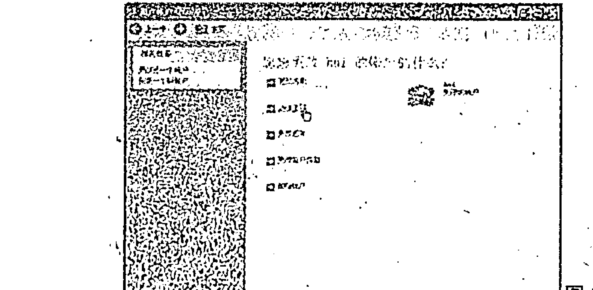

> 小提示：在创建用户时，首先要以管理员权限身份登录。同时在Windows 98中，密码长度不能超过14个字符。而在Windows 2000/XP中，密码长度可以多达127个字符。密码只能为数字、字母（大写及小写）、符号（字母和数字以外的其它所有字符），不能使用汉字作为密码。

# 系统生杀大权握手中
如果你和家人共同使用一台电脑，那你是不是担心自己的系统被其他人乱调整？这时你一定希望自己能掌管“生杀大权”。只有想不到，没有做不到，其实在Windows系统中，你完全可以轻松地将系统生杀大权握在手。

## 一、Windows 2000/XP——“组”好用户权限
在多用户使用过程中，只要巧妙地利用系统中的“组”这个功能，就能方便地给共同使用电脑或者通过局域网访问电脑的朋友排出等级，给某个用户放宽或限制权限（比如在安装一些软件时）。
小提示：当我们要给一批用户分配同一个权限时，可以将这些用户都归到一个组中，只要给这个组分配此权限，组内的用户就都会拥有此权限。

## 二、创建新组
在Windows 2000中可进入“控制面板→用户和密码”，再选择“高级”标签，点击“高级用户管理”中的“高级”进入“本地用户和组”，再选择“组”，然后在右栏空白处单击鼠标右键，从弹出菜单中选择“新建”，输入“组名”及“描述”后按“确定”即可完成新组创建。
注意：创建的新组名不能和用户名相同。
在Windows XP中双击“我的电脑→控制面板”，在窗口左上方单击“切换到经典视图”，再双击“管理工具→计算机管理”，在“计算机管理”窗左栏展开“本地用户和组”设置。

## 三、用户加入
在“本地用户和组”中选择“用户”，然后在右栏准备加入的用户名称上单击鼠标右键，从弹出菜单中选择“属性”，然后选择“隶属于”标签，从窗口下端单击“添加”，然后在“输入对象名称”栏下输入组名称，按“确定”即可使该用户加入到不同的组。

## 四、权限设置
在要设置权限的目录上单击右键，从弹出菜单中选择“共享”，勾选“共享该文件夹”后单击“权限”按钮，弹出权限窗口如图1。单击“添加”按钮，再从新打开的“添加用户或组”窗中选择好“组”，单击“添加→确定”，然后在权限窗中选择准备设置的权限并删除原组。

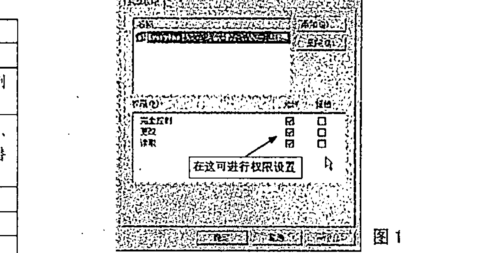

## 五、多用户的管理
在Windows 2000及XP中，系统提供了平时我们经常忽视的组策略，通过它可以轻轻松松地管理好多用户。单击“开始→运行”，在“运行”对话框中输入“gpedit.msc”，按“确定”即可启动Windows 2000或XP组策略。然后依次展开“用户配置→管理模板→系统”，在设置下看到“只运行许可的Windows应用程序”和“不要运行指定的Windows应用程序”两个选项，双击“只运行许可的Windows应用程序”选项，在打开的属性窗中勾选“已启用”，再单击“显示”按钮（图2）。接下来在新打开的显示内容窗中单击“添加”按钮，然后在“添加项目”窗中输入要添加的项目，如“Winword.exe”（当然也可输入完整的路径），按“确定”即可添加，再以同样的方法把允许该用户使用的程序全部添加；当然如果有不允许该用户使用的程序，还可双击“不要运行指定的Windows应用程序”进行添加。

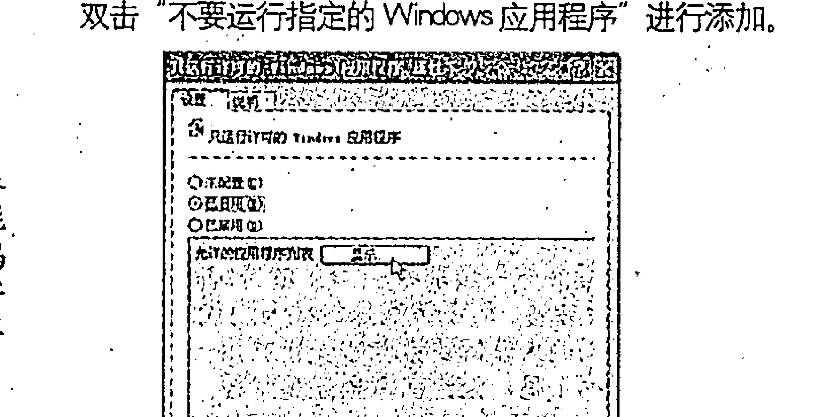

## 六、Windows 98——有了规矩更成方圆
在Windows 98中，用户的权限不好控制是众所周知，而Windows的神经枢纽——注册表中就有很多值得一用的东西，通过它我们也可让Windows 98用户规矩起来。

### 1. 限制控制面板
打开注册表，找到“HKEY_USER\‘用户名’\Software\Microsoft\Windows\Current Version\Policies\System”分支，在其下建立下列DWORD值，并将值设为“1”（“0”表示允许或显示），则可禁用或隐藏相应选项，值名称及具体作用见下表。

> 小提示：以上注册表项中的用户名指在建立了多用户的系统中对应的用户名称，如果为单用户系统，则该键名称为“Default”。

| 名 称 | 在值为1时作用 |
| --- | --- |
| NoDispAppearancePage | 禁用显示属性 |
| NoDispBackgroundPage | 隐藏显示属性中的背景页 |
| NoDispCPL | 隐藏显示属性中的外观页 |
| NoDispScrSavPage | 隐藏显示属性中的屏幕保护程序页 |
| NoSecCPL | 禁用密码属性 |
| NoPwdPage | 隐藏密码属性中的更改密码页 |
| NoAdminPage | 隐藏远程管理页 |
| NoProfilePage | 隐藏系统属性中的用户配置文件页 |
| NoDevMgrPage | 隐藏系统属性中的设备管理页 |
| NoConfigPage | 隐藏系统属性中的硬件配置文件页 |
| NoFileSysPage | 隐藏系统属性性能页中的文件系统按钮 |
| NoVirtMemPage | 隐藏系统属性性能页中的虚拟内存按钮 |

进入“HKEY_USER\‘用户名’\Software\Microsoft\Windows\CurrentVersion\Policies\NetWork”分支，新建以下名称（为DWORD），并把其值设为“1”，则可禁用或隐藏该用户的相应的控制面板选项（具体见下表）。

| 名 称 | 在值为1时作用 |
| --- | --- |
| NoNetSetup | 禁用网络属性 |
| NoNetSetupIDPage | 隐藏网络属性中的标识页 |
| NoNetSetupSecurityPage | 隐藏网络属性中的访问控制页 |

### 2. 隐藏“开始”菜单中的菜单项
启动注册表，进入“HKEY_USER\‘用户名’\Software\Microsoft\Windows\Current Version\Policies\Explorer”分支，分别建立以下DWORD名，并将其值设为“1”，设置及相应作用如下表。

| 名 称 | 在值为1时作用 |
| --- | --- |
| NoRun | 关闭运行命令 |
| NoFavoritesMenu | 关闭收藏夹 |
| NoSetTaskbar | 关闭开始菜单中的设置\任务栏和开始菜单命令 |
| NoFind | 关闭开始菜单中的查找命令 |

另外我们还可进入“HKEY_USER\‘用户名’\Software\Microsoft\Windows\Current Version\Policies\Explorer”分支，新建DWORD值，名称改为“NoNetHood”，并把值设为“1”，则可隐藏该用户的“网上邻居”；如果建立“NoEntireNetwork”，把值设为“1”，则可隐藏该用户网上邻居中的“整个网络”。

注意：在我们改动注册表后，如果要禁止他人修改，可在HKEY_USER\‘用户名’\Software\Microsoft\Windows\CurrentVersion\Policies\System下建立DWORD值DisableRegistryTools，并将其值设为1，可起到禁止使用注册表编辑器的使用。

经过如上一番折腾，虽然没有Windows 2000/XP那么方便，但终究还是有矩可循，方圆也差不多可成了吧？

# 量体裁衣并不难
——用户环境自己定

不同的用户常有不同的需要，如木头常进行文字处理，而Ken时不时会打打游戏，那么我们是否可以为这些用户量体定做更适用于他们的系统环境呢？

在交给其他用户使用前，先以该用户身份登录，运行“regedit.exe”打开注册表编辑器。
方法一：在注册表编辑器中找到“HKEY_USERS\Internet\Software\Microsoft\CurrentVersion\Run”分支。

> 小提示：如果没有主键“Run”，则在主键“CurrentVersion”下新建一项，并改名为“Run”即可。

然后在右栏新建一个字符串值，名称修改为该用户需用的程序名，如木头需要的是“Word”，双击新建的“Word”项，在“键值”中输入程序的完整路径，如“C:\Program Files\Microsoft Office\Office\WINWORD.exe”。再以同样方法把该用户需使用的其他程序添加，接下来单击“开始—注销木头”，再以其他需要设置的用户身份（如Ken）进入Windows，和上面步骤一样进入注册表编辑器，找到“HKEY_USERS\Work\Software\Microsoft\Windows\CurrentVersion\Run”分支（如果没有该分支，同样新建一个）。

## 合理越位也可以

一名权限受限制的用户使用电脑，偶尔会遇到需要增大权限的时候，是不是每次都要重新启动才能重新设置权限呢？其实完全没有必要，只要合理，越位也是可以的。

### 一、菜单操作

进入Windows资源管理器中，选择要打开的可执行文件，按住Shift键用右键单击该程序图标，在弹出菜单中选择“运行方式”，然后在弹出的“运行身份”窗中勾选“下列用户”(如图)，再选择好允许的用户名并输入密码(呵呵，不经允许你是不知道密码的)，此时便能以其他用户权限运行该程序。

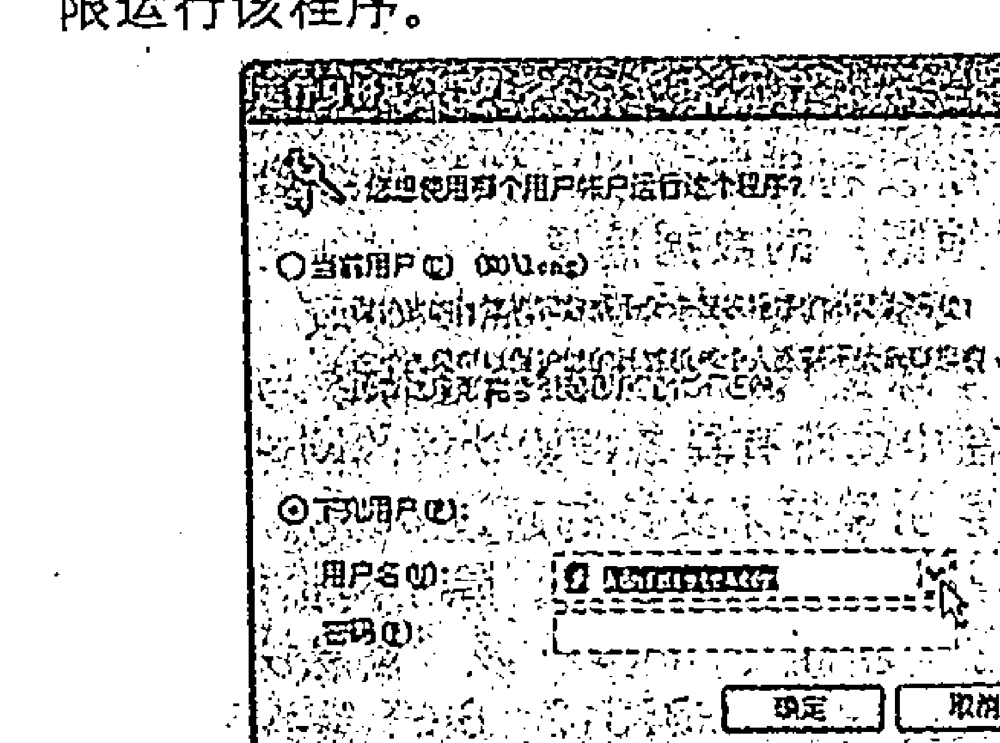

### 二、命令操作

知道Runas这个命令么，它可以允许用户用其他权限运行指定的工具和程序，而不是用户当前登录提供的权限。对于多用户来说能用到的命令语法如下：

```
runas [/profile|/noprofile] [/showtrustlevels] [/trustlevel] /user:UserAccountName program
```

参数含义：
/profile
加载用户的配置文件，/profile 是默认值。
/noprofile
/noprofile 指定不加载用户的配置文件。这会加快应用程序载入的速度，但是在一些应用程序中也会引起错误。
/showtrustlevels
列出 /trustlevel 开关项。
/trustlevel
指定应用程序运行所在的授权级别。使用 /showtrustlevels 查看可用的信任级别。

/user:UserAccountName
指定在其下运行程序的用户账户的名称。用户账户的格式应是 user@domain 或 domain\user。
例如：我现在用的用户名为“dragon”，现要以“hui”的身份去执行“setup.exe”文件，并且不需加载用户的配置文件，则可转入到“setup.exe”文件所在目录，然后输入“runas /noprofile /user:no\hui setup”(双引号不用输入) 即可以“hui”用户去执行“setup.exe”文件。

注意：出现提示时再输入用户的密码，并且用户密码不能为空。大家可运行“runas”查看该命令其他功能。

## 私家园 非请勿入

对于多用户使用一台计算机来说，最麻烦的就是怎样防止自己的私人文件被其他用户修改或查阅，那么在Windows中又怎样做到呢？

### 一、Windows 98

在Windows 98中，虽然能完成各用户设置，但在启动时单击“取消”即可登录，这岂不是雪上加霜？所以首先得强制它必须输入密码登录(具体办法见2002年16期“特别话题”《关卡，是这样设置的》)，处理好后，接下来就利用系统策略编辑器来保护好私家园。

单击“开始→程序→附件→系统工具→系统策略编辑器”，再单击菜单“文件→打开注册表”命令打开注册表 (如图1)。

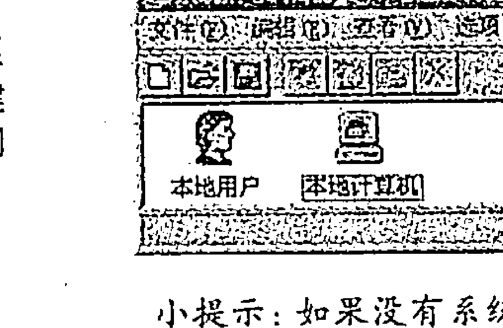

小提示：如果没有系统策略编辑器，可双击“我的电脑→控制面板→添加／删除程序”，再选择“Windows安装程序→从磁盘安装…”，通过“浏览”找到 Windows 98 安装盘 \TOOLS\RESKIT\NETADMIN\POLEDIT 目录，选择安装文件“poledit.inf”后“确定”进行安装。

### 1.禁用注册表工具、单一模式的MS—DOS应用程序、MS—DOS模式

双击“本地用户”，再单击“系统”前面的“+”号展开，分别把“禁用注册表工具”、“禁用MS—DOS模式”、“禁用单一模式的MS—DOS应用程序”三项都勾选上“确定”即可。

### 2.禁用控制面板中的显示器、网络、口令、打印机、系统

双击“本地用户”，单击“控制面板”前面的“+”号，把“显示器”、“网络”、“口令”、“打印机”、“系统”五项其包括子项都勾选上，单击“确定”按钮。

### 3.限制运行的Windows应用程序

可用来限制普通用户运行Windows应用程序。展开“系统”，勾选“只能运行允许的Windows应用程序”，然后单击“显示→添加”，选取好普通用户运行的应用程序，完成后“确定”退出。

注意：为了安全起见，需要在CMOS中设置计算机启动顺序为硬盘启动，并且设置CMOS密码；同时以上操作只能由拥有管理员权限的用户完成。

### 小技巧:撬开防盗门回家

在上期“特别话题”《关卡，是这样设置的》一文中介绍了一些防止非法用户使用计算机的方法，有些读者在使用后因忘记密码而求助本刊，现将恢复方法告诉大家，并再次提醒大家在设置后不要忘记了密码。

启动计算机，在经过自检出现“Verifying DMI Pool Data……… ”时，按下键盘上“F8”键，在启动选项菜单中选择“Safe mode command prompt only”选项进入DOS (当然我们也可先进入CMOS把第一启动设置为软盘或光驱，然后再根据设置放入启动软盘或光盘启动进入)，然后在提示符下输入命令，格式为“regedit/e File 分支”，该命令将注册表中“分支”导入到“File”中保存，如要导出已设置需密码登录的值，则可输入“regedit/e ok.reg HKEY_LOCAL_MACHINE\Network\Logon”(ok.reg文件名可自己任意设置) 把需要验证密码的部分导入到文件“ok.reg”中。然后在提示符下输入“edit ok.reg”回车利用edit.exe程序打开ok.reg(注意edit与后面的文件名之间要以空格隔开)，找到MustBeValidated将其后面的值改为“0”并保存(当然我们也可把该导出的文件拷贝到其他计算机，再利用记事本、写字板等程序打开进行修改)，然后再利用命令“regedit ok.reg”将修改部分导入到注册表中(对于在其它计算机上修改的需先拷贝到忘记密码的原计算机上再利用上述命令导入)，导入完成后重启计算机，便可发现不需密码又可进入Windows了。

### 二、Windows 2000/XP

在Windows 2000/XP中，对于不同用户的设置保护功能要比Windows 98强大，下面来看看怎样防止他人不请而入。

### 1.保护用户名文件夹

Windows 2000/XP中的“Documents and Settings”目录下保存了桌面设置、开始菜单、收藏夹、我的文档等个性设置，要保护好它们，可在用户名文件夹上单击鼠标右键，在弹出菜单中选择“共享和安全”或“属性”命令，再选择“共享”标签，勾选本地共享和安全下的“将这个文件夹设为专用”(如图2)，确定后其他用户便不可对你这个文件夹进行删除、修改等操作了。

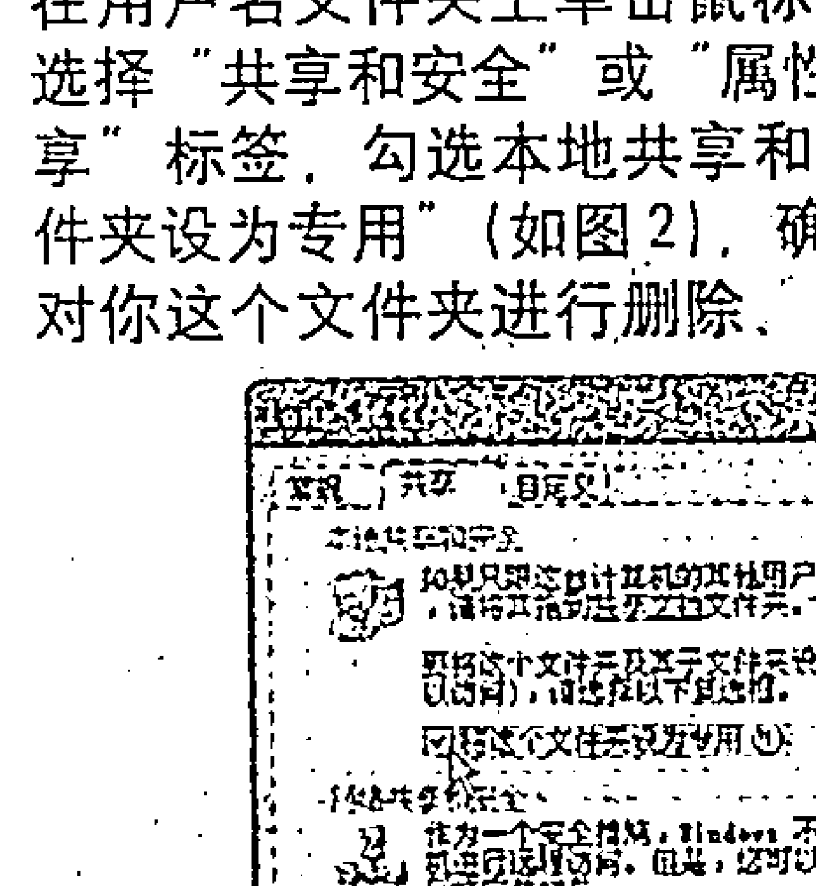

### 2.加密目录

在要加密的目录上单击鼠标右键，从弹出菜单中选择“属性”命令，再在属性窗中单击“高级”钮，在弹出的高级属性窗中勾选“加密内容以便保护数据”(如图3)，再单击两次“确定”完成(对于其中有数据或子目录的目录在确定后还会弹出一个确认属性更改窗，建议选择“将更改应用于该文件夹、子文件夹和文件”)。


小提示：要完成以上两步设置均需文件格式为NTFS分区。对于已安装好的非NTFS分区，可利用“CONVERT C: /FS:NTFS”(C:表示要转换的盘符) 来对FAT及FAT32格式分区进行转换。

## 硬件配置任你选

对不同的用户进行不同的系统软件配置已经不成问题，可是能不能让不同的人选择不同的硬件配置呢？比如不给飞狼用扫描仪，不给木头用打印机，当然可不能用插拔大法把硬件设备卸下来哦！让我们一起通过硬件配置文件来轻松实现这个愿望吧。

小知识：硬件配置文件是指在启动计算机时告诉Windows启动哪些设备，以及使用每个设备中的哪些设置的一系列指令。

在第一次安装好Windows时，系统创建了一个名为“Profile 1”配置文件(对于笔记本电脑，该配置文件可以是插接的配置文件或移除的配置文件)。默认情况下，在“Profile 1”中启用了所有安装Windows时安装在这台计算机上的设备。如果在计算机上有不只一个硬件配置文件，则可以指定每次启动计算机时要使用的默认配置文件。也可以让Windows在每次启动计算机时询问使用哪个配置文件。一旦创建了硬件配置文件，管理员就可以使用设备管理器禁用和启用配置文件中的设备。

中的设备。如果在硬件配置文件中禁用了某个设备，那么在启动计算机时系统不会加载该设备的设备驱动程序。

首先以管理员或 Administrators 组成员身份登录 Windows，然后双击“我的电脑→控制面板→系统”，在“系统属性”窗中选择“硬件”标签，在对话框底端单击“硬件配置文件”钮。接下来在“可用的硬件配置文件”中选择“Profile 1（当前）”，然后单击“复制”钮（如图），并输入一个新的硬件配置文件名称，完成后单击“确定”。然后确定启动时是等待用户选择还是等待多少秒后自动进入第一个硬件配置文件（如图）。


接下来进入“系统属性”窗，单击“设备管理器”，从设备管理器中找到要禁用的设备，单击右键，从弹出菜单中选择“禁用”即可。

小提示：所有设置都只对“当前”配置文件有效，如果只希望马上要使用的用户无法选择其他配置，可在前图中选择其他没在用的配置删除。如果下一个用户又需使用某设备时，同时进入“设备管理器”，再“启用”该设备。

## 多用户安全帮手

### ——嘉馨电脑资料锁

在 Windows2000/XP 中，对于多用户来说，文件夹安全还是比较容易设置，而在 Windows 98 中却非常麻烦，不过使用嘉馨电脑资料锁（以下简称嘉锁）情况就不一样了。

首先登录“http://tanfei84.8u8.com/lockdir.zip”下载，嘉锁为免费软件，最新版本为3.1，大小为707KB，下载后经过简单安装即可使用。第一次单击“开始→程序→嘉馨电脑资料锁→lockdir”启动嘉锁后，双击系统托盘中的小挂锁形图标，在弹出的“登录”窗中单击“新用户”钮，然后根据提示输入“用户名”、“密码”等信息，按“确定”后出现添加成功提示，表示已成功添加该用户，然后在登录窗中选择创建的用户，并输入密码按“确定”进入。在主窗口中单击“打开”钮，选择要隐藏的文件夹（如D:\VCD），单击“添加目录到列表”钮把该目录添加到列表中，再单击“隐藏目录”钮便可将该目录进行隐藏（如图）。如果需要显示则可单击“显示列表中选中目录”钮。如果不需用某用户，可单击“设置”标签在“注销用户”栏下两次输入要注销的用户密码后点击“确定”即可注销，在注销用户时同时将删除该用户的所有资料，以及该用户设置的隐藏文件夹。


小提示：万一程序被误删除而找不到所隐藏的文件，这时请重新安装一遍本软件，然后从 Windows 目录的 fonts 目录下拷贝 lock.jx 覆盖新安装目录下的 lock.jx 文件即可，密码等用户均为原来的设置。例如你的 Windows 目录是 C:\Windows，新安装的目录是 C:\program files\嘉馨电脑锁，则你可以在 DOS 窗口下通过如下命令恢复：copy c:\windows\fonts\lock.jx c:\program files\嘉馨电脑锁。CF


## 大话搜索引擎

策划 CFan 问天
作者 湖南 双龙一剑 笑笑先生

你有没有意识到方向感的重要，在一个不知道方向的环境你是不是没有了安全感？生活没有了目标你是不是觉得索然无味？在具有上百亿网页的浩瀚 Web 海洋中搜索自己想要的信息，又该怎样去确定自己的方向？当你为了查找资料，在经过一番痛苦折磨后一定会发出如此感慨：“曾经有许多优秀的搜索引擎站在我的面前，我没有珍惜……，如果上天给了我再来一次的机会，我一定会大声的说“我要好好学习你”。今天 CFan 就来帮你配备网络 GPS，在网络中确定自己的方向。

-   这次的专题将告诉你：
- 搜索引擎发展的来龙去脉
- 用什么样的搜索引擎找资料
- 用哪些语法帮助你搜索
- 搜索软件的好处
- 如何网上找朋友

### 认识搜索引擎

由于网上资源爆炸式的增加，仅凭个人去一个一个地浏览查看几乎是不可能找到自己想要的信息资料，此时便诞生了初具雏形的搜索引擎。在最初，Yahoo 的创立者杨致远及费罗为了自己方便而对网站进行分类整理。当这些资料放到网上后，招来了许多用户。人们纷纷反馈信息，还附上许多建设性意见，这样他们的网站得到了不断的完善。到 1994 年底，雅虎这个纯粹“手工制品”因其准确的搜索率成了当时搜索引擎的领导者。说了这么多，那么究竟什么是搜索引擎呢？“搜索引擎”也就是为人们提供在英特网上利用关键词来进行搜索的一种工具。

> 小知识：关键词就是在搜索框中输入的字符。这些字符一般是需查找内容的中心词，可以是中文、英文、数字或中文英文数字的混合体。如要查找“一个可用来批量添加 Logo 的图形软件”，我们可以把“添加 logo”作为关键词进行搜索。

目前的搜索引擎有两种形式：第一种是全文检索搜索引擎，它也是真正意义上的搜索引擎。“百度”就是这类引擎，它采用全文检索方式，不仅是对站名、网址或内容提要进行搜索查询，还可根据关键词对全文进行搜索，有时在返回的网址和一小段文字中，可能没有你输入的那个关键词，但是在这个网页中，一定有你所输入的那个关键词或者相关的词汇，如在“百度”搜索引擎中以“电脑爱好者”进行搜索时，在搜索结果“硬件指南”中便没有出现“电脑爱好者”这个关键词（如图1），但在该网页中却有这个关键词；第二种是目录式分类搜索引擎，它是经人工按类别对网站进行编排整理，在进行查询时便可根据关键词在整理的数据中进行搜索并显示结果。现在采用这种方式的搜索引擎有雅虎、搜狐、新浪、网易等。这类引擎通常提供网页递交的形式进行登记功能；在搜索结果中各类下边排列着属于这一类别的网站的站名和网址链接，同时还有一些网站概述性介绍。


清楚搜索引擎的种类后，我们再来看看它的工作原理。搜索引擎首先利用能自动从互联网上收集网页的蜘蛛（Spider）或爬虫（Crawler）软件，蜘蛛（或爬虫）每访问到一个页面，便读取它，然后再跟随这个页面链接进入到其他站点页面，人们通俗地称这为该站点被套住了（或者被爬过了）。同时这类软件会定期对已读取的网站进行重访，以便除去其中的死链接。这类收集网页的软件在读取一个页面后，由分析系统对收集的网页内容进行分析处理，完成索引数据库的建立。完成索引数据库后，当你输入了关键词，分析软件便会根据该关键词进行搜索匹配，并把搜索到的结果以其最合适的相关性（主要从其位置层次及搜索频率）列表呈现在你面前。

### 中文搜索引擎全家福

在众多的网络信息资源中，选择好一款合适的搜索引擎会给你带来“好运”，不同搜索引擎也各有各的魅力。采众家之长，补一家之短，这也是大家都懂的道理，所以在网上进行搜索时，我们要丢弃唐僧的“Only you”做法，应当采用“Only your”的新观点来得到自己想要的“宝贝”。

雅虎中国 网址：http://cn.yahoo.com
雅虎发展到今天已经在全球设立了24个网站，拥有12种语言版本，而中文雅虎是在1999年正式开通的。“雅虎中国”最大的特色就是它采用分类目录，由于这些目录是经过雅虎编辑们对网站进行访问并作出评判后，把这些资源整理组织起来，按照不同的主题将它们归入雅虎类目和子类目中。我们还可根据要查找的关键词类别选择相应的类目进行深入查找。由于雅虎拥有多种语言版本，所以利用它可以比较好地综合运用各不同语言（地区）的数据信息。

百度 网址：http://www.baidu.com/
百度是全球最优秀的中文信息检索与传递技术供应商，在中国所有具备搜索功能的网站中，由百度提供搜索引擎技术支持的超过80%。百度提供网页快照、网页预览等功能。除了网页搜索外，百度还提供了“新闻”、“Flash”及“信息快递”等特色搜索，支持GBK、GB2312、BIG5等各种主流中文编码，支持自动识别和自动转换全角和半角字符等英文系统中没有的东西，更适合中国人的使用习惯。同时百度还推出了搜索引擎集成工具——百度搜霸（http://bar.baidu.com/baidubar/BaiduBar.exe），更加便于随时查找，对于经常利用搜索引擎的朋友很有帮助。

搜狐 网址：http://dir.sohu.com/
搜狐公司成立于1996年8月，是由公司创办人张朝阳博士在美国依靠MIT媒体实验室主任尼葛洛庞帝和美国风险投资专家爱德华·罗伯特的风险投资支持创办的。搜狐分类搜索采用了完善的中文分词技术，具有良好的模糊检索、高级“自学习”和拟人思维及联想功能。搜索推出的“搜狐搜索直通车”，根据搜索相关性算法为每一个关键词对应一个最为相关的高质量的网站，如果你希望能够“一击就中”，那就来这里试试吧。

新浪 网址：http://search.sina.com.cn/
新浪搜索引擎收录资源丰富，分类目录规范细致，遵循中文用户习惯。在关键词的查询反馈结果中，在同一页面上包含目录、网站、新闻标

## 搜索利器轻松学

正好象唐僧学会了紧箍咒才能控制住野性难改的孙猴子一样，我们要驾驭好搜索引擎，就不得不先学上几段引擎咒语。闲言少说，一起来吧，“嘛哩嘛哩……”

- 1. 逻辑与
“逻辑与”常以“+”号表示，它的使用格式为“A+B”，表示搜索结果中既包含A也包含B。有些搜索引擎中多个关键词之间只需用空格分开。比如“百度”搜索引擎，象在百度中搜索“电脑爱好者”与“电脑+爱好者”结果便是一样（图2）。

- 2. 逻辑或
“逻辑或”常以“|”或“or”（多用于英文搜索引擎中）来表示，使用格式为“A | B”（或者为“A or B”），表示搜索“或者包含关键词A，或者包含关键词B”的网页。图3所示就是在“百度”中输入“电脑|爱好者”的搜索结果。大多数情况下，两个关键词之间没有空格就相当于“或者”。

- 3. 逻辑非
“逻辑非”常以“-”号来表示，使用格式为“A-B”（注意“-”号前一定需空一个格），它表示搜索包含A但不包含B的网页。如我们要搜索一些武侠小说，由于金庸的小说自己全部看过，所以想在结果中去掉所有有关金庸的网页，则可输入“武侠小说 -金庸”再进行搜索即可。

- 4. 通配符
在操作系统中查找文件时经常使用通配符来进行模糊查找，在有些搜索引擎中也可使用通配符来进行查找，象中文雅虎可对通配符“?”提供支持。如要搜索“中学信息技术”及“小学信息技术”，则可输入“?学信息技术”。
小提示：通配符为“?”和“*”，“*”代表任意的任意个字符，“?”代表任意的单个字符。

- 5. 双引号
在搜索中，搜索引擎常会把该词分开查找，只要能组合出关键词它便会把该结果返回给我们，因此带来了精度不够的麻烦。而要避免这种麻烦，只要在输入关键词时加上双引号即可。例如我们要对“电脑爱好者”进行查询，可在关键词输入栏中键入““电脑爱好者””（注意要加上双引号），再进行搜索便可查找出包含“电脑爱好者”这个词的中文网站，而对于没有加双引号的搜索，有29个搜索结果，而添加双引号查找则只有7个。
小提示：在输入双引号时必须使用半角输入。

- 6. 限定位置
在进行搜索时，我们还可指定关键字出现的位置，这样更可得到更精确的结果。
(1) 只对网站名称进行搜索查询，格式为“t:关键词”（有些搜索引擎还可使用“intitle:关键词”）。如要对标题搜寻“电脑爱好者”，则在关键词栏输入“t:电脑爱好者”。
(2) 只对网址进行搜索查询，格式为“u:关键词”。搜寻引擎便会查询网址（URLs）。
(3) 只在某个具体网站、网站频道、或某域名内的网页中进行查询，格式为“关键词 site:网址”。例如，[mp3 site:www.chinamp3.com]表示在www.chinamp3.com网站内搜索和“mp3”相关的资料；再如[图片 site:com.cn]表示在域名以“com.cn”结尾的网站内搜索和“图片”相关的资料。
小提示：关键词与“site:”之间须用一空格隔开；site后的冒号可以是半角，也可以是全角，“site:”后不能有“http://”前缀或“/”后缀，网站频道只局限于“频道名.域名”方式，不能是“域名/频道名”方式。
(4) 在网页URL链接中进行搜索，通常可使用两种格式。首先是“inurl:关键词”，在它返回的网页链接中包含第一个关键字，后面的关键字则出现在链接中或者网页文档中。例如“inurl:MIDI”表示搜索链接URL中含有“MIDI”的网页；“inurl:电脑 音乐”表示搜索URL中含有“电脑”和“音乐”的网页。
注意：“inurl:”后面不能有空格，大多数搜索引擎也不对URL符号如“/”进行搜索。象百度会把“cgi-bin/phf”中的“/”当成空格处理。另外还可以使用“allinurl:关键词”，在它返回的结果中网页链接中包含所有关键词，这个查询的关键词只集中于网页的链接字符串。例如查找“IT”，可输入“allinurl:IT”进行搜索。

- 7. 查链接
查链接可不是指对链接URL进行搜索，而是指对一个具体网址进行搜索，了解有哪些网页把链接指向这个网址。使用格式为“link:网址”。例如“link:www.cfan.net.cn”表示搜索有链接指向www.cfan.net.cn的网页。同样，后面的关键词网址也不需要加前缀及后缀。

- 8. 所答即所问
有时你可能希望搜索引擎搜索出的结果百分之百地忠实于你的检索要求，包括词语的顺序等，那么你可以把需要精确匹配的部分用“”括起即可。这个办法在查找名言警句或专有名词时非常有用！
小提示：
(1) 大部分搜索引擎对关键词都无字母大小写之分，关键词“IT”和“it”搜索的结果是一样的，而且大多数搜索引擎关键词的输入不分繁简体，只要是标准编码，就没有影响，并且都可以同时搜到繁体中文和简体中文网页。
(2) 不同关键词会得到不同结果，因此我们在进行搜索时更需转换相同意义的关键词进行搜索，以便找到想要的东西。当你对以“电脑”作为关键词搜索的结果不满意时，那可以转换成“计算机”来进行搜索。


## 网上抓捕有利器

搜索软件可以免去你登录网页的麻烦，可以随时利用它们向互联网发出一道道通缉令，让你要抓捕的对象立时现身。如果你善用那些特色搜索软件，那就可以收到事半功倍的效果。

专杀僵尸、鬼影的利器：搜索奇兵
使用过搜索引擎的朋友肯定碰到过，好不容易发现一个自己正要查找的网站时，可单击这个链接却发现那只不过是个僵尸——返回一个“该页无法显示”的提示；或者在搜索的结果中，重复内容的链接到处都是，就象鬼影一样缠着你不放，累得没有耐心再看下去。有没有一个好的工具能帮我们解决这些问题呢？“Only he”——搜索奇兵(http://gwbn.onlinedown.net/down/msearch102.zip)。搜索奇兵可以快速、准确地定位出你要在Internet上搜索的目标，而且可以过滤掉重复的结果、死链接和被“收回主权”的免费空间、无法访问的网站。你还可以自定义过滤国内外的免费域名，以及一些很久没有更新的页面。
启动搜索奇兵后，分别选择“设置”及“过滤”菜单对其下选项进行勾选，选项意义一看就能明白。配置完成后在关键字搜索栏中输入关键词，如“it”，然后可结合自己需要单击“中文搜索”或“英文搜索”按钮进行搜索。搜索奇兵首先根据关键词进行搜索，搜索完成后他会自动测试链接，去掉不能成功的网址（图4），同时它还能以网页形式给你最后的搜索结果。

请个超人来帮忙：网际狂搜
“网际狂搜”(http://www.hotsys.net/csnet/hotsearch31.exe)，无愧于搜索超人的美名，功能相当强大。它不仅可对常用项目提供专业的搜索；而且它特有的“资讯一点通引擎”，能及时帮你查到最新的新闻。如果你是个股民，那还可以利用它获取实时行情。同时它还提供在线网站翻译和网站综合评估功能。
运行网际狂搜，单击“快速搜索”标签，在其下关键字栏输入关键词，如搜索一首名叫“吻别”的歌曲，则可以“吻别”为关键词输入，然后在其下复选框中选择“MP3音乐搜索[中文]”，单击“搜索”钮，不一会儿你要的结果是不是就出来了（图5），然后选择任一搜索结果，在其下的窗口中便可显示该结果信息。

邮箱恋查癖：高速邮址搜寻家
互联网上经常有出卖邮箱地址的人，其买“高速邮址搜寻家”(http://tjhttp.skycn.net/down/emailsearcher.exe)就可以找到很多真实有效的邮箱。运行之后，先在“电子邮件后缀”栏输入或选择某邮件服务商的邮件后缀，像163.net、263.net、china.com之类。单击工具栏“搜索”，软件会自动连接DNS域名服务器查询该邮件服务器地址（图6）。如果选择搜索时自动发信，软件可在搜索的同时对找到的有效邮件地址发信。软件采用多线程技术，你可以自己调节线程数量，搜索速度飞快，一个小时就能找到上万个邮件地址。


## 朋友啊，你在哪里

大千世界，找到分别很久的人不是那么容易。互联的网络之上，又该怎样查找。下面我们结合当前大家使用得最多的即时通信软件QQ、MSN、ICQ来讲讲怎样找人。


虚拟社区和BBS上的消息来自五湖四海，比网页上的信息更新快很多，这么多精彩的东西我们岂能放过，可是我们怎样才能利用好这块信息的乐园呢，那么就来看看“消息百晓生” (http://tt2001.51.net/work/InfoDown.exe) 吧，有了它不需要到BBS或社区上注册便可查看该BBS或社区内容了！它可同时搜索一个社区的多个版块，也可以进行各个不同社区的横向搜索，为你查找信息节省很多时间。

你只要在关键字栏输入关键词，如“图像”，再在其上选择社区标签，然后在下栏中选择要查找的选项（图7），完成后单击“开始”便可进行查找。查找的结果会在一新页面中显示，接下来你就可以选择你感兴趣的链接单击进入即可。


你有自己的网页吗？你喜欢收集GIF图片吗？如果你的回答是肯定的，那这个GIF Runner (http://softwaresolutions.net/download/gr26.exe) 对你就非常有用了。它不但可以在知名的网站上寻找GIF图片，同时还可在网上毫不起眼的个人站点中进行搜索。在Runner软件界面最上面有两个关系框，左边是“URL Queue”，框内显示了所有要寻找的GIF文件的所在网址；右边的是“Processed GIF Queue”，显示已经找到的GIF文件的地址、文件名以及GIF的形态（静态/动态）。你只要在“Search”中填写查找的文件名称并决定是要动态图片（Animated）还是静态图片（Static），按下“Start”就能开始查找了。

小提示：在安装过程中软件会要求你输入一个解锁码，你可以输入该软件网站提供的“5040”

## 自己打理IE缺省搜索引擎

在IE工具栏上，点击“搜索”图标，IE就会调用缺省的搜索引擎对关键词进行搜索。那么怎样修改这个缺省搜索引擎呢，我们可以导出注册表编辑器进行修改。
特别提醒：请在修改前备份你的注册表，而且必须关闭已打开的IE浏览器，然后再运行“regedit”进入注册表编辑器。

```
IE4.0修改方法：找到[HKEY_CURRENT_USER\Software\Microsoft\Internet Explorer\Main]，点选下面的“查找”分支，输入要改变的默认搜索引擎网址，如把缺省搜索引擎改为Sohu，此时就键入“http://www.sohu.com”即可。
```

```
IE5.0修改方法：找到[HKEY_LOCAL_MACHINE\Software\Microsoft\Internet Explorer\Search]分支，修改键名为“CustomizeSearch”和“SearchAssistant”的内容为要设置的搜索引擎网址。例如把缺省搜索引擎改为“雅虎”，则输入“http://cn.yahoo.com”即可。
```

```
IE6.0修改方法和IE5.0差不多，我们只要把[HKEY_LOCAL_MACHINE\Software\Microsoft\Internet Explorer\Search]分支下的键“SearchAssistant”值改为要设置的缺省搜索引擎即可。
```


完成后单击“下一步”便可对你输入的关键词进行搜索。
小提示：在上图中，“姓氏”和“名字”为必填项。

## ICQ篇

QQ一般为中国人使用，而ICQ的用户分布在世界各地；ICQ中找人功能相当强大，下面咱们以ICQ2002a汉化版为例以从简至难的顺序，来和大家聊聊怎样找人。

### 1. 简单搜索

启动ICQ后，单击“人群搜索”（或“查找用户”按钮），根据已知信息及提示输入后单击“搜索”即可进行查找。

小提示：在输入搜索关键词时，“姓氏”为必填项，同时对于我们使用中文名的用户来说，可在“名字”及“姓氏”栏输入相同姓名便可找到要找的朋友。另外如只需对在线用户进行搜索，可别忘记勾选“只显示联机的用户”。

### 2. 高级搜索

单击“添加”，选择“Add users”标签（图11），同样可以结合自己已知的信息在相应栏输入，如我知道朋友的Email，则可在“Email”栏下输入他的Email，然后单击“Find”即可搜索。


小提示：“Keyword(Search the ICQ Whitepages)”功能相当强大哦，通过它你可搜索到和自己兴趣相投的朋友。如果你喜欢足球，就可以在该项下输入“足球”或“Football”，再单击“Find”即可找到。

如果要进行更高一级的搜索，可单击“Find More”标签，然后在要搜索的项上单击进入网页进行搜索。


当然我们还可进行复杂一些的查找。在上图中单击“进行复杂查找请用鼠标点这里”，此时会打开网页“http://www.tencent.com/friend/”（当然我们也可直接在浏览器中进入该网站哦）。在“复杂搜索”表格中根据提示选择或输入信息（图9），注意：在这里填写项及选择项越多，搜索结果会越精确。然后单击“搜索”按钮便可进行搜索查询。


## MSN篇

打开MSN程序主面板，单击窗口下端的“添加联系人”后选择“搜索联系人”并按“下一步”，然后在新打开的窗口中根据提示输入信息（图10），完成后单击“下一步”便可对你输入的关键词进行搜索。


□策划 CFan 问天 作者 湖南 2Long1 剑客 双龙一剑

> 我是扫描仪，你知道我会做什么吗？扫描，切！太小瞧我了吧，不要被我简单的外表所迷惑了，我可是一个多面手，只用我来扫描，也太大材小用了。借来的书有很多喜欢的资料，没有复印机的时候怎么办？想给在国外的朋友发个节日祝福，没有传真怎么办？把开机画面拍下来，没有数码相机怎么办？五线谱不认识，怎么唱歌呀？这张照片上究竟有多少人？别着急，我都能做。不信？那就听我细细道来。

## 平台式扫描仪结构及工作原理

现在市场上常见的扫描仪，从它们成像的方式我们可以把它们分成这几类：平台式扫描仪、滚筒式扫描仪及便携式扫描仪，平台式扫描仪是大家使用得最多的一种扫描仪。

小知识：世界上第一台扫描仪究竟是在哪一年问世？这个问题一直到现在还存在着争议，但是基本上还是把1984年作为扫描仪的元年。扫描仪从诞生到现在，它经历了从黑白扫描、彩色三次扫描过渡到现在的彩色一次扫描三个阶段。

平台式扫描仪包括三大部分：扫描头、步进电机和导轨、主板。扫描头，它是光学成像部分，扫描头是扫描仪中实现光学成像的重要部分，它包括这些主要部件：灯源、反光镜、镜头以及扫描仪的核心——电荷耦合器件（简称为CCD）。扫描头的光源多采用冷阴极辉光放电技术，它具有发光均匀稳定、结构强度高、使用寿命长、耗电小、体积小等优点。它常由软橡胶固定，而扫描仪的反光镜的作用是反射光源，镜头的作用是把扫描的信息传送到CCD处理，CCD是一个感光器件，它的作用是将光信号转换成相对应的电信号。决定扫描精度的器件主要是镜头及CCD的质量。步进电机...


电机和导轨是扫描仪的机械部分，它主要负责扫描设备的移动。而主板则是控制和处理A/D转换电路部分，它相当于我们现在计算机里的CPU。
简单的了解平台式扫描仪的结构后，那么这种扫描仪又是如何工作的呢？下面我们先来看看其原理（如图1），我们在扫描时首先将欲扫描的被扫物正面朝下平铺在扫描仪的玻璃板上，然后启动扫描仪驱动程序进行扫描，此时安装在扫描仪内部的可移动光源通过机械传动机构在控制电路的控制下带动装着光学系统和CCD的扫描头在图稿下进行运动完成扫描，照射到原稿上的光线经反射后穿过一个很窄的缝隙形成横向光带，经过一组反射镜后，由光学透镜聚焦并进入分光镜，经过棱镜和红绿蓝三色滤色镜得到的RGB三条彩色光带，分别照到各自的CCD上，CCD将RGB光带转变为模拟电子信号，此信号又被A/D变换器（是将模拟量转变为数字量的半导体元件）转变为数字电子信号，最后传送到计算机得到原稿的图像。

## 巧！扫描仪会识字

当电子图书、数字图书馆的应用越来越广泛的时候，扫描仪的文字识别功能已逐渐成为其一项重要的应用。怎样才能让扫出来的文字更准确呢？下面就介绍一下文字识别技巧。

### 文字识别技巧

通过扫描仪将印刷在纸张上的文字扫描，然后利用OCR(全称为Optical Character Recognition)技术进行识别，使纸张上的文字可以再次进行处理。OCR中文称为光学字符识别，它的工作原理是采用光学的方式将文档资料转换成黑白或彩色的图像文件，利用各种模式识别算法分析文字形态特征，判断出文字的标准编码，并按通用格式存储在文本文件或RTF文件中。由于它的方便、高效性，现已被广泛应用于文字的自动录入工作中（如电子出版、Internet网上资源数据库和数字图书馆的建设）。怎样提高识别准确度呢？我们结合自己的识别经验，认为可从以下几个方面来提高正确率。

### 1. 选择一款好用的识别软件

磨刀不误砍柴功，选一款好用的识别软件这看起来像句废话，其实不然。当今市场上可见的识别软件还真不少，特别是在我们购买扫描仪时，一般还随机赠送了一套文字识别软件。我认为好用的识别软件应当要满足这两个方面：识别率高、速度快，其中识别率最为重要。根据我所使用过的识别软件，在这里向大家推荐三款识别软件：丹青中文文字辨识系统、清华紫光OCR及尚书六号OCR。

### 2. 扫描前的准备

扫描前作好一些必要的防范措施可为后面的识别带来更高的效率。在扫描前我们特别要注意原稿要平整，尽量避免出现皱纹，文字上的污渍最好用其他方法处理一下，如橡皮擦除；在放置原稿时，要使原稿边缘同玻璃板边缘保持平行，对于像报刊等纸张较薄的印刷物扫描时可在其上压上一些8开的白纸；当然我们也还得注意扫描仪玻璃板的清洁。

在扫描软件设置中，建议图像选择黑白，根据图像质量我们可以进行适当放大扫描。特别注意在正式扫描前我们还需预览一下扫描效果，根据效果再调整好原稿的位置及选好扫描区域。

### 3. 充分利用好识别软件功能

#### (1) 区域选择

在大部分识别软件中都可在扫描图像中再次选择识别的区域，特别要注意的是对于区域的选择也有先后顺序，因此我们还可利用它来调整识别的文字顺序。

#### (2) 去杂旋转

对于扫描后得到的图像，常出现一些杂点；对于这些杂点我们可利用去杂功能完成，同时还可对图像进行旋转调整（如图2）。


## 酷！扫描仪变复印机

我想作为一位电脑爱好者，大部分朋友不会因一时需要而去买台复印机来玩玩吧:)。但在我们工作及生活中，又经常有复印文件资料的需要，是不是都必须往复印店去送上N个大洋呢？呵呵，其实钱是小事，面对家中已有的扫描仪及打印机难道就没有办法可想吗？嘿嘿，当然不是。
我们先到http://newhua.ruyi.com/down/cp.exe请出魔法大师"Photocopier"，最新版本为2.25，大小为875KB，支持Win9X/ME/NT/2000/XP系统平台。下载完成安装后，打开扫描仪及打印机电源，双击桌面上"Photocopier"图标唤出大师准备变法。

程序启动后界面如图3，把要复印的资料放在扫描仪上，并装好打印纸。然后在"颜色方式"中设置好复印件的输出方式："Copy in black and white"为黑白复印方式；"Copy in grey scales"为灰度复印方式；"Copy in color"为彩色复印方式。大多选用黑白复印方式，如果想利用自己的打印机表现出彩色灰度，则可选择灰度复印方式。再在"页面缩放"中选择是否需要缩小，"100%"为原稿大小无缩放复印。然后再在"复印亮度"中调节亮度，最左端为最黑，而最右端为最白，在从黑到白分成7档，可根据具体情况选择复印件的亮度。


小提示：有些扫描仪可以自动调整这个亮度，因而对于大部分用户来说，可不进行调节。
最后在"复印页数"中设置复印的份数，数量大小可从"1~99"，如果设置错误可单击"C"钮进行清除重设。完成这些设置操作后，单击"Copy"即可开始"复印"。上万元的设备才能完成的事被你两千来元的设备就搞定了，呵呵，非常非常酷吧！

## 奇！扫描仪会清点“人”数

如果扫描仪会清点“人”数，那会帮我们带来很多的方便。呵呵，你可能要问，究竟是清点什么人数呢？具体一点来说，我们在扫描图片时，常需采用一次扫描多张的情况，像在扫描照片时，我们便可一直完成多张照片扫描。但对于扫描好的照片是不是需要再利用作图软件进行分离呢？NO，扫描仪它也会。

### 1. 扫描仪有多照片扫描功能的操作

现在的扫描仪有很多都是具有这项功能的，像EPSON Smart Panel、Microtek Scanmaker E6等，下面以Microtek Scanmaker E6为例介绍一下一次多照片扫描的实现。先放入照片并进行预览，然后选择“框选”工具框选其中的一张照片，接下来再在“创建扫描任务”窗中单击“NEW”(创建一个新任务)，再利用框选工具在预览区中框选另一张照片，以此方法把所有照片选定后，再进行扫描即可。
小提示：如果没有打开“创建扫描任务”窗口，可单击菜单“显示”，勾选其下的“显示创建扫描任务”命令。

### 2. 扫描仪无多照片扫描功能的操作

对于无多照片扫描功能的扫描仪，建议安装“我形我速”，我形我速4.0下载地址：http://61.159.224.203/pe4trial_e.zip，汉化补丁下载地址为：http://jshttp.skycn.net/down/pUPE4T-lx.exe。安装后启动我形我速，在“浏览图像”模式下，单击菜单“文件→获取→扫描仪”，从安装好的扫描仪中获取图片，并在左侧窗格的对话框中，选中“允许分割”。然后进行扫描，扫描仪在扫描完成时会自动帮你把照片分割成单个的文件保存。
注意：在扫描仪上放置照片时，要注意每张照片之间要保留一定的距离，否则软件不能正确识别照片数，而会发生错点“人”数的现象。

## 妙！扫描仪发传真

虽然你没有传真机，但你想过可以利用你已有的扫描仪来完成传真发送功能吗？如果是就别再犹豫，首先到http://www.snappysoftware.com/downloads/sf3setup.exe下载Snappy Fax，其最新版本为3.17，大小为5904KB，支持Win9X/Me/NT/2000/XP操作平台。它对计算机硬件最低配置要求为：Pentium 100 CPU、32M内存、50M硬盘空间，一个具有Fax功能的Modem，当然这个扫描仪是必备的了:)。

完成安装后，通过开始菜单启动Snappy Fax，单击菜单“Settings → Settings”，打开设置窗口如图4，在“常规设置”中根据提示分别输入你的名字、公司的名字以及你的传真号码；如果你有打印机则在“Default Printer when producing hard copy”下选择你用于传真打印输出的打印机。其它是否在Windows启动时自动启动、启动时是否最小化、禁止声音效果等项可随个人喜好设置；接下来再选择“Modem Setup”设置好Modem，在这里主要根据实际情况选择好Modem的型号及端口；完成之后选择“Fax Cover Page”对传真模板进行选择，单击“Browse Templates”，再在打开窗口中选择一个合适的模板。其它设置大家可根据提示按个人爱好完成设置。


小提示：模板中的数字表示分辨率大小，可根据你当前屏幕分辨率进行选择。
如果要在局域网内使用，则可先安装好传真服务程序，下载地址：http://www.snappysoftware.com/downloads/sfnetsetup.exe，安装完成后启动它，并单击菜单“Settings → Settings”，在弹出窗口中……

中选择 "Network Clients" (如图5)，在右侧 "Computer Name" 输入准备授予权限的计算机名称，再单击其后的 "Add Computer"。然后在 Snappy Fax 传真服务项中勾选 "Enable Fax Server" 项，同时在其下选择好服务程序安装的目录即可。


经过以上一番折腾，下面便开启你的扫描仪，把要传真的文件放于其上，单击菜单 "Scan"，选择其下的 "Select Scanner" 命令设置好要使用的扫描仪，再单击 "Scan" 菜单下的 "Scan Document(s)" 扫描，扫描完成后我们还可利用该软件提供的一些工具进行简单处理；然后再单击菜单 "Fax → Fax the Current Image"，在打开窗口 "Recipient Details" 标签下输入该传真接收人名称、传真号码、单位名称等；再在 "Cover Page Details" 标签下输入传真标题及文字内容，最后单击 "OK"。呵呵，一份传真便这样轻轻松松地从你的爱机上诞生了。

## 怪！扫描仪会识五线谱

不知你是否也常常这样，拿着一个五线谱曲却不知该怎样输入电脑中去（特别是一些根本不懂五线谱的朋友拿着五线谱就更烦了：）），可是有时工作又逼迫我们去做，有没有一个帮手来帮我们解决这个问题呢？呵呵，其实扫描仪也会识五线谱的。当然首先得请出它的助手 MIDISCAN。MIDISCAN最新版本为3.0，大小为1.51MB，下载地址为：http://cn.share.geocities.com/erhusky/MidiScan30.zip。

安装完成后 "开始" 菜单的 "程序" 里是不是多了个 "Midi Scan" 项，马上进入它启动 "MIDISCAN3.0"，然后打开你的扫描仪，把五线谱曲放到扫描仪上（尽量放正、放平），再单击 MIDISCAN 程序的 "File" 菜单，进入 "Scan Music" 选择好你的扫描仪把五线谱曲以黑白模式 "TIF" 格式扫入，当然也可事先把五线谱扫入电脑并保存，然后单击工具栏上第一个按钮打开，完成后如图6所示。一切准备好后，单击 "Recognition" 菜单下的 "Begin Recognition" 命令或者单击工具栏上第五个工具按钮（从左至右，下同），此时会弹出一个识别设置窗，我们采用其默认值直接单击 "OK"，然后在弹出的文件选择窗口中选择所保存的文件，如 "五线谱.tif"，再单击 "Select" 钮（图7），然后单击 "OK"，不用多久就会识别完，然后弹出一个 "另存为" 窗口，如果此时不想保存可按 "取消"。


下面我们就来听听效果，呵呵，不过你也得首先检查一下你的声音输出是否正确。单击 "MIDI" 菜单，选择 "Setup"，然后在 "MIDI Setup" 窗口中对Devices（设备）进行检查，其输出设备必须是你机器上所拥有的，完成后单击 "OK" 退出设置。接下来单击工具栏上第七个按钮，此时又会弹出一个另存为的窗口，在该窗口我们可以把读出的文件保存为 "mid" 格式，完成后便可在 "MIDI SEQUENCER" 窗中单击 "Play" 进行播放，怎么样，效果还满意么。没想到扫描仪还会识五线谱吧？你是不是更轻松了？！

## 喜！扫描仪数码相机

对于我们电脑爱好者来说，也常碰到需要获取一些实物图片或屏幕图片的情况，而有许多朋友手中便没有数码相机，可否把扫描仪扮作数码相机玩玩呢？呵呵，使用它的效果也基本上令人满意的。

扫描仪当作数码相机使用时，首先得明白这几点：
- 该 "数码相机" 只能用作拍摄在其拍摄过程中保持静止的物体，不宜拍摄运动的物体；
- 在拍摄时，被拍物不能距离扫描仪太远；
- 灯光亮度要求较强，建议采用卤素聚光灯作为照明光源。

了解这些后，下面我们马上动手来实际操作看看。首先我们来看看不加任何改造的 "数码相机" 应用。


我们利用扫描仪可扫描实物的功能，先来拍摄一幅屏幕图，屏幕图片不是有很多好用的抓图软件，还需用这个吗？可能你会这样问。其实这种方法可方便我们在对计算机未进入系统前的图片抓取。象我要对一计算机启动登录界面的拍摄，先根据扫描仪的大小调整好位置，像我使用的为力捷的Astra 1220P，我把它给立起来（一定要把扫描仪固定放稳），距离屏幕大约1厘米左右，然后运行扫描仪扫描程序，利用扫描仪的预览功能进行预览，单击 "Preview"，预览效果如图8，结合预览选定好要拍摄的区域；再进入 "Advanced" 模式，调节好对比度、亮度等参数（在具体调节过程中可结合预览效果进行操作），然后再进行扫描即可。为了比较方便，下面我又拍摄了一个在Windows下有DOS窗的图片，其效果如图9（由于扫描仪灯光会在画面上产生亮光，因此利用该方法

拍摄屏幕只适宜于局部拍摄，我们可通过调整扫描仪位置使灯光亮区移到要拍摄的区域之外）。
注意：如要对计算机未进入系统前的图片抓取，前提是有两台计算机，一台用于扫描仪连接使用，另一台用于屏幕抓取。

完全利用扫描仪自身的功能拍摄的图像效果不是很好，我们可模仿数码相机的原理，在扫描仪上加一个凸透镜，使物体在扫描仪上 "拍摄" 成像。为了方便调焦操作，我们可利用机械式照相机来完成 "高档" 数码相机的打造。首先把一块干净的毛玻璃轻轻地放在扫描仪上（注意其毛面朝外，它的主要的作用是用来进行成像，同时还可防止相机磨坏扫描仪原玻璃片），再把拆掉后盖的相机放于其上，最后把不透明的柔软物（如纸、布料等）铺在扫描仪及露在相机外的玻璃片上（如图10）；在拍摄时，先调整好焦距（光圈开到最大），在调焦过程中，可使毛玻璃离开相机大约一厘米以便观察调焦情况，完成调焦后我们还可按住快门不放，通过扫描仪预览功能进行观看图像是否清晰，如果不清晰可再通过调焦及灯光调节直至图像效果达到最佳状态，然后再按住快门不放进行正式扫描 "拍摄"（在拍摄过程中，建议相机快门速度开到B档）。


注意：该打造方法仅供爱好者参考，如在打造中发生意外造成损失，作者及电脑爱好者杂志社概不负责。

## 不常见的扫描产品

微型扫描笔（图11）


你见过像一支钢笔一样的扫描仪吗？也许曾在某些科幻片中看到过吧：）。由Docuport公司设计制作的这个扫描笔尺寸只有205mm × 12.7mm，重量仅为57克，它的扫描宽度为205mm（和一张A4纸的宽度差不多），扫描分辨率为200dpi，其扫描速度据经销商称可达到4秒/A4页（比普通台式扫描仪还快）。同时它不需要使用数据连线便可使用，它自带2M的闪存，可存储100页A4大小的黑白文档内容，并可通过WINDOWS自带的映像程序直接传输到电脑中，现在市场售价为2000元左右。详细内容可登录网站http://www.docuport.com查看。

三维激光扫描仪（图12）


· POLHEMUS公司出品的Fast SCAN实时三维手持激光扫描仪可以对不透明物体进行扫描，并把扫描得到的数据进行转换成模型。它可在扫描时自动缝合三维图像，扫描速度快，体积小巧便于携带，同时还可扫描移动物体；多用于动画制作、考古、建筑、广播和电影、计算机游戏、教学、工业设计、医疗、多媒体和网页制作、快速范例和逆向工程、其他研究等领域。详细资料可登录网站http://www.polhemus.com/fastscan.htm查看。


## 从零开始

如何做好一个IT撰稿人 口策划 CFan 问天 作者 湖南 笑笑先生

小编也是从撰稿人开始起步，进而混入Cfan编辑队伍的:))。所以，对大家所喜爱的撰稿事业，也算是内行了。很多朋友就向我打听怎么才能做一个IT撰稿人?做一个IT撰稿人有什么要求吗?怎么才能写出一篇优秀的稿件?怎么才可以给Cfan投稿?今天，我就把自己这点浅薄的经验与体会写出来，希望能给正准备从零开始作撰稿人的朋友们一些帮助吧。

### IT撰稿人的要求

撰稿人也就是俗称“爬格子的人”，但对于现代化的IT撰稿人来说，“爬格子”这个词已不再适用。对于IT撰稿人来说，更需要我们符合一些新的要求，这些要求也是我们在准备作IT撰稿人时应当自我称量一下的（如图1）。


查查你的脑子

要做IT撰稿人，首先就得查查你的脑子，看看里面存有哪些货。任何一位地球人都知道，你要写东西，大脑里一片空白是不行的。因此在准备成为撰稿人之前得先好好查查自己的大脑，自己是否具有一般的写作功底，同时自己对于哪些内容熟悉。一般的写作功底是IT撰稿人的最起码要求，如果连一篇普通的文章都写不好，如何去写IT稿件？而了解自己熟悉的内容，正如有句话说的“写自己最亲近的人才能写出真情实感”，IT稿件也一样，只有写自己最拿手、最擅长的才能写出新意、写出实用性。对于从零开始作撰稿人的朋友来说，肯定也不会有编辑找你约稿，此时我们面对的选择便是踏踏实实找出自己长处（暂时没有长处的要努力创造长处），然后在自己长处上勤恳耕耘，“写”得多了自然成了路！

考考你的手指

对于一位IT撰稿人来说，手指功可能是一项基本功了，考考自己的手指究竟是考些什么呢？其实最重要的就是会打字。虽然现在各报刊杂志上都注有信件类稿件寄发的地址，但在现在来说，像从湖南邵阳寄一封信至《电脑爱好者》杂志社需要一个星期左右，再加上编辑们在采纳这类稿件时的麻烦（像书写的字因潦草而不认识），同时再考虑上你这篇稿件编辑不采用而给你回复的时间（对于初入门者来说，稿件不采用的回复概率是很高的，因而常需要再修改投给其他杂志），一般至少需要半个月以上，这样你的一篇稿子经过几番折腾后，我想中稿率就得大打问号了。因而要做一名IT撰稿人，就必须会“指头功”，当然速度因人而异。

要查你的定力

要作撰稿人，定力是很重要的。这个定力包括两个方面，第一是要耐得住寂寞孤独：对于大部分准备入撰稿人门的朋友来说，多为年轻人，写作时多采用工作下班（或放学）后的时间，而且大部分还是休息日或夜晚，而此时许多朋友都聚在酒吧、舞厅等年轻人的场所潇洒，如果没有一颗耐得住寂寞的心，没有较强的定力是很难成功的。定力的第二个方面是要受得了屡投屡败的打击，不能够因几次失败而放弃追求：虽然我是非常幸运的，在一开始投稿便被采用（在传统媒体上第一次投稿并且还是两篇文章同时被采用），但我也尝过多次投稿不用的打击；而对于大部分入门者来说肯定是没有我这么幸运，也许你投出几十次也不能被采用发表，此时你最需要的便是一种定力，相信“坚持就是胜利”。

测测你的眼力

对你的眼力测试可能更偏重于做一名优秀撰稿人的要求，但它对你的撰稿入门也是相当有帮助的。敏锐的观察力可以帮你找到社会的焦点、读者所关心的、编辑所感兴趣的话题，这些便可以帮助你提高中稿率。像前不久国内杀毒软件降价大战，《电脑爱好者》业界视窗快速推出的《技术？价格？谁更“毒”？》就得到了读者强烈的好评。

经检测自己达标后，下面我们便来具体写作一篇文章看看，首先经过“查脑”了解自己最熟悉的知识，如小王最熟悉软件，特别是对最新的软件兴趣很高，那么小王便可以拿软件作为自己目前主要的写作范围及方向。确定好自己大的写作范围之后，那么接下来便是确定每次具体的写作选题。

### “精确”找好选题

一个选题的新颖与否是评价一篇文章好坏的关键。选题非常重要，但也是初学撰稿时最易忽略的。选题有两种方式：一种为自己想出（多数撰稿新手便是这种情况），另外一种是由编辑指定（常在编辑约稿时采用）；我们主要来看看自己怎样找出一个好的选题，一个好选题它的理论依据可能由下面几种情况来判定。

新颖

选题新颖，给编辑及读者一种耳目一新的感觉，那么这种选题是很受大家喜欢的。

实用

“实用”就好像是流行的黑白两色，是一个永恒的好选题。毕竟我们所撰写的任何文章都必须能带给读者一些信息，操作、技巧、趣味等都行，实用性越强的选题写作出来后也越易被编辑选中，受到读者的欢迎。

热点

“热点”永远是个卖点。像前一阵子国内杀毒软件降价吆喝声一片，各IT报刊杂志也都推出了许多有关杀毒软件的文章。

小提示：除了以上三个方面外，我们还可多考虑一下“综合”的运用，这个综合不仅仅指对以上三种情况的综合利用，更多的是指对具有相同功能或某种具有联系的软件或事物进行综合写作。

根据这三条，小王很快便找出了好几个选题及范围，像“通过一个软件打电话看电视”、“内存质量差而引起的死机”、“杀毒软件对未知病毒的检测功能到底怎样”、“替换键盘字符按键”，呵呵，这些选题就相当不错啊，有了具体写作选题那我们就可以进入构思写作，但有时我们也常需要再搜集一些资料。

小提示：构思即在脑中设想怎样去写，即大家常讲的“打腹稿”或“写提纲”，我强烈建议入门的朋友把这个构思产物写成提纲，一个提纲正如文章的骨架，它是在写作过程中不会偏离预定目标的指路明灯。

### IT稿件的写作方法及注意事项

我们在学生时代时已经学习了很多种文体的写法，像说明文、记叙文、散文、小说等，而IT稿件的写法相对于这些文体来说，它有些类似之处又具有特别之处。根据IT稿件的性质可分为新闻评论类、教程类、经验类、测评类及网文类等，下面我们就分别对这五类的写作方法及注意事项和大家聊聊。

新闻评论类

IT新闻评论类文章与其他新闻评论类文章并无区别，除了报道评论的事件不同外。新闻都是要求真实性、准确性和时效性。评论文章要在以事实说话的基础上，清晰的表达所要叙述的观点，分析推理中给读者以享受。《电脑爱好者》“业界视窗”栏目文章就属于这种体裁。

教程类

教程类是第一次写稿件的作者的最多选择。这类文章包括软硬件类说明，以软硬件的介绍为主。文体就是学过的说明文。写这类文章时，最主要的是对所写对象有清晰的了解、透彻的认识。抓住别人不注意但又十分实用的细节。这样才能写出好的文章。像在《电脑爱好者》中这类文章最有代表性的栏目就是“硬件学堂”。

经验类

经验类文章是作者使用过程中所积累的比较独到的经验体会，文章内容当然不是大家都知道的知识，但是一定要让大家看了之后对自己的工作有所帮助，所以在写作过程中一定要集中精力讲自己的经验，当然在表达上也要通俗易懂、言简意赅。对于这类文章的写法大家还可认真参考《电脑爱好者》“办公一族”中的文章。

测评类

测评类是其他行业难以遇到的一种应用写作文体。测评类文章最主要的是要给读者一个测评结果，因为不同的测评方法可能会带来一些不同的结果，因此在写作这类文章时必须介绍测评的平台及利用的工具软件、设备等，在测评中可能会有哪些误差也应当告诉读者。对于最主要的部分—测评结果当然是省略不得。测评类文章示范可见《电脑爱好者》“Cfan 评测室”栏目中文章。

网文类

网文类文章即是有关于IT行业的一些幽默笑话。

掌上型条码扫描仪（图13）


Momentum/Visor掌上型条码扫描仪是最轻便的条码数据采集工具，它基于最流行的PDA设计的，具有PDA全部功能和特点，拥有自己的操作系统Plam OS，有大型带背光的触摸屏，支持手写汉字输入和签名功能，内置众多助理型应用程序，配置有高性能激光式条码扫描模块（兼有Flash ROM），可以轻松完成条码扫描和数据采集工作。通过基座RS232串口或USB接口与主机通讯。详细资料可登录网站http://www.syntel-tech.com查看。

会唱歌的扫描仪（图14）


明基在今年年初推出了一款带有音乐按钮的5300U扫描仪，它除在技术上采用微雕扫描技术外，它还在人性化上大作文章：它有易用、悦目的指示灯和音乐回应，可随时提醒你扫描仪的工作状态；通过五个快捷键，便可以扫图上网或传真至Palm，也可作扫描、OCR、拷贝之用。详细资料可登录网站http://www.benq.com.cn查看。

注意：无论网上还是平面媒介上的图片文字都是有版权的，任何使用不属于你的图片文字来为本人商业用途的牟利的行为都是违法的。希望您尊重别人的权利！[C]

| 类别     | 写作特点                                     | 时效性强弱 | 备注                                 |
|----------|----------------------------------------------|------------|--------------------------------------|
| 新闻评论类 | 在实事求是的基础上可进行适当的修饰，准确阐述自己的观点。 | 强         | 比较适合具有一定计算机基础及中文功底的作者，不适合新手写作。 |
| 教程类   | 思路清晰，步骤详细，讲解清楚。                     | 较强       | 比较适合新手写作。                     |
| 经验类   | 有其独到及实用之处。                             | 一般       | 不很适合新手写作。                     |
| 评测类   | 评测平台要明确，测试数据真实可靠。                   | 较强       | 不适合新手写作。                     |
| 网文类   | 文体格式没什么限制，自由个性从这飞起。                 | 一般       | 比较适合新手写作。                     |

### 文章写作的格式

常言道“国有国法，家有家规”，文章写作也一样，它具有一定的写作格式。

### 标题

标题是文章的“眼睛”，它主要是起到概括、提示文章主要内容的作用。同时标题也是读者(当然也包括编辑)对你的文章感兴趣，吸引他们去认真阅读的招牌，因而也可适当增加些趣味、悬念。一个好的标题主要要做到这两个方面：一是要简洁明了地概括出文章的主旨；二是要有趣味性或读来朗朗上口，能调动读者的阅读兴趣。标题常以成语(包括更换同音字词)、歇后语、歌词等人们熟悉的语句为好，比如上面小王“替换键盘字符按键”的选题以《老键盘死里逃生记》作标题，利用成语“死里逃生”形象地表达出了老键盘如何“由死转生”，同时也激起了读者的兴趣；而对于因内存条故障而引起计算机启动不了的选题，标题可用“都是内存惹的祸”，它是借用了一首当时非常流行的歌曲歌词，这个标题比“内存也会引起死机”显然要好一些。当然也不是非得这样，像有些文章标题就更适合用其内容精简概括得出，如《把WPS Office文档转换成图形》。同时标题也常有主标题及副标题之分，对于采用副标题的文章，常是以主标题来吸引读者兴趣，而副标题为注释文章的内容；如在18期特别话题中的《量体裁衣并不难——用户环境自己定》：“量体裁衣并不难”便是主标题，而“用户环境自己定”则为副标题；标题一般不要超过10字。
……小提示：我们在写文章时，也常在主标题前加上一段文字(前言)，使读者看后能大致了解你的写作目的及意图，特别是在一些较长的文章或专题前用得较多。对于标题，我们还可在完成文章正文之后，再回过头来推敲一个精彩的标题。

### 署名

署名通常放在标题下，可以是真名或笔名。建议大家不要用过长(6字以上)或不健康的词做笔名。文章署名主要是可以保护作者劳动成果，同时署名人要对文章负责。

### 正文

正文是文章的主体，正文可以“真实准确，语言简练”这八个字作为标准去撰写。特别注意正文非常忌讳语言拖沓罗嗦，如在写操作过程时，“单击开始，移动鼠标指针至程序上，然后再平移至它的下一级菜单附件上，然后再平移到附件的下一级菜单画图上，然后单击画图选项”，像这种写法肯定是通不过编辑那关的。如果是准备投给具有一定基础的读者阅读的杂志，我们完全可以这样精简地写出：“单击开始→程序→附件→画图”。而如果拟投的是一家面对初级水平读者的杂志，则可以这样修改：“单击开始，移动指针至程序，再平移到它的下一级菜单附件，然后以同样的方法平移至画图并单击”。

### 联络信息

文章写完之后，我们切记要附上自己的通信地址、姓名、邮编、联系电话、联系Email等信息，这样有助于编辑及时和我们取得上联系，特别是在文章发表后编辑知道这个稿费是往哪发呢，它也很重要吧。

### 写作辅助小技巧

### 统计字数

在写作时如需要了解文章字数(特别是在约稿中)，这时我们可利用Word来轻松完成。如果开始不是在Word中写作，可把已完成的文字全选复制粘贴到Word新建文档中，然后单击菜单“工具”→选择“字数统计”(如图2)，即可从弹出的窗口中了解当前已写作好文章的字数。


### 文字校对

在写作过程中，错字、别字是很难避免的，但对于每一位撰稿人来说必须得具备良好的“敬业”精神(呵呵，如果你错字连篇，编辑是很难给你采用回复的哦)，力争把错误降低到最低点，因此我们在完成一篇稿子的写作后，需要进行文字校对工作，此时我们采用两种方法来提高工作效率。
1. 利用Word来完成(如不是采用Word进行，则可按以上方法复制粘贴)。单击“工具”→选项，再选择“拼写和语法”标签，对各项设置(如图3)，确定后便可在有拼写错误的文字下以红色波浪线标出，而在有语法错误的文字下会以绿色波浪线标出。


2. 利用阅读软件完成。这类软件有很多，像e-Book便可安全好其语音库，打开要校对的文本文件，让它读给你听。

### 图片的魅力

在文章的写作过程中，你可不能忘了图片的运用。无论是新闻性的评论，还是软件技巧类的介绍，有时一张图片胜过千言万语。可是稿件中的配图究竟和我们平时欣赏把玩的图片有什么不同呢？究竟该怎样得到这些图片呢？接着听我娓娓道来…:)

### 它该姓什么——图片的格式要求

对于不同杂志对图片要求也有些差别。一般来说，非彩色印刷的媒体对图片质量要求较低(因报刊印刷质量所限)，采用质量因数为100%的JPG格式即可，而对于彩色印刷的媒体，多采用BMP格式或TIFF格式。
小提示：如果不清楚稿件准备要投的杂志社图片要求，图片可采用BMP/TIFF格式投寄。

### 它是从何来——图片的获取方法

图片可通过外部设备、软件抓取及绘制获得。利用外部设备获取的图片像装机过程图片、CMOS设置图片等，常采用的设备是数码相机、摄像机、扫描仪等；而抓图图片常截取进入系统后屏幕显示的图片，常用的抓图软件有：HyperSnap-DX和SnagIt；至于绘制就不需多说了，常用于绘制一些理论性的配图，如多机共享一个账号上网的原理图。
把它抓起来——利用软件获取图片
在写作IT类稿件中，抓取获得图片是采用得最多的方法。而在HyperSnap-DX中，能够轻松地获取我们所需要的图片，因此下面以它为例简单介绍一下怎样抓取图片。
启动HyperSnap-DX后，首先检查一下菜单“选项”下的“激活快捷键”是否勾选，如没有则需在其上单击左键勾选。然后利用该软件默认快捷键进行抓取(常用抓取图形及快捷键如下表)。

| 要抓取的图形       | 快捷键         |
|--------------------|----------------|
| 抓取全屏幕         | Ctrl+Shift+F   |
| 窗口、按钮或控件   | Ctrl+Shift+W   |
| 活动窗口           | Ctrl+Shift+A   |
| 活动窗口 (不带框架)| Ctrl+Shift+C   |
| 选定区域           | Ctrl+Shift+R   |
| 多区域捕捉         | Ctrl+Shift+M   |

它也会说话——图片注释的添加
对图片进行恰当的注释犹如锦上添花，在大多数抓图软件中就自带有简单的图像编辑功能，像在HyperSnap-DX中，就可利用工具栏上工具(如图4)添加注释。


### 小编们的“爱与恨”

小编们每人负责一个栏目，虽然一本杂志有整体的风格与要求，但是每个人结合自己栏目还少不了会有各自的好恶。一起来看看小编们各自的爱与恨吧。

**掌管评测市场的Ken:** 我喜欢观点鲜明，个人见解独特的文章，但依据一定要详实准确。硬件文章的知识含量不能少，但趣味性也要强，这确实比较难做到。我不喜欢的文章基本上与喜欢的文章正好相反，当然了那些错字百出，语句不通顺的稿件也让人恨得直咬牙！

**玩帮就搞定游戏栏目的skywolf:** 由于目前游戏栏目版面有限，所以对稿件的审核和录用方面有更多的要求。最痛恨抄袭的稿件，包括对游戏网站和论坛进行摘抄的文章。攻略我不喜欢，因为没有那么大的版面刊登。现在很多人喜欢从网上的小游戏站点随便摘抄一点说明，甚至连错别字都没改就投过来——不要忘记，飞狼自己也要去这种网站大肆搜罗的。还有就是那些感想，其实倒不是不欢迎“游戏感想”类的稿件，只是太多人的“感想”实在言之无物。最喜欢的当然是真正的玩家在使用游戏过程中的心得体会和技巧，文笔精彩，篇幅短小精练。

**掌管系统的abc:** 如果你的稿件告诉我，同时按下Shift键和F10键就相当于鼠标的右键，那么我一定会告诉你：你的选题太旧，稿件没有采用，请自行处理。但是，如果你给了我一个稿件，告诉我说，如果鼠标无法使用的时候，可以用同时按Shift键和F10键来实现鼠标右键的功能，那么，我会觉得你的稿件有点意思，因为你提到了一种情况，那就是当鼠标无法使用的时候。也许这个稿件会更进一步，提出了输入设备，就是键盘和鼠标中的一个无法使用的时候，怎样用另外一个完成一些替代功能，那么这个稿件就比较完整了。许多稿件就是这样被留了下来，编辑可能会让这个作者去寻找其他的技巧，然后融合其他的素材，组成一篇文章。
无论是谁，打开电脑就要使用系统。我们知道现在除了Windows操作系统，还有Linux、Mac OS，甚至还有DOS，单Windows就有Windows 98、2000和XP，似乎可写的东西很多，可是就是因为大家都觉得很多，所以都写得差不多。大家都知道，《电脑爱好者》杂志是面向中低级用户的，因此我们会根据读者的口味来确定这些操作系统在杂志中分别占据的比重，例如我们不会用大的篇幅去介绍Linux，因此，如果你的稿件是关于Linux的高级应用，一般来说，我们是不会采用的——很明显，即使我们的读者有喜欢Linux的，他也应该是刚入门不久。当然，会有一些Linux高手，但那不是我们的读者。杂志就是这样，不可能面向所有的人。关于大多数读者使用的Windows，也有许多类别，例如入门、技巧、安装与卸载、维护、安全、疑难问题的解决甚至输入法和系统设置等等。我们不会放弃，但也不会介绍太多的入门知识，但是总的来说，我们欢迎技巧类的稿件（要说明的一点是，我们要的是真正的技巧，不是抄的、旧的、一看大家就觉得毫无新意的那种），这种技巧可能是一句话，也可能是一个总的办法，例如如何备份自己的驱动程序这样的技巧就会成为好的稿件。为什么？许多初学者最犯愁的事情就是找驱动程序、安装驱动程序，这种技巧就解决了这个问题。有实用性、好操作，又解决了一直没有想到要去解决的一个烦人的事情，这就是好的技巧。当然，任何稿件，不会因为选题好就会成为被采用的稿件。因为一篇文章除了好的选题，还要有实实在在的内容和很好的文字风格，要让人愿意看下去，如果你通篇都是点击这个按钮，点击那个按钮，转到那个菜单的文字，我想没有人喜欢看，久而久之就没有人喜欢买我们的杂志，那不是很糟糕？

负责软件栏目的李红霞: 如果在我看到一篇来稿时发现作者同时发给了其他N个刊物，想想我的感受吧，拒绝它是我唯一的选择。没有规矩不成方圆，写文章也是如此，使用合适的图片格式，对作者和编辑都有许多的好处。当然大家都是挺忙的，如果同样的稿件反复寄给我，除了是你邮箱出问题外我只能认为是对自己的文章没有信心。而文章里到处都是错别字，所反映恐怕就是对语言的掌握程度有问题，不然就是写作态度有问题了，作者和编辑是相互合作的，如果有一方不是以认真的态度来对待那就很难合作了。还有就是请相信我不会让优秀的稿子埋没的，所以也无需总是询问稿件有没有被采用，问的多了难免让编辑觉得这个稿件有什么问题，再说如果编辑确定采用了该稿件肯定会在最快的时间里通知的，因为我们会坚持这样一个总的原则，用与不用都会很快回复的，当然如果需要进行修改的话就要多花一些时间了。

掌管办公一族的金童: 什么才是我梦中呼唤七八百次想得到的稿件呢？它应该选题新颖、内容丰富并且很有实用性，当然如果文笔也非常流畅那就再好不过了，对于这样的稿件我是不会掩饰对它的喜爱之情的；而另一方面，除了抄袭剽窃的文章，最不讨人喜欢的稿件自然是选题陈旧、内容乏味并且除了作者自己谁也不想知道是怎么回事的文章，这样的文章处理起来也很简单，一个字：毙。当然对大多数稿件来说，都是介于这两个极端之间的，所以如果要提高发表的机会就要向最受欢迎的稿件靠拢，具体到我的栏目“办公一族”有特定的选题范围。我所圈到的地是所有关于办公的电脑知识及应用，所以如果老是重复Word、Excel的故事，不但读者会很乏味，我也会感到很尴尬的。

想想吧，当电脑应用到办公领域的时候意味着什么呢？意味着生产工具的变革，工作效率的提高，这么说应该并不夸张，那么在这一变化中可以讲述的知识和细节也是非常广泛的，所以我也期待着你们在提高自己的工作效率、改变自己的办公方式的时候将你们所做的所经历的写下来告诉我，以便让所有对此感兴趣的读者都能了解到。

| 栏目及投稿邮箱 | 主题要求 |
| --- | --- |
| 业界视窗:news@cfan.com.cn | IT界的窗口展示，主要征集IT综合评论稿件，要求观点新颖，可读性强。 |
| 新软快递:software@cfan.com.cn | 重点体现在“新”，现多采用推荐方式征集 |
| 电脑入门:system@cfan.com.cn | “电脑入门”要内容难度适合电脑初学者，需要稿件以图片为主，并配有简短文字注解。 |
| 系统应用:system@cfan.com.cn | “系统应用”主要针对具有一定水平的读者，主要征集一些鲜为人知的具有实用性的系统技巧。 |
| 办公一族:work@cfan.com.cn | 本栏稿件选题主要针对办公人员，稿件不求全，但求选题新颖、方法实用。 |
| 多媒体世界:media@cfan.com.cn | 多媒体世界稿件需求制作方法新，实用性强的稿件更宜被采用 |
| 实用软件:software@cfan.com.cn | 要求软件具有一定实用性，同时稿件介绍要比快递详细。 |
| 病毒防疫站:software@cfan.com.cn | 专门介绍病毒及防范的一个栏目，该栏目共1个版面。 |
| 特别话题:focus@cfan.com.cn | “特别话题”一般需先发上写作提纲，得到编辑认可后才进行写作，一个完整的特话字数需10000字左右。 |
| 硬件新天地:hardware@cfan.com.cn | “硬件新天地”下设“硬件瞧瞧”、“硬件学堂”、“硬用总汇”、“工具箱”、“硬件前线”等可供投稿的栏目。 |
| 市场一览:market@cfan.com.cn | “市场一览”包括“风向标”、“装机指南”、“市场聚焦”、“市场导购”、“市场百态”等栏目。 |
| CFAN评测室:test@cfan.com.cn | 不很适合初学撰稿者，若想往该栏目投稿，建议先寄上提纲，待编辑审阅通过后再进行撰写。 |
| 网络任我行:net@cfan.com.cn | 现设“狼眼看网”、“网上风景”、“织网一族”、“网络学堂”、“大虾传经”五个栏目。 |
| 大众游戏:game@cfan.com.cn | 游戏心得及技巧等，最新游戏文章中稿率更高，文笔可适当轻松些。 |
| 程序谷:program@cfan.com.cn | 适用性强的程序编写，一般在写作时需有分析及源程序（程序说明）。 |
| 俊博士信箱:doctor@cfan.com.cn | 一般不采用投稿，但对于初学者在学习过程中遇到的问题可向俊博士投寄，俊博士会从中挑选有代表性的问题刊登解答 |
| 编辑部在行动:hotline@cfan.com.cn | 不接受稿件投寄，它是一个编辑与读者交往的窗口。 |

### 如何给《电脑爱好者》投稿

如果想往《电脑爱好者》投稿，首先要明白自己的稿件适合哪个栏目，切勿同时投发给多个编辑。《电脑爱好者》现设有11个大版块，不同的版块征集不同类型的稿件，具体情况见附表：在了解各栏目情况后，便可有的放矢，把修改好的稿件投寄到相应栏目，建议采用电子邮件方式投稿，并要在主题中注明稿件名称，稿件以TXT文本格式发送（勿用Word或WPS格式），大图片需用Winzip或WinRAR压缩后以附件发送。同时需在稿件最后注明您的真实姓名、地址、邮编、电话、QQ/ICQ号码等联络信息，以便编辑及时和您取得联系并寄送稿费。如果没有上网条件的可寄投磁盘稿或打印稿，同时投稿邮箱刊登在杂志每页最下角处，投稿时可根据文章类型投入相应栏目的邮箱，请不要同时将一篇稿件发给数个投稿信箱。编辑在收到投稿的三周内答复是否录用，由于网络存在不稳定因素，如果在三周后您没有收到录用答复，稿件可自行处理。

## 搞定 Windows 的生死符

□海南 蒋学峰  山西 杨晓峰  山东 郑振涛  内蒙 王晓辉  北京 风信子

话说《笑傲江湖》中的天山童姥，为情生恨，居然在三十六洞、七十二岛的洞主和岛主这都“臭男人”身上种下了“生死符”。平常倒不怎么样，一旦发作，其痛苦如影随形，如蛆附骨，令人求生不得、求死不能。只有服用特制解药才能得以暂时解脱。其实，在Windows中，也有许多这样的“生死符”，有些是微软给你“种”下的，例如Windows的自动更新、错误报告；有些则是你自己“种”下的，例如安装了一个非常难用却又无法卸载的软件。这些“生死符”平时可能遇不上，一旦遭遇，则令人烦不胜烦，即使暂时关闭，也难保日后不出来“发难”。难道，“痛并快乐着”是一种幸福吗？在这里，你会看到许多令你心烦的功能和软件，当然，或禁用或卸载，你也会找到针对它们的“解药”。

### 第一招 天山解高手

- 一、禁用自动“Windows Update”（Windows 98/2000/XP）

有的时候，Windows 的自动更新确实像一个臭蚊子一样，自动跳出来“嗡嗡嗡”地让你注意它。如何去掉这个“自动”，改为“手动”呢？

- 1. Windows 98

打开浏览器窗口，然后依次点击“工具→Internet 选项”；点击“高级”选项卡，在“浏览”项目组中，去掉“自动检查 Internet Explorer 更新”前的对勾，点击“确定”。然后点击“开始→程序→附件→系统工具→系统信息”，在“工具”菜单中的“系统配置工具”中，点击“启动”选项卡，然后去掉“关键更新”前的对勾，点击“应用”，点击“确定”，然后重新启动计算机。以后自动更新就不会再来烦你了。

- 2. Windows 2000

有两个办法可以禁用自动更新。

    (1) 点击“开始→设置→控制面板”，在控制面板中，双击“自动更新”图标，然后将“保持我的计算机更新。如果启用此设置，在应用任何其他更新前，Windows Update软件将自动更新”前的对勾去掉。如图1。

    (2) 点击“开始→运行”，输入：services.msc

    点击“确定”，在弹出的“服务”窗口中，双击“Automatic Updates”，然后在属性窗口中，将“启动类型”改为“手动”或者“已禁用”（如图2）。

- 3. Windows XP

点击“开始→设置→控制面板→系统”，在系统窗口中，双击“自动更新”选项卡，然后选中“关闭自动更新，我将手动更新计算机”（如图3）。


```
services.msc
```

点击“确定”，在弹出的“服务”窗口中，双击“Automatic Updates”，然后在属性窗口中，将“启动类型”改为“手动”或者“已禁用”（如图2）。


### 三、禁止某些文件夹启动时就以“缩略图”方式显示（Windows XP）

在资源管理器中打开“图片收藏”等文件夹时，其文件内容都是使用缩略图界面显示，而不是详细资料或者其他的查看方式。某些时刻，这确实成为一个很烦人的功能。如何让这个功能不再打扰我们呢？

- 方法一：

用鼠标右键单击某个文件夹，然后选择“属性”；

选择“自定义”选项卡，然后在“用此文件夹类型作为模板”下的列表中选择“文档（任何文件类型）”，并且选中“把此模板应用到所有子文件夹”（如图5）。

小提示：由于无法自定义系统文件夹（例如“我的图片收藏”文件夹），因此这个办法只适用于非系统文件夹。

- 方法二：

安装TweakUI for Windows XP。

如果只是讨厌缩略图的大图标，可以启动TweakUI，然后在“资源管理器”分支中选择“缩略图”，将其“大小”改成“32”。如果你觉得这样还是不够满意，可以在TweakUI中选择“特殊文件夹”，然后改变这些特殊文件夹的位置（例如“我的图片收藏”），这样就可以完全弥补了第一个方法所带来的缺憾。

小提示：TweakUI的下载地址：http://download.microsoft.com/download/whistler/install/2/WXP/EN-US/TweakUIPowertoySetup.exe

### 四、关闭Windows XP内置的ZIP文件支持功能（Windows XP）

大多数人都习惯使用WinZip或者WinRAR来管理ZIP文件，偏偏Windows XP多此一举，非在系统里增加ZIP文件支持功能。这个功能不但让大家非常不习惯，而且在你使用搜索或者文件夹功能的时候，系统还不厌其烦地跑到ZIP文件中去搜索一番，浪费时间又信息不准，烦！不过想去掉这个功能还真有点麻烦。微软向来是不会提供一个简单的办法来卸载自己的软件的。这也难不倒我们！

- 命令：

点击“开始→运行”，然后输入：

regsvr32 %windir%\system32\zipfldr.dll

点击“确定”按钮。重新启动计算机，一切生效！

### 五、不让Windows图片及传真查看器作为默认的图片查看器（Windows XP）

在“我的电脑”和“资源管理器”中看图时均以Windows图片及传真查看器为默认值，如同Windows XP中的ZIP功能一样，让人心烦。不幸的是，即使你在“文件类型”窗口中选择一个新的程序作为默认的图片查看器也不能让原有讨厌的功能失效，而且你无法在任何地方找到禁用这个组件的选项。这个时刻，我们就要借助注册表这个利器了。以下提供了两个解决办法：

- 1. 点击“开始→运行”，输入regedit后按回车打开注册表编辑器；

找到HKEY_CLASSES_ROOT\SystemFileAssociations\image\ShellEx\ContextMenuHandlers注册表项；

删除ShellImagePreview项。关闭注册表，改动将立即生效。

- 2. 点击“开始→运行”，输入regedit后按回车打开注册表编辑器；

找到HKEY_CLASSES_ROOT\CLSID\{e84fda7c-1d6a-45f6-b725-cb260c236066}\shellex注册表项；

删除MayChangeDefaultMenu项。关闭注册表，改动将立即生效。

### 六、访问系统文件夹时禁止显示警告信息（Windows 98/2000/XP）

谁会在无聊的时候去折腾系统文件夹里面的文件？可是Windows却一次次不厌其烦地警告你：“该文件夹包含系统正常运行所需的文件，没有必要修改其中的内容”。真是烦透了！为什么非要让我点一下“显示文件”按钮？好了，让我们告诉你一个一劳永逸的方法，只需要点最后一次“显示文件”就可以了。当出现警告信息的时候，点击“显示文件”，然后点击“工具→文件夹选项”，点击“查看”选项卡，点击“与当前文件夹类似”按钮（如图6），在出现提示信息的时候点击“是”，然后点击“确定”，关闭资源管理器并且重新打开系统文件夹，你就会发现：烦人的警告信息没有了！

### 第二招 天山六阳掌

有些软件就如同嚼过的口香糖粘在鞋底，怎么也删除不掉。还有的软件，像影子一样，跟着一些程序启动。怎么设置也消除不了其“赖皮”的特性。更有软件藏在系统里，连删除或者卸载的选项都没有！这些也让大家烦不胜烦，许多朋友为了清净，不得不格式化硬盘重新安装系统……

### 一、自由操控MSN Messenger

许多朋友使用QQ聊天，并不想用MSN Messenger。但是在Windows XP中，由于MSN Messenger和系统紧密集成，导致我们打开Outlook Express时，MSN Messenger会随之一起启动。解决的办法是：1.打开MSN Messenger，点击“工具→选项”，在“首选参数”选项卡中将“在Windows启动时运行此程序”和“允许在后台运行此程序”前的对勾去掉（如图7）。然后启动Outlook Express，点击“工具→选项”，在“常规”选项卡中将“自动登录到MSN Messenger”前的对勾去掉（如图8）。然后打开注册表编辑器，找到HKEY_CURRENT_USER\Software\Microsoft\Windows\CurrentVersion\Run项，删除MSGS键。另外，在注册表编辑器中找到HKEY_CLASSES_ROOT\CLSID\{FB7199AB-79BF-11d2-8D94-0000F875C541}\LocalServer32项，其“默认”子键的值就是MSN Messenger的主程序文件路径，把“默认”键值删除也可以解决这个问题。

小技巧：对于经常要用到MSN Messenger的用户，特别是同时使用MSN Helper的用户，可能会遇到打开Outlook Express时，MSN Messenger随之启动，但是MSN Helper却没有启动的情况。这种情况下，我们可以利用MSN Helper启动时可以自动启动MSN Messenger的特性，把上面提到的“默认”键位改成MSN Helper主程序的路径（比如C:\MSNHelper\MSNWatch.exe）。这样在Outlook Express启动时，跟随它自动启动的是MSN Helper，而MSN Helper又同时启动了MSN Messenger，这样不仅可以使需要的软件同时启动，而且也不会再发生因忘开MSN Helper而没有保存聊天记录的现象了。

## 特别话题


### 二、卸载新版本 安装旧版本

许多朋友都喜欢试用新软件，可是往往发现“新不如旧”。但是当删除了新版本重新安装旧版本的时候，系统却提示你，由于现在电脑上已经安装的版本更新，无法去安装旧版本。Windows Media Player就是这种情况。许多朋友发现最新的Windows Media Player 9还不如原来的8.0或者7.0，想重新安装的时候，却提示因为有更高的版本而不能安装，偏偏连Windows Media Player卸载的地方在哪里都不知道！下面的方法或许可以一试，说不定就解决你的烦恼了呢。

- 1.首先卸载高版本的Windows Media Player：

关闭高版本的Windows Media Player；

删除Program Files\Windows Media Player目录下面所有的文件；

然后删除Windows系统安装目录（例如WINNT）下的system32中的所有wmp开头的文件。

小技巧：可以借助文件或者文件夹搜索功能，在系统盘中搜索满足条件为wmp*.*的文件，然后将存放在系统安装目录中的相应文件删除到回收站中，以后如运行没有问题了，再将这些文件完全删除。

- 2.重新安装低版本的Windows Media Player（假设为Windows Media Player 7）：

点击“开始→运行”，键入cmd后回车；

在命令行下，输入以下命令：

rundll32.exe setupapi,InstallHinfSection InstallWMP7 132 X:\windows\inf\wmp.inf

其中“X:”是指安装Windows XP的目录，比如C:。

根据提示将Windows XP安装光盘插入光驱。按提示操作，就可以顺利完成旧版本的安装了。

### 第三招 北冥神功

寻找“添加或删除程序”中隐藏的选项

为什么我们在控制面板中的“添加或删除程序”中找不到MSN Messenger或者Windows Media Player媒体播放器等组件呢？只要你打开Windows XP系统文件夹下的INF文件夹中的Sysoc.inf文件（\Windows\inf\sysoc.inf），就能发现“隐藏”的答案（如图9）。


这时，我们只要把“hide”删掉后重新启动计算机，就可以在“添加或删除程序”列表里看到MSN Messenger了。如果想要在“添加或删除程序”里看到所有的已安装组件，只需把所有的“hide”删除掉就可以了。

小提示：可以采用“查找/替换功能”将“,hide”全部替换成“,”。

## 删其“糟粕”，留其“精华”

有的朋友装了PowerDVD放影碟，偏偏又装了个超级解霸2001。是不是很奇怪？个中缘由是用惯了超级解霸中附带的那些音频、视频转换工具，反正硬盘也足够大，干脆就都装上吧！岂不知，这样既浪费了硬盘空间，增加了系统垃圾，还降低了系统资源和运行速度。其实有很多软件也像超级解霸这样附带了一些小工具，但是它们大多可以在不启动原软件的情况下单独运行。既然如此，我们干嘛不把它们从原软件中“抓”出来，将其“精华”部分保留为我所用，将其“糟粕”去除掉呢？

正式提取之前，我们必须先知道要提取的组件所对应的可执行文件名，以超级解霸中的AVI转MPEG工具为例，在“开始”菜单中的超级解霸程序组中找到AVI转MPEG的快捷方式，在上面单击右键，选择“属性”，你会发现原来这个转换工具的源文件名是“Avi2Mpg.exe”（图10），单击“查找目标”，可直接定位到该文件。


现在我们需要考虑下一步的操作。大家知道，Windows中的应用程序在运行时一般需要调用一些动态链接库文件（扩展名为.DLL）。如果这些DLL文件丢失，应用程序就会出现错误，无法运行。所以提取组件的最关键之处就是获得应用程序调用的DLL文件。最简单，同时也是最麻烦的方法就是把应用程序复制到另一目录下试运行，Windows会提示缺少某个文件，然后再到软件安装目录中找到该文件并把它也复制过去，周而复始，直到程序可以正常运行时为止，这样就可以提取出一个完整的应用程序了。但如果程序需要调用的DLL文件较多，这个方法就不足取了。这时我们可以使用DLL Show这个小工具，该工具可以列出系统中正在运行的程序调用的DLL文件，首先运行“Avi2Mpg.exe”，再打开DLL Show，在上栏中选中“Avi2Mpg.exe”，下栏中就会显示出该程序调用的DLL文件。如图11所示，将显示出的所有位于超级解霸安装目录下的DLL文件复制到另一目录下，再将“Avi2Mpg.exe”也复制过去，AVI转MPEG工具就提取完成了。现在即使把超级解霸卸载，AVI转MPEG工具也可正常运行。


有的软件在安装时会向系统盘复制文件，如果我们提取的程序又恰好需要调用它们的话，那么在卸载原软件后你提取的程序也可能会无法运行。这时我们就需要另一个工具——File Monitor。这个软件大家可能不是很熟悉，它可监视系统中指定程序的运行状况，如指定的程序打开了哪个文件、关闭了哪个文件、对哪个文件进行了数据读取等。通过它，你指定监控的文件有任何读、写、打开其他文件的操作都能被它监视下来，并提供完整的报告信息。我们就是用它的这个功能来监视要提取的文件究竟调用了哪些文件。

运行File Monitor，这时窗口中的内容在飞快地滚动，你根本无法找到有用的信息。办法是：执行“编辑”菜单中的“过滤/高亮”命令，出现“Filemon过滤器”对话框，在“包含”中输入要监视的可执行文件名，如“Avi2Mpg.exe”（如图12），单击“应用”关闭对话框，重新启动File Monitor。首先会出现“Filemon过滤器”窗口，按“确定”关闭后File Monitor才能继续启动。这时的Filemon窗口中还是一片空白，执行一次Avi2Mpg.exe，窗口中显示出了全部和Avi2Mpg.exe有关的文件（如图13），你会发现Avi2Mpg.exe还真调用了不少系统目录里的文件，单击工具栏上的“保存”按钮可把显示的信息保存在一个纯文本格式的.log文件中。


在列表中显示的文件实际上大多数都是Windows系统中原有的，所以并非都要保存，但为了安全起见，除非你完全确认某文件属于Windows，否则就先保存下来。如果在卸载原软件后发现提取的程序运行不正常，就把保存的文件恢复回去即可。

小提示：我们常用的软件中可供提取的程序极多，像超级解霸中的若干音频、视频工具，ACDSee4.0中的FotoCanvas、Imagebox，WPS中的特大字打印等等，都可以分割提取。

DLL show下载地址：http://www.gregorybraun.com/DLLSHOW.ZIP

File Monitor下载地址：http://newhua.ruyi.com/down/FILEMON.ZIP

## 给BIOS做美容
——打造自己的个性BIOS

王庆东

爱美之心人皆有之。大街上的美容院是越开越多，越开越火，MM们也是越来越漂亮了，我们这些电脑爱好者是不是也早想着把自己的爱机打扮得更加美观一些呢？开机画面枯燥无味，没关系，我们给它加点颜色、加点动画、加点自己的LOGO，做一个别人没有的BIOS，是不是很酷！不会？没关系，CFan手把手教你打造自己的个性BIOS。

### 再造BIOS开机画面

打造自己的个性BIOS，是每个电脑爱好者的愿望。随着Phoenix公司与AWARD公司的合并，BIOS生产商现在只剩下AWARD和AMI两个公司了。AWARD和AMI各具特色，并且，借助于特定的工具，都可以方便地修改BIOS的相关内容，DIY出自己的特色电脑。下面就分别介绍一下Award和AMI BIOS的修改方法。

### 一、所需要的工具：要全面地修改BIOS，需要一些专用工具：

- 修改 AWARD BIOS 所需要的软件有：
    - AWDFLASH.EXE：Award BIOS刷新程序。BIOS进行修改之后，需要用它将修改结果写入BIOS芯片。
    - CTBIOS.EXE：识别BIOS版本的程序。用户不知道自己的BIOS版本，那么就可使用它来识别。
    - CBROM.EXE：可显示、导入、导出、修改BIOS模块的程序，常用的版本有V2.15，用于对4.51版本的BIOS进行操作；V6.06用于对6.0版本以后的BIOS进行操作。
    - MODBIN.EXE：可修改BIOS设置画面内容及自检时所显示的部分内容。
    - BMPTOEPA.EXE：BMP和EPA图片相互转换的工具。
    - EPAFlash.EXE：制作会动的EPA图标工具。
- 修改 AMI 公司的 BIOS 所用的工具：
    - AMIFLASH.EXE：AMI BIOS刷新程序。
    - AMIBCP.EXE：一个类似于MODBIN.EXE的工具软件，主要是用来显示和修改AMI BIOS文件的内容。
    - AMImbid.EXE：用来识别AMI BIOS相关信息的软件。
    - AMILOG.EXE：用来制作AMI BIOS能源之星图案的软件。

另外，还要有相应的操作界面文件、显示模块文件等。相应主板的BIOS文件（在此假设文件名为 bios.bin），可以从主板厂家网站下载或备份自己主板上的BIOS；自己制作开机LOGO、能源之星等图案，需要使用相应的图形处理软件；如要对BIOS进行更全面的文字修改，还需要WinHex等十六进制编辑软件。以上软件，大家可以到BIOS专页（http://www.rebios.net）中的程序下载区下载。

### 二、注意事项：

1.  修改BIOS具有一定的危险性，一旦操作不慎，会损坏BIOS程序码的完整性，造成严重的后果。主板厂家对使用者自行修改BIOS导致的主板损坏不提供保修服务。在这里我们特别强调，我们修改的只是BIOS中的图案或开机显示的文本信息，对于BIOS中的程序码，一定不能改变其完整性。
2.  修改好的BIOS文件要刷新到BIOS芯片中才能正常显示，因此整个操作过程还要涉及到BIOS升级，具有一定的危险性。
3.  向BIOS中添加内容时，要注意BIOS的容量。1Mb、2Mb、4Mb BIOS对应的文件大小分别为：128KB、256KB、512KB。BIOS芯片的容量越大，能够加入的内容就会更多；相反，如果BIOS芯片的容量较小，可能有些内容就不能加入到BIOS中（如开机LOGO等较大的文件）。
4.  并不是所有的主板BIOS都可以成功地完成开机画面的替换过程。有些品牌主板不允许替换操作的进行；有些主板在替换EPA图标后，开机并不能正确地显示；还有的机器干脆根本就不能正常启动。因此，在替换开机画面时要有一定的思想准备，最好看看你的系统启动屏幕，如果发现缺省的EPA图标是厂商所特有的（如图1），最好三思而后行。


### 扮靓能源之星EPA图标

### 一、AWARD BIOS 能源之星图标的修改

能源之星图标是指开机自检时，在屏幕右上方出现的那个绿色图案（如图2），我们称之为EPA图标。EPA图标是一种自定义的字符点阵，其特点是色彩比较单一，但文件字节数也比较小，占用的空间较小，广泛使用在586电脑时代。由于EPA格式的图案支持的色彩太少，现在多数主板BIOS使用的都是BMP格式的图案。要替换BIOS中的EPA图案，操作很简单，首先要找到合适的EPA图案，然后用CBROM软件把BIOS中原来的图案替换掉，最后执行升级操作即可。网上提供下载的EPA图案很多，但是要体现出自己的电脑与众不同，还是自己动手制作才有DIY的乐趣！

要制作EPA图案文件，必须先拥有一个BMP格式的原始图片文件。这个图片文件可以用图形制作软件来创建，也可以干脆找一幅大小合适的图片，并用软件按要求处理好，最方便的方法是用Win98中画笔工具来绘制并处理原始文件，具体操作如下：创建一幅136×126dpi像素的2色（1bit）BMP图形，在图中写上你喜欢的字眼，做好后保存成一个BMP文件。也可以读入一个现成的图片文件，在画图软件中剪取大小为136×126dpi的部分，然后将其保存为2色、136×126dpi的BMP文件（设文件名为 POT.BMP），其大小为2582字节。

要把BMP格式转化成EPA格式，需要一个特别的转换软件：BMPTOEPA.EXE，这个软件能够实现BMP和EPA图片相互转换。启动BMPTOEPA.EXE软件，按“Load BMP”按钮，把设计好的POT.BMP文件读进来，要注意，如果BMP文件的大小或色彩不合适，转换软件会出现相应提示并拒绝执行。BMP文件正确读入后，屏幕右边出现的就是POT.BMP图案，按“BMP to EPA”按钮，屏幕在左方就会出现转换好的EPA图案（如图3）。单调的单色图案显然不能满足我们的需要，在该软件中还可以为图片进行16色的着色。比较麻烦的是，每次只能对固定大小的方块区域着色，因为此时BMP格式的图案已被转换成字符点阵了，所以想制作出色彩丰富的图标，在制作BMP图案时就要注意了，想要涂色的位置不要做成黑色的；着色时，最好把背景设成黑色，以突出设计的图案。修改满意后，存盘退出生成一个POT.EPA文件。


有了EPA文件后，下一步操作就是用CBROM把BIOS文件里原来那幅EPA给换掉了，在DOS命令行方式下打入：“cbrom bios.bin /epa rose.epa”，CBROM程序会把文件压缩后写入BIOS文件中，再用CBROM来查看BIOS文件信息的时候，你就应该发现原来的那个EPA文件已经被你换掉了。要最终实现改变开机时的能源之星图案，还必须将修改后的BIOS文件写入到BIOS模块中，刷新结束后重新开机，如无意外，你就可以看到你替换后的EPA图案了！至此，一台“个人品牌”电脑就诞生了！哈哈，是不是很酷！

如果你在输入：“cbrom bios.bin /d”后看到的EPA信息里不是EPA格式而是BMP格式的，那么换起来就更加简单了，因为这样的话就不需要用BMPTOEPA这个软件来转换了，而且可以用16色的BMP图形，使开机时显示的EPA图案更加美观。现在2M的BIOS中，EPA图案大多为BMP格式的，其它命令的用法不变（如图4）。


### 二、为 AWARD BIOS 添加会动的 EPA 开机画面

由于修改软件及图标格式的限制，上面设计出来的EPA图案全都是静止的，大家可能觉得还不够酷，所以下面我们介绍如何为AWARD BIOS添加会动的EPA开机画面。EPAFlash也是一个把BMP格式的图标转化为EPA格式的软件，并且也可以给EPA格式的图标填色。但是该软件可以通过让前景颜色与背景颜色交替显示的方法，让图标“闪”起来，从而得到动态的感觉。如果你是一个平面设计高手的话，你一定可以用EPAFlash画出一个极具个性化的EPA图标文件。

下载EPAFlash软件，解压后运行其中的setup.exe文件开始安装，安装结束后，会在桌面上生成一个EPAFlash快捷方式图标，双击该图标即可运行EPAFlash软件。

用Windows的“画图”或其它平面设计软件画一幅136 × 126dpi的图片，另存为BMP格式的黑白单色位图，文件名假设为Flash.bmp。

在EPAFlash中按“打开BMP文件”按钮，选择要读入的136 × 126dpi单色BMP文件。在程序的左下角就会出现你打开的BMP文件了。然后按“BMP转为EPA”按钮（如图5），窗体的标题会显示百分比，你的BMP文件就会转换为左上角的EPA格式。


接下来就是为你的EPA文件填色。在程序画面的右方有很多颜色可选，一种是“会闪的颜色”，另一种是“静态的颜色”。在BMP TO EPA里只能有十六种颜色选择，但在注册版的EPAFlash里，你可以选择256种颜色组合，包括128种以0.25秒交替显示的颜色组合和128种可换背景色与前景色的静态颜色组合。在选取你所喜欢的前景色和背景色后，在“最终颜色”中会有预览显示。把光标移到画面左边的EPA单色图形里，然后涂色，就可以看到闪烁的效果了。全部颜色涂好后，敲“预览”按钮，可以观看最终的效果。最后，按“保存EPA文件”按钮，把结果保存在一个flash.epa文件中。

在纯DOS模式下，输入“cbrom bios.bin /epa flash.epa”，用刚做好的EPA图标把BIOS文件里的原EPA图标替换掉。把修改好的BIOS文件写入BIOS芯片中，关机并重启，欣赏你的“闪亮”EPA图标吧。回想过去千百次开机时，总是一成不变的单调画面，如今总算有了新意，是否有点激动？

```
cbrom bios.bin /epa flash.epa
```

### 三、AMI 能源之星图标的修改

AMI BIOS开机时显示的能源之星图标，是AMI预设的OEM Logo，它的模块号是31H。AMI其实是利用VGA字符发生器技术，采用重新定义特定字符的字形数据（位图形）的方法，以显示文字的方式来达到显示图形的效果。

AMILOG.EXE是AMI公司提供给OEM厂商的小Logo商标的修改程序，它能将一个事先用软件做好的BMP格式的图形文件，转换成能被AMIBIOS所识别的字形数据模块。AMILOG.EXE的使用方法，可敲AMILOG /? 查询。AMIBIOS内部的OEM Logo程序代码，支持128 × 96dpi和128 × 84dpi的图片尺寸，但由于其默认的EPA图形大小为128 × 84dpi，只能以该尺寸做为外挂图片的尺寸。

使用WINDOWS中的画图软件，制作一幅大小为128dpi × 84dpi、2色的图片文件（即黑白图片），假设文件名为eyes.bmp;使用AMILOG.EXE程序把做好的图片转换成AMIBIOS能够识别的格式，例如，把背景色设成黑色，图片的轮廓线转换成粉红色，使用的命令为：amilog /eyes.bmp /Oeyes.bin /X64/Yo/L14/C124

```
amilog /eyes.bmp /Oeyes.bin /X64/Yo/L14/C124
```

注意，输入的文件名前加I或O参数，参数和文件名之间不加空格；其它的参数，为了便于区分，全部用大写表示。此时生成一个文件名为eyes.bin的OEM Logo图形文件（如图6）。输入命令：amilog /eyes.bin /d 模拟显示设置效果。

```
amilog /eyes.bin /d
```


向BIOS文件中加入制作好的OEM Logo图形模块，需要使用AMIBCP.EXE程序。用AMIBCP.EXE程序打开BIOS文件，进入“Edit BIOS Modules”菜单，用方向键来回移动光条，找到ID号码为31H的OEM Logo模块（如图7），此时，按Del键删除该模块；要释放这个文件，则按下空格键，并输入一个要保存的文件名；如果要插入一个外加的模块，则按下Ins键，输入该模块的完整路径及文件全名。我们首先按Del键删除该模块，然后按Ins键，插入已制作好的eyes.bin文件，在模块编辑状态下，敲PageUp / PageDown键，调整模块的ID号码为31H，设定Compressed为Yes，解压内存地址维持0:0H。按F10把新加入的模块保存，然后回到上一级窗口，看一下最后一行是否加入了一个Module ID=31h的模块。


回到主菜单中，把修改的结果保存下来。

### 全屏开机画面LOGO之变脸

### 一、AWARD BIOS 全屏开机画面的修改

像联想或IBM、华硕等品牌机，都有自己的全屏开机画面。其实，普通主板要实现品牌机这种全屏开机画面也很简单，只要你的FLASH ROM的空间足够，再设计一幅全屏的16色BMP图像，写入到BIOS中就可以实现了。

找一个或自己做一幅漂亮的640 × 454dpi像素，16色BMP格式图片，文件名假设为LOGO.BMP。注意：图像文件必须是16色的BMP格式！并且要比640 × 464小，文件大小应该控制在150KB以内，否则在写入BIOS时会造成死机。要达到这个要求，可以在Photoshop和Windows 98下的画图程序中分别进行。先在Photoshop中打开一个640 × 454dpi像素的文件，制作或粘贴上一个现成的图案，保存成一个BMP格式的文件；然后打开画图程序，读入刚才制作好的BMP文件，再另存为16色的BMP格式的文件（如图8）。


执行“cbrom bios.bin /logo logo.bmp”命令，把LOGO.BMP图片加入BIOS文件中，程序运行后提示Adding Logo.bmp...1.8%，表示图形文件加入成功，否则显示出错信息，表示图片尺寸过大或BIOS不支持全屏开机画面。注意，有时图形文件过大并不提示出错，但在BIOS升级时会死机。

```
cbrom bios.bin /logo logo.bmp
```

### 二、AMI BIOS 全屏开机画面的修改

与AWARD的BIOS单调的全屏开机画面不同，AMI BIOS支持全彩的全屏开机画面，因此可制作出更漂亮的全屏开机画面。但是，AMI的全屏开机画面的加入有许多条件制约。在BIOS中有两个模块和全屏开机画面有关：一个是Graphic Logo Code模块；这是全屏幕画面的处理程序，许多机器的BIOS中，该程序处理模块也没有加入；另一个是Graphic Logo Data，这是我们要加入的全屏幕图形文件。即使是有了上面两个模块，开机时也不会显示全屏的开机画面，还要把BIOS中“Silent_BOOT”项的开关打开才行。此时，全屏画面的处理程序才会以全屏的方式显示OEM厂商特定的全彩图形。

AMI BIOS的全屏开机画面的图形尺寸为640 × 480，它可以是256色的图形文件，且文件格式必须为PCX格式。因此，AMIBIOS显示的全屏开机画面更加清晰、漂亮，并且分辨率高。但是由于BIOS芯片的容量有限，经测试，加入的LOGO图片的文件大小不能超过64K。

找一幅你喜爱的图片，用图片处理软件把它转成640 × 480、256色的文件。用AMIBCP查看一下BIOS中是否有Graphic Logo Code (Silent_Boot, OEM全屏幕画面处理程序)项，其ID代码是32H。如果没有，则要从其它的BIOS中释放一个，加入到该BIOS中（该模块已在上述下载区内准备好）；把制作好的图片加入到BIOS文件中，设置的ID代码要设置为33H，模块名称为Graphic Logo Data（如图9）；退回到AMIBCP软件的主菜单画面，在Configure BIOS Feature中，找到Advance CMOS Setup项，把Initial Display Mode的默认值由BIOS改为Silent（如图10），即打开全屏开机画面的设置开关，这样一开机就会显示你的个性全屏开机画面了。


从上面的操作可以看出，要正常显示AMIBIOS的全屏开机画面，BIOS中必须要有全屏幕画面的处理程序；必须加入全屏幕图形文件；BIOS中的Initial Display Mode的值必须设置为Silent；图片的大小不能超过64K。以上四个方面缺一不可。

### 重塑CMOS SETUP画面

### 一、AWARD BIOS 的CMOS SETUP画面的修改

MODBIN.EXE是Award公司提供的一个用来修改BIOS设置的软件，我们可以修改BIOS设置的菜单项，让BIOS设置中的某些菜单项失效或改成自己熟悉的单词，也可以将选项设置成只读或隐藏，不让其它的微机使用者更改原有的设置。在DOS命令行方式下，执行MODBIN.EXE程序，读入要修改的BIOS文件，在菜单项中选择Chipset Setup Default项，敲回车键后，出现修改画面（如图11），如果要把CMOS SETUP中的菜单项重新命名，可以直接在选取的项目上进行修改；在其属性的选项处，按+／-可以选择菜单项的属性(NORMAL:正常显示；DISABLE:隐藏；SHOW-ONLY:只读)；在其位置的选项处，按+／-可以选择菜单项出现的位置（LT:左上角；RT:右上角）。修改完毕后，按回车键回到MODBIN的起始画面，此时，按F2可以进行模拟显示，看一下修改的效果，可以发现大多数BIOS选项已经隐藏了。如果要将修改的结果写入到BIOS文件中，选择Update File就可以把刚作的修改存盘。


修改CMOS SETUP画面的最大好处是，可以将不希望被更改的选项设置成只读或隐藏，如此便可以避免使用者误设BIOS选项而导致计算机无法正常运行。对于多人共用一机的环境，例如计算机教室或网吧内的公用计算机，提供了相当程度的保护效果。

### 二、AMI BIOS 的CMOS SETUP 画面修改

AMI提供了四种BIOS设置的操作界面形式，分别是HiFlex Setup（卷绕设置界面）、Simple Setup（简易设置界面）、WinSetup（图形窗口设置画面）和Easy Setup（轻松设置画面）。AMI公司提供的这4个对应的模块文件分别是：hiflex.bin、simple.bin、winsetup.bin、easy.bin四种。要更改BIOS操作界面，找到Setup Client（设置界面服务程序）模块，用新的模块文件替换原来的文件即可。AMI的BIOS采用卷绕设置界面的比较多，下面我们用简单设置画面（模块文件名为simple.bin）来替换原来的画面，让你的BIOS设置画面换一张新的面孔。具体操作是：用AMIBCP打开要修改的BIOS文件，选择Edit BIOS Modules，然后把光标移到最下面一行，按下键，输入要添加的模块，我们要加入的界面服务程序模块文件为simple.bin。插入该模块后，AMIBCP会出现该模块的微调画面。此时，用Page up和Page Down键来作选择，找到04 Setup Client（设置界面服务程序）；另外还可以设置的项目还有：Compressed（是否压缩加入的模块），选择Yes，还有两项是该模块解压时的内存段地址及偏移地址，这两者的默认值是采取动态配置执行的方式，不要管它。按F10存储修改的结果，确认后，回到原画面，此时会发现多了一个新的Setup Client模块，文件大小已被压缩。由于AMI BIOS的特性就是开机时，从头找第一个ID为04H的模块作为Setup Client，因此我们还必须把原来的ID为04H的Setup Client模块删除掉（如图12）；把光标移到旧的Setup Client模块处，按Del键，确认无误后，按回车键，就会发现原来的Setup Client模块不见了。


经过模块删除，修改后，还要回到第一层的主菜单画面，选择Save BIOS to DISK File选项保存修改结果，如果按下回车键并输入一个新的文件名，会把修改后的文件保存到一个新的文件中。注意，图形窗口设置画面由于图形画面不能与所有的BIOS做完美的连接，请不要轻易尝试修改。


### 改装BIOS 设置画面

AWARD BIOS 设置画面的修改：要更改AWARD BIOS设置画面、自检画面的其它内容，需要高版本的CBROM.EXE（如V6.06），主要是因为低版本的CBROM不能显示地址。对这部分内容的更改需要特别小心，否则就有可能铸成机器不能启动的大错。使用CBROM把BIOS文件的组成显示出来，其中的Other项即为我们所需要的一项，并记下其地址4100:0000（不同的机器显示的可能不一样）。然后执行：“cbrom bios.bin /other 4100:0 extract”，把BIOS中的Other模块释放出来（如图13）。屏幕出现Enter an extract filename: [awardext.rom]，提示输入一个文件名，默认的文件名为AWARDEXT.ROM，敲回车后，就会建立该文件。然后用WinHex软件修改该文件，你会发现文件中相当多的文本就是设置和自检画面所显示的内容。改！改！改！但要注意更改后的内容长度最多只能和原有内容长度相同。将所要更改的内容修改完之后保存退出，然后，再次执行“cbrom bios.bin /other 4100:0 awardext.rom”命令将修改后的文本加入到文件中，此处的4100:0即为上面所显示的地址。


### 周律师 话维权

行动起来，保卫邮箱

垃圾邮件就是那些大量未经请求的电子邮件，主要有商品广告、网站宣传、活动通知等。据中国互联网信息中心的调查显示，有62.88%的用户有收垃圾邮件的经历，这给网民造成资源被占用、上网时间和费用被耗费等后果，甚至影响到人们对互联网的正常使用。但对于发送这些垃圾邮件的商家来说，垃圾邮件却是一宗无本万利的买卖。他们利用邮件列表的形式从一点向无数的信箱发布垃圾邮件，不仅省去了广告费还达到了发布广告的目的。因此，广大网民强烈要求对这些垃圾邮件进行管制，以保护网民的合法权益，规范这种新的商业信息传播模式，使其健康发展。针对垃圾邮件的问题许多国家和地区都已经制定了相应的法律、法规，我国也已经初步建立了法律制度，比如国家工商管理局对网上广告经营实行广告许可证制度。前不久由中国互联网协会、263网络集团和新浪共同发起的中国互联网协会反垃圾邮件协调小组在北京正式成立。国内20多家邮件服务商首批参加了反垃圾邮件协调小组。

由于电子邮件是伴随着互联网技术发展起来的，这一新兴领域还存在很多立法空白，因此很难用现有法律进行调整。但是我国现有法律的某些规定可以对这一新兴事物予以规范和调整，也是制定相关法规的依据。首先电子邮件属于一种通讯方式，滥用垃圾邮件的行为侵犯了我国宪法规定的公民通讯自由权。其次，垃圾邮件还侵犯了消费者的自主选择权。我国《计算机信息网络国际联网安全保护管理办法》第七条规定：用户的通讯自由和通讯秘密受法律保护。任何单位和个人不得违反法律规定，利用国际互联网侵犯用户的通讯自由和通讯秘密。而且北京市工商行政管理局2000年5月颁布的《对利用电子邮件发送商业信息行为进行规范的意见》中规定：因特网使用者在利用电子邮件发送商业信息时应本着诚实、信用的原则，不得违反国家的法律法规，不得侵害消费者和其他经营者的合法权益。因特网使用者利用电子邮件发送商业信息，应遵守以下规定：1.未经收件人同意不得擅自发送；2.不得利用电子邮件进行虚假宣传；3.不得利用电子邮件诋毁他人商誉；4.利用电子邮件发送商业广告的，广告内容不得违反《广告法》的有关规定。

从上面列举的法律法规看，我国对垃圾邮件的管制是很不完备的，基本上是间接管制，而且也非常原则和简单。真正直接针对垃圾邮件管制的规定只有北京市工商管理局的规定，但其法律地位又很低，也很笼统，在具体操作中肯定还会遇到很多问题。如果你遇到了垃圾邮件的骚扰，完全可以登录“垃圾邮件举报中心”(http://aspam.isc.org.cn/)提交你收到的垃圾邮件信息，帮助有关部门整理、分析相关信息并采取相应的措施。反垃圾邮件需要我们每个人的积极参与！

# 绝对新鲜报道

## 反垄断案给Windows带来的变化

□作者 美国 Paul Thurrott 编译 山东 刘春羽

编者按：虽然我们从各个方面陆续获得一些关于微软公司针对反垄断案对操作系统做出一些改变的信息，但是一方面这些消息不是很详细，另外可靠性连我们都不能确定，自然是不能轻易报道给读者了。现在我们请出美国的Paul Thurrott（在今年上半年我们曾刊登过一稿他的文章），让他为大家带来最新的来自最前沿的报道。在此，我们还要感谢刘春羽先生，他娴熟的翻译技巧，让我们可以阅读到如此出色的第一手资料。

### 一、反垄断案给 Windows 带来的影响

由于微软操作系统的普及与强大，其系统内部捆绑了很多应用软件，它的发展给其它软件厂商产品带来了很大打击，影响了正常竞争。于是，一些厂商联合起来状告微软公司垄断：1991年11月5日，美国司法部通过调查发现微软在其视窗操作系统的推广过程中实施了侵害消费者、计算机制造商和其它一些公司利益的垄断行为，认为微软有违反反托拉斯法的行为。2001年9月6日，美司法部宣布将不再寻求对微软实施拆分，并于11月达成临时性协议。微软在之后的协议中承诺将在以后的Windows系统中进行一些改变。

以下是微软公司对《承诺协议》作出的反应：在美国政府的《承诺协议》判决生效12个月之后或者是Windows XP SP1的发布前夕，微软公司将允许最终用户和OEM用户移除那些已经预装在机器内的由微软或非微软公司出品的中介软件，并且允许使用某种非微软出品的中介软件来代替原有的微软程序。

注意条款中的这句话：“允许使用或者移除每一个微软公司的中介软件（enable or remove access to each Microsoft Middleware Product.）”。也就是说，微软公司并不是必须要完全删除所有的中介软件（这些软件包括：Internet Explorer、Outlook Express、Windows Media Player、Windows Messenger等），微软公司要做的只是把它们在最终用户面前隐藏起来。简单来说就是把这些程序在开始菜单、桌面、快速启动栏、系统栏中所建立的快捷方式以及图标删除。而这些应用程序的本体并不会被删除，就像以前一样，它们会呆在自己原来的位置上。

Windows XP的开发项目经理Greg Sullivan表示，微软公司绝对服从承诺条款中的精神，现在所做的一切都是符合承诺条款中的相关约定的。但是我认为微软公司完全尊重并执行了承诺协议中的条款。事实上，微软公司只是简单的玩了玩文字游戏，就像以往他们应付的种种类似条款一样。

自己的产品中加入相应的代码予以配合。微软公司已经通知了所有的中介软件竞争者做出配合。Sullivan告诉我，所有的软件都要针对这次举措推出相应的新版本，在操作方面并不难实现，他们只需要加入很短的一段代码就可以实现这个功能。

### 二、Windows XP SP1针对垄断案的具体变化

说起反垄断案给Windows操作系统带来的变化，就必须说到Service Pack。2002年5月20日，我和Greg Sullivan进行了对话。在此之后，我对微软公司历史上最卖座的操作系统Windows XP的重要升级包——Service Pack 1有了更进一步的看法。

在Windows XP Service Pack 1（SP1）中有三个主要部分组成：增强的系统安全性、可靠性以及兼容性；新加入的功能；对《承诺协议》的响应。在这些变化中最有趣的部分就是微软公司不得不服从美国联邦政府的《承诺协议》而成为了他的一个“殖民地”。

不管怎么样，这次的改进工作都是比较复杂的，还是先让我们来看看这些变化吧。首先，微软公司将在“开始”菜单和“添加/删除程序”处增加一个名为“Set Program Access and Defaults（设置程序入口和默认化设置）”选项设置，它将允许最终用户对中介软件进行设置，让用户“移除”（事实上只是简单的隐藏）Internet Explorer、Outlook Express、Windows Media Player、Windows Messenger以及Microsoft's Java虚拟机。

设置程序入口和默认化设置共包含了下面4种设置选项：

- 1. Computer Manufacturer（电脑生产商）——如果你选择了这一选项，你机器内的中介软件将会转换到机器生产商所指定的软件上。举个例子来说，假设你的机器是DELL公司出品的，DELL公司在中介软件方面的合作伙伴是RealNetworks和美国在线，那么在你选择了该选项后将会屏蔽掉系统中原有的Windows Media Player和Internet Explorer，而将RealNetworks的RealONE Player设置为你的默认媒体播放器，而Netscape则会代替IE成为默认的浏览器。
- 2. Microsoft Windows——这个选项将全部使用微软公司的中介软件，很显然，其他的中介软件都会被隐藏起来，取而代之的将会是全线的微软产品。
- 3. Non-Microsoft——这个选项设置看起来有些幽默，选中后所有微软出品的中介软件都会被屏蔽掉。
- 4. Custom（自定义）——在这里，你可以自由定义已经安装在机器上的中介软件。你可以将个别程序隐藏掉，也可以将其他的程序设置为默认服务程序。

显而易见，这次的更正需要微软公司的竞争对手在

Windows XP SP1预计8月14日发布，按照惯例简体中文语言版本的SP1约在英文版发布后的1个月内发布。从10月份开始，所有最终发布的Windows XP都将会包含SP1了，也就是说都会成为黄金版的Windows XP了。

另外，Windows 2000 SP3也将在暑期推出。Windows 2000 SP3中的一个重要升级也是加入了微软公司针对反垄断协议做出的新的应对方案，安装SP3后，Windows 2000也将可以通过控制面板中的“添加/删除程序”来定制中介软件。

## 什么是Service Pack？

Service Pack——服务包，简称SP。这个服务包里通常会包含操作系统发布后的一些安全升级、修正程序、组件升级等。针对某个操作系统发布的第一个Service Pack被称为SP1，第二个Service Pack称为SP2，以此类推。Windows 98用户并不需要接触到Service Pack这个概念，但是越来越多的用户已经开始使用Windows 2000和Windows XP，如果你是这两个操作系统的用户，那么Service Pack已经是你必须了解的东东啦。

## 节约内存资源八大法

□山西 李晓亮

内存主要是用来存放各种即时的输入输出数据、中间计算结果，以及与外部存储器交换信息和作堆栈用。尽管现在计算机的内存一般都比较大，有64MB、128MB，甚至256MB以上，但是由于现在用户运行的软件占用资源较多，或者在桌面上打开太多的文件、IE窗口，都会影响到系统运行的速度，严重的将会影响系统的运行性能，甚至会导致死机现象。那么，就非常有必要优化你的内存，提高内存的使用效能。下面我来介绍一下在Windows操作系统中提高内存使用、优化内存管理的几种方法。

### 方法一：调整高速缓存区域的大小

所谓高速缓存，是指系统在读取磁盘、光盘上的数据时，采取“预读取”技术，即把估计用户将要读取的数据预先读取到内存的高速缓冲存储器中，这样CPU在高速缓冲存储器中读取数据时就较快，从而提高运行速度。在内存中设置高速缓冲存储器，可以明显地加快读取数据的速度。Windows可以根据内存的大小自动地设置高速缓存的大小，当然用户也可以根据自己使用内存的情况，在内存中设置高速缓存的大小，以优化内存的使用。方法如下：

鼠标右击“我的电脑”；在弹出的菜单中单击“属性”；在弹出的窗口中单击“性能”标签；单击下面的“文件系统”按钮；单击“硬盘”标签；拖动“预读式优化”调节杆，设置预读取条件；在“计算机的主要用途”栏设置系统利用高速缓存的比例；如果系统的内存较多，可选择“网络服务器”，这样系统将用较多的内存作为高速缓存；在CD-ROM标签中，可以直接调节系统用多少内存作为CD-ROM光盘读写的高速缓存，注意要在“最佳访问方式”中选择“四倍速或更高速”（图1），这样系统将根据情况设置缓存的大小；也可以调节“追加的高速缓存大小”栏中的调节杆，追加高速缓存设置为最大。

### 方法二：监视内存，释放内存空间

监视内存。系统的内存不管有多大，总是会用完的，虽然有虚拟内存，但由于硬盘的读写速度无法与内存的速度相比，大量、频繁地使用虚拟内存将使计算机操作变得无法忍受，所以在使用内存时，需要时刻监视内存的使用情况。Windows操作系统中提供了一个系统监视器，可以监视内存的使用情况。另外还有一个简单方法，就是在任何一个文件窗口中，选择“帮助/关于Windows”菜单，在打开的窗口中就可以看到目前内存使用的情况，一般如果只有60%的内存资源可用，这时你就要注意调整内存了，不然就会严重影响计算机的运行速度和系统性能。

释放内存，就是将驻留在内存中的数据从内存中释放出来。释放内存最简单、最有效的方法，就是重新启动计算机；另外就是关闭暂时不用的正在运行的程序，包括在后台运行的程序。平时就要养成这样的好习惯，随时关闭那些暂时不用的程序、文件或窗口。有些应用程序不能用一般的方法关闭，这时就需按下“Ctrl+Alt+Del”来选择程序，结束任务即可；另外要注意在后台打印文件时，也会占用大量的内存空间。

### 方法三：清除剪贴板的内容

剪贴板是内存中一块临时存储区，用来存放各应用软件剪切或复制的信息。如果当时剪贴板中存放的是一幅图像或一段相当篇幅的文本，则占用了相当多的内存，这就可能导致内存不足，所以只要消除剪贴板中的图像或文本，就可能缓解当时内存不足的问题。方法如下：

依次单击“开始/程序/附件/剪贴板查看程序”；然后单击“编辑”菜单的“删除”命令；最后单击“是”按钮。你也许觉得这样有些麻烦，那你不妨以极少的内容，比如用一个空格，取代剪贴板中的图像或文本。例如，你正在使用Word2000编辑文档，你可以选中文档中的一个空格，再单击常用工具栏上的“剪贴”按钮，由这一空格取代剪贴板中的原有图像或文本，这也可以节约内存。

### 方法四：关闭不需要的窗口

如果你打开了多个窗口，则相应耗用的内存就多。这时，你可以关闭暂时不用的窗口，关闭不用的程序功能就可达到节省内存的目的。

### 方法五：保留硬盘空间作为额外内存

右键单击桌面上的“我的电脑”图标，再左键单击“属性”，打开“系统属性”对话框。在此对话框中单击“性能”标签，再单击“虚拟内存”按钮（图2），复选让“Windows管理虚拟内存”，最后单击“确定”按钮。

### 方法六：删除“启动”组中不需要Windows自动加载的程序

首先查看Windows启动时自动加载了哪些程序，方法是单击“开始”按钮，指向“程序”，再指向“启动”，此时列出的菜单即Windows启动时自动加载的程序。删除其中不必要的程序，重新启动电脑，也可以节约内存。具体删除方法如下：

- 1. 启动“资源管理器”，找到`C:\Windows\Start Menu\Programs\“启动”`文件夹。
- 2. 选择不需Windows自动加载的程序和快捷方式，然后单击“文件”菜单的“删除”命令，系统弹出确认删除对话框。
- 3. 在确认删除对话框中单击“是”按钮。

### 方法七：优化内存中的数据，释放内存

有些软件安装后，会在开机后自动后台运行，这样会占用大量的内存空间。开机后需要等待好大一会儿才可正常使用，也同样是用户比较讨厌的，修改方法如下：在Windows 98中，单击“开始”选择“运行”，输入`regedit`，打开注册表；在左列表框中选择`HKEY_LOCAL_MACHINE\software\Microsoft\windows\currentVersion\Run`，右列表框内选择文件，作相应的删除；在win2000中，单击“开始”，选择“运行”，输入`regedit`，打开注册表；在左列表框中选择`HKEY_LOCAL_MACHINE\software\Microsoft\windows\currentVersion\Run`，右列表框内选择文件，作相应的删除，可减少开机后自动运行的程序，即可释放大量的内存空间。

### 方法八：利用Memo Kit软件还你更多内存

Memo Kit是个在Windows 9X/NT/2000下优化内存的软件。其特点有三：首先具有安全性，在使用它的时候，不必担心系统会突然染疾而导致这样或者那样的问题。其次功能强大，除了可以对Win386.swp文件进行重新组织外，它还可以将以前驻留在内存中的空间完全释放给其它程序使用，最多可以提高系统运行效率的40%。第三，还具有优化硬盘、Cache的功能，可以将硬盘的所有潜力完全地挖掘出来，而且附带的万年历、计算器也会让你需要的时候感到很方便。安装Memo Kit后每次系统启动时任务栏中都会多出小图标，同时屏幕上会有一个当前系统的状态浮动框，最左边显示的是自由内存的下限，中间是当前可用的内存信息，而最右边则是日期和时间。一般来说，Memo Kit会将物理内存的1/8默认为自由内存下限，但是你可以使用上、下箭头进行调整，一旦可用的自由内存下降到这个数值时，它就会马上接手来清除那些驻留在内存中的无用信息，将更多的内存交还给你使用。虽然可以让电脑帮我们在必要的时候来清理内存，但是更多的时候我们都希望能够获得更多的可用内存空间，这样就需要我们手动来优化内存了。右击图标的图标后，进入Memo Kit/Set Total Free Memory，并选择需要优化的内存数量即可。还有设定自由内存数量下限、自动优化内存时间和优化磁盘Cache的功能，值得一提的是自动优化内存的时间，这里提供了多种方案供你选择，但是建议不要选用1分钟清理一次的方案，因为过于频繁的释放内存空间，反而会造成系统效率的下降，一般选用10分钟进行一次清理即可。如果你对这个软件感兴趣的话，可以到网上下载一个最新的版本试用一下。

以上设置方法，可以使你在使用计算机时的效率大大提高。如果你做了上述八项工作，还是觉得内存不够用的话，笔者再告诉你一个绝招：去买内存条。【CF】

# 软件大世界

## 微软专用启动工具Bootvis

□广东 崔小球

我们知道Windows 98的启动速度还是比较快的，而Windows 2000就不敢恭维了，到了Windows XP，启动速度又快了起来，可是如果我们使用微软提供的Bootvis软件，则可以更加有效地提高Windows XP启动速度。这个工具是微软内部提供的，专门用于提升Windows XP启动速度。下载地址：`http://www.myls.com/fixdown/`

这是一个Bootvis的汉化版，为什么要用汉化版呢？许多朋友使用微软的原版Bootvis，由于英文不是很灵光，因此在使用中并没有发挥其作用。正在使用英文版的朋友可以对照参考。

下载后解压缩到一个文件夹下，程序很小，只有一个文件。由于是汉化版，打开“Bootvis”的界面，在菜单栏里有“文件”、“查看”、“工具”、“轨迹”、“帮助”等下拉菜单。并且在程序主窗口左边有“引导行动”、“CPU使用”、“磁盘I/O”、“磁盘利用”、“驱动延迟”等几个选项。在刚开始打开“Bootvis”时，程序主窗口右边是空白的（图1）。

对于菜单栏里的各个按钮，我们先不用理会。首先单击“工具”按钮，在下拉菜单里面选择“选项”。我们必须在“选项”中设置使用路径，如“D:\tool\Bootvis”，然后单击“保存”（图2）。

接着单击“轨迹”按钮，在“轨迹”项下拉菜单中选择“跟踪方式”。在这里，以前使用英文版的时候，我们一般选择“使系统最优化”这个选项，虽然该程序也会引导Windows XP重新启动，但是操作并不正确。正确的选择应该是“下一个引导”（图3）。

单击“下一个引导”后，程序弹出一个“重复追踪”对话框，在不正确的操作（选择“使系统最优化”）中是不会出现这个对话框的，里面给出了程序将要生成相关的BIN文件，单击“确定”按钮即可（图4）。

这个时候，程序开始引导Windows XP重新启动，默认重新启动时间是10秒，当然可以选择马上重新启动以节约时间（图5）。

计算机系统重新启动后，我们可以看到，在其“开始/程序/启动”里面多了一个“Bootvis”命令。并记录了启动进程，生成相关的BIN文件。之后从Bootvis中调用这个文件，从“轨迹”项下拉菜单中选择“使系统最优化”命令即可。在这个启动的“Bootvis”命令的引导下，程序弹出记录启动进程窗口，生成相关的BIN文件，并把这个记录文件自动命名为“TRACE_BOOT_1_1”。在程序记录完启动进程文件后，我们重新打开“Bootvis”，单击“文件”按钮，在“打开”选项中，选择刚才生成的启动进程文件“TRACE_BOOT_1_1”。在程序主界面的窗口中，会出现“引导行动”、“CPU使用”、“磁盘I/O”、“磁盘利用”、“驱动延迟”等几个选项的具体图例情况，以供我们分析，不过相信大多数朋友没有必要自己分析，让程序来干吧（图6）。

好了，我们现在可以单击“轨迹”按钮，在其下拉菜单中选择“使系统最优化”选项，程序会再次重新启动，并且根据这个启动进程文件“TRACE_BOOT_1_1”来分析使得我们的计算机启动得更快。不错吧，就是这么简单。【CF】

## 任务栏时间个性化

□山东 曲军

现在有很多的工具软件可以在任务栏时间前面加上各样的文字信息，如Windows优化大师、超级兔子等，同时我们也可以在注册表里更改任务栏时间前面的文字。但是好像还没有一款软件可以更改鼠标停在任务栏时间上的日期提示。我遇到的很多人都说，在控制面板里的区域设置更改不就行了？其实不然，在区域设置中更改日期提示模式不能在日期前后加入文字信息，但是喜欢个性化的朋友们不要着急，我们可以通过更改注册表来实现个性设置。在“开始”/“运行”中输入`regedit`，打开注册表编辑器，选择`HKEY_CURRENT_USER\Control Panel\International`，在右边找到`sLongDate`子项，里面显示“yyyy'年'm'月'd'日”就是大家在区域设置的长日期样式中看到的文字。在这里我们就可以更改任务栏时间提示中的文字信息了。双击该子项，在“yyyy'年'm'月'd'日”前面或后面加上你要个性化设置的文字，退出注册表，重启机器就可以看到效果了。如没有`sLongDate`子项，可点击鼠标右键，新建字符串值，取名为`sLongDate`。【CF】

## 注册表加强Windows 9X系统安全完全手册（三）

□江苏 谢浩

系统安全是电脑使用中的一个重要问题。Windows 9X系统很多方面都可以由用户自己定义完成，非常灵活。但这也同时带来了安全隐患，一不小心就会出现问题，轻则死机，重则造成系统无法使用甚至会带来经济损失。禁用某些系统设置功能是加强系统稳定性和安全性的一个有效途径，特别是公共用机和学生用机。下面介绍几种通过修改注册表来屏蔽某些系统设置功能的方法，以阻止对系统的非法修改。

## 一、禁止修改“开始”菜单

在“开始/运行”中输入regedit.exe打开注册表编辑器，打开HKEY_CURRENT_USER\Software\Microsoft\Windows\CurrentVersion\Policies\Explorer，在右边空白处单击鼠标右键，选择“新建”→“DWORD值”，键名为“NoChangeStartMenu”，并设其值为1锁定，0则相反（如图1）。

## 二、禁用“开始”中的“设置”功能

禁止使用“控制面板”和“打印机”的功能设置。在注册表中依次找到主键HKEY_CURRENT_USER\Software\Microsoft\Windows\CurrentVersion\Policies\Explorer，新建“DWORD”值“NoSetFolders”，将它们的值都改为1就会屏蔽“设置”项中的“控制面板”和“打印机”，设为0则恢复。

## 三、禁止修改“密码”

禁止使用“控制面板”中的“密码”项修改密码。运行注册表编辑器，打开HKEY_CURRENT_USER\Software\Microsoft\Windows\CurrentVersion\Policies\System，在右边窗口中新建DWORD值“NoSecCPL”，其值为1禁止修改，为0则恢复。

## 四、禁止修改“网络”

-   1. 禁用“访问控制”
-   2. 禁止“文件与打印机共享”

运行注册表编辑器，打开HKEY_USERS\.DEFAULT\Software\Microsoft\Windows\CurrentVersion\Policies\Network，在右边空白处单击鼠标右键，新建DWORD值“NoNetSetupSecurityPage”，其值为1禁止在“网络”中显示“访问控制”，为0则恢复正常（图2）。

运行注册表编辑器，打开HKEY_USERS\.DEFAULT\Software\Microsoft\Windows\CurrentVersion\Policies\Network，在右边空白处单击鼠标右键，新建DWORD值“NoFileSharingControl”，其值为1禁止“网络”中的“文件与打印机共享”，为0则恢复正常。

## 五、禁止修改“系统属性”

禁止使用“控制面板”中的“系统属性”修改功能。

## 六、加强密码管理

-   1. 拨号上网密码
-   2. 分级审查密码
-   3. 屏幕保护密码

在拨号上网的过程中，由于系统每次都会提示我们输入相应的密码，所以大家可能会将密码设置为自动保存，这虽然能为我们上网带来方便，但同时也对系统安全带来隐患。当不怀好意之人使用你的电脑时，用密码查看器一类的小程序便能轻易洞悉你的上网密码，然后盗用你的账号上网，给你造成经济损失。因此，从安全角度出发，我们有必要将自动保存密码功能屏蔽。

运行注册表编辑器，依次打开HKEY_LOCAL_MACHINE\Software\Microsoft\Windows\CurrentVersion\Network\RealModeNet分支，将右窗口中的“autologon”修改为“00 00 00 00”，退出重启系统后，保存密码项便呈灰色而无法设置。

在使用IE浏览器时，为了控制计算机在网上访问的内容类型，我们需要进行分级审查控制并设置相应的密码，具体做法是：运行IE浏览器，选择“工具/Internet选项/内容”，单击“启用”标签，在创建监护人密码窗口中输入密码，以后“分级审查”设置便只能由知道密码的人更改、关闭和打开，然后单击“设置”按钮对Web站点进行“分级级别”、“许可站点”等设置，以后访问相关的站点时系统会提示输入密码，当密码输入正确后方可进入。

假如分级审查密码丢失，就不可以进入该项，这时可通过修改注册表解决。运行注册表编辑器，依次打开HKEY_LOCAL_MACHINE\Software\Microsoft\Windows\CurrentVersion\Policies\Ratings，将右半窗口中的“KEY”键值名删除，退出注册表便可。

通过屏幕保护程序可以设置密码保护，具体做法是：单击“开始/设置/控制面板/显示/屏幕保护程序”，在“屏幕保护程序”中，选择所需的屏幕保护程序，再选中“密码保护”复选框，然后单击“更改”键入密码，然后再次键入同样的密码确认，按“确定”键退出。

遗忘屏保密码很容易解决，你只需重启系统，将“密码保护”复选框前的钩去掉即可。也可以通过修改注册表来解决：运行注册表编辑器，依次打开HKEY_CURRENT_USER\Control Panel\desktop，将右边键值名为“ScreenSaveUsePassword”的键值修改为“0”，退出注册表编辑器你会发现，屏保密码消失了（图4）。

## 七、加强桌面管理

有时出于某种特殊用途或从安全角度考虑，需要将桌面全部图标隐藏或锁定，同时在“桌面”禁止使用鼠标右键，改用资源管理器来管理计算机。

-   1. 隐藏桌面图标

用注册表编辑器regedit.exe打开注册表文件，找到HKEY_CURRENT_USER\Software\Microsoft\Windows\CurrentVersion\Policies\Explorer分支，在该分支下新建一个“DWORD”值，并命名为NoDeskTop，同时将其“键值”改为“1”（如图5）。

-   2. 锁定桌面图标与环境变量

锁定计算机桌面图标与环境变量，即使修改也不保存。

用注册表编辑器regedit.exe打开注册表文件，找到HKEY_CURRENT_USER\Software\Microsoft\Windows\CurrentVersion\Policies\Explorer分支，在该分支下新建一个“DWORD”值，并命名为“NoSaveSettings”，并将其“键值”改为“1”（“0”为恢复），机器重启后生效。

## 八、加强IE浏览器安全

随着互联网的日益发展，有些网站利用网页的脚本程序，肆意修改浏览器计算机的注册表，把一些广告强制推销给网民。其实，我们只要稍有点注册表方面的知识便能应付自如。

## 给回收站“挖”个洞

□山东 思凝

我有一个朋友，今年刚参加工作，每天都与电脑打交道，无非就是建立文件，删除文件。可最近他总在跟我抱怨删除文件太麻烦，每天都要清理回收站，费神、费力又费时间，因为文件太多了。

最近我在删除文件时，突然发现一个删除文件的小技巧，可以不经过回收站，直接删除。

-   1. 打开“回收站”；
-   2. 右击空白处，出现快捷菜单，选择“属性”；
-   3. 单击“全局”选项卡；
-   4. 在出现的对话框中选中“不将文件移入回收站，而是使用删除命令将文件彻底删除”复选框；
-   5. 单击“确定”。

好了，轻松搞定！以后删除文件时就可以不经过那个垃圾箱了，是不是干净了许多？不过要记住，以后在删除文件时，一定要看清楚，如果误删重要文件，想恢复可就没那么容易了。

> 小编话：删除文件时同时按住Shift键也可不经过回收站将文件删除。如果误将重要文件删除，可通过Finaldata、Recover 4 all等专用文件恢复工具进行恢复。

## 解决操作的烦恼

□福建 卓华朝

相信大多数朋友在操作Windows时都遇到过“XX程序执行了非法操作，即将关闭”的系统错误，此时如果正在处理的重要文档或其他工作尚未保存的话，简直是要抓狂了。那么怎样才能避免这种“非法操作”惨剧的发生呢？

## 揪出元凶

造成“非法操作”的原因主要是.dll动态链接库文件损坏或出现了问题，或是删除程序时误删了.dll文件，当然也可能是病毒修改了.dll文件等原因造成的。我们可以通过查看C盘Windows目录下System文件夹中的dll文件的日期，找出最近更新的.dll文件，也可以在“非法操作”提示窗口中点“详细资料”来查看是哪个.dll文件引起的（如图），然后设法恢复或替换损坏的.dll文件即可。

## 女娲补天

找出症结后，我们就可以用“附件”中的“系统工具”，从指定文件夹中提取未被更新过的.dll文件，恢复它，或者从其他电脑拷贝、替换损坏的文件即可。具体步骤如下：

打开“附件/系统工具”中的“系统信息”，点击“工具”菜单中“系统文件检查器”命令，选择“从安装软盘提取一个文件”，输入要提取的文件名称，点击“开始”，在弹出的对话框“还原自”一项中指定要提取的文件所在的文件夹，在“保存到”一项中选定要恢复的文件所在的文件夹，点“确定”提取该文件，重新启动系统即可。

> 小提示：要想减少“非法操作”情况的出现，可以这样做：不安装多个防火墙；卸载程序时，尽量使用软件自带的卸载程序或专业的卸载程序；不要同时安装软件的不同版本以避免冲突等等。

## 隐藏文件夹的终极方法

□北京 天地不容

在今年第10期的电脑爱好者中有一篇文章《隐藏文件夹的高级技巧》，和笔者所用的方法有几分相似，但又有不同，一时心痒，现将自己用的方法介绍给大家。

相信大家都有这样的时候，想将一些自己的文件放在别人看不到，拿不到的地方，这时候你就要用到我所说的这个隐藏文件夹的技巧了。首先讲点预备知识：desktop.ini这个文件是用来标识这个文件夹的属性的。如果你在文件夹选项里设置了不隐藏系统文件，那么你就可以在我的文档、My Pictures等这些文件夹里看到它，不过内容不同罢了。在回收站里也有，不过你在Windows下打开回收站，是看不到的。也许你会说，这地球人都知道啊。别急，我们这就开始一步步来建立一个属于你的隐藏文件夹。

-   1. 首先进入DOS命令行，随便进入一个回收站，如：d:\recycled>，再键入attrib *.* -s -h -r（这个命令是DOS下更改文件属性的，s、h、r分别表示系统、隐藏、只读属性。-（+）表示去掉（添加）相应属性），再Dir一下你就可以看到多了两个文件INFO2和desktop.ini，再将desktop.ini改个名，什么都成，比如d.ini，使用如下命令ren desktop.ini d.ini。OK，现在你就可以在Windows下打开这个文件夹看到这两个文件了。
-   2. 由于desktop.ini这个文件的存在，你在Windows下打开Recycled这个目录只能看到回收站里的内容，而不能看到Recycled里的任何文件。我们的机会来了，在Recycled这个目录里新建一个文件夹，如temp，再把你要隐藏的东东放进去，这样，我们在把desktop.ini这个文件改回去之后，不也就看不到这个文件夹了吗？
-   3. 再把文件名和属性在DOS下改回去，ren d.ini desktop.ini和attrib *.* +s +h，再给你的文件夹加上属性attrib temp +s +h。

大功告成，这样你在Windows下打开这个目录都只能看到回收站里面的东西，而在DOS下，你在Recycled这个目录下也看不到任何文件，就算有人想在DOS下更改你的文件夹的属性，他也不会知道你的文件夹名。即使是在地址栏里输入也不会打开那个目录。不过想来也不会有人注意到回收站这个目录的。就是如果你要看的话也只能麻烦一点，从头一步步地来，如果你愿意，也可以做两个批处理，不过你又要想如何隐藏你那两个批处理了，哈哈……

> 小提示：
> 1. 那个INFO2文件是系统文件，切记不要加上只读，否则回收站就不能用了。
> 2. 事先最好清空回收站，不然你会在Recycled目录下看到很多文件的。

## 揭开Windows隐藏设置的面纱

□福建 林柠

在一些系统优化软件中，会有一个“Change system folders”选项，很多作者将其称为“隐藏设置”，下面笔者就将这个Windows隐藏设置的内容公之于众。

也许有人会认为这种隐藏设置需要在Windows 2000或XP中才可以设置，其实不然，在Windows 98中一样可以，它们之间的区别仅在于Windows 2000（XP）只需要改变已有的键值即可，而在Windows 98中则需要另外新建。运行Regedit，在注册表编辑器中展开HKEY_CURRENT_USER\Software\Microsoft\Windows\CurrentVersion\Explorer（当前用户）或者HKEY_USERS\.DEFAULT\Software\Microsoft\Windows\CurrentVersion\Explorer（所有用户）分支，你可以看到有两个主键“Shell Folders”、“User Shell Folders”，这就是所谓的隐藏设置。“Shell Folders”中对应的键值就是系统文件夹默认的路径，而你在系统中更改“我的文档”（Personal）、“Internet临时文件夹”（Cache）的设置则相应地出现在“User Shell Folders”分支中。

当你需要更改系统文件夹路径时，只需将“Shell Folders”分支中相应的键值，比如“发送到”（Send to）、“Cookies文件夹”（Cookies）等等，复制到“User Shell Folders”分支中，然后将其键值修改为指定的路径即可，更改的设置需要重新启动系统后才能生效。对于Windows 2000（XP）的用户，“User Shell Folders”分支中列出了除“Fonts”（字体文件夹）外“Shell Folders”的绝大部分键值，这些文件夹可以在“c:\Documents and Settings\<你的用户名>”目录中找到，更改时直接双击对应的键值而不需要另外新建。

有一点需要提醒读者的是，对于有些系统文件夹，最好是先复制再更改，而且不要将原文件夹删除。我们都知道OE的电子邮件默认存储位置是“C:\Windows\Application Data”，虽然可以通过OE“工具/选项/维护/存储文件夹”来更改标识邮件存储的位置，但是每次新建标识时都需要更改一次，这时我们就可以利用更改系统文件夹路径的方法。首先将“C:\Windows\Application Data”文件夹中的内容复制到指定的文件夹中，比如“E:\Foldername”，然后在注册表“User Shell Folders”分支中新建一字符串键值“AppData”，双击该键值，在文本框中输入“E:\Foldername”，确定后重启系统。这样我们就可以一劳永逸地将新建标识的邮件自动存储在“E:\Foldername\Identities”文件夹中。

## 给鼠标右键“减负”

□湖北 付安志

当计算机使用了一段时间，因装了很多程序，常常会造成鼠标右键菜单中“新建”菜单的长度增加。如果想减轻“新建”菜单的负担，我们可以通过修改注册表来实现，如删除右键菜单中的一些项目。首先，我们要知道欲删除的这个项目新建的是什么类型的文件，如“WinZip File”新建文件的扩展名是.zip，要删除“新建”菜单中的“WinZip File”，我们可以运行注册表编辑器，然后查找“.zip”，找到.zip这个主键后我们发现它的下面还有名称为“ShellNew”的主键，把这个键删除后，即可删除“新建”菜单中的“WinZip File”。

## 妙用Ghost改变分区格式

□山东 刘长征

说起来十分简单，只要大家有Norton公司的备份工具Ghost就可以轻松实现分区格式化的自由转变。首先，用Ghost在一个未使用的FAT32的分区上做一个镜像备份，笔者在一个9GB的分区上做的镜像只有24KB，然后可以在一个未使用的NTFS分区上做一个，同样的分区，镜像有400KB。如果想把NTFS分区转换成FAT32的格式，用Windows 98的启动盘启动电脑，在DOS下运行Ghost，做一次镜像覆盖就行了，同样，想把FAT32转换成NTFS也是做一个镜像覆盖就可以解决。镜像覆盖不受分区大小的影响，如果你只想格式化一个几百MB的分区也可以，格式化一个几GB的分区也行。

> 注：本文所述方法适用于空分区或无用分区，不会保留原分区文件。

注意，为防止以后再次使用注册表编辑器，我们可以在结束此步前先将“System”主键导出或利用记事本编辑一个注册表文件，这样便于恢复。

> 笔者注：由于计算机的硬件配置及网络环境等不同，有时注册表的个别选项并没有，读者可酌情考虑添加。

Software\Microsoft\Windows\CurrentVersion\Policies\System，若没有发现主键“System”，则需新建，随后在其中再新建一个“DWORD”值，并命名为“DisableRegistryTools”，同时将其“键值”改为“1”（如图7），退出注册表编辑器。当你再次运行注册表编辑器时，得到的只是拒绝执行的提示信息。

```
attrib *.* -s -h -r
```

## UBD+傻瓜盘 多机克隆Windows XP

大家好，我叫李红警，系统应用栏目的新主持，以后还望大家多多支持、多投稿，先谢谢了。看到这个不等式，大家肯定有些困惑，我先来解释一下。从最近的来稿和李红警的摸索中，特别针对Windows的安装提炼出三个招式，从作用上讲都有非常新的着眼点，而从功能上来说，UBD启动盘加Windows傻瓜安装盘都抵不上多机克隆Windows XP更具吸引力，所以也就有了这个怪怪的文章标题。下面我与大家一起演练，一探究竟。

## 阅读指南

- 在本篇文章中你可以学到：
- 1. 熟悉UBD启动盘，这是一种可以实现神奇功能的启动盘。
- 2. 更奇妙的发现——通过UBD启动盘安装操作系统可以节省大量的安装时间。
- 3. 重装系统还有更快的方法，学习真正的无人值守安装，只要把光盘放到光驱中就会自己安装操作系统。
- 4. Sysprep又酷又炫，帮你一套操作系统打遍天下，让你学会了换硬件环境也不用重装操作系统的秘技。

## 第一式 风云乍起——UBD启动盘的传说

□北京 郭涛

自从Windows 9X面市，Windows启动盘始终伴随着我们，这其中也从来没有人对它评论过什么，直到Ultimate Boot Disk（以下简称UBD）的出现，我们才知道原来启动盘可以做得更好。

UBD作为一张第三方的Windows启动软盘提供了很多灵活的设置和便捷的功能，如病毒扫描设置、恢复系统文件、快速安装Windows、鉴定计算机硬件、释放Windows安装盘CAB压缩文件、双C盘、系统还原等等。今天笔者着重讲一下如何在一台新的计算机上用UBD快速安装系统。

-   一、首先通过下载的UBD安装程序（现有Windows 9X/Me/2000三个版本）制作启动盘，下载网址：http://www.startdisk.com/ 用其启动电脑后自动进入UBD的图形界面。
-   二、在操作界面左侧的主菜单中选择Prepare Drive命令（如图1），我们将会看到不同的分区选择：ONEDRIVER和FAILSAFE。“ONEDRIVER”方式将把硬盘作为一个分区并且进行格式化；“FAILSAFE”方式可以自动建立第二个分区或由用户自定义分区。

当我们完成上述操作重新启动电脑后，即可在主菜单中选择Install Windows进行安装。

-   1. 点击“SERIAL”（如图2）软件会打开并编辑启动盘中的Basic98.inf文件，我们将安装光盘的序列号填写在这个INF文件中，这样在随后的安装过程中将不再人为干预，保证了系统安装的连续性。
-   2. 选择通过ONEDRIVER或FAILSAFE方式开始安装，这与我们在分区时的选择是相互匹配的。在确认无误后软件将直接进入Windows 98的安装界面，而我们平时常见的磁盘检测过程则被屏蔽掉，这对于那些计算机物理硬盘中存有大量数据的用户可算是一大福音，毕竟节省了不少的时间，大约在50%-80%之间。
-   3. Windows的整个安装过程与我们平时的操作无异，但是在往常我们需要做出选择，如是否创建启动盘，Windows的安装方式等等，UBD已经做出了合理的配置。

到此为止，Windows系统已成功安装。由于UBD出色的功能设置，使得整个安装过程非常顺畅，并且节省了大量的宝贵时间。

小提示：UBD启动盘对OEM版Windows安装盘支持不好。

## 第二式 任逍遥——Windows傻瓜安装盘

□江苏 可乐小生

有些报刊介绍用创建自动应答文件的方法进行无人值守安装Windows，但是此方法必需手工启动到DOS或Windows中对安装文件带参数安装，较为麻烦。其实，我们可以制作出一张真正自动安装的光盘，只要把光盘放入光驱，并利用它来启动系统就可以实现真正无人干预完成系统的安装！

## 1. 拷贝Windows安装文件

把Windows XP的所有文件及文件夹拷贝到C:\XPSETUP文件夹下。

## 2. 制作自动应答文件

如何创建自动应答文件很多报刊都有介绍，笔者在此只简单地把步骤提一下：先找到Windows XP安装光盘，并把它放入光盘驱动器中；启动“资源管理器”，定位到安装光盘\support\tools\文件夹下，选择其中的Deploy.cab文件，双击后用WinZip把其中所有文件解压到一临时文件夹下，如C:\XPSETUP文件夹下，然后双击该文件夹下的Setupmgr.exe运行“Windows安装管理器”，通过这个工具生成Unattend.txt文件，在选择保存Unattend.txt文件时，我们把它保存到C:\XPSETUP\I386文件夹下。

## 3. 制作启动盘

先在Windows 98中单击“开始/控制面板/添加/删除程序”，在出现的窗口中选择“启动盘”选项卡，在软驱中插入软盘，同时在光驱中放入Windows 98安装光盘，然后单击“创建启动盘”按钮生成Windows 98启动软盘。

## 4. 修改自启动文件

把Windows 98中的Himem.sys和Smartdrv.exe拷贝到启动软盘上。同时删除掉原先启动盘上的EBD.CAB文件。用记事本打开启动软盘的Config.sys文件，把所有内容都删除掉，加入如下语句（如图3）：

```
device=himem.sys
device=oledcdrom.sys /D:mscd001
Lastdrive=Z
```

再用记事本打开启动软盘上autoexec.bat文件，删除掉所有内容，只在其中加入如下语句（如图4）：

```
@echo off
smartdrv.exe
mscdex.exe /D:mscd001 /L:Z
cd I386
winnt32 /unattend:unattend.txt
```

以上语句是让启动盘启动系统时自动加载磁盘缓存驱动，用这张光盘启动系统，在DOS下安装Windows 2000/XP时速度会有很大提高。同时，还加载了光驱驱动支持，启动系统后，最后一句是以I386下的Unattend.txt作为自动应答文件安装Windows XP。

## 5. 刻录自启动光盘

把自启动软盘放入软驱，运行Nero-Burning Rom刻录软件，会出现“新建专辑”窗口，在“新建专辑”对话框中选择“CD-ROM（可启动）”，并选中“启动”标签下的“启用专家设置（仅适用于高级用户！）”选项，其余的保留默认值（具体请参见本刊2002年12期《刻就刻出“特别精彩”》一文），然后把C:\XPSETUP下的所有文件拖放到光盘根目录下，最后刻录即可。

## 6. 用光盘自动安装Windows XP

把光盘插入光驱，重新启动计算机，按下Del键，进入BIOS，设置优先从光盘启动系统。之后，光盘就会自动引导机器，并按Unattend.txt中的设置进行Windows XP的自动安装。

小提示：在Windows XP拷贝完文件，第一次重新启动计算机前，必需把光盘从光驱中取出，否则系统仍会从光盘启动并会循环执行安装程序。

## 第三式 移形幻影——克隆Windows XP的助手Sysprep

□北京 才子

Windows XP在安装完之后，将会为机器生成唯一的机器安全识别符（SID）。如果我们使用常规的方法直接把Windows XP通过克隆软件如Ghost、DriveImage克隆到其他电脑上并运行，Windows XP会出现问题，不能启动或经常死机。而且用这种方法克隆出来的系统，使用的系统账户和密码与原机器完全相同，使得克隆后的Windows XP极不安全。不过，大家不要着急，Windows XP已经为我们考虑了这一点，在它的光盘中准备了一个Sysprep工具。它能够很好地解决上述问题。

## 一、Sysprep到底有什么用？

Sysprep中文译为系统准备工具（System Preparation），它本来是为企业系统管理员、OEM厂商和其他希望在多台计算机上安装Windows XP的人员而设计的工具。但我们也可以用它来完成下面任务：

## 1. 复制Windows XP

普通用户可以通过它把一台机器上的Windows XP克隆到另一台机器上，而且在新的机器上重新生成SID号，并能够重新设置系统管理员和其他用户账户。一句话，通过它，可以把一台机器上的Windows XP完完全全地克隆到另外一台机器上！

## 2. 解决更换硬件问题

中文版的Windows XP为了防止盗版，加入了激活技术。当机器上的硬件发生变化时，Windows XP的硬件侦测机制会检测到硬件不同而无法激活。使用这个工具后，系统会重新安装硬件驱动，并会给机器上的新硬件重新生成SID号。因此，从理论上来说，在合法使用范围内不必再重新激活。

> 小知识：
> 什么是安全标识符SID？
> 安全标识符SID是用来识别用户、组和计算机账户的不同长度的数据结构。每一台机器只允许使用唯一的SID号，该SID号与机器上硬件一一对应。如果在新机器上直接克隆Windows XP，Windows XP会发现硬件与内部的SID号不对应，则运行时会出现问题，甚至根本无法运行。但使用Sysprep软件后，机器会重新生成SID号，可正常使用。

## 二、具体操作过程

既然Sysprep有这么大的能耐，我们就来一睹它的芳容吧！下面以克隆笔者的Windows XP为例加以介绍。

## 1. Sysprep工具的安装

在C盘根目录下建立一个Sysprep文件夹，把Windows XP光盘插入光驱中，双击SUPPORT\TOOLS文件夹下的DEPLOY.CAB文件，把该压缩包中的Sysprep.exe和Setupcl.exe两个文件解压到C:\Sysprep文件夹下，完成Sysprep工具的安装。

## 2. 克隆系统的前期准备

进入C:\Sysprep文件夹，双击其中的sysprep.exe文件启动Sysprep工具。我们可以看到一个如图5所示的“系统准备工具”窗口。由于我们准备把Windows XP安装到其他电脑上，而且准备重新设置系统管理员和用户，所以我们先选中“MiniSetup”选项前的复选框。同时，被克隆后的系统上的硬件与我们机器上的硬件可能会不相同，因此选中“PNP”选项前复选框。另外，由于我们已经激活过该Windows XP，所以选中“已提前激活”选项。最后按下“重新封装”按钮，系统提示会重新生成安全识别码并重新启动（如图6），按下“确定”按钮重新启动。

资源管理器也能预览 Flash
重庆 赛特

在Windows Me的资源管理器中（Windows 98/2000/XP也一样），当你选中一些常用的图形文件（如JPG、Gif）、声音文件（如Wav）、网页文档（如Html），在左边的文件信息栏就可以预览这个文件，大大方便了我们的工作学习。不过，Flash动画就不行了，有时候想知道一个Flash动画的内容，就必须打开这个文件，多麻烦啊！难道就真的没办法了吗？办法肯定是有的，笔者经过一番探索，终于实现在资源管理器中预览Flash动画。


```
else if (IsSoundFile(ext))
{
Preview.innerHTML = '<p>' +
'<object ID=MediaPlayer class=Sound classid="clsid:22D6F312-B0F6-11D0-94AB-0080C74C7E95">' +
'<param name="ShowDisplay" value="false">' +
'<param name="AutoPlay" value="false">' +
'</object>';
MediaPlayer.EnableContextMenu = false;
MediaPlayer.Open(item.Path);
}
```


```
找到上面的内容之后，把下面的内容放在后面就可以了：
else if (ext == 'swf' || ext == 'spl') //判断是否为Flash动画。
{ //如果是，插入播放Flash动画的HTML，与网页中一样。注意，item.Path就是你选中文件的路径，哈哈，知道怎么回事了吧，先别马上动手，注意字母的大小写。
Preview.innerHTML = '<p>' + '<center><embed src="' + item.Path + '" quality="best" WIDTH="150" HEIGHT="150" TYPE="application/x-shockwave-flash" PLUGINSPAGE="http://www.macromedia.com/shockwave/download/index.cgi?P1_Prod_Version=ShockwaveFlash"></OBJECT>' + '</p>';//WIDTH, HEIGHT是预览区的大小，一般以不出现滚动条为准。
}
```

修复 Windows 2000 系统又一法
河南 钟家民

一天准备上网查阅资料时，却发现一打开IE浏览器就弹出“0x00000000”指令引用的“0x00000000”内存，该内存不能“read”。要终止程序，请单击“确定”的提示，单击“确定”后，又弹出“发生内部错误，您正在使用的其中的一个窗口即将关闭。”的提示，关闭该提示后，IE浏览器也被关闭，以后只要打开IE浏览器就会发生上述现象，后来又发现“控制面板”也打不开了(其它程序能正常运行)。开始以为感染了病毒，用瑞星2002、金山毒霸2002杀毒，结果一个病毒也没有发现。进而又怀疑某个系统文件受损，插入Windows 2000安装盘后用SFC/SCANNOW命令修复，修复完成后结果依旧。这下我可没招，看来只有重装Windows 2000系统了。突然想起刚才插入Windows 2000安装盘时，在弹出的Windows 2000安装画面时，我不经意点击了安装Windows 2000，在弹出的画面中有一项“升级到Windows 2000”的选项，我知道Windows 98升级到Windows 2000后，以前安装的软件无需重新安装就可以正常使用，Windows 2000自升级的结果会如何呢？死马当活马医，试一试吧，点击“升级到Windows 2000”选项，开始进行Windows 2000自升级，升级完成后，一切恢复正常。

小提示：如果Windows 2000无法启动，可重新启动电脑，按F8进入Windows 2000的安全模式，在安全模式下也可以进行自升级安装来修复系统。

- （1）如果是新版Ghost，在恢复克隆文件时会要求输入Ghost本身序列号，请一并把它记下来，否则恢复起来会很麻烦。
- （2）Windows 2000也可以通过类似的方法来备份或克隆系统，它在安装光盘\SUPPORT\TOOLS下的DEPLOY.CAB文件中，使用方法和Windows XP差不多。大家也可以从http://download.microsoft.com/download/win2000platform/update/5.0.2195.2104/nt5/en-us/Q257813_w2k_sp1_x86_en.exe下载最新1.1版，该版本程序的兼容性更好，适用于所有版本Windows 2000。

特别声明：本文从技术角度讲述了Sysprep工具的使用方法，请大家在合法范围内使用。


机打升级快车道
洛阳 李岩

IE安全升级包Q321232
| 项目 | 内容 |
| --- | --- |
| 大小 | 2.4MB |
| 下载 | http://download.microsoft.com/download/IE60/secpac27/6/W98NT42KMeXP/CN/q321232.exe |

微软近日发布了IE安全升级包Q321232，为IE6.0修补了六大缺陷与漏洞：

1.  在本地HTML资源中包含跨站点脚本文件的弱点；
2.  使用HTML对象提供的层叠样式表允许攻击者读取本地系统文件的弱点；
3.  IE中Cookie包含的脚本文件含有恶意代码的弱点；
4.  设置一个可访问WEB页面包含在“Intranet区域”在某些不正常情况下会被包含于“信任站点”的漏洞；
5.  在微软安全公告板MS01-058中讨论的“内容部署”缺陷；
6.  系统默认安全区域有时会不正常的弱点。

此更新程序消除了影响 Internet Explorer 6所有以前已解决的安全漏洞以及新发现的漏洞。

Microsoft Jet 4.0 Service Pack 6 (Windows XP)
Microsoft Jet 4.0 Service Pack 6 (SP6)提供了对Windows XP中Jet 4.0数据库引擎的最新更新。Jet是Microsoft Office 97/2000程序里所使用的数据库引擎，使用在许多微软产品上，目前已知的有：Microsoft Office、Microsoft Visual Studio、Microsoft Publisher、Microsoft Streets & Trips(升级方法为Windows XP自动升级)。

微软拼音输入法4.0
最近微软推出微软拼音输入法4.0测试版(18MB)，具有一些新特性，但也有一些明显不足。

特性一：繁/简混合输入
特性二：更人性化更灵活的输入法设置
特性三：支持中英文混合输入
特性四：数量众多的专业词库

其他增加功能：提供两种辅助输入法：Unicode输入法和GB18030输入法；增加“中文数字/单位”软键盘。

不足之处：兼容性不好，在很多常用程序中无法运行或出现非法操作，包括PowerPoint、Foxmail，手写板无法打开；程序响应速度较慢。

编者注：本版块将为大家奉献Windows系统及组件的最新补丁及升级情况，以便大家更安全有效地运用计算机。

让 REG 文件不再罗嗦
青海 逆风飞扬

高效率的工作要从细微处做起，比如说现在的.REG注册表文件，我们在资源管理器窗口中双击注册表文件时，系统会弹出对话框让用户确认是否将此REG文件导入到注册表中去。尽管这是注册表编辑器的一个保护措施，但是有时我们还是嫌它太啰嗦了。大家需要的不仅是单一的技术，而是一个完整的解决方案，能不能让REG文件“悄无声息”地导入到注册表中去呢？答案是肯定的，通过对注册表做一下小手术就可以达到目的。

根据Windows的文件关联，系统默认打开REG文件的程序是REGEDIT.EXE，也就是我们所熟悉的注册表编辑器。它有一个隐藏参数/S，在“运行”对话框里面输入“REGEDIT /S + 注册表文件”，注册表编辑器就会“静悄悄”地将指定的注册表文件导入到系统注册表中，但这样键盘输入显得更加啰嗦了，还不如用鼠标快捷。

但怎样用鼠标双击就实现上述目的呢？打开注册表编辑器，在HKEY_CLASSES_ROOT\regfile\shell\open\command下面有默认的键，其键值是regedit.exe "%1"，将其键值由regedit.exe "%1"修改为regedit.exe /s "%1"（注意/s和regedit.exe之间一定要留有空格），修改完之后退出注册表编辑器，你再用鼠标双击REG文件，再也没有啰嗦的提示了。建议在修改之前导出REG文件，如果你觉得不习惯的话，还可以迅速恢复。

联想机双系统安装一例
□甘肃 白子石

一些厂商的OEM机有时颇具一些特色功能，有时也有一些麻烦的地方。如联想的OEM机在进行双系统安装时就不同于一般的方法。下面讲述一下用联想OEM Windows XP Professional RecoveryCD进行双系统安装的步骤：

1.  使用联想OEM Windows XP Professional RecoveryCD引导计算机，并安装Windows XP Professional操作系统；

注意：要求分区格式为FAT32或FAT16，如果分区格式为NTFS则无法进行安装。

2.  Windows XP安装完成后，使用Windows 98SE光盘重新引导计算机，进行Windows 98SE的安装，此处需要注意的是两个操作系统要使用不同的安装目录，如：Windows XP的安装目录\Windows，Windows 98SE的安装目录是\Win98SE，但这两个目录可以在一个分区中，如都在C：盘中；
3.  当Windows 98SE安装完成之后，Windows XP系统将无法引导，此时不会出现双引导菜单，计算机启动后将直接进入Windows 98SE操作系统，进入系统后，将Windows XP Professional RecoveryCD放入光驱，进入X：\legend\i386目录，运行Winnt32.exe进入Windows XP安装程序，这时系统会提示输入Windows XP的序列号，输入序列号后Windows XP安装程序会拷贝一些安装文件后重新启动计算机；
4.  在此次启动时，会出现多系统启动菜单：

```
Microsoft Windows XP Professional
Microsoft Windows
Microsoft Windows XP Professional 安装程序
选择进入 Windows XP 系统，不要进入第三项；
```

5.  进入系统后，修改C：盘根目录下的Boot.ini文件。修改后Boot.ini文件的内容为：

```
[Boot Loader]
Timeout=30
Default=C：\
[Operating Systems]
multi(0)disk(0)rdisk(0)partition(1)\WIN_XP="Microsoft Windows XP Professional"
C：\="Microsoft Windows"
```

特别说明：以上Boot.ini文件所针对的系统安装信息为：Windows XP Professional和Windows 98SE的安装目录都在C：盘，其中Windows XP Professional的安装目录为\WIN_XP，Windows 98SE的安装目录都为\Windows，如果两个操作系统的安装驱动器和安装目录与上述的条件不同，Boot.ini文件的内容会有所变化。

6.  重启计算机，双系统引导菜单变为：

```
Microsoft Windows XP Professional
Microsoft Windows
```

此时一切就都已大功告成了。【CF】

让Windows迷途知返
□重庆 黑娃

我的爱机装的是Windows 2000和Windows Me双系统。硬盘分为三个区：C盘为Windows Me系统区，D盘为Windows 2000系统区，E盘为应用程序区。为保证系统的兼容性，三个区都采用了FAT32格式。一日，为体会NTFS格式的优越性，我将Windows 2000系统区转换成了NTFS格式。之后，在Windows 2000下使用程序一切如常，可进入Windows Me中却发现一些程序的图标变成了DOS程序图标，并且不能运行，系统提示“找不到目标程序的源文件！”怎么回事？经过一番摸索，我找到了症结所在，总结如下，希望对大家有所启示。

我们知道，Windows 2000能兼容FAT32和NTFS格式的分区，而Windows 9X/Me却对NTFS格式无能为力。在Windows 2000系统区（D盘）被转换为NTFS格式后，由于Windows Me不能识别NTFS格式的分区，所以在“我的电脑”中只能看见两个硬盘盘符，即C盘和D盘。需注意的是，此时的D盘并非Windows 2000所在区，而是由原来的E盘依次递补来的，盘中内容自然也是E盘的内容，真正的D盘“隐身”了。随着盘符的改变，原来Windows Me中装在E盘的一些应用程序的路径指向却“死性不改”，仍然指向E盘，程序运行时当然就找不到源文件了！知道原因，解决问题就简单了。在Windows Me中点击“开始”，在“程序”里选中原来装在E盘的程序，按鼠标右键，进入“属性”对话框中的“快捷方式”，分别将“目标”和“起始位置”栏中程序路径的盘符由E盘改成D盘，“确定”后即可解决问题！其他装在E盘的程序均可采用同样方法恢复运行。【CF】

尝尝分区DIY的“滋味”——分区类型的手工改动
□河南 孙子波

本人使用Windows 98数年，近日升级至Windows 2000，顿觉慢如蜗牛（惭愧：机器为老奔也），只好重投Windows 98的怀抱，然而麻烦来了。由于在安装Windows 2000时，将分区格式变为NTFS格式，这样在DOS下竟然找不到C盘，不能格式化C盘，无法重新安装Windows 98。于是从网上下载Partition Magic来实现从NTFS到FAT32格式的转换，使用时，竟然分区转换这一项是灰色的——禁止使用（必须购买正式版才能使用）。这可让我绞尽脑汁，经过N天才解决问题。具体办法如下。

首先我们需要了解一下硬盘的数据结构，硬盘上的数据大致可分为5部分：MBR区、DBR区、FAT区、DIR区、DATA区。MBR区即主引导记录区，位于整个硬盘的0磁道0柱面1扇区，其中后64个字节为DPT即硬盘分区表，最后两个字节“55，AA”是分区的结束标志。我们所要做的就是修改硬盘分区表DPT。

运行DISKEDIT（也可用KV3000或其他磁盘编辑工具）进入0磁道0柱面1扇区，从最后“55，AA”往前数64个字节即为DPT的起始字节。如：80 01 01 00 07 7F 7F 03 3F 00 ……。最前面的“80”是一个分区的激活标志，表示系统可引导，即为活动分区；如为“00”则表示为非活动分区；“01 01 00”表示分区开始的磁头号为01，开始的扇区号为01，开始的柱面号为00；“07”表示分区的系统类型是NTFS，这就是我们要修改的字节——表示分区类型的字节。如为“0B”表示为分区的系统类型为FAT32，“04”表示分区的系统类型为FAT16。从NTFS到FAT32，只需将“07”改为“0B”，保存，重启即可。


修改之后，用Windows 98启动盘重启，果然又找到了C盘，轻车熟路，顺利地完成了Windows 98的安装，快意十足。

通过这种方法我们可以非常方便地实现各种分区类型的转换。但是由于要涉及到磁盘编辑，可能有些人会感到难以操作，这时我们可以使用PartitionStar或者DriveStar磁盘工具软件（可从网上下载），一张软盘即可装下，可在Windows 98和DOS下使用。具体方法：进入纯DOS，运行程序（Dsdos或者Psdos），选择Edit菜单下Properties选项，进入编辑框选择selection，进入Select Partition Type窗口，这里有几十种分区类型可供选择，选择好需要转换的分区类型点选OK即可。

小提示：此方法只适用于格式化，不适合正常分区转换，不保留分区内数据，请及时备份。【CF】

“我的电脑”不要别人的文档
□新疆 宋旭涛

我用的操作系统为Windows XP，近日，在添加新用户“小雨”之后，竟发现“小雨的文档”出现在“我的电脑”之下，使我感觉不爽。后来经过反复试验，发现通过修改注册表可以删除“我的电脑”中显示别人的文档。具体方法如下：

1.  依次单击桌面按钮“开始→运行”，在运行对话框中输入“regedit”单击“确定”，打开注册表编辑器。
2.  在下列注册表项中任选一个，建立一个NoSharedDocuments字符串值，并将数据值设置为1。
    - ①对所有用户：HKEY_LOCAL_MACHINE\Software\Microsoft\Windows\CurrentVersion\Policies\Explorer
    - ②只对登录计算机的用户：HKEY_CURRENT_USER\Software\Microsoft\Windows\CurrentVersion\Policies\Explorer

小提示：如果注册表没有Explorer项，可以自己建立。【CF】

关机命令Shutdown参数补解
□甘肃 莫重明 花儿工作室 青海

电脑爱好者第11期25页，刊载了一篇“让Windows XP关机更神奇”一文，笔者认为Shutdown.exe还有一些参数非常有用，下面一并列出供大家参考。

- -s：表示关闭本地计算机。
- -a：表示取消预先设置的关机操作。
- -f：强行关闭各应用程序。
- -m \\计算机名：控制远程计算机。
- -l：显示图形界面，供用户设置关机对话框。注意选用此参数时必须保证它是Shutdown.exe的第一个参数。
- -l：注销当前用户。
- -r：关闭计算机并重新启动。
- -t 时间：以倒计时设置自动关机。
- -c “消息文本”：输入关机对话框中的消息内容，注意输入的“消息文本”内容不能超过127个字符。【CF】

一次修复操作系统的经历——移花接木Window
□广东 覃峰 吴春霖

某日，老师家里的机器中招，据老师提供的症状——她的Outlook Express会自己给自己发邮件，我们初步判断是中了病毒。中毒，那还不容易，迅速找出金山毒霸2002正版盘，“快！”老师喝住了我们，“你装的是杀毒软件吧，我不管你装什么杀毒软件，重要的是不能毁坏系统，不然，你们的期末考试成绩就……”好像从来没有听过金山毒霸会毁坏系统的，所以应该没问题的。好，装进电脑，先让毒霸去逛逛C盘，2xx个病毒，不过奇怪的是，毒霸报告是不可清除！反复尝试无效，而且中毒文件涉及诸如Explorer.exe及rundll32.exe等系统关键文件，没办法，用毒霸做一个应急杀毒盘吧，我们到DOS里去杀。一轮查杀之后，一部分的染毒文件毒霸报告成功杀除，但还是有一部分不能清除！怎么办？据说毒霸提供特有的病毒隔离系统，虽然以前没用过，但我们应该相信金山公司，于是我们又回到了Windows 98底下，硬盘灯一轮狂闪之后，毒霸报告隔离成功。好，看来大功告成，重启！

但是我们笑得太早了，重启进入Windows 98时，突然弹出一个令人心惊肉跳的白色对话框：“Explorer.exe出现严重错误，请重装Windows。”天啊！岂不是完蛋了。我们马上想到找一个没有错误的Explorer.exe代替这个有错误的，但手头上没有Windows 98的安装盘，怎么办？而且师令如山，不准重装系统！百般思索之下，突然想起D盘上还有一个英文的Windows 98无毒系统，是否能“移花接木”一下？不管它，死马当活马医，退到DOS下，把英文Windows 98底下的Explorer.exe复制到中文Windows 98目录下，战战兢兢地按下了Reset键，硬盘一轮工作之后，进入了Windows 98，好像一切顺利，呵呵，看起来成功了。接下来，我们打开毒霸的隔离系统，找到先前隔离的文件，按文件名和目录一个一个地复制回去，包括被隔离系统摧毁的Office97系统，一轮复制粘贴后，一个干净的系统被恢复了。

不过这个方法有一个小小的“后遗症”：某些中文版程序的对话框或标题会变成英文，但功能上完全没有改变，无伤大雅。【CF】

天网防火墙也“疯狂”
□广东 黄炬新

天网防火墙是一款非常实用的个人防火墙软件。我原来使用的是2.0版，近日我从网上下载了较新的2.4版，并以覆盖旧版的方式进行了安装。安装完成并重启电脑后，在启动天网防火墙时却弹出了“驱动器程序版本不符合要求”的出错提示框。在点击“确定”之后，天网防火墙仍然不能启动。而从这一提示来看，可能是旧版与新版的天网防火墙发生了冲突：由于2.0旧版的主文件等已被2.4版所替换，所以我怀疑是注册表中一些2.0旧版的遗留信息未完全清除造成的。于是我打开注册表编辑器，查找“天网防火墙”，并将查到的所有键值统统删除。然后重装一次天网防火墙2.4版，之后启动天网防火墙，出错的提示不再出现。

编者按：软件冲突一直是计算机用户头疼的问题，有时一些软件在版本升级时也会出现问题，读者以后在碰到相似问题时，可参考此种方法解决。【CF】

## DOS 系统的安装

□ DOS 之家 葛明阳

-   一、DOS 的历史
-   二、DOS 系统的安装

DOS 是 Disk Operating System 的缩写，意思是“磁盘操作系统”。主要有 MS-DOS、PC-DOS、Novell-DOS 等几种版本，但以微软公司的 MS-DOS 流行最广，影响最大。它与 Windows 最大的不同在于它是字符式操作系统，所有操作通过命令行来执行。

MS-DOS 操作系统具有先进的文件系统，从早期（1981年）不支持硬盘、分层目录的 DOS 1.0，到当时广泛流行的 DOS 3.3，再到非常成熟支持 CD-ROM 的 DOS 6.22，以及后来隐藏到 Windows 9X 下的 DOS 7.X，前前后后一共经历了 20 年，至今仍然活跃在 PC 舞台上，扮演着重要的角色。

-   1. 一般用户已经安装了 Windows 9X，可采用 Windows 9X 自带的 DOS。
-   2. 如果安装了 Windows Me，不能开机进入 DOS 实模式，解决办法是安装 Windows Me 的 DOS 实模式补丁（下载地址：http://doshome1.51.net/cgi-bin/book/show.cgi?id=89）。
-   3. 如果只安装过 Windows 2000/XP，一般认为不能再装 DOS 了，实际上是有办法的，以 Windows 2000 为例。如果分区格式是 FAT32，可以安装 Windows 97/98 自带的 DOS 7.X，方法是：
    -   (1) 复制 DOS 启动文件：在 Windows 2000 环境中，把 Windows 98 启动盘的 IO.SYS，MSDOS.SYS，COMMAND.COM 等文件复制到 C:\ 下。（注意：如果在 DOS 下复制，不要使用 SYS 命令，否则 Windows 2000 无法启动）。
    -   (2) 创建 C:\Bootsect.dos：该文件是 DOS 启动所需的 MBR（主引导记录文件），如果在 Windows 2000 安装前安装过 DOS/Windows 9X，该文件会自动生成，不用创建；但是，本例是 Windows 2000 安装前未安装过 DOS，所以要手动创建了。创建方法有很多，这里推荐使用一个不到 3KB 的小程序 Bihf（下载地址：http://doshome1.51.net/cgi-bin/book/show.cgi?id=52），它可以备份/恢复 MBR，DBR 和 CMOS。生成方法是：把 Bihf.exe 复制到 C:\ 中，进入 DOS，输入 Bihf 回车，输入 03（备份 MBR）回车，输入 Bootsect.dos 回车，输入 00（退出）回车。
    -   (3) 修改 C:\BOOT.INI 文件：去掉其所有属性，编辑该文件，在 [operating systems] 下添加一行：C:\="MS-DOS"。好了，重启电脑，看看 MS-DOS 是不是可以与 Windows 2000 共存了？

好了，DOS 安装好之后，下期我们开始通过实例学习使用 DOS 命令。

> 小提示：如果 Windows 2000 是 NTFS 格式的，建议不要再装 DOS 了，因为 DOS 不支持 NTFS。

## 离开你的日子更好
——让 MSN 不随 OE 启动

□ 浙江 吴杰

装好 Windows MSN Messenger 后，就出现了一件怪事。每次启动 OE 时，MSN Messenger 都会跟着启动，但我却并不想登录 MSN Messenger，想关了 MSN 吧，又弹出一个“其它应用程序正在使用 MSN Messenger 提供的功能，必须关闭 Outlook 等才能退出 MSN Messenger”。看起来是非得先关了 OE 才有可能关 MSN 了，有没有其它办法呢？其实要想启动 OE 同时不启动 MSN 还是很简单的。运行 OE 后，选“工具”中的“选项”，在常规窗口中，将“自动登录到 MSN Messenger”选项取消对勾，点“确定”。到了这里还只是完成一半，如果你这时重启 OE，MSN 仍旧跟着启动。接下来我们来看看 MSN，同样也是在它的工具菜单的选项一栏中，选择“首选参数”，看到有一个“允许在后台运行此程序”的选项，取消它，确定并退出 MSN。好了，重新启动 OE，MSN 已不见踪影。

## 在 Windows XP 中使用锁定功能

□ 山东 刘长征

Windows 2000 的锁定计算机功能为保护计算机数据安全提供了很大方便，其实 Windows XP 并不是没有这个功能，只不过要我们自己设置才行。
在 Windows XP 桌面点击“开始→控制面板→用户帐户”项，单击“更改登录或注销方式”后弹出一个对话框。去掉“使用快速用户切换”选项前面的复选框，点击“应用选项”后退出。按下“Win”和“L”组合键，看，锁定计算机的功能又回来了。

## 软件安装的另一个学问

看过第11期的《软件安装也有学问》，我想到了另一种安装方式的问题，那就是基于 Install Shield 方式安装的软件。Install Shield 也是一种非常流行的安装软件，很多著名的软件公司，例如 Adobe、金山等，都使用了 Install Shield 的安装技术。

不过在 Windows 2000 和 Windows XP 上，安装基于 Install Shield 的软件似乎总会出现一些莫名其妙的问题。例如，在 Windows XP 下安装 Photoshop 时，出现了错误，并且提示：“_INS0432._MP.exe 错误，必须重新启动程序”。面对急需的软件却无法安装，着急是没用的，我们一起来着手解决。

首先要明确的一点是，_ins0432._mp.exe 是 Install Shield 安装向导的一部分，它经常被包含在某些第三方软件中。这些文件放在 Windows 2000 的临时目录（C:\WINNT\TEMP\）中。当软件安装出错时，这些文件会被保留，于是导致下次安装时，会出现同样的问题。请删除临时目录下的所有文件，重新启动后，再执行安装程序。

如果还是不能解决，那么需要注意你所安装的字体了，听起来似乎有些匪夷所思，不过确实是这样，在 Windows 2000 和 Windows XP 里，文鼎字体和 Install Shield 安装软件似乎有很大的冲突，只要在安装这些软件的时候删除全部的文鼎字体，就可以了。如果需要使用这些字体，在安装好软件后重新安装字体就可以。

-   如果上面的方法还是不能解决问题，那么你可以试试这样做：
-   1. 打开“开始→查找→文件和文件夹”；
-   2. 在查找的窗口中输入要查找的文件名是 uninst.exe；注意：这个文件应该在系统目录中被找到，比如 C:\Winnt
-   3. 右击 uninst.exe，点击重命名；
-   4. 重命名为 uninst.old；
-   5. 你可以在第三方的软件中找到 uninst.exe；
-   6. 将上面的 uninst.exe 复制到系统目录中。
然后重新安装应用程序。如果依然不行，那么可以依照上面的方法，把 lsuninst.exe 也替换一下。
具体的问题就是这么多了。如果对此你有什么看法或者疑惑，欢迎来信交流：cc_liu@xinhuanet.com

## 都是 IE 和 CMOS 惹的祸

□ 李国昌

我所用的电脑是联想同禧，赛扬 667，装有 Windows 98 操作系统，IE5.5 浏览器，后来升级到 IE6.0。
最近闲着没事，想用 Windows 优化大师整理一下自己的系统（硬盘），用系统医生检查时，报告说有 3 个错误，用该工具的全部修复功能修复后退出。再次开机打开“我的电脑”等窗口时出现“IE 发生错误，IE 即将关闭，如果您仍旧遇到问题，请重新启动计算机”。无法打开窗口。而打开其他应用程序时运行正常。查看系统资源只有 59% 可用，怎么会这么低呢？首先怀疑感染了病毒。接下来用瑞星最新版本检查并没有发现病毒。于是将前几天备份的注册表导入进来，运行窗口现象依旧。看来只有重装操作系统了，用了半个多小时安装完成后，还是有问题。当我打开 IE 浏览器时出现 IE 浏览器无法打开的提示，我心想是不是由于 IE 的原因导致文件关联出错而打不开窗口呢？于是重装一遍 IE6.0，安装完成后重新启动计算机，不再出现错误窗口。
原因分析：我想问题的原因在于 IE 浏览器发生错误时，注册表内仍然保留了原先信息，当打开“我的电脑”等窗口时找不到其关联文件导致出错。
正当我为解决故障高兴的时候，转到 MS-DOS 下运行 UCDOS，当选择关闭系统“重新启动计算机并转到 MS-DOS”时，又出现了问题：键盘根本不起作用。刚刚安装的操作系统怎么会出现这种情况呢？于是想可以开机时按 F8 键进入 DOS 试一下，但经过 N 次试验都没有成功。问了一些电脑高手，他们都让我重新格式化硬盘。这可是我的心血啊！里面有很多重要东西，虽然可以拷贝但是这不符合 DIY 精神呀！我必须自己动手，于是将 CMOS 设置成出厂默认值，之后退出。开机时按 F8 键时键盘仍然不起作用。气死我了，只有在 CMOS 各个选项看了一下。最后我将目标定位在“Integrated Peripherals”下的“USB Keyboard Support”（USB 键盘支持模式）和“USB Controller”（USB 控制器）两个选项上，将这两项由 Disabled 改成 Enabled，保存退出。开机时再按 F8 键进入 DOS 时键盘已经起作用了，试了其他几个选项一切正常。
原因分析：该电脑是品牌机，买来时硬盘是 10GB，最近用 40GB 硬盘将其换下时，曾对 CMOS 进行过改动，由于对“USB Keyboard Support”和“USB Controller”两个选项不小心改动导致出错。

## Windows 不认文件名
怎么办？

□ 河南 刘井坤

一天，我把没有做完的工作文件压缩后，拷贝到软盘上带回家继续加班。回家后，当拷贝到 95% 时出了磁盘错误。怎么办？明天就要交工了，我总不能半夜跑到二十公里远的单位去吧？我想到了《电脑爱好者》曾经提到的“超级软盘救命工具”：HDCOPY+UNDISKP。
我先用 HDCOPY 把整个磁盘读出来，形成一个映像文件 1.IMG，接着用 UNDISKP 把映像文件释放到硬盘上，生成如图上半部所示的两个文件。当我用 WINIMP 解压缩程序试图打开“进度.IMP”文件时，出现“我找不到该文件，请检验是否给予正确的文件名称”的错误信息。我想可能是文件名中的空格导致系统不认识该文件，就试图把该文件名中的空格删掉，可是系统出现如图中下部所示的“……文件系统错误（1026）”。当排除了别的应用程序在同时使用该文件之后，我陷入了沉思：该文件明明存在，可是却不能改名、拷贝？是不是由于该文件是由 UNDISKP（DOS 软件）从可能含有错误信息的映像文件里生成的，因此该文件名得不到 Windows 系统的承认呢？为了验证自己的想法，我先进入了 MS-DOS 命令窗口，对该文件进行改名，出现同样的错误信息！我重新启动进入了纯 DOS 系统，对该文件进行改名，终于成功了！重新进入 Windows 系统后，我顺利打开了压缩文件，幸好，其中只有一个不重要的文件没有恢复。


> 经验总结：在 Windows 系统里碰到涉及文件名的问题时（如：无文件名、怪文件名等），可以在纯 DOS 系统试试，纯 DOS 就像照妖镜，妖魔鬼怪一般会显出原形的。

## 红心大战赢家秘方

□ 江苏 刘频

红心大战如何百战百胜？其实很简单，告诉你一个秘方，只要按下面的方法在注册表里做点手脚，你就可以成为大赢家。

-   1. 在 Windows 开始菜单中运行命令“regedit”，打开注册表编辑器。
-   2. 找到下面的红心大战选项 [HKEY_CURRENT_USER\Software\Microsoft\Windows\CurrentVersion\Applets\Hearts]
-   3. 选中“Heart”，单击鼠标右键，新建一个名为“ZB”（“作弊”的汉语拼音缩写）串值，键值设为“42”即可。
-   4. 运行红心大战，然后同时按住 CTRL、SHIFT、ALT 不放，再按一下 F12，其他三家的牌全都一览无余了，再按一次 F12，牌又翻了回去。

## 一键关机 / 重启 / 注销

□ 河南 钟家民

在 Windows XP 中我们可以通过调用 X:\windows\system32 下的 Shutdown.exe 和快捷方式实现一键关机 / 重启 / 注销的功能，操作步骤如下：

-   1. 右击桌面的空白处，在弹出的菜单中选择“新建/快捷方式”。在弹出的窗口中“请键入项目的位置”的下面文本框中键入“X:\windows\system32\shutdown.exe -s -t 0”，点击“下一步”，在弹出窗口中的“请键入该快捷方式的名称”下面的文本框中键入“关机”，然后点击“完成”。
-   2. 右击步骤1创建的快捷方式，在弹出的菜单中选择“属性”，在弹出的窗口中点击“快捷方式”，将光标移到“快捷键”右面的框中，按下一个功能键如 F4，然后点击“确定”。
经过上述的设置可实现一键关机。
一键重启：在步骤1键入“X:\windows\system32\shutdown.exe -r -t 0”
一键注销：在步骤1键入“X:\windows\system32\shutdown.exe -l”
在步骤2分别为它们设置一个快捷键如 F5、F6。

## 硬盘也能 Autorun

□济南 郑振涛

有些光盘具有自动运行功能，即当把它放入光驱时可以自动运行光盘上的程序，同时光驱的图标也发生变化，该功能是由光盘根目录上的 Autorun.inf 文件实现的。一个最简单的 Autorun 文件结构如下：

```
[autorun]
ICON=LogiLogo.ico
```

其运行结果就是将光驱图标设置为 LogiLogo.ico。现在将这个 inf 文件和 ico 文件一起复制到硬盘分区的根目录上，再重新启动计算机，看，该硬盘分区的图标也发生了变化，效果和光驱完全相同。现在我们将这个 Autorun 文件复杂化，以上述文件为例，将其改写为：

```
[autorun]
OPEN = D:\Program Files\Microsoft Office\Office10\WINWORD.EXE
ICON=LogiLogo.ico
```

重新启动计算机，双击该分区的图标，这时 Word 启动了，如果你要进入该分区，可以单击右键，选择其中的“打开”即可。

我们再将其进一步复杂化，现在要实现的效果就是在该分区的右键菜单中显示指定的程序，命令格式为：

```
shell\title1=
shell\title1\command=
shell\title2=
shell\title2\command=
……
```

其中 “title1”、 “title2” 可自由设置，在每一段的第一行 “=” 后面设置要在右键菜单中显示的内容，第二行 “=” 后面设置要执行的程序所在的路径和名称，例如我们加入了如下内容：

```
shell\prog=word
shell\prog\command=D:\Program Files\Microsoft Office\Office10\WINWORD.EXE
shell\game=星际争霸
shell\game\command=F:\Brood\Brood.exe
```


重新启动计算机，在分区图标上右击鼠标，在快捷菜单已经出现了我们刚才设置的内容，如图所示，现在我们可以在此菜单中启动程序了。CF

## 建立个性化的双启动菜单

□济南 郑振涛

安装了双操作系统的朋友经常和双启动菜单打交道，看着菜单里那些 Windows 98、Windows 2000 等字眼是否感到很厌倦？其实我们只要略施小计就可以让它更有个性。用记事本打开 C 盘根目录上的 Boot.ini 文件，如图1所示，修改最后两行里小引号内的内容，你想改成什么就输入什么（如 Windows 2000 是我的宝贝），完成后保存并关闭。重新启动一下计算机，启动菜单里的文字已变成你刚才输入的句子，如图2所示。怎么样？看着舒服多了吧！CF


## 不管菜鸟、老鸟，会组策略的就是好鸟
——看计算机个性化的一道彩虹

□安徽 薛绍龙

## 引 言

某日，一位朋友打电话过来，说他不喜欢光驱的自动运行，让我帮他关闭这个功能，并且说自己知道通过修改注册表可以实现，但不敢亲自动手，所以我过去一趟。我听了不禁无奈的一笑。的确，修改注册表不是一般菜鸟所能办到的，然而很多计算机刊物都是教大家修改注册表或者使用第三方软件。实际上我们不用这样做，Windows 的组策略就可实现对计算机的个性化定制，而且更安全、更稳定。

## 一、揭开“彩虹”的面纱

在 Windows 98 的安装光盘中有一个系统策略编辑器，在 Windows 2000 中有组策略，通过它们可对用户和用户群组进行各种设定，系统会根据这些设定自动修改注册表的相关内容，而不必用户手工更改，从而满足用户对系统的各种需求。今天我们的主角是 Windows XP 中的组策略，它在 Windows 2000 的基础上增强或改进了一些功能，使我们可以更加个性化地定制自己的计算机。即使是多人使用，每个人也可以拥有自己的一份空间。

> 小知识：
什么是组策略
组策略设置定义了系统管理员需要管理的用户桌面环境的多种组件，例如，用户可用的程序、用户桌面上出现的程序以及“开始”菜单等选项。它不仅应用于用户和客户机，还应用于成员服务器、域控制器以及管理范围内的任何其他 Windows 2000/XP 计算机。

## 二、要识庐山真面目，只需心在架构中

单击“开始→运行”，在弹出的“运行”对话框中输入 “gpedit.msc” 即可打开“组策略”。当我们打开 Windows XP 的组策略时，可以看到界面分为左右两个窗口（图1），左边窗口显示的是 Windows XP 组策略的组织架构，右边窗口显示的是针对左边窗口的某一配置的具体策略。


“本地计算机”策略主要分为“计算机配置”和“用户配置”两大项。前者的作用范围是整个系统，后者仅对当前用户有效。如果项目设置重叠则“计算机配置”有优先权。两者都包含有软件设置、Windows 设置和管理模板3项。下面我们简单解释一下3项的大致作用。

1. 软件设置
该项设置只对域中的计算机有效，对本地计算机无效。你可以用管理员的身份登录域控制器，如果此时打开“软件设置”，则在其下有“软件安装”项，可以通过使用“软件安装”扩展来指派、发布、更新或修复应用程序。由于此项对普通用户帮助不大，我们在此暂不讨论。

2. Windows 设置
该项设置主要包括指定诸如计算机启动、关闭、登录和注销等脚本，安全设置和 Internet Explorer 维护等内容。用户通过对这些项目的设定在一定程度上来保护 Windows 本身的运行安全。

3. 管理模板
管理模板包括系统、网络、打印机、桌面、Windows 组件、控制面板、共享文件夹、任务栏和“开始”菜单等设置内容。它所进行的设置一般都是通过修改注册表来实现的，组策略的管理模板中包含所有基于注册表的策略信息。这也是普通用户最感兴趣的部分了。

> 小知识：Windows 98 系统策略编辑器的启动：此工具在 Windows 98 安装盘的 \tools\reskit\netadmin\poledit 目录下，双击 poledit.exe 文件就可以直接运行“系统策略编辑器”。点击菜单“文件→打开注册表”，即可看到“本地用户”和“本地计算机”两大设置项。
Windows 2000 组策略的启动方法同 Windows XP。

## 三、“彩虹”的 7 种颜色

组策略的设置项目众多，选项非常丰富实用，但由于篇幅原因我们不可能一一介绍其具体作用和项目设置。下面，我们在一些类别中选出 7 个有趣的实例进行介绍，其它设置读者可自己实验，非常简单。

注：这 7 个实例在 Windows 2000 中同样适用，只是个别设置项位置有所改变。

赤 安全设置：为了安全，一星期换一次密码
在 Windows XP 组策略的左边窗口依次单击“计算机配置→Windows 设置→安全设置→帐户策略→密码策略”，在右边的窗口中双击“密码最长存留期”，弹出属性对话框。在“密码过期时间”框中可以设置 7 天（如图2）。这样一星期之后，系统就会提示你更换密码，从而达到定期更改密码，保护计算机数据安全的目的。


其它设置：帐户策略、本地策略、软件限制策略和IP安全策略等。

橙 系统：关闭光驱的自动运行

1. 在 Windows XP 组策略的左边窗口依次单击“计算机配置→管理模板→系统”，此时在右边的窗口中可以看到有一个“关闭自动播放”选项，双击该选项，弹出“属性”对话框（如图3）。


2. 如果选“说明”标签，可以查看有关该选项的一些相关说明。选“设置”标签，并选中“已启用”项即可关闭光驱的自动运行功能。在下面的“关闭自动播放”后的下拉列表中有两个选项，如果选 CD-ROM 驱动器，则关闭光驱的自动运行功能。如果选所有驱动器，则将关闭所有驱动器的自动运行功能。在这里我们选 CD-ROM 驱动器。
3. 单击“应用”按钮，关闭“属性”窗口，不需要重新启动系统，设置即可生效。

其它设置：Ctrl + Alt + Del 选项、电源管理、登录时不显示欢迎屏幕、自定义用户界面和阻止访问命令提示符等。

黄 Internet Explorer 维护：在IE工具栏上启动红警游戏

1. 在 Windows XP 组策略的左边窗口依次单击“用户配置→Windows 设置→Internet Explorer 维护→浏览器用户界面”，双击右边窗口中“浏览器工具栏”自定义项，点击对话框中的“添加”按钮，弹出对话框（如图4），添入工具栏标题及程序的位置等信息，点击“确定”。


2. 启动IE，鼠标右击工具栏，弹出“自定义工具栏”对话框（如图5），将刚才制定的名为“红警”的按钮从左边窗口添加到右边，点击“关闭”即可。工具栏的效果如图6所示。

## 用任务栏和“开始”菜单：保护隐私

依次单击“用户配置→管理模板→任务栏和‘开始’菜单”，双击右边窗口中“退出时清除最近打开的文档的记录”（如图6），在弹出的属性窗口中选择“已启用”。这样在“开始”菜单中的文档项，将不再显示曾打开的文档。别人不会再轻易知道自己刚才看过什么文件。


其它设置:删除公用程序组、“文档”菜单、关闭用户跟踪、锁定任务栏等。

## 用控制模板，让漂亮的墙纸亘古不变

在计算机多用户情况下，每个人都想保留自己的桌面环境，如自己喜欢的墙纸，但很遗憾，墙纸总是被替换成别人喜欢的图片，不过办法还是有的。

在Windows XP组策略的左边窗口依次单击“用户配置→管理模板→控制面板→显示”，双击“阻止更改墙纸”项选择“已启用”即可。

其它设置:添加/删除程序、打印机、禁止访问控制面板、隐藏指定的控制面板应用小程序等。

## 用桌面：还我一片蓝天

依次单击“用户配置→管理模板→桌面”，双击右边窗口中“隐藏和禁用桌面上的所有项目”（如图7），在弹出的属性窗口中选择“已启用”。将从桌面删除图标、快捷方式和其它默认的和用户定义的项目，包括“公文包”、“回收站”、“我的电脑”以及“网上邻居”。你能拥有一片真正的蓝天。

其它设置:删除桌面上的“我的电脑”图标、从桌面删除回收站、禁止添加、拖、放和关闭任务栏的工具栏等。


## 用Windows 组件：还想随便装软件，别做梦了

如果你在办公室或在公众场合使用电脑，出于系统安全或其它的原因，你一定不希望别人在电脑上胡乱安装软件；这时可以通过组策略来禁止用户在电脑上安装软件。

依次单击“用户配置→管理模板→Windows组件→Windows Installer”，此时在右边的窗口中可以看到有一个“阻止任何安装的媒体源”选项（图8），双击该选项，在弹出的对话框中选中“已启用”项。单击“应用”按钮，即可禁止用户在电脑上安装软件。


其它设置:Windows 资源管理器、任务计划程序、Windows Messenger、NetMeeting、Windows Media Player等。

小提示：在组策略中大多数的设置都集中在“管理模板”中，选中“管理模板”或其下的任一子项，然后单击“查看→筛选”，在弹出“筛选”对话框中我们可以根据需求来筛选管理模板策略，这样在“管理模板”里显示的将是我们需要的策略。

以上所讲的只是笔者认为具有代表性的几个实例，实际上我们还可以对系统的很多属性进行设置，可以肯定如果你仔细看一下组策略的内容，一定会惊叹原来有这么多便利的功能可以设置。总之，以后我们不必再害怕系统的定制，通过组策略的个性修改，即使菜鸟也可尽情享受操作系统DIY的乐趣了。[CF]

## 地地道道的告密者

### ——Outlook Express 6.0的邮件防毒功能

□李萌

最近非常流行的求职信(Klez)及其变种病毒(Klez.k, Klez.I)都以电子邮件为传播途径。只要用户打开了带有病毒的邮件附件，计算机就会立即感染。受到感染的计算机会冒用用户或用户通讯录中联系人的名义向通讯录中其他人发送病毒邮件，造成了病毒邮件的来源多是用户较为熟悉的人或单位，大大降低了人们的警惕性，因而造成了相当大的危害。杀毒软件厂商也将自己的产品升级为带有邮件监控功能的加强版。其实，如果我们使用的是Outlook Express 6.0，还可以通过设置其病毒防护选项来增强邮件安全。

启动Outlook Express 6.0后，单击“工具”下拉菜单中的“选项”，再点击“安全”标签，便可以进入病毒防护设置，如图所示。一方面，要选择“受限站点区域(较安全)”为Internet Explorer的安全区域，以增强安全性。另外还要选中“当别的应用程序试图用我的名义发送电子邮件时警告我”和“不允许保存或打开可能有病毒的附件”两个复选框。这样做的好处在于出现新的变种病毒情况下，杀毒软件不能及时查杀，邮件安全性也会得到保证；即使用户的电脑已经感染病毒，也不会传播给他人。

小提示:瑞星杀毒软件2002加强版和金山毒霸2002都提供了邮件监控功能，建议广大电脑爱好者及时升级病毒特征库和杀毒引擎，并在Outlook Express中启用病毒防护功能。[CF]

## Internet 为何不能上？

□山东 梦宇蓝星

前几天我在给公司调试局域网时，遇到一个很奇怪的问题，公司是通过代理服务器接入Internet，所以需要做一些相应的设置。可有一台机器却很奇怪，局域网可以访问，就是上不了Internet，而其它机器都是正常的！检查相应设置也没有什么异常之处。由于局域网可上，所以排除了线路故障。更换网卡，故障依旧，于是开始怀疑该机器系统有问题。运行系统文件检查器(SFC)也没有发现有丢失的系统文件。后来想用优化大师优化一下系统，可一启动问题就出现了：系统出现警告窗口“无法启动Wsock32.dll文件”。后经查知Wsock32.dll文件为Windows系统接口与TCP/IP协议的唯一驱动(Windows Sockets Driver to TCP/IP Only)。也就是说该文件丢失后，Windows系统将无法识别TCP/IP协议，自然不能访问Internet了！而不能启动优化大师是因为优化大师启动时需对网络设置进行检测，而Wsock32.dll文件丢失会引起系统报错！至于该文件的恢复只要将装有相同操作系统的c:\windows\system\wsock32.dll文件拷贝一份就可以了！

Windows系统就是这么神奇，在出了问题之后尽量不要急于重装，仔细研究一下也许问题就会得到解决！[CF]

## 浅谈 WMA 格式音乐的限制

□陕西 .com.cn

WMA (Windows Media Audio)是微软力推的一种音频格式。在相同比特率的条件下，能够提供比MP3更好的音质，并能够有效地保护版权，所以一经推出立刻得到各方的支持。

由于WMA格式的音乐体积小，所以很多人直接通过Windows Media Player7.0以上的版本把CD压缩成WMA音乐保存，并且很多便携式播放器也已经提供了对WMA格式的支持。但是在默认的情况下，通过Windows Media Player制作的WMA音乐都是受版权保护的，也就是说，你在这台电脑上制作的WMA音乐，将不能在其他电脑上播放，甚至你重新安装了操作系统之后，你的这些音乐也就完蛋了。

要解决此限制，只需在Media Player的“工具→选项→复制音乐”这里取消对“保护内容”的选择就可以了（图1）。对于你已经实施保护的音乐，只要在Media Player的“工具→许可证管理”这里备份你的许可证就可以了。在以后重新安装操作系统或者把歌寄给别人分享时，只要顺便奉上许可证，经过同样的方法导入，就可以顺利播放了（图2）。


不过，有时我们重装系统，忘记备份许可证，那么自己录制的受保护的WMA音乐该怎么办？我们可以看看这首歌的属性，在“属性→许可证”下，我们可以看见，在当前这台电脑上这首歌仅仅只能播放30天，并且不能复制到便携式播放器以及刻录到CD上（图3）。时间到期后歌曲就不能继续播放了。其实在命令行状态下运行，为了方便起见，我们把歌曲和Freeme放在同一个文件夹内。在命令行状态（也就是Windows 98的MS-DOS状态）下运行。假设我们要取消sample.wma这首歌的限制，只要在提示符下输入“freeme -v sample.wma”，然后回车就可以了（图4）。之后我们可以找到名为free-sample.wma的文件，现在这首歌已经是自由之身了。我们可以看看这首歌的属性，对比一下图5和图6。图5是sample.wma的属性，图6是free-sample.wma的属性，已经没有任何限制了。


在这里想说些题外话，就是关于唱片的正版和盗版问题。由于WMA格式有着有效的版权保护手段，所以得到了唱片公司的支持，并且很多唱片公司也在网上放了WMA格式的新歌供大家试听，这些歌只能播放有限的次数。在这里我提供的方法只是单纯的讨论技术。希望对于你喜欢的歌手，还是去买他的唱片吧。毕竟杀鸡取卵是很不明智的做法。

注：文章图片为Windows Media Player英文汉化版。Freeme不支持最新保护格式。[CF]

## Windows XP命令行窗口也能随心所欲

□四川 冯小民

使用Windows XP的朋友可能发现其命令提示符窗口没有像Windows 9X/Me那样的工具栏了，点击最大化按钮后也不会以全屏方式显示。以前有文章介绍通过修改注册表可以切换到全屏状态，但笔者最近发现了另一个灵活控制Windows XP命令符窗口的简单方法。

进入命令提示符窗口后，在标题栏上点击右键，你会看到如图1所示的快捷菜单，单击“属性”菜单项会进入如图2所示的对话框，通过这里的项目你可以灵活控制命令符窗口。下面一一说明：


1.  在“选项”页面下可以设置光标大小，也可修改显示方式为“窗口”或“全屏幕”；“命令记录”下的选项类似于DOS下的DOSKEY命令的功能——当要使用曾经输入过的命令时，可以直接通过上下光标键找出它们，从而避免再次输入。“缓冲区大小”用于设置记录的命令条数，“缓冲区数量”用于设置可以拥有不同历史缓冲区的命令行窗口的数目；而“丢弃旧的副本”一旦选中则会清除缓冲区中记录中重复的命令；选中“编辑选项”下的“快速编辑模式”后，在窗口中无需使用右键菜单对文字进行剪切和粘贴，直接用鼠标便可完成；选中“插入模式”则可以将光标移到命令行的任意位置，而不会删除光标经过位置的字符。


2.  在“字体”页面下，你可以设置窗口中所用的字体和大小（默认为8 × 16）。
3.  在“布局”页面下，可以设置窗口的位置（先去除“由系统自动定位窗口”选项，再设定窗口的左、上位置坐标），还可设置缓冲区中一行可以存储的字符数、存储在内存中的行数。
4.  在“颜色”页面下，则可以设置屏幕文字、背景、弹出窗口文字和弹出窗口背景的颜色等。

所有的设置完成后，单击“确定”按钮，系统会提示把当前属性设置应用于当前窗口或存为默认值供以后的窗口使用，这就看你自己的喜好了。[CF]

## 用Shift键练就十大绝招

□天津 马英 龙城一箭

看了电脑爱好者第10期的用Alt键练就十大绝招后，自己也对Shift键总结了十大功能，不敢独自享用，愿意和大家分享。

-   第一招：取消“启动”的功能
    在开机进入Windows时，一直按住Shift键直到开机结束，那么启动项中的功能将失效。
    小技巧：例如，你在开机时不想让电脑自己启动一些程序，以免占用太多的资源，或者有人在你的启动项中安装了恶意程序，此功能就大有用处了。

-   第二招：关闭多级文件夹窗口
    我们在打开文件夹时有时会按住Ctrl键并单击文件夹，也就是把这个文件夹作为一个单独的窗口打开。这给我们的工作会带来很多方便。那我们关闭这些文件夹是不是要一个一个关闭呢？当然不是了，我们可以按住Shift键并点击关闭按钮，这样这个文件夹窗口及其上级的所有文件夹窗口均被关闭。

-   第三招：轻松进ZIP
    一般情况下，我们在资源管理器中将文件（可多选）用鼠标拖至ZIP文件上时，鼠标会显示出“+”号状态。此时，如果松开鼠标，则会弹出“加入文件”对话框，选择“Move Files”命令完成加入文件。如果我们同时按住“Shift”键，则文件会直接加入，不弹出对话框。

-   第四招：另类的Shift键使用方法
    所有人都知道Del键是删除光标之后的字符，但同时按住Shift键+Del键可以删除光标之前的字符。如果对选中的文字按Shift键+Del键等同于剪切。Shift键+Insert键等同于粘贴。
    注：第四招只适用于记事本等几个软件。

-   第五招：禁止光驱自动播放
    把光盘放进光驱中，同时按住Shift键，直到光驱灯灭掉。

-   第六招：输入法切换
    按住Ctrl键的同时，再按下Shift键，可以使输入法循环，用户可切换至需要的输入法。

-   第七招：快速切换半角和全角
    Shift+Space（空格）在中文输入状态下可以在半角和全角之间快速切换。

-   第八招：选择连续文件
    先选第一个文件，按住Shift键再选择另一个文件，这时两个文件对角线之间的所有文件均会被选中。

-   第九招：直接删除文件
    按住Shift键同时，按Delete键即可以不通过回收站直接将文件删除。

-   第十招：更改文件的关联程序
    对于一个无关联的文件，我们可以通过按住Shift键，再鼠标右击那个文件，在其中的菜单中选择“打开方式”，来重新选择它的关联程序。[CF]

## Windows安装盘上的家珍

### ——将故障恢复控制台安装在硬盘中

□北京 BOY

多年来，我们在安装Windows时，一般都采用默认设置。在安装完操作系统之后，把光盘连同序列号也都放进抽屉的角落里。殊不知，Windows光盘中还有很多非常实用的宝贝，而且Windows自身也有一些实用的软件程序。从本期开始，我们将陆续介绍Windows安装盘和自身的一些实用小工具，希望大家能够更好地利用Windows本身资源。

故障恢复控制系统环境：Windows 2000/XP
微软在Windows XP中已经把DOS选项去除，因此启动时，我们按下F8键不再有DOS环境。但是，Windows XP启动时，我们还可以选择进入一个“故障恢复控制台”的命令行环境，在这里我们可以通过其内置的一些命令对系统进行修复。要安装这个功能，大家只要把Windows XP光盘放入光驱中，然后选择“开始→运行”，在对话框中单击“浏览”按钮找到Windows XP光盘上I386文件夹中的Winnt.exe程序，并在后面加上一个/cmdcons参数，回车后，Windows XP会自动安装好（如图1）。重新启动计算机，将会有Microsoft Windows XP Recovery Console（故障恢复控制台）选项（如图2）。

通过它，我们可以在其中运行“故障恢复控制台”中的命令来修复系统（如图3）。


小提示：
（1）Windows XP光盘本身也具有故障恢复控制台功能，如果大家没有安装此功能，而Windows XP已经损坏，则把Windows XP光盘插入光驱中，然后进入BIOS，设置从CDROM启动，重新启动计算机。等机器出现Press any key to boot from CD时按下任意键，过一会儿机器会从Windows XP光盘开始启动，并出现选项，让你选择安装Windows XP还是启动“故障恢复控制台”，按下R键即可启动“故障恢复控制台”工具。
（2）“故障恢复控制台”中能够运行的命令很少，但是很实用，可以实现诸如重写分区表、修复Windows XP引导记录、甚至可以重新给硬盘分区，大家可以在“故障恢复控制台”中输入Help命令来查看。[CF]

## Fix《Win98中巧“藏”显示属性》

□浙江 徐金寿

读了电脑爱好者第10期《Win98中巧“藏”显示属性》一文，原文的大意是：为了防止别人修改显示属性，只要修改c:\windows\system的desk.cpl的文件名或者移动该文件的位置，则在桌面上点击右键选择属性或是在控制面板中都无法找到显示属性对话框。对此，本人有不同的看法。

修改desk.cpl的文件名，在桌面上点击右键不能打开显示属性的对话框，但在控制面板中，显示属性的图标仍然存在，也能打开其对话框，故此无法阻碍修改显示属性。只有移动desk.cpl的位置，才真正达到在桌面和控制面板中都不能找到显示属性的目的。

其实，要在两处同时隐藏显示属性，还有一些办法：
第一，改desk.cpl的文件名后，进入Win98的安装目录，打开Control.ini文件，在“don't load”中加入desk.cpl=no，然后保存。
第二，通过修改注册表实现。
（1）单击“开始→运行”，在弹出的窗口中键入regedit，然后单击“确定”，打开注册表编辑器。
（2）选择进入HKEY_CURRENT_USER\software\Microsoft\windows\currentversion\policies，建立主键system并进入。
（3）然后在窗口上方的菜单条中选择“编辑→新建→二进制值”，键值名为“nodispcpl”，键值为“00000001”，关闭注册表编辑器即可。[CF]


## 恢复误删文件 DOS命令应用实例

□ DOS 之家 葛明阳

上期我们讲述了 DOS 的安装。从本期开始，我向大家介绍几个经久不衰的 DOS 命令。我不会写成“DOS 命令语法详解”，而是结合具体实例，希望对大家有所帮助。

故障现象:开机蓝屏，无法进入 Windows 98。
定性分析:开机按 F8 选择 Safe Mode (安全模式)，同样蓝屏，无法进入。再次重启按 F8 选择 Step-By-Step Confirmation (一步一步配置)，逐个确定，到达某一步时出现“The following file is missing or corrupted: c:\windows\ifshlp.sys”，意思是:ifshlp.sys 文件丢失或被损坏。经过回忆，上次关机之前曾经删除过 c:\windows 下的一些无用文件 (如 txt 文件等)，看来 ifshlp.sys 文件在这次轰炸行动中被误击了。

不能进入 Windows 系统，只能在 DOS 环境下恢复了。按照已往的经验，具体问题具体分析。

第一种情况:“回收站”误删，且未被清空。在 DOS 下进入“回收站”目录，进行恢复。主要 DOS 命令: CD、Type、Copy (本例属于这种情况)。

### 恢复步骤:

1.  开机按 F8，选择 Command Prompt Only 回车 (进入 DOS 实模式);
2.  输入 CD Recycled 回车 (如图 1);


3.  输入 Type info2 回车 (查看“回收站删除记录”文件，发现 ifshlp.sys 和它改名后的文件名 dc2.sys。太棒了! 果真还在!);
4.  Copy dc2.sys c:\windows\ifshlp.sys 回车 (复制被删文件 dc2.sys 到原始位置 c:\windows，并改成原名 ifshlp.sys)。

第二种情况:“Del 命令”误删，且知道文件名。在 DOS 下进入被删文件所在目录，进行恢复。主要 DOS 命令: Undelete (DOS6.22 里的一个外部命令)

### 恢复步骤:

1.  开机按 F8，选择 Command Prompt Only 回车 (进入 DOS 实模式);
2.  输入 CD Windows 回车 (进入 Windows 目录);
3.  输入 Lock 回车 (解除 Windows 98 里“硬盘目录区”不让修改的限制，为下一步使用 Undelete 做准备，否则 Undelete 无法运行) (如图 2);


4.  输入 Undelete 回车 (恢复当前文件夹里的所有可以恢复的被删除文件)。这时，出现第一个被删文件，显示“? bc.txt”，很明显这不是我们要恢复的文件。英文显示“是否恢复 (y/n)？”，按 n。接着，出现“? fshlp.sys”(哇! 找到了!)显示(y/n?)，当然按 y 了。又显示一行英文“文件的第一个字符是什么?”,因为 ifshlp.sys 第一个字符是 i，当然按 i 了。

第三种情况:“回收站”误删，且被清空;或者被 Deletree 误删，且文件数目不多。用 Windows 98 启动盘启动电脑，进行恢复。主要 DOS 命令:Ext 和 Extract。

### 恢复步骤:

1.  用“Windows 98 启动盘”启动电脑 (如图 3);


2.  输入 Ext 回车，出现两行英文，不要管它。输入 c:\mybak\pwin98\win98 (Windows 98 的安装目录，按实际情况输入) 回车，输入 ifshlp.sys 回车，输入 c:\windows 回车，最后输入 y 回车。下面就是耐心的等待了，直到又出现 A:\>。拔出软盘，重启，大功告成。

第四种情况:与第三种情况类似，但被删文件数目很多，且都是 Windows 系统文件。只能用专业文件恢复软件或重装 Windows 98 等方法恢复了，因不属于“DOS 命令”范畴，故不做讨论。

## 绿色软件 DIY

□ 济南 郑振涛

### 绿色软件是什么？

绿色软件是指不需安装即可直接运行的软件，它不在系统注册表中写入任何信息，也不往系统盘上拷贝文件，所以不会给系统带来“垃圾”，可以最大限度地保持系统的完整和清洁，所以大受用户欢迎，我们从网上下载的软件中有很多就是这种类型，但这类软件多是一些小工具、小游戏，而我们常用的工具和游戏一般都需安装后才能使用，其实有很多软件的安装程序只是在系统注册表中写入了一些相关信息，并未往系统盘拷贝文件，所以这些软件完全可以做成“绿色”的。

### 如何知道一个软件能否做成绿色软件呢？

很简单，将软件的安装目录以及它在开始菜单中的快捷方式备份到一个目录中，再运行该软件的卸载程序将其完全卸载，然后到备份目录中找到软件的可执行程序，运行一下，如果能正常运行，那就成功了，最后把备份的软件重新恢复到原安装目录中，再在“开始”按钮上按右键，选择“打开”，进入“程序”目录，将备份的软件快捷方式粘贴到这里，这时我们就可以正常使用该软件了，不过它已经是完完全全的绿色软件了。

### 哪些软件可做成绿色软件？

经过本人实验，以下软件可做为绿色软件:金山词霸 2002、金山快译 2002、东方快车、超级解霸 2001XP、Photoshop6.0、Winamp……还有很多，这里就不再一一叙述。我用的是 Windows XP 中文版，不过本人刚才提到的那些软件也可在 Windows 98 中变“绿”，大家可以自己实验一下。

## 补丁升级 快车道

□ 北京 郭涛


### 微软自动系统更新程序

| 大小 | 平台 | 下载 |
| :--- | :--- | :--- |
| 937KB (客户端) /46.1MB (服务器端) | Windows 2000/XP | http://www.ttian.net/download/show.php?id=382&down=1 (客户端)<br>http://www.ttian.net/download/show.php?id=382&down=3 (服务器端) |

如今，公司必须频频查看 Windows Update 站点或 Microsoft 安全 Web 站点以获取修补程序，然后用他们传统的软件分发工具手动分发这些修补程序。Windows Update Corporate Edition 解决了这些问题。它为 Windows 计算机提供了关于重要更新信息的动态通知，不管它们是否可访问 Internet。此项技术为公司的 Windows 桌面计算机和服务器分发这些更新程序提供了一个简单的自动解决方案:内联网中的一项由管理员控制的内容同步服务;一个寄宿于内联网的“Windows 更新”服务器;对更新程序的管理员控制;计算机 (桌面计算机或服务器) 上的智能客户端代理。

### Windows XP SP1 v1065 Beta 版 (英文)

| 大小 | 平台 | 下载 |
| :--- | :--- | :--- |
| 118.78MB | Windows XP | http://download.pchome.net/php/download2.php?sid=11921&url=/system/patch/1065_xpsp1_streamessedup.exe&svr=4 |

Windows XP 的 Service Pack (SP) 1 不仅修改了此前产品中存在的 Bug，另外还将追加以下功能:USB2.0接口、可像遥控电视一样进行操作的 Freestyle，可经由无线 LAN 使用远程显示器的 Mira，以及使用 Tablet PC 的功能等。

虽然新增了不少功能，但这是微软首次根据与司法部达成的和解方案推出的产品。SP1 可以通过 Web 浏览器单独使用竞争对手的产品，此外 Internet Explorer、Windows Messenger 等由微软嵌入 Windows XP 的软件方面，将允许用户及 PC 制造商对其进行隐藏处理。比如，将图标从桌面上删除。但是，上述软件虽然可以隐藏起来却不能完全删除。

### Windows Movie Maker v1.2

Windows Movie Maker 1.2 支持新的 Windows Media v8 视频编解码器。另外，它可以使帧以 640x480 的尺寸来记录。那些使用最新的编解码器而需要提高帧最大尺寸以记录和创建更高质量输出的用户应下载此更新。此更新也增强了在发行 DV-AVI 文件方面的质量。

本更新采用 Windows Update。安装此更新后，在 Windows Movie Maker 中的记录和保存电影对话框中将出现新的记录选项。记录过程中的记录时间和硬盘占用将增加，但文件质量会更佳。

## 自由之旅的准备

□ 广东 念青

### 序

自从 1991 年 10 月 5 日 Linux 诞生之后，它已成为全球成长最快的操作系统。如今 Linux 已经在立足于服务器端的基础上，开始抢滩客户端市场。今天绚丽多彩的 Linux 桌面，吸引着越来越多的 PC 用户奔赴其中，感受着自由带来的快意。

Linux 的出现和成长紧密地和互联网联系在一起，正是因为有了众多编程高手在各自终端上的共同努力，才制造出这个至今不可逾越的系统神话！然而，已经习惯于在 Windows 下工作的普通用户轻易不敢登入 Linux 的殿堂。事实上，Linux 并不是什么洪水猛兽，智能的安装分区过程，全中文化的界面，漂亮的 X-Windows 图形系统 (见图)，丰富多彩的应用软件和游戏，完全可以和微软视窗相提并论，而且 Linux 的学习和使用，决不比 DOS 和 Windows 更难。

依笔者的愚见，我们可以像对待一个新颖有趣的软件、一个具有神话色彩的游戏、一个可能令你得心应手的工具那样，来迎接这个迄今为止对我们依旧神秘的操作系统。今后我们会连载 Linux 的文章，从最初的安装到一般应用软件的使用，你会发现那是一个自由、精彩、令人向往的天堂。


### 一、Linux 版本的选择

和 Windows 不同，在自由免费的旗帜下，各式 Linux 版本异彩纷呈，知名的有 Mandrake、SUSE、Debian、Open Linux、Turbo Linux 以及国内的蓝点 Linux、X-Team 等等。其实，所有这些 Linux 版本，都是采用 Linux 之父——Linus Torvalds 推出和维护的 Linux 核心，按照目标用户群的需要集成各具特色的功能软件包产生的。在众多的分发版本中，Red Hat Linux 在业界的声誉和实力是无可替代的，事实上，Red Hat 的许多规则已经成为 Linux 的标准之一。今后，我们将以 Red Hat 新近推出的 7.3 中文版为例，介绍 Linux 系统的安装和应用，该版本的安装界面和桌面环境支持多种语言，也对中文提供了相当好的支持。我们力求以简明轻快的笔调，展开探究 Linux 的愉快旅途。

### 二、计算机硬件环境

Linux 关于计算机硬件配置要求较低，重要的一点是提供足够的硬盘空间。它们可以是未经分区的空间，也可以是不再使用的主分区或扩展分区。安装 Linux 时，系统会为你提供用以分区和格式化的程序工具。以 Red Hat 7.3 为例，安装全部软件包大约需要 3666MB 硬盘空间。此外，还需准备相当于系统内存两倍左右的硬盘空间作为交换分区。

但是，大家也不要对 Linux 的速度和资源消耗抱有太大的幻想，我们需要的是一个拥有 X-Window 的桌面系统，而这样的一个 Red Hat Linux 7.3 系统，对系统的需求并不会逊色于 Windows 2000。

## 系统报告可信吗——一次安装ISDN的经历

□河北 进军

前几日，由于单位更换计算机（Win Me系统），要利用ISDN上网，购买了北京某公司的USB－TA终端设备，接好设备，启动电脑，在出现“发现新硬件”的提示框后，依提示顺利将该设备安装完成。重启系统后，满心欢喜地去点击“拨号网络”，却出现了“安装调制解调器”对话框。奇怪！既然安装了USB—TA设备，就不应该再去检测调制解调器了，况且以前用过这条ISDN线路没有出现问题。心想，一定是安装过程中没有注意某个环节。于是从“系统属性”中卸载掉该设备，重新安装，结果问题依旧。无奈，又一次打开“系统属性”窗口，查看“USB－TA”设备的属性，结果提示“此设备当前工作正常”，难道是“通用串行总线控制器”的驱动程序有问题？先看看“USB Root Hub”的属性再说，结果“常规”页提示“此设备当前工作正常”，又查看“电源”页，发现有一个“电源属性（P）”按钮，点击该按钮，出现“电源”属性窗口，在“设备说明”一栏中发现有一个端口有问题（如图1），原来问题就出在这儿！赶紧删了它，重装驱动，重启计算机，再次查看“USB Root Hub”的“电源”属性时发现，那个大问号依然顽固地呆在那里。


怎么办呢？难道这个USB设备有问题？于是，我又试着查看了一下“通用串行总线控制器”下的“VIA Tech 3038 PCI to USB Universal Host Controller”属性，先不管“此设备当前工作正常”的提示（我好像有点信不过它了），看看高级属性再说。哇！真是“柳暗花明又一村”，看见图2的内容了吗？居然有一个“禁用USB错误检测”的复选框（看来是Windows系统管得太宽了），一定是它在作怪，于是赶紧将它选中（也就是在前面的小方框内打“√”），关闭“系统属性”窗口，再重新点击“拨号网络”，哈哈！“设置拨号”对话框出现了，故障终于解决。


小提示：不要过于相信“系统属性”中“此设备当前工作正常”的提示，有时系统本身的设置可导致硬件不能正常工作。CF

## M3U将MP3预览到底

□巨蟹阿成

Win2000的MP3预览功能想必大家都很熟悉吧，每次只能用其功能试听一曲。那如果有许多MP3摆在我们面前，像这样听是不是觉得太麻烦了。没关系，我给大家介绍一种方法，让你的Win2000也能像Winamp一样连续播放MP3。

首先我们打开记事本，并在记事本中输入歌曲名单，如图1所示。


小提示：输入音乐文件名时一定要有后缀名，同级目录可不输入路径，若音乐文件在其它目录则要输入路径。

MP3名列完后，我们将其保存为M3U的文件格式。如笔者保存为“单身情歌.M3U”。
OK，点一下这个“.M3U”文件试试，奇迹是不是发生了（如图2）。


注：在播放时千万不要点击窗口的其它位置，若点击了预览播放将自动终止。CF

## 体验没有“鸡肋”的感觉

□上海 周方圆

年初买笔记本电脑，考虑到家里还有一台带软驱的台式机，于是舍弃了“鸡肋”软驱（可以省下四五百元呢）。可是在安装杀毒软件时遇到了麻烦，刚开始装，屏幕上就出现了提示，“请插入瑞星A号盘……”。这怎么办？仔细想想，软件安装过程无非是做三件事：首先复制文件到硬盘，然后往注册表内添加相关信息，最后建立程序项和快捷方式。其中前两步是最重要的。那如何知道安装程序复制了哪些文件，添加了哪些注册表信息呢？反过来想想，软件安装之后是可以卸载的，那就肯定有一个记录安装过程的文件，找到它，就万事大吉了。
说干就干，打开那台已经安装过杀毒软件的台式机，找到软件的安装目录，一个个文件看下来，终于把目光锁定在setup.ini这个文件上。这是个文本文件，用记事本就可以打开。仔细一看，果然功夫不负有心人，安装信息就记在里面。现摘录如下：

```
[UNINSTALL]
RegCount=21
Reg1=HKCR，*\shellex\ContextMenuHandlers\nRisingRav
……
File2=E:\rising\rav\setup.dll
……
File12=E:\rising\rav\setup932.dll
FilesCount=204
……
LinksCount=9
Link1=C:\Documents and Settings\All Users\Start
Menu\Programs\瑞星杀毒\病毒隔离系统.lnk
```

很容易就可以看出，以Reg开头的项是写入注册表的信息，以File开头的项是需复制的文件，以Link开头的项是快捷方式。现在问题简单了，拿出USB对拷线，把台式机上需复制的相关文件拷贝到笔记本电脑的相应目录中，然后用注册表编辑器打开台式机的注册表，按照以上记录的路径，逐个导出，接着把导出后的注册表文件也拷贝到笔记本电脑上。最后在笔记本电脑上把这些注册表文件逐个的导入。重新启动后，瑞星的绿色小伞在右下角撑了起来，大功告成。
编者注：软驱的存在的确是一个“鸡肋”，厂商现在就应该为用户着想，例如将杀毒软件的加密放到光盘中。CF

## 让你的系统奔跑更顺畅
### —— Application Compatibility ToolKit

□北京 BOY

Windows 2000/XP系统内核与Windows 9X/Me相比有很大不同。因此，有时原先在Windows 9X/Me上运行得很好的程序，在Windows 2000/XP上会出现问题。不过，微软为我们想到了这一点，给我们带来了一个兼容工具——Application Compatibility ToolKit。在Windows 2000光盘上，我们只要打开Windows 2000安装光盘中的SUPPORT\APCOMPAT.EXE文件，双击之，然后通过Browse按钮得到欲执行的文件，再选中欲虚拟的Windows操作平台（如图1）。最后单击“OK”按钮即可让程序在Windows 2000中模拟Windows 9X或Windows NT操作系统运行，“骗过”某些不能在Windows 2000中安装或运行的应用程序，使其得以顺利安装或运行。由于这是微软做的，“兼容性”极好，大家可以试试，不过要注意以下几点。


（1）如果使用了Application Compatibility ToolKit工具后仍无法运行相应程序，还可以分别选择下面提供的3个选项重试：
Disable Heap Manager on Windows 2000：防止程序与Windows 2000内存管理模块发生冲突；
Use Pre-Windows 2000 path：是否要禁用Windows 2000的临时目录；
Correct disk space detection for 2-GB+ drives：防止程序与Windows 2000磁盘空间检测程序发生冲突。
如果发现选择某个或某几个选项后软件可以正常运行，那么可以选择第4个选项：“Make the above check box settings permanent”（将上面选中的项设置为永久），以便将解决方案写入注册表，以后就不用每次启动该软件时都运行“Application Compatibility Tool”了。


（2）对于安装了Windows 2000 Service Pack 2的用户，可以使用一个更方便的应用程序兼容性模式。首先在“开始→运行”中输入以下命令：regsvr32 C:\WINNT\apppatch\slayerui.dll来打开这个兼容性模式。随后在遇到兼容性问题后，找到应用程序或游戏的运行快捷键，用鼠标右键单击该快捷键，选择“属性”，在弹出的属性窗口中选择“兼容性”选项卡。在“兼容性”选项卡中勾选“在兼容模式运行”，然后在下拉菜单中选择一个操作系统。这种方式与Windows XP的兼容模式已经非常相似。
编辑点评：在Windows XP操作系统中也存在兼容模式的问题。不过，微软在解决方式和易用性方面与Windows 2000相比又有所进步，大家请看下一篇文章《“兼容模式”又一春》。CF

## 找不着“北”？
### ——来自专家推荐的14条经典丢失实例

□南京 赵江 新疆 张迎新
对于计算机新手而言，最怕遇到机器故障了，而实际操作中真出现于计算机硬件方面的故障并不多，一般都是软故障，大多是由于误操作或者设置不当造成的。其中有一些故障表现为部分硬件、程序、图标的丢失，影响了计算机的正常使用。在此，我们来看一下由专家推荐的15个常见的丢失实例。由于引起计算机故障的因素很多，有时很复杂，我们以最常见的原因为例，希望大家能够举一反三，迅速提高自己的计算机应用水平。

### 找回丢失的硬件

#### 光驱丢失之迷

故障现象：计算机启动之后无法找到光驱，但是光驱在其它计算机上使用正常。
解决之道：光驱丢失的情况比较复杂，有可能是病毒或者误操作、主板DMA 33驱动程序不兼容、低倍速光驱本身不兼容，以及安装连接错误等原因造成。由于以前一直使用很好，重新启动计算机后，才出现找不到光驱现象，所以先排除硬件安装上的故障。接着使用杀毒软件对系统进行清查，然后在控制面板中依次运行“系统→设备管理→硬盘控制器”，并查看其中是否有“Standard IDE/ESDI Hard Disk Controller”或者黄色标志的符号，如果有则可以选择并点击“删除”按钮，然后再按下“刷新”按钮，等系统出现“Primary IDE Channel”、“Secondary IDE Channel”和“VIA Bus Master IDE Controller”之后，光驱图标就可以恢复了（如图1）。


#### 硬盘丢失源自DMA冲突

故障现象：在计算机中新增一块20GB硬盘，采用DMA 66连接线作为主盘，原先的2.1GB硬盘采用DMA 33连接线作为从盘。重新安装Windows并且在设备管理器中激活DMA设置，重新启动计算机之后原先的2.1GB硬盘找不到。
解决之道：这种硬盘丢失的情况与硬盘属性中的DMA设置有关系，一般是因为两个硬盘的DMA兼容性不一样造成硬盘丢失。这时只对其中的一块硬盘设置DMA选项，看看问题是否依然存在，如果还不行的话，可以使用DMA转换程序将20GB的大硬盘从DMA 66转换到DMA 33模式使用。
小知识：
什么是DMA?
DMA是Direct Memory Access的缩写，意思是“存储器直接访问”。指一种高速的数据传输操作，允许在外部设备和存储器之间直接读写数据，既不通过CPU，也不需要CPU干预。整个数据传输操作在一个称为“DMA控制器”的控制下进行。

#### 哑巴音箱

故障现象：电脑中安装的声卡是支持6声道的，但是在Windows 98下播放DVD的时候只有2个音箱发声，其他音箱没有声音。
解决之道：在确定音箱连接线正确、线路没有故障的情况下，一般可以通过更改系统设置来解决。
1. 在Windows 98中进入控制面板，选择“多媒体—音频”中回放栏的“高级属性”选项，找到其中的“扬声器设置”一栏之后，点击右侧的下箭头，在随后弹出的下拉列表中找到“环绕声扬声器”并选中它，接着点击“确定”按钮退出。
2. 打开DVD播放软件（比如PowerDVD），激活属性设置窗口之后，在“音频设置”标签中将“音频输出”参数更改为“6声道”即可（如图2）。
小提示：并不是每一款DVD播放软件都支持6声道输出，目前只有PowerDVD XP、WinDVD 4、豪杰DVD III等几款软件支持6声道，因此这也是无法欣赏6声道输出的一个重要原因。


#### 寻找第3个USB设备——闪盘

故障现象：将USB闪盘（32MB）接到USB口，系统未提示“发现新硬件”，而且闪盘上的指示灯始终不亮，但外置USB接口ZIP驱动器和扫描仪均可正常使用。
解决之道：一些VIA芯片组的主板支持4个USB接口，BIOS可以分别设置“OnChip USB”和“OnChip USB2”的开闭，很容易出现“OnChip USB2”被关闭的情况。若VIA芯片组的USB端口没有全部打开，操作系统就不能发现已安装的第3个USB设备。本例“OnChip USB2”被“Disabled”是问题的关键，将设置打开即可。

#### 硬盘空间与日俱减

故障现象：安装Windows XP之后，使用一段日子，发现硬盘空间少了很多。
解决之道：其实这不是故障，系统还原功能是Windows XP系统的一个重要特色，它可以在Windows运行出现问题后将系统还原到以前正常的状态。不过因为Windows XP要记录操作以便日后还原，随着使用时间的增加，用来保存数据的硬盘空间会越来越多。如果想取消这项功能，可以右键单击“我的电脑”图标，点击“属性”命令之后会弹出系统属性对话框，这时在“系统还原”标签下选中“在所有驱动器上关闭系统还原”一项，这样就屏蔽了系统还原功能，也释放了大量宝贵的硬盘空间（如图3）。
小提示：Windows Me也具有系统还原功能，但功能并不完善，建议予以禁止。


### 找回迷失的程序

### 文件关联错误

故障现象：双击某一文件不能直接启动与之关联的应用程序打开。
解决之道：如果只是文件关联错误，可以双击“我的电脑”，点击“工具→文件夹选项→文件类型”，将错误的关联删除。然后找到你想恢复的文件，按住Shift键双击，在打开方式中选择正确的关联，并在底部的“始终使用该程序打开这种类型的文件”打勾即可（如图4）。


#### 光盘内容显示为什么“喜旧厌新”

故障现象：在Windows XP中明明更换了光驱内的光盘，但显示却还是上一次的数据内容。
解决之道：其实这是Windows XP内设的一个功能，它能够先将光碟内容作成一个镜像文件保存，可以让你在取出光盘之后的短暂时间内还能看到光盘内容，但是这样也导致无法立即使新放入的光盘。可以通过下述方法来解决：
依次点击“开始→控制面板→性能和维护→管理工具→计算机管理”，在计算机管理界面中选择“存储→可移动存储→库”（如图5），然后找到自己的光驱的型号并点击右键，选择“属性”命令之后在弹出窗口中将“延迟卸除”一栏中的时间设置为“0分钟”，确认之后就可以让Windows XP即时查看新放入的光盘了。


#### 双启动菜单丢失

故障现象：这是多操作系统不注意安装顺序经常出现的问题，如Windows 98和Windows 2000双系统，在重装Windows 98后，双启动菜单就会丢失。
解决之道：用Windows 2000启动光盘启动电脑并选择“安装新的Windows 2000”，按默认状态安装。在“复制文件”过程结束后安装程序会给出一个“正在重新启动计算机”的对话框，请马上单击“不要重新启动”按钮以退出安装过程。
如果没有及时按键，系统已经重启了，也不要紧，您将会看到一个有3项内容启动菜单，选择第一项或第三项都可以，待系统启动后，进入C盘，你会发现根目录上多了一些Windows 2000的安装文件，包括一个文件夹$ win_nt $.~bt和5个文件$ drvltr $~ ~、$ ldr $、boot.bak、bootsect.dat以及txtsetup.sif等，其他磁盘分区上也会多出一个磁盘加速文件，即$ drvltr $~ ~，将它们删除即可。
此时，在Windows 98中的“查看”选项里选择“显示所有文件”，然后编辑C盘根目录的boot.ini文件，将[boot loader]段的“default=C:\$WIN_NT$.BT\BOOTSECT.DAT”改为“default=C:\”(Windows 98为默认系统)或“default=multi(0)disk(0)rdisk(0)partition(1)\WINNT”(Windows 2000为默认系统)，然后再将[operating systems]段的“C:\$WIN_NT$.BT\BOOTSECT.DAT="Microsoft Windows 2000 Professional 安装程序”一行直接删除即可。

#### 小喇叭开始广播了

故障现象：任务栏中的音量图标不见了，怎么办？
解决之道：在控制面板中打开“声音和多媒体”中的“声音”，选中下面的“在任务栏上显示音量控制”选项即可（如图6）。如果音频线接反或者声卡有资源冲突，则可能在任务栏中无法显示音量控制图标。这时需要检查光驱和声卡之间的音频线是否接反，并在控制面板的设备管理中将“声卡、视频和游戏控制器”中的所有选项删除，然后重新启动计算机，在系统提示找到新硬件之后进行声卡驱动程序的安装。


#### 自动关机失效

故障现象：点击“关闭”按钮后，电脑不能自动关闭，需按机箱电源按钮才行。
解决之道：主要有两个原因，一个是在BIOS里要将高级电源管理设为ON。另一个是Windows系统“高级电源管理(APM)”功能未设置，尤其是Windows XP，系统安装之后默认值是未打开的。单击“开始→控制面板→性能和维护→电源选项→高级电源管理”，将“启用电源管理支持”选框打上勾即可（如图7）。


#### 休眠与等待

故障现象：开始菜单中，“关闭Windows”这个对话框里的等待或是休眠不见了，是什么原因呢？
解决之道：
1. BIOS的电源管理功能被关闭了，打开Power Management即可。
以Award的BIOS为例，开机后按“Del”进入COMS Setup：
进入“Power management Setup→Power management”设为“Enable”、“Min Saving”、“Max Saving”、“User Define”都可以，但不能为“Disable”。
2. 安装Windows XP后没有了休眠功能。
例如笔者的K7S5A主板，使用Windows XP系统，发现原来的休眠变成了“等待”，以为无法在开始关机菜单中进行休眠。后来仔细查看，发现用鼠标点击是不能休眠，但只要按住Shift键，等待就会转变为“休眠”，再点击即可。其实后面是有个括号(S)提示的，S就是Shift的首字母。
3. 临时空间不够了。
休眠功能需要和物理内存相等的磁盘空间，并且是设置在你安装Windows的分区上的，如果该分区空间不够，休眠功能会被自动关闭，当然就在菜单中消失了。如果你是用Windows 98，禁用虚拟内存也会引起“待# 玩转Windows实用技巧6则

□山东 刘营 洛阳 郝晨光

## 打开“资源管理器”可以与众不同

许多用户一直在使用“资源管理器”，其实我们只要对它稍作修改就可以得到很多意想不到的功能。

- 1. 鼠标点击“开始→程序”，在“Windows资源管理器”上点击鼠标右键选择“发送到桌面快捷方式”。
- 2. 在资源管理器的快捷图标上点击鼠标右键选择“属性”，现在我们就可以通过设置启动参数来控制资源管理器的启动状态。
- 3. 我们可以看到“快捷方式”选项卡中的“目标”项目中写着“%SystemRoot%\explorer.exe”或类似字样，在后面加上参数“/n”能以“我的电脑”的格式打开资源管理器；参数“/e”是指以浏览器的格式打开资源管理器（如图1）；不加参数，采取默认的打开方式即浏览器的格式。


如果在命令行的末尾添加了指定路径，资源管理器启动后，就会打开该路径（如%SystemRoot%\explorer.exe d:\game)。如不设置启动参数，也不添加指定路径，默认路径为“C:\”。

> 编辑点评：很多从Win32时代过渡到Win95时代的用户往往对“资源管理器”情有独钟（例如小编我），利用这个技巧就可以将一些比较常用的目录设置为资源管理器的默认目录，比如游戏目录、MP3目录、稿件目录等……

## 从软盘启动到桌面

Windows 98启动盘实际上无法直接进入Windows的图形界面，只是进入纯DOS而已。解决这一问题的方法是：将C盘根目录下的Msdos.sys文件拷贝到Windows 98启动盘，覆盖掉其根目录下的同名文件即可。注意如果在Windows 98下没有显示Msdos.sys和Io.sys，就需要将文件夹属性中的“显示所有文件”选项选中。启动盘之所以不能启动到Windows 98，原因是启动盘中的msdos.sys文件是空的，而这个文件中包含了Windows 98安装位置等重要参数。

> 编辑点评：在没有安装过Windows 98的机器上，这种启动盘是无论如何也不可能进入到图形界面的，它实际上就是用软盘中的引导文件替代了硬盘根目录中的文件，而启动的仍然是硬盘中安装的Windows 98，大家可以猜测一下硬盘中Windows 98崩溃时的启动样子。

## 五笔卡壳 DIY

五笔字型输入法以其重码少、输入速度快成为目前很多人的首选输入法，但是相信每一位使用者都遇到过某一个字怎么也无法正确拆分的尴尬情况。尤其对于初学者，这种卡壳现象时有发生。有没有既减少卡壳时间又知道五笔编码的方法呢？答案是肯定的！

Windows系统提供了一种两全其美的办法。打开“控制面板”，双击“输入法”图标，在打开的“输入法属性”对话窗口，单击“输入法”标签，在“输入法”列表中选中“全拼输入法”，单击“属性”按钮，弹出“输入法设置”对话框，在“编码查询”中选择“五笔型”（如图2）。最后“确定”并退出。以后用五笔输入汉字遇到卡壳时，不要硬拆，马上切换到全拼输入法，用拼字输入该汉字后，系统会自动在输入条中显示该汉字的五笔字型编码。老师不请自到，何乐而不为！此法对五笔初学者很有帮助哦！


> 编辑点评：学五笔关键是一个练，不过该技巧会给我们很大帮助。我就是五笔高手，但也有马失前蹄的时候。

## 关闭 Windows XP 启动时的闪屏

有没有人想知道 Windows XP 启动时，在闪屏后隐藏着什么呢？好，现在我们有办法来看一看。

用记事本打开C:\Boot.ini，在“/fastdetect”后加上一个“/SOS”（如图3），别忘了，在这两个开关之间有一个空格。重启之后闪屏就不见了。

```
[boot loader]
timeout=30
default=multi(0)disk(0)rdisk(0)partition(1)\WINDOWS
[operating systems]
multi(0)disk(0)rdisk(0)partition(1)\WINDOWS="Microsoft Windows XP Professional" /fastdetect /SOS
C:\ ="Microsoft Windows"
```


小提示：Boot.ini为系统隐藏文件，需要先将“工具→文件夹选项→查看→隐藏受保护的操作系统文件”前的勾去掉。multi(0)disk(0)rdisk(0)partition(1)可能和你机器上的不太一样。

> 编辑点评：关闭闪屏后，我看到了一些东西，大家可以试一下，其实Windows并不神秘。

## 系统检测界面的取消

Windows 2000系统启动时，会检测系统的串口，从而拉长了启动时间，Windows 2000这个动作对一般使用者来说有时是多余的。修改方法如下：

用记事本打开C:\的Boot.ini，修改[operating systems]这段文字，在预设作业系统界面的后面加上NoSerialMice这段文字：

```
multi(0)disk(0)rdisk(0)partition(1)\WINDOWS="Microsoft Windows 2000 Professional" /fastdetect/NoSerialMice
```

下次启动电脑时就生效了。

> 编辑点评：Windows 2000的启动时间相对Windows 98来说较长，如果能缩短一些还是非常好的。不过，我个人认为影响启动时间的因素很多，最重要的是系统要干净、利落。

## 限制用户的使用时间

在以往的Windows操作系统中，我们只能决定哪一个用户可以登录，哪一个用户不能登录。现在有了Windows XP，我们有了更多选择，如可以直接规定用户只能在什么时间使用。要做到这些要使用Windows XP的一个命令NET，这是一个在命令提示符窗口使用的命令。举例如下：

```
net user guest /time:m-f,08:00-17:00  ;guest用户可登录的时间为星期一到星期五的上午8:00到下午5:00。
net user guest /time:m,4am-5pm;t,1pm-3pm;w-f,8:00-17:00 ;guest用户可登录的时间为星期一上午4:00到下午5:00，星期二下午1:00到3:00，星期三到星期五的8:00到17:00
net user guest /time:all ;guest登录没有时间限制
net user guest /time: ;guest永远不能登录
```

其中，m, f分别是星期一和星期五的简写，写全称也可以。星期六的简称为s，星期日的简称为su。时间的最小增量为一小时，时间可用12小时制，也可以用24小时制，在使用12小时制时，可使用am和pm。guest是我机器上的用户，可能和你机器上的不一样。在配置完后，可以用命令net user guest来查看用户guest的状态。不过有一个前提，你必须有管理员的权限才能进行此项设置。

> 编辑点评：又一个方便的定制功能，尤其对家长，以后小孩玩电脑不用再操心了。

## 再现输入法状态条

故障现象：在Windows 98中，有时候按下“Ctrl+空格”无法激活输入法状态条，有时候输入法状态条又无法通过组合按键取消。

解决之道：这两种情况都是Windows 98中存在的问题。对于第一种情况，可以将当前窗口最小化，然后将最小化在任务栏中的窗口最大化，这时输入法状态条就会出现在屏幕上了；而第二种情况通常都是由于在某一个程序环境下切换了输入法状态条没有关闭，这时进入Windows桌面或者其它程序的时候也会显示状态条，并且由于没有在它的环境中，所以无法关闭，这时只要再次切换到原来的环境中关闭即可。

## 找回输入法图标

故障现象：我们安装完Office XP或是Windows XP以后，原来的输入法图标都变了，每当我们要输入中文的时候都要先按“EN”字样的图标，再选择输入法，非常麻烦。

解决之道：CFan第11期有一篇《一招省了38元——修改注册表找回失去的输入法图标》提到了这个问题的解决方法，但是对于新手来说太难了。其实还有一个快捷的修改方式：

首先在输入法的“EN”上点右键，选择“属性→设置”，弹出设置窗口，我们要做的就是把那可恶的“EN”删除即可。

## 我的邻居搬家了

故障现象：启动Windows 98后，在桌面上找不到“网络邻居”图标，如何才能添加这个图标呢？

解决之道：在启动Windows 98的时候要确认是否输入了用户名和密码，如果通过“ESC”按钮取消登录过程，那么Windows将不调用网络协议，这样也就不会连接到局域网中，当然就没有网络邻居图标了。

对于这种情况，首先是要求输入正确的用户名和密码进行Windows登录，如果这样还是没有出现网络邻居图标，那么就是网络协议组件出现了问题，此时可以将所有的网络协议删除之后重新安装协议，并进行相关的参数配置，同时要保证在“TCP/IP属性”设置窗口中的“绑定”标签下选中“Microsoft网络用户”（如图8），这样就可以见到网络邻居图标了。


> 编辑点评：上面的一些“找不着”的实例都是计算机用户在日常使用中经常碰到的，具体解决方法因操作系统不同有所差别，不过大同小异，读者可酌情参考。实际上还有很多现象存在，如任务栏也会“失踪”、新增字体选项看不到、内置调制解调器、网卡找不到等。一般来说计算机出了故障，很多老鸟都用Ghost恢复，虽然系统安装快一些，但一些数据的备份、误操作的危险等还是需要非常小心的。我比较提倡防患于未然，并且系统不到万不得已决不重装，像这种找不着的小儿科，还是修修算了。

# 一“码”当关 万夫莫开

□天津 马英

大家在使用电脑的过程中，一定会和密码打交道，可是密码的复杂度和它的安全性始终是不能达到平衡的，也就是密码短了不安全，长了又容易忘。而且现在计算机的速度越来越快，解密软件也越来越多，一般4、5位的纯数字密码不到一分钟就可以破解。

其实密码就是用一些ASCII码组成的，所以如果我们用键盘上没有的字符去做密码，相对来说就比较安全了。可是那又怎么输入呢？经我实验可以用Alt键加小键盘的255、127和128所产生的字符来做密码。这两个字符是键盘上没有的ASCII码，而且还是可见的。一般的破解软件只提供可打印字符的破解，对不可打印的ASCII码一般是不能破解的。我已经在WinZip中做了实验，虽然在输入密码时有一个小小的提示，但WinZip还是接受了这种密码。我又用了几个破解软件去破解。结果都没有找到密码。Word也支持这种密码。如果你感觉只有1位的密码还是不太放心的话，可以在自己熟悉的密码（比如：1234）后面加上1位这样的字符，这样产生的密码又短又安全。

原因分析：其实Alt键加小键盘上的数字是Windows为我们提供的ASCII码键盘。它还有很多的作用。如：我们每个人都知道在Windows中是不能以一个空格为文件名的，这时我们就可以用ASCII码中的255来代替空格，其效果是一样的，输入这个字符是用Alt+小键盘的255（按下Alt键不放，在小键盘中输入255，再放开Alt键）。

# 救命的Windows第二运行方式

□山东 冯源 南京 赵江 孙政

通常使用Windows的朋友在开启计算机之后都是直接进入正常运行模式，但是你知道除此之外还有另一种运行方式吗？有时为了救命，你不得不走进它，那就是安全模式。那么究竟什么是安全模式？安全模式有何用处？如果你想对此有一些了解的话，不妨和笔者一起对安全模式来一次亲密接触。

## 一、了解安全模式

大家知道，正常启动Windows时需要加载显卡、声卡、网卡等各种设备，同时还要运行一些随着系统启动而自动运行的程序。当系统出现异常导致Windows无法正常运行时，如果能够让Windows摒弃一些多余的驱动和程序，仅以最简洁的方式运行，则有可能查出系统中存在的故障，这种情况下就需要安全模式粉墨登场了。

> 小知识：
> 什么是安全模式？
> 所谓安全模式，即是不装入或不执行Windows的registry、config.sys、autoexec.bat、system.ini的[boot]、[386enh]部分，以及Windows的驱动程序，而只装入鼠标、键盘、标准VGA的驱动程序，以最基本的方式来启动计算机，以营造一个完全干净、不受任何驱动程序影响的环境。

无论是大家常用的Windows 98，还是Windows 2000/XP，它们都提供了安全模式。进入安全模式有两种方法：一是自动进入，当系统在引导过程中检测到某些问题时将自动引导至安全模式，不过这也取决于实际检测到的问题种类，如果遇到某些系统的问题是不会进入安全模式的。例如当声卡、网卡等部件发生问题时，由于出问题前系统已经全部通过启动过程，所以系统无法自动引导到安全模式。二是手工启动，当你的计算机发生问题时可以强迫使用安全模式，方法是在启动计算机时只要在硬件自检完成后按下键盘上的“F8”按钮就能够看见多项系统启动菜单（图1：Windows 2000的启动菜单），我们选择安全模式进入。或者启动系统时按下Shift键，可直接进入安全模式，与启动时按F5效果相同。


启动计算机之后，桌面四角会显示“安全模式”字样（图2），提示系统处于非正常启动状态，接下来就是在安全模式中怎样行之有效的排除故障了。


小提示：Windows 2000/XP有网络安全模式等多种选项，大家可自己参照查看。

## 二、安全模式下可以做什么

一般来说，当Windows运行不太稳定或者无法正常进入时，除去重新安装操作系统之外，还可以通过安全模式来尝试解决一些问题。

- 1. 检测硬件环境
选择“控制面板→系统→硬件”，我们可以查看系统的硬件环境，一般情况下，出现问题的硬件前会有黄色叹号，我们可以酌情处理相关问题。
一般的硬件驱动程序安装错了可以卸载之后重新安装，但是显卡和硬盘的驱动安装错了，严重的可能一进入Windows界面马上死机，还有一些主板的DMA补丁也是如此，这时只有进入安全模式来解决系统问题了。
- 2. 删除顽固文件
有时候在Windows下删除一些文件或者清除回收站内容时，系统总是提示“文件正在被使用，无法删除”，尤其在Windows 2000中这种情况更是常见。此时就可以进入安全模式，试着删除那些顽固文件。
- 3. 彻底查杀病毒
现在的病毒层出不穷，虽然杀毒软件的病毒库也在随之更新，但是在Windows下杀毒极有可能交叉感染，所以效果往往并不理想，又因为很多杀毒软件无法在DOS下运行，这时候可以把Windows启动至安全模式，让系统只加载最基本的驱动程序，这样杀起病毒来会彻底干净一些。
- 4. 自修复注册表
如果在Windows系统启动时遇到注册表错误，可以在启动时进入安全模式，此时系统会自动修复注册表问题。有时在安全模式下启动Windows成功后，Windows可以正常启动。需要注意的是，在安全模式下Windows并没有将注册表文件锁住，大家可以拷贝注册表文件。但是必须修改System.dat和User.dat的文件属性后才行，在拷贝完以后还应将文件属性修改回去。
- 5. 恢复系统文件
对于使用Windows 98的朋友来说，如果在开机时提示某个文件找不到，不妨在安全模式的命令行中键入“SFC”，然后选择“从安装软盘提取一个文件”，这时系统会提示输入丢失文件的名字（如图3）。确认之后会出现“还原自”和“将文件保存到”的提示，其中“还原自”就是让你输入系统安装文件目录，如“D:\Windows 98”，而“将文件保存到”是指恢复的文件的保存路径，比如输入“C:\Windows\System”，确认这些信息之后就可以恢复丢失的系统文件了。


## 三、安全模式的“矛”与“盾”

安全模式的存在也有利与弊的两面，自然需要我们采取不同的措施。在此举两个例子：一个是“矛”，我们可以利用它更好的解决问题；一个是“盾”，我们需要用它来保护自己的计算机。

> 矛：在Windows 98的安全模式中使用光驱
> 由于安全模式仅仅加载Windows运行所必需的最少硬件设备，而光驱不属于该范畴，一旦我们找出问题的症结所在，并且需要从光盘中复制文件、执行某些程序修复错误时，就必须切换到DOS窗口中进行，然后再进入安全模式。那么有没有方法可以在安全模式下使用光驱呢？请跟我来。
> 1. 首先制作一张Windows 98系统盘，然后将硬盘中下列文件复制到软盘中：
> C:\Autoexec.bat（或者直接在软盘里创建）
> C:\Config.sys（或者直接在软盘里创建）
> C:\msdos.sys
> C:\windows\himem.sys
> C:\windows\command\mscdex.exe
> C:\windows\command\ebd\oakcdrom.sys
> 其中mscdex.exe和oakcdrom.sys是光驱的通用驱动程序文件，加载后才能在安全模式下使用光驱。另外，himem.sys和msdos.sys文件带有关于Windows 98的系统变量信息，有了它系统才能知道Windows在C盘里，否则系统会提示错误信息并无法进入安全模式。
> 2. 在Autoexec.bat里加入下列命令：
> A:\mscdex.exe /d:mscdxxx
> C:\windows\win /d:m
> 3. 在Config.sys里加入下列命令：
> device=oakcdrom.sys/d:mscdxxx
> device=himem.sys
> 完成之后，一旦需要进入安全模式解决系统故障，只要将这张软盘放入软驱并通过软盘引导系统，就能够在安全模式中使用光驱了。

> 盾：让安全模式消失得无影无踪
> 有的文章介绍利用屏保为电脑加密和利用登录方式为系统保密等方法来保护电脑。在正常进入Windows 9X时的确可以起作用，但是不要忘记，安全模式可以让一些别有用心者使这些保护措施变得徒劳，非法用户可以随意更改或解除这些保护。
> 为了系统的安全我们必须防止非法用户进入安全模式，可以使用以下方法：在C:\下找到msdos.sys文件，去掉“只读”属性，然后用记事本打开，在最后加入一行程序代码：BootKeys=0，保存退出，这样就禁止了系统启动时进入安全模式。当用户自己需要时，只需打开此文件把该句删除即可。
> 编辑点评：本文是应几位初学者的要求刊载的，Cfan作为一本大家都能看懂的杂志，力求向大家普及计算机基础知识，如果您有什么建议，请尽管来信，我会尽量满足您的要求。

# “兼容模式” 又一章

□五邑大学 甘亦斌

近日我到电脑城以200元买来一个ATI RAGE PRO的32MB显卡，以更换光荣牺牲的老“野人”。兴高采烈地把显卡插到AGP插槽后，开机进入Windows XP，系统提示找到新硬件。由于Windows XP系统不能自动为显卡安装驱动（可能因为显卡是杂牌的缘故），我便把随卡附送的驱动程序放到光驱，准备安装。双击Setup并通过N次的“下一步”之后，文件开始复制到硬盘。当完成以后，我兴奋地期待着提示驱动程序已被安装，请重新启动计算机的对话框。可结果却令我大失所望。出现的信息是“该驱动程序与显示器不兼容”，接着就自动回到系统了。我重启电脑，发现驱动没正确安装。

我重新查看显卡的说明书，发现原来提供的驱动程序是专门为Windows 98和Windows 2000准备的，没有Windows XP专用的！难道显卡不能安装是因为驱动与系统不兼容？不会叫我为了一个显卡而把系统由Windows XP“降级”到Windows 98吧？就在这时，我突然想到了Windows XP的“兼容模式”。抱着姑且一试的心态，我进入显卡驱动的那张光盘，找到了用于Windows 98驱动安装的Setup程序，并用鼠标右键单击，找到“兼容性”标签，在“用兼容模式运行这个程序”，选择“Windows 98/Windows Me”（如图），然后点击确定。

这时再次运行这个Setup安装程序，过程与第一次安装时一样，就是在文件复制完成以后，“该驱动程序与显示器不兼容”的对话框没有出现。重新启动以后，一切正常，所有3D游戏均可运行。

编辑点评：在Windows XP的安装光盘中有一个Application Compatibility ToolKit工具软件，也可以帮助我们解决兼容问题。该工具除了提供模拟Windows 98/Me操作系统外，还允许模拟Windows NT 4.0（Service Pack 5）、Windows 2000甚至Windows 95。另外，在“显示设置”下还有更多的有关分辨率和颜色的选项，如256色、640×480等环境，相信通过这些选项的配合能够给我们运行一些顽固程序省力不少。


运行方法：双击Windows XP光盘的SUPPORT\TOOLS\ACT20文件即可安装该软件。然后选择“开始→所有程序→QFixApp”即可打开它，运行后单击窗口中的“Browse”按钮来选择想要安装或运行的程序，然后在“Operating System”栏中选择想要模拟的操作系统后，点击“OK”按钮，一般都可以顺利安装或运行。如果还不行，可以单击窗口中的Fixes标签，尝试选中下方选项进行解决。

### 为Wininit中的“双刃剑”开锋

□江苏 赵旦

众所周知，在Windows中，一个可执行文件如果正在运行或某个库文件(*.dll, *.vxd, *.sys等)正在被打开使用，则不能被改写或删除。例如：你不可能在资源管理器中删除\windows\explorer.exe。而在Windows的图形界面下，有一些文件一直处于这种状态下，除explorer.exe外，还有显示驱动程序库文件、文件子系统库文件等。如果我们要对这些文件进行升级、改动，就必须在Windows保护模式核心启动前进行。于是Windows就提供了基于Wininit.ini文件的一个机制来完成这个任务。这个机制是：要删除或改写这类文件的应用程序按一定的格式把命令写入Wininit.ini；Windows在重启时，将在Windows目录下搜索Wininit.ini文件，如果找到，就遵照该文件中的指令删除、改名、更新文件，完成任务后，将删除Wininit.ini文件本身，继续启动过程。所以Wininit.ini文件中的指令只会被执行一次，列目录时也通常没有它的踪影。笔者这里主要想公开几个被微软私藏的字段及其使用方法，也算是发扬一下自由开放的Hacker精神。

### 1. 首先是[rename]字段中的dirnul小节

这个小节主要用于在第二次启动机器时删除指定的目录及其下的所有文件与子目录。例如有这样一个Wininit.ini

```
[rename]
dirnul=c:\test
```

在第二次启动机器时，c:\test这个目录及其下所有文件与子目录就会从你的硬盘上消失。利用这一功能你可以很方便地删除一些临时目录与文件，比下面介绍的用nul小节一个一个的删除快多了，但是这个小节也是有一定危险性的，比如：

```
[rename]
dirnul=c:\ndirnul=d:\ndirnul=e:",
```

这样你分区里的数据可就保不住了。对于写病毒的人来说，用这招删除你的数据要比在Autoexec.bat中加上一句deltree要“先进前卫”多了，所以也许这就是微软不肯公开这个小节的原因吧。

### 2. 接下来的是[nul]与[dirnul]字段

[nul]的使用方法是：

```
[nul]
盘符:\路径\文件名=1
```

这个字段的作用等价于[rename]字段中的nul小节，也是在第二次启动机器时删除指定文件。比如你想删除c:\windows\tmp\myfile.tmp就可以编写Wininit.ini的内容为：

```
[nul]
c:\windows\tmp\myfile.tmp=1
```

接下来[dirnul]的使用方法是：

```
[dirnul]
盘符:\路径\目录名=1
```

它的作用等价于[rename]字段中的dirnul小节，也是在第二次启动机器时删除成批的文件。比如你想删除c:\tmp目录，则可以编写wininit.ini的内容为：

```
[dirnul]
c:\tmp=1
```

### 小提示：

- Wininit.ini的适用范围是Win95/98/Me。
- Wininit.ini在系统安装目录下，而且文件与目录的使用应遵守8.3命名规则(文件名8个字符以内，扩展名3个字符以内)。
- Wininit.ini的调用文件是c:\windows\wininit.exe，如果这个程序没了，Wininit.ini也就不起作用了。

编辑点评:为了保密，用户常常需要做一些批处理或使用软件来定制删除个别文件或目录，如今我们可以利用Wininit.ini解决IE和Windows临时文件夹的清空等问题。不过，双刃剑的另一面你可别试，不但会毁了别人，也会迷失自己。进一步想，由于Wininit.ini每次都会被删除，那么我们怎样做到不用每次都手工建立Wininit.ini文件呢，留个思考题给读者，综合前几期《电脑爱好者》的杂志，相信聪明的你会想到方法的，来信告诉我呀。

### 再给注册表加把锁

□辽宁 于海军

许多朋友通过给注册表加锁来增强其安全性。其实，注册表加锁之后，只是无法进入注册表中进行操作，还可以把REG文件导入到注册表中，因此，完全可以编写注册表文件来修改、删除注册表项，真是危险啊！

所以笔者觉得，要加强注册表的安全性，除了给注册表加锁之外，还要禁用.reg文件，即禁用注册表文件的合并功能。具体做法：运行注册表编辑器，找到HKEY_CLASSES_ROOT\regfile\shell\open\command子键，将其默认键值更改一下即可，如改为0。还有更简单的就是在windows路径中把Regedit.exe文件改名，系统便无法找到它，也就不能进行任何与注册表有关的操作了，使用的时候再把名字改过来即可。

编辑点评:道高一尺，魔高一丈。再怎么防备，系统也不可能万无一失，况且自己还不知道家里有没有后门？最要紧的是把重要数据及时备份。

### 没有你还有它——巧用键盘

□江苏 谢忱

你是否遇到过鼠标突然失灵，而面对电脑无从下手的情况呢？其实在Windows中有这样一个选项，可以暂时解决你的问题。

选择“开始→设置→控制面板→辅助功能选项”，点击“鼠标”选项卡，勾选“使用鼠标键”，点击“设置”按钮，在“鼠标键的设置”中加以调整（建议将移动速度调快）。完成后单击“确定”。此时在桌面下角会出现类似鼠标的控制钮，可以随时开关它。

默认控制键为小键盘：8-上，2-下，4-左，6-右，加号-鼠标左键，减号-鼠标右键。

## 合并VCD片段——Copy的完美解决方案

问题:最近下载了许多MPEG电影，但一个600MB的电影被分割成6个100MB的文件，观看起来很不方便，也不过瘾，于是想把它们合并成一个文件观看。

定性:对于简单的合并，用Windows软件如VCDCutter对合并的文件大小有限制，且合并速度也慢。其实，用DOS命令Copy最合适。

分析:Copy的二进制文件合并功能的参数是/B。

解决:假如把c:\down里面的3个mpg文件：1.mpg, 2.mpg, 3.mpg合并成一个mpg文件，并取名为4.mpg，步骤是：

- 1.在Win98中打开MS-DOS方式窗口；
- 2.按“图1”操作即可。


### 快速删除文件夹——Deltree小试身手

问题:为增加硬盘空间，打算卸载一个大游戏(存在c:\moto里)，无法在Windows中卸载，只好直接在Windows下删除c:\moto，但速度很慢（竟然用了3分多钟），难道没有更快的方法吗？

定性:由于被删目录里的文件太多，而Windows的删除机制又过于死板造成速度慢。

分析:在MS-DOS下用Deltree（删除目录树）最快捷。

解决:（如图2）

- 1.打开MS-DOS方式窗口；
- 2.输入deltree c:\moto回车，用不到1分钟就删完了，好快呀！

注意:不要在DOS实模式下删除，一定要在MS-DOS窗口下删除，否则比Windows下删除速度还要慢。


## Windows抓图的第二种选择

□广东 李小聪

不知大家是否知道，在Windows里已经有了一个简单的抓图工具，那就是Netmeeting。

小弟前几天给朋友抓一幅图时，发现没装抓图工具，找光盘来装，却找不到，朋友又在催我快点。哎呀，可真气死我了！我开了Netmeeting，准备跟网友聊聊天消消气。无意之间发现了抓图程序——白板程序。

所谓白板程序，就是Netmeeting里用图片进行交流的工具。那怎么抓图呢？请跟我来。

首先打开Netmeeting。点击“开始→程序→附件→Internet工具→Netmeeting”。接下来点击下方的第三个按钮（如图1），打开白板程序。在左侧工具栏下面的两个按钮就是抓图的按钮（如图2）。第一个“选定区域”按钮用来抓区域，第二个“选定窗口”按钮用来抓窗口。全屏幕。


首先讲讲抓区域。点击“选定区域”按钮，在弹出窗口点“确定”。接下来可用鼠标拖动选择要抓的区域，放开鼠标，怎么样，被抓下来了吧。接下来点击“编辑→全选”、“编辑→复制”，再打开Windows里的“画图”工具，选择“编辑→粘贴”，再选择“文件→另存为”，选择要存放的路径、文件名和格式，点击“保存”，图片被保存下来。

再来讲讲抓窗口。点击“选定窗口”按钮，点击一下要抓下来的窗口，怎么样，也被抓下来吧。抓全屏可用鼠标点击桌面，就可以抓下来。然后把图粘贴到“画图”工具。

所谓第一种方法，就是按Print Screen键，将当前桌面拷贝下来，再粘贴到画图程序。Alt+Print Screen可以截取当前窗口。

### 一句话技巧

## 邮件导入 一拖了之

文件夹内有一批邮件需要导入Outlook Express，全部选中用鼠标直接拖到相关邮箱即可。

## Win2000 网上邻居找得快

运行Regedit.exe，找到[HKEY_LOCAL_MACHINE\SOFTWARE\Microsoft\Windows\CurrentVersion\explorer\RemoteComputer\NameSpace]，将下面的{D6277990-4C6A-11CF-8D87-00AA0060F5BF}子键删除即可。(xkai)

## 在线恢复IE设置

IE被恶意网页篡改，到http://magic.3721.com网站，点击“安全恢复”即可。其它服务：垃圾清除、网络加速和个性设置等。

## 隐藏文件无所遁形

在文件夹内使用“CTRL+A”，如果存在隐藏文件，则会有系统提示，告诉你多少个隐藏文件。

## 一Z定江山

挂双硬盘、调整分区和增加虚拟光驱，为真实光驱免于困扰，在CD-ROM属性中，将驱动器号选为Z即可。(江苏 吴焱)

## 小心Windows XP的“时间（钟）同步”

把电脑上的时间设置快20分钟，某日自动更正为正确时间。那是“日期和时间”设置中“自动与Internet时间服务器同步”搞的鬼。(安徽 薛绍龙)

## DOS下快速进入长文件夹

如进入Documents and Settings文件夹，键入“CD DO*”即可(*为通配符)。

## Red Hat Linux 7.3安装

□ 广东 念青

Red Hat 7.3的安装盘共有3张。常见的Linux安装方式有光盘安装、硬盘安装以及网络安装等，下面我们以最为方便、快速的光盘安装方式为例简单介绍一下Linux的安装流程。

- 1. 在BIOS中将开机顺序设置为从CD-ROM开始，有关的详细资料，可以参看电脑主板的使用手册。
- 2. 我们首先看到的是一个文本安装画面。直接按下"Enter"键开始以图形模式安装Linux系统。系统装载运行Red Hat Linux安装向导之后，就可以在它的图形欢迎画面中看到那顶很有绅士味道的经典的红帽子了（图1）。


- 3. 进入Red Hat图形安装界面后，我们要选择一种语言来进行下面的安装工作，我们以简体中文（Chinese (Simplified)）为例。
- 4. 系统硬件设备的检测。和Windows一样，Linux现在可以检测出大多数的系统硬件设备。像键盘布局、鼠标类型以及显示卡、网卡等基本硬件设备的自动检测，已经很少出错了。如果安装时的检测结果与当前系统硬件设备不吻合，用户也可以手工调控或者在安装完成后再行配置。
- 5. 安装类型选择系统提供完全安装和升级现有系统两种安装类型以供选择。在左边的在线帮助框中有相关安装选项的简要说明。我们推荐使用定制安装方式，以便让用户能够自己分配硬盘分区和安装需要的软件包（图2）。


- 6. 用Disk Druid分区工具创建硬盘分区针对不同的用户需求，系统提供了自动分区方式和Disk Druid、Fdisk两种分区工具，用户可以根据自身的需求作出选择。Fdisk的功能较Disk Druid更为强大，但由于它是基于字符界面的工具，亦比较难以操作，仅推荐有经验的用户使用。安装Linux系统需要准备独立的硬盘分区。你既可以使用Linux安装过程中配备的分区工具Disk Druid删除当前不再使用的分区，也可以在安装Linux系统之前，用分区工具如PQ等划分出一块空闲的硬盘分区，用以创建Linux系统使用的分区系统。Disk Druid工具的屏幕分成两部分，上半部分显示系统内所有的磁盘讯息，下半部分显示现有系统内的所有分区。用户可以使用Tab键在"新建"、"编辑"、"删除"、"重设"、"创建"按钮以及各个分区和硬盘之间来回移动（如图3）。在分区窗口里面，也可以使用箭头键来移动。详细的按钮功能可参考屏幕左边的在线帮助。


如果硬盘还有足够的剩余空间，选择“新建”按钮将创建一个新的分区，输入大小和选择其它讯息，Linux系统必须的两个分区可以不在同一个硬盘内。实际上如果两个分区在不同的硬盘上，性能会更好。要是硬盘上已经没有足够的剩余空间，那你就必须先删除现有的硬盘分区，或者将相应的“挂载点”挂接在已有的Linux分区上，注意这将会删除或改变原有分区上的数据。对于一般的使用，Linux系统至少需要建立以下两个分区：

- 1) / 根分区（root），根分区是安装根目录的分区，必须建立。
- 2) 交换分区（swap），容量最少与内存大小相同，一般我们将交换分区设成内存的一至两倍。例如64MB内存的系统，交换分区为80MB就足够了，过多的交换分区通常是没太多作用的。如果你需要安装多个Linux系统，它们可以使用同一个交换分区。

主分区：现在选择磁盘来划分主分区，按“新建”按钮显示创建新分区的对话框，在“挂载点”中选择“/”作为主分区挂接点。分区“挂载点”对应相应的文档目录，在所有Unix系统里，根目录都是“/”，从这里衍生出其它的目录（如Linux系统的 /home、/tmp、/dev、/usr 等）。文件系统类型可选用系统默认的Linux文件系统ext3或ext2。选择主分区需要的磁盘空间，如：4000MB。如果用户希望分区可以根据磁盘空间当前的使用率的动态增长变化，可选“使用全部可用空间”，按“确定”键结束。交换分区：按“新建”按钮，当对话框出现后，需要输入它的大小（单位MB），并点按文件系统类型右侧的上下箭头键，指定交换分区类型为“Swap”。如果你的电脑中已经有Linux系统，而且也存在有交换分区了，那一般情况下不需要再创建新的，因为在这个时候，交换分区是可以共用的。

格式化分区：选择需要进行格式化的分区（包括主分区和其它分区），格式化分区的时候可以指定是否检查硬盘坏块。通常系统能够自动侦测出正确的分区以作交换分区使用，在格式化时同样可以选择是否侦测坏块。

选择系统的启动方式目前Red Hat可供选择的启动方式包括GRUB（图象方式的引导界面，推荐使用）、LILO（文本方式的引导界面）和软盘引导启动的方式（图4）。


当系统中存在多个操作系统时，如果把Linux的启动引导装载程序安装到主引导区（MBR）里，就可以管理多系统的启动。安装完成后启动机器，可以看到所有的操作系统，用箭头键移动光标，就可以选择启动相应的操作系统。

选择系统默认语言及时区的设置首先要选择系统的默认语言，Red Hat Linux安装完成以后，系统菜单以及程序菜单都将使用默认语言界面。通常，我们会选择简体中文、繁体中文以及英语（English (USA)）（图5）。


帐号配置接下来要为根用户（root，管理员，也称超级用户）选择一个密码。以root帐号登录系统可以取得完全的系统控制权。牢记你设置的密码，以便在系统启动后你能够顺利地登录进Linux中。密码的长度最短必须为6位字符。需要注意的是，Linux对大小写是敏感的，这就是说“Nianqing”和“nianqing”是不一样的。除了根用户之外，你还可以点击“添加”按钮，为系统内的其他用户另外创建帐号和设置其密码。建议用户平常用时，以普通用户帐号登录，以免由于输入错误或不正确的命令，给系统造成不必要的损害（图6）。


选择并安装软件包当安装程序获得所有的安装信息后，将会显示一个“即将安装”屏幕，确认你的各项选择无误后，点击“下一步”将开始安装Red Hat Linux操作系统。一旦开始安装，就不能正常停止系统安装进程。接下来大家就要开始一个“漫长”的等待过程了。一个安装进程窗口将会告诉你当前软件包的安装进程、总进程、软件包总数、完成数以及所需的硬盘空间和大致需要的时间（图7）。


创建引导盘在软件包安装完成以后，系统会询问你是否需要创建引导盘。如果你不需要制作引导盘，选中“跳创建引导盘”选项，进入下一步（图8）。建议创建启动盘。


选择显示器及定制X配置完成创建引导盘的工作后，安装向导将对显示器进行检测，如果系统未能正确检测出你的显示器，请从显示器列表中选择一个最为匹配的型号。接下来，用户需要设置显示器的颜色数和分辨率，以及默认使用的桌面系统（Gnome或KDE）X Window。用户可以即时测试选定的屏幕设置图形模式，以决定是否使用当前设置（图9）。最后，点选系统登录类型，大家可以根据自己的需要作出选择。


安装完毕键入“Enter”键之后完成安装，退出安装向导。现在，Red Hat Linux操作系统已经安装结束，你现在就可以选择从Linux分区启动系统，感受一下Linux的别样风情。至此，Red Hat Linux 7.3的安装介绍就告一段落了，一个自由的操作系统的大门已经打开。在整个安装过程中，安装向导都有提供简单的在线帮助，全中文的安装界面可谓对用户体贴入微。应该说，Linux的安装并不比微软的Windows更难。事实上，Linux的使用也是如此，所有在Windows平台上可以做的事情，在Linux平台上也一样可以完成。[CF]

### 鲜为人知的Windows“插件”MSI

□ 湖北 陈盼

## 一、初识Windows功能增强“插件”MSI

我们经常可以看到许多软件只有一个扩展名为MSI的文件，双击这个文件运行，就会出现和Windows应用软件安装非常相似的安装过程。MSI文件到底是什么？为什么许多软件开始用MSI格式来发行呢？请听我慢慢说来。

### 1.MSI文件的由来

说到MSI文件，不得不先说说Windows Installer，它不只是安装程序，而是可扩展的软件管理系统。Windows Installer的用途包括：管理软件的安装、管理软件组件的添加和删除、监视文件的复原以及使用回滚技术维护基本的灾难恢复。另外，Windows Installer还支持从多个源位置安装和运行软件，而且可以由想要安装自定义程序的开发人员自定义。要想使用这些功能，就必须通过MSI文件。MSI文件是Windows Installer的数据包，它实际上是一个数据库，包含安装一种产品所需要的信息和在很多安装情形下安装（和卸载）程序所需的指令和数据。MSI文件将程序的组成文件与功能关联起来，此外，它还包含有关安装过程本身的信息，如安装序列、目标文件夹路径、系统依赖项、安装选项和控制安装过程的属性。

### 2.MSI的优势

Windows Installer技术就是合并在一起发挥作用的两个部分：客户端安装程序服务（Msiexec.exe）和Microsoft软件安装（MSI）软件包文件。当双击MSI文件的时候，与之关联的Windows Installer的一个文件Msiexec.exe被调用，它将用Msi.dli读取软件包文件（.msi），应用转换文件（.mst）进行进一步处理，然后Windows Installer执行所有与安装有关的任务：包括将文件复制到硬盘、修改注册表、创建桌面快捷方式，必要时显示提示对话框以便用户输入安装需要的信息，就这样，一个程序安装到了你的电脑上。

采用MSI安装的优势在于你可以随时彻底删除它们，更改安装选项，即使安装中途出现意想不到的错误，一样可以安全地恢复到以前的状态，正是凭着此强大功能，越来越多的软件开始使用MSI作为发行的方式了。

> 小知识：如果你对MSI文件感兴趣，可以用WinRAR等压缩软件打开，看一下里面的内容，满足一下好奇心。

## 二、细微之处增强系统的六大实例

有没有人认为Windows已经是最强大，最好用了吗？答案肯定是五花八门的，但我们可以让它变得更加强大。通过一个个小小的插件程序，使系统功能更加强大方便，下面的几个工具就可增强Windows某些方面的功能。

- 小知识：MSI格式文件安装支持程序
WinMe和WinXP对MSI支持得很好，但其他版本的Windows就需要安装一个插件才能使用MSI格式的文件。
下载地址：http://soft.km169.net/soft/html/3699.htm

- 用MediaPlayer8.0做MP3
MediaPlayer8.0默认的转换CD格式是WMA，并且默认还有版权保护，这样导致本机做的音乐文件没有许可证，无法在其它机器上播放（甚至本机重装系统后都无法播放）。其实凭着强大的扩展性，MediaPlayer一样可以把喜欢的CD做成MP3文件。
首先要为WinXP加装压制MP3的升级包，到下边的地址下载后，压缩包里有两个文件，其中一个是MP3 Creation Pack for XP.MSI文件，双击运行，一路点“Next”就可以安装了，安装完成之后，再双击ENABLEMP3.REG文件，计算机就会自动将注册信息加入到注册表中，安装过程就这么简单。
安装完成之后，你可能发现系统没有任何的变化，但是实际上MediaPlayer已经可以将CD转换成MP3了，不过要更改一下设置。运行MediaPlayer，点击菜单中“工具→选项…→复制音乐”。将文件格式由“Windows Media音频”改成MP3，并将音乐质量设成合适的，一般选160Kbps就可以了（如果你对音乐比较不敏感，用的是30元左右的音箱，选56Kbps也没多大区别）（如图1）。同时，你也可以改一下保存MP3文件的默认位置，最后点“确定”按钮关闭“选项对话框”。

- 常用刻录功能放到右键中：ISO Power Toy
这是一个可以增强Windows刻录功能的工具。WinXP对刻录机有了一定的支持，可以直接把文件拖到空白的刻录盘中，然后刻录。但是这样简单的功能还不能满足我们的需要，我们经常要复制一张光盘到空白的刻录盘中，或者从网上下载一个ISO的镜像文件然后把它刻录出来，这时候我们经常使用第三方的工具，比如说CD Copier等等，其实安装了这个插件以后，就不需要这类工具了，而且使用也更简单了。


安装过程很简单，双击运行IOSPowerToy.msi文件，然后一路单击“Next”就可以了。完成之后新增功能已经加入到右键菜单中了。
首先放入一张空白的刻录盘到刻录机里，然后在我的电脑的刻录机图标上单击右键，就会发现多了“Copy image to CD”一项。单击左键，会弹出如图2所示的界面。在Source（来源）栏里有两个选项，上边的“Image File”是通过一个ISO镜像文件来刻录光盘，下边的一个是把其他光驱里的光盘复制到刻录盘里，甚至可以选择虚拟光驱作为来源，下边的选框为选择刻录机。选好后按下一步，然后就没有什么需要设置的了，等光盘刻录完成后，刻录机会自动弹出。


- DVD功能恢复插件
当WinXP刚推出时，Windows MediaPlayer对其播放DVD功能做了限制。但风声过了之后，微软推出了下边的工具，能发挥出MediaPlayer播放DVD电影的全部功能。和许多增强工具一样，安装了这个工具以后，MediaPlayer的界面没有改变，唯一不同的是对DVD光盘文件支持得更好了。

- 安全分析工具：Microsoft Baseline Security Analyzer
通过微软提供的这个工具，你可以对一些常见的由于设置错误而可能引起的安全漏洞进行扫描。当然，你的电脑必须安装的是WindowsNT4.0、Windows2000或者WindowsXP操作系统，如果电脑已经联网，这个工具甚至可以扫描网络中的每一台电脑，然后生成各个电脑的错误报告。需要注意的是，首先你要有系统管理员的权限；其次，如果扫描网络中的电脑，必须将WindowsXP中的“简单文件共享”关闭，否则只能扫描本地的电脑。

- 增强时钟功能：“时可通”Windows时钟升级套件
Windows自带了时钟程序，尤其在WinXP中，甚至增加了自动通过网络校准时钟的功能，但是对于农历功能支持的很不好，通过“时可通”软件能大大增强Windows的时钟功能。跟着提示安装以后，Windows时钟就增加了农历，通过Internet自动校时等功能。在标准Windows时钟界面基础上增加了可选的农历对照、节气、节日、属相等显示，用鼠标掠过屏幕右下角时钟时，同样可以增加农历显示和星期显示，网络校时可以进行校时周期、备选服务器显示，自动检测代理服务器并允许用户修改代理服务器，以解决局域网校时问题，而且系统自动检查新版本升级。

- 增强MSN Messenger
通过此插件，可以让MSN Messenger具有许多和QQ类似的功能，比如换背景图，当某个用户一上线就播放一段音乐等等。点Setup根据提示就可以安装了，安装后有5个选项，分别是更改用户昵称的显示方式、更改背景图片、更改字库的颜色、更改隐含的MSN设置、对特定用户设定。但是对于中文的MSN Messenger似乎不是很好用，只有更改背景、更改昵称可以使用，大家可以自己试一试。

注：以上插件都可在 http://chenpan.vip.sina.com/download.htm 下载。

## 三、定制自己的MSI文件

前面我们介绍了很多MSI文件的内容，其实MSI并不神秘，复杂，我们自己都能制作，并且制作MSI文件的工具已经在Windows的安装盘上了。
首先，找到Windows2000的安装光盘，双击下边的这个位置的文件：Valueadd\3rdparty\Mgmt\Winstle\Swiadmle.msi，很快软件就自动安装到了电脑中。在开始菜单的所有程序里边就多了“VERITAS software”组，点击运行里边的“VERITAS discover”就可以开始制作MSI文件了。
制作MSI文件的基本原理就是，在我们安装一个软件以前，先给电脑的磁盘拍个“快照”，然后将要安装的软件安装到电脑中，并对注册表等内容做修改，等到确认这个软件能正确运行后，再给电脑的磁盘拍个“快照”。Discover软件会自动找出两次“快照”的不同，并且生成一个MSI文件。最后，如果你愿意，可以使用VERITAS software组中的另一个工具：Veritas Software Console对这个MSI文件进行进一步的包装，调整，这样一个MSI文件包就生成了。
下面，我们具体通过一个例子来介绍一下如何使用Discover生成一个MSI文件，假定我们的软件my的安装过程是：将my.exe文件安装到C:\programmeme files\myprog下，将run.dll放到windows\system里，在注册表的HKEY_LOCAL_MACHINE的software项中建立一个myprom项，并且在其中添加一个值为OK的Value项目。

1.  第一步：运行Discover，弹出程序界面，可以直接点“Next”按钮继续。
2.  第二步：在图3的对话框中，首先在第一文本框为你的程序起个名字，比如这里用的“My programmeme”；第二个对话框是输出MSI文件的存放位置和文件名，这里选择保存为E:\my_setup.msi；第三个框为压缩包的语言，可以使用其默认值。填好后点“Next”按钮。


3.  第三步：为Discover存放快照文件选择一个临时的空间，可以选一个磁盘空间比较大的磁盘。
4.  第四步：在接下来如图4的对话框中要选择Discover需要扫描并拍“快照”的磁盘。你的程序要装到哪个盘就选择哪个盘。并且点一下“Add”按钮加到要扫描文件的列表中，你可以选择几个或者所有的磁盘，不过这样会在扫描的过程中浪费更多的时间，所以应该尽量少选择磁盘。这里只选择C盘，因为我们的软件是装到C盘的。然后点“Next”。


5.  第五步：在如图5所示的对话框中为上一步选择的每个磁盘选择需要扫描的文件夹或文件，因为我们上一步只选择了C盘，所以为C盘选择就可以了。另外，Discover 自动加入了一些特殊的文件和目录，我们可以根据需要决定是否将它们移出要扫描的文件列表，不过最好保留它们。这里我们把“C:\programme files”和 Windows 文件夹添加进去。先在左边的文件框中点中文件或文件夹，然后点 Add 按钮就可以了。对于注册表的扫描，Discover 为了加快扫描速度，只扫描部分注册表，可以扫描到大部分程序对注册表的修改，如果不放心的话，也可以将下边的“Enhanced Registry Scan”点中，这样速度可能会慢很多，临时文件也大大增加，不过能对注册表所有的改动加以记录。由于我们的软件对注册表只是小改动，所以没必要选择扫描所有注册表。然后点“Next”继续。


6.  第六步：接下来 Discover 将对系统进行扫描生成“快照”。要耐心的等待，可能要几分钟的时间才行。
7.  第七步：在扫描完成后，会弹出一个对话框，大概意思就是告诉你扫描已经完成，问你是否要选择一个程序来运行，从而自动安装你的软件，我们正要制作安装程序，没有程序可运行，所以要点“取消”按钮。
8.  第八步：接下来，我们就要手动安装自己的软件了。先将 my.exe 文件拷贝到 C:\programme files\myprog 下，再把 run.dll 拷贝到 windows\system 里，然后用注册表编辑器在注册表的 HKEY_LOCAL_MACHINE 的 software 项中建立一个 myprom 项，并在其中添加一个值为 OK 的 Value 键。注意，除了这些改动，应尽量避免其他无关的改动。然后我们试着运行一下刚刚安装的 my.exe 文件，测试一下是否正确安装。
9.  第九步：确认安装没有问题了，要再次运行 Discover 程序。这次运行 Discover 时，出现的是如图 6 所示的一个界面，有两个选项，第一项是生成安装后的快照，用于与前一次的快照比较生成 MSI 文件，第二个选项是放弃上一次的扫描，当然要选第一项了，然后点“Next”。这时 Discover 又开始重新对电脑进行扫描，生成“快照”，并自动生成了安装文件。


10. 第十步：如果你愿意，可以启动与 Discover 程序在一起的 VERITAS Software console 对 MSI 文件的信息进一步更改，过程比较简单，只要先打开一个 MSI 文件，然后就可以进行改动了，这里就不介绍了。

就这样，我们就生成了一个自己的 MSI 文件了。

编辑点评：以前我们也经常用到 MSI 程序，只不过是知其然而不知其所以然，阅读本文后相信大家同我一样对 MSI 格式的文件有了更深的了解，而且对 MSI 发布也有了感性认识。其中作者介绍的一些插件还是非常实用的，大家不要错过哟。

Text Volume.

## 为自己“加餐” —— 这个自动运行有点酷

□陕西 刘晖

想让一个程序在启动系统的时候自动运行，你有什么好办法？添加到启动组？那如果别人删除掉就不管用了。如果你使用了 Windows NT/2000/XP，就可以试试把这个程序添加为一个服务，这样只有拥有权限的人才可以更改服务，只要你设置好权限，就不用担心会被别人删除了。

要把应用程序添加为服务，你需要两个小软件：Instsrv.exe 和 Srvany.exe。Instsrv.exe 可以给系统安装和删除服务；Srvany.exe 可以让程序以服务的方式运行。这两个软件都包含在 Windows NT Resource Kit 里，如果你没有，也可以从 http://www.pyeung.com/download/nt/ntreskit/instsrv.exe 和 http://www.pyeung.com/download/nt/ntreskit/srvany.exe 下载到。

把这两个程序保存在一个方便的位置，例如 C 盘根目录下。我们举例来说明，把 OE 作为一个服务添加进 Windows XP Professional 操作系统中，并把这个服务命名为“Mail”。在运行中输入“CMD”，回车，打开命令行窗口，在提示符后面直接输入：“c:\instsrv.exe Mail c:\srvany.exe”然后回车，其中的“c:\instsrv.exe”和“c:\srvany.exe”表示这两个程序保存的位置，而 Mail 则是你想添加的服务名称。

运行 Regedit 打开注册表编辑器，在 HKEY_LOCAL_MACHINE\SYSTEM\CurrentControlSet\Services 下，找到刚才添加的 Mail，点击右键，新建一个键，命名为“Parameters”，点击新建的 Parameters，并再次新建一个名称为“Application”的子键，数据类型为“REG_SZ”，数值为希望作为服务运行的程序的所在位置，如果你的 Windows 系统安装在 C 盘下，那么 OE 的程序位置就是 C:\Program Files\Outlook Express\msimn.exe，把这个路径填入数值中（图 1）。到现在，这个服务已经成功用添加并且设置好了。如果你希望做得更加专业，可以在 Mail 服务下建立一个名为 Description 的子键，数据类型同样为 REG_SZ，数值可以写一些你对这个服务的描述，这个我们在后面可以看到。


接下来需要对服务做一些额外的设置，在运行中输入“Services.msc”并回车，在列表中找到我们刚添加的 Mail 服务，双击打开，来做详细的设置。在“General”选项卡上，我们需要设置这个服务的运行方式，在图 2 中可以看见，作为一个服务，有“自动（Automatic）”、“手动（Manual）”和“禁止（Disabled）”三种启动类型，按照需要，我们一般设置成自动就可以了。而在“Logon”选项卡下可以设置以什么身份运行这个服务，一般可以不用理会，按照默认的设置。“Recovery”选项卡下则是进行恢复设置的，你可以指定在服务第一次、第二次和第三次出错之后分别采取什么措施。“Dependencies”则显示了服务之间的依存关系，可以让你查看这个服务的运行依赖哪些其它服务，以及还有什么服务依赖于这个服务。这后面几个对我们一般用户没有什么意义。经过这些设置，你的服务已经完全可以正常工作了。注销一下看看。为了让大家看清楚，我们先打开 OE，这时在任务管理器里（图 3），有两个 msimn 进程，用户名为“com.cn”的是我们打开的 OE，而用户名为“SYSTEM”的就是我们添加的服务。


如果你玩够了，不想再运行这个服务，可以直接禁止它在启动的时候运行，或者使用 Instsrv.exe 程序删除。方法是在命令行下输入“c:\instsrv.exe Mail remove”，然后回车就可以了。需要注意的是 Instsrv.exe 这个程序也可以删除某些系统服务，所以使用的时候一定要小心，对于系统服务，安全起见千万不要删除，哪怕你觉得它对你没有用。

编辑点评：让程序自动运行可以说是用户比较关心的一个问题，这次在电脑爱好者增刊中我为大家奉献了几篇非常不错的文章，本篇就是其中的一篇。另外还有关于自动开机、工作、下载、关机等全自动操作的文章，还有一篇是远程存取资料的，可以说对用户有很大帮助，毕竟我们都希望计算机能够更智能方便一些。而且，这可是某特约作者呕心沥血的作品，有些操作技巧我都不知道，大家可不要错过增刊的精彩文章哟。

## 文件名移花接木的妙用

□江西 蒋昆

很多朋友也许用 QQ 等一些软件时总会对它自带的小东东不满，比如 TE（Tencent Explorer，QQ 自带的浏览器），不用还不行，用起来又很不方便，没有 IE 用起来那么顺手，但删了又不行，总不能每次都把链接拷贝粘贴到 IE 里再打开吧，要知道在 QQ 的消息窗口里直接单击链接，总会自动打开老面孔的 TE。
其实解决这个问题很简单，只要来个“张冠李戴”就可以骗过 QQ 了——进入 Tencent 的文件夹里，找到 TBrowser.exe，然后把它改名（改成随便一个什么名字，比如 QQTE.exe），然后右键点击桌面的 IE，选择“创建快捷方式”，再把创建好了的快捷方式复制到 QQ 下面的 Tencent 文件夹中。
别以为这样就完了，要不然怎么叫巧用文件名呢？对此快捷方式点右键，在弹出的菜单中左键点击“重命名”，然后把它改成“TBrowser.exe”。OK，现在再启动 QQ，随便点击一个链接看看，是不是讨厌的 TE 已经被 IE 更换了？以后再也不用看到讨厌的 TE 了。
另外，还可以用这个方法更改一些其它的自己不喜欢的软件，如最新版本的 FM365 上网软件，它也自带了信箱工具，但我感觉还是没 Foxmail 和 Outlook Express 好——于是也用同样的方法，打开 FM365 上网软件的文件夹把信箱工具删掉，然后把 Foxmail 或 Outlook Express 的快捷方式复制，粘贴进 FM365 的文件夹里，再改名就可以了。
其它类似软件都可以这样更改，这里就不一一列举了；各位可以自己举一反三，我个人觉得“巧用文件名”还是很管用的。

注：经编辑验证 QQ0630 版正常通过，QQ0125 版不适用，读者可酌情参考。

### “造字”共享的误区与解决

□山东 张鹏 郭华

### 一、“造字”共享的误区

相信有很多读者都用过 Windows 系统带的造字程序，无疑它给我们的工作带来了很多方便，可以将字库中没有的字轻松造出来。但是，不知你在享用自己劳动成果时，注意到以下问题没有？
所造的字在其他的机器上是显示不出来的，这一点请务必注意，不然很可能给你带来不必要的麻烦，例如人事档案中有个人的名字是“***”，中间一个字是自造字，假如这份名单上报其它部门，则在他们的机器上就成了“* *”了。
在这里我还要更正一下 12 期《越造越漂亮——“造字”实践》一文中作者的错误认识。作者在文中详细介绍了造字的方法，没什么问题。可他在文中提到在网上聊天的时候，经常用些口语（即自造字）来展示个性，殊不知他所造的生僻字只能自己看到，网友是看不到的，他们所看到的只能是一些空字符（空格），根本不能实现其本意。

### 二、问题的解决

在开始之前，先让我们了解以下知识，“造字程序”默认的文件名。如果这些字符与系统上所有字体建立关联，则默认文件名为 Eudc.tte。如果这些字符与指定字体建立关联，则文件名是你已指定的字体文件名。一般情况下我们都是用系统默认的文件名（即 Eudc 文件）。好了，下面就让我们看看其它机器是怎样来共享你所造的生僻字的吧！
在“C:\Windows\”目录（即操作系统所在目录）下找到 Eudc.tte 和 Eudc.euf 两文件，把它拷贝到软盘中，然后只需把这两个文件拷到其他机器的系统目录下，看一下是不是你所造的字在别人的机器上也能用了。最后，再把自造字增加到输入法中，具体怎么做我就不讲了，不明白可参阅本刊 12 期《越造越漂亮——“造字”实践》一文。
在拷贝时需注意，假如你所拷贝的另一台微机上原来自己造过字，那他的机器上也有 Eudc.tte 和 Eudc.euf 这两个文件，且被系统占用，你是拷不进去的，需要重新启动，在 DOS 环境下拷，同时他原来所造的字也被覆盖了。所以最好是在拷贝之前，先做一下备份。
我们单位原来同一个自造字往往有十几种拼法，这是因为每个部门的微机上都造了字，由于所造字的顺序不一样，所以在 A 部门编的文件，拷到 B 部门，就乱了。原来是 *a*b*，却变成了 *b*c*d*。后来我在一台微机上把所有的生僻字都造好，然后用本文介绍的方法统一搞了一下，什么问题都解决了，而且避免了在每台微机上都要造的重复性劳动，是不是很爽啊，赶快试一下吧！

注：1. 本文中用到的“*”字符表示正常的汉字，“a、b、d”等字母表示自造字。2. 本文中所述生僻字是在 Win98 系统中造的，移植到 Win95、Win2000、WinXP 系统下均没问题。只不过 Win95、Win98 是在“Windows”目录下，而 Win2000 是在“WinNT\Fonts”目录下，WinXP 是在“Windows\Fonts”目录下。

•66•

电脑爱好者合订本 2002# “绝招”也需打假——以讹传讹四例

□北京 滇狐

报刊杂志上，关于注册表修改、系统设置之类的介绍是非常热门的，因此，常常能看到一些“绝招”在多本杂志上多次转载。然而，一些错误的“绝招”也同样在多个地方多次出现，不但许多初学者照着做，许多老鸟也用这些招数来教别人，甚至一些系统“优化”软件也采用了这些错误的“绝招”。究其原因，归根结底是由于学习这些“招数”的人并没有搞清这些招数的内在原理就照葫芦画瓢，只学动作，不学内功，才导致以讹传讹，一错再错。

本人列举几条常见的、多次重复刊登的错误“绝招”，简要介绍它的原理并指出其错误之处，然后给出正确的设置方法。通过这几个例子，希望能引起大家的重视，遇到别人给出的“绝招”时能自己再动动脑筋思考思考，知其然更要知其所以然，避免“走火入魔”。

## 去掉快捷方式左下角的箭头

众所周知，快捷方式左下角有一个小箭头。许多朋友很讨厌那个东西，千方百计要将它去掉，于是，有的高手们便琢磨出了一条招数，并广为传播，一时间，地球人都知道了。

-   错误招数：使用注册表编辑器，删去“HKEY_CLASSES_ROOT\lnkfile\IsShortcut”和“HKEY_CLASSES_ROOT\piffile\IsShortcut”，并重新启动计算机。
-   原理：IsShortcut键值的意思是，表明这种文件为快捷方式。当Windows在注册表中发现lnkfile、piffile主键下存在IsShortcut键值，便会在原有图标上再合成一个箭头图标。删去那两个键值后，Windows不认为它是快捷方式，箭头自然就消失了。
-   错误：虽然这样处理后，箭头没有了，可是，Windows也不承认它是快捷方式了。可以做一个实验：找一张BMP图片，创建快捷方式，然后在“画图”中点“文件→打开”，选择那个快捷方式。如果没有删除“IsShortcut”键值，“画图”能正确打开它指向的图片文件。如果删了的话，“画图”将直接打开lnk文件本身，于是会提示说“无法识别文件格式”。同理，如果你删了“IsShortcut”，在给朋友发邮件的时候又直接从桌面快捷方式中选择文件，朋友将得不到真正的文件，而是一堆毫无用处的快捷方式（没准儿你还会奇怪怎么发送速度这么快呢）。
-   正确招数：准备一张全透明的图标，可以用一张全黑的BMP图片代替。修改注册表，在“HKEY_LOCAL_MACHINE\Software\Microsoft\Windows\CurrentVersion\explorer\Shell Icons”下增加字符串值“29”，内容为图标完整路径后加“，0”。修改完毕后刷新系统图标缓存即可（后面将要介绍）。
-   原理：在合成快捷方式图标的时候，Windows先到注册表中上述位置查找名为“29”的字符串键值，然后在原有图标上覆盖那个键值指定的图片。如果找不到那个键值的话，则使用默认值“C:\Windows\System\Shell32.dll, 29”，那就是讨厌的箭头的来历。由于新招数完全使用正当途径实现去掉箭头，因此不会出现任何兼容性问题。

## 去掉进入 Windows 目录时的警告

当进入Windows目录时，系统会给出一个警告，必须再点一下“显示文件”才能看到（如图1）。对于菜鸟，这样的警告可以避免不少误操作，但对于老鸟来说，这也太不方便了。于是，许多老鸟发明了一个去掉讨厌的警告页面的招数。


-   错误招数：将系统设置为显示所有文件以便能看到隐藏文件，然后到Windows目录下去删除Folder.htt。
-   原理：Windows目录被定义为特殊文件夹，使用一张Html格式的文件Folder.htt生成“按Web页查看”的浏览界面。Folder.htt里面用JavaScript定义了那个必须单击“显示文件”才能看到文件列表的限制。删除它后，那个讨厌的页面便不再出现了。
-   错误：Windows目录的“按Web页查看”界面是用Folder.htt生成的，删除那个文件后，Windows目录便无法再按Web页查看了。也就是说，在Windows目录下，预览图片等方便快捷的功能便无法使用了。
-   正确招数1：在Windows目录下文件列表的空隙中右键单击，选“自定义文件夹”，在弹出的对话框中选“删除自定义设置”，一路“下一步”即可。
-   原理1：删除了自定义设置后，Windows便成了与其它文件夹一样的普通文件夹，那个讨厌的页面便不见了。而且，Web页查看也照样正常。
-   正确招数2：把Program Files目录下的Folder.htt复制到Windows目录下覆盖同名文件。
-   原理2：Program Files也是特殊文件夹，也使用Folder.htt生成Web查看界面并给出警告信息。不过，Program Files的警告信息就温柔多了。Windows目录毕竟是特殊地段，保留一些警告信息还是有必要的。使用Program Files的Folder.htt就比较完美了。
-   正确招数3：对于狂热的编程爱好者或网页制作大虾，不妨试着直接编辑Folder.htt，没准儿也别有一番情趣。

## 安装软件后避免重新启动

许多软件在安装过程中，都需要重新启动计算机。许多人都在想，能不能去掉这个繁琐的步骤呢？

-   错误招数：按下Ctrl+Alt+Del，在“结束任务”列表中找到Explorer，结束任务。系统会跳出“关闭系统”对话框，选“否”。过十秒后会出现“该程序没有响应”对话框，选“结束任务”。屏幕一闪后，系统就更新了，不必重新启动计算机。
-   原理：Explorer作为Windows的外壳程序，是必须常驻内存的。当它被结束任务后，系统会立刻自动重新装入一个。在装入Explorer的过程中，所有与Explorer有关的设置都会被重新读取并生效。如果你通过修改注册表调整了菜单弹出速度，或是隐藏了桌面图标，或是隐藏了驱动器，这种方法便可以让你不重新启动系统便让新的设置立即生效。
-   错误：从上面的叙述可以看出，能够生效的内容仅仅有“与Explorer有关的设置”。Autoexec.bat中设置环境变量只能在重新启动计算机时装入，系统DLL只能通过Wininit.exe在进入Windows前的DOS环境下替换，静态VxD只能在装入Windows的时候载入，这一切都和Explorer毫无关联，绝对不是通过重新载入Explorer就能实现的。
-   正确招数：无。安装软件时，大部分情况重新启动计算机是不可避免的。

顺便说一句，有些个人制作的小软件，在打包生成安装程序时，由于作者对安装程序不了解，本不需要重新启动的他也要求重新启动。使用上面的方法折腾一番后，软件当然能用了，也许这就是这个错误的“绝招”能长期流传下来的原因。

## 修改系统图标后让其生效

由于Windows缓存了图标，因此通过“注册表大法”修改了系统图标后，如果顺其自然，往往要过很长时间才能生效。一些大虾发现了一个很厉害的招数，可以让修改后的图标尽快生效。

-   错误招数：关闭系统并切换到MS-DOS方式，删除Windows目录下的SHELL~1文件，再进入Windows即可看到图标刷新后的结果。注意：删除之前必须先去掉文件的隐藏属性。
-   原理：SHELL~1就是ShellIconCache的短文件名。它就是Windows图标缓存文件。删除后，Windows将重新读取图标，于是所做的修改就生效了。
-   错误：很遗憾，在我的机器上删除了那个文件后，它就再也没有重新出现过，导致每次进入“控制面板”都要经历很长时间的延迟。无奈我只好手工建立一个空文件并用正确的方法刷新了一遍才恢复正常。
-   正确招数：使用TweakUI的Rebuild Icon功能即可（如图2）。据说“超级兔子”也有这个功能，我没有用过，有“兔子”的朋友不妨试验一下。
-   顺便提一下TweakUI，这是一个仅有156KB的强大的注册表修改工具，可以去掉快捷方式左下角的箭头，调整菜单弹出速度，整理开始菜单，隐藏驱动器……功能非常多，大家可以慢慢研究。
-   下载地址？用不着。它就乖乖地躺在Windows 98第一版安装盘（没有第一版的朋友想办法借一下，才156KB，要不我拷贝了送你一份？）的“\tools\reskit\powertoy”目录下。安装方式很奇怪：右键单击tweakui.inf，选“安装”，一般两秒钟后就可以安装完毕了。你可以在“控制面板”中找到TweakUI的图标。

## 结 语

通过这几个例子，希望大家再看到“绝招”的时候，能够自己也动一动脑筋，想一想来龙去脉，避免被一些不成熟的招数害了。如果你也发现了一些有Bugs的“绝招”，不妨发给CFan，大家一起切磋切磋，讨论讨论，共同进步。

### “打印机”中隐藏的秘密

□河南 鞠鹏程

以前已经有文章介绍了很多种隐藏文件的方法，我这篇文章如果没有新意的话，怕有骗稿费之嫌！

各位看官注意了，请大家打开注册表，看看HKEY_CLASSES_ROOT\CLSID\{2227A280-3AEA-1069-A2DE-08002B30309D}对应右栏中的内容（如图），也许你还不明白这有什么用，不急，待我慢慢道来。新建一个文件夹，比如取名为“打印机.{2227A280-3AEA-1069-A2DE-08002B30309D}”作为这个文件夹的后缀名，回车后看看文件夹变成了什么？没错，双击打开它和在控制面板中打开“打印机”项毫无二致，而文件夹里原有的内容是不会显示出来的，达到了隐藏的目的。原来2227A280-3AEA-1069-A2DE-08002B30309D是打印机对应的ID号。

名称 | 类型 | 数据
---|---|---
（默认） | REG_SZ | "打印机"
InfoTip | REG_SZ | "@shell32.dll,-30347@2052,添加、删除..."

怎么把它改回来呢？请编辑一个文本文件（比如“显示”），输入以下内容（内容以#结束，不包括#）：
ren 打印机.{2227A280-3AEA-1069-A2DE-08002B30309D} 打印机 #
保存，将它改为批处理文件（即将“显示.txt”重命名为“显示.bat”，提醒要把文件夹选项/查看中的“隐藏已知文件类型的扩展名”取消），有一点要注意，批处理文件和“打印机”文件夹要在同一级目录下！现在运行这个批处理文件，怎么样，伪装成打印机的“打印机”文件夹恢复了原样。

各位可以在HKEY_CLASSES_ROOT\CLSID\下面找到“回收站”、“网上邻居”等对应的ID号。

要是文件夹伪装了以后忘记了它的扩展名怎么办？还要去注册表里找对应的值？当然不要，在DOS下面就可以看到它的全名。下面我列了一些常用的ID。

ID号 | 对应项目
---|---
{21EC2020-3AEA-1069-A2DD-08002B30309D} | 控制面板
{D6277990-4C6A-11CF-8D87-00AA0060F5BF} | 计划任务
{645FF040-5081-101B-9F08-00AA002F954E} | 回收站
{992CFFA0-F557-101A-88EC-00DD010CCC48} | 拨号网络
{7BD29E00-76C1-11CF-9DD0-00A0C9034933} | IE临时文件夹

编辑点评：关于隐藏文件夹的技巧已刊载不少了，而这个方法可以说是独树一帜，比较具有个性。看到这个技巧我联想到投稿的事情，多数稿件题材都很一般，从题目到内容没有体现出自己独特的视角，这样很容易被大量稿件所湮没。所以希望诸多作者能从一个新的角度或者站在某个高度上来思考稿件的内容，争取写出与其他人不同的特色文章。

### 洞悉一丝一毫的变化——Windiff

□北京 才子

在使用电脑的过程中，我们经常要对文件进行比较，如把一个包含程序代码的文件从C盘上拷贝到A盘上，怀疑A盘上文件与原始文件不相符。为了确保C盘上的文件没有问题，这时就可以使用Windows 2000光盘提供的Windiff工具来比较。通过它，我们可以得到两个文件中真正的不同所在。

## Windiff 到底有什么用

使用这个工具可对两个文件或两个文件夹中的文件进行ASCII码形式的比较，从而找出两者间的不同之处，并以显而易见的方式标示出来。它对于经常编一些程序、手写html文件、文本处理的用户来说是十分有用的。

## Windiff 工具的安装

Windiff工具和我们先前介绍的工具不一样，必须先启动“资源管理器”，然后定位到光盘SUPPORT\TOOLS文件夹下，双击Setup.exe文件才能够安装它。安装完成后，选择“开始→程序→Windows 2000 Support Tools→Tools →Windiff”命令即可启动Windiff工具。

## Windiff 的使用

Windiff的使用非常简单，打开后就可以看到如图所示的窗口。选择“File”菜单中的“Compare Files”（或“Compare Directories”）命令，在弹出的对话框中分别选择两个需要比较的文件（或目录），即可在Windiff的主界面中看到比较结果，相同的用黑色显示，不同的用红色显示。选中比较结果后，点击界面右上方的“Expand”按钮即可查看更为详细的比较结果。对于两个文件的不同之处，第一个文件用红底标出，第二个文件用黄底标出，并在左方标有相应的行号。当然，我们也可以实现更改显示方式、查找、保存不同之处或是相同之处等许多功能，这些命令大多都在菜单下，使用起来很简单，就不再赘述了。只可惜的是，它是英文的界面。


几个注意点：

1.  单击Windiff窗口中Expand按钮后，该按钮会变成Outline字样。
2.  Windiff也可以工作在命令控制台——CMD窗口中。在CMD下工作，最主要的优点是占用系统资源很少，能适应于对资源限制严格的环境。大家如果对命令行方式不是很熟悉，可以输入windiff /?命令来获得帮助信息。

# DOS实例手册

## 低格与高格的应对

□DOS 之家 葛明阳

### 低格——LFORMAT

低格（低级格式化），是一个较为复杂的针对硬盘表面的物理过程，原本不需要用户操心（硬盘出厂前就已经低格好了），但由于种种原因（硬盘使用不当、质量问题）硬盘有时会出现坏道（坏道的测试方法：在DOS下用输入SCANDISK /ALL回车，磁盘扫描时，如果出现一个或若干个黑底红字的“B”，就证明硬盘有了坏道），出现坏道的后果是：轻者硬盘吱吱作响，重者硬盘根本无法使用。怎么解决？这时就需要请出“低格软件”，一般可以让硬盘起死回生。

低格软件有很多，如DM、SmartFdisk、QAPLUS等都有低格功能，但笔者体会，低格专门工具LFORMAT更好用些（下载地址：http://gmy.51.net/sos/lformat.zip）。

例如，一块1.2GB硬盘，测试有坏道，用LFORMAT修复，步骤如下：

1.  用带有LFORMAT.EXE文件的启动盘引导电脑；
2.  出现A:\>，输入LFORMAT，按回车；
3.  出现警告信息（提示是否继续？），按Y继续；
4.  出现“Select Device (选择硬盘)”，直接按回车；
5.  出现“Which device...? (选择哪个硬盘)”，按数字0（应根据CMOS中硬盘的实际位置选择0、1、2或3）
6.  出现所选硬盘参数和“Low level... (低格所选硬盘)”，如果参数相符，按回车；
7.  出现“Do you want...? (采用LBA模式吗？)”，如果硬盘大于540MB，按Y，如果硬盘小于540MB，按N，本例应该选Y；
8.  出现警告信息（提示是否继续？），按Y继续；
9.  等待一段时间后，低格完毕。RESET重启，进入A盘，运行SCANDISK /ALL看看，坏道是不是没有了？

注意：低格以后，硬盘逻辑坏道会修理好，如果物理损坏，则程序会标出坏道并不再使用，以防止硬盘进一步损坏。

### 高格——FORMAT

高格（高级格式化），是紧跟分区后的一道工序。硬盘只有经过高级格式化后才能安装操作系统进行文件操作。

举例：一块硬盘已经分区，需要格式化C盘，并让C盘成为可引导盘：

1.  用DOS工具盘或Win98启动盘（自带FDISK命令）引导电脑；
2.  出现A:\>后，输入FORMAT C: /Q/U/S回车（/Q:快速，/U:彻底，/S:复制系统文件，注意FORMAT后要输入空格）；
3.  出现警告信息（提示是否继续？）按Y回车；
4.  等待……完成后，提示输入卷标，回车跳过即可。
5.  拿出软盘，重启电脑，出现C:\>后，输入DIR回车，如果屏幕显示有COMMAND.COM这个文件，即获成功。

### 用Windows唱卡拉OK

□上海 马志强

我的操作系统是Windows Me，一天偶然发现用Windows自带的音量控制器就能唱卡拉OK，现在就和大家来分享：


双击任务栏中的“音量”图标，在弹出的窗口中打开“选项”菜单单击“属性”。在属性窗口中，选择“其他”单选框，在下拉列表中选中“KaraOK Effect”（图1），单击确定。然后在弹出的“KaraOK”窗口里，把“全部静音”前的勾取消掉（图2），最后单击确定。此后，你只要播放歌曲便会有卡拉OK的效果，实在是很棒。如果不要此效果，把“全部静音”前的勾再打上就行了。

最后插上话筒，就可以跟着音乐一展歌喉了。

编辑点评：我试了一下，效果一般，但是倒也有趣。告诉大家，这个功能与声卡有关，我的这台机器是AC‘97的声卡可以，而另一台创新的数码版不具有此项功能。

### 智能ABC也有3张脸

□北京 曲恩霈

我们打字的时候，可能都要使用智能ABC这个软件吧？但是，看久了可能会很烦，我无意中在修改注册表时发现了一个妙法：在HKEY_CURRENT_USER\SOFTWARE\MICROSOFT\WINDOWS\CURRENT_VERSION\智能ABC中的“风格”值中，可以修改为0-2，分别会有不同的样式。


图3

### 我的假系统文件夹

□天津 何惠林

用Windows时间长了是不是觉得文件夹图标看得有些枯燥，没关系我有一个小方法可让大家更改文件夹的皮肤，打造出最有个性的文件夹。我以在桌面上新建一个名为PC的文件夹为例。

我们先在桌面上创建一名为PC的文件夹，然后进入文件夹里再创建一个文本文档。

双击该文档进入，输入以下内容：

```
[.ShellClassInfo]
iconfile = D:\Program Files\Sunhay\Winiso.ico
infotip = Hi!你好
iconindex = 0
```

[.shellclassinfo]是该PC文件的一个小结标题，就象其它的.ini和.inf文件小结标题一样。

infotip 是当鼠标移动到图标时弹出的提示字符，字符内容自定。

iconfile 是定义文件夹的图标文件，请输入你自己选择的图标文件名和相应的路径。

现在双击文件菜单下的另存为，输入文件名为Desktop.ini，保存类型为所有文件，然后确定，把属性改为隐藏。删除最先创建的文本文档。

别急，还没完，还有非常关键的最后一步，如果这步忘做了的话，那刚才做的就不是“打造个性化文件夹”，而是向自己的文件夹里放垃圾了。

这一步就是：在DOS下把文件夹属性改成系统属性！

具体的做法就是进入DOS窗口（或者重新启动进入DOS模式）下输入attrib c:\windows\desktop\pc +s，然后回到Windows文件夹下按一下F5刷新。


怎么样？看起来很有个性吧！把鼠标移到图标上面，还会出现了一个提示条（如图），够酷吧！

编辑点评：事实上，这个小技巧很简单，关键是怎样在日常工作中怎样利用这些普通技巧来提高自己的工作效率。如我们可利用这个技巧来标识文件夹某些个人资料信息，这样做还是有点意义的。

### 一句话技巧

-   在整理硬盘碎片时，禁用虚拟内存，会节省一些时间。（江苏 余建）
-   运行Windows Media Player，选择“工具→选项→设备→DVD驱动器→属性”，将“使用错误修正”前的勾打上，播放DVD烂碟更流畅一些。（福建 欧先生）
-   较长的网页可以按空格键实现翻屏。（辽宁 张明）
-   打开“回收站”的“属性”窗口，调节“回收站最大空间”栏中滑块，可以为“回收站”增容。（山东 赵春燕）
-   把文本文件放入Windows\system32下，在“运行”对话框中输入文件名，可直接打开。如果与程序文件同名，则程序文件优先。（江苏 吕庆国）

### 你所熟悉的十个电脑误区

□辽宁 鸣润 北京 Lily

编者按:我们经常把错误的当成真实的，因为“假做真时真亦假”。在使用电脑的过程中，有些误区传递下来，让我们以为真相就是如此，如同今天所介绍的这十个电脑误区一样，也许正是你最熟悉不过的“常识”……

-   1. 如果我的计算机有两个操作系统，那么所有的软件也需要重新安装两遍

不，并不是所有的软件都需要重新安装。对于一些大型软件来说，例如Office，最好是在两个不同的操作系统中分别安装，这样可以提高运行的速度，而且，也可以尽可能地减少错误的出现。但是，一些小的软件无需重新安装。例如mIRC、WinAMP等等。大多数游戏，例如Quake（雷神之锤）等也不需要重新安装，但是Diablo II就要重新安装一次，不过你可以把它们都安装在同一个目录下以节省空间。对于WinZip等软件，你也可以这么做。但是，所有的驱动程序，在不同的操作系统中是必须要重新安装的。

-   2. 如果一个共享的驱动器使用的是FAT32或者NTFS格式，那么Windows 95就不能去访问这个驱动器。如果其他的网络上共享的计算机使用的是NTFS文件格式，那么Windows 95/98/Me也不能去访问这些共享的计算机。

错。Windows 95确实无法访问本地硬盘上的FAT32格式的分区，Windows 98/Me也无法访问本地硬盘上NTFS格式的分区。但是，不管在网络上共享的驱动器使用的是什么文件格式，Windows 95/98/Me都可以访问。

-   3. Windows网络一定需要NetBEUI协议

如果你只是用家里的一台机器上网，完全可以删除NetBEUI协议。关键是要保留TCP/IP协议。

-   4. Windows 2000专业版是Windows 98的后续版本

实际上，Windows 98的后续版本是Windows Me，这两个版本都是为家庭用户设计的。Windows 2000专业版(Professional)其实是Windows NT Workstation 4.0的后续版本，都是为商业用户和笔记本电脑设计的。但是，Windows 95和Windows 98都可以升级到Windows 2000专业版。

-   5. 快速格式化和格式化的效果一样

重新安装系统的时候，有的朋友喜欢用快速格式化命令格式化分区。其实，快速格式化只是一种删除文件和重新标记分区卷名和容量的操作，并不检查分区的文件结构，有些文件碎片和交叉链接的错误还有可能隐藏在分区中。后果就是在安装操作系统的时候，往往会导致安装出错或者使用异常现象，使用磁盘扫描后会把某些文件自动修复为扩展名为CHK的文件。因而在安装系统过程中，如果遇到安装失败或者磁盘扫描错误，建议不要使用快速格式化命令。

-   6. 让电脑更快地进入休眠对硬盘有益

在Windows系统中，可以将硬盘设置为休眠状态。硬盘进入休眠状态后，需要有一个读写动作才会苏醒（比如单击“我的电脑”或运行一个程序），这时硬盘会发出苏醒时主轴电机加速旋转的声音。对于一些内存较大的用户来说，比如256MB以上，由于系统内存较大，因而使用虚拟内存会比较少。一些程序会一次性调入内存而无需读取硬盘。如果设置硬盘休眠时间过短，不知不觉中，硬盘就已经开始休眠。比如你的硬盘设置休眠时间为10分钟，同时运行一个游戏，10分钟后硬盘开始休眠，而你在第15分钟游戏结束了，在退出游戏的时候，还需要读取并激活硬盘，这样在短短15分钟的时间里，硬盘被关闭一次又重新启动一次，因而对硬盘造成很大程度的损害。最典型的例子就是，在使用Word过程中，系统默认10分钟自动保存一次，如果硬盘休眠时间设置为5分钟，这样每隔5分钟硬盘就会被关闭或者启动一次，长此以往，很可能导致硬盘损坏。

-   7. 拷贝就是备份

这是一种典型的错误认识，数据拷贝无法保留文件历史记录，也无法留下系统的NDS、Registry等信息。一个完善的备份方案应该具备自动化的排程设定、数据的安全性、完整性、磁带管理及支持各种数据格式等。

-   8. 病毒不能感染数据文件

这是一种不全面的认识。并不是所有计算机病毒都不能感染数据文件，其中宏病毒可以感染微软Office数据文件，比如Word文档等，因为这类数据文件中包含了可执行代码。

-   9. 病毒可以隐藏在CMOS中

这是一种错误的认识。在CMOS中的数据不是可执行的，有的病毒可以改变CMOS中数据的数值，通过修改数值导致系统不能正确引导，但病毒本身是不能在CMOS中隐藏的。

-   10. 用DIR命令查看未感染磁盘会导致硬盘被感染

这是一种最为常见的错误认识，需要注意的是，如果计算机内存中没有病毒，那么只有执行带有病毒的程序后，才可能感染硬盘。在DOS命令行提示符状态下，DIR命令是一个内部命令，而无需执行任何外部程序，因此对磁盘进行DIR命令操作是不会感染病毒的。但是有一种例外情况，很久前有一种名为dirII的病毒，这种病毒会通过dir命令进行传播，不过随着Windows系统的普及，已经销声匿迹了。

### Windows——黑客眼中最美的风景

□北京 叶现一

不会存在不透风的墙，不会存在没有漏洞的Windows。那些糊满了大大小小补丁的Windows，相对来说是安全的，而那些看似光洁的Windows，其实却布满漏洞，如同洁白、柔弱的羔羊，是黑客眼中最美的风景。

在开始之前，你起码应该了解的是——

漏洞:计算机程序因设计上的缺陷从而导致计算机工作不正常。也有许多人利用这些漏洞进行各种不法勾当。

补丁:弥补漏洞的程序。

也许你对漏洞和补丁都不感兴趣，似乎那是离自己很遥远的事情。但是，我们敢打一元钱的赌：你一定遭遇过蓝屏和死机。或者你曾经在QQ上收到过莫名其妙的信息，甚至丢失了自己的密码。这些，都是漏洞惹的一些小“祸”。

为了使不同技术层次的电脑爱好者都能读通文章，我们从三个方面解释一个漏洞。

电脑高手可以仔细阅读漏洞概述，了解漏洞的详细情况，而电脑初学者只需要知道漏洞到底有什么危害就可以了。如果你对电脑知之甚少，那么你只需要看看危害等级的星号就是了。星号越多的危害就越大，以后就多注意好了。

对于危害等级，我们分成“计算机危害等级”和“用户危害等级”。两种危害等级最高均设五颗星。

计算机危害等级(★表示):专对计算机而言，指漏洞对于计算机本身造成的危害程度。

用户危害等级(☆表示):专对用户而言，指漏洞对用户造成的损失程度。

计算机危害等级程度如下:

-   ★:基本上对计算机无危害。即使遭遇危害也很容易恢复。
-   ★★:轻微危害。对计算机的长久性能有轻微危害，较容易恢复。
-   ★★★:中等危害。对计算机本身有较重的危害，较不易恢复。
-   ★★★★:较重危害。对计算机本身有较重的危害，很难恢复。
-   ★★★★★:严重危害。对计算机有很严重的危害，遭遇危害后基本上无法恢复。

用户危害等级程度如下:

-   ☆:对用户几乎不构成危害。
-   ☆☆:轻微危害。用户在操作时会遇到类似死机的状况。
-   ☆☆☆:中等危害。例如:用户的设置被改变或一些不太重要的文件丢失，但用户可以很容易地更改回来等。
-   ☆☆☆☆:较重危害。一般是指用户计算机中密码一类的重要信息丢失。
-   ☆☆☆☆☆:严重危害。不仅用户重要信息丢失，并且计算机无法使用(在本篇文章中还没有这样的危害，但这种危害的确存在)。

## Windows 98常见安全漏洞

-   1. 共享密码校验漏洞

漏洞概述:在对客户端的口令进行校验时，微软NETBIOS协议的口令校验服务端是以客户端发送的长度数据为依据。如果客户端设置数据包中密码长度域为1，并发送一个字节的明文口令给服务端，服务端就会将客户端发来口令与服务端保存的共享口令的第一个字节进行明文比较，如果匹配就认为通过了验证。也就是说服务器在进行共享密码校验时并不看你输入的密码是否与服务器储存的正确密码完全一样，而是看你输入的密码的第一字节是否和服务器上正确密码的第一个字节匹配。只要两者一样，那么服务器将允许你访问；反之，将不允许。

漏洞危害:该漏洞将为企图非法进入共享资源的作者带来极大的方便。非法用户在口令破解上将会得到极大的便利及成功率。

计算机危害等级:★ 用户危害等级:★★★

-   2. ICMP攻击

漏洞概述:用于ICMP攻击的命令有很多了，WinNuke、Sping和Teardrop等。比如WinNuke，可对使用Windows 3.11/95/NT操作系统的上网者进行攻击。它可向某一IP地址发送“OOB”(OUT OF BAND)数据，并攻击139端口(NETBIOS)，如果攻击者进行端口监听的话，还可攻击其它端口。一般上网用户可以关闭ICMP。

解决方案——打补丁:http://support.microsoft.com/support/kb/articles/Q154/1/74.asp

漏洞危害:该漏洞使被攻击的电脑收到“OOB”数据后，无法对数据进行处理，并出现Internet连接中断或蓝屏、死机等现象。

解决方案（一）限制输入法

在登录时，系统会提供一个输入法列表供用户选择。Windows 2000的登录安全漏洞与输入法有关。例如，在登录界面，可以调用任何一种已安装的中文输入法，通过这些输入法的帮助功能，可以浏览文件、执行程序，从而导致安全漏洞。我们可以通过限制输入法来解决这个问题，即在控制面板中删除不需要的中文输入法，并删除对应的输入法文件，或者删除相应的帮助文件。在这里，笔者再给大家介绍一种简便有效的方法：在登录时出现的这个安全漏洞，主要是因为系统在登录时不能识别应该给用户提供哪些功能，尤其是没有限制微软拼音、全拼和郑码等中文输入法的帮助功能。所以我们可以修改注册表，在登录窗口中只提供英文和智能ABC两种输入法。因为有的用户可能要输入中文用户名，所以仍需提供一种中文输入法。具体操作如下：

运行注册表编辑器，依次展开“HKEY_USERS\.DEFAULT\Keyboard Layout\Preload”注册表项，右边窗口中显示的数据分别对应着这几种输入法（如图）：

| 名称 | 数据 | 对应输入法 |
| :--- | :--- | :--- |
| 1 | 00000804 | 英文 |
| 2 | E00E0804 | 微软拼音 |
| 3 | E0010804 | 全拼 |
| 4 | E0030804 | 郑码 |
| 5 | E0040804 | 智能ABC |

将除表示英文和智能ABC外的字串值全部删除，然后重新启动计算机或注销当前用户重新登录，在登录时就只能切换英文和智能ABC两种输入法，智能ABC中的帮助命令也无法运行，登录安全漏洞就消除了。如果你不想在登录时使用中文输入法，可以直接将“HKEY_USERS\.DEFAULT\Keyboard Layout\Preload”注册表项删除。用此法设置后并不影响登录后系统中所有已安装的中文输入法的使用，此法在Windows 2000的各种启动方式中均运行通过，大家可以放心使用。

## 解决方案（二）下载补丁程序

漏洞危害：不用再多言了，上面说的很清楚了（这个漏洞非常严重，笔者曾深受其害）。

计算机危害等级：★

用户危害等级：☆☆☆☆

## 2. 系统崩溃漏洞

漏洞概述：Windows 2000有一个比较奇怪的特性，使用系统的终端用户如果按住Ctrl，同时敲击两次Scroll Lock按键，就可以轻易让整个Windows 2000系统完全崩溃。但同时又在C:\WinNT下导出完整的当前系统内存记录，内存记录文件名是Memory.dmp。当然，默认状态下这个奇怪的特性是关闭的，但是我们可以通过修改注册表的方法把它激活。

运行regedit.exe

选择主键：

HKEY_LOCAL_MACHINE\SYSTEM\CurrentControlSet\Services\i8042prt\Parameters

新建一个双字节值，将键名为CrashOnCtrlScroll，然后再设置一个不为零的值，退出重启。

当这一切做完后，你就可以尝试让系统崩溃了，按下按键后会出现黑屏，并显示以下信息：

```
*** STOP: 0x000000E2 (0x00000000,0x00000000, 0x00000000,0x00000000)

The end-user manually generated the crashdump.
```

这个奇怪的特性在Windows NT4中也存在，不知道是不是微软程序员做测试的一个小功能。不过要是有黑客或者病毒利用它，也是很危险的。大家可以去自己的注册表检查。

漏洞危害：该漏洞使计算机崩溃。

计算机危害等级：★★★

用户危害等级：☆

## Windows XP 系统漏洞

### 预备知识：两个概念

### 热键

热键是用来启动一个程序或者使用一个程序某项功能的单个键或一组键。单个键可以包括F1、F2这些功能键，也可以是一些特制的键，比如DELL键盘上的“Internet”、“Mail”，最常见的是一些组合键，使用QQ的人最熟悉的热键是“Ctrl + -”组合键，用来打开、查看发来的信息。还有许多热键可以用来打开程序，例如你可以方便地用“Ctrl + Alt + N”打开记事本，用“Ctrl + Alt + W”打开Word。

### Windows XP 的“自注销”功能

在办公的时候，我们常常需要暂时离开一下，而把电脑晾在办公桌上，这样就意味着信息被窥、丢失的可能，所以有了屏幕保护程序，如果你设了密码，那么一般情况下，别人就动不了你的电脑，这样就保证了安全。

在Windows XP中提供了一种“自注销”（即自动注销）的功能，这种功能与屏幕保护程序有着异曲同工之妙。在你的电脑处于静止一段时间后它可以自动注销，不过这种“注销”是一种假注销，所有的后台程序都还在运行，跟没有注销前几乎没有什么差别，这就留下了隐患。

漏洞概述：热键功能是系统提供的一个服务（专指打开程序、使用程序的热键），在启动过程一直到登录界面，这个服务一直没有执行，当你以某个用户的身份登录时，这个功能才启动，执行之后，用户就可以使用用户自己设置（包括一些默认的热键）的热键了。

假设一个用户（以管理员身份登录）有事离开一段时间，本以为马上就回来，但后来因为意外的事情不能如期回来，他的电脑就暴露在没有保护的情况下了，这时Windows XP（以下提到的操作系统都专指Windows XP，而且该操作系统并没有设置屏幕保护程序和相应的密码）就非常聪明地自动实施了“自注销”。如果这种注销是真的注销了，那么这种安全措施显然是非常好的，但正如前面所讲，这种注销是假的，虽然其他人已经进不了你的桌面，看不到你的电脑里放了些什么，但他们还可以使用热键，因为热键服务还没有停止。

利用热键服务，一个非法用户可以对电脑进行操作，最简单的比如打开N个大程序，来破坏你的机器，可以打开并使用某个程序，特别是一些与网络有关的敏感程序（和服务）……

其实，我们得承认，上面这个漏洞被利用做出有破坏性事情的几率是十分小的，它需要许许多多的“假设”。但作为一个漏洞，它却是实实在在存在的，不怕一万，只怕万一，就象“CDautorun”，据我们所知，它还没有被真正用来搞过破坏，但是这种破坏安全的可能性是实实在在存在的，所以在许多公共场合（比如网吧），这项功能是关闭的。

## 解决方案：

-   1. 等微软给补丁，使实施“自注销”时，热键服务也一起停止。
-   2. 检查并取消可能会带来危害的程序和服务的热键。这个漏洞被利用的前提是热键可用。
-   3. 打开屏幕保护程序，并设置密码。

漏洞危害：该漏洞导致非法用户控制计算机。

计算机危害等级：★★

用户危害等级：☆

## 相关链接：

-   1. 访问微软的更新中心，下载最新的补丁：http://v4.windowsupdate.microsoft.com/zhcn/default.asp。
-   2. 许多朋友不会经常去微软的更新中心查看最新更新，《电脑爱好者》第16期第45页的《给你的Windows请门神》中介绍的软件可以帮大家自动访问这些最新的补丁程序。

## 五分钟！一个Windows 98变九个

□四川 西山月

由于机器配置、使用习惯等原因，目前很多人还在用Windows 98。说到Windows 98，人们很容易将它和“蓝屏”、“死机”、“系统崩溃”等字眼联系在一起。如果现在有人告诉你，不用分区，只花两分钟时间，可以给你的电脑“变出”9个Windows 98，而且每个新的Windows 98仅占5、6MB硬盘空间，你觉得如何？也许你会问，那么多Windows 98有什么用？防止系统崩溃呀！有了多个Windows 98，我们可以让每个Windows 98做不同的事，比如，A用于软件测试，B用于游戏娱乐，C用于图像编辑等，而且各Windows 98之间可以快速切换。如果多人共用一台电脑，那更妙！可以将A系统给甲专用，B给乙专用，C给丙专用等，相互之间互不影响。更主要的是，原来由一个Windows 98承担的压力，现在分摊到了多个Windows 98头上。不仅每个Windows 98运行得更加轻松平稳，而且万一哪天某个Windows 98真“瘟”了，也没有关系，依靠其他“活着”的Windows 98，几秒钟内可以重建一个！大家不是很讨厌重装“瘟酒吧”吗？哈哈，这下想重装都没机会了。让这一切变成现实的就是HotDoor（下载地址为：http://www.heavenfirm.com/software/HotDoor2.0Try.zip）。

### 安装前先擦干净“窗户”

-   1. 要用Windows磁盘扫描、碎片整理程序检查整理硬盘，确保没有错误和碎片。
-   2. 检查Windows桌面和“我的文档”内有没有过大的文件，有的话移到其它目录，以确保新建系统所占硬盘空间最少。另外，关闭其他所有正在运行的程序，包括网络和病毒防火墙。

### 安装时要记住密码

在安装过程中，会有一个“请自定义管理员个人信息”对话框，这时应输入管理员帐号、密码，记牢了，以后要用的。

### 克隆Windows 98

进入Windows 98后，双击桌面上的“HotDoor管理系统”，输入管理员帐号、密码，选择“创建系统”菜单，在面板上选择创建新系统所用的系统模板。最初只有两个可选：初始系统和Windows 98。

“初始系统”是HotDoor准备的最初始的Windows 98，选择它作为系统模板，可以创建一个干净的Windows 98。

小提示：需要重新安装各硬件驱动程序，而且原来的Windows 98必须安装在c:\windows下。如果想省事，就选原有Windows 98做模板，几秒钟就可以创建一个新的Windows 98，而且创建后可直接使用。选好系统模板后，在“系统名”位置输入新名称，比如“游戏系统”。输中文名称可先按下右边的Shift键。再接下来，设定新建Windows 98的属性，分公共系统和非公共系统两种，前者设置本机中的各用户可自由使用，后者仅特定用户凭密码才可使用。最后，点击“添加”按钮，一个新的Windows 98诞生了！重复以上步骤，创建多个Windows 98（如图1）。新建系统后，首次引导系统，会提示指定程序文件夹，就好比原来Windows 98的C:\Program Files一样，默认与系统名称相同。

### 各Windows 98之间串门

在开机过程中，或者开机后双击桌面上的“HotDoor引导系统”，会出现“系统登录”菜单，显示本电脑安装的所有Windows 98（如图2）。当然，名字不一定是Windows 98。公共系统以黑色显示，无需密码，点击即可启动；非公共系统以灰色显示，需要激活才能使用。激活的方法是进行用户登录，具体操作为：单击“系统登录”左边的“X”号（或按“Esc”键），选择“用户登录”菜单，输入帐号、密码就可以了。

HotDoor不但支持Windows 98，而且还支持Win95/97。也就是说，所有Windows 9X用户都可以享受到HotDoor带来的好处，使自己的Windows“长生不老”。另外，据说支持Windows 2000和XP的HotDoor也正在准备开发。那样的话，以后大家就成“不倒翁”啦！哈哈……

## 补丁升级快车道

### 修补IE浏览器6个漏洞

这些安全漏洞当中，最严重的可使黑客控制用户的计算机系统，所有当前支持5.01、5.5和6.0版的IE浏览器用户都会受到影响。8月22日微软公司发布的这个补丁软件除了修复安全漏洞之外，还永久性地终止了两个容易受到攻击的ActiveX控件，一个是连接MSN聊天室应用程序的，另一个是与终端服务进程有关的。微软公司补丁的下载地址：http://www.microsoft.com/windows/ie/downloads/critical/q323759ie/default.asp

### 打扮你的“新娘”——给命令提示符“美容”

口广州 张天勇

随着Windows XP的普及，使用它的人越来越多了。Windows XP采用了全新的界面，华丽漂亮，唯一美中不足的是她的命令提示符（CMD.EXE）又黑又丑。如果你无法忍受这位“黑妹”，我们可以把她打扮一下，让她变成美丽的“新娘”。

## 给她的头上插朵花

通常命令提示符的默认标题都是系统路径加上文件名，如果你的Windows XP装在C盘，那么她的标题就是“c:\windows\system32\cmd.exe”。假如你觉得她的头发不好看，你可以给她插朵花。方法是在命令行下输入：“title 标题”后回车。注意中间一定要有空格，例如“title 我的新娘”，那么她就会成为你的“新娘”了（如图1）。


| 数字 | 颜色 | 字母 | 颜色 |
| :--- | :--- | :--- | :--- |
| 0 | 黑色 | 8 | 灰色 |
| 1 | 蓝色 | 9 | 淡蓝色 |
| 2 | 绿色 | A | 淡绿色 |
| 3 | 浅绿色 | B | 淡浅绿色 |
| 4 | 红色 | C | 淡红色 |
| 5 | 紫色 | D | 淡紫色 |
| 6 | 黄色 | E | 淡黄色 |
| 7 | 白色 | F | 亮白色 |

需要注意的是：两个参数之间不能有空格，参数与命令之间要有空格。比如：“COLOR 74”就表示设置白色的背景、红色的字体。如果没有给定任何参数，该命令会将颜色还原到CMD.EXE启动时的颜色。如果用相同的前景和背景颜色来执行COLOR命令，COLOR命令会将ERRORLEVEL设置为1。例如：“COLOR fc”在亮白色上产生亮红色。

小提示：以上设置只是暂时的，下次启动时，她又会变成“老”样子。如何让她永葆青春呢？别着急，我有办法：右键点击命令窗口的标题栏，在弹出的菜单中选择“属性”，出现命令提示符的属性窗口，共有四个选项卡，分别是“选项”、“字体”、“布局”、“颜色”。在这里你可以设置的属性很多，包括光标大小、是否全屏显示、字体大小、窗口大小和位置以及文字和背景的颜色等等，想怎么设就随你啦。不过需要注意的是，当你设置好以后，点击确定会弹出一个“应用属性”对话框，我们应该选择“保存属性，供以后具有相同标题的窗口使用”后确定即可。

## 给她一张美丽的脸

一般情况下，命令提示窗口都是黑乎乎的一张大脸，与其他窗口的色彩相比，极不协调，特别是与Windows XP的漂亮界面形成鲜明的对比。假如你不想总是面对这张丑脸，你可以给她化化妆，打点胭脂。方法就是用COLOR命令。它有两个参数，第一个参数表示背景色，第二个参数表示前景色，总共有十六种颜色可选，具体的颜色代码如下，用什么颜色就看你自己的喜好了。

## 让她与众不同

看看图2中的命令行，是不是有点不一样？如果你也想让自己的命令行更个性一些，不妨这么做：


1. 在文本编辑器中输入以下内容，然后将其保存在系统所在目录下（Windows 2000为Winnt目录，Windows XP为Windows目录），文件名为run.cmd，如图3所示。文件的内容如下：

```
@echo off
cls
echo Microsoft Windows 2000 [Version 5.00.2195]
echo (C) 版权所有 [2001 - ] CFan Corp.
echo 您当前登录为 %userdomain%\%username%
echo 当前日期 %date% %time%
prompt $P$G[%username%@ 电脑爱好者]$$$S
@echo on
```


2. 打开注册表编辑器。
3. 展开HKEY_LOCAL_MACHINE\SOFTWARE\Microsoft\Command Processor主键并选中它，在右侧的窗口中找到字符串“AutoRun”（如果没有则新建），双击并输入“%systemroot%\run.cmd”，如图4所示。


4. 关闭注册表编辑器。点击“开始”菜单中的“运行”命令，然后输入“cmd”后按确定，就可以看到如图2所示的效果啦。

### 驯化Windows XP

口江苏 刘鹏

有的时候，界面华丽的Windows XP就像《小王子》里面的玫瑰花一样，任性骄傲。原来那些朴实善良的品德都不知道跑到哪里去了。我们领养了Windows XP之后，当然也要知道怎么来驯化这朵带“刺”的“玫瑰”了。

1. 虽然独一无二，还是可以“一近芳泽”

计算机上只有Windows XP，而系统分区是NTFS文件格式。如果这时无法进入系统，那么你就需要一张启动软盘了，它能帮你“一近芳泽”。

在软驱中插入一张软盘，并在Windows XP中将其格式化。从硬盘系统引导分区的根目录（如C:）下，拷贝以下文件到软盘：

Boot.ini
NTDETECT.COM
ntldr

如果在硬盘系统分区有Bootsect.dos或者Ntbootdd.sys文件，也将其拷贝到软盘。

小提示：你必须先在“我的电脑→工具→文件夹选项→查看”中去掉“隐藏受保护的操作系统文件”、“隐藏已知文件类型的扩展名”两项前的“√”，并选中“显示所有文件和文件夹”，才能看到以上文件。

这样，你就可以使用这张软盘启动你的计算机，特别是可以登录到Windows XP系统，为你查找问题，解决问题提供有利条件。

### 记下每次打开“窗户”的时刻

口北京 肖龙

Windows 95/98每次启动的时候，都会创建一个启动日志文件，这个文件保存在系统分区的根目录下，文件名为BOOTLOG.TXT（如果该文件已经存在，旧的日志文件将备份为一个BOOTLOG.PRV的文件）。利用这个日志文件可以分析系统启动时出现的问题，对解决一些疑难问题非常有帮助。

但是，创建这个日志文件并不是自动的。你必须在启动菜单出现的时候选择第2个选项，系统才会创建日志文件。那么，有没有可能让系统启动的时候可以自动创建这个日志文件呢？

小技巧：如何显示启动菜单

当Windows 98/Me系统重新启动时，按住Ctrl键不放，过一会儿就可以看到启动菜单。Windows 95系统用户则需要在屏幕上出现“Starting Windows 95”的时候按F8键。

办法当然是有的，那就是修改根目录下的MSDOS.SYS文件。

小知识：MSDOS.SYS是一个隐藏、只读的系统文件，因此，在修改之前，必须先将它的属性改成可以读写的。办法是在文件名上点击鼠标右键，然后选择“属性”，在“属性”对话框中将“只读”前的对勾去掉。如果你已经修改好了MSDOS.SYS文件，记得一定要按照相反的步骤将其属性改回来。

MSDOS.SYS文件可以使用记事本来编辑。

小提示：由于后缀为SYS的文件一般都是使用记事本编辑的，因此你可以将这类文件设为始终使用记事本打开SYS文件。这样每次你就不需要选择打开方式，直接点击文件就是了。更快的办法是：在“开始→运行”中直接输入文件名字，就可以直接打开文件的内容了。

在MSDOS里加入下面四行（如图）：

```
BootMenu=1
BootMenuDefault=2
BootMenuDelay=1
DisableLog=0
```


第一行将让系统在启动的时候都会出现启动菜单，而不需要再按Ctrl（Windows 98/Me）或者F8键（Windows 95）。第二行将保证启动菜单的默认选项为第二项，也就是创建启动日志的选项。第四行不是必须的，但是最好还是加上。原因是：如果用户在其他的地方设置了DisableLog=1，那么启动日志将不会记录下来。这一句则保证启动日志可以记录。关键命令是第三行，这一行让启动菜单出现并且停留在屏幕上1秒钟，这个时间是可以允许的最小值。虽然这样可以保证启动时间不会太长，但是如果想更改启动选项的话，这个时间可就太短了。好了，现在每次启动的时候，都会把情况“记录在案”了。至于如何分析这些信息，建议你下载一个免费的分析小软件来帮忙，这个软件的下载地址是：http://www.vision4.dial.pipex.com/files/bla.zip。


你还可以这样做：插上你的USB闪盘，系统正确识别后，打开‘我的电脑’，右击USB闪盘的图标，单击右键菜单中的‘属性’，在弹出的USB闪盘属性窗口中，单击‘自动播放’标签，逐个将每一个内容类型的操作都选择为‘不执行操作’（图2），然后单击‘确定’。以后，当你每次插入USB闪盘，系统在识别后，就安分守己不再胡闹了。


3. 老想上网也不行如果你打开了一些网页，在断线状态浏览，或者打开保存的网页时，总会跳出‘网络连接’的提示框来打扰你，你不得不一次次地‘取消’。虽然可以在浏览器的‘工具→Internet选项→连接’中选择‘从不进行拨号连接’，但是‘网络连接’的提示框还是不断跳出来，真是烦透了。一劳永逸的办法是：点击‘开始→控制面板→网络和Internet连接→网络连接’；在菜单栏中选择‘高级→拨号首选项’；在‘自动拨号’标签中，选择‘当我登录时禁用自动拨号功能’，或者取消启用相应位置的自动拨号；确定。

# 老树发新芽——‘文件管理器’新用法三则

□湖南 卜向志 河北 闫龙方 江苏 Gold

‘文件管理器’程序是Windows 3.x中使用的文件管理工具，首次在Windows系统家族中提供了图形界面的文件操作接口，它就是后来Windows 9X/Me/NT/XP中‘资源管理器’的雏形。尽管微软从Windows 95开始就使用‘资源管理器’来管理资源，但是微软并没有把它从Windows 95和Windows 98中去除，只是随着Windows 2000/XP的兴起，微软才彻底‘放弃’了它。至此，‘文件管理器’似乎也成了昨日黄花。事实是这样吗？未必，其实‘文件管理器’程序在某些方面的功能丝毫不比‘资源管理器’逊色！

## 顽固文件删除一法

前几日，我上网浏览，发现一篇文章正是我急需的资料，连忙将其保存为Web格式的超文本文件（后缀名为html）。过几天使用完后，想将其删除，可谁知‘请神容易送神难’，当选定该文件后，却不能将文件删除，显示‘请确认磁盘未写保护或文件未被使用’信息。一会儿其预览效果也在窗口的左边显示出来了，这下可激怒了我，虽然本人不是电脑高手，但水平也不是如此不济，连一个文件都无法删除，这岂不是笑话？看来这个超文本文件在其被选中时就打开了预览，故被认为是文件在使用，所以无法删除，也无法改名和移动。但这也不难不住我，可以进入MS-DOS里去删除它，于是进入MS-DOS，但由于此文件为中文名，看到的只是一串乱码，不能用命令将其删除，难道就没有办法了？但要我放弃实在不甘心，曾经听说Windows系统中有很多有用的工具软件，于是我也到那里去找找看。‘嘿’，还真让我找到了一个叫‘Winfile.exe’的文件管理程序，打开它后，进入要删除的文件所在的文件夹，虽然是以‘8.3’格式显示的，但仍然能辨认出来，选中它后，按键上的‘Delete’，在先后两次确认之后文件被成功删除。

点击‘开始→运行→命令’，在出现的对话框中输入隐藏目标文件的路径，下面的一栏输入回收站文件夹D:\Recycled（也可换成其它分区的），点击‘确定’之后文件就被移到Recycled中了。让我们回到桌面看看，回收站空空如也，至此隐藏情书成功。正当我想关掉‘文件管理器’时，发现在Recycled文件夹下还有一个Nprotect文件夹，这文件夹有什么用呢？打开看看，哇，里面有足足上百个名字类似0004568rtp一样的文件，这些是什么文件？我选中几个复制到其它文件夹，启动资源管理器查看，这些文件有些是很久以前就删除的，还有的是某软件安装过程中临时解压到temp文件夹中的临时安装程序，如果都删除了，相信一定会释放不少的硬盘空间，但是这些文件到底有无用处呢？本着安全第一的原则，我先新建一个文件夹，然后把这些文件全部复制到新建文件夹中，最后把Nprotect文件夹下的文件全部删除。好了！回到资源管理器中查看磁盘空间，剩余空间多出380MB，而系统没有异样，重启试试，各种操作一切正常。

## 妙手隐藏文件的回收硬盘空间

近日我又发现一个吃硬盘空间的家伙，它就是——隐形回收站。这其实是一个很偶然的发现，那天我给女朋友写了一封不错的情书，可又怕被人偷看，于是就想把它隐藏起来。藏在哪里呢？当然是回收站最保险。说干就干，打开‘文件管理器’。

小提示：‘文件管理器’在Windows的安装目录下，其默认路径是C:\Windows\Winfile.exe。

## 巧破隐藏分区

有一天，我用一台网吧的机器上网，突然死机后发现QQ再也启动不了。但是身边又没有带着QQ安装盘，想想那么多在线的好友真是干着急。但转念一想，网吧的机器上一般都会有它们的安装程序呀！否则，难道出了问题还得一个一个地插入光盘？于是，我开始动用‘资源管理器’查找，但结果令我失望，找了半天也找不到。但我总觉得机器的硬盘容量有些问题，在开机时显示是20GB，但在‘资源管理器’中C盘和D盘两个盘加起来却只有15GB，一定有问题！这时，我想起了‘文件管理器’。单击‘开始→运行’命令，键入Winfile.exe，回车后打开‘文件管理器’。好家伙！果然在C盘和D盘之外又发现了一个E盘！进去一看，应用软件一应俱全！

小提示：文件管理器能够显示出机器上所有的资源，大家如果想要隐藏分区，就必须借助于第三方的软件，如Partition Magic等。

编后记：其实在Windows操作系统里，隐藏着许多‘旧’的小工具，有些小工具非常简洁实用，就像我们在系统栏目中介绍的DOS命令一样，虽然是过去的操作系统里的命令，有时候，却比Windows中相对应的程序更好用、更方便。

### 抓住末日前一秒：Windows的故障恢复控制台

□山东 张维 Lily

木头寄语：自打有了电脑、有了脆弱的Windows，电脑爱好者们就经常在拯救与逃避中浮沉：一旦系统出现问题，就苦苦寻求解决的办法，左冲右突，走遍所有可以想到的路，一旦成功，则欣喜若狂；一旦失败……好像只有凤凰涅槃，浴火重生，重装系统。那种末日感是否依然在记忆里清晰可辨？对于了解故障恢复控制台的电脑爱好者来说，末日前一秒就足以打开逃生的天窗。

## 故障恢复控制台

Windows 2000和Windows XP都提供了故障恢复控制台。当系统无法启动，甚至安全模式也无法使用的时候，故障恢复控制台肯定可以帮助你。利用它，可以启用和禁用服务、格式化驱动器、在本地驱动器上读写数据（包括被格式化为NTFS文件系统的驱动器），并执行许多其他管理任务。如果需要从软盘或光驱复制一个文件到硬盘来修复系统，或者需要重新配置一个不能让计算机正常启动的服务，故障恢复控制台将特别有用。不过，故障恢复控制台也有一些限制，这些限制是：在故障恢复控制台中只能使用下面的文件夹：引导文件夹；系统根目录以及当前进入的Windows系统安装的目录；Cmdcons文件夹；可移动的磁盘，例如光驱如果你试图访问其他的文件夹，那么会接收到一个‘Access Denied’（拒绝访问）的信息。同样，在故障恢复控制台中，也不能将一个文件从本地硬盘复制到一张软盘上。不过可以从一张软盘或者光盘复制一个文件到一个硬盘，还可以从一个硬盘到另一个硬盘。

小提示：在本文的后半部分，将告诉你如何突破这些限制。

## 安装、启动和卸载

### 安装与启动

1. 将Windows 2000（Windows XP）安装光盘插入光驱。
2. 点击‘开始→运行’。
3. 在‘运行’对话框的‘打开’栏后输入e:\i386\winnt32.exe /cmdcons（此处的e是你的光驱的盘符），然后点击‘确定’。
4. 这时会弹出一个对话框，在这个对话框里有一些安装选项，你只需要按照提示一步步完成即可。
5. 重新启动计算机，在启动菜单里你就可以看到‘Microsoft Windows 2000 故障恢复控制台’选项（如图2）。

故障恢复控制台的简单解释：如果你确实想安装故障恢复控制台，点击‘是’就可以了（如图1）。


> 相关链接：2002年第15期《电脑爱好者》第17页—‘Windows安装盘上的家珍—将故障恢复控制台安装在硬盘中’。

小提示：使用启动软盘和安装光盘一样可以启动故障恢复控制台。

启动后，电脑会列出电脑上的Windows 2000或者Windows XP安装的目录驱动器和根目录，并提示你输入系统前的序号。在这里，我们输入1。

然后系统会要求你输入管理员密码（如图3）。


小提示：可以通过修改系统设置跳过输入管理员密码的步骤，而直接以管理员级登录，后文将有详细叙述。

### 卸载

打开‘我的电脑’。双击安装了故障恢复控制台的硬盘驱动器。在‘工具’菜单上，单击‘文件夹选项’。单击‘查看’选项卡。单击‘显示所有文件和文件夹’，清除‘隐藏受保护的操作系统文件’复选框，然后单击‘确定’。在根目录中删除 \Cmdcons 文件夹。在根目录删除 Cmldr 文件。在根目录，右键单击 Boot.ini 文件，然后单击‘属性’。

清除‘只读’复选框，然后单击‘确定’。在‘记事本’中打开 Boot.ini 文件，删除故障恢复控制台的条目。该项类似以下形式：C:\cmdcons\bootsect.dat="Microsoft Windows 2000 故障恢复控制台" /cmdcons。保存文件后关闭。

小提示：错误地修改 Boot.ini 文件可能会使计算机无法正常启动。要确保只删除故障恢复控制台的那一项。另外，最好在卸载完成后将 Boot.ini 的属性改回‘只读’并将‘隐藏受保护的操作系统文件’前的复选框选中。

## 最基本的使用

`Exit`

这个命令可以退出控制台，并重新启动计算机。

`Attrib`

更改文件或目录的属性。如果根目录下的一个文件损坏，想从光驱上复制一个同名文件进行覆盖的时候，这个被损坏文件的只读属性将产生保护功能，因此无法完成复制操作，此时可以用这个命令改变文件的属性。例如，Attrib boot.ini -r 可以将 Boot.ini 文件的只读属性去掉。

`cd (chdir)`

显示当前目录的名称，或更改当前的文件夹。后面带文件夹名子将更改当前的文件夹为指定的文件夹，没有参数将显示当前的文件夹。

小提示：与 DOS 不同，在故障恢复控制台中，cd .. 命令无法将当前目录改变到上一级目录，正确的用法是 cd 和 .. 之间加一个空格，cd ..（中间也要有空格）将返回到根目录。

`Chkdsk`

检查磁盘并显示状态报告（如图5）。可以在这个命令的后面加一个空格和驱动器名称来指定检查某个驱动器。

## 高级应用：故障恢复控制台实战

如果我们只是从故障恢复控制台学了几个命令，未免就太浪费时间了。因此，我们还是来学习如何解决实际困难吧。

小提示：以下的例子中，默认的 Windows 2000 操作系统安装在 C 盘，光驱为 D。实际操作中，请根据自己的实际情况选择。

1. 修复Windows XP与Windows 98的多重启动问题

在安装了 Windows XP 之后，如果又重新安装了 Windows 98，那么原来的多重启动菜单将消失。此时并不需要重新安装 Windows XP 操作系统，借助系统故障恢复控制台可以很轻松地重现多重启动菜单。按上文所述方法启动系统恢复控制台，然后在提示符下输入：bootcfg /list，这时会列出引导列表中已经有的条目，然后输入 bootcfg /scan，这个命令将扫描用于 Windows 安装的所有磁盘并显示结果。如果已经扫描到 Windows XP 系统，可以输入 bootcfg /add，这时会提示‘选择要添加的安装’，选择相应操作系统前的编号，然后会提示输入加载时的提示语句，此时可输入‘Microsoft Windows XP Professional’。在提示输入操作系统加载选项的时候，输入 fastdetect，回车后退出并重新启动计算机就可以看到熟悉的多重启动菜单了。

> 相关链接：2002年第3期《电脑爱好者》59页—‘利用Windows XP的恢复控制台修复受损的双启动菜单’。

2. 系统启动时，提示找不到 NTLDR 或者 NTDETECT，按任意键系统重启

这两个文件在 Windows 2000 安装光盘的 i386 目录下，借助系统恢复控制台，可以很轻松地将它们从安装光盘中复制到硬盘的系统中。请输入 copy d:\i386\ntldr 后回车，在提示是否覆盖时按‘Y’键。然后输入 copy d:\i386\ntdetect.com，同样在出现提示的时候按‘Y’键后退出并重新启动计算机，现在可以正常启动了。

小提示：输入以上命令的时候要确保在 C 盘，也就是 Windows 2000 系统根目录下。

3. 提示找不到某个 DLL 文件

使用系统恢复控制台可以从压缩文件中提取文件。假设我们要从 Win.cab 里提取 DLL（动态链接库）文件。输入 expand d:\i386\win.cab /d /f:*.dll，这样系统会显示所有存放在 Win.cab 包里的 DLL 文件（如图6）。然后我们通过输入 expand d:\i386\win.cab /f:*.dll 就可以将里面的 DLL 文件复制到系统的根目录下面了。


首先查找声卡的驱动程序。输入 listvc 命令后回车，这时会显示计算机上所有的可以使用的服务和驱动程序（如图7）。细心查找声卡的驱动程序，本例假设为 sbpci（声霸PCI卡），找到后输入命令：disable sbpci，这时系统会提示该项已经被禁止。此时要记下其数值，本例为：SERVICE_DEMAND_START，然后退出并重新启动计算机进入系统，就可以发现原来的右下角的小喇叭不见了。如果想重新使用该驱动程序，只要进入系统恢复控制台，输入 enable sbpci SERVICE_DEMAND_START 就可以重新使用了。


## 技巧：使用‘组策略’让故障恢复控制台的 Set 命令没有限制

如同上文所说的，在默认的情况下，恢复控制台有许多限制，例如无法访问一些文件夹、无法将文件复制到软盘等等。但是通过‘组策略’则可以放开更多的权限，权限放开后，在恢复控制台中，通过 Set 命令可以令以下变量的值为真，以下是当变量为真时增加的权限：

AllowWildCards 允许某些命令（如 del 命令）支持通配符。
AllowAllPaths 允许访问系统上的所有文件和目录。
AllowRemovableMedia 允许文件复制到软盘、闪盘等可移动磁盘上。
NoCopyPrompt 覆盖现有文件时不显示提示。

小提示：在恢复控制台中输入 Set 命令，后面不加任何参数可以查看当前的参数值情况。输入 Set AllowAllPaths = TRUE 则可以让变量 AllowAllPaths 的值为真。

那么，如何通过‘组策略’来放开 Set 的权限呢？点击‘开始→运行’，输入 Gpedit.msc 后按‘确定’。点击‘计算机配置→Windows 设置→安全设置→本地策略’。点击‘安全选项’。双击右边详细项目窗口中的‘故障恢复控制台：允许对所有驱动器和文件夹进行软盘复制和访问’（如图8）。


在弹出的‘本地安全策略设置’对话框中，选择‘已启用’，然后点击‘确定’。

小提示：如果没有安装‘组策略’，请按照以下办法安装：

点击‘开始→运行’，输入 MMC 后按‘确定’。在‘控制台1’对话框中，点击‘控制台’菜单，然后选择‘添加/删除管理单元’。在随后出现的对话框中，点击‘添加’按钮。在‘添加独立管理单元’对话框中，选择‘组策略’后点击‘添加’按钮。在‘选择组策略对象’对话框中，选择‘本地计算机’，然后点击‘完成’。在‘添加独立管理单元’对话框中，点击‘关闭’。在‘添加独立管理单元’对话框中，点击‘确定’。这时，你就可以看见‘组策略’了。另外，还可以使用‘组策略’运行自动系统管理级登录，这样在启动故障恢复控制台的时候就不会出现输入管理员登录口令的提示。只要在图8中的详细项目窗口中启用‘故障恢复控制台：允许自动系统管理级登录’就可以了。

小提示：更多关于‘组策略’的内容，请参见2002年第15期《电脑爱好者》相关文章。

# 清除CMOS密码 Debug简单方便

□DOS之家 葛明阳

问题：CMOS密码忘记了，怎么办？

定性：破解的方法有很多，如万能密码、破解工具、CMOS放电等，都可以达到目的，但是如果你遇到万能密码对个别主板不管用、破解软件一时找不到、放电又太麻烦的时候，DEBUG命令反而更好用。

- 分析：
    1. 在DOS实模式或窗口中运行DEBUG都可以。
    2. 原理是利用Q命令（输入端口）把字节10H覆盖原有CMOS数据，致使CMOS读取错误而自动重置（没有密码的初始状态）而达到破解目的。

- 解决：
    1. 打开MS-DOS窗口；
    2. 如下图所示输入就可以了。

```
输入debug回车
输入o 70 10回车
输入o 71 10回车
输入q回车
```

## 十大荒谬的密码认识

北京 甘利

导语:谬论是半个真理。本文提到的许多错误认识曾经广为流传,例如:使用ALT+255的方法可以在密码中包含一个别人无法输入的空格;每个月都要更换一次密码等等。但是,一个很简单的道理就是:被大多数人所了解的秘密并不是秘密。因此,亲爱的读者,让我们去思考,而不是去模仿。一个好的密码一定会是一个安全的密码,但是,一个安全的密码并不一定是好的密码:上个星期天,我忘记了工商银行的存折密码,因为我办存折的时候为其设置了一个古怪的密码,安全到以至于我本人也把它忘记了。

### 谬论一:任何密码最终都会被破解

理论上确实是成立的,但是请注意里面的一个词：“最终”。实际上,我们还是有可能创建一个事实上无法在合理时间内被破解的密码:如果一个密码足够长,破解需要花费很长的时间或要求很强大的处理能力,我们几乎可以把它看作是不可破解的了(至少对大部分黑客来说如此)。所以任何密码最终都会被破解的说法是正确的,但也许这个时间会超过一个人的生命周期。当然,人类在计算能力方面的进步也许有一天会使这个谬论成为真理。

### 谬论二:Rt#wF6L$c 是一个好密码

一个广泛流传的错误论断是:由密码生成器随机产生的密码是最好的密码。其实这是不正确的。虽然这些密码从理论上说是好密码,但它们通常不易被记住、输入慢,而且有时容易遭到反密码生成器运算法则的攻击。其实,使用一些简单的技巧就可以产生同样好、但更容易记忆的密码。比如“Makeit20@password.com”这个密码。它使用了大小写字母、两个数字和两个符号。这个密码共有20个字符,不需要花费多少时间就可以记住,也许在看完这篇文章的时候你就已经记住它了。此外,这个密码的输入速度也快。“Makeit20”这部分是由左右手交替按键组成的,这样可以提高速度、减少输入错误并降低其它人偷看到你所输入密码的几率。

生成复杂而又容易记住的密码的技巧就是使用我们习惯记忆的数据结构。这些结构很容易使密码中包含以上Email地址例子中的标点符号。其他好记的数据结构还包括电话号码、地址、名称、文件路径等。你也可以考虑其他一些增强记忆的因素,比如重复、押韵、幽默、歇后语等都可以用来组成不易忘记的密码。

### 谬论三:永远不要把密码写下来

这虽然是一个好主意,但有的时候的确需要把密码记录下来。关键是如何恰当地记录密码。贴在显示器上肯定是一个垃圾主意,其实把密码保存在一个安全的、甚至是上了锁的橱柜里就够了。

有许多用于保存多个密码的软件,只要记住一个密码就可以通过这个密码进入软件、查找保存在内的其他密码。这样是有危险的:首先,这个工具是基于软件的,这样它本身就会成为攻击的目标;其次,它是基于唯一的主密码上的,因此这个主密码就成为通向用户所有密码的唯一关口,万一丢失,后果恐怕就是不堪设想的。

### 谬论四:J0hn99 是一个好密码

虽然J0hn99这个密码没有超出Windows 2000密码的复杂要求,但它并不像看上去那样是个好密码。大多数破解程序都有一定的法则,每秒可测试上百万个单词的变种。对于破解程序来说,用数字0代替字母o或者增加一两个数字并不是什么大不了的事。大多数破解程序带有规则,能创造远超出常人想象力和耐力的密码组合。

一个好办法就是减小密码的可预见性,比如,不用0取代o,而是用两个符号,如“()”取代o变成“j()hn”。当然了,把密码变长些会使它更难被破解。

### 谬论五:使用 Alt+255 可以得到最好的密码

我们经常会看到推荐使用ASCII字符的小技巧。虽然这些字符在有些情况下有用,但你也要考虑到它们的缺点。首先,按住ALT键再点击数字键盘很容易被别人发现。其次,使用这样一个字符需要记住多次按键,以后每次输入密码时也要按这几个按键。

小知识:ASCII字符就是指不能在正常方式下键入,必须按住Alt键并在数字输入区(数字小键盘)键入字符的ASCII值才能输入的字符。比如,按住Alt并顺序输入0255就可以得到字符“ÿ”。

另一个需要考虑的是有些命令行工具可能不支持ASCII字符。比如,你可以在Windows中使用ALT+0127字符,但却无法在命令行中输入。反之,有些字符代码可以在命令行中输入却不能在任何Windows对话框中使用(某些情况下倒可能是一个好的副作用)。

### 谬论六:我使用了 NTLMv2，所以我的密码散列是安全的

许多读者也许知道Windows系统中的LanManager(LM)的密码散列中有漏洞,这也是为什么L0phtcrack(一个在NT平台上破解用户口令的软件)很受欢迎的原因。NTLM通过使用一个长的散列和允许大小写字母存在密码的方法使密码散列更强大。NTLMv2在此基础上更进一步,它可以计算128位的密钥空间,并使用单独的密钥来保持信息的完整与机密性。尽管如此,Windows 2000还是经常可能在网络上发送密码散列,而且NTLMv2也容易受到in-transit攻击。此外,由于LM和NTLM密码散列都是保存在注册表中的,因此很容易暴露。

### 谬论七:14 个字符是最佳的密码长度

NTLM使用14个字符来存储密码散列。因此得出了14个字符的密码是最安全的密码长度的结论。但是在Windows 2000和XP中密码的长度最大可达127个字符,所以14个字符已经不再是上限了。另外,如果一个密码长于15个字符,Windows就不能正确地保存散列。这实际上使你不易受到专门针对那些散列中脆弱的运算法则的暴力攻击。如果你的密码长度大于或等于15个字符,Windows会把常数AAD3B435B51404EEA AD3B435B51404EE 保存为你的LM的散列,这等同于空密码,而你的密码显然不是空的,所以任何破解该散列的企图都将失败。

### 谬论八:密码应该每30天更改一次

对普通用户来说,这完全没有必要。经常性地更改密码会使黑客了解用户创建密码的习惯,最终降低密码的有效性。而且,每30天就要想出并记住一个密码也不是一件很容易的事。对普通用户来说,更实际的时间段是90~120天。

### 谬论九:密码不能包含空格

实际上,Windows 2000和Windows XP都允许密码中包括空格。所以说,空格是完全有效的密码符号。但是,由于一些程序会删掉字符首尾的空格,所以最好不要在密码的开头和结尾带有空格。空格有助于用户创建更为复杂的密码,空格能在单词中间使用,这样就可以让用户在密码中使用多个单词。

不过,有利也有弊。使用空格的缺点就是在敲击空格键的时候会发出独特的响声,所以不难听出一个人是否在密码中敲入了空格键。所以说,可以使用空格,但注意不要过多使用。

### 谬论十:总是使用 Passfilt.dll

Passfilt.dll是Windows NT 4.0 Service Pack 2及其后续版本中的一个密码筛选器文件,可以强制用户对密码进行加密。这虽然是一个不错的方针,但是有些用户的密码常因为不够复杂而被拒绝。即使是有经验的系统管理员可能也要多次输入密码才能通过密码复杂要求。因此,在帮助别人设置安全系统的时候,或者不采取这个策略,或者要求用户采用更长的密码作为替代。

小知识:Passfilt.dll使用下列密码策略:
密码不得少于 6 个字符。
密码必须包含下列 4 类字符中至少 3 类的字符:
英语大写字母、英语小写字母、阿拉伯数字以及非文字符号(“特殊字符”)如标点符号等,而且密码不能包含用户名和全名的任意部分。

最后要说明的是,一个好的密码不仅是一个复杂的密码。一个好的密码不仅不容易被猜出来,而且应该容易被记住。它应该很长,由字母、数字和符号组成,输入快又不易出错。它应该具有只有电脑才有的随意性,同时又具有只有人脑才有的易记性。大家看过这篇文章后,希望可以给自己制定一个独特的规则。在密码的认知误区中,最大的谬论就是密码安全有不变的法则。

## 好汉也怕回头看——Windows 组件咸鱼大翻身

上海 盆盆

### 多年媳妇熬成婆—紧急救援功能

Windows 的紧急救援盘有点类似于Ghost. Drive Image(Ghost的功能大家应该很清楚吧)。Windows的紧急救援盘和微软自带的备份程序有关。先说Windows 98下的紧急救援功能吧。这个功能需要到Windows 98的安装光盘里寻找,不知道它为什么被打入“冷宫”(可能还没有通过完整的测试吧),没有被Windows“明媒正娶”。不过到了Windows 2000/XP时代,这个系统恢复功能总算“多年媳妇熬成婆”,被“扶正”成为标准Windows组件。考虑到不少朋友还不太清楚这个“无名英雄”,所以先简单介绍一下(图1)。


图1 系统恢复程序 Pcrestor 的启动画面

Windows 98下的系统恢复功能
这个功能在Windows 98中的\Tools\Sysrec文件夹下找到Pcrestor.exe程序 (该程序只能在DOS实模式下运行),要想实现系统恢复,光靠这个Pcrestor.exe是独木难支大梁,还得有其它“好汉”来辅佐。这些好汉包括Windows 98启动盘、Windows 98安装光盘、还有用Windows 98备份工具创建的完全系统备份。系统恢复的基本原理是这样的:在DOS环境下运行Pcrestor.exe程序,它会自动启动Windows 98安装向导,等Windows 98安装完毕后系统将自动启动“系统恢复”向导,把先前所作的系统备份恢复到原来的路径,以此实现系统恢复目的:下面讲一下简单步骤:

1.  首先你必须在系统完好的时候用备份工具做过一次完整的备份(默认情况下对系统目录进行备份将会同时备份Windows注册表),假设保存为D:\MyBackup.qic文件。
2.  用Windows 98启动盘引导系统,然后选择光驱支持。假设光驱盘符是F:(注意由于加载虚拟磁盘(RamDisk),光驱盘符将会向后顺延一位)。然后在命令提示符下依次键入“F:”命令后回车→键入“C:\Tool\Sysrec”命令后回车→输入“Pcrestor.exe”命令后回车，启动系统恢复程序。程序的启动画面如图1所示，提示准备工作（安装）需要约30~60分钟的时间（根据你的系统性能高低），系统会自动启动“系统恢复”向导，还提示你要确保具有完整系统备份。
3.  按任意键，将进入我们熟悉的Windows 98安装向导界面。经过漫长的等待，等到系统完全安装好，重新启动以后，进入Windows 98环境，系统会自动启动一个系统恢复向导，如图2所示。


4.  按照屏幕提示往下操作，将会开始还原进程。系统会询问你是否需要还原注册表（图3），单击“是”按钮即可。然后系统还会提示你是否需要恢复包含在注册表里的硬件与系统设置（图4），这个问题就要根据你的实际情况而定。如果在备份以后系统和硬件设置并没有发生更改，你可以选择“是”按钮，这样将会完全恢复注册表。


至此，系统将完全恢复备份前的状态。这个方法虽然麻烦了些，但是比起常规安装方法，还是要方便得多，而比起覆盖原始注册表安装要可靠、实效得多，所以不失为一种好方法。不过要提醒大家注意的是：备份工具并不是Windows 98的默认安装选项，你可以通过控制面板里的“添加/删除程序”实用工具来添加备份组件。备份时可以指定忽略“我的文档”、交换文件（Win386.swp）、IE缓存等文件，这样可以大大节省备份和恢复的时间。

### Windows XP 下的 ASR 救援盘

Windows XP 则把这种功能发挥到极致，它引入了ASR (Automated System Recovery: 自动系统恢复) 功能。它属于备份工具 (NTBackup.exe) 的高级选项。ASR可以保存和还原应用程序、系统状态及系统和启动分区上的重要文件。ASR机制和Windows 2000/NT 4.0中的“紧急修复盘”不同，ASR向导创建的系统备份包含两部分内容：一张含有系统设置的软盘 (称为ASR救援盘) 以及保存在本地硬盘 (或其他媒体) 上的系统分区备份文件。该功能还提供了即插即用机制，而这是ASR对注册表的即插即用部分进行备份及将该信息还原到注册表时所必需的。它在多种灾难恢复情况下都比较有用 (例如，如果硬盘出现故障并丢失所有配置参数和信息，即可应用ASR还原系统数据的备份内容)。


### 创建 ASR 救援盘

1.  单击“开始→所有程序→附件→系统工具→备份”，弹出备份工具欢迎界面，单击其上的“高级模式”命令。
2.  在如图5所示的高级模式操作界面中，单击其上的“自动系统恢复向导”按钮，打开“自动系统故障恢复向导”对话框。
3.  根据向导的提示，指定映像文件的路径及名字（比如为 E:\Backup，注意要有足够的自由空间），或者是磁带。然后开始备份文件。几乎可把整个C盘的内容统统备份到E:\Backup映像文件上（是不是很象 Ghost？参见图6所示）。
4.  备份结束后，系统会提示你插入一张格式化好的软盘，开始制作ASR修复盘。制作完毕后，贴上醒目的标签以备后用。


### 使用 ASR 救援盘

1.  首先确保你已经准备好以下项目：一张ASR恢复软盘、Windows XP安装光盘，如果你将系统文件备份在其他媒体上（例如磁带），那你还得有该备份媒体。
2.  从光盘引导系统并开始安装进程（注意在CMOS里设置启动顺序）。当出现文本模式安装提示时，按F2键，并按照屏幕提示插入先前制作好的ASR救援盘。
3.  系统将会启动ASR进程，并加载必要的文件、驱动，然后开始格式化C盘，读取必要的磁盘配置，还原启动计算机所需的全部磁盘签名、相关磁盘分区表等。
4.  然后系统启动安装进程，从Windows XP安装光盘复制文件到C:\Windows文件夹，开始安装一个最小的Windows XP。
5.  安装完毕以后，系统会启动“自动系统故障恢复”向导，你可以指定备份文件的保存路径（本例是E:\Backup），然后系统会自动在这个最小的Windows XP环境里打开“备份工具”，把备份文件导入原路径，然后自动重新启动。系统即告恢复。

### 亲身经历

你还别说，ASR恢复盘真救过我爱机的命。一次我的电脑正在“待机”，朋友却误以为死机了，“好心”地替我重启机器。没想到我的爱机从此进入万劫不复的境地，重启N次，都是在加载用户配置时提示“无法获得产品认证，系统即将重启”的错误信息。有没有搞错？我用的可是正版Windows XP！后来发现网卡罢工，估计是Windows XP发现我的机器配置有了变化，和原来激活时的硬件配置不符，所以认为我用的是D版。后来我把机器“开膛破肚”，将网卡重新插拔，网卡总算恢复了正常，但是重启机器，还是报错！看来有可能是与激活有关的文件被破坏了。遂祭起以前屡试不爽的“屠龙刀”——系统还原。

马上重启按F8进安全模式，还好，能进入安全模式，不由地心头窃喜，赶紧启动系统还原。这一招我是轻车熟路，不过半盏茶功夫就搞定。但是没料到登录时又出现这个该死的提示框。这下我有点绝望了，难道还要重装系统吗？太可怕了！一筹莫展时，突然想到以前曾制作过一个ASR救援盘。死马当活马医吧，于是找出这根“救命稻草”，开始进行自动系统故障恢复。经过漫长的煎熬，终于等到要登录的那一刻了，我紧张得心都提到嗓子眼上了，不停地念叨着菩萨保佑、上帝保佑、真主安拉保佑……终于久违的“蓝天白云下的草原”出现了，大功告成！

可以看出，ASR的恢复功能和Ghost十分相似，只是Ghost明显更胜一筹，因为它的恢复过程可以在DOS环境下实现，恢复过程所需的时间远少于ASR恢复。而ASR必须在Windows下才能运行（所以必须要安装一个简化版的Windows XP）。当然ASR也有自己的优点，它和Windows紧密集成，其兼容性是其他工具所不能比的，更何况它不需要你额外花钱。这里要强调的是，当你添加了硬件或者安装了某个重要的软件以后，别忘了及时更新你的ASR备份。和Windows 98一样，创建系统分区备份的时候，可以指定忽略“我的文档”、IE缓存、Temp文件夹、页面文件 (C:\Pagefile.sys)、休眠文件 (C:\Hiberfil.sys)、驱动程序备份 (C:\WINDOWS\Driver Cache\i386\Drivers.cab)、系统文件缓存文件夹 (C:\WINDOWS\system32\DllCache)等，以减少备份和还原时间。

### 还是觉得你最好——系统配置应用程序

很怀念Windows 98/Me里的那个系统配置应用程序Msconfig.exe，不知为什么在Windows 2000里让它“下岗”了，害得我们不得不从Windows 98/Me那里去搬救兵。毕竟这两种操作系统内核不同，Windows 98下的Msconfig到了Windows 2000底下容易“水土不服”，一运行就报错（当然无关大碍）。由于群众呼声很高，到了Windows XP时代，它不但“重现江湖”，而且功能更加强劲。要请它出山很容易，你可以在“开始”菜单中的“运行”对话框里输入“Msconfig.exe”命令，然后回车即可。下面就简单说说它的功能吧。

### 找回失落的世界

和Windows 2000一样，Windows XP默认启用系统文件保护，一般不会发生系统文件丢失现象。但是很多DIYer们为了节省C盘空间，用“SFC /PurgeCache”命令清除系统文件缓存，这样可能会导致系统文件被破坏。这时候你可以使用Msconfig.exe来提取指定的系统文件，比如说查出系统文件Cfgmgr32.dll（位于C:\WINDOWS\System32目录下）丢失，你可以先插入Windows安装光盘，然后单击Msconfig界面上的“一般”标签页，单击其底部的“展开文件”按钮。将会弹出“从安装源位置展开一个文件”对话框里，你可以在“要还原的文件”文本框里输入文件名Cfgmgr32.dll，在“还原自”文本框里输入安装光盘路径“盘符:\i386”，在“保存文件到”文本框里输入文件的还原位置“C:\Windows\System32”，然后单击“展开”按钮即可，如图7所示。


### 其他功能

Msconfig的其他功能可多了，比如启动文件Boot.ini定制、禁用系统服务、禁用自启动加载项、禁用16位应用程序支持(Win.ini、System.ini)等。这些功能的具体实现大家可以参照2001年的《电脑爱好者》，此处不再赘述。

### 自由转会

由于Windows XP/2000都采用NT内核，所以我们可以施展移花接木的功夫，将Windows XP下的Msconfig“自由转会”到Windows 2000下使用。方法很简单，先在Windows XP的%SystemRoot%(一般是C:\Windows)目录下的Pchealth\HelpCtr\Binaries中找到Msconfig.exe文件，大小是142KB。你还可以把它的帮助文档一块“陪嫁”，具体路径是%SystemRoot%\Help下的Msconfig.chm(17.7KB)和Msconfig.chw(776KB)，一共是935.7KB(小于1.44MB)。一股脑全塞到软盘里，再复制到Windows 2000机器上。复制路径：Msconfig.exe直接复制到%SystemRoot%下(一般是C:\Winnt)，而帮助文档则是复制到%SystemRoot%\Help下。想想看，你只需付出约一兆硬盘空间的代价，就可以拥有这么强大的功能，十分划算，里面只有一项“系统还原”的功能无法使用(那也怨不得它，Windows 2000里本来就没有这一项嘛)。

### 有多少爱可以重来——系统还原

还记得《大话西游》里的月光宝盒吗？有了它就可以回到从前，所有的灾难都好像从来没有发生过。现在Windows XP里“系统还原”功能就起到月光宝盒的作用，在系统出现问题时可以将计算机还原到过去的状态，但同时并不丢失个人数据文件（如Microsoft Word文档、浏览历史纪录、图画、收藏夹或电子邮件）。其实这个功能在Windows Me里就有，在Windows 2000里销声匿迹了，到了Windows XP里它又成了“香饽饽”，来了个咸鱼大翻身。关于系统还原的配置与使用大家应该很熟悉，这里就不再罗嗦了。

### 为了忘却的纪念——压缩文件夹

Windows Me有一个很实用的功能，内在支持Zip格式压缩文件。到了Windows XP时代又把这个功能发扬光大了，这下可好，像什么WinZip、WinRAR之类的解压缩工具都可以靠边站了。Windows XP把Zip格式的文# 轻松搞定Linux系统

□ 广东 念青

成功启动了Linux系统后，当第一次面对它陌生的界面时，相信你既会有些许如真似幻的喜悦，也会有一丝束手无策的彷徨。现在就让我们从头开始，浅尝一下这个神奇系统的滋味吧。

## 启动Linux系统

无论安装时选择的是GRUB还是LILO启动方式，在开机后都可以使用上下箭头及回车键选择并进入Linux系统。和Windows一样，Linux在启动时需要完成系统硬件检测工作以及装载相关的服务进程，然后才出现登录界面。

如果你在安装时选择以文本模式登录，系统成功启动后将会出现 login：提示符，在后面键入用户名（例如根用户名为root），按回车键，再输入该用户的口令，输入无误后便可以成功登录进Linux系统，进入控制台环境。在控制台中，键入 startx 命令可以启动 X Window。

要是你将登录方式设置为图形格式，并且已经成功配置了 X Window，开机后就可以直接在图形窗口中键入用户名和口令，进入X窗口界面。

Linux是一个多用户、多线程的操作系统。按下组合键 Ctrl+Alt+F1 ~ Ctrl+Alt+F6，可以在六个控制台之间来回切换。通常Linux只能启动一个 X Window，按 Ctrl+Alt+F7 可以切换到X窗口中。

## 切换不同的桌面环境

X Window Manager 是 Linux 使用的、与 Microsoft Windows 类似的视窗管理系统。不同的是，它被设计成网络化的客户机/服务器程序。视窗管理器只是一种运行在 X11 服务器上的客户程序。因此，可以有许多风格各异的视窗管理系统，用户能够根据自己的喜好任意选择一种来管理自己的屏幕视窗和程序，而且，就算是同一种 X Window，也可以因启动画面、背景图案、程序组等的不同设置令你所使用的视窗管理系统独具风采。

可供选用的Linux视窗管理系统极其丰富多彩，RedHat Linux 默认使用的是 GNOME 桌面系统，在其中可以方便地切换到另一个著名的 KDE 桌面环境和一个极小的窗口管理器 TWM 中。用户只需要在终端窗口中键入如下指令：

```
switchdesk
```

在程序弹出窗口中依次有三个选择：GNOME、KDE 和 TWM（如图），用鼠标选择相应的选项，然后按“确定”离开，退出当前的视窗管理系统，再次在 Terminal 中使用“startx”命令就可以进入到用户新近选择的 X Window 中来。


## 关闭Linux系统

和Windows系统一样，关闭Linux也不能直接关闭电源，而且因为Linux的服务器性质，在关机时要做更多的工作。

在终端窗口中，用户可以使用 halt 或者 shutdown 命令来正常关闭Linux系统，或者使用 reboot 命令重启系统。需要指出的是，这些命令都需要由超级用户来执行。在使用中按下 Ctrl+Alt+Del 组合键，系统将卸载所有外置设备，快速重新启动系统。

在 X Window 中选择退出，将会出现“退出登录”、“关机”、“重新启动”等不同选项，你可以根据自己的需要选择操作。

## Linux常用命令与DOS命令对照表

虽然说现在的Linux桌面系统已经发展得相当完善了，但是掌握一些终端命令，就像我们在Windows中掌握一些基本的DOS命令那样，会使你的工作事半功倍。下面简单列举一些Linux的常用命令及其功能，更多的命令及详细功能，可以使用 man 命令获得系统帮助。

| Linux命令 | DOS命令 | 功能简介 |
| :--- | :--- | :--- |
| cd | cd | 切换目录 |
| cp | copy | 复制文件 |
| ls | dir | 列目录内容 |
| man | help | 查看系统命令用法 |
| mkdir | md | 建立新目录 |
| more | type | 显示文本文件内容 |
| mv | ren/move | 文件改名和移动 |
| rm | del | 删除文件 |

在Windows XP中，系统将Zip压缩文件完全当做文件夹来处理，你可以透明地往里面添加、删除、复制、移动文件。Zip文件显示为一个带拉链的文件夹图标。用鼠标右键单击某个Zip文件图标，在快捷菜单上选择“全部提取”命令，就会有一个提取向导出现，一步一步按下去，就可以把压缩文件全部释放到指定路径，用类似的方法你还可以指定提取Zip压缩包里的单个文件（如图8所示）。


如果你不想使用这种Windows自带的压缩文件支持，只需在“运行”对话框里输入“Regsvr32 /u Zipfldr.dll”命令，就可以解除 Zipfldr.dll 的注册，这样就能够禁用Windows XP的内置Zip文件支持。如果比较后你还是觉得Windows XP风格更好，可以在“运行”对话框里中输入“regsvr32 zipfldr.dll”命令来和原先的设置“重修旧好”。regsvr32 的命令语法可以参见图9所示。[CF]


# 巧玩DOS——批处理命令（一）

□ DOS 之家 葛明阳

顾名思义，所谓“批处理”就是成批处理。指用“一个命令”执行“多个命令”。其中的“一个命令”就是指“批处理文件”（扩展名为bat的文件），最常见的“批处理文件”就是 Autoexec.bat，电脑启动时会自动查找这个批处理命令，如果找到就会自动运行；“多个命令”是指普通的DOS命令或程序，如 Copy（复制）、Md（创建一个文件夹）、Del（删除）等。另外也可以指批处理专用的命令，我们称之为“批处理命令”，如 If（如果）、For（条件）、Goto（转到）等。

## 如何制作批处理命令？

这是初学者经常提到的问题，下面以一个Windows 98的 Autoexec.bat 为例，讲述如何制作一个批处理文件（为了使原来的 C:\Autoexec.bat 不受影响，请事先将该文件备份）。

1.  DOS下的制作方法：在DOS下制作批处理需要使用纯文本编辑命令 Edit.exe。下面是详细的制作步骤：
    (1) 进入DOS。
    (2) 输入 `edit c:\autoexec.bat` 回车，出现一个蓝色界面，输入以下内容（如图1。注意：//后面是解释说明，在实践中，连同//都不要输入，下同）：
    `@echo off` // “echo off”表示不显示以下命令行；“@”表示不显示本行
    `path=c:\windows;c:\windows\command` // 设置Windows自身安装的DOS外部命令存放位置，以便于直接使用外部命令
    `set temp=c:\windows\temp` // 设置Windows临时文件存放位置
    `c:\windows\command\mscdex /d:mscd000` // 让DOS能识别光驱
    `lh doskey` // 把“命令存储”命令放入高端内存（在DOS状态下，Doskey命令可以让你使用上下光标键翻阅选择原来输入过的命令，就如同Windows浏览器里面的“历史”记录一样）
    `cls` // 清除屏幕显示
    (3) 按 Alt+F 组合键激活文件菜单，选“Exit”回车，出现一个对话框，按“Y”键或者直接回车，即可保存退出，至此完成制作。

2.  Windows下的制作方法：
    使用“记事本”编辑，步骤是：
    (1) 点击“开始→程序→附件→记事本”。
    (2) 输入图1里面所表示的内容。
    (3) 用鼠标单击“文件”下拉菜单，选择“退出”，单击“保存”（如图2），大功告成。


好了，一个批处理文件就这样制作完成了，是不是很简单？[CF]

# 批处理命令应用实例（二）

## 让CIH永不发作

□ DOS 之家 葛明阳

小知识：1998年的4月26日，是CIH病毒的生日。这个病毒首先在台湾被发现，是由24岁的陈盈豪（Chen Ing-Halu）编制的。由于其名字第一个字母分别为C、I、H，因此这可能是计算机病毒名称的由来。如同潘多拉的盒子被打开，从此，这个病毒像幽灵一样在网络中游荡。一年后的4月26日，中国的30余万台电脑的用户经历了一个令人心悸的梦魇：当从初春的风中走入办公室打开电脑的时候，屏幕却没有任何显示，只有死一般的沉寂。单是可以统计的经济损失就可以以亿为单位计算，从此，中国电脑用户明白了：病毒很厉害，病毒在身边。

CIH是迄今为止发现的最阴险的病毒之一，属恶性病毒，当其发作条件成熟时，可从硬盘主引导区开始依次往硬盘中写入垃圾数据，直到硬盘数据被全部破坏为止。最坏的情况下硬盘所有数据（含全部逻辑盘数据）均被破坏。另外，某些主板上的Flash Rom中的BIOS信息将被清除。

每月26日和12月25日分别是“CIH”和“圣诞CIH”（破坏力同CIH，不过更隐蔽，破坏性更强）的发作日。虽然预防CIH的软件很多（如各大杀毒软件的“实时监测”功能），但难免有疏漏之时。

原理：根据病毒的两个弱点进行编程：①只在特定日期发作。②只在进入Windows之后发作。因此我们可以在 Autoexec.bat 中设置一段小程序，在进入Windows前提醒用户更改日期。

详细步骤：用记事本打开或新建 Autoexec.bat，输入以下内容：

```
rem ******CIH&25CIH****** //此行为注释，不被执行
type nul>c:\today.is //建立一个0字节（空的）临时文件today.is
cls
dir c:\today.is|find "-26-" //查找开机时间是否为26日
if not errorlevel 1 goto CIH //如果没有错误（是26日）就执行CIH子程序
goto noCIH //否则（不是26日）转到:noCIH子程序
:CIH //":"是子程序的标志，"CIH"是子程序名称
echo Today is CIH day! Please change clock to 27th in the CMOS! //是26日就在屏幕上显示英文“今天是CIH日，请在CMOS中更改日期为27日”
pause //暂停程序运行，并显示英文“按任意键继续”
del c:\today.is>nul //删除today.is
restart.com //执行restart.com (可以到Windows 98启动盘中的Ebd.cab中提取此文件)
:noCIH //不是26日时执行该子程序。
```

以下预防“圣诞CIH”的方法与上面的类似，不再说明。

```
cls
dir c:\today.is|find "12-25-"
if not errorlevel 1 goto 25vir
goto novir
:25vir
echo Today is CIH day! Please change clock to 27th in the CMOS!
pause
del c:\today.is>nul
restart.com //该文件取自Windows 98启动软盘中的Ebd.cab压缩包，提取后放到C:\里即可
:novir
del c:\today.is>nul
rem ******CIH&25CIH******
```

使用：当你在每月的26日或12月25日打开电脑时，会出现英文提示“Today is CIH day! Please change clock to 27th in the CMOS!”，按任意键将重启电脑，然后按Del键进入CMOS将日期更改为27日即可（不要忘了到第二天再将日期改回正常日期哦）。[CF]

### 搜索系统的蛛丝马迹——事件查看器

□ 辽宁 鸣涧 北京 程强

事件查看器？好陌生的名字！它有什么用啊？不要着急，我们现在就会告诉你这个东东有什么用的或者有趣的地方，也许只有这样，你才能对我们这篇文章有一点兴趣。

不过，在这之前，我们一定要让你知道，关于事件查看器的最最基本的知识。

## 基本知识

什么是事件查看器？
Windows系统的事件查看器是 Windows 2000/XP 中提供的一个系统安全监视工具。在事件查看器中，可以通过使用事件日志，收集有关硬件、软件、系统问题方面的信息，并监视Windows系统安全。它不但可以查看系统运行日志文件，而且还可以查看事件类型，使用事件日志来解决系统故障等。
在启动 Windows 2000 系统的同时，事件日志服务会自动启动，所有用户都可以查看应用程序日志和系统日志，但只有管理员才能访问安全日志。

如何找到事件查看器？
点击“开始→设置→控制面板”，点击“管理工具”图标。然后双击“事件查看器”图标。
现在，你就可以看到事件查看器的界面了（图1）。


事件查看器都记录什么信息？
事件查看器根据来源将日志记录事件分为应用程序日志（Application）、安全日志（Security）和系统日志（System）。在左侧的类选择对话框中分别单击相应的日志即可打开进入浏览。
应用程序日志包含由应用程序或一般程序记录的事件。主要记载程序运行方面的信息。

安全日志可以记录有效和无效的登录尝试等安全事件以及与资源使用有关的事件，比如创建、打开或删除文件，启动时某个驱动程序加载失败。同时，管理员还可以指定在安全日志中记录的事件，比如如果启用了登录审核，那么系统登录尝试就记录在安全日志中。
系统日志包含由Windows系统组件记录的事件。比如在系统日志中记录启动期间要加载的驱动程序或其他系统组件的故障。
另外，事件查看器还按照类型将记录的事件划分为错误、警告和信息三种基本类型。

- 错误 ❌：重要的问题，如数据丢失或功能丧失。例如在启动期间系统服务加载失败、磁盘检测错误等，这时系统就会自动记录错误。这种情况下必须要检查系统。
- 警告 ⚠️：不是非常重要但将来可能出现问题的事件，比如磁盘剩余空间较小，或者未找到安装打印机等都会记录一个警告。这种情况下应该检查问题所在。
- 信息 ℹ️：用于描述应用程序、驱动程序或服务成功操作的事件，比如加载网络驱动程序、成功地建立了一个网络连接等。

## 有用的和有趣的

就如同我们是一名要破案的警察一样，现在的资料只有一个日记本。那么，如何在这个日记本里找到线索或者提示呢？事件查看器就是系统的一本“日记”，不过系统的这本“日记”中的每一篇都有编号，我们就去找一些最重要的来看吧。

小技巧：在事件查看器界面中，点击“查看→筛选”，可以选择并根据“事件类型”、“事件ID”等进行筛选，快速找到自己想要的信息（如图2）。

### 6006号和6005号：

当你正关闭计算机的时候，在事件查看器里ID号为6006的事件，这个事件的意思是：事件日志服务已停止（图3）。
这意味着什么？很简单，如果你没有在当天的事件查看器中发现这个6006号事件，那么就表示计算机没有正常关机，可能是因为系统原因（例如蓝屏）或者直接按了电源键而没有执行正常的“开始”菜单中的“关机”程序。要知道，从Windows 95时代开始，我们就了解不正常关机可能会导致系统故障。
当你启动系统的时候，事件查看器又记录了什么呢？这就是ID号为6005的事件。这个事件表明：事件日志服务已启动（图4）。


下面让我们看一些错误类型的事件吧，看看我们能找出什么来。

### 1007号，DHCP错误：

这个错误一般出现在安装了双网卡的系统中。我们假定安装了两个网卡，其中一个用于局域网，另外一个连接到ADSL的调制解调器上。这时候，用于局域网的网卡使用的是一个静态的IP地址，而用于ADSL连接的网卡则是“自动获得IP地址”。这个错误指出，在网络中系统无法找到DHCP服务器，因此使用了一个内部的自动IP地址。由于安装了双网卡，这种情况也不会影响使用，因此这个错误信息可以不予考虑。但是，如果在使用了DHCP服务器的单位的电脑上出现这个错误，那你就需要仔细检查检查了。

小提示：通过检查事件查看器里面的错误记录，可以确定自己的计算机是否被攻击。如果在某个时段出现比较多的警告信息，那么，你可要小心对待了。

以上是从事件查看器里找故障，那么，如何根据故障在事件查看器里查找相应的信息呢？

## STOP故障

小知识：从理论上讲，纯32位的Windows 2000是不会出现死机的，但是由于病毒或硬件以及硬件驱动程序不匹配等原因也会造成Windows 2000的崩溃，当Windows 2000出现死机时，显示器屏幕将变为蓝色，然后出现STOP故障提示信息。这就是我们常说的STOP故障。

如果Windows 2000可以启动，可以打开“事件查看器”查看系统日志，确定导致故障的设备或驱动程序。

如果不能启动计算机，可以使用“安全模式”或“最后一次正确的配置”启动计算机，然后删除或禁用新安装的附加程序或驱动程序。如果用“安全模式”启动不了计算机，可使用故障恢复控制台，禁用一些服务或者重新命名设备驱动程序、检修引导扇区或主引导记录等。

小提示：如果想详细了解故障恢复控制台，可以参考2002年《电脑爱好者》第19期的《抓住末日前一秒:Windows的故障恢复控制台》一文。

然后拆下新安装的硬件设备，检查Microsoft兼容硬件列表（HCL），确保所有的硬件和驱动程序都与Windows系统兼容，其中 Hcl.txt 在Windows 2000安装光盘的 \Support 文件夹中。

另外，还可以访问微软官方技术支持站点 http://www.microsoft.com/china/support，在搜索中输入STOP故障代码，比如出现的STOP消息为“stop:0x0000000A”，那么即可输入“stop0x0000000A”，按下回车键即可查出所出现的STOP问题的解决办法。如图5所示。


## 事件查看器的维护与管理

### 修改日志文件存放路径

Windows系统日志默认情况下被保存在Windows系统文件夹中，有的时候，如果你打算修改日志文件存放路径，可以通过修改注册表的方法。

-   **(1) 修改系统日志存放路径**
    打开注册表编辑器，展开如下分支：`HKEY_LOCAL_MACHINE\System\CurrentControlSet\Services\EventLog\System`，然后双击右侧窗口中的 File 键值，打开字符串编辑器，系统默认的存放路径是 `%SystemRoot%\System32\Config\SysEvent.Evt`，这时可以根据自己的需要设定新的存放路径，如图6所示。

    

-   **(2) 修改应用程序日志存放路径**
    打开注册表编辑器，展开如下分支：`HKEY_LOCAL_MACHINE\System\CurrentControlSet\Services\EventLog\Application`，双击并修改右侧窗口中的 File 键值即可，方法与前面介绍的相同。

-   **(3) 修改安全日志存放路径**
    打开注册表编辑器，展开如下分支：`HKEY_LOCAL_MACHINE\System\CurrentControlSet\Services\EventLog\Security`，双击并修改右侧窗口中的 File 键值。

完成修改后，重新启动计算机即可使修改生效。

### 管理事件查看器

### 序列号——很少想起的大问题

□ 北京 Happy 上海 蔡子文

## 序列号怎么生成

每次你安装Windows，总需要输入一个CD Key才能继续完成安装过程。这个CD Key其实就是证明你是正版用户的身份证。从Windows 98起，微软产品的CD Key从原来的10位数字改为25位字符，这个改动代表微软在加密技术上告别了简单的校验和，从此投入了椭圆曲线法的怀抱。从密码学的角度来看，这绝对是一个里程碑，因为当时椭圆曲线法仍在研究论证阶段，微软是第一个将之用于商业产品的厂家。

那么这25个字符究竟是由什么组成的呢？这25个字符实际是将114位的数据用Base24进行UUCode后的结果，作为安装过程所必须的号码，这个Base必须绝对避免误认，所以微软选择了以下这24个字符做为UUCode的Base：BCDFGHJKMPQRTVWXY2346789。因此，如果你记忆中的CD Key出现这24个字符以外的字符，那不用试就知道它根本通不过了，最好还是去查对核实一下吧！为了验证CD Key，微软必须公开椭圆曲线签名算法中的公开密钥，那么这个公开密钥放在哪里呢？答案就在 pidgen.dll 里的BIN资源里（其他产品如Office则被包在 *.MSI 中），而且一共有两组，从目前已知的Key组合来看，第一组密钥是用以零售版本的，第二组则用于OEM版本。两个产品的Key能否通用就在于对应的密钥是否相同，比如中文版的Windows 2000的 Pro/Srv/AdvSrv 的第二组密钥也是相同的，即一个PWindows 2000 Pro的OEM版的Key，可同时供PWindows 2000 Srv/Adv的OEM版使用。

不过这Windows的CD Key一般都是一串很长的字母和数字字符组合，大多数朋友都不会真记得这个号码吧？如果在安装过程中，临时找不到号码了怎么办？

## 如果忘记了序列号

如果你正在安装Windows 98，运行安装进程到需要输入CD Key时重新启动电脑。然后在下次启动Windows 98时按F8选择“安全模式”。进入安全模式的Windows 98并取消出现的显卡设置后，单击“开始→运行”，键入 regedit 并回车，打开注册表编辑器后依次展开“HKEY_LOCAL_MACHINE\Software\Microsoft\Windows\CurrentVersion”，在“CurrentVersion”主键的右侧窗格中，找到“ProductKey”和“RegisteredOwner”（如果没有这两项，你可以自己手动新建）。“RegisteredOwner”完全可以用上自己的大名，“ProductKey”则可以随便写，想显得“专业”一点也可以按上面介绍的那样输入25个字符。退出注册表编辑器后重新启动电脑，你就会发现提示你输入CD Key的窗口已经不见了。

## 激活：让你的XP成为唯一

要破解CD Key的生成算法，必须从微软公开的密钥中求出对应的私有密钥，我曾经看到别人在一台赛扬II 800的机器上只用6个小时就算出某组密钥的q值，最多时在一台雷鸟1G上用了28个小时才算出另一组密钥的k值，其他平均大约都在十个小时左右就可以求出。所以微软也觉得仅仅利用CD Key无法防止盗版的蔓延，于是WPA就诞生了。

WPA（Windows产品激活）就是 Windows Product Activation 的缩写，它是微软在Windows XP中最加入的防盗版功能，也是迄今为止Windows XP中最具争议的新功能。WPA主要是通过一系列运算与加密规则完成数据的生成、转换与核对，最终达到监视每一台电脑的目的。想要把这当中所有的规则都说清既没什么意思，也不大可能。如果我们都能琢磨明白，那微软也就不是微软了。所以我们简单了解一下它的表面现象，窥一窥皮毛也就够了。

## 产品号和序列号

如果你没有被这一堆号码搞糊涂的话，你一定可以看出，Windows产品序列号及硬件号是关键所在。
你只要用鼠标右键单击“我的电脑→属性”就可以看到你的产品号，它通常是这么一副样子：AAAAA-BBB-CCCCCCC-DDEEE。这个产品序列号其实与你在安装系统的过程中输入的CD Key有很密切的关系。
硬件号是根据产品序列号及电脑硬件情况借助一种算法生成的。在这个50位的硬件号中有8组6位数，1组2位数。8组6位数的最后1位是一个校验码，它的作用是检验前5位数的输入是否正确。将前5位数中的第2位、第4位与前5位数的和相加后除以7，余数就是第6位数。既然微软如此看重这8组数中的前5位，那么它们看来就是这硬件号的最重要的部分了。
硬件号收集了你的系统内的硬件信息，主要有：

- 硬盘序列号（就是你在DOS下打dir命令时显示出的Volume serial number）；
- 网络设备的介质访问控制地址（在DOS下键入netstat -r -n你就能看到它）；
- CD-ROM驱动器的识别码；
- 显示器的识别码；
- CPU的序列号；
- 硬盘的识别码；
- SCSI适配器的识别码；
- IDE控制器的识别码；
- CPU型号的识别码；
- 内存的大小。

当你的Windows被激活以后，系统每隔一段时间会在启动时校验你的硬件号。校验方法是由系统产生一个当前硬件号，然后与存储在你的电脑里面的硬件号比较。如果系统对你的电脑“搜身”后发现，新的硬件号和原来的硬件号产生变化，而且变化的幅度超过了微软认为可以“容忍”的程度，那你就要倒霉了——你将无法继续使用Windows。解决办法？你需要重复最开始的那些激活步骤，再次激活它。目前的Windows XP RC1允许用户更换电脑的三种硬件而无需重新激活。不过微软对CPU十分看得起——CPU在硬件号中占据了两个位置，所以在微软看来CPU是两种硬件。

忍耐既是一种无奈，也是美德。在我们没有自己的操作系统之前，无论你喜欢WPA与否，你都只好忍耐。
我们已经知道了，在Windows XP的安装过程中，你必须输入一套25位的安装序列号才能顺利完成安装。出于隐私方面的考虑，在Windows安装完成后，微软不允许使用系统的用户查看这个序列号。不过这个世界上总少不了有些聪明人喜欢解决这些小难题，一个叫做ViewKeyXP (http://www.webtree.ca/windowsxp/tools/ViewKeyXP.exe)的小软件就可以让你查看Windows XP的序列号。


## 被人陷害的无辜

当你知道了自己的序列号，那你有没有意识到这些看似简单的号码可能给你带来不简单的麻烦？在互联网上有很多序列号被泄露出来，而且有一个黑客组织就更过分了，开发了一个可以自动生成Windows XP序列号的软件。这些序列号会被一些的盗版用户非法使用。更麻烦的事情是，微软公司可能禁止使用这些号码的系统来安装即将推出的Windows XP SP1。如果你的序列号也不幸被划归了黑名单，是不是有一种被人陷害的无辜感？

## 不做替罪的羔羊

首先要提醒你的是，我们下面要进行的步骤需要修改注册表，所以在进行之前一定要先备份你的注册表。这样一旦发生意外还可以有所补救，否则到时哭天不应可就悔之晚矣！
小提示：你可依次点击“开始→运行”，输入regedit后回车，打开注册表编辑器，然后依次点击“注册表→导出注册表”，在为导出的注册表文件命名后按下保存按钮就可以完成注册表的备份了。

打开注册表编辑器后，展开[HKEY_LOCAL_MACHINE\SOFTWARE\Microsoft\Windows NT\CurrentVersion\WPAEvents]分支（如图2），双击右侧窗格的OOBETimer将其中的“ca”删除（如图3），确定后退出注册表编辑器。下面依次点击“开始→运行”，输入“%systemroot%\system32\oobe\msoobe.exe /a”后回车。在打开的窗口中选择第二项，以电话方式激活。


点击“下一步”，然后按下底部的“更改产品密钥”并输入其他的合法序列号后按下“更新”并重启电脑。为了验证一下新的序列号是否已经被系统接受，你可以再次点击“开始→运行”，输入“%systemroot%\system32\oobe\msoobe.exe /a”后回车查看。如果你的操作有误或者使用了非法的序列号，你的系统恐怕就无法启动了。那你可以在开机过程中按下F8键，然后选择“boot to the last known good configuration and retry with a valid key”。
如果你觉得这些方法太麻烦，也可以下载一个可以自动替你处理这些事情的小工具 (http://msbetas.net/files/xp_cd_key_changer.zip)。虽然这个工具在我的系统上运行得非常顺利，但是要提醒你，这么做无论如何是有一定风险的。万一它跟你的系统合不来，可不要来怪我哟！[CF]

### 电子日记本又可以用了

□河北 胡燕锋

朋友喜欢写日记，所以电脑中安装了一个电子日记本软件（Ediary），该软件在Windows 98下一直运行良好。近日，朋友仰慕Windows 2000的稳定性而将系统升级。可是却发现，在Windows 2000下，电子日记本不能用了。
朋友叫我去解决这个问题。我发现每当运行该程序的时候，会弹出一个对话框，提示“无法定位程序输入点EDiary.exe于动态链接库Riched20.dll”，不过在Windows 98下面，却从来没有出现过这个问题。于是我用查找命令搜索Riched20.dll文件。结果找到两个：一个位于WINNT\system32目录下，另一个位于该软件所安装的目录中。仔细对比发现，两个文件的大小不一致，会不会是版本的冲突呢？于是将软件本身目录下的Riched20.dll用WINNT\system32下的Riched20.dll覆盖替换，以保证两个文件大小一致。本以为问题可以解决，可重新运行的时候问题依旧。
怎么办呢？既然认定是两个文件冲突，于是咬咬牙，将软件目录下的Riched20.dll文件删除，只保留WINNT\system32中的那个Riched20.dll。再次运行，成功。

编后记：电子日记本曾经是我非常喜欢的一个软件。这个软件的适用平台是Windows 95/98/NT，在Windows 2000下，不但在运行程序的时候出现错误提示，而且在开始安装的时候也出现这个提示，不过这并不影响完成软件的安装。另外，在删除Riched20.dll文件的时候，记得要先关闭正在运行的电子日记本，不然会因为文件正在使用而无法删除。不过，为了保险起见，在删除文件的时候最好先将其放到回收站，万一出现问题还可以安全恢复。如果文件删除后，软件运行没有问题，可以再彻底删除文件。举一反三，许多这样的问题，通过认真的思索和积极的探索，最终都能得以解决。[CF]

### 一句话技巧

□F11键可以切换到全屏幕显示，Shift+F10组合键可以打开快捷菜单。
□使用PrintScreen进行屏幕抓图时，按下Alt键，将只抓取当前活动窗口。（河南 紫隆）
□保存“查找”条件及结果
在使用Windows的查找功能时选择“文件”菜单中的“保存搜索”命令可将查找条件自动保存到指定位置，今后双击该查找图标即可直接进行查找，而不必重新输入查找条件。
□在“开始”菜单里显示“控制面板”
右键单击“开始”按钮，单击“打开”，在系统弹出的“[开始]菜单”窗口空白处点击右键，选择“新建→文件夹”，并将其重命名为“控制面板.{21EC2020-3AEA-1069-A2DD-08002B30309D}”（注意：引号“”不要输入。在控制面板和.之间不要留空格）。单击“开始”按钮看看？
□在“开始”菜单里显示“我的电脑”
直接将桌面上“我的电脑”图标拖到“开始”按钮上，然后松开鼠标。这样，你就可以点击“开始→我的电脑”了，而且在下级菜单里可以看到“我的电脑”中所有的驱动器和“控制面板”选项！

### 自动停止运行屏幕保护程序

□山东 孟斌

我们进行磁盘碎片整理时，必须关掉屏幕保护程序。否则，磁盘碎片整理程序会一遍又一遍地重新开始，使你前功尽弃。手工关掉屏幕保护程序比较麻烦，我们不如修改一下注册表，让电脑一旦进行磁盘碎片整理，就自动关掉屏幕保护程序，碎片整理完毕之后又自动恢复。
点击“开始→运行”，然后在“打开”栏后输入regedit后回车。在注册表编辑器窗口中，依次展开：HKEY_CURRENT_USER\Software\Microsoft\Windows\CurrentVersion\Applets，然后在右边窗口空白处点击右键，在此处新建一个名为“Defrag”的主键，在此主键值下再新建一个名为“Settings”的主键，再在这个“Settings”主键下新建一个名为“DisableScreenSaver”的主键，最后将其默认字符串值改为“Yes”即大功告成。
编者：在“一句话技巧”里有一个更简便易行的办法，大家可以去看看。[CF]

### 一句话技巧

□屏蔽多系统启动菜单
如果不想让别人知道自己装了多个操作系统，可以在Windows 2000的启动和故障恢复（控制面板→系统→高级→启动和故障恢复）设置中，去掉“显示操作系统列表30秒”前的对勾，这样启动电脑跟单系统一样。如果我们要恢复启动菜单，只要在启动时按F8，在弹出的菜单中选择最后一项，返回到操作系统列表就可以了。（福建 Nimo）
□快速获取注册表子键的完整路径
在注册表编辑器左边的窗口中的子键上单击右键，在弹出的快捷菜单上选择“复制键名”命令（Windows XP中选择“复制项名称”），就可以将该子键在注册表中的完整路径复制到剪贴板中。（安徽 薛绍龙）
□按住Alt双击文件，可快速打开文件属性对话框。
□按住Shift双击桌面上“我的电脑”，可以打开“资源管理器”。（江苏 尼春雨）
□按Alt+Esc键，能把你在桌面上打开的应用程序（如打开的网页）循环显示在桌面上面。
□怎么更改盘符？
点击“开始→运行”，然后输入“diskmgmt.msc”，可以运行“磁盘管理”程序。选定驱动器后点击右键，然后选择“更改驱动器名和路径”就可以了，这个技巧可以用来快速解决盘符交错的问题。
□让磁盘清理“一路顺风”
如果使用了屏幕保护程序，磁盘清理时会影响其进程。此时可以点击“开始”菜单，使其处于打开状态，可以避免此问题。
□IE的空白页
“about:blank”并不是完全的空白页，而且在输入新的网址之前还要去掉这些字符，多麻烦！其实只要在IE快捷方式“C:\Program Files\Internet Explorer\IEXPLORE.EXE”后面加上空格和参数“-nohome”，那么打开的IE就是真正的空白页了。（山东 韩建萍）
□在DOS下做Windows 98启动盘
启动到DOS，运行Windows 98安装目录下的Command文件夹中的Bootdisk.bat的文件，根据提示插入软盘就可以了。（陕西 唐乐清）[CF]


## 软件大世界

### 提取Windows 98安装盘文件的超级技巧

□北京 叶荣 浙江 王宇星

### 文件藏在哪个压缩包里

大家都知道，如果某个系统文件损坏或者丢失，根本不需要重新安装操作系统，可以去安装光盘中提取相应的文件到系统中。但是在实际操作中，大家经常遇到一个困难，那就是不知道自己需要的文件到底在哪一个压缩包里！在安装盘中有几十个压缩包，如果一个个地查恐怕还不如安装操作系统省时省力了。当然，办法也是有的。在系统根目录下的\Windows\INF文件夹里面有三个INF文件，分别是LAYOUT.INF, LAYOUT1.INF, LAYOUT2.INF。这几个INF文件记录了系统文件和与其对应的安装光盘中压缩包的信息（如图1）。例如：“update.sys=6，60592 ”中的“=”号后面的数字“6”，即代表“update.sys”文件是在安装盘中的第6号压缩包中，只要用解压缩软件解开压缩包“Base6.CAB”中的“update.sys”文件，然后释放到系统相应的目录就可以了。


小提示：如果“=”号后数字为0，则表示该文件不在压缩包中。如果因为文件损坏无法进入系统，需用启动盘的Ext命令进行恢复的时候，如何知道要恢复的文件在哪个压缩包里呢？其实也很简单，只要进入INF文件所在的目录，然后在命令行下输入edit layout.inf就可以打开编辑窗口，在里面就可以查找对自己有用的信息了。小提示：这个文件同样也存在于Windows 2000和Windows XP中。

### 干嘛要知道藏在哪个压缩包里？！

不过，来自浙江的王宇星却不这么看，我们来看看他的说法：其实根本无须那么麻烦，非要去找出你需要的系统文件到底躲在哪个压缩包里。你可以使用以下的方法让系统在所有的压缩包中自动查找并自动解压你所指定的文件。具体步骤如下：首先是切换到DOS窗口，由于Windows不允许直接覆盖正在使用中的系统文件，我们可以切换到一个临时文件夹（你所指定要提取的文件将被解压到这里）。然后输入：for %%i in (x:\win98\*.cab) do extract %%i filename 其中x:\win98指的是.cab压缩包在Windows 98安装盘中的路径，filename则应该替换为你想解压的文件名。例如，我已经把Windows 98的安装文件复制到F:\win98se目录下，我现在想从中解压出shell32.dll，则按照如下步骤进行：1.“开始→程序→MS-DOS方式”。这个操作将进入DOS窗口。在我的机器上，此时的当前目录是C:\Windows。2.在DOS命令行中输入：cd temp。这个操作将切换到临时文件夹C:\Windows\Temp，当然你也可以切换到你喜欢使用的任何一个目录，只是最好不要是Windows的系统目录。3.输入for %%i in (F:\win98se\*.cab) do extract %%i shell32.dll。回车运行，不一会儿，shell32.dll就已经静静地躺在C:\Windows\Temp中了！4.最后，重新启动进入纯DOS，把解压好的文件覆盖到目标文件夹中去。如果在第一步中你就重新启动进入纯DOS，那么在第二步中，就可以直接切换到系统目录中，然后直接解压覆盖。小提示：在本例中需要切换到的目录是C:\Windows\System。如果你不耐烦每次都键入这么长的命令，你也可以建立一个批处理文件。必须注意的是：由于在使用FOR命令时，批处理需要用两个%%号来代替命令行中的单%号，所以你输入的命令应该为：for %%i in (x:\win98\*.cab) do extract %%i filename 但是这样的话，这个批处理文件的通用性还是不太够，要解压不同的文件时，就要先手工修改批处理文件中的filename部分。我们是否可以做得更完美呢？其实我们可以建立一个这样的批处理文件，把批处理文件命名为Smartext.bat，内容为：for %%i in (x:\win98\*.cab) do extract %%i %1

```
for %%i in (x:\win98\*.cab) do extract %%i %1
```


（如图2）这个批处理文件可以带一个唯一的参数运行，这个唯一的参数就是我们要解压的文件名。例如你要解压的是Rundll32.exe，只需在DOS下输入：smartext rundll32.exe 按回车就可以了。编后感：开始的时候，我只是看到了第一篇稿件，觉得还算一个不错的技巧，但是，当我看到了第二篇稿件的时候，我才明白：“巧中自有巧中手”，只要肯钻研、多摸索，一定会成为一个电脑高手。[CF]

大家都知道，Windows XP里有一个功能组件“文件和设置转移向导”，可以将系统设置、程序设置“传送”给一个新的系统，这样就不用再重新设置新安装的软件了。但是对于很多无福消受Windows XP的朋友来讲，就无法使用这个方便快捷的功能了。今天要介绍的Desktop DNA则可以移植系统“DNA”，以便我们今后能够克隆出和原来的系统一模一样的个性化设置和文件，不管是Windows 98，还是Windows ME或者Windows 2000操作系统。这个软件是由Miramar Systems公司开发的，分为专业版、企业版两个系列。这里介绍的是专业版，目前的最新版本是4.0。你可以到http://www.webattack.com/get/desktopdna.shtml去下载它的Demo版试用（有功能限制），也可以到它的老家http://www.miramarsystems.com（不过要填写申请表单）下载。正式版是5个许可证起卖的，要价是195美金（可不便宜哦，都超过Windows XP的价格了）。Desktop DNA几乎可以复制你的整个系统，包括Windows和桌面外观设置、字体、键盘和鼠标设置，应用程序及其设置，例如宏、参数或者浏览器书签等等。Desktop DNA还提供了跨Windows平台的支持，你可以把一些自定义设置（比如说桌面环境）从Windows 98转移到Windows 2000上，甚至还可以把Office 97的设置转移到Office 2000上。目前Desktop DNA可以识别的应用软件有以下几大类：·Microsoft 公司系列的有：Office、Internet Explorer等。·Adobe 公司系列的有 Adobe Acrobat、Adobe Illustrator、Adobe InDesign、Adobe PageMaker、Adobe PageMill、Adobe PhotoShop、Adobe Type Manager等。·Symantec 公司的有Symantec PC Anywhere、WinFax Pro、Symantec Norton Anti-Virus、Symantec Norton Internet Security 2001等。·Macromedia 公司的有Macromedia Director、Macromedia Dreamweaver、Macromedia Fireworks、Macromedia Flash、Macromedia FreeHand等。·当然还有Netscape Communicator等。小提示：Desktop DNA不能转移所安装的应用程序，例如Norton Anti-Virus等等。你必须先安装这个软件，但是如果你设置了让Norton Anti-Virus在发送邮件的时候不要检查病毒（默认状态会检查发送和接收的邮件），那么，Desktop DNA则完全可以将这个个人设置转移到新系统中。和Windows XP自带的“文件和设置转移向导”一样，Desktop DNA主要也是针对网络用户的，你可以在多台系统之间灵活地转移你的个性化设置。当然本机备份与恢复更不在话下。好了，说了那么多废话，也该切入正题了，那就Follow me吧！

### 系统DNA 专属大挪移

□上海 盆盆

### 备份你的系统

1. 启动Desktop DNA，可以看到，它的界面非常简洁，是以海军蓝色为基调的。整个操作过程完全是傻瓜式的，而且每一步都有极为详尽的解释。一开始会出现一个欢迎窗口，单击其上的“Next”按钮即可。
2. 这里将会提示你怎样传输DNA文件，有两种方式：“Real-Time”（实时的）和“Deferred”（延迟的）。其中“Real-Time”主要用于两台电脑之间直接转移个性化设置数据，而“Deferred”方式是将本机的个性化设置备份为一个DNA文件，以供随后使用。这里选择“Deferred”方式。
3. 在接下来的窗口里，你可以指定DNA文件的保存位置，默认保存在桌面上（以计算机名为文件名）。你可以指定将DNA文件保存在本地硬盘上，也可以将它保存在可移动媒体（例如软盘、移动硬盘、刻录光盘）上。在这种情况下，Desktop DNA会自动根据移动媒体的容量将DNA文件进行拆分。
4. 单击“Next”按钮，Desktop DNA开始加载一些模板文件（例如安装目录\Miramar\Desktop DNA Pro下的TypicalMigration.dtf文件），然后将会进入移植类型选择窗口。
5. 在该窗口里，要指定一个合适的移植类型，可以选择“Typical”（典型）方式，也可以选择“Custom”（自定义）方式。初学者可以选用“Typical”方式，Desktop DNA默认转移系统、桌面设置、应用程序设置、还有“我的文档”（包括其下的子文件夹），不过Demo版只能转移很有限的一些个性化设置。如果要自己选择所需转移的项目，你可以单击“Custom”按钮自定义设置。
6. 设置完毕以后，你可以单击“Finish”按钮，Desktop DNA即开始备份你的系统。备份完毕以后，单击“Done”按钮退出程序。

### 恢复个性化设置

1. 前面所制作的DNA文件实际上是一个自解压缩的程序，双击它即刻开始恢复进程。
2. 设置恢复完毕以后，程序会显示一些相关信息，单击“Done”按钮，程序会提示你是否需要重启系统以使设置生效。
3. 系统设置恢复以后，程序会自动产生一个还原文 件（Undo文件）并保存在桌面上，它也是一个自解压缩程序。如果你对设置移植的效果不满意（或者设置移植失败），你就可以双击该Undo文件来将系统设置还原到以前的状态。[CF]

## 补丁升级 快车道

Windows XP Service Pack 1中文版 微软（中国）有限公司正式宣布发布广大用户期盼的中文版Windows XP Service Pack 1（1号升级包）。通过该升级包，微软将为企业和个人用户提供更加强大的安全性，可靠性和兼容性。同时，经过升级的Windows XP还将支持USB 2.0。http://download.microsoft.com/download/whistler/SP/SP1/WXP/CN/xpsp1_cn_x86.exe 我们将于21期推出一篇如何正确安装SP1以及关于补丁的知识与技巧的文章，敬请关注。[CF]

当 X Window 带来的最初的新奇感过后，你的第一个念头是什么？反正我想到的是：上网去。是啊，面对着 Linux 的界面，在网上找一些关于 Linux 的资料，可比老盼着半个月一期的《电脑爱好者》爽多了。

## 用调制解调器连通互联网

在 Linux 中使用 Modem，都是通过串行端口 (COM) 来进行的。只要系统能够找到 Modem 使用的串行端口，就可以通过它来进行通讯。
单击“Main Application → System → Control Panel”，然后点击“Modem Configuration”，这个时候系统会查询安装的调制解调器，然后在弹出的窗口中选择调制解调器，点击“OK”就可以了。

> 小提示：调制解调器最常见的串行端口是 COM2，即所谓的 ttyS1。

和 Windows 一样，安装完调制解调器后，还需要建立一个拨号连接。
在 Linux 中，拨号上网要使用到点对点协议 (Point to Point Protocol, 简称 PPP) 及其相关软件，默认状态下它们已经集成在 Red Hat Linux 操作系统之中了。现在，让我们开启调制解调器电源，向互联网进发吧。
KDE 系统提供了一个用于建立新连接的网络软件 KPPP，在 GNOME 中可以用鼠标点选“GNOME → KDE → Internet → KPPP”打开这个程序，它不仅可以帮助你拨号上网，还能够记录你上网的时间和费用呢。第一次使用时，需要点按“设置”按钮作一些必要的配置。首先在弹出的 KPPP 配置窗口中创建一个新的拨号帐号，此处主要用于设置连接名字、电话号码和 DNS（Domain Name System, 域名解析服务器，例如 202.96.128.68）等相关信息，此外，在设备和调制解调器配置页面中，用户可以更改 Modem 的端口和速率、音量等选项。需要注意的是，Linux 系统中的串口数字要比 Windows 少 1，例如 COM2 代表串口 2，而 Linux 中是以 /dev/ttyS1 来表示，通常我们可以选用默认值 /dev/modem，让系统自动设置。
小提示：如果你使用的拨号接入服务商是本地的，就没有必要在拨号的电话号码栏中输入区号。
现在，回到最初的 KPPP 拨号软件界面中，选择一个可用的拨号帐号，输入用户名和口令，点击“Activate”连接就可以上网冲浪了（如图）。

## 做一只会冲浪的“企鹅”

□广东 念青

## 用 ADSL 连通互联网

现在，ADSL 宽带用户比率不断攀升，在 Red Hat 中使用 ADSL 也是非常简单的，因为系统中已经集成了用于连接到宽带网络的 PPPoE 客户端软件。下面我们以常见的连接网卡的 ADSL Modem 为例简介一下冲浪前的准备。
首先，按照 ADSL Modem 的使用说明配置好网卡 (eth0) 的局域网 IP 地址（例如：192.168.1.2）和子网掩码（255.255.255.0），此时无需设置默认路由（网关）。上述设置可能在系统安装时已经配置好，你也可以在 Terminal 中使用 setup 命令，或者在 X 界面中打开“GNOME → 程序 → System → Network configuration”工具重新设置网卡的相关参数。

接着，在 Terminal 中键入 adsl-setup 命令，用于设置 ADSL 拨号用到的配置文件。执行设置程序后，根据程序提示依次输入相应选项，如果有无法确定的选项，使用默认值即可。几个主要选项分别为：ADSL 帐号名（User name）、与 ADSL Modem 连接的网卡编号（默认是 eth0）、DNS（输入 Server 表示自动获得 DNS 服务器的 IP 地址）、ADSL 帐号的密码（Password）、普通用户是否可以启动和关闭 ADSL 网络、防火墙类型 0-2（输入 0，不使用防火墙）、是否在系统启动时连接 ADSL 等，当出现“Accept these settings and adjust configuration files (y/n)?”时，确认以上输入无误后，按 Y 键保存并退出 ADSL 设置程序，此时程序会提示你已更改的配置文件路径（/etc/sysconfig/network-scripts/ifcfg-）。
以后，在 Terminal 中键入 adsl-start 命令，就可以用 ADSL Modem 连通互联网了：
adsl-start /etc/sysconfig/network-scripts/ifcfg-
其他一些相关的 ADSL 命令包括用于查看状态的 adsl-status 和中断连接的 adsl-stop 命令。
小提示：如果你想尝试最新版本的 PPPoE 软件，可以从 http://www.roaringpenguin.com/pppoe/ 网站下载，开发商现在还提供了一个图形界面的拨号程序。
在 Red Hat Linux 中可以使用 Netscape Communicator、Konqueror 或者是 Mozilla 浏览器。好了，现在我们的小“企鹅”已经成功地配置了上网功能，可以打开浏览器美美地享受自由冲浪的感觉了。[CF]


## 安装 Windows XP SP1 全攻略

□黑龙江 Goodboy 北京 小新

如今的操作系统越做越大，漏洞越来越多，为了保护我们自身的安全，打补丁就成了我们不得不做的一件事情。2002 年 9 月 26 日，微软公司推出了 Windows XP 操作系统的 SP1 服务包的中文版。下面就让我们一起把它装到我们的爱机上吧。

## 什么是 SP

在安装之前，首先让我们来看一下什么是 SP 吧。
由于一个程序不可能完美无缺，所以，微软公司始终改进、完善其核心产品——Windows，其办法就是发布针对已知问题的更新和修补程序。将很多修补程序打包向用户提供，以便能安装在自己的计算机上，修复系统错误和漏洞的软件包称为 Service Pack（服务软件包，简称 SP）。而本文要介绍的 Windows XP SP1 是微软为最新一代操作系统 Windows XP 发布的第一个服务软件包。这个软件包不单包括了对 300 余个问题（包括安全问题）的修正，还新增了对 USB 2.0 设备的支持，并增加了一些安全性的功能，在控制面板的“添加/删除程序”中新增了“设定程序访问和默认值”选项。因此，一个 Windows XP 用户是完全应该安装 SP1 的。
小提示：日常运行在线升级安装补丁不能代替 SP1，而且，在 SP1 之后所有的补丁都要求安装 SP1 后才能安装。否则，连 Windows Update 的功能也会受到限制。因此，建议你安装 SP1。

## 我有必要装 Windows XP SP1 吗

## 安装 SP1

上面已经介绍了有关 SP1 的情况，下面就让我们自己动手来安装它吧：

1.  确认你的系统是否能安装 SP1
    由于 Windows XP SP1 是为 Windows XP 准备的，所以只有 Windows XP 的用户才可以安装，要注意呀！目前可以安装此服务包的有以下几个 Windows XP 的版本：
    - Windows XP Professional
    - Windows XP Home Edition
    - Windows XP 64-Bit Edition
    前两个是大家比较常用的版本，后一个比较少见，所以也就不用考虑了。

2.  分清 SP1 的版本问题
    微软提供了两种不同的 SP1 版本，一种是我们将要用到的、面向普通用户的标准版本；另一种是向管理员提供程序运行详细资料的可调试内部版本。我们需要的是标准版本，不要弄错了呀。

3.  开始安装
    前边说了这么多，终于到了开始安装的时候了。安装 SP1 可以采用“在线升级”的方式，也可以下载下来，手动安装。

    ### ① 在线升级
    在线升级很简单，是最傻瓜式的安装方式了。在线升级的时候，会检查当前系统的更新情况，并且只下载需要升级的文件。这种方式的缺点就是受网速的限制，下载速度可能会很慢，但是，下载后安装不同，这种方式不会下载整个文件包，而只下载需要的文件。安装可以采取以下步骤：点击“开始→所有程序→Windows Update”，系统会自动连接到微软的网站，然后启动程序搜索需要安装的补丁，然后按提示就可以自动下载安装了。这一过程大概需要 30～90 分钟的时间（视网速而定）。如图1：

    

    a 点击“扫描以寻求更新”，系统开始自动搜索可用更新。
    b 系统自动搜索更新内容（如图2）。

    

    c 当系统搜索完成后，出现选择更新项，点击“复查并安装更新”，根据需要选择您需要的安装项目（如图3）。

    

    d. 复查后，点“立即安装”就可以启动安装程序了（如图4）。

    

    e 点击“下一步”便可以开始了，此时，系统已经下载完成 Windows XP SP1，可以断开 Internet 连接了（如图5）。

    

    f （如图6）这里可以选择是否备份将要被更新的文件，建议备份文件，以便日后想卸载时可以删除掉 Windows XP SP1，但是备份文件很费时间，如果没有卸载的打算，也可不存档文件，以节约时间。

    

    小提示：不选择备份文件，以后将无法卸载 SP1。

    g 最后根据系统提示，重新启动后便可完成 Windows XP SP1 的安装了。至此，大功告成。

    ### ② 下载本地升级
    有时候，我们无法上网，或是不想立即安装，亦或是想在多台机器上安装 SP1，这就需要我们把 SP1 的安装程序下载到本地磁盘上来进行安装。由于许多大型下载网站都提供此更新的下载，所以在此就不再赘述下载过程了。这里是微软官方的下载地址：http://download.microsoft.com/download/whistler/SP/SP1/WXP/CN/xpsp1_cn_x86.exe (约 150MB)，下载完以后，直接运行安装文件 xpsp1_cn_x86.exe 进行安装即可，安装过程与在线安装大体相同。

    a 这就是下载回来的 Windows XP SP1 安装程序（如图7）。

    

    b 双击安装程序以后，系统在解压安装文件（如图8）。

    

    c （如图9）安装程序的“最终用户补充许可协议”（当然同意了）。

    

    d 安装程序正在检查系统，以确定更新的内容（如图10）。

    

    以后的内容就是“下一步”和“重新启动”等了，与“在线升级”一样。笔者就不再介绍了。

    ### ③ 升级安装成功后的变化
    a 下面是升级成功后的“我的电脑→属性”中的内容（如图 11）。“Service Pack 1”的标志已经出现在“版本”的下边了。

    

    b 在“开始→控制面板→添加或删除程序”中也多出了一项“设定程序访问和默认值”（如图 12），在这里可以选择是否使用 Microsoft Windows 自带的程序，如：Windows Media Player、Internet Explorer、MSN Explorer 和 Outlook 等软件，使它们在“开始”菜单和“桌面”等地方消失，但并不是真正删除。

    

    c Windows XP SP1 中也集成了 Internet Explorer 6 的 SP1。打开浏览器，选择“帮助→关于 Internet Explorer”。其中“版本”已经变为了 6.0.2800.1106 了，“更新版本”也出现了“SP1”的标志了，这样就不必再单独安装 Internet Explorer 6 的 SP1 了（如图 13）。

    

## 高手秘籍——集成 SP1

对于经常重装系统的朋友，每次装完 Windows XP 后，都要再花二、三十分钟来安装 Windows XP SP1，一次两次倒也罢了，可是多起来就不免有些麻烦。下面就让我们自己动手，自己制作集成 SP1 的 Windows XP 吧！

1.  复制 Windows XP 的安装文件到一个指定目录，笔者这里定为“J:\BACKSYS\WindowsXP”（如图 14）。

    

2.  然后手动解压 Windows XP SP1 到“J:\BACKSYS\SP1”（如图 15）。
    小提示：解压需要用解压软件来进行，推荐使用 WinRAR。

    

3.  点击“开始→运行”，在对话框中输入“J:\BACKSYS\sp1\update\update -s:J:\BACKSYS\Windowsxp”并点击“确定”（如图 16）。

    

4.  此时，程序运行，并自动把 SP1 的更新信息集成到 Windows XP 的安装程序中去（如图 17）。

    

5.  当完成集成任务后，系统会给出提示（如图 18）。此时，你的 Windows XP 的安装程序就已经集成了 SP1，下次安装时就可以一次完成“操作系统+服务包”的安装了。节省的可不只是时间呀！

    

6.  如果需要的话，也可以把集成以后的 Windows XP 刻录到光盘上，以方便使用。
    小提示：推荐使用 NERO 进行刻录，如果想制作从光盘自启动的 CD，还需要下载专门的启动文件。我们将在以后的文章中介绍如何将整合了 SP1 的 Windows XP 以及整合了 SP3 的 Windows 2000 CD 作成自启动的光盘，请关注。
    （注：以上办法仅供拥有正式授权软件的朋友为方便使用而做，严禁利用上述内容从事任何违反版权法的行为，对此我们不负任何连带责任。）

## 如何安全删除备份文件或者卸载 Windows XP SP1

-   ① 如果想卸载的话，可以点击“开始→控制面板→添加或删除程序”，卸载 SP1。
-   ② 如果在安装的时候选择了存档文件，那么默认的，备份文件保存在系统目录（如 c:\Windows\）下的 $NtServicePackUninstall$ 中。首先删除注册表中的 HKEY_LOCAL_MACHINE\SOFTWARE\Microsoft\Windows\CurrentVersion\Uninstall\Windows XP Service Pack，然后删除系统目录下的 $NtServicePackUninstall$ 文件夹。
    小提示：单纯地删除备份文件后，将无法卸载 Windows XP SP1。另外，在删除备份文件之前，要在“文件夹选项”中的“查看”选项中选择“显示所有文件和文件夹”。另外，如果使用了集成了 SP1 的 Windows XP 安装系统，SP1 将无法卸载。

## 常见问题

在安装 Windows XP SP1 的过程中朋友们可能会遇到一些问题，下面是几个常见问题的解决办法。

-   在安装时，提示“语言错误”（如图 19）
    解决办法有二：
    1.  安装英文版的 Windows XP SP1。
    2.  修改“注册表”。
        a 点击“开始→运行”，输入“regedit”，按“确定”打开注册表编辑器；
        b 在主键 HKEY_LOCAL_MACHINE\SYSTEM\ControlSet001\Control\Nls\Language 处，把子键“Default”和“InstallLanguage”的键值由“0409”改为“0804”（如图 20）；

        

        c 重新启动后，即可正常安装。

-   用 BootXP 修改了启动画面，导致安装程序运行出错
    解决方法：
    卸载 BootXP，并恢复默认启动设置。

-   装好 SP1 之后，控制面板里的“添加/删除程序”打不开了（如图 21）。

    

    

    这个问题一般是由 Shellstyle.dll 这个文件造成，可能是你使用了 StyleXP 之类的软件。解决方法是：
    1.  打开根目录下的 Windows/Resource/Themes 文件夹（或你存放“主题”的文件夹）；
    2.  打开存放当前所用的“主题”（也就是“theme”）的文件夹。比如你当前使用的“主题”是 Space，那么就打开根目录下的 Windows/Resources/Theme/Space 文件夹；
    3.  找到这个文件夹中的“Shell”文件夹；
    4.  在这个“Shell”的文件夹里存放着文件“shellstyle.dll”。记住你当前所用“主题”的名称（如 Space）。你要做的就是将这个 Shell 文件夹重命名为你当前所用“主题”的名称（Space）。
        如果你不知道当前所用“主题”的确切名称，可以到“显示属性”里（鼠标右键点击桌面的空白处，在弹出的菜单中点最下面的“属性”），找到当前“主题”的画面，上面的名称就是你当前所用主题的名称。
        对于多个部分合成的主题，需要将每个相关的“Shell”改名；
    5.  改好后，重新在“显示属性”里应用这个主题。
    6.  问题解决。

-   升级 SP1 后，Outlook Express 的安全选项中“不允许保存或打开有可能有病毒的附件”默认状态改成“选中”的状态。这样由于与原先的使用习惯不同，而且没有提示，容易造成用户在不知情的情况下，不能打开有附件的邮件。
    这是 Windows XP SP1 中的一个新特性。这个特性设计用来提高 Windows XP 的安全性和减少系统遭受病毒和恶意程序攻击的机会。当用户打开附件可能含有病毒的邮件时，Outlook Express 会提示用户附件已经被禁止。请在 Outlook Express 中点击“工具→选项→安全”，然后去掉“不允许保存或打开可能有病毒的附件”前的对勾，就可以解决问题了。

    小结：当然，在安装时，可能还会遇到一些其他问题，这多半是由于修改了一些有关 Windows 的系统属性导致的，修改回默认值以后，一般能解决问题。另外，一些反病毒程序也有可能会导致安装失败。所以建议在安装之前，关闭一切不必要的其他程序。

## 其他提醒

在安装 Windows XP SP1 后的使用过程中，如果发现一些程序变得不正常了，那么可能是由于程序的兼容性导致的，那么就只能等待软件的生产厂商发布新的补丁了。

## Windows XP 高级技巧揭秘

□山东 小子

-   不经过 Logon Screen，照样切换用户
    Windows XP 允许同一时间有多个用户登录系统，可是每次切换用户时都要经过 Windows 的 Logon Screen，不仅浪费了时间，同时还容易打断现在进行的工作（比如正在听的 MP3）。如果你已经有多个用户登录至系统，那么我们不经过 Logon Screen，也可以切换活动用户。方法是调出 Windows XP 的任务管理器，打开“用户”选项卡，右键单击一个不活动的用户，选择“连接”，怎么样，是不是来到了另一个用户的界面里（图1）？

    

    

-   批量重命名文件
    Windows XP 中终于将这个不难实现却很实用的功能添加上了，方法是选择一批文件，右键单击第一个文件，选择“重命名”，输入第一个文件的文件名，然后回车。发现了吗？所有的文件已经按照“‘第一个文件的文件名’+(1)”、“‘第一个文件的文件名’+(2)”这个方式排列好了！

-   缩略图下隐藏文件名
    在鼠标右键菜单中选择“缩略图”观察方式时，按 Shift 键，怎么样？文件名不见了吧（图2）？如果你还希望在“缩略图”方式下找回文件名的话，就按 Shift 键重新操作一遍即可。

-   文件夹缩略图简单定
    在 Windows XP 中，如果一个文件夹下存在图形文件，系统会用其中几幅作为这个文件夹的缩略图，我们当然可以在文件夹“属性”对话框的“自定义”选项卡中选定一幅图片作为它的缩略图，可是有没有更方便简单的方法呢？可以！那就是将你想要作为缩略图的那幅图片改名为“Folder.jpg”。然后回到上级目录看一看，缩略图是不是成了 Folder.jpg 了？没有？！啊！大家一定要注意，在 Windows 操作系统中，系统默认是隐藏已知文件类型的扩展名的，你在这种状态下所修改文件的真实文件名就成了“Folder.jpg.jpg”了，那么怎么办？解决方法是在“文件夹”对话框中的“查看”选项卡下，将“隐藏已知文件类型的扩展名”不勾选，然后再修改即可。另外，如果你用 Windows Media Player 打开此目录下的媒体文件时，还会发现唱片集画面竟然成了 Folder.jpg 了，怎么样？好玩吧？自己做一个漂亮的图片放在自己钟爱的 Music 的目录里，然后，欣赏自己的个性画面吧。

-   Shift+No=No to All
    不知大家在安装软件或进行大规模拷贝/移动时发现没有，Windows 的“确认文件操作”对话框中有“Yes to All”，用来对所有的文件操作开绿灯，但是很不公平，居然没有“No to All”，用来对所有文件操作开红灯。难道微软的工程师就这么粗心？不，这个功能是存在的，只不过大家没有用心去发掘而已。请大家在按下“No”按钮的同时按住 Shift 键，怎么样？同样的问题不再烦你了吧（图3）？对！Shift+No=No to All。

-   管理收藏夹有妙法
    是不是烦透了 IE 的收藏夹管理窗口？怎样才能用文件夹的方式来管理我可爱的收藏夹？告诉你一个简单的方法，在单击“整理收藏夹”时按 Shift 键，怎么样？熟悉的目录出现了，想添加还是删除全听你的了。不过如果你想调整链接在菜单中顺序的话，还是乖乖用传统的收藏夹管理窗口吧。

电脑爱好者合订本 2002

### 如何删除右键菜单里的某个项目

□北京 风信子

如果通过控制面板中的“添加/删除程序”卸载应用程序，一般右键菜单中的相应项目也会删除。但是如果该软件的卸载程序不完善，或者你直接删除掉了某个软件，就有可能出现软件已经卸载，但是相应的项目还保留在右键菜单中的情况。解决的办法有三种。

办法一：如果可以确定与某种文件类型相关联，你可以直接在资源管理器的文件夹选项之中删除掉这些命令。办法是：双击桌面上的“我的电脑”图标打开资源管理器，点击“工具→文件夹选项”，然后在文件夹选项窗口中点击“文件类型”选项卡，找到相应的文件类型，点击“删除”按钮，提示是否确认删除的时候按“是”。

以下两种方法都涉及到修改注册表，因此建议你先备份注册表，然后再执行对应的操作。

小提示：打开注册表编辑器的办法是：点击“开始→运行”，然后输入regedit后按“确定”按钮就可以打开注册表编辑器了。备份注册表的办法是：在注册表编辑器窗口中，点击“注册表→导出注册表文件”，然后指定存放文件夹和文件名（不需要加后缀）后按“确定”即可。

方法二：几乎所有文件都有的项目，它们存放在注册表的HKEY_CLASSES_ROOT\* \shellex\ContextMenuHandlers下。可以在这里将不需要的文件类型删除。

方法三：这种方法只对文件夹有效，它们存放在注册表的HKEY_CLASSES_ROOT\Directory\shell以及HKEY_CLASSES_ROOT\Directory\shellex\ContextMenuHandlers之下。此外在HKEY_CLASSES_ROOT\Folder\shell和HKEY_CLASSES_ROOT\Folder\shellex\ContextMenuHandlers下也可能会有。因此，可以在这些项中将对应的文件夹删除。

小提示：如果以后不想为这样的事情心烦，建议在安装软件的时候选择“定制安装”，许多软件在安装过程中可以让用户决定是否将快捷方式添加到右键菜单中去。


啊？请选择想要调节顺序的链接，按住Alt键，然后按上下方向键看看，怎么样？顺序变了吧？

## 切换用户终极技巧

按Win+Q键看看，如果此时只有一个用户登录，那么一个对话框缓缓地来到你的面前，发现了吗（图4）？就是在Logon Screen上处于第二位用户的用户名。在对话框内输入密码，就可以迅速地切换用户。如果你此时有多个用户登录，那么系统就会按顺序切换到下一个用户，连等待都不用！


小提示：这项功能只有你启动Fast User Switching（快速用户切换）才能使用。

## 超级计算器

我第一次启动Power Calculator时的心情，就好像“久旱逢甘霖，他乡遇故知”一样。这真是一个很大的计算工具包，特别是对学生来说，拥有很完善的函数图像绘制功能，可以任意输入函数表达式，好棒！而且还有各种单位的换算（图5）。现在做应用题一点不怕了！


## 对《Windows 的故障恢复控制台》一文的补遗

□海南 蒋雪峰

拜读了2002年19期《Windows的故障恢复控制台》（以下简称《控制台》）一文，使我获益良多。的确，在系统出现文件损坏及系统引导出现问题时，Windows故障恢复控制台能发挥很大作用。本人接触Windows故障恢复控制台已有较长一段时间，在使用中也积累了一点小经验，今天想对此文的某些方面作些补遗。

### 故障恢复控制台的安装问题

正如文中所说，在Windows 2000或Windows XP下通过Winnt32.exe /cmdcons命令能把Windows故障恢复控制台安装到硬盘上，但我个人认为没有必要这样做。因为很多情况下，Windows故障是由于引导文件损坏或误操作造成的，Windows无法启动、引导菜单都见不到，那硬盘上的故障恢复控制台还有何用？建议的做法是：每次需要故障恢复控制台的时候，用Windows安装光盘启动电脑（一般的安装光盘都具备自启动功能），当出现欢迎界面时按R键就可很快地进入故障恢复控制台，这样既不用担心控制台文件被损坏且不会在硬盘上留下任何垃圾文件，何乐而不为呢？

### 修复 Windows 多重启动菜单问题

《控制台》文中提到先安装Windows XP后再安装Windows 98会使多重启动菜单消失。表面上看，引导菜单确实不见了，启动时直接进入了Windows 98。但是实际上，Windows XP的引导功能并没有丢失，只是引导时没有显示菜单，而且默认为Windows 98引导罢了。不信你在启动Windows 98时按F8键试试，是不是Windows XP的引导菜单还能出来？道理是这样的，由于安装Windows 98时采用的是通过光盘启动，而且没有进行Sys C:（系统传递）的操作，因此Windows XP的引导记录并没有被破坏，且能自动把Windows 98加入多重引导菜单。在没有覆盖掉Windows XP系统目录的情况下，Windows XP还能照常工作。所以根本用不着故障恢复控制台来修复它，顶多手动修改一下Boot.ini文件即可。

另一种情况是，先安装Windows XP后安装了Windows 2000，这时会出现的问题是：引导菜单没有丢失，Windows 2000能正常工作但Windows XP系统却无法启动。这是因为Windows XP和Windows 2000的引导机理和引导文件基本相同，Windows 2000安装时把引导文件替换成了低版本所致，解决的办法是：用Windows XP安装光盘启动进入故障恢复控制台后，用Fixboot修复引导记录，再用Copy命令替换掉Windows 2000的Ntldr、Ntdetect.com文件即可。

还有一种特殊情况，就是同时装有Windows 98、Windows 2000、Windows XP三个系统的硬盘，Windows 98装在C盘，Windows 2000装在D:\Win2K目录，Windows XP装在D:\WinXP目录。通过最初Windows 98的Ghost文件恢复C盘后，Windows XP引导记录、Ntldr、Ntdetect.com、Boot.ini、Bootsect.dos、Bootfont.bin文件都被覆盖，多重启动菜单自然会丢失，这时若通过《控制台》文中介绍的Bootcfg /scan命令只能检测到D:\Win2K、D:\WinXP两系统，无法检测到Windows 98系统的存在，即使通过Bootcfg /add命令添加引导菜单也只能启动Windows 2000和Windows XP。这种情形下要想让三个系统都能通过故障恢复控制台单枪匹马修补是不能解决问题的，补救的方法是：

- 用Windows 98光盘启动，通过Sys C:命令传递Windows 98引导记录，使Windows 98能够正常启动。
- 通过Norton、Pctools之类的工具软件备份Windows 98的引导记录，输入路径，文件名为C:\Bootsect.dos（当然别的名字也可），本人使用的工具为金山毒霸2002下的Kavfix.exe小程序，界面如图1所示，选定“Backup Boot Record……”后输入C:\Bootsect.dos即可。
- 用Windows XP光盘启动进入故障恢复控制台，输入Fixboot命令修复Windows XP的引导记录。
- 通过控制台Bootcfg /rebuild命令重建Boot.ini文件。出现“[1]:D:\Win2K”时输入Microsoft Windows 2000的标识信息，提示“输入操作系统选项”时可直接按回车略过。出现“[2]:D:\WinXP”时也作相应改动。Bootcfg的详细用法如图2所示。
- 用CD命令进入光盘的I386目录，通过Copy命令复制Ntldr、Ntdetect.com、Bootfont.bin三个文件到C盘根目录。
- 用EXIT命令退出故障恢复控制台后重新启动进入Windows 2000或Windows XP，修改Boot.ini文件，在[Operationg Systems]下加入C:\="Microsoft Windows 98"就可使Windows 98重见天日了。


编后语：感谢本文的作者，为19期关于故障恢复控制台的文章提供了许多详细的说明，并进行了更完善的补充，尤其是在修复多重启动菜单的方法上尤其详细和独到。多重启动菜单问题一直在困扰着大家，如何在安装了多系统、启动菜单出现问题的时候用最简单、最快的办法来修复，一直是大家讨论的一个话题。相信本文可以带给你许多启发。

### “恢复精灵”带来操作系统安装小烦恼

□浙江 李绍铅

我的电脑一不小心中了“欢爱”病毒，在Windows下无法彻底清除，手头上也没有杀毒软盘。只好格式化所有的分区，但是由于分区过多，而且大小不一，觉得太乱，所以决定重新对硬盘进行分区。重新分区并进行格式化后，开始安装Windows 2000，可是当安装进程复制完临时文件准备进行正式安装时，安装界面上出现的信息全是乱码，而且无论怎么按键都没用，死机了！临时文件出了问题？于是试试再次重新安装Windows 2000，但是进入安装界面时问题依然存在！奇怪，以前可从来没有出现过这样的问题啊……

突然想到曾经看过的一篇文章，里面说升级主板BIOS后不能安装Windows XP，而我刚在前几日升级过主板BIOS，难道是这个原因？于是我找来备份的BIOS，决定把BIOS刷新回原来的版本。然后热启计算机自检，突然在屏幕最下面发现了一行信息提示符：“PRESS Ctrl+R to enter Recovery Genius”（按CTRL与R键能进入“恢复精灵”）。突然想起，我用的是精英主板，在升级BIOS时顺便把这款英文版的“恢复精灵”加上去，难道是“恢复精灵”在作怪？嗯，很可疑！于是进入“恢复精灵”执行Uninstall卸载“恢复精灵”，然后再次运行Windows 2000安装程序。嘿！熟悉的安装界面又回来了……

编后语：安装了恢复精灵时，不只是Windows 2000会出现问题。如果选择了重新分区后安装Windows XP也会出现这种故障。解决的办法是在BIOS里将“恢复精灵”设置为“DISABLE”，等安装完成后再启用“恢复精灵”。另外，生产捷波主板的捷锐公司已经发布了解决“恢复精灵”与Windows 2000/XP不兼容问题的补丁，大家可以到http://www.jetway.com.cn去下载。

## "绿色" 随心所欲

□河北 进军

前几日，我在自己的Windows Me系统上又新装了Windows 2000和Windows XP两套系统，想充分体验一下Windows家族给人的感受。可是当两套系统安装完毕之后，一个令人烦恼的问题出现了：原来Windows Me中装了大大小小一大堆的应用软件，在新装的两套系统中不是还得重装吗？那得花多大功夫啊（懒人总是会有这种想法）？！总不能只在Windows Me中用这些软件吧，那新装的两套系统还有何意义呢？

于是乎我开始冥思苦想，终于想到在众多的应用软件中还有一大批受人喜爱的“绿色”软件，它不会影响到注册表，这些绿色软件当然可以在Windows 2000/XP下运行喽（如果该软件支持Windows 2000/XP的话）！

赶快行动，先用Windows 2000启动机器，打开Windows Me所在C:\Windows\Start Menu\Programs文件夹，Windows Me系统中安装的所有应用软件的快捷方式都在这里。从头开始，一个一个地双击里边的快捷方式，结果令我大吃一惊，原来除了Office XP和豪杰超级解霸之外，大多数程序在Windows 2000里都可以运行，像KV3000、Photoshop6.0、Microsoft Visual FoxPro 6.0、WinZip8.0、东方快车3000、天网防火墙个人版等等都可以在Windows 2000下正常运行，堪称绝对绿色；另外，金山公司的WPS Office在新系统中也可以使用，只不过在新系统中首次运行时会提示对该软件进行注册，只要找出序列号填好就可以正常使用了。

你可能会问，程序能用了，那“开始”菜单里怎么找不到这些程序呢？别急，下面一步就是完善Windows 2000/XP 的“开始”菜单。假设你的机子在C盘装了Windows Me系统，在E盘装了Windows 2000/XP系统，首先打开“C:\Windows\Start Menu\Programs”文件夹，这里面就是在Windows Me系统中“开始”菜单中程序的快捷方式，把刚才能用的那些软件的快捷方式统统选中，把它们复制到“E:\Documents and Settings\All Users\[开始]菜单\程序”文件夹中，至此，Windows 2000/XP的“开始”菜单就打造好了，你可以在Windows 2000/XP下使用上述软件了，对于其他软件，可如法测试。

小提示：Windows Me系统不支持NTFS格式的分区。如果你的E盘是NTFS格式，在完善Windows 2000/XP 的“开始”菜单时一定要启动Windows 2000/XP，否则你会找不到“E:\Documents and Settings\All Users\[开始]菜单\程序”的哟。

小技巧：其实上述方法还可用于软件的备份，如果硬盘空间紧张，不想做硬盘镜像文件，那可以把所有应用软件都安装在系统所在盘以外的一个分区（如D盘），然后将开始菜单中程序的快捷方式在D盘做一个备份（这可比做硬盘镜像文件小得多噢！），在系统崩溃不得不重装系统时，无须再重新安装这些应用软件，只要把相应软件的快捷方式从D盘的备份中复制到新装系统中开始菜单中的程序文件夹里即可。

编后语：我们曾经在2002年第18期《电脑爱好者》中的《你所熟悉的十个电脑误区》中提到，如果计算机有两个操作系统，就认为所有的软件也需要安装两遍的说法是错误的。本文作者没有被这样的误区所迷惑，而是大胆探索、尝试，终于找到了一种省时、省力的办法。许多刚开始接触电脑的人，靠的就是这种可贵的勇气和探索精神，逐渐积累了自己的知识，并形成了自己正确的认识，学会了独特的思考方式。[CF]

国庆节回家后，好友非让我帮他配一台电脑，经过N天的市场调查，终于把电脑买了回来，朋友也非常满意。但是因为朋友刚刚学电脑，经常会发生一些由于误操作而引起的软件问题，所以朋友经常要去他家里修电脑。短短的一周马上过去，我也要回学校了，可朋友的电脑水平却没有长进多少，虽然教了他好几次安装Windows 98操作系统的方法，但是朋友也一直没有学会。有一次和朋友聊天的时候，他很苦恼地说：“不知道你走了以后，系统出毛病怎么办？”

帮人帮到底，我决定为自己的好友提供一个“傻瓜”式恢复操作系统的解决方案。

我自己的电脑在重新安装系统时，由于怕麻烦，所以采用了大名鼎鼎的Ghost来为系统做了一个备份。一旦系统崩溃，就可以利用它迅速将系统恢复。想到这里，我立刻用Ghost为朋友电脑的操作系统做了一个备份。本以为这个问题得到解决，但是没有想到教了朋友半天，他也没有学会如何恢复。这下子又陷入了困境，朋友抱怨说：“早知道操作系统这么不好安装，就不如买一台品牌电脑，好多品牌电脑都可以用一张光盘来恢复操作系统！”说者无心，听者有意，朋友的话一下子提醒了我：如果将备份文件存到硬盘上面，以命令行的方式执行Ghost，再加上自动批处理文件Autoexec.bat，那问题不就解决了？经过翻阅资料，终于成功了。解决方法如下：

- 首先使用Ghost将操作系统备份（2002年《电脑爱好者》第1期中的“告别菜鸟之Ghost新课程”以及2002年增刊中都有介绍），然后将备份文件存储在E盘的根目录下，名字为Recover.gho，并将Ghost程序拷贝到E盘根目录（用户可根据自己的实际情况确定备份文件和Ghost程序的位置）。
- 做一张系统启动软盘。因为我们希望在整个电脑的修复过程中不需要人工参与，所以不能使用Window 98控制面板中的“添加删除程序”做系统启动盘。而应该首先进入MS-DOS方式，然后输入命令Sys C: A:（或Format a: /s）来制作系统启动盘。
- 在上一步制作的启动盘中新建一个自动批处理文件——Autoexec.bat，并用文本编辑器编辑，输入以下命令：

```
e:/ghost.exe -clone, mode = load, src = e:/recover.gho;1, dst = 1:1, -sure -rb
```

## 软盘 系统恢复操作指南

□陕西 李鹏

下面解释一下上述命令，这些参数可是保证成功的关键：

- e:/ghost.exe为ghost——程序所在路径；
- -clone, mode = load ——要求Ghost使用恢复功能；
- src = e:/recover.gho;1, ——备份文件的位置，其中1说明该文件在第1块硬盘上。如果文件在第二块硬盘上，就应改为src = e:/recover;2;
- dst = 1:1 ——指将文件恢复到C盘。其中1:1代表第一块硬盘的第一个分区，即C盘，若要恢复到D盘，应该为dst = 1:2;
- -sure 表示对所有问题回答Yes;
- -rb 表示完成后自动重新启动。

读者可根据自己的实际情况来修改上一条命令。Ghost还有很多其他参数，这里仅列举了一部分，读者需要的话，可以查看Ghost自带的帮助。

好了，保存一下我们的成果吧！

- 这样，一张可以自动恢复系统的软盘就做好了。那么应该怎么使用它呢？很简单，先把这张软盘插入软驱，然后按一下机箱上的Reset键……。稍等一会儿，就会发现Ghost已经开始帮你恢复系统了。这时就可以把启动软盘从软驱中拿出来，然后耐心等待一会儿，系统也就恢复好了。怎么样，够简单吧！

小提示：必须在BIOS里将软驱设置为第一启动设备。

编后语：其实上面介绍的这种办法还可以适用于很多情况：

- 目前，由于U盘的价格不断降低，所以一些读者在购买计算机时候，已经不再购买软驱，而采用了具有启动功能的U盘代替。上述方法也同样适用于U盘。当然，在使用U盘启动电脑时，必须要确保主板具有采用USB设备启动电脑的功能。
- 有刻录光驱的读者可以将系统备份文件、Ghost程序、自动批处理文件刻录成为一张启动光盘，这样就可以制作出来一张可以自动恢复系统的启动光盘。那么，对于一些需要管理大批配置相同的机器的读者来说，恢复系统就变成了一件非常容易的事情！
- 另外，在《电脑爱好者》2002年增刊中，“让操作系统安装更傻瓜——Windows操作系统自动安装大全”一文详细介绍了Windows 98/2000/XP等操作系统的自动安装的办法。[CF]

### 批处理命令应用实例（三）

□DOS 之家 葛明阳

### 巧设开机密码

背景：不想让别人打开或进入自己的电脑，方法有很多，但用得多了，破解也变得容易了（破解文章的作用）。本例也有破解方法，但旨在提供思路，可能会有出奇制胜的效果。
原理：“障眼法”——利用Choice命令（等待输入一个字符），Echo命令（显示错误信息）达到加密目的。
编程：用记事本打开或新建Autoexec.bat，输入以下内容：

```
@echo off
echo non-system disk or disk error
choice /c: #/n
```

使用：开机时显示“non-system disk or disk error”，造成“死机”，别人看了会吓一跳。如果是自己开机，可以从容地输入“#”（相当于开机密码，引号不要输入，下同）即可让电脑继续运行，直至进入桌面。

### 吓退非法来客

背景：如果认为上面例子的威力不够，可以用这个程序试试。
原理：用Echo命令显示每行80个“_”（80个下划线），再用Goto命令设置一个死循环程序，以达到“屏幕花屏”的效果。
编程：打开记事本新建C:\Windows\Winstart.bat，输入以下内容：

```
@echo off
:abc
echo _   //_“_”是英文下划线，这里只输入1个，在实际中，请输入80个“_”才能达到效果
goto abc
```

使用：当别人打开你的电脑时，会以为显示器“坏了”或有病毒了，以达到吓退非法来客的目的。暂时中止的方法：按Ctrl+Break组合键，再按Y键。彻底解除中止的方法：开机按F8进入DOS，把C:\Windows\Winstart.bat文件删除即可恢复。注意：禁止用于吓唬胆小的女生。

### 屏蔽危险命令

背景：近来，网页病毒十分猖獗，只要浏览就会发作，轻则删除文件，重则格式化硬盘，无所不为。其实其作案工具非常简陋，就是DOS命令中的Deltree和Format。以前一般采用删除这两个命令或用“超级兔子魔法设置”屏蔽，缺点很多；其实，编个批处理文件就可以解决这个问题。
原理：Ren（改名命令）与3个自动批处理文件Autoexec.bat、Winstart.bat、Dosstart.bat巧妙配合。
小提示：Autoexec.bat开机后自动运行的批处理文件；Winstart.bat进入选择进入Windows时会运行的批处理文件；Dosstart.bat在Windows中选择“关机→重新启动计算机到MS-DOS方式”后运行的批处理文件。

编程：

1. 在Winstart.bat中加入两行内容：

```
ren c:\windows\command\deltree.exe deltree.ex_
ren c:\windows\command\format.com format.co_
```

2. 分别在Autoexec.bat和Dosstart.bat也加入两行内容：

```
ren c:\windows\command\deltree.ex_ deltree.exe
ren c:\windows\command\format.co_ format.com
```

使用：在Windows下，无法使用这两个命令达到预防网页病毒的目的。但是在DOS实模式下，可以正常使用。[CF]

### 设置Windows XP搜索驱动程序的位置

□安徽 薛绍龙

在Windows XP中为一个硬件安装驱动程序时，默认情况下，系统一般会从如下的位置来搜索驱动程序：本地硬盘、软盘驱动器、CD-ROM驱动器、Windows Update。但在实际情况下，我们一般只会从硬件厂商提供的光盘中查找硬件的驱动程序，或者从网上将我们需要的驱动程序下载到本地硬盘。因此为了减少搜索的时间，我们可以禁止系统在以下的位置进行搜索：软盘驱动器、Windows Update。具体操作为：

打开注册表编辑器，依次定位到：HKEY_CURRENT_USER\Software\Policies\Microsoft主键，在主键Microsoft上单击右键，选择“新建一项”，取名为Windows；同样再在主键Windows下新建一子键DriverSearching。单击该子键，在右边的窗口中新建两个“DWORD值”，分别取名为：DontSearchFloppies（不搜索软盘）和DontSearchWindowsUpdate（不搜索Windows Update），然后再将它们的值分别设为1即可。注意：括号和括号内的内容不需要输入。

如果在注册表右边的窗口中新建一个“DWORD值”，把它取名为DontSearchCD并将其值设为1的话，则禁止系统从CD-ROM驱动器进行查找。[CF]

## Linux 自由之风：
Linux 下使用你的 U 盘

□辽宁 张杰

一年来，随着USB移动存储器的一轮轮降价，U盘取代软驱已是指日可待。前不久，我购买了一块“金存太学士”32M无驱、加密、启动型三合一U盘。产品说明书称这种U盘在Windows Me/2000/XP/Linux 2.4.X下无需驱动，我按说明书在Windows 2000和Windows XP系统下试用，一切良好，但说明书上并没有提供在Linux下的使用方法，官方网站也没有相关内容。网上有很多网友询问U盘在Linux下的使用，因此，我就把我的使用过程总结，与大家分享。

在阅读前，假定你使用的Linux内核为2.4.X以上：比如Red Hat Linux 7.2等。下面的操作也是在Red Hat Linux 7.2的KDE环境下进行的，其它版本与此类似。我使用的U盘的牌子为“金存太学士”，只分了一个区（有的U盘提供加密区与公共区分开的做法）。

Linux不同于Windows的一点为，它把所有的分区都当成一个设备来对待，使用前要挂载（mount），使用后要卸载（umount），U盘也不例外，但具体Linux把它当成什么设备，设备名是什么？有的Linux系统把它当成普通IDE设备，一般加载hda*就可以了，而有的系统把它当成SCSI设备，设备名一般为sda*等。我们可以通过dmesg|more命令来看一下硬件的设备名，这个问题就解决了。

```
开启控制台，输入
dmesg | more
在最后几行显示为：
SCSI device sda: 62720 512-byte hdwr sectors(32M)
sda: Write Protect is off
sda:sda1
```

因为我买的是32M的U盘，通过显示的32M信息，就可以知道，这个设备正是我们要找的设备。显然，Linux把它当成了SCSI设备，而“sda:sda1”表示了设备名为sda，因为只分了一个分区，分区名为sda1（你的情况可能与此不同，比如分了多个分区，则会显示“sda: sda1, sda2”之类的信息，请根据实际情况判定）。这样，我们就可以加载这个设备了。由于我是在Windows系统下格式化的U盘，分区格式为FAT32，所以，与加载FAT32分区类似，先在/mnt下新建一目录：

mkdir /mnt/usb

然后输入：

mount -t vfat /dev/sda1 /mnt/usb

接着进入到你的/mnt/usb目录中：

cd /mnt/usb

进去后，就可以像使用其他的Windows分区那样读写数据了。卸载用

umount /mnt/usb

小提示：为数据安全起见，只有卸载后才可以拔出U盘。而且卸载时，要保证你的位置不在/mnt/usb下，否则会提示你设备忙等信息。但这里有一些问题和技巧需要交待一下，这才是本文的重点。

### 第一个小技巧：挂载的分区显示中文名

如果U盘上有在Windows下编辑的以中文命名的文件，在Linux挂载后不会正常显示，而是以“？”代替，我们一般修改/etc/fstab文件，使系统启动后自动加载Windows分区，并且可以正常显示中文文件名。方法是添加或修改下面的语句：

```
/dev/sda1 /mnt/usb vfat default,codepage=936,iocharset=cp936 0 0
```

（上面的语句请根据你的实际情况修改。）
这样当你插上你的U盘启动Linux后，就可以不用挂载（系统已自动帮你挂载好了）而直接使用U盘了。但如果用完后umount，再次用：

mount -t vfat /dev/sda1 /mnt/usb

挂载后，中文名仍不能正常显示。而且，如果需要经常挂载卸载，就会变得十分不便，单是这长长的命令输入就会让你头痛。于是：

### 第二个小技巧：分区的图形化挂载与卸载

在/root目录下的空白区域点击右键，选“新建一硬盘”在弹出的“属性”对话框中，选“常规”选项卡，给你的设备起个名，比如叫“usb”吧，然后转到“设备”选项卡上，在设备中添上“/dev/sda1”（请按你的实际情况填写），如果你希望加载的设备只读的话，在“只读”前打钩，安装点处写上“/mnt/usb”（请确保此目录存在），然后在“文件系统类型”中添上“-t vfat -o iocharset=gb2312,umask=0,codepage=936”（如图）。


按“确定”退出。回到/root目录下，你会发现多了一个USB设备。 在设备名上的右键菜单中就可以挂载或卸载了，或者直接点击设备图标就可以进入你的U盘，是不是方便多了？按照相同的方法，你还可以把其他Windows的分区一块添加进来，方便以后的使用。

## 用 Windows Me 启动系统后
无法安装 Windows 2000

□云南 赵凯

我的电脑是联想的，预装了Windows Me系统。我想再装个Windows 2000，使用双系统，于是开始安装系统，没有想到麻烦就从此开始……

因为Windows 2000是在Windows Me之前就发布了，Windows 2000可能认不出Windows Me的版本号，所以我用了Windows Me的启动盘把电脑启动到DOS下，运行Windows 2000光盘中的WINNT.EXE。可是一开始复制文件，系统就提示“Setup was unable to install Windows Boot Loader”。重启试了N次都是这样的提示。怪了！难道Windows 2000不能在DOS下安装？以前安装的时候一点问题都没有啊！开始怀疑是病毒作怪，拿出最新的瑞星2002增强版，却没有发现半个病毒的影子。接着又用Scandisk进行了一次磁盘扫描，没有任何错误。拿出各种工具软件来对硬盘全面检查了一番，也没有发现什么问题。格式化硬盘后再次安装仍然是同样的错误。怎么办呢？

静下心来仔细思索，Windows产品的发布顺序是Windows 98，Windows 2000，Windows Me，Windows 2000很可能只能认出Windows 98的DOS版本而不能认出Windows Me的DOS版本。找到问题所在后，解决就非常简单了：用Windows 98的启动盘启动，再次安装Windows 2000。居然没有问题了，安装程序进行得十分顺利。

编后语：Windows Me的DOS不支持Windows 2000的版本，使得Windows 2000的安装程序无法进行。在这里给装Windows Me/2000的朋友提醒一下：在DOS下安装Windows 2000时一定要用Windows 98的启动盘而不能用Windows Me的启动盘。如果找不到Windows 98的启动盘，可以直接用Windows 2000的安装光盘启动电脑后再安装。

## 如何找到 Windows 优化大师的密码

□天津 广新

不知道你是不是有时候会因为忘记了Windows优化大师的密码而苦恼？其实它的密码就保存在注册表里。点击“开始→运行”，然后输入regedit，进入注册表编辑器，然后依次打开“HKEY_LOCAL_MACHINE\Software\Wom”，然后找到字符串“Pass”，它对应的键值就是Windows优化大师的密码了！

## 如何关闭Windows XP中的
缩略图视图缓存

□安徽 薛绍龙

在Windows XP中，可以以缩略图的形式来查看文件或文件夹。当我们使用缩略图的形式来浏览含有图片的文件或文件夹后，如果再次以缩略图的形式来浏览这些文件或文件夹时，可以快速地显示出所有含有图片的文件或文件夹的缩略图，从而可以加快浏览的速度。这主要是因为系统将浏览过的所有含有图片的文件或文件夹的信息都保存到缩略图视图缓存中，当我们再次浏览这些文件或文件夹时，系统就会自动从缩略图视图缓存中调出这些缩略图，加快了我们浏览的速度。但是许多朋友并不希望自己看过的图片被保存在缓存里，下面介绍了三种关闭缩略图视图缓存的方法，有自己“小秘密”的朋友可要好好看啊。

### 在“文件夹选项”中进行设置

打开资源管理器，单击“工具→文件夹选项”，在弹出的“文件夹选项”对话框中选“查看”选项卡，在“高级设置”框中有一个“不缓存缩略图”复选项，默认的情况下没有选中，此时选中即可。如图。


### 在注册表中进行设置

打开注册表，依次定位到：

HKEY_CURRENT_USER\Software\Microsoft\Windows\CurrentVersion\Explorer\Advanced

在右边的窗口中双击DWORD值“DisableThumbnailCache”，将其值设为1即可关闭缩略图的缓存。

### 在组策略中进行设置

1. 单击“开始→运行”，在弹出的“运行”对话框中输入gpedit.msc即可打开Windows XP的组策略。在窗口的左边依次打开“用户配置→管理模板→Windows组件→Windows资源管理器”，在右边的窗口中可以看到有一个“关闭缩略图的缓存”的策略设置项，双击该设置控制是否缓存缩略图视图。双击该设置项，弹出它的“属性”对话框。
2. 如果选“说明”标签，可以查看有关该选项的一些相关说明。选“设置”标签，并选中“已启用”项来启动该设置。
3. 单击“应用”按钮，关闭“属性”窗口，不需要重新启动系统，这时你的设置即可生效。如果以后你要恢复到默认的设置时，可以选择“已禁用”或“未配置”即可。

小提示：要将文件夹切换到缩略图视图，可以在“查看”菜单上，单击“缩略图”。

## 解决在 Windows 98下
无法安装 ACDSee 5.0的问题

□四川 青青

前几天朋友让我帮他在电脑上安装了一个Windows 98，这样就与原来电脑上装的Windows XP系统形成了双启动。系统的安装倒是很顺利，可是在Windows 98系统中安装看图软件ACDSee 5.0时却遇到了一点麻烦。
事情是这样的，当安装ACDSee 5.0时系统弹出对话框提示系统缺少Instmsia.exe文件。真是奇怪，我刚刚装好的系统怎么就会缺少Instmsia.exe文件呢？但在Windows XP系统中安装却没有这样的提示，后经查阅资料才弄明白，原来出现这个问题是由于Windows 98/2000没有安装过微软最新版的Windows Installer（视窗安装器），由于系统自带的安装器的版本太低了，所以不支持采用这一技术的新软件安装。由于这个最新安装技术已经整合到Windows XP系统中，所以在Windows XP系统下就不会出现这个问题。而ACDSee 5.0正是采用了这样的技术，软件在安装过程中会自动检测系统中有无新版的Windows Installer，如果没有就会要求下载最新版的Windows Installer。只要安装的时候，电脑是连接上网的，就可以自动下载它了。所以如果要在Windows 98/2000下给没有上网的电脑安装ACDSee 5.0，就需要去网上下载一个Windows Installer，然后在相应的系统中安装一下就可以顺利安装ACDSee 5.0了。

小提示：Windows Installer有两个不同的文件，分别适用于Windows 98和Windows 2000操作系统，请注意下载和安装的文件是否和自己的系统相对应。

### 不显示=删除？——SP让Windows的“排异反应”强烈

□浙江 张晖

微软在Windows 2000的Service Pack 3(SP3)补丁中增加了一个“设定程序访问和默认值”的功能，可以让用户设定使用其他的浏览器、邮件程序等。但是这个功能却有一个很大的问题。

点击“开始”菜单中“设定程序访问和默认值”的图标，打开窗口，可以看见列出了好几种需要设定的软件，包括浏览器、电子邮件客户端、流媒体播放器、即时消息程序和Java虚拟机五种。我安装了最新版本的Netscape 7.0简体中文版，在电子邮件客户端上也列出了Netscape 7.0 Mail的字样（后来这部分成了乱码），这下面是Outlook Express。这两个项目旁边都有一个方框，旁边写着“显示此程序”。

我一时好奇，选择了Netscape 7.0 Mail，并去掉了“显示此程序”前的对勾，按了“确定”后，桌面上的Netscape的三个图标、开始菜单里的图标、程序菜单里的文件夹“嗖”地一下就没了。我吓了一跳，因为现在我的电子邮件客户端就是Netscape 7.0 Mail。想再用这个恢复，已经晚了。我回到Netscape 7.0的安装文件夹，一看，里面的程序文件居然被删得干干净净，只留下一些没用的文件留着。幸好我的邮件保存在另外的分区上，没有和Netscape主程序放在一起，不然就是一次灭顶之灾。

编后语：收到这个读者的邮件以后，我们分别在编辑部的两台机器上进行了测试（这两台机器上的Windows 2000系统均安装了SP3）。首先安装了Netscape 7.0中文版，然后运行了“设定程序访问和默认值”程序，我们首先选择不使用微软的浏览器和邮件程序，结果发现Netscape 7.0 Mail这个选项的一部分成为乱码。然后我们去掉了“显示此程序”前的对勾，事实正如上文所说，桌面上的图标、菜单中的快捷方式都没有了。由于大部分程序文件被删除，Netscape文件夹也由原来的25M左右（完全安装）减少到了300多K。在此提醒各位电脑爱好者，请谨慎使用Windows 2000 SP3中新增的“设定程序访问和默认值”的功能。

### 回音壁

写给读者：我常常被你们感动着。有一位读者提醒我一篇稿子里面有一个小错误，然后说：别怪我书看得太仔细，因为上面很多技巧我都会亲自去用的……。我也经常收到一些稿件，有些是根据杂志上的文章操作，发现有不对的地方；有些是受杂志中文章内容的启发，经过思考，发现了更好的方法的。因此，我觉得应该给你们一些空间，让你们把自己的发现、感受传递给更多的朋友们。于是有了这个不定期的小栏目——回音壁，我们会在这里列出你们对文章的一些反馈、列出你们对杂志的关心和支持……稿件请发给system@cfan.com.cn，并尽量在文章中注明所针对文章的标题和所在杂志期数。

### 找回输入法图标的问题

我看了《电脑爱好者》2002年15期《不管菜鸟、老鸟、会组策略的就是好鸟——看计算机个性化的一道彩虹》一文，觉得在找回输入法图标的方法上还有可以补充的地方。由于输入法状态栏在注册表的启动项里叫Ctfmon.exe，通过查看该文件的属性得知源文件为Cicload.exe，而我们原来常用的输入法是Internat.exe，所以我就在注册表中把启动里的Ctfmon.exe删了，然后新建字符串值Internat.exe，值为Internat.exe，不过这样修改后，如果再次重新启动系统，系统就会自作主张地改回来。因此，我把Ctfmon.exe和Cicload.dll换了一个地方，至今已经使用一个月了，没发现任何问题。（北京 jay）

编后语：许多朋友喜欢使用紫光拼音输入法，但是在Windows 2000操作系统下，如果同时安装了Office XP，那么紫光拼音输入法会经常出现问题。采用上述的方法就可以解决所出现的问题，我的配置和本文的作者一样，利用上述办法修改后，紫光拼音输入法一直没有出现任何问题。

### 关于Windows 2000实现自动登陆的补充

看了2001年22期的一篇关于在Windows 2000实现自动登陆的一篇文章以后，想作一点补充。文章中介绍的两种方法都是可行的，但是第一种方法要用到超级兔子魔法设置，这个软件很多人不一定有，第二种修改注册表的方法，很多新手可能不适应，其实有一种更易学易用的方法：
首先右击“我的电脑”，依次选择“属性→网络标识→网络ID”，然后点击“下一步”，选择“本机用于家庭，不是商业网络的一部分”（如图），点击“下一步”，然后选择“Windows始终假设下列用户登陆到本机上”，点击“完成”，根据系统提示重新启动计算机，设置生效。（北京 niujinfa）


### 让Windows 98也能够进行“驱动程序签证验证”

□山东 杰子

Windows XP提供了“驱动程序签证验证”功能，可以保证安装的驱动程序与系统兼容，从而避免未经验证的驱动程序影响系统性能。如果你想让你的Windows 98也能够进行“驱动程序签证验证”，请进行如下设置。

- 1. 单击“开始→运行”，在“打开”框中键入regedit，单击“确定”按钮，打开“注册表编辑器”窗口。
- 2. 在左边窗口中，展开“HKEY_LOCAL_MACHINE\Software\Microsoft\Driver Signing”分支，在右窗格中，双击“Policy”，系统弹出“编辑二进制值”对话框，在“键值”框，将默认的“00000000”改为“00000001”，则指定Windows 98遇到没有签证的驱动程序时发出警告，由你决定是否安装；改为“00000002”则拒绝安装没有签证的驱动程序，单击“确定”按钮。
- 3. 在“注册表”菜单中，单击“退出”命令。

重新启动Windows后，你的Windows 98也像Windows XP一样具有“驱动程序签证验证”功能了。

### 双系统邮件“齐步走”

□广东 杨晓俊

计算机装有双系统的朋友，应该有这样的体会：在某个系统里，有时要用到一些邮件，但是这些邮件却放在另一个系统里，于是只好重新启动计算机，然后切换到另一个系统。这样做太麻烦了，有什么方法可以让另一个系统的邮件自动、即时与当前系统里的邮件同步呢？

大家都知道，每个系统里的邮件都放在各自系统分区中的一个文件夹中，要实现邮件同步，只需新建一个专门存放邮件的文件夹（而不是原来的两个文件夹），然后使得这个文件夹中的邮件能在各个系统中共享即可。这个文件夹的路径可以是随意的，不过本人建议还是把该文件夹放在系统分区以外的分区，这样如果要重装系统，原来的邮件就不会丢失，只要在装好系统后，在Outlook Express中更改一下邮件存放的位置，指定到自己设置的邮件存放路径即可。

文件夹新建好了，接下来干嘛？打开Outlook Express，在菜单栏选择“工具→选项”，单击“维护”选项卡，然后单击“存储文件夹”，接着出现一个对话框，里面显示了当前系统邮件存储的路径（如图），单击“更改”，然后选择刚刚新建好的文件夹路径，按“确定”。在提示“是否要更改邮件存储路径”的时候，单击“是”，关闭所有窗口后重新启动。然后再切换到另一个系统中进行同样的设置，把两个系统里的存放邮件文件夹都指定到刚刚建立的文件夹，然后重新启动。这样，以后无论你在哪个系统里写邮件、收邮件或者是发邮件，都可以在另外一个系统中得到及时的更新。


小提示：上面的方法可能导致原来所有的邮件都丢失。因此，请先根据两个系统的邮件存储位置找到所存储的邮件文件，并加以保存。等统一的存储文件夹设置好后，利用导入功能可以将两个系统中的邮件统一导入。

### 用PM修复分区引导记录错误引起的磁盘坏区

□安徽 吃素的狼

前几天安装Windows XP，当安装进程复制完安装文件并重新启动计算机后，电脑无法进入系统，提示找不到Ntdetect.com文件（我在C盘已安装了Windows 98）。用启动盘进入DOS查看目录，发现C盘所有的文件和文件夹都变成了乱码，看来是分区表出了毛病，可惜我没有备份分区表，而手工修改分区表又不是我这个菜鸟能胜任的事。好在C盘没有什么重要的文件，就格式化重新安装了Windows 98，谁知道此后就麻烦了！
装好Windows 98后，我用系统自带的磁盘扫描程序扫描了C盘，居然发现了坏区！！这块迈拓硬盘可是我刚刚才买的啊。用诺顿磁盘医生（Norton Disk Doctor）检测，提示分区引导记录错误（如图），难道这些坏区是由引导记录出错而造成的吗？可是NDD不能自动修复，这么办？我想：既然是引导记录坏了，我重建引导记录不就行了。可是手工重建引导记录难度太高！如果通过PM来调整分区的大小，是不是就可以自动重建分区引导记录了？说干就干，重新启动系统进入纯DOS模式，启动PM（PartitionMagic，我用的是6.0 DOS版）。先将有坏区的分区删除，再从邻近的分区D中分出一小块区域，PM自动将这块区域添加到删除的分区中，重建这个分区，格式是FAT32。在创建分区的过程中，PM果然自动检测和重建了引导记录。完成后，安装Windows 98，运行磁盘扫描程序，坏区消失，一切OK！


### 使用U盘更方便

□山东 于洋

大凡使用U盘的电脑爱好者，一般都经常需要在两台或者多台电脑之间交换文件。但是，每当需要从硬盘上把文件复制到U盘上的时候，大都使用“复制”、“粘贴”命令，非常不方便。其实，只要你善于使用Send To，一切都会很方便！
找到SendTo文件夹，在文件夹的空白处点击鼠标右键，选择“新建→快捷方式”，然后在命令行键入U盘所在的盘符（例如E:\），输入一个快捷方式的名称（例如“我的U盘”）或者使用默认的名称，点击“完成”，这时在SendTo文件夹里就自动生成了U盘的快捷方式图标（如图1）。以后如果遇到需要复制到U盘上的文件，只要在文件上点击鼠标右键，选择“发送到→我的U盘”就可以了（如图2）。


### DOS经典软件

在连载中的第一期，我们就说过，DOS最具魅力的地方是“系统维护”，而在“系统维护”软件里，又以“磁盘工具”软件最为经典。

# 软盘工具——HD-COPY

### 简介：
HD-COPY的功能太多了：软盘对拷、扩充容量、恢复数据、解压IMG文件、清洁软盘……软盘之事几乎无所不能。版本有多种，建议使用2.0a汉化版（下载地址：http://doshome.126.com/cgi-bin/book/show.cgi?id=80）。

### 操作：
- 1. 恢复数据。
软盘被划伤，重要数据文件无法打开，也无法复制到硬盘上，怎么办？只要有HD-COPY和一张好软盘，一般可以解决（当然要看划伤程度了）。步骤是：
在DOS下运行天汇TWay3.2，再运行HD-COPY，即会出现主界面。
把坏软盘放到软驱内，直接回车（执行“读取”），软驱慢慢读起来，经过重复读取，显示字符“R”的表示好扇区，显示字符“E”表示该扇区已坏，但坏扇区并不影响好扇区的备份，这也正是文件可以恢复的关键所在。
拿出坏软盘，换上好软盘（事先去掉写保护），将光标下移到“写入”处，回车，按Y键确认。最后，在“我的电脑”里打开软盘，看看能不能打开文件或复制文件了？祝你好运。

- 2. 扩充容量。
可将1.44MB软盘扩充到1.764MB大小。步骤是：
在DOS下运行天汇TWay3.2，再运行HD-COPY，即会出现主界面。
插入软盘，选择“格式化目标盘”回车。
选择“磁道数（80-84）”，按4次回车键，默认的“80磁道”变成了“84磁道”。
选择最后一行的“……1.764mb”回车，按Y键确认，开始格式化（如图1）。
等待格式化完毕，按两次Esc键，再按Y键确认，即可退出HD-COPY。


# 磁盘医生——NDD

### 简介：
Ndd.exe（下载地址：http://doshome.126.com/cgi-bin/book/show.cgi?id=79）是Norton Utilities 2002急救盘中的一个DOS工具，主要功能（如图2）：修复硬盘引导记录（MBR），主DOS引导记录（DBR），文件分配表（FAT）等（支持FAT32和长文件名）。

### 操作：
硬盘不能启动了，怎么办？用本软件试试，步骤是：
把Ndd.exe复制到Windows 98启动盘里，用该盘启机（如果软盘放不下，可以删除一些无用文件）。
输入ndd c:后回车，显示主菜单，按回车键，即可自动修复。
在自动修复过程中，可能会出现提示，一般情况请选其中的“Skip Undo”即可。
修复完成后，拿出软盘，重启，看看电脑是不是能启动了？


# 擦除信息——Wipeinfo

### 简介：
Wipeinfo.exe（下载地址：http://doshome.126.com/cgi-bin/book/show.cgi?id=78）是NU8.0中文版里一个DOS工具。主要功能是：清零磁盘。

### 操作：
文件经常丢失，用DOS命令 Scandisk /all 测出硬盘有坏扇区（标有字符“B”的扇区），怎么办？首先要考虑可能是“逻辑坏扇区”，步骤是：
把Wipeinfo.exe和China16.fnt两个文件复制到Windows 98启动盘里，用该盘启动。
输入wipeinfo回车，出现主菜单，选择“驱动器”回车，选择“硬盘”回车，即可清除。

# 低格硬盘——Lformat

### 简介：
低级格式化是制作硬盘的最后一道工序。Lformat（下载地址：http://doshome.126.com/cgi-bin/book/show.cgi?id=61）是一个低格通用程序。

### 操作：
用Wipeinfo清零硬盘不管用，仍然出现标为“B”的坏扇区，怎么办？低格吧，低格虽说对硬盘有一定的损害，却往往能让硬盘“起死回生”。步骤是：
把Lformat.exe文件复制到Windows 98启动盘里，用该盘启动。
输入lformat回车，出现主界面，按Y键开始，按任意键放弃（当然按Y键了）。
选择硬盘，如果你的电脑里只有一个硬盘，直接回车就行了；如果有多块硬盘，千万不要搞混，以免把不应该低格的那块盘给低格了，致使数据丢失（最保险的方法是：事先把不需要低格的硬盘拆掉）。
选择好所要低格的硬盘后，回车，最多等几分钟，即可完成。重新启动，再运行Scandisk /all，看看是否还有“B”（坏扇区标志）？如果没有了，证明硬盘已经“活过来”了，接下来的事，不说也知道：分区、格式化、安装系统……。

[CF]

在这个硬盘动辄以数十GB计的年代，我们多半会为自己弄上多个操作系统，而能够方便地实现在各个系统分区之间的资源共享和数据交换，也是我们对多操作系统的基本要求。

# 在Linux中访问Windows系统分区

在Linux中访问FAT分区，只需要简单地装载或者配置一下就可以。装载指令mount的格式如下：
`mount -t 文件系统类型 设备文件名 装载目录`
其中文件系统类型一般来说就是指分区格式，依操作系统的不同而不同。常见的有MSDOS（MS-DOS兼容格式，可以是FAT16以及FAT32格式的分区）、VFAT（FAT32格式的分区，支持长文件名）、ISO9660（光盘文件系统类型）等。
在这里，设备文件名用以指定磁盘驱动器的不同分区。和Windows对系统设备的命名规则（如A:，C:等）有很大不同，Linux所有的系统硬件设备都可以在/dev目录下找到对应的设备文件名，例如/dev/mouse就用来表示系统中的鼠标。简单来说，对于安装在第一个IDE并设置为主盘（Primary Master）上的硬盘驱动器，其设备文件名为/dev/hda，硬盘上的第一个分区记为/dev/hda1，第二个分区记为/dev/hda2……；而从盘（Primary Slave）的设备文件名为/dev/hdb，硬盘上的第一个分区记为/dev/hdb1；安装在第二个IDE并设置为主盘（Secondly Master）则记为/dev/hdc。其他相关的设备文件名包括第一软驱记为/dev/fd0，第一个SCSI驱动器记为/dev/sda，其余类推即可。
在Terminal中执行fdisk -l指令，可以查看到当前硬盘各个分区的设备文件名；用户也可以在进入X Window后，运行“开始程序→System”菜单中的Hardware Browser（硬件浏览器），点选左边的Hard Drives（硬盘）项，这时，各个分区在硬盘中的布局、分区类型和它们所对应的设备文件名都可以一目了然（如图）。
通常我们都会在/mnt目录下面为需要装载的磁盘驱动器创建一个目录，不过你也可以把装载目录设置到其它未被使用的目录上。需要指出的是，所谓装载目录，并不是将被装载的磁盘驱动器整个复制到Linux的分区系统中，而是在目录系统中提供一个装载点（Mount Point），以便为Linux系统提供一个访问那些没有在启动时自动装载的磁盘驱动器的路径。
下面我们举两个例子来看看装载的具体应用：

- 1. 装载安装于 Primary Master IDE上格式为FAT32的硬盘第一分区（即Windows操作系统中的C盘）
首先在/mnt目录下创建一个目录winc作为装载点：
`mkdir /mnt/winc`
然后用装载指令将第一个硬盘分区的内容装载到该目录：
`mount -t vfat /dev/hda1 /mnt/winc`

- 2. 装载光盘
在/mnt目录下为你的光盘驱动器创建一个目录cdrom：`mkdir /mnt/cdrom`
如上所述，如果你的光盘驱动器安装在Primary Slave上，设备文件名就是/dev/hdb；要是你把它安装在Secondary Master上，设备文件名就是/dev/hdc。我们假设现在是第一种情形，可以使用如下装载指令：
`mount -t iso9660 /dev/hdb /mnt/cdrom`
在一些Linux版本中，你还可以使用更为简捷的指令装载光盘：
`mount /dev/cdrom` 或 `mount /mnt/cdrom`

# Linux/Windows分区资源共享指南（上）

□广州 念青

技巧1. 如果你已经将软盘装载进相应目录，就不要直接把它们从软驱中取出来，否则可能会导致信息丢失，已经装载的光盘驱动器更是会锁定面板上的弹出键。
如果你需要取出它们，在确定已经没有用户对它们进行访问操作，并且没有工作窗口处在该磁盘驱动器被装载的目录后，就可以用卸载指令格式进行卸载：
`umount 卸载目录名`
例如用户想要卸载软盘时，可以用如下指令：
`umount /mnt/floppy`

技巧2. 以VFAT类型直接装载FAT格式的分区时，虽然系统支持长文件名，但是在显示中文文件名时却会遇到困难，要想正确显示中文名，可参考使用如下指令格式：
`mount -t vfat /dev/hda1 /mnt/winc -o codepage=936 iocharset=936`

技巧3. 启动时自动装载相关分区
用文件编辑工具vi（或者其它你熟悉的文件编辑工具）打开系统配置文件/etc/fstab，可以看到系统已经为根目录“/”、软磁盘驱动器、光盘驱动器等指定了文件系统类型、设备文件名以及装载目录。用户可以在其中添加新的驱动器，例如加入下面一行：
`/dev/hda1 /mnt/winc vfat defaults 0 0`
存盘后退出，以后你用下面的指令就可以完成装载主硬盘上的第一个分区的操作了：
`mount /mnt/winc`
要是把刚才那行中的defaults改成auto，如：
`/dev/hda1 /mnt/winc vfat auto 0 0`
以后在系统启动时，就会完成自动装载的操作。现在只要打开/mnt/winc目录，就可以看到Windows系统中C盘上的内容了。


| Device | Start | End | Size (MB) | Type |
|---|---|---|---|---|
| /dev/hda1 | 1 | 502 | 502 | FAT |
| /dev/hda2 | 503 | 1376 | 874 | Extended |
| /dev/hda5 | 503 | 1007 | 505 | ext3 |
| /dev/hda6 | 1008 | 1375 | 368 | Linux-swap |
| /dev/hda7 | 1376 | 1375 | 8 | Free space |
| /dev/hda3 | 1376 | 1875 | 500 | FAT |
| /dev/hda4 | 1876 | 2501 | 4910 | FAT |

# Linux/Windows分区资源大整合（下）

广州 念青

Linux系统提供了对多种分区格式的内核支持，所以可以方便地访问Windows分区格式上的内容。但是要从Windows访问Linux文件系统，现在只能借助于第三方软件来完成。这一类工具很常见，下面提到的这些软件都可以在http://nq.yeah.net处下载。限于篇幅，在此简单介绍3个界面友好的软件，其他就只提供开发者的下载链接，用法也略而不述了。

- 1. Explore2fs
Explore2fs是一个可以方便地访问ext2 / ext3文件系统的自由软件，适用于所有的Windows系统。程序的最新版本可以在http://arus.it.swin.edu.au/~jn/linux处下载，Explore2fs-1.00pre6.zip的大小只有356KB。
软件无需安装，解压之后就可以直接执行。Explore2fs启动后会首先扫描硬盘上的Linux分区，用户可以像在资源管理器那样浏览Linux文件系统中的目录树，目录中的文档内容将会显示在右边的窗口中，使用鼠标左键就可以简单地对指定的文件进行拖放操作。在鼠标右键功能菜单中可以查看文档属性和查看指定文档，属性菜单提供了非常详尽的文档信息，足以媲美Linux系统的详细。
出于安全的考虑，这个测试版程序现在屏蔽了对Linux文件系统的写操作以及相关命令（File / New Folder等），如果你真的想使用这一功能，除了等待V2.0的出现外，还可以考虑下载更早一些的版本（作者警告说这可能会导致系统发生严重错误）使用。

- 2. Captain Nemo
Captain Nemo是一个多平台文件管理器，可以用于访问Novell、NTFS以及Linux驱动器。程序适用于所有的Windows系统，其最新版本可以在http://www.runtime.org处下载，Nemo32.zip的大小是1.37MB。
Captain Nemo运行后，会自动装载所有能够访问的文件系统。其软件界面与Explore2fs类似。这是一个共享软件，没有取得授权时无法使用Copy、Move等功能，但是可以使用Captain Nemo提供的一个搜索文件和文本的工具，以及一个文档查看器（能够自动识别并正确显示多种文本文件和图形文件），在显示文本时可以通过使用复制正文的方式将文本文档复制到你的Windows系统中。

- 3. Ext2viewer
使用这个程序是一件很有趣的事情，因为它除了名字之外，软件界面、说明和下载网站都是俄文的，但是由于界面简单，并不影响使用。程序的最新版本可以在http://ext2viewer.nm.ru/处下载，Ext2viewer-0.6.exe的大小只有133KB。
程序启动后，会自动装载软驱和ext分区，Ext2viewer的界面也和资源管理器差不多，但是用法比起上面两个软件来说，就要洒脱得多了。点选右边窗口的一个文档，在左下角会显示文件的大小，双击文档后，Ext2viewer会使用一个类似记事本程序来打开它。在指定文档上右击鼠标，就可以选择将文件“另存为”到Windows系统中，或者查看该文档的属性。在空白处右击鼠标可以选择不同的图标查看方式和排序方式。
以下是一些其他功能类似的小软件，Linux的爱好者们可以去下载试用。

- 4. Ext2tool
下载地址：ftp://sunsite.unc.edu/pub/Linux/system/filesystems/ext2/

- 5. lread
下载地址：ftp://sunsite.unc.edu/pub/Linux/utils/dos/

- 6. FSDEXT2
下载地址：http://www.yipton.demon.co.uk/

### 在刻录光盘中实现软件的模块化安装

四川 唐剑光

我们都有过备份系统文件（如收藏夹、字体文件）和实用软件（例如WinRAR、QQ）的经历，也时常将这些文件刻录到光盘中。可是，大家也经常会有这样的烦恼：当安装完系统的时候，要逐一恢复系统文件、安装实用软件。这经常是一个漫长的过程，有时甚至会忘记安装某个重要的软件……这篇文章将告诉你：

- 改造软件的安装方式
- 如何管理备份的文件
- 批量安装文件的办法

所谓软件的“模块化安装”，也可以称为“集装箱式安装”，就是利用批处理程序实现软件一次性批量安装。这样做有两个好处：


改造了刻录光盘中软件的安装方法：
由于一些软件采用压缩包格式或自解压格式的封装形式，在安装时，需要先解压到硬盘上的一个临时目录中，然后到这个临时目录去执行安装程序来完成软件的安装工作，安装后还需要手工删除这个临时目录。
通过“软件模块化安装”的改造，再配合批处理文件，可以使这类软件自动解压、自动安装、自动删除临时目录，特别适合制作软件备份光盘。

解决了在制作光盘自启动界面时由于软件过多所造成的制作繁琐的缺陷：
现在的光盘刻录爱好者，为使自己刻录出来的光盘更有个性，一般都利用Autoplay Menu Studio v3.0等软件制作光盘自启动运行界面，在这个界面中就可以实现软件的查找和安装，非常方便，这是一种比较好的光盘软件管理办法。

下面以制作CpuCool安装程序包为例，来介绍对压缩包格式或自解压格式的软件进行改造的具体操作（压缩包格式和自解压格式的处理方法相同）：

### 压缩包预处理：
1. 从网上下载Cpucool.zip压缩包，将其解压在一个目录中，打开这个目录，会看到该目录中有29个文件，按CTRL+A键全选这些文件，同时顺便看一下安装文件的名称是否为Setup.exe，这在后面将要用到；
2. 鼠标右键单击任一文件，在弹出的右键菜单中选择“添加到（T）'cpucol.rar'”项（如图2），WinRAR压缩程序将在当前目录下生成Cpucol.rar压缩文件（注：也可以选用Winzip程序制作成ZIP压缩包，但现在网络下载的很多软件都采用RAR压缩包格式，同时WinRAR不仅可以打开ZIP格式文件，而且还有很多其他的功能，所以建议用户选择WinRAR。制作这一步的主要目的是确保安装文件Setup.exe在解压后生成的文件夹的根目录下。


### 生成EXE自解压文件：
1. 双击Cpucol.rar压缩包文件，将弹出WinRAR界面，在工具栏中点击“自释放”按钮（如图3），弹出自解压文件制作对话框，准备制作成自解压文件；
2. 选择“自释放格式”选项页面，点击“高级自释放格式选项”（如图4），弹出“高级自释放格式选项”对话框，在“常规”选项页面，添加释放路径如C:\temp（如图5）（如该目录不存在，当自解压文件运行时，会自动创建这个临时目录）。


3. 在“安装程序”之“释放后运行”对话框中，输入该软件的安装文件名Setup.exe；
4. 点击“确定”按钮，即生成自解压文件Cpucol.exe。
按照上述方法，将所有压缩格式或自解压格式的软件进行改造。

# 文件的分类管理

为更好地进行软件的安装以及组织光盘内容，必须将这些软件分类存放于相应文件夹中，如网络软件类、驱动程序类（可按系统分类）、工具软件类等。
由于批处理程序运行于DOS状态，所以软件及文件夹名称都要符合DOS的8.3命名规则，以取得最大的兼容性。
对于一些需要重新启动计算机才能完成的软件安装（如驱动程序），如果几个设备的驱动程序间不存在安装次序的先后选择（如显卡、鼠标及声卡、网卡等驱动），可以将它们放置于同一批处理程序中进行安装，只是在安装软件的过程中，选择“稍后重启计算机”项即可继续其他软件的安装；如果软件间有先后次序的要求（如显卡、鼠标及声卡、网卡等驱动），可以将它们放置于同一批处理程序中进行安装，只是在安装软件的过程中，选择“稍后重启计算机”项即可继续其他软件的安装；如果软件间有先后次序的要求（如# 建立批处理文件，实现批量安装软件的目的

下面以安装网络类软件为例，介绍“软件模块化安装”批处理文件的编制。假设网络类软件中包括网络蚂蚁(NetAnts)、Foxmail、Realplayer、QQ、Fire（天网防火墙FireWall）、FXP（即FlashFXP）等软件。

# 编辑批处理文件：

打开记事本，输入以下内容，然后保存为批处理文件（如Net.bat）：

```
@echo off
start readme.txt
echo NetAnts is setuping
start netants.exe
pause
deltree/y c:\temp
echo Foxmail is setuping
start foxmail.exe
pause
deltree/y c:\temp
echo realplayer is setuping
start real.exe
pause
deltree/y c:\temp
echo QQ is setuping
start qq.exe
pause
deltree/y c:\temp
echo FlashFXP is setuping
start fxp.exe
pause
deltree/y c:\temp
echo FireWall is setuping
start fire.exe
pause
deltree/y c:\temp
echo OK! Please Close this windows!
```

下面解释一下这个批处理文件中的各命令项的作用

start：
它是运行程序命令。在它的后面可以是EXE文件，也可以是TXT文档等。由于在制作自解压文件时，已经指定了在自解压完成后自动运行安装程序Setup.exe，所以在这个批处理文件中，只需要一条start命令即可启动安装程序进行软件的安装。
在使用过程中，也可以省略start关键词。如果加上-min参数，则是最小化窗口运行，如加上-max参数，则是最大化窗口运行方式。

readme.txt：
在批量安装软件之前，需要明白该批量安装任务中有哪些软件、软件安装的序列号等，在这个文本文档中，就可以输入这些内容。

pause：
它是暂停执行命令。为什么要添加这句呢？因为在运行自解压文件及安装程序需要一定时间，所以需要短暂地等待一下。如果不加这句，那么批处理文件就会顺序执行下面的删除文件及文件夹命令，使得我们还没来得及安装程序就因找不到文件而失败。当自解压且程序安装完成后，在批处理DOS窗口中，按任意键，批处理文件就会继续往下执行。

deltree：
deltree是删除目录及其文件命令。加-y参数是告诉系统在删除文件及目录时不用手工确认即执行删除操作。由于我们已经完成了程序的安装工作，这些临时安装文件也就可以不要了，所以就要将它们删除掉。
小提示：由于deltree是DOS外部命令，所以需要将deltree.exe（在Win98的windows\command目录中）复制到这个批处理程序目录中。

批处理文件建立好后，将批处理文件Net.bat、删除目录及文件命令Deltree.exe、说明文档readme.txt和软件安装程序等都放置于同一目录（如net）中。
按照上述方法分别建立好其他类别的批处理文件，并作好目录的分类组织工作。

应用：
在光盘自启动界面制作软件中，作好这些批处理文件的链接后，就可以刻录成盘了。以后我们只要放进这张可以自动弹出启动界面的光盘，点击软件分类安装链接，就能达到自动批量安装软件，软件安装完成后自动删除临时文件的目的，非常方便。
如果只想安装某一个软件，怎么办呢？其实使用上述方法不影响正常的单个软件的安装，只要用资源管理器打开光盘，参考相应分类软件中的说明文档，找到具体的程序，点击即可单独进行该软件的安装了。

### Windows XP命令行小技巧三则

Windows XP命令行工具是一个非常实用的工具。和以前的版本相比，Windows XP的命令行不但在功能上有所增强，而且在操作上也更加方便。下面就来看几个实用小技巧。

### 1.自动补全文件名

对于用惯了图形界面的朋友来说，在命令行模式下输入目录或者文件名称，会感到很麻烦，尤其是面对一些比较长的文件和目录名称，其实可以巧妙利用Tab键来自动完成文件名的输入。例如进入一个特定的目录后，按下Tab键就可以对该目录下的各文件和目录进行切换选择。如要进入“My Documents”目录，就输入cd m，然后按下Tab键就可以看到系统已自动补全该目录全称“My Documents”。如果以字母“M”为开头的目录有很多，连续地按下Tab键就可以在这些以字母“M”开头的目录之间进行切换，非常方便。
如果不想使用Tab键，可以在“运行”对话框中输入cmd /f:on来打开命令行模式。这样Tab键将失去自动补全文件名的功能，可以使用Ctrl+F和Ctrl+D组合键来实现该功能。这两个组合键的区别在于：Ctrl+D仅匹配目录名，而Ctrl+F既匹配文件名，又匹配目录名。如果想完全禁用该功能的话，可以在“运行”对话框中输入cmd /f:off打开命令行模式。
小提示：在Windows NT和2000中，系统默认状态下并不支持这个功能，只要将注册表中的HKEY_CURRENT_USER\Software\Microsoft\Command Processor\CompletionChar的键值改为“9”，这样Windows NT和2000的命令行也可以支持该功能了。

### 2.关联程序自动运行

当在命令行中输入某一文件名称时，系统会自动检测是否有相关程序和该类型的文件关联。如果有的话，就会自动调用关联程序来打开这个文件。比如要打开一个名为File.txt的文件，以前需要输入Edit file.txt命令，而现在只需要输入文件名file.txt回车，接下来系统就会自动调用关联程序来打开这个文件了。

### 3.组合多条命令

以前需要连续执行多条命令的时候，一般都要首先编写一个批处理文件来组合这些命令。现在如果要在Windows XP的命令行中连续执行多条命令，可以不用编写批处理文件了，而直接使用“&&”和“||”两个命令符号来组合多条命令。它们基本用法如下：“aa & bb”表示先执行命令aa，然后执行命令bb；“aa && bb”表示先执行命令aa，aa命令运行成功后再执行命令bb；“aa || bb”表示先执行命令aa，如果命令aa没有成功执行则执行命令bb，如果命令aa成功执行，则不再执行命令bb。

### 故障解决二例

Windows Protection Error. You need to restart your computer.

以下情况可能会出现这个错误提示，例如新增加了内存、新安装了系统并且安装了驱动程序之后。这种故障大多数是因为硬件或者硬件的驱动程序出现了问题。可以尝试以下办法：

### 重新安装主板驱动程序

- 1.重新启动计算机，在开机的时候按F8键进入安全模式。
- 2.卸载主板的驱动程序，然后重新启动计算机。
- 3.重新安装主板驱动程序。

### 取消内存的快速自检

- 1.重新启动计算机，进入BIOS主板设置程序。
- 2.选择“BIOS FEATURES SETUP”选项，将“Quick Power On Self Test”（快速自检）的值从“Enable”改成“Disable”，存盘退出，启动计算机。

### 重新安装Windows组件

- 1.重新启动计算机，在开机的时候按F8键进入安全模式。
- 2.选择“Step-by-step confirmation”模式启动操作系统。
- 3.按Esc键忽略Config.sys和Autoexec.bat文件，正常加载其他程序项。
- 4.启动成功后，将系统光盘放入光驱，然后点击“开始→设置→控制面板”，双击“添加或删除程序”，然后选择“Windows安装程序”选项卡。
- 5.重新安装组件，完成后重新启动计算机。

### 文件关联错误

在修改MP3文件打开方式的时候，不小心把左下角带有小箭头标志的快捷方式改为用Winamp打开了，结果电脑里所有的快捷方式都关联到Winamp了！解决方法是：

打开“我的电脑”，点击“工具→文件夹选项”（如图），然后点击“文件类型”选项卡，点击“新建”按钮，然后在“文件扩展名”中输入“lnk”，然后按“高级”按钮，在“关联的文件类型”列表中找到“快捷方式”这一项，选定。


然后按“确定”，在出现提示信息的时候按“确定”。
再按“确定”关闭窗口，就可以了。

### Windows XP启动与小键盘

使用Windows XP的读者可能会发现一个奇怪的现象：当Windows XP启动登录要求输入密码时，每次都要按一下Num Lock键，才能在小键盘上输入数字密码。其实解决的办法很简单：当你进入要求输入密码的登录界面时，先把Num Lock键按下，启动小键盘的数字功能（这时候，键盘上的Num Lock灯会亮），然后选择“关机→重新启动”，以后就不需要每次都按Num Lock键了。

编后语：Windows XP在进入登录界面前会将所有的设置重新初始化，因此，即使进入BIOS，在“Advanced BIOS Features”将“Boot up Numlock Status”选项设置为“On”，也无法在登录界面中启动小键盘。但是，Windows XP可以将上次进入登录界面后的设置自动保存，如果在登录界面按了Num Lock键后再关机，这时Windows XP就会将启动小键盘的信息保存下来。Windows 2000同理。

### 在Windows XP中增添“关闭光驱”命令

在Windows XP的右键菜单中虽然有光驱“弹出”命令，但并没有提供相应的软关闭光驱的命令。使用“超级兔子魔法设置（4.80）”就可以解决这个问题。方法如下：

- 1.在“超级兔子魔法设置”安装目录下（默认为C:\Program Files\Super Rabbit\MagicSet）有一个名为“Srcd.dll”的文件，它是一个控制光驱关闭的ActiveX控件。先将Srcd.dll文件复制到系统文件夹C:\Windows\System32下。
- 2.单击“开始→运行”，在“运行”对话框中输入“Regsvr32 C:\Windows\System32\srcd.dll”，单击“确定”，系统会弹出对话框，表示该ActiveX控件已被成功注册。这样在Windows XP中就可以识别和使用它。
- 3.单击“开始→运行”，在“运行”对话框中输入“Regedit”，打开注册表编辑器，依次打开“HKEY_LOCAL_MACHINE\SOFTWARE\Classes\Drive\shellex\ContextMenuHandlers”，然后在“ContextMenuHandlers”上单击右键，选择“新建→项”，并将值设为“{F0479943-AA1D-49DD-86F4-6035E068260C}”，然后退出注册表编辑器即可。
- 4.启动“我的电脑”或“资源管理器”，在光驱盘符上右键单击，就会出现“关闭光驱”的命令，利用它再加上系统本身提供的“弹出”光驱命令，便可方便地对光驱进行控制了。

### 一次系统故障的排查及思路

◆四川 周钊

发现问题
电脑升级为Windows XP后第一次启动，发现整个启动过程居然持续了八、九分钟左右，期间系统不断读硬盘，硬盘指示灯狂闪。

常规办法
1. 怀疑是系统在进行各种初始化设置，所以时间长了些。因此，首先手动修改了一些系统设置。修改后发现，启动时间依然很长，而且还跳出一个对话框，指出系统虚拟内存不足，一些程序会自动关闭或不能运行，要求调整虚拟内存大小。
2. 调整虚拟内存，重启。同样的问题又出现了。索性让系统自己管理虚拟内存，再重启。这次除了没有那个对话框外，一切照旧。
3. 难道中毒了！拿出诺顿杀毒软件一阵狂杀，没有想到，诺顿在运行过程中居然也出现程序没有响应、自动关闭的现象。连杀毒软件也束手无策，怎么办？

思考问题
从开机到进入系统基本上可以分为两个大的过程，一个是机器自检阶段，另外一个就是登录系统阶段。仔细想想后发现，自检过程到出现登录界面的时间很快，仅几十秒的时间，这个过程应该不会有问题。主要是从登录到进入系统的时间很长，所以应该是这段时间出现的问题。这期间系统的任务主要是加载一些启动程序和系统服务，初始化用户设置。是不是加载了不该加载的程序或者系统服务？

# 解决问题

首先进入任务管理器，在应用程序和进程两栏并没有发现什么异常。难道说它只在启动过程中才运行，然后自动消失？于是我进入系统配置实用程序，发现启动设置没有新增启动项，那应该是当前某个启动项有问题。于是我试着一个一个关掉系统基本的项目，并且改动一个设置就重启一次，但是问题依然存在。直到剩下一项CNSMIN，由于我不知道这个项的具体作用是什么，所以我一直保留着。到现在，它的嫌疑最大，所以我毫不留情地禁止它启动。好了，应该可以了吧，重启。正当我满怀希望地等着奇迹出现的时候，问题还是出现了。难道说我判断有误？再次来到系统配置实用程序，我大吃一惊：这个东东居然会自己修改启动项，根本无法禁止它。这时我注意到命令参数提示：它位于C:\Windows\Download目录下，可是在这个位置下并没有它的存在，我又以查找系统、隐藏文件的方式查找它，还是难觅其踪迹。干脆删掉这个目录，结果系统提示有程序访问该目录，无法删除。这时我想到一些文件在Windows界面下能够隐藏，但在DOS下可能会原形毕露。于是，拿出启动盘启动到DOS界面。用ATTRIB命令去掉该目录及其所含文件的系统、隐藏属性，我发现在该目录下只有一个3721的子目录（该目录与网络实名这个功能有关）。进入该目录，发现其中就有以CNSMIN命名的几个文件，还等什么，删掉它们，索性连Download目录一起删除。于是我带着仅剩一点的希望重启……成功了！启动过程居然在1分钟内完成，只是系统提示找不到启动项，这是因为在注册表里有它的信息。所以我要做的最后一件事：进入注册表，查找所有与CNSMIN有关的数据，并删除她们。当然也不能放过与3721有关的数据。OK，重启，一切顺利。

编后语：通过上面的这次经历，大家应该注意什么呢？

- 1. 上网时安装功能包的问题。比如3721（网络实名）就是上网时系统提示安装的；在一些港台、国外网站还会向你推荐安装语言包等等。现在看来，这些所谓的功能包，可能真给你带来了某些方便，但也可能给你带来了某种隐患。
- 2. CNSMIN到底是个什么东东？病毒？因为在升级以前用的是Windows Me，没有发生过这个问题，而刚升级为Windows XP就发生了问题。说它是病毒，有一定的根据：首先，符合病毒的主要特征：程序性、潜伏性和破坏性。其次，和病毒发作的现象相似：系统出现异常、程序出现异常（如以上的描述）。不管怎么说，经常升级病毒库很重要。
- 3. 电脑出现问题时，怎么办？能够自己解决的最好自己动手，一方面可以培养自己发现问题、思考问题以及解决问题的能力；另一方面可以增加自己的经验；自己解决不好或不能解决的才去找朋友、专家帮忙，而且有一点注意：不到万不得已，千万别指掉重装。在自己动手的过程中，只要你能做到：胆大一点、心细一点、多想一点、多干一点，就一定能够解决得很好。这样通过自己一点一点地积累经验，迟早一天，我们也能成为老鸟的。【CF】

现象
每次间隔较长时间（如一天）开机，电脑总是启动到Windows 98的LOGO画面闪过，光标在黑屏左上角停留片刻后，重新开始启动，第二次启动就正常；但如果开机使用一段时间后立即关机再冷启动，系统启动正常。系统在整个启动和运行过程中无任何错误信息提示出现。

分析和处理
一开始以为是系统对冷热敏感，便重新挑选了室内温度较高的地方进行了安置，但无济于事：
接着便从系统内部找原因：首先查看了“开始→设置→控制面板→系统→系统属性”的“设备管理器”选项卡中的每一项硬件设备，未发现系统不能正常识别的设备存在；隔日，首次启动机器，按F8，在出现的启动选项中选择了“4. Step-by-step confirmation”启动方式，随着系统一条条执行设置的启动命令，我逐条进行着细致的观察，启动到“C:\>WIN [Enter=Y Esc=N]?”时仍选择“Y”，出现“Load all windows drivers”，终于在系统加载了一揽子驱动程序后，光标停留在黑屏左上角片刻后便又故技重演——重新自启动。
因为购置的是商用机，以为Windows 98及其他应用软件安装时带入病毒所致，便上网升级了正版的KV3000杀毒软件，进行了病毒查杀，第二天一大早兴冲冲来开机，未果；为不放过任何一个“坏人”，我又加装了赛门铁克公司最新版的“洋医生”——Norton AntiVirus检测了整个系统，均未能找到任何病毒作乱的痕迹，但次日开机还是没给我好脸色看。
“鉴于系统总是启动到一个固定的地方返回重启，我还是不想放过自己查找原因的想法：在“开始→运行”里用系统工具Msconfig命令搜索机器启动时加载的程序：

- 1. Config.sys中一无所有；
- 2. Autoexec.bat里只有两条有关路径的命令行语句；
- 3. System.ini中的[boot]段里加载的文件经检查也没有发现异常，
- 4. Win.ini中的[win]段里，load=和run=等号右面均没有加入任何启动文件命令；

然后检查其它项目：
- 1. “开始”菜单的“程序”、“启动”；
- 2. 注册表中的HKEY_LOCAL_MACHINE\Software\Microsoft\Windows\CurrentVersion\Run以及RunServices中的有关键值，依然没有找到可疑之点。
实在没着儿，只好将机器送回了娘家，求助于本市的方正代理帮忙，为多学一手，我亲自观摩，方正代理的技术员听完我施展过的“本事”后，三下五除二，对硬盘进行了重新彻底的安装：删除分区、重新建立分区、高格、安装Windows 98、显卡、声卡及其他应用软件的安装，安装过程一马平川，装好后冷启动机器正常，之后关机在店里放置了一个多小时后，开机一切正常，打道回府。然而，睡了一夜，早上小心翼翼地去开机：来了个晴天霹雳——开机二次重启的故障依旧！
为排除所有能预想到的可疑之处，我又将系统板上的内存条、显卡、声卡、Modem卡、网卡等各种硬件一样样地分别更换插槽位置、一样样地重装其对应的驱动程序，一次次地隔日开机，一次次地故障依旧。
于是我开始向方正总部求援：找着方正总部的网址http://www.founderepc.com/，登录到其“在线支持”并注册、留言，把机器的型号、配置、购买日期、故障现象、处理情况、联系方式和自己的要求一一认真填入方正的技术支持栏中，几次通过互联网将同样的信息发出求援，但石沉大海。
在机器重启的绝望、无奈和忍受之中，一次偶然的机会需要进行录音，可系统总是出错，断断续续、声音质量太低太差，不能正常录音，可放音从未出现过问题，至此，我立即联想到系统重启的顽症，于是从商店里又买回一块创新Creative Vibra128声卡，替换下了原来机器里安装的Topstar TM728A PCI声卡，次日首次开机，痼疾消失！

### 警惕隐性硬件故障

◆山西 常鹏晖

编后语：系统重启的故障原因虽然较多、较杂，但一般情况下，人们首先排查的是硬件故障，且多数只看这一个设备是否能够正常安装、“设备管理器”选项卡中是否存在不能被系统正常识别的设备；接下来便是动手去寻找操作系统Windows及其它应用软件的“茬”了，不再去多想和怀疑隐性硬件问题及造成故障的可能性，往往浪费很大的时间和精力，结果是颇费周折也于事无补。该作者还遇到一例，一个被雷击过的Hayes Accura56K的“猫”，能被计算机正常检测识别，驱动程序的查找和安装也完全正常，加电后“猫”的指示灯也正常，可就是上不了线，总提示线路障碍。可见，此类隐性硬件故障所造成的系统故障值得读者的警惕和防范，也不要太相信“设备管理器”选项卡中的信息。【CF】

### DOS经典游戏：成长的回忆

◆DOS之家 葛明阳

清纯、简洁、明快、激情，这就是DOS游戏，它伴随了几代人的成长。


美少女梦工厂II
简介：养成类，繁体中文界面（如图）。女生、男生都喜欢玩的游戏。情节是：在一个被魔鬼控制的王国，你（小女孩的父亲）担负起了培养一个有希望拯救王国的小女孩的重任。游戏从小女孩10岁开始，你每月安排她的活动，有“上课学习”、“打工挣钱”、“武者修行”、“休息”和其他社会活动，总之按你的意图使之成长，日子一天天如此过去，直到小女孩长到18岁，这时，电脑会根据你的实际操作，显示结局，大概有70多种不同结局，如：结婚、当兵、当老师等等，所以，游戏很具有耐玩性。

操作：在DOS实模式下进入游戏所在目录，输入play回车，进入游戏后，点击“确定”，出现“重新开始”和“时光倒转”两个选项，点击一个即可进入。常用控制键：X——取消，F3键——加速游戏，F1键或Ctrl+Alt+Del——返回DOS。
攻略：
- 1. 要想多赚钱，就要多安排“武者修行”（冒险），因为打败怪物可以赚钱。有时运气好的话，还能捡到钱。提醒一句：遇到怪物时，可有不同选项，如果自己的MP值不多，最好不要打，当然打败了也不要紧，还有“管家”救驾呢；
- 2. 每年举行一次“收获节”，如果有一技之长就可以参加“比武大赛”、“烹饪大赛”、“舞蹈大赛”等，如果获得名次，还可得到高额奖金或奖品，但得到的奖品千万不要卖掉啊，否则会被抓走的噢。
秘笈：
- 1. 只要同时按Q+R+N+F12后再同时放开，然后再按住F10并单击“上街”图标，即可进入“神秘商店”和“职业介绍”。前者可以让你的金钱无限，后者可以观看各种结局等。
- 2. 在Pm2.cnf中加入CAMERA=1，只按一次F5就会存储当前进度至全部8个档案位置中。

三国志II
简介：格斗类，日文界面（如图）。又叫“吞噬天地II之赤壁之战”，九十年代大型游戏厅里随处可见，可同时支持4人共同作战。
操作：进入游戏所在目录，输入play开始游戏。先按F3键（相当于投币），再按F1（开始），按方向键选人（关羽、张飞、赵云、黄忠、魏延），Ctrl——拳或武器，Alt——跳，Ecs——退出游戏，F1或F3——开始/续人。
秘笈：大招（必杀技）：按住Ctrl键不放再按一下Alt——旋风拳（前后都有敌人时使用最佳），按住Alt键不放## 潮起潮落：雾中的长角牛——Longhorn

◆北京 天色

在美国的微软总部附近，有一个滑雪区，这个地区有一座名为Whistler的小山，山脚有一间Longhorn（长角牛）酒吧。当地滑雪者经常光顾这里，微软的技术开发小组成员也是这家酒吧的常客。微软Windows XP操作系统的名字（Whistler）就起源于这座小山。微软的下一个操作系统则以这家酒吧的名字命名。

2001年7月，微软公布了Longhorn计划，并宣称将于2003年推出这个名为Longhorn的操作系统。然而，计划没有变化快，由于微软Windows.Net Server 2003操作系统发布的延迟，微软于4月份宣布Longhorn的发布日期推迟到2004年，6月份则宣布再次延期，从而将Longhorn的面世延至2005年。

10月20日，传说Longhorn的内部测试版本泄露，但是并没有人看到其真面目。11月19日，Longhorn Alpha 3683测试版的ISO文件泄露到网上，引起轩然大波。虽然我们并没有下载到这个ISO文件，但是在下面这些从网上得来的屏幕截图中，大家还是可以初窥未来操作系统的端倪。

## 看上去很美？

“我的电脑”

我们可以看到一些很明显的改变，例如，各驱动器图标旁多了一个类似进度条的图形，可以很直观地显示现有磁盘的占用比例（如图1）。在左边的任务窗口中整合了一个搜索功能区。界面的布局看上去更加有条理，而且更人性化了一些。一些特定的文件夹的预览效果也大有改变，可以根据文件夹中的内容的不同，提供不同的任务选择。例如在“My Pictures”（我的图片收藏）文件夹中，你可以有3个选择：幻灯放映、创建一个电子影集以及将文件刻录成DVD（如图2）。如果你的文件夹里是一些音乐，那么系统可以让你根据歌手的名字或者专辑来进行排序，从而使文件的管理更接近日常生活中常用的方式。


### 工具栏

可以在“任务栏和开始菜单”的设置窗口中对工具栏进行设置（如图3）。新的工具栏与MSN 8的控制板非常接近，在这里可以显示一些基于XML的组件，微软将其称为“Tile”（拼贴），这些组件包括时钟、虚拟的桌面管理器、经常用到的程序列表、快速启动工具栏、互联网搜索、图片的幻灯放映等等（如图4）。


## 眼见即为真？

也许各位朋友已经看到了未来的操作系统的界面效果，这个alpha版本展现给我们一个全新的视觉效果——Plex（丛），而且Longhorn操作系统的用户界面将在一种名为Avalon的3D技术上建造——虽然，看上去它让我们有一点点失望，似乎并没有我们想象中的那么好。但是如果我告诉你，你看到的所有这些可能根本就不是Longhorn测试版本的界面，你会如何想？

其实，微软的许多操作系统，例如已经发布的Windows XP和尚在计划中的Longhorn和Blackcomb，在它们的测试期，总是被许多谣言所包围。在许多论坛、网站上，充斥了关于微软的Longhorn操作系统的情况，这些文章中可能包括了足以乱真的截图、天花乱坠的新功能介绍；看上去让人耳目一新、充满希望，但是，很不幸的是，这些介绍大部分都是假的！许多截图其实就是现有操作系统的屏幕截图，不过是借用Photoshop进行修改或者使用了类似Stardock这样的软件而已，甚至有人拿了现有的DesktopX的主题截图来糊弄人！


在我们所看到的最新Longhorn截图中，也有一张关于“关于Windows”的截图，这张截图显示Longhorn的版本为Windows 6.0（如图5），这和现在Windows XP中显示的Windows 5.1相去甚远。今年3月份，消息声称微软将发布一个在Windows XP和Longhorn之间的过渡产品——Windows XP Second Edition (Windows XP SE)，因此，现在关于这个泄露版本就有了3种说法。除了坚定地相信这是一个最新的测试版本之外，其他的说法有：一个怀疑这是Windows XP SE，而不是传说中的Longhorn。另外一个说法就是，即使这是真实的内部测试版，也是时间比较早的。理由是，在这个测试版中包含了许多旧的技术，例如Windows Media Player 8和Windows Messenger 4.x（现在微软已经发布了Windows Media Player 9和Windows Messenger 5.0）。另外，虽然这些泄露版本的屏幕截图显示了新的文件系统(WinFS)以及新的用户界面，但是许多功能并不能使用，而且，与Windows XP相比较，其界面并没有什么特别突出的改变。


而微软发言人对测试版泄露的回应则更让这一切扑朔迷离。当被问及此事时，微软发言人既没有确认这些屏幕截图的真实性，也没有直接否认，只是表示“这实在是一件很不幸的事情”。其实，当Windows XP处于测试期的时候，就发生过内部测试版本泄露的问题。不过，即使我们前面所看到的界面真的是Longhorn测试版本的界面，也不能说，计划于2005年发布的操作系统的界面就是这个样子。Windows XP就是一个先例：虽然泄露到网上的确实是其测试版，但是最后发布的界面却和测试版几乎没有任何相似之处。另外，在Windows XP的测试版本中，就有6个不同的用户界面，Longhorn也不会比这个数字更低，因此，现在谁也无法知道哪个界面将是最终使用的方案。

再按一下Ctrl——组合拳（前或后一个方向有敌人时使用最佳）。

### 坦克大战

简介：射击类，英文界面。家庭游戏机任天堂（红白机）之经典，在九十年代初风靡一时。基本玩法是：两个坦克保卫自己的总部，可以吃许多加强的武器，可以自己画地图。

操作：输入play后按回车，再按回车，用下方向键找到Tank.nes文件，按回车键即可进入游戏。Insert键——选择，Home键——开始/暂停，F4键——全屏/窗口，F6键——从头开始，F8——退出游戏，Delete/End——选局，End——开炮

### 毁灭战士

简介：迷宫类，英文界面。俗称DOOM，与后来的DOOM2相比，有更完整的故事性和更适当的难度，可说是经典中的经典！

操作：进入游戏所在目录，输入play开始游戏，进入游戏后再按4次回车就可以玩了。常用键：Ctrl——开火，空格——开门，数字键——换武器，F1——帮助，F2——存盘，F3——载入，F4——调整音量，F5——低/高分辨切换，F10——退出游戏，F11——调整亮度，加减号——增大/缩小窗口。

秘笈：在游戏进行时，输入iddqd——无敌，idkfa——全武器，idspispopd——穿墙。

以上3个游戏的下载地址：http://doshomel.51.net/cgi-bin/book/show.cgi?id=77

## 安装SP1之完美解决

### ——创建整合SP1的自启动系统安装盘

◆北京 小新

今年，微软发布了多个SP（Service Pack）包，分别适用于当今普遍安装的Windows XP、Windows 2000操作系统以及IE6和Office XP。在这些SP包的安装中，出现问题最多的就是安装Windows XP的SP1，因此，我们在今年第21期《安装Windows XP SP1全攻略》一文中介绍了SP1的安装、卸载以及诸多问题的解决办法。但是，针对各自安装过程中出现的问题，还是有许多读者向我们寻求帮助。其实，最简单、最彻底的办法就是重新安装整合了SP1的Windows XP。为了不让大家在即将过去的一年里留下遗憾，我们推出了这篇文章，希望可以为2002年划上一个圆满的句号。

### 准备

- 1. Windows XP的安装光盘或者ISO文件。
- 2. 启动文件Bootfiles.zip(下载地址: http://wansen.myrice.com/pic/20020828/bootfiles.zip, 1KB)。
- 3. CD刻录软件（Ahead Nero）。
- 4. 一台安装了Windows 2000或者Windows XP的计算机。
- 5. 在http://microsoft.com/WindowsXP/pro/downloads/servicepacks/sp1/deploytools.asp下载配置工具文件。注意选择简体中文语言版本，然后点击“Go”按钮（如图1）。下载后的文件名为Xpsp1DeployTools_cn.cab，大小为1.67MB。
- 6. 下载Windows XP SP1 (http://download.microsoft.com/download/whistler/SP/SP1/WXP/CN/xpsp1_cn_x86.exe, 150MB)。

### 操作

### 第一步：创建文件夹

- 1. 在硬盘上创建一个文件夹（本例中将在D盘创建名为XP的文件夹，硬盘空间最少需要1G）。在这个文件夹中创建3个子文件夹，分别命名为CD-ROOT、XP-BOOT、XP-SP1（如图2）。


- 2. 将Windows XP系统安装盘上的文件复制到CD-ROOT目录下（或者解压ISO文件）。
- 3. 将D:\XP\CD-ROOT\SUPPORT\TOOLS\deploy.cab文件改名或者删除。
- 4. 将下载的Xpsp1DeployTools_cn.cab复制到D:\XP\CD-ROOT\SUPPORT\TOOLS\文件夹下。
- 5. 将Xpsp1DeployTools_cn.cab改名为deploy.cab。

### 第二步：解压SP包

- 1. 将SP1文件（xpsp1_cn_x86.exe）复制到D:\XP文件夹中。
- 2. 将SP1文件改名为XP-SP1.EXE。
- 3. 点击“开始→运行”，然后在文本框中输入：D:\XP\XP-SP1.EXE /U /X:D:\XP\XP-SP1(如图3)


点击“确定”按钮。
- 4. 当解压完成后，点击“完成”按钮。

### 第三步：集成SP包

- 1. 点击“开始→运行”，然后在文本框中输入：D:\XP\XP-SP1\UPDATE\UPDATE.EXE /S:D:\XP\CD-ROOT（如图4）。


点击“确定”按钮。
- 2. 当集成进程结束后，点击“完成”按钮。

### 第四步：解压启动文件

解压Bootfiles.zip，并将其中的Boot.bin文件解压到D:\XP\XP-BOOT文件夹中。

### 第五步：刻录准备

- 1. 点击“开始→程序→Nero→Burning Rom”。
- 2. 选择“File→New”（如果此时软件运行了向导程序，点击“Cancel”关闭向导程序）。
- 3. 依次进行下列操作（请参照图片上对应的步骤标注）：

- 1.)选择“CD-ROM (Boot)”；
- 2.)选择“Image file”选项框；
- 3.)在“Kind of”后面的下拉菜单中选择“No Emulation”；
- 4.)设置“Load segment of sectors (hex!)”为“07C0”；
- 5.)设置“Number of loaded sectors”的数值为“4”；
- 6.)点击“Browse”按钮（如图5）；


- 7.)在“文件类型”中选择“所有类型”；
- 8.)在D:\XP\XP-BOOT中找到启动分区文件（boot.bin），并点击“打开”按钮（如图6）。


### 第六步：“ISO”选项卡

- 1. 在File-/Directory length下，选中“ISO Level 1 (Max. of 11 = 8 + 3 chars)”。
- 2. 将“Format”设置为“Mode 1”。
- 3. 选择“Character Set”为“ISO 9660”。
- 4. 选中“Joliet”。
- 5. 选中“Relax ISO Restrictions”下面的所有项目。
然后点击“Label”选项卡（如图7）。


- 6. 在下拉菜单中选择“ISO9660”。
- 7. 在“Volume Label”处输入“WINXP_CN”。
- 8. 在“System Identifier”处输入“WINXP_CN”。
- 9. 在“Volume Set”处输入“WINXP_CN”。
- 10. 在“Publisher”处输入“MICROSOFT_CORPORATION”。
- 11. 在“Data Preparer”处输入“MICROSOFT_CORPORATION”。
- 12. 在“Application”处输入“WINXP_CN”（如图8）。


### 第七步：“Dates”选项卡

选中“Use the date and time from the original file”选项（如图9）。


### 第八步：“Burn”选项卡

- 1. 选中“Write”。
- 2. 选中“Finalize CD (No further writing possible)”。
然后选择合适的刻录速度。
- 3. 将“Write Method”设置为“Disc-At-Once”（如图10）。


- 4. 找到文件夹D:\XP\CD-ROOT，将所有的文件选中并且将它们拖到ISO编辑窗口中，然后点击工具栏上的“Opens the Write-CD-Dialog.”按钮（如图11）。


- 5. 点击“Write”按钮，开始刻录进程。
刻录完成后，点击“确定”按钮。
用刻录后的光盘启动计算机，然后安装Windows XP操作系统。安装完成后，用鼠标右键点击“我的电脑”，然后选择“属性”，可以看见“Service Pack 1”字样已经出现（如图12）。


### 一张软盘自动备份系统

◆贵州 刘雁

第21期《一张软盘轻松恢复操作系统》一文中，介绍了如何利用备份好的系统恢复文件来自动安装系统的办法，却没有介绍第一个步骤，就是如何制作用以恢复系统的备份文件（也就是克隆镜像文件）。其实，这一步也是可以利用一张软盘自动完成的，这样对于不了解Ghost以及DOS的朋友来说，就更加方便了。

- 1. 首先要制作一张软盘，其过程与《一张软盘轻松恢复操作系统》一文中的第二个步骤一样。
- 2. 在软盘中建立一个自动批处理文件——Autoexec.bat，输入（假设Ghost.exe程序存放在E盘根目录下，在应用的时候，读者请将“E:\”换成自己的Ghost程序所在的路径）：

`e:\ghost –clone,mode=pdump,src=1:1,dst=e:\recover.gho –fx –sure –rb`

参数含义：
–clone,mode=pdump——分区备份成映像文件；
src=1:1——备份对象为第一块硬盘上的第一分区；
dst=e:\recover.gho——指定备份文件克隆到E盘，文件名是Recover.gho；
–fx——Ghost完成工作后不显示“Press Ctrl-Alt-Del to reboot”，而是直接回到DOS状态下。
–sure——表示对所有问题回答Yes；
–rb——表示完成后自动重新启动。

保存文件。
- 3. 插入软盘重启电脑，先进入BIOS，将启动顺序设置为先从软驱启动，然后再重新启动电脑，让系统自动运行软盘中的Autoexec.bat文件。待Ghost程序启动后，取出软盘，几分钟后备份文件将自动生成，其后电脑将自动重启，E盘根目录下就会生成一个系统备份文件——Recover.gho。再配合《一张软盘轻松恢复操作系统》一文介绍的方法，就不仅能自动恢复系统，也能自动制作恢复系统的克隆备份文件了。

编后语：①克隆前要确认系统运行正常，建议对系统盘进行碎片整理（当然，如果自己能够将系统进行优化更好）。最好是在重新安装了系统、软件，而且运行良好的情况下来克隆系统。②由于恢复克隆备份文件将覆盖整个系统盘，因此平时的数据资料千万不要保存到系统盘上。另外，在第21期的《一张软盘轻松恢复操作系统》一文中，下面这一句中有两个错误：

`e:/ghost.exe –clone,mode=load,src=e:/recover.gho;1,dst=1:1 –sure –rb`

其中一个是上述命令行中应该用“\”代替“/”，另外，mode=load应该为mode=pload。正确的写法应该是：

`e:\ghost.exe –clone,mode=pload,src=e:\recover.gho;1,dst=1:1 –sure –rb`

特此更正，并为我们的失误向大家道歉。

### 高手最常用的五个组合键

◇北京 小春

WINKEY+D: 这是高手最常用的第一快捷组合键(木头按:也是我最喜欢用的哦,好像有点自诩为高手)。这个快捷键组合可以将桌面上的所有窗口瞬间最小化,无论是聊天的窗口还是游戏的窗口……只要再次按下这个组合键,刚才的所有窗口都回来了,而且激活的也正是你最小化之前在使用的窗口!

WINKEY + F: 不用再去移动鼠标点“开始→搜索→文件和文件夹”了,在任何状态下,只要一按WINKEY + F就会弹出搜索窗口。

WINKEY + R: 在我们的文章中,你经常会看到这样的操作提示:“点击‘开始→运行’,打开‘运行’对话框……”。其实,还有一个更简单的办法,就是按WINKEY + R!

ALT + TAB: 如果打开的窗口太多,这个组合键就非常有用了,它可以在一个窗口中显示当前打开的所有窗口的名称和图标(如图),选中自己希望要打开的窗口,松开这个组合键就可以了。而ALT+TAB+SHIFT键则可以反向显示当前打开的窗口。


WINKEY + E: 当你需要打开资源管理器找文件的时候,这个快捷键会让你感觉非常“爽”!再也不用腾出一只手去摸鼠标了!

小提示: WINKEY指的是键盘上刻有Windows徽标的键(如图2)。WINKEY主要出现在104键和107键的键盘中。104键键又称Win95键盘,这种键盘在原来101键盘的左右两边、Ctrl和Alt键之间增加了两个Windows键和一个属性关联键。107键盘又称为Win98键盘,比104键多了睡眠、唤醒、开机等电源管理键,这3个键大部分位于键盘的右上方。

### 注册表技巧两则

◇湖南 飞龙

**让新安装的程序更易找(适用于Windows XP)**
当你新装了一个程序,是否希望可以在“开始→程序”菜单中快速找到?这个方法就可以让新安装的程序突出显示(如图),看上去的确“与众不同”!


实现的方法是:
点击“开始→运行”(实践一下,用左边我们提到的WINKEY+R快捷键来实现),然后输入regedit,找到下面的分支:

`[HKEY_CURRENT_USER\Software\Microsoft\Windows\CurrentVersion\Explorer\Advanced]`

然后在右边的窗口中点击右键,选择“新建→DWORD值”,然后在名称下面输入Start_NotifyNewApps,双击这个键值,然后在“编辑DWORD值”窗口中将“数值数据”改为“1”。注意:基数选择“十六进制”。

**让Windows开机时显示关机前已打开的文件夹(适用于Windows XP)**
点击“开始→运行”,然后输入regedit,找到下面的分支:

`[HKEY_CURRENT_USER\Software\Microsoft\Windows\CurrentVersion\Explorer\Advanced]`

然后在右边的窗口中点击右键,选择“新建→DWORD值”,然后在名称下面输入PersistBrowsers,双击这个键值,然后在“编辑DWORD值”窗口中将“数值数据”改为“1”。注意:基数选择“十六进制”。
如要实现相反的功能,可将上两则技巧中的DWORD数值改为0。

## 从MCSE考试看Windows的故障恢复控制台

### ——再谈Windows的故障恢复控制台

◇云南 陈云

编者按: 没有想到,这么多的读者对Windows的故障恢复控制台感兴趣。许多读者来信反映,通过阅读杂志上关于故障恢复控制台的文章后,学会了如何修复多重启动菜单、如何解决启动时的故障等等。这篇文章的作者从另一个角度——微软的MCSE考试——来介绍Windows的故障恢复控制台,理论和实例结合,视角独特,相信大家看完之后,会对故障恢复控制台有更多的了解(下文以Windows 2000操作系统为例)。

**有无必要安装Windows故障恢复控制台**
在第21期《对〈Windows的故障恢复控制台〉一文的补遗》(作者:蒋雪峰,以下简称“蒋文”)中认为没有必要安装Windows故障恢复控制台,但是安装Windows故障恢复控制台的操作,是微软MCSE考试中所必须掌握的考点之一。在一个没有光驱、只有网卡连接到服务器、需要从服务器中安装Windows 2000的客户机来说,通过网络将Windows故障恢复控制台安装到硬盘却具有实际意义(如何在没有光驱的客户机上通过网卡从服务器上安装Windows,是微软MCSE考试中的试题之一)。

**安装Windows故障恢复控制台的高级操作**
正如第15、19、21期中所说,通过Winnt32.exe /cmdcons就可安装完成Windows故障恢复控制台,但都是在安装Windows后手动安装的。
这里我们需要讲的是Windows故障恢复控制台的高级安装(这也是微软的考题),就是在安装Windows 2000的最后过程中,自动安装Windows故障恢复控制台。

```
Winnt32.exe /cmdcons
```

**实例**
需要创建一个批处理文件从公司网络中的服务器上启动安装进程,并在公司网络上的35台新电脑中安装Windows 2000 Professional,同时安装故障恢复控制台。这时要用到的命令就是:Winnt /e: z:\i386\winnt /cmdcons。
该命令中z表示光驱或服务器中Windows 2000安装目录所在盘符,参数e表示在Windows 2000的安装程序进行到最后阶段必须执行一条安装Windows故障恢复控制台的命令。

**对“蒋文”中“恢复Windows多重启动菜单问题”中三重启动的看法**
笔者的Windows 98安装在C盘,Windows 2000安装在H盘,Windows XP安装在G盘,备份了一个Boot.ini文件在G盘,在C盘只安装Windows 98的情况下,把使用Ghost备份的Windows 98镜像文件存放在F盘。
每次笔者格式化C盘后,都是使用Ghost备份的Windows 98镜像文件恢复,这样可成功、快速地引导起三重启动。因此倍感“蒋文”中对Windows 98/2000/XP三重启动的修复实在太繁琐了(同时还要用到Norton/Pctools之类的工具软件)。以笔者的经验,最简单的做法就是:

- 1. 在Windows 98中启动Windows XP的安装程序(并不是要真的的安装),选择全新安装,重启后进入Windows故障恢复控制台;
- 2. 执行Fixboot命令,选择“Y”写引导记录到C盘;
- 3. 执行Exit重启后,选择进入Windows 98;
- 4. 将G盘中的Boot.ini文件拷入C盘,覆盖原Boot.ini文件。重启后,Windows 98/2000/XP三重启动菜单即可正常使用了。
采用这种恢复办法,三重启动菜单成功引导前后也就只需5分钟,而且笔者原已安装在Windows 2000/XP中的Office等程序无需重新安装,马上就能用,没有任何问题。
如果没有备份保存Boot.ini,只需将C盘中的Boot.ini打开,修改为如下内容(将Default=改为自己想要的默认启动,分区partition()中的数字:C盘为1,D盘为2,依此类推,partition(5)表示是G盘,partition(6)表示是H盘,分别修改为对应自己Windows 2000/XP的盘符):

```
[Boot Loader]
Timeout=35
Default=C:\
[Operating Systems]
C:\="Microsoft Windows"
multi(0)disk(0)rdisk(0)partition(6)\WINNT="Microsoft Windows 2000 Server" /fastdetect
multi(0)disk(0)rdisk(0)partition(5)\WINDOWS="Microsoft Windows XP Professional" /fastdetect
```

**在故障恢复控制台中使用Fixmbr命令**
在磁盘碎片整理中,由于电源断电等故障,当系统重启后找不到Windows操作系统,提示“Bad or missing operating system”。实际上是主引导扇区记录丢失而无法启动,这时需要使用Windows故障恢复控制台中的Fixmbr命令来修复引导扇区。

**解决办法:**
使用Windows 2000 Professional安装光盘启动计算机,然后使用系统恢复控制台修复引导扇区记录。

**解决NTLDR文件丢失问题**
使用Windows故障恢复控制台,解决NTLDR文件丢失而导致的Windows无法启动的问题,方法如第19期中所述,从光盘拷贝相关的文件到硬盘中即可。

### Linux应用软件的安装与删除

◇广州 念青

本文将用两个例子说明Linux下不同软件包的安装方式,相信大家可以就此举一反三,在Linux的自由天空中信步遨游。

**在Linux系统上安装五笔输入法 (RPM软件包安装指南)**
首先到http://www.yichang.net.cn/~yang/下载五笔中文输入法的RPM软件包——miniChinput-0.0.3-1.i386.rpm。不过,由于Red Hat Linux中集成的中文输入法也是miniChinput,因此我们应该先卸载当前的程序版本。

```
rpm -i miniChinput-0.0.3-1.i386.rpm
```

**卸载:** RPM包的卸载和安装在Linux系统中非常简便,以GNOME桌面系统为例,首先让我们打开位于“开始→程序→System”中的GnoRPM管理程序,GnoRPM类似于Windows控制面板里面的“添加或删除程序”工具,在这里可以查看到已安装的各个类别的系统软件包,Red Hat Linux集成的中文输入法miniChinput就存放在“Packages / User Interface / X”类目中,在GnoRPM右侧窗口中选中miniChinput软件包,点选工具栏上的“Uninstall”按钮或者右键菜单中“Uninstall”选项,即可完成程序的卸载操作。

**安装:** 点击GnoRPM工具栏上的“Install”按钮,在弹出的安装工具中点选“Add”按钮,在资源管理器中选中需要安装的RPM程序包miniChinput-0.0.3-1.i386.rpm,然后按一下“Add”按钮,关闭该窗口。此时在安装工具的窗口中,可以看到安装包将要安装到的位置和简单的信息,点按“Query”按钮可以查看到相应RPM包的详细信息,确认无误后,点击“Install”按钮就可以完成安装操作。
安装完成后,重新启动X Window,就能够在GnoRPM中看到已安装的miniChinput软件包,也可以在编辑器中正常使用五笔输入法了(如图)。

```
rpm -i miniChinput-0.0.3-1.i386.rpm
```

除了可以在X Window中方便地安装RPM包,你还可以在终端中完成安装操作,命令为:
`rpm -i miniChinput-0.0.3-1.i386.rpm`

**tar、tar.gz、tar.Z、tgz、bz2软件包的安装**
和Windows中一样, Linux操作系统的打包形式也非常丰富。除了RPM软件包之外,我们还会经常遇到以tar、tar.gz等格式发布的Linux软件。它们其实都是将一堆文件进行打包之后,再经过压缩处理(tar文件未经压缩)而成。因此,在安装这几类格式的软件包时,都需要## 图解MS-DOS.SYS

山东 祥子

在Windows安装过程中，Setup程序会在根目录（一般为C:\）下建立一个名为MSDOS.SYS的文件，并把这个文件设定为只读和隐藏。与MS-DOS中的MSDOS.SYS文件不同的是，这是个纯文本文件，它有‘[Paths]’和‘[Options]’两个部分，其中‘[Paths]’（路径）部分列出了一些Windows文件的路径，而‘[Options]’（选项）部分则用于配置启动过程。

WinDir=：列出了在安装Windows设置的Windows路径。默认值为在安装Windows时设置的Windows目录（如C:\Windows）。

WinBootDir=：列出了启动所需文件的路径，默认值为安装Windows时设置的Windows路径（如C:\WINDOWS）。

```
[Paths]
WinDir=D:\WINDOWS
WinBootDir=D:\WINDOWS
HostWinBootDrv=D
[Options]
BootMulti=1
BootGUI=1
DoubleBuffer=1
AutoScan=1
WinVer=4.10.2222
;
The following lines are required for compatibility with other programs.
Do not remove them (MSDOS.SYS needs to be >1024 bytes).
```

HostWinBootDrv=：设定启动文件所在盘符。默认值为C盘。

BootMulti=：对多重启动菜单的设置，若值为0则取消多重启动菜单，例如不能启动前次使用的操作系统。若值为1，表示使用多重启动菜单启动系统。默认值为0。

BootGUI=：设置是否加载图形界面，值为1的话，则在启动Windows过程中加载图形界面，若值为0则不加载图形界面。默认值为1。

DoubleBuffer=：设置缓冲，值为1时则在控制器需要双重缓冲器时启用双重缓冲器，如SCSI控制器，若值为2则不管控制器是否需要都启用双重缓冲器。默认值为0。

WinVer=：表示Windows的版本号。

这部分记录的似乎是无用的信息，其实它是用来支持那些要求MSDOS.SYS文件长度不低于1024字节的程序，例如：如果一个杀病毒程序检测到MSDOS.SYS文件长度小于1024字节，就会认为这个文件感染了病毒。当MSDOS.SYS程序被删除时，系统将无法启动。

MS-DOS 5.x或6.x版本。
DBLSPACE={二进制值}：默认值为1。当值为1则允许自动加载DRVSPACE.BIN文件，值为0则禁止该文件的自动加载。
LoadTop={二进制值}：默认值为1。值为0时则不允许Windows在内存小于640K时加载COMMAND.COM或DRVSPACE.BIN/DBLSPACE.BIN文件。如果你的系统与计算内存空间的软件存在兼容问题，请把这一项的值设为0。
Logo={二进制值}：默认值为1。值为0时则在启动时显示Windows动画标志。如果值为0则禁止显示该标志。值为0时也可以避免与第三方内存管理器的不兼容问题。
Network={二进制值}：默认值为0。值若为1则说明已经安装了网络连接，并在启动菜单中添加了“Start Windows, bypassing startup files, with network support”选项。
另外，“[Options]”部分还有一个微软没有公布的选项：
DisableLog={二进制值}：默认值为0，该值用以设定在Windows启动过程中不生成bootlog.txt文件。

其他未在“[Options]”中列出的选项
BootDelay={秒}：默认值为2。用以设置Windows继续启动之前，“启动Windows”信息在屏幕上停留的时间。
BootFailSafe={二进制值}：默认值为0。如果把这个值设为0，将使Windows启动到安全模式。
BootKeys={二进制值}：默认值为1。值为1时则启用功能启动键，如F4、F5、F6和F8，值若为0则取消这些功能键。要注意的是，当值为0的时候，前面BootDelay=n的设置将无效。
BootMenu={二进制值}：默认值为0。值为1时将启用启动菜单，如果值为0，当启动过程中出现“启动”信息时必须按下F8键激活启动菜单。
BootMenuDefault={数字}：如系统正在正常运行则默认值为1，如系统在前次使用时死机，这个数字则为4。用来设置菜单的默认选项。
BootMenuDelay={数字}：默认值为30。单位为秒。此项用来设置系统在启动过程中停滞的时间，如倒计时到0的过程中没有出现其他操作，则BootMenuDefault将被激活。
BootWarn={二进制值}：默认值为1。值为0时则取消安全模式中的警告信息和启动菜单。
BootWin={二进制值}：默认值为1。当值为1时将强制Windows在启动时加载，如值为0则取消Windows为默认操作系统，前提是电脑中安装了

### “绿色”软件中的“杂草”

天津 小鸟 福建 曾文斌

第21期《发掘“绿色”简化安装》一文提到的“绿色”软件中，经过试用，发现以下软件不重新安装会使部分功能不能使用：Winamp经过“绿化”后无法再为其安装插件，至少我试验的结果如此；金山词霸2002的发音功能将无法使用；金山快译2002中的写作助理这一功能也无法使用，如果安装了东方快车3000的语音功能，在不重装的情况下也无法发声。另外，虽然Photoshop 6.0不用重新安装，但是无法输入中文，解决的办法是：把原来的Program Files下的Common Files文件夹下的Adobe文件夹复制到新系统中的相应文件夹下，然后，在Photoshop的安装目录下找到Photoshop.reg注册表文件，在新系统中把它导入就可以了。

### 出现错误提示“Can't find NTLDR”时怎么办？

北京 胡炜

1.  如果分区为FAT格式，使用DOS盘启动系统（这里要求启动分区是FAT分区），如果是NTFS分区则要求使用NT启动盘；
2.  在系统安装光盘的i386目录下有一个文件名为NTLDR._，这就是压缩了的NTLDR文件。可以通过expand.exe命令（位于系统根目录下的\Windows\System32子目录下）将其解压到根目录下（假设光驱盘符为D）：
    expand d:\i386\ntldr._ c:\ntldr
3.  将启动盘从软驱中拿出，然后重新启动计算机即可。

要经过相应的解压缩及解包的步骤。上述各类格式的软件包在Terminal中的解压缩及解包指令简述如下：

```
解nianqing.tar：tar xf nianqing.tar。
解nianqing.tar.gz：tar zxf nianqing.tar.gz。
解nianqing.tar.Z：tar zxf nianqing.tar.Z。
解nianqing.tgz：tar zxf backup.tgz。
解nianqing.bz2：bunzip2 nianqing.bz2。
解包后得到的文件通常都会存放在一个目录里面，使用“ls -F --color”指令，可以很直观地查看各种类型的文件目录。其中有一些是已经编译好的程序，解包后直接键入带路径的指令行或者在X Window中双击该程序文件就可以启动执行。更多的软件作者提供的是程序源代码，用户需要在自己的Linux系统中重新编译，以获得最适当的程序执行环境。
自行编译源代码：在开始编译工作之前，应该先用vi等文字编辑器阅读一下软件目录中的Readme、Install等重要的相关文档，上面通常会列出软件详尽的编译步骤及注意事项。通常的编译步骤会是这样：
./configure
make
make install（需要取得root权限）
编译完成之后，在当前目录或者是名为src的子目录下，可以很容易地发现软件的可执行程序。至此，软件的安装便告一段落。
什么是RPM：RPM是Red Hat Package Manager（Red Hat软件包管理工具）的缩写，这一文件格式名称虽然打上了Red Hat的标志，但是其原始设计理念是开放式的，现在包括OpenLinux、S.u.S.E以及Turbo Linux等Linux的分发版本都已采用，可以算是公认的行业标准了。
RPM的命令行常用参数还包括：
-ql：列出rpm软件包内的文件信息；
-qp：列出rpm软件包的描述信息；
-qf：查找指定文件属于哪个rpm软件包；
-Va：校验所有的rpm软件包，查找丢失的文件；
-vh：显示安装进度；
-U：升级软件包。
```

CFan Bound Edition 2002

95

### 微软Office使用技巧赛作品选登

### 在图片上添加文字

□昆明 冯小坤

在一篇Word文档中，如果附有图形，但又想在图形上添加文字，可用这种方法：首先在图形上新建一个文本框，然后在文本框中输入所要的文字，一切就绪后，再把文本框的线条和颜色设置为无填充颜色，文字全然不影响图形的效果。

微软专家点评：这个技巧简单到不能再简单，但效果很好，简直就是好极了。不仅可以用于Word，也可以用于其他组件；不仅可以添加文本，还可以添加艺术字，也可以组合成为一体。小米加步枪，一样打天下。

### 让FLASH影片在PowerPoint中酷闪

□浙江 王祥明

右击工具栏，在弹出菜单中选择“控件工具箱”，再单击“控件工具箱”中的“其他控件”，在弹出菜单中选择“Shockwave Flash Object”，然后用鼠标（此时成十字形）在页面上拉出一长方形（该长方形大小即FLASH影片大小，可调整），在选中该长方形的情况下单击控件工具箱左上角的属性按钮，在弹出的属性对话框中找到Movie一项，在其后的空格中输入FLASH影片的路径和完整文件名（也可为URL路径），单击放映后即可在PowerPoint中放映FLASH影片。

微软专家点评：看着题目就够酷的了，你要真照着做一个幻灯片出来那就更酷了。不只是PowerPoint可以酷闪，Word和Excel同样可以酷一把，方法嘛？酷似！

### 在Excel中添加纸牌游戏

□河南 李红阁

使用Excel时间长了，感觉有点累，让我们休息一下，来玩一盘纸牌游戏吧！选择“工具”菜单下的“自定义”命令，打开“自定义”窗口，点击“命令”标签，在“类别”中选择“工具”，从“命令”中找到有纸牌形状且为“自定义”名称的图标，将其拖到常用工具栏中，关闭自定义窗口，然后点击工具栏上的纸牌按钮就可开始玩纸牌游戏了。

微软专家点评：有个软件业的大人物曾经说过：希望他的软件能够让工作成为乐趣。也许暂时还做不到这一点，不过乐趣就在软件中，由这个技巧你已经看到了。如果我再告诉你，Excel 2000中有一个3D飞车游戏，你会不会以为这是在说胡话？我已经玩过这个飞车游戏了，信不信由你。

### 用好格式刷

□郑州 陈琦

多数Word使用者知道：选中一部分文字时，按下格式刷可以取出所在位置或所选内容的文字格式，用这一个刷子去刷别的文字可实现文字格式的复制。但每次刷完后，格式刷就变成不可用。如果希望重复复制格式，就要不停地重复上述过程。有一个技巧可避免上述繁琐步骤：双击格式刷即可将选定格式复制到多个位置。若要关闭格式刷，按下ESC键或再次单击格式刷即可。

微软专家点评：这是一个很好的技巧，类似的还有绘制自选图形时，也可以双击以绘制多个。当你觉得使用Office有些不方便的时候，也许就到了你该发现一个新技巧的时候了。:)

### Excel开口说话

□河南 李红阁

Excel 2002新增了一项“文本到语音”功能，利用这项功能我们可以让Excel工作表开口说话，并可以在输入数据时实现语音校对，大大方便了我们的输入校对工作。

单击“工具”菜单下的“语音”，然后选择“文本到语音”命令，打开“文本到语音”之后，会出现“文本到语音”的任务面板，共有五个控制按钮，从左到右依次是“朗读单元格”、“停止朗读”、“按行”、“按列”和“按回车键开始朗读”。如果你输入了大量的数据信息后发现某一个数据可能输错了，在以前你可能要拿着原稿，对着屏幕一一检查，现在好了，你可以选定要检查的数据范围，然后点击“文本到语音”任务面板的“朗读”按钮，然后看着你的原稿，听着Excel朗读就行了。

既然我们的输入有时难免出错，为什么不在输入时仔细校对呢！选择“文本到语音”任务面板的“按下回车键开始朗读”按钮，然后开始输入，你在按回车键结束对一个单元格的输入时，Excel会接着读出你刚才所输入的内容，这下可好了，我们眼睛看着原稿，双手不停地输入，耳朵听着刚才输入的内容，从而充分调动眼、手、耳等器官功能，实现高速输入。

微软专家点评：我们常说：“差之厘厘，谬以千里”；可是如果在Excel中，不差厘厘，也可能谬以千里。为什么会这样？原来只差了个“0”。言归正传，Excel中数据的正确性无疑是非常重要的，这项“文本到语音”的功能，可不是为了做秀，是非常有实用价值的。

### Word直接调用数据库

□福建 吴海东

运行菜单“视图／工具栏／数据库”，调出数据库快捷工具栏后，单击“插入数据库”按钮，选择“获取数据”，浏览找到所需要插入的数据库（表），选择所需要插入的字段，调整即可。

微软专家点评：Word可以导入数据库，没想到吧！岂止可以导入，还可以动态刷新，灵活处理字段和记录，活脱脱一个小数据库管理系统。

### 让文章对得更齐整

□lijian

文章常常需要对齐，而英文字母大小不一，容易造成偏差，标尺的移动却只能按一个字符的位置移动，如果按住Alt再移动标尺，就会发现标尺可以随心所欲地移动了。

微软专家点评：这个功能也许你暂时用不着，不过请注意Alt，它可是个无级变速箱。

### 巧妙设定Word启动后的默认文件夹

□通化 王湘蔚

Word 2000启动后，使用“打开”命令打开文件时，Word使用的默认文件夹通常是“我的文档”文件夹。实际上很多时候需要打开的文件都存放在自己事先设定好的文件夹中，怎样才能让Word启动时自动加载自己设定的文件夹呢？你可以按照如下步骤设置Word启动后的默认文件夹：

1.  用鼠标单击“工具”菜单，选择“选项”命令；
2.  选择“文件位置”标签，同时选择“文档”；
3.  单击“修改”按钮，打开“修改位置”对话框，在“查找范围”下拉框中选择文件夹所在的盘符，光标指向你希望将其设置为默认文件夹的文件夹并单击，在“文件夹名称”中即显示出该文件夹；
4.  单击“确定”按钮，此时Word的默认文件夹就指向用户自己设定的文件夹了；
5.  最后单击“确定”，完成设置工作。

微软专家点评：软件如何能做得比最好还好？这似乎是一个很难的问题，其实答案很简单，那就是让用户自由定制，正如Windows XP所言：“您可以随心所欲。”

### 快速选择Excel工作表

□深圳 杨国秋

在Excel中，要在一个有很多个工作表的工作簿中快速选择某一个工作表，只需将鼠标指针移到工作簿左下角的工作表滚动轴（Sheet Tabs），然后点击右键，在快捷菜单中选择你想要的工作表即可。

微软专家点评：这个技巧对于Excel老手也许颇有帮助，一般来说，他们的工作簿会常有很多的表。

### 活用Word中的“版本”功能

□安徽 周真志

Microsoft Word的撤销(undo)和恢复(redo)功能，相信大家非常熟悉。在实际工作中，某些重要文件需要进行长期、反复的修改，而撤销(undo)和恢复(redo)只对一次修订有效，虽然可以采用另存为新文件的方法，但是不便管理。

其实，可以试试Word的“版本”功能。点击“文件”菜单下的“版本”命令，你就会看到上面一一记录了该文档所有保存的版本。备注栏在手动保存时是可以自己填写的，以便以后使用时查找。选中相应的版本，以前的文档就出现了。要使这个“版本”功能生效，最省事的办法就是将“关闭时自动保存版本”选中，这样每当关闭文件并存盘时，就会自动创建一个版本。

微软专家点评：版本功能可以记录文档编辑的历史，查看和比较不同版本的文档，同时自动保存版本的功能可避免覆盖重要文档版本。

### 创建带有键盘和菜单分配方案的Word命令表格

□湖南 王勇献

怎么知道所需的菜单或命令的快捷键是什么，以及哪些快捷键已被分配了呢？以下方法可以将Word命令一网打尽：

1.  单击“工具”菜单中“宏”子菜单中的“宏”命令。
2.  在“宏的位置”框中，选择“Word命令”项；在“宏名”框中，单击“ListCommands”命令。最后单击“运行”按钮。
3.  在“命令列表”对话框中，单击“当前菜单和快捷键设置”或“所有的Word命令”，并“确定”。

至此，Word为你生成了一个新文档，其中的表格列出了当前的菜单及其快捷键指定内容。

微软专家点评：按照此技巧提供的方法，你可以得到一个多达26页1024条命令的大全。还可以把这个表复制到Excel中进行分析，分析结果对于学习和记忆快捷键很有帮助。

### 快捷键之快捷键

□青岛 张明

同时按下Ctrl+Alt+“+”（数字键盘上的加号键），这时鼠标符号会变成一个奇怪的形状。将这个鼠标符号移动到菜单上或工具栏上，左键单击你想指定的菜单命令或工具栏上的命令按钮便会自动弹出“自定义键盘”对话框，将光标置于“请按新快捷键”输入框中，按下想要新建的快捷键；在“当前快捷键”文本框里选中要删除的快捷方式，单击“删除”可以去除不需要的快捷键。

微软专家点评：也就是几天以前，我看到了美国微软的一位MM写的关于覆盖Word内置功能的文章，其中就提到了这个技巧。

### 快速隐藏选中单元格所在行和列

□南京 顾斌

在Excel中隐藏行或列，通常可以通过格式菜单中的行或列选项中的隐藏来实现，或者是选中行号或列标后通过鼠标右键的快捷菜单来完成，对于分散的单元格区域，可以这样快速隐藏：

-   快速隐藏选中单元格所在行：Ctrl+9
-   快速隐藏选中单元格所在列：Ctrl+0

注意：以上对于小键盘数字无效。

微软专家点评：快捷键也介绍不少了，我想借着这个技巧再告诉你另一个重要的规律：在原有快捷键的基础上再加上Shift，就是相反操作的快捷键。例如：Ctrl+Shift+9就是取消行隐藏。

### 妙用样式“管理器”

□江苏 周涛

不知你有否遇到过这样的情况：在网上发现几篇好的文章，直接用复制、粘贴到Word 2000文档中。如果你只是用来看看，也没什么关系，要是想打印出来，你会发现文档里字体、段落、大小等各不相同，还有许多是以表格的形式出现，很难看。点击“样式”下拉菜单，能看到标题1、标题2、超级链接、正文等不同样式。此时，如果你一个一个文档进行调整，非常浪费时间，其实有一个很简单的方法：点击“格式→样式”菜单，在样...## 在样式窗口里点击“管理器”，左边窗口是你的文档里应用的所有样式，右边窗口是公用模板样式。你只需在左边窗口把多余的样式删掉，整个文档就会始终如一了。
微软专家点评：在 Word 2002 中可以通过“格式→样式和格式”菜单打开“样式和格式”任务窗格，单击样式名右侧的下拉箭头，选择“删除”即可。

### PowerPoint 2002 中的对象交互效果
■宁波 戴志浩
在 PowerPoint 2002 中新建一个空演示文稿，分别插入“对象 1”、“对象 2”（对象可以是图片、声音和文本等）。我们要做的效果就是单击“对象 1”时，“对象 2”产生变化效果。
1. 选中“对象 2”，单击右键设置“自定义动画”，选取一种动画效果。
2. 单击刚才自定义动画的“效果选择”，在弹开的对话框内，选择“计时”选项。单击“触发器”，选中“单击下列对象时使用效果”，在右边的“下拉选项”中选中“对象 1”，按“确定”即可。
微软专家点评：希望大家耐心看，最好动手做一遍，真的很酷！

### Word 文档快速查找
■江苏 张右志
在文档中，当需要查找文档内容时，常常是用“编辑”菜单中的“查找”命令，其实可以用另外一种更简便的方法：在垂直滚动条的下方，有一小圆点按钮（“选择浏览对象”），单击则可以选择按对象进行浏览，是不是很方便？！
微软专家点评：默认情况下，单击向上和向下的双箭头可以按页浏览，如果选择了按其他对象浏览，则双箭头将变为蓝色。

### 完全隐藏工作表
■太化 郝五
实际工作中会遇到不想让别人看到某个工作表中的数据，而又需要提供给别人使用工作簿的情况，这时可以选择“工具→宏→Visual Basic 编辑器”菜单，打开 VBA 编辑窗口。按“Ctrl+R”打开“工程资源管理器”，按“F4”打开“属性窗口”，在“工程资源管理器”中选择需要隐藏的工作表，在“属性窗口”中找到“Visible”属性条目，选择其值为“2-xlSheetVeryHidden”，这样所选工作表就被完全隐藏，别人不能通过“格式→工作表→取消隐藏”菜单看到工作表。
如果将 VBA 工程用密码保护起来，会更安全。方法是：在“工程资源管理器”中，单击右键，选择“VBAProject 属性”菜单，在随后出现的窗口中，选择“保护”页面，在“密码”和“确认密码”域中输入密码，单击“确定”即可。
微软专家点评：通常，我们是通过保护工作簿结构来防止取消隐藏工作表，这种做法会影响到所有的工作表，而本技巧提供的方法则是独立的。

### 用 Excel 解数列问题
■安徽 李晓坤
有这样一道数学题：数列：F_n = F_(n-1) + 1 / (F_(n-1) + 1)，F0=0，求第 89 项 F88 的数值。在 Excel 中解题步骤如下：
1. 打开菜单“工具→选项”，出现“选项”对话框。
2. 在对话框中选择“重新计算”标签，设置“反复操作”复选框。因为是求第 89 项，所以要进行 88 次计算（第一次 F0 不用计算），所以在“最多迭代次数”编辑框中输入“88”，同时将“最大误差”保留默认值“0.001”，单击“确定”。
3. 在单元格 A1 中输入“=A1+1/(A1+1)”，按回车键。执行完上述过程后，在单元格 A1 中就显示出迭代运算的结果 12.41535，即 F88 的值。
微软专家点评：默认情况下，Excel 不允许单元格直接或间接地引用自身（递归），但递归可以简化公式输入。这个技巧说明了如何在 Excel 中使用递归进行计算。

### Excel 的跨越合并
■辽宁 杜宏雷
在用 Excel 2000 处理数据时，有时需要将 1 行的若干列合并，此时使用“合并及居中”即可；但若有多行需要合并的话，就需要操作多次，其实可以采用如下方法：
1. 单击“工具/自定义”菜单，选择“命令”标签；
2. 在“类别”一栏选择“格式”，在右侧的窗口中选择“跨越合并”，拖动到工具栏里，使之成为一个按钮，然后关闭退出。
3. 选中区域后，点击“跨越合并”按钮即可。
微软专家点评：在 Excel 2002 中也可以先对第 1 行进行合并，然后通过填充柄自动填充。当然本技巧作者所提供的方法是最简便的。

### 竖排页眉你做过吗
■广东 过中运
在 Word 中，不管是横排版面或竖排版面，默认情况下都只能插入横排页眉，采用下列方法可以在 Word 中插入竖排页眉，甚至是任意位置、任意形状的页眉。
单击“视图”菜单中的“页眉和页脚”命令，进入页眉编辑状态；单击绘图工具栏上的文本框工具（或其他图形工具），在版面的任意位置处绘出一个用来放置页眉的文本框；在文本框内插入用来制作页眉的图形和文字；在正文区域双击，退出页眉编辑状态。一个任意位置处的页眉就设置好了。由于是在页眉编辑状态下输入的，所以它也同样具备页眉的属性，即会在每一页出现。根据同样的原理，我们大可以将一些在多个页面中重复出现的元素放在页眉状态下输入：这样既避免了重复输入之苦，又能保持格式的统一。
微软专家点评：这个技巧值得耐心一读。记得今年年初的时候，微软课堂的一位听众也问过我同样的问题，她说曾见过有人做出这样的文档，当时我冥思苦想了好一阵子，也没想出比本文作者更好的方法。在这里我和本文的作者互道一句：英雄所见略同。

### 网页微调方法
■成都 黄涛
在用 FrontPage 做网页时，有时会出现一些小问题，比如做超级链接时出现多选取了字符，又如不同字符字体的设置等。我们可以到 HTML 方式下去调整，其实在普通视图中按下“CTRL+/”就可以显示出所有的标记符，这样调整起来既方便也直观得多！在调整完成后再按“CTRL+/”可以隐藏所有的标记符。
微软专家点评：FrontPage 的技巧，很难得的，希望使用 FrontPage 的人越来越多。

### 更改纸张大小无需重新排版
■Yzxljyzxlj
Word 默认的纸张大小是 A4，但当你用 A4 排好了一篇文档时，却发现手边没有 A4 纸，只能改用其他纸型，这样可能出现排版问题。其实在 Word 中有一项功能可以不重新排版而更改纸张大小：通过“文件→打印”对话框，在“按纸型缩放”下拉框中选择所需纸型即可。
微软专家点评：缩放打印功能源于 Word 2000，通常我们都是利用此功能实现多版的打印。而作者的这个应用也很有实用价值，看来这个功能不光是省纸那么简单。

### 锁定特殊页的位置
■湖北 答俊波
在 Word 中，有时需要将某些内容放在单独的一页，常用的办法就是在这些内容的结尾处敲上很多回车，直到该页的结尾为止。这个方法虽然可行，但是，一旦你修改了上述内容，比如你减少了两行，那么下一页的内容会自动移到该页，你不得不再敲一些回车。
最简单的解决办法就是：在你需要放在特殊页内容的结尾处，按住 Ctrl 键再敲回车，这样只用一次回车就达到了你的要求，实在是很方便。
微软专家点评：前面这一段，是告诉各位“手工分页符”的功能。如果有人听过我的课，一定记得我也曾经这么说过。不过如何插入分页符呢？从“插入”菜单选择“分隔符”命令，在对话框中选择“分页符”；或者用本技巧的 Ctrl+Enter。

### 统计工时
■安徽 许波
在统计工时工作中，一般工时计算逢 60 分钟进为一个小时（如 20:50，只记分钟，不出现秒钟），可在 Excel 实际应用中，不好使用。经过摸索，可在“格式→样式”下选“更改”命令，在“数字”选项卡下选择“自定义”，输入“[h]:mm”，“确定”，这样做工时总计时，自动求和，非常方便。
微软专家点评：默认情况下，Excel 时间格式中小时逢 24 进位，例如工时总和为 25 小时 30 分时，会被显示为 1:30，其原因是 Excel 对日期和时间的特别设计。采用...

### Excel 中输入法的自动切换
■安徽 许冬
Excel 中不同的单元格因内容不同而需要在中英文之间切换，可以通过数据有效性中的设置自动进行。
将需要输入中文字符的单元格区域选中，然后选择菜单“数据→有效性→输入法状态”，在“输入法模式”中选择“打开”，然后确定即可；同样，若单元格列是数字（字母），可在“输入法模式”中选择“关闭（英文模式）”，再确定即可。当插入点位于不同的单元格时，系统将根据上述设置自动切换输入法模式。
微软专家点评：这个功能可能不大容易引起人们的注意，但它很实用也很重要。类似地，在 Word 和 PowerPoint 中，也可以通过选项命令进行自动键盘切换。中英文输入法切换，一直是困扰打字高手的问题，尽管 Office XP 已支持中英文混合输入，但对于事先规定了内容类型的单元格来说，输入法自动切换，不仅方便，更可以在一定程度上防止输入错误。

### 内容走 表头不走
■江苏 朱锦良
在 Excel 中翻阅表格时，如果表头被翻走了则会使阅读不便。在表头的右下角单元格上单击，选“窗口→冻结窗格”，再翻阅时，表头就不走了。
微软专家点评：如果要固定列，则可以选择列标题的左上角单元格再冻结；如果要同时固定行列，则选择行列相交单元格右下角的单元格然后冻结。

### 进入网页先闪一回
■青岛 王宏博
有许多站点在输入网址后先播放一段 FLASH 动画，然后才进入网页，给人一种闪的感觉。可以在 FrontPage 中实现这种效果：新建一个网页，在网页中插入 FLASH 动画，然后单击鼠标右键，选择“网页属性”的选项“自定义”，在“系统变量”处单击“添加”，在“名称”项添上 refresh，“值”项添上：<等待时间>（秒数）；url=<要跳转的网址>。
微软专家点评：又是一个关于 FrontPage 的技巧，对于做网页的朋友很有用的。

### 电子名片 Outlook 做
■辽宁 海客
名片的纸张时代已经过去了，现在更多的交流是在网上，所以拥有自己的 e 名片显得格外重要。启动 Microsoft Outlook，单击“新建→联系人”，在联系人窗口，输入你的姓名、联系电话等内容。记住：输入好之后，一定要单击“文件/导出到 vCard 文件”，这样你的电子名片就做好了。以后只要需要，你就可以把它作为附件像名片一样发送给你的客户了。
微软专家点评：vCard 是创建和共享虚拟名片的 Internet 标准，我们可以将联系人保存为 vCard，并在电子邮件中发送；还可以将 vCard 添加到电子邮件签名中。打开 vCard 时，它会作为联系人项目打开，这样就可以轻松地将它保存到“联系人”文件夹。

### 利用拼音指南训练汉语拼音
■万全 阎海瑞
我是一名小学语文教师，经常要训练学生的汉语拼音，Word 中的拼音指南帮了我很大的忙。由于 Word 中的汉语拼音必须和汉字同时使用，不能满足练习的需要。为了隐藏汉字，我采用了文本框遮盖汉字的方法。
微软专家点评：在某些专家的眼中，这里可能既无技，也不巧。不过这个方法很管用，也很容易掌握。小学老师学问大！

### 用鼠标右键复制文字
■张东方
在用 Word 编辑文章时，通过鼠标左键可将选定的文字进行任意移动，那么，能否对选定的文字进行复制呢？答案是肯定的。首先选定要复制的文字，然后用鼠标右键将选定的文字拖拽到指定的位置，松开鼠标右键，在出现的快捷菜单中选“复制到此位置”即可。
微软专家点评：这个技巧给我们的提示远远超过了它所实现的功能本身。事实上，普通用户由于不习惯使用鼠标右键而错失了很多可以提高效率的方式。在所有的 Office 程序中多用鼠标右键，适当地让你的中指活动一下，整个劳动强度可能会大大下降噢！

### 将 Excel 中的一列分为多列
■江苏 杨学红
如果有一列资料需要分为多列，只要先将此列选中，然后到菜单里的“数据”中的“分列”，就会出现一个对话框，选“固定宽度”或“分隔符号”（如为前者则“下一步”后，只要用鼠标轻点资料即可按任意宽度进行分割了；如为后者，则只要有明显的分隔符号即可），
按“下一步”后，就可以自定义刚分的列的格式了。
微软专家点评：有很多次，我从网页上或 Email 中复制数据到 Excel，结果却是原来的每一行在 Excel 中只占一个单元格。如果数据量大，没有“分列”功能简直就没法做。对于不规则的数据，这一招尤为有效。

### 复制图形的快捷键
■辽阳 刘建华
在 Word 里利用绘图工具进行绘图时，有一个复制图形的快捷键是 Ctrl+D，使用它可以自动地复制并粘贴上一个图形。它的另一个优点是可以自动记忆复制图形的相对位置，可以用于图形的等距生成。
微软专家点评：本技巧的后半段更重要，在 PowerPoint 中采用本技巧可以快速地设置精彩的动画效果。

### PowerPoint 中背景音乐的连续播放
■甘肃 张勇
在实际演示过程中，有时需要加入连续的背景音乐来达到一定的效果，用“插入”命令可插入声音文件，但当幻灯片切换时，背景声音将会中断。我们可以这样操作：选中第一张幻灯片，在“幻灯片放映”菜单上，单击“幻灯片切换”命令，在“声音”选项里，单击“其他声音”，选择所要的背景音乐，然后选中“循环播放，到下一声音开始时”，最后点击“应用”按钮即可。
微软专家点评：背景音乐的声音文件格式必须是波形（wav）文件，如果是其他文件格式甚至是音乐 CD，则宜采用“插入”中“影片或声音”的功能。

### 最简捷的填充法
■太原 冯健
在 Excel 中，常常会遇到向下复制的内容很长，通常操作是在复制单元格状态下向下将鼠标一直拖下去。其实，只要双击鼠标，所复制内容或公式即已拉到最后一行。
微软专家点评：用鼠标拖动填充柄是 Excel 中的一种标准操作方式。当填充范围超过当前窗口后，滚动的速度取决于用户拖动的“力度”，往往感觉不易控制。本技巧则解决了上述可能出现的问题，并且更快捷。值得一提的是，联机帮助里找不到这一招！

### 使用“选择列表”
■天津 冯晨
在输入数据时，用“Alt 键+下箭头”会出现本列中之上各行输入内容的下拉列表，用上下箭头或 PageUp，PageDown 选中后回车即可输入，既方便也不易出错。
微软专家点评：这是一种记忆式键入功能，可以大大减少重复内容的输入，但对于数值型内容（数字、日期和时间等）无效。

### 隐藏 Word 顶部的空白区域
■海客
在使用 Word 建立文档时，有时候文档内容较少，觉得文档顶部的空白区域很是碍眼，其实你完全可以让自己“眼不见心不烦”。在 Word 2002 中，你将鼠标指针指向水平标尺下方，可以看到指针变成一个白色的矩形块，其中有两个相向的黑色小箭头，屏幕提示信息为“隐藏空白”，这时候单击鼠标左键就可以隐藏 Word 顶部的空白区域了。
微软专家点评：准确地讲，是将鼠标指向纸张的上或下边缘，在出现图标后单击。此功能不仅可以节省宝贵的屏幕空间，也可以减少滚屏从而加快定位速度。不过这可是 Office XP 的新增功能。

### 它到底用了什么格式
■山西 成威
我们看到别人的字体很好看，但又不知道是怎么设置的时候怎么办呢？按住 Shift+F1 键，鼠标旁边会出现一个问号，只要将鼠标点击选中的字就可以了。其实，我们通过 Shift+F1 不仅可以了解字体，还可以知道字号、段落等详细信息。另外，按 Shift+F1 后，用鼠标点击 Word 中的按钮，可以得到按钮功能的详细解释。
微软专家点评：在帮助菜单中，有一个“这是什么？”命令，可以完成同样的功能；在 Word 2002 中，内容的格式则更宜通过“显示格式”的任务窗格来查看；显示功能不局限于按钮，也可选择菜单和其他屏幕元素；并且也不局限于 Word，可用于所有的 Office 组件。

### 巧用 Shift 键选取文字
■山东 刘 中
在 Word 中需选取的文字开头处点一下鼠标左键，然后移动鼠标到需选取的文字末尾处，按住 Shift 键不放，同时点一下鼠标左键，这其中的文字就被全部选中了（普通用法：先按住鼠标左键不放，然后拖动鼠标，选取所需的文字，但当遇到需选取的文字较多，或者跨页时，往往不容易控制）。
微软专家点评：以前也见到过这个技巧，我以为这一招简直就是“骑马蹲裆式”，无人不会。最近两次讲课，连续被听众问到这个问题，看来还是很有必要借助《电脑爱好者》广播一下这个方法。

### 只按一键 图表尽现
■四川 李艳琴
在 Excel 中，你是如何制作图表的呢？“插入/图表……”，太麻烦了！在表格做好后，选择要作图表的区域，按一下“F11”键，稍作修改即可。
微软专家点评：确实是这样。如果你键盘上没有 F11，还可以使用 Alt+F1；另外通过自定义工具栏添加“默认图表”按钮，也可以一步创建图表。不知道各位是不是觉得我有点像孔乙己教人写茴香豆的茴？不过还没完。采用默认图表按钮是在当前工作表创建图表，而前两种方法则会在新建的工作表中创建图表。

### 快速输入小数
■山东 臧磊群
如果你要做的表格当中需要输入大量小数且小数位固定时，可以试一试下面这种方法：用鼠标单击“工具/选项”菜单，选择“编辑”标签，选中“自动设置小数点”，并在“位数”后面的框内用上下箭头确定小数位，然后单击“确定”按钮。这样，当你在输入小数时，就不用输入小数点了，系统会自动按你设置的小数位把输入数值的后几位确定为小数，小数位不够则前面补 0。如：设置小数位为 2 位，输入 2564 则单元格内显示 25.64；输入 5 则单元格显示 0.05。
微软专家点评：如果你已经按本方法设置了 2 位小数，但临时需要输入 1 位小数、3 位小数甚至是整数，又该怎么办？无须取消设置，对于小数，你的输入决定一切；对于整数，只要在整数后多输入一个小数点就可以了。

### 快速调整行高列宽
■广东 陈焕斌
在 Excel 中的最适合行高（列宽）一般需操作：“格式/行（列）/最适合行高（列宽）”，现介绍一快捷的方法来完成此操作：首先点表格的左上角，即将表全选，在第一行（列）出现拉行高（列宽）的十字标识时双击即可。
微软专家点评：其实不必全部选中，只要选中需要调整的行或列，并双击其中任一行的下边框或任一列的右边框即可。

### 自定义工具栏按钮图标
■广东 孔明
Word 工具栏按钮图标也能自定义，你信吗？其实这是真的。你不但可以随意修改按钮的图标，更可以换个自己心仪的图标图案，方法是：打开“工具”菜单中的“自定义”命令，然后就可在想修改的按钮单击右键，就可以根据自己爱好进行自定义了。
微软专家点评：在自定义的状态下，右键单击按钮选择“编辑按钮图像”命令，会出现一个对话框。它的编辑部分由 16 行和 16 列的格子组成，每个格子可以取 17 种颜色（包括无色）。不知哪位可以据此推算出，不完全相同的按钮图案是多少？

### 将图片恢复原貌
■山西 郭荣
Word“图片”工具栏中最后一个“重设图片”按钮可以将图片恢复原状。
微软专家点评：“重设图片”将从所选图片中删除裁剪；并返回到初始设置的颜色、亮度和对比度。基本上可以认为，在图片工具栏中的任何操作都将被重置。

### 在 PowerPoint 里改变公式的颜色
■辽宁 戴耀
由于公式的颜色是黑色的，而 PowerPoint 本身又有背景颜色，有时候公式就看不清楚了，这时候可以直接改变公式本身的颜色。
右击公式，选择“设置对象格式”，在弹出的对话框选“图片”，点“重新着色…”按钮，出现“图片重新着色”对话框，把公式原始的黑色更改为所需的颜色后，按“确定”即可。
微软专家点评：在微软网站上 6 月份的获奖技巧中，有一个类似的技巧。那个技巧的难能之处是可以用更简单的方法在 PowerPoint 中更改公式的颜色。就难度来看，前者为甚；就实用性来说，则本法更佳。

### 快速精确调整表格宽度
■新疆 韩强
在一篇 Word 文档中，绘制一表格，为了调整单元格宽度，可将鼠标移至单元格缝隙处按左键，当双向光标出现时则可调节单元格宽度，但有时却总是差那么一点点无法与其它单元格对齐，这时可同时按下右键，则可方便的进行精确的调整啦！
微软专家点评：这的确是一个好方法，事实上在调整列宽之前，用户并不知道是否可以对齐。此时当然可以通过 Alt 键控制，但本法只用鼠标即可完成。

### 批量转换 Word 文档
■安徽 齐卿
单击“文件→新建…”在弹出的任务窗格中单击“通用模板…”，在弹出的模板对话框中选择“其他文档”标签，选择其中的“转换向导”。在弹出的“转换向导”对话框中，按照提示操作即可。
微软专家点评：利用此功能也可以把其它格式的文件转换为 Word 文档，可以转换的格式有 20 种左右。

### 轻松插入“欧元”符号
■安徽 杨杰
欧元出现有几个年头了，现在用它的地方是越来越多了。常在打文件时要插入欧元货币符号。在 Word 中其实就有一个快捷键，当你按下 Ctrl+Alt+E 时你会发现一个漂亮的欧元符号已跃然纸上了。
微软专家点评：欧元符号确实很酷，就是写起来有点怪怪的，不知道这样设计是不是有利于防止伪钞？！本技巧提供了一种输入的方式，不过还有一种通用的方法，那就是 Alt+0128。注意：必须从数字小键盘上输入这 4 个数字。

### 巧用 Excel 的网页导入功能
■山东 王凯
要导入数据的网页中，单击鼠标右键，在弹出的快捷菜单里选择“导出到 Microsoft Excel”，在弹出的“新建 Web 查询”窗口里单击要添加到表格数据前的箭头，再单击“导入”按钮，即可完成导入操作。
微软专家点评：单击“外部数据”工具栏中的叹号按钮可以根据网页中的最新数据更新导入到 Excel 中的数据。也可以设置定时更新。除了本技巧介绍的方法外，也可以从“数据”菜单中的命令和粘贴的智能标记实现可刷新的 Web 查询。

### 改变文本框的形状
■四川 王虓
首先选中该文本框（方法：在文本框的边框上移动## Word 中如何使用通配符进行查找

甘肃 莫重明

在 Word 中进行“查找”和“替换”时，如果使用通配符进行相关操纵可以大大提高工作效率，下面就是一些常用的通配符查找的例子：

-  通配符 “[]” 用来查找指定的字符之一，如 “th[iu]g”，就可查找到 “thigh” 和 “thug”。

-  通配符“[!]”用来查找指定字符以外的任意字符，如 “m[!a]st”，用来查找 “mist” 和 “most” 不会查找 “mast”。

在查找时也可以表达式进行查找，“{n}”, 表示n次重复前一个字符，如 “te{2}n”, 表示查找 “teen” 而不会查找 “ten”。

再教你一个高招，在“查找内容”中键入 “(America)(China)”, 在“替换为”中键入 “\2\1”, Word 找到 “America China” 并替换为 “China America”。

> 微软专家点评:这些通配符的功能同样适用于中文，例如:“[大学中学” 可以查找到 “大学”、“中学” 或 “小学”，但不查找 “求学”、“开学” 等。其它更多的通配符功能可参看 Word 联机帮助。

### 在 Excel 中快速互换数据

江苏 许向前

在 Excel 中，输入数据后，相邻两列或两行数据如果要进行互换，一般方法是用“复制”“粘贴”的方法来进行，其实还有更快的方法。

假定要把A1:A7和B1:B7的数据互换，先选取A1:A7，接着将鼠标移到选取范围的边缘，光标的形状变成白色箭头，这时先按住键盘上的 “Shift” 不放，再按住鼠标的左键，拖动鼠标到B2:B7右边框线上，这时在右边框线上会出现一条虚线，并会出现一个黄色的提示框，内容为 “C1:C7” (不可搞错)，这时先松开鼠标左键后，再松开 “Shift” 键，这时，我们可以看到，数据已经互换了。相邻行之间的数据互换可如法炮制。

> 微软专家点评:要严格按照技巧中的说明进行，稍有差错结果就不正确。

### 禁止 Word 中图形随段落移动

河南 马珩

选中文档中需要禁止移动的图片，用鼠标右键单击它打开快捷菜单，选择“设置图片格式”命令。再单击“版式”选项卡中的“高级”按钮，打开“高级版式”对话框中的“图片位置”选项卡。将其中的“对象随文字移动”选项前的勾去掉。单击“确定”即可。

> 微软专家点评:注意，这种锁定是对图片所在页面位置的锁定，换言之，并不能保证图片在文档中的位置不变。

### Excel 中快速选定大面积区域

江苏 王志勇

在工作中经常要选定一些大面积的区域，总选不准。其实，可以在Excel的“名称栏”(位于公式“fx”前)中输入欲选择区域的对角单元格的名称，如果没有命名，用行列号也可以，单元格用“:”隔开，例如A2:D4，按回车键确认。

> 微软专家点评:可能有人认为这个方法不如鼠标操作方便。但如果您试着选中一个几百行的区域，就会发现，实际上我们大多数人都没有那么深的涵养，以致屏幕滚动速度过快，往往还不如采用本技巧的方法来选定大区域。不过本技巧的作者的示例区域并不大，也许是笔误吧。

### 尝尝 Word 后悔药

山东 莫晓周

保存了文档却发现存在问题，想回到保存以前的状态，这样的后悔药有没有卖？答案是：有！而且要找到它也很简单，跟我走吧。打开“文件”菜单下的“版本”，将复选框“关闭时自动保存版本”打上钩，单击“关闭”按钮，OK。以后每保存一次，Word 将为你自动保存一个版本，并有时间记录，你可以根据需要选择打开或删除相应的版本。怎么样，后悔药吃起来也很美吧。

> 微软专家点评:我的一位朋友，曾经用了一年的时间来起草一份国际会议的宣言，后来遇到我时大骂:愚蠢的微软 Word 为什么没有设计一个版本功能？冤哉枉也！这个功能至少在 Word 6.0时就有了。

### 接受公式标志，简化公式输入

吉林 苗非

常见的公式都是 “C2=A2+B2” “C3=A3+B3” 等等模式，一般人看了不能立即理解，能否把公式写成“合计=工资+奖金” “总计=合计×月份”？告诉你，这不是幻想，完全可以实现。前提是把表格的第一行设置成字段名称，然后在“工具→选项→重新计算”中选定“接受公式标志”，输入上述公式即可。

> 微软专家点评:如果用过Excel中的名称，一定觉得它对于理解公式是一个非常好的方法。不过名称是要定义的，而公式标志则不需要定义，此外还可以使用层叠标志和日期标志。详情请参阅联机帮助。

### 字体大小任我调

四川 张世学

在 Word 中有几种方法可以任意改变文字的大小。逐渐缩放：选中要调整的文字后，按下“Ctrl+]”可逐渐放大文字，而按下“Ctrl+[”则可逐渐缩小文字。快速缩放：选中要调整的文字后，按下“Ctrl+Shift+>”可快速放大文字，而按下“Ctrl+Shift+<”则可快速缩小文字。任意缩放：选中要调整的文字后，在字号栏内直接输入文字大小即可。

> 微软专家点评:这些技巧已有很多参赛者提交，不过这位朋友的归纳和总结真的很好。

### 在 Excel 中多进制转换

上海 邹是桓

有时候十进制的数据需要转换成二进制、十六进制或其他进制，一两个还可以用计算器计算，但如果碰到大量的数据就比较麻烦了。Excel 为我们提供了一个方便的功能，选择“工具→加载宏”，选取“分析工具库”，“确定”。然后在“函数”中选择“工程”分类，就可以看到各种进制的转换函数了！

> 微软专家点评:数制转换是计算机的基础课。不过工程函数中还有“贝塞尔函数”“共轭复数”“θ(theta)参数”，这些普通人不知所云的东东则是我们这些工科学生的家常便饭。记得我上学的时候，学校还借给我们每人一把计算尺。今非昔比，鸟枪换炮啦。

### 复制 Word 格式又一法

河北 吴利平

复制文字和段落的格式都可以使用格式刷，但当段落较大时，这种方法就不太方便，下面的方法也许更加简便易行。

-   1. 选择源格式段落（在选定段落的方法中，最快的当属在该段落的任意位置连续三次单击鼠标左键）；
-   2. 按组合键Ctrl+Shift+C复制格式；
-   3. 选择目标段落；
-   4. 按组合键Ctrl+Shift+V粘贴格式。

完成上述操作后，目标段落的所有格式与源段落格式相同。

> 微软专家点评:如果仅仅单击目标段落使光标处于目标段落则只能复制段落格式；要同时复制字体格式，需要选中目标段落。我推荐的选中一个大段落的方法是，将光标移至段首，按下Shift+Ctrl+下方向键一次。

### 在 Word 中实现字典式页眉

yongqiang

字典每一页的页眉上除了注明页码外，还注明了该页的第一项和最后一项，在 Word 中使用域可以实现上述效果。首先，要将 Word 文档中的引用项目都设置成相同样式，然后在文档的页眉处适当位置分别插入两个“StyleRef”域。每个域都要指定所设置项目的样式，并且第二个域要带“\l”开关（不带“\l”表示从页面顶部开始查找第一个带有设置样式的项，带“\l”表示从页面底部开始查找第一个带有设置样式的项）。比如所设置的项目样式为“标题5”，那么插入的两个域应该为{StyleRef 标题5} 和 {StyleRef 标题5 \l}。这样，当您打印此文档时，每一页的页眉上都将显示该页的第一项和最后一项。

> 微软专家点评:这个技巧虽然有点长，但并不难，而且效果很酷。使用的时候注意先设置好样式。用类似的方法可以设置奇数页眉显示章标题，而偶数页眉显示节标题，如同很多正式出版印刷精美的书一样。

### 统计表格 Word 造

江西 王馥颉

可通过 Word 中的“视图→工具栏→数据库”来显示数据库工具栏。在数据库栏中选择“插入数据库”，在弹出“数据库”菜单中点击“插入数据库”，打开相应的数据库文件，并按照向导提示操作。对获取的数据，经过调整栏宽、栏高、字体、字号，加上表头等，一份漂亮的按需所得的统计表格就做出来了。

> 微软专家点评:这一技巧再次验证了，将 Word 视为简单的文字编辑软件纯属误解。事实上，利用本技巧所提供的方法，可以对得到的表格添加、删除和查找记录；管理数据库字段并排序和刷新数据，简直就是一个数据库管理系统。

### 两键输入当天日期

安徽 盛玉发

在 Excel 中制作表格时，经常在表后输入当天日期，如：“2002-8-6”。若用数字键输入，需敲键6次。这里推荐一个两键法：选中需输入当天日期的单元格，按住“Ctrl+;”组合键，所需的日期立马出现。值得一提的是，可以在同一单元格与其他字符共处，如在单元格中输入“制表日期:”，然后，按住“Ctrl+;”，即可在该单元格中得到“制表日期:2002-8-6”这样的结果。

> 微软专家点评:值得另一提的是：“Ctrl+Shift+;”可以输入当前的时间。

### 大文档的页码编排

柳州 王全新

在使用 Word 制作一个综合性的大文档时，经常会遇到页码编排问题，若文件有封面、目录、正文时，如何使封面没有页码，目录和正文又各有独立的页码呢？

有人把文件分成若干个文件来做，这固然可以解决问题，但不方便编辑和管理。实际上只要在封面、目录和正文之间插入分节符后再插入页码即可，方法是：“插入→分隔符→分节符→下一页”。不同的节可以有不同的页码编排。

> 微软专家点评:这是一个典型问题的标准答案。如果在页眉页脚视图中编辑页码，请注意工具栏上的“同前”按钮不要按下，否则页码仍然会连续。

### Word 表格后空白页的处理

新疆 卢建斌

在 Word 中，如果一篇文档的最后一页是表格，并且这个表格占满了一整页，就会在其后产生一个空白页。虽然该页只含有一个段落标记，但却是没有办法删除的。在打印时，该页照样会使打印机走一页纸，因而会造成不必要的浪费。解决这个问题的办法其实很简单：把光标置于最后这一段，然后把行间距设置成“1”（Word 允许的最小值）即可。

> 微软专家点评:表格后的回车符确实有这个问题，本方法也的确有效。需要注意的是在设置段落格式时，行距要选择固定值，设置值大于0.7并小于3即可（默认情况）。该方法可能带来的最大问题是，当需要在表格后添加内容时，需要改回行距，并可能困扰其他编辑者。所以还是建议尽可能通过修改表格前的格式来满足需要。

### 改变图片形状

四川 蒋国强

要对一个图片进行不规则的编辑，可以打开绘图工具，选取任意的自选图形，然后在这个图形上点击右键，选取“设置自选图形格式”，在“填充颜色”中点击下拉箭头，选取“填充效果”，并选中“图片”选项卡，在“选择图片”按钮上点击。然后在硬盘文件夹中选取喜欢的任何图片，点击确定后图片的外形即为该自选图形。

> 微软专家点评:采用线条工具生成的自选图形可以编辑顶点。如果用任意多边形，则可以改变千篇一律的矩形图片，也可以达到灵活剪裁的效果。

### 轻轻松松网页优化

辽宁 海客

做好了一个网页，当然希望能有很多人访问。

### 快速分别设置中英文字体

□Clement

有没有遇到过这种情况：你输入了这样一段话：“一 a 二 b 三 c 四 d 五 e 六 f 七 g 八 h 九 j 十 k 十一 m 百 n 千 o 万 p 亿 q 兆 r ……”，就是许多英文或数字穿插在汉字中间（比如在打字典，编辑物理、化学或数学试卷），然后你想把汉字设为隶书，同时又想把英文或数字设为 Courier New 或是其它字体，怎么办？你可别告诉我一个一个慢慢来哦！告诉你一个简捷的方法：把这一段文字全部选中，先给汉字设为“隶书”，然后再点一次字体中的 Courier New（此时仍然选中）就可以了，顺序可别错了。

微软专家点评：这个方法快而有效，但标准的做法是格式菜单的字体命令，可以在对话框中分别选择中文和英文字体，和顺序无关哟！

### 开关网格线

□广东 何国辉

在 Excel 中，要去掉网格线，你是否还是像有些文章介绍的那样：到“工具→选项→视图”中去更改，如果工作簿有 N 个工作表，那不是一件十分痛苦的事？试一下如下操作：在“工具→自定义→命令”的类别中找到“窗体”，在右边找到“网格线开关”（Excel2000 中是“切换网格”），把它拖到工具条上，关闭对话框，以后在需要去掉网格线时，单击一下，如想恢复，再单击一下，是不是很方便？！

微软专家点评：这是在来稿中非常典型的技巧，作者提供了一种非常需要这个方法的场景，即 N 非常大。事实上，仅当所有 N 个工作表忽然都不需要网格时，才用得着本技巧。而新建工作簿或工作表的格式，则宜通过模板来自动设置。

### Word 的保护功能

□广东 过中运

Excel 不仅可对工作簿、工作表设置保护，甚至单元格区域都可设置为保护范围，相比之下 Word 的保护功能从表面上看起来就没有那么强大了。而在实际工作中，我们要保护的常常是一个表格、一段文字或者一个图形对象。那么，这在 Word 中应该如何实现呢？其实答案很简单：用分节符（“插入→分隔符→连续”）将要保护的范围分隔开来，然后在“文档保护”对话框中，选中“窗体”保护，并单击右边的“节”按钮，只选中要保护的节，“确定”即可。

微软专家点评：这虽然不是什么最新的功能，但它符合了按照对象模型进行保护的最新安全理念，代表了今后 Office 安全技术的一种发展趋势。

### 好风格要保持

□天津 张恒翔

每个人都会根据自己的使用习惯定义 Excel 的工具栏，可是每当更换电脑或重新安装 Office 时，都要重新定义 Excel 的工具栏。其实，有更简单的方法：Excel 的工具栏信息保存在 Windows 安装目录下的扩展名为 xlb 的文件中，将此文件备份到软盘或其他目录下，使用时只须双击该文件，Excel 就会恢复成你所喜欢的工具栏。

微软专家点评：实际上问题并不像作者说的那么简单。作者只是描述了对于非 NT 操作系统的用户登录时的情况；在其它条件下情况有所不同。建议用户搜索扩展名为 xlb 的文件，注意，它可是隐藏文件。

要了解 Office 其它应用的工具栏和菜单的保存位置，请参阅文章 http://msdn.microsoft.com/library/default.asp?url=/library/en-us/dnofftalk/html/Office04042002.asp。

### 快速查看幻灯片动画效果

□黑龙江 李长阜

在 PowerPoint 的“幻灯片浏览”视图状态下，每幅幻灯片左下角都有一个图标，单击这个图标就可直接预览该幻灯片的动画效果，无需转换到放映格式。

微软专家点评：准确地说，只有在设置了动画效果的幻灯片下才有那个标志（一个风驰电掣的五角星）。在 PowerPoint 2002 中的幻灯片缩略图窗格中，也会显示此标志。

### 清除 Office 的历史记录

□辽宁 海客

Office 除了可以将你最近使用过的文件显示在“文件”菜单下方，它还能够记住你使用的记录。如果你想清除历史记录，可以采用下列方法：启动 Word，在“打开”或者是“另存为”对话框中的位置栏中单击“历史”，然后用菜单栏上的“工具→清除历史记录”就可以将“历史”中的痕迹抹去了。需要注意的是，所有的 Office 应用程序中“打开”和“另存为”对话框都是共享的，所以你清空的其实是所有 Office 应用程序的历史记录，这可是 Office XP 的新特性。另外，它是不会影响“文件”菜单下所列的最近使用的文件列表的。

微软专家点评：文件菜单中的最近使用的文件列表最多为 9 个，而历史记录则可以保存多达数十个使用过的文件或文件夹快捷方式。由于不同的原因，您可能把它视为个人隐私，可通过此方法予以删除。

## Word 也会画折线

□郑州 徐明杰

画一条直线，然后在直线上点击右键选择“编辑顶点”，拖动直线中的任意位置即可。

微软专家点评：用鼠标拖动线段上的任意一点，即可添加一个折线的顶点；按下 Ctrl 单击顶点则可以删除该顶点。

### PowerPoint 中目录式的跳转

□武汉 夏光蔚

设置跳转时建议不要设置字体的动作，而要设置字所在边框的动作。这样既可以避免使字带有下划线，又可以使字色不受模板影响。具体操作为选中字框，单击右键，选取“动作设置”项，链接到所要跳转的页面。

微软专家点评：一个好建议，但对于内置的占位符，可能需要对不同的文本设置不同的跳转，故通常不适用此方法。

### 行首列尾随点随到

□山东 翟乃博

在 Excel 中，当一个单元格成为活动单元格时，四周变为粗线框，把鼠标指向上边框，然后双击鼠标左键，活动单元格快速定位到该行的行首；如果鼠标指向左边框，双击左键，则活动单元格定位在该列的列首。

微软专家点评：这个技巧的功能是，向当前活动单元格的某一边的方向移动，直到空单元格（或工作表的边缘）为止；也可以使用 Ctrl+箭头，但在数据区域边缘的动作略有区别。

### 适当的位置准确的求和

□江西 彭凯

“表格和边框”工具栏上的“自动求和”按钮，可以方便地汇总每一列或每一行的数据。需要注意的是，在一列数值进行求和时，光标要放在此列数据最下端的单元格上而不能放在上端的单元格上；一行数据求和时，光标要放在此行数据最右端的单元格上而不能放在左端的单元格上，当求和单元格的左方或上方表格中都有数据时，列求和优先。

微软专家点评：此功能也可以通过表格菜单的公式命令实现，虽然有更多的函数可供选择，不过求和是最常见的运算，使用工具栏按钮显然方便很多。

### 好样式大家学

□辽宁 徐长钦

在 Word 2000 中，在某一文档中创建了几种样式后，如果想在其它文档中也使用其中一种，可以用下面的方法。打开一个包含这些样式的文档，选择“格式”菜单中的“样式”命令，在“样式”对话框中选择“管理器”按钮。在“管理器”对话框中，打开文档中的一列样式会显示在左边，Normal.dot 模板中的样式显示在右边。选择左边的样式，单击“复制”按钮，就将其添加到了右侧的列表中。

微软专家点评：在新建样式的对话框中，如果选择了添加到模板，则新建样式将自动添加到 Normal 模板。如果没有选中此项或打开了包含新样式的文档，则可用本方法复制和共享样式。除了样式外，也可以复制自动图文集、工具栏和宏。

### 打开“影子”文档

□辽宁 张鑫

如果你只想打开某个 Office 文件看看，而不愿有意外的改动，你可以右击该文件，选择“新建”，当你保存时，它会提示你另给文件取个名字，这样就不会把原文件给破坏了。

微软专家点评：此功能现已被添加到 Office XP 的“新建…”任务窗格，可以通过选择文件链接以根据现有文档新建 Office 文件。

### 表格一次删个光

□北京 赵宝山

在 Word 中编辑表格时，选中要删除的部分，按下“DELETE”键，删除的是其中的文本内容，表格部分还存在；按下“BACKSPACE”键，则删除的是选中的全部，包括单元格、表格行或是整个表格。

微软专家点评：真的是这样，不过一定要选中表格中的单元格，而不单单是表格中的内容。

### 监视你的单元格

□青岛 王长春

Excel 2002 中提供了一个新功能：监视。它使你可以在打开多个工作簿时，对从属于不同已打开的工作簿、工作表中的多个单元格的状态进行实时监视。使用方法极为简单，在想要监视的单元格中单击鼠标右键选“添加监视点”，你就可以## 图形变变变
□西安 成海燕

在 Office 中如果需要把一种自选图形的形状更改为另一种形状，有一种方便快捷的方法。

1. 选中要更改形状的“自选图形”；
2. 在“绘图”工具栏上单击“绘图”按钮，选择“改变自选图形”，指向一种类别，选取所需形状。

微软专家点评：可别以为这个技巧仅仅是少画了一个自选图形。事实上现有的自选图形，可能已经具有了很多的自定义格式、插入了大量的文本，甚至已经和别的自选图形组合。利用此方法，都可以在保持原有格式的基础上改变形状。

### 分节文件指哪“打”哪
□湖北 曹许华

对一个已分节的 Word 文件，如果只需打印某节或其中几节的某些页面，应采用“p页码s节号”的格式填入“页码范围”内。例如：“s2”，表示打印第 2 节所有页面；“p2s2, p5s2”，表示打印第 2 节的第 2 页和第 5 页；“s2, s4”，表示打印第 2 节和第 4 节的所有页面；“p4s2-p5s3”，表示从第 2 节第 4 页打印到第 3 节第 5 页。

微软专家点评：说来不难，不过难者不会，会者不难。

### 在 Excel 中为计算结果添加单位
□郑州 李敏成

在 Excel 数据处理过程中，如果单元格数值是用公式计算得出的，那么不能在结果后面直接添加单位，如元、个、条等。其实可以打开“格式”菜单下的“单元格”对话框，选择“数字”列表框，在“分类”一栏中选择“自定义”，在右边的“类型”栏中选择相应数字格式后，在后面添加相应单位，单击“确定”按钮，即可在计算结果后添加单位。例如在计算结果后面添加单位“元”，则在“自定义”框中的“分类”框中选择一种数字格式，并在其后输入“元”字，即可在计算结果后添加单位“元”。

微软专家点评：采用此方法设置格式，既便于阅读又不影响计算。注意，在格式最后输入的文字，要加西文的引号。

### 在 Word 中标记目录域项
□广东 过中运

在 Word 中通过设置样式、大纲级别和目录域的方法都可创建目录。但熟悉标记目录域方法的人并不多，现介绍如下：选中需要创建目录的文字，按下“ALT+SHIFT+O”组合键，弹出“标记目录项”对话框，其中有三个选项：目录项、目录项标识符和级别，为目录项选择相应的级别，然后点击“标记”按钮即可，此时在文字旁边会出现带隐藏符号的标记符（不会打印出来）。用同样的方法再依次标记其它文字，完成后关闭“标记目录项”对话框。利用标记目录项来插入目录的方法其好处在于：一篇文档可设置多个目录（只需将目录项标识符设置为不同），同时不用为文字设置样式，感兴趣的朋友不妨试试。

微软专家点评：尽管不用为文字设置样式在这里可以算作一个好处，但由于样式的作用不仅用来创建目录，还可以用于编号、一致性控制和引用等。故并不能因为有了目录项域的方法就放弃样式设置，更何况标题样式创建的目录是无需自定义的默认设置。

### 字数即时统计
□四川 李凯

在 Word 2002 中字数统计功能可以通过一个浮动工具栏更加方便地使用。在“工具”菜单里选“字数统计”，然后选择弹出窗口中的“显示工具栏”就可以了。如果要对文档中的不同内容进行统计时，只要点击工具条空白处右边的下拉箭头，单击“重新计数”按钮即可查看统计结果。

微软专家点评：这是 Word 2002 的新增功能，对于需要经常和精确控制字数的用户来说非常方便。

### 在 Excel 中复制上一单元格
□广东 杨成

在 Excel 的某一个单元格中，按住“Ctrl”键的同时，按下“'”（单引号）键，可复制上一单元格的内容。

微软专家点评：在复制内容的同时，当前单元格处于内部编辑状态。因此，该方法特别适合于输入开始部分字符相同，最后部分字符不同的内容，例如序列号、IP 地址等。

### 清除拼写功能
□浙江 吴杰

我们使用 Word 时，往往出现录入几个字后个别字的下方出现波浪线的情况，有时就会影响到视觉。要想彻底解决这个问题可单击“工具→选项”，然后选择“拼写和语法”，取消所有的可选项，点确定便完成了。

微软专家点评：默认情况下，Word 用红色波浪线标示拼写错误，用绿色波浪线标示语法错误。对于个别的错误标示情况，可以用右键单击选择忽略或添加到拼写检查字典中。

### Excel 中巧用排序
□山东 刘彤

在工作中经常会以某一项目排序，Excel 能很容易的完成。例如：选定“A1:D5”，然后点工具栏上的“升序”或“降序”，它会很快的以 A 列为关键字排序。如果你想以 B 列索引也很简单，不必到菜单上找“排序”，只要在“A1:D5”选定后，按住回车键，这时选定区域中的白色当前框会飞快的移动（自 A1 到 A5，然后跳至 B1，再到 B5……），这时你如果想以 B 列排序只需停在“B1:B5”中的任意单元格内，再按工具栏上的“升序”或“降序”即可。

微软专家点评：注意，要按照关键字的重要程度反向排序，即最后对主要关键字排序。此外，在默认情况下，按列排序采用 Tab 键比 Enter 键更直接（无需选中数据区域），反向移动可用 Shift+Tab 键。

### 如何用 Word 实现快速隔行删除
□武汉 王恩义

先将全文复制到 Word 中，按 Ctrl+A 键全选，再选择“表格”下拉菜单中的“转换→文字转换成表格”，在弹出的对话框中，“列数栏”定为“2列”，“文字分隔位置”选为“段落标记”，确定后便出现一个 2 列 n 行的表格，再全选表格，右击鼠标选“合并单元格”，OK！

微软专家点评：这是一个很妙的想法，对于最后的处理方法，我的建议是：将鼠标指向第 2 列开始处，当鼠标指针变为向下箭头时单击可选中此列，然后删除列即可。

### 轻松改变菜单栏和工具栏
□合肥 赵士伦

通过按下 Ctrl+Alt 键不放，用鼠标单击菜单栏任一菜单项或工具栏中任一工具按钮（此时，鼠标指针变为带有“+”形式）并拖动到菜单栏或工具栏中任一位置松开，即可复制出某一菜单项或工具按钮；若只按下 Alt 键，拖动鼠标可以任意移动，既可以把任一菜单项拖至常用工具栏或格式工具栏，也可以将工具栏中的按钮拖至菜单栏中。

微软专家点评：需要复制的时候，就按下 Ctrl 键，这是快捷键的规律之一。

### 在 PowerPoint 2002 中让物体绕其一端旋转
□武汉 杨俊峰

为了让它绕其一端旋转，我们可将它先复制一个，然后让它们成 180 度反向相连排成一条线，再将其中的一个的透明度（PowerPoint 2002 中）设置为 100%，组合它们后，再使用陀螺旋的动画效果就可以了。

微软专家点评：这是一个很酷的动画，如果在两个图形之间插入一个圆，则可以演示沿圆形轨道运动的效果。与其它动画效果最大的不同是，在运动过程中，图形的角度会自动变化。

### 用 REPT 工作表函数在某一单元格中多次填写某一字符
□贵州 郑攀

REPT 工作表函数的语法为：“=REPT(text, number_times)”。其中，text 为需要重复显示的字符串；number_times 为指定文本进行重复的次数。例如，要在某一单元格中重复显示“*”10 次，则输入“=REPT("*",10)”，回车即可。

微软专家点评：相对的问题是如何用一个符号填充单元格的空白处？只要在单元格原有格式的基础上添加“*”和重复的符号即可，例如“*-G/通用格式”，则会在数字前面填满“-”。

### 表格居中
□山东 张泳

在表格制作当中，如果没有特殊的要求，我们一般是将它放在页面的中心。但是实际操作中，由于不断地调整行列、增删内容，它在页面的位置往往不固定。最好的方法应该是在插入表格后，首先选中表格，点击工具栏上的“居中”按钮，这样，以下的操作无论怎么进行，表格始终都是居中的了。

微软专家点评：简单易用，而且不会影响表格中内容的对齐方式。谢谢微软，更要谢谢这位作者！

### 如何计算选手最后得分
□湖北 向德海

在各种比赛中要求去掉一个最高分和一个最低分，求得选手最后平均得分。用 Excel 计算方法如下：假设有八个评委，在 A2-An 行中输入选手姓名或代号，在 B1-I1 单元格中输入评委姓名及代码，在 J1 单元格中输入“得分”，在 J2 单元格中输入公式“= (Sum (B2:I2) - Max (B2:I2) - Min (B2:I2)) / 8 - 2”（公式的意义为先求出所有评委打分的和再减去一个最高分和一个最低分除以评委数即得平均分），将鼠标移至 J2 单元格右下方待鼠标变成“+”形状时按住右键向下拖放复制公式即可，每次输入评委打分后选手最后得分就会自动生成。

微软专家点评：在 Excel 的统计函数中，有一个求内部平均值函数，语法为：“=TRIMMEAN(Range, Percent)”，即从数据中去掉比例为 Percent 的最大和最小的数据然后再平均。如果用“2 / COUNT(Range)”替代 Percent，则结果与本技巧相同。

### 在 FrontPage 中的回车技巧
□广东 高志华

在 FrontPage 中，直接按 Enter 键，系统默认换行后行与行的距离很大，有时想行与行之间的距离小些，怎么办？其实在需要换行的地方按住 Shift 键再按 Enter 键，这样换行后行与行之间的距离小。

### 网站速度一查便知
□河南 张林海

网络管理员总要定期评测自己的网站，了解网站的缺陷，登陆速度是很关键的一方面。其实在 FrontPage 2002 中就可以实现。方法：首先打开“编辑”菜单的“列表”子菜单，执行“慢速网页”命令时，将检验当前站点内下载速度较慢的网页，并给出站点的名称。

微软专家点评：做网页的工具太多了，想当初不少网页前辈都是使用记事本的。不过能够像 FrontPage 这样既有内容创作又有网站管理功能的优秀软件就寥寥了。

## 格式刷刷图形
□河北 周彦辉

格式刷刷文本，进行文字格式及段落格式的引用；是众所周知的常用操作技巧。用格式刷刷图形，进行图形格式引用，你用过吗？我们常常会碰到这样的情况，多个图形对象需要一致的修饰效果。此时将格式刷运用到图形上，可以省去许多烦琐的操作，收到事半功倍的效果。

微软专家点评：岂止是事半功倍？单击格式刷之后，可以按下鼠标左键圈选图形，圈选多少图形，您的“功”就是多少！

### 在文档中的任意地方自动插入页码
□云南 匡志

进入页眉页脚视图后，直接用绘图栏上的文本框按钮或是插入一个文本框，直接在页面上任何一个地方画一个文本框。把文本框的边线和填充色设为无填充色，再在文本框里面插入页码就行了。

微软专家点评：其实，插入菜单的页码命令就是类似的做法，只不过它默认放在了页脚中。因此，也可以先插入页码，如果可选的位置不适合，任意选择一个位置，再将其从原来的位置拖动到满意位置即可。

### 一次插入 N 行
□四川 王久平

在 Excel 中，要插入 N 个空行，你是否是一行一行地插入。如果 N 很大，这样就很麻烦，不妨试一下如下操作：在插入点向下选中 N 个整行，然后用菜单“插入一行”即可。（单击鼠标右键，按“插入”，更方便），列同理。

微软专家点评：Word 亦同理。

### 让文字与下划线离远点
□四川 谢友福

Word 中的文字与其下划线的距离很近，有没有办法让下划线与文字分开点呢？有，很简单，选中加下划线的文字，打开“格式”→“字体”→“字间距离”→“位置”，设置“提升”磅值（默认为 3 磅），确定即可。

微软专家点评：注意，此设置将加大本行与上一行间的距离。

### 巧输成绩
□山东 韩翰

当老师的朋友们肯定有过这样的体验：用电脑输成绩的时候，碰到“优”“良”“中”“差”，总是一遍又一遍地输入，十分麻烦。这里有一种简便的方法。首先打开 Word 或 Excel，然后单击菜单栏上的“工具(T)”，在弹出的菜单中选择“自动更正(A)...”，在弹出的窗口中选择“自动更正”标签，而后在“替换(R):”下的框中输入“1”，在“替换为(W):”下输入“优”，并单击“添加(A)”，最后单击“确定”键。重复以上步骤，分别把“2”“3”“4”替换为“良”“中”“差”。这时，在输入成绩时只需要输入“1”“2”“3”“4”，系统就可以把它们更正成“优”“良”“中”“差”了。另外，在使用完毕后只需在“自动更正”窗口中的列表里找到它们并删除即可。

微软专家点评：这个方法效率确实很高，令人担心的是，您可能会忘记最后删除自动更正，从而造成今后输入的困扰。对于 Word 来说，可以通过查找替换的方法；在 Excel 中，则可以通过记忆式键入或 If 函数实现。

### 为 Word 文档添加行号
□山东 张莉 薛宝赏

其实行号并不是 Excel 的专利，经过一定的设置 Word 也同样能够为文档添加行号。做法如下：单击“文件”菜单中的“页面设置”命令，然后单击“版式”选项卡。如果要为部分文档设置行号，请单击“应用于”框中的“所选文字”选项。Microsoft Word 会在选定的文本之前或之后添加分页符。单击“行号”按钮。选中“添加行号”复选框，然后选择所需选项。

微软专家点评：当需要在文档（如手稿或法律合同等）中引用指定行时，此项功能非常有用。

### Office 助手颇受争议的角色
□湖北 (y q f 5 9)

在 Office 很多版本中都有 Office 助手，但是很多人却并不用它。其实，在打开 Office 助手后，有时在编辑文章或进行某项设置时，助手的旁边会有一个小灯泡出现。点击这个小灯泡，会弹出与正在进行的项目有关的技巧，或对正在编辑的文章的建议或意见。相信这会对你的工作有很大的作用。

微软专家点评：Office 助手的前身是 Excel 5.0 的工具提示（ToolTips），那时只有一个灯泡，有提示时就会亮起。Office 助手始于 97，它是一个颇受争议的角色。对于初学者来说，它是一个很体贴的“保姆”；不过，当您刚刚可以独立的时候，这些体贴就可能让您觉得太絮叨了。

### 快速查看 Word 内容
□四川 寇勇

要查看 Word 文件中的内容：一是通过打开 Word，二是通过第三方软件。其实还有一种快速查看的方法，就是在编辑 Word 文件结束时，选择“工具→自动编写摘要→突出显示要点”在“相当于原长的百分比”中选择合适的百分比，也可以手动改为想要的数。这样，下次在找文件时，在 Word 文件上轻点左键，就能在文件夹左边栏里显示出 Word 文件的内容了。我用一个 19K 的文件，选择 100% 的摘要，文件大小无变化。

### 快速切换工具
□广西 王浪

在编辑 Word 的表格和边框时，经常要用到铅笔工具和擦除工具。当用铅笔工具画得一个表格但不太满意时可以用擦除工具。先按住 Shift 键铅笔工具就变成了擦除工具，这时就可以直接擦去不用的线条了，省去换擦除工具的麻烦。

微软专家点评：在生活中，您是不是经常手中握着带橡皮的铅笔还到处找橡皮？在使用 Word 的时候呢？希望不会这样。

### 在 Word 中输入当前日期
□北京 任子龙

大家在使用 Word 的时候，经常需要输入当前的日期，若是忘了今天是几号，还得去查日历，十分麻烦。在我使用 Word 的时候找到了一个小窍门，与大家一起分享。这里就用“2002 年 11 月 3 日”为例来说明一下，在输入“2002 年”后按回车键就会出现“2002 年 11 月 3 日星期日”，这样省事多了，连星期几都显示了出来。

微软专家点评：这是一种和自动图文集有关的记忆式键入功能。

### 表格的快速缩放
□太原 郭铁生

将鼠标指针移至表格编辑区，这时表格右下角出现一个“□”字形控点，鼠标指针指住这个控点并在变成斜线双箭头时，按下左键朝任意方向拖曳，便可实现表格的快速缩放。

微软专家点评：表格缩放是 Office 2000 的新增功能，不过我猜想了解它的用户可能并不多。

### 快速给文字加双下划线
□江苏 尼春雨

在 Excel 2000 中，按住 Shift 键再点击工具栏上的下划线按钮，可以给选定的文字加上双下划线，从而省去了通过菜单定义的繁琐过程。

微软专家点评：在 Word 中，通过下划线按钮右侧的下拉按钮即可选择不同的下划线；而 Excel 中则需要通过对话框进行设置。如果多处需要设置，此技巧则不失为一个更简便的方法。

### 快速复制文档副本
□太原 郭铁生

单击常用工具栏中的“打开”按钮，在其对话框中选定需要复制副本的文档名，单击“打开”按钮右侧的小三角图标，选择“以副本方式打开”即可。

微软专家点评：有时我们要一次性在某个文档的基础上创建新文档，此时创建模板显得过于兴师动众。而直接打开原文件又怕不小心保存时覆盖了原文件。这时可采用本方法。与此相关的另一个方法是，右键单击原文件，选择新建命令，相比之下本法的优点是，可以记录文件的出处，并且自动和原文件保存在相同的文件夹。

### 显示单元格放不下的数据
□重庆 刘峻杉

数字长度超过单元格宽度在 Excel 中是不允许的。当数字过长，单元格中放不下时，Excel 就把它显示为一串“#”。在旧版本的 Excel 中，需要加宽单元格的宽度才能显示出数据。在 Excel 2002 中可以使用“ToolTips”显示出这些数据，只要将光标停留在该单元格上就会显示出单元格中的数据。

微软专家点评：有时，增加列宽可能破坏整个表格的布局，不增加列宽又使得个别单元格的内容无法查看。此新功能解决了这个问题。

## 开启 Internet 忙/闲共享
□重庆 刘峻杉

在 Outlook 2002 中，无论是否有 Exchange Server，都可以和合作者共享忙/闲信息。选择“工具”→“选项”，点击“首选参数”标签，然后点击“日历选项”，再点击“忙/闲选项”按钮。在“忙/闲选项”对话框中，输入共享资料日历的月份和进行更新期间的间隔。如果要使用微软免费的服务器，就选择“使用微软 Office Internet 忙/闲服务”选项的检查框；如果有自己的服务器，就选择“在我的位置发布”选项的检查框，并进入服务器的地址。

微软专家点评：要使用微软的服务器与别人共享忙/闲信息，需要 .Net Passport（可以免费申请 http://www.passport.net/Consumer/default.asp?lc=2052）。此后在创建会议请求时，只要输入与会者的电子邮件，即可自动打开相应的站点查看其忙/闲信息。

### 合并居中与居中之间的转换
□江苏 尼春雨

在 Excel 2000 中，选中多个单元格后按住 Shift 键点击工具栏上的“居中”按钮，其功能相当于工具栏上的“合并及居中”按钮；相反按住 Shift 键点“合并及居中”按钮，其功能则相当于“居中”按钮。

### 让 PowerPoint 产生探照灯效果
□陕西 李宝鸿

在空白文稿上，打上一横排字幕，让字体颜色与背景颜色一样。用绘图工具画一白色的圆，大小比字体略大一点，“叠放次序”为底层，拖放在最后一个汉字上。白色圆的动画效果选择从左侧缓慢移入，动画播放后选“自动隐藏”。然后放映，探照灯将从左向右扫过字幕。

微软专家点评：所有和幻灯片播放有关的技巧，读者都需要亲自做一个，才能体会其奥妙之处。利用本技巧的思路，如果采用 PowerPoint 2002，则可以通过自定义路径，实现更多的效果。例如，探照灯往返扫过屏幕等。

### 快速输入 SUM 函数
□广东 何国辉

SUM 函数在 Excel 中可能是用得最多的函数之一了，每次都一个一个字母输入还是挺麻烦的。其实按 Alt 键同时按下等号键就可以轻松地输入，而且它还会智能地帮你确定要引用哪几个单元格。

微软专家点评：此功能和单击工具栏上的“Σ”插入求和函数的功能是一样的。当输入数字时，手是放在键盘上的，采用此方法会更方便一些。

### 挖掘 Cell 函数的功能
□天津 杨成

使用 Cell 函数加上文件名可以显示该文件在本地硬盘中的存放路径。比如在打印 Excel 文件时加上这个函数 Cell("filename"), 可以方便地将文件路径打印出来，以便下次使用时查询。

微软专家点评：Cell 函数返回某一引用区域左上角的单元格格式、位置或内容等信息。语法为 CELL(info_type,reference)。info_type 为一个文本值，指定所需要的单元格信息的类型，共有 13 种；Reference 表示要获取有关信息的单元格。如果忽略，则在 info_type 中所指定的信息将返回给最后更改的单元格。

### 打开被冻结的邮件附件
□浙江 王永洪

为安全起见，Outlook 2002 禁止对具有潜在不安全因素的邮件附件进行访问。客户端可以采取修改注册表的方式取消此限制。其实，还可以利用 Windows 系统自带的 Outlook Express 巧妙地访问被冻结的附件。

### 多行多列数据转换为单行或单列数据
□内蒙古 王义斌

有时要把一个多行多列数据改为单行或单列的数据以进行排序、合并等操作，当然可以通过

### 复制 MS-DOS 窗口中的文字到 Word 中
□西藏 翁宇

在 MS-DOS 窗口中单击窗口上方工具栏中的“标记”按钮，这时光标会变成高亮显示的长方块。单击所需复制的文字，按住 Shift 键，同时单击所要复制文字的结束位置（或用鼠标选中也可）。接着再用鼠标单击工具栏中的“复制”按钮。打开 Word 将光标移到所要插入的位置，单击工具栏中的“粘贴”按钮，刚才所选中的文字就插入到 Word 中了。

微软专家点评：习惯在 Windows 中进行选择和复制的用户，可能会在 Dos（命令提示符）方式下沿用原来的方法，结果无功而返。这个技巧可以帮助您解决这个问题，不过不同操作系统的操作细节稍有不同。

### 设置数值为“0”不显示
□广东 肖晴华

在 Word 中，分别将光标定位在需要计算的各单元格，执行“表格→公式”命令，在弹出的公式对话框中，除了在“公式”栏中输入计算公式或者在“粘贴函数”栏选择相应的函数外，重要的是在“数字格式”栏输入不显示数值为“0”的格式“#”。

微软专家点评：除了本技巧所提到的格式外，还可以有百分数、货币和千位分隔符格式的方法。

### 轻松转移和备份“自动更正”数据
□河北 张立

利用“自动更正选项”，我们不仅可以自动检测和更正输入错误、错误拼写的单词和不正确的大小写，而且可以使许多繁杂的录入如化学公式、自造字等变得轻松起来。通过备份自动更正数据以防备重新安装系统带来的自动更正数据的遗失，还可以将自己编辑的化繁为简的操作移植到他人的计算机上。方法是将“C：\WINDOWS\Application Data\Microsoft\Office\MSO1033.acl”（自动更正列表文件）备份，将来恢复到自己的计算机或拷贝到他人计算机的相应目录即可。

微软专家点评：除了本技巧所提供的方法外，微软也提供了一个工具包含导入和导出自动更正项目的工具，可在 http://download.microsoft.com/download/word2002/utility/1.0/w98nt42kmexp/en-us/Support.exe 下载。

### 连续播放多个 PowerPoint 文件
□江西 钟芳亿

新建一个文本文档，输入文件的存放路径和文件名，如：“E：\课件\多媒体.ppt”、“F：\MyFile\computer.pps”等，但要每行只输入路径文件名，将其另存为“列表.lst”。打开 Ppview32，单击“文件类型”，选择“播放列表（*LST）”项，打开刚才保存的“列表.lst”，单击“显示”，就可以连续播放文件了。

微软专家点评：PowerPoint 播放器除了播放功能外，还提供了额外的有用功能，本技巧就是其中之一。此外，也可以修改播放控制并将设置保存到原文件，还可以添加密码以控制中止播放。

### 文字加粗
□武汉 盖景光

如果是在一段文字的一开始给文字加粗时，只须在这段文字的开头处输入一个“*”号（不含“”号），然后再在这段文字的末尾处再加上一个“*”号，这时就可以看到加粗文字的效果了。如果想在一段文字的中间部分给文字加粗，则要在欲加粗文字的起始部分先输入一个空格，然后再按前述方法加粗即可。

微软专家点评：这是一种键入时的自动套用格式功能，默认情况下是不启用的。除了粗体外，还可以同时实现“_斜体_”自动套用斜体格式。

## 一列数据快速转换成 m×n 矩阵
◇北京 王兴奎

在使用 Excel 时，常会遇到将 Excel 中的一列数据转换成 m×n 矩阵的形式，若使用“编辑”菜单中的“选择性粘贴”下的“转置”命令，要复制 m 次才能完成 m×n 矩阵的转换，当 m 较大时，转换起来相当复杂。这里介绍一种方法可快速实现 Excel 中一列数据转换成 m×n 矩阵。假设该列数据所占的单元格为 A1、A2、A3、……、Ak，那么在 B1 单元格内输入 A1，在 C1 单元格内输入 A（n+1），在 B2 单元格内输入 A（n+2），然后用鼠标将 B1、C1、B2、C2 四个单元格选中，先拖动鼠标到 n 列，然后再到 m 行。接下来在“编辑”栏中选择“替换”一项，在“替换”窗口中的“查找内容”里输入“A”，在“替换值”里输入“A”，最后用鼠标点击“全部替换”即可将该列数据转换成 m×n 矩阵。

微软专家点评：该技巧的叙述有些困难，各位 Excel 爱好者一定要耐心看完。本技巧可算是本期第一条技巧的姊妹篇。

### 用 Word 快速制作名片
□广东 林健

在“工具”菜单中选择“信封和标签”，打开“信封和标签”对话框，在“标签”选项卡中确认选中“全页为相同标签”选项，点击“选项”按钮，弹出“标签选项”对话框，在“产品编号”下面选择适合自己的标签规格，也可以点“新建标签”按钮，设置自定义标签尺寸，点“确定”后返回到“信封和标签”对话框，点“新建文档”按钮，这样就可以在一张 A4 纸上生成十张相同的名片。在第一张名片中编辑好内容后，利用“复制”和“粘贴”命令，即可制成一版精美的名片了，剩下的工作就交给打印机去做了。

微软专家点评：市场上有一种专门用来打印不干胶标签的打印纸，可以通过本技巧打印相同标签或通过邮件合并打印不同的标签。如果做名片和胸卡，则需要比较硬一些的打印纸输出。

### 收回 Word 文档页面插入的页码
◇福建 钟剑军

Word 的插入菜单中有一项插入页码功能，简单好用。可当你把某个编辑好的已经插入页码的 Word 文档输出打印到奖状、聘书、履历表等比较正式的打印件中，又不希望在打印件的页面出现页码时，你会发现在插入菜单里无法找到“取消插入页码”这样的命令。其实只要在页面的页脚处双击（或从视图菜单内打开页眉和页脚）进入页眉和页脚编辑状态，然后选中页码，按“Delete”键即可。

微软专家点评：默认情况下，插入页码命令将把页码插入到位于页眉/页脚的文本框。但在页眉页脚视图中，从工具栏插入的页码则没有文本框。

# 走进Word 2000/XP系列之四——轻松打印成绩单

□安徽 陈秀峰

当大家拿到本期杂志时，一年一度的高考大幕即将拉开。考试成绩公布后，每位考生都会拿到其十二年苦读的成果——成绩单（如图1）。打印这种成绩单的方法有很多，利用Word的“邮件合并”功能就可以轻松实现。

| 准考证号 | 姓名 | 语文 | 数学 | 英语 | 理科综合 | 总分 |
|----------|------|------|------|------|----------|------|
| 0501087001 | 刘一 | 90.0 | 95.0 | 96.0 | 215.0 | 496.0 |

## 一、制作数据源

用作邮件合并的数据源，可以是多种格式的文档，用记事本、Word、Excel、Access等制作的都行。由于Excel的数据处理功能非常强大，加之操作起来简单方便，因此，我们通常用Excel来制作数据源。

- 1. 启动Excel 2000/XP，分别选中A1至G1单元格，依次输入“准考证号、姓名、语文、数学、英语、理科综合、总分”等。
小提示：在表格中，不要对单元格进行合并操作，以免后面的“邮件合并”出错。
- 2. 输入相关数据，并设置好列宽、行高等格式（如图2）。
- 3. 取名（如“成绩表.xls”）保存该工作簿。


## 二、制作主文档

- 1. 启动Word 2000/XP，根据成绩单的大小，设置好文档页面，并取名（如“成绩条.doc”）保存。
- 2. 执行“表格/插入/表格”命令，打开“插入表格”对话框，仿照“成绩单”的格式，在文档中插入一个7列2行的表格。
小技巧：按“常用”工具栏上的“插入表格”按钮，在出现的表格模板中，按住左键拖拉，即可快速在文档中插入表格。
- 3. 在表格中输入固定的文本（如准考证号、姓名等）。
- 4. 设置好字体、字号、对齐方式等，保存。


## 三、进行邮件合并

- 1. 在制作的主文档中，执行“工具/邮件合并”命令，打开“邮件合并帮助器”对话框，按“主文档”下面的“创建”按钮，选择“套用信函”选项，在随后弹出的对话框中按“活动窗口”按钮。
- 2. 在上述对话框中，按“数据源”下面的“获取数据”按钮，选择“打开数据源”选项。
- 3. 在随后弹出的“打开数据源”对话框中，按“文件类型”旁的下拉菜单，选中“MS Excel工作簿”选项，定位到“成绩表.xls”所在的文件夹，并选中该工作簿，一路确定下去。此时“邮件合并”工具栏打开（如图3）。


小提示：以上是在Word 2000中的示范操作，如果是在Word XP中，执行“工具/信函与邮件/显示邮件合并工具栏”命令，即可打开“邮件合并”工具栏（如图4），按其中的“打开数据源”按钮，也可以打开“成绩表.xls”，作为数据源。

- 4. 将光标移至主文档中需要填入“准考证号”的表格单元中，按“邮件合并”工具栏上的“插入合并域”按钮，并选“准考证号”选项。


小提示：在Word XP中，按“邮件合并”工具栏上的“插入域”按钮，打开“插入合并域”对话框，选中“准考证号”选项后，按“插入”按钮。

- 5. 重复上述操作，将“姓名、语文”等“域”插入相应的表格单元中（如图5）。


- 6. 所有的“域”插入完成后，按“邮件合并”工具栏上的“查看合并数据”按钮，浏览一下就可以得到如图1的“成绩单”的打印效果。

小技巧：如果你认为表格只有2行，不想让边框显示出来，可以这样取消：选中表格，执行“格式/边框和底纹”命令，打开“边框和底纹”对话框，选中“设置”下面的“无”选项后，确定即可。

## 四、轻松打印成绩单

如果准备一张纸只打印一份成绩单，只要打开打印机，装上打印纸，按一下“邮件合并”工具栏上的“合并到打印机”按钮就行了。不过，这样做是不是有点太浪费了？如果我们想让一张纸打印多份成绩单，选择下面方法中的任意一种，按其操作即可。

- **方法一：下一记录法**
  - 1. 选中上述表格，按工具栏上的“复制”按钮，再空两行，按工具栏上的“粘贴”按钮，复制出一个表格。
  - 2. 将光标定在第1和第2个表格之间任意位置，按“邮件合并”工具栏上的“插入Word域”按钮，选中“下一条记录”选项。
  - 3. 根据纸张的大小，重复几次上述操作。
  - 4. 按“邮件合并”工具栏上“合并到打印机”按钮，不一会儿，成绩单就打印出来了（如图6）。

- **方法二：页面设置法**
  - 1. 在主文档中，按“邮件合并”工具栏上的“合并到新文档”按钮。此时，Word新建一普通文档，每一页显示出一份“成绩单”。
  - 2. 在上述新文档中，执行“文件→页面设置”命令，打开“页面设置”对话框。
  - 3. 点击“版式”标签，按其中的“节的起始位置”右边的下拉按钮，选中“接续本页”；再按“应用于”右边的下拉按钮，选中“整篇文档”选项，确定退出。
  - 4. 像打印普通文档一样，执行打印操作，也可以将多份“成绩单”打印在一张纸上。

小提示：如果只需要打印部分“成绩单”，可以这样设置：在Word 2000中，按“邮件合并”工具栏上的“合并”选项按钮，打开“合并”对话框，选中“要合并的记录”下面的“从×到×”选项，并输入需要打印的记录位数，按下“合并”按钮，在新文档中按照上述方法二操作即可。在Word XP中，在按下“合并到新文档”按钮时，弹出“合并到新文档”对话框，选中“从×到×”选项，并输入需要打印的记录位数，按下“确定”按钮，在新文档中按照上述方法二操作就行了。

小技巧：按“邮件合并”工具栏上的“查找记录（条目）”按钮，打开“在域中查找”对话框，设置好“查找内容”后，按下“查找第一个”按钮，即可在大量数据中快速查找到指定的记录。

显然，大家在操作中已经发现，Word的“邮件合并”功能，不仅适用于“成绩单”的打印，诸如信封、工资条、请柬等批量打印工作，都能用此功能来完成。

# 走进Word 2000/XP系列之五——轻轻松松分栏

□安徽 陈秀峰

因工作关系，笔者在单位负责一个内部刊物的编辑工作。由于我们不是一个专业的出版部门，自然也就没有那种专业排版软件，于是，我就用Word编起了这本杂志。

## 一、轻轻松松分栏

编报刊杂志一个最重要的工作就是分栏，Word强大的分栏功能帮我们轻松完成。

将光标定在需要分栏的文本前面，执行“格式→分栏”命令，打开“分栏”对话框（如图1），在“预设”下面选中分栏数，或者按“栏数”后面的调节按钮，或者直接输入一个分栏数值。再按“应用范围”右边的下拉按钮，选中“插入点之后”选项；同时，调整好“栏宽”和栏“间距”等数值，按下“确定”按钮，分栏完成（如图2）。


小提示：如果选中“分栏”对话框中的“分隔线”选项，确定之后，则栏间添加了一条垂直分隔线（如图2－①）。如果对“分隔线”不满意，可以利用Word的绘图工具，来绘制出多种形式的分隔线（如图2－②）。如果只希望给一页中的部分文本分栏，可以先选中相应的文本，然后执行上面的分栏操作即可。如果是图文混排的文档，只要插入的图片不超过栏宽，则图片参与分栏，不影响整体结果（如图2－③）。

## 二、轻轻松松跳转文本

编报刊时，常常遇到这样的情况：一篇文章占一个页面多一点，我们习惯将多余部分的文本移到间隔多页的其他页面上。这时，如果采取剪切、粘贴的办法来进行，修改起来非常不方便。我们可以利用文本框的链接来解决这个问题。

执行“插入→文本框→横排（竖排）”命令，在文档的相应页面上插入两个文本框，再根据文本的多少，调整好文本框的大小；将鼠标移至第一个文本框边缘处成梅花状时，右击鼠标，选“创建文本框链接”选项（此时鼠标成茶杯状，如图3－①），再将鼠标移至第二个文本框内（此时鼠标成茶杯倾倒状，如图3-②），单击左键，即可将两个文本框链接起来。


建立了链接的两（多）个文本框，当我们向一个文本框中输入文本时，如果前一个文本框容纳不了，则文本自动‘流’到下一个文本框中，如果我们删除前一个文本框中的内容，则下一个文本框中的部分文本会自动‘回流’到前一个文本框中，实现了文本的随意跳转。

小提示：①如果觉得文本框的边框影响报刊的整体效果，可以将其清除；在文本框边缘处双击，打开“设置文本框格式”对话框，按“线条颜色”右边的下拉按钮；选中其中的“无线条颜色”或“白色”选项，确定即可。②需要建立链接的两（多）个文本框，其文本排列方向必须是一致的（即全是横排，或全是竖排）。③在前一个文本框边缘处右击鼠标，选“断开前项链接”选项，即可切断文本框之间的链接（此时，后续文本框中的文本全部“回流”到该文本框中）。

### 三、轻轻松松制作标题

大家知道，文章是否吸引人的注意，标题是关键！利用Word的艺术字功能，可以制作出丰富多彩的标题来。

- 1. 执行“插入→图片→艺术字”命令（或直接按“绘图”工具栏上的“插入艺术字”按钮），打开“艺术字库”对话框。
- 2. 在上述对话框中，选中一种艺术字式样，按下“确定”按钮，进入“编辑艺术字文字”对话框。
- 3. 在“文字”下面的方框中输入需要显示的艺术字（文章标题），设置好字体、字号、字型等后，按下“确定”按钮。
- 4. 将其移至文章标题处。

小提示：①如果你对插入的艺术字标题不太满意，可以对其进行重新修饰；选中该艺术字，即弹出“艺术字”工具栏，按工具栏上相应的按钮（如图4），就可以快速调整插入艺术字的各种格式。②我们也可以利用“绘图”工具栏上的“阴影”和“三维效果”按钮，进一步修饰艺术字标题，使之更加吸引读者。


### 四、轻轻松松配置图片

利用Word的图文混排功能，让文章图文并茂，无疑会大大增强报刊的可读性。下面，我们以给标题添加一幅压题照片为例，看看其具体的实现过程。

- 1. 用扫描仪将压题照片输入电脑，并用作图软件将照片处理好。
- 2. 在Word中，打开相应的文档，执行“插入→图片→来自文件”命令，打开“插入图片”对话框。
- 3. 通过按“查找范围”右边的下拉按钮，定位到照片文件所在的文件夹，并选中相应的照片文件，按下“插入”按钮。
- 4. 右击插入的照片，选“设置图片格式”选项，打开“设置图片格式”对话框，在“版式”标签中，将其设置为非“嵌入型”格式（方便移动），确定退出。
- 5. 将照片移至标题处，并调整好大小，再将前面制作的艺术字标题移至照片上面。

至此，压题照片编辑完成（如图5）。


小提示：①如果标题不是艺术字形式，只是普通的文本，只要将照片“版式”设置成“衬于文字下方”版式，即可让标题浮于照片上面。②如果将艺术字标题移至压题照片上面时，标题被照片遮盖，可以右击照片，在随后弹出的快捷菜单中，选“叠放次序→下移一层”选项，就可以让艺术字标题浮于照片上。

### 五、轻轻松松添加页眉

我们常常在报刊的页眉或页脚处添加相关的信息，使得印刷出来的报刊更具个性化。

- 1. 页码的插入。执行“插入→页码”命令，打开“页码”对话框，按其中的“格式”按钮，在随后弹出的“页码格式”对话框中，设置好页码样式，确定返回。再设置好页码的位置等，按下“确定”按钮，漂亮的页码就插到了页面下面的页边处了。
- 2. 页眉的添加。执行“视图→页眉和页脚”命令，打开“页眉和页脚”工具栏，并激活页眉编辑区，直接输入你想添加的页眉文本，或通过工具栏上的按钮，插入相关文档信息（如日期等）到页眉处。再按工具栏上的“在页眉和页脚间切换”按钮，切换到“页脚”编辑区，输入页脚内容。按下关闭按钮，即可为文档添加上个性化的页眉和页脚。

小提示：①执行“文件→页面设置”命令，打开“页面设置”对话框，进入“版式”标签，选中其中的“奇偶页不同”选项，确定退出后，再按上面的方法添加页眉（页脚），可以为报刊的奇偶页设置出不同的页眉（页脚）来。如图6所示，是近期我所编辑的一期杂志的页眉。②显然，也可以用“页脚”来插入“页码”。对于多页报刊来说，我们可能需要每一页的页眉都不相同，这样用“奇偶页不同”的方法来制作，仍然不能满意要求。这时，我们可以用文本来实现：在相应的页面上，插入一个“横排”文本框，将其调整为同页面等宽，并在其中输入页眉的内容。再用上面介绍的方法，将其边框设置为“无线条颜色”格式，并将其移至页眉处，即可随心所欲为每一页添置不同的页眉。


□安徽 陈秀峰

# 走进Word 2000/XP系列之六——

在Word的帮助下，我们可以非常轻松地将自己的学习经验、工作成果整理成文，下面谈一谈此类文档编写中需要注意的几个重要方面。

### 一、多级符号轻松设

撰写论文，对大、小标题的编号有着严格的要求（如图1），利用Word的“项目符号和编号”功能可以轻松设置。


- 1. 选中需要设置多级符号的文本段落。
- 2. 执行“格式→项目符号和编号”命令，打开“项目符号和编号”对话框。
- 3. 点击“多级符号”标签，选中不包含文字“标题1”的列表样式，“确定”退出对话框。
- 4. 此时，选中的文本段落依次被设置为1级项目编号。
- 5. 如果哪一段落不需要多级符号，则可将光标定在段落的任意位置，单击“格式”工具栏上的“编号”按钮，清除该段落的多级符号。

小提示：①若要将项目降至较低的编号级别，将光标定在该段落的任意位置，再单击“格式”工具栏上的“增加缩进量”按钮（或者选中编号按Tab键）。②若要将项目提升至较高的编号级别，将光标定在该段落的任意位置，再单击“格式”工具栏上的“减少缩进量”按钮（或者选中编号按“Shift+Tab”组合键）。

小技巧：在通常的文档编辑中，我们可能不需要这种自动的“项目符号和编号”功能，可以这样清除：执行“工具→自动更正（选项）”命令，打开“自动更正”对话框，点击“键入时自动套用格式”标签，清除“自动项目符号列表”和“自动编号列表”选项前面的“V”号，确定退出（注意：Word 2000和Word XP中“自动更正”对话框略有不同）。

### 二、复杂公式轻松编

在论文中，有时少不了要输入大量复杂的公式，Word的“公式编辑器”就可以帮你轻松完成这一工作。

#### 1. 公式的输入

- ①启动Word 2000/XP，打开需要输入公式的文档。
- ②执行“插入→对象”命令，打开“对象”对话框，通过按“新建”标签中“对象类型”右侧的滚动条，选中“Microsoft公式3.0”（或Microsoft equation 3.0）选项后，按下“确定”按钮。
- ③此时，进入公式编辑窗口，同时“公式”工具条被打开（如图2）。
- ④选中其中一个公式模板（如“求和模板”）下面的一个模型，相应的模型出现在“公式编辑区”。
- ⑤单击模型相应的部位，输入公式中的符号或数字等。
- ⑥所有内容输入完成后，在空白区域单击一下，退出公式编辑窗口，公式即输入完毕（如图3）。


小提示：在输入公式时，公式模板可以叠加使用，图3求和公式中的上标“2”，就是结合“上标和下标模板”中的“上标”模型来输入的。

#### 2. 公式的修饰

- ①调整公式的大小：退出公式编辑窗口后，此时的公式是以图片的形式嵌入到文档中的，选中“公式图片”，将鼠标移至图片边缘成双向拖拉箭头时，按住左键拖拉，即可调整公式图片的整体大小。
- ②调整公式中数字或符号的大小：双击“公式图片”，再次进入公式编辑窗口，选中相应的数字或符号，利用“尺寸”菜单，就可以调整公式中相应数字或符号的大小了。
- ③调整公式的位置：退出公式编辑窗口后，公式是以图片嵌入的方式插入到文档中的，不方便移动。我们右击“公式图片”，选“设置对象格式”对话框，进入其对话框中的“版式”标签，将其设置为非“嵌入式”格式，即可用鼠标随意拖动公式了。

小提示：如果你对系统默认的尺寸不满意，可以通过执行“尺寸→自定义”命令，打开“尺寸”对话框，对尺寸重新定义。

小技巧：如果你的Word中没有公式编辑器，可以这样来快速添加：右击工具栏，选“自定义”选项，打开“自定义”对话框，点击“命令”标签，先选中“类别”下面的“插入”选项，再选中“命令”下面的“公式编辑器”选项，并将其拖到工具栏合适的位置，关闭“自定义”对话框。以后需要调用公式编辑器时，只要按工具栏上的“公式编辑器”按钮（第一次使用时，需要将Office安装光盘插入光驱中，点击工具栏上的“公式编辑器”按钮，安装一下）即可。

### 三、精美图形轻松插

为论文配上精美的图片（形），让文章图文并茂，不仅能够更好地吸引读者的注意，而且有利于对文章内容的准确表达。

#### 1. 图片（形）的插入

- ①在Word中，执行“插入→图片→来自文件（或剪贴画）等”命令，即可将已有的图片（或系统内部的剪贴画）插入到文档中。
- ②执行“视图→工具栏→绘图”命令，打开“绘图”工具栏，选中工具栏上的相应按钮，即可在文档中随时画出某些简单的图形来。

小提示：在Word XP中，电脑中所保存的所有图片，都可以通过插入“剪贴画”的方式插入到文档中。

#### 2. 为图片自动编号

- ①右击插入的第1幅图片，选“题注”选项，或者执行“插入→题注”命令，打开“题注”对话框（如图4）。
- ②按其中的“新建标签”按钮，打开“新建标签”对话框（如图4中部）。
- ③在“标签”下面的方框中输入编号所需要的文本（如“图3-”等），两次按下“确定”按钮，即可在该图片下方插入“图3-1”字样。


# 走进Word 2000/XP系列之七——玩转表格

□安徽 陈秀峰

时常，我们在Word文档中需要加入一些表格，以便将一些有规律的数据更清晰地组织在一起。众所周知，Word除了具有强大的字处理功能外，其表格的数据处理功能也同样强大。

## 一、表格的插入

要在Word文档中插入表格，通常可以采取下面三种方法来实现。

**方法一：菜单命令法。** 执行“表格→插入→表格”命令，打开“插入表格”对话框，根据需要，定制好表格的行、列数目和其他选项后，按下“确定”按钮，一个规范的表格即刻插入到文档的光标处。另外，按下“常用”工具栏上的“插入表格”按钮，在随后弹出的表格模板上，拖拉至所需要的行列数目后，松开鼠标，也可快速插入一个表格。

**方法二：手工绘制法。** 执行“表格→绘制表格”或“视图→工具栏→表格和边框”命令（或直接按“常用”工具栏上的“表格和边框”按钮），打开“表格和边框”工具栏，选中工具栏上的“画笔”按钮（通常默认为选中），然后在文档中拖拉绘制，即可随意画出规则的或不规则的表格来。

**方法三：Excel表格法。** 我们可以在Word文档中，直接插入一个Excel工作表，并通过激活Excel软件，利用其强大的数据处理功能，对表格中的数据进行处理。

1.  插入一个空的Excel表格。执行“插入→对象”命令，打开“对象”对话框，在“新建”标签中，选中“Microsoft Excel工作表”选项，按下“确定”按钮，一个空的Excel工作表即被插入文档中，同时Excel软件被激活。
2.  插入一个已有的Excel工作表。打开“对象”对话框，进入“由文件创建”标签，通过按其中的“浏览”按钮，定位并选中需要插入的Excel工作表文件，先后按下“插入”和“确定”按钮，就可以将相应的Excel工作表插入到文档中。

小提示：①此时，如果选中“对象”对话框中的“链接到文件”选项，则在Excel中对插入的工作表进行修改后，再次打开相应的Word文档，其中插入的Excel工作表随之被修改。②双击插入到Word中的Excel表格，可以激活Excel，对其进行直接编辑。

## 二、表格的编辑

插入的Excel工作表，可以通过激活Excel对其进行编辑。所以，这里只讨论对用前两种方法插入的普通表格的编辑。

1.  **行（列）的插入和删除。** 将光标定在需要插入行（列）的邻近单元格中，展开“表格→插入”菜单，选择下面的级联菜单，如“行（在上方）”等，即可在表格中插入行（列）；展开“表格→删除”菜单，选中下面的级联菜单（行或列），即可删除光标所在的行（列）。

小技巧：将鼠标移至行左侧成向右空心箭头状，或鼠标移至列上方成实心向下箭头状，单击左键，选中整行（列），右击鼠标，选择“插入行（列）”或“删除行（列）”即可快速插入或删除行（列）。

2.  **行高和列宽的调整。** 将鼠标移至表格边框线（或标尺）上成双向拖拉箭头时，按住左键拖拉，即可调整行高或列宽。另外，将光标定在表格任意单元格中，执行“表格→表格属性”命令，打开“表格属性”对话框，进入其中的“行”、“列”、“单元格”标签，既能调整行高和列宽，又能设置单元格中数据的对齐方式等选项。

小技巧：将鼠标移至表格右下角成双向拖拉箭头时，按住左键拖拉，即可调整表格整体的大小。在拖动标尺上的行高或列宽调整按钮时，按住Alt键，可对其进行精确调整。

3.  **表格数据的复制与剪切。** 选中一个或多个单元格，按工具栏上的“复制”或“剪切”按钮（或右击鼠标，选“复制”或“剪切”选项），然后选中目标单元格，按工具栏上的“粘贴”按钮（或右击鼠标，选“粘贴单元格”选项），即可将源数据复制或剪切到目标单元格中。

小技巧：选中单元格中全部或部分数据，按住左键拖拉至目标单元格中，即可将选中的数据“剪切”并插入到目标单元格数据中。此时，如果按住Ctrl键进行拖拉操作，即可将选中的数据“复制”并插入到目标单元格数据中。

4.  **单元格的合并与拆分。** 选中需要合并的多个单元格，右击鼠标，选“合并单元格”选项，即可将选中的多个单元格合并成一个单元格。选中某个需要拆分的单元格，右击鼠标，选“拆分单元格”选项，打开“拆分单元格”对话框，确定好需要拆分的行、列数目后，按下“确定”按钮，即可将选中的单元格拆分成若干个单元格。

小提示：单元格合并后，原有单元格中的数据全部保存到合并后的单元格中。单元格拆分后，原有单元格中的数据保存到拆分后的多个单元格的第1个单元格中。

## 三、表格的修饰

表格编辑完成后，我们可以对其进行一番修饰，使其更加美观大方。

1.  **设置表格的边框。** 将光标定在表格的单元格中，执行“格式→边框和底纹”命令，打开“边框和底纹”对话框，通过对“边框”标签中相应项目的设置，可以为表格（或表格中的单元格）添加不同颜色、不同线型、不同粗细的边框。
2.  **设置单元格的底纹。** 再次打开“边框和底纹”对话框，进入“底纹”标签，通过选择“颜色”和“样式”，可以为单元格及整个表格设置风格各异的底纹。
3.  **自动套用格式。** 如果你不想进行个性化的设置，可以直接套用Word自身定制的各种表格样式。选中表格中所有的单元格，右击鼠标，在随后弹出的快捷菜单中，选“表格自动套用格式”选项，打开“表格自动套用格式”对话框，选择一个你需要的表格样式，并确定需要套用的格式项目，按下“确定”按钮，即可快速完成对表格的修饰工作。
4.  **绘制斜线表头。** 调整好表头的行高和列宽，并选中表头所在的单元格，执行“表格→绘制斜线表头”命令，打开“绘制斜线表头”对话框，按“表头样式”右侧的下拉按钮，结合“预览”框选定一种合适的表头样式，并输入相应的表头文本，确定退出，就可以为表格添加上斜线表头。

## 四、表格的新新用法

Word中的表格除了用来处理一些数据外，还可以利用其表格特有的功能，为Word文档添光彩。

1.  **制作联合文头。** 多家（如3家）单位联合下发文件时，其文件头就需要临时制作。利用Word的表格功能，就可以作出漂亮的联合文头：
    - ①在文档中插入一个三行、三列的表格，将第1、第3列分别合并成一个单元格，并分别输入“某某市”、“文件”字样。再分别选中B1、B2、B3单元格，输入文本“质量技术监督局”、“建设工程质量监督站”、“建设工程质量检测中心”字样。
    - ②选中所有单元格，打开“表格属性”对话框，进入“单元格”标签，按其中的“选项”按钮，在随后弹出的“单元格选项”对话框中，选中“适应文字”选项后，确定退出。
    - ③调整好字体、字型、字号、字符颜色及表格的行高和列宽等。
    - ④打开“边框和底纹”对话框，将表格设置为“无边框”格式。一个漂亮的联合文头就制作成功了（如图1）。


## 五、直观图表轻松做

1.  按下“常用”工具栏上的“插入表格”按钮，在随后弹出的下拉框中拖拉，即可在文档中快速插入一个规则的表格（如图5）。
2.  在表格中输入相应的数据。
3.  选中表格中部分或全部单元格。
4.  执行“插入→图片→图表”命令，即可根据选中的数据，在文档中快速插入一个柱形图（如图5）。

|      | 一季度 | 二季度 | 三季度 | 四季度 | 小计 |
|------|--------|--------|--------|--------|------|
| 一队 | 1234   | 1245   | 1257   | 1300   | 5046 |
| 二队 | 980    | 1020   | 990    | 1005   | 3995 |
| 三队 | 1450   | 1380   | 1400   | 1420   | 5650 |
| 总计 | 3664   | 3645   | 3647   | 3725   | 14681 |


5.  在文档空白处单击一下，退出图表编辑状态。

小提示：如果你对插入的图表不满意，在没有退出图表编辑状态时（如果退出了图表编辑状态，可以双击图表再次进入），在图表上右击鼠标，在随后弹出的快捷菜单中（如图6），通过选择“图表类型”、“图表选项”等选项，进入相应的对话框，对图表作出修改，直到满意为止。


## 六、上下角标轻松输

论文有时少不了要输入大量的上、下角标，我们可以通过下面的多种方法来轻松实现。

1.  **组合快捷键法。** 按下“Ctrl+Shift+=”组合键，即可切换到上标输入状态，输入上标。输入完成后，再按一次该组合键恢复到正常输入状态；按下“Ctrl+=”组合键，即可切换到下标输入状态，输入下标。输入完成后，再按一次该组合键恢复到正常输入状态。
2.  **公式编辑器法。** 仿照上面输入公式的做法，利用公式工具栏“上标和下标模板”中的相应模型，即可输入各种各样的上、下角标。
3.  **格式设置法。** 选中需要设置为上（下）角标的文本，执行“格式→字体”命令，打开“字体”对话框，在“字体”标签中，选中“效果”下面的“上标（下标）”选项，确定退出即可。

小提示：如果有多处文本需要设置成上、下标，可以利用格式刷来快速设置。

4.  **EQ域法。** 按下“Ctrl+F9”组合键，输入域记号（{}），在域记号中输入域代码：“eq \o(\s\up8(上标字符), \s\do3(下标字符))”，然后选中整个域，右击鼠标，选“切换域代码”选项，也可以输入上、下角标。

小提示：有关域的使用，将在本连载以后的相关内容中作详细介绍，敬请关注。CF


## 走进Word 2000/XP系列之八——玩转超级链接

经常上网的朋友都知道，当我们将鼠标光标指向网页上某个对象时，光标常常变成手状，此时若单击鼠标左键，即可跳转到一个新的页面上，这就是我们通常所说的超级链接。其实，在Word的文档中也同样可以建立起超级链接，当点击这些超级链接时，也可以快速跳转到相应文档的特定位置。

### 一、在同一文档内建立超级链接

如果要链接到当前文档的某一位置，可以使用Word中的标题样式或书签。

- 1. 在要建立链接的目标位置插入一个“书签”，或者应用一个内置“样式”。
- 2. 选择一段文字（下称“链接标志”）。
- 3. 执行“插入→超级链接”命令，打开“插入超级链接”对话框。
- 4. 在“链接到”下，选中“本文档中的位置”选项，从右侧的列表中选择要链接的书签或标题样式（见图1）。
- 5. 确定退出。

小技巧：选中要建立链接的目标位置处的文本，执行“复制”操作，然后将光标定在用于代表超级链接的文字处，执行“编辑→粘贴为超级链接”命令，即可快速建立起超级链接，且不需要建立书签和应用样式。

小提示：超级链接在默认情况下带有一条下划线，影响文档整体效果，可以选中该超级链接，按两下“格式”工具栏上的“下划线”按钮（或直接按两次“Ctrl+U”组合键）将其清除。如果想取消超级链接，只要右击“链接标志”，在随后弹出的快捷菜单中，选“超级链接→取消超级链接”选项，即可断开建立起来的超级链接。

### 二、在不同文档间建立起超级链接

在不同文档间建立起超级链接，主要有下面两种情况

#### 1. 与其它文档建立起超级链接

- ①选中“链接标志”，打开“插入超级链接”对话框（见图2）。
- ②在“链接到”下，选中“原有文件或Web页”选项。
- ③按右侧的“浏览目标”下面的“文件”按钮，定位并选中需要建立超级链接的文件（可以是非Word格式的文件）后，确定返回上述对话框。
- ④确定退出。

经过这样的设置以后，当我们点击“链接标志”时，即可快速跳转到链接的目标上。同时“Web”工具栏自动打开，通过按上面的“返回”或“向前”按钮，就可以在“链接标志”与“建立链接的目标位置”之间反复切换。

小提示：在Word XP中，可以使用智能标签来完成和源数据的链接。在Excel中选定并复制表格区域，粘贴到Word XP中后会出现智能标签，选择其中的“保留原格式并链接到Excel”，如果我们修改了Excel文档，只要在Word中选择“更新链接”就可以获得最新的Excel数据。

### 三、与相应网站建立起超级链接

除了用上面的方法将Word文档“链接标志”与相应的网站（网址）之间建立起超级链接外，还可以采取下面的方法快速建立起这种超级链接：

- 在文档处直接输入需要建立超级链接的网站的网址（如http://www.cfan.net.cn），然后按一下“空格”键或直接输入后续字符，默认情况下，系统自动将其转换为超级链接。在联网的情况下，点击该网址，即可打开相应的页面。

小提示：如果想临时关闭自动转换为超级链接功能，可在输入网址及其后续的1个字符后，按下“Ctrl+Z”组合键。如想长期关闭，可以执行“工具→自动更正（选项）”命令，打开“自动更正”对话框，点击“键入时自动套用格式”标签，将其中“Internet及网络路径替换为超级链接”选项前面的复选框中“V”号清除，确定退出就行了。

### 四、超级链接的应用一例

利用超级链接功能，在Word中直接调用Windows 98计算器程序。

- 1. 在工具栏上右击鼠标，在随后弹出的快捷菜单中，选“自定义”选项，打开“自定义”对话框。
- 2. 右击工具栏上的某个按钮（如“插入超级链接”按钮等），在随后弹出的快捷菜单中，选“分配超级链接”选项，打开“分配超级链接”对话框（见图4）。
- 3. 按右侧的“浏览目标”下面的“文件”按钮，定位到C:\Windows文件夹，选中其中的“CALC.EXE”应用程序文件，确定返回“分配超级链接”对话框。
- 4. 再确定返回“自定义”对话框，并关闭该对话框。

小提示：经过这样的设置以后，当我们按工具栏上的“插入超级链接”按钮时，系统会出现一个可能有病毒的警告对话框，按对话框中的“确定”按钮，系统就启动了“计算器”程序供我们使用。

如果我们想调用的不是一个外部文件，而是想打开一个文件夹，可以这样来操作：在上述“分配超级链接”对话框中，在“请键入文件名称或Web页名称”下面直接输入需要打开的文件夹（如“E:\我的稿件\爱好者\”）完整路径，确定返回“自定义”对话框，并关闭该对话框。以后，当我们点击该按钮时，即可直接打开相应的文件。

小技巧：如果想取消分配的超级链接，可以这样进行：再次打开“自定义”对话框，选中右击另行分配了超级链接的按钮，在随后弹出的快捷菜单中，选“分配超级链接→取消链接”按钮，然后关闭“自定义”对话框就可以了。

## 走进Word 2000/XP系列之九——玩转菜单和工具栏

我们在用Word编辑文档时，用的最多的是菜单命令和工具栏上的一些按钮，这里我们对菜单和工具栏来一番DIY，使其更符合自己的需要。

### 一、删、添菜单项

- 1. 删除菜单项：执行“工具→自定义”命令（或右击工具栏，选“自定义”选项），打开“自定义”对话框（如图1）。选中需要删除的菜单（如“帮助”菜单等），按住鼠标左键，将其拖离菜单栏即可。

小提示：展开某个菜单，选中其中具体的菜单命令，按住左键将其拖离相应的菜单，即可删除选中的命令选项。

- 2. 添加菜单项：打开“自定义”对话框，点击“命令”标签，在“类别”下面选中需要添加的“命令”，按住鼠标左键，将其拖到菜单栏上相应的位置即可。

### 二、删、添工具按钮

- 1. 删除工具栏上的按钮：打开“自定义”对话框，选中需要删除的工具栏上的按钮（如“常用”工具栏上的“拼写和语法”按钮等），按住鼠标左键，将其拖离工具栏即可。

小技巧：按住Alt键，选中需要删除的菜单（或工具按钮），按住鼠标左键，将其拖离菜单栏（或工具栏）即可快速将其删除。

- 2. 添加工具栏上的按钮：打开“自定义”对话框，点击“命令”标签，先在“类别”下面选中需要添加按钮所在的“菜单”选项（如“拼写和语法”按钮位于“工具”菜单中），然后在“命令”下面选中需要添加的工具按钮，按住鼠标左键，将其拖到任何一个工具栏上就可以了。

小提示：如果不知道需要添加的按钮位于哪个工具栏上，可以在“类别”下面选中“所有命令”选项，然后在“命令”下面查找到相应的按钮。

- 3. 新建工具栏：①打开“自定义”对话框，点击“工具栏”标签。②按其中的“新建”按钮，在随后弹出的对话框中，给新建的工具栏取一个名称（如“自己的”等），“确定”返回。此时，一个新建的工具栏就浮动在页面上（如图3）。③仿照上面添加工具按钮的操作，将需要的按钮拖至“自己的”工具栏上。④以后需要使用这些按钮时，只要打开“自己的”工具栏（如图3），点击其中相应的按钮就可以了。

小技巧：按住Alt键后，将工具栏上的某个按钮向右拖动一点，即可在该按钮左侧添加一条分隔符；若将某个按钮向左拖动一点，即可删除该按钮左侧的分隔符。

### 三、新建菜单项

- 1. 打开“自定义”对话框，点击“命令”标签，在“类别”下面选中“新菜单”选项，然后将“命令”下面的“新菜单”拖至菜单栏上。
- 2. 右击菜单栏上的“新菜单”，在随后弹出的快捷菜单中，选“命名”选项，然后输入一个新名称（如“常用操作”等）。
- 3. 仿照上面添加工具按钮的操作，将需要的命令拖到这个新菜单中。

### 四、创建一个“常用文件”列表菜单

对于我们这些用Word处理日常文档的办公族们来说，可能都有过这样的体会，常常为了打开某个文档，而不得不去一层层地展开文件夹，非常麻烦。其实，我们只需要稍加设置，即可以创建一个常用文件的列表菜单。

- 1. 打开“自定义”对话框，进入其中的“命令”标签，在“类别”下面选中“内置菜单”选项，再将“命令”下面的“工作”菜单拖至菜单栏上，关闭“自定义”对话框。

小提示：也可以仿照上面“新建菜单项”时的做法，将“工作”菜单改名为“常用文件”（或其他名称）。

- 2. 打开某个需要经常打开的文档，单击“常用文件”（或“工作”）菜单下的“添至‘工作’菜单”选项命令。
- 3. 重复上面第2步的操作，就可以将所有常用文件添加至“常用文件”菜单中。
- 4. 以后需要打开这些常用文件时，只要展开“常用文件”菜单（如图4），点击其中需要打开的文件即可快速打开相应的文件。

小提示：如果你对上面的操作结果不满意，想恢复Word的本来面目，只要将Normal.dot文件（通常位于C:\Windows\Application Data\Microsoft\Templates文件夹中）删除，然后重新启动一下Word就一切和好如初了。

## 走进Word 2000/XP系列之十——玩转批注

□安徽 陈秀峰

利用Word自身的众多注解功能，既可以让文档版面更加规范，又可以提高文档的可读性。

### 一、玩转批注

我们在阅读或编辑Word文档时，有时需要将阅读时的一些感想记录下来，有时需要对文档中的某些词条作出说明，这就要用到Word的批注功能了。

- 1. 批注的插入：选中需要插入批注的文本，执行“插入→批注”命令，此时，系统会在文档下面展开一个“批注”输入框（如图1）窗口，在输入框中输入具体的批注内容就行了。

小提示：在Word XP中，在进行上述操作时，“批注”输入框会出现在文档的右边距处（如图2），且自动打开“审阅”工具栏（如图3）。

小技巧：在Word2000中，按批注输入框上面的“插入声音对象”按钮（如图1）；或者在Word XP中按“审阅”工具栏上的“插入新批注”右侧的下拉按钮，然后选择“声音批注”（如图3），系统都会启动Windows的录音机，我们可以通过话筒为文档“插入”一些语音批注。

- 2. 批注的显示：在Word2000的文档中，插入批注的文本呈黄色，当我们将鼠标移到该文本上时，批注就会自动显示出来（如图2）。

小提示：在Word XP中，批注通常显示在文档的右边距处，以这样的方式显示批注，方便了查阅，但影响对文档的正常打印（批注也被打印出来）。按“审阅”工具栏上的“显示”按钮，在随后展开的菜单中，清除“批注”前面的“V”对号，即可将批注“隐藏”起来，而能正常打印文档了。

- 3. 批注的修改：将鼠标移至带有批注的文本上右击，在随后弹出的快捷菜单中，选“编辑批注”选项，即可在批注输入框中对批注进行修改。
- 4. 批注的删除：将鼠标移至带有批注的文本上右击，在随后弹出的快捷菜单中，选“删除批注”选项，即可将该批注删除。

### 二、玩转题注

在文档中插入图片（形）、表格，通常需要对其进行自动编号（如表1-1、表1-2等），这就要用到Word的“题注”功能了。

- 1. 题注的插入：在文档中插入一个表格（图表、公式、图片）并选中它，执行“插入→题注”命令（或右击鼠标，选“题注”选项），打开“题注”对话框（如图4），选中“标签”下面的“表格（图表、公式）”项，选中“位置”下面的“所选项目上（下）方”选项，按“确定”按钮，则“表格1（图表1、公式1、图片1）”字样自动插入到表格的上（下）方。

再选中文档中插入的第2个表格（图表、公式、图片），重复上述操作，则会自动的在表格上（下）方插入“表格2（图表2、公式2、图片2）”字样。

小提示：在Word XP中，要打开“题注”对话框，请执行“插入→引用→题注”命令，并且该对话框在形式和功能上，与Word2000均略有区别。

小技巧：如果你对“表格”这种样式的题注标签不满意，可以按“新建标签”按钮，在弹出的对话框中输入文字（如“表1-”）后“确定”，然后重复上述插入题注的操作，则“表1-1”、“表1-2”等字样会自动插入到表格的上（下）方。

- 2. 题注的删除：象编辑普通文档一样，可以将插入的表格（图表、公式、图片）及题注随时删除，且系统会对题注编号自动进行调整，既方便又准确。

### 三、玩转脚（尾）注

如果需要对文档中某些特定的内容作进一步的解释，以方便阅读者的理解。同时，为了保证文档的简捷和规范，又不希望这种解释出现在正文之中。这就要用到Word的脚（尾）注功能了。

- 1. 脚注的插入：选中需要插入脚注的文本，执行“插入→脚注和尾注”命令，打开“脚注和尾注”对话框（如图5），选中“脚注”选项，按“确定”按钮。此时光标移到脚注处（脚注位于页面底端），输入脚注文本即可（如图6）。

小提示：①在Word XP中，要打开“脚注和尾注”对话框，请执行“插入→引用→脚注和尾注”命令，两个对话框的形式和功能也有所区别。②尾注的插入与脚注的插入完全一样，只不过脚注插在相应页面的底端，而尾注插在文档的结尾处。

- 2. 脚注的查看：插入脚注后，在相应的文本右上角出现数字1、2……，将光标移到相应的数字处，脚注会显示在文本上方（如图7）。
- 3. 脚注的修改：将光标移到页面底端脚注处单击，即可象编辑普通文档一样对脚注进行修改和编辑。
- 4. 脚注的删除：选中脚注标记（数字1、2……），按下“Delete”键将其删除，即可将相应的脚注内容删除。

小提示：①添加或删除脚（尾）注，系统会对相应的编号自动作出调整，无须一个一个手动更改。②脚注标记默认情况下是数字1、2……，尾注标记默认情况下是小写的罗马数字i、ii……，二者均可以自己定义。

走进Word 2000/XP系列走到今天，已经有整整十期，也到了该结束的时候了，当然决不能说这十期的连载就十全十美、功德圆满了，事实上Word作为应用最为广泛的办公类软件，是和实际工作紧密结合的，要把这个软件使得出神入化，最大限度的发挥作用，还要在实际应用中不断探索和学习。

## 学透 Excel 2000/XP 系列之四 —— 制作美观的 Excel 文档

字表处理是 Excel 2000/XP 三大功能之一。由于它采用了开放表格设计，使用方法与 CCED 等软件有较大区别。下面以图 1 所示的 “基本养老金调整审批表” 为例，介绍 Excel 2000/XP 表格制作的方法。

### 一、表格标题的创建

表格标题一般放在 Excel 工作表首行，它的建立步骤是：在选中的单元格（一般是 A1）内输入文字（如 “基本养老金调整审批表”）。然后根据文字长度选中包括标题的单元格（图 1 为 14 个，从 A 到 N）。单击 Excel “格式” 工具栏中的 “合并及居中” 按钮，就可以看到选中的所有单元格合并为一个了。

小提示：合并后的单元格被赋予合并区域左上角的 “列标” 和 “行标”，例如 A1 至 A14 合并后的单元格仍为 A1。除了合并区域左上角单元格中的数据外，其他单元格中（如 A2 至 A14）的数据会全部丢失。

### 二、表格说明的创建

表格说明是位于标题和表格之间的一两行文字（有些表格没有），一般放在第 2、3 行左起和右起第二个单元格，如图 1 中的 “单位” 和 “审批时间”。由于说明文字长度一般会超过单元格宽度，此时应该根据需要合并若干相邻的单元格，以便输入单位名称和时间之类的文字，其操作与标题基本相同。

### 三、列标题的创建

列标题是表格中描述数据意义的文字，例如图 1 中的 “序号”、“姓名” 等等，它与表格中的数据列一一对应，其作用相当于数据库的字段名。列标题设计必须从表格布局和文字长度通盘考虑，例如图 1 中的 “N3” 单元格（调整后月养老金标准），就是由 “N3” 和 “N4” 两个单元格上下合并而成。只有这样，“调整标准” 下面的金额（75 元、65 元等）才能单独占用单元格。而 “调整标准” 所在单元格（G3）就要由 G3、H3、I3、J3 等七个单元格水平合并而成。

### 四、数据输入

以上工作完成后，你就可以在每个列标题下面输入数据，然后根据需要设置数据格式。另外，图 1 表格中的许多数据是公式计算出来的，公式输入技巧请大家参考此系列的第二篇，有关公式计算的更多内容将在以后逐步介绍。

小提示：Excel 默认的是：输入结束后，回车，光标向下移动。如果你要修改移动方向，可以打开 “选项”、“编辑” 选项卡，选中 “按 Enter 键后的移动方向”，在下拉列表中选择 “向右” 等移动方向。

### 五、表格格式

#### 1. 列宽与行高

你可以采用自动或手动两种方法：若要做到单元格宽度自动适应数据长度，可以选中要调整宽度的所有数据列（按下 Ctrl 键），然后将鼠标放到列标号右边的缝隙处，当双向光标出现后双击鼠标。也可选中需要调整宽度的数据列，单击 “格式”、“列” 子菜单下的 “最合适的列宽” 命令。

如果你想手工设置数据列的宽度，可以选中需要调整的所有数据列，然后将鼠标放到列标号右边的缝隙处，待双向光标出现后拖动。也可以选中需要调整的列，单击 “格式”、“列” 子菜单下的 “列宽” 命令，在对话框中输入合适的数值。

小提示：数据行高度的调整方法与列类似。如果你对每页的打印行数有要求，可以按照上面介绍的方法调整行高。然后观察工作表中首次出现水平虚线处的行号，即可知道每页打印了多少行。

#### 2. 页眉和页脚设置

设置和编辑页眉的方法是：单击 Excel “视图”、“页眉和页脚” 命令打开 “页眉/页脚” 选项卡（图 2）。如果你想设置 “第一页，共？页” 之类的页眉，可以直接单击 “页眉” 框右边的下拉按钮，从列表中选择 Excel 提供的条目。如果想设置更加复杂的页眉，可以单击 “自定义页眉” 按钮打开对话框，其中的 “左（L）”、“中（C）” 或 “右（R）” 决定页眉在页面上的位置。你只要用鼠标在其中单击，就可以使用手工或按钮输入相关内容了。

## 学透 Excel 2000/XP 系列之五 —— Excel 表格打印技巧

在此连载的上一篇中，我们利用 Excel 2000/XP 创建了一个表格文档。由于 Excel 文档的特殊性，与在 Word 中打印文档有一定的区别，所以本篇我们将介绍 Excel 表格打印的方法与技巧。

### 一、表格打印

对于刚刚创建完毕的表格来说，不要立刻单击 “打印” 按钮输出表格。应当按照下面的介绍进行设置和预览，满意以后再进行打印，这样可以节约宝贵的纸张和时间。

#### 1. 打印设置

首先单击 “文件” 菜单下的 “页面设置” 命令，打开 “工作表” 选项卡（图 1）。如果每一页都要打印表格标题、说明和列标题，应当用鼠标单击 “顶端标题行” 框。再将光标放入工作表左边的 “行标” 处，待光标变成右箭头时拖过要打印的行，即可使绝对引用的行号出现在 “顶端标题行” 内。经过上述处理，表格的每一页均可重复打印表格标题、说明之类的内容。

图 1 中的 “左端标题列” 作用同上，如果你将数据的标题放到了列中，也可以像 “顶端标题行” 那样重复打印。

工作表的 “行号” 和 “列标” 在默认时为不打印。如果你需要打印工作表中的 “行号” 和 “列标”，可以按以下步骤操作：打开图 1 所示的 “工作表” 选项卡，选中其中的 “行号列标” 复选框即可。

另外，“页边距” 选项卡的 “居中方式” 下有两个比较重要的选项，它们可以决定表格在页面上的 “水平” 和 “垂直” 居中方式，你可以根据自己的需要选择。

#### 2. 指定打印页数

打印表格会遇到最后一页只有很少几行数据的情况，手工调整费时费力。我们可以让 Excel 进行自动操作：打开待打印表格所在的工作表，单击 “文件” 菜单中的 “页面设置” 命令，就可以看到 “页面” 选项卡（图 2）。

假如你通过 “打印预览” 看到最后一页（如 16 页）只有两三行，此时可以选中 “调整为” 单选项，然后在 “页宽” 框内输入（或选择）“1”，接着在 “页高” 框内输入（或选择）你要打印的页数（如 15 页）。这样就可以通过减小行高、字号等方法将最后一页的内容均匀分配到其他页，从而使打印出来的表格正好占满整数页。

#### 3. 打印预览

打印设置完成后，单击图 1 或工具栏中的 “打印预览” 按钮，就可以打开 “打印预览” 窗口。你可以从状态栏看到待打印表格的页数，拖动竖直滚动条上的滑块或转动滚轮鼠标上的滚轮，可以快速翻页查看任意一页的打印效果。

与 Word 不同的是：Excel 预览窗口的工具按钮较多（图 3）。其中 “设置” 按钮可以打开 “页面设置” 对话框，修改打印方向、页面大小和页边距等等。“页边距” 按钮可以在预览页上显示页边距和页眉等的设置线，用鼠标拖动即可快速修改这些参数。单击 “分页预览” 按钮可以进入 “分页预览” 视图，便于观察表格在 Excel 窗口中的布局和总页数等；使用 “视图” 菜单下的 “普通” 命令可以回到 “普通” 视图。

#### 4. 表格打印

如果你对预览结果非常满意，就可以单击图 2 中的按钮直接打印了，也可以回到 Excel 主窗口，使用 “打印” 按钮或命令进行打印。这里的操作和 Word 非常相似，本文就不深入说明了。另外，Excel 还可以和 Word “联合作战”，利用后者的打印功能输出更加复杂的表格，我们将在后续的系列中介绍有关的内容。

小提示：如果你为单元格设置了颜色或底纹，使用黑白打印机会降低表格的可视性，解决办法是打开图 1 所示选项卡，选中其中的 “单色打印” 即可。

### 二、打印技巧

#### 1. 一次打印多个工作簿

如果要打印多个工作簿中的多个表格，常采用的方法是逐个打开然后打印。其实，我们也可以一次打印多个工作簿，前提是所有工作簿位于同一文件夹，而且每个工作簿只有一个待打印的表格（否则所有的表格都会被打印）。具体做法是：打开 “资源管理器” 逐个选中要打印的工作簿，然后单击 “文件” 菜单下的 “打印” 命令，系统就会逐个打开文件并打印其中的表格了。

#### 2. 一次打印多个工作表

如果你需要打印一个工作簿内的全部工作表，可以逐个将其打开后打印，也可以采用下面的技巧一次完成：打开工作簿后按住 Ctrl 键，用鼠标逐个单击要打印的工作表标签，将要打印的全部工作表选中，然后单击 “文件” 菜单下的 “打印” 命令，系统就会逐个打印每个工作表中的表格。如果你想预览打印效果，可以在选中工作簿以后按照常规方法操作。

#### 3. 打印连续页码

按照上面介绍的方法一次打印多个工作表时，每个工作表中的表格页码都是从 1 开始编号的。如果你需要将多个工作表的表格页码连续排列，可以采用下面的技巧：首先采用上面介绍的方法查看第一个工作表的总页数，然后在打印第二个工作表时，在 “页面设置” 对话框的 “页码” 区域，选中 “起始页码” 选项，并输入第一个工作表的总页数加 1。以此类推，即可使多个工作表的页码连续排列。

# 学透 Excel 2000/XP 系列之六——图表制作

□新疆 张迎新

表格仅仅是 Excel 2000/XP 组织数据的一种形式，如果你要更贴切地表示数据所反映的信息，可以利用图表这种非常直观、易于理解的分析和预测手段。

## 一、图表制作方法

由于数据是图表制作的基础，这里假设你的原始数据已经录入工作表（如图1），这样就可以选择下列图表制作方法“开练”了：

-   1. 直接制作

如果你要制作一个电视机销售数量随时间变化的簇状柱形图（默认图表），并将它插入当前工作簿的新工作表中。只要选中相关数据区域（如图1的B3:B8），按F11键即可。

|     | A                          | B                 | C                 |
| --- | -------------------------- | ----------------- | ----------------- |
| 1   | 一季度电视机销售数量及售价统计表 |                   |                   |
| 2   |                            | 销售数量（台）    | 平均售价（元）    |
| 3   | 第一周                     | 220               | 2150              |
| 4   | 第二周                     | 260               | 2300              |
| 5   | 第三周                     | 290               | 2600              |
| 6   | 第四周                     | 350               | 2700              |
| 7   | 第五周                     | 160               | 2100              |
| 8   | 第六周                     | 120               | 2000              |

如果想将上述图表插入当前工作表，只须选中数据区域，单击工具栏中的“默认图表”按钮。

小提示：如果你的Excel工具栏找不到“默认图表”按钮，可以打开“自定义”对话框中的“命令”选项卡，将其中的“默认图表”按钮拖到工具栏。

-   2. 数据透视图报表

数据透视图报表是一种为数据提供图形化分析的交互式报表，可以通过“数据”菜单下的“数据透视表和数据透视图”命令创建。这种图表的制作方法将会在此连载的后续篇章中介绍。

-   3. 图表向导

这是Excel 2000/XP提供的一种交互式图表制作方法，易于为初学者掌握，其功能可以满足绝大多数用户的需要。下面将重点介绍这种方法。

## 二、利用向导制作图表

单击 Excel “插入”菜单下的“图表”命令，或者单击工具栏中的“图表向导”按钮，就可以打开图2所示的“图表向导”，在它的指引下一步步建立图表了。

-   1. 选择图表类型

“图表向导”第一步是选择你需要的图表类型，图2的“标准类型”以及“自定义类型”选项卡分别提供了14（不含子图表）和20种图表。各种图表都有自己的最佳适用范围，例如柱形图显示一段时间内的数据变化或比较结果，用来反映数据随时间的变化很合适。条形图可以对数据进行比较，用来反映数据间的相对大小比较好。

小技巧：如果你不知道当前工作表中的数据使用何种图表，可以通过以下方法找到满意的图表类型：选中工作表中的任意一个数据，对标准类型的图表来说，你可以选中“图表类型”及其“子图表类型”。然后按下“按下不放可查看示例”按钮，就可以在图2右侧看到数据生成的图表示例。查看“自定义类型”选项卡的图表示例更简单，你只要将其中的图表类型选中，就可以在选项卡右侧看到结果了。

-   2. 选择源数据

单击图2中的“下一步”按钮，即可打开图3所示对话框。由于图1中的数据是按“列”分类的（即数据字段在列），所以应该把图3中的“列”选中，然后将光标放进“数据区域”框内（其中自动生成的引用如果不合适可以删除）。根据你的制作需要，全部、部分或间隔选中工作表中的数据区域（如图1中的B3:C8），则“=Sheet1!$B$3:$C$8”这样的引用就会出现在“数据区域”框内。

小提示：如果你要引用的数据区域不连续，只要按下Ctrl键，就可以用鼠标逐个选中工作表数据区域了。甚至一个图表可以引用多个工作表中的多处数据。

图3对话框中的“系列”选项卡（图4）用来添加新的数据区域和X轴标志等内容。如果你要将新的数据区域（即“系列”）加入图表，可以单击图4中的“添加”按钮，你就可以看到“系列”框中增加了一个“系列3”。将其选中后按上面介绍的方法将光标放入“值”框内，就可以根据需要选中工作表中的数据区域了。

最后，将光标放入“分类（X）轴标志”框，鼠标选中图1中的“A3:A8”单元格，就可以在图5中看到X轴下方的“第一周”等字样。

-   3. 选项设置

单击图4中的“下一步”按钮打开图5对话框，其中的六个选项卡供你输入或设置若干图表选项。例如“标题”选项卡可供你输入X轴和Y轴的名称（如“周”、“数量和售价”），“坐标轴”选项卡可以设置Y轴是否显示“刻度”等。这里的操作比较简单，你只要一边预览一边试就可以掌握。

## 三、图表深加工

向导制作图表结束后，可以对图中的内容进行加工，从而使它变得更加美观。

-   1. 图例

如果你感觉向导使用的图例字体和背景等不合适，可以用鼠标右键单击图表中的图例，选择快捷菜单中的“图例格式”命令。打开“图例格式”对话框，可以看到“图案”、“字体”、“位置”三个选项卡。“图案”选项卡用来设置图例的边框和内部填充色等属性。通过“字体”选项卡你可以像Word那样设置图例的字体、字号、字形等。“位置”选项卡提供了“靠下”、“右上角”等五个位置选项，你只需选中一个并“确定”，图例就会自动放到你需要的地方。当然，你也可以选中图例，然后用鼠标将它拖到图表的任何位置。如果你不需要图例，用右键快捷菜单中的“清除”命令可以删除它。

-   2. 坐标轴

与“图例”相似，图表的坐标轴文字（如“周”或“数量和售价”）的属性也可以修改。你只要用鼠标右键单击坐标轴文字，选择快捷菜单中的“坐标轴格式”命令，即可打开“坐标轴格式”对话框。其中“图案”、“字体”两个选项卡的用途与“图例”相同。“对齐”选项卡用来设置坐标轴文本的对齐方式，和“单元格格式”、“对齐”选项卡基本相同，大家可以参照系列之二的有关介绍来操作。

-   3. 图表区

如果你感觉图表的背景不够靓丽，只需用鼠标右键单击图表的背景，选择快捷菜单中的“图表区格式”命令打开对话框。其中“图案”选项卡可以设置图表区的边框样式、是否显示阴影和圆角等，还可以选择不同颜色或填充效果美化图表背景。“字体”选项卡可以修改图表的文字格式，使文字显示更加协调。“属性”选项卡用来设置“对象位置”和“锁定”等等。你可以充分发挥自己的想象力，把图表打扮得漂漂亮亮。

-   4. 修改图表类型

如果你感觉向导中选择的图表类型不合适，只要用鼠标右键单击图表中的任意位置，选择快捷菜单中的“图表类型”命令，即可打开图2所示对话框，你就可以再次选择图表类型了。

-   5. 趋势线

为了准确了解数据的变化趋势，我们还可以给图表加上趋势线，具体操作方法是：用鼠标右键单击图表中需要添加趋势线的数据系列，选择快捷菜单中的“添加趋势线”命令，就可以在对话框（图6）中选择你需要的趋势线类型了。

小提示：其实Excel图表中的任何一个对象都是可以加工的，只要你用鼠标右键单击这个对象，选择快捷菜单中的适当命令，就可以打开对话框执行操作了。例如右键单击图表中的任意位置，选择快捷菜单中的“图表窗口”命令，可以将你制作的图表放入一个独立的图表窗口（图7）中，看起来是不是很“酷”！

说明：本文所有内容经过Windows XP操作系统中的Excel 2000验证。由于Excel XP的图表功能与Excel 2000差别很小，所以上面的介绍对Excel XP完全适用。

# 学透 Excel 2000/XP 系列之七——数据透视图

□新疆 张迎新

为了增强Excel的数据分析功能，不仅设计了针对工作表的图表，也提供了面向数据库的分类汇总的图表功能，这就是Excel 2000/XP的数据库分析和输出工具——数据透视表和数据透视图。本文以Excel XP为例，重点介绍数据透视图的制作方法：

## 一、导入数据

如果数据库的容量不太大，将它导入Excel转换为工作表数据，可以更方便地制作图表。导入数据的具体步骤如下：

-   单击“数据→导入外部数据”子菜单下的“导入数据”命令，在对话框中找到数据库文件，选中以后单击“打开”按钮，弹出“导入数据”对话框（如图1），默认的是当前工作表；当然你也可以导入到新的工作表中，选择“新建工作表”，“确定”即可。

小提示：数据库文件导入工作表以后的存放方式是：数据库的一个字段存放于工作表的一列，每个字段的字段名位于数据区域首行单元格（例如A1、B1、C1等）。

## 二、创建数据透视图

数据透视图和数据透视表是一对“孪生兄弟”，Excel 2000/XP提供了一个制作向导。你可以在它的指导下轻松操作：

-   1. 选择数据源和报表类型

单击“数据”菜单中的“数据透视表和数据透视图”命令，弹出“数据透视表和数据透视图向导——3步骤之1”对话框（如图2）。这里要你确定数据源和报表的类型。其中列出的数据源类型有四种：使用工作表数据（包括已经导入的）建立图表，应该选择图2中的第一项（即“Microsoft Excel 数据列表或数据库”）；若当前工作表中没有任何数据，就要选择“外部数据源”按提示操作，将数据导入工作表。这种方式能够检索海量数据库中的数据，如果你要使用大中型数据库中的数据建立图表，这是唯一可行的办法；如果建立图表引用的数据来自多个区域或工作表，就应当选择“多重合并计算数据区域”；若你引用的数据来自数据透视表或数据透视图，选择最后一项（“另一个数据透视表或数据透视图”）就可以了。

另外，向导提供的报表创建选项有两个，前一个仅仅创建数据透视表，后一个同时创建数据透视图及数据透视表。这里我们选择第二项进入“下一步”。

-   2. 选择数据源区域

多数Excel工作表数据存放在连续的单元格区域内，你只要在图3的“选定区域”框内单击，然后用鼠标选中工作表内的数据区域，相关引用就会出现在“选定区域”框中。如果数据源区域被Excel自动识别，引用就会自动填入“选定区域”框。只要上述任何一种情况出现，你都可以单击“下一步”按钮继续。

-   3. 指定数据透视表位置

就像普通Excel图表与工作表链接一样，数据透视图也要链接到数据透视表，所以必须指定数据透视表的显示位置。你可以在图4中选择“新建工作表”或“现有工作表”。如果选择后者，你必须指定数据透视表在当前工作表中的位置（即图表左上角的单元格引用）。

小提示：如果你要更新数据透视图引用的数据，必须先修改作为数据源的工作表中的数据。然后在数据透视表中任意位置单击鼠标右键，选择快捷菜单中的“更新数据”命令。当数据透视表中的数据被更新后，数据透视图中的对应内容会自动更新。

-   4. 创建数据透视图

单击图4中的“完成”按钮，Excel自动创建一个新工作表，其中显示了将要建立的数据透视图雏形，同时自动显示“数据透视表字段列表”（如图5）。

由于导入工作表的数据库有很多字段，你必须根据数据分析的具体要求，选择将要放入数据透视图的字段。这是创建数据透视图的关键步骤。假如你要分析学生的高考总分变化情况，可以用“姓名”作为分类字段，“总分”作为数据项。接着你就可以选中“数据透视表字段列表”中的字段，按下鼠标左键拖到数据透视图雏形中的分类字段和数据项位置，一个数据透视图就初步创建完成了（如图6）。

如果你要观察不同学生的各科高考分数变化，只要将“姓名”作为分类字段，然后将“数学”、“语文”等作为数据项，按相同方法将它们拖入数据透视图就可以了。

-   5. 修改数据显示方式

如果你制作图表的目的是显示数据之间的差异，采用普通簇状柱形图可能不够直观。此时你可以修改数据显示方式，使图表显示以某一数据为基准的正负柱形图。具体操作方法是：用鼠标右键单击图表中的字段按钮（如“姓名”），选择快捷菜单中的“数据透视图字段格式”命令，打开图7所示的“数据透视图字段”对话框。如果看不到下面的“数据显示方式”、“基本字段”和“基本项”，单击“选项”按钮就可以了。假如你要观察赵XX为基准时的其他学生的总分变化情况，应当选中“基本字段”下的“姓名”和“基本项”下的“赵XX”，再打开“数据显示方式”下拉列表选择其中的“差异”（还有“普通”、“差异百分比”和“指数”等八种），确定之后，就可以看到图8所示的图表，这样比较数据之间的差异是不是更加直观了？

小提示：由于数据透视图和数据透视表相互链接，如果修改了前者中的“数据显示方式”，那么数据透视表中的数据显示方式也会跟着改变，反之亦然。

## 三、数据透视图与普通图表的区别

通过本文的介绍，你会发现数据透视图和系列六介绍的普通图表很相似。为了便于读者合理使用这两种图表，下面简单介绍它们的主要区别：

-   1. 查看方式

普通图表不能用交互方式操作。假如你要查看学生的数学和语文成绩的分布情况，你就要分别制作两张图表。如果使用数据透视图，你只要创建一张图表，然后通过增减“数据”对话框（图5）中的项目，就可以查看数学和语文成绩的分布图表。

-   2. 图表类型

普通图表的默认类型为簇状柱形图，它使用分类的方式比较数据。数据透视图默认的是堆积柱形图，能看出数据在分类中所占的比例。另外，数据透视图不能制作XY散点图、股价图或气泡图，而普通图表没有这样的限制。

-   3. 图表位置

普通图表默认为嵌入当前工作表，而数据透视图默认为图表工作表（仅包含图表的工作表）。只有用鼠标右键在数据透视图中单击，选择快捷菜单中的“位置”命令打开对话框，才能选择图表将要嵌入的工作表。

-   4. 数据来源

普通图表只能使用Excel工作表中的数据，如果数据量非常大，打开或检索都将受到限制。而数据透视图可以使用外部数据源中的数据，这种方式每次只检索数据集合中的一页，通过使用页字段的方式节约大量内存。从理论上讲，打开或检索的数据容量没有限制。

说明：本文介绍的内容是在Windows XP+Excel XP下验证的，除了Excel 2000的“数据透视表字段列表”外观与Excel XP不同以外，上述内容对Excel 2000同样适用。[CF]

# 修改注册表引起的写字板故障

□吉林 王洪亮

有一次在使用写字板时出现了奇怪的错误：一个汉字被当成两个字符处理，删一个汉字需要按两下退格键，每到行末，就会出现汉字丢掉一半的现象。

起初以为是病毒作怪，用KV3000杀毒，没有发现病毒。后来我想起曾修改过注册表的系统默认语言，打开注册表编辑器，找到HKEY_LOCAL_MACHINE\System\currentControlSet\Control\Nls\Locale，发现“默认”键值为“00000409”（英语（美国）），将“默认”键值改成“00000804”（中文（中国））。重新启动，故障消除。[CF]

# 学透 Excel 2000/XP 系列之八—— 数据库应用

□新疆 张迎新

数据库是Excel的三大功能之一，利用它执行小规模数据管理任务，具有无需编程、易于上手等优势。本系列以Excel XP为例，介绍数据库应用的基本操作方法：

## 一、数据清单

### 1. 什么是数据清单

Excel的数据库功能是通过“数据清单”实现的。它是将工作表的单元格作为列标记（相当于数据库中的字段，可以作为关键字段名），列标记以下各行依次输入数据（相当于数据库的一条条记录）构成的表。其基本结构如图1所示，它与FoxPro或Access表的结构基本相同。

| 序号 | 姓名 | 性别 | 职务       | 职称       | 学历     | 参加工作时间 |
| ---- | ---- | ---- | ---------- | ---------- | -------- | ------------ |
| 1    | 王明 | 男   | 设计室主任 | 高级工程师 | 大学本科 | 1985年11月   |
| 2    | 李华 | 女   | 设计室副主任 | 工程师     | 大学本科 | 1988年6月    |
| 3    | 张军 | 男   | 设计室副主任 | 副教授     | 硕士     | 1990年5月    |
| 4    | 刘红 | 女   | 设计室     | 高级工程师 | 大学本科 | 1991年11月   |
| 5    | 陈刚 | 男   | 设计室     | 工程师     | 大学本科 | 1995年9月    |
| 6    | 赵丽 | 女   | 设计室     | 助理工程师 | 大专     | 1999年5月    |

### 2. 构建注意事项

除了工作表首行必须存放列标志以外，数据清单似乎与普通表格没有多大区别。其实不然，建立和使用数据清单有一些特殊的要求：

-   1. 每个数据清单应当占用一张工作表，不要在一张表上建立多个数据清单。因为Excel的某些数据库管理功能（如筛选），只能对一个数据清单生效。
-   2. 要尽可能保持数据清单中的数据独立，如果数据清单所在工作表还有其他数据，这些数据与数据清单之间应插入至少一个空行和空列，便于Excel在执行排序、筛选或自动汇总时检测数据。
-   3. 不要在数据清单中放置空行和空列。这将妨碍Excel对数据清单的检测和操作。另外，不要在数据清单的数据前后输入空格，这些多余的空格可能导致Excel操作数据错误。如果必要，你可以用单元格文本缩进代替输入空格。

## 二、数据库基本操作

既然Excel数据清单具有数据库功能，所以常见的数据库操作均可在其中实现。下面介绍几种基本的数据库操作方法：

### 1. 数据常规排序

Excel数据清单中的列标记可以作为关键字参与排序，具体操作方法有两类：

-   ①如果根据“序号”、“参加工作时间”等关键字（字段）对数据清单排序，只须将图1中的“序号”或“参加工作时间”选中，然后单击工具栏中的“升序排序”或“降序排序”按钮，整个数据清单就会根据该关键字重新排列。
-   ②如果图1数据清单要按姓名的笔划排序，操作方法如下：选中图1中的B1单元格，单击Excel“数据”菜单下的“排序”命令打开对话框（图2），再单击其中的“选项”按钮打开“排序选项”对话框（图3）。选中“方法”下的“笔画排序”，根据图1中的数据排列方向选择“按列排序”，“确定”后回到“排序”对话框。因为图1所示数据清单带有列标记，所以还需要把图2中的“有标题行”选中，然后打开“主要关键字”下拉列表，选择其中的“姓名”，最后选中排序方式（“升序”或“降序”）并“确定”，图1数据清单中的所有数据就会据此重新排列。

小提示：数值、时间和日期排序可以直接使用工具栏按钮。文本排序最好使用“排序”命令，如果你不了解排序选项的设定情况，工具栏按钮的排序结果可能和预想的不一致。

### 2. 数据自定义排序

如果需要将图1中的数据按照“高级工程师”、“副高级工程师”、“副教授”、“工程师”和“助理工程师”的顺序排列，前面介绍的两种方法无能为力，只能用定义排序规则的方法解决。

首先建立一个自定义序列：单击Excel“工具”菜单下的“选项”命令，打开“选项”对话框的“自定义序列”选项卡。选中左边“自定义序列”下的“新序列”，光标就会在右边的“输入序列”框内闪动，输入“高级工程师”、“副高级工程师”等自定义序列，输入的每个序列之间要用英文逗号分隔，或者每输入一个序列回车。如果序列已经存在于工作表，可以选中序列所在的单元格区域单击“导入”，这些序列就会被自动进入“输入序列”框。无论采用以上哪种方法，单击“添加”即可将序列放入“自定义序列”框（图4）备用。

自定义序列排序的方法与笔划排序很相似，只要打开“排序选项”对话框中的“自定义排序次序”下拉列表，选中前面定义好的序列，其他选项保持不变。回到“排序”对话框后根据需要选择“升序”或“降序”，“确定”后即可完成数据清单的排序。

小提示：如果数据要按自定义序列的顺序排列，应选中“排序”对话框中的“升序”，否则应该选择“降序”。

### 3. 数据检索

数据检索是数据库的常见操作，Excel检索和查看数据的方法是：单击“数据”菜单下的“记录单”命令打开对话框（图5），再单击其中的“条件”按钮。对话框中的字段就会变成空白等待输入，而且“条件”按钮变为“表单”。可以在对话框的相应字段中输入条件，例如在“序号”字段框内输入“2”回车，则序号为2的数据就会显示在对话框中。当然，输入的检索条件可以使用>、<、>=、<=、<>逻辑符号。例如单击“条件”按钮后在“职称”框内输入“高级工程师”，表示检索“职称”是“高级工程师”的记录，回车后“新建”按钮上方就会显示“2/6”字样，说明图1的6条记录中有2条符合条件。单击“上一条”或“下一条”按钮，可以查看检索出来的另一条记录。

### 4. 数据自动筛选

上面介绍的方法可以检索满足单一条件的记录，如果检索条件比较复杂（例如参加工作时间是1999年和2000年之间的记录），此时可以使用Excel提供的自定义筛选功能，具体操作方法是：选中“数据”、“筛选”子菜单下的“自动筛选”命令，数据清单每个列标记（字段）的右侧会显示一个下拉按钮。如果你要筛选参加工作时间在1999年至2000年之间的记录，应当单击“参加工作时间”旁的下拉按钮，选择下拉菜单中的“自定义”命令打开对话框（图6）。单击图中“参加工作时间”下面第一行右侧的下拉按钮，选择其中的“大于或等于”，然后在其右边输入“1999-1-1”（如果你对日期上下限没有严格要求，可以直接打开下拉表选择）；按相同方法在第二行左边选择“小于或等于”，并在右边输入“2000-12-30”，选中两行中间的“与”后“确定”，工作表就会显示所有符合筛选条件的记录，这些记录可以复制到也可以复制到其他工作表。如果要清除筛选结果，将“数据”、“筛选”子菜单下的“自动筛选”选中标记去掉即可。

小提示：Excel也可以进行数据高级筛选，大家可以在使用中慢慢摸索学习。

### 5. 数据分类汇总

小计、合计是广泛应用于数据统计方式，Excel数据清单是此类操作的高手。如果你要统计图1中具有各类职称的人数，只要将光标放入数据清单中的任一单元格，单击“数据”菜单下的“分类汇总”命令打开对话框。先在“分类字段”列表中选择“职称”，在“汇总方式”中选择“计数”，在“选定汇总项”中选中“职称”，“确定”后即可看到汇总结果，其显示方式由图7下面的复选项决定。如果你想清除工作表中的分类汇总结果，只要打开“分类汇总”对话框，单击其中的“全部删除”按钮就可以了。

### 6. 数据查找

数据筛选的对象是数据清单中的记录，而数据查找的对象则是单元格中的数据或公式等。

-   普通查找

利用编辑菜单中的查找命令查找特定的数据，操作方法如下：单击“编辑”菜单中的“查找”命令，打开“查找”对话框。在“查找内容”后输入要查找的内容，单击“查找下一个”按钮，光标就会停留在首先发现数据的单元格中。

-   特殊查找

可以找出包含相同内容（如文本）或格式的所有单元格，或者存在内容差异的单元格，其操作步骤如下：如果要找出工作表中含有文本的所有单元格，请选中含有文本的任意一个单元格，然后单击“编辑”菜单中的“定位”命令。再单击对话框中的“定位条件”按钮，选中“定位条件”对话框（图8）的“常量”，再选中复选项中的“文本”。单击“确定”按钮后，所有符合条件的所有单元格就会选中。

如果你要找出数据行或列中与活动单元格不匹配的部分，可以打开“定位条件”对话框。如果需要找出特定行中与活动单元格不同的单元格，可以选择“行内容差异单元格”；若要找出列中与活动单元格不同的单元格，则应选中“列内容差异单元格”，单击“确定”按钮即可完成查找。

# 学透Excel 2000/XP系列之九——函数与实例

迄今为止，本系列已经介绍了Excel表格编辑、图表制作和数据库等内容。但是，Excel的威力集中表现在函数方面，它赋予了Excel处理纷繁复杂问题的能力。从本期开始，我们将以实例的形式介绍Excel函数的应用。首先介绍数学与三角函数中使用最多的三个。

## 求和类函数

Excel中的求和类函数的数量较多，其中包括SUM、SUMIF等八九个。下面以图1所示的工资表为例，介绍SUM和SUMIF函数的使用方法。

序号 姓名 岗位工资 技能工资 补贴 公积金 失业保险 效益奖金 工资总额
1 赵xx 600.00 560.00 70.00 150.00 20.00 120.00 1250.00
2 王xx 700.00 550.00 70.00 150.00 25.00 90.00 1235.00
3 李xx 800.00 540.00 70.00 150.00 30.00 80.00 1300.00

图1 建立有若干行和列的工资数据表

### 1. SUM函数

图1所示工资表需要对2、3等行内的若干单元格求和。由于“公积金”和“失业保险”等属于扣款项目，所以在求和运算中包含着减法运算，此时可以采用以下技巧使用SUM函数。

首先选中“工资总额”下的I2单元格，然后在Excel编辑栏中输入公式“=SUM()”，再将光标移入括号中间（鼠标单击括号内部亦可）。按下Ctrl用空心十字光标拖过“C2:E2”区域（这部分是需要求和的单元格），然后用手工输入逗号（“,”）。为了从工资总额中减去F2和G2单元格中的数值，接着必须输入“-F2,-G2”。由于G2单元格后面还有收入，因此可以仿照前面的做法输入单元格或区域引用，用SUM函数同时完成求和与减法运算的公式“=SUM(C2:E2,-F2,-G2,H2)”就完成了。回车就可以计算出“赵xx”的工资总额。按系列二介绍的方法将I2单元格的公式复制到I3、I4等单元格，就可以计算出其他职工的工资总额。

小提示：SUM函数中的参数（即被引用的单元格或单元格区域）个数不能超过30，就是说SUM函数括号中的参数分隔符（“,”）最多只能达到29个。

### 2. SUMIF函数

假如在图1所示工资表中，需要统计“岗位工资”高于700元的所有职工的工资总额，可以按照下面的步骤构造SUMIF函数公式。

首先选中一个存放计算结果的单元格（例如图1中的“I98”），按上面介绍的方法在Excel编辑栏输入公式“=SUMIF()”并将光标放入括号中间。单击编辑栏旁边的“插入函数”（即“fx”）按钮，即可打开图2所示“函数参数”对话框。其中“Range”框输入作为条件判断的单元格区域，统计“岗位工资”高于600元的工资总额时，应该输入“岗位工资”列中的数据区域（例如图1中的“C2:C3”）。您只要用鼠标单击“Range”框，然后用空心十字光标拖过C2:C3区域，区域引用“C2:C3”即可进入框中。“Criteria”框用来输入逻辑判断条件，确定允许哪些单元格参与求和运算，其形式可以是数字、表达式或文本（后两者必须放入双引号中）。根据前面提出的要求，在“Criteria”框中输入“>=700”即可。“Sum_range”框输入根据逻辑判断结果求和的区域，鼠标拖动或手工将“I2:I3”输入即可。完成后单击图2中的“确定”按钮，就可以在I98单元格中看到计算结果。

假如图1中增加一列用于存放职工的职称，要计算职称是“高工”的职工的工资总额，只须将公式改造为“=SUMIF(C2:C3,"高工",J2:J30)”。

小提示：如果您对函数的参数非常熟悉，或者是套用已经设计好的公式，可以不用“函数参数”对话框，直接在Excel编辑栏输入公式。

## 取整类函数

Excel中的取整类函数有好几个，例如ROUND、ROUNDDOWN和ROUNDUP等，下面介绍ROUND函数在财务计算中的应用。

假设图3中的A1、B1单元格分别存放356.68和128.12。先根据C1单元格的公式“=(A1+B1)*0.1”，计算出结果48（单元格格式中的小数位数定义为零）。然后利用D1单元格中的公式“=C1*1.36”计算出65.93（单元格格式中的小数位数定义为两位）。如果您使用其他手段进行复核，就会发现这个结果不符合财务计算的规则。

C1 =(A1+B1)*0.1
   A       B       C      D
1 356.68  128.12   48     65.93
2 356.68  128.12   65.28  65.28

图3 简单计算得出不规范的计算结果

解决上述问题的途径之一是使用ROUND函数。您只须在D2单元格内输入公式“=ROUND(ROUND((A2+B2)*0.1, 0)*1.36, 2)”，就可以按要求计算出正确结果65.28。这个公式分为两部分：“ROUND((A2+B2)*0.1, 0)”对“(A2+B2)*0.1”的计算结果进行四舍五入，函数的参数0设定四舍五入到最接近的整数。而“ROUND((ROUND((A2+B2)*0.1, 0))*1.36, 2)”则是对“ROUND((A2+B2)*0.1, 0)*1.36”的结果进行四舍五入，参数2设定四舍五入到保留两位小数。

小提示：Excel单元格格式只设定数值显示时的小数位数，并不改变单元格中实际存储的数值。在财务计算等有特殊要求的场合，应使用ROUND函数进行精度控制。

需要说明的是：上述公式是在Excel XP中调试的，并在Excel 2000中验证通过。修改公式中的引用和逻辑条件，读者朋友可将其用于情况相似的其他场合。CF

# 学透Excel 2000/XP系列之十——函数与实例

时间过得真快，“学透Excel 2000/XP系列”就要和读者说再见了。为此，本系列介绍几个工作和生活中常用的函数，以加深大家对Excel函数功能的认识，进而在实践中用好、用活函数。

## 逻辑函数

### 1. 利用IF函数计算名次

成绩统计等场合往往需要计算数据的名次。Excel统计函数中有一个RANK函数，但是它的计算结果和多数人的习惯不同（图1）。因为它输出的名次每出现一个重名，后续名次的值就会跳过一个。如果您不需要这种结果，可以采用下面的方法计算名次。首先使用Excel的排序功能使图1的数据由大到小排列（图2，具体操作方法请看系列八的有关介绍）。接着在C2单元格中输入1，作为名次计算的基准。然后在C3单元格内输入公式“=IF(B3=B2,C2,C2+1)”，回车即可计算出B3单元格数值的名次并放入C3。选中C3单元格，按照以前介绍的方法将公式复制到C4、C5等单元格，即可计算出其他数据所对应的名次（图3）。

A     B          C
1 姓名  语文成绩  名次
2 赵一  100       1
3 钱二  95        3
4 张三  80        5
5 李四  95        3
6 王五  100       1

图1 有两个第一名，所以计算结果中就没有了第二名

A     B          C
1 姓名  语文成绩  名次
2 赵一  100
3 王五  100
4 钱二  95
5 李四  95
6 张三  80

图2 以“语文成绩”成绩为关键词进行排序

□新疆 张迎新

A      B          C
1 姓名  语文成绩  名次
2 赵一  100       1
3 王五  100       1
4 钱二  95        2
5 李四  95        2
6 张三  80        3

图3 通过“=IF(B3=B2,C2,C2+1)”格式计算出的排名

公式中的“B3=B2”是一个逻辑判断表达式，如果它表示的逻辑关系成立（即“TRUE”），则C3单元格的数值就等于C2；如果“B3=B2”表示的逻辑关系不成立（即“FALSE”），则C3单元格的数值就等于C2+1。由于B列数据经过排序，上下相邻单元格中的数据只有相等或不等两种可能，一个IF函数就可以完成名次计算，并能够处理名次重复的问题。

### 2. IF和OR函数获取身份证信息

Excel进行人事管理时，经常需要输入性别、身份证号码等信息。由于身份证号码包含了性别等信息，利用逻辑函数和字符串函数配合，即可从身份证号码中获取有关信息。假设身份证号码存放在工作表的E列，则计算性别的Excel公式为“=IF(OR(RIGHTB(E2,1)="1",RIGHTB(E2,1)="3",RIGHTB(E2,1)="5",RIGHTB(E2,1)="7",RIGHTB(E2,1)="9"),"男","女")”。

公式中的RIGHTB函数从存放身份证号码的单元格内获取右起第一个字符，然后判断其是否为奇数字符串。如果公式中的五个RIGHTB函数有一个成立，则OR函数返回逻辑值“TRUE”（真），IF函数将参数“男”填入公式所在单元格。若五个RIGHTB函数中都不成立，则OR返回逻辑值“FALSE”（假），IF函数将参数“女”填入公式所在单元格。

小提示：AND函数只有所有参数成立，才能返回逻辑值“TRUE”（真）；只要有一个参数不成立，就返回逻辑值“FALSE”（假）。

## 统计函数

### 1. FREQUENCY函数统计数据分布

在成绩分析和工资统计等场合，需要知道数据区域分布情况。下面以图4工资表为例，说明如何计算1300——1200、1200——1100、1100——1000、1000——900以及小于900元等区域内的数据个数。

A      B         C           D
1 姓名  工资总额  各工资段人数
2 张三  1260      1300
3 李四  1180      1200
4 王五  1050      1100
5 赵六  930       1000
6 刘一  860       900

图4 需要统计数据分布的工资表

首先在图4中的(C2:C6)区域输入1300、1200、1100、1000、900，表示统计1300——1200、1200——1100、1100——1000、1000——900以及小于900元区域内的数据个数。在实际应用中，数据的个数和值域可以根据需要划分。接着在C2:C6区域右侧预留相同大小的单元格区域（D2:D6），作为存放数据统计结果的位置。

上述工作完成后，选中存放统计结果的区域（D2:D6），在编辑栏内输入公式“=FREQUENCY（B2:B6， C2:C6）”，最后让光标停留在公式的末尾，按下Shift+Ctrl组合键回车，编辑栏内显示“{=FREQUENCY（B2:B6， C2:C6）}”，（D2:D6）区域就会显示各数据区域的数据统计结果。

小提示：形如“{=FREQUENCY（B2:B6， C2:C6）}”的公式称为数组公式，它可以对一组或多组数值进行多重计算，并返回一个或多个结果。数组公式中的大括号“{ }”不能用手输入，只能采用上面介绍的方法按“Ctrl+Shift+Enter”输入。

如果数组引用（B2:B6）区域中的数据分布超出了数据间隔（C2:C6）的范围，则您选中的存放数据统计结果的单元格个数应当比数据间隔的个数多1个，用来存放超出最高间隔的数据个数。

### 2. TRIMMEAN 函数统计打分结果

学校等单位对员工进行评价，往往采取由学生（或服务对象）打分，然后根据平均分高低进行评价的方法。为了防止个别打分者的极端行为，计算时需要去掉几个最高分和最低分。假设工作表首行存放员工姓名，（A2:A41）区域存放打分结果，要获得去掉2个最高分和2个最低分的平均分，则输入A42单元格的计算公式是“=TRIMMEAN（A2:A41，0.1）”。其中的A2:A41是需要去除若干最大和最小值，然后求其平均值的数据区域。0.1表示要从所有数据中去掉10%（共4个数据），这里是2个最高分和2个最低分。

## 财务函数

### 1. PV 函数计算零存整取金额

“零存整取”是工薪阶层常用的储蓄方式，但很多人并不会计算存期结束时的本金总额。利用Excel提供的PV函数就可以轻松计算。假如您从现在开始每月初存入500元，如果年利2.15%（按月计息，即月息2.15%/12）。那么5年后您的存款总额是多少，可以使用公式“=PV（2.15%/12，60，-500，0，1）”计算，其结果为¥31，698.67。

公式中的“2.15%/12”为月息；60为总的付款时间，在按月储蓄的情况下为储蓄月份的总和；“-500”为每月支出的储蓄金额（“-”表示支出）；0表示储蓄开始时账户上的金额，如果账户上没有一分钱，则为0，否则应该输入基础金额；1表示存款时间是月初还是月末，1为月初，0为月末。

### 2. PMT 函数计算贷款偿还金额

如今贷款购买住房或汽车的人越来越多，计算某一贷款的月偿还金额是贷款的重要依据，Excel提供的PMT函数是完成这一任务的好工具。它的语法为“PMT（rate， nper， pv， fv， type）”，其中rate是贷款利率；nper为贷款偿还期限；pv是贷款本金；fv为最后一次付款后剩余的贷款金额，如果省略fv，则认为它的值为零；type为1或0，用来指定付款时间是在月初还是月末。如果省略type，则假设其值为0。

假如您为购房贷款15万元，如果年利率为5.6%，每月末还款，则十年还清的月还款额为“=PMT（5.6%/12，120，-150000）”计算，其结果为¥1，635.34，就是您每月应当还款1635.34元。

## 时间和日期函数

### 1. YEAR 函数计算“虚”工龄

工龄计算是人事和工资管理中经常遇到的问题，YEAR函数可以解决这个问题。假设A1单元格存放员工参加工作的日期，B1单元格存放工龄计算的截至日期，则工龄计算公式为“=YEAR（B1）-YEAR（A1）”。如果A1中的日期为“2002年3月31日”，B1中的日期为“1986年5月19日”，那么计算出来的工龄为16（注意：存放计算结果的单元格必须设置为“常规”格式，否则可能显示“#########”）。

显然，上式计算出来的是“虚”工龄，即每过一个元旦，工龄就增加一年。如果按照实际工作一年，工龄才增加一年的方法计算（即所谓“实”工龄），上式显然不符合要求，此时可以使用下面介绍的方法。

### 2. 利用“序列号”计算“实”工龄

Excel将单元格中的日期以序列号的形式存储。1900年1月1日的序列号默认是1，而2002年3月31日的序列号是37346，这是因为该日距1900年1月1日有37346天。

以YEAR函数“虚”工龄计算中的日期为例（图5）。利用“序列号”计算“实”工龄的公式为“=TRUNC（（B1-A1）/365）”。式中的“B1-A1”计算“2002年3月31日”与“1986年5月19日”之间相差的序列号（即天数），“（B1-A1）/365”计算出两个日期之间相差的年数（小数）。最后使用TRUNC去掉结果的小数部分，得到两个日期之间相差的整数年（即“实”工龄）。

像编程语言中的函数一样，Excel函数解决问题也有多种算法，大家只要勤于实践，就可以找到解决问题的最优方法。

软件大世界

## 不懂的引帐笔法？——学者财务软件使用介绍

□湖北 黑金

单位终于买了新电脑，可把我乐坏了，在我嘴还没有合拢的时候，头儿走了过来，“小X呀，你是业务骨干，又会用电脑（其实我只会画画表格，玩玩游戏），你看，现在新电脑也回来了，条件都有了；你可要把财务电算化给搞起来呀！”领导的重视让我热血沸腾，不禁点头如捣蒜一般。不过头儿临出门前又来了一句“软件的事我也知道一点，正版财务软件太贵了，公司资金有限，拿不出来呀！可我听说盗版软件不安全，你也不要用盗版。具体怎么操作你自己定吧，我就不问了，月底等你的报表，你可要抓紧呀！”看着头儿出门的背影，我心里可叫开了，不花钱又要用正版，又要马儿跑，又要马儿不吃草。

牢骚归牢骚，事还是要办的。我知道头儿的要求，他其实只是要月底输入各项凭证，报表就一张张的自动从打印机里吐出来，如此而已。于是我驱猫上网，找呀找，还真找到了几个不错的免费财务软件，经过比较，我选择了学者财务软件，主要因为它界面简洁，操作方便，而且凭证、帐页全仿真画面处理，真是不错！下面就来看看我是如何使用的吧。

先到网站去下载它，http://www.xuezhe.com/cn/newpage4.html，免费使用。据说联想的品牌机配套光盘也附赠，安装很简单，运行后一路“确定”就可以了。安装完毕，在程序第一次启动后，会出现一个输入用户的对话框，可以选用用户“manager”，密码为空。第一次进入要进行初始化设置，点击最下的“维护”按钮，就可以对会计科目、货币等进行设置了（图1），像科目设置就可以调用系统预先设定好的各行业财务帐套后，进行相应的修改就行了（图2）。

图1 根据具体工作环境进行初始化设置

图2 调用系统预设的财务帐套

凭证、帐簿的输入采用财务人员最习惯的手工帐证形式。凭证录入、凭证分册、帐页格式及在帐页中的数字显示等，都同手工工作帐相类似，还提供自动汇总，太好了，终于把我从算盘里解放出来了。如果输入的凭证借贷方不平衡，系统会给出提示，并且不能保存本张凭证或输入下张凭证。此时需对凭证上的内容进行修改，正确后才可以保存凭证或输入下一张凭证，再不怕输错了。

等输入完成后就可以进行过帐到帐簿的工作了，在确认无误后可以结帐。报表的编制也很Easy，你可以直接画（图3），画法与Excel里一样，或者在Excel里画好再粘贴过来；实在不想做的话也可选用系统自带的报表（图4），改一改就可以用了，重要的是用函数从当前月份帐簿里调用任何数据。如此简单，一个月的会计工作基本就完成了。

图3 自已编制的报表

图4 选用系统自带的报表

在“固定资产”栏目下，计提折旧功能能够自动计提固定资产本期折旧，并将折旧分别计入有关费用科目，自动生成计提折旧转帐凭证，全自动，会计人员有福了。在固定资产处理窗口中，单击“计提折旧”按钮，系统按提示步骤指导用户完成计提折旧操作。在每一步中，单击“前进”按钮进入下一步。

如果本期有未过帐的固定资产变动资料，系统会发出提示信息，要求将有关凭证过帐之后再计提折旧。转帐凭证生成完毕后，系统显示凭证号码。至此，本月计提折旧工作已经完成，单击“确定”按钮返回固定资产处理窗口。对此凭证的其他操作按正常凭证处理进行。工资处理与此类似。

还有其他一些很实用的功能设定，如用户权限分配，点击菜单“工具”中的“用户授权”命令，就可以进行权限分配了（图5）这可以很好的分清各人的职责范围，添加不同的用户，然后再根据情况设定各自的权限。

图5 进行使用权限的分配## 办公技巧可信

□安徽 办公虫

每天盯著屏幕，手敲着键盘，驾驭着各种字表处理软件。辛辛苦苦把文字、数据、图片敲入电脑。但是，谈笑间，强橹灰飞烟灭——文档常常被一些好事之菜鸟们修改的面目全非，于是，只好使出——文档加密！

## 一、Microsoft Office 系列文档加密

小提示：以下没有特别说明，在Office 2000和Office XP中均可。

- 1. Word文档(*.doc)加密：给Word文档加密，通常有两种途径
  - 途径1：选项设置法。文档编辑好了以后，执行“工具/选项”命令，打开“选项”对话框，点击“保存”标签，在其下端“打开权限密码”下面的方框中输入一个密码，按下“确定”按钮，在弹出的确认密码对话框中，再输入一次上述密码，确定。再保存所编辑的文档，即可为该文档加密。
  - 小提示：如果在“修改权限密码”中也设置了密码，即使文档被打开，也不能保存修改的结果。
  - 途径2：常规选项法。文档编辑好了以后，按工具栏上的“保存”按钮，打开“另存为”对话框，按该对话框工具栏上的“工具”按钮，在随后弹出的下拉菜单中，选择“常规选项”，即可单独打开途径1中的“保存”标签，对文档进行加密。

- 2. Excel(*.xls)文档加密：给Excel文档加密，通常有两种形式
  - 形式1：保护工作表。工作簿文档编辑好了以后，选中需要保护的工作表，执行“工具/保护/保护工作表”命令，打开“保护工作表”对话框，两次输入密码即可。
  - 小提示：①经过这样设置以后，受保护的工作表只能浏览，不能修改。②此步如果执行“工具→保护→保护工作簿”命令，对工作簿进行了保护，则对工作簿中相应的操作（如移动、复制、重命名工作表等）不能进行，但可以修改工作表中的数据。③工作簿是指Excel文件，而工作表是指Sheet1、Sheet2等。
  - 形式2：给文档加密。仿照给Word文档加密时的“途径2”操作，也可以给Excel文档加密。

- 3. PowerPoint(*.ppt)文档加密：PowerPoint2000没有提供加密功能，PowerPoint XP新添了加密功能，加密也有两种途径
  - 途径1：选项设置法。启动PowerPoint XP，打开需要加密的演示文稿（或者新建的演示文稿），执行“工具/选项”命令，打开“选项”对话框，点击“安全性”标签，在其中的“打开权限密码”后面的方框中输入一个密码，按下“确定”按钮，在弹出的确认密码对话框中，再输入一次上述密码，确定退出，保存一下演示文稿，即可为该文档加密。
  - 途径2：安全选项法。演示文稿制作好了以后，按工具栏上的“保存”按钮，打开“另存为”对话框，按工具栏上的“工具”按钮，在随后弹出的下拉菜单中，选择“安全选项”，即单独打开途径1中的“安全性”标签，对文档进行加密。

小技巧：单击第一个工作表名称(Sheet1)，按住Shift键后，再单击后面的某个工作表名称(SheetN)，即可同时选中位于Sheet1和SheetN之间的多个工作表；按住Ctrl键，然后单击工作表名称，可以同时选中多个不连续的工作表。

密码后确定，再确认一次密码后，确定返回“另存为”对话框，取名保存即可。

形式3：密码设置。文档编辑好了以后，执行“文件→密码设置”命令，即可打开上述“设置密码”对话框，设置密码给文档加密。

## 二、WPS 系列文档加密

- 1. 金山文字处理文档(*.wps)加密：给WPS文档加密，通常有三种形式
  - 形式1：保护文档。文档编辑好了以后，执行“工具/保护文档”命令，打开“保护文档”对话框，输入两遍密码后，确定即可。
  - 小提示：同Excel相似，经过这样设置以后，受保护的文档只能浏览，不能修改。
  - 形式2：文档加密。文档编辑好了以后，执行“文件→保存(另存为)”命令，打开“另存为”对话框，选中其中的“密码”选项，弹出“设置密码”对话框，输入密码后确定，再确认一次密码后，确定返回“另存为”对话框，取名保存即可。
  - 形式3：密码设置。文档编辑好了以后，执行“文件→密码设置”命令，即可打开上述“设置密码”对话框，设置密码给文档加密。

- 2. 金山电子幻灯文档(*.dps)加密
  - 给金山电子幻灯文档加密，同给金山文字处理文档加密完全一致，在“另存为”对话框中，选中“密码”选项后，即可为金山电子幻灯文档加密。

## 三、其他办公文档加密

对于自身提供或者没有提供加密功能的办公文档，都可以采取下面的方法进行再“加密”。

- 1. 第三方软件加密法
  - 使用第三方软件加密文档时，需要注意第三方软件的授权方式，以防软件失效使得加密的文档无法解密，而造成损失。

- 2. 修改扩展名加密法
  - 通过修改文件的扩展名，来断开相应文档与原编辑程序之间的关联，从而达到加密之目的。例如，将A.txt文档，改成A.exe，当试图通过双击打开A.exe文件时，系统会弹出一个“文件不是有效的Win32位应用程序”的对话框，文档不能被打开。如果你自己需要打开该文档时，只要将扩展名改回去就可以了。
  - 小提示：任意打开一个文件夹，执行“查看/文件夹选项”命令（如果在Windows Me和Windows XP中，执行“工具/文件夹选项”命令），打开“文件夹选项”对话框，点击“查看”标签，单击其中的“隐藏已知文件类型的扩展名”选项，清除其前面复选框中的“√”号，让文件扩展名显示出来，才能修改文件的扩展名。

- 3. 设置隐藏属性加密法
  - 进入文档保存文件夹，右击文档名，选“属性”选项，打开“属性”对话框，选中其中的“隐藏”选项，将文档隐藏起来。这样设置以后，一般操作者在文件夹中，就看不到该文档了，起到了一定的加密作用。
  - 小提示：再次进入“文件夹选项”，在“查看”标签下，选中“不显示隐藏文件和文件夹”选项，设置成“隐藏”属性的文件才不被显示出来。
  - 小技巧：如果你自己要打开设置成“隐藏”属性的文件夹，在运行对话框中，或者在任意文件夹的地址栏中，或者在浏览器的地址栏中，输入需要打开的文档完整路径和文件名称后，回车即可。

## 升级你的Word XP

□云南 YN. XP

微软在http://download.microsoft.com/download/Word2002/Patch/wrd1003/W982KMeXP/EN-US/wrd1003.exe上发布了Word XP的更新程序。下载后，直接双击下载回来的wrd1003.exe文件即可。该程序主要更新如下：

- 1. 修正“假打开”Bug
  - 如果我们是从Windows的快速启动区中启动Word XP的，那在Word XP中打开一个对话框时（如选择“格式/字体”菜单），可能对话框并不会出现，Word文件的图标仍在任务栏上闪动，我们也无法输入文本或退出Word XP，使用该更新后将不会有此现象发生。（如图1，我们可以看到Word窗口在任务栏上已经被选中，表明Word是当前窗口，但事实上在桌面上Word窗口的标题栏却是灰色的，对话框没有出现。）


- 2. 修正Email链接错误
  - 把其他程序中包含E-mail信息的内容粘贴到Word XP中，有时间击后无法打开相应的电子邮件程序发送信件，这个问题在这个更新程序中得到了解决。

- 3. 修正其他错误
  - 除此之外，该更新还修正了Word在粘贴某些表格单元格内容时可能死机的Bug；也允许我们更加精确地自由设置表格的长宽，如图2是未应用该更新程序前鼠标控制表格时的图形，而图3则是应用该更新后的图片，可调节的余地确实大了，而且也精确了。


小提示：
(1) 使用该更新程序必须有Office XP Service Pack 1(SP-1)的支持，否则无法安装，大家可以从http://download.microsoft.com/download/OfficeXPPro/oxpsp1/2002/W98NT42KMeXP/CN/oxpsp1.exe处下载Office XP Service Pack 1。
(2) 更新过程较长，更新时可能会用到Office XP安装光盘，大家可得耐心一点。更新完成，启动Word后，选择“帮助”→“关于Microsoft Word”命令，如果在打开的“关于Microsoft Word”对话框看到它的版本号是Microsoft Word 2002(10.4009.3501)则表示已经更新成功。

## 让Excel 2000更舒心

□北京 Founder

宏病毒有时会给我们带来很大的危害，如果你使用的是Excel 2000，那可以到http://download.microsoft.com/download/excel2000/e2kmac/1/w98nt42kme/en-us/e2kmac.exe下载“Excel 2000 SR-1更新：宏修改安全”程序，利用它可以消除Excel 2000的一个安全缺陷。以前，在Excel 2000中打开一文件时，Excel可能会不提出任何警告信息就允许恶意代码运行。实施此项更新之后，在打开含有宏的Excel文件时会出现警告，生杀大权当然由你作主啦！

小知识：宏是指Office组件中能组织到一起并作为一独立命令来使用的一系列命令，有点类似批处理操作。大家可以通过“工具/宏/宏”命令打开宏录制窗口制作和编写宏。一般来说，通过宏可以大大方便和简化我们的操作，让我们更好地使用Office。但由于Office提供了Visual Basic编程接口，很多人便利用它的开放性编制出一些特殊的宏，这些宏具有破坏性或恶作剧行为，我们把它称为宏病毒。宏病毒与一般的病毒特点很类似，具有破坏性、隐蔽性、传播性，感染模板文件，传播速度快！

大家要注意的是，运行该程序的前提是我们的Microsoft Office 2000 Premium已经安装过“Microsoft Office 2000 SR-1”更新包，如果没有，大家可以从http://download.microsoft.com/download/office2000pre/SP/SR-1a/WIN98/CN/o2ksr1a.exe处下载安装后，再安装“Excel 2000 SR-1更新：宏修改安全”程序。

## 记事本文档带下划线

□四川 冯小民

用记事本编辑文字时无法从其菜单选项中找到“下划线”选项，其实只要修改注册表就可以使文字自动带上下划线：在“HKEY_CURRENT_USER\Software\Microsoft\Notepad”主键下面记录了与记事本有关的设置信息；将右边窗口中的“lfUnderline”的值由0改为1即可。

## WPS Office 使用秘笈二十招

□重庆 h. mountain

WPS Office在很多方面非常符合国人的使用习惯。为此，在下献上使用秘笈二十招，助你在使用中游刃有余！

第一招：常用快捷键。新建文档：Ctrl+N；打开文档：Ctrl+O；保存文档：Ctrl+S（或F2）；打印预览：F8；打印：F9（或Ctrl+P）；剪切：Ctrl+X；复制：Ctrl+C；粘贴：Ctrl+V；查找：Ctrl+F；查找并替换：Ctrl+H；查找下一个：F3；选择全文：Ctrl+A；撤销（前面的操作）：Ctrl+Z；激活菜单：Alt+“菜单前面的字母”（如“Alt+F”组合键激活“文件”菜单等）；输入上标：Ctrl+Shift+=；输入下标：Ctrl+=（再按一次恢复）；给文本加下划线：Ctrl+U；加粗文字：Ctrl+B；让文字倾斜：Ctrl+I；给文本加重音号：Ctrl+Shift+U（以上四个快捷方式需要先选中文本）；选定置于文本下面的对象：按住Alt键后左击对象。

第二招：快速打开“页面设置”对话框。先用“查看/水平（垂直）标尺”命令将文档界面的“水平（或垂直）标尺”打开，然后用鼠标在水平（垂直）标尺上双击（或直接按工具栏上的“对象属性”按钮），即可快速打开“页面设置”对话框，对页面进行设置。

第三招：快速调整标尺刻度。如果在水平标尺和垂直标尺左上角的交汇处，反复单击鼠标，则标尺的刻度就会在“mm（毫米）、cm（厘米）、ln（英寸）和Pt（磅）”之间切换。

第四招：快速调整页面显示比例。在英文输入状态下，按下“Ctrl+.”（Ctrl+,）组合键，或者在中文输入状态下，按下“Ctrl+Shift+.”（Ctrl+Shift+,）组合键，即可按10%的幅度增大（或减小）页面的显示比例。

第五招：快速选定文本。①将鼠标放在一句话的任一位置，双击鼠标左键，则选中这一句；②将鼠标移到文本左侧成“空心状向右上”的箭头时，单击则选中一行文本，双击则选中一段文本，三击则选中全文；③用鼠标将光标移至文本中任意位置，按住Shift键后，再用鼠标将光标移至下一个位置单击，则选中两处光标之间的所有文本。

第六招：画出“正”的图形。用“查看/工具栏/图形工具”命令，打开“图形”工具栏，选定其中的矩形、椭圆等按钮后，在文档中拖拉，则会在文档中插入任意的矩形、椭圆等，如果按住Shift键后再拖拉，则画出的是“正”矩形（即正方形）、“正”椭圆（即圆）等。

第七招：让日期和时间即时更新。执行“插入/日期与时间”命令，打开“插入日期与时间”对话框，将需要的项目（日期、星期、时间）选定后，再选中“按控制码方式”选项，按“确定”按钮，以后，插入的日期（星期、时间）就随系统时间的改变而随时更新了。

第八招：微移图片。我们在制文档时，常常需要在文本中插入一些图片，使文档图文并茂，引人入胜。如果想让图片能准确定位到理想的位置，就需要对图片作微小的移动。单击插入的图片，选中它，然后按键盘上的方向键，即可实现对图片的微移操作。

第九招：一次性复制图片和文字。执行“工具/综合设置”命令，打开“综合设置”对话框，点击“编辑”标签，选中其中的“图文混选”选项，确定退出。以后，在进行复制（剪切）操作时，就可以同时选中图片（图片的绕排方式必须设置为“两边不绕排”或“不影响排文”格式）和文字了。

第十招：在文档中建立一个命令按钮。在文档中插入一个“文字框”，并在其中输入“关闭”文本，调整好文字框的大小。右击文字框，选“对象动作”选项，打开“对象动作设置”对话框，选中其中的一个选项（如“链接命令”等），按该选项右边的下拉按钮，选中“关闭当前文档”选项，确定退出。以后保存了文档后，在按住“Ctrl”键时，单击文字框，即可关闭当前编辑的文档。

第十一招：给文档添加水印。先用作图软件（画笔等）制作一张色彩非常淡的图片，然后打开需要添加水印的WPS文档，鼠标右击文档并选“页面底图”下面的“设置”选项，在弹出的对话框中，选定刚才制作的图片，并作适当设置后确定，文档如同添加了水印一样。

第十二招：减少文件的容量。执行“工具/综合设置”命令，打开“综合设置”对话框，点击“系统”标签，选中“文件以压缩方式存盘”选项后，再设定好下面的“压缩存盘条件”后面的数值，则以后编辑的超过设定容量的文件，系统将以“压缩”的形式存盘，使得文件容量大大减少。

第十三招：为表格中的数据建立图表。在表格中，选中需要建立图表的数据区域，右击鼠标，选“创建图表”选项，打开“创建图表”对话框，进行适当设置，即可为选中的数据建立起9种类型的图表来。

第十四招：在表格中快速输入数据。如果我们要在表格某一列（或某一行）的各个单元格中都要输入“男”字，则在第一个单元格中输入“男”字，然后选中该列的所有单元格，右击鼠标，在随后弹出的快捷菜单中，选“数据处理/自动填充数据”选项，即可在选中的单元格中全部输入“男”字。

小提示：如果输入的文本中含阿拉伯数字（如第一章）或中文小数字（如第一章）等，则在“自动填充”时，相应的数据依序递增（如第一章、第二章……和第一章、第二章……）。

利用“自动填充”功能，可以快速复制表格的计算公式，且在复制过程中，公式的计算单元格，会随目标单元格的变化而智能化地调整。

第十五招：锁定含有公式的单元格。在表格中，选中含有公式的单元格，按表格工具栏上的“设置/取消只读”按钮，即可将含有公式的单元格锁定起来，不能被修改和删除，保证了公式的安全性。在按住Shift键的同时，用鼠标左键单击相应的单元格，即可同时选中不连续的多个单元格。

第十六招：给表格中的数据排序。用“插入/表格/创建报表”命令，在文档中插入一个表格（如果不是用此法创建的表格，其排序功能无效）。在表格中输入若干数值或字符，并选中需要排序的单元格，右击鼠标选“数据处理→数据排序”项（或直接按“表格工具”上的“数据排序”按钮），打开“数据排序”对话框，作适当设置后确定，即可完成对数据的排序。

第十七招：快速定制菜单和工具栏。按住Alt键，再选中菜单项拖动，即可调换菜单的排列位置。如果将其拖离菜单栏，即可将该菜单从菜单栏中删除；按住Alt键，再选中工具栏中的某个按钮，并拖动它，即可快速改变该按钮在工具栏上的位置（可以跨工具栏调换）。如果将其拖离工具栏，即可将该按钮从工具栏上删除。

第十八招：将快捷按钮移到文档中。在工具栏空白处右击鼠标，选“自定义”选项，打开“自定义”对话框，点击“命令”标签，然后选中相应的工具按钮，将其拖到文档中，关闭“自定义”对话框，该按钮即浮动在文档区，方便操作者调用。

第十九招：调用Word公式编辑器。执行“插入/OLE对象”命令，打开“插入对象”对话框，选中“新建”选项后，在“对象类型”中选择“Microsoft Equation 3.0”，按下“确定”按钮，即可直接调Word中的“公式编辑器”来输入公式。小提示：要使用此秘笈，你的电脑中必须安装Word软件，且加载了“公式编辑器”功能。

第二十招：转换BIG5码。如果想将文档内容保存为BIG5码文本文件格式，可以这样进行：执行“文件/文件输入输出/输出文本”命令，打开“输出文本”对话框，选中最下端的“BIG5码文件”选项，然后取名保存，即可将文档中文本内容保存为BIG5码文本文件。如果要读取BIG5码文件，可以这样进行：按工具栏上的“打开”按钮，打开“打开”对话框，选中其中的“自动识别内码”选项，再打开BIG5码文件，即可让文件正确显示出来。【CF】

## 在 Office 中标点“即点即输”

□北京 Gold

中文的标点符号较英文的多出许多，一些常用的标点符号可以直接从键盘上输入，但是有些不常用的输入起来就比较麻烦了。如果我们使用的是Office XP，那可以从http://download.microsoft.com/download/OfficeXPProf/SymSetup/2002/w98nt42kmeXP/CN/SymSetup.exe下载“Office XP标点符号安装程序”，下载后双击进行安装。安装成功后启动Word或Excel，右击工具栏，然后选中“符号栏”选项，我们就会在窗口的下方看到一个标点符号工具列（如图1），用鼠标单击相应的符号即可输入，非常方便。


小提示：
(1) 当安装程序询问是否覆盖现有的olow10.aw文件时，单击“是”按钮；(2) 用鼠标单击的方法输入标点符号时，如果是引号或书名号，则它会自动成对输入，非常智能。

如果你使用的是 Office 2000，那可以找到 Office 2000安装光盘，并进入MISME文件夹，双击其中的setup.exe文件安装微软拼音输入法2.0，并在弹出的窗口中选中“特殊符号输入”选项（如图2）。安装完毕后，Excel 2000和PowerPoint 2000的“插入”菜单下会出现“特殊符号”命令，通过这个命令也可以输入特殊符号。在Word 2000中自身就带有特殊符号输入功能，可以直接使用“插入”菜单下的“特殊符号”命令来插入特殊符号。

小提示：由于Windows 2000/NT/XP中的微软拼音输入法版本比微软拼音输入法2.0高，所以在安装过程中会出现警告信息，不要理会它。【CF】


## 重温 Office97 的三种安装方法

□天津 阿KING

虽然现在大多数朋友使用的都是Office 2000/XP等，但还是有不少用户由于机器配置比较低等原因在使用Office 97。这里简要说说Office97的三种安装方法：

- 1. 传统安装：执行Office97光盘上的setup程序，然后将1.44MB的安装协议软盘插入软驱，进行安装。
- 2. 虚拟协议盘安装：在C:上建一个目录C:\XYP，将协议盘的内容拷贝至该目录，然后在DOS提示符下键入命令SUBST A: C:\XYP，将目录C:\XYP虚拟成A盘，再执行Office97安装光盘上的setup程序。
  - 小提示：安装结束后，要使用“SUBST /D”命令撤销虚拟，要不A盘总是用C:\XYP取代，没有办法读取软盘了。
- 3. SETUP参数安装。这是一种最鲜为人知的免协议盘的安装方法，只需在DOS提示符下键入E:\setup /m（假设E为光驱盘符）即可。【CF】

## 小小说意未稿

□ somme

昨日在Word中使用表格时，遇到了一个小小的麻烦，折腾一番，终于省得其悟，把它讲出来，不定能给哪位看者帮个小忙。

笔者在Word中使用表格（3行*3列）编写教案，由于需要，前2行高度均一样，而第3行需要随着文字的增加使得高度不断增加。一切进行得还算顺利，但当到达一页的底端时，第3行表格再输入的文字不见了踪影，而且整个表格的前2行突然与第3行断裂了，高高地挂在原页上；而第3行却被撕下来搬在了下一页上，这样前2行与第3行之间也就搁出了许多空白。

以前也遇到过这种情况，但没安心去探个究竟，只好忍痛删掉表格重新插入。如果表格中的数据不多，再做一次也就无所谓了，如果数据很多的话，那可真是让人头痛的事。这一次，我在“表格/表格属性”菜单的项目里随意看了一下，发现：只要选中“行”页签里“允许跨页断行”，就大功告成了。【CF】

## Excel 2000自动保存

□北京 可乐小生

有没有想过让Excel像Word那样自动保存文件，以防意外引起工作成果丢失呢？那就跟我来吧！

启动Excel，然后选择“工具”菜单下的“加载宏”命令，在打开的“加载宏”窗口中选中“自动保存”前的复选框，然后单击“确定”按钮。接下来，我们会在“工具”菜单下发现“自动保存”命令，单击，就可以看到“自动保存”设置窗口，这里就不多说了！

在安装时可能会遇见的几个问题：1. 在安装“自动保存”宏时，Excel 2000可能会要求用户插入Office 2000光盘。2. 如果“加载宏”窗口中没有“自动保存”宏可供选择，则请重新运行Office 2000安装程序，选择“添加和删除功能”，并展开“Microsoft Excel for Windows → 加载宏 → 自动保存”项目，选择“从本机运行”按钮，再顺着向导操作即可。

小提示：Excel XP本身就具有自动保存功能，只要选择“工具→选项”，然后在打开的“选项”对话框中单击“保存”标签，在“保存”选项卡中选中“保存自动恢复信息”复选框，并设置相应时间间隔即可。Word 2000/XP、PowerPoint 2000/XP都可以通过“工具→选项”命令，并选择“选项”对话框中的“保存”标签，然后在“保存”选项卡中选中相关自动保存选项来自

动保存文档。|CF|

## 几秒钟自动生成目录

□广东 yzscholar

有一次，笔者见一位朋友在为一篇Word文档撰写目录，文档共有十几页，于是他在文档之间不停地翻阅查找，找到标题与小标题，然后拷贝至首页，再通过制表位生成类似于图书目录的页面。应该说，这位朋友还算比较聪明的了，他将Word切换至大纲模式，这样查阅标题方便一些。然而他可能不知道，撰写目录根本没有那么麻烦，关键就看你能否灵活运用Word提供给你的功能了。

### 一、利用样式生成

图1是笔者利用Word 2000给文档自动生成的目录，条目、页码都很清楚，更妙的是，只要鼠标在一条目录中稍作点击，就会自动链接到文档中的具体内容中去。比如点击目录中的第三条，即链接至第5页显示相关的旅游资讯。呵呵，很方便吧！

- 一、境内、境外的热门旅行路线 …………………… 1
- 二、境内、境外的冷门旅行路线 …………………… 2
    - 1. 东北篇 ……………………………… 2
    - 2. 华北篇 ……………………………… 2
    - 3. 西北篇 ……………………………… 3
    - 4. 华东篇 ……………………………… 3
    - 5. 中南篇 ……………………………… 4
    - 6. 西南篇 ……………………………… 4
    - 7. 港澳台篇 …………………………… 4
    - 8. 国外篇 ……………………………… 5
- 三、旅游咨询 ………………………………………… 5

图1

那么如何才能避免手工编辑的麻烦，实现自动生成目录页面呢？就以上例来说，打开文档，找到第一个标题行“一、境内、境外的热门旅行路线”，选中，在格式工具栏中将之设为“标题4”，如图2。对第二个、第三个标题行分别作同样的设定。

现在对下一级的子标题行作设定，在文档第二个标题行的内容下面，找到“1、东北篇”、“2、华北篇”等子标题行，在格式工具栏中将之设为“标题5”。

小技巧：第二个标题行中共有8个子标题行，挨个设置为“标题5”无疑是机械劳动，这个小技巧可帮你

轻松一点。打开Word的“工具”菜单，找到“自定义”命令，执行后出现一个窗口，点击“命令”标签，在“类别”中选择“编辑”，这时在右侧的“命令”显示框中可找到一个“重复”的图标，将之拖到任意一个工具栏。接着回到子标题行的设定，首先将第一个子标题行“1、东北篇”依照刚才的办法设定为“标题5”，接着选定第二个子标题行“2、华北篇”，按工具栏上刚才拖入的“重复”按钮即可。对第三个子标题行、第四个子标题行，如法炮制就行。

其他标题后面的数字删除掉。按两次“确定”，目录就生成了！

### 二、利用索引生成

除了上面所说的办法，利用索引也可以生成目录。我们以Word 2000为例说一说操作，先在文档正文中选中第一个标题行“一、境内、境外的热门旅行路线”，选择“插入”菜单，执行“索引和目录”命令，点击弹出窗口中的“标记索引项”按钮，出现“标记索引项”窗口，“主索引项”显示出第一个标题行的名称，按“标记”后，文中第一个标题行后面多出一行内容，选中后复制至第二、第三个标题行后面，将括号内的文字分别改成第二、第三标题行中的内容。

那第二个标题行中的子标题怎么办？选定第一个子标题“1、东北篇”，依照刚才的菜单命令操作，不过要将“主索引项”中的“1、东北篇”删除，改成“二、境内、境外的冷门旅行路线”，在“次索引项”中输入“1、东北篇”，确定后，发现在“1、东北篇”后面生了一行。

同理，如法复制该行内容，分别粘贴至第二标题行的几个子标题行后面，然后分别改掉其中的文字，使其与各自的子标题行一一对应。

大局已定，剩下来的事情就简单得多了，依次选择菜单“插入→索引和目录”，“栏数”设定为“2”，在“页码右对齐”前面打上“√”，将“制表符前导符”选择为点，“格式”选用默认的“来自模板”。按一下“确定”，目录生成！

还有一个关键步骤要做：打开“插入”菜单，选择“索引和目录”，点选“目录”标签，在“显示页码”与“页码右对齐”前面打上“√”；“制表符前导符”选择为点，“格式”选用默认的“来自模板”，“显示级别”设为“2”。按下“选项”按钮，弹出一个“目录选项”窗口，在“标题4”与“标题5”之后分别输入“1”和“2”，这时“标题4”与“标题5”前方出现符号“√”。与此同时，将

小提示：这种办法生成的目录，归根结底是利用了Word中的“域”功能。使用这种方法的好处是可以在域中修改文字的属性，这样生成的目录可以保留相应的属性，达到美化目录的目的；该方法的缺点是无法直接链接到内容中去（通过其他设置还是可以实现的，但始终不如第一种办法来得方便）。|CF|

## Office 2000大搜索

□北京 UP

Office 2000光盘中除了放有Office 2000外，还放了一些小工具。让我们对这些宝贝小工具来一番探索吧。

### 1. 微软拼音输入法2.0

Office2000安装1号盘的MSIME文件夹下，有一个文件名为SETUP.EXE的文件，它是微软拼音输入法2.0安装程序，通过它可以安装微软拼音输入法2.0。尽管目前市面上很多人使用微软拼音3.0，但是微软拼音2.0却有着它自身的魅力。如我们安装完“微软拼音2.0”后就允许用鼠标书写并识别汉字（这个功能微软拼音3.0并不具有），如图1。除此之外，在微软拼音输入法2.0安装时，还允许我们选择五笔字型输入法（如图2，它支持86和98两种五笔编码），而且此版本的五笔输入法适用于所有版本的Windows，可以解决Windows 2000和Windows XP中无法安装五笔字型的问题。

小提示：不知道大家注意过没有，我们通过Word 2000中的“特殊符号”的功能可以很方便地插入特殊符号，但是在Excel 2000和PowerPoint 2000中却不能使用这些特殊符号。这时，我们只要安装微软拼音输入法2.0，并在如图2所示的窗口中选中“特殊符号输入”选项，安装完毕后，你就会发现在Excel和PowerPoint中的“插入”菜单下有“特殊符号”命令了。

### 2. WPS文件转换器

由于WPS文件格式与Word不兼容，所以一般情况下在Word中无法直接打开WPS文件。不过，在Office2000的1号安装盘PFILES\COMMON\MSSHARED\TEXTCONV文件夹下有一个Wps2word.exe的文件，双击并安装它后，就可以让Word 2000/XP打开WPS97/WPS2000文件。如果大家要打开更高版本的WPS文件，必须登录金山公司网站免费下载新的转换器程序。

### 3. IE 5.0安装程序

相信很多人上网都使用IE吧！但是，如果你的IE坏了，则必须重新安装才能够使用。尽管在微软的网站上有最新的Internet Explorer下载，但那么大的“身子骨”从网上下载，时间肯定很长。这时，请大家打开Office 2000 1号盘下IE5\CN文件夹，并双击其中的ie5setup.exe文件安装IE 5.0。

小提示：① Internet Explorer在安装时会检查注册表中[HKEY_LOCAL_MACHINE\Software\Microsoft\Internet Explorer]下的Version中的键值，如果此键等于或高于要安装的IE版本，则会认为已经安装，给出拒绝消息，从而无法安装。我们可以手动进入注册表编辑器，修改该值为4.00.0000.0000或更小的数字，再重新运行上述程序即可安装修复IE 5.0。② 另外，双击Office 2000 1号盘IE5\CN文件夹下的ieak5cd.exe文件可以将专业自解压文件制作者IExpress 2.0安装到机器中。安装后的主文件在Windows的System文件夹下，名为IExpress.exe，在桌面上为其建立一快捷方式，通过它可以制作出非常专业的自解压程序。

### 4. Windows installer安装器

微软公司有一种扩展名为msi的安装文件，其实此文件为一配置文件，必须与Windows Installer程序相关联。但在有的系统中没有安装Windows Installer程序，双击msi文件后无法执行，更无法安装其中的软件。这时，我们可以打开Office 2000 1号盘上MSI文件夹，双击其中的Instmsi.exe文件（另一Instmsiw.exe文件为NT或更高版本的Windows设计）完成Windows Installer安装器的安装。以后在资源管理器中直接双击msi文件，即自动调用Windows Installer安装器读入配置文件中的内容，从而完成安装任务。[CF]

## Office XP中文版变英文版

□江苏 王莉

很多人都用上了Office XP Professional中文版，不过，在某些情况下，我们可能需要Office XP的英文界面，如在外企工作等。那么我们有没有必要去重新购买一份英文版的Office XP呢？完全没有必要，其实在Office XP Professional中文版中就附带了一张名为“小型语言套件（英文）”的光盘，经笔者试用，发现它就是“微软Office 多语言包”（Microsoft Office Multilingual User Interface Pack）程序。我们只要把它放入光驱，并双击此盘上的setup.exe文件，把它安装到Office XP安装文件夹中（默认情况下在C:\Program Files\Microsoft Office下）。然后选择“开始→程序→Microsoft Office工具→Microsoft Office XP 语言设置”，启动“Microsoft Office XP 语言设置”程序，并在“显示菜单和对话框时使用”下拉列表框中选择“英语”，如图，单击“确定”按钮后，你就会发现我们的Office XP已经变成了英文界面了。

小提示：①所作的语言界面设置对所有的Office组件均有效。②如果我们想切换回中文界面，同样启动“Microsoft Office XP 语言设置”程序，然后在“显示菜单和对话框时使用”下拉列表框中选择“中文（简体）”，按下“确定”按钮即可。③如图的“显示联机帮助时使用”下拉列表框中允许我们选择联机帮助的语言，一般设置为“与菜单和对话框相同”，这样设置成英文界面时就会自动显示英文联机帮助，而设置成中文时则会显示中文帮助。[CF]

## 缩减肥片所占的空间

□Daniel Jang，温哥华，加拿大

在添加图片，如照片或插图时，PowerPoint演示文稿可能会变得非常庞大，尽管你可以自己动手压缩图片，但在PowerPoint中就有一个更为简单的方法。

选中图片，点击图片工具栏中的“压缩图片”按钮（如果看不到图片工具栏，请选择“视图/工具栏/图片”菜单）。如果想压缩演示文稿中的所有图片，选中“文档中的所有图片”单选按钮。在“更改分辨率”区域选择演示文稿的使用目的：“Web/屏幕”(96dpi)、“打印”(200dpi)或者“不更改”。要进一步削减文件的大小，可以选中“删除图片的剪裁区域”复选框，点击“确定”即可。

小提示：在执行了图片压缩或删除图片剪裁区域的操作后，将不能把图片恢复至原先的分辨率或大小。该技巧同样适用于Word 2002。[CF]

## 再谈“在Word文档中插入CAD文件”

□河南 刘井坤

贵刊2002年第10期刊登了《在Word文档中插入CAD文件》一文，介绍了两种有效的在Word文档中插入CAD文件的方法。在我编制施工方案的过程中，我发现了另外一种更直接、有效的方法。不敢独享，介绍如下：

打开Word文件，单击“插入→对象”菜单，选择“AutoCAD Drawing”，如图。这样，就可以在Word中创建一个新的AutoCAD文件，这个文件仅存在于该Word文件中。如果要把已经绘制好的AutoCAD文件插入，则选择“由文件创建”标签，然后点击“浏览”选择要插入的AutoCAD文件。如果选中“链接到文件”选项，则Word文件中并不保存CAD图像，而是随着磁盘源文件的变化而变化。

使用上述方式插入的AutoCAD对象，不但可以在Word文件中实现无级缩放，而且可以随时对该图像进行更改，不必更换图像格式。环境：Windows98 SE中文版 + Office 2000 + AutoCAD 2000。[CF]

## 演示文稿时也书写

□Prashant Sood, Noida, 印度

在幻灯片放映过程中，你是否有时需要在幻灯片上书写一些东西，譬如画一个图表或在一个词下划线？PowerPoint包括了一个虚拟注释画笔，它能使你在演示的同时在幻灯片上书写。

在PowerPoint XP中演示文稿时，在窗口中点击右键，选择“指针选项”，点击“画笔”即可使用（在PowerPoint 2000中选择“指针选项/绘图笔”）。画笔使用结束后，按ESC键。

小提示：在离开这个幻灯片后，所有的画笔记号将全部消失；对于那些希望保存的注释，请使用会议记录或演讲者备注。另外，点击“指针选项/绘图笔颜色”，可以设定画笔的颜色。[CF]

## 快速查找Outlook联系人

□江苏 Runner-up

随着朋友和客户的增加，Outlook中的联系人也越来越多，单击“联系人”项目后一下子无法找到相应的联系人，或者我们不记得该联系人的姓名怎么办？很简单，只要在常用工具栏的查找联系人框中输入需要查找的联系人名称或与之相关的任何信息，回车后就可以快速定位到相应联系人（如图），从而省去打开联系人文件夹的麻烦。而且，由于Outlook支持模糊查找，这明显给我们查找降低了难度。

小提示：地址簿中人数较多时，可能查出的信息会较多，大家在输入时尽量把所有记得住的关键字都键入，这样找起来会更容易些。[CF]

## 在 Word 中快速输入化学方程式

□北京 许昊南

化学方程式的一大特点就是包含大量的脚码，这一特点使得在 Word 中编辑化学方程式成了一件极痛苦的事情：极为频繁地对单个数字进行“下标”格式设定，即使使用“格式刷”工具也难以化繁为简。难道编辑化学方程式只能忍受繁琐的操作和低下的效率么？当然不是，只要使用 Word 的“替换”功能，就能在几秒钟内完成对所有的“下标”格式设定。具体步骤如下：

1.  首先在 Word 中输入方程式的文本，不用进行任何格式设定，但是要在不是脚标的数字前加上一个不常用的符号，如：“$2F2 + $2NaOH===$2NaF+OF2+H2O”。要注意的是：应在每个不是脚标的数字前都加上不常用符号，如22应输入为“$2$2”。
2.  在所有方程式文本全部输入完成之后，打开“编辑”菜单下的“替换”功能的“高级”选项卡（或直接按Ctrl + H），在“查找内容”中选择“特殊字符”中的“任意数字”，在“替换为”中把“格式”中的“字体”选项卡中的“下标”选中，然后按下“全部替换”。你就会发现所有数字均被设置了“下标”格式。
3.  高兴之余，你一定发现那些不希望被设置为下标的数字也无一幸免的成了“脚标”。别着急，还记得前边输入的“不常用字符”吗？再次打开“替换”，还是在“查找内容”选择“任意数字”。然后在“任意数字”的通配符“#”前边加上你刚才输入的那个“不常用字符”，并在“替换为”中把“字体”选项卡中的“下标”选空，最后按下“全部替换”。这样所有本不应为“脚标”的数字就恢复了原貌。
4.  最后再用一次“替换”，在“查找内容”中输入那个“不常用字符”，在“替换为”中不填任何内容，并按下“不限定格式”，最后按下“全部替换”，所有“不常用字符”就完全消失了。

就这样几步，原本繁琐的格式设定工作就在几分钟内就完成了，结果如图所示。而且文章中化学方程式越多，这种方法的优势就越明显。

> 2F2 + 2NaOH===2NaF+OF2 +H2O

小提示：对于数学上的一些复杂的公式，可以使用 Word 的“公式编辑器”组件来进行编辑。一般来说，“公式编辑器”默认没有安装，我们可以点击“插入—对象”菜单，在“新建—对象类型”搜索栏中，找到“Microsoft 公式 3.0”，点击“确定”安装即可。[CF]

## 快速访问经常使用的文档

□Tony De Lucia, Lexington, 肯塔基

在 Word 中最近用过的文档会出现在“文件”菜单中，不过它只保存最后的四个，其实我们可以使用“工作”来随心所欲地定制需要经常打开的文档。

首先，需要将“工作”菜单添加到菜单栏或工具栏中：在“工具”菜单中，点击“自定义”，然后点击“命令”选项卡，在“类别”方框中，点击“内置菜单”，点击“命令”方框中的“工作”，把它拖动到菜单栏或工具栏中。


以后，如果要将当前的文档添加到“工作”菜单中，只要点击“工作”菜单，选择“添加到‘工作’菜单”命令即可，如图。如果要在“工作”菜单中删除一个文档，可以按CTRL+ALT+—（破折号键），此时指针将变成大的粗体下划线，在“工作”菜单中，点击希望删除的文档就可以了。[CF]

## 给 Word 文档留个底

□广东 yzscholar 任珩

Word 是大家常用的文字处理工具，很多办公文档就以 Word 格式 DOC 保存与交换的。但不少粗心的朋友却疏于备份，等到失去时才后悔莫及。如果能及早装上 Wordcopy 这个 Word 文档专用监控工具，就可以避免重蹈覆辙了，因为 Wordcopy 可以在后台监控所有用 Word 编辑过的文档，哪怕你只是打开文档浏览一下，软件都会忠实地将文档内容拷贝到安全的地方作备份，留个底。

该软件下载后得到一个压缩文件，将之解压到一个目录中，无须安装，运行其中的 Wordcopy.exe 就能打开软件了。

小提示：软件的运行平台为 Windows 9x/Me，在其他环境下使用会出现“systask”错误。

Wordcopy 运行后显示如图所示的界面，初次使用须勾选“激活密码”并输入初始密码“5888”，点“确定”后可设置新密码，在“激活密码”后面输入不少于三位数的新密码，再次点击“确定”即可。接下来单击图中的“隐藏界面”按钮，这样 Wordcopy 就悄悄地隐身于后台监控着 Word 文档的蛛丝马迹了。


小技巧：请勾选图中“启动设置”中的“随Windows启动”选项，这样做的好处是让软件随着系统的启动自行运行，以便时时刻刻监控并拷贝打开的 Word 文档。对于经常忘了备份文档的“马大哈”而言，此招非用不可！

当你想查看被软件监控的文档内容时，打开资源管理器，在 Windows 目录下找到一个名为“SETSOFTZHJ”的文件夹，在弹出的窗口中输入刚才设置的密码，这样只要是你打开过或编辑过的 Word 文档，均能一览无余。点击文档序号左边的三角形，可以浏览文档相应的内容。

小技巧：如果你发现某些 Word 文档已无备份的必要，不妨将它删除，以免占用你宝贵的磁盘空间，同时也方便你管理这些文档。

怎么样？这个小巧玲珑软件用来监控、备份你的 Word 文档还算不错吧？需要注意的是，尽管这是个免费软件，但如果未注册最多只能拷贝二个文档；而且每次随 Windows 启动时会弹出主窗口，同时在运行期间还会经常弹出窗口界面。因此强烈建议你点击界面中“注册”按钮进行注册，注册本身是免费的。

| 软件名称 | Wordcopy |
| --- | --- |
| 最新版本 | 1.2 |
| 软件类型 | 免费软件 |
| 软件大小 | 82kB |
| 下载地址 | http://gt.onlinedown.net/down/Wordcopy1-2.zip[CF] |

## Office XP 也能发短信

□广东 yzscholar

我的 Office XP 能够发短信！这是真的吗？千真万确！试想一想，当你正在输入办公文档时候，当你正在处理公司财务报表的时候，突然想到要把一条重要信息通知他人，此时只见你在文档中敲了对方的手机号，旋即出现一个下拉菜单，你从文档中把信息拷贝到其中，轻轻一点“发送”，就这样轻松地完成了，是何等的惬意！

只要下载一个小软件，你的 Office XP 就能够做到！这个软件叫做“短信智能标记”(SMSSmartTag)，下载后可直接安装，完成以后重新启动计算机，以便使软件生效。

现在请打开 Word XP 或 Excel XP，分别点选其“工具”菜单中的“自动更正”选项，确认其中的“发送短信智能标记”已被勾选。

接下来就可以随心所欲发短信了！当你在编辑文档时，如果需要发送短信息，请输入对方的手机号，这时号码右侧将会显示出一个智能标签，点击这个标签按钮，随即出现一个下拉菜单，选择其中的“向该手机发送短信息”命令，如图所示。此时弹出发送短信的窗口，填入发送内容与自己的手机号及口令，点击“发送”按钮，只要此时你的计算机在线，短信就能轻轻松松发送给对方了！


小提示：注意，要想成功发送短信，你还必须到网站 http://sms.onest.net 进行注册，以取得注册口令，否则会发送失败。关于短信费用，为0.1元/条。

这种发送短信息的方式既快速又方便。据说微软公司已经准备在下一个版本中将其植于 Office 中，并随新版 Office 一起出售。不知你可曾尝试过这种全新的发送短信的方式，如果没有，赶快下载一个试试吧！

| 软件名称 | SMSSmartTag |
| --- | --- |
| 软件类型 | 免费软件 |
| 软件大小 | 1992kB |
| 下载地址 | http://sms.onest.net/SMSSmartTag/Setup.msi[CF] |

## 巧用 Excel 绘制函数图像

□四川 冯小民

Excel 的“图表向导”可以方便地根据已有单元格的数据绘制图表，如果要用 Excel 来绘制数学中的函数图像——比如三角函数图像、指数函数图像等，又该怎么办呢？

其实在 Excel 中绘制函数图像可以采用“描点法”——当然不是让你一个点一个点的描出来然后再连线，我们可以通过单元格的自动填充功能来生成绘制图像需要的点，下面以绘制正弦曲线在一个周期（0~2π）内的图像为例加以说明。

1.  在工作表的A1单元格中输入0，为使绘制的曲线平滑，在A2单元格中输入“=A1+0.15708”（此处的0.15708为圆周率π的近似值3.1416除以20得来，这样可以使图像横坐标的值在0~41之内），然后拖动填充柄到A41，使A41内填充的值为“6.2832”（2π的近似值）。
2.  在B1单元格内填写“=sin(A1)”，sin为正弦函数。拖动填充柄到B41。
3.  选中B列数据，点击常用工具栏上的“图表向导”按钮，屏幕上出现“图表向导-4步骤之1”对话框，在该对话框中点击单击“自定义类型”标签，从“图表类型”下选择“平滑直线图”；连续点击两次“下一步”，到“步骤之3”画面时，在“图表标题”下中输入标题，在“分类（X）轴”下输入“X”，在数值（Y）轴下输入“Y=sinx”，如图，最后点击“完成”按钮，即可见到正弦函数在一个周期[0，2π]内的函数图像。


仿照上述方法可以作出其他三角函数、指数函数、对数函数等的图像。[CF]

## 别忘记署上你的大名

□山东 于振海

一篇稿子写完了，可别一得意而忘了署上自己的大名，要不然小渔也不知道该往哪里发稿费了。我发现有一些朋友把个人信息保存在一个文档里，每次都打开复制它，这样很麻烦的！下面介绍几种在 Word 2000 文档中添加个人信息的方法，与朋友们共勉！

1.  利用用户信息添加个人信息

    具体方法：在 Word 2000 文档的“工具”菜单上，单击“选项”，选中“用户信息”选项卡；在“通讯地址”框中键入个人信息，如图1所示，点“确定”。

    

    以后若想插入此信息，将光标移到添加个人信息处，在“插入”菜单上，单击“域”，在“类别”框中选择“用户信息”，在“域名”中选择“UserAddress”，单击“确定”，你的个人信息就添加完毕了。

2.  利用自动更正功能添加个人信息

    具体方法：在 Word 2000 文档的“工具”菜单上，单击“自动更正选项”；在“替换”框中，键入文本中不常用的特殊符号，比如“&&”，在“替换为”框中，键入个人信息，如图2所示，单击“添加→确定”。

    

    以后你只要在文本中输入“&&”就会出现个人信息了。
    小提示：这种方法不足之处就是不能分行，插入后需要再手动分行。

3.  利用自动图文集添加个人信息

    具体方法：选中要保存为自动图文集词条的个人信息，在“插入”菜单上，选择“自动图文集→新建”；当系统弹出创建“自动图文集”提示框时，重新命图文集名称，如图3所示，“确定”后个人信息就录制好了。

    

    以后若想输入个人信息，只需将光标移到插入目标处，在“插入”菜单上，指向“自动图文集→正文”，再单击你命名的图文集名称即可。如果你还嫌麻烦，可以制成菜单按钮，放在菜单栏中。在“工具→自定义→命令→类别”中，找到“自动图文集”中的命令信息，拖到菜单栏，以后要输入此信息，只需将光标移到插入目标处，点一下按钮就行。

## 巧用 Word 2002 模板做名片

□广东 yzscholar

通常我们启动 Word 后，软件已经按照默认的模板创建了一个空白文档。时间一久，许多朋友对这种固定模式也就习以为常了，于是不管做什么总是先创建一个空白文档然后再作设置。其实大可不必如此，因为在 Word 中埋藏着许多实用的模板，如果能够加以巧妙运用，可以缩短设置时间，提高办公效率。

小知识：什么是模板？Word 文档都是以模板为基础的，模板决定文档的基本结构和文档设置，包括页面布局、特殊格式和样式等。Word 提供了许多文档模板，你还可以从网站下载自己需要的特殊模板。
下面的例子，就是笔者在 Word 2002 中利用“模板”这块藏宝之地制作名片的经过。

### 一、揪出隐藏的模板

打开 Word 2002，依次点击“文件→新建”，这时文档右侧出现“新建文档”智能向导菜单，在“根据模板新建”中可以找到“通用模板”，点击一下，弹出的窗口即是平时被人们所忽略“模板”窗口（如图1）。


Word 2002 的模板可真多，有“信函和传真”、“备忘录”等，打开“其他文档”标签，点击其中的“名片制作向导”，在预览窗口中，一张名片样本清晰可见。此时只要你按一下“确定”，我们就朝着名片制作之路迈进了。

### 二、使用模板向导

首先呈现在你面前的是“名片制作向导”窗口（如图2）。


第一步：选择名片的样式，向导共内嵌了九种样式，从下拉菜单中选择你喜欢的那种就成。
第二步：设置名片的大小，一般说来都是用标准大小的了，即 88.9 × 55 毫米。
第三步：如何生成名片？即生成单独的名片，还是批量生成名片。如果批量生成必须从其他文档中提取名片数据。为了便于讲解，这里选“生成单独的名片”。
第四步：好了，现在开始输入名片内容，如单位、姓名、地址、电话之类的信息（如图3）。


第五步：刚才输入的是名片正面的内容，现在输入名片背面的内容，如果需要自行定义，请选中“用户自定义内容”。
第六步：最后，点选“名片制作向导”中的“完成”按钮！

### 三、最后的修饰与美化

现在页面中已经出现两页名片，第一页显示的是名片正面的内容，第二页显示的是名片背面的内容，此时的任务是对名片作修饰与美化。
如果你觉得名片的元素设置太少，比如说你想增添“手机号码”一项，可点击新出现的“名片制作向导工具栏”中的“插入名片项”，将你希望的项目添加至名片中，很省事吧（如图4）！


一张好的图片胜过千言万语，因此如果你有得意的“玉照”，不妨在名片上秀一秀。点工具栏中的“插入图标”可将相片贴到名片中！
再接下来可对名片中相片的位置作调整，设置字体格式与大小……甚至艺术字、绘制的图案都可以用上去！最后结果如图5。


### 四、最后要说的话

模板也是可以自己创建的，如果你觉得自己创建的名片不错，可以将之保存为模板，方便日后调用。具体方法是另存文档，选择“保存类型”为“文档模板”，这样以后你再打开图1所示的窗口时，就能找到自己定义的模板了！

## 倒立字的编辑处理

□大连 李景早

我经常要帮队里编排一些文章，有一次，需要用到并打印出倒立字，然而在 Word2000 中并没有找到很直接的功能，通过几次尝试，找到了如下几种方法：

1.  Word2000 中的艺术字支持倒立

    打开艺术字编辑器，输入自己所要倒立的字符，单击“自由旋转”，这时在艺术字符中会有四个黄点，移到焦点上旋转就可以让字体倒立了。

2.  借用 CorelDRAW10

    先用 CorelDRAW 做好倒立字，把整个文本框复制过来就行，不过需要先在 CorelDRAW 中调整好大小。

3.  最好的方法：用 WPS Office

    新建一个文档，单击“插入”菜单，选择“符号”中的“常用符号”，打开一个图文符号库。在里面单击“标注文字”，选择下面自己所要的格式，这时，鼠标的光标就变成了一个十字，画一个标注文字编辑框，在其上面双击，可以进入编辑状态输入文字后，单击鼠标右键，在“旋转镜像”中有右转 90 度、左转 90 度，选择其中的一种转两次即可。其中还有水平镜像和垂直镜像可以编辑不同倒立的字体。

小提示：这样打印出来的字会有边框，去掉的方法是：在文字编辑框中，单击右键，选择“对象属性”，单击“边线端点”，在类型中选择空线就行了。

## Word 文档来去无踪术

□湖北 周大勇

在你使用 Word 查看了旧文档或者编辑了新文档以后，计算机就会留下你访问过的痕迹，如何才能做到“来无影，去无踪”呢？

### 1. 抹去 Windows 中的痕迹

一般情况下，你最近使用的一些文件在 Windows 桌面的“开始/文档”中有一个快捷方式，一看这里别人就能知道你最近使用过的文档，简单的清除方法有三种：

最常见的方法：很多地方介绍过的在“任务栏和开始菜单”的“高级”选项卡中点击“清除”，可清除最近访问过的所有文档。

最直接的方法：在“开始/文档”中找到你访问文档的快捷方式，右击鼠标，使用快捷菜单中的“删除”命令直接删除即可。

最本质的方法：在 c:\windows\recent 下删除你访问文档的快捷方式。

### 2. 抹去 Word 文件列表中的痕迹

上述方法虽抹去了在 Windows 中的痕迹，但一旦启动 Word，在其文件菜单的最下部会清清楚楚地列出你才使用过的文档的文件名，如何清除呢？

最狠的方法：打开 Word“工具/选项”菜单，进入“常规”选项卡，设置“列出最近所用文件”的个数为 0，即可彻底断了 Word 文件列表的后路。

最奇妙的方法：在 Word 的正常编辑状态下，同时按下“Ctrl+Alt+—”三个键，这时鼠标指针变成一个粗的短横线，把它移动到“文件”菜单的文件列表中，选中你要清除的文件名，单击左键就行了。

### 3. 抹去“历史”中的痕迹

通过以上的处理，表面的痕迹清除了，但在计算机深处仍有你的痕迹。启动 Word 以后，如果用“打开”命令，会弹出一个“打开”文件对话框，在这个对话框左上部有个“历史”文件夹，点击它可查看在 Office 中打开过的一些文件的快捷方式，当然会有你留下的痕迹，可用以下二种方法清除之：

最简单的方法：选中要清除文件的快捷方式，右击鼠标，用快捷菜单中的“删除”命令删除它。

最痛快的方法：打开 c:\windows\Application Data\Microsoft\Office\Recent 文件夹（这是在 Win98 下，要是 Win 2000 就在 Documents and Settings\Administrator\Application Data\Microsoft\Office\Recent 下），在其中删除相应的文件快捷方式即可。【CF】

## 藏得和别人不一样
——Word 文件内容隐藏几招

□江西 黄仁和

有些 Word 文档并不想被别人看到，此时一般朋友会给 Word 文档加密：单击菜单栏的“工具→选项→保存”，在“打开权限密码”栏输入密码，再输入一次，“确定”，这样别人就只能“可远观而不可亵玩焉”了，不输入密码，就别想对文本进行修改，甚至连看的权利都没有。这里我给大家再奉上几招。

### 1. 字体隐藏法

这种方法适合于英文字体，打入文本后，将字体改为“webdings”或者“wingdings”字体，那么别人看到的只是一堆乱码。

### 2. 文本框隐藏法

先插入一个文本框，在里面输入一小段文本，然后将文本框缩小，你会发现，文本框中的文字被隐藏掉了，而只看见一个小方框。为了防止出破绽，你可以对文本框进行设置：右击文本框，选择“设置文本框格式”，然后选择“版式”选项卡，再点击“高级”标签，在左下方的“对象随文字移动”复选框中的勾去掉。这样文本框不会因为文字移动而移动了。

### 3. 自选图形隐藏法

在用文本框法的同时，也可以用自选图形来隐藏，方法是：单击“绘图”工具栏的“自选图形”按钮，在“基本形状”中选择一种图形，如椭圆，将椭圆盖住文本框，并且将它设置为不随文字移动。此外还可以在“颜色和线条”选项卡中将“填充颜色和线条颜色”设置为无色，这样连文本框和椭圆都看不见，更不用说文本了。

### 4. 颜色隐藏法

选中文本，将颜色设置为与默认背景色相同的颜色，这样其他人打开文件后，看见的只是“空白”文件。

有了以上方法，你是否可以舒展眉头了，你的心事、秘密、好文章，要写的都可以写进去了！【CF】

## 象棋棋盘自己做

□南京 赵江

说起办公之星，大家应该不会感到陌生吧，这款国产的办公软件自从去年推出测试版之后受到了大家的一致好评。这款软件除了能够处理办公事务之外，还可以给我们的生活带来一些乐趣呢！

记得前几天好朋友来我家玩，突然想和我杀一局象棋，可是左找右找上找下找都找不到棋盘了。哎，用办公之星画一张吧！说做就做，开启电脑，运行办公之星就操作起来了。

### 1. 首先在办公之星中新建一个文档。

### 2. 通过“插入”菜单中的“文字框”选项命令在屏幕上用鼠标拖出一文字框。接着在“编辑→对象属性”命令中打开文字框属性对话框，并将其中的文字框位置尺寸设置为 10（左边）、180（宽度）、16（上边）、190（高度），然后切换到“外观”标签下将“填充颜色”定义为天蓝色，而“页面背景”采用黑色。

### 3. 在“插入”菜单中选择“表格…”选项，弹出“定制表格”对话框。设定行数为 4 行，列数为 8 列，列宽为 20mm。

### 4. 选中表格所有行，选择“格式”菜单中的“行高”选项，在弹出的“行高”对话框设置行高为 20mm。

### 5. 在选中了所有单元格的情况下右击鼠标，选择其中的“单元格属性”命令，此时可以在对话框中设置表格的填充颜色为黄色，如图1。


### 6. “将军”的行营采用“表格工具条”中“绘制表格斜线”工具绘制。如果工具栏中没有表格工具条的话，只要在工具栏的空白处单击鼠标右键，并在弹出的快捷菜单中将“表格工具”选中即可。需要注意的是绘制表格斜线工具并不能跨表元绘制。

### 7. 接下来只剩下“兵”、“炮”的位置标识：在办公之星的绘图工具条中有一个特有的“十字多边形”工具，选中后在屏幕上拖动，再稍微调整一下大小，一个标识就出来了，其它复制即可快速搞定，如图2：


### 8. 到现在为止，一半的棋盘便告结束，而且另外一半也可以直接照着做或复制完成。

### 9. 对了，还有“楚河汉界”四个大字没有标注呢。不过没事，使用文字框，字体采用隶书，其大小为 96，这下子轻松搞定了，如图3。如果对自己的棋技有十足信心，怕对手每次欲输时都以“不算”搪塞，这怎么行呢？对，再在棋盘的边上标上“观棋不语真君子，起手不回大丈夫”的字样，让他没有这个借口，哈哈……


不到十分钟，一张棋盘就做好了，直把朋友看得眼睛发愣。【CF】

## 2分钟做好宣传海报

□江苏 王志军

进入 http://office.microsoft.com/china/TemplateGallery/default.aspx，登录后可以找到“金融和财务”、“法律”、“出版物和教育”、“办公”、“海报”等各种风格的模板，你可以按需选择下载，反正是免费的哟！

### 1. 下载海报模板

下载海报模板的方法很简单，点击“海报”类别下的那个“大拍卖”海报模板下载链接，接着同意模板最终用户许可协议，然后点击“在 Microsoft Word 中编辑”链接，下载完毕后就会自动打开 Word，进入海报编辑窗口。

### 2. 根据具体要求设计海报

店名是“百润发张家港店”，所以将“←输入公司名称→”修改为“百润发张家港店”；接着，将“70%OFF”这几个字符修改为“全场五折 50%OFF”；最后，将光标移到海报的最上端，键入“大拍卖”这几个字，当然，你可以设置自己喜欢的字体、颜色等。看看这张大拍卖海报的效果如何（如图），觉得满意的话，将之打印出来即可。【CF】


## 我拿什么奉献给您，我的老师

□北京 金童

在又一个收获的季节里，我们再次迎来了属于我们最最敬爱的老师们的节日。在这个节日里，我们会有很多话要对我们的老师说，需要很多的方式来表达我们对老师的敬意。

也许对老师来说最大的安慰莫过于理解，对他们工作的理解，对他们生活的理解，去真正了解我们的老师吧。这里列出的几个网址，或许会让我们更加理解老师们的事业：

http://www.people.com.cn/GB/kejiao/230/6313/
http://www.21dnn.com/2001_report/teacherday/enter.asp
http://learning.sohu.com/gackao/zhuanti/teacher.htm
http://edu.sina.com.cn/act/teacher.html

祝福的话我们要在心里默默地念上一千遍，让一张小小的贺卡带去我们全部的祝福，在这些网站里为老师挑一张精美的卡片吧：

http://www4.kaxiu.com/sub/114/1.html
http://cn.greetings.yahoo.com/browse/_Holidays/Teacher_s_Day/
http://cards.163.com/showcard/card1,85,1.shtml
http://card7.silversand.net/teacher/index2.htm
http://ecard.focus.com.cn/Selectcard.ecgi?categoryID=218.

也许我们很忙，但是形式或许不是最重要的，只要我们有心，老师也一定会感受到的，遥远的你花上几秒钟时间给老师发一个祝福的短信吧，话语虽短，真情不变。

http://www.smschina.com/sms/greetingshow.php?groupid=41
【CF】## 金山表格2002之四大独创绝招

安徽 陈秀峰

“金山表格2002”是WPS Office 2002办公套件中的一个组件，是一款国产电子表格软件，其功能虽然比微软的Excel要弱一些，但完全可以满足日常办公表格的数据处理工作；并且其独创的四大功能是Excel所无法达到的。

- 1. 快速调整不标准的版式

如果打开一份Excel工作簿文件，修改完成后，发现其版式被打乱了……怎么办？金山表格正是考虑了用户这一需求，预置了一个新的功能——自动调整工作簿版式。打开版式零乱的表格文档，执行“格式|自动调整工作簿版式”命令，随即弹出一个进度条显示框，进程达到100%后，你就会惊奇的发现整个工作簿的版式已经调整好了。

- 2. 快速自定义复杂的公式

在金山表格中，利用其“定义名称”功能，可以定制一个自己需要的公式。下面我们以定义一个求圆锥体体积的计算公式为例，看看其具体的实现过程。

打开需要使用该公式的表格文档，执行“插入|名称|定义”命令，打开“定义名称”对话框，在“在当前工作簿的名称”下面的方框中输入一个名称（如V(x)），在“引用位置”下面的方框中输入计算公式：=x^2*3.14/3，确定退出即可自定义一个与“=x^2*3.14/3”等价的宏“V(x)”。

自定义了这个公式后，以后在该工作簿任意工作表的任意单元格中输入公式：=V(3)，或者输入公式：V(b2)，然后在b2单元格中输入数值“3”，均可以计算出相应的圆锥体积为“9.42”。

- 3. 将备份文件集中保存起来

金山表格支持自动生成备份文件，并能够将备份文件保存在一个指定的文件夹中。执行“工具|选项”命令，打开“选项”对话框，点击“其他”标签，选中其中的“保存的时候备份文件”选项，然后，在下面的方框中填入用来保存备份文件的文件夹名称及完整路径（如“E:\金山备份”等），确定退出。

经过这样的设置以后，无论将金山表格（假定名称为“工资表.et”）文档保存在何文件夹中，系统均会自动在“E:\金山备份”文件夹中生成一份名为“ET~工资表.bak”的备份文档，提高了数据的安全性。

小提示：此时，如果原有文档丢失或损坏，将备份文档扩展名（.bak）改为“.et”，即可用金山表格2002打开使用。

- 4. 良好的双向兼容性

金山表格除了能顺利地打开Excel文档外，还可以将金山表格保存为Excel工作簿文档（*.xls），同样能被Excel顺利打开。只要把文件保存为*.xls文件，以后就可以用Excel打开相应的文档了。

[CF]

## 趣味异形的相册

苏州 木雨轩工作室

在家闲着无事，准备把家里的一些照片扫描到电脑中用PowerPoint做个相册。可是相片总是长方形的，十分呆板，一点也不活泼。如果能将照片变成任意形状，该有多漂亮啊！

揣摩了许久，到底让我找到了个好方法。废话少说，先来看看我做的效果，如图1，怎么样？够酷的吧！猜猜看，我是用什么做的？不要告诉我用Photoshop，我可是只懂一点点，况且有些大材小用了，其实我是用PowerPoint中的“设置自选图形格式”功能做的。


1. 打开一个空白的PowerPoint页面，从下方的绘图工具栏中选择“自选图形/线条”中的“任意多边形”，用鼠标在空白的页面上画一个封闭的曲线。
2. 选中这个封闭曲线，单击鼠标右键，在弹出的快捷菜单中选择“设置自选图形格式”，进入“颜色和线条”标签，点击“填充颜色”的下拉箭头，选择“填充效果”按钮。
3. 在“填充效果”对话框中选择“图片”标签，点击“选择图片”按钮，选择你的照片，按“打开”按钮确定，这时照片的缩略图就出现在“图片”标签中了，如图2，按“确定”按钮返回。


4. 在“线条颜色”下拉列表中选择“无线条颜色”，这样就去掉了照片上的边框。
5. 你还可以通过绘图工具栏中的“阴影”和“三维效果”按钮对照片进行修饰。

如此简单，你就可以做出一个与众不同的相册了！

[CF]

## 老师，节日快乐！

北京 杨勇

教师节就要到了，我们要是能够亲手为辛勤培育我们的老师发一张节日祝福的贺卡，那将是一件很有意义的事情。也许有人会说，我的艺术细胞实在太少，那可怎么办呀，不用着急，只要我们用心就能做出很好的贺卡，这里就让我们用微软提供的模板来做一张自己的贺卡吧。

既然是用模板来做，获得合适的模板自然是第一步要做的工作，微软网站上提供了一些模板，这里选取一个，进入 http://office.microsoft.com/china/templategallery/preview_203.aspx 这个链接，按照提示接受许可，就可以预览这个模板，点击“在Microsoft Word中编辑”就可以在本机的Word中编辑了（如图1）。


点击打开，呵呵，还不错，俏皮一点，老师看见会很高兴的。只是尺寸布局还不太好，让我们来做一点小小的修改。把光标移动到图片上面，点击左键，看到出现十字型的符号后，就可以拖拽图片到合适的位置；另外在点击时会发现图片四周出现了几个小圆圈，白色的经过拖动可以变换图形的大小，绿色的可以用来扭转图形的角度。经过这些拖动操作，就把原来两页的文档压缩为了一页，但两幅图片相互重叠的地方出现了难看的白色遮盖，这时只要在被盖住的图片上方点击右键，选择“叠放次序”→“上移一层”稍微微调一下，当两幅图达到满意的位置时，按住“Shift”键用左键分别点击两幅图片，松开“Shift”再点击右键，选“组合”→“组合”，就可以将两幅图片合为一体。

然后我们还要加上一个标题“Many Thanks !!”。点击一下合并好的图片，然后依次点击“插入”→“文本框”→“横排”，将文本框位置安排好后，点左键使光标出现在文本框内，然后选“插入”→“图片”→“艺术字”，在弹出的对话框中选择喜欢的样式，并敲入标题（“Many Thanks !!”），点击“确定”。

当然在送给老师的贺卡上，说上几句祝福的话是少不了的，在图片的右侧再添加一个文本框，添上想说的祝福语好了，基本完工，不过要使我们的贺卡更加漂亮一些，可以再做一点修饰（如图2）。


最后我们可以直接将作品发给老师，当然还可以把它另存为网页，作为信纸添加进邮件，直接发给老师。当然也可以用网页工具更进一步的加工完善。

[CF]

## 工资条制作另类高招

浙江 王强

打印工资条是一般单位都要做的工作，完成这样的工作如果动用专业的技术人员显然是很浪费的，其实使用Excel来造工资表已经足矣。不过由于Excel本身的局限，打印工资条并不能一下子完成，我们知道工资条要求每个人都要打印表头，比较笨一点的办法就是来回地拷贝粘贴，人少还好说，人多了那可就劳民伤财啦。其实，在Excel中有一个很有用的功能——宏，使用它，打印工资条就很Easy啦。

当然先还是要打开存储员工工资信息的数据表，然后就是创建这个宏了。点击“工具”→“宏”→“宏”，这时弹出宏对话框，输入新宏的名字，点击“创建”就会在一个新窗口里打开visual basic编辑器，这里自然是要输入代码，不过不用担心，代码这里已经有了，只需照下面的代码原封不动地输入到“Sub”和“End Sub”之间就可以了。呵呵，还要说明的是这段代码不但挺管用也是安全的。

```
ActiveCell.SpecialCells(xlLastCell). Select '最后一格
t = ActiveCell.Address
r1 = Mid(Trim(t), 4, 10) '行数
r2 = Asc(Mid(Trim(t), 2, 1)) - Asc("A") + 1 '列数
Dim a(100)
For j = 1 To r2 '取得首行的值
Range(Chr(j - 1 + Asc("A")) + "1"). Select
a(j) = ActiveCell.Value
Next
For i = r1 To 3 Step -1 '从后往前每行增加一空行
Range("a" + Trim(CStr(i))). Select
Selection.EntireRow.Insert
For j = Asc("a") To Asc("a") + r2
Range(Chr(j) + Trim(CStr(i))). Select
ActiveCell.FormulaR1C1 = a(j - Asc("a") + 1)
Next
Next
```

输入完毕，运行这个宏，可以如图点击“运行”菜单的相应命令，也可以直接按“F5”执行。然后打开Excel的窗口，就可以看见Excel表中第一行的表头顺序地插入到每个人的前面，实现了工资条的打印功能。

[CF]

## 网页素材 WPS Office 里找

徐州 尼春雨

在WPS Office的安装目录里有很多的网页素材任你选择，其中包括一些背景图片、导航条、网页按钮及一些GIF动画，而且其中还有不少有用的图片，比如各国国旗等。这些图片主要集中在安装目录的“Kingsoft\winwps\media、Kingsoft\winwps\imglib和Kingsoft\winwps\Mlib\texture”下，有兴趣的朋友不妨打开看看，或许会有意外的收获。

[CF]

## 三种好学有用的Excel函数应用

贵州 杨刚

### 一、随机编排考号

学校在组织考试时，常需要将学号（报名号）顺序打乱，并随机编排考号。使用随机函数（RAND）即可实现。

1. 先在B列和C列输入学号及考生姓名，然后再在D2单元格内输入公式“=rand()”并向下填充。这样在D列的每个单元格内就产生了一个0~1之间的随机数（见图1）。

| 考号 | 学号 | 姓名 | D |
|---|---|---|---|
| 1 | 江艳 | 0.446876 |
| 2 | 张涛 | 0.090368 |
| 3 | 陈礼政 | 0.711818 |
| 4 | 王海燕 | 0.978716 |
| 5 | 黄斌 | 0.178825 |

图1

2. 将光标放入D列，点击工具栏上的“升序排列”按钮或“降序排列”按钮，可以看到原来按顺序排列的B、C二列已无序（随机）排列。并且每点击一次“升序排列”按钮或“降序排列”按钮，都将重新随机排列一次（见图2）。

| 考号 | 学号 | 姓名 | D |
|---|---|---|---|
| 980001 | 张涛 | 0.159583 |
| 980002 | 王海燕 | 0.476088 |
| 980003 | 江艳 | 0.875166 |
| 980004 | 陈礼政 | 0.213511 |
| 980005 | 黄斌 | 0.107579 |

图2

3. 在A2单元格输入第一个考号，并按序列向下填充，再将D列删除或数据清空即可。

RAND函数简介
语法：RAND()
说明：返回大于等于0及小于1的均匀分布随机数，每次计算工作表时都将返回一个新的数值。

### 二、消除计算误差

在用Excel为学校编制工资表时，遇到如下问题（见图3）。在表中，“养老保险”按“基职工资”与“活津贴”之和的3%计算，但如果在E3单元格中输入公式“=(C3+D3)*3%”并向下填充，则在E7中的合计结果“125.04”却与实际结果“120.05”不符。究其原因，原来是单元格中的显示值与存放值不一致造成的，例如E4单元格显示的值是“32.06”，而实际存放的值是“32.055”，计算时采用的是存放值而非显示值，所以造成了计算误差。要解决上面的问题，只要利用四舍五入函数（ROUND）将E3单元格中的公式改成“=ROUND((C3+D3)*3%,2)”并向下填充即可。

| 编号 | 姓名 | 基职工资 | 活津贴 | 养老保险 |
|---|---|---|---|---|
| 1 | 李恩能 | 803.00 | 344.00 | 34.41 |
| 2 | 戎太刚 | 748.00 | 320.50 | 32.06 |
| 3 | 黄仕泽 | 705.00 | 302.00 | 30.21 |
| 4 | 王国碧 | 652.00 | 283.50 | 28.37 |
| 合计 | | 2918.00 | 1250.00 | 125.04 |

图3

ROUND函数简介
语法：ROUND(number, num_digits)
说明：按指定的位数对数值进行四舍五入。
Number：需要进行四舍五入的数字。
Num_digits：指定的位数，按此位数进行四舍五入。

### 三、为考试成绩排名

在统计学生成绩时，一般要对总分进行排名，只要利用排序函数（RANK）在G2单元格输入公式“=RANK(F2, $F$2:$F$6, 0)”即可（见图4）。如需按总分从高到低进行排列，只要将光标放入F列，点击工具栏上的“降序排列”按钮就行了。

| 考号 | 学号 | 姓名 | 语文 | 数学 | 总分 | 名次 |
|---|---|---|---|---|---|---|
| 980001 | 张涛 | 88 | 85 | 173 | 1 |
| 980002 | 王海燕 | 67 | 65 | 132 | 4 |
| 980003 | 江艳 | 62 | 75 | 137 | 2 |
| 980004 | 陈礼政 | 53 | 54 | 107 | 5 |
| 980005 | 黄斌 | 76 | 60 | 136 | 3 |

图4

排序函数（RANK）简介
语法：RANK(number,ref,order)
说明：返回一个数字在数字列表中的排位。
Number：为需要找到排位的数字。
Ref：为数字列表数组或对数字列表的引用。注意上例中的绝对单元格引用。
Order：为一数字，指明排位的方式。
如果order为0或省略，对数字的排位是按照降序排列的列表。
如果order不为零，对数字的排位是按照升序排列的列表。

[CF]

## 工资条轻松做

海南 李少荣

拜读第8期《单位的财务我来做》，获益匪浅，不过，该文介绍的工资条制作需调用Word，要在Excel与Word两个应用程序之间切换，显得繁琐。我校已使用Excel制作的工资表多年，工资明细表、工资汇总表、工资条等等都在Excel同一工作簿中，制作不难，在Excel中直接打印。下面仅介绍用Excel制作工资条的方法，若另有所求，可与lshrwx@163.net联系。

1. 打开Excel，于Sheet1中输入第8期《单位的财务我来做》“图1”所有字段和5条记录，再增加10条共15条记录（见图1）。


2. 将“Sheet2”重命名为“工资条”，按所用纸张设置页面，去掉网格线，于A2中输入“开始序号”，C2中输入“1”。

3. 复制“Sheet1”工作表第一行内容到“工资条”工作表第四行。

4. 于“工资条”工作表A5、C5、D5...J5中分别输入“=INDIRECT("!sheet1!a"&$C$2+1)”、“=INDIRECT("sheet1!c"&$C$2+1)”、“=INDIRECT("sheet1!d"&$C$2+1)”...“=INDIRECT("sheet1!j"&$C$2+1)”。此步骤很关键（用复制后修改更加简便）；在B5单元格中输入“=NOW()”，设置格式为“yyyy;m”，这样第一条记录中除B5外所有数据都从“Sheet1”工作表中引用过来了。B5与Sheet1中的B2一样，都是调用系统的年月。
小提示：“=INDIRECT("sheet1!a"&$C$2+1)”表示引用sheet1工作表a列某一单元格中的数据，该单元格的行号则为“工资条”工作表C2之值加1，例如C2为1，则行号为2，正好引用了sheet1工作表a2单元格中的“1”（即编号为1）。其余类推。

5. 选定A4：J5，单击常用工具栏“边框”下拉钮并选择“所有框线”以生成框格线。

6. 复制A4：J5内容至A8：J9，并将A9：J9各单元格中“+1”替换为“+2”（用查找替换操作很方便）。

7. 重复操作步骤6，每复制修改一次其替换值递增1，直到满一整页面为止（见图2）。


8. 改变C2的值（即开始序号），便可顺序显示开始序号以下的整页记录，第一页以后记录不再编制，只要输入开始序号，便自动生成，非常方便。

[CF]

## 幻灯片制作的“四大原则”

福州 星语

常常在朋友面前夸夸其谈，说是自己对微软的Office系列如何了如指掌，不论是Word、Excel还是PowerPoint，一般都是随手拈来，拿来就用，一用就熟。只是好马也有失蹄时，最近在使用PowerPoint时遇到一些疑惑和失误，着实让我吃了些苦头，方才认识到PowerPoint的玄妙还真不少，我所知的不过是冰山一角而已。现将自己在使用PowerPoint过程中的一些心得共享出来，希望能够起到抛砖引玉的作用。

- 1. 拒绝毫无条理的幻灯片

## 让PowerPoint闪起来

安徽 潜川央华

对于很多经典大片来说，有一个让人看一眼就记住的片头会显得更加完美，有一种效果在很多片头中都可以看到，这就是所谓的遮罩效果，看上去就像聚光灯移动着去照亮一个个的字，在观看这样的片头时我们的眼球是不是会随着光线的移动一起转移呢，呵呵，这就是要达到的效果。当然这么好的技巧不仅可以应用在艺术作品中，试想一下，如果在PowerPoint中加入这一效果，那么在课堂教学或是产品介绍中同样会给学生或是客户留下比较深刻的印象。好，那么我们就来为实现这个不错的技巧作一番尝试吧。下面就以一个简单的例子来进行具体介绍：

- 1. 新建一个空白幻灯片将其背景设为黑色；
- 2. 在幻灯片上输入适当字数的文本，如“电脑爱好者”，字体为华文行楷，字号磅值确定为60，粗体格式，字体颜色为黄色。注意每两个字之间最好保持一定的间距，可为英文输入状态下的一个半角字符；
- 3. 单击“绘图”工具栏上的“矩形”工具按钮，画一个矩形，它的大小要求能框住上面输入的文本最好还要宽出一点；
- 4. 复制这样一个矩形，把这两个矩形平行放置，并使它们保持一个字多一点的距离，左边一部分置于幻灯片外，然后将这两个矩形组合（见图1）；
- 5. 右击这两个组合矩形，在弹出的快捷菜单上，单击“设置对象格式”命令项，打开“设置对象格式”对话框，单击“颜色和线条”标签页，将填充颜色和线条颜色都设为黑色；
- 6. 单击“绘图”工具栏上的“椭圆”工具按钮，在两个矩形之间画一个适当大小的圆形，并复制一个在旁边留用。按上述方法将第一个圆设置成填充色为白色、线条色为白色或无色，第二个圆各项都设为黑色；
- 7. 应用“图层”理论，分别右击各对象，选“叠放次序”命令项，将白色的圆设为最底层，文本为其上（即选“上移一层”），再上面为组合矩形（再选“上移一层”），黑色的圆置为最顶层（如图2）；
- 8. 将组合矩形完全覆盖住文本，且以右边矩形的左侧恰与文本的第一个字对齐或略超出为宜，白色的圆置于两矩形之间的空处；
- 9. 选中黑色的圆，再单击菜单栏上的“幻灯片放映→自定义动画”或右击鼠标，在弹出的快捷菜单上选“自定义动画”命令项，再在右边任务窗格的“自定义动画”栏中，依次选“添加效果→退出→消失”（如果没发现“消失”项，可打开下面的“其它效果”栏，从中找到），“开始”方式为“单击”（如图3）；
- 10. 同时选中组合矩形与白色的圆，在“自定义动画”栏中，依次选“添加效果→动作路径→绘制自定义路径→直线”，然后从白色圆的中心开始用鼠标向右画出运动路径，一般到文本最后一个字的中心处为止，如果想产生到最后一个字后离开的探照效果，可一直画到组合矩形右侧外一些为止（可即时预览，进行微调）。“开始”方式均为“之前”，目的是为了与上一动画同时发生效果，“速度”均为“非常慢”；
- 11. 最后将黑色的圆完全覆盖白色的圆。


好了，保存后，可以演示一下看看，怎么样？效果还不错吧，是不是和在Flash中做的简单遮罩效果差不多！（如图4）


注意：此种效果最好在PowerPoint XP中做，因为以前的版本中不提供“绘制自定义路径”选项，因而只能采用向右移动的动画效果，无法使组合矩形运动到幻灯片外，这样文本字数只能更少。

[CF]

## 给Word文档加上通用“锁”

山东 贾培武

在编辑Word文档时，为了安全起见，你经常给你所编辑的Word文档加上密码，而且为了便于记忆，你在加密所有的Word文档时，都使用了同一密码。于是你不得不重复这样的一个加密过程：“工具→选项→安全性（Word XP）或保存（Word2000）→键入密码→确定”。其实，如果你需要给新建的每一篇文档都加上相同的打开或修改权限密码，那么你可以利用自动宏让Word自动完成给文档添加密码的操作。

### Word宏

宏是一系列组合在一起的Word命令和指令，它们形成了一个命令，以实现任务执行的自动化。如果你需要在Word中反复进行某项工作，那么就可以利用宏来自动完成这项工作。你可以创建并执行宏，以替代人工进行的一系列费时而单调的重复性Word操作，自动完成所需任务。

### 自动宏

在创建宏时，通过为宏赋予某个特殊的名称，就可在执行某项操作，如启动Word或打开一个文档时自动运行它。Word将图1中的名称识别为自动宏，或称“auto”宏。

| 宏名 | 运行条件 |
|------|----------|
| AutoExec | 启动Word或加载全局模板时 |
| AutoNew | 每次新建文档时 |
| AutoOpen | 每次打开已有文档时 |
| AutoClose | 每次关闭文档时 |
| AutoExit | 退出Word或卸载全局模板时 |

图1 自动宏及其运行条件

### 录制宏

在Word提供的5个自动宏中，由于“autonew”宏在新建Word文档时会自动运行，所以只要我们赋予该宏自动给文档加上密码的功能，即可实现文档的自动加密。录制该“autonew”宏的方法是：

- 1. 在“工具”菜单中，指向“宏”子菜单，单击“录制新宏”命令，打开“录制宏”对话框。
- 2. 在“宏名”框中，键入“autonew”；在“将宏保存在”框中，单击“所有文档(Normal.dot)”，以使该宏对所有文档都有效；在“说明”框中，键入对宏的说明（如图2）；单击“确定”按钮开始录制宏。
- 3. 在“工具”菜单中，单击“选项”命令，然后选择“安全性”或“保存”选项卡，单击“打开权限密码”或“修改权限密码”框，并在框中键入密码，比如可以键入“jpwj123”，单击“确定”按钮，打开“确认密码”对话框，再次键入密码（如图3），最后单击“确定”按钮。
- 4. 在“停止录制”工具栏上，单击“停止录制”按钮（如图4）。

这之后，你要新建Word文档，启动Word后，单击常用工具栏上的“新建”按钮，则新建文档自动以“jpwj123”作为密码。但如果仅到此为止，我们会有一个小小的遗憾，就是启动Word后，Word自动新建的空白文档没有被加上密码。为了弥补这一缺憾，我们还需要再录制一个名为“autoexec”的自动宏。该宏的录制过程是：在“录制宏”对话框的“宏名”框中键入“autoexec”，在“将宏保存在”框中，选择“所有文档(Normal.dot)”；在“说明”框中，键入对宏的说明；单击“确定”按钮，再单击常用工具栏上的“新建”按钮，最后在“停止录制”工具栏上，单击“停止录制”按钮。至此，Word会自动给每个新建文档都加上通用密码。


### 编辑宏

上述的“录制自动加密宏”是假设Word中没有“autonew”和“autoexec”宏。如果本已有这两个宏或有一个，你可使用“Visual Basic编辑器”打开这两个宏，然后对其进行编辑，加入所需要的指令。要编辑autonew宏，方法是：

- 1. 在“工具”菜单，指向“宏”子菜单，单击“宏”命令，打开“宏”对话框。
- 2. 在“宏名”列表框中，单击“autonew”宏（如图5）。如果该宏没有出现在列表中，请在“宏的位置”框## 把 WPS Office 文档转换成图形

□福建 陈桂鑫

在实际操作中有时为了做背景或要寄往国外等一些特殊目的，我们需要把文档转换成图形。这在Word中只要把文档直接拖入编辑区就可以，WPS Office就没这功能了，那么WPS用户该如何处理呢？在这里介绍一下本人的操作方法。

**文字文稿**

对于全部是文字不含表格、图像等图形对象的文档，只需选中全文复制，插入一个文字框，把复制的内容粘贴到文字框内。调整文字框的大小和位置使文字框和页面显示版心的虚线框（或四个角的“└”形折线）重合。把文字框边线设置为空线，选中文字框复制，再打开Windows的画图程序粘贴保存就行了。删除文字框中第一页的内容，调整第一行的缩进使其与原文相同，再复制粘贴完成下一页。如果你不喜欢编辑区的虚线框，可单击菜单栏中的“工具→选项...”，打开“选项”对话框，在“显示”选项卡中取消“2.版心位置”前的小勾。

**图文混排文稿**

对于此类文档在建立文字框操作后，右击文字框设置“对象层次→推到最后、绕排方式→不影响排文”。使用选择工具（常用工具栏右侧的箭头图标），按住Alt键拖动鼠标光标选中本页内所有对象（包括文字框），同样复制到画图程序中粘贴保存即可。把文本框移到下一页，删除框中上页文字，再重复设置层次绕排复制粘贴完成下一页。如果排版位置被设置成尾随文字后或尾随文字段，对象会与文字重叠，所以必须改为在当前位置，或插入边框为无色的空文字框，这样为图形留出相应的位置。

小技巧：
- 选择时按住Alt键可同时选中对象层次在文字下的图形。
- 先把对象的“排版位置”设为“排在每一页”，进入下一页，再把“排版位置”改回“在当前位置”，这样可以快速准确把对象移到其它页的相同位置。

【CF】

## 让“大海捞针”提速

□安徽 陈秀峰

如图1所示，是某学校用Excel XP制作的一份学生基本情况登记表，要想从3000余行的表格中，准确浏览某个学生的基本情况，真有点“大海捞针”的味道。不过，通过下面的方法，我们也可以为“大海捞针”提速。

### 利用填色分隔，准确浏览数据

- 在工作表区的左上角行列交界处单击鼠标（或按“Ctrl+A”组合键），选中整个工作表。
- 执行“格式→条件格式”命令，打开“条件格式”对话框（如图2）。
- 按“条件1”下面第一个方框右边的下拉按钮，选中“公式”选项，在后面的方框中输入公式：=INT(ROW()/2)=ROW()/2。
- 按“格式”按钮，打开“单元格格式”对话框，点击“图案”标签，选中其中一种颜色（如“浅灰色”等），确定返回“条件格式”对话框。
- 按下“确定”按钮。

此时，行标号为偶数的行被填充成灰色，而行标号为奇数的行没有设置填充色，造成行、列颜色相间，大大提高了浏览数据的准确性。

### 利用命令查找，快速定位数据

- 选中需要查找数据的所在列（如要查找学生“刘某”的基本情况，就选中“姓名”列），执行“编辑→查找”命令，打开“查找和替换”对话框（如图3）。
- 在“查找内容”右边的方框中输入需要查找的数据（如“刘”）。
- 按下“查找全部”按钮，则“姓名”列中包含“刘”字的单元格全部被查找到，并依序排列在上述对话框下面。
- 要浏览某个学生（如“刘大明”）的基本情况，只要在下面的相应行上单击鼠标，即可快速定位到该单元格，移开或关闭“查找和替换”对话框，即可准确浏览该学生的基本情况。

小提示：在Excel2000中，没有“查找全部”这一功能。

### 利用自动筛选，轻松挑选数据

- 将光标定在工作表的任意单元格中，执行“数据→筛选→自动筛选”命令，此时每一列标题右侧出现一个“自动筛选”标记——“下拉按钮”（如图4）。
- 如果要浏览所有男生的基本情况，只要按“姓名”列旁的下拉按钮，在随后出现的快捷菜单中，选中“男”选项，则所有“女生”基本情况的行被隐藏，仅显示出所有“男生”的基本情况。
- 如果要浏览“语文”成绩高于90分的学生基本情况，就按“语文”列旁的下拉按钮，在随后出现的快捷菜单中，选“自定义”选项，打开“自定义自动筛选方式”对话框，按第一个方框右边的下拉按钮，选中“大于或等于”选项，在后面的方框中输入“90”，按下“确定”按钮，则“语文”成绩高于90分的学生基本情况显示出来。

小提示：
①“自定义自动筛选方式”，一次可以自定义两个条件。
②再次执行“数据→筛选→自动筛选”命令即可取消“自动筛选”功能，显示出全部数据。

### 利用高级筛选，筛选复杂数据

- 选中Sheet2工作表的C1、D1单元格，分别输入“性别”和“语文”，再选中C2、D2单元格，分别输入“男”、“>90”。
- 执行“数据→筛选→高级筛选”命令，打开“高级筛选”对话框。
- 在“数据区域”后面的方框中输入“$A$1:$AU$3589”（根据实际情况输入）；在“条件区域”后面的方框中输入“Sheet2!C1:D2”。
- 按下“确定”按钮，则“语文”成绩超过90分（>90）的“男”学生基本情况被显示出来，其他学生的基本情况被隐藏。

小提示：如果选中“高级筛选”对话框中的“将筛选结果复制到其他位置”选项，此时“复制到”被激活，在其后面输入保存数据区域的第一个单元格名称，按下“确定”按钮后，就可以将符合条件的数据筛选出来，并复制到该区域中。

### 利用函数功能，制作查询系统

- 选中Sheet2工作表，在其中建立一个用于显示基本情况的表格，并调整好字体、字号等（如图5）。
- 选中Sheet2工作表中的C3单元格，输入公式：=VLOOKUP($C$3,Sheet1!$A$1:$AU$3589,2)。

小提示：该公式的含义是：依据C3（$C$3）单元格中的内容（以后查询时输入的学号），在Sheet1工作表的A1至AU3589区域（Sheet1!$A$1:$AU$3589）中搜索（具体区域范围，应根据实际数据情况进行调整），搜索到后在B3单元格中显示出对应的第2列内容（即学生的姓名）。

- 分别选中Sheet2工作表中的其他显示查询结果的单元格（D3、E3、B5等），输入公式：“=VLOOKUP($C$3,Sheet1!$A$1:$AU$3589,*)”。

小提示：该公式的含义是：依据C3（$C$3）单元格的内容（学号），在Sheet1工作表的A1至AU3589区域（Sheet1!$A$1:$AU$3589）中搜索，搜索到后在相应单元格中显示出对应的第*列内容。例如：要在Sheet2工作表的B5单元格中输入上述第5步的公式，由于B5单元格所要显示的“语文”成绩位于Sheet1工作表的I列（第9列），故公式中的“*”号应换成“9”，公式为：=VLOOKUP($C$3,Sheet1!$A$1:$AU$3589,9)。

- 以后需要查询某个学生（如2002004）的基本情况时，在Sheet2工作表的C3单元格中输入需要查询学生的学号，按下回车键，则该学生的有关情况立刻显示出来，非常方便。

小提示：在进行上述公式的输入时，采取拖拉复制、局部修改的方法进行，既能提高公式的输入速度，又能提高公式输入的准确性。

【CF】

## 开学了，记录下我们的集体

□北京 ff

开学了，很多同学开始了全新的学习生涯，在新的学校新的班级我们组成了新的集体，我们要尽快融入这个集体，了解身边的同学。那么在开学伊始把大家的情况都记录下来建立一个小小的数据库会是一个不错的主意，通过这个数据库我们会非常方便地看到整个集体的情况，这样交流起来自然就更加的容易。

这里我们要使用的工具是Access 2000，可能很多朋友会问，用Excel录入同学数据不就可以了吗？没错，用Excel的确可以，不过作为Office套件中的数据库专用工具Access的优势是非常明显的。首先，在Access中可以通过窗体来录入，比较直观；其次，如果记录特别多，在Excel工作表中就有一大片数据，显得特别乱，而在Access中就没有这个担忧；还有，Access的查询功能比较强大，比Excel来得快捷。

下面我们来看看到底如何制作班级同学数据库。启动Access 2000，出现如图1所示界面，选中“空Access数据库”，点“确定”按钮，然后给新建的数据库命名为“同学录”，之后点“创建”按钮就新建了一个空的数据库。

### 一、创建数据表

最简单、最方便地建立数据表的方法就是利用向导了，下面我们将创建一个表来存放同学的个人资料：

- 打开刚刚创立的空数据库“同学录”，在数据库窗体的左窗格的定位栏中点选“表”按钮，然后双击右窗格的列表框中的“使用向导建立表”图标。
- 弹出如图2所示窗口，在窗体左上角的选项组中选择“商务”，在“示例表”一栏中选择“联系人”，此时“示例字段”一栏的列表框中就会列出所有的可用字段，选择自己所需要的字段，然后按“>”按钮就可以把所需要的字段添加到右边的“新表中的字段”栏的列表框中。这里我分别选择了“名字”、“地址”、“邮政编码”、“工作电话”、“电子邮件账号名”、“生日”、“附注”，之后按照提示就可以完成数据表的创立了。

### 二、利用窗体输入同学资料

数据表建立好后就可以输入数据了，但是在数据表中输入数据并不是很方便，为了更直观地输入数据，我们可以借用“窗体”。

- 打开刚刚创立的空数据库“同学录”，在数据库窗体的左窗格的定位栏中点选“窗体”按钮，然后双击右窗格的列表框中的“使用向导创建窗体”图标，在出现的窗口中选择所有的字段，然后按“完成”按钮即可完成窗体的创建。
- 窗体建立好了，如图3。我们就可以在窗体中输入具体数据了，输入完数据后，按工具栏上的“保存”按钮，输入的数据就自动保存到“联系人”表中了。

### 三、同学记录的排序

在查看数据时，有时候我们希望记录按照某字段的顺序排序，给记录排序的方法很简单：用鼠标左键在任何一个需要排序的字段的格中单击一下，以使光标停留在这个格中，然后按工具栏上的“升序”或者“降序”按钮即可给记录进行排序。

### 四、同学记录的筛选

有时候查看数据的时候，并不是对所有的数据都感兴趣。要在上万条记录中找到几条自己感兴趣的记录，如果用打印出来查找的方法，可能在没有找到之前就已经头晕眼花了。在Access 2000中我们可以使用筛选功能非常方便地查找到自己所需要的记录，假如我们需要在“地址”中查找所有包含“北京”的记录，可以这样做：在数据表的“地址”字段的格中选中“北京”，然后单击鼠标右键，选择“按选定内容筛选”，之后“地址”中所有包含“北京”的记录就会被筛选出来。不过，筛选出来的记录不能另外保存起来。

假如我们要在所有记录的“附注”中一次性输入“机电961”，而不是一个一个地输入，可以这样操作：在数据库窗体的左窗格的定位栏中点选“查询”按钮，选择“在设计视图中创建查询”，在字段中选择“附注”，然后点击工具栏上的“查询”标签，选择“更新查询”，在“更新到”一栏中填入“机电961”，之后保存并运行这个查询就可以对数据表中的数据进行更改了。

> 小提示：“记录”指所有字段的各个不同的对象，如同学甲、同学乙的个人资料；“字段”是表中的一个元素，其中包含特定的信息，在本例中，字段就是指“名字”、“地址”、“邮政编码”等；“表”是包含这些字段、记录的集合。

[CF]

## 看不顺眼就得换

□浙江 李勇

近日在网上闲逛，发现几篇不错的小说，便将其Down了下来，准备日后细细品味。打开一看，是HTML格式的，在屏幕上阅读起来实在不习惯，于是就想到将其打印出来，装订成册。经常上网的朋友，可能都有过类似的经历。如果你和笔者一样有躺在床上慢慢翻阅纸质书的习惯，那么这篇文章也许会对你有所帮助。

要打印文章，当然要先排版。二话不说，先启动Word，再在IE中打开小说，选中→复制→粘贴。可是这个过程中却出了点小麻烦，因为网页中的文章为了排版美观，一般都使用了表格。到了Word中，表格也丝毫不差的贴了进来，这样打印出来的效果当然不行。好在盖茨他老人家还为我们准备了“选择性粘贴”这一功能，点击“编辑→选择性粘贴”，在对话框中选择纯文本格式，就可以仅将文本内容粘贴进来，不带任何格式。好，现在的文章差不多可以开始排版了。这时又出现了一个问题，每一行的最后都有一个段落标记，在进行了字体和纸张的设置后，排版出来的文章还是不够美观。如果使用手工删除段落标记，工作量是很大的。像我等懒人岂能采用这种笨办法！经过笔者一番摸索，终于解决了这个问题，那就是使用Word中的替换功能。

点击“编辑→替换”，跳出替换对话框。点下面的“高级”按钮，看到最下面那个“特殊字符”了吧，今天的工作就要靠他了（如图1）。

我们先来分析一下这篇文章，首先这篇文章每行后面都有一个段落标记，而真正的段落之间的段落标记有两个，有些段落之间甚至有三、四个。另外，文章中还有很多无用的空格。所以，我们的思路是：先将有两个以上段落标记的地方（也就是真正的段落标记位置）替换为其它不常用的字符（比如“~”）；然后，把所有的段落标记删掉（也就是替换为无）；把所有的空格替换为无；最后，把“~”替换回段落标记。呵呵，是不是有点像编程中的A=A, A=B, B=A。

好了，说干就干。在替换对话框里，上面的“查找内容”里使用特殊字符中的段落标记（如图2），注意，要用两个段落标记。下面的“替换为”则用“~”，然后点击“全部替换”，经过一番搜索，Word报告完成了替换。然后按照计划，依次把段落标记替换成无（就是下面的“替换为”空着，什么也不填），注意是将空格（在上面的“查找内容”中按一下空格）替换为无。还有就是，由于有些地方有四个段落标记，也就是出现了两个“~”，所以，还要把“~~”替换为“~”（如果段落标记再多的话这一步骤可以多进行几次）。最后，把“~”替换回段落标记，大功告成！

经过以上的一番替换后，我们的文章已经段落分明了。再经过一些简单的排版，一篇精美的文章就出现在我们面前了（如图3）。还等什么？PRINT吧。

## 让Word为你数表格

□湖北 徐颖

在Word中如果定制了一份很大的表格，使用过程中忘记表格的总行数或总列数是很令人心烦的。

有没有方法可以不用自己拿着鼠标瞪着眼亲自去数呢？当然有了！如果要数总列数，就选择表格的一整行，然后点菜单栏上的“编号”按钮，Word就对表格的这一行所有单元进行编号，这样你就可以轻易的判断出此表的总列数。

如果要数总行数，选择表格的某一整列，再按照上述步骤操作就可以了。

[CF]

## 修炼打印进类票据的绝招

□北京 李鸣

现在“金税”二期工程在广泛推广中，企业财务电算化也在进一步深入，很多企业面临着大量的票据套打任务，比如增值税发票、普通发票、各种税的缴款书、每月的各种税务报表以及常用的现金、转账支票，这些票据有的有比较严格的要求，有的用手写填写量太大并且容易出错，这样精确打印就成了很多办公人员急需解决的问题。

现在网上流传着大量的票据打印软件，这些软件大多要价五六百元，并且在试用这些软件后，发觉这些软件针对性太强，要用它们打印所有票据有点难当重任，而且操作复杂，建立软件所要求的模板也很繁琐。

当然还有一个票据打印机的问题，说到打印票据，很多人认为必须要平推票据针式打印机，可惜平推打印机价值不菲，购买它会给企业带来不小的负担。但实际上各企业基本上都有类似Epson-1600k这样的老式滚筒式打印机，这种打印机在我国流行了很多年，具有坚固可靠、操作简单、打印质量好、速度快、维修容易、配件便宜等优点。笔者在试用多种平推票据针式打印机打印的税务、银行等部门的票据后，发现套打精度均不如Epson-1600k打印机，另外1600k进纸也不像有些人说的那么难。所以笔者推荐票据打印机使用Epson-1600k就可以了。根据笔者的经验，用一台扫描仪和一台Epson-1600k打印机，再加上国产WPS Office软件就可以方便地完成支票、税单、国地税申报表及增值税发票的精确套打。

如果软硬件都准备好了，那么就可以跟我一起来修炼精确套打各种票据的招数，这里以增值税缴款书为例：

- 先用扫描仪，将要套打的票据扫下来，保存格式为jpg或gif，并且选择灰度模式，比例为100%，这样可以降低图片大小，只要能看清楚就行。因为扫出来的图片往往会有点歪斜，最好用Photoshop这样的图片处理软件将图片调正，再剪切掉多余的部分。
- 打开WPS2000专业版，建立一个新文件，打开页面设置，将纸张设置为自定义，长宽按票据的实际尺寸设好，如图1。
- 插入扫描好的图片，选中图片，注意选上“设置底图”，底图方式为“铺满”，这一点很关键，如图2，点击确定后，将出现一张清晰的并且大小和实际尺寸一样的票据。
- 插入表格，用鼠标左键在要填上文字和数据的地方拉开一个表格框，键入文字及数字，调整框的大小和位置使它符合表格的要求，调整框的位置时最好用键盘的方向键，可以更精确一些。
- 在表格框的外边点一下，这时文字和数字的外边出现一个黑框，下边就要除掉黑框。用鼠标右键点击黑框，出现选择菜单，点对象属性，选择表框特征，如图3，点边线端点，将实线改为空线，点“确定”，这样表格的黑框就消失了。
- 如上所述，填好所有的空，金额部分必须每个数字插入一个表格，如图4。注意在WPS默认情况下，会在页面下加上一个表示页码的页脚，所有的页脚必须清除。点击“插入”菜单，再点“页脚”选中“第一页”，然后删除。检查无误后保存为模板，以后要再填表只要调出模板，双击要改的数字，出现表格框后改成新数字即可。
- 打印。右键点击空白处，出现菜单后选择“页面底图”，点击“清除”，如图5，这样使票据图片消失，文档变成了白纸黑字。这样只有需要填写的文字和数字会打印在票据上，而不会将图片打印出来。整理好插入复写纸的票据，放在打印机的进纸处，按进纸开关，打印机会自动将纸送入起始位置（这个位置是很精确的，不出意外每回都在此位置），调整好纸厚拨杆，然后联机打印，一份套打精确的票据就出来了。如果发现文字有些偏离，只要在模板中调整一下各个表格框的位置，再填上新的数字就可打印新的票据了。

如上所述，只要用扫描的各种票据图片作好模板，就可方便地精确套打。从事这类工作的人都可以尝试一下，一来可以节省开支，二来还能减轻财务人员每月填写各种报表的负担，如果出错可在电脑上检查修改，对每月初辛苦报税的财务人员来说，这也是IT发展带来的一种解放。

## 所见所得的手写输入

□山东，神仙

工作时有时要在文稿中加入手写体，大部分人的做法是先用笔在纸上写下要插入的内容，再用扫描仪扫进电脑，最后再插入到文档中。

这样做是不是太麻烦？其实还有更简单的方法，那就是利用Office XP提供的微软拼音输入法来实现。首先打开微软拼音3.0，然后点一下“框式输入”按钮，然后会出现框式输入对话框，然后再点一下“手写体”按钮。现在在输入框内输入，在你的文档中就会出现手写字。这项功能非常实用，通过它，文档体积非常小，而且比用扫描仪方便多了。

## 为文档盖上自己的印章

□安徽 办公虫

用Word制作印章？！这可是一个老掉牙的内容了，还有什么可写的？先别忙着下结论，我这里向大家介绍的方法，是一种简单、快捷、特殊的制作方法，怎么，不信？请往下看。

- 启动Word2000（Word XP同样可以），执行“格式→中文版式→带圈字符”命令，打开“带圈字符”对话框（如图1）。
- 在“字符”下面的方框中输入“虫”字，在“圈号”下面选中“□”，按“确定”按钮返回到文档编辑窗口。
- 选中上述输入的带圈字符，右击鼠标，在随后弹出的快捷菜单中，选“切换域代码”选项。

小提示：“带圈字符”实际上是在Word中输入的一个EQ“域”。反复按“Alt+F9”组合键，即可在“域结果”和“域代码”之间来回切换，进而进行调试、查看不同的域代码所产生的域结果。

- 在“域代码”中，选中“□”，执行“格式→字体”命令，打开“字体”对话框。
- 在上述对话框的“字体”标签中，将“□”设置成“红色”、“72号字”；在“字符间距”标签中，按“位置”右侧的下拉按钮，选“降低”选项，然后在后面的“磅值”方框里输入“11”磅，“确定”返回。

小提示：本文中所涉及到的印章字符、字体、字号及其他相关数值，请根据自己的实际需要调试确定。

- 在“域代码”中“虫”字后面输入“办印公”，并选中这四个字符，将其设置成“红色”，再执行“格式→中文版式→合并字符”命令，打开“合并字符”对话框（如图2）。
- 在上述对话框中，将“字体”设置成“隶书”、“字号”设置为“26”，“确定”退出。
- 在“域代码”中，将“up”和“do”后面的数值分别修改为“16”和“6”（如图3所示）。
- 上述步骤全部完成后，选中全部域代码，右击鼠标（域代码：`{ eq \o\ac(□,□) eq \o(\s\up 16(虫),\s\do 6(印))}`）

标，在随后弹出的快捷菜单中，选“切换域代码”选项，看看“域结果”（印章）的效果（如图4），怎么样？是不是非常酷！

小提示：若上述6—9步按下述步骤操作：①在“域代码”中选中“虫”字，将其设置为“红色”、“60”号、“隶书”字符，并用“字符缩放”功能，将其“缩”到33%；②在“域代码”中“虫”字后面输入“办公”，并选中后两个字符，将其设置为“红色”，再执行“格式→中文版式→双行合一”命令，打开“双行合一”对话框，直接“确定”退出；③将“域代码”切换为域结果，则我们看到了另一种印章形式（如图5所示）。

看到这里，大家一定会说：这样制作印章，还叫简单、快捷？！大家别急，请接着往下看。

10. 选中上述“域代码”或“域结果”，执行“插入→自动图文集→新建”命令，打开“创建自动图文集”对话框（如图6）。
11. 在上述对话框输入框中输入一个名称（如“印章”），“确定”退出。
12. 以后，你的文档需要加盖“印章”时，只要简单执行一下“插入→自动图文集→正文→印章”命令，或者在文档中输入“印章”二字，并按下“Enter”键，一个大方漂亮的印章就“盖”到了文档中（如图4）。

小技巧：执行“视图→页眉和页脚”命令，激活页眉或页脚编辑区，执行“插入→自动图文集→自动图文集”命令，打开“自动更正”对话框，在其中的“自动图文集”标签中（通常是默认标签），选中“印章”词条后，按下“插入”按钮，即可将印章“盖”在页眉或页脚处，让其出现在文档的所有页面上。

小提示：根据自己的实际情况，仿照上述步骤，制作几款大小不一、内容各异的印章，“盖”起来就更加方便了。

## 双机共用一打印机

湖南 胡小娥

由于打印材料较多，单位打字室买的一台激光打印机在经过无数次的修理后，用了一年零三个月就寿终正寝了。可是单位又规定上传下达的每一份材料都要正规，在多次商议之后，大家都认为激光打印机打印美观，而针式打印机打印廉价，于是就又花巨资购进了一台崭新的联想LJ2312P激光打印机和一台富士通DPK3600E针式打印机。实行两机并用，不过这次明确规定正规的材料才可用激光打印机打印，需要修改的材料只许用针式打印机打印，尽量降低材料成本。

## 轻松玩Word

新疆 朱展荣

对于日常规模比较小的审计工作来说，购买和使用专门的审计软件是很不经济的。实际上我们通常是用Word在做这一工作的，并且我们完全可以使Word更便于进行审计工作，使审计工作的效率得到提高，这里我们就通过两个方法来实现这一目的。

### 有模板更方便

Word的模板功能是很强大的，打开模板对话框，你就可以在模板对话框中选取你所需要的模板，这里我们以Word XP为例。审计人员在现场审计中要根据审计内容制作许多审计底稿（证据记录），审计过程还要制作各式各样的审计文书（如审计方案、审计通知、审计报告等），所以我们完全可以将这些审计文书都放到模板对话框中，只要打开Word就能找到并编辑它们，这样就减少了大量的文书重复录入工作，使审计人员能有更多的时间用于专业判断，从而提高审计效率和审计质量。

通过第一步审计模板就有了，但只有将这些文件夹放到Word的默认文件夹里，在打开Word程序时才能被自动加载，所以还需要下一步工作。在Windows9x操作系统下Word用户模板默认位置是“Templates”文件夹及其子文件夹，所以将上述审计文件夹复制粘贴到系统盘下的“Windows\Application data\Microsoft\Templates”文件夹中即可。在Windows2000系统中打开系统盘下的“Documents and Settings”文件夹，在这里每个用户都有以登录用户名命名的配置文件夹，将上述文件夹复制粘贴到自己目录里的“Application Data\Microsoft\Templates”中。

### 有菜单更直观

在Word中建一个审计专用菜单，再在这个菜单上添加几个审计专用的工具命令，通过审计菜单中的命令，实现查询审计法规、编制各式各样审计文书的功能，这样就可以使Word用起来更象个准审计软件。

菜单怎样建？其实很简单，启动Word，执行“工具”菜单中的“自定义”命令，打开“自定义”对话框，选择“命令”选项卡，在“类别”一栏中找到“新菜单”，这时在“命令”一栏里出现一个“新菜单”命令。用鼠标左键选定“新菜单”命令，将它拖放到菜单栏上你认为合适的地方，然后松开鼠标左键，这样就在菜单栏建立了一个“新菜单”。这时不要关闭“自定义”对话框，在菜单栏上右键单击“新菜单”，在“命名”中将原名称“新菜单”改为“审计”，新菜单就改为审计菜单了，但这只是一个空菜单，还不会执行什么命令。

> （创建新菜单的操作可参考18期《走进Word 2000/XP系列之九—玩转菜单和工具栏》）

现在我们试试，在这个审计菜单中添加一个编制审计项目工作底稿的命令。首先，我们先设计好项目底稿的样式并保存为文档，关闭底稿文档。

然后执行“工具→宏→录制新宏”命令，给新宏起名为“编制底稿”。开始录制“编制底稿”宏：打开刚才保存的底稿文档，执行“编辑”中“全选”及“复制”命令，关闭文档；再新建一个文档，执行“粘贴”命令。至此，我们复制了与刚才保存的底稿文档一样的底稿。停止录制，这样我们录制了一个“编制底稿”的宏，其实这个宏就是将我们刚才复制粘贴文档的过程给记录下来了。

再次打开“工具”菜单中“自定义”对话框，在“命令”选项卡中的“类别”栏里选择“宏”，这时在命令项中就能看到一个“编制底稿”命令，用鼠标左键选定审计底稿宏命令，将它拖放到新建立的审计菜单中，松开鼠标左键，给新宏命名为“编制底稿”（如图3）。这样我们就在Word的菜单栏上建立了一个审计菜单，并且这个菜单中有一个用于编制审计工作底稿的命令。这里只是举例，将复制粘贴的过程用一个宏命令来代替，其他命令也都是为实现一定功能而编辑的宏命令。

## 给Access数据库减肥

山东 郑振涛

最近，本人用Access2000建立了一个Access数据库，却发现还没录入多少数据，该数据库体积已经达到了数百K，能否给它减减肥呢？于是我选择“工具”菜单中的“选项”，在其中仔细寻找，结果在“常规”选项卡中发现一个“关闭时压缩”的选项，如图所示，该选项在默认状态下并没有被选中，选中它，按“确定”关闭对话框，录入部分数据后，保存并退出Access，再去查看一下，mdb文件的属性，发现它的体积不但没有继续增大，反而还减小了一半儿。如果你用的是Access XP，在其“选项→常规”中也有相同选项。

## 办公小贴士

### 第三方软件备份小汇

□江苏 林丽华

虽然平常我们使用最多的办公软件是 Office XP 或 WPS Office，但一来它们的个头实在是太大，二来它们毕竟也有使不上劲的时候。这不，下面笔者介绍的这几个第三方软件说不定可以帮上你的忙呢。

1.  制作印章、套打表格之星：办公之星
    最新版本：3.0
    文件大小：5510KB
    软件授权：共享
    下载地址：http://www.standsoft.com/rjxz/ostar.zip

    (1) 印章制作三步曲
    不知你是否在论坛中见到那些保险单样本上精美的电子印章？其实，我们根本不需要具备 PhotoShop 的知识。如图1所示，从《办公之星》的“插入→印章”菜单中可以找到自己动手制作圆形印章和方形印章，而且还可以加上防伪标识呢。

    第一步：输入印章中的文字
    这里我们选择圆形印章，当出现图2对话框后，首先请在“文字”框中输入你的单位名称，注意字数可不要太多哟。

    第二步：设置文字格式
    然后，我们需要对字体、字号、字型、间距、环绕半径进行设置，其实笔者觉得这里最重要的还是字体和字号两项，至于其余的并没有多大关系。

    第三步：设置外圈和五角星
    既然是圆形印章，当然要设置圆的半径啦，半径值以0.1为单位进行递增，印章中央的五角星图案大小也可以进行自由调节。至于印章颜色，当然是红色的啦，想来你没有意见吧？

    在设置印章的过程中，主界面窗口中会即时显示印章的创建情况，相当于一个预览窗口呢。点击“其它”按钮后，可以看到这颗印章的防伪标识为13039（见图3所示），这个防伪标识就代表着一个验证号码，以后我们可以在文档中插入这个带有防伪标识的电子印章，这样收件方就可以根据这个防伪号码对文档的真实性进行验证。

    (2) 套打表格不用愁
    办公之星中提供了出差申请表、发票、个人简历、工作日志、通讯录、汇款单、银行进帐单、招商银行进帐单等现成的套打表格，大大方便了日常办公需要。不过，我们也可以自己动手创建一份特殊的套打表格，下次使用时就轻松多了：
    第一步：输入样式表格
    你可以根据套打表格的标准样式在办公之星中创建一份样表，并将之转换为图像文件；或者索性利用扫描仪或其它输入设备转换为 BMP 或 JPG/JPEG 格式的图像文件。
    第二步：设置样表为背景图片
    注意，我们应该选择“图片”（平铺模式），然后再找到这幅图像文件作为背景图片，但请不要忘记将页面的宽度、高度调整到与需要套打表格的实际大小一致，否则套打时就不准啦。
    第三步：保护套打表格的样式
    将“表格外观格式”设置为“无”，将“表格属性”对话框中“其它”选项卡下的“保护”复选项选上，还要从“工具”菜单下选择“保护→保护文档”命令选择“填表式保护”（如图4所示），这样才能将整个页面的格式锁定，最后将这个套打表格保存为模板文件。

2.  快速撰写英文信函：WriteExpress Easy Letters
    最新版本：2002
    文件大小：1569KB
    软件授权：共享
    下载地址：http://writeexpress.com/demos/vvdemo32.exe

    不知你是否遇到过撰写英文信函的难题，虽然在大学里英语老师教过这样的内容，但长时不用，怕是早已忘记了。怎么办呢？
    没事，这个名为 WriteExpress Easy Letters 的软件内置了2000多封标准格式的英文商业信函供你参考，我们只要稍作改动即可向老板交差。虽然共享版本只提供了 Acceptances， Compliments， Welcome 三类信函，但每一类信函下一般都有3-6封信可供借鉴。当然，假如你觉得这些还不能满足你的需要，只要在图5窗口中选择“Sentences”或“Phrases”项，然后按照向导的提示书写特定的信函，还可以利用软件提供的短语或句子呢。即使是在 Word 中，我们也可以从“工具”菜单下找到 WriteExpress Easy Letters 命令快速调用。

3.  标准公文一蹴而就：机关公文排版小工具
    最新版本：2.0
    文件大小：1640KB
    软件授权：共享
    下载地址：http://gwbn.onlinedown.net/down/document2002v20demo.rar

    规范化的公文排版不但费时费力，例如字符串、字体选择、段落订制、划线等，有时还会出现这样或那样的疏漏，如果你正好是在机关工作，相信总难免会需要自己亲自动手打印一些公文（毕竟打字员总有帮不上忙的时候），这时机关公文排版小工具就可以大显身手了。
    如图6所示，我们只要在这里输入相应的公文信息，例如文号、签发人、签发日期、密级、标题、主送单位、主题词、抄送单位等内容，然后再选择一下行文方向（下发、上行、函、会议纪要），然后打开相应的公文，软件就会帮你在数秒钟内自动完成相关操作，公文格式会严格按照《国家行政机关公文格式》（GB/9704-1999）进行设置，接下来直接打印即可。

4.  会议接待不用愁：会议信息管理系统
    最新版本：3.3.0
    文件大小：7509KB
    软件授权：共享
    下载地址：http://www.yysoft.net/

    做过会务接待的朋友都知道，当举行各种大型会议时，最烦人、最枯燥的事情就是与会人员的信息录入工作，不仅数据量大，而且极易出错。软件提供了报到回执录入、代表报到录入两种录入方式，如图7所示，“代表报到录入”样表中的内容非常丰富，几乎应有尽有，笔者也实在想不出还有什么可以补充的；除此以外，还可以进行会务管理、票务管理、通讯录管理和数据查询功能，特别是会务费收入报表、预收款汇总表、与会代表比例表等数据报表，大大减轻了会务人员的工作量。

    笔者觉得，这套会议信息管理系统特别适合订货会、论文报告会等赞助单位获取资料和开展业务，不过由于未注册用户无法打印报表，因此请朋友们还是支持国产软件为好。

## 经验谈

□北京 肖融

你是不是遇上过用第三方软件（如Outlook Express、Microsoft Outlook等等）邮件发送不成功的时候呢，这可真是急人啊，重要的邮件发不出去！
至于邮件发送失败的原因会有种种的可能——网络不通畅，服务器忙，设置不当，软件损坏……本人最近就有这么一回，好在圆满解决了，现拿出和大家分享，说不定大家也有过这样的遭遇呢。

最近给朋友做个报告（包括图像、文字），在我做完后，为了美观，就在Word里加上了“艺术字”效果，经过一番修改也差不多满意了，就选取“编辑”下的“全选”再用“复制”，在Microsoft Outlook里选“格式”下的“带格式文本”（这样才能发送图像）将那篇报告粘贴到正文栏里。连上网，点击“发送”，过了一会儿，那个进度条一直停留在中间的位置，没有发送成功，也没有“错误”的提示，再来一次，还是没有成功！我就不信邪，再试试，试了N次（N>10），还是没有发送成功！
问题出在哪里呢，Outlook没有问题啊，我昨天还用呢。可能出现在文件里，想想会不会是图像的问题，于是换了几种格式的图像，再尝试，还是不行！奇怪？难道文字会有问题？突然怀疑起是不是那个艺术字搞的鬼，将其删掉后再试一下，一眨眼的工夫，发出去了。不知道为什么加了艺术字邮件就不能发送，也许是微软的设计问题吧，不过找到解决办法才是最重要的，要是想加那个“艺术字”效果也没有问题，只要将它以图像的格式发送就好了。

## 到底哪里犯了错？

□河南 郝继武
某单位计算员工工资，在扣除医疗保险及公积金后到银行上账，这时却突然发现合计的总工资数额与个人汇总的手工账不符。怀疑是“自动求和”计算的结果出错，以为计算机出了故障。没办法只得再重新手工计算，而且还进行了多次重复。（如图1）

| 姓名 | 固定工资 | 活工资标准 | 职务津贴 | 合计 | 医疗保险 | 住房公积金 | 合计 |
| :--- | :--- | :--- | :--- | :--- | :--- | :--- | :--- |
| 张悦 | 603.00 | 344.20 | 160.00 | 1107.20 | 26.14 | 32.68 | 1048.38 |
| 李四 | 657.00 | 321.60 | 145.00 | 1123.60 | 21.67 | 27.09 | 1074.84 |
| 王明 | 705.00 | 302.20 | 160.00 | 1167.20 | 23.34 | 29.18 | 1114.68 |
| 张红军 | 620.00 | 265.80 | 145.00 | 1030.80 | 20.62 | 25.77 | 984.41 |
| 张海燕 | 620.00 | 265.80 | 145.00 | 1030.80 | 20.62 | 25.77 | 984.41 |
| 高纪领 | 662.00 | 283.80 | 160.00 | 1105.80 | 22.12 | 27.65 | 1056.03 |
| 李华 | 662.00 | 283.80 | 160.00 | 1105.80 | 22.12 | 27.65 | 1056.03 |
| 张东 | 619.00 | 265.30 | 161.33 | 1045.63 | 20.92 | 26.15 | 998.56 |
| 冯守宁 | 662.00 | 283.80 | 160.00 | 1105.80 | 22.12 | 27.65 | 1056.03 |
| 合计 | 6010.00 | 2576.30 | 1396.33 | 9982.85 | 199.61 | 249.59 | 9533.65 |

其实以上问题产生的主要原因是：在进行F列、G列计算后，虽然单元格内数值显示值为精确到两位小数点后，但实际两位以后还有小数，在合计过程中仍有尾数参与了计算，这样计算结果与实际显示值有出入。比较图1和图2就可以看出。

| 姓名 | 固定工资 | 活工资标准 | 职务津贴 | 合计 | 医疗保险 | 住房公积金 | 合计 |
| :--- | :--- | :--- | :--- | :--- | :--- | :--- | :--- |
| 张悦 | 603.00 | 344.20 | 160.00 | 1107.20 | 26.14 | 32.68 | 1048.38 |
| 李四 | 657.00 | 321.60 | 145.00 | 1123.60 | 21.67 | 27.09 | 1074.84 |
| 王明 | 705.00 | 302.20 | 160.00 | 1167.20 | 23.34 | 29.18 | 1114.68 |
| 张红军 | 620.00 | 265.80 | 145.00 | 1030.80 | 20.62 | 25.77 | 984.41 |
| 张海燕 | 620.00 | 265.80 | 145.00 | 1030.80 | 20.62 | 25.77 | 984.41 |
| 高纪领 | 662.00 | 283.80 | 160.00 | 1105.80 | 22.12 | 27.65 | 1056.03 |
| 李华 | 662.00 | 283.80 | 160.00 | 1105.80 | 22.12 | 27.65 | 1056.03 |
| 张东 | 619.00 | 265.30 | 161.33 | 1045.63 | 20.92 | 26.15 | 998.56 |
| 冯守宁 | 662.00 | 283.80 | 160.00 | 1105.80 | 22.12 | 27.65 | 1056.03 |
| 合计 | 6010.00 | 2576.30 | 1396.33 | 9982.85 | 199.61 | 249.59 | 9533.59 |

对于这样的问题有两种解决方法：
1. 我们可以应用Excel中四舍五入函数“ROUND”，对图1中F列和G列进行四舍五入计算，然后以计算后的值进行合计，如以公式“G2=ROUND（E2*0.025，2）”替代公式“G2=E2*0.025”计算。这样就不会出现显示值计算后出错的现象。当然这样做对经常从事此类计算工作的人来说稍显麻烦，而且容易被忽视。况且我们在计算前已设定单元格数值保留两位小数，单元格中显示值已经是四舍五入后的值。
2. 另一种方法可以打开“工具”菜单，在“选项”栏中选择“重新计算”，在“工作簿选项”中把“以显示值为准（P）”一项勾选上。计算结果如图2所示，虽然数值精度会受一定影响，但比方法1简单一些，况且单元格小数点保留2位以上也没多大意义。

## 查询月历随心造

□安徽 办公虫
金山表格2002是WPS OFFICE2002中的一个组件，其强大的函数功能，除了能处理日常表格的一些统计运算外，还可以制作出其他文件来。下面，我们就来看看利用金山表格2002如何制作出查询月历。
1. 启动金山表格2002，在相应的单元格中，输入如图1所示的固定文本，然后取名保存（如月历.et）。

| 年份 | 月份 |
| :--- | :--- |
| 星期日 | 星期一 | 星期二 | 星期三 | 星期四 | 星期五 | 星期六 |

2. 选中A2单元格，输入公式：=IF（G4=2，IF（OR（D4/400=INT（D4/400），AND（D4/4=INT（D4/4），D4/100<>INT（D4/100））），29，28），IF（OR（G4=4，G4=6，G4=9，G4=11），30，31）），用于判断查询“月份”的天数。
   小提示：上述函数的含义是：当查询“月份”为“2月”（G4=2）时，并且“年份”数能被400整除，即D4/400=INT（D4/400），或者（OR）“年份”数能被4整除，但不能被100整除，即AND（D4/4=INT（D4/4），D4/100<>INT（D4/100）），那么该年份“闰年”，2月为29天，否则为28天。当查询“月份”不是2月，分别是“4、6、9和11”月时，则该月为30天。其他查询月份的天数为31天。
3. 选中B2单元格，输入公式：=IF（WEEKDAY（DATE（$D$4，$G$4，1），2）=7，1，0）。再次选中B2单元格，将鼠标移至B2单元格右下角成十字状（“填充柄”）时，按住鼠标左键向右拖拉至H2单元格，即可将B2中的公式复制到C2至H2单元格中。
4. 分别选中C2至H2单元格，将公式中的“=7”依次改为“=1，=2，=3，=4，=5，=6”。
   小提示：上述B2至H2单元格中公式的含义是：如果“查询年月”的第1天是星期“7（1至6）”，即WEEKDAY（DATE（$D$4，$G$4，1），2）=7（1至6）时，在该单元格显示“1”，反之显示“0”，为“月份”第1天获取基础值。
5. 选中B7单元格，输入公式：=IF（B2=1，1，0）。
6. 选中C7单元格，输入公式：=IF（B7>0，B7+1，IF（C2=1，1，0））。
   用“填充柄”将C7单元格中的公式复制到D7至H7单元格中。
   小提示：上述C7单元格中的公式含义是：如果（IF）B7大于0，即有日期，则C7在B7的基础上加1天（B7+1）显示出来；如果B7不是大于0，即无日期，但是C2=1（即有日期），则C7显示1，表示第1天。
7. 分别选中B8至B10单元格，输入公式：=H7+1，H8+1、H9+1。分别选中C8至C10单元格，输入公式：=B8+1、B9+1、B10+1。然后同时选中C8至C10单元格，用“填充柄”将其中的公式复制到D8至H10单元格中。
8. 选中B11单元格，输入公式：=IF（H10>=A2，0，H10+1）。
   小提示：B11单元格中公式的含义是：如果H10大于等于A2，即超过该月天数，B11单元格显示0，否则在H10的基础上加1天显示出来。
9. 分别选中B12、C12单元格，输入公式：=IF（H11>=A2，0，IF（H11>0，H11+1，0））、=IF（B12>=A2，0，IF（B11>0，B12+1，0））。
10. 选中相应的单元格，设置好其中的字体、字号、字符颜色；选中相应的单元格，执行“格式、单元格”命令，打开“单元格格式”对话框，进入“对齐”标签，设置好单元格中文本的对齐方式；进入“边框”标签，为月历添加合适的边框。
11. 选中第2行，右击鼠标，选“隐藏”选项，将第2列隐藏起来。
12. 执行“工具、选项”命令，打开“选项”对话框，进入“工作簿和工作表”标签，将“零值”、“网格线”、“行号列标”前面复选框中的“√”号去掉，“确定”返回。
    经过一番努力，一份精美的查询月历制作完成，如图2所示。输入一个年月查查看，不错吧？自己动手制作一个！

| 星期日 | 星期一 | 星期二 | 星期三 | 星期四 | 星期五 | 星期六 |
| :--- | :--- | :--- | :--- | :--- | :--- | :--- |
|  |  | 1 | 2 | 3 | 4 | 5 |
| 6 | 7 | 8 | 9 | 10 | 11 | 12 |
| 13 | 14 | 15 | 16 | 17 | 18 | 19 |
| 20 | 21 | 22 | 23 | 24 | 25 | 26 |
| 27 | 28 | 29 | 30 | 31 |  |  |

## Excel 任我行

□西安 关钰
笔者在一家大型连锁超市的财务部门工作，每天都要面对大量繁杂的数据，除了公司的商品系统及财务软件外，Excel是我最为得力的助手。它最大的优点就是具有强大的功能和极大的灵活性，通过简单的操作可完成复杂的数据处理；对于各种财务工作来说的确是一款量身定制的软件。下面是我在工作中使用Excel解决的几项实际问题，希望能给大家一些启示。

### 代销付款报告

在商店财务中的一项重要工作，就是在每个销售期结束后编制所有代销供货商的销售报告。在销售结束后，总部的计算中心会将所有参与销售厂商的销售明细表（表1）下传至财务部，其格式如图1。
而财务部就要据此提交商店付款报告表（表2），其格式如图2。
我们要做的就是要将表1的数据，通过处理准确无误地填入表2中。由于数据量极大（表1的总行数在1万行以上），如用常规方法费时费力，使用Excel则可以很轻松地搞定，步骤如下：

图1 参与销售的厂商的销售明细表（表1）
图2 商店付款报告表（表2）

1. 打开表1，选择数据菜单下的数据透视表和数据透视图功能（如图3）；
2. 在弹出的对话框中使用默认选项，单击“下一步”；
3. 在选定区域中选定所有区域（默认项，如果只对部分数据进行处理可另行选择），单击“下一步”；
4. 在出现的对话框中，单击“布局”按钮。这时又弹出一个“布局”对话框，将“部门”和“厂商号”拖入“行”框中，将“销售金额”拖入“数据”框中（如图4）。
   双击“销售金额”选择处理方式，这里我们选择“求和”，之后确定，单击完成，得到最终结果（表3）如图5。
   图5 部门及厂商与销售金额确立对应关系的数据透视表（表3）
5. 打开表1，在要填入数据（本期销售额）的单元格中输入VLOOKUP函数，其步骤如图6。

在这里我们用到了 Excel 中的数据透视表功能、数据分类汇总功能以及一个很有用的 VLOOKUP 函数。通过简单的操作，用很短的时间就完成了大量数据的整理，有效地提高了工作效率。

## 经销付款报告

除了做代销付款报告，在每个月的月中还要出一期经销报告。经销报告的编制方法是供货部门按送货的订单开发票，财务部门按订单的收货日期加上付款账期作为付款日，凡付款日小于报告日的订单发票都要加入付款报告中。比如一张发票共开了10个订单，最后一个订单的收货日期为2002年1月1日，该供货商付款账期为30天，则付款日为2002年1月31日，需要加入到2002年2月的经销报告里，经销报告表（表3）的格式如图9所示，而得出这个报告表的数据源就是从商品系统下传的数据表（表4），如图10所示：

记录均为包含每一张发票的所有订单信息、订单总金额且收货日期最大的记录，将整个数据区复制，接着粘贴为数值，如图12。然后按列 N 排序，即将所有标注为“结果”的记录筛选出来。


将其余记录删除，把单元格 O1 的格式设置为日期型，在其中输入上一个报告日期，这里为“2002-06-15”，在 O 列的其余单元格中输入公式“=IF(AND(H2>$O$1, K2>$O$1), "上报告", "")”，注意这里对 O1 单元格的引用必须使用绝对地址，于是就将所有符合本期经销报告条件的记录筛选出来，将无用的数据删除了。按部门和厂商编号进行再次复合排序，在列 H 中输入公式“=IF(B2=B1, H1&" "&E2, E2)”（合并同一厂商的所有订单），在列 J 中输入公式“=IF(B2=B1, F2+J1, F2)”（汇总所有订单金额），在列 L 中输入公式“=IF(B2<>B3, "最终结果", "")”，再将所有数据区粘贴为数值，按列 H 排序，筛选所有“最终结果”的记录，其余删除，这样就得到了各个厂商应在本期报告付款并且已开发票的订单和金额，最后将订单和金额即列 E 和列 F 的数据按厂商粘贴至表3（如果多的话也可用 VLOOKUP 公式），至此经销报告完成。

在经销报告的编制过程中，我们主要使用了排序筛选和用公式筛选的办法，这里所使用的逻辑函数 IF 也是一个用途非常广泛的函数，用它可实现较为复杂的判断，并直接赋值，通过 IF 函数的嵌套，更可实现多重条件的判断赋值。


## 快速打印大量信封

作为一家大型的商场，经常会有大量的票据要寄给厂商，使用 Word 的邮件合并功能可以很方便地实现批量信封的制作，但由于每次的厂商都不同，且数量较大，因此对其数据源的更新比较麻烦，为此我们可以新建一个名为“待发邮件”的模板，其格式如图13：


在 E 列中输入公式“=VLOOKUP(A2, [厂商地址.xls]csxx!$A$2:$DS$3104, 4, 0)”，从包含所有厂商地址信息的厂商地址表中代入邮编，F 列中输入公式“=VLOOKUP(A2, [厂商地址.xls]csxx!$A$2:$DS$3104, 3, 0)”，代入地址，G 列中输入公式“=VLOOKUP(A2, [厂商地址.xls]csxx!$A$2:$DS$3104, 2, 0)”，代入厂商名称，B 列中输入公式“=IF(ISERROR(E2), "", IF(LEN(E2)<>6, "", E2))”，对 E 列中邮编作进一步处理，将厂商地址表中未出现的（值为 #N/A）或有错误（长度不是六位）的邮编替换为“”，C 列中输入公式“=IF(ISERROR(F2), "", F2)”，将 F 中未出现的厂商地址即值为“#N/A”的替换为“”，D 列中输入公式“=IF(ISERROR(G2), "", G2)”，将 G 列中未出现的替换为“”。这样可以避免在合并时出现麻烦。同样，在 Word 中也新建一模板，取名为“信封”，在其中插入邮件合并域，输入相关的文本，其格式如图14，将其数据源选为刚建的 Excel 表“待发邮件”。


我们规定在付款报告日之前收到的付款日到期的发票均要加入付款报告，这样已加入前期报告的记录是那些收票日早于上付款报告日同时付款日也早于上将一付款报告日的记录，而付款日大于报告日的记录不在考虑之内。基于以上的分析我们要做的就是在表4中筛选出付款日小于报告日并且尚未加入报告的记录。

首先我们对收票日和到期日两列数据的格式进行处理，要将其转换为日期型格式，先选中 H、I 列，单击鼠标右键，选择设置的单元格格式，设置为日期型，如图11。


在 H2 和 I2 中分别输入公式“=LEFT(D2, 4)&"-"&MID(D2, 5, 2)&"-"&RIGHT(D2, 2)”，“=LEFT(E2, 4)&"-"&MID(E2, 5, 2)&"-"&RIGHT(E2, 2)”，然后填充至所有单元格，得到转换后的收票日期和收货日期，用 VLOOKUP 函数将供货商信息表中的供货商账期带入 J 列（VLOOKUP 的用法见前例），在 K 列中输入公式“=I2+J2”，得到该订单的付款日，至此第一步完成。然后我们运用文本处理函数 LEFT，MID，RIGHT 以及文本连接符“&”，将原表中的本型数据转换为日期型数据，使之可以计算出付款日，为下一步工作做好准备。

接下来按付款日进行排序，先将付款日大于报告日的记录全部删除，对剩余的记录按发票号和收货日进行复合排序，之后在 L2 中输入公式“=IF(G2=G1, L1&" "&C2, C2)”，将同一张发票中的所有订单集合起来，得到报告所需的格式，在 M2 中输入公式“=IF(G2=G1, M1+F2, F2)”，算出同一张发票中所有订单的金额合计，在 N2 中输入公式“=IF(G2=G3, "", "结果")”，并在最后一条记录的 N 列中输入“结果”，则所有值为“结果”的记录就是我们需要的结果。

## 一种函数 多种统计

□安徽 办公虫

因工作需要，我用Excel XP管理工程数据（如图1），常常需要根据不同的要求统计上报的相关数据。采取“分类汇总”的办法吧，需要先对分类字段（如“质量等级”等）进行排序，然后才能分类汇总，破坏了原数据表的排列结构；采取“高级筛选”的办法吧，设置过程比较麻烦……后来我采取函数的办法，并找到了一种特别合适的函数，随时完成动态统计，效果非常理想。


下面我以统计“工程类型”为“住宅”、“建筑面积”大于或等于“3000”、“质量等级”为“优良”工程的“建筑面积”、“工程造价”和“项目数量”为例，介绍具体的统计过程。

1. 启动Excel XP，打开如图1的数据表工作簿。
2. 分别选中“建筑面积”、“工程造价”、“质量等级”列的最下面一个单元格（此处分别为F303、G303、H303），输入公式：“=SUBTOTAL(9,F3:F302)”、“=SUBTOTAL(9,G3:G302)”、“=SUBTOTAL(3,H3:H302)”。

小技巧：SUBTOTAL函数简介：

[函数功能]返回一个数据列表或数据库的分类汇总。

[语法结构]SUBTOTAL(Function_num,ref1,ref2......)。

[参数说明]
1. ref1,ref2......参数：为1到29个要进行分类汇总的区域或引用。
2. “汇总函数 (Function_num)”参数：是从1到11的数字，用来指定分类汇总所采用的汇总函数。具体数字和相应的统计功能对应关系如下：

| 数字 | 统计功能 |
| :--- | :--- |
| 1 | 统计“进行分类汇总的区域或引用”中数值的平均值（Average）。 |
| 2 | 统计“进行分类汇总的区域或引用”中数字项的个数（Count）。 |
| 3 | 统计“进行分类汇总的区域或引用”中记录数目或行的数目（Count Nums）。 |
| 4 | 统计“进行分类汇总的区域或引用”中的数字最大值（Max）。 |
| 5 | 统计“进行分类汇总的区域或引用”中的数字最小值（Min）。 |
| 6 | 统计“进行分类汇总的区域或引用”中所有数值的乘积（Product，如果结果过大，则返回错误值“#NUM!”）。 |
| 7 | 估算总体的标准偏差，样本为数据清单（StDev）。 |
| 8 | 总体的标准偏差，总体为数据清单（StDevp）。 |
| 9 | 统计“进行分类汇总的区域或引用”中数值的和（Sum）。 |
| 10 | 估计总体方差，样本为数据清单（Var）。 |
| 11 | 总体方差，总体为数据清单（Varp）。 |

③ 上述三个公式的含义是：前两个公式用来统计“建筑面积”、“工程造价”的“和”，后一个公式用来统计工程项目数量。

3. 选中数据区域中任意一个单元格，执行“数据→筛选→自动筛选”命令，启动“自动筛选”功能，此时每一个标题字段中出现一个下拉按钮，这是“自动筛选”标志（如图2）。

小提示：再次执行“数据→筛选→自动筛选”命令，即可关闭“自动筛选”功能，让数据全部显示出来。

4. 按“工程类型”右侧的下拉按钮，在随后弹出的快捷菜单中（如图2），选中“住宅”选项，按“质量等级”右侧的下拉按钮，在随后弹出的快捷菜单中（如图2），选中“优良”选项。


5. 按“建筑面积”右侧的下拉按钮，在随后弹出的快捷菜单中（如图2），选中“自定义”选项，打开“自定义自动筛选方式”对话框（如图3）。


6. 在图3中，按上面左侧方框中的下拉按钮，在随后弹出的快捷菜单中，选“大于或等于”选项，并在右侧的文本中输入数值“3000”，按下“确定”按钮返回。

至此，满足条件的三种数据即刻被统计出来（如图4）。


小提示：如果要统计其他要求的数据，只要仿照上面4、5、6步的操作，简单改变一下筛选条件就OK了。

## 揭开行号被‘隐藏’之谜

□海南 蒋雪峰

一日接到朋友的救急电话，说是Excel表格的行号被谁隐藏了，叫我火速赶去救援。这个问题挺新鲜，立马赶去一看，果然有一个工作表的一段行号空白一片，行内单元格的数值也处于“隐藏”状态，如图所示，其余的工作表却很正常。


当时也没多在意，心想可能是被谁改动了表格的设置，把部分对象隐藏起来了，随手点开菜单栏的“工具→选项→视图”选“显示全部对象”后表格没有发生丝毫变化。看看单元格的数值也不显示，估计是字体被改成白底白字了吧，先搞定它再说，打开单元格属性，修改字体颜色为黑色后数值还是没有显示出来。想到Excel中好象还没有提供隐藏行号的功能时有点急了，心里暗叫这次“老鸟”的招牌要砸了，这时朋友也露出怀疑的表情……不行，保住面子要紧。我故作镇静地这里改改，那里看看，其实是盼奇迹出现……

这样在Excel中转悠了N分钟后（N>50），无意中发觉格式栏内的字号被设置到了120号，有点不正常，把字号都改成12号后，“奇迹”还真出现了，行号和数值都正确显示出来了。之后我还作了个小试验，发觉只要单元格的垂直对齐设为靠下，字号大于80就会出现上述情况。

至此这个谜团终于解开了，希望以后遇到这种情况的朋友能从中得到帮助！[CF]

## Excel 表格不打印

□青岛 丁光荣

一日，我的同事用Excel画了一个表格，复制到另外一台电脑上打印，可是怎么也不打印，并且出现一个错误提示（见图1）。我就逐一检查，都没有发现问题，可电脑就是不打印。打开另外一个表格，试验一下，打印没有问题，看来问题还是在表格的设计上。逐一检查，打开页面设计，见纸张大小处是空白（见图2），原来问题就出在这里，将纸张大小设计好以后，一切恢复正常。[CF]


## 金山演示文稿也能“眨眼睛”

□安徽 陈秀峰

看过中央电视台天气预报节目的朋友不难发现，当播音员每预报一个城市的天气时，代表该城市的小圆点就忽明忽暗眨起了眼睛，吸引观众的注意力。下面，我们就把这一功能移植到金山演示文稿中，让金山演示文稿红、蓝小圆点也“眨眼睛”。

1. 启动金山演示2002，新建一个空白演示文稿，取名后保存（闪动.dps）。
2. 按“图形”工具栏上的“单行文字”按钮，然后在其中一张幻灯片中拖拉出一个文字框，然后输入一个小圆点（下称“圆点1”）。

小提示：①如果“图形”工具栏没有显示，可以通过执行“视图|工具栏|图形”命令，让其显示出来。②鼠标右击中文输入法右侧的软键盘按钮，在随后弹出的快捷菜单中，选“特殊符号”选项，打开“特殊符号”软键盘，点击其中的字母“Y”就可以输入一个实心的小圆点了。

3. 设置好小圆点的字号后，将单行文字框尽可能的调小。
4. 将“圆点1”复制5份（应根据实际需要确定复制的具体份数），依次称为“圆点2、圆点3……圆点6”。
5. 选中相应单行文字框中的小圆点，将“圆点1、圆点3、圆点5”设置成“红色”，将“圆点2、圆点4、圆点6”设置成“蓝色”（颜色请根据实际需要自行设定）。
6. 将“圆点1”移至幻灯片需要的位置，并右击鼠标，在随后弹出的快捷菜单中，选“对象属性”选项，打开“单行文字”属性设置对话框（如图1）。
7. 进入上述对话框的“位置尺寸”标签，记下该文字框离“左上角”的“左边”和“上边”的距离（如图1）数值，确定返回。
8. 依次打开“圆点2、圆点3……”的“单行文字”属性设置对话框，将离“左边”和“上边”的距离设置成上述数值。

小提示：经过这样的设置后，我们就将6个文字框完全叠合在一起了，看起来象一个文字框一样。


## IT&Access示例

□江西 胡石

我很爱《电脑爱好者》杂志，从里边我学到了很多电脑硬件方面的知识和软件方面的使用技巧，但是当我在工作中需要一些关于数据库方面的指导和解答时，却发现在杂志中涉及的很少，翻遍了近三年来的《电脑爱好者》，介绍Access方面的文章更是出奇的少。就Office这款软件来说，讲Word的最多，Excel次之，Office是一个功能非常强大的办公软件。作为其中的一个组件Access也秉承了这一特性，当你摸着了它的脾气和性格，它同样会给你带来很多惊喜！

不信？就请听我一一道来。

我在一个检验单位从事业务工作，每天要和大量的客户打交道，每天有上百张与客户之间的凭据都要手工誊写、汇总、统计，到了月底或年终，还要进行盘点、分类、查询等等。有时领导突然需要某县、某单位或某个人在某一段时间的送检数据，我们需要在几本八开、每本200页）统计表里一页一页、一行一行的查呀算呀，有时要花一个上午的时间，还不一定准确可靠。

面对这种状况，作为一个电脑爱好者，我总想应该有一种软件能帮助人们准确迅速地完成这种繁琐枯燥的作业。通过周围更懂电脑的朋友介绍，我学了几天Foxpro，但这款软件对我这种水平的人来说偏难了，可是里边的一些功能却又让我心驰神往。

在按更好的解决方案时，我发现了Access，不过起初参照它里边提供的“罗斯文商贸”示例数据库我学得云里雾里，不得要领。于是买了张“Access即学即会”光盘和一本“Access培训教程”，废寝忘食地啃了一个月，总算创建了一个适合本单位的数据库系统。经过一年多的使用和不断改进，性能也有了更进一步的提高（如图1）。


为了便于说明，我将图1表中的内容作了修改，我们单位2001全年共检验95000只钢瓶，数据表的记录有12200多条，纸介的统计表共有500多页。

这表与我们原来用的纸介统计表内容大同小异，但是使用起来却有天壤之别，突出的表现有如下几点：
1. 查询快捷迅速。
2. 统计方便准确。
3. 便于管理利用。

## 先说查询快捷迅速

若要查询某年某月某日（或某用户）送检钢瓶的情况时，只需用鼠标点击“查找”按钮，在弹出的对话框中输入相应的日期（或单位、姓名），确定后屏幕上显示的就是该天（或该单位、个人）送检情况的全部资料。

> 小提示：如果欲查的日期（或用户名称）在屏幕可视范围之内或通过滚屏让其可视（哪怕只有一条记录），就更简单了，只需用鼠标的拖动选中这个单元格中的文字（如图2）（或将鼠标指针停留在该单元格左边线附近，鼠标指针会变成空心的十字，单击鼠标），然后点击“按选定内容筛选”按钮，瞬间之内就搞定了！


当然，用上述方法查询“序号”、“检验编号”、“送检单位（或个人）”、“提货日期”等内容，也同样快捷、方便、迅速。

> 小提示：当要查询送检日期内容，在用“查找”功能前，需先将光标定位在“送检日期”一栏的任意单元格内。某一项筛选查询任务完成后，除非有特殊的要求（比如在该基础上的深入筛选查询），一定要记着将“取消筛选”按钮抬起（注意，抬起后的这个按钮又变成了“应用筛选”按钮，点击它将执行上一次的筛选任务）


## 再说统计方便准确

如果想查一下当前日期的“库存数量”，原来在纸介统计表上的方法是用昨天（经计算出）的“库存数”加上今天的“进数”减去今天的“出数”。而要查一只几个月以来一直未提的某只钢瓶时（尤其是编号或名称又不甚清楚，日期也不确定时）（我们俗称为查“空白数”），要在几本统计表中睁大眼睛大海捞针般地搜寻每一页每一行，不但费时费力，并且还不一定查得准确。而在Access数据表内，只需点击“尾记录”按钮（或滚屏至表格尾部）找到一个没有数据的“提货日期”单元格（我们暂且称其为“电脑空白数”），选中，再点击“按选定内容筛选”按钮（如图3）；这时所有未发出钢瓶的“单位”、“个人”及“检验编号”等项目全部罗列得清清楚楚、一目了然，而且奇快无比！接下来，我们再用鼠标依次点击菜单栏的“工具→Office链接→用MS Excel分析”，Office会自动打开Excel电子表格，并已将刚才筛选出的内容自动转换成了Excel的格式。用（结合滚屏的）空心十字光标单击“送检数量”一栏中有数据的最后一行的下一行（空白单元格），然后单击格式工具栏上的“自动求和”按钮，片刻之后刚才选定的单元格内会自动调出一个公式，这时再次单击“自动求和”按钮，这一纵栏的数据总和就计算出来了，简直爽极了！

> 小提示：用这种链接方法可以计算所有数据类型为“数字”的数据。

## 还有便于管理利用

1. 表再生表：在Access数据库主表建成后，可以利用它提供的筛选、排序、查询等功能生成许多新的表；而且经过设置，这些新表的内容还可以随着主表内容的变化自动更新。
2. 利用查询：当主表已经很大很长时，想查找具有某一特性的内容会感觉不便。这时，可以通过简单的查询设计创建一个查询，操作简便，效率极高。
3. 用Word发布：尽管Access也提供了打印功能，但经过试验，我觉得用Word打印更加方便。当我们想把表格内容打印出来时，用鼠标依次点击菜单栏的“工具→Office链接→用MS Word发布”，Office会自动打开以“.rtf”为扩展名的Word文件，然后通过一些排版设置，就可方便地打印出所要的数据表格。
4. 体积小巧携带方便：我们原来记录一年的数据要2-3本纸介的统计表，几年下来就是一大摞，保存和查找某些数据时，使用起来十分不便。而这种电子统计表保存一年的数据还用不了一张软盘，且功能和用途皆远远超过了纸介的。遇到工作需要时，可拷至软盘中，带到任何一台装有Office的电脑中使用。

当首次发现Office将Access、Excel、Word这么紧密地结合在一起，使用方便地执行存储、统计、查询、计算、输出打印等一系列功能时，我由衷地佩服软件设计者的高明和体贴。


## 主表的设计

看过上面的介绍，如果你对Access数据库感兴趣的话，那就结合我们单位的表向你介绍一下“表”设计。启动Access后，有两种方法可以创建数据库。这里介绍新建“空Access数据库”的方式。点击“确定→命名→指定存储目录→确定”。在接着出现的界面中双击“使用设计器创建表”（或在选中状态单击“打开”），在设计窗口（如图4）中录入表的各个“字段名称”，并选定“数据类型”，同时对各字段的属性做些设置。存盘后即可通过单击“视图”按钮进入刚刚设计好的表，录入相应的数据，就生成了一个会给你带来方便和惊喜的数据库。

小技巧：
① 利用掩码：将“送检日期”的数字类型设定为“日期/时间”后，在输入掩码文字框内录入“2000-99-99”，这样在录入表的日期时，只需连续输入20123，表上单元格内显示出2002-01-23；输入11111显示出2001-11-11，十分方便快捷。
② 指定“有效性规则”：“有效性规则”（例如：“>=#2001-12-18#”）和“有效性文本”（例如：送检日期不可能为2001年12月18日之前）确定后，在录入表内容的过程中，如果违反了规则（比如早于某某时间）Access马上会有个警告窗口弹出，上面还显示着事先对于“规则”的说明。
③ 同理，若在“必填字段”中选择了“是”，当在该录入数据的地方没录时，警告窗口又会拦住你到下一行去，“人非圣贤，谁能无过”，Access会随时提醒你，纠正你——够朋友吧。
④ “索引”的有无和“重复”与否同样可以设置。

## 表的使用

为了便于理解，下面就以每天上午本单位数据库的录入过程为例介绍使用流程（如图5）。


### 1. 录入表的内容

a. 录入进数账目
第一项“序号”，是自动连续生成的，不需手工录入，只要敲“回车”键。当你在别的字段作过升（或降）序排列后，表的内容会与你录入时的样子大相径庭，这时可用此字段的升序排列使众数据回归原位。方法是：鼠标左键单击列标题“序号”，使此列处于选中状态，再左键单击“升序”按钮。
小提示：如果你误删了一行记录后或一行未录完就关闭数据库，又不理会Access的警告信息，这一行的编号你就永远也别想再见到，补录或插入都办不到。
回车，这时录入“送检日期”栏。由于先前在表设计时定义了掩码，现在只需录入年份的最后一位数字（有时要敲两下），接着是月日的四位数字，年份的前三位数和年月日之间的间隔Access默默地帮你写进去了，可别画蛇添足。
回车，进入“送检数量”的录入，打起十二分的精神，别录错了就行。
最后一项是“提货日期”，因为我们的检验周期一般是一个星期。所以，这时对应每一行的提货日期没有数据也不需录入。当然这不能算完，还没到关机的时候，精彩的节目即将出台。

b. 销账
拿来已发出钢瓶的纸介凭证（已按编号顺序排好并装订）销账，先将鼠标移到“提货日期”字段的任意一个无数据的单元格左边，当鼠标指针变为空心十字时，单击鼠标左键，再按“按选定内容筛选”按钮，霎时Access第一次使我惊叹的魔力立刻会显现在你面前：它竟然神速地将已经提货的客户暂时清出了屏幕，把未提货的诸位按“高矮”次序排列在你的面前，任君挑选！这种工作，若原来在纸介的统计表上来做，要在几大本里翻来复去无数次，还得打起十二分的精神！解放前的事我们不提了，翻开第一张凭证，找到该销的编号后，填入相应的日期；由于以下的日期相同，可以先将这个日期复制下来。然后右手不断翻动每一页凭证，左手点向下键，看到光标移到需要销账的凭证编号时，左手按粘贴组合键，一本上百张的提货凭证，用不了几分钟就粘贴完了。

c. 验算
先将“取消筛选”按钮抬起，用空心十字鼠标指针（分三次）分别选中你刚才录入的“送检日期”、“提货日期”、当前表内的“电脑空白数”，执行“按选定内容筛选”，再借助Excel“自动求和”功能计算（进数、出数合计、库存数），并与纸介的统计表相应数据核对。
提示：①三次都是先点击“尾记录”按钮，可加快查找速度。②每次算完后都要记住将“取消筛选”按钮抬起。

至此，一次登、销账的过程就结束了，你可以去喝口茶，但在你起身之前可别忘了点击“保存”。

## 查询和排序

表的录入过程可能有点儿使大家乏味，因为与纸介的统计表区别不是很大。但是，要实现可能会使你惊奇和兴奋的查询和排序功能，就全靠前面乏味但非常重要的准确录入工作。

### 筛选查询
在你的表建立之后，送检日期、提货日期中的任何一个日期都可成为你筛选的目标，筛选的结果就是当天的进、出货情况；而数量、单位名称、个人姓名（甚至一个字，比如姓“刘”的）等又能为你提供另一种查询结果。可以用查询设计来创建查询，而最为简单快捷的办法就是用鼠标选中，再点击“按选定内容筛选”按钮，效果简直是立竿见影。

### 排序查询
序号、检验编号、数量等信息可用升、降序的方法排序，能满足你的各种需要。这种功能原来在纸上是想都不敢想的。在这里只是小菜一碟，并且十分实用。单位、姓名的排序规则Access默认为用汉语拼音，如有特殊需要，你可以在“工具”菜单中的“选项”→“常规”的子项中做相应的修改。

### 变通查询
由于一个表要用很长时间，操作人也不一定一样，这样就会造成某个人名或单位名称前后不一致的情况，比如前面提到的“李正清”和“李政清”，这时，你可先查姓“李”的，筛选出来后利用查找和替换功能做些修正，以保证表内数据的“同一性”。需要注意的是，在执行批量替换时，头脑一定要清醒！否则，一个表内容的真实性和准确性会被你的一个“单击”在瞬间毁掉。

### 模糊查询
1.  如果你的领导要查各劳动局组织送检的钢瓶，而你的表中有“市劳动局”、“朝阳区劳动局”、“滨阳县劳动局”、“海口县劳动局”、“××劳动局”，一个个的找比较麻烦，你可先点击“查找”按钮，在弹出的对话框的“查找内容”一栏填“劳动局”；“匹配”框内选“字段任何部分”，然后点击“查找下一个”按钮，接着单击“取消”，用鼠标（拖动）只选中刚查找出的第一个“××劳动局”的“劳动局”三个字，点击“按选定内容筛选”按钮，一秒钟后，你就可以交差了。
2.  如果你发现你的表中有“朝阳区劳动局”、“朝阳劳动局”、“朝阳区局”、“朝劳局”等字样（不知道是哪个不负责任的人录入的），而它们表述的又都是同一个单位，也可用这种方法先查后改，对表内信息作出规范。

### 定点查询
在表的左下方的记录编号框内输入你要查找的第N条记录（序号数值），无论你的表记录如何庞大，回车后包含这条记录的一屏立刻显现。但是，如果你的“序号”因误删了几个造成不连续状况，显现出的就不一定百分之百的准确，不过也相去不远。要注意的是：执行这项功能的前提条件是“序号”这一列必须事先按“升序”排列。

## 题外的话

通过这次的实践，我的体会是：尽管计算机的潜力无限，各类软件的使用更是魅力无穷，但“二次开发”并不神秘遥远。电脑一定要为我所用，为我服务。
最后，真心希望通过我的介绍，Access也能帮你提高工作效率。

## 拒绝平庸 直击VBA

□上海 汤惠莉

## VBA为何物

提起VBA对很多普通读者来说还有些陌生，其实VBA (Visual Basic for Applications)，是一种功能强大的编程语言。说是一种编程语言恐怕又会让很多读者望而却步，不过实际上学习和使用VBA是不需要什么基础的，只要你对Office软件有一定的了解那就是最好的基础了。
VBA可以和一个或多个Office应用程序对象模块配合使用，可以轻松地修改Office应用程序的功能，或者使两个或多个应用程序协同工作，从而完成单个应用程序无法完成的任务。简单来讲就是使得Office自动化。且先不管这些概念性的知识，让我们通过一个简单的实例来看一下VBA的超群魅力吧。

## VBA制作学籍卡

设想一下这样一个情景：新学期伊始，学生们高高兴兴地背着书包上学，却苦了我们的老师，不但要输入大堆的学生信息资料以供存档，还要考虑排版效果。有没有一种方便快捷而又准确可靠的方法来完成这一工作呢？这里我们就拿起VBA的利器来解决这一难题吧，使用VBA来制作学籍卡。

大家一般用Excel来处理学生信息，熟悉了它的单元格式输入方式，信息录入速度就能够得到保证。然而要制作学籍卡的话，往往需要表格状的样式，如果要打印出来的话，最好是有一些特别的视觉效果。那么，速度和美观能两全吗？笔者曾经受朋友之托，在Excel中嵌入了一段小小的VBA程序来解决这个问题，效果还是不错的。

## 资料准备

巧妇难为无米之炊，当然得要准备好原材料。新建一个Excel文件，命名为“学生学籍卡管理”。具体过程十分简单，相信你一定很熟悉，就不用我来多说了吧，主要的是下列三步：
- 将工作表的名称更改为“班级名称及编号”、“学生原始档案”和“学生学籍卡”，便于理解。
- 在“班级名称及编号”工作页中输入简写的班级编号与完整的班级名称的对应关系（如图1）。

|   | A | B |
|---|---|---|
| 1 | 班级编号 | 班级名称 |
| 2 | G11 | 高一（1）班 |
| 3 | G12 | 高一（2）班 |
| 4 | G13 | 高一（3）班 |
| 5 | G14 | 高一（4）班 |

图1 “班级名称及编号”工作页示例

- 在“学生原始档案”工作页中输入每个学生的具体资料，如图2所示（第一行为标题）。学生资料的详细内容可以根据你的需要任意添加或更改，但是一定要与后面表格状的学籍卡模板相对应。


## 编制代码

有了原材料，下面就要进行加工了。在“学生学籍卡”工作页上要建立一个空的表格，作为学籍卡的模板，如图3所示。你可以任意设置自己喜欢的格式和效果，但是具体内容要与“学生原始档案”工作页中填写的内容相对应。由于每一个学生学籍卡的格式都要从这个模板拷贝，所以每一个单元格的格式一定要定义清楚。


1.  编制VBA程序。神奇转换的关键，一定要讲讲清楚哦。
a) 进入VB的编辑环境。鼠标依次单击“工具”菜单→“宏”子菜单→“Visual Basic编辑器”菜单项（如图4所示），进入VB编辑环境。


b) 定义触发事件。用面向对象的观点来看，动作可以触发一系列事件，以实现一系列的功能。如果需要在“学生学籍卡”工作页激活（选中）的时候产生合乎格式的学籍卡，我们就可以在该工作页的activate事件中编写代码来实现详细的操作。鼠标双击窗体左上方的“学生学籍卡”工作页，窗体右侧就出现了对应于该工作页的一些事件。选择响应“激活工作页”动作的事件activate，在窗体右侧的代码区域就出现了worksheet_activate()过程。接着就可以在这个过程中添加代码了。

c) 为事件添加代码。在代码的注释信息中解释了每个操作的意思，具体代码如下所示。

```
'全局变量定义，本例中定义写在过程内部也是一样的
Dim sTitle As String          '班级标题
Dim sNumber As String         '学生学号
Dim class_name As String         '学生所在班级名称
Dim class_code As String         '学生所在班级编号

'学生学籍卡工作页的激活事件
Private Sub worksheet_activate()
    Dim i, j As Integer          '循环变量
    Dim class_count As Integer      '用于判断是否是一个班级的第一个学生纪录，以确定是否添加标题
    Dim current_count As Integer    '用于判断当前是第几个学生纪录
    Dim srcBegin, srcEnd, desBegin, desEnd As Integer '定义拷贝区域的起止位置
    '初始化变量
    current_count = 0
    For i = 2 To Sheet1.Rows.Count '班级名称及编号工作页的行数
        '如果班级名称和对应编号的工作页中没有内容，则退出循环
        If Sheet1.Cells(i, 1) = "" Then
            Exit For
        End If
        class_code = Sheet1.Cells(i, 1).Value      '班级编号
        class_name = Sheet1.Cells(i, 2).Value      '班级名称
        '同一个班级内的学生记录变量初始化
        class_count = 0
        sTitle = "2002年XX学校" + class_name + "学生学籍卡"
        j = 2
        '根据学生原始档案工作页上的学生记录进行循环
        Do While Sheet2.Cells(j, 1).Value <> ""
            If Sheet2.Cells(j, 1).Value = class_code Then
                '一个班级的学生记录增加1
                current_count = current_count + 1
                '总的学生记录增加1
                class_count = class_count + 1
                '学生学号:班级编号-序列号
                sNumber = class_code + "-" + Str(class_count)
                '计算得出复制格式的区域的起止行，9是指复制区域的行数
                srcBegin = 9 * (current_count - 1) + 1
                srcEnd = 9 * current_count
                desBegin = 9 * current_count + 1
                desEnd = 9 * (current_count + 1)
                '将(Cells(srcBegin, 1), Cells(srcEnd, 6))区域中的格式
                '拷贝到(Cells(desBegin, 1), Cells(desEnd, 6))
                Sheet3.Range(Cells(srcBegin, 1), Cells(srcEnd, 6)).Copy _
                    Destination:=Sheet3.Range(Cells(desBegin, 1), Cells(desEnd, 6))
                '如果该行是一个班级的第一个学生记录，则添加班级标题
                If class_count = 1 Then
                    Cells(srcBegin + 1, 1).Value = sTitle
                End If
                '将学生原始档案工作页上每一行的详细内容填入到学生学籍卡工作页上
                '相应的空格中，具体情况要根据详细内容和表格内容之间的对应
                Cells(srcBegin + 2, 6).Value = sNumber
                Cells(srcBegin + 3, 2).Value = Sheet2.Cells(j, 2).Value
                Cells(srcBegin + 3, 4).Value = Sheet2.Cells(j, 3).Value
                Cells(srcBegin + 3, 6).Value = Sheet2.Cells(j, 4).Value
                Cells(srcBegin + 4, 2).Value = Sheet2.Cells(j, 5).Value
                Cells(srcBegin + 4, 4).Value = Sheet2.Cells(j, 6).Value
                Cells(srcBegin + 4, 6).Value = Sheet2.Cells(j, 7).Value
                Cells(srcBegin + 5, 2).Value = Sheet2.Cells(j, 8).Value
                Cells(srcBegin + 5, 6).Value = Sheet2.Cells(j, 9).Value
                Cells(srcBegin + 6, 2).Value = Sheet2.Cells(j, 10).Value
                Cells(srcBegin + 6, 4).Value = Sheet2.Cells(j, 11).Value
                Cells(srcBegin + 6, 6).Value = Sheet2.Cells(j, 12).Value
                Cells(srcBegin + 7, 2).Value = Sheet2.Cells(j, 13).Value
                Cells(srcBegin + 8, 2).Value = Sheet2.Cells(j, 14).Value
            End If
            j = j + 1
        Loop
    Next i
End Sub
```

## 效果检验

写了一大段的代码真是辛苦啊，或许已经有点头晕了吧，令人兴奋的一刻就要来临了。记得保存好所有的内容，然后重新打开该Excel文件。由于我们已经为Excel文档编制了一段VBA程序，所以系统提示是否要启用宏，如图6所示。在这里我们当然要启用了，否则无法执行代码，也就得不到期待的效果了。然而对于来路不明的文件一定要取消宏操作，因为有可能会染上莫名其妙的宏病毒。


进入工作簿，按下“学生学籍卡”工作页（就是我们为激活动作定义了事件的工作页），即可得到如图7所示的学生学籍卡表格了。


好了，神奇的格式转变完成了。理解了代码以后可以变通到别的应用中，为你枯燥的工作带来一点乐趣。尤其在数据量比较大的情况下，它带来的效率是不容小觑的。试试看吧，一定会带来惊喜！[CF]

## 找回失踪的输入法

□湖南 剑客

一些Windows 98用户在升级或者新装Office XP之后，会发现任务栏中熟悉的输入法方式消失了，取而代之的是Office XP所提供的“文字服务”功能。虽然Office XP的文字服务功能为用户提供了比原来的输入法方式更多的功能选择，但是有许多朋友对它所提供的输入法方式很不习惯，在选择输入法时常常会出错。

小知识：在文字服务方式下，用户选择中文输入法时，必须先在任务栏将输入方式切换到CH状态，然后才能从中文输入法列表中选择输入法。

有的朋友为了能够恢复使用旧的输入法方式，甚至将OfficeXP进行卸载，但令人遗憾的是，即使用户将Office XP卸载后，旧的输入法方式仍然没有出现。难道就没有方法可以恢复原来的输入法方式吗？办法当然有，你只要按照如下操作方法进行就可以将失落的输入法找回来。

1.  单击“开始”→“运行”命令，打开“运行”对话框，在“打开”框中输入“msconfig”，单击“确定”按钮打开“系统配置实用程序”对话框。
2.  单击“启动”标签卡，在列表框中可以看到计算机在启动时运行的各种程序，其中“ctfmon.exe”就是文字服务功能程序，将“ctfmon.exe”前面复选框清除，这样Windows 98在启动时就不会加载高级文字服务功能（如图1），然后单击“确定”按钮，这时系统弹出一个要求重新启动计算机的对话框，单击“是”按钮，重新启动计算机。
3.  计算机重新启动后，你会发现讨厌的“文字服务”功能已经不见了，不过此时，在系统托盘区也没有出现输入法提示器图标。不要着急，你只要按照如下方法操作就可以找回输入法图标，单击“开始→设置→控制面板”，在控制面板中双击输入法图标，打开输入法属性对话框，选中“启动任务栏上的指示器”复选框，最后单击“确定”按钮，如图2所示。怎么样，在系统托盘区中是不是出现了你所熟悉的输入法方式。

注意：如果用户通过上述步骤不能启动任务栏上的输入法指示器时，那么可以采用如下的方法进行恢复：单击“开始”→“运行”命令，打开“运行”对话框，在“打开”框中输入“regedit”，回车后打开注册表编辑器，在“HKEY_LOCAL_MACHINE\Software\Microsoft\Windows\CurrentVersion\Run”注册表项下新建一个字符串值，键值名和键值均为“internat.exe”。关闭注册表编辑器，重新启动计算机，然后按照步骤3所介绍的方法，在输入法属性对话框中选中“启动任务栏上的指示器”复选框，这样就可以将输入法图标显示出来。上述操作已经在Windows 98和Office XP环境中测试通过。[CF]


## 幸运猜词咱也玩

□李越

中央电视台“幸运52”节目可谓家喻户晓，里面的一个栏目“幸运猜词”更成了大众游戏的经典，一些单位、学校常会举办联欢会这样的活动，如果也能加上这样一个“幸运猜词”，必定会使晚会增色不少，想不想试试呢？其实不难，只要有一台投影仪和一台电脑，再加上PowerPoint程序，你也可以轻松拥有自己的“幸运猜词”了。

打开PowerPoint，新建一张空白幻灯片，选择“格式”→“背景”，在下拉列表中点击“填充效果…”，在弹出的对话框中选择图片标签，点“选择图片”，打开一张合适的图片（如图1），点击“确定→应用”（不要点“全部应用”）。OK，是不是漂亮多了？


现在，点击“插入→图片→艺术字”选择一种样式，输入“幸运猜词”（当然，也可以是你自己的题目），选好字体字号（这里我用的是“方正舒体”，加粗），点击确定。

怎么样？不错吧，下一步再建一幅“新幻灯片”，按上面的方法做好背景和艺术字。艺术字的内容是你喜欢## 永中Office到底怎么样

本刊特约作者 Johnny

如万，亿和兆亿（万亿），但主要是用来读数字（我还没有见过采用4位分隔符的数字报表，即使有，恐怕也...容易引起误会）。

### 特色分析

所有关于永中Office的介绍和报道，无不把该产品的集成特性作为重点，而永中更是把集成以及背后的...创新或创举。下面我们单纯从应用角度来看，这项专利技术的应用能给用户带来什么样的实惠。

- 1. 集成
永中Office虽然只要启动单一程序，但该程序还是在文字处理、电子表格和简报制作间切换，看上去有点像是Office XP已不再支持的Office活页夹功能（Office 97中包含此项功能）。

- 2. 数据集成
永中认为，现有Office的集成技术会造成文件大、数据更新慢和链接错误。为了验证，笔者创建了一个Word文件，其中包含7个Excel文件的链接，每个链接300个数据，此Word文件的大小为366 KB，在一台奔腾III的PC上一次更新所需的时间大约为5.2秒。
> 疑惑点：如果制作出一个微软Office文件，比较庞大，需要1分钟才能完成刷新。在实际应用中，这种情况比较少见，而且如此庞大的文件，永中Office是否能快速地处理？

- 3. 数据对象储藏库
永中Office的数据对象储藏库，这一技术的功能扩展了电子表格中单元格可以包含的内容。可以插入声音、图片、多媒体文件，并且所见即所得。事实上微软Excel中单元格包含的内容只有一种：数据。单元格不能包含的内容，在Excel中被称作对象，默认情况下，对象是浮动的，不隶属于某个单元格，但是，只要将对象尺寸调整到单元格内，并指定其属性为“大小、位置随单元格而变”，此时，Excel看上去就和永中Office无异了，只是操作方法比永中Office繁琐的多。

### 性能评测

1. 即时存盘测试结果
永中Office中另一项引人注目的功能是即时存盘，主要是针对目前现有Office对数据保护不够的问题。测试结果如下表：

| 测试项目 | 永中Office | 微软Office |
|----------|------------|------------|
| 21 个空格段落 | 15,590 | 27,591 |
| 5 行4列的表格 | 20,672 | 29,547 |
| 2 张幻灯片和2个动画 | 9,728 | 38,978 |
| 合计 | 55,700 | 96,086 |
| 200页的文件大小 | 66,055 | （示例） |


的字词分类。这里，我插入了5组艺术字，分别是“名胜古迹”、“美味佳肴”、“历史人物”、“影视歌星”和“中华成语”。点击选中艺术字，可以将其拖动到合适的位置，效果还行，是不是小有成就感呢？

再次新建一幅“新幻灯片”，选择“视图→母版→幻灯片母版”，因为在下一步我们要制作许多词语幻灯片，它们除艺术字不同外，其他的格式都相同。只要在母版中编辑好格式，所有幻灯片就会自动套用母版的格式，制作起来就方便了许多。先删除母版上的文本框（点击后按“Delete”键），然后点击“幻灯放映→动作按钮”，分别选择左下角的“上一张”按钮和右下角的“影”按钮，再分别双击它们，设置为无线条颜色和无填充颜色。OK，两个看不到的按钮就做好了，记住它们的位置，作用嘛暂时保密，再设置好背景，点浮动工具栏上的“关闭母版视图”（如图2）。

看到了么？幻灯片的背景已经全体改变了。连刚刚做好的两张也改了，没办法，点击左边栏的小图标，切换到幻灯片1和2，分别将背景换回来，顺便将左下和右下的两个按钮删掉（开头两张不需要这两个按钮）。

建立幻灯片4。插入艺术字，内容是用来猜的词语，每一张一个词，注意一定要一类一类地做，做完一类再做一类。一般如果猜5个词语算过关，并有3次的机会，那么一类只需8张即可。

呵呵，64张……终于做完了。

再新建两张幻灯片，设置适当背景，一张用艺术字写上“恭喜过关”，一张写上“真遗憾”，发挥一下想象力，做得再“酷”一点。

下面进入最重要的部分了，点击左侧栏中的幻灯片2，右击一个艺术字，如“名胜古迹”，选择“超级链接”，在打开的对话框中单击左侧的“本文档中的位置”按钮，在列表中选择本类目第一张所对应的幻灯片号（如“名胜古迹”的第一张）（如图3），在声音下拉列表中选择“鼓声”。其他艺术字也如法炮制，再切换至最后两张幻灯片（这里是67号和68号），将这两张幻灯片的艺术字链接到幻灯片2（分类的那张），切换到幻灯片母版，右击左下的那个透明按钮，点击“超级链接”，在弹出的对话框中选择“鼠标移过”标签，选择“超级链接到”，在下拉列表中选择“幻灯片…”，在弹出的对话框中选择幻灯片67（就是那张“恭喜过关”的幻灯片），选定“播放声音”前面的勾，在下拉列表中选择“鼓掌”（如图4）。用同样的方法处理右下的按钮，将其链接到幻灯片68（即那张“真遗憾”），声音改为“打碎玻璃”。

最后，点击幻灯片“放映→幻灯片切换”，选择切换幻灯片的方式和声音，大功告成！

现在，按“CTRL+S”，保存你的成果，然后按下F5键，看看效果吧！点击一个分类就自动切换到相应分类的词语。单击左键可以切换到下一张。在规定的时间内如果猜对了足够的词数，将鼠标向左下划，就会出现“恭喜过关”。如果没能猜够，向右下划就会出现“真遗憾”，然后点击艺术字就会返回分类页，重新猜词。怎么样？是不是有点当李勇的感觉？[C F]

## 实现编号个性化

◆新疆 张迎新

Word文档的许多地方都要使用编号，例如标题、插图等等。如果你使用过 Word 自带的编号功能，就会发现它存在一些缺陷。例如自动编号控制起来比较麻烦，上一段落应用了编号，就会在下一段落的开头自动添加编号。如果你不需要这个编号，只能按“Ctrl+Z”将其取消，或按住 Alt 敲回车键跳过自动编号。另外，Word提供的编号形式单一，没有“第一”、“第二”等样式。如果你有兴趣克服上述缺点，可以看看如何利用 Word XP“域”设计个性化编号。

### 一、利用“域”编号

“域”是 Word 中应用非常普遍，而且十分重要的一个概念。它是文档中可能发生变化的数据（例如页码、日期等）以及邮件合并时文档中的占位符。Word XP 的“编号”、“题注”和目录都使用了域。如果你要在文档中插入形如“插图1”、“插图2”这样的编号，可以采用以下两种方法：

1. 插入“域”
Word XP “插入”菜单下有一条“域”命令，使用该命令可以打开“域”对话框，打开“类别”下拉列表选择其中的“编号”，就可以看到“AutoNum”等九个域。选中其中的任意一个“域”，下面的“说明”就会显示它的具体用途（如图1）。如果这个域的属性提供了不同的格式（如 “AutoNum”、“AutoNumLgl”和“AutoNumOut”域），你就可以在“格式”框内看到它的各种样式。如果你需要为域选择不同的分隔符，可以选中“域选项”下的“分隔符”，然后在右边的框内将其输入即可。


假如你要在文档插图中使用“插图1”、“插图2”的编号，可以在域的插入点前面输入“插图”，按照上面介绍的方法打开“域”对话框。选中“编号”中的“AutoNum”（“AutoNumLgl”和“AutoNumOut”也可以），再选中“格式”下的第一项（需要什么格式的编号样式，选中对应的项目就可以了）。单击“确定”按钮，你就可以看到文档中的编号“插图1”了。当你需要为插图2编号时，只要重复上面的操作，就可以在插入点看到编号“插图2”了。
如果你想在每一段落的开始处输入“第一”、“第二”这种编号，只要输入“第”然后按上面介绍的方法操作，只要选择格式下的“一、二、三”样式就可以了。
假若文档标题需要“一、二、”或“1、2、”这种编号，只要在图1对话框中选择相应的编号样式。然后选中“分隔符”复选项，并在后面的框内输入“、”（或者其他字符）即可。如果把以上几种手段结合起来，你就可以制作出样式更加丰富的编号了。

2. 插入域代码
使用上述方法插入“域”比较直观，但是操作较为繁琐。如果能够获取某个“域”的代码，再将域代码插入文档就能提高操作效率。
先说如何获取域代码。首先打开域对话框，选中需要的域名和格式。单击右下角的“域代码”和选项按钮，打开“域选项”对话框。根据需要选中“通用开关”和“域专用开关”（如图2）下的项目，单击“添加到域”按钮，将开关添加到“域代码”框。按常规方法将其选中按 Ctrl+C 放入剪贴板，就可以供你反复使用了。


接着就可以在文档中插入域代码了。首先按“Ctrl+F9”将“{ }”（域符号）插入页面，再按“Ctrl+V”将剪贴板中的域代码放入“{ }”内部（也可以手工输入），紧接着按“F9”更新域，你就可以看到编号了。重复上面的操作就可以生成连续的一系列编号。

3. 修改编号
上述方法生成的编号具有特殊的优点，只要你不执行插入操作，编号就不会跳出来“骚扰”你。但是编号的自动化程度却一点也没有降低，只要某个编号被删除，后续的编号就会自动更新，从而保持编号序列的连续性。如果你在编号序列中插入了新的编号，则它后面的编号也会顺序增加。

4. 设置编号格式
按上述方法建立的编号可以像普通文本那样设置各种格式。你只要将编号选中，就可以利用格式工具栏设置它的字体、字号等属性。

5. 一个段落多个编号
上面使用的“AutoNum”、“AutoNumLgl”和“AutoNumOut”域有优点也有缺点，优点是编号改变以后可以自动更新。缺点是一个段落内只允许添加一个域，否则会出现段落内的域结果相同的问题。如果你想在一个段落内插入多个编号，可以使用 SEQ 域。具体操作方法如下：
按“Ctrl+F9”将“{ }”（域符号）插入页面，然后将域代码“SEQ chapter”输入其中。按“Alt+F9”将域代码切换为域结果（如果无效可以先按 F9 刷新一下），即可看到光标插入点生成的第一个编号。重复上面的操作就可以在一个段落内生成多个编号。当然，你仍然可以仿照上面介绍过的方法在域插入点前后输入文字，生成诸如“第1条”、“第2条”这样的特色编号。
不过 SEQ 域也有缺点，那就是添加或删除编号以后不能自动刷新，你必须将没有刷新的所有编号选中，按一下“F9”才能保持整个编号序列的连续性。

### 二、域操作技巧

1. 快速删除域
插入文档中的“域”被更新以后，其样式和普通文本相同。如果你打算删除某个或全部域，查找起来有一定困难。此时可以利用下面的技巧：按 Alt+F9 显示文档中所有的域代码（反复按 Alt+F9 可在域结果和域代码之间切换），然后单击“编辑”菜单中的“查找”命令打开对话框。单击“高级”按钮扩展对话框，将光标停留在“查找内容”框中，单击“特殊字符”按钮并从列表中选择“域”（^D 进入“查找内容”框），单击“查找下一处”按钮就可以找到文档中的域，找到之后用鼠标单击即可按“Delete”将其删除。

2. 取消域底纹
在默认情况下，Word XP 文档中被选中的域（或域代码）采用灰色底纹显示，但打印时这种灰色底纹不会被打印。如果你希望显示底纹，可以单击“工具”菜单下的“选项”打开对话框，将“视图”选项卡的“域底纹”下拉列表打开，选择“不显示”即可。

3. 打印域代码
如果文档中含有较多的域，希望将文档中的域代码打印出来。可以单击“工具”菜单中的“选项”命令，打开“选项”对话框中的“打印”选项卡，将“打印文档的附加信息”下的“域代码”选中即可。

4. 域锁定和解除
如果你不希望当前域的结果被更新，可以将它锁定，具体操作方法是：鼠标单击这个域，然后按“Ctrl+F11”即可，此后可以看到右键快捷菜单中的“更新域”命令失效。
如果你想解除锁定，以便对该域进行更新，只要单击这个域，然后按“Ctrl+Shift+F11”即可。由于 Word XP 域和 Word 2000 域没有什么差别，所以本文叙述的方法同样适用于 Word 2000。[CF]

## WPS 让文字更精彩

◆安徽 陈剑

你见过文字被压扁的样子吗？你见过文字被拉长的样子吗？似乎这些一般只能在专门的图像处理软件中见到。最近在使用金山公司出品的 WPS Office 2002 中意外发现了这一文字特效。
首先运行 WPS Office 2002，打开文件，然后，在文件中选中需要制作文字特效的部分，点击鼠标右键，选择“字体……”菜单或打开“格式\字体……”菜单，在字体对话框中，可以看到“字型”下的四个选项：标准、长型、扁型和自定义（如图）。你可以在长宽比中输入 30~300 之间的任何数字，实现自定义的字型效果。通过字样的预览功能，你可以随时欣赏到变化着的文字。
怎么样，快去试试吧！


## 分辨率也会影响打印

◆上海 木叶

症状：最近办公室里的七八台电脑联网了，还买了一台 HP LaserJet2100 激光打印机，作为网络打印机使用。但打印机装上后，却经常打印出错，典型的表现就是打印的文档不全，有时候连第一页都不能完整地打印下来。
确诊过程：检查网络，发现一切正常；用 KV3000 检查，也没发现有什么病毒。于是怀疑是打印内存值设得太小。点击打印机的“属性”，找到打印内存一项，一口气加到 10M，心想这回没问题了吧。可是一打印，问题依旧，连只有三、四个页面的文稿也不例外（一个几十 K 大的 Word 文件怎么也不会要 10M 打印内存呀）。于是又怀疑是安装打印机的那台电脑中的 CMOS 设置不对，但进去后把所有的设置什么“EPP”、“ECP”全都试了个遍，问题还是得不到解决。
后来只好进入打印机的“属性”一项中对每一项可能出问题的都试一下，功夫不负有心人，居然让我试出来了。
手术：在设定“打印质量”中选择“自定义”，点击旁边的“详细资料”按钮，进入“打印质量详细资料”窗口，将分辨率从默认的 1200dpi 改为 600dpi。然后再到所有联网的电脑中对打印机的属性都作同样的设定。好了，一切 OK，到现在已用了一个多月，再没出过错。打印质量也不错，只在打印照片时效果稍微差点，但影响不大。[CF]

## 结论

永中 Office 是目前国产 Office 中技术和功能都领先的办公软件，甚至还有一些微软 Office 所不具备的功能。当然就总体水平来说，永中 Office 还无法和微软 Office 同日而语。对永中 Office 的一些最主要的特性，如集成、数据对象储藏库和多媒体办公等，笔者认为还需再作推敲。不要停留在表面的创新设计上，而应该以实际功效为主；而对某些微软 Office 目前尚不具备的特性却让人情有独钟。
（对永中 Office 感兴趣的读者，可以到 http://www.evermoresw.com.cn/webch/download/download.jsp 下载有关的资料）[CF]

## 不同的问候 不同的感受

◆北京 SOHO123

又一个岁末年初，又一次发出对朋友、客户们的问候。面对几十上百封邮件重复的劳动是没有意义的，但我们更不希望收到我们邮件的人们看到的是自己只是成堆收件人中的一个。这里我们不需要特殊的工具，不需要复杂的操作；用我们最熟悉的Word就足可完成了。

### 准备工作

首先要明白做什么，那就是群发邮件，例如在元旦到来的时候，我们要发出很多主要内容相同，但称呼、收件人地址不同的电子邮件。我们要使用的程序就是Word，还有一个前提是Outlook能够正常收发邮件。

不过最重要的准备工作是收件人的列表。对于每个邮件来说可能唯一的不同就是收件人的信息，一般可以有两种方式来获得。

- 1. 包含收件人信息的Excel数据表。在这个表中至少应该有收件人名称、电子邮件地址这两个字段，如果有现成的表那自然最好，要是没有那就在Excel中新建一个这样的表。
- 2. 如果在Outlook中有建立好的“联系人”列表，也可以作为收件人列表的来源。


2. 单击“工具” → “信函与邮件” → “邮件合并”命令，弹出“邮件合并”任务窗格，在其中选择要制作的文档类型（如图2）。


“信函”或“电子邮件”类是发送内容相同的邮件正文给一组人的文档；“信封”或“标签”类是带地址信封或标签的文档；“目录”类是包含目录或地址打印列表的文档。这里我们选择“电子邮件”单选框。

3. 单击“下一步：正在启动文档”选项，打开“选择开始文档”任务窗口，选择一种文档。“使用当前文档”是指从当前活动窗口中的文档开始创建邮件，一般是从新建的文档开始；“从模板开始”是选择一种邮件模板；“从现有文档开始”是从弹出的对话框里选择打开已经存在的文档。我们选择“使用当前文档”，也就是刚建立的包含问候信主要内容的文档，将其作为主文档。

### 选择收件人列表

下面就进入了关键的步骤：选择合适的收件人列表。

接着以上操作，单击“下一步：选取收件人”选项，打开“选择收件人”任务窗口，选择收件人的信息来源：在电脑中已有的关于他们的资料表，从Outlook的联系人中选，或是新建一个资料列表（如图3）。

对于这类邮件来说，问候的对象是最重要的，在窗口中所列的三种方式都可以获得收件人的信息，这里分别介绍。

1. 选择“使用现有列表”，在下面点击“浏览…”，就弹出“选取数据源”对话框，在这里可以选取各种形式的数据表文件，一般是Excel数据表文件，这种方式是比较方便的，选择一个文件，再选择存放收件人信息的工作簿，最后确定哪些纪录是有用的（如图4）。


如果点击“编辑收件人列表”，还可以对刚才所做的选择进行修改（如图5）。


2. 如果使用Outlook作为默认邮件客户的话，也可以选择“从Outlook联系人中选择”，进而打开“联系人”文件夹，这种选择的前提是在Outlook中已经建立好了“联系人”的列表。

3. 要是发件在已有的列表中都没有记录的收件人，还可以“键入新列表”，选中“键入新列表”，执行“创建”命令，弹出“新建地址列表”对话框，包含了“职务”、“地址”、“姓名”等信息（如图6）。


在“姓氏”和“名字”文本框中输入收件人的姓名，当然如果需要也可以输入其它信息，然后单击“新建条目”按钮，输入下一个人的姓名，依次类推把所有人的名字输入在列表中。最后单击“关闭”按钮，会弹出“保存通讯录”对话框，选择保存路径并输入文件名，单击“保存”按钮，把我们上面输入的“地址列表”保存起来。随后弹出“邮件合并收件人”对话框，如果满意就单击“确定”按钮。这时这个新建列表就变成了“现有列表”，需要在“现有列表”中选取使用。

我们在实际使用时可以根据情况选择以上三种方式中比较适合的一种来做。

### 插入收件人信息

有了收件人的列表，就要将他们的信息准确地插入到适当的位置。还是在以上操作的基础上，单击“下一步：撰写电子邮件”选项，在这里就可以添加收件人的各种信息了。

注意：要把光标定位在文档中插入信息的相应位置。

单击“地址块”选项，弹出“插入地址块”对话框（如图7）。

首先选择收件人名称的格式，由于这些都是英文的格式，稍有些不方便，我们可以选择相对比较合适的格式来用。

为了准确地插入相对应的信息，我们需要点击“匹配域”按钮，在弹出的对话框中选择地址中不同信息所对应数据列表中的哪个字段（如图8）。


### 完成邮件合并

在任务窗格中单击“下一步：预览电子邮件”选项可进入到邮件合并向导的最后一步。

最后，单击“完成合并”选项进入下一步，这时就可以选择“电子邮件…”选项，弹出“合并到电子邮件”对话框，选择好相应的选项后，点击“确定”（如图9），所有的邮件就会进入你的Outlook发件箱然后发出去。


## Word也能解锁注册表

◆重庆 逍遥工作室/浪子

在访问某些恶意网站后导致注册表编辑器被禁用，面对这个问题可以有多种方法来解决，这里我们要用Word来解锁。这可能会让人觉得有些奇怪，不过如果使用了以下的VBA代码，就会看到一个满意的结果。

需要做的工作是编写下面这个宏，具体操作方法是：启动Word，单击菜单“工具→宏→宏”，输入宏名“UnlockReg”，单击“创建”按钮，接下来在VBA代码窗口的“Sub UnlockReg()”与“End Sub”两行间录入完成以下内容（以下代码可以到http://www.cfan.net.cn/qikan/cfan/download/vbal.txt直接下载复制到相应位置）：

```
Sub UnlockReg()
Dim RegPath As String
RegPath = "HKEY_CURRENT_USER\Software\Microsoft\Windows\CurrentVersion\Policies\System"
System.PrivateProfileString(FileName:="", Section:=RegPath, Key:="disableregistrytools")="I'm very good!"
End Sub
```

录入完毕后单击“保存”按钮，将宏保存到Normal模板，再按F5功能键运行此宏，最后按Alt+Q键返回到Word中，任何时候运行此宏都可对注册表解锁。[CF]

## 为单元格拍个照

◆湖南 剑客

如果数据表中有几个工作簿，而这几个工作簿的某些单元格又是相互关联的，改动一个单元格，其它工作簿中的单元格也会发生变化。如果要确定这些变化是否都正确，那就需要查看各个单元格的变化。在这种情况下其实我们完全不必在各个工作簿中来回切换，只要使用Excel XP的新功能“监视窗口”就可以了，它就像一个摄像机，先给需要的单元格拍个照，再将这个摄像机放到跟这些单元格有关联的工作簿中去，当我们在这个工作簿中进行修改的时候，就可以时不时地看一下这个摄像机，在它里面发生的变化其实就是关联单元格中实际发生的变化。

例如，在销售情况报表中，有“销售记录”和“商品分类销售统计”两张工作表（如图1），其中“销售记录”表记录的是各销售人员销售商品的详细数据，“商品分类销售统计”表则是根据“销售记录”表中的销售数据计算出的商品分类统计数据。

为了判断“商品分类统计”表中B2到C8单元格中的公式是否符合设计要求，可以通过在“销售记录”表中相应单元格中输入不同的数据，然后观察商品分类统计表中B2到C8单元格中的计算结果是否正确的方法进行验证。

在这里只要将“商品分类统计”表中有关单元格选中建立一个监视窗口，并将这个监视窗口放置在“销售记录”表中相应位置，这时在“销售记录”表中输入新的数据，就可以立即在监视窗口中看到单元格发生了变化，其实就是“商品分类统计”表中相关单元格发生的变化。

### 在Excel 2000中添加监视窗口

1.  启动Excel 2000，然后从“工具”菜单中选择“自定义”命令，打开“自定义”对话框。
2.  单击“命令”标签卡，从“类别”列表框中选择“命令”，然后在窗口右侧的“命令”列表框中拖动滚动条向下直到找到一个名为“摄像”的命令图标，并将其从“命令”列表框中拖到“格式”工具栏中（如图2）。
3.  单击“关闭”按钮关闭“自定义”对话框。这时在“格式”工具栏中就出现一个照相机图标。

### 制作监视窗口

在上面的实例中，监视窗口的功能是通过如下步骤实现的：

1.  首先单击“商品分类销售统计”工作表标签，然后选中B2至C8单元格区域。
2.  单击“常用”工具栏上的“摄影”按钮，对选中单元格中的内容进行拍照，这时鼠标指针就由白色空心十字开头变成细黑十字形状。
3.  接下来单击“销售记录”工作表标签，用鼠标拖动垂直滚动条向上移动，然后在G2单元格附近单击鼠标左键，即可将刚才所拍摄的B2至C8单元格区域的照片放置在工作表中指定位置。照片中的数字为B2至C8单元格的计算结果。
4.  这时在“销售记录”表单元格中录入销售数据后，可以看到G2单元格附近的B2至C8单元格照片中的数据会同步变化计算结果（如图3）。

如果你不再需要监视窗口功能时，只要选中需要删除的监视窗口，然后按下键盘上的“Delete”键即可将其删除。

小技巧：在Excel 2000中，既可以对单个单元格进行摄影监视，也可以对单元格区域（单元格区域必须是连续区域）进行摄影监视；此外你还可以在工作表中对别的工作簿文件中的单元格或单元格区域进行摄影监视操作。由于Excel 2000将用户通过摄影操作获得的照片视作图片对待，因此用户可以对所拍摄的照片进行放大、缩小、设置颜色与线条等设置图片格式操作。

## 用WPS制作调查表

◆陕西 宋晓贺

无论是在互联网上，还是在局域网内部，要想征求对一些问题的意见和建议，制作一个调查表无疑是最好的选择，使用WPS的表单域工具就可以快速制作出规范的并且便于数据统计分析的调查表。这里就来讲述一下如何用WPS制作调查表。

### 显示表单域工具

如果要制作调查表，首先要打开表单域工具，我们可以在工具栏上点击鼠标右键，从弹出的菜单中选中“表单域工具”，这和Word的表单域工具显示是一样的。表单域将显示在工具栏中，我们也可以把它托出工具栏（如图1）。

### 制作调查表

现在就利用这些表单域工具，制作一张《电脑爱好者》读者调查表（如图2）。

1.  在“姓名”和“职业”两个选项后分别插入“单行文字型表单域”。单行文字型表单域：可以用于单行文本的输入，如姓名、地址、电话、职业、邮编等，双击该表单域，可以设置单行文字型表单域的默认文字及表单域可输入字符的最大长度。
2.  在“性别”选项里，在“男”和“女”后分别插入“单选型表单域”。单选型表单域：可以用于单项内容的选定，如性别就会用到单选型表单域。双击该表单域可以把当前单选填充域作为一组的开始项。
3.  “文化程度”一项应插入一个“下拉型表单域”，双击该域，在弹出的对话框中添加下拉项（如图3）。下拉型表单域：可以用于多项内容的选定，但用户的选择不会超过设定的范围。双击该表单域可以添加或删除下拉项，并可对下拉项的排列顺序进行调整。
4.  “QQ”、“邮政编码”、“通讯地址”和“E-Mail”等项都需要插入“单行文字型表单域”，可以根据需要设定不同的字符最大长度。
5.  在“个人爱好”这一项里，插入“复选型表单域”。复选型表单域：可以用于多项内容的选定，有点类似于我们考试时的多项选择题，如个人的爱好，就可以将各选项列出来，用复选型表单域进行选定。该选项双击没有属性设置。
6.  最后我们要给读者一个自由发言的地方，那就再添加一个“多行文字型表单域”。多行文字型表单域：可以用于多行文本的输入，如个人的简历、意见等。双击该表单域，可以设置多行文字型表单域的默认文字及表单域可输入字符的最大长度。多行文字型表单域的最大长度无限制。
7.  当然我们还可以在后面插入一个“日期型表单域”，以供调查对象选择填写该表时的日期。日期型表单域：可以插入日期和时间，并且可以选择日期和时间的显示格式。双击该表单域可以更改显示设置。
8.  这里要着重突出的就是，这个调查表可以在填写完毕后，只需点击一个按钮就能返回，这就是“回复邮件”（提交按钮），不过前提是金山邮件程序已经配置完毕并能够正常收发邮件。回复邮件（提交按钮）：该表单可以用电子邮件的方式自动发送，而邮件接收者则是在编辑表单域过程中指定的邮件接收者。双击该表单域可以设定表单的主题、回复和抄送的E-Mail地址。
9.  为了让调查表更加美观一些，还可以设置“表单域背景”。表单域背景设置：可以设置表单域背景的显示，点击表单域背景按钮，可以取消选中表单域的背景，按下此按钮，可以恢复选中表单域背景色。如果没有选中任何表单域，此操作则对所有表单域有效。
10. 在表单域工具中还有一个“保护文档”工具，点击该按钮，在弹出对话框中输入密码（注：密码是区分大小写的），文档即被保护。如果想恢复保护，再次点击该按钮输入密码后即可。

通过这一设置，调查对象就只能对调查表中指定的选项进行填写，而不能对调查表本身进行改写。如果你有兴趣还可以加入更多信息，向你的网友发一封，呵呵，做一回侦探调查调查他的隐私。

## 软件演示，轻松交互很容易

河北 赵学作

PowerPoint 是 Microsoft 公司 Office 系列办公软件家族中的一员，是一个优秀的图形制作演示工具，它可以制作出非常精美的演示课件，同时因其简单易学易上手而受到广大使用者的青睐。但一些课件爱好者会提出这样一个问题，能不能用 PowerPoint 制作出类似于 Authorware 等软件制作出的具有交互性的课件呢？回答当然是肯定的，因为 PowerPoint 内嵌了 Visual Basic 编辑器，只要稍稍熟悉 VB 语法，你就可以说：演示文稿，想说交互很容易。

下面笔者以一个“10 以内两个随机数相加游戏”为例，说明如何制作交互式演示文稿。

1.  首先新建空演示文稿，并插入一新幻灯片，选择菜单“工具/自定义”，在工具栏选项卡中勾选“控件工具栏”，主界面中会出现如图1所示的“控件工具箱”，单击其中的“文字框”，此时鼠标会成十字状，在幻灯片中绘制一个文字框，用于加数输入或显示。
2.  单击“控件工具箱”中的“标签”，在幻灯片中绘制出一个标签，设置其属性为 Caption：空字符串（用于显示结果是否正确）。再单击“控件工具箱”中的“命令按钮”，在幻灯片中绘制一个按钮，设置其属性为 Caption：出题（用于产生随机数自动出题）。
3.  双击“出题”按钮，就会打开 Visual Basic 编辑器，这时就可以写入 CommandButton1 的“Click”（单击）代码了：

    ```basic
    Private Sub CommandButton1_Click()
        TextBox1.Text = Int(Rnd * 10)
        TextBox2.Text = Int(Rnd * 10)
        TextBox3.Text = ""
        Label1.Caption = ""
    End Sub
    ```
    然后双击“等数文字框”，写入 TextBox3 的 change 代码：
    ```basic
    Private Sub TextBox3_Change()
        If Val(TextBox1.Text) + Val(TextBox2.Text) = Val(TextBox3.Text) Then
            Label1.Caption = "正确"
        Else
            Label1.Caption = "错误"
        End If
    End Sub
    ```
    点击右键在快捷菜单中选择“属性”，打开属性对话框，如图2所示，设置其各种属性，如名称、字体（Font）、大小（Height，Width）、位置（Left，Top）等。用同样方法再绘制出两个文字框，分别用于被加数框与等数框。在加数与被加数之间加入一个普通文本框，文字为“+”，在被加数与等数之间也加入一个普通文本框，文字为“=”，并设置合适的文字大小。

## Authorware 6.0和PowerPoint的互相访问

贵州 陆雄

Authorware 和 PowerPoint 是两种常用的课件制作软件，Authorware 是 Macromedia 公司的拳头产品，功能强大，交互性强，其强大的多媒体制作功能让众多 CAI 爱不释手，而 PowerPoint 是 Office 家族中的一个成员，在制作字幕和图像处理方面较为方便。寸有所长，尺有所短，如果这两者能结合起来制作，那我们的制作过程一定会事半功倍。下面谈谈如何在 Authorware 6.0 和 PowerPoint XP 中互相调用文件。

### 一、Authorware 6.0 调用 PowerPoint XP 文件

1.  启动 PowerPoint XP，任意建好一个 PowerPoint 文件，并保存好退出。
2.  运行 Authorware 6.0，新建一个文件，在工具栏拖一个显示图标到流程线上。用鼠标双击该显示图标，进入展示窗口，如图1。
3.  单击“插入”菜单下的“Ole 对象…”。选取“从文件创建”，在对话框中输入已经创建好的 PowerPoint 文档路径。
4.  按“确定”返回到展示窗口，确认刚刚创建的链接图标为被选择后，单击“编辑”菜单下的“演示文稿 Ole 对象/属性”，则出现如图2 的画面。
5.  最后设置放映方式。单击激活触发的下拉菜单，选“单击”，触发单击动词的下拉菜单，选“放映”。确定退出。

### 二、PowerPoint XP 调用 Authorware 6.0 文件

1.  先将刚才做好的 Authorware 文档打包成“可执行文件”。
2.  新建一个“空演示文稿”。
3.  单击窗口一侧的“自选图形”，弹出一个菜单，选择其中的“动作按钮”给幻灯片加入一个动作按钮。
4.  选取该按钮，单击右键，弹出一个菜单，选取“超链接”，弹出如图3 所示的对话框。
5.  点击“运行程序”，在对话框内填上打包成可执行文件的“Authorware 文件”路径。
    以上要求该机上要装有 Authorware 6.0和 PowerPoint XP。

## 用Authorware制作一支画笔

浙江 蓝宝石

由于 Authorware 功能强大制作简单，本人经常使用它来制作教学中的课件。在长期的课件使用中遇到了这样一个问题：教学时，想把显示的某部分重点随时地图一图、划一划以突出其重要性。就好像老师在黑板上用粉笔一样，随时圈点。如果仅用鼠标圈圈点点则不留下一点痕迹突出不了其重要性，为此我琢磨能不能用 Authorware 做一支“笔”来实现这个功能呢？经过一段时间努力终于实现，现将此“笔”的制作过程介绍给大家。

1.  在流程上加入一个交互图标，并在交互图标下加入两个群组图标，分别命名为笔、画线清除。两群组的交互类型为“Button”，Scope 设为“Perpetual”（图1）。
2.  在画线群组图标中加入一个交互图标并在交互图标下加入两个计算图标，把两个计算图标的交互类型设为“Conditional”。打开其中一个计算图标的交互响应属性对话框（图2）把 Condition 设为：“MouseDown&(oldCursorX<>CursorX|oldCursorY<>CursorY)”，将 Automatic 设为：“When True”。打开另一个计算图标的交互属性对话框把 Condition 设为：“MouseDown”，将 Automatic 设为：“On False to True”。
3.  在名为 MouseDown&(oldCursorX<>CursorX|oldCursorY<>CursorY)的计算图标中输入以下内容：

    ```basic
    SetFrame(1, RGB(225, 0, 0)) -- 设置笔的颜色
    if t=1 then
        Line(5, CursorX, CursorY, CursorX, CursorY) -- 画线。其中变量 t 为设定线的起始位置
    else
        Line(5, oldCursorX, oldCursorY, CursorX, CursorY)
    end if
    oldCursorX:=CursorX
    oldCursorY:=CursorY
    t:=2
    ```
4.  在名为 MouseDown 的计算图标中输入：

    ```basic
    t:=1
    ```
    到此，“笔”的制作过程已完毕，运行一下这支笔感觉如何？如果你有兴趣还可以加上笔的颜色选择、粗细设定等。如果要在你的大作中使用此笔，只要把此笔的源码添加到你的作品中就可以了。

## 字幕播放软件 Vobsub ——电影欣赏的好帮手

□四川 黄天路

随着宽带网络的普及，越来越多的朋友们都不满足于在网络上观看清晰度极低的 RM 格式电影，而是选择下载由 DVD 转录的高清晰度电影。现在最常见的压缩标准即是 DivX。由于 DVD 的字幕是分开放置的，所以转录以后字幕和电影也是分开的。这时字幕播放软件也就应运而生了。这里向大家推荐目前最好的免费字幕播放软件：Vobsub。虽然这几乎是一款傻瓜软件，但不少朋友在初次使用时仍然遇到了很多问题。这里就借此机会做一个简单的介绍。

Vobsub 在国内各大下载中心应该都有下载，比如 http://sq.onlinedown.net/down/VobSub_2.13.exe。下载后安装即可。

Vobsub 是一个完全嵌入微软媒体播放器的软件。很遗憾，对其他的播放器都没有作用。并请注意升级到最新版本。安装后，该软件会随着电影文件的播放自动运行。

小提示：一定要将电影文件与字幕文件的主文件名保持一致，并将它们放在同一个目录中。很多朋友反映看不到字幕，其实就是没注意到这一点。

字幕文件常见的扩展名为 sub、idx 及 srt。比如电影文件名为 epic-divx-afm1.avi，与之相对应的字幕文件一般就是 epic-divx-afm1.sub, epic-divx-afm1.idx和 epic-divx-afm1.srt。

假设将 epic-divx-afm1.avi 双击运行，这时系统的任务托盘上会自动增加一个绿色箭头图标，字幕文件也就和电影一起播放（如图）。用右键点击绿色箭头，就可以选择字幕语言（如果文件中有多种语言的话）。而双击绿色箭头，就会弹出属性选择窗口，其中有很多属性修改选项。限于篇幅，这里仅介绍最有用的两项：“Text Settings”（文本设置）和 “Override Placement”（字幕位置控制）。

在 "Text Settings" 框中你可以方便地修改字幕字体和添加阴影、轮廓线效果，其中轮廓线效果很有用，它可以使得字幕不至于溶入过亮的背景中（某些字幕文件可能会无法修改）；选中 "Override Placement" 按钮，将 "Vertical"（垂直位置）的百分比改大一些，字幕就会向下移动，反之则向上移动。

实际上这款软件的功能远远不止这些，它还可以实现视频滤镜、AC3 解码以及其他高级功能，请大家自己慢慢摸索吧。

## 观赏 DVD 的好帮手 ——DVDidle

□北京 李海男

首先要说明 DVDidle 并不是单独的播放软件，要配合其它软件使用。其原理有点像虚拟光驱，即在播放 DVD 之前，先以其特有的 Smart Read-Ahead 技术在硬盘上划出空间做缓冲，把要播放的影片数据转移到这硬盘缓冲区上。

采用此种方式的直接好处就是播放影片时，DVD-ROM 再不用像以前一样始终保持高速旋转来读取数据，从而延长 DVD 的使用寿命。按照作者的介绍，此软件用六速的 DVD - ROM 播放一部九十分钟影片只需读取 DVD-ROM 十五分钟，使其延寿至原来的 2 - 8 倍！经本人实际使用确实效果不凡。

DVDidle 支持 Windows 98/ME/2000/XP/NT 系统。当然一部 DVD-ROM 是必不可少的，且速度必须是 6 速及 6 速以上。至于播放软件最好是选用鼎鼎大名的 WinDVD 和 PowerDVD。

该软件安装没有什么特别，一路 “Next” 即可。启动软件（如图），该软件有常规、缓存、应用程序三档选项。“常规”项里可以设置默认的 DVD - ROM，还可以选择 DVDidle 和 DVD 播放器的启动关系。

“缓存”就是设置硬盘做缓存。请注意，硬盘空间只有在播放 DVD 时才被占用，播放结束程序会自动删除缓冲文件。软件推荐的设置是在硬盘的系统分区内划出 600MB 做缓存。

“应用程序”选项用来设置所支持的播放软件，默认的是 PowerDVD 和 WinDVD。也可用添加按钮添加其它播放软件，比如可以增加一个新出的超级 DVD。

DVDidle 现在最新版本是 1.34 版，可支持多种格式的 DVD，如 D5、D9。

*   D5, DVD-5 的简写，即单面单层(SS-SL 或 Single Side Single Layer)，最大 4.7G，一面数据，另一面一般印刷了文字或图案。
*   D9, DVD-9 的简写，即单面双层(SS-DL 或 Single Side Double Layer)，最大 8.5G，一面数据，另一面一般印刷了文字或图案。
*   D10, DVD-10 的简写，即双面单层(DS-SL 或 Double Side Single Layer)，最大 9.7G，两面都是数据面。
*   D18, DVD-18 的简写，即双面双层(DS-DL 或 Double Side Double Layer)，最大 17G，两面都是数据面。

## 在 Flash 中制作透明旋转地球仪

□上海 钱可栋

众所周知，一般而言，在 Flash5 中是无法制作透明动画的，除非把 SWF 文件放到网页上去，但那样形成的透明效果是 HTML 代码的功劳，与 Flash 无关，所以这篇文章介绍的 Flash 透明效果也不是指把 SWF 文件的背景弄成透明，而是指动画中的物体自身的透明。具体地说，就是制作一个旋转的地球仪，并且使得地球仪在旋转的过程中，地球的正面和背面都得以同时展示。

### 一、思路

既然我们制作的是地球仪，所以事先要准备好一幅地球上陆地的矢量图（图1）。注意，一定要矢量图，不能是位图，否则制作不出透明效果。然后在 Flash 中将图水平翻转，从而得到两张水平交错的矢量图，把源图作为地球仪旋转时的正面图，由左向右移动；把另一张矢量图作为地球仪旋转时的背面图，由右向左移动。然后制作一个大小合适的圆，将圆作为遮罩，覆盖在两张移动的矢量图上，这样一来，矢量图只有被圆遮盖的部分才能显露出来，从而形成了“地球”效果。同时因为是矢量图，所以背面的那张图可以在正面那张图的空隙中“露”出来，也就是形成了透明效果。

### 二、制作符号

1.  制作“陆地”的矢量图

    打开 Flash，新建一个文件，按“Ctrl+L”键呼出符号面板，制作一个名为“Front-Land”的图形符号，在此符号中导入地球陆地的矢量图，并且复制此图，在原图的左方粘贴剪贴板中的内容，使原图和粘贴图在水平位置上保持一致高度。这样一来，在这个复合图上的任何一点都可以找到与之完全相同的对应的一点，我们不妨将此两点称作 A、B 点——这两点的位置很重要，我们以后要靠它们定位图形。然后复制“Front-Land”符号，并将新符号重命名为“Back-Land”。编辑“Back-Land”符号，按“Ctrl+A”全选符号中的内容，选择菜单“Modify”下的子菜单“Transform\Flip Horizontal”，将矢量图水平翻转，最后将翻转后的矢量图的填充色调得比原来的颜色淡一些。至此，两张陆地矢量图制作完毕。

2.  制作圆形遮罩

    在符号面板中新建一个图形符号，取名“Circle”，在该符号对应的舞台中利用圆形工具，配合“Shift”键，拉出一个正圆，在画圆的时候应该把画笔设置成透明色，至于圆的填充色则可以随意。还有一点必须注意，那就是不要把圆画得太大——圆的直径应该比前面制作的两张矢量图的高度稍大。

### 三、制作动画

切换到场景，将默认的第一层更名为“Back”，准备在这一层中放入地球仪背面的图形。把符号“Back-Land”从符号面板中导入舞台，稍向右摆放，在 40 帧处建立关键帧，并且在第 1 帧和第 40 帧之间建立运动过渡，使得“Back-Land”符号由右向左作匀速运动。打开标尺和网格视图，记住第 1 帧中的图形中 A 点（A 点可以任意选择）的位置，调整 40 帧中符号的位置，使得第 40 帧中的图形与 A 点对应的 B 点的位置恰好同 A 点重合。

再建立一个新层，命名为“Front”，准备在这一层中放入地球仪正面的图形，把符号“Front-Land”从符号面板中导入舞台，像操作“Back-Land”符号一样操作“Front-Land”符号，唯一不同的是“Front-Land”是由左向右移动。

再建立一个新层，在此层中放入“Circle”符号，“Circle”符号的垂直位置要正好在前面两个符号的中间（图 2）。把此层作为 Back 层和 Front 层的遮罩层，在第 40 帧处按 F5 键插入一个空白帧。此时按“Ctrl+Enter”键，应该可以看到透明的旋转地球仪的效果已经出来了，但是还有一点，那就是地球的轮廓还没有明晰。

建立第 4 层，在符号面板中将“Circle”符号拖入舞台，按“Ctrl+B”键将符号打散，并且使得它的位置与遮罩层中的圆的位置重合，编辑此圆的填充色，注意一定要使填充色保持一定的透明度（可以在 Mixer 面板中编辑透明色），否则 Back 层和 Front 层中的内容看不见了，在第 40 帧处按 F5 键插入一个空白帧，使符号延伸到此帧。

### 四、最后的步骤

选择菜单“Modify”下的子菜单“Movie”，打开“Movie Properties”对话框，指定动画的背景色（比如黑色），裁剪场景舞台的大小，建议使舞台保持 Circle 符号的大小即可，然后将动画导出为 SWF 文件（图 3 是动画中的一帧）。

## Flash5中如何将位图矢量化
山东 李济远

应用 Flash 过程中，我们只有将导入到 Flash 中的图像矢量化后才可以对它进行操作与编辑。具体办法有两种：一是使用“Modify”中的“Trace Bitmap”项转换，二是使用“Modify”中“Break Apart”（Ctrl+B）项打碎图像。

其中打碎图像一法应用较简便，在此不再赘述。

“Trace Bitmap”的部分参数设置如下：

- Color：设置区分颜色的阈值，取1-500之间的整数，阈值越低，转换成矢量图后的颜色就越少，与源图就越接近。
- Minimum Area：最小区域的像素数，其值越小，矢量化就越精确，与源图越接近。
- Curve Fit：设置矢量化时曲线的处理方式，若位图中有较多弯曲转折则应选“Very Tight”，若曲线较平滑则应选“Very Smooth”。
- Corner：设置矢量化时如何识别图形中的尖角，若选“Many Corners”则与源图十分相似，但转换过程较缓慢。

另外，如果图片中像素颗粒过大，在转换前就尽可能地对其进行平滑处理，以减少转换后文件尺寸和转换时间。[CF]

## FLASH MTV 音像同步小技巧
山东 李济远

经常看到有些“闪友”的作品十分精致，肯定耗时不菲，然而美中不足的地方就是唱词与旋律结合欠佳。下面本人介绍一种简单办法，供大家参考。

1. 正式开工前先导入声音文件，然后在 layer1 中加入该声音。
2. 新建图层 layer2，全选后点“Insert”中“Remove Frames”项，移除该层所有帧。
3. 播放影片，听到每句歌词开始即停下来，而后在此加入关键帧，点选“Modify”中“Frame”选项，在“Label”处加入标签如“start”等，以便以后编辑。如下图。


最后按照刚才的标签次序设计影片，这样MTV中唱词与旋律的同步就便于控制了。[CF]

## 在Authorware课件中实现文字闪烁
四川 冯小民

在课件中为了强调某个文字内容，通常采用的方法是使这些文字闪烁。在Authorware这个软件中，要实现文字闪烁有多种方法。下面介绍三种方法，供广大同行制作课件时参考。

方法一：这种方法的步骤如下：建立一个新文件，在流程线上放置一个判断图标，然后拖动一个群组图标到判断图标的右侧；在判断图标的属性中，将“Repeat”（重复）选项设为“Fixed number of times sequentially”（固定的循环次数），然后在下面框中输入重复的次数（此即闪烁的次数）；打开群组图标，依次拖入等待图标、显示图标和等待图标。显示图标中放入闪烁的文字或图像，等待图标都只设置“Time limit”项，其余项目不要选。关闭群组图标，播放此程序，文字或图像是不是闪烁起来了？

方法二：建立一个新文件，拖动一个群组图标到流程线上；打开该群组图标，依照次序放置显示图标、等待图标、擦除图标、等待图标；然后，在显示图标中输入希望闪烁的文字；接下来设置等待图标的属性：两个等待图标都只在“Time limit”（时间限制）中输入要等待的时间（注意：为了达到闪烁效果，此时间最好不要超过1秒），其余各项都不要选；擦除图标要擦除的对象为在显示图标中设置的文字；关闭该群组图标，然后将它在流程线上复制、粘贴多次即可达到闪动多次的效果（需要闪烁几次就复制几次）；最后将显示图标复制到最下面以保证闪烁后仍然显示文字。

方法三：如果希望文字一直不停地闪烁下去，可用以下方法实现：在流程线上放置一个显示图标、一个交互图标，再拖动一个计算图标到交互图标的右侧并且将其响应类型设成时间限制响应；在显示图标中输入要闪烁的文字；然后双击时间限制响应，进行以下设置：

1. 在“Time limit”中输入时间（这实际上就是每次闪烁的时间间隔）；
2. 将“Interruption”设置成“Continue timing”；
3. 在“Options”中勾选“Restart for Each Try”；
4. 单击“Response”，将“Erase”设置成“After Next Entry”，将“Branch”设为“Try again”。

接下来，双击计算图标，在其中输入下列表达式内容：

```
x:=x+1
if MOD(x,2)=1 then
  EraseIcon(IconID@"要闪烁的文字图标名")
else
  DisplayIcon(IconID@"要闪烁的文字图标名")
end if
```

输入完毕保存它，并且给变量X赋值为0。运行程序，可以见到文字一直闪烁不停。[CF]

## VolumeEasy 让你随心所欲调音量
山东 王强

多数计算机用户在听音乐、看电影和玩游戏时是不是都遇到过声音过大或过小的情况？这个时候，是不是不得不暂停，然后去拖动右下角的音量大小或者跑到桌子底下去寻找低音炮上的音量大小旋钮？呵呵，其实大可不必这么费事，只要你拥有了VolumeEasy软件，就会发现原来音量调节如此简便。

### 1. VolumeEasy 的安装

VolumeEasy 是一款共享软件，大家可以在 http://www.dualface.com下载它，最新版本是1.44 Beta。它的安装非常简单，安装后，该软件就已经自动运行了，在右下角的图标栏中会出现一个绿色标志，这就是 VolumeEasy 的运行标记。

### 2. 用 VolumeEasy 调节音量

VolumeEasy 默认已经设好了许多控制键，和音量控制有关的是：

- 增加音量        Ctrl + Num+
- 减小音量        Ctrl + Num-
- 禁音切换        Ctrl + Num*

使用软件设置好的快捷键，就可以在不影响其他程序运行的情况下，随心所欲地控制自己的音量了。调整的同时，屏幕的下方还会显示调整的幅度条，方便你掌握调节的幅度。需要注意的是由于快捷键是设置在小键盘上的，只有打开 Num Lock 时才有效。

### 3. 用 VolumeEasy 进行播放控制

如果你在欣赏音乐， VolumeEasy 还可以对播放的歌曲进行选择，同样也是通过组合键来实现（快捷键如下所示），进行播放控制的同时会在屏幕的上方显示正在运行的播放器的名称以及播放歌曲的一些信息。

- 播放 / 暂停      Ctrl + Num8
- 停止            Ctrl + Num2
- 后一曲          Ctrl + Num6
- 前一曲          Ctrl + Num4
- 显示曲目信息    Ctrl + Num2
- 启动 / 激活媒体播放器 Ctrl + Num0

在试用中， VolumeEasy 对 Winamp 的播放控制实现的很好，不仅可以正常控制，还可以显示歌曲的信息。对于 Windows 媒体播放器和超级解霸，播放控制没有问题，却无法读取歌曲的信息。但是对于 RealPlayer 等其他播放器却完全不起作用了。[CF]


## 浪漫舞步舞起来
新罗 冰风

MP3是我们熟知的音乐格式，那么，我们有没有可能在欣赏优美音乐的时候，同时欣赏一下优美的舞蹈？大家不要以为笔者会找个视觉插件哄哄你，这可是专业 MP3 跳舞软件——MP3Dancer。软件目前版本是1.11，下载地址是 http://www.mp3dancer.com/download/software/MP3Dancer.EXE，大小为1858KB。软件安装后点击快捷方式运行，系统托盘就多了一个小人图标，它会根据虚拟舞者的状态而变化（如图）。


软件一般只带有一个舞者，一个俊男或美女，如果你的舞者未出现，只需左键单击系统托盘的小人图标，你的舞者就出现在任务栏上了。这时你播放MP3，那位舞者就翩翩起舞了，图中空中翻身的帅哥是软件默认提供的舞者，而右边一对舞者是笔者另外下载的。用户可以把舞者拖到当前窗口标题栏的上方，这样舞者就在当前窗口标题上劲舞了。

## DVD 影片转制一点通
山东 王强

关于DVD 电影的转存，目前已经有很多文章介绍了，但这些文章大都操作较复杂，要经过视、音频分离提取，视、音频格式转换，最后再合并视频、音频文件，其中要涉及到多种软件操作和很多复杂的参数设定等，一般用户很难完全掌握。

DVDx 专门为初学者设计，是一个非常简单而且方便操作的程序。DVDx 能让你只用一个步骤就将DVD影片转换成为VCD2.0、SVCD1.0或AVI（Mpeg4格式）。它能转换出良好品质的 AVI、MPEG1/2 格式影片。另外 DVDx 这套软件有一个相当特殊的功能，就是不需要把 DVD 里的数据复制到硬盘才能转换，这样工作时就不需要占用很大的硬盘空间了，一般而言，就是转存为尺寸较大的 SVCD 1.0格式，也不会占用多于4G的空间。

DVDx目前最新版本为2.0，可以从http://download.pchome.net/multimedia/dvd/dvdripper/11146.html下载。启动 DVDx 后的主界面如图 1 所示：


首先，将你想要转换的 DVD 影片放入你的 DVD-ROM。然后，利用“文件”菜单中“打开 DVD 根目录”或“打开 IFO”或“打开 Mpeg”菜单，打开 DVD 的文件。注意，“打开 Mpeg”菜单是用在程序读不到某些 DVD 数据的特殊状况下使用的。一般情况下，使用“打开 IFO”菜单，这时弹出如图 2 所示窗口。下面解释一下各部分参数的基本意义：


### 一、设置 DVD 源盘的参数

- Program Chain（节目连结）：选择适合的节目连结，你想要转换的 index（段落）和 angle（视角）。大部分电影都储存在 angle1 中。
- DeCSS（CSS 解密设置）：正版的 DVD 都是有 CSS 版权保护设置的，只要维持 DeCSS 的初始设定值即可。
- Audio（声音）：选择 DVD 电影的音轨。注意目前只支持 AC3 和 LPCM 格式。High quality（高品质）48 to 44KHz 转换是很慢的。Volume（音量）的内定值是3，这应该能提供大部分电影中等音量，但有时候会觉得小。本人一般设定为“6”。
- Subtitle（字幕）：如果你希望转换后的电影带有字幕，就要在这里选择想要加入的字幕。Original color 能保留 IFO 档中设定的颜色。如果得到的字型不美观，请不要选取这个选项。

### 二、优化输出设置

下面我们来看看 DVDx“设置”菜单里的“输出设置”一项，如图 3 所示。


从左上角的下拉菜单中可以选择影片输出的格式：Video CD (MPEG1) 或者 Super Video CD (MPEG2) 或者 AVI (DivX, YUV, ...)。下面分别对每种格式常用到的参数进行简单介绍。

#### 1. Video CD (MPEG1)

为了要做出 100% 兼容于 VCD 的 MPEG1 文件，你需要设定以下的数值：

- MPEG Specific（指定 MPEG 参数）：Video bitrate（影像数据传输率），制作 VideoCD 时 bit rate 必须在 650 到 1150KBits 之间。bitrate 越高画质越好；Audio Bitrate（声音数据传输率），制作 VideoCD 时声音的 bit rate 必须是 224KBits；Motion（运动画面设定），依清晰程度分为 Normal, Good, High 三种，当然越高转换时间越长。
- Expert Settings（专家设定）：一般不用变动。
- Export Settings（输出设定）：Resolution（分辨率），NTSC 格式的 VideoCD 分辨率必须是 352 × 240，PAL 格式分辨率则必须是 352 × 288；Zoom（电影画面格式转换），一般保持默认选项“None (Letter Box)”即可，这样转换出来的影片不会变形。另外的“Pan Scan”为丢弃 16:9 画面的两侧内容显示为 4:3 模式，“Full”为将 16:9 画面拉长显示为 4:3；Whole（全部转换）：通过此按钮来转换整部影片，它会为你计算电影全部的帧数。Max（最大帧数），这是要转换的帧数；下面的“Time to encode”为转换所需时间的估计值；“Estimated size”为转换后的估计尺寸。
- Volume don't exceed（每段不要超过）：这能让你将输出的文件分段，以便于刻录到光盘上保存。你可以设定想要的输出分段大小格式（74, 80Min VCD, ISO Data CD），也可以选“Custom size”自己指定分割大小或者选“Infinite”不进行分段。

其余的参数一般不需变动，不再进行介绍。

### 三、关键步骤 为 DVD 设定标准

现在可以按下下方的“Check Standard（检查标准）”按钮来看看你的设定是否正确。

#### 1. Super Video CD (MPEG2)

为了要做出 100% 兼容于 SVCD 的 MPEG2 文件，你必须设定以下的数值：

- MPEG Specific（指定 MPEG 参数）：Video bitrate（影像数据传输率）：Super Video CD 格式的 bit rate 必须低于 2600KBits。为了大多数家用 DVD 影碟机的兼容性着想，建议使用默认设定 2376Kbits。越高的 bitrate 画质越好；Audio Bitrate（声音数据传输率）：Super Video CD 格式的声音 bitrate 应该是 224 KBits。
- Export Settings（输出设定）：Resolution（分辨率），NTSC 格式的分辨率必须是 480 × 480，PAL 格式分辨率必须是 480 × 576。其余同 VideoCD(Mpeg1)的设定。

#### 2. Video CD (MPEG1)

同 1. Video CD (MPEG1) 部分。

#### 3. AVI (DivX, YUV, ...)

即 MPEG4 电影格式（图4）要想制作 MPEG4 电影，你的计算机上需要安装有 Mpeg4 编码程序，目前常使用的是 DivX4.12 Video Codec，可以从 http://download.pchome.net/multimedia/mpeg4/player/8399.html 下载。


- AVI specific（AVI 参数设定）：Audio Lame（声音 Lame），选择音频编码器，按下 Audio Lame 按钮来设定 Lame 压缩器。你可以选择 Join Stereo 来得到更好的品质。192 KBits 接近 CD 的品质；Video Codec（影像编码），选择视频编码器。DVDx 可以搭配使用非常多的影像格式，制作 Mpeg4 电影需要选择 DivX4.12 编码器。如果你改变了输出分辨率或输出格式（RGB, YUV）你必须重新选择 codec。推荐使用 YUY2 格式来制作良好的 DivX，而它的速度也较快！
- Export Settings（输出设定）：Resolution（分辨率），依照 DVD 影片的格式设定即可。NTSC 格式的分辨率为 720 × 480，PAL 格式分辨率为 720 × 576。

现在已经设定完所有的参数了，按下“Apply（应用）”按钮确定。

### 四、成功在即

最后一项工作，设置一下输出文件的目录和名称。现在可以按下“encode（转换）”按钮，然后就是漫长的等待了。具体长短视你的计算机性能而定。最终生成 VideoCD 或者 Super VideoCD 的 MPEG 文件以后，可以使用 Nero Burning ROM 等刻录软件将其刻录成 VideoCD 或者 Super VideoCD 影碟，就可以拿到你的 VCD 或 SVCD 机上欣赏了。

## 让我行动 让你心动——美丽饰品DIY
□海南 王凡帆

Photoshop 6.0是一款优秀的图像处理软件，用它可以对原图像进行加工，也可以从无到有地打造你的个人作品，下面我来给大家介绍用Photoshop打造的几种饰品。

### 实例1: 玛瑙手镯的制作

1. 新建一个背景为黑色的RGB图片文件。
2. 将前景色设为R:105, G:6, B:43；背景色为R:247, G:157, B:136。
3. 执行“滤镜→渲染→云彩”。
4. 执行“图像→液态”，设定画笔大小为“30”，在画面上涂抹，将画面涂成如图1所示效果。
5. 执行“滤镜→扭曲→波浪”，将各参数分别设置为：生成器数“10”；波长最小最大均为“120”；波幅分别为“5, 35”；比例水平垂直均为“100%”；类型设为“正弦”；未定义区域为“重复边缘像素”。
6. 执行“滤镜→扭曲→波纹”，其中数量设为：150%；大小设为：中。
7. 执行“滤镜→扭曲→水波”，其中数量设为：85%；起伏：5；样式“水池波纹”，这几步操作的目的是将画面制作成有起伏纹路，此时效果如图2所示。
8. 下面我们开始画出圆环，单击“椭圆选取工具”同时按SHIFT键在图片中心画出一个图形区域，然后执行“选择→反选”，将选区反选。
9. 将背景色设为黑色，按DELETE键将选区内容删除。
10. 在图片中心画出一个与第8步所画圆同心的一个小圆，按DELETE键将选区内容删除，此时得到如图3所示圆环。
11. 用“魔棒工具”将圆环选取（此处可先选取黑色背景，再反选选区），执行“选择→羽化”，将羽化值设为“15像素”。
12. 按下Shift键，分别按向上及向左方向键一次，将选区向左上方向各移动10个像素。
13. 执行“图像→调整→亮度→对比度”，其中“亮度:-65”，“对比度:-40”。
14. 按下SHIFT键，分别按向下及向右方向键二次，将选区向右下方向各移动20个像素。
15. 执行“图像→调整→亮度→对比度”，其中“亮度:60”，“对比度:45”，取消选区，最终效果如图4所示。

怎么样？这么容易就可打造你的玛瑙手镯，你可以用类似的方法制作玉佩、耳环等饰物。


### 实例2: 礼品盒的制作

#### 一、首先我们制作包装纸

1. 新建一个400×300像素，内容透明的RGB模式文件。
2. 选取“画笔工具”，单击画笔选项旁的小三角，在弹出的下拉菜单中选“载入画笔”，然后在弹出的对话框中选取“混合画笔”，以载入“混合画笔”。
3. 选择自己喜欢的画笔，将前景色设为自己喜欢的颜色，在图片上合适的地方单击设计出自己喜欢的图案。

小提示：如在图片中所画的图案颜色太浅，可在同一位置单击几次，就可以加深画笔颜色，同时可将网格调出来，以便定位画笔所画位置。

4. 在图片中画好设计的图案后，用“矩形选取工具”在图片中拉出一个矩形区域，如图5所示。
5. 执行“编辑→定义图案”，将选区的内容定义为图案，然后执行“编辑→填充”，在“填充”对话框中内容使用“图案”，图案选刚刚所定义的图案，单击“确定”，可得到如图6所示效果，包装纸制作完成。
6. 执行“选择→全选”，再执行“编辑→拷贝”，将制作好的包装纸复制到剪贴板，以备后用，将该文件关闭。


#### 二、下面我们制作礼品盒

7. 新建另一个背景色为白色的RGB模式图像文件。
8. 选择工具箱的“矩形选取工具”，画出一个矩形区域，执行“编辑→变换→斜切”命令，将矩形区域变换为平行四边形，如图7所示。
9. 执行“编辑→粘贴入”命令，将剪贴板中图像粘贴入到当前选区中。
10. 选择工具箱的“矩形选取工具”，沿如图7所示四边形的右边线为基准画出一个矩形区域，将矩形选区变形为平行四边形，如图8所示。重复操作第9步，到此，我们已将礼品盒的前面两面完成。
11. 用“钢笔”工具画出礼品盒顶面一面的路径区域，如图9所示（为了路径的精确，可将网格显示出来）。
12. 在路径面板的弹出式菜单中选择“建立选区”命令，将路径转换成选区，然后重复执行第9步操作，此时礼盒的各边混在一起，没有立体感，我们可选“加深或减淡工具”对各面做适当的调整，直到满意为止。
13. 将除背景层外的图层合并，礼品盒制作完成，如图10所示。


#### 三、给礼品盒加上两条彩带及蝴蝶结

1. 新建一个图层，选“钢笔”工具，在图像中描出如图11所示路径，必要时用其它几个路径工具对所画路径进行调整，直到路径与方盒的边平行且大小一致为止，将前景色设为蓝色，执行“路径面板”中的“填充路径”命令对路径填充蓝色。用同样的方法加上另一条彩带，得到效果如图12所示。
2. 接着我们给礼品盒加上蝴蝶结。新建图层，将图层命名为“蝴蝶结”，在彩带交叉处分别用钢笔画出两条曲线闭合路径，如图13所示路径。
3. 用“直接选择工具”在图片上拉出一个矩形（路径全部在所拉的矩形中），将所有路径选取，按“ALT”键的同时拖动“直接选择工具”将路径复制，然后选取复制的路径，执行“编辑→自由变换路径”将路径旋转移动到如图14所示位置。
4. 再次用“直接选择工具”将两条路径都选取，将前景色设为黄色，执行路径面板中的“填充路径”命令（内容使用“前景色”），然后执行“删除路径”命令，得到效果如图15所示。
5. 再画出如图16所示路径，用相同的方法重复进行第3、4步，用同样的方法可完成蝴蝶结的下摆的制作。
19. 最后将一玫瑰花图像移到该图像中，再执行“编辑→自由变换”命令适当调整其大小及位置，整个礼品盒制作完毕，效果如图17所示，最后将所有图层合并后存盘即可。


### 实例3: 个人金质像章的制作

你是否想拥有你的个人像章，利用Photoshop6.0可以帮助我们梦想成真，让我们过过名人的瘾！如果你已心动，请跟我来。

1. 打开一幅人物肖像文件。
2. 用“椭圆选取工具”，同时按下“Shift”键，在文件中选取一个圆形区域（放入像章中的图案），如图18所示。
3. 执行“编辑”菜单中的“复制”命令，将选区中的内容复制到剪贴板，然后关闭该文件。
4. 新建一个200×200像素的RGB模式文件。
5. 执行“编辑”菜单中的“粘贴”命令，将刚刚复制的人物头像粘贴到文件中。
6. 适当调整人物头像的背景色（尽量使背景色与人物肖像的颜色对比明显，这样有利于下面制作浮雕效果），此处因所选图像的背景色与肖像的颜色对比比较鲜明，我们可以略过第6步不做。
7. 执行“图像→模式→灰度”，此时会弹出一个警告框，询问你在“模式更改之前拼合图层吗？”，我们应选“不拼合”方式，此操作的目的是将文件转换成灰度模式。
8. 执行“滤镜→风格化→浮雕效果”，其中角度设为：-60，高度：3，数量：80%，得到效果如图19所示。
9. 执行“图像→模式→RGB模式”，将文件转换成RGB模式，同样此处我们更改模式时应选“不拼合”图层。
10. 执行“图像→调整→变化”，在“变化对话框”中可多次选择加深黄色或加深红色，将图像颜色及亮度调整合适，效果如图20所示。
11. 执行“编辑→自由变换”，将图形像章稍微压扁，调整成一个椭圆。
12. 按下Ctrl键的同时单击“图层面板”中的图层1，目的是将图层1的内容选取，即将像章选取。
13. 选取“椭圆选取工具”，在按下Alt键的同时在图像中拉出一个椭圆，与原选区相交，在像章下方选取一个月牙区域，如图21所示。
14. 用“吸管工具”，点击像章中颜色最浅的地方，目的是将前景色设为该颜色；按下ALT键的同时，点击像章中颜色最深的地方，目的是将背景色设为该颜色。
15. 选取“线性渐变工具”，渐变填充方式设为“从前景色到背景色”，在选区中从左到右拉出一个从前景色到背景色的渐变，操作目的是使像章具有立体感，如图22所示。
16. 为了使像章的立体感更加明显，执行“图层→图层样式→投影”（按其默认设置即可），将其设置成具有投影效果。
17. 为了使所制作的像章更加逼真，最后我们可执行“滤镜→渲染→镜头光晕”，在“镜头光晕”对话框中选“35MM聚集”，将光晕移到左上方位置，使其具有光线从左上方照过来的感觉，按“确定”，即可得到一个金光闪闪的个人像章，如图23所示。

再将图层合并，将文件保存，个人像章即完成了，怎么样，我们也可以拥有自己的个人像章吧。


大家还等什么？这么轻松我们就可以拥有几款不同的饰品，有Photoshop，一切我们都可以拥有！心动不如行动哦！[CF]

## 3DS MAX 4中的非线性动画特性

山东 陈鸿强

非线性动画是一种与时间无关的先进的动画技术，专用于游戏中角色的动画设计。不论是在 Maya 中，还是在 Softimage 新推出的 XSI 中，都引入了这种先进的技术。由于现在 3DS MAX4 集成了 Character Studio，所以，建立动画变得非常容易。它的基本原理就是 HI IK solver（与历史无关反向运动运算）。

下面我们将通过制作手臂的动作，学习反向运动。

## 第一部分:骨架结构建立

由于数字三维角色与传统木偶动画相似，也需要骨架结构，因此首先要建立骨骼。

为了方便地确定骨骼的位置，首先在窗口左视图编辑样条线，作为参考得到如图1的曲线。

- 1. 在“动画”菜单选择“创建骨骼”。
- 2. 以左视图作为参考，在肩膀处单击一次，作为肩膀的旋转关节。
- 3. 在肘关节处单击一次，建立上臂骨和肘关节。
- 4. 手腕处单击，创建关节前臂骨。
- 5. 右击退出骨骼创建。

看起来，骨骼象是一个物理对象，但实际上它仅作为两个转轴点之间的可视化参考，重要的是它们的中心轴的位置。

前面，我们创建了两个骨骼，前臂骨和上臂骨；但实际上创建了三个转轴点（或者说关节），分别在肩膀、肘部和手腕处，你可根据需要调整它们的位置（如图2）。

在“hierarchy 层”面板，单击“pivot 轴”按钮，在“adjust transform 调整变换卷栏”中，打开“Don’t affect children（不影响子对象）”，在视图中选择骨骼，移动调整直到你满意为止（虽然改变了转轴点位置，但看起来是改变了骨骼的长度）。关闭“Don’t affect children”。

- 6. 从食指开始，在第一个指关节处单击，依次沿指关节进行，最后在指尖处单击，然后右击退出。这时你会发现系统自动创立一个小骨骼，它主要用做反向运动计算，手部的骨骼并不需要这种运算，所以把它删除。重复以上步骤，参考图3做出其它手指。
- 7. 单击前臂和手之间的小骨，向下移动，建立手背骨，整个手的旋转将由它控制。
- 8. 右击退出，把它生成的小骨骼删除。
- 9. 分别选择每个手指的第一个骨骼，用连接工具把它们都连到手背骨上，手背骨将成为五个手指的父对象（如图4）。

整个骨架结构已经建立，在这个过程中你可以观察你的手及臂之间的运动关系，只有深刻了解，才能做成逼真的动画。

建立反向运动，比较适合于角色与物体相关连时的情形，例如，推开门或手拿啤酒瓶，能够在身体的其它部分移动时，保持手的空间位置。当然它也有不利的一面，就是需要大量的关键帧，计算量很大。

## 第二部分:反向运动计算

- 1. 选上臂骨，在“动画”菜单中选择“反向运动计算(HI IK solver)”。
- 2. 在视图中出现一条虚线，单击手和前臂骨之间的小骨点（如图5）。
- 3. 建立一个点帮助对象来控制胳膊的方向。点击“Create → Helps → Point”，在左视图中，在肘后面单击。
- 4. 在腕关节处，选目标物体。
- 5. 在运动面板中，点“IK Solver Properties rollout → IK Solver Plane group”，单击“None”按钮，在视图选“Point”，这表明由辅助点来帮助定义IK chain 旋转平面的方向。现在你可以通过点来建立胳膊的动画（如图6）。

现在完整的反向运动已经建立。手臂将随 IK GOAL（目标）移动，如果你移动上臂骨，手臂将保持在手的位置，注意并不是手的方向。由于手和手指为正向运动，所以要用旋转工具建立动画，记住旋转轴为 Local axis 物体自己的轴，不过，现在看起来太“瘦”了，我们将在后面对它进行调整（如图7）。

> 小提示: HI IK Solver(历史无关运算): 对反向运动的处理不依靠先前的计算，即与前一帧无关，这就是非线性动画。因此你可以随意安排动画的长度。如果你做机械传动，应该用 HD IK Solver。它提供对弹性、阻力系数的控制，优于HI。

### 专业术语:

- swivel angle（如图8）
- 1. Start join;
- 2. end effector;
- 3. EE axis。

## 第三部分:骨骼形象化参考

为了得到形象化的参考，在 3DS MAX4 中对骨骼系统进行了很大的扩展，使之更加通用，不再局限于单一的反向运动控制。

- 1. 相对于一个对象，可以被编辑修改，按比例放缩，被渲染，你可以改变它的形状以匹配你的角色。
- 2. 为了更好地定义角色的形状和大小，提供参数化的属性，允许在侧面增加翅片效果。可以帮助你比较容易地预览骨骼的旋转。
- 3. 独立的挤压和拉伸能力，可满足更高的角色动画需要。
- 4. refine（重定义），在骨骼处单击，可建立一个新关节。
- 5. 最强大的能力就是把任何对象转变成骨骼，意味着你只需轻松地切换，就可将角色变成一个标准的骨骼。改变骨骼的参数：为了观察骨骼的方向，添加前侧翅片效果。
  - 上臂骨：width=45，height=45；taper=32，front fin size=14；
  - 前臂骨：width=40，height=30；taper=55，front fin size=13；
  - 手骨：width=12，height=36；taper=-22；
  - 每一个指骨的 taper=40；

现在看起来，有点发“胖”！

现在，可以轻松的建立动画了。选IK chain，调整位置，便可模拟手臂的运动了。具体内容，不再细述（如图9）。[CF]

## 《金山影霸2003》试用手记

福建 怪鸭兽

如果你看过高画质的DVD影片，享受过令人震撼的AC-3音质，然后再回过头再去看VCD一定是一件痛苦的事情。目前，又有一款DVD播放软件异军突起，它就是《金山影霸2003》。其实最早的《金山影霸》在486时代的知名度极高，经过数次版本更新，最新推出的《金山影霸2003》有什么独到之处呢？相信这篇文章可以解开大家心中的疑团！

### 一、安装与界面

一路回车安装完毕之后，我们看到了《金山影霸2003》的精美界面。第一次运行《金山影霸2003》时，首先弹出一个“启动”对话框。这是一项比较有意思的功能，因为一般人打开《金山影霸2003》时肯定会有一些操作意向。也就是说要么是直接播放影碟，要么是打开单个文件。这个“启动”对话框除了提供这两个快捷功能外，还有开启“文件列表”以及“打开以前播放过的媒体文件”选项。这个功能还是比较有用的，可以省却一些操作步骤。我们也可以选择打开或关闭这个“启动”对话框。

### 二、支持的文件格式众多

《金山影霸2003》不仅可以播放各种版本的VCD文件和DVD文件，而且还可以播放许多其他媒体格式的文件，诸如：AVI压缩影片、CD唱片、RM和MOV流媒体、FLASH动画等等。比较独特的是，它可以在低档电脑上播放HDTV片源。但是笔者感觉《金山影霸2003》对于流媒体的支持还不是太好，这是一个小小的遗憾！

### 三、画面清晰度高

《金山影霸2003》还特别支持对低画质媒体图像的增强和修复技术，让高档、低档机器都能很好地欣赏影片。对于DVD和VCD片子，《金山影霸2003》分别有不同的设置，特别是智能反毛刺技术的运用，可使画面质量有了明显变化，绝对让你有眼前一亮的感觉。精美的画面效果和优秀的解码引擎是优秀DVD解压软件最重要的条件。对于图像画质，我们认为这是《金山影霸2003》最值得称道的。在我们进行的DVD碟片测试中，影片里的物体细节清晰可见，色彩明亮而且自然柔和。全屏显示后，没有明显的锯齿现象。总体上图像明显较为清晰，色彩较为鲜艳。

### 四、超强纠错

为了验证《金山影霸2003》标榜的超强纠错能力，笔者就用两张人为划伤比较严重的VCD和DVD碟片来测试。从播放效果来看基本可以做到无噪声读盘；对于严重划伤处偶尔会出现少量的马赛克现象并伴有轻微的杂声，但都是在我们可接受的范围之内。

### 五、总结

总体来说，《金山影霸2003》的技术已经比较成熟了。除了以前提及的功能外，还有许多实用的功能，这里都无法一一向大家介绍。在使用过程中，笔者也发现《金山影霸2003》存在一些不足之处，比如：系统资源占用率较高，对流媒体的支持不是太好。希望金山公司能有所改进。[CF]


## 苦练内功：学会“取巧”

所谓的“取巧”，就是使用软件中的快捷键。我们在开头提到的“双手翻飞”，其实就是高手尽量使用快捷键进行操作。当然，取巧不是偷懒，如果你连这些快捷键都不想学习的话，那么你永远无法跻身高手之列。因此我们强烈建议：不要走马观花一样地看技巧，要去试这些技巧。现在就开始，打开Photoshop，把杂志放在旁边，对照着下文一条一条地“做”这些技巧！如果你真的这么做了，那么你就正走在通往高手目标的路途上（所有的快捷键以Photoshop 6.0为准）。

## 调整：学习“投机”

规则永远是人订的，成为高手不但要有巧劲，也要学会在固定的规则中寻找提速的捷径，要明白如何调整Photoshop的设置。

- 1. 在菜单中点击“编辑→预置→增效工具与暂存盘”，在“暂存盘”栏中设定Photoshop的虚拟磁盘盘符。应注意：第一暂存盘的设定不可和Windows虚拟内存的磁盘盘符一致。例如：Windows 98的虚拟内存磁盘是D盘，那么最好把第一暂存磁盘设定成E盘，如有足够的硬盘分区，还可设定第二、第三、第四的暂存磁盘。Photoshop的第一暂存盘的空间一定要大，还应时常用磁盘碎片整理程序整理硬盘。
- 2. 在菜单中点击“编辑→预置→内存与图像高速缓存”，在高速缓存级别中，设定Photoshop使用的高速缓存级数。级数越高Photoshop运行的速度就越快，128MB内存可设置的最大值为8，64MB内存可设为4~6，而32MB内存就只能使用Photoshop的默认值了。
- 3. 隐藏所有的图层效果会提高许多速度，可以执行“图层→图层样式→隐藏所有效果”命令。在绘图结束后，可以再把图层效果打开。
- 4. 每次打开图像的时候，Photoshop都要检测水印，所以取消水印检测功能可明显提高打开文件的速度。办法是：删除Photoshop安装目录下的Plug－Ins子目录中的Digimarc子目录。或是把它剪切粘贴到其它的地方，等确实需要用的时候再把它移动回来。CF

## Photoshop的捷径

黑龙江 刘晓

| 操作 | 快捷键/方法 |
|---|---|
| 打开文件 | 双击Photoshop的背景空白处 |
| 新建文件 | Ctrl + 双击Photoshop的背景空白处 |
| 改变画布底色为当前的前景色 | 选择油漆桶工具，按住Shift点击画布边缘的灰色部分 |
| 隐藏所有的控制面板，但保留工具条 | Shift + Tab |
| 使控制面板吸附到最近的屏幕边缘 | 按住Shift + 单击面板的标题栏 |
| 循环改变颜色面板显示的色彩模式 | 按住Shift点击颜色面板下的颜色条 |
| 临时将当前工具切换为抓手工具 | 按空格键 |
| 把路径变为选区 | Ctrl + Enter |
| 临时将当前工具改为放大工具/缩小工具 | Ctrl + 空格键 / Alt + 空格键 |
| 在历史记录中向后/向前 | Ctrl + Alt + Z / Ctrl + Shift + Z |
| 新建层但不显示对话框 | Ctrl + Alt + Shift + N |
| 控制光标在精确状态及标准状态之间切换 | Caps Lock |
| 把所有可见图层复制后合并到当前图层 | Ctrl + Alt + Shift + E |
| 载入指定通道为选区：例如载入RGB图像中的红色通道 | Ctrl + Alt + 1 (绿色通道为Ctrl + Alt + 2，以此类推) |
| 隐藏/显示当前层以外的所有图层 | 按住Alt点击当前层前的眼睛图标 |
| 解除当前层与其它所有层的链接 | 按住Alt点击当前层前的笔刷图标 |
| 打开当前层的属性对话框 | 按住Alt双击当前层面板缩略图后边蓝色的部分 |
| 移动图层 1 / 10 个象素 | 选择工具 + 方向键 / 选择工具 + Shift + 方向键 |
| 减小/增加所选文字的字间距 | Alt + [ 或 ]，加按Ctrl键会以十倍调整 |
| 把Photoshop恢复到默认的原始状态 | 启动Photoshop的时候按住 Ctrl + Alt + Shift |

## Winamp的慕容家族秘史

北京 metal

Winamp一向被称为音频播放软件的“慕容世家”，皆因Winamp利用其插件技术，容纳百川，博采众家之长，融汇贯通，以移花接木之术，铸就了其在音频播放软件中的一代霸主地位。其实就Winamp本身来说，虽然代代相传，但本身的功夫并没有太多的精进，其强大的地方倒在于它的多功能性上。通过这种叫做“插件”的程序，使Winamp拥有了数百种选项和功能。关于插件，音频武林谱上的介绍是这样的：

插件：国外称为Plug-ins，其实就是一个小程序，主要的功能是为主程序提供扩展功能。单就Winamp来说，其插件是为之增强播放效果的小程序。由于这种开放式的功能，使得Winamp的功能得以无限扩展。在Winamp中使用插件非常简单，只需将下载下来的插件（一般是ZIP文件），解压缩后的DLL文件拷贝到Winamp安装目录的Plugins目录下，然后打开Winamp软件，按Ctrl+P选择自己喜欢的插件即可。

自从Winamp传到第三代，推出了3.0版本之后，其插件日益丰富，Winamp更借助插件融合了音频、视频播放及转换等多种功能，使其地位愈发稳固。纵观其移花接木之术，可分为以下几种：

Input (输入插件)：此术极为关键，主要来源于武林绝学“吸星大法”，可以让Winamp将众多流派的音频格式尽数纳入自己麾下，从而使其看上去已是各路武功无所不通、无所不精（图1）。


Output (输出插件)：此术主要是增加Winamp储存的功能，也就是说将音频文件转化为其他门派特定的格式。此举明为支持其他门派的武功，寻求武林同道的合作，其实暗含傲视武林、吞并天下各派之黑暗居心，实为歹毒之至。

Visualization (可视化插件)：此术主要是提供其武功的可观赏性。利用此术，Winamp可以在施展功夫的时候，随着音乐的节拍展现出绚丽多彩的视觉效果，从而让观者达到“意乱情迷”的效果，使其沉溺其中，不得自拔。

DSP/Effect (音效处理/特效插件)：这也是很关键的一套招数。利用这些插件，Winamp大大扩展了其播放功能和效果，从而使其原本平平的武功，在这些插件的帮助下，化腐朽为神奇。

General Purpose (通用插件)：这些插件大都是从武林“左道”中学来的武功，实在无法归纳到前面的四类中去，但是这些武功虽然不很热门，但是由于其繁杂众多，使得关于Winamp这个慕容家族精通天下武功的传说越来越象那么回事。

下面我们就剥茧抽丝，将Winamp主要的移花接木之术一一揭开，等到一切昭然于天下，我们也就知道Winamp如何逐渐被称为慕容家族的真相了。

- 1. DFX Plug-In 6.110
  - 类别：音效处理/特效插件
  - 门派：共享软件（不注册不能使用3D环绕效果）
  - 地域：http://www.fxsound.com
  - 藏宝地点：http://www.fxsound.com/download/winamp/dfx6_113_wp.exe
  - 价值度：5
  - 这是一门非常经典的功夫，可以大大提高所播放音乐的功效，一改Winamp原来播放效果的简陋，使Winamp的声音有了3D环绕音场、超重低音等效果。大家可以去藏宝地点下载。这个插件可以自动安装，使用起来也非常简单（图2）。
  - 小提示：初次运行的时候会提示是否“当Winamp启动时显示DFX的控制面板”，这时在它前面打上勾，以后再启动Winamp的时候，DFX For Winamp就可以跟着一起启动了。
  - 上面5个可以调节的按钮功能自上而下依次是：
    - 1. 高保真。
    - 2. 环境音效：可以通过调整以达到在不同场所播放的效果，例如小屋子、大广场之类，也就是回声效果。
    - 3. 3D环绕。注册后可以使用。
    - 4. 动态推进：这个选项会给音频附加额外的响度，它会使你的MP3听上去浑厚有力，更接近CD的表现力。
    - 5. 超重低音：这个选项是给声音附加低频补偿，效果不错。
  - 小提示：当MP3的传输速率比较低时，高保真数值设定应该小一些。MP3的传输速率显示在Winamp窗口中的kbps前面。超重低音的数值设置过高会使声音混浊不清。
  - 当然，这门功夫的价值度既然高达最高境界（数值为5），那么一定有其道理。除了上面列出的各种选项之外，这个插件还提供了一些预设好的调整方案，按软件界面图中下方的第二个按钮就可以看到30多种方案。


- 2. Tara Audio Video Plugin
  - 类别：输入插件
  - 门派：免费软件
  - 地域：http://wwwpop.hypermart.net/plugin/welcome.html
  - 藏宝地点：http://wwwpop.hypermart.net/plugin/Tara1.0.3b.exe
  - 价值度:4
  - 这门功夫让Winamp摆脱了原来单一播放音频格式文件的形象，使Winamp也能播放Real Player支持的媒体格式（图3）。
- 3. VidAmp Plug-in
  - 类别:输入插件
  - 门类:音频插件
  - 地址:http://www.pop.hypermart.net/plug/welcome.html
  - 藏宝地点:http://www.pop.hypermart.net/plug/tar1.03b.exe
  - 价值度:4
  - 这门功夫与Tara Audio Video Plug-in有异曲同工之妙，不同的是这个插件可以让Winamp播放AVI、MPEG、MOV以及ANIM等格式的影片文件。


## 吉他的第七根弦

多年以前的那个夏日，在一片喧嚣的蝉声中，我们曾经弹着吉他唱着歌挥手告别。那是一段为了吉他疯狂的时光：到处去买吉他的书籍和磁带，买调音器，节拍器，甚至去邮局买变调夹，羡慕别人弹吉他的灵巧的手……

### 入门篇

#### 在开始之前

检查自己的麦克风，把麦克风插在声卡的Line in或者Microphone的插孔上，在麦克风前大声说话，看看是否可以从音箱里面传出自己的声音。如果没有，请双击系统托盘处的小喇叭图标，然后看看其中的麦克风“静音”选项是否有对勾，如果有，去掉！如果找不到麦克风的调节选项，点击“选项”菜单中的“属性”，在“属性”对话框中的“显示下列音量控制”部分的“麦克风”（有的显示为话筒）前打上对勾！关闭这个对话框，重复步骤1就可以了。然后再测试一遍。好了，现在把吉他抱过来……

另外，还有一个办法，就是到网上去找现成的标准音，下面的这个地址就可以帮你在线调音：http://proaudiomusic.com/mics/tuner.htm。使用方法非常简单，只需要选择对应的琴弦，点击“Play”就可以听到标准音了。

### 进阶篇

#### Guitar Pro 吉他制谱专家

Guitar Pro下载地址：http://www.guitar-pro.com/download/GPDemo.exe
吉他俗称“六弦琴”（得名于吉他有六根弦），所以它采用六线谱记谱，而现有的大多数制谱软件都采用五线谱或简谱，所以说Guitar Pro就是专门为吉他量身定做的，它提供了吉他特有的六线谱进行曲谱制作。这种曲谱的音乐格式为.gp3或者.gtp。除此之外，吉他爱好者也可以使用这个软件欣赏后缀名字为.gp3和.gtp的吉他曲，控制演奏速度、重复播放某一乐段（方便吉他爱好者收听揣摩）。

#### 和弦学习助手

Guitar Calculator可以帮助你学习和弦。当你选择了一个和弦的时候，左边的虚拟指板便会显示各种和弦的相应构成，同时通过集成了“CHORD SELECT”与“NOTE FIND”两项功能的按键操作，可以切换和弦显示或和弦根音显示。另外，有三个显示栏分别显示和弦名称、构成和弦的音符及和弦类型。如果你还有什么不懂的地方还可单击“？”号进入查看。

#### 和弦的指法

你知道吗?
古典吉他十大名曲：《爱的罗曼斯》、《阿尔罕布拉宫的回忆》、《阿拉伯风格随想曲》、《泪》、《阿狄丽达》、《月光》、《魔笛主题变奏曲》、《阿美利亚的誓言》、《西班牙小夜曲》□江苏 张鞠慧

每当走进麦当劳，似乎空气中都弥漫着诱人的香气。那黄灿灿、热烘烘的面包，上面点缀着点点芝麻粒，让人忍不住流口水……现在我们也用电脑“烘”一个吧。

- 1. 打开Photoshop软件，用“选取工具”里的“椭圆按钮”画一个椭圆（如图1）：


- 2. 选取接近面包的颜色，然后用“渐变工具”渐变成如图2的效果：


- 3. 用“加深工具”将下边缘加深（如图3），注意画笔的大小压力！


- 4. 因为面包经过烘烤后表面上会有点皱折，为了达到逼真的效果，在“滤镜”里面找到“杂色”并添加，如图4进行设置。


- 5. 复制一个“面包”，并将复制的面包图层放到原先图层的下面（如图5）。


- 6. 把这两个图层合并成可见图层，并添加上阴影，是不是真实了许多？

用“吸管”选取面包最深处的颜色，然后用“喷枪”工具加上可口的芝麻。

怎么样，一个好吃看得见的面包就在你面前了（如图6）！


## Flash的霓虹灯动画效果

□辽宁 顾长友

大家经常会在电影、电视上看到许多霓虹灯效果的画面，灯光来回在文字上移动，文字呈现渐隐渐现的状态，很有艺术韵味。不少站长也将它搬到自己的个人主页中，这种效果到底是怎么做的呢？其实用Flash可以很轻松地实现，下面我们一起来学一下。

运行Flash 5中文版，新建一个文档，然后打开影片属性对话框（快捷键Ctrl+M），将宽度和高度分别设置为500像素和100像素，背景颜色设置为黑色，其他的设置保持不变。

### 新建组件

选择“插入→新建组件”，将组件1的类型设置为图形，然后在编辑组件区输入文字“电脑爱好者”，大小为60像素，颜色为白色。再新建一个组件，类型仍为图形，确定后，在组件编辑区中选择工具箱中的“椭圆工具”，按住Shift的同时在编辑区中画一个大小适宜的圆，用油漆桶将其填充，选“辐射渐变”，并将圆的边界设置为透明色。

### 添加图层

单击编辑区左上角的场景1回到场景中，单击“添加图层”按钮，增加一个图层。然后调出图库（快捷键Ctrl+L），这时就能看到我们刚才画好的两个组件。

选择图层1，然后将组件2拖动到该图层中，然后选择图层2，并将组件1拖到图层2中，调整它们的尺寸和位置，如图1所示。然后在图层1的第15帧和第30帧处插入关键帧，并在图层2的第30帧处也插入关键帧。

接着在图层1的第15帧处单击鼠标，此时显示的是动画第15帧时图形所处的状态，将组件2移动到组件1的右侧，并调整好位置，见图2。

### 建立动画

在图层1的第1帧处单击鼠标右键，并选择“创建动画动作”，同样在第一图层的15帧处也创建动画动作。在图层面板中选择图层2，右击，选择右键菜单中的“遮蔽”命令，使图层2对图层1产生屏蔽效果。此时图层面板如图3所示。

保存并运行，按Ctrl+回车键播放一下，怎么样，效果还可以吧？[CF]


## Winamp的慕容家族秘史（续）

□北京 metal

上回（第16期）我们讲到了Winamp所利用的三个移花接木之术，它们分别是DFX Plug-in, Tara Audio Video Plug-in和VidAmp Plug-in。Winamp利用第一个插件提高其武功的内涵，利用后两个插件容纳其他的播放格式，内外兼修，隐然有一代宗师之气概。

借助外界的力量，Winamp功夫精进，从而使其移花接木的本领在江湖上声名鹊起，许多门派为了得到Winamp的青睐，在音频武林榜上留名，争相将本门派的武功亮相江湖……

- 1. 全免费的音效插件 Dee Plug-in
类别:音效处理/特效插件
门派:免费软件
藏宝地点:http://willow.lie.uz.zgora.pl/~mcharydc/dsp_dee2_a80500.zip
价位:4

这个插件是新崛起的功效类插件，正是DFX的有力竞争对手。该插件属于免费软件，不象DFX那样还留着一个3D环绕效果的招术不愿意传授。而且，Dee可设置的项目更多，包括了低、中、高音吉他，混响，环境效果等等，使用起来也非常简单（图1）。

- 2. 给MP3做书签 SubTunes Plug-in
类别:通用插件
门派:免费软件
藏宝地点:http://www.angelfire.com/nz/cvilmastr/archive/subtunes.exe
价位:4


- 3. 左右互换 Stereo Swapper Plug-in
类别:音效处理/特效插件
门派:免费软件
藏宝地点:http://ftp.winamp.com/customize/component/2002/7/20/P/Stereo_Swapper.exe
价位:4

## 穷人家有穷办法 —— MP3 和磁带间的转录 DIY

□江苏 严慧深 上海 张毓卿

### MP3 进磁带

无论从音质或是其他方面来说，MP3音乐都要优于磁带音乐。而我等在学校的“贫农”之辈，既无自己的电脑，又无MP3播放器，要想在学校机房长久地享受MP3又不现实，所以只有想方设法将MP3录进磁带。

也许有人会说，这还不简单？用音箱把音乐放出来，再用录音机录下来不就行了。其实不然，外录（就是不通过信号线录音）的音乐会受到外界的种种影响，因而效果远差于内录（录音机直接记录下声音的模拟信号）。

那么，如何将MP3音乐内录到你的磁带上呢？

### 准备

- ①录音机。必须要有音频输入接口。
小提示：一般可以录音的录音机都会有这个接口，标记为“音频输入”或者“Audio in”。音频输出一般为“音频输出”或者“Audio out”标记。
- ②手头上有连接声卡Line-out接口与录音机音频输入接口的连线。
如果手头上没有或者买不到上述连线，可以自己动手做。先找两副（A、B）旧耳机，剪去4个耳塞，留下4根连线（下文称为A1、A2线和B1、B2线）及两个接头。把连线剪断部位的绝缘塑料去掉1厘米（用刀在周围轻轻地划一圈，再把该去的部分去掉），可见到外圈铜线（屏蔽线），其中央裹着一根绝缘塑料，塑料里还有铜丝（芯线）。把A1与B1两线、A2与B2两线的芯线绞起来，同时将对应的屏蔽线也绞起来（若屏蔽线不接起来，内录下来的声音不是立体声）。先用绝缘胶布把芯线连接处包好，再用绝缘胶布把屏蔽线连接处包好。注意别让芯线和屏蔽线碰在一起。这样就制成了1根连接声卡Line-out接口与录音机音频输入接口的连线。
- ③电脑上有MP3播放软件。
- ④自己喜欢的MP3歌曲已下载完毕。

### 开始

- ①把连线的一个接头插入声卡Line-out接口，另一个插入录音机的音频输入接口。
- ②让电脑连续播放你所喜欢的MP3音乐，调整电脑上的音量至适中，这时你可听见声音从录音机里放出，也就是说，此时的录音机充当了音箱，但又具有录音功能。然后放入空白磁带，再让电脑从头播放MP3音乐，并同时按下录音机上的播放键和录音键。调整录音机上的音量至适中，以监听录音（此时所录制的磁带上的音量只和电脑上的音量大小有关）。这样，录音机就直接把所获取的模拟信号录到磁带上了。

### 从磁带到 MP3

其实啊，音乐爱好者还是比较喜欢磁带这种存储介质的，便宜、音质好、携带方便。但是磁带也有缺陷，最大的缺陷就是保存的问题，湿度、温度都会影响到磁带的质量，如果出现缠带的现象，那一首自己喜爱的歌曲以后可能就不能听了。再说，原来珍藏的心爱的旧磁带，也不能白扔了啊，许多自己喜爱歌手的老歌都还存在磁带上面呢。

### 准备

- ①录音机是不可缺少的了。必须要有音频输出接口。
- ②要将磁带上的信息通过声卡录制到电脑中，还需要一根两头各有一个3.5mm的插头的电缆线，用于将随身听与电脑的声卡进行连接。
- ③要想把磁带里的歌曲录成MP3，就需要工具软件来帮忙了。但是大多数有此功能的软件，如Direct MP3/WMA Recorder，Goldwave等都是共享软件，不注册的话都有录音时间的限制。建议去下载Absolute MP3 Recorder，这是一个完全免费的软件，大小只有456KB，下载地址为：http://www.techlogic.ca/downloads/amr.exe。
小提示：这个软件还提供定时录音功能，可以在无人值守的情况下自动录音。不过，木头觉得最可贵的是它不需要注册，没有广告条的打扰，是一款绝对免费的软件。当然，如果大家更喜欢中文的软件，可以试试“豪杰音乐工作宝”，这款音乐工作软件也可将磁带音乐转录成MP3音乐保存。

### 开始

安装软件后将音频线的一端插入随身听的耳机插孔，另一端插入声卡的输入插孔。然后打开Absolute MP3 Recorder，将Recorder source设置成Line In。接着将磁带调节到要录制的那首歌的开始处，按下随身听的播放键，同时用鼠标点击Absolute MP3 Recorder中的Record键（如图）。录完的文件会以MP3格式保存在Absolute MP3 Recorder目录下的Recordings文件夹下。这样便能将磁带中的歌以MP3的格式存放在电脑中了。如果你有MP3播放器，就可以彻底完成从随身听到MP3播放器的升级了，也省了很多用于下载MP3的银子哦。


> 小提示：现在有一种硬件，既可以播放MP3也可以播放磁带，这是一款由Digisette公司推出的数码产品——“DisseUe DUO - 64” MP3播放机。当它作为磁带来使用时，和普通的磁带没有任何差别。价格约为1700元左右。

## 个性T恤 DIY —— 利用转印纸制作个性T恤

□北京 廉志远

夏天就是T恤的季节，T恤的销售也如同夏日的气温一样，越来越热。堡狮龙继成功推出ET系列T恤后，又推出了星球大战系列T恤，得到了许多时尚一族的喜爱和追捧。也许你也十分喜欢印制在T恤上面的精美图片，但是流行走向极端就是普通了。当你出门的时候，会看到大街上尽是一模一样的、毫无个性而言的T恤。
想有自己的个性？想自己去制造流行？不要急，我来教你如何制做自己的个性T恤，在夏日里展现你的酷！

### 准备工作

- 1. 彩色喷墨打印机一台（不要求打印机分辨率过高，只要达到720dpi即可）;
- 2. 专用T恤转印纸一张（可到品牌专卖店购买到相关纸张）;
- 3. 电熨斗（不能是蒸汽熨斗）;
- 4. 纯棉T恤或其他纯棉纺织品。
本文的例子中使用的打印机为Epson Photo 890，纸张为Epson专用的T恤转印纸，图像处理软件使用的是Photoshop 6.0。

### 选取图像

可以通过扫描仪或数码相机截取一幅图片，或者通过其他途径制作一幅图片，如果是从互联网下载的图片，则要注意图片本身大小，应保证在100KB以上。由于原图的大小决定最终图像的精晰程度，所以要保证原图本身的清晰（见图1）。

### 设置图像尺寸

点击“图像”菜单下的“图像大小”，调整图像的尺寸，要根据所使用纸张的大小进行适当的调整。图像的分辨率不要低于150dpi（见图2）。
小提示：如果纸张为A4幅面大小，建议图像大小设置为28×20（cm），如果纸张为A6幅面大小，建议设置为14×9（cm）。


### 打印设置

下面要做的就是，将准备好的T恤转印纸空白页朝上（打印面朝上），放入打印机的进纸器中。将打印机纸厚度调节杆调节到“0”的位置，接通打印机电源并开机。

> 小提示：如果使用的T恤转印纸两面均为空白，就需要看清楚纸张的纹理，带有细横纹的是具有转印介质的一面，需要朝上。如果转印纸有缺角，要确保缺角放在打印机进纸器的右上方。

在Photoshop中点击“文件→页面设置”，然后在弹出的对话框中选择打印机“Stylus Photo 890”（见图3）。
小提示：在页面设置对话框中有打印纸张大小选择，如果是A4就不用更改了，但如果使用的是A6或其它纸张的话，一定要注意更改纸张大小的设置，以免打印图像位置变形。
点击“属性”，进入打印机选择窗口，在“主窗口”选项卡中，点击“自定义”，打开“高级”（见图4）对话框。


> 小提示：在页面设置对话框中有打印纸张大小选择，如果是A4就不用更改了，但如果使用的是A6或其它纸张的话，一定要注意更改纸张大小的设置，以免打印图像位置变形。


在“高级”窗口内，选择“介质类型”为“360dpi喷墨打印纸”，“打印质量”选择为“普通-360dpi”。最重要的是，一定要选择“水平翻转”选项（见图5）。
小提示：由于T恤转印纸这种介质比较特殊，必须设置为最低分辨率才能保证其图像清晰。如果分辨率设置过高，打印出来的图像会发暗，印在T恤上将会失真。而选择“水平翻转”选项可以使图像在打印时自动翻转，再印在T恤上时正好如电脑上所见到的一样。反之，如果该设置不正确的话，图像印制出来后将与电脑的显示正好相反。
打印图像
确认以上打印机设置均无误后，点击“确定”，开始打印。
打印完的图像（见图6）可以根据图像本身的大小进行相应的裁剪，如果是全幅面、正方形图像则可以不做修剪。如果图像内容周边不齐，最好裁剪一下；并且要确保纸张边缘与图像大概有3厘米的距离，这样印制出来的T恤才不会出现太多的白边。


### 印制图像

将电熨斗接通电源，在最高温度档进行预热。
小提示：电熨斗必须保持较高的温度，而且绝对不可以使用蒸汽熨斗。
把纯棉T恤平铺在桌面上，如果担心电熨斗烫坏桌面，可以考虑在桌面上铺一条保证没有皱折的毛巾，以免在印制时影响效果。首先用熨斗把毛巾和T恤熨平，确保没有压痕或皱折，然后把打印出来的带有图像的T恤转印纸平铺在T恤上，图像朝下，选择好你要熨制的位置。
小技巧：使用电熨斗的最宽的部分来转印图象，在这部分热量可以保持较长的时间。而窄头可以用来压制转印纸的边，这样可以使周边熨得平整，而且在后面揭起转印纸的时候也可以防止由于周边未完全印好而使整幅图像破坏（见图7）。


首先从图象的左上角开始，缓慢地在T恤转印纸顶部移动，持续时间大概为10秒，注意用力要均匀。重复同样动作，熨烫图象的中部和底部。要注意周边的印制，由外向内直到中心地区慢慢熨烫，使转印纸的涂层介质完全渗透进纯棉T恤内，而且速度不要过快，过快以及往返过多会使图像更加容易出现皱折（见图8）。


熨烫一阵后会闻到一股胶味，这时最好放慢速度并且将精力集中于转印纸的某个边角，用力下压后迅速揭起，在一边揭起的同时将未揭起部分的图像再次进行熨烫，直至整张T恤转印纸全部揭起。这时图像已经完全印在T恤上（见图9）。这个最终幻想10（太空战士）的图片是不是很酷啊？而且市面上只此一件哟！
小提示：1. 如果熨烫时间过长会使纸张发黄。由于时间过长，T恤转印纸已经完全贴在T恤上，会使得T恤转印纸很难揭下，衣服也很容易烤焦导致前功尽弃。
如果熨烫过短，则可能使图像未能完全渗透进T恤内、在加热揭起后，可能会出现部分图像仍贴在纸上而使T恤图像不完整。建议整个熨烫在3分钟内完成，其中需要考虑熨斗温度的情况，如果很高则可缩短完成时间。2. 如果你使用的是A6或者更小的纸张进行转印，则要注意图像熨烫不要超过1分钟，从左至右保持一个方向一次慢慢压过，同时揭起。如果在同一T恤内想制作多个图像转印，要注意空间大小及可能出现的重叠现象。


### 清洗维护

正是由于T恤转印纸这种介质具有遇热即化的特点，才使图像涂层可以通过熨烫迅速渗透进T恤纤维内。因此，要注意在洗涤时使用冷水进行清洗，如果可能的话，最好再使用具有色彩保护功能的洗涤剂。如果是用洗衣机进行清洗，建议先把T恤反过来再清洗。

### 关于成本

此次使用的A4幅面T恤转印纸是Epson公司专用的，价格大概在15元左右。如果购买其它品牌A6纸张大约每张成本5元。纯棉T恤成本大概在10元左右。相比较而言，可要比市场上销售的39元一件的堡狮龙T恤要便宜不少哟！

以上便是自制个性T恤的过程，是不是很酷？想必你也希望能够穿着一件充满个性及品味的T恤上街。笔者就曾经制作过十二黄金圣斗士圣衣图以及贝克汉姆的个性造型送给我弟弟，可弟弟说由于世界杯开赛，班上女生都十分喜欢贝克汉姆，怕被她们追“星”而扒光了自己的衣服，所以不敢穿出去。唉，难道酷也是一种错误吗？【CF】

## 声色大餐 ——体验流媒体新版三剑客

□南京 赵江

随着网络如火如荼的发展，流媒体文件的格式渐成三国鼎立的趋势。其中微软公司的Windows Media Player，RealNetworks公司的RealPlayer和Apple公司的Quick Time是当前最主要的三种流媒体播放器，而且前不久他们也各自推出了最新的版本，现在让我们来看一下各自都有什么新的亮点。

### Windows Media Player 9.0

Windows Media Player 9.0（以下简称为WMP9）是微软公司最新的流媒体播放器，虽然目前只是一个测试版本，但它已经在很多方面表现出明显的改进。比如可以支持DVD光盘播放、自动从网络下载媒体文件所需的编码文件、智能化将影音文件调整至最佳状态等，而且WMP9还支持XML编写的网站音乐文件，这不仅让我们使用起来更加便利，同时也体现了微软的.NET味道（图1）。


在外观方面，WMP9并没有太大的变化，但是程序默认的界面中没有我们常见的均衡器、SRS环绕、色彩调节和视频调整的属性栏，原来这是WMP9为了简化界面而特意设计的，只要运行“View→Settings→Show Settings”命令之后就可以激活这些属性设置了。
实例1：设置均衡器属性
如图2所示，每种属性窗口中的设置内容都不一样。例如在均衡器窗口中就可以直接拖动中间的滑块条来设定不同音阶的属性，还能够直接从音效模式下拉菜单中来选取WMP9内置的Pop、Dance、Hall、Rock等数十种模式，让各种歌曲都完全体现出原汁原味的风格。此外WMP9也增加了一些插件功能，而且它所提供的可视化插件、音效插件、视频插件等九种插件都可以通过网络下载安装来扩展程序的表现力。


实例2：淡入淡出效果
比如在“Plug-ins”标签下的“Audio DSP”一项中可以找到“Cross-fade”插件，它可以实现歌曲淡入淡出效果，点击下部的“Properties”按钮并在图3所示的窗口中拖拽滑块条，根据滑块条中设置的时间，我们就可以让一首歌曲在最后几秒钟音量渐渐降低直至消失；与此同时，下一首歌曲的声音又慢慢萦绕出现，这在连续欣赏多首歌曲的时候能够感受到更为切实逼真的效果。


另外，如果你使用的是Windows XP的话，试着将Windows Media Player 9.0的主窗口最小化试试，这时候在右下部的系统托盘中会多出一个播放控制条，其中包含了常用的暂停、中止、快进、快退和音量调整等功能，这样既可以让屏幕看起来更加清爽一些，也能够便捷地进行控制。
除了上述一些特点之外，WMP9还有一些其它功能，比如清除历史记录，附加的自动更新功能可以根据需要设置为每天、每周和每月三种模式，让我们在不知不觉中获得最新的编码和各种更新更酷的插件。虽然目前的WMP9还只是一个测试版本，诸如DVD复制等功能无法使用，但是微软官方声称在正式版本中将会提供，而且还会提供“Send to Friend”和“Services”功能，前者允许你通过MSN将正在欣赏的歌曲和影像发送给在线好友一起欣赏，这个功能将极大地方便我们共享自己喜爱的影音文件；后者则能够直接通过Internet连接到音乐网站来选择喜欢的歌曲、影像文件并把它们添加到媒体库中。

软件巨人的每一个产品都会引起业界不小的震动，从WMP9的测试版本中也可以窥得未来正式版本的端倪。没准正式版本中还会多出一些秘密武器，再加上历来微软产品的良好协作能力，届时各位玩家就等着大呼过瘾吧。

### RealOne Player

其实RealOne已经发布很长一段时间了，它不再是当初纯粹的播放器，在保留了倍受好评的网上电视及电台功能的同时，它也有了长足的改进。例如外观有了明显的改动，RealOne将屏幕分成三个窗口：一个窗口是播放视频的区域，另外两个则是控制区和功能按钮区域，这样在欣赏网上电视或者电台节目的时候，我们可以很便捷地对播放进行控制。
由于RealOne本身已经集成了网页浏览、媒体文件播放、文件管理等多种功能，因此我们可以把它看作一个多媒体平台上构建的个人媒体管理器，它能够将我们硬盘中所有的媒体文件分类管理，而且在RealOne中还可以直接调用类似于RealJukebox的音乐管理程序，这样不仅能够播放MP3、WAV等格式的音乐文件，还能够将CD压缩成MP3或者RealAudio格式保存在硬盘上。
更令人欣喜的是，在RealOne中还可以对RM格式的文件进行编辑，比如制作书签、截取片段等等，虽然这些功能在一些专业的软件中也能实现，但是将它们集成在一个播放器中还是RealOne的首创，这给我们使用带来了极大的便利。
除了上述这些功能外，RealOne还提供了对Flash动画的支持，可以播放SWF格式的文件，这样我们就可以在RealOne中欣赏到精彩的Flash动画了。虽然目前的RealOne在功能上已经很强大，但是它对于系统资源的占用还是比较大的，如果你的机器配置不是很好，在运行RealOne的时候可能会感觉到系统速度有明显的下降。

### Quick Time 6

苹果公司的Quick Time在Mac系统中有着出色的表现，如今在Windows系统中也逐渐崭露头角。最新的Quick Time 6不仅提供了对MP3格式文件的支持，还能够播放QuickTime和Real格式的文件，功能上有了很大的增强。
Quick Time 6在界面设计上秉承了苹果公司一贯的简洁风格，所有的功能按钮都一目了然，操作起来非常方便。在播放质量上，Quick Time 6也有着不俗的表现，它支持MPEG-4视频格式，能够提供接近DVD质量的视频效果，这在目前的流媒体播放器中算是比较领先的。
此外，Quick Time 6还提供了一个非常实用的功能，那就是可以将视频文件中的音轨提取出来，保存为独立的音频文件。这对于需要从视频中提取音乐或者对话的用户来说，无疑是一个非常贴心的设计。
不过，Quick Time 6在兼容性方面还有一些问题，特别是在Windows系统中，有时会出现无法正常播放某些格式文件的情况。苹果公司也意识到了这个问题，并在不断推出更新版本来修复这些bug。
总的来说，Quick Time 6是一款功能强大、界面简洁的流媒体播放器，虽然在一些细节上还有待完善，但它仍然是目前市场上最具竞争力的产品之一。

放影碟或歌曲，另一个在侧边提供有关影碟或歌曲的信息或广告，在下方的窗口则是一个网页浏览器，这样在同一个画面中，用户得到的是一个完整的声、视、讯信息(图4)。由于它将网页浏览器、在线收音机、CD播放机、媒体库、光盘烧录和其余硬件外设等所有功能都融合在一个直观易用的程序中，因此我们操作起来非常便利。


除去外观之外，RealOne 最大的特色在于增加了多媒体库，支持的文件类型很多，甚至包括网络视频和音乐的链接地址，以及WMP专用的WMA和WMV音乐格式等。用户在第一次进入媒体库时可以选择对硬盘中的媒体文件进行搜索查找，如果你只想通过RealOne来欣赏MP3歌曲的话，还可以在文件类型中指定搜索MP3歌曲，完成之后就可以在窗口中看见所有搜索得到的歌曲了。

### 实例1: 定制播放列表

我们可以把各类歌曲按照一定的规则添加到各自的播放列表中。比如在媒体库中选择Beyond演唱的歌曲，接着点击右键并选择“New Playlist”命令，在弹出的菜单中选中“Selected Clips in the current view”一项，并在上部的对话框中输入“Beyond”，这样就能够把选中的歌曲添加到Beyond歌曲列表中（图5）。按照这种方式分别建立不同的播放列表，以后需要欣赏哪一种风格的歌曲，或者是哪一位歌手的专辑就只需选择列表播放即可。这个新增的功能让RealOne具有了强大的文件管理功能，也极大地方便了用户的使用。


### 实例2: 复制光盘中的音乐

RealOne中可以直接播放CD，只要将光盘放入光驱，程序就会自动识别并进行播放。如果你想把音乐光盘中的歌曲保存在硬盘中的话，RealOne也能够帮你轻松搞定。

将音乐光盘放入光驱之后，在RealOne中点击下部的CD标签可以查看到光盘中所有的歌曲音轨，此时可以先有选择的试听一下，选中需要复制的音轨之后直接按下“Save Tracks”按钮就能够把它们保存到硬盘中了。不过为了能够让录制的歌曲尽善尽美，最好在开始录制之前通过“Preferences”按钮对转换属性进行相应的设置，比如最终输出文件的格式、使用的采样频率等等，一般建议大家尽可能选择高采样频率进行录制来获得最佳的音乐效果。

### 实例3: 刻录光盘

和复制光盘中的音乐相反的是，RealOne还吸收了RealJukebox的经验，新增了刻录光盘的功能，而且更得到在光盘刻录阵营享有盛名的Easy CD Creator的合作，所以通过RealOne Player能够制作出资料光盘及音乐CD，而且音乐CD除了支持MP3之外还支持RealNetworks公司的专用格式RM，绝对称得上非常完善。

通过RealOne刻录光盘之前需要把空白刻录光盘放入刻录机中，并且在媒体库中选择相应的歌曲文件，接着点击图6所示窗口下部的“Burn CD”按钮。在图6所示的窗口中我们可以看见需要刻录歌曲的文件列表，而且下部的“Status”状态条还能够查看当前歌曲的总时间以及剩余的时间，如果还需要往刻录列表中追加文件的话，可以通过左下部的“Add Clips”按钮来完成（图6）。搞定这些设置后，点击“Burn CD”按钮开始光盘刻录。另外，如果你所添加的歌曲文件无法刻录成为音乐CD，也可以在“Mode”区域点选“Data”来刻录数据光盘，这样就能把歌曲以数据光盘形式保存起来了。


由于集成了全新的Web浏览、曲库管理和大量内置的线上广播电视频道，所以RealOne把一个生动丰富而精彩的互联网世界展现在我们面前。而且除了RealNetworks公司自己的站点之外，还与一些网站合并组建了.Net工作平台，例如由RealNetworks、AOL-时代-华纳、Bertelsmann和EMI四家公司联合创建的音乐联盟。众人添柴火焰高，从这方面来看，希望今后可以看见RealOne会有更多的增值服务。

## QuickTime 6.0

QuickTime是Apple公司开发的多媒体软件，它集编辑与播放于一体，在一个MOV文件中可同时包含MIDI、GIF动画、Flash等多种格式的文件，因此在十几年前首次发布时便已成为工业标准。如今在RealPlayer和MediaPlayer相继推出新版本后，Apple公司也不甘寂寞，推出他们最新的QuickTime 6.0，功能涉及视频、音频、动画、图像、文字和音乐几方面，支持MPEG-4，甚至包括360度虚拟现实，看来流媒体这块蛋糕也少不了它的一份。

### 实例1: 设置均衡器

在QuickTime 6.0中第一个改进就是新增了音频均衡器功能，这样我们可以直接在程序界面中对音频进行设置，让音乐的表现力更加优秀。运行QT6的“Movie→Show Sound Controls”命令激活均衡器控制面板，在此可以针对“Balance”（左右声道平衡控制）、“Bass”（低音控制）和“Treble”（高音控制）三方面进行设置（图7）。


### 实例2: 截取影音文件

即使到现在，QuickTime 6.0可能也是仅有一款集编辑和播放于一体的多媒体软件，也许我们并不需要它其中的专业功能，但是有一些很实用的从视频文件中分离出部分视频与部分音频，或者是截取影音文件的功能却能够帮助我们解决不少问题呢。

首先在QuickTime 6.0中打开一个影音文件，接着用鼠标拖动播放进度条下边的两个三角形标志，分别设置要截取的起始点和结束点位置。完成之后运行“File → Save As”命令就可以把刚才选择的片断保存为MOV格式，也可以用“File → Export”命令将其保存为其它格式的影音文件（图8）。不过这个截取影音文件的功能只有在你注册QuickTime 6.0以后才可以使用，所以有条件的朋友不妨尝试一下。


此外，QuickTime 6.0还可以设计出类似Flash的互动界面和动画，通过它提供的多种功能帮助网页设计者实现更完美的网上流媒体效果，可以说今后QuickTime在网络上的应用会更加广泛。

总的说来，这三款流媒体播放软件各有自己的特色，但是它们都在朝着一个方向发展，这就是功能更为强大，使用更为便携。如果能够在改进自身的同时突破媒体文件格式，提供对其它文件的良好支持，那才是咱们用户的福音呢！

> > 红警手札：流媒体的战场始终硝烟弥漫，据RealNetworks宣称最新的编码译码器RealVideo 9可以让网站管理员通过较低的数据传输率发送高质量的视频，而微软公司也在准备WMV的下一个版本（代号为Corona），看来流媒体真是“抽刀断水水更流”，三大家族竞争的精彩看点就要来了。[CF]

## 3DS MAX 的渲染不再漆黑一片

□江苏 楚武斌

3DS MAX是一个功能非常强大的三维造型软件，随着计算机的日益普及，这款图形处理工具变得越来越流行。想必大家在使用3DS MAX的时候一定碰到过这样的情况吧，为了使自己创作的三维作品更富于美感而在作品中加入一幅合适的背景图片，在使用Background时，虽然在操作窗体中显示了背景图片，可是渲染之后的背景却是漆黑一片，怎么才能解决这个问题呢，方法很简单我们可以将背景图片强行添加到材质编辑器内：

- 在Rendering/Environment...将Environment map设置为Bitmap。
- 将Bitmap贴图复制到材质编辑器内，并把Bitmap Environment Mapping更改为screen，然后在Bitmap栏内指定要放置的图片名称，比如tupian.jpg。

如果还想在操作窗体内显示背景图片的话，再设置View Background(如果你用的是3.0以下的版本的话就是设置View Background Image)，勾选Display Background。

[CF]

## 一路为你导航

### ——DVD影碟不能这么看

□北京 CoolSky

谈到导航，一些使用电脑看DVD的用户可能没有太多的了解，买来DVD，放进光驱，然后正片就开始播放，或是选择文件播放。其实符合规范的DVD盘片内容是紧密围绕导航程序存放的，就像使用DVD影碟机播放，通常影片一开始用户可以进行语言、字幕设定、章节预览，并了解影片拍摄花絮、演员介绍等内容。现在《金山影霸2003》的用户可以得到同DVD影碟机一样的享受了。近期，金山公司新推出的《金山影霸2003》增加了一项较新的技术就是对DVD/VCD导航的支持。

这项功能在国外DVD播放软件中已经支持，可是在国内同类软件中还是比较少见的。我们可以通过影片《猫狗大战》看到《金山影霸2003》对导航功能的支持，影片一开始，可以选择“CATS”或是“DOGS”（如图）。

使用《金山影霸2003》出现《猫狗大战》的导航条


这直接决定了影片最后，是猫方胜，还是狗方胜。之后还可有花絮播放，片段播放等可供选择。通常没有导航功能的播放软件，将会跳过导航直接播放正篇。所以，这也就是大多数观众看到的结局是狗方取胜的原因。例如现在豪杰DVD III和东方影都全能王等国产DVD播放软件在播放《猫狗大战》时都未出现如图所示的导航条。[CF]

## 化腐朽为神奇 使模糊变清晰

### 一一六头会面如是说

□策划 CFan 李红警

一提起媒体播放软件，多数人头脑中首先想到的会是“超级解霸”，虽说现在有关媒体播放的软件很多，像东方影都、金山影霸、Winamp、Windows Media Player等。但超级解霸凭借着成熟的技术及简单明了的操作赢得了广大用户的喜爱，经过数次版本的更新，最新推出的《豪杰超级解霸3000》有什么独到之处呢？“化腐朽为神奇，使模糊变清晰”，这是《豪杰超级解霸3000》的广告语。在这个版本中，“高清晰画质增强技术”是豪杰新增加的技术，能使画面更清晰。这也是《豪杰超级解霸3000》的一个较大的卖点。那么，该功能实际效果如何？且听各方怎么说。

枪手：豪杰公司在超级解霸3000中独创了一项专利技术，可以把图片变得很清晰。我们只要启动超级解霸3000，并打开影源后，按下工具栏上的“清晰度”按钮，你就会发现影片马上变得相当清晰了。图1是未按下“清晰度”按钮前的状态，而图2是按下“清晰度”按钮后抓取下来的图形，我们进行对比，可以发现确实图2比图1清晰了许多。其实，这是一项豪杰独创的HDET增益滤波技术，有了这项技术后，对于喜欢看压缩影音文件（如RM、MPEG4文件等）的用户来说，这绝对是一个巨大的福音！这意味着我们用更少的空间可以换回更高的清晰度。笔者试用了其他的同类软解压软件，发现播放RM时非常模糊，而且也没有办法像《豪杰超级解霸3000》那样可以直接截取RM的图像、调节亮度、颜色等，这可以说是超级解霸3000的一大超强之处。


作者闫小岛：为此笔者特意找来一张RM压缩电影与一张VCD进行测试，结果播放RM压缩电影时使用清晰度提升功能后画质确实有些改善，清晰度有些提高，但播放VCD（画面全屏显示）使用这个功能时效果就不那么理想了，如果你离显示器≤1.5米的话，那么我劝你最好还别使用这个功能，因为如果你使用的话，不但清晰度没有太大的改善，反而会看到画面上有些毛刺产生。如果你所要看的VCD不是很清晰的话（夸张一点，有点像RM压缩电影），那么使用这个功能还是有所清晰的！

读者俞大为：笔者试用了一下“使模糊变清晰”这个解霸引以为荣的新功能，据称可以使RM等比较模糊的文件变得清晰起来。不过笔者觉得画面只是增加了点亮度而已，画面并没有很大的改善。

小学生：我喜欢看按下“清晰度”按钮后的画面，看得更清楚了。

同行业竞争者：很具宣传性但不实用。

- 该功能主要用于色差小时加大色差，但通常使用后物体边缘出现锯齿型色块，反而会使画面出现水洗的感觉，更加模糊。
- 既然可以对画面进行清晰处理，可以底层完成这类工作，没必要非让用户自己选中，本身就应该保证用户看到的是最佳的效果，这样的功能设置分明有作秀的成分。

> CFan编辑：我主要试用了这个功能，在播放《猫和老鼠》的动画片时，采用清晰模式，感觉画面确实清晰了，同时画面亮度也有所增加。在仔细观看图像的毛刺效果时，认为采用超级解霸3000的去除毛刺效果和清晰模式，都没有上佳的表现。在观看VCD故事片时，采用清晰模式不如动画片明显。个人认为这好比在Photoshop中的模糊与锐化处理两个功能。动画片虽然看起来有些模糊，但比较平滑，而采用清晰模式后，就像是进行了锐化处理，虽然清晰了一些，但图像毛刺也看得更清楚了，尤其是在快动作时，其毛刺看得更加明显，不如原来的平滑画面看得舒服。

红警手札：从各方的反馈来看，《豪杰超级解霸3000》的清晰功能还是得到了大家的认可，而且其确实有独特的效果，在这一点上我们是持肯定态度的。记得在东方影都推出立体电影概念时，豪杰公司的人跟我说过，他们早就实现了该功能，但认为该功能还不是很成熟与实用，所以在理论概念上没有最早推出。此次，终于采用了“一招鲜”的市场战略，我个人认为还是正确的。即使清晰功能将来还有持续发展的空间，可以做得更好，但及时推出是必要的。

### 超级解霸3000特色实用技巧

- 让你一次看个透
新加“鼠标选定区域放大”播放特性，只要用鼠标在播放画面上框出喜欢看的部分，然后松开鼠标左键，你就会惊喜地发现自己喜欢的部分已经被放大了，而且几乎没有失真！
- 以软代硬巧调音箱
我们只要选择“音频”菜单下的“音箱软接线”命令，就可以在打开的窗口中拖动鼠标指定音箱音频线的输出，做到以软代硬，省去繁琐接线、挪动音箱等麻烦。
- 真正的电视输出功能
我们只要具有视频输出功能的显卡，然后用一根视频线把显卡的输出端连接到电视机的输入端。无需作任何设置，即可把在豪杰DVDIII中播放的影像送到电视机上。更有意思的是，我们可以右击画面，选择“视频窗口控制→隐藏播放”选项，让影像在电脑上隐藏起来，而只在电视机上播放。
- 音效立体环绕
在这个版本中豪杰还增加了环绕声设置及“流行/摇滚/古典”等10种音乐特效，环绕声设置可以让只有两只音箱/普通耳机的用户享受六只音箱的体验，但这与你的声卡有关！[CF]

## 与 Flash 的亲密接触

□韩怀君 韩少卓

在学习Flash的过程中，如果能得到高手的指教，那是再好不过的事情了。即使不能得到高手的言传身教，能深刻领会他们的作品，也是非常不错的。但在很多网络上的Flash文件，要么是exe格式的，要么是加密过的，都不能导入到Flash中，怎样才能突破这些布防呢？

### 将 exe 格式转变为 swf 格式

这里用到的文件叫 exe2swf，只有162KB，别看个头很小，本领却很大。双击鼠标之后，直接弹出选择 exe 文件的对话窗口，如图1所示，选中某文件后，单击“打开”，又弹出生成的 swf 文件的保存窗口，如图2所示，选择适当的路径点击“保存”即可。


怎么样，是不是很简单呢？接下来你就可以将这个 swf 文件导入 Flash 了，怎么？导入不进去，原来有密码保护！

### 解除 swf 文件的写保护

我们知道在Flash生成swf文件时是可以添加写保护的，写保护的文件不能导入到Flash，我们只需要用一款大小只有200KB的软件就可以轻松解除写保护。软件的名字叫Flash Deprotector，下载地址是http://www.flashsun.com。运行这个软件，界面如图3所示，点击“Open File”，在弹出的窗口中选择需要解密的swf文件，在接下来的窗口中设置新swf文件的保存路径即可。


### 提取 swf 文件中的元素

从swf中提取声音和图像元素的老牌软件是swf Browser，今天我要向你介绍另一款软件swf Scanner，不仅具备有swf Browser的功能，还可以对swf进行图像替换，操作非常方便，相信大家用了以后就会知道它的强大功能了。大小为1.17MB，安装时选择“简体中文”，即可得到中文的程序界面。程序的界面非常漂亮，在“资源文件”窗口中输入一个swf文件名，点击回车键后，程序自动将文件中的元素解析出来，选中后可以通过右键菜单或界面下方的“操作工具栏”将元素进行浏览、导出、甚至用新的元素进行替换，由于是中文界面，再加上操作十分简单，我就不再多罗嗦了（界面如图4所示）。


有些Flash文件中含有大量的Action，光研究它的声音和图像元素有什么用呢？

### 轻松获得 Action

Flash里面的Action Script功能是整个软件的核心，可以说没有了Action Script也就没有了Flash的交互性，但是没有源文件，怎样才能从别人制作好的swf文件里看到Action Script语句呢？这就需要借助Action Script Viewer，它不仅可以直接看到swf的诸如背景颜色、帧速率、尺寸等等这类的文件信息和影片结构，最主要的是可以观看按钮、关键帧上面的Action Script语句，并且将这些语句导出来，文件大小只有300KB。首先打开一个swf文件，Action Script Viewer就对文件进行扫描和拆分，并将结果显示出来，左边一栏是帧信息，右边一栏是元素信息，在有Action的帧或元素的右边会出现一个类似于眼睛的图标，点击后，在界面的下方就显示出它的Action语句来，如图5所示。点击工具栏上的保存图标，可以把swf文件里面的Action保存成*.txt文件。注：除注明的以外，其余软件均可到http://flash.fan8.net下载。

> 红警手札：通过上面介绍的几款软件，你是不是觉得Flash不再神秘了呢？由于Flash渐渐已发展为一种新兴领域，其中蕴藏着很多机会，一些Flash高手开始专门从事这个行业，据闻著名闪客高手小小的作品酬劳是5位数呢。希望大家有机会能够青出于蓝胜于蓝。注：此法只能用于学习研究之用。[CF]

## 一样的格式，不一样的音质
## — MP3 应该这样转

□广东 翔鹰

MP3格式恐怕是有史以来最得音乐爱好者喜爱的音乐格式。如今，许多电脑初学者也开始使用初级软件来制作自己的MP3，我想“超级解霸”中的“CD抓轨”可能是大家用得最多的，但这种MP3音质真的让你满意吗？作为老鸟，我来告诉你：“MP3不能这样转”。今天让我们认识两款软件，合作打造音质登峰造极的MP3！

## 基本要点介绍

- 1. CD转WAV,就是我们俗称的CD抓轨。
- 2. WAV转MP3,也就是“编码”了。

当然，我们要用上好的“兵器”才能出色地完成这两个步骤。

## 全力打造极品MP3

## 1. CD抓轨

很多人认为抓轨是无失真的，其实音质失真仍然存在。不过好的“兵器”能尽可能地减少失真。这里，我推荐一款易学易用、音质绝佳的抓轨工具——MUSICMATCH Jukebox 7.1。其实这是一款国外久负盛名的多媒体播放器（有中文版本），但我们看中的是它优秀的抓轨技术。为了达到方便管理和最佳音质，我们要先进行一点小设置（如图1）：


图中几个框起来的都是要选择的，不过在“CD录音模式”中的选择不是所有光驱都能使用的，当然较新的一般都没问题。还要注意的是“录音源”的设定，对于多光驱的朋友，这里要十分注意。接着选择右上角的歌曲目录，对录完的音乐放置的路径进行调整。最重要的一步到了，我们现在退出“设置”，放入CD，准备录音（其实就是抓轨）。


打开“视图→录音机”，然后按照图2的步骤开始录制。等左下角的示意图显示100%时，第一步正式完成！

## 2. MP3编码

MP3史上最著名的编码器莫过于LAME了，但这是个DOS命令行程序，用起来很不方便。所以，这里推荐LAME最优秀的“外壳”程序——RazorLame 1.15！这款“外壳”可以很方便地用传统的Windows操作方法来指挥LAME进行编码。

## 我们先调整为最佳音质（图3）：

- ★调整MP3的“比特率”，虽然128Kbit是许多人认为较好的音质，但个人认为192Kbit才是音质和文件大小的最佳选择。
- ★调整为“立体声”。这里的选择对音质的影响很大，许多音乐都是“混合立体声”(Joint Stereo)，但“立体声”的效果绝对是一流。
- ★在“高级”选项中，我们坚定地选择了“品质”，这才是真正音乐发烧友的选择。
- ★来到“Expert”(专家选项)，将“q level”(编码加速)设为0，虽然这样会使编码速度变慢，但“慢工出细活”你不是没听过吧？
- ★在“采样率”的设置中，选“默认”就没问题了。

经过繁琐的第一次设置，我们终于开始最激动人心的一步！

找到刚才抓下的WAV文件，用鼠标将其拖进“RazorLame”的空白处。然后按下“Encode”钮！等进度条完成后，兴冲冲地去打开MP3听听，音质是不是脱胎换骨般的美妙和清澈？

- RazorLame 1.15汉化版: http://www.gb-2312.com/list.asp?id=1905
- MUSICMATCH Jukebox 7.1简体中文版: http://xiede.y365.com/china/wsoft.htm

红警手札：这样打造出来的MP3可是真正的近似CD了（其实人耳根本听不出来），特别是音乐细节方面的表现（如吉它擦弦如此微小的声音）是“超级解霸”那种“强力抓轨”所根本不能相比的。红警下期还将给大家介绍一种更优秀的音频解决方案。【CF】

## 飞舞在气泡中的蝴蝶

□福州 Wind 5y

不知你有没有看过一幅佳能的广告，将打印机悬浮在大小不同的气泡中，给人一种梦幻的感觉。下面我们就利用KPT中Orb-It滤镜来模仿制作类似的场景。Orb-It滤镜是一个球体生成器，它可以按照我们的需要生成具有金属质感或相对透明球体。

### 小知识：

#### 什么是滤镜

滤镜是对图像进行各种特殊效果的处理。滤镜既可以对扫描图像进行细微的改进，也可以让图像进行扭曲、旋转等。滤镜的效果是通过计算将图像的每一个像素进行重新设置实现的。

#### 什么是KPT

除了Photoshop自身提供的上百种滤镜，很多第三方滤镜插件应运而生。比如我们这里要介绍的Metacreations公司的KPT (Kai's Power Tools) 系列是第三方滤镜的佼佼者，Photoshop最著名的滤镜。最新的KPT 7.0版本更是滤镜中的极品。

### 滤镜的安装

我们只要把滤镜文件安装到Photoshop目录下面的Plug-in目录，滤镜软件可以自动找你的Photoshop安装目录，按照默认目录即可。

- 1. 在Photoshop7.0中打开指定的底图，示例图片为800 × 600pixels，分辨率72pixels/inch。
- 2. 使用浮动工具栏中的选择工具(M) 指定所需要生成球体的区域，本例中指定是一扇形区域。
- 3. 依次点击“Filter (滤镜) → Kpt5 → Kpt Orb-It”，进入如图1所示的Kpt主界面。这里共有三个参数控制面板：Orb Control (球体参数控制)、Orb Color (球体颜色)、3D Lighting (三维灯光)，我们分别进行设置。


- 4. 当鼠标移至“Orb Control”面板时，其参数区会自动展开，指定某个参数后，点击上方阶梯形按钮，即可看到具体的参数值。在确认“Alpha Masking (Alpha蒙板，选择区域有效)”处于选择状态后，设置各参数值如下：

- Packing Density (球体密度):4%，此参数控制球体生成的密度，数值越大，球体越密。
- Average Size (平均尺寸):15%，控制球体平均的尺寸大小。
- Size Variance (尺寸范围):16%，此参数值越小则所有球体的尺寸越接近。
- Z Spread (Z轴方向延伸):93%，此数值越大则生成的球体纵深效果越明显。

- 5. 在“Orb Color”面板中单击上方的三角形箭头，在下拉列表中选择“Import Environment Map”，并从对话框中打开一幅蝴蝶的图片（最好预先使用Photoshop处理），然后设置各参数值如下（图2）：


- Mix Environment (混合环境):24%，控制球体与贴图的混合程度，数值越大贴图越明显。
- Mix Tinting Color (混合颜色):3%，制作透明或折射效果的球体时，应将此参数值调低。
- Glass Refraction (折射效果):29%，参数值越大，球体的折射效果越明显。

- 6. 在“3D Lighting”面板中调整球体的颜色、受光度、亮度以及折射率等其它参数，对预览窗口的效果满意后，单击右下角的勾号按钮将其应用到图像中。


经过以上步骤，一幅充满梦幻色彩的气泡蝴蝶图就制作完成了（图3），如果你想让自己拥有如此魔力，那就赶快找一张照片处理吧！【CF】

## 网络教学好帮手
## ——红蜘蛛多媒体教室

河北 刘伟

目前大多数的学校都安装了微机教室，上课时，教师最想做的就是把自己的操作步骤，讲解过程在每一台学生机上演示出来，并且能够随时抽查学生的操作进程，最好还有其他的一些网络管理方面的功能。那么要想实现这些功能，就需要购买多媒体卡，一个多媒体卡也得百元以上，在这里我给大家介绍一款不用硬件也可以实现以上功能的网络教学软件——“红蜘蛛多媒体教室”。相信它能对你的网络教学起到很好的帮助作用。

“红蜘蛛多媒体教室”软件现在最新的版本为4.0版，你可以从网上下载一个3.81试用版（试用版只支持6个用户），该软件是运行于加载了TCP/IP协议的Windows 9X/NT/2000/XP网络系统。

### 软件的安装和启动

该软件的安装分为教师机和学生机两种安装方式，首先双击安装程序文件setup.exe，在后面出现的窗口处选择“安装学生机”还是“安装教师机/管理机”（如图1），在随后出现的“选择安装目录”等对话框中可一直按默认选项。

安装完成之后，在教师机上通过“开始→程序→红蜘蛛软件→红蜘蛛多媒体网络教室”即可启动教师机组件。但是，在安装完成的学生机上没有主窗口的界面，安装完成之后，这个软件已经自动启动，只是在任务栏右边有一个红色小图标。同样，在教师机上可以按照关闭一般窗口的方法来退出此程序，但在学生机上却不能终止该软件的运行。


### 主要功能

这里所说的主要功能是指在启动软件出现图2所示的主界面后，可以对学生机实现以下功能：


- 教师演示：将教师机的屏幕内容同步传送给所有学生。方法：在主界面中单击“教师演示”工具按钮，这时主界面最小化到任务栏，同时教师的每步操作将向全域网内进行广播。在学生机上无论正在进行什么操作都将被屏蔽，取而代之的是教师机上的桌面。教师操作的每一步都能同步演示在学生机上。
- 学生示范：随时指定任意一个学生进行示范操作。方法：选定学生机后选择“学生示范”按钮，将使选定的学生机临时代替“教师机”的角色，面向其他学生进行广播。这个功能特别适用于教师讲解操作之后指定学生进行操作练习，以检查学生掌握情况。
- 黑屏肃静：锁定学生机的键盘和鼠标，屏幕出现黑屏，使他们认真听讲。
- 语音教学：语音广播、两人交谈和多方讨论。
- 网络影院：局域网上播放VCD/AVI/MPEG视频节目。
- 屏幕监视：同时完成对多个目标电脑的（循环）监视。
- 远程辅导：可以对网络上的一台或多台主机进行远程控制，就如同在远端操作自己电脑一样。
- 电子教鞭：将教鞭和黑板数字化。可以让你直接在屏幕上绘制出各种图形标记、书写文字，并同时广播出去。让学生对要讲解的重点位置一目了然。
- 网上消息：建立教师和学生之间的文字信息沟通。
- 文件传输：可以将一个或多个文件同步传送到学生机上。
- 联机讨论：可以同时进行语音和文字的自由畅谈。
- 远程命令：统一打开学生机上的应用程序，或进入某网站。
- 其它工具：统一关机、同步参数、清空文件接收柜等。
- 电子举手：又一种老师与学生交互的方式。
- 电子白板：使用功能类似于传统的黑板功能，只是不用粉笔。你可以使用鼠标在上面写写画画，让学生只要盯着屏幕看就可以了。

### 红警点评

由以上功能可以看出，这是一个非常适合在网络教室进行教学的软件。无论是中小学校的常规教学还是进行培训，利用这个软件可使教学效果得到显著的提高。我想对于家里有多台电脑的用户来说，可能家教也是一个不错的建议。[CF]

## 妙用MAX制作片头

北京 肖亮

我们经常在电视上看到各种片头动画，如《新闻联播》、《焦点访谈》和《军事天地》等等。一个片头动画是由许多不同的软件制作合成的，其中涉及到三维动画、非线性编辑和视频音频的合成等等。今天我们就讲一讲片头动画的制作。


### 作品创意

我们先看一下作品的创意、合成图例（图1）。

我们看到的创意首先是深邃、遥远的太空远景镜头，宇宙在不停的运转，地球慢慢进入我们的视线，画面叠加进制造计算机芯片的镜头，当地球充满画面的时候淡出，镜头变换为产业工人在忘我的工作，淡入为变换的数字背景，银色字幕“热烈庆祝国家高新技术产业开发区”由远至近慢慢变大，直到消失于我们的视野之外；金属材质的字幕“成立十周年”与银色字幕同时由屏幕外慢慢飞入，最后在屏幕中心定格。同时各种礼花漫天飞舞烘托喜庆气氛。

### 作品先期制作

- 1. 首先我们打开3DS MAX（3.0），选取建立Shapes栏下的创建文字按钮Text，输入文字“热烈庆祝国家高新技术产业开发区”，后点选变换按钮Modify，选中More按钮，在弹出的菜单中选Bevel一项，便于制作倒角文字（图2）。
- 2. 打开Bevel Values选项，在Level1中设定Height=2.0 Outline=2.0；在Level2中设定Height=15.0 Outline=0.0；在Level3中设定Height=2.0 Outline=-2.0。为了保证文字的最优化，我们可以钩选Intersections下的Keep Lines From Crossing前面的小方框（图3）。
- 3. 接下来我们要制作银质材质并把它赋予刚才制作的倒角文字，按M键弹出材质编辑对话框，选择第一个材质球，在Shader Basic Parameters下选择Metal模式，在Metal Basic Parameters下，把Ambient的色值分别设为Red=23 Green=15 Blue=17，Diffuse的色值分别设为Red=221 Green=237 Blue=252。在Specular Highlights栏下分别设定Specular Level的值为16，Glossiness的值为85。点选Maps，在展开的栏目下，按Reflection右面的空格钮，在弹出的对话框中选择Raytrace，在Diffuse Color一栏中选择我们已制作好的一副银色金属贴图，点选Assign Material to Selection按钮把制作好的材质赋予刚制作的倒角文字（图4），同样方法我们可以制作金属材质的“成立十周年”字幕。
- 4. 在视图中加入灯光、摄像机分别调整如图5所示。


- 5. 我们要使文字动画“热烈庆祝国家高新技术产业开发区”在0 - 110帧时字体由屏幕中央，慢慢向我们推进直到消失在屏幕之外。在视图的下方点选动画记录按钮Animate，滑动时间帧到110帧处（在这之前请点击Time Configuration项，把帧设置为280）。选择“成立十周年”字幕，点击Display项下面的Hide Selected按钮把它先隐藏起来。在Left视图中，我们在110帧处，调整摄像机的角度如图6所示。


- 6. 我们要使文字动画“热烈庆祝国家高新技术产业开发区”和“成立十周年”字幕在112 - 280帧时字体由屏幕外，慢慢向屏幕中央推进直到定格在屏幕中心。点击Display项下面的Unhide All按钮使先前隐藏起来的“成立十周年”字幕出现。在Left视图中我们在112帧处，调整摄像机的角度如图7所示。按播放按钮观察动画运动效果，如不满意请调整摄像机的空间位置，这样我们就作好了字幕的动画效果。


- 7. 选择Rendering选项，在弹出的对话框Output Size中我们选择Custom项，设定Width=704 Height=576 (VCD的标准尺寸为352 x 288，把输出尺寸设为其两倍的目的在于压缩时图像不会失真)，选择输出路径，按Render键生成Taiyuan.avi文件，到这时我们可以休息一会了，生成文件的时间同你的计算机配置有关 (图8)。


### 非线性编辑加工

生成完毕后我们就可以用各类非线性编辑软件进行处理加工了。

- 1. 打开Premiere6.0出现Load Project Setting对话框，选Available Presets下的Pal Video For Windows，我们会看到Frame的尺寸为768 x 576显然不符合标准VCD的视频尺寸，选择Customs按钮弹出对话框，在第一个下拉框中选Video，在Frame Size中我们添入352 x 288，Frame Rate选择25，按OK键结束 (如图9)。


- 2. 选择File菜单的Import下的File项 (图10) 点选我们准备好的素材1.avi，然后我们在Project Untitled1.ppj下可以看到avi文件的大小尺寸，点取按钮还可以观看此动画。


把鼠标移到Bin1栏的右侧，鼠标箭头会变为手状，拖动avi文件到Timeline状态栏下的Video2处松开，这时我们看到有一黄色的文件在Video2处，点击右侧的三角按钮选择Add Video Track选项，便看到在Video2栏的上面增加了Video3一栏，继续选择Add Video Track选项增加你所需要的视频文档 (如图11)，把所需要的声音文件也放在相对应的Audio声音轨道上，使其与视频文件的时间长度相等。


- 3. 文件排列顺序一定要把我们在3DS MAX里生成的字幕动画放在最上面，接下来是最关键的一步，武功秘籍，各位看官一定要看好。用鼠标选择我们在3DS MAX里生成的字幕动画Taiyuan.avi，这时可以看到视频文件Taiyuan.avi有了闪烁的虚框，按住键盘的Ctrl，再按下G键，看到一个Transparency Settings对话框，在Key Type处选择右侧下拉框中的Screen选项，将Cutoff的值设为100，选择Sample下面的第三个选项，拨动Sample下面滚动滑块便可看到如图12情景了，按下OK键完成我们的视频设置工作。可以试着在几个Video轨迹上多次运用Ctrl+G的运用，可以得到意想不到的结果。


- 4. 如果对编辑的声音、视频比较满意，我们就可以把此文档生成avi文件，以便其他程序调用。选择File目录下的Export Timeline选项下的Movie项，在弹出的对话框中输入保存的文件名后，按OK键即可。文件生成的速度与你的机器配置有关。如果想改变我们的先前设置可以单击Setting钮，从新设计各选项。
怎么样？生成的效果满意吧！在本例中我们主要运用MAX的倒角命令和Premiere中Ctrl+G命令制作出绚烂的场景。可见片头动画并不难学，主要是生活中我们要做个有心人，在看电视、大片的时候，多注意人家的镜头是怎么运用的，灯光是怎样打的等等。多看、多琢磨，你的设计水平一定会进步很快哦！

## 浅谈数字视频格式 (一)
### ——动画格式

□无锡 黄峥

广义的视频概念包括活动图像和动画。动画(Animation)和视频(Video)都是由一系列的静止画面按照一定的顺序排列而成的，计算机动画和活动图像的主要差别类似图形与图像的区别，即帧图像画面的产生方式有所不同。如动画是将手工或计算机绘制出的不连续画面串接起来，一般画面无失真但没有同步声音；而数字视频主要指模拟信号源(如电视、电影等等)经过数字化后的图像和同步声音的混合体。目前，在多媒体应用中有将动画和数字视频混同的趋势。

常用动画格式有：
- (1) GIF格式。GIF图像由于采用了无损数据压缩方法中压缩率较高的LZW算法，GIF动画格式可以同时存储若干幅静止图像并进而形成连续的动画，文件尺寸较小，目前Internet上大量采用的彩色动画文件多为这种格式的GIF文件。
- (2) Flash格式。扩展名为：SWF。SWF是Micromedia公司的产品Flash的矢量动画格式，它采用曲线方程描述其内容，不是由点阵组成内容，因此这种格式的动画在缩放时不会失真，非常适合描述由几何图形组成的动画，如教学演示等。由于这种格式的动画可以与HTML文件充分结合，并能添加MP3音乐，因此被广泛地应用于网页上，成为一种“准”流式媒体文件。SWF动画的特点是数据量小、可带声音、具有交互性，被广泛应用于网络。
- (3) Director格式。扩展名为：DIR，也是一种具有交互性的动画，可加入声音，数据量较大。多用于多媒体产品、游戏中。
- (4) FLIC FLI/FLC格式。扩展名为：FLC，FLIC是Autodesk公司在其出品的Autodesk Animator / Animator Pro / 3D Studio等2D/3D动画制作软件中采用的彩色动画文件格式，FLIC是FLC和FLI的统称，其中，FLI是最初的基于320 x 200像素的动画文件格式，而FLC则是FLI的扩展格式，采用了更高效的数据压缩技术，其分辨率也不再局限于320 x 200像素。FLIC文件采用行程编码(RLE)算法和Delta算法进行无损数据压缩，首先压缩并保存整个动画序列中的第一幅图像，然后逐帧计算前后两幅相邻图像的差异或改变部分，并对这部分数据进行RLE压缩，由于动画序列中前后相邻图像的差别通常不大，因此可以得到相当高的数据压缩率。它被广泛用于动画图形中的动画序列、计算机辅助设计和计算机游戏应用程序。

## CD的无损压缩
### ——轻松制作 Ape 音乐

□济南 郑振涛

如果你是个真正的音乐发烧友，你一定会对MP3、WMA之流的音质不屑一顾，这是因为它们都采取了有损压缩算法进行音频压缩，虽然可以得到很小的体积，但是音质却因此损失很大。而Ape音乐采取的是无损压缩算法，在整个编码处理过程没有丢弃任何东西，可以说是一个字节一个字节的拷贝你的音乐，这使得Ape格式的压缩比很低，只有大约1:2，一首50MB的WAV音乐压缩成Ape音乐后的体积约有25MB，但它的音质却绝对是Hi－Fi级别的，所以Ape音乐一直是音乐发烧友的最爱。

通常我们可以用Monkey's Audio制作Ape音乐，它是免费软件，最新版本是3.97，体积只有2.9MB，下载地址http://www.monkeysaudio.com/files/MAC_397F.exe (汉化补丁：http://www.skycn.com/download.php?id=8937&url=http://sdhttp.skycn.net/down/HB_MonkeyAudio397_yp.zip)。软件内含Ape音乐的Winamp插件，所以安装完成后我们可以用Winamp播放Ape音乐。

### 制作 Ape 音乐

现在我们来把一首体积为47.14MB的WAV音乐转换成Ape音乐。启动Monkey's Audio，其界面如图，单击“更改操作方案”按钮，在出现的菜单中选择“压缩”(如果要转换的文件是MP3格式，就选择“转换”)，再单击“更改压缩级别”按钮并在出现的菜单中选择“正常”，然后单击“添加文件”，出现“选择待添加的文件”对话框，选择要转换的WAV文件后，单击“打开”将其添加到文件列表中，直接按回车键即可开始压缩。


### 还原 Ape 音乐

Monkey's Audio也可以把Ape音乐反向还原成WAV音乐。单击“更改操作方案”按钮，在出现的菜单中选择“解压缩”，然后把要还原的Ape音乐添加到列表中，按回车键即可。
怎么样，是不是觉得Monkey's Audio的使用挺简单的？不过有一点却让笔者感到很不爽，即Monkey's Audio不能直接将CD音轨转换成Ape音乐，如果你要备份CD，必须先保存成WAV格式，然后才能用Monkey's Audio转换，这只能寄希望于新版本的改进了。

# 轻松浏览看图——DwgSee

□济南 potato

由于工作需要，笔者经常用到AutoCAD和CorelDraw，随着绘制图像文件的增多，管理它们成了大问题，有时候为了找幅图，不得不打开AutoCAD和CorelDraw逐个打开，不但降低了工作效率，而且操作也很麻烦，我常常想，如果能像浏览jpg图片那样浏览矢量图那该多好啊！可惜我试用了很多看图软件居然没有一个能支持.dwg和.cdr的，直到最近我找到了DwgSee，才完全替我解决了问题。

DwgSee是由洛阳众智软件公司推出的一款免费的图纸管理软件，最新版本是7.5，体积约为6.99MB，下载地址http://www.gisroad.com/cgi-bin/download10.pl?job=56821319087&ips=bbb。

DwgSee的运行界面如图1所示，你是否觉得有点像ACDSee呢？不但界面像，而且浏览方式也和ACDSee基本相同，在磁盘目录区域定位到图像文件所在目录，这时界面右边的图像文件列表区域会显示出该目录下的所有可支持的图像文件，单击鼠标左键选择一个，即可在预览区预览，双击文件可用关联的程序打开。


DwgSee还支持对AutoCAD R10以上各版本dwg文件格式的相互转换。执行“文件”菜单中的“批量转换Dwg图”命令，出现“批量转换Dwg图”对话框，如图2，单击“源目录”中的“浏览”按钮选择要转换的Dwg文件所在目录，单击“目标”文件中的“浏览”按钮选择转换后的Dwg文件的保存目录，在“转换后格式”中选择要转换到的CAD版本，单击“转换”即可。


虽然DwgSee被称为图纸管理软件，但和一些专业的看图软件相比，它也毫不逊色，目前支持30多种文件格式，如图3，我们常见的几乎都包括在内了。


除了看图之外，它还有一些很实用的功能，例如快速更改文件的扩展名，用其附带的局域网通信工具——众智网话聊天、交换文件等，有兴趣的朋友可以一试。

# 实用软件三步曲（一）——Windows Media Player 9.0

□江苏 王临

不知朋友们是否注意到微软新近推出的Windows Media Player 9.0（以下简称WMP 9.0），与过去的版本相比，新增加了一个“插件”的功能，这样我们就可以像Winamp一样为WMP 9.0扩展更多的新功能，支持更多类型的媒体文件，如果你想让WMP 9.0更炫，那么可千万不要忘记这些插件哟。

这里，笔者先通过两个实例向朋友们展示WMP 9.0插件的风采：

# 让你的个性化图片成为新的可视化效果

可视化效果是WMP 9.0中最为重要的一个插件，该插件可以随着播放的音频节奏而不断变化彩色光线和几何形状，实际上该插件在旧版本的WMP中已经有了，只不过名称不叫“插件”而已。WMP 9.0中已经内置了包括Musical Colors、Tolerance、多视角、微粒、条形与波浪、氛围、激光束、组乐在内的多种可视化效果，如果你还嫌不够的话，可以从“查看→可视化效果”菜单下执行“下载可视化效果”命令，当登录到WindowsMedia.com页面后，就可以按照说明下载新的可视化效果集合。

很多朋友都知道，只需要经过小小的设置，就可以将自己的个性化图片设置为屏幕保护，不过你是否知道WMP 9.0也能将它设置为可视化效果呢？

1. 下载支持插件

当然，要做到这一点，在WMP 9.0中直接设置是办不到的，我们需要下载专门的插件才行。别着急，微软已经为我们提供了一个名为“Picture Viz”的插件，你可以从http://windowsmedia.com/9series/personalization/Visualizations.asp?page=4&lookup=Visualizations找到它，然后点击下载链接即可将它下载回来。

2. 添加插件

这个插件其实只是一个184KB的小文件而已，但你可别小瞧它哟，它可以调用本机上的图片作为可视化效果，缺省设置是“我的文档/My Pictures”文件夹中的图片文件，支持JPG、BMP、PNG、TIFF、EXIF和TGA等文件类型。

现在，我们可以从“工具”菜单下打开“选项属性”窗口，选择“插件”标签页，如图1所示，点击“添加”按钮，找到刚才下载回来的插件文件名（这里为pictureviz.exe），系统会自动安装插件，很快就可以将新的可视化效果集合添加到可用可视化效果列表中。

3. 控制图片的播放效果

在图1窗口中选中刚刚添加的Picture Viz效果，然后点击下面的“属性”按钮可以对图片的播放效果进行控制，包括调整图片的播放速率（缺省值为2秒，我们可以拖动滑杆进行调整）、调整图片的大小（缺省值为屏幕的90%）、重定义图片文件夹等。


4. 启用个性化图片插件

好了，现在只要从“查看→可视化效果”下选中Picture Viz效果集合，我们就可以在播放音乐的同时欣赏到预先设定的图片，如图2所示，想想这是一件令人多么惬意的事哟！


小提示：只有当WMP 9.0处于完整模式时，可视化效果才会显示在“正在播放”功能中；当WMP 9.0处于外观模式时，只有该外观支持时才能显示可视化效果。另外，如果这些图片显示的效果很小，那么请你从“查看→设置”菜单下取消“显示设置项”的选择。

# 让你的WMP 9.0动态显示歌词

这里所指的动态显示歌词，是指在播放歌曲时，歌词能够随着音乐的节拍动态显示出来，就像唱卡拉OK一样，虽然效果不是那么太好，但也可以自娱自乐了。嘻嘻，你既不需要运用歌词秀软件，也不需要安装新的插件，只要下载一些字幕文件回来就行了。

1. 字幕文件何处寻觅

WMP 9.0提供了手工编辑歌词的功能，你可以从网络上将歌词文件下载回来（或者也可以在记事本手工编辑），然后在图3窗口中将歌词粘贴到“文本”框中，最后点击“同步歌词”即可实现歌词与歌曲的同步。


不过，如果你的系统配置不高的话，这个同步过程将非常漫长。因此，我们还是到一家名为“炫网资讯-非常歌词”的音乐网站（http://music.liuxuan.com/lyrics/）去下载站长免费提供的字幕文件吧。在这里可以通过歌曲名称、所在专辑、歌词内容、演唱者四种方式来搜索歌词链接，例如，这里笔者找到了周华健演唱的《让我欢喜让我忧》，然后点击中间那个“下载[Windows Player 字幕文件]”的小图标就行了。

2. 字幕样式设置

在下载之前，我们需要对歌曲的显示效果进行一些设置，例如字体、字号、文字颜色、背景颜色、对齐方式、单行或双行字幕等什么的，笔者在这里将歌词设置为粗体、斜体，见图4所示，在左侧的“效果预览”框可以查看设置效果。如果没什么可修改的，点击“设定完成”按钮结束设置。


3. 下载字幕文件

真是麻烦呀，现在才终于出现这个可爱的下载窗口，别着急，赶快在图5窗口中点击下载链接，或者在右键菜单中选择“目标另存为”即可，其实这个字幕文件并不大，只有区区几KB而已。不过，这里笔者要提醒各位，这个下载的字幕文件名必须与歌曲文件同名，而且放在同一个文件夹下，才能保证WMP 9.0播放时自动调用。

# 实用插件三招（二）——ACDSee

□纤云弄巧 上海 王光临

本来准备为大家准备一篇全面的插件文章，恰逢ACDSee 5.0面世，于是遂成此文。既有ACDSee 5.0新功能报导，又有实用插件详解，希望大家能够喜欢。

## ACDSee 5.0 值得一试

有些朋友可能已经用上了ACDSee 5.0，不少人反映搜索速度和程序导入速度与4.0相比明显加快，而且看Photoshop 7做的PSD文件时出错现象明显减少，另外程序界面也改善了，下面具体介绍一下。

### 1. Calendar —— View

新增按日历查看功能，使用它可以按照具体的日期来观看所有的图片，比如你想看看今年五一劳动节所拍的照片，不必一层一层地展开文件夹去寻找。你只需要打开“May 2002”这个视图即可。

小知识:Calendar功能中所使用的3种时间概念:
- Metadata (Exif) Date: 指数码相机所拍摄的照片中自带的日期。这些照片内包含的信息叫Metadata，其中包括分辨率、相机的牌子和型号、曝光率和ISO值等许多选项，日期只是其中一项而已。
- ACDSee DB Date: 指通过文件属性菜单，在ACDSee内给图片文件指定的日期。
- File Modified Date: 文件在Windows®系统内的最后修改时间，这个比较实用和符合实际情况，建议用这个日期。点击位于屏幕左边的导航面板上的Calendar，操作界面如下。单击上面的Month，则以月份为单位显示图片（如图1）。


### 2. Interface Customization (自定义界面)

特别加强自定义界面的功能，以适合不同的操作习惯。使用者可以根据自己的需要定制软件的界面。比如可以增加删除按钮或窗口来获得最大的工作空间。在Tools菜单下选择UISelection Wizard，选择Customize后点击Window Layout，见图2。


### 3. Image Grouping ——图片分组功能

可以把图片按照其内容分成不同的分类 (Category)，实现图片的快速搜索和管理。比如说，你保存了今年国庆节去九寨沟旅游所拍摄的照片，你就可以把它纳入一个或多个适当的分类里，例如在“旅游”“家庭”或“秋天”里。只要你对图片进行了分类，你就一定可以找到你想要的图片，而不必硬性记住文件的存放位置。

### 4. ACDSee 支持成批建立缩略图 (Thumbnail)

如果你不想在第一次打开一个很大的图片目录时要等上好长时间，你可以让软件ACDSee5.0一次为所有的文件夹创建缩略图，以后显示这些目录的速度将会大大加快。

另外5.0版本还有一个比较实用的功能：在文件窗口内，它能在目录的标志上显示目录内文件的缩略图。有时候光凭目录名还不能判断里面的内容，这个功能就很方便了。总的来说，ACDSee5.0还是有几个很不错的亮点，值得升级。无论是否是软件迷都应该一试而快。

4. 动态显示歌词

现在，请从“播放→子标题和字幕”菜单下启用“打开”选项，然后就可以按照正常步骤播放这首《让我欢喜让我忧》，效果如图6所示，酷吧？


## 其他一些实用插件

WMP 9.0的可用插件还有很多，朋友们可以到http://windowsmedia.com/9series/personalization/plugins.asp?page=4&lookup=Plugins选择下载，可惜其中绝大部分都需要付费才能下载。这里笔者简单介绍几款比较实用的插件：

1. Audio Effects(DSP) Plug-ins: DSP 特效插件
文件大小: 170KB
付费: 免费
DSP是“Digital Signal Processing”的缩写，这个插件包括DFX 6、SRS CircleSurround II、SRS TruSurround XT三项，注意在下载时要选择for Windows Media 9 Series版本，这样即使你使用的是板载声卡，安装后也可以让你的WMP 9.0获得更出色的DSP效果。

2. DVD Decoder Plug-ins: DVD 播放插件
文件大小: 170KB
付费: 19.95美元
安装这个插件后，你的WMP就可以变成一个非常好的DVD播放器了。

3. MP3 Creation Plug-ins: MP3 创建插件
文件大小: 170KB
付费: 9.95美元
过去，我们只能在WMP中将音乐CD复制为WMP格式的文件，现在借助这个名为“MP3 PowerEncoder”的增强插件，在WMP 9.0中就可以简单地将音乐文件直接创建为MP3文件。这一切使过去需要借助某些第三方软件才能完成转换的工作变得轻而易举。[CF]

## 幻灯片、屏保、电子像册——只需一个插件

提起ACDSee大家都不会陌生，但是说到FotoAngelo恐怕知道的人不多，它是ACDSee的一个小插件，专门用来制作幻灯片和屏保，并且FotoAngelo还可以为制作的幻灯片和屏保加上文字说明和音乐背景。

安装好FotoAngelo之后，在ACDSee的工具栏里会出现一个小图标，单击就可以启动FotoAngelo了，当然你可以单击桌面上的图表来启动。FotoAngelo的主界面如图3，非常简洁，不过不要小看这个小小的插件，它蕴含的功能可不少。下面我们来看看它是如何来制作幻灯片和屏保的。

首先我们要选择加载的图片，单击Select Source Folder按钮选择图片的来源，比如C:\My Pictures。确定之后该目录中的图片就被加载到了Select Images List列表里了。单击任何一副图片名称在中间的预览区域就可以看到图片的缩略预览图。挑选几幅中意的图片，选中之后单击Add Selected Images按钮，这些选中的图片便全部被加载到Build Images List列表，以后我们制作出来的幻灯片和屏保就由这些图片组成的。如果你觉得哪张图片不好，还可以选中后单击Remove Selected Images按钮删除。另外，通过Add a Title Slide按钮还可以在图片之间插入滚动字幕，单击一次添加一条字幕。

图片加载完毕后，我们修改一下幻灯片或屏保的属性，包括增加音乐背景和文字提示、修改滚动字幕的内容、修改图片的显示顺序和变换方式等。如果要改变图片和文字显示次序的话，可以单击主界面右下角的Order Images按钮，在弹出的对话框里按添加顺序显示了所有的图片和字幕，用鼠标可以拖动图片和字幕然后调整到合适的位置，这样就可以更改显示次序了。然后我们来看如何给图片加入音乐背景和修改字幕内容。单击主界面菜单栏里Project Settings菜单里的Global Properties总体属性选项，我们可以看到两个选项，第一个选项Randomize Image Sequence用来设置图片按随机顺序显示；第二个选项Background Audio就是背景音乐设置，单击Select file按钮选择手动听音乐就行了，支持的音乐格式包括MIDI、MP3和WAVE三种。选择好音乐之后还可以单击Continuous Play让它循环播放，确定之后背景音乐就算完成了。不过FotoAngelo还允许对每张图片添加不同的音乐，单击主界面的Image Properties按钮在Filename列表选择一张图片，在Slide Properties里通过Audio Option选项就可以为单张图片添加音乐了（图4），如果你有麦克风的话，可以录下每张图片的介绍和图片放在一起，播放图片时配上声音一定很酷。下面两个选项Stop at next Image用来控制音乐在显示下张图片时停止，Mute Background Audio可以在播放图片对应的音乐时关闭总的背景音乐。现在我们来看看图片的随机显示模式，在Transition Effects中FotoAngelo提供了许多种显示方式，包括淡入淡出、旋转显示、马赛克等等，大家可以根据喜好来设定。在Slide Text中我们可以设置图片说明文字和滚动字幕的内容，在Text栏里输入文字内容，然后还可以通过Choose Font按钮选择字体和颜色，Text Position可以设置文字显示的水平和垂直位置。在Default Properties标签里，我们还可以控制显示时图片的大小，有普通、放大等供选择，在这里还可以通过Image Delay图像延迟滑块，设置图片显示的间隔速度。Background Options可以设置总的背景颜色（图5）。


# 需要时大百科就在手边

□北京 王明涛

前天晚上，我侄女要交语文作业，说老师留的作业是找巴金的相关资料，作为一个农村偏远地区，又没有图书馆，想找资料的确太难了。姐姐知道我能上网，于是让我帮忙找一下。打开 Modem，我刚要拨号上网，忽然想起自己手里有一张朋友送的大百科光盘，可以先看看光盘里有没有：一查还真不错，巴金的生平及著作一应俱全，而且还有巴金的像片。哈哈，又省了一点上网费，我仔细看了一下光盘，内容还真丰富。

以往说起《中国大百科全书》，总让人联想到“浩瀚”、“厚重”等词汇，虽然是非常全面的知识宝库，可总觉得利用它查找资料将会是一个繁琐大工程。以至于我们会在满怀激情的购买后，束之高阁，任凭宝贵的知识在身边酣睡。而这个电子版大百科，感觉还不错。一张光盘等于一个小型图书馆，我看了一下，31000 万个条目排列清晰，涵盖地理、建筑、化学、生物等诸多学科，当查找旅游景点时甚至可以看到地图，非常详尽，在此向大家介绍一下。

软件安装成功后，主界面如图所示。界面左侧的条目框内，在起始的默认状态下是按照拼音顺序排列的。在输入框中键入你需要查询的内容，条目框中的内容会自动按照首字列出。选中你所查的条目回车，相关内容即出现在右侧的内容框内。试用完大百科之后，给我印象最深的是它的数据检索引擎非常好，用户可按全文、关键字、图片等方式瞬间精确查找各类别知识，同时还支持并列查找，只需输入想了解的信息，大百科将在5秒之内挑选出期望的信息。并且提供了全文检索、主题检索、图片检索3种检索方式，比较方便省时。


> 红警手札：红警也试用了一下《中国大百科全书(简明·金山词霸版)》，它提供2000余万字资料，配有11000万幅精美插图和表格，资料非常详尽。查到的资料可随意复制、粘贴及打印，还有历史记录可供翻阅，对用户来说非常方便。但红警也看到了一些不足，最令红警不能满意的是光盘没有提供音乐或视频，不得不说是多媒体光盘的一个遗憾，红警询问了一下金山公司的制作人员，他们说下一版本会加入。非常希望金山公司的人看一下微软出的大百科全书，能够在光盘制作上更上一层楼。[CF]

# 经典的三维风景制作软件 Vue 4

□黑龙江 游泳的鱼

对于喜欢三维动画的朋友来说，相信 Bryce 这个软件一定不会陌生。它是加拿大 Corel 公司的一款专门用于制作三维风景的动画软件，这个软件提供了众多三维形体的预设库，对于初学者而言，我们只需要在其中选择自己喜欢的物体，通过简单的点击，就可以将它们添加到场景中，从而构成一幅赏心悦目的三维作品，可以说非常的简单和方便。

但是，很多该软件的使用者可能也会发现，在它的场景中，只有一个窗口供我们进行预览。正由于此，当我们在进行视图转换、物体的选择、位置的确定上就显得十分的不便。再者，对于 Bryce 而言，由于其使用的是一种叫做像素分裂的渲染引擎，这样即使是一幅很简单的三维场景，也需要很长时间的渲染才能完成，给我们的工作带来很大的不变。那么，有没有什么方法能有效的解决这些问题呢？或者说有没有其他的软件可以替代 Bryce 呢？今天，我就给大家介绍一款经典的三维风景制作软件 Vue 4。

Vue 4 是一款专门用于制作三维风景的动画软件，和开篇我们介绍的 Bryce 类似，它也是面向初学者的软件，但是却能够制作出具备专业水平的作品。我们知道，构成一个自然场景无外乎高山、流水、树木、动物等等因素，而这些都可以在 Vue 4 的预设库中找到各种姿态各异的模型，而我们所要做的事情就是点击鼠标、选择形体、进行简单的修改，就可以实现你心目中的“香格里拉”！另外，还有一个需要读者注意的问题是，由于 Vue 4 最初开发出来是针对 Mac 苹果系统的软件，所以在 PC 机上运行起来不是很稳定，最好的环境是 Windows XP。下面，我们就通过制作一个简单的三维场景来具体讲解一下这个软件的使用方法。

# 1. 环境的设定

如图1所示的就是 Vue 4 开始运行的操作界面。对于一个三维场景来说，我们首先要为其指定一种天气状态，这样 Vue 4 就能够智能化的设定天空效果，光线的分布等等环境因素。Vue 4 为我们提供了多种天气预设，方便我们设计制作各种气候下的三维风景。


在成功选择一种气候场景以后，就出现了 Vue 4 的工作界面，如图2所示。这个场景功能区域的分配情况对于使用过传统三维设计软件，比如 3DS MAX 的读者来说，再熟悉不过了。整个场景共分为四个观察窗口，分别为顶视图、前视图、侧视图以及相机视图，这一点比 Bryce 要先进得了。而且，相机、光线、大气效果也都被自动指定。接下来，就是如何巧妙的往场景中添加形体对象了。


# 2. 物体对象的添加

在 Vue 4 中，可以非常方便的向场景中添加物体对象。在软件界面的左侧上方，提供了一些物体的预设，如图3所示。它们分为水面、基本形体、山脉、树木、石块、星球。而它们也都不是一成不变的，我们可以通过编辑它们从而形成姿态万千的形体。


现在，我们往场景中添加一个水面以及一个山脉，得到的效果如图4所示。而对于场景中任何的物体对象，我们都可以改变它们的材质。确定当前对象是被选择物体，在该物体上点击鼠标右键，然后在弹出的菜单中选择修改材质，就会出现 Vue 4 的材质预设库，如图5所示。我们可以按照这个对象的属性，选择相关的材质。比如我们要为场景中的这个山脉赋予材质，就进入到材质预设库中指定理想的材质，简单而快捷。


当然，我们也不希望山脉的创建都是一个模样。这样，也可以针对山脉的形状进行编辑。确定当前场景中被选择物体是山脉，然后点击鼠标右键，在弹出的菜单中选择“编辑物体”命令，就会弹出如图6所示的 Vue 4 的物体编辑器。我们可以在这个对话窗口中，选择左侧的山脉类别，或者直接用编辑好的画笔在山脉上进行勾画，这样画笔经过的地方，山脉就会隆起，非常的有意思。


山脉是如此，对于其他的模型创建方法也是如此。无论我们向场景中添加任何物体，除了修改材质或者改变物体的形状以外，谈到对物体的修改，无外乎移动、缩放、旋转这三种方式。对于它们的操作方法，在 Vue 4 中也可以轻松实现。当我们在场景中选择一个对象以后，物体的右下角都会出现三种控制方法的标识，我们将鼠标放到这些按钮上，就可以完成相应的操作，如图7所示。


除了山脉以外，我们再创建一棵大树和几棵水草，这样一个很漂亮的场景就完成了（如图8）。感觉怎么样，是不是很简单呢？接下来，我们就需要设定一些参数，将这个图像输出了。

## 浅谈数字视频格式（二）——流格式

□无锡 黄峥

现在互联网上使用的视频格式普遍有 QuickTime、RealMedia 和 WMV。画质最好的是 QuickTime，一般电影网站的预告版都会使用 QuickTime 格式来制作，其缺点是体积较大。RealMedia 格式虽说文件容量小、传输速度快，但是画面非常模糊，对应的播放程序会占用大量系统资源。而近来使用 WMV 的视频直播网站都开始采用 MPEG-4 格式，不仅传输速度比较快，而且画质也比较好。

## RM 格式

它是 Real 公司对多媒体世界的一大贡献；也是对于在线影视推广的贡献。它的诞生使得流文件为更多人所知。这类文件可以实现即时播放，即先从服务器上下载一部分视频文件，形成视频流缓冲区后实时播放，同时继续下载，为接下来的播放做好准备。这种“边传边播”的方法避免了用户必须等待整个文件从 Internet 上全部下载完毕才能观看的缺点，因而特别适合在线观看影视。RM 是主要用于在低速率的网上实时传输视频的压缩格式，它同样具有小体积而又比较清晰的特点。

## ASF 格式

高级流格式 ASF（Advanced Streaming Format），是针对 RM 应运而生。以 *.asf 为后缀名的视频文件。Windows Media Service 的核心正是 ASF。ASF 是一种数据格式，音频、视频、图像以及控制命令脚本等多媒体信息通过这种格式，以网络数据包的形式传输，实现流式多媒体内容发布。

## MOV 格式

MOV（Movie digital video technology）是 Apple 公司推出的视频格式，其文件以 MOV 为后缀，相应的视频应用软件为 Apple’s QuickTime for Macintosh/Windows，因此在 PC 机上也可以播放 MOV 视频文件。MOV 视频文件具有跨平台、存储空间要求小的技术特点，而采用了有损压缩方式的 MOV 格式文件，画面效果较 AVI 格式要稍微好一些。到目前为止，它共有 4 个版本，其中以 4.0 版本的压缩率最好。时下流行的 MiniDV 数码摄像机都支持选用 MOV 格式录制影像，所录制的节目可以很方便地在网络上传播。除了容量较大以外，MOV 格式拥有广阔的应用范围和优越的压缩画质。


好，当一切都完成以后，就让我们点击软件界面上方最右侧的“输出”按钮进行渲染。在经过了一段时间的等待以后，我们制作出来的图像就出现在了面前，如图10所示。怎么样？效果还是不错的吧！


软件名称: Vue 4.0
软件大小: 28 M
操作系统: Windows 95/98/ME/NT4/2000/XP, Mac OS X
下载地址: http://www.e-onsoftware.com/Products/vue4/Demo.php

红警手札: 从上期开始我就给大家安排了虚拟现实的文章，最近我会刊载几篇三维及立体图片的文章，希望大家与我一起进入多媒体的七彩世界，让我们亲自触摸真实的体验。高手也是这样一步步走过来的，大家不要总停留在浏览图片的应用层次上呀。

## DV 如何本地化

□北京 问天

随着技术的进步，价格的降低，DV 已进入了很多电脑爱好者的家庭。可是怎样完成从 DV 中捕捉图像到电脑中呢？下面咱们便来讲讲。

现在的 DV 机上一般都有两个连接计算机的接口，其中一个是接串口或者接 USB 口的，主要用于采集静像（有些带 MPEG1 压缩的 DV 可以通过 USB 口采集 MPEG1 格式，不过效果较差）；还有一个就是 1394 口，其全称是 IEEE1394，也叫 FireWire（火线），IEEE1394 目前规格定义最高传输率可达 400Mbps，SONY 机上叫 LINK。在使用连线连接时（连线如图 1），4 针小口接 DV 机，6 针大口接电脑上的 1394 口。


如果主板上没有 1394 口，可购置 1394 卡，在笔记本上使用则需购买外置 1394 卡。安装完毕后开机，系统会自动找到 1394 设备并安装驱动；然后进行连线，在连线时注意大小口及接口的方向，我用的松下 AG-EZ35 数码摄像机接口如图 2，把 1394 连线小口插入摄像机（关闭数码摄像机进行插入，注意方向），再把大口插入 1394 卡。


小知识: 1394 卡可简单的分成两类：一类是带有硬件 DV 实时编码功能的硬卡，另一类是用软件实现压缩编码的软卡（最常见是 OHCI 1394 卡）。带有硬件编码功能的 DV 卡可以大大提高 DV 编辑的速度，但价格比较高，适合专业人士，比如 RT2000。而软件编码的 1394 卡需要 codec 软件来进行 DV 的编辑，速度较慢，但成本比较低。软卡可分为二类：一是使用厂商专门 codec 的软卡，比如 EZDV；二是 OHCI(open host connect interface)卡，厂商不提供软件 DV codec，但可以使用 DirectX 中提供的免费 DV codec。OHCI 卡价格便宜，但由于控制芯片的差异，可能有软件兼容性的问题。根据网友们的经验，建议选择 TI 控制芯片的 OHCI 1394 卡。

采集 DV 的软件有很多，像会声会影、Premiere、DV STUDIO 等都是比较常用的采集软件；我们以 Premiere6 为例，介绍一下其采集过程。

连线完成后，将 DV 摄像机电源打开，并将它设成播放模式（通常名为 VTR 或 VCR）。然后启动 Premiere6，并在“Load Project Settings”中选择“Standard 48kHz”（如图 3），单击“OK”进入。


小提示: 在选择时，DV-PAL 与 DV-NTSC 只不过是两种不同视频制式，PAL 制每秒 25 帧，而 NTSC 为每秒 30 帧。而 48kHz 表示声音的采样频率，数字越大则表示采样频率越高，质量越好；如果不采用其默认值，则要注意“Field”值为“Lower Field First”。

然后再单击菜单“File -> Capture -> Movie Capture”，然后在“Movie Capture”窗下端单击相应功能按钮（如快进、后退、播放等）控制 DV 中视频进行相应操作；找到要录制的视频开始帧后，单击“Record(G)”钮（红色的圆钮）便可进行捕捉（如图 4）。捕捉完成后单击“Stop(S)”停止，然后在弹出窗中输入文件名即可保存。


小提示: 如果不能捕获视频，可在“Movie Capture”窗右侧“Settings”标签下“Capture Settings”中单击“Edit”选择“捕获来源”。捕获完的视频存放目录也可在“Preferences”栏单击“Edit”钮进行设置。

为了避免出现保存单个 AVI 文件时容量过于巨大的问题，我们可以利用 Premiere6 的批采集功能进行无漏帧批量采集。单击“File -> Capture -> Batch Capture”，在“Batch Capture”窗右下端单击“Add New Item”钮，再在弹出的窗中输入卷名（同一卷 DV 带建议使用同一个名字）、文件名、起始时间及结束时间（如图 5），设置完成后单击“Batch Capture Untitled2.pbl”窗右下端的红色录制钮即可进行捕捉。


小提示: 具体时间值可从 DV 摄像机或“Movie Capture”窗时间值获知；设置时将后一个文件的起始时间设为上一个文件结束时间的后一帧，则可进行分段不丢帧捕捉；设置时间段时一般以 15 分钟为宜（15 分钟的 AVI 文件大小约为 3GB）。

经过以上一番努力，DV 上的视频应该已进入电脑里了吧。

## 构建自己的虚拟世界 — Atmosphere

□安徽 陈孝强

随着宽带网的普及，虚拟现实变得越来越现实，众多厂家推出了自己的虚拟现实网页制作工具和浏览器，图像处理巨头 Adobe 自然不甘示弱，今夏发布了重量级产品 Atmosphere Beta 版，由于是测试版，可以在 Adobe 的网站上免费下载（11MB），安装时会同时安装一个 Builder 和一个 Browser。

## Atmosphere 中的视图

### 视图类型

使用过 3D 建模工具的朋友对三面图一定非常熟悉，在 Atmosphere 中也有四种视图 Top View（顶视图）、Side View（侧视图）、Isometric View（等角投影视图）和 Player View（预览视图）（如图1）。


### 视图调节

对于前三种网格视图可以利用工具栏上的“Rotate”按钮来旋转，用“Room In”和“Room Out”按钮放大和缩小（如图2）。


Player View 是经过渲染的三维视图，可按住鼠标向上拖、向前移动、向下拖、向后移动；按住 Shift 键的同时按住鼠标拖动是在垂直平面上移动；按住 Ctrl 键的同时按住鼠标拖动是进行原地转动。这些动作虽然是在设计状态下使用，但在浏览器观赏 3D 世界时同样适用。另外在 Player View 中还可以进行材质的编辑，下文将详细介绍（如图3）。


## 把物件了解清楚

在网格视图激活的状态下物件面板 (Variable Tools) 可用，其中包含可以添加到场景中的基本物件，添加物件的方法是先单击选择物件，然后在场景中单击。基本物件包括长方体、锥体、楼梯、地板、墙等，通过对这些物件进行剪接可以制作出各种复杂的自定义物件（如图5）。

### 特殊物件

特殊物件包括 Actor、Entry Point 和 Portal，Actor 类似于 3D MAX 中的摄影机，使用“Window → Objects”打开物件监视器，就可以选择 Actor 物件，Actor 物件可以像普通物件一样移动和旋转，效果只有切换到 Player View 才能看到（如图4）。


物件包括长方体、锥体、楼梯、地板、墙等，通过对这些物件进行剪接可以制作出各种复杂的自定义物件（如图5）。


### 导入物件

Atmosphere 中还可以用导入功能将在其他的 3D 建模工具中设计的物件导入。目前支持的文件格式只有一种 Viewport 文件（扩展名为 MTX）。物件成功导入后，在 Variable Tools 面板中会显示出一个缩略图，可以像使用预设物件一样使用这些导入的物件。如果你使用 3D MAX 进行建模，首先将文件导出为 .ASE 格式，然后再用 Viewport Scene Builder（可以在 http://www.viewpoint.com 下载）转换成 MTX 格式。当然，如果你的建模工具可以直接导出 MTX 文件就不用这样费事了。


### 渲染是不可缺少的一步

#### 着色

单击“Player View”进入预览视图，这时 Variable Tools 中的内容变成一个涂料桶，选中后在场景中的物件上单击为物件着色，颜色的调整在“Object Inspector → Surface”中进行。

#### 材质

单击“File → Import Texture”导入材质，导入后材质在 Variable Tools 中显示，选中后可以用来渲染物件，同时可以在“Object Inspector → Texture”中对渲染的坐标、贴图的大小进行调整（如图7）。

#### 灯光

灯光对于最终的渲染效果也是一个至关重要的因素，首先向虚拟世界中放置一个光源，如果不希望访客看到光源可以在“Object Inspector”中设置为“Hide In Player View”。然后在“Player View”中用材质编辑工具选择光源（参见图3），在“Object Inspector → Surface”中选择“Emit Light”，设置一个光照强度和光的颜色。用“Windows → Lighting Control”打开照明控制面板，单击“Begin Lighting”开始渲染，这个过程会花一点时间，和机器的性能有关（如图8）。


### 更酷的交互功能

为了弥补交互效果的不足，Atmosphere 提供了通过 Javascript 来控制虚拟世界和物件的功能。用户可以将一段 Script 附着到虚拟世界或者物件上。在 Script 代码中可以像在 VB 中操作对象一样操作虚拟世界和虚拟世界中的物件。使用 Javascript 的步骤是：新建一个 Script 文件（扩展名为 .js），输入需要执行的 Javascript 代码，然后保存（最好和 .AER 文件保存在同一个目录下）。然后在 Atmosphere 中为虚拟世界或者物件设置 Javascript URL 属性，指向这个 JS 文件（如图9）。


```
sound = Sound("Music.mp3");
sound.volume = 0.5; // 音量为原始音量的一半
sound.active = true; // 确认打开
```

这段代码很好理解，利用文件 Music.mp3（Atmosphere 支持的声音文件格式只有 MP3 和 WAV）新建一个 Sound 对象实例，命名为 Sound，设置 Sound 的属性后将其激活。

### 入口和出口

每一个虚拟世界都可以有入口和出口，在 Variable Tools 面板中可以选择 Entry Point 和 Portal 将其加入世界。入口和出口不仅仅是访问者出入虚拟世界的通道，同时还可以用来连接两个虚拟世界，比如说，你建了一个虚拟世界，希望访问者在你的虚拟世界中出来的时候可以再到你的朋友家里看看，那你就可以在其中加一个出口（Portal）。上书“此门通向……”，然后设置其 Target World URL（目标虚拟世界）为：
`http://www.fdsite.com/newwld.aer#gateway`
“#”号前面的是新虚拟世界的 AER 文件，后面是入口的名字，因此两个虚拟世界要相互连接起来必须彼此知道入口的名称。

### 虚拟世界中的化身 Avatar

#### 什么是 Avatar

当访问者通过 Atmosphere Browser 连接到 Atmosphere 的虚拟社区服务器时彼此可以看到对方，也就是说每个访问者有了虚拟世界中的化身 Avatar 因此得名。Atmosphere 的社区服务器提供了一些 Avatar 供用户选用。Atmosphere 的社区服务器地址为：`yacp://atmosphere.adobe.com`，注意这里使用的不是 http 协议，而是 Adobe 自己设计的协议。设置方法参见图 8。

#### 使用自己的 Avatar

你也可以亲自为自己设计一个化身，设计方法和新建一个虚拟世界基本相同，同样是保存为 .AER 文件。不过最后一定要在自己眼睛的位置加一个 Entry Point，不然就瞎了。
设计完成后，启动 Atmosphere Browser，打开 Preference 面板，重新设置 Avatar（如图 10）。


### 虚拟世界的发布

Atmosphere 的文件格式为.AER，使用“File → Publish World”可以发布虚拟世界，发布虚拟世界时会将 .AER 文件和必要的材质存放到同一个子目录下，同时还会生成一个 PNG 格式的当前视点截图，当用户将这个虚拟世界加入收藏夹时将会显示这幅图片。在虚拟世界中使用到的声音和 JS 文件最好也保存到同一个目录下。另外你还可以将你的虚拟世界的入口名称也显示出来，如果别人觉得你的虚拟世界制作得很精彩，就可以将他的出口和你的入口连接起来。[CF]

## DivX 大片轻松看

◆北京 刺猬悠悠

在 700MB 左右的文件容量下，提供接近 1 小时的高清晰影片画质和高保真的 AC3 音响效果，首选文件格式绝对非 DivX 莫属。虽然制作精良的 RM 文件也能达到不错的效果，但是使用范围远不如 DivX 来得普遍——DivX 目前是互联网上高质量影片文件的代名词，也是我们本文要关注的对象。

很多网站上都可以下载到一些比较大的 AVI 文件（也就是电影），但是用媒体播放器打开时却不能正常播放，提示没有合适的解码器……其实这些 AVI 文件就是我们刚才说的 DivX 文件。下面我们就来讲讲如何才能正确地播放它们。

## 一、选择一个适合自己的播放器

- **1. 内置的 Media Player 6.4**
要播放视频文件，自然需要有对应的“播放器”——比如 MP3 文件就必须用 Winamp 或者“媒体播放器”来播放。首先给大家介绍系统自带的播放器——Media Player 6.4，省得大家下载了。实际上，尽管 Windows Media Player 不断推出新版本（现在是 9.0），但是系统中总附带 6.4 版——具体位置就在“program files/windows media player”里面，有个 mplayer2.exe，运行即可。6.4 版本对系统的软硬件要求较低，而播放的稳定性却比 8.0 之类好得多。

小提示：要流畅播放 MPEG4 的必要硬件配备——CPU 需要赛扬 300MHz 以上，64MB 内存，8MB 显存。

- **2. 修改版 Media Player 6.4**
虽然系统自带的 6.4 播放器已经相当不错，但建议你考虑用一下修改版的 6.4 播放器。据说出自 VOBSUB 的作者之手，拥有更强大的控制功能，不安装 VOBSUB 也可播放某些字幕，可以加挂播放外部的音频文件，改变播放速度等。

下载：http://www.shooter.com.cn/?softid=mplayerc&site=1

- **3. 专用播放器 NextGen**
当然了，专门出品的 DivX 播放器也是相当不错的，如果你上网下载很方便，不妨拿来用用。这款 PowerDivX NextGen 3.12 还内置了对最新 AC3 声音解码的支持。

下载：http://www.shooter.com.cn/?softid=powerdivx&site=1

## 二、必须安装的音视频插件

- **1. DivX 系列视频插件 (3.11, 5.02)**
下载：DivX 3.11 (569KB)：http://www.shooter.com.cn/?softid=divx3&site=1
DivX 5.02 Pro (3432KB)：http://www.shooter.com.cn/?softid=divx5&site=1
特别提一下 DivX 3.11 的安装，当用下载得到的安装文件安装后，并不代表 3.11 就已经安装成功了。你会生成的程序组中找到一个名为“Run Me First !!”的东东（如图 1），记得一定要运行它一次，才能安装成功。


- **2. XVID 视频插件**
作为目前世界上最快的 MPEG-4 编码标准，目前很多 AVI 文件都是基于 XVID 的，所以这个插件是必不可少的。

下载：http://www.shooter.com.cn/?softid=xvidnic&site=1

- **3. AC3 声音解码插件**
本来早前的 DivX 文件是采用 MP3 进行声音编码的，但是 MP3 又哪里有 AC3 的效果好！如今越来越多的 DivX 文件提供了 AC3 的声音效果，所以你就需要这个 AC3 声音解码插件了。建议安装之后再安装 WinDVD 4.0，可以达到较好的 AC3 播放效果。

下载：http://www.shooter.com.cn/?softid=ac3filter&site=1

将压缩包解开到一个目录，比如“c:\AC3”中，然后根据系统的类型运行不同的批处理程序。如果你是 2000 或者 XP，请运行“registerfilters-win2000.cmd”；如果你是 Win98 或者 WinMe，那么请你运行“registerfilters-98.bat”。

注意，运行完毕后，不要删除这个 AC3 目录，因为这个目录中放的就是你安装的插件，删了就等于没装。

- **4. OGG 声音解码插件**
除了新增对 AC3 的声音支持，越来越多的 DivX 采用了 OGG 的声音编码，所以这个插件你也是少不了的。

下载：http://www.shooter.com.cn/?softid=oggds&site=1

- **5. MP3 声音解码插件**
之所以把 MP3 插件放到最后，是因为目前大多数 Windows 系统都内置了对 MP3 解码的支持，所以不需要这一部分，如果碰巧你的系统正好由于某种原因无法播放 MP3，那么请你下载这个插件：http://www.shooter.com.cn/?softid=mp3codec&site=1

## 三、开始看大片，别忘了挂字幕

插件安装之后，我们可以欣赏电影了。但仅仅能正常播放一个 AVI 文件还是美中不足的，因为不是每个人的外语都那么好。这就需要我们的字幕插件 VOBSUB 出场了（需要说明的是，字幕文件是独立于 AVI 文件，需要单独下载的。）

VOBSUB 2.18 是非常强大的一个字幕制作与播放软件，可以在影片播放的同时同步显示字幕、调整各种字幕时间码、进行字幕格式转换、OCR 制作文本字幕等。

下载：http://www.shooter.com.cn/?softid=vobsub&site=1

- **1. 正确放置字幕文件**
将下载得到的 .avi 文件、.idx 文件和 .sub 文件（或者是 sub 文件的 RAR 压缩包，或者是 .srt、.ssa 等字幕文件）放在同一个目录中：三个文件应当修改为同一主文件名（比如 avi 文件名为“WindTalker.avi”，则另外两个文件应当改名为“WindTalker.idx”和“WindTalker.sub”），并确保放在同一个目录中。

- **2. 字幕播放与选择**
使用 Media Player 6.4 打开 AVI 文件即可开始播放。此刻任务栏上会出现一个“DVobsub”的系统图标（如图 2），鼠标右键点击它即可选择具体的字幕语种（如图 3），字幕会显示在影片的下方。另外，并不一定每个视频文件播放时都能选择中文的——只有在字幕制作者提供了中文字幕的情况下才可以。


## 四、Nimo 的组合包

- **1. 最全的 DivX 插件组合包 Nimo Pack**
如果你很厌烦上述种种单个插件的下载与安装，那么你不妨考虑一下安装 Nimo 的组合包。这个软件包整合了多种插件和程序，一次安装即可全部搞定。

Nimo Pack 5.0 Build8 下载地址：http://www.prism.net/chris/nimo50build8.exe

- **2. Nimo 的问题**
在笔者的 Windows XP sp1 + Windows Media Player 9 上，发现如果安装了 Nimo Pack 8 之后，会导致 Windows Media Player 9 无法正常使用，并出现了不少古怪现象，卸载后才恢复正常，所以请各位 Windows XP 使用者小心。

红警手礼：随着宽带的日益普及，已经有一部分人率先享受网络的优越性，如今从网上当电影看已成为宽带用户的首选。通过本文相信大家已经学会了如何看电影，下期我会带领大家学一下怎样制作电影，别忘了关注本栏目哟。【CF】

## 用模糊来保护 Flash 代码

◆浙江 松下客

我们可以用 ActionScript “模糊器”，从内部在一定程度上保护源代码。模糊器的功能是修改 ActionScript，使人很难阅读修改后的代码，但修改后的代码仍能够照常执行。例如 Viewer Screwer (http://www.debreuil.com/phpBB/viewtopic.php?t=107) 就具有这个功能。下面的代码用 ActionScript Viewer 3.0 取自一个 Flash 5 文件：

```
myVar = 123;
myFunc = function () {
    trace (myVar);
};
```

如果对 Flash 进行模糊处理，再用 ActionScript Viewer 3.0 打开，提取出的 ActionScript 如下：

```
eval ("\???") = 123;
func = function () {
    trace (eval ("\???"));
};
```

可以看到，模糊处理大大增加了阅读和理解代码的难度。对于包含大量复杂代码的 Flash 文件，模糊处理的优势更加明显。【CF】

## 实用插件三步曲（三）—— Winamp 还可以玩游戏

◆ yingyn1

众所周知，Winamp 是一款很好的播放音乐类的软件，只不过当人们能够熟练地运用 Winamp 各种音乐插件来享受音乐的时候，好像已经遗忘了 Winamp 与游戏有关几款插件，实际上这些所谓的游戏插件就是一款款经典的小游戏，与其它小游戏有所不同的是它们需要安装在 Winamp 下才可以运行，并且它们还能让大家一边欣赏音乐的同时一边玩，两方面互不影响，这也正是我推荐这几款游戏插件的理由。

## 先把游戏下载回来

- **1. 射击陨石。**
为了保卫我们美丽的家园——地球，来防止过多的陨石来撞击地球，我们要驾驶一艘宇宙飞船来射击陨石。玩法很简单：按空格键会出现你的宇宙飞船，方向键移动你的宇宙飞船，在以后的关卡中尽量先射击一些会发射出光等其它物质的陨石，要不然的话，一切只有从头再来了。

下载地址：http://act1.it.sohu.com/newdownload/swcbflist.php?typenum=90&start=10

- **2. 一个类似于俄罗斯方块的小游戏，它的中文名是超级医生游戏（怎么有点名不符实）。该游戏玩法很简单当颜色相同的方块落在一起会消去该层，每过一关也会消去一层。**


下载地址：http://act1.it.sohu.com/newdownload/swcbflist.php?typenum=90&start=5

- **3. 这是一款吃豆子类游戏，它的名字是小猪吞食天地。即在 Winamp 中你要扮演的是一只爱吃豆子的小猪，玩法不用多说，它既可以玩 2D 版又可以玩 3D 版。**

- **4. 这是一款赛车类的游戏。**
下载地址：http://act1.it.sohu.com/newdownload/swcbflist.php?typenum=90&start=15

## 游戏的开始很简单

以上游戏的安装方法同 Winamp 其他的插件安装基本相同，即它们只要安装在 Winamp 下就可以了，安装完成后，在 Winamp 目录下会自动生成一个 game 目录。如果要想做到既能听音乐又能玩游戏呢，还要多做一步，那就要进入 Winamp 下的 game 目录下的相应的游戏目录，然后找到 game.html 文件并打开它，然后嘛，就可以边听音乐，边玩游戏了。【CF】

## 玩转360度全景

全景，又称为全景照片，英文是Panoramic Photo，或Panorama，通常是指符合人的双眼正常有效视角（大约水平90度，垂直70度）或包括双眼余光视角（大约水平180度，垂直90度）以上，乃至360度完整场景范围拍摄的照片。简单的说，就是一副能让你观看三维景象的二维图像。传统的光学摄影全景照片，是把90度至360度的场景（柱型全景）全部展现在一个二维平面上，把一个场景的前后左右一览无余地推到观者的眼前，更有所谓“完整”全景（球型全景），甚至将头顶和脚底都“入画”了。

随着数字影像技术和Internet技术的不断发展，可以用一个专用的播放软件在互联网上显示，用户可以用鼠标和键盘控制环视的方向，可左、可右、可近、可远。使你感到就在环境当中，你好像在一个窗口中浏览外面的大好风光。

人之初，对客观世界的感觉就是“圆”的。“天圆地方”虽然是古人对天体的误解，但那的确是真实的感觉。“三维互动全景照片”（英文3D Interactive Panoramic Photo）就是要给人以这种“误解”。观赏“三维互动全景照片”的过程，实际上就是对客观场景的一个空间体验过程。观赏时，观者使用鼠标或键盘控制画面，或上下、或左右、或拉近、或推远，画面在转动的同时，画面上的每个像素都会遵循着要给观者以“误解”的原则，沿着浏览器上看不见的“球型坐标”进行着有规律的“错位”变化。其结果就使得变形成“枣核”的矩形还原成了矩形，变形成弧形的线条还原成直线。通过景物形状的还原，使场景在转动过程中产生透视立体感，同时使观者体验到很强的方位感。

## 全景分类

根据全景外在表现形式可以分为柱型全景和球型全景两大类。

- 柱型全景
柱型全景是最简单的全景摄影，在柱型全景中，你可以环水平360度观看四周的景色，但是如果用鼠标上下拖动时，上下的视野将受到限制，你看不到天顶，也看不到地底。这是因为用普通相机拍摄照片的视角小于180度。显然这种照片的真实感不理想。
目前比较常见的全景多属于此类，如Ulead公司提供的Cool360软件，MGI公司的PhotoVista软件；新加坡Pixaround提供的Pixmaker软件等等。

- 球型全景
球型全景视角是水平360度，垂直180度，全视角。可以说你已经融入了虚拟环境之中了。球型全景照片的制作比较复杂：首先必须全景视角拍摄，即要把上下前后左右全部拍下来，普通相机要拍摄很多张照片。然后再用专用的软件把它们拼接起来，做成球面展开的全景图像，最后选用播放软件，把全景照片嵌入你的网页。
全景制作软件最有名的当然就是美国的iPIX公司，其可以称得上是全景业的先驱。不过在这里我觉得更值得一题的是最近愈来愈兴起的本土化软件。我曾在一个国内网站上下载试用过一个名叫“造景师”的软件。其方便简易的操作性，上佳的制作效果给我留下了很深的印象。

## 全景的拍摄器材

提到全景的拍摄，就一定要先介绍一下全景拍摄的两把利剑：“鱼眼镜头”和“专用云台”。

- 鱼眼镜头
鱼眼镜头是拍摄全景必不可少的器材。它的外型酷似一只大鱼眼，因而得名。它的功能就是可以拍摄到超广角的图象（183度）。其实它的原理也很简单，就像大家在超市中都会见到的大反光镜，即一块凸面镜，有着比平面镜大得多的视野范围。


本图为右上角两幅鱼眼图像拼合而成，如果用播放器观看的话就酷啦 °o°


- 专业云台
搞摄影的朋友应该都知道云台的作用，而我在这里提到的专业云台指的是为鱼眼拍摄专门设计的一种价格不菲的云台。它能使得拍摄出来的前后两幅鱼眼照片的焦点在同一点上，从而避免了拍摄盲区。


如果你的摄像器材加上了以上那对利剑的话，如虎添翼的感觉就不言而喻喽！

## 全景技术的发展现状

- 国外
不可否认，国外的全景技术发展比我们国家要早许多，iPIX公司的技术比较领先，iPIX也是最先研制出根据两幅鱼眼镜头拍摄的照片缝合一幅全景技术的公司，iPIX为了解决版权问题，采取了对每一幅全景照片都收取一定费用的方案，使得像我这类工薪族只能可望而不可求。Apple公司的QTVR技术也是一种较为常见的全景技术，QTVR全称为QuickTime Virtual Reality。

- 国内
根据网上记载，国内全景技术发展比较晚，国防科技大学、浙江大学等对基于图像的虚拟现实技术进行了相关研究，但还处于实验室阶段，还不能投入市场应用。可喜的是，直至最近，中国本土化的全景软件已经相继诞生了，他们以自身的简单易用性独领全景业界风骚。同时，国内的全景软件还以其独特的地域优势性和完善的售后服务引领着国内全景业逐步步入成熟阶段。与国外的知名大牌全景软件的区别，我个人觉得就是名气问题:) 
下面列出笔者试用过的四款国内外软件供大家参考，同时也欢迎各位对我的总结加以补充。见下表。

| 软件名称 | 知名度 | 价格 | 易用性 | 全景效果 | 后期费用 | 格式支持 | 全景效果 |
| :--- | :--- | :--- | :--- | :--- | :--- | :--- | :--- |
| iPix | ★★★★ | ★★★★ | ★★★★ | ★★★★ | ￥200/张 | ★★★★ | 球型全景 |
| 造景师 | ★★ | ★★★★ | ★★★★★ | ★★★★★ | No | ★★★★★ | 球型全景 |
| Cool360 | ★★★★ | ★★★★ | ★★★★ | ★★★★ | No | ★★★ | 柱型全景 |
| Pixmaker | ★★★ | ★★★★ | ★★★ | ★★★ | No | ★★ | 柱型全景 |

## 全景应用领域

全景具有广泛的应用领域和市场容量：可以说是方兴未艾，如利用网络，远程虚拟浏览宾馆的外型、大厅、客房、会议厅等各项服务场所，展现宾馆舒适的环境，完善的服务，给客户以实在感受，促进客户预定客房；以优美的360度全景照片，显示景区内的优美景点，给旅游者以身临其景的感觉；医生用从实际病人身上收集来的数据进行仿真，对手术或其它过程进行周密的计划，例如，观看胃镜的过程，了解病变组织的特征等等。
相关信息可在http://www.baidu.com及各大搜索网站上查到。

iPIX相关网址：http://www.ipix.com
造景师相关网址：http://www.jietusoft.com
Cool360相关网址：http://www.ulead.com/cool360

红警手札：看完全景的介绍，相信大家已经跃跃欲试了，下期我会带领大家亲自操作一番，争取每个人都会做全景照片，别人再也不能说你是菜鸟了 ^_^ [CF]

## 打造ACDSee “超级版”

◇济南 郑振涛

综合看来，我认为ACDSee 3.1版的运行速度最快，最适合用来看图；4.0 PowerPack Suite版中附带的几个小工具（Image Fox 2.0；PicaView 2.0、FotoVac 1.0、FotoAngelo 1.1和FotoCanvas 1.1）功能实在不错，就是看图程序启动的较慢，而且关闭后还不真正退出；5.0 PowerPack Suite版即使在我的P3 667 + 128MB内存的机器上运行，速度也提不起来，而且它只附带了两个工具——FotoAngelo和FotoCanvas，不过它们都升级到了2.0。既然三个版本的ACDSee各有优缺点，那我们何不给它们来个“DIY”呢？让我们实现这样的目的：用3.1版的主程序看图，同时可以正常使用4.0 PowerPack Suite版中的附带工具，不过要把FotoAngelo和FotoCanvas升级到2.0。现在就请大家看看我是怎么做的。

首先大家得准备好三个版本的ACDSee，建议大家到http://www.hanzify.org去下载。

- 第一步：先安装ACDSee3.1，安装完成后进入其安装目录，备份 ACDSee.exe 和 InTouchClient.dll 两个文件，然后把它卸载；
第二步：安装ACDSee 4.0 PowerPack Suite，安装完成后把备份的 ACDSee.exe 和 InTouchClient.dll 复制到4.0安装目录下的“ACDSee”目录中，覆盖掉原文件，这时运行一下桌面上的ACDSee 4.0快捷方式，你会发现出现的是3.1，同时4.0 PowerPack Suite中的所有附带工具都完全正常。现在已经获得了初步成功；
第三步：安装ACDSee 5.0 PowerPack Suite，不过要注意不要安装到4.0所在目录中，安装完成后进入ACDSee5.0的安装目录，你能找到名为FotoAngelo和FotoCanvas的两个子目录，再分别进入两个子目录，把FotoAngelo2.exe和FotoCanvas2.exe两个文件分别复制到4.0版的FotoAngelo和FotoCanvas目录下，运行一下，这两个程序也能正常运行。然后再选择ACDSee5.0的安装目录，按键盘上的Del键把它删除就一切OK了（注意不要试图卸载5.0，卸载后FotoAngelo和FotoCanvas就不能正常运行了）。

最后，再提一个小建议，在安装三个版本的ACDSee时，最好把插件安装到同一目录中，因为不管是3.1版还是5.0版，它们所使用的插件格式都完全相同，也就是说，我们完全可以在3.1版中使用最新的ACDSee插件。[CF]

## 浅谈数字视频格式（三）

### ——MPEG-4

□无锡 黄峥

MPEG的历史可以追溯到1987年。MPEG指Motion Pictures Expert Group（运动图像专家组），这类格式是影像阵营中的一个大家族，也是我们平时所见到的最普遍的一种视频格式。从它衍生出来的格式尤其多，包括以mpg、mpe、mpa、m15、m1v、m2等等为后缀名的视频文件都是出自这一家族。MPEG格式包括MPEG视频、MPEG音频和MPEG系统（视频、音频同步）三个部分，MP3（MPEG-3）音频文件就是MPEG音频的一个典型应用；视频方面则包括MPEG-1、MPEG-2和MPEG4。

### MPEG-4的应用

ASF格式：ASF是Advanced Streaming Format（高级流格式）的缩写，它是Microsoft为了和Realplayer竞争而发展出来的一种可以直接在网上观看视频节目的文件压缩格式。ASF采用MPEG-4压缩算法，压缩率和图像的质量都很不错。与绝大多数的视频格式一样，画面质量同文件尺寸成反比关系。

n AVI格式：n AVI（new AVI）是一个名为ShadowRealm的地下组织发展起来的一种新视频格式。它是由Microsoft ASF压缩算法的修改而来的（并不是想象中的AVI），视频格式追求的无非是压缩率和图象质量，n AVI为了追求这个目标，改善了原始的ASF格式的一些不足，让n AVI可以拥有更高的帧率（frame rate）。当然，这是牺牲ASF的视频流特性作为代价的。概括来说，n AVI就是一种去掉视频流特性的改良型ASF格式。

DivX格式：DivX视频编码技术可以说是针对DVD而产生的，同时它也是为了打破ASF的种种约束而发展起来的。DivX采用了MPEG-4算法，而且播放这种编码，对机器的要求也不高：CPU只要是300MHz以上、64MB的内存和4MB显存的显卡就可以流畅的播放了。DivX的优势在于，利用它制作出来的视频效果与DVD的画质没什么区别，但容量比DVD缩减了三四倍以上。运用DivX格式还可以把一部120分钟长的电影（原始视频文件）压缩到600MB左右，而图象质量则比ASF要高出许多。在DivX的官方网站中有一段关于DivX的发展消息，DivX的制作者正在制作下一代DivX，代号为Mavo（www.projectmayo.com）。将DivX的格式应用到互联网现场直播上，DivX的发展也是无限的。[CF]

## 高清昕 DivX 电影制作影音篇

◆北京 刺猬

笼统地说，DivX电影制作基本分6个步骤：“提取DVD文件→分离音频视频→视频计算以及编码→音频压缩编码→重新合成音频与视频→生成字幕”。由于篇幅所限，本文将只讲到合成音频与视频的部分，字幕的生成留待下篇文章进行讲述。

考虑到制作过程较为复杂，如何简化操作过程对初学者来说就显得分外重要了。为此，我专门去网上搜罗了一番，搜到了几款相对简单的制作工具，经试验发现其中一款Simple DivX使用很简单，制作效果还算不错。

### 准备工作

1. 安装上期介绍的DivX各种相关编码解码器。
2. 清理硬盘，保证剩余空间在10GB以上。如果空间实在紧张，至少也要保证有5GB。
3. 下载并安装Simple DivX 1.1（下载地址 http://members.lycos.nl/simpleDivX/_download/SimpleDivX_1.1.zip）。

### 制作方法

- 1. 选择源盘
源盘的选择很重要，一定要尽量选择质量好的正版DVD盘片，这样压制出来的DivX才可以保证效果。
将选好的DVD放入光驱后，运行SimpleDivX 1.1。
点击“Input”标签，在“Project Name”中输入我们要制作的DivX文件名；点“Folder”右侧的“...”（如图1）按钮，选择DVD所在光驱的VIDEO_TS目录（如“N:\VIDEO_TS”），点“确定”按钮后，稍等一两秒，下方的VOB方框中就会列出该目录中所有的VOB文件名。我们可以注意到，VOB的文件名是有一定规律的，一般为“xxx_01.vob, xxx_02.vob, xxx_03.vob……”，建议选中末尾数字从1开始递增的系列vob文件。因为“video_ts.vob, xxx_0.vob”这样的文件，只是版权警告之类的信息。


另外，文件点选的时候，软件的反应会有一点点的迟钝（如果够细心，你可以注意到窗口右侧会出现一个小小的“Status:busy”字样），那是因为软件在自动读取各个vob文件的信息，并进行影片时长的计算。然后在Video Information框中会显示出影片分辨率(Resolution)、比例(Aspect)、影片时长(Movie)、制式(Video)等信息。

- 2. 选择视频格式
点击“Video”进入第二步（如图2）。
由于本文旨在让大家尽快地制作一个DivX文件，所以一些参数的选择将只简单的给出结果，而不给出理由——等以后有机会再慢慢讲述。

Frames/Second: 帧速，建议设置为“23.976”。
PostFilter: 滤镜选择，有“High”和“low”，建议选“High”（高质量，但编码耗时较长）。
Reference: 参考质量，一般选择为“32-bit MMX32 IDCT”（具体可根据你的CPU选择）。
Output Mode: 选择默认的“AVI YV12 (DivX)”
Custom Output: 选择影片输出的大小等参数。为了省事，我们这里首先点选“Orginal”，使用源文件的大小，然后点击下方的“Preview”（预览）按钮就可以开始看看效果了。

此时播放出来的影片上下都有黑边，这是我们不需要的。点击“Crop”框中的“+”、“-”按钮（如图3），画面中会随之出现一个白框，点击“+、-”按钮，将白框调整到刚刚能框住影片，点“Save Settings”按钮保存参数，并点“Close”按钮关闭预览窗。


- 3. 选择音频格式
点击“Audio”进入第三步，保持“Creat Audio”（生成音频）和“Enable Audio Stream ID check”被选中（如图4），然后在“Audio Format”（音频格式）中选择“AC3”。
如果你的DVD影片本身提供有多种语言的配音，还可以在Audio Stream（音频流）后面点击，选择不同的配音。


- 4. 选择编码格式
点击“4.codec”进入编码选择。
Simple DivX目前支持DivX 3.11、DivX 4.x、DivX 5.x以及DivX 5.x Pro编码（前提是你必须安装有相应的编码器）：建议选择DivX 3.11和DivX 5.x Pro，本文选择DivX 5.x（如图5）；然后将Maxmum KeyFrame（最大关键帧间隔）修改为“300”。
如果你和我一样选择了DivX 5.x，记得在Creat DivX Options（制作DivX选项）选中“Creat a 2-pass DivX with OGG-vorbis”，并在最下方的Pass Options中选择“Do Both Passes”（注意: DivX 3.11没有这些选择）。

- 5. 选择压缩方式
点击“5.Compress”进入压缩选择。
Simple DivX既可以自行指定码率（Bitrate），也可以指定最终文件的大小。我们可以让Simple DivX自动选择最合适的码率。如果你和我一样，现在打算制作一部完整的DivX影片，那么请选择“Enter Final Movie”（输入最终文件大小），并在“File size”（文件大小）后面输入1300或1400（就是两张CD的容量之和）（如图6）。如果你在第一步只选择了一个VOB文件，此时请你选择“Enter Bitrate”（输入码率），然后在“Bitrate”后面输入1500左右的数字（这个数字你可以自行尝试修改；该数字将直接影响最终DivX的质量和文件大小）。
“Advanced Bitrate Parameters”（高级码率参数）中一般选择“Normal motion movie”（普通影片类型），”End-Credits Options“（最终演职员名单）选择“Normal”（普通）即可。

- 6. 选择输出位置
这里主要是选择临时文件的存放位置（记得要选择有较大剩余空间的分区）以及最终影片文件的存放位置（至少应具备2GB剩余空间）。选择完毕后点“Start”按钮即可正式开始制作了（如图7）。
如果你的硬盘空间相对紧张，建议选中“Delete Temp Files When Finished”（结束后删除临时文件）；由于整个压制影片的时间很长（8小时），建议你不妨采用和笔者类似的做法: 在睡觉前打开电脑，按照上述文章设定好各项参数后，选中“Shutdown Windows when finished”（完成后自动关闭Windows系统），然后点“Start”按钮，让电脑自己去压缩影片，压缩完毕后它会自动关机。等早上醒来，一部压制成功的电影就躺在硬盘上等待你的检阅了。
附注：“7.Setup”是用于设定系统要用到的文件等，一般不用设置。


## 多媒体关联的“和平共处”

◆山东 阿龙

用户的系统中基本都会有Winamp、RealONE和Media Player等媒体播放器。他们在安装时几乎都会把支持的文件格式设定为自己默认的播放格式。结果造成一些混乱，比如想用Winamp听MP3，可RealONE却启动了。那么如何在放入CD和播放MP3时选择合适的播放程序呢？

最简单的办法就是先打开一个媒体播放器，然后在“文件→打开”里选择你要播放的CD或是MP3。但是最简单的方法不一定是最好的方法，你可以让你的播放器自动识别要打开的文件类型。选中一个播放文件，单击鼠标右键，选择“打开方式”，然后选择你想使用的媒体播放器，选择“始终用该程序打开这种类型的文件”复选框，然后单击“确定”。如果某种文件类型已经同一个播放器相关联，可能会看不见“打开方式”选项，这时你要在按住Shift键的同时，用鼠标右击所选文件，那么你就又能看见“打开方式”了。
但是有一些播放软件使用默认的播放文件类型，遇到这种情况，你需要直接更改播放器的相关设置，首先进入当前的缺省设置，然后选择希望与之关联的文件类型，更改文件类型设置。下面介绍几种流行媒体播放器的设置方法。
RealOne Player: 选择“工具→选择”，在左边的面板里单击“媒体类型”，在右侧面板里选择你所希望缺省播放的媒体类型。
Windows Media Player8: 选择“工具→选项”，单击“文件类型”标签，选择需要播放的媒体类型。
Winamp: 在“选项→参数设置”中，打开“文件类型”，选择需要与Winamp关联的文件格式，并取消其他格式与Winamp的关联。

## 让 ACDSee 为 Photoshop 开一道门

◆安徽 张其海

当我们在ACDSee中浏览图片想用Photoshop处理时，往往是先记住图片的名称，再启动Photoshop找到这个图片，非常不方便。其实我们可以在ACDSee中即刻调出Photoshop并打开该图像。

先查看该图片，然后右击，在外壳扩展中选择编辑方式，之后会出现一个窗口，里面包含了电脑里所有的应用程序名称和图标，点击Photoshop，选中“对于这种类型的文件，总是使用该程序编辑”，这样Photoshop就会自动启动并打开该图像文件了。
如果你对图像的编辑要求不高，可以用ACDSee中自带的ACD Fotocanvas编辑器，方法是选择“在编辑器中打开”命令。

# 炫出你的虚拟现实

◆天津 杨洋

你有没有听说过虚拟现实这个词呢？有没有在网络上看到过一个美丽的全景画面，你可以按住并拖拽鼠标将画面做水平或垂直三百六十度的旋转，此时就像是你本人站在画面上的地点做原地三百六十度旋转一样，让你仿佛身临其境一般，能够在场景中体会到一种与现实生活一样的感觉。想不想把这一技术实现到你的主页上，把你的工作室放到主页上让网友们参观呢？那就跟我来吧，我们用 Ulead Cool 360 来实现。

## 一、制作原理

全景画面是利用一张张依次首尾相连的图片所组成的360度的图片链，浏览时就好象是一组可循环播放的影像图片。比如我们通过数码相机或扫描仪获得某一风景区不同方向的多张图像，制成全景图后，通过其自带的浏览器观察时会有一种身临其境的感觉，具有强烈的动感和影像透视效果。

## 二、拍摄过程

要想制作出真实世界的全景图片，首先用相机将景物拍摄进来。拍摄时，必须准备一部相机和一个三脚架。三脚架是用来将相机固定在一圈上来转动之用，而相机则可以选择传统相机和数码相机。用传统相机就得再将照片扫描到电脑里。开始拍照时，通常我们会将相机每隔几度水平转动一次，每转动一次就拍摄一张照片，直到转一圈为止。比方说我们可以每隔36度拍一张，这样总共必须拍摄十张照片来达到360度的效果。请拍摄时按照三脚架的准确刻度。但每隔多少度拍一张会比较适当呢？原则上一张和下一张照片必须有重叠的地方，这样才能让制作软件来将两张照片拼合起来，因此角度是随相机镜头大小来决定的。若想让每张照片之间有50%的重叠时，因镜头的大小你必须选择下表所列的总照片数来拍照。

| 镜头(mm) | 所需拍摄张数 |
| --- | --- |
| 14, 15 | 12 |
| 18, 20 | 12 |
| 22, 24 | 18 |
| 27 | 18 |
| 35 | 20 |
| 42 | 24 |
| 50 | 28 |

### 拍摄时的注意事项：

- 1. 若你的相机有自动调整曝光的功能，建议将它关闭，并以固定的曝光值来拍摄360度中的每张照片，否则就可能会做出色调忽明忽暗的虚拟现实。
- 2. 请勿使用会让画面直线扭曲的鱼眼镜头拍照，否则你必须花费极大的功夫来作校正。

## 三、制作过程

- 1. 单击 New Project 来创建一个新的项目（如图），在 Project Type 中选择新创建360度全景图，输入项目名称后点击 "Next" ，在出现的对话框中选择多幅用于制作的图像，点击 "Add" 加入，也可用 "Acquire" 按钮从扫描仪、数码相机等外设中加入图像。在对加入的图像进行简单的旋转、排序等调整后点击 "Next"。选择用于拍摄图片的相机镜头，点击 "完成"。建议不要选中此对话框中的 "Disable warping" 和 "Disable blending" 以获得透视变形和边界混合的逼真效果。


- 2. 在这一步中可对即将形成的全景图的每一幅图像进行旋转 (Rotate)、透视效果 (Perspective)、色调 (Hue)、饱和度 (Saturation)、亮度 (Brightness) 和对比度 (Contrast) 进行调试，还可以通过鼠标的拖拽来调整各幅图像间的重叠程度。这一步是成功的关键，你可以开始可以多试一试。若对调整效果不满意，看到 "Undo" 和 "Redo" 两个按钮了吗，可以方便的进行撤消和重做，或者干脆用 "Reset" 按钮调入图像的初始状态。调整满意后，点击 "Viewer" 打开自带的浏览器进行预览。预览时可用鼠标控制全景图运动的方向速度和大小比例。

- 3. 最后点击 "3 finish" 按钮，可以将全景图制作成屏保，也可直接用于网页制作、输出为带浏览器的可执行文件，使没有安装 Cool360 的用户也可以浏览。Cool360支持的输出格式为 BMP、JPG、TIF、PNG、IVR 和 MOV。【CF】

# 优化DVD画面质量的方法

◆吴信一

不少人喜欢在电脑上看DVD影碟，但笔者时常听到一些人抱怨，说在电脑上看DVD时的画质效果不理想。其实，根据笔者的经验，你只要懂一些显卡的特殊设置技巧，大家就能在电脑上观看DVD的优美画面了。

## 1. 画质不好的真正原因

原来电脑在做软件解码时，数字式视频信号会通过一种被称为 “覆盖视频” 的技术进行处理。经过“覆盖视频”，显卡就能在当前桌面上绘个新图像层来显示视频图像，这也是为什么我们能在电脑的桌面上开个小窗口播放视频节目（比如 VCD/DVD）的原因。因为这个图像层有它自己的显示设置（和 Windows 桌面的显示设置不同），即使你通过调整显卡的对比度或者亮度使桌面显示效果看着不错，但这对 DVD 等视频内容的播放效果却没有任何作用。

## 2. 修改显卡中的 “覆盖视频” 设置

首先，我们要找出 “覆盖视频” 的调整选项。现在的显卡驱动程序都已提供了方便的显示管理功能。点击 “开始→控制面板→显示→设置→高级” 即可找到有关 “覆盖视频”(Overlay) 的选项（注：有些显卡没有 “Video Overlay” 选项）。
通常，“覆盖视频” 提供四个调节项目，分别是对比度 (Contrast)、亮度 (Brightness)、饱和度 (Saturation) 和色调 (Hue)。
先启动播放视频的软件（如：超级解霸等）来播放 DVD 光碟。从影片中找一个色彩比较丰富、画面明亮的场景，并在此处暂停播放。然后根据这幅画面做具体的调节。以下是 Overlay 设置的一些参考数值，大家可根据需要自己调整：

### (1) 对比度和亮度

对比度和亮度偏低会损失部分细节，同时画面也有缺乏层次的感觉。一般来说，把亮度提高 5～8%，同时再把对比度提高 10～15% 就能使画面看上去更锐利，色彩更鲜明。

### (2) 饱和度

饱和度就是颜色的深浅程度，增加其值可使颜色看上去更丰富，但这也是个很难处理的调节项。如果调得过高，图像边缘就会变得模糊，着色也不准确；如果调得过低，画面色彩就显得晦暗沉闷。根据笔者的个人经验，在一般情况下调高 5～15% 就可得到比较满意的效果。

### (3) 色调

色调的调整在很大程度上要看个人的感受，如无必要还是不调为妙。但这一些色彩产生偏差的显示器来说却非常有用，大家可做少许调整，让色彩看上去更自然。在调整色调时，最好是对照人的肤色进行调节。【CF】

# 强力Flash 3D制作工具Plasma

◆游泳的鱼

Flash在二维动画方面具有无以伦比的优势，能制作出非常绚丽的效果，但是在三维方面就差得多了，而出品3DS MAX的Discreet公司发布了一款专门用于制作三维Flash的软件——Plasma。由于这个软件系出名门，功能强大，一进入市场就受到众多Flash爱好者的喜爱，成为制作三维Flash的一个强势工具。

图1 是笔者在 Plasma 中制作的一个 Flash 作品，这是一个旋转的世界杯徽标。而它的制作，包括建模、渲染、输出都是在 Plasma 中一气呵成。下面，我们开始讲解这个实例的制作过程。

## 1. 建模

实际上 Plasma 就是一个 3DS MAX 的 Web 3D 版本，集成了后者大多数的功能。其中，建模当然是不可或缺的，我们可以直接使用各种建模方式，加上必要的修改器，从而实现我们所要表达的场景内容。我们也可以将3DS MAX中制作完成的文件导入到Plasma中进行编辑并最终导出为Flash作品。
对于这个实例而言，我们需要将世界杯徽标的形体用Bezier曲线制作出二维形体，然后进行拉伸才可以得到（如图2）。


同样的，在Plasma中创建其他的对象，比如基本实体、文字，也和 3DS MAX 中一样轻松，无论创建的方法还是步骤都大同小异。
在场景中创建了文字以后，我们需要进行扭曲，这样才能形成字体绕着徽标旋转的效果。选择场景右侧修改器中的 Bend（如图3），并且设定参数进行扭曲文字，这样这个徽标的实体创作就完成了。


## 2. 材质

点击场景左侧工具条中的材质按钮，弹出材质编辑器。它的界面布局也几乎和 3DS MAX 中的对应功能一样，因此在使用上也没有什么区别可言。
但是，有一个需要注意的问题，当使用Plasma渲染场景动画的时候，场景中所有对象，凡是有位图 (Bitmap) 贴图的材质都不能最终显示在动画中。因此，我们只能给对象赋予一些纯色的材质，并且努力在这些材质上面进行参数的调整，从而达到我们满意的程度。

## 3. 动画

Plasma的动画控制系统相对地进行了一些简化，只保留了时间线和简单的设置按钮。当然，通过它们，也能制作出比较复杂的动画效果来。
对于我们这个实例来说，只需要对文字和徽标进行一些旋转就可以了。但是在旋转以前，我们需要将徽标和文字的中心进行对齐，这样可以保证最终完成动画的效果。

## 4. 渲染输出

当我们将场景中的所有对象处理完成，并且设定好动画以后，就进入了激动人心的渲染输出过程了。执行菜单下 "Rendering/Render" 命令，弹出如图所示的对话框窗口（如图4），对最终输出的Flash动画的设定都集中在这个对话框中。我们知道，在动画的制作上，渲染时间越长，则输出的动画质量越好；反之，则质量越低。那么，是什么决定一个动画渲染时间的长短呢？


在二维动画的渲染上，场景内容的面片数量，灯光的多少都决定渲染的时间，而最主要的是颜色填充方式。Plasma提供四种颜色的填充方式，我们可以根据作品最后的用途，以及机器的配置来酌情选择。
当一切都设置完成以后，点击对话框下方的 "Render" 按钮进行渲染。由于在渲染Flash过程中采用的仍然是 3DS MAX 的渲染引擎，所以在速度上比其他的三维Flash软件要快很多。
官方网站: http://www.discreet.com/support/plasma/
红警手札：三维Flash市场正在被越来越多的人所关注。很多软件公司也将自己的视线转移到这个 Flash 和三维动画的 “连接桥梁” 上面，仿佛突然一夜之间，各种优秀的三维Flash设计软件铺天盖地的席卷过来：Swift 3D、Vecta 3D、Illustrate!，这些精彩的设计软件让我们一次次的领略了 Flash 3D 的神奇魅力。【CF】

# 来自MP3的天籁之音——Winamp

□江苏 江北书生

## 一、Winamp的下载和安装

Winamp是免费软件，我们可以从http://gt.onlinedown.net/down/Winamp280a_Dfx6113_SS.exe处下载其2.80汉化版。下载完成后，双击Winamp280a_Dfx6113_SS.EXE文件即可执行安装程序，出现如图1所示的窗口后，单击按钮“下一步”进入图2界面，选中“Winamp 完全版 + 全部集成插件/面板”选项可以安装所有的组件，点击“下一步”按钮，然后选择安装目录。拷贝文件完成后，会出现“Winamp 安装：设置”窗口，我们可以在这个窗口中设置关联文件、是否增加系统托盘图标等选项，一般保留默认值，单击“下一步”按钮继续安装。安装完成后，按下“运行Winamp”按钮即可运行Winamp。


MP3的起源：MP3音乐压缩法是1987年德国研发单位Fraunhofer在参与数码信号技术研究时，与Erlangen大学合作，共同制定的标准数码音乐压缩算法，也就是MPEG Audio Layer-3（简称MP3）数码音乐压缩算法，它属于MPEG影音压缩算法中针对音乐部分所制定的算法标准。

MP3压缩原理：我们知道，人类的听觉是有先天限制的，一般而言，人耳无法察觉的声音信号有两种：一是较高或过低的频率；二是加强信号的弱音乐。如果把声音中这些人耳听不见或无法感知的信号滤除，可以大幅减少声音数字化后所需的存储空间，而MP3压缩算法就是预先替使用者过滤掉这些无法感知的声音，从而减少其容量的。

MP3的优点：MP3音乐文件的优点相当多，主要优点就是文件体积小，容易在网上共享和传播，利于传输和保存。

其他音乐格式：电脑中的音乐格式很多，从最初的CD、WAV格式，发展到现在MP3（当然还有MP2、MP1等）、MPA（不是非常实用）、RealNetworks公司的RM文件、MPEG4文件、Apple机上的AIF、SND等等，但在我们个人电脑的Windows平台上，最为常见的莫过于CD、WAV、MP3、RA文件几种格式。由于音质与容量比例关系，现在在网络上主要流行的也是MP3、RA和MIDI音乐格式，但RA和MIDI音乐的音质要远比MP3逊色，因此，最为流行的音乐是MP3。以上所讲音乐格式一般都能够被Winamp所识别。

## 二、认识Winamp

当Winamp初次启动时，一共会出现4个窗口，它们分别是：

- 1. 播放窗口：它的播放界面完全与CD播放器相类似，上面有“上一首”、“播放”、“暂停”、“停止”和“下一首”等按钮，利用这些按钮可以对正在播放的歌曲进行操作（图3）。
- 2. Winamp均衡器：它是用来调节音乐效果的，对于一般的用户来说，不需要修改什么，只需选择默认的设置即可使用，如果你是超级音乐爱好者，对音效也非常在意，那么请你修改默认选项，让自己满意（图4）。
- 3. 播放清单窗口：在这个窗口中我们可以添加、删除、选择播放文件（图5）。
- 4. 浏览器窗口：这不是一个传统意义上的浏览器，只有当你在线的时候，才能使用。Winamp会利用这个浏览器帮你搜索歌曲或下载增强插件。但可惜的是，它无法搜索中文歌曲。因此我们建议大家将这个窗口关闭（图6）。


## 三、让音乐响起来

- 1. 打开文件：按下“Winamp播放清单”窗口中的“添加”按钮，选择“目”按钮，然后在打开的“打开目录”窗口中选择一个文件夹，同时选中“涵盖子目录中的媒体文件”选项，按一下“确定”按钮（如图7）即可把选中文件夹下的所有MP3都加入到Winamp的播放清单窗口中。

小提示：到目前为止，它可以支持MP3、MP2、MOD、S3M、MTM、ULT、CD-Audio、Line-In、WAV、VOC等多种音频格式。如果你选中的文件夹下也有上述类型文件，也会被Winamp“一网打尽”，并加入到播放清单窗口中供播放。值得一提的是，我们下载的简体中文版的Winamp中已经内置了VQF、RM及一些常见视频文件（如AVI、MPG等）的播放插件，利用它完全可以播放这些文件。

- 2. 播放文件：此时我们在“Winamp播放清单”中可以看到加入的文件，双击其中的文件即可开始播放。

小技巧：

(1)当前正在播放的歌曲会成白色，而等待播放的歌曲成绿色。如果大家要对清单中的文件进行删除处理，可以选择“播放清单”窗口中的“移除”、“选择”和“杂项”等按钮配合操作。

(2)如果我们在“资源管理器”中看到喜欢的MP3文件，可以把它直接从“资源管理器”中拖放到Winamp的播放清单窗口中进行播放。

(3)安装Winamp后，在“资源管理器”中单击一MP3文件，则在“资源管理器”的左侧就会出现一个播放控制条，利用它也可以播放选中的MP3音乐（图8）。

(4)如果大家想播放网上歌曲，只要按下“Winamp播放清单”窗口中的“添加”按钮，选择“网”按钮，然后输入歌曲的网址即可收听。

- 3. 控制播放文件：Winamp播放界面和CD播放机几乎没什么差别，在播放界面上，我们可以进行声音调节，如总音量、左右声道的音量比例等等（见图3）。另外，在“播放控制”菜单下还有很多命令可以控制音乐的播放（图9），而且每个命令后面有相应快捷键，有些较为实用的可以记下来，平时控制音乐将会更加得心应手。


## 四、必须知道的3个技巧

- 1. 更换时尚界面：现在软件都时兴换肤操作（Skin），有了它，可以使Winamp变得亮丽无比。我们可以登录http://www.winamp.com，选择其中的“SKINS”选项下载到很多扩展名为WSZ的皮肤文件，把它们拷贝到C:\Program Files\Winamp\Skins文件夹下。然后单击Winamp系统图标，单击“面板”菜单就可以看到这些皮肤效果，选择后就可以给Winamp换一种界面。有时换一种界面就是换一个心情！

- 2. 让Winamp认识中文：Winamp是一个泊来品，尽管有人进行了汉化，但是，笔者在使用过程中，有时还是发现其存在不兼容中文歌曲名等不尽人意的地方。如果你发现列表窗口中显示乱码，则可以选择“选项/参数设置/显示”，取消

# 应用软件的安装与卸载

一些刚接触电脑的人对计算机总有一种恐惧心理，认为电脑非常神奇，不敢亲自动手。实际上，学电脑必需亲自实践。应用软件的安装与卸载是初学者首先需要学会的基本操作。下面我们以在 Windows XP (其它Windows版本类似)操作系统中以RealPlayer为例讲述应用软件的安装与卸载。让我们一起推开计算机殿堂的第一道门。

## 一、常见的软件安装方式

- 1. 一些安装光盘上带有自动运行文件，光盘一放入驱动器，系统就会自动运行安装软件，这样用户可以直接进入安装软件界面，方便用户安装软件。光盘的自动运行功能是操作系统提供的一种软功能，用户可以根据自己的需要打开和关闭此功能。
- 2. 如果用户能够确定安装程序的正确位置，也可以直接运行安装程序。
- 3. 一般网络下载的软件是压缩文件，有的是自解压文件，鼠标双击图标后可直接安装，有的需要用WinZip或WinRAR解压后再安装。
- 4. 通过系统的“添加/删除程序”安装，本文以此种方法为例。

下面我们以安装 RealPlayer 为例继续讲解。

## 二、软件的安装

- 1. 单击“开始→控制面板”，在打开的“控制面板”窗口中选择“添加/删除程序”按钮。


- 2. 单击“添加新程序”按钮。


- 3. 插入安装盘，并确认，单击“下一步”按钮继续安装。


- 4. 安装程序的路径。单击“完成”按钮，开始安装软件。

> 提示: 用户可以单击“取消”按钮终止安装软件。单击“下一步”按钮后，系统会自动搜索软盘驱动器和光驱中是否有安装程序。


- 5. 单击“完成”按钮后，安装程序准备安装软件。


- 6. 查阅安装程序的提示，并单击“下一步”按钮。


## 三、软件的卸载

磁盘空间的容量总是有限的，我们不能无限制地安装软件，所以那些对于我们不需要、不再使用的软件，我们可以把它卸载，来节省磁盘空间，同样也可以减轻操作系统的管理负担。

- 1. 单击“开始→控制面板”，在打开的“控制面板”窗口中选择“添加/删除程序”按钮。


- 2. 选中要卸载的程序，单击“更改/删除”按钮。


- 3. 单击“确认”按钮，删除程序。

## SnagIt 初级指南

北京 才子

看到杂志上清晰的文字、漂亮的图片，真有些赏心悦目的感觉。那这些精美的图片是如何获取的，我们自己能够抓取吗？答案当然是肯定的，只要我们请出抓图圣手 SnagIt, 精美图片进驻硬盘将不再是难事。

### 一、要抓图，先“抓”软件

SnagIt是美国Techsmith公司的产品，目前最新版本是6.1，可以从http://www.techsmith.com上免费下载其试用版。下载后双击 snagit.exe 即可开始安装。安装过程相当简单，采取“一路回车”就可以了。不过，在安装的第三步中,SnagIt提供我们两个选项“Create shortcut in StartUp (start automatically)”和“Set shortcuts to start SnagIt minimized”(如图1),选中它们后可以让Windows启动时自动最小化启动SnagIt, 供我们抓图。


安装完成后SnagIt会出现如图2所示的对话框，默认情况下“Start SnagIt now”选项是选中的，如果大家想看看它的说明文件，也可以选中“View README file(s)”选项，然后按下“Finish”按钮。由于是第一次使用，此时SnagIt会出现注册窗口（如图3），如果我们有序列号，就可以选中“I have a Software Key”选项，然后在Name中输入你的注册用户名，在Key中输入你的注册号即可。否则，选择“I would like to evaluate SnagIt”，单击“完成”按钮开始试用。


删除程序开始删除软件。15.单击“确认”按钮，软件卸载完毕。


在卸载某些软件时，用户可能会遇到要求用户确认是否删除一些共享文件或系统文件的情况。此时用户如果不是很清楚这些文件的用途，建议选择不删除这些文件，防止共享文件删除后，其他软件不能正常运行。用户也可以直接在“开始”菜单中执行要删除软件的卸载程序来卸载软件。用户最好不要在硬盘中通过直接删除软件文件夹来卸载软件。这样做通常是不能彻底删除，软件在安装时会把很多注册信息写进系统文件中，而这些文件并非保存在软件所在文件夹中, 所以直接删除文件夹是不能达到删除这些信息的目的。

**小知识：**

什么是应用软件？

应用软件是指具有特定应用目的的程序。如各种管理软件、财务软件、档案管理、各种工业控制软件、商务软件、信号处理软件、游戏等。这类软件的使用目的明确，应用范围较窄，往往是为了某种特殊目的专门设计的软件，通用性差。

操作系统与应用软件的关系

用户在买软件的时候常常会看到软件的配置上不但标写有要求的硬件配置，还写有适用于某种操作系统，如 DOS、Windows 等等。作为一个 Windows XP 操作系统用户在选择软件的时候，一定要注意此软件是否能在 Windows XP 下正常运行。CF


**小知识：**

(1) SnagIt属于抓图软件。所谓抓图软件就是把屏幕上的某一窗口或部分截取成图片(Screenshots) 的软件。用它取代 Windows 中最简单的 Print Screen 键可以获得更为专业的抓图效果。抓图软件很多，如 HyperSnap-DX, Capture Professional, ScreenHunter 等等。不过, SnagIt 较为著名, 而且功能极为强大, 这也是我们选择介绍它的原因。

(2) SnagIt 同时也是共享软件, 有 30 天的试用期, 试用期之后如果不注册, 则会在抓取的图片加上 Techsmith 公司的水印 (Stamps), 影响图片使用。

### 二、抓图的基本功

安装之后启动SnagIt, 我们看到它的主界面（如图4）。和一般的 Windows 程序一样, 它也有菜单、工具栏和按钮等对象。下面我们就来用它抓取第一张属于我们自己的图片。


- 1. 选择抓取类型
在 SnagIt 中提供了 5 种抓取类型, 分别是图像抓取 (Image Capture)、文字抓取 (Text Capture)、视频抓取 (Video Capture)、网络图片抓取 (Web Capture) 和打印抓取 (Print Capture)。我们会在后面介绍它们的使用。一般情况下, 我们用鼠标单击“Image Capture”选择图像抓取。

- 2. 选择抓取方式
确定抓取类型后, 我们可以单击 Input 菜单, 选择抓取方式, 如图5。我们可以看到 SnagIt 提供了很多种的抓取方式, 如整屏抓取 (Screen)、窗口抓取 (Window)、活动窗口抓取 (Active Window)、区域抓取 (Region)、固定区域抓取 (Fixed Region)、对象抓取 (Object)、菜单抓取 (Menu)、任意形状抓取 (Shapes) 和高级抓取 (Advanced) 等, 非常丰富。本例我们选择窗口抓取方式, 选中 Input 下的 Window 即可。


- 3. 开始抓取
单击图4上的“Capture”红色按钮, 然后把鼠标移到某一个窗口上, 此时在窗口上会出现一个红色的边框, 单击后就可以把它抓取到 SnagIt Capture Preview 预览窗口中（图6），按下“Save As”按钮就可以把它保存下来了。


### 三、抓也需要用“巧”劲

怎么样，是不是觉得很Easy, 原来超酷图片就是这样抓取到的？那就让我们来点实用的进阶操作, 更好地感受一下 SnagIt 的强大功能吧！

- 1. 抓取可爱光标
有时在抓图时为了得到更为真实的效果, 我们往往要把某一个窗口连同光标一起抓下来。这个难不倒 SnagIt, 选择“Input → Include Cursor” 复选项（如图5），以后抓取的图像中就会有光标了。

- 2. 用 SnagIt 抓取文本
有时看到屏幕上的文字很想把它用到自己的文章中，但是却觉得输入太麻烦。怎么办？这时，我们只要使用SnagIt的文本抓取功能就可以解决:先启动SnagIt, 并按下“Text Capture”使其切换到文字抓取（如图7），然后按下红色“Capture”按钮即可象捕捉窗口图像一样捕捉文本到预览窗口中。选中后即可复制到剪贴板, 供字处理软件粘贴。


- 3. 用 SnagIt 抓取网站图片
不可否认，网络因图片、音乐和信息而精彩！有时看到网上很多精美的图片总想下载回来。但是图片多了，一张一张地右击，并使用“另存为”命令就太麻烦了。其实，在 SnagIt 中有一个“Web Capture”工具，它可以让我们批量从某一网站上下载图片:先启动 SnagIt, 单击一下“Web Capture”按钮使其切换到网络图片抓取方式。然后单击红色“Capture”按钮，此时 SnagIt 会提示我们要抓取的网站，我们在其中输入网站的 Web 地址, 点下“OK”按钮（如图8），SnagIt 就会从我们键入的地址开始扫描图片, 并会把找到的图片显示在窗口中, 最后点下“Finish”按钮，SnagIt 会出现一个窗口让我们选择放置图片的文件夹, 选择后即可把相应网站上的多幅图片保存起来, 相当方便。


- 4. 用 SnagIt 抓取打印图片
安装完 SnagIt 6.1 后, 我们打开一个程序, 如 Microsoft Word, 当执行打印操作时, 会在打印机列表中出现一个名为 SnagIt 6 的打印机（如图9）。选中它后, 按下“打印”按钮, Word中的所有文档就变成了图片并显示在预览窗口中（如图10），单击“Save As”按钮即可保存成图片。通过这个操作就能够实现文字到图片的转换, 相当实用、方便。


## 和哈利波特做回同学

### ——电脑入门闪亮登场

□北京 哈利波特

电脑入门从使用桌面开始


哈利波特，从小饱受姨父一家人的歧视，在突破了重重难关之后，才得以从九又四分之三月台搭上前往霍格沃茨学院的专用列车，从此开始了他的魔法学习之旅。在很多很多刚刚接触到电脑的用户心里，电脑也是一个处处充满魔法的神奇世界，魔法总让人可望而不可及，电脑世界里到底有何神奇之处？要用什么样的方法才能顺利学会电脑中的魔法？你现在就可以跟随哈利波特一块搭乘《电脑爱好者》电脑入门专车，一起探索电脑中的魔法世界，摆脱麻瓜世界！

当我们第一次使用电脑时，面对这台神奇而又陌生的机器，有种不知所措的感觉。想学想用，却又不知从哪里开始？没关系，从“桌面”开始学习就对了，因为在你见到“桌面”后，才能真正的开始使用电脑。虽然在见到“桌面”前，会有长长的一段开机过程，放心，那里面的奥秘等你“长大后”再了解也不迟。现在就让我们从桌面开始。看到电脑的桌面，让我们联想到书桌哦。确实，电脑的工作环境和我们的书桌有些相似，书桌有桌面，电脑也有桌面。电脑的桌面同样可以摆很多东西，能让我们很方便地使用电脑。

- 小知识：为什么桌面的图标长相不一样？仔细看看你的桌面上的图标，有些图标上有小箭头，有些则没有。告诉你，有小箭头的图标叫快捷方式。快捷方式可以帮助你快速打开藏在某个地方的文件或程序。
- 小误区：桌面让我们的操作很方便，所以就可以把顺手的东西都放到桌面上。这个习惯并不好哦，桌面上放置的东西太多，会影响电脑启动的速度。另外，电脑中的资料保存起来要有规律，不要随手到处乱放，这对你以后的操作有极大的帮助。
- 小技巧：想让任务栏与众不同吗？试试把任务栏移至桌面的两侧或顶部。用鼠标点击任务栏空白处并按住鼠标不放，然后往两侧或顶部拖动。
- 小技巧：快速启动栏中的程序可不是固定的，你可以根据自己的喜好任意添加或删除程序。
- 小知识：通知区域里快捷方式太多会占用很多系统资源，让电脑的启动变得很慢。
- 小知识：看到没有？当鼠标停留在开始菜单，这个小按钮会对你说“单击这里开始”哦！
- 小知识：正常关机很重要 所谓正常关机就是指通过“开始→关闭计算机”来关闭计算机。如果你只是随随便便地按下电源关闭电脑，或者突然断电，这都是非正常关机。一般情况下，非正常关机会导致数据丢失，严重时会导致无法进入操作系统，甚至硬盘损坏等等后果。


“我的电脑”显示软盘、硬盘、光驱和网络驱动器中的内容。也可以搜索和打开文件及文件夹。“我的电脑”还包含控制面板、打印机设置、任务计划设置。

要运行软件、打开最近修改的文档、设定电脑、查找资料……很多操作都要从“开始”菜单开始，甚至连电脑关机都要从“开始”菜单里操作。


当我们不需要某些文件时，可以将文件丢到这个回收站中。如果不小心把不该丢的文件丢掉了，只要在回收站中右键单击要还原的文件，单击“还原”，文件就回到原来的地方了。


回收站（满）

回收站（空）


“我的文档”其实就是一个文件夹，我们可以在其中方便地存储想要快速进行访问的文档、图形或其他文件的文件夹。

- 小提示：当我们在诸如“写字板”或“画图”之类的程序中保存文件时，默认情况下文件将自动保存在“我的文档”中。
- 小提示：从软盘或网络驱动器中删除的文件将被永久删除，并不会送到回收站哦。
- 小提示：要永久删除一个文件，可以按住Shift键再按Delete删除键，就可以永久删除而不能通过“回收站”还原。但是这样文件就没法捡回来了哦！[CF]

## 第十七讲:文件夹的问题学

## 电脑的“抽屉”——文件夹

□北京 哈利波特

大家还记不记得，上一堂课（第16期）我们提到过：“我的文档”其实就是一个文件夹？
文件夹就是电脑使用的“抽屉”；现实中，你的柜子中的不同抽屉用来存放不同的东西，电脑也是用不同的文件夹来存放不同的文件的。
那么，电脑的“抽屉”是如何打开的呢？


### 动手做:
将鼠标的指针移动到桌面上的“我的电脑”的上面，然后点击鼠标右键。
看到一个叫“资源管理器”的条目了吗？对，使用资源管理器就可以打开电脑的文件夹。现在，用鼠标的左键点一下“资源管理器”，我们就可以看到电脑的“抽屉”了。

### 魔法石:
将鼠标的指针移到桌面左下角的“开始”菜单上，然后点鼠标右键，一样可以打开资源管理器。
另外按住键盘上的Win键，然后去敲E键则可以直接打开资源管理器。


### 小知识:
日常生活中的抽屉都是一个一个的，但是电脑更神奇，“抽屉”里面还可以有“抽屉”哦。我们可以在每个“抽屉”中再建立另外的“抽屉”，就像“文具和照片”的“抽屉”可以分为“文具”和“照片”两个单独的“抽屉”一样。凡是前面有一个“+”号的文件夹都表示，在这个文件夹里面，还有文件夹。


现在你看到的就是电脑的“抽屉”了，是不是有很多？当你在左边的窗口点击一个文件夹后，右边的窗口就会出现保存在这个文件夹里的文件或文件夹。

电脑的“抽屉”好多啊，难道我们一定要一个一个打开“抽屉”才能知道里面放的是什么吗？当然不用了，我们可以给“抽屉”起名字，当然也可以给文件夹起名字了。我们甚至可以给它贴上不同的标签呢。

### 动手做:
在桌面的空白处点击鼠标的右键，然后把鼠标的指针移到“新建”那里，你就可以自己在电脑的桌面上加一个小“抽屉”了，你自己给它起个名字吧。
[CF]

## 和哈利波特做同学

## 和电脑交谈——对话框

□北京 哈利波特

哈利波特学会了一些电脑知识，变得越来越喜欢电脑了，一有时间就坐在电脑跟前，拿着鼠标点来点去，嘴里还念念有词的，难道电脑会和他说话吗？

猜对了！电脑当然是会说话的了，它会问我们要做什么。只要我们把想要电脑做的事情跟它说，它就会乖乖地听话。不过，电脑问的问题都非常简单，而且大部分都是“选择题”，你只需要按照自己的想法选一个答案就可以了！


> 这就是电脑提出的问题，是不是非常简单啊？

> 这就是电脑给的选择答案了。

> 选择好答案，只要按这个按钮，电脑就乖乖地干活了。试试看？……

我们在“电脑入门：从使用桌面开始”那一堂课里，就学到了正常关机的知识。其实当你按下“开始→关机”的时候，弹出来的一个窗口就是对话框。


> 你要在这里告诉电脑你找到的是什么，电脑才能帮你去找哦。

> 这里可以看到电脑帮你找到的东西，只要你说清楚，电脑干活起来又快又漂亮。

> 你要告诉电脑，你想在什么地方找自己想要的东西。

不过，有的时候电脑也会问你一些复杂的问题哦。例如下面的这个对话框，我们就需要输入一些内容以后才能让电脑干活，不然电脑会茫然失措，不知道该干什么才好了。


当我们要安装一个新的软件的时候，电脑会丢出一系列的问题，只要跟电脑进行一连串的交谈，就轻轻松松地搞定了！

电脑还是很替别人着想的，当你做一个“危险动作”之前，电脑会问你是否真的要这么做，提醒你要小心，这个时候可要想清楚啊。

有一天，哈利波特愁眉苦脸地来找老师，原来昨天他将自己的一本技巧书输入到电脑里，现在却怎么也不知道保存在什么地方去了。

是啊，这确实是一个问题，电脑里的文件夹和文件太多了，如果忘记了当时保存的地方（再说当时一心想着起一个好听的名字，怎会在意保存的文件夹的名字啊），还真不好找。

其实不用担心，电脑的“搜索”功能可以很快地查找资料，即使忘了文件的名字也没有关系的。

## 和哈利波特做同学

## ——学会找东西

□北京 哈利波特

### 电脑的搜索功能在哪里？

点击“开始”菜单，移动到“搜索”选项，然后点击“文件和文件夹”选项，搜索对话框就出来了。

### 1. 利用文件名查找

哈利波特虽然忘记了文件夹，那么他还记得文件名吗？好，我们现在就开始吧。可是，粗心大意的哈利波特记不得完整的文件名了，只记得文件名里有“技巧”两个字。这也简单，只要在“要搜索的文件和文件夹名为”栏里输入“*技巧”，然后点击“立即搜索”，就会把名字里有“技巧”两个字的文件统统找出来！


### 魔法石:
在Windows里，“*”代表的意思是所有的，例如：*.txt指的是所有文件名的后缀为txt的文件，例如Abc.txt、魔法书.txt等等都可以用*.txt代替。试着在“要搜索的文件和文件夹名为”里输入“*”号，看看可以搜索出来哪些文件？

### 魔法石:
按住键盘上的Windows徽标键后按F键，可以快速打开搜索对话框，试试看？另外，将鼠标指针移动到屏幕左下角的“开始”按钮上点击鼠标右键，你也可以发现“搜索”选项哦。
[/content]

## 如何在文章里面搜索文字？

只要点击“编辑”菜单里的“查找”就会弹出查找对话框（如图5），在对话框里面输入要查找的内容，点击“查找下一个”就可以让电脑帮你搜索了。当然，你还可以设定是否“区分大小写”，以及是从光标现在所处的位置“向上”查找还是“向下”查找。


- 要是哈利波特把文件名忘得一干二净了，只记得其中有个技巧是:抢了东西就跑。该怎么办呢？


- 如果哈利波特只记得是昨天保存的文件，其他的什么都不记得了，那么事情就有点麻烦了……当然，办法总是会有的。


> > 魔法石:按住键盘上的Ctrl键，然后按F键（这种方式称为组合键）可以直接调出查找对话框，试试看？在浏览网页时，如果想很快地找到自己想要看到的东西，也是利用Ctrl+F组合键，迅速搜索页面中的内容。

## 和哈利波特做同学——文件的表情和文件的打开方式

□北京 哈利波特

哈利波特已经知道了资源管理器，也学会了在电脑里面找东西，所以整天指挥着鼠标在电脑里面横冲直撞。他发现，电脑里面的文件也和现实社会中的人一样，有着丰富而且有趣的表情呢。

其实，文件不单有表情，而且这些表情都是有名有姓的。这些文件的“姓名”就是我们经常说的扩展名。


这个图标中的小抽屉被一个弹簧压着，肯定是一个压缩文件啦。这种文件就叫做ZIP文件。


这个图标上为什么有一个小问号？因为这就是一个帮你把问号拉直的帮助文件（CHM）啊。


这个打开的信封肯定就是电子邮件（EML）了！


这个小图标上有一个摄像机，那肯定就是一个电影或者视频文件了。这种文件的名字是AVI文件。


这个图标怎么像是一个中国象棋的棋子啊？对了，这就是一个记录中国象棋局的保存文件（CHN）。


这个图标上有一个眼睛，肯定是跟图形有关的了。这是一个JPG文件。


这个图标大家最熟悉了，不用我说，你就会知道这是一个Word文件:有一张写着字的纸，上面还有一个大大的“W”（DOC文件）。


就如同我们要用十字头的螺丝刀去拧十字头的螺丝，要用一字头的螺丝刀去拧一字头的螺丝一样，打开这些文件也需要用对应的程序，而且，这些程序的表情常常和文件的表情很类似。


这就是打开JPG文件的程序——ACDSee，看，是不是和JPG文件的表情很相似？


> > 魔法石:Windows系统默认的情况下是不显示文件的扩展名的，如果想看到文件的扩展名，请右键单击“开始”菜单，然后点击“资源管理器”，打开资源管理器窗口，然后在“工具”菜单中选择“文件夹选项”，点击“查看”，在“高级设置”中，去掉“隐藏已知文件类型的扩展名”前的对勾，然后点击“确定”。

想知道什么样的文件要用什么程序来打开，只要用鼠标右键单击“开始”菜单，点击“资源管理器”，打开资源管理器窗口，然后在“工具”菜单中选择“文件夹选项”，再点击“文件类型”就可以看到了。是不是很多？

## 细看文件属性和文件的操作

### 文件的属性和文件的操作

□北京 哈利波特

在日常生活中，我们经常会整理我们的书本，放到合适的地方或者干脆扔掉。文件也一样，经常要进行复制、移动、删除操作。不过，和整理书本时要先翻翻书本一样，在进行这些操作之前，一定要先看看文件的属性。

### 文件的属性

在一个文件上单击鼠标的右键，然后选择“属性”选项，就可以看到文件的属性了。


文件的属性包括文件名（包括扩展名）、文件大小、文件类型、修改时间和访问属性等等。

> 小提示：在访问属性中，“只读”表示文件只能“看”，不能修改；而“隐藏”则表示该文件不会在资源管理器窗口中的列表内显示出来。

> 魔法石：如何让隐藏的文件也现身？在资源管理器窗口中，选择“工具→文件夹选项”，点击“查看”，然后用鼠标左键点击“显示所有文件和文件夹”前面的圆圈，然后按“确定”按钮，以后在资源管理器中就可以看到隐藏的文件了。反之，如果选择“不显示隐藏的文件和文件夹”，就不会看到隐藏的文件。我们可以借助这个属性，将一些“自己”的文件“藏”起来。


| 名称 | 大小 | 类型 | 修改时间 |
| :--- | :--- | :--- | :--- |
| WZINST.HLP | 120 KB | 帮助文件 | 2001-11-27 8:10 |
| WZTUTOR.HLP | 110 KB | 帮助文件 | 2001-11-27 8:10 |
| WZWIZARD.HLP | 119 KB | 帮助文件 | 2001-11-27 8:10 |
| LICENSE.TXT | 12 KB | 文本文档 | 2001-11-27 8:10 |
| ORDER.TXT | 8 KB | 文本文档 | 2001-11-27 8:10 |
| README.TXT | 3 KB | 文本文档 | 2001-11-27 8:10 |
| VENDOR.TXT | 4 KB | 文本文档 | 2001-11-27 8:10 |
| WHATSNEW.TXT | 7 KB | 文本文档 | 2001-11-27 8:10 |
| WINZIP.TXT | 1 KB | 文本文档 | 2001-11-27 8:10 |
| WINZIP32.EXE | 2,029 KB | 应用程序 | 2001-11-27 8:10 |
| WZQKPICK.EXE | 105 KB | 应用程序 | 2001-11-27 8:10 |
| WZSEPE32.EXE | 296 KB | 应用程序 | 2001-11-27 8:10 |
| WZ32.DLL | 361 KB | 应用程序扩展 | 2001-11-27 8:10 |
| WZCAB.DLL | 64 KB | 应用程序扩展 | 2001-11-27 8:10 |
| WZCAB3.DLL | 57 KB | 应用程序扩展 | 2001-11-27 8:10 |
| WZSHLEX1.DLL | 81 KB | 应用程序扩展 | 2001-11-27 8:10 |
| WZSHLSTB.DLL | 21 KB | 应用程序扩展 | 2001-11-27 8:10 |
| WZWINFO.DLL | 80 KB | 应用程序扩展 | 2001-11-27 8:10 |
| WZZPMAIL.DLL | 157 KB | 应用程序扩展 | 2001-11-27 8:10 |

只要点击上方的“名称”等标题栏，就可以让文件按照属性重新排列。选中的属性标题后面会有一个小三角形表示升序或者降序，这里可以看出，文件是根据“类型”属性的升序进行排列的，也就是按照第一个汉字拼音的第一个字母的顺序从A到Z进行排列的。同理，我们可以让文件根据“大小”、“修改时间”等属性进行排序。

在查看文件的时候，我们可以根据文件的属性重新排列这些文件的显示顺序。

## 文件的复制、移动和删除

复制又叫“拷贝”，就是按照一个文件的样子再做一个新的文件，这个新文件的内容和原来的文件完全一样。文件的复制操作需要“三步走”，一是要用鼠标左键点击以选定要复制的文件；二呢，在这个文件的名称上单击鼠标右键，就弹出了一个菜单，在这个菜单里有个选项是“复制”，只要把鼠标指针移动到这个选项上，单击鼠标左键，我们就“复制”了一个和这个文件一样的新文件；最后一步，是找到这个新文件的“安家”之地，只要在目标文件夹的空白区域上单击鼠标右键，从菜单中选择“粘贴”（如右图），复制出来的文件就出现在这个文件夹里了，文件的名称会和原来一模一样。


| 名称 | 大小 | 类型 |
|---|---|---|
| LICENSE.TXT | 14 KB | 文本文档 |
| HARDWARE.TXT | 29 KB | 文本文档 |
| GENERAL.TXT | 29 KB | 文本文档 |
| CEF.TXT | 109 KB | 文本文档 |
| FAQ.TXT | 10 KB | 文本文档 |
| DISPLAY.TXT | 14 KB | 文本文档 |
| Directx.log | 106 KB | 文本文档 |
| CONFIG.INI | 12 KB | 文本文档 |
| chipstog.log | 1 KB | 文本文档 |
| brndlog.txt | 9 KB | 文本文档 |
| 安装程序.bmp | 302 KB | 位图图像 |
| Waves.bmp | 1 KB | 位图图像 |
| Triangle.bmp | 1 KB | 位图图像 |
| Tiles.bmp | 1 KB | 位图图像 |
| Straw Mat.bmp | 1 KB | 位图图像 |
| Stitches.bmp | 5 KB | 位图图像 |
| Sandstone.bmp | 33 KB | 位图图像 |

| 名称 | 大小 | 类型 |
|---|---|---|
| FAQ.TXT | 10 KB | 文本文档 |
| DISPLAY.TXT | 14 KB | 文本文档 |
| Directx.log | 106 KB | 文本文档 |
| CONFIG.INI | 12 KB | 文本文档 |
| chipstog.log | 1 KB | 文本文档 |
| brndlog.txt | 9 KB | 文本文档 |
| 安装程序.bmp | 302 KB | 位图图像 |
| Waves.bmp | 1 KB | 位图图像 |
| Triangle.bmp | 1 KB | 位图图像 |
| Tiles.bmp | 1 KB | 位图图像 |
| Straw Mat.bmp | 1 KB | 位图图像 |
| Stitches.bmp | 5 KB | 位图图像 |
| Red Blocks.bmp | 3 KB | 位图图像 |
| Pinstripe.bmp | 1 KB | 位图图像 |
| Houndstooth.bmp | 1 KB | 位图图像 |

那么，什么是移动呢？移动就是把文件从一个地方移到另外一个地方。比如说要把我们的文件“第五章”移到“魔法书”这个文件夹里，操作很简单，只要在“第五章”这个文件的名称上按下鼠标左键，不要松开，然后移动鼠标到这边的“魔法书”文件夹上，松开左键就可以了。这种办法也就是我们经常所说的“拖放操作”。

删除就更简单了，只要在文件名字上点击鼠标右键，然后选择“删除”就可以了。

> 魔法石：如何同时选中多个文件进行上面的操作呢？如果是想选中多个相连的文件，先用鼠标左键“选定”第一个文件，然后将鼠标移动到最后一个文件上，按住Shift键的同时用鼠标左键单击最后一个文件名，这时就全部选中了这些文件（如左上图）。如果想选中的多个文件没有排在一起怎么办呢？其实很简单，只需要按住Ctrl键，然后用鼠标左键一个一个地点击想要选中的文件名，就可以“指”到哪里“点中”哪里了（如右上图）。

| 名称 | 大小 | 类型 |
|---|---|---|
| brndlog.txt | 9 KB | 文本文档 |
| 安装程序.bmp | 302 KB | 位图图像 |
| Waves.bmp | 1 KB | 位图图像 |
| Triangle.bmp | 1 KB | 位图图像 |
| Tiles.bmp | 1 KB | 位图图像 |
| Straw Mat.bmp | 1 KB | 位图图像 |
| Stitches.bmp | 5 KB | 位图图像 |
| Sandstone.bmp | 33 KB | 位图图像 |
| Red Blocks.bmp | 3 KB | 位图图像 |
| Pinstripe.bmp | 1 KB | 位图图像 |
| Houndstooth.bmp | 1 KB | 位图图像 |
| Goldweave.bmp | 33 KB | 位图图像 |
| Forest.bmp | 65 KB | 位图图像 |
| circles.bmp | 301 KB | 位图图像 |
| Carved Stone.bmp | 1 KB | 位图图像 |


> 魔法石：其实啊，上面说的这些操作都有更简单的办法。自古就有一句话：懒人自有懒办法。可别小看这些“懒”办法，其实是提高效率的“超级”技巧！

想同时选中多个文件的懒办法就是用鼠标把它们全部“圈”起来。先把鼠标移动到空白位置，然后按下鼠标左键，不要松开，向左斜上方或者右斜下方移动鼠标，屏幕上便会出现一个虚线框，虚线框里“圈”住的内容就是被选中的文件了（如左图）。

用鼠标右键选中文件，然后拖放到另外的文件夹中并松开鼠标右键的时候，会弹出一个菜单（如上图），此时可以选择“复制到当前位置”、“移动到当前位置”、“在当前位置创建快捷方式”等操作。

按住Shift键的同时将一个文件拖动到另外一个文件夹中时，将执行移动操作。

按住Ctrl键的同时将一个文件拖动到另外一个文件夹时，将执行复制操作。

按住Shift键的同时删除文件，文件不会被送到回收站，而是将会直接删除。所以要小心使用这个技巧！[CF]

## IT 哈利波特版面设计

### ——让自己的电脑与众不同

有一天，哈利波特听老师讲“那过去的事情”，老师说六、七十年代的时候，大家都穿一样的衣服、一样的鞋子。谁要是打扮得稍微与众不同，那就是“另类分子”了，是要被大大批评的。后来，哈利波特对着电脑屏幕发呆，觉得老师度过了一个很郁闷的时代，自己才不要那样呢。干脆，连我的电脑也打扮得“另类”一些吧，肯定让周围的同学直流口水！

□北京 哈利波特


在桌面的空白处单击鼠标右键，在弹出的菜单里选择“属性”（如左图），然后会弹出“显示属性”对话框，在这里就可以随心所欲地装饰桌面了。


> 魔法石：如果想在自己暂时离开时防止别人用自己的电脑，可以用鼠标左键点一下“密码保护”前面的选择框，使其出现一个对勾，然后输入密码，这样当启动了屏幕保护后，在操作键盘或鼠标时，Windows会提示输入解除屏幕保护的密码，这个密码是登录本机的用户密码，只有输入正确后才能使用电脑。可不要忘了自己设置的密码哦。


> 1 在这个下拉菜单中选择想使用的屏幕保护程序。

> 2 点击这个按钮可以对选中的屏幕保护程序进行设置。

先改变一下桌面背景（也就是墙纸）吧。


> 1 点击“确定”按钮后，哈利波特发现了一种成就感：我的电脑现在由我“控”制啦！

> 哈利波特想出了一个好点子，他把原来的文字改成了“一碰就炸！！！！”，然后又把背景色设成了黑色。嘿嘿，这回看谁还敢动我的电脑！

屏幕保护程序也要独出心裁！点击“屏幕保护程序”选项卡，然后在下面的下拉菜单中选择“字幕显示”。

> 1 在这里选择屏幕背景的颜色。

> 2 在这里输入文字内容。

> 2 选中该程序后可以在此处预览效果。

> 3 如果没有自己感兴趣的，可以点击此按钮去别的地方找找。

> 1 先用鼠标左键点这里选中这张图片，就可以在此处看到它的样子了。

> 2 这张图片可以当作壁纸铺满整个墙，也可以让这张图片位于墙的中心，剩下的地方当然就露出“本来面目”啦！你可以根据自己的喜好选择，还能在学习累的时候换一个，换换心情！

> 3 别看现在没有自己满意的，只要点击这个按钮去别的地方找找。

## 软件大世界

似乎还有不满意的地方？对了！桌面上的图标能不能也换一换啊？当然没有问题了。点击“效果”选项卡，然后选择要更换的图标，点击“更改图标”就可以找自己喜欢的图标了。

魔法石：对于那些在“效果”选项卡中没有列出的项目的图标，可以在桌面上用鼠标右键点击相应的图标，然后选择“属性”，左键单击“更改图标”按钮，就可以改变显示的图标啦。

啊？图标库里怎么只有一个图标啊？别着急，点击“浏览”按钮，然后找到 C:\WINNT\system32\SHELL32.DLL文件，点击“确定”，看，是不是出现了许多图标（如右上图）？此时选中自己中意的图标，然后按“确定”按钮。再回到桌面上看看，是不是图标已经换了？

忙活了这么半天，哈利波特感到有些累了。眼睛有些疲劳，再看看屏幕，好像屏幕在不停地闪动。这是怎么回事呢？

一般说来，当安装好了Windows 2000后，系统会自动将屏幕的刷新率设置到一个保守的值，通常是60赫兹。这种状态下，屏幕看上去就像是在不停地闪动一样，让眼睛感到很难受。那么，如何更改这个值呢？

点击“显示属性”对话框中的“设置”按钮，单击“高级”选项卡，在弹出的对话窗中列出了当前显示器的一些高级设置选项。选择“监视器”选项卡，这里列出了显示器的刷新频率。在这里，我们可以将显示器的刷新频率改成75赫兹。

由于刷新频率和显示分辨率、色彩是成反比例的。因此，最好的办法是点击“适配器”选项卡，然后点击“列出所有模式”按钮来查看可用的搭配，这样可以帮助我们选择合适的方案（如左上图）。

这下，哈利波特感觉心旷神怡了。不过，单让电脑穿漂亮衣服也不够完全“个性”啊，哈利波特决定将“个性化”进行到底：要将Windows的声音也换一换！

依次点击“开始→设置→控制面板→声音和多媒体”，然后会弹出“声音和多媒体 属性”对话框。在这里就可以选择各种配音方案了，哈利波特选择了“幻想空间”的配音方案，这样他的电脑启动起来就更有神秘感了（如右上图）！

小提示：建议在安装显卡驱动程序的同时，也安装显示器驱动程序。否则，在“监视器”选项卡中只能显示“无法识别的监视器”（有些显示器也会显示“即插即用的监视器”），这种情况下的刷新频率都会很低。另外，在刷新频率中尽量不要选择“优化”，在调整刷新频率的时候要从低到高依次测试；在显示效果没有稳定之前，不要急着点击“确定”按钮。

## DIY的十大误区

◆ flworker.net/bebetu	中华模拟联盟社区小子：我比较帅

随着电脑知识的日渐普及，自己动手组装爱机的朋友越来越多。通过帮朋友组装电脑的过程中，我发现很多人心中DIY电脑配置还存在着许多的误区，估算起来大约有10条！

### 误区之一 CPU选购的误区

对于正常使用的CPU而言是没有稳定和不稳定的概念的（超频后的CPU除外）。稳定性主要是对主板的要求。对CPU而言，有的也正常是CPU正常工作时对外部环境要求的高低。这外部环境包括：CPU风扇的性能、主板的电气性能和各种功能扩展卡的电气性能。由于同主频时AMD的CPU功耗、发热量较INTEL的CPU大，所以相应的对风扇和主板的电气性能要求就更高。一味的说AMD的CPU兼容性不好并不正确，应该是与AMD的CPU相配套的主板芯片组的兼容性不好。当然经过这么后的开发改进，威盛从KT133到KT333系列芯片组已经能较好地应付大多数硬件。只要你用一块做工精良的主板，AMD系统绝对可以具有与Intel系统一样的稳定性。

### 误区之二 内存选购的误区

内存在整个电脑系统中的重要性是不言而喻的。它对电脑性能和速度的影响力仅次于CPU。“内存越多越好”，相信有不少人把这句话奉为至理名言，于是就疯狂地给自己的电脑加内存。在内存标配为32MB、16MB甚至更低的时代，系统瓶颈主要在内存容量上，导致Windows的速度比较慢。时至如今，主流电脑配置内存都已经达到了128MB，甚至是256MB，而Windows对内存的需求也不如以往那样迫切，系统瓶颈已不是内存容量了。在这样的情况下，对普通用户来说，512MB甚至1GB容量的内存并无多大的意义。其实Windows 9X（包括Windows ME）操作系统的内存管理能力比较弱，往往会莫名其妙吃掉内存而不归还系统。这样的情况在256MB以上内存系统中非常明显，一旦发生内存寻址错误，很容易导致死机，而有部分软件甚至因为BUG而不支持多于256MB内存的系统。更重要的是Windows会建立一个与内存容量大小相关的虚拟内存文件，并视情况扩大文件容量。由此可见，内存容量并非越高越好，应该适可而止。

### 误区之三 硬盘选购的误区

硬盘是电脑中最重要的存储设备。在硬盘选购中的误区主要是对硬盘认识的片面性。具体表现在选购时过分注重电机转速。就目前来说，硬盘的数据传输率是电脑系统速度增长影响最大的瓶颈，提高硬盘数据传输率的手段之一就是提高硬盘的电机转速，目前硬盘的电机转速已经达到了7200转/分，而消费者的眼光也都集中在这类高速硬盘的身上。殊不知，硬盘电机转速不是影响数据传输率的唯一因素，硬盘的单碟容量、寻道速度、接口类型等与数据传输率都密切相关。因此，在选购硬盘时，不要盯住电机转速不放，还要关注其他因素。

### 误区之四 主板选购的误区

上面谈到电脑部件如CPU、硬盘、内存等，它们都需要有一个平台去连接，这就是电脑主板了。电脑内部所有的部件都是通过主板为平台进行数据方面的传输，也就是说不管是CPU、内存还是硬盘，它们所有的数据传输都是要通过主板才能够实现的。所以说如果主板本身不稳定，即使其他配件再好，电脑整体性能还是不能有很好表现。对于主板的重要性，很多用户还是没有重视。购买电脑的时候，大家通常只注重CPU频率的高低、硬盘和内存容量的大小，对于主板一般都不会做特别要求，只要能用就行，这往往就掉入了一些奸商的陷阱。电脑购买回去后速度没有原本预想的那么快，或者是机器不稳定，甚至会出现莫名其妙的死机，这通常就是电脑主板的问题了！

### 误区之五 显卡选购的误区

通常显卡的型号越新表示显示芯片性能越强。但事实上以GeForce系列显卡为例，核心处理能力已经相当强大，制约它的还在于显存的速率。如今一块GeForceMX400配合5ns的快速显存就可以很好的应付目前市场上的大多数游戏，不必非要花大价钱购买GeForce4Ti4600这样的超级显卡。一般MX400就可以应付了，如果打算这样玩游戏还不如买一台PS2划算，何必呢！

### 误区之六 声卡选购的误区

在许多消费者心目中，板载声卡就是低性能和劣质的代名词，往往因此屏蔽了主板上的声卡而另外购买外接声卡。其实，这种看法是“一竹竿打死一船人”。某些主板上集成的软声卡的确性能低劣，音质奇差，而且占用系统资源，但是有不少主板上集成的是CMI8738、CT5880等硬声卡，它们的音质和性能都相当不错，甚至不比采用相同芯片的外接声卡差，无需另外购买相同级别的外接声卡。

### 误区之七 光驱选购的误区

无论是在CD-ROM、DVD-ROM还是刻录机的选购上，有些用户认为速度越快越好。其实不然，速度越快的光驱，转速越大，当然噪音也就越大了！随着转速增大，电机磨损也随之增大，发热量也随之上升，加快了电机老化；而且转速太大会直接影响光驱读盘能力，何况速度越快的光驱其价格也越高。所以各位在购买光驱时，不要盲目追求高速，只要能满足自己的需求就可以了。

### 误区之八 机箱电源选购的误区

电脑的大部分部件都是安装在机箱里面的，它们的安居乐业离不开一个好机箱。劣质的机箱通风不顺，散热不良，很容易导致电脑死机；劣质机箱用料不佳，很容易发生变形，弄不好还会导致短路，后果不堪设想。300W的电源，你需要吗？如果你不是用雷鸟1G玩双光驱、双硬盘的人就不需要。通常250W的电源已经能应用于大多数场合，并且过大的功率也很费电的。

### 误区之九 显示器选购的误区

现在大家都认为液晶显示器（LCD）不错。其实呢，并不是如此，相对来说LCD的优点有：低工作电压、低辐射、低耗电、完全平面、无闪烁、重量轻、体积小、和普通显示器相比在相同标示尺寸时可视面积大，节省桌面空间。

但缺点也很明显——低价的LCD响应时间一般在40ms以上，玩游戏拖尾现象严重；对于视角，LCD只有正面对着人效果比较好，从其他方向看都会有失真；质量方面，低价的LCD很多采用的是B级板质量欠佳，屏幕上坏点太多，而且会扩散；颜色显示能力上低价LCD只有区区几万色，CRT却可以无限上升；实际应用中，LCD往往只能在一定的分辨率下正常显示，低于这个分辨率的只能用屏幕的一部分来显示；或者可以全屏，但是往往图像毛糙。其他从各方面来说购买低档次的15英寸LCD一般也要花费3000左右，而一个采用Sony特丽珑技术的17英寸高级CRT显示器才不过1700元上下。毕竟我们看到的是最终输出的效果，可不要亏待自己哦。

### 误区之十 Modem选购的误区

从理论上来说，外猫的资源占用率要比内猫小，但以现在CPU的处理能力来看应付这点小事实是是容易至极。除非你还是在用Pentium133的机器。当然内猫由于身处机箱内，容易受电磁干扰，但你如果购买了名牌内猫，做工精良就没有这种困扰。现在外猫比内猫唯一好处就是奸商能从中赚取更多的利润并且省下一个PCI插槽，而我们付出的代价可是两倍以上哦！

# 新手上网之图解拨号

上网，是很多刚买新机子的菜鸟迫不及待想做的事吧？上网就需要先和互联网连接，接入方式有很多，有拨号、ISDN、ADSL、宽带接入等。我们介绍一下最简单和最便宜的拨号上网，也是现在家庭用户用的比较多的方式。
拨号上网需要Modem（调制解调器），也就是俗称的“猫”，Modem从硬件上可分为内置式和外置式。内置式，也称为Modem卡，直接在主板的PCI插槽上工作。外置式直接接到串口上就行了。一般品牌机都预先安装了内置Modem，装机的时候我们也可以让装机商安装。上网前我们要安装“猫”的驱动程序。

ITerPower


拿好鼠标，在“我的电脑”中的“控制面板”中双击“调制解调器”。


出现一个“安装新的调制解调器”的对话框，单击“添加…”，在对话框里选“不检测调制解调器，直接从列表中选取”，单击“下一步”；


现在把Modem所附带的驱动光（软）盘插入光（软）驱中，在新的对话框选“从磁盘安装”，单击“确定”。在出现的对话框里找到“猫”的驱动，点“确定”。


在对话框选好端口（比如COM1，但不能选取其他硬件已经在使用的端口），点“下一步”再点“完成”就安装好了“猫”的驱动。


接下来我们要添加“拨号网络适配器”。打开“控制面板”，在图1找到“网络”的图标，双击打开，会看见对话框。在出现的对话框“选择网络组件类型”中选择“适配器”，单击“添加”。


在左边厂商中选择“Microsoft”，右边网络适配器里选择“拨号网络适配器”，单击“确定”。现在在网络组件中出现了“拨号网络适配器”。点“确定”，系统会提示要求放入Win98的安装盘，在复制完文件后，提示重新启动。重启计算机后安装成功。安装“TCP/IP兼容协议”，步骤如上。

菜鸟问：现在可以上网了么？呵呵，又着急了不是。我们还需对拨号网络协议进行下一步的设置。这样才可以保证我们的上网之路畅通无阻。


在控制面板窗口，双击“添加/删除程序”图标，打开“添加/删除程序”属性对话框，选择“安装Windows安装程序”选项卡。在组件列表中，双击“通讯”选项，打开通讯对话框，选中拨号网络选项。确定，返回“添加/删除程序”属性对话框。单击确定按钮，系统提示插入WIN98安装光盘，拨号网络安装完毕。


鼠标右键单击刚才创建的“我的连接”图标，从弹出的菜单中选择“属性”。可以看到有四个选项卡，一般我们只要设置“常规”和“服务器类型”就行了。在“常规”的“电话号码”栏是我们上网时要拨的电话号码，可以将“使用区号与拨号属性”之前的“√”单击去掉。

# 菜鸟上网之浏览器里看世界

crazy剑客
上期我们学会了拨号上网，本期我们就带大家在网络上狂飙了：就是通常说的上网冲浪。菜鸟问：怎么冲啊？呵呵，这就是我们这次要给大家传授的本领了。上网其实就是一些网络应用，而最基本的就是浏览网页，当然还有其他比如QQ聊天（应该早有所闻了吧），收发邮件等等。我们会在以后几期的杂志中给大家慢慢介绍。
上网浏览网页需要用一种叫做“浏览器”的软件来实现。目前最有名的浏览器有微软公司的IE (Internet Explorer) 和网景公司的Netscape。先来一段小典故。话说最开始网景的Netscape风风火火，占据了浏览器的大部分份额。后来微软为了夺取市场，在其Windows里面免费预装IE，这一招那叫一个厉害！你想啊，免费的呀，正版的呀！凭此就把网景的Netscape赶上了“绝路”。所以现在IE应用最多，我们今天就来学IE。

第1步：看看第一张网页！
关键字：地址栏、超级链接、@


双击桌面上的Internet Explorer图标，或从“开始——程序”里打开IE浏览器。IE第一次启动后，会自动显示微软公司的网站主页。我们在标有“地址”的地址栏输入电脑爱好者的网址 http://www.cfan.com.cn 敲“回车(Enter)”键，就会看到电脑爱好者网站的主页（如图1）。怎么样？兴奋吧，这就是我们朝思暮想的网页了。

浏览过程中，菜鸟可能发现了，当把鼠标放到某些文字或图片时鼠标指针会变成一个小手的形状（如图2），这就是“超级链接”。一般情况下，点击它就会跳到另一个网页。比如说，我们点击“IT要闻”，就会看到电脑爱好者“IT要闻”这个栏目的内容。如果你想保留当前的窗口，再打开一个新的窗口看“IT要闻”，就在当前的网页上点击右键，选择“在新窗口中打开”。有时候我们输入一个网址后改变主意想看别的网站，就可以用“停止”按钮。“刷新”按钮用于更新当前网页的信息或者当前网页显示不正确时重新打开一次。

菜鸟听到这里，觉得很失落，他还在思考一个问题：有些网站我可能会经常去，每次都要在地址栏输入相同的网址吗？也太麻烦了。呵呵，IE的“收藏”按钮就是专门解决这个问题的。“收藏”按钮可以让我们把经常去的网站地址收藏在电脑里，就像一个快捷方式。只要从“收藏夹”选取我们收藏的网站，就可以访问。不用再输网址啦！要收藏一个网站，直接点击“收藏”按钮，这时会在浏览器左侧出现一栏信息，点“添加”出现“添加到收藏夹”对话框（如图5），选择需要收藏的分类，比如我选的是“媒体”，点“确定”后“电脑爱好者”的网址就收藏在你的电脑里了。“收藏”按钮和菜单上的“收藏”功能是一样的。

鼠标指针变成小手形状时单击右键，从弹出菜单里选择“在新窗口中打开(N)”（也可以按住Shift键，鼠标单击超级链接）这样就可以同时看好几个页面了。贪心呀！不过切记IE窗口不要打开太多（四五个就够了），否则可能使每个浏览器窗口都运行得很慢，甚至死机。这是因为IE本身比较浪费系统资源的缘故。
需要说明的是这样的链接可就不是一个新的网页文件了（如图3），仔细看，它和通常的网页文件不同，是不是有个“@”符号？点击它会跳出系统默认的邮件程序（大多数情况下都是Outlook）。菜鸟问到：这是何物？呵呵，Outlook是微软的一款邮件软件，我们在以后的文章里会讲到它。


第2步：按钮这样用
关键字：后退、前进、停止、刷新、收藏、历史、全屏、搜索、打印
现在我们来熟悉熟悉IE的命令按钮（如图4）。“后退”按钮顾名思义，在浏览时我们可以返回到前一张浏览过的网页，“前进”按钮也是同样道理，“停止”按钮是将当前的网页停止，有时候我们输入一个网址后改变主意想看别的网站，就可以用“停止”按钮。“刷新”按钮用于更新当前网页的信息或者当前网页显示不正确时重新打开一次。


“历史”按钮是打开以前我们浏览过的网页信息，从中可以查看自己以前所浏览的网页。你每看一个网页，IE都给你记录了，嘿嘿，千万不要看不良的网页哦！
还有几个按钮：“全屏”是全屏浏览网页，“搜索”是搜索需要的网页信息，“打印”是打印当前页面，都比较简单。此处就不一一赘述了。

第3步：菜鸟玩玩IE设置
关键字：主页、清除历史记录
最后，终于到最后了。呵呵，菜鸟莫急，想必大家不会只满足于简单的网页浏览吧。IE有些功能需要设置才能实现，通过设置，我们上网可以更加方便和安全。现在来学学简单的IE设置。在菜单栏单击“工具”，在下拉菜单里选择“Internet选项”出现对话框（如图6）。
默认的是“常规”选项卡，在这里我们可以设置“主页”（回忆一下，对了，就是打开浏览器首先看到的那一页），也就是浏览器里的“主页”按钮所指向的网页。通过设置，以后不管我们看什么网站，只要点击“主页”按钮，就能很方便的进入我们设置好的那个网页。我们在地址栏中输入电脑爱好者的网址后回车，电脑爱好者网

# 万事开头难——开机关机轻松学

zhungao.com/笑笑先生

“电脑入门之新手学堂今天挂牌营业，笑笑先生非常欢迎大家的来到，不管是来捧人场还是捧钱场。咱们还是闲话少说，下面马上进入第一课——电脑的开机关机。”

## 一、基础了解

俗话说“磨刀不误砍柴功”，在操作前了解一些基础知识还是非常必需的。现在我们大家经常讲的电脑通常包括主机、显示器、键盘、鼠标、音箱等，而一台只有主机、显示器、键盘三大件的电脑即可使用（如图1）；对于主机以外的设备我们又把它称为“外部设备”（简称“外设”）。


在我们准备启动计算机时，宜采用先外设后主机的方式进行，确保对电脑最核心部件的保护。

## 二、操作开始

首先打开插线板开关，接通电源，然后打开此次需用的外部设备电源开关（这个道理地球人都知道，使用就会有损耗），最后打开显示器即可。操作方法是轻轻按下显示器面板下部的开关（如图2），此时显示器开关旁小电源指示灯会亮起，建议外设在打开电源开关时，顺序以越贵重的设备越后开。


### （一）主机开机启动

接下来我们找到主机上的电源开关（如图3），其一般标有“Power”开关形符号，轻轻按下，同时也可看到主机面板上的一个电源指示灯亮起来，表示主机已经启动。


了解主机启动过程：加电自检过程的主要任务是检查系统的主要设备是否存在或工作是否正常。如果设备有问题，则系统会发出报警声（声音的长短和频率代表不同的错误类型）。如果系统自检通过，我们常会听到轻快的“嘀”的一声。主机在加电后首先会在显示器上显示显卡的信息，包括显卡芯片组类型、显存大小、BIOS版本号等，然后在第二屏中显示主板BIOS的型号、版本号；CPU（中央处理器）的型号、主频，接着进行内存容量检测，再接下来显示IDE（Internet Data Equipment/互联数据设备）设备的检测结果（包括硬盘、光驱、软驱等的检测），接下来在第三屏中会集中显示设备的型号、容量以及端口设置等，通过这一系列复杂的检测后，计算机便会进入系统启动（像Windows启动时大家会看到Windows的启动画面）。

### （二）启动方式

像上面在原电源开关未打开而进行启动的方式我们把它叫做冷启动，冷启动对主机的损耗最大，我们应当尽量避免。而在电脑使用过程中还有两种启动方式，它们对主机的损耗相对冷启动来说要少。

-   1.  热启动：采用同时按下键盘上的Ctrl、Alt与Del三键使计算机重新启动的方式我们称为热启动。但在Windows系统中，我们需要进行两次操作才能进行热启动。热启动常用于计算机出现非法操作时使系统重启。
-   2.  复位启动：采用轻按一下主机面板上的“Reset”键（比电源开关要小很多）来重新启动计算机的方式称为复位启动。这种方式常运用于热启动无法进行（键盘按键无作用）的时候。

### （三）计算机的关闭

在我们使用完计算机，希望关机时，应先关闭所有的应用程序，然后把指针移到显示器左下端，单击“开始”，选择“关闭计算机”（如图4），在Win95/98/2000中注意选择“关机”项，然后单击“确定”便可安全关闭计算机；而在WinXP中在弹出的对话窗中直接单击“关闭计算机”钮即可。
OK，本堂课就到此结束。请记住我们学堂的一句口号“不管菜鸟还是小鸟，来到学堂都会快速成为电脑的操作老鸟”。呵呵，下一期再见吧。[CF]


# 不会伤芯的理由——帮助电脑新手克服常见的恐惧心理

广西 千层雪

即使输入了错误的命令，也不可能损坏计算机的内部元件；因此，不要害怕使用键盘和鼠标。来吧，Happy computing，现在就开始！

我们已经了解了电脑这个朋友的一些事情，现在就该和它多多交流了：也就是计算机老师经常说的：上机！是不是一坐到电脑前面，心里就有些发毛？没关系，这是很多新手常见的一种恐惧心理。说到底就是觉得这个朋友有点像千金小姐，生来娇贵，生怕按错哪个按钮“她”就一病不起。如果是使用电冰箱电视机呢？你还会害怕吗？其实电脑和其他家用电器一样，很平民化，只要不是存心虐待（比如把它从桌子上推下去，或者喂你的键盘喝水），这个朋友还是很坚强的！轻易没那么容易坏。那么它是如何坚强呢？我们使用中应该注意些什么呢？万一出了一些问题又应该怎样处理呢？我们首先来看看硬件（就是看得见摸得着的实在的部分）：


硬件在出厂前已经经过了严格测试，一般来说，只要不是打开它们在里面乱弄一气，主要负责工作的部件是没那么容易坏的！不过前提是要爱护硬件啊，不要随便拆开，更不能摔它们来测试。呵呵。其实，出错的大多是软件问题，不要紧张，听我细细道来：

软件分为两类：一类是我们以后经常用到的软件，叫做应用软件；另一类是负责整个计算机系统工作的软件，叫做系统软件。系统软件我们很多时候并不直接使用，至少感觉上会是如此，但它却是使用别的软件的基础。


不好理解么？让我们想像一个玩台球的场景：我们似乎在意的只是那些球，对下面的球桌并没有太多的感情；但是如果没有了桌子呢？球还怎么打呢？皮之不存，毛将焉附？应用软件好比台球，而系统软件就是球桌。这样明白了吧，所以我们要首先保证系统软件的正常工作。Windows，一个大家都熟悉的词。它代表的就是系统软件，也就是操作系统。如果它的文件被删除或者更改，

那么显然是一件麻烦的事。怎么来防止对系统文件的删改呢？这里向大家介绍一个保护Windows的窍门：
日常生活中，我们习惯于把书籍、食物和工具分开存放。基于类似原因，电脑的硬盘通常被人为划分为几个区域，便于把一些文件分类保存，这些区域被称为：C盘、D盘等等。

一般来说，买来的电脑都已经装好了操作系统（基本上就是Windows了）。Windows是安装在C盘下的，那么我们再装别的软件的时候尽量不要装在C盘。平时最好不要对C盘的文件进行操作，这样在对别的的软件操作的时候就不会误删Windows的文件了。如果还不放心，可以请别人帮忙安装一些更专业的保护措施。可以先记住这些名字：“还原软件”或者“还原卡”。这些东西可以帮你的大忙。

在我们使用应用软件的时候，写写电子日记，画图，玩游戏……可能在中途用着用着就把什么东西给点出来了或者给点没了，糟了！是不是弄坏了呀？其实大多数时候，软件本身并没有坏，只是由于我们对这个软件不太熟悉而已。比如某条工具条没有了，这个时候它只是暂时隐藏起来，只要再找到打开就可以了，远没有想象中的可怕。

如果真的坏了，我们大不了卸载之后再重装就搞定了。说的是不是很深奥？其实就是把原来坏了的软件从电脑上清除，再找到一个完好无损的装上，仅此而已。不用担心，原来用“坏软件”做的文件是不会丢的，别忘了，前提是你已经保存了哦！


回过头来再看Windows，彻底消除大家的疑虑：
不幸，我们一不小心误删了Windows的重要文件，按照最坏的结果：Windows坏了，那么在它之上的各个应用软件也就无法再用。有个很恐怖的说法用来形容这种情况：系统崩溃！其实又能怎样呢？硬件一点都没损坏，只要像对待应用软件一样，坏了就重装好了。然后就又一切OK。

说了这么多，现在不害怕了吧？实践出真知，电脑也是多多使用才能熟练啊。还等什么，现在就去和这位坚强的朋友多多交流吧！[CF]

# 软件也有最精彩的页面

□辽宁 鸣涧 河南 ZJ 徐海斌
广东 yzscholar

你可以只在你的桌面上放些快捷键的图标，也可以像我们一样，让波涛在桌面上汹涌澎湃，让鲜花在桌面上慢慢盛开，让大雪在桌面上飞舞，甚至让迷人的小夜曲悠悠扬扬地播放！更可以让桌面实现很多你没有想象过的功能，走，还有什么可以阻挡你的好奇心呢，跟我走一趟吧！

## 一、让桌面“动”的不一般

### 1. VIVIplayer

-   软件版本：2.5
-   软件类型：免费软件
-   下载地址：http://cn.maghiu.tv

换张墙纸打扮桌面是大家都会做的，但是 VIVIplayer 是个不寻常的软件，能让桌面变得彻头彻尾的动态，有动态画面还有声音哦。启动 VIVIplayer 以后，就会同时启动 VIVIplayer 的动态桌面。默认情况下它提供了一个飞雪连天的桌面场景，我们在操作电脑的同时，就会感受到大雪纷飞、北风咆哮，对于正处于夏日炎炎的你，或许会感到一丝凉意，如图1所示。最有意思的是，VIVIplayer 很智能。在你进行某些操作，如点选窗口、打开文件时，就会自动暂停播放，等你停止了操作，播放又开始啦！


**小提示：** 小鱼被 VIVIplayer 的功能以及漂亮新鲜的画面彻底折服，而且使用时发现，VIVIplayer 占用的系统资源非常少，小内存用户也可以使用哦。VIVIplayer 提供了播放视频列表功能，可以根据自己的需要任意编辑播放的次序。单击 VIVIplayer 控制面板上的 PL 按钮，打开播放列表对话框，单击“ADD”按钮，在打开的对话框中选择 VIVIplayer 提供的剪辑片断文件或者选择图片文件，然后单击“打开”按钮即可将相应剪辑添加到播放列表中，完成后单击“Save”按钮将此播放列表保存后，VIVIplayer 就会按照播放列表提供的次序播放相应对象了。另外，在 VIVIplayer 的主控制面板上单击“下一个”和“上一个”按钮可以选择播放其他剪辑场景画面。

**小提示：** 在 VIVIplayer 的主页 http://cn.mayhill.tv/，开发商还提供了很多的场景片断供我们下载使用，不过免费的只有10个（播放器自带一个，其他的9个可以在 http://cn.mayhill.tv/main.asp?run_asp=/gallery/sample_list.asp 下载到）。如果交纳10元的包月会员费，可以下载到更多更好的场景片断。

### 2. 透过桌面放电影的 The Playa

-   软件版本：0.66
-   软件类型：免费软件
-   下载地址：http://download.divx.com/videoplayers/theplaya/ThePlaya066.zip

The Playa 整合了 DivX codec，可以实现网络播放、更换皮肤、播放字幕、全屏幕播放等多种功能，最主要的是它还可以把电影作为桌面的背景，让你一边操作电脑，一边欣赏电影。

首先打开并播放一部电影，然后用鼠标右键单击播放界面，在打开的快捷菜单中选择“Desktop mode”命令，这时 The Playa 会自动将视频窗口切换为全屏幕，从而替代 Windows 原来的桌面，而桌面上“我的电脑”等图标仍然可以继续使用，嘿嘿，现在咱们就可以一边看电影，一边操作电脑了，如图2所示。

**小技巧：** 快速显示桌面
让桌面所有窗口快速最小化，以便迅速看到桌面上的电影，只要按下键盘上的 Win 键和 D 键。如果不想让别人看见你的桌面电影，再次按下 Win 键和 D 键，所有的窗口会全部打开，桌面又被遮起来了。


### 3. 把屏保变成动态桌面的 Vital Desktop

-   软件版本：1.3.8
-   软件类型：免费软件
-   下载地址：http://www.vital-desktop.com/setup_vd.exe

安装好 Vital Desktop 之后，直接在桌面上右击鼠标，并在弹出窗口中选择“Vital Desktop/Configure”命令打开程序设置窗口。首先选中“启用虚拟桌面”选项，这样才能够让 Vital Desktop 发挥功效。接着在“Vital Plugin”标签中的下拉列表可以发现，原来系统中所有安装的屏幕保护程序都会在这里显示，用鼠标点选之后能够通过上面的窗口进行即时预览（如图3所示），满意之后按下“确定”按钮，这时候你就会发现原本呆板的静态桌面就变成了选中的屏幕保护程序，看看效果还满意吧！


**小提示：** 如果选用一些 3D 屏幕保护程序作为桌面的话，建议在图3所示的窗口中将速度控制选项参数设为最慢，这样可以大大减少系统资源占用。在“System”标签下选中“在 Windows 启动时运行”一项，这样可以省去手工运行的麻烦。

## 二、让桌面变得更有用

桌面除了是一个显示自己个性的地方，我们还可以把桌面变得更有用，让它为我们更好地服务。

### 1. 上网、工作两不误

要实现上网、工作两不误，可以通过 Web 桌面的方法。接下来，我们看看，如何让桌面变成实时新闻。用鼠标右键单击桌面空白区，然后在快捷菜单中选择“属性”命令，在打开的“属性”窗口中选择“WEB”选项卡，选中“在活动桌面上显示 Web 内容”复选框。然后单击“新建”按钮，打开“新建 Active Desktop 项”对话框，然后输入一个网址，如http://news.sina.com.cn/，单击“确定”按钮。

完成后系统会连接站点，并提示是否将该站点加入到活动桌面上。单击“确定”按钮后即开始下载相应页面。完成以后返回到“显示属性”窗口，选择刚才建立的站点，“确定”，这时在桌面上就可以显示刚才链接的站点了，如图4所示。接着用鼠标拖动窗口到任意位置，与此同时还可以选择网页中的选项，浏览你感兴趣的新闻。

### 2. 把常用文件夹窗口放在桌面

文件夹里放上更多文件夹这是常有的事，把这些文件夹显示在桌面，让你操作起来更方便，当然啦，不是把这些文件夹零零散散的放在桌面。用用这个办法吧：首先在桌面空白处点击鼠标右键，选择“属性”，接着单击“Web”标签，选中“在活动桌面上显示 Web 内容”。点击“新建”按钮进入“新建 Active Desktop 项”向导，在下面的“位置”处填写你经常使用的文件夹的完全路径，比如：C:\downloads，接着单击“确定”按钮，这时在“Web”选项卡下面的列表中会显示刚才增加的项，单击“应用”按钮后，桌面上就会显示出所选择文件夹的窗口，使用起来和在资源管理器完全一样，并且可以随意移动其位置。同时，你可以重复上面的操作在桌面创建多个文件夹窗口。


## 三、让桌面的边缘发挥功能

### 1. 将桌面集成在任务栏：Edge Desktop Pro

-   版本：v1.1
-   下载：http://www.c-edge.com/desktop_pro/download.php

Edge Desktop Pro 是一个虚拟桌面工具，操作简单易用，结合了很多有用的功能。它允许你创建不限数量的虚拟桌面，每个桌面可以使用自己的颜色与字体！与其他虚拟桌面程序不同，该软件集成在 Windows 的任务栏中，根本不占用你桌面中的任何空间！也正因为如此，当你需要用到它时，又能够很方便直接地启动它！

如图5是显示的工具条，共有五个不同颜色的图标，每个图标代表着一个桌面，也即把桌面分为“应用软件”、“游戏”、“互联网”、“光碟媒体”和“整体”五类。如果想新建一个桌面，请在工具条中右击，选择“New Desktop”，将会出现一个桌面创建向导，引导你一步步创建桌面。如果选择“Settings”则可以对不同的桌面进行设置，使之充满你的个性色彩！


**小提示：** 如果你选择了“Desktop Manager”，出现的将是桌面管理工具，通过这个工具，一样可以创建新工具，定义桌面属性，查看桌面情况！

### 2. 另一款边缘工具：Edge Task Explorer 2000

-   版本：v1.2 build 418
-   下载：http://www.c-edge.com/etask2k/etask2k.exe


Edge Task Explorer 2000 是一个小巧玲珑的任务栏与桌面增强工具，软件会在每次开机后自动启动，并在任务栏中生成一个系统图标，同时桌面上会出现一个浮动工具条，如图6所示。基本上，Edge Task Explorer 2000 的功能都可以通过这个工具条来实现。用鼠标左键拖动第一个 D 状的图标可移动工具条，右击之则可以打开软件的所有菜单，包括软件设置菜单；第二个显示屏状的图标意思为显示“所有桌面”，其后的四个图标分别是“桌面1”、“桌面2”、“桌面3”、“桌面4”，可通过点击或按快捷键 ctrl+shift+(2~5) 快速切换。点击最后一个图标可启动 Edge Task Explorer 窗口，在此点击“Applications”与“Processes”可以查看当前运行的程序与系统进程，在“Desktops”中可以通过拖曳的方式将不同的程序放置于不同的桌面中。另外，在“Startup”中还可以对系统自启动程序作管理。

## 把已挖出来的驱动程序找回来
——WinDriver Expert

□广东 大青蛙

当你重装Windows系统的时候，突然间找不到显卡与Modem的驱动程序光盘了，是不是有一种欲哭无泪的感觉？如果事前能够将驱动程序备份出来那该有多好啊，可是如何从纷繁复杂的Windows中提取已安装好的驱动程序呢？不要急，因为我们有驱动程序备份专家——WinDriver Expert 助阵！

WinDriver Expert能够快速检测计算机中的所有硬件设备，提取并备份硬件设备的驱动程序。你只需要点击一两下鼠标，就可以完成除所选定的或所有的硬件驱动程序的备份工作，并附带一INF脚本安装器，简化硬件设备的安装过程。

- 1. 点击界面右侧的“快速收集”按钮，稍等片刻软件即为你搜集出相关的硬件驱动程序，你可以自行查看这些驱动程序。“快速收集”下方的按钮是“收集全部”，两者的区别在于：前者省去了Windows中已经自备的驱动程序。
- 2. 接下来选择你打算备份的驱动程序，按下“备份驱动”按钮，软件左下角会出现路径选框，输入或选择用作备份的文件夹，点击“开始”即可。这样做每次只能备份一项驱动程序，如果觉得麻烦的话，可以点击“备份全部”按钮，这样你便能拥有全部硬件的驱动程序备份了，如图所示。


软件名称 | WinDriver Expert
--- | ---
软件版本 | 1.60
软件类型 | 免费软件
下载地址 | http://gt.onlinedown.net/down/windrvexpert160.zip
软件大小 | 287kB

## 锁出你的个性
——孔明锁2.1

□四川 冷星峰

对重要的文件进行加密，已经不再是一个新鲜的话题，然而在这个个性化的年代，大多数常用的加密软件都只能以英文和罗马数字作为加密密码，这似乎和时代的气息有点……今天让我们来看看孔明锁2.1，让它锁出你的个性。

设置密码时，在“输入密码”填入密码处，可以是中文，当然也可以中英文混合输入。
“加密速度”调整是该软件的另一个性。对于文件小于100KB的情况，软件本身不推荐使用这项功能。笔者进行了一个简单的测试，对一个45.4MB的WAV文件进行加密，当加密速度为默认的1时，加密过程大概需要40秒，而当速度级别选择为10时，整个加密过程不到10秒，看来这项功能对于大文件的加密相当实用。速度调整其实也是安全加密的另一个手段，如果选择了加密速度，那么解密时的速度也必须和加密速度一样，方可正确解密，这无疑使得文件的安全性更上一层。


批量加密、解密则是该软件的一个隐藏性功能，只要在“欲加密的文件”或者欲“解密的文件”栏选定了多个文件，孔明锁就可以一次性进行加密、解密。
孔明锁的解密也相当容易，只要双击被孔明锁加密过的文件，就可以自动弹出和加密相差无几的解密界面，这里就不再一一阐述。
另外，还可以生成自解密程序，脱离孔明锁使用。

软件名称 | 孔明锁
--- | ---
软件版本 | 2.1
软件类型 | 免费软件
下载地址 | http://www.ybersoft.com

## 改进——不改不前进

□四川 e派狐言

每个不甘堕落的人都会渴望进步，每个不甘堕落的企业都会寻求进步，每个不甘受辱的民族都会奋力追求进步。在多数情况下，进步是一个“尝试、使用改进、使用、再改进”的过程，应用到软件开发上来说也完全正确！软件是人开发的，难免会不断推出新版本、新功能，消除BUG，即使微软也是如此。下面谈谈Foxmail和Citiz网络邮局的一点可以改进的地方，若有不妥之处，敬请谅解，不妨当作e派狐言的“一派胡言”。

- 1. FoxMail 4.0 beta 2: 不周到的“远程邮箱管理”
Foxmail提供的“远程邮箱管理”，使用户能够方便地访问远程邮件服务器，选择性地收取邮件。但Foxmail的“远程邮箱管理”的“邮件列表”没有提供多种排序功能，使用户不得不面对杂乱无序的一大堆邮件，如图1所示。


作为一名Delphi爱好者(Foxmail是用Delphi开发的)，笔者认为实现列表框控件的简单排序应该不是很复杂的工作，希望软件作者能加以改进。

- 2. Citiz网络邮局：“口是心非”
当顺顺利利地发送一封邮件后，你也许会被网站弹出的提示窗体所迷惑，如图2所示。图中，窗体的标题是“错误提示”，而窗体的内容是“已正确发送”。实际上，这封信已正确发送。


解决的方法只有请Citiz的工作人员“举手之劳”了。俗话说“众人拾柴火焰高”，笔者希望通过本文能“抛砖引玉”，与广大读者共同寻找软件、网站中存在的不足之处，目的只有一个，就是集思广益，给软件开发者和网站建设者更多的建议，让他们进步，让他们更成功！

## 备份出你的个性

□黄静涛

系统突然崩溃，难道就让所有的资料毁于一旦？如果有一款软件能够方便地将Outlook Express的设置、拨号网络设置、输入法词库、IE收藏夹、通讯簿、Office个人信息、OICQ设置和聊天记录、驱动程序备份下来，并轻松即可恢复，那该多棒！试试“智能备份”吧！

- 1. 备份前的设置
软件安装后，点击主界面中的“系统设置”按钮，你可以选中“备份文件时，自动忽略某些文件类型（如*.tmp）”，然后点击“过滤器设置”对一些无用的文件进行过滤，如tmp、bak文件等（如图1），值得一提的是，你还可以自定义需要过滤的文件类型，点击“添加”按钮添加即可，这样无形中就为我们的硬盘节省了空间。另外，我们还可以在“恢复选项设置”栏设置恢复文件时是“自动跳过同名文件（不自动覆盖）”，还是进行覆盖。


- 2. 数据备份
进行数据备份时，点击主界面的“数据备份”按钮，然后在“备份任务和计划管理”窗口“动作”一栏点击“添加”，出现如图2窗口，选择需要备份的项目：如“Office 2000设置备份”或者“OICQ资料备份”等，点击“确定”，这时系统会出现“添加任务”向导，我们可以根据自己的需要选择该备份项目中具体的备份内容，并选择合适的名称和路径来保存备份文件（系统默认路径为D:\backup），点击“完成”。添加完毕后，点击“执行任务”，剩下的事情就可以由“智能备份”来自动完成！
小提示：你还可以点击“备份任务和计划管理”窗口相应任务后的“制定自动备份计划”按钮设置自动备份。

- 3. 数据恢复
点击主界面的“数据恢复”按钮，进入“恢复管理”窗口，这里已经罗列了以前做过的备份记录，选中一个“任务”后点击“立即恢复”，然后按照向导操作即可轻松搞定！
如果你经常需要重装系统，为了不丢失以前的资料和个性化设置，不妨请“智能备份”帮忙吧！


## 非常6+1的软件组合

## 自古机器谁无死？

自古机器谁无死？在我们大家常用的Windows中，死机则是家常便饭了，当屏幕上出现那个“该程序执行了非法操作，即将被关闭”的对话框时，你是不是还有过这种经历：当你正在编写程序的文档没有存盘？或者是辛苦半天编写的程序没有保存呢？也许就是这个小小的对话框，会让你一天的辛苦劳动付之东流。StayAlive就是一个称职的防死机卫士，它可以在程序出现异常迹象之前进行拦截，因此你能够趁此机会把那些还没有存盘的文件保存起来，将损失减小到最低程度。

- 小知识：系统死机一般有以下两方面原因：
1. 程序在处理数据过程中产生了一个未被处理的例外情况，比如内存不足、磁盘空间不足或程序内部错误导致问题；
2. 应用程序停止响应或被挂起。

运行StayAlive之后，屏幕右下角系统图标栏中将多出一个红色十字图标，每次启动计算机时它都会自动运行并驻留在后台，这种方式还是非常体贴我们这些懒人的。双击这个图标将激活StayAlive主窗口（如图），这里有“Applications”、“Processes”和“Options”三个标签，在此简单介绍一下。

- 1. “Applications”中显示出的是你当前正在运行的程序和状态，下方的三个按钮选项，分别是Recover（当某个程序没有反应的时候可以用它来恢复）、Kill（关闭程序）、Run（类似Windows中的Run程序）。
- 2. “Processes”中显示的是系统中所有正在处理的程序，其中很多运行的项目都是我们平时看不见的后台程序，但在这里就全部现出原形了。同样，这里也有Recover、Kill和Run三个按钮，功能和“Application”的相同。
- 3. “Options”标签下可以定义StayAlive的使用方式，比如选择是否让它在后台运行，是否在系统图标栏中显示图标、是否让StayAlive在没有运行的状态下也能够捕捉到错误信息，是否显示剩余的内存数，而且还能够定义常用的快捷键以及声音警示等。

怎样才能让它成为计算机运行时的安全卫士呢？只要启动了程序，它就会实时对计算机进行监视，在计算机正常工作的情况下，StayAlive只是默默的运行在后台，丝毫不会干扰其他程序的正常运行；可是一旦出了问题，它便会跳出对话框，其间显示出发生错误的应用程序的名称和具体的出错信息，同时还提供了三种解决问题的方法：恢复、退出程序和强行退出。在大多数的情况下，只要选择恢复就可以返回到正常状态，让你能将数据保存下来。要是恢复不起作用的话，还可以直接退出程序来保证系统的正常运行，不过这时出错的程序有可能会丢失部分数据，但是你能将其他程序的未保存数据抢救下来。如果这样还不能关闭出错程序的话还可以选择强行退出，无论是什么情况都可以用这种方法解决，只是有时候会将一些无关的程序一并关闭。


软件名称 | StayAlive
--- | ---
软件版本 | 3.1
软件类型 | 共享软件
下载地址 | http://js.skycn.net/down/sa2k31.exe (CF)

## 听遍全世界的声音

□江苏 JSWirter

随着宽带的普及，大家在上网的时候已经不再局限于浏览页面查阅信息，更多的是希望能够利用网络带来多媒体的享受，在工作的时候收听在线电台岂非妙事一件。只是以前还要收集各地电台网址，使用的时候还要手工输入，怎样才能快捷地收听广播呢？只要有了龙卷风收音机之后，它就能够帮助我们听遍全世界的声音。 它不仅采用了全中文的界面设计，使得操作方便、简洁明了，更主要的是其内置了200多个电台，其中包括100多个国语、粤语电台以及一些国际著名电台，因此用它不仅可以了解时事新闻，同时对锻炼自己的外语听力也是大有裨益的。

小提示：龙卷风收音机内置的电台为Windows Media Player格式或者Real Player格式，播放的时候会调用程序内核，因此在使用之前需要安装对应的播放器。

使用龙卷风收音机非常简单，运行它之后只要在如图1所示窗口的中选取需要收听的电台名称，然后点击下部的“播放”按钮，程序就会与对方网站进行连接，稍等片刻就能够收听到电台广播了。同时可以从下方的信息了解到当前播放的时间与广播的速率等信息。

小提示：收听广播的时候尽量不要运行FlashGet之类的占线用网络带宽的程序，否则将造成缓冲数据不够而中断广播。有时侯网站链接的人数过多，这样就会造成播放失败，可以更换电台或者稍后再试。

虽然这款收音机附带了200多个在线电台，可如果你还是不满意的话，那怎么办呢？龙卷风收音机特地为我们准备了两种增加电台的方法。第一种方法是手工增加电台，只要运行“系统/添加电台信息”命令，并在弹出的窗口中分别输入电台名称和播放网址即可（如图2）。第二种方法是运行“系统/在线更新电台数据”命令，程序就会自动接到相应的网站下载数据，整个过程只要点击几次“确定”按钮即可完成。


小提示：建议大家采用在线更新方式来增加电台，这样可以省去手工输入的麻烦。在手工添加电台的时候，需要设置对方网站采用的流播放技术类型为Windows Media Player还是Real Player，如果无法确定建议选择“自动”模式。 想尝试一下通过网络收听广播的感受吗？那赶紧将龙卷风收音机请回来吧，有了它，你就可以听遍来自全世界的声音了！

软件名称 | 龙卷风收音机
--- | ---
软件版本 | 1.0版
软件类型 | 免费软件
下载地址 | http://www.greatcn.com/software/other/radio.exe (CF)

## 随心所欲换发型

□辽宁 红枫林

很多朋友对自己的发型非常注重，总想根据自己的意图来设计发型，充分发挥自己的想象力和创造力。不妨试试Hairdresser。 在Hairdresser中可以载入个人的图片，然后直接套用软件中已有的模特儿发型样式来调整发型的大小、位置、颜色等，使用起来也非常方便。启动Hairdresser以后，即可进入其主界面窗口，在这里可通过“剪贴板”、“模特照片库”或“本地文件”三种方式将模特头像或自己的头像照片加入到项目文件中，如图1所示。


单击“Load From Library”按钮，进入发型选择界面，在左侧发型按钮中选择一个合适的发型，如果想改变人物头像，可以单击右侧的下拉滑块改变。 选定一个发型后，单击图片头像，即可开始发型的设计。首先单击左侧的“Initial portrait”按钮初始化图片，这样就会变成“光头”了。然后用左侧的“套索”工具在“光头”上画出发型的位置，另外还可以单击右侧的“Face from determination”按钮定义套用发型后脸部的大小位置，如图2所示。


完成以上设计后，单击“Work portrait”按钮进入工作区界面，单击“Load Hairdo”按钮打开已有的发型模板，如图3所示，单击自己喜欢的模板，返回工作区界面，这样就可以在头像上套用发型了。


小提示：在工作区界面可以单击发型任意移动到合适位置，如果感觉发型的颜色不好，还可以在左下侧的调色板中选择一种自己喜欢的颜色，这样头发就会根据我们的需要改变颜色了。 单击“Result portrait”按钮将设置的结果应用到头像上，此时在右侧工具面板中还可以选择“Square”工具按钮对头发进行一番修饰。完成设计后，单击“Save”按钮即可将设计结果保存下来，还可以单击“Print”按钮打印。

软件名称 | Hairdresser
--- | ---
软件类型 | 共享软件
软件版本 | DEMO演示版
下载地址 | http://www.dedicate.mdart.com/mdart/products/Hairdresser.shtml (CF)

## 一切为了更好的交流
——聊天软件备份全攻略

□辽宁 江北书生 鸣涧 ff

小渔和读者朋友交流，经常被问到一些关于QQ、MSN和ICQ的问题：

读者单眼皮：“小渔，我在单位的机器上给QQ好友分了组，但是回到家里登录QQ，不会出现分组，挺麻烦的，你有没有办法帮我解决这个小麻烦？”

读者依然：“真是奇怪，MSN怎么不能保存聊天记录？”

读者和好：“怎么将所有QQ好友的聊天记录打印出来，好好欣赏呢？”

看来有必要给大家送上QQ、MSN、ICQ聊天记录备份、好友分组备份、设置备份和相关文件备份的大餐了！

### 一、网上聊天备份之QQ篇

#### 1. 最彻底地备份QQ

把QQ安装文件夹，如C:\Program Files下的Tencent文件夹整体拷贝到一个备份文件夹下。以后系统坏了，只要直接把备份文件夹Tencent拷贝到C:\Program Files文件夹下，双击其中的qq2000.exe即可正常使用。

小提示：①通过这种方法可以备份软件自身的设置，如自己设置的热键、自动回复消息等。②如果觉得每次拷贝起来太麻烦，可以借助WinRAR来自动备份：先进入C:\Program Files文件夹，选中Tencent文件夹，右击，选择“添加到档案文件”，输入保存后的文件名，如D:\tencent.rar，选择更新方式为“同步档案文件内容”，单击“配置”按钮，选择“保存当前配置为新配置”命令，在“配置名称”中输入备份方案名，如“备份QQ”，同时选中“保存档案文件名”、“保存选定文件名”及“在桌面创建快捷方式”前的复选框（如图1）。


单击两次“确定”按钮。以后要备份QQ时，只要双击桌面的“备份QQ”快捷方式即可，它会自动扫描QQ安装文件夹，并把最新的文件添加到D:\Tencent.rar文件中。如果QQ的记录或好友分组信息丢失，则只要把该文件解压缩即可恢复。

#### 2. 利用QQ自己来备份

上述方法虽好，但是要拷贝的文件太多。其实，QQ本身就具有备份的能力。

备份消息：单击QQ2000图标，选择“档案管理→消息管理器”命令，在打开“消息管理器”窗口中选中自己的头像，然后选择“文件→导出→备份”命令，可以把当前QQ所有消息都备份到一个BAK文件中，以后想恢复聊天记录时，同样打开“消息管理器”，选择“文件→导入”命令，再打开上次备份的记录文件即可。另外，可以把所有的消息通过“文件→导出→备份聊天记录为文本文件”导出阅读、打印。

小技巧：如果要备份某几个人的消息，则可以选中这几个人，用鼠标右键单击，然后在打开的快捷菜单中选择“导出聊天记录为备份文件”或“导出聊天记录为文本文件”命令。

备份当前好友列表：单击QQ2000图标，选择“好友分组/上传好友分组”，然后根据屏幕提示做即可。以后如果分组信息坏了或到了别人的机器上只要登录到QQ，单击QQ2000图标，选择“好友分组→下载好友分组”命令，过一会儿你就会惊喜地发现你的好友已经分组列在QQ面板上了。

小提示：通过上传和下载好友分组信息仅对交费的会员有效，如果不是交费会员，可以参考下面的方法。

#### 3. 第三方软件备份QQ

##### (1) “QQ自由人”

软件版本：1.36免安装版
软件类型：共享软件（发送邮件功能中有广告）
下载地址：http://www.yepop.com/gb/download/QQPOP.exe

QQ自由人是一款QQ记录备份和邮件远程管理工具，它可以把QQ个人信息、好友分组、聊天记录、系统设置、聊天室设置等资料保存到软盘、硬盘及指定邮箱，还可以将这些资料进行加密，可以随时随地调用，特别适合在网吧上网的朋友使用。

备份QQ资料：进入主界面，选择“备份我的QQ资料”选项，然后填写好你的邮箱用户名和登录密码，单击“下一步”按钮，如图2所示。在接下来的窗口中，单击“浏览”按钮选择QQ安装的目录，然后从“现有号码”列表中选择需要备份的QQ号码；如果你打算对备份资料加密，还可以选择“备份密码”选项，输入密码；最后选择备份文件保存位置，可以选“备份到我的磁盘”或者“备份到我的邮箱”。最后，QQ自由人会将资料压缩，进行备份。


恢复QQ资料：如果要恢复QQ资料，可以在主界面窗口中选择“从备份恢复我的QQ资料”选项，如果备份保存在本地磁盘中，可以单击“浏览”按钮选择保存的位置；如果备份在邮箱，则选择“从邮箱恢复”选项。

##### (2) “爱Q精灵”

软件版本：2.10
软件类型：共享软件（一至两周试用期）
下载地址：http://www.vrbrothers.com/cn/iqb/download.asp

安装并首次启动“爱Q精灵”后，需要注册成为其用户：单击“用户注册”按钮，输入QQ号码、登录密码、备份邮箱，同时填写好POP3服务器和SMTP服务器地址。如果你还没有新邮箱，可以单击“申请邮箱”按钮申请一个。完成后在“设置上传/下载数据”中选择想要上传或者下载的数据（如系统信息、好友分组等）后，单击“申请帐号”按钮即可成功注册，如图3。至于具体的备份与恢复的方法，这里就不多说，相信大家能搞定！


### 二、网上聊天备份之MSN Messenger篇

MSN Messneger是微软公司的产品，已经有越来越多的朋友开始使用它了。大家可以从http://messenger.microsoft.com/install/dl.asp?typelang=cn&sys=0处下载并使用MSN Messenger最新版。

#### 1. MSN分组信息无需备份

在MSN Messenger中用鼠标右键单组，选择“新建组”命令新建分组，用鼠标把联系人拖放到相应的组中即可以完成分组。笔者欣喜地告诉大家：MSN能够把用户的分组信息保存在MSN的服务器上，这样，我们在任何一个地点使用MSN，相应的好友名单会自动被下载。简而言之，MSN中的分组信息无需备份。

#### 2. 备份MSN消息

在默认情况下，MSN无法保存我们的聊天记录，我们可以使用一个辅助工具：MSN Helper for MSN Messenger来保存记录。
软件版本：1.03
软件类型：免费软件
下载地址：http://www.helperhome.com/msnhelper/download.asp

安装后，我们在MSN上和所有联系人的交谈记录都会保存到C:\Program Files\MSNHelper的Logs文件夹下（如图4），因此我们只需把Logs文件夹备份一下就可以了。如果聊天记录发生损坏或换了新机器，则只要重新安装MSN Helper for MSN Messenger，并把备份的文件夹拷贝到C:\Program Files\MSNHelper\下，选择MSN的Helper菜单下的Open History Browser命令就可以看到以前的聊天消息了。


#### 3. 备份MSN设置

如果大家想备份一下MSN中的设置信息，请打开“注册表编辑器”，并把“HKEY_CURRENT_USER\Software\Microsoft\MessengerService”键下所有信息导出为一个REG文件，以后恢复时只要双击并导入这个REG文件即可。如果你使用Windows XP，那可以单击“开始→文件和设置转移工具”，用它来备份整个Windows XP的设置，其中也会包括MSN Messenger，恢复时只要用这个工具，并恢复整个XP的设置，你的MSN Messenger设置信息也会被恢复。

#### 4. 备份MSN所接收到的文件

通过MSN传递的文件被放在C:\Documents and Settings\用户名\My Documents\我接收到的文件\文件夹下（如你是系统管理员，则放在C:\Documents and Settings\Administrator\My Documents\我接收到的文件\文件夹下），请大家做好备份工作。

### 三、网上聊天备份之ICQ篇

#### 1. ICQ分组信息无需备份

只要我们从http://www.icq.com上下载并使用最新的ICQ，那我们在ICQ中的分组信息和MSN Messenger一样，都将会自动保存到ICQ服务器上。无论在什么地方，只要用自己的ICQ号码登录，分组信息会自动下载，因此无需备份。

#### 2. 备份ICQ的共享和接收文件

如果你有很多通过ICQ共享的文件，那它们一般放在C:\Program Files\ICQ\shared files文件夹下，而ICQ中接收的文件则放在C:\Program Files\ICQ\Received Files文件夹下。如果需要，请把它们备份。

#### 3. 备份ICQ消息和设置

如果我们使用最新版的ICQ，那么安装完后，打开C:\Program Files\ICQ，可以看到一个名为2002a的文件夹，其中就存放着聊天记录和设置信息，把它备份出来即可。另外，在C:\Program Files\ICQ下还有一个UIN文件夹，该文件夹中保存的是你的ICQ号码的注册信息，也请把它一并备份。以后ICQ出了问题或者我们换了机器后，只要把2002a和UIN文件夹拷贝到C:\Program Files\ICQ\下，再启动ICQ就可以了，而且其中的消息记录和设置（包括热键和工具条设置等）都会完好如初。

小提示：在备份和恢复上述文件（夹）时，请务必先把ICQ关闭，否则电脑可能会告诉你说因为ICQ正在使用这些文件（夹），而不让你备份与恢复。

### 四、备份到哪里

除了保存在本地硬盘、Email以及服务器之外，还可以备份到闪存盘和网络硬盘里。

小提示：目前常见的闪存盘一般采用Flash芯片为存储介质，通过USB接口与计算机交换数据，即插即用，有些可以直接作为启动盘使用，有些还可以通过软件对存储数据进行加密，使用起来非常方便（可参考第9期的《告别软驱的日子还有多远》一文）。

#### 1. 蓝科火钻随身Q将QQ随身带

蓝科火钻随身Q是USB移动存储盘，它的特色是将## Text Volume

QQ软件固化在产品中，插入电脑的USB接口以后，QQ就会直接启动，即使在没有预装QQ的电脑上也是如此。更好的一点是，所有的聊天记录都可以保留其中，这对于很大一部分经常更换上网地点和经常出外旅游、学习、公干的QQ用户来说无疑是非常方便的，他们不必再担心聊天记录的遗失、偷看和更换上网地点后无法保存“经典对白”（聊天记录）了！

除此之外，也可以使用普通的USB闪存盘。下面以联想魔盘为例向大家简单介绍一下如何使用USB闪存盘：在使用前，先将联想魔盘上的写保护开关打开，然后将魔盘与电脑的USB接口相连接（注意：在Windows 98下需要先安装驱动程序，然后再插设备）。当联想魔盘与电脑正确连接之后，在“我的电脑”中将会看到一个“可移动磁盘”的盘符，同时在任务栏右下角将出现一个图标，这就是联想魔盘。之后，你就可以像使用普通硬盘一样存储数据了。使用完该设备后，要正确退出该设备，具体步骤如下：用鼠标右键点击任务栏右下角的图标，选择“安全删除硬件”，然后停止USB设备的运行即可。

### 2. 使用网络硬盘

网络硬盘空间大家可以试试CityHD。在浏览器地址栏输入网址http://hd.cityhot.com/index.html，单击“申请”按钮免费注册成为其会员。在此界面上方输入你的注册用户名和密码后，单击登录按钮。登录以后打开自己的网络硬盘，单击“上传档案”，在打开的窗口中单击“浏览”按钮选择需要上传的资料，然后单击“上传档案”按钮即可。返回到网络硬盘的首页，即可看到我们刚才上传的文件了。如图5所示。如果要下载一个保存文件，可以在主界面中单击此文件名称，打开下载文件对话框，将文件下载到本地硬盘。


小提示：CityHD网络硬盘提供了20MB的免费空间，对于保存聊天记录来说绰绰有余，而且它还提供了丰富的磁盘管理功能，如同操作本地硬盘一样方便。[CF]

## 为搜索“减负”

□南京 赵江

Google搜索引擎凭借快捷的速度和极高的准确性赢得了网民的一致赞赏，但是在使用Google的时候必须先通过浏览器登录到网站，之后才可以输入关键字进行搜索，很浪费时间。不妨来试试Google SearchTool吧！

Google SearchTool实际上就是Google搜索引擎的客户端，由于这个程序是直接调用Google的内核进行搜索，而且省去了登录首页的麻烦，所以速度比基于Web页面的搜索要快很多。

使用Google SearchTool非常简单，运行之后只要在如图所示的窗口中输入需要搜索的关键字，然后在后面的“Link”下拉菜单中选择搜索的类别，最后按下“Search”按钮即可。几乎在点击按钮的同时，系统会自动打开一个浏览器窗口，并且在其中显示出所有符合要求的资源链接，此时用鼠标点击就可以进行查看了。

小技巧：可以使用“+”（可以用空格表示）、“-”和“OR”这些符号来细化关键字，从而得到更为准确的结果，比如“china football”是查找有关“china”和“football”的网页。

和真正Google页面搜索相比，Google SearchTool提供了11种搜索过滤器，这可以通过“Link”下拉菜单来选择，其中包括网站、图像、新闻等，根据自己搜索的内容选择不同的过滤器将在更短的时间内找到更为准确的信息。


软件名称: Google SearchTool
版本: V2
软件类型: 免费软件
下载地址: http://www.frysianfools.com/ggsearch
[CF]

## 体验 WAP 上网

使用手机直接浏览网页已经不再是一件新鲜事物了，但是也许更多人由于条件有限不能亲身体会一下手机上网的感觉。没关系，只要你有了WinWap这个专用的手机网页浏览器就可以在自己的计算机上模拟一下WAP手机上网，来个超前接触新事物了。

运行WinWap之后将会看见一个类似IE的浏览窗口，如图，而且它的具体操作和IE完全一样。如果是第一次使用的话，不需要键入任何URL地址，WinWap会自动链接到公司网站，稍等一会就能够看见页面了。


作为一个浏览器来说，WinWap麻雀虽小，五脏俱全，像收藏夹、历史栏都可以像IE一样方便你的浏览操作，还支持一般浏览器拥有的打印、书签、剪切、拷贝等功能，还可以将.wml格式的网页内容保存为.html或者.txt文件格式。由于手机站点全部采用的是WML语言格式，因此它还附带了一个页面源程序查看功能，当你点击“View->View Source”命令之后，将会有一个单独的编辑器出现让你查看和编辑它的源代码，从这里可以发现WML语言和HTML语言还是有很大差别的，有兴趣的话也可以直接编辑一些以.wml为后缀名的文件用WinWap来查看一下。

此外，运行“View->View Size”命令还可以选择Ericsson MC-218、Ericsson R320和Nokia 7110等多种手机模式，在实际看过不同手机的效果之后，相信你在购买可上网手机的时候就心中有数了。

不过有一点要提醒大家注意的是：目前持手机浏览的网站不是很多，有兴趣的朋友不妨通过搜索引擎查找一些WAP站点来亲自感受一番。

软件名称: WinWap
软件版本: 3.0 Pro版
软件类型: 共享软件
下载地址: http://www.winwap.org/WinWAP3P.exe
[CF]

## 伊妹儿花落何处

□广东 江南书生

现在有很多公司和企业利用邮件列表进行产品推广、服务介绍，面对着数以万计的邮件地址，如何统计其地理区域分布是个大难题，因为单凭邮件地址很难看出用户处在哪个国家或地区。现在有一款软件可以帮你的忙，它的名字叫做Advanced Email Locator，利用它仅须几个简单的步骤，就可以知道邮件列表中的地址是免费邮件还是注册邮件、来自哪个国家或地区、提供邮件地址的公司注册名与地址等信息，这对于商务人士分析市场行情、作出业务决策可是很有帮助的哦！

### 1. 利用相关邮件软件，将邮件列表中的邮件地址导出为*.txt或*.csv等文件，例如在Outlook Express中，可以执行“文件→导出→通讯簿”将地址簿导出。
2. 打开Advanced Email Locator的“File → Open”，将刚才导出生成的列表文件打开。
3. 选择“Process → Start”，开始分析列表邮件地址的地理区域，稍等片刻，只要“Result”（结果）一栏显示“Succeed”（成功），相关信息如“Country”（国家）、“Code”（代码）、“Owner's name”（邮件公司名）、“Address”（地址）就会显示出来，而且每个邮件地址前面会冠之该国国旗标志，鲜明形象，如图所示。双击某邮件地址，会得到该邮件更为详细的信息，便于用户进一步查看。


4. 最后选择“File → Save”保存处理结果，同时可以根据国家进行地址过滤，不过该功能只有注册用户才能使用。还可以按工具栏上的回图标，将数据导入至Excel中处理，也是只有注册用户才能享有这项功能。

软件名称: Advanced Email Locator
软件版本: V1.3
软件类型: 共享软件（不能使用保存功能）
下载地址: http://www.mailutilities.com/ael/ael.zip
[CF]

## 加密光盘何必另花功夫

□湖南 孙政

说起制作加密光盘，也许大家都有自己的方法，比如隐藏目录或者采用第三方加密软件，不过这些方法在制作和使用起来都有些不便，如果你想又快又好地制作出加密光盘，不妨来试试SecureBurn。这实际上是一个光盘刻录软件，它最大的特点在于正式刻录之前可以对光盘进行密码保护，这样在打开光盘的时候只有输入正确的密码才能查看其中的内容，否则谁都无法浏览和使用光盘中的文件。

使用SecureBurn非常简单，运行程序之后将看见如图所示的主窗口，其中左边是本地文件目录列表，由于采用了类似Windows资源管理器一样的操作方式，因此只要打开现有硬盘中的文件夹，找到需要刻录的文件，直接将其拖拽至右边的光盘文件列表中即可完成刻录文件的添加操作。完成上述步骤之后点击“Record”按钮进行刻录，不过在正式开始刻录之前会出现一个密码确认窗口，在这里输入一串字符作为保护密码，就可以开始刻录了。


小技巧：通过光盘文件列表下部的“CD Size”能够查看当前已经添加的文件大小，注意不要超过刻录盘额定容量。在光盘文件列表上部的“CD Title”对话框中可以为刻录的光盘定制卷标。选中“SecureBurn CD”复选框可以刻录加密光盘，取消则制作普通光盘。

用SecureBurn刻录加密光盘还是很简单的吧！而使用这张刻录光盘也很简单，只要输入正确的密码就可以打开光盘文件，否则无法读取其中的资料，因此大家一定要记好光盘的密码，不然就只能看着它流口水了，呵呵。

小提示：在设定密码的时候，最好不要采用自己的姓名、电话、生日等一些容易被别人猜到的字串，而且密码位数最好大于8位，这样才能防止别人随意破解。

其实SecureBurn不仅可以将普通文件刻录为加密光盘保存，而且支持对CD-RW的擦除、重复刻录，再加上它也能够像Nero、Easy CD Creator等刻录软件一样直接刻录ISO、BIN等格式的镜像文件，所以我们只需使用WinISO之类的光盘编辑工具将音乐、媒体文件制作为镜像文件，就能够使用它制作出丰富多彩的光盘了。

软件名称: SecureBurn
最新版本: V0.2d
软件类型: 免费软件
下载地址: http://www.secureburn.com
[CF]

### 轻松管理Flash

你用什么工具播放Flash动画呢？IE可直接观看，但不利于管理；可用Flash 5.0打开，但这样太耗费系统资源，有大材小用之嫌。不妨试试‘闪电快客’这款优秀的Flash动画播放器，它可以自动搜索并管理本机中的Flash文件，播放方式多样，相信不会让你失望的！

小提示：利用Flash制作生成的动画文件为SWF，可被IE支持，SWF文件一般保存在浏览器的缓存目录中。

安装后双击桌面上的‘SpeedFlash’图标，打开‘极速闪电’，出现如图1所示的界面，可以用‘清新飘逸’四个字来形容。


点击主界面左下角的第二个图标，出现‘播放列表’窗口，按右键可弹出快捷菜单，选择‘目录搜索’，如图2，在弹出的窗口中选择目标文件夹，按下‘开始搜索’按钮，稍等一会儿，该文件夹下的所有SWF文件即显示在‘播放列表’中。


还有更绝的一招：很多朋友都曾在线观看过网页中的Flash动画，因此浏览器的缓存文件中一定包含有不少SWF文件，只须在图2菜单中选择‘载入IE缓存中的Flash文件’，即可将在网上看过的Flash文件一网打尽！同时，如果有需要，可对播放列表作增删处理，最后还可以执行图3的‘保存播放列表’命令，将列表保存为文件，方便日后播放。

在‘播放列表’窗口中，只要双击搜索到的Flash文件名就可以打开欣赏了。如果你觉得播放单个Flash文件不过瘾，想取得类似‘幻灯片’的播放效果，可以按下主界面下方的‘连续播放’图标，接着请慢慢欣赏吧！要是觉得文件中的某一帧画面不错的话，可随时按磁盘图标的‘保存当前一帧图片’截取样图，一切就是这么简单！

‘极速闪电’还具备网络播放功能，不信点击主界面左下方第一个图标，选择‘打开Flash文件网址’，输入SWF文件的网址即可！

- 软件名称：极速闪电
- 最新版本：V5.1 Build 535
- 软件类型：共享软件（试用30天）
- 下载地址：http://www.relaxsoft.net/speedflash/ SpeedFlash5.1.exe

### 告别Photoshop多窗口的烦恼

在使用PhotoShop的时候，满屏幕的窗口是不是觉得很碍事？如果关了，再开的时候又很麻烦，使用按Tab键隐藏的方法，所有的窗口又全部会隐藏，有没有可能一次只显示一个呢？试试Adobe Photoshop Interface Improver吧！


软件运行后出现如图界面，左边的‘Choose emerging type’共有‘Type1’、‘Type2’、‘Type3’三种可选的隐藏方式：选完后，上面的窗口就会有该方式的演示。右边的‘Hidden windows list’就是目前Photoshop中显示的窗口。如果选中某一窗口，在Photoshop中，相应的窗口就会‘抖动’：点击‘Check all’为选中所有的窗口，‘Uncheck all’为取消所有选中的窗口。之后点击‘Options’下的‘Active’，再点击‘OK’，回到Photoshop中，窗口就像Windows中的任务栏一样，可以‘自动隐藏’了。

小提示：本软件在Photoshop5.0中文版、Photoshop6.0英文版、Photoshop7.0英文版中都可使用。

- 软件名称：Adobe Photoshop Interface Improver
- 软件版本：v.2.2
- 软件类型：共享软件（试用15天）
- 下载地址：http://www.interfaceimprovement.com/

## 东方大典II专业版潜能挖掘

相信很多人对《东方大典》翻译软件已经很熟悉，最近《东方大典》又出新品《东方大典II专业版》(以下简称《大典》)。笔者在使用的过程中发现它除了能胜任一般字典软件的查词功能外，还有很多让我们心动的功能，下面一睹为快！

### 1. 方便图片取词

现在很多从网上下载的图书都是直接通过书本纸张扫描进电脑的，因此下载回来的这些图书内容是‘只读’的——对其中的文本除了重新输入外基本上无法再利用。《大典》可以‘图片取词’：只要我们把鼠标移动到图片文件上，它就能够智能地识别出图片中的字符，如图1，笔者启动《大典》后，它已经识别出ACDSee打开图片中的字符了。


小提示：如果我们按下图1蓝色窗口中的‘复制’按钮还可以把当前的信息复制到剪贴板中，这样我们就可以轻松地把图片格式中的文字变成真正的文本了！

### 2. 轻轻松松背单词

英语水平的高低在一定程度上取决于词汇量，《大典》集成了一个背单词的工具‘想背就背’，单击‘开始→程序→东方大典II专业版→想背就背’即可启动。在界面上单击右键，可以在弹出的选单中设置屏幕显示的词库、界面、速度，还可以隐藏、显示、暂停‘想背就背’。

小提示：在大典中还有一个‘短信背单词’程序，使用它我们可以通过接收短消息来学习英语。如果我们在使用大典的过程中，对某个词条不是很熟悉，可以先在‘输入’项中输入欲查询的单词，按下主界面中的‘生词’按钮，把查询框中的词条加入到生词表中，并能选择‘开始→程序→东方大典II专业版→东方大典生词本’项目，把它们打印出来。

### 3. 海量资料信息

在《大典》的附录(可通过单击工具栏上的‘附录’按钮打开)中包括了很多最新的资料，包括法律法规、成语词典、世界杯甚至WTO知识等(如图2)。遇到什么东西不懂时，就可以去翻翻，随时给自己充电。


### Nero-Burning ROM 另类高级玩法

很多人只是简单地使用Nero的向导来完成刻录任务，据笔者研究发现，Nero-Burning ROM有很多非常强劲的功能，值得我们来挖掘使用。

### 一、把CD音乐保存到硬盘上

CD的格式特殊，我们无法通过‘资源管理器’中的复制和粘贴命令将其拷贝到计算机上。其实，通过Nero就可以很轻松地把CD复制到硬盘上：将音乐CD放入光驱，选择‘刻录机’菜单下的‘保存轨道’命令，选择欲保存的轨道，再选择相应的文件类型(有四种文件格式可供选择)和存放文件夹，最后点下‘完成’按钮即可将CD音轨存为MP3或WAV等格式，如图1。


小技巧：①现在流行一种mp3Pro格式的音乐，Nero-Burning ROM也支持把音乐CD转换成mp3Pro文件，不过其内置的mp3Pro编码器在未注册之前最多只能使用30次；②如果我们放入的是数据盘，那Nero会提示我们将其数据盘保存为NRG文件，这样我们就可以把整张光盘复制成NRG文件，并可以通过Nero‘文件’下的‘刻录映像文件’命令来打开并刻入CD-R中；另外把NRG文件扩展名改为ISO，即可被大多数虚拟光驱模拟软件识别并装入运行。

### 二、制作精美光盘封面

现在什么东西都少不了包装，我们心爱的光盘也不例外，在Nero刻录软件中已经内置了一个Nero Cover Designer (Nero光盘封面设计器)，利用它我们就可以很方便地制作出精美光盘封面和标签来美化我们的CD。单击‘开始→程序→ahead Nero→Nero Cover Designer’命令即可启动，如图2。


小技巧：①要制作出漂亮的CD封面，我们可以使用其内置的模板。这样可以大大减少制作步骤；②Nero - Burning ROM的最高版本为5.5.8.2，但是它的汉化程序并不能够汉化Nero光盘封面设计器。我们只要先安装Nero - Burning ROM 5.5.6.4，运行5.5.6.4版的汉化程序，再把C:\Program Files\ahead\CoverDesigner文件夹备份到其他文件夹下，安装最新版Nero - Burning ROM之后，再把备份的文件拷贝到C:\Program Files\ahead\CoverDesigner文件夹下即可保证调用的仍是中文版的光盘封面设计器。

### 三、音频自由编辑器

想自由编辑自己录制下来的声音吗？试一试Nero - Burning ROM中自带的Nero Wave Editor工具吧！单击‘开始→程序→ahead Nero→Nero Wave Editor’命令可启动(如图3)，尽管它的名字叫‘Nero Wave Editor’，但是它可以打开Apple Aiff、MP3、mp3Pro和WAV等文件格式进行编辑，如图3。

## 当手机遇上一个爱浪漫的人

### 一个个性手机DIY（一）

□北京 云发

我的手机要有独特的外形、另类的饰物，手机的铃声和LOGO图片也要让人大吃一惊。让自己特立独行的不仅仅是这些，我不会像别人那样去网站上下载，那需要注册、需要交费。我更怕的是和别人一样！

因此，当手机遇上一个爱浪漫的人，她会发现这篇文章正对胃口:个性、独创、免费，当独特的铃声在人群中响起、当绚丽的图片在手机上闪烁，她的嘴角会有一丝难以觉察的得意。

不仅仅是铃声和图片，我们还将陆续告诉你:如何利用电脑发送免费的短信，如何利用软件破解手机的密码，当手机遇到浪漫的人、当手机遇到了软件，一切都会不同。我们期待你的参与，也希望聆听你的建议和创意。如果在动手实践的过程中你遇到问题或者发现什么窍门，也希望你可以拿出来和大家分享。如果你的技巧得以刊登，我们不但会付给你丰厚的稿酬，并且还会送你一份精美的礼物！我们的邮箱software@cfan.com.cn正等着你的参与。

当最流行的歌曲在别人的手机中响起，当可爱的、美丽的、动人的图片在别的手机上闪烁时，你可曾羡慕过？哪怕只是一点点？呵呵，没关系，不用再羡慕了，现在我就来手把手地教你让手机变得另类的方法。这次先教你动听铃声和炫目图片的制作秘籍，仔细学哟。

首先，介绍一下使用到的工具。

手机一台，要求支持更换图片并且具有自编铃声功能的手机。最好是诺基亚(NOKIA)、爱立信(ERICSSON)、西门子(SIEMENS)等名牌大厂的机器，这样比较容易用相应的软件来DIY。

对应手机的专用数据线一条，要求可以实现与电脑的连接以及数据的传输。数据线其实就是一根专门用来使便携类终端设备（如PDA、手机）与PC机建立连接的专业线缆，这里我们所谈的数据线指的是专门用于手机与PC连接的手机数据线。由于手机的数据接口并没有统一的协议标准，所以每一个手机厂商生产的手机数据接口也是千差万别的，而且某些手机并没有设计专门的数据接口位置，所以只能与充电接口共用一个位置。目前市场上销售的数据线中，连接计算机的一端都是采用串行接口，USB接口的数据线我还没有看到过，但是USB接口的充电线倒是有很多。市场上兼容的数据线有很多，质量良莠不齐，希望你可以找到一条可以使用的数据线。如果手机支持红外线，并且你的电脑有红外线接口（比如笔记本电脑），那么我们也可以通过红外线来实现数据的传输。

小提示:数据线是很普通的东西，在许多电子市场上都可以买到，价格也不是很贵，价位在40元左右，可以继续砍价的。再次提醒:不同的手机用到的数据线是不一样的。老天保佑，你可以买到合适的数据线，不然……这篇文章你就不会继续看下去。

制作、修改手机图片和铃声的软件。提示:不同品牌的手机、不同的型号需要不同的软件，选择适合自己使用的软件是一件很重要的事情。下面会详细说明各款手机所用到的软件。

电脑一台，没有病毒的操作系统以及钟爱的图片和铃声。图片没有不要紧，我们自己画，铃声没有也不要紧，我们可以自己作曲（只要你能容忍自己没有谱的音乐感觉就行）。


工具准备齐全了，那现在就开始DIY我们的个性手机了，我们的目的就是将手机的屏幕保护图案、手机待机图案以及铃声等个性元素修改成自己喜欢的。

### NOKIA篇

NOKIA手机之所以在中国有这么大的市场份额，我认为和它所生产的手机具有铃声及图片的强大更换功能是分不开的。在互联网上，我们很早就看到各大门户网站提供NOKIA手机图片的下载，可惜那是收费的。我们没有钱，但是我们有追求个性的权利，我们要DIY免费的手机图片，所以我们需要它——LogoManager for Nokia Phones（想知道哪里去下载，继续往下看，嘻嘻）。目前最新的版本是1.27，支持最新的NOKIA 8310。

不要认为软件的名称叫LogoManager就以为它只能管理Logo哟，它的功能可是很强大的，不单是可以制作管理Logo图片，还可以转换铃声为字符表，按照它，你就可以将自己喜爱的歌曲输到手机里了。除了这些，LogoManager for Nokia Phones还有管理短信信息的功能，有兴趣可以自己试一下。

废话不说，开始做自己的图片喽。

首先打开已经存在的一幅心爱图片（见图1），LogoManager for Nokia Phones的可人之处在于它提供了图片预览功能，这在其他的相关软件中可是不多见的哟。当然，你也可以手工绘制或使用程序右边提供的工具，自己创作一幅图片（见图2）。注意，LogoManager for Nokia Phones提供了大小不同的制作界面以适应手机中不同的位置。你可以根据屏幕的大小安排你的“创意”。


铃声的制作就更加简单了。选择附送的铃声转换工具（见图3），选择任意的MIDI铃声就可以转换成相应的Nokia铃声按键表（见图4），依照此表就可以手动输入歌曲了。


- 软件名称:Logomanager
- 版本:1.2.7
- 软件性质:免费软件
- 软件大小:533KB
- 下载地址:http://www8.pconline.com.cn/download/download.phtml?id=92785
- 下载:1.2.50 汉化版:http://www8.pconline.com.cn/download/download.phtml?id=87310

### ERICSSON篇

说完了市场占有率第一的诺基亚之后，我们就来看一下另一个被消费者广泛使用的手机品牌——爱立信ERICSSON。

爱立信的手机除了一般的待机画面可以更改外，还具有一个特殊的功能，就是可以定制自己的开机动画，让你每次开机的时候都感受一下自己的绝佳创意。为了实现爱立信这个美好的初衷，我们需要两款软件——MyPictures和MyAnimation。

MyPictures是制作静止的待机、开机和来电头像显示画面的软件（见图5）。支持市面上最新的T68\T65\T60\T39\R520等机种。如果你觉得爱立信提供的图片不够眩，可以在那个超级大的屏幕上自己动手画图案（见图6），程序下端提供的工具可以让你在图案上方方便地添加一些特效，并对图片做一些处理以达到预期的效果。


另外，MyPictures还支持直接调用电脑中的GIF图形文件，直接用于待机画面。你也可以做一些个性化的修改，用作自己所喜欢的开机画面或者来电显示头像。换句话说，你可以用任何的图像软件制作你自己的GIF文件，通过MyPictures导入到程序后再传送到手机。

小提示:图片大小最大为101x67像素(用于开机画面)。如果你想用于待机画面请将图片尺寸定为73x39像素，而图标图像的尺寸就是标准的32X32像素了。

待机画面完成之后，现在我们用MyAnimation来制作绝对让朋友叫绝的开机画面（见图7）。程序的基本界面和MyPictures类似，使用方法也类同（见图8），但关键的一点是，所谓MyAnimation就是将很多张Pictures连贯起来拼成一个文件，传到手机中后按事先排好的顺序播放而已；图片的连贯性和顺序就很重要了。修改图片的排列顺序在程序的左边处，你也可以通过这个窗口来预览所有的图片（见图9）。所以制作出来的动画好不好看就取决于你的导演能力和奇思妙想了。


小提示:就图像而言，爱立信绝对有过人之处，图片可以支持到4色灰度。我们可以使用具有4色灰度的西门子的手机只支持黑白2色的显示，所以将图片保存为2色可以减小文件的大小，节约手机的存储空间，以便保存更多的图片和铃声。

最值得一提的是，通过手机工作室连接到互联网后，我们就可以免费下载新浪、Tom.com、搜狐网站的图片和铃声，还可以下载网易和11911的图片。注意是免费！免费哟，你不要？！几千张图片和几万首MIDI铃声呢！全部免费送给你！

其他品牌的手机基本上都不支持通过数据线更换手机的图片了。但是我们依旧可以通过以下软件来方便地进行铃声的转换和传输。在这方面，三星手机的使用者就是有福气的人，他们可以通过一款叫做MelodyManager的软件来实现铃声的传输（见图13）。目前的版本是1.1，据说支持最新的16和弦的铃声。不过这样的MIDI文件并不是很好找。

| 软件名称 | 版本 | 软件性质 | 软件大小 | 下载地址 |
|----------|------|----------|----------|----------|
| MyAnimation | 3.001版 | 免费软件 | 282KB | http://www8.pconline.com.cn/download/download.php?id=37956 |
| MyPictures | R2E build 130 | 免费软件 | 1.15 MB | http://wap.sonyericssonmobile.com/emi_download/T68/MyPicturesR2E.exe |

### SIEMENS篇

西门子手机是承载德国先进的手机理念，通过众多的功能带给我们不一样的沟通享受。面对西门子手机种种实用的功能，我国的编程人员研发了一款相当不错的软件——手机工作室（见图10）。


这款软件不但可以读出手机的基本信息，还可以直接上传BMP图片和MIDI铃声到手机中（见图11）；下载、备份手机通讯录和短信息记录；针对高端的西门子手机的动态内存还提供了电子书的制作上传、日程管理以及图片铃声等资料的管理器（见图12）。


注意:西门子手机的待机图片就是我们最熟悉的BMP图片，而铃声就是单纯的MIDI文件。任何可以制作这些东西的软件都可以成为我们的制作工具，来给我们的创意添加色彩。


| 软件名称 | 版本 | 软件性质 | 软件大小 | 下载地址 |
|----------|------|----------|----------|----------|
| 手机工作室 | 1.84 | 免费软件 | 1800k | http://www.digitsoul.com/download/down.asp?id=141[CF] |
| MelodyManager | V1.1 | 免费软件 | 163KB | http://www8.pconline.com.cn/download/download.php?id=91028 |

## 你做的开机画面酷吗

追求个性是我们DIY的目标，许多人喜欢抛弃Windows原来的开机画面，而自己制作一个。但是以往《电脑爱好者》介绍制作Windows95/98操作系统开机画面的文章，都是通过简单的将BMP格式文件更改文件名和扩展名为Logo.sys文件而达到改变开机画面的目的。通过以上方法制作的开机画面，都有一个缺点，没有底部的动画条，从而无法成为真正的开机画面。

### 有关开机画面的基础知识:

1. Windows95/98操作系统的开机、等待、关机画面对应的分别是Logo.sys、Logos.sys、Logow.sys三个文件，这三个文件的存放位置是:
   - C:\Logo.sys (开机时启动的画面)
   - C:\Windows\Logos.sys (等待关机时的画面)
   - C:\Windows\Logow.sys (最后出现的画面)
2. *.sys文件类型通常是隐藏在Windows95/98操作系统中的隐藏文件，因此，你可能找不到它们，打开“我的电脑”，选择“查看”菜单，然后选择“选项”对话框中“查看”选项，选择“显示所有文件”，确定，这样您就能够看到*.sys的隐藏文件。

Windows 95/98操作系统的Logo.sys文件默认是嵌入在io.sys文件中的。如果根目录下不存在Logo.sys文件，系统就优先使用嵌入在io.sys文件的启动画面。我们所要做的就是在根目录下建立我们制作的Logo.sys文件，阻止系统使用默认的开机画面。

### 开机画面的具体要求:

1. 256色的图片
2. 300 x 420大小
3. 文件名必须为Logo.sys
4. 文件为BMP格式

### 图片准备:

首先备份Logos.sys、Logow.sys两个文件，以便我们可以恢复原有的画面。
画面的制作可以用系统自带的画图程序、Fireworks或者ACDSee等软件制作，下面以ACDSee软件为例:
1. 打开ACDSee，右击准备好的图片，选“转换格式”，选定“BMP Windows位图”，按“确定”。
2. 用ACDSee打开刚才的BMP文件，打开ACDSee图像增强器，再打开调整大小窗口，不选“保持原比例”，分别在“宽”和“高”处填入“320”和“400”，按确定，接着在“颜色”菜单中选“256色”，最后“另存为”“BMP - Windows位图”，文件名可以任意起，在这里用Logo.bmp。

### 开始制作:

完成图片的制作后，我们再来制作动画条，这里我们需要用到一个软件XrX Logo Addbar，它的最大功能就是制作动画条，并且将画面和动画条完美地结合在一块，生成开机画面。
XrX Addbar可以到下列地址http://freethemes.concepts.nl/editors/preview/58378.html下载，完成后得到一个ZIP文件，解压得到XrX Addbar.exe、XrX Addbar.txt两个文件，直接运行XrX Addbar.exe

小提示:在运行程序之前请将您系统的日期修改到2000年以前，否则软件部分功能将无法使用。


1. 启动XrX Addbar.exe,界面如图1,共有四个选项。
2. 按“载入”项,选择准备好的Logo图片。
3. 在弹出的图片属性窗口中调整相应的选项(为了使Logo画面布满屏幕,应去掉“保持原图像比例”前的对勾),按“确定”(如图2)。
4. 按“动画面”项,选择动画面的颜色,滚动方向。按“应用”(如果制作的是等待或关机画面就无需使用“动画面”选项,同时去掉图片属性窗口中的“保留动画条空间”对勾,如图3)。
5. 按“安装”项,选择“开机画面”项,然后“确定”(如图4)


小提示:如果想使用原有的开机画面,只要删除根目录下的Logo.sys文件,并将备份的Logos.sys、Logow.sys文件覆盖C:\Windows目录下的原有文件即可。
重新启动计算机,欣赏你自己的作品吧! [CF]


## “文件密使” 让数据彻底隐形

□四川 西山月

### 一、功能特点

1. 单个文件加密，而且可以方便地给批量文件加密。
2. 可以加密文件夹，甚至可以让文件彻底隐形。
3. 可以将一个文件（比如文本）秘密嵌入其他文件（比如一张图片），然后安全地发送给远方的朋友。

### 二、使用方法

#### 1. 单个文件的加密解密

打开“文件密使”窗口，在“源文件”、“输出文件”后指定加密前后的路径及文件名（如图1）。单击“文件”菜单，选择加密方式：“一般加密”、“隐藏密文”或者“生成.exe”方式，输入密码即可。至于解密，只要在“源文件”后指定被加密文件，点击“解密”按钮，输入密码即可。如果是exe文件，则直接双击它，同样输入密码就可以了。


> > 小提示：设置软件启动口令后如何取消？办法是：将口令设为空就可以取消。

#### 2. 批量文件的加密解密

也就是针对文件夹的加密解密。首先，将要加密的文件移到同一文件夹，然后，按下窗口右边的“文件夹”按钮，在“文件夹”后指定要加密的文件夹，如“c:\\temp”。按“加密”按钮，输入密码即可（如图2）。解密操作与此类似，只是要按“解密”按钮而已。


> > 小提示：解密时输入了错误的密码怎么恢复原文？办法是用错误的密码加密一次，再用正确的密码解密就能得到明文了(你必需记得两次输入的密码)。

#### 3. 密聊

密聊是一个信息通讯工具，采用2048位的RSA加密算法对数据进行加密和数字签名，使网上通讯安全可靠。由于RSA加密耗时时间较长，所以主要用于传递密钥等重要而简短的信息。使用方法为：按F6键打开密聊窗口，按“IP地址”获取本机IP地址，通过QQ、Email等方式将它告诉对方，对方打开密聊窗口，点击“连接”并填入你的IP地址(在此之前需先生成私钥并通过连接获得对方公钥)，连通后，就可以进行安全对话了（如图3）。

> > 小知识：什么是RSA？
> RSA是第一个既能用于数据加密也能用于数字签名的算法。它易于理解和操作，也很流行。算法的名字以发明者的名字命名：Ron Rivest，Adi Shamir 和 Leonard Adleman。但 RSA 的安全性一直未能得到理论上的证明。

#### 4. 文件夹的保护

对文件夹实施保护可起到两个作用，一是彻底隐藏里面的文件，二是防止文件夹被更改或删除。操作为，按F4键，打开“文件夹保护”对话框，按“添加”按钮或者以拖放方式添加文件夹，然后，按下“保存”按钮即可（如图4）。如果要解除保护，就按“还原”、“保存”按钮。


> > 小提示：保护文件夹后如何取消？运行文件密使一打开保护文件夹窗口一在被保护的文件夹列表中选中你要取消的文件夹名→点击旁边的还原按钮→点击保存按钮→被保护的文件夹就会恢复原样了。

#### 5. 星星管理器

这是一个安全保管各种帐号、密码的工具。它实现了用一个密码管理所有密码的功能，这个密码就是“万能密码”，只要记住了它，其他所有密码就都“记住”了。这样，你就再也不用为记QQ、电子信箱、FTP帐号、信用卡甚至存折之类的帐户东东犯愁了。操作方法是：鼠标双击“文件密使”窗口空白处，打开星星管理器，提示输入万能密码。请输入8字节（相当于4个汉字长度）以上的随机密码。以后，开启星星管理器时，它会被用于自动解密保存数据；关闭星星管理器时，它又被用于自动加密数据。在星星管理器中，按“添加”按钮，将要保存的各种信息放进去（如图5）。以后需要的时候，在密码上右击鼠标，可以方便地复制到其他地方。

| 用户 | 密码 | 类型 | 说明 |
|------|------|------|------|
| Liyude | ert224sd | 电子邮件 | 21cn邮箱 |
| G360520 | 7tyi64tt | QQ号码 | |
| Gjy50565 | 34pol85er | 上网卡 | |
| Lfoxman | 5y3j76iy | 网站 | ftp.aaa.com |
| Gyura0039 | tnb236kel | 信用卡 | |

除了上面介绍的，“文件密使”还提供了其他一些有用的工具，比如随机密钥，可生成8字节以上随机密码；文件分割，可创建自动合并的可执行文件等等。待你安装后，会发现有更多惊喜。下载地址：http://www.wjmshome.com/download/wjms35.exe。“文件密使”是共享软件，限制文件大小363Kb，可运行于Windows 9X/2000/NT/XP。

> > 小提示：如果你的文件密使根本无法打开，那么可能是因为你的系统目录缺少了MFC42.dll文件(下载地址为：http://www.wjmshome.com/DOWNLOAD/mfc42.zip,下载后解压到系统目录)或其它的动态链接库文件。

## 做 Flash 教学动画怎么如此简单?!

□湖南 孙政

说起Flash动画，这可是当今网页制作最具有个性的一部分，那么你有没有想过自己制作一些Flash教学动画呢？这样别人再有关于计算机的疑难问题咨询你的时候，你就不必费尽口舌来解释，只需将所有的操作步骤制作成为Flash动画，同时添加上自己的话语作为说明，这样别人不仅能够很快学会如何进行正确的操作，同时还会为你的这个Flash教学动画赞叹不已呢！

不需要你对Flash有多熟悉，只要有了Flash Cam的帮助就行了，因为它可以象摄像头一样将屏幕上所有的操作以图片形式保存下来，最后自动生成.swf格式的Flash动画源文件，使用起来非常简单。

1. 运行Flash Cam之后，在程序主窗口左边点击“Record New Movie”按钮，这时将出现如图1所示的屏幕捕捉范围设置界面，其中系统提供了从416×312到1024×768等多种常见的尺寸供大家选择，也可以通过“Custom”按钮来设定非标准格式的截图范围。


> > 小技巧：通常根据自己显示器采用的分辨率来进行全屏捕捉，这样可以保证捕捉到所有的操作变化。由于程序默认的是针对屏幕中间部分进行捕捉，因此还可以点击右部的“Advanced”按钮进行捕捉区域的设置，而且选取了“Allow resizing and repositioning”一项后还可以通过鼠标拖拽来设置捕捉的屏幕区域。

2. 在图1所示的窗口中点击“Next”按钮之后，整个Flash Cam会以图标形式运行在后台监测鼠标和键盘的动作，并且在移动鼠标、点击按钮或者是按下键盘的时候对设定的屏幕范围进行捕捉。所以这期间就可以象正常使用计算机一样来打开文件夹、运行程序、更改属性设置等操作，所有的一举一动都会被Flash Cam记录下来的。

> > 小提示：Flash Cam的灵敏度很高，所以在录制的时候不要运行与主题无关的操作，否则Flash Cam会一一记录在案，不仅造成文件个头增加，同时也会影响最终的动画效果。

3. 当所有的操作全部录制完成之后，直接点击右下角图标栏中的Flash Cam图标来终止它的捕捉。这时将出现图2所示的界面，其中每张图片都代表着一帧，双击之后还能够通过Flash Cam内置的图像浏览器进行查看，对于一些动作还可以查看到鼠标的移动轨迹（如图3）。


4. 最后可以直接按下工具栏中的“Export”按钮将所有的图片导出，此时可以选择导出为swf格式的Flash源文件。

Flash Cam

文件，exe格式的可执行文件，或者是作为Outlook附件、Word内嵌文件等多种格式保存（如图4）。


小提示：在导出最终文件之前可以通过工具栏中的“Preview”按钮对刚才捕捉的动画进行预览查看，满意之后再正式导出。完成了上述操作之后，我们就轻松得到了一个关于计算机操作的Flash教学动画演示。其实通过Flash Cam还能够对已经捕捉到的画面进行语音解释，或者在已有的画面后插入另外一段动画演示，这些只要在图2所示的窗口中选择相应的图片，然后右击鼠标并在弹出的菜单中选择“Audio”或者是“Insert Image Frame”命令就能够添加新的内容。Flash Cam的功能还是蛮不错的吧！以后如果再有朋友询问关于计算机操作的问题，你就可以用这款软件给他录制一段动画，让他在对你的无限崇拜中得到答案。

软件名称：Flash Cam
最新版本：1.79
软件类型：共享软件（试用30天）
下载地址：http://www.nexusconcepts.com

改变外观颜色

□ 赵洪艳

改变外观方案可以使桌面立刻焕然一新，这其中最关键的元素是什么？是多姿多彩的颜色！ColorControl这款软件可以改变Windows桌面上所有的颜色设定，它最大的特点是可以更改Windows显示属性设置中看不到的项目颜色。


软件的使用很简单，只要在想改变颜色的选项上双击，在弹出的标准“颜色”对话框中做出选择，点击“Activate”就会使套用的颜色立刻生效，如图。如果对修改后的颜色不满意，点击“Restore”即可恢复先前的状态，并且可以通过“Export”命令把当前的设定保存到注册表文件中便于以后的使用。

软件名称：ColorControl
软件性质：免费软件
下载地址：http://aisle4.pair.com/personal/software.php3

软件找茬

《一拖即存V3.6b》是一款共享软件，注册费为10元人民币或20元港币或100元新台币。不注册也能使用。但是当它启动时总会出现“本软件是非注册版本，想注册请联系作者。”这样的提示。不过注意到了吗？它上面可写的是“错误”！（如下图）难道共享软件不注册也是错误吗？——自私！


《超级解霸2001XP》是大家再熟悉不过的软件了。在这款软件里面，有一个缺点——不合群。在《豪杰超级音频解霸XP》中，点击“音频→设置功放”里保存的EQ文件，居然与大名鼎鼎的WinAmp不兼容！同样，在WinAmp中保存的EQ文件在《豪杰超级音频解霸XP》中照样不兼容！——不合群！

《智能ABC输入法》也是一款不赖的拼音输入法。但是，当它出现错误时，居然自作主张地在C盘里随便找个文件夹创建名为“MFM1992”的“垃圾”文件，不晓得它要做什么？！——自作主张！

在Windows 98中（别的版本我不晓得），复制文件不能太大。一个83.9MB的东西都不让复制……嫌轻怕重！
（北京 王晟）

QQ是一款非常好的网上聊天工具，但是最近使用时发现一个不便之处：就是QQ不能实现群发功能。如果想将一个消息发给很多人，我只能用拷贝、粘贴，然后一个一个的点开来发消息。
（沈阳 甄大勇）

以上人员将会收到我们寄出的时尚棒球帽一顶！

让手机遇上一个爱浪漫的人——个性手机DIY（二）

□ 北京 云发

上次我们学会了如何利用软件制作手机的待机画面和铃声。现在我们就来学习如何把它们传送到自己的手机里。在半个月的等待之后，终于可以让自己的手机真的“酷”起来了！
首先，我们还是需要用到上期文章中所提到的工具。不过，为了让大家有更感性的认识，这次的工具准备得更具体：
手机：这次选择了西门子6618（图1）。

数据线：连接手机和电脑的东西（图2）。上次介绍过了，你买到了吗？如果你的电脑有红外线接口，也可以不用这个数据线。但是有的手机需要在电脑里安装特殊的红外线驱动程序才可以模拟成虚拟的端口，以便让程序识别。

传送铃声和画面的软件：我们已经说过了，每一款手机都有适合自己的专门的软件，一般可以从网络上找到。针对西门子的6618手机，我们选择了“手机工作室”这款软件（15期已经介绍了这个软件的基本用法）。

第一次亲密接触

一切准备就绪。现在就开始了！下面就以西门子6618为例来讲解全部的传送过程。
首先，将数据线连接到你的COM口（串口）上（图3，图4），然后将另一端连接到手机的数据端口（图5），通常是充电的那个地方。
如何知道手机和电脑的连接已经成功了呢？
手机与电脑连接好以后，启动“手机工作室”这个程序。首先让程序搜索端口连接手机。这个过程中，程序会自动测试所有的连接速率，以确定可以传输数据的最快速度。当程序显示具体速率的时候，表示手机与电脑的连接已经成功了。

小提示：如果传输过程中提示失败，你可以手动设置较慢的速度来提高传输的成功率。一旦手机与电脑连接成功，我们就可以将手机视为一个可以移动的硬盘了，当然容量比较小。不过我们介绍的西门子6618手机却有348KB的容量哟。

下面我们来传送一个铃声到手机里（图6）。点击“铃声”按钮，“当前铃声”显示的是你的手机里使用的铃声，而“铃声文件夹”是手机里已存储的铃声。我们可以从“本地”（也就是你的电脑里）或者新浪、搜狐等网站下载自己喜欢的任何一个铃声到你的手机里，而且这一切都是免费的！以新浪为例，选择一个铃声，点击试听，如果觉得好听，点击上传就可以到自己的手机了！然后，你就可以在手机的铃声文件夹里看到它，把它设置成当前铃声，一切OK了！这就是上传之后的铃声文件夹（图7）。

很多读者都使用NOKIA的手机，现在我们就来看看NOKIA是怎么上传铃声的吧。用上次提到的那个Logomanager软件，在“Tools”里面有一个“Edit ringtone（编辑铃声）”，打开15期我们介绍过的制作铃声的软件界面（图8），可以看到一排按钮，“保存”右边的那个按钮就是将铃声上传到手机。点一下，新的铃声传送就完成了。

你看你看 手机的脸悄悄地在改变

声音DIY完成了，现在我们要为手机的待机画面做“变脸”手术。还是使用西门子6618手机和“手机工作室”程序，选择“图片”，然后点击你想上传到手机中的图片，程序就会自动将该图片上传到手机里的图片文件夹，十分方便。图9就是我们上传的一个自己制作的Windows XP的屏幕保护画面。

小提示：你一样可以从新浪、搜狐等网站下载免费的图片来装扮你的手机哟。又是免费的哦！
小技巧：为了让自己的手机可以存储更多的图片，建议将自己制作的图片缺省值定为黑白2色的bmp图片。尺寸要根据你的手机屏幕来设定，屏幕保护的图片为101×64像素，待机画面为101×46像素。
NOKIA的“变脸”手术则需要使用自己的软件了，幸好Logomanager也提供了相应的传输功能。点击那个“上传图片”按钮就可以将喜爱的图片上传了（图10）。


用电脑键盘输入短信

你是否已经厌烦了通过手机小小的按键来输入短信呢？你是否已经厌烦了手机中难用的输入法？其实通过数据线，你是可以用电脑的键盘输入短信的！启动“手机工作室”，点击“短信→新短信”就可以进入发送短信的界面，不过要记住，先要把电脑和手机连接起来才可以发送哦（图11）。


数据线的另类用途

别以为数据线只能完成这样的工作，其实，数据线还有另类用途：可以备份你的短信息和通讯录，万一你的手机丢了，买回一个新的手机就可以马上找回原来的朋友们的电话号码和经典的短信息了。实现这一切还要仰仗上面的两个软件。在此以西门子为例：点击“通讯录”和“短信”进入界面，点击“导出到一个文件夹”按钮就可以永远保存这些重要的数据了。

解锁不愁人不求人

如果你的手机不幸被锁了，而你又忘记了密码，怎么办？找客户服务中心？那要花钱、花时间的，冬天冷夏天晒是很痛苦的！我们有数据线，我们就能自己来！连接手机到电脑，启动相应的解锁程序。以Nokia8250为例，将手机与电脑连接后，运行Nokia 82xx all verson unlocker，（图12）点击“Unlock”就可以了！注意，这次只能用数据线了，红外线不支持这个功能。当程序提示完成的时候，你的手机又恢复了正常。如果你还想修改手机的其他一些选项，可以使用这个程序：Nokia Tool by koci，其最新的版本是v3.52.0（图13）。它不仅可以将锁住的手机解锁，还可以修改你手机的IMEI。另外，通过它还可以不用修改硬件就开启手机的工程模式(Net Monitor)，随时了解你手机所在网络的情况。类似的程序还有Nokia Tool by JORDIK V3.03。同样的功能，不同的界面！（图14）


> 警告：随意修改IMEI，将导致手机的保修承诺失效！

给自己的手机以个性，这一切都是免费的“午餐”！你了解了吗？我们追求的就是这样的DIY！

软件名称：Nokia 82xx all verson unlocker
下载地址：http://www.digitsoul.com/download/down.asp?id=51
软件类型：免费软件
软件名称：Nokia Tool by koci
下载地址：http://www.warez43.freeserve.co.uk/downloads/nokia352.zip

发送短信也免费

预计今年中国全球通用户发送短信数量将达到300亿条，不知道你贡献了多少？不管怎样，短信已经成为一种非常方便的沟通方式。如果你经常使用短信和朋友沟通，那么下面介绍的免费发送短信的办法将给你大大的惊喜。这个办法就是使用一个名字为爱科短讯的小软件。爱科短讯是一个利用ICQ网关来发送手机短信的程序，它无须安装ICQ就能发送短信，可向中国的任意一部手机(包括神州行、如意通等)发送短信，并且是完全免费的。如果你没有ICQ号码，无须下载安装ICQ，可以直接到网上申请一个。申请的具体步骤为：

1. 访问这个页面：http://www.icq.com/sms；
2. 点击页面上的“SMS via Web”（通过页面发送短信）链接；
3. 在随后页面中的“Email Address”下面的框中输入自己的有效的电子邮件地址，然后点击旁边的“Submit”按钮；
4. 点击“Click here to register and get an ICQ number”链接；
5. 点击“I Agree”按钮；
6. 去自己的邮箱收取邮件，然后点击邮件中的确认链接到确认页面；
7. 在“Choose a Nick Name”框下输入自己的昵称，在“Enter Your First Name”框下输入自己的名字，在“Enter Your Last Name”框下输入自己的姓，在“Choose a Password”中输入自己的口令，在“Confirm Your Password”中再次输入自己的口令，最后点击“Submit”按钮；
8. 当页面提示“Congratulations - You have been registered to ICQ”的时候，表示你已经申请成功，下面会显示你的ICQ号码。

然后下载并安装爱科短讯，在登陆界面中输入自己的ICQ号码和密码，然后在空白处点击“添加好友”，根据项目输入好友的名字和手机号码，点击“添加”就可以了。使用也非常简单，单击好友头像就可以书写、发送短信了。

爱科短讯的最新版本是2.58，下载地址：http://www8.pconline.com.cn/download/download.php?id=90163。这个软件支持中文，如果短信太长还可以自动分割，支持1000个字符共500个汉字。可以实现短信息群发功能。

小技巧：
1. 在好友头像上点击发送，写完短信后不点击“发送”而点击“加到发件箱”，然后点击“发送到”可以实现将同一条短信发送给多个好友的功能。
2. 由于软件每天只能发送5-10条短信，因此可以多申请几个ICQ号码（反正也是免费的），这个软件内置于在号码申请，而且支持20个账号自动循环。
3. 可以在每个短信后加上自己的签名。点击爱科短讯右下角的“MENU”按钮，然后点击“系统设置”选项卡，在“个人设定”下的“自动签名”前打上对勾，然后选择签名的类别。这些签名都是可以修改的。
4. 在“系统设置”下选中“每次都是离线登录”选项，可以在写完短信后再上网发送，以节省电话费。

给你的Windows请门神

□ 北京 Happy

老年间的人们喜欢在自家的大门贴上门神的画像，为的是保证自家平平安安，不受鬼怪的打扰。如今虽然已经是科技发达的时代，可是你的Windows是不是也经常在互联网上面临来自各个方面的威胁呢？其实你也完全可以给自己的系统请上几个门神。

一、家底先查清

请门神前，你要不要先了解一下自己的系统？自家的家底可是要搞清楚，糊里糊涂地当家是不行的。Belarc Advisor (http://www.belarc.com/Programs/advisor.exe) 就是这样的义务帐房先生。别看它不会跟你要工资，可是它却能一五一十地把你的家底全告诉你。软件下载完成安装后会在工具栏上建立一个小图标（图1），每次只要鼠标一点，它就会立刻跳出来给你报帐。经过它的一番仔细统计后（图2），和你的电脑有关的信息都会清清楚楚地摆在你的眼前。这些信息为你提供了包括电脑安装的操作系统、配置的CPU型号和驱动器的类型及品牌等17个项目的详细资料（图3），这下你对那本糊涂帐是不是一下子都明白了？


Operating System
Windows 2000 Professional, Service Pack 2
Processor
166 megahertz Intel Celeron
32 kilobyte primary memory cache
128 kilobyte secondary memory cache
Drives
20.44 Gigabytes Usable Hard Drive Capacity
14.36 Gigabytes Hard Drive Free Space
NEC CD-ROM DRIVE:282
RICOH CD-R/RW MP7200A [CD-ROM drive]
3.5" format removeable media [Floppy drive]
Maxtor 92049U4 (20.49 GB) [Hard drive] -- drive 0

二、洋门神来把关

我们大多数人使用的是Windows操作系统，而Windows大家庭总是爱闹个小病小灾的，很多不怀好意的病毒就是利用了这些漏洞，即使是在各方面口碑都还不俗的Windows 2000/XP也不例外。那有没有办法让这两个以安全著称的系统更加保险呢？你只要去微软的网站下载一个Microsoft Baseline Security Analyzer (http://download.microsoft.com/download/win2000platform/Install/1.0/NT5XP/EN-US/mbsasetup.msi) 就可以随时了解自己的系统究竟在入侵者面前敞开了哪些大门。MBSA是一个用来分析Windows操作系统常见安全问题的小工具。利用它，你可以对Windows 2000/XP系统本身及Internet Explorer、Office 2000/XP等存在的隐患做出迅速检查。而且它可以为你做出详尽报告，链接到微软对相应问题提供的说明和解决方案的页面（图4）。不过为了避嫌，MBSA只负责向你提供咨询，并不会亲自动手帮你修改。不过目前MBSA只有英文版，所以你真要请这个洋门神的话还要好好练英文呢。

E-mail: cf_hdb@cfan.com.cn

Baseline Security Analyzer

View security report
Current: [selected item]

□ 江苏 宾尼仔

签名也能“做秀”

有签名和没有签名就是不一样，一个邮件的签名可以提供关于自己的更详细的信息。另外，使用邮件的签名功能，就不需要每次输入自己的名字、邮件地址、QQ号码等信息了。懒人加聪明人喜欢使用签名功能。
会‘做秀’的签名和普通的签名也不一样，一个枯燥无味的签名怎么可以和有‘声’有‘色’的签名相比呢？当别人收到你的邮件，同时也看到了你的自选头像，听到了悦耳的音乐，是不是就对你有了更深刻的印象，起到了‘未见其人，先闻其声’的效果？
签名就是‘做秀’，我们就是要‘秀’出自我，‘秀’出特色。

首先，打开一个网页编辑软件，如FrontPage、DreamWeaver、ImageReady等。新建一个HTML网页文件（本文所用的是FrontPage），在网页的左上方放置个性化签名的文字部份，如称谓、主页和QQ等。如果你喜欢的话，还可以把自己喜爱的各种文字样式用上。然后点击‘插入’菜单下的‘图片’，找到‘来自文件’，把一个预先准备好的动态GIF动画文件插入到文字的上方。点击预览按键预览并修改，一直修改到满意为止。这时就可以看见一个可爱的小叮当在不停地向我们眨眼呢（图1）。

小技巧：
1. 想确保这个GIF动画在每一个签名里都正常显示，一定要在FrontPage里用右键单击这张动画图片，进入“图片属性”，如果只能看到GIF文件的文件名，而没有具体路径（图2），一定要把它的具体路径加上。在本例中，这个GIF是放在E盘根目录下的，所以其路径应该为 e:\smile_copy.gif。否则，即使图片在HTML文件预览时能正常显示，在成为邮件签名以后也会消失得无影无踪。
2. 在QQ里已经有许多动态的图像。如果想使用自己的QQ头像，可以打开QQ安装目录（一般是Program Files中的Tencent文件夹）下面的Face或者Newface选取。

三、外来的和尚好念经

除了微软为我们提供的这几个小门神，你还可以请BigFix(http://download.bigfix.com/update/bf1616.exe)这个外来的和尚念经驱魔（图5）。大和尚慈悲为怀，BigFix也同样是个不收你一文钱的免费软件。软件下载后会在每次Windows启动后自动运行，它一旦发现你已经连接了互联网，就会赶紧跑到检查中心查看是否有新的妖魔鬼怪出没（图6）。如果确实有新的系统补丁发布，隐藏在系统托盘区的小图标一闪一闪地提示你，就象是在没完没了念着经文，直到你注意到它为止。在软件界面的上方罗列着所有它发现的应当注意的问题，下方就是相关的解释和解决方案。你既可以直接点击链接下载最新的补丁，也可以通过提示登录微软的网站查看详细的说明。[CF]

看到这里，可能有些朋友会问，刚才不是说签名可以做得有“声”有“色”吗？现在“色”有了，但“声”从何来呢？其实，实现有声并不困难，把刚才在网页文件中插入的GIF图片文件换成一个有声音的FLASH文件不就行了？由于SWF文件不能像GIF文件那样直接插入邮件里成为邮件的一部分，所以我们可以在网上找一个SWF文件。当别人收到我们的邮件以后，这个SWF文件就会自动从互联网上下载并显示在邮件中。插入SWF文件的方法是在“插入”菜单下的“高级”里找到“插件”，然后在“数据源”那里输入我们准备好的SWF文件，这里输入的是这个SWF文件在互联网上的具体位置（图3），然后调整其大小就可以了。一切完成以后，我们就可以把网页文件保存好。

现在我们可以进入Outlook Express，然后调出“签名”标签，在“编辑签名”一栏下点选“文件”，找到我们刚才做好的动态HTML，点击OK就大功告成啦！好了，现在大家可以新建一个邮件看看我们有声有色的签名了。
小提示：如果大家使用了FLASH，也就是SWF文件的网页作为签名，其效果可能要在连接到互联网后才能看到。如果是用GIF的话，在签名被插入后就可以立刻看到了。

在Foxmail中也可以添加个性图标，当朋友收到你的邮件的时候，这个小动画图标就会跳到屏幕上打招呼。其办法是：
在Foxmail主界面下点击“选项→帐户属性”，在“个人信息”选项卡中，将“在邮件中使用个性图标”选项打上对勾，然后点击“选择图标”，选择自己喜欢的图标后点击“打开”就行了（如图4）。[CF]

我养了一只另类小狗

□ 北京 徐颖 江苏 朱青亮

每天面对单调的桌面是否已觉得厌倦？今天我就给大家带来了一个可爱的桌面小宠物——“快狗伴侣”。这只很乖的动画小狗，能帮你做许多实用的事情，在你不使用它的时候，它还会在你的呵护下安静地入睡（图1）。


想知道这只小狗能帮你做哪些事情，只要用鼠标右键点击小狗，就可从弹出的功能菜单中看个分明了（图2）。

通讯录
在“通讯录”窗口中，所有新增加的记录都会在窗口左边的记录列表中出现，如果添加的记录较多时，想快速地找到某人的记录，可直接用“查找”功能，单击电子邮件或网址后面的“发送”或“浏览”按钮还可以发送邮件或登录其网站。

定时闹钟与定时提醒
如果你有约会或者其他重要的事情要办，又怕到时候忘记了，就可以充分利用宠物小狗的定时闹钟和定时提醒功能了。只要在相应的窗口中填入相应时间后，按确定即可完成设置！

定时关机
可以选择正常自动关机或是强制性自动关机，使用起来非常方便。

快狗便笺
这是一个相当实用的功能，能在Windows桌面上放一个象苹果电脑一样的桌面便笺，方便记录重要的留言！

选项设置
定制一个完全属于自己的“快狗伴侣”，而且还可以加入自己喜欢的音乐。

隐藏
觉得这个“爱睡懒觉的小狗狗”占用你的地盘吗？将它请到任务栏中去吧，不会咬你的！；）

这么可爱的小狗让你心动吗？快来认领一只带回家吧！这还是一个免安装绝对绿色环保的软件，不会产生任何一点垃圾！

软件名字：快狗伴侣
软件类型：免费软件
版本：1.0 beta 3
下载地址：http://www.kgpack.com/images/soft/KG-Fere-rar.exe[CF]

• 189 •## 魔法石 照亮你的桌面

□湖北 徐颖

你厌倦了每天都对着一成不变的Windows桌面吗？你厌倦了Windows的死板与沉闷吗？你厌倦了那些早已看腻了的桌面主题了吗？如果你的答案都是肯定的，那么，你一定会喜欢Aston，它是一个桌面魔法石。不需要高级的配置，不需要有多大的内存和CPU占用率，就可以稳定地将它运行起来，它可以帮你摆脱所厌倦的Windows桌面。让你的桌面彻底地改头换面，而且是从里到外的改变哟！可以让自己的个性得到张扬，可以在别人羡慕的眼神中陶醉。动心了吗？OK，跟我来吧！

这块魔法石产于俄罗斯，1.6MB大小（别皱眉头，就它带来的改变而言，这个大小是很值得的），藏宝地为：http://www.astonshell.com/files/aston.zip。它的安装界面也很友好，基本上不用做什么改动就可以安装好。

装好之后，它会询问你是否将整个的Windows外壳都换掉（Aston选项），还是只换个Explorer（若是选Explorer，Aston的效果和一般的桌面主题无异）。我们要的是彻底的改变，当然选Aston了。注销更新后，看到了吗？一切都不同了（如图1），你的眼前是不是一亮？

现在，就可以在这个新环境中探险了。

- 1. 无处不在的开始（如图2）
调出开始菜单一定要点开始按钮吗？这里就不一定了，你可以在桌面的任何地方双击鼠标，或是按键盘键，开始菜单就从鼠标的位置弹出来了。

- 2. 个性十足的快捷方式
一开始，你会发现原先桌面上的快捷方式都不见了，取而代之的是Aston为你准备的常用快捷方式，如果这些快捷方式对应的那些软件都是默认安装的话，它们就可以直接使用，否则就得设置一番。可以对这些快捷方式的指向重新定位，很简单。那你会问，我以前的快捷方式都没了吗，还要重新设置吗？不用啦，你调出开始菜单时难道没发现多了‘Desktop Folder’这一项吗，这里就是你的快捷方式所在地了。通过这样的改变，我们可以在方便快捷的启动程序和不影响桌面整体美观之间找到一个平衡点了。如果你还是习惯把快捷方式放在桌面上的话，只要重新拖一次就行。

- 3. 多种多样的时间样式
你有没有觉得Windows的时间样式太单调了呢？但在Windows默认情况下我们是更改不了的。现在好了，你可以通过Aston随心所欲地修改了。在时间上点右键，选择‘属性’，在弹出的对话框中选择你喜欢的时间格式吧（如图3）。

- 4. 每日一句
不知你注意到没有，在开始栏处有一句英文短句，而且每次都不一样，全是一些很有意思的句子，它每次都会给你使用电脑带来一些清新的感觉。

- 5. 图标、指针个性化
羡慕MAC OS X的图标吗？现在你就已经拥有了！通过Aston的Theme Wizard就可以随意地设置它们。另外，还有其他不同个性图标和指针可以供你选择。这些更改是对整个系统的，不象Windows的那些桌面主题只是改动桌面上的图标而已。

- 6. 丰富的选择
如果你对Aston自带的几个主题不太满意，可以去它主页上的50多种方案中选取，总会找到一款你心仪的。

- 7. 方便的浮动菜单
当你将鼠标停在桌面的左边沿或是右边沿时会浮出一个浮动的菜单，里面是一些常用的软件快捷方式，还有CPU占用率监测。这样启动一些常用软件就更加方便了，不用再因为桌面被挡住而不得不在窗口最大化与最小化之间切换了。

- 8. 察觉不到的速度改变
CPU占用率高一直是这类软件的通病，但是对于Aston你大可不必担心，安装运行之后，你几乎察觉不到电脑速度的降低。最后要提醒你的一点是，这是一款共享软件，未注册时只有30天的试用期。好了，快快行动起来，用Aston这个魔法石把我们的桌面照亮吧！


| 设置项 | 值 |
|--------|------|
| About | Position: Right (Bottom) |
| BkColor | F8F7F4 |
| TextColor | 372617 |
| Font | Ast126.6.000.1 |
| Skin | C:\Aston\Teq\Themes\Aqu...taskbar.bmp |
| SkinAlign | Tiled |
| Bevel | None |
| TimeFormat | 10:55 PM 星期三7八月 |
| UseFormat | 10:55 PM 10:55:24 PM 10:55:24 PM 10:55 PM 星期三7八月 2002 |

## 免费打长途 省钱又轻松

□河北 霍林涛

手机和互联网的关系越来越密切了，在实现了通过互联网发送手机短信息后，又一款优秀网络通讯软件面世了，这就是网之语。利用它，你可以边上网，边在电脑里呼叫你的朋友并与他（她）聊天，真正做到上网通话两不误。网之语是由中国联通浙江分公司制作的一款IP电话。用户在联网后可以直接免费拨打全国联通130手机用户，这意味着你可以用市话费的价格拨打外地的长途，十分诱人哦！此外，如果你的电脑里麦克风和音响足够好，甚至可以获得比普通电话更好的通话效果。该软件个头小巧，总共才682KB。安装完成后，双击带有联通图标的CallXP.exe即可运行（如图）。OK，现在连线上网，看看如何使用吧！在‘对方号码’中输入好友的手机号，然后按下‘呼叫’就可以了。这时软件会自动和对方建立连接，请你耐心等待。接通后，你就可以用话筒与朋友进行通话了。


小提示：有些局域网要通过代理上网，可能会出现连接不上的情况。

该软件还有一个非常体贴的设置，就是‘新建联系人’。它相当于手机中的地址簿功能，如果你的朋友中使用联通手机服务的不在少数，你可以将他们都加入到你的联系人列表中，以后启动后单击好友头像，双击该号码就可以进行呼叫，非常方便。

如果你喜欢这款软件的话，可以到http://www.zj168.com/net_word/client.exe去下载它，这是一款免费软件，最新版本是0.66。

## 开开心心看电影

### Fast Browser2001 中文高级版

1. 当用Fast Browser进入新浪电子邮箱或是华军软件园时，都会出现诸如http://uil.sina.com.cn/c/timelog/log_start.cgi?serial=1025965071460&channel=home等无用链接。但是用IE就没有，为什么这种链接Fast Browser不能自动去除呢？
2. 浏览器中的历史记录，只能查看，不能删除，要删除还得打开IE。

### PartitionMagic Pro 7.0 中文版

上回笔者用PQ调整D盘分区容量，重启进入DOS进行调整时，淘气的表弟趁笔者不注意竟然按了热启动键！而没有完成调整任务的PQ也在没有任何防护措施甚至是警示的情况下，就顺利让机器重启！

### Foxmail 4.1

虽然将Foxmail设为系统默认邮件接收程序，但是点击网页上的邮件链接时只会打开Foxmail，而不能自动填入收件人地址！另外，新功能‘特快专递’中，需要自己手动填入域名服务器地址，对于那些初级用户来说仍然显得太复杂了些。（福建 Microwind）

### Foxmail 4.2

邮件辛辛苦苦写了一半，发现帐户用错了。不要紧，用‘更改帐户’吧。好，现在发送邮件的服务器改了，但仔细一看邮件正文下方的署名和地址，却没有跟着帐户一起改变，这不是露了破绽了吗？（广西 龚睿）

### 金山词霸

1. 同一单词当首字母大小写不同时解释不一致。如：Red（图1）和red（图2）。
2. 加了‘-’的单词词霸不能认识。如：Non-verbal。金山词霸只能对这个单词分开进行解释。
3. 两种不同读音应可以任选。用金山词霸反复读一个单词时，偶尔会听到有两个不同声音的不同读法读这个单词，我们很想反复听到其中任意一种读法，但现在很难把握。（辽宁 王宏凯）

### Microsoft Word

当报告或文件层次过多或需要大量脚注时，就会用到①、②……。可Word字符库中可使用的最大数字只到⑩，需要继续使用更大数字或脚注如11、12时，Word就无能为力了。（天津 方圆）

### QQ

字体设置功能是MSN Messenger里笔者最喜欢的一个功能，如今QQ也有了这个功能。但QQ一旦关闭之后再重新打开，原先设置好的字体、颜色、字号都恢复了默认设置。以后每次打开，都要一一重新设置过，很是麻烦。（浙江 徐晓岚）

### Winamp

因为收集了数百首MP3，平时是把歌曲全部加到播放列表中来循环或任意播放，但有时候想循环听自己喜欢的某一首歌，而实现这个功能只能在列表中只保留这一首歌或者在这首歌放完后重新选择播放，为什么不能实现循环播放列表中某一首歌呢？（安徽 胡建生）

## 论输入 得有道理

我们学习知识是从认识人、大、天这些字开始的，而我们学习电脑，最起码要会的是，输入文字。因为只有输入文字以后，人和电脑的交流，才是双向的、互动的。其他的工作，例如写一个报告、一篇文章，甚至和其他朋友的交流，例如聊天、写邮件，也都知道如何输入文字。

## 众小编七嘴八舌“输”理

首先出场的是飞狼，飞狼自称为高级“打”手，打字速度每分钟超过100个字（几乎是打字员的水平了哦）。尤其是在心花怒放聊天之时。他说最喜欢的输入法是紫光拼音输入法。

对于万狼上面的那些表白，哑罗感到很不屑，他觉得只有五笔输入法才是高手使用的输入法（有一次他用木头的电脑，发现没有五笔输入法，就去下载了一个。木头问他为什么一定要用五笔输入法，他很烦地说：你烦不烦啊？不知道小时候拼音没有学好吗？）哑罗的不屑还是有一点理由的，别看他平常敲键盘敲个不停，没什么大动你，输入速度却高达每分钟120字，算是我们这里的超级“打”手了。如果按职称来说的话，也称得上一个职业打字员了……我们来看看他是怎么说的吧。

- 1. 词组输入法，下次即使用，不象拼音的拼字，必须单个词组连续输入三次以上才会被记住。
- 2. 支持简码输入，对于所有词组可以只输入声母，比如第一次打入“中华人民共和国”这个词后，下次我就可以使用“zh’r’m’g’r’m’g’”（实际输入时并不需要字母之间的“-”号，一口气打下来就可以了）来输入了；
- 3. 整句智能输入功能相当强大，我可以连续输入整个句子的拼音，让它自动组词和选字，然后稍微修改一下就可以准确输入整个句子。结合第二点，我甚至可以在整句输入时，大部分只输入声母……打字速度相当快（本人也曾经使用过尚未正式发布的微软拼音输入法4.0测试版，感觉还是比不上紫光2.3）。
- 4. 当使用“输入完编码才显示汉字”的输入方式时，我可以轻松的输入诸如“http://www.cfan.com.cn”这样的网址而不用切换输入法的状态，比微软拼音动辄需要按下“Shift”键来切换中英文好用多了。同理，我可以轻松地输入某个英文单词，按下回车即可输入到文章中。
- 5. 对于没有设置为“输入完编码才显示汉字”，又不喜欢经常使用Shift切换中英文输入法状态的人，只要熟练使用“v”这个字母，一样可以完美的进行中英文混合输入——输入英文的单词和数字时，只要在前面加上“v”即可。
- 6. 备份系统时，可以轻松地备份紫光拼音输入法的词组；即使重装系统，也不用担心自己用惯的词组不翼而飞。
- 7. 全免费软件，没有令人讨厌的注册提示和锁定Internet主页之类的限制。

最后说话的是整天惦记着和别人一起出去吹吹风的Ken，他对输入法的问题很不热衷：我在一九九五年使用过输入法啊，从1995年到现在的全拼、双拼输入法，选择输入法嘛……全拼、双拼输入法一般是中文平台的默认输入法，使用起来简单，我是个懒人，不想再特地去装一些输入法，所以就一直用下来了，虽然全拼、双拼输入法会有不认识的字就没办法打的毛病，但好在我兄弟在中交底于还不错（看什么看，脸皮练出来了不会红的，呵呵），所以问题不大。最后，速度嘛，全拼、双拼输入法打字速度可达每分钟80～120字（看来真的不会脸红啊）。

## 输入法之累累“罪”行

输入法实在是太重要了！因此，在我们这些经常敲键盘的人眼中，输入法的缺陷就是它们的“罪过”！让我们一一历数过来：

- 1. 在Windows 2000操作系统中，字体变得很难看，而且模糊不清，歪歪扭扭。
- 2. 木头还没有发现更好的解决办法，但是如果真的觉得看起来非常别扭或者看不清楚，可以调整自己的屏幕大小，例如将屏幕从1024×768调到800×600大小。
- 3. 出现多个输入法的状态栏。
- 4. 在一个窗口中输入文字后没有及时关闭输入法，却在另一个窗口中打开了输入法，就会导致出现多个输入法的状态栏，这种情况只能是以多注意，在一个窗口中使用完输入法后要及时关闭，木头也没有什么更好的办法。
- 5. 微软拼音输入法3.0
- 6. 在Windows XP下，在IE里打开微软拼音输入法3.0时，打开微软拼音输入法3.0，输入时仍然是英文。和智能ABC的问题类似，必须记得每次输入完都要按Ctrl+Space关闭输入法状态栏，否则很容易出现这个问题。

## “输”还要“输”得有面子

大家都说了自己使用的输入法的一些缺陷，不管是用五笔的还是用拼音的，但也没有找到一种合适的，让每个人满意的输入法。这也是没有办法的事情。输入法是一个大家都经常用、必须用的东西，可是，不知道是因为开发输入法技术不高，还是因为觉得开发无利可图的缘故，居然在众多的输入法中，找不到称心如意的一个。

## 软件世界

## 编辑部如何获取各种素材

法再挖掘、打磨一下了……

**紫光拼音输入法技巧**
1. 无需任何切换, 只需要在输入完后敲回车就可以直接输入英文。若英文句子比较长, 则可通过“Shift”键在中英文输入状态间直接进行切换。
2. 点击“Ctrl”+“↓”软件将会显示用户最近输入字词的候选单, 你可从中选择所需词汇进行输入 (如图); 而“Ctrl+↑”则可重复输入最近输入的字词 (或标点), 对重叠词的输入非常有用。

**智能 ABC 输入法技巧**
1. 不需要更换输入法的中英文状态, 只需键入“V”作为标志符, 后面跟随要输入的英文。比如要输入英文“windows”, 只需键入“vwindows”按一下空格即可实现中英文混合输入。
   小技巧: “V”也可输入图形符号。在中文输入状态下只要输入“v1”-“v9”就可以输入 GB-2312 字符集 1-9 区各种符号。v1 是各种标点符号, v2 是数字等等, 例如想输入省略号只需要输入“v9”就可以了。
2. 要输入“伍壹捌”只需键入“i518”即可, 要输入“一六八八”只需键入“i1688”即可。
   小技巧: 这里的“i”是区分大小写的。小写的“i”放在数字的前面的时候, 输出的是中文的小写数字, 例如“一二三四五六”; 而大写的“I”放在前面的时候, 输出的则是中文的大写数字, 就是我们经常在发票上看到的大写数字, 例如“壹贰叁肆伍陆”。另外, “加减乘除”四个字也可以通过输入小写“i”加“+-*/”直接输入。
3. 输入外国人名字之间的圆点, 可以通过按住“Shift”键再点击“@” (数字键“2”) 得到。

**微软拼音中文输入法技巧**
在微软拼音输入法的属性对话框中选用“不完整输入”选项后, 可以通过只输入一个词组或者短句的声母来提高输入速度。例如: “中华人民共和国”只需要输入“zhhrmghg”就可以了。

**万能五笔输入法的技巧**
右键单击万能五笔图标, 然后选中“选择输入法”下的“五笔输入法”选项, 这样系统就会默认以五笔输入法来输入, 可以减少重码, 大大提高输入汉字的速度。CF

CFan 李红警

随着数码生活概念的普及, 时尚一族开始将前卫的 MP3 播放器作为标准配备。MP3 播放器灵巧、方便、时尚, 音质也不错, 尤其是创新、三星等高档 MP3 播放器足以满足一般人对音乐的需求。红警也是一名音乐爱好者, 很早就希望拥有一个称心的 MP3, 但是其不菲的价格令红警等了很长时间, 虽说市场上也有便宜的低档产品, 但从产品性能、性价比方面都不能令人满意。现在红警使用的是一款带 MP3 功能的三星手机——Anycall (SGH-M188)。下面红警将告诉大家自己是怎样利用一些软件通过 MP3 播放器满足自己工作和学习的需求, 其中主要关系到两方面——欣赏音乐与学英语。红警推崇的理念是——利用计算机丰富我们的生活, 而不要成为计算机的“奴隶”。

## 红警是如何获取各种素材的

### 1. MP3 音乐的来源

- 在网上搜索当然是红警最常用的“伎俩”
  红警推荐: Yahoo 门户网站 (http://cn.yahoo.com), Google (http://www.google.com), 搜刮网 (http://www.sogua.com)
  小知识: 如何用 Google 搜索到更精确的 MP3 音乐
  红警是这样做的, 以查找流星而 MP3 为例, 在 Google 搜索页面添入“MP3, 流星雨”即可查到。
- CD 转录
  红警有 XXX 张 CD, 有些经典的歌曲是无法从网上找到的, 因此从 CD 转 MP3 则是红警的家常便饭。红警平常用的是金山影霸, 大家看一下图示就知怎样操作了, 非常简单。

### 2. 英语资料

- 磁带转录
  只需用一条音频线将录音机与电脑联接起来, 一头插在录音机的耳机插孔, 一头插在电脑声卡的 Line In 接口, 红警就将英语磁带录成了 WAVE。
- VCD 转换
  别看红警的英语不怎么样 (也就在地铁中拿 China Daily 蒙蒙人), 英语学习光盘可是一大堆。此时需要将 VCD 影像文件转换成 WAVE, 用金山影霸的视频转换工具就可以搞定 (图 2)。


### 3. 音频调节

由于 MP3 来源较复杂, 音量不可能一样大, 一会高一会低, 肯定影响红警欣赏音乐的情绪。红警请出另一个实用工具 MP3Gain, 它可以将所有 MP3 歌曲的音量分析并调整到相同大小, 具体使用参见今年电脑爱好者第 12 期第 10 页。

### 4. MP3 文件合并

为了满足欣赏音乐和学英语的两种需求。红警是这样安排的, 用 MP3 Turbo Injector 将所欣赏的 MP3 歌曲合并为一个文件 (该软件亦可用来去除 MP3 文件头尾处的静音或杂音), 英语课程则设置成每课一首 MP3。
MP3 Turbo Injector 软件安装成功后, 运行软件出现如图 5 程序主界面, 在下面三个选择框中分别指定原歌曲、要插入的歌曲、合并后歌曲的路径和曲名, 之后点击“Start”按钮即可。
下载地址: http://www.us.dhtm.ro


* 多媒体文件转换
  红警还有些英语多媒体光盘, 这些光盘的影像不是以视频文件的方式存放, 要截取音频进行转换有一定难度。不过红警用了一个软件就解决了问题。Total Recorder 被称为超级录音机, 它不仅扩展了计算机录音机的功能, 而且可以录其他软件发出的声音。
  下载网址: Http://www.highcriteria.com
  软件安装成功后, 运行软件出现程序主界面, 点击 Recording source and parameters, 打开如图 3 设置窗口。
  选择 Recording source 的 Software, 将音源定为软件, 下 OK 键回到主界面, 此时再进行录音, 其声音信号到达声卡之前就已经被 Total Recorder 录好了。运用 Total Recorder 录音非常方便, 在开始录音后, 只有软件在发声时才录音, 声音结束后, Total Recorder 会自动停止录音。保存录音文件时可选 MP3 或 WAVE 格式。


* Winamp 3.0 更新换代正式版
  大家钟爱的 Winamp 终于出了 3.0 正式版! 笔者发现它确实不负众望, 非常值得向大家推荐! 其中最重要的特色是增加了对视频文件支持。
  以前在 Winamp 中播放视频文件时必须使用插件, 但这些插件一般都不免费。现在 Winamp 已经支持 AVI、ASF、MPG 和 NSV 文件了。启动 Winamp 后, 按下窗口上 Video Window 按钮, 在打开的窗口中右击, 选择“Play—File”即可选择并播放这些视频文件 (如图)。
  小提示: (1) 如果想播放 MPEG4 格式的电影, 我们仍必须安装 DivX 驱动程序。
  (2) 如果我们想播放 VCD 光盘上的内容, 只要在窗口 Video Windows 中右击, 选择“Play → File”命令, 再在打开的打开文件对话框中单击“文件类型”下拉列表框, 选择 All Files (所有文件), 再打开 VCD 光盘 MPEGAV 文件夹扩展名为 DAT 的文件即可。
  除此之外, Winamp 还支持 CDBA、透明窗口、自由变形、媒体库功能和密码读取 MP3, 自带 Advanced Visualization Studio (高级播放效果控制器), Winamp 2.x Skin Loading (允许使用 Winamp 2.x 的皮肤), JPEG Loading Capability (允许查看 JPEG), Skin Switcher (快速换肤), Example Maki Scripts (支持脚本语言), Internationalization (支持多国语言) 等功能。下载地址: http://www.winamp.com[CF]

· 192 ·

电脑爱好者合订本 2002软件里程——程序是怎样从 C 盘走到 D 盘的

□河北 邵柏茹

Windows 操作系统一般都安装在 C 盘，而应用程序默认都是安装在 Windows 所在盘的 Program Files 下，也许有一天你忽然觉得有些程序安装在 C 盘不合理，或者磁盘空间紧张，想把它们挪到别的分区，用什么办法？你在自己电脑上装了一个软件，朋友看见了也想安一个，可你已没有了安装文件，那么怎么给他移植一个？赛门铁克公司出品的工具软件 CleanSweep2002 可以很好的解决上述问题。

图1 是 CleanSweep2002 的主窗口，窗口左侧有三个按钮：CleanUp、Internet、Programs。当“CleanUp”被选中时窗口右侧有两个选项，其中“Uninstall Wizard”是用来卸载程序用的，卸载后会留有一个程序的备份。下面讲述程序移动的具体步骤。

+   1. 打开 CleanSweep2002 程序后，来到图1所示窗口，在窗口中点击“Uninstall Wizard”按钮，进入到选择程序画面（见图2）。
+   2. 在图2所示的程序列表中选择要卸载（欲移动程序必须先卸载）的程序，选中后点“Next”，如果在列表中没有找到目标程序，可点击窗口右下角的“Search”按钮做进一步的搜索，搜索到后点击“OK”。
+   3. 选择备份文件存放位置，默认是存放在 Norton CleanSweep 文件夹下的子文件夹“Backup”中，如果没有异议直接点“Next”。
+   4. 程序询问你是否要确认每一个要删除的项目，一般我们不需要，所以选择“NO”后点“Next”。然后在下一个窗口中点“Finish”后开始程序的备份和卸载。完成后点“OK”回到图1所示 CleanSweep2002 的主窗口。
+   5. 在主窗口中点击“Programs”按钮，然后在出现的图3窗口右边的两个选项中选择“Restore Wizard”。
+   6. 会有提示询问你是否希望恢复最后一次卸载的程序，选中“Yes”后，点击“Next”。
+   7. 随后程序将询问是否恢复该卸载项目下的所有文件，默认是所有文件，一般情况直接点“Next”进入下一步。
+   8. 会有提示询问你如果有相同文件是否要覆盖，接受默认选项即可。点“Next”。
+   9. 接下来会询问是否将程序恢复到原来的位置。因为我们的目的就是移动程序，所以选“No, Let me select the location”（不，我自己选择位置）。点“Next”。
+   10. 图4所示窗口中上边一栏是让你选择程序恢复后的目标路径（默认是原来的路径，需手动调整），下边一栏让你选择恢复后所在的程序组（此项一般不做变动）。点击目标路径栏旁的小按钮后出现图5所示的子窗口。在此窗口中选择好恢复路径后点“OK”回到图4画面，点“Next”。
+   11. 在新出现的窗口中点击“Finish”后即开始了程序的恢复。恢复完成后再按提示删除程序的备份即可。

至此，你选中的程序就被移动到了新的位置。

往另一台电脑上移植一个程序的思路是这样的：用图3所示窗口中的“Back Wizard”做个欲移植程序的备份，将备份放到目标电脑上（可通过网络，或将装有备份的硬盘拆下来作为“从盘”装到目标电脑上），给目标电脑安装上 CleanSweep 后用“Restore Wizard”恢复这个备份即可。具体操作过程和移动程序相似，就不多说了。

> 红警手札: 相信很多人也曾有过这样的需求，当时可能不知道这个方法，从而将程序卸载之后再重装到其它盘，但如果安装盘不在就没有着落了。红警就曾干过这样的傻事，希望大家通过阅读本文能够再长一点知识。以后红警会陪伴大家一起探索软件的实用技巧，将软件用活用透，而不是刻板的学习软件应用。

Anycall MP3 播放器的使用

一般来说，MP3 播放器都有编辑曲目列表的功能，用户可以设置播放哪些歌曲以及歌曲的前后顺序，从而给用户带来极大的方便，而三星这款 Anycall 没有编辑曲目的功能。那么，红警怎样利用 Anycall 的有限功能满足自己的使用需求呢？

前面红警已讲过将所有歌曲合并成一首 MP3，这样的话，当欣赏音乐时，可以选择听这首 MP3，像将6首最爱听的歌曲合并在一块，红警自认为还是非常方便的。如果真的只想听其中的一首歌曲，可以用 Anycall 的曲段重复功能实现。听英语是最简单的了，每课一首 MP3 便于学习。

> 红警手札: 老米的“快乐足球”理念让我们从新的角度审视了足球，那么，计算机呢？大家是不是被数不清的各类软件与技术概念缠得焦头烂额？我们应该怎样利用计算机丰富我们的日常生活，而不成为计算机的“奴隶”？大家看完本文之后应该自有一番感想。计算机是工作、学习与娱乐的一个工具，它应该为提高人们的生活质量提供便利，任何一个痴迷于计算机某方面的人，他的生活都将是不正常的。另，本文的目的只是想告诉大家一个理念，所以在文章组织、深度和广度上并未做深加工，请读者见谅。

嘿，你也当老师 —— 仿真物理实验室

□山东 王凯

电脑是可以用来学习的。很多家长给孩子买电脑的时候，也都是这样想的。可是电脑买来之后才发现，虽然市面上的学习软件很多，不过许多学习软件只是简单的把书本搬了上来，能够真正发挥电脑优势的学习软件并不是很多。正是这个原因，在下用了一个多月的时间在网上搜索，希望能够找到合适的教学软件。本期首先给大家介绍《仿真物理实验室》。

它提供相关的实时实验数据，是一个不可多得的物理教学与学习工具。

## 初识物理实验室

众所周知，物理学是一门实验性很强的学科，实验几乎贯穿了物理学习的整个过程。可是由于各个学校的具体情况不同，同学们不一定有自己动手做实验的条件。现在你只要有一台电脑，再加上一个《仿真物理实验室》，就可以自己随心所欲的作各种物理实验了（高能物理实验除外）！

《仿真物理实验室》是面向中学物理课堂，学生和物理教师的一个全开放性的实验仿真平台，基本涵盖了中学物理中80%的内容。与常规的物理教学软件所不同，《仿真物理实验室》不是单纯的演示几个现成的实验，而是提供一个实验器具完备的综合性实验室，可以亲自动手创建你所能想象的所有实验。仿真物理实验室不但可以演示逼真的实验动画，还可以在演示的同时向你提供相关的实时实验数据，是一个不可多得的物理教学与学习工具。

## 先拿灯泡练练手

熟悉和掌握基本操作当然要循序渐进。上手的时候用《电学 V3.0 试用版》最合适不过了，因为它的操作对象比较直观，就是我们平时常遇到的灯泡、电池、开关等电子元件。

运行《电学 V3.0 试用版》，在出现的窗口空白处点一下，就进入了如图1的界面，这还不是它的操作界面。新建或打开一个实验文件以后，才出现它的庐山真面目（如图2）。

简单介绍一下：界面中间的区域是实验区；竖直的窗体是器件箱，里面有电源、电阻、仪表、开关、输出、其他等六大类数十种的电学实验元件，做实验时所有的元件都可以在这里选择。

第一次使用，不会自己设计实验怎么办？没关系，

### 仿真物理实验室——电学

《仿真物理实验室》为你提供了103个实验实例，几乎包含了初中和高中的所有实验（当然还有很多课本上没有的实验），只管拿来用就行了，不用客气！只是在打开实验文件的时候有一点要注意一下：就是不同模块的实验文件的文件类型（文件的扩展名）是不同的，所以不同类型的实验文件，需要不同的模块打开（好像有点麻烦）。

做完了实验，得写实验报告了，明天老师就要收了。坏了，报告中画的不是实物图，而是符号图，忘了滑动变阻器怎么画了？没关系，在任务栏中点一下“实物图/符号图”按钮，整个实验的符号图完整的给你奉上。

### 亲手做一个电铃

点击新建按钮，就出现了一个空白的实验区，可以让我们尽情发挥，我们设计一个电铃怎么样？ 用鼠标在器件箱中点击电源，在其中选择一个电池组，然后再在实验区中点击一下鼠标，这样这个干电池就被放在实验区中了。同样的方法，把一个开关、一个电铃和一个保险丝放到实验区中。计算出各个元器件的型号，并在其属性中设置好，这里，我们设置为：电池组：单节内阻0.1欧姆，电池节数为4节；电铃电阻10欧姆，起振电流为0.5安培；保险丝最大电流为0.6安培。

大功告成，最后的成果如图5所示！打开音箱，双击开关，在点键合上的同时，你是不是听到了电铃那优美的声音呢？

| 软件名称 | 仿真物理实验室 |
| 软件类型 | 共享软件 |
| 软件版本 | 3.0 |
| 下载地址 | http://www.jhksoft.com |

自动运行光盘更精彩 ——刻就刻出“特别精彩”补遗

□四川 范建刚

看了《电脑爱好者》2002年第12期《刻就刻出“特别精彩”——刻录光盘玩花样》文章后，获益匪浅，然而感觉其中AUTORUN.INF文件利用得还不够“充分”，于是笔者特撰此文补遗。

```
[autorun]
icon=autorun.ico
open=autorun.exe
```

```
shell\ 说明性文字 = 要显示的鼠标右键的内容
shell\说明性文字\command=可执行文件或命令行
(其中命令行的格式为: 用以打开文件的程序 要打开的文件)
```

值得注意的是，shell后面跟的Title1～Title6为说明性文字，实际意义不大。但是它的大小决定了要显示的鼠标右键项目的排列顺序。值越小，排的越靠前。另外，如果Command后面加的是空格，则表示不执行任何的程序和命令。

巧取豪夺不相邻的领土

□江苏 王斌

不知道大家有没有发现，大部分投稿的文章中截取的图片都是包含背景的，也就是说截取的不干净，大家可能都会截图，但是遇到要一次截取不相邻区域里的图就没有办法了。其实，我们最常用的Hypersnap-DX就可以帮你完成这一任务。

+   1. 打开“Capture”菜单中的“Multi-Region Capture (多区域抓取)”命令就可以了。如果已经激活了“Options → Activate Hot Keys”，则可以按默认的快捷键“Ctrl+Shift+M”抓取。
+   2. 单击鼠标一次可抓取一个区域，单击后该区域反白，表明已经被选定，继续选取下一片抓取区域，直到不再需要抓取时停止，按回车键确认。
+   3. 这时HyperSnap-DX中出现所抓取的图像，所抓取的区域之间为空白。我们可以选择更多的区域。

这样做数据最有效（一）——格式化与克隆后的数据恢复

□江苏 赵江

随着科技的飞速发展，原先困扰我们的速度、容量等问题都已经成为过去式。就在你体验着高速CPU、大容量内存和硬盘带来的乐趣时候，是否忽视了一个重要问题：数据的保护。正因为计算机中最重要的是各种数据，当你由于误操作删除了一些文件、遭受病毒侵袭、硬盘格式化、克隆或者因为系统故障导致了重要数据丢失，此时你应该如何对付呢？其实各位不用担心，上述的这些数据丢失并非无药可救，在一定条件下全部或部分数据还是可以恢复回来的，下面就让笔者告诉你怎样做。

硬盘中最外面的一圈称为零磁道，上面记录了硬盘的规格、型号、主引导记录和目录结构等一系列重要信息。硬盘中的每一个文件都在这里有记录，相当于文件的户口簿。在读取文件时，首先要寻找零磁道的有关文件的初始扇区，然后才能真正找到文件相关数据。在删除文件的时候，系统仅仅对零磁道的文件信息打上删除标记，但这个文件本身并没有被清除，只是文件占用的空间在系统中被显示为释放，所以只要及时抢救，还是有很大希望恢复数据的。那么到底怎样才能恢复丢失的数据呢？下面我们就一起来看看吧。

## 格式化之后的数据恢复

格式化是大家经常需要使用到的一个操作，在格式化操作过程中有可能出现两方面问题：

+   ◎在Windows的资源管理器中选错了需要格式化的盘符，结果导致了错误格式化；
+   ◎使用Windows NT/2000/XP的朋友忘记了C盘主分区采用的是NTFS格式，结果采用Windows 98引导盘启动计算机之后却误将存放数据的D分区或者是其它的FAT32分区格式化。

这两种格式化方式并没有把硬盘上的文件数据清除，而是重写了FAT表而已，绝大部分的文件数据并没有被破坏，所以许多硬盘数据能够得以恢复。只要切换进入纯DOS状态，然后通过“unformat x:”命令可以恢复已经被格式化过的分区。不过这个命令虽然几乎能恢复所有的文件，但同时会将目录的层次结构丢失。再加上一些朋友对于DOS命令不是很熟悉，因此建议大家直接在Windows中使用Final Data对误格式化的分区进行数据恢复。

为了便于介绍，我们先在一个容量为13GB的分区中复制大约1GB左右的文件，接着直接在资源管理器中右击鼠标对其进行格式化操作。格式化完成之后，再通过Final Data进行数据的恢复。

+   1. 点击Final Data的“File→Open”命令，在弹出的“Select Drive”窗口中选择刚才格式化的分区（此处为J盘），然后按下右边的“Find Format”按钮（图1）。
+   2. 接着会出现图2所示的窗口（图2），这里可以设定Final Data搜索磁盘的起始和结束文件簇，适当的调整这两个参数可以减少文件搜索的时间。在此例中，我们知道原来的分区中存放了1GB左右的数据，这时就可以将起始文件簇设置为0，而结束的文件簇根据换算之后填写。设置完成之后按下“OK”按钮开始查找原先分区中的数据。
+   3. 在搜索过程中，Final Data会自动分析目录和文件，每一个找到的文件都会在中间区域显示出来（图3）。需要提醒大家注意的是这个搜索过程比较长，尤其是对一个容量比较大的分区进行完全扫描的时候需要数十分钟，因此这个过程请大家耐心等待。
+   4. 当Final Data完成所有的检查后，会将所有文件分类后以表格形式详细列出来，包括已删除的目录和删除的文件等类别。比如我们在“Lost Dir”目录中打开一个文件夹就能够看见其中的文件名称，同时还能够了解这些文件的名称、大小、目前状态（是否可以恢复）和创建时间等详细信息（图4）。
+   5. 找到需要恢复的文件之后，先选中它并运行“File→Save”命令即可将这个文件重新保存下来。不过在恢复的时候不能将其存放在原先的分区中。

另外，使用Final Data时还要注意几点：

+   ◎Final Data分为Windows 9X和Windows NT两个版本，因此需要根据自己的操作系统选择。
+   ◎Final Data同样支持NTFS格式，因此即使在Windows 2000/XP下误格式化了分区也可以进行恢复。
+   ◎如果在DOS中误格式化了系统所在的分区，可以将硬盘拆下装到另外一台计算机中，然后用Final Data进行修复。

实际操作中，有些朋友也许会发现误格式化之后立即取消操作，或者是强行关闭计算机来中止格式化，如果这样将会破坏该分区的根目录文件目录表，导致在DOS或者是Windows中都无法识别该分区，只有重新格式化之后才可以正常识别这个分区。所以当你发现误格式化了一个分区之后不要强行中断操作，而是让它继续完成格式化操作，但是在格式化完成之后不要往这个分区中写入任何文件，以免新文件覆盖原有文件的磁道而导致文件无法恢复。

如果在误格式化后往该分区中写入了一些文件，恢复数据就要看你的运气了。由于格式化的时候并没有将硬盘中的数据删除，而是将文件第一个字节对应的文件簇更改为0，在往这个分区中写入文件时系统首先会检查是否存在更大的空白可用区域，等所有的空间用完之后才会重新使用这块区域。比如格式化之后往分区中复制一个大小为100MB的文件，这时系统首先会查看该分区中是否有大于100MB的空白区域，如果有则直接往这个区域中写入数据，否则将选择比较大的空间，然后再将剩余的数据写入到其它可用空间中。一旦新复制的文件占用了原先文件所在的文件簇，那么原先的文件才是真正的被改写，也就回天乏术了。

其实除去Final Data之外还有一些工具能够帮助我们恢复误格式化硬盘中的数据，比如EasyRecovery、RecoverNT、Drive Rescue等等，它们的使用与Final Data差不多，但是有的不支持NTFS格式、有的数据恢复功能方面略逊一筹，如只能恢复文件不能恢复目录。有兴趣的朋友也可以自行尝试一下。

## 误克隆还原系统之后的数据恢复

为了能够快速恢复操作系统，大家都会采用Ghost、Image Pro等克隆软件将系统所在的分区镜像保存，而且一些品牌机都随机赠送了恢复光盘，当系统出现故障时，只要将恢复光盘放入光驱中重新启动计算机就可以很快捷的把系统恢复到出厂时的状态。如果在对系统进行刻录还原的时候出现了错误，那怎么恢复数据呢？

在还原系统的时候，一般会出现下面两种类型的错误：

+   ◎错误覆盖非系统区，比如Windows系统安装在C盘，但是使用Ghost克隆恢复的时候却选中了D盘。
+   ◎厂商附带的恢复盘默认自动将整个硬盘看作一个分区，恢复之后导致其余分区丢失，只显示一个单独的C盘。

对于第一种错误来说，把镜像恢复到D盘之后会覆盖原先分区中的部分文件而导致数据丢失。不过通常系统分区所占用的空间都不是很大，即使部分数据被覆盖，也会有一些幸免遇难的文件，只是它们被标记为删除状态，因此我们还是可以通过Final Data来搜索一下分区中是否还有可以恢复的文件。

此时在图1所示的窗口中选择需要扫描的分区（比如D分区），点击“OK”键之后设定搜索的文件簇为整个分区。在搜索完成之后，Final Data会提供出当前硬盘中所有的文件目录和被标记为删除状态的文件（图5），用鼠标点取需要恢复的文件并将其转存在其它分区中即可。

对于第二种错误而言，数据的恢复就比较麻烦了。比如我们有一款11GB的硬盘，原先分为C、D、E三个分区，但是使用随机赠送的恢复光盘之后只剩下一个C分区，大小已变成了整个硬盘的大小，下面就来看看怎样恢复原有硬盘中重要的数据。

在系统恢复之后，C分区的内容已不再是以前C盘的内容，而且现有C盘的已用容量明显少于原来C盘的总容量，可以初步判断在克隆还原的时候并没有对整个硬盘进行改写，仅仅是对系统信息（如硬盘分区表、文件分配表FAT、文件目录表FDT）与有效数据的文件簇进行改写，因此硬盘中的其它区域并未被覆盖，只是破坏了系统的分区链表，并在FAT中标注为空闲。

由于原先C盘大小为4GB左右，并不清楚原来C分区的具体大小，因此只能搜索整个硬盘。对于D、E两分区的数据恢复可以通过下述步骤完成：

+   1. 使用Final Data软件，搜索整个硬盘发现三个分区，其中C盘为3004MB，D盘为4994MB。查找第二个分区和第三个分区之后能够查看到原先的目录结构，这时可以断定D盘和E盘的数据并没有丢失。
+   2. 因为Final Data并不能恢复系统分区表，只能逐个文件地还原，所以恢复D盘和E盘中数据的一种方法是外挂一块硬盘，并且一个一个地将整个的D和E盘上的数据另存还原。这种方法适合于计算机新手使用，但是这种做法很浪费时间，而且还需要单独找一块硬盘作为数据的保存，如果你熟悉DEBUG程序的话，不妨采用其它的方法实现。
+   3. 通过DiskEdit编辑硬盘，从25%位置开始查找第二个分区信息，找到D和E盘的分区链表信息之后将这些信息记录下来。
+   4. 在DOS环境下，进入DEBUG，用A100命令键入如下代码，用G命令执行并调出硬盘的分区表：

```
MOV AX， 0201
MOV BX， 200
MOV CX， 1
MOV DX， 80
INT 13
```## 这样删数据最有效（二）
——系统崩溃导致的数据丢失

□江苏 赵江

虽然Windows使用起来非常方便，但是稳定性却不是很好，经常会遇到莫名其妙的死机或者是突然出现一个蓝脸给你看看。其实这倒还是小事，关键是死机导致系统崩溃之后有可能会造成文件丢失，对于这种情况应该怎么办呢？下面就让我们来看看吧。

### Windows文件丢失的恢复

### 1. Windows系统文件丢失的恢复

系统崩溃导致Windows系统文件丢失最为典型的现象是：在启动过程中系统提示某些系统文件被破坏，系统部分功能无法使用，此时只要将相应的文件恢复即可。比如我们最常用的Windows 98可以通过下述方法来完成：

- 1. 在启动系统时先根据屏幕提示记下系统文件的名称和路径，接着在Windows 98中运行“开始→附件→系统工具→系统信息”程序。
- 2. 在系统信息程序窗口中点击“工具→系统文件检查器”命令，此时将看见图1所见的窗口。在这里选中“从安装软盘提取一个文件”，然后在下部的文本框内输入需要替换的文件名。


- (3) 点击“开始”按钮打开“提取文件”对话框。如果大家使用原始安装盘进行恢复且事先用“系统文件检查器”扫描过系统，它会自动在“还原自”和“将文件保存到”对话框中给出文件的源路径和恢复路径（图2），然后点击“确定”即可自动完成丢失文件的提取和恢复。


如果系统的破坏不是太严重，那么通过这种方法可以自动恢复Windows 98系统文件，也能手工恢复其它微软应用程序中的文件。对于Windows 2000/XP系统可以参照这种方法进行文件提取恢复操作。

### 2. Windows重要文件的恢复

如果Windows中的VxD（虚拟设备驱动文件）之类的重要文件丢失，那么后果一般都比较严重，此时屏幕上会出现蓝屏信息并提示xxx.vxd文件丢失。对于Windows 98而言可以采用启动盘提供的EXT命令进行恢复。

- (1) 在警告屏幕的提示信息框中记下丢失的文件名称和路径，然后用Windows 98引导盘启动系统，在出现的多重配置启动菜单中选择第一项：加载通用光驱驱动程序并创建一个大小为2MB的RAM驱动器。启动系统之后进入RAM驱动器，并键入“EXT”按钮。
- (2) 当屏幕上出现“Please Enter The Path to The Windows Cab Files (A):”信息的时候，输入Windows 98安装压缩包所在的完整路径，比如“e:\win98\win98”。
- (3) 当屏幕上出现“Please Enter The Path to The Windows Cab Files (A), You Want to Extract:”提示符的时候，输入前面记下的丢失文件名称，比如“BIOS.VXD”。
- (4) 当屏幕上出现“Please Enter Path to Extract to (Enter For Current Directory):”的解压缩路径时候，输入文件将被释放的完整路径，比如“c:\windows\system”。
- (5) 最后将会出现“Is This OK? (Y/N):”确认提示符的时候，输入“Y”按钮，此后EXT程序就会自动查找安装盘中的CAB压缩包，并将文件解压缩释放到指定的位置。

这种文件的恢复方法最大优点是能够在Windows完全不能运行的情况下自动恢复文件，因此可以收到非常好的效果。

### 系统分区表丢失的恢复

有时由于病毒破坏或操作中的失误会使得硬盘主引导记录和分区表损坏，导致硬盘无法引导，甚至通过软盘引导也不能进入硬盘。对于这类分区表损坏的情况，恢复的方法比较多，其中KV3000中提供的重建分区表功能就可以帮我们迅速而安全地恢复系统分区表。

如果以前曾经使用“KV3000 /B”命令在软盘上备份过主引导记录，这时可用“KV3000 /HDPT.DAT”命令直接恢复硬盘主引导记录；如果以前没有备份过硬盘主引导信息，这时只有用KV3000快速重建硬盘分区表的功能来尝试恢复分区表了。

- 1. 用KV3000软盘引导系统后，按下“F10”按钮对系统的有关参数和硬盘分区表快速测试。如果硬盘分区表正常，屏幕会显示：“Hard Disk Partition table - OK !”，意思是“硬盘分区表正常！”“Press any key to return …”，按任一键返回。如果出现：“No Hard Disk Partition table (No 80H) ! ! ! Use F6=VIEW HDPT.”，则说明“没有硬盘分区表或没有引导标志‘80’，可用F6功能查看硬盘分区表”。如果同时或单独出现：“No ‘55AA’ ! in Hard Disk Partition table. Use F6=VIEW HDPT.”则说明“在硬盘分区表扇区上没有分区表有效标志‘55AA’，可用F6功能查看硬盘分区表”。
- 2. 对于上述两种分区表出错的情况，系统会给出“Fix Hard Disk Partition table or Disk C Boot Sector (Y/N)？”的提示，意思是“您是否要修复硬盘分区表或C盘引导扇区(Y/N)？”按下“Y”键进行，按“N”键退出”。如果按下“Y”键后，将出现提示：“Insert a Formatted Diskette in Drive A, Pressed "Y" to Save "Error" Partition table into Floppy, Filename HDPT.VIR, "N" to Exit, Continue? (Y/N):”，意思是“请在A驱动器中插入一张已格式化的软盘，去掉写保护，键入“Y”将把硬盘的不正确的主引导信息先备份在软盘上，名为：HDPT.VIR，键入“N”将退出。要进行吗？(Y/N)”。
- 3. 如果按下“Y”键，系统首先会将当前硬盘原分区表备份到软盘上保存，此时软盘上将产生一名为“HDPT.VIR”的文件，字节数为512。不过要是软盘上已有同名的文件，将会拒绝进行，应再换一软盘。备份的目的是为了安全起见，一旦修复的不对，可用“KV3000 /HDPT.VIR”的命令恢复原样。备份完后，会立刻修复好分区表，将出现“Fixing... OK! OK! OK!”，这时就大功告成，按任一键机器会自动引导，硬盘就可以进入了。

虽然目前还有其它一些工具可以对分区表进行修复，但是使用起来都没有KV3000方便，甚至还存在着破坏数据的可能性。更何况KV3000还将查毒和修复集于一体，当硬盘由于病毒侵袭而分区表出错的时候也能够正常恢复，因此用它来修复分区表应该是最佳的选择了。

### 驱动器丢失的恢复

有时候Windows系统崩溃之后会告诉你某个分区没有格式化，是否需要立即进行格式化操作，这时当然不能随意确定进行格式化操作了，应该想办法将分区中的数据保存之后再进行格式化操作。

### 1. 双系统的解决办法

如果你安装了Windows 98/2000之类的双操作系统，比如在Windows 2000中发现分区丢失，此时可以切换到Windows 98系统，在这里打开以前无法访问的分区应该是一切正常，接着先将丢失分区中的重要数据复制到其它分区中保存，然后返回到Windows 2000系统格式化无法访问的分区，并将原先的数据全部复制回来即可。

### 2. 单系统的解决方法

如果计算机中只安装了一个操作系统，此时可以用系统盘引导系统进入DOS状态并尝试进入原先无法访问的分区，如果可以读取其中的数据，则可以采用“xcopy”命令把所有的数据先复制到其它的分区中。接着再重新进入Windows系统格式化原先无法访问的分区，并将所有的数据复制回来即可。

若是在DOS状态下还是无法进入原先无法访问的分区，此时就要借助第三方软件来帮助了。比如我们可以通过Drive Rescue进行数据的恢复。在运行Drive Rescue之后点击“Find lost drive”图标，然后选择“Physical Disk”一项，接着单击无法访问的分区，此时原有分区中的所有文件都会在右边的窗口中列表显示，右击需要保存的文件并选择“Save selected files to...”命令将其保存在其它分区中即可。

### INT 20

- 5. 在DS:3DE位置处，用E命令填入刚才记录的分区链表信息，重新构造分区链表。
- 6. 将MOV AX，0201语句替换为MOV AX，0301，重新键入G命令执行，将修改后分区表内容写回硬盘。
- 7. 重新启动机器，在Windows的资源管理器中重新出现了D和E盘，并且可以看见所有的数据都已经恢复了。

最后来恢复C盘中的数据，由于C分区被覆盖了部分数据，因此不能使用恢复D和E分区的方法一次性地全部恢复各个文件，而是要通过Final Data搜索现有的C分区，然后逐个文件地进行恢复。

从上面介绍的数据恢复可以看出，在克隆系统时候不仅需要正确选择还原的目标盘符，同时还要注意恢复光盘是否默认将整个硬盘当作一个分区看待，如果存在这种情况就尽量不要使用恢复光盘。另外，在Windows系统所在的分区尽量不要存放重要数据文件，以防止克隆时被覆盖丢失。

## 这样删数据最有效（三）
——误删文件与网络删除的恢复

□江苏 赵江

前两次给大家介绍了关于误格式化、误克隆以及系统崩溃之后挽救数据的方法，一旦遭受到这种比较严重的灾害之后，可以按部就班进行恢复。不过相对于普通用户而言，大家应该不会每天都去格式化硬盘和克隆恢复系统吧，反倒是平时使用计算机过程中经常会遇到误删文件之类的问题，所以今天我们再把眼光转向日常使用方面来看看如何才能恢复那些容易丢失的数据。

### 误删文件的灵丹妙药

### EasyRecovery

在工作过程中，我们也许会遇到这种情况：由于粗心或者匆忙，不小心将硬盘中的文件给直接删除了，或者是在清空了回收站之后才发现其中还有重要的文件，对于这种情况就要通过其它办法来协助恢复了。

### 小知识：文件删除的信息标记

其实在删除文件的时候，系统并不是将存放数据文件扇区中的信息清除了，它所做的只是两方面工作：

- 1. 将文件在磁盘的文件目录表中相应文件目录登记项的第一个字节（也就是文件名的第一个字符）更改为E5H；
- 2. 将文件所占有文件簇在文件分配表中的对应表项全部置为零，这样可以声明该文件簇为空闲状态，使得磁盘可以写入新的文件。

既然在删除了文件之后所有的真实数据并没有从硬盘中彻底销毁，那么我们就完全有办法再将它们挽救回来。通常最简单的一招是使用DOS 5.0以上的系统盘 (Windows 95以上的操作系统)引导计算机，并且在DOS提示符下输入“undelete *.*”命令来恢复当前目录中删除的文件。但是这种恢复方式不仅操作起来比较麻烦，不适合计算机新手使用，而且对于中文文件名或者是长文件名就会存在一些显示方面的问题，所以并不建议大家使用，还是采用第三方软件直接恢复比较好。

下面就以EasyRecovery为例介绍一下具体的恢复步骤。在使用它之前，我们需要到http://www.ontrack.com站点下载一个EasyRecovery的安装程序，不过因为它是老外制作的，所以如果你觉得自己的英语水平不是很好，还可以顺便在http://unreally.yeah.net网站下载它的汉化补丁。

- 1. 运行程序之后，EasyRecovery会自动对当前系统中所有的驱动盘进行检测，同时将每个驱动器的信息详细提供给你。比如在图1中我们可以看见窗口左边显示了磁盘的FAT结构，而右边的区域则有两块硬盘以及每块硬盘中的分区、分区的大小容量等一些信息 (如图1)。然后选择一个分区，并点击“Next”对其进行扫描并恢复已经删除的文件。


- 2. 这时出现在眼前的是图2所示的界面，上部的窗口详细显示了关于这个分区的详细信息，包括容量、磁盘采用的FAT文件系统、起始扇区和结束扇区等等。如果这些信息正确的话，可以直接点击“Next”来开始恢复过程；如果分区信息不正确的话，则需要通过“更改”按钮来进行信息的调整，而且选择了“高级选项”之后还能对数据恢复过程进行相关的配置。


比如按下了“更改”按键之后，可以通过窗口中的滚动条或者是直接在下部的对话框中输入字段来定义分区的起始和结束区域 (如图3)；而“高级选项”中则是供大家确定符合哪一种条件的文件才能被恢复，这里有数据错误的文件、错误属性的文件、无效大小的文件、已删除的文件和名称错误的文件等几种，一般在恢复误删文件的时候自然需要选择“已删除的文件”一项。


- 3. 点击了“Next”之后EasyRecovery就开始对选中的分区进行查找，并将符合刚才设定的文件类型全部查找出来 (如图4)。在查找的过程中，你可以得知已经处理的区块范围、已经花费的时间和剩余的时间、找到的目录和文件等相关信息，根据你所选择的分区大小、机器的配置以及恢复文件类型的不同，所耗费的时间也有很大的出入，因此在这段时间我们不妨喝一杯茶或者是听听音乐轻松一下。


- 4. 扫描完成之后，EasyRecovery会有一个窗口显示所有符合查找条件的文件。此处的界面有点类似资源管理器，左边是选择驱动器中所有文件夹的名称 (也包括一些被删除的文件夹)，点击其中的一个之后，就能够看见在右边的窗口看见所有被删除的文件列表。在这个文件列表中，详细提供了文件的名称、大小和删除的日期等信息 (如图5)。大家可以根据这些信息先找到自己需要恢复的文件，然后再用鼠标点取它们，接着在下部的“目的地”一栏中键入保存这些文件的目录，最后按下“Next”按键进行文件的恢复工作。


- 5. 在文件恢复之前，EasyRecovery会询问你是否生成一个TXT格式的恢复日志，其中记录了恢复文件的存放位置、文件名称、大小、原来的日期和恢复的日期等一些详细。一般情况下建议大家还是保留一个恢复日志，这样方便以后的查看和分析。最后，我们将看见恢复成功的界面，你再按照图中提示的目录去看看那些选定的文件是不是已经完全恢复了。

除去EasyRecovery之外，Revival、RecoverNT/98、Recover 4 All、FinalData也是目前几款非常不错的误删文件恢复工具，但是由于EasyRecovery不会向原始驱动器写入任何内容，而是在内存中重建文件分区表使数据能够安全地保存到其它驱动器中，因此使用起来的安全性更理想一些，有兴趣的朋友也可以尝试一下其余几款软件。

### 网络删除的文件恢复

如今现代化办公都离不开计算机的支持，而且为了提高工作效率都组建了局域网来方便大家共享文件资料。如果有人不慎在网络中删除了硬盘中的文件，通过一般的软件是无法恢复的，这时就要借助Executive Software公司Network Undelete来恢复了。它可捕获网络上的任何程序在任何驱动器上所作的任何删除动作，不管用什么方法来做删除都可以恢复。通过Network Undelete可以从网络上快速定位和恢复被意外删除的文件，还可恢复已经不在回收站的文件，只要该文件所在扇区没有被其它数据占用即可。

安装好Network Undelete之后需要重新启动计算机，这时会发现它已经接管了Windows中的回收站，这样被删除的文件并不是真的被删除，而是保存在Undelete系统中的资源回收桶中，这样可以很轻易地恢复被删除的文件。但Network Undelete回收站提供了多种复原方式，更主要的是在Server版本中可以通过网络恢复任何被删除的文件，下面我们就来看看怎样利用它来恢复在网络中误删的文件。

- 1. 先在局域网中的两台计算机 (A机和B机)中都安装好Network Undelete，接着从A机登录连接到B机，并且删除其中的一些文件。
- 2. 在B机中双击桌面的回收站图标，这时可以看见如图6所示的窗口，其中左边显示了包括网络删除之内所有已经被删除的文件。而且如果删除的是一个完整的文件夹，则此处还会按照原始路径将所有文件显示出来，因此我们可以有选择地对其中的某个文件进行恢复操作。


- 3. 用鼠标右击需要恢复的文件，并且从弹出菜单中选择“Recover...”一项进行文件的恢复操作。
- 4. 如图7所示，点击窗口右边的“Use Original Location”按钮将文件恢复到原来位置。若是想将其保存在其它位置，则先在“Drive”下拉菜单和“Path”列表中指定文件的保存路径，接着按下“Use Alternate Location”按钮来把文件恢复到选定的位置。


上述的文件恢复操作是在B机中完成，其实Network Undelete还可以通过网络直接恢复误删的文件。这时在图6所示的窗口中运行“Connect → Machine”命令，并且在图8所示的“选定计算机”窗口中选定需要恢复文件的计算机，稍等片刻之后屏幕上就会出现远端计算机的回收站的情况，接着再按照上述方法来恢复文件即可。

另外，除去上述的网络恢复功能之外，Network Undelete还有一些特殊功能，这不仅是可针对本地硬盘中删除的文件进行恢复，还可以设定不需要放入回收站的.tmp或者其它临时文件，而且还能够根据输入的文件名称来搜索硬盘中的已被删除的文件，这样大家在恢复文件的时候就显得更为方便了。


## 这样救数据最有效（四）——常见文件受损后的恢复

□江苏 赵江

以前为大家介绍了一些常见数据恢复的恢复方法，但是在日常使用中还会出现其它类型的数据丢失，比如移动设备中的文件被误删了、Zip文件破损、Office文件破损等等，下面就针对这些情况来看看如何进行恢复操作。

### 一、恢复移动设备中的误删文件

- 1. 在运行程序之前，先要把移动设备与计算机连接起来，比如数码相机或者移动硬盘通过USB线缆与计算机连接好。
- 2. 接着运行Digital Image Recovery，此时可以看见图1所示的界面，其中左边“Drive”列表中是当前系统中检测到的设备，这里需要选择移动设备所对应的分区，而且在选中了移动设备之后还可以查看到当前移动设备的类型、空间大小、是否处于可用状态等信息。


- 3. 右边“Destination path”对话框用于设定恢复文件的保存路径，一般默认在Digital Image Recovery安装目录下，但是我们可以根据自己的需要重新设定。
- 4. “Fix name prefix”一栏中需要添加误删文件的文件名称，此时可以仅仅写出完整文件名称的一部分，这样Digital Image Recovery才能够有针对性的进行查找和恢复。如果你忘记了移动设备中的文件名称也没有关系，因为数码相机保存相片都是有固定规律的，比如Sony系列的相机文件名全部是以“DSC”开头，或者重新用数码相机拍摄一张相片看看文件名的前缀是什么。
- 5. 将上述的参数设置完成之后，直接点击下部的“Start”按钮，这时Digital Image Recovery就开始对移动设备进行搜索查找，并将符合命名规则的文件保存在指定的位置。这时可以通过下部的信息查看到已经恢复的文件数量，以及无法恢复的文件数量。

需要提醒大家注意的是，并不是所有误删的文件都能够完整的恢复，如果文件原先所在的存储空间被其它文件占用，那么这个文件就无法进行恢复。另外，如果你使用的是Windows XP系统，或者安装了Direct CD之类的UDF刻录软件，在恢复文件的时候还可以直接将其刻录光盘中保存，这就更为方便了吧。

### 二、受损压缩文件的修复

不知道大家有没有这样的经历：当我们好不容易下载了一个自己急需的工具之后，解压缩的时候却发现系统提示文件损坏，无法解压缩，而且甚至无法通过WinZip或者WinRAR打开查看压缩包中的文件内容。遇到这种情况，你所能想到的可能是重新下载一次，但是如果这个压缩文档是我们自己制作的，根本无法下载，或者网站已经将文件删除了怎么办呢？不用紧张，咱们再来看看损坏的压缩文件修复方法。

- 1. 自解压文件的修复
为了方便使用，很多时候得到的都是exe格式的自解压文件，如果双击解压缩时出现“文件已经损坏，无法运行”的错误，我们可以直接用鼠标右击这个文件，并从弹出的菜单中选择“解压缩文件”命令，接着确定文件存放的目标地址即可。这种问题是由于exe文件头部分有问题，在双击运行的时候无法进行自解压，所以需要借助Windows系统中已经安装的压缩程序来进行解压缩操作。
- 2. Zip文件的修复
对于没有制作成为自解压格式的Zip文件而言，如果文件出错，有可能在WinZip或者WinRAR打开的时候出现错误信息，此时建议大家通过ZipRecovery这个工具进行修复。


需要提醒大家注意的是，ZipRecovery的恢复文件原理是对损坏的Zip文件包进行数据分析，如果其中某个文件所在的文件簇有错误，或者正好存放在磁盘的坏道上，那么ZipRecovery对其也是无能为力的。不过即使这样，ZipRecovery还是能够恢复Zip文件中正常的文件，这多少可以挽回一些损失吧。

### 三、Office系列文档的拯救

Office是我们日常工作接触最多的一款办公软件了，因此遇到死机、意外断电等特殊情况的时候就有可能破坏当前正在编辑的文档，甚至会出现“文档已经损坏，无法打开”的出错信息。如果你担心自己辛辛苦苦编辑的文档有可能毁于一旦的话，不妨通过OfficeRecovery系列修复工具来进行修复。这个系列工具可以针对Office中的Word、Excel、PowerPoint和Access等组件进行修复，同时还有Outlook、Exchange、MySQL等常用软件的恢复功能。所有的恢复工具都可以在http://www.officerecovery.com站点找到。由于这个系列工具的使用基本相似，下面就以Word Recovery为例向大家介绍一下使用的方法。

运行Word Recovery之后，运行“File→Recover...”命令打开损坏的Word文档，此时程序会对Word文件的文字内容、格式以及表格等内容进行分析重组，接着按照提示输入文件的保存地址，最后再重新打开刚刚保存的Word文件，你就会发现原先Word文档中的内容已经被完全修复了（如图3）。

不过由于这个Office系列的工具并不是免费使用的，所以没有注册的情况下只能恢复有限容量的内容，而且在针对Word文档修复的时候还会在文章中添加“Demo”的字样，因此想真正有效的进行修复，建议大家在注册之后进行。

### 四、MPEG文件的恢复

有时候从网上下载了一段精彩的MPEG文件，但是在开始时画面总是跳动，原来是文件头数据有损坏，如果不想重新下载一次的话，就可以采用WinHEX将它正确的MPEG文件头部分替代错误的，从而使得MPEG文件能够正常播放。

- 1. 运行WinHEX之后先打开一个能够正常播放的MPEG文件，从文件偏移量开头的00000000部分拖到偏移量略大于损坏MPEG文件头异常部分的终止偏移量处，然后通过“Ctrl+C”组合按键将此段数据复制下来。
- 2. 接下来利用WinHEX打开损坏的MPEG文件，同样用鼠标从00000000偏移开始，选到刚才已经选取的结束偏移量一致的地方。比如前面选取的偏移范围是00000000至0000010，那么被替换的范围也应该是从00000000至0000010结束（如图4）。
- 3. 通过“Ctrl+V”组合按键把已复制的正常数据替代掉损坏MPEG文件的部分，这样就确保了用正常的且功能相同的文件头数据作替换。
- 4. 最后将被替换的破碎MPEG文件存盘并退出，再使用Windows Media Player等播放软件播放一下，看看是否已经完全正常了。


### 五、RM文件的恢复

对于从网上下载的RM文件，经常遇到可以播放但是进度条不能拖动，一旦拖动则无法播放的情况。此时可以通过RM-Fixer进行修复。

## 增强系统安全的好工具
### 之隐形杀手篇
□ 安徽 薛绍龙

计算机安全对于每一位电脑用户来说，都是不可小视的事情。“隐形杀手”可以说是一个不错的安全助手。从 http://gt.onlinedown.net/down/killer.zip 处下载得到一个压缩文件 killer.zip，然后将它解压缩到一个文件夹，在该文件夹中单击“隐形杀手 Ver1.1.exe”来运行该软件。此时你会发现运行该软件后不会弹出任何窗口，不会在系统的任务栏上显示，也不会在系统的托盘区里显示图标，即使按 Ctrl+Alt+Del 键，在弹出的“关闭程序”对话框的程序列表中也不显示（不然怎么叫隐形杀手呢！）。你可以通过按 Ctrl+F12 组合键来调出隐藏的运行界面。这时会出现一个要求输入密码的对话框，不管它，单击“确定”后进入程序的主界面。进入主界面后你将会看到四个列表框（如图1），左上角的列表框中显示的是当前系统运行的进程，右上角的列表框中显示的是被选中要杀死的进程，左下角的列表框中显示的是被拖进去的受运行限制的可执行文件，右下角的列表框中显示的是被拦截的网址。


### 设置密码
单击菜单栏的“密码设置”，在弹出的“设置密码”对话框中进行密码设置即可。这样别人在你的电脑上运行该软件后，即使知道按 Ctrl+F12 组合键，也会因为不知道密码而进入不了该软件的主界面，这样就会避免一些菜鸟或一些别有用心的人利用该软件来对你的系统进行设置。

### 程序控制
隐形杀手是一款很好的程序运行限制器，如果你不想让别人玩你爱机上的某些软件，而你又不想卸载或删除这些软件的话，可以让隐形杀手来帮忙。

- 1. 通过进程来控制软件的运行
如果你不想别人使用你的IE来拨号上网的话，可以通过禁止“拨号连接”窗口的出现来达到目的。具体做法是：先运行IE，然后在IE的地址栏中输入一个网址，单击“转到”，在弹出的对话框中单击“连接”，此时会弹出“拨号连接”窗口。运行隐形杀手软件，进入到它的主界面，单击“停止刷新”按钮或把鼠标移到“当前系统进程列表”框的内部，选中“拨号连接”进程标题（可一次选择多个进程），然后单击“添加被杀进程”按钮，此时就会在右上角的被杀进程列表框中显示刚才所选的进程标题，再单击“将被杀进程保存”即可。这时系统只要发现相符合的进程就会把它们杀掉，此时别人就不能再通过“拨号连接”来拨号上网了（如图1）。
如果选中右上角的被杀进程列表框中的“拨号连接”进程标题，然后单击“取消被杀进程”，再单击“将被杀进程保存”，这时你又可以通过“拨号连接”来拨号上网了。
小提示：当你在左上角的系统进程表中选择一个进程标题时，会在该列表的下方看到该进程所对应的可执行文件，这可以让你做到心中有数。

在主界面右上角有一个“添加”按钮，可以在该按钮旁边的文本框中输入一个关键字（支持汉字和英文字符，英文不区分大小写），从而达到一次杀掉多个进程的目的。例如输入“M”，然后单击“添加”按钮，则左上角的系统进程列表中的所有进程标题中含有“M”字符的进程都将被杀掉，当然它们所占用的系统资源也将被释放。如果在系统中发现有可疑的程序（如木马程序），可以按照上面的方法来将它们杀掉或禁止，你也可以按“删除磁盘该文件”来把它们的可执行文件删除，这样就不用担心它们能再次运行（如图1）。如果你有什么程序退不出或关闭不了，试试隐形杀手吧，马上可以解决。

- 2. 直接控制程序的运行
在主界面的左下角有一个列表框，你可以将需要禁止程序的可执行文件用鼠标拖动到该列表框中（你也可以将该程序的快捷方式拖到列表框中，效果是一样的），然后按“保存”按钮即可禁止该程序的运行（如图1）。

### 网址拦截
在隐形杀手中，我们可以对一些恶意网页来进行拦截，从而减少它们对系统的危害。在主界面右下角的文本框中输入要拦截的网页网址的关键字（最好能详细一点），然后单击“添加”、“保存”即可。当然你也可以使用这种方法来进行其它网页网址的拦截（如图1）。

另外，在隐形杀手中，我们还可以隐藏系统的一些设置或禁止系统的一些功能；还可以对遭到网页恶意代码破坏的IE进行修复和预防某些黑客程序。具体做法是：单击主界面菜单栏中的“杀手之注册表”，在弹出的窗口中有四个标签，分别对应着上面提到的四个功能，选择每一个标签就能进行相应的设置。另外你还可以按“恢复所有选项”来放弃你的设置（如图2）。


进行了上面的设置后，最后别忘了将“是否随Windows启动”项选上，好让隐形杀手随Windows的启动而自动运行，随时保护你系统的安全。如果你已经运行了隐形杀手，可以单击主界面右下角的“杀手隐形”按钮来让杀手隐形。隐形杀手是一款绿色软件，你可以直接将它删除。CF

## 嗨，让我们学习化学！
### ChemLab——化学实验也要做
□ 山东 王凯

本期我来教大家做化学实验。本来想找一个中文版的软件，可是没有找到，只好用E文的了；更可气的是汉化包找了几天也没找到，只好自己汉化（我的水平有限，不一定够标准），有需要的跟我（wangkai0001@etang.com）说一声，希望有汉化包的大侠也能告诉我一下，让大家早日见到比较正规的汉化版。为了便于说明和理解，我用自己汉化后的界面向大家介绍（如图1）。


化学实验相对物理实验要简单一些，所以我们用一个酸碱滴定实验来说明软件操作就可以了。
安装以后运行程序，点“我同意”按钮进入程序。在出现的“ChemLab模拟组件”对话框中选择“Lab Modules”下的“Acid-BASE Titration (酸碱滴定)”（如图2），确定进入主界面（如图3）。


简单说明一下：除了标准的菜单栏、工具栏以外，较特殊的是它的主界面还分了“文本窗口”和“实验室窗口”。“文本窗口”中有“介绍”（介绍实验的原理）、“步骤”（实验的具体步骤）和“实验记录”（得到的实验数据和实验现象可以记录在这里），作用类似我们实际中的预习报告（这里的东西没有翻译过来，如果你的英语比较好可以用到，否则还是按课本中的步骤来吧）。“实验室窗口”就是放我们实验中的各种仪器的地方了，类似于实际中的实验台。
好了，开始做实验喽！
第一步：准备盐酸溶液。在菜单中依次选择“仪器→锥形瓶→100ml”，得到一个100ml的锥形瓶。单击锥形瓶使它处于选中状态（有一个蓝色的虚线框框住），单击右键，在出现的快捷菜单中选择“化学药品…”，按照图4填入各项数据。盐酸溶液就准备好了。


第二步：向盐酸溶液中加入指示剂。选中锥形瓶，在菜单中依次选择“化学药品→指示剂…”，在出现的窗口中按照图5选择各项数据，就在盐酸溶液中加入了两滴酚酞指示剂。
第三步：准备滴定管，并装入氢氧化钠溶液。方法同第一步。
第四步：向盐酸溶液中滴加氢氧化钠溶液至实验终点。按照图6放置滴定管和锥形瓶（软件中没有铁架台放滴定管，只能这样做，好在掉不下来）。选中滴定管，在右键菜单中选择“滴定对话框…”，向右拖动滑块，就开始滴定了。滑块越往右，滴定速度越快。先快后慢，直到锥形瓶中的溶液显红色，即达滴定终点。记下这时对话框中的容量（为氢氧化钠溶液的剩余量）。
第五步：相同的方法再做两遍，整理数据，作出滴定曲线。

软件名称：ChemLab
软件性质：试用版
软件大小：1362KB
下载地址：http://newhua.ruyi.com/CHEMLAB.htm【CF】

## Gif·glf·giF电脑操作随我录
□北京 卫学军

“Gif·glf·giF”（多奇怪的一个名字）软件（运行后的主界面如图）号称能将屏幕上选定区域的变化录制为GIF格式的动画。试用之下，效果的确不同凡响。该软件体积小巧，操作也十分简单，区区数分钟，便已将给外甥女作的操作说明录制完成。现结合制作过程将这款录制软件作一简要介绍：

运行该软件，勾选上“Show Area”（显示录制区域），然后点击“Select Area”按钮（选择录制区域），不必理会出现的闪动虚框。按下鼠标左键拖动出现的“十字”光标，沿对角线拉出你想要的空间，松开鼠标左键，录制区域选择完成。在“Capture Options”（捕获图像选项）中，“Max Frame Rate”（最大录制帧频）默认为每秒3帧，最多可设置为每秒40帧；“Overlay Cursor”（包括鼠标）、“Overlay Border”（包括边界）、“Loop”（循环）选上很有必要，其它选项使用默认选项即可。按下“Start”按钮，3秒倒计时之后在屏幕上的所有操作被一一忠实地录制了下来。录制内容完毕后，重新打开“Gif·glf·giF”软件的对话框，点击“Stop”按钮，然后点击“File→Save”，选择录制好的文件的保存位置，将其保存为后缀为“.gif”格式的文件。至此全部录制工作完成。


图5 指示剂配置框

小提示：每秒帧数设置高些，制作的动画会流畅一些，但帧数越高，制作出的文件也会越大，一般设置为每秒3-4帧就足够了。

| 项目 | 内容 |
| :--- | :--- |
| 软件名称 | Gif·glf·giF |
| 软件类型 | 共享软件 |
| 软件版本 | 1.24 |
| 文件大小 | 899KB |
| 下载地址 | http://newtxz.w11.bizcn.com/tbeor/soft/soft.asp?id=984 |

> **红警手札：**Flash Cam也是一个不错的屏幕录制软件，在CFan第15期已经介绍过了，而Gif·glf·giF以GIF图片的形式录制，文件体积更小，如果大家还不曾试过的话，我推荐使用。【CF】


图6 酸碱滴定实验显示

## 红警说吧
HONG JING SHUO BA

**读者问：**菜鸟请教你一个问题。我是拨号上网，有能显示来电号码的软件吗？

**李红警：**这种软件很多，如启盟电话精灵、Netcaller等，前提是你要到电话局开通来电显示服务。不知自动应答等功能你需要不需要？

**网友王强：**我看后缀为EXE的电子图书，有时想摘录一些妙语，却无从下手（电子图书禁止鼠标右键，不能复制）。怎么办呢？

**读者佳枫：**用过“一拖既存”这个软件吗？它是专门用于在网页上摘录资料的小工具。

**读者李艳：**我比较喜欢猜谜，听说有“猜灯谜”的软件，是吗？

**网友小军力：**中华灯谜是一款不错的灯谜软件。另外，中华灯谜网也有大量灯谜知识。

> **CFan会员过路人：**我是个新手，很想学编程，可是C++、VB等计算机语言种类太多，我真不知该学哪个，请多多指教！

**CFan会员jasper007：**可以学学VB或Delphi，我比较喜欢后者。

**李红警：**先学Delphi。

**读者lily：**Flash能做三维效果吗？

**李红警：**Electric Rain出品的Swift 3D可以，它弥补了Flash三维动画制作方面的不足。

**网友赵小军：**有没有改文件建立时间、文件属性的软件呀？

**李红警：**Attribute Changer很好用，我用它改过文件的建立时间。【CF】

## 强中自有强中手
——东方快车XP携手金山词霸2002
□济南 郑振涛

东方快车XP是目前最好用的全屏幕汉化翻译软件之一。单击其工具栏上的“即指即译”按钮可启动其附带的东方大典简装版。虽然它也具有一般电脑词典软件的大部分功能，不过却无法和金山词霸2002相比，那么能否在东方快车XP中直接调用金山词霸2002呢？我试验了一下，结果发现很容易即可实现。

首先进入东方快车XP的安装目录，找到“dfddxp”目录，该目录就是东方大典的所在目录，直接双击目录中的dfddxp.exe就可以直接启动东方大典。再进入金山词霸的安装目录，找到xdict.exe，它是金山词霸的主运行程序。我想如果来个偷梁换柱，把xdict.exe文件重命名为“dfddxp.exe”，再把它放到东方大典所在目录中去，不就可以骗过东方快车了吗？说干就干，我把金山词霸安装目录中的所有文件全部复制到东方大典目录中，重命名xdict.exe，然后启动东方快车，单击“即指即译”按钮，这时金山词霸顺利启动了。就这样，东方快车和金山词霸这两个“对手”公司出品的软件终于和和美美地坐在了一起。

那么原先安装的金山词霸怎么办呢？总不能同时使用两个吧？你可以这样操作：先备份开始菜单中的金山词霸程序组，然后运行金山词霸的卸载程序将其卸载，再把备份的金山词霸程序组恢复到C:\windows\Start Menu\程序目录中，如果你用的是Win2000或XP就恢复到C:\Documents and Settings\username\“开始”菜单\程序目录中，再分别执行一下程序组中的快捷方式，Windows经过一番“浏览”后会自动定位到新的词霸所在目录中去，以后你就可以通过其快捷方式单独使用金山词霸了。【CF】

## 软件让你放下硬件的心
□四川 冯小民

作为一名要购买计算机的普通用户，不可能事前知道所有要购买的东西到底是什么模祥，有些什么特性。况且新的硬件产品不断推出，即便是对硬件十分熟悉的朋友有时也难逃被JS欺骗的厄运。好在很多厂家研制了比较可信的系统检测软件：使用这些工具在很大程度上可以检测出所购硬件的真假。下面我们便向大家推荐这些工具，同时教会大家如何通过这些工具去鉴别和检测硬件。

### 把“良心”摆正——CPU识别软件
受限于CPU的制作工艺，一般厂商不可能生产假冒CPU，多数就是将CPU重新打磨，以低主频充当高主频。“Intel Processor Frequency Id Utility”可以识别Intel的各款CPU，同时也可以识别CPU是否被超频使用。它使用一种频率确定算法（速度检测）来确定处理器以何种内部速率运行，之后即检查处理器中的内部数据，并将此数据与检测到的频率进行比较，并将系统总体状态作为比较结果通知用户（如图1）。该工具包括“频率测试”和“CPUID 数据”两个功能相互独立的标签。前者报告的信息包括：处理器品牌名称、期望的微处理器操作频率、当前的微处理器操作频率、期望的系统总线操作频率、当前的系统总线操作频率、已测试的处理器（仅限于WinNT4、Win2000和Windows XP中使用的双处理器/多处理器）；后者则提供更详细的信息（处理器品牌名称、类型、系列、型号、步进、高速缓存、包装信息、系统配置、处理器特性等）以帮助识别英特尔微处理器。你只要查看“报告的频率”和“预期的频率”栏的数字是否相同，如果前者大于后者，很明显CPU被超频使用！你可就要小心了，不要听信JS所说“软件太旧，不能测出”之类的谎言！
另外，“系统总线”下面列出的数字是区分CPU型号的一种重要指标，假如前面的频率是你想要的，但系统总线频率不符你的要求，也要注意；如果购买的是笔记本电脑，则可以通过查看CPU的封装方式来检查是否采用了台式机的CPU（笔记本的CPU和台式机的CPU是不同的）。

如果觉得该款工具体积较大，你可以下载“Intel Processor Frequency ID Utility 4.61 可引导版”，该版本只有88KB，可以轻松地装入一张启动盘。而且操作界面是DOS环境，运行后会直接显示结果，在安装Windows系统之前就可以先查看一下CPU，以防假冒。
此外，针对AMD公司的CPU，AMD公司也有一个软件“CPU Information Display Utility”，这款CPU信息软件不但能识别AMD的CPU，也能够识别Intel的CPU和VIA的CYRIX系列CPU。它可以显示CPU类型（AMD、Intel、Cyrix、IDT）、速度、L1/L2 Cache相关信息、CPU系列、CPU型号、CPU步进、是否支持MMX和3D NOW！技术、指令集支持信息等内容。
如果你有外频和倍频等知识，则可使用其他的CPU检测工具，如MYCPU/WCPUID/CPU－Z（可以识别CPU是否被超频）等。以WCPUID为例（如图2），该软件除


图1 Intel CPU检测结果


图2 AMD CPU检测结果

### 给“大脑”照个CT——内存识别软件
作为普通用户要凭肉眼分辨内存条是否完好根本不可能，能在检测“大脑”的软件中，笔者认为最佳工具当数号称“内存神医”的DOCMEMORY。它使用严谨的测试算法和程序来检测内存条是否存在瑕疵。

运行下载得到的程序会提示安装，安装时选择“MAKE BOOT-DISK”并插入空白磁盘制作一张自启动软盘，然后使用这个软盘启动电脑，便可以进行内存测试而无需依靠操作系统的支持。DOCMEMORY有两种测试方法供选择：快速测试（Quick Test）与老化测试（Burn-in Test），默认选择是“Burn-in Test”。二者的主要区别是：“Burn-in Test”将连续多次进行测试，而“Quick Test”则只将所有测试项目进行一遍。选用老化测试可以检测出95%以上的内存故障。

先单击“Configuration”菜单栏配置测试模式，在“Test Pattern”下选择测试项目，测试项目的多少直接影响测试时间的长短，为了对内存进行全面系统的测试，强烈建议将所有模式都选上。

配置完成后，点击“Action”菜单下的“Run Test”或按下快捷键F5开始测试。测试时屏幕显示内存条的测试状态、系统信息和测试结果。如果测试不能通过将发出警告并高亮显示发生错误的位置，只有全部显示为“Pass”才表示测试通过（如图3）。


另外，可使用SiSoftware Sandra 2002 Professional中的“SPDINFO”（注意标准版中没有这个小程序），它通过读取内存条上的SPD信息来判别内存的参数。该程序在DOS窗口方式下运行，其命令行格式为“SPDINFO <slot no> <board name>”，其中的“slot no”代表要测试的内存插槽编号（即内存条安放在哪一个插槽上），“board name”则是主板的型号名称（实际运行时可任意输入），比如要检测的内存条在slot 2上，则输入“SPDINFO 2 6vx7-4x”（6vx7-4x为笔者的主板），通过列表中的参数可以了解内存的相关性能（如SDRAM是否可以工作在133MHZ频率下等）。该小工具不仅可以识别SDRAM，也能检测DDR。

### “肚子”一定要好——硬盘检测软件
和CPU一样，硬盘也一般没有假货，主板通常能够自动识别出硬盘型号，不过硬盘是否完好、健康呢？面对种类繁多的硬盘和狡猾的JS，需要购买硬盘的朋友要想买到一块又好又正宗的硬盘，最好使用各大硬盘厂商推出的专用检测工具来测试一下。

昆腾的检测软件DPS（DATA PROTECTION SYSTEM，昆腾数据保护系统）可以测试ATA（IDE）、SCSI硬盘，对于其它品牌的硬盘也可以进行一些测试（如笔者的IBM硬盘）。直接运行下载的文件，按提示创建一个启动盘，用它启动后会自动搜寻挂接的硬盘并进入主界面。你可从硬盘前的编号中选择相应的硬盘进行测试（PName项目下“Pmaster”表示接在IDEO上的主设备，“PSlave”代表IDEO上的从设备，“SMaster”代表IDE1上的主设备，“SSlave”代表IDE1上的从设备），每测试完一项，程序都在该项后显示结果，当所有测试项目都显示“PASS”时才表示硬盘完好。完成测试之后，DPS会询问你是否保存测试结果，选择“S”可将测试结果保存到一个名为“QDPS.PRN”文件中。

IBM推出的DFT（Drive Fitness Test）可以全面检测IBM硬盘的质量和稳定性，同时还具备清除引导区、低级格式化硬盘等功能。它提供快捷和可靠的方法去测试IBM的SCSI、IDE接口的硬盘。运行下载得到的自解压文件安装将会创建一张包含IBM PC DOS2000的启动盘，用该软盘启动后进入DFT的主界面，如图4，选择一款IBM硬盘，可以有“Quick Test”、“Advanced Test”两种方式测试，后者测试的内容更为详细。在完成测试之后，DFT会出示一份测试结果（test results），只有显示“Operation Completed Successfully”并显示“0x00”才表示硬盘顺利通过测试。你还可以使用它来查看所测试的硬盘信息（型号、容量、缓存大小、ULTRA DMA方式、S.M.A.R.T.状态等）。

### 做一个“全身”体检——全能检测软件
上面介绍的工具都只能探测某一种设备，其实现在能够全面检测系统信息的软件很多，如Aida/Dr.Hardware/DIAG/HWINFO等，笔者推荐在DOS下使用HWINFO，在Windows下使用Dr.Hardware 2002。

希捷的SDD（Seatools Disc Diagnostic）可对希捷系列硬盘和其它硬盘进行全面测试，当系统出现故障时，SeaTools能够帮助确定故障源是磁盘驱动器部分还是由其他软、硬件问题造成。SeaTools中的物理测试不受操作系统的限制，可以全面的检测Seagate生产的各种硬盘，且不会放过任何的物理缺陷；SeaTools的文件结构检测能查出FAT类型分区的相关问题，但不适用于NTFS以及HPFS分区类型。该工具包括Seagate Diagnostic（希捷诊断）和Generic Diagnostic（通用硬盘诊断）两大部分。用制作的SDD启动盘启动后，在界面中选择“Seatos Short Diagnostic”对希捷硬盘进行快速测试（大约需要90秒），然后选择“Seatos Extended Diagnostic”项作彻底分析，通过测试、扫描来发现硬盘中的物理错误，最后选择“View Seatos Diagnostic Report”项查看对硬盘测试的结果。

PD（Powermax Diagnostic）则是Maxtor（迈拓）发布的迈拓硬盘专用检测软件，适用于全部的Maxtor/Quantum系列硬盘，甚至其他多种型号的硬盘也能很好地支持。它可以让用户及早发现硬盘的隐患，例如坏道、坏扇区、分区格式化错误等等，也可以解决硬盘不能被操作系统正确识别的问题，运行在Windows 9X/NT/2000/XP下。测试完毕如在界面右侧结果框中显示“Congratulations! your drive has passed the basic(quick) test.”就表示硬盘顺利通过快速测试；如显示“Congratulations your drive is certified error free press any key to continue and return to the powermax main menu”则表示通过了高级测试；显示“Passed”就表示该硬盘通过PD的“Burn in test”。大家在购买迈拓硬盘时，应尽可能用“Burn in test”来对硬盘反复测试，以保证所购的硬盘质量完好、稳定性高。

西部数据推出的DLT（Data Lifeguard Tools）则可用于检测西部数据的硬盘质量，其中的“DIAGNOSTICS”部分可以对硬盘进行全面测试和诊断。在DOS下启动DLT后，会先检测系统中挂接的硬盘品牌，然后会让选择西数的硬盘，对于非西数的硬盘将不能检测，选择硬盘驱动器后，“Quick Test”项可对所选的硬盘进行90秒左右的测试，“Extended Test”项可对所测的硬盘进行5~20分钟的全面测试。在测试中，如出现“Drive has no errors”就表示硬盘通过测试；如出现“Contact wd tech support”就表示未通过测试，这样的硬盘建议你不要购买。

三星（Samsung）公司开发的专门诊断三星硬盘的程序名为SD（SELF-DIAGNOSTIC），只在纯DOS模式下运行，且只能测试三星的硬盘。测试内容包括硬盘磁道柱面、SMART属性测试、硬盘读/写测试等项目，当所有项目都显示为“PASS”后，还应对硬盘进行全面扫描，只有显示“Your Samsung HDD has no errors”才表示所测硬盘没有错误。

很多在WINDOWS下运行的硬件信息识别软件是通过读取保留在操作系统中的信息（比如驱动程序）来鉴别硬件的，但驱动程序并不是完全可信的（曾经闹得风风火火的YMH734声卡本不存在，但是JS通过更改驱动文件使得WINDOWS也说它是YMH734），连许多硬件的BIOS都可以改，驱动程序算什么？所以我一般使用在纯DOS下的工具HWINFO来检测，它主要可以显示处理器、主板芯片组、PCMCIA接口、BIOS版本、内存等信息，另外还提供对处理器、硬盘以及CD-ROM的性能测试功能。新推出的4.8.6版本增强了对Intel 845E、845G、845GL、845GLL芯片的侦测，支持Northwood内核的Intel Mobile Celeron，也支持SiS Xabre GPU，支持ATI RV250、Radeon Mobility M9、M9-GL、VIA CLE266、P4N333、P4X600、KT400、K8HTB芯片，支持3DLabs的新型显卡和Matrox Parhelia，并对VIA KT266/333/400和VT8231/3/5芯片组加入了详细的资料显示，修正了关于支持VIA SMBus hosts的问题。更值得推荐的是该版本加入了报告显示时钟频率/显存时钟频率的功能，这下了解显卡的频率和显存频率等不一定非要用3Dmark2002等专业工具了。

在不加载任何其他程序的情况下，HWINFO可识别出绝大多数硬件的真伪，只要你稍有一点英文基础，使用它并不困难，它大到主板、CPU、硬盘、光驱等，小到集成在主板上的设备都能顺利识别。况且它不断升级，对新设备的支持很好，文件也不大，完全应该成为大家选购硬件的第一软件参谋。

如果非要使用Windows下的检测工具，推荐使用Dr.Hardware2002，因为它直接从BIOS和I/O端口中获得硬件的相关信息，所有硬件的设备信息特性都会列出，并将测试结果输出至打印机或存入文件。软件共有六大检测项目（如图6），“Overview”主要显示系统信息和Windows信息；“Hardware”检测CPU、主板、内存BIOS信息、芯片组、CMOS设置、I/O信息等；“Devices”部分显示硬盘、光驱、显示设备MODEM等；“Windows”则是操作系统软件的版本、公司和浏览器版本等信息，以及配置情况；“Rescures”显示系统资源；“Benchmarks”对CPU、内存、显卡、磁盘等设备进行比较性测试。要检测硬件的真伪直接使用前面三项就行了。


需要说明的是：由于硬件发展太快（几乎每个月都会有新的硬件产品问世），所以上述软件在一定时间内也可能无法正确读取硬件的真实信息，所以有时需要使用几个软件来共同侦测，或者要下载这些测试软件的最新版本。除借助各种信息检测工具外，购机时带上一位熟悉硬件发展和行情的高手也是必不可少的，目标只有一个：防止被JS欺骗，买到货真价实的硬件产品。

红警点评：计算机相当一部分知识是需要综合掌握的，只懂硬件和只精通软件都不是高手，再加上网络，要学的知识太多了，大家在精通某一方面的同时，也要作一个通才。因此我安排了一篇涉及一些硬件知识的文章，希望大家喜欢。另外，大家可以结合本杂志的硬件版块（如有看编号识CPU）综合运用学到的知识，这样的话，买硬件时再也不会被JS蒙骗了。

本文涉及的部分软件请到电脑爱好者网站下载。

### “胃”口好，吃嘛嘛香——光驱测试软件
光驱检测软件中比较权威的是Nero CD Speed和DVDSpeed（前者用于检测CD-ROM，后者用来检测DVD-ROM），这里以检测CD-ROM为例介绍一下使用方法。测试时需要放入一张光盘，然后点击窗口右侧的“Start”按钮便开始测试（如图5），它会一项一项进行测试。为保证测试结果的准确，最好不要同时打开其他程序。测试过程大约会持续10分钟左右，测试完后要重点看看读取速度、寻道时间以及CPU占用率（越低越好）。另外点击“Extra”菜单选择“Drive Check”可以检查光驱所支持的盘片种类等。


## 跨越封锁线的网络骆驼

山东 王洪涛

随着宽带网在各地的普及，大家的下载速度越来越快，可是有一些服务器却对用户的下载做了很多的限制，例如：限制带宽、限制单个IP连接数目等等。现在的下载工具如Netants、Flashget、GetRight、Gozilla等，在这些有特殊限制的服务器面前就显得无能为力了。看着在512KB、1MB的线路上那可怜的每秒十几KB的速度，带宽得不到充分的利用，心里真不是滋味。


点击“添加”，在左下方依次填入地址、端口、服务器类型，再任意给它安个名字，点击“确定”即添加一个代理服务器成功。

- 在此需注意二点：
1. 软件自带的“Direct Connection”是直接连接，因此若将单个文件的分割数目设为5，则代理服务器数目至少为4，否则会有重复的IP，一样会被下载服务器封IP；
2. 添加一个代理服务器后点击的“确定”是指“PASV模式”旁边的那个“确定”，若点错了界面下方的“确定”会直接跳出设置界面，添加代理服务器失败。


该下载链接的下载地址是HTTP则在“HTTP代理”设置，是FTP则在“FTP代理”处设置。一切设置完成，点击“确定”就开始我们突破限制的极速下载了。

## Daemon Tools的小伴侣——DaemonUI

济南 郑振涛

Daemon Tools是我们常用的一个体积小巧的虚拟光驱软件，它的兼容性极佳。据我所知，它还是目前市面上唯一支持PS光盘的虚拟光驱软件，所以深受玩家们喜爱。可是它的操作界面却不太友好，每次要载入或弹出虚拟光驱时都必须单击系统托盘的图标，在出现的菜单中一层层的选择。在这里本人向大家推荐使用DaemonUI，它是Daemon Tools的一个增强工具，其作用就是给Daemon Tools添加一个“外壳”界面，在很大程度上弥补了Daemon Tools界面不友好的缺陷。


软件安装后会自动运行，并在系统托盘中显示一个黄色的小骷髅图标，在上面单击鼠标左键，出现如图1所示的窗口。窗口下方是光盘映像文件列表，在第一次运行时列表是空的，我们需要把光盘映像文件手工添加进列表。在映像文件列表区域中单击右键，选择“Add images”，出现“打开”对话框，选择要加入的光盘映像文件，单击“打开”即可。按照上述方法将所有映像文件添加进列表，添加完成后，只要在映像文件上双击鼠标，即可把它插入虚拟光驱。在骷髅图标上单击鼠标右键，会出现类似于Daemon Tools的菜单，如图2，在这里我们也可以进行插入或弹出虚拟光驱的操作。

## 电脑，助我们学习更好！——帮你学好数理化

山东 王凯

## 点线面绘图——把我带进三维世界

高中有了立体几何，怎样让同学们更好的由二维的平面几何向三维的立体几何过渡，是每个老师都头疼的问题。试一试《点线面绘图》吧，或许有意想不到的效果。

软件名称：点线面绘图 软件性质：测试版 软件大小：220KB 下载地址：http://newhua.ryyi.com/down/dxSolid.exe

## 高中物理专用计算器——摆脱繁琐的计算

这是一个很特别的计算器，可以解决高中物理课本力学部分中常见的一些典型问题。通过它，我们可以熟悉这些问题的基本解决方法，熟悉公式的使用，让我们从那些物理计算中很基础却很繁琐的东西中摆脱出来，有更多时间分析处理那些较复杂的问题（如图1）。


软件名称：高中物理专用计算器 软件性质：免费 软件大小：552KB 下载地址：http://www.onlinedown.net/down/gzsjj.zip

## 精简元素屋——电脑里的元素周期表

学化学，当然离不开元素周期表。到用的时候，才发现课本没带回家，岂不耽误了不少事情？在电脑里放一个《精简元素屋》，一切问题轻松解决。


软件名称：精简元素屋 软件性质：免费软件 软件大小：230KB 下载地址：http://newhua.ryyi.com/CHEMLAB.html

## 站内搜索引擎CSM的悲剧

湖北 曹梦

一些做主页的朋友可能听说过或者使用过一个名叫“Cool Search Maker”的软件，它界面简洁，使用简单，可以在短短几分钟之内为你的网站生成一个站内搜索引擎页面。但在这里我不是要告诉大家使用方法，而是要提醒大家这一软件的致命缺点！让我们打开这一软件的“工具→选项”对话框，切换到“输出”标签，你会看到“输出的路径”里填什么呢？大多数人可能会填入存放主页文件的文件夹，或者是“我的文档”。呵呵，恐怖的悲剧已经向你逼近了。这时，你再生成搜索引擎页面的话，那么你刚刚填入的那个路径下的所有文件将会全部被删除，取而代之的是那个搜索引擎页面！关于这一点，这个软件并没有提醒我们！回想一下，若刚才填的路径是“c:\windows\”的话……那你就等着重装系统吧！笔者正是在这方面吃了大亏……要避免这种悲剧发生，只有一个办法：在“输出的路径”中填入一个空文件夹的路径。另外还要注意：如果你要用这个软件分别为你的两个网站做搜索引擎，请不要填同一个路径，要不然做了这个丢了那个，那就得不偿失了。

## 软件可以延长硬件的寿命——系统硬件辅助工具总动员

□北京 郭涛 江苏 赵江

和众多超频玩家的想法不同，笔者是一个不折不扣的“够用”主义者，在别人连升“三级”(指升级电脑3次)的情况下，依然是我行我素，因为我想不出除了玩游戏需要升级电脑外，能让我升级电脑的其它理由。而且笔者在平时的计算机应用中，还特意找了几款能够延长硬件使用寿命的软件，因此一年下来，我比其它同事省了许多银子，现在拿出来与大家一同探讨。

## 火热的“芯”——让 CPU 更凉爽

现在攒机使用K7 CPU的朋友越来越多了，不俗的性能和低廉的价格让很多人为之雀跃。当然K7“温暖”的“芯”也让我们这些发烧友为它捏了一把汗，于是一时间市场上出现了很多K7专用的巨型风扇，如果你已经忍受不了这些大家伙带来的噪音和压坏CPU核心的危险，那么不妨试试VCool——一款专为K7设计的软风扇。

VCool现在可以支持的主板芯片组有VIA KT133(A)、VIA KT266(A)、ALi MAGiK1、SiS735，而对于Intel的芯片组（440BX/i810/815/845/850等）我们只有期待它的最新版本了。

- 1. 软件安装
VCool可以算是一款绿色软件，在Windows 9X/Me环境下只要将下载的压缩包解压后直接运行可执行文件即可；在Windows 2000/NT/XP中运行该软件首先要把VCool.sys文件拷贝到系统安装目录中的system32文件夹下，然后运行Loaddriver.exe，点击“Install”和“Start”按钮，最后双击Vcool.exe就可以启动了。

- 2. 软件设置
软件运行后屏幕的左上角会显示CPU温度、系统温度和机箱内的风扇转速，在系统的任务栏中我们也可以看到相应的显示。不过这里值得提醒大家的是一定要用右键点击任务栏中的图标，选择“ENABLE IDLE LOOP”，否则软件只起到监测作用而不对电脑进行优化。
下面我们点击菜单中的“OPTIONS”选项，看看里面的重点配置（如图1）：


（1）Temperature and Throttle Settings（测温降温设置）
Enable Temperature Readout——是否开启温度传感器
Sensor Type——测温方式
Sample every XX seconds——设置多少秒的时间对系统进行一次测温
Enable Throttling/Shutdown——可以设置当CPU的温度超过什么标准时软件自动降温或强制关闭计算机

（2）Startup Options（启动选项）
Cool Bit——启动降温功能
Icon Hidden——隐藏图标
Idle Loop——空闲循环
Set PCI Options——设定 PCI 选项
Clear NB Cool Bit on Exit——程序结束时清除 NB Cool Bit值

（3）Appearance（显示方式）
Fahrenheit——切换成华氏温度
Both Temps in Icon——显示CPU及系统温度
Font——设置字体
Transparent——变成透明

- 3. 使用效果
笔者在安装了VCool后用 Athlon 900MHz 的机器运行了20分钟FIFA世界杯，测试的温度为47℃，然后选择“ENABLE IDLE LOOP”开启软件的降温功能，在进行上网和编辑文本等操作的同时CPU温度很快降到了30℃，与峰值之间相差将近20℃，可见它在计算机相对空闲时取得了很好的降温效果。

看了VCool这么优异的性能，我想使用Intel CPU的朋友早就着急了，其实相对于奔腾CPU比较低的“体温”我们完全可以在CPU风扇上做做文章，比如说现在很流行的SpeedFan。它的运行方式很另类，可以通过监测CPU及其它配件的温度自行改变风扇转速，有效地降温同时还能降低噪声，减少电源功耗。

## 印文稿——让墨盒更节省

打印机现在可是便宜得不得了，但是墨盒的身价依然是居高不下，难怪在安装了打印机驱动程序以后我们都选择省墨方式进行工作，不过以这种方式打印出来的效果实在不敢令人恭维。还好，现在我们能够利用 InkSaver 这款专业的省墨软件为我们节约点银子出来。

小知识：InkSaver的工作原理当用户在应用软件中选择打印文档的命令后系统会建立一个打印任务，在将其发送至打印机的过程中InkSaver会自动截获并对文档进行有机的分解，在省墨的前提下尽量优化图像质量，由于InkSaver的处理速度非常快所以我们几乎察觉不到它的存在。

软件安装完成后会常驻后台，双击任务栏中的图标就可以对InkSaver进行设置了：
Current Ink Settings（节墨设置）——
我们可以看到墨水设置选项卡默认的情况下黑墨盒和彩色墨盒各节省25%，不过用户可以根据自己的需求进一步调整（如图2），笔者建议将黑墨盒多设置一些（如黑色45%，彩色25%），完成后点击窗口上方的“Print Sample Page”按钮就可以看到测试样张。当然在使用中千万不要忘记选择“Enable InkSaver”，否则软件是不起任何作用的，此外窗口下方的Estimated savings中可以显示每一只墨盒所节省的金额，在通过下面的设置后就可以显示正确的数字了。


Ink Savings Estimator（节墨金额估价）——
通过自定义墨盒的单价和每年使用的数量，我们就可以得知具体的节省金额。如笔者的Epson C80打印机，黑墨盒158元每年使用一只，彩色墨盒160元每年使用两只，总花费478元，在通过上文中的节省比率计算后实际节约了151元，差不多又是一个墨盒的价钱了。
在实际使用中虽然加载了InkSaver，但是打印质量还是令人满意的，今后我们再也不用拆机器灌墨盒，同样也可以榨干最后一滴墨了。

## 听音乐——让 Winamp 更贴心

Winamp 一直是我们播放MP3的利器，但是相信很多朋友对它的一些深入设置并不是很了解，当我们在用 Winamp 播放MP3的音乐光盘时看着飞速运转的光驱一定心疼不已，有的朋友就会将要听的歌曲临时拷贝到硬盘，过后再删掉，其实你还可以有更好的选择——
现在打开我们的Winamp（笔者的软件为Winamp2.8中文版，下文括号中为英文注解），右键点击播放面板，选择“选项(Options)→参数设置(Preferences)→插件(Plug－ins)→输入(Input)”，在右侧的插件列表中双击“Nullsoft MPEG 音频解码器（Nullsoft MPEG audio decoder）”。在Nullsoft MPEG 音频解码器设置窗口中的常规选项卡里使用者可以对“完全文档缓冲（Full File Buffering）”选项进行调整，在这里Winamp允许用户自行定义当音频文件小于多少KB的时候自动将其读入磁盘缓冲，以减少光驱的负担。笔者填入了15000KB，大约相当于3首MP3的大小，已经完全达到了自动缓冲的需求。

设置完成后笔者试着选择了几首歌曲作为一个播放列表，点击播放按钮后可以看到光驱快速地进行读取，很快就将歌曲载入了缓冲，现在我们终于可以真正轻松的享受音乐了。

## 读光盘——让光驱更长寿

相信很多的电脑玩家都有过这样的经历，当遇上“不给面子”的光盘时用高速光驱怎么也读不出来数据，但是将它们扔进年事已高的低速光驱时却可以正常运行，由此看来光驱在使用中适当的降速可以带来更好的读盘效果。

在早期的高倍速光驱中并没有现在CD-ROM里类似“定风指”的调节功能，不过还好我们完全可以利用软件去实现——Nero DriveSpeed。

这是一款由Nero开发的绿色软件，在第一次运行时我们先要为自己的光驱添加适当的速率（如图3），如果没什么特别需求建议用户使用软件自带的侦测功能进行测速，点击“Detect”按钮就可以在窗口左侧得到光驱支持的不同速率。此外我们还可以在这个窗口中选择不同的语言，用上中文的感觉亲切得多。


按下“OK”进入DriveSpeed的主界面，在最上面的下拉菜单中显示出当前的光驱信息，下面可以分别调整光驱读取速度和停止旋转的时间。
设置完成后将软件关闭，它会驻留在内存当中，换上一张光盘是不是觉得连噪音都小了许多。如果我们的设置得当还可以读取出很多曾经不能够被辨识的光盘，让你的光驱重新焕发青春呢。

## 看大片——让 DVD 更安静

现在安装了DVD光驱的用户通常将它作为欣赏大片的工具，但是看一部电影光驱就要勤勤恳恳地跑上两个小时，要是再赶上个“花脸”，那DVD的寿命也就可想而知了。今天要介绍给大家的DVDIdle就可以缓解这一问题，它利用了Smart Read-Ahead技术，将视频信息临时存储到硬盘中以减轻DVD的工作负担。根据官方数据：一部90分钟的DVD影片只需在开始的时候用15分钟将数据读入硬盘就可以停止DVD光驱的转动，试想在如此清静的环境下欣赏大片又是怎样一种心情呢？具体使用参见2002年电脑爱好者13期《观赏DVD的好帮手——DVDIdle》一文。

## 用光驱——让 WinISO 和 Daemon 虚拟

如今游戏、教学软件的个头都越来越大，而且动辄就是数张CD的容量，如果每次运行游戏或者学习的时候都通过光驱读取，那无疑是给光驱增加了许多负担，其实我们可以通过虚拟光驱软件来给光驱减负。目前的虚拟光驱软件很多，在此建议大家分别使用 WinISO 和 Daemon 来制作和使用光盘镜像文件。

WinISO可以在http://www.winiso.com/cn网站下载得到，它不仅可以将现有光盘制作作为一个标准的ISO格式文件，而且还能够直接对ISO和BIN格式的文件进行编辑，比如往镜像文件中添加、删除、重命名或者是提取文件，同时也可以将其它格式的镜像文件转换为标准的ISO格式文件。下面就先来看看如何把一张光盘转换为ISO镜像文件。

- 1. 启动WinISO之后将游戏光盘放入光驱中，接着运行“当作为CDROM制作ISO文件”命令，此时程序会弹出如图4所示的窗口，在其中的“输出文件”对话框中确定游戏存放的路径和文件名，同时要在下部选中“ASPI”来制作ISO文件。
2. 点击“制作”按键之后WinISO就开始读取光盘中的数据资料并把它们转换为ISO格式的文件。制作完成之后切换到刚才确认的文件存放路径，就可以发现制作好的ISO文件了。而且此时ISO文件已经与WinISO建立了默认的关联，双击之后可以打开查看ISO文件的内容。
3. 要是想把自己辛苦下载的语言补丁和进度存放在

## 桌面也疯狂——Cool Desk的9个桌面

□安徽 秋雁南回

桌面是我们使用最频繁的区域,当这个“黄金地段”被各种软件的快捷方式挤满时,你一定会为空间太小而感到苦恼。羡慕Linux用户吗?他们的桌面可是有四个哟!其实在Windows系统中同样可以实现这个功能,我们只需安装一个软件——Cool Desk,它最多可以创建9个桌面。

## 软件的安装和设置

程序文件复制完成后,会弹出一个设置向导,用户进行一些简单的设置即可,如需要定制几个虚拟桌面等。另外,我们还需要对Cool Desk进行一些必要的设置。在系统托盘的图标上单击右键,选择“settings...”,随后弹出的设置窗口有6个标签页,用户可对换肤、热键等项进行设置。

## 虚拟桌面的使用

重新启动程序后,除桌面1外,其余桌面只剩下“我的电脑”、“回收站”等少数几个图标,这为我们自由添加图标创造了条件。先给虚拟桌面的快捷方式改个名,再将已安装好的软件快捷方式拖放到各个虚拟桌面上,这样每个桌面就拥有不同的软件图标了。需要说明的是,Cool Desk设置选项中有个可以给桌面配置不同墙纸的功能,但我在使用中却发现这个功能不太好用,只能给所有的桌面设置相同的墙纸:(


再来看看Cool Desk的桌面切换方式吧!我们可以点击桌面和快速启动栏中的图标切换,也可以从“桌面管理器”中选择,还可以用Ctrl+Shift+X切换(X是具体的桌面号);窗口和程序的切换也有多种方法,例如:将“我的文档”窗口切换到其它桌面,我们可以在“窗口管理器”中找到“我的文档”图标并点击右键,从“Move to”的下拉列表中选择切换的位置;也可以先激活需要切换的窗口,再用Ctrl+Alt+X切换(如图)。“窗口管理器”的功能强大,所有的窗口操作都可以通过它来完成。
最新版本:3.85
软件大小:1.04MB
软件性质:共享软件
适用系统:Windows9X/NT/Me/2000
下载网址:http://www.shelltoys.com/cdesk
http://www.downme.com

> 红警手札:Cool Desk在Windows 98/Me/2000下运行稳定,我在使用中没有出现桌面崩溃的现象;对内存的占用也不多;但它却能带给我们一种前所未有的新鲜感受,它使我们的桌面使用空间增大了几倍,可以同时全屏运行几个程序,再也不用为桌面空间太小而苦恼了。

## EasyRecovery 实用技巧5则

- 1.EasyRecovery的工作原理还是建立在文件删除之后的磁盘没有被其它文件写入覆盖的基础上,所以当你误删了文件,就千万别再往这个分区中写入文件,或者运行磁盘碎片整理等有可能造成文件结构重新排列的程序。就连EasyRecovery也要安装在其它分区中,这样才能增加误删文件的恢复机率。

- 2.在恢复文件的时候,为了加快运行的速度,建议大家在图3所示的窗口中不要采用默认的结束字段,而是改为原来数值的一半。比方说原先结束字段为“10000”,那么你先更改为“5000”,这样再进行恢复,若是没有找到你所需要的文件,就再进入这个窗口将起始字段定义为“5001”,而结束字段设置为“10000”。由于采用了分段搜索的工作方式,所以在理论上可以提高50%的运行效率。

- 3.在高级选项窗口中提供了好几种文件查找类型,为了提高工作的效率,建议大家针对自己的实际需要进行选择。比如我们在恢复误删文件的时候,就只要点中“恢复已被删除的文件”选项即可;对于病毒导致文件损坏可以选择“恢复有错误数据的文件”选项,其它不相干的选项不要选中,否则会大大降低软件的运行速度。

- 4.确定恢复文件的目录时,不能选择相同的盘符来存放文件。比如我们原来需要恢复的是C盘中的文件,那么在查找到之后就不能再存放在C盘,而只能选择其它的盘符,不然会导致EasyRecovery出错。

- 5.如果对一个比较大的分区进行文件查找的话,将会花费很长的时间,所以EasyRecovery还附带了一个暂时中断的功能。也就是说你可以在查找文件的任何时刻按下“Cancel”按键来取消这次查找工作,同时将当前查找任务的完成情况保存下来,等到以后有空的时候再对其继续查找。

## 玩硬盘——让Maxtor和IBM降速

很多时候,我们使用计算机只是上网冲浪、下载软件或者是打字写作、欣赏影碟,这些操作对于硬盘的速度要求并不高,可是此时硬盘还在努力地全速工作,自然也会增加硬盘的故障率。其实现在主要的硬盘厂商都提供了硬盘降速软件,用它们就能让硬盘轻松一些,当然也就延长了使用寿命。

## 1. Maxtor Acoustic Management

Maxtor Acoustic Management主要适用于各款Maxtor硬盘,它按控制程度分为Quiet和Fast两个级别。选择了Quiet之后磁盘将进入安静寻道模式,此时噪声明显减小,磁盘性能大幅度下降;选择了Fast之后磁盘将进入快速寻道模式,此时噪声减小,磁盘性能有一定下降。Acoustic Management的主执行文件是 amset.exe,它拥有四个命令参数:

```
amset.exe /quiet:进入Quiet模式;
amset.exe /fast:进入Fast模式;
amset.exe /off:关闭降噪功能,此时硬盘性能最高但噪音最大;
amset.exe /check:查看当前硬盘的运作状态。
```

## 2. IBM Feature Tool

它主要适用于IBM硬盘,也能够使用在其它型号的硬盘中。可以让硬盘在低噪音的安静模式和高性能的正常模式下切换。使用的时候需要事先制作一张 PC DOS 2000引导软盘,然后通过软盘启动计算机进行相关的设置即可。由于这个软件的使用也很简单,在此就不详述了,有兴趣的朋友不妨自己尝试一下。

> 红警手札:用软件来延长硬件的使用寿命的确是一个好主意。事实上,我们过去也经常用到,如最简单的屏幕保护程序可以有效防止显示器的老化;光驱护理可避免手动按进出按钮给光驱带来的损坏。我们现在将这个想法提炼出来,主要是让大家更明确一下软件的使用目的,教大家怎样做计算机的主人,它应该是服务于人的生活。另,本文并没有将此类软件一网打尽,如果您有更好的想法请来信告诉我,谢谢。
本文涉及的部分软件请到电脑爱好者网站下载。

## Title Bar 抬头吧

□山东 黄家贞

现在电脑上另类好玩的软件真是凤毛麟角,大都是些实用的工具软件而已。可是我们除了紧张地工作之外,还是需要休闲的呀。如果在休闲的时候还能学到知识,那可真是太有趣了。今天介绍给大家的这款软件就能实现你既休闲又能学到知识的愿望,它就是“抬头吧”!

## 软件的特色功能

“抬头吧”是一款非常小巧实用的共享软件,它能够在Windows系统当前活动窗口的标题栏上加上自己需要阅读的信息。软件自带幽默短消息800余条,名人名言700余条,歇后语3900余条,各国谚语5700余条,另有魔鬼辞典、小笑话、英语趣味句子等大量资源。当然也可以选择阅读自己的文档,如课本、单词、小说等等。

## 软件的设置

软件运行后在任务栏形成一个小灯泡的图标,右键点击该图标,显示软件的主菜单,可以“启用”或“禁用”改变活动窗口标题栏的信息。从中选择“显示主窗口”选项即进入显示设置信息、调整程序各项功能的窗口(如图)。


小提示:如果你的标题栏显示的条目太长,可能就会出现省略号,此时请确定标题栏的字体的字符集是(Chinese_GB2312),如果还不行,请打开安装目录下的config.ini文件,将[settings]-Margin的值适当加大即可。

其实,类似的搞笑或有益于健康的软件还有很多,如:“搞笑小熊”(一只非常可爱的小熊,揪揪它的耳朵,戳戳它的鼻子,捅捅它的肚子,挠它的痒痒,玩玩它的脚……然后打开音箱,你一定会笑得前仰后合的,下载网址:http://www.oka.com/deskmate.htm);“桌面破坏王”(有时候盯着屏幕太长时间是否感到腻味?让我们带上锯子、背上喷枪,一起去毁灭那呆板的桌面吧,下载网址:http://download.pchome.net);[经验告诉我们:当用计算机工作时,至少每两小时要有中断和休息!否则将有损健康!]使用计算机太长时间而没有中断,长期以往,将在不同程度上患有腰痛、头痛、偏头痛、眼睛紧张、眼睛不安等损害性症状。还是请一位家庭电脑保健操教师吧!你只要设定好时间,到时它就会强迫你中断工作来与她一起做保健操的,下载网址:http://www.fitatwork.com。

## 英文单词音标不求人

□北京 桑圆圆 桑姗姗

我在阅读英文文章或做英语卷子时，总会出现一些自己不会的单词，我会把单词记在本子上，或存在电子字典里，可时间一长，单词会很多，本子抄词又费时又费力，电子字典内存不够，最好还是打印出来，因为打印出来的单词和音标都很规范，不会有笔误，那么音标怎么输入才能又快又方便呢？

首先你的Windows目录下的Fonts中要有Ksphonet.ttf这个国际音标符号库。金山词霸里自带的一种字体，如果你安了金山词霸它会把该字体自动添加到你的操作系统字体库中，如果你没有只好去拷一个了。

如果你想直接用该字体Kingsoft phonet plain输入音标，拜托你这辈子也别想输出来，因为金山的国际音标符号库是将音标符号替换普通英文字库的大写字母。要想输入部分音标就要输入与其对应的大写字母。字母如（图1），其它的音标用小写字母直接输入，上重音用数字5，下重音用数字7例如（图2）。

肯定有人说这也太麻烦了，又要对照正确的音标来输入，有没有方便点的方法，当然有，但你必须有金山词霸，你只要把所选单词和音标用它里面的单词复制功能复制到Word里，再把音标的字体改成Kingsoft phonet plain字体，怎么样，变成国际音标了吧？什么还想简单点，对不起我还没想到，希望大家都来想想，最该想的应该是那些编软件的人吧！[CF]

- 大写字母：A B C D E F G H I J K L M
- 音标：æ ɑ ɔ æ ə ʃ ɣ ɥ ɩ ʊ ʏ ə ɳ
- 大写字母：N O P Q R S T U V W X Y Z
- 音标：ɳ œ θ ʌ ɔ ɒ ʊ ʒ ɵ ø ɛ ɜ

| 单词 | 音标表示 |
| :--- | :--- |
| Produce | [prə5dju:s] |
| Produce | [.prə'dju:s] |
| Practicability | [.7praktikə5biliti] |
| Practicability | [.præktika'biliti] |

## 用信箱筑起网上硬盘

□江苏 赵灿昌

由于多数电子邮箱都不允许发送大附件，所以发送大文件时必须将其切割，不过网络邮盘可以轻易解决这个问题。它不仅能够不再受最大附件的限制把文件存储到邮箱，而且网络邮盘还考虑到大多数网友可能有不止一个电子信箱，因此允许你用最多16个电子信箱来构造自己的网络存储空间。

### 用户与信箱设置

由于网络邮盘可能不止一个用户使用，因此在运行程序之后需要在向导的帮助下创建一个用户和信箱，具体步骤如下。

- 根据系统提示分别输入用户名和密码。
- 接着需要设置网络邮盘中的第一个电子信箱。如图1所示，第一次使用的时候需要选中上部的“以前没有使用过‘网络邮盘’”，然后分别输入自己的电子信箱地址和对应的容量（此处分别为king_zh@163.net和5MB）。如果你不清楚电子信箱容量多大，可以用IE浏览器登录到电子信箱网站，通过页面中的提示获悉信箱容量大小。
- 点击“下一步”按钮之后需要设定电子信箱的帐户名称和密码。一般来说，电子信箱对应的帐户名称就是电子邮件地址中“@”符号之前的字符串（比如此处为king_zh），但是现在也有yeah等一些信箱使用全部的电子邮件地址作为帐户名称，建议大家登录到电子信箱网站查看清楚。
- 接下去需要设置电子信箱的发送/接收服务器地址（比如此处分别为smtp.163.net和pop.163.net），由于不同的信箱有着不同的服务器地址，因此最好还是以官方页面中提供的为准。
- 完成上述操作之后，我们就创建好了网络邮盘的第一个用户与第一个信箱；顺利的话就应该看见程序的主窗口界面。建议大家直接点击工具栏中的“邮箱”按钮，并在弹出的窗口中点击“添加”命令来配置自己其余的电子信箱，这时只要在图2所示的窗口中分别填写对应的信息即可。

当所有的电子信箱设置完成后，我们应该看见图3所示的界面，其中最上部的“Super Disk”表示所有电子信箱容量总和以及可用的空间，而下面的几个黄色磁盘分别表示单独电子信箱的容量与可用空间。完成了用户与电子信箱的设置之后，咱们再来看看怎样利用网络邮盘上传和下载文件。

### 网络邮盘的文件操作

#### 1. 向网络邮盘中上传文件

首先在图3所示的主窗口中双击需要操作的电子信箱，接着单击顶部工具栏中的“上传”按钮，并且在弹出的文件浏览对话框中选中需要上传的文件，最后单击“打开”按钮开始上传。在上传文件操作开始之后，窗口下部的任务列表中将会添加相应的任务记录，同时显示出上传操作完成的情况。

小提示：上传文件操作正确完成后文件可能没有被真正送到电子邮箱中，如果这时刷新网络邮盘，可能文件列表中将不会显示此文件。这是由于邮件服务器需要一段时间才能处理完此邮件的发送工作，一般情况下不会超过1分钟，因此我们可以等待一段时间后再刷新网络邮盘，以确定文件被正确上传。

当然，上述的操作只是针对比较小的文件而言，如果我们需要上传一个超过单个信箱容量的文件怎么办呢？比如每个信箱容量只有5MB，但是需要上传的文件个头有7MB多，这种文件如何上传呢？其实只要双击图3窗口中的“Super Disk”图标进入超级邮盘窗口，然后再按照前文所述的步骤操作即可。这时候网络邮盘会根据每个电子信箱的大小与上传文件的大小来自动分配，从而实现大文件的上传（附图4）。

#### 2. 下载邮盘中的文件

与上传文件的操作类似，先在主窗口中双击电子信箱图标进入需要操作的邮盘，然后在文件列表中选中需要下载的文件，单击顶部工具栏中的“下载”按钮之后，在弹出的文件夹列表对话框中选择存放下载文件的目录，然后单击“确定”按钮开始下载。

#### 3. 删除邮盘中的文件

进入单独的电子信箱或者是超级邮盘窗口之后，可以在上部区域看见此时信箱中存放的文件，用鼠标选取之后单击右侧工具栏中的“删除”按钮，或者直接右击鼠标并选择“删除”命令来进行删除文件操作。

下载地址：http://www.maildisk.net/download/files/Nmd02.exe[CF]

## 能够给你MP3来点DietMP3

□黑蝙蝠2608

随着网络带宽的增加，新歌手的涌现，网友硬盘里的MP3歌曲也随之越来越多。有什么软件可以把硬盘里3GB的MP3在不改变音质的情况下变成2GB呢？DietMP3给你一个完美的答复。它可以在保持MP3音质的情况下把MP3文件减小到30%到70%，而且支持批量处理文件，操作方便。

### 简单的设定

我们先看一下DietMP3的工具条。工具按钮顺次是：添加新文件（可以一次添加多个文件（如图1）；也可以添加不同文件夹下的文件）；删除已添加到任务列表中的选中项；清空列表；设置输出路径；设置音质效果和开始压缩程序的按钮。其中要说明的是音质效果按钮选中后，会出现一个新的窗口（如图2）。

在这里可以选择您的移动MP3设备的种类，有以下五类可供选择，分别代表的是MP3随身听、Palm、WinCE（这两个都是掌上电脑），以及现在最新的带MP3播放的手机。如果你还有不在此列的移动MP3设备，那么就选择Other MP3 Device。

音质方面，可以选择CD、收音机、磁带以及电话四种音质。音质的选择直接影响到压缩后音乐的质量以及文件的体积。所谓的不影响MP3音质主要是针对采用CD音质而言的，此时的压缩率一般在75%左右。而如果使用电话音质的话，压缩后的文件只有原来的30%左右。这让用户在将音乐用作不同用途时有了较大的选择余地。声道方面有立体声和非立体声两种选择，建议选择立体声。

### 将文件添加到任务列表

很简单，双击或者拖动就可以实现。在任务列表中，勾号表示的是压缩成功，错号表示压缩失败或被终止，另一个绿色人物符号表示的则是等待压缩。其后分别是目标路径，目标文件，目标文件大小，压缩后文件路径，压缩后文件名，压缩后文件的大小，压缩率。从图上可以看到，可以在列表中添加多个文件，并且可以使不同文件夹下的文件，而采用CD格式压缩的文件大多数在75%的压缩率上，部分甚至可以达到40%。

在列表中添加完成后就可以按下工具条上的Diet按钮了。程序将自动开始逐个压缩。压缩的速度取决于机器的配置以及音质的选择。

### 红警手札

该软件压缩速度较慢，列表无法保存。但是想想看，这个软件能够节省你更多的硬盘空间，能够使你的Palm/PC/Potable MP3播放器存贮更多的歌曲和音乐，且并不需要将内存卡升级，还犹豫什么，赶快下载回来试试吧！[CF]

## 软件大世界

## 不一样的带口令加密光盘

□北京 张景柱

拥有了刻录机，当然少不了刻盘，如何制作加密光盘呢？很多软件都有加密光盘的功能，但制作带口令加密光盘却不是一件很容易的事，需要软件的支持，还有的软件你只要安装该软件才可以读出经它加密的光盘，非常不方便；还有诸如盗版光盘采用的那种软件，光盘第一次运行时输入一次注册码即可解密，以后不输入注册码，也可以打开文件，根本没有加密作用。现在介绍一款小巧的加密软件——CryptCD，可以刻录带口令的加密光盘，刻录好的光盘一放进光驱，就会提示输入口令，只有口令正确才能看到光盘上的文件。

- CryptCD的界面简单、明了，没有什么多余的设置。CryptCD基本的操作功能都可以通过工具栏上的这些按钮完成。
- 选择工具栏上“添加文件”按钮，向要刻录的光盘添加文件。添加完毕后点击“改变设置”按钮进入图1窗口，在这里可以设置询问密码的方式。CryptCD提供了三种方式：“直接输入密码”、“输入注册码”、“注册码和密码都输”，可以更改光盘最大容量（CryptCD默认为650MB），可以更改光盘启动时的显示的题目、字体颜色及背景着色，最后在“设置光盘密码”中设置好密码，点击“确定”回到CryptCD主界面，点击“准备要刻的文件”，CryptCD开始把选定的文件拷贝到我们设置好的临时文件夹中。这里要注意的是，未注册版本只能显示50个文件和50MB数据。
- 图2是CryptCD生成的临时光盘文件，除了一个光盘自动运行配置autorun.inf文件和提示输入密码程序setup.exe文件，还有DAT1、DAT2、DAT3……等文件，这是我们要刻录的文件，只是CryptCD为它们进行了加密和更名。最后，我们用刻录软件把这个文件夹里的所有文件刻录到光盘的根目录中即可完成加密光盘的制作。

版本:0.01 语言:中文汉化版 下载地址:http://freehost26.web samba.com/zhivago/cpcd_trial.ZIP |CF| 大小:803KB 软件性质:共享软件

## 让Flashget属于自己

□沈阳 啊三小桦

Flashget下载软件功能强大，并且文件管理功能也十分科学易用，但是如果几个人共用Flashget，每个人的下载文件目录都混在一起（见图1），不仅看起来很乱，管理自己的文件也不方便，能不能让每个人使用Flashget时都像单用户那样，只显示、管理自己的下载项目呢？经过试验完全可以达到目的。

其实，Flashget每次运行时都要调用Default.jcd文件，该文件记录我们管理的下载文件包括储存路径、下载地址等所有信息，那么如果我们每个人都有属于自己的default.jcd文件，并且让Flashget每次按用户要求调用自己的default.jcd文件，不就可以达到目的了吗？

Flashget启动时是通过注册表中的 HKEY_CURRENT_USER\Software\JetCar\JetCar\Recent File List "File1"="D:\\FLASHGET\\Default.jcd" 键调用Default.jcd文件达到初始化的，在注册表中找到上面键值导出生成注册表项目Default.reg文件，以备后用。在建立自己的Default.jcd文件之前，备份Default.jcd文件，并把所有已下载的文件转移到别的地方。打开Flashget，把不属于自己的项目全删掉，不用怕，你的文件刚才都已经移到别的地方了。之后退出Flashget，此时的Default.jcd已经只记录属于你自己的东东了，改名为李四专用.reg，然后复制一份刚才导出的Default.reg文件，改名为李四专用.reg，再用文本编辑器把第三行中的Default.jcd替换成李四专用.jcd后存盘。现在先运行李四专用.reg文件，再运行Flashget看看是不是全是你的东东啦（见图2）。接下来你知道怎样生成别人的专用jcd文件了吧。最后别忘了把文件都各归其位。怎么样Flashget是不是属于你自己的了。很干净很舒服吧。

## 文件搜索一秒搞定

◆江苏 俞大为

尽管微软在Windows中集成了功能强大的搜索功能，但使用起来还是十分不便，特别是在大硬盘上更是如此。找个文件花上个把分钟是很平常的事情。而今天我要向各位介绍一款非常小巧的软件——Avafind。Avafind利用特殊技术，它可以让你瞬间搜索到任何想要的文件。再大的硬盘一秒钟搜索一遍绝对不成问题。特别是搜索各种多媒体文件、程序和文档，它的效率更高。

- 大家可以到 http://www8.pconline.com.cn/download/swdetail.phtml?id=8142 下载，分别提供了Windows 2000/XP 和 Windows 98/Me两个版本。
- 这个软件的安装比较麻烦，首次运行安装程序就要系统重新启动，然后才能安装（真是匪夷所思）。
- 安装完成重新启动后，大家可以在“开始”菜单里找到“AUI30”这个新图标。双击出现主界面，输入你想要搜索文件的文件名，程序会自动搜索这个硬盘并将结果反馈到两个界面Files（文件）和Folders（文件夹）里。
- 双击其中的任意一个文件，同时文件名也被添加到Hotlist里，以便日后需要查看。|CF|

## 软件的注册费只能偶尔买买菜

◆重庆 CoCo

王剑峰简介:生于1978年，共享软件完美卸载XP作者，一个类似于CleanSweep的安装卸载软件，采用“二次清理技术”监视其它软件的安装过程，将其安装过程中的一举一动都“记录在案”，在需要时可方便地将软件进行完全的卸载。该软件对学校用户免费注册，最近在各个下载网站都有不俗的成绩。

大家也许知道，国产共享软件MP3 CD Maker曾获得第11次全球共享软件最佳多媒体软件奖，其开发者周军月注册费上万（而且是美元呀），早已腰缠万贯。然而，更多的共享软件作者却依然在艰苦地为自己的理想而奋斗着。最近，笔者了解到这样一位共享软件作者，并且通过E-Mail采访了这位和自己同龄的作者，让我们真实地了解一下开发者背后的那些酸甜苦辣。

我毕业于一所电脑中专学校，毕业后待业两年，之后利用所学到的技术应聘做了其中的老师。工作后在学校的一台比较旧的奔166电脑上开始学习VC编程，那台老爷机器，编译一个“Hello world”需要5分钟！不过想想六十年代的科学家造原子弹时还用手摇计算器，我还是坚持了下来。大家都说学习VC得啃很多大部头的资料，这些资料加起来价格不菲，囊中羞涩的我只好硬着头皮看MFC源代码，硬是啃下了MFC，通过一年多的时间，总算掌握了VC。现在想来，如果有更多的资料应该学得更快。

2000年学校有了新机房，真是比见了航天飞机还兴奋，三个老师用一台电脑，装的软件很多，当然用的过程中有很多又被卸掉了，这样电脑的运行速度越来越慢，于是我萌生了写个卸载程序的想法，并且翻遍借来的报纸、刊物，还查阅了很多相关资料。2001年暑假，在没有风扇也没有空调的机房里我写出了该软件的第一个雏形，就是最早的《完美卸载3.0》免费版（前面的两个版本均是自己测试的，没有发布）。在软件的开发过程中曾经由于经费问题使软件的开发一度停顿。另外，在学校的机器上搞开发，在时间安排上也非常不方便，所以，虽然我一个月的工资只有600元，但还是萌生了买一台电脑的想法。

在这段时间里我结婚了，我的爱人非常支持我的开发工作，我们花了一年的工资（5000元）买了一台PⅡ（在这里，我要特别感谢我的爱人对我的支持）。看到一些国产软件的成功，我对软件进行了改进，经过二个多月完成了软件的第一个共享版本，《完美卸载4.55》版正式发布。2001年10月收到了第一笔注册费10元，这一天令我终生难忘。但是，在并没有收到多少注册费的时候，破解版就出现了，这让我不禁有些茫然。

2002年1月，我的宝贝女儿出生了，给家庭带来了无比的快乐。随着女儿的长大，很多必不可少的开支也多起来了：（现在的婴儿奶粉为什么这么贵？），并且拨号上网一个小时4.8元，有些承担不起，于是我只好在网吧里更新软件，后来有一位用户冯先生给我寄来一只“猫”，才开始在家里进行开发和更新。

谈到共享软件开发的前途问题，我认为在国内搞共享软件有着很大的阻力，一方面是盗版的长期存在形成电脑用户的错误消费观念，知识产权意识很薄弱；另一方面从事破解的人很多，这给共享软件的作者带来了很大麻烦，不过我也认识到有很多的破解人员也只是出于好奇和证实自己的技术。对于国产共享软件开发者的生存状况，并不完全像媒体中所宣称的“已到了春天”，也有几个著名的软件作者要好些，我们看到MP3 CD Maker的作者用自己的注册费买了跑车，看到超级兔子的各种商业软件版本，但是对于更多默默从事国产共享软件开发的朋友来说，除了开发软件以外，为了自身的生存始终无法将开发工作放到第一的位置。

我想，不仅是软件作者个人，还应该包括整个软件行业、软件用户都需要关注共享软件，我希望将来软件作者们能给没有收入的学生朋友以适当的价格，他们是软件用户的重要部分并且是无经济来源的纯消费者，更是将来的希望。另外，曾有不少朋友劝我去北京、上海等大城市找工作，不过我觉得不能留下未满周岁的女儿让妻子一个人照顾。我现在依然每天上网半个小时，依然没有手机，依然只是用偶尔寄来的注册费买买菜。最后，祝福我们共享软件作者的日子能过得一天要比一天好，同时也预祝他们的软件有成功的那一天。

红警手札：大道理，谁都懂，关键是怎样去做。另外，共享软件的推广也是一个比较重要的问题。在此，红警给共享软件作者提供一箭周奔写的《中国共享软件如何进军海外市场完全指导手册》，希望对他们有所帮助。http://ylchenjaping.163.com/victory/2002092002.htm|CF|

计划任务的绝对替代品 AutoTask

◇南京 赵江

顾名思义，AutoTask是一款自动任务工具。和同类软件相比，它不仅可以根据你的需要定时自动运行各种指定的程序、退出程序、登录/挂断 Internet 连接、关闭计算机等操作或者是发送电子邮件等单个任务，而且通过程序内置的指令还能够完成一系列复杂的操作。比如设定好某一个时间重新启动计算机，然后自动连接到Internet发送电子邮件，完成之后再挂断网络并关闭计算机。这样在AutoTask的帮助下，你不用担心由于无法分身而耽误了重要的工作。

## 程序的下载与安装

首先可以在http://www.cypressnet.com站点下载到最新版本的AutoTask，安装完成之后根据提示重新启动计算机。接着它会以图标形式运行在系统栏中，这可以避免由于忘记运行程序而耽误一些重要的工作，同时也能够让你在无人职守的情况下进行一系列较为复杂的操作。右击系统栏中的图标并选择“Start Administrator”一项之后激活AutoTask设置窗口，下面就来看看怎样通过它来完成一些自动操作。

## AutoTask的初步使用

- 1. 在AutoTask主窗口中右击鼠标并选取弹出菜单中的“Add”命令创建一个新的任务。这时可以在弹出的窗口中输入任务的名称，比如在此填写“关机”代表着这个任务用于定时自动关机。
- 2. 接着按下“Modify List”按钮来设置具体的任务命令。


- 3. 根据所选择任务的不同，在点击图1中的“Next”按钮之后接着出现的设置界面也有所不同。比如选择“General—Run Program”就是用于指定.exe的文件名；选择“Internet—Send EMail”命令则是填写收信人的地址、发信人姓名、信件主题和附件等一系列内容。

> 小提示：在设定一些需要启动参数的程序时候可以采用DOS命令行模式来进行设定。


- 4. 切换到“Schedule”标签下设置任务运行的日程。其中“Frequency”下拉列表可以设置程序是仅运行一次还是每天、每周或者每月定时运行，“Next”对话框可以设定任务的运行日期和时间。
- 5. 完成设置之后返回到“Task”标签，这时可以看见任务列表中多出了一个刚才定义的任务。如果你需要完成诸如自动拨号、发送电子邮件、自动断线等一系列较为复杂的操作，只要重复上述的步骤将其余的任务添加到列表中，并且通过右边的“Move Up”和“Move Down”按钮来调整任务执行的次序即可。
- 6. 最后，在AutoTask程序主窗口中选中刚才创建好的任务，右击鼠标并选择弹出菜单中的“Enabled”一项，当“Status”状态栏中显示为“Enabled”则说明它已经处于激活状态，只要设置的时间到达就能够自动完成所设置的任务。

# 电子贺卡制作三步走（上）

◇南京 赵江

如果想表达最诚挚的祝福，贺卡当然要亲手奉上。下面我们通过《我形我速》来体验色彩纷呈的艺术世界，打造独具个性的电子贺卡。

## 新手上路篇

《我形我速》附带了大量模板，因此对于新手而言可以利用它快速制作出漂亮的贺卡。


## 高手进阶篇

上述操作只能制作出一张简单的贺卡，如果想让这张贺卡体现出诚挚的祝福，当然要花一些功夫来使其显得大方。


> 小提示：通过“编辑”菜单还可以对图片的亮度、对比度Gamma值等属性进行修改，

> 小提示：通过“编辑—文字”命令还可以对文字进行外框、阴影设置，更可以轻松赋予文字诸如火焰文字之类的特殊效果。


# 电子贺卡制作三步曲（下）

◆南京 赵江

## 大师成就篇

### 1. 个性签名

首先将制作的贺卡保存为BMP格式图片文件，接着运行《我形我速》并且载入它（如图1），并且点击工具栏中的“装饰—签名”按钮进入签名界面。点击窗口左上部的“类别”按钮，并选中“笔迹”命令。由于《我形我速》中附带了一些常用的英文名称，因此我们可以直接选用，但是如果你的英文名称不在此列，或者想输入中文名称的话，可以点击下部的“创建新签名”按钮，这时会出现一个新建签名的窗口。此时我们可以按住鼠标左键来书写自己的签名，同时还能够设置签名的笔划粗细、文字颜色等属性。最后点击下部的“保存”按键完成签名的创建。最后返回到图所示的窗口，在左部区域中找到刚刚创建好的签名，然后点击下部的“应用”按钮，这个签名就被添加到右边的图片中了，看看效果是不是蛮专业的？


### 2. 动态贺卡

让贺卡动起来？这绝对不是天方夜谭，通过《我形我速》可以制作出GIF格式的动画文件，只要在“Web”菜单中选择相应的命令即可完成。比如需要制作烟花效果（如图2），只要点击“Web→烟花”命令，并且在左边选项面板中选择合适的烟花模板就能够把它添加到现有，一项就可以看见各种节日常见的道具了（如图5）。此时可以先把鼠标把圣诞树、彩球等道具全部拖拽到贺卡中，然后点击“调整→旋转和调整大小”命令，并且用鼠标调整每一个道具的大小，比如将彩球等道具缩小放置在圣诞树上，这样岂不是可以给贺卡增加一些节日的气氛吗？


### 3. 超级打印

首先运行“打印→多个”命令，弹出设置对话框，其中左边区域中提供多种打印模式，既可以在一张纸上打印单个图片，也能够将多达20个图片输出到一张打印纸上，因此只要点击左边不同的类型即可看到最终的输出样板，满意之后直接运行“文件→打印”命令将其输出即可。另外，有条件的朋友不妨将贺卡打印在可粘纸上，然后将其裁剪下来粘贴在卡片上赠送给朋友，这样才体现DIY的精神呢！

> 小提示：通过“打印→T恤”命令也可以将贺卡输出到专用的贴纸上，然后烫印在T恤上即可制作出全球独一无二的个性T恤。


# 新版Windows优化大师特色功能二则

◆安徽 CWWA

## 看BIOS信息——买二手主板更放心

首先要说明的一点是：对于Windows 2000/XP的用户，Windows优化大师能够立即获取这个模块的内容。而Windows 98/Me的用户若需要获取上述数据需要额外安装Windows管理规范WMI（Windows Management Instrumentation）简体中文版。装好后在Windows优化大师中的“处理器和BIOS”选项中就会出现新的资料（如图1）。不过基本上都是主板的技术资料，这些东西在主板说明书里应该都可以查得到！不过这些信息对于买二手主板的用户却是个好帮手，可以很清楚的知道自己的主板能够支持什么了。


## 冗余DLL分析——让Windows跑得更快

一部分软件在卸载后，并没有将安装的动态链接库文件从系统中删除。随着我们频繁地安装、卸载程序，硬盘上会有越来越多的冗余动态链接库，导致系统越来越慢。因此，Windows优化大师向用户提供了清理冗余动态链接库（DLL）的功能（如图2），记得以前还要通过注册表查看DLL在被几个程序使用，以此来判断是否可以通过删除某些DLL文件来提高系统速度，现在...


Windows优化大师提供了比较详细的分析说明。

- 红色图标表示该动态链接库文件系统要使用，Windows优化大师在安全模式下不允许删除；
- 蓝色图标表示该动态链接库文件比目前Windows默认使用的动态链接库文件要好，Windows优化大师在安全模式下不允许删除；
- 黄色图标表示该动态链接库文件虽然没有当前Windows默认使用的动态链接库文件好，但是它是某个应用程序特定需要的动态链接库文件，Windows优化大师在安全模式下不允许删除；
- 绿色图标表示该动态链接库文件系统不使用，同时Windows正在使用的动态链接库比它要好，Windows优化大师允许删除此类文件。

Windows优化大师v.5.0和WMI的下载地址：http://www.wopit.net。

# 两个窗口的XP资源管理器

◆福州 Wind 5y

著名的文件管理器Windows Commander提供两个相对独立的浏览窗口，当我们需要对不同目录中的大批量文件进行管理的时候，就不必打开多个窗口来回切换，对用户非常方便。Windows XP仍然没有实现这种功能，但是Explorer Assistant XP却可以让资源管理器“生”出一个独立的文件浏览窗口，我们可以在两个浏览窗口之间随意地对文件进行拖动、剪切和粘贴等操作。

初步使用：将软件下载安装之后，打开“我的电脑”、资源管理器或者IE，单击“查看→浏览栏”，这时我们可以看到菜单中多出了一项“Explorer Assistant”。单击它即可在现有的窗口中显示一个“Explorer Assistant XP”浏览窗口，工具栏中共有六个按钮（如图），功能与Windows资源管理器类似。

实用技巧：在“Explorer Assistant XP”浏览窗口中，我们可以快速地切换到需要经常访问的目录下，但前提是必须建立一个相应的收藏夹项目。从Explorer Assistant XP主菜单下拉列表中，或者直接单击第二个按钮“Create new Favorite”，在弹出的对话框中单击“Browse”按钮，指定需要经常访问的目录，并在“Name”文本框中为其命名，确定后退出。这时在窗口下方就会出现相应的选项卡，单击它即可切换到该目录下。

下载：http://www.explorerassistant.com/exassist.zip。

# 不可不知的监控与反监控

◆湖北 陈盼

使用电脑时，自己的隐私安全吗？如果我们知道如何防范，则是比较安全的；但如果我们贸然使用，那么你的隐私在各种监控程序之下可就暴露无遗了。

## 电脑间谍——SpyAgent

SpyAgent软件是目前功能最强大的监视软件之一。它能记录下所有的按键动作、运行过的程序、访问过的站点、密码、甚至ICQ/MSN/Yahoo Messenger的聊天记录等。

### 安装和基本配置

程序安装时，可以选择"Administrator/Tester"和"Stealth"两种模式。前一种方式将安装软件的所有内容。而"Stealth"模式，则只安装暗中监视电脑所需的文件。

安装后第一次运行时，要为主监控程序设置一个密码，并且会出现一个设定向导，可以设置是否把记录结果通过邮件发送、是否开机自动运行等基本功能。

### 功能设定

设置完成后，进入的主程序界面可分成三大区域（如图1）。上方一栏为快捷按钮栏，下方的左边区域是各种功能的设定按钮栏，右边区域是显示监视结果的各种按钮。


快捷按钮栏中最常用的是"Start Monitoring（启动监控）"按钮，点这个按钮可以让程序转为后台运行，开始监控。下边，我们看看它具体有哪些功能：

- 1. 设定软件运行方式
点击设定按钮栏中的"General"按钮就出现了（如图2）。这里可以选择软件的运行方式。可以选择是否对每个用户都监控，是否电脑一启动就开始秘密监控等。


- 2. 设定监视内容
点击设定按钮栏中的"Logging"按钮，可以看到所有可以监视的项目，例如：
"Log all Keystrokes typed"，记录所有按键操作。
"Log all Websites visited"，记录浏览过的网站。
"Log all Windows Application Password"，记录Windows程序所有的密码输入窗口的密码。
"Log all ICQ/MSN/YAHOO/AIM Conversations"，记录类似ICQ类软件的聊天记录。
- 3. 定时捕捉屏幕
我们也可以定时给屏幕“拍照”，点击主界面中的“ScreenSpy”按钮可以设定定时捕捉屏幕的功能，如图片文件保存位置、图片质量等内容。

### 查看记录结果

想查看记录结果只要在主界面上点一下相应的按钮，纪录的内容就会显示出来。尤其是键盘记录、密码记录等内容，还可以根据不同的窗口或程序进行分类。

当然，和很多监控程序一样，SpyAgent也能将监控的记录结果通过电子邮件发送出去，只要进行简单的配置就可以了。

以后如果想打开主监控程序，只要按Ctrl+Alt+Shift+M就可以了。

## 反监视——RegRun

看了前边介绍的监视软件，是否感到心中有些紧张？其实，我们也可以通过各种各样的反监控工具保护我们的隐私。我给大家推荐反监控软件包RegRun，它包含了很多和反监控相关的软件。

RegRun安装后，会在开始菜单生成一个"RegRun Security Suite"程序组。点击里边的"RegRun Control Center"就会出现总控制窗口（如图3）。窗口左边是4个快捷按钮，右边区域则是每个按钮对应的详细内容。下面，我们来看看具体如何反监控。


### 第一招：禁止监控程序运行

- 1. 禁止开机时自动运行
点击RegRun主界面的"Startup"按钮，从右边选择第二项"Optimize Windows Startup"后，在出现的窗口中，点"Optimize!"按钮，所有自动运行的程序就列了出来。
在任何程序上点右键，都会弹出控制菜单（如图4），可以进一步处理自动运行的程序："Stop It"能终止程序的运行，"Delete File"则会将该程序文件从硬盘中删除。如果只想以后不自动运行了，可以选"Auto Start On/Off"。


- 2. 防止无意中运行
选择Regrun主界面左边的"Security"按钮，从右边选择"Registry Tracer"项目，会出现设置窗口。可以点“+”按钮加入需要监控的可执行程序扩展名，建议将".exe"、".com"、".bat"、".pif"都加入，并且要将"Enable Registry Tracing"前的选择框选定。以后，一旦有程序运行，都会弹出对话框要求用户确认。

### 第二招：终止已经运行的程序

有的监控程序更狡猾，它会把自己伪装成一个驱动程序装入；有的监控程序在进入Windows前的DOS环境下执行。这样，上述办法就没有用了。很多朋友都用Windows的任务管理器查看运行的程序，但其功能过于简单，例如不能查看进程是由哪个程序产生的等等，我们需要另外的软件。

Process Viewer（进程查看器）是一个Windows下的专门管理进程的软件。它的功能有：

- 1. 查看所有进程
软件启动后，在下边的主窗口中就会显示当前运行的所有进程，以及和进程相关的信息，如Priority（优先级）、Full Path（此进程对应的程序）等信息。
- 2. 查看某一进程的信息。
在进程主窗口中选中某一个进程，还可以查看关于该进程更详细的内容。
选择菜单中的“Process → Threads”项目，可以查看该进程产生的所有线程。
选择菜单中的“Process → Version”项目，可以查看和这个软件相关的版本信息。
菜单中的“Process → Startup Info”，可以查看产生这个进程的程序是哪个，启动的时候有何参数等。
这些信息对于我们找出“间谍”程序非常有用。
- 3. 强行结束进程
对于可疑进程，可以选菜单中的“Process → Kill”，在弹出的窗口中点“Kill”按钮，进程就被强行中止了。

### 第三招：监视注册表

很多监控程序运行后会修改注册表，做到开机时自动运行或记录一些信息。所以我们可以对注册表的变动进行监控。

在Regrun主界面中，选择左边的“Registry”按钮，从右边选择“Registry Tracer”项目。这里可以加入要监控的注册表条目。从下边的所有条目窗口中选定需要的条目后，点“Add to Trace List”按钮，就可以加到监控列表中了。

以后，一旦注册表相关项目被修改，就会弹出设置窗口。小加号表示刚刚增加的注册表内容，小减号表示刚刚被删除的注册表内容。可以点“OK That's Right”按钮通过所做的更改，也可以点“Change Back”恢复刚刚做的修改。

### 第四招：防止监控另一招

反监控除了防止监控程序内容外，还有重要的一招，就是将重要的内容加密，这样即使被监控程序捕捉到了，也不会泄密。下面介绍一个专门保护密码的工具：噬菌体密码防盗专家。

这个软件使用一种新的方法防止密码被盗，它不是去监控已知的木马程序，而是直接将Windows的密码输入窗口在内存中伪装，这就使得其能应付几乎所有的盗取密码的程序，包括QQ、传奇、石器、魔力宝贝、联众、邮箱、网页等密码窃取程序。

使用非常简单，在需要输入密码前，启动“噬菌体”，点程序的“启动”按钮（如图5），如果没有出现警告信息，就可以放心输入密码了。

如果有监控程序在运行，程序会不断发出警告。虽然没有注册的版本无法报告更详细的内容，但我们已经得到了警告了。


红警手札：相信大家看了本文之后，应该能对付大多数监控程序了。不过，像黑客软件、木马都相关知识大家还是要多学一些，如Lockdown、Zonealarm等。因为我们即使有防火墙等软件保护系统，但脆弱的Windows就像一张满是洞洞的窗户纸，那可是一捅就破呀。[CF]

# WinRAR最帅气的恢复卷

◆北京 Coolsky

WinRAR可以说是目前最流行的压缩软件之一，在其新推出的3.0版中不仅使用了新的压缩算法，大大提高了压缩率，而且还增加了很多新功能。恢复卷（Recovery Volumes）就是其中的一项。这个功能为数据恢复提供了更强大的保证。你可能会说别的压缩软件甚至是WinRAR以前的版本就已经有了数据恢复的功能了。但恢复卷同它们是完全不一样的。

举例说明：我们把一个文件分卷压缩成大小为每个10MB的20个分卷压缩文件，并且在压缩时进行了3个“分卷文件”的设置。这时你会发现除了应该有的20个rar文件外，又多了3个扩展名为.rev的恢复分卷文件。这样以后只要丢失或损坏的任意压缩包文件不多于3个，都可以用这3个“恢复分卷”文件来重建恢复，而且如果你只丢失了1或2个文件，用3个恢复分卷文件中的任何1或2个都可以重建，不必在乎编号顺序。也就是说你建立N个“分卷文件”，你就可以恢复≤N个压缩包文件。

分卷压缩：要使用这个功能时，首先要在设置压缩参数时选择“分卷压缩，字节（Split, to volumes, bytes）”（如图1），然后“高级（Advanced）”选项卡内的“分卷文件（Volumes）”变为可选项，只要在“恢复分卷文件（recovery volumes）”的前面填写恢复分卷压缩包文件数即可（如图2）。


简单恢复：和平常解压缩文件一样，你既可以打开WinRAR来恢复，也可以使用鼠标右键的快捷菜单来解压缩。当WinRAR遇到缺少的压缩卷文件时会自动调用恢复卷文件来重建压缩包文件。等你解压缩文件完成时，原来丢失的文件也都出现了。这里要注意的是：恢复卷不能修复损坏的RAR文件，但可以重建丢失的分卷。如果你想用恢复分卷修复，需要删除它，进行重建。

红警手札：试想如果从网上下载了分卷压缩的大型软件，就因为一个压缩包坏掉了，整个软件都用不了。如果细心的站长为你准备了三个恢复包文件的话……相信以后各类压缩软件也都会加入这项强大的技术。[CF]

病毒突破禁区——看看杀毒软盘
□北京 ppbb

很多杀毒软件都附上一两张、甚至三张软盘，这些软盘就像“禁区”一样，很少朋友用到，难道分文不值？不可能，要不商家岂不是很傻？！下面我们以瑞星杀毒软件所附的三张软盘来讲解它们的作用。

3张软盘分别标有A、B、C字样，其中A和B盘是引导杀毒盘，主要的作用就是在系统被病毒破坏的情况下，用软盘A启动（A盘是引导启动盘），然后根据提示插入B盘，读取B盘的病毒库，进入杀毒主界面，这样即可在DOS环境下杀除病毒。注意：这两张盘在杀毒中需要配合使用，单独一张软盘是无法使用的。

> 小提示：如果在安装有瑞星杀毒软件的电脑上，用A盘启动后，会有一个提示“硬盘上发现新版本，按ENTER使用新版本，其他键忽略”，这时你只要按一下回车键，即可调用硬盘上的最新版本瑞星杀毒软件进行杀毒，这样就不用每次制作最新版本的瑞星DOS版杀毒盘，避免软盘的磨损。

另外还有一张软盘C，这张软盘的作用是专门为升级Windows版本瑞星杀毒软件准备的，当你在家中无法上网升级时，你可以找到购买瑞星杀毒软件的经销商，让他们给你制作瑞星升级盘，他们帮你把C盘制作好升级包后，你只要回家运行这张软盘中的SETUP.EXE命令就可以升级了（建议升级时把光盘放入光驱）。

当然，如果你可以上网的话，在线升级本机的瑞星杀毒软件即可，就不用这张软盘了。

> 小提示：①A盘除了引导杀毒外，还有一项很重要的功能就是安装和升级瑞星杀毒软件的时候需要读取它的加密点，所以软盘A盘是严禁格式化的。②如果需要升级A、B盘，可以在安装有瑞星杀毒软件的电脑上打开瑞星杀毒软件，选择“工具→制作安装盘→制作瑞星DOS版”，然后根据提示操作即可升级瑞星A、B盘。③目前瑞星杀毒软件DOS版提供4个语言版本，分别是中文简体、日文、中文繁体、英文，但是系统默认启动的是中文简体，在有些情况下，如果你需要调用其他语言的杀毒界面，请先退出到DOS环境下，输入命令RAVDOS.EXE，这时弹出一个选择界面：1.chinese(GB)；2.japanese；3.chinese(BIG5)；4.english，分别对应的是中文简体、日文、中文繁体和英文，请根据需要输入1、2、3、4后按回车键即可。CF

父子剿毒记
□安徽 陈汉斌

### 一、毒犯作祟

省吃俭用了大半年，终于抱回来一台品牌机，内存128MB，硬盘20GB，爽！
可我们在安装一个光盘软件时，突然屏幕凝固了，鼠标键盘也失灵了。退出光盘，拿来启动盘启动，也无反应。我一时吓得两手无措，儿子也小脸发白。这可是从未见过的呀！
这显然是死机。我咬咬牙，只得按着主机开关，强行关了机。

### 二、百战失利

重新启动主机，进入桌面。我打开杀毒工具，因为上次上网后我及时给系统C盘查杀过，所以这就从刚才所装的E盘开始。可选择E盘一查，没有发现病毒。儿子说：“我看还得查C盘。”
我听了儿子的建议，又重新查C盘，查毒完成后……呀，还真的有两个病毒！
Kill！我欲点击杀之，结果只杀了一个，另一个毫发未损。我仔细看病毒记录信息原来是：Exoloit.Applet.Activexcomponent。最后查杀结果：压缩包中发现病毒。请在硬盘的某一个目录下，将压缩包解压缩，然后查杀，杀完后重新压缩。

### 三、虎穴寻毒

好，现在就可以去查找毒窝了。打开“我的电脑”，双击C盘图标，找到系统图标Windows，单击“显示内容”，又找到Local Settings，双击它，找到Temporary Internet Files，又双击它，细细找下一个Content IE5，一按回车，显示了文件。我仔细找，终于找到了子目录4HUR09EF，再双击该图标，哇！就是它了！我一拖动滚动条，3000[1].htm——unescape00 这个毒魔现身了。

### 四、狠狠剿毒

置我机于死地的病毒，终于被擒获了。我立即动手，就要将它剿灭。儿子手一挥，说：“先别急，放到回收站去。再查一下Windows系统情况，如果系统没问题，再删不迟。”依言操作，再查C盘Windows系统情况。杀毒窗口显示：没有发现病毒。这我可放心了，将3000[1].htm——unescape0从回收站里彻底删除，再装正版软件。OK！转喽！

虽然这个问题对于大虾们来说，不算难事。但对于吾辈菜鸟冬瓜来说，还是颇为不易的。我把这件事说出来，对我等初涉电脑者来说，一定有不寻常的意义。

病毒档案：Exoloit.Applet.Activexcomponent
这个病毒的真正的名字是Unsafe.JS.Exoloit.Applet.Activexcomponent 只是这个病毒的许多“别名”中的一个，这个病毒是一个利用Javascript特性运行的病毒，病毒很狡猾，其长度是随机变化的，中毒方式及传播方式也是经常变化的，它的罪行记录包括：更改您浏览器的首页、将站点URL地址添加到收藏夹中等。

> 编后记：这确实算一个很小的问题，但是，正如作者在文章中所说的，解决一个预料之外的问题，对刚刚接触电脑的初级爱好者来说，还是很有启发的。作者在投稿的邮件里这样写道：这是本人在接触电脑不长时间内所遇到的事情，我把它寄给你，希望与大家分享惊与喜。我们似乎可以真的体会，一个初次面对自己攒钱买来的电脑出现问题时的惊，也可以感受到作者在最后剿杀病毒、解决问题之后的喜。许多的电脑高手就是从这种惊与喜的交替沉浮中体验到了电脑的魔力和自己动手解决了问题之后的成就感，才逐渐‘炼’成电脑高手的。CF

“爱”得越深，“伤”得越痛
□北京 高高

当试图以一种大多数人都可以普遍接受的角度来介绍病毒的时候，我们发现病毒与爱情居然有如此多的惊人相似：美丽的语言与诱惑、未曾涉及的心有不甘、初涉时的欢悦和迷恋、深陷后的痛苦甚至绝望。就如同我们所说的：爱情，有的时候就是一枝毒箭；而毒箭，却往往散发着爱情特有的香甜气息。它们之间可以相互诠释：爱有多销魂，就有多伤人。
传说中，当一个人被爱神丘比特的箭射中以后，爱情就会降临在他的生命中。爱情带来了无数的甜蜜、浪漫，即使是附带的伤感与泪水，也似乎是一种美丽的忧伤。但是，当这只箭的箭头上涂上了毒药，泛着爱情的蓝色光泽，穿透了时空射中一个人的时候，他就会明白：爱情其实也是一种毒药。当爱情与毒药在网络世界疯狂滋长的时候，那种伤和痛也变得没有那么美丽了……

### 1. 美丽杀手——梅利莎
诱惑指数：5 受伤指数：4

一个朋友给你的邮件，主题上说：××给你的重要信息（Important Message From，这里的××就是你的朋友的名字）。邮件的内容是：这是你要的文件，不要给别人看（Here is that document you asked for...don't show anyone else），附件为：list.doc，该文档包含大量色情网址。一旦你打开了附件，病毒将攻击Word 97的注册器并修改其预防宏病毒的安全设置，使它感染的文件所具有的宏病毒预警功能丧失作用。当打开感染了该病毒的Word 97、Word 2000文档时，该病毒会修改部分注册表项。在Outlook电子邮件程序启动的情况下，将自动给地址簿的前50名发送信件。

### 2. 相逢是缘分——Happy99病毒
诱惑指数：4 受伤指数：3

有缘人的初次相逢是美丽的。当用户收到一种Happy99.exe的程序，一不小心执行后，会出现一幅放礼花的画面。Happy99病毒看上去挺美，但当你中毒后，用户莫名其妙地发不出去Email文件，病毒开始默默地耗费着时间和资源，降低网络运行速度，最后导致邮件服务瘫痪。这个病毒会通过电子邮件，向邮件列表里的地址自动发送自身的拷贝。所以，当你一旦运行了这个Happy99程序，一切就不Happy了！

### 3. 你的心情圣——“QQ窃手”病毒（Worm.Gop.3）
诱惑指数：5 受伤指数：5

想念你的模样
给我永恒的爱人
我爱你
想念
我在等着你
吻你
……
看到这样的邮件标题，怕是铁石心肠的人都会有酥酥、甜蜜蜜的感觉。不知不觉被人爱上，本是件浪漫的事。可是当你知道自己的ICQ（QQ）密码以及刚刚处理过的文件正在悄悄成为某封你并不知情的邮件的附件流传开去，恐怕你就有了痛心的感觉——偷走你的心的，并不是你期待的那个人……

### 4. 我的爱赤裸裸——“裸妻”病毒（W32.Nakedwife@mm）
诱惑指数：5 受伤指数：4

谁不爱看精致灵动的Flash？“裸妻”病毒正是把自己伪装成人见人爱的Flash，才能如此轻易打动你。附件名为Nakedwife.exe（Nakedwife是裸妻的意思）。所以，不要轻易地被“美色”迷惑哦。

### 5. 骗你是因为爱你——I_Worm_Sonic病毒
诱惑指数：5 受伤指数：5

爱情当然容不得欺骗。但是有的时候欺骗正是情非得已。善于伪装的I_Worm_Sonic病毒深谙骗即是爱的道理，给你一个主题：Choose your poison，加上附件Girls.exe；或者主题：I'm your poison，附件Lovers.exe，由不得你不上当。它的主程序还可以为远程黑客提供有限的访问染毒机器的权力。真是怎一个狠字了得！

### 6. 永远的爱就是永远的伤害——“爱虫”病毒
诱惑指数：4 受伤指数：4

爱情是什么？“爱虫”也许就是最好的范例。它告诉我们：爱情就是十足的毒药，它有千变万化的容颜，它有莫测高深的性格，它有持之以恒的耐心，它还有毁灭万物的坚决。它是正常生活的克星，是悲伤与愤怒的源泉……
它说我爱你（I love you），实际上它爱的是将病毒感染给你的计算机。正如同无数的情人之间可能有许多种“我爱你”的倾诉方式一样，这个病毒已经有了近30个不同的版本，这些形式不同的病毒都会给用户一个很致命的伤害：它会利用IE从4个Web站点中的一个下载一个后门程序Winbugfix.exe，这个后门程序捕捉网络密码，并把它发给一个菲律宾的电子邮件帐号。

### 7. 夺过“爱虫”——“新欢（NewLove）”病毒
诱惑指数：4 受伤指数：5

如果说“爱虫”病毒已经成为病毒制造与传播者的“旧爱”，那么“新欢”病毒则将更多的伤害带给那些喜欢追求爱情的新鲜感觉的人们。它比“爱虫”病毒破坏力更强，能破坏电脑中的所有文件，并使电脑瘫痪。特点是能自动改变邮件主题和附件名称，使用户无法判断哪个邮件有病毒，因此很难预防。
警惕吧！等爱的人们！CF

系统资源杀手——新欢乐时光病毒
□海南 蒋雪峰

近段时间很多朋友反映硬盘目录里凭空多出Folder.htt和Desktop.ini文件，而且系统运行速度也明显变慢。和网友聊天时也被问及此事，有的网友认为那是Windows系统文件，属正常现象；有的则怀疑是病毒作怪，但又说不出个所以然来。
首先可以肯定的是：这是一种病毒症状。产生这种症状的“源凶”是一种名叫新欢乐时光的病毒，它属脚本类病毒，采用VBScript语言编写，主要通过电子邮件进行传播，通常感染HTML/HTM、JSP、VBS、PHP、ASP文件，用最新版杀毒软件查杀时显示的病毒名为“VBS.KJ”。和欢乐时光病毒相比它显得更加高明，它会在感染系统后不停地进行变形，从而逃过采用普通特征码杀毒软件的查杀。
染毒症状：感染该病毒的首要症状就是硬盘的每个目录里会多出Folder.htt和Desktop.ini文件，Folder.htt文件大小为22.5KB，Desktop为226字节；其次是在注册表HKEY_LOCAL_MACHINE\Software\Microsoft\Windows\CurrentVersion\Run下增加了Kernel32键值；由于此病毒会修改Outlook的信纸，所以在运行Outlook时也会出现出错提示。如果您的电脑有上述症状，必是感染新欢乐时光病毒无疑了。
病毒危害：此病毒最大的特点就是侵吞系统资源，被感染的电脑在打开目录和执行程序时速度会变慢，鼠标点击对象时有明显的滞后感。同时它会感染Outlook全部信纸，并把自己嵌入其中，具有很强的隐蔽性和传播性。
病毒清除：由于此病毒修改了很多注册表键值，手工清除难度很大，也不会像一些朋友所说的那样通过查找上述两文件再删除就能解决问题的，幸好现在主流的杀毒软件升级了最新病毒库后都能正确查杀它。欢乐时光专杀工具下载地址为：http://www8.pconline.com.cn/download/download.phtml?id=93638CF

盛典99背后的阴谋
□北京 高高

节日总是有值得期待的价值。对于孩童，它意味着礼物；对于成年人，它或许意味着放松和与家人的团聚；对于电脑病毒，它意味着蓄意等待的时机，因为节日期间，正是病毒们悄然出击的美好时光……

### 1. 新年快乐病毒——沉甸甸的‘红包’
新年快乐！亲密的亲人朋友间，打过交道的商业伙伴间，都会趁着新年互道快乐。但是谁能想到，这样温情脉脉的交流会成为病毒的温床？每到新年前后，一种叫作‘新年快乐’的病毒就会到处肆虐。携带这种病毒的电子邮件以‘新年快乐！’为主题，并包含一个名为‘happynewyear.txt.vbs’的附件。一旦这个附件被打开，病毒就会进入用户的电脑系统，在系统中开一个‘后门’。感染病毒的电脑会自动向微软电子邮件软件Outlook地址簿中所有的电子邮箱发送带毒邮件。

另一款 Reeezak 病毒属于 Zacker 病毒家族。它也是以‘Happy new year（新年快乐）’为邮件主题，附件为‘Christmas.exe’。携带此病毒的邮件看上去像是一张节日祝福卡片，但是当你打开这张卡片的时候，你的Windows系统就会遭到致命的打击。

### 2. 情人节病毒——‘爱’你没商量
去年的情人节期间，一个伪装成网球明星安娜·库尔尼科娃电子邮件的病毒在北美和欧洲肆虐。这种病毒可以自我传播，使多家公司的电子邮件服务器陷入瘫痪状态。该病毒一般是以Outlook邮件附件的形式出现。附件名称为‘AnnaKournikova.jpg.vbs’，含有信息‘Hi, Check this!’。当你的邮件中出现以下三种主题之一的时候，就应提高警惕：
‘Here you have’；‘Here you are’；‘Here you go’。

还有一种伪装成情人节游戏的病毒，叫做‘Guessgame’，它会让你在节日时掉以轻心，以为是游戏，结果一运行就会受到感染。携带此病毒的邮件主题通常是‘Are you <使用者姓名> my valentine’，附件为‘GuessGame.html’或‘GuessGame.vbe’。

情人节还真是一个值得特别关注的节日，因为这一节日前后，来自日本的‘白色情人节’病毒也将肆虐。病毒名称W32.Fbound.gen@mm。邮件的主题是随机的，通常是日本的一些习惯用语，或者其主题就是‘Important（重要）’。附件名为‘PATCH.EXE’。

### 3. 病毒的节日问候——天使脸孔的魔鬼杀手
一种名为‘笑哈哈’的新病毒（Worm.ShoHo.110592，别名‘w32.ShoHo@mm’或‘w32.Welyah.A@mm’）通常以精美图片作为敲门砖，同时还奉送甜蜜的节日问候。对付这样既‘貌美如花’又‘心肠狠毒’的邮件，还是要多加小心才是。

还有一种以节日快乐等为题的病毒就是大家谈虎色变的‘求职信’病毒中文版。此病毒中的信息都是中文，对于中国用户更有诱惑性。病毒通过163.com、163.net、263.net、sina.com、china.com、citiz.net的邮件服务器发送邮件。邮件的地址由该病毒随机生成。邮件会附带一个.exe或.vbs的文件，exe文件就是该病毒本身，vbs是包含其中的脚本文件。邮件标题通常是‘我喜欢你！’、‘你好’、‘恭喜！’、‘节日快乐’、‘你中奖了’、‘你的朋友’、‘同学聚会’、‘祝你生日快乐’、‘你的朋友给你寄来的贺卡’等。病毒附带的脚本文件病毒将浏览器首页修改为某高校网址，并在Windows的目录下生成名为Win32Dll.vbs和MSKernel.vbs的两个病毒文件，以便下次启动计算机时可以自动加载此脚本病毒。同时，病毒能够自动查找本地驱动器和网络驱动器，将所有.exe、.dll、.dat、.mp3、.doc的文件进行删除操作。

### 4. 晚会照片病毒——想冒着‘生命危险’看帅哥？
晚会总是人们平淡生活中社交和消遣的节日。看看晚会的照片吧？你以为你看到的是精彩瞬间，其实你很有可能就此中招，生生感染了病毒！这种病毒名叫‘W32.Myparty@mm’，主题为‘new photos from my party’，附件为‘www.myparty.yahoo.com’。

### 5. 圣诞节病毒——快乐终结者
圣诞节是一年的终结，可是别让‘圣诞节’病毒把你的一切都终结。‘圣诞节’病毒是由北美人用西班牙语编写的，是一种蠕虫病毒。‘圣诞节’病毒将‘navidad.exe’作为附件，能通过微软公司的Outlook软件以附件的形式传播。然后向收件箱中所有标记为‘未读’邮件的发件人发送邮件，如此重复转发，造成更大范围的传播。一旦附件被执行，则病毒发作。电脑感染上病毒后，病毒将修改注册表和Windows系统目录下的可执行程序，导致电脑系统绝大部分程序无法运行。

小知识：最应该记住的病毒发作日：
| 日期 | 病毒名 |
| ---- | ------ |
| 每月13日 | Taiwan No.1 台湾一号宏病毒 |
| 3、6、9、12月13日 | Shanghai No.1 上海一号病毒 |
| 每月26日 | CIH病毒 |
| 13日且星期五 | 黑色星期五病毒 |
| 3月6日 | 米开朗基罗病毒 |
| 4月5日 | Nuclear 宏病毒 |
| 4月26日 | CIH病毒 |
| 5月4日 | 新世纪病毒 |
| 6月26日 | CIH病毒 |
| 7月1日至7月31日 | July Killer七月杀手 |

亡羊补牢 修补系统漏洞
□福建 卓华朝

互联网的深入普及真是有利有弊，在我们获取大量新鲜资讯的同时，系统、软件漏洞以及病毒的传播速度均比以前的单机时代快了几百上千倍。上午爆出的一个漏洞，也许下午就四海皆知，晚上就能被别有用心的人利用。下面给大家介绍两个软件，一个是查找系统漏洞，另一个是保护系统。

### 东方卫士——系统漏洞专查工具
下载地址：http://www.skycn.com/soft/8294.html
东方卫士系统漏洞专查工具主要检测如下内容：
隐藏在注册表中的自动运行程序；系统中的不安全共享；网络漏洞；由于Word、IE以及Outlook等引起的安全隐患。

东方卫士系统漏洞专杀工具是一款绿色软件，下载完毕后无需安装，直接解压缩，然后运行其中的Dfdeak.exe文件即可。使用上相当简便，只需按照软件提示，单击‘下一步’就可以轻松地完成漏洞的扫描。在扫描中会显示扫描的进程，扫描完毕后，系统将显示扫描报告，告诉你系统存在的漏洞信息（如图）。不过，修补功能只在正式版提供。


1. 系统漏洞检查工具查出IE浏览器的安全级别未设置为高，危害是无法避免遭受不安全的网页代码、ActiveX 控件及插件的危害。硬盘不知不觉被共享、格式化的情况很容易发生。
2. Excel和PowerPoint的宏安全可绕过漏洞
在Windows系统的Microsoft Excel 2000/2002、Microsoft PowerPoint 2000/2002以及用于Macintosh系统的许多版本中，宏是短小的代码程序段，它可以自动执行某些操作，如查找和替换文本等操作。于是就产生了许多针对宏编写的恶意代码。攻击者可以利用这种漏洞创建并发送PowerPoint和Excel文档，当你打开这些文档时，就可能有一些恶意代码正在后台悄悄地运行，甚至可能把你的电脑中获取的机密‘情报’同样悄悄的发送给网络另一方的用户。

3. 如果你使用的系统是Windows 95/98，只要你的电脑设置了共享目录，那么黑客就可以通过139端口进入你的电脑。注意！Windows 95/98有个缺陷，就算你的共享目录设置了多么长的密码，几秒钟时间就可以进入你的电脑。

### 冰盾安全专家
下载地址：http://www.skycn.com/soft/2992.html
黑客或病毒利用系统漏洞入侵电脑后无非是采用修改注册表、删除、窃取文件、格式化硬盘等手段对机器进行破坏，而杀毒软件一般并不能对硬盘数据等进行完全、有效的保护，冰盾可以极其有效地防止病毒危害，真正实现注册表防删除、防篡改，文件防删，硬盘防格式化及其它众多系统安全功能，如：文件加密、隐藏、黑客软件扫描、病毒预警、系统敏感功能限制等，从而全面深层的保护你的计算机免受侵害！

红警手扎：天网防火墙也是一款不错的查漏防黑工具，红警强力推荐，试用版下载地址：http://sky.net.cn。另，2002年9月中旬将在北京召开‘中国网络安全系统入侵检测及漏洞扫描用户大会’。

三款反病毒软件新品初试
□CFan 李红警

近期，红警收到了金山毒霸2003、东方卫士2003、瑞星杀毒软件2003三款反病毒软件的试用版，在此，想给大家说一说，红警对三款软件的初步印象。

### 金山毒霸2003：
一般来说，每款产品在发布时都会主推其特色功能，金山毒霸2003主打的功能就是‘闪电杀毒’。嵌入时下最流行、最恶性的病毒库，4分钟即可将40GB的硬盘全部扫描一遍，如果用户只是中了尼姆达（Nimda）、求职信（wantjob、klez）等几十种病毒，只要几分钟时间即可让用户开始正常工作。‘闪电杀毒’还可根据流行病毒情况随时更新，在清除计算机病毒的同时节省大量宝贵时间。

红警点评：红警试用了一下该功能，扫描2.6GB的一个文件目录，感觉速度相当快，不愧为‘闪电杀毒’。但是关于该功能业界有一些争议，就是不能彻底查杀病毒，这个功能到底是否有必要。

### 东方卫士2003：
交大铭泰主推的功能是‘双码（安全码+病毒特征码）’同步反毒，据称采用‘以安全码为主，以特征码为辅’的双码反毒技术体系，无须频繁升级即可抵御新病毒和未知病毒威胁。

红警点评：任何程序都要经过东方卫士这道关卡才能运行，红警开个记事本也需经它的检测。但这个功能最终效果要经时间的检验，且让我们拭目以待。红警测试了超高速查毒功能，该功能也是仅查流行病毒，速度很快。另外，该产品中新加入的系统漏洞检测及恢复功能非常值得人们赞赏。

### 瑞星杀毒软件2003：
据瑞星公司称最大的突破是采用智能解包还原技术，解决了杀毒软件无法有效查杀因使用各种公开、非公开的自解压程序对病毒进行压缩打包而产生大量变种病毒的世界难题，彻底根治此类变种病毒造成的危害。这项技术填补了国际反病毒领域的一个空白。

红警点评：该项功能体现了瑞星公司在杀毒领域的技术水平，在所作的测试试验中效果不错。

火线出击
——“爱情森林”也着火
□北京 CoolSky

自8月25日以来，在短短几天之内，国内各反病毒急处理中心连续截获‘爱情森林’病毒及其变种。‘爱情森林’的早期版本仅仅是一个经过UPX压缩的木马程序，运行后会到站点http://orchid.diy.163.com/下载程序并执行，进行其它的破坏活动。其后的变种立刻就具备了向QQ的消息窗口发送诸如‘某个网页链接 + 你快去看看’等信息，诱使用户点击这个网页的功能。一旦用户点击这些恶意网页，病毒就会被下载并运行。病毒还会利用QQ的好友名单数据不断传播，进而引起连锁反应。到后来的变种病毒更是通过修改用户常用的文本文件关联来执行自身，甚至试图窃取用户QQ的密码发送到指定的电子邮箱。

SCKISS‘爱情森林’专杀工具下载地址：http://www.iduba.net/download/other/sckiss.htm

综合点评：由于都是试用版本，所以红警只对主要功能进行了测试。其中金山毒霸与东方卫士XP风格的界面都非常漂亮，给人印象深刻，新加入的漏洞检测功能非常实用。而瑞星公司给我的感觉是踏踏实实做技术，一步一个脚印。最后告诉大家一个红警的教训，虽说红警知道这些杀毒软件会互相冲突，但哪里想到，当装上这几款杀毒软件之后，红警就陷入了万劫不复之境地，电脑启动后就自动关机重启，最后只好克隆恢复。大家可不要象我这样，安装多个防病毒软件呀。CF

# 软件大世界
# 新病毒大本营

□瑞星 Fandy

在几年前，谁会想到一封普通的电子邮件也会染上病毒？而如今邮件病毒已经成为家喻户晓的“明星”啦。下面我给大家介绍几种新的病毒种类，大家平时要当心呀。

Flash 爱好者的噩梦—闪客病毒（SWF/LFM-926）


打开病毒感染的swf文件时，会出现如图画面

此病毒虽然只有926个字节，却会使硬盘上的Flash动画文件遭受“灭顶之灾”。病毒是写在Flash动画文件（.SWF）中的一段脚本，它依赖于一个叫“Standalone Player”的Flash浏览器而执行，当用此工具打开一个被感染的Flash文件时，病毒就会被运行，并自动搜索当前目录下的SWF文件进行感染。由于此病毒本身编写的BUG，当SWF文件长度大于64KB时，病毒会将被感染文件破坏，由于用户绝大部分的SWF文件的尺寸都在64KB以上，所以被此病毒肆虐过的SWF文件，多数已经成为垃圾文件，只能删除。但不幸中还有一幸，就是此病毒目前还只是感染SWF文件，如果病毒编写者在脚本中加入格式化硬盘的代码，那就不但是Flash爱好者的噩梦，还是所有计算机用户的噩梦了。

# 与狼共舞—手机病毒（Hack.sms_flood）

从没有想过自己的手机也会被病毒困扰，但这却是铁一般的事实。这个专门攻击西门子35系列的手机病毒，以短信的形式发送到用户的手机中，当用户观看这条短信时，就会导致手机自动关机。对于某些机型来说，此病毒短信还无法被删除，侵占了用户手机的存储空间。

# 感染壁纸的病毒—欢乐时光（vbs.happytime）


感染欢乐时光病毒，会在壁纸设置中出现HELP的病毒壁纸

大名鼎鼎的欢乐时光病毒，大家并不陌生，但大家可能忽略了这个病毒的一些特性。此病毒感染脚本文件，想必大家都有设壁纸的习惯，欢乐时光病毒会将一些做壁纸的网页文件感染，这样，不用写注册表，病毒也能自动运行。另外，此病毒还会将信件文件感染，这样，用户只要发送电子邮件，病毒便会被系统自动加入邮件中，系统反而成了病毒的帮凶。

# 病毒也疯狂—jpg病毒（W32.Perrun）

如今的病毒真的是无孔不入，连图像文件也不放过。这个病毒是一个系统病毒，但运行时会将当前目录下的JPG文件感染，并且生成一个Extrk.exe文件，由于病毒编写得并不完善，被感染的JPG病毒文件必须由Extrk.exe文件来激活。但这个病毒一方面会将用户的图像文件中都染上病毒，另一方面也告诉我们，只要病毒编写者愿意，什么样的文件格式都可能装载病毒。[CF]

# 走进国外病毒组织29A

□北京 杨勇

就像黑客和其他地下组织一样，病毒的制造者们也有着他们的传奇组织和传奇任务，从某种意义上说，这已经不再是对技术权威的崇拜，而是起着一种精神领导的作用。有人认为他们是一群无聊的技术疯子，有人认为他们是只知破坏的狂人，也有人认为他们是一群电脑天才……现在我们就走入病毒组织，来看一看“病毒”的世界。

29A无疑是网络中最有影响力的一个病毒组织。这个西班牙病毒组织应该归为入道较早的组织，主要有Benny、VirusBuster、Super等多名成员，他们的“作品”有W32.Winux、W2k.Stream等。当然他们在病毒界能有如今的影响力，不仅在于此，更多的原因在于技术创新很多。他们的29A杂志可以说是病毒界的“必备教程”或“技术参考手册”。同时作为反毒工作者也要时常关注他们杂志中的动态，用以更新反毒技术。这本杂志主要介绍病毒组织的动态、病毒的原理、源代码及二进制代码，同时它也收录非本组织成员的病毒加以分析，可以说是一部病毒的百科全书。

不过有趣的是29A的成员似乎乐于过更为地下的生活，尽管他们积累了难以估量的丰富经验和强大的技术能量，Benny等人却邪中带着三分正气，新一代的病毒作者，时常以自己作品如何感染性强或破坏力大为荣，而29A中那些资深的VXER（病毒作者）对此是向来不齿的，他们从不以自己的病毒传播如何广泛为荣誉，这些人的品性有些类似于老牌黑客的绅士风范，写一个病毒并不刻意的去传播，而首先把它发给反病毒企业，享受一种技术上居高临下的快感；当然在他们的杂志虽然上强调他们不会教授破坏技术，而只是技术上的交流，但病毒技术无疑或多或少的会给他人的机器带来麻烦，但作为地下组织的一抹独特风景，他们既非道德沦丧的败类，因为他们有着自己独特的道德标准，又非正人君子，常常制造一些麻烦，让人头痛不已；亦正亦邪，这样的评述也许是对他们的总结。[CF]

# VirusScan Integrator让杀毒软件手牵手

□济南 郑振涛

现在流行的杀毒软件种类众多，在功能上它们也是各有所长，为了让我们的爱机更安全，很多朋友只好同时安装多种杀毒软件，如果你要对系统进行一次彻底的查毒操作，那就很麻烦了，每用完一个杀毒软件，你就要手工关闭它，然后再去启动另一个杀毒软件，你是否想过只用一步操作就可以调用所有的杀毒软件呢？VirusScan Integrator可以帮你解决这个问题。

# 添加杀毒软件

软件安装后会自动搜索电脑上已经安装好的杀毒软件，搜索到的杀毒软件会显示在杀毒程序列表中（如图），如果没有搜索到，我们可以单击“Add”按钮自行添加。多次执行添加步骤，即可将所有杀毒软件添加进列表。


搜索到的杀毒软件会显示在杀毒程序列表中（如图）

# 查杀病毒

首先在图中勾选本次查毒操作中需要调用的杀毒软件，然后单击程序主界面上的“Scan For Virus”按钮，选择“Select Items”选项卡，其中有两个可选项——“Group of Items”和“Folder or single drive”。选择前者可分别扫描“All Removable Drives”（所有可移动存储器）、“All Local Drives”（所有本地存储器）和“All Network Drives”（所有网络存储器）；选择后者可只扫描你指定的某一个目录或磁盘分区。根据你的需要做出选择后，再单击“Start”开始扫描。VirusScan Integrator会逐个调用你选择的杀毒软件分别进行查毒操作。

下载地址:http://www.handybits.com/download.asp?product=vsi [CF]

# 致命的WindowsXP新漏洞

□浙江 汤卸元

微软匆匆发布Windows XP SP1可能是想掩盖其操作系统的脆弱性，因为Windows XP中的漏洞可以令黑客轻松删除访问某种特殊Web页面的计算机的文件。一个西班牙站点声称，Windows XP系统中存在一个缺陷，如果用户点击了一个带有恶意攻击的链接，或者访问一个恶意的Web站点，可能会出现一个HTML格式的消息接收页面，遇到这种情况，用户电脑上的某些文档就可能被删除。同时该站点上给出了一个示例（如图）。如果桌面上突然出现这个页面，用户千万不要关闭它，否则它会删掉电脑里的所有信息！


遇到这种情况，用户可以按下Ctrl+Shift+ESC组合键，启动任务管理器，杀掉HelpCtr.exe这个进程。另外，对于高级用户来说也可以通过删除或者移动引起该恶意操作的文件来避免悲剧的发生，该文件存在地址：\Windows\PCH健康\HELPCTR\SYSTEM\DFS\UPLODRINFO.HTM。删除或者移动文件的位置后，前面的页面就会因为找不到文件的路径而出现页面错误，这时用户就可以安全地关闭弹出的窗口了。经过测试，该文件对于系统的正常运行没有影响。

说得更清楚些，如果用户点击了一个特殊构造的URL链接，用户电脑中的文件就可能被删除。这种URL可以出现在任何地方，比如恶意的电子邮件、聊天室、新闻组、恶意的Web页面或者甚至当你的计算机访问了一个页面，恶意的操作就可以被执行。[CF]

# 中国黑客II病毒之解决方案

□北京 yandong12345

不好的“预言”终于应验了，“中国黑客”病毒新变种“中国黑客II”（Worm.ChineseHacker-2）病毒，经过改装，挟带“新型武器”重返用户网络，欲再掀波澜。

- 病毒类型：蠕虫病毒
- 发作时间：随机
- 传播方式：网络/文件
- 感染对象：网络/文件
- 警惕程度：★★★★☆

病毒介绍：此病毒具有第一版病毒的特性，专门针对反病毒软件：用两套感染机制感染不同的操作系统平台；用多线程守护技术造成很多杀毒软件无法杀掉内存病毒；利用邮件的Outlook地址簿传播自身；在局域网中的可写目录中写入病毒邮件进行局域网传播。

除此之外，此病毒还添加了以下新特性：具有系统病毒的特性，可以感染系统的.exe、.scr类型的文件，使被感染的文件尺寸增大；可以通过更多的邮件列表进行邮件传播（支持.wab、.adc、.doc、.xls式）；具有更强的局域网传播特性，严重阻塞网络；此病毒还可以象Nimda病毒那样感染脚本文件，通过脚本文件来执行病毒程序，并在被感染的脚本文件的目录下生成Readme.eml的病毒邮件；病毒会生成“<用户名> is coming!”标题的病毒邮件；当用户在局域网的环境时，会出现“My god! Some one killed ChineseHacker-2 Moniter”的信息框。

# 火线出击——第一例MSN病毒GFleming

□北京 CoolSky

2002年10月9日下午，金山公司反病毒应急中心截获了一例通过MSN聊天工具进行广泛传播的电脑病毒“GFleming”。经证实，这是世界上第一例通过微软即时聊天工具MSN Messenger进行大规模传播的电脑病毒。这个病毒的危害性并不大，该蠕虫会通过MSN Messenger的对话窗口向所有联系人名单中的人发送如图所示的欺骗性信息。红警提醒用户要及时升级杀毒软件。[CF]

# IE 漏洞病毒逐个数

去年尼姆达病毒开始，新病毒广泛地利用了IE的Ifame漏洞在用户预览或打开信件的时候自动运行，这种入侵方式大大降低了用户中毒的门槛，使得病毒传播速度大大加快。在之前广泛传播的爱虫和Sir cam，只是利用社交工程诱使用户点击运行病毒，分别用了一个月和两周的时间才传播到全球范围，而尼姆达和求职信病毒只用了三天和几个小时的时间就达到同样的效果，不能不说IE的Ifame漏洞在这其中“居功至伟”，这类利用IE漏洞的病毒从去年到今年层出不穷，给我们平时的上网生活与工作带来诸多危险，让我们现在认识一下此类病毒，为防范新病毒做好准备。

# “尼姆达”变种家族Nimda-Nimda.e

2001年09月18日被发现，第一个利用IE的Ifame漏洞的病毒，2001年10月30日变种Nimda.e出现，它是有史以来传播方式最多的病毒。

# “求职信”变种家族Wantjob(Klez.a-Klez.H)

2001年10月26日出现，它是有史以来传播最广泛的病毒。

# 防范措施

1.  安装系统漏洞补丁
    安装了IE6后就可以修补Ifame漏洞，IE6下载链接http://www.microsoft.com/downloads/release.asp?ReleaseID=32558
    但同时也要注意为IE6的漏洞打补丁，这些漏洞很可能会被新病毒利用，及早补漏，防范于未然。
    IE6补丁下载:http://www.microsoft.com/windows/ie/downloads/critical/q313675/download.asp
    http://www.microsoft.com/windows/ie/downloads/critical/q319182/download.asp
2.  随时升级杀毒软件
3.  注意信件预览功能
    若你不是时常收取病毒信件或文件的高风险群，可以考虑将信件预览功能关闭。
4.  小心来历不明的信件

# 浅谈 OEM 版的维护

瑞星的用户现在可以从网上下载版本为15.xx的升级包为自己的瑞星升级了，即瑞星杀毒软件2003版。笔者也是其中之一，受益于每周升级病毒库能够及时查杀新病毒，所以我对系统还是很放心的。

可是因为我的Win98系统既用来上网，又用来玩游戏，加之有时还要成为新软件的试验平台，所以系统瘫痪是家常便饭。每次重装系统之后只得再重装我的瑞星杀毒15.01，再上网进行在线升级，我感到十分麻烦。况且瑞星自带的“制作硬盘安装盘”是需要软盘和序列号的，我用的是OEM版，没有软盘和序列号。有没有一种方法可以做到将升级的瑞星保存起来，下次进行离线升级而不需要其它东西呢？说干就干，我先将瑞星的安装目录（例如：C:\Program Files\rising）拷贝到另外分区（例如：d:\）进行了备份，然后重装了系统，从备份的瑞星目录中找到了SETUP，进行安装却被告知需要安装序列号，只得作罢。

难道说真没有办法进行下去了吗？不！办法是有的！我通过反复摸索达到了这一目的。下面我将此步骤一一道来：

第一，你需要有15.xx版升级包，这是必需的。

第二，将备份升级过的瑞星目录中Lang437.dll、Lang932.dll、Lang936.dll、Lang950.dll、Language.dll、RsCommX.dll、setup.dll、setup.exe八个文件删除。用途你一会儿就知道了。

第三，双击15.xx升级包，出现“语言选择”，先别急，不要动，也不要按确定。

第四，将备份的瑞星中的所有文件，即进入D:\rising\rav按Ctrl+A将全部文件选中，如果有隐藏文件，那么点击工具栏中的“查看”，打开“文件夹选项”，找到“查看－显示所有文件”，再选。接下来进行复制，复制到C:\WINDOWS\TEMP\RavTmp全部覆盖，这下知道了吧，上面八个文件在进行复制时会因正在使用而被中止。

OK，这下你就可以到瑞星的语言选择进行安装了。

# 杀毒软件三巨头的离线升级

杀毒软件是经常需要在网上升级病毒库的，那么，当系统崩溃重装系统时，我们怎样做才能将硬盘中的最新病毒库备份下来，不至于在网上再次重新升级呢？

1.  江民KV3000
    江民KV3000安装完之后会在KV杀毒软件的安装目录下有一个“basket”文件夹，升级文件都保存在这个文件夹里，在重新安装系统前，先备份这个文件夹，重装系统后，把这个文件夹中的内容重新拷贝到KV3000安装文件夹下的basket子文件夹下，再在设置升级里选择“本地升级”，然后指定程序从备份“basket”文件夹进行升级即可，如（如图1）升级设置选择即可。

    

    小提示：
    (1) 如果大家使用的是KV3000多功能国际版或者较旧版本的KV3000，那在升级窗口中不会出现如1所示的“本地升级”选项，此时大家须先从http://download.jiangmin.com/kkup/kv1016-2.exe处下载KV3000杀毒王升级包，然后执行升级安装程序，同时这个程序会自动卸载你机器上安装的KV3000多功能国际版，然后对整个程序进行升级，当然安装过程中会让你插入钥匙盘。
    (2) 以后，只要使用KV3000的智能升级程序，就可以随时采用KV3000杀毒王内置的智能升级功能实现，不用每次升级都下载上述升级包。
    (3) 如果你单位局域网内有的用户不能上网，你可以共享你的Basket文件夹，然后让他们在“升级”设置项目中选择“本地路径”，再输入你的共享机器名称\KVW3000\BASKET即可升级。通过这种方法可以实现局域网的同事共享病毒升级库。

2.  金山毒霸2003
    先登录毒霸网站http://www.iduba.net下载到最新的升级文件，再右击任务栏托盘区中“金山毒霸管家”图标，选择“选项设置”命令，在打开的如图2所示的窗口中单击“在线升级”图标，再选择“升级包下载的地址”下的“本地升级路径”单选按钮，再单击旁边的…按钮，然后找到我们升级文件所在文件夹即可。完成升级后，金山毒霸会在c:\kav2003\update中保存所有病毒库及更新过的内容部在这里面。在重新安装系统前先备份这个文件夹，等重新安装系统后，安装金山毒霸2003时再把update下的子目录中的文件都copy到金山毒霸安装文件夹下即可。要注意的是，在update下的子目录中有standard和duba4th文件夹，必须分别进入，把其中的文件都拷贝覆盖c:\kav2003文件夹下的文件即可。同时要注意的是，拷贝文件到kav2003中是要覆盖原来的文件，所以要把毒霸所有程序先退出来再拷贝。

    

3.  瑞星 2003
    首先登录瑞星公司网站http://www.rising.com.cn，输入产品序列号来获得一个授权号。然后用“网站授权ID”到瑞星公司网站下载升级包或者以其他形式得到升级包。之后再在本地运行升级包程序，按照提示安装即可完成升级。升级完成后，我们可以把瑞星安装文件夹下的rav.def（瑞星的病毒库）保留，下次安装软件时把该文件覆盖即可。

# 电脑“中弹”后的6项注意

-   上网时发现异常情况应马上断开连接
    如果发现IE询问是否要运行某些ACTIVEX控件，或者生成了莫名其妙的文件，询问调试脚本，一定要提高警惕，你的电脑可能已经“中弹”了。上网被人入侵有两种典型情况：
    1.  浏览某些带有恶意代码的网页时被修改了浏览器原来的默认主页或标题，这是轻的；还有就是遇到能格式化硬盘或让你的Windows不断打开新窗口，直到资源耗尽而死机。
    2.  黑客放的潜在的木马或者蠕虫类病毒发作，使你的电脑不断向外界狂发你的隐私，或者利用你的名义和E-mail发送垃圾；进一步向外界传播病毒；还有就是黑客们的手工入侵，窥探你的隐私或者破坏删除你的文件。
    处理方法：立即断开连接，但先别马上重启系统或关机，进一步处理请参看下文。
-   中毒后，应该立即备份转移保存文档和邮件等资料
    中毒后自然要运行杀毒软件清理一通，但为防止杀毒软件误伤或删了你还未处理完的文档及重要的邮件，你应首先把它们备份到其它储存介质上。因为有些长文件名的文件及未处理的邮件须在Windows下备份，所以笔者建议你先别退出Windows，因为病毒一旦发作，可能就进不了Windows。
-   需在Windows下先执行一下杀CIH的杀毒软件
    如果已发现了CIH类的病毒，要注意别完全按照报刊、手册上建议的措施——先关机，再冷启动，然后用系统盘引导再来杀毒，应该在带毒的环境下也执行一次专杀CIH病毒的软件。这样，杀毒软件可能会告诉你一些文件因读写保护而无法清理，但带毒运行杀CIH软件的实际目的不完全在于清除病毒，而是想把CIH下次开机时的破坏减至最低，以防它再次开机时破坏主板上的BIOS，导致黑屏，让你无法做下一步的杀毒工作。
-   需要洁净的DOS启动盘及DOS下的杀毒软件
    需要在纯DOS下杀毒，因为中毒后的Windows可能已被破坏一些关键文件，Windows环境下已不能保证将病毒清除干净。即使你能在Windows下执行杀毒软件，也请你用两种以上的杀毒工具交叉处理。
-   用Ghost及分区表与引导区的备份恢复最保险
    如果你在平时做了Windows系统的Ghost备份，用来镜像一下，得到的操作系统当然是最保险的。这样连那些潜在的未杀绝的木马程序也被顺便清理了。
-   系统再次恢复后，要更改你的相关密码
    包括登录网站的用户名和密码、QQ的密码及邮箱的密码等等，防止黑客已在上次入侵中得到了你的密码。另外，因为不少蠕虫病毒发作时会向外随机发送你的信息，所以适当的做些更改是需要的。

## 火眼金睛认QQ

◇瑞星 Sandy

2002年的病毒发展有两个显著特征：一是各种病毒种类之间的大融合，像求职信、中国黑客等，这些病毒已经是系统病毒、黑客、蠕虫的综合体。另一个特征就是病毒开始盯上像QQ、MSN之类的公共聊天工具，下面就一些影响力比较大的QQ病毒做一盘点，希望大家注意防范。

“想念你的模样”之QQ窃手（Worm.Gop.3）

- 传播方式：邮件
- 邮件主题：“想念你的模样，想我的小宝贝了……”
- 杀伤武器：具有与尼姆达病毒类似的“预览信件即受感染”的能力，这样用户不用打开病毒邮件就已经遭受感染。
- 病毒简介：具有传染快、结构复杂等特点。它所造成的危害是泄漏用户QQ密码，并且会自动查找最近打开过的文件，将其捆绑在自己后面，形成一个exe文件作为附件发送给别人。这样用户的很多隐私就有可能在不知不觉中泄露出去。

落网之鱼之破网QQ（Trojan.Qqysb）

- 传播方式：网络
- 杀伤武器：窃取QQ密码发送到指定信箱，自动关闭防火墙，主动杀掉杀毒软件。
- 病毒简介：QQ病毒多半是以蠕虫和木马的形式出现的，此病毒是属于木马类，这是第一个可以破坏防火墙的QQ病毒，不但可以偷取用户密码，还会对安全软件进行攻击，这也说明以后会出现更加多种多样的QQ病毒。

真假李逵之QQ骗子（Hack.QQ2000.Trick）

- 传播方式：网络
- 杀伤武器：此病毒会模仿QQ，将用户填写的登录号码和密码发送到指定信箱，从而窃取用户个人信息。

夹带恶意网页之爱情森林（Trojan.Sckiss）

- 传播方式：网络
- 杀伤武器：会在本机的QQ上向用户的好友发送一句隐藏的消息：http://sckiss.yeah.net这个你去看看！很好看的，此网站是一个恶意网页。

木马QQ之黑客QQ（Hack.OicqHack）

- 传播方式：网络
- 杀伤武器：释放出一个木马病毒并修改注册表自运行。

攻击打印机之QQ伪装专家（Trojan.QQcamouflour）

- 传播方式：网络
- 杀伤武器：极强的局域网感染能力。如果发现局域网中有共享目录，便将自身拷贝到共享目录下，诱使用户运行。另外，病毒还会攻击打印机。

## 未亡羊 先补牢
——常见网络攻击的防范之道

◇haw13k

今天我们来讲一下怎样防范黑客利用系统漏洞或者不合理设置进行的攻击。

许多系统都有这样那样的安全漏洞（Bugs）。其中一些是操作系统或应用软件本身具有的。攻击者有可能利用这些漏洞来实施攻击，典型的有：缓冲区溢出攻击和利用协议漏洞进行攻击。例如，攻击者向Win98系统发送一定量的IGMP数据包，即可导致TCP/IP栈崩溃、系统蓝屏甚至重新启动。而ICMP协议经常被用于发动拒绝服务攻击。对于个人上网用户而言，也有可能遭到大量数据包的攻击使其无法进行正常的网络操作。IPhacker.exe 就是集这些功能于一身的攻击工具（如图）。防范这类攻击的办法是：


1. 修改注册表关闭IGMP协议支持和BSD支持
   `HKEY_LOCAL_MACHINE\SYSTEM\CurrentControlSet\Services\Tcpip\Parameters`
   `IGMPLevel REG_DWORD 0x0 （默认值为0x2）`
   `[HKEY_LOCAL_MACHINE\System\CurrentControlSet\Services\VxD\MSTCP]`
   `"BSDUrgent"=0`

2. 及时更新系统及应用程序，并安装个人防火墙。

默认情况下NetBIOS和它的文件与打印共享功能也一起被装进了系统。当NetBIOS运行时，你的后门也就打开了：因为NetBIOS不光允许局域网内的用户访问你的共享硬盘资源，Internet上的攻击者也能！即使给共享文件加了密码，入侵者仍然可以很轻松地将其破解。因为Win98的密码验证机制有漏洞。我们可以通过解除NetBIOS和TCP/IP捆绑或设置共享权限为只读来解除这个潜在的危险。解除NetBIOS和TCP/IP捆绑方法如下：

1. 检查NetBEUI是否出现在网络协议配置栏中。
2. 回到“网络”对话框，选中“拨号网络适配器”，点击列表右下方“属性”按钮。在打开的“属性”对话框中选择“绑定”标签页，将除“TCP/IP→网络适配器”之外的其它项目前复选框中的对勾都取消！
3. 回到“网络”对话框，选中“TCP/IP→拨号网络适配器”点击列表右下方“属性”按钮，不要怕弹出的警告对话框，点击“确定”。在“TCP/IP属性”对话框中选择“绑定”标签页，将列表中所有项目前复选框中的对勾都取消！点击“确定”，这时Windows会警告你“尚未选择绑定的驱动器。现在是否选择驱动器？”点击“否”。之后，系统会提示重新启动计算机，确认。
4. 证实已取消绑定。重新进入“TCP/IP→拨号网络适配器”的“TCP/IP属性”对话框，选定“NetBIOS”标签页，看到“通过TCP/IP启用NetBIOS”项被清除了吧！连点两次“取消”退出“网络”对话框即可。

对Win2000而言，默认安装的系统允许进行空IPC$连接，并将所有硬盘设置为管理共享共享名为X$， （X为盘符）并且运行了许多我们并不需要的服务，如Remote Registry （注册表远程管理）， Task Scheduler （定时启动程序或作业）， Terminal Service （远程终端服务）， 还有众所周知的输入法漏洞，当攻击者建立空连接之后，就会尝试着获取用户列表和共享资源列表，然后挂上字典猜测用户密码，这一切都可以由傻瓜化的攻击程序来完成一旦管理员密码被破解，攻击者就能操纵整个系统，你的机器就岌岌可危了。我们通常用如下方法来防范上述攻击。

1. 修改注册表禁止建立空连接
   `[HKEY_LOCAL_MACHINE\SYSTEM\CurrentControlSet\Control\LSA]`
   `RestrictAnonymous = DWORD:00000001`

2. 修改注册表禁止管理共享与admin$共享
   `[HKEY_LOCAL_MACHINE\SYSTEM\CurrentControlSet\Services\LanmanServer\Parameters]`
   `AutoShareServer = DWORD:00000000`
   `[HKEY_LOCAL_MACHINE\SYSTEM\CurrentControlSet\Services\lanmanserver\parameters]`
   `AutoShareWks = DWORD:00000x0`

3. 修补输入法漏洞
   请参见2002年18期14页。

4. 安装Service Pack

安装微软提供的Service Pack，设置一个足够强的密码防范那些不需要依靠IPC$破解密码的程序（如VMIcracker.exe），并禁用不需要和不合理的系统服务。

## 奋战“3721”蠕虫纪实

◇淄博 邵亚麟

最近，爱机莫名其妙的速度变慢，直至最后死机，赶紧查毒、查木马，忙了个不亦乐乎，因用多种杀毒软件未能奏效，特将剿杀经过列举，或许大家有可以参考的经验。

问题现象：刚开始，在Windows 98下按Alt+Ctrl+Del，不能发现其进程。用Windows优化大师、Antiy ghostbusters能看到其进程， Windows XP下在任务管理器中也能看到其进程，但不能终止。用KVW3000、金山毒霸、熊猫卫士、Antiy ghostbusters查杀，没有发现该病毒。用木马克星检测出有蠕虫，但不知道其名字，不知其藏身处，也清除不了。

检查注册表：在HKEY_LOCAL_MACHINE\Software\Microsoft\Windows\CurrentVersion\Run有一个不熟悉的键值，pWpDjkE nFySSLzF.exe C:\WINDOWS\DOWNLO~1\CNSMIN.DLL, Rundll32，删除。怪，怎么马上又会另外再加一个，名字变成了iNjjPXbR，内容变成了gjWJPooY.exe C:\WINDOWS\DOWNLO~1\CNSMIN.DLL, Rundll32。再删，又变了，每次键值名和程序名都不一样。找它的执行程序再说，找到了，在c:\widows目录下有几个执行程序，字节数为：24576kB。规律找到了，每隔几分钟注册表里该键值改变一次名字和键值中.EXE的名字，然后在Windows目录下产生一个同名的EXE文件。

杀毒初试失败：用纯DOS启动，删掉那些执行程序，在安全模式下删除注册表里那个自启动键值。再重新启动进入Windows，呵呵，没了。但是，几分钟后，它又卷土重来，执行程序为Rundll32.exe，且不断繁殖，注册表里新衍生的键值和Windows目录下的执行程序最多时达几百个，系统速度变慢，CPU占用率达到100%，直至死机。

找出根源：幸亏我有镜像备份，恢复系统之后查看注册表，咦！3721网络实名的键值CnsMin怎么不见了？我记得3721的键值是CnsMin Rundll32.exe C:\WINNT\DOWNLO~1\CnsMin.dll,Rundll32，看来问题是出在这里，怪不得不能终止其进程，主要是因为3721网络实名插件是使用Rundll32.exe调用链接库的，系统无法终止Rundll32.exe进程，上3721网站，卸载3721网络实名，删除整个CNS目录，一切OK。

## 网络窃听器——嗅探器

◆小彭

“黑暗给了我黑色的眼睛，我却要用它来寻找光明”——这是已故诗人顾城的名句，现在国内一家颇具知名度的黑客组织把它当作会歌。黑客到底是好是坏，可以说是众说纷纭、莫衷一是，但是无庸置疑，黑客现象已经成为不容忽视的社会问题。今天，我们就来认识一下黑客利器“嗅探器”，让自己绑紧一根防黑的弦。

### 嗅探器概论

嗅探器 （Sniffer）， 就是网络窃听器。经常能在好莱坞大片里看到这样的经典镜头：无所不能的特工潜入戒备森严的信息中枢，然后掏出一个神秘的匣子鼓捣几下，什么机密文档都尽入囊中……这个神秘的匣子就是嗅探器。当然嗅探器不一定非得是硬件，也可以是软件，比如 Sniffit、Iris、NetXRay、ADMsniff 等，甚至有些还是免费的！

### 嗅探器原理

在局域网的某个网段里，数据帧是以广播形式传播，每个节点计算机都能收到广播信息。在网络环境里，计算机是靠网卡来收发数据的，网卡接受到传送来的数据以后，就会分析数据帧里的目的物理地址（MAC 地址）。如果是它的话，自然就接受。如果不是，还得根据网卡的接受模式判断是否应该接受，如果不应该接受，就将它摒弃。由于网卡自己有独立的处理芯片，所以这个过程计算机本身并不知道，如果认为可以接受该数据帧，网卡就会产生一个中断，调用相应的中断处理程序来接受数据（如图）。

一般情况下，网卡有四种工作模式，分别是：

1. 广播模式：可以接受网络里的广播信息。
2. 直接模式：只能接受目的地址是本机的数据包，其它的统统被忽略。
3. 多播模式：可以接受特定的多播数据。
4. 混杂模式：就是我们今天要讲的主角。在这种模式下，只要流经网卡的数据都将被截获。

尽管嗅探器的种类有很多，但它们有一个共同点，就是能将本地网卡设置成“混杂”（Promiscuous） 的接受模式。当网卡处于这种物理地址不确定的“混杂”状态时，该网卡就可以接受网段中所有传播数据（等于具备“广播地址”），它对途径的每一个数据帧都产生一个硬件中断，以便提醒操作系统处理帧里面包含的数据。如果某一台计算机上的网卡被置成该模式，它就是一个嗅探器。


### 嗅探器的威力

1. 截获帐号、密码

当我们享受着宽带带来的方便（很多是采用局域网共享的模式），尽情地收发电子邮件，或者进行网上购物时，不知道大家有没有想到过在黑暗的角落里，可能有人正在窥视着我们的一举一动……这可不是在讲述 007 的电影，嗅探器可以拦截所有明文传送的帐号、密码，从本文后面的的例子可以看出，要获取密码有多么简单。就算你使用了加密机制，也不能高枕无忧，因为世上没有打不开的锁。

2. 偷窥机密信息

千万不要以为在线付款是万无一失的，即使和安全网站作交易也是如此。嗅探器可以很轻松地窃取到在网上传送的信用卡号码、还有其它一些敏感会话信息。

3. 破解底层网络通信协议

由于嗅探器工作在网络底层，所以有可能破译底层的通信协议（主要是数据各字段的含义），以酝酿更可怕的攻击。

### 嗅探器的反侦查策略

尽管嗅探器看上去无所不能，但是它也有一个“命门”，就是只能作为第二波攻击手段，黑客必须已经侵入一台主机才能安放 Sniffer 工具。而且因为只有在网段内部才会有广播数据，而网段之间是不会有广播数据的，所以 Sniffer 的局限性在于必须把它放在目标网段上。

所以对策是：尽量做好安全防范工作，防止黑客侵入，这样就从源头堵住了嗅探器的危害。另外如果系统中被安放了嗅探器，那也会有蛛丝马迹可循。比如说网速变慢，发出的数据包无法总是被目的主机接受，你可以发 Ping 验证，如果经常收不到目的主机的回应，那有可能就是嗅探器在作祟了。还有就是尽可能地进行合理地网络分段，虽说不可能做到每台主机都有一个独立的网段，但是同一个网段里的主机一定要是绝对可靠的、可互相信赖的。

还有就是一些敏感数据尽量不要以明文传输。不过道高一尺，魔高一丈，平时多注意采用一些安全措施才是根本（比如说经常更换密码）。当然还有专门的检测软件，例如 AntiSniffer 等，有兴趣的可以看一下相关的书籍。

## 小心“网吧幽灵”

◆山西 温永康

今天给大家介绍一个对网吧很有威胁的软件，它叫网吧幽灵 v2.0（女生版），此软件适合在网吧管理软件下使用，可以杀死你想关闭的程序。

网吧杀手，大家都听说过。但网吧幽灵要比它“厉害”许多。经测试时发现软件会打开本地一随机端口。

可以杀网吧内任何一管理软件，包括杀毒软件。心地善良者可以用它摆脱管理软件的束缚，心地邪恶者用它可是……不敢想像。

告诉大家此软件目的是为了让开网吧的各老板朋友加以万分小心。

## 如何避免掉进拨号的陷阱

◆洛阳 李玮华

事情的原由：想必大家都听说过有的拨号上网用户，因为误下载和安装网络上这样那样的插件，而导致月底话费暴涨，甚至出现国际长途的事情。其实这些都是因为掉进了某些人设计的拨号陷阱而已，他们通过这种欺骗手段来和国外的 ISP 分成。有很多拨号用户因为疏忽大意和对此并不了解而上当。

### 预防拨号陷阱的办法：

- 第一：不要确认自动跳出来的下载程序；
- 第二：不要去不了解的网站下载东西；
- 第三：没有需要的情况下，最好关闭固定电话的国际长途直拨业务。

### 识别陷阱：

如果你因为疏忽大意而下载了这些“插件”，首先查看它的属性，这些文件的类型都属于应用程序，文件名类似于“XXX_ADULT”等。再看它的安装界面，那些拨号陷阱软件的界面多半是以色情为主，并没有详细的介绍，在叙述文档里都是：****？？****
?????????????8????????????????

界面的最下方是其最根本的内容：“如果你拨打外线需要拨特殊号码，请在这里输入……”最后是“我接受”。切记！万万不能点击它。因为它的危害并不只是挂断现有连接而自动拨自己的默认连接，它还会修改连接属性，修改注册表，还会把安装程序隐藏在 Windows 文件夹，随时会自动激活。是不是很恐怖啊！

问题的解决：我强烈建议，如果你曾经不慎有过此种遭遇，一定要利用 Windows 的文件搜索功能把它斩草除根。如果你的连接属性已经被它更改，改是改不回来的，删也删不掉。最好的办法就是在调制解调器的属性里选择不启用此设备，应用之后重新启动计算机。这样你就可以删除它更改的连接，默认自己的连接。设定完以后再去调制解调器的属性里选择“启用此设备”就可以了。

## 硬件新天地

## Trident XP4再次冲锋

□001pc.com 邱晓光

Trident在几年前，是一个相当有知名度的显示芯片品牌，占领了中、低端市场的许多份额。不过，进入3D时代之后，它的发展并不顺利，渐渐在零售市场销声匿迹，只保留了OEM、移动显示芯片和整合芯片组产品。Trident曾经几度冲击3D市场，但Blade 3D、Blade T64、Blade XP都无疾而终，未能引起人们的关注。最近，Trident借助了UMC（联电）的生产技术，发布了Trident XP4显示芯片，准备凭着先进的制程来打入市场。

### 制造工艺优秀 设计功能欠佳

XP4是首个采用0.13微米制程生产的显示芯片，低功耗和低发热量是它的特点之一，毫无疑问，这是它的主要卖点。但是，先进的制程并不代表高性能，VIA的C3处理器，不也是采用比竞争对手好得多的制造工艺，但性能如何，相信大家都比笔者还清楚。
无论如何，XP4从制造工艺上，要优于0.15微米制程的GeForce4和Radeon 8500，理论上可以集成更多的晶体管。可惜，Trident的设计功力不到家，XP4只集成了30M，比GeForce4的63M要少一半多，光从这里就可以看出它的性能肯定不能超越GeForce4。因此，XP4一开始就把核心工作频率设定在300MHz的高频率上，像素填充率为1B（Billion，十亿），纹理填充率为8B，能够达到现有顶级产品的同等水平。Trident首次把产品定位在如此高的起点上，直接挑战nVIDIA和ATi的主流显卡。

XP4有四条渲染管道，每个管道有2个纹理单元，因此纹理填充率是像素填充率的8倍。在1600×1200dpi的高分辨率画面即将流行之前，Trident也作好了准备，在内核集成了420MHz的RAMDAC，高于GeForce4和Radeon 8500的350MHz，最高分辨率可达2048×1536dpi，它的最大不足是无法直接实现双头显示。标准的XP4采用128MB DDR显存，未来的增强版可升级到256MB，也为提升分辨率作了后续支持。

DirectX 8.1是现有的标准3D API，XP4当然要全力支持。在内核中集成了Vertex Shader（顶点渲染）和Pixel Shader（像素渲染）两个新式可编程引擎，虽然Trident把它们称作BrightPixel（明亮像素），但硬件只支持Pixel Shader 1.3，与GeForce4相同，不及Radeon 8500的1.4版。为了增加游戏速度，纹理压缩已经成为了许多显卡的标配特效，XP4亦不例外，它支持多种DXTC（Direct X Texture Compress，DirectX纹理压缩）格式。

### Trident XP4的市场策略：细分产品线

为了获得更多市场份额，细分产品线是很重要的，XP4划分为桌面和移动两种，再按照内核/显存频率来对应各级市场。回头我们再来看看nVIDIA和ATi，这种市场策略是非常成功的，让消费者觉得自己的产品无处不在，扩大品牌影响力，也可以给竞争对手压力。

针对桌面芯片：在桌面型显示芯片方面，XP4主要有三种不同版本的产品：标准版、简化版和低端版。标准版内核为128位，核心频率300MHz，显存频率666MHz，显存容量128MB。简化版和低端版分别在内核、核心频率、显存频率、显存容量方面，比标准版有所降低。
针对移动芯片：既然是0.13微米低功耗制造，最好就是用于移动显示芯片。Trident把移动版XP4又划分开三组，标准版和简化版XP4采用MCM（Multi Chip Module，多芯片集成模组），把内核与显存封装在同一个模块上，面积只有31mm×31mm。低端版的Napa-4最适合对显卡性能要求不高的商业笔记本。

在推出新产品同时，Trident还发布了未来的发展计划。主要是面向移动式工作领域的XP8和XP10，以及两者的简化版的Napa-8和Napa-10。

### 一点担心

最后，还一点值得担心，Trident的3D显卡性能一向较弱，在毫无预料的情况下，突然推出高性能产品，不能不让人有所怀疑，Trident真的能做到吗？XP4的技术指标看起来还不错，可在真正应用时，要想完全发挥功效，还需要驱动程序来补救，否则再好的硬件亦是空壳。显卡发展到现在，已经不单纯是比硬件制造功力，谁的驱动开发团队更优秀，谁的产品兼容性和性能就越好。这一方面，Trident无法与nVIDIA相提并论。

除此之外，Matrox和SiS都已推出新款显示芯片，再加上原有的NVIDIA和ATi这两个显示芯片的巨柱，似乎新一轮的多国混战又要开演了。当然，这对消费者来说，是百利而无一害的。虽然笔者现在并没有用Trident的显卡，从个人观点来说，还是很喜欢有新血液加入到市场来，只有激烈的竞争，才能让显卡的价格更快地降下来。

## 菜鸟学装机系列之二——内存安装

□重庆 秋雨

### 从外观上识别内存

从计算机诞生开始，内存型态的发展真可谓千变万化。因此，下面先着重介绍内存的种类及其外观，好让大家对它们进行分辨，这也是大家在装机过程中必须了解的。从内存型态上看，常见的内存有：FPM RAM、EDO RAM、SDRAM、DDR RAM、Rambus DRAM，如图1所示。它们之间在外观上的差别主要在于长度和引脚的数量，以及引脚上对应的缺口。


FPM RAM主要流行在286、386时代，当时使用的是30pin的FPM RAM内存，容量只有1MB或2MB。而在486时代，及少数586电脑也使用72pin的FPM RAM内存。EDO RAM主要应用在486、586时代，也有72pin和168pin之分。从外形上看，30pin的FPM RAM内存的长度最短，72pin的FPM RAM和EDO RAM内存的长度稍长一些，而168pin和EDO RAM内存与大家常见的SDRAM内存是基本一样的。这几种内存很容易就可以在长度和引脚的数量上区分开来。只不过这些内存基本上已经销声匿迹了。

> 小知识：由于EDO RAM与FPM RAM内存的内存数据宽度均为32位，而奔腾及其以上级别的数据总线宽度都是64位。因此，要想在586级别的电脑中使用这些内存条，就必须同时使用二根同样的内存条。成对的二根内存条最好是使用相同型号，且相同容量的内存条。

大家最常见的SDRAM内存具有168个引脚，引脚上有两个不对称的缺口。在SDRAM内存的两侧，还可以发现各有一个缺口。如果是PC100/133 SDRAM，会在内存条上包含一个8针的SPD芯片，这是识别PC100/133内存的一个必要条件和重要标志。但是大家也要注意，有SPD芯片不一定代表这条SDRAM内存就是PC100/133，但如果没有则肯定不是。

> 小知识：
> SIMM、DIMM、RIMM
> 不同的内存条必须安装在主板上的专用内存插槽上。应用在台式电脑的内存插槽主要有：SIMM、DIMM、RIMM，这些都会在主板的内存插槽边上，以及主板说明书上标示出来。
> SIMM（Single In-Line Memory Module，单边接触内存模组）是486及较早的PC机中常用的内存插槽。SIMM内存插槽主要有两种型态：30pin和72pin。30pin的单面内存条是用来支持8位的数据处理量；72pin的单面内存条是用来支持32位的数据处理量。因此，例如一次可处理64位的英特尔奔腾系列的中央处理器，你需要8条30pin或2条72pin的内存条来支持它。在486以前，大多采用30pin的SIMM插槽，或者与72pin的SIMM插槽并存；而在Pentium中，应用更多的则是72pin的SIMM接口，或者是与DIMM插槽并存。
> DIMM（Dual In-Line Memory Module，双边接触内存模组）内存插槽是指这种类型内存的金手指的两边都有数据接口触片，这种接口模式的内存通常为84pin或92pin，但由于是双边的，所以一共有84×2=168pin或92×2=184pin接触。DIMM内存插槽支持64位数据传输，使用3.3V电压。
> RIMM（Rambus In-Line Memory Module）内存插槽就是支持Direct RDRAM内存条的插槽。RIMM有184pin，资料的输出方式为串行，与现行使用的DIMM模块168pin，并列输出的架构有很大的差异。

### 安装内存条

在安装内存条之前，大家不要忘了看看主板的说明书，看看主板支持哪些内存，可以安装的内存插槽位置及可安装的最大容量。不同内存条的安装过程其实都是大同小异的，这里主要说明常见的SDRAM、DDR RAM、RDRAM内存。
STEP1: 首先将需要安装内存对应的内存插槽两侧的塑胶夹脚（通常也称为“保险栓”）往外侧扳动，使内存条能够插入，如图2所示。
STEP2: 拿起内存条，然后将内存条的引脚上的# 莫要懵懂你的心

□江西 廖勇军

西部数据 (Western Digital) 已经完全停止了 SCSI 硬盘的生产，将全力主攻 IDE 硬盘市场。西部数据硬盘主要有鱼子酱 (Caviar)、Protege 和表演者 (Performer) 三大系列。西部数据硬盘的编号方式显得简洁明了，提供的产品参数较少，主要由四部分组成：“产品品牌+容量+转速+接口类型”。例如：WD600BB，如图所示。


| 第一部分 | 第二部分 | 第三部分 | 第四部分 |
| :---: | :---: | :---: | :---: |
| WD | 600 | B | B |

第一部分：由WD组成，代表Western Digital的缩写。
第二部分：由三位或四位数字组成，代表硬盘的容量。在硬盘容量未超过100GB前，西部数据硬盘型号的中间几位数字只有3位，例如WD600BB，中间的600就代表该款硬盘的容量为60GB。自从硬盘容量达到并突破100GB后，西部数据硬盘型号的中间几位数字就升为4位了。
第三部分：由一个字母组成，它代表硬盘的转速。A代表转速为5400RPM的鱼子酱硬盘；B代表转速为7200RPM的鱼子酱硬盘；E代表转速为5400RPM的Protege系列硬盘；J代表西部数据公司推出的高端鱼子酱硬盘。
第四部分：由一个字母组成，它代表硬盘的接口类型。A代表Ultra ATA/66或者更早期的接口类型；B代表接口为Ultra ATA/100；W代表该款西部数据硬盘是应用于A/V (数码影音) 领域的产品。

上面的识别方法并不是在所有的西部数据硬盘上都能兑现的，但这些“非常规”的西部数据硬盘也不多，所以并不会对用户辨别西部数据硬盘产生太多的困惑。最特别的一个型号就是WD1000BB-SE，我们根据上面介绍的西部数据硬盘识别方法，很快就能猜出这款硬盘是产品容量为100GB、主轴转速为7200RPM、接口类型为Ultra ATA/100的鱼子酱系列硬盘，但最后面的“-SE”是什么意思呢？其实SE的英文全称是Special Edition，即特别版本的意思，这是西部数据在推出全球首款8MB缓存版本的IDE硬盘时采用的硬盘型号编号方式。后来西部数据公司认为这样的编号方式与常规编号方式不相符，所以将WD1000BB-SE改称为WD1000JB。也就是说这两种编号的硬盘其实是同一款硬盘，用户在选购或辨别西部数据硬盘时要特别注意。由于更换了硬盘型号编号方式，所以在西部数据公司推出全球第二款8MB缓存版本的IDE硬盘（即特别版WD1200BB）时，自然也就命名为WD1200JB。[CF]

# 跨越鸿沟 ——突破137GB硬盘容量限制

□郑信武

自1980年开始，硬盘容量限制问题已成为困扰大家的话题。在过去15年间存储业内至少发生过10次左右的容量障碍问题，广为人知的是528MB及8.4GB的硬盘容量限制。这些已经发现的容量限制问题都已被成功解决，因而人们都慢慢淡忘了它的存在。但旧问题的解决并不意味着就没有新问题的出现，根据对目前硬盘设计机制及工作原理的分析，不难看出，下一个将出现的容量障碍点将是137GB。因此如何突破硬盘容量新障碍，使用户正常使用上超大容量硬盘已成为迫在眉睫的事情，硬盘容量限制问题再次成为人们关注的焦点。

### “硬盘容量限制”历史追溯

追溯存储业发展的足迹，不难发现，大多数的容量限制问题是由于设计开发者们没有着眼于未来而导致的。因为许多年前，当人们设计这些产品结构时，有谁会想到若干年后用户会用到xxxGB这么大的容量呢？既然用不到，那在设计时就朝节省及容易实现方向考虑，例如使用更少的寻址范围等，而这就为现在的硬盘容量限制问题埋下了巨大的隐患。

回顾一下历史上曾经发生过的容量限制问题，相信大家对于大家理解眼前的137GB容量障碍会有所帮助。最早被人们所发现得是非常有名的“528MB容量限制”，它的产生原因是系统调用INT13时只取其中10位地址导致的，在其后发现的则是“2.1GB容量限制”问题。在2.1GB问题之后出现的是一个比较重要的“8.4GB容量限制”问题，它的起因也在于INT13中断上，通过扩展INT13的寻址能力可解决该问题。扩展INT13使用了自己的地址包，地址包里保存的是64位LBA地址。如果硬盘支持LBA寻址，就把低28位地址直接传送给ATA接口。如果不支持，操作系统就先把LBA地址转换为CHS地址，再传送给ATA接口。通过这种方式，所能实现在ATA总线上CHS寻址最大容量是136.9GB（图1）。
但到底是什么原因导致了137GB的容量限制呢？分析原因，这是由于设计ATA接口硬盘时只使用了28位寻址，这在前面突破8.4GB容量限制部分也提到了。采用28位寻址就意味着一块硬盘上能支持的最大扇区数为268435456，而每个扇区可以存储512kB的数据，因此对一块ATA硬盘所能支持的最大容量就只有137.4GB，这就是137GB容量限制产生的缘由。
为了让系统支持超过137GB的超大硬盘容量，就必须将硬盘的寻址位数由原来的28位增加到48位，这样可使将来的硬盘能够管理高达144PB（相当于144000GB）的大容量，这些就是BigDrive的技术核心。为了使新系统能支持旧系统，即向下兼容问题，BigDrive技术在执行48位寻址时将同时执行28位寻址，也就是说48位与28位寻址是混合进行的。只有硬盘是采用LAB模式时才会启用48位寻址，而且在“标识设备”响应数据时将显示支持的48位寻址指令集。

### 137GB硬盘容量限制的解决方案

对于最终用户来说，要想用上超过137GB的超大容量硬盘，体验更大的空间感受，总的来说有如下两种解决方案：
方案一：如果用户的电脑硬件系统（特别是主板芯片组）比较新且使用i8XX系列芯片组的话，那么一般只需要通过安装Intel Application Accelerator（IAA）软件，即可完全用上超过137GB的全部容量。笔者曾经做过一次试验，星钻三代160GB硬盘的容量已经超过137GB，在没有安装IAA软件前，在Windows 2000下看到硬盘的总容量只有137GB，而安装了IAA软件后，马上就能看到星钻三代的总容量变成了158GB，变化十分明显。
IAA软件的最新版本为2.2，用户可以到英特尔公司的官方网站上找到(下载地址为http://support.intel.com/support/chipsets/iaa/)。顺便提一句，IAA软件除了能使用户系统支持超过137GB的超大容量硬盘外，还能提高I/O性能、缩短操作系统的启动时间和优化Pentium 4系统等。
方案二：通过加装一块硬盘适配卡可让系统识别超过137GB的硬盘。此项操作十分简单，只需将硬盘适配卡插到主板PCI插槽上，然后将硬盘的数据接口连接至硬盘适配卡的IDE接口上即可（图2）。


图2 HighPoint Rocket 133适配卡
在选择并安装超大容量的硬盘前，你是否应该如何跨过137GB这个硬盘空间新障碍呢？通过上面介绍的两种解决方案，用户尽可放心体验更大容量的空间感受。[CF]

# 被遗忘的键盘
——深入挖掘键盘的扩展功能

□福建 希宇
我们现在所使用的Windows操作系统都是在图形界面下进行操作，而且大部份的操作都可通过鼠标来完成。话虽如此，但是键盘的操作还是非常重要的。比如需要进行文字输入时，就要用到键盘。其实很多人都在用一些多媒体键盘，但是对于当中的一些扩展功能根本没用上，比如：电源管理功能、多媒体功能、快捷键功能。

小提示：
快啼键盘：就是不让你打字太快！
许多人对计算机键盘的字母排列顺序都感到疑惑，B不在A旁边，应该相连的P与Q却各守一方，遥遥相望，这是什么道理？其实，这种键盘的原始设计理念就是要让你打不快！
目前普遍使用的键盘叫做“快啼键盘”，原文为“QWERTY”，有没有人发现这些英文看起来有点熟悉又有点陌生，其实它就是键盘上第一排字母的组合。这个键盘是沿袭打字机的字母排列而来：第一部打字机在1868年面世，其键盘基本上是照着字母顺序排列，但为了怕打字者打太快，使得支撑键盘的机械杆相互碰撞造成故障，故调整某些字母的位置，形成今天的模样。

### 电源管理键: 从容操控计算机

目前最常见的标准键盘是104键和107键。107键键盘比104键键盘增加“Power”、“Sleep”和“Wake Up”三个电源管理键。对于大多数人来说，可能都没用过电源管理键。实际上，利用电源管理键就可以轻易地控制电脑主机的电源，比如关机，或进入省电的睡眠状态，非常方便。大部分电源管理键是安排在键盘的右上方位置，如图1所示。按下“Power Off”可直接关闭计算机，系统几近关机状态，但未完全切断电源；按下“Sleep”键进入省电的睡眠状态，可节省电源，按下任何键即可恢复原来工作状态；按下“Wake up”键可唤醒系统，恢复到正常操作模式。


请大家注意，并不是所有的电脑都可以使用电源管理键。首先你要使用ATX电源供应器，其次主板BIOS需支持电源管理，最后要使用支持ACPI的操作系统，如Windows 98/Me/2000/XP等。由于Windows 95与Windows NT 4.0在规格上无法识别这三个键，所以在Windows 95与Windows NT 4.0下，这三个键是没有作用的。这些条件对于目前的电脑来说，都没什么问题。这里主要向大家解释一下ACPI，ACPI的全称为“Advanced Configuration and Power Interface”，是一种计算机能源的管理设备。它是在操作系统当中，搭配硬件可以检测主板温度、风扇转速和电源供应器的电压等信息，进而提供适当的电源与主机工作频率，来达到效率与省电并存的效果。

### 设定热键: 加强普通键盘的功能

在你使用键盘的时候你有没有觉得现在的键盘够用了？笔者可以告诉大家，只要你使用104键或107键的键盘，就已经足够使用了，再通过软件设定热键，不但拥有操控多媒体周边设备的功能，使用者甚至还可以根据自己的需求，自行设定所需的应用功能在热键上。下面向大家推荐几个实用的软件。

- 1. Go! Across (路路通)
路路通是一款鼠标及键盘增强软件。用它可将普通键盘上的F2、F4至F12这十个键（F1和F3已被系统使用）设为连接到某个网站的热键，如图2所示。设置好后，只需按下一键，便可自动启动浏览器并连接到设置的网站。Go! Across (路路通) 还有许多实用的功能，这里就不多做介绍了。如果你对这个软件感兴趣的话，可以到http://www.hodondon.com/weedxg/lit36b.exe下载Go! Across (路路通) 3.6Beta版，软件大小为344kB。


- 2. Hot Keyboard


Hot Keyboard（如图3所示）是能设定键盘更多热键功能的工具，像是音量控制、Email地址输入等都可以用两三个按键就完成，同时它在设定上相当方便，也支持在DOS视窗下的文字指令。Hot Keyboard的最新版为2.0，你可以到http://www.hot-keyboard.com/files/hkfree.exe下载免费版本，文件大小为750kB。

# USB移动硬盘的使用技巧集

□北京 田勇 济宁 高峰
USB移动硬盘以其使用方便、快捷等得到了广泛的应用。笔者在使用USB移动硬盘时总结出以下经验、技巧，在此同大家分享。

### 安全插拔USB硬盘

不是说USB移动硬盘是可以热插拔的吗？既然这样，插拔还需要什么注意事项？
尽管只要将USB硬盘插到计算机上USB接口上，等一会计算机中就会增加USB硬盘。但是在拔出USB硬盘时，也就是断开USB硬盘到计算机的连接时需要做一些准备工作，只有这样才会使USB硬盘更具可靠性。
在Windows 98中，当USB硬盘指示灯为稳定的绿色时，通常表示它不处于读写状态，可以直接拔下USB数据线。否则出现死机甚至数据丢失的现象是很正常的。
在Windows Me/2000/XP系统中，拔下USB硬盘之前，先右击计算机屏幕底部系统栏右端的热插拔图标，弹出“拔下或弹出硬件”对话框。再选中“USB to IDE Adapter”，点击“停止”按钮，再次出现对话框，点击“确定”按钮。等待几秒钟，当系统出现提示“你可以安全的拔下设备”时，就可以拔下USB硬盘电缆了。

### 免接电源线

笔者使用的是爱国者10GB的USB移动硬盘，它有一条USB数据线和一条从键盘接口取电的电源线，但在使用中感觉连接电源线非常繁琐，往往需要将微机键盘接口拔下后才能连接。心想，USB接口的扫描仪、摄像头有些也都可以不用外接电源的呀！于是我干脆把电源线拔掉，然后启动机器，USB移动硬盘也可以正常工作。但是对于一些超过30GB或者使用USB HUB的USB移动硬盘，可能会导致硬盘供电不足。这时，就要使用USB移动硬盘的键盘供电线（个别USB移动硬盘没有提供）。使用外接电源向USB移动硬盘供电时，应该先关闭计算机，待接好外接电源之后，再打开计算机，把USB移动硬盘连接到计算机上。

### 改变USB移动硬盘的盘符

系统对USB硬盘的识别具有一定的随机性，而你完全可以选择对应的盘符。要改变USB硬盘的盘符，例如，将D盘符改为E盘符，先打开“控制面板/系统/设备管理”，双击“磁盘驱动器”，选中USB硬盘，点击“属性”按钮。再点击“设置”按钮，选择“开始驱动器字母”和“结束驱动器字母”，点击“确定”按钮。最后重新启动计算机，新的盘符就生效了。

### 解决不能创建USB移动硬盘的盘符

在Windows Me中，能自动识别并安装USB移动硬盘的驱动程序，但是重启后却发现“我的电脑”里没有移动硬盘的盘符，查看“系统属性”的移动硬盘却存在，这是为什么呢？后来笔者比较了一下本机硬盘和移动硬盘的属性，发现移动硬盘的属性中“当前驱动器号分配”中是空白的，“保留的驱动器号”也不可选择，并且在上面的选项中“可删除”一项没有被选中。在尝试了各种方法都不能解决问题后，选中“可删除”选项，这时“当前的驱动器号”中出现了盘符，系统不分配盘符的原因可能在这里！机器重新启动后移动硬盘的盘符终于出现了。笔者发现出现这种情况的电脑，都是基于Intel 440LX/EX芯片组的主板，可能是由于一些较老的主板对USB的支持有问题造成的吧。

### USB移动硬盘的容量能有多大

□北京 田勇
目前，USB移动硬盘分2.5英寸和3.5英寸两种规格，其中2.5英寸的外置硬盘盒一般只支持30GB，随着软件升级可支持更高容量；而3.5英寸的外置硬盘盒大多可支持80GB。
小提示：
当硬盘的容量超过30GB时，或者使用USB HUB时，可能导致硬盘供电不足。对于没有外接电源的2.5英寸的移动硬盘，请使用其产品的键盘供电线。

实际上，USB移动硬盘并没有明确规定所能支持的最高容量，这完全是内置硬盘的功耗导致的。因为USB总线可以提供额定功率为5V/500mA的电源供USB设备使用。因此购买硬盘时请注意，如果你选用的硬盘工作电流不超过500mA，则无须单独向USB硬盘供电。使用USB总线向硬盘供电时，尽可能将USB硬盘直接连接到主板的USB接口上。如果你选用的硬盘工作电流超过了500mA，你必须使用外接电源向USB硬盘供电。
目前，30GB以上的2.5英寸硬盘的硬盘工作电流超过了500mA，所以会成为一个界限，一旦新的大容量产品的工作电流还可以保持在500mA之内，2.5英寸活动硬盘的容量限制必然直接就被突破了。

# USB 移动硬盘自己做

□北京 田勇

DIY 的主要目的应该是实惠而不在于 DIY 本身，比如说 DIY 移动硬盘就特别实惠，因为买一个成品的移动硬盘不仅价格高，可以挑选的余地也比较小。因此，还是 DIY 最好，这样就可以挑选自己喜欢的外置硬盘盒的外观、内部硬盘的容量，可谓随心所欲。

### 选择外置硬盘盒和硬盘

让我们先了解一下市场。目前，外置硬盘盒大部分是采用 USB 接口，并分有 1.1 和 2.0 两种版本。后者速度快，但需要新型主板配备的 USB 2.0 接口才能支持，或者再选购一款 USB 2.0 适配卡，这样整体成本就大幅上升了。对于普通用户来说，选购一款 USB 1.1 的外置硬盘盒即可。

从体积上看，市场上的外置硬盘盒分 2.5 英寸和 3.5 英寸两种，它们分别用来安装 2.5 英寸和 3.5 英寸的硬盘，价格都在 200 元左右。前者更受用户青睐，因为携带比较方便，选择 20GB 的硬盘比较合适，太大的硬盘可能需要硬盘盒使用外接电源。后者的体积稍大，但是在相同容量下，3.5 英寸的硬盘比 2.5 英寸的硬盘来得便宜。

### DIY 移动硬盘

- 第一步：首先应准备好硬盘和外置硬盘盒，如图 1 所示。外置硬盘盒一般包括硬盘盒、USB 数据线、电源线和驱动光盘。
- 第二步：拧开硬盘盒后面板上的两个螺丝，打开硬盘盒后盖，如图 2 所示。
- 第三步：释放手上的静电后，将硬盘盒内的电路板向后拖出来，如图 3 所示。
- 第四步：将电路板上的电源线接头对准插入硬盘的电源接口，如图 4 所示。
- 第五步：调整硬盘，让硬盘的 IDE 接口对准电路板上的 IDE 接口，然后往里推到位，如图 5 所示。
- 第六步：将电路板小心反转过来，用螺丝将硬盘固定在电路板上，如图 6 所示。
- 第七步：将电路板再插入硬盘盒内，注意对准里面的划轨，如图 7 所示。接着再盖上后盖，并拧上螺丝。
- 第八步：连接硬盘盒的外接电源转换器，如图 8 所示。
- 第九步：连接硬盘盒的 USB 接口与机箱的 USB 接口，如图 9 所示。

### 安装驱动程序

将硬盘盒的电源打开，电脑就可以识别该移动硬盘，安装上光盘中的驱动程序。

目前，我们使用的操作系统主要有 Windows 98/Me/2000/XP。一般的 USB 硬盘在 Windows 98 系统下都需要安装设备驱动程序，对于其他几个系统，有些产品可能就不需要安装驱动程序，但有些产品则需要安装驱动程序。那么，什么时间需要安装驱动程序，什么时间不需要安装驱动程序呢？

在一个系统中，当系统提示发现硬件设备并直接在系统中自动识别了这个设备的时候，自然就不需要安装驱动程序了。而在系统提示发现新硬件，弹出安装窗口，要你选择“下一步”的时候，这一定是需要安装设备驱动程序的。

实践经验表明，USB 移动硬盘被 Windows Me/2000/XP 系统识别为 “Scanlogic” 兼容设备时，这些系统就不需要安装设备驱动程序，能直接识别它们；而它们被识别为 “Pockey Flotec” 兼容设备时，就需要安装驱动程序。当然，还有其它可以自动识别的兼容设备名称，可能被自动识别，也可能不被自动识别。尽管很多 USB 硬盘说明书上没有明确支持 Windows XP，但实际中它们几乎全部被这个新系统自动识别了，只要它该设备在 Windows 2000 下能被自动识别。

最后，再对该硬盘进行分区和格式化，就可以使用了。


# 用多功能卡巧修主板打印端口

□湖南 张建平

我单位的一台电脑出现了打印故障，表现为在 Windows 98 环境下打印乱码和乱走纸；在 DOS 环境下按 "Ctrl+P" 组合键联机时，出现：

```
Write fault error writing device PRN
Abort, Retry?
```

根本无法联机。将打印机连到另一台电脑上，打印正常，说明不是打印机本身的问题。更换了打印机连接线缆，故障依旧，因此确认为这块技嘉 GA-6VXE 主板上的打印端口 (LPT1 端口) 损坏。但是打印端口是集成在主板，很难进行修复。

突然想到 386、486 老式计算机上的多功能卡上集成有 IDE、COM、软驱、打印等端口，便找到一块多功能卡，用来替代主板上损坏的打印端口。但老式多功能卡大多已无说明书，跳线设置容易出错，笔者就采用了关闭主板的 LPT1 端口，用多功能卡上的 LPT1 端口来代替主板的 LPT1 端口。其修复过程如下：

- 1. 打开机箱，将多功能卡插入主板上的任意一个空余的 ISA 插槽内。
- 2. 开机按 "Del" 键进入 CMOS Setup 设置画面，选择 "Integrated Peripherals"，再选择 "Onboard Parallel port" 选项，将其设置为 "Disabled"。其作用是将主板上的 LPT1 端口关闭。
- 3. 保存设置后重新启动，在 DOS 环境下就可正常打印了，但在 Windows 98 环境下还不行。在“我的电脑”下查看“打印机”，发现安装的打印机呈灰暗色，说明系统并没有认多功能卡上的 LPT1，还是将主板上的打印端口认为是 LPT1。由于主板打印端口已关闭，所以安装的打印机呈灰暗色，必须让 Windows 98 操作系统重新确认多功能卡上的打印端口。
- 4. 进入 Windows 98 的“控制面板”，从“系统”的“设备管理”清单中将“端口 COM & LPT1”选项的“打印机端口 (LPT1)” 删除。
- 5. 启动“控制面板”的“添加新硬件”，Windows 98 会找到多功能卡上的 LPT1 端口，这时“系统”的“设备管理”清单中的“打印机端口 (LPT1)” 就是多功能卡上的打印机端口了。已安装的打印机不需重装驱动程序或重新设置，就可正常使用了。

> 小结絮语：用多功能卡来修复主板上的打印端口是可行的，小编以前也曾经用多功能卡修复过主板的串口损坏的故障。由于多功能卡大多采用 ISA 接口，而新型主板都全面取消 ISA 插槽设计，对于这类主板就无法用多功能卡进行修复了。另外，多功能卡几乎无法在市面上看到，建议大家到二手电脑市场看看。

# 硬盘电路板抢修硬盘数据

□黑龙江 罗忠石
某单位一块Quantum Fireball plus AS 20.5GB硬盘工作不到半年，突然损坏，开机CMOS检测不到。接相同型号的硬盘，用软盘启动，再热插拔换上该故障硬盘，结果还是检测不到。发现硬盘上的发光二极管不停的闪烁，但是硬盘马达并没有转动。通常情况下，硬盘的物理故障需返厂维修（此硬盘在质保期内）。然而，硬盘上的数据保密性极强，不允许泄密或损坏。

用尽以往的各种招术，均毫无建树。一时间，笔者束手无策，长时间盯着两块表面上看一模一样的硬盘。软处理肯定是不行了，那么硬故障不返厂行不行呢？如果硬盘上电路板有故障，那就一定致使硬盘不工作。在一般环境下，硬盘是不能开启的，而两个硬盘的电路板交换却不需开启硬盘啊。于是笔者十分小心地将两块同型号硬盘上的电路板拆下，并互换装上。果然是电路板出了故障，至此硬盘抢修成功。

现在的硬盘不同于早期的硬盘；早期的硬盘电路板需开启硬盘才能更换，而现在的硬盘电路板部分基本上属于插件形式，更换比较方便。通过此次维修可以看出：硬盘物理损坏也不一定非得返厂维修，必要时可以找一块相同型号的硬盘换一下硬盘电路板。

小怪絮语：
如果现在的电路板很多是外接在硬盘外部，因此大家要特别小心以免硬盘的电路板受到创伤。如果是因为出现过多的物理坏道而造成硬盘损坏，一般是无法通过此方法进行修复的。[CF]

# 接触不良引起的键盘故障

□安徽 刘文学
本人的电脑在一次搬移后便出现了故障。故障现象表现为：有时开机出现键盘错误，关掉电源后再开即可正常，或开关几次后可以正常启动后，有时运行一段时间，键盘又出现不能输入现象并偶尔有死机现象。

开始怀疑是键盘坏了，于是将键盘拿到朋友的机上试验，用了半天均正常。怀疑是主板上键盘接口出现问题，但仔细想一下故障现象，有时可以正常，又好像是什么地方接触不好。随即又将主板拆下来，检查键盘插针的每个焊脚是否有开焊现象，结果一无所获。无奈之下，只好将主板装上，然而当向主板上插电源线时（AT电源），发现一个插头上两个红线的位置有烧焦的现象。先是一惊，这个位置怎么会烧焦呢？肯定是接触不好，于是把这两根线的插头取出来，果然这两个插头的弹簧都被烧得发黑，且与主板上的插针接触面显得扁平而无弹性。将其整好装回插头，一切接好，开机再也没有出现键盘错误。

小怪絮语：
此位作者所使用的AT电源十有八九是品质不过关。要知道，如果电源插头与主板上的电源插座接触不良，就容易造成计算机无法稳定地工作，甚至会出现一些故障。不过话又说回来，由于AT电源自身设计的缺陷，在插拔方面没有ATX电源来得方便。记得小编有一次想取下AT电源时，一不小心将主板的电源插座上的插针连根拔起。所以，对于使用AT电源的读者务必小心。[CF]

# 让USB音箱不再沉默是金

□合肥 dation
现在的PC市场中，到处都可以看见各种各样的USB设备，而我也决定买只USB音箱，赶赶这时代的潮流，好让家中工作多年的ISA声卡正式下岗。音箱刚买回来，一切使用都很正常，但当我想用光驱播放CD时，却听不到任何声音，难道光驱有问题？我赶忙装上已经卸下的老声卡，接上原来那对普通塑料小音箱，光驱是好呀！看来是USB音箱的问题。第二天一大早，我就带着音箱到商家那里演示，却没有出现我所说的问题。

回到家里，望着那对“可恶”的USB音箱，不服气的我立马打开电脑，一次次尝试着各种解决办法，甚至重新安装了USB总线的驱动程序，但就是没声音。“踏破铁鞋无觅处，得来全不费功夫”的事情发生了，当我把“控制面板”里“多媒体属性”的“CD音乐”选项中“在这个CD-ROM设备上启用数字CD音频”选项选上后，那优美的CD音乐便从那沉寂许久的USB音箱缓缓飘出。

小怪絮语：
通常从主机传到传统音箱的声音是模拟信号，音乐CD存放的为数字形式的信息，从这些数字信息到变成我们听到的声音，需要一个D/A（数／模）转换，光驱自身带有D/A电路，可以把CD上的数字信息直接转换成模拟信号，再通过光驱和声卡的音频线把模拟信号传到声卡上。而USB音箱属于数字设备，而音乐CD存放的也是数字形式的信息，因此不需要D/A或A/D的转换过程。如果系统没有启动“在这个CD-ROM设备上启用数字CD音频”，播放CD时仍然会在光驱上进行D/A转换，那么USB音箱中当然不会出现CD歌曲。[CF]

# NVIDIA显卡用户的福音——用nView来创建与管理虚拟桌面

□上海 王光临
nView技术是随NVIDIA显卡驱动程序附带的，让你不必再安装另外的程序就可以创建和管理虚拟桌面。如果你有多台显示器和支持双头输出的GeForce显卡，那么它可以帮你管理多显示器的各项功能，如果你是单显示器的用户它也可以让你通过创建虚拟桌面来增大作业空间，我们可以把它看作是单显示器用户的多屏显示解决方案。使用NVIDIA显卡的朋友不妨试试这个驱动程序带来的额外功能。

## 创建虚拟桌面

在创建虚拟桌面之前，应尽可能更新到最新驱动的NVIDIA显卡驱动。然后在“显示属性”的“设置”标签页下，单击“高级”按钮，并切换到“GeForce 4 MX420（或你使用的其他GeForce显卡名称）”标签页。然后再单击“附加属性”按钮，并切换到“桌面实用程序”。勾选“启用桌面管理器”选项，然后单击“桌面管理器配置”按钮打开“nView桌面管理器”窗口，随后单击“桌面”标签，如图1所示。这里就是让我们对虚拟桌面进行添加和删除的地方，最多可以建立32个不同的虚拟桌面。单击“添加”按钮，在“创建新桌面”对话框中输入虚拟桌面的名称，点击“确定”按钮就建立好一个虚拟桌面。然后在列表里选中这虚拟桌面名称，单击右边的“激活”按钮就可以立刻将这个虚拟桌面激活了。并且右边最下方的“墙纸”按钮还可以对每个虚拟桌面设置不同的墙纸。

这一页下方的“桌面管理用户界面”下的两个选项分别是在系统托盘显示快捷按钮和在资源管理器目录里显示虚拟桌面列表。前者可以通过这个快捷图标的右键菜单切换虚拟桌面，后者则是在资源管理器目录里增加了一个桌面管理器分支，通过这个分支我们可以对虚拟桌面的情况一目了然。在这个分支下不仅列出了所有的虚拟桌面，并且还显示了每一个桌面上运行的应用程序。除此之外通过这个分支也可以快速的实现好多管理功能，比如对虚拟桌面重命名、切换桌面、通过鼠标右键“发送到”命令在各个桌面之间转移程序等等。


## 管理虚拟桌面

通过桌面管理器除了创建虚拟桌面外，还集成了所有虚拟桌面的管理选项。在“nView桌面管理器”的“热键”标签下设置热键，通过热键快速管理虚拟桌面，比如我们在左边的操作列表选中“激活桌面”这个操作步骤，然后再右边的框里输入“Ctrl+Alt+B”单击“添加”按钮，在随后弹出的选择对话框里选择这个热键所要激活的虚拟桌面名称，比如桌面1，单击“确定”按钮后就完成了热键设置，这样以后利用这个组合热键就可以快速激活切换到桌面1里面去了，如图2所示。


在“音效”标签里我们可以设置一些特殊的功能，比如使窗口快速最大化，其实就是关闭了窗口最大化时的缩放效果。不过使窗口拖动时透明显示这个功能还是比较实用的，开启这个功能可以使窗口在拖动时立刻变得透明，让你能够在不关闭当前窗口的情况下，透过当前窗口看到底层的窗口或桌面，并且透明度可以在“透明度级别”里自由调节。另外一个比较特别的功能就是放大镜，开启“缩放设置”里的选项后单击“缩放窗口样式”就可以打开放大镜功能了。和Windows自带的放大镜功能不同的是，它可以通过Shift键或Ctrl键结合鼠标的滚轮来快速调节放大倍数，并且在“ZOOM Window”窗口里的“缩放刷新率”菜单里调节窗口每秒显示的帧速。

在“Windows”标签里可以设置窗口的显示位置和大小，其中的“启用应用程序定位内存”功能可以让系统记住每个窗口关闭前所处的位置和其它相关信息，当窗口关闭后再打开时可以快速显示在原来的位置和状态上。这里最特别的功能当数最后一项“将应用程序系统菜单扩充为附带nView选项”了，开启这个功能后，将在系统每个窗口的标题栏上出现一个nView程序扩展菜单，如图3所示。在这个“nView扩展”菜单里包括了大部分对虚拟桌面程序的管理功能。通过两个“发送至”命令选项可以将当前桌面上的窗口或程序快速发送到其他桌面上。“定位内存”就是前面讲的窗口位置记忆功能，“可以在所有桌面上看到”和“折叠至该桌面”可以让程序显示在所有虚拟桌面上或者让程序只显示在当前桌面上。“菜单选项”可添加或删除这个扩展菜单的项目，通过这个扩展菜单你可以随时随地的管理虚拟桌面上的程序，让程序在虚拟桌面间切换。


如果你是个新手的话可能会觉得这个多的功能眼花缭乱，无从下手。那么可以使用nView提供的向导功能来一步步建立和管理配置虚拟桌面，启用向导功能可以单击“预置文件”标签里的“向导”按钮，然后就可以根据向导一步步操作。向导完成后会根据设置的功能生成一个配置文件，记录nView显示设置的各项配置情况。对于不同的功能需要可以建立不同的配置文件，配置文件可以随时加载或删除，方便功能的切换。[CF]

# 龙腾飞天 533MHz 前端总线——新一代 Pentium 4 芯片组系列 i845E/G/GL/GLL

□ 001pc.com 邱晓光

最近，英特尔又向市场推出了新款芯片组产品。其中，i845E 与 i845D 基本相同，只是加入了 533MHz 前端总线的支持；i845G/GL/GLL 则加入了新的显示内核。在芯片组中集成显示内核，对于发烧友来说，是无法接受如此低性能的产品。然而，低端用户或商业用户却非常欢迎整合芯片组，它可以降低整机的售价，性能亦能满足一般的应用需求。此外，这个市场远比零售市场要大，难怪英特尔要不断升级 3D 内核，来适应市场的变化。毕竟以前的 i740 和 i752 显示内核的 3D 速度已经无法满足现有和未来的基本三维程序的需求，更新是必然之路。

## i845E/G/GL/GLL 性能剖析

i845E 是 i845 的增强版，前端总线从 400MHz 提升到 533MHz，搭配 ICH4 芯片 (FW82801DB)，如图所示。i845E 的 MCH 是 82845E，最大可支持 2GB PC2100/PC1600 内存。i845E 只加入了 533MHz 前端总线，没有相应的倍频器，无法正常使用 DDR333 内存。i845E 与 SiS645 同级，属于低端芯片组之列。

i845G 是 i845E 的增强版，集成了显示内核，搭配 ICH4；i845GL 是 i845G 的简化版，L 代表 Low End (低端)，集成了显示内核，去掉了 AGP 4×插槽，搭配 ICH2，仅支持 USB 1.1。i845GL/GLL 与 i845G 的惟一区别是不支持额外的 AGP 插槽，从而降低主板和芯片组成本。尽管英特尔官方没有承认 i845G 支持 DDR333，但它拥有相应的倍频器，我们可以使用内存总线不同步至 166MHz 的方法来搭配 DDR333 内存。i845G 与 P4X333、SiS645DX 性能较为接近，i845G、P4X333 均好于 SiS645DX，但 i845G 的胜算更大一些，毕竟 VIA 没有获得英特尔授权，很难吸引一线大厂加入 P4X333 阵营。


从上面我们知道，i845E/G/GL 都采用最新的 ICH4 芯片，它的最大特点是可以支持六个 USB 2.0/1.1 接口。另外，还支持六声道音频和 ATA/100，均属普通功能，不值一提。可惜的是，英特尔没有加入 AGP 8×总线，原来，芯片巨人把 AGP 8×定位于高端系列，准备在秋季发布新款芯片组来另行支持。

## i845G/GL/GLL 的显示内核

1997 年，英特尔引入第一个显示内核 i740，在 1999 年升级为 i752。i845G/GL/GLL 中集成的显示内核，却和它的前辈完全不同，是一款全新设计的芯片。英特尔称之为面向 DirectX 8.x 的解决方案，然而，它并没有可编程管道，甚至连硬件 T&L (Transform and Lighting，多边形转换与光源处理) 也欠缺，以便让芯片的成本压到最低。

i845G/GL/GLL 的 GMCH (Graphics & Memory Controller Hub，图形和内存控制中心) 只有一个渲染管道，时钟频率为 200MHz。相比之下，GeForce2 MX 有两个渲染管道，纹理坐标生成和纹理处理单元都是 i845G 的两倍。幸好，i845G/GL/GLL 拥有单通道四纹理的处理能力，通道在一次性完成多个纹理的渲染，减少内存带宽的占用，以便提高内存带宽的效率。i845G/GL/GLL 使用 SMA (Share Memory Architecture，共享内存结构)，不仅分掉了一部分系统主内存，而且与 CPU 争用 2.1GB/秒的内存带宽。

i845G/GL/GLL 图形内核应用三个特殊的技术，分别是：DVMT (Dynamic Video Memory Technology，动态视频内存技术)、IMMT (Intelligent Memory Manager Technology，智能内存管理技术)、ZRT (Zone Rendering Technology，区域渲染技术)。另外，它专门针对微软下一代操作系统改良 3D GUI (Graphics User Interface，图形用户界面) 的性能。

i845G 的 2D/3D 特性很多，有些性能还是极为先进的，如：抗锯齿文本，高达 350MHz 的 RAMDAC (Random Access Memory Digital to Analog Converter，随机存储器数/模转换器)，可以兼容 QXGA 分辨率的模拟显示器，330MP/秒的双通道数字端口，亦能够支持 QXGA 的数字显示器。两个 DVI 端口进行多种显示类型的输出，LVDS、DVI、电视输出和数字 CRT，如果要进行数字显示，可以利用外加接卡的形式来实现。

## 总结

无论是独立型芯片组的 i845E，还是整合型芯片组的 i845G/GL/GLL，在性能上都令人较为失望。也许 i845E/G/GL/GLL 系列的优点在于正式支持 533MHz 前端总线。从性能上看，i845G/GL/GLL 显示内核可以比得上 GeForce 2 MX200，英特尔期望此内核能够支撑两年，直到下一个整合型芯片组出现。在游戏方面，英特尔只保持了最小的性能，可以挺过今年已经算不错了，更别说 2003 年的游戏。回头看看 i815 系列上的 i752，现在还能玩什么？除非英特尔对显卡方面作足够的投资和努力，否则无法与未来的竞争对手相竞争。[CF]

# 防盗电话难倒“小猫”

□安徽 杨超

一日，出差刚进门，朋友就找到我，说他家现在上不了网啦，要我去看看。我想起上次帮他明明安装好啦，也调试过，可以上网的啊！随朋友来到他家，启动电脑，驱“猫”上网。没有听到正常的拨号音，电脑显示“错误 680，请检查电话线是否正确连接到调制解调器”。检查电话线连接无误，再检查驱动程序也无误。删掉驱动程序并重装，问题还是没有解决。

忙了一圈，找不到问题所在。正在迷茫中，忽然听见，机箱里传出的拨号音，好像拉警报一样。会不会是电话机的问题？拿起电话机一看，朋友家的电话机和普通电话机有所不同。他家的电话机后面多出一个小开关，上面写的是“防盗”，再看开关停留在“开”上。会不会是防盗的缘故？不管那么多，试试再说。把开关停留在“关”上，再次拨号，机箱里终于传出“小猫”欢快的鸣叫声。一切正常！

朋友说：“不知道什么时候，打开了那个小开关。”没想到小小的防盗电话，使他近半个月没有上网。细细想起来：电脑出的问题，多是很奇怪的，有时候解决问题也很简单。需要我们多观察，多思考。也许问题很小，只是你疏忽罢了！

小怪絮语：
呵呵，防盗电话没防住别人，反倒将自己防住了。在拨号过程中出现一些问题的话，Windows 一般会有相关的错误提示。如果你对这些错误代码比较熟悉的话，会为查找故障位置带来方便。如：错误 629：已经与对方计算机断开连接；错误 630：调制解调器没有正确响应；错误 676：占线；错误 678：拨入方计算机没有应答；错误 680：没有拨号音；错误 691：无法创建拨号网络连接；错误 720：请在控制面板中检查网络配置。[CF]

# 软驱盘符也打假

□湖南 朱从旭

最近我的电脑出现一个比较奇怪的问题，“我的电脑”中出现了两个软驱图标，即除了一个盘符为“A:”的驱动器图标外，还有一个盘符为“E:”的软驱图标（硬盘只分了 C:、D: 两个区）。这时，点击盘符为“A:”的软驱则必定引起死机；而点击盘符为“E:”的那个软驱图标则会很久才出现一个对话框说找不到设备。

通过“我的电脑”右键菜单打开“系统属性”对话框，在“设备管理器”标签下展开“磁盘驱动器”，选中软驱子项，点“属性”。这时在软驱属性对话框的“设置”标签下发现软驱的当前盘符不知为何变成了“E:”，如图所示。在“选项”框中，“可删除”项处于选中状态；而在“保留的驱动器号”框中，点开“开始驱动器号”或“最后驱动器号”的下拉框，发现都只列出从“E:”到“Z:”的盘符，因此，无法将软驱盘符改为“A:”。

后来，以“安全模式”启动 Windows 98，这时“我的电脑”中盘符为“E:”的那个软驱图标消失，且盘符为“A:”的软驱可以使用。至此，我可以判定软驱、软驱线和软驱线接口应都没问题。问题应该出在软件方面。于是，我在如图所示的软驱属性设置中，将“可删除”复选框去掉，重启后故障仍然依旧。再打开软驱属性设置，发现“可删除”项又被自动勾选了。最后，我在选中“可删除”项的情况下关掉机器，然后在关机状态下拆下软驱数据线和电源线，再启动电脑。这时“我的电脑”中盘符为“E:”的那个软驱图标就消失，只有盘符为“A:”的软驱被保留。于是又关掉机器，重新接上软驱线，再次启动到 Windows 98，软驱就完全可正常使用了。

最后，笔者总结此故障的解决方法。先按上述方法将软驱属性设置为“可删除”，并在关机状态下物理地拆除软驱后，启动一次 Windows 系统以恢复正确的软驱盘符，然后再在关机状态下正确地重新安装软驱，就能解除此故障。

小怪在一台 IBM ThinkPad 600E 笔记本电脑上遇见过这个故障。说真的，当时也是误打误撞解决了这个故障。因为 IBM ThinkPad 600E 笔记本电脑是光驱、软驱互换机型，需要经常在软驱与光驱之间进行切换，小怪也是偷懒直接热插拔进行切换，所以才会出现这个故障。不过，小怪倒是没有像此位作者这样解决。小怪是先安装上光驱然后启动笔记本电脑，再关机换上软驱就解决问题了。[CF]

# 明明白白我的芯——看编号识 AMD CPU

□福建 包日晓

自从AMD公司推出K7核心的Athlon处理器后，我们对AMD不得不刮目相看。紧接着，又推出采用0.18微米工艺的K75核心Athlon处理器。2000年6月19日，AMD又推出了新款的Thunderbird（雷鸟）核心Athlon处理器，并同时推出Socket A（也称Socket 462）与Slot A（主要面向OEM客户）两种不同的版本。同期，AMD也推出低端Spitfire（烈火）核心Duron（毒龙）处理器。2001年8月21日，AMD又正式发布了Palomino核心AthlonXP处理器和Morgan（野马）核心的新款Duron处理器。为了让大家在选购过程中能对这些处理器进行正确识别，下面就针对市面常见的Socket A架构的处理器核心上的编号做一个完全解读。

# Athlon (Thunderbird 核心) 处理器

```
A 1400 A M S 3 C
```

| 项目 | 解释 |
| :--- | :--- |
| **系列** | A代表AMD Athlon处理器 Model 4 |
| **速度** | 0900代表900MHz；1000代表1000MHz；1100代表1100MHz；1133代表1133MHz；1200代表1200MHz；1266代表1266MHz；1130代表1300MHz；1333代表1333MHz；1400代表1400MHz； |
| **封装方式** | A代表PGA |
| **工作电压** | M代表1.75V |
| **核心温度** | S代表95℃；T代表90℃ |
| **二级缓存容量** | 3代表256KB |
| **最大系统总线** | B代表200MHz；C代表266MHz |

Athlon（Thunderbird核心）处理器核心编号第一行的AMD Athlon代表AMD Athlon系列，第二行的“A1400AMS3C”所代表的意义，请参考图1所示。至于生产日期则要看第三行的生产日期与批号，“AYHJA0129APFW”中的0129代表生产日期为2001年第29周。

# AthlonXP (Palomino 核心) 处理器

```
A X 2100 D M T 3 C
```

| 项目 | 解释 |
| :--- | :--- |
| **系列** | D代表AMD Athlon XP处理器 Model 6 |
| **适用范围** | X代表高性能桌面处理器 |
| **型号** | 1500代表1333MHz；1600代表1400MHz；1800代表1533MHz；1900代表1600MHz；2000代表1667MHz；2100代表1733MHz |
| **封装方式** | D代表OPGA |
| **工作电压** | M代表1.75V |
| **核心温度** | T代表90℃ |
| **二级缓存容量** | 3代表256KB |
| **最大系统总线** | C代表266MHz |

Athlon XP (Palomino核心)处理器采用类似K5时代的PR处理器速度标称的模式。AthlonXP（Palomino核心）处理器核心编号的意义与Athlon（Thunderbird核心）处理器基本类似，第二行的“AX2100DMT3C”所代表的意义，请参考图2所示。

# Duron (Spitfire 核心) 处理器

```
D 950 A U T 1 B
```

| 项目 | 解释 |
| :--- | :--- |
| **系列** | D代表AMD Duron处理器 Model 3 |
| **速度** | 600代表600MHz；650代表650MHz；700代表700MHz；750代表750MHz；800代表800MHz；850代表850MHz；900代表900MHz；950代表950MHz |
| **封装方式** | A代表PGA |
| **工作电压** | U代表1.6V |
| **核心温度** | T代表90℃ |
| **二级缓存容量** | 1代表64KB |
| **最大系统总线** | B代表200MHz |

截至目前为止，Duron（Spitfire核心）处理器的最高频率达到950MHz。Duron（Spitfire核心）处理器核心编号的意义与Athlon系列处理器相类似，第二行的“D950AUT1B”所代表的意义，请参考图3所示。

# Duron (Morgan 核心) 处理器

```
D HD 1300 A M T 1 B
```

| 项目 | 解释 |
| :--- | :--- |
| **系列** | D代表AMD Duron处理器 Model 7 |
| **适用范围** | HD代表高性能桌面处理器 |
| **速度** | 900代表900MHz；950代表950MHz；1000代表1000MHz；1100代表1100MHz；1200代表1200MHz；1300代表1300MHz |
| **封装方式** | A代表CPGA |
| **工作电压** | M代表1.75V |
| **核心温度** | T代表90℃ |
| **二级缓存容量** | 1代表64KB |
| **最大系统总线** | B代表200MHz |

从Duron 1GHz处理器开始，已改采用广为人知的简化版Palomino核心——Morgan。它与旧版本Duron处理器相比，晶体管由2500万提高到2518万，核心大小为106 mm²，并且形状也有所改变。Duron（Morgan核心）处理器核心编号的意义与Duron（Spitfire核心）处理器相类似，第二行的“DHD1300AMT1B”所代表的意义，请参考图4所示。

小怪絮语：以上四种Socket A架构的处理器，除了可以从编号进行识别外，还可以从处理器的外观上进行识别，比如：核心大小与形状、铜桥形状与连接规则、电容的数量与摆放位置。甚至还可以从处理器与核心的颜色来区分。从这些方面结合起来，你就不用担心被奸商蒙骗了（呵呵，你可要记得要带上《电脑爱好者》哦！）

# 菜鸟学装机系列之三——主板安装

□福建 包日晓

主板是电脑非常重要的一个器件，它是其它所有配件的基本平台。所以，我们先一起来认识主板的板型，希望更多读者能够在了解主板、认识主板的前提下去安装一块主板。

### 了解主板的板型

我们常说的主板的板型结构，是指主板上各元器件的布局排列方式。大家可能会觉得奇怪，这篇文章不是谈如何安装主板吗？怎么又扯上主板的板型呀？因为不同的主板板型可能需要不同的机箱、电源等等，所以我们有必要了解一下主板的板型结构，常见的有：AT、Baby AT、ATX、Micro ATX、Flex ATX等结构。

- 1. AT结构（如图1所示）
AT是最基本的板型，一般应用在586以前的电脑上。AT主板的尺寸较大，板上可放置较多的元器件和扩充插槽。它是采用直式的设计，键盘插座所处边为上沿，主板的左上方有8个I/O扩充插槽。但是一些外设的接口（如：串口、并行口等）需要用电缆连接后再安装在机箱上，大量的线缆导致计算机内部结构复杂，视线混乱。

- 2. Baby AT结构（如图2所示）
Baby AT结构是AT结构的改良型，比AT结构略长，而宽度大大窄于AT结构。Baby AT结构沿袭了AT结构的I/O扩展插槽、键盘插座等外设接口及元器件的摆放位置，而对内存槽等内部元器件结构进行紧缩，再加上大规模集成电路使内部元器件减少许多，使Baby AT结构比AT结构布局更合理些。但是在安装PCI或ISA长卡时，由于被CPU和CPU散热器所挡，容易出现安装不到位的情况。Baby AT主板上，一般都同时内建有两个6针连接器和20针电源连接器，所以可以使用AT或ATX电源供应器。

- 3. ATX结构（如图3所示）
ATX是目前最常见的主板结构，它在Baby AT的基础上逆时针旋转了90度，这使主板的长边紧贴机箱后部，外设接口可以直接集成到主板上。ATX结构中具有标准的I/O面板插座，提供有两个串行口、一个并行口、一个PS/2鼠标接口和一个PS/2键盘接口，标准尺寸为159mm x 44.5mm。这些I/O接口信号直接从主板上引出，取消了连接线缆，使得主板上可以集成更多的功能，也消除了电磁辐射、争用空间等弊端，进一步提高了系统的稳定性和可维护性。另外，在主板设计上，由于横向宽度加宽，内存插槽可以紧挨最右边的I/O槽设计，CPU插槽也设计在内存插槽的右侧或下部，使I/O槽上插全长板卡不再受限，内存条更换也更加方便快捷。软驱接口与硬盘接口的排列位置，更是让你节省数据线，方便安装。

- 4. Micro ATX结构（如图4所示）
Micro ATX也称Mini ATX结构，它是ATX结构的简化版。推出Micro ATX的最主要目的是为了降低个人电脑系统的总体成本与减少电脑系统对电源的需求量。Micro ATX结构的主要特性：更小的主板尺寸、更小的电源供应器，减小主板与电源供应器的尺寸直接反应的就是对于电脑系统的成本下降。虽然减小主板的尺寸可以降低成本，但是主板上可以使用的I/O扩充槽也相对减少了，Micro ATX支持最多到四个扩充槽，这些扩充槽可以是ISA、PCI或AGP等各种规格的组合，视主板制造厂商而定。

- 5. Flex ATX结构（如图5所示）
Flex ATX也称为WTX结构，它引入All-in-one集成设计思想，使结构精炼简单、设计合理。Flex ATX架构的最大好处，是比Micro ATX主板面积还要小三分之一左右，使机箱的布局可更为紧凑。

### 安装主板

对不同的机箱也有不同的安装方法，有些机箱需要使用到螺丝刀，有些机箱是免工具安装，但基本上都是大同小异。

第一步：先准备一个机箱，然后打开机箱的外壳。机箱当中都附带有许多螺丝及其它附件，这些在安装过程中都可能会用到，如图6所示。

一般来说，机箱背部的I/O挡板当中预留的这两个部位是没有开启的，所以在安装这类主板之前，还必须先将这些接口上的铁片去除，如图7所示。

第二步：在这一步中，将主板的I/O接口（COM接口、键盘接口、鼠标接口等等）一端试着对应机箱后部的I/O挡板，再将主板与机箱上的螺丝孔一一对准，看看机箱上哪些螺丝孔需要上螺丝。我们可以发现每一块主板四周的边缘上都有螺丝固定孔，这就是用于固定主板用的，你可以根据具体的位置来确定哪些螺丝孔需要上螺丝。

第三步：接着就把机箱附带的金属螺丝柱或塑料钉（如图8所示）旋入主板和机箱对应的机箱底板上（如图9所示），然后用钳子进行加固。

第四步：现在就可以将主板轻轻地放入机箱中（如图10所示），并检查一下金属螺丝柱或塑料钉是否与主板的定位孔相对应。

第五步：确定放置到位后，先将金属螺丝套上纸质绝缘垫圈加以绝缘，再用螺丝刀旋入此金属螺丝柱内（如图11所示）。

由于主板是一个硬件的交换平台，因此它将要和所有的电脑硬件发生关联。这些我们将会在以后的文章中详细提到。

# 让你的声卡不再孤单 —— 多声卡并存的解决方案

□邓韵 图 廖勇军

> 自从第10期刊登了《打造5.1声道的PC家庭影院》一文以来，得到全国各地读者的强烈反响。但是打造那样一套5.1声道的家庭影院价格还真的有些不菲，小编告诉大家“穷人也玩得起家庭影院”。不过前提之下是必须要有多余的声卡，就可以在一台电脑中实现多块声卡并存，以打造廉价家庭影院系统。
——栏目主持 怪鸭兽

### 为什么要安装多声卡

对大部分的电脑用户来说，只要有一块声卡就足够了，那么究竟在什么情况下需要用到多块声卡呢？也许你使用的声卡在DOS下的兼容性上不够好，在一些软件或是游戏当中不能发声，没有关系，再多花几十元买块廉价的ISA声卡就行了，它可以让你在DOS下听到你所需要的声音；也许你使用的声卡在某些方面（如MIDI回放、音频解码、游戏手柄的兼容性等）存在问题，另外买一块高档声卡既花费较高又要舍弃掉原来的声卡，还不如买张便宜的PCI声卡来组成双声卡合算，因为这样既节省了钱，又用不着处理掉原来的声卡；也许你对所用声卡在音乐播放和MIDI回放上的音效不满意，但又苦于囊中羞涩，无力购买高档多声道声卡，这个时候就可以通过组建多声卡，让它们互取所长，来提高声卡系统的音效，所付出的银子却不需要很多。以上就是为什么要安装多声卡的缘故了，让我们一起共同探究。

### 安装多声卡的注意事项

安装多声卡并不是一件十分简单的事情，在这里首先介绍下安装多声卡要注意的事项：

首先，要确认主板上还有空闲的PCI或ISA插槽可供安装声卡。

其次，一般来说，安装多声卡出现冲突的几率是比较高的，主要是I/O冲突或IRQ冲突。为了避免冲突，在安装过程中最好是先安装ISA声卡，再安装其他声卡。如果发生了冲突也不要惊慌，我们只要在设备管理器中为出现冲突的声卡重新分配中断、更改输入输出范围就行了。由于几乎每块声卡上都有游戏控制杆接口，出现冲突的几率更高，我们应该只保留其中一个，其余的禁用掉。当PCI声卡和ISA声卡共存时，PCI声卡在进行DOS模拟时会跟ISA声卡抢占I/O位置而产生冲突，应该把它禁用掉。

最后，在同时使用两块PCI声卡的时候，很有可能两块都支持A3D，支持A3D的声卡普遍都有安装到Windows\System目录下的A3D.DLL，而每个PCI声卡有自己的A3D.DLL，因此我们必须舍弃A3D效果较差的那一块声卡。先安装那块准备要舍弃A3D效果的声卡的驱动程序，再安装需要使用A3D效果的声卡驱动程序，这样Windows\System下的A3D.DLL，就会被自动覆盖掉。

### 多声卡并存的组合方案

- 1. 板载声卡+ISA声卡

现在许多主板都带有板载声卡，但是它们的性能和音效都大平平，特别是与普通音箱搭配的时候声音不够震撼，因此许多用户另外购置了PCI声卡，并把板载声卡屏蔽掉。其实，板载声卡和一部分的PCI声卡都存在声音不够震撼的缺点，这主要是由于声卡的输出功率不够大，而ISA声卡就具有输出功率比较大的优点，我们可以使用板载声卡+ISA声卡的组合来提高输出功率，从而产生更震撼的效果。

在本实例中使用的是采用Crystal CAX4237芯片的ISA声卡和板载的VIA AC'97声卡。安装成功后在设备管理器显示如图1所示，两个声卡一共有两个游戏杆接口，为了减少不必要的麻烦，最好把其中一个禁用掉。由于两个声卡不能同时发声，所以把音箱跟ISA声卡的输出口连接，再用一条双头3.5mm插头的音频线（如图2所示）连接ISA声卡的输入口和AC'97声卡的输出口（如图3所示）。我们还要对这两块声卡进行选择，在“控制面板→声音及多媒体→音效”里可以选择使用哪块声卡。在这里，我们选择AC'97声卡作为首选设备（如图4所示）。这样，在这个组合里，使用AC'97声卡进行声处理而通过ISA声卡进行输出，可以增加声音输出的功率，使声音更震撼。

- 2. PCI声卡+ISA声卡

尽管PCI声卡现在大行其道，但在DOS游戏的兼容性上它是无法与ISA声卡比拟的，而且ISA声卡还有输出功率大的优点，可以使你的音箱有更震撼的效果。许多电脑爱好者手中还有ISA声卡，但大都被弃置在一旁不用，其实，我们可以用ISA声卡与PCI声卡组建一套具有更好的游戏和音乐效果的声卡系统。PCI声卡和ISA声卡是可以共存的，不过要注意的是最好不要使用PCI声卡的DOS模拟功能，否则会出现兼容性问题。

在本实例中使用的是采用Crystal CAX4237芯片的ISA声卡和帝盟的S100声卡，安装完成后在设备管理器中可见在“Diamond Sonic Impact S100 DOS Emulation”前出现了一个黄色“！”号，我们只要把它禁用掉就行了（如图5所示）。使用这两块声卡连接音箱有两种选择：如果你的音箱具有两组音频输入端子，就可以分别用两条音频线将两块声卡同时与音箱连接，音箱会自动选择有信号输入的那一端；如果音箱上只有一组输入口，那么就选择两块声卡中音质较好的一块（当然是S100）直接与音箱相连，然后用一条双头3.5mm插头的音频线把ISA声卡的Line Out与S100声卡的Line In连接（如图6所示）。在这个组合中，在同一时刻只能有一块声卡发声，可以像本文前面“板载声卡+ISA声卡组合”中介绍的那样对声卡进行选择，在听音乐和玩一般游戏时选择S100作为首选设备，玩DOS游戏时就选择ISA声卡，由于S100的录音和MIDI效果更好，所以也把它作为录音和MIDI的首选设备，这样我们就可以享受到双声卡带来的乐趣了。

- 3. PCI声卡+PCI声卡

许多的电脑用户都购置了四声道的声卡组建4.1系统，但是低档四声道声卡在音乐播放和MIDI回放方面的音效却不能令人满意，而购置一块高档的四声卡动辄数百元，难道除了忍痛掏银子外就没有好的解决方法了吗？在这里给大家介绍一个使用两块PCI声卡组建4.1系统的高性价比组合方案。

一块采用CMI8738芯片的四声道声卡仅需数十元，而具有良好音乐和MIDI播放效果的帝盟S100声卡也只是百来元，这样花费不到200元就得到了一个具有良好音乐和MIDI播放效果的4.1声道声卡组合了。两块声卡安装完成后就要进行音箱的连接了，一般来说，前置音箱的声音质量要求更高一些，因此把CMI8738的SPK（前置左右声道）连到S100的Line In后再把低音炮接入S100的SPK，这样CMI8738输出音质的不足就可以用S100来填补了，CMI8738的后置输出口连接后置的左右音箱（如图7所示）。然后在“控制面板/声音及多媒体/音效”的播放声音项选择CMI8738声卡，再点击“高级”，在弹出的“高级音频属性/扬声器/扬声器安装程序”下拉菜单中选四声道扬声器（如图8所示），这样4.1声道系统就打造完成了。

- 4. 板载声卡+PCI声卡+ISA声卡

板载声卡、PCI声卡和ISA声卡都具有各自的优点和缺点，但是把它们组合起来就能充分利用它们优点扬长避短。

在这个三声卡共存的实例中使用的声卡分别是板载的CMI8738、雅马哈724和采用Crystal CAX4237芯片的ISA声卡。使用这三块声卡的作用是由ISA声卡负责传统DOS环境的游戏和软件，YMF724负责MIDI，CMI8738负责音乐播放。当三张声卡的驱动程序安装完成后，设备管理器显示如图9所示。三张声卡会有三个游戏操纵杆，其中YMF724已经与ISA声卡的游戏口操纵杆相冲突，所以打了个黄色的叹号，为了保险起见，要将YMF724的摇杆接口屏蔽掉。YMF724的DOS模拟功能会与ISA声卡抢占I/O，必须把YMF724的DOS模拟给关掉。声卡安装完成后就要进行连接了，在这里用双头3.5mm插头的音频线把ISA声卡的Line Out接到YMF724的Line In，再把YMF724的Line Out接到CMI8738的LineIn，然后把音箱接到CMI8738的Line Out（如图10所示）。前面那两张声卡的接线顺序当然可以颠倒，只是考虑ISA声卡位于主板的最底部，这样连接比较有条理而已。就这样，三张声卡共存组成的声卡系统，功能强大而价格不高，是真正的高性价比组合。

# 遭遇“SPP”打印模式

□山东 解领 胜坤

单位有一台 STAR AR3200+ 打印机，由于工作的需要，经常有时带电在两台电脑之间插拔。突然有一天，打印机在两台电脑（均采用 Windows 98 操作系统）均无法打印文件。取消打印任务时，打印头会来回移动两下。请出 KV3000，发现第二台电脑有“Shanghai-2 Tomb”病毒，第一台没有发现病毒，杀毒后还是无法打印文件。查找系统下的设备管理器，发现有“打印机端口 LPT1”。把打印机驱动程序、Windows 98 重新装了 N 遍，还是无法打印文件。如果启动 Windows 转入 DOS 模式按下拷贝键，打印机可以打印，只不过遇到空行会打印“咯咯……”乱码，在纯 DOS 下则打印正常。

重启机器，进入 CMOS Setup 程序，将“Power Management”下“IRQ5， IRQ7”中断号设为“On”。查看“Integrated Peripherals”下的“Onboard Parallel Mode”已经设置为“ECP+EPP”，保存退出，进入 Windows 98 认为这下可以打印了，问题照旧。再进入 CMOS Setup 程序，将“PNP/PCI Configuration”下的“Resources controlled by”设为“Auto”。保存退出。再次启动 Windows 报告发现“ECP”端口，按提示放入 Windows 98 光盘，安装程序，打印文件 OK！症结找到了，依样设置好另一台，打印再次成功。

笔者在两台电脑的 CMOS Setup 程序中均设置了密码，所以一开始就主观上否定了修改的因素。接下来也就没有往这方面考虑，导致走了许多弯路。另外，笔者建议大家不要图省事直接调用 CMOS Setup 程序中的“Load Setup Defaults”，有些 CMOS Setup 程序会自作主张将打印模式设为“SPP”，而 STAR AR3200+ 却不支持此模式。

> 小怪絮语：
STAR AR3200+ 是一款比较经典的针式打印机，它是采用 ECP (Extended Capabilities Port, 延长能力端口) 打印模式，它与 486 时代的 SPP (Standard Parallel Port, 标准并行口) 打印模式是不同的。所以，如果设置为 SPP 打印模式，在 Windows 下就有可能出现打印故障。一般情况下，最好不去随意修改打印机中的相关设置（“老鸟”级高手除外）。DOS 作为和 486 同时代的操作系统，在 DOS 下打印很可能并未用到这些增强型打印口的增强特性，从而与打印机可以兼容。 [CF]

# AGP插槽起死回生

□山东 刘伟

一主板如果 AGP 插槽坏了，那么几乎等于判了死刑。可这不幸恰巧又落在笔者身上。原来的显卡是 Trident 9750，后来买来一块二手 3D 加速卡。换上后却开不了机，报警声为 3 长 1 短，凭经验便知显卡出了问题。将显卡拔下，仔细观察 AGP 插槽，不妙有一根针不见了。我马上借来一块 PCI 显卡，可以开机，而自己的显卡也可以在其他的机子上开机。看来真是主板上的 AGP 插槽坏了。难道就这样把主板打入冷宫？还是发扬 DIY 精神，自己动手修理。

将机箱打开后，平放在阳光下，使我能够看清楚 AGP 插槽的内部。我发现，AGP 插槽内的针有两种（如图 1 所示），突出的部分一种在上，另一种在下，间隔排列，分别对应显卡的金手指（如图 2 所示）。从上面只能看清在上面的那一根，底下的那根需要调整光线角度才能看见。因此，同一排中两根针，其实就是一上一下排列。当显卡插入时，可以看到针被挤到外缘。而 AGP 插槽内不见的那根针恰巧是下面那根，估计是插拔的时候太用力给弄断了。我找来一根细针，从插槽上面插进去，凭感觉往外拔，经过反复拔弄，从插槽内的空隙里看见露出半截针。又拔了几下，使其在适当的位置。然后将显卡插上，接好电源并开机，随着风扇的旋转声又进入了熟悉的开机画面。


> 小怪絮语：
主板当中的 AGP/PCI/ISA 插槽内的引脚都是金属弹片，如果在插拔卡的时候用力不当，或者不是垂直插拔，就有可能使引脚弯曲，甚至折断。所以，小怪在此特别提醒大家要对主板“温柔”一些。 [CF]

# 硬件名词解释——BIOS篇

□廖勇军 包日晓

最近收到众多读者来信，都说硬件的名词术语太多，不容易理解。的确，关于计算机的名词术语成千上万，什么 BIOS、SDRAM、DDR……，对于刚刚接触电脑的“菜鸟”来说，这些名词术语会把你搞得晕头转向，不知所以然了。小怪也是急大家之所急，从本期开始设立“硬件词典库”这个小栏目，以解大家燃眉之急。

栏目主持——怪鸭兽

- 1. CMOS
CMOS 是 “Complementary Metal Oxide Semiconductor” 的缩写，它是主板上的一块可读写的 RAM 芯片，用来存储微机系统的时钟信息和硬件配置信息等，共计 128 个字节。系统加电引导时，要读取 CMOS 信息，用来初始化机器各个部件的状态。它靠系统电源或主板电池来供电，关闭电源信息不会丢失。
对 CMOS 中各项参数的设定需要运行专门的设置程序，开机时通过特定的按键（一般是 Del 键）就可进入 BIOS 设置程序，对 CMOS 参数进行设置。由于 CMOS 与 BIOS 都跟系统设置密切相关，这也在一定程度上造成两个概念的混淆。准确地说，CMOS 是系统存放参数的地方，而 BIOS 中的系统设置程序是完成参数设置的手段。

- 2. BIOS
BIOS 是 “Basic Input/Output System” 的缩写，意思是基本输入输出系统。实际上它是被固化在计算机 ROM（只读存储器）芯片上的一组程序，为计算机提供最低级的、最直接的硬件控制与支持。更形象地说，BIOS 就是硬件与软件程序之间的一个“桥梁”或者说接口（虽然它本身也只是一个程序），它负责开机时对系统的各项硬件进行初始化设置和测试，以保证系统能正常工作。
BIOS 芯片在主板上通常是一块长方形（如图 1 所示）或正方形的芯片（如图 2 所示）。

- 3. 双 BIOS
相信大家对著名的 CIH 病毒都有耳闻吧，轻则硬盘分区表遭破坏，重则 BIOS 被改写。许多主板厂商为了防止病毒破坏系统，纷纷开发出双 BIOS 技术，主要有：技嘉 Dual BIOS 技术，微星 Safe BIOS 技术，承启 Twin BIOS 技术和博登 AIR BUS 插卡式双 BIOS 技术等。以技嘉 Dual BIOS 技术为例，其原理是在主板上安排了两个 BIOS 芯片（如图 3 所示），一个是主 BIOS，另外一个是从 BIOS，充当主 BIOS 的备份。每一次启动系统，备份 BIOS 都会自动检查主 BIOS 的状况，如果发现主 BIOS 遭到损坏，立即用备份 BIOS 重写主 BIOS，确保主 BIOS 时刻正常，万一无法修复就直接从备份 BIOS 启动。


- 4. BIOS-ID
Award BIOS 和 AMI BIOS 都有一个唯一的 BIOS ID。BIOS ID 是指主板启动到内存检测时，在屏幕最下方显示的一段字符串，诸如：Award BIOS 的 11/28/2001-i815-ITE8712-6A69RG0GC-00（如图 4 所示）和 AMI BIOS 的 51-0119-001107-00111111-071595-82437FX-H 之类的信息。从 BIOS ID 中，我们可以了解到主板所采用的芯片组、主板厂商、BIOS 版本和 BIOS 的日期等。


# 让混插内存工作得更好

□河北 袁景涛

前段时间内存降价，朋友把他升级下来的一条 NEC 32MB (-7JF) 内存条送给了我。于是准备把它和正在使用的 HY 原厂 64MB PC-100 (-7J) 内存混插使用（工作在 100MHz 下）。结果大失所望，无论怎么插，总是在启动 Windows 98 过程中死机。

仔细分析一下原因，这两种内存条单独使用都很正常，说明与操作系统没有兼容性的问题；混插使用时，开机自检可以通过，说明与主板也没有兼容性问题；进行系统以后不能协同工作，那就说明两条内存之间存在兼容性的问题了。制约内存兼容性的因素主要有内存颗粒品质和 SPD 芯片两方面。会不会因为 NEC 32MB 内存条不是 PC-100 标准的，后来查阅相关资料证实我的猜想是正确的。即使 PC-66 的内存条应该也能超到 100MHz 来使用。

突然想到 SPD 芯片对内存兼容性影响很大（可以在内存条的边角上找到一个双列 8 脚的 SPD 芯片），将 NEC 32MB 内存条上的 SPD 芯片拆除（这种想法源于市场上一种劣质内存没有焊接 SPD 芯片，也能照常使用），或许可以解决问题！也不管这么多了，死马当活马医，用电烙铁将 NEC 32MB 内存条上的 SPD 芯片给取了下来。然后插在 HY PC-100 内存后边，重新启动机器，顺利进入 Windows 98，运行常用软件和游戏几个小时下来也没有出现死机现象。用手摸那条 NEC 32MB 内存，比 HY 64MB 要热得多，看来下一步要解决它的散热问题了。

> 小怪絮语：
小怪也是第一次听说可以用这种“歪”方法解决 PC-66 和 PC-100 内存混插的问题。此方法适用于内存颗粒品质比较好，能适度超频的内存条。但是这种方法的危险性极大，所以不推荐大家使用这种方法。如果你按照此方法进行操作，后果可要自负哦！ [CF]

# 轻松学硬件系列——CPU篇

□江苏 引火虫

如果你经常阅读IT媒体，那么对硬件评测报告应该不会陌生。对于缺乏专用测试设备的普通用户如何来了解自己的电脑性能有多高呢？对一般朋友来说，可以借助测试软件来对电脑进行测试。呵呵，自己也可以过把评测瘾了，这期先向大家介绍CPU是如何测试的。

# 你的‘芯’意我了解

在计算机配件中，CPU无疑是最为引人注目的，因为CPU对系统性能的影响太大了，不然Intel和AMD两家公司也不会频频发布新款CPU了，而用户的眼光也就不会跟随着不断“奔腾”了！虽然CPU的技术壁垒决定了它不可能被作假，但JS们仍然通过种种“高超”技术例如Remark、超频、修改BIOS等赚取用户的银子，再加上普通用户很难对技术不断创新的CPU进行分辨，这就给了JS们可趁之机。以下这些检测软件就能够让大家明白自己爱机中的那颗“芯”。

- 1. CPU参数检测软件：WCPUID
可以检测CPU参数的检测软件有很多，不过各家IT媒体在对CPU进行评测时一般总少不了WCPUI D，它的个头很小，最新的3.0g版只有252KB大，拷贝在软盘中可以随身携带。由于作者H.Oda与Intel、AMD公司有着良好的合作关系，因此WCPUI D发布新版本的频率很高，你根本不用担心手头的新款CPU无法被检测出来！
WCPUI D主要是借助CPU的内部ID号来识别CPU的各项技术参数，因此所得到的数据绝对权威，如图1所示，从这里你可以清楚的了解到这颗CPU的品牌、代号、工艺、封装形式、主频、外频、倍频系数、L1Cache大小、L2Cache的大小和速度，另外这里还可以了解到CPU所支持的特殊指令，如SSE、SSE2、3DNow！、3DNow！+等，信息十分详尽，请朋友们注意图中的Internal Clock、System Bus、System Clock、Multiplier等数据，如果与你的CPU有不同之处，那么就有可能是被Remark了。


点击工具栏上的“Chipset Info...”按钮，还可以查看到芯片组信息（包括北桥、南桥芯片）、AGP版本和AGP工作模式、边带寻址功能是否打开、AGP纹理内存大小等更多的信息，这里就不展开讨论了。

- 2. 厂家专用检测工具
虽然VIA的C3发布已有一段时间，但除了部分移动PC、嵌入式PC外，绝大多数用户使用的还是Intel、AMD两家的CPU，因此手头预备一款厂家专用的检测工具是绝对值得，必要时还可以与JS据理力争呢！

- (1) Intel Processor Frequency ID Utility: Intel CPU超频检测工具
Intel Processor Frequency ID Utility由Intel公司自行发布，主要用来帮助用户识别自己的CPU是否已超出出厂时额定运行频率，检测结果绝对权威。它通过一种特殊的频率确定算法（速度检测）来检测CPU正在以何种内部速率运行，然后再读取CPU中的内部数据与检测到的操作频率进行比较，测试后会从“处理器”和“系统总线”两方面显示“报告的频率”和“预期的频率”，前者是被测试的CPU当前的操作速度，后者是指被测试的CPU所设计的最高操作速度，如图2所示，可以看到此时两者的内容相一致，这就说明该颗CPU未被超频，这下你就再也不用担心被Remark啦。


如果你有兴趣的话，从“CPUID数据”标签页中还可以看到其它一些更详细的技术细节。

- (2) AMD CPU Information Display Utility: AMD CPU检测工具
作为英特尔的死对头，AMD公司也推出了一款检测CPU的专用工具AMD CPU Information Display Utility，不仅可以检测AMD系列CPU，而且同时支持Intel型CPU的支持，如图3所示，界面中只有八行数据，朋友们可以自行查看，这里就不多说了。


# ‘芯’跳强度如何

虽然我们并不希望购买到被Remark的CPU，但很多朋友都喜欢尽可能的榨取CPU的潜力，因此超频就成了一个经济实用的可行之道。不过，超频毕竟是有一定危险的，如果超频过度，那你的CPU可要见阎王了，还是先来检测一下超频后“芯”跳是否正常吧！

- 1. CPU超频测试工具：Super π
这是一款著名的CPU超频测试工具，其实它只是一个用来计算π小数点后面最大位数的算法和程序，该程序最早是日本东京大学金田康正助教授领导的设计小组为了在东京大学的一台超级计算机HITAC S-3800/480上计算π值后面的小数点位而设计出来的，当时曾创造了42.94967296万7296位的世界纪录，后者才被日本的超频爱好者移植到普通电脑上来测试CPU超频后的性能，但功能方面降低了一些要求，只要求用Super π来进行104万位的π值的19次计算，按照计算时间的长短来判断超频后的性能，Super π目前已是本“超频排行榜”的专用测试软件，它可以作为判断CPU超频稳定性的依据，即使你的CPU超频后能稳定运行一天的Word、Photoshop，但并不一定能通过Super π的测试。
因为Super π是一款日文界面的软件，为了使用的方便，建议朋友们使用汉化版本，如图4所示，点击“开始计算”按钮（注意就是那个“开始计算”菜单），接着会首先要求你设定一下测试时所计算的位数，最小是1.6万位，最大是3355万位，一般选择104万位即可，假如你不小心选择了3355万位，那你的耐心可要经受得住考验哟。接着，点击“了解”按钮便可以开始测试了，这里要说明的是这个古怪的按钮其实就是代表了“确定”之意，测试所需的时间取决于你的系统配置，一般不会超过5分钟。


当测试结束后，Super π会在窗口的最后一行显示本次测试所用的时间，如图5所示，这个时间当然是越短越好，笔者的系统配置是PIII 1GHz的CPU、384MB内存，整个测试过程使用的时间为4分01秒，朋友们可以自己比较一下。不过，这里要说明的是，Super π的测试值只具有级别的意义，当相差只有几秒时，就没有多大的比较意义了。


- 2. CPU稳定性测试工具：Hot CPU Tester
Hot CPU Tester主要用来测试CPU的稳定性，假如超频后能通过它的连续测试，那么你就可以放心使用了。默认的测试时间为3小时，当然你也可以从“Options/Testing Modules”中自由设定测试时间，这里有3 Hours、6 Hours、12 Hours、Manual四种选项，然后在图6窗口中点击“Run”按钮便可开始进行测试，在测试过程中可以随时点击“Stop”按钮停止，在测试过程中，你可以随时从“CPU(s) performance”框中观察到CPU的工作状态，正常情况下应该是在90~100%之间，某些情况下可能会下降到20%以下，这可能是有其它程序正在同时运行或者Windows系统有错误，不过如果多次出现的话，那么说明你的CPU可能有问题。


这里还有一点要告诉朋友们，Hot CPU Tester也可以用来查看CPU的相关参数，只要点击主界面窗口中的“CPUID”按钮即可切换到图7所示窗口，这里可以查看到许多有用的信息例如序列号、时钟频率、L1Cache、L2Cache等信息。


# 为你的CPU打打分

如果你想形象的为自己的CPU打一打分，那么可以试一试下面要介绍的这两款软件：

- 1. CPUMark
自WinBench99以后，ZD就再没有发布过新的WinBench99版本，目前的最新版本仍然是1.2版。这个软件是一个由一套通过单独测试硬件的独个软件包组成的综合测试软件，包括了CPU、磁盘、绘图、高端等方面，这里我们主要介绍对CPU进行总体性能的工具：CPUMark。
测试结果如图8所示，很明显，这里的得分

# DDR的三级跳

## ——DDR III初现曙光

□001pc.com 邱晓光

随着Pentium 4芯片组的大批上市，DDR内存终于在市面上流行起来了，当初AMD和VIA一起推动的新标准，已经获得了英特尔的认可，并以高速度向前发展。为了进一步确实市场地位，DDR II、DDR III标准相继提出。DDR II已经正式确立，准备在2002年底上市；DDR III的标准还在讨论之中，并未最终成型。


## 实现辉煌:DDR I

现时DDR的势头可谓如日中天，台式机采用DDR作为主内存已经是必然的事情。人们对速度的追求是永不知足的，带宽越高，浮点运算方面的优势越大。随着内存带宽的提升，系统其它方面的性能，如CPU、硬盘和3D性能都会有所增加。最近，内存制造厂商纷纷推出了DDR I 400，把带宽再次增加到3.2GB/秒，完全有实力击败PC1066 RDRAM。DDR I 400在CL=2模式下的工作频率为166MHz，CL=2.5时为200MHz。
对于内存颗粒厂商而言，制造DDR 266、DDR333、DDR400颗粒所耗费的成本相差不大。现在，美光、三星、胜创、金邦等内存厂商都已推出DDR I 400内存，胜创和金邦的DDR I 400内存均可在市面上买到了。

## 蓄势待发:DDR II

DDR II与现有的DDR I标准相比，除了速度提升之外，制造成本亦有所下降，会严重影响到 DDR I 400的生存。DDR I在制造上有天生的缺陷，0.175μm工艺的内存芯片成品率很低，DDR I 333内存大约是90~95%，而DDR I 400只在40%左右。在设计和测试方面，使用小容量固定内存（如：显示内存）问题不大，但用于系统内存就比较麻烦，DDR II正好弥补了这个空隙。
DDR I 400内存推广的第二个难点是芯片组和主板厂商的支持，英特尔连DDR 333也是暗渡陈仓，要靠它推广是不可能，只好把希望寄予SiS、VIA和ALi。DDR II却进展良好，JEDEC已经完成基本规格制订，没有ODT（on-die termination，片内终结器）的样品即将产出，相应的正式芯片和内存条标准在第三季度可以推出。因此，各大芯片组厂商明确表示支持DDR II，未来一片美好。
DDR II的工作电压为1.8V，比现有DDR I的2.5V更低。降低工作电压可以进一步减少发热量，这样提高时钟频率亦变得容易了。根据JEDEC的DDR II未来蓝图规划，DDR II将有400MHz、533MHz、667MHz三种速度规格。DDR II数据传送方式为每周期32个字节，工作频率的提升可以增加带宽，同是200MHz速度，DDR I 400只有3.2GB/秒，DDR II 400却达到惊人的4.8GB/秒。
在接口针脚方面，DDR I有184个针脚，DDR II提升到200、220与240个针脚。初期DDR II内存条的容量为512MB，1GB以上的内存条要等到生产工艺成熟后才能实现。
DDR II的推进也有自己的难处，它与DDR I不兼容，制造商必须重新设计主板，性能同样也是难以达到RDRAM的水平。这种情形和DDR I一样，当时Pentium III CPU和主板结构按照SDRAM来设计，无法充分挖掘出DDR的潜能。


## 初现曙光:DDRIII

DDR III规格有许多，其中最有实力的是ADT（Advanced DRAM Technology，先进DRAM技术联盟）标准，它由英特尔和五家内存制造商创立，包括：现代、亿恒、美光、三星、Elpida，并向业界标准团体JEDEC提议将ADT标准作为DDR III的标准。
估计至2006年DDR III正式面市时，工作电压将降至1.2V，并且使用新的信号技术实现更高带宽，初始频率已经高达800MHz，是现有DDR的两倍。DDR III继续奉行DDR传统的宽型总线接口，没有采用Rambus的窄型总线，也尽量维持现有的8位数据存储字长，制造技术自然是走低成本路线。
DDR III也学习了RDRAM的管道式存储结构，支持多发、同时和交叉存取，一个独立的DDR III设备可以同时执行几条存取指令。经过DDR和DDR II，系统已经能充分利用高带宽内存的传输能力，体现于实际应用之中，DDR III并非一种光有技术而无现实意义的标准。以前，人们常说高带宽内存的作用很少，只能用于CPU与AGP、RAID硬盘争用内存的时候，但Pentium 4架构的出现，扩宽了CPU的可用带宽，即使有高效率的缓存系统，仍不能弥补带宽的缺陷，这就是RDRAM一直强于DDR的原因。为此，很有必要发展高带宽的DDR III。相比起RDRAM，DDR III还有延迟时间方面的优势，大家都知道，无论何种情况下，把内存的延迟时间缩短都能提升系统性能，DDR III同时兼顾了低延迟时间和高带宽，前途自然无可限量。

## 总 结

在日益激烈的市场竞争中，硬件厂商的日子真是越来越不好过了，许多厂商都不得不同时支持DDR和RDRAM，无法专心发展，标准分裂的坏处，这里可见一斑。幸好，市场决定了一切，低成本的DDR终于获得人们认可，用“DDR实现辉煌，DDR II蓄势待发，DDR III初现曙光”来形容现在及未来的DDR市场正好恰当。[CF]


# 菜鸟学装机系列之四——

# 显卡安装（艺术字标题）

□福建 包日晓

电脑当中有许多许多的适配卡，如：显卡、声卡、网卡、MODEM卡、电视卡、SCSI接口卡、IDE接口卡，它们是通过主板上的AGP、PCI或ISA总线插槽与主板相连接。其实这些适配卡的安装过程都是大同小异，本期就以典型的显卡为例，相信大家就可以举一反三，顺利安装其它适配卡。

## 认识 AGP 显卡的接口类型

显卡需要与主板进行数据交换才能正常工作，所以就必须有与之对应的总线接口。显卡从最早使用ISA接口，一直发展到PCI接口，再到如今的AGP接口。AGP从诞生到现在历经数次变革，主要规格有：AGP 1×、AGP 2×、AGP 4×、AGP Pro，以及呼之欲出的AGP 8×。
AGP 1×/2×属于AGP 1.0标准，采用3.3V电压；AGP 4×属于AGP2.0标准，采用1.5V电压。你可能会问，“AGP比PCI快多少呀？”。AGP 1×等于PCI传输速率的两倍，AGP 4×便是PCI的8倍了。AGP总线标准的工作频率是66MHz，而PCI的工作频率是33MHz，故AGP 1×的带宽也相应地由PCI的133MB/秒提高到266MB/秒。AGP 2×模式在时钟的上升沿及下降沿都可以传输数据，所以数据传输率提高到532MB/秒，AGP 4×/8×带宽分别为1.06GB/秒与2.12GB/秒。
AGP Pro总线插槽在中央的部分，依然是标准AGP 4×插槽设计，只不过在后端以及前端，加上了12V/3V的电压。AGP Pro接口完全向下兼容，可同时兼容AGP 1×、2×、4×。如AGP插槽一样，AGP Pro也有不同的版本：AGP Pro 3.3V、AGP Pro 1.5V和AGP通用型。前两种带有封锁引脚以防插入不支持的AGP Pro显卡。

那么大家在安装AGP显卡时应注意什么呢？首先要查看主板有没有AGP插槽啦！千万不要以为它一定存在，市面上有很多整合主板，因为已经整合了显示功能，所以没有提供额外的AGP插槽。新的主板大多是支持AGP 4×插槽，现在困扰大家的问题应该是如何区分这几种AGP插槽和AGP接口？相信大家看了如图1所示的几种AGP插槽剖面图，以及如图2所示的AGP接口之后，自然就会明白了。
**小知识：AGP插槽与AGP显卡是如何匹配的？**
原则上说，AGP是可以向下兼容的，但是要顾及电压设计。也就是说，AGP 4×显卡能在AGP 1×/2×的插槽上使用，但使用3.3V电压的AGP1×/2×模式的显卡不能用在AGP 4×插槽上；AGP显卡可以在相对应的AGP Pro插槽上使用，例如使用3.3V电压的普通AGP显卡可用在3.3V的AGP Pro插槽上。AGP Pro显卡不能用在标准的AGP插槽上，因为根本就不能插入。

## 安装显卡

- 1. 安装 AGP 显卡
在安装AGP显卡之前，必须确认AGP插槽是否能兼容你所使用的AGP显卡。
第一步：关闭主机电源，然后打开机箱，找到主板中间位置的一条棕色的AGP插槽，去除机箱后面板该插槽处的铁皮挡板，如图3所示。
**小知识：**
如果AGP插槽有防滑扣的话可要注意了！


在带有防滑扣（或称为“防呆片”）设计的AGP插槽上安装AGP显卡之前，必须查看此防滑扣是不是真的防止插入。如果是的话，在安装之前要按下AGP插槽末端的防滑扣，如图4所示。


- 第三步：最后用螺丝将AGP显卡上的挡板与机箱后面板拧紧，确保接触良好，如图6所示。

## 2. 安装PCI、ISA显卡

PCI、ISA显卡的安装步骤与AGP显卡相类似，具体的安装过程这里就不再赘述。只不过将主板上的AGP插槽改成白色的PCI插槽或黑色的ISA插槽（相信现在也没多少人会使用ISA显卡了吧！）。另外就是PCI插槽和ISA插槽上是没有防滑扣设计的。


- 第二步：取出静电袋中的AGP显卡，为防止静电损害，最好不要碰触显卡的电路部分。接着，将AGP显卡的接口插脚垂直对准主板的AGP插槽，AGP显卡的挡板要对准空出的铁皮挡板位，两手均匀用力往下推，使AGP显卡的接口插脚完全插入AGP插槽中，如图5所示。


## 硬件资讯 看编号识Intel CPU

□江苏 太子

1999年第四季度，Intel推出采用0.18 μm工艺的Coppermine（铜矿）核心Pentium Ⅲ处理器。去年，Intel又发布了Pentium Ⅲ处理器的终极版，采用0.13 μm工艺的Tualatin。2000年11月，Intel发布令人瞩目的Pentium 4处理器，前期的Willamette核心是采用Socket 423接口，不久后，Intel又推出Socket 478接口的Willamette核心Pentium 4处理器。到了今年年初，Intel又推出采用0.13 μm工艺的Northwood核心Pentium 4处理器，采用与Willamette相同的Socket 478接口。在Celeron处理器方面，Intel也于2000年3月29日推出了Coppermine核心简化版的Celeron处理器（俗称Celeron Ⅱ）。紧接着，Intel又于2001年10月推出采用0.13 μm工艺的Tualatin核心简化版的Celeron处理器（俗称Celeron 3）。最近，Intel公司又推出Willamette-128核心的Celeron处理器（俗称Celeron 4）。今天就让我们走进Intel的CPU编号世界，把它们看个透。


### Pentium Ⅲ（Coppermine核心）处理器（如图1）


第一行：Pentium Ⅲ代表产品系列。PHILIPPINES表示该CPU的产地是菲律宾，Costa-Rica表示哥斯达黎加，Ireland表示爱尔兰，Malay表示马来西亚。

第二行：550E/256/100/1.65V分别表示工作频率为550MHz/L2缓存大小为256KB/前端总线频率为100MHz/工作电压为1.65V。

第三行：7027A612-0150表示产品的序列号，其中第一个字符“7”代表产地为菲律宾，027代表生产日期为2000年第27周。SK44G代表处理器的S-Spec编号。

### Pentium Ⅲ -S (Tualatin核心) 处理器（如图2）

第一、二行：Intel Pentium 4代表产品系列。

第三行：1.7GHz/256/400/1.75V分别表示工作频率为1.7GHz、L2缓存大小为256KB、前端总线频率为400MHz、工作电压为1.75V。

第四行：SL57V表示处理器的S-Spec编号。S-Spec编号后面的“MALAY”表示产地为马来西亚。

第五行：L118A981-0023表示产品的序列号，其中第一个字符“L”代表产地为马来西亚，118代表生产日期为2001年第18周。

### Pentium 4 (Willamette核心) mPGA-478处理器（如图5）

顶端第一行：PHILIPPINES表示该CPU产自菲律宾。

顶端第二行：Pentium Ⅲ-s代表产品系列，其中字符“S”表示是服务器版本的处理器。SL5PU代表处理器的S-Spec编号。

底端第一行：7119A190-0067表示产品的序列号，其中第一个字符“7”表示产地为菲律宾，119代表生产日期为2001年第19周。

底端第二行：1133/512/133/1.45分别表示处理器工作频率为1133MHz、L2缓存大小为512KB、前端总线频率为133MHz、工作电压为1.45V。

### Pentium Ⅲ (Tualatin核心) 处理器（如图3）


Pentium Ⅲ (Tualatin核心) 处理器与Pentium Ⅲ-S (Tualatin核心) 处理器的编号基本上一样，只是在编排位置上略有区别，这里就不再重复介绍了。

### Pentium 4 (Willamette核心) PGA-423处理器（如图4）

Pentium 4 (Willamette核心) mPGA-478处理器的编号规则与Pentium 4 (Willamette核心) PGA-423处理器基本一样，这里也不再重复介绍。它们之间在外观上更容易区别些，比如在接口的引脚数、CPU核心的大小上就有非常大的不同。

## 硬件新天地

E-mail: cf_hdb@cfan.com.cn

### Pentium 4（Northwood 核心）处理器（400MHz 版本）（如图6）

第一行：Celeron™ 是 Intel 公司的注册商标。Malay 表示该 CPU 产地为马来西亚。

第二行：667/128/66/1.65V 分别表示 CPU 工作频率为 667MHz、L2 缓存大小为 128KB、前端总线频率为 66MHz、工作电压为 1.65V。

第三行：Q014A264-1560 代表产品的序列号，其中第一个字母 “Q” 代表产地为马来西亚，014 代表生产日期为 2000 年第 14 周。SL48E 代表产品的 S-Spec 编号。

## 对《明明白白我的“芯”——看编号识 AMD CPU》一文的补充


□福建 包日晓

上期《明明白白我的“芯”——看编号识 AMD CPU》一文当中，笔者向大家介绍了四种 Socket 462 架构的 CPU 编号。最近，采用 0.13 μm 工艺的 Athlon XP（Thoroughbred 核心）处理器终于现身了。目前主要有：1700+、1800+、1900+、2000+、2100+、2200+ 几个型号，实际对应的主频为：1467MHz、1533MHz、1600MHz、1667MHz、1733MHz、1800MHz。

Pentium 4（Northwood 核心）处理器（400MHz 版本）的编号规则也与 Pentium 4（Willamette 核心）mPGA-478 处理器相同。它们之间在外观上比较难区分，不过我们可以编号上进行识别。在第二行“1.6A GHZ/512/400/1.5V”当中的“1.6”后面的“A”就是区分是 Northwood 核心（400MHz 版本）和 Willamette 核心的重要标志。也就是说，只要在工作频率后面有这个“A”就代表 Northwood 核心的 Pentium 4 处理器。

Athlon XP（Thoroughbred 核心）处理器核心编号的规则与 Athlon XP（Palomino 核心）处理器基本类似，第二行的“AXDA2200DKV3C”请参考如图所示。

小提示：

除了在编号上区分 Thoroughbred 核心和 Palomino 核心的处理器之外，还可以从哪些方面进行识别呢？

### Pentium 4（Northwood 核心）处理器（533MHz 版本）（如图7）


Thoroughbred 核心和 Palomino 核心的处理器很容易搞混，因为它们都采用相同的名称，即 Athlon XP。一些 JS（奸商）就很可能将 Palomino 核心冒充 Thoroughbred 核心出售，所以大家更要睁大眼睛来识别。其实这两款 CPU 除了可以在编号上进行识别外，还可以从外观上区分开。在 CPU 核心的形状上：Palomino 核心的 CPU 核心几乎成正方形；Thoroughbred 核心则较接近长方形。在 CPU 编号的位置上：Palomino 核心直接将编号安排在 CPU 核心上；Thoroughbred 核心可能是由于面积缩小，所以将 CPU 编号安排在 CPU 正面的左侧。在 CPU 的反面（即引脚的一面）：Palomino 核心的反面有不少电容、电阻；Thoroughbred 核心的反面则没有安排任何电容、电阻，而转移到 CPU 核心的四周。CF

第一行：这款 533MHz 前端总线版本的 Pentium 4 在其第一行标明有 Intel Confidential 标志。

第二行：QLY8ES A4 代表处理器的 S-Spec 编号。

第三行：C206A210-0602 代表产品的序列号，其中第一个字符 “C” 代表产地，206 代表生产日期为 2002 年第 6 周。

第四行：80532PD056512 的前五位数字 “80532” 代表处理器采用的核心为 Northwood 核心，最后的 “512” 代表 L2 缓存大小为 512KB。

### Celeron（Tualatin 核心）处理器（如图9）


### Celeron（Coppermine 核心）处理器（如图8）

Celeron（Tualatin 核心）处理器的编号规则与 Pentium III（Tualatin 核心）处理器一样。区别的方法就很简单了。因为两者的产品系列不同，在 CPU 的正面就有明确标识出来。前者是 Celeron，后者是 Pentium III。另外，还可以从顶端第二行的 “1200/256/100/1.475” 进行区分，因为前端总线频率和工作电压均不相同。


### Celeron（Willamette-128 核心）处理器（如图10）


Celeron（Willamette-128 核心）处理器也就是平常所说的 P4 Celeron 或 Celeron 4。这款 CPU 的编号规则 Pentium 4（Willamette 核心）PGA-423 处理器基本相同。同样也可以从产品系列名称，和第三行 “1.7GHZ/128/400/1.75V” 当中的 “128” 明确区分开，128 代表 L2 缓存大小为 128KB，而 Pentium 4（Willamette 核心）PGA-423 处理器为 256KB。CF

## 电脑硬件升级建议

□廖勇军 邓韵图

你是否感觉到电脑的运行速度缓慢如牛？是否感觉自己在运行主流游戏时，画质和别人机器差距很大呢？是否感觉安装某个游戏的时候需要安装好长时间呢？是否感觉在玩 3D 游戏的时候，画面停顿跳帧呢？如果你不想继续让机器如此痛苦地运行，或者你不是很有钱去买新电脑，那么就可以考虑给你的老电脑进行硬件升级。

电脑升级，简而言之就是在你电脑原有的基础上进行进一步的更新改造，而这种更新改造又是以提高你当前电脑的性能，如运行速度、工作稳定性、应用兼容性等方面为目的的。

如今的电脑已经进入了 Pentium 4 时代了，而还有很多朋友还在用着几年前为我们出过力的老电脑。这些老电脑面对更新更好的操作系统、游戏、软件，渐渐力不从心，实在是食之无味，弃之可惜。唉，如果能让你的老爷电脑焕发出新的“青春活力”来，让它们继续发挥余热，该有多好。这时给你的老电脑升级是最直接、最经济、最有效的办法。

## 为什么要给你的电脑升级

电脑发展速度如此之快，“摩尔定律”的周期越来越短，原来以 18 个月硬件产品更新一轮，软件产品几个月甚至几年更新一次的交替周期早已是昙花一现，昨日黄花一去不返。目前的硬件、软件产品更替周期已经没有什么大的规律而言。一般情况下，上一年的万元级电脑，到了第二年，相同配置则只需六千元左右。由于电脑硬件和软件的同步飞速发展，一台最新配置的电脑，不到两年就退出主流机型，五年后就基本上被淘汰了。一台万元级电脑很快就会成为“鸡肋”。因此，旧电脑的升级，成为一个不能不谈的话题。升级这个词对广大电脑爱好者们来说已是非常熟悉。所谓

不如买台新的兼容机呢。

你为什么要给你的电脑升级？这个问题看似简单，但我相信肯定有许多用户答不上来。举一个例子来说吧！一菜鸟去年买的 Pentium III 用来学习电脑基本操作（这本身已经是拿牛刀用来杀鸡了！）。最近又说要换成 Pentium 4 的。他刚刚掌握基本的 Windows 操作，我问他为什么要升级成 Pentium 4，他说赶潮流。像他这种盲目升级是不值得升级的。那么哪些电脑值得升级呢？哪些电脑不宜升级呢？笔者就简单地列举几种情况。

## 哪些电脑值得升级

### ◎适合升级的电脑

- 1. 电脑的使用者需要经常运行一些配置要求很高的软件，如：Windows 2000、3DS MAX、AutoCAD 等，而你的电脑配置又较低；或者你是一个电脑游戏迷，热衷于 3D 游戏。
- 2. 你的电脑应用水平已经从初学者升级为熟练使用电脑的“发烧友”了。

### ◎不适合升级的电脑

- 1. 放在家里的一个不被人注意的角落里，并且上面落了厚厚的一层尘土的电脑。
- 2. 买电脑只是一时冲动，而并非出于兴趣与爱好。
- 3. 操作者连基本的操作还未掌握的。

电脑硬件升级也并非对每位用户都适用，尤其在电脑硬件升级方面。老电脑升级重点是针对兼容机，而对那些较早期的原装机和品牌机便无能为力了。因为这些电脑由于厂商 OEM 的原因，电脑内部硬件构架都是以集成为主的，加之与其内部集成硬件相配套的外壳，个人硬件升级方面的可能性不大，即使能够升级，成本也会较大，还

## 老电脑升级的注意事项

### ◎切记不能追赶新潮、一步到位

谁都渴望自己能拥有一套最高性能的电脑，但是这似乎谁也无法达到。调查表明，不少人购买了最新配置的电脑，而日常也就是打打字，玩玩游戏，连电脑十分之一的功能都用不上。在大多数买电脑时和升级时都有追赶新潮、一步到位心理。为了避免这种心理，我们应本着够用就好的原则，选择适合其特点的电脑产品，同时避免投资浪费。

○要考虑配件性价比。由于是老机，花太高的价格买功能花哨的配件没什么必要，升级后能满足你需要的功能即可，不需要为功能花哨而付出不必要的代价。比如：主板集成RAID、支持多显示器的显卡、支持双CPU主板等等，这些花哨的功能很少到在真正派上用场的。

○PC整体平衡及侧重点。有相当一部分朋友在升级电脑时只注重CPU的主频数值，这种思维方式是不正确的。单靠CPU是不能发挥整体效果的。比如说你要经常要玩一些大型的游戏软件，那么你首先要考虑的是显卡，而不是把CPU换成多少GHz的。因为一块高性能的显卡给游戏带来的是更好的画质和更快的帧数，而不是多少GHz的CPU。等你把CPU升级成GHz的，又发现内存不够了，把内存升级成GHz的，你又会发现硬盘不够用了……电脑整体硬件搭配不合理的话，即使有GHz级别的CPU，也不能发挥整体性能，其实这就是我们常说的性能瓶颈问题。

○注意整机的兼容性。给电脑升级前还要着重从硬件结构方面考虑，仔细分析一下原机的硬件结构是否适合或允许升级。比如：机箱的结构是否能安装新型的主板？电源是否合适？老配件是否匹配新配件？这些问题都要在升级前仔细的做一番分析。

○让旧有配件的再利用。给你的电脑升级后，旧有的配件如何处理呢？一是将它折价处理；二是让旧有的配件继续发挥它的作用。比如：用音频子卡来扩展声卡的功能和效果；用加内存的方式使程序跑得更快；用双硬盘的方式来增加硬盘容量等等。这样又不用舍弃掉旧有的配件，还可以在原有配件的基础上进行升级以达到性能和功能的提升。给电脑升级最好是附加性的、让旧有的配件都能继续发挥它的作用。

## 升级范畴

下面按照电脑使用范畴给出一个升级的方案：

●单向型——仅升级CPU、内存。单向型升级方案只升级CPU和内存。升级CPU和内存在性能和速度上有所提高，可以使家用、办公软件流畅自如。单向型升级方案适用于那些刚刚接触电脑和银子不多的用户。

●多向型——仅升级CPU、内存、硬盘。这套方案应该是一套普通老电脑最为经济合理的升级方案了，……而且以后同样也还有升级的余地。所花费的钱也不多，但性能可以提升很高，不止一个档次。多向型方案适用于家庭、办公的机器。用来上网、文字处理、听音乐是完全能够胜任的。

●全面型——升级CPU、主板、内存、显卡、硬盘。全面型升级方案所升级的配件比前两种都要相对较多。在这套方案中要结合自身实际需求，不该升级的还是不要去升级。全面型升级方案支撑一两年应该还是没问题的。全面型方案适用于游戏玩家、图形处理的机器。

笔者帮许多朋友们升级过电脑，也摸索出一套升级的策略：如果用电脑主要是上网、听音乐升级的策略按照内存→CPU；如果用电脑主要是玩游戏，那么升级的策略按照显卡→内存→CPU→硬盘；如果电脑主要用于图形处理升级的策略按照：内存→CPU→显卡→硬盘；如果电脑主要用于办公软件及数据储存升级的策略按照CPU→硬盘→内存。另外，笔者建议升级用户在绝对稳定的情况下，尽可能地超频使用（关于超频方法可查看《电脑爱好者》2002第10、11、12期的相关文章）。

其实，旧电脑的升级，比购买新电脑更能体现DIY的精神，更能考验你的DIY水平。看完上文后，你对电脑升级是不是有一定的把握了呢？如果你的老电脑的确需要升级，就赶快动手吧！【CF】

## 巧用隐藏跳线让主板支持高倍频

□四川 刘博文

笔者买了一块Celeron Ⅱ 900，本想让老机重新焕发一下青春，谁知将CPU插上主板时才发现主板不支持9倍频。原来笔者使用的硕泰克65DV主板只支持8倍频，以前使用的老Celeron466是7倍频，而Celeron Ⅱ 900使用的是100MHz外频，需要9倍频。以前好像听别人说过某些主板上有厂商隐藏的倍频组合，急忙找来主板的说明书，主板调倍频的DIP开关共有四个，但是主板说明书上标识出来的10个倍频组合并不是全部的组合。于是经过一一对比和实验，终于让显示器露出了笑脸，伴随着一声清脆的“滴”声，自检报告Celeron 900处理器。激动和兴奋自然是没法用言语来表达，我又借用了别人不同型号的CPU依此试验了那些隐藏的倍频，令我惊奇的发现，此主板最高竟然能支持11.5倍频。现在本人将所有隐藏的组合列出来（如下表所示），希望能够给大家一些参考。

| DS1 | DS2 | DS3 | DS4 | 倍频 |
| :--- | :--- | :--- | :--- | :--- |
| ON | ON | OFF | ON | 8.5X |
| ON | OFF | ON | ON | 9.0X |
| OFF | OFF | ON | OFF | 10.0X |
| OFF | ON | OFF | OFF | 10.5X |
| OFF | OFF | OFF | OFF | 11.5X |

小怪絮语：对于采用跳线或DIP开关来设定倍频值的主板来说，往往会有一些隐藏的倍频。但是这种方法存在一定的危险，特别是对没有锁倍频的CPU更是如此。如果大家敢冒着CPU被伤毁的危险，倒是可以一试。当然，对于免跳线设计的主板，一般可以通过升级主板BIOS来获得高倍频的支持。【CF】

## 解决喷墨打印机喷嘴堵塞一例

□贵州 宋开国

笔者有一台的Legend Z32打印机一直使用正常，但最近在使用中出现了打印不出红色的故障。具体故障表现为：原稿是红色的，打印出来是黄色；原稿是紫色的，打印出来是蓝色；黑色则正常。查看墨盒墨水容量，彩色和黑色均在90%以上，显然不是缺墨水。启动打印机的喷嘴清洗程序，连续进行四次清洗打印，测试纸上只有黑色、黄色、蓝色，没有红色。于是判断是红色墨水喷嘴堵塞了。如何解决喷嘴堵塞的问题，本人从来没有实践过，一时也找不到资料进行参考。更换17G0060彩色墨盒（Lexmark利盟产品）要200多元，这个价格相当于打印机价格的1/3了，这时，我才真正体会到喷墨打印机耗材的昂贵，买得起打印机，买不起墨盒。仔细琢磨，将墨盒喷嘴在温水浸泡一下，可能会解决堵塞的问题，但同时不堵塞的喷嘴可能会吸入水分，造成墨水变质，整个墨盒报废。显然，喷嘴不能浸泡在水中。突然想到，何不用热水的蒸汽熏一下试试。马上取下墨盒，在杯子中倒入半杯开水，一手拿墨盒（喷嘴千万不能接触杯中的开水，应与水面保持一定的距离）另一手可盖在杯口上，3-4分钟后就可以了，将墨盒上的水雾擦干，喷嘴和触点处用棉签擦干净，在擦拭喷嘴时，棉签上已经看到有红、蓝、黄色，马上将墨盒装回打印机（当然打印机的电源必须打开），不需进行喷嘴清洗程序，立即进行打印，久违的“红色”终于出现在纸上，打印机恢复正常。

小怪絮语：用蒸汽来解决喷嘴堵塞的确是个好方法。其实呢，完全可以用温水浸泡的方法来解决，因为墨盒受热后，肯定会膨胀，那么外部的水一般是不会流到墨盒内的。为了避免喷嘴堵塞，若长时间不使用打印机，请将墨盒放置于墨水保存盒或夹链袋密封。【CF】

## 自己动手做评测——主板篇

□江苏 王志军

说起主板，它的重要性较之CPU、硬盘、显卡、内存等更高，因为无论什么硬件，总是通过IDE接口、AGP/PCI/ISA插槽、USB接口连接在主板上组成一套完整的计算机系统。所以，主板的性能测试也比较复杂。

测试前的准备工作。搭建主板测试平台最好只要一个最基本的启动系统，即：主板、CPU、内存、显卡、硬盘。至于声卡、MODEM、网卡等设备最好暂时不要挂上。由于操作系统总是滞后于新硬件，因此一般都需要安装补丁，特别是VIA芯片组主板更是如此，那个著名的四合一驱动程序包可别忘记安装呦。是Intel主板，也需要安装Intel Ultra ATA Storage Driver（Ultra ATA磁盘驱动程序）、Intel Application Accelerator（Intel的应用程序加速器）、Intel INF（可以让操作系统认识Intel的最新芯片组）等补丁程序；还有一个不可忘记的补丁程序是显卡的驱动程序，尤其是NVIDIA显卡。

了解主板的方方面面。对主板来说，最重要的信息当然是主板所使用的芯片组啦，这些信息其实在主板说明书都有详细的说明。另外在开机时也会显示出来，不过很少有朋友会注意到这些（另一个原因就是大多数朋友恐怕已经找不到主板的说明书了）。因此，笔者这里还是向朋友们介绍2款测试软件，帮助各位了解主板的方方面面：

1. SiSoftware Sandra 2002。在主板信息检测方面，信息量最大、数据最完整的还是数Sisoftware Sandra 2002。进入SiSoftware Sandra 2002后，双击列表中的“Mainboard Information”图标，就可以看到如图1所示的窗口，这里可以了解到主板的各种信息。Sisoftware Sandra 2002在主板检测方面的信息十分详尽，几乎可以说是应有尽有，当然对不同主板可能显示的项目会不同，惟一的遗憾是满屏的英文界面，阅读起来可能稍费力一些。

2. HWINFO32。HWINFO32也是一款著名的硬件检测工具，当然我们这里仅仅只需查看它的“Motherboard”项目，如图2所示，可以查看到包括主板所用芯片组、插槽信息、计算机名称、机器类型等常规信息，另外还可以展开查看Plug-and-Play System（即插即用）、ACPI Devices（高级电源管理设备）。


SMBIOS DMI 等方面的详细信息，这里就不多说了。

## 对主板进行性能测试

主板的性能究竟如何，还要看它的综合性能测试、子系统性能测试、内存带宽测试、超频能力测试结果。对于兼容能力和特色功能等方面可就没办法通过软件来测试了。下面，笔者就简单介绍一下有关主板测试所使用到的工具软件。

### 1.综合性能测试

综合性能测试时主要涉及到2个测试软件：Business Winstone 2001和CC Winstone 2001，它们都是Ziff-Davis旗下PC Labs出品的著名测试软件，同属于Winstone系列，几乎世界上所有的大型评测实验室在进行测试时，都不会忽略这两个软件。当然，如果一份评测报告没有它们的测试数据，那么其权威性就要大打折扣了。

#### (1) Business Winstone 2001

Business Winstone 2001测试项目主要反映系统在实际商业设置下的整机性能，在测试中会调用如下办公软件：
- Microsoft Office 2000 (Word/Excel/PowerPoint/FrontPage/Access/Project)
- Netscape Communicator 4.73
- Lotus Notes R5
- Norton Antivirus 2000
- WinZip 8.0。

Business Winstone 2001测试时首先是对系统运行应用程序脚本所需要的时间进行测定，并产生一个综合值，最后再转换为一个相对得分作为测试结果，得分当然越高越好。

#### (2) CC Winstone 2001

这里的“CC”是“Content Creation”的缩写。CC Winstone 2001主要针对多媒体制作环境，通过模拟主流商业化软件的操作来测试整机的商业应用，测试时主要模拟以下商业软件：
- Adobe Photoshop 5.5
- Premiere 5.1
- Macromedia Director 8.0
- Dream Weaver 2.0
- Netscape Navigator 4.6
- Sonic Foundry SoundForge 4.5。

由于在CC Winstone 2001的测试中，测试程序会同时打开多个应用程序，并不断地在各个程序之间切换，是所有BenchMark软件中对系统整体负载要求最高的，得分也是越高越好。
总的来说，虽然Business Winstone 2001与CC Winstone 2001两项成绩所反映的侧重点并不相同，但由于都是针对系统的整体性能进行测试，因此得分情况也大致相仿（如图3所示）。

### 2.子系统性能测试

一般评测时都使用WinBench 99对主板的子系统性能进行测试，主要涉及到Business Disk WinMark、High-End Disk WinMark、Business Graphics WinMark、High-End Graphics WinMark四个项目，得分同样是越高越好（如图4所示）。不过，笔者在这里要提醒朋友们，在进行测试之前请要安装最新版的主板驱动程序，否则得分很有可能会受到影响。

### 3. 内存带宽测试

在内存带宽测试方面，Sisoftware Sandra 2002中的Memory Bandwidth Benchmark最为权威，几乎所有的评测室都使用该模块测试主板的内存带宽性能。如图5所示，Memory Bandwidth Benchmark对下列项目进行测试：RAM Int Buffered iSSE Bandwidth，RAM Float Buffered iSSE Bandwidth（单位为：MB/秒）。
从上述数据中，我们可以了解到该测试平台距离理论内存带宽峰值还有多大距离。当然，在使用Sisoftware Sandra 2002时，通常还会测试CPU Dhrystone、FPU Whetstone FPU/SSE2，Integer MMX、Floating-Point SSE、ALU/Memory Bandwidth、FPU/Memory Bandwidth等项目，这里就不多说了。

### 4. 超频能力测试

由于用户总希望能买到性价比高的产品，因此他们一般都十分注重超频能力，这也是评测主板时的一个重要内容，至于超频能力的测试在上期的《自己动手做评测——CPU篇》一文中已作介绍，这里就不多说了。不过，随着CPU迅速进入2GHz时代，主板的超频能力已经显得不那么重要了。
如果朋友们能熟练应用上述软件对主板进行测试，那么你的DIY水平就上了一个台阶哟，选购主板自然也就不在话下。[CF]

## 为NVIDIA显卡添加超频选项

□山东 郑振涛

看了第11期上《“整”的就是你——用GeForce Tweak调整NVIDIA显卡》一文，我想之所以现在各种调整NVIDIA显卡的工具如此大行其道，和其驱动程序中没有超频选项不无关系，其实我们可以给显卡驱动自行添加超频选项。记得以前曾有文章介绍可以用手工修改注册表的方法添加超频选项，不过直接对注册表操作有一定风险。笔者的方法不用你亲自修改注册表，而是借助了另一个调整NVIDIA显卡的小工具NVmax 4.01.00 LE来帮忙，该软件只有792KB（下载地址http://www.charleys.co.uk/NVmax4.exe）。
下载完成后，直接运行NVmax4.exe，什么都不用动，再到显卡驱动面板里去看看，会增加一项“时钟频率”标签（如图所示），在这里超频比用第三方工具方便多了。

## NVIDIA的绝地反击——nVIDIA nForce2 芯片组

□北京 夕阳醉了

NVIDIA公司在显示芯片领域的名气如日中天，其推出的GeForce显示芯片获得极大的成功。去年，NVIDIA公司又推出nForce系列芯片组，希望以在业界当中的名气另外开辟一个全新的市场，只可惜最终并未让用户认可。近日，NVIDIA公司再次推出nForce2芯片组，希望能挽回先前“马失前蹄”的局面。

### nForce的败笔之处

在大家的印象当中，NVIDIA推出新产品的周期非常短，特别是其每六个月向业界推出新产品的“NVIDIA定律”，令人望而生畏。今年4月2日，NVIDIA公司又推出nForce 620D和615D芯片组，再加上之前的nForce 420D、415D、220D和220芯片组，产品线也拉得比较长。但是一直没有被用户接受，难道是nForce系列芯片组的性能太弱吗？当然不是。
比如，nForce 620D和615D芯片组正式支持DDR333，而Intel公司之后推出的i845E、i845G和i845GL官方表示仅支持DDR266。nForce芯片组包含nForce集成图形处理器（IGP）或系统平台处理器（SPP），二者均各自配有一个nForce媒体和通信处理器（MCP）。IGP、SPP和MCP都使用了HyperTransport超级传输技术，可以在两个平台处理器之间提供最高的连续吞吐量，与上一代双通道内存配置相比，DDR333可以提供高达5.4Gbps的系统可用带宽，足以满足当前的需求。
其实最主要的问题是出在四个方面：其一是推出产品的时间太迟，对应芯片组的主板产品要在芯片组发布几个月后才上市；其二是定价过高，而威盛（VIA）和矽统（SiS）的芯片组产品的价格明显低得多；其三是大多数DIY用户是比较忌讳集成显示功能的主板，虽然它的性能可以媲美GeForce2 MX，但如今GeForce 4都已推出来了，显然它不能满足DIY用户的需求；其四是定位不明确，如果说将它定位在低端产品，如此高的定价绝对无法让低端用户所接受的，如果说定位在高端产品，其性能根本达不到高端用户的需求。

### nForce2 全力反击

此次NVIDIA公司发布的适用AMD处理器的nForce2芯片组，也是由nForce2集成图形处理器（IGP）或系统平台处理器（SPP），二者均各自配有一个nForce2媒体和通信处理器（MCP-T）。为了避免重蹈覆辙，nVIDIA为nForce2加入了灵活的模块化设计，也就是通过nForce2 SPP或nForce/nForce2 IGP与nForce2 MCP-T或nForce2 MCP的不同组合，让它能够满足各个市场细分的需求。作为一款全新的芯片组，nForce2芯片组也导入一些全新的技术。
nForce2 SPP平台处理器支持双通道DDR400内存，可以充分利用DDR400存储模块的速度得到性能提升，同时还可大幅缩短存取延时，这样不仅加快了CPU的处理速度，而且能够在系统需要信息之前智能存取数据，从而大大提升了系统的整体性能。为了支持插接式显卡，nForce2 SPP配备了当前最快的AGP 8×插槽。除此之外，还可支持高达333MHz的前端总线。但是AMD公司表示近期可能不会推出支持333MHz前端总线的处理器，因此，此项功能就形同虚设。再加上DDR400内存的成品率太低，以致许多厂商对DDR400并不十分热衷，而直接投入DDR-II。
nForce2 IGP具有nForce2 SPP相同的存储和性能特征，而且还集成了GeForce 4 MX图形内核。借助nVIDIA的“Accuview Antialiasing（全屏抗锯齿）”引擎，适用于MPEG2和DVD解码的视频处理引擎（VPE）、电视解码器以及用以高清晰度电视处理器。另外，nForce2 IGP还采用了nView技术，首次将多显示技术集成到芯片组当中。为了实现图形扩展功能，nForce2 IGP同样配备了AGP 8×插槽。
nForce2 MCP-T能够提供音频、组网和数字连接功能。它是业内唯一能够同时支持局域网和广域网连接的双路网络架构（DualNet），即内置两个可并行操作的3Com和nVIDIA 10/100Mbps BaseT以太网/快速以太网接口。另外，还支持nVIDIA音频处理器（APU），IEEE-1394a，USB 2.0，Ultra ATA/133硬盘控制器，AC‘97等功能。nForce2 MCP算是nForce2 MCP-T的简化版，减少nVIDIA音频处理器（APU）和IEEE-1394a的支持。
目前，承启、升技、微星、丽台、浩鑫、华硕、磐英、硕泰克、大众、建基等主板厂商正在抓紧对nForce2芯片组进行测试，预计9月初会在零售市场上亮相。

### 结束语

说到底，不管是nForce还是nForce2都只支持AMD的处理器，这让人感觉是为AMD量身定做的一样。我们也一直期待NVIDIA能开发出支持Intel处理器的芯片组产品，但笔者感觉可能性不大。总体来说，此次nForce2的确有很大的改进，比如：同时支持USB 2.0和IEEE-1394接口、DualNet功能。如果说主板厂商能够快速跟进，而且最终售价能够压低一些的话，至少说可以与其他相同性能的芯片组主板相抗衡，那就足以在市场上立住脚跟。

## 菜鸟学装机系列之五——图解硬盘、光驱、软驱安装

□福建 包日晓

大家对前几期介绍的各部件的安装过程是不是都已经掌握了？呵呵，很快哦！这一期又要向大家介绍硬盘、光驱、还有软驱的安装了。如果你对装机过程有什么不理解，或者有什么疑问的，可别忘了写信问小怪哦！

### 安装硬盘

第一步：将宽度为3.5英寸的硬盘反向装进机箱当中的3.5英寸的固定架（如图1所示）。并确认硬盘的螺丝孔与固定架上的螺丝位置相对应，然后拧上螺丝。

小提示：有些老硬盘的宽度为5.25英寸（如：昆腾大脚系列），这时就必须安装在机箱的5.25英寸固定架中。如果你想将3.5英寸的硬盘装进5.25英寸的固定架，必须在硬盘两侧安装5.25英寸的支架方可安装。

第二步：将主板内附赠的ATA-66/100/133数据线的接头的红边一端对应插入主板第一个IDE插槽标记有Pin1的位置中（如图2所示）。也可以将IDE数据线的接头上的一个凸起，对应插入第一个IDE插槽的缺口。

小提示：如何区分硬盘数据线和软驱数据线？一般来说，主板都有附赠硬盘数据线和软驱数据线（如图3所示）。不过大家要注意ATA-66/100/133数据线与普通的IDE数据线的宽度是一样的，但是两者的针数不一样哦！ATA-66/100/133数据线为80针，而普通的IDE数据线只有40针。软驱数据线是34针，而且软驱数据线有一端是扭曲的。我们要根据不同接口类型，为硬盘、光驱和软驱选择不同的数据线。

第三步：然后再将ATA-66/100/133数据线末端的红边一端对应插入硬盘IDE插槽标记有Pin1的位置中（如图4所示）。

第四步：光驱一般也像硬盘一样，需要先安装在机箱的5.25英寸固定架中。将光驱从机箱前面板装入5.25英寸固定架，然后拧上螺丝（如图5所示）。

第五步：接下来连接数据线。可以将ATA-66/100/133数据线的另一个接头连接到光驱的IDE插槽上。如果你只有一个硬盘和一个光驱，那么建议你将硬盘和光驱分别接在主板的第一和第二个IDE插槽中，这样就不用设置光驱和硬盘的主、从盘跳线。具体的安装过程这里就不再详细说明了。

小提示：40针或80针的IDE数据线都有三个插头，其中一个接主板IDE插槽，另两个可以分别连接主、从IDE设备。如果只有一个硬盘和一个光驱的话，建议将它们分别接到主板的两个IDE插槽上，这样可以提高系统的效率，并可以解决一些似乎莫明其妙的问题。

第六步：光驱一般还附赠有音频线；将音频线一端按照正确的方向插入光驱后面板的音频线接口中（如图6所示），另一端插入声卡上标记有CD-In的插座上。有些外接声卡或板载声卡还会对应不同品牌的光驱，提供2个以上CD-In插座，这时大家就要根据光驱的品牌对应插入适用的插座中。

小技巧：如何防止音频线插错
大家可以仔细观察这根音频线，就可以在音频线接头的都会有一个箭头标示（一般是在白色那根线的位置），将其与光驱和声卡的音频线接口上标示的“1”相对应插入即可。

### 安装软驱

第一步：首先取下机箱的前面板用于安装软驱的挡板，然后将软驱反向从机箱前面板装进机箱的3.25英寸的固定架（如图7所示）。确认软驱与机箱的前面板对齐后，再上紧螺丝。

第二步：再将34针软驱数据线的扭曲一端插入软驱的34针接口中（如图8所示）。

第三步：34针软驱数据线的另一接口的红边一端也要对应插入主板软驱插槽与软驱上标记有Pin1的位置中（如图9所示）。

第四步：最后连接软驱的电源线。软驱使用的是小四针电源接头，将其插入软驱的电源接口即可。

## 说名词解术语——CPU篇(1)

□福建 包日晓

平常，大家经常听说CPU，但是它到底是何物呢？CPU是中央处理单元（Central Processing Unit）的缩写，我们一般称为微处理器或处理器。CPU是计算机的核心部件，其重要性好比人的大脑，因为它负责处理、运算计算机内部的所有数据。目前我们最常听到的CPU名称有两大类，一类是Intel生产的Pentium III和Pentium 4系列，另一类则是AMD生产的Athlon、AthlonXP、Duron系列。了解什么是CPU后，接下来就要看看与CPU相关的名词术语了。

### 1. CISC

CISC（Complex Instruction Set Computing，复杂运算指令集）代表计算机系统具有许多功能强大的指令，每个指令的复杂度不同，所以CPU中各指令的微指令长度也有所差异，因而在CPU的线路设计上便不易做到最佳化。目前，英特尔的80x86系列和Pentium都是属于CISC。目前，我们在台式机和笔记本电脑上用的CPU大部分都是CISC的CPU，如Intel Pentium III、Pentium 4和AMD Athlon、AthlonXP等。

### 2. RISC

RISC（Reduced Instruction Set Computing，精简运算指令集）则是指计算机系统只有少数指令，但是每个指令的执行时间相当短，因此CPU可以用相当高的频率来运算，对于少数专业的应用能发挥很大的功能。目前新一代计算机系统大多朝向RISC发展，但传统CISC芯片仍有其存在空间，这是因为使用RISC的计算机在操作系统、编辑程序上需要更多的逻辑，将高级指令或程序语言转换为微指令。工作站或服务器上采用的HP PA-8XXX、MIPS R10000系列、DEC Alpha等，则是RISC的CPU。

### 3. EPIC

EPIC（Explicitly Parallel Instruction Computing，明确平行运算指令集）的主要特点在利用分支判定达到指令之间的平行处理，支持长指令集及超长指令集。CPU架构若拥有类似EPIC平行处理功能的，需具有编译器及应用程序配合；若程序分支条件越多，则EPIC断定失败的机会也越大。为避免发生CPU要回复到另外一个分支时，可能会抵消平行处理的优势，所以，若程序的分支判断越少，EPIC架构越能发挥功效。目前，即将推出的Itanium（安腾）处理器就是属于EPIC架构。

### 4. MMX

MMX（MultiMedia Extensions，多媒体延伸）指令集是Intel在Pentium MMX处理器当中，加入57条支持多媒体的指令。如果CPU具有MMX功能，计算机就能有效率地处理多媒体的影音效果，使用者不必再购买其它特殊的适配卡，就能享受到多媒体的效果。目前不论是什么CPU，都有支持MMX的能力，所以MMX已经成为CPU的标准规格了。

### 5. 3D Now!

3D Now!（3D, NO Waiting）是由AMD公司开发的，广泛应用在K6-2、K6-Ⅲ以及K7处理器上。它可以增强浮点和多媒体运算的速度，与MMX技术侧重的整数运算不同，3D Now!主要针对三维建模、坐标变换、效果渲染等三维应用场合，在软件的配合下，可以大幅度提高3D处理性能。

### 6. SSE

SSE（Streaming SIMD Extensions，单一指令多数据流扩充）指令集是Intel在Pentium III处理器中推出的，它有70条指令集，其中包含提高3D图形运算效率的50条SIMD浮点运算指令、12条MMX整数运算增强指令、8条优化内存中连续数据块传输指令。理论上这些指令对目前流行的图像处理、浮点运算、3D运算、视频处理、音频处理等诸多多媒体应用起到全面强化的作用。[CF]

## 看编号识内存——现代内存芯片篇

□福建 希宇

相信许多朋友在购买内存时，感觉每条内存的外表都差不多。实际上，它们之间有着本质的差别。这就需要我们从内存芯片上特有的编号进行辨别了。从内存芯片的编号中，可以了解到内存的生产厂家、内存种类、电压、容量、芯片密度、电气接口、功耗、版本、封装方式、速度等信息。小怪特意为大家整理了目前市场上一些常见品牌的内存芯片的编号规则。不过，受到版面的限制，小怪也只能期刊登一种品牌的内存芯片的编号，还请大家多多谅解哦！

栏目主持——怪鸭兽

现代（Hynix）是非常知名的内存品牌，以前称为Hyundai。在前两年的DIY市场，大家熟悉的LGS内存也已被Hynix收归门下，所以现代的内存芯片会出现以上三种品牌。最新的当然是Hynix。下面，就向大家详细介绍现代SDRAM、DDR SDRAM、DRDRAM内存芯片的编号规则。

### SDRAM 内存芯片的旧编号

| 字段 | 值 | 含义 |
|---|---|---|
| A | HY | 代表现代（Hynix）内存芯片的前缀。 |
| B | 57 | 代表SDRAM内存。 |
| C | U | 代表CMOS、2.5V电压；V代表CMOS、3.3V电压。 |
| D | 4, 16, 64, 65, 129, 257 | 密度与刷新速度。4代表4Mbit密度、1K刷新速度；16代表16Mbit密度、4K刷新速度；64代表64Mbit密度、8K刷新速度；65代表64Mbit密度、4K刷新速度；129代表128Mbit密度、4K刷新速度；257代表256Mbit密度、8K刷新速度。 |
| E | 40, 80, 16, 32 | 内存结构。40代表×4；80代表×8；16代表×16；32代表×32。 |
| F | 1, 2 | 内存芯片内部由几个Bank组成。1代表2Bank；2代表4Bank。 |
| G | 0, 1, 2 | 电气接口。0代表LVTTL；1代表SSTL；2代表SSTL_2。 |
| H | 空白, A, B, C, D | 内存芯片的修正版本。空白代表第1版；A代表第2版；B代表第3版；C代表第4版；D代表第5版。 |
| I | 空白, L | 功率消耗能力。空白代表正常功耗；L代表低功耗。 |
| J | TC, TQ | 内存芯片的封装方式。TC代表400mil TSOPⅡ封装；TQ代表100Pin TQFP封装。 |
| K | 5, 55, 6, 7, 75, 8, 10P, 10S, 10, 12, 15 | 内存芯片的速度标识。5代表5ns (200MHz)；55代表5.5ns (183MHz)；6代表6ns (166MHz)；7代表7ns (143MHz)；75代表7.5ns (133MHz)；8代表8ns (125MHz)；10P代表10ns (100MHz CL=2或3)；10S代表10ns (100MHz CL=3)；10代表10ns (100MHz)；12代表12ns (83MHz)；15代表15ns (66MHz)。 |
| L | I, E | 工作温度类型（此字段也可空白）。I代表工业温度；E代表扩大温度。 |

小提示：大家不要以为速度标识为10P、10S和10的SDRAM内存就一定符合PC100规范。实际上只有速度标识为10P和10S的SDRAM内存才符合PC100规范，而速度标识为10的SDRAM内存只是PC66。

### SDRAM 内存芯片的新编号

| 字段 | 值 | 含义 |
|---|---|---|
| A | HY | 代表现代（Hynix）内存芯片的前缀。 |
| B | 57 | 代表SDRAM内存。 |
| C | V, Y, U, W, S | 工作电压。V代表VDD电压为3.3V，VDDQ电压为3.3V；Y代表VDD电压为3.0V，VDDQ电压为3.0V；U代表VDD电压为2.5V，VDDQ电压为2.5V；W代表VDD电压为2.5V，VDDQ电压为1.8V；S代表VDD电压为1.8V，VDDQ电压为1.8V。 |
| D | 16, 32, 64, 28, 2A, 56, 12 | 密度与刷新速度。16代表16Mbit密度、2K刷新速度；32代表32Mbit密度、4K刷新速度；64代表64Mbit密度、4K刷新速度；28代表128Mbit密度、4K刷新速度；2A代表128Mbit密度(TCSR)、4K刷新速度；56代表256Mbit密度、8K刷新速度；12代表512Mbit密度、8K刷新速度。 |
| E | 4, 8, 16, 32 | 内存结构。4代表×4；8代表×8；16代表×16；32代表×32。 |
| F | 1, 2 | 内存芯片内部由几个Bank组成。1代表2Bank；2代表4Bank。 |
| G | 0, 1 | 电气接口。0代表LVTTL；1代表SSTL_3。 |
| H | 空白, H, A, B, C, D | 内存芯片的修正版本。空白或H代表第1版；A代表第2版；B代表第3版；C代表第4版；D代表第5版。 |
| I | 空白, L | 功率消耗能力。空白代表正常功耗；L代表低功耗。 |
| J | T, Q | 内存芯片的封装方式。T代表TSOP封装；Q代表TQFP封装。 |
| K | 5, 55, 6, 7, 75, 8, P2, P3, S2, S3, 12, 15 | 内存芯片的速度标识。5代表5ns (200MHz)；55代表5.5ns (183MHz)；6代表6ns (166MHz)；7代表7ns (143MHz)；75代表7.5ns (133MHz)；8代表8ns (125MHz)；P2代表PC100，CL=2；P3代表PC100，CL=3；S2代表PC100，CL=2；S3代表PC100，CL=3；12代表12ns (83MHz)；15代表15ns (66MHz)。 |
| L | I, E | 工作温度类型（此字段也可空白）。I代表工业温度；E代表扩大温度。 |
| M | 空白, A, B, C, D, E, F, G, H, J, K, L, M, N, P, Q, R, T, U, V, W, X, Y, Z | 内存芯片的修订版本。空白代表原始版本；A代表第1次修订；B代表第2次修订；C代表第3次修订；D代表第4次修订；E代表第5次修订；F代表第6次修订；G代表第7次修订；H代表第8次修订；J代表第9次修订；K代表第10次修订；L代表第11次修订；M代表第12次修订；N代表第13次修订；P代表第14次修订；Q代表第15次修订；R代表第16次修订；T代表第17次修订；U代表第18次修订；V代表第19次修订；W代表第20次修订；X代表第21次修订；Y代表第22次修订；Z代表第23次修订。 |

### LGS SDRAM 内存芯片的旧编号

| 字段 | 值 | 含义 |
|---|---|---|
| A | GM | 代表LGS内存芯片的前缀。 |
| B | 72 | 代表SDRAM内存。 |
| C | V | 代表CMOS、3.3V电压。 |
| D | 16, 17, 64, 65, 66, 28 | 密度与刷新速度。16代表16Mbit密度、4K刷新速度；17代表16Mbit密度、2K刷新速度；64代表64Mbit密度、16K刷新速度；65代表64Mbit密度、8K刷新速度；66代表64Mbit密度、4K刷新速度；28代表128Mbit密度、4K刷新速度。 |
| E | 4, 8, 16, 32 | 内存结构。4代表×4；8代表×8；16代表×16；32代表×32。 |
| F | 1, 2, 4, 8 | 内存芯片内部由几个Bank组成。1代表1Bank；2代表2Bank；4代表4Bank；8代表8Bank。 |
| G | 1 | 代表LVTTL。 |
| H | 空白, A, B, C, D, E, F | 内存芯片的修正版本。空白代表原始版本；A代表第1版；B代表第2版；C代表第3版；D代表第4版；E代表第5版；F代表第6版。 |
| I | 空白, L | 功率消耗能力。空白代表正常功耗；L代表低功耗。 |
| J | T, R, I, S | 内存芯片的封装方式。T代表TSOP封装（正常）；R代表TSOP封装（颠倒）；I代表BLP封装；S代表Stack封装。 |
| K | 6, 65, 7, 75, 8, 7K, 7J, 10K, 10J, 12, 15 | 内存芯片的速度标识。6代表166MHz；65代表153MHz；7代表143MHz；75代表133MHz；8代表125MHz；7K代表PC100、2-2-2 (tCK=10ns, CL=2, tAC=6ns)；7J代表PC100、3-2-2 (tCK=10ns, CL=3, tAC=6ns)；10K代表PC66 (tCK=15ns, CL=2, tAC=9ns)；10J代表PC66 (tCK=15ns, CL=3, tAC=9.5ns)；12代表83MHz；15代表66MHz。 |

表第1版；A或HA代表第2版；B或HB代表第3版；C或HC代表第4版。也有一些特殊的编号规则，如：编号为HY57V64420HFT是第7版；编号为HY57V64420HGT和HY57V64820HGT是第8版；编号为HY57V28420AT是第3版；编号为HY57V56420HDT是第5版。I字段表示功率消耗能力。空白代表正常功耗；L代表低功耗；S代表超低功耗。J字段表示内存芯片的封装方式。T代表TSOP封装；K代表Stack封装（Type1）；J代表Stack封装（Type2）。K字段表示内存芯片的封装材料。空白代表正常；P代表Pb free；H代表Halogen free；R代表Pb & Halogen free。L字段表示内存芯片的速度标识。5代表200MHz；55代表183MHz；6代表166MHz；7代表143MHz；K代表PC133（CL=2）；H代表PC133（CL=3）；8代表125MHz；P代表PC100（CL=2）；S代表PC100（CL=3）；10代表100MHz。M字段表示工作温度类型（此字段也可空白）。I代表工业温度；E代表扩大温度。

## DDR SDRAM 内存芯片的新编号

| HY | x x | x | x x x | x x | x | x | x x | x | x | x | x | x x | x x |
|---|---|---|---|---|---|---|---|---|---|---|---|---|---|
| A | B | C | D | E | F | G | H | I | J | K | L | M |

A字段由HY组成，代表现代（Hynix）内存芯片的前缀。B字段表示产品类型。5D代表DDR SDRAM内存；5P代表DDR-II内存。C字段表示工作电压。V代表VDD电压为3.3V、VDDQ电压为2.5V；U代表VDD电压为2.5V、VDDQ电压为2.5V；W代表VDD电压为2.5V、VDDQ电压为1.8V；S代表VDD电压为1.8V、VDDQ电压为1.8V。D字段表示密度与刷新速度。64代表64Mbit密度、4K刷新速度；66代表64Mbit密度、2K刷新速度；28代表128Mbit密度、4K刷新速度；56代表256Mbit密度、8K刷新速度；12代表512Mbit密度、8K刷新速度；1G代表1Gbit密度、8K刷新速度。E字段表示内存结构。4代表×4；8代表×8；16代表×16；32代表×32。F字段表示内存芯片内部由几个Bank组成。1代表2Bank；2代表4Bank；3代表8Bank。G字段表示电气接口。1代表SSTL_3；2代表SSTL_2；3代表SSTL_18。H字段表示内存芯片的修正版本。空白代表第1版；A代表第2版；B代表第3版；C代表第4版。I字段表示功率消耗能力。空白代表正常功耗；L代表低功耗。J字段表示内存芯片的封装方式。T代表TSOP封装；Q代表LQFP封装；F代表FBGA封装；S代表Stack封装（Hynix）；K代表Stack封装（M&T）；J代表Stack封装（其它）。K字段表示内存芯片的封装材料。空白代表正常；P代表Pb free；H代表Halogen free；R代表Pb & Halogen free。L字段表示内存芯片的速度标识。26代表375MHz；28代表350MHz；3代表333MHz；33代表300MHz；36代表275MHz；4代表250MHz；43代表233MHz；45代表222MHz；5代表200MHz；55代表183MHz；6代表166MHz；D4代表DDR400；D5代表DDR533；J代表DDR333；M代表DDR266 2-2-2；K代表DDR266A；H代表DDR266B；L代表DDR200。M字段表示工作温度类型（此字段也可空白）。I代表工业温度；E代表扩大温度。

## DRDRAM 内存芯片的新编号

| HY | x x | x | x x x | x x | x | x | x x |
|---|---|---|---|---|---|---|---|
| A | B | C | D | E | F | G | H |

A字段由HY组成，代表现代（Hynix）内存芯片的前缀。B字段表示产品类型。5R代表DRDRAM内存。C字段表示工作电压。空白代表CMOS、1.5V电压；W代表CMOS、1.8V电压。D字段表示密度与刷新速度。64代表64Mbit密度、8K刷新速度；72代表72Mbit密度、8K刷新速度；128代表128Mbit密度、8K刷新速度；144代表144Mbit密度、8K刷新速度；256代表256Mbit密度、16K刷新速度；288代表288Mbit密度、16K刷新速度。E字段表示内存芯片的修正版本。空白或H代表第1版；A或HA代表第2版；B或HB代表第3版；C或HC代表第4版；D或HD代表第5版。F字段表示内存芯片的封装方式。E代表Edge Bonding封装；C代表Center Bonding封装；M代表Mirror封装。G字段表示工作频率。6代表600MHz；7代表711MHz；8代表800MHz。H字段表示内存芯片的速度标识，此速度是指tRAC（Row Access Time）。40代表40ns；45代表45ns；50代表50ns；53代表53ns。

小提示：如何得知内存条的总容量只需查看“密度与刷新速度”字段，如果密度是64Mbit，则表示一片内存芯片的容量为8MB（64Mbit÷8）。现在再数数内存条的正反两面的内存芯片数量（有些带ECC功能的内存条是会多加一片内存芯片，不要将它计算在内），我想大家就不难计算出这条内存条有多大容量了吧！

## 旧瓶装新酒

### ——升级主板BIOS篇

□江苏 太子 福建 包日晓

谈到电脑升级，由于思维定势的影响大家一定想到硬件升级。难道电脑升级就一定要更新换代、大花银子吗？当然不是。现在，你也可以分文不花，让你的电脑轻轻松松地软升级。当然这一切都得从升级BIOS开始……电脑硬件产品当中，可以升级BIOS或Firmware的硬件非常多（如：主板、显卡、CD-ROM\DVD-ROM\CD-RW驱动器、MODEM、笔记本电脑、数码相机……）。本期先带给大家主板BIOS的全面升级方案。

栏目主持——怪鸭兽

人需要不断地接收外界的新知识来补充自己，主板当中的BIOS也同样可以通过刷新来升级。照理说，升级BIOS只有好没有坏的，正如人家所说的“有病治病，没病练身体”，升级BIOS可以除Bug（臭虫，也就是有漏洞之处），或者获得一些新功能，比如：支持大容量硬盘、支持更高频率的CPU。

## 升级前的准备工作

在动手升级主板BIOS前，要做好以下几件事。

- 1.确认主板型号和BIOS版本
在升级你目前所使用的主板BIOS时，需要知道主板型号、BIOS类型、BIOS版本，有些还需要了解PCB版本号。一般我们在主板的正面就可以看到该主板的型号（如果有版本号的话，一般也会标注出来），或者可以通过查阅说明书得知。对于BIOS类型和BIOS版本号，一般是在开机自检的时候，按下“Pause Break”键，然后记下屏幕左上部分出现的BIOS类型和BIOS版本。

- 2.查毒
在升级BIOS之前，我们必须确保你的电脑中没有病毒。所以现在有必要进行一次彻底的查杀毒行动。

- 3. 制作启动盘
杀毒过后，可以在“我的电脑”中右击“3.5软盘（A:）”图标，制作一张启动盘。也可以在DOS状态下，运用“Format /s A:”命令来制作。

- 4. 下载最新的BIOS与升级工具
目前常见的主板BIOS主要由Award或AMI公司提供，其刷新程序分别为AwardFlash.exe和AMIFlash.exe，这两个程序可在主板厂商的网站上下载。其次，你还需要主板的BIOS数据文件，根据主板的型号（包括PCB版本号），我们可以到主板的官方网站上获得与之相对应的最新BIOS数据文件。再提醒大家一下：BIOS数据文件和BIOS刷新程序一定要与自己的主板相同，否则升级后将会给你带来难以预料的后果。最后，将这两个文件拷贝到启动盘。

重要提示：有些主板厂商（比如：华硕）需要有专门的刷新工具，对于这类主板切不可用AwardFlash.exe或AMIFlash.exe等刷新工具进行刷新。

## 升级BIOS实战

- 1. Award BIOS升级
第一步：用包括AwardFlash刷新程序和BIOS数据文件的启动盘直接从软驱启动系统。进入DOS后，将软盘中的刷新程序和BIOS数据文件拷贝到硬盘。之所以要这样做，其目的是为了安全。因为我们经常遇到软盘突然“死亡”的现象，当然我们在升级BIOS的过程，如果发生软盘突然损坏，那升级就告之失败了。

小提示：如果你是使用Windows 98操作的话，强烈推荐将刷新程序AwardFlash.exe和BIOS文件解压缩到硬盘当中。然后启动计算机，到达Starting Windows98…画面时，立即按下“F8”键，接着选择“Safe Mode Command Prompt Only”进入纯DOS。

第二步：在DOS提示符下输入“BIOS刷新工具的文件名”+“空格”+“BIOS文件”，如：“awardflash *.bin”（文件名可能有所不同），再按下回车键。进入AwardFlash主界面，这时屏幕显示当前的BIOS信息和欲刷新的BIOS数据文件名。确认无误后，再按回车键。这时刷新程序会检测BIOS的类型，并且询问你是否要将目前的BIOS备份“Do You Want To Save Bios（Y/N）”（如图1所示），为了安全起见，最好是选择“Y”进行备份。

第三步：这时要求在“File Name to Save”后面输入备份文件名。输入完成后，即可以按回车键，程序将自动对旧BIOS进行备份（如图2所示）。

第四步：当备份完全后，程序便会再次询问是否确定要写入，选择“Y”。这时BIOS升级开始进行，大约过了十多秒的时候，就刷新完成了。在刷新过程当中，会有两条进度条进行提示（如图3所示），同时有三种状态符号及时报告给用户刷新的情况，其中白色网格为刷新完毕，蓝色网格为不需要刷新的内容，红色网格为刷新错误。

第五步：按下机箱前面板的“Reset”键重新启动计算机，如果能够开机表示刷新成功。

- 2. AMI BIOS 升级
如果你的主板是使用 AMI BIOS 芯片，则需要运用 AMI BIOS 专用刷新程序 AMIFLASH.exe。它的刷新过程与 Award BIOS 升级是一样的。

第一步：在 DOS 提示符下输入 “BIOS 刷新工具的文件名” + “空格” + “BIOS 文件”，如：“amiflash *.rom”（文件名可能有所不同），再按下回车键。

第二步：进入 AMIFLASH 主界面，直接按下回车键后，光标会落在右边 Load [Drive:\Path\Filename] 处呈反白颜色。（如图 4 所示）。

第三步：再按下回车键即会开始运行，此时会出现一个对话框，询问是否确定刷新 BIOS？如果确认需要刷新的 BIOS 无误的话，按下回车键继续运行（如图 5 所示）。

第四步：大约经过十数秒，出现 BIOS 刷新成功的提示对话框，这时按下任意键返回（如图 6 所示）。再按下“ESC”键离开 Flash Utility 刷新程序界面。

第五步：按下机箱前面板的“Reset”键重新启动计算机，如果能够开机表示刷新正常。

- 3. 在Windows 下在线升级
在 DOS 下升级 BIOS，好像应该成为人们心中的定律。实际上，许多厂商都开发出在 Windows 下在线升级 BIOS 的刷新程序。比较著名的有技嘉的 @BIOS、华硕的 ASUS Update 以及微星的 Life BIOS 等等。下面笔者以技嘉的 @BIOS 为例向大家介绍 Windows 下进行在线刷新的方法。

第一步：运行技嘉主板附带的 “Motherboard Utility CD” 光盘中的Utility\Gigabyte\BIOSflash108.exe（如果没有此光盘也可以到 ftp://ftp.gigabyte.com.cn/support/driver/biosflash108i.exe 下载）。在刷新前建议先按下 “Save Current BIOS” 储存目前使用版本的 BIOS。

第二步：勾选 “Internet Update” 选项，再单击 “Update New BIOS” 按钮，如图 7 所示。

第三步：选择 @BIOS 服务器（目前已开放 “Gigabyte @BIOS server 1 in Taiwan”、“Gigabyte @BIOS server 2 in Taiwan”、“Gigabyte @BIOS server in China”，选择好后，按下 “OK” 按钮，如图 8 所示。

第四步：选择与主板型号对应的 BIOS 版本，按下 “OK” 按钮，如图 9 所示。

第五步：系统将开始下载 BIOS 文件，全部下载完毕后，弹出一个对话框，提示你是否升级 BIOS？单击 “确定” 按钮，进行刷新操作（注意：刷新过程绝对不能中断），如图 10 所示。

第六步：大约经过十秒钟左右，出现一个对话框，提示你 BIOS 刷新成功并重新启动计算机，如图 11 所示。

当然你也可以不通过 Internet 更新 BIOS，不要勾选 “Internet Update” 选项，单击 “Update New BIOS”，在打开旧文件的对话框中，将文件类型改为 “All Files (*.*)”，选择已解压缩的 BIOS 文件，接着按照指示完成刷新的操作。

## 升级失败后的解决方案

如果你遇到刷新失败的现象，那该怎么办呢？不会说一块主板就这样报废吧！当然不会，不过要修复起来就比较麻烦了。下面，笔者向大家介绍几种方法。

- 1. 使用 BIOS Boot Block 引导块
大多数 BIOS 芯片上都有一个只支持软驱和 ISA 显卡启动的 Boot Block 引导块。它可以执行引导软盘上的 Autoexec.bat 文件，因此，你可以将 BIOS 刷新程序和 BIOS 的 *.bin 文件拷贝到可引导的软盘上，并且在 Autoexec.bat 文件中加入 “Awdflash.exe *.bin /sn /py” （/sn 为刷新过程中不备份旧 BIOS 文件，/py 为自动刷新 BIOS）的内容。然后，用此软盘引导机器，就可以刷新 BIOS 了。这种方法对于一些新型主板来说，肯定是不适用的，因为新型主板都取消 ISA 总线插槽设计。况且，就算主板有提供 ISA 插槽，你也未必能找到一块 ISA 显卡。

- 2. 使用 Flash Recover Boot Block 引导块
有些主板的 BIOS 芯片中有一个不可擦写的 Flash Recover Boot Block 引导块，这个区域只有很少的代码，所以机器启动后没有任何显示信息，只可通过喇叭和软驱指示灯来判断机器的运行情况。主板上有一个 “Flash Recover Jumper” 跳线，将其设置为 “Enable”。再把可引导的升级盘插入 A 驱动器（盘中的 BIOS 一定要是能正常工作的，文件名要符合主板的要求），因为主板要把软盘中的 BIOS 备份自动写回 Flash BIOS）。再重新启动电脑，当喇叭响起并且机器的软驱灯闪亮时，就说明机器正在往可擦写的 BIOS 芯片中拷贝数据。软驱灯一灭，恢复过程就完成。关掉电源，把 “Flash Recover Jumper” 跳线恢复成默认状态。将升级盘仍留在软驱中，打开机器开关，继续进行原来的升级。

- 3. 带电热插拔
你必须寻找一块与你的主板型号完全一样，且能正常启动的主板。正常启动的主板暂称 “主板 A”，有问题的主板暂称 “主板 B”。先将主板 B 的 BIOS 芯片用镊子小心地取下来，千万注意不要用力过猛，否则会造成不可预料的后果。用同样的方法将主板 A 的 BIOS 芯片也起松，但不要彻底取下来，同时还要保证 BIOS 芯片与底座接触良好，不能有任何的断路或短路。接下来，用主板 A 启动到 DOS，在带电的情况下，将主板 A 的 BIOS 芯片取下，然后换上主板 B 的 BIOS 芯片，用力往下压，让 BIOS 芯片保证与底座接触良好即可。最后，再利用前面介绍的刷新方法，将一个正确的 BIOS 数据文件刷新到已损坏的 BIOS 芯片中，刷新成功后关机。最后，再将 BIOS 芯片插入原先的主板 B。这种方法对于主板的 BIOS 芯片不是焊接在主板上，是比较容易实现的。只是要找一块同型号的主板，对于很多人来说，还真有点难度。

- 4. 用编程器刷新
将刷新失败的 BIOS 芯片从主板上取下，也可以买一块与主板的 BIOS 芯片兼容的 ROM 芯片，用专用的编程器将正常的 BIOS 写入 BIOS 芯片，换下升级失败的 BIOS 芯片。这种方法可以适用几乎所有的 BIOS 芯片，而且也比较安全。

## 玩转笔记本电脑的大屏幕输出

### ——DVD 转接电视机

□浙江 径山茶

笔者于去年8月份买了一台IBM ThinkPad 600E笔记本电脑，虽然主频不高，但应付一般的应用程序和小游戏已绰绰有余。600E的显卡具有DVD解压功能，于是又花350元从二手市场买来一台8倍速的东芝SD-2402 DVD-ROM驱动器，换下了原来的CD-ROM驱动器。DVD碟片的实际播放效果令人很满意，画面细腻、流畅，没有出现丢帧现象，也没有马赛克。虽然600E配备13.3英寸的显示屏，但在欣赏DVD时仍觉得不够爽。这台笔记本电脑是具有视频输出功能的，于是打算把图像输到大屏幕彩电上观看。

## 连接硬件

600E的视频输出端口安置在机器的右侧，它是一个三孔插座（如图1所示），接口比较特殊，而手头没有与之配套的视频输出线，找遍了省城的电脑市场亦不见其踪影。后来通过网友的介绍，终于从广州的二手电脑配件经销商处邮购到一根IBM视频输出专用线（如图2所示）。这根视频线有两个输出接口，一个是RCA接口的复合视频输出，另一个是S-Video输出。把这根专用视频线的一端连接笔记本电脑的视频输出口，然后再用S端子线把家里的29寸康佳彩电和视频线的S-Video输出口连接起来（如果用复合视频输出口连接电视机，图像质量要相对差一些），接着把电视机设为AV状态。

## 视频设置

在笔记本电脑的桌面单击鼠标右键，选择“属性”，然后依次选择“设置→高级→NeoMagic”（如图3所示），在“外部显示”选项中，把“电视（TV）”前的“√”打上，单击“确定”按钮，这时电视机的画面就与笔记本电脑的显示屏同步了。由于笔记本电脑的标准分辨率是1024×768dpi，因而电视机上的图像只显示了笔记本显示屏画面的一部分，这时可以通过调整分辨率的方法来解决此问题。经试验，发现1024×768dpi、800×600dpi和640×480dpi三种分辨率状态下，数800×600dpi效果最好，而在640×480dpi状态下，电视机图像会出现不满屏（即图像四周有黑边）的情况。如果经上述设置后，电视机屏幕与笔记本显示屏的画面显示依旧没有同步，可以进入“高级设置”中的“TV选项”（如图4所示），在“输出选择”中选中“S视频”即可（注意，如果是用普通的RCA接口的视频线连接电视机与IBM视频线的复合视频端口，那么应该选中“合成”）。在“TV选项”中，“TV输出标准”用于选择图像输出制式：NTSC或PAL，具体选择哪一项要根据电视机的制式决定（如果此选项没有正确选择，电视机屏幕上的图像就有可能是黑白的或者出现抖动的现象）。此外，“TV选项”中还有“图像增强”、“图像对准”及“对比度”、“亮度”的设置、调节功能，可以根据实际情况进行设置（一般在默认情况就能取得良好的显示效果）。

设置妥当后，试着播放一张DVD碟片，电视机上的图像效果相当不错，但由于电视机的分辨率不是很高（水平分辨率在350～450dpi之间），因而感觉画面没有LCD显示屏来得细腻。此外，为了取得更好的视听效果，笔者又通过笔记本电脑的耳机输出口把音频信号输送到马兰士功放上，并接驳惠威落地音箱，震撼人心的效果配合清晰的画面，此刻才让我明白什么叫做享受。

## 自己动手做测评

### ——显卡篇

□江苏 引火虫

随着nVIDIA的GeForce 4，ATI的Radeon 8500，3Dlabs的P10，Matrox的Parhelia先后推出，显卡市场也变得眼花缭乱起来。显卡厂商故弄玄虚的所谓得分和报告（我们经常可以见到“史上最强”的吹嘘），为什么不自己来测试一下显卡的真实性能呢？

- 1. 基准测试:3D Mark2001 SE
- 2. 3D游戏测试:Quake III Arena
- 3. 超频测试:PowerStrip

3D Mark2001 SE是目前最流行的一款显卡D3D性能测试工具。关于这个软件的详细测试方法，请见本刊第10期的《3DMark 2001 Second Edition 新手指南》一文。

## 2. 3D游戏测试:Quake III Arena

虽然显卡的性能越来越高，但是应用软件却越来越不能充分发挥其性能，3D游戏仍然是测试显卡性能的重要手段。即便在实际使用过程中，很少有用户的使用环境能够达到测试时的条件，但是正是游戏软件对硬件性能要求的不断提高，推动了硬件技术及产品的更新换代。目前，能够进行显卡性能测试的3D游戏有非常多，如Quake III Arena（雷神之锤3：竞技场）、MDK2（孤胆枪手）、Expendable（兵人）、Max Payne（英雄本色）、Giants（巨兽岛）、Aquanox（未来水世界）等等，其中，Quake III Arena是目前测试OpenGL性能、纹理和画面质量的游戏。作为多材质运用的典型OpenGL Demo，已经成为检测显卡3D性能的必备测试工具，而且它的运行完全依赖显卡的像素填充率，这样就可以从一定程度上避免CPU运行速度对测试结果的影响。

Quake III Arena里一共有两个Demo是供测试用的，运行Demo进行演示后，按“～”启动控制台，在控制台输入命令“\timedemo 1”，再输入“demo demo00x”（这里的“x”可以是1或者2，分别代表Quake III中的Demo001和Demo002）。测试开始。当Demo运行结束后会返回主菜单界面，再按下“～”键就可在控制台的左上角可以看到Demo001或Demo002的测试得分，单位为fps（帧/秒），这是一个平均得分，得分越高越好，如图1所示。如果你想在游戏过程中了解当前的即时速度，只要从控制台键入如下命令“cg_drawfps 1”即可在屏幕的右上角显示当前游戏的速度。

另外，在“Setup→System→Graphics”菜单里的选项（如图2所示），对你的测试结果会有相当大的影响。一般建议将分辨率设置为640×480、800×600、1024×768、1280×1024四种情况，同样还必须将色彩深度分别设置为32Bit和16Bit，其它设置项均采用默认值，然后再分别进行测试。

## 3. 超频测试:PowerStrip

# 显卡出击——Radeon 9700

□001pc.com 邱晓光
如果说Matrox公司的Parhelia显示芯片是雷声大、雨点小，那么ATi公司的Radeon 9700（研发代号为R300）就是有声有势的真功夫。ATi吸取了以前的教训，不再只是以宣传攻势吓人，而是以性能为后盾，一出手便彻底打败了GeForce4 Ti4600。Radeon 9700的最大特点是基于DirectX 9（DX9）设计的，架构有了很大变化。

## 显示内核

ATi将Radeon 9700称之为“VPU”（视觉处理单元），以区别于NVIDIA在1999年为GeForce256推出的“GPU”概念。Radeon 9700仍然采用0.15μm工艺制造，晶体管数量达到惊人的1.1亿个，是目前集成度最高的显示芯片，如图所示。它采用FC-BGA（Flip-Chip Ball Grid Array，反转芯片球形栅格阵列）封装。

## AGP 8×

AGP 8×（AGP 3.0）是现在最热门的技术，提高了CPU、北桥芯片与显卡之间的数据交换速度，尽管它的实际作用不大，用户还是对之很狂热。按照AGP的工作原理，AGP第一层负责发送命令和数据到图形芯片，CPU运行软件后利用显卡驱动，控制AGP总线进行工作。AGP 8×的工作频率为66MHz，每个时钟周期传输8次数据，32位宽的总线在8×模式下，带宽可以达到2.1GB/秒，可以缓解显卡和北桥之间数据传输的瓶颈。

## 交叉内存控制器

ATi为Radeon 9700新增了一个交叉内存控制器（Crossbar Memory Controller），将256位内存接口分为四个可以分别存取的子单元，让内存的存取更为有效。Radeon 9700最多可以支持256MB DDR显示内存，未来很有可能会推出采用DDRII内存的显卡。它使用的DDR内存频率将会是310MHz左右，可以提供高达256÷8×2×310=19840MB/秒（19.4GB/秒）。

## Vertex Shader (顶点着色引擎) 2.0

Radeon 9700完全符合Vertex Shader 2.0规格，这也是DX9规格的一部分。Vertex Shader 2.0包括了一系列的流程控制指令，像是条件跳转、循环和过程调用等，对于小型描影程序来说是非常重要，有效地避免代码重复和减少指令数目。
Radeon 9700配备了4个并行的顶点着色管道，能够在每个时钟处理一个顶点。如果说Radeon 9700的核心工作频率为325MHz，那么它就可以达到不少于325M/秒的顶点或三角形处理速度，这与Radeon 9700拥有4个并行的顶点着色管道有很大关系。

## Pixel Shader (像素着色引擎) 2.0

Radeon 9700支持Pixel Shader 2.0规格，这同样也是DX9的一部分。Pixel shader规范最重要的改进当然是64位和128位的浮点色彩深度。到目前为止，计算机能使用的最高的色彩深度是32位，即可显示2^32种颜色。实际上，32位色彩深度并不能真正使用这么多种色彩。因为，只有24位被用来表示“RGB”（红/绿/蓝）色彩信息，剩下的8位通常携带的是“Alpha”（透明）值，也就是实际只能显示2^24种颜色。64位和128位的浮点色彩深度在动态和精度上的增加给图像质量带来质的飞跃，还让很多过去不可能的特效变成现实。
Radeon 9700每一个像素渲染管道都是一个单独的Pixel Shader。这些管道可执行最多160个指令，虽然不是无限指令，但很少有架构可以完成如此长度的指令，可以转换为多通道处理。每通道160条指令对3D场景也是一种限制，必须用多通道来处理更为复杂的3D场景，幸好，这能让软件使用变得更人性化，毕竟用0.1帧/秒来处理3D Studio Max场景，怎样也好过等待CPU用10分钟来处理。每个Pixel Shader程序运行一遍可以最多在16个不同的纹理进行32次纹理取样操作，外加64个色彩操作。这能够应付未来的Doom 3级游戏，那些游戏只需要5～6个纹理输入，所以Radeon 9700能够更快地完成任务。同样道理，Radeon 9700能够在单通道中处理好DX8程序，增加现有游戏的速度。
Radeon 9700新的Pixel Shader编程能力使得它们也可以用在视频处理上面。视频解码的好几个处理过程都可以由Pixel Shader来完成。ATi把这项新技术叫做Videoshader。Videoshader让Radeon 9700再也用不着外加特殊的视频处理芯片了。

## 8个像素渲染管道

4个像素渲染管道是NVIDIA超过竞争对手的秘密武器，早在1999年已经引入此技术。然而，ATi要到两年后才加入4个像素渲染管道。这次，ATi走到了前面，Radeon 9700支持8个128位浮点像素渲染管道。这将会对填充率有很大帮助，以Radeon 9700的325MHz核心工作频率来计算，可以提供8×325=2600M/秒的像素填充率。每个像素渲染管道只有一个纹理单元，所以多纹理填充率和上面的单纹理填充率是一样的。
Radeon 9700不仅让渲染管道提高两倍，还把精度提高两倍，使用了完全浮点管道，使精度级更深一层。完全浮点管道让3D图形变得更真实，适用于那些整数管道无法造出的特殊环境。如果初始数据发送到整数管道是10.0523432543890，实际上只剩下整数部分。用在简单图像上没问题，若是用在复杂的场景上，就无法看出计算机图像的优点，最迟到下一年，你就会看到电影级的3D游戏。

## Hyper-Z III

ATi发布Radeon 256时，就把它避免消隐表面渲染的技术称为“Hyper-Z”，而Radeon 9700采用第三代Hyper-Z技术。Hyper-Z本来有三个特性，可以间接增加内存带宽效率。它们分别是：Hierarchical-Z（分级Z）、无损Z-compression（Z压缩）和快速Z-clear（深度缓冲清除）。不过，Hyper-Z III与第二代Hyper-Z相比，改善并不大。

## Smoothvision 2.0

ATi把它 Anti-aliasing（反锯齿）和Anisotropic filtering（各向异性过滤）的实现叫做“Smoothvision”。Radeon 9700采用最新一代的Smoothvision 2.0，Radeon 9700使用Multi-sampling（多重采样）技术作为Anti-aliasing（反锯齿）的实现。它出众的质量和性能来自于几项特别的技术。
首先，Radeon 9700在Multi-sampling（多重采样）中使用了和NVIDIA的实现所不同的子像素取样模式。Radeon 9700同时支持多重采样和超级采样，可惜，现在ATi仅在驱动中提供了多重采样。由于多重采样需要对Z-buffer进行更多存取，必须使用各种Z节省技术来提高GPU显存带宽效率。如：Z压缩。ATi说Hyper-Z III可以提供50～75%的Z采样压缩率。ATi同时还对Z-buffer进行了采样以确保更好的FSAA质量。Smoothvision 2.0支持2x、4x、6x AA抗锯齿模式，与NVIDIA的相当。
ATi在Radeon 9700中，引入三线性Anisotropic filtering（各向异性过滤）算法。这是一种特殊的过滤技术，它可以极大地改善与我们的视角有较大角度的表面材质的显示质量。按照x和y轴旋转来确定采样的数目，可以使用的高采样的各向异性功能，VPU最多可能会处理16倍的采样。ATi声称开启双线性过滤和16倍各向异性过滤，对Radeon 9700的性能没有影响，只是在开启三线性过滤时会降低帧率。

## 总结

ATI从Radeon 8500开始引入UDA（Unified Driver Architecture，统一驱动程序架构），可惜长时间以来都没有突破，现在，Radeon 9700采用了全新的DX驱动。从架构上看，Radeon 9700已经超过了GeForce4 Ti系列，以上所述的新特性都让它获得了极佳的性能表现。当我们在玩Unreal Tournament 2003感到不太流畅的今天，有了Radeon 9700，才能够继续我们玩游戏的快感。[CF]

# 一心也能两用——巧将MP3播放机变移动存储器

□山东 李传波

近日我购买了一台MP3播放机，在欣赏美妙音乐的同时，也体会了可以用MP3播放机与电脑相连上传、下载音乐的乐趣。最近在用一个朋友的数码相机时，与电脑相连上传照片时，发现在Windows 2000当中是将数码相机的存储卡认为“可移动式磁盘”，而我的MP3播放机也使用存储卡，而且可以上载、下载MP3歌曲，也就是可以与电脑互相传送文件，只不过文件格式必须为*.MP3。因此要用MP3播放机存储普通文件，可以采用一种迂回的方法，就是将文件的扩展名改为*.MP3，然后上传到MP3播放机中。接着，再将这些文件下载到电脑，并将扩展名由*.MP3改为原来的扩展名，这样就完成了文件的传递。

小怪絮语：其实，小怪心里早就想买一个64MB的移动存储器了。幸好，经过这位作者的点拨，小怪将自己那台尼康Coolpix 995数码相机当中的128MB CF存储卡，充当移动存储器来使用了，小怪可没有通过读卡器哦！最后，小怪也要提醒大家一点，如果MP3播放机和数码相机不是被系统识别为“可移动式磁盘”，那么这一招可能就无法奏效了。[CF]

# 对《一心也能两用——巧将MP3播放机变移动存储器》一文的补遗

□山东 李昊 湖南 唐乾元 山东 牛海峰

拜读了第16期李传波先生的《一心也能两用——巧将MP3播放机变移动存储器》一文后，深受启发，但自认为还有一些地方值得商榷。
众所周知，MP3播放机最常见的扩展存储设备是SmartMedia（SM）卡，还有一些使用CompactFlash（CF），使用其它设备的少见。市面上只有少数几种品牌（如：爱国者、亚迅等）不需驱动程序而可直接被Windows识别为移动存储器，其他一些品牌（如：创新、三星、MSC等）都需专用的驱动程序，即使在Windows 2000/XP下也不例外。
笔者有一台SQU DS883 MP3播放机，安装好驱动程序之后发现电脑并没有将MP3播放机当成“可移动存储器”，而仅仅在桌面上放了一个图标，平时上传下载只能在程序界面中运行。难道真的要改后缀名？这样岂不是太麻烦了？我试着点击一下“下载”，发现弹出的对话框是可以选择文件格式的，只要选择“All Files *.*”就可以直接下载各种格式的文件。哈哈，不用改后缀名也成功了（如图所示）。


现在很多MP3播放机，因为保护知识产权的缘故，只允许将MP3歌曲下载到MP3播放机中，而不允许将MP3文件上传到电脑上。笔者有一台现代MP3播放机，就是只有下载MP3歌曲而没有上传MP3歌曲的功能。经笔者发现，这台MP3播放机具有上传和下载“录音文件”的功能（“录音文件”的格式是*.SC4），只要将需要移动的文件扩展名改为*.SC4，上传到MP3播放机，再将这些文件下载到其他电脑，并将文件扩展名改为原来的格式就可以了。
很高兴能得到李昊、唐乾元、牛海峰的响应，李传波所讲述的将MP3播放机变为移动存储器也只是一种技巧，这并不代表可以适用所有的MP3播放机。只要你敢于尝试，一定还有更多的诀窍在等着大家去发现。小怪更是希望通过“硬件新天地”栏目，能将硬件产品的性能发挥到极限。[CF]

# 菜鸟学装机系列之六——图解电源供应器安装

□福建 包日晓

前几期，我们将机箱内的主要部件都一一安装好了，这一期就教大家安装电脑的动力之源——电源供应器。

## 从外观识别电源供应器

可能很多人都知道电源供应器主要有：AT电源供应器和ATX电源供应器（Micro ATX是ATX的分支）两大类。

### 1. AT电源供应器

AT电源供应器功率一般为150W~220W，共有四路输出（+5V、-5V、+12V、-12V），另向主板提供一个P.G.信号。电源供应器输出线为：给主板供电的两个6芯插头（分别标示P8和P9）和几个4芯插头（有大4芯和小4芯之分），如图1所示。AT电源供应器主要应用的AT主板和Baby AT主板上，如今，AT电源供应器已被淘汰。AT电源供应器的体积是150mm×140mm×86mm。


### 2. ATX电源供应器

ATX电源供应器和AT电源供应器相比，体积没有发生变化，主要增加了+3.3V和+5V StandBy（也称辅助+5V）两路输出和一个PS-ON信号，输出线改用一个双列20芯插头给主板供电。有些ATX电源供应器在输出插座的下面加了一个开关，可切断交流电源供应器输入，彻底关机。Intel于1997年2月推出ATX 2.01标准，随后还有ATX 2.02、ATX 2.03、ATX 12V等标准，不同规范的ATX电源供应器都是向下兼容的。ATX 2.01、ATX 2.02、ATX 2.03电源供应器之间，从外观上看并没有太大差别，如图2所示。但是ATX 12V电源供应器（也就是所谓的“P4电源”）就不一样了，它是在ATX 2.03的基础上发展而来的，许多人把ATX 2.03电源供应器与P4电源相等同，这是错误的。所谓ATX 12V电源供应器，就是在如今使用的ATX 2.0x规格的电源供应器上，再加上一个额外的双列4芯12V插头，以及增强主板供电的一个6芯插头（上面标示有“P8”的字样），如图3所示。


### 3. Micro ATX电源供应器

Micro ATX是Intel在ATX之后推出的标准，主要目的是降低成本。Micro ATX电源供应器与ATX电源供应器相比，显著变化是体积和功率减小了，但电源输出线与ATX电源供应器一样。Micro ATX电源供应器的体积是125mm×100mm×63.5mm，功率是90W~145W。

## 如何区分AT电源供应器与ATX电源供应器

AT电源供应器和ATX电源供应器的尺寸大小都一样，那么我们应该如何分辨不同的电源供应器呢？简单地说，关键是看除大4芯和小4芯电源插头以外的电源输出线。AT电源供应器包含两个6芯插头、主机电源开关引出线（四根线）；ATX 2.0x电源供应器包含一个双列20芯插头；ATX 12V电源供应器包含一个双列20芯插头、一个6芯插头、一个双列4芯12V插头。

## 安装电源供应器

电脑需要连接电源供应器才能工作，所以我们还要安装一个电源供应器。下面笔者以Pentium 4系统专用的ATX 12V电源供应器为例，向大家介绍如何安装电源供应器。小提示：如果你不是使用ATX 12V电源供应器，并应用在Pentium 4系统中，那么可以直接跳过第三步和第四步。

第一步：将ATX 12V电源供应器对应置入机箱内（如图4所示），并用四个螺丝将电源供应器固定在机箱的后面板上。


第二步：接下来将电源供应器上的双列20芯插头对应插入主板的20针电源供应器插座中，如图5所示。


第三步：将6芯插头（P8）插入主板的6针插座中，如图6所示。第四步：将双列4芯12V插头插入主板的4针插座中，如图7所示。第五步：将小四芯的电源插头插入3.5英寸软驱的电源插座中，如图8所示。第六步：将大四芯的电源插头，分别插入硬盘、光驱的电源插座。由于这个电源供应器接口是以梯形设计，方向反了是插不进的，如图9所示。小提示：在安装大四芯和小四芯电源插头之前，最好查看一下电源插头是否足够用。然后再安排哪个插头应该插入哪个部件，这样就不会造成电源插头过短等情况发生。[CF]


# 对12期《“盘符交错”不用愁》一文的补遗

□江苏 王喜明

笔者也经常需要解决“盘符交错”的问题，以前也是使用12期杂志当中的《“盘符交错”不用愁》一文提到的“第二招”的思路。但是使用Fdisk很繁琐，操作的难度比较高，而且速度很慢。其实很多软件（如：Sfdisk、Spfdisk和Diskman）都可以直接创建扩展分区甚至是逻辑分区，而不必先建立主分区。笔者认为，Sfdisk最为好用，速度也很快；而Spfdisk的操作相对繁琐；Diskman功能较强大，但有些版本不提供格式化功能，操作上也没有Sfdisk来得简易。以下就以Sfdisk为例，说明具体操作方法：用Windows 98启动盘启动计算机后，运行Sfdisk（事先要将Sfdisk拷入软盘当中），进入界面后按下F7键进入下一硬盘（即新安装的第二硬盘），按下F3键即可直接根据需要建立逻辑分区，然后再依次在“分区”菜单中执行“存盘”操作和“格式化”操作即可。

小怪絮语：“盘符交错”问题的确困扰不少在Windows 95/98/Me下安装双硬盘的用户。如何行之有效地解决这个问题呢？相信12期杂志的《“盘符交错”不用愁》一文，以及王喜明作者的补充，足以让大家轻轻松松地解决这个问题了吧！[CF]

# 看编号识内存——三星内存芯片篇

□福建 希宇

以前的三星(Samsung)内存芯片是以“KM”作为前缀，而目前市面上所见的三星内存芯片都是以“K”作为前缀。其实，三星公司的SDRAM、DDR SDRAM、DDR SDRAM II、DRDRAM及其它内存芯片，都已采用新的统一编号规则，如图所示。


A字段由K组成，代表三星(Samsung)内存芯片的新前缀。
B字段由4组成，代表DRAM。
C字段表示产品类型。S代表SDRAM；H代表DDR SDRAM；T代表DDR SDRAM II；R代表Direct RDRAM。
D字段表示密度与刷新速度。14代表16M/1K(8ms)；15代表16M/1K(16ms)；16代表16M/2K(32ms)；17代表16M/4K(64ms)；26代表128M/4K(32ms)；27代表128M/16K(32ms)；28代表128M/4K(64ms)；32代表32M/2K(32ms)；51代表512M/8K(64ms)；55代表256M/4K(32ms)；56代表128M/8K(64ms)；57代表256M/16K(32ms)；58代表256M/4K(64ms)；62代表64M/2K(16ms)；63代表64M/2K(32ms)；64代表64M/4K(64ms)；66代表64M/8K(64ms)；2A代表128M/4K(64ms)；5A代表256M/8K(64ms)；5B代表256M/4K(64ms)；6A代表64M/4K(64ms)。
E字段表示内存结构。01代表×1；02代表×2；04代表×4；08代表×8；09代表×9；15代表×16(2CS)；16代表×16；18代表×18；32代表×32；64代表×64；72代表×72；05代表×8 Stack (Flexframe 2CS)；06代表×4 Stack (Flexframe)；07代表×8 Stack (Flexframe)。
F字段表示内存芯片内部由几个Bank组成。1代表1Bank；2代表2Bank；3代表4Bank；4代表8Bank；5代表16Bank；6代表32Bank。
G字段表示电气接口、VDDQ电压、VDDO电压。2代表LVTTL、3.3V、3.3V；3代表LVTTL、3.0V、3.0V；4代表LVTTL、2.5V、2.5V；5代表LVTTL+SSTL-3、3.3V、3.3V；6代表SSTL-3、3.3V、3.3V；7代表SSTL-2、3.3V、2.5V；8代表SSTL-2、2.5V、2.5V；9代表RSL、2.5V、2.5V；A代表SSTL、2.5V、1.8V；B代表SSTL、3.0V、3.0V；D代表LVTTL、3.3V、2.5V；E代表LVTTL、3.3V、3.0V；F代表SSTL、3.3V、2.5V；G代表LVTTL、3.0V、3.3V；H代表SSTL-2 DLL、3.3V、2.5V；I代表SSTL-2 DLL、2.5V、2.5V；J代表LVTTL、3.0V、1.8V；L代表LVTTL、2.5V、1.8V；M代表LVTTL、1.8V、1.5V；N代表LVTTL、1.5V、1.5V；P代表LVTTL、1.8V、1.8V；Q代表SSTL、1.8V、1.8V；R代表SSTL-2、2.8V、2.8V；S代表SSTL-2、2.2V、1.8V。
H字段表示内存芯片的修正版本。M代表第1版；A代表第2版；B代表第3版；C代表第4版；D代表第5版；E代表第6版；F代表第7版；G代表第8版。
I字段表示内存芯片的封装方式。对于SDRAM内存芯片，A代表52-WBGA (LF)；B代表54-WBGA (LF)；D代表90FBGA (LF)；E代表90FBGA (LF, MCP)；F代表TSOP2-300；L代表LSSOP；N代表STSOP2；T代表TSOP2-400；G代表CSP (except 54 Pin)；K代表TSOP2-400C (Stack PKG)；R代表54-WBGA；M代表90FBGA (MCP)；S代表90FBGA (Single Chip)；O代表STSOP2 (LF)；U代表TSOP2-400 (LF)；Y代表54TBGA (MCP)。对于DDR SDRAM内存芯片，T代表TSOP2-400；K代表TSOP2-400C (Stack PKG)；U代表TSOP2-400 (LF)；G代表WBGA；N代表STSOP2。对于DDR SDRAM II内存芯片，G代表MWBGA。对于DRDRAM内存芯片，F代表WBGA；G代表WBGA (LF)；H代表WBGA (LF, B/L 320)；J代表MWBGA (LF)；M代表UBGA (M)；N代表UBGA；P代表MWBGA；R代表54-WBGA；S代表54-UBGA；T代表54-WBGA (LF)。
J字段表示工作温度和功率消耗能力。A代表自动、正常功耗；C代表商业温度、正常功耗；L代表商业温度、低功耗；F代表商业温度、低功耗；B代表商业温度、超低功耗；R代表商业温度、超低功耗；E代表扩大温度、正常功耗；N代表扩大温度、低功耗；G代表扩大温度、低功耗；U代表扩大温度、超低功耗；S代表扩大温度、超低功耗；I代表工业温度、正常功耗；P代表工业温度、低功耗；H代表工业温度、低功耗；D代表工业温度、超低功耗；T代表工业温度、超低功耗。据笔者所知，正常温度是指0°C～70°C，工业温度是指-40°C～85°C；扩大温度是指-25°C～85°C。
K字段表示内存芯片的速度标识。对于SDRAM内存芯片，10代表10ns (PC66)；12代表12ns；13代表13ns；15代表15ns；1H代表10ns (CL=2, PC100)；1L代表10ns (PC100)；33代表3.3ns；35代表3.5ns；40代表4ns；45代表4.5ns；50代表5ns；55代表5.5ns；56代表5.6ns；57代表5.7ns；60代表6ns；66代表6.6ns；67代表6.7ns；70代表7ns；72代表7.2ns；74代表7.4ns；75代表7.5ns (PC133)；7B代表7.5ns (CL=3, PC133)；7C代表7.5ns (CL=2, PC133)；80代表8ns；90代表9ns；96代表9.6ns；DS代表工程样品。对于DDR SDRAM内存芯片，A0代表10ns (CL=2)；A1代表8ns；A2代表7.5ns (CL=2)；A3代表6ns (CL=2)；A4代表5ns (CL=2)；AA代表7.5ns (CL=2)；B0代表7.5ns (CL=2.5)；B3代表6ns (CL=2.5)；B4代表5ns (CL=2.5)；C3代表6ns (CL=3)；C4代表5ns (CL=3)；C5代表3.75ns (CL=3)；CA代表5.5ns (CL=3)；D4代表5ns (CL=4)；D5代表3.75ns (CL=4)；D6代表3.3ns (CL=4)；E4代表5ns (CL=5)；E5代表3.75ns (CL=5)；E6代表3.3ns (CL=5)；M0代表10ns (CL=1.5)。对于DDR SDRAM II内存芯片，C4代表5ns (CL=3)；C5代表3.75ns (CL=3)；D4代表5ns (CL=4)；D5代表3.75ns (CL=4)；D6代表3.0ns (CL=4)；E4代表5ns (CL=5)；F6代表3.0ns (CL=6)。对于DRDRAM内存芯片，C6代表300MHz (tRAC=53.3ns)；C8代表400MHz (tRAC=45ns)；C9代表533MHz (tRAC=32ns)；G6代表300MHz (tCC=3.3ns, tRAC=53.3ns)；K7代表356MHz (tCC=2.8ns, tRAC=45ns)；K8代表400MHz (tCC=2.5ns, tRAC=40ns)；M8代表400MHz (tCC=2.5ns, tRAC=35ns)；M9代表533MHz (tCC=1.9ns, tRAC=32ns)；N9代表533MHz (tCC=1.9ns, tRAC=35ns)；S7代表400MHz (tRAC=40ns)；S8代表400MHz (tRAC=45ns)；S9代表533MHz (tCC=1.9ns, tRAC=32ns)；T9代表533MHz (tCC=1.9ns, tRAC=35ns)；DS代表工程样品。
L字段代表包装类型。T、O(数字)、S代表新封装；R、I代表旧封装。
M字段为用户（特殊处理）代码，此字段一般是空白。

# 说名词解术语——CPU篇(2)

□福建 包日晓

- 7. IA
IA是 "Intel Architecture" (英特尔架构)的缩写。英特尔公司自1971年推出的第一块微处理器4004以来，其设计和生产的CPU就成了事实上的X86 CPU技术规范和标准。这是因为英特尔公司的研发实力非常强大，每次在发表新CPU之前，都会宣布新CPU的主要结构和主要特点，并将其兼容方式和兼容代码向外公布。这样一来，软件厂商就可以提前设计支持英特尔新型CPU的软件了。这使得其它CPU厂商在软件厂商面前不得不低下头来，兼容英特尔的新CPU标准。

- 8. NI
NI是 “Non-Intel” (非英特尔)的缩写。目前，有能力生产CPU的厂商除了英特尔之外，还有AMD、VIA等公司（以前还有Cyrix、IDT等公司）。这些公司一直生产兼容x86体系的CPU，但由于专利权的问题，它们的产品和英特尔架构是不一样的，但仍然能运行x86指令。

- 9. IA-64
IA-64是 "Intel Architecture-64" (英特尔64位处理器架构)的缩写。IA-64架构可以说是英特尔自80386起确立IA-32架构以来最大的发展，根据英特尔的设计思想，IA-64架构将拥有64位内存寻址能力，能够支持更大的内存寻址空间。IA-64使用更完善的指令集技术，理论上兼容IA-32位指令集，能够同时支持IA-64和IA-32两种系统环境，并能够在IA-64系统环境中执行IA-64和IA-32指令的混合，前提是IA-64操作环境必须支持IA-32指令。由于IA-64不具备x86兼容能力，采用IA-64技术的处理器很可能无法确保现有的32位应用程序能够充分发挥其性能。

- 10. x86-64
AMD公司也发布了与英特尔的IA-64架构相对立的64位处理器架构 — x86-64。x86-64架构的设计是采用直接简单的方法将目前的x86指令集扩展，这与当初由16位扩展至32位的情形很相似。AMD为沿用已久的x86架构添加两个主要功能，长模式的64位扩展与寄存器扩展，使x86架构可以透过扩展成为新的x86-64架构。x86-64是一方面确保沿用的32位应用程序及操作系统能够充分利用最新的处理器技术，另一方面又可建立一个可支持64位运算的系统。x86-64架构的优点是在适当的时候只需要市场提供相关的软硬件支持，用户可以根据自己的需求确定是否采用64位运算架构，AMD的64位策略使软件开发商可以继续全面开发x86兼容软件；同时又可发挥64位运算的强劲性能，其他公司的64位解决方案均不能充分保障业界在软件方面的投资。

小怪絮语:由于篇幅的原因，只能刊登新的统一编号规则。其实，旧编号与新编号的最大差别是前缀不同，前者是以KM打头，后者是以K打头。对于旧编号，这里只能向大家简单地介绍一下。

| KM | 4 | XX | XX | XX | X | X | X | X | XX | XX | X |
|---|---|---|---|---|---|---|---|---|---|---|---|
| A | B | C | D | E | F | G | H | I | J | K | L | M |

A字段由KM组成；B字段由4组成；C字段表示内存结构；D字段表示产品类型；E字段表示密度；F字段表示刷新速度；G字段表示内存芯片内部由几个Bank组成；H字段表示电气接口与VDDQ电压；I字段表示内存芯片的修正版本；J字段表示内存芯片的封装方式；K字段表示工作温度；L字段表示功率消耗能力；M字段表示内存芯片的速度标识。

| KM | 4 | XX | XX | XX | X | X | X | X | XX | XX | X |
|---|---|---|---|---|---|---|---|---|---|---|---|
| A | B | C | D | E | F | G | H | I | J | K | L |

A字段由KM组成；B字段由4组成；C字段表示内存结构；D字段表示产品类型和VDD电压；E字段表示密度；F字段表示刷新速度；G字段表示内存芯片内部由几个Bank组成；H字段表示电气接口与VDDQ电压；I字段表示内存芯片的修正版本；J字段表示内存芯片的封装方式；K字段表示功率消耗能力；L字段表示内存芯片的速度标识。

| KM | 4 | XX | XX | XX | X | X | X | X | XX | XX | X |
|---|---|---|---|---|---|---|---|---|---|---|---|
| A | B | C | D | E | F | G | H | I | J | K | L | M |

A字段由KM组成；B字段由4组成；C字段表示内存结构；D字段表示产品类型；E字段表示密度；F字段表示内存芯片的修正版本；G字段表示内存芯片的封装方式；H字段表示功率消耗能力和刷新速度；I字段表示tRAC速度；J字段表示内存芯片的速度标识。

旧瓶装新酒——升级显卡BIOS篇

□北京 宣宣 湖北 周健东

我们经常会为自己的显卡不能支持最新游戏、跟不上显卡发展的步伐而烦恼。这是不是该换块新显卡了呢？实际上，通过升级显卡BIOS，不仅可以修正旧版本的Bug，还可以达到优化显卡的目的。

## 升级外接显卡BIOS

下面以昂达闪电8440豪华版显卡（采用GeForce4 MX440显示芯片）为例，向大家介绍升级显卡BIOS的全过程。
第一步：首先我们要确认显卡的BIOS版本号。启动计算机，在第一个启动画面，也就是系统检测到显卡BIOS的画面，就可以看到显卡的图形芯片类型、显卡BIOS的版本号、版权信息、显示内存容量等等信息，如图1所示。不过这个画面停留的时间一般都比较短，所以大家很有可能还没看清楚就一晃而过了。你最好将这些信息记下来，一会儿你就要用到哦！


小知识：
升级显卡BIOS的三种情况
一是升级显卡厂商开发的新版BIOS；二是将原有小厂的显卡BIOS换为知名品牌显卡的BIOS（但显卡的芯片必须一致）；三是升级公版的BIOS。不过要注意的是，升级显卡BIOS的危险性很大，千万不要乱刷显卡的BIOS。因为，许多名牌显卡都有独特的电路设计，与公版有比较大的差别。
第二步：建议你到显卡的官方网站下载显卡BIOS刷新程序和新版的BIOS程序。显卡BIOS的刷新程序与主板不同，nVIDIA系列必须使用Nvflash和Dos4GW，ATi系列必须使用Atiflash程序。本例是将昂达闪电8440豪华版显卡升级为公版BIOS，所以直接到“驱动之家”网站下载nVIDIA GeForce4 MX 440最新公板BIOS 4.17.00.30版（下载地址为http://file2.mydrivers.com/display/gf4_mx440_4170030.zip）。然后下载NVFlash 4.15刷新程序（下载地址为http://www.x-bios.3dgames.ru/files/other/v4.15.zip）。并将这两个压缩包解压缩在硬盘同一个临时目录中，如：C:\temp。要注意，低版本NVFlash可能无法刷新新推出的GeForce显卡，如GeForce4系列。
第三步：显卡的刷新程序只能在纯DOS下进行刷新操作。在出现“Starting Windows 98…”时，同时按下“CTRL+F5”组合键直接进入纯DOS。然后输入“[BIOS刷新程序]空格[-f]空格[BIOS文件]”。在此例中就是“nvflash -f 71m430w2.rom”再按回车键。Nvflash刷新程序会自动刷新显卡BIOS。在此过程中，不可断电，否则会使刷新失败。
第四步：大约经过十数秒，出现升级成功的提示，如图2所示。在此画面的下方，还会显示刷新后的BIOS版本等信息。
最后，按下机箱前面板的“Reset”按钮重新启动计算机，如果能够顺利开机，并在第一个启动画面正常显示刷新的显卡BIOS版本，则表示刷新成功。显卡BIOS升级后，还可能需要重新安装显卡的驱动程序。


## 升级内置显卡BIOS

Intel经常为i81x芯片组的内置显卡开发新的BIOS来提高显卡的性能和稳定性。但是升级过程具有一定危险性，每一个步骤都要小心操作。下面以精英P6ISA-II主板（Intel 815E芯片组，集成i752显卡）为例，介绍内置显卡BIOS的升级方法。
第一步：从驱动之家下载Intel 81x的Intel英特尔81x芯片组公板视频驱动6.6多语言版。将下载的压缩包进行解压缩后，在vbios81x\aim目录当中有一个vbios.zip压缩文件，解压缩后，其中包含着i81x芯片组的最新显卡BIOS模块“d81x2553.dat”。
第二步：将这块主板的BIOS完整地备份出来，例如文件名为bios.bin。具体的备份方法请参见本刊16期《旧瓶装新酒——升级主板BIOS篇》一文。
第三步：再准备Cbrom.exe（主板BIOS编辑工具，只适用Award BIOS）和新的显卡BIOS模块d81x2553.dat，拷贝到同一目录下。
第四步：然后在纯DOS下，输入：“cbrom bios.bin /vga release”，删除原主板BIOS的显卡模块。接着，再键入：“cbrom bios.bin /vga d81x2553.dat”，将新的显卡模块加入到主板BIOS中。这时，再输入：“cbrom bios.bin /d”就可以看到主板BIOS中的显卡BIOS模块，如图3所示。


最后，再用重新刷新刚才编辑过的主板BIOS。刷新成功后，重新启动计算机。进入Windows后，选择“控制面板→显示→设置→高级→信息”，就可以发现“视频BIOS版本”已经升级到2553版了。

旧瓶装新酒——升级光驱Firmware篇

□北京 宣宣

可能大家都有过升级主板BIOS的经历，其实其他可以升级的硬件还有不少哟，比如显卡、MODEM……（话还没说完）。喂，别忘了还有光驱。对啊，没说，差点把光驱给忘了。好吧，今天笔者就向大家谈谈光驱的升级吧。不同的厂商提供的刷新程序和升级文件可能有所不同，有些可能分别有刷新程序和升级文件，有些则合二为一。但是万变不离其宗，刷新的步骤都是大同小异的。现以Diamond Data 48X光驱为例（型号为648A-023），向大家详细介绍如何刷新光驱的Firmware。
第一步：因为并不是所有的光驱都可以升级Firmware。因此我们在升级之前，首先要知道此光驱的Firmware是否可刷新。我们还是到厂商主页上看看，如果有提供与你现在所使用的同品牌且同型号的光驱Firmware升级程序，就说明可以升级。不过大家要认清厂商主页上提供Firmware升级程序的修订版本要比你光驱的版本高。不然这就不是升级，而是降级了:)。另外，千万不要用不同型号或不同品牌光驱的Firmware升级程序替代升级。光驱Firmware的升级过程比较简单，在升级之前一定要看清楚升级的说明文件。好了，现在废话少说，还是上路吧。
小提示：
如何检测光驱的Firmware版本号
大家还不知道Firmware版本是如何查看的吧？由于不同的光驱所采用的Firmware不一样，因此查看Firmware版本的方法可能也不一样。这里向大家介绍四种方法：
方法一：有些光驱可以在光驱表面所贴的标签中看到固件版本，如笔者这个Diamond Data（型号为648A-023）48X光驱，在标签的右下角就标示有“N8EK”固件修订版本。
方法二：打开Windows 98的控制面板，并且双击系统图标，切换到“设备管理器”选项卡，双击CDROM，再双击所要升级的光驱，再切换到“设置”选项卡就可以看到Firmware修订版本了，如下图中的“N8EK”，如图1所示。
方法三：有些光驱在开机检测时，会出现固件修订版本。
方法四：在有些光驱的厂商主页上，有些会有查看固件修订版本的程序供用户下载。


第二步：现在笔者就直奔厂商主页（http://www.mitsubishi-electric.com.au/downloads/cd-rom/cdrom-firm.htm），下载同型号的升级程序“n8jk.exe”，建议保存在C盘根目录下。
第三步：依次选择“开始→关机→重新启动计算机并切换到MS-DOS模式”。也可以在启动计算机后，在出现“Starting Windows 98”时立即按下F8激活启动菜单，从中选择“Safe mode command prompt only”选项即可进入DOS实模式。
小提示：在MS-DOS环境下，你的光驱必须能够被你的系统所检测到。简单地说，就是你的光驱能够被驱动。如果你没有使用Windows 98操作系统，也可以用Windows 98启动盘启动计算机，在启动菜单中选择“Start computer with CD-ROM support”即可。
第四步：如果你的电脑中安装有多个光驱，在重新启动计算机前建议将电脑中其他的光驱暂时卸下，以免误升级。而且要确保CD-ROM光驱中没有光盘，并且关上托盘。
第五步：进入DOS提示符后，输入升级文件的路径并按回车，升级文件便开始搜索光驱并进行升级工作。大约经过30秒的时间升级结束，并回到DOS提示符下，如图2所示。


然后移开软盘，并重新启动计算机。利用前面所述查看Firmware版本的后三种方法，检查Firmware是否已刷新成功。
当然，这种升级Firmware的方法，也适用大部分刻录机、DVD-ROM驱动器。特别是对于已锁区码的DVD-ROM驱动器，除了少数暂时无法破解外，大部份可以通过升级区码破解版Firmware让DVD-ROM驱动器变成全区码。比如：爱国者12×/16×、建兴12×/16×、索尼12×/16×、明基1640A/1640A2，建基DVD-1640 Pro/DVD-1640 Pro-A、先锋全系列、狮王16×、创新12×、台电16×/冠军版16×等。

## ■硬件问答311——升级Modem Firmware篇

□福建 希宇

如果你的小猫经常出现与ISP无法成功联接，或者联接速度偏低，又或者上网时经常死机等与硬件相关的兼容性问题，也许可以通过升级Modem的Firmware来改善Modem性能。不同的厂商提供的刷新程序可能有所不同，但刷新的步骤都大同小异。现以实达INTERSTAR 5600DB+ Modem为例，向大家详细介绍如何刷新Modem的Firmware。

第一步：并不是所有的Modem都可以升级Firmware程序。在升级之前，我们首先要知道此Modem的Firmware是否为可刷新的Firmware（据笔者所知，外置串口Modem大多是硬件Modem，一般支持升级Firmware；USB Modem基本是半软半硬Modem，一般不支持升级Firmware；目前市面上的内置PCI Modem基本是半软半硬或全软件Modem，均不支持升级Firmware）。如果大家不清楚自己Modem的Firmware是否为可擦写的，建议到厂商主页上查看。

小知识：
如何检测Firmware版本
56K Modem的Firmware版本主要有三种：V2.210线路适应能力最好；V2.300速度最快，但在个别线路上适应性可能会差一些；V3.400功能最全，线路适应力也大有提高，但连接速度（瞬间握手速度）会下降一级，然而实际传输速度却会有提高，在语音功能上也大有提高，使用了新的指令系统。检测Firmware版本的步骤如下：依次打开“开始→控制面板→调制解调器→诊断”，再选中Modem所在端口，单击“详细信息”按钮，在“ATI3”显示的就是Firmware版本，如图1所示。


第二步：如果Modem支持升级Firmware，然后到Modem官方网站下载比新版本Firmware和刷新程序。笔者是要实达网络网站下载实达INTERSTAR 5600DB+ Modem的硬件版本2.x软件版本1.4的升级程序的压缩包（http://www.intnet.com.cn/fwid/downloads/download/db40_230140.zip）。然后将下载的db40_230140.zip解压缩到硬盘的临时目录中，比如C:\temp。解压缩后共有八个文件，其中有三个重要的文件：Flashcom.exe是Modem的Firmware刷新工具，Bpfl17.s37是软件下载文件，56db30.s37是Modem软件文件。

第三步：通过串行口将Modem与计算机连接好，打开Modem电源，然后启动计算机进入Windows 98。

第四步：运行Firmware刷新工具Flashcom.exe，程序将对已安装的Modem进行检测，如图2所示。


第五步：正确选择需要升级的Modem，如图3所示。
小提示：一般来说，在Modem名称中有出现“Flash”字样，说明此Modem为可升级，loadable后的信息为当前Modem的版本号。


第六步：单击“Load Now”按钮，系统将弹出一个警告窗口，单击“确定”按钮后开始升级过程，如图4所示。升级Modem的Firmware存在一定的危险：操作不当或任何意外中止都可能造成Modem无法使用和再升级。所以切记在升级过程中，不允许中途退出，以及关闭计算机或Modem电源。


第七步：Modem刷新Firmware的过程是先读取写入程序，然后将Firmware文件写入Flash ROM。如果在写入程序发现该程序并不支持该Modem，它会拒绝下一步。大约经过2分钟左右的时间，如果刷新成功将会出现升级成功的画面，原来的Firmware版本号已经更新，按“Close”按钮退出即可完成升级工作，如图5所示。
升级新版本的Firmware后，有些Modem可能需要重新安装驱动程序，重新建立拨号网络中的拨号连接。


## 自测电缆测试仪

□安徽 曹洪林

专业的电缆测试仪的价格是十分昂贵的，一般的单位和个人可能没有条件购买。实践证明简单网络的组建和维护最常遇到的网络测试是对网线的测试，用一块万用表就可以应付了。但是连接网线的RJ-45水晶头的引脚一般比万用表的探测头小一些，这就给测量带来诸多不便。再说万用表使用虽不太难，但也不是人人都会使用。笔者为了方便工作，自制了一个小装置专门用来测试网线。

## 了解网线的接线方式

做好的网线一般可以分为两种，即MDI和MDI-X两种接线方式，也就是平时常称为“直通”和“错线”。MDI方式的网线是用来连接PC与集线器；而MDI-X方式的网线则用于集线器之间的级联或PC与PC之间的连接通讯。为了便于大家理解网线测试仪的工作原理，现在这里简单介绍一下MDI和MDI-X的接线方式。双绞线是由八根导线组成，为了减少电磁干扰，八根导线分为四对，两两绞绕在一起，故而称为双绞线。同理，RJ-45水晶头和墙座也有与之对应的八个插槽供网线连接。其实，用来通讯起作用的只有四根线，TX+（引脚1）和TX-（引脚2）用于发送数据，RX+（引脚3）和RX-（引脚6）用于接收数据，其他的四根线没有使用。

- 1.MDI接线规则
从电脑连接到集线器时，用的网线为直通线。双绞线的两头连线要一一对应。就是网线两端的RJ-45水晶头或墙座的TX+，TX-，RX+，RX-一一对应连接，如图1所示。如果是两台PC之间的连接或集线器之间的级联就需要错线MDIX方式了。当然，如果你的集线器有PORT端口就无需错线，这种集线器为了方便用户其内部已进行了内部错线。PORT端口就是专门用来进行级联之用。

| 名称 | 引脚 | 名称 |
| --- | --- | --- |
| TX+ | 1（白桔） | TX+ |
| TX- | 2（桔） | TX- |
| RX+ | 3（白绿） | RX+ |
| - | 4（蓝） | - |
| - | 5（白蓝） | - |
| RX- | 6（绿） | RX- |
| - | 7（白棕） | - |
| - | 8（棕） | - |

- 2.MDI-X接线规则
如果两台电脑之间直接用网卡通信必须采取MDI-X错线方式联机，否则无法使用。MDI-X错线方式的接线如图2所示。

| 名称 | 引脚 | 名称 |
| --- | --- | --- |
| TX+ | 1（白桔） | RX+ |
| TX- | 2（桔） | RX- |
| RX+ | 3（白绿） | TX+ |
| - | 4（蓝） | - |
| - | 5（白蓝） | - |
| RX- | 6（绿） | TX- |
| - | 7（白棕） | - |
| - | 8（棕） | - |

## 实战演练

电缆测试仪就是根据网线连接的具体需要而设计的。需要准备如下材料：RJ-45墙座三个；五类双绞线一小段，约30cm；可以安装四颗1.5V的AA电池的小方盒一个（需自制），发光二极管四个。这些材料都可以到电子商店或电脑城中购买到。

将三个RJ-45墙座用网线连接在一起：其中RJ-45墙座1和RJ-45墙座2以MDI的方式连接，RJ-45墙座1和RJ-45墙座3以MDIX的方式连接，每根导线之间串联一个1.5V的AA电池和一个发光二极管。连接示意图如图3所示。整个装置封装在一个小盒子里。这个小仪器很简单，但也很实用。


## 实际测试

使用时，需要测量MDI直通式网线时把网线两端分别插入墙座1和墙座2，此时四个发光二极管都亮说明网线连接正确。若发光二极管不亮或个别不亮说明网线连接不正确或内部断路。测试MDI-X错线的网线时把网线两端与墙座1和墙座3相连接，判断方法与上相同。为了使用便利，可以把墙座1标注为公共极，墙座2和墙座3分别标注为MDI和MDI-X，四个发光二极管分别标注为TX+，TX-，RX+，RX-，这样使用和判断故障都十分直观。如果有条件可根据个人喜好把整个仪器外部修饰一下。发光二极管的功耗很小，装一次新电池可以用很久无需更换，注意要选用质量好的铁壳电池以防电池漏液损坏仪器。

小怪絮语：小怪认为，如果只是双机对联，或者工作站的数量很少，自制电缆测试仪就不如常规的Ping命令来得简单了。此文特别适合有动手欲望，并且工作站的数量非常多的用户。

## 挖掘主板的隐藏外频——让老主板支持100MHz外频

□山东 WAQ

笔者的电脑是采用GMP5-97DSLM主板 (SiS 5598 芯片组), 外频、倍频和CPU核心电压均可由BIOS调节, 主板说明书及BIOS中均注明外频仅支持60/66/75/83MHz四种, 倍频支持1.5~5.5×几档, CPU核心电压2.0~3.5V可调。看来这款主板具备升级K6-2的所有条件, 从理论上讲, 最大可以支持500MHz的CPU主频 (采用CXT核心的K6-2的2倍频可以当6倍频使用, 故83MHz×6=500MHz), 所以笔者买了一颗AMD K6-2 500的CPU换下了旧的MII 300, 对机器进行了升级。

换上CPU开机顺利点亮, BIOS认出是K6-2, 进入CMOS设置后, 将外频设为66MHz, 倍频设为2, 保存后重启, 屏幕显示为AMD K6-2/400MHz, 进入Windows后一切正常。又将外频设为83MHz后重启, 但是进入Windows后工作不太稳定, 经常死机。后来将CPU核心电压提升为2.4伏, 还是没有彻底奏效。又试75MHz外频也不行, 估计是采用了非标准外频使外围设备工作不稳定。无奈只好调回66MHz, 拿着K6-2 500当作400MHz使用, 心里总觉不是滋味。

后来, 无意中发现了一个名为CPUFSB的超频工具, 可以在Windows下调节外频, 不过倍频还是在BIOS或主板上调节。现在也只好“死马当活马医”了, 于是下载CPUFSB的2.26版 (下载地址:http://mitglied.lycos.de/podien/CPUFSB.ZIP)。安装完成并重新启动计算机后, 运行CPUFSB, 但是找不到这块主板的型号, 只能直接选择I/O芯片生产厂商了。笔者这块主板的I/O芯片的型号为Winbond W83194R-37, 在“PLL manufacturer”中选择“winbond”, 在右侧“PLL type”列出的该公司的I/O芯片目录中, 果真找到了这款W83194R-37芯片, 这时惊喜地发现在“Frequency to set”下出现“FSB:100MHz PCI:33.3MHz”(如图1所示)。看来这块主板也支持100MHz外频的, 如果是真的话, 这块主板就可以直接使用K6-2 500在100MHz标准频率下了。


- 使用CPUFSB工具的时候, 要注意以下问题:
1. 主板的型号或I/O芯片型号, 一定要弄准确, 否则会出问题。如果CPUFSB未能列出你的主板厂商和主板型号(老主板一般不会列出), 就只好找主板的I/O芯片了。一般情况下, I/O芯片是在BIOS芯片附近, 或者在主板插槽的顶端附近。
2. 必须先在BIOS或主板上设定好倍频, 然后再使用CPUFSB调节外频。
3. 设置完成后, 点击“minimize”退出, 这样下次CPUFSB才会自动启动你设置好的外频了。首先拷机几小时试一试机器是否稳定, 如基本稳定就可以双击系统托盘数字图标打开CPUFSB工具窗口, 点击“Save”按钮保存设置, 这样就不用每次设置了。
4. 如果你使用了一段觉得不稳定, 可以双击系统托盘中的图标, 弹出CPUFSB窗口时, 改回原来的外频, 或直接点击“exit”退出。如果彻底一点可以删除启动组的CPUFSB启动项, 这样下一次启动Windows的时候, CPUFSB就不会启动了。

首先重启计算机, 在BIOS中将倍频设为5, 进入Windows启动CPUFSB, 设置完时钟芯片型号后, 然后点击“Set frequency”, 马上弹出设置后的信息(如图2所示), 马上点击“确定”按钮, 再按“Save”按钮保存当前设置。顿时感觉电脑运行速度有了大幅度提升, 接连运行了几个小时, 在CPU核心电压仅2.1V的状态下工作相当稳定。就这样, 这颗K6-2 500的CPU在GMP5-97DSLM主板上重振雄风, 着实让人欣喜不已。后来, 笔者又尝试了将倍频设为5.5, 外频设为100MHz, 竟然在550MHz的主频下也能稳定运行。现在笔者已安装了Windows XP系统, CPUFSB也能正常使用, 电脑在100MHz外频下运行一直很稳定。

欢迎有这款老主板的朋友来信探讨, 笔者的Email:aiqing_01@163.com 虽然现在很多人都用上Pentium 4, Athlon XP, 但是像该作者这样配置的老电脑也不在少数。因此, 如何挖掘老电脑的潜在性能, 是大家所关心的。许多最高只支持83MHz外频老主板, 一般来说是无法通过升级BIOS的方法, 让老主板支持100MHz外频的, 使用CPUFSB工具还是比较有效的。

## 寻找失落的内存

□江苏 陈德铸

前年五月份帮朋友攒了一台电脑, 配置如下: 赛扬300A CPU, 32MB SDRAM内存 (16MB×2), 15GB昆腾硬盘, 联想主板, 9750 AGP显卡, 普通声卡。电脑一直都是使用正常, 今年春节后, 朋友买回一只56kbps内置MODEM和64MB HY内存。但问题也随之而来了, 64MB内存加上原来的32MB内存应该为96MB, 但机器自检始终只有80MB, 在Windows系统中显示也只有80MB。万般无奈下, 朋友苦着脸将机器搬给了我, 让我来解决。

我按了按内存条, 插得很紧, 没问题。查看主板说明书, 得知该主板最大可支持到256MB内存, 也没问题。难道是BIOS设置有问题? 重启机器, 进入BIOS设置程序, 选择系统默认设置, 保存退出, 机器点亮后显示仍是80MB。会不会是两根16MB内存条有一根没有发挥作用或坏了呢? 为了证实这一点, 我拔去了一根16MB内存条, 启动机器, 内存自检为80MB; 我又拔去了另一根16MB内存条, 插回先前拔去的16MB内存条, 启动机器, 内存自检也为80MB, 这说明两根16MB内存条都没有问题。这下我可一筹莫展了, 就在我急得团团转的时候, 忽然注意到了三根内存条的插入顺序, 分别是16MB、16MB、64MB, 对应的DIMM插槽则是DIMM1、DIMM2、DIMM3。前面在插16MB内存条时, 总是两根连在一起的, 如果说将两根16MB内存条分别插入DIMM1、DIMM3插槽中, 将64MB内存条插入DIMM2插槽中, 说不定可以解决问题。插好后开机, 显示器点亮, 内存自检为96MB。果然可以用这个方法解决问题。

有很多主板对于不同容量的内存条都有一定的插接顺序, 而不是说只要是内存条插上去就都可以用哦。其实在一些老主板的说明书当中, 会有详细的内存插槽插接规则。但是更多的主板说明书没有这么详细, 只好多试几种组合了。

## 望远镜 + 数码相机 = 无级放大

□四川 王朝晖

不知道有多少人和我一样, 从儿时起就梦想着拥有一部属于自己的望远镜。但小时候家里不宽裕, 不可能满足自己的梦想, 随着年龄一天天增长, 这个梦渐渐地也就被淡忘了。前些日子, 儿子叫着要望远镜, 我这个梦才又苏醒了过来。经过反复对比, 最后还是选择280元的贝戈士10×40常规型双筒望远镜。虽然这台望远镜很普通, 不过视场还算宽阔, 寻找目标非常方便, 而且成像比较清晰、明亮、立体感强。

玩来玩去, 我突然生出一个念头: 望远镜配上数码相机会是什么效果呢? 赶紧找来佳能IXUS数码相机, 发现这款数码相机的镜头与望远镜的目镜大小一致, 心想有戏。找了一本大书垫在窗台上, 望远镜平放在书上, 对准目标, 把图像调整好, 再将数码相机镜头凑上去。这时, 远处的景物被拉得很近, 广告牌上的文字清晰地呈现在数码相机的液晶显示屏上。见实拍照片对比, 图1是用数码相机2倍变焦拍摄的, 图2是用数码相机2倍变焦加望远镜拍摄的。应该承认拍摄出来的色彩会偏绿, 清晰度也差一些, 但如果要求不高, 效果完全可以接受。不错吧, 不到300元, 既增加了生活的乐趣, 又把数码相机的放大倍数增加了十倍, 我想你一定有一种跃跃欲试的冲动了吧! 但愿大家能圆了儿时的梦想, 呵呵。

目前一些主流的数码相机的光学变焦和数字变焦能力几乎都是个位数级的, 就算是美能达Dimage 7i这类高档机型也仅达到7×光学变焦能力; 很多时候可能无法满足拍摄远景的需求。如果说, 你对拍摄要求不是太高, 那么用数码相机再加上望远镜的确是一个廉价的解决方案。


## 对《用多功能卡巧修主板打印端口》一文的补遗

□江苏 王喜明

笔者看了13期的《用多功能卡巧修主板打印端口》一文后, 也想对该文做一补充。多功能卡虽然可以解决问题, 但这种卡市面上很少见, 而且不支持高速打印, 设置也很繁琐(须以跳线开关关闭软驱接口、硬盘接口、以及串口来避免与主板相应端口造成冲突, 同理主板上的打印口也要在BIOS中关闭才能正常设置和使用多功能卡)。其实, 可以用USB转并口线(如图所示)更简便易行, 不用打开机箱, 插上USB数据线, 再安装相应的驱动程序, 然后将原来的打印机改到LPT2端口就可以了。

USB转并口线(USB to Parallel)能够使并行口设备转换到USB接口, 它的原则是在USB环境下通过转换路径虚拟一个并行口(通常为LPT2)。用USB转并口线的确比较有效(除非你的电脑没有USB接口, 那应该算得上老掉牙的机子了), 而且USB转并口线的价格还是可以让大家接受(一般是在100元以内), 只是在小城市或乡镇等地方可能很难购买到。

## 自己动手做评测 ——硬盘篇

□江苏 王志军

前几期，我们已经分别介绍了如何测试CPU、主板、显卡的内容。今天我们来看一看如何测试硬盘的性能。虽然硬盘的外表很“冷酷”，但是她的内心世界是非常细致的。因为硬盘的内部是由非常精密的部件组成的，容不得有半点偏差。幸好硬盘的测试相对其它电脑设备来说，会简单些。目前，测试硬盘读、写性能的软件也比较多，这里主要介绍两款共享软件：SiSoft Sandra 2002、HD Tach。

### 1. SiSoft Sandra 2002

SiSoft Sandra 2002 SP1 (2002.8.6.79) 可测试的内容非常丰富，在 “Drive Information” 检测项目中，我们可以了解到很详细的硬盘分区信息，这里包括了 General Drive Information (常规信息)、Volume Information (卷标信息)、Volume Properties (卷标特性)、Logical Drive (逻辑磁盘信息)、Disk Cache (磁盘缓存)、Physical Disk (物理磁盘信息) 等内容，如图1所示。

当然，如果你想更具体一些了解磁盘性能的话，建议朋友们运行 “File System Benchmark” 进行基准测试，它是通过模拟文件拷贝来反映硬盘的综合性能。从 “Selected Drive” 下拉列表框中选择某个硬盘分区，稍待片刻，即可看到图2所示的数据传输率的测试结果 (单位：KB/秒)。从 “Current Drive” 下拉列表框中可以选择用于比较的磁盘类型。而在 “Benchmark Breakdown” 下面还可以了解到更多的读写速率和寻道时间的信息。这里就多说了。

### 2. HD Tach

这是一款专门针对磁盘底层性能的测试软件，由TestaCD Labs 发布，最新版本是 2.61 版，它主要通过分段拷贝不同容量的数据到硬盘进行测试，可以测试硬盘的连续数据传输率 (Sequential Speed，包括读和写)、随机存取时间 (Random Access Time) 及突发数据传输率 (Burst Speed)，它使用的场合并不仅仅只是针对硬盘，还可以用于软驱、ZIP驱动器测试。不过，假如在测试时你的硬盘已经分区的话，那么只能测试出硬盘的读取速度，而无法测试写入速度。这就大大限制了它的使用范围，毕竟没有多少人会为了测试一个数据而重新分区。

HD Tach 2.61 的使用非常简单，直接在 HD Tach 2.61 主界面中单击 “Run Test” 按钮即可开始测试，如图3所示。如果你想进行写性能测试，先要勾选 “Enable write test” 复选项。不过，如果是在 NT 内核的操作系统 (Windows 2000/NT/XP) 中使用的话，必须注册后才能正常使用。之后，稍候片刻就可以得到如图4所示的测试结果。


## Pentium 4的亲密搭档 ——SiS R658芯片组

□本刊记者 王寒晖

在今年的德国CeBIT大展上，矽统 (SiS) 公司就曾经表示他们希望可以推出 RDRAM 架构的主板芯片组产品。如今已成事实，矽统公司已经正式推出支持PC1066 RDRAM的R658芯片组。这是全球第一款可同时支持 4i 与 16dx2 双通道 PC1066 RDRAM 的 Pentium 4 芯片组。

### 在夹缝中求发展

目前，DDR的声势浩大，为何矽统公司还要推出非主流的RDRAM架构的SiS R658芯片组呢？当初，英特尔公司全力主推RDRAM，但由于Rambus公司的专利权问题，以及RDRAM的价格一直居高不下，导致主板厂商不太愿意推出RDRAM内存的主板。因此，英特尔公司也不得不在今年的IDF大会上申明表示放弃和Rambus公司的合作。因此，i850E也放弃了兼容最新的PC1066 RDRAM，但事实上，i850E非正式地支持PC1066 RDRAM。Rambus公司希望通过主板厂商的支持，使PC1066 RDRAM变得更为普及。与此同时，三星和Elpida公司已经开始了PC1066 RDRAM内存的出货工作。记者认为，PC1066 RDRAM如果搭配533MHz前端总线的Pentium 4处理器，则更能发挥出高带宽的优势。在性能方面，PC1066 RDRAM内存和533MHz前端总线的Pentium 4处理器的带宽都在4.2GB/秒，而DDR266内存带宽仅有2.1GB/秒，DDR333内存带宽也只有2.7GB/秒。无疑，PC1066 RDRAM内存是533MHz前端总线的Pentium 4处理器的最佳搭档。Rambus公司还准备在明年推出PC1200 RDRAM和PC1333 RDRAM，未来还有更高频率的RDRAM出现。在此之前，只有英特尔独家开发出支持RDRAM的芯片组，英特尔弃用RDRAM后，也就是说这个市场有一定的空缺。再加上用户对电脑的依赖度不断加深，高端的个人电脑或工作站将会逐渐为用户所选择。在这种情况下，矽统公司也适时地发表了其首款支持RDRAM的芯片组产品——SiS R658芯片组。

这款芯片组是专为顶级台式个人电脑与工作站所研发的，对于需要大量使用电脑多任务处理的高端使用者而言，能充分满足这部分群体的高标准需求。记者倒是对矽统这次将SiS R658芯片组定位在高端领域表示怀疑，因为矽统所研发的芯片组几乎是低端产品的代名词，此次真的是高端吗？我们不得而知。让我们看看这款芯片组的技术细节，我想就可以解开大家心中的疑惑了。

### 技术细节

SiS R658是矽统采用新一代Direct RDRAM技术所研发出的。SiS R658芯片组也是采用传统的南北桥架构，北桥芯片为SiS R658（如图1所示），超级南桥芯片为SiS 963（如图2所示）。


SiS R658拥有与i850E相仿的规格拥有目前最新的功能，其架构如图3所示。它同样支持533／400MHz前端总线的Pentium 4处理器，以及官方支持PC1066 RDRAM内存（16dx2和4i，ECC标准），且率先提供对PC1200 RDRAM的非官方支持。相比之下，i850E仅提供对PC800 RDRAM的官方支持，并未正式支持PC1066 RDRAM。至于SiS R658是否也支持32位RDRAM，从已公布的主板样品来看，它还是采用与i850系列相同的4条RIMM插槽设计，最大容量为4GB（16位）。SiS R658也完全支持最新的AGP 8×插槽，并向下兼容AGP 4×。

在南桥芯片方面，SiS R658芯片组采用了最新的 SiS 963 超级南桥。通过独到的 SiS MuTIOL（妙渠）技术，SiS R658 能顺畅地将南北桥总线界面传输带宽提升至 1GB / 秒，南北桥达成高性能、低电力损耗与高度兼容的整体优势。此外，SiS 963 也配置了强大的多媒体功能，包括：AC'97 2.2 规格的 5.1 声道音效和 V.90 HSP Modem、10/100Mbps 快速乙太网络（或 1/10Mbps Home PNA2.0），Ultra ATA133 标准双 IDE 通道等等，并支持 6 组 PCI 插槽、6 组 USB 2.0/1.1 接口和 3 组 IEEE-1394a 高速接口。


• 243 •

CFan Bound Edition 2002

### 结束语

虽然 RDRAM 内存目前仍集中在高端市场，但随着三星及 Elpida 等内存厂商持续推出新一代 PC1066 RDRAM 内存，未来仍有机会切入主流市场。尽管矽统整个品牌认知度和产品定位还是比较薄弱，推出高端的 SiS R658 芯片组将帮助矽统展示其研发能力。不过由于 Pentium 4 高端 RDRAM 芯片组的市场较小，和 SiS 品牌认知度不强等等原因，主板厂商不是太看好这款芯片组。再加上这款芯片组除了内存外，并没有非常独特的卖点，所以，笔者对 SiS R658 的前景不免有些担忧。[CF]

## 菜鸟学装机系列之七——内部连线安装

□福建 包日晓

在前几期当中，大家了解到机箱中主要部件的安装。不过装机过程还没有结束。因为机箱面板上还有许多插线空着，它们是干什么的呢？它们是一些开关和指示灯，还有 PC 喇叭的连线；它们要接在主板上。因为这些连线较多，而且容易混乱，安装起来是让人十分头痛的。那么今天我们就来看看如何连接机箱面板信号连线。

### 连线机箱面板的信号连线

主板上的机箱面板连线插针一般是在主板左下端靠近边缘的位置，一般是双行插针，一共有 10 组左右，如图 1 所示。也有部份主板的机箱面板连线插针采用的是单行插针，如图 2 所示。虽然机箱面板连线插针当中的各组插针设计摆放的位置可能有所不同，但是至少会包含电源开关、复位开关、电源指示灯、硬盘指示灯、扬声器等插针。在主板说明书中，都会有详细介绍哪组插针对应连接哪个连线，我们只要对照插入即可。就算没有主板说明书也不要紧，因为大多数主板上都会将每组插针的作用印在主板的电路板上。只要你细心观察，就可以通过这些英文字母来正确地安装各种连线。


### 1. 电源开关

电源开关提供激发 ATX 电源向主板及其它各设备供电的信号，用于开启 / 关闭电源（软关机）。

连接电源开关连线时，先从机箱面板连线上找到标有 "Power SW" 的两针插头，分别是白棕两种颜色（如图 3 所示），然后插在主板上标示有 "PWR SW" 或 "PWR" 字样的插针上就可以，不需要注意插接的正反。


### 2. 复位开关

复位开关是用于重新启动计算机的。连接复位开关连线时，先从机箱面板连线上找到标有 "Reset SW" 的两针插头，分别是白蓝两种颜色（如图 4 所示），然后插在主板上标示有 "Reset" 或 "RST" 字样的插针上就可以，不需要注意插接的正反。


### 3. 电源指示灯

电源指示灯可以表示目前主板是否加电工作。连接电源指示灯连线时，先从机箱面板连线上找到标有 "Power LED" 的三针插头，中间一根线空缺，两端分别是白绿两种颜色（如图 5 所示），然后插在主板上标示有 "PWR LED" 或 "P LED" 字样的插针上。由于电源指示灯是采用发光二极管，所以连接是有方向性的。有些主板上会标示 "P LED+" 和 "P LED-"，我们需要将绿色一端对应连接在 P LED+ 插针上，白线连接在 P LED- 插针上。


### 4. 硬盘指示灯

硬盘指示灯可以标明硬盘的工作状态，此灯在闪烁，说明硬盘正在存取。连接硬盘指示灯连线时，先从机箱面板连线上找到标有 "H.D.D. LED" 的两针插头，分别是白红两种颜色（如图 6 所示）。


然后插在主板上标示有 "HDD LED" 或 "IDE LED" 字样的插针上。硬盘指示灯的连接也是有方向性的。有些主板上会标示 "HDD LED+" 和 "HDD LED-"，我们需要将红色一端对应连接在 HDD LED+ 插针上，白线连接在 HDD LED- 插针上。

小提示：由于发光二极管是有极性的，插反是不亮的，所以如果你连接之后指示灯不亮。不必担心接反会损坏设备，只要将计算机关闭，将相应指示灯的插线反转连接就可以了。

### 5. 扬声器

扬声器是主机箱上的一个小喇叭，可以提供一些开机自检错误信号的响铃提示。连接硬盘指示灯连线时，先从机箱内部找到标有 "Speaker" 的四针插头，中间两根线空缺，两端分别是红黑两种颜色（如图 7 所示），然后插在主板上标示有 "Speaker" 或 "SPK" 字样的插针上。扬声器从理论上是区分正负极的，红色插正极，黑色插负极，但实际上接反也可以发声。


小提示：在 AT 主板上，还可能需要连接 CPU 速度切换开关 (TB SW)、CPU 工作状态指示灯 (TB LED)、键盘锁 (Keylock) 等连线，但是主板上没有电源开关插针。

### 连接前置 USB 连线

如今的主板除了直接在 I/O 接口提供 USB 接口外，还在主板上预留 USB 接口的插针。如果你所使用的机箱配备有前置 USB 接口，那么可以通过前置 USB 接口的连线与主板 USB 连接器相连接。主板 USB 连接器大多是两个 USB 接口组合而成的 2 行 5 列或 2 行 4 列的连接器（如图 8 所示），我们只要按照相应的顺序接好就可以了。但是由于各品牌主板的前置 USB 连接端并不是遵从统一标准，连线时候也会比较麻烦。所以，在安装之前必须确认机箱的前置 USB 插头与主板的 USB 连接器的连线规则一样，否则的话，有可能安装不了，或者安装上去出现使用不了的情况发生。

将机箱面板的前置 USB 插头插入主板上标注为 "FR USB"、"Front USB" 或 "USB 1/2/3/4" 等字样的前置 USB 连接器中，如图 9 所示。


## 普通型USB闪存盘 也能变加密型

□内蒙古 萤火虫

如果你的 USB 闪存盘是普通型的，而你又怕在普通型的存储器里存储的文件在安全方面得不到保证，那么可以试试用“文件密使 USB 移动存储器加密程序 V1.0 通用版”这款软件，就可以将普通型的 USB 闪存盘变成加密型，而且通用版本适合任何的 USB 闪存盘。该软件可到 http://www.wjmsmobile.com/download/wjmsmobile_cn_1.exe 下载。


你只需将 Wjmsmobile_cn_1.exe 拷贝到 USB 闪存盘，然后再运行此程序。启动程序后，选择你要加密的文件或文件夹，接着输入密码，再单击“加密”按钮即可，如图所示。经过加密的文件或文件夹，必须记住密码。对于一般的文件数据可使用 4 个字节的随机密码，如果是要求安全极高的数据应该使用 8 个字节以上的随机密码，这样才能保证文件数据安全。要解密文件或文件夹的步骤与加密基本一样，只不过最后是单击“解密”按钮。CF

## 内存识别入门——Micron 内存芯片篇

□福建 希宇

Micron 公司是世界上知名内存生产商之一。关于它的中文名称众说纷纭，有人称为“美凯龙”，也有人称为“美光”。可惜的是，国内较少见到 Micron 内存芯片的内存条。Micron 内存芯片是以“MT”作为前缀，其内存芯片编号的辨识相对于其它品牌的内存芯片来说简单许多，主要是因为 Micron 公司各种内存芯片产品都采用统一的编号规则。

### Micron 内存芯片编号


| MT | XX | XX | XXXX | XX | XX | -XXX | X | X | XX |
|----|----|----|------|----|----|------|---|---|----|
| A | B | C | D | E | F | G | H | I | J |

- A 字段由 MT 组成，代表 Micron 内存芯片的前缀。
- B 字段表示产品类型，4 代表 DRAM；46 代表 DDR SDRAM；47 代表 DDRII；48 代表 SDRAM；49 代表 RLDRAM。
- C 字段表示工作电压、生产技术。C 代表 VCC 电压为 5V、CMOS 工艺；LC 代表 VDD 电压为 3.3V、CMOS 工艺；V 代表 VDD 电压为 2.5V、CMOS 工艺；H 代表 VDD 电压为 1.8V、CMOS 工艺。
- D 字段表示密度与宽度，格式为：16M8，表示 16Mbit 密度，8 位数据宽度。这组字符是以字母区隔开，字母前面表示密度，字母表示密度的单位，字母后面表示数据宽度。没有字母表示密度的单位为 Bit；K 表示密度的单位为 Kbit；M 表示密度的单位为 Mbit；G 表示密度的单位为 Gbit。16M8 即代表单片内存芯片的容量为 16MB（16Mbit×8÷8），如果内存条是双面各 8 片结构，这条内存条的容量即为 256MB（16MB×16）。
- E 字段代表内存芯片的内核版本号，此字段也可能是空白。
- F 字段表示内存芯片的封装方式。DJ 表示 SOJ 封装；DW 表示 SOJ（Wide）；F 表示 FBGA（54 针，4 面封装）；FB 表示 FBGA（60 针，84 针，8×16）；FC 表示 FBGA（60 针，90 针和 144 针，11×13）；FD 表示 FBGA（80 针，9×16）；FF 表示 FBGA（54 针，8×9）；FG 表示 FBGA（54 针，8×14）；FH 表示 FBGA（84 针，11×16）；FJ 表示 FBGA（60 针，9×16）；FK 表示 FBGA（60 针，90 针和 144 针，12×12）；FM 表示 FBGA（144 针，11×18.5）；FN 表示 FBGA（60 针，10×12.5）；FT 表示 FBGA（92 针，11×19）；FW 表示 FBGA（135 针，11×13）；FX 表示 FBGA（60 针，10×18.25）；F1 表示 FBGA（62 针，13×13）；F2 表示 FBGA（84 针，11×15）；LG 表示 TQFP；R1 表示 FBGA（62 针，13×13）；R2 表示 FBGA（84 针，11×15）；TG 表示 TSOP（Type II）；TH 表示 TSOP（Type II）扩大宽度；TG 表示 Stacked TSOP。
- G 字段表示内存芯片的时钟频率。对于 SDRAM 内存芯片，-15 代表 66MHz；-12 代表 83MHz；-10 代表 100MHz；-8A 代表 125MHz（PC100）；-8C 代表 125MHz（PC100）；-8E 代表 125MHz（PC100）；-75 代表 133MHz（PC133）；-7E 代表 133MHz（PC133）；-7 代表 143MHz（PC133）；-65 代表 150MHz；-6 代表 167MHz；-6A 代表 167MHz；-55 代表 183MHz；-5 代表 200MHz。对于 DDR SDRAM 内存芯片，-10 代表 100MHz（DDR200）；-8 代表 125MHz（DDR200）；-75 代表 133MHz（DDR266×）；-75Z 代表 133MHz（DDR266B）；-75E 代表 133MHz（DDR266A）；-65 代表 150MHz（DDR333×）；-6G 代表 167MHz（DDR333×）；-6T 代表 167MHz（DDR333×）；-6 代表 167MHz（DDR333×）；-55 代表 183MHz；-5 代表 200MHz。对于 DDR-II SDRAM 内存芯片，-5 代表 200MHz；-37 代表 267MHz。对于 RLDRAM 内存芯片，-5 代表 200MHz；-4 代表 250MHz；-33 代表 300MHz。
- H 字段表示功耗，此字段也可能是空白。L 代表低功耗；S 代表自动更新。
- I 字段表示工作温度，空白代表商业温度（0°C～+70°C）；I 代表工业温度（-40°C～+85°C）。
- J 字段为特殊处理的代码。ES 代表工程样品；MS 代表机械样品；K 代表过渡提供的样品；H 代表高速。CF


### 整理内部连线

至此，一台电脑的内部硬件安装就此完毕，但是机箱内部的连线比较乱，不像品牌电脑的内部连线井然有序。所以，我们还需要将机箱内的各种连线整理好。各种数据线和电源线不要相互搅在一起，减少线与线之间的电磁干扰有利于机器工作。

小提示：数据线不要太长，因为过长的信号线会增加信号干扰，有可能会影响系统的稳定工作，还可能影响高速硬盘和光驱的速度！CF

## 说名词解术语——CPU 篇（3）

□福建 包日晓

CPU 的工作就是处理存储在存储器中的信息。一般信息是按字节存储的，也就是以 8 位二进制数或 8 比特为 1 个存储单元，这些信息可以是数据或指令。数据是用二进制表示的字符、数字或颜色等等。而指令告诉 CPU 对数据执行哪些操作，比如完成加法、减法或移位运算。通过下列这些名词、术语，让大家更好地了解 CPU 各个组成部件。

### 11.时钟控制器

为了保证每个操作准时发生，CPU 需要一个时钟。时钟控制着 CPU 所执行的每一个动作。时钟就像一个节拍器，它不停地发出脉冲，决定 CPU 的步调。目前，脉冲频率一般达到了每秒百万（MHz），这就是我们所熟悉的 CPU 的主频。主频越高，说明 CPU 的运行速度越快。在外频同等的条件下，主频为 2GHz 的 CPU 的运行速度应该比 1.8GHz 的 CPU 要快。

### 12.L1 Cache

L1 Cache（Level 1 Cache）即一级高速缓存，又称内部缓存。多年来 CPU 厂商一直致力提高 CPU 的整体性能，其目的只有一个，那就是使 CPU 处理数据的速度更快。在寻找提高处理速度的方法时，CPU 厂商注意到，从系统的内存读取指令和数据的时候，CPU 并没有处理数据。为了充分利用这段时间，于是在 CPU 内部开辟了一个存储空间，就是我们所知道的缓存。这样，指令和数据可以暂时存放在 CPU 内部，减少了它们在 CPU 和内存间的传输次数。这个内置在 CPU 芯片内部的高速缓存就是 L1 Cache，用于暂时存储 CPU 运算时的部分指令和数据，存取速度与 CPU 主频一致，因此 L1 Cache 的容量和速度对 CPU 的性能影响较大。

### 13.L2 Cache

L2 Cache（Level 2 Cache）即二级高速缓存，又称外部缓存。单纯在 CPU 内部增加缓存也不能满足应用的需求了，于是 CPU 厂商在 CPU 的 L1 Cache 和系统内存之间增加了高速内存，这就是所谓的 L2 Cache。指令与数据在 CPU 位置上的更加接近意味着更少的内存访问。在 586 时代，只是在一些主板上内建 L2 Cache，由于二级缓存对提高 CPU 的性能效果非常明显，CPU 厂商已将它集成到了 CPU 中，从而为指令和数据开辟了更大的快速暂存空间。

### 14.ALU

ALU 是“Arithmetic Logic Unit”（算术逻辑单元）的缩写。ALU 在 CPU 中起计算器的作用，执行指令中规定的算术运算和其他各种运算。

### 15.FPU

FPU 是“Float Point Unit”（浮点运算单元）的缩写。FPU 是数学处理的重要单元，特别是对于 3D 图像的运算，系统速度特别依赖 FPU 的优劣。FPU 负责运算非常大和非常小的数据。当 FPU 进行这些数据的运算时，ALU 同时可以做其它事情，这大大提高了 CPU 的性能。

在 486 之前，Intel 专门推出浮点运算单元的数学协处理器（如：i8087，i80287，i80387 和 i80487，分别与 i8088，i80286，i80386 和 i80486SX 处理器搭配使用），用于对数、指数和三角函数等数学运算。而在 i80486DX 处理器以后，所有的 CPU 中均内置数学协处理器。CF

# 硬件新天地

## 18升级活学活用

### ——升级数码相机 Firmware 篇

□北京 夕阳醉了

如今，数码相机的发展速度也不亚于CPU的发展速度，笔者在去年年底购买的尼康 COOLPIX 995 当初还算得上是高档机型，如今，600万像素，甚至千万像素级的数码相机都陆续上市。为了更好地提升你手中的数码相机的性能，你也可以升级它的 Firmware。升级 Firmware 的目的，主要是改善原有的问题和增加新功能。下面，笔者就以尼康 COOLPIX 995 数码相机为例，来说明升级 Firmware 步骤。

第一步: 与其它数码设备一样，并不是所有的数码相机都可以支持 Firmware 升级，就算可以升级还要视厂商是否有开发新版本的 Firmware。当然，我们还是直接到官方网站上浏览一下。笔者直接访问尼康欧洲的官方网站，终于找到适用尼康 COOLPIX 995 数码相机的最新 1.7 版本 Firmware。这里要提醒大家一点，要下载英文版的 Firmware (下载地址为 ftp://ftp.nikon-euro.com/download/E995/e995v17en.zip)。另外，不要忘了下载新版本的驱动程序 (下载地址为 ftp://ftp.nikon-euro.com/download/e995/driveren.zip)。

### 小提示:如何检测数码相机的当前Firmware版本号?

不同数码相机检测 Firmware 的方法也不尽相同，现以尼康 COOLPIX 995 为例。先关闭 COOLPIX995 的电源，然后在开机前按住 “Menu” 按键不放，再开机。这时就会在液晶屏当中显示当前的版本号，如图 1 所示的 “E995 V1.6” 说明这台数码相机的 Firmware 版本为 1.6。最后，关闭 COOLPIX995 的电源，完成 Firmware 版本检测过程。

第二步: 将下载回来的 e995v17en.zip 压缩包解压缩到硬盘的临时文件夹当中，如 C:\temp。这个压缩包当中共有三个文件，分别是: Firmware.bin (Firmware 文件)；Uploader.exe (升级程序，只可以 Windows 下运行)；Readme.htm (说明文件)。

第三步: 在升级前，要确定数码相机有充足的电源，例如使用数码相机附带的 Nikon EN-EL1 充电锂电池时，要保证充满电；或者使用 Nikon EH-21 AC 适配器。总之要保证在升级过程中绝不会断电，否则将造成严重后果。再把一张可以正常使用的 Compact Flash 卡插入到数码相机，将 Nikon UC-E1 USB 数据线分别插入数码相机和计算机的 USB 接口中。

### 小提示:如果你是第一次将尼康COOLPIX 995数码相机连接到 Windows 98SE/Me 的电脑当中，必须先安装驱动程序。如果你是使用 Windows 2000/XP，则不需要安装驱动程序，系统会自动识别。

第四步: 打开数码相机并置于 “Play” 模式，如图 2 所示。

第五步: 然后双击 Uploader 升级程序的图标，将检测数码相机，并出现如图 3 所示的界面。单击 “Upload” 按钮，进行升级 Firmware 操作。

第六步: 在升级过程中，会在界面中显示升级的进度栏，并出现警告的字句。大约过 1 分钟左右，出现如图 4 所示的画面，说明升级过程已完成。单击 “Close” 按钮退出。

最后，关闭数码相机的电源，并将数码相机从计算机当中移开。接着还是先按住 “Menu” 按键，再打开数码相机电源查看是否已升级到最新版本。

# 硬件新天地

## 18升级活学活用

### ——升级 MP3 播放机 Firmware 篇

□福建 希宇

通过升级 MP3 播放机的 Firmware，不仅可以除 Bug，还可以获得更多的应用范围。例如：能够支持更多的音乐格式，支持多语言等。只不过大家对 MP3 播放机的 Firmware 升级了解甚少，下面我们就以创新 NOMAD Jukebox 3 为例，向大家讲述如何刷新 MP3 播放器。

第一步: 并不是所有的 MP3 播放机都能支持升级 Firmware，一般可以到官方网站上确认自己使用的 MP3 播放机是否支持升级 Firmware。如果支持升级 Firmware 的话，检查符合自己机型的最新 Firmware 版本的升级文件。

第二步: 如果有比自己所使用的 MP3 播放机更新版本的 Firmware，将其下载回来。如本例下载回来的是 JB3PCFW_1_11_07.exe 自解压程序，双击后会自动解压缩并保存在当前文件夹中。共有三个文件，分别是: Disk.id、JB3Upgrade_1_11_07.exe (升级程序)、Readme.txt。

第三步: 确认已成功安装 NOMAD Jukebox 3 的驱动程序 (不然的话，系统不能识别是什么设备，又怎么能升级呢)，然后将电池插入了 NOMAD Jukebox 3 并且连接电源适配器。再将 USB 或 SB1394 数据线将 NOMAD Jukebox 3 连接到计算机的 USB 或 IEEE 1394 接口。不要忘了打开 MP3 播放机的电源按键哦！

### 小提示:如何验证创新 NOMAD Jukebox 3 MP3播放机的Firmware版本

要验证 NOMAD Jukebox 3 的 Firmware 版本，主要有两种方法。第一种方法是打开 NOMAD Jukebox 3 的电源，然后按 “MENU” 按键，再通过右侧的滚轮按键选择 “Jukebox Settings”，进而选择 “Jukebox information”，这时在 NOMAD Jukebox 3 的液晶屏上就会显示的 1.10.06 就是当前的 Firmware 版本，如图 1 所示。第二种方法是通过下载的新版本 Firmware 升级文件，运行 JB3PCFW_1_11_07.exe，自解压缩后，再双击 “JB3Upgrade_1_11_07” 图标，在 “Current Firmware Version” 中就是当前的 Firmware 版本，如图 2 所示。

第四步: 在升级之前，关闭其它应用程序，并禁用屏幕保护及电源管理功能。再运行 JB3Upgrade_1_11_07.exe，如果能成功检测出 MP3 播放机，会出现如图 2 所示界面。“Current Firmware Version” 是显示当前的 Firmware 版本，“Current File Version” 是显示欲升级的 Firmware 版本。同时，在 NOMAD Jukebox 3 的液晶屏中，也会显示正在与计算机通讯的画面。

第五步: 单击 “Upgrade” 按钮，升级程序将自动升级 Firmware，如图 3 所示。注意在整个刷新过程中，计算机和 MP3 播放机绝对不可以断电，否则会造成升级失败。

第六步: 升级完毕后，NOMAD Jukebox 3 的液晶屏出现如图 4 所示的画面，并自动重启 MP3 播放机。接着，升级程序会出现 “Firmware upgrade completed!” 提示信息，单击 “Close” 关闭此对话框，如图 5 所示。

最后，再重新验证创新 NOMAD Jukebox 3 的 Firmware 版本是不是变成 1.11.07 版本，如果是的话，说明升级成功！

## 升级笔记本电脑BIOS篇

□北京 宣宣

众所周知，笔记本电脑也跟台式机一样，都可以升级BIOS。但是笔记本电脑的BIOS和台式机的BIOS有很大的不同，台式的BIOS主要以Award和AMI为主，而笔记本电脑的BIOS则主要以Phoenix为主，也有部分厂家开发专用的BIOS。由于笔记本电脑是集成系统，所以升级BIOS时要特别注意，不单是不同品牌的笔记本电脑的升级BIOS过程有很大差别，就是同一品牌不同型号的笔记本电脑都可能有差别。笔者就以东芝Satellite 3000笔记本电脑为例，向大家讲述升级笔记本电脑BIOS的过程。

> 小提示：笔记本电脑的型号和机型代码一般可在笔记本电脑背面的标识上找到，如图3所示。

1. 第一步：首先我们要确认笔记本电脑的BIOS版本。打开笔记本电脑的电源开关后，当屏幕出现“Press <F2> to enter SETUP, Press <C> to boot from CD-ROM”时，按“F2”键进入CMOS设置程序，在“Main”菜单的“BIOS Ver.”显示当前的BIOS版本号，如图1所示。然后用方向键移动到“Exit”菜单，选择“Exit Saving Changes”并按下回车键，再选择“Yes”，再次按下回车键退出CMOS设置程序。或者打开笔记本电脑的电源开关后，当屏幕出现“Press <F2> to enter SETUP, Press <C> to boot from CD-ROM”时，按“ESC”键进行开机自检，在画面左上角会显示“BIOS Version V1.90”表示当前BIOS的版本号，如图2所示。
2. 第二步：从官方网站下载对应型号的最新版BIOS文件，如本例是从东芝亚洲网站下载东芝Satellite 3000（机型代码：PS300X-XXXX）笔记本电脑的2.30版BIOS的3000B230.zip压缩包。下载前一定要核对笔记本电脑的型号（有些品牌的笔记本电脑还需对应机型代码）和所下载的BIOS是否对应，千万不可以弄错。
3. 第三步：将3.5英寸的1.44MB软驱与光驱对换（此机型支持热插拔交换），然后开机进入Windows操作系统，将一张格式化好的1.44MB空白软盘放入软驱，并在Windows 98下将这张软盘格式化成启动盘。
4. 第四步：将下载回来的BIOS升级文件的压缩包解压缩到A盘。这时不要取出软盘，因为此软盘支持启动并能自动刷新BIOS。
5. 重要提示：正式升级BIOS前的注意事项
在进行升级操作前，请先确认电脑正在使用电源适配器供电，千万不可以在电池供电方式下升级BIOS。另外，电池必须充满电，如果电池电力不足，即使使用电源适配器供电系统也会拒绝升级请求。
6. 第五步：然后重新启动计算机，并确认已在CMOS设置程序中设置第一启动顺序为A盘，否则要进入CMOS设置程序重新进行设置。
7. 第六步：这时系统将从软盘启动，成功启动后屏幕将出现如图4所示的画面，然后输入“1”。
8. 第七步：系统将运行PhoenixPhlash Utility程序（如图5所示），并自动进行升级BIOS操作，此过程一般为将近1分钟。在刷新过程中，软盘的读写灯会点亮，在灯没有熄灭之前，千万不可以关闭计算机的电源或取出软盘。
刷新结束后，会自动关闭计算机。到这个步骤时，先把软驱内的软盘取出，然后重新打开笔记本电脑的电源开关。成功启动计算机后，就会发现BIOS已升级到2.30版，至此，BIOS升级成功完成。

> 小提示：如何进入各品牌的笔记本电脑的CMOS设置程序
采用公版Phoenix BIOS基础上设计的BIOS，一般是在开机或重启时按“F2”键，这是Phoenix BIOS默认进入CMOS设置程序的方法。不同品牌的笔记本电脑进入CMOS设置程序的方法可能有所不同，下面将列出主要品牌笔记本电脑进入CMOS设置程序的方法：IBM是开机后按“F1”键（部分机型可以在重启时按“F1”键，还有些机型进入CMOS设置程序更为特殊），SONY（索尼）是开机或重启时按“F2”键，Dell（戴尔）是开机或重启时按“F2”键（部分机型可以在Windows下按“F2”键），HP（惠普）是开机或重启时按“F2”键、Acer（宏碁）开机或重启时按“F2”键，Toshiba（东芝）是开机时按“ESC”键然后按“F1”键（部分机型是开机或重启时按“F2”键），Compaq（康柏）是开机时按“F10”键，Fujitsu（富士通）开机或重启时按“F2”键，绝大多数国产品和台湾品牌是开机或重启时按“F2”键。

## 巧识AGP 2×显卡 冒充AGP 4×显卡

□江苏 谢春霞

一日，朋友打来电话向笔者求助，说刚升级的机器刚开始还能点亮，几分钟后便死机了，再开机就没有一点反应。打开机箱，便隐约闻道一股焦味，仔细察看主板上的电器元件，发现主板的北桥芯片附近有烧焦的痕迹，很明显主板已经牺牲了，但是导致主板烧毁的原因是什么呢？首先检查了电源，电压输出都很稳定，所以可以排除电源供电的原因。由于CPU与内存仍可使用，基本可以排除它们对系统的影响，最后将检查的重点放在了显卡上。

他这次升级只换P4赛扬CPU、i845D主板、DDR内存，显卡还是延用以前的TNT2 Vanta显卡。笔者依稀记得i845D主板只支持AGP 4×，工作电压是1.5V，而AGP 2×显卡的工作电压是3.3V。拔出显卡一看果然不出所料，该显卡的金手指只有2组，如图1所示。虽然以前很多品牌将Vanta显卡宣传为支持AGP 4×，但实际上它们仍然为AGP 2×显卡，符合AGP 4×标准应该为3组金手指，而且金手指末端有防呆设计，如图2所示。

仅仅依靠金手指的组数来判断显卡是否为AGP 2×还不够充分，因为有些AGP 2×显卡也有3组金手指。对于这样的显卡我们怎么样来识别它们呢？笔者见到一款AGP 2×显卡也有3组金手指，金手指末端也有防呆设计，很多人可能以为是AGP 4×规格的，但翻开看它的背面就会露出了马脚，从右侧数第二根引脚不应该空着，而是应该有连线，连接到显卡的GND（即接地），如图3所示。

其实厂家也知道这一点，有些厂家还会补上这根引脚，但是李鬼毕竟是李鬼，这根引脚厂家并不会将它接地的，而是加在那儿做样子的。我们只需用万用表的×1Ω档测量其与显卡的GND端的电阻，如果小于0.5Ω就可以了。当然这只针对现在还在使用的一些老显卡，如：TNT2 Vanta LT、SiS 6326、SiS 305、3.0版本以前的Savage4以及所有的Voodoo3显卡等，这些显卡的工作电压为3.3V，并非AGP 4×所规定的1.5V。使用这些显卡的朋友如果要升级的话，最好将你的显卡一并升级，以免发生烧毁主板的惨剧！

> 小结语：还有部分厂商为了蒙骗用户，会将AGP 2×规格的显卡冒充AGP 4×规格，这位作者的识别方法比较有效，但是这位作者忽略了一个问题，如果主板上设计的AGP 4×插槽可以顺利插入AGP 2×显卡的话，就说明可以向下兼容AGP 2×显卡。因为AGP 4×插槽有两种，一种是两段式设计（只能使用AGP 4×显卡，而不能兼容AGP 1×/2×显卡，因为这种插槽是无法插入AGP 1×/2×显卡），另一种是一段式设计（即AGP 4×通用型，可兼容AGP 1×/2×显卡）。由此，小怪可以肯定一点，这位作者所提到的主板可以支持AGP 2×显卡，他朋友完全可以避免主板烧毁，只要在开机之前，先进入CMOS Setup设置程序，将AGP插槽选择为“2×”，系统就会将主板上AGP 4×插槽的供电电压改为AGP 2×显卡适用的3.3V。

# 显示器也能玩超频

□山东 王凯

大家都知道“显示器是电脑的窗户”，刷新率太低的话，对眼睛的害处不言而喻。这时候，当然有必要把刷新率提高一下。虽然这样做可能对显示器有害，但是毕竟我们的眼睛要比电脑的“眼睛”更重要。如果你的心不是太狠，超频对显示器的影响不是太大。

## 显示器是否需要超频

从屏幕抖动太厉害，可以判断刷新率太低。但是仅仅靠直觉判断刷新率高低，显然不够准确。如果你是使用Windows 98操作系统，一般是通过依次选择“开始→设置→控制面板→显示→设置→高级→适配器”查看“刷新速度”的设置值，默认设置为“优化”，如图1所示。这时最好通过手动设置刷新率，在“刷新速度”的下拉菜单中选择合适的刷新频率，一般选择85Hz就足够了。单击“确定”，然后单击“确定”退出“显示属性”对话框。如果不能设置大于85Hz的刷新率，那就得想点办法超一下了。

## 小知识:什么是刷新率

刷新率即垂直刷新频率(也称为场频)，简单地说是表示每秒钟屏幕刷新的次数，以Hz (赫兹) 为单位。通常我们可以在控制面板中进行调整。因为显像管的荧光屏上涂的是中短余辉荧光材料，在每次刷新屏幕后会导致图像变化时，前面图像的残影滞留在屏幕上，就要求电子枪不断的反复“点亮”、“熄灭”荧光点。它与图像内容的变化没有任何关系，即使屏幕上显示的是静止图像，电子枪也照样刷新。当垂直刷新频率低于60Hz时，屏幕会有明显的闪烁感；一般要到75Hz或更高，眼睛才不能感觉到闪烁感。VESA组织于1997年规定85Hz逐行扫描为无闪烁的标准垂直刷新率。

## 如何对显示器进行超频

实际上，大部份显示器的刷新频率都有所保留，也就是说一般可以小幅超频。超频的方法很多，比较常用是“直接使用隐藏模式”和“更改驱动”两种方法。

“直接使用隐藏模式”是指在Windows 2000/XP中，在“开始→设置→控制面板→显示→设置→高级→监视器”的“刷新频率”下，可以看到“隐藏该监视器无法显示的模式”的复选项，去掉这个复选框前面的勾勾后，就可以在“刷新频率”的下拉菜单中，选择更高的刷新率。如笔者这台显示器，勾选“隐藏该监视器无法显示的模式”时，在1024 × 768分辨率、32位色深下，最高可以调节到85Hz刷新频率；而不勾选“隐藏该监视器无法显示的模式”时，在1024 × 768分辨率、32位色深下，最高可以调节到120Hz刷新频率，如图2所示。笔者经过试验发现，在1024 × 768分辨率、32位色深下，设置为100Hz刷新频率可以正常显示，如果设置为120Hz刷新频率，则黑屏。

“更改驱动”是指用一个比目前使用的显示器更高档的驱动程序来代替，这样可以支持更多的刷新率。但是，很多人不知道自己的显示器应该用哪种显示器的驱动程序。弄错以后，问题也就来了：轻则图像质量下降，不能正常休眠，重则黑屏。对于新手来说，这种方法不推荐大家使用。

大家千万别看着显示器这么容易超频，就对显示器下“黑手”，最好还是悠着点。一般来说，超频的幅度不要太大，否则，显示器有可能给你“黑脸”看哦！超频过后，如果显示器出现黑屏、或者画面显示不正常等情况，可能是这台显示器可能无法支持此显示模式。这时，只要等一会儿，它就会自己恢复过来；或者直接按一下“Esc”键就行了。

## 小提示:显示器超不了怎么办

其实，垂直刷新频率与分辨率、色深是息息相关的，垂直刷新频率的数值越大，意味着显示器可以提供的分辨率和色深也就越高。实在超不上去，就只好将分辨率和色深降低一个档次，比如原先是设置为1024 × 768分辨率、32位色，那么可以试着在1024 × 768分辨率、16位色或者800 × 600分辨率、32位色下，再试试。

# 有奖征集升级方案作品选登：Socket 7 系统升级方案

□四川 QHYR

笔者升级前的这台电脑是在1998年年底购置的，在当时算是一般的配置，如今已经不能承受3D游戏、大型应用程序、Windows XP的应用需求了。于是下定决心对电脑进行升级。升级前的主要配置如下：

CPU: AMD K6-2 266
主板: 杂牌 VIA MVP3
硬盘: 希捷 3.2GB
内存: HY 32MB PC100
显卡: Trident 9750 (4MB显存)
光驱: Acer 16X (后换大白鲨42X光驱)
声卡: ESS1698
显示器: 熊猫14寸彩显

## 升级过程

这块杂牌 VIA MVP3主板是采用Super 7接口，硬跳线，电压最低1.8V，支持100外频和5.5倍频。在不更换主板的前提下，将CPU从K6-2 266升级到K6-2 500，因为市场上K6-2 550和K6-Ⅲ的CPU比较少见(至少在笔者当地)，所以只有选择它了。又因为CPU是不容易坏的，我就选择了二手货(其实只有二手货)，只花了90元。

原先的32MB内存实在太小了，于是花了135元买了一条128MB的HY PC100内存。加上原先的32MB内存，总共有160MB。

显卡当时准备换成TNT2 M64，但查阅了一些资料，发现VIA MVP3主板对TNT2系列显卡支持不是很好，搞得不好点都不点不亮。我看中了Trident 9880显卡和S3 Savage 4显卡，但S3 Savage 4的3D性能比Trident 9880要好些。只花了80元买了一块二手的S3 Savage 4显卡(32MB显存)。

硬盘可选择的其实并不多，大于8.4GB的不支持(据说可以通过刷新BIOS让主板支持8.4GB以上的硬盘，但由于这块主板是杂牌的，无法升级)。只有找了一块二手的ST 8.4GB硬盘，无坏道，花了150元。并与原先的希捷 3.2GB硬盘组成双硬盘系统。

最后，在市场上发现了一台二手的GVC (魔电) 56K 外置Modem，又花了50元买下。

以上这些配件总共花了505元，把换下来的CPU、显卡转让得到50元。至此，这次升级共计费用为455元。

## 升级结论

此次升级，我的CPU从K6-2 266升级到K6-2 500，内存从32MB升到了160MB，硬盘容量从3.2GB升到了11.6GB，显卡从最初的Trident 9750升到了32MB的Savage 4，还格买了一个外置的56K的Modem，当上了“网民”。

有朋友说，你升级等于没升，升级后的电脑还不是一台落后的破电脑。的确，K6-2 500的电脑与今天的P4级电脑相比是落后许多，但它一定不是破电脑，它可以运行现行的绝大多数程序，可以上网，可以玩一玩普通的游戏。想一想自己的收入，摸一摸包里的银子，我是十分满意的。毕竟它可以满足我日常的工作需要；毕竟它还可以继续发挥余热。

小怪絮语:这套升级方案总的来说，还是体现了“用最少的钱办更多的事”的原则。但是小怪觉得如果不升级BIOS让主板支持8.4GB以上的硬盘，还真是一个比较大的遗憾。因现在的软件、游戏的块头都比较大，不用说11.6GB了，就算是20GB可能都会很快就用完。与其这样，还不如通过查看BIOS ID得知这块主板的品牌、型号，再下载并升级到最新版的BIOS。然后，多花100元将8.4GB换成20GB的硬盘。当然，如果可能的话，还可以进行小幅超频。现在，这个系统应该是比较令人满意的了。

采用Socket 7系统的电脑是1995到1997年的主流机型，早期很多配备的只是EDO内存，硬盘容量也在1GB到2GB之间，显卡还大多是S3 Trio.64V+、Trident 9685、SIS 6215等PCI显卡，稍后一点的则开始使用SDRAM，硬盘容量则以4.3GB居多，显卡以S3 Virge、Trident 9850和SIS 6326居多。对于这类电脑，只要主板的电压能支持2.0V，就可以升级到AMD K6-2 500/550。如果系统不支持100MHz外频，一种情况是使用66MHz或75/83MHz外频，然后将倍频提高(AMD K6-2不锁倍频)，另一种情况是用CPUFSB这类超频工具来挖掘主板的隐藏外频(详见17期杂志的《挖掘主板的隐藏外频——让老主板支持100MHz外频》一文)。如果主板不支持K6-2的工作电压，那么这块主板几乎没有什么升级潜力，最多只是对CPU进行小幅超频。

# ATX电源老化引起的重启故障

□四川 王骞

一台Pentium II电脑有一天开机时无法启动，故障现象为：只要启动到Starting Windows98，就自动重新启动，导致无法进入Windows 98系统。将硬盘换至另一台机器上，启动正常，因此排除了软件系统问题。以为是主板的IDE接口坏了，通过替换检测，发现没问题。于是，大胆地猜测是ATX电源老化，造成输出功率达不到标准，无法提供硬盘在启动运行时所需的电压，而导致此故障。后来更换ATX电源终于解决了问题。

小怪絮语:小怪以前也遇到过这个故障，嘿嘿，当时也是急得团团转，最后才发现是ATX电源质量不过关，造成供电不足。小怪在这里也特别提醒大家，别以为ATX电源是一个不起眼的部件而忽略它。特别是如今Pentium 4系统和Athlon/Duron的耗电较大，千万别贪图省点钱，而买一个劣质的ATX电源，否则会让你后患无穷。还有，如果市电电压偏低，也有可能出现此问题哦！

自己动手做评测——光驱篇
□福建 Beboy 江苏 王志军

在诸多配件中，光驱永远是一个不太起眼的角色，它的地位远远不如CPU、主板、硬盘、显卡等大家伙。不过，仔细说起来，光驱的使用频率还是非常高的，例如软件爱好者需要经常借助光驱安装光盘上的软件，游戏爱好者更是经常需要借助光驱读取光盘。闲暇时我们还能从光驱中欣赏VCD、DVD光盘中的精美画面和影片，但你对这位勤勤恳恳的朋友又真正了解了多少呢？

测试CD-ROM驱动器

光驱的测试软件非常多，虽然CD WinBench 99是一个专业的光驱测试软件，但由于是商业软件，所以很多人无法获得此软件。笔者推荐大家使用纯免费的Nero CD Speed（适用CD-ROM驱动器、DVD-ROM驱动器）进行测试。最新Nero CD Speed 0.85e可在http://www.cdspeed2000.com/files/NeroCDSpeed_085e.zip下载得到，文件大小为203KB。

如果你想测出CD-ROM驱动器或DVD-ROM驱动器的真实性能，首先对测试用的盘片质量有较高的要求，否则会影响测试精度。如果是测试CD-ROM读盘性能，最好能使用长度必须大于70分钟，并且是DATA（数据）类型盘片。在测试前，最好能使用完全干净的系统，这样可以测试除了读盘速度以外的其它指标的真实性能。

然后在Nero CD Speed主界面中选择驱动器的下拉菜单中需要测试的CD-ROM驱动器或DVD-ROM驱动器，点击主界面窗口右上角的“Start”按钮，大概需要几分钟时间，即可看到如图1所示的界面。此界面的右侧是实测的数据，主要有：平均读取速度（Average）、起始的读取速度（Start）、结束的读取速度（End）、读盘方式（Type）、随机存取寻道时间（Random）、1/3行程存取寻道时间（1/3）、全盘存取寻道时间（Full）、1×读取的CPU占用率（1×）、2×读取的CPU占用率（2×）、4×读取的CPU占用率（4×）、8×读取的CPU占用率（8×）。大家对量化的测试数据应该都看得懂吧？读取速度肯定是越快越好，寻道时间是越短越好，CPU占用率是越低越好。很多人可能看不大明白主界面左侧的曲线图，下面将向大家详细介绍。


图中都有两条曲线，绿色的曲线代表读盘速度（单位为：倍速，CD-ROM的1×相当于150KB/sec数据传输率），我们可以从绿色曲线到达的位置对应左边标示的0X、8X……48X，就可以知道其大致的读盘速度；黄色的曲线代表电机每秒钟的转速（单位为：1000RPM），我们可以从绿色曲线到达的位置对应右边标示的0、5……25，就可以知道其大致的电机转速（放大1000倍）。绿色曲线和黄色的曲线最终到达的位置，还会有一条红色的竖线，这根线表示此盘片的最大长度。我们可以从红色竖线的截止位置对应下边标示的XX（单位为：分钟），就可以知道其大致的长度，74分钟的盘片相当于650MB的数据量。如果测试的CD-ROM驱动器有问题。

小知识：何为CLV、CAV、P-CAV

CLV (Constant Linear Velocity，恒定线速度)：早期光驱在读取盘片时，都是采用这种以恒定的线速度运转的读取方式，在随机读取内圈时，由于半径较小，因此必须增大电机的马力来提高转速，才能保证内外圈获得相同的线速度，这必须会导致高速光驱的寿命大大缩短，因此只用于低倍速光驱中。

CAV (Constant Angular Velocity，恒定角速度)：在这种方式下，光驱主轴电机的转速不变，因此在读取内圈和外圈数据时会有很大差异，只能在读取外圈数据时才能达到光驱所标称的最高速率，不过这种读取方式可以提高外圈的数据传输速度，而且可以提高使用寿命。

P-CAV (Partial-CAV，区域恒定角速度)：P-CAV综合了CLV和CAV两大技术的优点，在读取内圈数据时以CAV方式工作，而在读取外圈数据时以CLV方式工作。这样既节约了成本也提高了性能，目前市场上的绝大部分光驱都采用了该技术。

测试DVD-ROM驱动器

DVD-ROM驱动器的DVD-ROM读盘性能，可以使用纯免费的Nero DVD Speed（只适用DVD-ROM驱动器）进行测试。最新Nero DVD Speed 0.53可在http://www.cdspeed2000.com/files/NeroDVDSpeed_053.zip下载得到，文件大小仅为47KB。要想测出DVD-ROM驱动器的真实性能，最好能使用容量尽量接近4.7GB的DVD-5盘片。


Nero DVD Speed的使用方法与Nero CD Speed完全相同，只不过测试的时间会长一些，怎么说DVD的容量也比CD-ROM大许多。单击“Start”按钮后，通常要等十来分钟才能出现如图2所示的测试结果。在主界面的右侧同样也是实测的数据，测试指标与Nero CD Speed大同小异，这里就不再赘述了。主界面左侧的曲线图的观看方法也与Nero CD Speed一样，只不过数值发生变化。图中也有两条曲线，绿色的曲线代表读盘速度（单位为：倍速，DVD-ROM的1×相当于1358KB/sec数据传输率），绿色曲线到达的位置对应左边标示的2X、4X……16X，就可以知道其大致的读盘速度；黄色的曲线代表电机每秒钟的转速（单位为：1000RPM），我们可以从绿色曲线到达的位置对应右边标示的2、4……20，就可以知道其大致的电机转速（放大1000倍）。绿色曲线和黄色的曲线最终到达的位置，也同样有一条红色的竖线，这根线表示此盘片的最大容量。我们可以从红色竖线的截止位置对应下边标示的xx GB，就可以知道其大致的容量。

另外，DVD-ROM驱动器还有一个比较特别的测试，那就是锁区码测试。在国内销售的DVD-ROM驱动器有些有区码限制，有些又没有区码限制。如果你想了解自己的DVD-ROM是否被锁码的话，可以借助著名的Drive Region Info 2.1软件检测（下载地址为http://www.visualdomain.net/files/driveinfo21.exe）。运行此软件时，如果出现如图3所示的界面，就说明是没有区码限制的DVD-ROM驱动器。如果出现如图4所示的界面，就说明是锁码的DVD-ROM驱动器。在“Region Info”下是这台DVD-ROM驱动器对于区域码设定的信息。第一项“Region code:”表示这台DVD-ROM驱动器没有进行区域码设定，也就是还没有人使用过这台DVD-ROM驱动器；第二项“User:”表示使用者还有5次的更改机会；第三项“Manufacturer”表示工厂还有4次的还原机会（工厂可以在使用者改变5次后，以工厂自有的程序再让使用者重新拥有5次的修改机会，而工厂这个权限也只有5次，也就是说使用者最多只能更改25次区码）。[CF]


细微不代表没有变革
——0.09微米制造工艺前瞻
□江西 廖勇军

CPU和显示芯片工作频率的不断提升，都离不开半导体技术的发展，其中半导体制造工艺的发展是一个相当重要的环节。从1995年以来，芯片制造工艺的发展十分迅速，先后从0.5微米、0.35微米、0.25微米、0.18微米一直发展到目前的0.13微米，而新一代的0.09微米工艺也已初显端倪。要知道，1微米相当于1/60头发丝直径的大小，0.09微米（90纳米）又是什么概念。别看它们之间的差距非常小，实质上技术已发生根本的变化。

0.09微米制造工艺将成为明日的主流

全球最大的半导体生产商台积电在今年第二季度就宣布正式启动其0.09微米制造工艺的生产计划。今年8月13日，芯片巨人英特尔公司公布了其最新处理器的发展蓝图，从中我们了解到英特尔公司将在2003年第二季度推出采用Prescott核心的Pentium 4处理器，将频率提升到了3.2GHz，支持Hyper-Threading超线程技术，L2缓存高达1MB。当然，这些都依赖于最新的0.09微米制造工艺。英特尔公司在最后的季度报告中提到，Prescott核心的Pentium 4处理器将有超过50%是应用0.13微米工艺，其余部分将于明年应用0.09微米工艺制造。这个新的制造工艺包含了许多先进的技术，但英特尔并没有事先公布，直到最近才公布了一些有关0.09微米技术的一些细节。

其实早在今年3月，英特尔公司在美国俄勒冈州的半导体工厂里就正式推出了第一款使用此技术的52MBit SRAM（静态存储器）芯片，显然这就是制造0.09微米CPU的基础。0.09微米制造工艺生产出来的12英寸（300mm）硅晶圆上集成了多达330万亿个晶体管（如图1所示）。英特尔公司最有力的竞争对手AMD公司也不甘落后，他计划于2003年下半年推出使用0.09微米工艺的ClawHammer处理器。这些都预示着0.09微米制造工艺成为主流的日子已经不远了。


不仅仅是0.04微米的差距

大家可能还不是很清楚常说的0.18或0.13微米制造工艺到底是什么意思吧？我们先来解释一下吧。在一块硅晶片上，集成了数以万计的晶体管。而连接这些晶体管之间的连线宽度(芯片上最基本功能单元门电路和门电路间连线的宽度)决定了CPU的实际性能。这些芯片生产厂家都在千方百计地减少这些线宽，这样可以在单位面积上集成更多的晶体管。采用0.09微米的制造工艺，就是指门电路间的连线宽度是0.09微米。它与上一代的0.13微米工艺比起来，绝对是一个很大的进步，它的一些主要特点和优点如下：

- 1. 减小芯片体积，提高芯片集成度和性能
使用0.09微米工艺，芯片的线宽缩小至0.09微米后，芯片的体积可以比使用0.13微米制造工艺所生产出来的芯片时减小一半体积，芯片体积的减少可以降低功耗和热量，可以在不增加芯片体积的前提下，在相同体积内集成多将近一倍的晶体管，使芯片的功能得到扩展。
采用0.09微米制造工艺，芯片上的晶体管信位宽度将降低到0.05微米(见如图2所示)，信位宽度越小，晶体管的工作频率就越快，同时，可以制造出更高密度的缓存，这就使得集成大容量的L2高速缓存成为可能，使读取时间大大降低。因此，采用0.09微米制造工艺还有助于提高芯片的性能。由于减少了芯片体积，降低了功耗，当然核心的工作电压也可以进一步降低。据悉，英特尔公司首批采用0.09微米工艺生产的Prescott核心Pentium 4处理器产品核心工作电压仅为1.20V，而频率高达3.2GHz，当然，随着技术的进步，电压将会不断的降低，而频率则不断提高。


- 2. 硅拉伸技术
在英特尔公司公布的0.09微米工艺细节中，有一项名为“硅拉伸”(Strained Silicon)的技术引起了人们的关注。在了解“硅拉伸”技术前要先了解一下晶体管的基本原理。晶体管是一个小开关，用来控制电流的通与断，也可以用于电流的放大，不过，在现实世界中我们是无法完全控制电流的，必须借助一些附加技术，如SOI(Silicon on Insulator，绝缘体硅片)，这就是为了防止电流泄漏和停止电流活动而设计的，而“硅拉伸”技术则刚好相反，是为了提高电流流动速度而设计的。这项技术的原理其实很简单：也就是降低导线间的电阻，当然芯片内的导线是由硅晶片制作的，拉伸之前，硅晶片内的硅原子正常排列，拉伸以后，硅原子间的距离增大，当电流经过时，硅原子间的阻力比原来减小了，这样可以让晶体管在“开”路的状态下允许更多的电子经过(如图3所示)，从而在原有的基础上增加了电流，可以使CPU更稳定地工作。

据英特尔公司介绍，“硅拉伸”技术并不是简单地从两端将硅片拉长，而是使用一种特殊的硅锗底基来达到拉长的效果，这种硅锗底基的原子间距离比待拉伸硅片原子间距离大，将待拉伸硅片放在该底基上，受底基原子作用，硅片中的原子也将向外运动，彼此间拉开距离，从而减少对电流的阻力。采用硅拉伸技术后，晶体管的电流量比原来增大了10%至20%，同样，这对芯片性能的提高产生了巨大的影响。

- 3. 引入7层铜互连技术
传统的芯片内部大多使用铝作为导体，由于芯片速度不断提高，面积不断缩小，铝线的性能极限已达临界，在这种情况下，铜导线技术的优势就体现出来了。铜导线技术与铝导线技术相比，优势在于导电性能更佳，发热量更小，可以有效提高CPU的稳定性。

所有的英特尔0.13微米CPU目前都是使用六层铜线互连技术，采用此技术可以优化电路板，提高制造密度和降低成本。在0.09微米制造工艺的基础上，英特尔又增加了第7层铜互连技术(如图4所示)，这样可以使硅晶圆上的晶体管数量增大100万左右可能。这样的设计使得Prescott处理器和Montecito芯片组产生最大的效率成为可能。


另外，由于采用低温升的新型碳氧化物作为电介质，这样可以减少线与线之间产生的电容，这样可以最大限度地降低处理器的功耗。这些先进的工艺，都可以获得比较高的时钟速度和比较低的操作电压。因此，采用0.09微米制造工艺的CPU可以轻松地将核心电压降低至1.2V，甚至更低，由于拥有这么低的核心电压和如此精细的制造工艺，因此，在现有频率的基础上可以获得更大的提升。

结束语

现在我们所讨论的有关0.09微米制造工艺是令人鼓舞的，但是要想真正见到英特尔的0.09微米的处理器还要等到明年。作为开始，英特尔将会在年底抽取部分0.09微米样品投放市场。但是如果步调不一致的话，也许桌面设备和服务器会取代移动设备，从而能够在第一时间享受到最新的0.09微米的制造工艺。总的来说，0.09微米制造工艺所带来的好处远不止是上面说的几点，它带给我们的还有芯片工业美好的明天。[CF]

菜鸟学装机系列之八——
轻松设置跳线

你知道DOS的命令参数吗？比如DOS的DIR命令的参数，使用DIR/P会显示一屏目录信息后暂停下来。参数给使用者带来很大的灵活性，可以适应多种不同的需要！与软件的参数一样，硬件也是有开关可以设置的，硬件的设置开关就称为“跳线”(Jumper)。熟练掌握跳线设置是装机必备的技术之一。

跳线实际就是一个电路的开关，它一般有三个针脚，分别标为1、2、3，通过改变跳线帽的位置（短接1、2针还是2、3针）来改变电路的连接方式。当然，跳线也不一定都标有数字，有标记的只要按照标记设置就可以了，没有标记的跳线只要参照主板说明书进行设置就可以。跳线帽插在两根针上就表示这两根针所代表的电路接通。因为是接通的，所以没有插反的问题。

键帽式的跳线分两针的和三针的，两针的使用比较方便，应用更广泛，短接就表示具有某个功能，断开就表示禁止某个功能；三针的比较复杂些，短接针1、2表示一种功能，而短接针2、3表示另外一种功能。

了解跳线的类型

迄今为止，跳线已经发展到了三代，分别是键帽式跳线、DIP式跳线、软跳线。

- 1. 键帽式跳线
键帽式跳线是由两部分组成：底座部分和键帽部分(如图1所示)。前者是向上直立的两根或三根不连通的针，相邻的两根针决定一种开关功能。对跳线的操作只有短接和断开两种。当使用某个跳线时，即短接某个跳线时，就将一个能让两根针连通的键帽给它俩带上，这样两根针就连通了，对应应该跳线的功能就有了。

- 2. DIP式跳线
DIP式跳线也被称作DIP组合开关(如图2所示)。DIP开关不仅可以单独使用一个按钮开关表示一种功能，更可以组合几个DIP开关来表示更多的状态，更多的功能。DIP开关的一个可以两边扳动的钮就决定了两种开关状态，一面表示开(ON)，另外一面表示关(OFF)。而对于组合状态的使用，有多少DIP开关就能表示2的多少次幂的状态，就有多少个数值可以选择，因此，进入DIP开关时必须对照主板电路板或主板说明书中的设置图示，否则你根本搞不清楚这么多的状态。


小提示：可以将键帽只插在一根针上，键帽的另一根管空着。这样，因为两根针没有连通，对应的功能就被禁止了，而且键帽就不会丢失。因为带键帽只表示接通，所以没有插反的问题。


- 3. 软跳线
软跳线并没有实质的跳线，也就是对CPU相关的设置不再使用硬件跳线，而是在CMOS Setup程序中进行设置(如图3所示)，根本不需要再打开机箱，非常方便。

设置跳线

在电脑配件中，主板、硬盘、光驱、声卡都存在跳线，以主板跳线最为复杂，硬盘次之。

## 1. 主板跳线

主板上的跳线一般包括 CPU 设置跳线、CMOS 清除跳线、BIOS 禁止写跳线等。其中，以 CPU 设置跳线最为复杂，如果你的主板比较老，就必须在主板上设置内核电压、外频、倍频跳线。根据主板说明书和 CPU 频率，设置上述对应跳线。通常情况下，主板上对应 CPU 电压的是一组跳线（如图 4 所示），每个跳线都对应着一个电压值，找到合适的电压值，插上一个键帽短接它，就选择了这个电压值。同理，找到外频跳线（如图 5 所示）和倍频跳线（如图 6 所示），分别进行设置合适的外频和倍频。注意，每组跳线中只能选择一个跳线短接。对于软跳线的设置，将在《菜鸟学装机系列之十一——图解 CMOS 设置》当中进行详细说明。


新的主板更为用户考虑的周全，几乎全部使用类似的软跳线，只剩下主板上的 CMOS 跳线开关还使用着最原始的键帽跳线，它多是三针的跳线。通常，短接针1、2，表示正常使用主板CMOS，而短接2、3则表示清除CMOS内容。

## 2. 硬盘跳线

硬盘上的跳线是比较简单的；其跳线位置多在硬盘后面。其跳线在数据线接口和电源线接口之间，白色的键帽清晰可见。通常我们可以在硬盘的电路板上、硬盘正面或 IDE 接口旁边上找到跳线说明图示。

虽然不同的品牌的硬盘跳线有所不同，但因为硬盘属于 IDE 接口设备，所以一般都分为三种跳线设置，它们分别是 “Master”、“Slave”、“Cable Select”。“Master” 表示主盘，是一个 IDE 通道上第一个被系统检测的设备。一个主板通常有两个 IDE 设备通道，而一个通道上最多能连接两个 IDE 设备，它们有主从之分。“Slave” 表示从盘，是一个 IDE 通道上第二个被系统检测的设备。“Cable Select”（线缆选择）表示 80 针的硬盘数据线支持 DMA66/100/133 接口的硬盘，就可以决定硬盘的主从位置，一端必须接主板 IDE 接口，另一头末端连接主设备，中间连接从设备。


Seagate（希捷）硬盘的跳线设置图示一般可以在盘体的反面找到，短接的跳线被框上长方框，主要有四种设置方式：“Master or Single drive”（表示设置硬盘为主盘或该通道上只单独连接一个硬盘，即该硬盘独占一个 IDE 通道，这个通道上不能有从盘）、“Drive is slave”（表示当前硬盘为从盘）、“Master with a non-ATA compatible slave”（表示存在一个主盘，而从盘是不与 ATA 接口硬盘兼容的硬盘，这包括老式的不支持 DMA33 的硬盘或 SCSI 接口硬盘）、“Cable Select”（使用数据线选择硬盘主从）、无跳线（表示当前硬盘为从盘）。


Western Digital（西部数据）硬盘的跳线设置图示一般可以在盘体的正面找到，短接的跳线被框上黑色长方块，主要有三种设置方式：“Slave”（表示当前硬盘为从盘）、“Master w/Slave present”（表示当前盘为主盘，同时存在从盘）、“Single or Master”（表示设置硬盘为主盘或该通道上只单独连接一个硬盘，即该硬盘独占一个 IDE 通道，这个通道上不能有从盘）。

### Jumper Configuration Table JP1
| Jumper | Configuration |
|--------|---------------|
| CS, DS, Key | Master (Factory default), Slave (Jumper Parking Position), Cable select for Master/Slave |

Maxtor（迈拓）硬盘的跳线设置图示一般可以在盘体的正面找到，短接的跳线被涂上黑色，主要有三种设置方式：“Master (Factory default)”（主盘）、“Slave (Jumper Parking Position)”（从盘）、“Cable select for Master/Slave”（电缆选择）。


传统的硬盘上只有 Master、Slave、Cable Select 三种跳线，个别的硬盘组合更多一点，也还是离不开这几个概念。但 IBM 硬盘就是与众不同，它的跳线特别复杂，其跳线设置图示一般可以在接口上方找到，主要有四种设置方式：“Device 0 (Master)”（主盘）、“Device 1 (Slave)”（从盘）、“Cable Select”（电缆选择）、“Forcing DEV 1 Present”（即设备 0 强制设备 1 存在，如果你的从盘比较旧，不能告之系统总线自己的存在，就应该将主盘设置为本跳线）。

而以上这四种设置方式又可分别设置四种不同的状态：“15 Heads”（个别系统要求系统使用 15 Heads 的设置，硬盘的容量保持不变）、“16 Heads”（硬盘的默认设置是 16 Heads）、“2/32GB CLIP”（对于 DJNA 模式的硬盘，如果你的 BIOS 的 LBA 模式与柱面数大于 4096 的硬盘不兼容，本跳线将多余的柱面忽略，让 LBA 方式只使用 4096 个柱面，管理 2GB 空间，也就是将大硬盘当 2GB 的硬盘使用。对于容量小于 34GB 的 DTLA 或 DPTA 模式的硬盘，如果你的 BIOS 的 LBA 模式与扇区数大于 66055248 的硬盘不兼容，本跳线将多余的柱面忽略，让 LBA 方式只使用 66055248 个扇区，管理 32GB 空间。也就是将大硬盘当 32GB 的硬盘使用。）、“Auto Spin Disable”（允许硬盘在等待状态中被唤醒）。

小提示：硬盘跳线的图示虽然明确，但分清楚哪一边是开始端并不是很容易，解决的方法一个是辅助硬盘电路板那边的说明，另外一个是借助开机自检中关于硬盘的检测信息来确定设置是否正确。

## 3. 光驱跳线

光驱跳线与硬盘跳线很类似，其跳线位置多在光驱后面，数据线接口和电源线接口之间，如图 11 所示。一般只有 Master、Slave、Cable Select 三种，很少有其它情况，各个品牌的光驱几乎都是这样，相对来说很是规范，使得设置比较简单。通常我们可以在 IDE 接口上部找到跳线说明图示，如图 11 所示。


设置完光驱后，也可以通过开机自检信息进行检查。人们一般的习惯是将光驱设置在第二个通道的主盘位置。虽然光驱设置在主从盘位置问题不大，但如果要加装刻录机或 DVD 光驱，设置错误就不能正常开机。因此，还是掌握正确的设置方法比较好。

## 4. 声卡跳线

PCI 声卡一般只有连接光驱的 CD 模拟输出接口的几种音频线接口和 SPDIF 音频数字接口，根本没有任何跳线需要设置。旧的 ISA 声卡的跳线也比较简单，通常只有一两个跳线，比如是否使用声卡上功率放大器，解决麦克不兼容跳线，如图 12 所示当中的 JP1 跳线。当你的麦克在声卡上不能正常使用时，可以尝试改变这个跳线。对于功率放大（AMP）跳线，它表示是否采用声卡上的功率放大器，它一般使用在没有功率放大器的音箱上，这类音箱现在已经很少使用，因此该跳线也就没有存在的意义了。

# 说名词解术语——CPU篇(4)

□福建 包日晓

## 16. Slot

Slot 也就是插槽的意思，Slot 插槽和传统的 Socket 插座有明显的不同，外型类似电视游戏机卡匣的插槽，而 Pentium Ⅱ 系列 CPU 的外型也酷似游戏机卡匣。因此，Slot 插槽的 CPU 和 Socket 插座的 CPU 完全不兼容。Slot 插槽的 CPU 在安装时，必须将金手指按照特定的方向均匀地插入槽中。目前，主要有英特尔推行的 Slot 1 插槽和 Slot 2 插槽，以及 AMD 推出的 Slot A 插槽，它们之间都无法相互兼容，如表 1 所示。

| CPU接口类型 | 管脚数 | 插槽类型 | 电压 | 支持的CPU类型 |
| :--- | :--- | :--- | :--- | :--- |
| Slot 1 | 242 | Slot | 1.3V~3.3V | 支持 Intel Celeron (Covington 核心 / Mendocino 核心)、Pentium Ⅱ、Pentium Ⅲ (Katmai 核心 / Coppermine 核心) 系列 CPU |
| Slot 2 | 330 | Slot | 1.3V~3.3V | 支持 Intel Pentium Ⅱ Xeon、Pentium Ⅲ Xeon 系列 CPU |
| Slot A | 242 | Slot | 1.3V~2.05V | 支持 AMD Athlon (K7 核心 / Thunderbird 核心) 系列 CPU |

表1

## 17. Socket

Socket 插座是传统 CPU 所使用的插座型式，Socket 插座在主板上看起来像是一个正方形的插座，插座上分布着数量不等的管脚。而 Socket 型式的 CPU 从外观上看起来，就像是一颗扁扁的 IC 芯片，芯片上有许多针脚。从 486 开始，英特尔公司便制定了一系列的接口规范，制造与英特尔兼容芯片的厂商也能相当成功地使用同一标准。最早出现的 Socket 插座称为 486 Socket 插座，随着时间的推移，Socket 1 插座、Socket 2 插座、Socket 3 插座、Socket 4 插座、Socket 5 插座、Socket 6 插座、Socket 7 插座、Socket 8 插座、Socket 370 插座、Socket A 插座 (又称 Socket 462)、Socket 423 插座、Socket 478 插座都相继出现，如表 2 所示。

## 18. ZIF

ZIF 是 Zero Insertion Force 的缩写，意思是不费力气。ZIF 插座是目前主板上 Socket 插槽的型式，也就是方形多针脚零插拔力插座，插座上有一根拉杆，在安装 CPU 时，只要拉出 CPU 插座上的拉杆，让处理器按照正确的方向插入插座的管脚中即可，再压下拉杆便可将 CPU 固定在插座上，省力又方便。

## 19. LIF

LIF 是 Low Insertion Force 的缩写，意思是低插入力。LIF 插座必须用力才能插下或拔起 CPU，因为它没有设计像 ZIF 插座一样的拉杆。主要应用在 486 Socket 插座和 486 以前的 CPU 插座上。

| CPU接口类型 | 管脚数 | 插座类型 | 电压 | 支持的CPU类型 |
| :--- | :--- | :--- | :--- | :--- |
| 486 Socket | 168 | LIF | 5V | 支持 Intel 80486DX、80486DX2、80486DX4 系列 CPU |
| Socket 1 | 169 | ZIF | 5V | 支持 Intel 80486DX4、80486SX OverDrive 系列 CPU |
| Socket 2 | 238 | ZIF | 5V | 支持 Intel 80486DX、80486DX2、80486DX4、80486SX OverDrive 系列 CPU |
| Socket 3 | 237 | ZIF | 3.3V/5V | 支持 Intel 80486DX、80486DX2、80486DX4、80486SX OverDrive 系列 CPU |
| Socket 4 | 273 | ZIF | 5V | 支持 Intel Pentium OverDrive 系列 CPU |
| Socket 5 | 296/320 | ZIF | 3.3V | 支持 Intel P54C/P54CS 系列 CPU |
| Socket 6 | 235 | ZIF | 3.3V | 支持 Intel 80486DX4 系列 CPU |
| Socket 7 | 321 | ZIF | 3.3V | 支持 Intel Pentium/Pentium MMX、AMD K5/K6/K6-2/K6-Ⅲ、Cyrix/IBM 6X86/6X86L/6X86MMX/MⅡ、IDT C6/WinChip 2 等系列 CPU |
| Socket 8 | 387 | ZIF | 2.1V~3.5V | 支持 Intel 150~200MHz Pentium Pro 系列 CPU |
| Socket 370 | 370 | ZIF | 1.3V~2.1V | 支持 Intel Celeron (Mendocino 核心 / Coppermine 核心 / Tualatin 核心)、Pentium Ⅲ (Coppermine 核心 / Tualatin 核心)、VIA C3 系列 CPU |
| Socket A | 462 | ZIF | 1.3V~2.05V | 支持 AMD Duron (Spitfire 核心 / Morgan 核心)、Athlon (Thunderbird 核心)、AthlonXP (Palomino 核心 / Thoroughbred 核心) 系列 CPU |
| Socket 423 | 423 | ZIF | | 支持 Intel Pentium 4 (Willamette 核心) 系列 CPU |
| Socket 478 | 478 | ZIF | | 支持 Intel Pentium 4 (Willamette 核心 / Northwood 核心) 和 Celeron (Willamette-128 核心) 系列 CPU |

表2

# 美丽的“错误”——接口的缺针堵孔

□北京 彭世前

你是否遇到过这样的现象，当怀疑“1个字”有错误时，怎么看它都是错误的，即使它本身就是正确的。这说明你对这个字的正确形式本身就不太清楚。在电脑设备中，有的看似错误的部分原本是正常的，比如显示器信号线接口就可能少 1 到 3 个针。我就见到 1 个朋友在电脑显示异常时，一定是显示器信号线的针断了，跟他怎么解释都不行。因为周围的其它显示器的信号线接口只少 1 个针。如果平常你知道什么设备本身就缺什么，到发生故障的时候就不会钻牛角尖了。

## 显示器接口

先看 14 英寸显示器引出的接口是缺 3 根针 (如图 1 所示)，有的显示器信号线接口可能缺不了三个针，但对应的针肯定是“聋子的耳朵”——摆设。再看 15 英寸和 17 英寸显示器引出的接口是缺 1 根针 (如图 2 所示)，这也是正常的“缺陷”。不管显示器引出的接口是否缺针，与其对应的显卡上的 VGA 接口是不会堵孔的。


## 软驱接口

有些软驱接口当中会缺 1 根针 (如图 3 所示)。

与其对应的软驱数据线的对应孔位可以是堵上的，也可以是正常的空的。但笔者见过软驱数据线的对应堵孔位却错了 1 位 (如图 4 所示)，一般使用尖物捅开即可使用。


## IDE 接口

因为普通的硬盘、CD-ROM 驱动器、DVD 驱动器、刻录机都属于 IDE 接口设备，而 IDE 接口设备的数据线都是标准的管脚设计，定义可能随着技术的更新而进步，但从外表形式上看，对应的数据线都是堵一孔或全空的。一般来说，40 针的 IDE 数据线有些是堵一孔 (如图 5 所示)，对应的可能的 ATA-33 的硬盘接口、CD-ROM 驱动器接口、DVD 驱动器接口、刻录机接口也必须是缺 1 针才能插入 (如图 6 所示)。


大家不必要知道哪根针 (孔) 作用是什么，能对照上这些图就可以了，特别是在周围没有什么其它设备可以参照的时候。大家知道，设备连接需要阴阳两种接口，但是，一个接口缺针或堵孔，另一个接口不一定也缺什么，但对应的针或孔肯定是无效的，反之亦然。

## 金邦内存条——金邦内存芯片篇

福建 希宇

早在前几年，大家对于金邦科技推出的金邦金条和GL2000千禧条还是记忆犹新的吧！虽然金邦金条与GL2000千禧条在封装形式上有所不同，但是两者的内存芯片编号是大同小异的，比较明显的差别在于芯片的名称。金邦金条是中文“金”字（如图1所示），GL2000千禧条是“GL2000”（如图2所示）。


| GR8 | ×× | ×××× | × | ×× | × |
| :--- | :--- | :--- | :--- | :--- | :--- |
| A | B | C | D | E | F |

A字段表示产品类型。GR8代表金邦金条应用的SDRAM内存；GP6代表GL2000千禧条应用的SDRAM内存；GL3代表GL2000千禧条应用的DDR SDRAM内存。
B字段表示工作电压、生产工艺。C代表VCC电压为5V、CMOS工艺；F代表电压为5V、CMOS工艺；LC代表VDD电压为2.5V~3.3V、CMOS工艺；V代表VDD电压为2.5V、CMOS工艺。


| GP6 | ×× | ×××× | × | ×× | -X |
| :--- | :--- | :--- | :--- | :--- | :--- |
| A | B | C | D | E | F |

C字段表示内存芯片容量，格式为：16M8（内存基粒总容量、容量单位、基粒数目）。16表示内存基粒总容量，即基粒容量×4 bank；8表示基粒数目；M表示容量单位，没有字母表示密度的单位为Bit，K表示密度的单位为Kbit，M表示密度的单位为Mbit，G表示密度的单位为Gbit。那么我们也就可以推算出内存芯片容量=内存基粒总容量×基粒数目=16×8=128Mbit（16MB）。但是笔者发现新的GL2000千禧条的内存芯片上虽然标示着8G8、16G8、32G8、8G16或16G16，但是当中的G还只是代表Mbit，而不是代表Gbit。
D字段表示刷新速度。4代表4K刷新；8代表8K刷新。
E字段表示封装方式。BP代表BLP封装；DJ代表SOJ封装；DW代表宽型SOJ封装；F代表54针4行FBGA封装；FB代表60针8×16 FBGA封装；FC代表60针11×13 FBGA封装；FP代表反转芯片封装；FQ代表反转芯片密封封装；F1代表62针2行FBGA封装；F2代表84针2行FBGA封装；LF代表90针FBGA封装；LG代表TQFP封装；R1代表62针2行微型FBGA封装；R2代表84针2行微型FBGA封装；TC代表TCSP封装；TG代表TSOP（第二代）封装；U代表μBGA封装。
F字段表示内存芯片的速度标识。对于SDRAM而言：-6（6）代表6ns（PC160）；-7（7）代表7ns（PC133）；-8（8）代表8ns（PC100）。对于DDR SDRAM而言：45代表PC3500；5代表PC7200；6A代表PC2700（CL=2）；6代表PC2700；7代表PC2100；8代表PC1600。

### 小提示：巧从外观识别金邦内存条

目前金邦内存主要有金邦金条和GL2000千禧条两种，其中，金邦金条又分为“金、红、绿、银、蓝”五种，各种金邦金条的SPD均是确定的，对应不同的主板。金色金邦金条是PC133服务器系统，适合双处理器主板；红色金邦金条是PC133高性能系统，适用i810E、i815、i820、i840、VIA 693A、VIA 694X等芯片组主板；绿色金邦金条是PC100内存，适合普通用户，稳定性为主，适用i440BX、i440GX、i440LZ、i440ZX、VIA 691、VIA 692、SiS 530、SiS 620等芯片组主板；银色金邦金条是PC133内存，主要面向笔记本电脑的主板；蓝色金邦金条是针对比较特殊的K7主板，面向超频玩家，蓝色金条适用AMD 750、AMD 760芯片组主板、蓝V色金条适用VIA KX133芯片组主板、蓝T色金条适用VIA KT133芯片组主板。

# 为墨盒‘加油’——灌墨四大名捕

北京 田勇

喷墨打印机的最大问题是耗材（特指墨盒）昂贵，笔者也是一个“受害者”，买得起喷墨打印机，用不起墨盒。实际上，给旧墨盒灌墨后就可以继续使用，最多可以节约资金80%。本文就告诉教你怎样成为灌墨高手！即使用价格更低的优质兼容墨盒，没有必要一定购买原装墨盒。

## 名捕一 Epson

虽然相对其它品牌打印机的墨盒而言，灌注Epson墨盒的操作最简单，但风险也最大。因为Epson大多使用分体墨盒（即喷头与墨盒分离），质量不良的墨水会堵塞喷头。但因为其墨盒实在是太贵了（而且还包含喷头），很多人都希望用灌墨的方式来降低成本。可如果操作不当可能引起打印机故障，再加上使用手册上的警告，因此真正敢去实践的人并不多。说Epson打印机墨盒的灌墨比起其它打印机来得方便，是因为它是与喷头分离的，根本用不到在墨盒上打孔等操作，你只需一个一次性注射器即可完成任务。具体灌墨方法如下：

1.  灌注黑色墨盒（以型号T007墨盒为例）
    在打印机的黑色墨尽灯亮时取出黑色墨盒，用一次性注射器吸取约7毫升、8毫升的墨水，撕开墨盒标签找到灌墨孔，将墨盒的出墨孔向上，并倾斜至45度，以防止在灌墨快满时墨液从墨盒上部的通气孔中流出。将一次性注射器中的墨水慢慢地注入灌墨孔即可（如图1所示）。有人建议先快后慢，笔者认为速度慢一些好，可以防止气体进入或滞留内部。请大家在实践中多加总结，不要人云亦云，因为只有实践出真知。用纸擦干净出墨孔附近的墨水，随即将其装入打印机。经过一至二次的喷头清洗，就可以使用了。
2.  灌注彩色墨盒（以型号S020193墨盒为例）
    为彩色墨盒灌注的操作规程与黑色墨盒相类似，只不过要用三副一次性注射器重复进行三次操作，关键在于注入的墨水量可能都不一样。可以从S020193墨盒的通气孔灌墨（如图2所示），灌墨方法同上。注意，彩色墨尽灯亮时并不是其三色墨盒都已用尽了。经验表明：灌墨水量在5毫升左右比较合适。具体问题具体分析。


### 小提示：让带IC芯片的墨盒也有‘第二春’

以上方法对Epson Stylus Photo 780/785EPX/790/870/870LE/875DC/875DCS/890/895/1270/1280/1290和Epson Stylus Color 777/777i/680/685打印机就无能为力了，因为这类打印机是使用带IC芯片的墨盒（如图3所示），墨水是通过这个IC芯片进行计量的。也就是说即使墨盒里还有墨水，但如果IC芯片认为墨已空

## 周律师 话维权

北京的读者WANG YONG给本刊来信，对我们诉说了他在购买MP3播放机过程中的遭遇。做为一名消费者我们经常会遇到和他类似的情况。在商品社会，秩序和规则与每个人的利益都息息相关，我们挺身而出维护个人权益的同时也是在为净化市场贡献自己的一份力。为此我们特邀本刊法律顾问周涛律师“坐堂行医”给大家出谋划策。如果你也遇到了同样的问题不知如何处理，可以发信到lawer@cfan.com.cn，周涛律师会给你一个满意的答复。

周涛，北京市华海律师事务所律师，北京《电脑爱好者》杂志社法律顾问，从事律师工作多年，专攻民法，对知识产权法有比较深入的研究，办理过多起有一定影响的涉及软件版权和网络纠纷的案件。
来函照登：我8月10日在中关村某知名电子大厦买了一款著名韩国品牌的MP3机，按照说明书上传文件时出错。经询问得知MP3歌曲不能上传，但是说明书上说录音文件和档案可以上传。我到大厦要求换货，销售商给我更换了5台机子，但5台都存在同样的问题。后来，销售商把问题反映到该品牌公司，该公司承认产品存在缺陷，但近期不能解决，不知道该公司是否属于商业欺诈！！！现有上百名用户等待解决！！

周律师诊断：消费者在接受经营者提供商品和服务时，当自己认为受到经营者欺诈，首先会想到《消费者权益保护法》第四十九条规定，要求经营者就其欺诈行为为双倍赔偿。但是按照消法规定，要取得双倍赔偿，必须符合两个前提条件：一是消费者“为生活消费的需要购买商品和接受服务”，另一个是经营者要有欺诈行为。目前，社会上对知假买假、专业打假等问题讨论的非常激烈，其焦点问题就是知假买假是不是“为生活消费的需要购买商品和接受服务”。我们将在以后针对这个问题做更具体的介绍。对获得双倍赔偿的另一前提条件是欺诈行为。为此我们首先要了解什么是欺诈行为。按照最高人民法院的解释，一方当事人故意告知对方以虚假情况，或者故意隐瞒真实情况，诱使对方当事人做出错误意思表示的行为，就是欺诈行为。由此看出经营者的行为是否构成欺诈行为必须具备以下特点：一是主观上经营者有欺诈的故意，其目的在于使消费者陷入错误认识而与之进行交易行为；二是经营者有欺诈行为，或者有捏造虚假情况、歪曲和隐瞒事实的真实情况的行为；三是客观上消费者因此而陷入错误的认识。常见的欺诈行为有：经营者在提供商品时，不提供真实的商品，而是提供假货、冒牌货、伪装真货以及质量低劣的假冒伪劣商品；经营者提供服务时，偷工减料，以假充真，欺瞒哄弄，服务名不副实等等。只要这些行为发生在消费领域，都可以认定是符合消法第四十九条规定构成双倍赔偿的欺诈行为。在这起MP3“错标说明书”事件中牵涉的公司是否有商业欺诈行为，主要是要判明其说明书的错标是故意还是非故意。如果经营者故意把这款MP3的真实功能掩盖起来，在说明书中标上虚假的功能，以便高价销售，就属于故意的错标，其行为就是欺诈行为。除此之外，应属于非故意的错标说明书。“故意的错标说明书”，符合“欺诈行为”的定义，应在消法四十九条的适用范围之内，消费者有权要求经营者双倍赔偿。非故意的错标说明书，不符合“欺诈行为”的定义，当然不应适用消法四十九条而只能按照《合同法》的规定解决。在司法审判中如何判断经营者是否具有欺诈的“故意错标说明书”？依据消法对消费者特殊保护的立法目的，我认为应当采用举证责任倒置，要求经营者就自己不具有“故意”举证，免除消费者举证证明经营者具有“故意”义务。如果经营者不能举证证明自己是“非故意错标说明书”，则经营者就应承担双倍赔偿的责任。

的话，整个墨盒就要报废，所以这种类型的墨盒是很难加墨的。其实带IC芯片的墨盒也能加墨，但必须使用第三方墨水生产商Nomi提供的给Epson带IC芯片墨盒加入墨水程序“Nomi PrinterChip Software”（下载网址为 http://www.e8188.net/down/download.asp?id=462&downid=1），此外它可以重新设定IC芯片，使墨盒“常满”。

# 品牌二 Canon

Canon打印机使用一体式墨盒多些，其中以BC-01/02/05/06等墨盒为代表。当墨水用完后，喷头也随之浪费，导致打印成本过高。曾经很流行的BJ-10ex墨盒主要由墨盒体及其中的墨水海绵、喷头单元、侧盖、顶盖等组成，它利用其中的网状墨水过滤器用来滤除墨水中的杂质、气泡和灰尘，墨盒体上的通气孔的作用则是导入空气，使得墨盒内压力得到平衡。分体式墨盒则以BCI-21、BJ-330、BJC-800、BCI-3eBK等墨盒为代表，其打印成本要低很多。BCI-10/11/21等墨盒，多可以使用墨水管填充，这样不会损伤其中海绵，所以填充次数可多于用针管填充的BC-01/02、BC-05/06等墨盒。

# 1. 灌注带喷头的墨盒

Canon带喷头的墨盒主要有两类，一类是通气孔（灌墨孔）在侧面的，比如黑色的BC-01/02/03墨盒，彩色的有BC-05/06/09等墨盒；另一类是通气孔在上面的，如黑色的BC-20/23墨盒，彩色的BC-22/22e/29F墨盒。灌墨孔是生产时加墨水用的，封口的塞子上有个很小的眼为通气孔，是用来保持内外压力平衡的。两类墨盒的结构和加墨方法基本相同，具体步骤如下：

用墨水随带的钻头插入通气孔的小眼略转两圈，吃住力后，轻轻拔出通气孔上的塞子。如果是彩色墨盒需事先用牙签分别判断好颜色。将灌墨针头插入孔内灌墨，缓慢注毕后将塞子压回。注意，加墨时一定要慢，以避免溢出来，特别是彩色墨盒，几种颜色的灌墨孔距离较近，一旦溢出，渗入其它颜色的墨格，墨盒就会因混色而无法使用。加墨以不超过海绵的容纳能力为限，否则在打印时容易发生甩墨现象。最后，使用打印机清洗墨头功能清洗一次喷头。

> > 小提示：BC-03墨盒有两种样式，一种是前面叙述过的，另一种是侧面带一个透明的储墨室，室壁上的灌墨孔用一个钢珠封住。它的加墨方法是：用随墨水带的顶杆将钢珠强压入储墨室，注完墨水后用随带的断钢珠将灌墨孔封住。如果是使用针管注射而没有断钢珠，可以破坏一个墨盒，使用其钢珠堵洞。

# 2. 直接在墨盒海绵上灌注

在Canon的墨盒中，灌注BCI-3eBK、BCI-21墨盒的方法是最简单的。把墨盒从喷头座中取下，倒过来，把墨水直接滴在出墨孔的海绵上面（如图4所示）。开始，海绵的吸墨速度很快，至吸墨速度明显见慢时，就应该停止灌墨了。

> > 小提示：不要加得过满，超出海绵的容纳能力后，墨水会从上面的通气孔溢出，这时要将溢出的墨水擦掉。

# 品牌三 HP

HP的黑色墨盒可能带有气囊，比如C1843A，51625A，51629A/G等几种，它们的灌墨孔在喷头的旁边。一般的灌墨方法是：在墨盒上部钻一个孔，灌墨后用塞子堵上，然后再用注射器等工具调节气囊压力。此方法的明显缺陷有两点，一是钻孔时易导致塑料碎屑掉入墨盒内部；二是需要辅助工具太多。市场上有一种神杰品牌墨水，它对此类墨盒有专利填充方法：

用随墨水带的胶管一端接在墨水瓶口上。将管口另外一端与墨盒底部的灌墨孔对接。将墨水挤入墨盒。注意挤的过程中松几次瓶子（不要松开管口的对接），使空气回流。灌墨后，保持墨盒倒置，用空瓶从灌墨孔中自动抽出适量空气，以墨盒正过来后不从灌墨孔中渗出墨水为限。其原理是：灌墨时向墨盒内加墨水，墨盒内是正压，此时将墨盒正过来，会从灌墨孔及喷嘴渗出墨水，所以正好要抽出适量空气，以保持墨盒内外的气压平衡。注意，空气不能抽得太多，若抽成负压，会造成打印时出墨不畅、断线。

# 品牌四 Lexmark

给Lexmark（利盟）的打印墨盒灌墨很方便，因为它多是合一式墨盒，根本用不到在其上打孔等操作，你只需一个一次性注射器就可完成任务。

# 1. 灌注黑色墨盒（以Lexmark 12A1145墨盒为例）

找到打印机黑色墨盒顶部的通气孔，用随墨水带的尖针或家用缝衣针或尖细的螺丝刀扩一扩通气孔，让灌墨针头能插进去。注意，尽量不要多扩，只要灌墨针头能插进去即可，否则可能导致墨盒内外压力失衡。将墨水由通气孔慢慢挤入墨盒，一次注入7、8毫升（如图5所示）。加完墨水后用面巾纸或海绵沾拭喷头，注意，不能擦拭！能通畅渗出墨水即可将墨盒装回打印机使用。若喷头只有轻微渗出，可能是平常把墨盒打得过狠，一点墨都没剩了，属于喷头轻微堵塞，这时可从上面的通气孔向墨盒里吹气（用皮老虎）或打气，只要看到墨水从喷头流出较通畅，即可上机试打。如果打印出墨不好，可以执行一两次打印机自身的清洗喷头功能。

> > 小提示：对于用空后放置了一段时间的空墨盒，加完墨水后用面巾纸或海绵沾拭时，如果没有墨水渗出，说明喷头已干涸，可将墨盒喷头浸在温水中20分钟（不要浸到触点），再用面巾纸或海绵沾拭喷头，能通畅渗出墨水即好。当有轻微渗出后，可从上面的通气孔向墨盒里吹气（用皮老虎）或打气，看到墨水从喷头流出较通畅，即可上机试打了。

# 2. 灌注彩色墨盒（以Lexmark 12A1980墨盒为例）

Lexmark 12A1980是三色墨盒，要分别灌墨。

用裁纸刀插入彩色上盖的四周，轻轻划一圈将上盖取下来，可以看到三格墨室，内有容纳墨水的海绵，一般在海绵上看不到墨水颜色，每格墨室上有两个孔，这两个孔在生产时一个是灌墨的，一个是通气的，在哪个孔里灌墨水都可以。

用牙签确定各格的颜色。从灌墨孔给一墨室灌对应颜色墨水，注意不要将针头插得太深，以防碰坏喷头，加墨水量以不超过海绵的容纳能力为限。灌完墨后不要马上盖盖，要用面巾纸或海绵沾拭喷头，注意不能擦拭！以三种颜色能通畅渗出为成功标志。若三种颜色不能通畅渗出，针对不畅之颜色的墨格略吹气或打气，能通畅渗出即可。合上盖，用透明胶布横着粘一圈即可。对于用空后放置了一段时间的空墨盒，加完墨水后也可能渗出不畅，取一块干净玻璃（或其它干净平面），滴少许清水，将墨盒喷头浸在温水中20分钟，注意不要让触点湿到，溶解喷嘴处的干墨后，略吹气或打气，使能通畅渗出即可。如果打印出墨不好，可以执行一两次打印机自身的清洗喷头功能。

> > 友情提示：肯定有人会担心灌墨会损坏打印机，打印机厂商也声明如果使用非原装墨盒或自行灌墨而引起打印机损坏，将不在保修之列。笔者过去也有这样的想法，后来才发现，如果灌墨对打印机有影响，也只是影响喷头。因此，对于一体化墨盒，本来旧喷头就要随空墨盒一起扔掉的，而对于墨盒与喷头一体化的墨盒，即使喷头堵塞了，也可以使用一些技巧人工清洗。当然了，也有人这样认为：灌墨的成本是比较低，但喷头也十分容易堵塞，可换一个打印机墨头要花XXX元不等。何去何从！你自己去权衡吧！

有人担心灌墨后的打印质量会下降，这与使用的墨水以及操作技术有关。灌墨最适合经常打印文件，而打印质量要求还不高的人群。因为喷墨打印机喷头种类很多，对于一些墨盒，灌墨有一定难度，因此动手能力比较差的人可能开始会感到无法操作。实际上，你的每次操作都使你向灌墨高手靠近一大步，DIY精神也更发扬光大一些。[CF]

# 残墨也含金 — 浅谈残墨巧利用

□江苏 三月阳光

尽管喷墨打印机能实现漂亮的图形打印功能，可是墨水耗用速度相当快，墨盒的昂贵价格让那些只需要打印普通文稿的用户望而却步。更为可气的是，一只新墨盒使用不了多长时间，喷墨打印机就会提示墨水耗尽了，但将原装墨盒从打印机中取下来时一看，发现其中竟然还有许多残墨没有用尽，要知道滴滴墨水都是钱呀！不能将这些墨水使用尽，真让人心有不甘，那么我们到底能不能将这些墨盒中的残墨使用完呢？

# 认识残墨

在回答上述这个问题之前，我们很有必要了解一下，为什么喷墨打印机会留有残墨！其实，为了保证用户最后一笔的最佳效果，墨盒使用接近尾声时厂家都会保留一定残墨。因为单色墨尽时如继续打印会出现画面的缺失，造成纸张和时间的浪费；空白打印还会导致打印数据的丢失。特别是对于采取打印头与墨盒分离方式设计的喷墨打印机来说，墨盒中的残墨更是必需的。因为打印头是可多次使用的，成本比较贵，且设计十分精细。大家知道，喷墨打印的喷嘴每次喷射之后都要靠虹吸作用补充墨水，一旦墨尽，喷嘴中混入空气，就极易与打印头中的残留墨发生化学反应，造成打印机堵头甚至损坏。墨盒中保留一定的残墨，恰好能避免这一情况的发生，减少用户清洗打印头或维修的机率。因此从上面的分析来看，墨盒中的残墨反而能有效延长喷墨打印机的使用寿命，并适当降低维修成本了。

# 使用残墨

了解了残墨存在的原因后，想必那些惜墨如金的用户也不敢打这些残墨的主意了，毕竟残墨的存在能有效延长喷墨打印机的使用寿命。但是如果我们着急打印材料，恰好打印机又提示墨盒中的墨水耗尽了，此时我们只好想办法暂时使用一回残墨，以便救急之用。要使用残墨的话，大家可以按照下面的步骤来操作执行：

当喷墨打印机控制面板上的“墨尽指示灯”闪亮时，我们此时就应该更换墨盒。更换时要先打开喷墨打印机的机盖，然后我们将可以看到里面有一个墨盒架。轻轻地往上推动墨盒架上的护夹，就可以看到残墨的墨盒了。此时千万要记住，不要将残墨的墨盒从打印机墨盒架中取出来，毕竟我们现在不是重新更换新墨盒，而是想继续使用墨盒中的残墨。接着重新将墨盒架上的护夹按下，将墨盒架重新关闭。再持续按下喷墨打印机控制面板上的换墨按钮，喷墨打印机将开始执行充墨动作，待充墨工作结束后，我们再重新打印试试。这样我们又可以继续使用墨盒中的剩余残墨了。不过在使用过程中要是出现打印断线、墨色太浅或墨盒不出墨的情况，我们只要按住换墨按钮来执行清洗动作就可以了。

一般来说，残墨中的墨水还能继续完成原来打印量的10%~15%左右，而残墨墨水被真正耗尽时，我们就需要重新更换新的墨水了。但是笔者要提醒大家，不要每次都按照上面的方法来将残墨使用完了，不然打印喷头损坏或者喷打发生什么其他故障的话，那可是得不偿失了！[CF]

# 让刻录机真正 “嚼” 起来

## ——将LG 32X刻录机变成40X

□北京 赵炜

前段时间，笔者淘汰了使用多年的SONY 4X刻录机，购买了LG的32X刻录机GEC-8320B。前两天笔者在“澳大利亚超频网站”（http://www.overclockers.com.au）上无意中发现，LG GEC-8320B刻录机可以通过升级Firmware升级成为GEC-8400B！也就是说可以把这台LG 32X刻录机变成40X刻录机！笔者看了之后非常兴奋，仔细阅读了改造步骤后，开始了我的“刻录机超频”之旅。

### 升级过程

首先要到这个网站下载Firmware升级程序（je3.exe）和两个升级文件（je3lg409.hex和je4lg401.hex），这三个文件可在 http://www.overclockers.com.au/article.php?sid=76277 下载得到，要注意je3lg409.hex和je4lg401.hex下载时是一个ACE格式的压缩包，可用WinRAR等压缩软件进行解压缩。在升级前，还要制作一张带光驱驱动的DOS启动盘，也可以用Windows 98启动盘。将je3.exe, je3lg409.hex和je4lg401.hex三个文件复制到硬盘的某一临时目录下，比如C:\temp目录下。

然后用启动盘启动计算机（注意：启动时要选择加载光驱驱动），进入C:\temp目录，键入“je3.exe je3lg409.hex 3/m”命令，按回车键。程序提示升级Firmware，之后等待一会儿，屏幕提示升级成功并显示出升级后的信息。

小提示：命令最后的数字“3”表示是第二IDE通道的主盘，如果你的刻录机不是安装在这个位置，需要改为别的数字。分别是：“1”代表第一IDE通道的主盘；“2”代表第一IDE通道的从盘；“3”代表第二IDE通道的主盘；“4”代表第二IDE通道的从盘。千万不要弄错！

这时，还要在C:\temp目录下，键入“je3.exe je4lg401.hex 3/m”命令，按回车键。再次把升级文件刷入Firmware。写入成功后，重启计算机到Windows下。

这时候再用Nero检测刻录机，GEC-8320B已经变成GEC-8400B了（如图1、图2所示）。拿一张40X的CD-R试试，已经可以支持40X刻录了。立刻用40X刻一张盘，没问题！刻录660MB数据只要2分56秒！

### 后记

把刻录机“超频”到40X已经刻了十几张盘了，我发现通过这种方法，的确可以使LG GEC-8320B支持40倍速刻录。但是在以40X刻录时，刻录机的声音和发热量比使用32X时有所增加（当然，这也属正常现象，毕竟是40X啊）。建议在平时使用时，用32X就可以了，当需要高速刻录时再使用40X！

小怪絮语：很多人以为刻录机所谓的“超频”不外乎是OverBurn（超刻），也就是让刻录机可以刻录超过标准容量的CD-R盘片。实际上，有些刻录机厂商为了显示其竞争力，直接研发出高倍速的机型，在市场还存在对低速机器需求的时候，就可以通过修改电路和其他微小的地方，以屏蔽高速的选项，让刻录机“降频”，目的是提高生产效率避免重复投资而节省制造成本。实际上，这种做法也广泛存在其他硬件产品，比如CPU、显卡芯片。

很多刻录机都可以“超频”，只不过根据厂商屏蔽的方法不同，所对应的超频方法也有所不同。有些是通过电路切换开关电阻或跳线进行屏蔽的，有些是通过Firmware进行屏蔽的。如果是后者的话，就完全可以通过升级成高倍速机型的Firmware，从而实现刻录机的“超频”。[CF]

# 有奖征集升级方案作品选登:

## Slot 1 系统升级方案

□湖北 郑朝晖

我的电脑是1999年买的，随着时间的流逝，各种软硬件不断更新换代，我的爱机也逐渐显得不敷应付，力不从心了。尤其是Windows XP推出以后，在我的老机上运行的速度简直是让人不能忍受，尤其用3DMax4做图纸，对我来说简直是一种痛苦，光是进入操作界面，就得傻傻地坐在那等上好久，而且其间还不能再开任何窗口，否则，死机没商量。不行，得将这台老家伙升级，不过，高性价比绝对是我升级的第一原则。升级前电脑的主要配置如下：

CPU:老赛扬266
主板:磐英EP-BX2
硬盘:希捷15GB
内存:64MB HY PC-100
显卡:启亨大赢家Geforce2 MX400（2001年升级）
声卡:CMI8738

### 升级过程

根据“水桶效应”原理，这套配置里最弱的一环应该是CPU了，古董级的老赛扬也真是可以进博物馆展览了。到底这块磐英EP-BX2主板能不能通过转接卡上Tualatin呢？经过实践表明可以。

这块主板的PCB版本号为REVO.5（厂商说只有REVO.5及其以上版本才支持Pentium III），在显卡AGP插槽一端有一个JP100跳线，2-3脚短接后，可在BIOS里分别选择100、103、112、133MHz等外频，但不支持133MHz下PCI四分频技术。从磐英网站下载2000年9月20日发布的最新BIOS文件，并直接刷新。主板自动侦测CPU电压，已知最低可支持1.65V的赛扬II（1.5V的赛扬II没敢试），相对于1.475V的Tualatin来说，电压是一个难题，最好是能买到一块带电压调节的转接卡，这个应是关键所在。

然后总共花720元买了一块1.2GHz的Tualatin赛扬、一个廉价Slot1-FCPGA2转接卡（带电压调节）、一个散热风扇、一条128MB HY PC-133内存条。

回家之后，顾不上吃饭休息，将新买的硬件装好（新内存插在第三根DIMM，老内存插在第一根DIMM）。然后将转接卡的电压设置在最低1.5V上。接下来，设置CPU外频跳线和主频跳线（注：主频跳线的跳线帽一定要从原266MHz的JP3跳线上拔下来，插在JP10上）。开机，居然不亮。难道EP-BX2真的不能上Tualatin赛扬？突然想起曾经在网上看到过一篇文章，说有些老主板必须将Tualatin的AK26脚和AK4脚连接起来才能点亮。于是将CPU针脚朝上，缺角靠左放置好，把从上往下数第4排左起第4列、26列两个针脚用一根两头刮过漆的细漆包线（绕扬声器音圈用的那种）缠绕连接起来，在折腾得满头大汗后，再次插好CPU开机，“嘀”的一声，屏幕终于亮了，自检显示为Pentium III 800，随后顺利进入了Windows 98。在DirectX诊断工具系统一栏里查看到，处理器已被正确识别为1.2GHz。

### 升级结论

升级后，当即用Windows优化大师自带的Bench Mark简单地测试了一下，系统总评分由26.2大幅上升为60.1，系统性能增长百分比高达220%。相对升级所花费的720元人民币来说，更显超值。

小怪絮语：以上这套系统是非常经典的，i440BX芯片组主板拥有非常大的用户群。我们也可以从升级过程看出作者的硬件基础比较好，在花费最少的情况下将系统性能提升到极限。

Slot 1系统的升级潜力非常大，主要是因为即使Slot 1主板本身不支持，但通过使用新的转接卡可以用上新的CPU。如果主板可以提供1.8V以下电压（最好支持1.6V以下）的产品，很多可以通过BIOS升级和更换一块支持Coppermine的转接卡就能支持使用Coppermine和Celeron II处理器。如果主板不提供低电压，可以适当提高工作电压，一般以1.8V为限。Tualatin处理器由于电压比较低，就不能直接通过普通的转接卡获得支持。幸好现在已有Slot1-FCPGA2转接卡能够让Slot 1结构的主板用上Tualatin处理器，但必须是带电压调节功能的转接卡。

对于需要升级133MHz外频处理器的用户，应检查一下自己的主板是否支持PCI 4分频，这项设计在后期的i440BX主板中应用颇多。要是你的主板不支持PCI 4分频，还要考虑你电脑中其它部件（如：硬盘、显卡）就会提高工作频率，由此有可能导致系统不稳定，一般是将处理器降到100MHz外频。[CF]

# 为墨盒“加油”

## ——灌墨的注意事项

□北京 田勇

一般的墨盒在使用完后只是其中的墨水没有了。因此，只要合理的将墨灌入就可以继续使用。可以从墨盒的原始灌墨孔、通气孔灌墨，甚至可以在墨盒上钻孔灌墨。成功灌墨的关键是选择优质墨水并且科学填充，另外还要注意下面几点：

首先，加墨量一定要适中，如果灌墨超量，不仅会导致漏墨，而且溢出的墨水极有可能弄湿机件，从而造成短路而损坏打印机！如果加墨过量，请用一些软纸巾轻吸墨盒及喷头，将多余墨水吸干。切记不要来回擦拭喷头！

其次，被填充的墨盒必须是完好无损的。实际上，很少有墨盒损坏的情况，但对于类似HP-51626A型号的墨盒，可能会出现一些破损。具体的检验方法是：如果在底部灌墨时出现很大阻力或者漏墨现象，说明墨盒已经损坏，不能再使用了。

最后，应避免墨盒长久暴露在空气中而干涸阻塞，尽管有清洗它的方法。如果使用墨水质量比较高，应在墨盒即将打完墨后马上灌墨，并且灌墨后立即上机打印。一些墨水会与墨盒内剩余的原装墨水混合产生某些变化而堵塞喷头，清洗的方法后面有专门的叙述。如暂时不用，可置于喷头储存盒中，其中特制的橡胶垫可阻隔空气，保持喷嘴的长久湿润。[CF]

## 自己动手做评测——显示器篇

□江苏 王志军

前几期，我们已经分别介绍了自己动手做评测的CPU篇、主板篇、显卡篇、光驱篇，还有什么被遗漏了吗？对，显示器！这不，今天我们介绍的Nokia monitor test就是一个由NOKIA公司出品的专业显示器测试软件，功能非常强大，也很全面，很多硬件评测室都用它来测试显示器哟。

## 测试之前的准备工作

Nokia monitor test是一款完全免费的软件，最新版本是V2.0，个头也不大，才577KB而已（下载网址为http://www.ratol.fi/~mabrosim/down/Ntest2.exe），在Windows 9x/Me/NT/2000/XP等各种系统平台下都可使用。直接执行下载文件Ntest2.exe即可，程序在运行之前会首先要求选择主界面的语言，虽然这里有12种语言可供选择，但却找不到最需要的Chinese，因此还是选择English吧。

为了保证测试的准确性，建议在测试之前先将显示器预热20分钟以上，并对显示器进行消磁处理。

## 读懂测试画面

开始测试了，首先你会看到图1所示的主界面，除了最右侧的“Help”（帮助）、“Exit”（退出）两个按钮以及中间的“WWW”按钮之外，其余的按钮就是我们用来测试的主要工具了，点击某一按钮即可进行相应测试。某一项测试结束后可以按一下键盘左侧的“ESC”键或左击两次退出。朋友们可别急着点击下面的那些工具按钮来进行测试，实际上主界面还可以帮助我们对屏幕进行调整，也就是说观察上、下、左、右四条边及五个圆的形状，通过OSD菜单逐步调整出正确的画面形状及大小。


1.  Geometry（几何失真测试）
    它是用来测试图像的几何失真度，即几何形状的变形。测试画面如图2所示，一大四小共5个圆镶嵌在一个个小方格内。这究竟是代表什么意思呢？原来，我们主要观察四个角上的小圆和中央的大圆是否为正圆，再看一看画面中的小方格是否都是正四边形（即正方形），左击屏幕的任意处可以设置测试画面的不同颜色，右击可以缩小方格的大小。

    

2.  Brightness and Contrast（亮度与对比度测试）
    测试时，最好先将Brightness和Contrast调节到最大，这时一般都可以看到所有灰阶被显示在屏幕上，如图3所示全面测试显示器在灰度方面的表现能力，以是否可以明晰分辨各色块为基础。

    

3.  High voltage（屏幕高压稳定性测试）
    如图4所示，进入后我们可以看到以黑色为底、四周为白色的边帧测试，中间部分会不断进行黑白色的变动，以此为测试显示器的高压稳定性，其实也就是我们常说的“呼吸效应”。如果测试过程中四个白色的边在画面颜色切换时没有什么移位的现象，那说明相当优秀；假如有一些小小的移位，只要范围不是太大，那仍然可以令人接受。

    

4.  Colors（纯度测试）
    这比较简单，就不用多介绍了吧？不过，因为这一部分是用黑、白以及红、绿、蓝三原色进行测试，测试时要注意观察白色、绿色是否在整个画面中保持一致的颜色，如果有色块现象出现，可以先试着消磁。

5.  Convergence（色收敛测试）
    如图5所示，程序用一节一节的红、绿、蓝三原色构成一个一个的长四边形小方格（注意不是正方形），观察它们是否变成麻花状，也就是说不同颜色的交界上是否出现断折，左击可以切换各段之间的显示色彩，如果四个边上有一些地方在某一种颜色下无法显示，就必须将画面缩小一些，直到各处都可以完整的看清这3种颜色的线条为止，否则就是收敛不好啦。

    

6.  Focus（聚焦测试）
    如图6所示，可以看到五个有规则的方块图形，其下还有很多小方块图形，这是用来测试屏幕中心及四个角落的聚集是否正确，是否有模糊的现象。

    

7.  Resolution（分辨率测试）
    这可是考验你的眼力的时候，测试时是用一条白线、一条黑线排列出整个画面，如图7所示。

    

    起初进入的时候先是水平线测试，按下鼠标右键会切换到垂直线测试，请注意观察画面是否清晰可见，线条是否交织，如果线条扭曲成麻花状甚至出现水平或者垂直的波纹，则说明需要进行调整。

8.  Moire（摩尔纹测试）
    其实，所有的显示器都有或多或少的摩尔纹现象（也称水波纹），这是正常的波形失真，主要由于显示器荫罩和显示模式分辨率的干扰所引起的，特别是一些聚焦比较好的显示器更易产生水波纹。如图8所示，从这里可以观察水波纹现象是否明显。

    

9.  Readability（文本清晰度测试）
    这个测试项目对我等文字工作者来说是大大实用的呀。如图9所示，画面主要由五处文字内容构成，如果这些文字显示锐利、清晰可辨，也就是说你能看的清清楚楚，没有什么模糊现象，那就恭喜你啦。

    

10. Jitter（抖动）
    如图10所示，这一测试项目表示的是一幅静止的图片中图片像素的细微运动，这样我们看到的图片就好象活了起来。

    

点击图2中的“To Control panel/display”按钮，看看进入到什么地方了呢，原来是桌面的“显示属性”窗口，这就不用在这里多说了吧？这里还有一个“Sound”按钮，主要用来测试声音，测试时声音先从左声道扬声器中发出，然后慢慢移动到右声道扬声器中，不过象笔者这样的乐盲一点也听不出有什么区别，因此该按钮的作用实际上并不明显。

## K8芯片组前瞻

F1工作室 东胜神州

经过了Athlon的成功，AMD在业界的号召力也强了许多。如今，AMD更是凭借其强大的研发实力，即将推出全新架构的K8处理器（研发代号为Hammer），这是AMD对抗Intel的一张强有力的王牌。VIA（威盛）、SiS（矽统）、ALi（扬智）、NVIDIA等芯片组厂商都相继公布了相应的K8芯片组的技术资料，这对AMD来说的确是一个好消息。希望K8推出后，不会再碰到Athlon那样芯片组匮乏的尴尬局面。

## 市场的引导者:AMD

AMD这次还是继续担当开路先锋的角色。对于芯片组的性能，AMD在这方面一点也不需要我们担心，因为它有一张王牌——HyperTransport技术。这使得带宽非常有弹性，可以依靠改变位数和总线频率来调整总线的带宽。AMD自家生产的AMD-8000系列芯片组，与我们平常见到的传统南北桥设计的芯片组不同，AMD-8000芯片组是由AMD-8111 I/O Hub控制芯片、AMD-8131 PCI-X控制芯片和AMD-8151 AGP图形控制芯片三个部分组成的。

AMD-8111 I/O Hub控制芯片整合了硬盘控制器、音频、I/O扩展、安全和系统管理等功能。通过8位单向HyperTransport总线向设备提供800MB/秒的带宽，虽然这个带宽相比芯片组的其他部分来说是比较小，但对于其控制的音频、硬盘控制器等来说是足够了。

AMD-8131 PCI-X控制芯片提供了两个独立的PCI-X总线桥接模块，但是，这颗芯片仅仅出现于使用Opteron处理器的环境中。AMD-8131芯片以16位双向HyperTransport总线同CPU通讯，带宽为6.4GB/秒，同时提供8位双向的HyperTransport总线同其它设备通讯。AMD-8131芯片整合的内部PCI-X桥接模块支持PCI-X和PCI 2.2规范。在PCI-X模式下，可以提供133MHz、100MHz、66MHz和33MHz四种工作频率；在PCI 2.2模式下，可以提供66MHz和33MHz两种工作频率。每个桥接模块最高可以支持5个PCI设备，当然这种配置可以混合，比如2个PCI 2.2和3个PCI-X设备等，这样使计算机的配置更加灵活。

AMD-8151 AGP图形控制芯片支持最新的AGP 3.0规范和AGP 8X传输协议，同时也兼容目前的AGP 2.0规范以及AGP 1X、2X和4X传输速度。它与处理器之间通过16位的双向HyperTransport总线进行连接，可以提供高达6.4GB/秒的带宽。而其他系统的连接总线则是8位的单向HyperTransport总线，提供了1.6GB/秒的带宽。这样的带宽将不会再产生图形处理中数据传输方面的“瓶颈”。

## 亲密的合作伙伴:VIA

作为AMD的亲密合作厂商，VIA一直都为AMD的处理器设计性能卓越的芯片组。其KT133A、KT266A都在市场上受到良好的赞誉。而针对不同市场定位的K8处理器，VIA也将推出完整的产品线给予最全面的支持。VIA计划推出BGA封装版本的K8T400、K8T400M及K8M400芯片组。三款芯片组的南桥芯片部分也没有改变，仍会搭配8235南桥芯片，可支持AGP 4X/8X，8倍V-Link，还支持USB 2.0、ATA/133等技术。K8T400芯片组支持目前已经推出工程样板，集成型的K8M400芯片组的图形核心采用新一代的Zoetrope。

## 在低价中崛起:SiS

不可否认，SiS在近两年的表现是有目共睹的。从SiS735开始，SiS就开始走“低价精品”策略了，不管是在支持Intel还是AMD的芯片组上，SiS的表现都非常积极，因此在芯片组的发展上颇有建树。面对来自VIA的压力，同为AMD主要芯片组供应商的SiS正准备强化他们的芯片组规格和今后SiS的品牌效应。

SiS这次力推的是独立型SiS755芯片组，支持ClawHammer处理器和AGP 8X。而SiS963南桥芯片可支持6个USB 2.0接口、3个IEEE 1394接口和ATA/133接口。这款芯片组同样应用SiS独创的MuTIOL（妙渠）南北桥连接技术，提供了高达1GB/秒的带宽。随后将发布的整合型SiS760芯片组，除了内置SiS330（Xabre核心）图形芯片外，其他功能与SiS755完全一致。据悉，SiS760芯片组将使用板载的显存，这也节省主内存的资源。

## 沉默的羔羊:ALi

由于受到产品性能和产量的限制，ALi的产品一直无法在市场上造成轰动。“不在沉默中爆发，便在沉默中消亡”，SiS的例子便说明了一切。ALi似乎也准备行动了，此次的K8芯片组就是它的主力产品。

ALi最近展出的新南北桥组合是M1687/M1563芯片组，支持AGP 8X，6个USB2.0，ATA/133，10/100Mbps乙太网，并首次采用HyperTransport技术与南桥连接，最高支持6.4GB/秒带宽。虽然M1687/M1563的性能也是相当强大的，但其市场前景，我们还是要打一个问号。看来ALi在完善自己产品的性能的同时，也应该在产品制造和品牌宣传上多花脑筋，毕竟更多的竞争才会带来更好的发展。

## 巨人频频出击:NVIDIA

作为在显卡市场取得市场份额绝对领先的霸主，原有的领域已经不能满足NVIDIA的胃口了，主板芯片组成了它新的扩张目标。NVIDIA以nForce/nForce2介入主板芯片组领域，但昂贵的价格又使它成为一款叫好不叫座的产品。

由于AMD与NVIDIA的关系非同一般，所以未来NVIDIA会与AMD更加紧密的合作，推出配套的K8芯片组。目前，NVIDIA已正式公布下一代的Crush K8芯片组发展计划。Crush K8芯片组将作为一款采用单芯片推出市场，包括北桥和南桥的所有功能将集成在一块芯片上，另外还整合了NV17图形芯片，将使系统具有非常出色的图形加速能力，但可惜的是并没有板载像SiS 755那样的显存。据笔者预测，也许还会出现一款没有整合图形芯片的Crush K8芯片组。Crush K8芯片组由于受各种因素的影响，未必能够赶及在年底前上市，但无疑它将会和VIA、SiS、ALi同类型的K8芯片组一起进入零售市场激烈的竞争当中。

## 后记

从理论上说，由AMD公司开发的芯片组应该最能发挥出CPU性能。Intel在这方面的确做得很好，而AMD在这方面就有所欠缺。AMD自家的芯片组一向都扮演着开路先锋的角色，当第三方芯片组厂商推出更出色的芯片组后，它就完成了自己的历史使命。为了改变这种状况，AMD也全力主推AMD-8000芯片组。当然，AMD对于第三方厂商的态度是相当积极的。K8处理器是高性能的产品，对芯片组的要求非常高，产品的兼容性和稳定性是至关重要的，好在现在这些芯片组厂商的技术已日趋成熟，性能出色，稳定性也不错，不会让AMD失望。而正是这些第三方芯片组厂商的积极配合，使得AMD的CPU才得以占领半壁江山。[CF]

## 菜鸟学装机系列之九——图解外部连线安装

□福建 包日晓

经过一番折腾，终于大功告成!最后大家再将键盘、鼠标、音箱、麦克风、显示器、电源线、电话线等其他外部连线分别对应地插入机箱后面板的插座中。很多初学者在组装电脑的过程中，面对机箱背部的各种接口感到不知所措。相信大家看了以下的这篇文章以后，不仅可以认识机箱背部的各种接口和了解这些接口的功用，更可以了解如何连接这些接口了。

小技巧:要连接这些接口一点都不难，因为目前新的电脑配件都会遵循PC'99规范。根据PC'99规范的要求，外设产品的信号线应由不同颜色进行区分，电脑主机的接口也同样由相应的颜色来对应，确保电脑系统及其设备易于安装、配置、维护。这样，我们在连接各种设备时，只要将颜色相同的接口线和接口相连就可以了。比如传统的15针显示器接口是采用了蓝色，而显示器的数据线接头也是采用蓝色，你只要将两种颜色一致的接口与数据线相连接就不会发生误插现象了，你需要把握的是连接方向的问题。

1.  电源输出接口 (黑色)
2.  电源输入接口 (黑色)
3.  PS/2 鼠标接口 (绿色)
4.  PS/2 键盘接口 (紫色)


现在的键盘接口基本上采用PS/2接口（俗称小口），与之相对应的还有XT/AT接口（俗称大口），主要是586或更老的主板所采用。其实AT接口与PS/2接口的键盘，从功能上来讲是没有什么差别的。AT为5针输出，PS/2为6针输出。由每个针脚定义可以知道AT和PS/2接口可以互相转换（市面上有AT和PS/2键盘接口互换的转换头出售）。

5.  USB接口
    目前的主板都至少配备两个USB接口，在老主板（例如586主板）上只配备USB接头，因此还需要有一个USB适配接口进行转接。虽然目前USB接口有两种，一种是USB 1.1接口，另一种是USB 2.0接口。两者从外表上看，并没有什么差别。USB 2.0的最大传输速度可达到60MB/秒，几乎比现在的USB 1.1快40倍，而且USB 2.0拥有完全向下兼容的特性。USB接口可以连接键盘、鼠标、外置Modem、打印机、扫描仪、光存储器、游戏杆、数码相机、MP3播放机、数字音箱等，可以说所有的外设都可以用USB连接起来。

6.  并行接口（大红色）
    并行接口是一个25针的DB-25接口，它的传输速率高于串口。增强型并口（EPP）是双向模式，主要用于并口存储设备，如光驱、磁带机和一些外部硬盘（也用于电缆直接连接的PC到PC的通信）。扩展功能端口（ECP）也是双向端口，但主要用于目前的打印机和扫描仪。EPP和ECP数据传输模式都比原来的标准快了约8倍（1MB/秒以上）。

7.  COM1接口
    COM1与COM2接口也称串口，它是一个9针RS-232接口。它的数据的传输方式是采用串行传输，串口的最大传输速率为14.3KB/秒，通常用于传输速率较低的设备，如鼠标、外置Modem、老式的数码相机、手写板。有些老主板上提供两个串口（9针、25针），而新主板一般是提供两个9针的串口。

8.  COM2接口
    COM2接口的功能与COM1接口一样。不过在有些586主板上虽然也提供两个串口，但是COM1接口一般是接串口鼠标，COM2接口一般是接外置Modem或其他串口设备。

9.  游戏/MIDI接口（黄色）
    游戏/MIDI接口是一个15针的接口，主要用来连接外部游戏控制器、游戏手柄、方向盘等，同时也可用来连接MIDI键盘和电子琴等电子乐器上的MIDI接口，实现MIDI音乐信号的直接传输。

10. Line Out接口（淡绿色）
    Line Out接口是提供双声道音频输出，可以接在喇叭或其他放音设备的Line In接口中。一般的声卡会有Line Out或Speaker Out接口，虽然两者都是提供音频输出，但是它们也是有区别的，如果声卡输出的声音会通过具有功率扩大功能的音箱，使用Line Out就可以了；如果音箱没有任何扩大功能而且也没有使用外部的扩音器，那就使用Speaker Out，因为通常声卡会利用内部的功率扩大功能将声音从Speaker Out输出。

11. Line In接口（天蓝色）
    Line In线性输入接口，也就是音频输入接口，通常另一端连接外部声音设备的Line Out端。

12. MIC接口（粉红色）
    MIC接口，想必大家都知道这是连接麦克风的。

13. 显卡接口（蓝色）
    显卡接口是一种15针的D-Sub接口，它属于模拟接口。一般的显卡都只有D-Sub接口，少数显卡还会提供S端子、Video端子，甚至数字接口。

14. 电话线输出接口（黑色）
    Modem上一般会提供两个方形口的电话线接口（也称RJ-11接口），一个是接电话线的，一个是接电话机的。电话线输出接口上一般会标示“Phone”字样，连接到电话机上。

15. 电话线输入接口（黑色）
    电话线输入接口上一般会标示“Line”字样，用于连接电话线进线。

根据不同的电脑配置，可能还会出现网卡接口（也称RJ-45接口）、IEEE1394（FireWire，火线）接口、红外线（IrDA）接口、SCSI接口、S/PDIF接口、S端子、Video端子、数字显示接口等，这里就不多作介绍了。这样，我们这台电脑主机的硬件组装就大功告成！[CF]

## 硬件新天地

## 装机问答大擂台——CPU篇(5)

□福建 包日晓

目前，CPU的封装方式基本上采用由PGA（Pin Grid Array，引脚网格阵列）衍生出来的封装方式，在芯片下方围着多层方阵形的插针。每个方阵形插针是沿芯片的四周，间隔一定距离进行排列的。它的引脚看上去呈针状，是用插件的方式和电路板相结合。

## 20. mPGA

以往的CPU核心由于直接受到外力的影响，例如安装散热器，比较容易发生核心压坏的现象，从而造成损坏敏感的硅晶体。而Intel特别在Pentium 4上盖一层保护的外盖，以避免核心遭受任何损坏。这是一种全新的集成散热封装模式，内部采用FC-PGA2封装，而外部则采用了铝盖封装。Willamette核心Pentium 4有423和478针脚之分，Northwood核心Pentium 4和Willamette核心Celeron则全部采用478针脚。因此，这种封装方式又可按照针脚的不同，分别称之为mPGA423和mPGA478。

## 21. FC-PGA

Pentium III（Coppermine核心）和Celeron（Coppermine核心和Tualatin核心）是采用FC-PGA（Flip Chip Pin Grid Array，反转芯片针脚栅格阵列）封装方式。这种封装方式采用的是将核心封装在无针脚的CPU背面，这样的封装模式比过去老Celeron的PPGA封装更容易散热，性能也就更好。但由于核心的保护层很脆弱，过于用力的散热器安装方式会导致其损坏。另外，还有散热能力和抗冲击能力更强FC-PGA2、FC-PGA3、FC-PGA4、FC-PGA5封装方式，这些主要应用在Pentium III（Tualatin核心）。

## 22. PPGA

Celeron（Mendocino核心）的外观是一个塑料材料制成的薄方片，核心是封装在有针脚的一面，同时将Cache直接封装到CPU核心内，且Cache和CPU同频率运行。这种封装方式被称为PPGA（Plastic Pin Grid Array，塑胶针状矩阵封装）。

## 23. OPGA

Athlon XP（Palomino核心）是使用有机玻璃封装，也就是OPGA（Organ Pin Grid Array）封装。Athlon MP的早期产品是采用CPGA封装形式，但最新版本的Athlon MP采用了与Athlon XP一样的OPGA封装。

## 24. CPGA

Duron（Morgan核心）是采用传统陶瓷封装，也就是CPGA（Ceramic Pin Grid Array，陶瓷针型栅格阵列）封装。

## 25. S.E.C.C.

当初的Pentium II和Pentium III处理器的Cache是与CPU核心相独立的，因此就需要一块电路板，所以必须有保护，故采用了矩形塑料包装盒，通过边缘的金手指插入到CPU插槽。这种封装方式就称之为S.E.C.C.（Single Edge Contact Cartridge，单边接触插盒）封装。插盒有一个矩形的风扇或散热装置，装在插盒的一侧。Pentium II采用S.E.C.C.封装，早期Pentium III是采用S.E.C.C.2封装。

## 26. S.E.P.P.

早期Celeron有一部分是采用S.E.P.P.（Single Edge Processor Package）封装，是一种单边处理器包装，通过边缘的金手指插入到CPU插槽。典型的S.E.P.P.包装有一个矩形的风扇或散热装置装在其一侧。[CF]

## 周律师话维权

## "三包"规定的真面目

□消费者

随着电脑"三包"规定的出台，社会上又掀起了一场对电脑"三包"的热炒。然而我们看到更多的是商家把电脑"三包"当作自己促销电脑的杀手锏，看做自己新的经济增长点而不断做秀。那么消费者能受到什么益处呢？"三包"规定真的是消费者的保护伞吗？

周律师诊断：我们不妨首先看看手机实行"三包"时的情景：消费者最初以为自己总算可以理直气壮地做上帝，可时至今日手机投诉率仍居高不下。也许这同样会成为电脑"三包"后消费者不得不面对的现实！我认为，目前有关"三包"的规定是一种部门立法，很多内容没有真正起到对消费者的保护作用，甚至是对已有的保护消费者法律体系所体现的精神的倒退。

我们在这里讨论电脑"三包"问题，须从我国民法保护消费者制度入手。经过十多年法制建设我国民法已建立起一套比较完善的保护消费者的法律体系。比如《民法通则》第一百一十一条规定“履行合同义务不符合约定条件的，另一方有权要求履行或采取补救措施，并要求赔偿损失”；第一百三十四条规定“承担民事责任的方式有返还财产；修理、重做、更换；赔偿损失；赔礼道歉”等等。《合同法》第一百一十一条规定“质量不符合约定的，受损害方可以选择要求对方承担修理、更换、重做、退货、减少价款等违约责任”；第一百一十二条规定“采取补救措施后，对方还有其他损失的，应当赔偿损失”。《消费者权益保护法》和《产品质量法》也都有相关规定约束消费者和商家之间的买卖交易行为。

从上述法律规定看，目前的电脑"三包"规定存在以下问题：

一、从法律依据看，忽视了相关的法律规定。"三包"规定只是考虑到《产品质量法》、《消费者权益保护法》的规定，忽视了《合同法》和《民法通则》等法律的有关规定；

二、从"三包"范围上看，限制了适用"三包"商品的范围。规定引导人们认为只有国家规定"三包"的商品才能实行"三包"，否则就不能"三包"，这是与《合同法》等相关法律相背离的。消费者购买的任何商品不管有没有"三包"规定，消费者都享有要求"三包"的权利；

三、剥夺了消费者对"三包"方式的选择权。《合同法》规定受损害方可以选择要求对方承担修理、更换、重做、退货、减少价款等违约责任，而"三包"规定却是售出7日内可以退货，否则你只能是不断修理后再换货或退货。而消费者购买的商品中，即便是"豆腐渣产品"能在7日内显山露水的也很少见；

四、剥夺了消费者的索赔权。《民法通则》、《合同法》、《产品质量法》、《消费者权益保护法》都规定了受损害方有要求违约方赔偿的权利，但是"三包"规定不仅剥夺了消费者的此项权利，还规定消费者要求退货的，销售者可按规定的折旧率收取折旧费。守约者要向违约者赔偿损失，不知道"三包"规定倡导着什么样的道德标准。

"三包"规定所揭示的问题、一些实行"三包"规定后的商品给消费者带来的烦恼和损害都说明"三包"规定还无法真正起到对消费者的保护作用。当然"三包"规定只是有关部门制定的部门规章，其效力远低于法律的效力，因此在保护消费者的执法过程中应坚持相关法律对保护消费者的规定。只要有关执法单位能够依据现有法律严格执法，我相信消费者的合法权益一定会得到保障的。

## 硬件新天地

## ——胜创内存芯片篇

□福建 希宇

胜创（KingMax）内存多是采用独有的TinyBGA封装。胜创SDRAM内存目前有PC100、PC133、PC150三种，胜创DDR SDRAM内存目前有DDR266、DDR300、DDR333、DDR400四种。大家要注意，胜创内存条上会有三种编号：标签编号（就是银色的那张）、内存芯片编号、电路板编号。其中，标签编号比较复杂不便于大家进行分辨，因此我们还是着重介绍内存芯片编号（如图1、图2所示）。


| K | X | X | X | X | X | X | X | X | -X X X |
| :--- | :--- | :--- | :--- | :--- | :--- | :--- | :--- | :--- | :--- |
| A | B | C | D | E | F | G | H | I | J | K |## 小知识: TinyBGA封装

TinyBGA (Tiny Ball Grid Array, 小型球栅阵列封装) 封装的内存，芯片是通过一个个锡球焊接在PCB板上。其大小是传统的TSOP封装内存的三分之一，在同等空间下TinyBGA封装可以将存储容量提高三倍，而且体积要小、更薄，其金属基板到散热体的最有效散热路径仅有0.36mm，线路阻抗也小，因此具有良好的超频性能和稳定性。另外，由于焊点和PCB板的接触面积较大，所以内存芯片在运行中所产生的热量可以很容易地传导到PCB板上散发出去。TinyBGA封装形式的套脚结构有两种，早期是4×11的结构，后期是3×9的结构。

间×数据宽度。例如：24，第一个字符表示32Mbit地址空间，第二个字符表示4位数据宽度，将两者相乘即得出单颗内存芯片的容量为128Mbit（即16MB）。如果再乘上内存芯片的数量，就可以计算出KingMax内存条的总容量了。对于地址空间的字符表示格式：8代表8Mbit地址空间；A和6均代表16Mbit地址空间；2代表32Mbit地址空间。对于数据宽度的字符表示格式：4代表4位数据宽度；8代表8位数据宽度；6代表16位数据宽度。 E字段表示内存芯片内部由几个Bank组成。4代表4Bank；8代表8Bank。 F字段表示封装方式，T代表TinyBGA封装。 G字段代表的含义不详。 H字段代表的含义不详。 I字段表示制造工艺，此字段也可能空白。0和1代表0.18微米制造工艺；2代表0.15微米制造工艺。 J字段表示内存芯片的内核版本号，此字段也可能空白。空白或A代表第1版；B代表第2版；C代表第3版。

K 字段表示内存芯片的时钟频率。对于SDRAM内存芯片：-05代表PC166；-06代表PC150；-07A代表PC133 (CL=2)；-07代表PC133 (CL=3)；-08A代表PC100 (CL=2)；-08代表PC100 (CL=3)。对于DDR SDRAM内存芯片：-07代表DDR266 (CL=2.5)；-07A代表DDR266 (CL=2) 或 DDR300 (CL=2.5)；-60代表DDR300 (CL=2) 或 DDR333 (CL=2.5)；-05代表DDR333 (CL=2.5)。 小怪絮语：之所以KingMax内存芯片比较好超频，主要由于KingMax内存芯片上所标识的时钟频率编号有所保留。比如KSV388C4A2C-07是符合PC150 (CL=3)，时钟存取时间为6ns；而KSV684T4A2A-06也是符合PC150 (CL=3)，时钟存取时间为6.6ns。虽然KingMax内存芯片的时钟频率主要还是取决芯片的设计，但是通过以上这个例子，小怪大胆猜想，内存芯片的时钟频率很多是时候通过SPD控制的。

## 金粉侠 DIY 精彩上演 ——鼓粉盒再利用

□陕西 曹福利 王更坤 常莹燕

激光打印机以其体积小、分辨率高、价格便宜的优点而深受用户的欢迎，但是其耗材也非常昂贵。大多数激光打印机的硒鼓和墨粉盒做成一体的，属于一次性消耗品，并且价格较高（400~1500元不等），对于一般用户来讲是一笔较大的开支。笔者在实践中发现了鼓粉盒也跟喷墨打印机的墨盒一样，只需花几十元钱买一瓶碳粉，就可以重新利用。下面，笔者以经典机型——HP LaserJet 6L激光打印机为例，向大家说明加粉的主要步骤。

1. 首先将鼓粉盒从打印机中取下（如图1所示），拆卸时用力不要过猛。然后将鼓粉盒放在一张干净的桌子上。
2. 取下硒鼓罩，硒鼓罩比较好拆卸，只需用螺丝刀将硒鼓罩两端的塑料穿销从固定槽中撬下即可（如图3所示）。注意不要把硒鼓罩上的小弹簧弄丢。硒鼓罩的作用是：当将鼓粉盒从打印机中取出时，在弹簧的作用下，它可以盖住硒鼓，防止硒鼓曝光，当装入打印机后，硒鼓罩抬起，使硒鼓露出。
3. 用平头螺丝刀小心地将硒鼓两端用于固定硒鼓的两个金属销钉小心地撬出（如图4所示）。左边的销钉不容易撬出，必要时可以用刀子将其周围的塑料削下一部分，以便撬出销钉。然后用钳子将两个销钉拔下，并放好，注意两个销钉是不一样的，要记住左右方向。
4. 然后取出淡蓝色的硒鼓（如图5所示），注意不要让硒鼓曝光，因为硒鼓遇光后会破坏其光敏层。取下硒鼓后，要注意的是可能会有废粉溢出，此时要注意清洁，可将废粉从粉盒中倒出。再用棉花等松软的东西擦拭干净废粉仓的周围。
5. 硒鼓下方是较软质的清洁辊，轻轻地将其从固定槽中推出即可取出（如图6所示）。
6. 在鼓粉盒没有齿轮的一端会有一颗螺丝，用十字螺丝刀拧开后，再小心地打开端盖，露出碳粉仓有盖子的一端（如图7所示）。
7. 这时就可以发现碳粉仓上有一个盖子，打开这个盖子（如图8所示）。然后将纸卷成一个纸筒形状，把一瓶与打印机型号相对应的优质碳粉倒入即可。注意碳粉时不要装得太满，装好后盖上碳粉仓盖子，左右轴向摇晃粉盒使碳粉均匀。
8. 按照以上步骤的逆过程将鼓粉盒装好，用打气筒或皮老虎把鼓粉盒和齿轮上残余的碳粉吹干净，重新装入激光打印机之后即大功告成。装好后可试打印几张，若正常，则整个工作就算完成了，若不正常，则应分析原因，检查以上各步骤及部件安装是否正确，有无损坏等。


## SB LIVE! 光纤输出不需子卡

### ——自制光纤输出

□上海 Cloudless

笔者有一台MD机（型号为SHARP MT77），利用Discman上的光纤输出，可将一大叠CD都录进了MD。但是，我电脑里的几百首MP3只能用模拟线录进MD里，所以一直想为SB LIVE1添一块子卡，可是CREATIVE的子卡实在太贵。后来看到可以利用光驱的数字输出接发光二极管作为光纤输出，自己那块SB LIVE1数码豪华版声卡上也有Digital DIN接口，本来是接CREATIVE数字音箱的，但它确实是一个数字输出口。笔者经过多方试验，发现可以将它改造成光纤输出，一般只要有点动手能力的都能很容易做成。 准备材料：一个3mm高亮聚光（透明红光）的发光二极管，一个3.5mm耳机插头（与插在声卡的音频输出口上的音箱连接线插头一样），20cm长的两根电线（线材可以自己决定，反正我就用电线也不错），这些一共花了不超过10元。

第一步：我们先来看看3.5mm耳机插头，上面分成三层，头1是接地，头3是电源和数字信号，如图1所示。然后，将3.5mm耳机插头的头1和头3所对应的连接点与电线相焊接（如果是单声道插头就直接分别与两个引脚焊接），如图2所示。


第二步：将电线的另外两端与二极管的两个引脚分别焊上，如图3所示。并将两根电线缠绕成螺旋状。


小提示：由于二极管的两根引脚比较靠近，在焊接时要避免二极管的两个引脚相接触，如果接触会造成短路，一定要小心。还有，二极管有正负极之分，接反了会很暗，MD就收不到信号，只要重新反过来接就可以了。

第三步：将改造好后的3.5mm耳机插头插到声卡的Digital DIN接口上，二极管很亮的话，可以找根橡皮管（最好是不透光的）套在二极管上，然后把连着MD的光纤另一头插进橡皮管，看MD中有没有信号，有的话就开始录音。

最后再说明一下，SB LIVE!声卡上必须要有Digital DIN插口，不然就要用别的办法了（就是用声卡上接子卡的插针引出线）。还有二极管最好多买两个，有时都接对了但信号不好，换一个二极管就好了，这主要是二极管的做工问题。

## 改造老显卡实现双显卡TV输出

近来，中低端显卡价格不断下降，我终于经不起低价的诱惑，准备选购一块为我的电脑里服务多时的显卡升级。经过反复比较，并考虑到自己的实际情况，买了ATi的Radeon 7500显卡，该显卡提供的输出接口包括15Pin的D-Sub输出、S-Video输出以及DVI-I输出共三个接口，我看中的是它的S-Video输出功能，这样我的那台旧彩电就有了新的用途了。


第二步：又找来一根AV连接线将旧显卡上的莲花插座和彩电相连，连接完毕后，再打开电脑的显示属性中的多显示窗口，居然发现其中的TV输出项由原来的灰色变成可以选择的了（如图3所示），选上后却发现彩电并没有显示。


第三步：后来经过大胆的试验，发现只要在旧显卡的背面将两个输出端子的A点与B点连接起来，彩电就可以正常出现彩色画面。这时就可以进行双显示操作了。具体接线如图4所示。A点为旧显卡的复合视频输出莲花插座的信号端焊点，B点为旧显卡的S端子的信号端的焊点，用细导线将它们连起来即可。其它带有类似接口的老显卡如SiS 6326和Trident 9750，只要输出端子没坏，都可以用这种方法实现S-Video端子转复合视频信号，这时的旧显卡起到一个转接头的作用。


第一步：用附带的S-Video连接线将机箱中的Radeon 7500显卡的S-Video端子和这块旧显卡S-Video端子相连（如图2所示）。


需要注意的是，真正的复合视频信号并不是亮度信号和色度信号的简单组合，这种方法只是将S-Video端子输出信号中的两路信号利用显卡上的阻抗匹配电阻进行了简单的混合，这样得到的图像整体偏暗且模糊，色彩饱和度过高，需要在电脑上进行一定程度的补偿调节，因此要想在彩电上得到比较好的效果，最好的办法是配备一个视频信号转换器或者干脆为彩电加装S-Video输入接口。

## 稳如泰山，温柔体贴——记金河田海象305WB P4电源

海象305电源是金河田电源产品中又一款极具创新设计理念的高端电源产品。该款电源的风扇直径由传统风扇的8cm扩大到了9cm，风扇的有效面积由此扩大了27%，从而使得其有效散热从25%上升到了95%。风扇直径的扩大也使得其转速由传统的3500转下降到1200转，精心的思路设计结果，能让你在非常安静的环境中，在离机箱很近的范围内也听不到有风扇转动的声音，真正做到超低噪音。

在降低电源噪声的同时，海象305WB P4电源还增加了电源的散热功能：1、电源的风扇由普


的改变使得电源的通风量得到提升，因此既能使电源自身的温度维持在极低水平，同时也可以有效的降低机箱内的温度，获得更好的通风效果。另外，电源风扇位于CPU上方，直接对CPU抽风，可以大幅度降低CPU的温度。对于使用AMD、P4等CPU消费者来说，海象305绝对是一种值得的选择。

海象305 WB P4电源采用了先进技术以及金河田的出色制造工艺，使得该款电源在具备独特功能的基础上，拥有着强大功率以及超长的工作寿命，平均连续无故障工作时间高达60000小时，可以充分保证机器运作时提供稳定电流。另外，海象305 WB P4电源具有三重滤波和四重保护功能，良好的设计能有效的滤除杂波电流，而过压、过流、过载以及输出短路的四重保护，加上专业的防雷击设计能够很好的保护你的电脑。

海象305 WB P4电源已经获得中国电源行业首家3C认证，EMC符合美国FCC B级认证，符合国际电工标准。海象305 WB P4电源有着优良的质量保证，你还可以通过中国消费者协会防伪查询系统确认产品的真伪，真正享受海象305 WB P4电源的优秀。

## 让 Epson LQ1600K II ‘快’ 起来

### ——解决不能实现“双向打印”的问题

□广东 吴再光

虽说喷墨打印机早已进入寻常百姓家，可是，由于某些原因，针式打印机依然在我们工作学习中发挥着重要的作用。这不，为了打印学校的试卷，我痛下数百大洋，买回一台二手的 Epson LQ1600K II 针式打印机。

有了合适的工具，做起事来，就是爽！我用它打印试卷，真是得心应手，不用再受大多数喷墨打印机只能打印A4幅面的限制。可是，用了两天，我就发觉有点不妥当，怎么打印速度是那么的慢呢？一张A3幅面的试卷，单是打印一面就要一分半钟，若是打印50多人一班的试卷，则要大半天！岂不是要我命？经过细心观察，发觉打印头只是在向右移动时才打印，而向左移动即返回原位时却不打印。这，岂是所谓的单向打印，这与正常的双向打印（即打印头来回都打印）相比，岂不是白白浪费了一半的时间么？

为了提高打印速度，我必须把打印机的打印模式从“单向打印”改为“双向打印”。我打开了 Epson LQ1600K II 的“打印机属性”设置对话框，再打开“详细资料→后台打印设置”项，却发现关于双向打印的设置项是灰色的，即是不可改变的。我终于找到了切实可行的方法啦。下面详细介绍一下，愿能给同道中人带来一点帮助吧。

Epson LQ1600K II打印机是爱普生公司中一种较特别的针式打印机。说它特别，是因为它的其它款打印机都提供有原公司的驱动程序，惟有这一款，没有原公司的驱动程序，而是要求用户使用 Windows 9X/2000 自带的驱动程序。而 Windows 9X/2000 不知出于何种目的，自带的驱动程序中偏偏把打印机设置成了“单向打印”模式，而且设置成了不可更改的属性。这就让很多不知底细的用户不得不忍痛接受“单向打印”的慢速折磨。

但对电脑狂热的DIY一族是不会轻言放弃的，找到了问题的根源所在，还怕解决不了问题吗？通过打印测试页得知，控制 Epson LQ1600K II 打印模式的驱动程序是 “C:\windows\system\escp24sc.drv”。再细查打印机操作手册后发现，打印机控制代码为ESCUn，其中，n为0表示双向打印，1表示单向打印，相应的十六进制代码为 “1B 55 01”（1B与55、55与01之间各有一空格）。因为系统默认为单向打印，所以为01，要想实现双向打印就必须改为00。调出能编辑十六进制代码的软件Uedit 7.0等，在十六进制编辑状态下，查找 “1B 55 01”，发现有三处，分别将其改为 “1B 55 00” 后，存盘退出，一切就大功告成啦。如果开机试打印一下，你会发现，Epson LQ1600K II 的打印过程已经是双向打印了。

在 Epson LQ1600K II 机身前面板中有一个设置开关盒，其中的SW6开关是控制单/双向打印模式的，开关向下是为双向打印，向上是为单向打印。当然啦，前提是你必须按照上面所说的先修改好程序控制代码，否则，开关控制是无效的。

双向打印能提高速度近一半，但是，打印效果却变得不怎么理想啦，打印文字还算过得去，而最明显的就是打印表格时，竖线是分成一段段的，不能完全对齐（但还未惨到不堪目睹）。

小怪絮语：诚然，双向打印能将打印速度提高一倍，但是这样也会让打印效果受到一些影响。当然啦，鱼与熊掌不能兼得，如果你想要高质量的打印效果，还是按一下面板上的单向打印开关，用单向打印模式打印吧！[CF]

## 光驱主轴电机驱动块故障一例

□内蒙古 谢曙光

有一台明基40X光驱出现有时不读盘现象，反复进仓几次有时还能读。首先怀疑是激光头脏了，清洗过后，还是不能解决。于是拆开光驱观察读盘过程，当光盘入仓后，光头的聚焦、寻迹动作都正常，只是主轴电机不转，光盘也就不转。当光盘旋转时，读盘正常。于是试着在光盘不转时用手拨了光盘一下，结果光盘高速旋转，读盘一切正常。这说明驱动块（型号为BA6664）没有得到驱动信号，或者驱动块不良，而第二种可能性更大。因为，当此块驱动主轴电机时，要发出很大的热量，但散热片却设在电路板的反面，驱动块的散热脚是焊在电路板铜箔上的，散热效果不好，造成驱动块不良。由于本地买不到此集成块，于是从外地邮购了一块。拆除坏块时，先用小刀将坏块各脚贴根切断（有热风枪可不用此法），然后用烙铁把电路板上的断脚清除干净，把新块按原方向放好，逐一焊好各脚，并在集成块散热脚与铜箔上尽可能多的放一些焊锡，以利于散热。焊接时，烙铁要严格接地，否则容易损坏元件。焊好后试机，一切正常。

小怪絮语：从以上这个故障，大家就可以知道光驱不读盘并不全是激光头的问题，要解决问题的根本是发现问题。此作者的检测方法，值得大家学习一下。不过，以上这个维修过程需要具备一定的电工知识。另外，大家在使用光驱时，一定要注意散热。[CF]

## Matrox显卡也玩nView

### —— Matrox MultiDesk

□河北 曹立永

Matrox系列显卡一向是显卡中的贵族，凭借着优秀的2D、3D显示品质拥有着自己的用户群体。Matrox显卡的公版驱动程序中附带了一些显示和桌面的调整及增强工具。其中的 Matrox MultiDesk便是一款虚拟桌面工具，和NVIDIA的nView相比，功能上可是一点也不逊色哟！（新推出的Parhelia显卡不在本文介绍之内）。

### 建立使用虚拟桌面

Matrox显卡驱动可在“驱动之家”网站（http://www.mydrivers.com）下载。安装后系统托盘内出现Matrox QuickDesk的图标，单击该图标，将 Matrox MultiDesk子菜单下的Use Matrox MultiDesk选中，MultiDesk就会被启用并在系统托盘中生成图1所示的界面。单击图标并在菜单中选择 Manage Desktops，启动虚拟桌面管理器，如图2所示。窗口的左半部分是当前已创建的虚拟桌面列表，右半部分是选定桌面的程序列表。单击“Desktop”菜单或右击左半部任意桌面项，在弹出菜单中选择“New”，一个新的虚拟桌面就被建立了。同样，也可以实现对虚拟桌面的改名、删除等操作。新建立的桌面将保留当前的壁纸以及外观。多个虚拟桌面建立后，系统托盘快捷菜单上部会出现列表，只要单击就可以迅速切换。


当应用程序启动后，虚拟桌面管理器相应桌面下会出现对应的项目，如果拖动程序项目到其它的桌面项下即可实现程序的移动。选定一个程序，则右侧的 Program List 将变为程序设置区。这里有3个复选框：Show only in this desktop（只在这个桌面显示）、Switch desktop when program is opened（当程序被打开时自动转换桌面）、Start automatically when desktop is first shown（当桌面初次显示时自动启动）。


另外，在 Program List 程序项前的三个小图标也分别对应着这三个选项，单击相应位置可以决定其是否选中。

运用这些功能，我们可以创建一些特殊用途的桌面。比如，很多人做图形处理时都是Photoshop和ACDsee一起用的，我们可以建一个名为“图形处理”的桌面，将Photoshop和ACDsee设置为跟随桌面一起启动。还可以建立一个“上网”桌面，将IE、QQ、Foxmail等软件同样设置为一起启动，当我们工作时只需切换到相应桌面就行了，这样既方便又快捷。

### 虚拟桌面的设置

在虚拟桌面管理器中单击“Options”菜单，选择“Preferences”，出现如图3所示的对话框。第一项“Show icon on Windows taskbar”，是决定是否在托盘中显示图标，下面的“Use icon of active desktop”是决定是否将托盘中的图标显示为当前桌面的个性图标（后面会讲到如何设置个性图标）。第二项“Double-click action for taskbar icon”是决定当双击托盘图标时执行什么操作，有两个单选框：“Open window to manage desktops”（打开虚拟桌面管理器）、“Switch to next desktop”（切换到下一虚拟桌面）。第三项“Options”下有两个复选框，选中“Start Matrox MultiDesk when Windows restarts”，虚拟桌面会随Windows一起

启动：选中“Allow programs to start automatically”，允许程序自动启动。最后一项的“Hot key for desktop list”是设置快速切换桌面的快捷键，如本例的“Ctrl+M”，即表示按下“Ctrl+M”组合键时出现如图4的菜单，再按住“Ctrl”键不放，连续按“M”键切换，放开“Ctrl”键就切换到相应桌面了（和Alt+Tab切换应用程序方法是一样的）。

如果要对特定的桌面进行设置，可在虚拟桌面管理器中右键需要设置的桌面，在菜单中选“Properties”，弹出如图5所示的对话框。单击“Change Icon”可以为桌面选择个性图标，个性图标将出现在虚拟桌面管理器和系统托盘中；“Hot Key”下为桌面设置快速切换热键；“Appearance”下的“Change Background”可为桌面选择壁纸，“Change Appearance”可为桌面设置外观。


好不容易设置好的虚拟桌面，如果由于一些原因（如重装系统）丢失了就不好了。我们可以将桌面导出备份。在虚拟桌面管理器中选中要导出的桌面，单击“Desktop”菜单（或直接右击桌面项），选择“Export”即可将其保存为一个*.mds文件。日后如需导入，单击“Desktop”菜单，选择“Import”，然后导入相应的文件即可。

## 其他桌面工具的使用


除了MultiDesk外，驱动程序提供的其他一些桌面工具也是十分好用的，这些工具都可以在系统托盘中找到，如图6所示。其中“Matrox DeskNav”是一款很方便的桌面放大镜，可以用来自制细节处理或阅读电子文档等；“Window Positions”用来存储及还原窗口位置；“Desktop Schemes”中可以添加管理桌面计划并快速切换；“Hot Keys”为各桌面工具设置快捷键。另外还可以命令系统执行屏幕保护，打开桌面属性。大家可以灵活运用这些工具，使自己的工作事半功倍。CF

## 有奖征集升级方案作品选登：

## Slot A系统升级方案

□吉林 海浪轻风

暑期看着别人把P4一台台抱回家，真羡慕死人了！而我还在为机器速度太慢发愁，于是动了给自己的老机升级的念头。升级前的主要配置如下：

- CPU: AMD Athlon 500 MHz
- 主板: 技嘉GA-7IX（AMD 750芯片组）
- 硬盘: Maxtor 钻石九代10.2GB
- 内存: HY 128MB SDRAM
- 显卡: 华硕V3800 M TNT2 M64 32MB显存
- 声卡: 创新PCI 128
- 显示器: Philips 107E

### 升级过程

升级要以自己的机器配置和用途出发，不可盲目攀比。技嘉GA-7IX主板采用AMD 750芯片组，这可是第一款支持K7的芯片组，只可惜它是采用Slot A的CPU插槽，所以在CPU升级方面会受到一定的约束。由于它的技术并不太落后，所以仍然继续使用。因为原CPU的主频有些低，于是把它卖了，再加100元换一块二手的AMD Athlon 900MHz。由于AMD的CPU的发热量都很大，为了系统的稳定，选用九州风神的风扇，虽然价格贵一些，但也值得。

此外又增加了一条Kingmax 128MB PC-133 SDRAM内存（150元），这样对整机的性能提升有很大帮助。因为目前的散装内存条质量太差，而且假货太多，所以选择了盒装内存。

原来用的华硕V3800 M显卡是采用TNT2 M64芯片（32MB显存），它在TNT2系列显卡中，只略好于TNT2 Vanta，现在看来无论是3D加速，还是画面质量都很一般。于是换成了耕升红魔MX400（64MB DDR显存），玩目前大多数游戏都能游刃有余，而且只有399元。

硬盘来说当然越大越好，现在的软件越来越大，动辄就几百MB，看着别人的80GB大硬盘的回收站都比我的硬盘容量大，真让人受不了。所以再花560元买了一块希捷酷鱼4代40GB硬盘，支持Ultra ATA/100模式。将原来的10GB硬盘作为从盘，存储我的多媒体资料以及其它重要资料的备份。

我这人对声音质量要求不高，原来的声卡也就对付了，反正我并没听出它与上千元的声卡有什么区别，也许我的耳朵不灵敏！其它的配件都不必更换，让它们继续为革命工作服务。

除了硬件升级以外，我还进行了“软升级”。到技嘉的网站下载BIOS刷新程序，把主板的BIOS刷成最新的版本，这样就可以支持40GB大硬盘了。此外，将其他配件的驱动程序也尽量升级成了最新的版本，在后来的安装操作系统过程中，没有出现不兼容的现象，省了不少麻烦。

### 升级结论

这次升级时把更换下来的CPU和显卡卖掉，实际共计花费不到1000元。升级后性能有了大幅度的提升，玩游戏时感觉特爽，画面质量比原来有了很明显的改善，也很少有停顿现象，文字处理等其它工作就更不用说了。

这套系统还是比较优秀的，虽然花费将近1000元，但是系统的性能倒也提升不少。只是在内存方面，最好还是选择与原来的HY内存相同规格的为好，这样也可以避免一些兼容性问题，而且价格还可以便宜一些。

Slot A系统由于受到插槽不兼容的限制，而且还会受到芯片组无法支持高频率的Slot A接口的CPU。因此，在升级前一定要先验证一下主板最高可支持的CPU主频。而且这类型的CPU早就停产了，因此也只在二手市场去淘金了。如果你的CPU主频在650MHz以上，就没必要升级CPU了，升级重点可以放在内存和硬盘上。显卡方面也可以考虑升级，显卡换得太好又浪费，换个中档的又觉得没必要，如何取舍就看读者自己了。CF

## 菜鸟学装驱动系列之——认识驱动程序

□江西 廖勇军 邓韵图

菜鸟：好不容易装好了操作系统，为什么我的电脑显示器会闪烁得这么严重？怎么又没有声音？
老鸟：这是因为你没有安装驱动程序。
菜鸟：何谓驱动程序？为什么要安装驱动程序？如何得到驱动程序……
老鸟：请听我一一道来……

### 何谓驱动程序

对于菜鸟而言，“驱动程序”这个术语让人望而生畏。驱动程序（Driver）是一种将硬件与操作系统相互连接的软件，能够认识和识别这些硬件设备，从而保证硬件设备的正常运行，以充分发挥硬件设备性能的特殊程序。驱动程序是软件和硬件之间的接口，起到桥梁的作用。

驱动程序当中还分为公版驱动程序和非公版驱动程序。所谓公版驱动程序就是芯片厂商按照公板设计编制的驱动程序。公版驱动程序最适合采用公版设计的产品，兼容性方面的表现比较出色，并且性能在大多数情况下也是出色的。另外它最大的优点就是更新速度非常快。非公版驱动程序则是指那些采用了独特的设计，同公版设计有一定区别的产品，这时候生产厂商就会为这种产品量身定做一种驱动程序，从理论上来看，它的性能应当会比公版驱动程序强上一些。此外，驱动程序还分为正式版和Beta版以及Alpha版之分（也叫B/A版），其中正式版就是经过所有的测试后，正式发布的版本。Beta版就是在正式版驱动程序发布之前的测试版本，一般情况下都是公开发布给用户进行测试。Alpha版则是比较少见的，因为它主要是厂商内部进行测试所应用的驱动程序，是不公开发布的。

### 哪些设备需要安装驱动程序

从理论上来讲，凡是BIOS不能支持的硬件设备都需要安装驱动程序，否则该设备就无法被操作系统识别并正常工作。主板、声卡、显示设备、存储设备、网络设备、外设设备及数码设备都需要安装相应的驱动程序才能正常被操作系统识别并正常工作，否则它们绝对不会正常工作的。在后面几期逐一介绍这些设备的驱动程序安装方法、技巧及注意事项。

小提示：鼠标、光驱都不是BIOS能直接支持的标准组件，但它们为什么不需要安装驱动程序呢？其实，鼠标、光驱之所以不用安装驱动程序，这是因为Windows操作系统中内置了它们的通用驱动程序，也就是说在安装操作系统的过程中鼠标、光驱的驱动程序已经被自动安装并自动启用，这样才可以在Windows中直接使用。现在新推出的如高级滚轮鼠标、人体学键盘等，为了提高其性能，也应该安装产品自带的驱动程序。

### 如何获取驱动程序

对驱动程序有个大致的了解后，那么我们如何获取驱动程序呢？下面介绍一下获取驱动程序最常用的三种途径：

1.  操作系统自带：操作系统提供的通用驱动程序，这些驱动程序能发挥硬件设备最基本的功能，而且操作系统的版本越新，其所附带的驱动程序就越多、越新。现在常用的操作系统，如Windows XP都带有庞大的整套驱动程序，以支持常见的硬件。
2.  产品随机光盘：这种驱动程序一般可以最大限度地发挥产品的性能，且这些性能也都是较完善的。一些大的硬件设备生产商还会在自己的网站提供自己所有产品的最新驱动程序供用户下载和及时更新。
3.  通过Internet下载：在Internet上有许多专门的或附带的免费提供各大生产商发布的最新驱动程序供用户下载和及时更新。像驱动之家（http://www.mydrivers.com/）的网站内容非常专业，即使较老的硬件驱动程序也都能找到。

### 不同版本的驱动程序有何差别

为什么硬件厂商会马不停蹄地发布新版本的驱动程序呢？相当一部分人对驱动程序只限于有就可以。其实，不同版本的驱动程序差别很大。新版本能减少老版本的错误，增加功能，增强稳定性，还能弥补硬件缺陷。新版本的驱动程序对硬件性能有很大的提升，NVIDIA的雷管系列驱动程序每一次小版本的更新都可以提高不少性能。驱动程序的版本越新并不代表就是越好的。举个例子来说，如果你的显卡是TNT或TNT2的，选择安装一个最新版本的NVIDIA驱动，有时会出现一些意想不到的问题，游戏速度不升反而降。

小提示：在选择驱动程序版本时要注意驱动程序的相关说明。[CF]

## 并行时代的终结——走近 Serial ATA II

## 江西 邓韵图

Serial ATA 无疑是近期的一个热点话题，一些采用 Serial ATA 技术的硬件产品也已经火热登场了。Serial ATA 与现有的 Ultra ATA 硬盘标准截然不同，Serial ATA 的出现必定会为未来硬盘技术的进一步发展产生积极的作用。但是还没等到我们真真切切地去感受 Serial ATA 的威力，Intel 和希捷就在 IDF2002 秋季大会上展示了 Serial ATA II 技术。

### 一、串行的先驱：Serial ATA

传统的 Ultra ATA 是采用并行方式传送数据，尽管一次可传输多位数据，但是它的缺点也是显而易见的，在并行传输模式下，线路之间存在着信号干扰问题，在数据的高速传输过程中，信号间的互相干扰对系统的稳定性来说是致命的。另外，并行 ATA 设计时需要 5V 的电压，这显然是不符合业界推行的不断降低系统部件电压以减小能耗的要求。因此，在计算机硬件技术不断发展的今天，并行 ATA 已经显得力不从心了。

在这样的背景下，Intel 在 2000 年的 IDF 中发布了 Serial ATA 标准，并联合 IBM、Dell、APT、Maxtor、Quantum 和 Seagate 等组成研究小组。在同年底，Serial ATA 1.0 规范首次提出。Serial ATA 即串行 ATA，它是一种完全不同于并行 ATA 的新型接口类型。Serial ATA 采用连续串行的方式传送数据，每一个时钟周期只传输一位二进制数据。


相比 Ultra ATA，Serial ATA 具有许多优势。首先，Serial ATA 只需要两组传输通道，一组负责传送，一组负责接收。工作电压只需 250mV，支持两种省电模式：部分省电与睡眠模式。同时由于传送与接收信号的传输通道分离，它们之间的干扰大大降低了；我们不需要像以前一样，使用绞线的方式来降低干扰。Serial ATA 数据线采用 7 条传输线，接头只有 8mm 宽（如图1所示）。


其次，每一个 Serial ATA 设备与系统通信时都独占一个通道，系统中的设备都是“平等”的，因此，在 Serial ATA 中将抛弃并行 ATA 中的“等级制度”，不用再通过跳线设置设备间的主、从关系了。由于独享通道带宽，所以点对点传输方式可在一定程度上提高设备的传输性能。Serial ATA 1.0 的最高传输速率可达 150MB/秒，比现在的 Ultra ATA/133 还要快。Serial ATA 还与 USB、IEEE1394 设备一样，支持热插拔。

此外，做为并行 ATA 技术的继承者，Serial ATA 技术保留了多种向后兼容方式。在软件上，它与目前的操作系统相兼容；在硬件上，它在标准中定义了在普及之前，可用转换器（如图2所示）提供对并行 ATA 设备的兼容，通过转换器可以把来自主板的并行 ATA 信号转换成串行 ATA 设备能够使用的串行信号，可支持目前所有的 ATA 和 ATAPI 设备，包括 CD-ROM、DVD-ROM、硬盘及磁带机等。

Serial ATA 已经成为大势所趋，近段时间市场上也出现了不少采用 Serial ATA 技术的设备，如希捷酷鱼五代系列硬盘（如图3所示）、HighPoint 的 Serial ATA 控制卡（如图4所示）等。在主板方面，目前只有少数主板支持 Serial ATA，如华硕 P4S8X 主板（采用 SiS648 芯片组）。估计要到 2003 年初，集成 Serial ATA 功能的芯片组才会大量上市，这类南桥芯片包括了 Intel ICH5 以及 VIA VT8236/8238 等。


### 二、蓄势待发：Serial ATA II

Serial ATA 1.0 的产品刚上市没多久，Intel 在 9 月 12 日的 2002 年秋季 IDF 上公布了有关 Serial ATA 的最新规范，宣布将着力发展制定第二代的 Serial ATA 规范，并和希捷展示了 Serial ATA II 技术。根据计划，Serial ATA II 规范制定的完成分两个阶段：第一阶段，今年下半年完成服务器和网络存储规格的制定，产品样品在明年出炉；第二阶段，更快传输速度的规格制定预计在明年下半年完成，在 2004 年下半年开始开发样品。

根据 Serial ATA II 规范，它的数据传输率是 Serial ATA 1.0 的两倍，达到 300MB/秒。与 Serial ATA 1.0 相比，Serial ATA II 加入了提升硬盘传输性能的技术，其中的一项关键技术就是原生命令队列（Native Command Queuing），它将为服务器、网络存储设备和高端 PC 提供最新的功能。这项技术允许硬盘从处理器接受多重数据请求，对等待传输的数据进行预测、归类并重新为这些请求安排顺序，以达到最高传输效率。Serial ATA II 硬盘将能安排并执行这些数据队列，而无需仰赖系统 CPU、主板芯片组或操作系统的任何协助。除此以外，Serial ATA II 还包括一些新的功能：性能强化（如故障执行与传送、数据分散与集中）、完整的机箱管理（包括风扇、活动指示器、温度控制、新设备告示）、Back plane 互连方案（可延伸 Serial ATA 1.0 规范下的线长度，以支持热插拔硬盘设备）、高效率连接性（可支持大量硬盘连接）。

Serial ATA II 完全可以兼容现有的 ATA 标准和 Serial ATA 1.0 标准。Serial ATA II 可以通过一个特殊的适配器来兼容旧式的主板以及硬盘。最值得一提的是，该适配器既可以连接 Serial ATA II 硬盘到并行的 ATA 主板，也可以连接 Serial ATA II 主板到并行的 ATA 硬盘上。通过该适配器，可以并行将带有 Ultra ATA 接口的主板，用 Serial ATA II 数据线跟现有的 Ultra ATA 硬盘通过两次转换连接起来。在这种连接方式的系统下，可以很顺畅地运行大多数的软件。

Serial ATA II 更加方便的地方就在于它的安装也更加的简单方便。在未来的版本中再加入热切换和把信号电缆跟电源电缆合为一体，以达到进一步简化的目的。

### 三、结束语

从 Serial ATA 1.0 开始就支持最大传输速率为 150MB/秒，而 Serial ATA II 支持到最大外部传输率为 300MB/秒，已经超过了 SCSI 设备的传输速率，而且 Serial ATA 还将有后继产品。不可否认 Serial ATA 1.0 的技术已经相当先进，它的规范已经为人们确保了未来数年的性能空间，但是 Serial ATA II 规范强化 Serial ATA 功能，增加数据处理功能，为初级服务器、网络储存和高端 PC 市场提供了更强悍的性能。这些新功能预期将进一步提升 Serial ATA 在上述领域的应用，并加速业界从并行 ATA 转移至 Serial ATA。[CF]


## 菜鸟学装机系列之十

## BIOS设置——“蓝色禁区”的14个经典设置

□福建 寒宇

硬件性能如何提升？病毒肆虐如何预防？如何让电脑变得更快、更稳、更安全？这一切都可以在CMOS设置当中进行调节。许多菜鸟都感觉这个“蓝色禁区”犹如Windows的注册表一样神秘，总以为只有老鸟、大虾才懂得设置CMOS。本文可以保证让你在三分钟内，轻松学会CMOS设置的各项设定，让你操作更加得心应手。

目前市面的主板厂商多达数百家，不同的主板所采用的BIOS也有不同类型（主要有Award BIOS和AMI BIOS）和不同版本（Award BIOS主要有V6.00版、V4.60版和V4.51版）的区别。虽然有那么多的主板，其实设置都是大同小异的，只不过某些设置项目会有些增减或者只是改变一个名称而已。本文就以美达S845G主板所使用的Award BIOS V6.00PG为例，教大家全面打探“蓝色禁区”。

小提示：如何进入CMOS Setup程序
打开计算机电源后，在开机自检时，按下“Del”键，这时就可以看到CMOS Setup主菜单，如图1所示。在主菜单中你可以选择不同的设置选项，按上下左右方向键来选择，按回车键进入子菜单。在主菜单时随着选项的移动，下面显示相应选项的主要设置内容。当你在设置各个栏位的内容时，只要按下“F1”，便可得到该栏位的设置预设值及所有可以的设置值，如BIOS缺省值或CMOS Setup缺省值。如果想离开辅助说明窗口，只须按“Esc”键即可。


### 检测篇

1.  自动检测硬盘、光驱型号
    一般来说，装完机后要设置硬盘的参数，以便顺利开机。在主菜单中选择“Standard CMOS Features（标准CMOS功能设置）”，然后再分别选择“IDE Primary Master（第一个IDE主控制器）”、“IDE Primary Slave（第一个IDE从控制器）”、“IDE Secondary Master（第二个IDE主控制器）”、“IDE Secondary Slave（第二个IDE从控制器）”，在以上四个项目按下回车键后会出现一个下级菜单，然后在“IDE HDD Auto-Detection”项目上按回车键后，会自动检测IDE设备，如图2所示。如果检测到IDE硬盘设备，会在此界面中列出容量等信息，并在“Standard CMOS Features”中显示该IDE硬盘的型号信息。如果是其它IDE设备，只在“Standard CMOS Features”中显示该IDE设备的型号信息。

    

    建议大家将“IDE Primary Master”、“IDE Primary Slave”、“IDE Secondary Master”、“IDE Secondary Slave”设为“Auto”，这样就可以省去每次换硬盘时都要重新设置CMOS的麻烦。当然，如果你将其设为“None”，也可以在Windows 98中解决双硬盘的盘符交错问题。

    小提示：较早的Award BIOS版本（V4.60版和V4.51版），是在主菜单下选择“IDE HDD Auto Detection”（IDE硬盘自动识别），按下回车键进入。这里，BIOS会对所有的IDE口进行检测。在找到硬盘之后，你便可以在这里面看到其数据，在其确认的窗口中按下“YES”以对其确认。之后，你便可以在“Standard CMOS Setup”（基本CMOS参数设置）里看到其硬盘的具体型号了。

2.  监测温度，预防故障
    在“PC Health Status（电脑健康状态）”中，主要是显示系统自动检测的电压、温度及风扇转速等相关参数，而且还能设定超负荷时发出警报和自动关机，以防止故障发生，如图3所示。你只要将“CPU Warning Temperature（监控CPU温度）”设置为53℃/122℉ - 95℃/205℉，当CPU温度超过设定值时将会发出警报声。你还可以将“Shutdown Temperature（监控CPU温度）”设置监控CPU超过一定温度时将会自动关机，可选项目从60℃/140℉ - 75℃/167℉。

    

### 提速篇

1.  利用超频让CPU跑得更快
    为了使电脑的性能有一个质的飞越，当然只有提升CPU外频或倍频。在主菜单中选择“CPU Frequency Control（CPU频率控制）”，将“CPU Host/PCI Clock”调节成适当的频率。美达S845G主板提供了100MHz到126MHz的调节选项，如图4所示。你也不能太贪心，超得太多的话，就有可能使你的电脑点不亮。对于未锁倍频的CPU，如果你想对CPU进行超频的话，还可以在“CPU Clock Ratio”项目上设置倍频。但是如果你手头上的CPU是锁倍频的，那么就不需要设置，BIOS会按标准倍频工作。如果你想提高超频的稳定性，一定要改善CPU的散热效果。

    

    小提示：如果设置好后出现黑屏，很大可能性是超频不成功，这时可以通过短接CMOS清空跳线，然后再重新进入CMOS设置重新设定。

2.  让CPU快速访问
    要想提高CPU的性能，CPU的一级缓存和二级缓存是必须打开。在主菜单中选择“Advanced BIOS Features（高级BIOS功能设置）”，将“CPU L1 & L2 Cache”设置成“Enabled”（如图5所示）。

    

    这样就可以加速CPU的访问速度。如果BIOS在打开此功能之后出现了异常情况，请关闭此功能。
    小提示：老主板的BIOS可能将这项设置变成两项：“CPU Internal Cache”和“External Cache”或者“CPU L1 Cache”和“CPU L2 Cache”。但是，最早的赛扬是没有二级缓存的，所以L2 Cache功能要不要开启都无所谓。

3.  提高硬盘读写速度
    如果你不对主板的BIOS中的相关选项进行设置的话，你的硬盘是不会发挥出它真正的性能。不要担心，下面我们就要教大家怎么样在BIOS里对此进行设置。

    首先在CMOS设置主菜单中，选择“Integrated Peripherals（综合外部设备设置）”，然后将“IDE Primary/Secondary Master/Slave UDMA”设置为“Auto”，如图6所示。这样系统便可以在启动的时候自动对此IDE接口上的硬盘进行检测，如果被检测到可以支持“UDMA”标准的话，便可以启动此功能以来加快硬盘的读写速度。接下来，还是在此菜单中将“IDE HDD Block Mode”设置为“Enabled”，这样便可以允许IDE硬盘一次读写多个扇区，也具有加快硬盘读写速度的功能。

    

4.  AGP显卡的传输速率
    不要老是抱怨显卡不好，说不定是你没将AGP 4X模式打开哦！建议你到“Advanced Chipset Features（高级芯片组设置）”当中检查一下“AGP Device 4X Support（AGP 4X模式）”是不是已设置为“Enabled”，表示设置AGP显卡以AGP 4X运行；如果你所使用的AGP显卡不支持AGP 4X，务必要设置为“Disabled”。另外，还可以将“AGP Graphics Aperture Size”设置为AGP显卡的显示内存大小，一般设为“64MB”。

    如果你使用板载显卡，那么可以在“Advanced Chipset Features（高级芯片组设置）”设置“On-chip Frame Buffer Size”的显示内存大小，如图7所示。

    

5.  让开机不再慢吞吞
    要想提高开机的速度，除了后面提到将第一启动顺序分配给硬盘以及前面提到的正确检测硬盘型号外，还有许多项目可以设置。在“Advanced BIOS Features（高级BIOS功能设置）”中（如图8所示），主要是为了设置BIOS提供的高级功能，正确设置此菜单的参数将会使电脑的开机速度和运行得到进一步提升。比如将“Quick Power On Self Test”设置为“Enabled”，可以跳过一些检测，加快开机速度。

    ## 防护篇

- 设置密码防止偷窥
担心你电脑中属于自己隐私或重要资料被别人偷窥吗？设定一个开机密码不就行了。如果对方是高手的话，还是可以通过短接清除 CMOS 跳线来清空你设置的密码，呵呵，那么只好给你的电脑上把锁了！

在主菜单中选择 "Advanced BIOS Features"，然后将 "Security Option (检查密码方式)" 设置为 "System"，如图 9 所示。

接下来，在主菜单中选择 "Set Supervisor Password (设置超级用户密码)" 或 "Set User Password (设置用户密码)"，并按下回车键，菜单中间即出现一个方框让你输入密码。此密码最多包含八个数字或符号，且有大小写之分。密码输入完毕后请按下回车键，并要求再输入一次刚才输入的密码。然后退出 CMOS Setup 程序，重新开机在进入 Windows 前会要求你输入刚才设置的 "Set Supervisor Password" 或 "Set User Password" 密码；如果想进入 CMOS Setup 程序，就必须输入 "Set Supervisor Password" 密码。

小提示：如果取消已设置的密码，只须在重新设置密码时，不输入任何密码，直接按回车键，这时会显示 "Password Disabled"，也就是关闭密码功能，即可清除密码的设置。

- 布好第一道安全网
现在的病毒太厉害，如何预防病毒的肆虐呢？很多人可能会说购买杀毒软件，其实在 CMOS 设置当中也可以防止病毒入侵。在主菜单中选择 "Advanced BIOS Features (高级 BIOS 功能设置)"，然后将 "Anti-Virus Protection (病毒保护)" 设置为 "Enabled"，如图 10 所示。这样，在系统启动时或启动后，任何企图修改系统引导扇区或硬盘分区表的病毒都会使系统暂停并出现错误信息。由于在安装操作系统时会改变系统引导扇区，如果你要安装操作系统，请把此项设置为 "Disabled"，否则可能会出现不能顺利安装的现象。

- 清除主板 BIOS 刷新的障碍
许多 DIYer 兴冲冲地从网上下载最新版的 BIOS 程序，然而却出现不能刷新的现象。这是为什么？这是因为大多数主板都有一个 BIOS 写入保护的功能。由于当年 "CIH" 病毒对主板 BIOS 芯片的损坏性，在相当多的主板里也预先设置了关闭 BIOS 写入功能和选项，以防止此类病毒对主板 BIOS 芯片的损坏。在主菜单中选择 "CPU Frequency Control (CPU 频率控制)"，将 "BIOS Write Protect" 设置成 "Disabled"，这样才允许刷新 BIOS，如图 11 所示。

## 应用篇

- 在外遥控开机
没听说过可以遥控开机吧？不信的话就跟我一起来试试哦！现在大部份主板都支持 Modem 唤醒开机功能，刚才说的遥控开机就是通过这个功能实现的。首先，你的主板必须支持网络唤醒功能，并且你的 Modem 或者网卡也需要支持网络唤醒功能。这两个条件是缺一不可。而且 Modem 必须接上电话线，而且不能切断 Modem 电源和主机电源。再买一根三芯连接线分别从主板上的网络唤醒头（具体位置请参照你的主板说明书）口连接到网卡或者 Modem 的网络唤醒头的接口上面，这就已经做好了硬件上的准备工作了（一些集成网卡的主板上，也已经直接集成了网络唤醒功能，不需要额外的连线）。接下来，我们还需要再进入 CMOS 设置界面做相关的设置。

在主菜单中选择 "Power Management Setup (电源管理设置)"，将 "Wake-Up by Ring/LAN (由振铃声或网卡唤醒)" 设置成 "Enabled"，然后将 "Wake-Up By PCI card" 设置为 "Enabled"，如图 12 所示。设置好后，只要给家里打个电话，主机电源就会自动开启。不同的主板，其 CMOS 设置项可能有所不同，具体请查看主板说明书。

小提示：如果你是使用内置 Modem 或网卡，必须确认主板的启动电路符合 PCI 2.2 规格，而且要求采用内置 Modem 或网卡符合 PCI 2.2，而且金手指上的 A14 脚上有 3.3V 的备用电流。

- 开机顺利轻松变
对于系统的开机设备的设置，也很有技巧，特别是第一个优先启动的开机设备。进入 CMOS 设置，在主菜单中选择 "Advanced BIOS Features (高级 BIOS 功能设置)"，然后将 "First Boot Device (第一个优先启动的开机设备)"。如果你想通过软盘启动，则设置为 "Floppy"（可供选择还有：Disabled, LS120, HDD-0, SCSI, CDROM, HDD-1, HDD-2, HDD-3, USB-FDD, USB-HDD, USB-ZIP, ZIP100, LAN 等等）。如图 13 所示。不过大家还要确认一下，在 "Standard CMOS Features" 主菜单的 "Drive A" 子菜单中，需要正确配置软驱的种类，一般是设定为 "1.44M, 3.5in."。

但是如果你没有使用软驱来引导系统，建议你将它设置成 "HDD-0"，让第一个硬盘来启动系统，这样可以加快开机速度。

- 关闭板载 AC'97 声卡、显卡
如果你觉得主板自带的 AC'97 声卡的音效不大好，而想通过外接的形式，那么就需要将 "Integrated Peripherals (综合外部设备设置)" 中的 "AC97 Audio" 和 "AC97 Modem" 设置为 "Disabled" 进行屏蔽，如图 14 所示。

如果你是使用板载显卡，而且还额外提供一条 AGP 插槽，你也可以选择关闭板载显卡，从而使用外接 AGP 显卡。你所需要做的是将 "On-Chip VGA" 设置为 "Disabled"，如图 15 所示。

- 关闭烦人的开机 LOGO
有很多名牌主板都会增加一个类似品牌电脑的开机 LOGO，虽然看过去比较赏新悦目，但是对于想看开机自检画面的人来说，就不太方便了。因为设置了开机 LOGO 后，开机自检画面会一晃而过。这时你可能就想把这个开机 LOGO 屏蔽了。在主菜单中选择 "Advanced BIOS Features (高级 BIOS 功能设置)"，然后将 "Full Screen LOGO Show" 相类似的选项（有些主板可能是 "Show Bootup Logo"）设置为 "Disabled" 后退出 CMOS 设置。便可以在开启计算机时见到能源之星的自检画面了。

至此，“菜鸟学装机系列”文章已完整刊登完。总体来说，此系列文章得到广大读者的一致认可，这说明国内的 DIY 热潮还是一直在延续。许多读者都希望能将“硬件新天地”栏目的精彩文章集成一本书，现在这个想法终于可以实现了。因为在《大话升级——电脑升级就这么简单》这本书当中已收录“菜鸟学装机系列”文章以及其它一些精彩文章。另外，为了使读者能更直接学习装机过程，小怪又在《大话升级——电脑升级就这么简单》附赠的光盘当中向大家友情赠送傻博士装机实况录像。

## 看 ID 识 nVIDIA 显示芯片

□山东 郑振涛

记得前几年曾有 JS 把 TNT2 Vanta 冒充 TNT2 M64 出售，骗了不少“菜鸟”、“大虾”。近年来，常有些不怎么知名的厂商推出使用了一些好像没听说过的 nVIDIA 显示芯片的显卡，再加上 nVIDIA 公司推出的显示芯片类型众多，让大家摸不着头脑。其实每种 nVIDIA 显示芯片都有一个固定的 ID，不管 JS 如何打磨，这个 ID 却都改变不了。所以我们可以从其 ID 分辨出显卡到底使用了哪种 nVIDIA 显示芯片。

| 芯片名称 | ID | 芯片名称 | ID |
|---|---|---|---|
| TNT2 Vanta | 002C | GeForce2 Ultra | 0152 |
| TNT2 M64 | 002D | GeForce3 | 0200 |
| TNT2/TNT2 Pro | 0028 | GeForce3 Ti 200 | 0201 |
| TNT2 Ultra | 0029 | GeForce3 Ti 500 | 0202 |
| GeForce 256 | 0100 | GeForce4 MX 460 | 0170 |
| GeForce DDR | 0101 | GeForce4 MX 440 | 0171 |
| GeForce2 MX/MX400 | 0110 | GeForce4 MX 420 | 0172 |
| GeForce2 MX100/200 | 0111 | GeForce4 Ti 4600 | 0250 |
| GeForce2 GTS/Pro | 0150 | GeForce4 Ti 4400 | 0251 |
| GeForce2 Ti | 0151 | GeForce4 Ti 4200 | 0252 |

在开机过程中，当屏幕上显示出 “PCI Device Listing” 时，按下键盘上的 “Pause Break” 键，这时启动过程会暂停，找到 “Display Cntrlr” 行、“Device” 列（或者 “Display Controller” 行、“Device ID” 列），那里显示的就是显示芯片的 ID。比如笔者使用的奥美嘉火龙 MX420 显卡在 “Device ID” 列中显示为 “0172”，如图所示。

## 看编号识内存——华邦内存芯片篇

□福建 包日晓

本期是“看编号识内存”系列的最后一篇文章，虽然还有许多品牌内存芯片的编号没有刊登，但有些品牌早已停产，或者有些品牌的用户群体太少。连续几期刊登了“看编号识内存”系列文章，这期间也收到众多读者的来信，有些读者认为这些对识别硬件提供很实用的资料，也有读者反映比较乏味，也有部分读者反映为何不将“看编号识内存”系列整合成一期刊登。虽说大家都明白众口难调的道理，用“喜忧参半”来形容小怪现在的心情是再恰当不过了。小怪会听取大多数读者的意见，并在以后进行改进。最后，感谢这些读者对小怪的大力支持！

栏目主持——怪鸭兽

华邦（Winbond）是国际知名的半导体研发及制造企业。在零售市场看不到华邦原厂的内存条，不少内存厂商（如金士顿）都有生产采用华邦内存芯片的内存产品。但笔者发现，大多以DDR内存芯片为主。相对其它内存芯片来说，华邦内存芯片的编号规则会简单些。下面，就向大家介绍华邦SDRAM的DDR SDRAM内存芯片的编号规则（如图所示）。

A字段由W组成，代表华邦（Winbond）内存芯片的前缀。

B字段表示产品类型。98代表SDRAM内存；94代表DDR SDRAM内存。

C字段表示内存芯片的容量。16代表16Mbit（2MB）；32代表32Mbit（4MB）；64代表64Mbit（8MB）；12代表128Mbit（16MB）；25代表256Mbit（32MB）。要计算内存条的总容量，只需将内存芯片的容量乘上内存芯片的数量即可。

D字段表示内存结构。08代表×8；16或G6代表×16；32或G2代表×32。

E字段表示内存芯片的修正版本。A代表第1版；B代表第2版；C代表第3版；D代表第4版。

F字段表示内存芯片的封装方式。B代表60balls BGA、90balls BGA或144-Ball LF BGA封装；D代表100-Pin LQFP封装；H代表50-Pin 400mil TSOP、66-Pin 400mil TSOP或86-Pin 400mil TSOP封装。

G字段表示内存芯片的速度标识。对于SDRAM而言：-5代表200MHz（CL=3）；-6代表166MHz（CL=3）；-7代表143MHz（CL=3）或PC133（CL=2）；-75代表PC133（CL=3）；-8H代表PC100（CL=2）。对于DDR SDRAM而言：-4代表250MHz（CL=3/4）；-5代表DDR400（CL=2.5）；-5H代表200MHz（CL=3）；-55代表183MHz（CL=3）；-6代表DDR333（CL=2.5）；-7代表143MHz（CL=2.5）或DDR266（CL=2）；-75代表DDR266（CL=2.5）。

H字段表示工作温度类型（此字段也可空白）。空白或L代表正常温度（0℃~70℃），I代表工业温度（-40℃~85℃）或扩大温度（-25℃~85℃）。

## LX-EXJT 打造“超级”闪存盘

□山东 郑振涛 江苏 刘鹏 福建 包日晓

最近，随着闪存盘的大降价，笔者也禁不住诱惑，买了块32MB的昂达大拇指USB移动存储器。看着精致的闪存盘，心里喜滋滋的。没想到那个卖盘的MM却说了一句让咱不太爽的话：“你买的这种型号是最便宜的，除了存储数据外，什么附加功能都没有。其实，只要你再加点钱，就能买到……（这里省略N个字）”。我心里想，不就是想多赚咱的银子吗？你说的那些功能我自己动手就能搞定了。于是立刻对昂达大拇指USB移动存储器DIY一番（当然用的是“软”方法啦），不花分文就将它打造成六合一的“超级”闪存盘。

## 定制微缩版的“随身Q”、“随身邮”

所谓的“随身QQ”和“随身邮”只是厂家一种商业运作的形为，因为Foxmail和QQ都是“绿色”软件，完全可以从硬盘上直接复制到闪存盘上运行。所以，一些厂商在闪存盘上固化了QQ和Foxmail，就摇身变为“随身Q”和“随身邮”。

“随身Q”直接将安装在硬盘上的QQ2000C的Tencent文件夹完整地复制到闪存盘上即可。如果因为聊天记录太多而占用空间太大，可以先将Tencent文件夹当中以QQ号为名的文件夹直接删除。“随身邮”是将在硬盘上安装后设置好的Foxmail文件夹复制到闪存盘上，那么，原来硬盘上Foxmail中的“当前帐户属性”和“地址簿”就原封不动地搬到闪存盘上了，不必重新设置。如果因收件箱、发件箱中邮件太多而占用空间太大，可以先将硬盘上的Foxmail文件夹在硬盘上做一个备份，再运行这个备份中的Foxmail.exe文件，然后将不需要的帐户以及“收件箱”、“已发送邮件箱”中的邮件删除，最后，将这个“清洁”后的备份文件夹复制到闪存盘上就大功告成了。

不过你是否注意到这两个软件的体积？QQ2000C 0825 beta1和Foxmail 4.2合起来大约17MB，如果再加上QQ聊天记录、收发的邮件等内容，32MB容量的闪存盘是远远不够的。其实只要经过以下步骤你就可以得到一个小到连你也不敢相信的“随身Q”、“随身邮”。经过本人测试，QQ2000C只需要QQ.exe、QQMsg.dll、PersonalDesktop.dll、QQSocketLib.dll、QQAdManager.dll五个文件再加上Newface文件夹就能正常使用；而Foxmail 4.2更简单，只需要Foxmail.exe和Chinese.lgb即可，这些文件总共不过7MB。如果你还嫌太大，那么推荐你用UPX shell之类的可执行文件压缩器把它们压缩一下，而且压缩后不影响程序的正常运行。启动UPX Shell，单击“打开”，载入要压缩的文件，这时程序自动切换到“压缩”选项卡，单击“执行”就开始压缩了，如图1所示。压缩后的“随身Q”、“随身邮”只需要3.5MB的空间。UPX Shell的下载地址为http://202.101.237.103/f/jwjt/patch1/pupxshell3b25_jt.zip。

## 打造“启动型”闪存盘

虽然有了Windows，但是许多时候还是离不开DOS。用软盘启动到DOS速度慢，而且软盘极易损坏，利用闪存盘启动就避免了这些缺点。笔者颇费周折，朗科的加密型优盘格式化工具不能在普通闪存盘上正常使用，我又试用了其他几个品牌的格式化工具，同样没有成功。再说，朗科优盘自带的双启动型优盘格式化工具制作的启动型USB-FDD，也不能使用DOS外部命令（如format.com、xcopy.exe、edit.com等），给实际使用带来诸多不便。这当然难不倒DIY一族，下面，就跟我制作一个支持启动的闪存盘。

启动到Windows 98，打开“资源管理器”，右击闪存盘的盘符，选择“格式化”，在“格式化”对话框中，选中最下面的“复制系统文件”，点击“开始”，如图2所示。完成后，再将3.5英寸Windows 98启动软盘上的所有文件（包括隐藏文件）复制到闪存盘上，简单吧！然后进入CMOS设置程序，选择“Advanced BIOS Features”，将“First Boot Device”设为“USB-HDD”即可，如图3所示。只有在你的计算机支持“USB HDD”方式启动的情况下，才能使用这个自制的启动型闪存盘。

## 换个角度看“三包”

编者按：在本刊19期“周律师话维权”栏目中，周律师从《民法通则》、《消费者权益保护法》等法律规定的角度对“三包”规定可能给消费者带来的不利进行了阐述，很多读者来信对此表示关注。为此我们特请北京技术监督局法规处的张晓倩针对周律师的观点从部门立法的目的与履行“三包”规定的具体手段撰文；从立法部门的角度予以解释。任何一部法律、法规都可能存在不完善，不同的人对具体事件也会有不同的看法，我们欢迎广大读者针对“三包”这一与消费者切身利益紧密相关的规定展开讨论。

联系方式：电子信箱：lawyer@cfan.com.cn
通信地址：(100086)北京9615信箱（请注明“业界视窗”栏目收）

“周律师话维权”关于“三包”规定一文中对于“三包”规定提出的质疑主要以民事法律规范的作用贬低“三包”规定的作用。其实民事法律规范和行政法律规范所调整的法律关系是完全不同的，二者不能同日而语。

勿庸讳言，我国的民事法律，植根于几百年的世界物权、债权等民法理论和实践成果，出台后又经过十几年的实践积累与修订，发展到今天已经较完备，而且理论根基雄厚。而行政法规，特别是其分支的产品质量法律规范中的个别产品的“三包”规定，与前者相比确实相对缺少理论实践。尽管如此，我们也不能仅由几个“三包”规定来承担一切损害消费者权益行为的“罪责”。《民法通则》已经出台了十几年，正是由于在实践中没有能够将消费者的权益保护得完美无缺，“三包”规定才在今天仍具备其意义，消费者也才会如此关注。

“三包”规定从行政管理的角度，规定了生产者和销售者的权利、义务，规定了行政机关依法规范社会主义市场经济秩序的行政职权。这并不妨碍每一个个人选择向司法机关还是向行政机关提出要求，保护自己的合法权益。

虽然周律师提出了“三包”规定在五方面存在的问题，即：“三包”规定忽视了《合同法》和《民法通则》等法律的有关规定；限制了适用“三包”的商品的范围；剥夺了消费者对“三包”方式的选择权；剥夺了消费者的索赔权，但事实上，每种具体产品“三包”规定中的“三包”概念与法律规定中的合同（或协议）双方的权利义务等概念在具体适用和争议解决的渠道上都有所不同。解决合同争议问题，双方必须要围绕合同违约的问题来进行工作，它应通过司法渠道解决；具体产品的“三包”规定，要围绕具体产品中生产者、销售者在完成生产、销售过程中的行政法律义务来进行，它应通过行政申诉的渠道解决。二者是没有冲突的。

具体的“三包”规定，对生产者和销售者的权利、义务做出了更加具有针对性的规定。如微机“三包”规定中规定：微机售出7日内可以按规定退、换、修。在科学技术水平突飞猛进的今天，这一规定更加切切实实地体现了民法的公平、平等和法律的实事求是的原则，保护了双方的合法权益，维护了社会主义市场经济秩序。这一规定较民法的有关规定，更具有针对性和可操作性。体现了行政机关在解决消费者对产品质量申诉方面更加简便、便捷（无起诉费、方便消费者）的优势。

"Integrated Peripherals"里面的"USB Device Legacy Support"设成"All Device"后才能实现引导的功能。

## 不带驱动光盘也潇洒

在Windows 98/98SE系统中使用闪存盘需要安装驱动程序。有时，你带了双启动闪存盘，却没带闪存盘的驱动程序光盘（光盘可比闪存盘大多了），又想在只有Windows 98系统而没安装闪存盘驱动的电脑上使用闪存盘，可以试试以下方法。不过，如果你遇到的电脑不支持USB-FDD或USB-HDD启动，就算我白说了。这种情况现在应该不多了吧！

预先在可以使用闪存盘的电脑上，将闪存盘驱动程序光盘中驱动程序用WinZip或WinRAR压缩成一个.exe的自释放文件，再将此文件复制到闪存盘上。可能有的电脑只支持其中一种启动方式，我的电脑就只能用USB-FDD启动，设为USB-HDD无法启动，请大家务必注意。将待安装闪存盘驱动且只有Windows 98系统的电脑的BIOS设置为对应的USB-FDD或USB-HDD启动。插入闪存盘，进入DOS后，将闪存盘中的自释放驱动程序文件复制到硬盘上，然后进入Windows 98，释放该文件后，再安装闪存盘驱动就OK了。

## 彻底淘汰软驱的“杀毒型”闪存盘

“杀毒型”是市场上新出现的一种闪存盘，它在闪存盘上预装了金山毒霸2002的DOS版，把它和启动型闪存盘相结合，就真的能彻底终结软驱了。其实金山毒霸2002的应急盘制作工具也可以把闪存盘做成杀毒盘。把闪存盘插入USB接口，然后在“开始”菜单中的金山毒霸2002程序组中启动其应急盘制作工具，其界面如图4所示，单击“确定”，这时程序会要求你插入一张空白软盘，单击下拉列表框，在其中选择闪存盘的盘符，单击“开始创建”，在格式化完闪存后，程序会自动开始创建杀毒盘。怎么样，制作一个“杀毒型”闪存就这么简单。

## 让你高枕无忧的“加密型”闪存盘

为了享受“加密型”优盘的高安全性，我们同样可以通过“文件密使USB移动存储器加密程序”将普通的闪存盘打造成为“加密型”闪存盘。在18期“工具箱”栏目的《普通型USB闪存盘也能变加密型》一文中已详细介绍此软件的使用方法，这里就不再重复了。

## 小知识：DIY“六合一”闪存盘

看完本文，你的想法一定不少吧！我们还可以结合以上多种方法，制作出“启动、无驱动、杀毒、加密”四合一的闪存盘。首先制作好“杀毒型”闪存盘，然后把盘上的杀毒程序全部备份到硬盘上，再制作“启动型”闪存盘，制作完成后再把备份的杀毒程序恢复到闪存盘上，接着将驱动程序备份到闪存盘上，最后再制作成“加密型”闪存盘。如果你把QQ和Foxmail也放在同一个“启动型”闪存盘上，那就变成“六合一”闪存盘了！

## ——CPU保养经验谈

□重庆 罗彬 北京 张涛 山东 刘营

CPU速度是越来越快，核心也变得越来越娇贵。今年夏天，我就看到朋友的一个雷鸟CPU被烧坏，虽说现在天气开始转凉，但平常在使用过程中对CPU保养永远是我们必须注意的问题。

## 给我退烧

CPU的工作频率随着生产工艺的发展而越来越高，高频率的CPU为电脑带来强大动力的同时，也带来了一个莫大的问题，便是散热问题。而AMD的系列产品和Pentium 4处理器更是这一问题的集中表现。

一般而言，CPU正常的工作温度在35℃到55℃之间。因此，为了控制CPU散发出来的巨大热量，大家应选用一个质量上乘、做工精良的CPU散热器。如果你用的是AMD处理器，最好选用那种通过AMD认证的CPU散热器；如果你用的是Intel处理器，则可考虑买个Intel原装CPU散热器。有些经过某种特殊设计的CPU散热器也不错，比如那种有两个风扇的“两极风”，就大大增强了保险系数，可把风扇停转而导致CPU烧坏的危险性大幅降低。

另外要注意对你CPU温度的监控。装完机首次启动电脑时，应马上进CMOS设置程序查看CPU的温度及风扇转速等各种参数。同时打开CPU温度超高报警、自动关机功能，或者风扇停转后就自动关机等功能。现在很多主板都提供了相应的软件，支持在Windows下对CPU温度的即时监控，如QDI主板配带的StepEasy在提供超频功能时也提供了温度监控功能，华硕主板的ASUS PROBE在监控硬件的同时也能显示其CPU温度等等。

注意搞好“低级”的散热降温工作也是必需的。比如最好整理一下你机箱内的那些杂乱的连线，这样既防止CPU风扇扇叶被乱线意外卡住，也能更好地保持箱内空气的顺畅。笔者建议加装一个机箱风扇，实践证明，如果在立式机箱的电源下方加装了风扇，由于是在CPU旁边，散热效果就比没装风扇要高很多。当然，如能再装个面板风扇，进风的效果就会更好。

此外，还可以使用CPU降温软件对CPU进行软降温，软硬兼施达到降温的目的。CPU降温软件非常多，笔者向大家推荐微星公司推出的“SoftCooler II”（下载地址：ftp://soft2.luneng.com/cpucooler/softii.exe），它可以针对不同的CPU进行优化降温，但更为主要的是它是一个真正傻瓜型的软件，只要你安装之后就不需要过多的关照，所有的任务都交给它来处理，让你的CPU时刻处在正常运行状态，不再“发烧”。运行之后会发现在右下角的系统图标栏中有一个绿色的小图标，双击这个图标之后，它的操作界面就显示在你眼前，你所要做的就是点击“OK”按钮让它来自动为你降温，如图1所示。


## 对我温柔些

在安装CPU时，注意不要因用力过猛而导致CPU核心被散热片压坏。因为裸露在CPU外边的核心只是一小块陶瓷，非常容易压碎。在安装过程中，还要避免CPU的金手指因插针不到位而造成损坏。如果你觉得散热片很难安装的话，千万不要用蛮力，否则“磕啪”一声，几百甚至几千元就飞了。取下CPU时更要小心，很多高档的散热器由于扣具非常紧，需要用到专门的工具方能取下来，不要怀着侥幸的心理指望着用手取下这类CPU散热器而不损坏CPU。

## 美容不是女人的专利

谁说美容是女人的专利，CPU同样也需要美容哦！日子一长，CPU散热器上的风扇会给CPU周围带来大量的灰尘，就需要用刷子刷去CPU表面的灰尘，而CPU底部的金手指呢，则可以用吹气球吹风进行清洁。严重时，还可以用棉花蘸上酒精来去除氧化层。在除尘后，在CPU表面的内核上涂抹上适量的硅脂可使CPU和散热片的接触更加密切，加强导热性，增大散热效果。抹好硅脂后，大家再上好散热风扇并插上风扇在主板上的三针电源。

## 给我减负

笔者在此强烈建议，希望大家不要再对频率已经很高的CPU超频了，原来发热量已经很高的高频CPU一旦被超频无异于火上浇油，不仅很难保证电脑系统稳定运行，CPU被烧坏的可能性也大大增加。此外，在使用休眠功能时应设置CPU风扇不停转并且把休眠时的CPU功耗设为0%，让你的CPU在休眠时尽可能地减少发热，这也是防止CPU被烧坏的一个必要方法。


小提示：要尽量避免硬件的物理损伤（保护好CPU核心和针脚），这样在保修期内商家才会给予更换。对于散装CPU，一般是在金手指里侧贴上一张不干胶标贴，这张标贴一般是作为换货或保修的依据，如果这张标贴被破坏后，就将无法继续享受换货或保修服务。对于盒装CPU来说，还要保证包装完整，特别是英文的编码贴纸，如图2所示。

## 硬件新天地

## Text Volume

## 有奖征集升级方案作品选登：

## Socket 370 系统升级方案

## 广西 尹璐

自从迷上《反恐精英》之后，但是我2000年买的老机却无法流畅地运行。无奈之下，只好为我的爱机升级。升级前的主要配置如下：

- CPU: Intel Celeron II 633MHz
- 主板: ASUS CUSL-M (I815E 芯片组)
- 硬盘: Maxtor 金钻六代 20GB
- 内存: HY 128MB × 2
- 显卡: 集成
- 声卡: 集成
- 光驱: 大白鲨 IV 代 48 ×
- 显示器: PHILIPS 107E

升级过程

从以上配置就可以看出这是一款2000年的典型配置。由于采用了I815E芯片组的主板，因此最大限度的保留了升级的空间。用户可以根据个人的需要进行升级。我是一个游戏用户（非骨灰级玩家），按照“显卡→内存→CPU→硬盘”的顺序进行升级。

I815E芯片组集成的i752显卡对于游戏玩家来说肯定是鸡肋，必先除之而后快。显卡是这次升级的重点，本着够用就好的原则，笔者花了599元买下旌宇掠夺杀手MX440显卡（GeForce 4 MX440显示芯片，4纳秒显存）。

在CPU升级方面，笔者没有选用图拉丁赛扬，一是因为I815E不支持（要使用必须花100余元买FCPGA-FCPGA2转接卡，况且转接卡的稳定性也很难预料）；二是因为Intel要淘汰Socket 370架构，图拉丁赛扬也在其中，我们没有必要为我们的电脑购买即将淘汰的配件；三是华硕的这块815E主板超频性能十分出众，我的CPU可以在不加电压的情况下，将外频从66MHz提升到100MHz，这样CPU的主频就是：9.5 × 100 = 950MHz。这相当于一个中等速度的Pentium III处理器，这个速度对于玩游戏已经绰绰有余了。

升级结论

这次升级达到了我要流畅玩《反恐精英》的目的，效果还是不错的。而花费仅仅是599元，怎么样，效果还不错吧！

小编点评：此套系统也是比较优秀的，但是纵观整体配置，小编认为如果有需要的话，最好能再买一块硬盘。因为20GB硬盘除去操作系统、常用软件、游戏后已所剩无几了。况且，现在的硬盘价格已经很便宜了，该出手时就出手。

Socket 370结构的主板芯片组的技术非常成熟，除了对图拉丁赛扬的支持不佳外，在稳定性、性能各方面都没得说。这类系统大部分是采用Celeron或Celeron II处理器，使用的内存绝大多数是128MB。如果你是较早配置的电脑，CPU一般可以超频使用或者通过FCPGA-FCPGA2转接卡升级到图拉丁赛扬，接下来再选择升级内存、硬盘、显卡。如果是后期配置的电脑，CPU就算升级后，性能提升也不太明显，所以通常升级的项目就是内存、硬盘和显卡。[CF]

## 菜鸟学装驱动系列之二

## 认识驱动程序进阶

## F1工作室 六翼炽天使

老鸟：上期大家了解了什么是驱动程序、公板驱动程序、非公版驱动程序；哪些设备需要安装驱动程序；如何获取驱动程序。相信大家对驱动程序有个初步的了解。

菜鸟：但是我还不知道驱动程序要怎么来安装呢。

老鸟：当然要有一定的方法，并且还要遵循一定的顺序，否则就会产生硬件的冲突等问题。

菜鸟：那要以什么样的顺序呢？又有哪些安装方法？

老鸟：这期就让大家进一步认识驱动程序。

硬件驱动程序随着硬件的不同，功能也有差别，有些硬件需要驱动程序才能正常工作，而另一些硬件需要依靠驱动程序来完全实现它们的性能和技术指标。想要真正发挥出硬件的性能，只靠一个操作系统是远远不够的，还需要各种硬件的驱动程序来配合才行。在这么多的硬件当中，我们不但需要了解自己要安装哪些硬件的驱动程序，更要知道安装这些硬件驱动程序的步骤。

### 安装驱动程序的先后顺序

安装驱动程序当然有一定的技术性了，特别要注意驱动程序的安装先后顺序。安装驱动的先后顺序一般有以下的原则：首先安装板载的设备，然后是内置的东西，最后才是外围的设备。如果没有按照先后顺序的话，有可能会造成频繁的非法操作、部分硬件不能被Windows识别或是资源冲突，甚至是黑屏死机。

首先，安装完系统的第一件事当然是安装主板的驱动程序，这其中包含了主板芯片组的驱动程序、IDE驱动程序和AGP驱动程序。Windows 9X系统一般不能识别出大多数主板了，也就是说你想发挥出你的主板真正的性能，你就必须安装上相应的主板驱动程序才行。而Windows Me/2000/XP系统可以识别大多数主板并安装好相关的主板驱动程序。当然，如果你想更好地优化你的系统，可以安装对应操作系统的最新版驱动程序。

接着需要安装上显卡的驱动程序了，你不会想只看这屏幕上的那个惨不忍睹的640 × 480分辨率和16色的画面还继续使用吧！当然，这也基本是Windows 9X和Windows 2000用户所要做的事了，因为这两个操作系统推出来的比较早，所以不可能认出来如今发展越来越快的硬件设备了。而由于Windows XP操作系统在推出时间上比较晚，所以在这方面的支持上也比较出色，能够自动识别和安装大多数的显卡驱动程序。这时，你便可以在显示设置里进行相关调节选项了。如果在显示设置里的相关分辨率还是调不起来，这时你不用着急，主要是你的系统认不出来你的显示器而已。所以只要再安装显示器的驱动程序，就可以调节分辨率设置了。

如果你使用的是Windows 9X操作系统的话，你有没有发现，电脑在这个时候是不能发出声音的，这是因为我们还没有安装声卡驱动的缘故（Windows 2000/XP基本可以识别出大多数ISA声卡和一些PCI声卡，并为它们装上相应的驱动）。这时就必须安装好对应平台下的声卡驱动，你就可以听到那美妙的音乐了。

最后，便是那些网卡、Modem、打印机之类计算机周边设备驱动程序的安装。这样，你才算安装出了一台完整的计算机。

### 安装驱动程序的常规方法

对于硬件驱动程序的安装，一般可以用以下几种方法进行安装。

#### 1. 利用Setup、Install安装文件来安装

有些硬件厂商非常地贴心，会在所附的光盘或磁盘中加入学习课程，帮助使用者快速上手，甚至也一并把驱动程序设计成简单明了的安装流程，不必通过Windows搜索老半天。

一般情况下，在需要安装驱动程序的配件里会附带一张驱动程序光盘。其自身都带有安装程序（即Setup.exe、Install.exe等可执行文件），只要把这张光盘放入光驱即可自动运行Autorun程序，就会直接看到类似的安装画面。例如美达S845G主板的驱动光盘界面如图1所示，单击左框的主板型号列表当中的“S845G”，这时便会在右侧出现可供安装的驱动程序，单击“INF”（即Intel Chipset Software Installation Utility）；这时所选择的地方会呈红色，然后根据安装向导来一步一步的安装，操作非常简单。


#### 2. 从“设备管理器”中升级安装

我们所购买的周边设备虽然都附有可用的驱动程序，但是许多厂商在产品出厂后，都还会不断研究更完美的驱动程序，让设备发挥最高性能。因此有空不妨到厂商主页上搜索，许多厂商都会把最新的驱动程序放在网站中供用户下载。如果最新版的驱动程序没有提供可执行的安装程序，那么可以在“设备管理器”中升级安装。进入“设备管理器”界面之后，你就可以看到所有硬件设备是按照类型来排列的，选择一种类型后对应的

对《挖掘主板的隐藏外频——让老主板支持100MHz外频》一文的补遗

## 山东 WAQ

笔者的《挖掘主板的隐藏外频——让老主板支持100MHz外频》一文在17期上刊登之后，收到大量的读者来信，大多是寻求帮助的。笔者是一个上班族实在是没有这么多的精力一一进行回复，现就读者关心的几个问题说明如下：

### 关于主板上I/O芯片的位置

文章中大致讲了I/O芯片的位置，很多读者说找不到，这是因为老主板五花八门，位置也千差万别。这里再说一点，主板上一般都有晶振，就是那个长条形的帽状的铝壳封装的东西，顶部一般刻有“14.xxxx”或“24.xxxx”的字样，I/O芯片一般就在附近，很容易找到，如图所示。


### 关于I/O芯片厂商及I/O芯片型号

CPUFSB中囊括了世界八大I/O芯片厂商生产的芯片，有PERICOM、Realtek、C-media、Winbond、Imi、Phase Link、Cypress和ICS公司。

不同厂商生产的I/O芯片，一般在型号中的第一个字母都冠以公司名称的首字母，但是也有的厂商没有这样为芯片命名，如C-media、Imi、Phase Link和ICS公司的芯片多数是直接以数字命名，其中Imi公司是以C打头命名。这一点，请读者在辨别的时候加以注意。

### 关于CPUFSB的下载

由于网络瞬息万变，很多读者反映文章中提供的下载连接失效了，请求提供新的下载链接。笔者推荐到“驱动之家”网站下载，在http://www.mydrivers.com/cgi-bin/tools/cpu/8.1.html当中，列出了自2.20至2.26各个版本的CPUFSB，并有各个版本的详细的升级说明，读者可以选择下载。笔者推荐使用最新的2.26版本，下载地址为http://file3.mydrivers.com/files/tools/cpu/CPUFSB2.2.6.ZP。[CF]

·268·

电脑爱好者合订本 2002

设备就会显示出来。双击需要升级的硬件设备，便打开“属性”对话框，依次选择“驱动程序→更新驱动程序”(如图2所示)，再根据提示进行操作。


而没有安装驱动的设备就会以一个黄色问号来表示，其设备显示的类别也比较不完整。我们也可以通过升级其驱动程序来为它安装好驱动。双击需要升级的硬件设备，便打开“属性”对话框，依次选择“驱动程序→指定驱动程序的位置→更新驱动程序”，再根据提示进行操作。

#### 3. 让 Windows 自动搜索

当我们在关机的情况下将接口设备和主机连接好，接着打开计算机和周边的电源。在开机的过程中，Windows会自动检测到有新的硬件设备，并弹出“添加新硬件向导”对话框，请按“下一步”按钮(如图3所示)，依照向导的提示步骤完成安装即可。


如果开机后没有出现“添加新硬件向导”对话框，很可能 Windows 没有检测该设备。建议先到“设备管理器”中，将“未知设备”以及一些加“？”、“！”的设备删除，再重新启动计算机进行检测。如果还是不行的话，可以考虑用其他方法进行安装驱动程序。

#### 4. 从“控制面板”中安装

如果你的硬件不支持即插即用，那么 Windows 是无法自动检测到新安装的设备，这就意味着在“设备管理器”不会显示这些设备，这里我们就只有通过“控制面板”中的“添加新硬件”(Windows 98/Me)或“添加/删除硬件”(Windows 2000/XP)来为其安装驱动了(如图4所示)。当然，还有一些特别的硬件，是从“控制面板”中再双击你想新增的设备图标(如：打印机、调制解调器)进行安装的。


#### 5. DOS下设备驱动的安装

如果你需要在 DOS 下使用光驱或鼠标等硬件设备，则必须在 DOS 下安装相应的驱动程序。在 DOS 下，我们一般需要在 Config.sys 文件中加上 "DEVICE=驱动程序" 命令来安装相应的驱动程序。

#### 6. 利用“自动更新”功能

通过 Windows 自带的自动更新功能来安装驱动程序。利用 Windows Update 功能在线自动更新最新版本的驱动程序(如图5所示)。大大简化了操作过程和步骤，而且用户所安装和更新的驱动程序都是通过了微软公司的 Windows 硬件质量实验室 WHQL 的严格测试和认证的，其与 Windows 操作系统的兼容性和安全性绝对出色。


图5

### 驱动程序的安装技巧

选择“控制面板”的“添加新硬件”来进行驱动程序的安装不失为一个好办法，特别是对于一些不能正确识别的硬件设备而言，采用此办法能大大提高硬件的正确识别率与安装成功率。

你在为计算机升级的时候，或你在为已安装了驱动的设备重新安装一次该驱动的时候，如果这时没有已安装设备的驱动程序盘，该怎么办呢？其实 Windows 系统中有个天然的驱动程序库，它里边装有 Windows 自带的和你已安装过的许多驱动程序文件，它们的路径是：C:\Windows\System 或 C:\Windows\Inf。当系统提示你需要驱动程序的时候，你不妨把该驱动的路径指向 C:\Windows\System 或 C:\Windows\Inf。系统一般都能找到需要的驱动文件，并顺利安装。

在安装驱动程序时，一定要注意驱动程序所对应硬件的型号，这点是十分重要的。因为，在安装驱动程序特别是主板芯片组的驱动的时候，如果驱动程序的型号不对应的话，轻则安装不上驱动，重则系统崩溃，有可能会造成频繁的非法操作，部分硬件不能被 Windows 识别或是有资源冲突，甚至是黑屏死机。[CF]

## 高低起伏 各有千秋 —— Intel 与 AMD 的处理器大战

口江苏 太子

Intel与AMD这对冤家走过了若干个岁月的年轮，从昔时不成熟的价格战，已经逐渐过渡到目前的频率战，并且目前处理器的频率之战已经开始进入巅峰时期。为了扩大市场份额，Intel和AMD都在尽最大可能地提升处理器的频率，各自的旗舰产品2.8GHz P4处理器和Athlon XP 2600+处理器在这场战斗中都纷纷推出。照这样的发展速度，2010年达到10GHz主频的预测可能会提前成为现实。

### 一、高端战场——高低起伏

人们对于处理器的频率追求是没有穷尽的。年初时，Intel 发布了0.13微米制造工艺的 Northwood 核心Pentium 4 处理器，这标志着x86处理器向0.13微米制造工艺进军了。

在半年之后，AMD才发布了 Thoroughbred 核心 Athlon XP，终于也迈进0.13微米制造工艺的门槛。但是之后AMD并没有表现出来争得更高速度的欲望，直到8月份AMD才推出 Athlon XP 2600+/2400+。这两款处理器 AMD 原定于今年年底发布，显然它也提前了。

面对AMD的反击，Intel自然也是不甘示弱，把它原定于年底发布的 Pentium 4 2.8GHz 处理器(如图1所示)提前到了8月份发布，以再次拉大和 AMD Athlon XP 处理器 的差距。Pentium 4 2.8GHz 处理器的核心面积为 131mm²，而以前的 Pentium 4 2.4GHz 的核心面积是 146mm²，缩小了大约15mm²。其二级缓存容量为 512KB，前端总线为 533MHz，除了主频有所提升之外，其核心电压也比以前的 Northwood 核心的处理器有所提升，从 1.5V 提升到了 1.525V。从 Intel 处理器提速的步伐我们可以看出，Intel 除了要把处理器的前端总线全面提速至 533MHz，并且处理器的主频也是节节飙升。


面对 Intel 这强劲的飓风，AMD仍然采用266MHz前端总线，CPU核心频率几乎已经接近极限。尽管AMD号称性能更高，但是主频和Intel相比，仍然有一定的差距。为了减少差距，AMD在10月初发布 Athlon XP 2700+ 以及 2800+（如图2所示）。这也是AMD首次推出支持333MHz前端总线的CPU，同时也实现了AMD在166外频的领域中独领风骚。和266MHz前端总线的处理器比较起来，无论在总线和带宽上都提升了约20%。过去每秒2.1GB的频宽也上升到了2.6GB（166MHz × 64位 × 2倍速＝每秒2.6GB）。据AMD官方的说法，这两款基于 Thoroughbred 核心的CPU与DDR333搭配才会有最好效果，甚至可以轻而易举地比其它只支持DDR266的 Athlon XP系列处理器的性能提高近8%。


### 二、低端战场——各有千秋

正当两大处理器巨头进行高端处理器的频率大战时，心有余力的 Intel 却又把目光注视到了它们低端产品赛扬处理器上。前不久推出的赛扬1.7GHz和1.8GHz处理器，它都采用旧 P4 处理器技术，使用0.18微米 Willamette 核心，而且只配备128KB二级缓存，相对于其架构来说，这些赛扬处理器的性能并不差。以抢占低端处理器市场为目标的指使下，Intel最近不声不响的开始在日本发售一款新的 Celeron 4 2.0GHz (如图3所示)。


除了频率首次突破2GHz以外，更重要的是首次采用了0.13微米的制造工艺，核心电压只有1.525V，将会大大增加超频的潜力。不过比较可惜的是，它仍然只搭配128KB的二级缓存，支持400MHz前端总线。与此同时，Intel还宣布了针对低端市场的下一步战略：为了抢占低端市场，Intel跳过了1.9GHz这个频率，把 Celeron 的频率提高到了现在所能达到的最大值，而在 2002 年内，它将成为 Intel 的唯一利器，因为 2.1GHz 的 Celeron 要等到明年第一季度才会生产。在明年第二季度，Intel 将停止 Tualatin 核心 Celeron 的生产，其最终频率也将停留在今年推出的 1.4GHz。总而言之，2003 年，Socket 478 将彻底取代 Socket 370，成为 Intel 在 Pentium 4 时代的主力军。

从过去的一贯风格来说，Intel 高端处理器 P4 的竞争对手应该是 AMD 的 Thunderbird 处理器，Intel 低端处理器 Celeron 的竞争对手是 AMD 的 Duron。在年初时，Intel 和 AMD 纷纷推出主频速度超过 1GHz 的低端处理器之后，低端处理器市场上的竞争愈演愈烈。Intel 在保持主频速度方面的领先优势的情况下，并率先采用 0.13 微米制造工艺生产出主频速度达到 1.3GHz 的 Celeron 处理器。随后 AMD 方面也作出反应，推出了 Duron 1300 处理器（如图 4 所示），该处理器同样是基于 Morgan 内核，与 Duron 1200 处理器相比，除了主频速度提高了 100MHz 之外，并没有任何实质的改动。不过，这款采用 0.18 微米工艺生产的 Duron 1300 处理器在性能上却超过了 0.13 微米的 Celeron-1300 处理器。


按照原定计划，AMD 今年还要推出 Duron 1400 处理器与 Duron 1500 处理器，但由于 Intel 的赛扬已经完成了向 Willamette 核心的过渡，AMD 也计划对市场营销策略和产品进行适当调整。由于在架构上并不占优势，所以采用 Appaloosa 核心的处理器在性能方面可能不及赛扬 Willamette-128 处理器，AMD 将与 Intel 进行一场价格大战，降低 Athlon XP 处理器的价格来吸引消费者。不久以后，采用 Palomino 核心及 Thoroughbred 核心的 Athlon XP 处理器将取代 Duron 处理器的市场地位。这样在低端处理器市场中，AMD 却用它的高端处理器 Athlon XP 通过价格战术与 Intel 的赛扬处理器进行对抗，从中我们可以看出 AMD 的高明与赛扬处理器的困境。

## 三、未来战场——各怀“神”胎

从目前市场上来看，Intel 推出的 533MHz 前端系统总线的 Northwood 核心虽然对 AMD 构成了不小的威胁，但还不足以彻底击败它，因为 AMD 也推出 333MHz 前端系统总线频率的 Thoroughbred 核心的 Athlon XP 2700+/2800+。与此同时，AMD 在为 Athlon XP Barton 处理器做准备。虽然目前处理器市场看起来好像还算平静，但两大“门派”一直在秘密研发着。我们不得不说：更加激烈的战场在未来。

Intel 将在今年第四季度在 3.06GHz Pentium4 处理器当中引入 Hyper-Threading 超线程技术，而且届时所有支持 533MHz FSB 的 P4 芯片组都将支持 Hyper-Threading 超线程技术。目前 Intel 在 0.13 微米上的制造工艺已经非常成熟了。按照 Intel 的计划，明年第一季度，基于 0.13 微米工艺的处理器将会大规模上市，其中会包括 1.4GHz、1.5GHz 和 1.6GHz 等几个型号。Intel 下一代移动处理器的发展计划，最引人注目的，就是明年下半年 Banias 处理器将会使用 0.09 微米工艺制造，最早会在明年的下半年投入市场，处理器的名字也会有所改变，叫做 Prescott。


AMD 则不断改进 Hammer 内核，研制 AMD 的第八代处理器（如图 5 所示）来迎战 Intel。首先来了解一下 Hammer 内核的改进。Hammer 处理器将把远属于北桥芯片的内存控制器整合进处理器核心，减少数据传输处理的步骤，从而降低处理器和系统主内存间的存取延迟时间，这一技术将在一定程度上对处理器性能进行提升。而另一方面 AMD 预计也将会在未来的 Hammer 处理器中加入多核心技术，类似于以前 3dfx 曾在 Voodoo2、Voodoo4 等上面采用的技术，只不过其技术水平更高，不是单纯的两个芯片的并联，而是整合。尽管 Hammer 处理器被 AMD 定位为第八代的处理器，其实准确来讲它是采用新架构的第七代处理器，是 K7 架构的一个改进设计。根据 AMD 新的发展蓝图，Hammer 处理器是抢占多路服务器市场，并将与 Intel 的 Itanium2（第 2 代 64 位处理器）、Xeon MP 一较高下的。

有市场就有竞争，英特尔和 AMD 之争已经不是一朝一昔的事，过去有竞争，现在、将来也会有。当然谁好谁坏，并不是谁的某一次测试或是某一个人的评论就能决定的。最终鹿死谁手？还要让它们回归市场，只有让市场和消费者来选择才最具说服力。【CF】

当我们按下电源开关时，电源就开始向主板和其它设备供电；然后系统就开始加电自检。如果没有发现一些致命错误，就会出现“嘟”的一声进入开机自检的画面。但是有时大家就会发现，电脑为什么就卡在这个地方，而进不到操作系统了。通常这是因为系统自检出错了，不过呢，在此画面的中间位置会出现各种各样的英文短句，如图 1 所示，短句中包含了非常重要的信息，读懂这些信息可以自己解决一些小问题，可是这些英文难倒了一部分朋友，下面是一些常见的 BIOS 短句的解释，大家可以参考一下。


1. BIOS ROM checksum error, System halted.
(BIOS 信息进行总和校验时发现错误，系统锁定)
解决方案：这个错误是一般人不会遇到的，这种信息多半是对主板 BIOS 刷新不完整才会出现的，唯一的处理方式就是重新刷新 BIOS，但不能保证一定成功。

2. CMOS battery failed
(CMOS 电池失效)
解决方案：这说明 CMOS 电池已经快没电了，只要将主板上的钮扣电池取下（如图 2 所示），换一块新电池即可。大部分主板都是使用 3V 的钮扣电池，你可别将 5V 的电池买回来哦！你只要仔细查看电池的表面就可以清楚地看到上面标示“3V”的字样。

3. CMOS check sum error-Defaults loaded.
(CMOS 执行全部检查时发现错误，要载入系统预设值)

解决方案：这种情况通常是因为电池电力不足所造成，建议先换个电池看看。如果问题还是没有解决，那么说明 CMOS RAM 可能有问题，因为 CMOS RAM 我们个人是无法维修的，如果主板还在保修期内请联系主板厂商或购买地的经销商处理。

4. Display switch is set incorrectly
(显示开关配置错误)
解决方案：只要你的主板不是老掉牙的，就肯定不会出现这个信息。一般来说，老主板上有一个跳线用来设置屏幕为单色或彩色。出现此信息表示主板上的设定和 CMOS 设置不一致，所以只要判断主板和 CMOS 设置谁为正确，然后更新错误的设置即可。

5. Floppy disk(s) fail 或 Floppy disk(s) fail (80) 或 Floppy disk(s) fail (40)
(软驱检测失败)
解决方案：应检查软驱的数据线是否已正确连接，看看有没有反接或松脱。别告诉我，电源插头没有接上哦！如果没有软驱的话，建议在 CMOS Setup 程序中将“Drive A”设置为“None”。如果这些都没问题，那可能就是软驱出现故障了，建议找个好软驱来试接一下，以证明原来的软驱是否有问题。

6. Hard disk(s) diagnosis fail
(执行硬盘诊断时发生错误)
解决方案：出现这个信息一般就是说硬盘本身出现故障了，你可以把硬盘接到别的电脑上试试看。如果问题还是没有解决，那可能是这块硬盘出现严重的物理故障了。

7. Hard disk(s) install failure
(硬盘安装失败)
解决方案：检查硬盘的电源线或数据线是否正确接上。如果同一条 IDE 数据线上挂接两个 IDE 设备，而且跳线的设置都一样的话，只要将这两个 IDE 设备的跳线设置不一样即可（一般将主硬盘设为 Master，另一个设为 Slave）。

8. Hard disk(s) initializing (Please wait a moment...)
(正在对硬盘初始化，请稍等片刻)
解决方案：这种信息在较新的硬盘上根本看不到，但在较老的硬盘上，因为速度较慢，所以就会看到这个信息。

9. Hardware Monitor found an error, enter POWER MANAGEMENT SETUP for details, Press F1 to continue, DEL to enter SETUP
(监视功能发现错误，进入“Power Management Setup”查看详细资料，按 F1 键继续开机程序，按 DEL 键进入 CMOS 设置)
解决方案：有的主板具备硬件的监测功能，可以设定主板与 CPU 的温度监测、电压调整器的电压输出准位监测和对各个风扇转速的监测，当上述监测功能在开机时发觉有异常情况才会出现这个信息。这时可以进入 CMOS 设置，查看“Power Management Setup”中哪方面出现异常，然后加以解决。

10. Keyboard error or no keyboard present
(键盘错误或者未接键盘)
解决方案：检查一下键盘的连线是否松动或者损坏。一些品质较次的键盘往往很容易出现此信息。

11. Memory test fail
(内存检测失败)
解决方案：通常这种情形是因为内存不兼容或故障所致。建议你重新插拔一下内存条，看看是否能解决。如果你安装了多根内存条，也许是因为内存条间互相不兼容，建议以每次开机一条内存的方式分批测试，找出故障的内存，把它拿掉或送修即可。

12. Override enable-Defaults loaded
(当前 CMOS 设定无法启动系统，载入 BIOS 中的预设值以便启动系统)
解决方案：一般是在 CMOS 设置内的设置出现错误才会出现此信息，只要重新进入 CMOS 设置选择“Load Setup Defaults”载入系统原来的设定值，然后重新启动即可。

13. Press TAB to show POST screen
(按 TAB 键可以切换屏幕显示)
解决方案：有些主板厂商会以自己设计的开机显示画面来取代 BIOS 预设的开机显示画面，而此信息便是提示您可以按 TAB 键，切换到 BIOS 预设的开机显示画面。

14. Press ESC to skip memory test
(正在进行内存检测，可按下 ESC 键跳过)
解决方案：当然你也可以按 ESC 键结束内存检测，或者等待检测通过。如果你不想等待的话，进入 CMOS 设置后选择“BIOS Features Setup”，将其中的“Quick Power On Self Test”设为“Enabled”，储存后重新启动即可。

15. Primary master hard fail 或 Primary slave hard fail 或 Secondary master hard fail 或 Secondary slave hard fail
(检测硬盘失败)
解决方案：可能是 CMOS 设置不当，比如说没有从盘但在 CMOS 设置里设为有从盘，那么就会出现错误，这时可以进入 CMOS 设置对硬盘进行自动检测。也可能是硬盘的电源线、数据线可能未接好或者硬盘跳线设置不当。

16. Resuming from disk, Press TAB to show POST screen
(从硬盘恢复开机，按 TAB 显示开机自检画面)
解决方案：这是因为有些主板的 BIOS 提供了“Suspend to disk（将硬盘挂起）”的功能，如果我们用 Suspend to disk 的方式来关机，那么我们在下次开机时就会显示此提示消息。

## 您买了假的了吗——探索内存标准格式的秘密

□北京 寒宇

你在购买内存的时候，心中是不是会有买到假内存的疑虑呢？其实内存做假主要是打磨内存芯片，以低速度内存冒充高速度，比如：DDR266 内存冒充 DDR333 内存。如果用前几期刊登的“看编号识内存”系列文章进行对照的话，就不能凑效了。因为内存芯片都打磨了，看内存编号就毫无意义了嘛。要想真正防止这些 JS，笔者还有一个绝招，那就是识别内存标注格式。内存技术规范统一的标注格式，一般为 PCx-xxx-xxx，但是不同的内存规范，其格式也有所不同，下面将分别进行介绍。

### 小提示：如何查看内存标注格式

有些内存条上面会贴着一张标示有内存标注格式的标签（如图 1 所示），如果 JS 想骗你的话，嘿嘿，当场揭穿他。


但是大部份内存条都没有标示出来，这时该怎么办呢？很简单，我们可以借助 SiSoftware Sandra Standard 2002.68.97 这个软件。它的原理是通过读取内存条上的 SPD 芯片，从而识别出内存标注格式。

运行 SiSoftware Sandra Standard 2002.68.97，再双击“Mainboard Information”项目，找到“Memory Modules”子项目，例如笔者是使用现代 128MB PC133 内存，这个项目便显示“72V32363TH-H 256MB 8x(32Mx8) SDRAM PC133U-333-542 (CL3 upto 133MHz)”的字样，如图 2 所示。如果没有显示这个项目，则表示所使用的内存没有 SPD 芯片或者是假的 SPD 芯片。其中，PC133U-333-542 是 PC-133 内存的统一标注格式。


### 1. PC-66/100 SDRAM (1.0~1.2 版本)

其格式为 PCx-abc-defm，如：PC100-322-622R。其中，x 代表评估的速度（单位：MHz），内存总线速度应该是相等或降低；a 代表 CAS 周期，此数值越低越好；b 代表 tRCD 周期，此数值越低越好；c 代表 tRP 周期，此数值越低越好；d：tAC 存取时间，如：6 代表 6.0ns；e 代表 SPD 芯片修订版本，如：2 代表 SPD 1.2 版；f 代表设计修订版本，如：2 代表 1.2 版；m 代表模组类型，R 代表已登记，256MB 以上的内存必须经过注册。

### 2. PC100/133+ SDRAM (1.2b+ 版本)

其格式为 PCx-abc-ddeefm，如：PC100-322-54122R。其中，x 代表评估的速度（单位：MHz），内存总线速度应该是相等或降低；a 代表 CAS 周期，此数值越低越好；b 代表 tRCD 周期，此数值越低越好；c 代表 tRP 周期，此数值越低越好；dd 代表 tAC 存取时间，如：54 代表 5.4ns；ee 代表 SPD 芯片修订版本，如：12 代表 SPD 1.2 版；f 代表设计修订版本，如：2 代表 1.2 版；m 代表模组类型，R 代表 DIMM 已登记，256MB 以上的内存必须经过注册。

### 3. PC133+ H/E/VC/SDRAM (2.0 版本)

其格式为 PCxm-abc-dde，如：PC133U-222-452。其中，x 代表评估的速度（单位：MHz），内存总线速度应该是相等或降低；m 代表模组类型，R=已登记；U=未登记；B=登记中；a 代表 CAS 周期，此数值越低越好；b 代表 tRCD 周期，此数值越低越好；c 代表 tRP 周期，此数值越低越好；dd 代表 tAC 存取时间，如：45 代表 4.5ns；e 代表 SPD 芯片修订版本，如：2 代表 SPD 2.0 版。

### 4. PC1600+ DDR SDRAM (1.0 版本)

其格式为 PCxm-aabc-dde，如：PC1600R-2533-750。其中，x 代表内存带宽（单位：MB/sec），内存总线速度应该 1/16 或降低，实际对应的频率如下：PC1600(DDR200) 对应 2×100MHz，PC2100(DDR266) 对应 2×133MHz，PC2400(DDR300) 对应 2×150MHz(非官方)，PC2700(DDR333) 对应 2×166MHz，PC3200(DDR400) 对应 2×200MHz；m 代表模组类型，R=已登记；U=未登记；B=登记中；aa 代表 CAS 周期，此数值越低越好；b 代表 tRCD 周期，此数值越低越好；c 代表 tRP 周期，此数值越低越好；dd 代表 tAC 存取时间，如：75 代表 7.5ns；e 代表 SPD 芯片修订版本，如：0 代表 SPD 1.0 版。

### 5. PC600+ RDRAM Rambus (1.0 版本)

其格式为 xMB/a b c PCd-e，如：256MB/16 ECC PC800-45。其中，m 代表内存的容量；a 代表内存芯片的数量；b 代表支持纠错情况，如：ECC；c 代表保留字段；d 代表内存的数据传输率（单位：Mt/sec），数据传输率的二分之一也就是内存总线的速度，实际对应的频率如下：PC600 对应 2×300MHz，PC700 对应 2×350MHz，PC800 对应 2×400MHz，PC1066 对应 2×533MHz；e 代表读数据存取时间，如：45 代表 4.5ns。

### 小知识

#### 1. CAS Latency
CAS Latency（Column Address Strobe Latency，简称 CL）是指列地址控制器的延迟时间。也就是当一个读命令在时钟上升沿发出时至数据在输出端可以提供的时延，CL 周期数越少越好，这个数值一般是 2 或者 3 个时钟周期，CL 为 2 的内存芯片在同等工作频率比 CL 为 3 的内存芯片速度更快，性能更好。内存厂商会将 CL 特性写到 SPD 芯片中，开机时主板 BIOS 就会检查 SPD 中的 CL，并以 SPD 预设的默认值运行。CL 根据具体内存条的技术规范而定，按照 PC-133 内存技术规范，要求 PC-133 内存条的 CL 应该≤3，如果实际使用时可在 BIOS 中将内存条的“CL”设为“2”的前提下正常运行则表明该内存条质量比较好。因此，CL 也是在一定频率下衡量支持不同规范内存的重要标志之一。但是如果将 PC-133 内存的 CL 设为 2 时，不能稳定地运行，并不代表这条内存不是 PC-133 内存，因为 PC-133 内存技术规范中并没有保证 CL 一定要等于 2。

#### 2. tRCD
tRCD（RAS to CAS Delay）是指 RAS 相对 CAS 的延迟时间，这个值也是用时钟周期来表示，其值一般为 2。

#### 3. tRP
t RP（Row Precharge Time）是指 RAS 预充电时间，这个值也是用时钟周期来表示，其值一般为 2。

#### 4. tAC
.tAC（Access Time from CLK）是指相对时钟下沿的数据读取时间。根据 PC-100 内存技术规范规定 tAC 不大于 6ns，PC-133 内存技术规范规定 tAC 不大于 5.4ns。目前大多数 SDRAM 的 tAC 存取时间为 5、6、7、8 或 10ns，我们经常提及的 10ns 指的就是 tCK 的值，它们两者之间是有本质的区别的。比如一种 LGS 标识为 7K 的 PC-100 内存，是代表它的 tAC 为 6ns，实际上它的 tCK 为 10ns。

## 个都不能少——新外设都装到哪里去了

□北京 田勇

电脑里有一些自带的设备，几乎都在“设备管理器”里露个面。有了它们我们就可以对其属性进行设置，从而更好地使用它们。现在，新的设备很多，但安装驱动程序之后，都不知道新设备藏到哪里去了，更别说是否可以正常使用。想知道这些新外设究竟安家何处吗？请继续往下看！

### 1. 打印机在哪里
笔者一台 HP DeskJet 400 打印机在 Windows 98SE 系统中安装好驱动程序后，打印机并不在“设备管理器”中出现，而是出现在“我的电脑→打印机”中，如图 1 所示。而且笔者发现无论是并行接口打印机，还是 USB 接口打印机，全都在“我的电脑→打印机”中露脸，而在“设备管理器→端口→打印机端口”中并没有明确的打印机图标。


安装完驱动程序后，如果可以正常打印测试页的话，就表示安装成功了。很少看到“设备管理器→端口→打印机端口”前有黄色的冲突符号。

### 2. 扫描仪在哪里
我的 Microtek Scanmaker X12USL USB 接口扫描仪安装成功后，分别在“设备管理器”和“控制面板”中出现显著图标，如图 2、3 所示。SCSI 接口扫描仪图标会出现在“设备管理器”的“SCSI 控制卡”中。

要验证扫描仪是否可以正常使用，首先打开扫描仪的电源开关，并确认与电脑正确连接，然后进行扫描操作。特别是 SCSI 扫描仪容易出问题，一定要在打开电脑之前，开启扫描仪电源。


## 3. 刻录机在哪里

现在，刻录机已经很便宜，我就买了个 Benq 24速IDE接口刻录机，安装到电脑中后，Windows 98SE自动识别了这个设备，在“设备管理器→CD-ROM”里就找到了它的踪影，如图4所示。


安装IDE刻录机很少发生资源冲突的情况，只要能在“设备管理器”中找到，并且没有冲突就说明可以正常使用。


## 4. 数码相机在哪里

我借了一个老式的串口Kodak DC120数码相机，安装在电脑的串口1上后可以正常使用，但是不知道它安装到哪里了。在“设备管理器→端口”中没有找到，左找右找，最后在“我的电脑”里找到了，如图5所示。因为“设备管理器→端口”中没有Kodak DC120数码相机，所以验证该设备是否安装成功的方法只能看是否能正常使用导入数码相机中的相片了。

如果是USB接口的数码相机，一般会在“设备管理器→通用串行总线控制器”中显示出来。如笔者目前使用的Sony Cyber Shot DSC-S50(USB接口)数码相机会显示“Sony USB Mass Storage Class Driver”，如图6所示。

## 5. 闪存盘在哪里

我使用美达随盘64MB闪存盘，在安装完驱动程序后，它在“设备管理器”多处留下踪影，但其主要的标志出现在“磁盘驱动器”里，如图7所示。要使用闪存盘则必须使用闪存盘盘符，它在“我的电脑”里，如图8所示。


## 刻录机的养生之道

□江苏 谢春霞

随着刻录机价格的连续下跌，拥有一台高速刻录机已不再是高不可攀的梦想，很多朋友都为自己的爱机装上了刻录机，随时可以备份重要的文件，而刻录机又是非常精密的仪器，使用不当会大大减少它的使用寿命，导致刻出光盘中的重要数据容易丢失，所以和大家从以下几个方面谈谈刻录机的养生之道，正确使用和维护好你的刻录机。

第一，防尘、防潮，注意刻录机的清洁卫生。这对于所有的光存储设备来说度是比较重要的，因为激光头哪怕有一点的灰尘都会导致数据的刻录错误，这就要求我们不要将托盘长时间暴露在外，以免灰尘进入刻录机内部。另外，电子产品也怕潮湿，要时刻保持良好的工作环境，减少外界环境对它的影响。

第二，最好不要经常用刻录机来读光盘，这是CD-ROM的工作还是让它自己来完成吧，这样可减少刻录机的使用频率，延长刻录机的使用寿命。既然推荐采用双光驱系统，我们还得注意电源的供电问题，虽然只增加了一台刻录机，但其在使用时需要一定的功率才能将CD-R盘片上的染色剂熔化，需要电源能够提供平稳的电压和较大的电流，这对于新装机的用户来说不是太大的问题，对于本来电源容量就不大的老用户以及那些使用TNT2、GeForce 256耗电大王显卡的用户来说可得注意了，如果经常刻录失败而又找不到原因，试试更换大一点的电源，如果不能提供稳定的电源，那后果可想而知哟。

第三，刻录机在使用时需要一定的功率才能熔化染色剂，所以它的发热量非常大，连续两张CD-R刻下来光盘就已经热乎乎的，所以极力要求大家在使用时不要连续刻录，中间要间隔十分钟左右，不要因为一时着急热坏了机器，即使这样刻录机的散热问题还要注意，机箱要大，安装时尽量远离硬盘，特别不要和老“酷鱼”这样的硬盘亲密接触，以免高烧互相传染。

第四，保持系统的稳定性，对于内存较小的机器要经常进行硬盘碎片整理，尤其是C盘，保留出足够的硬盘空间，设置好虚拟缓存，当然能够增加内存就更好了。另外可以使用Magic Set超级兔子或者是Windows 优化大师等软件来优化你的系统，特别是后者针对不同的用户设置不同的磁盘缓冲和缓冲区读写单元，设置非常方便。如果机器经常莫名其妙的死机，就要找出原因，找不出原因的话那就重装吧，反正有Ghost。

第五，刻录时机器要有足够的系统资源，不要运用较大的应用软件，也不要上网下载软件，那会占用较大的磁盘缓冲和虚拟内存，尤其是在刻录音乐CD时，要绝对保证数据的及时传送，否则会产生中断点，播放时就会断断续续甚至无法播放，刻录前用杀毒软件检查一下有无病毒，不要将病毒也刻录到CD-R中使之成为毒盘，另外最好关闭后台工作的计划任务和屏幕保护程序，免得妨碍刻录。

第六，不要超刻，有许多CD-R标明为80分钟730MB空间，但刻录成功的最大空间也就700MB多一点，所以我们没必要为了一二十兆的空间让刻录机拼命，因为接近光盘外圈，刻录机光头必须加大功率和工作电压，必然导致寿命减短，加上光盘外圈时刻录机已接近全速，光盘高速旋转所带来的振动很容易导致刻录错误，为了刻录机的寿命着想还是控制在680MB左右，普通650MB的CD-R不要超过640MB。

第七，多试几种刻录软件挑选出比较合适的一款，软件升级后要注意观察刻录情况，也不一定就是越新越好。CD-R应选用几种较好的品牌，选好后就不要经常更换，就像光驱会挑盘一样，不同品牌的刻录机对CD-R盘片也有不同的兼容性。

以上是本人使用刻录机后的一些使用经验，有了这样的精心呵护，你的刻录机不长寿也难啊！[CF]

## 硬件新天地

## 让‘动力之源’更强劲

□北京 寒宇 杨文杰
北京 二子 和 触的到的恋人
江苏 何其楼

电源是电脑系统中不可缺少的设备，然而却被绝大多数人认为是最不起眼的设备。电源作为电脑的动力之源，它的品质好坏直接影响着电脑的正确运转。比如当ATX电源的输出功率值达不到其它硬件启动的需要值时，可能导致电脑无法启动等故障。如果你不想有这些烦恼，那么本文将为你打造强劲的‘动力之源’。

## 动力无穷——玩转双电源

你的电脑有多少设备呢？三个光驱（CD-ROM、DVD-ROM、CD-RW）、两个硬盘？还是显卡、声卡、Modem、网卡外加一张电视卡？还有你的CPU，是Athlon XP还是Pentium 4？乖乖，60W可不是闹着玩的！或许你的名牌300W电源也已经不堪重负了，而一台带电源的服务器机箱的价钱又令你望而却步。怎么办呢？答案就是双电源供电。一台电源拉不动的配置用上两台电源跑得是轻松愉快。

### 1. AT 电源与 ATX 电源的组合方案

如果现在是使用 ATX 电源，而你还留有旧的 AT 电源，那么就可以将光驱、软驱、硬盘等设备接在旧的 AT 电源上，由 AT 电源单独供电就可以了。你所需要做的是买一个 AT 电源开关座（如图 1 所示），然后将 AT 电源的四根引线连接到这个电源开关座即可（如图 2 所示）。


但在使用电脑前必须先打开 AT 电源，然后才能开主机。如果先开主机后再开 AT 电源，可能会导致接在 AT 电源上的其它设备不能被正确识别。

### 2. ATX 电源与 ATX 电源的组合方案

和 AT 电源不一样，ATX 电源除了在线路上作了一些改进，其中最重要的区别是，关机时 ATX 电源本身并没有彻底断电，而是维持了一个比较微弱的电流。同时它利用这一电流增加了一个电源管理功能，称为 Stand-By。它可以让操作系统直接对电源进行管理。通过此功能，用户就可以直接通过操作系统实现软关机。你会发现 ATX 电源不能用开关来控制电源的启动或断开，而是通过主板的 SW 插针来控制的。所以即便电脑处于关机状态，只要没有拔掉插头，电源还是处于部分工作的状态。

所以，要想装上第二个 ATX 电源，最主要是要解决两个电源的开关同步问题。具体来说就是把第 14 针脚的 PS_ON 接上低电平（也就是接地）电源就启动，断开电源就关闭。知道了这一点，我们就可以着手进行第二个电源的连接。

首先我们要准备第二个电源（废话！骗稿费啊你！看蕉皮！）和一条细单支铜线（电话线里面那些带胶皮的细铜线就可以了）。根据开关电源控制的原理，我们只要把第二个电源和第一个电源的 PS_ON 针脚并联到一起就可以通过主板同时控制两个电源了。具体的做法：首先剥掉单支铜线两头的胶皮，不要剥得太多，够用就行了。一头从后面插进主电源 ATX 插头的 14 针脚，另一头则从正面插入副电源 ATX 插头的 14 针脚（如图 3 所示）。连接的时候要看清楚，PS_ON 是唯一的一根绿线，不要接错了。再用电工胶布包好绝缘。好了，就是如此简单！这样，第一个电源和第二个电源就都可以接收到来自主板的唤醒控制信号了，也就是说主板可以同时控制两个 ATX 电源的开关了。


剩下的就是该怎样摆放第二个电源了。由于机箱的设计不同，摆法自然也不同。在这里我就不再多说了，大家因地制宜，自己研究研究吧！

## 变废为宝——老光驱改 CD 机

近日升级电脑，淘汰了一个旧光驱，扔着怪可惜的，毕竟我是一个穷学生。平常可以用光驱听 CD，心想说不定可以将这台旧光驱改造成 CD 机。查阅一些资料后，决定自己动手改造。

如果你有一台 AT 电源，只需要买一个 AT 电源的开关插座，将 AT 电源的四根引线连接到这个电源开关座。再将光驱接上电源，然后打开 AT 电源就可以听光驱中的 CD 了！

如果你是使用 ATX 电源，那么就要简单地改造一下电源了。在 ATX 电源上有一个给主板供电的 ATX 电源插头（2行10列），将扣子朝自己，第二排从右往左的第四个孔是一根绿色电线，用别针将这个孔与任意一个接黑线的孔相导通即可激活电源（如图 4 所示）。这样就可给光驱供电了。然后在光驱前面板的耳机插孔上接一副耳机，现在只要插上 ATX 电源就可以直接听光驱中的 CD 了。如果你的 ATX 电源带有电源开关就最好不过了，这样控制电源的开关比较方便。


## 此时无声胜有声——让电源安静些

一般说来，电脑在正常工作时发出的声音很小，除了硬盘读写数据发出的声音外，主要是散热风扇发出的声音。其中尤以开关电源风扇发出的声音大。有的开关电源长期使用后，在工作时会产生一些“突突”或“嗡嗡”的噪声，主要是由于电源风扇转动不畅造成的。引起电源风扇转动不畅发出噪声的原因虽然很多，但主要集中在风扇电机转轴套筒产生轴向偏差、风扇电机轴承松动、垫片摩擦导致风扇电机轴向颤动或者使用了劣质机油增加了电机转动的阻力等这些方面。如果风扇不正常工作，时间长了就有可能烧毁电机，造成整个开关电源的损坏，而且这些噪音会让你感到心烦意乱。

现在就先断开主机电源，拔下电源背后的输入、输出线插头。然后再拔下与电源连接的所有配件的插头和连线，卸下电源盒的固定螺丝，取出电源盒。观察电源盒外观结构，合理准确地卸下螺丝，取下外罩。取外罩时要把电线同时从缺口处撬出来。卸下固定风扇的4个螺丝，取出风扇（如图 5 所示）。这时向风扇电机转轴内滴少许机油（或缝纫机油），然后再重新装上电源。最后，别忘了用皮老虎、吹风机等工具，对其内部进行清洁。如果还是没有解决问题的话，那就到电脑市场买一个电源专用的风扇换上即可。


有奖征集升级方案作品选登

## 让老品牌机升级方案

□山西 姚文楼

1998年夏天，笔者买了一台联想天琴929品牌电脑，当时属于中档机型。现在已经不能满足我的诸多要求，譬如运行大型程序、安装Windows XP、上网等等，于是就着手开始构建我新的电脑多媒体港。升级前电脑原配置如下：

CPU: Intel Celeron 266 (Slot 1)
主板: 技嘉 GA-6LX3 (i440LX芯片组)
硬盘: 三星 2.1GB
内存: LG 32MB SDRAM
显示卡: Trident 9685 (2MB显存，带Video Out)
声卡: Modem:声卡、传真、33.6K Modem三合一卡
光驱: Acer 24X
显示器: SVGA 15英寸

## 升级过程

这台联想天琴929品牌电脑的配置比较低，没必要一味追求新。如果换成Tualatin Celeron的话，由于其他配件的性能较弱，无法合面提升性能。经过再三考虑，决定还是对CPU进行超频使用。这块技嘉GA-6LX3主板支持66、75、83、100MHz四种外频和最高5x倍频（倍频自动识别）。先将外频调节成83MHz，以333MHz主频进入Windows 98，但是使用2个小时后发现系统不太稳定，打开机箱发现CPU顶端的散热片很烫手，便花12元换上Cooler Master水晶风扇，开机进入Windows 98使用很正常。

然后又花了120元买了一条HY 128MB PC-133内存，却发现和原来的32MB内存不兼容。只好换回两条HY 64MB PC-133内存，这下三根内存总算‘亲如一家’了。

显示卡也应该换一块了，可是GeForce2 MX也要300元左右，GeForce2 MX 440也要500余元。再说，这块主板还不支持AGP 4X。后来，跟商家商榷后，Trident 9685显示卡加50元钱换一块二手的TNT2 Vanta（16MB显存）。

现在的硬盘实在太便宜了，前年花1300多元买了块迈拓20GB硬盘，如今这个价钱能买120GB还多。现在我可不能赶时髦，因为我的主板不支持那么大容量的硬盘。由于花300元买了一块二手的西数20GB硬盘，原来的三星2.1GB继续留用。

## 菜鸟学装驱动系列之三——安装主板驱动程序

□ F1worker.net 六翼炽天使

- 菜鸟：驱动程序我基本上都了解了，那接下来具体做什么呢？
- 老鸟：当然是真正开始安装驱动程序了。
- 菜鸟：好啊，我们要从哪部分先开始呢？
- 老鸟：下面，我们就从主板开始……

通过前两期的学习，大家应该对驱动程序有所了解了吧。下面，老鸟就要来手把手的开始教大家安装主板的驱动程序。主板在计算机系统中起着桥梁的作用，把计算机中所有的硬件连接起来，所以主板的驱动程序是要首先安装的。由于各芯片组主板的差异，它们所使用的主板驱动程序也是不同的。一般来说，主板所要安装的驱动中包括：主板芯片组的驱动、IDE的驱动，现在采用新型南桥（如VIA的VT8235和Intel的ICH4）由于支持USB2.0，有多了个USB2.0的驱动。使用的Pentium 4主板又多了个USB2.0的驱动。如果这些驱动程序没有得到安装或者安装不正确的话，系统会认不出主板中的一些芯片及其功能，让主板的功能得不到最大的发挥。下面我们以不同的芯片组来具体的说一下主板驱动的安装。

### 一、Intel 芯片组篇

Intel 的芯片组向来以稳定性和兼容性而著称的，配合自家的CPU，性能也更是一流。目前最新的Intel主板驱动程序是“Intel Chipset Software Installation Utility（英特尔芯片组实用程序，以下简称INF）4.20.1006版”（下载地址：http://file2.mydrivers.com/board/iim_420_1006.exe）和“Intel Application Accelerator（英特尔应用程序加速器，以下简称IAA）2.30.2160 Beta多语言版”（下载地址：ftp://download.intel.com/support/chipsets/iaa/betaiaa23_multi.exe）。这两个驱动程序包是分开安装的，一般先安装INF驱动，重启后再安装IAA程序（仅限i8xx系列芯片组）。

#### 1. 安装INF

随着英特尔新品的不断推出，目前的操作系统无法识别新的芯片组，很多新技术、新功能的威力也就无法充分展现。INF驱动的作用有两点：第一是让操作系统正确识别新推出的Intel主板芯片组以充分应用；第二是让操作系统支持新款芯片组所支持的新技术。在安装上也是十分的简单，只要你点击主板芯片驱动程序的安装文件，就会有一个安装向导出现，它告诉你现在将在你的计算机上安装Intel主板驱动程序，并在屏幕左上方显示当前Intel Chipset Software Installation Utility的版本号，这时我们点击“下一步”，如图1所示。基本上是一路回车，就可以成功安装。安装结束后，会提示你重新启动计算机，单击“完成”按钮，计算机


便会自动重启。重启进入Windows后，将会出现系统更新的画面。系统便会将以前以默认硬件工作的芯片组重新为其加载驱动程序，以发挥出芯片组的实际功能，并且在你硬件支持的情况下为你打开Ultra DMA 100模式。并且如果你是Windows 98用户的话，你将可以在硬件驱动器里看见你硬盘的计算机设备的真实名字。

#### 2. 安装IAA

IAA 则是一款增强型IDE驱动程序。这里需要向大家特别说明我们为什么选择IAA而没有采用Intel Ultra ATA Storage驱动的原因。这是因为，这两款驱动所起到的作用都是同样的，只不过IAA在功能和性能上优秀一些。那么，为什么会有两款功能上基本一致的驱动呢？通过观察之后我们可以发现其中的一些奥秘，Intel Ultra ATA Storage驱动的最新版本发布的日期是2001年9月29日，而IAA较完善的2.0版本是在这之后推出。此后，我们不断见到IAA的新版本，而Intel Ultra ATA Storage驱动至今不再出现。到这里，我们可以很明显地看出，IAA实际上替代了Intel Ultra ATA Storage驱动的位置。因此，大家可以这样理解：IAA就是Intel Ultra ATA Storage驱动的升级版本。如果你的主板采用i8xx系列芯片组的话，才能安装IAA程序。如果你是使用Windows 98/Me操作系统，则必须保证芯片组已被操作系统正确识别。否则的话必须先安装INF驱动，重启之后，才能安装IAA程序。IAA的安装过程与安装INF一样简单，点击IAA安装文件，将出现安装向导（如图2所示），然后也是一路回车，直到完成安装，之后再重启计算机即可。


### 二、VIA 芯片组篇

VIA 芯片组的驱动程序基本上是采用著名的“VIA 4in1 Drivers（威盛四合一驱动程序）”，它包括IDE Busmaster驱动、VIA AGP驱动、IRQ Routing和VIA INF驱动。目前最新的VIA四合一驱动程序是4.43官方正式版（下载地址：http://downloads.viaarena.com/drivers/4in1/VIA_4in1_443v.zip）。这款新的4.43版四合一驱动包括了ACPI驱动、AGP驱动、IDE驱动和IRQ驱动。其安装过程和Intel芯片的驱动程序安装过程十分相似。先将下载回来的文件解压缩后，然后双击安装程序，将会出现一个安装画面。首先出现的是一个欢迎界面，并在屏幕左上方显示当前VIA Service Pack的版本号，如图3所示。接下来，也都是采用一路回车安装法，即可按正常模式安装完成驱动程序。最后安装程序询问你是否重新启动计算机，当你重启之后系统便会为主板安装好相应的驱动了。


### 三、SiS 芯片组篇

因为SiS芯片组并不支持所有的芯片组型号使用同一种驱动程序，最新才出来的SiS648、SiS645DX、SiS645、SiS651、SiS650、SiS745、SiS740、SiS735、SiS733、SiS635、SiS633、SiS730、SiS630芯片组的型号是采用统一的驱动程序，目前最新的AGP驱动程序为1.12.02版（下载地址：ftp://bj.mydrivers.com/board/1.12.02.zip）。并且这款芯片的驱动程序也使用了安装向导的安装模式，在没有任何选项的情况下便可以顺利安装完成。其安装过程也是十分简单的，先将下载回来的安装文件解压缩，再双击安装程序，之后将会弹出安装向导画面（如图4所示），单击“下一步”按钮之后，系统便开始完全自己的安装起来了，当安装好之后，系统将自动重新启动。这时当你在启动画面下看到系统更新的对话框时，你的主板芯片驱动便就安装完成了。


小提示：安装主板驱动的注意事项 主板驱动程序具有相当高的重要性，在安装过程中必须小心谨慎。要仔细阅读厂家配套的说明文件，要注意安装光盘中驱动程序的对应性——因为一张光盘中往往包含了该厂家其他型号主板的驱动程序，如果安装错了的话，很有可能会造成操作系统出错甚至死机。在发现安装错误或系统出现不稳定后要及时更换驱动程序，以免影响其他驱动程序的安装或系统的运行。可能会出现各种各样的问题，大多数可能都是在驱动程序版本的选择上所出现的。所以我们在选择主板芯片驱动的时候也一定要注意一点，就是一般主板的驱动程序有操作系统上的限制，也就是说有的驱动是可以在Windows 98操作系统下安装，但是却不可以在Windows NT操作系统下安装的。如果你把这两个驱动程序安装反掉的话，可能会引起操作系统的崩溃。当然，现在出现了一种可以在全部操作系统下安装的主板驱动程序，我们推荐对驱动程序不太了解的朋友使用这种版本的驱动。还有一点就是在下载驱动时，最好选择主板厂商官方网站的正式版驱动程序。虽然这些驱动程序在版本上可能用旧一点，但是在技术上和稳定性却是比那些测试版的驱动程序成熟的多，所以使用这些驱动程序在出现问题的几率上也相对的少一点。当分别为这些主板安装好了相应的驱动之后，你就可以感受到你主板所带给你的强大功能。在性能和速度都将会有明显的提高。

## 升级结论

以上电脑主机配件升级花费共计527元，总体感觉档次一下拉到了前年的高档配置，Office 2000的运行速度明显快了许多，部分3D游戏也能拿下了，充分享受宽带上网和大容量存储空间带来的愉悦。

小怪点评：小怪认为，如果这套系统要安装Windows XP的话，内存还是略显小了些，况且上网也比较消耗系统资源，内存如果增加到256MB就最好不过了。许多人总以为品牌电脑的升级能力十分有限，且费用较高。可能这对于早期的国外品牌电脑来说，的确存在这个问题。那是因为这些品牌电脑采用LPX结构或NLX结构。而如今国内品牌电脑厂商所生产的品牌电脑大部份是采用OEM配件，也就是说结构与兼容机一样，因此为我们的升级提供许多方便之处。[CF]

## 说名词解术语 —— 主板篇

福建 包日晓

### 1. ISA

ISA 是 Industry Standard Architecture（工业标准架构）的缩写，是IBM公司为PC/AT电脑而制定的总线标准，只能支持16位的I/O设备。ISA总线可说是总线的始祖，在主板上较长的黑色插槽就是ISA插槽，如图1所示。ISA总线的优点是设计方式容易，但是由于数据传输速度较慢（仅为8MB/秒），所以已经被传输速度较快的PCI总线所取代。


### 2. PCI

PCI是Peripheral Component Interconnect（互连外围设备）的缩写，是Intel公司所发展出来的一种总线接口。在主板上有数根较短的白色插槽就是PCI插槽，如图2所示。PCI总线具有传输速度快（32位PCI可达133MB/秒），目前大多数的适配卡（如：声卡、Modem卡和网卡等）都设计成PCI适配卡。PCI能以1/2，1/3或1/4的系统总线频率工作，这就是所谓的PCI分频技术，其目的是让PCI工作在标准的33MHz频率下。


### 3. AGP

AGP是Accelerated Graphics Port（图形加速接口）的缩写，是由Intel提出专为显卡所设计的接口标准。大多数板载显示模块的主板是没有提供AGP插槽，其它主板上都会提供一个棕色的AGP插槽，如图3所示。由于AGP插槽还分为AGP 1X、AGP 2X、AGP 4X、AGP 8X以及AGP Pro等类型，所以在外观上也有少许差别。


### 4. AMR

AMR是Audio/Modem Riser（声音/调制解调器插卡）的缩写。在有些主板上可以发现一个很短（长度约为5cm）的棕色插槽，那就是AMR插槽，如图4所示。AMR扩展卡可同时支持声音及Modem功能，它是将模拟I/O电路转移到单独的插卡中，其它部件则留在主板上，因此可有效降低成本，同时解决声音与Modem子系统目前在功能上的一些限制。


### 5. CNR

CNR是Communication and Networking Riser（通讯与网络子卡）的缩写。CNR插槽（如图5所示）看上去与AMR插槽有些类似，但是仔细看就可以看出CNR的防呆口与AMR有区别。CNR的功能有点类似于AMR，但是更强大。它除了可以连接专用的Modem卡外，还能使用专用的家庭电话线网络以及10/100Mbps以太网。


### 6. ACR

ACR是Advanced Communications Riser（先进通讯子卡）的缩写。ACR插槽在主板上是一个倒装的PCI插槽，如图6所示。ACR将通讯功能简化成一张卡，可整合的功能包括Modem、以太网、家庭网络、ADSL、无线网络以及音频等。而且同一槽内支持多种通讯接口，比CNR接口更有弹性。与AMR相比，ACR延伸AMR的通讯网络功能，并与现有的AMR卡100%兼容。


### 7. USB

我们知道电脑使用串口和并口来连接外设，但是对于不懂电脑的人来说，可能搞不清楚要连接到哪一个接口上。USB（Universal Serial Bus，通用串行总线）接口最大的优点，就是将所有外设接口统一了，各种不同的插头或插座，都设计成同一个规格，这样就不会发生不知道外设要接到哪里的问题。此外，USB的另一项优点是随插即用和热插拔。USB是一种传输技术规格，目前已出现2.0，其支持传输速率到480Mbps，是现在USB 1.1的40倍。而前者除了速度较快外，和USB 1.1完全兼容，所以过去采用USB接口的周边、传输线、接头规格都可以用。ATX主板的后面通常都有2个USB接口（如图7所示），但有些主板的USB端口多达4个或6个，但多出部分一般在主板上以插针的形式提供。


### 8. IEEE 1394

IEEE 1394又称为FireWire（火线）；它是高性能串行总线。IEEE 1394可以以400Mbps的传输速度连接63个外设。可以使用统一的端口和不同的外设连接；使用的连接线是串行线，而不是并行线；可以热插拔，也支持即插即用。因为IEEE 1394是一个对等的接口，设备可以一个要相互连接，而不需要直接和计算机相连。一些新型的主板上都已内置IEEE 1394接口（如图8所示）。


### 9. IrDA

IrDA（Infrared Data Association，红外线通信接口）泛指红外线传输资料的设备。它能让有传感器的设备间（例如：打印机、笔记本电脑、手机等）进行无线通信。IrDA的优点是不需要任何连接线，就可以在短距离内传输数据。举例来说，在两台笔记本电脑之间，两者的红外线接口彼此对准，误差不超过30度，就可以进行传输资料。其实主板上也配备了IrDA插针（如图9所示），但是必须安装IrDA适配器。不过，目前大部分主板都不自带这个适配器。


### 10. WOL

WOL（Wake Up on LAN，网络唤醒）功能可以通过网络将计算机开启。对于管理员而言：可以在网络里远程开机；执行维护任务；再远程关机。也可以自动进行维护工作，极大方便了管理员。要开启该功能，首先必须确认网卡和主板都支持网络唤醒，且它们之间要用3针的数据线相连接，主板上的接口就是WOL插针（如图10所示）。接着在CMOS设置当中开启网络唤醒功能。


### 11. WOR

WOR（Wake Up on Ring，响铃唤醒）功能与WOL相类似，可以通过电话线开启计算机。因此，用户可以开启远在千里之外的电脑。要开启该功能，Modem和主板都必须支持。它们之间要用2针的数据线相连接，主板上的接口就是WOR插针（如图11所示）。另外，Modem必须连接电话线，且被设置为等待连接状态。为了外接成功，还必须有合适的软件在运行（例如：Windows 98的拨号服务器），用户才可以远程访问电脑。


## 我们都有“中国心”——龙芯和威盛中国芯

◆四川 冷星峰 丁剑

张明敏一首《我的中国心》红遍大江南北，小编特别对其中的“……洋装虽然穿在身 我心依然是中国心……”歌词感慨万分。就是因为我们是龙的传人，所以大家心中都有爱国精神。同样，在我们平常所使用的电脑的核心技术大都掌握在外国人手中，特别是对于可以主宰IT发展的CPU核心技术几乎都出自美国，这对于中国IT产业来说是一种无法愈合的痛。现在，中国终于可以脱离“无芯”时代，因为我们也有自己的“中国心”（龙芯和VIA C3处理器）。虽然性能还不能与Intel和AMD所生产的CPU相提并论，但小怪相信总有一天我们能真正脱下洋装，用上自己的中国芯。
栏目主持——怪鸭兽

### 一、龙芯你是怎样的芯？

“龙芯”的另一个名字叫做“狗剩”，源于Godson的发音，除此之外这一谚语性的称呼恰巧也蕴含着期许之意，参与“龙芯”CPU开发项目主要成员胡威武博士曾这样比喻：“我们给设计的处理器取了一个很有传统特色的小名叫‘狗剩’，希望名字贱一点容易养大。”虽然，这个名字听起来并不顺耳，但名字对于任何东西来说都只是一个代号而已，我们应该更多地关注CPU本身。

龙芯1号CPU芯片用0.18微米CMOS标准单元工艺实现（如图1），采用了动态流水线结构，定点字长32位，浮点字长64位，片内含8KB指令缓存和8KB数据缓存，支持乱序执行和精确中断处理。龙芯1号的最高主频达到266MHz，定点和浮点最高运算速度均超过每秒2亿次。200MHz主频的龙芯1号样机的实测性能与采用180MHz MIPS R5000（双发射）的SGI O2工作站相当。龙芯1号功耗低，200MHz主频Linux运行下工作功耗为0.4W，支持Linux、VxWorks等操作系统，能直接支持软解压的流媒体应用，可用于网络终端机（NC）、工业控制计算机等嵌入式设备。


### 二、威盛中国芯才是“中国第一芯”

位于中国台湾省的威盛电子股份有限公司在1999年6月分别从美国国家半导体（NS）以及IDT公司买下了Cyrix与IDT微处理器设计团队，正式跨入CPU的研发领域。并于2000年研发生产了第一颗有自主产权的VIA Cyrix III处理器，也就是说“龙芯”并非“中国第一芯”。Cyrix III采用Socket 370架构，支持133MHz系统总线，带有64KB一级缓存和256KB二级缓存，制造工艺上采用了0.18微米技术。可惜的是第一代Cyrix III并没有获得市场上的认同，但是威盛并没有停止研发的脚步，开始打造第二代Cyrix III。这次它的速度终于往上突破，但是仅具备128KB一级缓存，整体性能根本无法与市场上的同类CPU相抗衡。

此后，威盛又推出新一代的Ezra核心的VIA C3处理器，并率先导入0.13微米制作技术。目前C3处理器有800MHz到1GHz的版本，并有分100MHz和133MHz外频的版本。C3的芯片面积只有52mm²，是目前最小的x86处理器。C3处理器内建了128KB一级缓存和64KB的二级缓存，大大地提升了整体系统的性能。在架构上VIA C3处理器使用了目前应用最为广泛的Socket 370架构（如图2），能够与i815、693A、694X、694T等芯片组兼容。此外VIA C3处理器提供了PGA、µPGA和EBGA三种不同的封装方式，能够灵活地为各种台式机、笔记本、服务器和数字PC应用产品提供不同的解决方案。


虽然在性能上C3很难与同频的Celeron与Duron相匹敌，但是C3的定位并非完全在桌面市场。威盛知道：要在Intel与AMD的夹缝中寻求突破，成功的可能性非常小。所以，C3要成功只能是特定领域内的成功。对于有自己鲜明特色的C3来说，办公、网络应用是它主要的市场定位和主攻方向，商业单位、政府机关和大型网吧等用户是比较合适的销售对象。在一些不需要或者不希望使用大型3D应用的场所（比如学校的机房），C3也可以发挥它的作用。同样，它也是一些Socket 370接口老主板升级用户的选择。

### 三、C3、龙芯明天何去何从？

在前段时间的MPF 2002上，VIA公布了他们未来的处理器蓝图。VIA公布了全新Nehemiah处理器，代号C5XL，今年将推出工作频率为1GHz的样品。Nehemiah处理器与C3（C5N和Ezra-T）处理器很接近，不过还是有些改进：通道从12条提升到17条，开始支持SSE，集成X87浮点单元，并全速工作。据称，Nehemiah处理器比现在的C3处理器晶体管多出32%，而芯片大小则由56mm²降到52mm²，而价格则在同一水平。到2003年底或是2004年初，VIA计划将芯片频率提高到1.4~1.5GHz。到2003年底或是2004年初，会推出C5Z处理器，比C5X系列性能提高，核心频率达到2GHz，22级通道，支持SSE2，大小为80mm²，使用0.13微米制造工艺。VIA同时也将向低端市场推出C5XP和C5Y处理器，并提高系统总线工作频率。集成的C5XL和C5Z将在2004年推出，而下一代以“C”开头的处理器将采用全新的结构。

目前情况表明，威盛显然摆出了置之死地而后生的姿态，雄心勃勃地制定了在中国内地市场挑战Intel的宏伟计划。现在VIA已经准备在上海校园里面建造统一的大型网络，而校园里面除服务器以外几乎全部机种都会使用C3 CPU，采用ITX来组建机器，使整个上海校园能够以最低廉的价格就拥有强大的网络，并且会以上海为中心向全国延伸出去，C3的生存空间在国内得到了进一步的扩展。

就在龙芯1号进入商业应用阶段之后，“龙芯Ⅱ号”计划也开始启动了。Godson-2会是一款64位处理器，向下兼容32位的Godson-1，会加入动态任务分配、重处理、预测以及SIMD技术。按照计划，龙芯Ⅱ号会在2004年第一季度诞生，同样会在我国台湾的芯片制造厂生产，使用0.18微米制造工艺。有关人士称，在成品拿出来之前，会不断地改进技术，现在还无法预计Godson-2芯片的工作频率到底会是多少，但是其性能将会超过Godson-1，达到中档标准。

龙芯对其他CPU厂商目前很难构成任何威胁。即使单纯从市场化角度出发，龙芯恐怕也难当大任。作为科技产品，最主要的问题是如何投入应用，就算龙芯产品采取的RISC架构完全绕开了Intel的知识产权壁垒，但只有一颗芯，没有相关软硬件厂商的积极支持配合，最终将很难成什么气候。目前的高端服务器CPU市场上，众多的大厂商都已经和Intel联手，剩下的也大都选择了AMD。这种情况之下，龙芯所处的地位实在有点尴尬。在低端的PC市场上，这种情况则更加明显。龙芯能否成功，这要看龙芯的产业化、市场化战略如何。按照目前国内技术的发展情况，近几年内在国内规模生产制造CPU还很难做到，但目前国家科技部以及市场对芯片业发展的高度关注，使龙芯面临一个很好的发展机遇。【CF】

## 尽情感受跳动的音符——有源音箱摩机实战

◆北京 糖豆

“摩机”一词来源于英文“Modify”，是指针对产品的某些薄弱环节和设计缺陷加以改进，以较小的投资获得更高的性能。许多音箱厂家在设计和生产音箱时，为了降低产品以普产品的价格竞争力，往往使用一些廉价、低质的原材料和相对简化的设计，或由于设计不成熟而未使产品的性能得到充分的发挥。只要这套音箱具有一定的摩机潜力，往往通过不大的改进就可以使音质有明显的改善，对于用户来说只需以较小的代价通过更换一些高性能元器件或简单改进一些设计，既能改善音质，提高性价比，又提高了自己的电路知识和动手能力，可谓一举多得。

### 一、摩机注意事项

-   1. 需要特别强调的是：摩机是以失去保修为代价的！因顾客一旦拆开产品并进行改造，厂家将有权拒绝提供售后服务。因此，动手前请权衡利弊，三思而后行。
-   2. 摩机是对摩机者知识、智慧、耐心和品味的考验。摩机是有一定风险的，就像超频一样。有可能主频超出一倍多还能稳定运行，也可能烧毁CPU。同样，有源音箱的摩机有可能使音质获得改善并有一种成就感；也可能人为地摩出故障，甚至“谈笑间，樯橹灰飞烟灭”。因此，摩机者应对此有心理准备，在摩机过程中什么事都可能发生。由于摩机不同于一般性的电路试验，它要求摩机者具有一定的实际经验、电子及机械方面的知识，还需要有必要的资料。否则，轻者花了冤枉钱收不到预期效果或使元件受损，重者造成整机烧毁。所以，对那些刚踏入摩机行列的发烧友来讲，还是小心为妙。
-   3. 注意安全，小心触电和烫伤。因使用电烙铁等电焊工具以及音箱内有高电压，因此务必小心操作。除通电调试等一些特殊情况外，任何时候不得带电操作，尤其是焊接和组装过程。否则给电到“怒发冲冠”可别说我没提醒你。
-   4. 戒骄戒躁，不要急于动手。音箱不要买回家就摩，打开看一看无妨，但不要急于动手，应让音箱工作一段时间。就像汽车的磨合期一样，有源音箱也需要一个过程其音质才能趋于稳定和正常，对于顶级器材可能需要数月甚至数年。对于有源音箱来说一般两周到一个月就可以了。现在有很多有源音箱的评测文章，其写手才听了两三天就拆箱拍照写评论：这是无知和不负责任的。在音箱的声音稳定下来后，应尽可能用不同的软件，不同的音量，不同的摆放位置进行测试，以对音箱的音质有全面和准确的了解。最后拆开音箱，对内部电路结构、用料、设计思想等进行分析。只有摸清其声音特性和内部结构，才能准确地找出其弱点所在，做到有的放矢。
-   5. 认真记录，如果有问题可设法复原。因摩机过程中不确定因素很多，很多现象有时根本无法预知，同时，资料可给你带来宝贵的经验。一旦出现故障，详尽的记录可助你快速复原或找出问题所在，并能给你带来宝贵的经验。

以上是摩机的一些注意事项，乍一看好像危险重重，其实大可不必紧张，只要脑中有这些概念就可以了。有源音箱贵不到哪儿去，就算真的摩到‘灰飞烟灭’，也不过几百块钱罢了，有些时候‘学费’是少不了要交的。

### 二、摩机工具

‘工欲善其事，必先利其器’。手头要有件称手的兵器，肯定事半功倍。这种道理无须多说。有源音箱摩机常用的工具有以下几种。

-   1. 电烙铁 （如图1）用于元器件的焊接。一般30W的就够用了，图中这种尖头的比较好用。推荐用日本Hakko（白光）或Goot的产品，寿命较长且漏电很低，大约50~70元。如果用国产的也可以，价钱不到20元。如果钱不是问题，可以考虑选购双功率电烙铁（如图2）。这种电烙铁有两种功率，平时工作在小功率状态（20~30W），可用于焊接电阻、电容等小型元器件。在电烙铁上有一个按钮，按下按钮功率可在短时间内升至70~130W，可用于焊接扬声器接线柱等大型元器件，非常适合音响摩机。
-   2. 吸锡烙铁 （如图3）用于已焊元器件的拆除，非常好用，是摩机必备工具之一。
-   3. 万用表 （如图4）是摩机的必备工具，用于测量电阻、电压、电流等参数。某些型号的万用表还能测量电容、频率甚至温度等参数。万用表的型号很多，功能、精度各不相同。国产的价格在30~1000元左右，进口的在500~5000元左右，可根据用途和精度酌情选择：一般国产200~300元左右的就可以。
-   4. 热融胶枪:在音箱摩机中，热融胶枪也是较常用的工具，可以用于元器件（如分频器）的固定和各种缝隙的密封，是非常好用且实用的工具。


### 三、摩机实战

以上是摩机的一些基础知识，下面我们就以冲击波1000S II书架式音箱（以下简称1000S II）为例谈一谈摩机的具体操作。1000S II是一款中价位2.0有源音箱，无论在产品设计、制作用料以及声音表现上都有一定的基础，有良好的摩机价值，较适合用作摩机的示范。1000S II采用二分频设计（如图5），低音为4英寸单元，高音为3/4英寸绢膜单元。音箱的功率放大部分采用美国生产的LM1875芯片，是一款久负盛名的高性能功率集成电路，其声音温暖醇厚，极富音乐感。这次摩机的1000S II于今年9月出厂，为保证对其音质有准确深入的了解，采用各种试音软件对其进行了一个多月的煲机，使声音特性基本稳定。其音质较为中性，低频量感较好，延伸也不错；中频听感良好；高频略嫌暗淡，解析力不高。总体来说其声音具有中等偏上的水准，其缺点主要有以下几点：

-   1. 整体音染较重，有一定的箱声，在播放人声时鼻音过重，有一点听谁都感冒的感觉。
-   2. 低频延伸较好，虽然较浑厚，但力度欠佳，分析力较差，音质有一点混浊。
-   3. 音箱的密封和安装牢固性一般，在大音量时有漏气和共振杂音。

以上是1000S II的声音特性。再来分析一下它的结构和电路设计：

-   1. 在箱体设计上及整体布局上（如图6），1000S II的设计基本无须改动。
-   2. 打开音箱后，可见电路部分由两块电路板构成，一块负责音源输入和音量控制（如图7），一块负责功率放大和音调调整（如图8）。由图中可见其电路部分用料一般；除了两片著名的LM1875芯片外，其余都是国产货。在这部分摩机者应大有可为。
-   3. 1000S II使用普通的电源变压器，功率大约60W，而要让两片LM1875获得充足的电源供应，至少需要100W的电源变压器。从变压器种类来看，1000S II采用的是普通的EI型变压器，往往存在一定的漏磁现象，可能对放大电路产生干扰。
-   4. 1000S II的分频电容采用普通无极性电解电容，由于电解电容的特性，对高频的解析力有一定的影响，使高音的性能无法充分发挥。
-   5. 随机附送的音频线和箱内的配线（如图9）质量较差，对信号传输不利。


这时心中应该对1000S II的声音特性、结构和电路设计有一个大致的了解，笔者制订如下摩机方案：

-   1. 更换信号通道中的耦合电容。1000S II上原来用的是普通聚丙烯电容，可换成音质更佳的高性能聚丙烯电容。本想用音质极佳的德国WIMA聚丙烯电容（如图10），无奈体积太大，只能改用Philips小型聚丙烯电容。
-   2. 更换机内的滤波电容。将机内的滤波电容换成更高级的品种，可有效降低电源噪声，提高动态范围和低频力度。许多专业电容厂家有多种音频专用高性能电容可供选择，综合考虑性能、体积等因素，决定选用松下4700μF/56V音频专用滤波电容（如图11）。
-   3. 更换电源变压器。由于原配变压器的性能无法满足要求，因此用120W环形变压器（如图12）将其替换。环形变压器内阻低，漏磁小，可有效提高系统的瞬态响应和低频力度，并能降低对放大电路的干扰，提高信噪比。
-   4. 加吸音棉。由于1000S II的箱声较严重，因此必须对箱体内部进行吸音处理。最常见的方法是向箱体内加吸音棉。用晴纶棉松软地塞满箱体即可（如图13），不要塞得太实，宁松勿紧。
-   5. 更换机内配线。1000S II原用的配线是很细的普通线，不利于大电流的传送，将其换成高级无氧铜音响专用线材（如图14），可有效降低配线的传输阻抗，改善声音的瞬态和力度。
-   6. 做好密封处理。用热融胶对箱体及电路部分的细小缝隙进行密封，彻底杜绝漏气所产生的杂音。


至此，摩机暂告一段落。仔细检查无误后，将电路装回箱体，通电试听，声音的音色和质感（尤其是中频的质感）较摩机前有明显的改善，低频的动态和力度也提高很多，听上去强劲有力；中频温暖圆润，播放人声极富质感；高频清晰细致，音色偏暗的问题基本解决，分析力远胜摩机前的表现，解析力和音场定位能力有所进步，音场宽广，定位准确，细节沥沥在目，巨细无遗。

本次所作的改动是最基础的，还有一些更深入的摩机方法，如重新设计分频器等，但限于篇幅，只能以后另文专述。最后需要说明的是，不要对摩机抱太高的期望，摩机只能起到一定程度的改善作用，虽然作用有大有小，但想把拖拉机摩成奔驰是不现实的。摩机最关键的是要掌握一个度，即以最合理的资金和精力的投入使器材发挥最大的效果，如果摩机的代价过高，那还不如直接买高档器材。因此，摩机对操作者的智慧和品味是相当大的考验。[CF]

## 告诉你鲜为人知的秘密——看透高速刻录机

◆ 北京 赵炜

刻录机在一两年以前还是高高在上的产品，高昂的价格使普通用户不敢问津。而今，俯拾皆是五、六百元的新产品，刻录机的发展的确令人振奋。本文就是要告诉你一些关于高速刻录机的鲜为人知的秘密。

### 一、刻录时间与标称刻录速度并不成正比

众所周知，计算机的领域最重要的概念之一就是“速度”，几乎所有的产品都有某种参数代表其“速度”，刻录机自然不能例外。描述刻录机的“速度”的参数是“数据传输率”，用来描述每秒钟刻录机写入光盘的数据量。通常的32X、40X就是其速度的一种标称。

两年前我从SONY 8X刻录机升级到Acer 16X时，获得了1倍的速度提升，如同它们型号上标称的那样。然而当我现在升级到LG 32X时，情况发生了改变，实际速度只提升了三分之二。就算是换上40X也强不了多少。高速刻录机的情况要比低速刻录机复杂许多。

笔者去中关村向做刻录机代理的朋友借了Benq、ASUS、LG、Lite-On、微星几个品牌的40X刻录机，用它们刻录700MB的CD-R数据。因为1X=150KB/sec，所以40X就是6000KB/sec。那么用40X的刻录机刻录一张650MB的CD-R就应该是120秒左右吧？事实完全不是这样的。让人遗憾的是，没有一款刻录机能在3分钟之内完成650MB的刻录任务。最好的产品勉强可以在3分钟左右完成数据刻录，但封盘动作还要花20多秒，而有的刻录机完成整个任务要超过4分钟的时间。用不着列出谁快谁慢，因为没有哪个产品能达到它们标称的速度。

问题的关键就出在“标称速度”上。现在所有的刻录机（包括光驱）厂商在产品商标称的速度都是“最高速度”，而实际体现在刻录上的速度则是“平均速度”。

### 二、看透Z-CLV和P-CAV

24X以上的刻录机普遍使用Z-CLV或P-CAV两种模式支持高速刻录，这两种模式在刻录过程中不同的区域使用不同的调速度策略，在速度转换中依靠不同的防欠载技术支持。

Z-CLV的意思是“区域恒定线速度”，该技术在不同的刻录区域使用固定的线速度，从内到外线速度逐级递增，在刻录过程中电机转速不断变化。这项技术首先由Sanyo和Ricoh提出，在速度转换过程中使用BURN-Proof和JustLink防欠载技术。现在有不少产品使用这两种技术，例如爱国者的“刻龙”，微星的“天狼星”等。右图是使用Nero CD Speed测得的微星MS-8348 48X刻录机使用Z-CLV的刻录传输特性曲线（如图1）。


可以看到，刻录机标称的最高刻录速度48X只是在刻录到最后八分之一内容时才能达到，而体现实际速度水平的“平均刻录速度”只有34.12X。而34X的平均速度刻录一张700MB的CD-R，要超过130秒，再加上封盘等各种时间，总耗时已在3分钟左右。

P-CAV表示“部分恒定角速度”。使用P-CAV的刻录机在刻录开始的时候电机就以一个较高的转速（5000RPM左右）启动，并在刻录的大部分时间内保持这个转速，到刻录后期当外圈线速度超过一定限速时（通常是标称的最高速），刻录机调整到一个较低的恒定线速度直至刻录完毕。最先支持P-CAV的是Yamaha，而后来的代表产品出自LG。右图是使用Nero CD Speed测得的LG GCE-8400B 40X刻录机使用Z-CLV的刻录传输特性曲线（如图2）。


可以看出P-CAV和Z-CLV技术明显不同。使用P-CAV的LG 8400B平均速度只有25.61X，颇让人失望。不过算一算，刻录一张700MB的CD-R大概需要220秒左右，只比微星的48X慢了半分多钟，也算是不错了。

### 三、选择Z-CLV?还是选择P-CAV?

那么究竟哪种技术好呢？事实上很难一概而论。使用Z-CLV技术可以达到较高的刻录速度，但在整个刻录过程中刻录机的电机转速不停变化，在提升线速度的时候更会先降低再急剧增加（这就是为什么使用这种刻录机的噪音一般比较大，而且会有几次明显的“啸声”），这会在一定程度上降低硬件的寿命，并且不利于长时间刻录。而且多次的速度切换之间，刻录质量难以保证（尽管在速度切换时会调用相应的防欠载技术，但对于如音乐CD之类的任务，还是会对CD质量产生影响）。

相比之下，P-CAV技术似乎更有前途，整个刻录过程中电机大部分时间转速不变，速度调整也只有一次。噪音明显要小不少（但P-CAV技术直接以较高转速启动，启动时会有一定噪音），更适合连续刻录。但P-CAV也有缺点，就是需要较好质量的刻录盘与之配合。因为“恒定角速度”意味着线速度连续提升，这对于刻录盘的涂层质量以及区域稳定性要求较高，这就意味着要享受高性能刻录可能会使刻录成本有所增加。况且，P-CAV后期速度较低，也有点让人难以接受。

笔者的建议是从需要的角度出发，看看你需要刻录机经常做什么。要是你更关注速度，经常从硬盘上刻录大量数据，那Z-CLV更适合你。要是你更注重稳定，喜欢制作自己的CD，或是经常直接从CD-ROM上刻录，那选P-CAV一定不错。至于本文没有涉及的刻录保护技术（防欠载技术），笔者认为现有的规格都不错，实际使用效果也相差不大，大可选择自己喜欢的。

虽然现在48X的刻录机已经面市了，不过如今刻录机实际刻录速度的提升的确有限，不论是采用Z-CLV技术还是采用P-CAV技术的刻录机，实际速度比起最高速度尚有不小的差距。如果你非常在意“速度”，那要真正享受“2分钟刻CD”恐怕还要再等一段时间了。CF

## 有奖征集升级方案作品选登：

### 笔记本电脑升级方案

◆ Dong-YH (请本文作者速与编辑部联系)

因为学习的需要，笔者购入一台二手的IBM ThinkPad 310笔记本电脑，用了一段时间感觉还不错，学习之余还可以看看VCD，听听音乐。后来却发现频频死机，无奈之下拆掉了笔记本电脑（笔者虽是本本发烧友，拆本本比台式机还勤，但还是主张少拆为妙），却发现自己竟是十足的大傻瓜。原来是133MHz超频到166MHz使用的。无奈之下，只好又跳回133MHz使用，系统也由Windows Me换成了Windows 98。虽是无事，不过整天对着这台笔记本电脑心里就不舒服，由于想到升级这台本本，升级前电脑原配置如下：

- CPU: Intel Pentium 133 超频166MHz
- 硬盘: 4GB
- 内存: 32MB EDO
- 显示屏: 11.3英寸TFT

### 1. 升级过程

要想升级笔记本电脑还真不容易，先是小心翼翼地拆开机壳，突然发现这竟是一块笔记本和台式机都可以用的CPU。既然这样的话，是不是我找一块台式机的CPU也可以。ThinkPad 310系列还有许多型号（例如：310E，315，315E，315ED），此系列的基本结构都是一样的，只是在配置上略有不同，因为大公司出于成本的考虑，不会费力设计几种结构相似的笔记本电脑，只是设计一个基本型，更换不同的配件而已。同系列当中的CPU的最高配置是Pentium 200 MMX。笔者这台ThinkPad 310是使用EDO笔记本内存，有两个插槽，各插一条16MB内存，最高可以升级到128MB。由于有软驱，硬盘都可以升级到市面上最大容量的笔记本硬盘。

可是实际上的事情中比理论上要困难一些，因为笔者找不到Pentium 200 MMX处理器，因此要看看能不能上K6-2了。仔细观察CPU插座附近，发现在CPU上方提供4个调节CPU电压的开关（如图1），标签上提供4种电压（实际上应比这多，4个开关应该有16种电压），最低是2.45V。


而K6-2标准电压是2.2V，因此得找出主板上的隐藏电压，找的时候非常辛苦，功夫不负有心人，终于找到2.15V的电压。K6-2的电压解决了，那么可以支持多高频率的CPU呢？采用CXT核心的K6-2的2倍频可以当6倍频使用，我这台笔记本电脑理论上说就可以支持400MHz（6×66MHz）。太好了，马上到二手电脑市场买下K6-2 400、64MB笔记本内存和IBM 12GB硬盘。

接下来就是拆CPU，可能很多人还不知道怎样从这样的插槽上拆CPU。其实这也是一种零插拔力（ZIF）的插槽，只是没有我们常见的拉杆而已，拆的方法也很简单，用平头螺丝刀一撬就可以（如图2），很轻松可以将CPU拿下来。

拆下Pentium 133，却发现怎么也插不上K6-2 400，仔细观察CPU插座，竟是Socket 5的。据我所知Socket 7在设计上支持双电压设计（如此看来我的笔记本电脑应是Socket 7设计），Socket 7在管脚方面只比Socket 5多了一个管脚，这个多余的管脚没有任何的电学定义。现在只有两个解决办法：拔掉CPU上多余的针脚或在CPU插座上钻孔。因为我也是一个电子发烧友，权衡之下还是选择 2mm 钻头给 CPU 插座钻孔。孔打好后，很容易就可以换上 CPU，安装就是拆卸 CPU 的反过程，最后记得用平头螺丝刀向反方向撬一下，固定住 CPU。接下来就是将电压调节为 2.15V，千万不要忘了这一步，不然会烧掉 CPU。我在 CPU 和散热片之间涂上一层硅脂，加强散热。然后拆下一条 16MB 内存，换上 64MB 的，内存的插槽就在背面，换起来挺简单。将老硬盘从插槽里抽出来，换上 IBM 1.2GB 硬盘。

一切搞定，开机过后“嘀”的一声，自检通过，进入 Windows 98 后感觉开机速度明显加快了。然后又赶快打开 Windows 优化大师，用自带的测试软件测试一下，居然分值提高了三倍都不止。

### 2. 升级结论

升级至此已有几个月，这台笔记本电脑一直使用良好，一直让我担心的散热也没有出现问题。笔记本电源部份有一个风扇，就在 CPU 的旁边，太热的话系统就会自动打开散热。感觉好极了！笔者在使用过程中确实没有问题，但是有朋友想照方抓药，请慎重考虑，后果自负。

> 小怪点评：随着笔记本电脑的降价，以及其优越的便携性在现代移动办公中所发挥的重要作用，其普及率越来越高。我们当中的一些人不得不面对老式笔记本电脑的落伍。在主机体积、技术条件等制约下，随着各种操作系统和应用软件不断的升级，笔记本电脑却不能像台式机那样方便升级。
一般来说，笔记本电脑可以直接升级 CPU、内存、硬盘、电池。但由于笔记本电脑的配件比较贵，有些配件将有可能超过台式机的数倍。所以升级前一定根据自己的笔记本电脑的实际情况，仔细考虑，查清楚配件的价格、性能，做到心中有数。升级的时候一定要带着笔记本电脑前往，这样的话，任何配件的质量都逃不过你的眼睛，对于能否适应你的机器，立刻就能发觉。无论是购买新的配件也好，旧的配件也罢，关键要掌握的一点就是：与自己的笔记本电脑相匹配，价格适中。[CF]

## 菜鸟学装驱动系列之四：安装显卡驱动程序

◆F1 工作室 陈梦飞 邓韵图

老鸟：“怎么样，说现在你还有什么驱动程序不会安装呢？”
菜鸟：“大多数都会了，咦！对了，但还有一个奇怪的地方，你看看为什么我的计算机画面的颜色这么难看呢？”
老鸟：“难看？不会吧。我来看看，哦，这是因为还没有安装好显卡的驱动程序的缘故。”
菜鸟：“那我们这次就来安装显卡的驱动的程序！”

显卡，顾名思义就是负责计算机的显示部分的硬件。它相当于计算机的眼睛，通过显卡你可以在显示器上看到多姿多彩的画面，并且你也可以通过调节显卡的刷新率来达到保护眼睛的目的。但是和大多数计算机硬件相同，显卡也需要相应的驱动程序才可以发挥它应有的能力。所以，下面我们就来谈一下显卡驱动程序的安装。

### 一、安装显卡驱动程序的重要性

看了老鸟与菜鸟的对话，大家应该对显卡驱动程序的重要性有个大致的了解。不错，作为计算机的眼睛；显卡也需要通过相应的驱动程序的配合才能发挥出它的真正能力。否则，显示器上只能显示出普通的 16 色和使用 640X480 的分辨率，并且在没有安装好相应的驱动程序的时候，分辨率和颜色都是不能够调节的。在这样的颜色和分辨率下，当然会让人觉得受不了。
我想，你也不愿意让花了大价钱买来的显卡完全以这种方式来工作吧？并且在这个时候，显卡所使用的默认刷新率还是 60Hz，你可以明显的感受到显示器所显示的画面有跳动感，这不但让你的眼睛不舒服，长时间下来还会大大的伤害你的眼睛。
而在装好了显卡驱动程序之后，不但显卡能够以它最优化的性能来为你工作，并且还可以通过调节其相关的选项让你可以充分的享受到显卡所带来的魅力。
许多对电脑不熟悉的菜鸟一碰到显卡驱动程序的安装和更新就不知所措。其实，显卡驱动程序的安装一点都不神秘和复杂，下面就听我一道来。## 二、安装显卡驱动程序的常见方式

1.  如果你的驱动程序光盘支持自动播放的话，你可以直接把驱动光盘放入到你的光驱之中。这时，会弹出一个选择界面，你只要直接在这个界面中选取你所要安装的驱动程序，并用鼠标点击它，便可以自动安装了。
2.  浏览显卡驱动程序所在的文件夹（如果你知道它的路径的话）。如果里面有名为Setup或Install的可执行文件的话（如图1），那么就要恭喜你了，只要执行这个文件，根据提示就可以完成显卡驱动程序的安装了。但是在另一种情况下，驱动程序文件夹里面是没有这个可执行文件的，这时就要用下面这个方式进行安装了。
3.  选择“控制面板→系统→硬件→设备管理器→显示卡”。然后双击“NVIDIA RIVA TNT2/TNT2 PRO”便打开“NVIDIA RIVA TNT2/TNT2 PRO 属性”对话框（这只是一个例子，并不是都必须是NVIDIA TNT2/TNT2 PRO，我们只需查看显示适配器下一层显示出来的显卡名称的属性）。接下来切换到“驱动程序”标签页，单击“更新驱动程序”（如图2），进入“升级设备驱动程序向导”，然后根据提示指定好驱动程序的原始位置，这时计算机便可以自己搜索合适的驱动程序并安装好它。

小提示：如果显卡驱动程序没有成功安装的话，一般会在“控制面板→系统→硬件→设备管理器”中的“其它设备”中出现“？”或“！”。这时你只要重新安装与硬件相配套的驱动程序即可。

## 三、主板集成显卡驱动程序的安装

并不是所有人购买计算机都是为了玩游戏的，对于普通用户来说，完全不需要去花额外的钱去买一块3D加速卡，因为大多数主板上所自带的显卡完全能够满足他们的需求。下面，我们就针对主板所集成的显卡来谈一谈其驱动程序的安装。

一般主板中所集成的显卡有几类，它们分别是Intel、VIA、SiS和nVIDIA。由于它们价钱十分便宜并且性能也过得去，所以受到广大用户的一致好评。

主板集成显卡在安装其驱动程序方面可以说十分的简单，对于一些比较大的厂商的产品（如：华硕、技嘉等主板产品），驱动光盘都会自动运行，出现安装的画面，一路回车便可以完全自动地把你主板集成的显卡驱动程序安装完成。这种安装方式可以说十分的方便和简单，在其过程中你只是需要点击几次鼠标便可以完成全部的安装步骤。

如果你的驱动程序光盘不支持自动执行的话，你也可以通过直接在光盘里安装其相应的驱动程序来达到相同的目的。首先，你要知道你的显卡所使用的是什么芯片（一般在主板说明书里可以找到），然后在驱动光盘里进入到相关的驱动程序文件夹里，用鼠标双击“setup.exe”文件，这时也会出现显卡驱动程序的安装界面。你只要跟着安装向导的操作提示，便可以完成显卡驱动程序的安装。

安装完成之后，驱动程序将会询问你是否重新启动你的计算机。当你按下是重新启动之后，你便可以看见计算机里那丰富的色彩了。

## 四、外接（AGP、PCI）显卡驱动程序的安装

如果你是一个狂热的游戏爱好者，当然需要有一块真正的3D加速卡了。在现在，大多数的3D加速卡都是使用的是AGP插槽，因为它具有更高的带宽并且可以共享系统内存以达到更佳的性能。但是有的用户的老主板和一些集成主板上是没有AGP插槽的，所以PCI插口的显卡变成了他们的当然之选。

对于这一类的外接式显卡，其安装驱动的过程也十分的简单。和主板集成的显卡驱动一样，品牌的显卡所附赠的驱动光盘所做的界面会更人性化一点：具有人性化的自动安装界面，直接点取所需的驱动程序，并不需要再到光盘中去寻找。我们把驱动光盘放入到光驱之后，安装界面就会自动打开，我们只要点击相应的驱动程序，其安装向导便会自动地把你显卡的驱动程序安装到你的计算机上。如果你的光盘不支持自动播放的话，你便需要手动地到驱动光盘里去寻找你显卡的驱动程序，并点击“setup.exe”可执行文件来安装显卡的驱动程序。在这里也是没有任何的选项，一直点击下一步便可以完成显卡驱动程序的安装。

在执行最后一步的时候，安装向导会询问你是否重新启动你的计算机。当你重新启动之后，你的显卡驱动程序便安装完成了。这时，你便可以感受到计算机里多姿多彩的画面了。在所有的电脑部件中，显卡驱动程序的更新是最频繁的，缺少了驱动程序，最好的显卡也只是垃圾一块。

## 五、安装显卡驱动程序时的注意事项

在安装主板集成显卡的时候一定要注意一点，不要安装错其它显示芯片的驱动程序。因为每一种显示芯片的默认显示数据是不一样的，并且其显卡所支持的特性也各不相同，所以可能会引起未知的错误。

而AGP接口的显卡一般没有什么需要注意的地方，因为如果驱动程序和显卡不对应的话一般是不会让你安装驱动程序的。但是在安装PCI插口的驱动程序时，一定要注意其中断的冲突，因为PCI接口所共享的硬件IRQ一般比较多，如：内置的Modem、声卡等，十分容易产生中断冲突。如果你碰到这种情况，一般通过变换PCI插口便能解决，如果不行的话可以直接在系统中改动其共享的中断号来解决问题。【CF】

## 够厉害了！——nVIDIA GeForce FX

◆北京 爱在残阳间

早在今年第11期上，我们刊登的《NVIDIA的重磅炸弹NV30》一文已向大家透露NVIDIA公司将要发布NV30，今天我们终于可以目睹这个令人瞩目的图形芯片。NV30只是研发代号，早先我们也猜测NVIDIA公司将为NV30启用新的名称，而非GeForce 5。不过我们也不得不佩服NVIDIA对其NV30名称严谨的保密工作，难怪外界不断要对其猜测。在NV30正式发布的几天前我们提到证实，NVIDIA还是为NV30沿用之前的GeForce品牌，只是在之后加上“FX”来代表NV30的核心架构。如同GeForce 4出现的时候，NVIDIA又给了我们一堆名词，而这些听起来与游戏极有关系的功能，倒是让爱玩游戏与DIY的朋友不禁有点头昏。下面将让大家了解GeForce FX带来的全新体验。

## 强大的三维图形能力

虽然游戏发展至今已经走过很长一段路，但是缺乏高保真像影视中那样的情感效果。如今，借助GeForce FX图形芯片，游戏开发人员能够创造出鲜明的视觉效果，让角色更加鲜活。GeForce FX实现了一种新型的交互表现方式，我们称之为影院级计算。达到这种性能的一些关键的特征如下：

-   1. 全球首款500MHz图形芯片
-   2. NVIDIA Intellisample技术

GeForce FX全球第一款核心工作频率达到500MHz的图形芯片，每秒可以计算3.75亿个可编程顶点、4亿个像素以及160亿个反锯齿采样。如此高的图形带宽推动应用程序将完整的纹理、光照和其他效果应用到整个场景中，不仅仅是将高质量的效果局限在场景中局部地方或者仅仅是在主角身上。游戏或者其他桌面应用程序因此获得实时的像电影一样的感观。

为了确保在所有分辨率下均具有高保真的色彩和平滑的边沿，同时要满足丰富的功能和优化的性能两个方面，GeForce FX利用高度精密的压缩、各向异性滤波和三线性滤波这些方面的能力来满足在最高质量的画面下得到很高的帧率。

-   1）支持颜色压缩和色彩缓冲区的快速清除
    GeForce FX运用了完全由硬件执行的，将颜色信息按4：1压缩比压缩的非失真数据压缩技术。压缩和解压缩均能够实时完成。因为压缩操作是完全数据非失真的，因此不会降低图形质量或者丧失精密度。GeForce FX还包含了硬件执行的快速颜色清除，通过对此项通用操作的加速，整个的图形性能就得以提升。
-   2）动态Gamma修正
    与显示器中看见的或者是人眼中看见的相反，计算机图形程序通常假设颜色空间是线性的。所有艺术作品都创造于Gamma空间的某种形式，着色器中操作完成后同样也将放置于Gamma空间，不过这种方式确实存在一些不便。作为一种替代方式，正确的方式是将颜色值置入线性空间，进行数学运算后，再改正回到Gamma空间中。很多较老的着色器根本没有考虑Gamma相关的事情，因此直接就得到了不准确的颜色值。现在，由于GeForce FX内置有Gamma修正功能，使用者就可以看见每个渲染图像亮度的真实表现（如图1）。
-   3）自适应各向异性滤波
    通过使用GeForce FX的各向异性参数偏置功能可以得到额外的编程控制和更好的纹理贴图质量。用户可以在控制面板中或者在应用程序中将各项异性的过滤设为他们想要的最高水平。根据每个多边形的实际长或宽与深度方向的比值，GeForce FX硬件可以判断出所需要的各项异性值是否达到了最高的设定的情形，这样就可以避免处理多余的样本。另外，纹理细节的级别可以进行调节。纹理质量可以基于选定的MIP级别。要得到更高的性能，各项异性滤波操作可以采用双线性滤波以代替三线性滤波模式。GeForce FX硬件具有可定制的三线性过滤单元可以调节作用于每像素的三线性过滤的数量。这就允许GPU将三线性滤波操作限制在一个很小的区域内，从而提高了性能同时将质量损失降到了最低。
-   4）新的反走样模式
    GeForce FX在Direct3D中支持新的6XS模式。这种模式既可以在最新的DirectX程序中应用，也可以在控制面板中打开，可以提供比4X和4S反走样模式更好的质量。由于计算了相当于4X AA 1.5倍的样本数量，6XS提供了极好水平的画面质量。

### 3. 借助DDRⅡ显存突破1GHz速度极限

GeForce FX还将集成下一代显存技术，提供比ATI Radeon 9700 Pro更多的显存带宽。借助世界上第一款1GHz的三星DDRⅡ内存，GeForce FX在实现双倍内存带宽的同时还能以较高的分辨率和色彩浓度提供业界最高的帧传输速率，使图形处理性能的门槛大大提高。

### 4. 全面支持AGP 8X

1996年才开始引入AGP接口规格，起初这个规格只是为了弥补PCI总线的带宽不足而出现的，主要是针对的是图形操作的数据传输。AGP 1X和AGP 2X的带宽的级别在AGP1.0规范中已经提出。AGP 2X的带宽是AGP 1X的两倍。两年之后，AGP 2.0规范中提出AGP 4X传输模式。今天，在AGP 3.0规范中提出了AGP 8X，理论上将带宽又提高了一倍。这给所有的图形操作带来了很大的好处，其中包括处理复杂的几何图形、纹理数据或者数据流。

另外，值得庆幸的是AGP 8X总线引脚仍然保持不变，AGP 8X的速度和能力的实现主要是利用以前没有用到的引脚，这样就能使支持AGP 8X的系统很容易向下兼容AGP 4X和AGP 2X。GeForce FX显卡采用通过检测主系统的AGP接口，自动配置显卡的传输模式为3.0（AGP 8X, AGP 4X）或者是2.0（AGP 4X, AGP 2X）。

## 制作工艺更先进

GeForce FX图形芯片率先采用台湾半导体制造公司（TSMC）的0.13微米和铜连接工艺制造，以获得业界最快的工作频率。GeForce FX图形芯片包含1.25亿个晶体管，要知道1.25亿个晶体管的数量相当于GeForce 4图形芯片的2倍。如果每秒钟数一个晶体管的话，需要3.9年才能数完哦！

## 创新的NVIDIA CineFX图形引擎

GeForce FX图形芯片基于全新的NVIDIA CineFX架构，支持OpenGL和DirectX 9.0的Pixel Shader 2.0+和Vertex Shader 2.0+，支持高精度128位浮点色彩等诸多新特性。由于简化了着色器的创作并且通过硬件进行执行，GeForce FX产生了新一代的特效编程（如图3）。NVIDIA的GPU同样提供给编程者们于Cg高级图形开发语言的强大力量，将它们作为编程的环境。

NVIDIA CineFX引擎所具有的16和32位浮点颜色格式给与开发者创造最高质量图形的灵活性。32位格式提供了无与伦比的图像质量，带给整个图形流水线完全的128位精度并且为像素着色器提供了128位颜色。NVIDIA CineFX引擎独具创新的图形流水线可以实现真正的128位色彩，或者让红、绿、蓝和“Alpha（透明）”值中的每一个都拥有32位值。借助128位色彩，每个色彩分量可以拥有数百万种选择，而32位色彩的选择只有几百种（如图4）。

## 结束语

DirectX 9.0已经成为新一代GPU的设计标准。首先，第一块支持DirectX 9.0的显卡是Matrox的Parhelia；紧随着，ATi也发布了新一代的Radeon 9700；紧随其后ATi的宿敌NVIDIA也没闲着，也已发布GeForce FX。VIA和SiS也表示将在明年上半年推出支持DirectX 9.0的下一代图形芯片。从技术资料来看，GeForce FX的性能比Radeon 9700还要强大。但笔者认为GeForce FX的上市时间似乎晚了点。据悉，NVIDIA即将在2003年1月才开始批量生产GeForce FX图形芯片。也就是说，我们只能等到2003年春节过后才有可能在零售市场看到采用GeForce FX图形芯片的显卡。当然，价格肯定不低。如果你的腰包不是太鼓的话，建议大家等到价格降下来的时候再投入GeForce FX的怀抱也不迟。

## 老式机箱的超级大改造

◆福建 包日晓 江苏 王琨 北京 田勇

老式机箱常常让人觉得有许多不便之处，为了体现电脑玩家的DIY精神，我们可以对老式机箱进行改造，除了可以增加前置USB接口和耳机话筒接口外，还可以为机箱加装散热风扇。

### DIY前置USB接口

现在流行外设都采用了通用的USB接口，可众多的老式机箱的USB接口都是在主机的后面。而且不少用户是将机箱放置在电脑桌下或者是其它不便于移动的地方，为了连接这些USB设备，需要将机箱移来移去，显得十分不便。其实大部分主板除了两个后置的USB接口外，还提供额外的2个或4个USB接口，只是这些USB接口是在主板上提供了几组针脚。我们完全可以自己动手改造一下，让这些额外的USB接口也能用上。这就必须为老式机箱增加前置USB接口。

先要准备USB扩展面板，有些知名品牌的主板厂商会附赠一个与主板相匹配的USB扩展面板，但更多的主板并不附赠。没关系，电脑市场就可以买到各式各样的USB扩展面板，大约20元左右。因为各主板厂商的USB扩展口的针脚定义标准不尽相同，所以购买之前一定要先看清楚主板说明书上的对USB扩展接口的针脚定义，以免错误购买。笔者这块美达S845E主板上提供2组USB插针可以扩展4个USB接口（如图1），查看说明书上得知这组USB插针的针脚定义（如图2），其中右下角是缺针的。

| 红 | 白 | 绿 | 黑 |
| :--- | :--- | :--- | :--- |
| 5V | D- | D+ | Ground |
| OC# | • | • | • |
| • | • | • | • |
| 5V | D- | D+ | Ground |
| 红 | 白 | 绿 | 黑 |

USB扩展面板上的USB插头连线必须符合此主板上的USB插针的针脚定义。笔者也是在电脑市场寻觅许久才找到合适的USB扩展面板，这个USB扩展面板可以直接连接两组USB插针，这样就可以用上4个扩展的USB接口了。大家购买USB扩展面板时，要按照主板上的USB接口针脚定义所对应的连线颜色和位置，选配合适的USB扩展面板（如图3）。

接下来就要改造机箱了，首先拧开USB扩展面板上固定USB接口的铁皮挡板上的螺丝（如图4），然后就要根据其大小在机箱上钻孔了。我们应该在机箱的什么位置钻孔呢？如果你还有空余的软驱位，那么多余的软驱挡板就可以派上用场了，因为去掉铁皮挡板的USB扩展面板刚好可以在软驱挡板上安家落户（如图5）。万一说你的机箱没有多余的软驱挡板，也可以找一个光驱挡板。不到万不得已的时候，最好不要在机箱外壳上钻孔，万一没钻好，想补救都不太好办。这里还要考虑一个问题，那就是USB扩展面板引出的USB延长线是不是足够长，最好在钻孔前先比划一下。

用美工刀在选定的位置上钻孔，当然，我们还要钻几个小孔用于固定USB扩展面板。现在我们再来看看改造好后的软驱挡板（如图6）。这个步骤说起来容易，实现起来可有点难度。最后，再上紧螺丝，并将USB扩展面板固定到机箱前面板的软驱位上（如图7）。

接着将USB扩展面板上的USB插头的堵孔一端对准主板上的USB插针的缺孔一端对应插入（如图8）。现在还要检查一下CMOS Setup程序当中是不是有打开几组USB接口的设置项，如果有这个设置项的话，建议将其设置为“4 USB”或“6 USB”。设置好后，就大功告成了。怎么样？这种改造方法是不是很简单？花少量的钱，却办大事，只需稍微动下手。

小提示：如果你嫌这种改造方面太麻烦，笔者再教你一个最简单的方法，那就是到电脑市场大约5元左右买一根USB延长线（如图9）。要注意的是，这根延长线的两端接口应是一端插头（阳头），一端插座（阴头）。只要将阳头一端接到主机后面的USB插座上，再将阴头一端引出来即可。但是这种方法实际可用的USB接口还是两个，如果你想使用超过2个USB接口除了用上述方法外，还可以用USB Hub来实现。

### DIY前置音频接口

一些新款机箱都已将USB接口和耳机话筒接口放到了机箱的前面板上了，这似乎成了新款机箱的一种标配。其实我们也可以自己动手改造前置音频接口。我们只要到电脑市场买两根3.5mm的音频线，但要注意一端是插头（阳头），一端是插座（阴头）。将两根音频的阳头一端分别插入声卡的Speaker接口和Mic接口中，然后从机箱与主板PCI插槽位置找一个空位，将线串到机箱内；再在机箱前面板上钻两个小圆孔，将音频线的阴头插座引出。但是这个音频线插座没办法固定在机箱上，你也可以用502瞬间胶或其它强力胶将音频线插座固定在机箱前面板上。

如果你嫌这样钻孔不美观，没关系，笔者还有其他方法。但前提条件之下你必须有废旧光驱，而且你还要懂一些电路知识。因为光驱上有一个耳机插座，这个插座只在播放CD时有声音，闲着也是闲着，可以直接将声卡上的音频输出接到这个插座上。首先要找一条废弃的耳机线，但必须保证有一头是3.5mm的阳头插头（如图10）。由于机箱内部尤其是光驱内部的电机等强干扰源众多，效果较差，因此建议使用有屏蔽的音频线。

将音频线连接到声卡的音频输出接口上（有些声卡的输出分为Speaker和Line Out两个接口，具体选用哪个接口作为前置音频输出可根据需要和设置来定），再将音频线的另一端剪断，并焊在光驱前面板音频输出接口对应的电路板焊点上（如图11）。音频线每端有三个线头，焊接时接地线一定要焊牢，否则可能影响效果。左右两声道线可先将一端焊好，在焊另一端时用测试的方法确定左右声道是否被对调了。注意在焊接时我们的烙铁一般没有防静电功能，为防止对器件的损害，焊接时间应尽量短。可在焊接时切断烙铁供电，靠余温进行焊接。由于耳机的音频线又细又软，从光驱后面板的夹缝中虽然可以钻出，但为防止被磨损后短路，还是用烙铁在光驱后面板上的塑料上烫了一凹槽以便线的穿出。将改造后的光驱装好，这种从光驱内部走线的前置音频输出接口就完成了，外表看起来只是光驱后面板上伸出了一根线走在机箱内部，功能扩展了，还不影响原有功能的使用。

重要提示：在改造之前要确认这台光驱已过了保修期，否则自行打开光驱将让你失去保修的权利。当然，本文也是仅供大家参考，本文作者和本刊不会为改造过程出现的故障负上任何责任。

### 给机箱加装风扇

高温会影响电脑运行的稳定性，特别是在CPU超频时，散热问题更需要妥善解决。机箱内的电脑配件所排出的热量并不是直接散发到大气中，而是留在机箱内，如果这些热量不能及时排出机箱外，那么机箱内的温度就会越来越高。因此，做好机箱的散热工作，对其他电脑部件的散热降温具有十分重要的意义。

平常，机箱内的空气是靠电源风扇来排出机箱的。显然，一个电源风扇的排气能力是有限的，为了改善机箱的散热，需要增加散热风扇来加强空气对流。如果你是使用老式机箱，可能没有内置散热风扇。不过大部分机箱电源的下方（如图12）和前面板的下方（如图13）都预留有通风口。我们只要根据其大小，到电脑市场买一个机箱专用的散热风扇固定到机箱当中（如图14）。再将风扇的电源插头与CPU风扇的剩余的插头对接即可解决风扇的电源问题，也可以接机箱电源上其它富余的电源接头。

通常在机箱，我们可以在电源下方增加一个排气风扇把机箱内的空气抽到机箱外，如果觉得还不够的话，还可以在前面板的下方再增加一个进气风扇，风往机箱内吹，把机箱外的空气抽到机箱内，这样就形成了一个对流的进排气系统，大大加强机箱内的空气对流。

小提示：机箱前面板下方的通风口上一般会有一个塑料片，取下这个塑料片后会发现这个安装似乎没有固定螺丝的地方。其实这个塑料片就是一个安装架，而那四角内部的突起和卡子就是固定散热风扇用的（如图15）。

实际上，很多机箱都保留了一些可以改造的地方；怎么样，去看看自己的机箱吧，这样的DIY既没有风险，又简单，浪费一个机会多可惜！[CF]

## 酷!下岗CPU变饰物

◆江苏 沈明峰

提到CPU，我们想起的一般都是超频之类的东西，今天我要向大家介绍的却是CPU的另一特殊用法，希望会对一些朋友有一点帮助。相信不少DIYer都有过这样的经历：为了让我们的钞票花得更加有效（或者是为了寻求刺激），我们经常进行超频，不断挑战极限，然后在某一次，机器突然死机，CPU上缓缓冒出一股淡淡的轻烟；或者是对CPU进行种种手术，但由于医术不精出现了重大医疗事故。总之，就是你的CPU光荣下岗了。如果不能保修的话，那么恭喜你了，本文会对你十分有用。下面要介绍的就是两种处理方法：

方法一：制作钥匙链的饰物（如图）。首先弄断CPU一个角上的几根针，找来工具，小心钻出一个小孔（这一步要千万小心），然后把CPU边缘的针脚向内压弯（否则那几根针的确很容易扎伤自己），然后把CPU挂在钥匙链上就一切OK了，相信还是会吸引一些目光的。

方法二：如果说第一种方法是雕虫小技的话，那么这一招就不同了。首先你要去找一位MM（如果找不到不能怪我啊），将CPU交给她，之后就是最重要的了，请她为你编一个中国结，把CPU嵌在里边；之后就是一个酷酷的饰物了。

这两种方法或许可以让那些痛失CPU的兄弟们减轻一点痛苦，做成饰物之后可以让你“睹物思人”……好了，就这些了，如果哪位还有其他办法请写出来与大家一起分享吧！[CF]

## 有电视一起看——电视卡共享一法

◆南京 赵江

作为一名球迷，球赛怎么能错过呢？所以特意买了一块电视卡装在单位的电脑上，这样在电脑上可以在上班同时欣赏球星的精彩表演。遗憾的是这块电视卡只能在一台电脑中使用，因此每逢球赛的时候，咱桌子前面就密密麻麻的挤满了人，其密度之高估计在全球也可以排到前几位了。那么有没有办法像共享硬盘一样把这块电视卡共享给网络中的其他同事使用呢？当然可以。视频直播普及版就轻松解决了电视卡共享的大难题。

## 服务器端的设置

视频直播普及版能够支持目前市面上各种主流电视卡，它既可以把通过电视卡收看到的电视节目作为服务器端直播出去，起到电视卡共享的作用，也可以实现诸如数码摄像机、VCD、DVD等其它设备的共享，也可把直播的电影或电视节目保存下来。

所谓服务器端指的就是安装有电视卡的计算机，此时需要先按照 http://www.kuihua.net/download/SFMyIive.exe 地址链接下载视频直播普及版的服务器端程序。大家按照下述步骤进行服务器端的设置。

- 1. 运行菜单中“设置→系统设置”命令（如图1），在“系统设置”对话框中分别在视频和音频下拉菜单中选取相应的硬件设备（如图2），例如笔者使用的就是 WinFast 2000 XP 电视卡和帝盟 MX 300 声卡。至于“组播端口号”则可以采用系统默认的设置，大家最好不要随意更改，以免网络播放时候出现错误。


- 2. 运行“设置→选择视频源”命令，并且在弹出的窗口中选择“电视调谐器输入”，这样就能够把电视卡获得的信号作为视频源。如果需要使用数码摄像机、VCD、DVD等其它设备作为视频源，则可以选择“S-Video输入”和“AV混合输入”选项。
- 3. 接着运行“设置→选择制式”命令，并且在弹出的窗口中设置电视制式为“PAL制式”。
- 4. 设置完成之后，可以在主界面中点击工具栏中的播放按钮（如图3），如果可以使用视频直播普及版服务器端收看电视，则说明服务器端设置已经完成了。


## 客户端的设置

所谓客户端指的是局域网中用于收看电视节目的其它计算机，在进行设置之前需要按照 http://www.kuihua.net/download/SFPlayer.exe 下载所需的客户端程序，安装好之后双击桌面的快捷图标就可以激活客户端程序并进行设置。

此时先在客户端窗口中右击鼠标，并且选择弹出菜单中的“网络媒体管理器”，在弹出窗口中点击下部的“添加按钮”，接着在“添加服务器”窗口中输入服务器端计算机的IP地址、用户名与密码（如图4），确定之后即可完成服务器的添加操作。


- 1. 在服务器端运行视频直播普及版程序，并且运行“设置→开始直播”命令，当电视节目画面出现之后就说明服务器端已经启动完毕，只要客户端接收直播的电视信号即可。
- 2. 在客户端计算机中运行相应的视频直播普及版程序，在窗口中右击鼠标并选择“接收直播频道”命令，这时会出现搜索界面（如图5），在搜索完成之后将会检测到服务器端正在直播的节目。


- 3. 双击检测到的直播节目就可以在客户端欣赏电视节目了（如图6），而且此时的视频和音频与服务器端几乎完全同步，效果非常好。


除去上述的电视节目共享之外，视频直播普及版还可以作为VOD视频点播软件来使用，此时只要在服务器端先直播程序所支持的MPEG、DAT、AVI等格式的媒体文件，然后从客户端计算机接收直播即可。由于具体方法与前文介绍的差不多，在此也就不详述了，有兴趣的朋友不妨自行尝试一下。怎么样，你是不是也想让自己的电视卡共享给其他朋友使用呢？赶紧试试这款视频直播普及版软件，相信它不会让你失望的。[CF]

## 非USB设备也热插拔

◆北京 田勇

记得曾经有人提出非USB设备也可以热插拔的观点。首先表示同意，而且可以进一步丰富这一理论。首先，笔者要阐述这一理论并非要读者经常进行非USB设备的热插拔操作，而是让大家知道什么设备热插拔出故障的概率更小，而在关键的场合可以利用热插拔进行有意义的工作。


> 小知识：了解USB设备的插拔过程
请大家细观察USB线的接口（如图），USB数据线的插头内部共有四根引脚，其中外侧的两根比较长，它们的作用是传输数据；而内侧的两根则比较短，是负责给USB设备供电的。再看USB设备的插拔过程，当我们安装一个USB设备时，由于USB接口内部的引脚长短不同，因此，较长的数据线会先与USB接口接触，然后才是较短引脚负责接通电源。向外拔时则刚好相反，由于负责供电的引脚较短，所以首先被断开，然后才是负责传输数据的引脚。

已知的可以热插拔的设备有许多，比如：串口鼠标、PS/2鼠标、AT键盘、PS/2键盘、并行数据线、声卡与音箱的连线等。过去，在购买鼠标或键盘时，经常有销售人员在给用户现场测试新鼠标或键盘时带电操作。打印机的数据线直接插入并行接口、音箱的连线直接插入声卡、耳麦的插头直接插入声卡是很多人都敢自己测试的操作。

从串口鼠标可以热插拔的角度看，肯定有人会联想到：串口Modem是否也可以热插拔？借鉴USB设备的插拔流程，我们可以大胆地尝试先将Modem的串口数据线插入到主板的串口。只要掌握了插入时，先数据线后电源线；拔出时，先电源线后数据线的顺序，就完全可以实现对外置串口Modem实现热插拔操作。

一些特殊的并行接口设备比如硬盘、光驱和软驱都可以带电插拔，当然这样操作的风险肯定比较前一类设备的操作大不少，因为很少有人进行这样的操作。对其中最危险的硬盘的热插拔不是没有人做过，当年硬盘“逻辑炸弹”流行时，一些人就使用过临时热插拔硬盘的方法解决过那个难题，虽然这种对于解决“逻辑炸弹”方法是笨一些，但至少给我们留下了宝贵的实践经验！让我们先看看这种操作涉及的接口特点。我们知道，无论是软驱、还是硬盘光驱的数据线和电源线的接触管脚之间都是平行的，而且同样长短，接触的部分也比较长，这种接口在插拔的时候，管脚之间不容易相互接触，这样就不容易导致短路，因此操作相对比较安全，更有USB设备的原理可以借鉴。作为并行接口设备的BIOS芯片的热插拔早已经被人们测试过了，君不见“CIH病毒”发作后，多少人使用这样的手段挽救了自己的主板！

小怪不建议在有条件进行冷插拔的条件下进行热插拔非USB设备。另外，如果进行热插拔，损坏软驱还没有什么，万一损坏光驱，甚至硬盘或主板（从价格上讲）就得不偿失了。因此，原理是可以向大家阐述，但没必要冒险的！[CF]

## 光驱日常维护十法

◇陕西 晓阁

CD-ROM驱动器（也称“光驱”）和DVD-ROM驱动器（也称“DVD光驱”）是一个非常娇贵的部件，再加上使用频率高，它的寿命的确很有限。因此，很多商家对光驱部件的保修时间要远短于其它部件。延长光驱和DVD光驱的使用寿命，具体有以下十法：

- 1. 保持光驱、光盘清洁
  光驱采用了非常精密的光学部件，而光学部件最怕的是灰尘污染。灰尘来自于光盘的装入、退出的整个过程，光盘是否清洁对光驱的寿命也直接相关。所以，光盘在装入光驱前应作必要的清洁，对不使用的光盘要妥善保管，以防灰尘污染。
- 2. 定期清洁保养激光头
  光驱使用一段时间之后，激光头必然会染上灰尘，从而使光驱的读盘能力下降。具体表现为读盘速度减慢，显示屏画面出现马赛克或声音出现停顿，严重时可听到光驱频繁读取光盘的声音。这些现象对激光头和驱动电机及其它部件都有损害。所以，使用者要定期对光驱进行清洁保养或请专业人员维护。
- 3. 保持光驱水平放置
  在机器使用过程中，光驱要保持水平放置。其原因是光盘在旋转时重心因不平衡而发生变化，轻微时可使读盘能力下降，严重时可能损坏激光头。有些人使用电脑光驱在不同的机器上安装软件，常把光驱拆下拿来拿去，甚至随身携带，这对光驱损害很大。其危害是光驱内的光学部件、激光头因受振动和倾斜放置发生变化，导致光驱性能下降。
- 4. 养成关机前及时取盘的习惯
  光驱内一旦有光盘，不仅计算机启动时要有很长的读盘时间，而且光盘也将一直处于高速旋转状态。这样既增加了激光头的工作时间，也使光驱内的电机及传动部件处于磨损状态，无形中缩短了光驱的寿命。建议使用者要养成关机前及时从光驱中取出光盘的习惯。
- 5. 减少光驱的工作时间
  为了减少光驱的使用时间，以延长其寿命，使用电脑的用户在硬盘空间允许的情况下，可以把经常使用的光盘做成虚拟光盘存放在硬盘上。如教学软件、游戏软件等存放在硬盘中，这样以后可直接在硬盘上运行，并且具有速度快的特点。
- 6. 少用盗版光盘
  不少朋友因盗版光盘价格与正版光盘价格有一定差距而购买使用，但因为你的光驱长期读取盗版光盘，因其盘片质量差，激光头需要多次重复读取数据。这样电机与激光头增加了工作时间，从而大大缩短了光驱的使用寿命。目前正版软件的价格已经大大下跌，有些只比盗版软件略贵，且光驱读盘有了保障。所以建议大家今后尽量少用盗版光盘。
- 7. 正确开、关托盘
  无论哪种光驱，前面板上都有“进/出仓”按键，利用此按键是常规的正确进仓/出仓光驱托盘的方法。按键时手指不能用力过猛，以防按键失控。有些用户习惯用手直接推回托盘，这对光驱的传动齿轮是一种损害，建议用户克服这一不良习惯。
- 8. 利用软件开、关托盘
  很多刻录软件、多媒体播放工具都提供开、关托盘的功能。如在Windows中用鼠标右键单击光盘盘符，其弹出的菜单中也有一项“弹出”命令，可以弹出光盘盒。建议电脑用户尽量使用软件控制开、关盘盒，这样可减少光驱“进/出仓”按键的故障发生率。
- 9. 尽量少放影碟
  这样可以避免光驱长时间工作，因长时间光驱连续读盘，对光驱寿命影响很大。用户可将需要经常播放的节目，最好还是将其拷入硬盘，以确保光驱长寿。如果确实经常要看影碟，建议买一个廉价的低速光驱专门用来播放VCD或低速DVD光驱专门用来播放DVD影碟。
- 10. 维修要小心
  由于光驱内所有部件都非常精密，用户在拆开及安装光驱的过程中一定要注意方式和方法，注意记录原来的固定位置。如果你没有把握的话，可请专业维修人员拆装和维修。特别是激光头老化，需要调整驱动电源来提高激光管功率时，一定要请专业维修人员调试，以防自己调整得过大，使得激光头烧坏。

## 菜鸟学装驱动系列之五 —— 安装声卡驱动程序

◇F1worker.net 邓韵图

菜鸟:上次我已经学会了主板的驱动程序安装,这次该轮到哪个电脑部件了呢？
老鸟:我们来看一下。哦,怎么还没有声音呢？
菜鸟:是啊,我也很奇怪啊。
老鸟:原来是没有安装声卡的驱动程序啊,这次我们就来安装声卡驱动吧！
声卡是多媒体电脑的一个重要组成部分，在电脑系统中负责声音的转换、合成、处理和输入、输出等工作，缺少了声卡，我们的多媒体电脑将是一个不折不扣的“哑巴”。跟其他电脑部件一样，声卡的正常工作需要驱动程序的配合，因此为声卡装上驱动程序就是理所当然的事了。目前常见的声卡从接口类型上可以分为PCI、板载和ISA声卡三类，下面就分别介绍它们的驱动程序安装过程。

## PCI 声卡的驱动程序安装

PCI声卡由于具有良好的软硬件兼容性和出色的性能而广受欢迎，是目前最为常见的声卡。市场上常见的PCI声卡大都是与Windows兼容的即插即用设备，它们的驱动程序安装比较简单和方便。目前的Windows 98/Me/2000/XP操作系统都具有比较强的硬件识别能力，可以给一部分的PCI声卡自动安装驱动程序，但是还有相当大一部分声卡的驱动程序需要我们进行手工安装。

小提示:在进行安装之前,我们最好要知道声卡的型号或所采用的芯片型号,另外还要知道声卡驱动程序的存放位置,这样的活安装起来会更加快捷方便,因为要Windows在硬盘或光盘的众多文件中帮你搜索出对应的驱动程序是件不容易的事情,而且速度也比较慢。

接下来,我们就可以开始驱动程序的安装了。
从“开始”菜单的“设置”项启动“控制面板”,然后双击“系统”,接下来打开“设备管理器”(如图1)。从图中我们可以看到在“多媒体音频控制器”项目前有一个黄色的“?”,还打上了一个“!”。其实这个就是声卡了,但是Windows无法正确识别它并为它安装驱动程序,所以打上了符号标记出来。
双击这个“多媒体音频控制器”项,打开它的属性项,在弹出的菜单里选“重新安装驱动程序”或“升级驱动程序”进入“升级设备驱动程序向导”(如图2)。到了这一步,我们一般使用“推荐”的方法进入下一步的安装过程,如果知道驱动程序的存放位置,就选“指定一个位置”,为声卡选择指定位置的驱动程序来完成它的安装,否则就直接点击“下一步”,让系统自己搜索驱动程序,一般来说,系统都能够找到适合的驱动程序,这时我们只要点击“下一步”,等系统复制完相关文件后声卡的驱动程序的安装就基本上大功告成了。但是我们怎么知道声卡驱动程序的安装是成功的呢?重新启动电脑后,在“设备列表”中已经有了“声音、视频和游戏控制器”一项(如图3),还有“任务栏”右边还多出了一个小喇叭,这就表示声卡驱动程序已经安装好了。


## 板载声卡的驱动程序安装

所谓板载声卡就是指集成在主板上的声卡。由于不需要支付另外购买外接声卡的开销,集成声卡的主板相当受欢迎,目前市场上大部分的主板都带有板载声卡。一般说来,板载声卡可以分为两类,一是在南桥芯片中加入音频处理功能,由CPU负责声音信号处理,通过软件模拟声卡的硬件运算的“软声卡”;二是主板上集成的含有独立主音频处理芯片的“硬声卡”。
小提示:在安装板载声卡驱动程序前,必须先进入CMOS Setup程序,将“Integrated Peripherals (综合外部设备设置)”中的“AC97 Audio”设为“Auto”或“Enable”(如图4)。
板载声卡的驱动程序一般说来都会存放在主板的驱动程序光盘里面,在光盘的自动运行的驱动程序安装窗口里可以看到有关板载声卡的选项(如图5),选择后只要一路点击“下一步”就可以完成它的安装了。另外,我们也可以在“设备管理器”里进行手工安装,其安装过程和步骤与PCI声卡驱动程序的安装类似,这里就不再一一介绍了。


## ISA 声卡的驱动程序安装

虽然ISA声卡在市场上已经不多见了,但是它毕竟曾经风光过相当长的一段时间,现在仍有不少ISA声卡在“服役”,因此在这里也简单介绍下它的驱动程序安装。
对于支持即插即用的ISA声卡来说,它在驱动程序安装上并不存在多大的困难,其过程和步骤都与PCI声卡的安装十分类似,可以参考前面的介绍。
有相当一部分的ISA声卡是不支持即插即用的,它们的驱动程序安装就稍为复杂一点了。这类声卡通常不能被Windows检测到,对于它们的安装,首先要在“控制面板”中通过双击“添加/删除硬件”进入“添加/删除硬件向导”(如图6),接下来选择“添加/排除设备故障”,点击“下一步”,系统将会进行即插即用硬件的搜索并列出系统中已安装的硬件设备，一般说来，在这里是检测不出非即插即用的 ISA 声卡的，需要选择“添加新设备”并单击“下一步”继续，接下来要在硬件列表中选择“声音、视频和游戏控制器”进行下一步的安装，再接下来，向导要求为硬件设备选择驱动程序，我们可以在 Windows 提供的驱动程序中进行选择，也可以选“从磁盘安装”来选择驱动程序，完成这一步后 ISA 声卡的驱动程序就基本上完成了。重新启动电脑后，在“设备列表”中已经有了“声音、视频和游戏控制器”一项（如图 7），还有“任务栏”右边还多出了一个小喇叭，这就表示声卡驱动程序已经安装好了。


经过上面的学习，相信各位菜鸟已经初步学会了声卡驱动程序的安装，再加以实际操作多几次就能掌握了，这也是由菜鸟迈向老鸟的其中一步。

## 我的“电影”生活

### ——品尼高 Studio 视频编辑卡使用手记

快节奏的现代生活让人无所适从，繁忙的工作沉重的压力让我们备受煎熬。适当的放松和消遣显得尤为重要，每个人有不同的偏好和选择，我喜欢与三五好友外出行游，纵情于山水之间，在大自然的灵韵中放飞心情。用自己的双眼和心灵去感受、去体验——在路上。

### 界面简洁 规划合理 操作

安装 Studio 丝毫不费力，全中文汉化后的指导使我很快便顺利完成。双击桌面上的 Studio 图标，Studio 的界面就展现在我眼前。

与其他非线性编辑软件相比，Studio 没有令人眼花缭乱的下拉菜单、满天飞的按钮、各种功能各异的面板，整个窗口分为三大区，也就是三个面板，三个面板各司其职。与其他编辑软件使用面板和各种弹出工具来实现功能相比，Studio 对各种工具进行了新的规划，按照非线性编辑的三个阶段分别设计了三个界面，分别对应采集、编辑和输出，三个界面相互联系、又相互区别，而不同类的功能也分别在这三个界面中调用。以前需要靠厚达拳头高的说明书查询各种命令和功能的日子一去不复返，Studio 的设计再加上无所不在的弹出提示让没看过说明书的我在短短 5 分钟里上了手。


### 采集智能化

以前使用的视频采集卡很多都只有模拟输入和输出，从家用摄像机或者录像机、影碟机上采集素材是件非常痛苦的事——要把机器放在自己面前，把带子或者碟前前后后倒来倒去，还要“眼疾手快”的操作鼠标控制采集的开始和结束，完全没有当导演的感觉；或者痛苦不堪的等待带子慢慢放完，把一大堆不想要的和需要的素材采进硬盘占地方。

说到采集的痛苦，其实不光我们这些业余的爱好者才受煎熬。以前的专业非编系统，纵有时码相助，也要在采集之前对素材进行标记，才能进行批采集。如今的 Studio 提供的智能采集功能（smart capture）让我特别喜爱。现在做采集，只要将 DV 连接到计算机，然后单击【捕捉】视图里的【开始采集】按钮，Studio 会自动对素材进行分析，利用 DV 时间码将所拍到的片子自动划分成一个个场景，如果专业点说就是一个个镜头，并以一个一个图标的形式存放在称为“相册”的面板中，作为素材。我所要做的，只是端上一杯咖啡，看着拍的片子一段一段的展现在 Studio 中，轻松多了！

如今 DV 已经越来越普及，Studio 套件中的采集卡提供了 IEEE1394 接口。通过 1394 将 DV 与计算机连接在一起，便可以通过鼠标操作 DV，这不是和用专业的非编系统编辑 Beta 带一样吗？而且只需一条 1394 电缆，以往编辑工具需要接串口线用于控制，还要有庞大的接口箱，现在也全省了！

Studio 提供了多种采集质量，最常用的就是 DV。采用 DV 压缩方式让影片质量大幅提升。采用 DV 模式进行采集也保证了影片的原汁原味。

### 功能强大

如果做风光片，转场效果就很重要了。Studio 提供的 Hollywood FX 转场效果集给我的印象最深。卷动、翻页、对折、滑动，还有其他各种复杂到我说不出的效果，应有尽有。后来我又用 Studio 做了几部片子，虽然我用转场效果并不多，朋友们还是都说 Studio 提供的转场效果不错。

片子做出来，如果你是像我一样，追求一种简洁、朴实的风格，不会对片子做太多的修饰，那么 Studio 提供的字幕、音效、背景音乐和旁白等工具一展身手的机会可能就少些。但是我接触到的许多人，喜欢为影片配乐，加上旁白和各种音效，还喜欢在片子中加上文字注释。这么多要求，Studio 还是能够满足。特别是 Studio 提供的字幕和音效工具，有非常多很绚丽很有创意的效果，还可以自由定制，惹得我都会忍不住在片子中用一些这些效果。

顺便提一下，在 Studio 里也渗透着专业工具的操作手法，比如只要拍空格键就可以控制影片的播放和停止。如果有专业编辑工具的经验，用 Studio 会变得很亲切，我就是这样。

Studio 另一个可爱之处在于所有素材都集中在相册中，分门别类存放着。这样就大大简化了我们的工作，只要从相册中把各种素材拖到时间线上，然后编辑即可。换句话说，要找什么东西，去相册里找好了！也正因为这样，女友很快就做出了她自己的片子，并且开始嘲笑我了。

### 一试身手

对于 Studio 完全掌握了之后，不由得开始手痒，一直跃跃欲试地想做个好看的片子出来，可惜一直没什么好的素材。前几天去参加一个大学同学的婚礼，用 DV 做了全程拍摄。大家知道我对这个很感兴趣，便众望所归的力推我将拍下来的镜头好好编辑。这时 Studio 便大大的派上了用场。

先用‘采集’功能将拍下来的所有素材进行整理，觉得这些东西有些不够，想了又想，将大家在大学里的照片和影像也加了进去，后来又加入了新郎新娘的儿时照片。素材基本准备就绪，接下来就开始了‘编辑’工作。打开故事板，拖拖拽拽，就像移动图标一样，非常方便。不过将哪几个镜头和画面进行组合可是费了我不小心思。还煞费苦心地加了几个蒙太奇的镜头，将大家的最新合影和过去的合影进行对比，效果果然不错。真有了点‘大导演’的感觉。最后就进入了背景和转场等画龙点睛的工作了。经过一番辛苦的努力之后，一部精美的‘大片’诞生了！

得意洋洋的将‘大片’刻录成光盘，每个人寄了一份，看了之后，大家一致称赞我拍得好，说我简直是中国的斯皮尔伯格。可我心里清楚得很，能有这么棒的东西全靠我的最佳助手——品尼高 Studio！

我们约定，在他们的金婚庆典上，大家会聚一堂，再看这部大片。那时的我们，该是怎样一幅场景？[CF]

# 30秒备份你的驱动程序

◆福建 L.n

安装驱动程序，无论是对于新手还是骨灰级玩家，原本并不难，但在系统出现问题后需要重新安装时就非常麻烦，如果是比较早期的计算机硬件，而又丢失了驱动程序的安装盘，那真是有苦难言。所以提前对计算机的驱动程序进行备份是非常重要的。“驱动之家”网站推出的“Mydrivers驱动精灵”工具软件能够检测用户计算机系统中的硬件设备，将全部或任意部分硬件的驱动程序提取备份起来。

Mydrivers驱动精灵 V1.2 完全版的下载网址为 http://file2.mydrivers.com/others/DriversGenius12.exe。安装并运行驱动精灵后，程序便自动搜索需要备份非操作系统自带的驱动程序了。我们只要在主窗格中（如图1），展开前面有“+”字的项目，点击某项驱动即可在界面的下方详细查看有关设备名称、硬件ID、发布厂商、日期以及是否获得微软数字签名等信息。

在主窗格中的设备列表中，勾选要备份驱动程序的设备，单击上方的“备份驱动”按钮，即可将选择的驱动程序备份到指定的目录中（默认备份在“C:\Program Files\Drivers\Gens\MDrives”目录中）。

小提示：你也可以将备份的驱动程序压缩成Zip文件或自解压文件。当然这还需要你进行简单的设置，单击界面上方的“高级设置”按钮，在弹出的“驱动备份设置”对话框中选择“备份驱动到ZIP压缩包文件”或“备份驱动到EXE自解压文件”（如图2）。

当需要重装驱动程序时，点击程序界面上方的“安装驱动”按钮，这时会弹出添加硬件向导，按照向导提示进行操作，选择“自动搜索并安装新硬件”或者“从列表中手动选择安装硬件”，注意在搜索驱动程序的时候，要将路径指向驱动备份的目录。

除了备份驱动程序这一基本功能外，驱动精灵还提供了备份其他关键资料、智能升级功能等其它功能，有兴趣的朋友不妨慢慢琢磨。[CF]

# 巧用数码相机播放幻灯片

◆四川 欧阳岚

很多人的电脑里都装有幻灯制作软件，不过可能很多人都没有用过，因为我们制作出来以后找不到地方去放。现在我告诉你，只要有一只具备电视视频输出的数码相机，一切就变得容易起来。下面以紫光Unisdc-4100为例，简单地介绍一下操作方法。

这款相机在拍照之后，会将生成的相片保存在1:\DCIM\100_DC30子目录下（其中“1:”是相机在连接到电脑后作为移动存储器的盘符），以DSC_0001、DSC_0002等形式存在，扩展名为.jpg。此时我们要把相机与电视相连，就可以在电视上看到你所拍的相片。明白了这个道理，下面就简单了。

首先，我们选择好需要播放的图片，可以是抓取的图像，也可以是文字或者是网页等等，进行编辑后将它们转换为以DSC_0001.jpg、DSC_0002.jpg、DSC_0003.jpg为名字的JPEG文件，存进I:\DCIM\100_DC30中，就可以在电视上放出来了。由于电视比电脑要普及得多，所以很适合在授课、演示、生日及婚礼晚宴以及很多场合使用。只要你有足够的想象力，就一定会让你的朋友们羡慕不已。

将UnisDC-4100通过随机自带的电缆与电视相连，打开相机电源开关，一秒钟后电视上就出现了你的第一张图片，要是你选择“自动预视”，则每隔一秒钟自动转到下一张，如果选择“手动预视”，则按快门转到下一张。怎么样，还不快去试试？[CF]

# 好马当然要吃回头草

◆湖北 yqf59

朋友家里买了USB接口的Microtek ScanMaker 3800扫描仪，但是连接到电脑后，本以为系统会弹出找到新硬件的对话框，但是什么也没有，装上扫描仪的驱动程序软件，但是系统托盘里的“扫描仪探测器”还是显示的“扫描仪未准备好”。后来再翻看扫描仪附带说明书，才知道原先的安装方法有误。先卸载掉扫描仪的驱动程序软件，从电脑上拔掉扫描仪的USB插头，再装上扫描仪驱动程序软件，然后接上扫描仪的USB插头。这时，电脑就马上能够检测到扫描仪，系统托盘里的“扫描仪探测器”上的禁用标志不见了，说明扫描仪安装成功。

小怪絮语：目前有部分USB设备的驱动程序并不能按常规的安装方法，而是先安装驱动程序，再将USB设备连接到电脑，这样系统才能正常识别该设备。所以小怪在这里提醒大家，在安装外设的驱动程序之前先要查看说明书在不同平台下的安装方法，再进行安装，这样可以省却不少麻烦。[CF]

# 光驱和硬盘的“争斗”

◆海南 蒋雪峰

一台华硕8X光驱在好友的机器上服役了两年，现在转到我的机器上了。别看它年代久远，读盘性能一点也不赖，别的光驱上一点都读不出来的烂碟，用它一读简直是手到擒来。但是笔者也遇到一个比较奇怪的问题：打开电脑后自检正常，在将要启动操作系统处死机，键盘死锁，按Reset重启后情况依旧。心想可能是引导文件损坏，用这款老光驱启动再传送系统后硬盘恢复正常，进入Windows 98后也未见有何异常，玩几个小时游戏后重新启动又在启动处死机，Reset后又正常了。但进入Windows 98再重启，居然没有找到硬盘，进入BIOS中检测硬盘又顺利找到且能正常启动。如此反反复复，就好像启动系统要靠运气一样，系统在自检时变得很不稳定。

想想此问题是换了光驱后才出现的，硬盘和光驱接在同一条数据线上，硬盘跳主盘，光驱跳从盘，硬盘是支持Ultra DMA66，光驱的传输模式在系统自检时显示为Mode3，会不会是新旧传输模式之间的“争斗”造成此例启动故障呢？打开机箱，试着把光驱单独接在IDE2口上，系统启动正常了。到现在用了好几个月了也没再出现此问题。

小怪絮语：IDE传输接口的模式有：PIO(Programmed I/O)、DMA (Direct Memory Access) 和 Ultra DMA。如今的硬盘都是采用Ultra DMA模式，而老光驱大多采用PIO模式（极少数新型光驱可以支持Ultra DMA 66）。由于两者的传输速度相差极大，所以同时挂在同一条IDE数据线上出现不兼容的现象也就不足为奇，那么可以试着将光驱接在第二条IDE数据线上。[CF]

# 硬件前线

## ★ 第十三期 ★

### 尽在“掌”握的打印机

新力公司推出了一款全球最小的彩色掌上打印机—DPP-MP1。

- 特点：不加装电池、纸夹等附件时重量仅有260克，产品规格为66.2×38.9×111.2mm，分辨率为307dpi，打印速度为每张90秒。可用4节AA Ni-MH电池供电，采用USB线与主机连接，既可应用于PC又可应用于苹果电脑。更为实用的是该打印机提供了数码影像打印功能，只须把记忆棒从数码相机取出直接插入打印机上的记忆棒插槽内即可打印。
- 产品价格：499美元
- 上市时间：已经在海外上市

### 我奢华所以我高档

索尼公司最近发布了一款最高端的笔记本电脑—GRX81G/P。

- 特点：GRX81G/P采用Pentium 4-M 1.7GHz处理器，512MB内存，16.1英寸TFT液晶屏幕，分辨率高达1600x1200，显卡为ATI MOBILITY RADEON 7500（32MB），40GB的硬盘，支持MG的记忆棒插槽，提供USB、IEEE1394接口、PC卡插槽（Type III×1，Type II×2）、DVD-ROM/CD-RW驱动器，而且为配合AV编辑功能，还配备了硬件MPEG2编码器及电视调谐器。录像时的编码工作通过配备在主机上的MPEG2硬件编码器芯片“MPEG2 R-Engine”进行。另外，电视调谐器安装在端口扩展槽（主机附带）上。同时它还附带有与台式电脑的Giga Pocket款式（新VAIO W等）相同的遥控器。不仅可以遥控操作，而且Giga Pocket相关的操作甚至比亲手操作主机还方便。这样的配置在笔记本电脑中堪称奢华。
- 产品价格：约合人民币23300多元。
- 上市时间：已经在日本上市

### 驴唇也要对马嘴—AGP2转PCI转接卡问世

日本著名的秋叶原电脑市场近日出现了一款AGP2转PCI转接卡。

- 特点：这种转接卡可以让AGP2显卡工作在PCI插槽上。其下端是PCI接口，上端是AGP2插槽，只要机箱足够宽大，完全可以安装一块全宽的AGP显卡。该转接卡只能进行AGP 3.3V到PCI 5V的电压转换，需要一个外接电源供电，对于一些老芯片组主板的用户来说是个福音。
- 产品价格：约人民币100多元
- 上市时间：已在日本上市

### 110GB，硬盘？不，光盘！

东芝公司展示了双面双层记录容量高达110GB的新一代DVD储存介质。

- 特点：该DVD盘片的介质记录轨道方式采用的是岸沟(land-groove)结构。为了防止双层记录膜下层的激光信号发生衰减，此产品的记录膜与以前的30GB产品相比稍稍扩大了一些。具体而言，就是加大了记录痕迹（Mark）的长度，从而使单面双层的记录容量提高到了55GB。
- 产品价格：待定
- 上市时间：待定

### 龙兄的力量，鼠弟的身材

“梦想家”日前向国内市场发售了一款全新的奔腾4电脑—i-pro。

- 特点：这款奔腾4电脑不但性能强大，而且个性突出，可自由伸缩旋转的液晶显示系统使用户调整起来非常方便自如，最为引人注目的是不足10厘米宽的机箱，在如此小的机箱内集成了如此多的配件，其设计水准令人称道。这款产品的风格适合于追求时尚的人群，对于办公场所狭小的公司、企业也很有吸引力。
- 产品价格：5299/5999/9999/12800元人民币
- 上市时间：已经上市
- 厂商/电话：讯威资讯/020-87509011、87507005

### 闪存越做越秀气了

清华同方最近推出了设计精巧的“小旋风”系列电子办公盘。
- 特点：8厘米的长度，2.3厘米的宽度，8毫米的厚度，只有15克的“体重”，这样苗条的身材的确在同类产品中引人注目。由于产品本身没有采用机械装置，使得盘体抗震性能很好，在很大程度上避免了因为外力撞击而损坏硬件甚至数据的现象。
- 产品价格：启动型32MB-256MB/288-1588元人民币
- 上市时间：已经上市

### 让受损的CD起死回生

这是台湾龙星公司推出的可以修复CD、CD-ROM、DVD-ROM光盘以及PlayStation 2 Xbox等游戏软件光盘的设备。
- 特点：对于盘片划伤、跳音等原因造成的光盘故障CD修复率可达到98%。该产品的原理是通过利用专用酶（研磨剂）研磨被划伤的光盘面，使用来读取数据的激光折射率变得稳定，从而实现重新播放。
- 产品价格：39美元左右
- 上市时间：已在欧美上市

### 时尚和技术兼得的液晶显示器

飞利浦公司前不久推出技术、设计都很出色的新150系列液晶显示器。
- 特点：体积、表面积比上一代产品更小，18mm的超细边框比大部分同类产品窄1/2左右，超过400:1的对比度和250cd/平方米的亮度使画面非常绚丽。小于10mm的最小响应时间很好地避免了一般液晶显示器的拖尾现象。可拉伸功能和中文OSD菜单方便了用户的使用。
- 产品价格：3900~7800元人民币
- 上市时间：6月底在内地上市

## ★ 第十四期 ★

### 看上去像光驱，其实是PC机

台湾的Morex公司推出了一款只有光驱大小的PC整机。
- 特点：这款PC机只有145mm × 254mm × 41.5mm大小。各种接口齐全，尤其在前面板上还有USB和IEE1394接口。采用的是815E主板，C3 800MHz CPU（可换成Pentium III），128MB SDRAM，2.5英寸笔记本硬盘。外置60W电源。
- 厂商：Morex
- 价格：折合2500元人民币
- 上市时间：已在海外上市

### 神州数码力推新品液晶显示器

神州数码公司推出了以自己品牌命名的显示器L1500。
- 特点：超轻超薄的外型设计，显示屏厚度仅为1.4cm，整体机重为3.8kg。超低耗能，最大耗电量仅为25W，这是同类机型很难达到的。它采用了性能优秀的Sage S9050显示控制芯片，通过了TCO99等多项安全标准，便捷的中文OSD菜单操作界面，在操作的时候可以选择中文、日文、英文等五种语言。
- 厂商：神州数码
- 价格：3499元人民币
- 上市时间：已经上市

### 三星“康宝”——的确是宝

三星电子近期向市场推出了新一代多功能光盘驱动器—康宝 SM-316B。
- 特点：该产品融合了多项三星电子独特的光存储技术，集读取、刻录、复写等多种功能于一体，规格为40X CD-ROM、16X CD-R、10X CD-RW、12X DVD-ROM。读盘时采用独创的三维激光定位技术，有效地降低了寻道错误；在刻录时采用了推拉计算定位跟踪、寻道技术，符合中国市场盘片记录深的特性，大大提高了读、写盘的稳定性和纠错能力。此外，该产品在激光头、防震、防噪音结构设计、智能控制、使用寿命等方面均采用了三星独特的技术，使得该光驱在同类产品中优势明显。
- 厂商：三星电子
- 价格：998元人民币
- 上市时间：已经上市

### 手机还能做什么？照相、卫星定位

卡西欧公司最近开发了一款内置了数码相机和具备GPS全球卫星定位功能的手机A3012CA。
- 特点：该手机为折叠式设计，在其液晶显示屏的后面装有一个350000像素的CMOS镜头，内置12.8MB的存储卡可以存放800张照片。当用户在显示屏上选择“定位”选项，并发送照片给另一位用户，那么接受者将同时收到照片和一副地图显示这张照片是在哪里拍摄的。目前这些功能都只能在日本本土使用。
- 厂商：卡西欧公司
- 产品价格：待定
- 上市时间：待定

## ★ 第十五期 ★

### 见过这么小的MP3吗？

日本松下公司最近发布了一款目前全球最小的MP3随身听—SV-SD80。
- 特点：这款MP3随身听小得如同象棋子，外型尺寸为4.22cm × 4.16cm × 1.58cm，重约38g，它配备了一个防水盒用来保护机身，使得产品不怕在潮湿的环境下工作。SV-SD80能够连续工作18小时，如果利用防水盒设备再增加一块电池，则工作时间可持续50小时左右。该随身听可以支持MP3、WMA以及AAC格式音乐，具有音量平衡、重复播放、自选曲目等功能。使用SD记忆卡，在64MB的记忆容量下，能够录制64分钟的高品质音乐，或在延长状态下录制129分钟的音乐。
- 厂商：松下公司
- 价格：499美元（约折合4100元人民币）
- 上市时间：已在海外上市

### 词典大小的P4电脑

Atoz Technology 公司推出了一款微型的P4个人电脑—EZ II。
- 特点：EZ II的重量仅有1.25Kg，外型尺寸为19.8cm × 16.1cm × 6.2cm，与一本《辞海》大小相仿。主板为独立设计，芯片组使用的是具有图形功能的综合型的SiS650，支持FSB400MHz的Pentium 4 CPU。配有2个存储器插槽。支持模块为PC2100 SO-DIMM，最大可扩展至2GB。支持的接口非常全面：1个TV输出端口、2个IEEE1394接口、4个USB2.0接口、1个Gigabit Ethernet RJ-45接口、10BASE-T/100BASE-TX接口等。
- 厂商：Atoz Technology 公司
- 价格：未定
- 上市时间：未定

### 咬牙切齿！要打架？不，接收手机呢！！

英国皇家艺术学院的毕业生詹姆斯·奥格和吉米·卢瓦佐设计出了一种可接收手机信号的假牙。
- 特点：通过普通的牙科手术，在牙齿中植入一个微型振荡模块和无线接收机，手机的数字信号可以通过骨骼的共鸣从牙齿传送到内耳，并把数字信号转换成音频信号，能够保证在任何地方和任何时候都能接收到信息。这种植入的设备可以和各种设备通信，如与手机、无线电和计算机等相通。
- 概念产品，尚未生产，没有价格。

### 银河佑盘，功能更全面

银河公司推出了功能非常全面的移动存储器—佑盘。
- 特点：ZIP功能：该产品可以在不需要外部软件的支持下，方便快捷地对ZIP文件进行解压缩，节省了宝贵的磁盘空间。Secret功能：如果你想保护佑盘中的文件，可以利用该产品提供的文件加密功能对盘中的资料进行加密，防止被他人盗用。启动功能：可以成为启动盘，在开机后由佑盘启动。安全性能：盘中数据至少保存10年并可擦写100万次以上。
- 厂商：银河公司
- 价格：230元（32MB）（另有16MB~1GB的规格）
- 上市时间：已经上市

### 把声音“留”住

中恒讯视近日推出了一款很有特点的录音笔—DEC-SR320S。
- 特点：连续录音时间长达18小时，并设计了无声音时自动停止、有声音时录音启动的功能，可防止不必要的空间浪费。将普通录音笔的内容转到PC机中，录多久就要转换多久，而这款产品采用USB接口传送数据，最多只需2分钟。录音笔底座背后还预留了两个接口，可以连接电话，使你在无法接听电话时可以录下电话的内容，非常实用。当你需要整理录音资料时，该产品还提供了高速搜索、区间反复重放等非常方便的功能。
- 厂商：北京中恒讯视科技发展中心
- 咨询电话：010 82851640
- 价格：1580元
- 上市时间：已经上市

### 性价比很高的SL-85DR2+-L主板

硕泰克推出一款功能丰富的主板—SL-85DR2+-L，该主板采用Intel 845E+ICH4芯片组，支持Intel Socket 478 Pentium 4 处理器。
- 特点：支持Ultra ATA 133/100/66/33模式和RAID 0和RAID 1模式，6个USB 2.0/1.1接口，支持BIOS内调节CPU核心、AGP、DIMM电压以及CPU线性调频，支持各种硬件唤醒功能，支持硕泰克特有的红色风暴功能，支持AGP保护功能，还能防止使用AGP 1X/2X显卡造成845D MCH芯片组损坏的问题，支持SCR/SD/MS读写器。
- 厂商：硕泰克
- 价格：920元
- 上市时间：已经上市

### 随时随地“邮”信息

深圳金邦公司推出的一款能收发Email的移动存储器—金蝶随身邮。
- 特点：该产品体现了厂商提出的“次世代”思路，加入了电子邮件处理程序，可以在任意一台能识别USB设备的电脑上收发、处理电子邮件，免去了电脑操作系统中没有邮件处理程序的烦恼，同时也能让用户将重要的私人电子邮箱随身携带。另外，该产品还可以充当软盘，具有USB开机功能及信息加密功能。
- 厂商：金邦公司
- 价格：469元（64MB）
- 上市时间：已经上市

### 游戏尽在掌握

这是微软公司推出的一款很有吸引力的USB接口游戏手柄—Microsoft SideWinder Gamepad。
- 特点：采用USB接口传输信号，反应速度更快、定位精度更高，握杆舒适合手，外型厚重沉稳，方向键采用的是的一体化设计，熟练掌握后感觉比分离式方向键更好控制。各功能键很自然地镶嵌在凹槽中，均为防滑设计，手感很好。设备提供的工具软件界面友善，功能强大。
- 厂商：微软公司
- 国外价格：24.95美元
- 上市时间：2002年8月1日

## ★ 第十六期 ★

### 机箱也穿“透视装”

日本秋叶原市场近期流行一种全透明的机箱。
- 特点：机箱采用全透明树脂材质制作，颜色多种多样，散热风扇上装有照明设备，箱体超薄而坚固。一般非金属材质的机箱让人最担心的地方是对电脑的电磁辐射屏蔽效果不理想。这种机箱则由于在原料中添加了金属成分而很好地满足了这方面的要求。超轻的重量是它的另一大特点，用一只手很轻松地就能提起来。
- 厂商：不详
- 价格：1300多元人民币
- 上市时间：已在海外上市

### 以一当七的扩展卡 IODATA 超值

在日本市场上出现了一种非常超值的扩展卡，集成多种扩展口。
- 特点：同时支持4个USB2.0接口（其中1个内置）和3个IEEE1394（其中1个内置）接口，并且7个端口可以同时工作，互不影响。这种接口规模市场罕见。它的应用价值是：很多老主板都无法支持USB2.0和IEEE1394接口的设备，为了满足使用设备的要求，用户不得不加装控制卡。而很多控制卡的功能单一，要么只支持USB2.0接口，要么只支持IEEE1394接口，而且由于采用这些接口的设备种类越来越多，因此接口也越来越不够用了。该产品很好地满足了用户的需求。
- 厂商：IO-DATA公司
- 价格：600多元人民币
- 上市时间：已在海外上市

### 显示分辨率如此之高的笔记本

日本NEC公司推出了一款创记录的高显示分辨率的笔记本电脑—VA20S/AE。
- 特点：该笔记本电脑的显示分辨率达到了台式电脑显示器都很难达到的高度：2048 × 1536。整机具体配置如下：15英寸液晶显示器、Pentium 4-M 2GHz CPU。

## ☆ 第十七期 ☆

### 扫出一片世界

方正近日推出了一款超薄扫描仪—F6580。

特点：
- 机身厚度仅为6.45厘米
- 净重2.3公斤
- 48位色彩深度
- 预扫时间不超过6秒
- 可实现3D立体扫描
- 拥有1200dpi×2400dpi的光学分辨率
- 特设了5个智能按键：复印、电邮、自定义、OCR和扫描
- 用户只须轻轻一按；无须启动应用程序，就可以轻松实现扫描等需求
- 随机附带的扫描精灵软件可以自动探知图像的边缘，自动选定扫描区域，为用户大大节省了时间

厂商：方正
价格：888元
上市时间：已经上市

### 千元以内的数码相机有卖了

130万像素的SO·SHOW303数码相机只卖999元人民币，联想一出手就让同行心惊。

特点：
- 2两多重
- 流线型设计灵气逼人
- 最大分辨率为1280×960
- 支持最常见的JPEG格式
- 对于一般家庭用户而言，在PC上编辑图像、打印图像，1280×960的分辨率已经足够支持，如果采用专用设备冲印成5英寸照片，完全可以与传统相片的效果相媲美
- 2倍数字变焦功能
- 7MB内置闪存（可升级为128MB）
- 1.6英寸彩色LCD显示器恰到好处
- 随心更换彩壳也是它的一大特点

厂商：联想集团
价格：SO·SHOW303/530（220万像素） 999/1999元
上市时间：已经上市

### 欲称雄内地的全球霸主显示器

全球领先的显示器厂商美商优派集团(ViewSonic)近日在内地推出了技术先进的VE、VA、VX、VG系列新品LCD显示器，欲在2004年夺取市场销量第一的宝座。其中的VX700 17英寸液晶显示器很有特点。

特点：
- 采用了最新的SuperClear MVA技术
- 250nits的亮度和550：1的对比度使图像清晰度非常高，画质很好
- 1280×1024分辨率
- 0.264mm点距
- 25ms的响应时间
- 屏幕的水平和垂直可视角度都达到了170度
- 在同类产品中更是超群
- 内置扬声器和内置麦克风有利于视讯会议等多媒体信息沟通

厂商：美商优派集团
价格：11599元
上市时间：已经上市

### 性价比不错的捷波KT333主板

捷波发布了一款非常实用的主板—J-V333 Pro。

特点：
- KT333北桥+VT8233A南桥组合
- 支持200/266MHz前端总线
- 支持AMD Athlon / Athlon XP / Duron / Morgan系列CPU
- 提供最高200MHz的线性外频调节
- 支持最高3GB DDR SDRAM且支持DDR333
- 支持最新ATA133的IDE传输规范
- 内置CMI9738 4声道AC'97声卡，支持四声道输出
- 采用了捷波独创的“电源净化器”、“冰芯精灵”、“超频精灵”等优秀的技术

厂商：捷波
价格：790元
上市时间：已经上市
咨询电话：8008100195

## ☆ 第十八期 ☆

### 驾驭‘章鱼’游弋在电脑边

韩国的Idizm公司生产了一款形状特殊的电脑键盘—Space Devilfish（太空章鱼）。

特点：
- 名副其实的章鱼外型，不仔细看还真认不出这是一款键盘
- 该产品适合于单手使用，上面共设置了21个按键，通过切换可以满足标准键盘的所有输入功能
- 此外它还专门为Adobe Photoshop和Adobe Premiere设计了快捷键，对于专业用户十分方便
- 由于所有的按键都支持可编程设定，因此这款产品也非常适合于游戏时使用

生产厂商：Idizm公司
产品价格：400元人民币左右
上市时间：已在海外上市

### 512Mbit带宽的DDR II SDRAM内存上市

内存厂商ELPIDA率先推出了512Mbit带宽的DDR II SDRAM内存。

特点：
- 这种512Mbit带宽的DDRII内存采用0.13微米制造技术
- 应用了ELPIDA完全自主设计的DDRII电路技术
- 封装形式为FBGA封装
- 1.8V工作电压
- 数据传输速度533Mbps
- 功耗为DDR内存的70%
- 此次出货的DDRII内存有32Mx4bitx4的EDE5104G、16Mx8bitx4的EDE5108G和8Mx16bitx4的EDE5116G

厂商：ELPIDA公司
价格：2000多元人民币
上市时间：已在海外上市

### 电视、数码照相、数码摄像三位一体

夏普公司于8月8日发售了一款多功能数码摄像机—VL-DD10。

特点：
- 既能够摄像，又能够照相和收看电视节目
- 可用光学10倍变焦镜头拍摄视频影像，也可拍摄400万有效像素的数码照片
- 主机上配备了3英寸TFT液晶显示器，在拍摄录像和静止照片时可以将摄像部旋转270度，便于在拍摄的过程中确认影视图像
- 摄像元件采用约68万像素1/4英寸的CCD
- 镜头换算成35mm胶卷相当于40~400mm之间
- 电池（另卖品）的连续使用时间约为80分钟
- 静止照片拍摄可以记录2448×1632点阵、1824×1216点阵、1200×800点阵以及720×480点阵的静态画面
- 该产品支持每秒1.5张最多3张的连拍
- 最多可以拍摄900张照片

厂商：夏普公司
价格：1万多元人民币
上市时间：已在海外上市

### 数码相机也长了‘蓝牙’

富士胶卷公司在Wireless Japan 2002上展出日前开发成功的蓝牙数码相机。

特点：
- 该相机配备的是蓝牙标准化机构正在制定的静态图像传输框架—“Basic Imaging Profile”
- 它能够以无线方式将拍摄的数码图像传输到个人电脑或手机上
- 也可以通过个人电脑及手机遥控操作数码相机
- 在该公司的展台上演示了通过个人电脑向数码相机发出每30秒拍摄一张照片的指令
- 除此之外，该相机还可以与手机连接起来拨号上网
- 也可以在数码相机间进行图像交换
- 设备间无线通信的传输距离可达20~30米

厂商：富士胶卷公司
价格：待定
上市时间：待定

### 通吃6种存储卡的读写器

VertexLink于2002年7月16日发表了支持6种存储介质的存储卡读写器—RD6。

特点：
- 支持的存储介质分别为：SD存储卡、CompactFlash、SmartMedia、微型驱动器、多媒体卡、记忆棒
- 配备3个插槽，分别为：SmartMedia专用插槽、SD存储卡/多媒体卡/记忆棒共用插槽、CompactFlash / 微型驱动器共用插槽
- 插入不同插槽的介质之间可以进行数据转移及复制
- 该产品拥有宽96mm×长63mm×厚13mm的小巧身材，可装入胸前口袋，且重量很轻，仅62克

厂商：VertexLink公司
价格：约合人民币370元
上市时间：2002年7月25日海外上市

### 超强的P4PB 400主板

威盛电子近日推出了一款功能非常强大的主板—P4PB 400。

特点：
- 该主板采用了威盛的P4X400北桥芯片，支持533/400MHz前端总线频率
- 以及目前最快速的DDR400内存，传输带宽达每秒钟3.2GB
- 内建了全新的AGP 8X显示总线，传输速率亦提升至每秒2.1GB以上
- 采用的VT8235南桥芯片配备了第二代的V-Link传输信道，使南北桥之间的数据传输速度倍增
- 该主板同时还支持IEEE 1394、USB 2.0等多项先进功能
- 这样的功能组合在目前的主板中非常难得

厂商：威盛电子
价格：人民币980元
上市时间：已经上市

### 电脑也兴减肥风

戴尔公司日前推出了超小型Pentium 4个人电脑“Dimension 4500C”。

特点：
- 和我们以前介绍的微型电脑不同的是，该电脑没有因为身材苗条而牺牲任何性能
- 机箱规格为长32厘米×宽12厘米×高40厘米
- 芯片组使用的是英特尔最新的i845G芯片组，支持533MHz的FSB，支持USB2.0标准
- 并且用户在订购此款电脑时，可以选择CPU（1.7GHz Pentium 4到最新的2.53GHz Pentium 4），DDR内存、硬盘容量、显卡、驱动器类型以及是否需要PC卡插槽

生产厂商：戴尔公司
产品价格：约合5300元人民币
上市时间：已在海外上市

### 老主板用Serial ATA的福音

希捷、迈拓等硬盘厂商推出的Serial ATA硬盘是未来市场的主流产品，而老式主板却无法支持这种技术，我国台湾地区生产的支持Serial ATA功能的PCI串行ATA控制卡—“RocketRaid 1520”则很好地解决了这个问题。

特点：
- 板载一颗Silicon Image出品的Sil3112ACT144 Serial ATA控制芯片
- 提供了对2个Serial ATA设备的支持
- 由于去除了RAID一类不常用的功能，因此价格相对便宜

生产厂商：不详
产品价格：300多元人民币
上市时间：年内将进入内地

### ‘一心二用’的笔记本电脑

Xentex Technologies公司推出了一款可分屏使用、可多次折叠的笔记本电脑—Flip-Pad Voyager。

特点：
- 该笔记本电脑有一个20英寸的显示屏，而且可以将它分成左、右两部分使用
- 其右半部分可以做180度的旋转
- 其键盘也是独立的，两个人可以同时使用这台笔记本电脑进行不同的操作，如一个人上网而另一个人打游戏
- 当然也可以将两个屏幕合二为一使用
- 虽然展开后的笔记本电脑尺寸有些大，但由于该产品设计了可折叠两次的方式，因此折叠后就显得小多了

生产厂商：Xentex Technologies公司
产品价格：4995美元
上市时间：已在海外上市

### 镭丽蓝龙出水

联维尔目前推出了一款采用ATI RV250芯片的显卡—镭丽蓝龙9000。

特点：
- 搭配64MB DDR超高速双倍显存，选用-3.3ns DDR显存颗粒，运行频率最高可达600MHz
- 支持CRT、VIVO-IN/OUT，DVI三种输入/输出功能
- 设计时尚，用料讲究
- 采用了更加严格的质量检测标准
- 蓝色PCB板与性能强劲且外观幽雅的自主设计风扇的结合更使这款显卡增添了许多个性色彩

生产厂商：联维尔公司
产品价格：888元人民币
上市时间：9月中旬上市
联系电话：010-82650502

### 性价比很高的家用彩色喷墨打印机

联想推出了一款1+1 2401i彩色喷墨打印机，性能和功能都很不错。

特点：
- 采用独特的墨盒颜料，使打印的颜色数更多，抗水能力、抗光照射能力非常强
- 2400*1200dpi是同档产品中最高的分辨率
- 打印速度每分钟可达11页
- 采用全球首创的准分子激光切割技术，把喷墨孔与传输墨水到喷嘴的加压舱合二为一，在只有几个平方毫米的喷头上密集排列了208个（黑色，彩色为192个）精密喷嘴
- 使打印效果格外出色
- 对不同纸张的适应能力强
- 网页打印优势突出

生产厂商：联想集团
产品价格：898元人民币
上市时间：已经上市

### 摸着用的显示器

夏普公司推出了一款带触摸屏功能的15英寸液晶显示器—LL-T1502T。

特点：
- 该显示器内置了超声波“触摸屏基板”，用户可以通过手指按压屏幕相应区域的方式来实现功能选择，直观而且方便
- 该液晶显示器的最高分辨率为1024×768
- 水平和垂直方向视角均为170度
- 应答速度为25ms
- 亮度为190cd/平方米
- 对比度则为350比1
- 最多可以显示约1677万种颜色
- 外形尺寸为长37厘米×宽21.5厘米×高37.6厘米
- 重量约为6.1公斤

### 小身材包容大世界

JVC公司出品了一款世界上最小的立式DV——DVP7。

特点：
- 产品身材的确娇小：43 × 80 × 115毫米
- 采用1/3.8英寸的102万像素CCD，配合Super High-Band Processor，能够达至530线的水平解像度
- 采用了10倍光学变焦和200倍数码变焦
- 配有2英寸的彩色液晶屏
- 该产品还可以当作摄像头以及数码相机使用，可以选择1280 × 960、1024 × 768及640 × 480三种分辨率的图像

生产厂商：JVC公司
产品价格：9300元人民币
上市时间：已在国内上市

### 加上‘超级’助推器的CPU

Intel公司将在未来2个月内推出采用超级线程（Hyper-Threading）技术的Pentium 4 CPU。

特点：
- 超级线程技术最早应用于服务器处理器Xeon中，该技术可实现多任务处理的同时执行效果
- 在Intel的产品展示中进行了同时执行MPEG4解码和音乐MP3解码的演示
- 在不使用超级线程技术的情况下，播放解码后的图像时会出现丢帧现象，而使用超级线程时图像则显得非常流畅
- 在Pentium 4中引进超级线程技术，可将处理器的性能提高25%以上
- 支持超级线程技术的Pentium 4被称作“Pentium 4 with HT technology”，同时配有专用的标志（如图）
- 该款CPU的工作频率由3.06GHz起跳

厂商：Intel公司
价格：待定
上市时间：2002年10月～12月

### 再不依靠老马识途

Cellular电话公司推出了一款配备了电子罗盘功能的cdmaOne手机——“C3003P”。

特点：
- 该手机的电子罗盘功能是利用地磁传感器来判别终端“方向”，通过与GPS(global positioning system)的定位功能和电子地图“eznavigation”功能相组合从而为使用者确定所在方位和指引前进方向直到目的地
- C3003P配备了6万5536种颜色的2英寸TFT彩色液晶显示屏
- 手机规格为宽47 × 长95 × 厚25mm，重量为102克

厂商：Cellular电话公司
价格：3000人民币左右
上市时间：已在海外上市

### 全球第一款完全支持多音频格式的MP3

LG推出了一款具有WMA编码功能的MP3播放器——MF-PE520。

特点：
- WMA格式文件所占空间只有MP3格式文件的二分之一，是非压缩文件的二十四分之一
- MF-PE520可以将各种音频文件直接转录为WMA格式，或收听，或上传，不再需要借助于其他转换设备
- 而音频文件的生成则可以通过MF-PE520附带的音频线直接输入，或通过MF-PE520的内置话筒直接录制
- 与其他只有WMA解码功能而没有WMA编码功能的MP3播放器相比，该款MP3更好地实现了“完全支持多种音频格式”

厂商：LG公司
价格：不详
上市时间：已在海外上市

### 将500MB MP3存到‘硬币’上

iRiver公司推出了一款使用500MB硬币大小的Dataplay光盘作为存储介质的MP3——iDP-100。

特点：
- iDP-100能够支持包括MP3/WMA/ASF在内的多种音乐格式，通过系统固件升级还能够支持最新的音乐格式
- 并且能够通过USB接口连接电脑进行数据传输
- 由于属于机械式音乐播放器，为了避免震动对播放器播放的影响，该产品使用了高达8MB的缓冲存储器，可以提供防震数分钟的能力
- 另外这台设置的液晶屏幕可以显示歌词以供学习使用，能够显示包括中文、英文、日文、意大利文在内的多达35种语言
- 整个机器通过一个锂电池供电，充电只需要2.5小时

厂商：iRiver公司
价格：不详
上市时间：已在海外上市

### 手机键盘，让短信输入快如飞

阿尔卡特推出了一款新概念的手机短信输入键盘。

特点：
- 此款短信输入键盘是专为OT512及OT715两款机型而设计的
- 与电脑键盘相仿，体积非常小：长11x宽5.3 x厚1cm，重量仅43克
- 可直接放置在口袋里
- 用户只需将键盘连线插入手机的耳机插孔，即可通过快捷键直接进入SMS菜单，利用键盘快速编辑发送短信
- 通过该快捷键还可以进入电话簿，对人名和电话进行分类记录
- 键盘上的WAP快捷键可以支持上网和发送E-mail功能

厂商：阿尔卡特公司
价格：不详
上市时间：已在海外上市

### 用光做屏幕的显示器

Symbol公司日前在显示技术领域实现了重大突破，研发成功了激光显示器。

特点：
- 看过科幻电影中用光织成屏幕的特技吗？Symbol公司最近推出的激光显示器就是这么神奇
- 它使用在垂直与水平方向扫描的激光，实现高品质的图像显示
- 而且产品能耗低得微不足道，只有0.15W
- 该显示器能够实现VGA（640 x 480 pixels)显示，单色，16级灰度
- 体积大约只有3.3cm³

厂商：Symbol公司
价格：未定
上市时间：未定

### 功能超群的数码播放器

赛迪推出了一款祺龙百变金刚多功能数码播放器——TH-3221。

特点：
- 支持MP3播放、FM数字收音机、数码录音笔、电子书阅览、可视复读机功能
- 通过软件升级，可变成支持WMA、ACC各式的播放器，同时还可以作移动硬盘使用
- 1节7号电池在连续放音时使用时间大于5小时，并可在无操作时自动关闭电源
- 播放器采用USB接口与电脑交换数据

厂商：赛迪集团
价格：1388元人民币
上市时间：已经上市

### AMD平台笔记本电脑再添新兵

清华紫光近日推出了使用AMD Athlon XP CPU的笔记本电脑——AL220M/280M。

特点：
- 采用AMD Athlon XP 1400+/1600+ CPU
- 128MB SDRAM
- 15/20GB硬盘
- 14.1英寸液晶显示屏
- 内置24X CD ROM或8XDVD ROM
- 接口配置全面
- 由于采用的配件均以够用的原则确定，因此性能价格比相当高
- 此款电脑比照的是欧洲的畅销机型定制

厂商：清华紫光公司
价格：AL220M/280M 8599/9599元人民币
上市时间：已经上市

### 别看个子小，还挺能打：

美能达公司发布了一款世界上最小的A4幅面彩色激光打印机——magicolor 2300 DL。

特点：
- 外形尺寸为宽356 × 厚500 × 高392毫米，占用面积0.178平方米，比同类打印机减少近1/3，体积减少近一半，重量也降低了34%
- 彩色打印速度为每分钟4张，单色打印速度为每分钟16张
- 最高打印分辨率为2400 × 600dpi
- 内置32MB的内存(最大288MB)
- 标准供纸容量200张
- 配备以太网（100BASE-TX/10BASE-T），USB 1.1以及并行接口

厂商：美能达公司
价格：约合9000多元人民币
上市时间：2002年11月份海外上市

### 将信息存储到分子里面

惠普公司旗下的惠普研究所及量子科学研究部门近日试制成功了一种名为分子存储器的数据存储设备。

特点：
- 在1μm²的面积上配置64个分子开关的数据记录元件
- 由于能够在每个分子开关中记录1bit的数据，因此数据记录密度相当于约10Gbit/inch²
- 这是截止目前可寻址记录元件记录密度的最高值
- 该技术是通过在原有的硅晶片上配置分子开关来大幅度提高了记录性能，不需要特别改进硅晶片，生产成本不会大幅提升
- 因此这是一项突破了此前争论不休的硅技术极限的创新性技术

厂商：惠普公司

### 让远和近随心所欲

尼康公司9月份发布了一款数码相机用远/近距离转换镜头——TelescoMicro Ed 6 × 18D。

特点：
- 该产品为尼康“COOLPIX”系列数码相机的专用转换镜头
- 利用其变焦（6倍）、近摄功能，可以进行超望远拍摄或高倍率的微距拍摄
- 放大尺寸因数码相机的机型而异
- TelescoMicro Ed 6 × 18D除了可以安装在数码相机上使用以外，还可以单独携带用作显微镜和望远镜
- 如果单独使用近摄功能，最大可以将物体放大20倍
- 镜头尺寸为：直径38毫米，长（最短时）122毫米，重180克

厂商：尼康公司
价格：约合1600元人民币
上市时间：已在海外上市

### 一头扎进游戏

索尼公司近期推出了一种可感知头部动作的头戴式显示器——PUD-J5A。

特点：
- 该产品装有传感器用于检测使用者的头部动作
- 这一功能被称作“头部运动跟踪器(Head Action Tracker, HT)”
- 与家用游戏机“PlayStation 2”连接以后，该显示器可以将头部的上下左右运动反应到游戏中去，使游戏场景随运动而变换，大大增强了游戏者身临其境的感觉
- 该显示器液晶面板虚像画面的尺寸相当于42英寸
- 主机部分由显示器和头戴式耳机构成，重约340克

厂商：索尼公司
价格：约合3700元人民币
上市时间：已在海外上市

### Celeron 2GHz处理器杀入市场

英特尔公司出品的Celeron 2GHz处理器上已经出现在市场上了。

特点：
- 该处理器采用简化型0.13微米Northwood核心
- 处理器表面印字为“2GHZ/128/400/1.525V”[SL6HY MALAY]
- 运行于400MHz前端总线、20倍频，核心电压为1.525V
- 启用128KB二级缓存单元（注：Northwood核心包括两个256KB容量二级缓存单元），其余部分晶体管被屏蔽而未加电运作
- 也正因如此，新款Celeron 2GHz处理器的功耗及发热量均低于同频Pentium 4处理器(Northwood核心)

厂商：英特尔公司
价格：约合916元人民币
上市时间：已在海外上市

### 飞出MP3的‘飞碟’

迪易信公司生产的一款名为DEC-M100的飞碟形MP3播放器非常小巧精致。

特点：
- 时尚超薄飞碟造型设计
- 可直接当移动存储器使用
- 可编辑开机LOGO
- 支持外置录音
- 支持中文显示艺术家名称、专辑名称
- 具有声控录音功能和自动电话录音功能
- 可分档存储400个语音口信
- 能控制声音播放速度

厂商：迪易信公司
价格：1250元人民币
上市时间：已经上市

### 支持IEEE1394的PC卡读/写器

罗技公司日前开始发售支持IEEE1394端口的PC卡读/写器——LPM-CA10F。

特点：
- 该产品配备TypeII·PC卡扩展槽
- 可以在Compact Flash（CF）/微型光驱/SD存贮卡/MMC/记忆棒/智能媒体等存贮卡中读写数据
- 该产品可以由几乎所有的OS标准驱动软件驱动，所以连接IEEE1394端口后可以立即使用
- 由于该产品支持IEEE1394，因此可以从数码相机向个人电脑高速导入所拍摄的图像以及向存贮卡写入数据

厂商：罗技公司
价格：约合610元人民币
上市时间：已在海外上市

### 性价比很好的昂达雷霆9700 Pro显卡

昂达出品了一款价格比较便宜的9700显卡。

特点：
- 核心工作频率为325MHz
- 在封装形式上不再采用以往的BGA封装，而是采用了在CPU上常使用的FC-PGA封装
- 显存方面采用了三星出品的2.8纳秒DDR SDRAM颗粒，8颗Micro BGA封装的显存构成256bit的显存位宽，容量共计128MB，工作频率为310MHz（DDR等效620MHz）
- 为了保证工作的稳定性，Radeon 9700 Pro显卡特别提供了一个4针的电源接头
- 输出接口方面提供了D-Sub、DVI、TV-out三种接口，可以实现多种双头输出模式
- 该显卡的超频能力也很出色

厂商：昂达公司

## ★ 第二十一期 ★

## 让数据在空气中“飞舞”

东芝公司刚刚推出了一款具备蓝牙功能的移动硬盘——“HOPBiT”。特点：利用蓝牙无线传输技术使移动硬盘与电脑或PDA等设备进行数据交换。甚至将这款移动硬盘放在衣袋或提包中也可自由传输数据。该产品采用了东芝公司独自开发的组装技术，安装了1.8英寸5GB的硬盘，最远通信距离约为10米。该产品还捆绑了蓝牙USB适配器。如果是不支持蓝牙的电脑，也可以通过USB1.1接口传送数据。移动硬盘内置电池的连续最长待机时间为200个小时，连续最长使用时间为6小时。产品外形尺寸为长110 × 宽70 × 厚22毫米，重约180克。厂商：东芝公司 价格：约合3300元人民币 上市时间：已在海外上市

## 大肚能容天下难容之盘

Melco推出了一款能支持6种不同光盘格式的DVD±RW光驱——“DVM-4222FB”。特点：该产品采用了由索尼制造的光驱机芯，可以支持刻录和读取DVD-R/-RW/+R/+RW光盘，也可以读取DVD-ROM光盘，刻录和读取CD-R/-RW光盘。DVM-4222FB的刻录速度如下：DVD-R光盘刻录速度为4倍速，DVD+RW/+R光盘刻录速度为2.4倍速，DVD-RW光盘的刻录速度为2倍速，CD-R光盘的刻录速度为24倍速。支持Windows XP/Me/2000/98。厂商：Melco公司 价格：待定 上市时间：即将在海外上市

## 像素增长永无止境

佳能公司推出了一种高像素数的数码单反相机—EOS-1Ds。特点：1110万像素CCD，能够最大实现4064 × 2704分辨率输出。最大的快门速度在1/8000s，能够支持Type2的CF卡，最大容量可超过2GB，包含电池的重量为1.265公斤。厂商：佳能公司 价格：不详 上市时间：即将在海外上市

## 世界上最大的液晶电视开卖

三星公司日前正式开始出售世界上最大的液晶电视—LT40A13W。特点：液晶屏尺寸为40英寸，分辨率可达1280 × 768，像素为295万，提供D4输入、DVI-I输入端子。具体规格为长713 × 宽1006 × 厚58毫米，重约21.5公斤，能耗为200瓦。厂商：三星公司 价格：约合6万8千多元人民币 上市时间：已在海外上市

## 不仅仅提供显卡，还提供“剧院”

台湾康博公司推出了一种数字多媒体视讯娱乐解决方案—PersonalCinema。特点：除提供GeForce4 Ti4600/4200显卡外，还配备了NVIDIA多媒体遥控器、数码影音盒设备；可以提供各种控制电视显示的功能、DVD播放功能，可以进行视频捕捉和编辑工作，制作自己的电影作品。可以无线遥控多种电器设备。产品升级时可只升级显卡。厂商：康博公司 价格：2180元人民币 上市时间：已经上市

## 让电脑长“眼”

深圳源兴公司推出了一款技术更先进的电脑眼—“看看”CAMCAN。特点：采用最新一代的30万像素CMOS传感器，在防图像“拖尾”和“防抖动”方面有很大改进。色彩补偿能力强，内置硬件图像压缩功能可有效减轻CPU负荷。独有微距摄影功能可获得清晰的数码照片。电脑眼卫士功能可监视黑客入侵。广泛支持各种类型VQQ视频软件，可实现跨网关的IP电话、跨网关的可视电话、即时文字聊天、跨网关的文件传输等应用，相比同类产品很有优势。厂商：源兴公司 价格：2999元人民币 上市时间：已经上市

## ★ 第二十二期 ★

## 突破WCDMA和GSM鸿沟的手机

诺基亚公司发布了全球第一款GSM/WCDMA双模手机—6650。特点：符合3GPP标准，可在GSM 900/1800和WCDMA网络中兼容使用。用户可以在进行通话的同时，拍摄所见到的画面并实现这些画面的共享。双模功能使诺基亚6650手机成为全球第一个可在欧洲和亚洲（包括日本）同时使用的GSM/WCDMA手机。该手机在WCDMA网络内通话时间可达2小时20分钟，GSM网络内为2小时40分钟，待机时间可达14天。厂商：诺基亚公司 价格：待定 上市时间：待定

## 大姑娘上轿—戴尔杀入PocketPC市场

戴尔公司首次推出掌上电脑—Clemente。特点：使用Intel Xscale 400/300MHz处理器，配备64MB RAM、48MB ROM，在扩展方面，拥有1个CF卡槽，1440mAh锂离子电池，USB接口并配备第二块电池、Wi-Fi卡，支持蓝牙技术，采用PocketPC2002操作系统，整体重量为185克。厂商：戴尔公司 价格：199美元 上市时间：2002年11月海外上市

## 让蓝牙“长”在耳边

松下公司于日前成功开发出了使用蓝牙技术的无线耳机。特点：耳机每只重40克，内置600mAh的镍氢充电电池。播放乐曲时可连续驱动5小时，与手机连接通话时可连续驱动7小时。蓝牙芯片组使用了英国CSR的产品，封装了蓝牙音频传输模型协定——“A2DP (Advanced Audio Distribution Profile)”，其中的非同步传输信道（ACL）音频技术相比传统的同步传输信道（SCO）技术，数据质量更高。厂商：松下公司 价格：待定 上市时间：待定

松下电器日前推出了全球最轻的12.1英寸笔记本电脑—“T1”。特点：该款笔记本电脑通过减小镁合金机架的厚度、缩小液晶单元尺寸、提高零件布局效率等方法来减轻重量，使整机重量约为999克，即不足1公斤。采用了12.1英寸的TFT液晶显示屏，在配备同样尺寸液晶显示屏的笔记本电脑中，该机重量最轻。另外，该产品还采用了硬盘由缓冲材料包裹住的耐冲击设计，即使从30厘米高度落地也能够保证数据安全。规格如下：超低电压版Pentium III-M 866MHz CPU，20GB硬盘，128MB内存，配备USB2.0和LAN接口，电池的使用时间约为5小时。外形尺寸为长268 × 宽210 × 厚26.1毫米。厂商：松下电器 价格：约合1万2千多元人民币 上市时间：2002年11月海外上市

## 打印机也能触摸操作

索尼公司发布了一款配备了3.8英寸触摸式液晶显示屏的照片打印机“DPP-EX7”。特点：该产品可以使用触摸笔在显示屏上为图像加入文字和插图，然后进行打印。采用升华型热转印方式，打印分辨率为403 × 403dpi，支持的图像格式包括JPEG/TIFF/BMP，拥有自动图像补偿功能和打印“PlayStation 2”游戏画面的“GamePrint”等功能。可以利用主机配备的记忆棒及PC卡扩展槽导入使用数码相机拍摄的图像，利用USB数据接口与电脑连接。外形尺寸为长242 × 高87 × 宽267毫米，重约2.5公斤。厂商：索尼公司 价格：约合3400元人民币 上市时间：2002年11月海外上市

## 太阳花开 AGP 8X

太阳花最近发布了支持AGP 8X的显卡—钛子MX440-8X。特点：采用代号NV18核心的GPU，内建64MB DDR高速内存；核心/显存工作频率为270/500MHz，显存工作频率整整高了100MHz。显存位宽为128bit，超频性能不错。由于支持AGP 8X，因此在速度及3D性能方面会有很大的提升。除了提供双VGA输出外，还另附9pin- mini-din转接Cable，可支持S端子及AV端子的TV屏幕输出。厂商：业真电子 价格：999元人民币 上市时间：已经上市

## 追求品质才是爵士

咏馨电子最近又推出了一款性价比很高的2.1音箱—爵士J8000。特点：1 × 16W低音炮、2 × 5W卫星音箱，采用纯木质结构。为了杜绝干扰，箱体前、中、后板均采用12毫米以上的加厚中密板。功放部分做工精致，结合紧密，其用于散热的铝板竟厚达2毫米，有很强的防止箱体漏气及杜绝震动杂音的能力。电路采用发烧级的零噪声设计，喇叭方面，低音采用四层叠绕的长冲程低音单元，在中高音单元选择上，为避免中音灰暗、高音尖利的通病，采用了铝质音圈，高强纸质鼓纸，超轻布质折环的大功率单元。厂商：咏馨电子 价格：348元人民币 上市时间：已经上市

## 迷你王再做“迷你动作”

华旗资讯公司近日又推出了一系列新的移动存储设备，其中以既可录音，又可听MP3的一款产品实用价值更高。特点：这是一款集移动存储、MP3播放及长时间高质录音的存储产品，采用独有的多阶滤波解码芯片，使音质更加玲珑剔透。其128MB（可选64MB）的存储空间可连续高质录音9小时，应用于会议记录、听课及采访等场合。其回放效果也很出色。在控制方面采用了极具特色的精灵键设计，一个键就可以实现多种功能操作。外型时尚，采用口香糖镍氢可充电电池，随机附赠充电器，一次充电可连续使用10几个小时。厂商：华旗资讯公司 价格：1499元人民币 上市时间：已经上市

## 艺术家妙笔生“鼠”

由日本知名漫画家设计的光电鼠标系列—“M.A.P.P.系列”即将面世。特点：设计者为参与制作过“攻壳机动队”等动画片的漫画家士郎正宗以及负责“机动战士高达-0083”等作品机械设计的HAJIME KATOKI。鼠标配备了左右键及中央滚轮，采用了USB接口，另外附带PS/2转换适配器。当使用USB接口时，产品对应的操作系统包括Windows XP/Me/98/2000以及MacOS 8.5~9.1，使用PS/2接口时对应Windows XP/Me/98/95/2000/NT4.0。两位设计师的鼠标作品均预备了黑色、银色、白色3种颜色。厂商：个人设计 价格：约合500元人民币 上市时间：2002年11月22日海外上市

## 让美丽尽在“掌握”

松下推出了新款的号称世界上最小巧的摄录机—AV30。特点：该机虽然轻巧，但融合了静像摄影、动态摄像、MP3音乐播放等众多娱乐功能。其MPEG4格式的动态摄像功能，可记录分辨率为320 × 240像素、速率为每秒15帧的画面，随机电池可以持续拍摄长达一个半小时的时间。自带的影像旋转功能可以竖拍。静像摄影的分辨率为640 × 480，彩色LCD屏幕的尺寸很大，为2英寸。具体规格为61.7 × 74.6 × 25.9mm，重量仅有90克。厂商：松下公司 价格：约合3200多元人民币 上市时间：2002年12月海外上市

中软译星产品的专家级顾问服务将充分利用其无可匹敌的技术优势、深刻的翻译行业眼光以及与译星核心开发小组的零距离接触优势，实现对客户的核心技术服务，帮助客户实现最大利润。

## 中软译星智能翻译平台

- 英中、中英双向全文翻译，用户词典版本、优先级的管理，后处理功能；原词和译词对照显示，为原词提供多个译词供用户选择；专业词典的选择；
- 具有丰富的专业词典，英汉翻译译文：包含27部专业词典，词汇共计110万余条；
- 翻译语料匹配库，精确查询，模糊查询，总库和子库的维护；
- 电子词典，对选中的词直接启用电子词典翻译；
- 术语翻译，术语库的建立：从光标开始处或在用户设定的范围内、全文范围内进行术语的查询、替换操作。

## 中软译星个人用户版

- 英中、中英双向全文翻译，双向词典，鼠标取词翻译，鼠标取句翻译，可翻译Word文档、Excel表格、PowerPoint文稿、PDF文件和IE浏览器下的网页；
- 英中翻译译文可读性达85%左右。中英翻译译文可读性达75%左右。英中翻译速度达100万单词每小时。中英翻译速度达20万单词每小时。

中软网络技术股份有限公司
CHINASOFT NETWORK TECHNOLOGY CO.,LTD
中软网络技术股份有限公司 国际软件开发总部 北京市海淀区学院南路55号中软大厦C座五层 100081
电话：010-51527350，62187236，62186732 传真：010-62174048 E-mail: ts@transtar.com.cn
www.transtar.com.cn


## 孔雀王七彩风暴


- 心海无边之蓝色风暴 孔雀王原创故事大赛；心情故事写不完
- 大开眼界之金色风暴 孔雀王趣味贴图大赛；精彩截图贴不完
- 生机勃勃之绿色风暴 孔雀王十大教头助新大行动；热心老师拜不完
- 情感动人之青色风暴 孔雀王你的故事大触电；感人故事播不完
- 心想事成之橙色风暴 孔雀王免费注册有奖小游戏；每周奖品奖不完
- 鼻青脸肿之紫色风暴 孔雀王寂寞高手PK大赛；高手对决看不完
- 心跳一百之粉色风暴 孔雀公主神秘MM大评选；漂亮MM挑不完

七彩风暴前八名将获得2003年1月下旬美梦成真总决赛的资格，决赛总额3万3千元的奖金。

AEC 奥美电子 总经销：@ECHOICE.com ECHOICE URITEC 奥美电子（武汉）有限公司 电话：(021) 63609871 传真：(021) 63609872

北信源公司是经中华人民共和国公安部批准的，以研究、开发、生产及销售计算机反病毒产品和反网络黑客产品为主的高科技企业。公司定位在主要从事单机、局域网络、广域网络（包括Internet）反病毒反黑客安全产品的研究与开发，如今这些软件在社会上得到了广泛应用，取得了骄人业绩。

## 北信源隆重推出新一代邮件网关杀毒

北信源邮件防病毒网关提供企业邮件服务器最有效的病毒过滤功能；防止电脑病毒以及恶性程序的入侵。提供垃圾邮件以及邮件内容过滤的功能。同时又是企业网络边际病毒过滤器，能对企业网络入口数据内容进行安全检查，过滤病毒。

- 兼容于各种流行的邮件服务器 - 32位高效杀毒引擎 - 过滤邮件内容
- 兼容防火墙互操作防毒能力 - 支持远程管理，方便简洁易用
- 邮件传输监视 - 提供日志报警、邮件报警等
- 自动动态更新病毒代码库
- 支持北信源集中管理中心的统一报警、统一防毒策略和监控中心的远程管理


- 2001中关村电脑节十大软件知名品牌
- 21届世界大学生运动会安全保障产品
- 历届人大、政协两会安全保障产品
- 国家部委、金融证券高覆盖率产品
- 全球环境基金第二届成员国大会网络系统全面选用产品

## 荣誉证书

北京北信源自动化技术有限公司：

全球环境基金第二届成员国大会网络系统全面选用北信源VRV杀毒软件。

2002年10月18日

全球环境基金第二届成员国大会组织委员会认可并全面选用北信源VRV杀毒软件。


## 北信源VRV产品打造安全信息时代

## 网络任我行

## 大众网络报

□青岛 金延强

新闻组是对某一主题发表见解和讨论的集合，跟一个论坛差不多，不过最大不同之处就在于新闻组可以像E-mail一样下载到本地硬盘进行离线浏览，从而节省不少时间和金钱。

Outlook Express（以下简称OE）是一款非常适合我们的新闻组软件，下面我们来看看：

- 1. 添加服务器

启动OE，单击“工具”菜单中的“帐号”，在弹出的“Internet帐号”对话框中（如图1），选择“添加”/“新闻”，接下来会出现“Internet连接向导”：


分别填写你的名字（昵称），你的E-mail地址，然后输入新闻服务器的名称或IP地址（以“济南万千”为例，地址是“webking.online.jn.sd.cn”），最后单击“完成”。

小提示：对微软产品有兴趣的可以来这里：微软新闻组（msnews.microsoft.com）。

- 2. 订阅新闻组

设置完成后，关闭“Internet帐号”对话框，OE会提示用户“是否从添加的新闻组服务器中下载新闻组”，如果你已经连接到Internet上了，单击“是”，系统就会自动连接到该新闻服务器并下载新闻组目录（如图2）。


在“全部”中列出了所有新闻组，可选择你感兴趣的，单击“预订”按钮，被预订的新闻组就会出现一个标志符号，完成预订后单击“确定”。双击预订的新闻组就可以下载阅读该新闻组中的内容。

- 3. 同步新闻组

为了节约网费，建议把新闻组邮件一次全部下载后离线观看：选中新闻组，单击“工具”菜单中的“同步新闻组”，选中“获取以下项目”中的“所有邮件”（如图3），系统会自动下载，下载完毕后即可断线慢慢浏览。以后要下载的时候，只需选择同步“新邮件”即可。


OE默认的下载邮件数目是300个，可在“工具/选项/阅读/新闻”中自己设置邮件数，最大为1000，最小为50。

- 4. 阅读邮件

阅读邮件与平时看信一样；单击邮件前面的加号，可以查看所有对该邮件的回复；如果想自动展开邮件，可在“工具/选项/阅读”中，选中“自动展开组合邮件”。

如果觉得邮件太乱，可选择“查看/隐藏已读邮件”等选项来调整。

- 5. 发送邮件

要对某个新闻组发送邮件，首先在“文件夹”窗格中选中它，单击工具栏上的“新投递”按钮，然后写邮件就可以了。

也可以在某一邮件上单击鼠标右键，在弹出的快捷菜单中选择“回复新闻组”或者“答复发件人”。

如想加上签名，则需要单击“工具/选项”，在“签名”框中输入文字，并选中“在所有待发邮件中添加签名”（如图4）。

如果想自动删除旧的新闻邮件，可在“新闻邮件下载_天后即被删除”中自行设置天数（如图5）。


- 6. 管理邮件

删除已经阅读过的邮件：选中“文件夹”窗格中的某个新闻组，在“工具”/“选项”中选择“维护”，选中“删除新闻组中已读邮件的正文”即可。

注意：被标记“跟踪”的邮件不会被自动删除。另外，被删除的邮件不可以恢复。[CF]

## 动态域名解析

□清煮肥羊

把自己拨号上网的机器变成一台Web服务器，同时还能免费拥有一个域名，让朋友来进行访问——你觉得可能吗？其实要使用了“花生壳”动态域名解析服务系统，就完全可以！

你需要做的只不过是注册一个帐号，然后下载一个客户端程序而已——别忘了，它可是完全免费的呢！

## 一、申请傲锐护照

申请地址：http://www.oray.net/Register/Services/LoginPassport.asp（见图1）


进入申请页面，点击“申请护照”按钮，弹出“获取傲锐护照”窗口（图2）。

申请的过程很简单，只需要填写用户名、密码、昵称和E-mail地址即可。要注意的是一定要填真实的E-mail地址，以便用来接收系统发来的确认邮件，只有点击确认邮件中的“确认地址”以后才能完成注册。

## 二、注册动态域名

返回用户登录页面，用刚才申请的傲锐护照用户名和密码登录，进入“花生壳”动态域名注册页面（图3）。


这里有选择一和选择二两个选项：
选择一：适用于自己架设服务器的用户
选择二：适用于已经租用了主机并拥有顶级域名，但经常更换主机的用户。

这里我们选择第一项，输入要注册的域名，点击确定，如果你输入的域名没被人抢注则进入“填写站点描述”页面（图4）；

填入站点的分类属性、站点描述、站长自我介绍；
还有几个重要选项：“在线时间预设”可选不定时、持续在线、预设时段方式三个选项。再选择将站点建设成为Web站点还是FTP站点以及端口号（默认的端口号为80和21）。另外如有其它用途请将描述填入左边的文本框中，这些选项可以视你的情况而定。最后选中“是的，我已经完整阅读并完全同意上述《用户条款》”复选框，单击确定，系统提示成功完成域名注册（图5）。


如果你想注册多个动态域名，重复此步骤即可。一个傲锐护照最多可以注册16个动态域名。


## 三、安装及配置客户端程序PeanutHull

在完成动态域名注册后，系统会提示下载“花生壳”动态域名解析服务的客户端程序PeanutHull（图5）。

下载后运行安装程序（图6），按照提示输入你的个人信息和傲锐护照信息以及程序的安装路径，安装完成后程序会自动启动（图7）。


第一次启动PeanutHull时会自动用安装程序时所填写的傲锐护照帐户进行登录，如果你想用另外的傲锐护照登录，可在“更新登录密码”栏填入帐号和密码，然后点击“应用”按钮。

当“服务器状态栏”显示为绿灯，“目前状态”显示为在线时，就表示登录成功了，这时在“已申请域名列表”栏中将显示你所有的动态域名。

另外，如果你想在每次启动的同时启动PeanutHull，可将“服务器状态”栏中的“自动启动服务”复选框选中，再点击“应用”。

点击“确定”后程序会自动缩小到任务栏的系统托盘中，当你需要重新设置时，只需要双击图标，窗口就会重新打开。

以后任何人都可以通过http://你注册的域名.vicp.net来访问你的Web服务器了！[CF]

## Foxmail 4.1 安全隐患

□剑客

Foxmail 4.1 较之先前的版本，在功能上更为创新与完善，但我发现该版本依然存在安全隐患！

### 一、 账户口令

本地账户口令的漏洞问题在 Foxmail 4.1 正式版中依然没有得到解决，令人遗憾。

打开 Foxmail 的安装路径，一般为 C:\Program Files\Foxmail，找到 Mail 目录下的用户账户目录，比方说用户的账户为“yzscholar”，则一定存在一个“yzscholar”目录。

打开这个目录，可以看到一个 account.stg 文件，它就是账户配置文件，包含有账户名、邮箱参数、账户口令等重要信息。

将之删除或者改名后再运行 Foxmail（建议改名，因为该文件后面还用得着），这时该目录下会重新生成一个“account.stg”文件，此时，原账户的口令也就消失得无影无踪！

### 二、 邮件泄密

口令既已消除，只要运行 Foxmail 就可以轻易打开你的信箱、查阅邮件甚至删除邮件（如图1）！

令人欣慰的是，该方法只能查看到系统默认的四个信箱，而对于用户自己创建的信箱则无能为力。

### 三、 地址簿泄密

点击工具栏中的“地址簿”按钮，可以看到个人地址簿，不仅可以看到好友列表，甚至连好友的分组都一览无余（如图2）！

### 四、 签名档

再试试点击工具栏中的“撰写”按钮，注意新邮件的底部，看看是什么？

签名档就这样被轻易盗用了（如图3）！

### 五、 冒用邮箱

打开资源管理器，随便找到一个文件，点击鼠标右键，选择：[发送到] → [Foxmail]，瞧，出现了什么窗口（如图4）？

在上图的“收件人”中填上一个邮箱地址，点击[发送]，现在你已经在用原用户的身份给别人发信了！

### 六、 另一隐患

另一个值得注意的危险地方是 Foxmail 4.1 正式版主目录中的 accounts.cfg 文件。

假设你的 Foxmail 安装在 C 盘中，则该文件为 C:\Program Files\Foxmail\accounts.cfg，将之删除或改名，然后运行 Foxmail，结果会弹出“Foxmail 用户向导”，要求你建立新的用户账户，由此可见，原用户的信息已经“丢失”（姑且这么认为）。

新建一个账户“Cool Wang”，进入 Foxmail 后点击[地址簿]按钮，可以查看到原用户的好友资料，当然也可以编辑。

点击“撰写”图标也可以看到原用户的签名档。所以，这个文件对 Foxmail 的安全也构成了一定的威胁。

以上是我使用 Foxmail 4.1 正式版中发现的一些问题，在此提醒大家注意。

Foxmail 无疑是优秀的国产软件，这些缺点只是白璧微瑕；我们这里列出这些，只是希望软件的作者能把 Foxmail 做得更好，让用户用得更称心，更放心。

编者注：收到读者投稿后，先后给 Foxmail 内置的建议信箱发信询问此事，以及有否改进方法。到截稿时为止，仍未收到任何答复。

图1
图2
图3
图4

## 随时随地都能搜索

□星竹

你怎么利用网络查找资料的？找到搜索网站，然后输入关键字？这样有点麻烦哦。有些朋友现在利用 OpenBar 或是 Google Toolbar 来查询，不过，这两个工具都只能在浏览器中使用，而且输入关键字也是一道手续。试试笔者给大家介绍的一种鲜为人知的搜索方式，不需要搜索关键字，不管在什么窗口中，只要选亮文字，点击鼠标右键，搜索就开始进行啦。下面就来看看吧。

### 一、 下载

AimingClick 可到 http://www.aimingtech.com/aimingclick/download.htm 下载。

### 二、 使用

运行 AimingClick 程序，在任务托盘出现一个图标。

**基本查询方法：**

-   1. 打开一个文本文件，鼠标左键选择一个单词，然后按住 ctrl，用鼠标右键点击它，即可进行搜索，如图1所示；程序将会打开一个网页显示搜索结果。
    2. 鼠标双击 AimingClick 图标，在弹出来的查询窗口里输入关键词也可进行查询，该窗口会提供最近查询过的关键词列表，可直接点击右侧的小三角形符号进行选择。
    3. 按下“Ctrl + F2”也可以直接激活搜索引擎。

### 定制热键

用户可以鼠标右击 AimingClick 图标，在图2所示的菜单中选择“Option”选项。

在 AimingClick Option 对话框的 General 标签中根据自己习惯定制这些热键，如图3所示。

在“hot keys to open Popup menu”中可以设置激活 AimingClick 窗口的热键，在“hot keys to search Default site”栏中设置激活默认引擎的热键。

另外注意，“Startup option”中如果勾选，将在系统启动时自动运行此程序。

### 定制引擎

AimingClick 窗口列表的搜索引擎站点也可以根据用户自己的需要进行定制。同上步骤进入 AimingClick Option 对话框，选择 Site 标签，如图4所示。

用户可以选择是否在 AimingClick 窗口列表中显示某引擎，勾选则显示；如果鼠标左键点某个站点，点击右侧的“Set as default”按钮则可将此站点设置为默认的搜索引擎（默认的搜索引擎站点不要求一定显示在列表中）。

### 导入与导出

AimingClick 同时还允许用户从一个文件中导入（Import）站点列表文件，如果是注册用户的话，还可将需要的站点添加到列表或从列表中删除，或将改变的站点列表导出（Export）到一个文件中。

### 暂停与恢复

鼠标右击 AimingClick 图标，在弹出的菜单中选择 deactivate，可暂时关闭 AimingClick；这时用户可在不选择关键词的情况下，鼠标双击 AimingClick 图标，在查询窗口中输入查询词进行搜索。

需要激活 AimingClick 时，同样可以鼠标右击 AimingClick 图标，在菜单中选择“activate”。

### 三、 注册

评估版用户只可在指定的20个站点中进行搜索；如果你注册，可在80个站点中进行选择，同时还可自行添加或删除站点。

要注册，鼠标右击 AimingClick 图标，在弹出的菜单中选择 Registration。

如何，这种搜索够新颖、快捷、方便吧？

编者注：此软件虽然大大方便了搜索工作的进行，但是经过我们的测试，发现它对于中文的支持并不是很好。所以特别提醒大家注意一下。

## 拒绝复杂网址——简化URL

□上海 坏兔兔

简化URL，就是将复杂的长域名进行简化，便于记忆和使用。系统会自动将简化的域名翻译成实际的域名，并自动重定向到真实的URL页面上。首先进入 http://makeashorterlink.com/ 这个网站。网站的界面很简单（图1）。

在空白处写进我们需要简化的完整域名，比如“http://www.cfan.com.cn/forum/forumdisplay.php?s=&forumid=7”（图2）。

按下 make a shorter link，系统会提示我们 KEY CREATED，在下面会给出简化后的域名，例如：http://makeashorterlink.com/?Y23E22201（图3）。

记住“?”后面的这串字符“Y23E22201”，以后就可以用 http://makeashorterlink.com/?Y23E22201 来访问原来的URL地址了。在地址栏输入上述URL（图4），回车后，系统会自动访问实际的页面地址。（图5）

注意：在真正进入实际域名前会显示一个页面，这是系统的重定向页面；如果你对它感觉不是很好，不妨可以配置一下它。点 OPTIONS(参数)，会进入一个页面，在该页面里可以实现一些高级的应用的配置：可选择不显示系统重定向的页面（Skip redirect page），也可选直接跳过（Skip the transition page...）。如果选择“Show me the transition page……”，将总是显示系统的重定向页面。[CF]

## 踏网无痕

□山东 杨贵华

有一个更好的方法可以实现网址不被记录，在历史栏中也不会出现。点“开始”，在运行中输入“start 网址”，比如“start http://www.cfan.com.cn”，就可实现真正的实现踏网无痕。[CF]

## 《局域网在线杀毒DIY》补充

□雷攀

在阅完2002年第11期《局域网在线杀毒DIY》一文后，对照操作，发现瑞星公司已中止免费在线杀毒服务，按该文制作出来的网页仅有查毒功能。经过努力，在本单位局域网中成功制作出了在线杀毒服务：

-   1. 参照《局域网在线杀毒DIY》一文通过“http://online.rising.com.cn/ravkill/文件名”的地址下载除 rav.cab 文件外的12个文件。
    2. 如果已按《局域网在线杀毒DIY》一文做过试验，则需要分别在 www 服务器和浏览过该网页的计算机上删除两个文件。操作系统为 windows98 的，需将“c:\windows\system\ravocx”目录下的两个文件删除；如为 windows2000 和 windows xp，则删除“c:\windows\system32\ravocx”下的文件。
    3. 通过“http://211.99.207.102/rav/rav.cab”的地址下载带杀毒功能的 rav.cab 文件。其他做法同原文，即可在局域网中建立在线杀毒服务。[CF]

## QQ安全小策略

□辽宁 刘铭

到网吧上网，点击 QQ，选择“注册向导/添加已有的用户”，输入号码时，记得在你的QQ号码前面输入15个以上的零。例如你的号码是 99099175，你就可以写成 000000000000099099175，密码不变：

通过这样的注册，你的QQ窗口上方会变成 000000，可以防范一些偷QQ号码和密码的软件，也可以避免网吧里无聊人的骚扰，因为他看不见你的号码了……怎么样？为了号码的安全，大家一起来用吧。

编者注：其实把窗口宽度拉到最大，还是可以看到全部号码的。不过，此方法对于偷QQ密码者应该还是有一定的效果。[CF]

## 告别光棍 秀出真我

### ——五分钟打造个人网站

□北京 小青蛙

今年夏天，我就大三了。自认也不是其貌不扬，而且文才也不错（经小编后来和此位同学接触，发现此位同学只是肥油多了一两圈而已），由于是理工大学，所以打了三年的光棍。眼看青春一点一点消失，别人都已经过着幸福快乐的日子，而我……于是我决定做一个个人网站，把自己的才气透过网络表现出来，也希望能通过网络结识到有缘之人。

### 一、 准备工作

需要的原材料：一段事先录制并存入电脑的AVI影像片断（没有电影文件？没关系，用几张照片也可以做出漂亮的网页）/一段背景音乐/一些精美或别人说不精美但你就是喜欢的照片/一个事先做好的Powerpoint演示幻灯片（内容么，建议放些你老师罚你抄写的作业为好……）/一台安装了Office XP、能上网的电脑（什么，你用的还是Office 2000？！赶紧升级吧！）/一份 Producer

Producer 下载地址：http://download.microsoft.com/download/PowerPoint2002/MSPPP/1.0/NT5XP/EN-US/producer.exe

### 二、 打造自我

首先安装 Producer（目前只有英文版，不过很快就会推出中文版了）。

1.  建立新项目

    启动 Producer，打开一个项目窗口。选择“Start a new blank project”选项，单击“OK”。
2.  导入素材

    双击 Video 文件夹，再双击“Import Video”图标按钮，选择事先准备的视频文件，单击“打开”，将视频导入 Video 工作区。同理，分别导入声音、图片、幻灯片文件，最后结果如图1所示。
3.  编辑视频

    注意一下时间线编辑窗口，现在是空的。

    1) 加入视频

    将第一段视频文件拖放到时间线窗口中 Video 轨道的初始位置；如果你有多个视频，则一一拖入，将后加入的放在前一个视频的后面。单击 Video 左侧的“+”号，展开视频和音频轨道。视频和音频轨道中间有一个 Transstion 轨道，用于视频画面切换时产生特技效果。在项目工作区中单击“Video Transstion”，选择一个过渡效果，然后拖到两段视频轨道中间的过渡轨道——ok，特技过渡就做好了（图2）。

    2) 应用淡入与淡出效果

    在视频播放过程中，有些时候还会经常用到淡入和淡出效果，比如在片头增加一个淡入效果，可以用鼠标右键单击片头，然后在弹出的快捷菜单中选择“Fade In”命令即可。同样，选择“Fade Out”命令可以为片尾增加淡出效果，如图3所示。

    3) 调整对比度

    在实际拍摄过程中，可能有些画面质量不会很好，或者太暗、或者太亮，那么不妨用 Producer 提供的 Video Effect 功能调节画面的对比度。方法是，在工作区中单击“Video Effect”选项，然后在右侧选择区中选择一种明暗效果直接拖放到 Timeline 窗口中相应的视频剪辑片断中即可。
4.  插入声音

    在项目区的 Audio 中选择已经导入的音频剪辑，然后拖放到 Timeline 窗口中的“Audio2”轨道中。
5.  放入图片

    在 Image 窗口中拖放相应的图片到 Video 轨道中。同样，有多张照片，只要挨个排好队即可；在项目工作区中单击“Video Transstion”，选择一个过渡效果，把特效拖拉到这两张照片的中间即可。
6.  放入幻灯

    选择“Slide”，然后将右侧出现的幻灯片页面拖入“Slide”轨道中，按顺序全部排放好就ok了；拖动幻灯片的长度，可以改变其播放的时间（应当与视频剪辑等长），如图3所示。
7.  预览效果

    单击“Preview Presentation”选项卡，会自动播放

## 轻轻内部动态网站五分钟建立

### ——SharePoint Team Services

□ 北京 微酷

不需要你懂 html，不需要你懂数据库，也不需要你懂 ASP\CGI\PHP 之类的编程语言，花上5分钟就可以轻松建造一个功能强大的动态内部网——通过它，所有人可以在内部网上实时发布公告、公布相关事件、建立论坛、共享文档……

### 准备：

系统：Windows NT SP6以上或 Windows 2000/Windows XP 的任一个版本（SharePoint Team Services 需要 IIS 5 以上支持，所以 Windows 9X/Windows Me 下是无法安装 SharePoint Team Services 的）。

### 动手：

#### 1. 安装 IIS

在控制面板中找到“添加/删除程序”，点击“添加/删除 windows 组件”，勾选“Internet 信息服务”，点“下一步”开始安装（图1）。

#### 2. 安装 SharePoint Team Services

A、找到并运行 office xp 企业版光盘 SHAREPT 目录下的 SETUPSE.exe（图2）。

B、输入相关数据以及序列号（图3）。

C、对于版权提示点击“我同意”，按下“安装”。安装过程中，软件会自动监测系统中是否安装了数据库软件。如果没有，会自动安装 MSDE 到系统中（图4）。

D、安装完毕后，系统会提示安装成功，并询问我们是否链接到 SharePoint 所建立好的基础首页。如图5，就是安装成功后的内部网首页。

现在打开你的浏览器，输入 http://你的机器名，就可以进入内部网首页，你的动态内部网就算是初战告捷了。

在下一期的文章中，我们会详细讲述如何使用这个强大的动态内部网，让你发现“发通知，开讨论，共享文档……”，原来是如此的简单！性急的朋友不妨自己看看帮助文件，反正全部是中文，看看试试都不打紧的。

提示：为了安全性的考虑，强烈建议将 SharePoint Team Services 安装在 NTFS 的硬盘分区上。[CF]

## 收发电子邮件六步通

□ 四川 舒洁

收发电子邮件快六步（以 Outlook Express 为例）。

### 一、 设置

双击 Outlook Express 图标（图1），运行 Outlook Express 程序；

第一次运行，会弹出 Internet 连接向导对话框。根据自己的情况设置好 Internet 连接（局域网或是拨号）；

#### 小提示：

**什么是电子邮件**

简单说，电子邮件（也称 E-mail）就是使用网络来传递的邮件；一般的信写在纸上，而电子邮件是写在电脑文件里。电子邮件最大的特点是传递快速，远胜于一般的“特快专递”。

**邮件组成**

电子邮件地址分三部分，第一部分为用户名，中间是特殊符号“@”，最后为电子邮件的服务器名。

**“@”的正确念法**

正确念法同英文单词“AT”，有时候我们形象的把它念做“圈哎”，港台的朋友有时候把它叫做“小老鼠”。

### 二、 输入邮件帐号

单击“工具/帐户”，进入“Internet 帐户”对话框（如图2）。

单击“添加”按钮，选择“邮件”，打开 Internet 连接向导，根据提示输入显示姓名、已注册的电子邮件地址后进入“电子邮件服务器名”页面（如图3），下一步要求输入信箱的帐号名（“@”前面部分）和密码；最后点击“完成”按钮，就完成了一个邮件帐号的添加，这时就可用 Outlook Express 收发这个帐号的信件了。

如果有某个邮件帐号设置不正确，不能收发邮件时，可以在图1中选中此帐户，点击右侧的“属性”按钮进入其属性对话框进行修改（如图4）。

#### 小提示：

**电子邮件地址从哪里得到？**

1.  办理上网手续时，电信商会提供一个给你。
2.  可以自己去网上申请一个。

**POP3 和 SMTP**

POP3：接收服务器，相当于楼道里每家每户的“书报箱”，只有邮件所有人才能开锁查看有没有信件。

SMTP：邮件发送服务器，相当于邮局信筒，信件必须通过它才可以进入邮政传递。

（如何知道 POP3 和 SMTP 地址呢？一般在注册邮箱的网站页面上都会有说明。或者可以去询问你单位的网管）。

### 三、收信

Outlook Express默认程序启动时发送和接收邮件。单击工具栏的“发送/接收”按钮也可以收信。如果有新邮件，则会在收件箱后面显示新邮件的数目。

单击左侧文件夹列表中的“收件箱”图标（如图5）。选中某邮件，则该邮件内容会在右下侧显示。双击某邮件，可在一单独的窗口中显示邮件内容。

朋友说寄了照片，为何看不到？
一般来说，照片之类的会在邮件中作为“附件”发送。这种带有附件的邮件前面一般显示有一个很小的曲别针图标。对于有附件的邮件，可双击它，在一个单独窗口中打开，看到有个“附加”栏，里面就是该文件。双击该附件，选择直接打开即可看到。

### 四、写信

单击“新邮件”按钮，弹出撰写新邮件对话框（如图6）。把内容填好，在“收件人”一栏中键入收件人的邮件地址。点“发送”按钮，写好的信就发出去了。

**小提示：**
**如何给朋友发照片？**
按照上述过程把内容和收件人填好后，点菜单“插入→文件附件”，在弹出的对话框中选择要寄送的照片，单击“附加”按钮，即可将照片放进电子邮件；最后点“发送”即可。

**Email发出后多久对方能收到？**
电子邮件一般发送速度很快，最快的可能不到一分钟；但也有很慢的时候，可能需要数小时——如果碰上网络故障，也许要几天。一般纯文字的邮件收发速度快，大邮件和含有其他文件的Email就会慢些。

**为什么大邮件对方要很久才收到？**
因为大邮件会被分割成很多个小数据包，然后一打上序号，一包一包发送；到了目的地后再根据序号一一拼装起来。如果发现少了哪块数据包，目的地会通知发送地重新发送相应序号的数据包。大邮件分割的数目多，传输起来风险也较大。如果碰上比较多的数据包中途丢失，就可能需要多次重发，自然收到的速度就慢了。

### 五、回信

在收件箱中点中要回的信，单击工具栏的“回复”按钮；剩下的过程和发信一样。

小提示：原信太长，如何去掉信件原文？
单击“工具/选项/发送”，将“回复时包含原邮件”一项前面的勾去掉（如图7），就可以回信时不包含原文，这样做可以使邮件变小些，加快发信速度。

### 六、转信

点“收件箱”，点要转给别人的信。单击工具栏的“转发”按钮，然后在“收件人”一栏键入要转给的人电子邮件地址，最后单击“发送”按钮即可。

**小提示：**
**发了邮件我就后悔了，有办法追回来吗？**
需要提醒大家的是，写好一封邮件之后，一定要想好了再发。否则，一旦邮件发出，就很难将其收回了；所以最好是想好了再发，避免不必要的麻烦。

**别人有办法偷看我的信吗？**
很不幸，有这个可能。由于在Internet上传输的email一般不加密，所以别有用心的第三者可能会有机会偷看你的邮件。高明的黑客还可以对你的邮件进行篡改，所以email并不特别安全。

**那怎样才能确保我的信件安全？**
最好的解决办法是采用专门的“加密签名”软件PGP，对传送的邮件进行加密和签名，这样即便别人获得了你的邮件，只要没有正确的解密口令，就无法查看；另外，用PGP签名过的信件是不能被篡改的，否则就无法通过PGP的“签名验证”。

## 震撼视觉运动——Producer 应用之一

□辽宁 剑客

远程培训听起来并不陌生，无论是公司远程培训员工，还是网校的远程教育，都会用到。但是以前要做这么一个站点并不简单——如今借助Producer，可以非常轻松的实现，让公司节约大笔培训费和交通费。

- 1. 前期准备

首先需要准备好所有的素材资料，比如事先录制好的现场教学录像，用Powerpoint制作好的培训课程资料。这些资料的每一页都对应着培训课程的不同内容，好比一个课堂上的黑板，用于配合视频授课时进行必要的提示。

另外，如果需要的话，还可以制作一些课程图片，用于播放课程的字幕；如果高兴，也可以准备一些音频素材，用于课程中的配音效果。
上述素材事先收集准备完毕后，就可以开始制作远程培训课程了。

- 2. 录制视频课程

启动Producer后，在项目窗口中选择“Start a new blank project”选项，建立一个空白的项目，然后单击OK按钮，如图1所示。

如果你有摄像头，那么还可以现场制作教学录像。单击工具栏的“Capture”按钮，打开采集向导对话框。Producer可以实时采集视频、视频音频、音频、计算机屏幕录像等各个方面；比如需要录制一段如何启动Producer的视频录像，为了达到更好的讲解效果，可以选择“Video Screen Capture with audio”选项，如图2所示。然后单击“Next”按钮。

在接下来的向导对话窗口中，需要设置录音设备。首先在“Input Source”列表中选择录音设备为麦克风，然后在“Input level”中调节麦克风的音量，并单击“Next”按钮，如图3所示。

下面即可进入采集设置对话框，在“Capture Setting”列表框中选择你当前的屏幕分辨率，比如800×600，在此列表框中提供了很多选项，在选择的时候同时还要考虑你的浏览者的网络浏览速度，比如300kbps，完成以后就可以单击“Capture”按钮开始采集屏幕录像了，如图4所示。

停止录制可以单击“Stop”按钮结束，完成后会提示保存刚才录制的视频，Producer会自动将录制的视频保存为WMV文件格式（该格式非常适合网络传输），最后单击“Finish”按钮完成。

录制结束以后，Producer会自动将刚才录制的视频导入到项目中，如果还有其他的录像，还可以在“Project Files”列表窗口中单击选中Video文件夹，然后双击“Import Video”图标，导入培训课程的视频录像文件。完成后在Slides文件夹中导入已经制作好的PowerPoint幻灯片。

另外，还可以在Audio、Image文件夹分别导入配音和图片文件，如图5所示。

- 3. 配合视频授课

课程资料录制完毕后，就可以将课程文件导入到时间线编辑窗口中了。

首先拖第一段需要播放的视频到Video轨道，然后依次根据播放的次序拖放其他视频录像到Video轨道，注意一下摆放的位置。

每一段视频可以对应一页或者多页PowerPoint演示文稿，将相关的PowerPoint页拖放到Slides轨道中，如图6所示。

如果发现PowerPoint太长，超过了视频演示的时间，还可以改变幻灯片播放的时间：用鼠标右键单击此PowerPoint页，然后在打开的快捷菜单中选择“Duration”命令，打开“Duration”设置对话框，改变当前页的显示时间，如图7所示。

- 4. 设置课程提示

在完成添加PowerPoint演示资料以后，由于资料的每一页都是不同的，所以Producer会自动以页面第一行文字做为课程提示标题，并做为网页页面的链接文字；但这些文字很多时候不适合我们的要求，必须做些改变：切换到“Table of contents”选项卡，可以看到各个页面的提示标题，直接在上面修改就可以了。

## QQ收费我不怕 用好MSN笑哈哈

□北京 巨浪

一段时间以来，有关QQ要收费的谣言一时间喧嚣尘上，传得满城风雨。其实不管它收费不收费，我都强烈建议你不妨先注册一个 MSN Messenger，有事没事的再介绍你的好友们也用一用，一旦哪天真的QQ收费了，你们还有免费的 MSN Messenger。

下载地址:http://download.microsoft.com/download/msnexplorer/cn-msft/7.0/w9x2kmsxp/cn/msnsetup_min.exe

### 推荐用MSN Messenger 的理由:

### 理由之一

- 不但可以进行聊天, 同时集浏览器、即时语音聊天功能于一身
- 可以多人同时在一个聊天窗口中聊天
- 可以共享文件夹
- 界面更清爽、漂亮
- 可以在聊天的时候插入各种精致的表情图形, 富于情趣
- 不像QQ那样容易被网管封锁, 只要能浏览网页, 就可以放心大胆的使用

### 理由之二

- 没有泛滥的广告条, 没有弹出来不能马上关闭的广告窗
- 不会出现丢失信息的情况, 非常稳定
- 不会经常出现密码被黑的情况
- 没有名目繁多的收费项目, 也不用你去缴费当会员!

### MSN 的不足

- 不能保存聊天记录
- 不能同时使用多个号码进行聊天
- 不能隐身发送信息......

当我们看清楚了MSN与理想存在的差距后, 就要为了消除这种差距而奋斗了。当你经过自己亲自动手, 看到自己锻造成一个完全符合自己心意的、甚至是个性张扬的聊天软件的时候, 一种感觉就会油然而生——那就是成就感!

接下来, 让我们一起动手为一个理想的 MSN 奋斗吧!

### 功能篇

□北京 滔天 沉睡者

### 1. 让 MSN 可以保存聊天记录

你可以下载一个叫 MSN Helper 的工具, 中文版的 MSN 应该用 MSN Helper 中文版的补丁, 英文版的聊天记录补丁和某些中文输入法有冲突, 聊天中可能调不出中文输入法。参考的下载地址是: http://www8.pconline.com.cn/download/swdetail.phtml?id=7084

安装这个软件后, 在任务栏右击插件图标或是在菜单中选“设置”, 如图1, 在“系统启动后自动运行MSN助手”和“在任务栏显示助手”两个选项前打钩, 即可自动开始记录你的对话。如果你是在 Windows 98 里使用MSN, 选择“在任务栏显示助手”可能会多占用你任务栏的一点位置, 但查询聊天记录就方便一点; 如果是XP, 你可以设置隐藏, 就不会有这个问题。里面的纪录已经设定了文字颜色, 阅读起来简单直观。

小提示:在退出 MSN 之前, 要先关闭 MSN Helper。

### 2. 增加自动回复功能

QQ里能自动加入一些有趣的自动回复, MSN要做到也不难, 下载一个叫 Auto Responder 的软件, MSN就能实现自动回复——这个软件受到 MSN 的服务器限制, 功能还比较简单, 如图2。

### 3. 使用多个身份登录 MSN

### 4. 隐身也可以发送信息

许多人喜欢在 QQ 聊天的时候把状态调整为隐身, 因为这样可以避免许多不必要的信息干扰。但是Messenger 却不能隐身发送信息, 这真令人苦恼, 不过事情总会有解决的办法的。现在我就找到了一个小工具 http://www.aisuvidi.com/asdfuae/tanzeel/tm.php3?id=talkoffline

这个压缩文件中包含一个 TalkOffline 的文件, 将此文件解压到任何一个文件夹中就可以了。

在 MSN 中打开一个和朋友聊天的窗口后, 运行TalkOffline文件, 然后点击“Appear Offline”按钮, 这个时候你再发送信息给你的朋友的时候; 他们会惊奇地问你: 为什么你明明已经下线了, 还可以发送信息?

小提示:
○虽然在你的好友的 MSN Messenger 上, 你的状态是离线, 但是在你自己的 MSN 状态上依然还是在线状态;
○有时你会发现你所有的好友又把你再次加为好友, 没关系; 你也都把他们再次加为好友。: )
○如果你的好友名单非常长; 这个小工具可能不管用。解决的办法是: 关闭 MSN 并重新运行, 然后再试一次。

### MSN 聊天篇

□北京 惊涛拍案 沉睡者

### 1. 使用妙趣横生的表情符号

MSN提供了许多妙趣横生的表情符号, 这些符号可以在符号集里直接选择, 也可以在聊天的时候通过手工输入符号的代码来显示其他隐藏的图形。如图4。

这些新符号输出的原则是括号中加你想表达词语的英文首写字母, 例如啤酒的英文beer, 代码就是(b), 大小写均可, 咖啡是coffee, 代码就是(c); 不过像(J)这样的代码没有相应的表情图形。如果不记得了图形的代码, 可以在列表中停留鼠标指针, MSN会自动提示该图形的意思和代码 (图5)。

### 2. 使用聊天快捷文本

选择 "Quick Text", 然后选择 "Click to Set..."。在对话窗口中输入文本的代表名字, 然后输入文本, 如图 6。这样在聊天的时候, 你只要按下 ALT 和对应的数字键, 所定义的快捷文本就可以马上显示出来了。

小提示: 在文本里可以也使用表情图形。

### 3. 在聊天窗口中，不显示“请不要在即时消息对话中透露您的密码或信用卡号码。”

每次和朋友聊天的时候, MSN 总是不厌其烦地提醒你: 请不要在聊天的时候透露你的密码和信用卡号码......难道就不能让它说点别的吗? ——当然可以了, 办法就是:

在 Windows 中按“开始”, 点击“运行”, 然后在文字框中输入: regedit 之后回车。在注册表编辑器窗口中, 找到: HKEY_LOCAL_MACHINE\SOFTWARE\Microsoft\MessengerService\Policies

然后在右边窗口的空白处点击右键, 在弹出的菜单中选择“新建一字串值”, 然后将“新值 #1”的名字改成 “IMWarning”, 然后双击这个改动后的键值, 在“数值数据”栏中输入你要换的提醒信息, 例如“一二三四五, 上山打老虎”(如图 7), 关闭注册表编辑器并重新启动 Messenger。

## 昵称与登录篇

□ 北京 惊涛拍案

### 1. 隐藏昵称
把昵称彻底从 MSN 中隐藏起来, 听起来有些不可思议哦, 但确实能够办到:

在 MSN 中, 点击“工具→选项”, 在个人信息选项卡中, 先选择你当前的昵称, 按住 Alt 键, 同时输入 0160——看看效果如何?

在有些机器上这种方法可能不起作用, 那就不妨试一下 Shock Mssgr 这个工具。
下载地址: http://www.alsuwidi.com/asdfuae/tanzeel/tm.php3?id=mssgrshock

软件无需安装, 直接运行, 然后选择菜单 Extra 中的 MSN Nickname, 选择其中的 Make MSN Nickname Blank, 现在你 MSN 中的昵称已经变成空白啦。

### 2. 自动变换昵称
为了显示个性化, 每个人都希望自己取一个有特色又有趣的 ID, 不过这位好友觉得有趣的名字, 另一位朋友可能觉得普普通通。众口难调啊, 有什么好办法呢, 手工改动显然效率太低了。我们可以请来 mysweetnix 这个软件来帮忙, 它能自动地变换你事先设定好的一系列昵称。你可以输入一串名字, 也可以输入一句意思连贯的话, 那么在 MSN 里你的 ID 就显得与众不同了。

如图 8, 输入一系列要变换的昵称后点击 "Nix Now", 只要你已经登录到了 MSN 上就可生效, 否则会提示你名字不能变换, 要先登录。昵称变换的频率间隔可以通过滑块控制, 建议不要太短, 以 6 到 10 秒为宜, 否则你的好友看得眼花缭乱就弄巧反拙了; 如果中途想变换显示的昵称, 可以点击激活开关, 更改了文字后再点 "Nix Now"。当你退出软件的时候, 它会问你是否保存输入的昵称, 选是即可, 下次再运行就可以自动完成操作了。下载地址是: http://www8.pconline.com.cn/download/sdetail.php?id=7546。

意外惊喜: 笔者发现这个软件还能修正 MSN 容易掉线的毛病——因为 MSN 在线通讯软件对用户连接状态扫描太频繁, 一些网络线路质量不好的时候, 常常会在数分钟内不说话就自动掉下来。在使用了这个插件后, 由于昵称定时变化, MSN 就认为用户在操作状态, 再没有自己掉下来的问题了, 真是意想不到的收获啊!

### 3. 给昵称里加上表情符号
试试将 MSN 中的 “我的 .NET Messenger Service 显示名称中” 的名字改成 “(B)夏天只有啤酒和太阳镜(H)”, 然后和好友聊天, 看看有什么效果? 你的好友会看到你的昵称的前后并不是你写的 (B) 和 (H), 而是啤酒和太阳镜的小图像! (如图 9) 是不是很酷的功能? 你可以在 MSN 中的“工具”菜单里的“选项”中的“个人信息”选项卡中修改这个选项。

### 4. 使用非 HOTMAIL 或 MSN 的邮箱登录
HOTMAIL 和 MSN 是微软提供的免费信箱, 是要求登录到 MSN 所用的, 但这两个信箱都不支持 POP3 和 SMTP 的收发信功能, 如果 MSN 上的朋友直接给你的登录邮箱发信, 你就要在 web 页面收发邮件了。
其实, 你可以在选择登录的时候, 用你具有 POP3 功能的国内免费邮箱来注册, 或是在重装输入账号密码的时候改成这种邮箱也可 (图 10)。

### 5. 清除历史记录中的邮件地址
在 Windows XP 操作系统中使用 MSN 后就会在菜单列表中保留下 Email 地址, 那么如果不想让系统留下自己的邮件地址该怎么做呢?
方法一: 进入“控制面板→用户帐号”, 选择自己正在登录的这个用户名, 点击左边“相关任务”处的“管理我的网络密码”, 看见了吗? 里面可是明明白白列着你的 E-mail 地址, 选择后点“删除”即可 (图 11)。

方法二: 在“开始→运行”中输入: control userpasswords2。出现用户帐户对话框, 选择高级选项卡, 点击管理密码, 在对话框中选择 E-mail 地址, 然后删除。现在, 你的 E-mail 地址已经不会保留在这台机器上了。

## 趣味篇

□ 北京 沉睡者

### 1. 设置自己的声音
MSN 是 Windows 集成的程序, 微软也为它添加了声音提示管理的功能。如果你厌倦了原来的声音, 可以通过 MSN 的首选参数里的声音选项, 或者直接在控制面板里的“声音和音频设备”里设置, 如图 12、13, 点“浏览”可以关联你硬盘中的声音文件, 注意格式必须是 WAV 波形文件。

### 2. 你运行了多少次 Messenger 了?
在 Window Messenger(xp) 版本里有一个记录了 Messenger 运行次数的计数器, 这真是一个有趣的功能!

点击“开始”菜单中的“运行”, 然后在文字框中输入 regedit 后回车, 找到 HKEY_CURRENT_USER\Software\Microsoft\MessengerService, 在这里有一个键值, 名字为 “WinXPRunCount”, 其数值中包含了 Messenger 的运行次数, 例如: 0x000002e9 (745), 它表示运行次数为 745 次。

有一个办法可以证实这个计数器是否正常工作, 关闭 Messenger 并且重新打开, 然后在注册表编辑器中按 F5 刷新, 这个时候计数器的数值应该是加了 1 次...

### 3. 听好友发来的信息
在 MSN helper 中, 还有一个“角色”的选项 (图 14)。角色是一个能朗读英文的功能, 要安装微软的 SIS 语音引擎才能发声, 只对英文聊天时候有用, 如果你经常用英文聊天, 可以用这个功能学习英文的哦。当然, 如果你使用中文的话, 还是把它禁止为好。

小知识: MSN VS AOL
正如以前我们曾介绍过的 Trillian 和 AOL 之间发生着战斗一样, MSN 与 AOL 之间一样经历了艰苦卓绝的进入与“反对进入”的战争。微软要求他的 3440 万快速信息服务用户能够与使用 AOL 信使服务的用户直接互联, 但 AOL 担心此举会让微软更容易的拉走自己的用户, 所以展开了一场“阻止大战”。微软工程师修改 MSN 软件, 以绕过美国在线的阻挡; 而美国在线则立即设立新的障碍物再加阻挡。

AOL 表示, 微软只为自己利益着想, 试图未经许可就进入 AOL 的服务器, 这一点决不允许, AOL 将继续阻挡下去......

最新安全补丁:
微软最近公布了一个 MSN CHAT 中存在的安全漏洞补丁, 建议各位使用者及时下载更新 (85KB):
http://download.microsoft.com/download/chat/Patch/4.2/WIN98MeXP/EN-US/MSNChatSecFix.exe

获得病毒信息:
只要你去如下网页登记一下 “Alert” 提醒服务 (http://xp.mcafee.com/alerts/), 就可以通过 MSN 接收来自 mcafee 的反病毒消息, 第一时间掌握病毒信息。

小提示: Windows Messenger 和 MSN Messenger
细心的读者可能会发现, Windows XP 中也有一个 Messenger, 模样和 MSN Messenger 差不多 (图 15)。其实两者本是一母所生, 自然大同小异。有所不同的, 就是 Windows Messenger 默认的功能略弱于 MSN, 但是 Windows Messenger 有个“加载项”的扩展功能 (而 MSN 没有), 可以通过下载使用不同的加载项, 从而拓展 Windows Messenger 的功能。微软官方提供一个 Windows Messenger 4.6 的加载项, 建议各位可以下载使用 (很小, 才 58.5kb): http://download.microsoft.com/download/windowsmessenger/utility/4.6/wxp/cn/msnaddin.exe# 狗仔队 NetSuper

□逍遥小仙

局域网上大家经常喜欢共享一些软件或者MP3，怎样知道网上邻居们的机器里有什么好东东呢？一个一个去找未免太过费事——建议你试试我们发掘的“狗仔队”——NetSuper（局域网超级工具）。

下载地址：http://www.ttian.net/download/show.php?id=255&down=1
http://www.wu-xk.com/seasoft/software/NetSuper.zip
Windows 9x版本：http://www.wu-xk.com/seasoft/software/NetSuperFor9x.zip
共享限制：30次使用

## 用法：

搜索活动计算机
点击软件主界面的“搜索计算机”图标，然后程序就会自动扫描整个局域网里的所有计算机，最后以列表的形式显示到“计算机列表”框中（如图1）。


在这个“计算机列表”里，我们可以清楚地看到程序扫描到计算机的“名称”、“IP地址”、“计算机描述”、“域/工作组”。

### 搜索指定计算机的共享资源

在上面的“计算机列表”中，首先选中一台计算机，然后点击“搜索共享资源”图标。这样这台计算机里所有的共享资源都会被显示到“共享资源列表”里。如果想同时查看多台计算机的共享资源，可以先选中多台机器，然后再单击“搜索共享资源”（如图2）。


### 搜索所有计算机的共享资源

有时想浏览一下所有计算机的共享资源，则可以通过点击“搜索所有共享”。此后，可访问的资源都将一一显示在“共享资源列表”中。

### 直接打开计算机和共享资源

在“计算机列表”或“共享资源列表”中，对刚才列表记录的某项进行双击即可访问它。

### 将某个共享目录映射到本地磁盘

在“共享资源列表”里，用鼠标右键单击某个目录，然后在弹出的菜单中选择“映射网络驱动器”即可。

### 导出列表

为了整理一下局域网里的机器资料，可以通过在“计算机列表”里单击鼠标右键，然后选择“将记录导出到文本文件”作为保存副本。

### 搜索服务器

在程序的“搜索服务器”的下拉菜单中，可以选择“搜索SQL Server服务器”、“搜索打印服务器”、“搜索所有服务器”三项。当搜索完某种服务器后，程序也会以列表的形式把它们显示出来。

### 发送消息

在“发送消息”的下拉菜单中，也有三项可供选择，它们分别是“给该计算机发送消息”、“给所有的计算机发送消息”、“给该域/组的所有计算机发送消息”。大家可以按照自己的意愿选择一种。笔者在这里选择了“给该计算机发送消息”这一项，马上发送消息的对话框就弹了出来（如图3）。在“消息内容”里键入消息，最后还可以选择“实名”或是“匿名”发送，发送的次数等等。


### 提示：

一、大家在使用上述功能时，一般首先需要对局域网里的计算机进行扫描（点击“搜索计算机”），然后才能使用后面的功能。
二、NetSuper的应用程序分为两种版本。一种用于Windows 9x，另一种用于Windows 2000/NT/XP。因为Windows 9x版的程序受到了操作系统的限制，所以搜索服务器和发送消息不能实现，Windows 2000/NT/XP则不存在这样的问题。

编者注：对于一些人来说，NetSuper无疑是发掘局域网资源的上好工具。但是如果你不想让自己的共享被“狗仔队”们发现，该怎么办呢？各位可以翻看一下以前的杂志，我们曾经有一篇“谁动了我的共享”，只要使用那个工具把自己的共享隐藏起来，就可以有效地避免了。

# 爱——语音聊天看吧

□四川 无言

对于初学者来说，让他们用打字方式聊天，虽然颇为新奇，但还是一件非常费劲的事情。
为什么非要打字呢？聊天聊天，用嘴就可以了嘛！

## 一、准备

准备：一副话筒，插入声卡上的“MIC”插孔。
一个视频头，事先插入电脑接好，安装好驱动程序。
小提示：
用什么样的麦克风？
注意，一般卡拉OK的麦克风使用的是粗插头，不能使用在电脑上。正确的麦克风接头应当是使用类似“随身听”耳机那样的小插头（这种麦克风市面价格一般不超过20元）。
推荐：为了聊天方便和不影响别人，推荐使用耳机与话筒二合一的“耳麦”。耳机挑选时注意感觉一下戴起来是否舒适，如果觉得夹得难受千万别买。

## 二、进入

打开IE浏览器，输入网址：“http://242991.bliao.com”


在“请输入大名”栏给自己取个名字（比如“湖南帅哥”），然后点“开门”就可进入聊天室了。


初次进入聊天室时，还会提示你安装一个视频插件，记得选“是”接受。否则你就无法使用视频功能啦。


聊天界面如图4所示，分为五个部分。


左上：所有聊天记录（文字）
左下：聊天文字输入区，聊天控制区（悄悄话、滚屏、屏蔽某人等）
右上：在线人员名单，可否语音聊天标志
右中：视频设置区
右下：语音设置区

## 三、开聊

### 1.文字

单击右上部的人员列表中某人名字，然后在信息栏中输入要说的话，按回车，就可以和他开聊了（如图5）。


### 小提示：

如何发送悄悄话
在“悄悄”后面的方框里打上勾，你的话就只有对方看到了。悄悄话语句后面会自动加上一个耳机符号（见图6）。但如果发送对象是“所有人”，则“悄悄话”失效。


文字翻动太快怎么办？
将“滚屏”后面的勾去掉即可手动翻页。


别人放图放音乐，我怎么看不到？把“图音”后面的方框内打上勾；有人说话很讨厌怎么办？先单击此人名字；点击“屏蔽”按钮即可。


## 四、开说

其实一进入聊天时，你就会收到一个管理员发来的提示（如图9），点“确定”就可以打开语音功能了。如果一开始你点的是取消，那么点击窗口右下角的“打开语音”按钮，如图10，即可听到别人说话。


当音量显示条“||||”上面的名字显示为你的名字时，你就可以对着话筒说话了。别人会听到你的声音。由于聊天室同一时刻只能有一个人说话，所以专门有管理员（名字前有“天若主持”的字样）进行管理。想说话的人，对管理员打“99999”即可。

小提示：如何调节音量 在全双工对话那个按钮的上面有两个小黄点，你可以使用它来调节音量的大小，上面的是调节喇叭的音量；下面是调节你麦克风的音量。


如何关闭麦克风和喇叭 点一下麦克风（或喇叭）的小图标，使其出现一个红色的“X”就可以了。

如何与某人单独语音聊天 先点对方的名字，再按“全双工对话”，向对方发出邀请；对方再进行同样的操作，那么你们就可以进入全双工对话了。在全双工对话的情况下，两个人可以同时发言，而其他人听不到你们对话的内容。

如何知道此人能否语音聊天？ 看看用户名字后面有没有一个绿色的电话符号，有的话就表示可以语音。


黑色的电话符号什么意思？ 表示此人正在和某个朋友全双工对话。所以你就不能和他说话了。

## 正确设置麦克风

如果发现你的麦克风工作不正常，双击任务栏上的喇叭，然后选择“选项”里的“属性”，选择“录音”，点“确定”，然后在“Microphone”下面方框里点击，打勾。

## 五、开看

看别人 此聊天室默认是支持视频的，只要点一下聊天窗口右中部的“远端”按钮即可看到发言人的图像。（如果他有视频并且发送的话）。

# 电子邮件追踪客

□湖北 逍逍遥遥

发送一封电子邮件给网友，这是一件很普通的事。但是这封信是否安全地到了对方手里，对方到底看到了信没有，我们却一无所知——尤其是对一些投稿的朋友，对这个问题可能就更加关心了。

其实，要做到对E-mail不再提心吊胆，也不是一件难事，下面就让我们今天的主角出场吧！

ReadNotify是一个专门提供电子邮件追踪的服务网站（http://www.readnotify.com）。使用它可以让对自己发出的电子邮件情况了如指掌——比如说收信人什么时候打开了你的电子邮件、打开至今已经有多长时间，你发去的邮件对方转发给了其他人没有等等……而且它还能告诉你，对方的邮件服务器在哪个地区，真是让人感到不可思议。

口说无凭，眼见为实。下面就让我们来看看怎样使用该网站的功能吧！

## 1. 注册你的电子邮件

首先登陆 ReadNotify 网站，然后在“Your existing email address”里输入你的电子邮件地址，按“GO!”键进入注册页面。

在这个页面里，你必须仔细地填写你的个人信息（如图1），否则你将无法注册成功。分别有：“Main email address”（你的电子邮件地址）、“Password”和“Confirm Password”（输入两次密码——可自己选择喜爱的密码，不一定是你的邮箱密码），接着再在“First name”和“Last name”输入你的姓和氏，在“Language”的下拉菜单里选择你的语言，然后在“TimeZone”里选择时区（笔者发现好像没有中国的北京时间，建议大家选择香港的代替）。


最后在“Secret Question”和“Secret Answer”里键入密码提示问题和答案，以后可以凭它在密码丢失后找回密码。再勾上“Terms and Conditions”，同意该网站的协议，点击“Sign Up!”即可完成注册（如图2）。不一会，你会收到网站发来的欢迎邮件。

现在我们基本上可以发送带跟踪性质的电子邮件了！但为了让邮件被跟踪的情况更隐私更安全，我们还需手动对自己的邮件帐户配置一番（谁也不想让自己的收信人知道发给他的信里带有跟踪信息吧？）。


## 2. 配置邮件账户

点击网站首页里的“member utilities”，在弹出的选项中选择“Advanced settings”进入邮件帐户的配置页面（如图3）。

去掉广告条 为了不让网站的广告条放到你的邮件中，必须把“Mail sending settings”栏里的“Choose a banner or button for your outgoing email”选择为“none”，然后把“Choose a request message to display”也选择为“none”，点击“Save Changes”保存该项的设置。


不引起怀疑 再在“Traditional Email headers:”栏里，勾掉“Insert “X-Read-Notification……”和“Use ordinary Message……”两项即可让收件人不会引起怀疑。不选它们时，被跟踪的邮件被打开以后，不会再提示收件人任何的信息。记住，每次修改完每项设置后，别忘了点击“Save Changes”。

## 3. 发送邮件

发跟踪邮件：在收信人的邮件地址后加上“.readnotify.com”。例如收信人的地址为 net@cfan.cn.net，则写为 net@cfan.cn.net.readnotify.com。

net@cfan.cn.net.readnotify.com” 这种邮件被收信人打开后，收信人的服务器即会自动往发件方的邮箱里发出一封通告邮件，在这封信里详实地记录着收件人打开邮件的时间、双方服务器所在的地区、收信人用的什么客户端的Email程序等等。为了方便用户直接发信，该网站直接提供了一个发信页面，你可以用它发信，也可以使用普通的E-mail程序发信（如图4）。


## 4. 查看跟踪信息

1. 进入自己的邮箱，可以查看主题为Read Notification的邮件。
2. 进网站查看：网站专门提供了一个页面供你查看跟踪邮件的信息（如图5）


进入该页面的具体操作为：先在网站首页里的“Member Sign-in”输入你的邮件地址和注册的密码，然后点击“Sign-in”登陆网站。把鼠标移到“member utilities”上，等待弹出一个菜单，选中“Tracked email inbox”即可。在这个页面里你能看到收件人、发送的邮件主题、邮件被打开没有等信息（比较简单，比不上自动发到你邮箱里的记录信息）。


另外，该网站还提供了一个客户端的程序软件（如图7），但笔者发现此软件用处不是很大，有兴趣的朋友不妨到http://www.users.globalnet.co.uk/~generic/msetup1.exe下载。从现在开始，我发的每封邮件里都会带有跟踪代码，别再骗我说没有收到喔。


# QQ 吃补丁

□湖北 逍遥仙

自从QQ的使用者日众，研究QQ的人也就越来越多。给QQ打补丁的程序也跟着越来越流行——这些补丁用处各不相同，有显示IP，有去广告，还有查看网友地理位置的……本文就专门为大家收集整理了各个版本的经典补丁。各位QQ使用者可以根据版本号“对号进补”，让你的QQ免受广告骚扰，更可以查得MM的IP和地址，为聊天泡MM增加更多胜算……

- ◇ QQ2000B0425 IP 补丁稳定版 显示好友IP http://www.qqer.com/download/qqtools/01/FolkOicq0425.zip
- ◇ QQ2000 Build 0530 显示IP补丁第三版 显IP、识别地理位置和上网方式；去广告（实际是将广告窗口移动了位置）。下载：http://www.showqq.com/qq/FolkQQ0530SE_B3.zip
- ◇ QQ2000B710 稳定版查IP补丁 显IP、识别地理位置；移动广告条及取消FLASH广告；改进网络棋牌游戏窗口；避免密码瞬间破解器盗取密码；开放隐藏的http服务器（见图1）；可以在使用它的同时，保留QQ原始版本。


下载：http://peixun.0663.net/oicq/down/QQIP926.ZIP
- ◇ QQ2000 710b 1018去广告显IP终极版 功能和QQ2000B710稳定版查IP补丁差不多，但完全消除了所有的广告（见图2）。


# 巧下在线电影

□青岛 姜硕

怎样才能将影视网站所提供的在线电影下载到自己的硬盘上观看呢？大多数采用mms、rtsp传输协议的网站都可以使用Streambox软件来下载电影文件，而且该工具还支持断点续传。但是在有些网站上，使用streambox却只能下载到大小只有几十个字节的垃圾文件——这时，就只能使用播放器来执行“下载任务”了。例如使用window media player 7.0在线观看.asx电影文件，当该文件已经全部被缓存到硬盘上的时候，播放器下方的状态栏里就会显示“100% downloaded”，马上断线，打开你的WINDOWS目录下Temporary Internet Files文件夹，完整的.asx就乖乖的躺在里面呢。

# 电脑游戏世界

- 下载：http://www.showqq.com/qq/qq1205ip.zip
- ◇ QQ1220b 去广告显IP补丁 显示IP及对方的地理位置；去掉广告；去掉密码保存等等。下载：http://www.chinawolf.com/~showqq/qq/qq1220ip.zip
- ◇ 腾讯QQ2000C_0305b 稳定版破解补丁(最终版) 完美地去掉了所有的QQ广告；修正了显示对方IP和端口号的代码；修正了根据对方IP地址显示对方所在地的代码；让IE浏览器完全取代了腾讯的浏览器；将程序中所有涉及“AD”的字符全部修改为“？？？”的非法目录名字串，使QQ再也无法自动下载相关的广告，从根本上解决了广告骚扰的问题（见图4）。


下载：http://www.ttian.net/download/show.php?id=219&down=1


在给QQ打补丁前，大家应该注意两点。第一点：各种不同版本的QQ补丁不能乱装；第二点：在安装补丁时，请先关闭正在运行的QQ程序，以免产生错误。编者注：文章中的下载地址仅供参考，各位读者朋友下载使用前应当对使用补丁可能引起的危险有足够的思想准备——因为也有不少网友上过当，发现好端端的补丁被人镶嵌了木马程序在里面……所以各位读者朋友下载使用前务必三思而后行。因使用补丁引起QQ号码被盗或机器被黑等后果，作者本人和本刊概不负责。

# 我的电脑被黑了吗

□FANFAN

进入这个地方的时候(http://www.gznf.net/sorry.htm)，居然发现他打开了我的C盘，是我的电脑被黑，还是IE又有漏洞了呢？其实都不是，这并不是IE的漏洞，只是利用了iframe而已。你把以下文字存为HTM文件就可看到这个现象：要解决也很容易：在IE里边禁止iframe。

```

<iframe src='c:\'></iframe>

```## 敬把QQ比西子 语音视频两相宜

□湖北 逍遥

5月10日放出的新版QQ，新增了不少功能：

### 一、新增视频电话

- 1. 配置视频/音频

首先运行QQ的主程序，正常登录后，用鼠标左键单击一位想要进行视频对话的用户。接下来在弹出的菜单中选中“视频电话”，然后程序又会弹出一个子菜单，我们在这里选择“设置向导”。

按照“视频/音频 调节向导1”的提示，确保话筒和视频头都连接正常后（如图1），点击“下一步”进入“音量设置”界面。拿起话筒，一边试音一边调节“录音音量”和“放音音量”，直到认为合适为止。


点击“下一步”，来到“语音设置”界面。在“语音质量/压缩率”里选择语音质量（如图2），一般宽带网的用户可以选择“更好的质量”，而使用Modem的朋友们则可以使用“更大的压缩率”来减少带宽占用。


在“声音过滤/话筒灵敏度设置”里，大家可以拉动滑动条方便地调节对静音的过滤情况，一般为了节省带宽，建议大家把滑块拉到“低”的这一边1/3处即可。

继续单击“下一步”后，大家就可以从“预览”窗口里看到自己这边的图像（如果你安装了视频设备的话），如果需要设置，则点击“源设备设置”进入设置窗口。

当确认上述的设备无误后，再点“下一步”进入配置“视频格式”的界面。在这里，你可以使用预定的方案来定义这个配置，也可以通过点击“自定义”手动调节。不过一般只需在“使用预定方案”里按照你的实际网络情况选择一种就可以了（如图3）。最后单击界面上的“完成”按钮。


### 2. 实战使用

先用“视频电话”选项向对方发出视频对话的请求，然后对方接到请求并同意后即可进入视频通话的窗口（如图4）。


在这个对话框里，上面的小窗口是对方，下面的窗口是自己。可以通过点击“话筒”图标或“摄像机”图标来打开或关闭相应的设备。

### 二、客户服务功能

新版QQ提供在线服务的功能，腾讯的工作人员会在线解答你碰到的各种难题。

在“腾讯服务”面板里，单击你要咨询的服务项目（我们这里以咨询“QQ加油站”为例），然后就会弹出一个如图5所示的窗口。


点击“客户服务”按钮，登录到“企业服务器”。当登录完成后，程序会提示你发出一个请求企业在线服务消息，然后再点击“发送请求”，等待服务人员接受即可。在通过对方的验证以后，我们就可以和腾讯的服务人员直接进行交流了（如图6）。


### 三、手机短信群发功能

打开“移动QQ”的面板，依次添加一些开通了移动QQ服务的用户资料（主要是手机号码和机主名称）。然后在这个面板里单击鼠标右键并选择“群发短信”就可进入给多人发信息的窗口了（如图7）。


有时为了方便地给一些不同类别的朋友群发短信，还可以把他们分为几个群发组。在“群发管理”的面板下，单击“添加群发组”图标，然后即会弹出一个“添加群发组”的窗口。


先用鼠标左键勾上你要放到一组的用户，然后在“名称”里按照一定的类别给该组定义一个名字并单击“确定”。这样这个组就会被添加到“群发管理”的面板下了。以后想要给这个组的所有用户群发短信，直接双击它的图标就行了（如图8）。

## 快刀斩QQ

□北京 小菜

现在用QQ的人很多，QQ公司也趁机利用这人气，大做而特作广告起来（没有办法，人家也是为了吃饭么）……不信？你看现在的QQ，广告内容可真的不少。除了有一启动就弹出的系统消息（大大的FLASH窗口几乎有两个QQ大，闪烁的内容配上震撼的音乐，足以让做广告的商家乐开了花）……更有那收发消息时会自动弹出来的大幅广告条（见图1），鼠标移动时不小心就会碰上，然后浏览器就会自动打开……真是麻烦的很。


系统消息弹出来也就算了，我看一会就可以把它关掉，影响不了我什么，不过这收发消息时老是容易自动弹出的广告条可是真的很烦，屡次打断我和MM的聊天思路，真所谓“不杀不足以平民愤”……今日我就带你“杀之而后快”！

### 为什么不用补丁？

其实网上早就有一些“去广告条显IP”的QQ修改版可以下载，但是自从我听说不少这样的“修改版”中，内置了黑客程序或盗取密码的程序后，胆小的我就不敢用了……

### 自己动手

想来想去，就只剩下DIY一条路可以走了。今天，我们就来看看QQ的收发消息窗口。

首先需要下载一个软件：Resource Hacker。

Resource Hacker 下载：http://www.users.on.net/johnson/resourcehacker/rh_chinese_gb.zip

Resource Hacker是个标准的“资源修改器”，可以轻松的修改Windows应用程序中的“资源”（比如菜单，对话框，提示文字等）

```
Resource Hacker 下载：http://www.users.on.net/johnson/resourcehacker/rh_chinese_gb.zip
```

将我们下载得到的“rh_chinese_gb.zip”解压缩到某个目录下，再去把QQ的可执行文件“QQ2000b.exe”拷贝到此目录中。运行“ResHacker.exe”，点“文件”菜单中的“打开…”，打开QQ2000b.exe……呵呵，看看，QQ中所有的资源都可以看到了。所有的菜单和对话框，历历在目……哪一个才是我们要看的部分呢？

经过我辛苦的一一点击（其实也没有点几下），终于确定，收发消息的窗口，就位于“对话框”中“441”下的“2052”中（见图2）。


请注意图中的长条部分，这个就是会弹出大幅窗口的广告条“栖身地”（图3）。


```
点击“隐藏对话”按钮，将窗口暂时隐藏。然后找到右侧代码窗口中如下内容的代码：
CONTROL "" , 150, STATIC, SS_ETCHEDFRAME | WS_CHILD | WS_VISIBLE, 106, 141, 159, 23
```

## STS——超强内部网的使用 (一)

□北京 微酷

上一次我们已经建立了STS的内部网，由于是全中文界面，使用起来很简单，所以各位可以直接用起来试试看。

今天我们来讲讲使用STS时，需要启动的一些必需基本服务，以及设定一下我们的STS用户。

STS：Sharepoint Team Service的简写。Sharepoint Team Service是Office XP企业版提供的全新组件，可以让使用者非常轻松快速的建立团队WEB站点，让企业或者公司实现内部协同作业、文件管理和数据分析等。

### 一、用Frontpage 2002 设定站点新位置

由于STS的使用和Office XP有着密不可分的紧密联系，所以如果你想把STS站点放在一个新位置，可以用FrontPage 2002轻松做到：

开启FrontPage 2002，由“任务窗格”中选择“Web站点模板”（图1）。


选择“基于任务组的SharePoint Web 站点”（图2），然后在“指定新Web 的位置”中自行输入一个想要建立的STS站点位置。设定完毕后，按下“确定”，FrontPage 2002 便会自动建立一个新的SharePoint站点。


### 二、启动索引服务和搜索：

SharePoint Team Service站点本身提供了强大的全文检索服务。然而要启动这项功能，必须依赖于Windows操作系统启动了“索引服务”(Indexing Service)。由于此项服务的默认值是关闭的，因此，只要没有启动索引服务，就无法在网站中使用强大的全文检索功能。

要启动这项服务，其方法如下：

- 1. 打开控制面板，选择“管理工具”里的“服务”。
- 2. 在出现的“服务”对话框中，找到“索引服务”(Indexing Service)（图3）。


- 3. 双击鼠标，开启有关索引服务的设定。将“启动类型”由“手动”变为“自动”，最后按下“启动”，再按下“确定”按钮即可。
- 4. 当设定完毕后，全文检索的功能便启动了，我们就可以在网页中按下“转到搜索页”，就可以进行全文检索了（图4）！


### 三、设定用户名、密码和角色：

STS默认是用于建立动态内部网，尤其适合于小组之间的协同工作。为了保证我们可以清楚地管理各成员之间的协作以及相关信息，必须为每个成员设定一下用户名和密码。各个成员使用自己的用户名和密码进行工作，有助于清楚地在内部网上区分信息的发布者。

具体做法：点击“主页”中的“站点设置”，然后点击“转到站点管理”。然后是“单击此处可添加或删除帐户”（图5）。进去后就是设置用户名和密码的过程了。


添加完了帐户，特别记得要为具体的帐户指定一下在我们内部网中的“角色”，因为不同的角色意味着不同的权限。

具体做法就是这页上的“管理用户”，然后点“添加用户”，直接在“添加用户或组名（例如：域\名称）”中输入你刚才建立的帐户名，然后指定他的具体角色就可以了（图6）。（一般情况下，内部网的用户可以设定为“作者”。）


当用户名和密码都设置完毕后，其他人就可以各自使用自己的用户名和密码浏览内部网了——当进行“发通知”、“上载文档”操作时，点下“保存并关闭”的按钮，系统会自动提问你的用户名和密码，正确输入即可。

如果是面向Internet，还需要设定一下匿名用户，一般应当设置匿名用户的角色为“浏览者”，这样他们将只能浏览站点内容，而不能进行修改。

具体做法是在“添加用户”的网页中，点击“管理”，然后点击“更改匿名访问设置”，最后点“提交”即可。

这行代码就是控制我们刚才说的广告长条显示的位置和长条大小。

一开始我的想法很简单，将它删除掉，不就一了百了么？经过试验发现不行，因为这样收发消息的时候直接会导致程序出错。呜呜——难道眼睁睁看着它没有办法了么？不行，我是菜鸟我怕谁？继续想办法！……

经过反复思考和尝试，终于被我找到了另外一个办法：改变长条的大小——请注意“106，141，159，23”这串数字。这就是广告条大小的控制，将其改为“106，141，1，1”或者“106，141，0，0”，然后点击“编译脚本”，最后再点击“显示对话”看看？广告条消失了！（图4）


点菜单“文件”中的“保存为…”，然后保存为“QQnew.exe”。将“QQnew.exe”拷贝到原来QQ所在的目录，运行起来看看？可以看到，原来的广告条不见了，一直都是一张“带你进入QQ精彩世界”的图片（图5）。


### 斩尽杀绝

通过上面的实例，你已经了解了修改的办法。上文只是简单试验了去除消息窗口中的广告，但是有广告的可是不止一个消息窗口。各位有兴趣地尽可以一一寻找过去，将所有窗口中的广告去掉……

另外，如果你对那张“带你进入QQ精彩世界”的图片不满意，也很简单，进入QQ所在的目录，寻找一个“ad.gif”文件（比如我的机器中，它就是“D:\Program Files\Tencent\dat\ad.gif”），用Photoshop把它改掉就可以了。看看我的新消息窗口（图6）。


注：对系统消息中弹出来的大幅FLASH窗口，我一时还没有找到隐藏它的好办法，各位可以多多试验。但是我的QQ现在可以做到一出现FLASH广告，就能点击“关闭”按钮把它关掉（我的“关闭”按钮不是等一会才可以按，而是马上就可以按的）……不知道是不是QQ新版对此作了什么修正呢？

### 特别提示：

如果你发现用Resource Hacker打开QQ2000b.exe时，提示“该程序中含有被压缩过的资源……”，那么你的QQ2000b.exe一定事先被压缩过。由于目前多数windows应用程序都是使用upx compact进行压缩，所以我们可以去下载一个pro dump，解压缩到一个目录里；然后将QQ2000b.exe拷贝到这个目录中，运行prodump对QQ2000b.exe解压缩，即可恢复QQ原状。然后就可以正常使用上文介绍的方法打开了。

编者注：本文只是讲述了一种修改程序资源的方法，各位读者如果自行修改程序和软件，请自行承担由此带来的任何后果，本文作者和本刊不承担任何与此相关的责任和后果。

## 网络任我行

E-mail: cf_hdb@cfan.com.cn

## 用 OE 处理照片

□上海 陈星

给大家介绍一个不错的网上影集——http://playground.kodak.com/，是Kodak公司提供的一个网上在线服务——图像中心(Picture Center)。

- 一、注册用户（点页面右边的“Join”进入）。

注册成功后，点页面右边的“Login”，输入用户名(user name)和口令(password)登录系统。

### 二、上传、管理照片

第一步是要上传照片。

在“管理菜单Manage”中选择“从电脑上传(Upload Pictures from Your Computer)”，系统会弹出一个上传的窗口（见图1）。


点浏览找到自己电脑上的图片，按“Upload Now”。一会儿图片就传到服务器上了。上传图片后，如果对哪张不满意，可以在“管理”菜单中“删除选定的图片”(Delete Selected Picture)。

### 三、制作拼图

打开Share菜单，选择一幅图，选“建立/发送图片拼图”(Create/Send Picture Puzzle)（见图2），然后选择难度级别(Select the level of difficulty for the puzzle)，选择后可以测试一下(Try The Puzzle)，见图3。

最后填上朋友的地址，点“send it”发送。

eDonkey是一款互联网共享工具，通过eDonkey，可以将自己所拥有的文档等文件进行共享，同时也可以通过他人建立的eDonkey服务器获取自己想要的东西。这类工具最出名的恐怕要属Napster了。而我们这次要介绍的eDonkey2000则是一款更加强大的点对点(Peer To Peer，简称P2P)软件。

## eDonkey 全面接触

eDonkey 是一款共享软件，通过官方网站下载最新的客户端程序后 (http://www.edonkey2000.com/downloads.html)，安装完毕系统会在桌面上建立一个eDonkey的图标。双击该图标运行eDonkey，但此时eDonkey还不能工作，还需要进一步进行设置。由于eDonkey功能强大，且网络设置选项比较多，很多用户并不十分清楚所有功能的含义，下面我们针对进行讲解。

### 设 置 指 南

首先进行速度限制（如图1）：


- 1. 下载速度 (Max Download Speed)，从对方电脑中下载文件的最大速度，当然，同时也受到网络速度的限制，这与所有下载软件是一样的。
- 2. 上传速度 (Max Upload Speed)，别人从你的电脑中下载文件的最大速度，这个值不要设得太大，否则可能影响到自己的网络速度。

资源下载的存放也同样可以进行设置更改，在“Options(选项)”对话框中，有两个路径可以进行修改。一个是“Put incoming files at”，这是指当eDonkey下载完一个文件后的存放路径。而“Put temporary files at”中所选择的地址作为临时目录，用来存放下载时的临时文件，建议与“Put incoming files at”设置为同一个目录。

Max Connections (最大连接数)这个名词对经常使用Flashget类下载软件的用户来说是再熟悉不过了。这项设置是指与服务器尝试连接的次数，最大值为5000，对下载速度没有任何影响。

在Options选项中，Always stay connected (总是保持连接)、Reconnect on loss (断线后重连)、Verify Download Cancels (放弃下载时要求确认)、Close sends to System Tray (关闭窗口时不退出程序)、Automatically remove dead servers (自动删除无法连接的服务器)几个选项选中。而Save corrupt files (保存破损的文件)、Verbose (输出详细调试信息)这两个选项要根据自己的情况进行选择，对于初级用户而言，建议不要选择这两个选项。Save corrupt files被选中后，所出现的碎片文件都将保留，初级用户恐怕很难分辨是否还有保存价值。至于Private messages (私人消息)这个选项，一共有三个选择，第一个是“全部接受”，第二个是“仅接受朋友的信息”以及第三个“不接受任何人的消息”，这同样需要根据自己的需求进行调整，如果想避免过多繁杂的信息，又需要接受朋友发来的消息，那么就应选择“Only from friends (仅接受朋友的消息)”。

eDonkey2000也可以设置过滤信息(Set Filters)，在这一行里可以输入某些关键字，在eDonkey2000搜索时，就会自动屏蔽掉带有该关键字的文件，非常方便。

### 实 战 下 载

当我们在网上看到一个eDonkey服务器的IP地址的时候，可以选择“Servers”选项卡，在空白处点击右键，选择“Add Server…”，填入服务器的IP地址和端口号就将其加入服务器列表了。

现在我们进入到“Search”选项卡，在Search框中填入想要搜索的关键字，例如“Winzip”等等。点击“Submit”按钮(Type to search for选项可以用默认的Any，以加大搜索范围)。如果服务器上没有名字中包含这个关键字的文件，则在搜索结果中会显示0 – Results found (没有找到任何结果)，此时可以不停点击旁边的“Extend Search”按钮，在列表中的更多服务器上进行搜索(点击一次后可以按住回车键不放)。


搜索结果将出现在窗口右半部分，选择我们需要的，然后按下左侧的“Download”按钮，或单击鼠标右键选择“Download”开始下载（如图2）。由于eDonkey不止是从一个服务器中下载，而是同时从许多拥有这个文件的用户那里下载，使用eDonkey的人越多，下载速度就越快，资源也就越丰富，这就是eDonkey的魅力所在。[CF]

## 共享一切——eDonkey2000 使用指南

□ Ancient T


### 四、做明信片

用“建立/发送明信片”(Create/Send Picture Postcard)，先选择一个边框(Choose a Border)，再选择一个祝福语(Choose a Greeting)，在对话框里写上祝福，填上地址(Address it)，完成后按“发送”(Send it)（见图4）。

### 五、做对话图片

如果你喜欢，还可以在你的照片上加上对话(TALK IT UP)，很好玩哦。

按start，先选择对话的样式(Select Balloon Style)，

然后填写对话的内容(Select Balloon Text)，按Continue，拖拉对话框到合适的位置和大小；

ok，现在人物的嘴里冒出一个泡泡状的对话框，里面就是刚才填入的对话。满意后按done，可以“保存在我的图片里”(Save to My Pictures)，也可作为明信片邮寄给朋友(Send a Postcard)。

### 六、高级应用

使用编辑菜单(EDIT)可以对图片进行简单加工，比如“消除红眼”(Reduce Red Eye in the Selected Picture)；选择处理“红眼”后，它会自动处理，并显示出处理的结果。

另外还有自动增益调整(Auto Enhance Selected Picture)等，也是选择一下即可。

### 七、其他

在PLAY菜单里，有很多游戏。可以用自己的照片做出很多有趣又古怪的东西来，自己试试吧。我就把自己的照片改成了一个十分古怪的图片，是不是很搞笑？（见图5）


CFan Bound Edition 2002

·307·

## 域名注册七步通

□ 沈明峰

现在注册域名的人越来越多，而且价格也越来越便宜；考虑到很多的菜鸟同志们还不是很清楚域名如何申请，这里我就把其中的过程写下来，给大家一个参考。

现在网上提供域名注册的网站很多，较大点的有“中国万网”、“中国频道”、“新网”等，可直接去他们的网站申请。这里我以在“新网”(http://www.chinadns.com) 上注册域名为例，教大家怎么注册一个域名。

第1步：事先考虑好我们要注册一个怎样的域名——一个好域名应当简单好记，意思明了。别忘了，早期的域名注册者们有不少就是通过卖好域名发了财呢！

这里举个例子，比如我们考虑了一番，打算注册一个主体为Afeng的域名（比如 www.afeng.com、www.afeng.net之类）。

第2步：登录新网“http://www.chinadns.com”，请注意图中所示位置的“域名查询”输入框（如图1）。


输入框中输入你想要注册的域名主体，再选中不同的后缀，最后点击搜索即可查找域名是否可以被申请。

在查询框你输入你需要的域名（英文）后，再选择相应的域名后缀（com/.net/.org等），然后点击“搜索”按钮；

第3步：显示域名查询结果，告诉你哪些域名可以注册，哪些不能注册；（图2）


如果发现一个可以注册的也没有，那就只能重新换一个了。

如果有可以注册的：那么选中希望注册的域名（可以一次同时选择几个域名），然后点“同意以上条款并到下一步”按钮，如图3（按钮上面的其实就是一份新网服务合同，建议你先仔细看看）。


第4步：此刻会出现“会员认证登录”的字样，不去管它，点击“下一步”按钮（图4），进入“域名注册申请表”。


第5步：按照提示填写“域名注册申请表”（图5）。


此表很长，不过都是中文，所以各位可以自己看填。但是需要特别提醒一下各位的是：“域名所有人一旦注册成功就很难更改，所以请你务必仔细核对，输入正确的信息；还有为了保证订单能够被快速有效地处理，务必输入有效信息，尤其是E-mail地址绝不可瞎写一个。填写好后点击“下一步”。

第6步：点击后，显示新的一页，会告诉你此次购买的订单号、你注册的域名和选择的服务，当然还有价格。（图6）


同时，一封“订单回复信”会发送到你注册的电子信箱里，里面有更详细的说明和注意事项。

第7步：最后，就是去交钱啦！你可以通过在线支付、邮局汇款、银行转账等方式付钱。最后就等新网发给你“域名生效信”或“网站开通信”了。

如此，整个域名注册就算大功告成了！

## 申请全免费顶级域名

□ 上海 唐秋勇

选择其中一个，点击“Register NOW”（系统会提醒你每人只能注册一个域名，如果发现同一个人注册了两个以上的域名，系统会在不事先通知的情况下收回该用户注册的所有域名）。点击“Continue Registration”继续。

第二步：输入个人资料

依次填写相关信息，填写完成后点击“Submit”提交，进入下一步。

第三步：邮件确认

这时系统会发送一个邮件到你的信箱，点击其中的链接（如图3），进入账号激活页面（如图4），点击“Continue”继续，进入推荐程序（注意：积分满100分域名才会生效）。


- 1. Please enter a Domain Name you want for FREE
输入你想要的域名，比如你想申请一个http://www.abc.com的域名，你只需在“www.”后输入“abc”即可。
- 2. Select your desired extensions
选择你想要的域名的扩展名，比如是要“.com”呢，还是“.net”呢？
- 3. Check Domain Name Availability
这一步是检查你想注册的域名是否已被他人注册过。点“Check”按钮，如果你申请的域名尚未被注册（如图2），恭喜你，这个域名属于你了。


分别修改邮件的邮件标题(Subject)、内容(Message),

当然你也可以不修改，直接使用默认的邮件标题和内容，然后在下面输入你的朋友的邮箱地址。每推荐一个注册，积5分。

完成后，点击“Continue”进入下一步

第四步：回答问题

进入这一步，首先会是一个提醒页面（如图5），要你保证回答的问题绝对正确，在得到你的免费域名和网站空间前，该网站会派人检查你回答的问题。如果有不适当的答案，你的申请将会被取消。选取“Yes, I Ready to Answer”开始答题。


主要是一些关于网站建设方面的问题，一一如实回答，这里我就不再详述了。回答完以上问题系统会给你积5分。整个注册就完成了，现在要做的，就是要完成积100分的任务了。

第五步：完成积分

用你的账号和密码进入会员区（如图6）

最上方的表格表示你的编号A/c No.
第二列为你申请的域名Domain
第三列为你已积的分数Points Earned
第四列为总共需要积的分数Total Points to earn
下方“Visiting advertiser Registration”为注册广告积分，共有ebay、Smart Reminders等11个广告可注册。


共有77.5分，加上你刚才回答问题的5分，你已经82.5分了，剩下的17.5分你只需推荐四个人就解决了。我想这不难吧。你可以用你的账号登录后点击下方的“referral program Tell A Friend”发送推荐邮件。也可以到一些论坛里直接推荐你的链接http://www.getfreedomain.biz/index.php?id=43070（记得需要将43070换成你的A/c No.！）

好了，如果没有问题，积满100分时，你的顶级域名和空间就正式生效了。
如果申请成功了，别忘了告诉我一声km73@aphr.org CF

## 警惕！“文本炸弹”DD

近来网上流传着一篇文章，讲述的是如何利用文本碎片炮制破坏程序：由于制作步骤简单，而该文件的图标又特别像文本文件，很容易夹在邮件中让别人中招。所以今天我专门撰文为大家解说一下：

## 一、炸弹的由来

- 1. 打开附件里的“记事本”程序，输入一个空格，保存为“c:\test.txt”。
- 2. 打开附件里的“写字板”，点写字板菜单栏中的“插入/对象”；选“从文件创建”，点击“浏览”按钮，选择“c:\test.txt”，点“确定”按钮（如图1）。


- 3. 此刻文档中出现了一个黑线框，这就是那个插入的“test.txt”。鼠标左键单击该细线框，选择菜单“编辑/包对象/编辑包”。
在弹出的“对象包装程序”窗口中，选择菜单栏中的“编辑/命令行”，然后输入如下命令：“c:\command.com”，点击“确定”。
此时，内容栏中会显示出命令内容（如图2）。


- 4. 点击“插入图标”按钮，会弹出一个警告对话框，警告你此文件不包含有图标，点“确认”，然后选择一个文本文件的图标。
- 5. 选择菜单栏中的“编辑/标签”（如果是在Win98下，则是点击“编辑/卷标”），为这个嵌入的对象随便取个名字，比如“hello”（可以看到，原来的文件名称“Test.txt”立刻变成了“hello”）。
点“文件”菜单中的“更新”，然后关闭此对话框。
- 6. 将写字板窗口中的“Hello”，拖放到硬盘上的某个目录中（比如“c:\temp”中）；可以看到，生成了一个叫做“碎片”的文件（如图3），咱们把它改成“ComputerFan.txt.shs”。最后关闭写字板程序。

小提示：双重扩展名
在 Windows 的默认状态下，“碎片对象”文件的扩展名（“.SHS”）是隐藏的，即使你在“资源管理器/工具/文件夹选项/查看”中设置成显示所有文件名的扩展名，“.SHS”也还是隐藏的，这是因为 Windows 支持双重扩展名，比如“ComputerFan.txt.shs”文件，在 Windows 中显示出来的名称永远是“ComputerFan.txt”。


默认图标
在Windows中，每一种常见文件类型，一般都会有一个默认的图标作为标识。SHS文件本身是“文件碎片”，所以也有个默认的图标（如图4）。
可能是考虑文件碎片基本上都是文本的缘故，所以该图标设计的就是一张碎纸的模样，无形之中非常近似文本文件的默认图标（如图5）。


## 二、破坏表现

打开电子邮件程序，将桌面上的“ComputerFan.txt”作为附件发给自己。
收信。可以看到，附件里的文件非常具有隐蔽性，看起来就像一个文本文件（如图6）。
双击该文件，即刻触发命令，打开了一个DOS窗口（如图7）。


## 三、防治办法

- 1. 运行regedit.exe，进入[HKEY_CLASSES_ROOT/ShellScrap]，将键值“NeverShowExt”删除；OK，以后“.SHS”扩展名就会全部显示出来了。在附件中也是如此（见图8）。
- 2. 为“碎片对象”文件换一个图标。
打开“我的电脑”；点“查看”菜单下的“文件夹选项”，选择“文件类型”，在“已注册的文件类型”下找到“碎片对象”。
单击右侧的“编辑”按钮，再点“更改图标”（图9）；然后随便为它重新选择一个图标（找一个不太常见，也不要像文本文件的图标），最后点“关闭”，关闭所有对话框。


## Foxmail 4.2技巧集锦

加速Foxmail收发邮件的速度
使用Foxmail收发邮件时Foxmail要先解析域名，比较耗时。我们完全可以通过直接填写邮件服务器IP地址的方法来跳过这一步骤。单击“帐户”、“属性”，在“邮件服务器”选项卡的“发送邮件服务器”和“接收邮件服务器”框中，直接填写服务器的IP地址。要获取邮件服务器的IP地址，可在DOS窗口中键入如“ping smtp.21cn.com”、“ping pop.21cn.com”或类似的命令行，然后回车。之后将解析出来的IP地址填写到对应的框中即可。
“smtp.263.net”就是263的发信服务器，可以直接填写后面的IP地址，加快发信速度（如图1）。


用Foxmail快速清空Hotmail收件箱
微软的Hotmail信箱正因为MSN Messenger的流行而日渐走俏，令人头疼的是它的收件箱中会经常收到很多垃圾邮件，每次都要慢吞吞地打开网页后再勾选邮件删除也太麻烦了，最新推出的Foxmail 4.2版本可以快速清除Hotmail信箱。首先，在Hotmail邮箱帐户属性对话框中，将“接收邮件”项下的“在邮件服务器上保留备份”复选项清除即可（注：以前版本即使这样做了也不会删除服务器上的邮件）。然后在过滤器中建立相应的规则自动清除。
如果确认不接收发送到你的Hotmail中的任何邮件，则建立过滤规则时可以将条件设为“发件人”“包含”“@”，执行的操作为“直接从服务器删除”。

在Foxmail中为邮件发回执
对于一些重要的邮件，你可能希望确认邮件接收者已经收到并且阅读了你所发出的邮件。这可以借助于最新版本的Foxmail（4.2）的“阅读收条”功能来解决。发邮件的时候，可以设置让外发邮件返回回执收条。当对方用Foxmail打开你的邮件时，就会自动或提示接收人向发信人的邮箱发送收条。
具体步骤如下：

- 1. 如果是单个邮件需要阅读收条，可在写邮件窗口中单击“选项”菜单，然后选择“请求阅读收条”，菜单项（如图2）。
- 2. 如果所有邮件都需要返回阅读收条，则单击主窗口“选项”菜单下的“系统设置”，切换到“收条”选项页，选中“对所有发送的邮件请求阅读收条”复选框（如图3）。此外，即使选中“对所有发送的邮件请求阅读收条”复选框，写邮件时仍然可以通过取消选中“选项”菜单的“请求阅读收条”来使邮件不请求返回阅读收条。
那么如何设置对方收到邮件后返回阅读收条的方式呢？
在如图3所示的窗口中，选择“对每个阅读收条请求都通知我”，则打开需要阅读收条的邮件时，将询问用户是否发送收条，选择“是”，Foxmail将自动生成收条邮件，并把收条发送出去；选择“总是发送阅读收条”，则打开要求返回阅读收条的邮件时，Foxmail将自动生成收条邮件，并发送出去；选择“从不发送阅读收条”，则忽略所有邮件的阅读收条请求。


有了邮件回执，你就可以知道对方是否已经阅读了你的信件了。CF

## 探索各大公司的FTP站点

当您上Internet想要下载或浏览各种电脑公司的资源，诸如驱动程序、用户手册、软件试用版、游戏DEMO、动画、升级补丁等等，你会怎么做？大多数人的方法就是登录各大公司的web页面，然后在“下载”或是“技术支持”之类的栏目寻找想要的软件。其实还有另外一种更加简便的方法，那就是直接浏览各大公司的FTP站点。

许多大公司都有自己的FTP站点。它们的格式一般为ftp://ftp.公司域名.com。在的浏览器中输入上面格式的地址，浏览器就会自动显示该FTP站点的内容（如图）。


在这些FTP站点里，每个目录就是一种资源的分类。一般在站点根目录都会有一个readme.txt或是index.txt之类的文件，详细说明每个目录的内容。

浏览这些公司的FTP站点时，往往会发现一些意外的惊喜。比如，当我登录Westwood的FTP站点(ftp.westwood.com)时，我意外地发现了许多在Westwood主页上没有列出的MP3音乐。当我从Netscape主页上下载Netscape 7.0时，发现只有通过Internet下载的安装程序版本(228kB)，只能在线安装。于是我来到了Netscape的FTP站点，很快发现了Netscape7.0的完整安装版(31.3MB)。而这些都是在web站点上没有列出的。我在微软FTP站点(ftp.microsoft.com)找到了失散多年的MS-DOS 6.22用户手册……

看了以上的例子和方法，相信你也可以试一试。下面列出了我已经探索到的几个ftp地址供参考。

- 微软: ftp://ftp.microsoft.com
- 网景: ftp://ftp.netscape.com
- 红帽子: ftp://ftp.redhat.com
- 英特尔: ftp://ftp.intel.com
- 威盛: ftp://via.com.tw
- AMD: ftp://ftp.amd.com
- Westwood: ftp://ftp.westwood.com
- 美国艺电(EA): ftp://ftp.ea.com
- Adobe: ftp://ftp.adobe.com

## 网吧破解集

### 骗过美萍网管

□湖北 寇广增

一天和朋友到网吧去上网，发现机子上安了美萍网管，用起来很是不爽，下载歌曲也不行，我决心把它关掉。

美萍网管是开机自动运行的，只要在启动里把它关掉就行了。领教过美萍网管的网友们知道，除了IE地址栏可以用外，几乎什么都被屏蔽掉了……我是这样一步一步来的：

首先，打开一个网页，然后查看其源代码，这样就有了了一个记事本；用记事本编写了一个“注册表解锁”的小REG文件，另存在“启动”下，然后重启。

可是开机后，系统告诉我找不到“regedit.exe”文件——怎么会呢？美萍不可能把注册表编辑器删掉的；于是我又故技重施，通过记事本中的“另存为”功能，打开文件目录来寻找regedit.exe……哈哈，它把regedit改为了sreg，怪不得找不到……把名字改过来，重启。

重新开机后，系统顺利的把我编的文件导入了注册表。下一步，打开IE浏览器，在地址栏里键入C:\windows\regedit.exe，回车即顺利的进入了注册表编辑器。

这下就简单了，在run里把“美萍网管”删除，重启，一切就OK了！

### 在线杀手搞定网吧

□山东 郑亮

很多时候，我们在网吧里无法进入C盘，从而导致有很多的不便。不要紧，让我们进入“www.r8r8.com”这个网站，进入后点最上面的“在线网吧杀手”，然后就会出现C盘、D盘的盘符。点一下看看？

### QQ动作自己做

□龙影

打开QQ安装目录的chat文件夹，再打开Actions.txt，里面就是QQ的“聊天室动作文件”。

文件开头有这样一句话：“#1”代表自己，“#2”代表动作的动象，下面的部分就是各种动作。

可以看出来，“=”前面是对动作的概括语，会出现在聊天室的“表情”菜单里。“=”后面就是你要做的“动作”，只要按照自己的需求输入文字，就可以在聊天室中任意做你想要做的“动作”了。

比如我们可以写这样一个动作：
九剑=#1一下子拿出轩辕剑，使出必杀技“独孤九剑”，#2立刻分成几块。

注意：动作里必须同时含有“#1”、“#2”，而且“#1”必须紧跟在“=”之后；动作的最后面用冒号做结尾。

### “在线”的“自动回复”

□贵阳 西萨里奥

在QQ里选择了“离开”并设置好自动回复的时候，你的名字在对方列表中就会变成蓝色，对吧？可是有一天我和一个朋友聊天，他的名字是黑色的，但是和他说话，居然是自动回复！

其实很简单，答案就是：朋友对同一个号码，同时开了两个QQ窗口。他是这样实现的。在开始的时候两个QQ都是隐身登录，然后选择一个QQ和朋友说话，接着用说话的这个QQ选择自动回复，另外一个QQ选择上线，这样朋友给我回复的时候就可以使用第一个QQ的自动回复，但是因为两个QQ是同一个号码，第二个QQ在之后又选择了上线，所以QQ名字的颜色是黑色的，但却可以自动回复。怎么样明白了吧？

### 保存你的好友分组

□山东 刘亭

首先找到QQ所在的目录，然后进入你QQ号码的文件夹，里面有3个文件很重要：号码.abs、msg.db和user.db；其中“号码.abs”是索引文件，记录着QQ的一些基本信息，是由QQ自动产生的；msg.db就是聊天记录啦！它记录着你的聊天记录和消息公告，随着时间的增长，该文件会越来越大；user.db文件就是好友名单了，它记录了该号码下的所有好友名单和分组情况。

把user.db文件作为附件发到自己的信箱里；以后到网吧上时，先登录你的QQ，然后到信箱里，把user.db文件下载回来，复制到QQ下面你的号码目录中，再次启动QQ，好友分组又回来了。

### 破解网吧“万象”

□紫隆

我在网吧上网时，网吧用的是“万象”软件管理，把桌面弄的仅剩下5、6个图标，连“网上邻居”都没有，上网很不方便。

我偶然想到个窍门，就是用鼠标右键点击任务栏，在弹出的菜单中选择“工具栏”，然后选其下的“新建工具栏”，在弹出的对话框中选择你想要的图标；可以是任何程序(任务栏上)的快捷方式，很方便的，不信的话可以试试。

网管还有一招，弄的“开始”菜单中连“运行”也没有。怎么办呢？

可以打开IE，在新打开的网页中按下“Ctrl+O”(或Ctrl+L)的组合键，这时会弹出一个对话框，那就是“打开”，再点下“浏览”按钮……OK，想运行什么自己找吧……

### 破解美萍

□青岛 庄茂琦

首先你要有两个QQ号，用其中一个QQ号，随意传送一个小文件到自己的另一个QQ号。接收完毕后，系统会给出提示，问你是否转到文件所在目录？点击“是”，硬盘上的文件就任你摆布了……

如果想斩草除根，可以下载“Windows优化大师”，用其中的“进程管理器”直接结束美萍这个程序，呵呵……熟悉的桌面又回到你眼前了。

当然，如果想一劳永逸，还可以用“开机速度优化”来禁止美萍开机自动运行。这样美萍就再也不会运行了

——小心了，被网管抓住一顿胖揍你可不要怨我啊。

### 在QQ上“无名无姓”

□北京 暴莱

只要修改自己的个人资料，在输入名字的时候，输入“ALT+255”即可，（就是按住“Alt”键不放手，然后在小键盘上输入255后，松开“Alt”键）……最后点“修改”。

做完了之后，让你朋友们更新一下资料看看，哈哈……从今之后你就是一个“无名人”了……

### 巧上聊天室

□上海 张宝明

有时要进入QQ聊天室的某些房间非常困难，常常是被告知“断开与服务器的连接111……”告诉你个小技巧，就是先找一个在线人数少的房间进入（由于该房间在线人数少，通常一次就能成功进入），然后点“服务器”按钮，换成想进入的房间，就能很轻松地一次进入。

有时给QQ上的好友回复信息，许久发不出，真急人。此时不妨按下Ctrl+Shift+Enter试试，可能会很快发送出去的。

### 设定身份验证+好友改名

□尤丽

刚学会上QQ时，不知道设置身份验证，不知不觉中成了好多人的好友，其中不乏很多无聊之人。后来才知道有个功能叫验证——只要单击QQ左下角的“QQ2000”，选取个人设定，单击网络安全选项卡，将“需要身份验证才能把我列为好友”选中，点“修改”即可。

如果想给好友改改名，也很简单，只要用鼠标右键单击要改名的好友，在菜单里选择改名，输入新名字即可。

### QQ好友上线早知道

□沈阳 甄大勇

在聊天的时候，很难第一时间注意到好友是否上线。想要第一时间知道好友上线也很容易，只要设置好了“好友个人设定”就可以了。

鼠标左键点击好友名字，选择“查看资料”。在弹出来的对话框里，点击“好友个人设定”页，然后选择一个就可以了。

### 网吧破解

□贵州 雷文学

拿张纸，把下述代码抄下来，以后在网吧里就什么都不怕了：打开IE，输入“file:///::{20D04FE0-3AEA-1069-A2D8-08002B30309D}\::\{21EC2020-3AEA-1069-A2DD-08002B30309D}”，即可进入网吧最不希望你看到的“控制面板”。

如果输入“file:///c:/windows/regedit.exe”，则可以轻易的打开我们久违了的“注册表”。

如果输入“file:///c:/”，进入的则是我们亲爱的C盘……

如果你觉得抄写太麻烦，可以将上述代码写在一封Email里，发到自己的邮箱里……以后上网先去自己邮箱里看看这封信，就一切OK了。

### 工具栏破解“美萍”限制

□辽宁 王楠

方法非常简单，就是利用IE浏览器。只要在按钮栏的空白处点击鼠标右键，选择“自定义”，然后在对话框中点击“文件夹”，再点“添加”，之后再点“关闭”——你就会发现在IE按钮栏上出现了“文件夹”这一按钮。

只要你点击这个按钮，就可以像操作WINDOWS资源管理器一样来操作计算机了——怎么样，是不是很很简单！

### 用TE破解网吧

□康涛

1. 网吧里为了防止客人乱改计算机，大多禁止访问# 我们需要哪些网络协议

北京 梁晨

我们在配置局域网中的电脑时，一般都会安装三种协议：NetBEUI、IPX/SPX和TCP/IP。但是你知道这三大协议各有什么用处吗？有必要全部安装吗？少装一个以节省系统资源行不行？本文将回答这些问题。

## 一、NetBEUI 协议

NetBEUI是Windows98之前的缺省协议，是IBM为小型办公室开发的，优点是占用系统资源非常少，而且使用简单、方便快捷。不过NetBEUI协议不能跨路由，所以对于仅有十几台机器的小型办公室、网吧、家庭局域网来说是非常合适的。在这些场合不妨将NetBEUI设置为默认协议，这样通过局域网传输数据会很省时省力。另外还有一点要注意，如果一台只装了TCP/IP协议的Windows98机器要想加入到WINNT域，也必须安装NetBEUI协议。

## 二、IPX/SPX 协议

IPX/SPX协议本来是Novell开发的专用于NetWare网络中的协议，但现在也非常常用——大部分游戏都支持IPX/SPX协议，比如星际争霸、Diablo、反恐精英等。虽然这些游戏通过TCP/IP协议也能联机，但显然还是通过IPX/SPX协议更省事，因为根本不需要任何设置。除此之外，IPX/SPX协议在局域网中的用途似乎并不大，如果确定不在局域网中联机玩游戏，那么这个协议可有可无。

## 三、TCP/IP 协议

TCP/IP协议毫无疑问是这三大协议中最重要的一个，作为互联网的基础协议，没有它就根本不可能上网。任何与互联网有关的操作（例如浏览网页、收发E-Mail、下载文件、网络游戏……）都离不开TCP/IP协议。不过TCP/IP协议也是这三大协议中配置起来最麻烦的一个，单机上网还好，而通过局域网访问互联网的话，就要设置IP地址、网关、子网掩码、DNS服务器……等等一大堆令初学者非常头疼的参数。

好了，下面我们来简单明了地总结一下哪些操作需要什么协议：
- 局域网中传输文件 —— NetBEUI 协议
- 在局域网中联机玩游戏 —— IPX/SPX 协议
- 通过局域网访问 Internet —— TCP/IP 协议
对于一般用不到的操作，例如基本不在公司的局域网上玩游戏的话，那IPX/SPX协议就可以不装了。而无法访问 Internet 的电脑，安装TCP/IP协议也只会浪费系统资源而已。

# 通过网页实现文件上传

绍兴 毛贵明

我们建立web网站经常会遇到的一个问题就是：如何通过浏览器上传文件到web服务器。通常从浏览器端获取文件的方法，如通过ftp、E-mail方式等，都比较繁琐，特别是对于网站管理员来说，这些方式都需要一定程度的人工干预，否则就不能把结果实时地显示在网页上。

Microsoft Posting Acceptor是微软公司发布的一个免费的服务器组件，使用它可以简单地实现浏览器通过调用网页向服务器端上传文件（如果再结合数据库技术编写相应的asp代码，就能使上传结果自动显示在网页上）。下面就结合笔者的实践经验对这一方案作一简要介绍。

本方案的软件配置如下：客户端操作系统为Windows98，服务器操作系统为 Windows NT Server 4.0。为使IIS能够接收上传的文件，还必须安装 Microsoft Posting Acceptor 组件，该组件位于 NT 4.0 Option Pack 的 Site Server Express 中。Microsoft Posting Acceptor 组件的ISAPI扩展函数CPSHOST.DLL直接处理文件上传，文件的URL被映射解析为服务器上的物理磁盘位置。具体应用如下网页代码：

```
<% Response.Buffer = TRUE %>
<% if (Len(Request.ServerVariables("LOGON_USER")) = 0 ) then %>
<% Response.Status = "401 Unauthorized" %>
<HTML><BODY>错误：拒绝访问</BODY></HTML>
<% else %>
<head>
<title>上传文件</title>
</head>
<body>
<h1 align="center">上传文件</h1>
<form enctype="multipart/form-data" action="http://<%=Request.ServerVariables("SERVER_NAME")%>/TestDir/cpshost.dll" method="post">
请选择要上传的文件：<input name="my_file" type="file"><br>
请选择要上传的文件：<input name="my_file" type="file"><br>
请选择要上传的文件：<input name="my_file" type="file"><br>
<input type="submit" name="submit" value="上传">
</form>
</body>
</html>
<% end if %>
```

上述代码以ASP文件的形式存放在Web网站宿主目录下的TestDir目录中，用户只需在浏览器中访问该ASP文件即可。需要说明的几点是：

1.  Request.ServerVariables("LOGON_USER")返回登录到Windows NT域的用户名，在本例中，如果用户名为空，则显示拒绝访问页面；不为空，才显示正常上传页面。
2.  在安装 Microsoft Posting Acceptor 组件后，CPSHOST.DLL文件位于Web服务器目录下的scripts目录中，可以把该文件拷贝到自己的目录中（如本例的TestDir目录）使用。
3.  在表单中，enctype="multipart/form-data" 这一项不能少，否则不能正常上传。
4.  表单控件TargetURL的名称(name属性)不能变，type="hidden"使该控件在页面中不显示，value属性确定上传文件在服务器中存放的路径，可以根据实际情况调整。在本例中，文件上传路径是TestDir目录（也就是本ASP文件和CPSHOST.DLL文件存放的目录）下与登录用户名同名的子目录，并且该目录权限设为可写。
5.  my_file控件类型为“file”，在浏览器中显示的是一个文本框后带一个“浏览”按钮。当用户单击“浏览”按钮时，将弹出一个标准的选择文件对话框，供用户选择要上传的文件。可以根据实际需要增加my_file控件的个数。
6.  附属于 Windows 2000 Server 及 Windows 2000 Professional 的 IIS 5.0 并没有提供 Site Server Express。如果您想在 Windows 2000 下使用文件上传功能，必须先在 Windows NT Server 4.0 下安装 Site Server Express，然后再从Windows NT Server 4.0升级到Windows 2000 Server。目前Windows 95/98、Windows NT Workstation、Windows 2000 Professional 都无法使用Site Server Express所提供的功能。

# 看作文笑话

——摘自『漫游』酷论坛

1.  看看天上阴沉沉的天……[天外有天！]
2.  岳飞选择精忠报国，死而后已。他一生征战无数，以至于匈奴兵对他闻风丧胆。[汉时明月宋时关。]
3.  战国时期的孟子，早在三千多年前就为我们阐述了怎样选择的关键。[孟子真乃圣人，生在2000多年前，居然可以测示3000多年前的古人。]
4.  适食物者为俊杰，适者生存。[牙好，胃口就好，身体倍儿棒！挑肥拣瘦，不是养生之道。]
5.  一位猎人正在森林中追捕一只藏羚羊：肥硕、笨拙的羚羊已经在森林里舍生逃命，周旋了不知多少圈。[舍生逃命？藏羚羊到底是想死还是想活？]
6.  映入眼帘的是方格子床单，白色的墙，以及一点一点往下滴的药瓶。[药瓶莫非是沥青做的？]
7.  然天公不作美，小小年纪患上了尿毒症。[难怪南方地区洪水连连，原来是天公患了尿毒症。]
8.  “啪”的一声，我来了个紧急刹车，可还是把老太碰了飞了起来，当中满篮子鸡蛋亦随风飘舞。[好美的鸡蛋！]
9.  面黄肌瘦的她妈三十多岁就如五岁的外形。[浓缩才是精华！]
10. 让人伤痛欲切的是，在一个寒冷的冬夜，她父亲深夜从工地返回而遭车祸，不久后长睡下去了。[叫醒他！]
11. 一位病人，他的骨髓出问题，但是又没有抓到一位合适的人给他贡献骨髓。[继续抓，派警察守住车站、码头、路口，直到抓到合适的为止。]
12. 忽然，汽车停了下来，上来了三个青年，一脸的不正气……这时，列车员也发出了警告：“小心扒手……” [不知道作者坐的到底是火车还是汽车？]
13. 记得鲁迅先生曾说过这样一句话：走自己的路，让别人去说吧。[不要栽赃，但丁会有意见的！]
14. 他白天上学和打工挣钱，晚上就在阳光下偷看书……最后，它成为俄国的奠基人——高尔基。[晚上的……阳光？]
15. 南京大屠杀你忘了吗？三百万南京同胞惨死于日本人的刺刀下。[那二百七十万人是哪里来的？]
16. 这天，我和他来到经常光顾的“琴河”游泳……我被海草绊住了。[海草长到河里，生态失衡了。]
17. 纵然古今，为艺术而终珍不昧的贝多芬，舍身炸碉堡的董存瑞，为现代建设的邓小平，为科学事业奉献的孔繁森等人的任务形象嵌入我的眼帘，我的心开始剧痛了。[孔繁森不是研究原子弹献身的吧？]
18. 在秦朝时，秦孝公运用管仲的“商鞅变化[注：原文如此]使国富兵强。[到底谁在变法？]
19. 突然，乘客中走出一位军人，他向机长走去，并从腰中掏出一把手机，对准机长的胸口……[我一直想不通为什么乘飞机不能开手机，原来是怕乘客用它来劫机啊！]
20. 起初，我的心降到了珠穆朗玛峰最底峰……[珠穆朗玛峰最底峰在哪里？东经？北纬？]
21. 那些选择了金钱美色的人们，你们扪心自问一下，你们快乐嘛？你们高兴嘛？如果你的回答是肯定的，那你一定不是人……[如此斩钉截铁，令我非常惭愧！不瞒您说，面对金钱美女，我也动心啊！]
22. 孔子小时候，他与哥哥分梨子，一个大的，一个小的，他妈妈让他选择，他只拿了一个小的，这就是有名的孔融让梨的故事，并非孔子吃不完那个大梨子，而是他自小就有这种正确的选择，以至后来，成为了中国历史上伟大的思想家。[我明白了，孔融原来就是孔子！]

# 让你的主页熠熠生辉

郭兆颖 朱君华

你是否觉得自己的主页缺少点生气呢？那就赶快使用下面的技巧吧，它会让你的主页熠熠生辉的！

## 1. 鼠标即指即现说明文字

有些主页，若把鼠标指向某个链接，在最下面的状态栏会出现该链接的说明，是不是会感觉很方便？其实这不难做到，下面就是一个简单的例子。

```
<HTML>
<HEAD>
<TITLE>链接说明</TITLE>
</HEAD>
<BODY>
<A HREF="http://www.cfan.com.cn" onMouseOver="window.status='电脑爱好者首页';return true;" onMouseOut="window.status='';">
http://www.cfan.com.cn
</A>
</BODY>
</HTML>
```

## 2. 开启新窗

有些时候，我们希望点击链接之后自动打开一个新窗口，如何实现呢？只要在链接语句中加入以下的内容，就可以开启一个新的窗口来浏览链接内容了，很方便的。

```
<HTML>
<HEAD>
<TITLE>开启新窗</TITLE>
</HEAD>
<BODY>
<A HREF="http://www.cfan.com.cn" target="resource window">
http://www.cfan.com.cn
</A>
</BODY>
</HTML>
```

## 3. 设置浏览器中滚动条的颜色

我们有时在浏览网页时看到有的网站居然把浏览器中滚动条的颜色给换了，其实实现这个效果并不难，只需在网页中加入以下代码：

```
<style type="text/css">
BODY {SCROLLBAR-FACE-COLOR: #008dd0; SCROLLBAR-HIGHLIGHT-COLOR: #008dd0; SCROLLBAR-ARROW-COLOR: #ffffff; SCROLLBAR-SHADOW-COLOR: #ffffff; SCROLLBAR-BASE-COLOR: #ffffff;}
</style>
```

其中上面的“#008dd0”、“#ffffff”均可改为自己喜欢的颜色代码。“scrollbar-face-color”是滚动条的颜色，“SCROLLBAR-HIGHLIGHT-COLOR”是滚动条的背影颜色，“SCROLLBAR-ARROW-COLOR”是滚动条上两个小三角形箭头的颜色，“SCROLLBAR-SHADOW-COLOR”是滚动条两个侧面线的颜色。“SCROLLBAR-BASE-COLOR”是另两个侧面线的颜色（用文字很难描述清楚，大家自己试试就知道了）。

## 4. 自动跳转到别的页面

有些主页的首页很有趣，几秒钟后会自动跳转到另外一个页面，这只需在<title>#######</title>之后加入下面这一行即可：

```
<meta http-equiv="refresh" content="20; url=http://www.cfan.com.cn">
```

本例中是自动跳转到http://www.cfan.com.cn，“20”代表二十秒后跳转。

## 5. 在图像上显示文字

要在图像上显示文字，你可能立刻就会想到使用Java来实现这一功能。但这里，我要介绍给你的是直接用HTML的方法。方法非常简单：使用表格，在表中键入文字，然后用你希望的图像作为这个表格的背景文件。图形的大小与表格相同。这样就能够实现“在图像上显示文字”的效果了。

## 6. 自动弹出窗口

有些网站的首页上往往会自动出现一个小的窗口，这个地方可值得好好利用一下，比如放更新日志、放工具列、欢迎网友的光临……等等。width=200, height=170 用来调整弹出窗口的大小，可自行调整。

```
<HTML>
<HEAD>
<TITLE>说明窗口</TITLE>
<script language="JavaScript">
window.open('http://www.cfan.com.cn', 'popupnav', 'width=200, height=170, resizable=1, scrollbars=auto');
</script>
</HEAD>
```

# Outlook 和 Outlook Express 备份工具

拳头

## 一、备份

得到软件进行安装（以Outlook Express Backup为例），此处不作赘述。软件的运行界面如图1，可进行信件备份（Backup Now），或对备份的数据进行还原（Restore Now）。

点击备份按钮，备份之前我们需要先把Outlook关掉，否则会出现警告窗口。现在选择软件的备份方式，如图2所示，“Backup to a Single Storage File”是备份成一个独立文件，如果信件较多的话，这个文件就会很大，所以这个软件还支持分卷备份，可以是多个文件或存储介质（如软盘、CD-R等）。选择“Backup to a Single Storage File”的

选择好备份方式之后，会看到图3的对话框，对话框的左侧可以选择要对邮箱中的什么部分进行备份，如草稿、收件箱、发件箱、已发送邮件、已删除邮件等，而且还能够帮助我们备份自己收藏的各种网址、上网的一些配置等等；对话框的右侧则是一些详细的子项目。

在随后的“Backup Settings”对话框中，可以设定备份类型，“Normal Backup”是比较常用的一种，而其余两种备份方式则适用于那些对于数据安全性比较重视且经常备份的用户。“Password Settings”中可以为备份文件加上密码保护，以防泄漏个人隐私。右下方的“Compression Level”中可以选择压缩比率，如果你对文件大小不特别在意的话，还是选择默认的“Default”吧，因为压缩比越高，备份以及恢复的速度就越慢，如图4所示。

软件最后会出现确认的界面，如图5，在确认无误后可以点击中央的“Backup now”按钮开始备份。

备份成功后会出现如图6的提示。

## 二、恢复

还原的工作同备份是大同小异的，运行软件后选择“Restore now”，计算机会自动检测到最近的一次备份数据，当然我们也可以自定义所要还原的数据。选择要恢复的备份文件后（如图7），还要选择要恢复的项目（如图8）。

怎么样？有了备份工具，广大使用Outlook的朋友就可以说是高枕无忧了。

# 去除QQ广告的另一方法

广州 罗松晖

在本刊2002年第十五期的杂志上《快刀斩QQ》一文中介绍了使用Resource Hacker工具消除QQ广告的方法。本人认为该文作者的刀不能算快，其实有更简单的方法达到消除广告的目的：

- 步骤一：来到QQ的安装目录；
- 步骤二：将AD子目录中的所有文件删除；
- 步骤三：将DAT子目录中的ad.gif删除。

备注：
- 一、步骤三相当重要，如果没有步骤三，QQ会重新下载广告信息，也就达不到消除广告的目的；
- 二、以上方法在QQ 0305b版上测试可行；
- 三、点击“空空如也”的广告栏仍然会启动TE浏览器。

# 局域网上也隐身

武汉 汤志斌

众所周知，在QQ上可以实现隐身，其实在局域网上也同样可以隐身，让人家看不到你。有两种办法可以实现这个功能：

- 一、编辑注册表：
  将HKEY_LOCAL_MACHINE\System\CurrentControlSet\Services\LanManServer\Parameters下Hidden的值从0设置为1，如果没有就新建一个，该值是DWORD（双字节）类型。
- 二、在MS-DOS窗口下运行命令：
  net config server /hidden:yes
  这样别人可以通过在地址栏敲“\abc(计算机名)”的方式连接到你的计算机，但无法在网络邻居中看到。

# 通讯簿大转移

——从FoxMail到Outlook Express再到Hotmail

广东 刘硕勤

笔者顺利完成了高考，可是想到了大学后，如果要和网友E-Mail联系，但一时间又忘记了他们的E-Mail地址该怎么办呢？用纸记起来？不好，二十一世纪了还这么原始？现在不是很多E-Mail邮箱都提供通讯簿吗？我平时在家里用的是FoxMail，所以里面的地址簿也就储存了40多个。可是到了大学，学校的机房里没有我的通讯簿怎么办？
我想到了把通讯簿放到网上，但把FoxMail的通讯簿放到网上，如果要查阅那不是要下载一个FoxMail软件才行吗？在学校机房搞这些非泄露邮件秘密不可。那就用我的免费邮箱里的通讯簿吧？不过，几个通讯人和地址要输入就简单，可我有40多个啊，那怎么办？难道要一个一个去复制粘贴吗？我晕。非得用一个省事的办法才行。
正苦恼之际，咦！我不是有个Hotmail邮箱吗，平常我偶尔也用MSN Explorer来收发我Hotmail邮箱的E-Mail，还挺方便的。前几天无意打开MSN Explorer的时候发现里面“我的设置”里有一项关于“电子邮件”的设置，叫“导入通讯簿”（图1）心中一喜，打开一看，它只能导入Outlook Express的通讯簿（图2），通过这个MSN Explorer软件导入的通讯簿就能够保存在Hotmail的服务器上，然后你全球的任何地方都能通过Hotmail随时用到在服务器上的通讯簿，是不是很方便呢！可我用的是FoxMail啊，于是想，能不能找出一条从FoxMail到Outlook Express再到Hotmail的捷径呢？经过我N分钟对这几个软件通讯簿的考察后，终于找出一个好方法：巧用上述邮件软件的导出导入功能实现通讯簿的大转移，下面我就向大家介绍：

1.  将FoxMail中的通讯录导出并存为通讯录文件“address.wab”

    首先我们打开FoxMail并点击FoxMail工具栏上的“地址簿”（图3），可以看到右边有许多E-Mail地址，这些都是等一下要随着Outlook Express和MSN Explorer飘洋过海到老美Hotmail服务器上的，呵呵。好，现在点击“地址簿”工具栏上的“工具”，弹出一个菜单，选择“导出”，再选择“Wab文件（*.wab）”，这个文件后缀平时不容易看到，等一下把此地址簿导入“Outlook Express”中也会出现导入这个文件名后缀，想必是通用地址簿的后缀吧。OK，我们把此地址簿文件名起为“address.wab”存放在桌面上。好了，现在屏幕上显示地址簿已经成功导出，第一步工作顺利完成！

2.  将通讯录文件“address.wab”导入到Outlook Express中

    我们要把刚刚从FoxMail导出的“通讯簿address.wab”导入到Outlook Express中。首先打开Outlook Express的“通讯簿”（图4），打开后可以看到一个通讯簿界面，跟FoxMail中的通讯簿界面一样，右边还是空着的联系人（待会我们导入通讯簿后就满了）。好，现在请按“通讯簿”工具栏上的“文件”，选择“导入”，接着点击“通讯簿Wab”，然后浏览我们刚才存放在桌面上的address.wab通讯簿文件。点击后，屏幕上会显示“正在导入…”，现在可以看到你的一条条的通讯录，包括朋友的手机、姓名、电话、邮箱地址甚至个人地址等等信息，都通通导入到Outlook Express里面去了。看着朋友的名字一个个闪现在屏幕上并按照自己的意思排队，是不是很有成就感？等到导入完成后，屏幕上会显示“导入进程顺利完成”。第二步工作也顺利完成了。

3.  用MSN Explorer，把Outlook Express的通讯簿转存到Hotmail的邮件服务器上

    首先上网（只有上网MSN Explorer才能工作，才能把“通讯录”保存到hotmail的服务器上），用你的用户名登录，然后点击左边栏目中“我的设置”，然后选择“电子邮件”，有一个“导入通讯簿”的选项。点击它，会出现一个提示：“如果你在Outlook Express通讯簿中保存了联系人，则可以通过单击以下的连接，将联系人导入MSN Explorer来导入通讯簿”。点击“导入通讯簿”，屏幕上会显示正在导入你的“通讯簿”到MSN Explorer。当所有通讯簿的联系人导入后，我们的通讯簿大转移的工作也就全部完成了。
    现在你可以上网，打开Hotmail，用你的用户名登录邮箱，再选择“联系人”，就会发现原来在你FoxMail、Outlook Express、MSN Explorer“通讯簿”中的所有“联系人”已经出现在“联系人”里了（图5）。

本次对这三款电子邮件收发软件的通讯簿进行探索，得出一个结论：学电脑用软件一定要善于找出各软件之间的联系，要把自己对软件的要求和软件设计者设计软件的思路联系到一起，你会发觉，原来你梦寐以求的功能，其实就这么简单。（提示：由于软件的作者不同，软件功能命名也就不同，其中“通讯簿”、“通讯录”、“地址簿”都为同一事物）

# 加快网页保存速度

青岛 金延强

使用IE浏览器保存网页的时候，经常会出现保存进度条长时间不动的现象，就像死机了一样，单击“取消”按钮也没有反应，如果按下“Ctrl+Alt+Del”组合键则很有可能导致真的死机。出现这个问题主要原因是由于远方站点的服务器或者路由器太忙，因为当我们处于在线状态时，IE的保存功能并不是直接从本地临时文件缓冲区中读取数据，而是从网站的服务器上读取数据，如果服务器太忙的话，就会导致响应极慢。

要解决这个问题其实也很简单，因为我们浏览的网页内容都是在下载到本地文件缓冲区中以后才能完全显示出来，所以等到网页已经完全显示出来后，就说明网页内容已经全部下载完毕，这时选择“文件”菜单中的“脱机工作”，然后再选择“另存为”，IE将会从本地的临时文件缓冲区中读取数据，这样不仅减少了死机的机会，还大大加快了网页的保存速度。

## QQ号码列表里的秘密

□南京 topstar

登录过QQ之后，下次启动QQ的时候就会看到在号码列表的下拉菜单中会出现这个号码。这些号码实际上都保存在QQ安装目录的“dat\oicq2000.cfg”文件里。用记事本打开这个文件就会看到所有保存过的号码了。

不想被别人破解QQ密码的话，删除了QQ的文件夹之后也并不意味着可以高枕无忧了。还是来研究一下这个“oicq2000.cfg”文件吧。如果用支持16进制的编辑软件（例如UltraEdit）打开一个保存有“123456”号码的“oicq2000.cfg”文件，其中第九位的“03”表示这个列表文件中共有3个号码，之后用3个“00”做分隔符，之后的“06”是列表中第一个QQ号码的位数（16进制的31、32、33、34、35、36正好是10进制1、2、3、4、5、6）。

```
0000000h: 00 00 00 00 00 00 00 00 01 00 00 00 06 00 00 00 ;................
0000010h: 31 32 33 34 35 36 00                           ;123456
```

大家都知道QQ有个功能叫“记住密码”。选择了该项之后下次启动QQ便可以直接登录而不用自己输入密码。其实这个功能简直就是QQ自杀术。假如我们上面的列表中号码“123456”的密码为“my7g.com”，保存之后我们再打开列表文件，发现变化了么？第一位变为了01，其实第一位是个判断符号，00表示未保存密码，反之01就是保存了密码。然后是分隔符，接着的08表示保存的密码的位数，然后是分隔符，接着就是保存的密码了。

```
0000000h: 01 00 00 00 08 00 00 00 92 86 C8 98 D1 9C 90 92 ;...............
0000010h: 01 00 00 00 06 00 00 00 31 32 33 34 35 36 00    ;........123456.
```

这8位是“92 86 c8 98 d1 9c 90 92”，我们的密码是“my7g.com”，字符的ASCII码的16进制值应该是“6d 79 37 67 2e 63 6f 6d”，对比一下：
92 86 c8 98 d1 9c 90 92
6d 79 37 67 2e 63 6f 6d
发现什么了？每一组上下对应的值相加都是FF。所以只要是保存到“oicq2000.cfg”文件中的密码都是可以轻易地被破解的。所以我们在网吧等公共场合上网的话，绝对不要选中“记住密码”（最新版本的QQ中已经对这个漏洞作出了修正）。[CF]

## 爱的奇迹
——转载自小熊在线文学论坛

一天，男孩送给他的女朋友一台汉显传呼机，温柔地对她说：“我以后再也不怕找不到你了。”女孩调皮地说：“如果我离开这座城市，你就呼不到我了。”
男孩得意地摇摇头：“我可是办了漫游的，无论你走到哪里我都会呼到你。”
女孩问他传呼号是多少，男孩说：“这是爱情专线，号码不公开。”
从此女孩每天都把它带在身边，一刻也不离开。

一个聪明又幸运的女孩，我等待你的归来！“
第六次、第七次……女孩在男孩一次又一次的传呼中度过了一个又一个恐惧与绝望的时刻，不知不觉已经两天两夜了，死亡的阴影越来越紧地裹住女孩的全身，她仿佛看到自己体内的鲜血和肌肉正被一条黑色的巨蛇一口一口贪婪地吞噬。

在一个阳光明媚，让人有一份好得不得了的心情的周末，女孩只留了一张字条给父母，坐上汽车奔向邻近的县城玩，但是没有人知道女孩正走向一场灾难……
女孩在县城玩了一天，拖着沉沉的脚步找到了一间带淋浴间的小旅馆。一走进房间，女孩迫不及待地走进浴室，想洗去一身的疲惫。当女孩正准备洗澡的时候，脚下一阵晃动，她急忙扶住一根铁管，心想是错觉？但是当第二次晃动来临的时候，女孩知道：这不是错觉。
跟随第二次晃动的还有急促和沉闷的断裂声，女孩开始颤栗，她知道可怕的地震来了。随着第三、第四次更加猛烈的震动，无边的黑暗和无边的恐惧把女孩紧紧地包裹起来。女孩像一只受伤的野兽，拼命放声号叫，拼命拍打、撕咬浴室的门板。

女孩觉得自己快不行了，连哭泣的力量都没有了，她的思想开始混乱，感觉自己在往下沉，就在沉到底的时候，呼机第三十八次，也许第四十八次、第五十八次震动起来，那震动像磁铁一样，牢牢地吸住了女孩体内残余的所有能量：“我们什么时候结婚？举行哪些仪式？从现在开始我们分别设想一下，日后评选出最佳方案。”
结婚，婚礼，实在是太诱人了，女孩陷入了遐想之中：海底婚礼？像鱼一样自由自在穿梭在海洋世界……跳伞婚礼？与白云并肩飞在空中……
女孩再一次振作起来，是啊，那么美好的人生在等着我呢。第六十次、第六十一次……男孩一次又一次向女孩传呼，一次又一次给女孩注入生命的活力，一次又一次把女孩从死亡的道口拉回。

然而一切都是徒劳，女孩无力地蜷缩在阴凉冷漠的地上。
不知过了多久，忽然腰间一阵颤动，是呼机。
女孩匆匆摘下它，在黑暗中摸索着按下键，看到了绿色的光芒：“林先生请你七点钟到老地方见面。”读着这句话，女孩的泪水又一次涌出来，滑过嘴角，咸涩涩的。
想着电话那边的他，女孩再一次尝试走出困境，但仍然只有徒劳与绝望。
女孩跌坐在地上，把自己蜷缩成一团，眼睛盯着呼机的屏幕。
不知过了多久，女孩睡着了，又不知过了多久，呼机再一次在女孩的手中颤动了：“林先生问你在哪里，请速回电话。”女孩再一次流下眼泪：我想告诉你我在哪里，但是我办不到啊。
女孩渐渐平静了下来，面对无法挽回的死亡，女孩不知道自己还能做些什么。
呼机第三次震动：“去了你家，看到你留下的字条，请火速回家。”
女孩的心又开始躁动。
呼机第四次震动：“我听到广播，知道你那里发生了什么，相信你此时正牵着呼机读我的话，我们很快会见面的。”似乎有一缕曙光在女孩的眼前闪过。女孩期待呼机第五次震动，此时呼机成了她唯一的寄托。
时间一分一秒地过去，呼机像一个疲惫的孩子一样睡着了。
第五次震动终于来了：“我去找你，车不通，想尽各种办法，还是无功而返。我相信你不会有事的，你

漫长的四个昼夜之后，女孩获救了。当她看到男孩惨白的脸、布满血丝的眼睛，一下子明白了世间最为珍贵的就是爱。
女孩在担架上轻轻拉住男孩的手，柔柔地说：“我是你今生的新娘。”
这个故事告诉我们一件很重要的事：
电池，一定要用南孚的……^_b
编者注：在编辑本文的时候，曾不止一次地感动……同时也很佩服本文的作者，在我们看到最后、感动不已的时候抛出这么一句搞笑的“至理名言”……^[CF]

## 公共场合密码防盗一法

□重庆 flypen

如今的木马软件多如牛毛，在公用机房和网吧使用QQ和电子邮箱，密码很容易被盗。一种比较阴险的方法是把你键盘上的按键记录全部保存下来，并发送到指定的邮箱里面去。这种方法往往让人防不胜防。现在向大家介绍一种简单有效的方法来解决这个问题：根据键盘记录软件的特点，我们在输入密码的时候故意不把密码输入完整，留几个空位，然后从其他地方复制剩下的几个字符粘贴到对应的位置就行了。比如你的QQ密码为nooneknows，可以先输入nonknows，然后随便从什么地方复制o和e，并粘贴到对应的位置上面，这样键盘记录型木马就无能为力了。[CF]

## 利用ping命令判断远程主机系统

□浙江 比魔鬼还酷!

ping这个命令大家想必很常用，但并不为人所知的是，通过ping命令就能简单直接地得知远程主机使用什么操作系统。举个例子：

```
C:\>ping www.jpena.com
Pinging www.jpena.com [207.235.25.7] with 32 bytes of data:
Reply from 207.235.25.7: bytes=32 time=640ms TTL=107
```

返回的信息中，有个“TTL=107”，这就是关键所在。通过返回的TTL值，就能非常简单地判断出远程主机的操作系统——WindowsNT。下面给出一些常见的操作系统的对照值：

| 操作系统 | TTL值 |
|---|---|
| Windows2000 | 108 |
| WindowsNT | 107 |
| Windows9x | 128 或 127 |
| Solaris | 252 |
| IRIX | 240 |
| AIX | 247 |
| Linux | 241 或 240 |

## 短信息——转载自小熊在线文学论坛

- 中秋节独自徘徊在异乡的街头，想起远在他方的女友。拿起手机写了一个长达二百余字情深款款的短消息，写到第二百一十四个字的时候来了个电话把短消息冲掉了……
……在街头痛苦。

- 给网友MM发一短消息祝节日快乐，片刻收到回信，兴致勃勃拿起一看——“你是谁啊？”
……黯然神伤。

- 做绝句一首给老友祝节日快乐，片刻收到回信——他把短消息几乎原封不动地发回来了，只在结尾加了一句——“也祝你快乐”。
……仰天长啸。

- 给旧日情人发短消息祝节日快乐，发一遍不成功，再发还不成功，再发再发再发……都不成功。仔细一看对方号码——是座机。
……悲从中来。

- 兴致勃勃给老友发短消息祝节日快乐，片刻收到回信——“你欠我的五百块钱什么时候还？”
……以头抢地。

- 痴痴地等女友短信传情，听到手机嘀嗒一响，赶紧抓起一看——“中国电信祝您节日快乐”。
……泪如雨下。

- 给老友发短消息祝节日快乐，片刻收到回信——“哥几个在丽天吃花酒没带够钱让人扣下了，带上钱快来！”
……痛不欲生。

- 给老总发短消息祝节日快乐，片刻收到回信，心想老总真客气，打开一看——“今晚公司没人值班不太安全，要不你就辛苦一下吧”。
……在街头暴走。[CF]

## Windows 2000中快速切换网络配置

□济宁 高峰

做为一名繁忙的网络管理员，经常需要在不同的网络环境中使用装有Windows 2000的笔记本电脑进行网络测试、配置。虽然Windows 2000在更改网络参数后不需重新启动，但每次都只能手工修改，实在麻烦。实际上Windows 2000中的Netsh命令可以帮助你把当前网络配置保存到文件中，需要时可以快速进行切换。
首先保存当前网络配置，在Windows 2000下打开Dos窗口，输入：
netsh -c interface dump > netcfg1.txt
netconfig1.txt是指定保存当前网络配置的文件名，可以为每一个网络环境生成单独的配置文件。
如果要恢复某个网络配置，输入：
netsh -f netcfg1.txt
这样，借助Netsh命令，就可以快速地在多种网络配置中进行切换。[CF]

## 轻轻松松建论坛之CGI篇

山东 丁涛

在2002年第12期上，笔者给朋友们介绍了使用动网论坛V5.0程序建立ASP论坛的方法。相信通过笔者的介绍，许多朋友们也建立起了自己的论坛。然而还有一些朋友使用的主页空间不支持ASP和Access/SQL，这就给那些打算在网站中架设论坛的朋友带来了很大的麻烦。下面笔者就给朋友们介绍一下建立CGI论坛的方法。
与ASP编写的动网论坛程序相比，雷傲论坛程序的特点是不需要数据库的支持。雷傲论坛采用了基于文本的结构，运行速度非常快，能够提供10万人的注册要求，同时在线人数可以达到1000人。与其它基于MYSQL数据库的CGI论坛相比，雷傲论坛程序的稳定性非常强，不会出现多次刷新而丢失帖子的问题。当然雷傲论坛同样需要CGI脚本语言的支持，在纯HTML的服务器空间中是无法运行的。

### 一、准备

在建立论坛之前，我们需要下载最新的雷傲论坛XP版安装程序，下载地址为：http://www.vv66.net/sort/soft/lb5000XP0403.zip，软件大小为1.73MB。下载完毕后，用WinZIP解压缩。
为了便于朋友们调试、使用和尽快熟悉雷傲论坛XP版程序，笔者建议：先在Windows下对论坛程序进行相关的安装和设置，之后再将论坛程序上传到网站上。
在Windows下调试论坛，笔者推荐使用时下应用比较广泛的HTTP服务器软件Apache，Apache的特点是运行速度快、可靠性强、可通过简单的API扩展，Perl/Python解释器可被编译到服务器中。Apache是一款免费软件，下载地址为：http://sz.onlinedown.net/down/apache_1.3.26-win32-x86-no_src.exe，软件大小为5254KB（或者到各大软件下载站搜索“Apache”）。为了便于今后的使用，建议在安装过程中将程序安装目录设置为C:\Apache，之后按默认值进行安装即可（如图1所示）。


另外，CGI程序在运行过程中需要Perl语言解释器的支持，在这里我们还需要安装ActivePerl-5.6.1.633-MSWin32-x86.msi，下载地址为：http://sz.onlinedown.net/down/ActivePerl-5.6.1.633-MSWin32-x86.msi（或者到各大软件下载站搜索“ActivePerl”），软件大小为8797KB。需要注意的是，雷傲论坛程序的perl解释器的默认路径是C:\usr，所以我们需要把perl解释器的安装路径改为：C:\usr（如图2所示）。之后根据默认设置进行安装即可。


接下来我们在Apache安装目录下的cgi-bin子目录中新建一个文件夹LB5000XP，将雷傲论坛XP版安装程序中的cgi-bin目录下的所有文件拷贝到LB5000XP文件夹中。此外在Apache安装目录下的htdocs子目录中新建一个文件夹LB5000XP，将雷傲论坛XP版安装程序中的Non-cgi目录下的所有文件拷贝到LB5000XP文件夹中。至此准备工作结束！

### 二、初始设置

在论坛调试之前，我们需要首先启动Apache的服务功能，在“开始→程序→Apache HTTP Server”中选择“Start Apache in Console”。确定Apache HTTP Server成功启动，接下来在IE浏览器的地址栏中输入：http://127.0.0.1/cgi-bin/lb5000xp/install.cgi，按回车键后会出现雷傲论坛程序安装向导（如图3所示）。


在安装向导页面中，首先需要设置使用的WEB服务器的操作系统类型，在这里采用单机调试的方法，所以操作系统类型选择Windows，而如果是在WEB网站上使用论坛程序，那么需要根据使用服务器的类型在Windows/Unix之间进行选择。
接下来需要对论坛程序的文件路径进行设置（如图4所示），在设置*.cgi脚本安装路径的文本框中输入C:/Apache/cgi-bin/lb5000XP/，在设置image图像文件安装路径的文本框中输入C:/Apache/htdocs/lb5000xp/，一定要注意在这里要的是安装路径而不是URL，千万不能写成http://的形式。至于下面邮件发送相关的选项，则可以根据自己的实际情况进行相关的设置。


最下面，我们需要对论坛的详细资料进行设置，包括论坛名称、论坛描述、版权信息、主页名称，以及是否采用灌水预防机制、用户的发言时间间隔、服务器时差设置（适用于使用国外服务器的朋友），是否使用论坛公告、发表帖子、回复帖子后自动转移到哪里和支持上传的附件类型。
在安装向导的第二步中，会对先前进行的安装、设置进行检查，如果没有问题，在路径预览中将会显示所有程序（*.cgi）的路径和所有非CGI文件（images）的路径设置正确！在文件合法性检查一栏中将会显示CGI文件是否上传，如果以上各项全部正确，那么我们就点击最下面的“点击这里进入第三步！”，进行下面的相关设置。
在第三步中我们需要以管理员身份注册自己，包括管理员的名称和管理员的密码。管理员拥有论坛中的最高权限，名称和密码一定要保存好，以免遗失后对论坛的安全造成影响。设置完名称和密码之后，按“提交信息”按钮进入论坛设置的最后一步。在这里将会显示“恭喜，您的LB5000已经成功安装好了！”以及论坛具体设置的内容。现在点击“进入管理中心”，进入论坛管理中心页面。

### 三、内容设置

在论坛管理中心页面中，可以对论坛内容进行相关设置和管理（如图5所示）。首先选择“论坛管理”，再选择“增加分类（同时增加一个论坛）”，在分类名称文本框中输入论坛分类的名称，例如“休闲娱乐”。在论坛名称文本框中输入想要创建的论坛名称，例如“好莱坞大片”，这样一来就在“休闲娱乐”这个分类里创建了“好莱坞大片”这个分论坛。在下面的“论坛描述”文本框中输入对论坛的相关介绍。在论坛版主一栏中设置希望指定的论坛版主，论坛版主可以有多个，设置的时候注意用英文逗号分开。接下来还可以设置是否使用HTML标签、是否作为私有论坛、是否隐藏论坛、是否显示导航栏以及对论坛的性质进行设置。完成之后按提交按钮确认论坛创建过程，之后会看到“新的分类和论坛已经建立”的提示。笔者在这里提醒朋友们，可以在一个分类里面创建多个分论坛，同时也可以创建多个分类，添加的时候只要选择“增加论坛到此分类中”和“增加分类（同时增加一个论坛）”就可以了。设置完毕之后点击“退出论坛管理”和“进入您的论坛”，就可以进入论坛的主页面。


怎么样，论坛的设置还可以吧？下面就可以在论坛中发帖子了，别忘了自己可是这个论坛的超级管理员，在保证论坛安全运行的同时，也可以把那些不喜欢的帖子通通删掉，把不喜欢的论坛成员踢出去，嘿嘿，这下可以过把网管瘾了！

至此，雷傲论坛程序的安装、设置、上传工作全部完成，但最后笔者还要给使用雷傲论坛程序的朋友提个醒：在论坛的使用过程中一定要保证论坛程序的可靠、安全，并定时备份论坛的数据，管理员名称和密码不要遗失，如果被别有用心的人得到，就有可能危及论坛安全！
只要朋友们明确了论坛安装和使用的具体事项，就能够确保论坛程序的正确使用和日后论坛资料的安全保护。如果朋友们在论坛使用过程中有什么问题，可以发电子邮件tddi@163.net和我联系，我将真诚帮助每一位朋友！最后祝愿朋友们早日建立起自己的论坛！CF

## 网络咖啡屋

侍应生：UM

大家好，本人UM。由于飞狼另有公干，所以今后由我来负责“网络任我行”这个栏目。既然是新接手，总要弄点新鲜玩意儿出来，恰好领导刚刚下达指示：小编们必须解放思想，走出幕后，直接面对读者朋友……因此从本期开始，“网络任我行”里就多了这么一个大家插科打诨胡侃神聊的地界。
**关键字：“网络咖啡屋”**
新栏目总要有个名字，曾经想到叫“网吧物语”或者“网吧漫语”之类，再一想不妥。因为一说起网吧，总不免让人联想到那七拐八绕才能到达、香烟缭绕、昏暗拥挤的小黑屋子，感觉跟几年前去中关村买盗版光盘的经历十分相似。再说蓝极速网吧事件之后，国家已下令严查非法网吧的运营，万一“网吧”俩字引起误会，被不知内情的读者点了炮儿，UM可就只有仰面朝天祈祷老天在这炎炎夏日飘几星雪花，以证明本人实在是比窦娥还冤了（雪花也不用大，意思意思就行……）。
想了半天，还是“网络咖啡屋”听起来顺耳。当初实在华开在白石桥开网吧，结果无人问津门可罗雀几近倒闭。后迁至建国门白领密集的CBD商圈，立刻大有起色。由此可见名称和定位颇为重要，咱们《电脑爱好者》的读者都是有知识的人，怎么也不能象茶馆酒肆似的那么乱七八糟。再说咖啡屋这词儿听着就上档次、格调高，兄弟朋友们在这里谈天说地、五湖四海地狂喷再合适不过了。
**关键字：宽带**
因为UM所住的地方要争创全国样板小区，所以马上就要装宽带了，而且是FTTB+LAN，速度最快的一种（相对于56K Modem、ISDN、ADSL和Cable Modem来说）！10Mbps到桌面，爽～～呵。把UM乐得屁颠屁颠的，逢人就说我们家要装宽带了还是FTTB的……怎么就让人想起鲁迅笔下的祥林嫂来了呢？
**关键字：新机动车牌**
因为UM家离编辑部比较远，16公里的单程要是骑车得七八十分钟，路上寂寞无聊，总得想办法打发。正好北京市统一换发新机动车牌，六位字母或者数字随便组合，只要别人没用过的都行，一时间什么888、518、COM之类的数字与字母的组合纷纷出现。而寻找新车牌并琢磨其含义也就成了路上唯一的消遣方式。无奈路上有新车牌的机动车太少，免不了伸长脖子四处张望，其实要是张望一时半会儿也就罢了，一路张望下来，脖子酸痛不说，几乎被路旁热心群众当成吃摇头丸的药瘾上来了差点儿拨打120急救电话……UM只好一边掏出没开的手机大吼：“你在哪儿呢？什么？北边？哦我看见你了——”一边抱头鼠窜而去……CF## 瞒天过海之'OR'='OR'的黑客

□湖北  吴涛

在ASP动态网络编程中，经常会有需要验证管理员帐号和密码的页面，以便进行后台管理。但是在这样的身份认证过程中会存在一些漏洞，例如在用户名和密码框中都输入'OR'='，也可以进入管理页面，好像'OR'='成了“黑客”(如下图)。为什么会这样呢？我们来分析下面的程序：


```
user=request.form("user")
pass=request.form("pass")
...
sql="select * from guestbook where user='"&user&"' and pass='"&pass&"'"
(1)
```

如上，将user的值'OR'='和pass的值'OR'='代入到(1)中即得到如下代码。

```
sql="select * from guestbook where user='OR'='' and pass='OR'='" ;
```

由于'='的值是真，故user='OR'或'='也是真，同样pass='OR'或'='也是真，真 and 真，值也是真，所以user='"&user&"' and pass='"&pass&"'永远是真，这样就过关了。

够吓人吧！看一下你的网页，是否有这样的漏洞？有没有办法解决这个问题呢？当然有了。

办法一：利用Javascript限制用户名和密码中出现的字符，若出现'提示出错，这方面的例子已有不少，这里不再赘述。

办法二：将(1)变成如下：

```
sql="select * from guestbook where user='"&user&"' and pass='"&pass&"'"
...
if pass=rs("pass") then
  进入管理页面
else
  进入身份验证页面
end if
```

这样分开后可以解决'OR'='蒙蔽过关的问题。CF

## 让你的桌面丰富起来

□菜鸟.net

现在有些小软件，可以实现诸如开机壁纸更换、留言提示等功能。但它们大多是共享软件，需要注册，用起来不太方便。本人酷爱网页制作，于是通过用网页做壁纸的办法简易地实现了上述软件的一些小功能。

1.  桌面壁纸随时换

    首先，打开Dreamweaver4，按Ctrl+F键新建一个网页。然后按Ctrl+J键打开页面属性窗口，设置文本颜色为黑色，左边界、边界宽度、顶部边界、边界宽度均为0。再打开代码窗口，在<body>和</body>中插入以下代码即可实现：

    ```
    <SCRIPT LANGUAGE="JavaScript">
    bg = new Array(2); // 设定图片数量，如果图片数为3，这个参数就设为2，依次类推
    bg[0]='file:///F:/pic/zw1.jpg'; // 显示的图片路径，文中壁纸为F盘pic目录下zw1.jpg、zw2.jpg、zw3.jpg三个图片文件
    bg[1]='file:///F:/pic/zw2.jpg';
    bg[2]='file:///F:/pic/zw3.jpg';
    index = Math.floor(Math.random() * bg.length);
    document.write("<BODY BACKGROUND="+bg[index]+">");
    </SCRIPT>
    ```

2.  桌面留言提示

    点击插入菜单中的层选项，新建一个层并进入代码窗口，输入以下代码：

    ```
    <MARQUEE direction=up onmouseout=this.start() onmouseover=this.stop() scrollAmount=1 scrollDelay=2 vspace="4" height=150>
    在此处输入想要留言的内容
    </marquee>
    ```

    然后设置层的高为150，再将层移到合适的位置，即可得到一个垂直滚动显示留言提醒簿。

编者注：作者的本意是想制作一个多功能壁纸，但熟悉网页制作的朋友们不难发现，只要将上述方法稍加改动，就可以用在我们的主页上。CF

## 超酷浏览器——秘密基地之GoSURF

□四川  武胜  李鑫

现在绝大多数人估计用的都是IE浏览器，的确，IE浏览器的兼容性、稳定性都很不错，但对于经常上网的人来说还是有些不方便，如果你用过本文介绍过的GoSURF，你会觉得——浏览器，原来可以这么方便（如图1）。在GoSURF的主界面中，你会发现比IE多了许多功能。


首先进入“秘密基地”主页：http://www.mmjd.com下载他们的7月30日发布的最新版本（Build 1.3.120.3402），或者到各大软件下载站搜索“GoSURF”，只有1MB大小。安装成功后第一次运行时会提示选择：简体中文版、英文版或繁体中文版。开发者是个爱国人士，只赚老外的钱，中文版免费使用，英文版60天试用。

GoSURF属于一款外壳软件（Shell），运行时会调用IE浏览器的内核，因此同样具有IE浏览器良好的兼容性与稳定性。GoSURF最大的特点就在于无数体贴的设计，下面简单介绍一下：

1.  自动阻挡任何网站的弹出窗口，甚至你不喜欢的网页，只要把它加入黑名单，以后就再也不会出现了。当然你也可以恢复你的设置。设置方法：“工具”→“编辑弹出网页黑名单”。
2.  鼠标拖动保存文字图片：用开发者的话说，这是值得吐血推荐的好功能。如果经常需要保存页面图片或文字，只需点住图片不放然后拖动到程序的右上角有“保存”二字的区域，所拖动的内容就会立刻保存到自定义的目录。设置方法：“工具”→“个性化设置”→“保存设定”。对于做网站的朋友千万不要错过，这可是再方便不过的好东东了！
3.  多代理服务器切换：如果当前页面在访问时遇到困难，可以尝试通过浏览代理来访问该站点。而通过GoSURF，可以非常简单地在多个代理服务器之间进行切换，免去了手工调整的麻烦。
4.  IE修复专家：GoSURF具有多重垃圾代码的过滤能力，不给恶意网页任何可乘之机。同时还可以随时还原以前恶意代码对IE的修改。

## 知己知彼，了解六大黑客软件

□贵州  沙黎土

现如今互联网上的黑客十分猖狂，如果我们对黑客们所用的软件一点都不了解，就真是“人为刀俎，我为鱼肉”了。因此对于黑客们的武器有必要加强了解。

一、猎手 PortHunter

在Windows9x下运行。该软件占用大量Socks进行端口搜索，从而降低局域网传输的效率，危害网络安全。它利用系统管理人员的疏忽，盗用SMTP端口发E-mail（:119），盗用没有密码的代理端口（:8080），盗用内部使用的FTP端口（:25）。它一旦找上你，你自己机器的端口会被黑客盗用，甚至在一些个人主页上的“免费代理”栏目中出现。这会使一大帮“网虫”一起来用你的端口上Internet，发匿名E-mail、在FTP上“灌水”、使用“邮箱炸弹”、打网上传呼等。到那时，后果你也想得到。

解决办法：对于Novell网为框架的局域网，可以限制指定程序的运行，如：ProxyHunter、Xhunter、SocksHunter、PortScanner、PortHunter等。对于其它框架的局域网用户，也可以在服务器中设定禁止一些黑客程序的运行。

二、窃贼 ProxyThief

在Windows9x/NT下运行。它通过将你的电脑设置成代理服务器，用你的IP连入Internet干坏事，结果你成了“替罪羊”。前提是，黑客必须直接在你的机器上执行ProxyThief，或通过NetSpy或BO 2000远程执行。ProxyThief的安装是在后台进行的，很难觉察到。特征：机器上网速度变慢，硬盘无故狂转，用网络监视软件对机器从0到9999端口进行扫描，会找出Free Proxy端口，一般经验不足的黑客不会修改其缺省值8080。如果你的机器不是网关或代理服务器，说明端口已经被黑客盗用。

解决办法：启动注册表编辑器Regedit.exe，查找关键字“ProxyThief”，将所有与之相关的键和键值删除。

三、黑客 BO 2000

在Windows9x/2000下运行。BO 2000 (Back Orifice)是功能最全的TCP/IP构架的黑客工具。它除了具有NetSpy的全部功能外，还支持修改客户端的电脑的注册表，支持多媒体操作。数据采用加密形式的UDP包，原理与NetSpy大同小异。它攻击你时用户浑然不觉，但中招后，硬盘总是在奇怪地响，这时机器完全在别人的控制之下，黑客成了超级用户。连你的所有操作，都可由BO 2000自带的“秘密摄像机”录制成“录像带”。非MS-DOS的一切窗口中的键盘的按键也会分门别类地记录下来。

解决办法：到注册表中，删除HKEY_LOCAL_MACHINE\Software\Microsoft\Windows\CurrentVersion\RunService或Run中的Bogui.exe和BOClient键值。

四、间谍 NetSpy

在Windows9x/NT/2000下运行。NetSpy是一个基于TCP/IP的简单文件传送软件，实际上可以将它看作是一个没有权限控制的增强型FTP服务器。通过它，黑客可以神不知鬼不觉地上传和下载目标机器上的任意文件，并可以执行一些特殊的操作。中招后屏幕上会奇怪地出现一个标题为“信使服务”的对话框，其内容是黑客在其监控端上指定的。按Ctrl+Alt+Del键，在出现的任务栏中会清楚地看到NetSpy这个进程。电脑是自己的，网费是自己交的，但这台电脑别人却可以用，甚至还可以操控，上网记录和操作过程在别人眼里毫无隐私可言。据说它最新的版本运行更加隐蔽。

解决办法：到注册表中，删除HKEY_LOCAL_MACHINE\Software\Microsoft\Windows\CurrentVersion\RunService或Run中的NetSpy.exe的键值。

五、垃圾 HDFILL

在Windows9x/NT/2000下运行。HDFILL就是一个“特洛伊木马”，表面上看像个安装程序，实际上在“安装”过程中产生99999999个文件，直到把硬盘填满为止。安装画面很可爱，可等你发现时，硬盘中已经充满了垃圾。而99999999个文件的清除工作量实在太大，如果嫌麻烦，干脆格式化硬盘吧。

解决办法：只有防患于未然，对于陌生或不可靠的程序一概删之而后快。

六、幽灵 KeyboardGhost

在Windows9x/NT/2000下运行。Windows是一个以消息循环为基础的操作系统，系统的核心区保留了一定的字节作为键盘输入的缓冲区，其数据结构形式是队列。键盘幽灵正是通过直接访问这一队列，使键盘上输入的密码（显示在屏幕上的是星号）得以记录。电子邮箱、各种账号、密码统统会被记录下来，一切涉及以星号形式显示出来的密码窗口的所有符号都会被记录下来。

解决办法：在注册表中将HKEY_LOCAL_MACHINE\Software\Microsoft\Windows\CurrentVersion\RunService中的KG.exe键值删除，并将文件KG.exe从Windows\System目录下删除，还有C:\KG.DAT文件也要删除。

编者注：现在的黑客软件如此厉害，如果中招了真是不可想象。要想做到防患于未然，就要坚决抵制来历不明的软件，并且经常升级杀毒软件，安装防火墙程序。[CF]

## STS—超强内部网的使用(二)

□北京 微酷

编者按：经过上面两期（第13期和第15期）的讲解后，很多人已经很轻松地架起了STS。我们也频频接到读者关于STS方面的询问，主要有两方面的问题：1、如何才能得到STS这款软件；2、使用STS中发现的两个常见问题。关于如何才能有STS软件，小编可以提示大家，STS是Office XP组件的一部分，并非独立购买的软件。STS只包含在Office XP企业版、开发版以及FrontPage XP独立版中，大家常用的Office XP专业版中并不包含。难道STS只能是有钱人才能使用？当然不是。在9月10日出版的2002年《电脑爱好者》增刊的赠送光盘中，就向大家赠送了STS软件，这么贵的东西现在可是完全免费赠送给大家哦。关于使用STS时遇到的两个常见问题，小编找到了解决方法，希望能帮助大家解决困扰你们的难题。

1.  将中文文件名的文档保存在STS站点时不能正常浏览

    STS服务器端的修改：
    运行注册表编辑器，找到下面的项[HKEY_LOCAL_MACHINE\SYSTEM\CurrentControlSet\Services\InetInfo\Parameters]
    ```
    "FavorDBCS"=dword:00000001
    ```
    将“FavorDBCS”的值改为“0”，并重新启动电脑。

    客户端的修改：
    确保Internet Explorer浏览器的选项“始终以UTF-8发送URL”被选中。

2.  STS中搜索功能无法搜索某些文档中的中文关键词

    在安装STS的服务器上安装Windows 2000的补丁包，建议安装最新的Windows2000 SP3。同时还可以访问：http://search.support.microsoft.com/ (英文)，查找文章Q286221，并安装相关的补丁程序。[CF]

## 这样就把 TE 彻底干掉

□河南 李华

QQ自带的TE浏览器引起了许多网友的不满，因为在安装时并没有给出提示或选项，而且兼容性等方面与IE仍然有一定差距，所以如何删除TE浏览器也就成了大家所关心的问题。现在介绍两种非常简单的方法：

1.  打开TE浏览器，在“工具”选项中选择“TE选项”，将默认浏览器设为“Internet Explorer”，并将“启动时不检测默认浏览器”打上勾，这样就可以不使用TE了。
2.  装好QQ以后，删掉TBrowser.exe，再将Program Files\Internet Explorer目录下的Iexplore.exe文件复制到QQ的安装目录，并改名为“TBrowser.exe”，这样即使点击广告条，也只会打开IE。[CF]

## 微软中国开通中文新闻组

喜欢新闻组的朋友可以欢呼了，因为微软中国最近开通了一大批中文新闻组，当然，全部都和微软的产品有关。下面摘列一些，希望能对有这方面需求的朋友有所帮助。

访问这些新闻组有两种方式，一是通过Outlook Express(使用方法请见第13期杂志)，好处是速度快，可以下载全部文章后离线阅读；二是直接通过IE浏览器，好处是不需要进行任何配置，而且能够跨越防火墙。

通过IE浏览器访问新闻组的话，只需要访问以下链接：http://communities.microsoft.com/newsgroups/default.asp?icp=chinacommunity&slcid=cn 即可，无需逐个输入。

| ASP.NET 中文讨论组 | microsoft.public.cn.dotnet.framework.aspnet |
| Visual Basic 中文讨论组 | microsoft.public.cn.vb |
| Visual C++ 中文讨论组 | microsoft.public.cn.vcplusplus |
| Office 中文讨论组 | microsoft.public.cn.office |
| Microsoft Application Center 中文讨论组 | microsoft.public.cn.applicationcenter |
| Microsoft Exchange Server 中文讨论组 | microsoft.public.cn.exchangeserver |
| Microsoft ISA Server 中文讨论组 | microsoft.public.cn.isaserver |
| Microsoft IIS 中文讨论组 | microsoft.public.cn.iis |
| Microsoft SQL Server 中文讨论组 | microsoft.public.cn.sqlserver |
| Access 中文讨论组 | microsoft.public.cn.access |
| Windows XP 中文讨论组 | microsoft.public.cn.windowsxp |
| Windows 2000 中文讨论组 | microsoft.public.cn.windows2000 |
| Windows 9x 中文讨论组 | microsoft.public.cn.win9x |
| Windows Me 中文讨论组 | microsoft.public.cn.winme |
| Internet Explorer 中文讨论组 | microsoft.public.cn.ie |

[CF]

## 从电子信箱、QQ和网络音乐的收费说开去

□侍应生：UM

好像是很久以前的事了……263敢于吃螃蟹，取消全部免费电子信箱，原免费信箱用户必须交纳5块钱/月的费用才可以继续使用。众多网虫破口大骂263财迷心窍的同时转投到了其他免费信箱的阵营中。一段时间之后又传出了QQ将要收费的消息，于是众多网友又纷纷安装免费的MSN，并第一时间相互传达自己的MSN号码，以免QQ收费后与朋友失去联系。
据传闻说，QQ将在11月份（也有消息说年底前）全面收费，费用为2元/月，而现在线网站上的“会员服务”则明码标价10元/月。可以说凡是上得起网的人，都不会付不起这区区5元、10元的费用。而且这两种服务都支持网上（银行卡）划拨、手机话费划拨等众多支付方式，“懒得去邮局”再也不能成为借口。我们一边在网络上寻找越来越少的免费资源，一边心甘情愿地交给中国电信和众多ISP为数并不太少的网费和电话费。
网蛙音乐网是中国最早开展数字音乐收费下载的中文网站，目前下载一首新歌的代价为1~2元钱，以及上网的费用。这么算下来，如果下载一张专辑，价格要比购买一张盗版CD（5元钱）贵上数倍，但仍然比购买正版CD便宜一半（至少），而且可以只挑自己喜欢的歌进行下载（一张新专辑中往往有不少歌曲是以前推出的）。具体有多少人肯花钱下载尚且不得而知，但网络上众多音乐免费下载站点的火爆则说明了部分问题。
是什么造成了这种现象？如果网络上的资源从一开始就是全部收费的，那么我们今天会不会坦然接受？抑或是我们吃免费的午餐吃得颇为顺口，以至于一见收费就倒胃口？我百思不得其解……不过有一点是可以肯定的，那就是商业运作一定要由盈利来支撑，免费的午餐不可能长久。现在QQ还是免费的，一旦腾讯开始对QQ收费，相信大多数人都会改用MSN。但是如果某一天，MSN也开始收费了呢……？
无论是网站、QQ还是电子信箱，想要维持正常的运营，单靠那一点微不足道的广告收入是远远不够的。如果无法通过其他途径盈利，那么只有转向收费服务。网络的泡沫经济已经消退了不少，剩下的将逐渐正规化，可以预见的是，收费服务将会越来越多，而免费服务已经开始受到成本的制约。免费午餐究竟能吃多久？如何扭转我们的免费观念？收费会不会导致网络经济的衰退？我不知道。
但愿我是杞人忧天……[CF]

在他出世的时候，祖父当然已经老了，他生命中的祖父，不过是一个喜欢打麻将、练太极、浇花钓鱼、爱提当年勇的普通老人。
而他也没有想过，会在十八岁的一个夏夜，与祖父的少年时光劈面相遇。
那晚，是一位亲戚来通知，祖父的一位表妹去世了。在所有人还没有来得及反应之前，祖父已经霍然站起：“死了？怎么会？怎么会！”
蓦然觉得自己的失态，旋身回房。
家人尽皆偷笑。
于是那夜他便知道了，祖父与表妹青梅竹马的童年，情窦初开的年少，他俩私奔六个月的石破天惊。到最后，他们还是被找回了。表妹远嫁，祖父仍然不得不接受指腹的姻缘。
而这些，都已经是六十年前的事了。来人是请祖父参加葬礼的。
第二天早上，父亲想和祖父商量的时候，祖父却已经练太极去了。
祖父的房门洞开，桌上薄薄一张纸，上面墨色淡淡的五个字：“老来多健忘”。
既然祖父已经健忘，那又何必帮他想起？父亲便回绝了来人，从此家中不提此事。
祖父过世的时候他已上大学，主修中文，大二时在图书馆里看白居易全集正看得兴味盎然。突然，仿佛惊雷般的一劈，他看到了祖父当年写下的那句诗，而那句诗的全貌竟是：
“老来多健忘，唯不忘相思”。
他僵在当场，没想到竟然会是如此。
原来祖父一直记得，六十岁的烟尘岁月抵不过初恋女子的一抹笑容，让他在余生的每一寸光阴里深深铭记。而爱情究竟是什么，竟让八十岁的老人仍然在刹那间动容，忘了时光的远走，只以为是红颜弹指老！应该是身为父亲和家长的尊严，让祖父不能明白表达自己的心意吧？
当祖父写下那句诗词的时候，他是多么希望他的儿孙们能够懂得。
今日，他终于懂得，可是都已经过去了。
他只能在心内一遍遍念着：“老来多健忘，唯不忘相思”。
好像是念给天上的祖父听。

——转载自小熊在线文学论坛

[CF]## 把网页“折叠”起来

□瑞士菜刀

Windows 资源管理器中，窗口左边的目录树支持“折叠”和“展开”，我们在网页中也可以实现这种效果，而且非常简单。浏览者可以通过单击该列表符号或编号展开或折叠下一级的列表项，控制页面的显示，以充分使用有限的页面空间。


如图1就是还未展开的菜单，图2是完全展开后显示的内容：

### 实现方法：

- 1. 将插入点放在要创建大纲的位置。
- 2. 选择菜单栏中“格式”→“项目符号和编号”命令，再单击“编号”选项卡。
- 3. 选择使用哪一种编号样式，单击“确定”按钮（如图3）。


- 4. 对于要在大纲中包含的每个项目，先不管它是哪一级的，输入之后按回车键。全部输入后，按回车键两次结束列表。
- 5. 如果想把项目移到下一级，可以在选择项目之后单击“增加缩进量”两次（如图4）。


- 6. 现在无论哪一级的编号都是一样的，容易混淆，所以要修改一下：选中下一级项目，单击鼠标右键，然后选择快捷菜单上的“列表属性”，在“编号”选项卡上，单击包含所要使用的样式的框（如图5就是经过修改的编号）。
- 7. 好，现在我们就将列表设置为可折叠的：选择最高级的项目（如本例中就是“小说”、“散文”和“诗歌”）；单击右键，再选择快捷菜单上的“列表属性”（注意：不是列表项目属性）；在显示的选项卡上选择“启用可折叠大纲”复选框。如果希望在浏览器中首次打开网页时列表呈折叠状态，可以选中“开始时折叠”复选框（如图6）。


进行到这一步已经差不多了。不过在IE中，鼠标箭头停留在不同类型的Web页面元素上时，形状会发生相应的变化。例如，鼠标箭头停留在文本上，则显示为“I”。而停留在超链接上时，则显示为一只伸出食指的手。但是我们将指针停留在可折叠列表上的时候，鼠标箭头是呈“↑”的，不是指引方向的手指，给人感觉怪怪的。如何改变停留在折叠列表上的指针，使之显示为伸出食指的手，以便使访问者意识到他们可以单击这些折叠列表呢？可以通过两种方法实现：

### 方法一：把每个可以展开的项目都加上一个书签，然后建立起指向它本身的超级链接就可以了。具体的做法如下：

- 1. 插入书签：选中第一个项目，“小说”，选择菜单栏中的“插入”→“书签”命令，打开如图7所示对话框。输入默认的书签名称，单击“确定”按钮。然后依法炮制“散文”、“诗歌”两个书签。


- 2. 插入指向它本身的超级链接：再选中第一个项目：“小说”，选择菜单栏中“插入”→“超链接”命令，在打开的对话框中选择书签“小说”。同样，制作另外两个指向本身的超级链接。
- 3. 在浏览器中看看效果（如图8）：大功告成！


### 方法二：我们可以使用层叠样式表来实现这种效果。听起来很玄对不对？做起来实际很简单，诸君：

- 1. 在“HTML”视图中，找到 `<OL dynamicoutline initcollapsed>` 标记。这个标记是可折叠列表的起始部分（可利用“查找”命令）。
- 2. 将第一个 `<LI>` 标记修改为 `<LI STYLE="cursor: hand">`（如图9）。同样，其他几个`<LI>`标记也如此修改。

```
<OL type="A" dynamicoutline initcollapsed>
<LI STYLE="cursor:hand"><SPAN lang="zh-cn">小说</SPAN><OL type="a">
<LI><SPAN lang="zh-cn">爱情故事</SPAN></LI>
<LI><SPAN lang="zh-cn">非常小说</SPAN></LI>
<LI><SPAN lang="zh-cn">武侠天地</SPAN></LI>
<LI><SPAN lang="zh-cn">聊斋夜话</SPAN></LI>
</OL>
</LI>
</OL>
```

图9

- 3. 保存之后看看吧。[CF]

## 用数据库实现ASP简单计数器功能

□浙江 张建敏

做过网页的人，或许都有类似的经历：想在网页上实现计数功能，可总是使用其它网站的代码来作链接，如果对方的服务关闭或出了什么小毛病，那么该计数功能自然也会停止。本人亦有此教训，后来自己用ASP编写了个程序，在此与大家共享。

首先，要确认你的网站服务器是否支持ASP，如果不支持那就没办法了。该计数器由两部分组成，顾名思义，既然用数据库实现计数，当然要用到数据库了。新建一个Access数据库，命名为cuneter，打开后，使用“使用设计器创建表”创建一个表（如图1），命名为count，打开count，在vtotal下的方框中键入一个“0”（数字0，此步不可少），如图2。

| 字段名称 | 数据类型 |
|---|---|
| vtotal | 数字 |
| vipadd | 文本 |
| vtime | 文本 |


接下来编写主程序，命名为 count.asp 好了。

```
<%
set conn=Server.CreateObject("ADODB.Connection")
conn.open"driver={microsoft Access driver (*.mdb)};dbq="&server.mappath("/")&"/count.mdb"
set rs=Server.CreateObject("ADODB.Recordset")
rs.open"select * from count",conn,2,2
'以上是打开数据库的代码，假设count.mdb放在根目录下。
Application.Lock '封锁其他人同时对应用程序访问
rs.movefirst
rs("vtotal")=rs("vtotal")+1 '当网页被访问时，自动加1
vtotal=rs("vtotal") '读出变量
rs.movelast '指针移到最后，添加新记录。这就是为什么数据库要多出一行的原因。
rs.addnew
rs("vipadd")=Request.ServerVariables("remote_addr") '记录访问者IP和时间
rs("vtime")=now()
rs.update
rs.close
'在线人数统计
rs.open"select vipadd from count where vtime >= dateadd('n',-10,now()) group by vipadd",conn,2,2
vline=rs.RecordCount+2
Application.unlock '解除对应用程序的封锁
'关闭数据库
rs.close
set rs=nothing
conn.close
set conn=nothing
'接下来输出
outstring="<font size='2' color='#ff6600'>"&"总访问量:"&vtotal&"人次&nbsp;"&"在线人数:"&vline&"人</font>"
response.write "document.write("&chr(34)& outstring &chr(34)&")"
%>
```


最后要做的就是链接，在主页中的适当位置放入
`<script src="count.asp"></script>`即可。
本程序在Windows98和PWS4.0下调试通过。[CF]

## 网页源代码保护全攻略

### ——彻底突破网页源代码保护防线

□河北 闫龙方

查看网页源代码已经是一些超级网虫的习惯性动作，各种原因不尽相同：看到某网站页面风格独特想为己所用就要查看其源代码；想知道某网页特效如何实现，也要用到查看源代码；有时我们需要某个页面上的Flash动画、图片、背景音乐，而页面又不提供下载链接，这时我们免不了要查看网页源代码来得到上述资源的具体地址。在资源共享的互联网上，“查看网页源代码”对于大多数网页来讲都可以轻松实现。不过例外总是会有的，在浏览某些网页时你会发现，平时很容易查看的源代码此时却不能实现，不用奇怪，这是网页制作者在网页中做了手脚，当然其实现手法各有不同。那么我们如何来得到这些网页的源代码呢？笔者试过的一些方法居然是攻无不克，不敢独享，借《电脑爱好者》与大家交流。

查看分析源代码最好的方法当然是保存下来慢慢研究了，浏览器菜单中“文件”→“另存为”，然后选择“网页”、“全部”，最后保存。想来这是大家最常用的方式吧，可是问题就偏偏在我们保存网页时出现了。

### 1. 禁止保存网页

就在我们保存网页即将结束时，却被告知无法保存（如图1），这就是禁止查看源代码的手段之一。


### 实现方法：

将下面这段代码插入网页文件的`<head>`区：

```
<noscript>
<iframe src="要保护的页面文件名"></iframe>
</noscript>
```

### 解除方法：

在页面中单击右键，在右键菜单中选“查看源文件”，系统默认会用记事本打开，然后用记事本将文件“另存为”.txt或.htm格式即可得到网页源文件。不过用这种方法保存下来的只是源代码，无其它的资源（比如图片资源）因此可能无法正常显示，但如果我们只是想研究其源代码那就无所谓了。

### 2. 简单禁止右键

这是目前许多个人网站最常用的方法，在页面中点鼠标右键你会发现出现的不是正常的右键菜单，而是弹出“将本站加入收藏夹”或“警告”、“提示”等对话框（如图2）。


### 实现方法：

将下面这段代码插入网页文件的`<head>`区：

```
<SCRIPT language=JScript>
function click() {
if (event.button==2) {
alert(" 欢迎使用驿站日历\n◇Oicq:25926183\n◇ Email: fty1995@163.com")
}
}
document.onmousedown=click
</SCRIPT>
```

### 解除方法：

按住右键不放，左键点警告框的确定，然后顺序放开左键、右键，怎么样，右键菜单出来了吧？

### 3. 复杂右键锁

上面讲的是个简单的禁止右键的方法，但有时顺序放开左、右键后并没有出现右键菜单，而是弹出另一个警告框（如图3）。还有的页面上不管怎么样点击鼠标左键、右键或是左右键同时按，结果一点反应都没有，甚至会让你认为是鼠标坏了。若是遇到以上这些情况，就不要再试什么“Shift+F10”或是Ctrl旁边的Application键了，没用的。


而是弹出另一个警告框（如图3）。还有的页面上不管怎么样点击鼠标左键、右键或是左右键同时按，结果一点反应都没有，甚至会让你认为是鼠标坏了。若是遇到以上这些情况，就不要再试什么“Shift+F10”或是Ctrl旁边的Application键了，没用的。

### 实现方法：

将下面这段代码插入网页文件的`<head>`区：

```
<SCRIPT language = JScript>
function stop() {
alert("呵呵！累不累……^_^\n \n你就算把小老鼠掐死也没用！");
return false;
}
document.oncontextmenu=stop;
</SCRIPT>
```

### 解除方法：

这时就要用到浏览器菜单“查看”→“源文件”，是不是和右键菜单的“查看源文件”一样？（早这么讲还用浪费时间去解什么右键锁呀！别急往下看^_^）


### 4. 禁止源文件

有些网站为防止查看其源代码，就利用脚本语言通过修改注册表的方法，把浏览器中的“查看”→“源文件”禁用了（如图4）。

### 实现方法：

将下面这段代码插入网页文件的`<head>`区：

```
<SCRIPT>
document.write ("<APPLET HEIGHT=0 WIDTH=0
code=com.ms.activeX.ActiveXComponent></APPLET>");
function a() {
try
{
b=document.applets[0];
b.setCLSID("{F935DC22-1CF0-11D0-ADB9-00C04FD58A0B}");
b.createInstance();
c = b.GetObject();
try
{
c.RegWrite("HKEY_CURRENT_USER\Software\Policies\Microsoft\Internet Explorer\Restrictions\NoViewSource", 1, "REG_DWORD");
}
catch(e) {}
}
catch(e) {}
}
function d() {
setTimeout("a()", 3000);
}
d();
</SCRIPT>
```

### 解除方法：

使用浏览器工具栏的“编辑”按钮或是菜单栏“文件”→“使用记事本编辑”选项，同样可以查看源文件，如果安装了其他的网页编辑制作软件（如CutePage），也可以达到同样目的（如图5）。而且笔者发现大多网页并未禁止“编辑”功能（“编辑”按钮在IE默认安装完成后是隐藏的，需要手动添加，方法是“查看”→“工具栏”→“自定义”，在出现的窗口中选“编辑”然后点“添加”（如图6），最后关闭窗口。


### 5. 完全禁止

如果很不幸，连“使用记事本编辑”、“另存为”都被禁止了（工具栏的“编辑”按钮只是菜单栏对应“文件”→“使用记事本编辑”功能的延伸，所以编辑按钮也同样被禁用了）的话，该怎么办呢（如图7）？


### 实现方法：

将前面第4种方法中的斜体字部分换成下列代码：

```
c.RegWrite("HKEY_USERS\.DEFAULT\Software\Policies\Microsoft\Internet Explorer\Restrictions\NoBrowserSaveAs", 1, "REG_DWORD");
c.RegDelete("HKEY_LOCAL_MACHINE\SOFTWARE\CLASSES\.htm\OpenWithList");
```

### 解除方法：

在浏览器菜单中选择“工具”→“Internet选项”→“安全”→“Internet”→“自定义级别”，将所有关于活动脚本操作的选项都设置为禁用（如图8），重新打开浏览器窗口，是不是清净了？


### 6. 注册表禁止

禁止脚本运行使我们可以查看到源代码的同时也会有副作用产生，如不能欣赏许多特效、不能使用某种功能（如听音乐），遇到使用脚本多的网页，甚至都无法正常浏览，所以笔者建议不要使用禁止脚本运行这一方法，我们可以通过修改注册表使系统具备免疫功能。

运行RegEdit打开注册表编辑器，删除`HKEY_CLASSES_ROOT\CLSID\{F935DC22-1CF0-11D0-ADB9-00C04FD58A0B}`键值，重新打开那个页面，这时已经不能通过修改注册表来禁止查看源代码了。当然，对注册表不熟悉的朋友就不要自己修改了，可以用一些软件或者到提供注册表修复的网站恢复。

### 7. 框架的迷惑

通过上面介绍的方法已经可以看到源代码了，不过到这里更要小心，也许现在看到的并不是我们想要的源代码。如果网页中使用了帧或框架，那么得到的源代码并不一定就是真正的页面源代码（如图9）。


### 实现方法：

将下面这段代码保存为index.htm文件：

```
<HTML>
<HEAD>
<TITLE>清风驿站--倚天神剑</TITLE>
<meta name="内容"content="下载，游戏，娱乐，脚本，注册表，修改，病毒，">
</HEAD>
<FRAMESET>
<FRAME src="要保护的页面文件名">
</FRAMESET>
</HTML>
```

### 解除方法：

很显然我们看到的源代码不可能是图中网页的代码，不过还是能在这简单的几行代码中找到真正的页面文件——根目录\download\download.htm，在浏览器地址栏中直接键入就可以浏览真正的页面了。本例为求更快地让读者了解原理，使用了非常简单的例子，更复杂的框架页面需要细心分析。

### 8. 脚本加密

在终于得到网页的源代码时，却发现那只不过是由一堆乱码组合而成的垃圾，这其实是加了密的源代码（如图10）。


## 在网页上开聊MSN

□北京 UM

随着QQ将要收费的消息传出，网虫们纷纷开始申请MSN Messenger，并在第一时间相互转告自己的MSN号码。这次将要介绍的就是如何通过网页实现MSN的功能。

下载地址：http://www.cfan.net.cn/qikan/cfan/download/msn.zip

将zip包解压缩，然后用网页编辑器（如FrontPage之类）打开msnmessenger.htm，找到“streamail = “trumblebub@amd.com””这一行，将单引号内改成注册MSN的E-mail地址，这样别人点击“Add me to your list!”链接的时候就会把你加入他的列表，如图1。


这个页面的神奇之处在于，当访客看到这个页面的时候，表格中会显示出他自己的MSN好友列表，不同的人访问，列表当然也不一样。而且点击“Online”中的人名，也可以进行发送消息等等操作。


如果访客没有安装MSN的话，则会显示如图2的表格。点击“download MSN Messenger”的话会自动链接到MSN的官方主页上，如果你愿意的话当然也可以改成自己主页的首页。[CF]

## 老牌浏览器再出击——Netscape 7.0试用感受

□北京 Inuyasha

对于很多网虫来说，Netscape是个熟悉而又陌生的名字。当初与IE在浏览器市场上分庭抗礼的威风早已不在。虽然很久之前出过一个Netscape 6，但是兼容性方面的致命缺点使它并没有对IE造成任何威胁就迅速消失了。现在Netscape又推出了7.0版，笔者带着无限怀念的心情试用了一段时间，发现新生的Netscape简直是脱胎换骨，在很多方面都比IE 6.0强得多，下面就随笔者一同看看Netscape 7.0吧：

软件名称：Netscape 7.0
语 种：简体中文
下载地址：ftp://ftp.netscape.com/pub/netscape7/chinese_cn/7.0/windows/win32/NSSetup.exe
文件大小：32.43MB
运行环境：Windows 9x/Me/NT4/2000/XP

### 占用系统资源少

为测试Netscape会占用多少内存资源，笔者做了个小小的测试：打开三个IE窗口和Netscape 7.0浏览器中的三个选项卡，并分别打开www.sina.com.cn, www.pcpop.com.cn和www.163.com三个网站。

- 1. 分别打开一个IE窗口和一个Netscape 7.0窗口，并浏览新浪首页：占用的内存分别为27MB和31MB。
- 2. 再分别打开一个IE窗口和一个Netscape 7.0窗口，并浏览PCPOP首页：此时第二个IE窗口占用了将近24MB内存，两个IE窗口一共占用了大约50MB内存；而Netscape 7.0的内存占用仅从31MB上升至38MB。
- 3. 两种浏览器分别打开第三个窗口，并浏览网易首页，此时三个IE窗口总共占用了约75MB内存，而Netscape 7.0浏览器占用的内存则为45MB左右。

由此可见Netscape 7.0在内存资源的控制方面比IE强得多，虽然打开一个窗口的时候内存占用比IE稍多一点，但是窗口数量越多，就越能体现出Netscape 7.0的优势所在。我们上网时为了充分利用带宽，往往会同时打开多个页面，此时的内存占用是非常惊人的，Netscape的此项特性对于内存少于256MB的用户来说极为重要。

### 快速启动

很多用户认为IE比Netscape的启动速度快，其实这是因为IE在Windows启动的时候就已经将一部分数据读到了内存中，启动速度当然快。在Netscape 7.0中也增加了“快速启动”选项，选中的话，当Windows启动（以及Netscape首次启动）时，“快速启动”功能将把一部分数据载入内存，而且在关闭了所有Netscape窗口后仍然驻留在内存中，这样下次再启动Netscape或打开新窗口的时候几乎不需要花费时间。

### 页面载入速度更快

Netscape 7.0的浏览速度大大增加。虽然网络带宽还是一样的，但经过实验发现，Netscape 7.0在载入一个含有大量Flash、GIF动画以及图片的页面时，最先显示出来的是各种文字、表格和图片框（注意不是图片），然后Flash、GIF动画、图片才逐一显示。相比之下，IE则是从页面最上部向下顺序显示所有信息，倘若一个页面的最上方含有一个较大的Flash动画，那么也只能老老实实等待Flash全部下载完毕，开始显示之后才会继续向下载入。

### 屏蔽浮动标

某些商业网站的页面上有一两个甚至更多浮动标在屏幕上飘来飘去，时不时还会挡住我们想看的链接，令人颇为反感（如图1）。不过用Netscape 7.0打开这些页面的时候，会发现所有的浮动标都固定不动了。而且大多数情况下会集中在整个页面（不是屏幕）的左下角（如图2）。不知道这是不是兼容性方面的问题，但不管怎么说，屏蔽了浮动标总是好事。


### 自由定制窗口界面

Netscape 7.0窗口界面中的所有图标、工具栏几乎都可以定制，无论是按钮、工具栏、状态栏、地址栏……等等，统统都可以按照个人喜好设置。比如说精简一切按钮和地址栏，以获得最大浏览面积。或者根据实际需要设置一些非常常用的选项，例如书签按钮、搜索按钮等等（如图3）。


### 自由更换主题（Skin）

Netscape 7.0预制了两种主题，分别为“现代”和“经典”。“现代”风格的主题偏向银灰，以冷色调、金属质感为主，且凹凸感非常强烈（如图4）。而“经典”主题则完全仿照老版本的Netscape浏览器样式，非常适合那些喜欢怀旧的网民（如图5）。

如果你认为内置的两种主题仍然比较单调，Netscape的官方网站上还有更多主题可供下载。如果有耐心，也可以自己制作：虽然看起来比较繁琐，实际上却可乐在其中，比方说用女朋友的头像代替右上角Netscape的LOGO……


## 内置四大管理器

Netscape 7.0中内置了四个管理器——表单管理器、Cookie管理器、密码管理器和下载管理器。下面来分别介绍一下它们的用处：

表单管理器的用途是简化填表过程。能够针对不同的站点分别手动设定表中每个选项的预设值，在自动填写之前也可以在表单管理器中全部设置好再提交。

密码管理器，顾名思义，是可以存储密码的工具。互联网上各种论坛、信箱……都需要设置密码，一一填写实在太麻烦，可以利用密码管理器来自动填写，功能与IE类似，但更加强大。

很多站点都需要允许Cookie才能正常访问。但是保存在本地的Cookie很有可能包含用户名、密码等敏感内容。通过Cookie管理器可以一一查看所有保存的Cookie，当然也可以删除。

下载管理就相当于一个下载工具，功能比IE强大多了，支持断点续传，功能简单实用。不过本人在试用中发现下载管理器有些不正常，无法对下载中的文件进行管理，不知道是Bug还是个别现象，好在Netscape 7.0的基本下载功能还是完全正常的。

## 查看页面信息

打开一个页面之后，选择“查看”→“页面信息”(快捷键为Ctrl+I)，就会出现一个窗口，有“常规”、“链接”、“媒体”以及“隐私”等几个选项卡，其中最有用的是“链接”和“媒体”(如图6)。页面中的所有资源都一览无余地显示出来，无论是链接、图片、MIDI音乐还是Flash动画，都可以选中并查看基本信息。当然也可以“另存为”，这下想要保存网页中的Flash就省事了，哈哈～


当然，Netscape 7.0也并非是完美无缺的，使用中发现不少方面还需要改进。Netscape目前还在不断升级中，建议把“个性设置”→“高级”→“软件安装”中的各个选项都选中，一旦发布了补丁就能够及时知道。

## 整理书签的不便之处

Netscape 7.0虽然也提供了书签功能，但是用起来却不太方便。主要是没有提供自动排序功能，想要调整书签或书签组的位置只能手动拖放。打开“管理书签”选项后出现的窗口中虽然提供了“按名称排序”、“按位置排序”、“按关键字排序”等排列方式，但并不能对浏览器主窗口中显示的书签列表起作用。

## 个别输入法候选字框问题

经试验，用Netscape 7.0在网页中输入文字的时候，有个别输入法会出现候选字框消失的问题，这下真成“盲打”了。有问题的输入法基本上都是另外安装的，比如智能狂拼II等。对于Windows自带的智能ABC、全拼、微软拼音等等倒没有什么问题。

## 个别网页仍有轻微显示问题

Netscape的兼容性已经相当好，但是浏览个别网页的时候仍然会出现轻微的页面显示问题，基本上都是按钮或文字框等元素过宽导致换行，以及隐藏的表格边框被显示出来等等。比如新浪首页上方的“登录”和“聊天”两个按钮应该是在同一行的，而在Netscape 7.0中，“聊天”按钮就被换到下一行的开头去了。好在这些小小问题不会影响正常浏览，也就无所谓了(如图7、8)。


编者注：看完这篇文章，不禁对Netscape又恢复了信心，下载后装上一试，果然好用！虽然说不上有什么特别好的地方，但整体感觉非常顺手，用惯了IE的读者朋友们不妨试试，一定会有全新的感受。[CF]

## Windows XP的网络功能的实用组网技巧

□上海 林羽

在日常工作中有时会碰到这样一个问题：如何使不同局域网之间的用户能够相互连接通讯。要解决这个问题，可以利用Windows XP的网桥功能来实现。首先要找一台计算机装上两块网卡，通过网线分别与两个局域网相连；其次在装上两块网卡的计算机上安装好Windows XP操作系统，并安装两块网卡的驱动程序和其他一些相应设置(如TCP/IP协议等)。在做好了上述这些准备工作后，我们就可以来体验Windows XP的网桥功能了。

Windows XP的网桥功能的配置可以分三步进行：

第一步：为网桥中两个不同的局域网网段接口配置相应的IP地址。

我们给计算机上的网卡1配置局域网网段A上的一个静态IP地址(如IP：202.120.30.1,子网掩码：255.255.255.0,网关：202.120.30.1)，作为局域网网段A(即202.120.30.0网段)的网络接口。同样我们为计算机上的网卡2配置局域网网段B上的一个静态IP地址(如IP：192.168.0.1,子网掩码：255.255.255.0,网关：192.168.0.1)，作为局域网网段B(即192.168.0.0网段)的网络接口。

第二步：启动Windows XP的网桥功能。

选中“本地连接”(网卡1——连接局域网A)，单击鼠标右键，在弹出的快捷菜单中，单击“新建网桥”命令项，Windows XP就会出现一个网桥的图标，但此时网桥图标上有红叉，说明网桥功能暂时还不能正常工作，这是因为此时网桥中只存在一个网络接口。然后我们在“本地连接2”(网卡2——连接局域网B)上同样执行一次“新建网桥”的操作后，就会发现这时网桥图标上的红叉没有了。这时用鼠标右键单击网桥图标，在弹出的快捷菜单中选择“属性”，会弹出“网桥属性”对话框，在对话框中可以检验该网络接口的各项属性。

第三步：完成使用Windows XP网桥功能的其他设置。

网桥启用后，我们还得将局域网网段A(即202.120.30.0网段)中所有主机的网关设置为网卡1的静态IP地址：202.120.30.1；将局域网网段B(即192.168.0.0网段)中所有主机的网关设置为网卡2上的静态IP地址：192.168.0.1。

现在在202.120.30.0网段中任选一台计算机(比如202.120.30.8)，在“运行”对话框的打开命令行里输入：ping 192.168.0.8，正常情况下就可以收到Reply From 192.168.0.8……的回应，说明网桥工作正常。至此，Windows XP的网桥功能配置完毕。

在实际使用过程中，Windows XP的网桥功能不仅可用于连接两个局域网网段，还可以连接多个局域网网段，只要将网段的接口按上述方法依次加入网桥中即可。[CF]

## CS元素ID命名规则

-   1. 粉猪吃虎型
这样的名字以cainiao为典型，比如wo shi cainiao, cainiao001, da cainiao, woshicainiaowopashui, cai，但是如果他叫c@ini@o的话，那就要特别留心了，很可能是高手高手高高手；
-   2. 言不由衷型
这样的名字以Kill me please为典型，其实这样的人最想做的事情不是Kill me，而是Let me kill you please……如果他叫Kill you，也许只是他一个美好的梦想，叫Kill you的人很少能Kill到最多的，呵呵:)叫RushXX的，可能他的最爱就是蹲在某地方一直到长痔疮，叫The first die的，可能死在最后，NeverBeKilled很可能第一个就倒下了；
-   3. 光宗耀祖型
把自己的名字的拼音作为缩写来当ID，时刻不忘记XX到此一游，常见于比如LPY, HUANGAN, LIUYISI等；
-   4. 猪鼻插葱型
当你看见一个叫JOHNNY.R的，不要敬礼，不要害怕，用最快的速度过去杀他吧，他只是听说过这个名字的超级大肉鸟，别指望您能中奖和世界NO.1高手在一个服务器里碰头；他的AWP能打到你的脚趾头那都是蒙的，类似的还有GOD、EvilXXX、OPXXX等；
-   5. 标准菜鸟型
代表名字：player，不过千万记得，player不代表人家是肉鸟，一般是菜鸟，也不可太大意；
-   6. 招蜂引蝶型
代表名字：xxx mm，520MM。这样的MM多半都不好惹的，如果你碰到她手软，一定会马上Freelook去抽烟；
-   7. 枪名
不用怀疑，当他拿着和他名字一样的枪的时候是比较难缠的，常见代表：AK47、xxxM4、xxxAWP only、xxxxSniper；
-   8. 带战队名的
一般都不是菜鸟，既然是战队，好歹也是经过了血与火的洗礼，如果是在他们战队的服务器里看到他们自己的标志，一般都会杀到前列的，不过说句得罪人的话，如果看到xxx=nc=，不一定很可怕，因为NC是谁都可以进的，嘿嘿……不好意思；
-   9. 与电脑硬件有关的
代表名字：ASUS、Acer、P4、Intel、AMD、Sony、Philips。很庆幸，你碰到了硬件爱好者，这些人有游戏基础，但是他们更感兴趣的是电脑的硬件，虽然有使用电脑和打游戏的悠久历史，但是他们不是天才，你尽可以用叫人眼花缭乱的身法去迷惑和杀死他们，如果你呆着不动，你是拼不过人家的；
-   10. 追星一族
比如叫F4、Andy_Lao、JackyCheng、Michcel Jackson……他们应该去看电影、听歌、不该来玩CS，呵呵);)
-   11. 改行的
比如叫Ken、Samurai、Kyo、ChunLi、IORI YAGAMI这类的，多半是其他游戏玩多了转行的。

——转载自“Mop的大杂烩” 原发帖人：炽雁翎
[CF]

## 解决IP地址冲突的问题

□西安 鲁卫国

在一些局域网络中，由于每台计算机的IP地址都是固定的，所以当某台计算机的IP地址被占用之后，不但无法访问互联网，而且还会经常出现“IP地址冲突”的提示。如何找出IP地址配置错误的计算机始终是困扰网络管理员的一大难题，下面我就将工作中的一些心得和大家分享：

我们知道每块网卡都有一个硬件地址(也叫MAC地址)，而且是唯一的。通过arp命令可以找出一个IP地址的网卡硬件地址。使用方法如下：

```
C:\>ping 10.78.79.8(被占用的IP地址)
```

然后输入

```
C:\>arp a
```

屏幕上就会显示：

```
Internet Address Physical Address Type
10.78.79.8 00-50-ba-53-43-6b dynamic
```

其中00-50-ba-53-43-6b就是占用10.78.79.8 IP地址的计算机的网卡硬件地址，找到相应的计算机即可。

用这种方法，我们必须先建立网卡硬件地址表，把网卡硬件地址和计算机所在位置一一对应起来。查看本机网卡硬件地址的方法如下：

```
C:\>ipconfig /all
```

屏幕上除了显示IP地址、子网掩码、网关之外，还有如下一行：

```
Physical Address...........：00-50-ba-53-43-6b
```

这就是这块网卡的硬件地址了。将局域网中所有计算机的网卡硬件地址收集完毕之后，在遇到IP地址冲突的时候，就能够很快处理了。另外注意一点，在使用“ping”和“arp”命令的时候，必须在另一台网络正常的计算机上运行，在有IP地址冲突的计算机上是无法ping通其他计算机的。[CF]

## 网络游戏之我见

□侍应生：UM

众所周知，目前中国的软件产业形势不容乐观，其中当然也包括游戏软件产业。犹如野草般烧之不尽的盗版压得游戏厂商们喘不上气来，一边想方设法打击盗版的同时，也在寻找有效防止盗版的方法。而随着上网人数的高速增长，开始上网玩游戏的人也越来越多，厂商们突然发现了一条盗版无法跟随的道路——网络游戏。

什么叫做网络游戏？没有人给它下一个准确的定义。像早期的风云、西游记、侠客行之类的纯文字MUD不在本文范畴；联众的在线棋牌类游戏也不在本文的讨论范围之内；至于星际争霸、反恐精英一类因联机而风靡全球的游戏也暂且不算。我们要说的，就是那些“大型多人在线图形游戏”，比如《石器时代》，比如《传奇》，比如《笑傲江湖》……之类。

诚然，这些网络游戏都必需购买点数卡、下载或购买客户端、并连接到服务器上才能进行游戏。而提供网上服务，则是盗版商们万万做不到的，最多可以将客户端光盘进行盗版、贩卖，而网络游戏的主要利润来源于销售的点数卡，是持续的消费过程。

进入2002年以来，似乎各大报纸、杂志、网站上的网络游戏广告在一夜之间多了起来，铺天盖地的广告攻势，数万数十万的注册会员，几十上百台的服务器，如雨后春笋般出现的网络游戏站点，终于见到黑字的财务报表……似乎使人们感觉到：厂商们终于找到了防止盗版的有效途径，中国游戏产业的春天就要到来了！

于是来自各个国家、地区的网络游戏纷纷上马，颇有几分当年“大炼钢铁、超英赶美”的劲头。目前已经推出的网络游戏已经将近五十款，且绝大部分都是在去年和今年推出的。我们先来看看几个比较有代表性的网络游戏的在线人数：

| 热血（传奇） | 26.1万 |
| 魔力宝贝 | 4.8万 |
| 石器时代 | 7.62万 |
| 千年 | 4.67万 |
| 金庸群侠传Online | 7.56万（最高人数） |

（以上数据来自新浪网“游戏世界”）

相比之下，仅一海之隔，游戏产业极其发达的日本，目前仅有两家厂商，不足十款网络游戏在运行，众望所归的“最终幻想XI”也不过十余万人同时在线，40万人注册用户而已（前代作品“最终幻想X”全球销量500万套以上）。我们姑且不论这些在线人数中有多少水分，也不论这近五十款网络游戏的质量到底如何，先来看看在这些网络游戏中最常见的是什么：

练功，PK，聊天……不外乎如此。

练功是新人的必修课，练好功是为了PK，仅仅是为了PK，仅此而已……PK在所有的网络游戏中都随处可见，由于任务、情节的贫乏，导致玩家在网络游戏中除了练功、PK和聊天之外无事可做（当然像石器时代那种收集、培养宠物也是一种不错的玩法，而且很多人乐此不疲，可惜这样的创意实在不够多）。有时面对一大堆网络游戏和接入了宽带的电脑，反而一点儿都提不起兴趣，能在任何方面与UO、最终幻想XI，甚至是早期文字MUD相比的“大型多人在线图形游戏”实在太少了……

还有外挂和作弊。众多玩家冒着被删档、封ID的风险使用外挂是为了什么？为了节省练功时间，为了节省网费、电话费和点数。网络游戏厂商们为了延长游戏时间，故意将练功所需的时间加长。最典型的例子就是华义的石器时代，游戏推出时间不长就出现了外挂，而今年4月份华义突然封杀了STA外挂，在玩家中引起了轩然大波。封杀外挂，比较冠冕堂皇的原因是为了维护游戏秩序。而众所周知网络游戏厂商是靠销售点数卡赚取利润的，一旦练功所需时间减少，玩家购买的点数卡自然也就少了，厂商的利润也就……与此相对应的是，另一著名石器时代外挂SACHXP则安然无恙，SACHXP是一款需要交费的外挂软件（30元/年），按说更应该受到厂商的重视，可事实恰恰相反，免费的STA甚至收到了律师的警告信。难道真如传闻所说，华义和SACHXP的开发小组有合作关系……？如果网络游戏厂商到了要靠延长练功时间，甚至秘密开发收费外挂赚取利润的地步，而且还是相当著名的网络游戏厂商，不免要让人对中国网络游戏的未来感到担忧。

> （以上是本人对中国网络游戏现状的一点看法，很不成熟，甚至有些语无伦次，还望各位看官海涵。）【CF】

## 爆笑课堂

-   1. 高中的时候，一男老教师讲排列组合，以一排女生举例：“我取（娶）这两个，是一种组合，我取（娶）那两个，又是一种组合……”一同学低声私语：“那么大岁数了……”，全班哄堂。
-   2. “男同学站在我左边，女同学站在我右边，其他人原地不动”……结果就他没动。
-   3. 小学里每次要考试的时候，班主任总喜欢说：“真替你们着急啊，我真是皇帝不急急太监！”明明是个老太，怎么喜欢说自己是太监呢？
-   4. 有一天下着大雨，老师满脸雨水地走进教室，在讲桌前不知道找什么东西，找了一会就问前排的同学：“我擦纸的脸呢？”
-   5. “线段a是线段b的一半，那线段b是线段a的多少呢？”（全班皆静，侯高论，半响后）线段b就是线段a的两半（倍）！（晕）
-   6. 初中，某数学老师讲方程式变换，在讲台上袖子一挽大声喝道：“同学们注意！我要变形了！”……
-   7. 大学“军事理论”在一大教室上，所以老师得别一个小麦克风。一回上到一半，老师停了下来说：“我马上回来。”然后就听到一阵脚步声，一下拉门声，一声“呲——”，然后就是一阵水柱溅地声，然后又是一声“呲——”，一下拉门声，一阵脚步声。当他回到教室，开口说“我们继续”的时候，教室里一百来号人终于忍不住都笑了起来，大笑，捧腹的那种。
-   8. 一同学在下面闹，我们老师说：“你给我站到黑板上面去！！”高难度啊。
-   9. 我初中老师讲题目喜欢投身其中……“我的底面半径是20cm，我的高是50cm，那么我……”下面有人说是饭桶……”全班爆笑……
-   10. 老师说某某真聪明，七窍通了六窍，那人正得意时补上一句：“一窍不通！”
-   11. 初中英语老师是个秃子，一天上课，他问一个同学：“What day is today?（我的头是秃头？）”同学想了一下，回答：“Yes.”
-   12. 高三数学摸底，一男生问：“老师，画图没有铅笔，是借一支还是用钢笔？”老师（老年妇女）答：“随你大小便吧。”
-   13. 高中的代数老师：“说话不许出声音。”
-   14. 语文老师讲“停车（停车坐爱枫林晚）……大家知道诗人停车干什么啊？”
-   15. 高中一化学老师兼教导主任做题时故意做错，然后让某同学找出其中的错误。该同学艰难地答出之后，老师赞许而严肃地说：“很好，你看出了老师的破绽（绽）。”众皆木然，下课后，老师刚走出去，全班哄堂大笑。
-   16. 某日，我们高中数学老师跟我们讲函数周期表时，讲到“周期”二字时激动地走下讲台，对着全班同学说：“你们还不了解周期啊，真的是猪都比你们聪明些。”然后他指着第一排的一个女生说：“你知道什么是周期吗？你跟他们解释一下。”全班均晕倒。
-   17. 我们初中时候规定升旗时候要穿校服，结果总有一些人没有穿校服或者只穿校服裤子或者只穿校服上衣。然后每次升旗之前校长都拿着一个扩音喇叭在那里说：“有的同学不穿衣服，有的同学不穿裤子，有的就干脆衣服裤子都不穿……”
-   18. 语文老师教赤壁的课文，说起曹兵在华容道互相践踏，感慨道：“人流是可怕的……”
-   19. 某天上数学，数学老师牙上有片绿叶子（中午估计吃的是韭菜馅饺子），过了一会发现叶子没了……下课的时候发现在我们班某女生的脖子上……

> ——转载自“Mop的大杂烩”【CF】

## 让QQ的排名更靠前

□北京 黄桥之歌

每个人都希望自己在别人那里有重要的地位，即便是在网上也不例外。很多人想尽办法努力使自己在网友的QQ列表中排名靠前，最普遍的方法莫过于在名字前面加空格了。对于对编程一窍不通的网友来说，这的确是一个简便易行的方法。但随着这种方法的普及，它越来越没用了，因为大家的名字前面都有一大串空格。

QQ的好友列表是根据ASCII码进行排序的（ASCII码是一种计算机编码，把字母等各种符号和数字对应起来，从0到127，共128个）。ASCII码值较小的名字放在前面，字符串以第一个不相等的为准。如：abc就比abd靠前，因为前两个字母一样，但第三个字母c比d的ASCII值小。依据这个原则，我们只需要使自己的第一个字符为最小的ASCII码——0就可以了。

但是0是作为一个文件结束标志存在的，它不仅不可显示，而且不能复制，退而求其次，我们只好用1为开头了。怎么得到它呢？由于前几个都是不可显示字符，不能用键盘输入，只好用编程解决了。不要提到编程就害怕，我保证这种方法大家都能会，“编译器”人人都有，什么编译器？IE，想不到吧？

1. 打开记事本输入下列代码：

```
<html>
<head>
<script>
function write(){
document.write('\1');
}
</script>
</head>
<body onload="write()">
</body>
</html>
```

2. 将文件保存为a.htm，然后打开，你会发现页面上有一个方格，选中，然后复制、粘贴到QQ名字的最前面，最后更新注册资料。
3. 考虑到有些浏览器可能无法正常显示出来，那么可以这样：在页面上点一下鼠标，然后按Ctrl+A全选，再按Ctrl+C复制，最后粘贴到QQ名字的最前面。

虽然看起来同样都是空格，但用这种方法一定会让你的名字显示在最前面。

编者注：其实用UltraEdit之类支持16进制的编辑器也可以非常简单地得到ASCII代码“01”。【CF】

## Foxmail中保护邮件隐私的妙招

□山东 王爱清

我们都喜欢用张小龙的Foxmail来管理邮件，但是这款邮件工具的安全性比较薄弱。尽管设计者在用户管理上设置了访问口令，但是只要将该帐户邮件目录下的Account.stg文件去掉或改名，再次启动时就不会再向你要口令了，别人可以轻而易举地进入帐户，造成个人隐私的泄密。

我最近在使用过程中，发现了一个能够在Foxmail下保护邮件隐私的妙招，方法如下：

1.  分别在“收件箱”、“已发出邮件箱”上右击鼠标，在下面建立各自的子邮箱（如图），可以根据需要分门别类建立多个子邮箱；


2.  每次收发完邮件，立即将它们转移到相应的子邮箱里去分类保存（直接拖放，或者单击右键选择“转移到”）；
3.  删除过期或不想保存的邮件时，记住同时清空“废件箱”。也可以在废件箱的下面也建个子邮箱，这样就不用随时清空了。

执行以上操作后，再进入帐户邮箱子目录，删除那个Account.stg文件，然后启动Foxmail，虽然还是不用访问口令就可以进入，但是却怎么也无法看到新建的那些子邮箱了。【CF】

## 保存网页有新招

□四川 范建刚

当我们畅游因特网的时候，经常能看到有用的资料需要保存下来。在IE5.0以前，浏览器自带的保存功能只能保存网页的html文件，图片等资料就全部丢失了。IE5.0以上的版本，提供了网页内容全部保存的功能，只要在文件菜单中选择“另存为”并把保存类型选为“Web页，全部”，就可以把整个网页连同图片都保存起来。然而，这样的保存法也有一个缺点：一份完整的网页由一个html文件和一个保存了所有图片资料的文件夹组成，在管理和存档上还是不太方便。那么，有没有更好的办法了呢？我们说，有！

使用IE6.0保存网页时，我们只要把保存类型选为“Web档案，单一文件（*.mht）”，就可以把整个网页保存为一个.mht文件，里面包含了全部的网页文件和图片资料。任何时候，我们只要打开这个.mht文件，IE都将为我们打开一张图文并茂的网页，即便是复杂的框架页面也是如此。如果你安装了Office系列软件，还可以用Word打开编辑。你看，是不是方便多了？事实上，这种格式就是用来发送HTML邮件的文件格式，这就是为什么发送HTML电子邮件时只需要一个文件就够了的原因。【CF】

# 轻松观看网上电视

□上海 王欣欣

在网络上看电视已经不是什么新鲜事了，然而对于靠小猫上网的网虫来说，可怜的带宽让网上视频点播（VOD）仍然可望而不可及。笔者是中央电视台与中央人民广播电台的忠实观众和听众，常常为错过心爱的节目而遗憾不已。虽然网上提供了十分详尽的节目菜单，可这拨号上网每秒只有几KB的速度令人实在无奈。

由于网络上的流媒体音视频文件几乎都是rtsp、pnm协议的“rm”、“ra”格式，以及mms、mmst等协议的“asf”、“wmv”等等格式，只能通过相应的软件（如RealPlayer、Windows Media Player等）在线播放，无法直接下载，但是在线播放又……

好在有个软件叫做Streambox VCR，专门用来把原本只能在线播放的各种流媒体格式的文件下载到本地，这样就避免了因为网络速度慢而影响观看，而且还可以保存起来。这个软件可以从以下地址下载：http://gwbn.onlinedown.net/down/Streamboxvrc1cn.exe，或者到各大软件下载站点查找“Streambox”，1.0汉化版的大小为2366KB，是一款免费软件，可以随意传播、使用。

Streambox VCR的使用方法非常简单，与常见的各种下载工具大同小异：首先进入想要下载文件的页面，在目标上点击右键，选择“复制快捷方式”，这时切换到Streambox VCR界面（如图1），你会发现原本灰色的图标现在可以点击了，点击之后出现的对话框中：刚才选中的文件地址已经自动填写在“位置”框中了，并且设置好文件存放位置以及文件名等选项（如图2）。


点击“好”之后会回到主界面，并自动开始下载。主界面上同时会显示详尽的下载信息，如已下载的百分比、文件大小、耗时以及下载地址等等。与绝大多数下载工具一样，Streambox VCR也支持断点续传，一次下载不完的文件可以改日再继续，当然也不必担心断线。

当文件开始下载之后，表示状态的图标会变成 ；有时也会出现这样的图标： ，说明正在搜寻文件，稍等片刻即可。万一出现 图标，说明无法找到文件，最好检查一下链接是否正确，或者换个地址下载；当下载完成之后，图标会变为 ，即可开始欣赏了。大家在使用中有什么问题欢迎与我交流：wangbigbird@sina.com。CF

# 弹出无边框窗口的制作

□北京 今昔

弹出窗口是一个很好的表现内容的方式，但有时觉得弹出窗口的标题栏和框架是一种约束，能不能去掉呢？答案是肯定的。下面我就谈谈弹出无边框窗口的制作！

步骤一：把以下代码加入到<head></head>中

```javascript
<script language="JavaScript">
var win=window.open("a.htm","","fullscreen=1")
win.resizeTo(200,200)
win.moveTo(100,100)
</script>
```

代码解释如下：
- “a.htm”为弹出窗口中的内容页面；
- “resizeTo”为窗口的宽度和高度；
- “moveTo”为弹出窗口离屏幕左边和顶部的距离。

步骤二：去掉弹出窗口的滚动条

把a.htm网页中（注意：是被弹出窗口网页）的<body>改成<body scroll="no">。

步骤三：加入关闭按钮

```javascript
<script language="JavaScript">
var win=window.open("a.htm","","fullscreen=1")
win.resizeTo(200,200)
win.moveTo(100,100)
</script>
```

通过前面两个步骤，无边的弹出窗口已经做出来了，但被弹出窗口中没有关闭按钮，只能用Alt+F4关闭。这样对于电脑操作不太熟悉的朋友来说是不方便的。所以加个关闭按钮：在a.htm的<body>和</body>之间加入：<input type="button" onClick="window.close()" value="关闭窗口">。


好了，一个另类的无边窗口效果就做出来了，测试一下，是不是觉得很酷呢？ CF

# 论坛发帖经验谈

□黑龙江 杨东旭

现在很多论坛都是用vBulletin配合PHP制作的，这类论坛在发帖时允许使用代码来修饰文字，下面将介绍部分常用代码的用法和作用。

- [quote]这个标签是用来作为引用所设置的，如果你有什么内容是引用自别的地方，请加上这个标签！[/quote]
- [html]<font size=5>html和JavaScript代码支持</font>[/html]
- [url=http://www.CGIer.com]CGI编程者之家的链接[/url]
- [email=webmaster@cgier.com]写信给我[/email]
- [b]文字加粗体效果[/b]
- [i]文字加倾斜效果[/i]
- [u]文字加下划线效果[/u]
- [size=4]改变文字大小[/size]
- [font=impact]改变字体[/font]
- [color=red]改变文字颜色[/color]
- [s]文字加删除线[/s]
- [sup]上标文字[/sup]
- [sub]下标文字[/sub]
- [hide]本部分内容已经隐藏，必须回复后，才能查看[/hide]
- [post=1000]本内容已被隐藏，发言总数须有1000才能查看[/post]
- [iframe]在帖子中插入网页[/iframe]

CF

# 精确显示页面读取进度

□北京 ^nEWnEW^

每个网站制作者都希望能让访问者在网页读取过程中了解到详细的读取进度，如果能够像软件的安装程序一样，在自己的网页上加一个精确计量网页读取进度的进度条，和一个随时显示不同提示信息的提示框，那该有多神奇呀！

其实在网上早就有人制作了模拟显示读取过程的进度条，不过，他们制作的那些程序只能是模拟显示进度而已，不可能真正做到精确统计网页的读取进度。本文向大家介绍的这个 JavaScript 小程序却完全可以做到这一点！程序的主要思路是：将网页的源文件分为几个部分，每隔一部分就加一段调用来改变并显示进度条的代码，这样就可以真正确切地反映出页面读取的进度了！

本程序一共需要编制两个文件：load.js和demo.htm。


这两个文件可以在电脑爱好者的网站上下载，地址是：http://www.cfan.net.cn/qikan/cfan/download/loadbar.zip

在load.js文件中，我们定义loadbar函数的参数分别为：text_str (提示框要显示的文字), plus_i (所要增加的进度百分数，用整数表示), finished (用来表示读取是否完成，用True和False表示)。根据需要，在需要显示进度条的网页中对loadbar进行调用即可！例如，我们在网页中插入<script>loadbar("正在读取网页图片……",20,false);</script>。它的意思就是，在提示框中显示“正在读取网页图片……”，同时让进度条的长度增加20%。在“//进度条窗口样式、颜色设定”文字下面的部分是用来修饰进度显示窗口的外观的，根据不同需要对其进行相应的修改即可改变进度条的颜色、提示文字的大小以及窗口边框颜色等设置。

demo.htm文件实际上就是我们需要进行读取进度统计的网页，这里只是用它当作例子，向大家说明程序的具体使用方法。首先需要在网页的<body>语句后面加上<script src=load.js></script>一行文字，用来将我们的程序引入到这个网页中来。之后只要按照上面demo.htm这个例子中的格式，将类似的语句：<script>loadbar('提示文字',20,false);</script>插入到我们的网页中，就可以做到随着网页的读取，动态地改变进度条的文字和数值了。

因为只是举例，所以demo.htm这个页面的读取过程在不到一秒钟的时间里便结束了，无法清楚地看出网页读取的全过程。在实际应用中，由于整个页面的读取需要几秒到几十秒不等，所以就能够清楚地看到进度条随网页读取而不断增加，提示文字也会不断改变。大家可以到http://www.crackstock.com上看到真实的效果(如下图)。


至于提示文字，想必就不必多说了。我们可以依照上面的例子写上类似的提示，甚至可以根据我们的需要写上：“正在下载木马程序……”、“正在安装木马程序……”、“木马安装完成，已经启动！”、“正在删除Windows……”之类的话。总之，尽可能地发挥你的想象，给你的访问者一个惊喜吧！ CF

# Foxmail邮箱误删除之后

□沈阳 啊三小烨

一日，本人一时大意竟然把“已发送邮件箱”下的一个非常重要的邮箱当成“废件箱”给删掉了，那里可有好多重要的已发送过的邮件啊，天哪～我还没备份……一种天旋地转的感觉过后，我开始想对策，发现误删除的邮箱是可以恢复的，但前提是被删除的文件还没被其它文件覆盖，也就是说你发现误删后一定不要对那个分区进行写操作，否则可就悬了……

每个用户的收件箱、发件箱以及已发送邮件箱中新建的邮箱，都是以文件的形式存放在对应的路径下，也就是设置该用户信息时定义的存放邮件的路径，该路径中的AAAAA?.box, AAAAA?.ind (“?”代替阿拉伯数字)文件就是啦。经过试验得知，当我们删除建立的邮箱时，Foxmail同时把对应的AAAAA?.box和AAAAA?.ind两个文件也删掉，那么，我们只要把这两个文件恢复了，就可以达到目的啦。

用恢复被删除文件工具 FinalData 一番搜索后 (如图)，找到误删邮箱对应的文件，别客气赶紧恢复 (记得先另存在别的目录下)，之后回到Foxmail中重新新建个邮箱，并且记下这个新建的邮箱对应的那两个AAAAA? 文件；最后用刚刚恢复的两个文件替换新生成的两个文件，现在看看，重要的文件是不是又回来了？ CF


# Microsoft WEFT——摆脱网页字体束缚

□北京 郭涛

喜欢制作主页的朋友一定会在电脑里面存上数十款精美的字体，看着自己做好的网页如此美观雅致当然是件令人高兴的事情。不过随之而来的问题也可能会让你非常懊恼：当我们将制作好的页面通过FTP软件放到网上，让网友欣赏的时候你才会发现，网友的机器里面并没有你制作中用到的字库，因而也只能以默认的宋体显示，这效果也就可想而知了。

最初的解决方法就是将包含特殊字体的区域进行抓图，通过图片的方式来浏览，但这必然会导致网页下载速度过慢。还好，微软在它的网站上面发布了一款解决字体问题的小软件——Microsoft Web Embedding Font Tool (WEFT)。有了它我们就可以尽情调用精美字库而不用再担心如何实现的问题了。

- 软件名称：Microsoft Web Embedding Font Tool (WEFT)
- 软件大小：9.18MB
- 运行平台：Windows 9x/Me/NT/2000/XP
- 下载地址：http://www.microsoft.com/typography/downloads/weft3/weft3.exe

安装完成后先不要急着使用，我们可以点击工具栏中的“Wizard”按钮进入程序向导。

步骤一：程序会要求我们填写一些有关姓名和电子邮件的信息，随意填写后点击“下一步”；

步骤二：现在我们看到的是网页添加窗口，根据提示进行操作：“Enter the url address of your web page and click "add" (创建或导入页面地址并且点击“Add”按钮)”；(如图1)


步骤三：接下来程序会分析页面中所加载的各种字体，并列出一个详细的表单；

步骤四：字库创建窗口(如图2)：


- “Enter the location where the font objects will be created” ——输入将要生成的字体文件（EOT文件）加载到的位置；
- “Font object may only be used from pages under this root” ——在这里用户要输入调用EOT文件的绝对或相对路径。如果在使用中还会通过镜像网站调用EOT文件，那么我们就需要点击窗口中的“Mirror sites”按钮添加其它的地址；

步骤五：最后软件会提示出经过更改后的页面存放地址，点击“完成”(如图3)。


经过最后对代码的分析我们可以看到，如某个页面包含的文本信息“Title: Font Demo”所使用的字体为“Verdana”，那么经WEFT转换之后，它在页面HTML头描述信息中会加入以下代码：

```css
<STYLE TYPE="text/css">
<!--
@font-face {
	font-family: Verdana;
	font-style: normal;
	font-weight: normal;
	src: url(VERDANA0.eot);
}
-->
</STYLE>
```

当使用IE浏览器访问这样的页面时，它首先看到开头描述信息中对字体的描述，根据这些信息建立临时字体对象，供系统显示页面中文本信息。在“font-face”中指定的src为WEFT所生成的字体对象文件（EOT文件），在EOT文件中只包含当前页面中文字的压缩字库，IE可以很好地支持此字库的自动下载过程。

现在还是赶快把刚刚生成的页面和相关的EOT文件上传到网站里，叫个网友帮忙测试一下，怎么样？人家一定在夸你的页面做得漂亮吧？[CF]

# 收费主页空间大阅兵

□江苏 沈明峰

现在要想找个稍微称心一点的免费空间已经很难很难了。原本的一些免费的空间现在收费的收费、关闭的关闭、停止申请的停止申请。免费空间这顿午餐我看已经是吃到头了。无奈之下，只好把目光投向收费主页空间。收费主页空间这种服务叫虚拟主机。什么是虚拟主机？虚拟主机是使用特殊的软硬件技术，把一台运行在Internet上的服务器主机分成一台台“虚拟”的主机，每一台虚拟主机都具有独立的域名，具有完整的Internet服务器（WWW、FTP、E-mail等）功能，虚拟主机之间完全独立，并可由用户自行管理，在外界看来，每一台虚拟主机和一台独立的主机完全一样。

在网上一番搜索比较后，向大家推荐几个信誉好、价格便宜的提供虚拟主机的网站：

1.  Lycos (来科思) http://diy.lycos.com.cn
    - Unix系统 （200元/年）
    
    - 100MB网站空间，20个电子信箱（5MB/个），共200MB空间，支持PHP4、CGI。
    - Windows2000系统（300元/年）
    - 100MB网站空间，5个电子信箱（5MB/个），支持ASP和CGI，支持Access数据库，包括数据写入。

2.  中国网盟 http://netunion.com.cn
    - Unix系统（280元/年）
    
    - 100MB网站空间，20个邮件信箱（5MB/个），共200MB空间。国际带宽622MB，国内带宽2.5GB。支持PHP4、CGI编程，以及数据备份。

3.  域名频道 http://dns110.com
    - 纯Html主机（220元/年）
    - 100MB网站空间，10个邮件信箱（10MB/个），共200MB空间。FTP上传，仅支持Html页面，不支持脚本语言，不支持数据库。
    

4.  虎翼网 http://www.51.net
    - Unix系统（100元/年）
    
    - 50MB网站空间，1个邮件信箱（5MB），支持PHP4、CGI编程，支持MySQL数据库，E-mail技术支持，送二级域名一个。
    - Unix系统（400元/年）
    - 150MB网站空间，5个邮件信箱（5MB/个），赠送国际域名。支持PHP4、CGI编程，支持MySQL数据库，E-mail、电话技术支持。

5.  网易X空间 http://diy.163.com
    
    - 纯Html主机（120元/年），20MB网站空间，FTP上传，仅支持Html页面，不支持脚本语言。
    - 纯Html主机（240元/年），50MB网站空间，FTP上传，仅支持Html页面，不支持脚本语言。

6.  中国学生网 http://www.6to23.com/vip/asp
    
    - Windows2000系统（150元/年），100MB网站空间，FTP文件上传，支持ASP和CGI，支持Access数据库，支持Java Class。

可以看出，现在收费空间的价格也并不贵，一两百元一年的价格相信谁都负担得起，而且空间、速度都比较有保障，一般的个人主页有50-100MB空间足够了。不过现在网站大多会把国际顶级域名虚拟主机捆绑在一起报价，“羊毛出在羊身上”，如果用不着域名的话，尽量不要，这样还能便宜点。[CF]

# CS深夜战网
爆笑场面集锦

连续一个星期没回宿舍，泡在网吧里，打了几百场仗，看了无数个搞笑镜头。现在趁着还有记忆，拿出几个比较经典的和CSer同享：

1. 深夜警告
某日凌晨四点左右，某32人Server中，De_Dust2。众人已经没什么精力进行大规模的拼斗了，原来如暴风骤雨的枪声现在已经稀稀落落，大家开始各自寻找适合自己的Camp点。几个熟识的CSer已经开始道别了……

忽然有人在公共语音通道中大喝一声：‘B区里面的土匪听著，你们已经被包围了！放下武器，老实点，从木门挨个出来，可以不用被爆头留全尸！’
土匪们像疯了一样开始冲击可怜的CT……你见过六把AK加上四把AWP齐射的壮现场面么？

2. 谁更恐怖
某22人Server，Cs_Italy。在绿荫道的出口前，一群CT蹲在两边无计可施。洞口弥漫的是T抛出的烟雾弹的烟雾。

终于有CT忍不住了，端起M4冲上前去……乱枪声……寂静。
第二个CT也冲了进去……乱枪声……寂静。
洞口的CT纷纷掏出手雷扔进去……然后四散，因为N颗手雷跟着扔出来……

几个CT蹲着大眼瞪小眼，狙击手已经准备往市场逃了。
一个CT猛地站了起来，只见他突然向后抛掉手中的MP5，然后掏出一颗手雷，大家纷纷退让。
但这CT没有向里扔手雷，而是毅然举着雷向里面冲了进去！众人长叹……

乱枪声……CT挂了，寂……等等？咣……
咚！从洞口飞出一具T的尸体，可显示有三个T挂了啊……CT们趁势冲进去。

半晌有死匪打字问道：9.11 shi bu shi ni gan de?

3. 虎视眈眈
某24人Server，De_Aztec。剩余1CT6T。T在A点埋包后集体去寻找剩下的一个CT。当六人全部离开Bomb点时，CT从CT木门里探出头来……看到了已经启动的C4，开始拆卸。

不知道为什么六个T全都回来了！！从河下一直爬到A点，看到CT正在拆雷……出乎意料的是，为首的T抽出刀来，其余的T跟随匪首也一同抽出刀来……
如果你曾经在六把刀的环绕包围中呆过，大概会明白该CT的感受罢……

BTW：此警顺利完成任务！！但死状奇惨……

4. 跳杀爆头
某16人Server，De_Dust2。某T手持MP5呆在出生地点，看到1AWP和1M4从木门冲了进来！！
我扫我扫我扫扫扫！！虽然被M4点中几枪，剩下43点，但终于成功地将M4无意识爆头了，哇哈哈！！
剩下一个近身打吃亏的AWP，赢定了！！

AWP见势不妙，掏出DE来砰砰砰连放几枪，也不管打中没有，然后掉头就跑。只见该T得势不饶人，以极其雄伟的姿势一个超级横跳进行追杀！！
爆头！！等等……T被爆头？？
……？

过了一会，死T打字：摔死……

——转载自“猫扑的大杂烩” 原发贴人：real韦小宝

# MP3与歌词搜索器
——Searching Songs 2000

□山东 郭兆颖
网上的MP3资源非常丰富，但是搜索和下载的过程可实在不太方便，比如：当搜索歌曲或歌词的时候需要到几个网站去查找，通常情况下要打开5、6个网页后才有可能找到想要的东西。如果搜索到的结果很多，搜索引擎给出的“下载地址列表”是分页的，还必须不断地点击“下一页”翻看才能把所有的结果都看到。不仅如此，有时“下载地址列表”中的地址还不是最终的文件地址，要再打开网页才能看到要下载文件的地址，很是费时费力。

那么为什么不试试专业的网上MP3与歌词搜索工具——Searching Songs 2000呢？Searching Songs 2000绝对是音乐爱好者的最佳伴侣，更为超值的是它还是免费软件呢，最新版为V1.6.5，软件尺寸为4106KB，下载地址 http://gt.onlinedown.net/down/ss2002_v165_setup.exe，或搜索“Searching Songs”。

### 一、功能特点
这个软件内集成了多个国内权威娱乐及FTP搜索引擎，一次输入要搜索的关键字，由程序自动在多个搜索引擎上搜索并过滤有效结果。搜索结果将显示在列表中，可以针对歌名、歌曲名、文件大小、文件格式等不同的信息进行排序、筛选。除了按照歌曲名搜索外，还可以按照文件名、下载协议、歌手名、专辑名等多种方式进行组合搜索。根据“用户需求”原则，软件将优先搜索资源中最容易得到结果的信息，可以马上看到搜索结果；当搜索结果过多时，还可以从搜索到的歌曲中选择特定的项目进一步搜索，节省了搜索时间。另外收藏夹中保存了数个著名娱乐排行榜的网址，当然也可以手动添加自己喜爱的链接。

### 二、软件的使用

1. 搜索音乐与影片
在“关键字”输入框中输入要搜索歌曲的关键字信息，可以是歌曲名或歌手名。接着在右侧的搜索内容中选择“音乐”或“影片”，然后点击“搜索”按钮即可搜索，搜索到的下载地址结果显示在“搜索结果列表”中。

如果搜索到的结果过多，初步搜索得到的标题将显示在“继续搜索”列表（该标签在界面右上角）中，在“继续搜索”列表中选择想进一步搜索内容的标题，单击“选中”按钮程序将进一步搜索，直到找到最终的下载地址。

另外也可以通过“歌手列表”直接查看某位歌手的某个专辑中的歌曲。“歌手列表”是从网上搜索到的歌手信息，按照地域、歌手类型和名字的顺序分类显示。选择某个专辑后，在右侧的“Web页”中会显示出该专辑的所有歌曲名与歌词下载链接，选择对应的下载就OK了。

2. 下载歌曲
从“搜索结果列表”中选择要下载的文件，然后点击右键，选择一种下载方式即可（如图1）。但有些网站上的文件可能无法下载，如从“北大天网”搜到的大多是ftp协议的下载地址，此时需要使用下载工具（如CuteFtp、GetRight等）登陆到服务器才能下载。

3. 搜索歌词
输入要搜索的歌词的关键字，在右侧选中“歌词”，再点击左上角的“歌词搜索结果”标签，选择对应的“歌词搜索条件”。如果输入的是歌曲名，则选择“歌曲名”

# 全新的网络下载工具
——网络鼹鼠

□山东 郭兆颖
经常从网上下载文件的网友们也许有过这样的困扰：一个非常拥挤的FTP服务器上有很多想下载的文件，但是好不容易连上去下载完一个文件之后，却在第二个文件开始下载之前被别人抢先了。再有就是面对那些只能在线播放的流媒体文件望而兴叹。这次为大家介绍的网络鼹鼠（NetMoles Downloader）就是一款能够解决上述两个问题的下载工具，具有更加全面的下载功能和更快的下载速率，非常值得使用（如图1）。

网络鼹鼠是一款共享软件，未注册有使用限制，只能下载20个文件，软件大小为2144KB，下载地址是：http://gz.onlinedown.net/down/NetMoles_Downloader_2_4_full.rar，或搜索“NetMoles”。

### 一、软件的功能特点
与Netants、FlashGet等网络下载工具相比，网络鼹鼠除了具有多线程、断点续传等提高下载速度的技术外，还有许多自身独有的特点：为了有效地管理下载的文件，可以创建不同的类别，把下载的文件分类存放；可对下载的任务根据相应的信息进行排序、查询；改进了FlashGet和Netants等软件对同一FTP主机文件下载的方法，即对同一FTP主机的文件实现了一次连接可下载多个文件；该软件能充分支持多代理，突破越来越多的网络限制，最大限度地下载网上资料，支持对代理的批量导入、导出、测试等；支持MMS协议的中文名、有密码保护mms文件的下载等；它能下载常见的各类流媒体文件，如http、ftp、mms、mmst、mmsu等多种协议的流媒体文件，这是其它下载工具不能比的。

### 二、下载文件
安装设置完毕后，就可以通过以下任意一种方式开始任务下载：

1. 启动程序后，打开增加任务的窗口，输入下载的url和下载的配置即可；
2. 在打开的网页中，用鼠标在要下载的超链接上选择右键，在下拉菜单中选择“download by netmoles downloader”后，在弹出的增加任务的窗口，输入下载的url和下载的配置即可；
3. 在打开的网页中，用鼠标选择右键，在弹出的下拉菜单中选择“download All by netmoles downloader”后，在弹出的下载全部的窗口中，选定要下载的项目，按“确定”按钮即可。
网络鼹鼠的其它使用方法与网络蚂蚁和网际快车等下载软件基本相同，除了可捕获浏览器的点击、监视剪贴板外，也可直接拖动URL到悬浮窗口中开始下载等。在此就不一一说明了，只对其特有的两个功能进行介绍：

1. 下载流媒体文件
要下载网页中的流媒体文件就需要用到“网络嗅探”功能，“网络嗅探”是用来寻找在线播放的音频和视频文件地址的。

操作如下：点击工具栏上的“开始捕捉地址”类似网卡样的图标按钮，在弹出的“网络嗅探”窗口中点击“选择适配器”按钮，“选择网络适配器”窗口的列表中会列出目前所有适配器，选择要监视的一个，点击“选择”按钮。然后在“网络嗅探”窗口中点击“开始”按钮，系统就进入了捕捉地址状态。打开在线播放的电影，一旦发现了地址，软件将弹出一个通知窗口，显示出下载的地址，将该地址拖放到网络鼹鼠中就可以下载了。

如果要停止嗅探，点击“停止捕捉地址”的网卡图标按钮即可。不过“网络嗅探”功能目前只能在Windows 2000/XP下使用，这对于使用Windows 9x系统的用户来说确实很遗憾。

2. 连接一次下载同一FTP上的多个文件
在下载一个FTP站点中的多个文件时，只连接一次就能下载多个文件，避免两个文件下载间隙被别人抢先登录FTP，这是“网络鼹鼠”第二个特色功能。

操作如下：选择“设置”→“协议”→“Ftp协议”，在弹出的对话框中将“同一主机的任务优先下载”选定（如图2）；在添加任务时将要下载的FTP主机的所有任务的下载配置中“鼹鼠数”设为1。然后选定要下载的同一FTP主机的文件开始下载即可。

由于在下载时，只需要连接一次就能持续下载文件，因此不必反复登录了。不过该功能仍然受限于FTP主机的线程限制。【CF】

# 一起上网办杂志

□江苏 沈明峰

你想当主编吗？你想拥有自己的杂志吗？我就来帮你圆这个梦想吧！现在提供能自己办杂志的网站不多。下面我就给大家介绍一个比较典型，功能比较多的电子杂志专家——希网网络(http://www.cn99.com) (如图1)。

希网网络可以说是一个比较经典的电子杂志网站。它的杂志分类十分详细，有“电脑网络”、“新闻媒体”、“科学技术”、“金融财经”、“娱乐体育”、“文学艺术”、“社会文化”等十几个大类，一百多个小类。值得一提的是，在这里你能看到许多著名的网站也是利用希网网络来办网站杂志的，比较有名的有：《电脑爱好者》、“榕树下”、“华军软件园”、“大道期刊”等，呵呵，能与它们为伍也算是件很“光荣”的事情吧:)。

### 一、注册申请
办杂志跟申请免费信箱一样，开始都是要注册的（当然是免费的了）。

1. 先登录到希网网络主页，点击页面右上角上的“我要办杂志”;
2. 然后填写注册表，在这里需要注意的是，E-mail地址必须使用“非免费的电信、政府网和教育网的E-mail地址”，电信的E-mail主要指您在申请拨号上网时，电信提供给您的邮件地址。比如“123456@public1.wx.js.cn”。这么做的目的是为了能确认用户的身份，防止某些人胡作非为。注册表添好后，按下面的“提交”按钮；
3. 这时系统自动向你的E-mail发一封注册确认信，收到信后按照信里的内容完成确认，即申请成功；
4. 回到首页，用E-mail和注册时的密码登录；
5. 登录后到管理页面，点击“创办邮件列表”(如图2)，来到“创建邮件列表”页(如图3)，按照它后面的“help”提示填写，完成后按“确定”。一份属于你的杂志就诞生了！

### 二、发行
有了自己的杂志，该怎么发行呢？希网电子杂志提供了两种发行方法：一是在线发行，有一定的局限性，杂志格式是纯文本的；二是用希网提供的“电子杂志编辑系统”（下载地址http://www.cn99.com/listedit/listedit.zip）制作、发行杂志，这样做出来的杂志很漂亮，是HTML格式的。

#### 1.在线发行杂志
一般适用于版面不是很花哨的杂志。先登录到管理页面后点击“在线发布杂志”，就可以发布杂志了，按照提示，填写相关内容，完成后就按“立即发送”(也可以定时发送)，一份杂志就发送出去了(如图4)。

#### 2. 用“电子杂志编辑系统”制作、发布杂志
这种方法是大多数人所选择的，用户根据需要建立自己的电子刊物模板，使用该系统可以生成统一、美观的电子刊物，大大简化杂志编辑及发送工作，减少不必要的重复劳动，发送前对杂志的进行预览，可保证杂志的正确性。至于该软件的使用方法，在帮助文件里有详细的介绍，在这里就不“罗嗦了”(如图5)。

### 三、杂志的应用
其实电子杂志的用途很广，不只是单单的一份杂志，它还能应用于下面几个方面：

1. Web网站
站点更新了或最近又推出了一些新的栏目，你急切地想告诉关心你的网友，想听听他们的意见，以前得花费大量时间，一封一封给你的网友发邮件，或者大量抄送，现在你只要在希网网络为你的网站建立一个主页更新的杂志，大量的发送工作将一次性完成，并且可以及时地得到反馈。
2. 组织和俱乐部
公开的、多角参与的电子讨论组，订户不仅能够订阅，同时还可以参与讨论，讨论内容将发送到所有订阅者的信箱；而管理权还在你的手里。
3. 同学和亲友之间的联系
可以和最亲近的人组成自己的私有空间。只有在你授权后，用户才能加入。同学会、老乡会、某一个话题的秘密讨论组就是这一类型的典型应用。
任何人都可以建立自己的电子杂志，通过邮件列表的方式，向数十万用户同时发送，而这只需要几分钟，好的刊物，不受时间和空间的限制，在短时间内用户数就可以猛增，这是传统刊物所不能比拟的。电子杂志还能给你带来财富，现在收费杂志已经出现了，要交纳一定的费用才能订阅。最后，希望各位能很好的利用电子杂志，也许你凭借这个电子杂志，在网上挖到金矿也说不定！到时别忘了请客哦！[CF]

# 鼠标指针也扮酷

□天津 时旭

如果你觉得自己的主页已经很有个性了，改了标题栏文字、改了状态栏、改了滚动条配色……那么，鼠标指针呢？看看下面的文章，也让你的鼠标扮扮酷！

### 一、使用系统方案中的指针
在需要改变鼠标样式的代码中插入：style="cursor:关键字"

| 关键字 | 解释 |
| :--- | :--- |
| crosshair | 精确定位 |
| default | 正常选择 |
| hand | 链接选择 |
| move | 移动 |
| e-resize | 箭头朝右方 |
| ne-resize | 箭头朝右上方 |
| nw-resize | 箭头朝左上方 |
| n-resize | 箭头朝上方 |
| se-resize | 箭头朝右下方 |
| sw-resize | 箭头朝左下方 |
| s-resize | 箭头朝下方 |
| w-resize | 箭头朝左方 |
| text | 选定文本 |
| wait | 等待 |
| help | 帮助选择 |

例如：要改变某个超链接的鼠标样式(如图1)，可以把超链接代码改成：<a href="index.html" style="cursor:help">鼠标指针也扮酷</a>。

或者在<head>与</head>间插入以下代码：
<style type="text/css">
body{cursor:关键字}
a:hover {cursor:关键字}
a:link {cursor:关键字}
a:active {cursor:关键字}
a:visited {cursor:关键字}
</style>

### 二、自定义鼠标指针
首先，我们要准备一些指针文件(指针文件可以是*.cur、*.ani、*.ico的文件)，可以到“桌面城市”(http://www.deskcity.com)去下载，或者用Microangelo Studio、Microangelo Animator等软件自己动手DIY一个。比如我用Microangelo Studio自己做了一个“反转色鼠标”(如图2)。然后，在<head>与</head>间插入以下代码：

```
<style type="text/css">
body{cursor:url(光标文件)}
a:hover {cursor:url(光标文件)}
a:link {cursor:url(光标文件)}
a:active {cursor:url(光标文件)}
a:visited {cursor:url(光标文件)}
</style>
```

或在需要单独改变鼠标指针的地方插入：style="cursor:url(光标文件)"。是不是与上面的那段代码很相似？要注意的是在“光标文件”的位置同样要写清楚指针文件的位置。

由于网页显示时要将指针文件下载下来，所以选用的指针文件当然是越小越好，好在指针文件大也大不到哪儿去，充其量几KB而已，一般不会影响浏览速度的。[CF]

# 会员制FTP服务器架设全攻略
□河南 袁庆亮

随着宽带逐步的推广，大容量文件的下载也变得更加可行。越来越多的网站管理员和有条件的网友相继开通了FTP服务器以提供交流。但是在使用过程中，随着站点名气的增大，FTP服务器的负担也会相应扩大，于是为了能更好的管理FTP服务器，实行会员制下载也逐渐流行起来。本文将结合目前最流行的FTP服务器软件serv-U，根据笔者管理服务器的经验，向大家介绍如何架设会员制FTP服务器，以抛砖引玉，互相交流。

### 一、基础篇
服务器软件serv-U的安装过程其实十分简单，也已经介绍过很多次，这里就不再赘述了。实现会员制，其实目的就是为了限制访问者，因此对帐号的设置是实现会员制的第一步。

比如我们这个FTP的名字叫做“bestFTP”。那么从“域”中将其展开后（如图1），在“用户”上点击右键，选择“新建用户”，然后输入你所决定的帐号名称和密码，比如帐号是best，密码为1234。接下来要决定的是允许该用户下载硬盘里哪个目录里的文件，这样就可以针对不同的帐号限制不同的访问权限了。假设我们设置为J盘的电影目录（这里提醒大家，为了安全起见，任何情况下都不要允许访问者访问系统文件所在的分区）。

到这一步，你的FTP服务器就设置成只允许拥有best这个帐号的访问者登录了。而且，为了减少FTP服务器的负担，还可以对best这个帐号进行一些限制（如图2）：
选中左边“用户”中的“best”后，再选择右边的标签“常规”，对best帐户就可以进行主要设置了。选中“只允许从相同的IP地址登录”前的复选框，然后在空白处输入每个IP允许的最大线程。这个步骤很重要，用来限制不自觉的访问者用多线程的FTP软件下载，防止拖垮FTP服务器。
限定“空闲超时”的时间，可以避免不自觉的访问者一直挂在FTP服务器里。这样也可以减轻服务器的负担。限制“最大用户数量”，也是会员制的一个重要手段，可以让拥有不同访问权限的帐号的人数各不相同，对FTP服务器来说是一种简单的分流措施。

在“目录访问”中（如图3），我们可以添加或删除该帐号能访问的目录，同时也可以区分开上传和下载的不同。比如，我们先选中“J:\电影”，然后右边一列选项就处于可操作状态，如果选择了“读取”、“写入”、“列表”和“创建”，就是一个基本的上传帐号了；如果只选择了“读取”，就是一个基本的下载帐号。这里注意的是，对一个下载帐号来说，取消“列表”功能可以相应降低服务器的负担。

在“上传/下载率”书签中，可以设定使用“best”帐号的访问者所能上传、下载的最大速度，单位是KB/s。这个设置也很重要，尤其是当访问的人数比较多的时候，能够避免某些用户流量过大影响其他人下载。
另外一个限制FTP访问者的方法就是更改FTP服务器软件的服务端口，默认的端口号为“21”，但是为了防止一些专门的FTP搜索软件的骚扰，最好可以把端口改为其他一个不被别的服务程序占用的端口，比如“5432”等。这样不但降低了服务器的负担，也有一定的保密性。在左边选中服务器“bestFTP”，在右边FTP端口号中填入“5432”即可（如图4）。

### 二、高级篇
其实，对于一个FTP服务器来说，采用帐号制和更改端口号也不能保证完善，因为这些非常容易流传出去。在Internet中，很多站点的FTP服务器就采用了定期更换帐号和密码的方法。其实，有一个很简单的方法就能大大的对FTP服务器进行保护，对会员制的实行也是非常有利的。那就是采用IP认证的方法。
点选左边的“best”帐号，选择右边的“IP访问”选项卡。这里我们可以自己制定IP访问的规则来实现IP认证。当“IP访问规则”里为空的时候，默认为所有的IP都可以访问。如果想实现IP认证的话，那么首先增加一条规则：不允许所有的IP访问（如图5），先选择“拒绝访问”，然后输入“*.*.*.*”，最后“添加”。这样，所有的IP都不能访问了。而所谓的IP认证，其实也就是增加一条允许某个IP访问的规则罢了，所有允许访问的IP的列表就叫做“白名单”。

操作如下：选择“允许访问”，输入一个IP地址，选择“添加”。此时这个IP就可以访问你的服务器了。如果有某个IP的访问者不遵守纪律的话，只需要把这个IP从列表中删除。
不过这样一来，没有固定IP的用户（例如用Modem拨号上网）就无法登录你的FTP服务器了，如果必须考虑到此类访问者的话，可以通过添加“黑名单”实现，做法与“白名单”正好相反，一般来说所有人都可以访问，如果某个用户捣乱，就选择“拒绝访问”，并把他的IP地址添加到列表中，这样就只有捣乱的人无法访问了。

### 三、工具篇
对FTP服务器来说，仅仅设置完还不够，在管理上也需要下很大的工夫。我在Internet上看到过大家介绍的几个小工具比较好用，在这里略做介绍：

1. ServUHook可以自动控制流量
经过简单的设置后，当ServUHook监控到该FTP服务器的上传、下载流量超过某个限定值的时候就自动停止serv-U的服务，对于有一定流量限制的主机很有用，免得因流量过大而被停止服务。
2. 自动关闭serv-U FTP服务器
serv-U FTP服务器长时间连续工作以后，效率就会很低。这时只有将服务器重启才能恢复原来的状态。对管理员来说，可以去到Internet上寻找一些能自动关机、重启的小程序，结合Windows的计划任务，就可以让服务器定时重启了。
3. 大批量帐号管理
如果有很多访问者，每人一个帐号，管理起来非常麻烦。好在有一个叫serv-U Assistant的工具专门为我们来解决这个问题。它主要用于扩充serv-U的帐号管理，甚至可以选择已有的数据库来管理帐号，这样将BBS帐号和serv-U的帐号统一管理就极为方便了。原理很简单：将大批各不相同的帐号在登录到FTP的时候强迫设置成为一个固定的帐号，这样你只需要将这个固定的帐号的权限设置好就不用发愁了。
由于serv-U功能强大，规则灵活，所以我们以上的设置方法不过是其中的几个范例，在你深入了解了这个软件以后，就可以灵活设置各种规则来更为方便的进行会员制的管理了。

连着说了两期严肃的话题，这回换个轻松点的吧～:)大家先来看看这两张图片，这是任天堂欧洲分部提供的桌面主题，一个是GAMECUBE（任天堂游戏主机之一）的，另一个是超级阳光马里奥（宫本茂负责开发的重头游戏作品）的。这些桌面主题一般来说只有在欧洲购买了GAMECUBE并在线注册之后才能下载到，但现在有好心人放出了连接，谁让现在是网络社会嘛，呵呵。
为防止时间一长链接失效，我们将这些桌面主题也放到了电脑爱好者的网站上，大家可以从以下地址下载：
桌面主题管理程序：http://www.cfan.net.cn/qikan/cfan/download/nintendothemeinstaller.exe
任天堂GAMECUBE主题：http://www.cfan.net.cn/qikan/cfan/download/gamcube.zip
超级阳光马里奥主题：http://www.cfan.net.cn/qikan/cfan/download/supermariosunshine.zip
使用方法也很简单，先安装nintendothemeinstaller.exe，之后将两个桌面主题解压缩到主题管理程序的安装目录中，默认是C:\Program files\Nintendo\DesktopManager\themes。最后从“开始”→“程序”中打开“Nintendo Desktop Manager”，从两个主题中选择一个，并点击“Apply”就可以了，稍等几秒钟之后，你的Windows界面将焕然一新。即使从未接触过游戏机或任天堂，也应该装上试试看，因为实在是非常漂亮啊……[CF]

# Foxmail 快速加入附件
□辽宁 于海军

我们在使用Foxmail撰写邮件的时候，常常通过工具栏的“附件”按钮添加附件文件。其实大可不必这么费事，下面的两个快速加入附件的方法，相信会对大家有所帮助。

1. 使用“发送到”命令
在安装Foxmail的时候，会自动将其快捷方式添加到windows的“发送到”项目中。使用时，在资源管理器中右键点击将要发送的文件，在弹出的菜单中选“发送到”—“Foxmail”，会自动打开Foxmail的“写邮件”窗口并把文件作为附件添加进来，填写好收件人地址、主题以及正文内容，点“发送”就可以把文件发送出去了。
2. 鼠标拖拽法
只要用鼠标左键拖动文件到邮件标头区域，当指针变成加号时松开鼠标，即可把文件做为附件添加进来。当然，也可以直接把文件拖拽到附件栏，非常方便。[CF]

## 微软菜单效果的制作
□北京 今昔

所谓微软菜单，通常指的是类似微软网站(http://www.microsoft.com)的导航效果(如图1)，简单地讲就是将鼠标箭头移动到导航栏上，就会出现次级菜单的分级目录，移开后又隐藏的效果。此效果由于能在较小的空间内表现较多内容，已在众多网站中运用。但绝大多数是做法是用JavaScript+CSS，难度较大，不易被初学者掌握，且普遍会出现改变分辨率或改变窗口大小后错位的现象。笔者此法全部用Dreamweaver实现，定位精确，在任何分辨率都无BUG。相信各位读者看了后不仅会对Dreamweaver软件的功能刮目相看，而且对层的定位会有新的认识！


### 一、制作思路

在单元格内插入层Layer1，把Layer1的定位T和L参数删除；使Layer1的位置相对于此单元格，在Layer1内插入嵌套层Layer2，此Layer2的定位参数不再相对于浏览器的边框，而是相对于Layer1。这样就避免了改变分辨率或窗口大小的错位问题。再调用Behaviors面板中的Show-Hide Layer项（如果Show-Hide Layer不可选，请先在Show Events for中选中IE5.0），使其在鼠标移入时显示，移出时隐藏。
在本例中只是对导航栏的一个单元格做出效果，若需对整个导航栏做出效果，只需重复操作即可。

### 二、制作步骤

- 1. 插入一个两行一列宽度为100像素的表格，在第一行内输入“导航栏”字样，并把此行填充为浅蓝色(如图2)；


- 2. 把光标移至第二行，点击“Insert/Layer”插入一个层Layer1（注意：千万不要用面板中的层工具画层1），把Layer1的属性中的宽(W)，高(H)，定位(L,T)的参数都删除为空(如图3)；


- 3. 在Layer1内再插入一层Layer2（这种层内插层被称为嵌套层，嵌套层的定位只相对于上一级层），同Layer1一样，把Layer2的W/H/L/T属性都设为空；

- 4. 在嵌套层内插入一个三行一列宽度为100像素的表格，表格背景用浅蓝色填充。在行内分别输入“项目一”、“项目二”、“项目三”，此时可以在Layer2的L和T中设置参数，使表格对齐“导航栏”（注意：一定要以在浏览器中对齐为准），本例中设置的分别为0和-1（如图4）；


- 5. 对“导航栏”设置显示/隐藏：把Layer2的显示属性(Vis)设置为隐藏(Hidden)，选中“导航栏”单元格，然后在Behaviors面板中选择Show-Hide Layer项(如图5)，在Named Layers项中选择layer “layer2” in layer “Layer1”，点击“Show”，确认退出。把Events(触发动)定为onMouseOver（鼠标移入）。然后再次选择Show-Hide Layer项，这次把Layer “layer2” in Layer “Layer1”的项设为“hide”，确认退出后把Events改为onMouseOut（鼠标移出）(如图6)；


- 6. 对“Layer2”设置显示/隐藏：步骤同上，只不过先选中的是“Layer2”，再对其进行操作。最终效果如图7所示，此法在Netscape4.0，IE4.0以上版本调试通过。


## 用电子邮件传递文件的几个误区
□北京 裴维玲

电子邮件是互联网中基本的信息传递方式，它提供了一种快速、简单而且经济的通信方法。但目前很多人对于电子邮件的认识还存在一些误区：

- 1. JPG格式的图片文件是小的许多报刊的投稿要求写得非常清楚：“文字请使用文本文件，图片使用JPG格式文件”。将图片转化为JPG格式固然可以使图片文件所占空间大大缩小，但如果不压缩软件+BMP格式图片相比还是大不少。不信的话不妨做个实验：随便找一张图片，分别转换成为JPG和BMP格式，并将BMP文件分别用WinZip和WinAce压缩，你会发现，用WinAce压缩后的文件是最小的，用WinZip压缩的稍微大一点，但都要比JPG格式的小很多，而且压缩软件不会造成图像损失。需要注意的是，这个方法对于彩色图片和体积极小的，而对于黑白图片则不一定JPG格式小多少。

- 2. 一般不会大于5MB或者10MB，就算是收费信箱也不过支持20MB或者30MB的附件而已。另外发送邮件的时候，邮件服务器对于附件的大小（其实是邮件的大小）也有一定限制，一般是5MB，收费的信箱会更大一些。所以如果有较大的附件要发送，一定要切分成多个小文件，也能避免发送途中因网络异常导致发送失败造成的损失（万一发送到90%的时候掉线了……）。另外有一点要注意，最好不要使用OutLook的自动分割功能，否则对方倘若不是用OutLook来收邮件，那就什么附件也看不到，只有一大堆乱码。

- 3. Zip压缩文件是最小的说Zip是网络上最为流行的文件格式恐怕毫不夸张（其次就是JPG和MP3啦），其实WinRAR和WinAce的压缩算法更加高明，在某些情况下（例如大量文本文件），WinRAR和WinAce的压缩比甚至能比WinZip高出十几二十几倍。所以最好能和接收邮件的人事先商量好，共同安装WinRAR或者WinAce软件。虽然第一次可能麻烦点，但以后就可以享受先进的压缩算法所带来的好处了。[CF]

## 杨过交作业

某日，金庸补习班的杨过没交作业，班导郭靖问他为什么没交。杨过回答：“为什么要交作业？”，交了又不一定是自己写的（老是拿兄弟名号招摇撞骗的我千刀万剐）；写了又不一定会（不小心破了珍珑棋局的虚竹不好意地看了逍遥子一眼）；会了又不一定考（苦心准备当盟主的左冷禅背后响起闷雷）；考了又不一定过（白眉鹰王身边秋风吹过阵阵凄凉的落叶）；过了又不一定能毕业（被古墓派退学的李莫愁脸色一变）；毕业了不一定找到工作（乐天的令狐冲酒醉中，没听见）；找得到工作又不一定保得住工作（萧峰夺门而出）；保得住工作又不一定找得到老婆（不戒大师跳了起来）；找得到老婆又不一定生得出孩子（东方不败和杨莲亭默不语）；生了孩子又不一定是自己的（段正淳的脸开始抽筋）；是自己的又不一定养得活（叶二娘、归二娘都忍不住哭了起来）；养得活又不一定长得大（天山童姥开始做生死符，准备修理人）；长得大又不一定孝顺（石破天和阿秀同时心中一痛）；会孝顺又不一定用功念书（韦小宝冷冷地看着杨过）；会用功又不一定考得上（郭靖脸上一红）；考得上又不一定会去念（明教的张无忌讷讷地不说）；念了也不知道念什么（老实的石破天露出不好意思的笑容）；所以啊……干嘛要交作业？沉默了三秒钟之后，众人联手开始扁杨过……——转载自猫扑的大杂烩[CF]

## 取消MSN Messenger的自动登录
□济南 赵国华

在大学宿舍里，很多同学通过为Outlook、MSN Messenger（以下简称MSN）等软件设置不同账户的方式共用一台机器，但是对于MSN来说，一旦选上了“自动登录”，则以后再打开MSN的时候就不会再询问密码，而是自说自话地使用自动登录时的账户了。如此一来密码岂不形同虚设？就算用新版本覆盖安装也无法解决问题。要想修改MSN的自动登录设置，可以打开控制面板，进入“用户帐户”项，打开想要修改的个人帐户，并点击“相关任务”，然后选择“管理我的网络密码”→“存储用户名和密码”，之后会列出这台机器上的所有MSN帐户，除此之外还有一项“Passport.Net\* (Passport)”，将其删除后即可解决问题。[CF]

## 世界上最快的浏览器！
——Opera 6.05中文版使用手记
□北京 Inuyasha

上网有一段时间的网虫们，对于Opera这个名字肯定不会感到陌生，当年的Opera以其超快的启动速度、小巧精悍的体积占领过相当一部分人的硬盘，并一度将“默认浏览器”这一光荣的称号牢牢地握在手里。虽然后来Opera也象Netscape一样慢慢退出了市场，但各大网站的站长们总能从他们站点的访客分析里浏览器一栏中看到Opera的身影。Netscape前些日子推出了第七版，再次向IE发起了挑战。Opera也不甘示弱，迅速推出了6.0版，想要重现当年的威风。

Opera 6.0版的个头非常小，在这个动辄占用数百MB硬盘空间的时代，区区3MB就能包含几乎所有上网浏览所需的功能，下载页面地址：http://www.opera.com/download/。进入之后选择服务器（说不准哪个比较快，多试试比较好），然后点击“DOWNLOAD NOW”就可以开始下载了。另外还有10MB，包括了JAVA运行库的版本，不过和我们网民没什么太大关系，就不再说了。最新版本为6.05，官方提供了中文版，而且翻译质量相当好（废话）。Opera是一款免费软件，仅仅在主窗口右上角有一小块广告（如图1）。


之后打开多个浏览器窗口的时候，则Opera的速度明显比IE快得多，与Netscape基本相同（Netscape在首次启动的时候比IE慢得多）。Opera的启动速度如此之快，与它仅有3MB大小的体积是分不开的。

在浏览速度方面，浏览器下载页面的速度毕竟主要受限于网络速度，但Opera能够对一个页面上的数据进行多线程下载，能够充分利用带宽资源，这与网络蚂蚁等多线程下载工具的原理是一样的。尤其是拥有宽带的用户，很多时候都因为远程服务器端的带宽比较小，干着急也没办法，这回可就能真正享受冲浪的感觉了，打开页面简直有如风驰电掣般。

### 优秀的兼容性

IE之所以能够占据浏览器市场的大部分份额，与Windows捆绑固然是一个原因，其优秀的兼容性和稳定性则是另一个原因。Opera虽然还无法达到百分之百兼容IE的水平，但已经与Netscape 7.0不相上下了，本人用Opera浏览的数十个页面中没有出现任何严重的页面错误，最多是原本同一行的按钮因为过宽被换到下一行去了，仅此而已。


### 方便的多窗口界面

与大多数新版浏览器一样（如IE, Netscape, GoSURF等），Opera也支持多窗口界面，这样不但节省了宝贵的任务条空间，而且新建或关闭窗口也更加方便了（新建窗口只需要在窗口栏中的空白地带双击左键即可）。Opera在启动的时候可以设定“统一窗口”或者“独立窗口”（如图5）。“统一窗口”就是在一个浏览器窗口内打开多个子窗口分别浏览，与GoSURF、Netscape是一样的，也可以像IE一样打开一个独立的窗口。


经过初步试用，笔者认为，Opera 6.05中文版以区区3MB的体积包括了如此之多的功能实在难得，尤其是多线程下载页面这一特点特别适合拥有宽带的用户。而对硬件要求不高则等于给还在用老机器的人带来了福音，值得每一个人试用一下。

### 人性化的设计理念

第一眼见到Opera的时候，感觉和IE没太多太多不同，但是仔细琢磨了一番之后，发现和以前介绍过的GoSURF浏览器外壳在某些理念上颇为相似——用户至上。从第一次启动，到无处不在的帮助提示信息，以及极多细微之处的考虑，都能让人真真切切地感觉到，开发者为方便用户是下了相当一番功夫的。主窗口上按钮不少，但毫不凌乱，哪怕是对Opera从来没有接触过的人，都能迅速掌握其用法而不必特意去学习“怎么用”，也不必为寻找某个选项或功能翻遍“设置”和“帮助”。

### 提供了展示个性的舞台

主窗口上每一个按钮、菜单都可以随意设定样式，你可以按照自己的喜好摆放设计，比如把地址栏放在主窗口最下方，或者将书签页挪到边上去……对于老网民来说，拿到一个软件之后会首先看看“设置”选项。Opera的参数设置窗口只有一层，但几乎涵盖了所有上网可能用到的选项，初学者不熟悉的话可以不动，Opera的默认选项适合大多数人的习惯，而老鸟则可以充分展示自己的个性。当然，Opera也支持更换皮肤（SKIN），网上有大量现成的SKIN可供下载，你也可以自己设计个性化的SKIN。


### “世界上最快的浏览器！”

在Opera的的“关于”中，有这样一句话：“The fastest browser on earth!”这并不是吹牛皮，经笔者试验，它至少比IE 6.0和Netscape 7.0都快！无论是启动速度还是浏览速度！由于IE 6.0的启动速度也很快，用秒表计时误差太大，笔者只能凭感觉，单从首次启动来看，两者相差不大，Opera稍快一点，不注意是觉不出来的。但之后打开多个浏览器窗口的时候，则Opera的速度明显比IE快得多，与Netscape基本相同（Netscape在首次启动的时候比IE慢得多）。Opera的启动速度如此之快，与它仅有3MB大小的体积是分不开的。

### 禁止 MSN Messenger 自动运行二法
□福州 Wind 5y

使用Windows XP的朋友一定对影子一样的MSN Messenger（以下简称MSN）感到烦恼，无论是系统启动或是打开Outlook Express（以下简称OE），它总是自动运行并向你提示它的存在。尽管我们可以通过系统配置实用程序禁止它在系统启动时运行，但却不能阻止它随OE启动。对于不经常使用MSN的用户，可以通过以下方法禁止它：

- 1. 方法一：在“开始”→“运行”文本框中输入“Gpedit.msc”，运行组策略程序。在组策略的左侧窗格中依次展开“计算机配置”→“管理模板”→“Windows组件”→“Windows Messenger”，然后双击右侧配置窗格中的“不允许运行Windows Messenge”，在弹出的对话框中选择“已启用”，确定后退出。这样当重新打开OE时，MSN Messenger就不会随之运行了。
- 2. 方法二：上述方法完全禁止了MSN的运行，对于一些偶尔使用MSN的用户并不合适，我们可以使用另外一种方法：运行Regedit，在注册表编辑器中依次展开[HKEY_CLASSES_ROOT\CLSID\{FB7199AB-79BF-11d2-8D94-0000F875C541}\LocalServer32]，双击右侧窗格中的“默认”值，在弹出的对话框中将MSN主程序文件路径全部删除，同样也能禁止MSN随OE启动。
- 3. 其实最为彻底的方法就是修改“Windows\Inf”目录中的Sysoc.inf文件，然后再从控制面板中将MSN卸载掉。

### 不负责任的校友录
□北京 滇狐

还在上学的朋友们对于Chinaren校友录一定不会陌生。而且，Chinaren校友录可以使用Sohu闪电邮件的账号和密码进行登录，给像我这样没有Chinaren账号的人带来了很大的方便。

然而我在一次偶然的机会中发现，Chinaren和Sohu实在是两个不负责任的网站！使用闪电邮件账号进行登录校友录时，用户名和密码居然被不加密存放在电脑的Internet临时文件夹中，任何一个人都可以随意对这些信息进行查看！不信的话请大家和我一起做一个实验：

- 1. 找一个Sohu闪电邮件账号，如果没有的话可以注册一个；
- 2. 用闪电邮件账号登录Chinaren校友录，这个步骤相信大家都会，不必多说；
- 3. 打开Internet临时文件夹，方法是在IE中选“工具”→“Internet选项”，在“Internet临时文件”选项卡中点击“设置”，再选择“查看文件”。也可以直接使用“资源管理器”直接查看Internet临时文件夹，Windows 9x/Me的话一般是Windows\Temporary Internet Files目录, Windows2000/XP的话一般是Documents and Settings\Administrator\Local Settings\Temporary Internet Files目录。
- 4. 查找reclogin文件。查找在Internet临时文件夹中找到reclogin文件，里面存放了你的闪电邮件账号和密码。临时文件夹里面的文件又多又杂，很难找。可以先选中一个文件后，在键盘上快速输入reclogin，就能找到那个文件了，或者使用Windows的查找功能也可以。
- 5. 随便用什么文本编辑器打开这个reclogin文件（例如记事本），看到什么了？

```
<input type=HIDDEN name="cn" value="edyfox">
<input type=HIDDEN name="pw" value="123456">
<input type=HIDDEN name="sohu_chinaren" value="1">
```

怎么样？可怕吧！明白为什么外出上机要清空Internet临时文件夹了吧？当然，造成这种情况的“罪魁祸首”还是Chinaren和Sohu，希望有一天，我们外出上网的时候能够不再需要提心吊胆。

### 关于局域网中 网络杀毒的又一招
□河南 董克菲

前几期《电脑爱好者》中，有人讨论了有关于局域网内使用网络杀毒的方法。但使用起来略嫌繁琐，于是我就打起了另外一个杀毒软件——金山毒霸 2002的主意。

经过仔细观察，金山毒霸For IE 使用到了C:\KAV（金山毒霸2002的默认安装目录）的KAIEScan.OCX、KAVIE.HTM两个文件，以及IMAGE目录（网页图片文件夹）。把这些文件拷贝到局域网服务器的某个目录下（如Windows2000的主页文件夹C:\INETPUT\WWWROOT）。呵呵，到工作站上试试吧，只要在地址栏打入http://服务器名/KAVIE.HTM，就可以通过网页杀毒了。:)

本方法在Win2000 Server + IIS5.0中测试通过。

## 网络任我行
### QQ、ICQ和MSN在线状态的显示
□西安 响亮

从进入网络时代的那一刻起，我们几乎每天都在使用即时通信工具。日常使用中，我们经常用到的即时通信工具主要有QQ、ICQ和MSN。这些即时工具给我们带来了极大的方便，我们在给朋友留言或者写信的时候，也经常会附加上自己的这些即时工具号码以方便联系。如果同时我们也能附加上自己是否在线的状态显示该多好，对方就可以立刻通过即时通信的方式与自己取得联系。同样的办法还可以让网友在进入自己的个人主页或者看到自己在论坛上的个性签名时知道自己是否在线。其实要实现这些也很容易，只需要把一小段HTML代码放在信件的签名中或者自己的主页里，当你的朋友浏览信件或者进入主页的时候，就能一下子看到自己是否在线。下面分别以QQ、ICQ和MSN来分类说明如何实现实时在线状态的显示。

### 一、QQ的在线状态显示

QQ的开发商腾讯公司早就提供QQ的在线显示面板，可惜这项功能只面向购买会员卡的会员、开通QQ加油站的会员或使用163拨号上网账户托收的会员。它总共提供了11种不同的QQ在线显示款式可供选择，例如款式三和四中QQ在线和隐身/离线的图标分别显示为：

- 款式三：[img: 款式三离线图标] Offline [img: 款式三在线图标] Online
- 款式四：[img: 款式四离线图标] [img: 款式四在线图标]

如果想要将上面显示的款式三放入主页或者签名中，只需要将如下代码加进主页的代码中即可：。此处的QQ号码填写上自己的QQ号，不同的款式在上述代码的606处会有不同的数字说明，具体款式的选择可以去腾讯主页中查看：http://club.tencent.com/moo.shtml?incre/online.htm。

对大多数网友来说，很少有是QQ会员的。不过没关系，很多网站提供状态显示的HTML代码，下面列举几个服务器并说明使用方法。这些HTML的代码主要包括两种形式，一是Script脚本，以我的号码552671为例，代码如下：

```
<script src='http://www.txwt.com/oicq/qq.asp?oicq=552671&style=1'></script>
```

二是图片形式的代码：。其中，这里的"style=1"主要是根据QQ状态显示的款式而定，它的选择同样可以参考上面腾讯公司主页，"oicq="的后面填上你自己的QQ号码。如果将第一种Script脚本代码加入到主页中，鼠标指向状态显示的图片时，会出现："OICQ, ****** 状态: 当前在(离)线"的提示。不过同时也会加上提供这项服务的主页广告，显得不太正式，因此推荐使用图片形式的代码。如果在状态显示中想加上一些提示和说明，可以自己添加alt属性。另外，还可以通过图片的链接加上自己的个人资料，只需要将状态显示的图片添加上自己号码的资料搜索链接即可，还是以号码552671为例，详细的HTML代码如下：

```
<a href="http://search.tencent.com/cgi-bin/friend/user_show_info?ln=552671" target="_blank"></a>。
```

将这些代码加进自己定做的HTML格式的签名文件中，然后设置成签名档，发送邮件的时候对方即可获知你的QQ是否在线了。需要说明的是，由于服务器是每隔一段时间才会刷新一次用户状态，因此在你改变登录状态后会有一定的延迟，主要表现为不能立即正确显示你在线与否的状态；这个延迟的时间一般为3分钟左右。此外，QQ状态显示只有在线和离线两种，隐身也会被当作离线状态。

### 二、ICQ的在线状态显示

ICQ在线状态显示的设置步骤跟QQ差不多，只是其中的HTML代码有所不同。同样，提供ICQ在线状态显示HTML代码的网站也有很多，下面给出几个比较理想的服务器。以ICQ号码57167942为例，它们的HTML代码如下：

```


```

这里的Alt和ICQ的号码都可以自己按照需要改动。

### 三、MSN的在线状态显示

MSN也可以通过HTML语言来设置在线的状态显示，提供这种服务的网站也有很多，上面提供ICQ在线状态显示的服务器也同时提供MSN的在线状态显示，以邮件地址wwangemail@263.net为例，给出它的HTML代码如下：

```


```

提供这些即时通信工具在线状态显示的服务器有很多，大家可以去http://www.status.webhop.net网站上查找。通过该网站，你可以直接获得目前大部分主流即时通信工具在线状态显示的HTML代码，包括AIM、Yahoo Messenger、Odigo等等。需要注意的是，由于提供ICQ和MSN状态显示的网站大部分都是国外网站，由于网络状况等原因，稳定性无法保证，所以最好多试几个，找出适合自己使用的代码。[CF]

## 不用图片 胜似图片
□山东 梁厚广

做网页的朋友常常会遇到这样的矛盾：既想多放些图片来美化页面，又怕图片会影响页面下载速度。鱼和熊掌不能兼得吗？下面我们探讨的方法恰可以解决这个矛盾，那就是利用HTML语言把字母、数字、标点等等编写成美观、有趣的图形。

尽管由于CSS的出现，FONT元素在HTML4中已属过时的用法，但用它制作出的小图标却可以带来耳目一新的效果。这正是利用了HTML语言中FONT元素的FACE字体式样属性。我们在通常的HTML编写中，常常忽略（或省略）使用FONT中的属性FACE，浏览器在执行代码时自动选择FACE的默认属性（"宋体"）。假如我们不省略，而指定FACE等于"隶书"或"marleet"或"wingdings"等等，将会出现什么情形呢？试验一下，打开html编写器（如windows98中的记事本），编写如下HTML代码：

```
......
<font face="宋体">b</font>
<font face="webdings">b</font> <font face="webdings" size=7 color=blue>b</font>
<font face="宋体">,</font>
<font face="Webdings">,</font> <font size=7 face="Webdings" color="#ff0000">,</font>
......
```

然后存为1.html，打开1.htm（如图1），界面中出现一辆自行车和一个红辣椒！


原来，当face值为webdings时，字母b就会以bike（自行车）的符号形式显现。把b换为j，又会以jet（喷气式飞机）的符号形式显现了。换为逗号标点，是以辣椒图形显现，换为其它数字、字母、图标，又会有不同效果（如图2）。虽然FACE取值可以为MARLEET、SYMBOL、WINGDINGS、WINGDINGS2、WINGDINGS3、WST_Czec、WST_Span等等，但要想作出图形图标，经笔者试验，选用webdings或wingdings为最佳，marleet次之。


另外，为了显示效果更清楚，SIZE的值最好大一些（如size=7），再加上color值，那么一个漂亮的图形图标就会很快制作出了。而且webdings和wingdings等等是Windows自带的字体，只要没有刻意将其删除，就一定能看到，因此不用担心访问者机器上没有这些字体无法看到图标的问题（如图3）。HTML编写出的图形不仅有新颖美观、别出心裁之效，而且绝不会增加页面载入速度，这是图片所不能比拟的。[CF]


## 让网页图片躲过下载工具的眼睛
□四川 冯小民

一般说来，使用传统“插入图像”的方法在网页上放置的图片基本上都无法逃过那些可以从网页上抓图的软件的眼睛——如在图片上点击右键，然后选择“图片另存为”便可保存图片；如果你有网络蚂蚁，选择“download by NetAnts”后也可以下载；或者可以用专用的图片下载工具来获取网页上面的图片。如果你希望网页上的图片躲过这些图片下载工具的眼睛，只需要使用一点小小的技巧便可很容易做到，下面以在FrontPage中为例说明具体实现办法：

- 1. 使用绘图工具画出一个矩形区域（假定我们要防止的图片为矩形，如为其他形状，则对应绘制一个相同形状的图形），区域的大小应参考打算放置的图片大小来确定；
- 2. 单击绘图工具栏中“填充颜色”按钮旁的三角形，选择“填充效果”（不要选择填充的具体颜色）；
- 3. 在随后出现的“填充效果”对话框中单击“图片”选项卡，点击“选择图片”按钮找到需要放置在网页上的图片，为避免图片变形，选中“锁定图片纵横比”，这是整个操作中最为关键的一步；
- 4. 点击“确定”按钮关闭对话框，此时可见图片已经在网页中（实际上是在网页中的自选图形区域中），然后将该矩形的线条颜色设为“无”。

好了，现在你上传该网页，然后再启动一种图片下载工具看看能不能抓取得到它？经笔者试用，那些图片下载工具在这一招面前都无能为力（包括使用大名鼎鼎的SnagIt、Hypersnap-DX等的“控件抓取”功能也不能识别出），一点雕虫小技便骗过了它们的眼睛。

那么，对于这样处理后的图片到底怎样才可以得到呢？笔者在前面提到，使用目前的图片下载工具都较难获取，不过使用以下两种方法可以将其抓取下来：

- 1. 使用抓图软件的区域捕捉功能。这种方法尽管不是直接截取的图片本身，但由于可以将包含该图片的区域捕捉下来然后存为一个图像文件，因此也可以采用。
- 2. 如果非要得到“原汁原味”的图像，则浏览包含该类图片的网页后，可以在“Internet临时文件夹”中找到它。

# BT 的鹦鹉

## （一）

小王去逛鸟市。发现一只鹦鹉标价3元钱。
于是他就问卖主：“您这只鹦鹉怎么这么便宜呀？”
卖主说：“我这只鹦鹉笨！教它好长时间了，到现在为止就会说一句话——谁呀？”
小王一想反正也便宜，于是就买下来了。
晚上到了家，他想：“我就不信教不会你！”，于是小王教了它一夜说别的话。
可是到了早晨，那只鹦鹉还是只会说“谁呀？”，小王一生气，锁上门去上班了。
过了一会儿，来了一个查收煤气费的（简称小赵）。
小赵：“咚咚咚……（敲门）”
鹦鹉：“谁呀？”
小赵：“查煤气的。”
鹦鹉：“谁呀？”
小赵：“查煤气的。”
鹦鹉：“谁呀？”
小赵：“查煤气的。”
……
到了晚上，小王回来了。看见家门口有个人躺在地上，口吐白沫。
小王：“哟～！这是谁呀？”
就听见屋里说：“查煤气的。”
（鹦鹉终于学会了一句别的话……）

## （二）

一个小伙子在生日那天收到一份礼物，是一只会说话的鹦鹉。
可是很快发现这只鹦鹉满嘴脏话，非常粗鲁，而且根本不懂礼貌。
他决心改变鹦鹉，每天对它说礼貌用语，教它文雅的词汇，放轻柔的音乐，可是一点用也没有，鹦鹉仍是满嘴下流话。
他生气地冲着鹦鹉喊，鹦鹉冲着他喊得更响。
一次，他气极了，把鹦鹉扔进冰箱里，几秒钟后，他听到鹦鹉在里面扑腾、叫喊、咒骂。
突然，安静下来了，一点声儿也没有。半分钟过去了，还是没声。他担心鹦鹉给冻坏了，马上打开冰箱。
鹦鹉平静地走出来，乖乖地站到他胳膊上，用非常诚恳的口气说：“很抱歉我惹您生气了，以前是我做得不对，我决定痛改前非，再不说脏话了，请您原谅我。”
小伙子惊异于鹦鹉的转变，还没来得及说什么，鹦鹉接着说道：“我能问问里面那只鸡做错了什么吗？”

## （三）

一天我心血来潮，想去买只会讲话的鸟回来养养，于是逛到一家鸟店去了，一进门就看到一只鹦鹉躺在笼子里一动也不动，一只脚还挂在笼子上，正好奇想去问问老板时，看到笼子外面贴着一张纸写着：

“我没有生病”
“脚也没有受伤”
“更不是死掉”
“我就喜欢这样躺着”

于是觉得这只鹦鹉蛮有个性的，就把它买回家……
接着一个星期每天教这只鹦鹉说话：“叫爸爸”“叫爸爸”……可是它都没有反应，每天只会睡觉，经过两三个星期还是一样。这可惹火了我，就把它丢到鸡笼子去泄恨……
隔天去看时，只见鹦鹉抓着一只鸡说“叫爸爸”“叫爸爸”……
——转载自“猫扑的大杂烩”

> 编者注: BT，网上流行语，是变态拼音的缩写。这三篇小笑话是从一名“BT的鹦鹉（全集）”中摘录下来的，据说这些笑话已经流传很长时间了。不过本人还是第一次看到，感觉实在可乐，所以推荐给大家。

# “mailto”的应用技巧拾零

□江苏 兰子

大家知道，mailto是网页设计制作中的一个非常实用的html标签，许多拥有个人网页的朋友都喜欢在网站的醒目位置处写上自己的电子邮件地址，这样网页浏览者一旦用鼠标单击一下由mailto组成的超级连接后，就能自动打开当前计算机系统中默认的电子邮件客户端软件，例如OutLook Express以及Foxmail等。当然有关mailto标签的使用，并不仅仅就像上面所说的那样简单，它还有其他方面的应用。为了能帮助各位用户对mailto标签有一个全面的认识，笔者在此就对mailto标签的使用做一个详细的总结，希望能与大家共享交流！

-   1. 如果我们在网页中创建一个形如 "mailto: aaa@21cn.com" 这样的超级连接时，用鼠标单击一下该超级连接的话，浏览器会自动调用系统默认的邮件客户端程序，同时在邮件编辑窗口的收件人设置栏中自动写上收件人的地址，而其他的内容都是空白，留给访问者自行填写；
-   2. 要是大家在单击电子邮件超级连接时，希望系统自动打开的电子邮件编辑窗口中，除了在收件人地址栏中自动填写上内容外，在抄送地址栏中也能自动填写上自己需要的电子邮件地址的话，就可以直接在网页的html源代码中插入形如 "mailto: aaa@21cn.com?bbb@21cn.com" 这样的语句，其中aaa@21cn.com将会自动出现在收件人地址栏中，bbb@21cn.com则会自动出现在抄送地址栏中；
-   3. 如果大家希望在弹出的邮件编辑窗口中能自动将邮件的主题内容填上的话，可以使用形如 "mailto: aaa@21cn.com?subject='mailto'应用技巧拾零" 这样的html语句，当浏览者用鼠标单击由该语句组成的电子邮件超级连接时，在随后打开的邮件编辑窗口的收件人地址栏中自动出现aaa@21cn.com，主题设置栏中将自动出现“'mailto'应用技巧拾零”这样的内容；
-   4. 如果想在收件人地址栏中同时输入多个电子邮件地址时，那么就可以使用形如 "mailto: aaa@21cn.com; bbb@21cn.com" 这样的语句，记住每个电子邮件之间用";"隔开，这样当浏览者单击由该语句创建的电子邮件超级连接时，在弹出的邮件编辑窗口的收件人地址栏中同时会出现aaa@21cn.com、bbb@21cn.com这样的收件人地址，浏览者就能同时向这些人发送电子邮件；
-   5. 在网页中出现的邮件地址经常会被一些诸如“mail-robot”的自动搜索程序搜索到，这样其他人很容易利用搜索到的邮件地址来向你发送各种各样的垃圾邮件，为了能将这些垃圾邮件拒之于千里之外，我们可以将在网页上公开的邮件地址写成ASCII码形式，同时要记住每一个ASCII码前面都必须添加“&#”，例如我们在网页中使用“m&#97;&#105;&#108;&#116;&#111;&#58;&#97;&#97;&#97;&#64;&#50;&#49;&#99;&#110;&#46;&#99;&#111;&#109”这样的语句来创建电子邮件超级连接的话，单击该超级连接后，我们发现在随后打开的邮件收发窗口中，收件人地址栏中仍然会显示aaa@21cn.com这样的内容，而其他的各种邮件自动搜索工具都不能正确识别这样的ASCII代码，因此用户收到的各种来历不明的垃圾邮件就会大大减少；
-   6. 一般情况下，浏览者单击电子邮件超级连接时，系统在默认打开的邮件客户端软件中，只是自动在收件人地址栏处填写上内容，而其他设置栏处仍然显示为空白，如果大家还希望自动把主题、抄送、暗送甚至内容都填写上的话，通过图1中所示的源代码，就可以实现点击链接（如图2）后自动出现“写邮件”窗口，并自动填写好“收件人”、“抄送”和“主题”，也会自动暗送至“system@cfan.com.cn”信箱，只不过没有显示出来（如图3）。

```html
<html>
<body>
<a href="mailto:net@cfan.com.cn?cc=game@cfan.com.cn&bcc=system@cfan.com.cn&subject=How are you?">net@cfan.com.cn</a>
</body>
</html>
```


11月4日，星期一，一个让UM永远难以忘怀的日子。早上打开投稿信箱一看，有一万七千余封邮件，我的天哪～UM当时就俩眼一黑喷血斗余……谁？谁干的？！仔细一看才知道是自动回复造成的后果。因为各个栏目的投稿信箱都设置了自动回复，以便在收到邮件后能够使作者得知稿子已然安全到达，这也是各大媒体的惯例，可没想到一个作者也给自己的信箱设置了自动回复，偏偏又赶上周末，没有及时发现，结果你回复我我回复你……最后这位作者还来信质问UM，说为什么炸他的信箱。天地良心哪～我……在此郑重提醒各位读者作者朋友，给投稿信箱发信的话，千万千万不要设置自动回复，无论哪个栏目、哪个媒体的都一样。
除了这些自动回复的邮件，信箱里还多了许多莫名其妙的信，而且似乎发信的这些人都遇到了类似的情况（指收到奇怪的信），正在互相发信询问到底怎么回事。而且好像是给某人发信之后，收到这封信的不仅是收件人一个，很多人都能收到这封信，就好像抄送给了很多人似的。不管是因为什么原因，以后再收到类似信件的话，朋友们直接删掉吧，就算回信询问，对方也未必知道发生了什么事，而且还有再次干扰他人的可能，“流言止于智者”。

前两天看新闻，发现搜狐开始盈利了，2002年第三季度实现了11万美元纯利，估计其他门户网站也会相继走上赚钱的道路。搜狐这次之所以能够盈利，主要是因为非广告收入连翻几倍，而这其中又以短信业务为主。看来随着手机用户的不断增长，巨大的商机也随之而来，希望挣扎于网络经济中的各位CEO们能够好好把握住这次机会，迎接中国网络业真正的春天。
前些日子流传的关于QQ收费的传闻又有了新内容：QQ将于年底前针对企业用户收费，而个人服务仍然免费。这次的内容倒是颇有几分可信度，因为最近腾讯与电信服务商以及手机厂商联系频繁，“移动QQ”很有可能成为腾讯的盈利亮点。摩托罗拉E360彩屏手机和西门子2188手机中都已经内置了“移动QQ”软件，除了能够更加方便快捷地聊天之外，费用也能大大减少。我们都知道短信服务费是0.1元/条，但是如果通过“移动QQ”聊天的话，接收并回复一条100字左右的消息的费用（GPRS是按流量收费的）还不到1分钱，对于短信狂人们来说可是再好不过了。既然腾讯找到了新的盈利点，当然比得罪四百万QQ用户换取那一点点QQ服务费好得多（肯交费使用QQ的人恐怕不会超过现有用户数量的十分之一），QQ这份免费午餐我们也还可以继续吃下去。

# 给你的E-mail夹张名片

◆江苏 沈明峰

现实生活中人们经常互相递交名片，在Internet上交换联系信息有没有这样简便的方式呢？其实我们最常用的电子邮件软件Outlook Express就提供了这样一个简便实用的电子名片功能。

创建名片：启动Outlook Express，点击“通讯簿”工具按钮，打开“通讯簿-主标识”窗口。选择“新建”工具按钮下的“联系人...”命令，打开联系人“属性”窗口，此窗口一共有七个选项卡，根据实际情况填写相应的联系信息，填写完毕后点击“确定”按钮，一张名片就创建成功了。它会出现在通讯簿的列表中（如图1）。


导出名片的话，可以在“通讯簿-主标识”窗口的联系人列表中，选中要导出名片的联系人，点击“文件” → “导出”中的“名片 (vCard)”命令，该联系人的名片便会自动导出，默认文件名为该联系人的姓名，文件格式为vCard，图标就是一张名片形状（如图2）。


如果想在所有邮件中自动插入名片，可点击“工具” → “选项” → “撰写”选项卡，在底部“名片”部分，选择邮件复选框，然后从下拉列表中选择一张名片（如图3）。这样今后每次发邮件时指定的名片都会自动加入到邮件中（在发件人一栏最右边以图标形式出现，点击即可打开）。如果用户只想在特定的邮件中加入名片，可在“新邮件”窗口中选择“插入”菜单下的“我的名片”命令，创建的名片将自动加入特定邮件中。

需要注意的是，这里加入的名片就是“选项”对话框中“撰写”选项卡下“邮件”中指定的名片。如果对方使用FoxMail等软件，也可将名片作为附件直接发送给收件人使用，对方直接双击即可看到内容。

当收到带有名片的邮件的时候，只要直接双击打开名片，在该名片的“摘要”选项卡中点击“添加到通讯簿”按钮，这张名片就会自动导入Outlook Express的通讯簿中（如图4），可以像其他联系人一样通过该名片进行联系。


编者注：有时候我们发信给朋友的时候，往往忘了附上自己的联系方式，比如手机、住址等。尤其是对于经常投稿的人来说，不写明自己的联系方式，一旦文章被刊用，就将再次和编辑联系，十分麻烦。用这种方式既不用担心忘记填写联系方法，也容易管理。[CF]

# 新版QQ技巧大放送

腾讯公司的即时通讯软件QQ自发布至今，注册用户已达数百万，已经成为广大网友上网的必备工具，随着其版本的不断升级，功能也日益完善，各种各样的小技巧也越来越多。这次荟萃了多个网友的心得体会，与广大读者朋友们分享。

## 消息还可以这样发

新版QQ可以设置聊天字体大小和颜色，也可以贴出一些常用的表情图标。但如何打出“倒”字呢（如图1）？这可不是用其他字处理软件编辑后粘贴到这里的，仔细看看图的话就能发现其中的秘密——单击字体下拉列表并任意选择一种中文字体，并在其前面输入半角的“@”，然后再输入文字，怎么样，打出的字是不是很自觉地倒下了？

编者注：其实这是利用了系统的几种特殊字体，有时在选择字体的下拉菜单中可以看到一些“@宋体”之类的字体，这就是倒下的字了。通常Windows系统只带有宋体、仿宋、黑体和楷体四种倒下的字体，其他中文字体一般没有倒下的。


## 密码可以这样改

为避免QQ的密码被怀有恶意的人破解，不妨试试中文密码。所谓中文密码，就是把密码中的英文字符换成汉字。先随便将作为密码的汉字输入到记事本或者任何文本框中（比如“运行”对话框），选中之后按Ctrl+C复制，然后把光标切换到密码输入框中，按Ctrl+V粘贴，注意此时单击鼠标右键是无法选择“粘贴”命令的。建议在一般情况下使用四个汉字，也就是八个字符作为密码，这样别人就不太容易破解了。

## 注册向导也能隐身登录

在没有使用过的QQ上第一次通过注册向导登录的时候，必须先上线之后才能选择“隐身”，这不就“暴露”了吗？其实通过注册向导也可以隐身登录。方法如下：打开QQ登录对话框并选择注册向导，填写好自己的QQ号码和密码后，并单击两次“下一步”，此时登录框页面中有一个“会员功能”的选项，将“使用HTTP协议登录”选项打钩，并点击“选择”（如图2）。之后无论出现什么对话框都按“OK”或者“完成”，直到系统栏中出现灰色的企鹅图标，此时打开“系统参数”对话框，把“使用HTTP协议登录”选项前面的钩去掉，之后再点击企鹅图标选择“隐身”，会出现一个错误提示，


不用理它，再次选择“隐身”就可以神不知鬼不觉地登录了。——辽宁 顾长友

### 为Windows XP安装NetBEUI协议

◆济南 西贝

安装了WindowsXP后，在网络协议的安装对话框中就找不到NetBEUI协议了，虽然用别的协议也能够访问局域网，但是对于只有几台或十几台机器的小局域网来说，还是NetBEUI协议比较快捷，那么如何安装呢？简单。

只要在Windows XP的安装盘中，把“\VALUEADD\MSFT\NET\NETBEUI”目录中的nbf.sys拷贝到WindowsXP安装目录下的“SYSTEM32\DRIVERS”目录中，把netnbf.inf文件拷贝到WindowsXP安装目录下的“INF”目录中，再进入安装网络协议的对话框，NetBEUI协议就会出现在选择网络协议的列表中，装上就可以了。[CF]


## QQ登录妙着二法

有时候因为QQ的服务器比较繁忙，登录时小企鹅在屏幕上徒劳地闪动半天之后，弹出来的却是服务器太忙无法登录或者超时的提示框，这时候不妨试试这两种办法：

-   1、如果是普通登录窗口登录失败，那么不妨试试通过“注册向导”进行登录，一般都可以登录成功；
-   2、同时打开三个窗口输入同一个号码进行登录，里面肯定有一个能正常登录，这个方法与多线程下载工具的原理有些类似，即通过多个进程争抢带宽^_^。

——贵阳 西萨里奥

## 好友列表快速翻页

由于众多好友在线或隐身，用QQ的上下箭头翻页是不是很烦？特别是和隐身好友聊过，以及给不在线的朋友发过消息之后，与在线好友又有十万八千里之隔时想快速回到列表头，可以在空白处单击右键选“小图标”或者“大图标”（与正在使用的图标相反），然后再恢复，就直接跳转到头了。也可以使用“只显示在线好友”功能，另外通过键盘上的“Home”、“End”、“PageUp”和“PageDown”四个键也可以快速翻页或直接跳转到列表头或列表尾部。——jeff_jay2000

## 怎样使别人看不到你的IP

现在查QQ IP的软件这么多，怎样才能隐藏自己的IP地址呢？其实很简单：找一个代理服务器，然后在QQ中设置好，别人就只能看到这个代理服务器的IP地址了，当然也不能以为高枕无忧，高手还是能查到你的真实IP的。要注意的是：修改过代理服务器的选项后，要重启动QQ才会生效。不过这种方法对消息炸弹不起作用，还得在“系统参数”中设置“拒绝陌生人的消息”才能免遭攻击。——辽宁 陈思同

## 独特的群功能

新版本的QQ开始支持群功能了，简单地说，群中的好友们可以直接开会讨论，就像聊天室一样，一个人发的消息，其他人都能看得见。方法是：点击“我的群”，选“创建一个群”，QQ会员可以创建固定群，非QQ会员只能创建临时群（临时群在重新启动QQ后会消失）（如图3）。

填好群组名称和简介后，从自己的好友列表中选择群的成员，点“下一步”，然后系统提示“你已经成功创建了群”，并给出群的ID号码，这个时候在“我的群”里出现了一个文件夹图标，就是刚才你创建的群，点击可以看见成员列表。此时可以添加、删除好友，当然也可以群发消息，可惜临时群最多只支持8个人。

新加入的群功能对于有些网友来说相当实用（免去了到聊天室开房间的麻烦），比如那些星际战队、Quake战队、CS战队……的成员在一起讨论站务或者战术，既方便又不用担心被别人偷听。——广州 翁征跃


# 影响上网速度的几个因素

◆北京 VALKYRIE

虽然现在宽带发展的速度非常之快，但大多数网民因为各种原因，还只得用56K的小猫在网上慢慢爬。其实56K Modem的最大连接速度基本上能够满足一般浏览的需求，但是有些人肯定有这样的疑问：为什么同样都是56K Modem，我这里上网的速度就是没有别人快呢？这里面牵扯到三方面的原因：Modem本身、电话线路以及ISP。

在这里首先要提到的是，拨号成功后显示的连接速度不一定是真的，经常看到有朋友说他的连接速度能达到115200，其实那是Modem与主机连接的速度，并不是Modem与ISP连接的速度。所以要先正确安装Modem的驱动，以保证连接速度显示正常。连接速度有53333，52000，50667，49333等几种，高于53333的数值都可以认为是“假”连接速度。连接速度为53333的话，最高下载速度应该在6.4KB/s左右。


对于无论如何也无法正常显示连接速度的Modem来说，还可以去下载iwps自动拨号器（http://www.onlinedown.net/iwpsnet.htm），这个软件具有自动重拨、断线重拨等多种功能（如图1）。更主要的是能够在拨号成功之后即时显示当前上传和下载的速度（如图2），这对于我们查找、排除问题是有帮助的（其实“附件”→“系统工具”中的“系统监视器”也可以达到相同的目的）。


## 一、Modem本身的问题

现在大家用的基本上都是56K的Modem，虽然Modem有“软”“硬”之分，但是对于如今动辄上GHz的CPU来说，那点调制解调的运算根本算不了什么，不会对系统整体性能造成多大影响，更不是影响上网速度的主要方面。当然，从各种方面来看的话，外置纯“硬”猫多少还是比内置的“软”猫和“半软”猫稍微快那么一点点。

拨号上网后随便打开一个链接开始下载，然后打开“附件”→“系统工具”→“系统监视器”查看CPU占用率，在PIII级别以上的机器上，不高于15%都算正常（CPU占用率的多少与CPU的主频也有很大关系）。

## 二、电话线路的质量问题

其实这才是影响上网速度最关键的因素！电话线路质量问题往往被相当多的人忽视，其实很多时候拨号成功率低、易断线、连接速度低等等都是因为电话线路质量不好。判断电话线路好坏的方法有：拿起电话听筒仔细听除了拨号音外有无杂音，通话中有无干扰或杂音，上网过程中速度是否忽快忽慢、是否容易断线等等。

如果电话线路质量欠佳，那么你可以去找当地的电信部门，要求他们给予检修。多数情况下换一段室外的电话线就能解决问题。另外线路质量与你家离电信的交换机的距离也有关系，不过这就不太好解决了。

室内的电话线最好能保证先连接到Modem，然后再引出去串联或并联电话和分机，这样还能够解决上网过程中误拿起电话听筒导致断线的问题（因为上网的时候Modem就已经将线路整个接管了，电话机等于没插电话线）。

## 三、ISP的问题

现在市场上各种包月、计时的上网卡品种繁多、琳琅满目，自然不乏鱼目混珠者。那么如何判断ISP的好坏呢？不妨试试下面的方法：在晚上七八点钟这个高峰时期，连接速度（当然，这里指的是真实连接速度）如果很快，比如52000，53333之类，那么找一个能够保证流量的网站（比如新浪、搜狐），随便点击几个链接，如果浏览网页时的下载速度很慢，或者经常出现点击了链接却不见下载的流量发生任何变化（无响应），可以认为是ISP端服务器繁忙，说明这个ISP的出口带宽比较小，人一多就容易出现拥塞问题，还是换一家吧。再有就是高峰期与非高峰期的下载速度相差很大（前提是要排除访问的网站的带宽因素），或者高峰期经常占线，不容易连接成功等，都可以认为是ISP的问题。

这里顺便提一下，买上网卡的时候千万不要贪图便宜，那些包月卡往往速度奇慢，算下来未必比计时卡便宜多少，毕竟每小时1.2元的电话费照收不误啊。个人认为中国电信163的计时卡很不错，无论什么时候一拨就通，下载速度快，还不容易断线。价格方面，别看163卡计时是3元/小时，但是一般都打折卖，面值50元的卡往往二三十块钱就能拿走，差不多也是1.5元/小时了。

但是现在很多标称163的上网卡是不是真正的163颇值得怀疑，这种上网卡一般都要求你先下载一个拨号器（Windows自带的拨号网络不能用！），然后在这个拨号器中填入卡上的用户名和密码进行连接。但是这些拨号器绝大多数都不是拨“163”号码的！有外置Modem的人不妨仔细听听，有的是5个音，有的是6个音，恐怕都是那些“9XXXX”的号码，本人就遇到过很多次，打电话到厂商那里，还美其名曰说“为您自动选择最快的服务器”，我看根本就是打着163的幌子骗人！！如果买163卡，最好买中国电信的（就是不太好买到……），反正都差不多是5折出售，还是“官方”的比较保险。非中国电信的163卡一定要注意是否需要下载拨号器，拨号时是否3个音。

这三个方面中，最重要的当属线路质量，而且ISP也相当关键。如果线路问题无法解决的话，选择一个好的ISP也能将上网速度提升不少。说了这么多，就是希望广大网友都能通过检查调试，提高自己的上网速度，在宽带时代到来之前，让小猫发挥出它应有的能力吧。

编者注：很长时间以来，“猫”的好坏才是最重要的观念在相当一部分网民中根深蒂固，甚至为了买到便宜的“硬”猫四处奔波。其实大多数情况下未必是Modem的问题，建议多在电话线的质量上下点功夫。

# 网页特效三则

◆郑州 严胜田 青岛 溪梦

## 一、滚动的背景

看到过滚动的背景吗？这是一个VBScript脚本，不过前提是你的页面要有背景哦。同时，这种效果只能在IE中看到！只要把下面的代码加入到`<body></body>`之间就可以看到背景从窗口上面不断向窗口下面滚动，是不是使你的网页显得很有活力？

```vbscript
<script language="VBScript">
dim c,numgc
c=-100000
numgc=document.body.sourceIndex
sub SF
c=c+1
Document.all(numgc).style.BackgroundPosition="0 "&c
id=SetTimeOut("SF",16,"VBScript")
end sub
SF
</script>
```

## 二、扩张的窗口

扩张的窗口？是呀！就是点击该页面的时候，窗口从中心向四周扩散开来！想见识一下它的神奇效果吗？那就把下面一段代码加入到`<head></head>`之间，就可以实现它的效果了！

```html
<meta http-equiv="Page-Enter" content="revealTrans(Duration=5.0,Transition=1)">
```

不过这种扩张的效果在打开一个全新的窗口时好像看不到它的效果，只有在同一窗口中打开新链接时才可以看到。

在我的个人主页上有这两种效果的演示，可以到 http://www.tianxia.cn.gs 然后点击页面左侧的“至未来女友”就可以了（如图）。由于网速的限制，可能效果不是特别好（编者注：我觉得没问题啊？），不妨断线之后通过脱机工作的方式再看一遍。同时，可以点击“查看”→“源文件”获得上面提到的网页特效代码。“滚动的背景”代码在第二段，“扩张的窗口”代码在倒数第二段。

## 三、图片雪花渐变

当我们打开一个网页时，网页的图片成雪花状渐变出现，显得很有灵气。只要在`<body>`和`</body>`中插入以下代码即可实现：

```vbscript
<script for=window event=onload language="VBScript">
image1.filters.item(0).apply()
image1.filters.item(0).transition=12 //设置转换模式，当为9时图片呈现百叶窗渐变
image1.style.visibility=""
image1.filters(0).play(2.0)
</script> // 该步主要设置了CSS滤镜中revealTrans的几个参数
```

然后把显示图片的源代码改成以下格式：
``
/ 滤镜revealTrans的使用格式为revealTrans(Duration, Transition)，其中第一个参数表示过渡时间，第二个参数表示转换模式，有几十种转换模式，包括百叶窗、滑入等。


# 免费新闻代码

## ——让你的网站内容每天都不一样

◆江苏 沈明峰

你是否羡慕那些大网站每天的丰富内容呢？你想做吗？如果你需要你每天早上上网，到网站上拷贝一番，我想你不愿意费这个劲的。但是，如果只需要一段代码就能让你美梦成真的话……（话外音：废话少说，小心我们拿西红柿%#*&）

其实有一些网站提供这样一种服务——“免费新闻代码”，顾名思义它是免费的，只需要在网页中插入它提供的代码，你的主页就能与该网站的新闻保持同步，第一时间获得最新的新闻（如图）！我们就以中华网为例（http://app0.china.com/freecode/freenews.php），给大家介绍一下免费新闻代码的使用方法。（其他网站的免费新闻代码使用方法基本相同）。

源代码如下：

```javascript
<script language="JavaScript1.1" src="http://app0.china.com/freecode/out.php?typeid=156&num=10&t=是"></script>
```

其实这是一段JavaScript脚本，其中“typeid=156”表示新闻的类型，其他还有：
文化传真：264
教育新闻：1055## 让Opera和IE共享临时文件

◆青岛 金延强

Opera是一款非常著名的浏览器，它的浏览速度快，而且体积小巧，得到了不少用户的喜爱。由于IE是Windows操作系统自带的浏览器，相信有不少人在使用Opera以前都用IE浏览器浏览过网页，那么在安装了Opera之后，怎样让Opera共享IE的临时文件呢？

将“Cache Directory4=”后面的路径修改为IE临时文件夹的路径

许多朋友可能会想到在IE浏览器中设置临时文件夹的方法，于是单击Opera浏览器“文件”菜单中的“参数设置”命令，进入“参数设置”窗口中才发现根本找不到修改临时文件夹路径的选项，那么怎样才能修改Opera浏览器的临时文件夹路径呢？

首先进入Opera的安装目录中，找到名为“Opera.ini”（或Opera6.ini）的文件，打开该文件，找到“Cache Directory4=C:\Program Files\Opera\Cache4.”行（如图），这下明白了吧，只要将“Cache Directory4=”后面的路径修改为IE临时文件夹的路径即可，Windows 2000默认是“C:\Documents and Settings\Administrator\Local Settings\Temporary Internet Files”，Windows 98默认是“C:\Windows\Temporary Internet Files”。这样以后Opera就可以和IE浏览器共享临时文件了。

编者注：没有任何一种浏览器能完美浏览所有网页，因此在一个操作系统中同时装上两三个浏览器也就不足为奇了，但若是某个网页明明用IE浏览过，用Opera再看的时候还要重新下载所有图片和动画，实在没有必要，而且两份缓存文件也会多占不少硬盘空间。

CF

## 网页中的“每日一帖”

◆成都 张晋飞

相信现在有个人网站的朋友已经很多了吧，但能做出一流网站的还是少数。今天就给大家介绍一种特酷的网页特效——“每日一帖”。大家肯定都见过“每日一帖”，在大大小小的软件中都有，用来介绍软件的最新功能或者一些小技巧什么的；不过能搬到网页中那不是更酷吗？而且还要保留软件中“每日一帖”的功能，就是自己能设置下次启动的时候是否显示（如图）。

首先你要准备一幅在“每日一帖”中常见的图片，知道是什么图片吗？就是那个发光小灯泡，这是唯一要准备的“材料”，当然还要有网页制作工具，比如Dreamweave、FrontPage之类的都可以。

第二步：创建一个“每日一帖”网页，取名为totd.html，整个网页的代码参见http://best.vip.sina.com/mryt.htm（源代码比较长，这里就不列出了）。

细心的读者一定看出来这个“每日一帖”是我网站会员俱乐部的一些介绍之类的东东。当然你可以改成你想要的内容，其实这个网页的语法很简单，只要调整“todmsg”的数量就可以控制帖子数的多少以及内容了。

最后一步：需要确定好在什么网页中弹出这个“每日一帖”，然后在想要用到“每日一帖”特效的网页的源代码中的<body>..</body>之间插入以下代码（详见http://best.vip.sina.com/mryt.htm）：

然后把这个网页中的<body>改为<body onLoad="totdinit()">，以便当这个网页打开的时候来调用这个“每日一帖”。

好了，现在用IE打开这个网页，看看是不是会弹出“每日一帖”？怎么样，心动了吧？心动不如行动，为把你的网站做得更漂亮，赶快试试吧...

CF

## 校园趣事大荟萃

拱猪

大学时，班级里拱猪成风，每晚必拱。开始输的人用鼻子拱牌，钻桌子，喝凉水，玩的时间长了，也就不新鲜了。于是有人提议，若有人再输，就去在走廊里喊“我是猪”。时间长了，又换了方法，让两个人一起去喊，第一个人喊“我是猪”，第二个人喊“我才是猪”，可是没想到提议的那个人连输了两把，于是他对着走廊喊“我是猪，我真的是猪。”……

一个朋友还告诉我更可笑的，输的人要给自己班里的女生打电话，很诚恳地说：“你知道吗，有三个字我一直想对你说，却难于启齿，可是我怕再不说就没有机会了，我、我、我是猪……”

还有的更恶劣：赢的人指定一个人（一般是不知情的彪型大汉或者楼长或者某女生），然后输了的人要揪住他（她）的领子恶狠狠地说：“你——是猪！”

再有就是，输了的人要跑到贴着小广告的电线杆前大喊：“我的病有治了！”

后来大家就打电话找女生，开口很诚挚地说：“你知道吗，我欺骗了你，其实我是一头猪。”一次，某君打电话祝贺其获三好学生，刚开口：“某某，你知道吗……”该女生就极不耐烦地说：“我知道，你是猪，你的的确确、彻彻底底是一头蠢猪……”

学生们的作文

有个看来十分文静的女孩子在《最难忘的一件事》中写道：“我的记忆是一只美丽的木匣，打开它，里面放着许多珍珠。每一颗珍珠就是我的一件童年往事。”然后她写了小时候在乡下姥姥家时如何用尽酷刑将两只鸡折磨至死的故事。接着是：“事情过去很多年了，每当我回想起，脸上仍会露出会心的微笑。我觉得，这是那些珍珠中最大最璀璨的一颗。”

某次考试，作文以树为题，50份考卷中有38人提到家有老榕树，这38棵老榕树中，有30棵不约而同种在外公家，而38个人都“常常爬到树上去”，有的爬上去玩，有的爬上去沉思，有的爬上去向老树诉说心事，还有一位公然宣称：“我常常爬上西红柿树躲迷藏！”

除了另类写法，学生们的作文还往往错字百出，有些非常可笑，比如某学生写春游去烈士陵园扫墓：“我们在陵园里逛了一会儿，觉得太挤了，就出来等老师。闲着也是闲着，我们就每人吃了一盆（盘）凉皮。”

“一盆凉皮”的饭量着实不小，但还有更能吃的同学，一天吃三“吨”（顿）：一“吨”早饭，一“吨”午饭，还要吃一“吨”晚饭。

这还不算，最强的当属一个女孩的日记：“我们家周围有好多人养狗，没有一点公德心。今天早晨我刚从家出来，就看见门口有一泡不知哪条野狗拉的屎，大吃了一斤（惊）。”

——摘自“漫游”酷论坛，UM编辑整理 [CF]

- 股市动态：420
- 财经要闻：567
- 影视焦点：205
- 医药快讯：764
- 两性话题：777
- 军事评论：25
- 军事要闻：64
- 拖机页面：167535
- 中国新闻：945
- 社会新闻：1007
- 国际新闻：1000
- 要闻提示：1024
- 国内足球新闻：1040
- NBA新闻：1221
- 世界网球新闻：1066
- 国际足球新闻：1047
- 科技新闻：154
- 互联网网络新闻：156
- 通信聚焦新闻：896

“num=10”：表示显示新闻的条数，这里是10条，当然也可以设置更多，关键是页面大小。

“t=是”：表示在新闻的后面是否显示新闻更新的时间，当然也可以选“否”啦。

当然，通过样式表也能够设置新闻标题的字体、大小、颜色等参数，具体方法这里就不多说了。

编者注：其实提供免费新闻代码的门户网站还有多，朋友们仔细搜索一下就能找到很多，其实这也是门户网站宣传自己的一种方式，为什么这么说？你自己试试看就知道了。

CF

## 用键盘，玩Google

◆北京 UM

经常上网的网虫对于搜索引擎Google想必都不陌生，但是你试过用键盘“玩”Google么？可不是用Tab键一下一下地按，那太麻烦了，而且不小心按过了没法回头，只能重新来过。

其实英文版的Google支持用键盘搜索，首先在浏览器的地址栏中键入：`http://labs.google.com/keys/index.html`，回车后就进入了“Google Keyboard Shortcuts”的首页，在这里搜索可以根本不必动用鼠标，一是可以方便那些不喜欢把手在键盘和鼠标之间挪来挪去的懒人们；二是大大方便了那些笔记本电脑用户，因为笔记本电脑配备的定点设备都是触摸板和指引杆，用起来很不方便。

在搜索框中随便键入几个字符，比如“computer fan”，等显示搜索结果的页面出来之后，按一下键盘上的“K”键，第一条搜索结果的后面就会多出一个小图标，连续按“K”就可以使图标移动到下一个搜索结果的末尾（移动至上一条搜索结果可用“J”键）。选择好搜索结果之后直接按回车就可以访问了。

在搜索页面中，右侧有时候会显示一些与关键字有关的广告链接，如果想访问怎么办呢？这时“J”和“L”键就用上了。玩过第一人称视角射击游戏的朋友对“平移”这个词都不会陌生，这两个键正是起平移的作用，将图标在搜索结果和广告链接两栏间切换。

另外，将图标移动到最下方，可切换到搜索结果的下一页。同样，将图标移动到顶部就会翻回上一页。如果你觉得麻烦，可以用“N”（Next）键快速翻至下一页，或者用“P”（Prev）键向前翻。

基本的键位说明就是这些，还有诸如“A”、“C”、“S”以及1~9等功能键的作用就留给大家去发现吧，哦对了，按“？”或“/”键有基本键位说明，虽然是英文的，但是简单得很，查英语词典就能明白是什么意思。

通过“K”和“J”键可以移动此图标

CF

## 网络任我行

## 让我们的局域网畅通无阻！

### ——解决局域网络互访问题

◆辽宁 鸣润

局域网中，计算机之间的相互访问是十分常见的。但是如果这些计算机安装的操作系统不一样，有Windows 98，Windows Me，Windows 2000，Windows XP，它们之间相互访问，往往会出现很多问题。下面就结合实际应用中的一些典型故障，介绍一下解决办法。

### ★Windows 2000访问Windows 98时速度很慢

这是一个非常典型的问题，在一个Windows 2000和Windows 98共存的对等网中，Windows 98在浏览网上邻居里的Windows 2000计算机的时候速度会非常快，但是在使用Windows 2000浏览网上邻居里的Windows 98计算机的时候，反应速度却非常慢，有时需要刷新好几次才能连接，但是一旦连接上，数据的传输却很正常，这是什么原因造成的呢？

这个问题实际上是由于Windows 2000和Windows 98网上邻居的机制造成的，可以通过修改注册表解决：单击“开始”按钮，在“运行”对话框中输入“regedit”进入注册表编辑器，删除“HKEY_LOCAL_MACHINE\SOFTWARE\Microsoft\Windows\CurrentVersion\Explorer\RemoteComputer\NameSpace”下的两个键值（如图1），修改完成后重新启动计算机即可正常使用了。

### ★Windows 9x系统无法访问Windows 2000

Windows 2000操作系统采用NT内核，因而具有更高的稳定性和安全性。但是在Windows 9x系统访问Windows 2000系统的时候，总是提示输入用户名和密码，如何解决这个问题呢？

首先需要对Windows 2000计算机中要共享的文件夹设置共享及访问权限，注意在允许访问的用户列表中加入“Guest”用户（不是“Guests”组），并设置相应的权限。然后进入“控制面板”，双击“用户和密码”，在用户列表中选中“Guest”用户，点击下方的“设置密码”，为这个用户设置密码（这个密码就是Windows 9x计算机访问Windows 2000计算机时需要输入的密码），如果不输入任何密码直接点击“确定”，则Windows 9x计算机不需要任何密码即可访问。

进行到这一步还不算完，还得在“用户和密码”窗口中选择“高级”选项卡，并点击“高级”按钮。在弹出的“本地用户和组”窗口的左侧选择“用户”，之后在窗口右侧单击“Guest”用户，选择“属性”。在弹出的窗口中将“用户不能更改密码”和“密码永不过期”两项选中（如图2），按“确定”退出。

### ★如何创建“网上邻居”的快捷方式？

首先要在“网上邻居”中看到对方的计算机，然后用鼠标右键单击，选择“创建快捷方式”，之后系统提示询问是否将快捷方式放在桌面上，选择“是”，今后无论“网上邻居”中能否看到对方的计算机，只要网络是连通的，就可以双击此快捷方式进行访问。

如果想把这个快捷方式放入“网上邻居”中，直接拖动或者复制粘贴是不行的。Windows 98/Me用户可以打开“Windows\NetHood”目录，将快捷方式复制进去就可以了。Windows 2000/XP则是“Documents and Settings\Administrator\NetHood”目录。而且这个快捷方式是可以随意改名的。

### ★为什么在“网上邻居”中看不到对方？

这种情况比较常见，而且导致这种问题的原因有很多，不能一概而论。出现这种问题后，首先应当检查网络协议（包括“文件和打印机共享”以及某个网络协议）、网卡及其驱动、网线三个方面，排除了这三方面的原因之后，不妨尝试以下三种方法：

办法一：安装NetBEUI协议。Windows 98/Me/2000中安装NetBEUI协议是很简单的，但是在Windows XP中安装协议时则找不到NetBEUI，安装方法请参考2002年23期《为Windows XP安装NetBEUI协议》一文。

办法二：在“运行”对话框、浏览器、资源管理器、我的电脑等等窗口的地址栏中键入“\server”之类的计算机名，也可以直接访问对方的计算机。需要的协议不限（但至少要安装一种与对方计算机相同的协议）。

办法三：在“运行”对话框、浏览器、资源管理器、我的电脑等等窗口的地址栏中键入“\192.168.0.1”之类的对方IP地址（如图3），即可直接访问对方的机器，前提是双方都安装了TCP/IP协议，并且对方计算机具有固定的IP地址。

通过添加“网上邻居”的快捷方式，可以简化第二种和第三种方法，也就是成功访问对方一次后，就可以在“网上邻居”中看到对方的计算机和共享文件夹，将其设成快捷方式后，下次访问时就可以直接点击快捷方式了。【CF】

现在越来越多的朋友已经率先用上了宽带。大家最关心的问题莫过于如何共享宽带的资源了——公司现有的局域网如何接入？一栋楼内各户之间如何共享这道可口的大餐。其实共享宽带并不难，难就难在怎样才能不用路由器和服务器（谁也不愿意让自己的机器一天24小时总开着吧？而关机就会影响别人上网），另外费用也是个问题。本文将以ADSL宽带接入方式为例，介绍少量机器（10台以下）共享宽带的最经济的实施方案。

### ★软硬件环境

硬件资源：安装有操作系统的电脑（带网卡）若干；直连电话线（非分机）；ADSL调制解调器（必须带路由功能）；HUB；网线。

软件资源：Windows 98/Me/XP/2000；网卡驱动；PPPoE软件。

### ★组网实战

- 首先连接电话线路（如图1），安装ADSL Modem。
- 在一台机器上安装网卡驱动程序、TCP/IP协议和PPPoE虚拟拨号软件。现在这台机器应该和普通ADSL宽带接入的电脑一样可以上网了，以上步骤可以查阅ADSL Modem说明书或找电信工作人员咨询。

## 楼上楼下 共享宽带

### ——再谈ADSL宽带共享

◆湖北 陈劲宏

- 将拨号信息（用户名和密码）写入ADSL Modem的内置芯片，实现自动拨号。

这一步是能否顺利实现无服务器、无交换机而共享上网的关键。其实做起来并不复杂，而且这个过程连上网都不需要，下面以网虫NS-201LAN ADSL Modem为例进行介绍。

首先找到你的ADSL Modem的内部IP地址（即网关地址，比如10.0.0.2，在ADSL用户手册中有介绍），把连接调制解调器的网卡设置为同一网段的IP地址（如10.0.0.3等等），然后直接在浏览器地址栏输入ADSL Modem的内部IP地址，即可进入调制解调器的WEB设置界面。这时会弹出一个对话框，提示输入登录用户名和密码（一般用户名均为admin，密码为123456，具体可参考说明书）。如果密码不对，在ADSL Modem上一般都有“RESET”复位开关，可以恢复到出厂时的状态。通过了密码验证之后，进入ADSL Modem的设置程序（如图2）。

因为我们主要的目的是将拨号信息写入ROM，同时设置局域网内的IP地址等参数，限于篇幅，其他参数略去不表。单击窗口左边的“LAN”，读取IP地址（IP Address）和子网掩码（Subnet Mask），同时设定DHCP服务为“System Allocated（系统自动分配）”。如果设置的是“User Defined（用户自定义）”，则必须根据网内的机器数量，在同一网段内设定网内IP的起止地址。建议最好不用自定义的方式，以方便网络的扩充。另外，“User Mode”一项一定要设置为“Multi User（多用户）”，否则也无法实现宽带共享。

单击窗口左边的“WAN”，进入“WAN Configuration”设置对话框（如图3）。这是整个操作中最关键的一步。在这里，需要更改PPP传输模式[ENCAPSULATION]为“PPPoE LLC”，并把ISP给予的拨号的用户名和密码写入，设置完成点击“Submit”提交。

单击窗口左边的“DNS”，设置域名解析服务器（如图4）。我的NS-201LAN能够自动获取ISP的DNS，所以无须设置。如果你的小猫不能自动获取，可以点击左边窗口中的“SYSTEM LOG”选项查看这项信息，也可以直接向你的ISP询问。

单击窗口左边的“Save Settings”，进入保存配置窗口。点击“Submit”提交以上信息（此时千万不可断电！），将以上设置写入NS-201LAN的ROM。

另外，单击“PASSWORD Configuration”进入密码设置窗口，在此处可更改此配置程序的用户名（默认值是Admin）和密码。不过好像用处不大，万一忘记了密码，用ADSL Modem上的RESET复位开关即可轻松恢复到出厂时的状态。

- 关闭ADSL Modem电源，将HUB、各条网线等照图连接好（如图5），重新打开ADSL Modem。

- 为所有电脑安装TCP/IP协议，并设置在局域网内使用的IP地址、网关、DNS（如图6）。IP地址设为10.0.0.X，子网掩码设为255.0.0.0，DNS设为202.103.44.5（根据实际情况设置），均与前面ADSL Modem的设置相一致，且IP不互相冲突即可。注意计算机的“计算机名”不能相互冲突；而“工作组名”则每台都要相同。然后Ping一下自己的IP（实际上是内部IP），能够Ping通说明网络连接没有问题。再Ping一下网关的IP，能够Ping通的话就大功告成，重启之后就可以自动连接到Internet上了！

### ★共享原理

目前大多数使用以太网接口的外置式ADSL Modem都有内置路由器，具备路由功能，同时内置了一个大容量ROM芯片（其中含PPP拨号程序）。借助这个内置拨号程序就可以让ADSL Modem在通电后自动进入拨号程序。只要把ISP分配的用户名和拨号密码写入ADSL Modem的内置ROM芯片并保存，ADSL Modem就可以自动拨号了。借助内置的路由功能，轻松完成Internet与局域网之间的数据包交换，实现多台机器共享上网。

### ★其他方案

用以上的方法，只需要增加一个HUB即可，当然每台机器配备的网卡和网线也是必不可少的。按照以上的设置，只需一直开着ADSL Modem和HUB的电源，正确设置好网内的IP地址（不要互相冲突），任何一台机器开机后都可以上网（同时上网当然也可以）。除了上面这种方法，如果你觉得把拨号用户名和密码写入ADSL Modem的操作太麻烦，还可以有第二种共享ADSL的方法，即“重复拨号法”。这是一种最容易实现的方法，网络连接与第4点的附图相同。在每台计算机中安装各自的PPPoE协议与拨号软件（与单台计算机装ADSL方法一样）。使用时谁先上网，谁拨号就可以了。另外所有机器的IP地址、DNS以及网关还要参照第5点进行设置（该方法可以实现多台机器同时上网。由于条件限制，没有解决在98/ME下安装RASPPPoE的PPPoE协议安装问题，系统总是出错，目前还没有找到更好的解决办法。建议在98/Me系统下尝试安装EnterNet 300或winpoet这两种PPPoE软件。在2000/XP下安装和同时使用都没问题。

编者注：经试验，如果先将局域网接好，从任何一台机器上都可以进行把用户名和密码写入ADSL Modem的操作。不过建议没有经验的读者还是按照本文介绍的顺序一步一步进行。另外，不同的ADSL Modem的WEB设置界面也大不相同，但是基本原理都是相同的。[CF]

## GPRS让我们连接无极限

◆北京 郭涛

“无线”在今年似乎已经成为了时尚的代名词，各种无线上网技术也都来势汹汹，而在其中应用最为广泛的当属“GPRS”。GPRS是“通用分组无线业务”（General Packet Radio Service的英文简称）。它是在现有的GSM网络上开通的一种新型的分组数据传输技术。相对于原来的GSM以拨号接入的电路交换数据传送方式，GPRS是分组交换技术，具有“永远在线”、“自如切换”、“高速传输”的优点；再加上比较成熟的技术保障和众多新款手机的强力支持，GPRS成了这个冬天靓丽的一道风景。

GPRS业务的开通对于需要移动上网的笔记本电脑用户来说是最大的福音，现在我们可以摆脱以往GSM 9600bps慢如龟爬速度的限制，而用接近普通Modem的速度浏览网页。目前可以供我们选用的手机非常多，如爱立信T39、T68；诺基亚8310、6510、摩托罗拉388、6288等等，而考虑到各品牌手机在玩家中的占有率，这次以诺基亚的8310为例，来对GPRS感兴趣的朋友讲讲如何通过它与笔记本电脑连接，实现随时随地冲浪Internet。

### 1. 安装驱动程序

首先我们要得到Nokia 8310在PC机中使用的驱动程序，可以从http://www.5c5d.com/cfandown.htm下载。

### 2. 开启笔记本红外线端口

打开“控制面板”，进入“红外线端口”，选中选项标签启动红外线通讯功能（如图1）。

### 3. 设置手机接入点参数

进入功能表，选择“设置”，选择GPRS调制解调器设置→修改接入点→GPRS接入点，输入Cmnet，确认。

### 4. 打开手机的红外线功能

进入功能表，选择红外接口，当显示IrDA接收已启动时将手机的红外端口平置于计算机端口的侧面并保证位置相对，此时笔记本电脑将自动安装8310调制解调器的驱动程序。

### 5. Nokia Modem设定

打开控制面板，双击Nokia Modem Options图标，将其中“GSM connection”里的“Speed”值调制最高（43.2）；将“Connection method”选择“Modem”；在“GPRS access point”中填写cmnet（除了WAP以外的服务目前都用cmnet），按“OK”确定（如图2）。

### 6. 建立拨号连接

在“我的电脑”中打开“拨号网络”并新建连接。

此时在选择设备下拉菜单中已经可以选择“Nokia 8310”了。在电话号码一栏中需要写入“*99#”，填写好其他的区号、国家代码等信息后可以通过“拨号网络”更改新建连接的相关属性：如不使用区号与拨号属性，不需要登录网络，只选择TCP/IP协议等等（如图3）。

### 7. 拨号连接，上网浏览

使用时的操作和Modem连接完全一样，在连接窗口中不需要填写“用户名”和“密码”即可直接连接。

注：红外线接口一般只适用于大多数笔记本电脑。考虑到台式机安装成本较大，还可以使用各种手机专用的串口数据线。在“调制解调器”→“Nokia 8310属性”对话框中将端口设置为“通讯端口（COM1）”，“最快速度”为“57600”即可。

### ★GPRS连接的优势：

由于GPRS是按流量而非时间计费的，因此可以长时间挂在网上，随时可用，上网的同时也不会影响接打电话。而且登录的速度非常快，根本没有传统Modem漫长的握手连接过程。价格方面也还可以接受：200元/月、不限流量的商务套餐看起来比较诱人，因为网虫们每月的上网费+电话费恐怕也不比这更少，这样一来费用差不多，却可以随心所欲，想上多久就上多久了。

### ★有待解决的问题：

从速度上来看，GPRS的理论最大传输值为171.2Kbps，也就是说下载速度可达到21.4KB/s，但实际中根本达不到。想达到171.2Kbps的连接速度，就要求一个用户占用所有8个时隙，并且没有防错保护。一个网络运营商不可能把所有8个时隙全给一个用户使用，因此实际上网速度也会大打折扣。从现有情况来看，GPRS上网的实际连接速度比普通56K Modem稍慢，约在40~50Kbps左右。另外在信号不良的地方，连接速度也会受到影响。[CF]

## 圆角矩形框的制作

◆重庆 陈涛

平时在浏览网页时，我们经常可以看到文本或图像的外框是圆角矩形（如图1），比起方方正正的90度角的矩形框，显得更生动，活泼一些，下面我们就来学习制作这种带圆角的矩形框。

制作思路：第一步，先在Fireworks中画出一个圆角矩形，然后进行切割，将规则和不规则的部分分开；第二步，根据切割的情况在Dreamweaver中画出表格，分别将每个切片插入对应的单元格中进行“拼接”，然后稍作调整，即可完成圆角矩形框的制作。

### 第一步：制作圆角矩形并进行切割

新建一个大小为400 × 400像素的文件，画布颜色为白色（假设网页背景色为白色）。

在作图之前，还需预先作一些设置，在“笔触”面板中选择样式为“铅笔”，粗细为“1像素”，接着在“填充”面板中选择“填充”为“无”。

现在，可以开始作图了，先选择“圆角矩形工具（R）”，在画布中画出一个圆角矩形，并可以在“对象”面板中调整该矩形的弧度，直至合适为止。

接下来的工作就是“切割”。在进行切割之前，同样需要做一些准备工作。

首先我们要在头脑中形成一个页面结构，仔细分析设计稿，考虑一个最为合理的结构方案，即图片怎样切割才最简单而且便于在Dreamweaver中精确地拼接。经过分析，决定将此图片分成上中下三部分，主要目的是将图片的规则部分和不规则部分分离。

为了准确切割，我们可以引进辅助线。先打开Fireworks的标尺，并确保“查看”菜单中的“引导线”→“对齐引导线”选项被选中，否则辅助线将没有任何作用。从上面的标尺上按下鼠标，并拖动到圆角矩形框的上部分圆弧与直线相切的地方，创建一条辅助线，使用同样办法添加其它辅助线（如图2）。

准备工作做好以后，现在我们祭出Fireworks的“绝世宝刀”——“切片工具”。

在工具箱中选择“切割工具（Slice Tool）”，从图片左上角辅助线的交叉处开始，按下并拖动鼠标创建第一个切片（如图3），并在“对象”面板中为其命名为“up”。同理，切割图片的下半部分，并命名为“down”。

在“信息”面板中查看两个切片宽度为202像素，记下这个数值（在Dreamweaver中设置表格的宽度时要用到），至此切割工作完毕。选定所有切片，在“文件”→“导出”对话框中选择保存类型为“仅图像”，“切片”选项为“导出切片”，并选中“包含无切片区域”。这样所有切片就保存下来了。

### 第二步：在Dreamweaver中进行“拼接”

打开Dreamweaver 4.0，创建一个3行1列，宽度为202像素的表格，分别在第一行和第三行插入刚刚保存的切片“up”和“down”，然后将表格的第二行拆分成3个单元格，并将这三个单元格的宽度由左到右依次设置为1像素、200像素、1像素。单元格的背景颜色要与在Fireworks中设置的矩形边框颜色相同。按下F12，就可以在浏览器中看到一个拼接完整的圆角矩形框了。

剩下的工作就是在表格的中间部分输入有关文字或图片内容了，而且由于矩形的两条边框是采用单元格背景色制作的，所以其高度可随着内容的增加而自动伸缩。

通过这个实例，我们可以学到制作网站图片的一般步骤：一、先设计，使用图形处理软件绘制图片，并且根据需要进行一定的切割；二、再制作，在网页制作软件中使用表格进行布局，将设计和切割好的图片分别插入到相应的位置，最终生成网页。这一步中有一点技巧尤其需要熟练掌握，就是应该知道某种效果能否不使用图片也能制作出来，如本例，这样将大大加快页面的下载速度。[CF]

## 用VB实现“一点即填”
□黑龙江 姜卫东 王健南 华云

在申请Email信箱、主页空间时我们经常要填写表单，比如要填姓名、住址、身份证号、E-mail地址、个人简介等等……每次都重复的填写，好烦哪！

面对这种情况，大家可能首先想到的是上网找一款填表软件。但现有的软件不是用剪贴板传递就是采用拖放技术，而且使用时必须运行填表软件，使用起来并不是很方便。因此我们决定自己编写一个软件，将它集成到IE的右键菜单里，使用时只要在要输入的输入项上单击鼠标右键，然后选择相应的项即会自动输入，从而实现“一点即填”。

本程序首先要在IE的右键菜单上添加项目，这可通过操作注册表来实现，然后利用一个JavaScript程序判断所选的是不是可输入框，如果是，将我们事先保存的数据填上。下面介绍具体的实现过程。

### 一、设计界面
进入VB，选择“标准EXE”新建一工程，选择“工程”菜单下的“部件”，在弹出的对话框中选择“Microsoft Windows Common Controls 6.0”，然后按照下表在窗体上添加控件，设置完成的界面如图1所示：

| 控件类型 | Name | 属性 |
| --- | --- | --- |
| 标签 | label1 | Caption：名称 |
| 标签 | label2 | Caption：内容 |
| 文本框 | txtname |  |
| 文本框 | txtcont |  |
| 命令按钮 | command1 | Caption：添加 |
| 命令按钮 | command2 | Caption：删除 |
| 列表框 | listview1 |  |

为它加入两个列，列标题分别为“名称”和“内容”；并且把View属性修改成3-lvwReport，把GridLines改成True。


### 二、程序源代码
首先在工程中添加一个标准模块并输入如下代码，这些代码用于注册表操作：
```
'声明必要的API函数及常量
Declare Function RegSaveKey Lib "advapi32.dll" Alias "RegSaveKeyA" (ByVal hKey As Long, ByVal lpFile As String, ByVal lpSecurityAttributes As Long) As Long
Declare Function RegSetValue Lib "advapi32.dll" Alias "RegSetValueA" (ByVal hKey As Long, ByVal lpSubKey As String, ByVal dwType As Long, ByVal lpData As String, ByVal cbData As Long) As Long
Declare Function RegCloseKey Lib "advapi32.dll" (ByVal hKey As Long) As Long
Declare Function RegCreateKey Lib "advapi32.dll" Alias "RegCreateKeyA" (ByVal hKey As Long, ByVal lpSubKey As String, phkResult As Long) As Long
Declare Function RegDeleteKey Lib "advapi32.dll" Alias "RegDeleteKeyA" (ByVal hKey As Long, ByVal lpSubKey As String) As Long
Declare Function RegDeleteValue Lib "advapi32.dll" Alias "RegDeleteValueA" (ByVal hKey As Long, ByVal lpValueName As String) As Long
Declare Function RegOpenKey Lib "advapi32.dll" Alias "RegOpenKeyA" (ByVal hKey As Long, ByVal lpSubKey As String, phkResult As Long) As Long
Declare Function RegSetValueEx Lib "advapi32.dll" Alias "RegSetValueExA" (ByVal hKey As Long, ByVal lpValueName As String, ByVal Reserved As Long, ByVal dwType As Long, lpData As Any, ByVal cbData As Long) As Long
Declare Function RegOpenKeyEx Lib "advapi32.dll" Alias "RegOpenKeyExA" (ByVal hKey As Long, ByVal lpSubKey As String, ByVal ulOptions As Long, ByVal samDesired As Long, phkResult As Long) As Long
Public Const HKEY_CLASSES_ROOT = &H80000000
Public Const HKEY_CURRENT_USER = &H80000001
Public Const HKEY_LOCAL_MACHINE = &H80000002
Public Const HKEY_USERS = &H80000003
Public Const ERROR_NO_MORE_ITEMS = 259&
Public Const HKEY_CURRENT_CONFIG = &H80000005
Enum ValueType
REG_NONE = 0
REG_SZ = 1
REG_EXPAND_SZ = 2
REG_BINARY = 3
REG_DWORD = 4
REG_DWORD_BIG_ENDIAN = 5
REG_MULTI_SZ = 7
End Enum
Global Const KEY_ALL_ACCESS = &H3F
Dim lngtype As Long
Dim rtn As Long, lBuffer As Long, sbuffer As String
Dim lBufferSize As Long
'新建主键的过程
Public Sub savekey(hKey As Long, strPath As String)
On Error GoTo ERR_savekey
Dim keyhand&
r = RegCreateKey(hKey, strPath, keyhand&)
r = RegCloseKey(keyhand&)
Exit Sub
ERR_savekey:
MsgBox Err.Number & "-" & Err.Description
Resume Next
End Sub
'保存字符型键值
Public Sub savestring(hKey As Long, strPath As String, strValue As String, strdata As String)
On Error GoTo ERR_savestring
Dim keyhand As Long
Dim r As Long
r = RegCreateKey(hKey, strPath, keyhand)
r = RegSetValueEx(keyhand, strValue, 0, REG_SZ, ByVal strdata, Len(strdata))
r = RegCloseKey(keyhand)
Exit Sub
ERR_savestring:
MsgBox Err.Number & "-" & Err.Description
Resume Next
End Sub
'保存DWORD型键值
Function SaveDword(ByVal hKey As Long, ByVal strPath As String, ByVal strValueName As String, ByVal lData As Long)
Dim lResult As Long
Dim keyhand As Long
Dim r As Long
r = RegCreateKey(hKey, strPath, keyhand)
lResult = RegSetValueEx(keyhand, strValueName, 0&, REG_DWORD, lData, 4)
r = RegCloseKey(keyhand)
End Function
'删除主键
Public Function DeleteKey(ByVal hKey As Long, ByVal strKey As String)
Dim r As Long
r = RegDeleteKey(hKey, strKey)
End Function
'保存默认键值
Function SetDefaultValue(ByVal hKey As Long, ByVal Subkey As String, ByVal Value As String) As Boolean
Dim ret As Long, lenS As Long, S As String
ret = RegSetValue(hKey, Subkey, REG_SZ, Value, LenB(StrConv(Value, vbFromUnicode)) + 1)
SetDefaultValue = (ret = 0)
End Function
```
接着编写窗体部分的代码：
```
Dim lcont As Integer
Private Sub Command1_Click()
Dim ret As Boolean
'在列表框中添加项目
lcont = ListView1.ListItems.Count + 1
ListView1.ListItems.Add lcont, , txtname
ListView1.ListItems(lcont).SubItems(1) = txtcont
'生成以项目名称为文件名的HTML文件
Open App.Path & "" & txtname & ".htm" For Output As #1
Print #1, "<SCRIPT LANGUAGE='" & """" & "JavaScript" & """" & " defer >" & vbCrLf _
& "var parentwin=external.menuArguments;" & vbCrLf _
& "var doc=parentwin.document;" & vbCrLf _
& "var sel=doc.selection;" & vbCrLf _
& "var rng=sel.createRange();" & vbCrLf _
& "if (doc.activeElement.type=='" & """" & "text" & """" & "||doc.activeElement.type=='" & """" & "textarea" & """" & "||doc.activeElement.type=='" & """" & "password" & """" & ")" & vbCrLf _
& "rng.text ='" & """" & txtcont.Text & """" & "';" & vbCrLf _
& "</SCRIPT>"
Close #1
'在IE右键菜单上添加相应项目
savekey HKEY_CURRENT_USER, "software\microsoft\internet explorer\menuext" & txtname.Text
ret = SetDefaultValue(HKEY_CURRENT_USER, "software\microsoft\internet explorer\menuext" & txtname.Text, "file://" & App.Path & "" & txtname & ".htm")
SaveDword HKEY_CURRENT_USER, "software\microsoft\internet explorer\menuext" & txtname, "Contexts", 4
savestring HKEY_CURRENT_USER, "software\microsoft\internet explorer\menuext" & txtname, "ifrom", txtcont
End Sub
'删除
Private Sub Command2_Click()
DeleteKey HKEY_CURRENT_USER, "software\microsoft\internet explorer\menuext" & ListView1.SelectedItem
ListView1.ListItems.Remove ListView1.SelectedItem.Index
End Sub
Private Sub Form_Load()
savekey HKEY_CURRENT_USER, "software\microsoft\internet explorer\menuext"
End Sub
```

### 三、程序运行
输入完成代码后按F5运行，添入必要的信息后就可使用了，图2便是演示结果。赶快打开你的IE试一试吧！


文中程序在Windows ME、VB6.0中文企业版下调试通过。源程序下载地址是：http://www.cfan.net.cn/qikan/cxg/0213yvb.zip。

## 程序谷
PROGRAMER'S VILLAGE

□ 北京 滇狐

去年年底先后“下”了两场流星雨，看着满天灿烂的流星雨，我不由得突发奇想：能不能把流星雨弄到网页中呢？

只要在网上晃荡一下就知道，不断向下掉树叶子、掉雪花、掉红心的网页特效俯拾皆是。要在网页中实现流星雨效果似乎并不困难，只要把树叶子等的JavaScript语句抄下来，把正弦函数改为抛物线函数，并替换掉图片就可以了。然而，试一试就知道，行不通的。树叶子也好，雪花也好，都是小而圆的东西，向下落的时候，只要把路线定好，不必更多考虑它的形状。流星却不同，是又细又长的，下落过程中，尾巴必须指向“正后方”才行！

JavaScript并没有提供图片旋转方法，也就是说，我们根本就没有办法把流星图片的尾部旋转指向运行路线的正后方，至此，似乎遇到了一个不可逾越的障碍。一次作图时，我突然发现，在一张矩形的图片中画一条对角线，当改变矩形长宽比时，对角线与水平方向的夹角可以在0°到90°之间变化。这样一来，我不就可以通过改变图片的长宽比来调整流星尾巴的方向了么？说干就干！首先打开PhotoShop，创建一幅正方形的图片，模糊、羽化，三下五除二做一幅流星的图片，保存为“shooting.gif”（如图1）。既然做“流星雨”效果，不妨顺便再做一幅星空作为背景，用“画图”胡乱点几个点就行，保存为“bg_main.jpg”（如图2），效果还不错！


既然流星下落的路线是抛物线，那就先把抛物线的参数方程写一写吧：

为了让流星的尾部指向运行路线的正后方，就必须求出运行路线的切线，并让流星的斜率等于该点切线的斜率。其实这只要对参数方程求一阶导数就可以了，即：

k = dx/dy = (dx/dt)/(dy/dt) = -v_x / (v_y + g*t)

一切技术难题都解决完毕了，下面我们开始写代码：
```
<html>
<head>
<title>漫天流星雨</title>
<script>
var count=10
var X=new Array(count)
var Y=new Array(count)
var W=new Array(count)
var H=new Array(count)
var Vx=new Array(count)
var Vy=new Array(count)
var t=new Array(count)
var timeOut=50
var g=0.98

function Shooting()
{
  for(i=0; i<count; i++)
  {
    x=X[i]-Vx[i]*t[i]
    y=Y[i]+Vy[i]*t[i]+g*t[i]*t[i]/2
    H[i]=(Vy[i]+g*t[i])/Vx[i]*W[i]
    t[i]++

    cmd="shooting"+i+".style.posLeft="+x+";\n"
    cmd+="shooting"+i+".style.posTop="+y+";\n"
    cmd+="shooting"+i+".style.height="+H[i]+";"
    eval(cmd)

    if(x<0||y>document.body.clientHeight)
    {
      X[i]=Math.random()*document.body.clientWidth
      Y[i]=Math.random()*document.body.clientHeight/2
      W[i]=Math.random()*10+10
      Vx[i]=Math.random()*8+2
      Vy[i]=Math.random()*8+2
      H[i]=Vy[i]/Vx[i]*W[i]
      t[i]=0
    }
  }
  setTimeout("Shooting()", timeOut)
}

function initShooting(src)
{
  for(i=0; i<count; i++)
  {
    X[i]=Math.random()*document.body.clientWidth
    Y[i]=Math.random()*document.body.clientHeight/2
    W[i]=Math.random()*10+10
    Vx[i]=Math.random()*8+2
    Vy[i]=Math.random()*8+2
    H[i]=Vy[i]/Vx[i]*W[i]
    t[i]=0
    document.write("")
  }
  setTimeout("Shooting()", timeOut)
}
</script>
</head>

<body background="bg_main.jpg">
<script>initShooting("shooting.gif")</script>
</body>

</html>
```

写完代码，将代码保存为Html文件，并和前面制作的shooting.gif和bg_main.jpg放在同一个文件夹中。打开IE浏览一下，怎么样，漫天的流星雨出来了吧？

文中程序在Windows XP、IE6.0下调试通过。源程序下载地址是：http://www.cfan.net.cn/qikan/cxg/0213mtl.zip [CF]

## 用UDP协议写局域网聊天程序
□ 淮安 喻青峰

我们现在的生活已经离不开QQ等即时通讯软件了。作为一个喜爱编程的电脑爱好者，透彻研究QQ的运作机制似乎不太现实，但是编写一个小型的、能够在局域网上运行的聊天程序还是非常简单的。

在动手编程之前，我们需要了解一些基础知识。一个聊天程序要和另外一台电脑上的聊天程序通讯，首先要知道对方的地址。就如同我要去找女朋友聊天，当然要知道她家的门牌号码。这个门牌号码在电脑中就是IP地址（IP Address），局域网当中的电脑一般都有一个IP地址。但是同一台电脑上有可能同时运行几个对外通信的程序，那么，哪个才是我们聊天的对象呢？好比我去女朋友家偷偷约会，她住在后面房间，有个后窗，前面一间是未来的岳父岳母住的，有前窗和大门。显然，门和前窗我都不能进，要想见到女朋友，只能从后窗爬进去（当然，这后窗应该是开着的）。在电脑里，类似于门和前窗后窗的部件叫做端口（Port）。事实上，IP地址和端口就是Windows中负责底层通讯的WinSocket的主要组成部分。OK，现在你应该明白了，如果想和另一台电脑上的某个程序通讯，我们只要知道这个电脑IP地址，还有这个程序在这台电脑里占用的端口，我们就可以和它进行通讯聊天了。


```
切换到代码编辑器并输入以下代码：
Private Sub Form_Load()
  ' 如果本程序已经运行，拒绝再次运行实例
  If App.PrevInstance Then
    MsgBox "本程序已经运行！", vbExclamation, "提示信息"
    End
  End If
  ' 设置在对方电脑上运行的程序所占用的端口
  Winsock1.RemotePort = 3026
  ' 绑定程序在自己电脑上所占用的端口
  Winsock1.Bind 3026
End Sub
Private Sub Winsock1_DataArrival(ByVal bytesTotal As Long)
  Dim s
  ' 接受发来的消息
  Winsock1.GetData s, vbString
  txt接受窗.Text = s & Chr(13) & Chr(10) & txt接受窗.Text
End Sub
' 当单击按钮发送消息
Private Sub cmd发送_Click()
  Dim s
  On Error Resume Next
  ' 设置对方计算机IP地址
  Winsock1.RemoteHost = Trim(txt对方IP.Text)
  s = Time & " " & txt昵称.Text & Chr(13) & Chr(10) & txt发送窗.Text
  ' 发送消息
  Winsock1.SendData s
  txt接受窗.Text = s & Chr(13) & Chr(10) & txt接受窗.Text
  txt发送窗.Text = ""
  txt发送窗.SetFocus
End Sub
```

这个程序已经编好了。在实际应用中，一般可以用计算机名来代替IP地址，这样更简单方便，不需要费神查找IP地址。比如在一局域网中有十台电脑，分别编名为dht01、dht02、……dht10，如果每台电脑上都运行了这个程序，你只要在“txt对方IP”的文本框里输入计算机名，比如dht02或者dht10，你就可以和对方聊天了。我就是这样开始和同学海侃神聊起来的。

文中程序在Windows 98\XP、VB 6下调试通过。源程序下载地址是：http://www.cfan.net.cn/qikan/cxg/0213yut.zip [CF]## 防止多实例运行

巴中 杨炳虎

多实例指同时有同一个应用程序的多个副本同时在运行，这是32位Windows操作系统提供的基本功能之一。但有时我们希望用户启动应用程序后不要再启动它的副本，就像著名的MP3播放器Winamp那样，我们启动了Winamp后再启动它的副本，Winamp只是把自己显示在最前面而不会启动另外一个Winamp。

怎么实现这种功能呢？这其中包括两个方面的问题：一是怎么防止出现应用程序的多个实例，二是试图运行另一个实例时，怎么使第一个实例激活。

在16位的Windows中，要防止出现多个实例是很简单的，因为传递给WinMain的变量hPrevInst可用来判断是否有其他的实例存在。但32位Windows系统中这种做法行不通，因为32位Windows系统中的hPrevInst总是0。虽然可以用FindWindow()函数去搜索一个已经激活的程序窗口，但这样做有缺陷，因为FindWindow()只能基于窗口类名或标题来搜索窗口，但是在Windows系统中窗口名很可能会重复，而且每次都要遍历所有的窗口将导致程序执行速度非常慢，所以这种方法不可取。

首先让我们解决第一个问题。其实，如果你学过一些操作系统知识的话，就应该对互斥这个概念非常熟悉，在这里我们也可以利用互斥来防止应用程序的多个实例同时运行。当应用程序运行时，首先用OpenMutex()来打开互斥对象，检查是否已经有此互斥对象存在，若有，表明该程序的一个实例已在运行，就立即退出；否则，就使用API函数CreateMutex()创建一个互斥对象。API函数CreateMutex()与OpenMutex()的声明如下：

```
function CreateMutex(lpMutexAttributes: PSecurityAttributes; bInitialOwner: BOOL; lpName: PChar): THandle; stdcall;
```

其中lpMutexAttributes参数为一个指向PSecurityAttributes记录的指针，此参数通常设为0，表示默认的安全属性。bInitialOwner参数表示创建互斥对象的线程是否要成为此互斥对象的拥有者。当此参数为False时，表示互斥对象没有拥有者。lpName参数是一个唯一标识互斥对象的字符串。

```
function OpenMutex(dwDesiredAccess: DWORD; bInheritHandle: BOOL; lpName: PChar): THandle; stdcall;
```

当其中dwDesiredAccess参数一般为MUTEX_ALL_ACCESS。bInheritHandle参数表明此互斥体是否可继承。lpName是一个唯一标识互斥对象的字符串。

下面我们考虑当用户试图运行第二个实例时，如何使第一个实例被激活的问题。为了解决这个问题，我们可以在程序首次运行时用API函数RegisterWindowMessage()在系统中注册一个消息，并在应用程序中创建一个唯一的消息标识符。然后在第一个实例中响应这个消息使自己被第二个实例激活。具体处理如下：当首次运行时，运用窗口子类化技术来响应一个唯一的消息标识符MessageID。然后另一个实例运行时，运用API函数BroadcastSystemMessage()向系统中所有的顶级窗口广播消息MessageID。第一个程序实例窗口收到此消息就可以进行各种操作了。而其他程序窗口并不认识此消息，也不会做处理。API函数RegisterWindowMessage()及BroadcastSystemMessage()的声明如下：

```
function RegisterWindowMessage(lpString: PChar): UINT; stdcall;
```

lpString参数指注册消息的名字。此函数返回&C000到&FFFF之间的一个消息编号。

```
function BroadcastSystemMessage(Flags: DWORD; Recipients: PDWORD; uiMessage: UINT; wParam: WPARAM; lParam: LPARAM): Longint; stdcall;
```

参数Flags在程序中我们设置为BSF_IGNORECURRENTTASK或BSF_POSTMESSAGE表示指发送窗口而不要返回值。Recipients参数设为BSM_APPLICATIONS表示消息到达应用程序。uiMessage参数指消息编号。wParam、lParam为消息的附加信息，简单起见都设置为0。

为了知道什么时候一个消息被发送到应用程序，必须用自己的窗口过程代替Application的窗口过程。当在自己的窗口过程中对消息处理完成后，要把消息再传递原窗口过程。这样的过程叫做窗口子类化（Subclassing）。在子类化过程中要做三件事：一是要定义自己的消息处理窗口过程，并用API函数SetWindowsLong()来指定这个新的窗口处理过程。处理完后，要用API函数CallWindowProc()把消息传递给原窗口的处理过程。新的窗口处理过程必须这样声明：

```
function NewWndProc(Handle: HWND; Msg: Integer; wParam, lParam: longint): longint; stdcall;
```

其中，Handle参数用于标识目标窗口。Msg是一个消息标识。wParam、lParam参数含有消息的附加信息。

```
function SetWindowLong(hWnd: HWND; nIndex: Integer; dwNewLong: Longint): Longint; stdcall;
```

hWnd参数为欲为其取得信息的窗口的句柄。nIndex在这里必须为GWL_WNDPROC，表示设置一个新的窗口处理过程。dwNewLong参数为窗口的新的处理过程。

```
function CallWindowProc(lpPrevWndFunc: TFNWndProc; hWnd: HWND; Msg: UINT; wParam: WPARAM; lParam: LPARAM): LRESULT; stdcall;
```

lpPrevWndFunc参数是一个窗口处理过程，一般是旧的窗口处理过程。hWnd参数指窗口的句柄。Msg是一个消息标识。wParam、lParam参数含有消息的附加信息。

```
unit Unit1;

interface

uses
  Windows, Messages, SysUtils, Classes, Graphics,
  Controls, Forms, Dialogs, StdCtrls;

type
  TForm1 = class(TForm)
    procedure FormCreate(Sender: TObject);
    procedure FormClose(Sender: TObject; var Action: TCloseAction);
  private
    { Private declarations }
  public
    { Public declarations }
  end;

var
  MessageID: Integer;
  WProc: TFNWndProc;
  MutHandle: Thandle;
  Form1: TForm1;

implementation

{$R *.DFM}

// 新的窗口处理过程
function NewWndProc(Handle: HWND; Msg: Integer; wParam, lParam: longint): longint; stdcall;
begin
  Result := 0;
  if Msg = MessageID then
  begin
    // 在这里您可以做其他事情，在这里我只是简单地显示一条消息
    showmessage('我已经运行了,不要再运行我！');
  end
  else
  begin
    // 其他的消息则调用旧的窗口处理过程
    Result := CallWindowProc(WProc, Handle, Msg, wParam, lParam);
  end;
end;

procedure TForm1.FormCreate(Sender: TObject);
var
  BSMRecipients: DWORD;
begin
  BSMRecipients := BSM_APPLICATIONS;
  // 注册一个消息，并创建一个唯一的消息标识符
  MessageID := RegisterWindowMessage('UniqueAppstr');
  // 子类化窗口，消息由新的窗口处理程序处理
  WProc := TFNWndProc(SetWindowLong(Application.Handle, GWL_WNDPROC, Longint(@NewWndProc)));
  // 打开互斥对象，判断是否存在
  MutHandle := OpenMutex(MUTEX_ALL_ACCESS, False, UniqueAppstr);
  if MutHandle = 0 then  // 若不存在，表明第一次运行，则创建一互斥对象
    MutHandle := CreateMutex(nil, False, UniqueAppstr)
  else
  begin
    // 若存在，表明已经有实例运行，则向广播消息给所有的顶级窗口，并退出程序
    Application.ShowMainForm := False;
    BroadcastSystemMessage(BSF_IGNORECURRENTTASK or BSF_POSTMESSAGE, @BSMRecipients, MessageID, 0, 0);
    Application.Terminate();
  end;
end;

procedure TForm1.FormClose(Sender: TObject; var Action: TCloseAction);
begin
  SetWindowLong(Application.Handle, GWL_WNDPROC, Longint(WProc));
  CloseHandle(MutHandle);
end;

end.
```

好了，大功告成。编译并运行该程序，不会再有第二个实例运行了，程序效果如图所示。


文中程序在Windows 98、Delphi 5下调试通过。源程序下载地址是：http://www.cfan.net.cn/qikan/cxg/0213fzd.zip

## 用VC++对IE浏览器进行高级操作
□北京 张海洋

很多软件安装以后都会在IE浏览器的工具栏上添加一个自己的启动按钮，只要点击该按钮就可以启动自己的程序。比较典型的软件有网络蚂蚁、金山词霸、网际快车(FlashGet)等等。如图1所示，“FlashGet”按钮就是“网际快车”安装之后添加的按钮，这个按钮能方便用户启动程序，而不用从开始菜单中启动应用程序，节省了很多时间。


这么好的功能，我们的程序当然也应该有！需要说明的是，IE4.0以下的版本并不支持该功能，直到IE5.0发布，才使该技术大众化。那么怎么实现这个功能呢？下面让我们分析一下技术原理。IE启动的时候，它会去读取Windows注册表中相应的数据，如果该键值下面有数据并且是正确的，那么它将正确的显示出来。如果没有数据或者有数据但数据是非法的，那么他将不以理会。所以，实现该功能并不需要复杂的技术，仅仅是处理注册表而已！

下面我们先看看这些有用的数据到底写在什么地方。运行RegEdit程序，打开HKEY_LOCAL_MACHINE\SOFTWARE\Microsoft\Internet Explorer\Extensions主键，并找到{D6E814A0-E0C5-11d4-8D29-0050BA6940E3}子键。该子键的具体含义我先不作解释，后文中将详细介绍。图2就是FlashGet在IE工具栏上显示按钮的奥秘所在：


其中：
- Buttonext：是显示在按钮上的文字，“FlashGet”就是显示在IE工具栏按钮上的文本。
- CLSID：是一个GUID，标明FlashGet的类。
- Default Visible：按钮默认是否可见，我们当然希望按钮可见了，所以取值为“Yes”。
- Exec：可执行文件的路径及其文件名，即当点击按钮时，要执行的文件。
- HotIcon：顾名思义，就是当鼠标移动在该按钮上的时候所显示的图标，我们应该有这个经验，就是当鼠标移动到图标上的时候，图标的颜色会发生变化，就是这个意思。
- Icon：就是按钮所显示的图标。当鼠标没有移动上去的时候将显示图标。
- MenuStatusBar：是菜单在状态条的提示。
- MenuText：与按钮相应的“工具”菜单里的菜单项名称。

在动手用VC++来完成这些工作之前，我们先来介绍一些预备知识：

### 一、GUID

上文中我们曾经提到过GUID。GUID(Globally Unique Identifier)，全球唯一标识符，是一个128位的随机数，是通过计算机的网卡和计算机的时间来共同产生的，所以几乎不会产生重复数。从理论上讲，如果一台机器上每秒产生10,000,000个GUID，那么也可以保证3240年以上不重复。既然是随机数，当然就保证绝对无重复，但我们已经可以看出，如果要重复的话，那概率是多么的小！

手工构造这么一个128的随机数是相当麻烦的，所以VC++提供了两个工具来产生GUID。一个是UUIDGen.exe，这是一个命令行程序，所以我并不喜欢。另一个是GUIDGen.exe（如图3所示，你可以在Visual Studio安装目录的Common\Tools中找到），该程序是一个基于对话框的程序，用它来产生GUID十分方便，所以我非常爱用它而不用UUIDGen.Exe。


### 二、VC中的注册表操作函数

主要用到的注册表操作函数有RegCreateKeyEx()、RegSetValueEx()和RegOpenKeyEx()等。RegCreateKeyEx()的作用是创建一个键值，如果该键值存在的话，那么则打开它。RegSetValueEx()的作用是对某个特定的键值进行赋值。RegOpenKeyEx()的作用是打开一个键值。具体的函数参数请参考MSDN，这里就不再赘述了。

下面我们以一个SDI为例演示函数的使用，为了与下文统一起来，请把它建立在“C:\Test”。假设我们已经建立一个SDI应用程序Test并给CTestView添加了一个成员函数WriteReg()。我们将在该函数中实现在IE浏览器的工具菜单上和IE的上下文菜单中添加我们的菜单，并实现响应菜单消息。在实现该函数之前，我们先用GUIDGen产生两个GUID，{32204547-1C47-11d5-A413-00A00CC191CF}和{1FBA04EE-3024-11d2-8F1F-0000F87ABD16}。
该函数的主要内容如下：

```
void CTestView::WriteReg()
{
    // 建立上下文菜单
    HKEY phkResult;
    LPCTSTR lpSubKey = "Software\Microsoft\Internet Explorer\MenuExt";
    if (ERROR_SUCCESS == RegCreateKeyEx(HKEY_CURRENT_USER, lpSubKey, 0, "", REG_OPTION_NON_VOLATILE, KEY_ALL_ACCESS, NULL, &phkResult, 0))
    {
        CString keyValue = GetAppPath() + "MySelf.htm";
        RegSetValue(phkResult, "我们自己的上下文菜单(&W)", REG_SZ, keyValue, keyValue.GetLength());
    }

    // 建立工具菜单
    lpSubKey = "Software\Microsoft\Internet Explorer\Extensions\{32204547-1C47-11d5-A413-00A00CC191CF}";
    if (ERROR_SUCCESS == RegCreateKeyEx(HKEY_LOCAL_MACHINE, lpSubKey, 0, "", REG_OPTION_NON_VOLATILE, KEY_ALL_ACCESS, NULL, &phkResult, 0))
    {
        HKEY hResult;
        RegOpenKeyEx(HKEY_LOCAL_MACHINE, lpSubKey, 0, KEY_ALL_ACCESS, &hResult);
        CString type = "{1FBA04EE-3024-11d2-8F1F-0000F87ABD16}";
        RegSetValueEx(hResult, "CLSID", 0, REG_SZ, (const unsigned char *)((LPCSTR)type), type.GetLength());

        type = "&MyTest"; // MenuText
        RegSetValueEx(hResult, "MenuText", 0, REG_SZ, (const unsigned char *)((LPCSTR)type), type.GetLength());

        type = "我们自己的测试程序"; // MenuStatusBar
        RegSetValueEx(hResult, "MenuStatusBar", 0, REG_SZ, (const unsigned char *)((LPCSTR)type), type.GetLength());

        type = GetAppPath() + "Test.exe"; // Exec
        RegSetValueEx(hResult, "Exec", 0, REG_SZ, (const unsigned char *)((LPCSTR)type), type.GetLength());

        // 工具栏按钮
        type = "MyTest"; // ButtonText
        RegSetValueEx(hResult, "ButtonText", 0, REG_SZ, (const unsigned char *)((LPCSTR)type), type.GetLength());

        type = GetAppPath() + "\Test.exe, 128"; // Icon
        RegSetValueEx(hResult, "Icon", 0, REG_SZ, (const unsigned char *)((LPCSTR)type), type.GetLength());

        type = GetAppPath() + "\Test.exe, 128"; // HotIcon
        RegSetValueEx(hResult, "HotIcon", 0, REG_SZ, (const unsigned char *)((LPCSTR)type), type.GetLength());

        type = "Yes"; // Default Visible
        RegSetValueEx(hResult, "Default Visible", 0, REG_SZ, (const unsigned char *)((LPCSTR)type), type.GetLength());

        RegCloseKey(hResult);
    }
}
```

代码中我们还用到了一个GetAppPath()函数，该函数将返回应用程序的路径：

```
CString CTestView::GetAppPath()
{
    TCHAR pathtemp[255];
    GetModuleFileName(NULL, pathtemp, 255);
    CString path = pathtemp;
    int i = path.ReverseFind('\');
    path = path.Left(i+1);
    return path;
}
```

函数已经写好了，我们只要在程序适当的地方调用函数WriteReg()就可以了，例如在CTestView::PreCreateWindow()中。现在启动IE，你会发现IE中有三个地方已经有所不同了，如图4、图5、图6所示：


试试点击“MyTest”按钮或者“工具”菜单上的“MyTest”项看看，我们刚才编写的MyTest.exe是不是自动执行了？
那么上下文菜单怎样执行呢？从我们的程序中可以看出，我们是把它与一个.htm文件“MySelf.htm”相关联了，即点击上下文菜单中的“我们自己的上下文菜单”项，IE将会打开MySelf.htm文件并执行其内容。
现在让我们回想使用网络蚂蚁的情形：右击一个文件的URL，选择“Down by NetAnt”上下文菜单项，IE就会打开网络蚂蚁并开始下载。那么这个功能是怎么实现的呢？
如果用过3721网址软件的话，它也会在IE的上下文菜单中添加自己的菜单“访问3721网站”，只要点击该菜单，就会打开浏览器，进入3721网站，这又是怎么实现的呢？

其实，两种功能都是通过那个 htm 文件来实现的，只是那个 htm 文件的内容不一样罢了。下面我们就来揭开这层神秘的面纱。我们先看看 3721 中文网址，它相对比较简单。实现点击上下文菜单并打开一个固定的主页地址是很简单的，如果你对 HTML 语言和 Script 稍有了解的话，阅读下面 MySelf.Htm 的代码就会非常轻松：

```
<HTML>
<SCRIPT LANGUAGE="JavaScript">
var op = new String("http://www.tsinghua.edu.cn/")
open(op)
</SCRIPT>
</HTML>
```

当我们点击“我们自己的上下文菜单”的时候，IE 就会自动打开清华大学的主页，非常简单的几句话就解决大问题。事实上确实如此，有些问题没有认清本质的时候我们会觉得它很神奇，我们一旦弄清楚了，就觉得很简单了，是不是？

下面要讲的是怎样实现网络蚂蚁的功能。不要误会，我们并不是要实现网络蚂蚁下载的功能，我们只是实现网络蚂蚁的启动功能，即通过点击“我们自己的上下文菜单”启动我们的 Test 程序而已。如果你对 COM 一点都不知道的话，最好先去看看这方面的书籍，下面的内容会简单一些。如果暂时不懂 COM 的话也没有关系，我会一步步讲的，只要按照我讲的步骤操作同样可以成功。

首先我们建立一个很简单的 COM 组件。打开 VC++ 开发环境并新建一个工程 AddIEFun，Location 选择“C:\AddIEFun”，工程的类型是 MFC AppWizard (dll)，完毕以后点击 OK 按钮。在“Step 1 of 1”对话框中选中 Automation（自动化）选项，因为要让组件支持脚本访问的话，必须要实现 Automation。其它的接收默认选项。点击 Finish 按钮，新工程就建立好了。

接下来的工作是添加一个 COM 对象类。虽然我们用 AppWizard 创建了应用框架，但是还没有真正的创建 COM 对象，按照下面的步骤为工程添加一个自动化对象：

- 1. 选择菜单 View-->ClassWizard 打开类向导。
- 2. 点击 Add Class 按钮，选择 New 命令。
- 3. 在弹出的 New Class 对话框的 Name 中输入类名 CIEcontext，在 Base class 选择框中我们选择 CCmdTarget，在对话框的下部我们选中 Createable by type ID，如图 7 所示。最后单击“OK”按钮。这样 CIEcontext 创建完成了，并且在类 CIEcontext 中实现了 IIEcontext 接口。


下面我们要做的就是添加一个方法真正来实现这个接口，让它来完成打开 Test.exe 的功能，步骤如下：

- 1. 打开 ClassWizard。
- 2. 选中 Automation 选项页。
- 3. 在 Class name 字段中选中 CIEcontext。
- 4. 单击 Add Method 按钮，弹出 Add Method 对话框。
- 5. 在 External Name 中输入 AddContext，选择 Return type 类型为 void，因为我们不需要返回什么特别的值，也不需要参数，所以在参数列表中也不需要添加参数。
- 6. 单击“OK”按钮，关闭 Add Method 对话框。

关键的一步就是要实现 AddContext 方法。因为我们要在脚本中访问该方法，而且只访问该方法就可以了，所以要添加的代码极其简单——只有一句代码，就是打开我们的程序 Test.Exe，代码如下：

```
void CIEcontext::AddContext()
{
    // TODO: Add your dispatch handler code here
    WinExec("C:\\Test.Exe", SW_SHOW);
}
```

现在对这个方法进行一些说明。该方法调用了 WinExec() 函数，目的是运行我们自己的程序。可以看出，该 API 有两个参数：一个是程序的完整路径和文件名，另一个参数是打开程序的方式。不过要说明一点，以这种绝对路径打开程序的方式不是很科学，实际应用中，事先应该把程序的路径写入注册表，然后在程序中读取注册表中的信息。

我们的一个支持自动化的 COM 组件已经建成了，就这么简单。编译通过后，你会发现在工程的 Debug 目录下会产生两个特别的文件：AddIEFun.dll 和 AddIEFun.tlb，它们就是编译后产生的库文件。不过，要让用户能在程序中使用它们，首先必须对该组件进行注册。直接运行 RegSvr32.Exe 虽然简单，但是在 VC++ 的集成环境中点击 Tools 菜单的 Register Control 更方便。注册成功的话，会弹出一个消息框，如图 8 所示：


现在，我们大部分任务已经完成了，剩下就是修改 MySelf.htm 文件，代码如下：

```
<HTML>
<SCRIPT language="VBScript">
set IeP=CreateObject("AddIEFun.IEcontext")
if err<>0 then
    msgbox("错误!")
else
    IeP.AddContext()
end if
</SCRIPT>
</HTML>
```

好了，现在你可以放心大胆地使用你的程序了！

以上程序在 Windows2000、IE5.0、VC++6.0 下调试通过。源代码下载地址：http://www.cfan.net.cn/qikan/cfan/source/0214yvc.zip CF

## 在VB6中实现公历农历转换

□山东 刘益红

我是一名计算机工作者，长期从事计算机操作和编程工作，在工作中经常有人问到农历和公历的查询问题。网页上有一些这方面的介绍，但是关于 VB 方面的编程资料却比较少。因此，我编写了一个可以在 VB6 下正常运行的日历、计算器多功能应用程序，提供给广大 VB 爱好者以作参考。

编程的主导思想是：先把公、农历的数据用数组查询设置好，再通过算法转换成具体应用。

程序的运行界面见图1，程序应用了不规则窗体技术，使得窗体比较美观。单击属相标志可以退出程序。单击时钟数字将返回到今天。单击查询控制面板开关将向下拉出查询控制面板，见图2。


单击计算器面板开关将向下拉出计算器面板，见图3。

以上程序在 Windows98/XP、VB6 下调试通过。源代码下载地址：http://www.cfan.net.cn/qikan/cfan/source/0214zvb.zip。


## 经验技巧

□云南 赵昆

“扫雷”是 Windows 附带的一个十分好玩的小游戏。扫雷还比较容易，然而想成为快速扫雷的高手却不那么简单。如果在玩“扫雷”的时候，右上角的时间能停止跳动，那该多好？

你或许认为这不太可能：开始游戏后时间就一直在跳动，菜单里也找不到“停止时间”这样一项设置啊！

别急，如果你有 Delphi 的话（当然其它工具也行，我们现在用 Delphi 来实现），请跟我做。启动 Delphi，系统将自动新建一个默认的工程。给窗体添加一个按钮，然后双击它，为其添加代码如下：

```
KillTimer(FindWindow(nil,'扫雷'),1);
```

如果你用的是英文版 Windows，请把上面的语句改成：

```
KillTimer(FindWindow(nil,'Minesweeper'),1);
```

OK，敲 F5 运行程序。现在启动扫雷游戏，点击中间的小人开始游戏。时间开始跳动后，立即点击你自己做的窗体上的按钮。回头看看，扫雷的时间还在跳动吗？:-)

以上程序在 WindowsXP、Delphi 6 下调试通过。源代码下载地址：http://www.cfan.net.cn/qikan/cfan/source/0214qsc.zip CF

## 广告窗口杀手

□湖北 官本和

浏览网站时经常会碰到弹出窗口。大部分网友不喜欢这些不懂礼貌的弹出窗口，无奈中只能手忙脚乱地将它们一一关掉。更有甚者，当你一不小心进入某些恶意网站时，弹出数不清的窗口更是家常便饭！还是让我们自己动手编写一个“广告窗口杀手”吧！

经过仔细研究，我发现IE窗口的类名大致有3种：IEFrame、CabinetWClass以及“# +数字”的类名，第三种一般是在网页中用语句alert("……")语句生成的。在Windows 98下，完整的IE窗口有六个子窗口，如图1和附表所示：


| 子窗口类名 | 位置 | 可视性 |
|------------|------|--------|
| WorkerA | 工具栏 | 可见 |
| WorkerA | 未知 | 不可见 |
| msctls_statusbar32 | 状态栏 | 可见 / 不可见 |
| Shell DocObject View | 文本显示区 | 可见 |
| BaseBar | 浏览栏下的搜索 收藏夹、文件夹 历史记录 | 可见 / 不可见 |
| BaseBar | 每日提示、讨论 | 可见 / 不可见 |

前四个子窗口总是存在的，后两个根据用户的设定而决定。类名为CabinetWClass的IE窗口也可以有同样的6个子窗口。除了开始打开的IE窗口类名为IEFrame，其它弹出窗口（包括用“在新窗口中打开”产生的窗口）的类名都是CabinetWClass。

注意到广告窗口以及大部分恶意网站的弹出窗口都有一个共同特征：只有文本显示区，没有工具栏。根据这个特点，我们只要在程序中枚举内存中所有窗口，若窗口类名为CabinetWClass，则判断其工具栏是否可见，若不可见，则关闭没商量。

我按照上述思路编写了一个程序，在Windows 98下使用效果很好。然而一到Windows XP下使用却一点反应也没有。仔细研究Windows XP下的IE窗口，发现弹出窗口的类名也叫IEFrame，子窗口类名成了WorkerW而不是WorkerA，其它的与Windows 98下的IE窗口相同。为了程序能在Windows 98和Windows XP下都能正常运行，枚举窗口时，对类名为CabinetWClass和IEFrame的窗口都不能放过。顺便说一个有意思的事情：“我的电脑”的窗口类名和IE的窗口类名有很多类似之处，昭示着IE和Windows千丝万缕的紧密联系。下面我们设计程序界面。打开Delphi 6，在窗体上添加一个时钟Timer1，Interval属性采用默认的1000。接着，在窗体上添加一个弹出菜单PopupMenu1，在弹出菜单上添加3个子项：Continue (Caption = '继续')、Pause (Caption = '暂停')、Quit (Caption = '退出')，最终设计如图2所示：

接着输入以下代码：


```
procedure TForm1.Timer1Timer(Sender: TObject);
var
  hand: HWND;
begin
  hand:=GetWindow(Handle, GW_HWNDFIRST);
  while hand<>0 do
  begin
    if IsWindowVisible(hand) then
      EnumChildWindows(hand);
    hand:=GetWindow(hand, GW_HWNDNEXT);
  end;
end;

procedure TForm1.PauseClick(Sender: TObject);
begin
  Timer1.Enabled:=False;
  Pause.Checked:=true;
  Continue.Checked:=False;
end;

procedure TForm1.ContinueClick(Sender: TObject);
begin
  Timer1.Enabled:=True;
  Pause.Checked:=False;
  Continue.Checked:=true;
end;

procedure TForm1.QuitClick(Sender: TObject);
begin
  Close;
end;

// 安装图标
procedure TForm1.InstallIcon;
begin
  IconData.cbSize:=SizeOf(IconData);
  IconData.Wnd:=Handle;
  IconData.uID:=ICON_ID;
  IconData.uFlags:=NIF_ICON or NIF_MESSAGE or NIF_TIP;
  IconData.uCallBackMessage:=ICONEVENT;
  IconData.hIcon:=Form1.Icon.Handle;
  IconData.szTip:='广告窗口杀手';
  Shell_NotifyIcon(NIM_ADD, @IconData);
end;

// 卸载图标
procedure TForm1.UnInstallIcon;
begin
  Shell_NotifyIcon(NIM_DELETE, @IconData);
end;

// 在图标上按下鼠标
procedure TForm1.IconOnClick(var message: TMessage);
var
  p: TPoint;
begin
  if (message.LParam = WM_LBUTTONDOWN) or (message.LParam = WM_RBUTTONDOWN) then
  begin
    GetCursorPos(p);
    PopupMenu1.Popup(p.x, p.y);
  end;
end;

procedure TForm1.EnumChildWindows(hand: HWND);
var
  h: HWND;
  s: array[0..255] of char;
  IsPopWindow: Bool;
begin
  IsPopWindow:=True;
  h:=GetWindow(hand, GW_CHILD);
  while h>0 do
  begin
    GetClassName(h, s, 256);
    if (StrPas(s)='WorkerA') or (StrPas(s)='WorkerW') then
      if IsWindowVisible(h) then
        IsPopWindow:=False;
    h:=GetWindow(h, GW_HWNDNEXT);
  end;
  if IsPopWindow then
    PostMessage(hand, WM_CLOSE, 0, 0);
end;
```

## Flash 深入研究之一 ——编程解除 SWF 文件保护

□天津 张帆

对于一些Flash的初学者来说，学习编写Flash的过程中免不了要利用“Import”功能来参考一下别人的作品。但是很多Flash作者由于种种原因，在生成SWF文件时都设置了“Protect from import”保护，只有知道密码的人才能够“Import”该SWF文件，使得我们无法借鉴，十分遗憾。那么能否自行编程解除这个保护呢？下面就让我们一起深入研究一下。

### 一、SWF 文件格式

我们是以Flash 5版本的SWF文件为例来说明SWF文件的文件结构。

| 字段 | 数据类型 | 字段含义 |
|------|----------|----------|
| 标示1 | U8 | 此处值总是F（Flash 6开始引入压缩机制，压缩的SWF文件此处值为C，本文暂不讨论Flash 6的格式） |
| 标示2 | U8 | 此处值总是W |
| 标示3 | U8 | 此处值总是S |
| 版本号 | U8 | 记录SWF文件版本 |
| 文件长度 | U32 | 记录文件的总长度（包括此文件头） |
| 帧尺寸 | RECT | 以twip为单位记录帧的尺寸 |
| 帧速率 | U16 | 以8.8的方式记录帧速率 |
| 总帧数 | U16 | 记录总帧数 |

数据类型UI8表示无符号8位数，占1字节；UI16表示无符号16位数，占2字节；UI32表示无符号32位数，占4字节。我们使用Delphi作为编程工具，以上数据类型在Delphi里可分别以Byte、Word和LongWord类型使用。

帧速率的8.8方式表示其在存放时占用了两个字节，以Byte1、Byte2的方式存放，Byte2表示小数点前的部分，Byte1表示小数点后部分。

我们特别关注一下帧尺寸的RECT类型。帧尺寸是以twip（1twip=1/1440英寸）为单位记录了帧X、Y方向的最小和最大值，其结构为：

| 字段 | 数据类型 | 字段含义 |
|------|----------|----------|
| 所需位数 | nBits=UB[5] | 记录后面4个值的存放位数 |
| Xmin | SB[nBits] | X方向最小位 |
| Xmax | SB[nBits] | X方向最大值 |
| Ymin | SB[nBits] | Y方向最小值 |
| Ymax | SB[nBits] | Y方向最大值 |

由上表可以看出，RECT结构第一处所需位数字段位于起始字节的前5位（bit），记录了后面4项值每一项所占用的位数，其后即以该nBits值为长度记录了Xmin、Xmax、Ymin和Ymax四项值。不同帧尺寸的SWF文件其RECT部分所占用的总字节数会不同。

SWF文件头后面就是文件的数据部分。数据以Tag为单位存放，如图1所示：


每个Tag也包括Tag头和Tag数据两部分。Tag头的结构为：

| 字段(短型Tag) | 数据类型 | 字段含义 |
|----------------|----------|----------|
| Code | UI16 | 记录Tag的ID值和Tag数据部分的长度 |

其中，Code为无符号16位数，它的前10位数（Bit）记录Tag的ID值，后6位数记录后面的Tag数据部分的长度。但是6位数只能表达最大62字节的Tag数据，所以这只是短型Tag的记录。对于长型的Tag，其Tag头结构为：

| 字段(长型Tag) | 数据类型 | 字段含义 |
|----------------|----------|----------|
| Code | UI16 | 记录Tag的ID值和固定长度63(后6位全为1) |
| 长度 | UI32 | 记录Tag数据部分的长度 |

编程时我们可以通过移位操作得到ID值：TagID:=Code shr 6; 通过与操作得到短型Tag的长度：TagLength:=Code and $3F; 如果该长度值小于63（0x3F），则属于短型Tag；如果该长度等于63，则属于长型Tag，它的长度值位于其后的无符号32位数。Tag头后面就是真正的Tag数据了。SWF文件的数据部分就是由这样的许多Tag连接组成，最后以一个标志结束的Tag（ID值为0）作为结尾。

### 二、解除 SWF 文件保护

了解了SWF文件的结构，那么SWF文件保护的设置在哪里呢？SWF文件的保护设置也是存放在Tag中的，其Tag的ID值为24。如果没有密码，其Tag数据部分长度为0；如果有密码，则将密码以MD5算法加密存放在Tag数据部分。所以，只要我们遍历SWF文件的所有Tag，计算出每个Tag的ID值，并将其中ID值为24的Tag剔除，就可以解除SWF文件的保护设置。

### 三、编程实现

下面就是我根据以上对SWF文件结构的分析用Delphi 6编写的解除保护设置的程序。程序界面很简单，请参考图2。由于代码中注释十分详细，相信你阅读起来不会遇到太大的困难，这里就不多说了。

```
delphi
unit SWFBlue_u1;

interface

uses
  Windows, Messages, SysUtils, Variants, Classes,
  Graphics, Controls, Forms,
  Dialogs, ActnList, StdActns, StdCtrls;

type
  TMain = class(TForm)
    b_open: TButton;
    b_save: TButton;
    b_exit: TButton;
    Label1: TLabel;
    Label2: TLabel;
    Label3: TLabel;
    Label4: TLabel;
    Label5: TLabel;
    OpenDialog1: TOpenDialog;
    SaveDialog1: TSaveDialog;
    procedure b_openClick(Sender: TObject);
    procedure b_saveClick(Sender: TObject);
    procedure b_exitClick(Sender: TObject);
  private
    { Private declarations }
  public
    { Public declarations }
    FileLength: LongWord; //SWF文件尺寸
    FileBuf: Array of Byte; //将SWF文件读入内存存放
  end;

var
  Main: TMain;

implementation

{$R *.dfm}

procedure TMain.b_openClick(Sender: TObject);
var
  f: File;
  fws: string[3]; //标示信息
  version: Byte; //SWF文件版本号
  b, b1, b2: Byte;
  Buf: Array of Byte;
  FrameRate: real; //速率
  FrameCount: Word; //总帧数
  s: string;
  TagID: Word; //Tag标示
  TagLength: LongWord; //Tag长度
  CurrentPos: Integer; //CurrentPos记录当前读写位置
  FileLengthPos: Integer; //FileLengthPos记录FileLength参数位置
  TagPos: Integer; //TagPos记录当前TagID位置
  Found: Boolean;
begin
  if not OpenDialog1.Execute then exit;

  FileMode:=fmOpenRead;
  AssignFile(f,OpenDialog1.FileName); Reset(f,1);
  SetLength(FileBuf,FileSize(f));
  BlockRead(f,FileBuf[0],FileSize(f)); //将文件读入内存
  CloseFile(f);

  //下面为读取SWF文件的文件头Header部分
  CurrentPos:=0;
  //读取FWS标示
  SetLength(fws,3); Move(FileBuf[CurrentPos],fws[1],3);
  Inc(CurrentPos,3);
  if fws<>'FWS' then begin
    SetLength(FileBuf,0);
    ShowMessage('该文件不是Flash SWF文件!');
    exit;
  end;
  //读取版本号
  Move(FileBuf[CurrentPos],version,Sizeof(version)); Inc(CurrentPos,Sizeof(version));
  if Version<>5 then begin
    SetLength(FileBuf,0);
    ShowMessage('该SWF文件不是Flash 5版本，本程序当前仅识别Flash 5格式SWF文件!');
    exit;
  end;
  //读取SWF文件长度
  FileLengthPos:=CurrentPos;
  Move(FileBuf[CurrentPos],FileLength,Sizeof(FileLength)); Inc(CurrentPos,Sizeof(FileLength));
  //读取XMin,XMax,YMin,YMax
  //这里仅读出此四个值的存贮字节存放到Buf中,没有计算它们的实际值
  Move(FileBuf[CurrentPos],b,1); Inc(CurrentPos,1);
  b2:=b shr 3; //得到Bit位数
  b2:=5+b2*4; while (b2 mod 8)<>0 do Inc(b2); //计算共有多少Bit位数
  b2:=(b2 div 8)-1; //计算共有多少字节Byte
  SetLength(Buf,b2+1); Buf[0]:=b;
  Move(FileBuf[CurrentPos],Buf[1],b2); Inc(CurrentPos,b2);
  //读取FrameRate，b2为小数点前部分，b1为小数点后部分
  Move(FileBuf[CurrentPos],b1,Sizeof(b1)); Inc(CurrentPos,Sizeof(b1));
  Move(FileBuf[CurrentPos],b2,Sizeof(b2)); Inc(CurrentPos,Sizeof(b2));
  s:=IntToStr(b2)+'.'+IntToStr(b1);
  FrameRate:=StrToFloat(s);
  //读取总帧数FrameCount
  Move(FileBuf[CurrentPos],FrameCount,Sizeof(FrameCount)); Inc(CurrentPos,Sizeof(FrameCount));

  //下面为读取SWF文件的文件内容Tag部分
  Found:=False;
  Repeat
    TagPos:=CurrentPos;
    //读取TagID并得到TagLength
    Move(FileBuf[CurrentPos],TagID,Sizeof(TagID)); Inc(CurrentPos,Sizeof(TagID));
    TagLength:=TagID and $3F;
    TagID:=TagID shr 6;
    //如果是LongTag则读取下面的TagLength
    if TagLength=$3F then begin
      Move(FileBuf[CurrentPos],TagLength,Sizeof(TagLength)); Inc(CurrentPos,Sizeof(TagLength));
    end;
    //是否有SWF保护设置
    if TagID=24 then begin
      Found:=True;
      //如果有则将该Tag去掉，将后面的Tag搬过来覆盖掉TagID为24的部分
      Move(FileBuf[CurrentPos+TagLength], FileBuf[TagPos], FileLength-(CurrentPos+TagLength)+1);
      //相应的，要减去文件长度FileLength
      FileLength:=FileLength-(Sizeof(TagID)+TagLength);
      CurrentPos:=TagPos;
    end else CurrentPos:=CurrentPos+TagLength;
  Until TagID=0;
  if Found then ShowMessage('该文件的保护已经去除！')
  else ShowMessage('该文件没有发现保护！');
  //下面将处理后的内存数据写回文件
  if not SaveDialog1.Execute then exit;
  AssignFile(f,SaveDialog1.FileName); Rewrite(f,1);
  BlockWrite(f,FileBuf[0],FileLength);
  CloseFile(f);
  ShowMessage('文件处理完毕！');
end;

procedure TMain.b_saveClick(Sender: TObject);
begin
  Close;
end;

procedure TMain.b_exitClick(Sender: TObject);
begin
  Close;
end;

end.
```

## 用 DELPHI 做 “独立钻石” 游戏

□扬州 徐敬玮

一边喝着咖啡一边玩自己写的小游戏，一定是很惬意的事情。今天，就让我们自己动手编写一个不大的智力游戏——“独立钻石”。游戏界面如图1所示。可能大家在玩具店已经玩过这样的小游戏了，不过考虑到大多数读者，我还是先讲一下该游戏规则：棋盘上的棋子可以跳过相邻的一颗棋子，被跳过的一颗将会被拿掉。棋子只能以跳跃的方式移动，且只能水平或垂直移动，不能斜跳，也不能一次跳过两颗棋子。如此反复，最后若能够只剩下一颗棋子，并且棋子位于棋盘中央，那么你将获得胜利。知道了游戏的规则，下面我们就开始编程实现了。我选择了 Delphi 6 来编写这个游戏，当然别的编程语言实现的方法也比较相似。

## 一、游戏的实现思想

首先让我们来实现棋盘与棋子。如图2所示，棋盘的背景是用位图实现的，我把它们放在了资源文件 big.res 中了。我们的棋盘是一个 7×7 的格子，用二维数组来表示棋盘上的各个点的状态就非常自然了。我们定义的数组为：

```
mymap:array[0..6,0..6] of integer;
```

这样，mymap[i,j]的值就可以表示棋盘上该点的状态。我们规定 1 表示有棋子，0 表示无棋子，2 表示不能放棋子，其中 i、j 分别表示横、纵坐标。程序中棋子排放位置的初始值是通过 CHESS.INI 文件定义，由 readblockfromfile 和 initnewstate 两个过程读取的，CHESS.INI 文件的片段内容如下：

```
[独立钻石]
2211122
2111112
1111111
1110111
1111111
2111112
2211122
```

当棋盘上各个点初始化后，调用绘图过程 FormPaint 将棋盘和棋子画到窗体上就可以显示出如图1的样子了，具体的代码请看后文。


图1


图2

```
if Found then begin
  Move(FileLength, FileBuf[FileLengthPos], Sizeof(FileLength));
  Label5.Caption := OpenDialog1.FileName;
  b_save.Enabled := True;
  ShowMessage('发现有 SWF 保护设置，请选择文件另存解除保护！');
end else begin
  SetLength(FileBuf, 0);
  Label5.Caption := '无';
  b_save.Enabled := False;
  ShowMessage('未发现 SWF 保护设置！');
end;
end;

procedure TMain.b_saveClick(Sender: TObject);
var
  f: File;
begin
  if not SaveDialog1.Execute then exit;
  FileMode := fmOpenWrite;
  AssignFile(f, SaveDialog1.FileName); Rewrite(f, 1);
  BlockWrite(f, FileBuf[0], FileLength); //将内存信息生成文件
  CloseFile(f);
end;

procedure TMain.b_exitClick(Sender: TObject);
begin
  Close;
end;
end.
```

需要注意的是，解除 SWF 文件保护目的只在自己研究，如果随便公开或者商业利用原作者的资源，可能会受到严厉的法律制裁。文中程序在 Delphi 6 SP2、Windows 2000 下调试通过。源程序下载地址：http://www.cfan.net.cn/qikan/cfan/source/0215bcj.zip。

完成棋盘棋子的显示后，下一步的任务就是实现棋子的移动了。编程思想是这样的：当鼠标选中一颗棋子时，首先定义棋盘上该点不显示棋子，即该点对应的 mymap 分量为 0，同时重画棋盘并将鼠标的光标换成棋子模样；接着，当鼠标将棋子落在棋盘上时，再定义落下那一点的 mymap 分量为 1，而被跳过去的那一点的 mymap 分量为 0，再重画棋盘就可以实现棋子的移动了。要把鼠标的光标换为棋子的图样，我是这么写的：

```
screen.Cursors[1] := LoadCursor(hinstance, 'curchess');
// 在资源文件中调入光标文件
screen.Cursor := TCursor(1); // 使屏幕的光标是棋子图
```

注意的是棋子光标是 32×32 的。经过前面的两步，一个“独立钻石”游戏的雏形基本完成了，下面要做的当然是最重要的算法了。看了前面的游戏规则，我们可以知道落子的算法可以理解为在棋子落下时判断棋子是否是在水平或垂直的方向上移动，而且是否与原位置之间隔着一个棋子。而判断游戏是否结束和输赢的算法就是对 mymap 数组进行扫描，如果发现某一点有棋子，即 mymap[i,j]=1，那么就判断与该点紧相邻的那一点是否也有棋子存在，而且在同一方向上再相邻的那一点是否没有棋子的存在，如果同时满足的话即可放下一枚棋子。当然对这一点的判断是要进行上、下、左、右四个方向的。这部分的算法是在 FormMouseDown 和 FormMouseUp 两个过程中实现的，也就是当你在棋盘上松开鼠标落下棋子时判断。下面就是我所作的“独立钻石”的源代码，窗体上面只要放上一个菜单就可以了。

## 二、游戏的源代码

```
unit Unit1;

interface

uses
  Windows, Messages, SysUtils, Variants, Classes, Graphics, Controls, Forms,
  Dialogs, Menus, ExtCtrls;

type
  TForm1 = class(TForm)
    PopupMenu1: TPopupMenu;
    N3: TMenuItem;
    popmenuexit: TMenuItem;
    procedure FormCreate(Sender: TObject);
    procedure FormPaint(Sender: TObject);
    procedure FormMouseDown(Sender: TObject; Button: TMouseButton;
      Shift: TShiftState; X, Y: Integer);
    procedure FormMouseUp(Sender: TObject; Button: TMouseButton;
      Shift: TShiftState; X, Y: Integer);
    procedure FormMouseMove(Sender: TObject; Shift: TShiftState; X,
      Y: Integer);
    procedure popmenuexitClick(Sender: TObject);
    procedure FormClose(Sender: TObject; var Action: TCloseAction);
  private
    procedure readblockfromfile(fname, sname: string; ts: Tstrings);
    procedure initnewstate(staname: string);
    procedure popmenuClick(Sender: TObject);
    { Private declarations }
  public
    mymap: array[0..6, 0..6] of integer;
    { Public declarations }
  end;

var
  Form1: TForm1;
  OldMyX, OldMyY: integer; // 定义全局变量棋子位置发生变化前的坐标
  isup: boolean = false; // 定义判断是否处于棋子移动过程的变量
  iswin: boolean = false; // 定义判断游戏是否结束的变量
  chessmanuals: TStringList; // 定义棋盘的名称
  curManuals: integer; // 当前棋谱

implementation

{$R *.dfm}
{$R big.res} // 定义自定义的资源文件，其中包括棋盘的背景图BitBack，棋子的图BitChess，提起棋子的鼠标光标CurChess，不提起棋子的鼠标光标CurHand

// 读取 INI 配置文件的过程
procedure TForm1.readblockfromfile(fname, sname: string; ts: TStrings);
var
  i: integer;
  tsfile: TStringList;
  fromidx: integer;
  s: string;
begin
  ts.Clear;
  if FileExists(fname) then begin
    tsfile := TStringList.Create;
    tsfile.LoadFromFile(fname);
    fromidx := tsfile.IndexOf(trim(sname));
    if fromidx < 0 then
      fromidx := tsfile.count;
    for i := fromidx + 1 to fromidx + 7 do begin
      s := trim(tsfile.Strings[i]);
      ts.Append(s);
    end;
    tsfile.Free;
  end
  else
    ts.Clear;
end;

// 初始化棋盘棋子排列的过程
procedure TForm1.initnewstate(staname: string);
var
  i, j: integer;
  tslevel: TStringList;
begin
  tslevel := TStringList.Create;
  form1.readblockfromfile('chess.ini', statename, tslevel);
  // 读取同目录下的 CHESS.INI 文件

  for i := 0 to 6 do begin
    for j := 0 to 7 do begin
      mymap[i][j-1] := strtoint(tslevel.Strings[i][j]);
      // 定义二维数组中各元素的值，对应棋盘上各个点的状态
    end;
  end;

  tslevel.Free;
end;

procedure TForm1.FormCreate(Sender: TObject);
var
  tsfile: TStrings;
  title: string;
  i: integer;
  menuitem: TMenuItem;
begin
  form1.Width := 265;
  form1.Height := 265;
  // 载入屏幕光标，定义初始屏幕光标
  screen.Cursors[1] := LoadCursor(hinstance, 'curchess');
  screen.Cursors[2] := LoadCursor(hinstance, 'curhand');
  screen.Cursor := TCursor(2);

  chessmanuals := TStringList.Create;
  chessmanuals.Clear;
  tsfile := TStringList.Create;
  tsfile.LoadFromFile('chess.ini');
  for i := 0 to tsfile.Count - 1 do begin
    title := tsfile.Strings[i];
    if (title[1] = '[') then begin
      menuitem := TMenuItem.Create(PopupMenu1);
      menuitem.Caption := title;
      menuitem.Tag := chessmanuals.Count;
      menuitem.OnClick := popmenuClick;
      PopupMenu1.Items.Insert(chessmanuals.Count, menuitem);
      chessmanuals.Add(title);
    end;
  end;

  curManuals := 0;
  initnewstate(chessmanuals.Strings[curManuals]);
  FormPaint(self);
end;

// 窗口的自画过程
procedure TForm1.FormPaint(Sender: TObject);
var
  i, j: integer;
  mybitmap, bufbitmap: TBitmap;
begin
  myBitmap := TBitmap.Create;
  bufbitmap := TBitmap.Create;
  bufbitmap.Height := 265;
  bufbitmap.Width := 265;
  mybitmap.LoadFromResourceName(hinstance, 'bitback');
  // 对窗口背景重画棋盘
  bufbitmap.Canvas.CopyRect(rect(0, 0, 265, 265), mybitmap.Canvas, rect(0, 0, 265, 265));

  mybitmap.LoadFromResourceName(hinstance, 'bitchess');
  mybitmap.TransparentColor := clWhite;
  mybitmap.Transparent := true;
  for i := 0 to 6 do begin
    for j := 0 to 6 do begin
      if mymap[i][j] = 1 then
        bufbitmap.Canvas.Draw(i*34+12, j*34+12, mybitmap);
    end;
  end;
  // 对棋盘上的棋子进行重画
  form1.Canvas.CopyRect(rect(0, 0, 265, 265), bufbitmap.Canvas, rect(0, 0, 265, 265));
  myBitmap.free;
  bufbitmap.Free;
end;

// 鼠标点下的过程，在这个地方可以理解为鼠标左键选中棋子的过程
procedure TForm1.FormMouseDown(Sender: TObject;
  Button: TMouseButton; Shift: TShiftState; X, Y: Integer);
var
  myx, myy: integer; // 棋盘坐标
begin
  if button = mbLeft then begin
    // 因为棋盘中每格的大小为34，就根据鼠标在窗口中的相对坐标，来换算出棋盘坐标
    myx := x div 34;
    myy := y div 34;

    oldmyx := myx;
    oldmyy := myy;
    if (mymap[myx][myy] = 1) and (isup = false) then
    begin
      // 判断是否点下的地方有棋子且鼠标还处于没有提起棋子的状态
      screen.Cursor := TCursor(1);
      mymap[myx][myy] := 0; // 棋盘上的棋子被提走
      isup := true; // 鼠标已经处于提起棋子的状态
    end;
  end;

  FormPaint(self);
end;

// 鼠标松开的过程，在这个地方可以理解为鼠标左键将棋子放在棋盘上的过程
procedure TForm1.FormMouseUp(Sender: TObject; Button: TMouseButton;
  Shift: TShiftState; X, Y: Integer);
var
  myx, myy: integer;
begin
  if button = mbLeft then begin
    screen.Cursor := TCursor(2); // 落下棋子后鼠标的光标恢复原样
    myx := x div 34;
    myy := y div 34;

    // 这是在垂直向下的方向上进行棋子的移动。要判断新坐标是与原坐标相隔一个棋子且新的坐标上没有棋子存在，那么新坐标点上回落下棋子，原坐标点上和跳过的点上的棋子消失
    if (myx = oldmyx + 2) and (myy = oldmyy) and
       (mymap[myx][myy] = 0) and (mymap[myx-1][myy] = 1) then
    begin
      mymap[myx][myy] := 1;
      mymap[myx-1][myy] := 0;
      isup := false;
    end;

    // 这是在垂直向上的方向上进行棋子的移动
    if (myx = oldmyx - 2) and (myy = oldmyy) and
       (mymap[myx][myy] = 0) and (mymap[myx+1][myy] = 1) then
    begin
      mymap[myx][myy] := 1;
      mymap[myx+1][myy] := 0;
      isup := false;
    end;

    // 这是在水平向右的方向上进行棋子的移动
    if (myx = oldmyx) and (myy = oldmyy + 2) and
       (mymap[myx][myy] = 0) and (mymap[myx][myy-1] = 1) then
    begin
      mymap[myx][myy] := 1;
      mymap[myx][myy-1] := 0;
      isup := false;
    end;

    // 这是在水平向左的方向上进行棋子的移动
    if (myx = oldmyx) and (myy = oldmyy - 2) and
       (mymap[myx][myy] = 0) and (mymap[myx][myy+1] = 1) then
    begin
      mymap[myx][myy] := 1;
      mymap[myx][myy+1] := 0;
      isup := false;
    end;

    // 判断是否在原位置上落下棋子
    if (isup = true) and (mymap[oldmyx][oldmyy] <> 2) then
    begin
      mymap[oldmyx][oldmyy] := 1;
      isup := false;
    end;

    FormPaint(self);
    iswin := true;
    ii := 0;
    // 下面是对整个棋盘进行扫描，看还剩下多少颗棋子
    for i := 0 to 6 do begin
      for j := 0 to 6 do begin
        // 如果发现某一点有棋子，那么就判断与该点紧相邻的那一点是否也有棋子存在，而且在同一方向上再相邻的那一点是否没有棋子的存在也就是可以落下的一枚棋子，说明了还能够继续游戏
        if (mymap[i][j] = 1) and (mymap[i+1][j] = 1) and
           (mymap[i+2][j] = 0) then iswin := false;
        if (mymap[i][j] = 1) and (mymap[i-1][j] = 1) and
           (mymap[i-2][j] = 0) then iswin := false;
        if (mymap[i][j] = 1) and (mymap[i][j+1] = 1) and
           (mymap[i][j+2] = 0) then iswin := false;
        if (mymap[i][j] = 1) and (mymap[i][j-1] = 1) and
           (mymap[i][j-2] = 0) then iswin := false;
        if mymap[i][j] = 1 then ii := ii+1; // 统计还剩几颗
      end;
    end;

    // 如果还剩下中间的那一颗，就是胜利
    if (iswin) then
      if (ii=1) and (mymap[3][3]=1) then
        showmessage('恭喜你，成功了！')
      else
      begin
        showmessage('还剩下'+INTTOSTR(ii)+'颗！继续努力吧！');
        initnewstate(chessmanuals.Strings[curManuals]);
        FormPaint(self);
      end;
  end;
end;

procedure TForm1.FormMouseMove(Sender: TObject; Shift: TShiftState;
  X, Y: Integer);
var
  myx, myy: integer;
begin
  myx := x div 34;
  myy := y div 34;
  // 如果鼠标的鼠标左键点下且点的是不能有棋子的地方，移动鼠标时窗口跟着一起移动
  if (ssLeft in shift) and (mymap[myx][myy] = 2) and
     (isup = false) then begin
    releasecapture;
    form1.perform(WM_SysCommand, $F012, 0);
  end;
end;

procedure TForm1.popmenuClick(Sender: TObject);
begin
  with Sender as TMenuItem do
  begin
    curManuals := tag;
    initnewstate(chessmanuals.Strings[tag]);
    FormPaint(self);
  end;
end;

procedure TForm1.popmenuexitClick(Sender: TObject);
begin
  close;
end;

procedure TForm1.FormClose(Sender: TObject; var Action: TCloseAction);
begin
  chessmanuals.Free;
end;
```

到这里，我们漂亮的“独立钻石”游戏已经做好了，潇洒地按下F9就可以见到你的杰作了。怎么样？还不错吧，这个游戏的难度可是很高的哦！我的Email是jwxv@mail.China.com，欢迎来信交流！

文中程序在 Delphi 6、Windows XP 下调试通过。源程序下载地址: http://www.cfan.net.cn/qikan/cfan/source/0215yde.zip。编译好的游戏程序下载地址: http://www.cfan.net.cn/qikan/cfan/source/0215yde_exe.zip# Word 文档统计程序

□江苏 庄小钢

工作中经常会遇到对 Word 文档或者文本文件的页数、字数等信息进行统计的工作。如果只是一两个文档，只要打开文档，点击“文件”菜单下“属性”子菜单的“统计”选项卡就可以知道有关该文档的统计信息，工作起来还是比较轻松的。但是如果文档数以百计，一个一个打开然后记录显然不可能。

有没有更好的方法？经过尝试，我用 VB 编写了一段小程序实现这一功能，终于能够偷一小懒了，呵呵。程序相当简单，启动后点击“开始统计”，程序便会让你选择文件，你可以通过 Ctrl 或 Shift 进行多选，确定后很快会得出字符统计信息，如图所示：


程序的实现原理是这样的：在 VB 中创建一个 Word 对象，调用其 ComputeStatistics 方法统计出文档信息，最后进行简单的累加。

下面谈谈具体的编写过程。打开 VB，在窗体上添加两个 Button、一个 CommonDialog 和一个 Frame，在 Frame1 内添加一个 ListView 控件，参照下表设置控件属性，最终设计界面请参考上图：

| 控件 | 属性 |
|------|------|
| Command1 | Caption= 开始统计 |
| Command2 | Caption= 退出 |
| Listview1 | View=3-lvwReport |
| CommonDialog1 | flag= 2101764 |
| CommonDialog1 | defaultExt=*.doc |
| CommonDialog1 | filter=Word 文档\|*.doc |

```vb
Option Explicit
Dim wd As New Word.Application
dim doc As New Word.Document
Dim i As Integer
Dim Clmx As ColumnHeader
Dim Itemx As ListItem

Private Sub Command1_Click()
Dim FileName
Dim FileCount As Integer
Dim OnlyOne As Boolean
Dim TotPages, TotLines, TotParagraphs, TotWords, TotCharacters, TotCharactersWithSpaces As Integer

OnlyOne = False
TotPages = 0
TotLines = 0
TotParagraphs = 0
TotWords = 0
TotCharacters = 0
TotCharactersWithSpaces = 0
ListView1.ListItems.Clear

On Error GoTo ExitSub
CommonDialog1.Action = 1
If CommonDialog1.FileName = "" Then Exit Sub
FileName = Split(CommonDialog1.FileName)
FileCount = UBound(FileName)
If FileCount = 0 Then
    OnlyOne = True
    FileCount = 1
End If

Screen.MousePointer = 11
ProgressBar1.Visible = True
ProgressBar1.Max = 5 + FileCount
ProgressBar1.Value = 1
Set wd = CreateObject("word.application")
Set Clmx = ListView1.ColumnHeaders.Add(, , "Word文档名称", 3945)
Set Clmx = ListView1.ColumnHeaders.Add(, , "页数", 540)
Set Clmx = ListView1.ColumnHeaders.Add(, , "行数", 540)
Set Clmx = ListView1.ColumnHeaders.Add(, , "段落数", 720)
Set Clmx = ListView1.ColumnHeaders.Add(, , "字数", 825)
Set Clmx = ListView1.ColumnHeaders.Add(, , "字符数", 825)
Set Clmx = ListView1.ColumnHeaders.Add(, , "字符数(含空格)", 1440)
Screen.MousePointer = 0
ProgressBar1.Value = 5
For i = 1 To FileCount
    If OnlyOne Then
        Set doc = wd.Documents.Open(FileName(0) & FileName(i), 1)
    Else
        Set doc = wd.Documents.Open(FileName(0) & FileName(i), 1)
    End If
    Set Itemx = ListView1.ListItems.Add(, , doc.Name)
    Itemx.SubItems(1) = doc.ComputeStatistics(wdStatisticPages)
    Itemx.SubItems(2) = doc.ComputeStatistics(wdStatisticLines)
    Itemx.SubItems(3) = doc.ComputeStatistics(wdStatisticParagraphs)
    Itemx.SubItems(4) = doc.ComputeStatistics(wdStatisticWords)
    Itemx.SubItems(5) = doc.ComputeStatistics(wdStatisticCharacters)
    Itemx.SubItems(6) = doc.ComputeStatistics(wdStatisticCharactersWithSpaces)
    TotPages = TotPages + Itemx.SubItems(1)
    TotLines = TotLines + Itemx.SubItems(2)
    TotParagraphs = TotParagraphs + Itemx.SubItems(3)
    TotWords = TotWords + Itemx.SubItems(4)
    TotCharacters = TotCharacters + Itemx.SubItems(5)
    TotCharactersWithSpaces = TotCharactersWithSpaces + Itemx.SubItems(6)
    ProgressBar1.Value = i + 5
    doc.Close (0)
Next
Set Itemx = ListView1.ListItems.Add(, , "文档统计合计")
Itemx.SubItems(1) = TotPages
Itemx.SubItems(2) = TotLines
Itemx.SubItems(3) = TotParagraphs
Itemx.SubItems(4) = TotWords
Itemx.SubItems(5) = TotCharacters
Itemx.SubItems(6) = TotCharactersWithSpaces

wd.Quit
ProgressBar1.Visible = False

ExitSub:
End Sub

Private Sub Command2_Click()
Unload Me
End
End Sub
```

# Flash 深入研究之二

## ——编程提取 SWF 中的声音文件

□天津 张帆

在上期《编程解除 SWF 文件保护》一文中，我们研究了 SWF 文件的结构和保护设置，并据此编程解除了 SWF 文件保护。现在我们再一起来分析声音文件在 SWF 中的存储，然后编程提取其中的声音文件。

### 一、Event Sounds 类型

| 字段 | 数据类型 | 字段含义 |
|---|---|---|
| Tag 头 | | ID=18 |
| 保留 | UB[4] | 值为 0 |
| 播放采样率 | UB[2] | 0=5.5kHz<br>1=11kHz<br>2=22kHz<br>3=44kHz |
| 播放量化级 | UB[1] | 0=8Bit<br>1=16Bit |
| 播放声道 | UB[1] | 0=Mono<br>1=Stereo |
| 格式 | UB[4] | 声音数据的格式<br>0=未压缩<br>1=ADPCM格式压缩<br>2=MP3格式压缩 |
| 采样率 | UB[2] | 0=5.5kHz<br>1=11kHz<br>2=22kHz<br>3=44kHz |
| 量化级 | UB[1] | 0=8Bit<br>1=16Bit |
| 声道 | UB[1] | 0=Mono<br>1=Stereo |
| 取样数 | UI16 | |

②另一种Tag的ID值为45，其Tag数据格式与上表相同。
③在声音信息定义Tag（ID值或是18或是45）后面就是许多的声音数据Tag（ID值为19），其格式为：

| 字段 | 数据类型 | 字段含义 |
|---|---|---|
| Tag头 | ID=19 | 声音数据，其格式可能为未压缩、ADPCM或者MP3 |
| 声音数据 | | |

我们利用Delphi的可变长数组作为缓冲区，将读取出的声音数据顺序存放：
`I:=Length(Buf); //求出缓冲区现在长度`
`SetLength(Buf, I+TagLength-Sizeof(Unknow2));`
`//将缓冲区加长`
`Move(FileBuf[CurrentPos], Buf[I], TagLength-Sizeof(Unknow2)); //顺序存放`
当再次读取到ID值为18或45的声音信息定义Tag，又或者文件结束时，则表明当前的Stream Sound声音数据到达结尾，此时将缓冲区中的数据存盘就能得到这个Stream Sound的声音文件。


### 三、编程实现

下面就是我们根据以上对SWF中声音文件结构的分析编写的提取声音数据的程序，请参考程序中的注释阅读：

```
unit SWFB1ue_u1;
interface
uses
  Windows, Messages, SysUtils, Variants, Classes,
  Graphics, Controls, Forms,
  Dialogs, ActnList, StdActns, StdCtrls, Buttons, ShlObj, Zib;
type
  TMain = class(TForm)
    b_open: TButton;
    Button3: TButton;
    Label1: TLabel;
    Label2: TLabel;
    Label3: TLabel;
    OpenDialog1: TOpenDialog;
    Label4: TLabel;
    e_dir: TEdit;
    SpeedButton1: TSpeedButton;
    procedure b_openClick(Sender: TObject);
    procedure Button3Click(Sender: TObject);
    procedure FormShow(Sender: TObject);
    procedure SpeedButton1Click(Sender: TObject);
  private
    { Private declarations }
  public
    { Public declarations }
  end;
```

```
implementation
{$R *.dfm}
procedure TMain.b_openClick(Sender: TObject);
var
  f: File;
  fws: string[3]; //标示信息
  version: Byte;  //SWF文件版本号
  b, b1, b2: Byte;
  Buf: Array of Byte;
  FrameRate: real; //速率
  FrameCount: Word; //总帧数
  s: string;
  TagID: Word;      //Tag标示
  TagLength: LongWord; //Tag长度
  CurrentPos, FileLengthPos, TagPos, tmppos: Integer;
  //CurrentPos 记录当前读写位置
  //FileLengthPos 记录FileLength参数位置
  //TagPos 记录当前TagID位置
  Filename: string; //存放SWF文件名(去掉了路径和扩展名)
  l: LongWord;
  SoundID: Word;  //Event Sounds的Sound ID
  SoundInfo: Byte; //Event Sounds的声音信息
  SoundSampleCount: LongWord;
  StreamHeadb1, StreamHeadb2: Byte; //Stream Sounds的声音信息
  StreamSoundSampleCount: Word;
  SoundFile: string; //记录生成的声音文件的扩展名，根据None, ADPCM和mp3不同分为.WAV和.MP3
  SoundCount: Word; //Stream Sounds类型的文件计数
  fw: File;
  Unknow1: Word;
  Unknow2: LongWord;
begin
  if not OpenDialog1.Execute then exit;
  FileMode:=fmOpenRead;
  AssignFile(f, OpenDialog1.FileName); Reset(f,1);
  SetLength(FileBuf, FileSize(f));
  BlockRead(f, FileBuf[0], FileSize(f)); //将文件读入内存
  CloseFile(f);
```

```
  //下面为读取SWF文件的文件头Header部分
  CurrentPos:=0;
  //读取'FWS'标示
  SetLength(fws,3); Move(FileBuf[CurrentPos], fws[1],3); Inc(CurrentPos,3);
  if fws<>'FWS' then begin
    SetLength(FileBuf,0);
    ShowMessage('该文件不是Flash SWF文件!');
    exit;
  end;
  //读取版本号
  Move(FileBuf[CurrentPos], version, Sizeof(version)); Inc(CurrentPos, Sizeof(version));
  if Version<5 then begin
    SetLength(FileBuf,0);
    ShowMessage('该SWF文件不是Flash 5以上版本，本程序当前仅识别Flash 5以上格式SWF文件!');
    exit;
  end;
  //读取SWF文件长度
  FileLengthPos:=CurrentPos;
  Move(FileBuf[CurrentPos], FileLength, Sizeof(FileLength)); Inc(CurrentPos, Sizeof(FileLength));
  //读取XMin, XMax, YMin, YMax
  //这里仅读出此四个值的存储字节存放到Buf中，没有计算它们的实际值
  Move(FileBuf[CurrentPos], b, 1); Inc(CurrentPos, 1);
  b2:=b shr 3; //得到位数(Bit)
  b2:=5+b2*4; while (b2 mod 8)<>0 do Inc(b2); //计算共有多少位Bit数
  b2:=(b2 div 8)-1; //计算共有多少字节(Byte)
  SetLength(Buf, b2+1); Buf[0]:=b;
  Move(FileBuf[CurrentPos], Buf[1], b2); Inc(CurrentPos, b2);
```

```
  //读取FrameRate, b2为小数点前部分，b1为小数点后部分
  Move(FileBuf[CurrentPos], b1, Sizeof(b1)); Inc(CurrentPos, Sizeof(b1));
  Move(FileBuf[CurrentPos], b2, Sizeof(b2)); Inc(CurrentPos, Sizeof(b2));
  s:=IntToStr(b2)+'.'+IntToStr(b1);
  FrameRate:=StrToFloat(s);
  //读取总帧数FrameCount
  Move(FileBuf[CurrentPos], FrameCount, Sizeof(FrameCount)); Inc(CurrentPos, Sizeof(FrameCount));

  //下面为读取SWF文件的文件内容Tag部分
  s:=OpenDialog1.FileName;
  s:=ExtractFileName(s); while Pos('.',s)<>0 do s:=Copy(s,1,Pos('.',s)-1);
  Filename:=s;
  SetLength(Buf,0); SoundFile:='.WAV'; SoundCount:=1;
  repeat
    TagPos:=CurrentPos;
    //读取TagID并得到TagLength
    Move(FileBuf[CurrentPos], TagID, Sizeof(TagID)); Inc(CurrentPos, Sizeof(TagID));
    TagLength:=TagID and $3F;
    TagID:=TagID shr 6;
    //如果是LongTag则读取下面的TagLength
    if TagLength=$3F then begin
      Move(FileBuf[CurrentPos], TagLength, Sizeof(TagLength)); Inc(CurrentPos, Sizeof(TagLength));
    end;
    Case TagID of
      24: begin //是否有SWF保护设置
        //如果有则将该Tag去掉，将后面的Tag搬过来覆盖掉TagID为24的部分
        Move(FileBuf[CurrentPos+TagLength], FileBuf[TagPos], FileLength-(CurrentPos+TagLength)+1);
        //相应的，要减去文件长度FileLength
        FileLength:=FileLength-(Sizeof(TagID)+TagLength);
        CurrentPos:=TagPos;
      end;
      14: begin //读取 Event Sounds
        Move(FileBuf[CurrentPos], SoundID, Sizeof(SoundID)); Inc(CurrentPos, Sizeof(SoundID));
        tmppos:=CurrentPos;
        Move(FileBuf[CurrentPos], SoundInfo, Sizeof(SoundInfo)); Inc(CurrentPos, Sizeof(SoundInfo));
        Move(FileBuf[CurrentPos], SoundSampleCount, Sizeof(SoundSampleCount)); Inc(CurrentPos, Sizeof(SoundSampleCount));
        case SoundInfo shr 4 of
          0,1: s:='.WAV';
          2: s:='.MP3';
        end;
        I:=TagLength-Sizeof(SoundID);
        //将Tag的数据部分作为声音数据存盘
        AssignFile(fw, e_dir.text+Filename+'_'+SoundID+IntToStr(SoundID)+s); ReWrite(fw,1);
        BlockWrite(fw, FileBuf[tmppos], I);
        CloseFile(fw);
        CurrentPos:=tmppos+I;
      end;
      18: begin //读取 Stream Sounds 的数据头
        //ID=18属于SoundStreamHead
        //先检查前面是否已有了Stream Sounds，如果有则先存盘
        if Length(Buf)<>0 then begin
          AssignFile(fw, e_dir.text+Filename+'_'+SoundCount+SoundFile); ReWrite(fw,1);
          BlockWrite(fw, Buf[0], Length(Buf));
          CloseFile(fw);
          Inc(SoundCount);
        end;
        SetLength(Buf,0);
        Move(FileBuf[CurrentPos], StreamHeadb1, Sizeof(StreamHeadb1)); Inc(CurrentPos, Sizeof(StreamHeadb1));
        Move(FileBuf[CurrentPos], StreamHeadb2, Sizeof(StreamHeadb2)); Inc(CurrentPos, Sizeof(StreamHeadb2));
        Move(FileBuf[CurrentPos], StreamSoundSampleCount, Sizeof(StreamSoundSampleCount)); Inc(CurrentPos, Sizeof(StreamSoundSampleCount));
```

```
pascal
// 此处有 1 个 UnKnow1 数据，占 16 位，没有用处
Move(FileBuf[CurrentPos], UnKnow1, Sizeof(UnKnow1)); Inc(CurrentPos, Sizeof(UnKnow1));
case StreamHeadb2 shr 4 of
  0,1 : SoundFile:='.WAV';
  2 : SoundFile:='.MP3';
end;
...
45 : begin
  // 读取 Stream Sounds 的数据头
  //ID=45 属于 SoundStreamHead2
  //先检查前面是否已有了 Stream Sounds，如果有则先存盘
  if Length(Buf)<>0 then begin
    AssignFile(fw, e_dir.text+Filename+'_StreamSound'+IntToStr(SoundCount)+SoundFile); ReWrite(fw,1);
    BlockWrite(fw, Buf[0], Length(Buf));
    CloseFile(fw);
    Inc(SoundCount);
  end;
  SetLength(Buf,0);
  Move(FileBuf[CurrentPos], StreamHeadb1, Sizeof(StreamHeadb1)); Inc(CurrentPos, Sizeof(StreamHeadb1));
  Move(FileBuf[CurrentPos], StreamHeadb2, Sizeof(StreamHeadb2)); Inc(CurrentPos, Sizeof(StreamHeadb2));
  Move(FileBuf[CurrentPos], StreamSoundSampleCount, Sizeof(StreamSoundSampleCount)); Inc(CurrentPos, Sizeof(StreamSoundSampleCount));
  //不同于 ID=18，此处没有 UnKnow1 数据
  case StreamHeadb2 shr 4 of
    0,1 : SoundFile:='.WAV';
    2 : SoundFile:='.MP3';
  end;
end;
19 : begin
  //将每1帧（位于每1个 ID=19 的 Tag 数据中）的声音数据读取并组合在一起
  //此处有 1 个 UnKnow2 数据，占 32 位，没有用处
  Move(FileBuf[CurrentPos], UnKnow2, Sizeof(UnKnow2)); Inc(CurrentPos, Sizeof(UnKnow2));
  l:=Length(Buf); //求出缓冲区现在长度
  SetLength(Buf, l+TagLength-Sizeof(UnKnow2)); //将缓冲区加长
  //顺序存放
  Move(FileBuf[CurrentPos], Buf[l], TagLength-Sizeof(UnKnow2)); Inc(CurrentPos, TagLength-Sizeof(UnKnow2));
end;
0 : begin
  //结尾处检查前面是否有 Stream Sounds，如果有则存盘
  if Length(Buf)<>0 then begin
    AssignFile(fw, e_dir.text+Filename+'_StreamSound'+IntToStr(SoundCount)+SoundFile); ReWrite(fw,1);
    BlockWrite(fw, Buf[0], Length(Buf));
    CloseFile(fw);
  end;
end;
else CurrentPos:=CurrentPos+TagLength;
end;
until TagID=0;
SetLength(FileBuf,0);
SetLength(Buf,0);
end;

pascal
procedure TMain.SpeedButton1Click(Sender: TObject);
var
  s : string;
begin
  s:=Application.ExeName;
  s:=ExtractFilePath(s);
  if s[Length(s)]<>'\' then s:=s+'\';
  e_dir.Text:=s;
end;

pascal
procedure TMain.Button3Click(Sender: TObject);
begin
  Close;
end;

pascal
procedure TMain.FormShow(Sender: TObject);
var
  s : string;
  info : TBROWSEINFO;
  Buf : array [0..MAX_PATH] of char;
  p : PItemIDList;
begin
  FillChar(Buf[0], MAX_PATH+1, 0);
  with info do begin
    hwndOwner:=Handle;
    pidlRoot:=Nil;
    pszDisplayName:=buf;
    lpszTitle:='选择声音文件生成目录：';
    ulFlags:=BIF_RETURNONLYFSDIRS;
    lpfn:=Nil;
  end;
  p:=SHBrowseForFolder(info);
  if p<>nil then begin
    SHGetPathFromIDList(p, buf);
    s:=Buf; if s[length(s)]<>'\' then s:=s+'\';
    e_dir.text:=s;
  end;
end;

需要注意的是，提取 SWF 文件中的声音文件应该只用于个人研究，如果随便公开或者商业利用原作者的资源，可能会受到严厉的法律制裁。

文中程序在 Delphi 6 SP2、Windows 2000 下调试通过。源程序下载地址：http://www.cfan.net.cn/qikan/cfan/source/0216fla.zip。

## 实例解说 Whois

广州 杨山河

### 一、Whois 以及原理

域名是构成互联网的基础要素之一，它的重要性不言而喻。用户登记了域名后，域名供应商会将域名持有人的信息记录在他们的数据库中，同时我们还可以获得域名的解析信息。这些信息可以方便我们同域名的拥有者进行交流。一般而言，域名注册商都会提供一个称为 Whois 的服务器，专门接受用户对域名信息的查询。使用 Whois 服务器很简单，我们只要连接 Whois 服务器的 43 端口，发出查询命令后，服务器便会返回需要的信息。

一般而言，域名注册商都会提供 Whois 查询服务，那么那个比较好呢？NetworkSolutions.com 是最早提供顶级域名的注册商之一，他们的 whois.networksolutions.com 是最早提供 whois 查询服务的服务器，其后的注册商也纷纷提供类似的服务。但是：大多数域名注册商的 whois 查询服务只能检索自己数据库的注册记录，而 whois.networksolutions.com 会在自己数据库查询失败的情况下继续查询其他注册商的数据库，并将最终的域名信息返回。因此，直接查询 whois.networksolutions.com 是最方便的做法，同时，为了能够清楚了解记录信息，我们可以过滤掉无用的法律声明之类的信息。当然，通过这个过程我们还可以查询域名是否登记过。

如果你想更深入地了解 Whois，请查阅 rfc954 文档。

### 二、VB 查询 Whois 的过程

下面就让我们看一看 Whois 的具体实现过程。打开 VB 并新建一个标准工程。在窗体上添加两个 TextBox、一个命令按钮和一个 Winsock 控件。Text1 用于输入我们想要查询的域名，Text2 用于显示我们查询到的记录信息。命令按钮用于启动查询命令，Winsock 当然是用于同 whois.networksolutions.com 服务器交谈。窗体设计如图所示。


```vb
Private Sub Form_Load()
  Winsock1.RemoteHost = "whois.networksolutions.com"
  Winsock1.RemotePort = 43
End Sub
```

```vb
Private Sub Command1_Click()
  result = ""
  If Text1.Text <> "" Then
    Winsock1.Close
    Winsock1.Connect
    While Winsock1.State <> 7
      DoEvents
    Wend
    Winsock1.SendData Trim(Text1.Text) + vbCrLf
  End If
End Sub
```

```vb
Private Sub Winsock1_DataArrival(ByVal bytesTotal As Long)
  Dim temp As String
  Winsock1.GetData temp
  result = result + temp
End Sub
```

```vb
Private Sub Winsock1_Close()
  Winsock1.Close
  If InStr(result, "There is no match for this domain") Or InStr(result, "No match for") Then
    Text2.Text = "这个域名没有登记或者不是合法的顶级域名"
  Else
    Dim sp As String
    Dim a() As String
    sp = "you agree to abide by this policy."
    a = Split(result, sp)
    Text2.Text = result
    MsgBox a(1)
  End If
End Sub
```

查询结束后，Whois 服务器传回的信息将存放在 result 全局变量中。而 whois.networksolutions.com 返回的信息中会在首部加上一大段声明，这并不是我们关心的内容。考虑到声明最后一串字符是 "you agree to abide by this policy."，我们可以通过字符串分解过滤掉这些信息，仅仅留下后面有用的注册信息。如果域名在所有注册数据库中都不存在，也就是说没有任何人持有这个域名，那么 result 将包含 "There is no match for this domain name" 的字符串。所以根据这点我们可以判断这个域名是否已被注册。

好了，连接到 Internet 后你就可以测试了。不过，上面程序中省略了对 Text1 的检验。由于目前还只能对.com/.net/.org 的顶级域名进行查询，所以具体编程中应该限制用户的输入。当然，域名也应该是合法的，不应该发出无用的请求浪费带宽和时间。

为了能够方便其他程序应用 Whois 查询，你还可以把上面的代码封装成组件，以完成两个任务：1. 查询已经注册的域名的相关信息，包括什么时候会过期。如果您关注某一个域名或者想和域名的拥有者交流一番，它会显得非常有用。2. 查询一个域名是否已经注册，因为查不到一个域名的信息就是该域名没有注册啦。这在搭建自己主页并申请域名的时候非常有用。

文中程序在 VB 6 SP2、Windows 2000/98 下调试通过。源程序下载地址：http://www.cfan.net.cn/qikan/cfan/source/0216slj.zip。

## 同时控制多台打印机

□南京 风吹雨

在使用软件时，我们会面临许多实际的问题。例如，打印财务报表，以往我们是在针式打印机上作的，使用复写纸，一次可以打印几份。可是，现在我们换用了激打和喷打，打印以后还需要复印，速度反而慢了。还有，我们单位内部实现了联网，有一份文档我想打印一份备份的同时，也在领导的打印机上打印一份呈报给他，不要再打印好亲自给他送过去了（省得看他的脸色，哈哈）。所以，我想到了同时控制多台打印机同时打印的问题。因为感觉这样的程序编写比较复杂，适用性可能也不好，所以迟迟没有动手。不过，近来有几个网友和我探讨这个问题，看来有这种要求还大有人在。自己就试着编写了一下，并不太麻烦，不过也有几个地方要注意的。想到可能还有人也在寻找这个方法，我就把编写的原理写出来，大家共享吧。

我的编程环境是 Delphi 6、Windows Me 下编程通过。同时，我也考虑到了使用 WIN NT 的用户，在程序中给出了解决的方法，虽然我没有做测试，应该也没有问题。

编程的困难在于我们不能再使用 TPrinter，因为它不支持多台打印机。程序我加了详细的注释，读起来应该没有什么难度。

首先，在 FORM 上添加三个 Listbox 控件、一个 Button 控件和若干个标签，如图所示。


具体程序如下：

```pascal
unit Unit1;
interface
uses
  Windows, Messages, SysUtils, Classes, Graphics, Controls,
  Forms, Dialogs, StdCtrls;
type
  TForm1 = class(TForm)
    Button1: TButton;
    ListBox1: TListBox;
    ListBox2: TListBox;
    ListBox3: TListBox;
    Label1: TLabel;
    Label2: TLabel;
    Label3: TLabel;
    Label4: TLabel;
    procedure FormCreate(Sender: TObject);
    procedure ListBox1Click(Sender: TObject);
    procedure ListBox2Click(Sender: TObject);
    procedure ListBox3Click(Sender: TObject);
    procedure Button1Click(Sender: TObject);
  private
    { Private declarations }
    procedure GetTheListOfPrinters;
  public
    { Public declarations }
  end;
var
  Form1: TForm1;
implementation
{$R *.DFM}
type
  PdcArray = ^TdcArray;
  TdcArray = array[0..0] of hdc;
procedure TForm1.GetTheListOfPrinters;
var
  p : pChar;
  p2 : pChar;
  i : integer;
  sDriver : string;
  sPort : string;
begin
  {从win.ini文件中得到打印机名称列表，想一想，为什么是32767}
  GetMem(p, 32767);
  p2 := p;
  {列表是字符串格式的，使用空字符隔离，用两个空字符表示列表的结束}
  if GetProfileString('devices', nil, '', p, 32767) <> 0 then begin
    {loop though the null terminated strings. We know we have reached the end when p2 equals a null character}
    while p2^ <> #0 do begin
      ListBox1.Items.Add(StrPas(p2));
      {跳过空字符得到下一个字符串}
      p2 := @p2[StrLen(p2) + 1];
    end;
  end;
  GetMem(p2, 32767);
  {得到每一个打印机的驱动和端口名称}
  for i := 0 to (ListBox1.Items.Count - 1) do begin
    StrPCopy(p2, ListBox1.Items[i]);
    if GetProfileString('devices', p2, '', p, 32767) <> 0 then begin
      sDriver := StrPas(p);
      sPort := sDriver;
      {端口的字符串前后各有个逗号，前面的逗号前是驱动名称}
      Delete(sDriver, Pos(',', sDriver), Length(sDriver));
      Delete(sPort, 1, Pos(',', sPort));
      ListBox2.Items.Add(sDriver);
      ListBox3.Items.Add(sPort);
    end;
  end;
  FreeMem(p2, 32767);
  FreeMem(p, 32767);
end;
procedure TForm1.FormCreate(Sender: TObject);
begin
  GetTheListOfPrinters;
  {允许用户多选打印机}
  ListBox1.MultiSelect := true;
  ListBox2.MultiSelect := true;
  ListBox3.MultiSelect := true;
end;
procedure TForm1.ListBox1Click(Sender: TObject);
var
  i : integer;
begin
  {让ListBoxs 2 and 3 的选择同 Listbox1 相同}
  for i := 0 to ListBox1.Items.Count - 1 do begin
    ListBox2.Selected[i] := ListBox1.Selected[i];
    ListBox3.Selected[i] := ListBox1.Selected[i];
  end;
end;
procedure TForm1.ListBox2Click(Sender: TObject);
var
  i : integer;
begin
  {让ListBoxs 1 and 3 的选择同 Listbox2 相同}
  for i := 0 to ListBox2.Items.Count - 1 do begin
    ListBox1.Selected[i] := ListBox2.Selected[i];
    ListBox3.Selected[i] := ListBox2.Selected[i];
  end;
end;
procedure TForm1.ListBox3Click(Sender: TObject);
var
  i : integer;
begin
  {让ListBoxs 1 and 2 的选择同 Listbox3 相同}
  for i := 0 to ListBox3.Items.Count - 1 do begin
    ListBox1.Selected[i] := ListBox3.Selected[i];
    ListBox2.Selected[i] := ListBox3.Selected[i];
  end;
end;
```

```pascal
procedure TForm1.Button1Click(Sender: TObject);
var
  dcs : PdcArray; { hdc数组(指针)}
  dcsCount : integer; {hdc数量}
  dc : hdc; {测试hdc}
  i : integer;
  pPrinter : pChar; {指向打印机名称}
  pDriver : pChar; {指向打印机驱动文件名}
  pPort : pChar; {指向打印机端口}
  DocInfo : TDocInfo; {打印的信息}
  {$IFDEF WIN32}
  osv : TOSVERSIONINFO; {测试是否在Windows NT下}
  {$ENDIF}
begin
  {如果没有选择打印机就终止}
  if ListBox1.SelCount = 0 then exit;
  {如果DELPHI的Range Checking是打开的记得要把它关上}
  {这是为了允许跳过dcs[i]数组的空元素，而没有编译错误或者运行时错误}
  {$IFOPT R+}
  {$DEFINE CKRANGE}
  {$R-}
  {$ENDIF}
  {为dcs分配空间}
  GetMem(dcs, sizeof(hdc) * ListBox1.SelCount);
  dcsCount := 0;
  {得到选择的每一个打印机并为每个打印机分配设备句柄}
  for i := 0 to (ListBox1.Items.Count - 1) do begin
    {通过list box得到被选择的打印机}
    if ListBox1.Selected[i] then begin
      GetMem(pPrinter, Length(ListBox1.Items[i]) + 1);
      GetMem(pDriver, Length(ListBox2.Items[i]) + 1);
      GetMem(pPort, Length(ListBox3.Items[i]) + 1);
      StrPCopy(pPrinter, ListBox1.Items[i]);
      StrPCopy(pDriver, ListBox2.Items[i]);
      StrPCopy(pPort, ListBox3.Items[i]);
      {在win32和winNT分配设备句柄CreateDc的参数是不同的}
      GetVersionEx(osv);
      if osv.dwPlatformId = VER_PLATFORM_WIN32_NT then
        dc := CreateDc(pDriver, pPrinter, nil, nil) else
        dc := CreateDc(nil, pPrinter, nil, nil);
      FreeMem(pPrinter, Length(ListBox1.Items[i]) + 1);
      FreeMem(pDriver, Length(ListBox2.Items[i]) + 1);
      FreeMem(pPort, Length(ListBox3.Items[i]) + 1);
      {如果设备dc存在，那么保存它}
      if dc <> 0 then begin
        dcs^[dcsCount] := dc;
        inc(dcsCount);
      end;
    end;
  end;
  {现在打印试试吧}
  if dcsCount > 0 then begin
    {为每个打印机分配一个文档}
    GetMem(DocInfo.lpszDocName, 32);
    for i := 0 to (dcsCount - 1) do begin
      DocInfo.cbSize := SizeOf(DocInfo);
      StrPCopy(DocInfo.lpszDocName, 'Test Doc' + IntToStr(i));
      StartDoc(dcs^[i], DocInfo);
    end;
    FreeMem(DocInfo.lpszDocName, 32);
    {准备让每个打印机打印一页}
    for i := 0 to (dcsCount - 1) do
      StartPage(dcs^[i]);
    {开始打印，这是打印测试！}
    for i := 0 to (dcsCount - 1) do
      TextOut(dcs^[i], 200, 200, '这是打印测试！', 4);
    {结束一页}
    for i := 0 to (dcsCount - 1) do
      EndPage(dcs^[i]);
    {退出打印}
    for i := 0 to (dcsCount - 1) do
      EndDoc(dcs^[i]);
    {删除打印机}
    for i := 0 to (dcsCount - 1) do
      DeleteDc(dcs^[i]);
  end;
  FreeMem(dcs, sizeof(hdc) * ListBox1.SelCount);
  {如果DELPHI的Range Checking开始时是打开的，现在把它恢复}
  {$IFDEF CKRANGE}
  {$UNDEF CKRANGE}
  {$R+}
  {$ENDIF}
end;
end.
```

不错吧？不过，你真的想使用这种功能，我还是建议你继承 TPrinter，向它添加这项功能。[CF]

## Flash深入研究之三
### ——编程提取SWF中的图像文件

□天津 张帆

本文我们一起来分析图像信息在SWF文件中的存贮，然后编程提取其中的图像文件。

### 一、图像文件格式

图像在SWF文件中是以压缩方式存放的，分为有损压缩和无损压缩两类。从其文件格式上来看可分别对应为JPEG格式和BMP格式。我们首先简单看一下这两种文件格式：

### (1) JPEG文件格式

JPEG文件以一个Start Of Image (SOI)标志开始，以一个End Of Image (EOI)标志结束，中间是图像信息段。

| 字段 | 数据类型 | 字段含义 |
|---|---|---|
| 文件头 SOI | 2 字节, 0xFFD8 | |
| 中间为以段为单位存贮的图像信息 | | |
| 文件结束 EOI | 2 字节, 0xFFD9 | |

图像信息主要可分为图像定义数据 (JPEGEncoding) 和图像扫描行数据 (JPEGImage) 两部分。本文不对JPEG文件格式作详细讲述，在此仅说明一下DQT (Define Quantization Table)和SOS (Start Of Scan) 这两个段：DQT的起始标志是0xFFDB，它定义了JPEG图像的精密度，DQT必须位于SOS的前面；SOS的起始标志是0xFFDA，它标志着图像扫描行数据的开始。

### (2) BMP文件格式

BMP文件可分为文件头、图像定义数据和图像扫描行数据三部分。文件头格式为：

| 字段 | 数据类型 | 字段含义 |
|---|---|---|
| 标志1 | UI8 | 此处值总是 'B' |
| 标志1 | UI8 | 此处值总是 'M' |
| bfSize | UI32 | 文件长度 |
| bfReserved1 | UI16 | 保留字段 |
| bfReserved2 | UI16 | 保留字段 |
| bfOffBits | UI32 | 图像扫描行数据的起始位置 |

图像定义数据格式为：

| 字段 | 数据类型 | 字段含义 |
|---|---|---|
| biSize | UI32 | 本数据段长度 |
| biWidth | UI32 | 图像宽度 |
| biHeight | UI32 | 图像高度 |
| biPlanes | UI16 | 此处值总是 1 |
| biBitCount | UI16 | 图像每点数据所占位数 |
| biCompression | UI32 | 压缩方式，0 表示未压缩 |
| biSizeImage | UI32 | 以下字段本文不涉及 |
| biXPelsPerMeter | UI32 | |
| biYPelsPerMeter | UI32 | |
| biClrUsed | UI32 | |
| biClrImportant | UI32 | |
| Palette | n*4 UI8 | 以BGR颜色 + 1 个保留字节（共4字节）为单位定义的颜色表 |

BMP文件的图像扫描行数据是以左下角为原点列出的，不同于其他图像格式以左上角为原点的方式，在编写转换程序时要特别注意。

### 二、SWF文件图像存储格式

接下来我们研究SWF文件中的图像信息存贮方式：

### (1) 有损压缩

### ① JPEG图像定义数据

| 字段 | 数据类型 | 字段含义 |
|---|---|---|
| Tag头 | | ID=8 |
| BitmapJPEGEncoding | UI8[Encoding data size] | 图像定义数据，数据以FFD8起始，以FFD9结束 |

本Tag中的内容大致相当于JPEG文件格式中的JPEGEncoding部分。

### ② JPEG图像扫描行数据

| 字段 | 数据类型 | 字段含义 |
|---|---|---|
| Tag头 | | ID=6 |
| BitmapID | UI16 | 该图像信息的ID |
| BitmapJPEGImage | UI8[Image data size] | 图像扫描行数据，数据以FFD8起始，以FFD9结束 |

本Tag中的内容大致相当于JPEG文件格式中的JPEGImage部分。将①和②中的内容连接在一起，就能构成一个完整的JPEG文件了。这种存贮结构有利于多个JPEGImage共享完全相同的同一个JPEGEncoding，可以节约存贮空间。

### ③ 没有 Alpha 通道的 JPEG 数据

| 字段 | 数据类型 | 字段含义 |
|---|---|---|
| Tag头 | | ID=21 |
| BitmapID | UI16 | 该图像信息的ID |
| BitmapJPEGEncoding | UI8[Encoding data size] | 图像定义数据，数据以FFD8起始，以FFD9结束 |
| BitmapJPEGImage | UI8[Image data size] | 图像扫描行数据，数据以FFD8起始，以FFD9结束 |

本 Tag 中的内容就是一个完整的 JPEG 文件数据。

### ④ 有 Alpha 通道的 JPEG 数据

| 字段 | 数据类型 | 字段含义 |
|---|---|---|
| Tag头 | | ID=35 |
| BitmapID | UI16 | 该图像信息的ID |
| Offset | UI32 | BitmapJPEGEncoding + BitmapJPEGImage 所占字节数 |
| BitmapJPEGEncoding | UI8[Encoding data size] | 图像定义数据，数据以FFD8起始，以FFD9结束 |
| BitmapJPEGImage | UI8[Image data size] | 图像扫描行数据，数据以FFD8起始，以FFD9结束 |
| BitmapAlphaData | UI8[Alpha data size] | 以zlib格式压缩存贮的Alpha通道数据 |

本 Tag 中的内容也是一个完整的 JPEG 文件数据，Alpha 通道的数据可丢弃。

### (2) 无损压缩

### ① 没有 Alpha 通道的 Bitmap 数据

| 字段 | 数据类型 | 字段含义 |
|---|---|---|
| Tag头 | | ID=20 |
| BitmapID | UI16 | 该图像信息的ID |
| BitmapFormat | UI8 | 图像像素 3=8bit 图像数据 4=16bit 图像数据 5=32bit 图像数据 |
| BitmapWidth | UI16 | 图像宽度 |
| BitmapHeight | UI16 | 图像高度 |
| BitmapColorTableSize | BitmapFormat=3 U8 BitmapFormat=4 U16 BitmapFormat=5 U32 | 此处值为颜色表Color Table的长度-1 |
| zlibBitmapData | | 以zlib格式压缩存贮的图像数据 |

按照 zlib 的还原算法将压缩数据还原后其结构如下：

| 字段 | 数据类型 | 字段含义 |
|---|---|---|
| ColorTableRGB | RGB[BitmapColorTableSize+1] | 以3字节RGB颜色为单位记录RGB颜色表 |
| BitmapPixelData | UI8[Image data size] | 图像扫描行数据，其长度为Width*Bitmap Height*BytesPerPixel， 如果BitmapWidth不是32的整数倍要补足 |

可以看出，其数据结构与 BMP 文件结构很相似，我们可根据 BitmapWidth、BitmapHeight 和颜色表（注意 BMP 文件的颜色表是 BGR 加上一个保留字节结构）等信息生成 BMP 文件的图像定义数据部分，再将图像扫描行数据转换为以左下角为原点的方式存贮就可以得到一个完整的 BMP 文件。

### ② 有 Alpha 通道的 Bitmap 数据

其 Tag 的 ID 值为 36，Tag 结构与①基本相同。差别在于压缩数据还原后其结构为：

| 字段 | 数据类型 | 字段含义 |
|---|---|---|
| ColorTableRGBA | RGBA[BitmapColorTableSize+1] | 以4字节RGBA颜色为单位记录 RGBA 颜色表（A 为 Alpha 通道数据） |
| BitmapPixelData | UI8[Image data size] | 图像扫描行数据，其长度为Width*BitmapHeight*BytesPerPixel， 如果BitmapWidth不是32的整数倍要补足 |

### 三、编程实现

下面就是我们根据以上对 SWF 中图像文件结构的分析编写的提取图像数据的源程序。

注意在 Delphi 中 Project->Options 菜单的 Compiler 选项 Record Field Alignment 必须设置为 1，以保证 Record 存贮长度的正确。

```
unit SWFBlue_u1;

interface

uses
  Windows, Messages, SysUtils, Variants, Classes,
  Graphics, Controls, Forms,
  Dialogs, ActnList, StdActns, StdCtrls, Buttons, ShlObj,
  Zlib;

type
  TMain = class(TForm)
    b_open: TButton;
    Button3: TButton;
    Label1: TLabel;
    Label2: TLabel;
    Label3: TLabel;
    OpenDialog1: TOpenDialog;
    Label4: TLabel;
    e_dir: TEdit;
    SpeedButton1: TSpeedButton;
    procedure b_openClick(Sender: TObject);
    procedure Button3Click(Sender: TObject);
    procedure FormShow(Sender: TObject);
    procedure SpeedButton1Click(Sender: TObject);
  private
    { Private declarations }
  public
    { Public declarations }
    FileLength : LongWord; //SWF文件尺寸
    FileBuf : Array of Byte; //将SWF文件读入内存
  end;

var
  Main: TMain;

implementation

{$R *.dfm}

procedure TMain.b_openClick(Sender: TObject);
{
 由于该函数代码非常多，考虑到版面紧张，请读者参考文末的链接下载源程序自行查看，谢谢——东渐
}
end;

procedure TMain.Button3Click(Sender: TObject);
begin
  Close;
end;

procedure TMain.FormShow(Sender: TObject);
var
  s : string;
begin
  s:=Application.ExeName;
  s:=ExtractFilePath(s);
  if s[Length(s)]<>'\' then s:=s+'\';
  e_dir.Text:=s;
end;

procedure TMain.SpeedButton1Click(Sender: TObject);
var
  s : string;
  info : TBROWSEINFO;
  buf : array [0..MAX_PATH] of char;
  p : PItemIDList;
begin
  FillChar(Buf[0],MAX_PATH+1,0);
  with info do begin
    hwndOwner:=Handle;
    pidlRoot:=Nil;
    pszDisplayName:=buf;
    lpszTitle:='选择图像文件生成目录';
    ulFlags:=BIF_RETURNONLYFSDIRS;
    lpfn:=Nil;
  end;
```

p:=SHBrowseForFolder(info);
if Buf<>'' then begin
    SHGetPathFromIDList(p,buf);
    s:=Buf; if s[length(s)]<>'\' then s:=s+'\';
    e_dir.text:=s;
end;

end.

文中程序在 Windows 2000 Server、Delphi 6 SP2下调试通过。源程序下载地址：http://www.cfan.net.cn/qikan/cfan/source/0217fla.zip。[CF]

## 将图片转换成HTML格式的文字图

□甘肃 eazststarbuy

经常看见朋友拥有非常有个性的签名，真是让我羡慕不已。虽然有专门的软件可以把图片文件转换成由字符组成的签名，但是注册费大多非常昂贵，太不划算了。现在有了.NET，其System.Drawing类库的功能非常健全，我们再也不用去找各种API来做琐碎的准备工作了。所以，我们自己写一个这样的软件便十分简单了。今天就让我们用C#来做 一个从图片到HTML文字图的转换类，让我们也拥有自己的个性签名。

首先让我们来看看程序的实现原理。其实原理超级简单，我们只需要通过Bitmap把图片读入，然后通过GetPixel方法，将图片的颜色取出来，然后转换为HTML支持的HexColor，将颜色应用于文字，这样就实现了彩色的HTML文字图。

好了，下面我们动手实现这个类。先在VS.NET中新建一个C#的类库，然后在引用中添加System.Drawing类库。下面开始编写代码：

```
using System;
using System.Drawing;
using System.Text;

namespace Blood.Com.ClassLib
{
    /// <summary>
    /// 将图片转换为Html
    /// </summary>
    public class Picture2HtmlPicture
    {
        /// <summary>
        /// 构造函数
        /// </summary>
        public Picture2HtmlPicture()
        {
            // 构造函数
        }

        /// <summary>
        /// 将图片转换为HTML
        /// </summary>
        /// <param name="FileName">图片文件名</param>
        /// <returns>HTML内容</returns>
        public string MakeHtmlPicture(string FileName)
        {
            try
            {
                int intX;
                int intY;
                int intWidth;
                Color clrPicture;
                Bitmap bmpPicture;
                StringBuilder sb = new StringBuilder();
                // 检测文件名是否为空，如果为空，则返回空
                if (FileName == "")
                {
                    return null;
                }

                // 打开图片文件
                bmpPicture = new Bitmap(FileName);
                sb.Append("<Html>\r\n");
                sb.Append("<Body>\r\n");
                sb.Append("<style>\r\n");
                sb.Append(".Font{font-family: Arial; font-size: 1px;}\r\n");
                sb.Append("</style>\r\n");
                intWidth = bmpPicture.Size.Width;
                if (intWidth < 100)
                {
                    intWidth = 100;
                }
                else
                {
                    intWidth = bmpPicture.Size.Width + 50;
                }
                sb.Append("<Font Class="Font">\r\n");
                // 通过循环，将图片的颜色提取出来
                for (intY = 0; intY < bmpPicture.Size.Height; intY++)
                {
                    for (intX = 0; intX < bmpPicture.Size.Width; intX++)
                    {
                        clrPicture = bmpPicture.GetPixel(intX, intY);
                        string strColor = clrPicture.ToArgb().ToString("x5");
                        string strHexColor = "#" + strColor.Substring(2);
                        // 将图片颜色写到HTML中
                        sb.Append("<Font Color="" + strHexColor + "">x</Font>");
                        sb.Append("\r\n");
                    }
                    sb.Append("<br>\r\n");
                }
                sb.Append("</Font>\r\n");
                sb.Append("</Body>\r\n");
                sb.Append("</Html>");

                // 返回HTML内容
                return sb.ToString();
            }
            catch (Exception err)
            {
                throw (new Exception("发生异常：" + err.Message));
            }
        }
    }
}
```

OK，这个类已经做完了，是不是很简单？下面我们新建一个Windows应用程序测试一下。新建一个C#的Windows应用程序工程，添加一个Button控件、一个TextBox控件和一个OpenFileDialog控件，程序界面如图1所示：

现在要在引用中添加刚才制作的类，然后在窗体的类中参考这个类：
using Blood.Com.ClassLib;
最后在Button事件中编写如下程序即可：
private void button1_Click(object sender, System.EventArgs e)
{
    ofdPicture.ShowDialog();
    string strFileName = ofdPicture.FileName;
    Picture2HtmlPicture clsHtmlPicture = new Picture2HtmlPicture();
    txtTest.Text = clsHtmlPicture.MakeHtmlPicture(strFileName);
}

运行一下程序，程序转换图片的效果如图2所示：
原图片：

转换后的图片：

文中程序在 WindowsXP 中文专业版、VS.NET 中文企业版下调试通过。源程序下载地址：http://www.cfan.net.cn/qikan/cfan/source/0217jtp.zip。
[CF]

## 图像的动态水波倒影

□浙江 朱海兵

个人主页追求意境。在一幅精美的图像下形成水波倒影，别有一番“有位佳人在水一方”的情趣。
下面这段代码演示了图像的动态水波倒影效果。代码中的k0212.gif是原图，如图1所示。最终演示效果如图2所示。

<HTML>
<BODY bgColor=#EFEFEF>

<BR>
<SCRIPT language=JavaScript1.2>
function f1(){
    setInterval("mdiv.filters.wave.phase+=10",100); // 动态改变滤镜的参数
}

if (document.all){
    document.write('')
    // 使用滤镜
    window.onload=f1
}
</SCRIPT>
</BODY>
</HTML>

文中程序在 IE 6、Windows XP下调试通过。源程序下载地址：http://www.cfan.net.cn/qikan/cfan/source/0217txd.zip。[CF]

# DIYCS准星
□济南 申冰

当前CS如火如荼！CS为何物？你可晓得AWP？可晓得M4？当初我也是一头雾水，而现在鄙人作为狂热的CS中人。（高举话筒）强烈向你推荐CS这个第一人称射击游戏！

CS林林总总武器中，狙击枪是我的至爱。它放大倍数高，瞄得准，对于有强烈爆头欲望的人来说，狙击枪真是太爽了！不过……

话说有一狙击手，紧张战斗之余不忘口中念念有词：“我是狙击手，整个队伍的灵魂，我一定要坚守岗位，不放过眼前任何一个敌人……咦？还有三个敌人哪去了？”殊不知，那三个敌人正在他背后掂着刀子在比划：“剪子、包袱、锤……谁先来？”

要不是狙击枪关了放大镜就没有准星，谁会接受被刀子刺死这种奇耻大辱？

我一定要改变这种状况。经过一番努力，我终于用Visual C++ 6制作出一个CS超级准星！

首先新建一个MFC AppWizard（exe）工程，把工程命名为Windraw。选择基于对话框（Dialog Based）的模式，点击Finish后，VC将自动建立一个CWindrawDlg的类。删除窗体上原有控件后添加两个按钮和一个Picture控件，如图1所示：


为CWindrawDlg添加一个DrawPost（）成员函数，用来画准星：

```
void CWindrawDlg::DrawPost()
{
    CRect rect;
    int cx, cy;
    cx=GetSystemMetrics(SM_CXSCREEN)/2;//得到屏幕中心x坐标
    cy=GetSystemMetrics(SM_CYSCREEN)/2;//得到屏幕中心y坐标
    rect.SetRect(cx+2,cy+2,cx-2,cy-2);//设置作图区域矩形
    CPen pen(PS_SOLID,4,cscol);//设置画笔类型及颜色
    CWnd *pw;
    pw=GetDesktopWindow();//得到桌面窗口句柄
    pw->InvalidateRect(rect,TRUE);//设置无效刷新区域
    CWindowDC dc(pw);//声明可以在整个屏幕上画图的设备类
    dc.SelectObject(&pen);//选用画笔
    dc.Ellipse(rect);//画圆
}
```

其中，cscol为表示颜色的COLORREF型全局变量，用来表示准星的颜色。以上代码可以在屏幕上产生一个圆点。由于DesktopWindow是所有窗口的根，所以这个圆点是在所有窗口之上的。然而，一旦CS刷新屏幕了，圆点也就消失了。为了保证在每次刷新时圆点仍能在最上，我们可以在对话框初始化函数CWindrawDlg::OnInitDialog（）中定义一个计时器，每隔一段时间重画一次：

```
BOOL CWindrawDlg::OnInitDialog()
{
    ...
    // TODO: Add extra initialization here
    SetTimer(1,50,NULL); //设置计时器ID为1, 每隔50毫秒调用一次Timer事件
    cscol=225;
    ...
}
```

现在我们已经定义了计时器。我们还必须让计时器调用DrawPost函数。通过ClassWizard添加OnTimer（）函数，并输入以下代码：

```
void CWindrawDlg::OnTimer(UINT nIDEvent)
{
    // TODO: Add your message handler code here and/or call default
    DrawPost(); //调用重画函数
    CDialog::OnTimer(nIDEvent);
}
```

同一种颜色的准星未免过于单调，我们还是提供颜色选择功能吧，效果如图2所示：


```
void CWindrawDlg::OnButton1()
{
    // TODO: Add your control notification handler code here
    CColorDialog dlg;
    if (dlg.DoModal())
        cscol = dlg.GetColor();
}
```

最后加入退出功能：

```
void CWindrawDlg::OnButton2()
{
    // TODO: Add your control notification handler code here
    OnOK();
}
```

好了，现在就可以把上面的工程编译成应用程序了，运行CS看看效果吧！

东渐：东渐虽然是一个只知道CS是Computer Science的游戏菜鸟，然而看了上面的程序后不由想到一个更简单的使用“硬件”辅助的方法——用透明玻璃胶带之类的东西在屏幕正中贴一个准星，呵呵……不过，程序员嘛，坚持自己的纯软件路子，很有个性哟！

文中程序在Visual C++ 6、Windows XP下调试通过。源程序下载地址：http://www.cfan.net.cn/qikan/cfan/source/0216diy.zip。

# Flash深入研究之四
——编程还原Flash MX中压缩格式的SWF文件
□天津 张帆

通过前面一系列文章，相信大家已经了解SWF文件的数据结构了，感兴趣的读者可以继续研究提取Button、Text等其他Tag，这样对加强Flash的使用以及提高自己的编程能力一定有所帮助。最后，我们再一起研究一下Flash MX使用的SWF文件的压缩技术。

## 一、Flash MX版本的SWF压缩文件结构

新版本的Flash MX在生成SWF文件时增加了一个“Compress Movie”压缩选项，选择以后Flash MX将压缩所存贮的数据，进一步减小了SWF文件的尺寸。这无疑是有利于文件在Internet上传播的。

压缩后的SWF文件结构为：

| 字段 | 数据类型 | 字段含义 |
| :--- | :--- | :--- |
| 标示 1 | U18 | 此处位总是C（未使用压缩功能时是F） |
| 标示 2 | U18 | 此处位总是W |
| 标示 3 | U18 | 此处位总是S |
| 版本号 | U18 | 记录SWF文件版本 |
| 文件长度 | UI32 | 记录压缩前的文件总长度 |
| 压缩数据 |  | 采用zlib算法压缩存贮的数据 |

## 二、SWF压缩文件的还原

由上表我们可以看出，与未压缩SWF文件相比新的压缩文件保留了前面CWS、文件版本和文件长度这5个字段，维持其数据结构不变，而是将随后的数据使用zlib算法进行压缩。所以，我们只要使用zlib的还原算法将压缩数据还原，然后再在前面添加FWS、文件版本和文件长度这5个字段，就可以实现SWF压缩文件的还原了。

有关zlib算法的详细情况大家可以访问http://www.gzip.org/zlib/查看。在我们使用的编程工具Delphi 6中已经提供有zlib的实现，引用前在单元头的uses声明中添加zlib单元即可。

我们将压缩数据作为输入流inStream。

```
inStream := TMemoryStream.Create;
inStream.Write(FileBuf[CurrentPos], Length(FileBuf) - 3 - Sizeof(version) - Sizeof(FileLength));
```

还原流zStream是zlib单元的TDecompressionStream对象，它需要一个压缩数据流作为输入，这里我们就给出inStream作为输入。

```
zStream := TDecompressionStream.Create(inStream);
```

很简单——只要将zStream输出到缓冲区就得到了还原数据，还原过程在zStream的输出过程中自动实现。

```
zStream.Read(FileBuf[3 + Sizeof(version) + Sizeof(FileLength)], FileLength - 3 - Sizeof(version) - Sizeof(FileLength));
```

再将FWS、文件版本和文件长度这5个字段的数据添加到还原数据前面并存盘，就得到了一个未压缩的SWF文件。

## 三、编程实现

窗体设计非常简单，请参考下图：


下面就是我们根据以上对SWF压缩文件结构的分析编写的还原程序的源代码：

```
unit c2f_u1;

interface

uses
  Windows, Messages, SysUtils, Variants, Classes, Graphics, Controls, Forms,
  Dialogs, StdCtrls, zlib;

type
  TMain = class(TForm)
    Button1: TButton;
    Label3: TLabel;
    Label1: TLabel;
    Label2: TLabel;
    OpenDialog1: TOpenDialog;
    Button2: TButton;
    SaveDialog1: TSaveDialog;
    procedure Button1Click(Sender: TObject);
    procedure Button2Click(Sender: TObject);
  private
    { Private declarations }
  public
    { Public declarations }
    FileLength : LongWord; //SWF文件尺寸
    FileBuf : Array of Byte; //将SWF文件读入内存存放
  end;

var
  Main: TMain;

implementation

{$R *.dfm}

procedure TMain.Button1Click(Sender: TObject);
var
  inStream: TMemoryStream;
  zStream: TDecompressionStream;
  OutStream: TMemoryStream;
  i: Integer;
  FileHandle: Integer;
begin
  if OpenDialog1.Execute then
  begin
    // 读取文件到内存
    FileHandle := FileOpen(OpenDialog1.FileName, fmOpenRead);
    FileLength := GetFileSize(FileHandle, nil);
    SetLength(FileBuf, FileLength);
    FileRead(FileHandle, FileBuf[0], FileLength);
    FileClose(FileHandle);

    // 检查是否为压缩的SWF文件 (CWS)
    if (FileBuf[0] = Ord('C')) and (FileBuf[1] = Ord('W')) and (FileBuf[2] = Ord('S')) then
    begin
      // 创建输入流 (从压缩数据开始处)
      inStream := TMemoryStream.Create;
      inStream.Write(FileBuf[3 + Sizeof(LongWord) + Sizeof(LongWord)], FileLength - 3 - Sizeof(LongWord) - Sizeof(LongWord));
      inStream.Position := 0;

      // 创建解压流
      zStream := TDecompressionStream.Create(inStream);

      // 创建输出流 (用于存放解压后的数据)
      OutStream := TMemoryStream.Create;

      // 解压数据
      OutStream.CopyFrom(zStream, 0);

      // 将原始文件头 (FWS + 版本 + 长度) 写入输出流开始
      OutStream.Position := 0;
      FileBuf[0] := Ord('F'); // 将C改为F
      OutStream.Write(FileBuf[0], 1); // F
      OutStream.Write(FileBuf[1], 1); // W
      OutStream.Write(FileBuf[2], 1); // S
      OutStream.Write(FileBuf[3], Sizeof(LongWord)); // 版本
      OutStream.Write(FileBuf[3 + Sizeof(LongWord)], Sizeof(LongWord)); // 原始长度

      // 将解压后的数据接在后面
      OutStream.Position := 0; // 这里假设解压数据已经在OutStream中，实际应调整位置
      // 注意：上面的OutStream.CopyFrom(zStream, 0);已经将解压数据放入OutStream。
      // 现在需要重新定位并写入文件。

      // 保存解压后的文件
      if SaveDialog1.Execute then
      begin
        OutStream.SaveToFile(SaveDialog1.FileName);
        ShowMessage('SWF文件还原成功！');
      end;

      // 释放资源
      OutStream.Free;
      zStream.Free;
      inStream.Free;
    end
    else
      ShowMessage('这不是一个压缩的SWF文件（CWS）！');
  end;
end;

procedure TMain.Button2Click(Sender: TObject);
begin
  Close;
end;

end.
```

文中程序在Windows 2000 Server、Delphi 6 SP2下调试通过。源程序下载地址:http://www.cfan.net.cn/qikan/cfan/source/0218fla.zip。

# 利用 XML 实现 '我的同学录'
□广东 陈能技

## 一、XML 简介

XML在问世的时候就被赋予电子商务世界语的美称，原因在于XML不仅简单，而且还是结构化的ASCII文本语言，任何人都能读懂它。与HTML语言需要预先定义语法集不同，XML文件虽然要遵循通用的语法规则，但真正的关键词则是由作者决定的。其含义可由DTD文件或者Schema来定义。使用DTD或Schema的XML文件可以说是一个自解释的文件，在数据集成化和出错调整时都很有用。XML的结构化模式使得数据和信息可以在应用程序之间相互传递，包括在多层应用的中间层之间。它提供一个标准格式，对所用的通讯协议是透明的。这就是XML在电子数据交换（Electronic Data Interchange, EDI）和B2B中扮演重要角色的原因。

既然XML文件是结构化的文本文件，是否可以把它当作微型数据库用来存储一些小型的数据记录呢？答案是肯定的。

## 二、TXMLDocument 简介

Delphi 6支持DOM解析，因此我们可以读、翻译以及编辑任何XML文件，甚至在缺少了DTD或Schema的情况下。

在Delphi 6组件栏的Internet标签里有一个TXMLDocument控件，这是Delphi6.0新增的。首先简单介绍一下这个控件。TXMLDocument控件的DOMVendor属性定义了XML文件的解析器，默认值为“MSXML”，即Microsoft XML解析器。FileName属性用来指定将要进行操作的XML文件。NodeIndentStr属性决定子节点的后移位置，缺省值为二个空格，最多可选到八个空格。请注意，这个属性只有在Options属性中设置doNodeAutoIndent标识为True后才有效。如果你想在XML文件发生变动时自动存盘，你可以把Options属性中的AutoSave设置成True。XMLDocument组件最后一个属性是XML，指向一条XML的字符串。击属性旁边的省略号可以编辑XML。

## 三、具体实现

首先让我们创建XML文档并添加一些原始记录。打开记事本，把下面的内容输进去并保存为classmate.xml。如果实在嫌麻烦，你还可以在文末所附ZIP包中找到：

```
<?xml version="1.0" encoding="GB2312"?>
<myclassmate>
  <classmate num="1">
    <Name>张三</Name>
    <Phone>110</Phone>
    <Email>zs@21cn.com</Email>
    <QQ>666</QQ>
    <HomePage>http://www.zs.com</HomePage>
    <Address>广州</Address>
  </classmate>
  <classmate num="2">
    <Name>李四</Name>
    <Phone>112</Phone>
    <Email>ls@21cn.com</Email>
    <QQ>888</QQ>
    <HomePage>http://www.ls.com</HomePage>
    <Address>广州</Address>
  </classmate>
  <classmate num="3">
    <Name>王五</Name>
    <Phone>119</Phone>
    <Email>ww@21cn.com</Email>
    <QQ>999</QQ>
    <HomePage>http://www.ww.com</HomePage>
    <Address>广州</Address>
  </classmate>
</myclassmate>
```

接着打开Delphi 6，把新建的工程保存为MyClassMate。然后，把上面创建的classmate.xml复制到工程文件目录下，方便我们编程。

请按照图1设计程序界面，如果没有特殊说明，控件都采用默认属性：


切换到代码编辑器，为TForm1添加一个私有变量：

```
Current: IXMLNode; //表示当前节点
```

和一个私有过程UpdateView，其代码如下：

```
procedure TForm1.UpdateView; // 刷新窗体显示的数据
begin
  LabeledEdit1.Text := Current.ChildNodes['Name'].Text;
  LabeledEdit2.Text := Current.ChildNodes['Phone'].Text;
  LabeledEdit3.Text := Current.ChildNodes['Email'].Text;
  LabeledEdit4.Text := Current.ChildNodes['QQ'].Text;
  LabeledEdit5.Text := Current.ChildNodes['HomePage'].Text;
  LabeledEdit6.Text := Current.ChildNodes['Address'].Text;
end;
```

接着响应窗体和控件事件，添加如下代码：

```
procedure TForm1.FormCreate(Sender: TObject);
begin
  XMLDocument1.FileName := 'classmate.xml'; // 载入同学录文件（当前目录）
  XMLDocument1.Active := true; // 激活XML文件
  Current := XMLDocument1.DocumentElement.ChildNodes.First; // 定位到 XML 文档的第一个节点
  UpdateView; // 显示数据
end;
```

```
procedure TForm1.ButtonAppendClick(Sender: TObject);
var
  NodeLast: IXMLNode;
  j: integer;
begin
  NodeLast := XMLDocument1.DocumentElement.ChildNodes.Last;
  j := StrToInt(NodeLast.AttributeNodes['num'].Text);
  Current := XMLDocument1.DocumentElement.AddChild('classmate'); // 增加一个相同的classmate子节点
  Current.AttributeNodes['num'].Text := IntToStr(j+1);
  UpdateView;
end;
```

```
procedure TForm1.ButtonDeleteClick(Sender: TObject);
var
  TheNode: IXMLNode;
begin
  TheNode := Current;
  if XMLDocument1.DocumentElement.ChildNodes.Count = 1 then
    ButtonAppendClick(Sender)
  else
    if Current <> XMLDocument1.DocumentElement.ChildNodes.Last then
      Current := TheNode.NextSibling
    else
      Current := TheNode.PreviousSibling;
  TheNode.ParentNode.ChildNodes.Delete(TheNode);
end;
```

```
implementation

{$R *.dfm}

procedure TMain.Button1Click(Sender: TObject);
var
  f, fw: File;
  fws: string[3]; //标示信息
  version: Byte; //SWF文件版本号
  CurrentPos: Integer; //内存读写位置
  zStream: TDecompressionStream; //实现压缩数据还原
  inStream: TMemoryStream; //压缩数据流
begin
  if not OpenDialog1.Execute then exit;
  FileMode := fmOpenRead;
  AssignFile(f, OpenDialog1.FileName);
  Reset(f, 1);
  SetLength(FileBuf, FileSize(f));
  BlockRead(f, FileBuf[0], FileSize(f)); //将文件读入内存
  CloseFile(f);

  //下面为读取SWF文件的文件头Header部分
  CurrentPos := 0;
  //读取'FWS'标示
  SetLength(fws, 3); Move(FileBuf[CurrentPos], fws[1], 3); Inc(CurrentPos, 3);
  if fws <> 'CWS' then begin
    SetLength(FileBuf, 0);
    ShowMessage('该文件不是Flash SWF压缩文件！');
    exit;
  end;
  //读取版本号
  Move(FileBuf[CurrentPos], version, Sizeof(version)); Inc(CurrentPos, Sizeof(version));
  if Version < 5 then begin
    SetLength(FileBuf, 0);
    ShowMessage('该SWF文件不是Flash 5以上版本，本程序当前仅识别Flash 5以上格式SWF文件！');
    exit;
  end;
  //读取SWF文件长度
  Move(FileBuf[CurrentPos], FileLength, Sizeof(FileLength)); Inc(CurrentPos, Sizeof(FileLength));
  //FileBuf下面的内容都是压缩数据
  inStream := TMemoryStream.Create;
  //将压缩数据读入inStream压缩数据流
  inStream.Write(FileBuf[CurrentPos], Length(FileBuf)-3-Sizeof(version)-Sizeof(FileLength));
  inStream.Position := 0;
  //实现还原
  zStream := TDecompressionStream.Create(inStream);
  //数据还原后所需缓冲区长度会加长
  SetLength(FileBuf, FileLength);
  //将还原的数据写回缓冲区
  zStream.Read(FileBuf[3+Sizeof(version)+Sizeof(FileLength)], FileLength-3-Sizeof(version)-Sizeof(FileLength));
  zStream.Free;
  inStream.Free;
  fws := 'FWS';
  //将原CWS改为FWS
  Move(fws[1], FileBuf[0], 3);

  //此时将缓冲区数据存盘就是SWF的还原文件
  ShowMessage('压缩数据已经实现还原，请存盘！');
  if not SaveDialog1.Execute then exit;
  AssignFile(fw, SaveDialog1.FileName);
  Rewrite(fw, 1);
  BlockWrite(fw, FileBuf[0], Length(FileBuf));
  CloseFile(fw);
  SetLength(FileBuf, 0);
end;

procedure TMain.Button2Click(Sender: TObject);
begin
  Close;
end;

end.
```

文中程序在Windows 2000 Server、Delphi 6 SP2下调试通过。源程序下载地址:http://www.cfan.net.cn/qikan/cfan/source/0218fla.zip。CF利用VB编写“文本朗读精灵”

□黑龙江 华云 姜卫东

最近下载了一个软件“文本朗读精灵”，它居然能朗读中文，高兴之余研究了一下，发现它只不过是调用了微软的TTS引擎，这在VB中是很容易实现的。既然如此，何不自己动手制作一个属于自己的“文本朗读精灵”呢？

## 一、界面设置

进入VB，选择“标准EXE”新建一个工程，选择“工程”菜单中的“部件”，在弹出的对话框中选择“Microsoft Common Dialog Control 6.0”和“Microsoft Windows Common Controls 6.0”，再选择“工程”菜单中的“引用”，在弹出的对话框中选择“Microsoft Speech Object Library”（如果没有此项，应该先安装简体中文语音引擎）。在默认的窗体FORM1上添加如下控件：一个文本框控件MainTxtBox，四个命令按钮，其Caption分别设置为“朗读”、“停止”、“暂停”、“保存为WAV”；两个组合框控件；两个Slider控件；一个通用对话框控件ComDlg；四个标签控件，其Caption分别设置为“语音”、“速度”、“音量”、“格式”。设置完成的界面如图所示。


ParentNode.ChildNodes.IndexOf(TheNode); // 删除当前节点
UpdateView;
end;

```
procedure TForm1.ButtonPreviousClick(Sender: TObject);
begin
  if Current<>XMLDocument1.DocumentElement.ChildNodes.First then
  begin
    Current:=Current.PreviousSibling; // 前一个节点
    UpdateView;
  end
  else
    Beep;
end;

procedure TForm1.ButtonNextClick(Sender: TObject);
begin
  if Current<>XMLDocument1.DocumentElement.ChildNodes.Last then
  begin
    Current:=Current.NextSibling; // 后一个节点
    UpdateView;
  end
  else
    Beep;
end;

procedure TForm1.ButtonSaveClick(Sender: TObject);
begin
  Current.ChildNodes['Name'].Text:=LabeledEdit1.Text;
  Current.ChildNodes['Phone'].Text:=LabeledEdit2.Text;
  Current.ChildNodes['Email'].Text:=LabeledEdit3.Text;
  Current.ChildNodes['QQ'].Text:=LabeledEdit4.Text;
  Current.ChildNodes['HomePage'].Text:=LabeledEdit5.Text;
  Current.ChildNodes['Address'].Text:=LabeledEdit6.Text;
  UpdateView;
end;

procedure TForm1.FormClose(Sender: TObject; var Action: TCloseAction);
begin
  XMLDocument1.SaveToFile(); // 不要忘记存盘
end;
```

## 二、源代码

切换到代码编辑器，输入如下源代码：

```
Option Explicit
' 声明SAPI对象
Dim WithEvents Voice As SpVoice
' 朗读风格
Dim m_speakFlags As SpeechVoiceSpeakFlags
' 设置默认格式
Const DefaultFmt = "22kHz 16Bit Mono"
Private isspeaking As Boolean
Private ispaused As Boolean

Private Sub Command1_Click()
' 保存为WAV文件
  ComDlg.CancelError = True
  On Error GoTo ErrHandler
  ' 设置对话框标题
  ComDlg.DialogTitle = "保存到声音文件"
  ' Set filters
  ComDlg.Filter = "所有文件(*.*)|*.*|声音文件(*.wav)|*.wav"
  ComDlg.FilterIndex = 2
  ' 显示保存对话框
  ComDlg.ShowSave
  Dim cpFileStream As New SpFileStream
  ' 设置输出格式为所选格式
  cpFileStream.Format.Type = FormatCB.ItemData(FormatCB.ListIndex)
  cpFileStream.Open ComDlg.FileName, SSFMCreateForWrite, False
  Voice.AllowAudioOutputFormatChangesOnNextSet = False
  Set Voice.AudioOutputStream = cpFileStream
  Voice.Speak MainTxtBox.Text, m_speakFlags
  Voice.WaitUntilDone -1
  cpFileStream.Close
  Set cpFileStream = Nothing
  MsgBox "WAV 文件成功保存!", vbOKOnly, "文件存盘"
  Exit Sub
ErrHandler:
  If Not cpFileStream Is Nothing Then
    Set cpFileStream = Nothing
  End If
End Sub

Private Sub Form_Load()
  ' 创建语音对象
  Set Voice = New SpVoice
  Dim Token As ISpeechObjectToken
  For Each Token In Voice.GetVoices
    VoiceCB.AddItem (Token.GetDescription())
  Next
  VoiceCB.ListIndex = 0
  AddItemToFmtCB
  ' 设置速度与音量
  RateSldr.Value = Voice.Rate
  VolumeSldr.Value = Voice.Volume
  ' 设置默认格式
  FormatCB.Text = DefaultFmt
  SetSpeakingState False, False
  Exit Sub
End Sub

Private Sub Form_Unload(Cancel As Integer)
  Set Voice = Nothing
End Sub

Private Sub FormatCB_Click()
  On Error GoTo ErrHandler
  Voice.AllowAudioOutputFormatChangesOnNextSet = False
  Voice.AudioOutputStream.Format.Type = FormatCB.ItemData(FormatCB.ListIndex)
  Set Voice.AudioOutputStream = Voice.AudioOutputStream
  Exit Sub
ErrHandler:
  MsgBox "设置格式错误: ", Err.Description
End Sub

Private Sub PauseBtn_Click()
  ' 暂停
  Select Case PauseBtn.Caption
    Case "暂停"
      Voice.Pause
      SetSpeakingState isspeaking, True
    Case "继续"
      Voice.Resume
      SetSpeakingState isspeaking, False
  End Select
End Sub

Private Sub RateSldr_Scroll()
  Voice.Rate = RateSldr.Value
End Sub

Private Sub SpeakBtn_Click()
  ' 朗读
  On Error GoTo ErrHandler
  If MainTxtBox.Text = "" Then
    Exit Sub
  End If
  If Not (ispaused And isspeaking) Then
    Voice.Speak MainTxtBox.Text, m_speakFlags
  End If
  If ispaused Then Voice.Resume
  SetSpeakingState True, False
  Exit Sub
ErrHandler:
  SetSpeakingState False, ispaused
End Sub

Private Sub StopBtn_Click()
  ' 停止
  On Error GoTo ErrHandler
  Voice.Speak vbNullString, SVSFPurgeBeforeSpeak
  If ispaused Then Voice.Resume
  SetSpeakingState False, False
  Exit Sub
ErrHandler:
End Sub
```

```
Private Sub VoiceCB_Click()
' 改变语言
Set Voice.Voice = Voice.GetVoices().Item(Voice.ListIndex)
End Sub
```

```
Private Sub VolumeSldr_Scroll()
' 设置音量
Voice.Volume = VolumeSldr.Value
End Sub
```

```
Private Sub AddFmts(ByRef name As String, ByVal fmt As SpeechAudioFormatType)
Dim index As String
index = FormatCB.ListCount
FormatCB.AddItem name, index
FormatCB.ItemData(index) = fmt
End Sub
```

```
Private Sub AddItemToFMTCB()
AddFmts "8kHz 8Bit Mono", SAFT8kHz8BitMono
AddFmts "8kHz 8Bit Stereo", SAFT8kHz8BitStereo
AddFmts "8kHz 16Bit Mono", SAFT8kHz16BitMono
AddFmts "8kHz 16Bit Stereo", SAFT8kHz16BitStereo
AddFmts "11kHz 8Bit Mono", SAFT11kHz8BitMono
AddFmts "11kHz 8Bit Stereo", SAFT11kHz8BitStereo
AddFmts "11kHz 16Bit Mono", SAFT11kHz16BitMono
AddFmts "11kHz 16Bit Stereo", SAFT11kHz16BitStereo
AddFmts "12kHz 8Bit Mono", SAFT12kHz8BitMono
AddFmts "12kHz 8Bit Stereo", SAFT12kHz8BitStereo
AddFmts "12kHz 16Bit Mono", SAFT12kHz16BitMono
AddFmts "12kHz 16Bit Stereo", SAFT12kHz16BitStereo
AddFmts "16kHz 8Bit Mono", SAFT16kHz8BitMono
AddFmts "16kHz 8Bit Stereo", SAFT16kHz8BitStereo
AddFmts "16kHz 16Bit Mono", SAFT16kHz16BitMono
AddFmts "16kHz 16Bit Stereo", SAFT16kHz16BitStereo
AddFmts "22kHz 8Bit Mono", SAFT22kHz8BitMono
AddFmts "22kHz 8Bit Stereo", SAFT22kHz8BitStereo
AddFmts "22kHz 16Bit Mono", SAFT22kHz16BitMono
AddFmts "22kHz 16Bit Stereo", SAFT22kHz16BitStereo
AddFmts "24kHz 8Bit Mono", SAFT24kHz8BitMono
AddFmts "24kHz 8Bit Stereo", SAFT24kHz8BitStereo
AddFmts "24kHz 16Bit Mono", SAFT24kHz16BitMono
AddFmts "24kHz 16Bit Stereo", SAFT24kHz16BitStereo
AddFmts "32kHz 8Bit Mono", SAFT32kHz8BitMono
AddFmts "32kHz 8Bit Stereo", SAFT32kHz8BitStereo
AddFmts "32kHz 16Bit Mono", SAFT32kHz16BitMono
AddFmts "32kHz 16Bit Stereo", SAFT32kHz16BitStereo
AddFmts "44kHz 8Bit Mono", SAFT44kHz8BitMono
AddFmts "44kHz 8Bit Stereo", SAFT44kHz8BitStereo
AddFmts "44kHz 16Bit Mono", SAFT44kHz16BitMono
AddFmts "44kHz 16Bit Stereo", SAFT44kHz16BitStereo
AddFmts "48kHz 8Bit Mono", SAFT48kHz8BitMono
AddFmts "48kHz 8Bit Stereo", SAFT48kHz8BitStereo
AddFmts "48kHz 16Bit Mono", SAFT48kHz16BitMono
AddFmts "48kHz 16Bit Stereo", SAFT48kHz16BitStereo
End Sub
```

```
Private Sub SetSpeakingState(ByVal bSpeaking As Boolean, ByVal bPaused As Boolean)
SpeakBtn.Enabled = True
StopBtn.Enabled = bSpeaking
PauseBtn.Enabled = bSpeaking
If bPaused Then
PauseBtn.Caption = "继续"
Else
PauseBtn.Caption = "暂停"
End If
isspeaking = bSpeaking
ispaused = bPaused
End Sub
```

```
Private Sub SetPaused(ByVal bPaused As Boolean)
ispaused = bPaused
End Sub
```

好了，打开音箱，输入一段中文，试一试吧。完整的SPEECH SDK 5.1及语音包下载地址是：http://msdn.microsoft.com/downloads/default.asp?url=/downloads/sample.asp?url=/msdn-files/027/000/781/msdncompositedoc.xml

文中程序在Windows Me, VB6.0中文企业版下调试通过。源程序下载地址：http://www.cfan.net.cn/qikan/cfan/source/0218vb.zip

自此，我们已经拥有了浏览、修改、增加、删除等数据库操作常有的功能。你可以在此基础上增加查询等更多的功能，这样“我的同学录”程序就会更强大。同时，与利用数据库操作的类似软件相比，本程序体积更小，可以拷到一张软盘上带走哦！

文中程序在 Windows XP、Delphi 6 下调试通过。源程序下载地址：http://www.cfan.net.cn/qikan/cfan/source/0218lyx.zip。[CF]

编程实现网页Flash动画的保存

湖南 郭红亮

上网冲浪时经常会发现网页上有制作精美的Flash动画，自然很想保存下来。但网页上一般没有提供该Flash动画的下载链接，于是只能查看网页源代码，查找Flash动画文件名，转换路径取得该Flash动画的绝对路径，启动FlashGet等下载工具……费尽九牛二虎之力才能将它下载下来。如果同一页内有多个要下载的Flash动画就更加复杂了。于是，我决定用JavaScript来自己编写一个网页Flash动画保存程序。

## 一、编程思路

程序的基本思路是这样的：用鼠标事件触发并运行程序，通过DOM（Document Object Model）获取网页上所有Flash动画的URL，再将该Flash动画下载或保存。程序的基本原理就这么简单，但实现起来不可避免地会遇到一些问题。

第一个问题就是如何通过鼠标事件来触发并运行程序。我们将参考FlashGet的做法，安装FlashGet后，在IE窗口点击右键，弹出的快捷菜单中多出了一项“使用网际快车下载全部链接”，选择它就会启动FlashGet。当鼠标放置于该菜单项上时，我们会发现鼠标指针变成了手形，这说明该菜单项所指向的文件是一个网页文件，这与我们的要求相吻合。因此，只要弄清楚菜单项与该网页文件之间是如何链接的，这个问题就解决了。用关键词“使用网际快车下载全部链接”在注册表中搜索相关记录，在主键“HKEY_Current_User\Software\Microsoft\Internet Explorer\MenuExt\”下，我们可以发现主键“使用网际快车下载全部链接”，默认键值是“D:\FLASHGET\jc_all.htm”，还有一个名为contexts的双字节值，值为十六进制的f3。在这里我们可以参照它的格式新建一个名为“保存所有Flash动画”的菜单项，重新启动IE后，我们会发现在快捷菜单出现了该菜单项，通过点击它就可以触发并运行我们的脚本程序。

第二个问题就是如何取得执行快捷菜单项的页面上的所有Flash动画的地址信息及网页的地址信息，以便获得这些Flash动画的URL并传递给JavaScript脚本程序。分析jc_all.htm文件的源代码后，我发现它是通过external.menuArguments.document.links来引用执行快捷菜单项的页面的所有链接的。查阅MSDN，终于为这一问题找到了答案：external对象的menuArguments属性，返回的是执行快捷菜单项的文档的window对象，因此，我们可以使用语句external.menuArguments.document.applets，来获得所有object标签及其属性。然而仅仅这样还不行，因为页面内可能存在其它ActiveX控件，我们所要取得的是其中的Flash播放器控件。我的方法是通过取得该对象的codeBase属性，判断它是不是由Macromedia出品来确认该ActiveX即Flash播放器控件，然后通过getAttribute方法即可取得该播放器所播放的Flash的地址以及它的高和宽，而这正是我想要的。

## 二、程序设计

首先介绍用户窗口。用户窗口将分为程序信息、动画预览、文件列表、功能菜单与系统提示等五个部分，如图所示：


右上角区域是程序信息与动画预览区域，它们相互重合，程序中动态切换；左上角区域是功能菜单与文件列表；最下方为系统提示区。当用户选择预览后，文件列表为Flash动画预览链接；当用户选择保存，文件列表为Flash动画在Web上的URL。

2. 新建名为SaveSWF.html的文件，输入如下代码：

```
<html>
<head>
<title>网页Flash动画保存程序</title>
</head>
<body>
<script language="javascript">
// 函数用于将取得的各种Flash文件的信息写入数组
function writearray(filex, filewidth, fileheight) {
    swffileurl.push(filex);
    swffilew.push(filewidth);
    swffileh.push(fileheight);
    return;
}

// 函数用于处理取得的Flash文件的URL信息
function processurl(myurl) {
    var endurl;
    if (myurl.indexOf("http://") != -1) endurl = myurl;
    else {
        var pageurl;
        hostname = external.menuArguments.location.hostname;
        pathname = external.menuArguments.location.pathname;
        pageurl = "http://" + hostname + pathname;
        pagepath = pageurl.substring(0, pageurl.lastIndexOf("/") + 1);
        if (myurl.charAt(0) == "/" && myurl.charAt(1) != "/") endurl = pagepath + myurl;
        else if (myurl.charAt(0) == "/" && myurl.charAt(1) == "/") endurl = "http://" + hostname + myurl;
        else {
            if (myurl.charAt(0) == ".") {
                endurl = pagepath;
                while (myurl.charAt(0) == ".") {
                    myurl = myurl.substr(3);
                    endurl = endurl.substring(0, endurl.lastIndexOf("/") + 1);
                }
            }
            endurl = endurl + myurl;
        }
    }
    return(endurl);
}

// 函数用于取得所有Flash文件的信息
function getinfo() {
    for (i = 0; i < srcDocument.applets.length; i++) // 循环用于取得所有页面内的Flash文件
    { tObject = srcDocument.applets[i]; // 引用页面的Object集合
        t = tObject.codeBase; // 取得当前Object对象的类型（开发商）
        ss = t.toLowerCase();
        if (ss.indexOf("macromedia.com") > 0) // 判断该插件是不是Macromedia开发的Flash插件
        { tt = tObject.getAttribute("Movie"); // 取得<param name=movie …>的值，即SWF的URL
            w = tObject.width; // 取得Flash的宽度值
            h = tObject.height; // 取得Flash的高度值
            tt = processurl(tt);
            writearray(tt, w, h);
        }
    }
    return;
}
</script>
</body>
</html>
``````javascript
// 函数用于创建用户操作窗口，用于预览与保存
function mainwindow() {
    var outstr="";
    var openwin=window.open('','flashbrowser','height=400,width=625,toolbar=no,location=no,scrollbars=yes,status=no,menubar=no,top=100,left=100');
    with (openwin.document) {
        open();
        writeln("<HTML>");
        writeln("<HEAD>");
        writeln("<TITLE>页面Flash文件保存器</TITLE>");
        writeln("<STYLE TYPE=\"text/css\">");
        writeln("body {");
        writeln("SCROLLBAR-FACE-COLOR: #dce0e2;");
        writeln("SCROLLBAR-HIGHLIGHT-COLOR: #ffffff; SCROLLBAR-SHADOW-COLOR: #687888;");
        writeln("SCROLLBAR-3DLIGHT-COLOR: #687888; SCROLLBAR-ARROW-COLOR: #6e7e88;");
        writeln("SCROLLBAR-TRACK-COLOR: #bcbfc0, SCROLLBAR-DARKSHADOW-COLOR: #dce0e2;");
        writeln("}");
        writeln("a {text-decoration:none; color: #000000;}");
        writeln("a:hover {text-decoration:underline; color: red;}");
        writeln("a:active {text-decoration:underline; color: #000000;}");
        writeln("a:visited {text-decoration:underline; color: #000000;}");
        writeln("</STYLE>");
        writeln("</HEAD>");
        writeln("<BODY leftmargin=\"0\" topmargin=\"0\" marginwidth=\"0\" marginheight=\"0\">");
        writeln("<table width=\"100%\" border=\"0\" cellspacing=\"0\" cellpadding=\"0\">");
        writeln("<tr>");
        writeln("<td width=\"150\" height=\"310\" align=\"right\" valign=\"top\">");
        writeln("<table width=\"150\" border=\"0\" cellspacing=\"0\" cellpadding=\"0\">");
        writeln("<tr>");
        writeln("<td><div id=\"div1\"></div></td></tr>");
        writeln("<tr>");
        writeln("<td>&nbsp;&nbsp;&nbsp;&nbsp;<input type=\"radio\" value=\"browser\" checked onclick=\"getwritetype('browser')\" name=\"listcrl\"><font size=\"2\">预览</font></td>");
        writeln("<input type=\"radio\" value=\"save\" onclick=\"getwritetype('save')\" name=\"listcrl\"><font size=\"2\">保存</font></td></tr>");
        writeln("</table>");
        writeln("</td>");
        writeln("<td width=\"1\" bgcolor=\"#000000\"></td>");
        writeln("<td width=\"449\" valign=\"top\" align=\"center\">");
        writeln("<font size=\"2\">&nbsp;系统帮助: <br>&nbsp;1、预览: 帮助您找到您所需要的Flash文件; <br>&nbsp;2、保存: 保存时请用右键点击该链接并选择\"目标另存为\"。</font>");
        writeln("</td></tr>");
        writeln("<tr><td height=\"1\" bgcolor=\"#000000\"></td><td width=\"150\"></td><td width=\"449\"></td></tr>");
        writeln("<tr><td colspan=\"3\" height=\"1\" bgcolor=\"#000000\"></td></tr>");
        writeln("<tr><td colspan=\"3\" height=\"4\"></td></tr>");
        writeln("<tr><td colspan=\"3\" bgcolor=\"#000000\"></td></tr>");
        writeln("<tr><td colspan=\"3\"></td></tr>");
        writeln("</table>");
        writeln("<SCRIPT LANGUAGE=\"JavaScript\">");
        // 函数用于根据控制按钮的值动态写入文件列表
        function writelist() {
            var filelist="";
            var mysplit="/";
            if (writetype=="url") { // 链接列表状态: 预览
                for (i=0;i<swffileurl.length;i++) { // 动态生成链接列表
                    filelist+="<br><a href=\"javascript.browserswf("+i+");\">"+swffileurl[i].substr(swffileurl[i].lastIndexOf(mysplit)+1)+"</a><br>";
                }
            } else { // 链接列表状态: 保存
                for (i=0;i<swffileurl.length;i++) { // 动态生成链接列表
                    filelist+="<br><a href=\""+swffileurl[i]+"\">"+swffileurl[i].substr(swffileurl[i].lastIndexOf(mysplit)+1)+"</a><br>";
                }
                div1.innerHTML=filelist;
            }
            div2.innerHTML=writecopyright();
        }
        // 函数用于在界面上写入版权信息
        function writecopyright() {
            var strcopyright;
            strcopyright="<table width=\"86%\" border=\"0\" cellspacing=\"0\" cellpadding=\"0\">";
            strcopyright+="<tr><td align=\"center\"><b>页面Flash文件保存器</b></td></tr>";
            strcopyright+="<tr><td height=\"7\" colspan=\"2\"></td></tr>";
            strcopyright+="<tr><td colspan=\"2\"><font size=\"2\">程序名称: 页面Flash文件保存器</font><br></td></tr>";
            strcopyright+="<tr><td colspan=\"2\"><font size=\"2\">程序作者: 郭红亮</font><br></td></tr>";
            strcopyright+="<tr><td colspan=\"2\"><font size=\"2\">主页地址: <a href=\"http://www.asp2.6to23.com/ghflz/\">http://www.asp2.6to23.com/ghflz/</a></font><br></td></tr>";
            strcopyright+="<tr><td colspan=\"2\"><font size=\"2\">作者邮箱: <a href=\"mailto:ghflz@sina.com\">ghflz@sina.com</a></font><br></td></tr>";
            strcopyright+="</table>";
            return strcopyright;
        }
        // 函数用于取得文件列表写入控制按钮的值，改写文件列表
        function getwritetype(type) {
            if (type=="browser") {
                writetype="url"; // 定义写入链接列表类型
                writelist(); // 写入链接列表
                if (tmpcode=="") {
                    div2.innerHTML=writecopyright(); // 写入版权信息
                } else {
                    div2.innerHTML=tmpcode; // 重新显示Flash文件播放界面
                }
            } else {
                writetype="save"; // 定义写入链接列表类型
                writelist(); // 写入链接列表
                div2.innerHTML=writecopyright(); // 写入版权信息
            }
        }
        // 函数用于实现预览控制
        function browserswf(flashpath) {
            div2.style.visibility="visible";
            div2.innerHTML=swffilecode[flashpath]; // 写入Flash播放控制代码
            tmpcode=swffilecode[flashpath];
        }
        // 函数用于进行Flash播放器高度和宽度的缩放处理
        function doscale(myvalue,mytype) {
            var returnvalue;
            if (mytype=="w") { // 进行Flash播放器宽度控制
                if (myvalue>=440) returnvalue=440; // 保持Flash播放器宽度不大于440
                else returnvalue=myvalue;
            } else { // 进行Flash播放器高度控制
                myvalue=myvalue*myvalue/swffilew; // 计算高度，确保是按比例缩放
                returnvalue=Math.ceil(myvalue);
            }
            return returnvalue;
        }
        writeln("return returnvalue;");
        writeln("}");
        writeln("");
        writeln("var swffileurl=new Array();");
        writeln("var swffilew=new Array();");
        writeln("var swffileh=new Array();");
        writeln("var swffilecode=new Array();");
        writeln("var tmpcode=\"\";");
        for (i=0;i<swffileurl.length;i++) { // 将存放Flash文件的数组复制到新的页面
            writeln("swffileurl["+i+"]=\""+swffileurl[i]+"\";");
            writeln("swffilew["+i+"]=\""+swffilew[i]+"\";");
            writeln("swffileh["+i+"]=\""+swffileh[i]+"\";");
            writeln("swffilecode["+i+"]=\"<object classid=\\\"clsid:D27CDB6E-AE6D-11cf-96B8-444553540000\\\" codebase=\\\"http://download.macromedia.com/pub/shockwave/cabs/flash/swflash.cab#version=5,0,0,0\\\" width=\\\""+swffilew[i]+"\\\" height=\\\""+swffileh[i]+"\\\"><param name=movie value=\\\""+swffileurl[i]+"\\\"><param name=quality value=high><embed src=\\\""+swffileurl[i]+"\\\" quality=high pluginspage=\\\"http://www.macromedia.com/go/getflashplayer\\\" type=\\\"application/x-shockwave-flash\\\" width=\\\""+swffilew[i]+"\\\" height=\\\""+swffileh[i]+"\\\"></embed></object>\";");
        }
        writeln("var writetype=\"url\"; // 取得写入链接列表的方式");
        writeln("writelist(); // 调用写入列表函数初始链接列表");
        writeln("</SCRIPT>");
        writeln("</BODY>");
        writeln("</HTML>");
        close();
    }
}
var swffileurl=new Array(); // 数组用于存放Flash文件的地址
var swffilew=new Array(); // 数组用于存放Flash文件的宽度
var swffileh=new Array(); // 数组用于存放Flash文件的高度
var srcDocument=external.menuArguments.document;
getinfo(); // 取得调用页面上的所有Flash文件的信息
mainwindow(); // 创建用户操作窗口，用于预览与保存
```

请将该文件保存在C:\windows目录下。

## 三、安装程序的制作

完成SaveSWF.html文件的编写后，我们可以制作一个安装文件简化安装过程，这样，即使不懂编程的朋友也能使用这个程序。我们使用WSH来编写一个自动拷贝文件及修改注册表的程序，新建名为setup.js的文件，输入如下代码并将它与SaveSWF.html放在同一目录下，以后用户双击该文件即可自动完成整个安装过程：

```javascript
// 添加右键菜单在注册表中的注册信息
function regoperate() {
    WScript.Shell.RegWrite("HKCU\\Software\\Microsoft\\Internet Explorer\\MenuExt\\保存Flash(&S)", "fn");
    WScript.Shell.RegWrite("HKCU\\Software\\Microsoft\\Internet Explorer\\MenuExt\\保存Flash(&S)\\", "C:\\windows\\SaveSWF.html", "REG_SZ");
    WScript.Shell.RegWrite("HKCU\\Software\\Microsoft\\Internet Explorer\\MenuExt\\保存Flash(&S)\\", "16", "REG_DWORD");
    WScript.Shell.RegWrite("HKCU\\Software\\Microsoft\\Internet Explorer\\MenuExt\\保存Flash(&S)\\", "0", "REG_DWORD");
}
regoperate();
```## 观雪解暑

□浙江 杨小君

古有“望梅止渴”，今夏酷暑炎炎，我们何不来个“观雪解暑”？下面是一个用VB做的“飘雪”程序。这个程序里的“雪”具有一定的智能，它可不随处乱下，而是会在背景的树上、房子上慢慢积起一层厚厚的“雪”。

夜晚，万籁俱寂。雪，纷纷扬扬地飘着。慢慢地，亭子、小桥、枯树，整个世界一片白雪。你是否感觉到一丝丝清凉？

下面让我们动手编程吧。打开VB6并新建一个标准EXE工程。在FORM1上添加一个按钮控件command1和一个图片控件picture1。把command1的Caption改为“下雪”，然后，切换到代码编辑器并添加以下代码：

```vb
Option Explicit
Private Type h
  x As Integer '用于记录雪花横坐标
  y As Integer '用于记录雪花纵坐标
  c As Long '用于记录该坐标背景颜色
End Type
```

```vb
Dim xh(1000) As h '记录雪花位置及该位置背景颜色的数组
Dim picw As Long '用于存放图片宽度
Dim pich As Long '用于存放图片高度
Dim bgcolor '用于存放背景颜色
```

```vb
Private Sub Form_Load()
    Form1.Caption = "雪花飘飘"
    Command1.Caption = "下雪"
    Picture1.Picture = LoadPicture(App.Path & "\beijing.bmp") '加载背景图片，如图所示
    With Picture1
        .Top = 0
        .Left = (Form1.ScaleWidth - Picture1.ScaleWidth) / 2 - 1.5 '使图片框居中
        .AutoRedraw = True
        .AutoSize = True
        .ScaleMode = 3
    End With
    picw = Picture1.ScaleWidth '记录图片大小，备用。
    pich = Picture1.ScaleHeight
    bgcolor = Picture1.Point(1, 1) '把图片上坐标为(1, 1)的点的颜色作为背景色
End Sub
```

```vb
Private Sub Form_Unload(Cancel As Integer)
End Sub
```

```vb
Private Sub Picture1_Resize() '当图片框因导入图片而改变大小时，重新记录大小，并使之左右居中
    Picture1.Left = (Form1.ScaleWidth - Picture1.ScaleWidth) / 2
    picw = Picture1.ScaleWidth
    pich = Picture1.ScaleHeight
End Sub
```

```vb
Private Sub Command1_Click()
    Dim i '循环变量
    Dim speedx, speedy
    Picture1.Cls '清除雪花
    For i = 1 To 1000 '初始化雪花位置。
        xh(i).y = Int(Rnd(1) * (-pich))
        xh(i).x = Int(Rnd(1) * picw)
    Next i
    Do
        DoEvents
        For i = 1 To 1000
            If xh(i).c = bgcolor Then '判断雪花所在位置是否背景，如是则擦除，否则不擦除且重新初始化该雪花位置
                Picture1.PSet (xh(i).x, xh(i).y), xh(i).c
            Else
                xh(i).y = Int(Rnd(1) * (-pich))
                xh(i).x = Int(Rnd(1) * picw)
            End If
            If xh(i).y > pich Then '如果雪花飘出图片框下边界，则重新初始化该雪花位置。
                xh(i).y = Int(Rnd(1) * (-pich))
                xh(i).x = Int(Rnd(1) * picw)
            End If
            speedx = 1 - Rnd(1) * 2 '横向速度
            speedy = Rnd(1) * 2 '纵向速度
            xh(i).y = xh(i).y + speedy '定义雪花新位置
            xh(i).x = xh(i).x + speedx
            xh(i).c = Picture1.Point(xh(i).x, xh(i).y) '记录新位置颜色
            Picture1.PSet (xh(i).x, xh(i).y), &H80000005 '在新位置画雪花
        Next i
    Loop
End Sub
```

根据电脑的速度，你可以适当改变“横向速度”和“纵向速度”以达到最佳效果。你也可以增加一些功能，如在程序运行时改变下雪速度、添加菜单用以导入背景图片等以进一步完善程序。

## 装饰一下你的Windows

朋友寄来了一个装饰窗口的小程序，程序运行后会有一个可爱的女孩子坐在窗口之上，效果如图1所示。真是很有意思，于是也想自己写一个程序来实现这样的功能！

```javascript
Explorer\MenuExt\保存Flash(&W)\contexts";
0x00000001 "REG_DWORD");
// 完成文件的创建和程序注册信息的添加
// 初始化FSO组件对象
var fso=new ActiveXObject("Scripting.FileSystemObject");
var fn, windir;
windir=fso.GetSpecialFolder(0);
fn=windir+"\SaveSWF.html"; // 生成安装路径与目
fso.CopyFile("SaveSWF.html",fn); // 拷贝文件，进行
安装操作
var WshShell = WScript.CreateObject("WScript.Shell");
regoperate(); // 写注册表
WshShell.Popup("程序：保存网页中的Flash(SWF)文件
1.02 安装成功！",0,"安装程序");
```

## 四、卸载程序的制作

同样的，我们也可以利用WSH来编写一个自动完成文件卸载及注册表修改这一卸载过程的程序。
新建名为UnInstall.js的文件，输入如下代码并
将它与文件SaveSWF.html放在同一目录下，以后
用户双击该文件即可自动完成整个卸载过程：

```javascript
// 删除右键菜单在注册表中的注册信息
function regoperate() {
// 删除注册表主键
HKCU\Software\Microsoft\Internet Explorer\MenuExt\保存
Flash(&W)\WshShell.RegDelete
("HKCU\Software\Microsoft\Internet
Explorer\MenuExt\保存Flash(&W)\\");
// 用于完成文件的删除和程序注册信息的删除
var fso=new ActiveXObject("Scripting.FileSystemObject");
var fn, windir;
windir=fso.GetSpecialFolder(0);
fn=windir+"\SaveSWF.html"; // 生成安装路径与目
的文件名
fso.DeleteFile(fn,true); // 删除可执行文件，执行卸载
操作
var WshShell = WScript.CreateObject("WScript.Shell");
regoperate(); // 写注册表
WshShell.Popup("程序：保存网页中的Flash(SWF)文件
1.02 卸载成功！",0,"卸载程序");
```

## 五、编程后的思考

至此，网页Flash动画保存程序就全部完成了。

□北京 李淼

实际上，在如何保存Flash动画这一问题的处理上，我们还可以采用如下几种方法：首先，在用户浏览网页时，会将该网页本身及网页中所链接到的文件都下载到E盘临时目录（比如C:\WINDOWS\Temporary Internet Files）里，同样我们所需要的Flash动画文件（*.SWF）也被下载到了这个目录里，可以通过程序直接读取这些文件来达到我们的目的。我做过一些尝试，然而发现在目标文件的寻找与确认以及文件信息的取得上存在一定的问题，所以没有使用这种方法，有兴趣的朋友可以与我联系。另外一种方法作者没有作过尝试，就是取得网页上Flash动画的绝对地址后将其写入一个VBArray，然后传递给FlashGet，由FlashGet进行下载保存工作，这一方法可以参考前面提到过的jc_all.htm文件。
如果你有什么问题或建议，或者你想与我就以上两种方法进行探讨，请与我联系，我的Email是：ghlflz@sina.com。
文中程序在Windows XP/Windows 98、IE 6下调试通过。源程序下载地址：http://www.cfan.net.cn/qikan/cfan/source/0219bcs.zip。

```delphi
type
TRGBArray = array [0..32767,0..2] of Byte;
var
x, y: Integer;
begin
r1 := 0;
for y := 0 to Image1.Picture.Bitmap.Height - 1 do
begin
p := Image1.Picture.Bitmap.ScanLine[y];
for x := 0 to Image1.Picture.Bitmap.Width - 1 do
if rgb(p[x,2], p[x,1], p[x,0]) <> AColor then
begin
if r1 = 0 then
r1 := CreateRectRgn(x, y, x+1, y+1)
else
begin
r2 := CreateRectRgn(x, y, x+1, y+1);
CombineRgn(r1, r1, r2, RGN_OR);
DeleteObject(r2);
end;
end;
end;
result := r1;
end;
procedure Tform1.CreateParams(var Params: TCreateParams);
begin
Inherited;
with Params do
begin
EXStyle := ExStyle or WS_EX_TOPMOST or
WS_EX_ACCEPTFILES or WS_DLFRAME;
WndParent := GetDesktopWindow;
end;
end;
procedure Tform1.FormClose(Sender: TObject; var Action: TCloseAction);
begin
UnHookWindowsHookEx(Haw);
Showmessage("By Shadow, E-mail:LM_S@MSN.COM...");
end;
procedure Tform1.FormCreate(Sender: TObject);
begin
BorderStyle := bsNone;
Image1.Picture.Bitmap.LoadFromFile("1.BMP");
Image1.Picture.Bitmap.PixelFormat := pf24bit;
Width := Image1.Picture.Bitmap.Width;
Height := Image1.Picture.Bitmap.Height;
SetWindowRgn(Handle, GetRgn(Image1.Picture.Bitmap,Canvas.Pixels[1,1]), true);
haw := SetWindowsHookEx(WH_JOURNALRECORD,
@HookProc, Hinstance, 0);
SetWindowPos(Handle, HWND_TOPMOST, 0, 0, 0, 0,
SWP_NOMOVE or SWP_NOSIZE);
SetWindowLong(Application.Handle, GWL_EXSTYLE,
WS_EX_TOOLWINDOW);
end;
unit main;
interface
uses
Windows, Messages, SysUtils, Variants, Classes,
Graphics, Controls, Forms,
Dialogs, StdCtrls, ExtCtrls, ShellApi, Menus;
type
Tform1 = class(TForm)
Image1: TImage;
function GetRgn(AColor: TColor): HRGN;
procedure FormClose(Sender: TObject; var Action: TCloseAction);
procedure FormCreate(Sender: TObject);
procedure FormPaint(Sender: TObject);
procedure FormMouseDown(Sender: TObject; Button: TMouseButton;
Shift: TShiftState; X, Y: Integer);
private
{ Private declarations }
public
procedure CreateParams(var Params: TCreateParams);
override;
{ Public declarations }
end;
var
Form1: Tform1;
Haw: HHOOK;
HFocuss: HWND;
Arect: TRect;
implementation
{$R *.dfm}
procedure HookProc(iCode: Integer; wParam: wParam;
lParam: lParam); stdcall;
begin
if iCode = HC_ACTION then
begin
HFocuss := GetActiveWindow();
GetWindowRect(HFocuss, Arect);
Form1.Top := Arect.Top - 100;
Form1.Left := Arect.Left + 2;
end;
end;
function Tform1.GetRgn(AColor: TColor): HRGN;
procedure Tform1.FormPaint(Sender: TObject);
begin
    Canvas.Draw(0, 0, Image1.Picture.Bitmap);
end;
procedure Tform1.FormMouseDown(Sender: TObject;
    Button: TMouseButton;
    Shift: TShiftState; X, Y: Integer);
begin
    if Button = mbleft then
    begin
        ReleaseCapture;
        SendMessage(handle, WM_NCLBUTTONDOWN, HTCAPTION, 0);
    end
    else if Button = mbright then
        Close;
end;
```

以上就是程序的所有源代码，比较简单，仍然只是一个框架，你可以在这个基础上进行优化，比如利用Windows 2000的特性让窗口透明等等，希望有兴趣的朋友们去完善它！

文中程序在Windows 2000/Windows 98、Delphi 6下调试通过。源程序下载地址：http://www.cfan.net.cn/qikan/cfan/source/0219zsy.zip。

## 用DELPHI写记忆力游戏

□扬州 徐敬玮

不知道大家有没有这种感觉，当我们对编程有了一些兴趣时，不论我们看到什么程序都会不由自主的在脑子里面构想一下这个程序是如何实现的。正如我前一段时间看到一个锻炼记忆力的游戏就小试了一把，也算做的有点模样。不敢独享，特在这里众乐乐，希望广大编程爱好者共同指正。

## 一、游戏的规则

如图1所示，游戏中有60张牌且均为牌面朝下放置，你可以用鼠标将牌翻开。如果前后翻开的两张牌是相同的图案，那么它们就会一起消失，否则就会恢复朝下放置的状态。当你使游戏中所有60张牌都消失掉时，游戏便会结束。怎么样，看起来蛮简单的吧？实际上，你需要牢牢地记住各种图案牌的位置以便尽快的完成游戏，所以玩起来还是要费点力气的哟！

游戏的界面如图1所示，很显然，我们可以用一个10×6的二维数组来表示上面的每张牌。在程序中我定义了数组mymap(i,j)，其中的i是x方向上牌的数目，j是y方向上牌的数目，总共是60张牌。

在游戏中每张牌有好几种状态，分别是牌没有翻开、牌已经翻开、牌已经消失和鼠标正指在牌上这四种。在这里我定义了另外一个数组mmap(i,j)来表示，其取值0，1，2，3分别对应着上述的四种状态。

前面我们定义了表示每张牌的数组mymap(i, j)，下面就要对每张牌进行初始化。程序中用到的图像文件在skin/class目录下，背景文件叫back.bmp而牌面文件叫map.bmp，如图2所示。从图2中我们可以看到map.bmp中有44张牌面，第一张是牌的背面，第二张为鼠标指到牌上所显示的图像，所以牌面的图案只有42幅。我为了增加程序的趣味性还设置了更换skin的功能，也就是在skin/new目录下同样有另外一套程序的外观文件，玩家可以在程序运行中点右键菜单进行更换。

初始化结束后，就要实现游戏的功能了，也就是当翻开两张相同的牌时牌就消失，不相同时恢复牌面朝下。这里我们用到了几个全局变量oldmyx和oldmyy表示翻开的第一张牌的坐标，curmyx和curmyy表示翻开的第二张牌的坐标，oldx和oldy表示鼠标刚移过的那张牌的坐标，isopen表示是否牌翻开了。在Form的MouseDown过程中将点击的牌定义为翻开的状态，在MouseUp过程中判断翻开的两张牌是否相同，是则牌消失，否则牌恢复，而在MouseMove过程中显示被鼠标指着的牌所显示的状态，即牌上有一个绿色的框。这里当牌被翻开和消失掉时程序都会用sndPlaySound来同步发出音效，当然要在程序开头进行声明，加上uses MMSystem。

最后要做的就是判断游戏是否结束，并开始下一回合。在过程paintmap中统计消失掉牌的数目，当达到60时游戏结束并询问是否开始下一回合。

好了游戏的实现原理全部叙述了一遍了，就让我们快来看看全部的源代码吧！希望你能从这些代码中找出灵感，写出更加完美的游戏来！

## 二、程序的实现

让我们一步一步分析需要完成的任务。

有了这42张牌接下来我们就要随机的“抽牌”了，当然这里要注意的是抽的牌必须成对出现。我所实现方法是首先在0到42之间取30个随机数，依次赋给数组a(i)中相隔30的两个元素，合起来也就是60个元素。由于这样抽出的牌是规则排列的，所以我们还要对其进行“洗牌”，也就是将数组a(i)中元素的排列顺序打乱。开始一个循环，在0..60之间取随机数t，将a(t)赋值给b(i)同时将a(t)赋0，进入下一个循环给b(i+1)赋值，如果a(t)=0也就是已经赋过值则重新取随机数t，直到数组b(i)中所有元素都被赋值。最后再将b(i)逐个赋值给mymap(i,j)，到这里初始化的工作就结束了。

## 三、游戏的源代码

```delphi
unit Unit1;

interface

uses
  Windows, Messages, SysUtils, Variants, Classes, Graphics, Controls, Forms,
```

# 程序

```
type
  TForm1 = class(TForm)
    PopupMenu1: TPopupMenu;
    BigmaSoft1: TMenuItem;
    N1: TMenuItem;
    N2: TMenuItem;
    N3: TMenuItem;
    N4: TMenuItem;
    N5: TMenuItem;
    N6: TMenuItem;
    N7: TMenuItem;
    procedure FormCreate(Sender: TObject);
    procedure FormPaint(Sender: TObject);
    procedure FormMouseDown(Sender: TObject; Button: TMouseButton; Shift: TShiftState; X, Y: Integer);
    procedure FormMouseMove(Sender: TObject; Shift: TShiftState; X, Y: Integer);
    procedure N4Click(Sender: TObject);
    procedure N2Click(Sender: TObject);
    procedure N6Click(Sender: TObject);
    procedure N7Click(Sender: TObject);
  private
    oldx, oldy: Integer; //鼠标刚移过的那张牌的坐标
    oldxmy, oldymy: Integer; //翻开的第一张牌的坐标
    curxmy, curymy: Integer; //翻开的第二张牌的坐标
    isopen: boolean; //是否翻开了一张牌
    mymap: array[0..9,0..5] of integer; //定义游戏skim的全局变量
    mmap: array[0..9,0..5] of integer;
    procedure paintmap(Sender: TObject); //绘图的过程
    procedure myarray(Sender: TObject); //初始化的过程
  { Private declarations }
  public
  { Public declarations }
  end;

var
  Form1: TForm1;

implementation

{$R *.dfm}

uses MMSystem; //声明在程序中使用音效

var i,j,tt:integer;
mybitmap,bufbitmap,asbitmap:TBitmap;
begin
  mybitmap := TBitmap.Create;
  bufbitmap := TBitmap.Create; //创建绘图缓冲
  bufbitmap.Height := 400;
  bufbitmap.Width := 513;
  asbitmap := TBitmap.Create;
  asbitmap.Height := 50;
  asbitmap.Width := 40;
  tt := 0;
  mybitmap.LoadFromFile('mapback'); //载入游戏背景图案
  bufbitmap.Canvas.CopyRect(rect(0,0,513,400), mybitmap.Canvas, rect(0,0,513,400));
  mybitmap.LoadFromFile('mapmap'); //载入游戏牌面图案
  for i := 0 to 9 do begin
    for j := 0 to 5 do begin
      jj := mymap[i,j];
      case mmap[i,j] of //根据每个位置上牌的不同状态绘图
        0:begin
          asbitmap.Canvas.CopyRect(rect(0,0,40,50), mybitmap.Canvas, rect(0,0,40,50));
          bufbitmap.Canvas.Draw(i*40+56, j*50+40, asbitmap);
        end;
        1:begin
          asbitmap.Canvas.CopyRect(rect(0,0,40,50), mybitmap.Canvas, rect(40*jj,0,40*jj+40,50));
          bufbitmap.Canvas.Draw(i*40+56, j*50+40, asbitmap);
        end;
        2: tt := tt+1; //累计消失掉的牌的数目
        3:begin
          asbitmap.Canvas.CopyRect(rect(0,0,40,50), mybitmap.Canvas, rect(40,0,80,50));
          bufbitmap.Canvas.Draw(i*40+56, j*50+40, asbitmap);
        end;
      end;
    end;
  end;
end;

showmessage('程序外观文件丢失!即将关闭!');
Application.Terminate;
end;

if Application.MessageBox('开始游戏吗?', '欢迎来到BigmaSoft!', MB_OKCANCEL) = IDOK then
  myarray(sender); //初始游戏
else
  Application.Terminate;
end;

procedure TForm1.FormPaint(Sender: TObject);
begin
  paintmap(self);
end;

//在鼠标左键按下时进行翻开牌的绘图
procedure TForm1.FormMouseDown(Sender: TObject; Button: TMouseButton; Shift: TShiftState; X, Y: Integer);
var myx, myy: integer;
begin
  if (button=mbLeft) and (x>56) and (x<456) and (y>40) and (y<340) then begin
    myx := (x-56) div 40;
    myy := (y-40) div 50;
    if isopen=false then //判断第一张牌是否被翻开
    begin
      oldxmy := myx;
      oldymy := myy;
    end
    else begin
      curxmy := myx;
      curymy := myy;
    end;
    if mmap[myx,myy]=3 then
    begin
      //播放牌被翻开的音效
      if FileExists('skin/select.wav') then
        sndPlaySound('skin/select.wav', SND_ASYNC or SND_FILENAME);
      isopen := not isopen;
      mmap[myx,myy] := 1;
    end;
    paintmap(self);
  end;
end;

//在鼠标左键抬起时，判断翻开的两张牌是否相同
procedure TForm1.FormMouseUp(Sender: TObject; Button: TMouseButton; Shift: TShiftState; X, Y: Integer);
begin
  if button=mbLeft then begin
    if (isopen=false) and (mmap[curxmy,curymy]=1) then //判断是否翻开了两张牌
    begin
      if mymap[curxmy,curymy]=mymap[oldxmy,oldymy] then //判断两张牌是否相同
      begin
        //播放牌被成功的消失的音效
        if FileExists('skin/done.wav') then
          sndPlaySound('skin/done.wav', SND_ASYNC or SND_FILENAME);
        mmap[curxmy,curymy] := 2;
        mmap[oldxmy,oldymy] := 2;
      end
      else begin
        mmap[curxmy,curymy] := 0;
        mmap[oldxmy,oldymy] := 0;
      end;
    end;
    paintmap(self);
  end;
end;

//绘制鼠标指到牌上时的图案
procedure TForm1.FormMouseMove(Sender: TObject; Shift: TShiftState; X, Y: Integer);
var myx, myy: integer;
begin
  if (x>56) and (x<456) and (y>40) and (y<340) then
  begin
    //绘制鼠标指到牌上时的图案
  end;
end;

procedure TForm1.FormPaint(Sender: TObject);
begin
  paintmap(self);
end;

//当全部的牌消失掉时询问是否开始下一局
if tt=60 then begin
  if Application.MessageBox('恭喜你成功啦!', '蔚为壮观', MB_OKCANCEL) = IDOK then
  begin
    //播放成功完成游戏的音效
    if FileExists('skin/win.wav') then
      sndPlaySound('skin/win.wav', SND_ASYNC or SND_FILENAME);
    myarray(sender); //重新初始化游戏
  end
  else
    Application.Terminate;
end;

//对数组进行初始化
procedure TForm1.myarray(Sender: TObject);
var i,j,t:integer;
a:array[0..59] of integer;
begin
  //随机取值赋与数组a[i]
  for i:=0 to 29 do begin
    t:=random(42)+1; //随机抽牌,且使数组a[i]中没有等于0的元素
    a[i]:=t;
    a[i+30]:=t; //赋予相隔30的两个元素
  end;
  i:=0;
  //开始洗牌的循环
  repeat
    t:=random(60);
    if not (a[t]=0) then
    begin
      i:=i+1;
      b[i-1]:=a[t];
      a[t]:=0;
    end;
  until i=60;
  for i:=0 to 9 do begin
    for j:=0 to 5 do begin
      mymap[i,j]:=b[i*6+j]+1; //给定义牌图案的数组赋值
      mmap[i,j]:=0; //给定义牌状态的数组赋初始值,全是牌背朝上放置的
    end;
  end;
  oldx:=0;
  oldy:=0;
end;

procedure TForm1.Paintmap(Sender: TObject);
begin
  //将绘图缓冲中的图像绘制到程序主界面中, 这里不用缓冲技术会造成程序界面的闪动
  Form1.Canvas.CopyRect(rect(0,0,513,400), bufbitmap.Canvas, rect(0,0,513,400));
  myBitmap.Free;
  bufbitmap.Free;
  asbitmap.Free;
end;

procedure TForm1.FormCreate(Sender: TObject);
begin
  Form1.Width := 513;
  Form1.Height := 400;
  oldx:=0;
  oldy:=0;
  isopen:=false;
  //如果游戏外观文件存在则载入，否则关闭程序
  if (FileExists('skin/class/back.bmp')) and (FileExists('skin/class/map.bmp')) then
  begin
    mymap:='skin/class/map.bmp';
    mymap:='skin/class/map.bmp';
  end
  else begin
    showmessage('程序外观文件丢失!即将关闭!');
    Application.Terminate;
  end;
end;

//如果游戏外观文件存在则载入，否则关闭程序
if (FileExists('skin/class/back.bmp')) and (FileExists('skin/class/map.bmp')) then
begin
  mymap:='skin/class/map.bmp';
  mymap:='skin/class/map.bmp';
end
else begin
  showmessage('程序外观文件丢失!即将关闭!');
  Application.Terminate;
end;

//绘制鼠标指到牌上时的图案
procedure TForm1.FormMouseMove(Sender: TObject; Shift: TShiftState; X, Y: Integer);
var myx, myy: integer;
begin
  if (x>56) and (x<456) and (y>40) and (y<340) then
  begin
    //绘制鼠标指到牌上时的图案
  end;
end;

// 在右键菜单中选择更换程序界面
procedure TForm1.N6Click(Sender: TObject);
begin
  if (FileExists('skin/class/back.bmp')) and (FileExists('skin/class/map.bmp')) then
    begin
      mapmap := 'skin/class/map.bmp';
      mapback := 'skin/class/back.bmp';
    end
  else
    begin
      showmessage('程序外观文件丢失！即将关闭！');
      Application.Terminate;
    end;
end;

procedure TForm1.N4Click(Sender: TObject);
begin
  close;
end;

procedure TForm1.N2Click(Sender: TObject);
begin
  myarray(sender);
end;

procedure TForm1.N7Click(Sender: TObject);
begin
  if (FileExists('skin/new/back.bmp')) and (FileExists('skin/new/map.bmp')) then
    begin
      mapmap := 'skin/new/map.bmp';
      mapback := 'skin/new/back.bmp';
    end
  else
    begin
      showmessage('程序外观文件丢失！即将关闭！');
      Application.Terminate;
    end;
end;

# 全面获取CPU信息

□广东 许昭鹏

Windows 提供了一个获取系统信息的 API 函数 GetSystemInfo（详细内容请参考 Win32 API 手册），但很明显，该函数获得的信息相当有限。为了获取更详尽的 CPU 信息，我们必须另想办法。在程序中使用嵌入汇编代码，调用 CPU 的底层信息是办法之一。本文将介绍如何使用嵌入汇编获取 CPU 信息，以及如何对获取的 CPU 信息进行处理。

## 一、获取CPU厂家信息

```
const
  CPUVendorIDs : array[0..5] of string = ('GenuineIntel', 'UMC UMC UMC', 'AuthenticAMD', 'CyrixInstead', 'NexGenDriven', 'CentaurHauls');
  // 将 CPU 厂家信息转换成字符串形式
  CPUVendors : array[0..5] of string = ('Intel', 'UMC', 'AMD', 'Cyrix', 'NexGen', 'CentaurHauls');

type TVendor = array [0..11] of char;

// 获取 CPU 厂家信息，返回值为 TVendor 类型
function GetCPUVendor : TVendor; assembler; register;
asm
  PUSH EBX
  PUSH EDI
  MOV  EDI, EAX
  MOV  EAX, 0
  DW   $A20F // CPUID 指令
  MOV  EAX, EBX
  XCHG EBX, ECX
  MOV  ECX, 4
@1:
  STOSB
  SHR  EAX, 8
  LOOP @1
  MOV  EAX, EDX
  MOV  ECX, 4
@2:
  STOSB
  SHR  EAX, 8
  LOOP @2
  MOV  EAX, EBX
  MOV  ECX, 4
@3:
  STOSB
  SHR  EAX, 8
  LOOP @3
  POP  EDI
  POP  EBX
end;

调用方式：
var
  Vendor: string;
  VendorID: integer;
begin
  Vendor := GetCPUVendor;
  for i := 0 to High(CPUVendorIDs) do
    begin
      If Vendor = CPUVendorIDs[I] then
        begin
          Vendor := CPUVendors[I]; // 把厂家信息精简一下，好看多了
          VendorID := I;
          break;
        end;
    end;
end;

asm
  PUSH EBX
  PUSH EDI
  MOV  EDI, EAX
  MOV  EAX, 1
  DW   $A20F // CPUID 指令
  STOSD      // CPUID[1]
  MOV  EAX, EBX
  STOSD      // CPUID[2]
  MOV  EAX, ECX
  STOSD      // CPUID[3]
  MOV  EAX, EDX
  STOSD      // CPUID[4]
  POP  EDI
  POP  EBX
end;
```

## 二、获取CPU类型信息

```
const ID_BIT = $200000; // CPU ID 位标记
type TCPUID = array[1..4] of Longint;

// 判断 CPUID 信息是否有效
function IsCPUIDAvailable : Boolean; register;
asm
  PUSHFD // 不允许直接存取，必须通过堆栈
  POP    EAX
  MOV    EDX, EAX
  XOR    EAX, ID_BIT
  PUSH   EAX
  POPFD
  PUSHFD
  POP    EAX
  XOR    EAX, EDX // 检测 ID 位是否受影响
  JZ     @exit    // CPUID 无效
  MOV    AL, True // CPUID 无效
@exit:
end;

// 获取 CPUID 信息，返回值为 TCPUID 类型
function GetCPUID : TCPUID; assembler; register;
asm
  PUSH EBX
  PUSH EDI
  MOV  EDI, EAX
  MOV  EAX, 1
  DW   $A20F // CPUID 指令
  STOSD      // CPUID[1]
  MOV  EAX, EBX
  STOSD      // CPUID[2]
  MOV  EAX, ECX
  STOSD      // CPUID[3]
  MOV  EAX, EDX
  STOSD      // CPUID[4]
  POP  EDI
  POP  EBX
end;

具体使用方法：
const
  CPUSubModels: array[0..4] of string = ('Primary', 'OverDrive', 'Secondary', 'Reserved', 'Not Detected');
var
  CPUID: TCPUID;
  SubModel: string;
  SubModelID, Family, Model, Stepping: integer;
begin
  // 如果 CPUID 信息有效
  if IsCPUIDAvailable then
    begin
      fillchar(CPUID, sizeof(CPUID), -1);
      CPUID := GetCPUID;
      SubModelID := CPUID[1] shr 12 and 3;
      Family := CPUID[1] shr 8 and $F;
      Model := CPUID[1] shr 4 and $F;
      Stepping := CPUID[1] and $F;
      if SubModelID < 4 then
        SubModel := CPUSubModels[SubModelID]
      else
        SubModel := CPUSubModels[4];
    end;
end;
```

| Family | VendorID | Model | CPU类型 |
|--------|----------|-------|----------|
| 4 | 0 | 0 | i80486DX-25/33 |
| 4 | 0 | 1 | i80486DX-50 |
| 4 | 0 | 2 | i80486SX |
| 4 | 0 | 3 | i80486DX2 |
| 4 | 0 | 4 | i80486SL |
| 4 | 0 | 5 | i80486SX2 |
| 4 | 0 | 7 | i80486DX2WB |
| 4 | 0 | 8 | i80486DX4 |
| 4 | 0 | 9 | i80486DX4WB |
| 4 | 1 | 1 | U5D(486DX) |
| 4 | 1 | 2 | U5S(486SX) |
| 4 | 1 | 3 | 80486DX2WT |
| 4 | 1 | 7 | 80486DX2WB |
| 4 | 1 | 8 | 80486DX4 |
| 4 | 1 | 9 | 80486DX4WB |
| 4 | 1 | 14 | 5x86 |
| 4 | 1 | 15 | 5x86WB |
| 4 | 3 | 4 | Cyrix Media GX |
| 4 | 3 | 9 | Cyrix 5x86 |
| 5 | 0 | 0 | P5 A-step |
| 5 | 0 | 1 | P5 |
| 5 | 0 | 2 | P54C |
| 5 | 0 | 3 | P24T OverDrive |
| 5 | 0 | 4 | P55C |
| 5 | 0 | 5 | DX4 OverDrive? |
| 5 | 0 | 6 | P5 OverDrive? |
| 5 | 0 | 7 | P54C |
| 5 | 0 | 8 | P55C(0.25)MMX |
| 5 | 2 | 0 | SSA5 |
| 5 | 2 | 1 | 5k86 |
| 5 | 2 | 2 | 5k86 |
| 5 | 2 | 3 | 5k86 |
| 5 | 2 | 6 | K6 |
| 5 | 2 | 7 | K6 |
| 5 | 2 | 8 | K6-3D |
| 5 | 2 | 9 | K6PLUS-3D |
| 5 | 3 | 0 | Pentium Cx6x86 GXm |
| 5 | 3 | 2 | Std. Cx6x86 |
| 5 | 3 | 4 | Cx6x86 GXm |
| 5 | 4 | - | Nx586 |
| 5 | 5 | - | IDT C6 (WinChip) |
| 6 | 0 | 0 | PentiumPro A-step |
| 6 | 0 | 1 | Pentium Pro |
| 6 | 0 | 3 | Pentium II |
| 6 | 0 | 4 | P55CT (P54 overdrive) |

到这里我们的小游戏也就竣工了，你尽情的享受吧！当然，这个游戏中还可以加入游戏计时、英雄排行榜等辅助功能，我就不在这里多说了，你赶快加进去吧！文中的所提到的图片资源你可以到 BigmaSoft.home.Chinaren.com 下载，我的 Email 是：jwxv@mail.China.com，欢迎提出宝贵意见！文中程序在 Delphi6.0、Windows XP 下调试通过。源程序及编译好的游戏下载地址：http://www.cfan.net.cn/qikan/cfan/source/0220yde.zip。

| Col1 | Col2 | Col3 | Col4 | Col5 | Col6 | Col7 |
|------|------|------|------|------|------|------|
| 6 | 2 | 5 Pentium II (0.25) | 16 | 8000 | CMOVcc (+FCMOVcc/F(U)COMI (P) opcodes | TimerHi, TimerLo: DWORD; |
|   |   | 6 K6                | 17 | 10000| Page Attribute Table                  | PriorityClass, Priority: Integer; |
|   |   | 7 K6                | 18 | 20000| 36bit Page Size Extension            | begin |
|   |   | 8 K6-3D             | 24 | 800000| MMX extension                         | PriorityClass := GetPriorityClass(GetCurrentProcess); |
|   |   | 9 K6PLUS-3D         | 25 | 1000000| FXSAVE/FXRSTOR instruction            | Priority := GetThreadPriority(GetCurrentThread); |

还有一项AMD的3DNow技术，上表中没有包含，必须另外用嵌入汇编来判断是否支持：

```pascal
//CPU是否支持3DNow技术
function Is3DNowSupport: Boolean; assembler;
asm
  push ebx
  mov @Result, True
  mov eax, $80000000 //查询扩展功能
  dw $A20F
  cmp eax, $80000000 //是否支持8000_0001h扩展功能
  jbe @NOEXTENDED //不支持
  mov eax, $80000001 //起动8000_0001h扩展功能
  dw $A20F
  test edx, $80000000 //测试第31位
  jnz @EXIT //支持
@NOEXTENDED:
  mov @Result, False
@EXIT:
  pop ebx
end;
```

很遗憾，没能找到最新的资料。哪位朋友有的，帮忙给我一份，谢谢。

## 三、查看CPU所支持的功能 / 技术

可由上文：CPUID := GetCPUID; 获得的CPUID信息中CPUID[4]整型数的相应位得知（采用AND运算）。如想知道CPU是否支持MMX指令，可以像下面这样：

```
if (CPUID[4] and $80000)<>0 then
  //支持MMX指令
else
  //不支持
```

下表列出了我所能找到的CPUID[4]中信息的对应关系：

**Bit And值 (16进制) 支持功能**
- 1 1 Built-in FPU
- 2 2 Virtual Mode Extension
- 3 4 Debugging Extension
- 4 8 Page Size Extension
- 5 10 Time Stamp Counter
- 6 20 Model Specific Registers
- 7 40 Physical Address Extension
- 8 80 Machine Check Exception
- 9 100 CMPXCHG8B instruction
- 10 200 Processor contains an enabled APIC
- 12 800 SYSENTER/SYSEXIT extension
- 13 1000 Memory Type Range Registers
- 14 2000 Page Global Extension
- 15 4000 Machine Check Architecture

```
function Is3DNowSupport: Boolean; assembler;
asm
  push ebx
  mov @Result, True
  mov eax, $80000000 //查询扩展功能
  dw $A20F
  cmp eax, $80000000 //是否支持8000_0001h扩展功能
  jbe @NOEXTENDED //不支持
  mov eax, $80000001 //起动8000_0001h扩展功能
  dw $A20F
  test edx, $80000000 //测试第31位
  jnz @EXIT //支持
@NOEXTENDED:
  mov @Result, False
@EXIT:
  pop ebx
end;
```

## 四、检测CPU实际运行频率

```
// 获取CPU实际运行频率，返回值以MHz为单位
function GetCPUSpeed: Double;
const
  DelayTime = 500;
var
  TimerHi, TimerLo: DWORD;
  PriorityClass, Priority: Integer;
begin
  PriorityClass := GetPriorityClass(GetCurrentProcess);
  Priority := GetThreadPriority(GetCurrentThread);
  SetPriorityClass(GetCurrentProcess, REALTIME_PRIORITY_CLASS);
  SetThreadPriority(GetCurrentThread, THREAD_PRIORITY_TIME_CRITICAL);
  Sleep(10);
  asm
    dw 310Fh // RDTSC指令
    mov TimerLo, eax
    mov TimerHi, edx
  end;
  Sleep(DelayTime);
  asm
    dw 310Fh // rdtsc
    sub eax, TimerLo
    sbb edx, TimerHi
    mov TimerLo, eax
    mov TimerHi, edx
  end;
  SetThreadPriority(GetCurrentThread, Priority);
  SetPriorityClass(GetCurrentProcess, PriorityClass);
  Result := TimerLo / (1000.0 * DelayTime);
end;
```

文中程序在Delphi6.0、Windows XP下调试通过。源程序下载地址：http://www.cfan.net.cn/qikan/cfan/source/0220qmh.zip

## 限时软件的伪破解

□湖北 张幼真

如今通过互联网，用户可以非常方便地下载各种共享软件。但不知您有否这样的经历，那就是当您下载软件后，兴致勃勃地启动后却遇到一个弹出对话框告诉你该软件的试用时间已过。这样，该软件的功能作用是否适用便无从知晓，更谈不上注册了。

其实，这类限时软件的实现原理是非常地简单，就是在软件的程序代码中预先设置了一个时间常量，然后当用户在启动软件时，首先将该时间常量与用户电脑中的当前时间进行比较，若用户电脑中的当前时间超过该时间常量时，将被认定已超过软件的限定时间，而拒绝继续运行。所以，大家的一般做法是，在启动运行该软件前，将自己电脑中的日期或时间（一般只要改变年份就可以了）人为地向后改动，比如将2002年改变为1998年，然后再启动该软件，等该软件启动成功后，再将刚才改动的日期或时间予以复原即可。

然而，这样操作显得过于繁琐，若用户忘记将时间及时复原，还有可能导致以后所创建和使用的文档中的时间都不正确了，也许明明是2002年创建的文件，却成了1998年创建的文件了。

本文运用上述对限时软件的分析，编制了一个小小的伪破解工具，较好的解决上述的种种不便。之所以称其为伪破解，是因为该工具软件是一个通用的工具，并没有对某个具体限时软件中的相关源代码进行修改，因此不能算是真正意义上的破解，但却可以达到对其破解的效果。

```
invoke GetCurrentDirectory, 128, addr buffer1
invoke SearchPath, addr buffer1, addr buffer4, NULL, 128, addr buffer5, NULL
.if eax == 0
  invoke DialogBoxParam, hInstance, ADDR dname, 0, ADDR DlgProc, 0
.endif
```

在上面的语句中，函数GetCurrentDirectory()是搜寻工具程序文件所在的文件目录。由于事先是已经将工具程序文件同限时软件文件放在了一起，所以实际所搜寻的是限时软件文件所在的目录。SearchPath()函数首先在用户的电脑硬盘中搜寻参数buffer4中所指定的Recall.ini文件名，并将其完整的路径和文件名写入参数buffer5中。接下来的判断语句将根据SearchPath()函数的返回值，来决定其下一步的操作。若eax寄存器（在Win32汇编语言中，函数的返回值一般都是写入在eax寄存器里）中的值大于零，则表示已搜寻到所需要的INI文件，否则，将打开一个对话框窗口，由用户来创建该INI文件。

```
@@:
invoke GetPrivateProfileString, addr name1, addr inikey, addr name1, addr buffer2, 128, addr buffer5
invoke SearchPath, addr buffer1, addr buffer2, addr extend, 128, addr buffer5, NULL
.if eax == 0
  mov Bools, TRUE
  invoke DialogBoxParam, hInstance, ADDR dname, 0, ADDR DlgProc, 0
  mov Bools, FALSE
  jmp @B
.endif
```

函数GetPrivateProfileString()可以在INI文件中读出所需的可执行文件名，为了防止用户所输入的可执行文件不在当前文件目录中或输入的文件名是错误的，下面再用SearchPath()函数来检验一下该文件是否存在，若eax等于零，则表示用户所输入的文件名有误，则再弹出一个对话框由用户重新输入，直到输入一个正确的文件名为止，因为jmp @B语句表示程序代码将无条件地向上转移到标识符@@:处执行其下面的代码语句，不过，此时按对话框中的“取消”按钮可退出程序。

这个工具的操作过程是这样的：首先将其复制到限时软件文件的目录中，然后运行该工具。第一次运行这个工具时，将打开一个对话框，提示用户输入所要启动限时软件的可执行文件名。再单击该对话框中的“确定”按钮，如果一切正常的话，则可打开该限时软件的工作界面。从此以后，当用户需要运行该限时软件时，只要单击同目录下的工具程序，其效果就如同单击该限时软件的可执行文件一样，将直接打开该软件的工作界面。

下面对主要代码进行介绍。为了追求程序代码的简洁以及运行时的快捷，该软件是用Win32汇编语言编写的，并在MASM6.14版本中编译通过。现将该工具软件源程序（AsmRcall.asm）中的主要代码语句介绍如下：

1. 程序将首先搜寻Recall.ini文件。该INI文件是在第一次运行工具程序时创建的，主要是存放被破解软件的可执行文件名，这样以后再运行该工具程序时，将会自动引用INI文件中所存放的可执行文件名，来启动该可执行文件所指定的应用程序。请见下面的相关程序代码：

```
.elseif uMsg == WM_COMMAND
  .if wParam == IDC_BUTTON
    invoke GetCurrentDirectory, 128, addr DBuffer1
    invoke GetDlgItemText, hWin, IDC_EDIT1, addr DBuffer2, 128
    invoke lstrcat, addr DBuffer1, addr buffer3
    invoke lstrcat, eax, addr buffer4
    invoke WritePrivateProfileString, addr name1, addr
```

2. 从INI文件中获取所需的可执行文件名，请见下面的代码：

```
@@:
invoke GetPrivateProfileString, addr name1, addr inikey, addr name1, addr buffer2, 128, addr buffer5
invoke SearchPath, addr buffer1, addr buffer2, addr extend, 128, addr buffer5, NULL
.if eax == 0
  mov Bools, TRUE
  invoke DialogBoxParam, hInstance, ADDR dname, 0, ADDR DlgProc, 0
  mov Bools, FALSE
  jmp @B
.endif
```

3. 这是该工具程序代码的主要部分，在这里将通过修改用户电脑中的日期和时间，来达到破解限时软件的目的。请看下面的具体代码：

```
.else
  invoke GetLocalTime, addr tiems
  mov ax, tiems.wYear
  mov years, ax
  mov tiems.wYear, 1998
  invoke SetLocalTime, addr tiems
  invoke WinExec, addr buffer2, 10
  mov ax, years
  mov tiems.wYear, ax
  invoke SetLocalTime, addr tiems
.endif
```

在上述语句中，首先调用GetLocalTime()函数来获取用户电脑中的当前时间信息，然后将其中有关年份的数据写入到years变量中保持起来。由于在汇编语言中不能同时对存储器中的两个操作数进行操作，所以首先必须用mov ax, tiems.wYear将tiems结构中wYear成员中的有关年份的数据移动到ax寄存器中，然后再用mov years, ax语句将年份数据存放到years变量中。接下来，用mov tiems.wYear, 1998语句来修改tiems结构中wYear成员中的数值。最后调用SetLocalTime()来重新设置用户电脑中的时间参数，这样就将用户电脑中的时间数据设置为符合限时软件的要求了。现在再调用WinExec()函数来启动限时软件，软件运行一般不成问题了。下面的语句是将改变的年份再恢复回去，其方法因同前面讲的内容是一样的，这里就不多说了。

4. 创建INI文件。前面已经讲过，在用户第一次运行该工具程序时，将被要求输入一个可执行文件名。下面的代码可以创建INI文件和输入所需的可执行文件名。请看下面的语句：## 程序的光彩能做主——用 VB 制作精彩屏保

□甘肃 夏春瑞

好多网站都提供精彩的屏保，但是我们在使用别人的屏保的时候，有没有想过自己做自己的屏保呢？

今天，我们就来用VB打造一个仿《黑客帝国》中下落字幕的屏幕保护，让精彩控制在你的手中。

我们将使用DirectX7来制作这个屏保，所以你的系统必须具备DX7 SDK。推荐使用Windows XP做开发平台，因为Windows XP中已经包含了DX7和DX8的开发类库，我们可以直接进行DX程序的开发。

这个程序的思路很简单，在黑色的窗体上，通过DX将字母进行相应的下落操作即可实现。

下面我们就切入正题，开始制作这个屏保。首先新建一个VB工程。接着，将窗体的Name属性修改为frmMain，背景颜色设置为黑色，BorderStyle设置为None。然后在这个窗体上添加一个Timer控件，将其Name属性设置为tmrMain。最终的设计效果如图1所示：


好了，基本的窗体设计以完成了，下面我们添加一个模块，这个模块中用来存放核心代码：

```
Public Declare Function ShowCursor Lib "user32" (ByVal bShow As Long) As Long
Option Explicit
' 声明DX7变量
Public dxMatrix As New DxVBLib.DirectX7
Public dxMatrixDraw As DxVBLib.DirectDraw7
```

```
inikey, addr DBuffer2, eax
        invoke EndDialog, hWin, 0
    .endif
```

在上面的代码中，GetCurrentDirectory()同样也是为了获取当前路径的，函数GetDlgItemText()是获取用户在对话框文本框中所输入的可执行文件名。接下来的两条语句，是将所收集的信息合并为一个具有完整路径和文件名的字符串。完整的路径就是存放上述文件的当前路径，文件名就是变量buffer4中所指定的Recall.ini文件名（该文件名是编程者在程序代码中确定的）。最后，调用WritePrivateProfileString()创建一个INI文件，并将相关数据写入该文件中，其中，参数name1是INI文件中的段名，事先已在程序代码中设置为Recall，参数inikey是INI文件中的关键字名，同样已在程序代码中设置为inikey，参数DBuffer2中是用户所输入的可执行文件名，而参数eax则是函数lstrcat()的返回值，所指向的是存有完整路径和文件名的缓冲区地址。

另外还需要一个对话框资源脚本文件(RcRcall.rc)来设置窗体，这里就不一一列出了。为了使大家能顺利编译成功，现将其编译时的语法格式一并写出，以供大家参考：

```
ML /c /coff /Cp AsmRecall.asm (编译.asm文件)
RC RcRcall.rc (编译.rc文件)
LINK /SUBSYSTEM:WINDOWS AsmRecall.obj RcRcall.res (连接目标文件)
```

其中，AsmRecall.asm为源程序文件，编译后产生AsmRecall.obj目标文件。RcRcall.rc为资源脚本文件，编译后产生RcRcall.res模板文件。

文中程序在MASM 6、Windows 98下调试通过。源程序下载地址：http://www.cfan.net.cn/qikan/cfan/source/0220xsr.zip。

```
Public dxMatrixDDSDESC As DxVBLib.DDSURFACEDESC2
Public dxMatrixDDS As DxVBLib.DirectDrawSurface7
Public dxMatrixDDSDESCBF As DxVBLib.DDSURFACEDESC2
Public dxMatrixDDSBF As DxVBLib.DirectDrawSurface7
```

```
' 定义类型
Public Type ColumnItem
    x As Integer
    y As Integer
    intGreenColour As Integer
    intCharacter As Integer
End Type

Public Type Column
    Item() As ColumnItem
    intX As Integer
    intY As Integer
    intLength As Integer
    bolActive As Boolean
    bolOffScreen As Boolean
    intCounter As Integer
End Type
```

```
'79个字符
Public intColumn(79) As Column
'字体
Public fntCustom As New StdFont
'字符总数
Public intTotalColumns As Integer
'是否轮换
Public bolAlternate As Boolean
```

```
' 启动程序
Sub Main()
    Select Case Mid(Command, 1, 2)
        Case "/c"
            frmSettings.Show
        Case "/s"
            Initialize
            Randomize
            dxMatrixDDS.SetFontBackColor vbBlack
            dxMatrixDDS.SetFontTransparency False
            With fntCustom
                .Name = "Matrix"
                .Size = 8
                .Bold = False
            End With
            dxMatrixDDS.SetFont fntCustom
            Dim i As Integer, h As Integer
            For i = 0 To 79
                intColumn(i).intLength = Int(Rnd * 10) + 30
                ReDim intColumn(i).Item(intColumn(i).intLength)
                intColumn(i).bolActive = False
                intColumn(i).intCounter = 0
                intColumn(i).bolOffScreen = False
                intColumn(i).intX = i
                intColumn(i).intY = 0
                For h = 0 To intColumn(i).intLength
                    intColumn(i).Item(h).intCharacter = Int(Rnd * 43) + 65
                    intGreenColour = Int(Rnd * 255)
                Next h
            Next i
            intTotalColumns = 0
            bolAlternate = True
            frmMain.tmrMain.Enabled = True
    End Select
End Sub
```

```
' 初始化
Sub Initialize()
    ' 隐藏光标
    ShowCursor (0)
    Set dxMatrixDDSBF = Nothing
    Set dxMatrixDDS = Nothing
    ' 通过DX7绘制出效果
    Set dxMatrixDraw = dxMatrix.DirectDrawCreate("")
    dxMatrixDraw.SetCooperativeLevel frmMain.hWnd, DDSCL_FULLSCREEN Or DDSCL_EXCLUSIVE Or DDSCL_ALLOWMODEX
    Call dxMatrixDraw.SetDisplayMode(640, 480, 32, 0, DDSDM_DEFAULT)
    dxMatrixDDSDESC.lFlags = DDSD_CAPS Or DDSD_BACKBUFFERCOUNT
    dxMatrixDDSDESC.ddsCaps.lCaps = DDSCAPS_PRIMARYSURFACE Or DDSCAPS_COMPLEX Or DDSCAPS_FLIP
    dxMatrixDDSDESC.lBackBufferCount = 1
    Set dxMatrixDDS = dxMatrixDraw.CreateSurface(dxMatrixDDSDESC)
    Dim ddCaps As DDSCAPS2
    ddCaps.lCaps = DDSCAPS_BACKBUFFER
    Set dxMatrixDDSBF = dxMatrixDDS.GetAttachedSurface(ddCaps)
    dxMatrixDDSBF.GetSurfaceDesc dxMatrixDDSDESCBF
End Sub
```

做屏保的时候，我们将不通过窗体启动程序，而是通过Sub Main来启动程序，所以你需要在“Project”->“Project Properties...”菜单中把“Start Object”改成“Sub Main”。同时，由于程序中用到了DirectX，所以你需要在“Project”->“References”中添加对“DirectX 7 for Visual Basic Type Library”的引用。

我们核心的内容完成了，下面剩下的程序是用来绘制下落的文字的。我们在窗体中，设置Timer控件的Interval为100，然后双击Timer控件添加下面的代码：

```
' 实现运行效果
Private Sub tmrMain_Timer()
    Dim intStartColumn As Integer, x As Integer, y As Integer
    If intTotalColumns <= 50 And bolAlternate = True Then
        Do
            intStartColumn = Int(Rnd * 79)
        Loop Until intColumn(intStartColumn).bolActive = False
        intColumn(intStartColumn).bolActive = True
        dxMatrixDDS.SetForeColor vbWhite
        Call dxMatrixDDS.DrawText(intStartColumn * 8, 0, Chr(intColumn(intStartColumn).Item(0).intCharacter), False)
        intColumn(intStartColumn).intCounter = intColumn(intStartColumn).intCounter + 1
        intTotalColumns = intTotalColumns + 1
        bolAlternate = False
    Else
        bolAlternate = True
    End If
    ' 做循环，对79个字符进行循环读取
    For x = 0 To 79
        If intColumn(x).bolActive = True Then
            If intColumn(x).intCounter < intColumn(x).intLength Then
                If intColumn(x).bolOffScreen = False Then
                    ' 通过DX7设置字体颜色，并且动态生成文字
                    Call dxMatrixDDS.SetForeColor(vbWhite)
                    Call dxMatrixDDS.DrawText(x * 8, intColumn(x).intCounter * 12, Chr(intColumn(x).Item(intColumn(x).intCounter).intCharacter), False)
                    DoEvents
                    Call dxMatrixDDS.SetForeColor(RGB(0, 0, 0))
                    Call dxMatrixDDS.DrawText(x * 8, (intColumn(x).intCounter - 1) * 12, " ", False)
                    DoEvents
                    Call dxMatrixDDS.SetForeColor(RGB(0, intColumn(x).Item(intColumn(x).intCounter - 1).intGreenColour, 0))
                    Call dxMatrixDDS.DrawText(x * 8, (intColumn(x).intCounter - 1) * 12, Chr(intColumn(x).Item(intColumn(x).intCounter - 1).intCharacter), False)
                    intColumn(x).intCounter = intColumn(x).intCounter + 1
                End If
                If intColumn(x).bolOffScreen = True Then
                    If intTotalColumns > 20 Then
                        Call dxMatrixDDS.DrawText(x * 8, (intColumn(x).intCounter - 1) * 12, " ", False)
                        intColumn(x).bolActive = False
                        intTotalColumns = intTotalColumns - 1
                    End If
                End If
            Else
                intColumn(x).bolOffScreen = True
            End If
        End If
    Next x
End Sub
```

好了，我们这个屏幕保护就完成了。是不是很简单？好象缺少点什么东西……哦，对了，我们的屏保还不能退出，我们还需要响应窗体的Form_KeyDown和Form_MouseMove事件来达到退出屏保的目的：

```
Dim intWaitTime As Integer
'按下键盘时退出
Private Sub Form_KeyDown(KeyCode As Integer, Shift As Integer)
    '按下P键暂停，否则退出
    If KeyCode = vbKeyP Then
        If tmrMain.Enabled = False Then
            tmrMain.Enabled = True
        Else
            tmrMain.Enabled = False
        End If
    Else
        dxMatrixDraw.RestoreDisplayMode
        dxMatrixDraw.SetCooperativeLevel frmMain.hWnd, DDSCL_NORMAL
        ShowCursor (1)
        Unload Me
    End If
End Sub
'鼠标移动时退出
Private Sub Form_MouseMove(Button As Integer, Shift As Integer, x As Single, y As Single)
    '做一个循环来进行延时
    intWaitTime = intWaitTime + 1
    If intWaitTime > 10 Then
        dxMatrixDraw.RestoreDisplayMode
        dxMatrixDraw.SetCooperativeLevel frmMain.hWnd, DDSCL_NORMAL
        ShowCursor (1)
        Unload Me
    End If
End Sub
```

这下屏保算是完美的了。别忘了，在编译之前要将启动对象设置为Sub Main，同时还可以在生成的命令行参数中加参数/s以便观察。

开始编译吧，记得把后缀名改为.scr，然后把它复制到系统的系统目录底下，这样Windows的屏幕保护列表中将会出现你的屏保的名称，选择它，然后进行预览看看。是不是非常美丽呢？

文中程序在Windows XP、VB6下调试通过。源程序下载地址：http://www.cfan.net.cn/qikan/cfan/source/0220wdj.zip。

## 初学者英文打字练习程序

□吉林 海浪轻风

许多初学电脑的人，都是从学习打字开始的。但一开始对键盘还不太熟悉，连26个字母的键位都分不清，只好用手指一个字母一个字母地敲。为了能使这些初学者更快的掌握键位，又使他们练习起来不那么枯燥，我用VB编写了这个英文打字练习程序。虽然功能非常简单，但相信对于那些要练习打字的初学者应该还是有些帮助的。

程序设计思想是这样的：让随机生成的英文字母从屏幕上方雨点似的坠落，这时你就可以敲击键盘上的相应字母按键将其击落，同时用声音提示是否输入正确。在规定的时间内，击中的字符越多，准确率越高，得分就越多。

下面我们进行程序设计。首先新建一个工程，将窗体Form1的尺寸调整好，不要太大。由于字母出现位置是随机产生的，练习久了，眼睛容易疲劳。控件布局及界面设计如图1所示：


三个Label控件中，lbl_letter的Caption属性为“”，用于显示下落的随机字符，lbl_score用来显示成绩，lbl_time用来显示倒计时的时间。两个ButtonCommand控件中，Command1的Caption属性设为“开始”，Command2的Caption属性设为“退出”。两个定时器控件中，Timer1控制字符下落，Timer2控制倒计时。并找两个声音文件right.wav，wrong.wav复制到程序工程目录下作为触发音效。

下面是程序的源代码：

```
Option Explicit
Dim speed, right, wrong, keynum As Integer '定义速度，正确次数，错误次数，击键次数
Private Declare Function sndPlaySound Lib "winmm.dll" Alias "sndPlaySoundA" (ByVal lpszSoundName As String, ByVal uFlags As Long) As Long
Private Const SND_ASYNC = &H1
Dim rtn As Long

Sub letterInit() '初始化每个字母
    lbl_letter.Caption = Chr(Int(Rnd * 26) + 97) '随机产生字母，如果要产生大写字母只要把97改成65即可
    speed = Int(Rnd * 100 + 200)
    lbl_letter.Left = Int(Rnd * (Form1.Width - lbl_letter.Width)) '随机产生字母出现的位置
    lbl_letter.Top = lbl_score.Height
End Sub

Private Sub Command1_Click()
    letterInit
    lbl_score.Caption = "成绩： " & 0 & " 分" & "  错误： " & 0 & " 个" & "  正确率： " & 0 & "%"
    Timer1.Enabled = True '启动定时器
    Timer2.Enabled = True
    Timer1.Interval = 100
    Timer2.Interval = 1000
    '隐藏命令按钮
    Command1.Visible = False
    Command2.Visible = False
    lbl_time.Caption = 120 & " 秒"
End Sub

Private Sub Command2_Click()
    Unload Me
End Sub

Private Sub Form_KeyPress(KeyAscii As Integer)
    keynum = keynum + 1
    If Chr(KeyAscii) = lbl_letter.Caption Then '判断所按键位是否与产生的字母相符
        letterInit
        rtn = sndPlaySound(App.Path & "\right.wav", SND_ASYNC)
        right = right + 1
    Else
        rtn = sndPlaySound(App.Path & "\wrong.wav", SND_ASYNC)
        wrong = wrong + 1
    End If
    lbl_score.Caption = "成绩： " & right & " 分" & "  错误： " & wrong & " 个" & "  正确率： " & Int(right / keynum * 100) & "%"
End Sub
```

```
Private Sub Form_KeyPress(KeyAscii As Integer)
    keynum = keynum + 1
    If Chr(KeyAscii) = lbl_letter.Caption Then '判断所按键位是否与产生的字母相符
        letterInit
        rtn = sndPlaySound(App.Path & "\right.wav", SND_ASYNC)
        right = right + 1
    Else
        rtn = sndPlaySound(App.Path & "\wrong.wav", SND_ASYNC)
        wrong = wrong + 1
    End If
    lbl_score.Caption = "成绩： " & right & " 分" & "  错误： " & wrong & " 个" & "  正确率： " & Int(right / keynum * 100) & "%"
End Sub

Private Sub Form_Load()
    Form1.Left = (Screen.Width - Form1.Width) / 2
    Form1.Top = (Screen.Height - Form1.Height) / 2
    Form1.BorderStyle = 1
    Form1.BackColor = vbBlack
    Form1.Caption = "英文打字练习程序"
    Command1.Default = True
    Command1.Caption = "开始"
    Command2.Caption = "退出"
    '设置lbl_letter中显示的字符的字体、样式、字号，请同时调整lbl_letter的大小与字符大小相等
    With lbl_letter.Font
        .Name = "宋体"
        .Size = 20
        .Bold = True
    End With
    lbl_letter.ForeColor = vbYellow
    lbl_letter.BackColor = Form1.BackColor
    lbl_score.BackColor = vbGreen
    lbl_score.Alignment = 0
    lbl_score.Caption = "敲回车键开始打字练习，按ESC键暂停"
    lbl_time.BackColor = lbl_score.BackColor
    lbl_time.Alignment = 2
    lbl_time.Caption = "时间120秒"
    Timer1.Enabled = False
    Timer2.Enabled = False
    Randomize '初始化
End Sub

Private Sub Timer1_Timer()
    lbl_letter.Top = lbl_letter.Top + speed
    If lbl_letter.Top >= Form1.Height Then
        letterInit
    End If
End Sub

Private Sub Timer2_Timer()
    lbl_time.Caption = Val(lbl_time.Caption) - 1 & " 秒"
    If Val(lbl_time.Caption) <= 0 Then '判断时间是否已经用完
        Timer1.Enabled = False
        Timer2.Enabled = False
        lbl_letter.Caption = ""
        Select Case (right * (right / keynum))
            Case Is <= 80
                MsgBox "成绩：不及格！不过别灰心，请多多练习！", vbOKOnly, "练习结束！"
            Case Is <= 100
                MsgBox "成绩：及格！还要继续加油努力啊！", vbOKOnly, "练习结束！"
            Case Is <= 120
                MsgBox "成绩：良！再加加油你就可以成为高手了！", vbOKOnly, "练习结束！"
            Case Is >= 150
                MsgBox "成绩：优秀！太棒了，恭喜你再也不会为打字发愁了！", vbOKOnly, "练习结束！"
        End Select
        Command1.Visible = True '命令按钮恢复为可见状态
        Command2.Visible = True
        right = 0
        wrong = 0
        keynum = 0
    End If
End Sub
```

代码写完后，按F5运行，一试身手吧！练习中，你还可以敲“回车”键开始，按“ESC”键暂停，再按任意键继续。


希望初学者早日练就一手“弹指神通”。文中程序在Windows XP、VB6下调试通过。源程序下载地址：http://www.cfan.net.cn/qikan/cfan/source/0221cxz.zip。

## 如何让应用程序适应 Windows XP 的通用控件

□四川 刘阳 北京 Daff

现在，越来越多的用户选择了 Windows XP，我也在这股潮流中安装了它。XP的确给人带来了耳目一新的视觉效果，不过，在震撼之余，我却发觉这美丽的乐章中有一点杂音。

不知大家仔细观察过没有，我们以前编写的程序在XP下运行时，标题栏的确已经是XP风格了，但是，程序的按钮、编辑框等等通用控件仍然没有具备XP风格！就拿我编写的Application Manager 1.0做示范，在经过处理之前，Application Manager 1.0看起来如图1所示，编辑框、按钮等控件仍然是传统Windows风格：


如何解决这个问题呢？一般有下面几种方法：

- 1. 使用 VC7 (Visual C++.NET) 重新编写这个应用程序。
- 2. 经过我对我用 VC7 写的程序的研究，我发现它们都比旧风格的应用程序多了一个资源。经过我的试验之后，确实是这个资源起了作用。我导出这个资源文件以后，发现它是一个XML文件。

```
<?xml version="1.0" encoding="UTF-8" standalone="yes"?>
<assembly xmlns="urn:schemas-microsoft-com:asm.v1" manifestVersion="1.0">
<assemblyIdentity
    version="1.0.0.0"
    processorArchitecture="X86"
    name="Microsoft.Windows.Application"
    type="win32"
/>
<description>Description Here </description>
<dependency>
    <dependentAssembly>
        <assemblyIdentity
            type="win32"
            name="Microsoft.Windows.Common-Controls"
            version="6.0.0.0"
            processorArchitecture="X86"
            publicKeyToken="6595b64144ccf1df"
            language="*"
        />
    </dependentAssembly>
</dependency>
</assembly>
```

现在，各位只需找一个资源修改器（VC6就可以），就可以使旧风格的应用程序使用全新的Windows XP的通用控件了！具体做法如下：首先打开应用程序（VC中要用Resource模式打开），然后导入上面的文件并使其资源名称为24、ID为1。保存这个文件，现在测试一下，你会发现被修改的应用程序已经使用了Windows XP风格的通用控件了，比如我的Application Manager 1.0现在已经成了图2所示的模样：


- 3. 还有一个办法，那就是把上文所述的XML文件保存为“程序文件全名”+“.manifest”的形式，并且以UTF-8编码格式把它放在和应用程序相同的文件夹中，这样 Windows XP 将自动把这个程序XP风格化。比如，FlashGet是一个深受喜爱的下载工具，虽然界面还是挺美观大方的，然而似乎和XP风格总有些不协调。所以，我们可以打开XP自带的Notepad（记事本）程序，输入上文所述的XML文件，然后把文件保存在FlashGet的目录中，比如“C:\Program Files\FlashGet\flashget.exe.manifest”。注意，保存时一定要把Encoding（编码）选项改成UTF-8。图3和图4是添加.manifest前后的对比，FlashGet是不是漂亮多了？


后来，我又发现了一个新问题，那就是应用程序在加入了这个资源以后，就不能使用UPX、ASPACK等工具压缩资源。如果你一定要使用UPX的话，请使用下列命令行：

```
UPX --best --compress-resources=0 [文件名]
```

请注意，best和compress前是两个减号，并且两个减号之间没有空格。它将压缩程序，但不压缩资源。

这种修改方式的缺点在于必须添加一个独立的.manifest文件有碍观瞻，然而这种方法简单方便而且安全性高，不失为一种XP风格化的好方法。


## 用VB画漂亮的图形

□浙江 杨小君

VB的一个特点是绘图功能强大，如pset、line、circle等方法，还有rgb()函数能方便地对颜色进行控制。但要画出有创意的漂亮的画，还须动一番脑筋。下面展示了一个只用line方法和很少几个语句画出漂亮的旋转图形的程序。

打开VB并新建一个工程，设置form1的AutoRedraw属性为true，ScaleMode属性为3-pix。然后切换到代码编辑器并添加以下语句：

```
Option Explicit
Dim c, fw, fh, x1, x2, x3, x4, y1, y2, y3, y4, a, b, i, j
Private Sub Form_Click()
    fw = Form1.ScaleWidth
    fh = Form1.ScaleHeight
    x1 = 0: y1 = 0: x2 = fw: y2 = 0: x3 = fw: y3 = fh: x4 = 0: y4 = fh
    For i = 1 To 10000
        DoEvents
        c = 255 - i * 255 / 10000 '注1
        a = x1: b = y1
        x1 = x1 + (x2 - x1) / 2000
        y1 = y1 + (y2 - y1) / 2000
        x2 = x2 - (x2 - x3) / 2000
        y2 = y2 + (y3 - y2) / 2000
        x3 = x3 - (x3 - x4) / 2000
        y3 = y3 - (y3 - y4) / 2000
        x4 = x4 + (a - x4) / 2000
        y4 = y4 - (y4 - b) / 2000
        Line (x1, y1)-(x2, y2), RGB(0, c, 0)
        Line (x2, y2)-(x3, y3), RGB(0, c, 0)
        Line (x3, y3)-(x4, y4), RGB(0, c, 0)
        Line (x4, y4)-(x1, y1), RGB(0, c, 0)
    Next i
End Sub
```


该程序运行结果如图1所示，像不像时空隧道？我们可以对程序进行小小的修改，从而得到不同的图形。如将上文源代码处“注1”所示的 c = 255 – i * 255 / 10000 语句改成： c = i * 255 / 10000

你便可以得到如图2的图形，像不像某个星系？如再添上一个变量j，并把“注1”所示语句改成： If c = 255 Then j = -1 If c = 0 Then j = 1 c = c + j


则可以得到如图3所示的图形，这个又象什么呢？


文中程序在Windows XP、VB6下调试通过。源程序下载地址：http://www.cfan.net.cn/qikan/cfan/source/0221yvb.zip。

## 编程实现文件预览

□天津 张帆

我们在编写软件时会经常遇到文件操作，自然 Windows 提供的打开文件对话框就会经常使用了（如图1所示）。


通过这个对话框，诸如转换目录、文件排列、网上邻居等功能都由系统提供了，十分方便。那么如何在众多的文件中选择打开我们需要的那个呢？为此，很多软件中的打开文件对话框都会带有一个文件预览功能，比如 AutoCAD、PhotoShop、PowerPoint 等软件，用户在选中文件时会预览到该文件的内容，帮助用户选择。以 Delphi 为例，我们看到在它所提供的对话框 Dialogs 构件页中有标准的打开文件对话框 OpenDialog 和提供图像预览功能的对话框 OpenPictureDialog，如图2所示。


但是对于其他文件格式或者用户自定义格式的文件可就没有现成的，所以，在下面的文章中我们将以简单的.txt文本文件的预览为例，研究一下文件预览功能的编程实现。

### 一、GetOpenFileName

打开文件对话框是由 Windows API 中的 GetOpenFileName 函数实现的，这个函数位于系统目录的 COMDLG32.DLL 文件中。对于该函数调用的详细讲解请参见 MSDN，在此我们只说明一下其中的 lpTemplateName 参数。

lpTemplateName 指向的是用户自定义的对话框。用户可以通过资源文件 .rc 编辑定义自己的对话框，比如：

```
TXTDLGTEMPLATE DIALOG 0, 0, 316, 76
STYLE 0x404L | WS_CHILD | WS_VISIBLE | WS_CLIPSIBLINGS
FONT 8, "MS Sans Serif"
{
 LTEXT "", 1119, 0, 0, 204, 76, SS_LEFT | WS_CHILD | NOT WS_VISIBLE | WS_GROUP
}
```

这个例子定义了一个 TXTDLGTEMPLATE 对话框，其中包含一个静态文本，该文本的类型是 1119，也就是 0x045F，是 Windows 中 Dlgs.h 头文件中定义的 stc32 类型。

如果在调用 GetOpenFileName 函数的参数中设置了 lpTemplateName，系统就会按照用户定义的方式显示打开文件对话框。在上面这个例子中，GetOpenFileName 会按照 TXTDLGTEMPLATE 对话框 (0，0，316，76) 的大小来安排显示时的尺寸，并按照 stc32 文本框的位置(0，0，204，76)来安排自己的标准显示内容（查找范围、文件框、各个按钮等），这样对话框的右边会留出一段(316 - 204)*76的空白，而我们就可以在此空白处放置一些元件实现文件预览的功能。

### 二、OpenPictureDialog

Delphi 的专业版及以上版本都提供有 VCL 构件的全部源代码，在编写自己的预览程序之前，我们先研究一下 Delphi 提供的 OpenPictureDialog 构件是如何实现图像文件预览功能的。它的继承关系为：

```
TCommonDialog
    ↓
TOpenDialog
    ↓
TOpenPictureDialog
```

其中 TCommonDialog 封装了 Windows API 调用部分，TOpenDialog 封装了标准的打开文件对话框，TOpenPictureDialog 在 TOpenDialog 的基础上，通过自定义对话框在 DoShow 方法显示时添加了自己的预览部分内容，并在 DoSelectionChange 方法用户选择文件时在预览部分显示该文件的图像。具体程序请参见 Delphi 目录的 Source\VCL\ExtDlgs.pas 和 ExtDlgs.rc 文件。

### 三、设计 txtDialog.pas

根据这样的思路，我们就可以构建自己的.txt文件预览程序了。过程如下：

- 1. 自定义对话框。建立 txtDialog.rc 资源文件，内容同前文所述，它定义了一个在右部留有空白区域的对话框 TXTDLGTEMPLATE。接着，使用 Delphi 提供的 brcc32.exe 将该文件编译为 txtDialog.res 文件，并在程序中使用{$R txtDialog.res}语句指定编译器链接该文件。
- 2. 建立 TtxtDialog 类，继承于 TOpenDialog。
- 3. 重新构造 Create、DoShow、DoSelectionChange、Execute 这几个方法，在对话框创建时使用自定义的 TXTDLGTEMPLATE 类型，并在空白区域建立一个 TMemo 元件，当用户选择文件时读取文件的内容显示在该 TMemo 中。

txtDialog.pas 的源程序如下：

```
unit txtDialog;

interface

uses
  Windows, Messages, SysUtils, Classes, StdCtrls, ExtCtrls,
  Buttons, Dialogs, ShellAPI, Controls;

type
  TtxtDialog = class(TOpenDialog)
  private
    { Private declarations }
    FtxtPanel: TPanel;
    FtxtLabel: TLabel;
    FPreviewButton: TSpeedButton;
    FtxtCtrl: TMemo;
  protected
    { Protected declarations }
    procedure PreviewClick(Sender: TObject); virtual;
    procedure DoSelectionChange; override;
    procedure DoShow; override;
    property txtCtrl: TMemo read FtxtCtrl;
  public
    { Public declarations }
    constructor Create(AOwner: TComponent); override;
    function Execute: Boolean; override;
  published
    { Published declarations }
  end;

implementation

{$R txtDialog.res}

{ TtxtDialog }

constructor TtxtDialog.Create(AOwner: TComponent);
begin
  inherited Create(AOwner);
  // 文件扩展名过滤器
  Filter := '文本文件 (*.txt)|*.txt';
  // 定义一个主 Panel——FtxtPanel，其他所有的构件都建立在这个 Panel 上
  FtxtPanel := TPanel.Create(Self);
  with FtxtPanel do begin
    Name := 'txtPanel';
    Caption := '';
    SetBounds(204, 5, 169, 200);
    BevelOuter := bvNone;
    BorderWidth := 2;
    TabOrder := 1;
  end;
  FtxtLabel := TLabel.Create(Self);
  with FtxtLabel do begin
    Name := 'txtLabel';
    Caption := '文本文件预览';
    Font.Charset := GB2312_CHARSET;
    Font.Name := '宋体';
    Font.Size := 9;
    SetBounds(6, 6, 157, 23);
    Align := alTop;
    AutoSize := False;
    Parent := FtxtPanel;
  end;
  // 文件预览按钮
  FPreviewButton := TSpeedButton.Create(Self);
  with FPreviewButton do begin
    Name := 'PreviewButton';
    SetBounds(77, 1, 23, 22);
    Enabled := False;
    // 从资源文件中读出 TXTGLYPH 图像，用于 SpeedButton 的图像
    Glyph.LoadFromResourceName(HInstance, 'TXTGLYPH');
    Hint := '查看该文件';
    ParentShowHint := False;
    ShowHint := True;
    //OnClick 事件，调用记事本打开该文本文件
    OnClick := PreviewClick;
    Parent := FtxtPanel;
  end;
  // 添加一个 Memo 元件，用于显示文件内容
  FtxtCtrl := TMemo.Create(Self);
  with FtxtCtrl do begin
    Name := 'Memo';
    SetBounds(6, 29, 157, 145);
    Align:=alClient;
    //OnDblClick 事件
    OnDblClick := PreviewClick;
    TabOrder := 2;
    ReadOnly:=True;
    Text:='';
    ScrollBars:=ssBoth;
    Parent := FtxtPanel;
  end;
end;

procedure TtxtDialog.DoSelectionChange;
var
  Valided: Boolean;
  f: TextFile;
  s: string;

function ValidFile(const FileName: string): Boolean;
begin
  Result := GetFileAttributes(PChar(FileName)) <> $FFFFFFFF;
end;
begin
  FtxtCtrl.Lines.Clear;
  Valided := FileExists(FileName) and
             ValidFile(FileName) and
             (UpperCase(ExtractFileExt(FileName))='.TXT');
  if Valided then
  try
    //打开文件，逐行读入 Memo 的 Lines，完成预览
    AssignFile(f,Filename);
    FileMode:=fmOpenRead;
    Reset(f);
    while not EOF(f) do begin
      Readln(f,s);
      FtxtCtrl.Lines.Add(s);
    end;
    CloseFile(f);
  except
    //忽略文件打开错误
  end;
  FPreviewButton.Enabled := Valided;
  inherited;
end;

procedure TtxtDialog.DoShow;
var
  ARect: TRect;
begin
  inherited;
  //在对话框的空白区域创建预览面板
  ARect := Rect(204, 5, 373, 205);
  SetWindowPos(FtxtPanel.Handle, HWND_TOP, ARect.Left, ARect.Top,
               ARect.Right - ARect.Left, ARect.Bottom - ARect.Top,
               SWP_SHOWWINDOW);
  FtxtPanel.Visible := True;
end;

function TtxtDialog.Execute: Boolean;
begin
  //使用自定义对话框模板
  Template := 'TXTDLGTEMPLATE';
  Result := inherited Execute;
end;

procedure TtxtDialog.PreviewClick(Sender: TObject);
begin
  //用记事本打开选中的文件
  ShellExecute(0, 'open', 'notepad.exe', PChar(FileName), nil, SW_SHOW);
end;

end.
```四、测试

txtDialog.pas 完成后，我们只要在测试程序的 uses 引用部分添加 txtDialog 单元，然后在程序中用如下语句就可以看到自己的文本文件预览对话框了，效果如图3所示。

```
var
  Demo: TtxtDialog;
begin
  Demo := TtxtDialog.Create(Form1);
  Demo.Execute;
  Demo.Free;
end;
```

五、VCL 构件

TtxtDialog 类编写完成并测试成功后我们还可以将其生成为 VCL 构件，使用起来更方便。

### 1. 生成 VCL 构件

首先在 txtDialog.pas 文件的单元接口 Interface 部分添加一个过程声明
procedure Register;

然后在单元实现 implementation 部分添加以下语句：

```
procedure Register;
begin
  RegisterComponents('Dialogs', [TtxtDialog]);
end;
```

说明要将 TtxtDialog 类注册在 Dialogs 页。
我们还需要为 TtxtDialog 在 Dialogs 页的显示准备一个图标，使用 Delphi 提供的 Image Editor 程序建立 txtDialog.dcr 文件，并添加名为 TTXTDIALOG 的 Bitmap。
接着选择 Delphi 菜单 File -> New -> Others -> Package，建立一个 txtDlg.dpk 文件，选择 Add 为其添加 txtDialog.pas 文件并存盘。

### 2. 安装 VCL 构件

在 Delphi 中打开 txtDlg.dpk，选择 Compile 编译，然后选择 Install 安装，TtxtDialog 就会出现在 Dialogs 页，如图4所示：
当用户使用 TtxtDialog 时只要简单地将该构件拖放到程序窗体中就行了，方便快捷。

### 3. 卸载 VCL 构件

重新在 Delphi 中打开 txtDlg.dpk，选择 Remove，删除 txtDialog.pas 之后再选择 Compile 编译，该构件就会从 Dialogs 页中卸载。

六、总结

至此，我们就完成了文本文件预览对话框的制作过程。希望本文能够对那些需要在软件中实现打开自定义文件前预览显示功能的编程者有所帮助。
文中程序在 Windows XP、Delphi 6 下调试通过。源程序下载地址：http://www.cfan.net.cn/qikan/cfan/source/0222bcs.zip。

## DIY 一个 Flash 浏览器

◇北京 Daff

对于程序员而言，把玩电脑时若遇到不顺心的事情，最自然的做法就是自己动手 DIY 一个软件自产自销，既免去了到处扮菜鸟找高手甚至花冤枉钱等等不一而足的麻烦，又锻炼了自己的大脑，保持青春活力。如果你还比较勤快，时间长了，你将“意外”地发现自己的百宝箱中好东西还真不少，成就感油然而生。
编写程序很难么？自从 Anders 这个鬼才为世界介绍 VCL 构架以后，编写软件简直成了一件轻松惬意的事情，比孩童搭积木难不到哪里去。这不，前不久对 Flash 动画产生了极大的兴趣，中外花花绿绿的 Flash 故事煞是热闹。然而，硬盘上的 Flash 多了以后，即便把 .swf 格式同 IE 关联以后，每看一个 Flash 仍然需要双击打开、单击关闭，若还要截图什么的，实在麻烦透顶。OK，花 30 分钟用 Delphi 6 编写一个 Flash 浏览器并且把自己的名字刻入程序的内核中，感觉还蛮不错。名不正而言不顺，对了，我就把这个浏览器命名为 Flash C。

安装 ActiveX 控件的方法可以从 Macromedia.com 或者国内各大软件下载网站下载。当然，为了在 Delphi 中更方便地调用这个 ActiveX 控件，我们应该先安装它。依次点击 Delphi 的 "Component"、"Import ActiveX Control..."，找到 "Shockwave Flash (Version 1.0)" 一项，点击 "Install..." 按钮并按照提示操作即可（如图2）。

### 一、界面设计

毕竟，每天与 Windows 面面相觑，同上班时穿制服一样是不得已，而自己给自己做东西么，则可以随心所欲。我比较欣赏 Windows “资源管理器”的风格，左边是目录浏览，右边是目录内容。所以，我把自己的 Flash C 也设计成这种格局，如图1所示。当然，你也可以按照你的意愿把它们颠倒甚至设计成上下格局，反正，对于这个程序而言你就是上帝，只要自己喜欢，怎样都可以。下面一一介绍图中控件的添加与设置。

安装完毕以后你就可以在 Delphi 的 ActiveX 控件组中找到它（如图3）。

把它拖到窗体中，把它命名为 ShockwaveFlash，修改其 Align 属性修改成 alClient，以便撑满 ShellTreeView 和 Splitter 剩下的窗体空间。OK，现在你就可以自由地分配 ShellTreeView 和 ShockwaveFlash 的可视面积了。
最后给窗体添加一个 ImageList 和一个 ToolBar。ToolBar 中添加两个按钮，分别命名为 ToolButtonCapture 和 ToolButtonExit，他们是用来截取 Flash 画面和退出程序的，按钮的图片是 ImageList 提供的。这两个图片都是从 Windows XP 中找到的，很时髦吧？

感谢 Borland 的工程师为我们提供了名为 TShellTreeView 的 VCL 控件，它位于 Delphi 的 Sample 控件组中。利用它，我们不用编写任何代码就能够获得类似与 Windows 资源管理器的效果。我们把它命名为 ShellTreeView，并且把它的 Align 属性修改成 alLeft，让这个控件总是靠左。然后，我在 ShellTreeView 右边放置了一个 Splitter，使用时便能够自由扩展 ShellTreeView 的可视面积。
如何播放 Flash 呢？这又要感谢 Macromedia 的工程师们，他们提供了一个专门播放 Flash 的 ActiveX 控件，通过操纵这个控件便能够播放 Flash 了。Windows XP 自带了这个控件，如果你使用其他的操作系统，或者你想把这个 ActiveX 控件升级到最新的版本，你可以到 Macromedia.com 或者国内各大软件下载网站下载。当然，为了在 Delphi 中更方便地调用这个 ActiveX 控件，我们应该先安装它。依次点击 Delphi 的 "Component"、"Import ActiveX Control..."，找到 "Shockwave Flash (Version 1.0)" 一项，点击 "Install..." 按钮并按照提示操作即可（如图2）。

### 二、程序设计

如果说界面设计是勾勒理想，那么程序设计就是实现理想咯。
Flash C 是一个 Flash 浏览器，所以 ShellTreeView 中仅仅显示 .swf 文件就可以了。所以，响应 ShellTreeView 的 OnAddFolder 事件并且添加如下代码：

```
procedure TFormFlashC.ShellTreeViewAddFolder(Sender: TObject;
  AFolder: TShellFolder; var CanAdd: Boolean);
begin
```

这段代码的意图很明显：当 ShellTreeView 需要 AddFolder 时，先判断 AFolder 是不是一个文件，如果是文件但扩展名不是 .swf 时便不添加，从而达到过滤文件类型的效果。

下面我们实现模仿 Windows 资源管理器，点击 ShellTreeView 中的 .swf 文件，右边的 ShockwaveFlash 便立即播放的效果。用户每点击 ShellTreeView 中的文件或者文件夹都会引发 OnChange 事件，所以我们便响应 ShellTreeView 的 OnChange 事件并且添加如下代码：

```
procedure TFormFlashC.ShellTreeViewChange(Sender: TObject; Node: TTreeNode);
begin
  if not ShellTreeView.SelectedFolder.IsFolder then
    if UpperCase(ExtractFileExt(ShellTreeView.SelectedFolder.PathName)) = '.SWF' then
    begin
      ShockwaveFlash.BGColor := '-1';
      ShockwaveFlash.Movie := ShellTreeView.SelectedFolder.PathName;
    end;
end;
```

这段代码的意思和 OnAddFolder 事件很相似：当用户点击的文件的确是 .swf 文件时，便重置 ShockwaveFlash 的背景色，然后便播放。
现在你已经可以按下 F9 运行这个程序了！试一试，让这么简短的代码来实现自己的理想，编程真是很有趣！

### 三、局部完善

虽然现在这个程序已经可以跑起来了，但是并不能够让自己满意。
首先，这个程序有一个 Bug，你试试着最大化就知道了，ShockwaveFlash 似乎不能够跟随窗体最大化而把自己变大，纵使我们已设置过它的 Align 属性了。解决这是 Bug 的方法之一就是响应窗体的 OnResize 事件并且添加如下代码：

```
procedure TFormFlashC.FormResize(Sender: TObject);
begin
  ActiveControl := nil;
  ActiveControl := ShockwaveFlash;
end;
```

OK，药到病除。这个解决方法是我在浏览“大富翁”论坛 (www.delphibbs.com) 时找到的。学习编程，知识的积累很是重要。

接着让我们来完成截图的功能。双击 ToolButtonCapture 并添加如下的代码：

```
procedure TFormFlashC.ToolButtonCaptureClick(Sender: TObject);
var
  FilePathName: string;
  Bitmap: TBitmap;
  i: integer;
begin
  FilePathName := ShellTreeView.SelectedFolder.PathName;
  Bitmap := TBitmap.Create;
  try
    Bitmap.Width := ShockwaveFlash.Width;
    Bitmap.Height := ShockwaveFlash.Height;
    ShockwaveFlash.PaintTo(Bitmap.Canvas.Handle, 0, 0);
    i := 0;
    while FileExists(FilePathName + IntToStr(i) + '.bmp') do
      Inc(i);
    Bitmap.SaveToFile(FilePathName + IntToStr(i) + '.bmp');
  finally
    Bitmap.Free;
  end;
```

这段代码将截取正在播放的 Flash 的当前帧，并且根据 Flash 文件名自动命名之并保存为 .BMP。如果你想保存为其他格式，比如 Jpeg，那么只要参考 Delphi 的 Jpeg 单元中的 TJPEGImage 就可以了。当然，还可以使用第三方控件以支持更多的格式。此外，还需要考虑 ToolButtonCapture 的状态，如果没有播放 Flash，那么截图就毫无意义了。所以，请修改 ShellTreeViewChange 函数如下：

```
procedure TFormFlashC.ShellTreeViewChange(Sender: TObject; Node: TTreeNode);
begin
  if not ShellTreeView.SelectedFolder.IsFolder then
    if UpperCase(ExtractFileExt(ShellTreeView.SelectedFolder.PathName)) = '.SWF' then
    begin
      ShockwaveFlash.BGColor := '-1';
      ShockwaveFlash.Movie := ShellTreeView.SelectedFolder.PathName;
      ToolButtonCapture.Enabled := True;
    end
    else
      ToolButtonCapture.Enabled := False;
end;
```

至于关闭功能就很简单了，双击 ToolButtonExit 并且添加 Close 代码就可以了：

```
procedure TFormFlashC.ToolButtonExitClick(Sender: TObject);
begin
  Close;
end;
```

最后我们给程序加上全屏显示的功能，这样看起来才够养眼！我的设想是当按下窗体的“最大化”按钮时便全屏显示。Delphi 似乎没有提供现成的消息给我们响应，我们需要自己动手在 TFormFlashC 的 private 中加入：
procedure WMSysCommand(var Msg: TWMSysCommand); message WM_SYSCOMMAND;
按下 Ctrl+Shift+C，Delphi 会自动添加它的实现部分，把它填充为：

```
procedure TFormFlashC.WMSysCommand(var Msg: TWMSysCommand);
begin
  if (Msg.CmdType = SC_MAXIMIZE) then
  begin
    SetWindowLong(Handle, GWL_STYLE,
      GetWindowLong(Handle, GWL_STYLE) and not WS_CAPTION);
    ShellTreeView.Visible := False;
    ToolBar.Visible := False;
    Splitter.Visible := False;
    self.WindowState := wsMaximized;
  end
  else
    DefaultHandler(Msg);
end;
```

这段代码的功能是实现整屏显示，并且隐藏掉窗体上的 ShellTreeView 等控件，只留下 ShockwaveFlash。
为了从全屏恢复，可以响应窗体的 OnKeyUp 事件，并且填充代码如下：

```
procedure TFormFlashC.FormKeyUp(Sender: TObject; var Key: Word; Shift: TShiftState);
begin
  if Key = 27 then
  begin
    SetWindowLong(Handle, GWL_STYLE,
      GetWindowLong(Handle, GWL_STYLE) or WS_CAPTION);
    Splitter.Visible := True;
    ShellTreeView.Visible := True;
    ToolBar.Visible := True;
    self.WindowState := wsNormal;
  end;
end;
```

需要注意的是控件 Visible 属性赋值的顺序。
好了，现在终于可以按下 F9 运行了。不错，一个完全属于我自己的播放器。

### 四、总结

若干年前人们抱怨软件太少，而今天摆在人们面前的却是乏善可陈的软件海洋。在现有软件无法满足自己需要的情况下，你是想办法暂时克制一下，或者选择苦苦等待？路总是要走下去的，与其怨天尤人，不如自己动手写一个称心如意的。会用软件自然好，但是沉溺于填充电脑知识而缺乏创新的火花，久而久之，一个人就会失去进取心。
与把玩软件相比，编程对电脑知识水平的要求更高；此外还需要严密的逻辑思维、认真负责的态度以及相当的数学知识。当然，这些东西在 Flash C 中是无法体现出来的，考虑到大多数读者的口味，这里只能够选择一个这么简单的程序来表达观点。事实上，自 Windows 95 推出以来，Windows 编程的核心并不曾改变，而用 Delphi 编写程序那么简单，不用猜测，肯定是有伟大的构架师创造了美妙的核心。虽然这个程序代码不足百行，但是在它背后却至少包含 VCL、COM 等知识，如果深入学习，每个知识都能够花去你若干年的功夫。所以，即使你把 Delphi 或者 VB 或者 VC 或者 Java 玩得很通，仍然还有很多的路要走，因为，你是梦想拥有构架师的能力和魅力，还是爬到喜马拉雅山腰而一览众山小，这的确是一个值得考虑的问题。
当然，编程绝对不是枯燥无味的，不然我也不会有机会在这里发表文章以及拿到稿费 ^_^。程序编完以后的成就感是无法比拟的。编写程序还可以锻炼自己的思维。如果你有很好的创意，你还可以把自己的作品商业化，顺利的话还能够把编写共享软件当作自己的谋生之路，成为年轻的金领。无论如何，以上毕竟只是与东渐交流时的一些心得而已，如果你不同意上述观点，也不用急着把这页杂志撕掉。
总的来说这是一个简单却完善的程序，还有很多地方可以加强，比如演播表、支持拖拽、进度调节等等，有的知识在以前的“程序谷”中便能够找到。你可以在 http://www.cfan.net.cn/qikan/cfan/source/0223c1y.zip 下载到本文的源程序。如果你把程序完善了，也希望写出来大家共勉。CF

> 程序谷是一个互动的栏目，回音壁便是您发表高见的舞台。如果您有想阅读的主题，或者您对回音壁中的问题颇有心得，或者您对现在的程序谷有指教；或者您对回音壁中的言语有想法，您都可以写信至 program@cfan.com.cn。稿件一经刊登稿费从优，对于有建设性意见的读者我们也有相应的奖励哟！
> 1.  你好，我觉得你们应该签一些关于软件外形编程方面的文章，因为现在好多人都不会做漂亮的软件，你们可以加一些这方面的东西。
>     ——sun sun
> 2.  现在的程序谷一改原来喜欢浪费笔墨介绍编程入门这类内容的败招。本来嘛，想入门买一本参考书就得了。不过这也仅是我的观点哦。
>     ——garlicier
> 3.  我是 cfan 的忠实读者，有一个要求，希望程序谷中每期的内容多一些，增加一些专题介绍之类的东西。
>     ——毛祥华
> 4.  希望介绍一些入门的文章，哪个语言比较适合初学者，让我也能够进入程序谷。同时，虽然“软件自留地”的程序很有意思，但是对于我这样的菜鸟，给我源程序也没有用呀……
>     ——A ken
> 回音：我们从这期开始连载 C# 的教程，力争浅显易懂，希望您能够喜欢。此外，以后“软件自留地”的程序将都给出编译以后的可执行程序，下载便可以使用。同时，也欢迎作者们多投“软件自留地”的稿子，用我们自己的智慧让我们的数字生活更精彩。
> ——东渐马金虎，毕业于武汉大学计算机科学系，参与过许多大型企业MIS建设、天极网和《计算机编程技巧和维护》专栏作者，微软2002年度MVP（最有价值专家），精通Microsoft .NET技术，在网络媒体和各类报刊上发表了大量的.NET方面的技术文章，你可以通过他的个人网站http://tech.52ad.com或者QQ:23895859来和他交流。

## C#网络编程之——走进C#

□滁州 马金虎

## 一、C#——一种新的开发语言

从这一期起，我们将通过一系列文章来详细介绍如何利用C#开发网络应用程序。C#，读作“C—Sharp”，是微软推出的新一代软件开发语言。或许你会问，目前已经有了这么多种开发语言，如Visual C++、Visual Basic、Java等，为什么还要推出C#呢？下面就来先解答一下这个问题。

简单地说，C#是未来的主流开发语言。因为在未来的软件领域，C#将会成为用于编写“下一代窗口服务”（Next Generation Windows Services，简写为NGWS）的应用程序的主要语言。C#是专门为.NET平台度身定做的一种开发语言，它既拥有Visual Basic简单易用的特性，同时又具备Visual C++强大的功能。此外，C#背靠微软，微软为.NET框架投入的人力和物力比以往任何一个系统都多也是一个不争的事实。虽然目前使用C#开发应用程序并不普遍，但可以预见，随着下一个视窗操作系统——Windows .NET Server的推出，.NET框架将内嵌在操作系统之中；C#必定有着更广阔的发展空间。所以对于程序员，尤其是那些将要加入程序员行列的人而言，C#是一个非常明智的选择。

虽然C#是从C/C++家族中演化而来的，如C#和C++的百分之九十的语法都相同，但作为一种全新的开发语言，C#比C++有更多的优点。下面就通过它和C++比较，看看它到底“新”在哪里：

- **简洁实用** C#和C++相比较，最大的特点就是简洁与实用。首先，使用C#的开发者再也不必担心C++中的内存管理和指针之类的烦杂问题。其次，C#中的操作符与C++相比大大地减少了。比如，C++中关于类成员及类方法有“:”、“.”和“→”三种操作符，分别用于不同的环境，而C#中只要用“.”操作符就可以了。由于C#使用统一的类型系统，它彻底摒弃了C++中多变的类型系统。C#也彻底解决了存在于C++中已经有些年头的冗余的东西，如常数预定义、不同字符类型等。

- **流行现代** 学习并掌握C#要花费很多的时间和精力，但绝对是一笔很值得的投资。因为C#是为编写NGWS应用程序的主要语言而设计，掌握了C#也就掌握了未来的软件领域的主流。使用过C#的程序员会发现很多在C++中实现起来非常困难的功能，在C#中不过是一个基本的功能而已。同样，如果你是一个企业级的程序员，一定非常喜欢新增的金融数据类型。这是一种新的十进制数据类型，它专用于金融计算方面。C#同样允许程序员根据自己的爱好或者特殊的需要，非常容易地创建出新的数据类型。C#能够保证编写的应用程序更安全。这是因为C#提供了元数据语法，用于声明下述NGWS安全模式的能力和许可。元数据是NGWS运行时的一个关键的概念，它是描述和引用VOS（虚拟对象系统，Virtual Object System）类型系统所定义的一种类型。其永久格式与编程语言无关。

- **完全面向对象** C#是一个完全的面向对象开发语言，支持面向对象的所有关键概念，如封装、继承和多态性。完整的C#类模式构建在NGWS运行时的虚拟对象系统（简称VOS，Virtual Object System）的上层，所以对象模式只是基础的一部分，不再是编程语言的一部分。在C#中不再有全局函数、变量或者是常量。所有的东西都封装在类中。这些使得C#代码更加易读且有助于减少潜在的命名冲突。

- **安全可靠** C++中，指针能自由地强制转换成为任何类型，甚至可以实现把int *（整型指针）强制转换成一个double *（双精度指针）。当然这需要内存支持这种操作。但这决不是你所想象的那样，一个可以很好地支持指针操作的C#实施最严格的类型安全，以保证应用程序及垃圾收集器（garbage collector）能够正确运行。如在C#中不能使用没有初始化的变量。对于对象的成员变量，编译器负责清零。而局部变量，则由程序员负责清零。当程序中使用一个没有初始化的变量时，编译器会发出提示，并引导你如何做。这样就能够避免由于使用未初始化的变量计算结果而导致的错误，而这些错误是很难发现的。C#取消了不安全的类型转换，比如你不能把一个整型强制转换成一个引用类型（如对象）。边界检查是C#类型安全的一部分。数组定义了n-1个元素却超额地使用了n个元素的情况在C#中是不会出现的。C#通过在语句级或应用程序级来检测，算术运算是否溢出终值数据类型的范围。在允许检测溢出的情况下，当溢出发生时将会抛出一个异常。在C#中，被传递的引用参数是类型安全的。

- **版本可控** 几乎所有的程序员都遇到过“DLL陷阱”的头疼事情。问题起因于多个应用程序都安装了相同名字DLL的不同版本。有时，老版本的应用程序可以很好地和新版本的DLL一起工作，但是更多的时候它们会中断运行。C#可以最好地支持版本控制。尽管C#不能确保正确的版本控制，但是它可以为程序员保证版本控制成为可能。有这种支持，一个开发人员就可以确保当他的类库升级时，仍保留着对已存在的客户应用程序的二进制兼容。

- **兼容性** C#虽然是开发NGWS应用程序的主要语言，但也可以方便地通过互操作来访问现有的COM组件和Win32 API函数，这样就能够最大程度地利用现有的资源。

上面描述了C#的种种优点，那么或许你会问，C#最终会取代C++么？其实不然。答案非常简单：第一，C++已经发展了许多年了，有大量的使用者，这些资源不容浪费。第二，C++在性能和对底层控制上的能力是C#难以比拟的。所以说C#虽有优点，但C++也不是没有长处，在可以预见的将来，它们将会相处很长时间。综上所述，C#是一种优雅、简单、类型安全、面向对象的语言。C#的语言特色都和.NET平台有着密不可分的关系，比如C#本身无类库，它使用的是.NET FrameWork SDK所提供的类库——.NET FrameWork SDK。此外，C#拥有的类型安全、垃圾的自动回收以及结构化的异常处理等操作，也都是直接交给.NET平台中的通用语言运行时（Common Language Runtime，简称CLR）来处理的。所以说C#是最适合开发.NET平台下的应用程序的编程语言。

+   1.0正式版，必须保证你的操作系统是下列之一：
(1) Microsoft Windows NT 4.0（需要安装SP 6a）
(2) Microsoft Windows 2000（建议使用SP2）
(3) Microsoft Windows XP Professional
(4) Microsoft Windows .NET Server

系统还必须满足下列软件要求：
(1) IE 5.01版（推荐使用IE 6.0）
(2) Microsoft Data Access Components 2.6（MDAC2.6），推荐采用MDAC 2.7。
(3) Internet Information Services (IIS) 5.0版或更高版本。

```
using System;
namespace temp
{
    class HelloWorld
    {
        public static void Main()
        {
            Console.WriteLine("Hello World");
        }
    }
}
```

## 二、用C#编写“Hello World!”

特殊性，Main()函数在程序中必须遵循下列原则：

+   1. Main()函数必须封装在类或结构里来提供可执行程序的入口点。
2. Main()函数必须是一个静态函数（static）。正如前文所说，Main()函数也可以看成是一个方法，而这个方法就被封装在HelloWorld类中。把Main()函数定义为静态函数，就意味着，在C#中不用创建实例就可以调用此方法。
3. Main()函数对于保护级别没有特殊要求，public、protected、private等都可以，但一般都指定其为public，有些时候还不指定保护级别。
4. C#对大小写非常敏感，无论是引用命名空间，调用类库等。书写不正确则编译器无法识别，并返回错误值。
5. Main()函数的定义方法主要有四种，具体如下：

- **无返回值，无命令行参数。** HelloWorld程序就属于这一种，具体语法如下：

```
static void Main ( )
{
.......
}
```

- **整数类型返回值，无命令行参数。** 整型主要是得到应用程序返回的错误信息，具体语法如下：

```
static int Main ( )
{
.......
return 0
}
```

- **无返回值，有命令行参数。** 命令行参数其实就是一个字符串数组，这个字符串数组就是程序使用的命令行参数值。下面是具体语法：

```
static void Main ( string [ ] args )
{
.......
}
```

- **整型返回值，有命令行参数。** 具体语法如下：

```
static int Main ( string [ ] args )
{
.......
return 0
}
```

第八行是调用命名空间 "System" 中的Console类的WriteLine方法，此方法是一个静态方法，调用方法很多，作用是往控制台中输入一行字符串。

至此，“Hello World!”程序的主要工作就完成了。

通过上面的介绍可知，上面的“Hello World!”程序的某些地方是可以简化的。下面是“Hello World!”程序简化后的另外一个版本，具体如下：

```
1 class HelloWorld
2 {
3     public static void Main ( )
4     {
5         System.Console.WriteLine(" Hello World ! ") ;
6     }
7 }
```

希望读者能够把这两个版本的“Hello World!”程序进行对比，这对你掌握C#程序的框架应该是有所帮助。

## 三、编译并执行程序

C#在Windows平台下的编译器名称是Csc.exe，如果你的.NET FrameWork SDK安装在C盘，那么你可以在C：\WINNT\Microsoft.NET\Framework\v1.0.3705目录中发现它。为了使用方便，你可以手动把这个目录添加到Path环境变量中去。用Csc.exe编译HelloWorld.cs非常简单，打开命令提示符，并切换到存放HelloWorld.cs文件的目录中，输入下列命令行：
Csc /r:system.dll HelloWorld.cs
在编译命令中，"r"参数的主要作用是告诉编译器程序中引用的类库所处的文件名称。在“Hello World!”程序中只使用一个类Console，并且封装Console的命名空间“System”位于System.dll文件中，所以编译命令中，只引用了此文件。关于Csc.exe中其他参数的使用方法，可以参考http：//www.yesky.com/20011030/202721.shtml。如果一切顺利，编译器就会把HelloWorld.cs编译并连接成HelloWorld.exe文件了。虽然HelloWorld.exe是以EXE作为扩展名，但却不是一个真正意义上的可执行文件，它是一个IL文件，即中间语言文件。当执行HelloWorld.exe时候，HelloWorld.exe还经过一个叫JIT（即时编译器）编译器再编译，把IL文件编译成可执行文件，此时程序才开始真正运行起来。JIT所起的作用类似于Java的虚拟机（JVM）。JIT编译器是当用户安装完.NET框架后系统自动产生的，并且JIT编译过程是自动，不需要人员参与。图1是编译HelloWorld.cs和执行HelloWorld.exe的界面：


至此，“Hello World!”程序的编写、编译和执行的过程就完成了。

## 四、学习 C# 的网络资源

在这短短的一章中，我们无法涵盖C#的方方面面，所以希望大家利用下面给出的链接丰富一下自己的知识，以便于下一章的学习。

目前国内学习和研究C#站点比较多，但真正有深度、有广度的却很少，对C#感兴趣的读者，可以参考下列网站或者连接，其中有大量关于C#的原创文章：

- ◎天极网C#专栏：http://www.yesky.com/72342380468109312/index.shtml
- ◎赛迪网微软专栏：http://developer.ccidnet.com/pub/disp/Column?columnID=340
- ◎DotNet中华网：http://www.aspxcn.com/
- ◎ASP.NET中华网：http://www.aspcn.com
- ◎微软公司为程序员和用户学习和研究微软的产品，最近专门开辟了一系列的新闻组，其中也有C#的新闻组，地址如下：http://communities.microsoft.com/newsgroups/default.asp?icp=chinacommunity&slcid=cn&MSCOMTB=ICP_中文新闻组
- ◎中国软件网CSDN，可以说是国内学习、交流计算机技术最全的社区了，其中的C#论坛有不少经典文章：http://www.csdn.net/expert/Forum.asp?roomid=17&typenum=2
- ◎本人也有个人站点，但工作繁忙，关心的比较少。不过如果各位读者对本文有问题或者其他计算机相关问题，也可以我的《未名驿站》的技术论坛中提出问题，我将尽快、尽量解答：http://tech.52ad.com/forum/

至于书籍方面，最近清华大学出版社从美国微软总部引进、出版了一套.NET图书，都是微软专家执笔，这无论是对初学者，还是高手，都有很高的参考价值。

## 总结

本章介绍了C#的优点和特点，并结合一个典型的“Hello World!”程序，让读者对C#的程序框架有了一个感性的认识。在下一章中，将进一步介绍如何利用C#编程的利器——Visual Studio.NET来编写C#程序。[CF]

## C#网络编程之一
——Visual Studio.Net简介

◆滁州 马金虎

C#拥有一个非常好的集成开发环境——Visual Studio.Net，的的确确比现在的Java集成开发环境好的太多了，或许这也是吸引Java程序员转向.Net阵营的要素之一吧。下面就让我们走近这个C#开发利器——Visual Studio.Net。

## 一、安装 Visual Studio. Net

微软公司提供了四个不同的Visual Studio.Net版本，分别是：企业级结构设计版、企业级开发版、专业版和学院版。其中学院版主要是为在校大学生学习Visual Studio.Net准备的，它又分成三个独立的版本：Visual C#标准版、Visual Basic.Net标准版和Visual C++.Net标准版。

1.  系统要求：
    每一个版本的Visual Studio .Net有着不同的组件组合，这也就决定了对计算机有着不同的系统要求。建议你的计算机系统满足下列要求：
    - 操作系统：Windows XP 专业版、Windows XP Home、Windows 2000 服务器版、Windows 2000 专业版、Windows 4.0 Workstation、Windows NT 4.0 Server、Windows .Net Server版
    - 处理器：Pentium II级、主频450 MHz 以上处理器，推荐使用Pentium III级、主频600MHz以上的处理器

| 项目 | 要求 |
| --- | --- |
| 内存 (Windows XP 专业版) | 160 MB RAM |
| 内存 (Windows 2000 专业版) | 96 MB RAM |
| 内存 (Windows 2000 服务器版) | 192 MB RAM |
| 内存 (Windows NT 4.0 Workstation) | 64 MB RAM |
| 内存 (Windows NT 4.0 Server) | 160 MB RAM |
| 硬盘 (学院版) | 2.5 GB 可用空间 (包括系统驱动器上的500MB) |
| 硬盘 (专业版和企业版) | 3.5 GB 可用空间 (包括系统驱动器上的500MB) |
| CD 或 DVD 驱动器 | 必须 |
| 视频 | 800 x 600 分辨率，256 色，推荐使用16位增强色 |
| 鼠标 | Microsoft 鼠标或兼容指针设备 |

## 2. 安装

这里主要谈论市面上最常见的Visual Studio.Net企业级结构设计版的安装过程。由于操作系统的不同，下面的描述会出现一些偏差，请根据具体问题具体处理。
Visual Studio.Net企业级结构设计版是由7张光盘构成，其实只需要其中的前5张光盘就能够正确安装Visual Studio.Net了。安装Visual Studio.Net的具体步骤如下：

+   1. 关闭所有已打开的应用程序，以避免在安装过程中发生多余的重启动。
2. 关闭计算机中的反病毒程序，因为安装程序要运行访问文件系统对象的脚本，此时反病毒程序可能会为了显示提示信息而暂停安装程序，严重的甚至可能造成无法正确安装。
3. 在上述工作完成后，插入Visual Studio.NET第一张光盘，并执行其中的Setup.exe程序。此时安装程序首先扫描你的计算机以了解已安装的组件。如果该扫描过程确定系统需要更新组件，则在弹出的“安装”对话框中会出现“步骤1：安装 Windows 组件更新”。选择步骤1更新系统组件，此时安装程序会提示你插入组件更新光盘，即第五张光盘。如果不需要组件更新，则该选项不可用。更新系统组件以后，计算机会重新启动。此时再插入第一张光盘，“安装”对话框将启用“步骤2：安装 Visual Studio .NET”。选择步骤2，安装程序会提示你选择要安装的内容和位置，选择后安装的内容和位置后，单击“安装”按钮就开始安装Visual Studio.NET了。接下来的工作就是根据安装程序的提示在光驱中放入不同的光盘了。
4. Visual Studio .Net 安装完毕后，系统会弹出“重新启动计算机”提示框，单击“确定”按钮重新启动计算机后，Visual Studio.Net的安装工## 二、利用 Visual Studio .Net 开发 C# 应用程序

上一章我们是通过文本编辑器来编辑C#源程序、用C#的编译器Csc.exe来编译链接的。虽然这种做法能够让我们更加了解C#的运行机制和一些底层的机理，但并不值得倡导——一方面，Visual Studio .Net的确是太优秀了，利用文本编辑器很难实现如资源编辑、组件编辑等操作；另外一方面，由于C#是对大小写敏感的语言，并且结构相对复杂，用文本编辑器编写的代码会导致大量的错误，而这些错误很难查出来，这一点C++程序员应该有所体会。而利用Visual Studio .Net就能够避免或者非常方便处理这些问题。所以本章以及后面的章节中，所设计程序的编写、调试和运行的软件环境都是在：视窗2000服务器版和Visual Studio .Net企业级结构设计版。

再来让我们回顾上一章的“Hello World!”程序的编写过程吧：首先是引入命名空间，然后是定义class类，最后是在class类中加入Main()函数，并在Main()函数中写入输出“Hello World!”的语句。在程序编写完成以后，还需要通过编译器Csc.exe来编译、连接源文件。这样一个简单的“Hello World!”程序才最终完成。是不是很烦琐？如果使用Visual Studio .Net就能够十分简单的处理上述步骤，因为它可以自动为你做很多工作。

1. 启动Visual Studio .Net。
2. 选择菜单“文件”|“新建”|“项目”后，弹出“新建项目”对话框。
3. 将“项目类型”设置为“Visual C# 项目”。
4. 将“模板”设置为“Windows 应用程序”。
5. 在“名称”文本框中输入“Hello World程序WinForm版”。
6. 在“位置”的文本框中输入“E:\VS.NET项目”，然后单击“确定”按钮，则Visual Studio .Net会按照上面设定的参数创建一个Windows 应用程序项目，如图2所示。


在“解决方案资源管理器”窗口中，双击Class1.cs文件，进入Class1.cs文件的编辑界面。Visual Studio .Net已经为产生的Hello World程序导入了基本的命名空间，定义了命名空间和Class1和Main()函数。编写Hello World程序只需在系统创建的Main()函数中加入下面一行代码就可以了：

```
Console.WriteLine("Hello World!");
```

9. 选择“文件”|“保存Class1.cs”菜单或者按快捷键Ctrl+S，保存所做的修改。
10. 选择“生成”|“生成Hello World”菜单，则Visual Studio .Net会自动编译、连接“Hello World!”程序，生成Hello World.exe文件。此文件位于“E:\VS.NET项目\Hello World\bin\Debug”目录中。由于“Hello World!”程序是一个控制台程序，若按快捷键F5来编译运行，程序结果将一闪而过，所以最好按F11键分步执行来实现。或者，你还可以打开Windows的命令提示符窗口，进入“E:\VS.NET项目\Hello World\bin\Debug”目录，在提示符中输入“Hello World.exe”，就可以执行“Hello World!”程序了。

利用Visual Studio .Net编写“Hello World!”程序，自始至终只需输入一行代码，并且Visual Studio .Net还能够方便的编译、连接源程序，避免在命令行提示符下敲编译命令的苦恼。不仅如此，Visual Studio .Net的自动语法检测，既给程序员带来便捷，又避免了因为拼写错误而造成的不必要的麻烦。

“Hello World!”程序是一个控制台程序，而后面的章节中程序的类型主要是Windows 应用程序（一般简称WinForm程序）。利用Visual Studio .Net编写WinForm应用程序和控制台应用程序步骤基本相似，下面就结合一个具体示例来了解Visual Studio .Net编写WinForm程序的基本步骤。

WinForm版本的“Hello World!”程序是我取的名字，此程序同样是输出“Hello World!”字符串，只不过不是在命令提示行中实现，而是通过单击程序中的按钮，会弹出一个消息框，并在消息框中显示“Hello World!”字符串。下面是程序编写的具体步骤：

1. 启动Visual Studio .Net。
2. 依次选择菜单“文件”|“新建”|“项目”后，将弹出“新建项目”对话框。
3. 将“项目类型”设置为“Visual C# 项目”。
4. 将“模板”设置为“Windows 应用程序”。
5. 在“名称”文本框中输入“Hello World程序WinForm版”。
6. 在“位置”的文本框中输入“E:\VS.NET项目”，然后单击“确定”按钮，则Visual Studio .Net会按照上面设定的参数创建一个Windows 应用程序项目，具体如图2所示。


7. 选择“工具箱”中的“Windows 窗体组件”，并从中拖入一个Button组件到“Form1.cs（设计）”窗口，此组件名称为button1。双击拖入的button1组件，Visual Studio .Net会自动切换到Form1的设计窗口，并自动生成button1的Click事件对应的代码。
8. 在button1的Click事件的代码区添加下列代码，下列代码的功能是弹出“Hello World！”提示框。
`MessageBox.Show("Hello World!");`
9. 选择“文件”|“保存Form1.cs”菜单或者按快捷键Ctrl+S，保存所做的修改。
10. 选择“生成”|“生成Hello World程序WinForm版”菜单，则Visual Studio .Net会自动编译、连接源程序，并生成Hello World程序WinForm版的执行文件。
11. 选择“调试”|“启动”菜单或者直接按快捷键“F5”，则开始运行Hello World程序WinForm版程序，单击程序中的“button1”按钮，则弹出“Hello World！”提示框，如图3所示。


至此，Hello World程序的WinForm版就完成了。对于其他的WinForm程序，其编写的基本步骤是相似的，只不过程序中涉及到更多的组件、类和其他的调用，无非是上面这些操作步骤的变形和再组合。

当然，Visual Studio .Net在编写应用程序的时候还有许多的使用技巧，这不是一篇文章所能全部介绍完的。在后面的内容中，将结合具体的示例逐步介绍。通过上面介绍的这些内容，如果你能够掌握如何用Visual Studio .Net创建不同类型的项目、在何处写代码、如何编译、连接源程序以及运行程序等知识，本章的目标就算完成了。CF

## C#网络编程之三——网络编程中的一些技巧

◆滁州 马金虎

C#和C++区别之一，就是C#不拥有自己的类库，它使用的是.Net框架提供给所有基于.Net平台的开发语言（其中包括C#）一个公有的类库——.Net FrameWork SDK。Net FrameWork SDK是一个内容非常丰富，功能强大的类库。其下一级成员是命名空间（NameSpace），每一个命名空间又由若干个功能相似的类、枚举、接口等组成。System.Net和System.Net.Sockets是.Net FrameWork SDK为C#开发网络应用程序提供的两个主要的命名空间。System.Net命名空间为当前网络上使用的多种协议提供了简单的编程接口。System.Net.Sockets命名空间为网络程序开发人员提供了Windows Sockets（Winsock）接口的托管实现。下面就来介绍一下在C#中使用这两个命名空间中的类编程时的一些技巧。

### 一、IPAddress类和IPEndPoint类

IPAddress类主要提供网际协议（IP）地址。构造IP地址实例是通过IPAddress类来实现的。程序中构造IP地址实例，可以使用IPAddress类的构造函数。IPAddress类的构造函数的语法如下：

```
public IPAddress(long newAddress)
```
其中参数newAddress是指IP地址的整数值，也就是把IP地址按照16进制从左至右转换而成的整数值。譬如整数值为256，由此构造函数得到的IP地址实例就为“0.1.0.0”；同样整数值为65536，构造后的IP地址就为“0.0.1.0”，依次类推。由此可见，在程序中使用这个构造函数来构造IP地址实例不仅繁琐而且很不直观。不过，IPAddress类还提供了“Parse”方法，“Parse”方法可以从一个指定的字符串生成IPAddress实例。下面是通过“Parse”方法创建一个IPAddress实例的具体代码：

`IPAddress temp = IPAddress.Parse("10.138.198.213");`

可见用“Parse”方法来创建IPAddress类实例比起用构造函数来创建实例不仅简单了许多，而且更直观了。
通过“Parse”方法还可以判断用户提供IP地址字符串的合法性。IP地址是否合法对后面程序是否能够正确运行是十分重要的。具体思路是，当用户提供的IP地址字符串通过“Parse”方法转换

### 二、TcpClient 类和 UdpClient 类

TcpClient 类和 UdpClient 类是编写网络应用程序中常用的二个类。TcpClient 类主要为 TCP 网络服务提供客户端连接，基于 Socket 类，提供了建立网络 TCP 连接、发送和接收数据的简单方法。UdpClient 类主要作用是提供用户数据报文（UDP）网络服务，亦基于 Socket 类，提供了建立网络 UDP 发送和接收数据的简单方法。

通过 TcpClient 类和 UdpClient 类不仅可以实现上述功能，而且还可以实现对计算机端口状态的判断。计算机端口的状态分成二种：监听状态和不监听状态（有时又称端口打开和关闭）。网络上计算机间交换数据都要通过端口来实现（这里所说的端口是软端口，也可以称为逻辑端口，主要是和计算机上的硬端口相比较的）。当计算机在向外界提供服务一般都要监听一个和多个端口，如 Web 服务器，提供的是 HTTP 协议服务，它就必须监听 80 端口；FTP 服务器，提供的是 FTP 协议服务，服务器监听的是 21 端口；POP3 服务器，提供 POP3 协议服务，服务器就监听 110 端口。有时黑客和木马病毒程序其实也可以看作是网络的一种服务，因为它们也需要监听端口，来向远程计算机发送本地数据和接收远程计算机的控制命令。

```csharp
try
{
    IPAddress temp = IPAddress.Parse("10.138.198.258");
}
catch
{
    MessageBox.Show("请输入正确的IP地址！", "错误");
}
```

| 方法 | 说明 |
| :--- | :--- |
| Equals | 比较两个IP地址 |
| ToString | 将Internet地址转换为标准的以点分隔的四部分格式 |
| HostToNetworkOrder | 将值由主机字节顺序转换为网络字节顺序 |
| IsLoopback | 指示指定的IP地址是否是环回地址 |
| NetworkToHostOrder | 将数字由网络字节顺序转换为主机字节顺序 |
| Parse | 将IP地址字符串转换为IPAddress实例 |

| 公用字段 | 说明 |
| :--- | :--- |
| Any | 提供一个IP地址，此IP地址为“0.0.0.0” |
| Broadcast | 提供IP广播地址，此IP广播地址为“255.255.255.255” |
| Loopback | 提供IP环回地址，此地址为“127.0.0.1” |
| None | 提供指示不应使用任何网络接口的IP地址 |

### 三、TcpListener 类

在本地机和指定计算机的指定端口之间建立 TCP 连接。如果指定计算机的指定端口处于 TCP 监听状态，此时则连接成功；如果指定计算机的指定端口不处于 TCP 监听状态，则调用 ‘Connect’ 方法时会出现异常，通过对异常处理，就可以判断指定计算机指定端口不处于 TCP 监听状态。

同样判断端口是否处于 UDP 监听状态可以使用 UdpClient 类中的 ‘Connect’ 方法，判断指定计算机指定端口号是否处于 UDP 监听状态和上面的方法基本相同。如果指定计算机的指定端口既不处于 TCP 监听状态，也不处于 UDP 监听状态，就可以判断此端口处于不监听状态。如果计算机指定端口属于 TCP 监听状态或者处于 UDP 监听状态，都认为此端口是处于监听状态。

下面我们谈谈线程技术。线程技术是网络编程经常要用到的一种技术，网络应用程序要保证其高速、快捷、正确的运行往往就要使用到线程。下面代码是阻塞方法的一种常用处理方法。其思路是：定义一个过程，在这个过程中调用阻塞类型的方法，然后创建一个线程，并把这个过程放在线程中，最后启动这个线程。

```csharp
// 下面代码分别是判断IP地址为“202.96.170.165”主机的8000端口是否处于监听状态的代码清单：
bool tcpListen = false;
bool udpListen = false;
// 设定端口状态标志
System.Net.IPAddress myIpAddress = IPAddress.Parse("202.96.170.165");
System.Net.IPEndPoint myIpEndPoint = new IPEndPoint(myIpAddress, 8000);
try
{
    System.Net.Sockets.TcpClient tcpClient = new TcpClient();
    tcpClient.Connect(myIpEndPoint);
    // 对远程计算机的指定端口提出TCP连接请求
    tcpListen = true;
}
catch { }
try
{
    System.Net.Sockets.UdpClient udpClient = new UdpClient();
    udpClient.Connect(myIpEndPoint);
    // 对远程计算机的指定端口提出UDP连接请求
    udpListen = true;
}
catch { }
if (tcpListen == false && udpListen == false)
{
    MessageBox.Show("8000端口关闭！", "提示");
}
else
    MessageBox.Show("8000端口打开！", "提示");
```

| 方法 | 说明 |
| :--- | :--- |
| Close | 关闭TCP连接 |
| Connect | 使用指定的主机名和端口号将客户端连接到TCP主机 |
| GetStream | 返回用于发送和接收数据的流 |

| 方法 | 说明 |
| :--- | :--- |
| Close | 关闭UDP连接 |
| Connect | 建立与远程主机的连接 |
| DropMulticastGroup | 退出多路广播组 |
| JoinMulticastGroup | 将UdpClient添加到多路广播组 |
| Receive | 返回已由远程主机发送的UDP数据报文 |
| Send | 将UDP数据报文发送到远程主机 |

TcpListener 类是用来侦听网络是否有对本机有 TCP 连接请求，若有则接收之。当使用 TcpListener 类的构造函数创建一个 TcpListener 实例后，通过它的 ‘Start’ 方法能够侦听端口，接收网络中计算机对本地机侦听端口的 TCP 连接请求。但在使用 ‘Start’ 方法后，你将会发现程序的运行速度变慢，几乎无法响应你对程序的操作。这是因为 TcpListener 的 ‘Start’ 方法是一个阻塞类型的方法。这里说的阻塞（Blocking），是指当方法被调用以后，直到调用成功才返回，否则就一直处于阻塞状态中。而非阻塞类型的方法被调用时，不论成功与否都立即返回。具体来说，当调用 TcpListener 的 ‘Start’ 方法时，直到网络中有一台计算机向本机的侦听端口提出TCP连接请求以后，‘Start’ 方法才会返回，否则就一直处于侦听状态。这样就会导致程序一直处于等待状态。对于这类阻塞类型方法，有一个较常用的处理方法，也就是在程序中开一个线程，在线程中调用这一类方法。

### 四、小结

本节讲解了在编写网络应用程序时，应该注意的一些事项和程序设计技巧，之所以选取上述内容进行介绍，是因为这些事项和技巧将在后面的内容中经常出现。当然网络编程是一个内容非常庞大的话题，有很多的注意事项和应用技巧，由于篇幅所限，本节不可能面面俱到，但将在后面的章节中，会结合具体内容讲解一些其他的典型的、难点问题。如果你对上面的知识已经比较熟悉了，你可以在网上搜索一下HTTP协议的相关知识并且尝试写一个非常简单的Web服务器吧，应该没有问题了。我们下一章再见。

```csharp
// 在下面的代码中，定义了一个名称为“Listen”过程，并在其中调用 TcpListener 的 “Start” 方法，具体如下：
private void Listen()
{
    // 创建一个TcpListener实例，并对指定端口进行侦听
    TcpListener tcpListener = new TcpListener(1234);
    // 开始侦听
    tcpListener.Start();
    // 返回可以用以处理连接的Socket实例
    Socket socket = tcpListener.AcceptSocket();
    try
    {
        // 如果返回值是“true”，则产生的套接字已经接受来自远方的连接请求
        if (socket.Connected)
        {
            MessageBox.Show("已经和客户端成功连接！");
        }
    }
    catch (Exception ey)
    {
        MessageBox.Show(ey.ToString());
    }
}
```

下面是创建线程，并启动线程的具体代码：

```csharp
Thread _thread = new Thread(new ThreadStart(Listen));
_thread.Start();
```

说到线程，还是必须得说一下线程的销毁和资源的回收。虽然线程提供了 ‘Abort’ 方法用来终止线程，虽然C# 也具有垃圾自动回收功能，但是这些都不能保证销毁掉你创建的线程。这就是为什么有些人在程序中使用了线程，但程序退出后，通过“任务管理器”发现系统的进程数目并没有改变的原因。销毁线程需要人工干预，从而当在线程销毁后，程序中创建并使用的资源才可以一并回收。具体的代码如下：

```csharp
_thread.Abort(); // 销毁线程
tcpListener.Stop(); // 回收资源
Application.Exit(); // 退出应用程序
```

线程是编写网络应用程序时经常要使用的技术，它可以保证应用程序高效率、流畅的运行。不过，网络编程中使用线程也可以算是一个难点，尤其是程序中使用到多个线程，线程之间的通讯、协调等都会花费程序员的很多精力。

源程序下载地址：http://www.cfan.net.cn/qikan/cfan/source/0224csp.zip

## 汉字拼音的首字符的获取与运用

◆唐山 刘勇彪

汉字拼音的首字符，可以在数据库中作为某一关键字段（如：商品的名称、客户单位的名称等）的辅助查询字段来简化查询过程中的输入问题。也就是说，用户只要输入需要查找的汉字拼音的首字符，就能很快定位到要查找的记录，当要查找的字数在4、5个以上时，其重码率还是很低的。例如在我编写的《成语辞典3.0》软件中，用成语汉字拼音的首字符代替汉字查询成语，如用“tqsh”可查找到成语“投其所好”（如图），在近万条成语中只有极个别的重复。


但是，如何获得汉字拼音的首字符呢？我们总不能让用户输入完汉字后再输入一遍拼音首字符吧，这项工作当然需要我们编程来实现。提起将汉字转化为拼音，朋友们可能以为这是一个复杂的问题，比如将拼音输入法的码表文件进行逆转换，再根据汉字来查询拼音等等。其实我们需要的只是汉字拼音的首字符，问题远没有这样复杂。下面我就把用VB6实现这一功能的方法介绍如下。

```vb
Public Function GetPY(strHZ As String) As String
'获得单个汉字拼音的首字符
strHZ = Hex(Asc(strHZ)) '将汉字转换为其内码的十六进制字符串
Select Case strHZ
Case "B0A1" To "B0C4"
GetPY = "a"
Case "B0C5" To "B2C0"
GetPY = "b"
Case "B2C1" To "B4ED"
GetPY = "c"
Case "B4EE" To "B6E9"
GetPY = "d"
Case "B6EA" To "B7A1"
GetPY = "e"
Case "B7A2" To "B8C0"
GetPY = "f"
Case "B8C1" To "B9FD"
GetPY = "g"
Case "B9FE" To "BBF6"
GetPY = "h"
Case "BBF7" To "BFA5"
GetPY = "j"
Case "BFA6" To "C0AB"
GetPY = "k"
Case "C0AC" To "C2E7"
GetPY = "l"
Case "C2E8" To "C4C2"
GetPY = "m"
Case "C4C3" To "C5B5"
GetPY = "n"
Case "C5B6" To "C5BD"
GetPY = "o"
Case "C5BE" To "C6D9"
GetPY = "p"
Case "C6DA" To "C8BA"
GetPY = "q"
Case "C8BB" To "C8F5"
GetPY = "r"
Case "C8F6" To "CBF9"
GetPY = "s"
Case "CBFA" To "CDD9"
GetPY = "t"
Case "CDDA" To "CEF3"
GetPY = "w"
Case "CEF4" To "D188"
GetPY = "x"
Case "D189" To "D4D0"
GetPY = "y"
Case "D4D1" To "D7F9"
GetPY = "z"
Case Else
GetPY = ""
End Select
End Function

Public Function GetCode(strZF) As String
'将汉字字符串转换为其拼音的首字符串
If strZF = "" Then Exit Function
Dim I As Integer, S As String
For I = 1 To Len(strZF)
S = Mid(strZF, I, 1)
GetCode = GetCode & GetPY(S)
Next I
End Function
```

只需将以上两个函数拷贝到一个标准模块中，你就可以在程序中调用它们了。比如，在窗体中加入一个Text1、一个Label1和一个Command1，在Command1_Click()事件中加入代码Label1.Caption=GetCode(Text1.Text) 点击Command1即可将Text1中的汉字转换为其拼音的首字符并显示在Label1中。

> > 写稿子投稿。祝好！
> ——一个电脑爱好者

经过修改以后的稿件当然可以再投，不过请考虑一下第一次投稿被拒绝的原因。程序谷是一个面向编程爱好者的栏目，所以刊登的文章必须是实用的，也就是对大多数读者有启迪的。其次，刊登的文章一定要有新意，如果稿件中介绍的方法已经广为人知，那么被录用的几率就会很小。至于文章的题材的选择，请参考近期程序谷刊出的文章，仔细揣摩一下读者和编辑的胃口，或许下次文字变铅的人就会是你。——东渐

> > 程序谷，您好！今天我买到了2002年第21期《电脑爱好者》，看了一下《程序谷》中的《初学者英文打字练习程序》，按照书上的提示编了一个打字程序，发现如果启动开这个程序但一个字也不打，时间结束后就会出现错误。原因是数据溢出。其实，只要在 Select Case (right*(right / keynum)) 前面加上这么一段内容：If keynum=0 Then MsgBox "您一个字也没打，程序将自动退出！", vbOKOnly, "练习结束！" End End IF 这样就不会有BUG了。——山东省单县党校 马俊卿

看了上几期的程序谷中关于C#的文章，我想问一下学习C#语言需要先学习其他语言，比如C/C++之类么？我以前学习过VB，可不可以直接学习C#啊？假如我没语言基础的话要学习C#需要先学习什么？帮帮忙啊，谢谢！！

学习C#并不需要先学习C++或者VB，但是计算机语言本质上都是相通的，如果你有VB的基础，那么学习C#应该很快就能够进入角色。即使你没有计算机语言的基础，如果你将来想从事计算机相关行业的话，从C#入手也是一条捷径，因为相对其他语言而言C#是较完善和简洁的，而且又是微软为下一代软件以及操作系统量身打造的语言，其重要性不言而喻。而且这个连载是我们邀请曾获微软MVP的马金虎先生撰写的，希望能够给大家带来不一般的感受。——东渐

## 未来主板市场风云暗涌，新人品牌扮演大腕角色

### ——观威盛、富本、华擎、三帝进入 DIY 市场有感

□飞熊

2002年的四、五月份，计算机零配件市场依然持续低迷的状态，可是对于主板市场来说却并不平静，一场影响未来的惊天变化正在悄然进行中，那就是威盛、富本、华擎、三帝品牌主板在这个非常时期同时宣布进入DIY市场，它们会给我们带来什么样的变化呢？

### 厂商酝酿惊变

一直生产主板芯片组的威盛突然在年初杀入了主板市场，希望借助于主板芯片自主研发的先天技术优势，并通过整合上游芯片厂商的资源来担任市场激活者(Enabler)的角色，提供非INTEL芯片阵营中的高端产品来带动主流市场的成长，不过其它主板品牌是否也这样认为可就不得而知了。4月份，OEM市场的巨鳄三帝主板突然宣布要进军DIY市场，希望通过在OEM市场上积累下的对产品稳定和服务的独到理解，来将此成功模式推广到DIY市场。5月份，一直以PC散热设备制造而著称的富士康 (Foxconn) 宣布进军主板市场，新的主板品牌叫富本，不可思议的是，在发布会上富士康就誓言要跻身影板销量前三名。最后，硕电脑也宣布正式成立华擎分部，成立新主板品牌进军低端主板市场，据悉目前华擎已经得到了矽统 (SIS) 的全力支持，矽统确认将已低于官价16%的售价向华擎提供整合型SiS650芯片组，这种条件配合华硕拥有的PCB，插件等上游资源，华擎生产的SiS650主板的成本价就有机会压低到35美元左右，目标明显是著名低端主板品牌——精英，华擎来势汹汹、杀气逼人。仔细研究这四家“新”的主板品牌，有心者会发现四者共同点是背后都有一个强大的后盾，它们并不是真正意义上的新来者。威盛的背景不用多说，富本主板有其母公司鸿海以及富士康公司强大的产品技术和运作资本为依托。鸿海集团是我国台湾最大的民营企业，是全球最大的接插件、线缆、机箱、散热器生产厂家，所以富本主板的强势出击不容质疑。而对于华擎来说，华硕会给的支持是肯定不会少的，以华硕的原料采购规模，会带动华擎，降低更多的成本。所以它们带来的新气象，很可能是下半年一场在所难免的腥风血雨的主板价格大战。

### 用户要求更加严格

厂商的种种市场行为的变化一定是和用户需求的变化有关。2002年以来主板市场有如此大的变化，是因为用户在今年对主板的需求重点已经从技术为中心转变到成本中心上。关于主板技术的网络调查结果表明，从2000年到2002年，人们对于主板的附加功能的需求由31％下降到8％，对主板的得分性能需求由26％下降到了16％。与此同时，人们渐渐开始关注主板的服务和稳定性能，特别是人们对主板稳定性能的要求由2000年的10％上升到2002年的34％，这可以说是一个戏剧性的变化，但是如果你能仔细想想一个普通用户的日常生活在这几年发生了什么样的变化后，那么对于这样的需求变化也就不足为奇了。

随着计算机技术的发展和人民生活水平的提高，电脑的普及程度越来越快，电脑已经不再是一个高不可攀的奢侈品，越来越多的普通、初级用户也开始接触到电脑，而他们对电脑关注的焦点已经从功能、速度、价格转移到稳定性、服务上。与此同时，人们对DIY的理解也在不断的变化，从最早到朴素DIY到后DIY时代再到现在的应用DIY，各种关于DIY的理念也层出不穷。现在的消费者在购买主板的时候更加关注主板的品牌、口碑和售前售后服务，也正是为了迎合这种消费潮流，许多大厂商都推出了总体拥有成本（Total Cost of Ownership—TCO）的概念。

TCO这个名词简单来说，就是用户从打算购买一个产品到买回家再到将这个产品使用寿命结束这一段时间一共为了这个产品花了多少钱（其实，用户在购买之前就要去咨询、打探，这样在购买产品之前用户就已经为其日后的购买行为在预支时间与金钱了）。在购买的时候，一次性支付的费用自然也要纳入TCO中，但除此之外，消费者还要花钱：打印机这类有耗材的产品就不用说了，就算是主板这样的产品，消费者可能还要支付维修费用、升级费用，而且如果考虑时间支出的话，其交易成本就更加高了。因此，日渐挑剔的用户会仔细比较厂商在售前售后服务、价格、品质、品牌以及维护成本之后在作决定，用户越来越看重TCO的概念。

### 市场潜在变化

在1999年左右的时期，由于兼容机技术还不是特别成熟，这时候各厂商自然是将自己的主要精力放在提高产品的技术含量、稳定性能上。到了2001年的时候，由于主板技术日益成熟，特别是整合芯片组的高速发展导致主板的技术壁垒在下降，可以说主板的设计与制造已经不是特别神秘的行业，主板厂商也越来越多，对于消费者来说，由于主板选择余地非常大，那么我们自然会比较价格和服务。这时有些厂商开始重视价格和服务。到了2002年，由于竞争日益激烈，用户对TCO概念的把握日益娴熟，主板厂商要想在激烈的市场竞争中站稳脚跟，单纯利用技术或者宣传的优势来提高主板销量的做法已经越来越难以奏效。加上芯片技术的发展导致芯片组的整合度日益提高，主板厂商可做的文章也越来越少，一招鲜、吃遍天的时代已经结束，主板厂商必须在技术、成本、服务、宣传上全面下功夫才能取得胜利，这就意味着日后主板厂商最大的竞争力除了资本还是资本，这可能就是富本、华擎、威盛、三帝4个大腕不约而同选择这个时候进入主板市场的根本原因。【CF】

怎么选择一块适合自己的显卡，一直是每个DIY发烧友津津乐道的话题，由于市场上显卡的种类过于繁多，性能差别和价格差别都很大，很多用户都不容易认出一块显卡的本质，那么一块显卡到底处于什么档次，这块显卡的生命力有多长，它的性价比好吗？我们就这些内容献上本文，以使我们的消费更趋向于理性化。

## 显卡选购指南

□阿紫

### 选购注意事项

◆除了核心图形处理器外，显存也很重要

显卡是由图形处理核心（芯片）、显存、PCB板、周边元器件构成的，其中成本最高的是图形处理芯片，其次就是显存。显存的好坏对显卡有着决定性的影响，随着游戏越来越逼真、分辨率越来越高、游戏帧数越来越多及贴图材质的增加，都对显存的带宽和显存的速度和容量提出来越来越高的要求。像专业杂志中常说的Z轴压缩、隐面消除等等功能都是厂商为了弥补显存物理带宽的不足而开发的。

目前显卡上有两种封装的显存颗粒，TQFP封装的显存和新的Micro-BGA封装的显存，后者的价格要高很多，但是由于Micro-BGA封装的显存可以达到更高的工作频率，因此会成为未来的主流，比如GeForce 4 Ti4600就使用Micro-BGA封装的128位DDR显存，目前最快的显存规格为2.8ns，当然，在实际购买当中，不是说你一定要买这样的显存，但在同一图形处理核心的显卡中，显存规格越高越好。

### 不容忽视的显卡供电设计和PCB板设计

这是大多数用户会忽视的地方，图形处理核心芯片与显存规格可以一目了然的看出，但是显卡供电和PCB板的好坏就不那么明显了。比如现在GeForce 4 Ti4400和GeForce4 Ti 4600使用了8层PCB板，以保证在高频下能够稳定工作，因此成本高昂。相对便宜的GeForce 4 Ti 4200则使用了便宜一些的6层PCB板设计。用多层PCB板可以把信号线及地线放在更多的层中，提高抗干扰能力。

另一个很重要的地方是显卡的供电单元设计，目前市场上主流的显卡大多都采用了核心与显存独立供电的方式，这主要是因为显存与核心的工作电压不一致，分开供电是必须的。供电线路的设计可以看出厂商的实力，就拿显存供电部分来说吧，一是精确控制显存工作电压，完全根据显存的“个性”来微调工作电压，二是显存供电线路的功率功耗储备要足，因此超频后显存工作电流会大幅增加，这就需要在设计显存供电线路时考虑到。一般情况下，显卡的供电电路控制都是内建在图形处理核心芯片中的，这样有利于缩小PCB板的体积和好做OEM开发，但一些比较好的显卡产品往往再自己设计一套独立供电系统，所以我们在选卡的时候可以根据PCB板上的电子元件的多少来分辨：比较干净的肯定是公板，比较复杂并带Mosfet管就是重新设计过的，一般推荐买后者。

### DIY发烧友最关心的是显卡的超频能力

超频可以花小钱办大事，这在显卡中表现得特别明显。同一个系列的显卡是以频率来进行区分的，如果显卡的超频性能好，完全可以用低端显卡来达到高端显卡的性能，超频能力强在一定程序上体现了显卡的高性价比。目前市场上有很多优秀的显卡超频软件，有些厂商甚至在显卡中附送定制的超频软件，方便了超频玩家，在普通使用时用正常的工作频率，有特殊要求，如玩游戏时进行超频工作，充分挖掘显卡的潜能。当然，超频的前提条件是不能影响显卡的稳定性，花屏、死机是绝对不允许的，即使是影响显示输出效果也应该被列为超频失败，这就需要厂商在设计显卡时充分考虑到超频对显卡各方面的影响，在这方面耕升、丽台、微星系列显卡都做得不错。

### 显卡的特殊功能集成

除了VGA输出外，有的用户可能还会需要DVI输出，有的用户需要视频输出，还有的用户需要进行视频采集，因此要求显卡具有视频输入功能。如果想用显卡看电视的话，还要求显卡带有高频头。因此显卡除了考虑性能外，还要按需选择，也不是功能越多越好，那样反而会造成浪费。

VGA输出没什么好说的，都是通过图形处理器内置的RAMDAC进行转换。DVI输出需要一颗TMDS芯片，目前显卡多数是通过Silicon Image的TMDS发生器输出到平板显示器。现在GeForce4 MX大多能直接支持视频输出功能，其它图形处理器需要增加视频编码芯片，使用较多的是Conexant和Philips SAA7108E芯片，Philips的芯片更加好一些，支持更多的分辨率及抗闪烁技术，可以获得更好的视频输出效果。

### NVIDIA和ATI是主流

对于一般用户来说选择主流的东西总没有错，特别是显卡这种需要系统软件厂商、游戏厂商支持的设备，是否主流就显得更加重要了。

#### NVIDIA

家用级显卡方面NVIDIA如日中天，在推出GeForce 4 Ti后在性能上又把ATI的Radeon 8500甩到了后面。NVIDIA虽然将淘汰GeForce 3图形处理器，全力推出GeForce 4，不过目前市场上还有一些厂商没有完全把GeForce 3芯片消化完，因此会有一些价格非常有优势的GeForce3 Ti显卡，主要是GeForce 3 Ti 200。由于GeForce 3 Ti有nfiniteFX引擎，支持下一代的像素渲染和顶点渲染，因此还是非常超值的显卡，对一些想升级但资金不多的朋友强烈推荐。

我们知道GeForce 4分为Ti和MX两大系列，而GeForce 4 MX理论上是针对低端用户的，GeForce4 Ti4600更像是NVIDIA炫耀自己高超设计工艺和在Benchmark上领先的产品，它高昂的价格让人望而却步，除非你对性能要求极其苛刻，不然目前Ti4600的性价比太差。Ti4400的价格也太高，价格高除了核心比较贵外，PCB板和显存也是造成显卡价格过高的原因。

相比之下，GeForce4 Ti4200是一款把性价比发挥到极致的产品，首先它的核心结构和Ti4600/4400是一样的，具有nfiniteFX II引擎，只是工作频率较低，不过没关系，它的超频性能很好，此外，Ti4200在PCB板设计上没有GeForce4 Ti4600成本高昂的设计，PCB板面积较小，而且是成本较低的六层PCB板，显存采用了TSOP封装的显存，显卡供电也经过重新设计。一切都是为了保证在成熟稳健的设计下降低成本，因此才能带给最终消费者一块极高性价比的显卡。Ti4200性能紧跟Ti4400，实际上差别并不大，关键是它的架构具有更强的生命力，这正是显卡发烧友要追求的产品。

#### ATI

当前最值得推荐的ATI显卡是RADEON 7500/8500，其中RADEON 8500使用了R200核心。R200核心拥有高达6000万个晶体管，采用了0.15微米生产工艺，核心频率达到了250MHz。

R200具有4条渲染管线，单从像素填充率角度说，R200核心的像素填充率达到了1G Pixel/s。R200核心吸取了RADEON核心的教训，缩减了贴图单元，做到和GeForce3一样都是两个。这样虽然R200无法在一个时钟周期内实现6个纹理的操作，但却可以完成6个纹理的预处理，这就是R200在未来的游戏中占有一定的优势，能够一次完成多纹理的预处理要比能够在单时钟周期内完成三层纹理操作更有意义。在性能规格方面，RADEON处于GeForce4的下风，但在画面质量方面RADEON的长处要明显得多。

R200还具有HydraVision双头显示技术，双头显示是目前主流图形处理器支持的功能，通过内置的两个独立的RAMDAC来实现高品质图像输出。另外，R200还具有更高级的高维曲面实现方式TRUFORM以及强大的动态抗锯齿功能SMOOTHVISION。而且在价格方面，RADEON 8500要比GeForce 4 Ti系列便宜许多，在综合方面可以说是能和NVIDIA GeForce 4 Ti相媲美的产品。

### 推荐几款显卡

- ◆ UNIKA 速配3000 DDR
速配3000 DDR是一款MX200显卡，推荐的原因是便宜，另外，UNIKA的MX显卡市场占有率高，容易买到。UNIKA速配3000 DDR采用了GeForce2 MX200核心，搭配32MB DDR显存，虽然使用DDR显存对GeForce2 MX显卡的带宽提高无益，但目前DDR的颗粒很便宜，并不会提高显卡总体成本，此外还可以简化显卡设计。这块显卡的默认核心和显存频率为175MHz/290MHz，而普通的GeForce2 MX显卡的默认核心和显存频率为185MHz/200MHz，和默认频率相比，速配3000的特点是显存工作频率高了许多，大大提高了显存带宽。同时，速配3000DDR采用了巨大绿色散热片，使用被动散热，提高安全工作的可靠性。这款显卡我们推荐给那些对价格非常敏感的用户。

- ◆ TI200
耕升128M钛极2200T显卡采用了GeForce3 Ti 200核心芯片，正如本文前面所说的，目前使用Ti200核心的显卡非常超值，而且耕升钛极2200T的附加功能又使它的价值大幅提升。钛极2200T的PCB板设计和原来的钛极220T显卡一样，但是增加了神奇跳线功能，可以改成专业显卡，它还使用了三星128MB 4ns SDRAM颗粒。耕升独到的显存以及核心供电设计，使这块显卡具有超强的超频能力，这是目前比较超值的显卡之一。

- ◆ GeForce4 Ti 4200 128MB
耕升GeForce 4 Ti 4200使用了红色PCB板，散热片采用高导热金属压铸而成，显卡显存采用了三星4ns的K4D28163HD，一共使用了八片显存颗粒，显存容量是128M，工作频率是444MHz，具有较好的超频空间。这块显卡使用了独立的显存与核心供电设计，使用了小型功率元器件，提高效率。具有D-SUB15加DVI双头输出，通过Philips编码芯片支持视频输入/输出。这块显卡的超频能力很强，超频后的性能甚至逼近了Ti4600，可以说是性价比很高的选择，强力推荐。

- ◆ RADEON 8500
技嘉改投ATI怀抱后，成为ATI显卡的主要生产商之一，这次推荐的是技嘉RADEON 8500豪华版，它采用ATI的公版设计，使用了一块红色的PCB板，元器件全部采用贴片工艺，使用大量的铝电容进行滤波。在卡的核心和显存上覆盖着一体式的铝制散热片，这样的设计，有效地加强了核心和显存的散热，但也使显卡的重量不轻。显卡采用3.6纳秒显存，工作频率达到275MHz，核心频率275MHz。通过一颗ATI Rage Theater芯片提供高品质的视频输入/输出。[CF]

## 风神FS-021出现假货

### 用户打假指南

转眼又到了夏天，市场上的CPU风扇销售又火爆起来，一些不法奸商的脑子也开始转了。清华华天技术开发公司日前就遭遇了“李鬼”剪径——部分地区市场上出现了假冒的“风神”FS—021产品，并已查获样品。

FS—021是清华华天公司出品的针对低端CPU的含油轴承散热器，其适用范围为赛扬850MHz和P3 800MHz。此次发现的假冒产品，无论是包装还是产品，都仿制的非常“费心”，可见是颇下了一番工夫的，但是，当我们将真假产品放在一起一经对比，制假者仿冒的拙劣手段就原形毕露。下面我们就此对比说明：


- 1. 对比外包装正面
（1）颜色不同：假货卡纸图案模糊，颜色呈橘黄，边缘部分明显发红；正品图案清晰，印刷精美，不同颜色之间过渡自然，无杂色。
（2）卡纸左上方“风神”字样，假货红色较深；卡纸右上方质保图案中字母的字体及颜色不同。
（3）假货吸塑包装粗糙。

- 2. 对比外包装背面
假货的包装背面文字及图案抄袭了清华华天公司早已停售的旧包装的内容，不同点主要有：
（1）颜色不同：假货颜色较暗，而正品则是浅灰色。
（2）假货在背面右边多加了一个热性能图表。
（3）正品的条形码和公司地址、网址等信息均在卡纸的左半部分，而假货的则放到了右边。
（4）正品在卡纸背面左上方印有一个产品独有的出厂号码，每个产品号码均不同，而假货则没有这个号码。
（5）正品的适用范围为赛扬和P3两项，假货印刷的适用范围只有赛扬一项。
（6）假货在<产品描述>一项中多增加了“型号”一条，在<散热片>一条中多了“AL6063T5”字样；在<规格>一项中多增加了“热阻”一条，字体较其余条目字体大。

- 3. 拆开后散热器正面的对比图
假货仿制的是以前风神产品的纸质旧标签，印刷较差。而正品则统一使用了激光防伪标签。


- 4. 散热片对比
正品在安放扣具的地方为加强定位做了剖沟处理，与其余的鳍片底面不等高；假货的在扣具安放处没有定位剖沟，与基面水平。

- 5. 风扇背面对比
正品背面为银白色防跨区密封标签，而假货则是黑色标签。

在使用中，我们发现假货的运转噪音比正品要大，这是由于使用劣质轴承所致。另外，假货还用劣等的风扇塑料和铝材，使得散热器整体性能及使用寿命毫无保障。虽然这些在购买时难以检验，但只要我们通过以上的对比，购买时稍做留意，假货便无所遁形。

对于目前出现的假货，清华华天技术开发公司已采取严厉措施，通知所有代理商及分销柜台，拒绝销售假货，也不给予假货任何质保服务。同时，还将更改产品包装设计，对出厂的所有产品，包括“九州风神”和“风神”两个系列，均采用电话防伪标签，并配合有关市场监督部门，打击假冒，肃清假货。[CF]

# DVD光驱选购指南

随着DVD数字多媒体技术的日益成熟和人们对影音娱乐需求的逐步增加，现在越来越多的台式电脑和笔记本电脑供应商开始将DVD光驱作为其PC产品的标准配置，更有不少消费者直接把DVD光驱作为自己升级的选择。作为海量的信息储存装置，DVD数字影音多媒体光驱具有传统光驱无法比拟的优越性。可以预计，DVD光驱成为PC标配将势不可挡。那么怎样才能为自己挑选一个最佳的DVD光驱呢，下面我们就抛砖引玉谈谈选购时候的要点，希望能给大家一点参考，一步步建立起属于自我的DVD殿堂。

DVD-ROM最主要的指标就是读取速度，但这又是一个最没有意义的指标，厂家靠提高光驱的读取速度来更新换代，但用户并不能从读取速度上获得明显的好处：6X的DVD-ROM同时具备24X读取CD光盘的能力，而目前16X的DVD-ROM读取CD的速度已经超过40X，但高速光驱同时带来的就是噪声、发热的增加和纠错能力的下降。虽然CPU占用率会逐渐降低，但成本却会增加。因此用户挑选DVD-ROM时不必刻意要求这个指标越高越好，6X～16X之间的产品都能满足用户观赏DVD和读取一般数据的需要，选择10X～16X的DVD-ROM则最为明智。

DVD-ROM的纠错能力仍然是大家最关心的一个主要指标，由于目前国内DVD电影光盘已经无法避免地走向一条不归之路，在成本降低到6、7元/盘的同时，光盘本身的质量和内容却越来越差，对DVD-ROM纠错能力的要求也越来越高，因此纠错能力高的光驱永远是我们的第一选择。而国产DVD-ROM已经开始沿着CD-ROM的道路来开发DVD-ROM了，因此选择时并非进口品牌的就是老大，还是要符合国情才行。

DVD-ROM读取各种光盘的能力也是我们要考虑的一个因素，早期低速DVD-ROM无法读取CDRW，不过这种情况在6X以上的光驱中基本上就不再出现，不过购买了DVD-ROM后还是要借几张CD音乐、VCD电影和CDRW数据盘来看看光驱的工作是否正常。

DVD-ROM的区码限制则是另外一个比较麻烦的问题，进口光驱基本上要求出厂就要进入锁区状态，虽然目前市面上销售的7、8元的DVD电影光盘都是全区的，但DVD收藏家手中的原版DVD光盘则是有区码限制的。如果你想看看原版的效果，选择了有区码的DVD-ROM就有麻烦了，但许多著名的DVD-ROM已经具备破解区码的工具，可以取消光驱的区码限制，或者将其内部的区码限制次数清零。国产DVD-ROM则基本上不再做区码限制，满足用户将来的需要。

DVD-ROM的价格则是最后一个影响购买的因素，令人高兴的是，现在DVD-ROM的价格都在千元以内，进口品牌也都在500元上下，国产的产品已经降到400元左右，和CD-ROM的区别只在百元以内了！还有什么理由来拒绝DVD-ROM代替CD-ROM？！

## 产品推荐

### 奥美嘉16X DVD

奥美嘉的产品在光驱市场上一直有着不错的表现，而新推出的这款16X DVD-ROM采用托盘式的设计，配合弧线的面板设计，外形相当不错。而且奥美嘉这款16X DVD-ROM是没有区码限制的，所以家庭用户在观看DVD影片的时候，不必为有限的设置区码而担心。在实际使用过程中，这款光驱也不会很热，可见厂家在散热性上做到了妥善的解决。

# CPU散热器选购指南

随着CPU工作频率达到1GHz甚至2GHz，其功耗由当初数十瓦发展到现在的数十瓦，而高频率的Athlon/XP和P4已经达到了50～60W的功率，不采用特殊的散热方法已无法保证CPU工作的稳定性，甚至还会影响到CPU自身的安全。

为了能够保证CPU这种特殊器件工作的稳定性和安全性，CPU生产厂家对CPU散热器的设计、制作和安装开始有了十分明确的规定。此外，CPU安装在电脑机箱内部，散热面积小而发热强度大，这些因素决定了传统的散热方法将不再适合CPU散热的要求，因此CPU散热器也逐渐形成自己特有的散热方式。热传递有三种形式：传导、辐射和对流，由上面的分析看，电脑内部的辐射是不大可能对热量的转移有多大影响，所以主要是传导和对流。

正是由于这两方面因素的影响，CPU散热器的款式开始逐渐丰富起来，散热效果也越来越好。台湾著名的散热器生产厂家——富士康(Foxconn)散热器首先以品牌的形式出现在市场上并且马上获得了市场的良好反应。也正是由于富士康在CPU散热器零售市场上获得的意外成功，使其他许多著名的散热器生产大厂也开始关注到祖国大陆这个迅速成长的市场，台湾著名的CoolerMaster、ADDA散热器生产厂家也在2001年开始在中国生产销售自己品牌的CPU散热器，它们的产品极大地丰富了CPU散热器的市场，用户有了更多选择的机会，产品的价格也逐渐趋向合理。而国内的生产厂家也开始加入到这一行列，其中就有九洲风神、易冷、创海同等的身影，这些厂家的努力共同构筑了2002年CPU散热器的精彩篇章。

散热器希望能给大家一个抛砖引玉的效果。


目前市面上奔腾四的销售日渐看好，Pentium4处理器的散热问题也摆上了桌面，以往惯有的概念往往是Intel的处理器发热量并不大。其实不然，进入Pentium4时代后，由于处理器内部核心晶体管的增加，CPU的热量也直线上升，因此Intel也在其原装处理器中附送了最新设计的散热风扇，它的散热能力是足够应付Pentium4在正常频率下的散热工作。Intel考虑到生产成本，风扇的用料与设计都是比较一般。散热材料采用铝，外形跟普通的散热风扇没多大区别，散热片的鳍片只有18片，散热片底部的接触面积为83×43mm。


清华华天是近年来新崛起的一个国产品牌，在炎炎夏日之际华天也不愿错过这个最好的时机，率先推出了最新系列的AE－2288风扇，这款新品风扇采用了40片通过最新的SKIVING技术切割的散热叶片，垂直固定在散热底座之上。为了保证散热器的整体结构强度，也为了保证散热叶片不会因为外力变形而影响散热效果，因此在AE－2288散热叶片的外围，还增加了一个74mm × 74mm × 39mm的铝盖。该铝盖直接固定在散热叶片底座上，另外还用于固定上部的风扇电机。风扇电机方面，清华华天AE－2288使用了双滚珠轴承风扇电机，功率并不是很大，只有2.64W，标称转速更是仅有3800rpm，对于工作噪音的控制，将会有比较明显的效果，但大家并不用担心，由于其选用了7015规格的风扇电机，扇叶面积较大，还是可以保证足够的风力。


这款散热器产品选装了强劲的风扇电机，散热片也被增加到了80mm × 68mm × 37mm，为了保证风扇工作中的稳定，该风扇的扣具也进行了一定的改进。至于性能方面，虽然风扇电机标称4300rpm的转速，将风量增加到了37.54CFM，再加上增大的散热片表面积，使得这款产品可以轻松完成Athlon XP 2000+、Athlon 1.4GHz等高发热量CPU的散热问题。该产品现在的市场售价为90元，也算是物美价廉了。


这是CoolerMaster推出的最新款Pentium4的散热器——DI4-7H53D，也是国内销售的首款Intel P4 478认证散热器。DI4-7H53D可以在Intel P4 Willamette 2.0 GHz Northwood 2.4 GHz 和更高的478pin CPU下使用。其采用的风扇是由著名电机制造厂商Delta公司的7cm、11叶片滚珠轴承风扇。风扇转速3800rpm，风量高达33.2 CFM，而噪音只有34.5 dB(A)，即使在深夜使用也不会被风扇的噪音所打扰。并且电机使用寿命超长，保证3万小时连续工作。并且独特的采用了风罩设计，能够有效的减少电机振动，避免风扇吹风盲区，提高散热效果。散热器底部自带Intel认证硅脂，能有效填补空隙，提高散热效果。

# 对付JS全攻略

## 一、走马观花 收集情报

电脑城是JS最为集中的地方，也是DIYer练习杀敌的好去处，这里我们就以配机为最终目标来试试吧！
虽然各种各样的书报杂志不时有新的硬件动态，可是我们也必须考虑时间和地区差异。这里我们应坚持实事求是的思想，努力实践DIY精神，力争配出具有极高性价比且符合自己特色的机子。
一到电脑城你就能感觉到有许多“真挚”的眼光射到你身上，我们不要为之动容，记住在这里我们的第一项任务就是搞清硬件的最新动态。比如有没有新CPU上市、配套的主板哪款性价比最好、内存的最新价格等等。当笔者配机子时赛扬1.2GHz刚搬回家，就得知赛扬1.7GHz也上市了，价格只差那么一点点，你说多冤。
当然在JS们热情的招待中我们不能说是要装机，而是询问散件的价格。比如硬盘，要努力让他介绍几个牌子的硬盘的各种差距，他们的话虽不能全信，但最起码心里也能有个底。在这里要注意，JS们往往对自己代理的品牌很自信，而且大多会贬低其他同类产品，时常发出一些“XX牌的你也敢买？！”“XX牌返修率可是高得很，我这也有，要就给你，全看你的……”之类的话来唬人，这些话大可当成耳边风，不必在意。而对于硬件的一些谁是谁非，你要装得比他还要懂，打一枪换一个地方，得到有用的信息马上走人，千万别在他们热情而真挚的招待中不好意思。
不怕苦，不怕累，你要记得JS们比你还累，他对你热情了半天你还是无动于衷（是不是有点狠）。询问一家经验值加10，攻击力加10，练得差不多了（半天左右就行），就回家休息一下吧！

## 二、方案拟定 坚持原则

回家马上写一份配置清单，CPU、主板、内存、硬盘、显示器、声卡、显卡什么的都得写清楚点，比如你要的CPU为P4 1.7GHz，最好注明NorthWood核心的，要提防JS装傻，也便于你在货比三家时选择商家。但要注意，各种硬件的搭配很重要，各种硬件的兼容性和性能你要清楚，因为各种优秀的硬件搭配起来并不一定能组装成优秀的整机。
这时得用上你平常书本上学的东西和第一战中增长的一些经验，特别是有些主板型号可能只差一个字母，价钱和性能就差远了。我以前买过一块技嘉主板，型号为GA60－XT，本来我是冲着技嘉的双BIOS去的，当时花了七百多块钱还自以为超值，谁知说明书却是GA60－XET的，XET的确有双BIOS，而我买的XT根本没有什么双BIOS，就是这一招失误，结果遗憾了好长时间。
写好具体的配置单再找几个像样的商家让他们给你报价，这时的价格只是一个参考价格，商家一般会报得比较低。但JS们很有可能会建议你改配置，千万不能让他们牵着走，不能因为他们说的“合理”而不相信自己和cfan。因为他们也知道，配置单写得这么清楚，你肯定是知道价格的，这对他们来说利润并不多。比如你用的是名牌大厂的显卡，他会向你推荐同种芯片的杂牌产品，说一些“这类显卡并不比某某显卡差”“我包你好用”等话，而且价格比你最初计划的要低一些。这时要千万记住，不能轻易改配置，JS真会对你那么好吗？他会为你省钱吗？答案当然是否定的，JS推荐给你的，就是他赚钱赚得最多的。
同样的配置，在不同的商家那里不会出现太大的价格反差（如果某个柜台的报价明显偏低，那可要千万小心）。如果你转完一圈后又回到一个刚才去过的柜台，JS会表现出极大的热情：让座喝茶自不必说，说起话来滔滔不绝，贬低其它品牌产品时不屑一顾的手势，推荐自己代理品牌时的热切的神情，会让你感到他们所说的确实有道理，这对不懂电脑的父母级人物最具杀伤力，所以在你选择和打探情报阶段可千万不要带父母去，而且你也要抱定这次行动是为了对比价格这一目的，不能为JS的表演所感动，还是那句话，要酷起来，不要不好意思。要是坚持下来，每个回合经验值增加15，攻击力增加15，练得差不多了，带上钱或要付钱的人进入下回合。

## 三、察言观色 机智侃价

有了一定的经验值积累，此时你面对JS的时候信心肯定大增。选好商家（强烈建议装整机时在一个柜台全部搞定），和一两个杀价能力特强的人组队往往能给你带来一定的收获。先从这里JS的报价单里个别价格较高的下手，让他明白有人比他卖得低，“他那是什么货，我也给你，你敢要？！”之类夸张的问话和表情是这时他们经常表现出来的，这就看你的了，因为前面我们有准备，各种配置的具体型号写得都比较明确，没有给JS报价时装傻（如模糊地要联想845D芯片组的主板），JS一定会给你报一个最低档次主板的价格）的机会，走不走人就要听你的大脑指挥了。
此时的JS最会察言观色了，你一旦表示要走人，他很可能会更快地以一些新的优惠手段拉住你。他们很明白这时顾客已经转完了市场到了准备出血的时候，因此他会拼命留住你，并不断施以小利小惠。而对于我们来说，则要更仔细地观察JS，当他高谈阔论的时候，不要打断他，而是以深沉的眼光盯着他（可千万别是佩服加崇敬），一定要让他发虚，当他一停顿就给他来句冰冷的“是么？”。让他不能把握你有多高深，这也让他后面给件的时候不敢自作聪明地给你拿次品或假货。队伍中的杀价高手要不时拿一些高帽给JS戴上，让他找不到北，这对自己绝对有好处。
在各种配件中，机箱、键盘、鼠标、风扇等看起来不起眼的东西也是JS的利润所在，而且电脑配件类产品的利润已经非常低，想把CPU的价格砍下数十块钱来是根本不可能的（除非他一开始就报得太高，或者拿P4赛扬当P4来骗你），因为一块CPU的利润也就5～10块钱。可别像买衣服似的一上来就对折拦腰砍，那只会让JS对你嗤之以鼻。
有一点要注意，有些主板厂商会把主板和其他配件（比如内存、鼠标之类）捆绑销售，价格一般比单买要便宜。如果你正好用到这些型号的主板，JS大都会装傻，更不会主动告诉你。这就请DIYer常常关注厂商的广告，多看看cfan杂志上的广告（广告在此时充分体现了它的价值）。而且最好要赶在厂商的活动期内，我买HP920C打印机才一个星期，惠普就开始了买920C送蜘蛛侠滑板的活动，我晕……
在确保单件没问题后，整机的价格一般可杀下3~5%，如果JS咬着价不放，而你又表示已超过预算时，他又会拿出换件的老手法，最可恨的是他会根据和你的接触时你最喜欢的如声卡品牌开刀，明知你不会换，当你一露出犹豫不决而想走人的样子的时候，会很合适地来句“不用考虑了，再多去其它地方价格也差不多，你总得给我点利润吧？这样吧，我再给你个最低优惠价”。你只要掌握了各个单件的零售价格，就放心大胆地往下砍吧，所有单件的价格加起来，再给JS加一两百块钱利润，也就差不多了，毕竟出了问题还是要找他来解决的，一点利润不给他的话，没准他会用假冒伪劣产品来蒙混了事。
经过这回合，经验值加20，攻击力加20，级别也差不多了，就叫一声“翠花，上酸菜”吧！

## 四、学到用时少 注意别上当

当CPU、主板等配件一件一件放在你面前的时候，也就是你最激动的时候，不过这时你可要看仔细了，弄不好JS给你来个假货或Remark的东西，会让你前面的努力全部白费。这时最好身边要有一两个大虾级别的人物，如果绝对自信的话自己就行了。
像CPU、内存、硬盘等看编号是每个DIYer必备的常识，而像Socket 423和Socket 478针脚、赛扬P4和P4、DDR266和DDR333内存、5400转和7200转硬盘的区分等等，在cfan每期上都有介绍，我也不必多说。这时有什么疑问一定要开口，千万不能给自己留下遗憾，JS也大都会说什么“你看，这你就不明白了吧？”等话，这时你可要坚持住了，谁让咱以前没好好学呢？也难怪平常看过的东西不实践一下总感觉不出有什么不好的地方，以后可得努力了。装机时不妨随身携带一些测试软件（当然前提是你得会使，而且一定要用最新版本）。
随着市场秩序的好转，JS玩假货和偷梁换柱的现象有所减少，但仍有不少JS以次充好，特别是一些价格不太透明的配件，比如电源、机箱等等。装机时最好就是带个真正懂行的人去，千万别是自以为很了不起的“半大虾”。
此时经验价值增加30，攻击力增加30，JS初战告负。

## 五、一定要注意售后服务

不要以为就此game over了，事情还多着呢。
一些硬件厂商大都有一些赠品的发放和抽奖活动，不要客气，当场看一下产品说明书，有奖马上开，有赠品马上要，可不能便宜了JS，这是厂商对广大顾客的优惠，可不能优惠了JS。我买EMC显示器的时候就得了个市值十几元的小型验钞机，好玩着呢。
对于售后，JS可能会事后不认账，这就得“口说无凭，立字为据”了。各种硬件的质保卡一定要填写清楚，不要为“不用填，没事的，你还信不过我”的话而放弃。而对于整机来说，系统有什么问题的话，JS还会无奈地为你去修理，这当然也得写明，像服务电话什么的，具体就是写在你给他开出的最后那张配置单上。前面的配置单可能因为杀价的原因划得已不成样了，JS大都会给你重写一张，诸位，千万千万要求看清最后那张配置单，虽然机子配完了，但他可能会“写错了”，而让你以后的各种售后服务出现种种差错。另外一定要求JS盖上他们公司的章。
至于发票，对个人来说其实可有可无，关键是开发票的话还要多掏5%的钱（商业税），行话叫“加5个点”，这就看个人的意思了。手头宽裕点的，不妨为国家税收贡献一下。
至此，JS全线告负（虽然有时自己也难免吃点亏，但没关系，吃一堑长一智嘛），和故事中的美丽“女主角”有了完美的结局，抱着她回家吧！

# 后PC时代的主力——笔记本电脑的普及离我们还有多远

□ Solid Snake

细心的读者朋友不难发现，最近刊登于各大媒体上的笔记本电脑广告似乎多了起来，身边也有一些人开始背着“本”上班了。仔细看看广告就可以发现，一台配置并不差的笔记本电脑的价格甚至已经跌到了万元以下，这似乎很难使人克制自己购买一台笔记本电脑的冲动。为什么现在笔记本电脑这么便宜？我到底有没有买一台笔记本电脑的必要？下面我们就从技术以及市场需求两个方面来分析一下这个问题。
是什么促进了笔记本电脑走向普通消费者？
是成本，市场告诉我们，只有一件商品的价格足够低时，它才能被普通用户所接受，而普通用户才是市场的主体——一个极为庞大的消费群。通过分析广告我们可以发现，目前各大厂商的主流笔记本电脑产品价格多在1.2万~1.6万元之间，而来自于市场的分析数据也表明，消费者购买得最多的，也正是处于这个价格段中的产品，理由很简单：这个档次的笔记本电脑性价比最高。配置高档但过于昂贵，或价格低廉但牺牲性能的产品都只能抓住部分消费者，无法成为市场上的主力。不过笔记本电脑的价格起点本身就比较高，因此低端产品也有相当大的市场份额——万元级别的笔记本电脑一直是厂商炒做的热点。回想一下，两年前，一台主流笔记本电脑的价格还在2~3万元左右，是什么原因促使笔记本电脑的价格（也就是成本）如此急剧地下降呢？原因有二：
一、关税
中国加入WTO之后，随着关税的下调，电脑类配件的价格也会随之降低。由于笔记本电脑配件的价格相对于台式机来说更贵一些，因此关税下调所带来的降价幅度自然也就更大。目前电脑类配件的平均关税为13.3%，到2005年时将达到零关税，虽然笔记本电脑的价格不会突然狂跌，但相对降幅仍然不小。
二、本土化、规模化生产
笔记本电脑价格之所以昂贵的另一个主要原因，在于人工。以前笔记本电脑厂商都是在海外进行产品的生产及装配，由于劳动力成本相对较高；也导致了成品价格居高不下。而随着祖国大陆的生产能力逐渐成熟，越来越多的硬件厂商在苏州、深圳、东莞等高科技园区设立了工厂。再有就是对于中国来说，笔记本电脑的市场潜力十分巨大，而且需求增长也非常迅速，大规模生产能够非常有效地降低成本。本土化大规模生产加上价格低廉的劳动力，使成本，也就是最终价格大幅度降低。
因此对于笔记本电脑价格不断下跌感到怀疑的读者对此大可放心——这不是什么水货假货，也并没有偷梁换柱。
低价机器不低能
相信不少读者都有过这样的疑问：低价笔记本电脑，是不是性能不行啊？要不为什么卖这么便宜？其实原因前面也已经讲过了，就是成本降低。而对于配置，我们也不用担心，举个例子来说吧，某品牌的万元笔记本电脑，配置为，PIII-M 1GHz，128MB SDRAM内存，20GB硬盘，830M主板集成显卡、集成声卡，24X CD-ROM，14.1英寸液晶屏。这样的机器除了3D Studio Max、Maya等大型专业软件外，几乎所有软件都能够非常流畅地运行。
如果你认为内存太小或硬盘容量不够，那也很简单，笔记本电脑的内存可以扩充，而硬盘也可以更换。我们完全可以在购买时要求经销商将内存扩充到256MB，并将硬盘换成40GB的，不但弥补了系统平衡性方面的小小缺陷，而且也不会失去保修，更重要的是额外花费并不多，一举三得。
要是你认为830M主板集成的显卡性能太弱玩不了游戏，那么不妨多花两千元，购买具有GeForce2 Go或Radeon Mobile显示芯片的笔记本电脑，这种笔记本电脑一般都配备了32MB显存（非共享），3D性能不输主流显卡，Quake3 Arena自然不在话下。能够以每秒160fps运行Quake3 Arena的笔记本电脑售价不过12000元左右，这在两年前根本是不可想象的。
在扩展能力方面，几乎所有的笔记本电脑都配有USB、IEEE1394、VGA输出、串口、并口等多种外部接口，即使是台式机也望尘莫及。而光驱和软驱都是可以拆卸替换的，在保证了功能的同时也减少了体积和重量，方便用户携带。
我们为什么要购买笔记本电脑
困扰消费者的另一个问题现在显露出来了，那就是我们为什么要购买笔记本电脑。其实回答这个问题非常简单，只要想一想，自己平时都有哪些时候需要用到电脑（包括台式机与笔记本）。要知道，以现在笔记本电脑的性能，台式机能够完成的它也能够实现，而在便携性方面则根本无法相比。
以一个大学生为例，如果购买的是笔记本而非台式机，那么他完全可以扔掉所有笔记本，只带着笔记本电脑去上课，自然也不必排队等待上机时间，因为他完全可以回到宿舍，趴在床上完成一切需要电脑的工作。
对于一个白领人士来说，笔记本电脑几乎是必不可少的工具，免去了在家和公司之间频繁交换、备份数据的麻烦，也不必购买两台电脑——上班带来，下班带走。会见客户时可以将文件通过笔记本电脑的VGA接口输出到会议室的投影机上。出差时可以在飞机或火车上随时处理公务……
对于普通消费者，同样有太多购买笔记本电脑的必要：笔记本的体积仅有台式机的十数分之一，可以节省大量桌面空间，甚至不必为笔记本电脑准备一张桌子，这点对于居室并不非常宽敞的家庭来说尤其重要。出行游玩时，可以将数码相机或数码摄像机拍摄的影象随时存储到硬盘上（IEEE1394接口的速率高达400Mbps）而不必为有限的存储空间发愁。有些人可能偶尔回家与父母团聚，随身携带笔记本电脑不但免去了购买两台台式机并频繁交换数据的麻烦，而且在路途中随时都可以使用……
随着笔记本电脑价格的不断降低，关注并购买笔记本电脑的用户也越来越多，他们购买笔记本电脑无非都是出于一个目的：便携。笔记本电脑的便携性是它最大的优势，也是最吸引消费者的一点。不过我们同样应该清醒地认识到，某些方面，笔记本电脑永远也比不上台式机，反之亦然。这两者谁也取代不了谁，作为最终用户，冷静、清醒地分析自己的需要，选择合适的产品，才算得上理智的消费者。至于买笔记本电脑还是台式机，我们不妨自问：笔记本电脑的性能能不能满足要求？如果是能，那么完全可以选择笔记本电脑。

# 迷你USB移动存储器导购

□福建 刀疤

刚刚看完国外一个获奖广告，华丽的故事情节只为最后一句台词做铺垫——沟通就是生活……是的，如今沟通已成为整个信息化程度的表现方式，而对于离不开PC的我们，存储设备成为了信息交流的一种重要载体，在我们的日常生活中起到一种沟通信息、传递情感的作用。别小看这样的作用，当你在向友人或者合作伙伴传输你的想法和某些重要资料时，猛然发现那年迈的软驱已经不堪重负了，厚厚一摞的磁盘也将难以掩饰你的尴尬。新的生活乐趣与工作需求往往需要新一代的设备来支持。
其实我们对于这样的移动设备要求很低，只要它够小巧，容量适中，传输速度快，应用方便。因而在移动存储设备中USB闪盘无疑是最合适的，这类产品在价格与便携性方面表现极为出色，虽然在容量上它无法匹敌使用2.5英寸笔记本硬盘## 爱国者迷你王经典型

爱国者是国内最早涉足移动存储设备的厂家，长久以来爱国者也推陈出新地研发了许多新品，这款迷你王经典系列就是其代表作之一。这款新品是华旗资讯推出的一种基于闪存技术、具有优异存储功能，可以安全便捷地移动存储数据的袖珍设备。其最大的特点就是可引导系统直接启动，当然这需要主板BIOS支持USB启动系统。

点评：这款迷你王体积超小，重量极轻，只有大拇指大小，非常适合随身携带。而且里面还有发光二极管指示存储情况（就像硬盘指示灯一样），十分直观。在价格上，16兆的迷你王也就170元左右，可以说取代软驱指日可待。


## 爱国者迷你王战斧型

爱国者移动存储迷你王（战斧型）则是爱国者最新力作。采用了目前最先进的快闪内存作为存储媒介，内嵌无缝嵌入结构，具有加密、防毒、杀毒、数据恢复的超强功能，以保证存储数据时，对病毒侵扰、人机分离、误删除、误格式化等打击，具有强有力的防卫能力。可以说是一款加固了的存储设备，这也使它成为商用领域的宠儿。

点评：该款闪盘如打火机般大小，但容量却可以达到32MB～2GB，而且容量可依用户需求进行调整，对于大容量数据的存储或携带提供了更大的便利和更好的选择。

## 爱国者迷你王（MP3型）

爱国者迷你王（MP3型）则是业界首款集移动存储和MP3应用于一体的产品，它最大的功能是在第一代迷你王的基础之上增设了MP3功能，在世界上第一个将移动存储和MP3功能完美的结合了起来。让使用者在办公的同时，也能享受到MP3的乐趣。这款产品还采用多阶滤波芯片，音质相当优良，创新理念的MP3播放和数据存储同时应用，互不干扰，充分体现了爱国者技术创新、以用户为本的产品设计理念。可以说迷你王（MP3）型的面市，丰富了移动存储产品类型，满足用户物尽其用、一举两得的消费观，带给人们不可多得的选择。你会知道，原来闪盘功能也可以这样妙……

点评：爱国者迷你王（MP3型）外观非常小巧、时尚，重量仅有26克，去掉存储部分单独作为MP3使用时，个头只有口香糖般大小，携带方便，而且此款机型使用十分方便，即插即用，无须驱动，可随时随地与PC连接、断开。

## 爱国者移动存储迷你王（商用型）

爱国者移动存储迷你王（商用型）则在花哨功能上大做文章。这一款集移动存储功能和无线遥控功能于一身的新一代移动存储产品，内置了全空间射频系统，具有超强的远程遥控功能：远程遥控计算机、遥控PowerPoint演示。另外，此款产品还具有USB HDD&USB ZIP双启动功能，无驱硬加密功能以及邮箱管理功能，是商务人士不二的选择。

点评：爱国者移动存储迷你王（商用型）是根据商务人士对移动存储产品的需求而设计的另类存储产品，体积小巧，操作简便，加上精密设计的多功能操作，可完全满足商务人士的使用需求，是一款不可多得的新颖移动存储产品。

## 昂达大拇指USB闪盘

昂达是国内著名的硬件厂家，它的主板和光驱在业界颇受好评。为了进一步扩展市场，占领其他新兴领域，昂达于6月份也隆重推出了昂达大拇指USB移动存储器。与其他同类产品相比，昂达大拇指的外观具有很强烈的现代感，而且色彩也是它的卖点之一，从最初的宝石蓝到后来推出的银灰色、紫红等多种颜色可供选择。它的大小规格为80×23×11.5mm，相当于一个大拇指这样大小，重量为15克，非常便于随身携带。

点评：昂达大拇指闪盘的容量从16MB到256MB，基本上满足了携带、共享、拷贝大型文件的各种需要。并且在盘体上精密设计了专有的防震、防静电保护膜，从根本上提高了抗震能力。盘体内置的DOS版金山毒霸和光盘附送Windows版本，能够使你的数据远离病毒威胁。

## 美达随盘

在移动存储风靡的时代，光储先锋美达科技也不甘寂寞推出了全新的“随盘”。“随盘”是美达科技在存储设备上的全新产品线。随盘的外观是聘请了专业外形设计师设计，采用流线型设计，相当美观，在Windows Me以上操作系统，“随盘”无需安装驱动可直接使用。“随盘”采用USB接口，支持热插拔。

点评：“随盘”不同于目前市场上其它Flash介质的移动存储器，因为“随盘”采用了开放架构的IC，可以让用户进行自己升级功能（如：加入移动QQ、移动Mail等功能），这类功能现在看来可能用处不明显，但在未来指不定就是最炫的装备了。

## 蓝科火钻随身Q

蓝科随身Q型是建达蓝德集团的新品，它最大的特点就在于固化了腾讯公司授权的OICQ USB专用版，它可以做好友分组、聊天记录、保存照片与贺卡等等，另外它还设置了保密区来保护属于您的秘密。雪白的外壳上配上QQ的公仔Logo，更显别致可爱，同时为了方便携带，随产品还附送了典雅的中国节的挂绳，可以说厂家的设想非常周到。

点评：OICQ USB专用版可以说用处非常大，对于那些业务繁忙的商务人士，OICQ里面的分组是尤为重要的，有了建达随身Q这个就非常容易解决，再也不会出现到另一台机子之后无法从分组中寻找目标的尴尬了。当然对于QQ会员来说这个功能就显得薄弱了一些。

## 蓝科随身邮型

蓝德另一款新品蓝科随身邮型中，也固化了Foxmail 4.0 USB硬盘专用版，提供HTML邮件编辑、手机短信发送、网络地址簿、模板定制等新增功能，可以设置保密区来保护属于您的秘密。

点评：可以说除了价格品质之外，移动存储市场比较的就是功能多样性了，蓝科正是抓住这样的机遇，推出了有各自特色和功能的闪盘，不但丰富了用户的选择也更考虑到用户需求。可以想象今后带有各自特色功能的闪盘将会大放异彩。

## 亚迅三合一V盘

作为闪存产品的老牌厂商，亚迅的实力无庸置疑。这款三合一V盘(AS711)有流线形状的时尚外观，更提供了妥善的数据安全保护功能。对于用户而言，误删除与丢失产品是导致数据危机的两大原因，对此亚迅作了充分的考虑。除了内置智能化的反删除软件，它还能实现硬件级加密，从根本上防止用户的数据被盗。它的三合一功能指的就是加密、无驱、启动三种功能。


点评：很少有厂家能将加密、无驱、启动三种功能同时做到一个闪盘上，亚讯做到了这一点，实乃难能可贵。

## 朗科双启动型闪盘

既然我们希望闪盘最终取代软驱，那么具有系统引导功能是必须的。但是，以模拟USB硬盘启动方式需要最新版本的BIOS支持，因此很多用户可能享受不到这一优势。面对这一情况，朗科推出了双启动优盘，它可以模拟USB软驱进行启动。此外，朗科还将优盘分成两个区域，其中1.44MB的空间具有写保护功能并且内置了金山毒霸，这样就可以让用户在干净地系统下进行杀毒。

点评：朗科双启动优盘是新一代可支持USB-FDD / HDD 双重BIOS启动方式的移动存储代表产品。朗科运用独有专利技术，将优盘的存储空间在物理上分为两个独立部分，即：USB软盘和USB硬盘，软盘部分可作为防病毒系统引导盘，硬盘部分可用来存储和交换文件，两者之间互不干扰，从而保证了系统引导程序的安全。

## 硬盘价格动荡 业界震惊

## ——Why

□北京 赵效民

进入2002年，硬盘的价格总体呈下降趋势，而且降幅一直很大。另外，硬盘世界也不太平，继昆腾出售硬盘分部后，IBM于2002年4月17日和日立公司(HITACHI)达成协议，出售硬盘分部给后者，一时间业界为之震撼。下面就让我们来分析一下硬盘降价与IBM这一举动的内在原因。

## ◆硬盘的价格

相对于内存市场，硬盘市场要封闭得多，因为能生产内存模组（内存条）的厂商多如牛毛，但能生产硬盘的厂商就那么几个，所以硬盘所需配件的价格是非常不透明的，只有真正的硬盘业内人士才能知晓。但是，这并不意味着对硬盘价格动态的分析无从下手。
与内存一样，首先是供货量与需求量之间的关系在左右着硬盘的价格。长期以来，业界已形成一个共识，那就是与我们广大DIY用户息息相关的桌面IDE硬盘的生意不好做，也因此，日本著名的硬盘厂商富士通(FUJITSU) 在去年8月1日宣布退出了桌面IDE硬盘领域，而主攻利润较大的高端SCSI与笔记本电脑硬盘，可见这一市场竞争之惨烈，而竞争的激烈与否在价格上肯定就有所体现。有人可能会说，富士通退出应该会使供货量减少，从而有助于价格的控制，但韩国的三星公司(SAMSUNG)，却在过去的一年里的IDE市场迅速崛起，所以这一市场的竞争强度并没有减弱，从最近增多的有关三星硬盘的新闻与广告中，大家就能体会到这一点。另外，去年911的事件，使电脑总装机数量的提高受到了不小的阻力，这也是硬盘降价的一个诱因。

当然，上面所讲到的是长期以来困扰硬盘厂商的情况以及一个不确定因素，而下面所要讲到的可以说是目前硬盘价格下降的主要原因，那就是产品的更新换代。

目前的主流IDE硬盘是单碟40GB规格，而这一产品的最早发布时间是2001年6月11日(希捷

### 附表

| 公司       | 型号                | 转速     | 接口                 | 最大容量 | 发布日期       |
|------------|---------------------|----------|----------------------|----------|------------------|
| 三星       | SP-V60              | 5400RPM  | ATA-100              | 120GB    | 2002年5月29日    |
| 希捷       | Barracuda ATA V     | 7200RPM  | ATA-100/Serial ATA   | 120GB    | 2002年6月24日    |
| 西部数据(WD)| Caviar              | 7200RPM  | ATA-100              | 200GB    | 2002年6月25日    |

捷U6)，现在一年过去了，单碟40GB规格也即将成为历史，今年上半年是单碟40GB硬盘最后冲刺的阶段，但也是其最后辉煌时刻。最近，许多厂商都推出了单碟60GB的新品，现在就让我们简单回顾一下单碟60GB时代的开端(见附表)。

另外，据传迈拓公司 (Maxtor) 将直接发布单碟80GB的产品，以进一步保持容量方面的优势。

从CPU的市场动态就可以看出一个规律，那就是新品上市时肯定会对老的产品进行降价。硬盘也是一样，而且它比CPU更绝，老的产品很快就会停产，所以厂商必须及时清空存货，并迅速向新品转产，而更高的单碟容量也意味着在实现同样的总容量时较以往的产品会有更大的成本优势(前提是总容量不能小于老型号单碟容量的一半)。大家都知道硬盘中的重要部件之一就是磁盘，它也是成本占用大户，以120GB总容量为例，它需要3张40GB容量的磁盘，而采用60GB容量的磁盘则只需两张，这就至少节省出了一张磁盘与两个磁头的成本 (一张盘的正反面各用一个磁头)。所以同样的总容量，同样的价格，单碟容量越大的型号越容易赚钱。然而，厂商们一般不会把这种成本的降低立即让用户受惠，因为它们还要收回成本，就如CPU一样，谁也不会一上来就“体贴用户”的。但是，这段时间不会持续多久，当竞争对手赶上来并开始抢夺市场后，类似于以往的轮回又开始了(平稳——降价——平稳)，这也是为什么硬盘厂商一直玩了命地提高单碟容量的根本原因，因为它就是成本，它就是金钱。

这里还要提一下希捷公司 (Seagate)，它可以算是硬盘价格战的发动者，由于自身的硬盘产品线结构非常坚固 (高端SCSI产品为希捷赚取了大量利润)，从而使其可以在IDE市场对利润并不敏感，而且它在单碟容量上也有一定的领先优势，比如单碟40GB时代就是它发起的，所以希捷的IDE硬盘虽然性能不见得最好，但与较低价格合并在一起所体现出的性价则让其他厂商大伤脑筋，毕竟在产品质量、性能差不太多时，价格基本上就决定了购买意向。其他公司为了生存，不管情愿不情愿也都要进入这场价格竞争中来。

现在，我们就不难理解前段时期硬盘价格下降速度有所增加的原因。某些硬盘由于需求量过大，可能会出现供不应求的情况而使价格略有回升(如性价比极高的酷鱼四代)，但这并不影响硬盘整体价格的下滑。估计不久单碟60GB甚至80GB的产品就会在市场上出现 (这类产品一般会优先供应给对成本更看重的OEM整机市场，而厂商对这一市场的定价的原则与零售市场并不一样)。所以，硬盘价格平稳的阶段马上就要到来。

## ◆ IBM 出卖 “硬盘”

IBM出售硬盘分部，在很多DIYer眼中是百感交集的，毕竟Deskstar的威名给人的印象实在太深，尽管前些日子有关60GXP、120GXP的质量问题的讨论影响了部分用户的选择，但谁也不可否认Deskstar GXP系列的优异性能。不过，IBM出卖“硬盘”的原因并不在于Deskstar的后期表现，事实上Deskstar系列在IBM硬盘分部中的地位接近于可有可无，出货量在业界也不占优势(甚至停产了5400RPM系列)，种种迹象表明IBM硬盘分部存在着深层次的问题。

在IBM的2001年度报告中，就对硬盘分部的亏损极为关注，并将其列为2002年度重点观察对象，而观察的结果就是——出卖。从这点也可以看出，硬盘对于IBM来说并不是多么重要的核心产业，但这也决定了它对待硬盘的态度。

就目前来说，IBM硬盘分部是世界上产品品种最全的硬盘厂商，从高端的15000RPM SCSI硬盘 (Ultrastar系列)、3.5英寸IDE硬盘 (Deskstar系列)、2.5英寸笔记本电脑硬盘 (Travelstar系列) 再到微型硬盘 (Microdrive)，IBM都占据着重要的位置。尤其是在笔记本电脑硬盘方面，稳居世界第一位子。但是，进入2001年，IBM的产品优势(硬盘核心技术的优势还是无人能及)开始受到威胁，在SCSI方面没有什么新品推出，明日的主流——15000RPM产品已经落后于希捷甚至已经被富士通赶上。Deskstar方面，在业界最晚推出单碟40GB新品，而且容量没有超过WD，并且由于60GXP、75GXP有关质量问题的困扰，120GXP的销售形势也不容乐观。在IBM最有优势的笔记本电脑硬盘方面，IBM前进的步伐也放缓了，如果没有日本厂商 (东芝、富士通、日立)的追赶，天知道它的新品会是什么时间推出。最明显的例子就是东芝于今年2月6日推出世界第一款9.5mm厚的、具备16MB缓冲区的5400RPM硬盘MK4018GAX后的1个星期，IBM也发布了产品具备大容量缓冲区的Travelstar 40GNX系列，但当时的介绍很简单，与东芝提供全套的PDF资料相比，显然是仓促应战的结果(同样的，9.5mm厚单碟30GB的产品也由东芝最先发布，而IBM在本文截稿时还是没有同规格产品出现)。不过，能在这么短时间里进行回应也表现了IBM的技术实力，它并非没有能力，但要看它想不想了，而这就是IBM硬盘分部的一大弊病。

长期以来，IBM硬盘分部在技术优势方面得到了世界公认，而它也依靠着技术优势(或者说是专利)赚得了不少产品之外的利润，这是否让IBM硬盘产品从此变得不思进取还很难说，但IBM硬盘分部的境况却是一天天在恶化(现在你还认为是IDE硬盘拖垮了它吗？)。而这一现象的内在原因虽然可能很难说清，可它的惯性却是影响长远的，如果不及时处理，后患无穷，此时IBM想到了一个买家——在2001年夏天就找上门的日立。

说到日立与IBM的这项交易，我们就不能再纠缠于硬盘本身了。很多国内媒体在评论IBM硬盘分部卖给日立时主要围绕硬盘而展开，但在我看来，这是喧宾夺主了。日立在硬盘界并不起眼，SCSI硬盘目前都还只停留在10000RPM水平，并且大多是自产自用，很少在零售市场上出现，桌面IDE硬盘领域则是空缺，笔记本电脑硬盘方面与富士通同列于三流厂商之列(以技术和产品定位，第一是IBM，第二是东芝)。因此，日立此次的收购如果就是冲着硬盘本身就显得有些冒失了(毕竟目前IBM硬盘除了笔记本电脑硬盘外，其他优势巨大的产品几乎没有)。那么它的真正意图是什么呢？先看看日立与IBM的交易内容：（1）在硬盘的研究开发及设计、制造、销售等方面展开全面合作。预定于2002年内成立新公司，并将两公司的硬盘业务资源移交给新公司管理。最初的出资比例为日立出资70%，IBM出资30%。（2）共同推进RAID系统等存储解决方案的技术发展，并联合开发面向企业的大型存储器领域的网络综合管理软件。两公司还将共享开发信息系统过程中需要的API (应用程序接口)。但该项业务不会合并，将通过产品战略及服务上的特色展开竞争(摘自日经BP社)。为此，日立付出了20亿5000万美元收购IBM公司的硬盘相关资产。

请大家注意第二条，第一条是第二条的基础，而第二条则是日立的本意，按日立制作所董事长兼总裁庄山悦彦的话说就是“我们的目标是在存储器领域争当第一”。大家不要把存储器当作纯粹的硬盘，这里包含了日立的远大目标，那就是利润极大、前景光明的专业存储市场，在这个领域日立的HDS (HITACHI Data System，日立数据系统)在业界的发展势头令人瞩目。对应于专业存储市场的主要就是磁盘阵列存储设备，它们可以分为多种形式、用途和规模，如NAS (Network Attached Storage，网络附属存储)和SAN (Storage Area Network，存储网络)，而RAID则是一种最常用的阵列结构。硬盘的性能越高，容量越大、管理软件的功能越强，阵列的性能也就越好。因此，作为软硬方面的核心——硬盘与管理软件技术就显得格外重要，而IBM的研发力量与对日立是一个极大的补充，目前几大著名的专业存储设备制造商 (如EMC、HP、COMPAQ、SUN等)中，也只有日立自己也生产硬盘 (IBM以前也是)，如果利用得好，这将是一个很有利的条件。

可以说，日立买的就是IBM技术——硬件和软件的。至于原IBM硬盘产品未来的走向，肯定要取决于日立的打算。在利润较高的SCSI领域，日立肯定不会放手，业界分析它将借助IBM的“资本”而挤掉富士通，并向希捷发出强有力的挑战(以后应该能看到大量零售的日立SCSI硬盘了，哈哈)，同时源源不断地为自己的HDS提供强力“弹药”。至于笔记本电脑硬盘方面，日立更不可能放弃买到手的第一宝座。要知道，未来硬盘的发展趋势就是小型化，而采用笔记本电脑硬盘的小型专业存储设备也已是屡见不鲜了，所以这一领域的发展潜力巨大，日立理应死死抓住。最后要说的，就是广大DIY用户所关心的Deskstar系列的生死问题，毕竟专业存储市场不太需要它，利润率它也远小于SCSI与笔记本电脑硬盘，所以在精明的日本人眼里，它可能就是一块鸡肋，要知道日本三大硬盘厂商没有一个生产IDE桌面硬盘，日立未来会做吗？很难说，不过Serial ATA时代将是一个转折(因为SCSI也许将因它而走向消亡)，但这是后话了，等时机成熟时，再专文讲述……【CF】

## 教你认识正品IBM硬盘

近一段时期以来，硬盘市场上水货横行，IBM系列的硬盘更是由于水货的泛滥使得其品牌形象和声誉受到了极大的影响，虽然在产品品质上水货和正规产品没有什么大的差别，但由于水货硬盘得不到正规的保修服务，广大的消费者不慎购买也会蒙受损失。

为了使广大消费者能够购买到真正的行货正品IBM硬盘，IBM硬盘的中国代理环亚公司与中国质量检验协会联手，推出了全新的防伪标签，只要揭开产品上的防伪标签，拨打800-810-8315免费电话，并输入其中所示的唯一的查询码，真假就可以分辨。


## 识别真假 技嘉主板

近来，市场上技嘉主板出现了个别型号的大量假冒产品，它们分别假冒GA-6OXT、GA-8IRX，严重损害到广大消费者的利益。由于这两种假冒产品模仿水平逼真，对普通用户具有较高的迷惑性，所以本文特意给出了技嘉科技股份有限公司提供的真假主板鉴别方法，具体如下：

### 1. 对比法

#### GA-8IRX 真假对比鉴别法

| 对比项 | 真 | 假 | 备注 |
|---|---|---|---|
| 双BIOS | 有 | 无 | 假板只有1颗BIOS芯片 |
| 双BIOS标签（包装盒表面） | 有 | 无 | |
| CT5880硬声卡芯片 | 有 | 无 | 假板使用AC97软声卡 |
| 与CT5880硬声卡匹配的白色晶震 | 有 | 无 | |
| AGP卡固定扣 | 有 | 无 | |
| USB接口 | Foxconn | 其它 | |
| 双面均印有GA字样的Raychem 4215过流保护器（此型号为技嘉专用） | 有 | 无 | |
| 总代理出货标签（镭射、创捷） | 有 | 无 | |


#### GA-6OXT 真假对比鉴别法

| 对比项 | 真 | 假 | 备注 |
|---|---|---|---|
| 外包装盒上的 “Blue Thunder” 贴纸 | 有 | 无 | |
| 板载声卡未集成 | 未集成 | 有 | 假板使用AC97软声卡 |
| 双面均印有 GA 字样的 Raychem 4215过流保护器（此型号为技嘉专用） | 有 | 无 | 假板过流保护器印有x30 U160/RZ8JMEXICO字样 |
| 总代理出货标签（镭射、创捷） | 有 | 无 | |


### 2. 查证法

当前市场流通的技嘉主板采用的防伪标签有两种类型。一种使用北京防伪查询电话。另一种使用上海防伪查询电话。目前市面假冒产品采用的均为查询电话为010-65076315的防伪标签仿制品。
防伪查询使用方法：刮开防伪编码涂层，拨打防伪电话，在电话机上输入21位编码密码，按 # 号键确认，电话查询验证系统将向查询者提示真伪。原装正品查询现象：当密码输入正确时，电脑查询系统会说明采用此编号的产品为“技嘉科技股份有限公司生产的系列板卡”，系统还会提示您复查密码。当机主再次输入防伪编码，并通过复查密码进入查询系统时，电话系统会再次向机主确认产品的真实性，并提示密码首次接受查询的时间。假冒产品查询现象：当密码输入正确时，系统向查询者宣称产品为“技嘉科技股份有限公司生产的系列板卡”，并补充说明：“您所查询的商品已经被查询XX次以上”（比如50次以上）。

技嘉主板使用的另一种防伪标签使用的查询电话为021-58315000，并印有防伪查询网站http://www.yesno.com.cn。目前尚未发现仿制此类防伪标签的假冒主板产品。对于使用这种标签的主板，用户可以选择两种防伪查询方式。或电话查询021-58315000，或通过 www.yesno.com.cn网站查询。通过电话查询时，刮开防伪编码涂层，拨打防伪电话，在电话机上输入16位防伪编码，按 # 号键确认。如果编码输入正确，并听到电话查询验证系统提示“感谢您购买捷嘉科技生产的板卡产品”（捷嘉是技嘉在中国大陆注册使用的公司），并提示用户输入一个由自己设定的6位复查密码时，用户可以判定自己所买的主板为正品技嘉主板。
最后再次提醒广大用户，在装机或直接购买主板时应采取谨慎态度，综合多方面信息，如网站信息，产品说明书等防范措施，选择与技嘉官方技术规格相符的产品实物。同时，简便可靠的办法是，通过电话、网站进行防伪查询，以及及时发觉可能出现的异常情况，防患未然。相信在履行上述程序，再附以对技嘉专利技术双BIOS、技嘉专用Raychem 4215过流保护器、AGP卡固定扣等特定信息予以了解的情况下，用户完全能够避免给奸商以可乘之机，从而享有正品技嘉主板。

## 让假货无处躲藏
### —昂达产品采用新的打假防范措施

昂达推出自有品牌以来，已有多项产品在市场上销售，因此也成为造假者瞄准的目标，为了保护自己和用户的利益，昂达机构一直都很重视产品的防伪的工作。日前，昂达机构又取得中国质量检验协会的认证，采用了全新的数码防伪技术，并通过800电话免费查询产品真伪，这种技术具有“唯一性、一次性和方便查询的特点”，具体内容如下：

当用户购买了昂达产品时，将外盒防伪标签上的银色保密层刮去，隐藏在里面的20位数码就会显现出来。拨打防伪签上8008108315免费电话（没有开通800的地区可以打010-64219000），电话将语音提示要求输入20位防伪数码。如果数码输入正确，中国质量检验协会的防伪中心将告诉你：“您所购买的是由昂达机构生产的产品，并受中国质量检验协会保真保护，请放心使用”。如果数码错误，防伪中心将直接告诉你：“您的数码无效，请注意您购买的可能是假冒产品”。这时你就可以直接向经销商要求退货，而更换正品的昂达产品。

根据中国质量检验协会规则，如果有些假冒产品销售商企图利用一个号码反复查询来达到造假的目的，这是行不通的。因为当用户查询第一次后，防伪中心还将告诉用户一个3位的个人密码，以便下次查询。并且第二次查询的时候，语音系统会提示用户“这是第二次查询”。以提醒消费者该产品已经被查询过了。假如有些假冒商拿到一个号码，然后依次+1来作出连续号码以欺骗大众的话，在这种防伪技术上是不可能的。因为这20个数码彼此之间没有连续、没有规律、没有重复。所以不会发生推断猜测数码的问题。


这种新的防伪方法昂达将在7月1日正式启用，大家在购买昂达产品的时候，要认准贴有防伪标签的产品。并在购买时及时拨打免费电话进行产品身份的确认，这样才能使你的合法权益得到良好的保证。同时，昂达对于以前采用的激光防伪标的昂达产品仍然会履行相应的售后服务承诺。

## 整合性能
□ 刀疤

随着处理器大战的不断升级，谁能在533MHz前端总线下站稳脚跟谁就能获得最佳的性能平台，Intel抢先一步，率先推出了533MHz前端总线P4，并同时推出了支持533MHz前端总线的845E/G芯片组主板。

### 845G的技术特点

845G芯片组中，北桥芯片组的封装形式与之前的845芯片组一样采用760针FC-BGA封装，整个845G芯片组由82845G GMCH北桥芯片和ICH4（FW82801DB）南桥芯片组成。845G芯片组最明显的改进就是支持533MHz外频和在北桥芯片中集成了Extreme Graphics显卡。“Extreme Graphics”的集成显卡是Intel 845G芯片组的最大卖点之一，和以往的集成显卡性能相比，Extreme Graphics有了很大的提高，Extreme Graphics图形核心是256bit的，支持32bit色深，Ramdac达到了350MHz，最高可以支持2048x1536 / 60Hz显示模式。Extreme Graphics可以支持D3D和OpenGL API，支持AGP 2X/4X和AGP快写功能；虽然它不能够与市面上那些超级显卡性能相媲美，但对于那些办公用户来说已经绰绰有余，Intel也期望借此重刮起整合流行之风。

### ASUS P4B533-VM（华硕）

华硕主板的品质已经勿须多言，虽然该款主板是采用Micro ATX设计的小板子，但是做工依然出色。主板上有1个AGP、3个PCI、2个DIMM，除此之外，P4B533-VM还集成了网卡、声卡，带有4个USB接口，全面支持目前最流行的USB2.0。别小看它是小板设计，但华硕依旧加入对DDR333内存的支持，可谓麻雀虽小五脏俱全。

### 升技 ABIT - BG7

这块升技主板的功能非常丰富，除了有必需的说明书和驱动光盘以及数据线外，还提供了一块音频扩展子卡，集成ALC650音频芯片，支持最高20/18采样的DA/AD转换，支持DirectSound，支持模拟5.1的6声道音效，通过这块音频扩展子卡，提供了六声道的音频输出，甚至还支持双光纤数字音频输出。此外，在扩展子卡上还具有两个USB2.0接口，进一步提升了主板的扩展能力。

### 微星 845GMAX

作为主板的老牌厂商，微星自然不愿落后与人，在主板的用料和设计上都颇费苦心，大部分都是高质量的元器件，接口用口碑很好的富士康的产品，采用6×PCI、1×AGP、1×CNR、3×DIMM的设计，拥有很好的扩展能力。845GMAX没有集成RAID控制芯片，不过这样很好的控制了成本，能够让大家在花钱不多的情况下享受名牌主板所带来的性能和品质。


1CNR的设计。集成ALC650的音效芯片，支持六声道的音效输出能力。

点评：捷波的主板最大优势就在于贴近用户的人性化设计，在控制成本的同时尽可能的提高性能和保证稳定性。捷波在其新的主板上都加入了一项新的专利技术“冰芯精灵”，这是一项帮助CPU降温的技术，此技术不用软件的支持，直接通过硬件监控，而且不会降低CPU的性能，是一项非常出色的CPU保护技术。而另一个超频精灵则更为出色，在相当便捷的软跳线调制下你就可以得到所有性能的释放，当然也包括对DDR333的支持。

### 硕泰克 85MIR

硕泰克主板一向走中低档路线，以性价比著称。这款845G主板采用了小板设计，不过板子虽小，但做工不错，采用了镀银的PCB板，据说这种镀银的设计可以使得主板的电气性能大幅提高，抗干扰能力更强，是否真的如此就不得而知了。该款主板的电源部分做得相当精致，采用三相电源回路，附近还整齐的排列着4个1500微法和9个2200微法的电容，使得其能够稳定提供高频CPU的电流需求。

点评：硕泰克这款主板做得很漂亮，性能方面中规中矩，工作稳定，只是在主板上只有三条PCI、一条AGP和两条DIMM内存插槽，扩展能力有一定局限。如果有需要的用户可以考虑硕泰克之后推出的大板型号。

### 佰钰 4D845G

佰钰的主板向来走的是低端路线，以控制成本和低价格为主，而此次推出的845G主板则不同以往，做工和用料都相当不错，并且集成了RAID功能和以太网络功能，大幅提高主板的磁盘性能。可以说是一块功能十分丰富的主板。

点评：虽然佰钰带有RAID功能和集成了网卡，但它的价格仍然保留了平易近人的作风，对普通用户来说，花较少的钱却可以得到更多的功能，何乐不为呢？

### 海洋 845G

海洋重出江湖，带来一块845G主板。该款主板与其他主板相比显得中规中矩，一点都不花哨。主板采用了黄色的PCB板，主板整体的做工和用料一般，采用标准的ATX板设计，主板上带有1个AGP、5个PCI、1个CNR和2个DIMM，CPU供电模块也是使用的三相电源回路，这样的设计可以满足高频CPU所需的稳定电流。

点评：不知道是因为过去的念旧情结还是海洋主板重新出现所带来的惊诧，该款主板虽然做工与用料都比其他大牌厂商相对不足，但看到它总是有种莫名的亲切，在超频上这款主板表现不佳，但稳定性和兼容性良好，而且价格很便宜。[CF]

## 我是JS身后的那个人
□没有免费

常常在电脑类报纸杂志和网站上看到这样一个词语——JS，对JS各媒体都口诛笔伐，仿佛JS是十恶不赦、专门骗大家血汗钱的坏人，其实我认为完全没有必要这么苦大仇深，这其实是中国自古以来“无商不好”的心理在做怪。在各个媒体大力抨击JS的时候，有一种人却从来没有被注意过——那就是我这种“JS身后的人”。话说我接触电脑多年，也算是一个电脑爱好者，许多人人家的电脑出了毛病都找我，所以也帮了不找人，在当地的小镇上也是小有名气。成为“JS身后的人”不是偶然的：我上大学时对电脑兴趣一般，因为喜欢待在学校的计算机房里，用386和486玩游戏，所以学会了DOS命令。真正对电脑着迷是在毕业工作以后，偶然看到了当时最最经典的RPG游戏《仙剑奇侠传》以及后来最流行的《红色警报》等，于是便沉迷其中，对电脑的兴趣也一发不可收拾，从此开始大量阅读电脑杂志书籍，并计划自己买一台电脑，当时的苦学也是为了不上JS的当。到后来，我终于拥有了自己的电脑，除了疯狂的玩游戏以外，还喜欢捣鼓自己的机器，超频、散热、多系统引导、主板和显卡BIOS刷新、驱动更改、局域网架设等等。能够尝试的都尽量去尝试，虽然花了不少钱，但也得到了不少经验值，渐渐成为当地的“大拿”。这时便有人找我帮忙去省城挑选配件装电脑。

第一次去给朋友装机是1998年11月，我非常的尽心尽力，讲究性价比，配件的品牌和质量等等。回到家后还给他们安装上很多常用软件，教给他们一般的操作和使用，朋友非常的满意。此后找我装机的人就渐渐多了起来，其中大多数是些关系不错的朋友同事。同时，装机多了也认识了一些商家，其中有一对开电脑店的夫妻，和我年龄相当，关系也不错也能谈得来。我常带装机的人到这家店里，我想，反正钱给谁都是给，还不如关照认识的人。于是在这家店里零零碎碎，前前后后装了几台机器，这个老板对于我所要的配置尽量满足，并且配件的质量都还不错，虽然每次装机他都调货比较多，并且价格稍有些高，但是机器性能稳定，又能保证配件质量，我还是比较喜欢的。

一天我和老板闲聊，走时老板拿出250元对我说：“以后没事过来玩，要有人装机，你就带过来就行了。”然后把钱塞在我手里。这时我才知道——原来可以这样！此后，我就利用帮人装机，每次都给自己一点“补贴”。不久，另一家公司又对我说介绍来装一合机器可以给我200-300元，我马上换了家装机公司。就这样，我陆陆续续又给别人装了几十台机器。我用这些“补贴”给自己的电脑买些小东西，或者攒起来升级自己的机器。一般情况下，我帮装一台机器要200元，最

## 市场一览

多的一次一台机器我拿了 400 元, 那次是一个不认识我的人听说了我后请我去帮助装机, 我便陪他到省城装了一台机器, 装完后他主动给了我 200 元, 公司另外又给我 200 元。这样做时间长了, 为了让公司和我都获得较好的利润, 我到那家公司装机, 就主推这家公司做的产品, 虽然损失了一定的性价比, 但这样利润就能够得到保证。给别人装机时我不会使用低价和杂牌, 因为这样以后机器出了问题都会找我, 出的问题多, 我维护电脑花费的时间也就多, 所以我给他们选用的都是大品牌产品, 一方面这些产品用起来稳定, 另一方面我以后给他们维护花的时间也少, 同时也保证了我良好的声誉 (因为我装的机器用起来都很好)。同时我给别人装机的原则是: 暗中拿了你的钱, 所以我会帮你做维护, 像我这样挣钱的人是非常多的, 但是, 存在就有它的原因, 首先, 目前大多数人的收入并不高, 电脑从价格上来说也是家庭的一大支出, 人们都希望能够用较低的价格买到性能突出的机器, 如此便要讲究性价比, 在自己也不了解的情况下就只有求助于我们这些人。

其次, 自己努力琢磨电脑也是因为没有人帮我解决电脑问题, 我只有自己动手, 其他人也一样, 有懂电脑的人在身边他们就不用担心电脑出问题。

在大多数的中小市镇里, 你是享受不到什么大小计算机配件公司售后服务的, 还有国内和国外各个知名的品牌的电脑, 在电脑有问题的时候大多数仅仅只通过电话服务, 问题解决起来非常麻烦, 只有我这样的人才能真正的帮助解决问题, 而我帮助别人也花费了大量的时间和精力, 但我通过暗中的收益补偿回来, 也就等于劳动所得, 我大可问心无愧。

我就一直这样走在这条道路上, 现在是这样, 以后还将继续走下去。

### 小编语:

这篇来稿在编辑部里引起了不小的轰动。有站在正方一边的, 也有站在反方一边的。最后大家谈着谈着就说到帮人装机的话题上, 此话题一开, 众小编都是感慨万分。如果你是电脑高手, 相信你周围的朋友也少不了让你帮着装机, 时间一长, 不知你是如何处理? 先看看小编们的经历吧。请记住, 理解万岁!

#### UM: 理解万岁……

我曾经给不少人 (包括亲戚、朋友、同事、以及别人介绍来的) 装过机器, 结果曾经有过连续半个月没在家吃过饭的记录 (给别人修机器, 自然会被留下吃午/晚饭)。现在除非是非常熟的亲戚朋友, 否则我都是推荐他们到一个朋友开的柜台去装, 顶多给提供一套配置方案, 以免日后麻烦。

我也曾经想过, 给别人装机器收点钱, 毕竟品牌机之所以贵就贵在了服务上, 这份服务钱我挣还是厂商挣对于最终用户来说没有任何区别, 我的服务甚至还好一些 (哪家品牌机厂商能真正做到 “随叫随到” 的?), 但最终还是作罢, 原因就是那些人看我的眼光实在在令人受不了——哪怕自己贴钱给他装机器, 他也会怀疑你黑了他的钱, 并且用一些假冒伪劣产品来充数……而暗中收点钱则又感觉良心不安——虽然我也付出了劳动、拿这钱是合情合理的。

#### 飞狼:

基本上我只好友装机。因为他们虽然有问题时一样会来找我, 但是不会像普通朋友那样和你掺杂不清。过上一两年, 配件出了问题, 他们也不会说要我负责……如果不是好友, 我顶多为他们出个清单, 具体采购和装机我是尽量不沾边, 省得日后麻烦不断。

#### 高兴:

约是四年前的《南方周末》曾刊登过一篇《我不做高手》的文章, 至今记忆犹新, 文章中的想法简直就是道出了我的心声。因为是圈子中接触电脑比较早的, 所以被人当作什么高手, 常常要求帮助装机。一开始倒是非常乐意, 但是慢慢发现, 装完机器后, 从此, 不管机器出了什么问题, 都要提供上门维修, 负责调试等等事宜。一次两次还可以, 时间一长, 有些顶不住了。现在, 如果是电脑水平还可以的朋友想购买我会提出中肯建议, 并且介绍信得过的柜台让他直接去购买。如果电脑水平很菜, 那我通常是推荐他们购买品牌机, 因为品牌机的售后服务比兼容机更有保障。

#### 点睛:

嫌麻烦和暗地赚钱贴补麻烦这两者之间没有必然的联系, 因此这种所谓的解释实在站不住脚。朋友之间应该坦诚, 把你的困难说清楚, 杀熟可不是什么光彩的事。

#### Ken:

其实我对这种现象能理解, 这和我的经历有关系, 不过我当时不是收钱的那个, 而是给钱的“JS”, 呵呵。做生意真的很难, 做电脑生意更难, 装机利润一向不高, 5~10%之间, 而且很麻烦, 有什么问题都找你解决, 电源线没插好或者显示器没开等所谓的“损坏”毛病占我处理过电脑问题的 45%! 更别说其他软件应用问题了, 而且每次解决问题后都要作一次免费的培训, 累得我死去活来, 什么时候你见过买电饭煲因为饭煮稀或者煮干而找维修人员的? 大家都是出来混的都不容易, 但为什么做电脑生意的这么倒霉!

#### 哑锣:

有付出同样也应有收获, 但关键在于收获是在明处还是暗处。或者为朋友不计报酬, 或者张灯结彩做业务把钱挣在明处, 这样不清不楚总是让人心里不太舒服的。

#### 木头:

我只帮朋友装机器, 我也不会暗中去拿另外一份钱。如果电脑需要维护或者需要解决问题了, 我可以帮忙就帮忙, 不可以或者需要花钱的地方我也会明白地说出来, 是朋友就会理解, 否则也就不算朋友了。不过, 我觉得文章中的人的做法也无可厚非, 就是觉得这个人在后来的做法中, 多了很多技巧和算计, 我不太喜欢。

#### 小怪:

其实这对小怪我来说呢, 的确感触颇深。有时, 一些好友、亲戚要求让他们心目中“所谓”的行家, 也就是我, 帮忙给他们配机。当然, 我肯定也会找一些原先关系就比较好的商家, 这样我自己也比较放心些。但是, 有时产品已过了保修期, 而这些好友、亲戚还要求我来给他们处理某些坏的配件, 当时我也不好再让商家保修, 碍于情面, 只好自己贴钱给他们换上。不仅如此, 只要出了电脑故障就准会找上我。所以, 最后总结一个经验教训, 千万别让自己太“善良”。

#### 李红警:

第一种人: 好亲戚、朋友、同学、邻居、发小, 绝对的两肋插刀;
第二种人: 一般朋友和同学, 白帮忙, 事先说好有事不要找我, 等到有事时尽量帮忙;
第三种人: 不是自己的朋友, 也不是朋友的好朋友, 非常一般的关系, 因自己有比较固定的装机点, 介绍过去, 能够保证配件质量与价格合理, 自己不参与。

红警心声: 大丈夫有所为有所不为, 自己从来没拿过朋友的钱, 因为有困难时, 好朋友也会帮助你。如果你接受过朋友的帮助, 一定会与我有相同的想法。[CF]

## 美国人和电脑
作者: 丁晓, 17 岁, 2002 年 2 月到美国加州。

“在美国生活了几个月后, 对美国人从购买到使用电脑有了很多的了解。我咨询了学校的网络管理员, 查阅了一些电脑杂志并根据个人的观察和心得, 写下了这篇文章, 希望能帮助中国的 Cfan 们了解一下美国的状况。”

作者个人主页: http://dingxiao.yeah.net

世界上第一台电脑美国在诞生, 同时: 美国也是使用电脑人数最多的国家。大家一定对美国人怎样购买、使用电脑感到很好奇, 下面我们就来看看一个远在美国上学的 Cfan 在美国的所见所闻。

### 在美国买电脑

在美国购买电脑有以下几种方式: 一是到 Fry's Electronics 一类的电器超市; 二是在网上如 Ebay.com, Bestbuy.com 或电脑直销网站如 Dell.com 订购; 三是去一些 Computer Show 购买; 第四种方法在国内就很常见了, 自己 DIY 组装一台机器。不过在美国 DIY 机器的支持度和国内相比情况就大不一样了, 我曾问过我的美国同学为什么不自己组装电脑, 他解释组装电脑麻烦, 而且包括自己在内的大多数人不太懂硬件, 而且组装电脑服务上又不太有保障, 看来, 我们在内碰到的组装电脑服务问题在美国也一样存在。

先介绍一下以 Fry's 为主的电器超市。Fry's 在每天的 LA Time 上都会刊登广告, 列出最近的超值商品, 有时一个原来卖 $449 元的 LCD, 会优惠卖到 $299 元。同时会给出各 Fry's 的详细地址和联系电话, 以方便客户查询。Fry's 的承诺是 “在加州, 若有商家卖的价钱比我们高, 我们退还该物品价格的 110%”。确实是这样, Fry's 的东西不但便宜, 而且有保障。你可以按照协议, 在不损坏硬件的情况下, 30 天内无条件退货。但有些商品如笔记本电脑, 无条件退货时间是 15 天。之所以服务会这么好, 是因为商家和厂家有某种协议, 一般来说厂家不可能得罪商家, 而商家更不可能得罪消费者 (美国消协可惹不起啊 ^_^ ), 所以即使你把电脑格式化了 N 遍, 只要硬件不损坏, 它们都会不问原因的退货。当然这也和美国人的自觉消费素质和意识有关。

产品品种齐全也是 Fry's 的特点之一。小到各种各样的电线, 大到 29 寸的 TFT, 有关电脑的一切硬件产品在这里都可以找到。而且, 这里的工作人员的专业知识程度非常高, 他们会给你提供非常全面详细的产品购买信息。在 Fry's, 像 Hp, EMachine 等台式机, 都是分为两部分买, 显示器可以单独卖 (就是说可以不在这里买指定的显示器), 所以你可以随心所欲的挑选各式的显示器来搭配, 比如搭配喜欢的 EIZO 或者 SONY 的 CRT 显示器、IBM 的 LCD 等, 这的确是很人性化的服务。

选中自己喜欢的电脑后, 工作人员会询问你是否需要 Warranty, 也就是电脑保险, 你可以选择不买 (有一年保修), 也可以分别选择 2 年、3 年或 5 年。倘若电脑在此期间坏了或者有故障, 厂商会根据电脑保险条例, 给予必需或者完善的服务, 这也是在欧美购买电脑的重要特色。另外, Fry's 不仅卖电脑, 还卖其它一些有趣的东西, 像 GBA、PS2、Xbox 游戏机等。透露一个消息, 目前美国的 PS2 和 Xbox 价格已经降到 $199.99 了。

### 美国人上网

在美国上网是大多数人必不可少的日常生活内容。美国上网方式使用 DSL 的占 18%, 由于提供服务的公司和带宽各不相同, 因此收费也不同。像最普遍的 Verizon, 第一个月免费, 后 3 个月是 $29.99 元, 再以后 $49.95 每个月。在美国拨号上网的还是占大多数。主要的 ISP 有 AOL (America Online)、MSN、NetZero 等。目前 AOL 已经占据了大多数的市场份额, 只要填写信用卡号、地址等相关信息, 注册成为 AOL 的用户, 那么就可以有 45 天的免费网时, 以后按每月 $24.99 元从信用卡中自动划走, 如果不满意可以随时办理取消手续。

AOL 服务会定时寄来光盘, 光盘中是最新 AOL 上网软件, 非常方便, 设定好区号, 选好用于连接的服务器 (在美国, 几乎每个城市都有 AOL 的服务器, 可见用户之多, 体系之完善), 就可以在网上用 AIM (类似 QQ 的软件) 聊天、收发 Email、查看当地天气预报、收听在线音乐、玩在线游戏等一系列服务, 甚至不需要额外的浏览器就可以浏览网页。整个 AOL 的软件系统在 Win98SE 下只占用约 10% 的系统资源。其中, 给我留下深刻印象的是人性化的语音提示服务, 让人倍感亲切。

美国拨号上网的人数众多, 跟电信有关系。在美国, 拨号给 12 英里范围内的人 (也就是同一区号的地区), 每月只需交不到 $6 元的固定电话费, 所以拨号上网也就不存在电话费过于昂贵的问题了, 因为无论你一个月内上网多长时间都只需交 $6 元, 这与国内可就截然不同了。所以在美国有个现象: 一个家庭楼上楼下各有一个不同号码的程控电话, 楼下的人要叫楼上的人, 根本不用上楼, 直接给楼上的人打电话就行了。再谈一个有趣的现象: Mail-in-Rebate (信件折扣)。比如带有 Mail-in-Rebate: $20 元条款的产品, 你买了一件价值 $50 元的后, 商家会给你一张厂家提供的表格, 然后填好你的产品情况和个人信息并将它寄出去, 厂家就会返还给你 $20 元。在美国, 很多东西都有 Rebate (折扣), 上次在 Fry's 看到一种内置Modem，$20元一个，信件Mail-In-Rebate：$20，实际上，加上税买一个顶多花不到$2元，哈哈。由此我想起了经常被人提及的“双猫上网”，这招在美国恐怕最实用不过了。

## 电脑的普及应用

在美国，电脑和人之间的联系空前的密切，无论做什么事情都好像和电脑有关，在我身边就有许多深切的体会。

美国人对电脑的功能要求多于对电脑性能的要求。在家里，人们喜欢把一些东西制作成影集保留起来。我的朋友Fridy就喜欢用Photoshop将孩子的图片做好，再用支持照片打印的打印机打印出来，做成家庭展示。因此，他购买了数码相机、扫描仪和打印机等外设。

我所就读的高中每个教室平均配有3台电脑，一台打印机。主要为了学生上网搜索信息、制作POSTER、完成计算机作业。图书馆里也有很多电脑和扫描仪，具体数量根据图书馆大小来定。在学校卫星（Wireless）上网，机器品牌均为COMPAQ（现在应该是HP了^_^），配置大概是 Pentium III+256M SDRAM，系统为 Win2000，有 Office2000可以使用。当我和学校的管理员聊天时，他说“Smart people choose DELL。”今年，《Computer Magazine》调查了15000名读者，用户反应，戴尔电脑的返修率最低，并且创下了31%的电话排除故障率，在业界首屈一指。所以选择DELL的学校较多。学生需要注册 AUP，才可以进入自己的帐户使用电脑，每个帐户约有10M空间，足够上网和编辑文档了。光驱、软驱都允许使用，也可以玩游戏。除了下载安装软件需申请、不能聊天，基本对学生没有什么限制。在加州，其他的学校也都是宽带上网，只不过方式不同，有的用T1；有的地方只要两个学校距离近，会共享一条T3。

## 软件消费观念

在中国，盗版软件销量远多于正版，买正版的人往往是被认为有钱没地方花，而在美国正版则远远多于盗版，甚至于很多人都不知道盗版是什么概念。美国人非常遵守市场游戏规则，尊重知识版权是其中最基本的，我给美国朋友讲中国的《金山快译2000》只卖28元人民币，他们都觉得不可思议。而且，连我们做Poster、Current Event、写文章、引用图片都需注明版权。但在美国软件并不便宜，像目前比较著名的 Return To Castle Wolfenstein（《重返德军总部》）卖$29.99元，刻录软件Easy CD Creator 卖$49.99元，但如果去 Computer Show 买的话，就能便宜很多。

再就是经营理念的问题：中国的某个公司做出了一款游戏，他们会在哪里发布广告？一般是选择电脑杂志、网站、电脑报纸等媒体上。而美国的游戏广告在电视里经常可以看见，EA 的 NBA Live2002 广告就会在 NBA 比赛转播休息时插播。前几天，我去超市买了盒 POPs 的 cereal（美国的一种泡牛奶的食品），上面说有2瓶2加仑的牛奶的收据再加上2盒 POPs的标志，就可以换取 Spiderman 的游戏光盘。美国软件广告无处不在，造成的影响也非同一般，难怪软件业会这么发达。

## 美国人和中国人在电脑观点上的主要差别

美国人对电脑的要求是必需方便省时，多用途多功能，重点在一个“用”字上；中国人买电脑的要求是性能越强越好或者越便宜越好。美国很少有人在买电脑之前看专业杂志，也没有杂志会对N种硬件进行对比评测；买来电脑后更没有人去打开机箱或者超频；中国人喜欢听意见，问专家，参考专业评测，讲究细节，买来的电脑一定要榨取到极限性能……

其实这些现象都可以理解，一是文化上的差异，二是实际的消费能力，我们对比一下两个国家的经济状况。按6000元人民币的电脑价格算，一般的美国人一个月收入最少可以买3台。中国人呢？据调查，2001年，中国仅有3%的人拥有个人电脑，这和美国几个人一台电脑的普及率相差太远。但中国人并不会因此而感到丧气或者失望，因为在中国会用电脑的人决不止这个数字，很多人在网吧上网或单位有电脑，他们都可以熟练地使用电脑。中华民族是最好学的民族，相信在令全世界瞩目的中国国民经济的快速发展下，中国科技发展也会取得长足的进步，更多的电脑会进入我们的家庭，新的硅谷一定会出现在中国。

这，也是我们这些海外学子努力学习和奋斗的目标！

> 栏目责任编辑 Ken：这是一篇令人大开眼界的文章，通过丁晓同学在美国的所见所闻，可以充分了解到在美国电脑应用是如何的普及，美国人是如何崇尚科技和掌握科技，大概这就是美国强大的原因吧。咱们中国改革开放的富强之路中，科技力量的发展也是一个重要的部分，师夷之长技以制夷，美国人是我们学习的好榜样。【CF】


荧屏上的图像受到影响，甚至导致显示器的寿命下降，因此在挑选时要格外注意。第六，要注意音箱箱体的密闭性。因为音箱的密闭性越好，输出音质就越好。

## 产品推荐

我国是目前世界上最大的多媒体音箱生产产地，国内巨大的市场份额也是厂家们争夺的焦点，市场竞争日趋白热化。面对琳琅满目的品种和品牌，消费者真的很难选择，我们的导购推荐将为你指点迷津。

### 漫步者多媒体影院系统S5.1

该款音箱系统是漫步者公司推出的经典之作，可谓是目前国产电脑5.1环绕音箱系统中音质最为出色的一款。它的总输出功率达到了240W，而且还具备8个输入插口，具备扩展到日后更高级的杜比数码扩展环绕家庭影院系统（俗称杜比EX6.1）的能力。在操控性方面，它配备了遥控器和大屏幕数码及字符荧光显示屏，弥补了国内产品在这方面的不足。漫步者S5.1的5个声道采用完全相同的音箱，每个音箱上分别配有高素质的高、中音单元，而且高音单元的面板经过特殊加工好让中音单元尽量靠近高音来形成点状音源，在近声场中表现出色。低音单元的箱体更大更结实，配合更大功率的放大器来满足用户对低音的追求。

> 点评：第一眼见到漫步者S5.1的实物，若实会被吓一跳，它的个头绝对超出想像，尤其放在电脑的周围，其营造的发烧氛围非常浓烈。如果谁拥有这么一套“尤物”，无论何时何地，他那电脑、音响双料发烧友的必定表露无余。S5.1的缺点在于在某些细微部件做得不够精细，安装不够简易和发热显稍大。

### 漫步者多媒体影院系统S5.1m

这是漫步者旗舰产品S5.1的迷你版本。在S5.1的基础上，S5.1m适当缩小低音炮和卫星箱的体积，但整体采用优质MDF木质板材，低音箱体采用18mm厚度，有效杜绝谐振和箱声，保留了S5.1的优良特性，并优化了功放电路板，采用前后级独立板块，前级使用双面板工艺，表面分装三菱M62446作为前级电子音量、均衡处理，做工更加细腻。它还采用了8寸铝音圈大折环凹面松压纸盆低音单元，低频更加干净有力，独具6.1声道后级功放，可扩展升级为杜比EX等6.1系统，支持杜比Digital（AC-3） Ready， DTS Ready型连接，方便接驳外置解码器，全部镀金色音频插头、插座，高纯度铜音箱连接线。

> 点评：这一次，漫步者继续把音质、功率和操控性发扬光大，当然还有相对小巧的体积和亲和力的价格。0如果你同样认为优秀的音响声胜过一切，而且在意小巧的外形的话，那么这款S5.1m就将是你最好的选择。

### 漫步者桌面影院系统 R501T

漫步者R501T是漫步者公司推出的第一款5.1式桌面影院音箱系统，也是首款带有微电脑芯片数字控制、数字显示、红外遥控等新技术的产品。R501T 为全木质结构，独创地面增压低音炮设计，采用8寸双磁路铝音圈低音单元和3.5寸宽频带高音质单元，音色能满足比较高的要求，具备数码显示窗口和无线红外遥控器方便操控，全功能连结支持5.1声道输入，杜比Digital（AC-3）、DTS Ready。

> 点评：从箱体的设计、扬声器的选型、遥控器的改观、电路的周密安排，到单片机的编程、功放电路的选料，漫步者的501T都有比较出色的综合表现，而且其价格仅为500元左右，更显得平易近人，作为入门级别的六声道音箱系统相当不错。

### 麦蓝系列5.1音箱

麦蓝作为多媒体音箱的老牌厂家自然不能落后与人，新推出的麦蓝X3 5.1音箱的5个声道分别由2个小箱体组成，通过2个音箱夹角的调整来获得更宽的播放角度，低音和放大器的工艺也毫不含糊，这两款音箱基本上能满足Hi-Vi/Hi-Fi朋友的最低要求：对一般的用户来说，则完全可以满足对DVD音频的回放。

> 点评：麦蓝的品质相对比较适合大众，低廉的价格是它占领市场的法宝之一，普通消费者也可以由它而步入家庭影院的殿堂。

### 轻骑兵B6650 5.1系统

轻骑兵系列也是多媒体电脑音箱市场的一朵奇葩，新推出的轻骑兵B6650使用了六颗美国国家半导体公司（NSC）的集成功率放大器件LM1875来完成音频放大。LM1875也算是一款性能优异的单片集成功率放大器件，具有低失真工作稳定可靠、外围电路元件少、电流负载能力大等特点。对于国内其他多媒体音箱来说该款放大器可算是高档次了，低音力度强劲、丰满、层次分明，可见这套系统的低音炮也是值得称道的。

> 点评：这款音箱最与众不同的是，它的全部调节开关都集成在了中置音箱。以外由于所有的调节开关都设置在低音炮上，由于没有线控，所有的操作都必须在调节开关上完成，加上低音炮的体积十分巨大，所以占用了很大一部分的空间，而且影响了美观，略显不足。

### Creative（创新） Inspire 5.1 5300

Creative Inspire5.1 5300完全支持Dolby 5.1家庭影院系统，配合Sound Blaster Audigy或Sound Blaster Live! 5.1系列声卡，Creative Inspire 5.1 5300能将6声道的音频表现得淋漓尽致。同时，Creative Inspire 5.1 5300具有将四声道的音频模拟成5.1音效的能力。相对之前系列产品，这款音箱全新设计的木制低音炮可以表现出浓郁而质感的震撼效果。采用特别的“弧形喇叭外廓”设计的卫星音箱面板，将使卫星音域更加宽广，并且能有效防止箱体内部声波反射造成的声音层次不清的现象。

> 点评：这款音箱系统是Creative5.1系列中性价比最高的一款，游戏效果一流，对DVD影音的支持也毫无问题，但和之前提到的几款音箱比，其音质还原能力是最差的。

### 后记

各个生产厂家都拿出各自的看家本领来为DVD专门设计、生产小型的多音箱系统，尽量满足PCDVD用户的高质量享受。虽然PCDVD系统中音箱的素质在逐渐提高，但与家庭影院相比，无论是音源还是音箱的素质，都有明显的差距，因此PC音箱基本上无法区别出AC3与DTS之间的差别，毕竟PCDVD的原则并非Hi-Fi，因此选择音箱时不需要购买太过昂贵的音箱来与电脑搭配。[CF]

## 关于移动PC的讨论 —— 应运而生还是生不逢时

□ 本刊记者 张山

近期《光明日报》的一则《销售状况急转直下 移动PC何去何从？》报道吸引了许多人的关注，文章截文如下：“今年的4、5月份是移动PC的黄金时代。突然间的销售高潮和媒体的热烈吹捧让一些人乐观预测——移动PC要与笔记本和台式机三分天下。谁想到，自进入6月以来，移动PC的销售情况便急转直下，到目前仍未有升温的迹象。于是，‘前景黯淡’、‘吉凶未卜’之类的字眼开始频频见诸报端，一些中小厂商几乎是‘颗粒无收’便草草收场，这一‘热’一‘冷’的巨大反差，使得移动PC的前景显得愈发扑朔迷离。移动PC何去何从？”此文刊发以后，移动PC再度成为媒体关注的焦点。对于它的争议也很多，有赞成的也有反对，下面我们就来看看两方面的意见：

> 反对者观点：移动PC并不是真正的PC，因为笔记本电脑毕竟是移动办公需求下的产物，而并不仅仅是为方便电脑运输而设计的。移动PC和笔记本电脑的功能有本质上的差别。
笔记本电脑的价格是高，但那是物有所值，因为笔记本电脑的一切改进（重量减轻，容量加大，速度加快）都和高科技和高成本有关。为了方便携带，笔记本电脑还要做到轻、薄、美观，材料的选择非常严格。还有要解决笔记本电脑的散热问题，往往会使用各种先进的散热技术，如热导管，新的散热材料等……
实际上移动PC并不是笔记本电脑，从用途来看还是更像传统的PC，移动PC虽然看起来是便宜了，但是比起相同性能的台式机来说，它的价格还是偏高（谁让它自称“PC”的？）——所以行情走低并不奇怪。

> 反对者观点：移动PC产品的品质有问题。由于移动PC采用了很多台式机的配件，发热量较高，而移动PC并没有采用什么特殊的散热方式，再加上移动PC内部的散热空间要远远小于台式机，所以移动PC很容易因过热而引起死机；另外，它在图形性能方面非常弱，用途相对狭窄，所以招来一些专业媒体的批评毫不为奇。

> 反对者观点：说什么都没用，市场是最无情的。它刚开始的确火了，那是因为有价格优势。但是东西不行，你就无法一直火下去。这不，开始卖不动了吧？价廉必须物美，否则只能是一锤子买卖。

> 支持者观点：本刊记者就移动PC目前的市场状况采访了精英电脑股份有限公司资深副总经理周昭武先生，周先生说：“移动PC从一开始就不是为了取代笔记本和台式机而设计，而是一种市场需求弥补。确实，移动PC在第一、第二季度的销量很好，到第三季度进入持平期。但我个人是非常看好移动PC，而且精英也希望在未来几年中能成为世界移动PC的领导厂商，并且扩大市场份额。第四季度我们将推出iBuddy第二代产品，可以透露给大家的是，性价比将更具竞争力。目前移动PC的销售进入持平期，我认为并非是移动PC技术原因导致，而是渠道原因，在这方面我们会加强以后的工作，当然技术上的研发我们从来不会停止。”

> 编辑点评：对于移动PC，一直是公说公有理，婆说婆有理。就算是编辑部内部，也是支持者和反对者一样多，而且谁也说服不了谁。但是移动PC一度行情火爆却是不争的事实——同样，如今移动PC行情低迷也是不争的事实。
这场讨论本身没有最终的结果，但是我们希望大家可以从了解各方的观点，从而能更理性的看待移动PC这个新生事物。[CF]

## 辨真假 Kingston 内存条

□ ITdoor.net / 赵宁

Kingston 内存由于其良好的质量和兼容性，在市场上成为DIYe购买品牌内存的主要选择之一。不过由于Kingston没有象Kingmax类似的比较好识别的TinyBGA专利封装技术，它使用的的内存芯片中，有NEC的，有Hynix的，而公认最好的Kingston内存就是用三星芯片的，只是在金士顿内存中占的比例不算很大，所以仿冒起来也就比较容易，也具有一定的隐蔽性。

不过假冒内存条的识别方法也很简单，只需要注意在PCB板上印有的SAMSUNG的字样（由于工艺问题造假者还不太容易将其去掉）：


最近在市场就上出现了仿冒的 Kingston 内存，使用的是三星的原厂内存进行仿冒的：


我们在购买的时候也可以看产品是否具有代理商提供的防伪标签，并且可以拨打防伪电话辨别真伪。


## 新款喷墨打印机趋势

□光碟剑客

随着技术的日新月异的发展，电子产品的生命周期只会越来越短，往往一种产品刚刚推出不到三个月，另一款比其更具有技术优势的产品马上进入市场，所以，电子市场可以说是技术年年提高，产品季季翻新。今年年初佳能公司率先推出其以S900为旗舰产品的S520、S750的S系列全新极速喷墨打印机，随后爱普生公司也先后推出了照片级打印机SP810和初级家用打印机C41。利盟公司当然也通过技术更新推出了Z系列的Z25至Z65全线产品，而前不久新惠普公司也推出了其最新技术的喷墨打印机：DJ3420、DJ3820和DJ5550。可以说新一轮的技术与价格大战也在八月底拉开了帷幕。下面我就将依次介绍目前打印机市场上各大厂商的最新代表性机型，以便大家都能更加了解目前打印机市场的主流产品及其将来的技术发展趋势。

### Canon公司：

佳能公司今年的技术改革力度可以说是十分明显的，在喷头技术与整体产品设计方面都进行了大胆改进，使产品在速度方面大大提高，可以说是速度极快，而且最新的喷墨技术使打印质量也有所提升。通过佳能最新产品应用技术方面的革新，可以看出佳能公司的目的在于保持低成本的同时，不断提高其彩色照片打印质量与速度，从而向数码冲印普及化发展靠拢，配合其多年的光学仪器（照相机等）生产设备技术，造就全新的家庭数码化。下面就介绍一下该公司在今年第一季度推出的最新三款打印机：S520、S750和S900。

**S520：** 这款3月份推出的机型可以说是目前佳能新款机中价格最贴近家庭使用的照片打印机，它拥有1088个打印喷嘴（黑色320个，彩色768个），四色独立墨盒设计，2400 × 1200dpi的高分辨率，对于打印照片而言效果也很不错，它的速度可达到每分钟黑白文本14页，彩色文本6页，这对于家庭用户而言已经足够了，不仅如此，它还吸收了众家之长，可以实现过去爱普生公司才拥有的四周无边距打印技术，并且黑色墨水也采用了利盟公司的最具特色的具有防水功能的颜料墨。

参考价格：1430元（墨盒标配，独立分体普通黑彩四色：380元／套，独立分体照片级打印头及墨水：280元／套）

**S750：** 它主要是一款面向中高端商业用户的彩色喷墨打印机，采用了新开发的打印头系统，可以最大限度地扩宽单次打印的面积，在一秒钟之内，喷射一千二百万次。而4马达系统可以避免以前驱动马达频繁切换的麻烦，提高打印速度。并且采用的“接力进纸”技术，在打印出纸的同时完成进纸操作，从而减少连续打印的时间。与S520一样，S750同样支持无边距打印技术，从4英寸×6英寸的照片纸到信纸、A4幅面打印纸均可进行无边距打印。它的分辨率同样为2400 × 1200dpi，配合“超精微墨滴”技术及照片逼真技术可以使相片打印色彩更加逼真清晰。由于S750定位是中高端的商务打印机，在进行文本、Excel、图文混排的文档打印时，不仅速度快，而且打印出来的样张文字边缘光滑、无虚边和毛刺、文字清晰。它与S520区别主要在于速度方面有所提高，在打印照片的色彩层次方面也表现得更加出众。

参考价格：1750元（墨盒标配独立分体普通黑彩四色：380元／套，独立分体照片级打印头及墨水：280元／套）

**S900：** 做为佳能公司今年的旗舰产品，性能及技术指标可以说是倾其心血的，当然最厉害的就是它拥有3072个喷嘴（是S520/750的近三倍，是爱普生SP890的10倍多），加上其先进的喷墨技术，打印一张四周无边距的彩色照片实际只需2分钟即可，而对于其它同档产品目前通常需要15～20分钟左右，当然喷头多了10多倍，自然速度也快了10多倍。而且前两款打印机所采用的均为四色独立墨盒设计，而S900则采用六色独立分体墨盒设计，加上49重墨滴色调控制，使照片更加鲜艳清晰。精确快速的接力进纸，使打印速度即快而且噪音低。

参考价格：3600元（每支80元，共6色，共480元）

通过以上几款产品可以看出，佳能公司近期的改动主要目的是想通过技术更新（特别是在速度方面的提高）及中档价位来获取更多用户的青睐，由于佳能公司以往的产品以耗材价格较低而受广大家庭用户喜爱，所以在价格方面变动不大，可以说佳能公司今年产品的推动主要是提速（提速）不提价的战略，进一步扩大市场占有量！

不过有一个很有趣的现象，就是今年佳能力推的旗舰产品S900目前在欧洲市场上销售十分良好，但在亚洲地区基本处于断货状态，国内的机器供求比例也是吃紧，连佳能的销售代理商对些都十分奇怪，不仅如此，包括其前身S800也基本断货，供应方面可能会在近几个月得到改善，不过最近由于数量很少，价格普遍在4000元左右成交，墨水也卖到100元左右一支，所以建议对于S900青睐有加的用户最好再耐心等等。

### Epson公司：

爱普生公司今年的推出新品感觉并非一气呵成，而是继续按照以往的方式在不同时期推出某个新品，当然可能也是考虑到推出的新品档次分类不同，不宜同时推出，而且也不便于用户接受。它在今年先后推出了C60、SP810和C41几款不同档次的新品，可以说产品应用技术方面基本保持不变，只是在产品的技术指标方面有所突破。

**SP810：** 这款打印机是今年5月初刚刚推出的，它的应用技术和性能参数与SP790相同，同样拥有智能墨滴变换技术及自然色彩还原技术，但最大卖点就在于可以支持全真数码影像打印技术，只要使用PIM技术的数码相机，就能够打印出精彩的数码照片。它更可以称为PIM版的SP790或简装版的SP895。因为以往SP895是必须通过控制面板才能实现PIM技术的，在速度方面可与小型商务机C60相媲美，每分钟黑白文本为12页，彩色文本为11.7页。做为价格适中的照片级打印机而言也算是性价比良好了。

参考价格：1690元（标配墨盒每套320元）

**C41：** 作为不久前推出的最新款打印机，其主要通过更新技术并且降低产品整体价格来实现产品换代。它的定位主要是家用打印，作为Epson目前初级（入门级）打印机产品，性能方面主要是在分辨率上有所提高，过去同档价位的C20分辨率为720 × 720dpi，而如今已提高到1440 × 720dpi，可以说是达到了目前主流打印机的基本技术水平，而且在打印速度方面也可达到每分钟1.2页黑色文本。另一个特点是，过去低端机的墨盒是没有芯片的，这款打印机则采用了CSIC智能芯片墨盒，使打印消耗量能够更加准确便于降低打印成本。此款机型有两种版本，一款是并行接口，另一款为USB接口。

参考价格：480元（标配墨盒每套240元）

也许今年推出的新品感觉有些新瓶装老酒的味道，因为技术或其它指标没有过多更新，而且在同档价位的产品中，佳能公司的产品速度方面要比爱普生快了许多，这让许多喜爱爱普生打印质量的用户比较着急，毕竟打印速度的快慢决定了产品的使用效率。不过不用着急，爱普生在今年年底将推出两款最新机型SP950和SP925，它们是拥有爱普生最先进的喷墨技术的旗舰产品，既然如此优秀，那就先一睹为快吧！

**“梦想家”SP950：** 这款打印机的性能参数及应用技术可以说是十分令人惊讶的！为什么这么说呢？众所周知，目前各厂商所公布的主流产品关于打印墨滴大小的数据分别是：佳能为4～5微微升；惠普均为4微微升；利盟基本为7微微升；爱普生普遍为4微微升；然而SP950却拥有2微微升墨滴，是目前最小墨滴的一半，可见其细微程度，它应该说是目前所有打印机产品中墨滴最细微的打印机！而且该机也突破以往的打印分辨率极限，为2880 × 1440dpi。它的打印数量也是非常惊人的，以360dpi设置打印标准测试页，黑色墨盒可以打570页，而以5%的彩色覆盖率可以打印彩色文本440张。而且它还是采用七色独立墨盒设计，主要是通过将黑色增加了一个浅黑色，使色彩的变化更加平滑自然，自然更加鲜艳动人！做为一款旗舰产品，它不仅具备高技术指标，而且还是一个全能选手！SP950增加了自动切纸器，在打印卷筒纸时打印机可以根据需要自动将打印后照片切下，变成四周无边距照片，并且通过接纸袋将照片直接盛在袋中，不必担心照片过多而堵住出纸口或掉到地上，设计可以说是十分贴心！而且它还配备了支持打印CD封面的附件，可以直接将CD盘放入托架，直接喷绘出自己喜爱的个性CD封面！性能功能如此优越，难怪有“梦想家”之称呢！

参考价格：未上市，预计在7000元左右

**“超级自助快印机”SP925：** 应该说这款打印机是SP895的改进版，虽然它与SP950同为最新的9字PHOTO系列照片机，但性能参数不可同日而语，其性能与SP895基本相同，只是在操作面板及附加功能方面进行了改进。它的整体设计思路与SP950很是相似，只是由于它设有控制面板，所以感觉略有不同。需要说明的是它的控制面板，以往Epson公司出现得较早的设有面板控制的IP100及近期的SP895都是通过按键进行选择，产品最高分辨率为2880 × 720dpi，它主要增加了软件方面的功能扩展及产品本身的附加功能（自动切纸）。以往SP895通过控制面板直接打印输出最高分辨率为720 × 720dpi，而SP925则提高了直接输出的打印品质，可以达到1440 × 720dpi。而且它还增强了读取数据的功能，连SONY的记忆棒都可以直接进行读取（以往SP895支持的五种数据存储器都需要其制造厂商所提供的相应的读取适配器才能插入读取）。读取方式的便捷意味着产品的适用范围也将更广，对于目前流行的高效快捷的照片冲洗要求而言，SP925再适合不过了，它还具有自动切纸功能，用数码相机拍摄的照片通过闪存卡或记忆棒可直接读取进行打印，而且打印机可自动将所打印出的照片进行裁剪，变成你所需要的数码无边距照片！

参考价格：即将上市，预计3000元左右

Epson公司在色彩方面一向追求卓越品质，只是由于产品的档次分明，推出时间间隔较长，对于用户而言，感觉好像更新不快，不过Epson本身也在不断改变，无论是产品还是整体公司的形象包装，如今年7月就由周迅作为Epson新一代色彩代言人，从而改变了几年来由朱茵做为形象代言人的历史。与其一同推出的C41也成为目前市场上最便宜的彩色喷墨打印机，售价低过五百元！而高端的SP950却也可以说是价值千金啊！从以上几款产品可以看出Epson的战略主要是占领各个档次价格的销售市场，每个档次都有性能比较优秀的产品供用户选择，与佳能的战略方向有些不同！

### HP公司：

惠普公司今年可以说是新品不断，从年初推出656C、845C、948C等几款彩喷后，又在第三季度与康柏合并后首次亮相的新惠普新闻发布会上推出新的三款彩喷，其技术应用方面比以往有所提高，其中的新品DJ5550也首次应用了第四代“富丽图”色彩分层技术，通过产品的性能参数就可以感觉到大型跨国公司雄厚的技术力量，在短短半年多中连续推出五六款新品，实属少见！

**DJ3420：** 这款打印机设计造型很是小巧可爱，而且它的可折叠纸盒可以将打印机占用的空间缩至最小，而且仅重2.0kg，轻盈的身材十分适合家庭用户。它采用了惠普第三代色彩分层技术，并且打印分辨率最高可达2400 × 1200dpi，如果配合惠普独特的漆基墨水和防褪色相纸，打印的照片最长可保存65年。做为一款家用普及型产品，它的速度也算适中，可以达到每分钟黑白10页，彩色8页，而且它还支持单墨盒打印，就是当你的彩色墨盒为空时，打印机自动提醒，你若不理它，它依然会继续工作，当然只是在打印文件时只能打印黑色部分，其余部分无色；而当你的黑色墨盒为空时，它也可以打印出完整的文件，因为它的彩色墨盒会根据黑色文件的需要用三种彩色墨水自动配色，达到黑色文本打印效果，当然这种成本较高，不过单色墨盒对于某些只用于文稿输出的用户而言也算是福音了！

参考价格：690元（墨盒黑色为180元，彩色为220元，全套400元）

**DJ3820：** 这款打印机与3420的主要区别就在于它的分辨率有所提高，可以达到4800 × 1200dpi，1200 dpi的输入精度，可以更加精确地表现高分辨率图像的层次和细节部位，而且它在速度方面也有所提高，每分钟黑白可达12页，彩色也可达到10页。当然它所设有的快速打印取消## 市场一览

该机可以说是继承了惠普公司的优良传统，使纸张的无谓消耗降到了最低点，而低墨量提示则可以使墨水消耗发挥到最大限度。它唯一不足的就是不支持单墨盒打印，当然做为高品质输出的产品，单墨盒输出打印必然在一定程度上损害打印品质。

参考价格：1350元（墨盒黑色为200元，彩色为240元，全套440元）

DJ550：这款主要定位于专业高效的打印机，其性能及技术方面都可以说是处于领先地位，它是首次使用第四代“富丽图”色彩分层技术的产品，分辨率可以达到4800×1200dpi，输出也可以达到堪与激光打印机相媲美的1200×1200dpi输出效果。并且它本身支持六色打印，这在过去惠普低端彩喷机中是从没有过的，而速度方面更是非凡，每分钟黑白文本可达17页，色彩可达12页，还可做为网络打印服务器支持多人打印，当然它也是支持单墨盒打印的，而且通过配合防褪色照片相纸可以实现4×6英寸无边距打印。相信这款造型别致、技术卓越的产品的市场前景很是乐观。

参考价格：1620元

### Lexmark 公司

今年利盟公司可以说推出新品的速度很快，从Z25到Z65全线推出，不仅在速度方面及技术指标方面有所提高，而且依然保持了Z字系列的优良技术并继续发展。由于利盟公司在国内销售主要是靠电脑厂商进行贴牌或捆绑销售，所以在市场上的专营店及销售点并不多见，单机销售也不多，所以在此次的介绍中并不做为重点介绍及推荐，虽然该公司产品价格相对比较低廉，但墨盒价格居高不下也让不少喜爱者望洋兴叹了！

### Z45

做为目前利盟公司新Z字系列中首款六色家用照片打印机，它的技术参数应该说与惠普的DJ3820基本相同，由于它具备了2400×1200的高分辨率，加上其特有的技术应用，产品的性能很是不错。它的速度也可以达到每分钟黑白9页，彩色7页。对于家庭用户而言，不足一千元的六色照片打印机中，Z45应该是最便宜的了！当然在购买时也需要考虑到其墨盒消耗成本也是比较高的，由于它跟惠普相同也采用头墨一体化设计，所以其一套墨盒价格在五百元左右，购买者要考虑到自身的经济情况，如果是对于黑白文本要求与激光打印机效果接近的用户，Z45就是一款十分出色的彩喷打印机！

### 总结

通过以上几家公司的最新技术及产品的介绍，想必你对于目前市场主流产品的应用技术应该有了一定的了解，可以看到目前各大厂商对于产品的技术与性能方面竞争很是激烈，无论是在产品推广战略还是产品营销价格方面都进行了相应的调整，以求得更大的一份市场份额。

当然我也很希望你在购买时要注意到技术应用对于产品的重要性，而不要过于盲目地为省一部分钱而去购买那些技术已经基本落后的产品，这样的话无形中也就造成了用户购买产品的滞后性，在使用中可能会遇到不少麻烦！[CF]

## 二手显示器选购指南

> □三只眼

一些经济不太宽裕但又想使用大屏幕显示器的DIYer，常常渴望从市场上买到一些成色很新、价格又便宜的高档二手显示器，能在自己手里可以继续发挥“余热”。但挑选一台好的二手显示器并不是一件容易的事，对于多数人来讲，鉴定二手显示器的方法和经验都过于专业，而且JS又有着各种各样的手段，要买好的二手显示器可谓困难重重。那么怎么办呢？不用着急，现在我凭着自己以及帮别人挑选二手显示器不下百台的经验之谈，帮助大家快速成长为火眼金睛的二手显示器鉴定大虾。

### 显像管类型

如果是柱面的显示器，SONY和三菱的珑管显示器很好分辨（只有这两家出过柱面显像管）。但如果是纯平显示器，那就要稍加小心，因为真正的珑管和其它几种非珑管的纯平显示器价值相差很多。分辨珑管显示器和普通显示器最简单的方法就是看显示器显示时屏幕上是否有阻尼线，如果有条件打开看显像管的标签，可以注意几点有关联的显示器资料，比如说iiyama、FUJITSU、NEC这几个厂商用的显像管几乎都是三菱钻石珑，而象SUN、SGI、IBM、DELL、HP、Compaq这些厂商几乎不用钻石珑显像管。

### 生产时间

根据显示器的生产年代，我们也可以分辨出显示器的品质优劣，一般采用柱面显像管的二手显示器最好只买1997年左右的产品，纯平显示器因为1998、1999两年才出现，生产年代并不是最重要的。但如果没有在显示器上发现生产日期（EIZO、iiyama、Hitachi这样的厂商不知为什么从来不把生产日期标注在后壳上），或是生产日期被JS擦去，那么怎么识别呢？很多人会误以为显像管上面会写着生产时间，事实上并非如此，这里告诉大家一个真正有效的方法：看后壳内部或是底座下面的“密文”，我们仔细看就能看到一些数字，一般都是用几个圈把年、月、日的所有数字圈起来，然后有一个箭头指向一个数字，组合起来就是这台显示器的生产日期，这种方法几乎对所有的显示器都有效。

### 其他需要注意的细节

在了解完上面的初步程序后，我们就要开始进一步了解选择的二手显示器具体产品的更多信息了，在网络如此发达的今天，规格信息都可以在网上轻松查到。在了解显示器的指标时，常听到带宽这个词，但在二手市场里，这个词已经失去了它原有的含义。JS们一般会信口胡说，而且网上查显示器资料时，又不一定能查到（SONY的官方网站就见不到带宽这个词），所以，我们建议大家把这个习惯改一改，注意行频的指标，因为所有对显示器基本的规格描述中，行频是肯定不会少的。行频的高低，对于一台显示器来说至关重要（当然也跟价格是成正比的），不同显示器的大致最高行频的范围也有规律可寻，17英寸显示器的行频一般在85到97KHz，19英寸的行频一般在92到107KHz，21英寸的行频一般在105到135KHz，这些范围之内的显示器应该算是不错的。

### 上哪买二手显示器

在广州、上海、北京及各大城市都有不少的二手显示器商家，以笔者所在的北京来说，在几个大型的电子市场里很难找到做二手显示器的柜台，即使有，值得买的专业显示器几乎没有。而要购买品质比较好的二手专业显示器，一般都得到人民大学附近的二手市场里，在那里有不少成色价格都不错的大屏幕珑管显示器，有兴趣的朋友可以去看看。另外，在网上我们也可购买卖二手显示器，到中关村在线的二手市场或是首都在在线的跳蚤市场查一下，卖二手显示器的很多，其中最有名气的是彩显之家（www.cxzj.com），做了三年多二手大屏幕显示器，那里的二手显示器品质、服务信誉都不错，值得推荐。

最后，祝各位朋友买到称心如意的二手显示器。[CF]

## 为你的PC选一件外衣 ——电脑机箱导购

随着家用电脑普及率的日益提高，人们在电脑选购上不但注重电脑的整体性能和功能的需求满足，同时也开始对电脑的“外衣”——电脑机箱投入了越来越多的关注，因为人们对电脑了解得越多，就越能发现电脑机箱不但是内部配件的载体和保护措施，同时还起着合理支持扩展功能的作用，而且，在这个注重个性化的年代，电脑机箱的外观的设计方式还被赋予了更多的意义。下面就让我们带领大家来更多的了解电脑机箱的选购方法，同时还为大家介绍几款市面上优秀的机箱产品。

### ◇选购注意事项

电脑机箱的发展相对电脑其它部分配件如主板、显卡和处理器来说并没有太多的规范和固定模式可寻，但我们根据电脑的发展历史还是可以找出一些变化特点的。首先，在结构上机箱曾分过卧式和立式两种，前者由于平面体积大，内部空间小，散热效果也不理想，目前基本上已被淘汰，不再被电脑机箱厂商采用；后者平面体积小，立体空间大，而且也更加美观，适合家庭用户使用，是现在最普及的电脑机箱结构。

机箱主要作用就是构建一个电脑配件的框架，让电脑的各种配件能牢固的安装在一起，同时避免受到外力的伤害，因此选择机箱的时候首先要结构要合理、坚固。

市面上的ATX机箱具体又分为Micro-ATX结构、普通ATX结构和服务器结构三大类。前者体积小巧，但需要使用Micro-ATX结构的小型主板。如果你很喜欢那种超小型的Mini机箱的时候就要注意了，那是一种使用更小的Flex-ATX主板的家伙，但你指望在这种主板上升级吗？服务器型机柜主要为一些服务器用户和超级玩家而设计，他们需要更大的空间以解决电脑散热的问题，并能安放更多的驱动器。大部分用户选择的普通ATX结构的机箱一般拥有2到4个5寸的扩展仓。对于希望有一定扩展能力的用户来说，选择3到4个5寸扩展仓的机箱比较合适，如果选择较小的机箱，只怕想安装更多配件的时候就捉襟见肘了。而从尺寸上分，机箱又可分为超薄、半高、3/4高和全高几种，不同点主要在于三英寸以及五英寸驱动器架的数量。超薄机箱多数仅有一到两个五英寸驱动架和一个三英寸驱动器架，扩展性极差，不建议购买。半高机箱有两个，3/4高机箱有三个，全高机箱有四个五英寸驱动器架，购买时最好结合自己的实际需要，不要一味地追求驱动器架多的机箱。

接下来谈谈机箱内部结构的特点。免工具安装设计是一种使用带有自锁功能的螺丝来固定主板的方法，用户只要用手按下主板，这些作为支柱的螺丝就会自动扣住主板，但部分厂家设计的时候只考虑了锁而没有考虑解锁，所以这种机箱拆卸主板的时候会很麻烦。另外，免工具安装机箱侧板和驱动器时也存在些不可避免的问题，主要是由于用手旋螺丝毕竟不如用螺丝刀上的牢靠，在固定上只能说是勉强通过，经不起比较大的震动。还有一类就是，机箱里将显卡、声卡插到主板插槽后只要按下挡板处的塑料卡片就能扣住板卡，这种设计同样简化了安装的步骤，拆卸的时候也很方便，能兼容各种的板卡使用，算是一种成功的尝试。

某些高档机箱上近来喜欢采用滑槽的方式来安装驱动器，也就是将光驱的两侧先安装上两个滑槽，然后将驱动器装入扩展仓，滑槽会顺着支架滑动，这样就可以轻松的将驱动器推进去，到位后还会自动锁住，这样在移动驱动器时就不需要拧螺丝了。不过这种设计也很讲究，一般驱动器的后面还有数据线和电源线，大堆的缠线会让你感觉移动困难，因此这样的功能看上去华丽但实用功能并不大。

除去机箱做工外，机箱的外形和颜色搭配也显得尤为重要。机箱除了用来装载各种电脑配件外，更是电脑给人的第一感观，起着装饰的作用。机箱外观的造型、颜色能否与居室协调一致，能否体现自己的个性喜好，是否足够时尚等也已成为人们选购机箱时的考虑因素。机箱颜色除常见的白色外，还有银色、蓝色、黑色、红色甚至透明、荧光供人选购，外型上一般为立方体，也有梯形体、圆柱体、半月型或其它奇形怪状的，用户可根据个人的喜好和需要来选择。

一款好的机箱除了外形和做工优良之外还必须具备良好的通风散热性。现在的机箱内部配件越来越多，它们在工作时产生的热量也越来越大，如不能将热量及时排出箱外，就会影响配件性能的发挥，缩短其使用寿命，并造成故障，所以一款优秀的机箱应充分考虑到这些问题。目前市面上多数的机箱只是利用电源部分的散热系统进行辅助散热，这只能够满足普通用户的日常使用，对于发烧友来说是绝对不够的，一款好的机箱不仅要在背后有一个专用的散热口，在机箱的侧面板上还有两个辅助的散热口，方便安装可调速的温控风扇。但不要以为越多的风扇和散热口就是最好，这要充分考虑到空气在机箱内部的对流情况。散热口位置设计的不好，同样不能起到好的散热效果。因此在选购产品的时候，一定要选一些品牌知名度较高的产品。

至于你究竟需要什么样的机箱，这要从两个方面来分析，首先是你电脑的用途。如果你是一个硬件发烧友，经常添加硬件设备，经常升级，你就需要一个空间足够大，扩展性好，各种驱动器舱位尽量多的全高型机箱。另外拆装方式也要尽量简便，例如一些免螺丝固定的机箱。如果你还是一个超频爱好者，那你就可能需要机箱上有多个风扇支架，甚至带有水冷装置的机箱。如果你有多种USB外设，例如数码相机、打印机、扫描仪等，那么一些前置了USB口的机箱可能就非常适合你了。

### ◇推荐的好产品

在大多数机箱产品中，机箱与电源往往会被作为一个整体套件出售，而电脑的很多故障都是由于机箱电源引起，所以除非你打算另外单独购买电源，在购买机箱时不要只把注意力放在机箱上，在付款的同时还要看一下机箱所配带的电源质量有没有问题。接下来，我们就把市面上一些不错的机箱产品介绍给大家。

### 爱国者月光宝盒水晶王

爱国者品牌机箱远远比自己同品牌的显示器出名，因为爱国者这个品牌原本就是以外设产品起家的。这款最新的月光系列中也融合了爱国者厂家最新的设计和精华。机箱采用了镭射切割工艺面板，1.2mm冷镀锌钢板，全卷边工艺，EMI防磁设计，超大空间设计，能容纳目前市场上各种主板，提供了4个硬盘扩展槽，USB及音频端口前置，插拔方便，并具备双程互动式散热通道和双风扇高强散热结构散热解决方案，标配300WP4长城电源。

点评：现在前置接口十分流行，主要是其可以更方便实用，譬如前置USB、前置耳机接口和前置麦克风接口，这些在很多机箱中都已经采用。水晶王机箱设置还多准备了一个接口，就是IEEE1394接口，对于那些拥有火线设备的用户来说实在方便不过了。

### 月光宝盒系列012

该款机箱也是爱国者系列的主打产品，全钢制冷镀锌材质，100%全折边工艺，USB前置设计；全屏蔽防电磁辐射，抗干扰（EMI）构造；卡插式前面板和侧板；双程互动式散热通道，100%免工具安装。

点评：与众不同的就是该款机箱的外观设计，它采用了珠银面板，下方有超炫双显示灯，充满时尚气息。另外很特别的是，这款机箱侧板有透明亚克力装饰，不但可直接监控电脑内部件运行的情况，更平添了一份个性的趣味，是时尚人士的首选。

### 金河田蓝牙系列 ATX-6115B

金河田是国内著名的电脑外设厂商。这款新推出的蓝牙系列电脑机箱号称会呼吸的机箱。这款机箱采用立式ATX结构，标配长城认证金河田320W P4带双风扇电源，同时也具备了USB和音频前置接口。箱体材料采用全折边，保证100%不伤手设计，机箱后面配有加锁设计，为系统安全提供保障，同时采用上抽式设计，方便装卸。

点评：说它是会呼吸的机箱，它最大的特点就是机箱顶部的散热系统。这是经过设计人员利用热空气上浮的原理，吸取了高档轿车流行电动天窗的设计灵感，在机箱顶部设置了“通风窗”，同时加置具备测速功能的风扇，相当于一个呼吸的鼻孔。当机箱内部的热风上浮时，通风窗吸走热风，吐出冷风。这款机箱也是目前位置能够安放风扇最多的机箱，不足之处是，在散热的同时你也必需学会不能介意多个风扇的噪声。

### 世纪之星 320B

世纪之星同样是机箱外设中的元老级品牌。机箱采用标准机箱的外型，侧板可向后抽出，每块侧板通过两个卡口锁紧装置固定，为准无螺丝化设计。机箱内部空间很宽敞，机箱内驱动器顶部采用圆弧拉高的设计，并配以散热孔。

点评：这款机箱的最大特点在于它的防尘设计和良好的散热功能。如果不留意机箱的下部，很多人会把机箱下部的黑色网罩误以为是一对音箱，但其实这是一个由黑色网罩和两个进风风扇组成的过滤装置，可以有效防止灰尘进入机箱。

### 联志 V系列冷荧光机箱

联志在机箱市场上是个很受欢迎的品牌，产品也是一流的。联志推出的霸王龙V系列属于中高档产品，三个型号均拥有4个5英寸驱动器仓，2个3英寸驱动器仓和5个3英寸内部托架，在设备的安装上留出了很大的空间。我们见到的这款V680的前面板上覆盖一层透明有机玻璃，感觉玲珑剔透，开关按键部分的金属面板设计特别，同时还预留有前置USB和音频接口。

点评：该款机箱最诱人之处就在于侧面板的独特设计，联志V系列在侧面板上都拥有形状不一的镂空图案，同时罩上一层透明有机玻璃用来隔音防尘。每一款机箱均附带一只冷光灯管，颜色红、绿、蓝可以自选，这样在开机后机箱前面板的接缝处以及侧面板都能透出亮光，实在是酷极了。

### 银河“新生代”机箱

银河机箱最大的特点向来是性能价格比好，机箱整体设计风格简约、时尚，这款“新生代”机箱同样很好的体现了这一点。该机箱整体采用优质耐指纹电镀锌钢板。在制造工艺上采用了大面积打凸工艺和独特的折边工艺，确保了机箱的整体强度。机箱还提供了3个5寸位和3个5寸设计，基本能满足用户的扩展升级需求。在散热设计方面，银河“新生代”机箱前面板设计了隐藏式进风孔，确保箱内空气流动动态平衡。

点评：在决定机箱品质的几个要素中，材料、外观设计、易用性等银河“新生代”机箱都能表现得淋漓尽致，非要挑点什么毛病的话，可能就是这款机箱比较重，这是大体积机箱无法避免的问题。

## 如何正确合理的升级之我见

口浙江 高飞

这阵子IT产品更新速度非常快，这也带动了不少人强烈的消费欲望，对自己的计算机进行升级。但是有不少的人升级都很盲目，不明白自己是为了什么升级，只是看到某些东西感觉挺好的就升级了，而完全不考虑这样升级对整机的性能或者其他方面有什么帮助。下面我来谈一下我对正确升级的看法（注：银子暴多追求发烧性能的人群不在讨论之列）。

### 一、应根据自己的实际需求决定升级

对使用者来说，一台计算机的性能当然是越强劲越好，功能也是越多越好。但是性能越强劲，功能越丰富，所要花费的Money也就越多，所以不可避免的总会有一个取舍的问题。我们往往只能将有限的资金用到最重要的地方，需要哪一方面的功能，就增加哪一方面的功能。坚持够用就好的原则，这样不但可以节约有限的资金，还可以最大限度的发挥计算机的效率。比如经常打印编辑文档的，应该把钱花在打印机上而不是升级CPU；要增加DVD播放功能的，应该把钱花在显示设备和声音系统上……总之，把好钢都用在刀刃上。当然，我们也不必要追求绝对的“恰好够用”，适当的为将来考虑也是应该的，但不应在这个方面考虑得太远，因为计算机技术的发展速度绝对超过我们每个人的想象。

### 二、正确的了解你的升级需求

在根据自己的实际需求决定升级之后，我们应进一步对自己的升级需求进行正确的了解，了解自己应该怎样选择合适的硬件。但计算机毕竟是专业性比较强的东东，所以不是每个人都能正确的选择升级方式，往往会闹出一些令人笑不出来的笑话。你别不信，还真有这样的人，我有个同学前几天升级电脑，原来的配置是C366+BX+128M SDRAM+TNT 16M+10.2G 5400转硬盘+15寸显示器，说是要做毕业设计，升级做编程用，还要求玩游戏，预算3000元。我建议考虑升级显示器，他说不用，显示器还能凑乎；那就升级硬盘吧，10.2G的老硬盘是速度和容量都不行了，他觉得好像够大了……最后他决定要将## 走进数码影像时代
——200万像素数码相机导购指南

□刀疤

随着300万像素以上数码相机产品的大幅度降价，200万像素的机器已经完全转为入门机种，是家庭和普通用户的首选，也是目前消费的热点。但面对琳琅满目的产品，你有心目中的理想选择了么？如果没有，OK！我们一起进入数码相机的精彩世界。

从第一架数码相机的出现到现在，数码相机的发展只不过短短几年的时间，但它带给我们的不止是视觉和拍摄理念的革新，更打破了传统相机使用胶片成像的历史，而且在照片的成像效果上也有了很大的提高。这种革新非但没有让我们丢弃传统摄影中的拍摄灵感，反而使我们捕捉的影像变得更加的自然、快捷。同时，数码相机也不再是高不可攀的奢侈品，它已经从价格、使用上更加贴近普通大众的需求，跨越了专业领域，迅速普及并得到消费者的喜爱。在这个大背景下，我们特别选择了适合家庭用户的200万像素的入门机种作为本期市场导购栏目的主题，为大家介绍选购的注意事项和推荐几款性价比突出的产品。

## 选购的注意事项

选购一款合适的数码相机自然不能马虎，需要注意的地方也很多，我们总结并归纳了以下几个选购的注意事项：

### 一、谨慎对待像素值指标

目前，用户在选购数码相机时最明显的问题就在于总是被商家提出的像素概念所误导。像素固然是一台数码相机的一个重要指标，但是如果仅仅依靠像素数来评价一台数码相机，其实是非常片面的。大家通常说的像素数是指CCD上感光元件的个数，然而，并不是感光元件越多，成像效果越好。影响成像质量的因素有很多，其中，单个像素的尺寸对成像的影响是极其重要的。单个像素尺寸越大，对光线就越敏感，产生的信号杂讯就越小，对高光和阴影部分的再现更优异，对比度也更高。而且当像素数上升到一定数量时，它就不再显得那么重要，因为眼睛的判断毕竟是有限的。所以，对于普通的家庭用户应用需求方面，现在主流的200万像素以上的数码相机完全足够了。

### 二、优先选择决定摄影品质的镜头

镜头是数码相机能否完美成像的关键，无论对于传统的胶片相机还是数码相机都是如此。目前市场上的数码相机一般都使用变焦镜头。很多专门生产相机的传统厂家也都纷纷将自己独有的先进技术注入到数码相机的变焦镜头上来，例如我们常说的索尼蔡司镜头、富士的超级富士珑、德国的莱卡和施耐德镜头等等，使用了这些特殊镜头的相机要比普通镜头相机成像更加完美，所以我们在购买时应优先考虑镜头的质量。此外，我们购买数码相机的时候，应该注意的是镜头的变焦范围：一部相机的最小焦距越小，它的广角拍摄范围就越大，有利于拍摄大场面；而最大焦距越大，则远摄能力越强，对于拍摄景深物体有利。

### 三、尽量选择容量大使用方便的存储介质

数码相机相对于普通相机的最大优势就是在于因为有存储器所以具备可编辑性，对于拍摄的照片可以即时随意的编辑，删除以及后期处理。这里要谈到的就是数码相机的存储器材，目前数码相机经常采用的存储卡主要分三种：SM (SmartMedia) 卡、CF (CompactFlash) 卡和记忆棒。SM卡在数码相机存储卡中最常见也最具易用性，记忆棒则是SONY数码相机专用的。另一方面决定一台数码相机能存储多少照片的重要因素就是其使用的存储介质容量的大小。你总不希望才拍摄几十张照片就不得不急忙回家输出照片处理吧？因此大容量的存储设备显得尤为必要。一般数码相机都只搭配大约容量8MB到16MB的存储卡，所以购买数码相机之后最好再购买相应的大容量存储卡，这笔额外支出无法省略。

### 四、注意数码相机的电池以及传输方式

数码相机所有的工作都要靠电力支持，因此几乎所有的数码相机用户都会很重视电池的使用时间长短。目前市场上的数码相机电池有两种类型，一是专用的锂电，而另一种则是一般的碱性电池。锂电的好处是电力强劲，充电时间快，但备用电池成本高；一般电池使用时间较短，但成本低且购买方便，二者各有优缺点，用户可根据实际使用需求决定。

数码相机必需通过电脑输出，所以传输方式非常丰富，包括USB、IEEE1394和串口连接，有的机种也可以通过IrDA（红外线）或者蓝牙传输，不过这两项传输速度很慢，都只算附加功能。不同的传输方式对照片下载至电脑时的速度起到决定性的作用，所以我们优先选择传输速度快的USB和IEEE1394连接方式，其中USB接口兼容性和普及性更好，支持即插即用，应为首选。

### 五、其它

除了以上提到的数码相机选购重点，数码相机机种还分CMOS和CCD类型，但对成像品质的影响不大，更多关系到成本，所以我们不再多说。另外，数码相机白平衡也是许多用户关心的功能，白平衡校正功能就是为了让相机具有人眼一样的功能，通过计算不同光照平均值，自动调节内部的色彩平衡，来达到所有条件下均能真实再现白色的效果，购买时建议挑选具备该功能的机种。

## 市面上优秀的两百万像素入门级数码相机推荐

### 佳能IXUS 300

轻灵小巧的体态就是佳能IXUS 300的最大魅力所在。这款数码相机只有信用卡大小，可装在烟盒和衬衫口袋里，携带非常方便，是目前世界上最小的数码相机之一。这款相机的造型设计前卫而时尚，常常有人把它挂在脖子上当做时髦的首饰，非常酷。

佳能IXUS 300是211万像素的产品，最高拍摄分辨率为1600 × 1200，镜头的变焦范围相当于传统相机的35mm－105mm，也就是3倍的光学变焦，另外还有2.5倍的数码变焦。在功能上，IXUS 300可以充分满足非专业摄影的需求。它的白平衡调节有自动和手动（包括阳光、阴天、钨丝灯、管灯）五种。另外IXUS 300还有和POWERSHOT系列的其他相机一样的拼接拍摄功能，这样，拍摄全景图就不成问题了。当我们拍完照片以后还可以将它与佳能CP－10小型数码彩色打印机相连进行打印。

### 富士2800Z

这款数码相机可以说是3000元以下机型中最值得购买的数码相机之一。富士2800Z是211万像素SuperCCD2产品，具备6倍光学变焦和2.5倍数字变焦性能，光圈F2.8至F3.0，可每秒连拍2张，最多一次可连拍4张。相机的SM卡容量标配为16MB，电源供应类型为4节5号干电池，机身重量270克，携带轻巧方便。一般来说这样的大变焦，大光圈指标在低端机型上是比较罕见的，而且它在市场中的实际售价为2750元，所以说绝对超值。

### 富士FinePix A203

富士最近还专门针对入门级用户新推出了FinePix A203，这款产品价格相对不高，相机采用了1/2.7英寸211万像素CCD，有效像素为200万，输出图像最大分辨率为1600 × 1200。富士FinePix A203采用富士珑3倍光学变焦镜头（等于传统35mm相机等同于38-114mm），配有最大2.5倍数码变焦功能。快门速度为3到1/2000秒，存储介质采用xD卡，带有1.5英寸的TFT显示屏。这款产品的售价约是2500元，还算是比较超值，对于家用用户来说，是比较值得考虑的。

## 三、电脑升级不要等

大多数人的观点是等便宜了再升级，我个人认为不大妥当，升级是因为有应用需求才升级的，应该在有需要的时候就买，而不是等便宜的时候再买。我想有一个原则大家应该记住：电脑是买来用的，不是用来计算是不是便宜的。如果需要，就算再贵也会买，你不需要，再便宜买了也可能不会去用。像去年内存刚开始降价的时候是128M单条700元，我因为坏了条内存，只有128M在跑Win2000 server，系统变得很慢，虽然我知道内存还会不断的下跌，但我还是买了条新的128M条，4个月之后内存一直降到128M单条70元，但我没有再买过一条。也许很多人看来，我当初不买，而在4个月以后买，可以用原来1/10的价格买到同样的东西，但实际上，我觉得在这四个月里我从计算机上得到的东西，并不是这些价格能够衡量的。

不过从客观角度来说，还是应该可以找到一个能让你接受的购买时机的，这个时机比较适合现有机型和主流机器性能相差太远的升级用户，因为对这些用户来说，能在市场上找到很多增加机器性能的升级配件，在价格上的选择因此也从容得多。

## 慧眼识别真假EPoX磐英EP-4BDA主板

ITdoor.net / 赵宁

由UNIKA双敏电子总代理的EPoX磐英主板一向以超频稳定性而著称，同时也被不法分子所窥视，目前市面上有假冒的EP-4BDA主板。为了让用户消费权益获得更多保障，UNIKA双敏与EPoX磐英公开说明了假货与真货间的差异，希望能协助用户识别，在购买主板时不会误购假货导致权益受损。EP-4BDA真货和假货之间有几个具体的差异：

- 假货和真品在PCB上主板型号 "EP-4BDA" 字样中的字母 "A" 有所差异；真品的 "A" 字母的上面不是尖的，而假货的字母 "A" 的上面是尖的。
- 4BDA 假货的条形码有涂改和撕毁迹象。
- 电源接口用料不同：真品白色透明，伪品乳白色不透明。


## 不要一杆子全打死 ——电脑配件商家话 “JS”

Ken

由于栏目的关系，小编常常要到市场上转悠，采集行情信息什么的，顺便也认识了不少商家，和他们也建立了不错的朋友关系。在和他们打交道当中，我曾不少次听过他们对做生意的看法，并对购机用户把商家都看作“JS”颇有微辞。累积下来，小编也听过不少种来自这些商家朋友的“肺腑之言”，虽然未必客观，但也有一定道理，在目前对“JS”一片漫骂声中，我们来看看这些商家们自己怎么说吧。（因为某些原因，小编只把这些接受采访的商家姓氏保留，名字统一用“某某”代替）

地点：中关村海龙大厦 人物：电脑音箱专卖店老板 许某

> “我觉得吧，大家骂骂JS也没有什么错，但是要搞清楚什么才是JS，是不是JS主要看这钱是不是赚得堂堂正正才对，如果做生意以次充好以假乱真赚黑钱，这类人是该谴责，但话又说回来，做生意哪有不想赚钱的，如果做生意就叫JS了，那这个世界上真没几个好人了。”
> “每一行都应该有每一行的规矩，做生意就应该货真价实不欺不瞒。不过这年头太老实不一定讨好，就拿做音箱生意来说吧，我常常会根据一些电脑用户的实际需求推荐不同类型的音箱，比如玩游戏就推荐一些定位效果比较好的多声道音箱，听音乐就推荐一对的书架式音箱……这个你也懂，没错吧？但就是有那么一些消费者非说我在进行心理误导和变向推销。如果我真要这么干，那我就学那些真正的JS了，他们楞敢说百多元的劣制2.1音箱内置解码器和支持杜比环绕效果，还居然有人信！”
> “其实我也很同情那些受骗上当的消费者，但有时候在上当受骗后消费者也应当反省一下为什么会上当受骗才对，如果不是贪小便宜或者丝毫不懂电脑知识，能上这样的当么？”

地点：中关村太平洋大厦 人物：零配件柜台老板 赵某某

> “现在做生意真的很难，有时候赚不到钱还惹一身骚，真的！我做这一行快5年了，真怀念最早的两年，利润高假货少，这两年就不同了，不但利润少，假货也多了起来，假得连我也认不出来，有时候卖出去才知道是假的。”
> “有时候觉得卖假货是被逼出来的，不是因为假货利润好，而是被消费者逼出来的。大多数消费者买电脑都要求便宜、便宜再便宜，可这世界上哪有这么多便宜的事？但生意又不能不做，只好走些偏门了。”

地点：中关村海龙大厦 人物：CPU散热设备批发商 李某某

> “我原来是做装机柜台的，但现在不做了，理由只有一个——现在的消费者太难伺候了！做装机利润本来就薄，偏偏这些消费者的要求还忒多，一些合理的要求就算了，但有许多不合理的就难以让人忍受，尤其是售后服务方面，一些根本就不属于我们服务范畴的软件故障也要我们负责，稍不满足就骂我们是JS！你说说看这生意怎么做？所以我想通了，改做批发物流，只和柜台打交道，见钱交货简单多了，也不用受以前那份气。”

地点：中关村硅谷大厦 人物：零配件柜台老板 刘某

> “现在的消费者真是太偏激了，不分好坏一杆子全打死！我不敢吹我自己做生意有多规矩童叟无欺什么的，但至少从没卖过假货。看见我柜台上贴的承诺没有——假一罚十，我说得出就做得到，生意都做到这份上了，再被说成JS真没法交待了，凡事都得讲点道理对不对？！”
> “还有你们这些媒体也是的，老跟着瞎起哄，老发些JS攻略什么的文章，电脑市场被形容的跟黑社会一样，好像全都是JS。其实哪有这么多事啊，真正不法商家只是少数一部分，别把所有的人都扯上关系。”
> （编：汗……这位老兄还真是悲愤异常，最后连媒体也毫不客气的批评一通，看来以后撰文方面还真是要谨慎一点了。）

## DVD 碟片挑选及保养经验谈

◆天下有雪

随着DVD影像概念的深入人心及国内影音出版社在压盘成本上的不懈努力，DVD影碟的价格有了大幅度的下降（笔者就常能在北京各大超市影音柜台买到价格在50元以下的正版6区DVD影碟），困扰DVD普及的最大问题基本上已不存在——但如何才能选购到画质音效俱佳的碟片呢？笔者就以购买DVD影碟历史数年、藏盘量近千张的经验和大家交流一下。

### DVD 盘片类型

DVD Read Only Memory只读盘包括DVD-5、DVD-9、DVD-10、DVD-18几种，其中国内常见的有DVD-5单面单层和DVD-9单面双层两种影碟，显示品质有一些不同，DVD影音文件也就是MPEG-2格式是一种影音压缩文件，虽然有ISO/IEC13818标准压缩比规格，但这种压缩比并不是一成不变的（具体压缩比我们可以用软件如Bit Rate Viewer ver1.4看系统码流传输数据率，通常在1-10.7Mbps之间可变）；一般来说数据传输率越高越好（图像信息量大），优秀的正版DVD影碟播放时数据传输率都大于7Mbps，有部分高达9Mbps以上。而差劲的影碟数据传输率（平均）甚至不超过4Mbps！当然，同时间传输率越大，影像文件就越大，所以更大容量的DVD-9格式影碟一般就会比DVD-5规格影碟的播放效果要好。另外，因为容量大的关系，DVD-9格式影碟的不同语言和字幕都会比DVD-5规格影碟多，显得更加精彩。目前国内的正版基本上采用DVD-5规格压盘，DVD-9规格的正版只有少量出品，绝大多数是盗版；但未来国内制片商们可能会和国际接轨，大量采用DVD-9方式制作正版碟片，因为这样会大大增加利用DeCSS来破解DVD格式并进行数字复制的难度。因为DVD-9格式的数据量将达5G-7G，这么大的数据量根本无法直接复制到容量最大只有4.7G的DVD-5格式上。

### DVD 的影音品质

买DVD影碟最怕买到“模拟盗版碟”。“模拟盗版碟”就是将原版DVD信号源用DVD机输出和字幕（台湾字幕机）叠加，经BETACAM带或MPEG2压缩卡处理后制作的母盘翻压出来的DVD影碟。由于这些DVD影碟制作过程中信号的衰减和人为的提高压缩比，影像数据流量将大大减少，火爆动作场景明显可以看到色斑、马赛克或干脆出现播放不流畅，画面极差！分辨模拟盗版碟很容易，目前99%的正版DVD都采用了16:9的画面比例，影片比例一般为1.85:1和2.35:1；而盗版全区DVD影片虽然影片显示比例和正版相同，但实际画面的比例却是4:3的，上下都是影片的一部分黑边，而且同一部影片的图像解析度只有正版的2/3，另外声音方面，AC-3声道可能也有假，在买盘的时候试一下就知道了。

### DVD 碟片的保养

- DVD影碟最好还是用专门的影碟机播放，尽量不要用电脑上的DVD-ROM，因为无论从纠错性能还是稳定性来说影碟机都要比DVD-ROM好上太多，而且影碟机播放时刻划伤盘面的可能性要比DVD-ROM低很多；
- DVD影碟不看时最好不要平摆着堆在一起放（有盒也不行），而是要竖着放；因为盘片平摆容易变形，造成不可挽救的毁灭性伤害（笔者自己血的教训）。[CF]

## JS 攻略之——模糊报价法

□吉林 狄哲锐

JS的手段往往防不胜防，常常会利用顾客不熟悉电脑配件的弱点，连哄带骗，即使是一些有相当硬件知识的高手，在JS们的巧妙诱导下也会不知不觉落入圈套之中。在我们逛电脑城时，往往会收到一些电脑经销商散发的装机报价单，然而，在这些形形色色的报价单后，却很可能隐藏着不少JS设下的“圈套”和“陷阱”。一般的装机报价单中，会给你各种推荐配置和单价，但我们知道每种配件都会有许多不同的品牌和规格差异，因此价格也会有很大的不同，JS们就往往利用这个因素耍些伎俩赚黑心钱。现在我们就来具体看一下这些伎俩的施展方法：

- CPU分盒装和散装两种，差价小有几十元，大到数百元，JS常常因此在报价单上做手脚，不说清楚CPU包装类型，从中就可以赚上一笔。
- 40G容量的硬盘报价500多元是不是很便宜呢？先别高兴，现在的硬盘是分很多品牌和型号，转速不同缓存容量也不同，性能上的差距不小，价格也可以相差百多元，JS是不会随便把便宜白白让给你的。
- 如果明确告诉你硬盘是迈拓金钻40G，报价6百多元，看上去问题总不大了吧？可是经常接触硬件的朋友肯定会知道，迈拓金钻至今已推出八代产品了，相同的容量也有可能型号不同，性能价格上也一定会有差距。JS每个看上去不经意的“疏忽”，对消费者来说都是一个配件知识和观察力的考验。
- 显卡是消费者升级购买最热衷的配件之一，但是也是JS最容易做手脚的地方。一个品牌的同一个系列的显卡产品规格不同之处，可能就在显存模组和输入输出端口方面，而这些差别不但体现在性能上，也体现在价格上，JS当然不会轻易放过报价时张冠李戴的机会。
- 现在的很多主板都提供了一种自由选择加载功能的方案，同一型号的主板分别有带网卡芯片、PCI声卡芯片的不同版本，主板的成本不同售价当然也不一样。JS也会在这方面动脑筋，因为这些加载功能主板的版本和未加载功能主板的版本虽然不同，但主板型号却是不变的，所以JS可以以加载功能主板的价格卖未加载功能的主板。

JS钻空子的方法实在太多了，我们不可能在这里全给大家一一到来，不过通过上面的一些典型案例，我们至少可以总结出一些不被这些“模糊报价”所蒙蔽的措施：在买配件或者整机时先要问清楚所有产品的具体信息，产品也不一定立即就买，最好可以先从网络或者熟悉硬件的朋友那里得到参考，做到有备无患。另外，不要轻易相信JS为坚定你购买决心所说的“不合适就拿回来换”之类的承诺，在购买之后，也最好要经销商在保修单上写清楚产品的品牌型号等具体事项，最大限度的保护自己的权益。[CF]

## 平板式扫描仪导购

◆龙游浅水

在以往的图像处理硬件设备中，平板式扫描仪因操作简单而且处理速度和图像精度、质量都有很好的表现，所以特别适用于文稿编辑操作的自动化办公。但是，近年来随着应用更加快捷方便的数码相机逐渐普及以及移动存储设备的出现，扫描仪的应用优势已越来越薄弱，其不可克服的占地面积大、流程操作复杂和长时间的扫描等待等老问题越来越被人们所诟病，平板扫描仪似乎已走到了发展的尽头。在平板式扫描仪市场日益萎缩的情况下，竞争非常残酷，价格越来越低，利润越来越少，使许多扫描仪品牌都退出了这个市场，剩下的知名品牌，如MICROTEK（中晶）、HP（惠普）、紫光（UNISCAN）、BENQ(明基）、EPSON瓜分了目前的全部市场。虽然可选择的产品品牌少了，但平板扫描仪产品的品质却还一直在提高。就目前主流的光学分辨率在1200dpi的产品而言，除了追求更好的扫描品质外，扫描数据传输速度方面也有了很大的提高，这主要反映在扫描仪的USB1.1接口过渡到了传输性能更好的USB2.0接口，稍后在我们推荐的产品就基本上采用了新的传输规范。另外，为了增加对用户的吸引力，平板扫描仪还在应用上下了很大的功夫，增加许多衍生功能，如复印、网络应用等，而且简化了扫描仪常用功能的操作步骤，试图通过以平板扫描仪多用途多功能的新特征以求得新的发展。

### 购买注意项目

- **光学分辨率**
  光学分辨率是指扫描仪的光学系统可以采集到的实际信息量，也就是扫描仪的感光元件CCD的实际分辨率，它是衡量扫描仪品级的关键指标之一。光学分辨率的单位是dpi，即每英寸的像素点数。在市场上我们常可以见到扫描仪的产品标注光学分辨率有600dpi × 1200dpi、1200dpi × 2400dpi的字样，但真正的光学分辨率肯定只有一个。目前在家用扫描仪中，1200 × 2400dpi的产品是主流，虽然2400-4800dpi的平板式扫描仪在市面上也可以买到，但此类扫描仪的价格比较贵，只应用于专业领域，所以，我们在本文中推荐的产品都是以1200 × 2400dpi的产品为主。

- **传输方式**
  扫描的数据经扫描仪的硬件转换加工后，就得要送交到个人电脑上。就目前外设的传输界面来说，SCSI和IEEE1394两种方式是最快的，不过两者的成本较高，最常见的界面还是以USB1.1规范为主。但USB仍然属于慢速传输接口，面对高分辨率扫描产生的大量数据，总是捉襟见肘，好在USB2.0规范的出现及时解决了这个问题，所以现在平板式扫描仪的扫描处理速度瓶颈已不再是传输速度而是CCD模组移动马达速度的问题。因此，我们在选择购买扫描仪的时候应尽量优先考虑USB2.0传输界面的产品。另一个购买扫描仪时需要注意的地方也和扫描速度有关。一般来说扫描仪传输到个人电脑的默认图像数据是不会被压缩的，就算采用压缩也不会是失真压缩。而我们知道，数据被压缩以后文件体积会大大缩小，传送速度的时间自然就会缩短，有些“投机取巧”扫描仪产品很可能为了强调扫描速度为卖点，将默认扫描的图像数据压缩为失真式的JPEG压缩方式，这样在传输上会大大获得大于或及接近SCSI界面的速度。这种做法牺牲了扫描图像品质，是不值得鼓励的。

- **扫描软件**
  在购买平板式扫描仪时，不但要注意硬件部分，同时也要注意扫描仪的提供的软件是否优秀。事实上软件对扫描图像的后加工处理，对扫描品质也占有绝对重要的影响。多数扫描后的图像，都需要再经过许多后期处理。像是去网格等工作，就需要通过软件方式来解决。一般经CCD类比转换后的数据，或多或少都需要软件的后期处理，以便符合用户的需求。而关于软件部分的处理，可以在扫描器内部处理也可以在外部处理（即利用个人电脑上的软件来处理），或是两者方面都有。软件的演算方法往往都被视为扫描仪厂商的内部机密，像是爱克发推出的扫描仪，很多产品都是其它厂商为其代工的，代工的厂商也不尽相同，但是只要配合爱克发的演算软件，扫出来的图像品质都会被专业人士接受。再比如经明基BENQ系列扫描仪软件的核心“微雕”专业色彩管理引擎处理过的图像，往往也会有立竿见影的品质改善，不但在色彩还原方面有了很大的提高，图像的锐利和清晰度也有不少的改善。这些都很明显地证明了硬件部分不一定是保证图像扫描品质的绝对重点，而软件部分的修整或颜色校正才是最主要的关键。

- **其它**
  平板扫描仪的选购细节还包括扫描面积和扫描仪的多功能应用，如是否支持透扫等等。不过这些细节相对来说，主要看的是用户的应用需求意愿来选择的，我们就不再多说了。

总的来说，选择扫描器依据，主要还是以它外在形成的客观条件来决定，如扫描出来的品质、速度、功能、方便性、价位……等等，重要的是你自己满意和喜欢。

## 产品推荐

## 惠普（HP）ScanJet 3570C

惠普是老牌扫描仪制造商之一，在扫描仪市场很有影响力，其优良的品质，人性的设计，完善的服务一直是惠普扫描仪走向成功的法宝。在经过一段时间的沉寂之后，惠普于近期推出了主要面向家庭和小型办公用户的系列扫描仪产品，其中，惠普ScanJet 3570C不仅有温润如玉的亲和外表，同时它还具备1200dpi的主流光学分辨率扫描性能，无论是对于追求高品质扫描效果的用户还是追求性价比的普通用户来说都不失为理想之选。

ScanJet 3570C提供了出色的48位真彩扫描品质和快达14秒钟的快速预览速度。在应用性方面还提供了扫描和复印一次实现多重扫描任务的快捷键设计，不但省去了繁琐的操作过程，还节约大量的等待时间，同时在接口上也支持了新的USB2.0传输界面，大大提高了扫描工作效率。

此外，惠普该款扫描仪在扫描仪的上盖中，内置了体积小巧的透扫器，可进行35mm底片和正片的透射扫描，在保持扫描仪本身的体形轻薄的前提下，满足了家庭用户对底片、幻灯片等透射稿的扫描需求。

## 紫光 Uniscan 2400U

作为扫描仪行业的传统国产品牌，紫光的产品在国内有着和国际大厂抗衡的实力，在行业内的口碑也一直不错。这款Uniscan 2400U是清华紫光推出的一款1200 × 2400dpi光学分辨率产品，其扫描幅面为A4标准，具备48位色彩图像扫描输出品质，兼以市场零售价八百多元的价格，是一款性价比其值得关注的产品。

Uniscan 2400U的快捷键设计简洁。除常见复印、扫描、OCR文字识别等功能键外，还支持扫描图像直接发送到E-mail和传真的功能。其中，传真功能由于采用了传真软件集成在芯片里的新技术，用户不需额外安装传真软件就可直接通过Modem传真至指定的传真机，可以说是一项颇具创新的功能。

另外，在软件方面，紫光研发的OCR文字识别软件被多个平板扫描仪厂家采用做标准的OCR文字识别软件，在紫光自己的扫描仪产品上应用这项功能，当然会格外有优势。

## BENQ 5300U

作为电脑外设行业巨头之一的明基公司，其外设产品一直受到用户关注和青睐，扫描仪产品当然也不例外。明基推出的5300U采用的新一代的外型设计，整体造型丰满且充满质感，非常漂亮大方。

BENQ 5300U具备1200dpi的光学分辨率扫描性能以及48位真彩的色彩输出位数，除此之外，明基扫描仪的独特之处不仅在于快速优质的扫描，更体现在 “微雕”专业色彩管理引擎的应用效果上。“微雕”把棱镜、反射镜、对焦镜头等硬件的光通过特性转换为特殊数据加入到色彩管理引擎中，大幅度降低了通过硬件处理造成的光学损失，使色彩还原更加逼真，细节层次更加丰富，以提供更加专业的图像扫描品质。

BENQ 5300U不但随机附带了丰富的图像处理软件，而且在应用方面也有出色的设计理念，通过扫描仪面板上提供的五个快捷键，可以一键搞定扫描、上网以及其他功能，十分的简单易用。

## 明年该买什么显示器？

◆Ken

作为电脑的重要配件，显示器永远是电脑用户最关心的话题之一。而转眼2002年就要过去了，在即将到来的新年前，我们走访了几家著名的显示器公司，听取了他们对2003的显示器市场前景的看法，相信这对读者们明年购机计划能起到很好的参考作用。

从年初液晶显示器莫名其妙涨价导致市场买气降温到年中17寸珑管CRT显示器火爆异常又到年底液晶显示器价格大跳水，2002年的显示器市场展示了它最变化多端的一面，而消费者也在无所适从和眼花缭乱中结束了对2002年的显示器市场的整体印象，那么在未来的2003年中，显示器市场又会以什么样的面貌出现在我们的面前呢？我们来看看显示器业界人士就明年市场的一些观点。

## 2003年显示器主流还将是CRT显示器

虽然在对未来显示器主流品种的预测上，显示器业界和专业媒体一致认为液晶显示器会取代传统的CRT显示器，而在我们的采访中，国内的显示器市场份额占有率大腕飞利浦、三星、明基三家公司的声音完全一样，一致指出CRT显示器在2003仍将扮演主流角色。飞利浦电脑显示器及外设事业部高级市场经理吴智远先生指出：“虽然液晶显示器的普及认知程度和价格与前两年有了很大的改善，但并不足以替代CRT显示器成为2003年的显示器主流品种，CRT显示器仍然会成为大多数消费者的选择。明年CRT显示器的市场占有率可能会有超过50%。液晶显示器最多也不超过30%。”

在涉及大屏幕的19英寸CRT显示器是否会取代17英寸CRT显示器成为主流的问题方面，最近推出了1999元19英寸CRT显示器产品的明基公司应该最有发言权，但明基CRT显示器事业部高级产品经理孟四海先生却表示，19英寸CRT显示器很难取代17英寸CRT显示器成为主流CRT显示器尺寸。孟四海先生说：“目前的19英寸CRT显示器在技术难度上明显要高于17英寸产品，由于阴极射线管的物理特性，越是大屏幕越难以很好的控制整个屏幕的显示质量，而且在应用方面，19英寸CRT显示器的占地体积过大，这些都将影响19英寸CRT显示器成为主流尺寸，但这并不说明19英寸CRT显示器没有市场，新的低价19英寸CRT显示器就是针对一些特殊用户推出的，明年我们的CRT产品发展重点还是放在另一款新推出采用珑管的17英寸K系列CRT系列上。”

## 液晶显示器的市场会在2003年蓬勃发展

虽然明年显示器的主流品种仍然是CRT显示器，但业界几大主导显示器厂商也同时认为液晶显示器市场会在明年有长足的增长，并对此表示乐观。明基液晶显示器事业部高级产品经理朱骏先生表示：“2002年CRT显示器和液晶显示器的市场比例是5：1，在2003年，我们的预计目标是达到4：1，明基液晶显示器的销量将由2002年的10万台增长到2003年的15万台以上，对实现这一目标我们有充分的信心。”飞利浦电脑显示器及外设事业部高级市场经理吴智远先生也表示：“飞利浦很看好液晶显示器的市场前景，飞利浦即将在中国苏州建立第五代液晶板生产流水线就是一个很好的证明。”

在令人关心的17英寸液晶显示器价格大幅度下降是否会在2003年成为液晶显示器主流尺寸的问题上，飞利浦的吴智远先生表示：“17英寸液晶明年还暂时不会成为主流，因为15寸的液晶显示器的应用价值目前还很高，17寸的液晶显示器到了2005年市场占有量大概也只有38%，不过在这期间，大屏幕液晶显示器的应用领域会从专业级向民用级靠拢。”明基液晶显示器事业部高级产品经理朱骏先生表示：“17英寸液晶显示器的成本价格在今年年底已到了3500元至4000元的水平是真实的，但这并不代表17英寸液晶显示器会成为主流尺寸，这只说明17英寸液晶显示器会在明年会比较满意的展环境，15英寸液晶显示器明年还是主流。”

## 主流15英寸液晶显示器明年的价格走势

液晶显示器明年的价格走势相信是许多用户都关心的话题。但在这方面，飞利浦、三星、明基三家公司的意见并不统一。对降价前景保持低调的是飞利浦和三星两家公司，飞利浦电脑显示器及外设事业部高级市场经理吴智远先生态度比较谨慎：“价格的降低就取决于成本的减少，假设所有的用户都买液晶显示器不买CRT显示器的话，液晶显示器需求增大价格当然就会上升。但液晶板的产能满足市场需求量并有盈余的话，那价格就会降低，总体还是看市场的走向。”而明基液晶显示器事业部高级产品经理朱骏先生却对明年液晶显示器的继续降价表示肯定：“我之所以肯定液晶显示器的价格会持续下降并不是为了市场推广或者想打价格战争夺市场份额，原因其实很简单，15英寸液晶显示器的成本还有很大的下降空间，所以价格还会下降是很正常的。”

## 细节之处彰显品位——品尼高视频采集卡

暑假，攒机的大好时节又到了！怎样能少花钱多办事？除了游戏还有什么更酷的玩法？——这次我想来点新鲜的！

听朋友说近来视频编辑逐渐风靡，考虑到我的DV也属于闲置用品尚待利用，于是决定去村里转转，弄个便宜又好用的东东，大大地爽一把。

来攒机的人还真不少！有相当一部分是冲着专业显卡降价促销来的，回家玩3D游戏。视频采集卡并不是热点，不过这倒也让我飘飘然产生出一种与众不同的优越感。

大概走了一圈，发现牌子还不少，价格也参差不齐，多数是台湾生产的。

“买个便宜的？”我开始怀疑，“还是——买个贵的？”先问问再说。

一家柜台前。

我刚要开口询问店家哪个牌子的卡口碑好一点，就看到品尼高6月10-25日促销活动的海报。“买一送一——买3800块钱的Studio Deluxe或者2500块钱的MP20，送T恤衫一件。”“礼品的价值可不大有吸引力”——我心想。

老板拿出品尼高的产品，包装很精美，不像其他的那样粗糙。听老板说，品尼高是家德国公司，“德国人设计制造的东西你还不相信吗？精益求精！”——老板一副言之凿凿的样子。

又询问了几家卖采集卡的柜台，多数卖的是低端的电视卡。功能单一，画面质量粗糙，采集压缩的能力不高，占用了硬盘很大的空间。而品尼高的PCTV虽然贵了些，却能够得到附送的FIFA游戏软件，还可以用它的软件进行简单的视频编辑。

考虑到我的使用目的是想把用DV拍的素材整理编辑起来，所以还是偏向于买一款中端的产品。

MP20的功能侧重于采集，没有提供火线（IEEE1394）接口和DV接口，而是提供了两个复合端子、一个Y/C端子（S端子）和一个立体声端子。使用起来非常简单方便，视频卡采集的视频片断无需用户干预，直接生成MPEG格式的文件，IMPRESSION DVD SE还内置了DVD刻录工具，只要有刻录机，制作好的影片就可以刻成光盘。

Studio Deluxe包括一个专业的接口箱，使可携式摄像机或录像机中的视频转换到个人电脑更加方便。还包括Pinnacle Express视频VCD/DVD编著输出软件和Hollywood FX Plus，一个专业风格的转场效果软件。无须额外的硬件或电缆就可连接到一个有火线接口的可携式摄像机。

参考了这两个产品各自的性能侧重和报价，我决定选择售价￥3600的Studio Deluxe，花钱不多就能将一个完整的视频工作站搬回家了！

使用中的体会更是爽！

本来一大堆素材整理起来是很花时间的，不过使用了Studio软件，即使是我这样没有任何经验的爱好者，都可以把视频场景拖拽到时间线上进行编辑，轻松地选择转场、字幕和各种特效。强大的Smart Sound背景音效库软件，能自动给视频加上音轨。生成的时间也很短，总之，使用的感觉就是——很容易、有乐趣。“细节之处彰显品位”——这就是我对品尼高产品的体会。

## 我对你有一点动心
——平价19英寸CRT显示器导购指南

◆龙游浅水

虽然大屏幕显示器一直高昂的价格让我们觉得可望而不可及，但更大的显示面积与更好的性价比永远是每一位用户所不断期待的。尽管目前CRT生产技术在控制19英寸显示效果方面还存在某些瑕疵（效果比较好的如SONY特丽珑和三菱钻石珑显示器又太贵），但很多优秀的品牌的产品已经能够完全胜任大众消费者的需要，而且价格也在不断的接近大众能接受的水平，19英寸显示器已不再是个遥远的梦。

从多媒体应用的前景来看，大屏幕显示器在这方面的优势是很明显的，肯定要精彩得多。和目前CRT主流尺寸17英寸相比，19英寸能够提供更大的显示面积，而且在价格上越来越平易近人，很多人已开始对19英寸CRT显示器动心了。从七喜大水牛1880元推出9Klr，再到明基今年又推出了1799元的991V和1999元的992P，19英寸的CRT显示器看上去似乎有取代17英寸成为主流CRT尺寸的趋势。下面我们就先来谈谈购买19英寸CRT显示器的注意事项。

在购买之前，最好先了解你对19英寸CRT的应用要求，也是指在性能指标方面的要求。以19英寸CRT显示器的应用水平来说，至少要达到1280 × 1024@85Hz的下限，这就意味着显示器行频上限至少应该在96KHz以上，至于带宽并不是太重要（SONY显示器产品的官方介绍中就没有带宽的概念），如果非要有一个标准，只能说不低于203MHz就可以了。还有人可能会对19寸CRT该购买纯平还是平面直角发生疑问，在这里我们认为它们各有优点，预算略高建议买纯平的，预算少建议买平面直角的。不过这并不说明在19寸CRT方面纯平显示器性能好于平面直角显示器，可以告诉大家在专业领域，19以上尺寸的显示器大多是球面或者平面直角的。

要想买到理想的19英寸CRT显示器，也不能忽视在现场挑选时的检验。因为显示器产品特性使其具有个体差异的特点，所以为了防止意外，一定要在选购现场时严格把关。首先要看产品的包装，如果发现箱体有破损，说明运输过程中所受到的待遇也非常恶劣，所以可能让显示器内部隐藏暗伤，这对大体积的显示器尤为重要，所以这样的显示器还是敬而远之为妙。

在购买前一定要求开箱实测，而且最好能把显示器设置到常用分辨率更高一级的模式检测，这样可以检验显示器的高频稳定性。显示器的亮度均匀性很重要，检测方法是在画图板上用墨桶将屏幕设置成纯白模式，观察屏幕，屏幕显得很脏（就是明暗不一），最好要求销售商更换一台再试验，直到选到一款白净一点的显示器。检验显示器的聚焦，可以用鼠标拖动Windows桌面左上角“我的电脑”图标在显示器的各个角落（显示器的屏幕边缘最容易出现聚焦不好的情况），看是否清晰。另外，之前也可以用软盘自带一些显示器的测试软件，如DisplayMate等，以检测显示器的几何失真，效果不佳立刻更换，因为中低档的CRT显示器很难进行校正或者干脆不能校正。

## 产品推荐

19英寸CRT显示器将在来年即2003年成为市场上的热点，下面就让我们来看看现在值得推荐的一些产品。

明基BENQ 992


BENQ 992p是明基目前的主推的19英寸纯平显示器，和价格更便宜的平面直角BENQ 991V相比，992p具有更好的显示性能和效果。

BENQ 992p的点距为0.25mm，带宽215MHz，行频为30－98KHz，推荐显示模式为1280 × 1024@85Hz，15针D型接口，通过了TCO99认证。该显示器具备了明基数控方式调节窗口专利技术，OSD菜单提供了对比度、亮度、水平尺寸、水平位置、垂直高度、垂直位置、梯形失真、枕形失真、平行四边形失真、旋转失真、R/G/B三原色独立调节、消磁，存储，恢复以及多达5种色温调节等多种强大的调节功能，并且支持9种工厂模式和15种用户模式一共24种设置模式。992p采用了明基独特的“锐彩”技术，在聚焦色彩方面都有不错的表现，而且还具有极佳的线性表现。

参考价格：1899元

飞利浦(Philips) 109B


在大屏幕显示器制造商中，飞利浦的名气不俗。来自这个品牌的109B将用品质来捍卫荣誉。

飞利浦109B的点距为0.25mm，带宽234MHz，行频为30－98KHz，推荐显示模式为1280 × 1024@85Hz，其最大分辨率可支持到1920×1440，15针D型接口，通过TCO99认证。该显示器OSD菜单提供了亮度、对比度、水平位置、图像比例、枕形失真、平形四边形、旋转失真、枕形失真、垂直和水平线性、色温、水波纹、消磁、R/G/B三原色独立调节等专业的调节选项，支持中文菜单。这款显示器采用了瘦身短管设计，充分节省空间，最大机身深度仅448mm，与传统显示器相比，是最短小的19英寸CRT显示器之一。显示效果方面，飞利浦109B基本可以满足专业及非专业人士各种应用要求。

参考价格：2580元

优派 (ViewSonic) E90f Plus

作为国际知名的品牌，优派的E90f Plus在显示品质方面具有独到之处，因为采用了优派PerfectFlat纯平显像管，其亮度和色彩表现在同价位产品中无出左右者，可以满足CAD/CAM专业绘图者的较高品质需求。

优派 E90f Plus 的点距为0.25mm，带宽203MHz，行频为30－96KHz，推荐显示模式为1280 × 1024@85Hz，15针D型接口，通过了TCO99认证。该显示器OSD菜单提供了对比度、亮度、水平尺寸、水平位置、垂直高度、垂直位置、梯形失真、枕形失真、平行四边形失真、旋转失真、垂直和水平线性、R/G/B三原色独立调节、消磁，存储，恢复以及多达5种色温调节等多种强大的调节功能。为了保持最佳色彩精确度，显示器还提供了E-Color's Ture Internet Color & Colorific校色软件，对于从事电子出版或者美术制作的人士来说是非常实用的。

参考价格：2599元

三星(Samsung) 957DF

三星的17英寸显示器因为显示效果不错且性价比高一直是市面上消费者的宠儿，而这台19英寸的显示器也继承了17英寸产品的优点并具备更多的特点，是我们看好并推荐的产品。

三星957DF的水平点距为0.20mm，带宽250MHz，行频为30－96KHz，推荐显示模式为1280 × 1024@85Hz，提供15针D型和较专业的BNC两种接口，通过了TCO99认证。该显示器OSD菜单提供了亮度、对比度、水平位置、图像比例、枕形失真、平形四边形、旋转失真、枕形失真、垂直和水平线性、色温、水波纹、side pin Corner、pin balance corner、焦距、消磁、视频输入电平、D-sub/BNC输入方式、R/G/B三原色独立调节等非常专业的调节选项，还支持中文菜单，十分全面。三星957DF采用了三星专利的“丹娜”纯平显像管，因此在亮度和色彩方面都十分出色，完全可以满足一般甚至是专业人士的应用需求。

参考价格：2700元

冠捷(AOC) 9KLR-D9

冠捷也是世界上老牌显示器制造商之一，9KLR-D9这款显示器采用了专业品质的三菱钻石珑纯平显像管，性价比惊人，相信会引起许多读者的兴趣。

冠捷9KLR-D9的点距为0.25mm，带宽203MHz，行频为30-95KHz，推荐显示模式为1280 × 1024@85Hz，15针D型接口，通过了TCO95认证。该显示器OSD菜单提供了对比度、亮度、水平中心、水平宽度、垂直中心、垂直高度、图像缩放、枕形失真、梯形失真、平行四边形、旋转、色温、用户颜色、消磁、水波纹、水平收敛调整、垂直收敛调整、角色纯调整、高亮画质、R/G/B三原色独立调节等多项专业的调节选项。在应用及显示效果上，冠捷9KLR-D9完全能满足一般家庭用户的任何需求，而且能为多媒体应用提供非同一般的视觉享受。

参考价格：2450元

华冠 (EMC) DX-997N

这是我们目前在市面上能够推荐的最便宜的19英寸纯平显示器了，来自国际级的显示器大厂华冠电子总是能够给我们带来惊喜。

华冠DX-997N的点距为0.25mm，带宽203MHz，行频为30-98KHz，推荐显示模式为1280 × 1024@85Hz，15针D型接口。该显示器OSD菜单只提供了亮度、对比度、水平位置、枕形失真、平形四边形、旋转失真、枕形失真、消磁、R/G/B三原色独立调节等基本调节功能。在这里我们要强调，在这款显示器的低价并不等同于低性能，只是为了保持低价，华冠DX-997N没有通过更多的各种认证来增加成本而已。这款显示器非常适合攒机预算不高，而又想拥有19英寸显示屏幕的低端用户。

参考价格：1670元

大水牛DT996


大水牛DT996也是目前市面上价格最低采用三菱钻石珑纯平显像管的19英寸显示器产品之一。

大水牛DT996的点距为0.25mm，带宽203MHz，行频为30-98KHz，推荐显示模式为1280 × 1024@85Hz，15针D型接口，通过TCO99认证。该显示器OSD菜单提供了对比度、亮度、水平中心、水平宽度、垂直中心、垂直高度、图像缩放、枕形失真、梯形失真、平行四边形、旋转、色温、用户颜色、消磁、水波纹、水平收敛调整、垂直收敛调整、角色纯调整、高亮画质、R/G/B三原色独立调节等多项专业的调节选项。

参考价格：2699元

CF# 尽请翻译吧——五款翻译软件横向评测

CFan评测室 王寒晖

随着中国加入 WTO，以及2008年奥运会的临近，我们要加紧跨越语言障碍的藩篱，以便更好地对外沟通和交流。于是，全民兴起学英语的热潮，这种热潮也会给国内的翻译软件市场带来了更大的挑战和机遇。目前，面向个人用户的翻译软件比较受大家欢迎，这类翻译软件的价格比较适中，功能强大，虽然机器翻译的水平还无法与手工翻译相提并论，但翻译质量基本能满足大家的需求。

## 一、产品点评

CFan评测室这次组织的翻译软件横向评测，共征集到5款面向个人用户的翻译软件。它们包括：Dr.eye 2002译典通、东方快车 XP 专业版、金山快译2002专业版、赛迪译路通 XP 版、译星2002个人用户版（按首字拼音的英文先后顺序排列）。

### 1. Dr.eye 2002 译典通（零售价：不详）


《Dr.eye 2002 译典通》是英业达集团最新开发的翻译软件，CFan评测室第一时间拿到测试版本，相信国内市场很快就可以上市。
即时翻译是《Dr.eye2002 译典通》中最具吸引力的功能之一，其多窗口显示更是独创专利技术。在浏览英文文章时，看到不认识的单词，只要将光标移到这个单词上面，就可以立即看到它的解释，提高你获取信息的效率。同时具有辞典切换、即时短语、自动整句翻译等强大功能。多语言浏览功能可以让用户正常浏览中文、日文、韩文，同时你也可以用多语输入法输入中文、英文、日文，解决不同内码文字输入与浏览问题。在“多语输入”中的智能输入法，包含了不少先进技术，例如：智能与模糊技术、自建词技术、“少进多出”技术等，你只要输入关键字，就能自动出现相关的词语。但是这个智能输入法的最大不足是没有提供五笔输入法，这对于习惯使用五笔输入法来说就不是很方便了。《Dr.eye2002 译典通》还附带丰富的资料库，有《中英日三向语言翻译词典》、《剑桥百科全书》、《国际金融贸易大辞典》、《计算机辞典》、《英汉/汉英实用百科分类辞典》、《片语辞典》、《句型宝典》、《文法辞典》、《用法辞典》等热门专业及语言参考辞典。
《Dr.eye 2002 译典通》在软件功能上确实有独到之处，特别是即时写作与多语输入功能颇有新意。而且每月定期提供2次升级，通过软件升级可以让用户在使用这款软件过程中更加得心应手。但是《Dr.eye 2002 译典通》安装感到有些不便，还有就是功能还称不上非常强大。

### 2. 东方快车 XP（零售价：49元）


《东方快车XP》在首创“S-speed”嵌入式翻译汉化引擎的基础上，又独家实现“深度嵌入”翻译技术。其主界面是一个可以摆放在窗口任意位置的工具条，它将常用的功能制成菜单或按钮，既解决了菜单启动慢、占用屏幕大的问题，又提高了软件的操作性。
《东方快车XP》不仅可以对中日英三种语言进行自动翻译，而且还可以智能识别哪些该翻译、哪些不该翻译。另外，在浏览网页的同时可对网页进行翻译汉化操作，而且能够智能处理网页语法，最难能可贵的是它还能完美地保留网页格式。除了网页翻译外，《东方快车XP》还可以智能翻译邮件，并支持常用的Outlook Express和Foxmail等邮件系统。以前笔者认为东方快车的系统资源占用率过高，经过此次测试后，发现《东方快车XP》在系统资源占用率方面作了极大的改进。
《东方快车XP》提供了包括GB简、BIG5简、GB繁、BIG5繁、日文Shift-JIS、日文Euc-JIS、日文New-JIS、韩文KSC等在内的多种内码显示和转换功能，可以智能地识别各种内码并进行同屏显示。它提供的“语言本地化”功能彻底解决了各地区用词习惯的问题，比如简体中文显示的“硬碟”，在繁体中文中会显示为“硬盘”，这些都可以在《东方快车XP》中得到很好的转换。
总体来说，《东方快车XP》的功能众多，翻译汉化引擎足够强劲，能够满足不同的需求。但是它也存在一些不足之处，比如，东方快车XP的主界面、东方快文与永久汉化之间的界面都不统一。还有就是《东方快车XP》已将东方快典（新版称为“东方大典XP”）等大部份人所喜欢的软件分离成单独的软件。

### 3. 金山快译2002专业版（零售价：49元）


《金山快译2002》由于采用FastAIT翻译引擎，翻译质量有了较大的突破，可读性相较以前版本也有大幅提高。《金山快译2002》也是沿用2001版的浮动工具栏形式，许多功能几乎都是通过一键即可完成，而且还可以随心所欲定制工具条上的按钮。
《金山快译2002》附带的全文翻译工具拥有简体中文、繁体中文到英文；英文到简体中文、繁体中文；日文到简体中文、繁体中文；共计6套翻译系统。记得以往我们所使用的翻译软件大多只是将英文翻译成中文，而遇到其他语种或是中文翻译成英文就无能为力了。《金山快译2002》首创多语种全文双解翻译，不但可以翻译日文文档，还具有中文到英文的翻译系统，轻松完成中英日三语种和中文简繁体间的六向全文翻译。
《金山快译2002》会在IE、Word、Acrobat等常用的应用程序的工具栏中自动添加了一排金山快译的翻译按钮，使这些软件立即具备翻译功能，内嵌在工具栏上，不必另行开启快译，整篇英文、日文瞬间变成中文。翻译后版式不变，可以轻松修改、打印、保存，使用比较方便。除了以上几个独特之处，还能够支持IE的全文翻译，也就是对网页的翻译。使用也非常简单，一般只需按一下工具条上的“译”按钮即可轻松呈现中文。

### 4. 赛迪译路通 XP 版（零售价：48元）

《赛迪译路通 XP 版》是一款全文翻译软件，虽然它的功能比较单一，但是它也有其特色之处，它不仅能够翻译文本文件，而且能够通过内置的浏览器当中翻译网页。《赛迪译路通 XP 版》主界面在美观性上有所欠缺，但是主界面的功能菜单倒是非常清晰，操作简单易懂，就算是一个新手也能很容易上手。
《赛迪译路通 XP 版》是集全文翻译、网页翻译、英汉互译、查词加词等多种功能于一身。词汇量较大，系统基础词典一般15万词以上，专业词典25万。系统有自学习功能，可根据用户需要定义、追加新词汇。易于实现高效率的后编改。使用编辑器规律性的错误可一次同时改正。同时，它还具有批处理功能，尤其适用于大批量技术和商务资料的即时批量翻译。翻译的速度较快，但是翻译精度明显感到不是太好。《赛迪译路通 XP 版》拥有先进的翻译记忆库技术，使重复性工作自动化，相同或相似的句子只需翻译一遍，通过现有材料的重复使用，节省了在处理大量重复工作上浪费的时间。
总体来说，《赛迪译路通 XP 版》的功能比较单一，许多实用的功能都没有提供，比如：软件翻译、邮件翻译、即指即翻、内码转换、永久汉化。另外，由于其支持的文件格式较少，对帮助文件、Word文档和Acrobat文档都没办法翻译。

### 5. 译星2002个人用户版（零售价：38元）


《译星2002个人用户版》是中软网络技术股份有限公司最新推出的英汉、汉英双向翻译工具。其主界面是一个浮动工具条，但是感觉启动过程有点慢。
《译星2002个人用户版》是集英汉、汉英于一体的英汉双向全文翻译系统。它可将英文文章翻译成中文，也可以将中文文章翻译成英文。它既可以翻译文章的一部分，也可以翻译整篇文章。据称，译星全文翻译系统配备英汉翻译常用词汇7万余条，汉英翻译常用词汇10万余条，英汉翻译译文可读性达85%左右；汉英翻译译文可读性达75%左右；英汉翻译速度达100万单词/小时；汉英翻译速度达20万单词/小时。译星全文翻译不仅具有翻译功能，还具有文章录入、编辑、打印及中文朗读等功能，是一款功能较强的翻译工具。
《译星2002个人用户版》也能支持屏幕取词（句）功能，使用光标捕捉屏幕上的单词或句子进行双向翻译，即点即译。如果光标放的地方是英文，系统把它翻译成中文；如果光标放的地方是中文，系统把它翻译成英文。捕捉单词时能够自动切词；捕捉句子时能自动断句并在原来的地方反白显示捕捉到的句子。在屏幕汉化方面，《译星2002个人用户版》提供两种方式：全屏幕汉化和活动窗口汉化。对于我们常用的IE、Word、Excel也能支持嵌入翻译。
总体看来，《译星2002个人用户版》提供的功能不是很多，但是它在翻译效果方面是令人称道的。只是在启动速度等方面还有待改进。另外，此软件没提供任何升级的服务，这是一个不小的缺憾。

## 二、测试分析

对于翻译软件的评测，要想找到一个测试的平稳点，的确有些难度。我们仔细考虑一个普通用户对于翻译软件的实际应用，然后制订出翻译软件评测项目，主要有：全文翻译测试、网页翻译测试、邮件翻译测试、软件翻译测试、Word和PDF文档翻译测试、内码转换测试、永久汉化测试。
所有测试项目均在AMD Athlon 1.2GHz（Thunderbird核心）处理器、捷波V333DA主板（VIA KT333芯片组）、Apacer 256MB×2 DDR333内存、Maxtor MXL060J3硬盘（60GB，7200转）、ATi Radeon 7500显卡、Windows XP Professional简体中文版、VIA 4-in-1驱动4.38(2)v(a)官方正式版、ATi Radeon显卡驱动6.13.01.6071 Beta版的平台下测试。
备注：所有参测产品均采用完全安装，以保证有完整功能。如果软件提供最新的补丁程序，均升级到最新版本，如：《Dr.eye 2002 译典通》的英汉新字扩充到2002年6月；《东方快车XP》升级到SP2核心程序和SP2翻译引擎；《金山快译2002》升级到最新补丁程序。

### 1. 全文翻译测试

在全文翻译语种方面，《Dr.eye 2002 译典通》仅支持英中翻译；《东方快车XP》和《金山快译2002专业版》都支持三语种翻译：英中、中英、日中；《赛迪译路通 XP 版》和《译星2002个人用户版》支持英中、中英双向翻译。我们通过将《东方快车XP》升级到SP2核心程序和SP2翻译引擎后，又新增中音翻译（即中文翻译为汉语拼音）和英繁翻译功能（即英文翻译为繁体中文）。我们选取不同类型的英文和中文短文为样本进行测试全文翻译的速度与质量。


通过测试，我们发现在英中和中英翻译方面，《赛迪译路通 XP 版》和《译星 2002 个人用户版》的翻译质量非常好，几乎可与手工翻译相媲美，令我们不得不对其刮目相看。《东方快车 XP》和《金山快译 2002 专业版》翻译后的可读性勉强可以通过。我们也承认，《东方快车 XP》和《金山快译 2002 专业版》的功能比较强大，特别是《东方快车 XP》可以支持三种内码的日文翻译，支持所有日文文档的翻译。《金山快译 2002 专业版》翻译部分日文文档时有时会出现乱码现象。

#### CFan 推荐度

| 软件名称 | 支持情况 |
| :--- | :--- |
| Dr.eye 2002 译典通 | ★★★☆ |
| 东方快车 XP | ★★★★★ |
| 金山快译 2002 专业版 | ★★★★ |
| 赛迪译路通 XP 版 | ★★★★ |
| 译星 2002 个人用户版 | ★★★★ |

### 2. 网页翻译测试

我们选取著名的英文网站为样本进行测试网页翻译的准确性和速度。为了测试多款全文翻译软件的网页翻译后页面整洁度、翻译网页的速度，我们选择了 Yahoo、ZDnet、Intel、Microsoft 四个知名英文站点的首页进行了测试。可惜的是，《赛迪译路通 XP 版》不支持网页翻译。
《东方快车 XP》支持所有采用 IE 内核的第三方浏览器，如 NetCaptor、FastBrowser 等；《Dr.eye 2002 译典通》、《金山快译 2002 专业版》和《译星 2002 个人用户版》只支持 IE 的翻译。《东方快车 XP》和《金山快译 2002 专业版》除了支持英中翻译外，还支持日中翻译，《东方快车 XP》还新增网页对照翻译和网页拼音翻译；《译星 2002 个人用户版》可支持中英或英中翻译。
《Dr.eye 2002 译典通》网页翻译的初始速度较慢，对于小字号的文本会适时转变为大字号，因此会破坏网页结构。另外，它只支持单窗口的网页，无法翻译多窗口网页。《东方快车 XP》一键搞定，只需要点一次“中”，当前浏览器窗口中浏览任何网页都会自动翻译，直到点“西”为止，丝毫不影响浏览速度，更不会破坏网页脚本和格式，对带有帧的网页一样能翻译。《金山快译 2002 专业版》每次只能翻译一页，不能翻译下级链接页面，在浏览的过程中，被迫每次都要点翻译按钮。另外，《金山快译 2002 专业版》对带有脚本的网页会受到一定的影响，使脚本无效；对用帧设计的网页只能翻译一帧。《译星 2002 个人用户版》则将“中文”按钮和“英文”按钮增加到了 IE 的工具条上，仅这两个按钮就可以实现复杂的翻译功能。在你阅读英文网页有困难或不便时，只需要点一下“中文”按钮，即可将英文网页翻译成中文网页，再点一下“英文”按钮即可回到原来的英文网页。当然将中文网页翻译成英文网页也同样简单。但是，《译星 2002 个人用户版》每次只能翻译一页，而且会破坏网页原先的格式，这是非常可惜的。

#### CFan 推荐度

| 软件名称 | 支持情况 |
| :--- | :--- |
| Dr.eye 2002 译典通 | ★★★☆ |
| 东方快车 XP | ★★★★★ |
| 金山快译 2002 专业版 | ★★★★ |
| 赛迪译路通 XP 版 | 不支持 |
| 译星 2002 个人用户版 | ★★★☆ |

### 3. 邮件翻译测试

《东方快车 XP》点“中”翻译邮件，操作简单、快速；不管是邮件预览还是邮件编辑，只需要点“中”即可翻译邮件；只要点中一次，《东方快车 XP》即可翻译所有可以的邮件，直到点“西”取消翻译为止。《金山快译 2002 专业版》只有双击打开邮件时才能通过内嵌的工具条对邮件进行翻译，每次只能打开邮件进行翻译，每次只能翻译一页。《东方快车 XP》不仅支持 Microsoft Outlook，还支持 Foxmail、Outlook Express 等常用邮件系统；《金山快译 2002 专业版》只支持 Microsoft Outlook。

#### CFan 推荐度

| 软件名称 | 支持情况 |
| :--- | :--- |
| Dr.eye 2002 译典通 | 不支持 |
| 东方快车 XP | ★★★★★ |
| 金山快译 2002 专业版 | ★★★★ |
| 赛迪译路通 XP 版 | 不支持 |
| 译星 2002 个人用户版 | 不支持 |

### 4. 软件翻译测试

相信许多读者会安装一些英文版的软件，比如：WinZip、WinRAR 等常用的工具软件。但是软件界面中的英文让大家有点寸步难行，在没有中文版或汉化包出现之前，应该怎么办呢？我们可以利用翻译软件当中的软件翻译功能来实现实时翻译。其中，只有《东方快车 XP》、《金山快译 2002 专业版》和《译星 2002 个人用户版》能支持此功能。
《东方快车 XP》的对软件的翻译质量接近完美，句子很少出现重叠现象；《金山快译 2002 专业版》的翻译质量就略有不足，而且只能翻译活动界面，句子也时常会出现重叠现象；《译星 2002 个人用户版》出现句子出现极其严重的重叠现象，因此我们也无法对翻译质量进行考察。

#### CFan 推荐度

| 软件名称 | 支持情况 |
| :--- | :--- |
| Dr.eye 2002 译典通 | 不支持 |
| 东方快车 XP | ★★★★★ |
| 金山快译 2002 专业版 | ★★★★ |
| 赛迪译路通 XP 版 | 不支持 |
| 译星 2002 个人用户版 | ★★★☆ |

### 5. Word 和 PDF 文档翻译测试

对于大家常用的 Word 文档和网络上流行的 PDF 文档，许多翻译软件都可以直接支持。《东方快车 XP》是采用深度嵌入技术，点“中”按钮即可翻译 Word 和 PDF 文件，操作简单，几乎不影响系统稳定性和速度；《金山快译 2002 专业版》和《译星 2002 个人用户版》采用嵌入式工具条，分别点击工具条上的相应按钮即可翻译 Word 和 PDF 文件。我们认为《东方快车 XP》最大的缺点是仅支持英中翻译；《金山快译 2002 专业版》在这方面就表现得好些，它支持英中、日中、中英翻译；《译星 2002 个人用户版》也能支持英中、中英双向翻译，但是它不支持 PDF 文档。

#### CFan 推荐度

| 软件名称 | 支持情况 |
| :--- | :--- |
| Dr.eye 2002 译典通 | 不支持 |
| 东方快车 XP | ★★★★ |
| 金山快译 2002 专业版 | ★★★★★ |
| 赛迪译路通 XP 版 | 不支持 |
| 译星 2002 个人用户版 | ★★★★ |

### 6. 内码转换测试

相信许多上网的用户会经常浏览一些其他语系的网站，如果你没有安装对应的语言编码的话，将会显示为乱码。另外一个办法就是利用翻译软件的内码转换功能。
《Dr.eye 2002 译典通》支持 BIG5 繁、GB 简、日文 JIS/Shift-JIS、日文 EUS、朝鲜文 KSC-5601 相互转换。《东方快车 XP》支持 GB 简、BIG5 繁、HZ、GBK 简、GBK 繁相互转换，同时支持日文 Shift-JIS、Euc-JIS、New-JIS 相互转换和韩文内码转换。《东方快车 XP》还有一个很独特的语言本地化功能，在转码的同时，能转换繁简语言风格，即转台湾 / 香港语为普通话，普通话转为台湾 / 香港语。《金山快译 2002 专业版》只支持 GB 简、BIG5 繁、日文 Shift-JIS 转换。

#### CFan 推荐度

| 软件名称 | 支持情况 |
| :--- | :--- |
| Dr.eye 2002 译典通 | 不支持 |
| 东方快车 XP | ★★★★★ |
| 金山快译 2002 专业版 | ★★★★ |
| 赛迪译路通 XP 版 | 不支持 |
| 译星 2002 个人用户版 | ★★★★ |

### 7. 永久汉化测试

现在网络上到处都可以下载英文软件的汉化包，一般最新的软件汉化包都很难找，何况自己制作的话别有一番风味。在永久汉化方面，只有《东方快车 XP》和《金山快译 2002 专业版》能支持。
在汉化质量方面，《东方快车 XP》和《金山快译 2002 专业版》的永久汉化都是优先采用汉化包，汉化质量可达中文版水平。另外，通过将《东方快车 XP》升级到 SP2 核心程序和 SP2 翻译引擎，可新增英化软件功能，即将中文软件永久汉化为英文软件。对于没有采用汉化包的英文软件，《东方快车 XP》的汉化质量比《金山快译 2002 专业版》稍微好些。在操作方面，《东方快车 XP》永久汉化集软件列表和词条编辑于一体，具有非常强大搜索、定位功能，只需要用键盘即可完成所有编辑、修改工作，操作十分简单；《金山快译 2002 专业版》永久汉化有两个界面，使用起来也比较方便，只是搜索、定位功能还不够强大。

#### CFan 推荐度

| 软件名称 | 支持情况 |
| :--- | :--- |
| Dr.eye 2002 译典通 | 不支持 |
| 东方快车 XP | ★★★★★ |
| 金山快译 2002 专业版 | ★★★★ |
| 赛迪译路通 XP 版 | 不支持 |
| 译星 2002 个人用户版 | 不支持 |

## 三、评测结论

通过此次评测，我们看到参测的翻译软件都有其优点，但是还没有一款产品称得上十分十美。比如，《东方快车 XP》和《金山快译 2002 专业版》在功能上比较全面，但是全文翻译质量有些不足；《Dr.eye 2002 译典通》提供即时翻译、多窗口显示、多语输入等几项独特的功能，能使大家操作起来更加方便，但是有些功能它却没有提供；《赛迪译路通 XP 版》则专注于英汉互译，但是功能太单一；《译星 2002 个人用户版》的翻译效果与《赛迪译路通 XP 版》差不多，特别是全文翻译的可读性非常高。总体来说，国内的翻译软件已日趋成熟。综合各项测试，由于《东方快车 XP》能通过所有测试，并且在各测试项目上基本能在同类产品当中处于领先地位，因此，《东方快车 XP》理所当然是大家的首选。


□ CFan 评测室 王寒晖

# ——ON-DATA 闪电 8420 显卡测试手记

熟悉 NVIDIA 产品的用户应该知道，NVIDIA 每个系列的产品都分为高端、中端和低端的市场定位，分别对应不同的使用阶层。GeForce4 MX420 的推出，无疑是 NVIDIA 占领中低端显卡市场的有力武器。CFan 评测室第一时间拿到昂达推出的使用 GeForce4 MX420 芯片的闪电 8420 豪华版显卡。

## 一、做工精良、布局合理

闪电 8420 豪华版拥有第二代光速显存架构，有效地提升了显存带宽的利用率，提供了更加细腻的 3D 图形质量；NVIDIA 为 GeForce4 MX420 芯片开发出了 Accuview 抗锯齿技术，通过多采样模式和各种异向性过滤优化了贴图流水线，在提高画面质量的同时无须损失性能；nView 多屏显示功能，在双显示器上提供了多种显示模式，大大提高了用户的工作效率；显示芯片集成了 VPE 视频解码器，具有硬件回放 DVD、HDTV 的能力。
闪电 8420 豪华版做工精良，元器件在棕色 PCB 板上都很简洁整齐，布局结构也很合理。电容均采用高档的铝电容和贴片电容。板载 8 枚 Nynix（南亚）生产的 8MB 6.0 纳秒的 SDR 显存颗粒（正反面各 4 枚），共 64MB。由于闪电 8420 豪华版所采用的 GeForce4 MX420 显示芯片发热量比起原来的 GeForce2 等芯片大大减少，更加有利于显卡的稳定工作，所以闪电 8420 豪华版的显示芯片只采用红色的长方形散热片进行散热，这样能使显卡工作时更加安静。当然，如果你想超频的话，那就要考虑换个显卡散热风扇了。
闪电 8420 豪华版在视频输出接口上，支持 CRT、AV 和 S 端子输出，而且不需要外加视频输出芯片，使用户可以轻松将自己的电脑和数字电视连接，享受超大屏幕带来的视觉冲击。两块卡的 TV-OUT 都含有 S 端子接口，特别适合高品质的影像输出。

## 二、性能测试

在超频测试方面，我们采用了显卡超频工具 Powerstrip 3.18 来进行超频。通过多次改变显存# 爽超中版——精英 A900 移动 PC 测试手记

□ CFan 评测室

编：自去年11月第一款“移动PC”出现以来，越来越多的厂商如方正、精英、福日东升、同方、Acer都推出这种外型像笔记本电脑，但只能依靠外部电源工作的电脑，而且越来越火爆，那么“移动PC”究竟是什么呢？精英A900移动PC会给我们答案。

个人电脑发展到今天，主要以两种形态存在，一是整体性能强劲、但体积笨重的台式机；另一个是轻盈便利、具备移动办公能力、但价格昂贵的笔记本电脑。虽然两者之间的系统架构一样，但各自鲜明的特点决定了两者用户定位的差别。就在我们几乎已习惯这个传统模式的时候，一种叫做“移动PC”的概念机出现在我们眼前，并得到了许多人的关注。

## 是台式机还是笔记本电脑

移动PC有一个重要的特征，那就是集成度比较高、体积轻巧、便于携带，类似于笔记本电脑，但和笔记本电脑不同的是移动PC并不具备笔记本和显卡核心的时钟频率，并使用3Dmark2001SE运行测试，我们确定这块显卡核心/显存频率在260/381MHz时工作仍然稳定。接下来，我们通过3Dmark2000、3Dmark2001、3Dmark2001SE下，分别测试超频前和超频后的D3D性能。最后，我们再通过Quake 3 Arena Demo001测试显卡在不同分辨率和色深下的性能，通过测试发现影响非常大。

## 测试平台

| 项目 | 内容 |
| :--- | :--- |
| CPU | Intel Pentium 4 1.6A |
| 主板 | 微星 845 Ultra (i845D 芯片组) |
| 内存 | Apacer 256MB × 2 (DDR333) |
| 硬盘 | Maxtor MX6L060J3(60GB、7200 转) |
| 显卡 | ON-DATA 闪电 8420 |
| 软件环境 | Windows XP Professional<br>Intel Application Accelerator 2.2<br>Intel INF 驱动程序 4.00.1013<br>NVIDIA 公版驱动 28.32 版 |

## 测试数据

| 项目 | 超频前 | 超频后 |
| :--- | :--- | :--- |
| **3Dmark2000** | | |
| 1024 × 768, 32 位 | 6188 | 7019 |
| 1280 × 1024, 32 位 | 2935 | 3795 |
| **3Dmark2001** | | |
| 1024 × 768, 32 位 | 3887 | 4285 |
| 1280 × 1024, 32 位 | 2609 | 3409 |
| **3Dmark2001SE** | | |
| 1024 × 768, 32 位 | 3953 | 4370 |
| 1280 × 1024, 32 位 | 3410 | 3957 |
| **Quake 3 Arena Demo001** | | |
| 1024 × 768, 32 位 | 82.1fps | 93.8fps |
| 1024 × 768, 16 位 | 118.3fps | 130.0fps |
| 800 × 600, 32 位 | 127.5fps | 140.4fps |
| 800 × 600, 16 位 | 161.4fps | 167.8fps |
| 640 × 480, 32 位 | 165.4fps | 172.5fps |
| 640 × 480, 16 位 | 180.3fps | 182.5fps |

## 三、结 论

闪电 8420 豪华版显卡的价格非常低，测试的性能表现不错，整体的性价比非常高。再加上超频的幅度比较大，所以，完全体现出 DIY 用户的“用最少的钱，办最多的事”原则。但是，由于其采用的风扇只是一个小型的散热片，因此想超频的用户就要考虑换散热片了。
市场参考价：600 元
CFan 推荐度：★★★☆

以上特性所服务的移动办公能力，那么我们就不能将移动 PC 归类为笔记本电脑，它对笔记本电脑的存在并不发生冲突。
移动 PC 目前阶段宣传口号是“将台式机替代到底”，也就是说它的定位和台式机一样，但移动 PC 要想替代台式机，性能上要有可取之处。根据目前移动 PC 的配置来看，主要还定位于中低档，这样它的价值和优势才能得以体现。移动 PC 主要是由台式机处理器 + 整合型主板组成的，这样能最大限度的缩小电脑的体积和节约成本。和笔记本相比，移动 PC 价格更低、和台式机相比它的轻便优点更明显。不过深入一点分析我们就可以发现移动 PC 的局限性，一是为了控制成本，移动 PC 去掉了笔记本电脑专用的高效能电池、外部适配器接口（指笔记本专用的网卡、视频输出等接口）等体现集成技术精华也是体现高额成本的配件，换以廉价的台式机配件；二、在性能方面，集成主板虽然集成度高但也限制了 PC 整体性能的发挥，和配件自由度高的台式机相比移动 PC 很难超越，因此在这两个 PC 形态上移动 PC 无论是性能上还是功能上都没有竞争力可言。

## 移动 PC 的存在价值在哪里

其实移动 PC 并不是一个新生事物。从早期出现过的 Book PC、WEB PC、Tablet PC 到最近 IBM 2002 年论坛中出现的 Meta Pad 都体现出了未来 PC 的一些不同形态概念，但相同的是这些形态概念都表达出了未来 PC 一些共同特征：体积越来越小、更能展现个人计算中心需求、和我们的生活越来越紧密并趋向于融合。移动 PC 就是这样一种概念的延伸，它能将移动性、计算性能和相对低价结合起来。不过在当前阶段，移动 PC 在功能和性能方面还很保守，仅仅表现出了未来个人计算中心的一些特征，所以其用户群和消费群可能比较特殊，要真正取得市场的主流地位，移动 PC 还有许多问题要解决。

## 精英 A900 型移动 PC

A900 是精英公司推出的移动 PC 系列中的一款，和其它移动 PC 相比的特点就是便宜二字，因为它的配置成本非常的低。A900 采用了 VIA C3 1GigaPro 移动处理器加上 SiS630ST 芯片组主板，集成声卡显卡功能，内存容量为 128M，可提供 64M 的显存共享，显示屏幕为液晶屏，标准尺寸有 13.3 英寸，10GB 容量笔记本专用硬盘；网络功能方面，A900 内建 56K 拨号适配器和 10/100M 自适应网卡；外部驱动器方面，内置了一个 24X CD-ROM，另外，还提供了 4 个 USB 扩展接口。从配置上看，VIA C3 1GigaPro 移动处理器的采用比较让我们感到意外，因为移动处理器的节电性是针对笔记本电脑的电池专门设计的，由于移动 PC 采用的是外接电源，所以 VIA C3 1GigaPro 移动处理器并不能额外改善 A900 性能，也许只是考虑到成本问题，毕竟和 Intel 及 AMD 的移动处理器相比 VIA C3 1GigaPro 移动处理器实在太便宜了，而且发热量很低，从这一点来看，比较采用 Pentium4 处理器的同类产品，我们反倒觉得 A900 更具备市场竞争力。

## 测试和总结

测试精英 A900 型移动 PC，我们采用了和台式机一样的方式，测试操作系统为 Windows 2000，测试软件包括 ZD Business Winstone2001，Content Creation Winstone2001 和 WinStone99，分别考察 A900 的商业系统性能、多媒体系统性能及磁盘性能。比较测试结果，A900 的基本性能和采用 Intel Celeron 750MHz+SiS630ST 台式机平台性能相若，但磁盘性能略差一点，已能满足普通计算应用和大多数大型 office 软件进行需求，并具备了不错的网络性能。
到测试结束，移动 PC 给我们留下的最深刻印象是其应用便利性和低端电脑中的高性价比，它非常适合对图形及专业性能要求不高的普通用户，尤其是那些只想上网的朋友。

## 暑期家用电脑选购
千款加一

□ CFan 评测室

随着暑假到来，新的购机热潮又再次被掀起，你有没有选中自己满意的电脑呢？如果还没有的话，就来看看 Cfan 评测室为你准备的各款品牌电脑测试，并为你自己挑一台相伴度过这漫长的夏天吧！

电脑的普及速度一年比一年快，需求也一年比一年多，人们对电脑的认识已从高科技玩具进入了得心应手、不可分割的家用电器阶段，电脑和我们的生活真正联系在了一起。
在对电脑产品的追求当中，性价比一直是人们最关注的因素，但到了今天，品质和服务观念的深入人心已使人们不再满足于电脑的基本功能，而是对电脑有了更多、更具体的要求。和曾经更能体现性价比的 DIY 装机方式相比，品牌机的发展已进入了一个新的模式，这种模式不但使品牌电脑在品质和服务上有保障，而且在功能、性能和价格上也更具有竞争力了。

### ◆ 家用品牌电脑新的发展趋势

还记得在去年 CFan 评测室的品牌电脑测试中，品牌电脑的阶段特征是以低价位吸引家庭和普通用户，而后来的事实证明，这种做法虽然能在一段时间内刺激电脑产品的消费能力，但却是以大幅度损失整机性能及功能、降低电脑使用寿命为代价的，很快就招至广泛批评并从市场上消失。那么在新的一年中，家用品牌电脑的面貌又有什么样的变化呢？
一、高频的 Pentium4 时代。从多媒体性能强大的 Pentium4 诞生起，家用品牌电脑就一直采取着积极支持的态度，虽然 Pentium4 经历了从 423pin 到 478pin 结构、Willamette 到 Northwood 处理核心的波折和变化，但因 Intel 巨大的品质保障影响力和不断追求高频性能的进取心而丝毫未损坏 Pentium4 在消费者心目中的地位。
二、整体性能的提升。讲究电脑的整体性能就必须消除系统性能瓶颈，除了采用高主频的处理器外，家用品牌电脑抛弃了过分追求价格限制解决方案的整合型结构，回到了开放式的插拔 AGP 显卡结构，再加上效率更高的 DDR 内存得到广泛支持，家用品牌电脑的计算能力和图形性能又提升了一个档次，真正地体现了满足家庭娱乐需求本质。
三、重视网络性能。家用电脑的迅速普及与精彩的 Internet 网络吸引力分不开，因此网络性能成为家用品牌电脑的一个新热点，在本次评测的电脑中，有的就提供了对日益流行的宽带网的硬件支持，而且越来越可能成为未来一段时间内家用品牌电脑的标准配置。
四、多应用功能的开发。在本次测试的家用品牌电脑中，一些独特的功能如支持刻录备份、提供 USB 移动硬盘存储、支持环绕杜比音响、液冷式散热等都成为了最好的卖点，也体现了家用电脑多姿多彩的魅力。

### ◆ 参加测试的家用品牌电脑

参加本次测试的品牌电脑共有五款，分别来自清华同方、北大方正、七喜、Acer 和新进军电脑市场的家电名牌澳柯玛。

#### 清华同方真爱 6470D

清华同方是国内老字号的品牌机厂商，在去年的整机厂商中销量增长一枝独秀，其真爱整机是专门为家庭用户设计的精品系列。6470D 是真爱系列中目前最高档的一款，配置豪华，外型大方，除了采用 Intel 2GHz 高频处理器外，综合成绩也是本次评测各机型中最好的。

在辅助功能方面，真爱 6470D 额外提供了摄像头、无线手写板配件，因此可支持 Internet 视频通讯和手写输入功能，这也是其他机型所不具备的；另外，为了提高电脑的影音享受，真爱 6470D 还特意配备了 DVD-ROM+PCI 多声道输出声卡 + 创新 5.1 式环绕有源音箱组合，真正体现了家用电脑带来家庭娱乐的含义。

真爱 6470D 的性能和功能在本次评测中非常突出，但万元的价格使其市场竞争力会受到影响，只能定位于高消费用户群。

#### 北大方正卓越 A HCA-8830

卓越 A 系列是北大方正生产的家用系列整机，采用全黑色调，非常有个性。它的配置特点是注重无性能瓶颈，但考虑到用户价格的承受力，HCA-8830 只提供主板集成的网卡和声卡，这种追求性价比合理的思路很值得称赞。

HCA-8830 的功能特点在配套的 MP3 音箱和全能遥控器上，MP3 音箱具备 MP3 播放器的功能，支持独立电池供电，可脱机独立运行，时间长达 4 小时，闪存容量多达 64M；智能遥控器可通过从网络上下载各类家电红外遥控代码，或直接对不同红外遥控器进行学习，储备多达 210 种遥控功能，完全取代家庭里的多个遥控器的繁琐操作，从而实现家电的集中管理和控制。

随机软件方面，HCA-8830 秉承了北大方正卓越 A 系列的优点，“方正 e 家庭”提供了个性化的场景式操作环境，专为家庭内不同成员设计，浅显易懂，深受用户欢迎，但想让整个家庭用好这台电脑，方正还需在辅助用户学习上多下功夫。

#### Acer G600

Acer（宏碁）是世界著名的品牌机厂商，但长期以来并没有在国内发展市场，今年 Acer 一改往年策略，对国内家用电脑市场进行了大幅度的投入，G600 就是它们的主打机型。

G600 外型设计非常得体，流线弧形机箱和全隐蔽式面板更显大家风度，在配置方面，G600 也堪称豪华，和之前介绍过的清华同方真爱 6470D 有很多相似之处。

G600 的功能特点是内建了 TV 视频采集卡，除了能在计算机前享受看电视的乐趣，还具备了独创的影音回放功能（Time-shift），让电脑变成一部多功能数字录放机，只要按下录像键，就可边看电视边录节目，在录像进行中，还可以随时播放已录下之任意片段，并让你自由决定电视节目的播放时间。另外，G600 还有一项 DJ 点播台功能（Audio DJ），配合机箱顶部的液晶显示屏，不必开机，就可以欣赏 CD 唱片，加上专用的 2.1 式超重低音喇叭，简直就是一台迷你音响。不过很遗憾，G600 的价格也不低，定位同样也是高消费能力用户群。

#### 澳柯玛澳神 1600

澳柯玛本来只是家用电器生产制造商，涉足品牌电脑也只是最近的事情，不过澳柯玛和其他老牌的整机品牌相比在电脑的设计上并不缺乏经验，其非常独特而具有传统优势的液冷式散热系统，给我们留下了深刻的印象。

在配置方面，澳神 1600 走的是普通用户喜欢的低价路线，处理器主频不高，属于 Pentium4 的入门级产品，硬盘容量虽然不大，但也跟上了单碟容量 40GB 的高性能标准，还在有限的售价内配置了 15 英寸的液晶显示器，丝毫不落低价电脑的俗套。

最能体现澳柯玛竞争精神的应该是澳神 1600 对产品稳定性的追求上，澳柯玛独特的液冷式散热系统提供了包括处理器模块和机箱模块两大部分，有效地保障了电脑的工作环境需求，在炎热的夏天，尤其是办公室和机房这一类热源聚集的地方，电脑散热的优劣直接影响到工作效率，因此这一专业的 DIY 设计风格很有卖点。

比较遗憾的是，澳柯玛这款机型所选用的显卡有些落伍，应该考虑将 TNT2 MX 升级到更高级别，这也影响到了它的测试成绩。

#### 七喜喜笛 6000-W

七喜电脑的最大特点向来就是性能好、价格低，非常经济实惠。喜笛 6000-W 的配置很能体现这一点，如采用 1.8GHz 的 Pentium4 处理器，提供传统的 17 英寸纯平显示器和主板集成的网卡及声卡等，虽然不是最高档的，但的确是主流的，本着够用就好的原则，因此这款产品可以将价格定得很吸引消费者。

在功能方面，喜笛 6000-W 最大的亮点是：配置了高速刻录机，提供刻录备份功能，这款电脑的性价比方面应该说是几款机型中最突出的。

### ◆我们怎样测试

我们的测试分两个部分，一是性能测试，二是应用性测试。

在性能测试中，我们将各款电脑的硬盘用 FAT32 把所有的硬盘空间分割成一个分区，因为硬盘的密度对数据读取速度和对整体性能的表现有举足轻重的影响。电脑的内存对性能的表现也是相当重要的，尤其是现在的一些大型作业系统或是应用程序都需要一定的系统内存才能有高水准的性能表现，若是内存少于程序或作业系统的要求，虽然可以运行，但性能的表现就会受到很大的影响。当然，从另一方面来说，增加内存可以使电脑整体的性能提升，但这并不是绝对的，还要与处理器相配合，所以评价电脑硬件配置的合理性能时，不要单一要求处理器的高主频或高容量内存，同时也要注意处理器与内存的搭配下是否能达到最好的性能。我们所有测试的机型基本上都标配了 256MB DDR 内存，都符合测试系统平台 Windows 2000 的系统最佳化标准要求。

在应用性测试中，我们注重的是家用电脑的多功能及设计的独特和便利性。一般来说，多功能是指某台电脑在具备基本性能后，还能额外提供的功能，如清华同方真爱 6470D 提供了摄像头和无线手写板，就额外增加了视频通讯和手写输入功能；如 Acer 内建 TV 视频卡，使计算机具备了电视收看功能等，这些方面我们一一在每款电脑的介绍和点评中为读者朋友们进行了发掘展示。

我们测试采用的系统测试平台是目前最常用的 Windows 2000 professional 版（英文），软件工具主要为 PC Magazine 的专门测试软件 WinBench99 的 2.0 版、Business Winstone2001 的 1.02 版、Content Creation Winstone2002 的 1.0 版及 MadOnion（疯洋葱）出品的 PcMark2002 和 3Dmark2001 SE，对系统的整体和各子系统性能进行测试。

Business Winstone2001 的得分体现了电脑系统在实际商业应用下的性能，主要脚本由 Microsoft 的 Office 2000 各大型办公应用软件组成；该套软件记录系统运行每个脚本的时间，然后将这个时间转换为相当一个基准机器完成相同脚本时间的分数，这个得分，是 ZD 在 PII333MHz、64M 机器的性能作为参考对象得到的，其得分设为 10 分，最后我们看到的是一个相对得分，而不是时间单位，这个得分当然是越高越好。Content Creation Winstone2002 考察的是系统在运行网页制作和其它多媒体应用时的整机性能，这套软件包括 6 个应用程序脚本，都是目前最知名的多媒体应用软件，如 PhotoShop6.0，在测试中，Content Creation Winstone2002 会同时打开多个应用脚本程序，并不断的在各个程序间切换，虽然现在的电脑已相当快，但某些操作还是得等待，我们将这些操作称为热点（hotspot），而这些热点正是该测试软件的重点，当然，Content Creation Winstone2002 的测试得分也是越高越好。这两个软件对电脑的稳定性能要求非常严格，我们的每项测试都要运行五次，如果五次测试的成绩误差大于 3%，则重新测试直至稳定。在运行测试软件时，每次测试我们都会重新启动电脑和整理一次硬盘，以保证测试的最佳优化状态。

WinBench99 主要由 Business Disk WinMark99、High-End Disk WinMark99、Business Graphics WinMark99 和 High-End Graphics WinMark99 组成。Business Disk WinMark99 和 High-End Disk WinMark99 反应的是磁盘子系统的性能，它们由不同应用程序中的磁盘操作组成测试脚本，磁盘子系统包括硬盘、硬盘控制器、硬盘驱动程序和硬盘的 Cache。该测试系统包括几个测试分项来反映磁盘性能，其中包括 Disk WinMark99、寻道时间、数据传输率和 CPU 占用率，最后统一得出分数。Business Graphics WinMark99 和 High-End Graphics WinMark99 测试的是图形子系统的性能，包括图形芯片组、显存、驱动程序以及系统内存和总线结构，通过执行数据库、浏览器和任务切换等一系列应用程序进行测试。它的得分以商用 Winstone99 测试中所使用的大量 GDI 操作为基础，并对该得分进行标准化处理，以便能够反映用于商用 Winstone99 测试的基本系统特性，但要说明的是 Graphics WinMark 评分和 Winstone99 评分不同，它通过运行一系列不间断的侧重于图形的测试来生成 Graphics WinMark 评分，而 Winstone99 中对图形的测试包含着图形、磁盘及处理器操作。

MadOnion（疯洋葱）的测试软件 PcMark2002 和 3Dmark2001 SE 分别针对的是整机性能和 D3D 游戏图形性能的测试，后者可能很多读者都非常熟悉，3Dmark2001 SE 是在 Microsoft 的图形加速接口支持程序 DirectX 8.1 基础上利用不同 3D 场景及 3D 渲染条件下运行的速度测试，评分越高越好；PcMark2002 大家则可能比较陌生，它也是由不同的脚本集组成，主要针对整机的处理器、内存系统、磁盘系统性能进行测试，得分分别对应这三项，也是越高越好。

最后要提醒的是，本次评测的家用电脑配置上并没有一个统一标准，除了价格和处理器频率的差异外，硬件上还有很多不同的规格，测试出来的数据只是可提供消费者在选购时的一个参考依据。同时，我们最终的推荐购买选择只是在客观条件下成立的，并不一定是最合理的结果，读者朋友们应根据自己的功能需求和消费能力选择自己合适的电脑。[CF]

| 测试软件 | 清华同方真爱6470D | 北大方正卓越A HCA-8830 | 七喜喜笛6000-W | Acer G600 | 澳神1600 |
| :--- | :--- | :--- | :--- | :--- | :--- |
| Business Winstone2001 | 56.6 | 56.3 | 50.5 | 56.3 | 48.9 |
| Content Creation Winstone2002 | 31.6 | 32.6 | 27.6 | 33.5 | 28.2 |
| WinBench99 |  |  |  |  |  |
| Business Disk WinMark99 | 11800 | 9032 | 9050 | 8710 | 9160 |
| High-End Disk WinMark99 | 27700 | 21200 | 21400 | 21600 | 21200 |
| Business Graphics WinMark99 | 583 | 578 | 572 | 608 | 360 |
| High-End Graphics WinMark99 | 1180 | 1120 | 1120 | 1130 | 877 |
| PcMark2002 |  |  |  |  |  |
| CPU | 4836 | 4808 | 4377 | 4776 | 3938 |
| Memory | 4122 | 4145 | 4126 | 4291 | 4163 |
| HDD | 720 | 567 | 580 | 602 | 577 |
| 3Dmark2001 SE | 2857 | 2833 | 2864 | 2816 | 780 |# 更玲珑的身躯 更宽阔的视野
——Jean JT170 美齐17英寸液晶显示器测试手记

自液晶显示器大幅度降价以来，很多家庭用户都乐于选择这种体积小、无辐射、显示效果稳定的新型显示器，但由于价格的原因，很多液晶显示器用户只能享受15英寸的产品，对于更大尺寸的液晶显示器还陌生得很。那么17英寸、18英寸的液晶显示器究竟会给用户带来什么样的感受呢？下面就让我们一起从美齐科技推出的17英寸液晶显示器——Jean JT170来体会一下吧。

美齐科技是一家专攻17英寸、18英寸大屏幕液晶显示器和42及46英寸等离子显示器的专业制造厂家，此次进入国内市场将以17英寸、18英寸液晶显示器作为主打产品。在国产厂商还在大规模投放15英寸液晶显示器产品的时候，美齐科技已经不再将目光放在小尺寸的液晶显示器上，而是超前的、针对家庭用户推出了Jean JT170和Jean JT180两款大屏幕液晶显示器，其中17英寸的Jean JT170最具性价比，是我们感兴趣的热点产品。

Jean JT170的显示面积相当于传统的19英寸CRT显示器，但液晶显示器体积的轻薄纤巧更能体现出节省居室使用面积的优势，而且，在实际使用中，17英寸显示器一般支持的1280×1024真实分辨率也能让我们的桌面和窗口的实用面积更大，如在Office 2000的Word中就可以显示几乎整个A4版面，令编辑文档时的工作方便性大大增加，这一点是15英寸液晶显示器所无法比拟的。

你知道这是为什么吗？工厂所制造的液晶屏都是有一定规格的。如果要制造一大片液晶为40英寸，就可以分割成四片18、19英寸的液晶面板，但是这么一大片的液晶屏幕总会有坏点的产生，如果坏点过多，厂商就会选择将其切割成较小的尺寸，以免流失大量的成本，这样以来，没有坏点或坏点较少的大屏幕液晶屏幕就显得比较珍贵了。在了解这些背景后，Jean JT170的无坏点保障更显得难能可贵。

# 测试

LCD显示器最怕的就是坏点，所谓的坏点，就是不管屏幕显示出来的图像如何，LCD上某一点永远显示同一种颜色（一般坏点以绿色及蓝色为多，不过也见过彩色和灰色的色斑）。我们评测中检查坏点的方式很简单，只要将LCD显示器的亮度及对比度调节到最大（让屏幕呈反白画面），以及调成最小（让屏幕呈全黑画面），因为LCD像素点比较大，肉眼可分辨，也就可以轻易找出无法显示颜色的坏点。Jean JT170可以说完美无瑕，我们找不到一个坏点，这和Jean JT系列全部采用AA级液晶显示屏以保障品质的措施是分不开的。以液晶显示器生产量最大的地区之一台湾液晶显示板检验标准为例（液晶显示板生产量台湾居全球第二），一台液晶显示器中有三个以内的坏点都算是合格的产品，而日本就要严格得多，只能有一个以内的坏点存在，另外，液晶显示器制造的成本不菲，其中绝大部分的成本都在液晶面板上，因此液晶面板的面积越大就越贵，这个价格差距要远高于CRT显示器尺寸差别上价格的比例。

# 总结

经过测试，Jean JT170液晶显示器的性能给我们留下了深刻的印象，但为了最大限度的降低成本，Jean JT170去掉了高档次大屏幕液晶显示器所应具备的多种内置接口，如DVI-I数字信号输入接口、USB接口等，仅提供了普通的D型15针显示器视频接口，不过，Jean JT170还是没有省略最严格的TCO99认证。
由于成本价格不可能过低，Jean JT170液晶显示器还无法被普通用户轻易接受，目前只被那些有较高消费能力，但很精打细算的有应用需求的用户所青睐。不过我们有理由相信，只要Jean JT170的生产厂商美齐科技一直保持着平实、实用、高性价比的作风，普通用户很快就能享受到大屏幕液晶显示器的精彩。

# 面面俱到的银河 YH-5B机箱

相对于去年来看，今年的机箱更加贴近用户，主流机箱大量采用了能提高易用性的设计和新技术，我们拿到的这款银河YH-5B机箱在这方面就有出色表现。

# 外观

这款产品造型简洁，蓝色和白色的搭配恰到好处，面板两侧内收的弧面将前面板立体感突现。下端的前置USB、耳麦接口以及预留的前置1394、IR、读卡器接口给人以考虑全面、易用性强的感觉。防盗锁件设计更是增加了安全性。

# 内部结构

很多机箱的托架都采用点式支撑，这样将设备的重量仅仅分散在几个点上，非常不利于安装和防震，而该机箱采用了面支撑设计，则大大改善了这方面的不足。
该机箱的另一个特点是采用了局部高尺寸打凸成形工艺，该工艺是电脑机箱中新兴的一种制作工艺，通过使用这一工艺不仅大大提高了产品的局部刚性和强度，而且增加了美观度。

更为方便用户的设计是增加了光驱固定方式，该机箱设计成了两种光驱固定方式共存的形式，即不但提供双面螺钉固定方式，还提供单面螺钉固定方式，使用户在安装光驱时不用再将机箱拆得乱七八糟了。同样的旋转式3.5英寸支架安装方式也是充分考虑了安装的方便。
在向机箱中安装板卡等配件时，没有感觉到下不去手和配件位置互相冲突的问题，要知道很多机箱设计的失败之处就在于此。
静音与散热是机箱设计的重要方面，由于这款机箱采用静音电源和大口径低转速风机，因此在噪音方面明显感觉比普通机箱低很多。有规律地密布在机箱前后面板上的通风孔对散热起到了充分作用。
市场价格：350元人民币（含电源）
### CFan 评价
功能全面而实用，品质上乘，价格略高。

| 项目 | 神舟 女娃 同方 真爱 6470D | 卓越 AICA-8830 | 方正 飞越 3000-W | Acer G600 | 神舟 600 |
| :--- | :--- | :--- | :--- | :--- | :--- |
| 处理器类型 | Pentium4 2.0G | Pentium4 2.0G | Pentium4 1.8G | Pentium4 2.0G | Pentium4 1.6G |
| 主板芯片组 | SiS 645 | Intel 845D | SiS 645 | SiS 645 | Intel 845D |
| 内存类型 | 256M DDR SDRAM | 256M DDR SDRAM | 256M DDR SDRAM | 256M DDR SDRAM | 256M DDR SDRAM |
| 硬盘 | Maxtor 80GB(7200转) | Seagate 40G | Seagate 40G | Seagate 60G | Seagate 40G |
| 显卡类型 | GeForce2 MX400 64M | GeForce2 MX400 64M | GeForce2 MX400 64M | GeForce2 MX400 64M | TNT2 MX 32M |
| 显示器 | 15英寸液晶显示器 | 15英寸液晶显示器 | 17英寸纯平显示器 | 17英寸纯平显示器 | 15英寸液晶显示器 |
| 声卡 | 多声道PCI声卡 | 主板集成 | 主板集成 | 多声道PCI声卡 | 主板集成 |
| 音箱 | 创新5.1式环绕音箱 | 2.1式音箱 | 2.1式音箱 | 2.1式音箱 | 2.1式音箱 |
| 光驱类型 | 16X DVD | 16X DVD | 16X DVD | 16X DVD | 52X CDROM |
| 软驱 | 1.44M | 1.44M | 1.44M | 1.44M | 1.44M |
| 键盘 | 多媒体键盘 | 多媒体键盘 | 多媒体键盘 | 无线键盘 | 多媒体键盘 |
| 鼠标 | 滚轮鼠 | 光电鼠 | 光电鼠 | 无线光电鼠 | 滚轮鼠 |
| 网卡 | 集成 | 集成 | 集成 | 10/100M | 10/100M |
| 拨号适配器 | 56K Modem（内置） | 56K Modem（内置） | 56K Modem（内置） | 56K Modem（内置） | 56K Modem（内置） |
| 预装操作系统 | Windows XP 中文家庭版 | 红旗Linux | Windows XP 中文家庭版 | Windows XP 中文家庭版 | 神州Linux |
| 附赠软件 | Windows XP 中文家庭版、红旗Linux、方正家庭学校、方正家园套装、WinDVD播放软件等。 | 红旗Linux、方正家庭学校、方正家园套装、WinDVD播放软件等。 | Windows XP 中文家庭版、七喜软件大礼包、豪杰DVD播放软件、Nero刻录软件等。 | Windows XP 中文家庭版、促销大礼包、工具软件套装光盘等。 | 神州Linux。 |
| 其它 | 附带摄像头、手写板 | CD-RW刻录机 | TV信号转接口、视频卡 | 32MB USB移动存储器 | |
| 参考价格 | 13000元 | 8799元 | 8999元 | 9998元 | 8000元 |

# 还是高人一筹
——Microsoft IntelliMouse Explorer 光电鼠标试用

微软的鼠标历来在 IT 领域享有盛誉，先进的技术与高超的品质确立了它业界贵族的地位。如果你使用的是一只微软的鼠标，肯定会招来很多羡慕的眼光。 这次我们试用的就是一款微软出品的经典光电鼠标——IntelliMouse Explorer。它一经推出，就迅速得到了市场的肯定，赢得了极高的声誉。

# 便捷的安装

这款 IntelliMouse Explorer 光电鼠标的安装非常简单，它采用的是 USB 接头，你只要将接头插到电脑的 USB 端口上，操作系统马上就会自动识别出该鼠标并安装相应的驱动程序。如果电脑上没有 USB 端口，则可以使用随鼠标提供的 USB → PS2 转换插头来使设备正常工作。如果想让鼠标完全发挥功能，你还需要将附带驱动光盘中的程序安装好。

# 体贴的设计

IntelliMouse Explorer 光电鼠标外壳为高雅而娴静的钛银色调，鲜艳的红色底盘分外夺目。它采用了非常先进的人体工学技术，使用舒适度相当高，从以下几点我们就能看出设计者独具的匠心。 首先是鼠标背部弧度的改进，以前版本的 IntelliMouse Explorer 也许是照顾欧美人的手型，给人的感觉是线条位置高，总觉得手有悬空的感觉， 这款产品则在外形设计上将流线弧度做得更加舒缓，使手心放在鼠标背部时贴合得很紧密，移动鼠标时没有要脱手的现象。 鼠标按键的布局作了适当调整，虽然位置改变幅度不大，但效果却非常显著。
（1）鼠标前部的两个按键加大了向下凹进的弧度，使手指搭在上面的时候既自然又能得到恰到好处的支撑，要知道操作鼠标时最累的就是食指、中指和无名指，给这几个手指找个舒适的“港湾”可非常重要啊。
（2）鼠标左侧拇指按键位置的改变更是想得周到，以前版本的鼠标由于拇指按键设计在拇指位置的上方，所以用拇指敲击该键时有些别扭，而且由于该位置上有两个按键，按键表面积偏大因此容易误按，而这款鼠标则将按键移到了拇指位置附近，只要轻轻抬起拇指就可以接触到按键，同时由于缩小了按键尺寸，且两个按键设计成前高后低的形式，使得误按的情况得到了根本的避免。
（3）要说人体工学技术应用得最有创意的地方，就是鼠标右侧放小拇指的位置了。目前的鼠标均很少考虑该位置，只是做个简单的收边了事，而这款鼠标设计了一个黑色的弧槽，让小拇指可以自然而然地放在槽上，很多鼠标的设计者往往忽略了这一点一滴的“小”问题，但正是这些“小”中才能体现出大的智慧和对用户体贴入微的关怀。

# 与众不同的操作感觉

IntelliMouse Explorer 光电鼠标最引人注目的一个技术参数，就是光学扫描频率达到了每秒钟 6000 次，它远远超过了市场上同类竞争对手。这个扫描频率是指鼠标上的光学接收器每秒钟可以侦测到的图像次数，这就像 CPU 运行的频率，数值当然是越高越好。还记得玩游戏的时候吧，当你反复快速地移动鼠标时，鼠标指针就会出现不规则抖动，导致难以控制的问题，一般光学扫描频率在每秒钟 2500 次以下就很容易出现这种现象了。微软的这款鼠标则在此方面给了我们极为良好的感受。的确，哪个游戏高手不希望在游戏中“领先一步”呢！ 与此相对的是，一般光电鼠标在高灵敏度下慢速操作时的表现也会不佳，比如说画出来的线条因为抖动而变形。这款鼠标则给人以耳目一新的感受，在绘图操作中抖动的幅度明显很小，由此可见该产品的技术含量。 另外，通过 IntelliPoint 软件，用户还可以对鼠标的各个按键重新编程定义以及将常用的键分配给任何一个鼠标按键作为固定功能。例如：你可以把鼠标右键在 Word 中设定为“剪切”功能，而在 Excel 中为“插入行”功能。可以将“Ctrl+Alt+7”这样的组合键定义到鼠标的滚轮键上等等。而加速滚动功能使你在编辑长文档或浏览网页时无须使用屏幕上的滚动条，即可完成翻页的动作。该功能会自动检测滚动鼠标滚轮的速度，并由此判断滚动页面的速度。这样可以使浏览 3 页以上文档的速度平均提高 28%。

### CFan 评价

性能优异，技术含量高，巧妙的人体工学设计，在游戏和绘图方面有上佳表现。

# 冲出内存带宽的牢笼
——七款 DDR333 内存横向评测

□CFan 评测室 王寒晖

如今，DDR SDRAM 内存的势头可谓如日中天，各大芯片组厂商不断发表支持 DDR SDRAM 内存的芯片组。英特尔目前已经向市场推出了将 DDR SDRAM 作为主内存的 Pentium 4 芯片组 845D/845E/845G/845GL，虽然官方表示仅支持 DDR200/DDR266，实际上已能够兼容 DDR333 内存。相比之下，VIA 和 SIS 的芯片组特性更强，VIA Apollo P4X333/VIA Apollo KT333 和 SIS 645/SIS 645DX/SIS 745 均已经把 DDR333 纳入正式轨道。DDR200/DDR266 又称为 PC1600/PC2100，它们的内存带宽是 1.6GB/秒、2.1GB/秒，远未及竞争对手 PC800/PC1066 RDRAM 的 3.2GB/秒和 4.2GB/秒。DDR333 的推出，使带宽提升到 2.7GB/秒，无疑是新一代 Pentium 4 的最佳组合。有了芯片组的支持，众多内存生产厂商也全线推出了 DDR333 的内存产品。为了给读者以更好的导购建议，CFan 评测室特别组织这次 DDR333 内存的横向评测。

# 一、参测产品点评

CFan 评测室这次组织的 DDR333 内存横向评测，共征集到 7 款 DDR333 内存。它们包括：Apacer 宇瞻 DDR333 256MB（Samsung 内存颗粒）、GEIL 金邦 DDR333 256MB（GL2000 内存颗粒）、Kinghorse DDR333 256MB（Samsung 内存颗粒）、KingMax 胜创 DDR333 256MB（KingMax 内存颗粒）、Kingston 金士顿 DDR333 256MB（Winbond 内存颗粒）、Transcend 创见 DDR333 256MB（Winbond 内存颗粒）、富豪 DDR333 128MB（Nanya 内存颗粒）（按首字拼音的英文先后顺序排列）。

1.  Apacer DDR333 256MB(Samsung 内存颗粒) 市场参考价：475 元
    Apacer（宇瞻）内存有较好的声誉，其 SDRAM 时代的 WBGA（Window BGA）封装也响彻一时，在玩家心目中一直都有“超频王”的口碑。如今在 DDR SDRAM 内存上也树立了良好形象。Apacer 这款 DDR333 内存的做工比较精良，采用 32MB × 8 的 Samsung 内存颗粒（编号为 K4H560838C-TCB3），总容量为 256MB，单面封装，内存颗粒采用传统的 TSOP 封装。零售产品还附有精美包装盒，并承诺终生保修。

2.  GEIL DDR333 256MB(GL2000 内存颗粒) 市场参考价：395 元
    GEIL（金邦）也是一个老牌的内存厂商，在 SDRAM 时期推出各色系的金邦金条，非常适合广大 DIY 爱好者。此次参测的 DDR333 内存采用独有的 32MB × 8 的 GL2000 内存颗粒（编号为 GL3LC32G8TG-7），总容量为 256MB，单面封装，内存颗粒采用传统的 TSOP 封装。零售产品也有精美包装盒，并承诺终生保修。

3.  Kinghorse DDR333 256MB(Samsung 内存颗粒) 市场参考价：640 元
    Kinghorse 公司新推出了 DDR333 内存，这款内存从外表看非常独特：在内存表面看不到任何芯片、电阻、电容和 SPD 芯片，而是在 PCB 板上罩着一个金色的金属壳。这样可以有效地防止静电和电磁波对内存芯片的伤害，这个金属壳本身还是一个巨大的散热片，在内存高速工作时能够提供更好的散热环境。但是，也是受到金属壳的限制，少数主板（如：艾威 XP333-R）上可能会出现插不进去的现象，欲购买此内存的用户要特别注意。此内存是采用 16MB × 16 的 Samsung 内存颗粒（编号为 K4H280838O-TCB0），总容量为 256MB，正反双面封装，内存颗粒采用传统的 TSOP 封装。

4.  KingMax DDR333 256MB(KingMax 内存颗粒) 市场参考价：390 元
    KingMax（胜创）是一个知名度极高的内存厂商，此次参测的 KingMax DDR333 256MB 依然采用 KingMax 独有的 TinyBGA（小型球栅阵列封装）专利技术封装。此封装技术能提供较高的电气性能和更好的散热，有利于提高内存的稳定性。这款 DDR333 内存采用 16MB × 16 的 KingMax 内存颗粒（编号为 KDL684TA2A-05），总容量为 256MB，正反双面封装。另外，提醒大家一点，市面上还有一款 KingMax DDR333 256MB 内存是采用编号为 KDL684T4AA-60 的内存颗粒，性能会稍微差些。大家在购买 KingMax 内存时，务必要注意内存颗粒的编号。

5.  Kingston DDR333 256MB(Winbond 内存颗粒) 市场参考价：570 元
    Kingston（金士顿）一向主攻高端服务器市场，现在也开始涉足 DIY 市场，只是 Kingston 内存的价格一直居高不下。Kingston 中国总代理——赞禾电子从 7 月 1 日至 10 月 10 日在全国范围内开展“钱从天降”的暑期促销活动，800 服务至尊奖是 5000 元现金，很诱人哦！此条 Kingston DDR333 内存的做工精良，采用 32MB × 8 的 Winbond（华邦）内存颗粒（编号为 W942508AH-6），总容量为 256MB，单面封装，内存颗粒采用传统的 TSOP 封装。

6.  Transcend DDR333 256MB（Winbond 内存颗粒） 市场参考价：不详
    Transcend（创见）也是较知名的内存品牌，对其内存产品提出终身保固的承诺。此次参测内存包装与其它创见产品相同，采用橙绿相间的硬质包装盒、防静电袋外加二层海棉保护垫。此外，内存本身贴有创见激光防伪标签。Transcend DDR333 采用 32MB × 8 的 Winbond（华邦）内存颗粒（编号为 W942508BH-6），总容量为 256MB，单面封装，内存颗粒采用传统的 TSOP 封装。这条内存虽然是采用单面封装，但是在反面的 PCB 板不是太“干净”，上面依然分布着许多贴片电阻。

7.  富豪 DDR333 128MB（Nanya 内存颗粒） 市场参考价：190 元
    富豪内存是国内一家内存厂商，大家可能会对这个品牌感到比较陌生。此次参测的富豪 DDR333 内存是采用 32MB × 8 的 Nanya（南亚）内存颗粒（编号为 NT5DS16M8AT-6），总容量为 128MB，单面封装，内存颗粒采用传统的 TSOP 封装。

# 二、测试方案

1.  测试平台
    硬件环境
    Intel Pentium 4 1.7 GHz 处理器
    VIA P4PB-UR 主板（P4X333 芯片组）
    Maxtor MX6L060J3 硬盘（60GB、7200 转）
    七彩虹 GF4Ti 4600 128M DDR（GeForce 4 Ti 4600）
    软件环境
    Windows XP Professional 英文版
    nVIDIA 显卡驱动 29.42 官方正式版
    VIA 4-in-1 驱动 4.40（a）P3 官方正式版
    测试软件SiSoft Sandra 2002 Professional 2002.6.8.97
MemTach 0.93
Super PI

在选择这个测试平台时，颇让我们感到踌躇，后来经过不断对比，决定选择采用 VIA Apollo P4X333芯片组的 VIA P4PB-UR 主板。为了获得较为准确的数据，我们将所有参测的 DDR333 内存插入 VIA P4PB-UR 主板的 DIMM1 插槽。测试前关闭屏幕保护程序等常驻内存的程序，使系统资源每次都最大化并避免执行多任务。我们在每项性能测试之前，都重新启动计算机，这样就可以获得一个相对理想的测试环境，使得测试数据接近内存的实际性能。

## 2. 测试项目

我们选出最主要的几个方面作为测试的方向，并对此做出一定的主观评分。测试的项目主要有基准性能测试、超频测试、兼容性三大部分。


所有的评测项目均以百分制，总的评测结果是以各评测项目所占用的比率乘以该评测项目的评分总和。

### A. 基准性能测试

在这项测试当中，我们将 CMOS Setup 程序中与内存相关的参数统一设定如下（如图所示）：DRAM Clock[166MHz]、Bank Interleave[4-Bank]、Precharge to Active (Trp)[3T]、Active to Precharge (Tras)[7T]、Active to CMD (Trcd)[3T]、DRAM Command Rate[1T Command]、DRAM Burst Len [8]。许多人都知道，内存的 CAS Latency (CL) 值是一个很重要的参数，此数值越低表明内存的数据读取周期越短，性能也就越好。因此，在基准性能测试方面，分别测试 CL=2.5 和 CL=2 下的性能表现。


SiSoft Sandra 2002 Professional 是著名的整机性能测试软件，能检测出很多系统信息和测试出很多子系统的性能，其中的 Memory Bandwidth Benchmark 项是用来测试内存带宽的。我们利用 SiSoft Sandra 2002 Professional 2002.6.8.97 当中的 "Memory Bandwidth Benchmark"，分别测试 "SDRAM CAS Latency=2.5" 和 "SDRAM CAS Latency=2" 时的最大内存传输速率（单位为：MB/秒）。"RAM Int Buffered iSSE2 Bandwidth" 和 "RAM Float Buffered iSSE2 Bandwidth" 的测试分值是越高越好。

MemTach 是用来测试内存子系统性能的工具。对于内存性能影响最大的程序是那些纯内存计算软件，它们都需要大量的科学运算代码。通常情况下，一级缓存和二级缓存接管了内存的 90~98% 工作，一些常规的基准测试软件是无法表现出内存实际性能，只有 MemTach 能让我们更真实地看到内存性能。我们利用 MemTach 0.93 分别测试 "SDRAM CAS Latency=2.5" 和 "SDRAM CAS Latency=2" 时，完成一次所有测试所需的时间（单位为：秒），其值是最低越好。测试时勾选 "Advanced Options" 下的 "Prefetch" 和 "Analyze" 复选项。

测试结果点评：经过测试发现，各种内存在 SiSoft Sandra 2002 Professional 下测试的数值差别不大，最好的与最差的也仅相差 100MB/秒不到。这说明这些内存的基准性能是不相上下的。KingMax DDR333 256MB 内存不论是在 "SDRAM CAS Latency=2.5"，还是在 "SDRAM CAS Latency=2" 时的测试结果均获得第一名的好成绩。

而在 MemTach 下测试时，同样是 KingMax DDR333 256MB 内存以完成一次测试所需时间最少，又取得此项目第一名。

### B. 超频测试

从技术角度来看，有两种方法可以将 DDR SDRAM 进行超频。一是直接提高内存的工作频率，二是更进一步降低 CAS (CL) 延迟时间。VIA P4PB-UR 主板在内存频率上，提供 100/133/166/200MHz 四种频率。虽然没有提供 CPU 外频与内存频率的比例调节功能，但是它提供丰富的内存参数设定，进一步说，也能间接测试出内存的超频性能。在进行超频测试之前，我们将 CMOS Setup 程序中与内存相关的参数统一设定如下：DRAM Clock[166MHz]、Bank Interleave[4-Bank]、Precharge to Active (Trp)[2T]、Active to Precharge (Tras)[6T]、Active to CMD (Trcd)[2T]、DRAM Command Rate[1T Command]、DRAM Burst Len [8]。然后分别测试 CL=2.5、CL=2、CL=1.5 下，是否可以进入 Windows，并稳定地运行。对于稳定性测试方面，我们采用 Super PI 中的 104 万位测试为标准。

测试结果点评：在内存的 166MHz 标准工作频率下，我们通过改变内存的时间设置，以此来测试内存的可超频性能。经过测试发现，只有 GEIL DDR333 256MB 内存、Transcend DDR333 256MB 内存和富豪 DDR333 128MB 内存在 CL=2.5 和 CL=2 稳定运行，并成功完成 Super PI 的运算。Kingston DDR333 256MB 内存在此次测试中表现最差，此项目的所有测试均出现不开机的现象。其它几款内存都可以开机，但是进入 Windows 时蓝屏或黑屏，或者到达硬件列表时，就不能继续下去。后来，我们又试着将 166MHz 标准工作频率提高到 200MHz，此次真的是全军覆没，没有一款内存能开机。

### C. 兼容性测试

将这些 DDR333 内存分别搭配十款主流芯片组的主板，以测试是否能够顺利进入 Windows，并正常工作。这些主板包括：VIA 威盛 P4PB-UR (VIA P4X333 芯片组)、Strongjet 双捷 SJ-P4VD (VIA P4X266A 芯片组)、ECS 精英 P4VXAD (VIA P4X266 芯片组)、ACORP 佰钰 4PM266M (VIA P4M266 芯片组)、Jetway 捷波 V333DA (VIA KT333 芯片组)、Paradise 奔驰 XP-266A (VIA KT266A 芯片组)、QDI 联想 P2D (i845D 芯片组)、Aopen 建基 AX4B Pro-533 (i845E 芯片组)、Gigabyte 技嘉 GA-8IGX (i845G 芯片组)、IWill 艾威 XP333-R (ALi MAGiK 1 芯片组)。测试前先将 CMOS Setup 程序设定为出厂预设值。

测试结果点评：通过测试发现，DDR333 内存基本可以在所有支持 DDR266 或 DDR333 的芯片组主板上运行。此次测试只发现 Kinghorse DDR333 256MB 内存受到金属壳的限制，无法将此内存插入艾威 XP333-R 主板。原本是一个很独特的专利技术，此时却成为一个累赘，这不能不说是一个遗憾。

## 三、测试数据（见下表）

## 四、测试结论

看完这个测试结果，你应该可以很清楚地看出不同品牌的 DDR333 内存的性能。通过此次测试，我们发现这些 DDR333 内存在基准性能和兼容性方面都不相上下，但是在超频测试方面，反而是有些大厂的内存表现不够突出，这还真的令我们感到有些费解。

在本次测试中，Transcend DDR333 256MB 内存在几个测试项目中均获得较好的成绩，特别是在超频测试和兼容性测试表现特别突出，综合所有的测试项目，此内存勇夺总评排名第一的佳绩。而 GEIL DDR333 256MB 内存的总评得分名列第一，只是在基准性能测试方面表现稍逊些，不过价格倒是有极大的诱惑力，整体的性价比非常高。[CF]

| 型号 | Apacer DDR333 256MB | GEIL DDR333 256MB | Kinghorse DDR333 256MB | KingMax DDR333 256MB | Kingston DDR333 256MB | Transcend DDR333 256MB | 富豪 DDR333 128MB |
| :--- | :--- | :--- | :--- | :--- | :--- | :--- | :--- |
| 基准性能测试 | 98.19 | 98.16 | 93.51 | 100.00 | 98.14 | 98.73 | 97.99 |
| SiSoft Sandra 2002 RAM Int Buffered iSSE2 Bandwidth (MB/秒) | 2265 | 2267 | 2183 | 2280 | 2256 | 2275 | 2256 |
| SiSoft Sandra 2002 RAM Float Buffered iSSE2 Bandwidth (MB/秒) | 2265 | 2266 | 2183 | 2280 | 2264 | 2277 | 2264 |
| MemTach(秒) | 84.17 | 83.88 | 89.22 | 83.07 | 83.63 | 83.13 | 84.13 |
| SiSoft Sandra 2002 RAM Int Buffered iSSE2 Bandwidth (MB/秒) | 2267 | 2267 | 2184 | 2280 | 2258 | 2277 | 2258 |
| SiSoft Sandra 2002 RAM Float Buffered iSSE2 Bandwidth (MB/秒) | 2265 | 2266 | 2187 | 2281 | 2266 | 2277 | 2265 |
| MemTach(秒) | 82.24 | 82.70 | 87.74 | 81.70 | 82.63 | 82.26 | 82.61 |
| 超频测试 | 85.00 | 100.00 | 75.00 | 75.00 | 0.00 | 100.00 | 100.00 |
| 166MHz/CL=2.5 | 进入Windows蓝屏 | 稳定 | 进入Windows黑屏 | 到达硬件列表 | 不开机 | 稳定 | 稳定 |
| 166MHz/CL=2 | 进入Windows蓝屏 | 稳定 | 进入Windows黑屏 | 到达硬件列表 | 不开机 | 稳定 | 稳定 |
| 166MHz/CL=1.5 | 进入Windows蓝屏 | 不开机 | 不开机 | 不开机 | 不开机 | 不开机 | 不开机 |
| 兼容性测试 | 100.00 | 100.00 | 90.00 | 100.00 | 100.00 | 100.00 | 100.00 |
| VIA P4PB (P4X333) | 通过 | 通过 | 通过 | 通过 | 通过 | 通过 | 通过 |
| Strongjet SJ-P4VD (P4X266A) | 通过 | 通过 | 通过 | 通过 | 通过 | 通过 | 通过 |
| ECS P4VXAD (P4X266) | 通过 | 通过 | 通过 | 通过 | 通过 | 通过 | 通过 |
| ACORP 4PM266M (P4M266) | 通过 | 通过 | 通过 | 通过 | 通过 | 通过 | 通过 |
| Jetway V333DA (KT333) | 通过 | 通过 | 通过 | 通过 | 通过 | 通过 | 通过 |
| Paradise XP-266A (KT266A) | 通过 | 通过 | 通过 | 通过 | 通过 | 通过 | 通过 |
| QDI P2D (845D) | 通过 | 通过 | 通过 | 通过 | 通过 | 通过 | 通过 |
| Aopen AX4B Pro-533 (845E) | 通过 | 通过 | 通过 | 通过 | 通过 | 通过 | 通过 |
| Gigabyte GA-8IGX (845G) | 通过 | 通过 | 通过 | 通过 | 通过 | 通过 | 通过 |
| IWill XP333-R (ALi MAGiK 1) | 通过 | 通过 | 无法插入 | 通过 | 通过 | 通过 | 通过 |
| 总评 | 95.91 | 98.90 | 89.11 | 95.00 | 78.88 | 99.24 | 98.79 |

## 易拓40G硬盘测试手记

□ PCPOP 小聂

“易拓”是长城科技股份有限公司的下属子公司，前一段时间长城公司与IBM公司签署了三年的硬盘合作协议。根据签署的协议，长城科技下属的易拓科技将生产规格为40GB的IBM Deskstar 120GXP台式机用硬盘。我们这次测试的易拓40GB硬盘正是溶入了蓝色巨人IBM的硬盘新技术的木星系列硬盘。此外，易拓公司还将在今年的第三季度连续推出三款容量分别为40GB、60GB、80GB的硬盘产品。

木星IO 40GB硬盘的基本技术指标
| 硬盘产品 | 易拓Jupiter 40G |
| --- | --- |
| 容量 | 40G |
| 单碟容量 | 40G |
| 磁碟数 | 1 |
| 磁头数 | 2 |
| 转速 | 7200RPM |
| 缓存容量 | 2M |
| I/O接口传输率 | ATA100 |
| 平均寻道时间(读) | 8.5ms |
| 平均寻道时间(写) | 9.5ms |

易拓木星IO 40G硬盘最大特点就是采用了高密度玻璃盘片技术，这是目前除了IBM之外，唯一一个采用玻璃盘片的硬盘厂商。很明显易拓的此项技术来自IBM的120GXP硬盘的真传，理论上它将比传统的铝合金盘基有着更好的可靠性与稳定性。除此之外木星IO 40G采用了磁头不接触盘片启停机制、抗偏移磁头伺服技术、智慧型自我健康检查功能几项新技术。木星IO 40G硬盘单碟容量为40GB，转速为7200rpm，平均寻道时间为8.5ms，具有2MB的缓存，从基本参数来看属于一款面向主流硬盘市场的产品。

这款易拓(ExcelStor)的木星系列硬盘采用了类似于IBM120GXP的外层封装，其支持ATA100传输规范、转速为每分钟7200转、缓存容量为2MB，这几点在硬盘表面上均明确标出。再看硬盘的另一面与IBM DESKSTAR 120GXP非常相像。

易拓木星IO 40G硬盘的主从盘跳线以及PCB版的布线和芯片的使用均与DESKSTAR 120GXP一样。在测试过程中，木星系列40GB硬盘的发热量不小，不过其温度和我们对比用的“酷鱼IV”比起来还是要低一些。硬盘工作时产生的噪音同“酷鱼IV”相比要大一些，但是同测试平台上的另一块金钻六代硬盘相比噪音总体上要小许多。

用HWINFO监测软件查看硬盘状况，由于RISC处理器工作时需要占用部分缓存空间，因此HWINFO显示出的缓存容量为1819KB，而非2048KB。综合以上的主观感受，吸取了“IBM”精华和新技术的易拓木星系列硬盘，可以说是近几年国产硬盘中的不错的产品。下面我们就用实际的测试来检验这块硬盘。

## 测试说明：

## 测试环境

| 硬件环境 | |
| --- | --- |
| CPU | Pentium 4 1.6GHz(NorthWood核心，mPGA478封装) |
| 内存 | Kingmax PC2100 DDR SDRAM CL2.5 |
| 主板 | 银狐845D 芯片组主板 |
| 硬盘 | 希捷酷鱼四 40GB 7200rpm |
|  | 易拓木星40GB 7200rpm |
| 显示卡 | ELSA Gladiac Ultra 64MB 显卡 |
| 显示器 | 爱国者 900A+ |
| 电源 | 长城竞技神300W P4电源 |
| 软件环境 | |
| 操作系统 | 英文Windows XP正式版 |
| 主板驱动 | Intel 芯片组驱动 3.20.1008 |
|  | Intel Application Accelerator 10.2052.0 |
| 显卡驱动 | nVIDIA 显卡公版最新驱动27.42WHQL认证版For Win2k/XP |

测试中我们使用了支持ATA100硬盘传输规范的i845D芯片组主板，在第一个IDE口上用“酷鱼IV”安装操作系统和测试软件，在另一个IDE口上安装测试硬盘。最后，我们还加入了一块“酷鱼IV”和木星IO 40G硬盘进行对比测试。

## 测试成绩：

WinBenc 99 2.0磁盘传输率测试：Winbench 99 2.0中的磁盘传输率测试结果显示，木星40GB硬盘曲线在起始时波动较“酷鱼IV”大，在末端曲线呈现阶梯状。另外在存取时间(Access Time)方面也很正常，木星40GB硬盘达到了13.6ms，其在CPU占用率上则表现比较出色，为0.818%。在最大传输率方面，仍然是希捷的强项，木星40GB硬盘不是它的对手，为30856KB/s。最后在Business Disk Winmark与High-End Disk Winmark测试中其和“酷鱼IV”各有胜负，木星40GB硬盘的Business Disk Winmark得分为12700，High-End Disk Winmark等分为32200，均属正常。

硬盘曲线在起始时波动较“酷鱼IV”大，在末端曲线呈现阶梯状。另外在存取时间(Access Time)方面也很正常，木星40GB硬盘达到了13.6ms，其在CPU占用率上则表现比较出色，为0.818%。在最大传输率方面，仍然是希捷的强项，木星40GB硬盘不是它的对手，为30856KB/s。最后在Business Disk Winmark与High-End Disk Winmark测试中其和“酷鱼IV”各有胜负，木星40GB硬盘的Business Disk Winmark得分为12700，High-End Disk Winmark等分为32200，均属正常。


HD Tach 2.61测试：HD Tach 2.61检查磁盘的稳定性、读写速度峰值和CPU占用率。易拓木星硬盘读取速度最大可达30856kbps、最小21917kbps，平均是29695kbps，CPU占用率是4.5%，寻道时间是13.4毫秒。同酷鱼IV相比，易拓木星硬盘的CPU占用率要低一些，而在最低传输率方面其同酷鱼IV相比还有一定的差距。在寻道时间上，从上面的评测结果可以看出，易拓木星的磁盘存取时间为13.6ms，扣除7200RPM的理论转速潜伏期4.2ms后，实测得它的平均寻道时间为9.4ms，这比其宣称的8.5ms多了1.2ms。

## 测试结论：

| 硬盘类型 | 木星40GB + ICH2 | “酷鱼IV”+ ICH2 |
| --- | --- | --- |
| 接口类型 | ATA/100 | ATA/100 |
| HD Tach v2.61 | | |
| Read Burst Speed (MB/s) | 30.6 | 67.2 |
| Random Access Time (ms) | 13.5 | 14.5 |
| Max Transfer Rate (KB/s) | 30856.0 | 43219.0 |
| Min Transfer Rate (KB/s) | 21917.0 | 21865.0 |
| Avg Transfer Rate (KB/s) | 29695.9 | 36983.3 |
| CPU Utilization (%) | 4.5 | 5.4 |
| Winbench 99 2.0 | | |
| Disk Transfer Rate: Begin (KB/s) | 32000 | 47400 |
| Disk Transfer Rate: End (KB/s) | 25100 | 42900 |
| Disk Access Time (ms) | 13.4 | 12.6 |
| Disk CPU Utilization (%) | 0.818 | 1.33 |
| Business Disk Winmark (KB/s) | 12700 | 13700 |
| High-End Disk Winmark (KB/s) | 32200 | 28900 |
| AVS/Express (KB/s) | 24700 | 26700 |
| FrontPage 98 | 182000 | 208000 |
| MicroStation SE | 40800 | 43600 |
| Photoshop 4.0 | 12600 | 11000 |
| Premiere 4.2 | 26900 | 28000 |
| Sound Forge 4.0 | 57200 | 42900 |
| Visual C++ 5.0 | 40300 | 39900 |

HD Tach测试成绩

这款硬盘在经过了几个小时不间断的测试工作之后，在令人关心的噪音和发热量问题上在同类硬盘中均属于中等水平。

经过了一系列的测试之后，相信大家对易拓木星IO 40G硬盘产品的性能表现已经有了一定的认识。应该说，这款硬盘的总体性能表现中规中举，但是在CPU占用率和寻道时间等单项测试中表现得比较令人满意。这样，大家在选购硬盘的时候，至少又多了一种选择，而且这款“国产化了的Deskstar 120GXP硬盘”在价格定位上会给人们一个满意的答案。

[CF]

## 新一代光存储新贵HP DVD刻录机测试

□ CFan评测室

在所有的存储设备中，光存储（指光盘存储方式，CD、CDR、CDRW等）由于成本低、携带方便，一直是我们喜欢和乐于选择的存储方式之一，不过和磁介质存储相比，光存储的最大问题就在于存储数据容量最大只有720MB，而磁介质存储则动辄数十GB甚至数百GB容量，显然磁介质存储要比光存储更适合现在容量越来越大的各种游戏和大型办公软件。

但计算机技术的高速发展并不是某个单一环节上发生的，光存储也有新的技术产生，这种技术的集中表现点就是在容量方面，早在几年前DVD光存储模式发明后，单面单层DVD光盘就以支持多达4.7GB的容量存储能力，让人们看到了光存储新的生命活力。不过DVD的一些相关技术一直受到专利及成本方面的困扰一直未能普及，所以DVD的进一步应用迟迟没有出台。

在经历了几年的等待后，DVD的软硬件都得到了长足的发展，可以说已相当成熟，最重要的是成本大幅度下降使得DVD已经非常普及，在与之相关的硬件产品中，除了DVD-ROM和集成CDRW、CD-ROM、DVD-ROM功能于一身的康宝产品在市场上已随处可见外，DVD刻录机也逐渐走进了我们的视线，我们这次评测的DVD刻录机，就是由著名PC产品公司HP（惠普）提供的。

DVD刻录机产品的出现，使得我们在可写光盘上备份大容量文件的可能性成为现实，HP推出的DVD刻录机共有dvd200i（内置式）和dvd200e（外置式）两款，我们收到的这款是内置式的dvd200i，对于DVD盘片可提供2.4倍速的写入和擦写速度，最大8倍速的读取速度。同时，其对于CD盘片的向下兼容性能包括可达到12速CD-R写入速度，10速CD-RW擦写以及32速读取的速度，并内置2MB缓存。dvd200i的外型和传统的光盘驱动器在外型和大小上没有什么不同，随机还附赠了DVD刻录软件和一张DVD一次性可写盘及一张DVD可重复擦写盘。

## 怎样测试

考虑到DVD光盘的容量非常大，我们很关心DVD刻录机的刻录时间究竟有多长（DVD刻录的1倍速相当于CD概念上1倍速的9倍多），还包括这款DVD刻录机的盘片及格式兼容性等，所以我们的测试主要集中在这几个方面。

## 测试平台

CPU Pentium III 1G
主板 微星815EP
内存 HY 256M PC133 SDRAM
硬盘 WD 600BB 60G
操作系统 Windows2000
刻录软件 HP record Now
DVD Speed

测试DVD刻录机的刻录时间我们使用的光盘是HP提供的DVD一次性可写盘及DVD可重复擦写盘，分别刻录总共4.03G数据，在操作方面和刻录CDR或者CDRW操作没有什么不同，完成时间分别为31分5秒和31分18秒，其中DVD可重复擦写盘的快速格式化时间2分钟不到。但在刻录完毕后，读校验过程时间也比较久（20多分钟），等待起来比较麻烦，好在这个校验过程是可以随时强行中断的。

在测试中我们还发现，在测试硬件平台性能并不是很高的情况下，内置的防欠载技术也能保证在后台工作进行的同时，dvd200i仍能安全地完成任务。刻录过程中，dvd200i的噪音很小，兼容的CDR和CDRW刻录性能也能达到指标要求，另外，dvd200i的读盘能力也很不错。

## 合适的才是最好的
### ——如何为爱机选配操作系统

□北京 断刀客

从当年的8086系列，发展到如今的P4，电脑的性能越来越强大，操作系统也是不断的推陈出新……什么样的操作系统才是最适合你的呢？

- 286、386机：
如今看来绝对是古董级别的机器，最适合它的操作系统就是DOS 6.22中文版。如果想尝尝Windows的鲜，也不是没有可能，但委实难找了些——Windows 3.0英文版，应该还是可以跑一跑的。

- 486机器：
中文Windows 3.2
当年中文Windows 3.2的出现，可说是风靡一时。千万别小看了这3.2，配上一台MODEM，再配合IE 3.0的浏览器，老机器照样可以上网浏览、收发电子邮件……让古老的486机借网络重新恢复活力，再次服务人间。

- 586机（奔腾系列）：
Windows 95 OSR2中文版
586机一般能有32MB内存，一定容量的硬盘，使用Windows 95 OSR2中文版（俗称Windows 97），真是再合适不过了。这款通过对Windows 95进行修订，同时又内置IE浏览器的版本，可以让你的老机器再次发挥余热，领略网上的精彩世界。

- 赛扬系列及以上：
由于CPU相对强劲，内存容量伴随着内存条价格的走低，一般都配有64MB或者128MB内存（甚至256MB或更多）。此刻我们挑选操作系统时，就必须根据电脑的使用目的进行挑选了——到底是用于游戏，还是用于商业应用？

- 游戏用机：
Windows 98 SE中文版
作为目前最普遍的测试平台和游戏平台，Windows 98 SE是目前对游戏支持最为完美的操作系统。就算时不时还得重装系统，但是相比起游戏中的精彩感受，这点小折磨又算什么呢？

- 商业用机：
Windows 2000 Pro SP2中文版
对于商业应用来说，基本上稳定压倒一切。毕竟是基于Windows NT的内核，Windows 2000 Pro SP2的高可靠性、高安全性、以及易于使用和维护的特点，赢得了众多办公一族的喜爱。

- P3、P4系列：
到了P3和P4时代，超强强劲的CPU，至少128MB（乃至256MB以上）的内存，决定了他们的操作系统非Windows XP莫属。虽然Windows XP价格不菲，又有激活技术的限制，但这并不能遮掩它的优秀。

作为历史上第一个把Windows消费型和商业型操作系统合为一体的Windows，有着别的操作系统无可比拟的优越性：更丰富的通讯功能（即时语音、视频和应用程序共享）、提高的可移动性、改进的帮助与支持、简洁的数码影像、令人激动的音乐和娱乐、提高的网络品质、更好的稳定性和兼容性（和Windows 2000一样稳定）、更强的游戏性能（对游戏的支持方面，已经全面超越2000，与Windows 98）等，是最能充分发挥P3、P4硬件效能的操作系统。

- 笔记本系列：
基本上也是根据CPU的不同档次进行划分，和上述原则没有多大不同。但是需要说明一点的是，在内存容量足够的情况下（128MB），哪怕CPU稍微弱些（可能仅仅是赛扬系列），我也推荐你使用Windows XP操作系统。因为它在笔记本机上实在是有着得天独厚的优势——支持的硬件数屈指一指，绝大多数笔记本机上的设备，不需再另外单独安装驱动程序。Windows XP安装完毕就直接识别出来并自动安装使用，比起以前重装一次笔记本的操作系统，动则数张驱动光盘乃至数十张驱动软盘的日子，真的是天差地别，相比不可同日而语……

- Linux：
最后不得不提的是Linux这个优秀的操作系统。这个系统实际上对硬件的要求非常低，386级别的机器就可以很稳定的跑Linux。但毕竟源出于UNIX，在易用性方面远远低于Windows系列操作系统。同样难以回避的还有兼容性方面的问题，由于很多软件和硬件设备在Linux下不能正常应用，因此会使用户很头疼。如果你还是一个菜鸟或者水平一般，除非你有天天重装系统的耐心——否则还是听我一句劝，老老实实回去用Windows系列吧，那才是最适合你的。

（编者注：如果你是使用AMD系列的CPU，可以根据上述档次的划分，自行进行归类选择）[CF]

## 新一代中端显卡的竞争
### ——ATI Radeon 9000登场测试

□ CFan评测室

在文章开始我们要提醒大家请注意，Radeon 9000并不是用来接替Radeon 8500的，它是做为Radeon 7500替代者的身份出现的，主要锁定的对手是GeForce4 MX系列，与GeForce4 Ti4600争夺最强显卡称号的任务将由Radeon9700来完成，所以Radeon 9000将会是ATI在未来中端显示卡市场的主力竞争者，我们也会格外关注。

### 主流显卡的接棒手——Radeon 9000终于登场

在ATI和NVIDIA的显示芯片大战中，NVIDIA凭借年初发布的GeForce4 Ti4600在市场上暂时领先，不过ATI空前强大的Radeon 9700（代号“R300”）芯片也已经正式发布，反击在即。顶级显卡之间的追逐确实令人激动，可对于大多数用户来说，高端显卡领域的竞争情况其实只是看个热闹而已，他们真正关心的，仍是千元以下的主流价位显卡，这才是他们真正会去购买的产品。
Radeon 7500系列作为ATI在主流领域中的中坚力量，曾获得了不少ATI拥护者的关注；其市场的反映也不错，但和NVIDIA的GeForce4 MX系列相比，在性能的劣势也比较明显，ATI迫切需要新的主流产品来接棒，它就是与Radeon 9700同时发布的Radeon 9000芯片，它在没有发布之前的代号就是大家都耳熟能详的“RV250”。
在Radeon 9700芯片问世前，Radeon 8500仍是ATI的主打产品，它拥有的某些硬件特性甚至是NVIDIA的GeForce 4 Ti系列也不具备的。鉴于Radeon 8500的优秀设计，ATI决定在其硬件基础上针对主流市场发展Radeon 9000芯片，这意味着Radeon 9000的基本特性将延续Radeon 8500的大部分传统，但另一方面也说明了它并不能算是个全新的产品。
ATI原本计划在4、5月份就发布Radeon 9000芯片，但最终还是推迟到了现在。为了能和NVIDIA更好的竞争，ATI在2001年宣布全面开放其显示芯片系列给第三方显卡厂商，以增加自己产品的多样性和灵活性。经过一年的努力，正式加盟ATI阵营的显卡厂商越来越多，其中也包括了大力神、技嘉以及撼讯这样的大厂。现在到了Radeon 9000芯片问世的时候，更多的厂商也加入进来，其中还包括了专业主板领域的佼佼者Tyan“泰安”这样的实力厂商，以它的设计和研发水平，Radeon 9000在显卡市场上可以说是前途无量。

### Radeon 9000芯片的特性及规格

作为Radeon 8500的精简版本，Radeon 9000仍由TSMC（台积电）采用0.15微米的生产工艺生产，它的核心频率最高会工作在275MHz，也具备4条渲染流水线，可每条渲染流水线只具备了1个材质贴图单元（TMU），这意味着在涉及多材质的应用中性能会比Radeon 8500下降不少；之前曾有消息说ATI计划把Radeon 9000的渲染流水线减为两条，但看来最终的结果并不是这样，ATI采取了不减流水线数量而将材质贴图单元减半的策略。
Radeon 9000的核心还改进了几何处理单元，它名为Charisma Engine II（魅力引擎2代）的T&L单元每秒可生成5千万个三角形；除了支持OpenGL1.3标准外，它具备的“SmartShader”引擎完全支持DirectX 8.1标准，其中Vertex Shader支持1.1版本，具备128条可编程指令，而Pixel Shader支持1.4版本，可实现单周期6重材质。另外，它同样支持TruForm技术。在显存的搭配方面，Radeon 9000使用的128bit DDR显存最高工作频率为275MHz，可提供8.8GB/sec的显存带宽；为了提升显存带宽的利用率，它当然也支持Hyper-Z II。

在提升画面质量方面，Radeon 9000 继承了Radeon 8500的Smoothvision技术，可实现高品质的全屏反锯齿效果以及各项异性过滤。另外在视频播放能力上，Radeon 9000也凭借Video Immersion II技术继续保持了良好的优势，而且它新加入的Fullstream技术还特别对RealVideo格式的视频流提供了特别优化，可以减少颗粒感，获得更加柔和的画质。可以看出，Radeon 9000保持了Radeon 8500几乎所有的技术特点，而且某些方面还会有所发扬。

另外，与Radeon 8500相比，Radeon 9000还把很多的功能直接集成进了芯片内部，例如实现DVI支持的TMDS转发器，用于实现双头显示的第二个Ramdac以及实现视频输出的视频编码单元等；因此，Radeon 9000显卡已经不再需要搭载Rage Theater和额外的Ramdac芯片，就可以很方便的提供CRT/DVI双显示输出及电视输出等功能，在Hydravision多显示器技术的配合下，可以方便的进行相关的设定，在这点上和以前的Radeon 7500倒是非常的相似。同时，显示芯片的集成度更高，意味着显卡的设计和制造过程会更容易，并且还能有效地降低制造成本，这样将直接导致显卡价格的降低，无疑会吸引更多的用户。

目前ATI已经将其显卡产品线按不同规格进行了进一步细分，Radeon 9000系列当然也不例外，可能会包括3种规格的产品，将按不同的核心工作频率以及显存工作频率，配以不同的价格满足不同用户的各种需求，加上不排除第三方厂商的一些自由发挥，正式上市后的Radeon 9000显卡的核心和所配的显存可能会有更多不同的规格。

| 型号名称 | Radeon 9000 LE | Radeon 9000 Pro | Radeon 9000 |
|---|---|---|---|
| 核心频率 | 250 MHz | 275 MHz | 300 MHz |
| 显存频率 | 200 MHz (DDR) | 275 MHz (DDR) | 300 MHz (DDR) |

从上表可以看出，核心／显存频率为300／300MHz的版本是Radeon 9000系列的最高档型号，它的性能也是系列中最强的，但基于成本和定位的考虑，这种规格的显卡很可能会取消投入市场的计划，而核心／显存频率为275／275MHz的Radeon 9000 Pro版本应该是它的主力产品，而更低档的Radeon 9000 LE型号则可以给用户带来更多的选择，也利于和那些低端的竞争对手对抗。

### 硬件测试平台配置及说明

| 硬件测试平台 | |
|---|---|
| CPU | Pentium4 2.4G ("Northwood"核心，533MHz FSB) |
| 主板 | 845E 主板 |
| 内存 | 256MB Micron PC2100 DDR SDRAM CL2.5 |
| 硬盘 | Seagate Barracuda ATA "酷鱼"IV 40GB 7200rpm |
| 显示卡 | Radeon 9000 (275/275)<br>Radeon 9000 (300/300)<br>Radeon 8500<br>Radeon 7500<br>GeForce4 Ti4200<br>GeForce4 MX460<br>GeForce4 MX440<br>Xabre 400 |
| 显示器 | 爱国者 900A+ |
| 电源 | 长城竞技神300W P4电源 |
| **软件环境** | |
| 操作系统 | 英文 Windows XP Professional |
| 主板驱动 | Intel 芯片组驱动 4.30.1002版<br>Intel Application Accelerator 2.2.0.2126版 |
| 显卡驱动 | ATI公版驱动 6.13.10.6102 WHQL认证版 For WinXP<br>ATI "催化剂" 驱动 6.13.10.6094版 For Windows XP<br>nVIDIA公版驱动 29.42 WHQL认证版 For Win2000/XP<br>SiS Xabre 公版驱动 3.03.51 For Win9x/ME/2000/XP |

目前我们拿到的是来自第三方厂家的Radeon 9000显卡，核心频率／显存为275/275 MHz，我们还通过核心适当超频来作为核心／显存为300/300 MHz版本的Radeon 9000显卡代表对比，虽然这个最强版本很可能不会真正上市，但我们还是想了解一下它的性能表现。

对于Radeon 9000系列显卡来说，它最直接的竞争对手就是NVIDIA的GeForce4 MX系列，当然也包括那些千元以下的GeForce4 TI4200，它们的价位基本相同，这次测试的对比显卡也是在此基础上挑选的。另外，SIS的Xabre 400也是这个价位的产品，所以我们也把它加入了对比测试中。最后，为了解Radeon 9000在ATI自身产品中所处的地位，加入以前的主力产品Radeon 8500与Radeon 7500当然也是必要的。

在驱动程序方面，两块Radeon 9000显卡都采用了ATI公版的6.13.10.6102 WHQL认证版驱动，Radeon 8500和Radeon 7500显卡仍采用ATI的6.13.10.6094版“催化剂”驱动，Xabre 400采用了SiS最新的3.03.51公版驱动，而三块NVIDIA的对比显卡则是29.42 WHQL认证版的公版驱动。

在测试项目的选用上，Direct3D性能方面以3DMark2001SE和AquaMark为代表，而在OpenGL性能方面则以Return To Wolfenstein（重返狼穴）为代表，另外，我们还加入了CodeCreatures这个针对DirectX 8的测试。

**3DMark2001SE 测试**

| | 800 × 600 | 1024 × 768 | 1280 × 1024 | 1600 × 1200 |
|---|---|---|---|---|
| Radeon 9000(300/300) | 9829 | 8404 | 6481 | 5005 |
| Radeon 9000(275/275) | 9262 | 7708 | 5787 | 4429 |
| Radeon 8500(275/275) | 10630 | 9334 | 7368 | 5664 |
| Radeon 7500(290/230) | 7378 | 6141 | 4551 | 3440 |
| GeForce4 Ti4200 | 11735 | 10397 | 8145 | 6346 |
| GeForce4 460MX | 7751 | 6658 | 5010 | 3790 |
| GeForce4 420MX | 7095 | 5824 | 4231 | 3047 |
| Xabre 400 | 8611 | 7261 | 5286 | 3694 |

3DMark2001SE测试代表了系统的Direct3D性能，从其测试结果看，Radeon9000与它将要接替的Radeon7500相比性能有明显的改善，也顺利的击败了主要的竞争对手GeForce4 MX系列，不过它与Radeon8500相比仍颇有不如，与GeForce4 Ti4200的性能差距就更为明显了。

**AQUAMARK 测试**

| | 800 × 600 | 1024 × 768 | 1280 × 1024 | 1600 × 1200 |
|---|---|---|---|---|
| Radeon 9000 (300/300) | 53.6 | 43.7 | 30 | 21.9 |
| Radeon 9000 (275/275) | 50.9 | 40.1 | 26.7 | 19.5 |
| Radeon 8500 (275/275) | 56.2 | 51 | 37 | 27.6 |
| Radeon 7500 (290/230) | 33.8 | 31.3 | 21 | 16 |
| GeForce4 Ti4200 | 83.1 | 62.5 | 39.1 | 26.6 |
| GeForce4 460MX | 33.2 | 26.7 | 19 | 16.5 |
| GeForce4 420MX | 31 | 23 | 15.9 | 11.8 |
| Xabre 400 | 34.7 | 29.3 | 21 | 14.7 |

AQUAMARK是个基于实际游戏的测试，对DirectX 8的良好支持使它拥有优异的画面表现，堪称新一代Direct3D游戏的代表之一。Radeon 9000的测试结果总体与3DMark2001SE中类似，不过凭借对DirectX 8.1的完全支持，它好像发挥的更好些，很轻松就击败了GeForce4 MX系列。其实在AQUAMARK测试中，ATI的显卡系列都表现不错，Radeon 7500也基本上可以胜出GeForce4 MX系列，即使是最高档的GeForce4 MX460。

**Return To Wolfenstein测试**

| | 800 × 600 | 1024 × 768 | 1280 × 1024 | 1600 × 1200 |
|---|---|---|---|---|
| Radeon 9000(300/300) | 185.3 | 145.3 | 86.2 | 60.5 |
| Radeon 9000(275/275) | 164.4 | 128.2 | 76.8 | 54 |
| Radeon 8500(275/275) | 176 | 139 | 93.9 | 57.8 |
| Radeon 7500(290/230) | 126.8 | 83.1 | 53.4 | 37 |
| GeForce4 Ti4200 | 192.6 | 156.3 | 103.1 | 72.1 |
| GeForce4 460MX | 164.2 | 121.5 | 80.4 | 57.4 |
| GeForce4 420MX | 127.9 | 91.7 | 59.8 | 42 |
| Xabre 400 | 182.2 | 159.3 | 106.5 | 71.6 |

Return To Wolfenstein（重返狼穴）采用了改进后的Quake3引擎，作为2001年到现在问世的最出色的第一人称射击游戏，它也受到了各方面的一致好评，拥有很多的拥护者，我们把它的相关测试作为OpenGL游戏测试的补充。结果大致与Quake3相似，但还是有点出人意料的地方，Radeon 9000的成绩始终与Radeon 8500接近，而核心／显存为300/300 MHz版本的Radeon 9000整体表现甚至还稍稍超过了Radeon8500。

**CodeCreatures测试**

| | 1024 × 768 | 1280 × 1024 | 1600 × 1200 |
|---|---|---|---|
| Radeon 9000(300/300) | 13.2 | 10 | 7.5 |
| Radeon 9000(275/275) | 12.4 | 9.5 | 7.1 |
| Radeon 8500(275/3275) | 12.3 | 9.2 | 6.7 |
| Radeon 7500(290/230) | | | |
| GeForce4 Ti4200 | 17.4 | 15.4 | 13.8 |
| GeForce4 460MX | | | |
| GeForce4 420MX | | | |
| Xabre 400 | 9.5 | | |

CodeCreatures是个完全对应DirectX 8的较新测试软件，这意味着不能硬件支持DirectX 8的显卡无法运行这个测试，它的画面构成极为复杂，对显卡的要求很高，那天上浮云流动、地上彩蝶飞舞的景象令人赞叹。

遗憾的是GeForce4 MX460、GeForce4 MX440和Radeon 7500无法运行这个测试，Xabre 400虽然号称支持DirectX 8，但估计是驱动不完善的原因，运行时画面错误非常严重，基本失去了测试的意义，所以只给出了一个成绩。其他显卡运行这个测试没有画面问题，Radeon 9000也顺利通过了这个苛刻的考验，不过它的成绩与GeForce4 Ti4200相差很大，但居然能稍稍超过Radeon 8500，这点倒是有点令人吃惊。

### 测试结论

作为ATI Radeon家族的新成员，Radeon 9000近来的曝光率一直居高不下，估计它的功能特性，以及在整个ATI产品线中的大致地位现在大家已经所了解了。这次的评测成绩体现了ATI Radeon9000系列的实力，也揭示了它们和竞争对手在性能上的区别。

## 集多功能于一身 ——新一代三星 COMBO SM-316 测试手记

PCPOP David

1999年，三星电子推出了业内第一台多功能光驱——COMBO（康宝）SM-304，这款产品同时兼容CD-ROM、CD-R、CD-RW以及DVD-ROM功能。到了2001年，三星还推出了后续版本SM-308，时至今日，三星电子再次推出速度更快、性能更高的COMBO SM-316，在业界内继续走在了光存储设备多功能化的前列。

这款COMBO SM-316（软件识别为SM-316B）属于三星金将军产品系列，除面板外，机身整体呈金黄色，在同类产品中极为抢眼。不过机身颜色的靓丽倒是其次，毕竟装到机箱中只会有一个面板露在外面，其更大的意义在于能够更好地抵制假货。

SM-316的面板上明确标注了DVD ROM和RW COMBO的字样，舱门、托盘一体化，采用了短身设计，机身长度明显比普通的光驱短了一大截。控制按钮为单键透明式设计，可以同时充当工作状态灯。

SM-316的性能指标比前期产品更上了一层楼：40X CD读取、16X CD-R刻录、10X CD-RW复写、12X DVD读取。并采用三星独有的Liveupdate实现在线Firmware智能升级功能。SM-316还运用了ABS自平衡系统、DVA共振吸收技术和最新的D6结构等光驱技术，并结合CD-RW及DVD-ROM光驱的结构特点来达到降噪、减震和散热的效果。值得一提的是，SM-316不但采用了Just Link刻录保护技术，还配置了8MB的超大缓存，最大程度上防范了“飞盘现象”。但从操作系统的设备管理器中查看该设备的属性时我们发现，SM-316的DVD区码默认为1区，用户可以自行设置当前播放的区码，不过只有4次更改的机会，目前我们还没有能在网络上找到破解方法。

### 测试

为了检验一下SM-316的实际性能，我们收集了多种规格和品牌的盘片对其进行了测试，测试用软硬件采用了较为主流的Pentium4 1.6A和Windows2000平台。

### CD-ROM的测试

在读取CD-ROM的测试中，我们选用了一张完好的正版游戏光盘，一张有一定污损的正版软件光盘，一张CD-R数据盘和一张CD-RW数据盘。SM-316对各种盘片都有很好的识别和读取能力，起始速度17.71X，最高速度达到了40.13X，完全符合其标称的40X读取速度，平均速度也达到了30.33X，随机寻道时间为90ms，这个成绩即使与一款40X的CD-ROM相比也毫不逊色。对于有一定污损的光盘，SM-316将读取速度自动降为32X，确保对数据的正常读取。

### 抓音轨性能

抓音轨性能及DVD读取性能测试：通过对一张正版CD和一张刻录CD进行抓取音轨的测试发现，两张CD最外轨的抓取速度分别达到了32X和31X，看来SM-316还无法做到40X抓取音轨，不过品质没有任何问题。

### DVD读取性能测试

SM-316同时还是一台12X DVD-ROM，我们选取了一张D5和一张D9 DVD影盘来测试其对DVD的读取能力。在读取D5盘片时，起始速度为4.95X，最高速度为11.54X，平均速度达到了8.67X，由于这张D5盘的容量只有4.3GB，否则其最外道的读取速度应该可以达到标称的12X。随机寻道时间为119ms，符合标称的120ms标准。在随后的D9盘读取测试中，SM-316的最大读取速度达到8.10X，随机寻道时间为104ms。

SM-316标称的16X CD-R刻录与时下主流的刻录速度相比显得低了些，在模拟刻录中，SM-316的表现很稳定，对多种盘片都能以16.03X的CLV（恒定线速度）模式进行刻录。在实际刻录中，我们分别进行了硬盘-光盘、光盘-光盘以及MP3-CD的测试，耗时最短为5分26秒，最长为5分39秒。SM-316可以很好地识别各种CD-RW盘片，包括185MB容量的8cm CD-RW盘片。以10X对650MB和185MB的CD-RW进行刻录，耗时8分16秒和2分54秒，快速擦除所需时间为39秒左右。另外，配合NERO的INCD软件，SM-316可以很好的进行封包写入。

### 总结

通过上述测试，三星COMBO SM-316优秀的读取、刻录性能及良好的兼容性给我们留下了深刻的印象，虽然COMBO SM-316标称的各项指标并不是很高，但其只占用一个IDE设备舱，却同时支持CD-ROM、CD-R、CD-RW和DVD-ROM的高度整合性足以弥补这些不足，而且在价格上，COMBO SM-316具备了绝对的优势性价比，是我们Cfan评测室强力推荐的产品。

## 体验键盘新贵 ——Microsoft Office Keyboard

CFan评测室

对那些认为键盘只是个简单的输入工具而很少注意这个设备的人，微软再一次证明了这种认识过时了。微软在Microsoft Office XP面市后就顺势推出了一款新键盘—Microsoft Office Keyboard，它可以和Office软件完美地结合在一起使用。虽然这个键盘没有革命性的设计，但却极大地提高了工作效率，让我们看看这款新设备是如何使电脑操作变得更轻松的。

### Microsoft Office Keyboard的特色和功能

- 触摸板：一触就可以执行每天都要使用的命令，如剪切、复制与粘贴、快速网上浏览的向后和向前以及在窗口之间切换。
- Office XP整合：使用像Word、Excel、Outlook一类的办公软件时，你可以用任务板上的键打开Office XP的任务条，方便地调用各种功能。
- 加强了功能键（F键）：简化的F键命令可以执行常用任务，如新建、打开、关闭、回复、转发或发送电子邮件。
- 键盘滚轮：不使用屏幕上的滚动条就可以在文件中自由移动，非常节省操作时间。
- 改进的数字区：常用的数字功能像=、(、)、退格和TAB键被方便地放到了数字键盘的上方，以方便在Excel中输入公式。
- 更容易定制的热键：可以很方便地定义大多数热键和功能键去执行打开文件、浏览网页等命令。
- 休眠和注销热键：可以直接让你的电脑进入休眠状态，可以取消定义在各键上的功能。

### 设计工艺

这款键盘是在微软网络专业键盘基础上改良制造的，在灰色手掌支撑板和键盘的左侧都有改动。尤其是左侧新增了一个触摸板，包含了一组新的命令。这款键盘设计上的另一个改变是键盘顶行的13个热键可以启动Word、Excel、IE、检查电子邮件、检查日历、检视电脑里的文件、启动计算器、关闭音响系统和改变音量、完成注销和休眠功能。

另外一个改变是：Delete, Home, End, Page Up/Down区被放在和通常的键盘不同的位置，另外有两个新的键出现在这个键盘上：Undo和Redo。最后，比较以前的微软键盘，这里出现了一个新的键区：在数字键区的上面有四个键，以方便得到算术上的等号、括号和退格键。这四个键还有第二种功能，就是：Insert, PrintScreen, ScreenLock和Pause。为了能在运行Excel的时候操作得更快，通常的Num Lock键已经改变为Tab键（它仍然能用来锁定或解锁数字键）。在这个新的键盘规划中，只有一个视窗热键用来显示视窗开始菜单（可以和苹果电脑的Apple键相比美）还有一点给笔者留下了深刻印象，就是每个按键触上去感觉很轻柔，不发出任何声响。

### 独特的触摸板

键盘左侧的触摸板无疑兼具了实用性、独创性和快捷性。首先，银色的“返回”和“前进”按钮帮助你快速浏览网页。然后就是“复制”、“剪切”和“粘贴”键取代了Ctrl+C、Ctrl+X、Ctrl+V组合键，这才真正算得上是快捷键了。另一个杀手级功能是应用转换钮。这两个钮取代了Alt+Tab，在应用程序之间转换轻而易举，就像换电视频道一样简单。这个触摸板另一个独特的功能是它的滚轮。很少有人能想到将鼠标上的这个功能移植到键盘上来。

### 值得一提的驱动安装

想要使用Microsoft Office Keyboard的所有独特功能，需要安装IntelliType 2.1驱动程序。安装驱动程序后，系统中还会增加一个键盘使用健康指南，配有动态的图片和文字，使你上手很方便。

### CFan 结论

构思精巧，功能全面，能对经常使用Office软件的用户提供强大的支持，体现了微软一贯的注重实用的风格。如果键盘面积能再小一些，多定义些多媒体热键就更好了。

## 高性价比的5.1声道音箱

### ——漫步者新品R351T有源音箱测试

□PCPOP ihahe

PC声音的发展从没有止步不前，更简单、更廉价易用的产品永远是人们追求的目标。虽然AC'97规格软声卡是廉价的代名词，但随着技术的进步，现在已经能够支持5.1规格的多声道输出，这意味着几乎所有的主板都可以低廉的代价获得多声道环绕音效的能力。在具备了廉价多声道音频输出的同时，我们还需要能与之相搭配的功放音箱来具体实现它，这次我们要评测的就是这样的一个廉价多声道音箱系统——漫步者的R351T。

### R351T具体参数规格

| 参数 | 值 |
|------|-----|
| 功率放大器输出功率 | RMS 6W*5(卫星通道)+20W(低音) PMPO 600W总 |
| 频响范围 | 50Hz-20kHz |
| 声噪声 | 38dBA |
| 输入接口 | 3个3.5毫米插孔(6声道输入) |
| 线路输入阻抗 | 20K欧姆 |
| 调节形式 | 主音量大小旋控、低音旋钮调节、后环绕旋钮调节、电源开关、STANDBY待机键控 |
| 低音单元 | 防磁6寸松压纸盆(外径156mm) |
| 低音单元直流阻抗 | 8欧姆 |
| 卫星箱高音单元 | 防磁3寸全频带纸盆 |
| 高音单元直流阻抗 | 4欧姆 |
| 输入电源 | AC~220V, 50Hz, 60W |
| 低音箱尺寸 | 181(宽W)×286(高H)×338(深D)mm |
| 卫星箱尺寸 | 93(宽W)×154(高H)×99(深D)mm |
| 重量 | 总重量约9Kg |

R351T总共由6个音箱构成，拥有5.1声道的输出能力，整体的色调为淡雅的银色。R351T是典型的电脑有源音箱系统，使用3.5mm迷你接口作为输入接口，只是在输出端才使用了RCA规格的莲花接口。在连线长度方面，也由于是环绕系统，各个通道的连线各不相同，以后置连线最长，考虑得相当周到。除了主音箱，5个卫星音箱使用了塑料壳体，分量并不大，背后还有专门开的孔，看样子为了来挂在墙上使用准备的。和一般的×.1音箱相比，R351T的超重低音箱个头要大很多，并且使用了厚重的木质箱体，密封也不错，给人一种踏实的感觉。低音炮上的倒相管被安置在前端，电镀的管口配合浅色的箱体颜色，明朗悦目。另外，主音箱的后面板使用了铝金属板，主要用于连线使用，后面板上没有任何控制调节按钮，用来调节重低音以及后置音箱的旋钮都做在了低音炮的顶端，数字的调节音量的按钮也被做在了前端右置音箱上。主音箱上的电源灯也非常有特色，通电后呈幽蓝色，给人一种典雅的感觉。

### 评测CD与DVD回放效果

我们选用了集成了能够支持5.1输出的AC'97软声卡主板做测试的平台，同时考虑到这款音箱主要定位于电脑游戏用户以及对声音要求不是太高的用户，我们主要考察了它在支持多声道输出游戏以及观赏DVD时的表现，看看这款廉价的系统在这些方面的具体应用表现到底如何。同时，我们也没有放弃对R351T在音质方面的评测，我们期望它能够给我们一个意外的惊喜。首先，我们使用CD机作为音源对它的普通音频回放进行了测试。由于CD是立体声，没有环绕效果，多余的声道暂时无用武之地，即使如此，这个系统的表现还是可圈可点。最令我们印象深刻的是，R351T拥有不错的分频水准，各个频带的衔接平滑自然。在重音方面，力度不错，具有一定的震撼力，尽管不如高保真音响那样清澈。在声音的准确度方面，对于这样的廉价系统，已经很难能可贵。我们将音量适当扩大可以测试它的失真情况，还好小音箱并没有出现令人担心的破音现象，表现令人满意。我们也注意了对本底噪音的测试，尽管R351T标称值并不高，音箱的本底噪音偏移还是比较小，只能在贴音箱比较近的地方才能够听到轻微的噪音，看来爱德发在功放布线方面还是颇有水准的。在DVD测试方面，我们使用了《最终幻想》的DVD影碟做为测试盘，这个电影有几个场景相当火爆，场面恢宏，音效也不错。在描述女主角梦境的场景中，出现了很多对战的外星人，还有一个强烈爆炸效果，要表现这样的音效场景，音箱必须具有相当的动态回放能力。特别是对爆炸场景的渲染，重低音的主音箱必须具有足够的力度才行。R351T的表现没有让我们失望，表现爆炸的效果相当震撼，具有良好的动态响应能力。

### 多声道游戏测试

R351T在游戏中的表现可能更让人关心，我们选择了Unreal Tournament 2003以及Expendable（之所以采用这个老游戏，是因为它能够对多种3D音频API提供支持）作测试。R351T在Unreal Tournament 2003中的效果还不错，各种武器发射时的音效令人满意，不过Expendable测试的结果则并不太理想了，有的时候的环绕效果并不明显。我们怀疑这与软声卡的特效支持有关系，毕竟在游戏中，要实现这样的效果需要强大的声音处理能力。另外一方面，也有可能是该游戏软件本身的支持问题，而不仅仅在于R351T。

### 测试结论

优秀的产品总是让人印象深刻，特别是这种声音产品的评测，也总是勾起人们对绕梁三日这个成语遐想。当然，R351T这套廉价的系统远没有达到这样的水平，我们也不能用价格极高的高保真系统效果来要求这套廉价的音箱。但不得不承认的是，这个只需要399元的5.1声道输出音箱的确让人印象深刻，良好的分频技术，不错的动态响应，强劲的低音表现，甚至可以让一些价格远高过它的音箱汗颜。对于想用软声卡或者经济的多声道声卡组成的廉价的多声道回放系统的用户，R351T是个不错的选择，用这样的系统进行DVD回放，打打简单的游戏绝对是可以接受的。[CF]

## 谁与CD-ROM试比高

### ——建兴48倍速刻录机测试手记

□CFan评测室 王寒晖

如今，CD-ROM的速度最高也仅仅达到56×，而刻录机最高也发展到惊人的48×，几乎要与CD-ROM试比高。回过头，我们再来看这两年中刻录机的倍速发展，几乎是呈每半年8×的速度发展。在光存储行业出尽风头的建兴电子，又再度推出Lite-On LTR-48125W的48×刻录机，到底它的性能如何呢？还是让CFan评测室为你解开这个谜团吧！

### 产品简介

打开这台刻录机的外包装后，发现这台刻录机依然延续了建兴电子在刻录机方面的设计风格。Lite-On LTR-48125W刻录机是建兴“狐狸”系列当中的“青狐狸”。这款刻录机最高支持48×CAV CD-R刻录速度、12×CLV CD-RW擦写速度、48×CAV CD-ROM读取速度，这是目前刻录机中最高的规格了。内建2MB缓冲存储器，采用ATAPI（E-IDE）接口，最高支持UDMA-33传输模式。大家都知道，高倍速刻录会加剧振动。这台刻录机采用VAS（Vibration Absorber System，集振器减振机构）设计，它是利用传导共振的原理，将机芯上的振动，导引到内部独立的集振器，并配以适当的避震器，无论在高低转速下皆有极佳的避震效果。降低振动的同时，也可以降低刻录与读盘时的噪音，进一步提高稳定性。

### 特有技术

跟Lite-On系列刻录机一样，这台刻录机采用建兴电子独创的最新版“SMART-BURN”智能型监控适应擦写的防刻录技术，除了可以避免Buffer Under Run的错误产生外，还能在刻录时先以读取光盘条形码的方式，判别出染料的好坏，然后调整功率输出，自动判别并限制在某一刻录速度，以确保刻录品质。当然，用户在使用Nero刻录时，可选择打开或关闭SMART-BURN功能，让用户在不支持48×刻录的CD-R空白盘片上，同样以48×来刻录，但是能不能刻录成功就无法保障了。特别对于一些质量不好的盘片，刻录的速度及稳定度也就会因此而受到影响，刻坏盘的概率也就相对提高了。另外，还采用独创的“SMART-X”智能型监控调整读取技术，可自动区分光盘类型。当用户在复制CD-DA或VCD格式时，自动以高倍速来读取，当播放音乐或播放VCD时，则以低倍速读取，有效地控制读取速度来保护激光头。另外，此技术可支持业界最快的48×抓音轨功能与高速拷贝VCD功能。

### 性能测试

- 硬件平台
  - CPU Intel Pentium 4 1.6A GHz
  - 主板 微星 845 Ultra（i845D芯片组）
  - 内存 Apacer 256MB × 2（DDR333）
  - 硬盘 Maxtor MX6L060J3（60GB，7200转）
  - 显卡 七彩虹 GF4Ti 4600 128M DDR（GeForce 4 Ti 4600）

- 软件环境
  - Windows XP Professional 简体中文版
  - Intel Application Accelerator 2.2
  - Intel INF驱动程序4.00.1013
  - nVIDIA公版驱动29.42

- 测试软件
  - Nero – Burning Rom 5.5.9.0
  - Nero CD Speed 0.85e Beta

在读盘性能方面，我们采用Nero – Burning Rom 5.5.9.0附带的Nero CD Speed 0.85e Beta进行测试。由于Lite-On LTR-48125W刻录机具备48×的读取能力，读取文件或音轨时的曲线都相当平稳，689MB的数据光盘和74.36分钟的音乐光盘，平均读取速度约为36.76×和36.11×，最高也可达48.57×和39.15×。

在刻录测试方面，我们选择四大测试方向：硬盘数据写入CD-R的完成时间、硬盘数据写入CD-RW的完成时间、数据光盘对拷入CD-R的完成时间、数据光盘对拷入CD-RW的完成时间。在“硬盘数据写入CD-R的完成时间”和“硬盘数据写入CD-RW的完成时间”测试方面，我们将硬盘上650MB的数据文件以48×写入SOHOT 700MB/80Min 32× CD-R盘片，总共耗时208.23秒和413.01秒（计时以Nero-Burning Rom 5.5.9.0的“Write CD”对话框中点击“Write”按钮开始，至进度栏的对话框消失为止）。在“数据光盘对拷入CD-R的完成时间和“数据光盘对拷入CD-RW的完成时间”测试方面，我们将CD-ROM光盘上的652MB数据文件以48×写入SOHOT 700MB/80Min 32× CD-R盘片，总共耗时197.20秒和402.43秒（计时以Nero-Burning Rom 5.5.9.0的“New Compilation”对话框中点击“Copy”按钮开始，至出现刻录成功的对话框为止）。由于Lite-On LTR-48125W刻录机改采用CAV的写入方式，使得刻录速度更佳快速，因此整体刻录速度比起40×快不少，技术上确实有显著的提升。

### 总结

如何能在众多的刻录机中脱颖而出，的确是各刻录机厂商所努力的方向。在抢先推出40×刻录机之后，又迅速推出48×刻录机。48×的刻录能力，对各厂商来说可算是一个极限。重复读写的速度，将会成为各家厂商竞争发展的方向，成为刻录机大战的另一个焦点。
市场参考价：999 元

## 纯平力量

### 2002 年度十七款十七英寸纯平显示器横向评测


2002 年的显示器市场正如春秋战国时代一般，充满着动荡与纷争。虽然，CRT 显示器备受液晶显示器的穷追猛击，但 CRT 显示器市场依然保持着旺盛的活力。一来，因为 CRT 显示器有着液晶显示器不可比拟的优势；二来，主流 17 英寸纯平显示器的市场价格已经降到了 1500 元左右，这与液晶显示器依然高高在上的价格相比，17 英寸纯平显示器显然更能打动消费者。我们也有理由相信，今年乃至明年，CRT 显示器仍将扮演国内显示器市场消费的主角。

### 一、产品点评

我们这次组织 17 英寸级别的纯平显示器横向测试，共征集到十一款在市场上具有一定代表性的纯平显示器进行测试。它们包括：LG 未来窗 775FT Plus、NESO HD786G、爱国者 自然窗 798FD、大水牛 DFX860、飞利浦 (Philips) 107P、美格 (MAG) 796FDII、梦想家 蝴蝶梦 796M²、明基 (BenQ) 781PT、三星 (Samsung) SyncMaster 763MB、神州数码 翔珑D798、中强 (CTX) PR705F (按首字拼音的英文先后顺序排列)。

1. LG 未来窗 775FT Plus
市场参考价：1370 元
LG 未来窗 775FT Plus 所采用的 LG “未来窗”显像管的内外完全平面，属于真正物理纯平，所以，显示的画面没有任何扭曲，真正实现了 180°视角。775FT Plus 的外观比较独特，机身采用淡灰色的前面板辅以深灰色后盖，显得极有个性。775FT Plus 的点距为 0.24mm，行频 30～70KHz，场频 50～160Hz，带宽达 110MHz；最大分辨率 1280 × 1024。775FT Plus 采用了静电触摸式 OSD 调节按钮，手感非常好。OSD 菜单还支持中文界面，通过 6 个金属质感的按键，可以很轻松地调节 OSD 菜单。775FT Plus 的 OSD 功能特别强大，在 OSD 菜单中，除了一些基本性能指标外，还特意设计在色纯度等方面的调整。

775FT Plus 在线性失真方面表现不够理想，发现屏幕的右下角有轻微的向外延伸的现象，这可以通过 OSD 菜单来调节。在呼吸效应评估中，775FT Plus 表现较差，全屏黑白画面切换，画面足足有 3mm 的抖动。但在色彩与灰度表现能力评估中，表现却非常好，各级色彩与灰度的亮度分界线清晰可辨。另外在聚焦和收敛度评估方面，文本的边缘十分锐利，但是感觉在屏幕中央的顶部附近，屏幕有些泛黑。

CFan 推荐度

| 参数 | 值 |
|------|-----|
| 白平衡 | ★★★★☆ |
| 亮度不均匀性 | ★★★☆☆ |
| 几何失真 | ★★★☆☆ |
| 色彩与灰度表现能力 | ★★★★★ |
| 呼吸效应 | ★★★☆☆ |
| 聚焦 | ★★★★★ |
| 收敛度 | ★★★★☆ |
| 摩尔纹 | ★★★☆☆ |
| 抗干扰 | ★★★★☆ |
| 控制方式 | ★★★★★ |## 7. 梦想家蝴蝶梦796M2

市场参考价：1599元

梦想家“蝴蝶梦”系列的796M2显示器是采用三菱钻石珑M2二代显像管，除了继续使用高压分离技术控制画面的稳定外，还加入了全新的FBT行逆程升压电路。796M2的栅距为0.25mm，带宽达到205MHz，行频30~96KHz，场频50~160Hz，最高分辨率可达1600 × 1200。796M2的外形设计别具匠心，独特的隐藏式尾部设计，流线形的曲线，再配以可选择的橙、绿、蓝三种鲜艳颜色的蝶形机顶盖，绝对令人耳目一新。

796M2采用单键飞梭控制OSD菜单，并且拥有了中文菜单选择，用户可根据自己的需要方便进行各项调节，操控十分方便。按着它三秒钟便可启动其独特的“钻石引擎”，也就是自动将画面变得更加鲜艳、亮丽。此外，在单键飞梭左侧还增加一个E-video视觉增强按键，为用户提供Zoom、Vivid、Warm、Golden和Normal五种视觉模式。呼吸效应测试也令人称道，在切换黑白屏幕时几乎没有感觉有画面扩张的现象。在其它方面表现基本令人满意，只是在抗干扰方面还是避免不了手机信号的干扰，不过情况不是太严重。由于采用独特的PNX-DBF四倍聚焦，使文本清晰锐利，特别适用于需要进行大量文本操作的用户使用，再加上其适中的价格，绝对是一款性价比非常高的家用、办公机型。

CFan推荐度
白 平 衡：★★★☆
亮度不均匀性：★★★☆
几 何 失 真：★★★★☆
色彩与灰度表现能力：★★★☆
呼 吸 效 应：★★★★☆
聚 焦：★★★☆
收 敛 度：★★★★☆
摩 尔 纹：★★★☆
抗 干 扰：★★★☆
控 制 方 式：★★★★☆

## 8. 明基 (BenQ) 781PT

市场参考价：1699元

明基 (BenQ) 781PT 采用三星丹娜管，点距为0.25mm，行频为30~86KHz，场频50~120Hz，最大分辨率支持1600 × 1200@69Hz，带宽为176MHz，可以满足游戏玩家及电脑发烧友的需求。781PT的前面板采用流线型设计，除了提供四个调节OSD菜单的功能按键外，还专设独有的“SmartEye”高亮度按键，提供三种常用亮度模式（标准、网络、动态视频）的切换，方便用户在不同使用情境进行切换。此外，OSD菜单还支持中文界面，只不过功能有些单一，一些专业级的几何失真、收敛度均无法调节。

781PT在几何失真评估方面，能获得比较理想的效果，画面当中的线条平直，没有什么扭曲或不正常的现象。在色彩与灰度表现能力评估方面，就最令我们满意的，各级色彩与灰度的亮度色块都能清楚地分辨出来，这与这台显示器采用的“锐彩”技术所分不开的。在聚焦评估方面，我们也发现781PT存在的不足，特别是在四周边角附近，文本显示有些模糊，这说明聚焦不够精准。而在收敛度评估方面，发现任何文本显示都会伴有淡绿杂色。

CFan推荐度
白 平 衡：★★★★☆
亮度不均匀性：★★★★☆
几 何 失 真：★★★★☆
色彩与灰度表现能力：★★★★☆
呼 吸 效 应：★★★★☆
聚 焦：★★★★☆
收 敛 度：★★★★☆
摩 尔 纹：★★★★☆
抗 干 扰：★★★☆
控 制 方 式：★★★★☆

## 9. 三星(Samsung)SyncMaster 763MB

市场参考价：1480元

三星 (Samsung) SyncMaster 763MB 采用了新的MagicBright纯平显像管，与上一代丹娜管相比，它在色纯、亮度及聚焦方面都有了极大的提高。763MB的最大带宽为111MHz，最高分辨率可达1600 × 1200@65Hz。它的外观继承三星显示器一贯的设计风格，显示器后部的曲线非常优美，看出去十分舒服。在前面板下方分布着多达七个控制按键，其中，最有特色的要数MagicBright功能按键，用这个按键来对三种亮度应用模式（文本、网络、娱乐）进行切换。这里要说明一点，在文本的亮度模式下，亮度会有所降低，但是文本的聚焦和收敛度反而上升。而在网络和娱乐的亮度模式下，亮度有很大提高，但是文本的聚焦有明显下降。763MB的OSD调节功能非常丰富，并且使用中文控制菜单，功能调节一目了然。

在整个测试过程中，763MB的表现令人十分满意。尤其是在聚焦和收敛度方面，表现非常突出，文本的显示效果清晰锐利，就算在普通亮度模式下的文本显示表现也很不错。诚然，它与钻石珑、特丽珑相比，在色彩过渡和色彩表现能力会稍逊些。所以在色彩的暗部层次表现有些不足，也就情有可原了。我们在呼吸效应测试时，发现有很明显的抖动现象，这的确是一个小小的不足。而在几何失真和摩尔纹评估方面，表现都是比较理想的。

CFan推荐度
白 平 衡：★★★★☆
亮度不均匀性：★★★★☆
几 何 失 真：★★★★☆
色彩与灰度表现能力：★★★★☆
呼 吸 效 应：★★★☆
聚 焦：★★★★☆
收 敛 度：★★★★☆
摩 尔 纹：★★★★☆
抗 干 扰：★★★★☆
控 制 方 式：★★★★☆

## 10. 神州数码翔珑D798

市场参考价：1790元

神州数码翔珑D798采用三菱新钻石珑二代显像管，它的屏幕采用ARAS防静电、防辐射、防眩光涂层。D798的栅距为0.25mm，带宽达到203MHz，行频30~95KHz，场频50~160Hz，最高分辨率可达1600 × 1200。D798的外形比较传统，边角平直，在白色外壳的下方是3按键式OSD菜单设计，不过感觉按键的手感稍差些。虽然只是提供三个按键，但是调节起来却非常方便。而且，OSD菜单的调节功能也非常丰富。唯一的不足是没有提供快捷退出的按键。

D798在1024 × 768@85Hz的聚焦表现很好，文本显示清晰。但是，将分辨率提升后，整个屏幕的聚焦情况有所下降，整体效果仍然良好。在屏幕的边角分区域有收敛度不良现象，好在并不严重，不会影响正常使用。D798的失真测试表现没有什么突出的地方，整个屏幕上的水平线条均有弧度，左右两端上扬，使得画面的顶部也略有弯曲。在呼吸效应测试中，其显示白色画面时会有大约1mm左右的抖动。

CFan推荐度
白 平 衡：★★★☆
亮度不均匀性：★★★☆
几 何 失 真：★★★★☆
色彩与灰度表现能力：★★★★☆
呼 吸 效 应：★★★★☆
聚 焦：★★★★☆
收 敛 度：★★★★☆
摩 尔 纹：★★★★☆
抗 干 扰：★★★★☆
控 制 方 式：★★★★☆

## 11. 中强 (CTX) PR705F

市场参考价：1799元

中强 (CTX) PR705F采用了索尼FD Trinitron特丽珑显像管，高性能聚焦电子枪，具有雾面防眩、抗反射、防静电的表面涂层。PR705F的栅距为0.24mm，最大分辨率达到1600 × 1200，行频为30~86KHz，最大带宽达到180MHz。在OSD菜单方面，通过四个功能按键进行调节，最大的不足是没有提供中文界面的支持。OSD菜单只提供一些常见的功能，但没有特殊功能，如：线性失真等几何调整功能。

PR705F的几何失真方面控制不是太好，画面四周的线条有扭曲现象，而且线条不够清晰、锐利。在色彩与灰度表现能力评估中，PR705F的色彩亮度层次方面，暗部表现较差，而在灰度方面则可以区分全部各个亮度的色块。在呼吸效应方面，表现比较不错，无论是全屏闪烁测试还是局部闪烁测试，画面只有很轻微的抖动。进行到聚焦评估时，发现在屏幕的中央表现都非常良好，但在四个边角显示比较模糊。

CFan推荐度
白 平 衡：★★★☆
亮度不均匀性：★★★☆
几 何 失 真：★★★☆
色彩与灰度表现能力：★★★☆
呼 吸 效 应：★★★★☆
聚 焦：★★★☆
收 敛 度：★★★★☆
摩 尔 纹：★★★★☆
抗 干 扰：★★★☆
控 制 方 式：★★★☆

## 二、测试方案

### 1. 测试环境

我们这次对17英寸CRT显示器分别在两种环境下做不同的测试。下面我们将对这两套系统进行简要的说明。

#### (1) 仪器测试平台

我们利用Chroma Model 7100 CRT色彩分析仪对CRT显示器的白平衡、亮度不均匀性进行量化测试。考虑到PC机的信号源会有信号偏差，因此我们使用Chroma Model 2236可编程视频信号图形产生器作为搭配Chroma Model 7100 CRT色彩分析仪的信号源。

每次测试前，都将Chroma Model 7100 CRT色彩分析仪归零校正操作，然后将Chroma Model 2236可编程视频信号图形产生器所产生的源信号的显示模式统一设为1024 × 768dpi分辨率、60.023KHz水平刷新频率、75.029Hz垂直刷新频率、78.750MHz视频带宽。

#### (2) PC测试平台

硬件环境

- Intel Pentium 4 1.6A GHz处理器
- 微星845 Ultra 主板 (i845D芯片组)
- Apacer 256MB × 2 内存 (DDR333)
- Maxtor MXL060J3 硬盘 (60GB, 7200转)
- 七彩虹GF4Ti 4600 128M DDR显卡 (GeForce 4 Ti 4600)

软件环境

- Windows XP Professional 简体中文版
- Intel Application Accelerator 2.2
- Intel INF 4.00.1013
- NVIDIA 30.30版显卡驱动

测试软件

Displaymate for Windows Version 1.22 专业版 将显示模式统一设置为 1024 × 768dpi 分辨率、32 位色深，将刷新率设为 85MHz。 测试前将显示器的 OSD 菜单重置成出厂默认值（如果没有提供出厂默认值重置功能，则改用自动设置功能），然后再开始进行测试。

### 2. 测试项目

我们不会测试显示器是不是达到厂商所标榜的技术指标。点距／栅距、最高行频、最高场频和视频带宽等技术指标只是厂商玩的数字游戏，因为没人会知道这些指标的真实度如何。对于显示器来说，显示质量是衡量性能的最重要的指标。当然，还有一些人性化与易用性，也是广大用户购买显示器所真正关心的。所以，我们选择大家所关注的十大测试项目，来衡量显示器的性能。

备注：白平衡测试和亮度不均匀性测试采用仪器测试；几何失真评估、色彩与灰度表现能力评估、呼吸效应评估、聚焦评估和收敛度评估采用著名的显示设备测试软件“Displaymate for Windows Version 1.22专业版”进行测试；抗干扰评估和控制方式评估采用主观评价。

### （1）白平衡测试

白平衡问题是 RGB（即三原色：红、绿、蓝）其中之一的色彩其亮度的差异所造成的。就实际情况来说，如果你在屏幕上呈现一个蓝色窗口，而有些部分比其它地方较暗或较亮时，这种偏差就是发生在白平衡上。在白平衡测试方面，我们在最大亮度情况下，用 Chroma Model 7100 CRT 色彩分析仪在全白屏幕上，测试 6500K 色温（如无 6500K 色温，则设置成与 6500K 相近的色温）的 CIE1931 色度坐标值。将测试的结果算出偏离 6500K 色温的标准坐标值的距离（CIE1931 色度图中白场色度的标准坐标值为：x=0.313；y=0.329）。如果偏差值为“0”，则说明白平衡没有问题，但实际是不可能做到的，只是偏差多与偏差少的问题。大家都知道偏离的距离越小，说明色彩越纯正，偏离的距离越大则反之。


### （2）亮度不均匀性测试

在正常的办公室光线环境下，将亮度调至最大。之后，我们测试在 6500K 色温下（如果没有提供 6500K 色温，则改用相接近的色温），显示上九个测试点的亮度值。理论上说，这几个测试点的亮度数值应该是一样的，实际上还是会有些差别，这就是我们所要测试的亮度不均匀性。我们取四周八个测试点与中心亮度值相差最大的一个数值，然后与中心亮度进行对比，作为亮度不均匀性的得分，此值最接近“1”为好。

### （3）几何失真评估

几何失真包括线性失真和非线性失真两部分，这是验证显示器偏转电路性能的指标，这往往是容易被消费者忽略的。简单来说，线形失真就是线条不直，而非线形失真就是每个单元格大小不一样或形状不同。这两种失真无疑会影响显示效果。实际上大多数显示器都存在着不同程度的线形失真与非线性失真。一些专业级显示器通常带有几何失真的调节功能，尽管如此，几何失真现象还是很难通过调节消除。

### 关于 CFan 推荐度

CFan 推荐度是根据各项目的测试表现进行标星处理，★表示一颗星，☆表示半颗星。标星越多表现此项目的性能表现越好（最高五颗星），五颗星表示性能最佳；四颗星与三颗半星表示性能较佳；三颗星表示性能一般；三颗星以下表示性能较差。

### （4）色彩与灰度表现能力评估

显示器的色彩表现能力会极大地影响到高画质图像与动态视频的实际显示效果。我们通过 DisplayMate 提供的 25 级 10 种颜色和 16 级灰度来测试显示器的色彩与灰度表现能力。我们以同颜色或灰度的不同级别能明显分辨为准。

### （5）呼吸效应评估

所谓的呼吸效应是指在不停的黑白画面切换时，有些显示器的屏幕边缘会出现缩放，一般都是显示白色时有扩张，而显示黑色时有收缩现象。呼吸效应的大小通常是由高压稳定性决定，这是因为显示器用于加速阴离子束的高电压要不停地进行正反向的变化，就会造成屏幕边框的伸缩变化。呼吸效应表现好的显示器，用肉眼基本看不出画面的扩张的。呼吸效应明显的显示器，在屏幕底色为纯黑时调节至满屏的画面，在底色纯白时会超出屏幕边缘，且多为水平方向的扩张，幅度大约在 1mm 至 3mm。

### （6）聚焦评估

聚焦能力主要是指电子枪发射电子束能否准确地聚焦在荧光粉上使之发光。若聚焦不准，就会产生模糊的感觉，从原理上讲有点儿类似近视眼。对于大多数消费者而言，聚焦能力是一个很重要也很直观的方面。另外，部分显示器采用了动态聚焦技术（Dynamic Focus），这种技术能够在电子枪扫描屏幕的时候，对电子束在屏幕中心四角聚焦上的差异进行自动补偿，使得屏幕上的任何扫描点均能清晰一致。其原理是采用一个能够控制电压的调节器，能够产生一种聚焦电压，这种电压具有周期性的特殊波形，使到达屏幕中心的电子束的电压最低，而到达边角的电子束的电压会因为焦距的增大而逐渐提高，从而实现动态补偿聚焦的变化。对于不太严重的聚焦问题，用户可以很快适应，换句话说，聚焦好坏的问题是需要对比才容易产生概念的。

### （7）收敛度评估

收敛度也称汇聚，它表示 3 道 RGB 电子束击中屏幕表面同一个点的能力。因为 CRT 显示器是根据加色法的原则来工作，所以收敛度是一个不可或缺的要素。当 3 种颜色施以相同的强度时，它们会产生白点。它们消失时则会造成黑点。其中之一或更多的光束变动其强度则会产生色彩。当其中之一的光束没有与其它两道光束适当地同步与显像时，就会收敛度不佳的情况发生。举例来说，如果偏差较大，线条边缘便会出现或红或蓝的色晕，严重的时候就会影响阅读。这主要是因为电子束偏移器的缺点或是屏幕上磷光点的不正确排列，它也会被外在磁场所影响。

### （8）摩尔纹评估

摩尔纹也称水波纹，它指的是在灰色的画面上，出现的一道道不规则的波浪效应。它们是由晦暗及明亮的点所造成，这是一种由相邻点之间亮度上的差异所产生的效应显示器里的电子束越精确，那么就越容易产生波纹。这主要是屏幕的刷新率跟不上显卡的刷新率所致的。虽然可以通过调整精确度解决这些问题，但这甚至意味着得降低精确度来寻得最佳的解决方案。

### （9）抗干扰评估

大家都知道，如果显示器的电磁屏蔽处理得不好，很容易受到外界的干扰，比如：有磁音箱、电吹风、手机。在抗干扰测试方面，我们采用在屏幕前面进行手机拨号，查看屏幕表面是否有受到干扰的迹象来进行评估。

### （10）控制方式评估

目前，17 英寸纯平显示器大都采用 OSD 菜单调控，有些显示器还采用单键飞梭调控。不管是哪种控制方式，我们都由按键操作简易程度、OSD 菜单调节是否简便、OSD 菜单调节项目等方面进行考察。

## 三、测试结论

随着 CRT 显示器降价空间的减小，各厂商将把市场竞争的重点从价格转移到显示器新功能的开发、提高附加值、健康、环保和加强人性化、方便化设计上。从此次测试的结果来看，就可以证明 CRT 显示器正迈入“同质化”竞争的时代。这种竞争的结果，是消费者不再以参数、性能作为购买决策的唯一基础。大多数用户更关心的焦点，已经集中在显示器的应用价值和易用性，以及显示器的外观、产品与周围环境的协调。比较明显的是，三星、明基、NESO 都分别在各自的显示器面板上引入亮度应用模式的功能按键，只是各自的名称不同而已，三星称为“MagicBright”、明基称为“SmartEye”、NESO称为“iVIDEO”。另外，还有不少显示器是在 OSD 菜单或软件当中，植入此功能。

在整个测试中，飞利浦 107P 显示器的成绩最为出色，而且外观设计比较时尚，注重性能的朋友可不要错过了。而性价比最高的，则是梦想家蝴蝶梦 796M2 显示器当之无愧。爱国者自然窗 798FD 显示器和三星 SyncMaster 763MB 显示器由于技术上有卓有成效的创新，也因此受到编辑提名。而如果你对价格最在意，那么大水牛 DFX860 显示器是个不错的选择。

## 强劲新势力——顶星 845G 主板测试手记

□ CFan 评测室

自 Intel 发布 Pentium4 处理器以来，相搭配的平台总体价格一直很高，不利于市场普及，所以低端 PC 市场 Pentium 4 处理器和整合平台的应用方案又被 Intel 拿到了议事日程上。Intel 计划打造一个全新的低端 PC 系统——Pentium 4 Celeron+i845G/GL。

除了在北桥 GMCH 上的改变之外，845G 搭配的 ICH4 南桥也是一个重大进步，同以前的 ICH、ICH2 相比，新的 ICH4 南桥终于加入了对 USB2.0 的支持。虽然目前支持 USB2.0 的主板已经很多，但是多数都是通过附加 USB2.0 控制芯片来实现的。USB2.0 提供 480Mbps 的高速传输速率，并且可以轻松向下兼容目前众多的 USB1.1 设备，相信不久后大量支持 USB2.0 的外设会马上会被推出。当然，VIA 和 SiS 也不会没有反应，最新的 VT8235 和 SiS962 芯片组也将提供对 USB2.0 的支持。另外，845G 芯片组支持 533MHz/400MHz 前端总线的 Socket478 接口的 Pentium 4 处理器。但在硬盘传输规范方面，ICH4 仍然只支持 ATA/100，而下一次硬盘传输标准升级据说要等到支持 Serial ATA 的 ICH5 了。

英特尔 845G 芯片组的内部研发代号为“Brookdale-G”，是英特尔第一款整合图形核心的 Pentium 4 主板芯片组。与其第一款支持 DDR 内存的 P4 芯片组 845D 相比最大的不同的是 845G 在提供了外接 AGP4 × 显卡接口的同时集成了一个全新的图形核心“Extreme Graphics”。845G 芯片组北桥芯片 82845G 中整合了一个非常有特色的图形核心，其并非由 815E 上的 i75x 改进而来，完全由英特尔自行开发的新的图形核心，它的速度将是 815E 芯片组图形芯片的两倍以上。845G 的图形芯片的工作频率为 166MHz，并且支持 32 bit 色彩渲染，除此以外英特尔还为其加入了 MPEG-2 硬件解码补偿功能，RAMDAC 的频率为 350MHz。845G 内置的显示核心通过共享系统主内存的方式来获得显存。另外，英特尔还可能在接下来发布的 845GL 芯片组中集成一个单通道的 Rambus 显示缓存控制器，支持 32M 的 RDRAM 显存，以来进一步提高整合显示系统的性能。

Cfan 评测室拿到的第一块 845G 主板是来自顶星的 TM-845G 主板，主板采用了 845G 芯片组，提供 1 条 AGP、两条 DIMM、5 条 PCI、1 个 CNR，USB2.0 接口最大可扩充 6 个，集成 AC 97 Code 控制器，主板电源供应采用 Pentium4 所要求的 ATX 2.03 标准规范。主板做工中规中矩，用料较好。

### 测试

测试平台

CPU： Intel Pentium4 2.2GHz## 个性的张扬 ——冲击波SW-5101音箱测试手记

□CFan评测室 王寒晖

## 一、产品介绍

冲击波SW-5101音箱是由4只卫星音箱、1只中置音箱和1只低音炮音箱组成一套完整的5.1声道的有源音箱。卫星音箱的箱体尺寸：163mm（宽）×170mm（高）×110mm（深）；中置音箱的箱体尺寸：180mm（宽）×110mm（高）×144mm（深）；低音炮音箱的箱体尺寸：395mm（宽）×282mm（高）×180mm（深）。 在外观设计上，追求的是前卫和独特，箱体以木纹色与银白色相搭配，显得十分时尚与美观。4只卫星音箱做工相当精致，音箱的正面采用弧形设计，可使音箱形成一定的仰角，减少桌面对声波的反射，改善音质。卫星音箱采用高低音单元设计，这样会使声音更扎实。中置音箱的尺寸与卫星音箱有少许差别，但整体的设计风格是统一的。而低音炮音箱就更加有特色了，在弧形的前面板上，首先是一个大的发光光环，接下来是3个银色铝磨砂时尚旋钮。另外，低音炮音箱的功率为60W，峰值达到480W；而卫星音箱的功率为10W，峰值也达到480W。

## 二、音质测试

音箱都是在非常专业的测试环境中，经过严格测试与试听的，确保了优良的音质与品质。首先我们使用一块性能优异的声卡作为音频源，这里首选CREATIVE Sound Blaster Audigy 白金版eX声卡。测试前，将电脑内部的音量输出调节在大约75%，再将电脑高、中、低的平衡调整到0点位置。由于我们的主要目的是测试音箱，所以不在声卡上加载EAX环境音效。 硬件环境 Intel Pentium 4 1.6A GHz 处理器 微星845 Ultra 主板（i845D芯片组） CREATIVE Sound Blaster Audigy 白金版eX 声卡 Apacer 256MB × 2 内存（DDR333） Maxtor MX6L060J3 硬盘（60GB、7200转） 七彩虹 GF4Ti 4600 128M DDR 显卡 软件环境 Windows XP Professional 简体中文版 Intel Application Accelerator 2.2 Intel INF 4.00.1013 NVIDIA 30.30 版显卡驱动 一套音箱的音质如何，主要是通过一些特别的测试曲目进行测试。我们特别选择众多音频保真质量高的CD唱片作为测试碟片。通过测试曲目来测试音箱的清晰度、平衡感、饱满度、层次感等。清晰度主要是指音质还原是否清晰无失真；平衡感主要是指在播放无明显定位的音乐时，各声道的响度是否平衡，各声部的比例是否协调；饱满度主要是指声音的高、中、低音的比率是否恰当，中、低音是否有一定力度，是否有弹性，听起来是否舒适自然；层次感是指在播放乐队演奏的音乐时，能否真正反映一个乐队的整体感，能否品味出其中的低音区和高音区的分布情况，并能大致判断出某个乐器的位置。 1.Hotel California——测试层次感，细节描绘，以及音色还原等 刚开始的时候是吉他的独奏，22秒时鼓声开始响起，这时将低音的音量调到三分之一的音量位置，顿时听到最真实的手鼓的低频响声。大约在35秒的时候，听到沙锤清晰的高频细节，这套音箱能很好地分辨并表现各种细节，零而不乱，非

内存：HY 256M PC266 SDRAM CL2.5 显卡：微星 GeForce3 64MB 硬盘：IBM 60GXP 40G 显示器：BENQ FP567 参考主板：微星845D 操作系统：英文Windows2000 Professional SP2

测试中我们把BIOS中的内存设置均设为最优化，845G板载显卡的帧缓冲的容量也可调节，可以设置为1M或者8M，在测试整合图形核心时Frame Buffer Size均设置为8M。当然，设置为1M时系统图形核心的性能会略有下降，但差距并不会太大。我们的测试是参照Intel 845D来进行的。

从测试情况来看，在Business WinStone2001、CC WinStone2002的整体性能表现上，使用外接显卡的845G芯片组取得了出人预料的好成绩。在Business WinStone2001测试中性能超过了Intel 845D芯片组，CC WinStone2002性能也比845D领先稍许。在Winbench99磁盘子系统测试中，搭配ICH4南桥的845G芯片组表现依然优异。在对

| 测试项目 | 845D主板 | 顶星TM-845G(AGP) |
|----------|-----------|-------------------|
| Business WinStone2001 | 63.3 | 65.5 |
| CC WinStone2002 | 36.5 | 37.1 |
| Business Disk WinMark | 14600 | 14600 |
| High-End Disk WinMark | 29300 | 31300 |
| SiSoft Sandra 2002 ALU(内存测试) | 2033 | 2052 |
| SiSoft Sandra 2002 FPU(内存测试) | 2029 | 2052 |
| 3Dmark 2002SE 640×480 | 6939 | 7163 |

AGP显卡的支持方面，845G也好于845D芯片组。 在另一项测试中，我们使用845G主板自带的显示核心和市场中低端显卡GeForce2 MX进行了一项测试比较，测试结果看，845G整合的显卡性能同GeForce2 MX400相比还有一定的差距，并不像传言中的近似于GeForce2 MX400的性能。 有一个问题需要注意的是，当使用内置显示时，由于内置的显示核心要占用一定的系统内存，因此整体性能会有一定的下降（但是相对于威盛和SiS英特尔在这方面以往做得比较出色）。

## 测试总结

读者们应该可以看出，这是Cfan评测第一次对845G主板进行测试，所以本文的测试分析可能偏重于对845G芯片组主板的整体介绍，而对测试的这块主板具体情况介绍并不太多。事实上，这块主板的运行非常稳定，优于845D主板测试成绩，也给我们留下了比较深的印象，在845G主板中还是很具备代表性的，而且它的价格并不比许多845D主板高，性价比突出，所以我们特地推荐给准备升级主板的用户朋友。

## 稳定与效率并重——LG高速刻录机测试

□Cfan评测室

和今年的上半年相比，目前刻录机市场的发展除了价格竞争外，主流刻录速度的交替也越来越快。刻录机的速度越快，就代表效率越高，但在这同时，高速刻录机的安全性，也就是稳定工作的能力得到了许多用户的关注。那么在购买时，什么样的刻录机才能值得我们放心呢？在评测完LG电子送测的GCE-8320B后，我们将为用户们送上一份令人满意的答案。 LG是韩国著名的品牌，其电子产业中，光存储设备的制造和研发能力名声赫赫，不过比较辉煌一时的CDROM，LG的刻录机产品相对就不出名了。在拿到GCE-8320B之前，业界内曾对LG上代24X刻录机产品GCE-8240B颇有好评，稳定性和刻录速度表现都很不错，所以新一代的主打产品GCE-8320B也是值得期待的。 GCE-8320B的基本指标包括32X写、10X复写、40X读的能力，内建2M缓存，为了防止“Buffer Under Run”错误，GCE-8320B内建了“SuperLink”防刻死技术，这方面比较奇怪，因为GCE-8240B内建的好像是“ExactLink”技术，这和其它厂家坚持应用相同的防刻死技术设计很不同，不过考虑到几乎所有的防刻死技术原理都有共同之处，这种做法我们并不排斥。 GCE-8320B的外型设计保持了LG刻录机系列的传统风格，托盘挡板颜色比前面板略深，下部正中的细微突起一条曲线。GCE-8320B的面板控制键很少，没有提供CD播放控制键，但有一个音量旋钮。

## 测试

我们的测试是在Pentium III平台上进行的，这样有利于考察高速刻录机在普通电脑上工作性能。测试软件包括光盘读取测试和刻录测试部分，光盘读取测试软件是传统的CDSpeed软件，刻录软件采用了最新的Nero-Burning Rom 5.5.8.2版本，软件平台是英文Windows 2000，这样有利保证驱动语言的兼容性。 GCE-8320B进/退盘平稳安静，基本没有摩擦声，主轴马达加速过程也是同样的安静平稳，震动很小，长时间工作后也只是微热。在软件兼容性方面，该产品能够被Easy CD Creator和Nero-Burning Rom 5.5.6.9以上版本识别。 在光盘读取测试中，我们所用的测试光盘质量一般，有少许划痕。根据测试情况来看，这LG GCE-8320B的纠错读盘能力在同类刻录机产品中是非常出色的，基本上没有什么停滞，在CDSpeed的CDROM测试当中，GCE-8320B的最大读取速度（即峰值）也接近了标称的40X，寻道时间和CPU资源占有率都有不错的表现。 在刻录测试中我们发现，和上一代GCE-8240B在Nero-Burning Rom中无法识别ExacLink一样，5.5.8.2版本还是无法识别GCE-8320B所采用的SuperLink技术，而是将它识别为普通的“Buffer Under Run Prevention”加以开启，但是GCE-8320B的性能表现依然出色。在我们的32X CD-R刻录测试中，561MB的混合刻录时间从载入Buffer到校验结束的时间只有2分37秒，10速的CD-RW测试中，650MB的混合数据刻录只要7分5秒，刻录质量经检验非常出色。


## 测试总结

无论是效率还是稳定性，LG电子的GCE-8320B通过评测给我们一个难以磨灭的出色印象，在同类产品中应该是上上之选，也是Cfan评测室强力推荐购买的优秀产品。[CF]

## 进入533MHz时代

### ——多款i845E主板横向测试

□ CFan 评测室

从i845E主板发布至今已过去了好几个月，CFan评测室很少评测相关产品，主要是因为基于i845E主板的533MHz外频Pentium 4处理器当时还非常昂贵，对于读者们来说没有实际的购买意义。Intel在经过几个月的调整后，533MHz外频Pentium 4处理器的价格最近有了大幅度的下降，虽然相对普通用户来说还是有点贵，但并非遥不可及，因此，对i845E主板的导购测试成为本期测试的专题。

Intel在2002年做了很多关键性的决定，一是推出i845D芯片组，彻底将SDRAM时代带入DDR SDRAM时代；二是将Pentium 4处理器的生产工艺成功转入0.13微米后，“Northwood”核心的新Pentium 4取代了原有的“Willamette”旧核心，Pentium 4也得以推出更高的主频。但Intel并没有停止前进的脚步，又于今年五月发布了一系列前端总线频率为533MHz的Pentium 4处理器，到目前为止正式发布的Pentium 4的最高主频达到2.8GHz，Pentium 4的产品线已空前繁荣。

前端总线频率的提升给Pentium 4带来了更大的数据传输带宽，系统性能进一步增强，但除此之外，Pentium 4的规格基本上没有什么太大变化。所以，Intel只针对533MHz的外频在原有的Pentium 4主板芯片组基础上改进推出了i845E、i845G和i850E。其中，i845G是个比较有新意的整合解决方案，整合了图形核心，主要针对OEM市场和低端市场；而i845E和i850E则有点旧瓶装新酒的味道。

i845E芯片组的前身是i845D芯片组，它由82845E MCH（Memory Controller Hub内存控制）芯片和新的82801DB ICH4（I/O Controller Hub输入输出控制）芯片构成，两者之间的数据带宽为266 MB/s。其中的北桥82845E MCH芯片仍采用FC-PGA封装，与前身i845D芯片组中的82845D芯片功能特性基本相同，只是增加了对533MHz前端总线的支持。在内存支持方面，i845E仍然只支持4个DDR内存Bank，最多只支持2GB的PC2100（DDR266）或PC1600（DDR200）内存。i845E芯片组中的最大改进应该是ICH4代替了ICH2芯片，在功能上主要是加入了对USB2.0标准的支持，而且支持的USB接口的数量也由原来的4个增加到了6个。以前那些支持USB2.0标准的主板，它们大都是通过集成附加的USB2.0控制芯片来实现这一功能的，这会增加一定的主板成本，而现在就没有这方面的顾虑了。

常细腻、柔美。曲子进行到1分56秒的时候男歌手开始演唱，这时可以感觉到很好的层次感，声音柔美、悦耳。

- 2. The Power Of Love ——测试高音表现
Celine Dion（席琳·迪翁）作为当代著名的女歌手之一，尤其以其出众的高音享誉全球，这首“The Power Of Love”是其代表作。乐曲的第一个高潮迭起在40秒时，另外在2:12和3:14也各有一次精彩的高音演绎，这个时候可以明显地感觉到高音的表现还不错，略微感觉缺乏穿透力。

- 3. 恰似你的温柔——测试中音表现
蔡琴的声音可以说是中音的代表，“恰似你的温柔”是蔡琴的经典老歌。在演奏的过程中，感觉吉他和蔡琴的中音表现比较饱满、圆润。

- 4. Vincent ——测试低音表现
这首曲除了可以测试低音表现外，还可以测试中音人声的还原。播放过程中，可以感受到低沉、富有韵味的鼓点，低音表现非常令人满意。

## 三、总结

通过对冲击波SW-5101音箱的反复倾听，我们发现冲击波的音箱越来越出色了。在声音的表现方面，高音清晰明亮，中音通透层次感强，低音强劲、浑厚有力。在玩游戏及看DVD等各方面表现尤佳，能满足不同用户的需求，实为一款难得的产品。
市场参考价：780元 [CF]

## 一、产品介绍

- 1. 技嘉 (GIGABYTE) GA-8IEXP 主板
GA-8IEXP主板属于技嘉的“Titan”主板系列，按照技嘉主板的传统，GA-8IEXP采用了蓝色的PCB板。主板提供了一个AGP 4X接口、6个PCI插槽和一个CNR插槽。虽然主板提供了三条DDR内存插槽，但不能同时支持三条双Bank的DDR内存。此外，主板北桥芯片上还提供了一个非常漂亮的散热风扇，以加强散热效果。在主板供电方面，GA-8IEXP可以使用普通ATX电源，并不一定需要专门的P4电源给它供电（但对于这样一款集成了这么多功能和拥有强大扩展性能的主板来说，还是建议使用标准的P4电源比较放心）。
这款主板的附加功能非常多，除了技嘉传统的双BIOS外，还通过集成Promise的PDC20276芯片支持了ATA-133标准的IDE RAID磁盘阵列功能。此外，主板还集成了Intel的82562ET芯片和威盛的VT6306控制芯片，前者与ICH4芯片相配合来实现10/100Mbps的网络连接能力，后者可以支持3个IEEE1394接口，主板也附带了相关接口和连线。
技嘉的“Titan”主板系列一般不会采用AC'97声卡而是集成硬声卡芯片，GA-8IEXP也不例外，集成了一块Creative的CT5880芯片来实现音频功能，它还搭配了一块音频子卡，带有同轴和光纤接口的S/PDIF Out数字音频输出接口，可以输出多声道的数字音频信号给外置的功放解码器，以实现高品质音频表现和降低CPU占用率（根据一些最新的消息，技嘉即将和合作多年的Creative分手，不再采用他们的声卡芯片，据推测可能是现在芯片组内置的软声卡也能很好地支持5.1声道的音频信号，并有不错音质表现，出于成本的考虑，技嘉也许会放弃集成硬声卡的习惯）。
GA-8IEXP的BIOS设置项目非常周详，提供了多种语言的选项，可以设为简体中文，方便了一些英文不太好的用户对BIOS进行设置。GA-8IEXP的BIOS中还提供了不少超频方面的详细设置，可以支持从100MHz至355MHz的CPU外频线性调节（逐MHz调节），另外，BIOS中CPU核心电压、DDR内存和AGP的工作电压均可以调节。

- 2. 昂达P4E
从主板的布局和设计来看，昂达P4E是一块实用型主板，它提供了一个AGP 4X接口、6个PCI插槽、1个CNR插槽和二条DDR内存插槽。在主板供电方面，它除了标准ATX电源插座和方口四针12V供电插座外，还提供了一个四针的普通12V供电插座（即IDE设备上用的电源插座），这样一来在使用普通的ATX电源的同时，也可以保障主板的供电稳定。
这款主板的附加功能不多，但也集成了AC'97软声卡。在主板上，我们可以看到一组转换开关式跳线，主要是用来手动调节CPU的电压。
在主板BIOS方面，昂达P4E的设置项目中规中矩，也提供了超频方面的详细设置，可以支持从100MHz至200MHz的CPU外频线性调节（逐MHz调节），CPU核心电压、DDR内存和AGP的工作电压也可以调节。

- 3. 微星 (MSI) 845E Max2-BLR
微星i845E主板系列目前共有两块，除了Max2-BLR主板外还有一块简化版本845E Max。845E Max2-BLR提供了一个AGP 4X接口、6个PCI插槽、1个CNR插槽和三条DDR内存插槽。为了加强MCH芯片的散热，微星也提供了一个主动式散热风扇。在主板的供电方面，845E Max2-BLR可以不需要P4专用电源就可以正常工作。
845E Max2-BLR也是一块功能丰富的主板，集成Promise的PDC20276芯片，支持ATA-133标准的IDE RAID磁盘阵列功能；提供了10/100Mbps的局域网连接；音频方面，集成了RealTek的ALC650 Codec芯片，支持5.1声道的模拟音频输出，通过具备光纤和同轴两种S/PDIF Out数字音频输出接口的可选音频子卡，可以输出多声道的数字音频信号。另外，845E Max2-BLR也可选具备微星特有的D-Bracket 2故障侦错模块，可以对机器的状态进行监控查询；845E Max2-BLR主板最特别的地方是它可选的“PC 2 PC”功能，首次使用了“蓝牙”无线传输技术，可以实现两台计算机之间的无线高速传输（比传统的红外线传输要快了很多）。
845E Max2-BLR的BIOS设置内关于CPU和内存之类的设定也很丰富，CPU的外频支持从100MHz到233MHz线性调节。

- 4. 捷波 (JETWAY) 845E PRO
捷波是近年来的主板品牌新锐，出了不少颇受市场和用户好评的主板产品，845E PRO主板是捷波采用i845E芯片组的系列主板之一，提供了一个AGP 4X接口、5个PCI插槽、1个CNR插槽和二条DDR内存插槽。
捷波主板在主板供电设计方面一向比较谨慎和重视，在CPU的供电方面，捷波坚持使用三相电源回路，而且845E PRO必需专门的P4电源支持才可以正常工作，CFan评测室比较同意这种设计，其实大多数的电脑故障都和主板供电有关，保证主板的供电质量绝对能改善系统的稳定性。
捷波845E PRO集成了Promise的PDC20275芯片，实现了对ATA-133硬盘传输标准的支持，但并不支持IDE RAID磁盘阵列功能。在音频方面，该主板集成了RealTek的ALC650 Codec芯片，支持5.1声道的音频输出。捷波还随板附送了一个名为“Jet Panel”的功能模块，它可以实现两个USB接口的前置，对用户来说非常实用方便。
845E PRO主板的BIOS设置项很丰富，它的超频设置很多，支持从100MHz到200MHz线性调节CPU的外频，另外，还包括了非常细致的PCI分频的设定，除了一般的4分频，还可以设为5分频或6分频这两种。对于内存参数的设置，它在BIOS中提供了主要的参数调节项。此外，捷波845E PRO还有很多特殊的软硬件功能，如降低系统工作温度的“冰芯精灵”等，非常实用。

- 5. 硕泰克 (SOLTEK) SL-85DR2
硕泰克的SL-85DR2主板特别采用了银色的PCB板，看上去非常的醒目和漂亮。它提供了一个AGP 4X接口、6个PCI插槽和两条DDR内存插槽，去掉了不常用的CNR插槽。在CPU供电方面，SL-85DR2采用了三相电源给P4处理器供电，在主板供电方面，它除了标准ATX电源插座外还提供了一个四针的普通12V供电插座（即IDE设备上用的电源插座）。

## 二、测试

测试说明：我们通过之前的主板介绍可以发现，参加测试的各款主板大多都有自己的独特特点，所以就一个测试标准来测试所有主板，并根据这个测试成绩来评判哪款主板最好是不太公平的，读者们在购买i845E主板的时候应该根据自己的功能需求来选择，我们的测试成绩仅仅起到一个片面的参考作用。

测试平台
- CPU Intel Pentium4 2.8GHz (533MHz FSB)
- 内存 KingMax 256MB DDR333 SDRAM
- 硬盘 WD600 60GB 7200转 2MB
- 显示器 SAMSUNG 763MB
- 显卡 微星 GeForce4 Ti4200 64MB DDR
- 光驱 BENQ 52X CD-ROM
- 电源 Aopen P4 电源

操作系统
- 英文 Windows2000 Professional SP2

测试软件
- Business Winstone 2001 1.0.2
- Content Creation Winstone 2002 1.0.0
- WinBench 99 2.0
- 3Dmark2001SE
- SiSoft Sandra 2002

驱动程序
- DirectX 8.1
- Intel Chipset Software Installation Utility V4.00.1013
- Intel Application Accelerator 2.3.0.2143
- NVIDIA 公版 30.82 显示驱动
- Intel USB2.0 Driver

测试平台说明：这次测试平台的选择方面，CFan评测室得到了Intel公司的大力支持和帮助，最快时间内提供给我们最新的533MHz外频Intel Pentium4 2.8GHz处理器，使我们顺利地完成了本次评测任务，在此CFan评测室表示感谢。在内存方面，因为七彩虹C.P4E PROII主板可实现超频模式下的DDR400内存的支持，CPU外频为133MHz时最高可以支持354MHz的内存频率，所以我们选用了规格较高的DDR333内存作为标准平台内存。

测试成绩（见附表）：

整个测试中，所有主板表现都很稳定，没有出现任何异常现象。从成绩来看，各款主板的细微成绩差别可以说非常细微，几乎可以忽略不计。其实对于采用相同主芯片组的主板来说，只要在主板走线设计和材料上不出现重大失误，主板的性能差别就不会很大，这个常识我们重申过很多次了。如今全力榨取主板的性能已不再是主板厂商竞争的重点，用心去做好一些特殊功能和提供人性化的服务才是获得用户青睐的最佳方式。

但在这次测试中，我们至少有一个很特殊的发现，那就是七彩虹C.P4E PROII主板在354MHz的内存频率下所表现出的优秀性能。Intel i845E以及845G芯片组只提供对DDR266 SDRAM的支持，和威盛与矽统众多支持DDR333甚至DDR400内存、AGP8X的芯片组相比，i845E与i845G在内存规格的支持方面就显得过于单薄。而且i845E的前身i845D在400MHz总线下本来就支持266MHz的内存频率，i845E将总线频率提高到533MHz后，同步上升的内存频率应该是266MHz+33MHz × 2 (DDR传输是双通道的) =333MHz才对，估计是担心威胁到高端的i850E芯片组的销售，以及考虑到支持DDR333 SDRAM可能会影响可靠、稳定性两方面的原因，845E和845G芯片组便“隐藏”了支持DDR333 SDRAM的功能。

而有没有其它方法可以让845E或者845G支持更高频率的内存方法呢？在使用845G芯片组时，如果用户所搭配的是400MHz前端总线的Pentium 4处理器，系统给出的HOST/DRAM比率只有1：2，1：2.66两种，因此跑在400MHz FSB模式时，内存最高异步会到DDR266模式。而用户使用的是533MHz前端总线的Pentium 4处理器时，BIOS中给出的选项则与100MHz外频时会有不同，分别为1：1.5，1：2.0，1：2.5三种，因此在这时系统内存可最高异步到DDR333模式。而想让内存跑在更快的DDR400模式，只能通过将外频超至160MHz才可以，这对于533MHz FSB的Pentium4处理器来说很困难，因此意义不大。

而一般的845E芯片组则没有那么幸运，因为在使用533MHz前端总线的Pentium 4处理器时，HOST/DRAM比率也只有1：1.5和1：2.0可选择，而在使用400MHz外频的处理器时，HOST/DRAM需要保持1：2.66的比率才能使内存跑在DDR266模式下，我们此次测试所用的七彩虹C.P4E PRO II主板则是利用了这一点，设计出了在超频模式下支持DDR400内存的功能。这款845E主板开放了在使用533MHz FSB处理器时HOST/DRAM的比率保持1：2.66的功能，因此只要将处理器超频到150MHz外频，内存则可运行在DDR400模式下，而对于部分533MHz FSB的Pentium4来说：超频到150外频稳定工作并不困难，这样一来在i845E主板上使用DDR400内存并非空谈了。

但需要注意的是，虽然许多主板（包括本次测试的其它主板，如微星845E MAX2）BIOS给出的内存调节选项不是直接的HOST/DRAM比率模式，而是强行制定“DDR200”和“DDR266”模式（这也算是Intel隐藏DDR333的证据），但其实际工作原理也是通过HOST/DRAM比率变换。这时你如果把100MHz外频Pentium4处理器超频到133MHz外频，实际上你的内存已经跑在了DDR354下（BIOS选择DDR266模式，HOST/DRAM时钟仍然保持1：2.66），因此不知内情的用户往往会在超频后发现系统不稳定，就将超频失败的原因归结于处理器，实则这是因为普通的DDR266或者DDR333内存超频工作在DDR354并不稳定所造成的，我们可以通过将内存工作模式调整为“DDR200”来解决。

在Intel推出了i845PE芯片组后，将正式支持DDR333规格，Intel所需要做的是解放i845E所支持的133MHz处理器外频和内存频率同步之间的“暗锁”而已。

## 三、测试结论

### 编辑推荐购买

编辑最佳i845E主板购买推荐：七彩虹C.P4E PRO II

七彩虹C.P4E PRO II不但释放了i845E主板在处理器外频和内存频率同步之间的“暗锁”，还表现出了优秀的性能和稳定性能，在售价上也保持着其品牌惯有的高性价比风格，令我们印象深刻。

编辑最佳功能i845E主板推荐：技嘉 GA-8IEXP、微星 845E Max2-BLR

这两款主板不但工作稳定，集成的功能也都很多很强，一个有“蓝牙”，一个提供IEEE1394，都是DIYer向往的i845E主板极品。

附表

| | GA-8IEXP | 昂达P4E | 845E Max2-BLR | 捷波845E PRO | 硕泰克SL-85DR2 | 七彩虹C.P4E PRO II | 双敏UI845E | 七彩虹C.P4E PRO II (内存工作频率354MHz) |
| --- | --- | --- | --- | --- | --- | --- | --- | --- |
| Business Winstone 2001 | 76.7 | 75.9 | 76.6 | 77 | 75.8 | 76.3 | 76.5 | 77.5 |
| Content Creation Winstone 2002 | 44.6 | 42.9 | 43.3 | 44.2 | 44.5 | 44.4 | 44.3 | 46.2 |
| WinBench 99 2.0 | | | | | | | | |
| Business Disk WinMark99 | 15200 | 15700 | 15400 | 14800 | 14700 | 16000 | 15500 | 15500 |
| Business Graphics WinMark99 | 926 | 920 | 957 | 943 | 931 | 911 | 929 | 945 |
| SiSoft Memory Bench | | | | | | | | |
| Int buffered Bench | 2001MB/s | 1976MB/s | 1995MB/s | 1999MB/s | 2009MB/s | 1979MB/s | 1994MB/s | 2712MB/s |
| Float buffered Bench | 1999MB/s | 1978MB/s | 1992MB/s | 1997MB/s | 2007MB/s | 1983MB/s | 1990MB/s | 2706MB/s |
| 3Dmark2001SE | 10470 | 10461 | 10433 | 10330 | 10474 | 10486 | 10435 | 11009 |

## 用色彩开创个性化DIY时代 ——BENQ 蓝色魅力 52X CDROM 测试手记

□ Cfan评测室

记得在一本书上看过一句话：色彩装饰美丽。也就是说美丽的事物都离不开色彩。但对于电脑及其相关设备来说，其发展的很长一段时间内，外表色彩除了传统的乳白色外，就只有IBM偶尔出现过的深黑色设计，可以说是非常的单调枯燥，令人乏味。于是挑战传统的人出现了，那就是从事电脑硬件设计的大师级人物、苹果电脑的创始人——乔布斯。他设计的苹果Mac系列以多变的造型和变幻的色彩告诉人们：原来电脑也可以这么美丽！但对于许多人来说，苹果Mac系列虽然是电脑时尚和设计艺术的品质体现，它那难以让人亲近的价格却令人望而却步。那么属于平民级的色彩电脑在哪里呢？


混合数据测试

震动干扰因素。在光驱控制面板布局方面，除了传统的控制键位外，还采用了数控方式调节CD播放音量的设计，相比较原来一直采用的旋钮式控制，数控能更精确地调节音量而且不易损坏。

测试
在性能测试方面，我们除了采用CDSpeed99软件测试外，还对这款CDROM的稳定性、纠错性能、噪音、发热量、盘片兼容性进行了测试和观察，为这台CDROM的整体性能做出评价。
在CDSpeed99的测试中，我们用混合数据测试盘和CD音频光盘分别测试两种不同类型光盘数据的读取性能。在混合数据测试中光驱的读盘方式为恒定角速度CAV方式，起始速度为18.72X，最高峰值速度为51.52X，基本符合最大速度指标，光驱的任意寻道时间为99ms，全区寻道需161ms，8速仅4%的CPU资源占有率很低，成绩不错，出现读盘不顺导致系统繁忙假死的概率很低。CD音频光盘测试中，光驱采用CLV恒定线速度方式读盘，以稳定的转速抓取保持高质量的音频效果，音轨抓取过程中CPU资源占有率比较低，仅只有13%，在DAE Quality抓音轨品质测试中该光驱得分为最高分10分。
测试中，感觉光驱的预读时间适中，退盘时间很短。在稳定性、纠错性能、噪音、发热量、盘片兼容性测试和观察中，这款BENQ蓝色魅力52X CDROM也都有上佳表现。

总体评价
不知道你是不是也和大多数人一样对传统电脑单调的白色已感到厌烦，如果是的话，这款颜色漂亮和性能出色的CDROM一定是你的最佳选择，这也是CFan评测室强力推荐购买的优秀CDROM产品。【CF】

## 三款高倍速刻录机对比测试

□ CFan评测室 王寒晖

### 一、产品点评

本次高倍速刻录机对比测试，共征集到三款高倍速刻录机作为测试样品，它们包括：雅刻40×、LG GCE-8480B、明基2410MR-028。这里要向大家说明一点，不同品牌型号的同一倍速的刻录机在性能上会有少许差距，因此，测试数据不具有绝对的对比性。不过，从中大家基本可以了解到目前市场上高倍速刻录机的性能。

- 1. 雅刻40×（市场参考价：499元）
雅刻40×刻录机具有40倍速CD-R写入，16倍速CD-RW覆写，48倍速CD-ROM读取功能。大家可以注意到，这款40倍速刻录机的CD-RW覆写速度达到16倍速，要知道，许多48倍速刻录机也仅达到12倍速。雅刻40×刻录机采用Super Link无缝连接技术，可有效防止用户在刻录过程中出现的缓存欠载问题。这款产品采用了流行的E-IDE/ATAPI接口，Firmware可下载刷新升级，为用户提供了扩充功能的空间。双悬浮技术的应用减少了盘片振动与噪音，解决不平衡盘片的读取问题。另外，雅刻40×刻录机还运用了Z-CLV刻录模式，使刻录机允许对光盘的不同部分采用不同速度进行刻录。在刻录过程中刻录机将能够自动调节刻录速度，完全达到智能化操作。

- 2. LG GCE-8480B（市场参考价：880元）
LG GCE-8480B是一款48倍速的刻录机，具有最大48倍速CD-R写入、最大16倍速CD-RW覆写和最大48倍速CD-ROM读取功能。这款刻录机采用了防止缓存欠载的Super Link无缝连接技术，使得高倍速稳定运转成为可能，且勿需大容量缓存就可以保持最佳的稳定状态。同时，通过“反共振设计”解决了记录时发生的噪声、振动和发热问题，并将故障率降低到最低限度，且安装方法简便可垂直或水平安放。此外，还采用了自动平衡系统，使得这款刻录机在读那些由于密度不均匀、结构偏心的劣质光盘时，可以自动调节转动装置的重心，从而提高刻录机的读盘能力和纠错能力，减少了对光头的磨损。这款刻录机最大的不足是没有在面板上提供CD播放按键。

- 3. 明基2410MR-028（市场参考价：2499元）
明基2410MR-028是一款迷你外置式刻录机，比较独特的是采用高速的USB 2.0接口。所以这款刻录机最大可以支持24倍速CD-R写入、10倍速CD-RW覆写、32倍速CD-ROM读取。这款刻录机也具有防止缓存欠载的Seamless Link技术。通过下载新版Firmware，可以选择在DOS或Windows下刷新升级。我们认为，这款刻录机随附USB 2.0 PCI卡是最超值的，购买了这台刻录机后就不必担心你的电脑不支持USB 2.0接口了。如果你是一位追求个性，或需要移动办公，这款刻录机将是你最佳的选择。

### 二、测试方案

硬件环境：
- CPU Intel Pentium 4 2.8GHz
- 主板 硕泰克 SL-85DR2 (i845E 芯片组)
- 内存 Kingston 256MB DDR333
- 硬盘 Maxtor MX6L060J3 (60GB, 7200转)
- 显卡 旌宇磐龙MX440 64M DDR-5ns 掠夺者
- 光驱 美达 52XP

软件环境：
- Windows 2000 Professional 英文版
- Intel Application Accelerator 2.2
- Intel INF驱动程序 4.00.1013
- NVIDIA 显卡官方驱动 30.82版
- Nero — Burning Rom 5.5.9.0 英文版

光驱与刻录机是挂在同一条IDE数据线，其中，刻录机设置为主盘状态，光驱设置为从盘状态。为使参测刻录机正常发挥性能，我们选择Sohot Fruit Series 32 × CD-R光盘片和CMC 12 × CD-RW光盘片超到标称速度进行刻录测试。


小资料：NVIDIA此次将要推出的GeForce4 Ti4200分为64MB和128MB显存两个版本。这两款GeForce4 Ti4200核心频率均为250MHz，不同的是128MB版本的GeForce4 Ti4200会搭配频率为222MHz的DDR SDRAM显存（等效于444MHz的SDRAM），而64MB版本GeForce4 Ti4200则会搭配频率为250MHz的DDR SDRAM显存（等效于500MHz的SDRAM）。在价格定位上这款产品会维持200元左右的差价，由此我们可以看出NVIDIA对显卡的稳定性要求很严格。当然，考虑到实际用途和成本，64MB显存版本的GeForce4 Ti4200才是真正的主流。

## GeForce4 Ti4200 显卡的技术特性

GeForce4 Ti4200 是当前性价比最高的3D图形加速卡，虽然因为显示芯片和显存工作频率的关系在速度上会落后最顶级的GeForce4 Ti4600有10%左右，但是Ti4200的价格仅仅是Ti4600的三分之一，甚至更低。在介绍所有GeForce4 Ti4200显卡产品之前，我们有必要在这里先把GeForce4 Ti4200图形芯片的特征做一个归纳，这些是所有GeForce4 Ti4200产品的共同特性，当然也是GeForce4 Ti4200不同于其它产品的个性。从GeForce4 Ti的芯片特性角度去看虽然其不能算是全新的架构，但还是增添了许多崭新的技术特性：nFiniteFX II，第二代nFiniteFX引擎具有双Vertex Shader（顶点着色）和增强的Pixel Shader（像素着色）技术，在提升效率的同时增强了3D画质。LMA II，第二代光速内存架构能够有效地利用显存带宽，使图形核心不受显存限制，能发挥出全部性能。

## 测试产品介绍

参加测试的GeForce4 Ti4200显卡共有5块，分别是来自微星的G4Ti4200 TD6、UNIKA 速配钛8025、UNIKA 小妖G9225、旌宇钛龙4200 和七彩虹烈火4200 标准版，各款显卡的设计各有特点，可以代表目前市面上的大多数类型GeForce4 Ti4200显卡。


作为一线主板大厂的微星，2002年在显卡市场中亦是风风火火，这次我们接到的是微星的阿修罗G4Ti4200 TD6显卡。从型号上看，其中的T表示具有TV-out功能，D表示具有DVI接口，64则表示采用64M显存，这样也就是说其可以实现VGA+DVI、VGA+TV、DVI+TV等多种双头显示模式，功能非常齐全（微星和NVIDIA的关系非常铁，有流言说部分NVIDIA的工程样板都是微星代工的，不知可不可信）。


### 三、测试结论

从上面的测试数据就可以知道，高倍速刻录机与低倍速刻录机相比，在CD-R刻录速度上并没有太大的优势。换句话说，CD-R刻录速度并没有呈绝对的反比。不过，参测的雅刻40×刻录机和LG GCE-8480B刻录机的标称CD-RW覆写速度均达到16倍速，这对于较低倍速刻录机的10倍速或12倍速的CD-RW覆写速度有较大的改观。

MSI Live Update Series（在线实时更新 VGA BIOS 及驱动程序，使用者免去浏览网站寻找的困扰，以及降低更新风险）、3D! Turbo Experience（微星开发的硬件监控调校工具可提供核心与显存的超频等功能）实用工具。目前这款产品售价为 1299 元，虽然价格相比其它同类产品稍贵，但相对其丰富的附带品以及出色的品质还是物有所值的。

UNIKA 小妖G9225

UNIKA 小妖G 系列在UNIKA NVIDIA 系列显示卡中偏向高中档定位，做工用料都属上乘，这次送测的小妖G9225也不例外。UNIKA 小妖G9225 采用NVIDIA GeForce4 Ti4200 显示核心，运行频率为250MHz，PCB 的正反面各采用了4 颗TSOP 封装的3.5 纳秒的Etrontech DDR SDRAM 显存，容量共计64MB，运行频率为513MHz。

这款显卡在显存规格的搭配上比微星G4Ti4200 TD6的现代3.6纳秒颗粒更高，显然是为超频性能设计的，在超频测试中，它的表现不错，核心与显存频率超到了300MHz/610MHz，没有辜负3.5纳秒显存带给我们的期望。

在显示接口的设计上，UNIKA 小妖G9225 只带有一个15Pin 的D－Sub 接口，省略了不常用的DVI 以及TV－out 输出功能，以保持最好的性价比。

UNIKA 速配钛8025

UNIKA 的NVIDIA 系列显示卡分为两个系列的产品，其中的速配系列显卡主打中端市场，并且往往有不错的性能价格比，上市之初便以1299 元的价格冲击市场，吸引了不少消费者的注意力。

UNIKA 速配钛8025 采用NVIDIA GeForce4 Ti4200 的显示核心，运行频率为250MHz，PCB 的正反面各采用了4 颗TSOP 封装的4 纳秒的现代（Hynix）DDR SDRAM 显存，容量共计64MB，运行频率为513MHz。速配8025 的PCB 非常的简洁，其远看像是一般的黄色PCB，但是仔细查看的话会发现PCB 上好像镀了一层金粉，金属质感十足。在显卡的设计上我们通过对比发现该显卡的电源变压器阵列有比较明显的成本压缩痕迹，电容品质一般，跟公板上的不同，但所幸的是在测试中这款显卡没有出现任何不妥。

速配钛8025 的散热器设计同NVIDIA 公板类似，所不同的主要是散热器面板换上了UNIKA 自有的“速配”品牌商标。在超频测试中，速配钛8025 的4 纳秒现代显存稳定超频到600MHz。

在显示接口的设计上，这款速配钛8025 非常简洁，只带有一个15Pin 的D－Sub 接口而“砍”掉了大多数不常用的DVI 以及TV－out 输出功能，以让用户以尽可能低的价格来享受GeForce4 Ti4200 的速度。目前这款产品售价仍为1299 元。

旌宇钛龙Ti4200

旌宇的这款钛龙Ti4200 采用NVIDIA GeForce4 Ti4200 的显示核心，运行频率为250MHz，PCB 的正反面各采用了4 颗TSOP 封装的4 纳秒的Etrontech DDR SDRAM 显存，容量共计64MB，运行在513MHz。

旌宇钛龙Ti4200 仍然保持了NVIDIA 的公板PCB 设计，虽然价格较低，但是显卡的用料上依然不错，电源供应与变压器阵列基本上按照规范来选料，没有任何缩水。在我们的超频测试中，其表现一般，核心与显存频率只超到了285MHz／570MHz。

在显示接口上，旌宇钛龙Ti4200 去掉了DVI 以及TV－out 部分，只保留有VGA 接口。产品的捆绑的附件上也简单实用，一本全中文的彩页说明书可以指导用户非常方便地安装、调试显卡，同时PowerDVD 播放软件以及驱动安装光盘也是必不可少的。

七彩虹GeForce4 Ti4200 标准版

这次拿到的七彩虹GeForce4 Ti4200 依然遵循了公板设计，而且保持其一贯的红色PCB 设计风格，显卡采用NVIDIA GeForce4 Ti4200 的显示核心，运行频率为250MHz，PCB 的正反面各采用了4 颗TSOP 封装的4 纳秒的三星（Samsung）DDR SDRAM 显存，容量共计64MB，运行在513MHz。

初看这款显卡会觉得它和微星 G4Ti4200 非常相像，除了显示芯片上的散热风扇和极个别的板载电容外，几乎就怀疑这块显卡是来自微星的OEM。七彩虹GeForce4 Ti4200 的整体散热解决方案是参加测试显卡中最高效的，它没有采用常用的公板风扇款式设计，而是另类地安装了功率更大、面积更大的金属风扇，内存上还专门贴上了大块的铝合金散热片，这款显卡显然是为超频性能下了不少功夫，事实上七彩虹GeForce4 Ti4200 在超频方面表现的确不负众望，核心与显存频率可以稳定超频到300MHz／610MHz。

七彩虹GeForce4 Ti4200 板载的一颗Silicon Image 公司的DVI 编码芯片为其提供DVI 输出功能，因此显卡可以轻松实现双显示输出功能。板载的飞利浦SAA7102E 芯片可以提供最大800 × 600 分辨率的视频编码，显卡输出接口上带有S-Video 输出端子，显卡的附件中带有一根约1 米长的S-Video 延长线，以方便用户连接显卡与电视等设备。

> **小资料：** 现在主要的视频编码芯片主要有飞利浦的SAA7102E、SAA7104E和SAA7108E，它们之间最大的不同是SAA7102E的最高编码分辨率只能支持到800 × 600，而SAA7104E则已经能支持1024 × 768的分辨率。在输出效果方面，SAA7102E和SAA7104E在色彩亮度、饱和度等方面表现基本相当。SAA7102E输出接口是标准的S端子接口，当需要输出AV信号时也需要一根转接头转换信号。
飞利浦的SAA7108E芯片的功能更加丰富，可以在提供电视信号编码的同时又提供电视信号的解码，也就是说其具有VIVO（TV-out和TV-in）功能。其电视输出功能与效果同SAA7102E芯片相同，支持最大为分辨率800 × 600的电视信号编码，在NVidia的机顶盒Cinema上我们也可以找到此芯片的踪迹，而且现在所有具有TV-in功能的GeForce系列显卡基本都采用了这颗芯片。显卡的VIVO功能都是由一个复合端子来完成的，用户需要一根1转4转接线来与之连接，4个接头分别为一组S端子与AV端子输入、一组S端子与AV端子输出。

另外值得一提的是除了七彩虹GeForce4 Ti4200 标准版之外，我们还收到了七彩虹GeForce4 Ti4200 的简化版，这款简化版除了去掉DVI 以及TV－out 部分，其余设计和用料与七彩虹GeForce4 Ti4200 标准版完全相同，当然，价格也更便宜了。

# 测试

## 硬件测试平台
CPU Intel Pentium4 2.8GHz 533MHz 外频
主板 微星 845E MAX2
内存 HY 256MB DDR266 SDRAM
硬盘 WD600B 60GB 7200转 2MB缓存
显示器 SONY GDM-F400

## 软件平台
操作系统 Windows2000 Professional SP2
驱动程序 NVIDIA 40.41 版驱动
其它 DirectX 8.1
显示模式 1024 × 768@120Hz 32Bit 色

显卡的对比测试并不复杂，我们用3Dmark2001SE 跑一遍就能看出差别来，但为了更多的说明GeForce4 Ti4200性能，我们还加入了的几款大家最熟悉的FPS 游戏和VULPINE GLMark 软件测试，其中，游戏软件我们选择了支持DirectX 7 游戏的雷神之锤3 代和部分支持DirectX 8 游戏的重返狼穴。测试的显示模式统一在1024 × 768@32Bit 色，所有显卡测试成绩分值越高越好。

## 测试成绩(见附表)

从测试成绩来看，几款显卡的差别并不大，如果非要从中选择一款性能最好的，那就是旌宇的钛龙4200 了，但它领先的优势并不大，在FPS游戏中几乎可以忽略不计。

# 超频测试

测试到了现在才有意思，之前的测试成绩非常接近，对用户来说没有什么意义，显卡的超频能力恐怕才是最令人期待的部分。在超频测试中，我们打开了NVIDIA 40.41 版驱动中的超频隐藏窗口，超频基准我们暂时先把核心芯片／显存工作频率定在300MHz／600MHz 上，如果能承受正常的测试，就分别把工作频率再提高10MHz 运行测试，若不能承受测试而出现贴图或花屏错误，就把工作频率分别降10MHz 测试，直到显卡能稳定工作的频率极限。

| 超频测试 | 核心芯片 / 显存极限 | 3Dmark2001SE 测试 | 雷神之锤3 |
| :--- | :--- | :--- | :--- |
| 微星G4Ti4200 TD6 | 300MHz/620MHz | 12335 | 251 |
| UNIKA 速配钛8025 | 300MHz/600MHz | 12176 | 246.3 |
| UNIKA 小妖G9225 | 300MHz/610MHz | 12187 | 247.2 |
| 旌宇钛龙4200 | 285MHz/570MHz | 11789 | 236.1 |
| 七彩虹烈火4200 | 300MHz/600MHz | 12182 | 246.8 |

基本上除了旌宇钛龙4200 的表现稍逊一点外，各款显卡都表现出了极强的超频能力，性能也有了比较大幅度的提升。其中微星凭借其优秀的做工和高品质的元件质量取得了最好的超频测试成绩。另外，UNIKA 速配钛8025 虽然看上去做工一般，而且只搭配了4 纳秒规格的显存，但也取得了不俗成绩，十分令人意外。

# 总结

## GeForce4 Ti4200 显卡最佳性能编辑推荐购买：
微星 G4Ti4200 TD6
除了微星 G4Ti4200 TD6 所表现出的出色性能和优秀做工外，G4Ti4200 TD6 强大的多媒体视频功能和丰富的附赠软件也是吸引我们推荐的理由，有时候买产品不能光看表面价格，还得估算一下产品的附加价值，你说是不是呢？

## GeForce4 Ti4200 显卡最佳性价比编辑推荐购买： UNIKA 速配钛8025
除了意外就是惊喜，一开始怎么也想不到它会表现这么好。既然价格最低，性能又如此突出，那选择就不能再犹豫了。

## 附表

| 显卡型号 | 3DMark2001SE | GLMark (平均帧数) | 雷神之锤3 | 重返狼穴 |
| :--- | :--- | :--- | :--- | :--- |
| 微星 G4Ti4200 TD6 | 11280 | 64.1 | 225.2 | 159.7 |
| UNIKA 速配钛8025 | 11294 | 64.2 | 225 | 157.9 |
| UNIKA 小妖G9225 | 11267 | 65 | 227.2 | 161.7 |
| 旌宇钛龙4200 | 11395 | 66.2 | 227.2 | 162.9 |
| 七彩虹烈火4200 | 11287 | 66.9 | 224.4 | 159.5 |

# BenQ 5000F扫描仪测试笔记

在这个什么都讲究个性化、新潮的时代，电脑也受到波及，机箱、人体工学鼠标、键盘、iMAC风格显示器等等无一不是对旧有传统的一种大挑战，不但带来了新的技术进步，而且还越来越成为时尚要求。在这种情况下，扫描仪也开始大改变，多姿多彩的外形也成为招徕用户的重要手段，这次我们评测的BenQ 5000F扫描仪就是这一款既具备出色性能又拥有漂亮外观的平板式彩色扫描仪。

BenQ 5000F扫描仪外型采用了流线型的设计，移动安装轻巧方便。BenQ 5000F扫描仪采用超薄CCD模组生产出类似于CIS扫描仪的产品，使这款扫描仪同样具备CIS扫描仪轻薄短小的特点。它的接口为USB1.1规范，具备快速扫描及系统资源占有少的优点，光学分辨率为1200~2400dpi，符合目前市场主流需求。扫描技术方面，BenQ 5000F沿续颇受好评的‘微雕’专业色彩管理引擎，把棱镜、反射镜、对焦镜头等硬件的光通过特性转换为特殊数据加入到色彩管理引擎中，大幅降低通过硬件处理造成的光学损失，使色彩还原更加逼真，细节层次更加丰富。

BenQ 5000F软件安装依然保持简单风格，自动安装程序，扫描控制程序主要有MiraScan，在这个版本的MiraScan中，最大的改进就是将整个操作控制图形化了，但个别图示并不直观，一眼看上去并不知道某些键位是干什么用的，不过关于扫描仪的扫描设置选项上，我发现这一代比之前的软件更加全面，增强了扫描文件的管理。

# 测试

测试的第一个步骤很简单，就是利用肉眼来观测扫描仪不同光学分辨率下的扫描效果。在第一项测试中我们将扫描分辨率设在300dpi上，扫描一张色彩工业标准照片IT8，这张照片通常被用作色彩的测量标准，我们可以通过扫描IT8来做最基本的色彩扫描的测量，并由此看出这款扫描仪的品质如何。在这项测试中，我们籍由IT8表的底部的四色块——青（C）、洋红（M）、黄（Y）和黑（K），也可以看见红（R）、绿（G）、蓝（B）三色的色值。我们可以利用PhotoShop内的色阶分布图来看看这四块的CMYK值和红绿蓝三色的RGB值与正确的色值相差多少。实际上目前并没有可达标准的扫描仪，所以只有越接近的越好。

可以来看看BenQ 5000F在这方面的表现，色彩的精准度表现我们可以在扫描图案效果中看到，没有任何色彩混淆及过度不明的现象存在。在层次上IT8底部的灰色阶条可以看得出十分清楚，在最容易出差错的19到22格之间，扫描图的黑白过渡色阶相当有层次感，但21和22格对扫描仪的性能要求相当严格，BenQ 5000F无法很好地表现出过渡及区别；图像中人物的肤色表现很好，细微之处连脸上的皱纹都可以较清晰地分辨出来，并且扫描出很逼真的阴影色，甚至可以清晰的辨别出人物脸上的缺陷，几乎和原图没有什么两样，而且评测前我们并没有对扫描对比度、色彩明亮度等选项进行设置，完全在默认状态下扫描。

随后，我们又以600dpi和1200dpi扫描了IT8图片，扫描时间如下：

| 扫描模式 | 100dpi | 300dpi | 480dpi | 彩色快速(默认) |
| :--- | :--- | :--- | :--- | :--- |
| 灯阶 | 10秒 | 13秒 | 55秒 | 35秒 |
| 真彩 | - | - | - | - |
| 1200dpi | - | - | - | 3分45秒 |
| 600dpi | - | 1分5秒 | 2分8秒 | 1分8秒 |
| 1200dpi | - | - | 5分55秒 | 3分45秒 |

第二项测试是测试扫描色差和均匀度。在这一项测试中我们用一张A4大小的色纸，这张色纸是用单一颜色但不是用纯色的纸张，将色纸扫描后，我们在扫描后的图像上取五点不同位置的RGB色值，色值是用PhotoShop的颜色探测棒取得的。因为扫描时在四角和中心的光线折射角度是不同的，所以颜色上会有色差的情况发生，虽然肉眼看不出来，但通过PhotoShop的颜色探测棒得到的数值我们就可以知道这台扫描仪在处理色差上的能力如何了。

| 选择点 | R | G | B |
| :--- | :--- | :--- | :--- |
| 第一点 | 253 | 12 | 8 |
| 第二点 | 249 | 8 | 2 |
| 第三点 | 254 | 2 | 5 |
| 第四点 | 244 | 11 | 13 |
| 第五点 | 247 | 13 | 4 |

从扫描结果来看，BenQ 5000F扫描仪的成绩很不错，各点之间的RGB值差别很小。

在接下来的测试中，我们测试扫描仪的另一项性能——CCD输出能力的测试，我们以扫描IT8照片的背部水印为题材（这个水印肉眼看很淡，200万像素的数码相机拍摄不出），测试扫描仪的光照灵敏度。扫描模式设定为1200dpi，48位真彩，扫描成功。

在测试使用过程中，BenQ 5000F扫描时系统资源占用率不高，完全不影响后台操作。单从性能上来讲，BenQ 5000F就有不错的表现，主要体现在1200dpi彩色扫描的色彩精准度及效果上，使用也很方便，相信这个效果再加上漂亮的外形和便宜的价格，很难让人拒绝。

# Intel i845PE芯片组介绍

为了配合533MHz前端总线的Pentium4处理器平台获得更好的性能，Intel最近发布了比支持DDR266内存的i845E芯片组更为高级的i845PE芯片组。正式支持DDR333规格内存。845PE芯片组由82845PE MCH（Memory Controller Hub，内存控制）芯片和82801DB ICH4（I/O Controller Hub输入输出控制）芯片组成，两者之间的数据带宽为266MB/s。82845PE芯片与原来i845E芯片组中的82845E芯片相比，除了加入了对DDR333内存的正式支持，在其它方面并没有太大变化，当然，在某些细节方面，Intel还是对845PE芯片组进行了一些必要的优化和改进。需要说明的是，845PE搭配400MHz前端总线版本的Pentium4和Celeron处理器时，仍然只支持DDR266内存规范，这时系统的性能与原来的845E芯片组系统相比并无优势，只有搭配533MHz前端总线版本的P4处理器时，才能提供对DDR333内存的支持，发挥出最佳性能。在具体规格方面，i845PE芯片组支持400MHz/533MHz的前端总线，AGP4X，仍只支持4个DDR内存Bank，最多支持2GB的PC2700(DDR333) / PC2100(DDR266) / PC1600(DDR200)内存。845PE的ICH芯片也依然是ICH4，支持6个USB2.0接口和ATA/100传输规范。与此同时，Intel还会与i845PE同时推出整合型芯片组i845GE，由82845GE GMCH芯片和ICH4（FW82801DB）芯片组成，在北桥芯片中集成了Extreme Graphics图形核心。82845GE与之前的i845G相比除了正式支持了DDR333内存外，显示核心的运行频率也从200MHz提高到了266MHz，进一步提升了图形性能，不过从市场和性能角度来讲，i845PE芯片组才是Intel首推的主流主板芯片组。

# SiS648芯片组介绍

我们可以注意到一个奇怪的现象，从VIA和SiS加入对Intel的Pentium系列处理器支持研发开始，Pentium平台主板芯片组在研发、规格技术方面领先的通常不是Pentium处理器的专利所有者Intel公司，SiS和VIA等芯片组厂商反而更加活跃。不过这种奇怪现象的产生似乎也很好理解，既然芯片组所支持的核心处理器不是自己设计的，如果在相应芯片组的研发设计方面不加快脚步的话，SiS和VIA很难跟掌握完整Pentium处理器技术的Intel竞争。为了能在芯片组制造行业生存下去，SiS和VIA只能在更新、更多的技术规格上下足功夫，所以，在533MHz前端总线的Pentium4处理器发布之前，SiS方面就规划了SiS648芯片组的发布计划。与较早发布的SiS645DX芯片组相比，SiS648北桥功能更为强大，在图形传输总线上率先支持最新的AGP8×规格，在内存控制器上，SiS648的标准规格也支持DDR333，而且SiS方面也公开表示，SiS648可以通过超频提供对DDR400的支持；SiS648另一个显著的特性就是SiS独有的MuTIOL南北桥连接技术，系统最大带宽已由原先的533MB/s提升至1GB/s。不过其实际作用有多大还不好说，因为就目前而言，南北桥间的实际使用带宽还颇为有限，即使533MB/s的带宽也很难完全实现。SiS648芯片组所搭配的SiS963南桥芯片和SiS645DX使用的SiS961B南桥芯片相比，除了继续提供对ATA/133传输规范的支持外，还增加了对USB2.0和IEEE1394a的支持，最大可以支持6个USB2.0接口和3个IEEE1394a接口，但需要说明的是由于SiS963南桥内部只集成了IEEE1394a的MAC Layer（媒体访问控制层）单元，因此需要搭载额外的IEEE1394a的PHY Layer（物理层）控制芯片才能真正的对IEEE1394a进行支持。另外，根据SiS963南桥的规格，SiS648芯片组将提供6声道的音效输出，功能十分齐全。

# VIA P4X400芯片组介绍

Intel最在意的就是VIA，所以VIA至今也没有获得Intel的Pentium4总线授权，因此VIA开发Pentium4的主板芯片组的处境比SiS要艰难得多。但好在VIA的技术实力比Intel想像的强，仍然先后推出了为Pentium4平台开发的P4X266、P4X266A、P4X333芯片组，在性能和兼容性能方面都有不俗的表现。

## VIA KT400芯片组介绍

如果说 VIA 在 Intel Pentium4 总线的主板芯片组研发上困难重重，那么在 AMD Athlon 平台芯片组方面 VIA 可谓春风得意，KT133、KT266、KT266A 及 KT333 芯片组不可动摇的 Athlon 平台芯片组主流地位为 VIA 的 KT400 的推出打下了良好的基础。

VIA KT400 芯片组并不是单纯意义的将 KT333 芯片组的 DDR333 内存规范提升到 DDR400 就完事的简单增强，而是和 KT333 芯片组有了许多本质上区别。首先，KT400 芯片组开始正式支持 AGP8 x 图形总线，图形传输带宽从 1GB/s 跃升到了 2.1GB/s；其次，KT400 芯片组南北桥连接的 V-Link 传输技术也提升了 533MB/s，南桥芯片也更换成了功能更强的 VT8235 芯片，在仍然支持 ATA133 传输规范的同时，最大可以支持 6 个 USB2.0 接口，并提供新一代高品质的 AC'97 6声道效果输出，使 Athlon 平台的功能规格和 Pentium4 平台完全看齐，相信这对于性价比本来就很出色的 Athlon 平台来说，是一个极大的鼓舞。

通过介绍以上几款芯片组我们可以总结出几个未来主流主板的趋势：

- 不断提高的内存规格：和提高处理器主频相比，内存带宽的提高和效率改善更能有效增强系统的性能。
- 扩展性能和应用功能受到重视：评价一款主板的好坏不再是讨论主板的做工或者测试成绩，而是“好不好用”或者“怎样才用得好”优先。
- AGP8 x 一统图形界面：越来越精致的图形显示对图形数据瞬间传输率的要求越来越高，AGP4 x 已不堪重负，ATI Radeon9700、SiS Xabre 和 Matrox Parhelia 512 都已采用了 AGP8 x 总线，NVIDIA AGP8 x 规格的 GeForce4 Ti 即将推出，即使是 Intel 无动于衷也不能改变这个事实。

|          | SiS648 | SiS645DX | VIA P4X400 | VIA P4X333 | Intel 845PE |
|----------|--------|----------|------------|------------|-------------|
| 北桥芯片 | SiS648 | SiS645DX | VT8754     | VT8754     | 82845PEB    |
| 南桥芯片 | SiS963 | SiS961B  | VT8235     | VT8235A    | 82801DB     |
| 总线频率 | 400/533MHz | 400/533MHz | 400/533MHz | 400/533MHz | 400/533MHz |
| 南北桥连接技术 | MuTOL | MuTOL | V-Link Hub | V-Link Hub | Intel Hub |
| 南北桥连接带宽 | 1GB/s | 533MB/s | 533MB/s | 533MB/s | 333MB/s |
| 最大内存容量 | 3GB | 3GB | 3GB | 3GB | 2GB |
| 内存类型 | DDR266/333 (OC400) | DDR266/333 | DDR266/333 (400Limited) | DDR266/333 | DDR266/333 |
| 最大内存带宽 | 3.2GB/s (OC400) | 2.7GB/s | 3.2GB/s (400Limited) | 2.7GB/s | 2.7GB/s |
| PCI插槽 | 6 | 6 | 5 | 5 | 6 |
| USB支持 | 2.0/1.1 | 1.1 | 2.0/1.1 | 1.1 | 2.0 |
| USB接口数 | 6 | 6 | 6 | 6 | 5 |
| IEEE1394支持 | Yes | N/A | N/A | N/A | N/A |
| IEEE1394接口 | 3 | N/A | N/A | N/A | N/A |
| AGP接口类型 | 8x | 4x | 8x | 8x | 4x |
| ATA接口类型 | 133MB/s | 133MB/s | 133MB/s | 133MB/s | 100MB/s |

各芯片组规格对比

## 测试

测试平台说明：为了能充分发挥出各个平台的效率，我们的测试平台特意找来了当前最高主频的 Intel Pentium4 和 AMD Athlon XP 处理器（在此感谢两家公司的支持）。另外比较遗憾的是我们找来的 ATI Radeon9700 Pro 版本太老，并不支持 AGP8 x ，所以关于 AGP8 x 的效率测试我们将在以后的文章中为大家补上。此外，要提醒大家的是 SiS648 芯片组的驱动程序的相关问题，只有在安装 SiS Acceleration Graphic Port 1.11 版本的驱动后才能使主板支持 AGP8 x ，而在 SiS 的官方站点上只提供该驱动的 1.10 版下载，同样，SiS 还有一个 SiS IDE Driver r2.01a，主要用来提高磁盘效率，现在只有随主板的驱动光盘中才有这个驱动。

我们的测试注重各系统平台的综合性能，所以使用的软件工具主要为 WinBench99 的 2.0 版、Business Winstone 2001 的 1.03 版和 Content Creation Winstone 2002 1.0 版分别对磁盘性能、商业性能和多媒体性能进行测试，我们的每项测试都要运行三次或三次以上，如果三次测试的成绩误差大于 3%，则重新测试直至稳定。在测试软件时，每测试完一次我们都会重新启动电脑和整理硬盘。这些测试软件都是考察计算机系统整体性能的，测试数据对系统性能有很大的参考价值。另外，我们的测试软件还包括 3DMark2001SE 和 SiSoft Sandra 2002，其中 3DMark2001SE 虽然只是针对显示卡性能，但此软件对硬件环境要求很高，我们借此考查主板对 AGP 图形传输总线的支持及发挥程度，还可以考查系统的稳定性。SiSoft Sandra 2001se PRO 有针对传统整数 / 浮点指令及 MMX / 3DNow! / SSE / SSE2 指令等性能做检测，另外还包括内存带宽的评测（见附表）。

| 项目 | 配置 |
|------|------|
| 处理器 | Pentium4 2.8GHz (533MHz 前端总线) AMD Athlon XP 2600+ |
| 内存 | 256MB TwinMOS DDR400 SDRAM CL2.5 |
| 硬盘 | WD600BB 60GB |
| 显卡 | ATI Radeon9700 Pro 128MBDDR |
| 显示器 | SONY F400 |
| 操作系统 | 英文 Windows2000 Professional SP2 |
| 驱动及应用程序 | DirectX8.1<br>Intel Chipset Software Installation Utility V4.01<br>Intel Application Accelerator 2.3<br>VIA 4in1 4.43版<br>SiS Acceleration Graphic Port 1.11<br>SiS IDE Driver r2.01a<br>ATI Radeon 9700 Catalyst 催化剂驱动 02.3官方正式多语言版 For Win2000 |
| 测试主板 | 微星 845PE<br>微星 648 Max<br>微星 KT4 Ultra<br>VIA P4X400 |
| 显示模式 | 1024 x 768@85Hz, 32位色 |

测试平台

## 总结

虽然新规范又出了一大堆，但好看不好用是个头痛的问题，可不管怎么说系统的性能在芯片组厂商的努力下还是不断提升中。对未来的芯片组我们希望厂商们能在追求性能进步的同时，减缓产品更新换代的时间，多开发实际的应用功能，毕竟主板和处理器不便宜，天天升级谁也受不了。

几种不同平台的主板芯片组虽然制造厂商不一样，但性能差距却并不像想象中的那么明显；所以对于用户来说，从中挑选一个平台的困难要小多了，我们大可以根据价格、功能需求去挑选一个合适自己的平台。

再看看 AMD Athlon 平台，KT400 能将 Athlon XP 的浮点计算能力发挥得很强大，而且没有明显的弱点（磁盘性能稍弱），性价比也越来越突出。

测试分析：因为我们的测试基本上是运行在默认频率下的，也就是说没有刻意通过超频来运行 DDR400 的频率，事实上还是以 DDR333 的标准频率在执行测试程序，以追求一个比较公平的测试环境（反过来看，DDR400 的执行效率因为没有标准规范，会不会出现低效率问题还很难说）。从测试成绩来看，在支持正式 DDR333 之后，i845PE 的性能比之前的 i845E 又有了一定的提升空间，但和同为 Pentium4 平台开发的 SiS648 和 VIA P4X400 芯片组主板相比，仍然是互有输赢，而且这都是在 SiS648 和 VIA P4X400 没有执行 AGP8 x 和 DDR400 更高规范的情况下的结果，从这方面来说，SiS 和 VIA 在主板芯片组上的技术的确得到了长足的进步。

| 项目 | 845PE | 648 Max | KT4 Ultra | VIA P4X400 |
|------|-------|---------|-----------|------------|
| Business Winstone 2001 | 77.4 | 72.2 | 74.2 | 70.8 |
| Content Creation Winstone 2002 | 43.7 | 44.6 | 42.1 | 42.5 |
| WinBench99 | | | | |
| Business Disk WinMark | 15200 | 15800 | 12900 | 13200 |
| High-End Disk WinMark | 29100 | 30200 | 29200 | 29100 |
| Business Graphics WinMark | 905 | 925 | 1010 | 894 |
| High-End Graphics WinMark | 1830 | 1860 | 1920 | 1810 |
| 3DMark2001SE | 14536 | 14452 | 14257 | 14298 |
| SiSoft Sandra 2001se PRO | | | | |
| CPU BenchMark | | | | |
| Dhrystone ALU | 5228 | 5504 | 5865 | 5384 |
| Whetstone FPU/SSE2 | 1513/3506 | 1530/3539 | 2992/NO SEE2 | 1522/3517 |
| CPU Multi-MeDia Benchmark | | | | |
| Integer iSSE2 | 11221 | 11355 | 11808 | 11335 |
| Floating-Point iSSE2 | 13904 | 14083 | 13065 | 14037 |
| Memory Benchmark | | | | |
| RAM Int Buffered iSEE2 Bandwidth | 2558MB/s | 2585MB/s | 2156 MB/s | 2234MB/s |
| RAM Floatt Buffered iSEE2 Bandwidth | 2559MB/s | 2585MB/s | 1957 MB/s | 2217MB/s |

## 难以区分的真实与梦幻 ——三款多媒体有源音箱测试手记

□ CFan 评测室

电脑的功能越强大，我们对电脑的应用要求也就越多，在满足计算编程功能和游戏娱乐的同时，电脑的数字影音功能又成了许多人追求的目标，尤其是DVD格式的普及，很多用户开始对有源音箱品质重视起来。CFan评测室最近分别收到了漫步者S5.1M、轻骑兵B6650和惠威T120三款多媒体有源音箱，现在一起介绍给大家。

### 漫步者 S5.1M 参考价格：1180 元


漫步者S5.1M是一套5.1式音箱组合，是漫步者旗舰产品——S5.1的简化版。和S5.1相比，S5.1M最明显的改变是外型设计更具备电脑配件的思路，体积也缩小了不少，因此“M”很可能是“Mini”的意思。

S5.1M由5只木质环绕单元和一个低音炮组成，低音炮底部安装四个垫脚，只能竖立放置，前面板也改变了S5.1的梯形结构设计为矩形结构设计。低音炮正面的顶部是整个音箱的中央遥控部分，中央部分是高亮度荧光（VFD）显示屏，虽然可以通过面板上的四个控制按键来控制音箱效果，但更多的功能可以通过音箱所配备的红外遥控器来设置。

S5.1M的控制电路在目前多媒体音箱产品中是首屈一指的。由于S5.1M功放总功率标称为180W（20W × 6 + 60W），设计师精心设计了三路独立工作电源，目的是让各部分电路的电源线路更加分明，以力求减小干扰提高信噪比和音质。S5.1M的前后置环绕单元和S5.1有所不同，采用了和S4.1相同的二分频扬声器设计，采用3/4英寸丝绢膜球顶高音以及3英寸纤维纸盆中音单元。

可以肯定的是漫步者S5.1M的红外中控设计相当出色，通过遥控器你可以分别调整总音量、前置环绕箱音量、后置环绕箱音量、中置音量和低音炮音量，同时您还可以通过“Fun”按键切换对前置环绕音箱的Treble（高音）、（Bass）低音进行分别独立的调节，以达到最为完美的效果。另外，S5.1M音箱还提供了DVD、Music、Game、User、Normal五种声场工作模式，用户可以根据不同的需求在使用中灵活的切换以得到最好的音响效果。

低音炮的后面板上大部分面积被散热片占据，右侧是多声道输入输出插座和电源线及总电源开关。后面板上的多声道RCA输入插座，全部采用“镀金色”接口，同S5.1一样S5.1M也预留了6.1声道的输入、输出接口，以后只要在增加一直后中置音箱就可以方便的升级为7声道系统，扩充性也相当出色。此外，S5.1M还外置了保险管接口，如果用户操作不当，因不慎短路而造成保险管烧毁，用户可以很方便地更换保险管来恢复音箱的正常工作。

在音箱的附件上，除了遥控器和中文说明书以外，S5.1M还配送了六通道音频线、三根声卡输出音频转接线。同时长2.5米的前置和中置音箱线以及5米的后置环绕音箱线基本上足够用户的布线使用。

### 轻骑兵 B6650 参考价格：698 元


轻骑兵是国内老牌多媒体音箱品牌之一，最近推出的B6650是一套5.1音箱系统，是专为电脑影音娱乐设计的高档多声道音箱。轻骑兵B6650外观设计朴素，不管是低音炮还是卫星音箱都是采用银色网纱防尘面罩配黄色木纹亮漆箱体搭配，雅致大方。

在轻骑兵B6650的音箱系统中，低音炮箱体庞大，由中密度板构成，可以有效防止箱体谐振等现象发生。低音炮采用了6.5英寸扬声器，四个木质结构的环绕音箱和梯形设计的中置音箱都采用了全频扬声器，其中中置音箱纤巧修长，主要司职于回放中高频的人声对白。

轻骑兵B6650在面板上没有设计任何音控制旋钮，以保持外观上的和谐美观，音箱的电源按钮安置在低音炮的右侧，所有的音箱功能主要由一个线控器设置，这种设计在多数高档有源音箱上被采用。不过遗憾的是轻骑兵B6650的线控只提供了调节音量和低音增益这两个控制选项，功能过于简单。

轻骑兵B6650的多声道输入输出插座和电源线及总电源开关都在低音音箱的背面。后面板上的多声道RCA输入插座，并设计了一个总音量控制旋钮。在音箱的附件上，除了遥控器和中文说明书以外，轻骑兵B6650还配送了六根音频线，包括三根三头莲花线和三根四头莲花线。当然，5根前后置环绕音箱及中置音箱的连接铜线也不会少。

### 惠威 T120 参考价格：900 元


和前面介绍过的两款音箱不同，惠威T120是一套2.1式音箱，虽然不能提供环绕音效，但却能兼顾高品质电脑游戏和Hi-Fi音乐欣赏效果。惠威T120音箱采用了传统的二分频设计，两个卫星音箱为全频带单元。

整套音箱的外型设计非常独特，低音炮和两个卫星音箱采用了同样的造型设计，外型一模一样，三角形的斜切面喇叭面板更是增加了箱体的立体感觉，只不过其中一个（低音音箱）特别大一些，加上全黑亮漆的色调，这套音箱实在是“酷毙了”！惠威T120箱体的厚度和密封性绝对令人满意，卫星音箱也专门设计了大口径的倒相管，以弥补全频带单元各频段表现过于均衡的结构特点。

惠威T120的控制方式也选择了线控方式，不过这种线控方式非常简单，只有一个开关和音量旋钮，不过好在低音音箱的后面还提供了一个BASS低音增益旋钮，可以最大程度的调整音质效果。

2.1式音箱的连接方式并不复杂，惠威T120也不例外，在主音箱的背面只提供了左右声道的莲花头输入输出端口和线控器的接口。另外，惠威T120的电源变压器是内置的，所以在主音箱的背面上还带有一个很大的散热片。

测试说明：我们用的测试平台带有一块Sound Blaster Audigy标准版声卡，完全支持5.1环绕输出及AC3和DTS解码。音箱测试并没有标准，我们主要以各种不同效果和不同频段的音频进行试听效果，以考察音箱的表现能力。

高音测试：中高音部分我们选用了“出水莲”这首中高音频表现要求高的古筝曲来测试。S5.1M的中高音是采用双分频的环绕音箱来表现的，所以在这方面表现的最为清晰细腻和层次分明；相比之下惠威T120和轻骑兵B6650中高音频都是由全频带单元来表现的，就有些不如S5.1M高低音分开表现的那么清澈分明。惠威T120中高音部分表现力好于轻骑兵B6650，这可能是因为惠威T120的全频带单元功率大于轻骑兵B6650，频响范围更大造成的。

中音测试：中音部分是表现人声回放的关键，非常重要，因此我们用蔡琴的“寒夜曲”来测试音箱的中频部分，在测试中蔡琴特有的厚重性感的嗓音特别考验音箱中音频带。惠威T120的中音是三款音箱最为出色的，S5.1M虽然也很出色，但和惠威T120相比，感觉中音干了一点，不如惠威T120柔和，这可能和惠威T120较大的单元功率和倒相管设计有关。轻骑兵B6650则缺少一点通透的感觉，比较中音略有些混浊。

低音测试：在测试曲目上我们当然选用流星《一意孤行》专辑中的《闲云孤鹤》。《闲云孤鹤》的低音强调的是低沉，低频频谱较宽，延伸得比较低，而不只是像的士高音乐中的低音强调的低音的力度。《闲云孤鹤》中低得“可怕”的低音可以让任何一款PC多媒体音箱败下阵来。在这项测试中，S5.1M和轻骑兵B6650的低音单元表现无论是力度还是量感表现都很出色，下潜深度也令人满意。尤其是轻骑兵B6650的低音单元不俗，应该是它超长深度腔体结构和超长倒相管设计出色的结果。惠威T120的力度虽然不错，但下潜深度不能和另外两款低音炮相比。

环绕音效测试：最后我们用支持DTS技术的《拯救大兵》DVD碟片来测试音箱的多声道定位性能。在《拯救大兵》电影中的几个火爆恢弘的场面中，S5.1M和轻骑兵B6650的动态低频回放能力表现都很出色，在Sound Blaster Audigy声卡的配合下子弹来回穿梭及爆炸的声音效果相当明显，多声道定位性能也可以令人满意，不过在细节声音如人物对白方面，S5.1M还是要略胜一筹。

### 总结

虽然我们对这三款音箱系统一起进行了测试并对进行了分析评价，但要跟用户们说清楚的是我们对比测试的意义不在说哪款最好并最值得买，毕竟这三款音箱系统的定位并不相同，因此用户们应该根据自己的需求来选择。

S5.1M多媒体音箱在音乐回放、多声道定位以及用户控制上是一款相当均衡的产品，如果你对音箱有较高的要求，而又无法接受S5.1的昂贵价格，并且也不愿意接受多数4.1系统不佳的环绕定位效果，那么S5.1M是你最佳的选择。

B6650虽然比较朴实，但出色的低音效果和不错的价格定位使它非常适合组建一套实用的电脑家庭影院系统。

如果你对自己的电脑音箱音乐欣赏要求比较高并又希望能兼顾其它应用的话，那么惠威T120可以再让你添上几分酷色。CF

## 开拓市场面向大众

□北京 princeton

有着家用娱乐显卡领域唯一领跑人之称的NVIDIA倚仗着性能强劲的GeForce4系列显示芯片，一直占据着显卡界的霸主地位。为了更好地抢占市场份额，在制造出高端产品GeForce4 Ti系列之后，NVIDIA又对普通用户生产出了中低端产品GeForce4 MX系列。下面将具体介绍这一家族中重要的一员——旌宇掠夺战士磐龙MX440（如图1）。

绿色包装盒上的GeForce4十分抢眼，加上翠绿色的PCB公版设计，以为NVIDIA要给绿色环保做宣传。显存分布于显卡正反2面，8片共64MB（如图2）。整个板子做工较为精细，显示卡上各焊点做的工整平滑，而且布局合理。接口方面提供传统的D-Sub和S-Video端口。出于成本方面的## 显卡评测与选购

过这样一个问题：对于需要做修改的一系列图，经常是顾此失彼，丢三落四。有了多任务显示输出模式，就可以把一组图放在一个桌面上，对各图进行有效管理，也可以把一张大图分成若干份，在屏幕上显示出来。此外，用户还可以通过热键进行快速操作，有效管理。

再次，在改进画面质量方面，GeForce4 MX中引入了比以往更先进的全屏抗锯齿技术Accuview Antialiasing (AA)，它采用新的子像素位置定义取样，并做了大量的优化，可以在高分辨率、高帧率下提供无与伦比的优美画质，能够把画面做得更柔滑，是玩家的好选择。

还有就是采用128-Bit的DDR显存倍增显存带宽外，这款显卡还引入了LightSpeed Memory Architecture (LMA) 光速显存架构II技术，提高高达2到4倍内存带宽，增加显存的工作效率，从而达到提升显卡整体性能的目的。

根据测试结果列表，我们能够从中看出，旌宇掠夺者取得这样的成绩算不错了。从3Dmark2001具体软件环境下分析它们之间的差距，在结构压缩模式和未压缩模式下两者的区别不大，只是在填充率方面前者比后者稍强。

在4倍反锯齿模式和普通模式下，由于对一幅图像4次取样的原因，反锯齿模式在速度上比普通模式各项测试成绩要慢，这也说明了处理图像细致，对图像边缘处理平滑，画质更清晰。在高分辨率的时候，显然4×FSAA已经失去了实用价值，即使是在低分辨率的时候，开启了4×FSAA之后的速度也不如1024×768×32，所以我们仍然认为对于速度有较高要求的玩家不要开启FSAA。

现在大家对图像的要求主要体现在游戏方面，所以测试游戏也是我们工作的重点。在游戏Lobby中有明显的光斑现象；在游戏Car Chase中有明显的贴图错误。不过NVIDIA的驱动更新速度一贯很快，相信不久就能解决这些小问题。

总的来说，这款显卡工作性能稳定，完全能满足普通用户对游戏娱乐及工作的要求，加上其价格在同类产品中比较便宜，是我们强力推荐的产品。

考虑，这块显卡舍弃掉了DVI-D接口。给人印象深刻的是芯片上的风扇，“翅膀风火轮”状的铝制风扇给人以“快”感，旌宇给了它一个特定的名字“龙卷风”。在拆开包装盒之后，得到驱动盘、简体说明书、保修单、保质卡各一份，这也说明了旌宇公司对售后服务工作很重视。

NVIDIA不愧为显示芯片界的“大哥”，设计的GeForce4 MX440的确拥有与众不同的技术。首当其冲的是nVIEW（多任务显示输出）技术。因为他的卡上有D-Sub和S-Video两个输出端口，可以让两个视频外设同时工作并可以对其进行分别管理，与以往在一个显示器下只能进行某种单一工作来说，确实方便了广大用户。比如，你可以在一台显示器下播放DVD，而在另一台显示器下进行文字工作或图形设计。再比如图形设计者可以用一台显示器放原图，另一台显示器进行对图的修改工作，然后两者进行比较，这样的好处就不言而喻了。以前工作人员在制图上都遇到过这样一个问题。

### 测试平台

| 处理器 | Intel Pentium 4 2.4GHz |
| --- | --- |
| 内存 | Twin MOS PC3200 DDR/CL2.5 256MB |
| 主板 | 联想QDI P8-A (Intel 845G芯片组) |
| 硬盘 | 希捷酷鱼4代 40GB |
| 操作系统 | Windows 2000 Professional 英文版+SP3 |
| 驱动程序 | Intel Chipset Software Installation Utility 驱动4.00.1013版<br>Intel Application Accelerator 2.2.0.2126版<br>NVIDIA公版驱动 雷管401.41 |

### 测试结果

| 3D Mark2001 640×480×16 | 8252 |
| --- | --- |
| 3D Mark2001 640×480×16 4×AA | 5616 |
| 3D Mark2001 1024×768×32 | 6576 |
| 3D Mark2001 1024×768×32 纹理压缩 | 6611 |
| 3D Mark2001 1208×1024×32 | 4945 |
| 3D Mark2001 1208×1024×32 纹理压缩 | 5011 |
| 3D Mark2001 1208×1024×16 | 5604 |
| 3D Mark2001 1208×1024×16 4×AA | 1801 |

## 电子邮件工具横向评测

### 评测软件清单（六款）

- Becky Internet Mail 2.05.06 (http://www.rimarts.co.jp/) 共享软件
- Eudora Pro 5.1.0.14 (http://eudora.qualcomm.com/pro_email/updaters.html) 共享软件
- The Bat! 1.61 (http://www.ritlabs.com/the_bat) 共享软件
- Foxmail 4.2 (http://www.foxmail.com.cn) 免费软件
- Outlook 2002 (Office XP集成)
- Outlook Express 5 (Windows 和 IE系统集成)

### 测试平台

P4 1.7G，KingMax 512MB内存、迈拓金钻7 80GB硬盘、ADSL 512K（上行/下行均为50K/s）
Windows 2000 Server 简体中文版（SP3）

【说明】为了避免各软件之间的影响，也为了能够保证测试数据的准确，我们先将硬盘划分出4G的硬盘空间并且安装好一个全新的Windows 2000操作系统，同时将这个分区用Ghost作镜像备份并保存在其它分区之中。接着每次只安装一个电子邮件工具进行测试，记录下相应的数据之后，再通过Ghost镜像文件恢复系统进行下一个电子邮件工具的相关测试。

### 1. 创建邮件

我们日常使用电子邮件工具最多的就是给别人发送电子邮件，那么在此之前首先要做的就是创建一封新邮件。因此在评测这六款电子邮件工具的时候，第一个考察的要点就是看看它们除去发送txt格式的电子邮件之外还有哪些精彩的功能。

如表1所示，Outlook 2002和Outlook Express 5能够创建格式极为丰富的电子邮件，同时也可以自己动手来创建极具个性的邮件模板，这样大家就能够将自己的个性体现得淋漓尽致。虽然其余四款电子邮件工具均只支持部分的信件创建功能，但它们对于签名和加入附件，以及多种编码功能等电子邮件的主要功能都提供了不错的支持，由于这些功能对于一般普通用户又恰恰是最常用的，所以用这六款电子邮件工具来应付日常使用应该说是绰绰有余了。

另外还有一点需要指出：这六款电子邮件工具都支持中文输入和中文显示，但是The Bat!对于中文的双字节显示不是很好，在删除文字的时候会出现只删除了半个文字而导致乱码的情况。相比之下，同为老外制作的Becky!和Eudora对于中文的支持就好很多，更加适合国人使用。

**表1：创建邮件功能对比**

| 功能 | Becky! | Eudora | The Bat! | Foxmail | Outlook 2002 | Outlook Express 5 |
| :--- | :--- | :--- | :--- | :--- | :--- | :--- |
| 插入图片 | 不支持 | 支持 | 不支持 | 不支持 | 支持 | 支持 |
| 插入文档 | 不支持 | 不支持 | 支持 | 支持 | 支持 | 支持 |
| 插入声音 | 不支持 | 支持 | 不支持 | 不支持 | 支持 | 支持 |
| 个性化信纸 | 不支持 | 支持 | 不支持 | 支持 | 支持 | 支持 |
| 签名 | 支持 | 支持 | 支持 | 支持 | 支持 | 支持 |
| 加入附件 | 支持 | 支持 | 支持 | 支持 | 支持 | 支持 |
| 加入名片 | 不支持 | 不支持 | 不支持 | 不支持 | 支持 | 支持 |
| 多种编码 | 支持 | 支持 | 支持 | 支持 | 支持 | 支持 |

### 2. 邮件发送

创建好电子邮件之后的操作就是将其发送出去，在这方面我们主要针对表2所示的几项内容进行测试。

如表2所示，无论是发送邮件还是邮件的安全性方面，Outlook 2002和Outlook Express 5都能够给予很好的支持，这说明微软出品的电子邮件工具的确非同凡响。另外的4款电子邮件工具在邮件的发送方面都可以进行邮件的群发和转发，也能够通过对邮件的优先级设置来让收信人知晓信件的重要等级，这在使用中会给我们带来许多便利。

另外，在邮件发送方面特别需要指出的是除去Outlook 2002和Outlook Express 5之外，Becky!和The Bat!也提供了PGP邮件加密功能，如果你需要通过电子邮件来传送诸如信用卡账号、用户密码或者是其它重要的文件，那么采用支持PGP加密的工具能够确保机密信息不会外泄。

**表2：邮件发送功能对比**

| 功能 | Becky! | Eudora | The Bat! | Foxmail | Outlook 2002 | Outlook Express 5 |
| :--- | :--- | :--- | :--- | :--- | :--- | :--- |
| 群发 | 支持 | 支持 | 支持 | 支持 | 支持 | 支持 |
| 转发 | 支持 | 支持 | 支持 | 支持 | 支持 | 支持 |
| 自动补全地址 | 不支持 | 不支持 | 不支持 | 支持 | 不支持 | 支持 |
| 优先级设置 | 支持 | 支持 | 支持 | 支持 | 支持 | 支持 |
| 邮件和附件加密 | 支持 | 不支持 | 支持 | 不支持 | 支持 | 支持 |
| 数字签名 | 不支持 | 不支持 | 不支持 | 不支持 | 支持 | 支持 |

### 3. 其它功能

如表3所示，Eudora、The Bat!和Foxmail在远程邮件管理、多帐户、通讯录、拒收邮件等方面表现得非常出色，软件提供了所有项目的支持功能。尤其是远程邮件管理功能可以让我们先对信箱进行检查，并且将发信人的邮件地址、信件主题、邮件时间等主要的信息列表显示，如果发现其中有垃圾信件或者可能附带有病毒的信件，就可以直接将其删除，这样既省却了下载这些无用邮件的时间，又防止了病毒邮件对系统造成的破坏。

其余几款电子邮件工具在多帐户使用、邮件检索、通讯录、拒收邮件等方面表现的都不错，这也反映出软件真正从用户的实际需要为出发点，为我们的使用提供了很多便利。遗憾的是Becky!、Outlook 2002和Outlook Express 5不支持邮件的压缩，如果你使用它们收取了几百甚至上千封邮件的话，这些邮件就会占有更多的硬盘空间，不过好在现在的硬盘空间都越来越大，要是你有了一款40GB甚至是80GB的硬盘，也就不会吝啬邮件所浪费的空间了吧。

**表3：其它功能对比**

| 功能 | Becky! | Eudora | The Bat! | Foxmail | Outlook 2002 | Outlook Express 5 |
| :--- | :--- | :--- | :--- | :--- | :--- | :--- |
| 远程邮件管理 | 不支持 | 支持 | 支持 | 支持 | 不支持 | 不支持 |
| 多帐户使用 | 支持 | 支持 | 支持 | 支持 | 支持 | 支持 |
| 邮件检索 | 支持 | 支持 | 支持 | 支持 | 支持 | 支持 |
| 通讯录检索 | 支持 | 支持 | 支持 | 支持 | 支持 | 支持 |
| 拒收邮件 | 支持 | 支持 | 支持 | 支持 | 支持 | 支持 |
| 支持打印 | 支持 | 支持 | 支持 | 支持 | 支持 | 支持 |
| 邮件压缩 | 不支持 | 支持 | 支持 | 支持 | 不支持 | 不支持 |

### 4. 人性化设计

由于电子邮件是我们经常需要使用到的一款软件，所以人性化设计就显得非常重要，为此从几个方面进行测试。

如表4所示，此次测试的六款电子邮件工具在拼写检查、导入/导出通讯簿和导入/导出邮件方面都给予了支持。其中拼写检查主要针对信件中的英文单词进行拼写检查，而Outlook 2002还能够针对法语、西班牙语单词进行检查，虽然对于普通用户而言也许用到的机会不多，但这个功能却给一些有特殊需求的朋友提供了极大的便利。

在导入/导出通讯簿方面，大概是受到了微软公司的影响，诸如Foxmail、The Bat!和Becky!之类的电子邮件程序都提供了Outlook系列标准的wab文件格式，也可以导入/导出为txt或者是自己独特的地址簿格式；而且邮件的导入/导出也都支持Outlook系列标准的eml和其它格式的文件格式。由此可见，当我们更换了电子邮件工具之后，并不会丢失当前所有的通讯簿以及所有的信件，只要事先将其导出之后再重新导入即可，这就为用户提供了极大的便利。

**表4：人性化设计功能对比**

| 功能 | Becky! | Eudora | The Bat! | Foxmail | Outlook 2002 | Outlook Express 5 |
| :--- | :--- | :--- | :--- | :--- | :--- | :--- |
| 拼写检查 | 支持 | 支持 | 支持 | 支持 | 支持 | 支持 |
| 导入通讯簿 | 支持 | 支持 | 支持 | 支持 | 支持 | 支持 |
| 导入邮件 | 支持 | 支持 | 支持 | 支持 | 支持 | 支持 |
| 导出通讯簿 | 支持 | 支持 | 支持 | 支持 | 支持 | 支持 |
| 导出邮件 | 支持 | 支持 | 支持 | 支持 | 支持 | 支持 |

### 5. 性能

对于电子邮件工具而言，性能也是一个非常重要的测试项目，其中包括邮件的收取速度、发送速度和系统资源占有率三个方面。由表5可以看出，Outlook 2002和Outlook Express 5在三个方面都落在最后，这也说明它们继承了微软公司一向的启动速度慢、占有资源多的弊端。

另外几款电子邮件工具的收发信件速度差距不是很大，系统资源占有率相对来说也比较少，其中需要指出的是Eudora的收信速度非常快，这与程序采用的多线程下载信件有很大的关系，而且The Bat!的收发速度也很快，如果你还在使用电话拨号上网或者对于收发信速度有特殊要求，这两款电子邮件工具无疑是比较理想的选择。

**表5：性能测试对比**

| 功能 | Becky! | Eudora | The Bat! | Foxmail | Outlook 2002 | Outlook Express 5 |
| :--- | :--- | :--- | :--- | :--- | :--- | :--- |
| 收取邮件 | 19秒钟 | 15秒钟 | 16秒钟 | 18秒钟 | 24秒钟 | 27秒钟 |
| 发送邮件 | 22秒钟 | 23秒钟 | 16秒钟 | 18秒钟 | 27秒钟 | 30秒钟 |
| 系统资源占用率 | 4% | 4% | 4% | 4% | 5% | 7% |

注：收取和发送邮件均为包含了0.73MB大小的附件。

### 6. 特色功能

除了上述的主要功能之外，这六款电子邮件工具都附带了一些特色功能，利用好这些功能会让你倍感轻松。

Eudora程序附带了一些功能插件，比如使用录音插件的时候，只要安装好麦克风就能够直接录音来制作语音邮件，虽然其它工具也可以实现这个功能，但是Eudora的操作则显得更为简单。此外，我们还可以登录到官方网站来下载更多的外挂插件来扩展软件的功能。

Outlook 2002，熟悉这个软件的朋友都知道它实际上是一个具备了强大的日程管理和通讯记录功能的个人信息管理软件，也就是说通过Outlook 2002不仅仅能够管理我们的电子邮件，也可以帮助我们安排会议、提醒约会、跟踪活动、打开和查看文档或是共享信息，以及作为一个通讯录软件使用。因此有了它之后，其余的日程管理软件和通讯录软件就可以“下岗”了。并且在Outlook 2002中可以直接上网浏览网页，在它的菜单栏中还有一个收藏夹选项，功能和使用方式与IE中的收藏夹完全一样。

Outlook Express 5与MSN等微软公司产品结合非常紧密，能够直接在程序中选择需要聊天的对象，同时还能够作为新闻组客户端工具使用，省得我们还要专门安装其它的新闻组工具。另外，Outlook Express 5中有一项“我的名片”功能，它将联系人的信息以vCard格式保存，目前这种vCard格式已经被运用在各种数字设备和操作系统。如果你在发送的信件中附带了名片，那么如果收信人使用的是Outlook Express或Outlook，他就可以直接将名片中填写的内容添加到通讯簿中了。

Becky!目前所有的电子邮件工具都附带了帐户管理功能，只不过像Foxmail、Outlook之类的工具都仅仅是在多帐户的基础上增加了一些简单的功能，所以我们实际使用的时候非常不便。Becky!还有一个网络帐号管理功能，能够让用户根据不同的网络状况来设置不同的上网帐号。比如拥有笔记本电脑的朋友上班时候通过局域网连接到Internet上，而回家之后大概还要面对普通的Modem，此时只要对一个邮箱设置不同的帐号，就能够迅速通过局域网或者是电话线接到Internet上。

The Bat!最为强大的特点在于它对于各种语言编码支持能力非常突出，软件分别提供了拉丁文、乌克兰文、希腊文、土耳其文、泰文、简/繁体中文和日文等多种语言编码，这对于经常需要和国外朋友联系的用户而言是非常实用的。

Foxmail最新版本的Foxmail增加了特快专递功能，它能够找到收件人邮箱所在的服务器，直接把邮件送到对方的邮箱中，因此这种点对点传输方式一方面提高了邮件的发送速度，更主要的是避免了重要信件的丢失。再者，软件提供的网络地址簿能够让用户通过网络在任何地方使用自己的地址簿，这为地址簿的异地使用提供了很大的方便。第三，Foxmail也具备了在线发送短信功能，能够直接通过邮件程序给朋友发送短信。

总结说来，这六款电子邮件工具是当今最为优秀的，要具体的评价其优劣并没有非常明显的界限。只有根据自身的需要来有针对性的选择才是最为明智之举。下面就给出本次评测的建议选择：

1.  如果你的机器配置不错，则建议使用Outlook Express 5。它操作方便而且性能稳定，在功能上能够满足你的各种需求，无论是新手还是老鸟都建议使用。
2.  如果你希望在收发电子邮件的同时建立自己完备的地址簿，并且能够进行日程管理、约会提醒，那么Outlook 2002无疑是最佳的选择，只不过它同样对于计算机的配置有一定的要求。
3.  如果你的计算机配置不是很好，连IE之类的浏览器运行都有些困难，那么建议你使用Foxmail、Becky!或者是Eudora。它们的整体功能也不错，足以替代Windows中集成的Outlook Express，况且软件都提供了一些独特的实用功能，用来收发电子邮件已经足够了。

## ATI Radeon 9700 Pro显卡测试

虽然NVIDIA是现在公认的电脑显卡显示芯片市场的霸主，但比较老资格的电脑用户可能还记得在NVIDIA之前，ATI曾经创造过的辉煌时代。在过去的那段时光里，ATI在显示芯片市场上的地位丝毫不比现在NVIDIA逊色多少，要不是在Rage128芯片研发进程计划上的重大延误，NVIDIA能否超越ATI还很难说。但现实是无情的，在NVIDIA用TNT和GeForce芯片打江山的时候，ATI的市场份额被逐渐蚕食，最后不得不承认失败。不过在ATI的心里还保留着一份希望：有朝一日重返显示芯片之王的荣耀。在漫长的数年等待之后，ATI工程师们自豪地宣布：ATI再次站到了娱乐级显示芯片的最高端。而帮助他们实现梦想的主角就是——Radeon 9700。

Radeon系列显示芯片一直是ATI重返荣耀重要的棋子，在Radeon 9700之前的芯片产品中，尽管Radeon系列显示芯片综合性能不错，但在性能速度和产品推出进程上始终落后于NVIDIA的档次产品，Radeon 9700的出现，使ATI首先在产品规格和技术上逆转了和NVIDIA之间的劣势。下面，我们就来详细了解一下这款具有非凡意义的Radeon 9700显示芯片。

### Radeon 9700 具备目前最强最全面的技术和规格

#### 一、全面支持DirectX 9

Radeon 9700的研发代号为R300，用ATI自己的话讲，它是第一款真正支持微软DirectX 9的显卡。微软每一代的DirectX API都会选择与一家或者几家的图形卡开发商共同合作，在微软的DirectX会议上，大家彼此提出对于未来图形技术发展的需要，然后由微软统一制定最后的标准，所以每一代的DirectX标准其实都离不开微软与各家显卡厂商之间的合作。

每一代的DirectX都有自己的升级标准，例如DirectX 7需要显卡具备并支持硬件T&L单元，DirectX 8需要显卡具备可编程的顶点与像素遮蔽器（Program Vertex Shader、Program Pixel Shader），支持DirectX 9的标准也不例外，需要大致符合如下新特征的标准：

1.  支持更高级的可编程顶点与像素遮蔽器2.0版本（PVS、PPS）
2.  多重目标渲染（支持单Pass最高16级的纹理贴图）
3.  支持高精度Float Point浮点格式的处理以及帧缓存储
4.  双方向式阴影模板硬件生成
5.  Displacement Mapping置换构图法
6.  其余HOS高阶维面（RT-Patch、N-Patch）的升级支持（注：HOS的支持在DirectX 8中就有，DirectX 9只是做了升级，但HOS在游戏中并不普及，所以不算必不可少的重要特性）。

目前能符合以上标准的显卡的的确确只有ATI一家的Radeon 9700，而且即将推出的NVIDIA的NV30也肯定支持这些标准。但其它的一些新产品诸如Matrox Parhelia、3Dlabs的VP10都在某些方面不能完全符合以上的标准。当然我们现在谈论DirectX 9还是为时太早，因为它还需要一段时间才能与我们见面，随带提一下，ATI将Radeon 9700称之为VPU（视觉处理单元），显然这要比当初的GPU要高出一个档次，而且新一代的显卡属不属于VPU类型已经注定是下一个图形时期的主流选购意向了。

#### 二、256bit显存总线与AGP 8X传输总线

ATI Radeon 9700还带来了AGP 8X与256bit的全新总线传输及显存位宽界面，如果以每个顶点至少需要传输7K的数据量来看，从系统通过AGP总线传输到显卡芯片上的通道也不过才1GB/s而已，但如果在3D应用中顶点数据超过百万个或更多的话，那么AGP总线将受到严峻的挑战，虽然AGP 8X的到来能为显卡总线稍缓解一些的压力，但我不认为这能解决根本的问题，因为顶点数据量随着Vertex Shader的普及将来越来越庞大。

ATI所设计的Radeon 9700拥有大约256bit的总线位宽，再搭配上310MHz的显存频率，大约最后我们可以得到接近20GB/s的显存带宽，这在现在来看无疑是显存带宽最高的一款产品。更为有意思的是ATI也采用了类似NVIDIA的交叉式内存控制器，同样也设计了四个四通八达的内存控制器界面，在平时它们将256bit分成4个64bit的传输通道进行传输工作，在碰到大量数据时再自行合并，在较为细碎的3D游戏场景中，这要比一条独立的256bit通道有用得多。

### Radeon 9700 Pro 显卡

和之前的Radeon系列各芯片一样，Radeon 9700也分成LE、标准版和Pro增强版几种不同的版本。我们从ATI收到的产品是Pro增强版，也是目前最高规格的显卡。Radeon 9700 Pro显卡的核心工作频率为325MHz，在封装形式上不再采用以往的BGA封装，而是采用了在CPU上常使用的FC-PGA封装。由于仍然使用0.15工艺生产，它的核心面积比较大。

显存方面Radeon 9700 Pro采用了三星出品的2.8纳秒DDR SDRAM颗粒，8颗Micro BGA封装的显存构成256bit的显存位宽，容量共计128MB，工作频率为310MHz（DDR等效620MHz）。显卡的输出接口方面提供了D-Sub、DVI、TV-out三种接口，可以实现多种双头输出模式。和以往见过的显卡不同，Radeon 9700 Pro为了保证工作的稳定性，特别提供了一个4针的电源接头，如果不接它的话，显卡将不能正常工作，并在开机时会有相应的提示。

| 芯片型号 | Radeon 8500 | Radeon 9000 | Radeon 9700 Pro |
| :--- | :--- | :--- | :--- |
| 制造工艺 | 0.15 微米 | 0.15 微米 | 0.15 微米 |
| 晶体管数 | 6,000 万 | 6,000 万 | 10700 万 |
| 显存位宽 | 128 位 DDR | 128 位 DDR | 256 位 DDR |
| 显存带宽 | 每秒 10.4 GB | 每秒 8.8 GB | 每秒 19.8 GB |
| AGP 总线 | 1x/2x/4x | 1x/2x/4x | 1x/2x/4x/8x |
| 显存容量 | 128MB | 64/128MB | 128/256MB |
| GPU时钟频率 | 300 MHz | 275 MHz | 325 MHz |
| 显存频率 | 325 MHz(650 DDR) | 275 MHz(550 DDR) | 310 MHz(620 DDR) |
| 显存类型 | MicroBGA 2.8 纳秒 | TSOP/BGA 3.6 纳秒 | MicroBGA BGA 2.8 纳秒 |
| 渲染管道数 | 4 | 4 | 8 |
| 纹理单元数 | 2 | 2 | 1 |
| 顶点着色引擎数 | 2 | 1 | 4 |
| 像素着色引擎数 | 4 | 4 | 8 |
| DirectX版本 | 8.0 | 8.1 | 9.0 |
| FSAA技术 | MultiSampling LMA II | SuperSampling Hyper Z II | MultiSampling Hyper Z III |
| 显存控制器 | 交叉式 | 交叉式 | 交叉式 |
| 芯片时钟频率 | 2 x 400 MHz | 2 x 400 MHz | 2 x 400 MHz |
| 专色电路数 | 8 | 8 | 10 |
| 整合电视芯片 | 无 | 无 | 内建RAGE Theater电视信号编码芯片 |

### 测试

| 测试平台 | 配置 |
| :--- | :--- |
| 处理器 | Pentium4 2.8GHz (533MHz前端总线) |
| 内存 | 256MB HY DDR333 SDRAM CL2.5 |
| 硬盘 | WD600BB 60GB |
| 显示器 | SONY F400 |
| 主板 | 微星845PE |
| 操作系统 | 英文Windows2000 Professional SP2 |
| 驱动及应用程序 | DirectX 8.1<br>Intel Chipset Software Installation Utility V4.01<br>Intel Application Accelerator 2.3<br>ATi Radeon 9700 CATALYST催化剂驱动02.3官方正式多语言版 For Win2000 |
| 显示模式 | 1280 x 1024@100Hz, 32Bit |

说明：作为面向高端市场的产品，我们只选用了目前NVIDIA最高端的GeForce4 Ti4600做为测试对比。另外微软还未正式发布DirectX 9.0，所以测试软件上我们只能尽量多选择支持DirectX 8.1的游戏来进行测试。基准测试软件包括3DMark2001SE、MaxPayne、Quake3、重返德军司令部、AquaMark2.1、UT2003等。其中UT2003采用了全新引擎，完全支持主流的DirectX 8.1 API，也使得PC游戏的画面可以赶上或超过顶级的家用游戏机的画面品质以及效果。

在我们的测试中基本可以看出Radeon 9700在环境越复杂、分辨率越高的游戏场景中性能优势也就越明显，有些情况下甚至比NVIDIA现在最快的GeForce4 Ti4600要快1倍以上，这说明Radeon 9700的性能与技术已达到了一个新的层次，并且与上一代产品拉开很大的差距。4条多边形生成流水线、8条像素流水线以及256bit显存位宽等技术在Radeon 9700的成功应用使得ATI首次真正坐上3D性能王者的位置。

| 测试项目 | 1024 x 768 | 1280 x 1024 | 1600 x 1200 |
| :--- | :--- | :--- | :--- |
| | R9700 Pro | Ti4600 | R9700 Pro | Ti4600 | R9700 Pro | Ti4600 |
| 3DMark2001SE | 14840 | 13720 | 12486 | 10833 | 10456 | 8668 |
| Quake3 | 313.9 | 283.8 | 258.8 | 209.6 | 190 | 151 |
| MaxPayne | 145.9 | 145.6 | 133.6 | 100.3 | 104.3 | 71.7 |
| 重返德军司令部 | 221.6 | 200.6 | 136.4 | 97.2 | 186 | 136.5 |
| AquaMark2.1 | 80.8 | 76.1 | 60.1 | 55 | 43.3 | 41.1 |
| UT2003 | 166.9 | 154.4 | 143.9 | 105 | 110.9 | 73.6 |

### 总结

在NV30发布之前，Radeon 9700肯定是性能最强大的显卡，但对多数用户来说，这款显卡的价格非常昂贵，所以我们目前只能把Radeon 9700当成一个硬件技术发展的里程碑来“瞻仰”。不过照现在硬件日新月异的发展速度来说，我们很快能用上Radeon 9700也许并不是一个梦想也说不定呢。

## 好货也便宜 ——昂达P4PE主板测试手记

为了配合533MHz前端总线Pentium4处理器，Intel曾推出了i845E和i850E两款芯片组。但为了更高的提升系统性能，Intel又发布了支持DDR333规范的i845PE和i845GE芯片组。不过由于i845E和i845PE的推出时间衔接过于紧密，Intel的市场策略不得不把这两款本就是一样的芯片组（物理结构上两款芯片组完全相同，区别就在于有没有打开隐蔽掉的DDR333内存工作频率支持）的主板产品在价格上划分成不同的等级，以利于更快的消化完之前推出的i845E产品，这对用户来说显然不太公平。在这种背景下，一些二线厂商为了拥有更好的竞争力，推出和一线大厂i845E主板价格几乎相同的i845PE主板，在市场上倍受注目，我们收到的昂达P4PE主板就是这样一款“便宜”的i845PE主板。

## i845PE 芯片组简介

i845PE 芯片组由82845PE MCH (Memory Controller Hub 内存控制) 芯片和82801DB ICH4 (I/O Controller Hub 输入输出控制) 芯片组成，两者之间的数据带宽为266 MB/s。82845PE芯片组加入了对DDR333内存的正式支持。在具体规格方面，i845PE芯片组支持400MHz/533MHz的前端总线，AGP4X，仍只支持4个DDR内存Bank，最多支持2GB的PC2700(DDR333)/ PC2100(DDR266)/PC1600 (DDR200) 内存。南桥ICH4芯片支持6个USB2.0接口和ATA/100传输规范。

## 昂达 P4PE 主板

昂达品牌的主板向来以性价比不错的特点在市面上颇受好评。昂达P4PE是昂达首款采用i845PE芯片组的主板，主板提供了一支AGP槽、6支PCI槽、2支DDR DIMM扩展槽和一支CNR槽，最多支持6个USB2.0设备连结，支持DMA100磁盘传输规范和AGP 2/4X图形界面。另外，这款主板还集成了Realtek RTL8100BL PCI网卡芯片和AC97Codec芯片，为用户提供了一个完整的低成本高质量网络、音频解决方案。这款主板的做工和设计也有可圈可点之处，昂达P4PE并没有因为售价较低而在成本上过于精减，相反，这款主板在供电模组上并没有走在多数主板节省成本而采用的二相电路，而是坚持采用成本较高的三相电路，以最大限度保证主板工作的稳定性。在电源的输入方面，这款主板倒是没有坚持Pentium4的ATX电源规范，只提供了一个标准ATX接口，省略了4pin和6pin的辅助电源，一定程度上方便了用户（当然，这种供电设计的前提是主板的质量够好）。主板设置的调节基本上全在CMOS中完成，设置项目丰富详细。为了对CPU超频提供更多的方便，昂达P4PE还在主板上额外提供了一组DIP跳线来调整CPU电压，提供1.1V到1.85V的之间的多项设置。

| 处理器 | Pentium4 2.8GHz (533MHz前端总线) |
| --- | --- |
| 内存 | 256MB HY DDR333 SDRAM CL2.5 |
| 硬盘 | WD600BB 60GB |
| 显卡 | ATI Radeon9700 Pro 128MBDDR |
| 显示器 | SONY P400 |
| 操作系统 | 英文Windows2000 Professional SP2 |
| 驱动及应用程序 | Intel Chipset Software Installation Utility V4.01, Intel Application Accelerator 2.3, ATI Radeon 9700 CATALYST催化剂驱动02.3官方正式多语言版 For Win2000 |
| 显示模式 | 1024 x 768@85Hz, 32bit |

| Business Winstone 2001 | 77.7 |
| --- | --- |
| Content Creation Winstone 2002 | 45.2 |
| WinBench99 |  |
| Business Disk WinMark | 15600 |
| High-End Disk WinMark | 29500 |
| Business Graphics WinMark | 922 |
| High-End Graphics WinMark | 1815 |
| 3DMark2001SE | 14498 |
| SiSoft Sandra 2001se PRO |  |
| CPU BenchMark |  |
| Dhrystone ALU | 5225 |
| Whetstone FPU/SSE2 | 1515/3510 |
| CPU Multi-Media Benchmark |  |
| Integer iSEE2 | 11218 |
| Floating-Point iSEE2 | 13901 |
| Memory Benchmark |  |
| RAM Int Buffered iSEE2 Bandwidth | 2560MB/s |
| RAM Float Buffered iSEE2 Bandwidth | 2560MB/s |

在对系统平台的综合性能中，昂达P4PE在体现商业性能参考价值很大的Business Winstone 2001中表现非常出色，在体现多媒体性能的Content Creation Winstone 2002中也有不错表现。由于内存工作频率达到了333MHz，在SiSoft Sandra 2002这款针对内存带宽的评测软件中有不俗的表现，比起来支持266MHz工作频率的内存效率有了近30%到40%的提升，i845PE主板的优势一览无遗。

## 总结

以目前市场上各个品牌的i845PE主板来说，昂达P4PE主板工作稳定，性价比出色，给我们留下了深刻的印象，是我们Pentium4平台强力推荐的主板产品。

## Athlon 的新搭档 ——几款KT400芯片组主板测试

在AMD平台上，威盛的Athlon芯片组KT系列始终稳居领导地位，从去年的KT266A芯片组颇受好评，到今年初的KT333顺利接棒，威盛在激烈的竞争中始终牢牢地控制住了市场。虽然在AMD平台市场中占据了主导地位，但威盛仍在不断推出新的后继产品，威盛最新推出的KT400芯片组，其基本架构仍采用经过市场检验的成熟技术，但威盛加入了一些新技术来支持新标准和新功能，以使自己的产品能跟上硬件发展的趋势。和之前的产品相比，KT400最引人注目的地方是它名字中的400字样，这本应意味着它正式支持DDR400内存，而且几乎所有KT400主板中也都提供了相应的内存设置选项，但因为DDR400并未规范化，实际使用中还存在着一定兼容性问题，所以威盛并没有正式声明支持这一特性，KT400仍只宣称支持到DDR333。内存带宽对系统性能无疑是重要的，提升内存带宽有时能很有效地改善整体性能，不过对于目前的Athlon XP处理器来说，受266MHz前端总线的限制，高于2.1GB/s的内存带宽对整体性能并无太大的帮助。DDR400可以使Athlon平台的内存带宽理论上达到3.2GB/s，但在AMD推出333MHz前端总线的Athlon XP处理器之前，无论是DDR333内存还是DDR400内存都还不能发挥出应有的性能，所以KT400主板支持DDR400感觉还是主要为新型号Athlon XP准备的。KT400芯片组由实际编号为VT8377的北桥芯片和VT8235南桥芯片构成，均采用BGA封装，负责两者之间数据传输的V-Link总线技术已经升级到了拥有533MB/s带宽的增强型8 × V-Link。各种内存规格支持是由北桥VT8377具体实现的，它最大支持4GB的系统内存，并在显卡的接口规格方面升级到了AGP 3.0，支持了2.1GB/s的AGP8 ×传输模式，以适应新一代显示卡的需求。而对于333MHz前端总线，在相应的Athlon XP处理器正式问世前，恐怕威盛是不打算宣称支持的。VT8235南桥芯片已经问世一段时间了，除了是KT400芯片组的标配南桥外，也可以在一些KT333主板上见到，它除了支持Ultra ATA-133硬盘传输规范，也支持了USB 2.0标准，它内建的3个USB控制器总共可以提供6个USB 1.1/2.0接口。VT8235还集成了VIA 10/100M以太网的MAC层（媒体访问控制层），可以通过与集成PHY层（物理层）的VT6103芯片配合，以实现10/100M以太网联接支持。

## 产品点评

我们评测室近期陆续收到了5款KT400主板：MSI微星的KT4 Ultra主板、Gigabyte技嘉的GA-7VAXP主板、ECS精英的L7VTA主板、Soltek硕泰克的SL-75FRV主板和DFI钻石的AD77 Infinity，我们将通过对比测试来了解它们的性能表现如何，并分别介绍都有什么功能和特点。

### Soltek 硕泰克 SL-75FRV 主板

硕泰克的SL-75FRV主板仍使用了它一惯特色的包装，主板采用紫色PCB，提供一个AGP 4 ×/8 ×显示接口和5个PCI插槽，省去了不太实用的CNR插槽。在给北桥芯片的散热方面，SL-75FRV提供了银白色的散热片，在紫色PCB的反衬下显得非常引人注目。SL-75FRV拥有3个DIMM插槽，每条最大支持1GB的DDR内存，容量总共可以支持到3GB。SL-75FRV同样提供了对处理器的过热保护功能，它所采用的CBS II技术也是通过侦测Athlon XP内部的测温元件，一旦发现核心温度过高就及时关机，以避免处理器发生危险，保护用户的投资。在音频功能方面，通过RealTek的ALC650 Codec芯片，SL-75FRV可以提供5.1声道的音频输出功能。SL-75FRV的附加功能不多，它有可选集成RealTek的RTL8100B以太网控制芯片的版本，可为有相关需求的用户提供10/100M的局域网连接能力。与微星、华硕那些功能繁多的KT400主板相比，SL-75FRV设计思想不同，它是为那些只需要基本功能的用户准备的，尽量减少不必要的功能以缩减成本，降低售价。硕泰克的主板一向具有丰富的BIOS调节功能，尤其是对CPU的超频方面，SL-75FRV支持的倍频范围很大，最低5倍频，最高可以到18倍频；外频可以以1MHz线性调节，从100直至200MHz。CPU核心电压、AGP电压以及内存电压也都能够调节，其中CPU电压最低可到1.100伏，以每0.025伏为一档，最高可调节到1.850伏；AGP电压有1.5伏、1.6伏和1.7伏3档，而内存电压则有2.5伏、2.6伏和2.7伏3档可调。SL-75FRV的内存性能设置项也不少，内存的工作频率可以设定为133MHz、166MHz或By SPD三种。

### MSI 微星 KT4 Ultra 主板

微星在推出新主板方面一向积极，它对应KT400芯片组的主板是KT4 Ultra系列，我们评测的是该系列中的最高档全功能型号，具体编号为MS-6590E，该系列还包括无附加功能的基本版，它们分别针对有不同需求的用户。KT4 Ultra提供了一个AGP 4 ×/8 ×显示接口和6个PCI插槽，没有提供不常用的CNR插槽。主板提供了三条DDR内存插槽，每条最大支持1GB内存，最多可以支持3GB的DDR内存。为了给KT400北桥芯片散热，主板特别加装了散热风扇，还提供了对处理器的过热保护功能，通过和Athlon XP内部的测温元件相结合，可在侦测到Athlon XP处理器的核心温度过高时，迅速关机以避免发生危险。在磁盘扩展方面，KT4 Ultra相当前卫，它可选集成Promise的PDC20376芯片，支持两个符合串行ATA 1.0标准的SATA150接口，并具有IDE RAID磁盘阵列功能，还同时额外提供了第三个ATA-133标准接口。另外，它还可选配备VIA出品的VT6306控制芯片，可以支持3个IEEE1394接口，适于连接需要高数据传输率的DV等数字影像设备。KT4 Ultra主板在网络接口方面相当值得一提，它可选集成Broadcom的BCM5702芯片提供10/100/1000M的局域网连接能力，其中千兆连接能力对于一块面向大众的主板来说非常难得，毕竟一般只有那些定位于工作站或服务器的专业主板才拥有该功能。

在音频方面，KT4 Ultra 集成了C-Media 的CMI8738 / PCI-6ch -MX 声音芯片，它支持6声道的音频输出，具体的实现方式既可以通过重定义Line In和MIC接口的功能，也可以通过可选的 S-Bracket 音频模块来提供附加的4声道输出，它同时还提供了SPDIF 数字输出功能（包括光纤和同轴两种接口）。

微星为KT4 Ultra 提供了可选的D-Bracket 2 故障诊断模块，通过连接到扩展USB 挡板上的四个LED 灯能够显示错误信息，方便用户对机器的状态进行监控查询。另外，它可选“蓝牙”模块以实现两台计算机之间的无线数据传输。

KT4 Ultra 的BIOS 设置很丰富，CPU 的外频可以从100到280MHz 线性调节，倍频则支持从6倍直到15倍频；在电压的调节方面，CPU 的核心电压可以以0.025 伏为一档直到1.850 伏；DDR 内存的电压有2.6 伏、2.7 伏、2.8 伏和Auto 四档。而AGP电压则有1.6 伏、1.7 伏、1.8 伏和Auto 四档。对于内存性能的设置，内存工作频率可以根据使用的内存种类自由设定为266MHz、333MHz、400MHz 或By SPD 这4种，别忘了打开Bank Interleave 内存交错功能。

### ◆Gigabyte 技嘉 GA-7VAXP 主板

GA-7VAXP 主板的外观和技嘉之前推出的一款KT333 主板GA-7VRXP 风格很相似，标志性的蓝色PCB、翠绿色的AGP 插槽、IDE 接口，配上藕荷色的内存插槽，搭配在一起感觉相当的清新，我个人很喜欢。GA-7VAXP 提供了一个AGP 4×/8×显示接口、5个PCI 插槽、省去了CNR 插槽。技嘉提供了漂亮的散热风扇和散热片散热，带有AGP8X 字样的淡金色风扇在整块主板上相当的引人注目。

GA-7VAXP 主板提供了三条DDR 内存插槽，每条最大支持到1GB，总共可以支持3GB 的DDR内存。它的附加功能非常多，技嘉传统的双BIOS 当然少不了，集成的Promise PDC20276 芯片支持了ATA-133 标准的IDE RAID 磁盘阵列功能，并提供了两个ATA133 标准IDE 接口。主板上的Winbond SMART I/O 芯片支持了两个连接MS（Memory Stick）、SD（Secure Digital）和SC 读取器的接口，有相关需求的用户可以选购相应的设备。

GA-7VAXP 集成了威盛的VT6306 IEEE1394 控制芯片，可以支持3个IEEE1394 接口，配合附带的背板连接线，可以很方便的连接DV 这类数码设备。为满足局域网和宽带网应用的需求，技嘉还为GA-7VAXP 集成了Realtek 的RTL8100BL 芯片来实现10/100Mb 的网络连接能力。在音频子系统方面，GA-7VAXP 也采用了Realtek 的ALC650 Codec 芯片，提供了6声道的音频输出支持，并有一块附带的音频子卡，提供了光纤和同轴两种规格的SPDIF 数字音频输出。

GA-7VAXP 的BIOS 中各方面的设置不算复杂，应该说是精炼。在超频方面也令人很满意，CPU 外频可以做到线性调节（GA-7VAXP 提供了标准的166MHz 外频支持，不过这点是通过主板上的DIP 开关实现，倍频也同样用DIP 开关调节）。CPU 核心电压可以在标准基础上提高5%、7.5%和10%三档，AGP 和DDR 内存的工作电压均可提高0.1 伏、0.2 伏和0.3 伏三档。GA-7VAXP 的内存工作频率提供有133MHz（DDR266）、166MHz（DDR333）、200 MHz（DDR400）或AUTO 四种，可根据所用的内存而定。

### ◆ECS 精英 L7VTA 主板

这块精英的KT400 主板型号为L7VTA，它采用了全尺寸的标准板型，提供了一个AGP 4×/8×显示接口、5个PCI 插槽和1个CNR 插槽。我们注意到，精英除了在北桥芯片上提供了散热片外，还给南桥芯片也加装了一个小型散热片，这点倒是颇为少见，应该是为了保证稳定性而设计的。

L7VTA 配备了3条DIMM 内存插槽，每条最大支持1GB 内存，总共可以支持3GB 的系统内存。它集成了威盛的VT6306 控制芯片，可以支持符合IEEE1394 标准的各种设备。另外，它还可选集成Promise 的PDC20265R 芯片，额外支持了两个ATA100 标准的IDE 接口，并提供IDE RAID 磁盘阵列功能。

L7VTA 主板上有支持166MHz 标准外频的相应跳线及明确说明，在支持未来的Athlon XP 处理器方面，它显得更为令人放心。另外，该主板集成了威盛的VT6103 芯片，与南桥芯片配合以提供10/100M 的局域网连接功能。在音频方面，L7VTA 提供了普通的AC’97 规格的声卡功能。

L7VTA 主板的BIOS 设置不算太丰富，超频方面的设置较少，CPU 的外频可以线性调节，但没有关于电压方面的调节，只能自动识别。在内存工作频率的设定方面，可以根据使用的内存种类选择133MHz、166MHz、200MHz 或By SPD 这4种。

### ◆DFI 钻石 AD77 Infinity 主板

钻石的AD77 系列包括AD77 Infinity 和AD77 Pro 两种型号，其中AD77 Infinity 是全功能版，而AD77 Pro 则是在附加功能上有所精简的基本版，以分别满足用户的不同需求。AD77 Infinity 主板提供了一个AGP 4×/8×显示接口、5个PCI 插槽和1个CNR 插槽，并提供了北桥芯片散热片。

AD77 Infinity 提供了4条DDR 内存插槽，每条最大支持1GB 内存，内存扩展能力相当的强大。AD77 Infinity 提供了不少附加功能，它集成了HighPoint 的HPT371 芯片，支持1个ATA133 标准的IDE 接口，并提供了IDE RAID 磁盘阵列功能。AD77 Infinity 同样可以支持串行ATA 硬盘，它板载了1颗Marvell 的88i8030 串行ATA 控制芯片，提供1个1.0 标准的SATA150 接口支持。

在音频方面，AD77 Infinity 采用了Realtek 的ALC650 Codec 芯片，提供了5.1 声道的音频输出功能。它集成了威盛的VT6103 芯片，配合VT8235 南桥芯片实现了10/100Mb 的网络连接能力，可以满足用户这方面的需求。最后，AD77 Infinity 还集成了威盛的VT6306 控制芯片，提供了两个IEEE1394 接口支持。

AD77 Infinity 的BIOS 设定丰富，CPU 的外频可以从100 到250MHz 线性调节，而对于电压的调节，CPU 的核心电压以0.025 伏为一档，可从1.100 伏调至2.000 伏，AGP 电压有1.5 伏、1.6 伏、1.7 伏和1.8 伏四档，DDR 内存的电压有2.50 伏、2.63 伏、2.77 伏和2.90 伏四档。它也提供了芯片组的工作电压调节，有2.5 伏、2.6 伏、2.7 伏和2.8 四档可调。AD77 Infinity 的内存工作频率有266MHz、333MHz、400MHz 和By SPD 四个选项可调，具体设定可根据自己使用内存的种类而定。

## 性能测试

测试平台

| 组件 | 配置 |
| --- | --- |
| 处理器 | AMD Athlon XP1800+（1.533GHz） |
| 内存 | 256MB KingMax DDR400 |
| 硬盘 | 希捷酷鱼4代 40GB |
| 显卡 | NVIDIA GeForce4 Ti4200 64MB |
| 显示器 | 爱国者 900A+ |
| 操作系统 | 英文Windows 2000 Professional+Service Pack 3 |
| 主板驱动 | VIA 4in1 4.43 |

为了体现KT400 芯片组的性能表现，我们选取了一块KT333 主板和这5 块KT400 主板进行对比测试，看它在各方面是否有性能提升。另外，产品现在对DDR400 内存的支持还存在较普遍的兼容性问题，参测主板都无法与我们的内存搭配正常工作于DDR400 模式下，不是不稳定就是性能无提高，很多情况下甚至比设置为DDR333 模式还慢，鉴于这种情况，最后所有列出的成绩均为搭配DDR333 时的结果，为了发挥出每块主板的最佳性能，所有主板在测试时，BIOS 中的内存性能设置项都已经尽可能地设置成最优化状态。

### 各主板实测频率对比

| 主板 | 实际运行频率 |
| --- | --- |
| KT333 主板 | 1533.06 MHz |
| 微星KT4 Ultra | 1551.46 MHz |
| 技嘉GA-7VAXP | 1548.57 MHz |
| 硕泰克SL-75FRV 主板 | 1539.56 MHz |
| 精英L7VTA | 1528.96 MHz |
| 钻石AD77 Infinity | 1552.5 MHz |

我们首先用WCPUD 监测每块主板的真实工作频率，以确定测试成绩是否受到频率的影响。在这次的5 块参测主板中，钻石AD77 Infinity、微星KT4 Ultra、技嘉GA-7VAXP 的实际工作频率比标准频率高一些，精英L7VTA 还稍低于标准频率。

ZD Business Winstone 2001 1.0.2 用来测试系统商业办公性能，如Word、Excel、Netscape Communicator；ZD Content Creation Winstone 2002 1.0 则用来测试系统的Web、图形和多媒体等内容创建性能，如Adobe Premiere、Adobe Photoshop、Macromedia Dreamweaver、Netscape Navigator 和Macromedia Dreamweaver 等，具体成绩如下：

| 主板 | ZD Business Winstone 2001 1.0.2 | ZD Content Creation Winstone 2002 1.0 |
| --- | --- | --- |
| KT333 主板 | 57.1 | 30.6 |
| 微星KT4 Ultra | 57.3 | 31.6 |
| 技嘉GA-7VAXP | 58.8 | 32.5 |
| 硕泰克SL-75FRV 主板 | 57.9 | 31.6 |
| 精英L7VTA | 57.3 | 31 |
| 钻石AD77 Infinity | 58.2 | 31.6 |

虽然同样搭配DDR333 内存，但在Business Winstone 2001 和Content Creation Winstone 2002 测试中，所有的KT400 主板都领先于KT333 参考板。这其中尤以微星KT4 Ultra 与技嘉GA-7VAXP 表现突出，它们在体现商业办公应用的Business Winstone 2001 中比KT333 参考板性能高了接近4%，在反映较高端应用的Content Creation Winstone 2002 中甚至接近了8%。而其它的KT400 主板的性能优势则有不同程度的缩减；看来对于这类系统综合测试来说，KT400 确有其先进之处。

### 内存子系统性能

使用SiSoft Sandra2002 进行内存子系统的测试，具体成绩如下：

| 主板 | Float Buffered / MMX/SSE | Int Buffered / MMX/SSE |
| --- | --- | --- |
| KT333 主板 | 1924 | 2049 |
| 微星KT4 Ultra | 2025 | 2110 |
| 技嘉GA-7VAXP | 2010 | 2100 |
| 硕泰克SL-75FRV 主板 | 1977 | 2057 |
| 精英L7VTA | 1908 | 2048 |
| 钻石AD77 Infinity | 1967 | 2089 |

在SiSoft Sandra2002 的内存带宽测试中，KT400 与KT333 相比并无明显优势，表现最好的微星KT4 Ultra 和技嘉GA-7VAXP 最多也就是领先5%左右，其他主板的表现基本持平，毕竟都在DDR333 模式下，KT400 要想领先KT333 并不容易。

### 磁盘子系统性能

磁盘性能测试使用ZD Media Winbench 99 2.0 中的磁盘测试项进行，测试系统具体成绩如下：

| 主板 | Business Disk WinMark | High-End Disk WinMark |
| --- | --- | --- |
| KT333 主板 | 9130 | 28700 |
| 微星KT4 Ultra | 9440 | 30500 |
| 技嘉GA-7VAXP | 9410 | 27700 |
| 硕泰克SL-75FRV 主板 | 9330 | 28300 |
| 精英L7VTA | 9180 | 30400 |
| 钻石AD77 Infinity | 9400 | 27700 |

对于磁盘性能测试来说，KT400 与KT333 相比实质是VT8235 和VT8233A 之间的较量，因为VT8235 的改进之处主要是加入USB 2.0 标准支持，在性能方面并无改善，所以得分的差异基本上不受这方面影响，测试成绩反映的就是各主板之间的差异，微星KT4 Ultra 是这项测试中的胜利者。

### 3D Mark2001 SE 游戏图形性能

| 主板 | 3D Mark2001 SE (1024x768@32bit) |
| --- | --- |
| KT333 主板 | 9577 |
| 微星KT4 Ultra | 9837 |
| 技嘉GA-7VAXP | 9844 |
| 硕泰克SL-75FRV 主板 | 9594 |
| 精英L7VTA | 9436 |
| 钻石AD77 Infinity | 9630 |

3D Mark2001 SE 体现了系统的Direct 3D 性能，将具体测试成绩与KT333 参考板比较，微星KT4 Ultra 的表现最为优秀，技嘉的GA-7VAXP 紧随其后，也颇为引人注目。

## 编辑推荐

最佳性能KT400 主板编辑购买推荐：## 廉价入门好帮手——试用《万事无忧4》

洪恩的《开天辟地》和《万事无忧》系列教学光盘曾经是电脑迷们的必备工具，它的知名度即便与微软的Office或金山的WPS相比也毫不逊色。随着IT产业的不断发展，知识更新速度不断加快，如今《万事无忧》也开发到了第4代产品。这次我们就来考察一下这个版本是否物有所值。

### 简洁的安装和操作界面

打开包装盒以后发现里面装了厚厚一叠光盘，分为“硬件安装与原理篇”、“电脑部件介绍篇”、“软件安装篇”、“网络与系统维护篇”、“常用软件篇”和“常见故障篇”。内容涵盖范围很广。将光盘放入光驱后安装过程自动完成，屏幕上出现主操作界面。

### 生动的教学和方便的控制

- 选择右上角的内容学习按钮，一只动画机械手将准确地将所有知识点呈现到你面前供你浏览和选择。
- 选择学习进度记录，可以记录你目前的学习进度，就像书签一样方便。
- 选择继续学习按钮，可以跳到上一次学习的位置，继续完成“学业”。
- 选择帮助按钮，可以接受操作“辅导”。

当选择了一个知识点后，屏幕将出现一个教学窗口，仍然沿用学生和小博士问答的传统方式。教学界面分为三部分，屏幕中间是演示区，屏幕下方左侧是控制面板，右侧是文字板。通过控制面板上的控制键可以进行章节内容选择、内容前进或后退操作、暂停或继续播放当前的教学内容、背景音量控制以及解说音量控制，还可以通过进度条显示部分学习的进度。

可以从多种角度观察硬件图片并进行放大或缩小，避免了平面图片只能看到一面的缺点。

### 实用的功能

通过选择“边学边练”按钮，可以在一边看讲解的同时一边比照着进行操作，使学习效果更明显、付出时间更短。

### 最后的测试结论

通过对这5块KT400主板的测试可以了解到，虽然KT400芯片组与之前的产品相比引入了AGP 8×支持、533MB/s的增强型V-Link总线等新技术，但显然它在性能方面并不是威盛强调的重点，受现在的Athlon处理器及其他种种因素的限制，KT400芯片组的改进之处并不能为系统的整体性能带来明显的提高。尽管如此，客观地说，KT400仍提供了现在市场上最成熟、功能最丰富、性能也最好的AMD平台支持。目前上市的KT400主板价格并不比以前的产品贵多少，基本保持在同一档次，而且还提供了诸如AGP8×这样的新特性，对于准备购买新AMD系统的用户来说，KT400仍是目前值得考虑的选择。

### 常见问题解决方案

《万事无忧4》提供了上千条常见电脑问题的解决方案，非常有利于学习者快速解决平时遇到的问题。

### CFan评价

该版本教学光盘功能更加强大，内容更加丰富、实用，操作简便，讲解明了，适合初、中级水平的电脑爱好者学习，遗憾的是在教学方法和表现形式上没有太多新尝试。厂商：金洪恩电脑公司 价格：127元人民币

## ELSA影雷者525评测手记

在狼烟四起的显卡市场，虽然产品及档次众多，但毫无疑问nVIDIA的GeForce4 Ti4200由于性价比很高，从而成为颇受青睐的显卡之一。我们这次评测的ELSA影雷者525就是此型号显卡。这款显卡采用公版设计，黑色PCB板，使用现代4纳秒DDR SDRAM显存，在供电等关键位置选用了高品质的铝电解电容以及封闭的扼流线圈，为显卡的稳定运行提供了保证。此卡使用了飞利浦公司的VIDEO编码芯片和Silicon Image公司的DVI输出芯片。不仅可以把电脑影像传输到电视上或其他输入输出设备上进行观看或视频捕捉，还可以方便地实现双屏显示。

此项测试以游戏性能的测试为主，其中3Dmark和Comanche4都是测试DirectX API下3D性能的软件，3DMark2001SE（330）支持了最新的DirectX 8，全屏抗锯齿和D3D材质压缩等最先进的显卡功能，而且在场景的复杂程度上比3DMark2000强了许多。ELSA影雷者525无论低分辨率还是高分辨率下均有出色表现，全面领先Radeon8500 LE。

| Comanche4(帧/秒)/三角形生成(万) | ELSA影雷者525 | 镭丽Radeon8500 LE |
|---|---|---|
| 640 x 480 16bit | 42.1/837.5 | 38.7/771.0 |
| 800 x 600 16bit | 41.6/831.3 | 38.4/765.7 |
| 1024 x 768 32bit | 41.2/820.1 | 34.9/695.3 |

测试平台：
CPU：Pentium 4 Northwood 2.13GHz（1.6A@2.13A=133MHz × 16）。
主板：双敏磐英4BDA2+（i845D）。
内存：麦康256MB 双面PC333@354（177MHz）。
使用显卡：ELSA影雷者525。
对比显卡：镭丽Radeon8500 LE。
硬盘：DiamondMax Plus D740X-6L040J2（40GB）。
主板基准测试平台：英文Windows XP（ver: 5.1.2600）+ SP1 + DirectX 8.1b。
系统设置：磁盘虚拟内存：C盘1024MB、禁用系统还原、禁用自动更新、性能优先、完全内存存储。
驱动程序：nVIDIA 雷管五 40.41 for 2k&XP；ATI Radeon 2.3催化剂版Build 6116；Intel Chipset Software Installation Utility 4.20 Build 1006；Intel Application Accelerator 2.2.2 Build 2150；Intel Extrime Graphics Driver 6.13.01.3245。

### D3D 游戏测试

| 3DMark2000 (DX7) | ELSA影雷者525 | 镭丽Radeon8500 LE |
|---|---|---|
| Default | 11123 | 10735 |
| 1280 x 1024@32bit Triple Frame Buffer | 8736 | 7271 |
| 3DMark2001SE v330 (DX8.1) | | |
| Default | 10455 | 8544 |
| 1280 x 1024@32bit Triple Frame Buffer | 8365 | 6839 |

### OpenGL 测试

| Quake3Arena | ELSA影雷者525 | 镭丽Radeon8500 LE |
|---|---|---|
| Fastest | 265.9 | 279.5 |
| Normal | 242.2 | 246.7 |
| HighQuality | 238.6 | 234.5 |
| 1024 x 768 SHQ | 208.2 | 187.4 |
| 重返德军总部 | | |
| Fastest | 147.4 | 148.7 |
| Normal | 135.6 | 132.8 |
| HighQuality | 118.2 | 116.3 |
| 1024 x 768 SHQ | 109.9 | 106.9 |

Quake 3 Arena中，我们测试了Fastest、Normal、High Quality以及更高分辨率下两款产品的性能水平，这也是为了寻找不同分辨率下游戏对CPU和显示卡的不同依赖性。我们对这款游戏的测试都是在关闭声音的模式下进行的，S-HQ测试帧数是把分辨率提高到1280 × 1024，Geometric Detail修改为high，Texture Detail修改为max时所测出的。重返德军总部，是一款热门的第一人称射击游戏，虽继续使用了Quake 3的引擎，但拥有更加精细的纹理，这里我们同样选择Fastest，Normal，High Quality以及S-HQ (1280 × 1024)三种模式进行测试。测试使用的是“CheckPoint”这个demo程序包进行的。从测试结果看，Ti4200与8500LE在同一水平线上。

### 3D 专业应用测试

| SPEC Viewperf 7.0 | ELSA 影雷者 525 | 镭丽 Radeon 8500 LE |
| :--- | :--- | :--- |
| 3DSMAX-01 | 7.62 | 7.51 |
| drv-08 | 32.0 | 24.6 |
| dx-07 | 23.4 | 39.2 |
| light-05 | 7.43 | 9.91 |
| proe-01 | 8.07 | 9.00 |
| ugs-01 | 4.44 | 无法完成 |

3D 专业应用采用 SPEC Viewperf 7.0 来进行测试，SPEC Viewperf 7.0 其中有六个测试项目，分别对应不同软件及应用范围，3DSMAX 主要测试的是 3DSMAX R3.1 软件应用性能，3DSMAX 是著名的数字动画制作软件，测试中光滑表面阴影、多面体表面阴影和线框生成能力分别占 1 / 3 比重。ugs 测试主要是针对 Unigraphics V17 软件应用性能，Unigraphics 是机械 CAD 领域最重要的软件，主要包括 1 / 3 的线框生成测试和 2 / 3 的阴影渲染测试。proe 的测试是针对 Pro/ENGINEER 2001i 软件，Pro/ENGINEER 2001 也是知名的机械 CAD 软件，主要应用于模具设计等方面，包括 1 / 3 的线框生成测试和 2 / 3 的阴影渲染测试。另外还有几个其他的 CAD 和光影渲染软件的测试，都是一些需要较高负载能力计算机才能完成的。采用 1024 × 768 分辨率，32 位色，刷新率为 85Hz，关闭垂直同步。在专业 3D 测试中，ELSA 影雷者 525 在 3DSMAX-01、drv-08 测试项目中获得领先，而 8500LE 则在余下三项测试中拔得头筹，看来 nVIDIA 同 ATI 在 3D 专业应用中侧重点有所不同。但最后的 ugs-01 测试，8500LE 并不能完成，看来是驱动程序的问题。

CFan 结论：ELSA 影雷者 525 做工精良，用料很足，甚至在一些不起眼的地方都配备了 SM 元件，大厂风范一览无余。其实现性能较好，很有竞争力。售后服务方面，ELSA 是第一个提出五年质保的厂商，没有相当的技术实力是不敢做出如此承诺的。

## 全能冠军——三星第四代康宝产品 SM-332B 试用手记

□ CFan 评测室

暑假期间，三星掀起了一场康宝产品风暴。在其他厂商纷纷推出 DVD 和刻录机产品的时候，三星独树一帜地推出了其康宝系列产品，并进行低价试用活动。当时三星推广的产品是其 16 倍速刻录、40 倍速读取和 12 倍速 DVD 的低速康宝机，由于价格很低，所以在市场中反响非常大。当时康宝产品引人注目的原因有两点，首先它是一款功能很多的产品，可以完成 DVD-ROM 和刻录机两个设备才能完成的功能；其次它上市的价格非常大众化，大多数人都可以接受，所以这也使三星康宝产品留给人们一个较好的印象。最近，三星公司又推出了更成熟的高速康宝机—— SM-332B，主要是将刻录速度提高到了 32 倍速，康宝系列产品的性能又有了新的改进。

### 产品介绍

这款 SM-332B 康宝机与其之前的系列产品在外观基本如出一辙，外盒使用草绿色包装，只是在明显位置标识了 32 倍速刻录的字符与前不同。机身使用了三星金将军产品特有的金色涂漆，甚至面板和紧固螺丝都使用了金黄色，机身长度比普通光驱产品略短 1 厘米。正面板除了耳机接口和音量调节旋钮外，还标识有“DVD-ROM”和“RW-COMBO”的字样。弹出托盘为面板一体式设计，有利于防尘，托盘上有卡盘卡口，可以使光驱侧立放置。机身后面的接口与其他光驱产品完全一样。随 SM-332B 康宝机附送的产品还有正版 PowerDVD 和 EazyCD Creator 软件以及三星品牌的 40 倍速 CD-R、10 倍速 CD-RW。

### 产品测试

试用中我们使用的操作系统为中文 Windows 2000+SP3，对比测试产品为一款 32 倍速刻录机和 24 倍速刻录机。SM-332B 康宝机固件版本为 T400，SM-332B，支持 ATA33 传输协议。SM-332B 康宝机还内置了 8MB 缓存，可以有效降低“Buffer Under Run”刻写错误的出现几率，不过作为 DVD 驱动器，SM-332B 只能改变 5 次区码设置。因为 SM-332B 最大的卖点为其 32 倍高速刻录功能，所以我们首先测试了其刻录性能。我们使用了稳定性和兼容性较好、功能齐全的 NERO 5.5.8.2 版本。以下是其测试的主要数据：

| SM-332B | 32X |
| :--- | :--- |
| Nero BurningRom v5.5.8.2 | |
| Normal 80min CDR Writing Test (Elapsed Time) | |
| 刻写时间 | 3' 45" | 4' 13" |
| 验证时间 | 2' 56" | 3' 15" |
| CDRW Disc Test (Elapsed Time) | |
| 格式化 | 8' 03" | 8' 06" |
| 刻写时间 | 7' 56" | 8' 00" |
| 验证时间 | 3' 29" | 9' 15" |

可以看出，三星康宝 SM-332B 的刻录性能和普通的 32 倍速刻录机相比还是不错的。在以 32 倍速刻录 80 分钟 CD-R 盘片的测试中，SM-332B 不管是刻录还是校验，速度高出同型号产品不少。在以 10 倍速刻录 CD-RW 盘片的测试中，成绩也稍好于普通 32X，而且在校验的时候成绩高出很多。SM-332B 的整个刻录过程非常平稳，没有发生一次缓存欠载现象，刻录的盘片读取也十分顺畅，这除了与它支持 JustLink 技术有关之外，应该还与它 8MB 的大缓存密不可分。不过有一点让人遗憾的是，在 22 分钟 8 厘米小型 CD-R 盘片刻录测试中，三星 SM-332B 将两种 24 倍速的盘片都只能认作 8 倍速读写，以至于失去了成绩对比的意义。这说明三星 SM-332B 在盘片兼容性方面还有待加强。

在 DVD 读取性能测试中，我们使用了常见的 Nero DVD Speed 测试软件，因为市场中几乎没有 12 倍速的 DVD 产品，所以没有进行对比测试。测试成绩如下：

| 测试结果 | | |
| :--- | :--- | :--- |
| 转速 | 平均 | 8.59 × |
| | 开始 | 5.08 × |
| | 结束 | 11.32 × |
| | 读取类型 | CAV |
| 寻道 | 任意 寻道 | 110 毫秒 |
| | 1/3 寻道 | 111 毫秒 |
| | 完全 寻道 | 181 毫秒 |
| CPU使用率 | 1X | 20% |
| | 最大速度 | 18% |
| 接口 | 传输速度 | 0.99 MB/秒 |
| 启动/停止时间 | 启动时间 | 3.23秒 |
| | 停止时间 | 3.34秒 |
| | 光盘退出时间 | 1.28秒 |
| | 光盘载入时间 | 1.13秒 |
| | 光盘识别时间 | 9.61秒 |

SM-332B 作为 DVD 使用时性能中规中矩，速度可以轻松地达到 12 倍速，读取过程也十分流畅，其稳定的性能还是能够满足用户对 DVD 驱动器的要求的。

### 结论

总的来说三星的这款第四代康宝机 SM-332B 是一款性能稳定、特点突出的产品，不过对小盘片的兼容性有待加强。该产品以其占用空间小、相对低廉的价格和比较成熟的技术等优点成为驱动器市场中的一个亮点，如果再加上良好的售后服务，毫无疑问，它将成为众多用户很好的选择。

## 更安全 更舒适 更便宜——多款 3000 元级液晶显示器测试

目前科技信息产品都朝着轻、薄、短、小的目标发展，而液晶显示技术的发展正好切合目前信息产品的潮流，无论是直角显示、低耗电量、体积小、还是零辐射等优点，都能让使用者享受最佳的视觉环境，因此，液晶显示器得到了越来越多的用户喜爱。Cfan 评测室本期就针对这个热点，推出了价格在 3000 元左右的液晶显示器产品测评专题，为广大的用户和读者们的选购提供一个参考。

液晶显示器能够提供更加清晰的文本显示，而且屏幕无闪烁，从而能够有效降低人们长时间注视屏幕所产生的视觉疲劳；更为重要的是，液晶显示器几乎没有传统 CRT 显示器的阴极射线对人体的辐射！这些是液晶显示器与生俱来的优势。此外超薄体形、低功耗、完全物理平面、低反光等等，都是大家已经熟知的优点。

LCD 液晶平面显示技术，不仅彻底解决了传统的 CRT（阴极射线管）显示器存在的体积庞大、强电磁辐射等问题，而且其独特的被动式显示技术不会产生眩光刺激人眼，不易引起眼睛疲劳，尤其适合于网络时代专业用户的需求；还有其平板式的显示结构不仅解决了传统显示器中心和边角易出现的色差和失真，使影像显示趋于完美，适合于图像设计的专业用户，而且体积超小，外观和造型设计更富于创意，也极大的满足了消费类用户时尚个性的需求。

不过，发色数低、屏幕响应时间慢、丢灰度和分辨率固定也是液晶突出的缺点。在目前，只有日系 SHARP 等厂商拥有解决其中部分问题的方法。但是可以预见的是，在不久的将来，大部分液晶显示器将会脱离显示效果不佳的境地。

目前，应用最广泛的应该是在笔记本电脑领域，几乎所有产品都使用了 TFT 液晶屏幕。现在，液晶显示器正在朝着大屏幕、多功能的方向发展，但是由于制造工艺的原因，大屏幕液晶面板的制造成本将会非常高，因此，我们认为今后大屏幕显示的发展方向显然不是液晶显示技术，PDP 很可能会在大屏领域有所作为。但在普通家用市场中，我们认为小尺寸如 15 寸液晶显示器的成本和应用都能满足需要，至少在 PDP 技术和成本普及之前，会成为台式电脑的主流配置。同时，在商用环境下，办公空间的成本会远大于使用液晶显示器的成本，而且由于商用软件多为文字处理及表格等，对图形图像显示效果要求不高，因此，商用多功能液晶显示器将占商业电脑市场的统治地位。

### 产品介绍

BENQ FP557

| 性能指标(厂商标称) | BENQ FP557 |
| :--- | :--- |
| 响应时间 | 30ms |
| 最大亮度 | 250cd/m² |
| 对比度 | 450:1 |
| 接口类型 | VGA |
| 安规认证 | TCO99 |
| 可视角度 | 水平 120° / 垂直 100° |
| 电源 | 内置 |
| 产地 | 中国苏州明基电通信息技术有限公司 |
| 参考价格 | 2999 元 |## CFan评测室

### BENQ FP557

| 性能指标(厂商标称) | BENQ FP557 |
| --- | --- |
| 响应时间 | 30ms |
| 最大亮度 | 200cd/㎡ |
| 对比度 | 200:1 |
| 接口类型 | VGA |
| 安规认证 | TCO'99 |
| 可视角度 | 水平120° / 垂直100° |
| 电源 | 外接式 |
| 产地 | 中国苏州 |
| 参考价格 | 3280元 |

BENQ FP557 显示器的外型比较圆润，厚度相对其他同类型的显示器来比显得比较大，显示器整体重量有3.4公斤。这款显示器的底座也设计成为了椭圆型，这种设计不仅很恰当的配合了显示器整体的外型，而且还加强了显示器摆放的平稳性。显示器电源没有采用外接电源。

BENQ FP557这款显示器的产地为中国苏州。标称响应时间为30ms，可以说在动态画面基本没有延迟现象，表现还是令人比较满意的。这款显示器的按键是按钮式的按键，因为按钮设计的比较大，实际使用时是比较方便的。按钮中设置了一个“IKEY”（智慧键）的自动调整功能的快捷键，只需一按显示器就可以自动调整相位、水平和垂直位置。用起来方便快捷。BENQ FP557在OSD菜单方面，加入了对中文显示的支持，而且有中文简体和繁体之分，这样一来无疑更加方便了中文用户。在使用的过程中我们认为在亮度和对比度70/70的时候是图像最佳。我们用Display Mate测试64级灰度，只有第1、2级灰度看不到。

### MAG AY565N

| 性能指标(厂商标称) | MAG AY565N |
| --- | --- |
| 响应时间 | 25ms |
| 最大亮度 | 250 |
| 对比度 | 350:1 |
| 接口类型 | VGA |
| 安规认证 | TCO'99 |
| 可视角度 | 水平120° / 垂直100° |
| 电源 | 外接式 |
| 产地 | 中国广东省东莞市台纬士电子有限公司 |
| 参考价格 | 2799元 |

MAG AY565N是美格推出的面向商用及家庭用户的液晶显示器。和其前辈产品不同，AY565N去掉了表面的玻璃膜，这使得制造成本大大降低，售价也自然不高。

MAG AY565N沿用了在其液晶显示器系列一贯使用的银灰色，并且保留了显示屏两侧的喇叭，控制按键仍旧放置在显示屏的右侧面。按键由上至下分别为上下调节、进入菜单和开关，相当简洁的设计，但是由于OSD设置合理，没有不顺手的感觉。

虽然MAG AY565N的自动调节速度很快，效果也很好，但是对于这台显示器的显示效果，存在一些问题。首先是颜色，一些颜色并不能被很好的还原。还有对比度和亮度，要想得到比较真实的画面需要反复调校这两个数值，最后我们将对比度调节到65，亮度调节到40，得到了可能得到最好的画面。在纯色图中，屏幕的左边要比右边暗一些，不太费力就能察觉。在DISPLAYMATE提供的64阶灰度的图像中，无论如何调节，1到6级灰度都几乎不可见。在游戏中的测试表现，MAG AY565N比较好，图像顺滑细腻，细节表现比较清晰，没有拖尾的现象出现。

### 飞利浦150S3

| 性能指标(厂商标称) | 飞利浦150S3 显示器 |
| --- | --- |
| 响应时间 | 40ms |
| 最大亮度 | 250cd/m² |
| 对比度 | 400:1 |
| 接口类型 | VGA |
| 安规认证 | TCO'99 |
| 可视角度 | 水平:150° , 垂直:120° |
| 电源 | 内置 |
| 产地 | 苏州飞利浦消费电子有限公司 |
| 参考价格 | 2899元 |

飞利浦150S3液晶显示器给人的直观印象是很洁净大方。显示器在边框的设计上采用超窄边框设计，宽度只有18 mm，这种设计在视觉上会将15英寸的显示屏衬托得更大。

飞利浦考虑到用户在使用上的便利性，所以将150S3的电源做在了显示器的内部，使用时只需要一根电源线。而且，将电源插口和信号线插口做在屏幕的下侧，这样不但节省了显示器背部的空间，也方便了使用。

150S3的OSD功能键由4个按钮组成，提供了中文菜单，内容比较丰富，选项也很专业。

150S3的整体显示效果不错，亮度比较均匀，在使用display mate的64阶灰度测试中，只有1到2级的灰度无法显示，丢灰的程度属于正常范围。

### 现代 L50A

| 性能指标(厂商标称) | 现代L50A |
| --- | --- |
| 响应时间 | 需确认 |
| 最大亮度 | 200cd/㎡ |
| 对比度 | 200:1 |
| 接口类型 | VGA |
| 安规认证 | TCO'99 |
| 可视角度 | 水平120° / 垂直100° |
| 电源 | 内置 |
| 产地 | 现代电子（天津）多媒体有限公司 |
| 参考价格 | 3280元 |

现代电子推出的IMAGE QUEST L50A产地为中国天津。它与其他同类型的LCD显示器最大的区别就是在机身背面设计了大胆的散热孔，可以把显示器工作时候的热量迅速地带走，而不会因为热量的增加而影响显示器的使用和寿命。这款显示器还采用银灰色的外观以及电镀的按钮，在外观上富有时尚的金属质感。底座方面设计的中规中矩，在显示器的稳定性上也有好的表现。现代ImageQuest L50A的电源采用内置在底座的设计，有效的节省拥挤的桌面空间。

这款现代IMAGE QUEST L50A显示器的按键设计上比较有独特，它虽然采用的是典型的4键按钮调节方式，但它独创性地将“Menu”与“Select”键隐藏在边框底部，使得整个前面板设计显得非常简洁，显示器可供调节的色温有9300K和6500K两项，它还提供了红、绿、蓝三原色的独立调节选项，这样就能满足不同用户的需求了。不过遗憾的是，虽然这款液晶显示器提供了多达7国文字显示的OSD菜单，但是却没有加入对中文的显示。测试过程中，我们发现屏幕的亮度分布不均匀，具体表现在屏幕上半部和下半部的亮度要比中间部分暗，中间部分明显发亮，设置显示器无法解决。我们用Display Mate测试64级灰度，其中第1、2级灰度无法显示。

### CTX PV520 显示器

| 性能指标(厂商标称) | CTX PV520 显示器 |
| --- | --- |
| 响应时间 | 40ms |
| 最大亮度 | 250cd/m² |
| 对比度 | 350:1 |
| 接口类型 | VGA |
| 安规认证 | TCO'99 |
| 可视角度 | 水平120° / 垂直100° |
| 电源 | 外接式 |
| 产地 | 广东东莞裕明电子科技有限公司 |
| 参考价格 | 2999元 |

CTX PV520液晶显示器的主色调为银灰色，电源为外置式。显示器的面板部分在上下方向上大约有30-40度的旋转幅度，而且在垂直方向上可以旋转90度，可以挂在墙上使用。

显示器的OSD功能键的设计上比较新颖，它的OSD功能键在显示器的右下方，为4键组合按钮。最上方为ESC（退出）键，中间两个键为上、下方向调节键，最下方为菜单键，在调节菜单功能时，用菜单键和上、下方向键配合使用，上、下方向键在单独使用时分别是亮度、对比度调节快捷键。菜单内容比较丰富，不过遗憾的是没有中文菜单选项，虽然菜单的功能比较简单，但是中文要比外文更加的直观，使用起来更加方便。

CTX PV520的整体显示效果只能算是一般，色彩分布比较均匀，但是从直观上能感觉出屏幕的上半部的颜色要比下半部的颜色暗一些，在灰度方面，我们用display mate的64阶灰度来测试，在测试中，1%和2%的灰度看不见，最佳显示设置为亮度90、对比度90，显示效果只能算是一般水平。

### 飞利浦150P3

| 性能指标(厂商标称) | 飞利浦150P3 |
| --- | --- |
| 响应时间 | 需厂商确认 |
| 最大亮度 | 250cd/m² |
| 对比度 | 350:1 |
| 接口类型 | VGA、DVI |
| 安规认证 | TCO'99 |
| 可视角度(水平/垂直) | 水平150° / 垂直100° |
| 电源 | 内置 |
| 产地 | 台湾省飞利浦电子工业股份有限公司 |
| 参考价格 | 3300元 |

150P3是飞利浦最新推出的15英寸液晶显示器，也是在飞利浦150液晶显示器系列中的顶级产品之一。

这款显示器把一对立体声音箱与显示器的底座设计于一体，音箱的开关和音量控制是通过底座的正上方的一个圆形控制器来控制的。这种设计还是比较方便和新颖的。此外，该显示器面板还可以进行上下的高度调节和垂直90度的调整，这样的设计可以让身高较高或者身高较矮的用户通过调整显示器面板的高度，来达到适合使用角度，另一方面也方便了要对长网页进行浏览的用户。从这2点可以看出这款显示器的设计非常人性化。显示器的电源方面采用了内置设计。

飞利浦150P3显示器在连接线方面，具备VGA和DVI显示接口，这样使用户在接驳的时候更有弹性。显示器菜单采用的是6键按钮式设计，菜单中加入了中文显示，使用起来很方便。我们用Display Mate软件测试64级灰度，其中第1、2级灰度无法显示。我们在使用的过程中把亮度和对比度分别调到50/60的时候，此时能够得到最佳的图像效果。另外，经过我们在测试，这款飞利浦150P3显示器在游戏表现性方面还是很理想的，在文本显示方面和游戏画面与视频播放上，也都可以满足绝大多数普通用户的需要。

### LG L1510S

| 性能指标(厂商标称) | LG L1510S 显示器 |
| --- | --- |
| 响应时间 | 25ms |
| 最大亮度 | 250cd/m² |
| 对比度 | 300:1 |
| 接口类型 | VGA |
| 安规认证 | TCO'99 |
| 可视角度 | 水平120° / 垂直90° |
| 电源 | 内置 |
| 产地 | 南京LG同创彩色显示系统有限责任公司 |
| 参考价格 | 2999元 |

LG L1510S显示器在外观设计简洁大方，偏重实用。显示器电源为内置设计，和之前介绍过的CTX PV520一样，L1510S可以与底座分离，挂在墙壁上使用，以节省更多的空间。

这款显示器的功能键由6个按钮组成，不过，这台显示器的按键虽然不少，但其菜单的内容并不多，而且感觉在菜单内容的设计上也不合理，显得比较杂乱，并且，菜单的语言选项中没有中文，我们认为LG应该进行改进。

我们在测试中发现，L1510S屏幕的亮度不太均匀，上半部要比下半部的颜色发暗一些，在用displaymate的64阶灰度测试灰度时，7级以下的灰度竟然不能显示，并且有一定程度的丢灰，不过这款显示器的响应时间表现还是不错的，在参加测试的液晶显示器里是非常突出。

### 测试说明

由于所有显示器都是15英寸，所以我们将测试环境制定为1024×768 32bit色@60Hz。需要说明的是，由于液晶显示器不存在刷新率的影响，所以我们将60Hz做为标准刷新率。在色彩上，虽然这些参加测试的液晶显示器只能显示16bit色，而不能显示更高阶的色彩，但我们还是使用32bit色输出，只是让显示器自身完成32bit-16bit色的抖动。

我们对液晶显示器进行了虚拟用户测试以及基本的色彩\亮度测试，使用仪器为Minolta色谱分析仪，以CIE 1931-XYZ为测试标准。

亮度是显示器的一项重要技术指标，和对比度一同决定着显示色彩的饱和度和艳丽度，也就是对显示效果有重要的决定作用。表示亮度的物理单位是“流明”，这个值越高，显示器的亮度就越高，色彩饱和度与层次感越强。在测试中，我们所提供的最高亮度的表现数值，是列出显示器五个量测点的测试结果中最高值，但是这个量测值只是代表显示器可表现的最高亮度，并不是一般的使用情况。换句话说它并不是代表显示器正常使用时的亮度，只是它最高可显示的亮度而已。

亮度均匀性，则是将五个量测点中最高和最低数值做比较而计算出来，以显示出显示器表现的均匀度。如果拥有高亮度表现，均匀度的变化度过大，这样的产品表现并不是太好，在这测试数据当中，使用者是最应该重视这部分。

## 精于声色 伴炫生活

—— Motorola C300 手机试用小记

### ◆ CFan 评测室

今年是摩托罗拉高歌猛进的一年，无论是手机样式的时尚性还是功能的丰富性，都盖过了诺基亚和西门子，重新引领了业界的潮流。目前面世的Motorola C300手机，再次延续并拓展了摩托罗拉一贯风格之一：满足年轻人追求潮流的个性。

### 轻盈小巧，尽在掌握

这款手机给人的第一印象就是外形讨人喜欢。整个手机浑然一体，精致隽永，线条柔和，按键镶嵌自然，纤巧的机身握在掌心时恰到好处地被包裹却没有不充实的感觉。银灰色、粉红色、深蓝色等不同色调的外壳赋予了手机不同的性格。

### 来电眩光，轻舞飞扬

当手机接到电话呼入的时候，屏幕、功能键和数字键荧光闪烁，有节奏地“翩翩起舞”，这种名为超炫Fun Light的光舞功能，还可以随不同的来电变化不同的闪烁节奏，尤其是在晚上，当手机振铃响起时，晶莹的屏幕和按键在夜色中“眨眼”的时候，极大地满足了年轻人希望与众不同的心理。

### 功能丰富、个性鲜明

96×64 pixels的四色灰阶屏幕上可以任意变换3种颜色的背光，而且这些背光同样可以“跳动”和变换节奏。振铃声音向来能彰显个性，Motorola C300内建了27组铃声，并且还允许用户从网上下载5组铃声满足不同的需求。手机的屏幕保护模式也很“卡通”，一只小猫懒洋洋地睡着，如果有动静，它还会睁开眼东张西望，当然，如果你不喜欢它还可以选择其他模式。内置的移动QQ功能可以让你无论何时何地都能与在线好友保持联络，尤其是遇到问题的时候，直观的文字指导可比虚无的声音具体多了。可记录100组电话号码的电话簿刚好够用，并且还可以在手机和SIM卡之间转移号码；对于已接电话和未接电话都有详细的记录，时间精确到几点几分。群组功能可以让用户了解是哪类朋友来的电话，也可以向特定的人群发送信息。这款手机提供了6组游戏，有动脑子的，有练反应的；操作简单而充满乐趣。还有一个很吸引人的地方是待机时间，试用过程中，笔者连续开机5天（未接电话，未玩游戏）电池仍然有电。在通话实验中陆续通话1小时后仍然显示满电。这款手机也有值得改进的地方，比如说输入法的简便性还有待提高，尤其是在连续输入汉字时按的键较多，速度难以保证。另外在帮助信息方面也应有所考虑。

### CFan 评价

设计时尚，功能丰富，待机和通话时间均令人满意。

| 参数 | 详情 |
| --- | --- |
| 参考价格 | 1300元人民币 |
| 尺 寸 | 106 X 44.5 X 20 毫米 |
| 重量体积 | 80克 |
| 屏 幕 | 96 X 64 pixels |
| 通话时间 | 330 分钟 |
| 待机时间 | 170 小时 |
| 颜 色 | 银色、粉红色、深蓝色 |
| 电 池 | 700 mAh 锂电池 |

## 显山露水 看创新

创新的显卡产品似乎总给我们一个不爱走主流的印象，从PCI时代开始，创新就不太支持如日中天的S3，而是热衷于支持3dfx的Voodoo芯片组，也做出了当时最好的Voodoo显卡（相信很多老的电脑爱好者一定还有记忆）；在3dfx衰败之前，创新也不刻意迎合新一代显示芯片霸主NVIDIA，同时也支持想要靠Savage重新振作的S3，即使这个决定不是很成功，但创新并没有放弃在显卡产品上的努力，推出了ATI的Radeon系列，这次我们的评测主角就是该系列之一——Blaster5 RX9000 Pro。

创新的Blaster5 RX9000 Pro采用ATi Radeon9000 Pro显示芯片，芯片运行频率为275MHz，PCB的正反面各采用了4颗TSOP封装的3.3纳秒的现代（Hynix）DDR SDRAM显存，容量共计64MB，显存运行在550MHz。创新的这款产品采用翠绿色PCB的公板设计，芯片散热风扇上标注了“Creative”字样的Logo，显卡还提供了D-Sub、DVI以及TV-Out显示输出接口，可以完整的支持各种双头显示模式。在捆绑的附件方面，创新3D Blaster5 RX9000 Pro除了带有一张驱动光盘、一本中文的安装说明书外，还赠送了S-Video转AV的视频线以及S-Video延长线各一根，提供了完整的多媒体视频解决方案。

在测试过程中，创新Blaster5 RX9000 Pro保持了以往我们测试过的Radeon 8500产品几乎所有的技术特点，而且某些方面还有所发扬。在画面质量方面，Radeon 9000继承了Radeon 8500的SMOOTHVISION技术，可实现高品质的全屏反锯齿效果以及各项异性过滤，特别是在视频播放能力上，Radeon 9000也凭借VIDEO IMMERSION II技术继续保持了良好的优势，而且它新加入的FULLSTREAM技术还特别对RealVideo格式的视频流提供了特别优化，可以减少颗粒感，获得更加柔和的画质，效果提升十分明显。

测试评价：面对市面上众多的竞争产品，创新这款显卡的性能出色，价格居中，主要竞争力体现在其品牌的信誉度上，是一个不错的家庭游戏视频娱乐选择。

### 测试平台及测试成绩
| 项目 | 配置 |
| --- | --- |
| CPU | Intel Pentium4 2.8GHz(533MHz前端总线) |
| 主板 | 微星845PE |
| 内存 | 现代256MB DDR333 SDRAM |
| 显示器 | SONY G400 |
| 硬盘 | WD600 60GB ATA100 |
| 操作系统 | 英文Windows2000 Professional SP2 |
| 驱动 | ATI催化剂2.2版 |
| 3Dmark2001SE | |
| 800 × 600 | 9770 |
| 1024 × 768 | 7988 |
| 1280 × 1024 | 6041 |
| 参考价格 | 660元 |

## 绝世好“招”

想在竞争程度已达白热化的显卡市场中脱颖而出实在不容易，价格战已打到极限，促销手段已想到尽头，还能拿出什么让人感到新鲜的招数呢？别急，太阳花就别出心裁想出了几个绝世好“招”，保证让你眼球跟着它转。

在太阳花新推出的钛子400产品中，我们首先感受到的就是太阳花不一样的产品形象概念。尽管钛子400是一款采用GeForce2 MX芯片组的低档显卡，但产品的包装精美程度是市面上罕见的，它采用了磨沙表层效果的金属盒做包装，盒上配了一个小锁，视觉上给人一种礼品效果，即使你拿出了显卡也可以用来做房间的装饰品或者盛放其它物品。在服务方面，太阳花钛子400还出奇招，随产品很人性化的附送了一双防静电手套，以保障安装显卡时人体静电对芯片的伤害，很具实用效果。

太阳花钛子400显卡做工也很精良，黄色的公板PCB上镶嵌了一块很大的金色散热片，散热片的芯片位置还设计了一个带有太阳花激光防伪标签的风扇，在我们的测试中，钛子400的散热系统表现了很好的散热效果，尤其是对超频测试帮助很大。显卡集成了4片16M DDR显存，显示芯片运行频率为200MHz，显存运行频率为365MHz，支持AGP4×规格。

### 测试平台及测试成绩
| 项目 | 配置 |
| --- | --- |
| CPU | Intel Pentium4 2.8GHz(533MHz前端总线) |
| 主板 | 微星P4X333 |
| 内存 | 现代256MB DDR333 SDRAM |
| 显示器 | SONY G400 |
| 硬盘 | WD600 60GB ATA100 |
| 操作系统 | 英文Windows2000 Professional SP2 |
| 驱动 | NVIDIA 41.70版驱动 |
| 3Dmark2001SE | |
| 800 × 600 | 4449 |
| 1024 × 768 | 3071 |
| 1280 × 1024 | 1977 |
| 参考价格 | 520元 |
| 测试评价 | 从高档的游戏娱乐性能来讲，太阳花钛子400可能有些过时，不过对那些要求普通的用户来说，太阳花钛子400能提供稳定的显示品质和不错的媒体播放效果就足够了，加上太阳花钛子400的优异的产品质量和服务，相信很多人会感兴趣。 |

## Pentium4的好拍档

对于很多的普通用户来说，Intel的东西总是过于昂贵，一块主流的Pentium4微处理器加上一块采用Intel 845PE芯片组的主流Pentium4主板价格总是要占上购机成本近一半，不能不让人感到负担沉重。幸好，生产Pentium4平台主板芯片组的厂家不止Intel一家，还包括VIA（威盛）、SiS（矽统）、Ali（扬智）等公司，其中，VIA的P4X400芯片组主板因为产品性价比出色，最受用户瞩目，我们收到的捷波P4X400DA主板就是这样一款具有代表性的主板。

捷波P4X400DA主板采用了捷波系列主板并不经常用的红色PCB板，主板布局包括一条AGP槽、三条DDR内存槽、6条PCI槽，扩展性能不错。由于南桥采用的是最新的VT8235芯片，所以该主板支持ATA133传输规范，同时还支持最新的AGP4/8×规格。在功能上，捷波P4X400DA主板还集成了10/100M自适应网卡、AC’97六声道音效CODEC及VIA VT6307芯片支持的IEEE1394传输功能，提供了高质量和高性价比的网络解决方案和数字影音解决方案。

捷波主板的CMOS调节功能一向很丰富，P4X400DA主板当然也不例外。在诸多选项中，P4X400DA主板最细致的部分主要体现在对内存频率、电压及CPU的频率、电压的设置上，主板还能自动根据你的设置分频，以达到稳定工作的目的。

在测试中，捷波P4X400DA主板的表现稳定，多媒体测试性能出色。但比较困扰的问题是主板对DDR400规格内存的兼容性支持，也就是说无法发挥DDR400工作频率下应有的性能，不过这是所有DDR400主板都存在的问题，要解决只能等到DDR400规格的统一了。

### 测试平台及测试成绩
| 项目 | 配置 |
| --- | --- |
| CPU | Intel Pentium4 2.8GHz(533MHz前端总线) |
| 显卡 | 微星GeForce4 Ti4200 64MDDR |
| 内存 | 现代256MB DDR333 SDRAM |
| 显示器 | SONY G400 |
| 硬盘 | WD600 60GB ATA100 |
| 操作系统 | 英文Windows2000 Professional SP2 |
| 驱动 | NVIDIA 41.70版驱动 |
| Business Winstone 2001 1.03 | 65.6 |
| Content Creation Winstone 2002 | 36.7 |
| Business Disk WinMark | 13100 |
| Business Graphics WinMark | 880 |
| 3DMark2001 SE(1024 × 768@32bit) | 1185 |
| 参考价格 | 899元 |
| 评测评价 | 虽然在性能上P4X400DA主板不如Intel主流芯片组主板好，但差距并不大，对于一些想升级Pentium4 Celeron的朋友来说是一个很好的高性价比选择。 |

## 网吧高手

不要误会，这段文字不是介绍泡吧的CS高手或者泡妞高手，而是介绍一款最适合网吧用的多功能主板——鑫明M810CLR主板。

鑫明M810CLR是一款集成度很高的小型主板，主板采用了SiS730S芯片，并随板提供了一块高性价比的AMD Duron XP 1200+处理器，十分符合组建网吧所需要的低价格高性能的要求。以往集成主板被人诟病的地方就是它的显示性能，但鑫明M810CLR提供了类似于815E的两套解决方案：一是在SiS730S芯片内集成SiS315E显示核心，动态分配系统内存为显存，这样就能以最低的成本提供比较不错的图形显示性能；二是在主板上提供一条AGP槽，用来安装高性能的显卡，以满足用户的不同要求。此外，主板还提供了2条SDRAM插槽、2条PCI槽和一条AMR槽，最多支持4个USB设备端口，当然，10/100M的自适应网卡及AC’97软声卡也是必不可少的，用一句话来说，鑫明M810CLR主板虽小但五脏俱全。

测试评价：在测试性能方面，鑫明M810CLR主板的综合性能很均衡，但每个单项成绩都不是很突出，就和主板的特点一样，该主板能够提供所有的功能和够用的性能。

拥有自己的“数码宝贝”——爱普生SP925自助式数码照片打印机使用小记

◆ CFan评测室

刚看完电视动画片《数码宝贝》，剧中每个人都有一只聪明灵敏而又善解人意的数码宝贝，真是让人羡慕！而爱普生(EPSON)最新的自助式数码照片打印机SP925的出现，却很可能让你美梦成真！

爱普生SP925采用了全黑的外观色调，体型也比通常的打印机要大一些，当然最特别的还是它机身右侧的那个液晶显示屏及下面的很多按钮，其实这是为独立操作打印而专门设计的控制面板。

强大的打印性能

爱普生SP925自助式数码照片打印机是目前最高级的家用彩色喷墨打印机之一。通常性能最出色的数码照片打印机的打印分辨率是2400X1200 dpi，而爱普生SP925在这个基础上能将分辨率打印分辨率优化至5760dpi的超高精细水准，再配以爱普生六色专业照片级快干墨水及4微微升超小墨滴，无论打印什么样的照片，都可以在细节方面有出色表现。在速度测试上，打印一张4X6英寸的照片只需要50秒左右，打印一张图文混合的文件也只需要24秒，这种速度是目前彩色喷墨打印机所能达到的最快速度！

在技术方面，爱普生SP925应用了爱普生公司最新的第二代“全真数码影像技术”(PIMII)，这项技术通过优化图像，确保每个数码细节都能尽数呈现，完全符合现在流行的国际打印业标准Exif2.2的严格要求。

出色的应用功能

爱普生SP925的应用特点非常独特，不需要像传统打印机那样连接电脑，只需要将数码相机所拍摄的照片通过打印机的读取装置进行读取，再通过控制面板自由控制打印数量、质量及版面效果等多种功能，设置完毕后只需要按下打印键即可得到打印照片，非常便利快捷。虽然这样独立的自助式打印设计并不是第一次在彩色喷墨打印机上使用，但这种无须通过电脑连接就可以直接打印的解决方案给用户带来的操作乐趣，在传统的打印机上是无法体会到的。爱普生SP925一个与众不同的设计是考虑到因为数码相机不同的存储介质类型所带来的应用困扰，在机身下侧内置了三种存储卡读取插槽，它可直接读取Compact Flash、Microdrive、Smart Media、Memory Stick等多种存储卡数据，完全没有存储介质类型限制了。

产品规格表:

| 打印方式 | 按需喷墨 |
| :--- | :--- |
| 进纸方式 | 自动进纸 |
| 打印速度 | 黑白 (大约) 8.5ppm(文本样式) 彩色 (大约) 2.6ppm(图文混合模式) |
| 打印分辨率 | 5760dpi (经优化) × 720dpi |
| 打印宽度 | A4、无边距打印 210mm × 594mm |
| 接口 | USB2.0全速 |
| 墨水盒 | T026 黑色墨水盒 T027 三色墨水盒: 青、品红、黄 |

参考价格：3508元

爱普生SP925作为一款专业照片打印机，还拥有更多丰富的打印功能。它不仅能打印普通A4幅4X6英寸的照片，还支持四周无边距打印技术，使打印的照片不留白边；更加真实自然。它可以支持打印89mm、100mm、127mm及A4幅的超长无边距卷纸照片，加上它本身内置了全新的自动切纸器，可以自动将照片进行裁切，使数码照片制作更加轻松简单！

在软件服务方面，爱普生SP925提供了完全自动的驱动程序和应用软件安装方案，而且打印设置界面也很友好，在随机提供的专业打印软件PhotoQuicker中，还提供了一套全新的无边距打印自动排版功能，使用户可以轻松的创造个性化照片。

爱普生SP925还考虑到了和移动存储设备的交互性，提供了一个通过USB接口直接与MO机连接的存储功能，可以将存储卡的数据资料直接转录到MO盘内，这样既可免除与电脑连接的麻烦，同时也能有有效的管理图像数据，不用担心存储在硬盘上不小心流失的危险，最大程度的体现了这款打印机人性化设计的优点。

现在，你可以问问自己：你找到自己的“数码宝贝”了么？

个性空间 自我点缀——佳能XNU i320喷墨打印机

◆ CFan评测室

这些增加的信息主要存储在照片文件头中。有了这种信息，照片打印机就会自动识别照片的真实色彩，忠实的再现并还原，严格的区分各种场景色彩明暗度，再不会打印不好以往难以处理的夜景模式，更凸显了这款打印机出色的性价比。

体贴细致的人性化软件服务

很多用户在购买打印机时可能将更多的注意力放在产品的硬件技术指标上，从而忽视了产品软件方面的服务，事实上在产品的使用中，我们很容易就能发现软件对产品应用的影响，比如驱动的安装是否简便、打印机的打印设置界面是否友好、打印任务的管理是否有效等等，这些服务对电脑外设应用并不熟悉的家庭来说，非常的重要。

佳能在软件支持和服务方面一向考虑周到，驱动程序全程自动识别并安装，打印设置界面细致而且界面友好。除此之外，这款打印机还提供了丰富的图像应用软件，如随机附赠的Easy-PhotoPrint专业图像打印软件不但能准确地还原数码相机数据记录的色彩，而且还可让用户轻轻松松的完成数码照片的打印设置，轻松的实现无边距等形式的数码照片打印。

经济实惠的价格

家庭彩色照片喷墨打印机选购的标准中，很重要的一点就是经济实惠，毕竟购买用户大多数是工薪阶层或学生。佳能XNU i320除了可接受的产品价格和非常不错的打印性能外，令人注目还有打印成本即耗材的价格优势，它的黑色墨盒及彩色（三色联体式）墨盒参考价格均为90元，也就是说更换一套墨盒大概只需要180元，而它的打印量却能达到500页左右，非常划算，相信会引起许多用户的兴趣。

参考价格：788元

个性时尚的外形设计

传统打印机的整体外形通常给人太土气而且很保守的感觉，缺乏形象上的变化，但我们第一次看到佳能这款新机型时，有一种耳目一新的感觉。佳能XNU i320摒弃了以往打印机传统的乳白色或深黑色的外壳，改用更加悦目的蓝白色彩搭配，更加特别的是它使用了酷似古代瓷枕外形的设计，配以蓝白相间的进纸板与出纸口，让人感觉非常雅致有趣。而且这款机型体积也非常轻巧，侧面面积和成人的手掌大小相似，很适合摆放于空间狭窄的起居室或拥挤书房的办公桌上。

优异的性能指标

对于这款定位于家用级喷墨打印机，我们本来并不期望它的性能会很棒，为它的卖点只在于它的轻巧外型和漂亮的外表，但在测试过它的打印速度及打印质量后，不得不佩服佳能公司对于其产品打印品质的严格要求，它的各项技术及指标可以说都是目前佳能最先进的代表作。

佳能XNU i320的最大打印分辨率支持2400*1200dpi高清晰度，这和佳能XNU i320拥有5微微升的超细墨滴和精确的墨滴定位技术是分不开的。同时，佳能XNU i320还配有高密度多喷嘴的打印头，并支持双向打印，支持目前最为流行的USB2.0接口，使打印机和电脑之间的数据传输速度大大提高，在提高打印质量的同时也提高了打印速度。在我们的测试中，佳能XNU i320每分钟可打印黑白文本10页，彩色文本可打印7页，而打印一张A4满幅彩色照片只需2分钟左右。为了保障打印机的色彩表现能力，佳能XNU i320支持最新版本的数码照片打印国际标准Exif Print2.2，包含有助于数码照片打印的有效信息。

产品规格表:

| 打印方式 | 按需喷墨 |
| :--- | :--- |
| 进纸方式 | 自动进纸 |
| 打印速度 | 黑白 (大约) 10ppm(文本样式) 彩色 (大约) 7ppm |
| 打印分辨率 | 最大2400 × 1200dpi |
| 打印宽度 | 最大203.2mm，无边距打印101.6 × 152.4mm |
| 接口 | USB2.0全速 |
| 墨水盒 | BCI-24Bk 黑色墨水盒 BCI-24Colour 三色墨水盒: 青、品红、黄 |

首款850E芯片艾崴P4R533-N主板

艾崴P4R533-N是专为高阶计算机玩家及个人工作站所量身打造。除了具备高效能的平台外，也提供了完善的扩充能力。周边方面配备了1组AGP4X扩充槽、5组PCI，以及内建5.1声道硬件音效芯片(C-media's CMI8738音效芯片)，提供高级的听觉享受。

方正商祺9000用朗科双启动型优盘取代软驱

方正科技日前推出基于3i架构的商用电脑——商祺9000。商祺9000电脑没有安装软驱，取而代之的是朗科双启动型优盘。当操作系统受到病毒感染而崩溃时，优盘还可以同软盘一样，发挥引导系统启动的功能。

WCG中国赛区拉开战幕

2002年WCG世界电子竞技大赛已经在世界各国启动，凡是年满18周岁的游戏迷都有机会参与这“电子奥林匹克”盛会。中国赛区的报名截止到8月15日。8月16～20日在全国分赛区举行选拔赛，9月5日进行中国赛区总决赛，优胜者将于10月29～11月3日在韩国汉城参加世界总决赛。更多信息请访问http://www.worldcybergame.org/。

思达网校强大的教学服务质量保证体系

从传统IT媒体的航母到著名IT门户网站，从门户搜索巨头到宽带服务巨头，到处都有“思达网校”的身影。如果学员认为获得的某些教学服务不满意的话，网校将在24～48小时内解决学员的具体问题，因此，为了做好学员的教学服务，网校专门设立了投诉信箱，以确保远程学习学员的利益。

创新推出高性价比的Inspire 5.1 5100音箱

Inspire 5.1 5100是一套有源6件式PC影院音响设备，此款产品继承了音诗派系列音箱的整体设计风格——黑色，典雅的外表，纯正、饱满的音色。配合增强型防潮木质低音炮强劲的低音，不论是杜比电影、音乐还是游戏，Inspire 5.1 5100都能为你营造出身临其境般的感受，伴随你精彩生活的每一天。

佰钰科技买主板送摩托罗拉V70

台湾佰钰科技股份有限公司在华北地区推出的“买佰钰主板，送3999元手机”活动反响空前。最近，佰钰科技以广州为中心，在南方开展了送手机的促销活动奖项更诱人，送出的奖品是价值4500元的摩托罗拉的V70手机，从7月1日至8月15日，该地区每位购买佰钰主板的用户都有机会得到一个意外的惊喜。其它奖品有佰钰4D845A主板、时尚手表，精美T恤等。

参加“德国TARGA，中国有奖征名”活动获大奖

TARGA是德国著名渠道公司Actebis Holding GmbH所拥有的一个品牌，以销售一系列高品质的产品如服务器、个人电脑、笔记本、显示器及其他周边产品作为其市场的定位。现在只要你参加“德国TARGA，中国有奖征名”活动，就有可能获得在十一长假期间价值15000“雪域高原情侣双人游”，给心找一个放飞的空间。活动详情请见http://www.tenghui.com.cn的网站公告。

大白鲨40X-RW上市

大白鲨40X-RW除了承袭大白鲨系列产品一贯优良的产品品质之外，更加强了烧录稳定度，增强了SuperLink的功能。48倍速的读片率、40倍速的写片率与12倍速的覆写率，加上搭配的烧录软件，简易的操作接口，让使用者轻松的完成烧录的动作。另外还有防尘与低噪音的设计，让你不管是资料备份或是烧录档案，都更加轻松愉快。

8MB缓存硬盘——西数新产品WD800JB

西部数据公司推出8MB缓存的CaviarXL-SE系列、编号为JB的鱼子酱“特别版”系列产品。WD800JB的推出，无疑使8MB缓存硬盘能够更多地被普通用户所接受。目前这款产品已进入国内市场，售价仅在1250元左右。

友立“家庭数码影像制作中心”全国巡展拉开序幕

自2002年5月25日起，友立与大恒联合举办的以“家庭影片自己做”为主题的“家庭数码影像制作中心”全国巡展活动将在南京的百脑汇与杭州的颐高数码城正式拉开序幕。

买七彩虹显卡送飞镖玩具

七彩虹针对七彩虹“镭风三剑客”系列显卡：镭风8500、镭风7500、镭风7500LE和“虹门三杰”系列显卡GF4MX460、GF4MX440、GF4MX420，举行送飞镖大促销活动。凡在8月份之前购买上述显卡的用户，在享受优惠的市场价格和诚信的服务外，还将现场获得一套精美的七彩虹飞镖玩具。

捷波主板“传奇E”上市

捷波最新上市的845E芯片组——“传奇E”J-845EDAK主板、845G芯片组——“传奇G”J-845GDA主板都是采用了ICH4的南桥，而且采用了“恢复精灵”、“冰芯精灵”和“超频精灵”等众多新技术。

明基蓝色魅力液晶套装问世

蓝色魅力的显示器是目前明基最新型号的液晶显示器，可视面积与17英寸CRT显示器相当，与其他15英寸LCD相比，它具有超高亮度、超高对比度和快速响应时间等优点。并有（-5～+20）度的仰角调整功能，内置电源，方便用户使用。智慧键可一键调整画面至最优状态，提供了友善的OSD菜单，产品通过严格的TCO'99认证。

数码影像业新兵诚研科技发布新品

数码影像业新兵诚研科技（Hi-Touch Imaging Tech）于2002年5月30日在北京展示其数码印像新品——自行研发、生产、制造的呈妍数码印像机（D2T2 Photo Printer），该产品在2002年美国奥兰多举行的全球规模最大的摄影器材年会暨商展—PMA中，荣获PMA2002“创新数码产品大奖”。同时还发布呈妍数码印像处理应用软件。

买神州数码显示器送时尚棒球帽

神州数码显示器有LCD和CRT两个系列共六款，其中LCD液晶显示器分别是L1500、L1700和L1800；CRT纯平显示器分别是F700、D700和D796。六月推出CRT最新产品F770。自2002年6月12号开始，神州数码将以“夏日送清爽”为主题，拉开其系列促销活动的帷幕。凡在本次促销活动期间，购买神州数码任意型号的纯平显示器一台，均将获赠一款时尚棒球帽。

洪恩软件公司推出的《出奇制胜——高中同步》系列软件

该软件是针对“3+x”最新开发的，含有不少物理和化学、物理和生物、化学和生物的综合教学模型、例题和习题。每个知识点特有的名词英译，能够提高学生的外语涵养。讲解部分全程Flash动画展示，生动形象，练习部分均有交互反馈，充分发挥了多媒体的优势。

明基名片型数码相机DC1300闪亮登场

明基DC1300精巧玲珑，外观相当讨人喜爱，大小仅如一张名片，可轻松放入衣兜或是皮包里，随身携带相当方便。DC1300尽管外观小巧，但却拥有高达F2.8的光圈值，再加上包括自动调整、日光、阴天、钨丝灯、日光灯等多种内置拍摄模式，可以很好的适应各种室内室外的拍摄环境，确保在各种条件下获得让人满意的效果。

明基32X CD-RW价格迫近24X刻录机的价格

明基BenQ 3210A刻录倍速达32X，使用闪存（flash memory）来储存系统固件（firmware），相关固件可直接通过网络下载升级，因此无须担心兼容性。采用了明基最新的第三代无缝连接（Seamless link）技术，新增自动导航（auto-pilot）和防撞精灵（collision guard）两项新功能。目前，明基BenQ 32X刻录机3210A市场售价为799元。

飞利浦用技术称雄显示器领域

5月底，飞利浦消费电子（中国）推出了充分体现其“技术为王”概念的150系列产品，即家用150S3F、商用150B3B、专业150P3A液晶显示器。这些产品无论在显示质量、功能设置、有效显示面积、整机体积、重量、外观设计、机身厚度、易用性等方面都很有可圈可点之处。该系列产品的推出对市场上同类产品将产生不小的压力。

美达酷夏送清凉

从即日起，在美达产品专柜购买任何一款美达公司推出的主板或者光驱，就可以马上得到一瓶清爽无比的美年达饮料，感受美达的清凉夏天。美达让凉爽时刻伴随在您身边。

微软召开“Office开发技术大会”

6月19日，微软（中国）有限公司在京隆重举行“Office开发技术大会”。在微软Office XP简体中文版在华发布一周年之际，海内外多位在Office开发领域颇具经验的资深专家与20多家开发商和400名到场的应用开发人员、业务主管、技术主管、IT技术人员一同探讨、分享以微软Office作为企业现代办公主流平台的开发技术和经验。

三星推出多款显示器新品

在北京举办的三星影像显示器新品发布会上，三星一口气推出8款LCD新产品，3款最新的具有多级亮度的MB纯平显示器和多款彩电产品，并宣布将彩电与显示器事业部整合为三星电子影像显示器事业部。

梦想家纯平显示器上市

IMAGIC（梦想家）在北京藏酷酒吧举行了“钻石实力蝴蝶魅力”新产品及AG neovo产品展示推广会，宣布全新钻石珑M2二代高亮管纯平显示系列“蝴蝶梦”正式上市。

交大铭泰推出《东方光驱魔术师III》

《东方光驱魔术师III》是一款简便易用的光驱虚拟软件，不仅可以虚拟光盘，可设置任意指定盘符虚拟，还可分为快速压缩和全面压缩，多种界面选择，四套皮肤随意选择。新版本增强了虚拟光盘加密保护功能，支持ISO格式，新增了强大的ISO编辑修改功能，并且支持CD直接转MP3，VCD直接转MPEG4，虚拟光驱文件转成ISO格式；支持制作加密的游戏光盘和多媒体光盘。

美达即将推出20速DVD

美达20速DVD最大的特点在于它的“保安”系统：在产品测试阶段，发现目前国内由于DVD盘片的盘基质量欠佳，部分盘片在20速会出现碎裂的情况。美达科技通过对多种盘片的测试，开发出了一套放碎盘系统，降低了碎片的产生机率，杜绝了碎片伤人现象。

旌宇擒雷者999元强势出击

旌宇公司近期推出基于GeForce4 Ti4200核心的擒雷者64MDDR，并以999元的价格推向市场。擒雷者显卡采用绿色PCB板，现代4ns的高速显存，64MDDR能够应付各种对于纹理要求的环境，相对于目前所推出的型号，省掉了TV-OUT、DVI输出端口，节省了成本。

金存太学士再度升级，又添杀毒功能

中科软件存储技术有限公司再度升级金存太学士FLASH闪存，在已有的三合一功能上，又增添了“杀毒”功能，使金存太学士集“加密、无驱、启动、杀毒”四功能为一体。

双捷发布699元的Intel 845GL主板

在众多厂商推出i845GL主板的同时，深圳双捷数码也推出了自己的Intel 845GL主板。不过与其他厂商不同的是，双捷这次推出新品采用了低价价格抢占市场策略，新出的845GL主板仅售699元，而且集成了显卡、声卡、100M/10M网卡。

清华同方CD-R盘片将进行全面的打假行动

目前市场上出现了某些不法商贩擅自生产和销售假冒的“清华同方”CD-R盘片，为了保证用户的合法利益，清华同方将全面启动打假行动，严厉惩治非法商贩。也提醒用户到指定的代理商处购买盘片，并且认清包装：50片的精装，桶外有印刷精美的包装纸，有清华同方标志及速度标志。

大白鲨48倍速刻录机上市

SHARK BCE 4816M除了承袭大白鲨一贯优良的产品品质之外，更加强了刻录的稳定度，增加了SupelLink的功能，48倍速的读片率、48倍速的写片率与16倍速的覆写率，让你无论备份资料或是刻录档案，都更加轻松愉快。

中恒讯视推出DEC-SR320S录音笔

最近，中恒讯视推出“魔录一族”系列录音笔，而主角则是DEC-SR320S录音笔。DEC-SR320S录音笔的连续录音时间长达18小时，其无声音时自动停止，有声音时录音功能自动启动功能，可防止不必要的录音；全面保证了对录音笔存储空间的有效利用。

深圳建邦科技推出GF4 MX440显卡

此次深圳建邦科技推出的GeForce4 MX440显示卡。采用紫蓝色PCB板。配备64M DDR名牌（Hy）5.0纳秒显存，核心/显存频率为标准270/400。尽管GF4 MX440的散热需求很小，但是这款建邦显卡的散热设备还是采用了超薄十一叶风扇，确保MX440的散热要求。

### 金山 WPS 再掀波澜

2002年6月18日，金山公司携赢得北京市政府大规模软件采购的东风，在北京长富宫饭店举行了名为“无限开放，成就未来”的盛大新闻发布会，正式推出WPS Office的最新版本——WPS Office 2002。WPS Office 2002不仅在格式上与微软同类产品实现了全面兼容，连菜单、工具条上的各种按钮的设置都是符合目前被广大用户所接受的使用习惯的。在尊重用户已经形成的基础上，WPS Office 2002带给大家的是在细微之处更符合国人的需要和仅相当于微软Office五分之一的价格。

### Borland 公司再推力作：Delphi 6 和 JBuilder 7

2002年6月20日，Borland软件公司在京推出Borland Delphi 6和JBuilder 7。Delphi 6是第一种完全支持新兴Web Services技术的Windows快速应用开发环境。借助Delphi 6，公司或个人开发人员可以轻松、快捷地创建下一代e-business应用程序。JBuilder 7主要用于构建具有行业实力的企业Java应用程序。

### 三帝主板引导暑期装机市场

泰众电子对今年暑期家用市场的预测：今年暑期家用市场会注重“数码应用”。数码相机、DVD、移动优盘、宽带等都将是用户追求的应用产品。随着533FSB、5.1硬声卡等技术的成熟，今年暑期支持533FSB、USB2.0、5.1硬声卡的主板将是潮流。

### UNIKA 显卡打造金字招牌

最近，UNIKA双敏电子旗下速配系列的几款热卖显卡集体换装，如速配8025和速配7917都以金色面孔登台。UNIKA改用了镀金工艺PCB技术。由于技术上的局限和成本的增加，制造者是无法办到的。采用镀金工艺PCB不单单是为了外形的美观，在散热性能和电磁屏蔽性上也有了质的飞跃，可以让显卡更高速、更稳定地运行。

### 爱国者移动存储推出“礼上加礼，连环特惠”活动

6月8日—9月18日，爱国者将在全国各地启动“走进爱国者移动存储世界—倡导科技 推军助教万里行”活动。在此期间，凭科技人员证书、军官证、士兵证、教师证、学生证或其它有效证件、证明，购买爱国者移动存储王系列任意一款产品（移动存储王Ⅰ代、移动存储王Ⅱ代、移动存储加密王、移动存储烽线王、移动存储酷宝），均可优惠100元，并获赠一个价值388元的移动商务真皮大皮夹。

### 中科集团与台湾微星联姻

此次微星与中科的联手，微星将长期向中科提供从GeForce 4到GeForce 2的全系列型号显卡，打开微星和大白鲨同型号显卡的包装，会发现里面的显卡是完全一样的，这意味着广大的消费者可以花更少钱购买到世界品质的微星显卡。

### NESO 特丽珑显示器不贵了

NESO特丽珑显示器将在6月22日暑假即将开始之际，正式宣布将原市场中FD系列17英寸的特丽珑显示器FD 770A大幅度调价，下调幅度为500元，接近25%。

### 硕泰克发布最新芯片组主板

6月17日，硕泰克公司推出了基于VIA P4X333芯片组的SL-85ERV主板，该主板全面支持DDR 333、ATA133及AGP 8X，应用了最新“红色风暴”傻瓜化超频、ABSII智能烧不死技术。该公司同时还展示了采用专门支持AMD K8 CPU的采用VIA K8HTA芯片组的SL-K8V主板。

### EMC 发布新战略产品

6月18日，著名显示器厂商EMC推出了一款重量仅为2.8公斤，厚度仅为15毫米的液晶显示器，堪称同类产品中的佼佼者。EMC还推出一种可以多台终端共用一台主机的“虚拟PC”产品，它大大降低了批量电脑购买成本。

### 美齐显示器杀入中国内地

6月下旬，我国台湾地区三大显示器生产厂之一的美齐科技首次在内地亮相并推出自有品牌JEAN，美齐的技术、生产能力、销售模式上的优势必将在业界掀起不小的波澜。

### 攒机热潮，清凉新保障

近期银河公司针对PC的散热问题又有新动作。凡在7月1日至9月1日期间在银河指定的代理商处购买银河的清凉套餐，均可免费获赠蓝水晶PC强散热风扇一只；若装机消费者加18元即可更换为一个动力王静音系列的P4电源；加8元、18元、28元对应获得不同高品质族风豹CPU风扇（8万小时超长寿命），对于在暑期打算攒机的DIYer是个不错的选择。

### 2GHz 移动式英特尔奔腾4处理器-M露面

6月25日，英特尔公司发布的这款新的微处理器能为企业和个人笔记本电脑提供比以往更加强大的性能，无论在互联网、数字多媒体、无线游戏等领域都有震撼的表现。

### 希捷发布两款换代硬盘

7月2日，希捷公司推出了世界上首款单碟容量60GB、可支持全串行ATA接口技术的硬盘——酷鱼ATA V，该硬盘可达到每秒150 MB的数据传输速度。同时还推出了首个专为新兴市场而设计的硬盘——U Series X，该产品在安全性和低噪音方面都有优秀的表现，适用于低成本电脑。

### 企业培训，政府认证——软件工程师联合认证

近期，国家劳动和社会保障部职业技能鉴定中心与北大青鸟APTECH信息技术有限公司宣布：将联合进行软件工程师的职业培训和职业资格认证。“软件工程师联合认证”的正式启动，开创了政府与IT教育企业共同对软件人才进行职业培训与认证的新形式。

### 实达电脑携手 Intel 推出时代阳光新品电脑

由实达公司推出的这款电脑采用了富有时代感的银色机箱，首次在家用电脑中导入了超薄的笔记本式键盘；采用光电鼠标和奔腾四处理器，主要面向具有一定经济实力、注重电脑配置和数码体验的用户。

### 金山公司将推出“金山影霸 DVD 版”

即将于八月中上市的这款DVD播放软件，是首家可以在低档电脑上播放高清晰度数字电视的软件播放器，具有字幕语言选择、大小调节以及背景播放等功能。该软件支持多种格式的媒体文件，并针对不同配置的电脑使用相应的技术处理，有着较强的纠错能力。

### “信息技术创新国际论坛暨博览会”新闻发布会在京召开

2002年7月4日，由联合国亚洲及太平洋经济社会委员会、中国工程院、国家外国专家局、山东省人民政府在北京人民大会堂举办“信博会”新闻发布会，旨在诚召国内包括通讯、网络、电脑、软件、信息化应用等在内的IT厂商以及投资类企业与会参展。

### 美国微软公司首席执行官史蒂夫·鲍尔默来华访问

6月26日和27日，美国微软公司首席执行官史蒂夫·鲍尔默先生成功地进行了他的第16次中国之行。此次为期两天的行程中，鲍尔默与我国国家发展计划委员会主任曾培炎共同签署了加强软件产业合作的谅解备忘录，涉及金额超过62亿元人民币，并出席了微软与教育部举行的“长城计划”签字仪式。鲍尔默还与联想、TCL、长城、清华同方、方正、金蝶、用友等国内的合作伙伴和包括中国海关、中国建设银行等客户进行了广泛的交流。

### 金邦科技 DDR433 在美国顺利上市

金邦科技美国公司正式宣布其PC3500 433MHz DDR进入市场。此款内存采用GEIL GL2000 6ns芯片和超低干扰六层PCB，并在表面装配纯铜散热片，其包装采用真空防静电丙烯酸塑料包装盒。

### 建兴又推新品刻录机

建兴电子最近再度推出LTR-48246S刻录机，从型号上可轻易分辨出：CD-R刻入速度及读取CD-ROM速度都是以48倍速的高倍速运作，而且CD-RW已经达到24倍速的高速复写速度。其Lite-On加入了新的功能，就是在使用Nero烧录时可选择启动或关闭SMART-BURN功能，让使用者可在不支持48倍速刻录的空白片上，同样以48倍速来刻录。

### 顶星 TM-845DE 主机板面世

这款主板采用Intel i845D芯片组，本来只能支持系统前端总线外频（FSB）400MHz，但是通过顶星科技技术研发人员特殊的技术处理，能够直接提供对FSB533MHz奔腾4的支持，目前掌握这项技术的只有顶星科技，即使是i845D芯片组的原始开发商英特尔方面对此项技术还不得而知。

### 富本发布 F845G 主板

富本资讯于日前发表了其基于Intel 845G芯片组，搭配ICH4的F845G主板。Intel 845G芯片组，是Intel配合其CPU战略而推出的全新产品，定位承上启下。富本F845G主板可以支持533MHz的CPU前端总线频率，同时向下兼容400MHz，恰如其分地表现着这一特点。

### KV3000 杀毒王 数码E夏抽大奖

近日，从国内反病毒及信息安全厂商江民公司传出消息，该公司在2002年7月15日至2002年9月30日在全国范围内推出主题为“数码E夏抽大奖”的大型活动。这段时间里，凡购买《KV3000杀毒王》的用户都有可能得到一份精美大奖。

### 旌宇掠夺杀手 买一送“衣”

NV17系列的MX440已经上市多时了，近日，旌宇公司又给您带来更加意外的惊喜——将MX440（-4ns）掠夺者换上全新的蓝色旋风风扇，称之为掠夺杀手。并从即日起，凡购一片旌宇掠夺杀手，均可获赠时尚T恤一件。

### 创见 1U Server 专用高端存储卡通过 CMTL 专业认证

创见资讯于日前推出1.2英寸1GB Register DIMM 1U Server专用高容量存储卡；并通过计算机内存测试实验室——CMTL专业级的兼容性测试认证。

### 爱国者 96K 钻石珑二代纯平惊爆 1599 元

近日，华旗资讯将采用三菱钻石珑二代显像管、行频96K的自然窗798FD纯平显示器价格调至1599元，行频86K的788FDII价格调至1499元，幅度均高达200元。

### 美格全新 LCDFE561 诞生

美格在2002年6月发布了一款带“电视”功能的新品液晶显示器FE561AT。该产品为目前的FE561的升级产品，其特点是在原有的15英寸FE561液晶显示器上增加了电视芯片，直接搭配闭路电视信号就可以实现电视节目的收看，表现效果和电视机完全一样。

### 昂达 16M 闪盘价格更合理

昂达推出了它的大拇指移动存储器，为用户提供了更为便捷的存储之道。而且为了让消费者得到更多的实惠，昂达现已将16M的闪盘降至99元，更加贴近消费者的心理承受价位。

### 更适合网吧的主板—昂达 P4G

昂达P4G整合了显卡、声卡，使得整机成本下降了很多，这对大量使用电脑的网吧来说是一个不小的诱惑；其次，整合技术在系统的兼容性上有比较明显的优势，这将大大减少网吧技术人员调试电脑、网络管理的时间，降低了整体拥有成本；最后，整合型主板由一家公司解决服务，对于中小型网吧用户来说，降低了运营过程中的维护成本，因此使用昂达P4G主板自然成了网吧优先考虑的选择。

### 镭风 7500pro 来了

七彩虹镭风7500 pro显卡沿用七彩虹红色PCB板风格，采用ATI Radeon 7500显示核心，基于HY等名厂3.6ns DDR 64MB显存，核心频率/显存频率默认值在270/460MHz，使这款产品在镭7500系列中引人注意。

### 暑期 i-Buddie 移动 PC 促销

针对即将踏入大学校园的学子们，北京讯怡公司隆重推出了“双喜临门——带精英 i-Buddie 移动 PC 上大学”的大型促销活动。活动从2002年7月5日至2002年8月20日，在全国范围内同时展开。凡是今年参加高考的考生，凭成绩单在讯怡公司指定销售地点购买任何一款i-Buddie移动PC即可获得与成绩单分数相关金额的优惠折扣。

### 美达科技“随盘”上市

美达科技于近日推出了全新的“随盘”，随盘的外观聘请了专用外形设计师设计，采用流线型，后期还会有多种版本推出，以充分满足不同个性的用户需求。目前上市的容量有：32MB、64MB、128MB、256MB、1GB。

### 捷波推出 868AS PRO 主板

捷波继推出屠龙XP+（KT266A）主板之后，经过不断的改进，又推出屠龙XP+的增强版本：868AS PRO。捷波屠龙 XP+ 主板拥有捷波主板传统的特色功能。除了“电源净化器”、“多重电压调节”为用户带来完美的超频性能之外，“恢复精灵”也为所有用户提供了安全的系统保护。

### 选天威墨盒 赢幸运大奖

天威耗材全国总代理的泛凌公司将开展“选天威墨盒，赢幸运大奖”的促销活动。用户只要在购买天威牌任一型号的喷墨墨盒后，填写并寄回墨盒中的抽奖券，就有机会赢得总价值20万元的高档赠品。

### 中科集团与台湾微星联姻

近日微星与中科展开合作，微星将长期向中科提供从Geforce 4到Geforce 2的全系列型号显卡，打开微星和大白鲨同型号显卡的包装，您会发现里面的显卡是完全一样的，这意味着广大的消费者可以花更少的钱购买到世界品质的微星显卡。

### IT168.com 举办首届 DIY 大赛

7月8日，IT168.COM首届DIY大赛拉开序幕。此次大赛将面向全国电脑爱好者，与以往DIY大赛不同的是，IT168.com加强了DIY相关知识的宣传比重，从而进一步普及电脑知识，使初级电脑爱好者也能够参与其中。

### 今夏维硕有礼

“广州杰盟科技”其维硕系列品牌显卡今夏全面进入“DDR”时代。7月1日至9月1日维硕全线产品促销活动正式拉开序幕，在活动期间，凡购买维硕任何一款产品，凭购买凭证和学生证即可到维硕各分销点领取精美礼品一份。

### 瑞星倡导“新安全运动” 抢占企业级信息安全市场

7月9日，北京瑞星科技股份公司在中国大饭店举行新闻发布会，针对当前国内信息安全市场存在的问题，深入分析目前国内信息安全应用中存在的“五个不知道”难题，向全社会倡导“新安全运动”。在此次新闻发布会上，瑞星公司推出企业级防火墙、入侵检测系统等信息安全产品，使得瑞星成为国内首家能够提供单机版、网络版反病毒软件、企业级防火墙、入侵检测系统的全系列信息安全产品的厂商。

### 友达 LCD TV 面板初试啼声

友达光电于5月底在台湾平面显示器设备材料展中，首次展出20.1英寸液晶电视（LCD TV）用TFT LCD模块。据了解，友达6月已开始将这款产品送样认证，预计10月份开始批量生产，初期预计月产量约3000片，预计2002年底前将推出17及22英寸LCD TV面板新产品。

### 明基推出 Q-Desk

7月4日，明基中国营销总部隆重举行了Q-Desk媒体发布会，正式向外界宣布了半年来新品牌经营的成果以及下半年品牌经营的策略。Q-Desk提出桌面上看得见的部分LCD、键盘、光驱、鼠标、机箱以及扫描仪等以BenQ的优秀产品组合统一提供，而电脑的内部配件则由消费者自行挑选，故而产生了有着品牌电脑完整统一的时尚外观，同时又具有兼容电脑配置随意性的个性化电脑。

### 佳能推出“数码影像解决方案”

该方案的核心内容是“整合+创新”，其目的是为了更好地服务于用户，让用户在简单易行、轻松快乐的环境中获得理想的生活和工作。同时还展现了佳能“数码影像解决方案”中最神奇的一面——“Easy Photo & Happy Photo”。只需“选择照片→选择纸张→选择布局和打印”三步便能实现专业照片的输出，而且可以保证最原始的照片效果。

### 爱国者倾力打造多媒体音箱市场

华旗公司推出三款2.1音箱——爱国者3601B、2101A、2102A音箱。该三款音箱在丰富爱国者产品线的同时，其独特的外观设计，丰富的内涵给多媒体音箱市场注入一股新鲜的血液。有关专家预测，爱国者3601B的推出，将引起一场音箱外形、技术的革命。据悉，爱国者继推出此三款音箱后，将推出2.0、5.1不同档次的一系列音箱，倾力打造多媒体音箱市场，为用户提供高品质音频选择方案。

### 昂达光驱 199 元震撼市场

由于采用了昂达独创的“独孤九剑”技术，昂达光驱能根据盘片运行状况智能选取合适的读取速度，既延长了光驱寿命，还进一步增强了读盘的稳定性。尤其在播放VCD或CD时，一旦遇到断帧它们能够自由升降速，并自动跳过断帧继续前进，有效避免了播放中断的问题。而且昂达机构率先将其52XP光驱在广东地区的价格下调到199元，这一超低价格迅速震撼了市场！

### 顶星科技新品主板又来了

近日，顶星科技研发中心又传来喜讯：新一代采用VIA最新重量级芯片组P4X400的主板已经研制成功，型号为顶星TM-P4X400，以P4X400芯片组为北桥，南桥采用VT8235芯片组，技术规格都是目前VIA芯片组中最高层次的。这款主板最大的进步在于能够提供对DDR333/400内存的支持，容量高达3GB。另外一项就是在外置显卡方面有了实质性突破，可支持AGP 2x到最新标准AGP 8x，显示性能足以满足各级用户甚至专业级用户的需要。

### CNNIC 发布第十次《中国互联网络发展状况统计报告》

该统计报告从宏观状况、网民特征结构、网民上网行为习惯、对热点问题的看法、非网民特征结构等几个方面对我国互联网的发展现状进行了分析。统计报告表明：截至2002年6月30日，我国上网计算机总数已经达到1613万台，上网用户总数达到4580万人。

### 七彩虹全面出 E

七彩虹全面推出不同应用层面的845E主板：C.P4E，C.P4E PRO，P4E PRO II。七彩虹一口气推出的三款845E主板，在市场上能够满足从中端到高端用户的不同需求。

### 将性价比进行到底

昂达雷霆显卡也开始全线大降价，这恐怕又将是显卡市场的一颗重磅炸弹，势必会使众品牌纷纷跟进。昂达系列显卡大多数产品的价格都有近百元的降幅，其中镭7500、7500LE更是达到了200元降幅。

### LG MP3 播放机频出新品

近日，又有两个系列的四款LG MP3播放机上市了。它们分别是LG PD365系列的64MB、128MB播放机和LG PE500系列的64MB、128MB播放机。至此，在短短的两个月内，LG已经拥有了三个系列的六款MP3播放机。PD365在造型上属于轻松、休闲型，PE500则属于成熟、典雅型。

### 万企牵手亚瑟 步入数码领域

7月25日，北京万企商贸集团与台湾亚瑟科技签约仪式暨雅刻刻录机新品发布会于北京香格里拉饭店宴会厅隆重举行。签约仪式使北京万企商贸集团和台湾亚瑟科技公司结成战略联盟，首次合作将由万企数码产品事业部独家代理亚瑟科技的雅刻高速刻录机。

### 启动“新安全运动”，瑞星巡礼全国市场

倍受业界关注的瑞星“新安全运动”全国巡展于7月23日在北京正式启动。为了能够在全国的9个中心城市更好地配合巡展的举办，瑞星公司抽调了一批专业技术人员，将在为期两个月的时间内，向全国用户大力推广最新的信息安全理念和瑞星系列信息安全产品与解决方案。本次瑞星全国巡展所历经的九大中心城市分别为北京、上海、成都、南京、杭州、沈阳、西安、广州和深圳。

### 对面展开电脑安全服务大行动

此次江民暑期电脑安全服务大行动是从公益的角度出发，组织网络安全技术方面的专家面对面地接受用户的咨询。

### 中恒讯视又推力作

中恒讯视最近新推出的DEC-IM600B，把MP3播放机对外形和运动的诠释发挥得淋漓尽致。DEC-IM600B的全部家当就是耳麦一般模样、大小的东西，既是播放机又是耳机，简单而又不乏厚重，携带十分方便。而且DEC-IM600B把MP3和FM调频浓缩于一处，可以体验MP3和音乐调频带来的双重音乐享受。

### 特丽珑再显雄风

6月底，NESO显示器降价500元，让几乎所有竞争对手措手不及。雅美达、CTX随之而起的特丽珑攻击战一举震撼神州。而爱国者、MAG、大水牛等一批钻石珑管显示器相继跟进跳水降价，最后三星、飞利浦等品牌不得不降价应战，至此特丽珑发起的今年暑期“视界大战”，一霎那间风起云涌。虽然“特丽珑骗局”之说盛行，但销售情况依然良好。

### 虹软科技（北京）有限公司

该公司在全国设立“虹软中国授权培训中心”，举办虹软数码影像产品的专业培训，对通过培训和认证考试的学员颁发“虹软认证数码影像专家”证书，并且以其优惠的价格使每一位参加培训的学员成为虹软ArcSoft PhotoStudio正版软件用户。

### 清华华天顺利通过 ISO9001 和 14001 认证

6月27日-7月1日，核工业部下属的兴原质量认证中心委派了3名专家对清华华天进行了为期五天的认证，最终确认清华华天完全符合ISO9001和14001的要求顺利通过认证。

### DLP 数码技术产品亮相

2002年7月24日，美国丽讯科技同美国德州仪器两家公司携手在京召开“DLP数码技术”发布会，并在会上展示了基于DLP技术的全线产品，其中包括DLP投影机、DLP数码微镜超亮背投电视以及DLP大屏幕数码显示系统。其中52英寸DLP背投电视以完全根除扫描线、无闪烁的超亮丽图像表现，给到会者留下了深刻印象。

### Macromedia 发布 Studio MX

作为一个建设完整Internet应用的必备工具套件，Studio MX可以根据用户的使用反馈，提供一个高度整合及友好的解决方案。Macromedia Studio MX所包含的工具有：Dreamweaver MX，Macromedia Flash MX，Fireworks MX，FreeHand 10，ColdFusion MX Developer Edition (Windows Only)和Macromedia Flash Player 6。

### SONY 推出三款 LCD 新品

7月中旬，SONY公司在内地正式发布了三款LCD显示器：15英寸的SDM-S51，17英寸的SDM-S71和18英寸的SDM-S81。这些产品采用了SONY独创的技术，在色彩、亮度、外型、电路设计方面都有傲人的指标，并且在产品价格方面也将有明显的下降。

### 建达蓝得组织买电子盘送移动 PC 活动

8月18日之前，如果你购买建达蓝得推出的价值9999元的“蓝科火钻”1GB USB电子盘，即可获赠i-Buddie移动PC一台；购买价格为4999元的“蓝科火钻”512MB USB电子盘，即可获赠迈拓80GB 1394外挂硬盘一块。

## 业界视窗

## Text Volume

## 第17期

### 金存移动存储产品全线调价

中科存储公司全线调整金存移动存储产品的市场零售价，此次降价涉及金存小博士超薄USB1.1、小博士USB1.1、小博士USB2.0、金存大士Flash闪存四类产品。其中64MB金存大士由380元降至298元，20GB小博士USB2.0由1998元降至1880元，其它型号产品降幅均有不同程度的调整，最大降价幅度达到30%。

### 三星电子公司携手中国体育

2002年8月2日，三星电子公司与中国奥委会在嘉里中心饭店共同举行新闻发布会，宣布三星电子与中国奥委会正式达成协议，三星电子公司成为本届亚运会中国体育代表的合作伙伴，同时成为中国体育代表团AV、白色家电、无线通讯产品独家赞助企业。

### 捷锐“狙击手”显卡登场

正值暑期放假旺季，捷锐资讯先以“狙击手”GeForce2 MX400冲市场，走的是低价路线，并不会对捷锐“坚鸟”显卡产生影响。因为这两个品牌定位于不同的用户群体，而且也不会影响捷锐整体品牌形象，同时“狙击手”显卡的推出对捷锐渠道内一些经营捷锐主板的商家来说也有很好的促进作用。捷锐在今年已经对“狙击手”做了很好的品牌规划，将逐步推出nVIDIA显示芯片的系列显卡，包括GeForce4 MX420、GeForce4 MX440等。这些非常适合家用游戏的3D显卡将在不久后陆续上市。

### 099全铝机箱

深圳099于暑期推出的全铝机箱系列产品，很好地解决了传统机箱散热性较差、噪声过大、比较笨重等难题，4大6小满载运行时，机架前无须加装多个风扇，散热性能佳，无噪音、轻巧，外观亮丽，可适用高速CPU 2.2 GHz或适度超频至3.0 GHz以上，工作一切正常。免工具拆卸，组装简单，拆卸容易，可随心搭配颜色。

### 旌宇“掠夺战士”MX440冲击心理防线

日前旌宇把“掠夺战士”价格调成了599元，成为性价比颇高的GeForce4产品。旌宇的“掠夺战士”采用NVIDIA NV17系列的MX440显示芯片，墨绿色的PCB板，核心频率高达270MHz，采用64M DDR三星高速显存。并且显卡本身配备了视频输出端口，满足你对视觉的高要求。龙卷风风扇给显卡带来稳定的工作环境，现在也已经成了旌宇的一个标志。

### 昂达P4G好主板好声卡

昂达P4G为给用户提供高保真的音质，专门对主板上音效系统进行了优化。P4G内集成Realtek ALC201A AC’97声卡，具有18bit采样编码、支持全双工CODEC，音质上得到了极大的保证。

### 镭9000系列产品霹雳三侠抢滩登陆

随着ATI RV250的发布，世和资讯镭风Radeon 9000系列产品也于近日迅速上市。此次世和资讯针对镭风9000系列产品推出了霹雳三侠显卡，这三款产品包括：镭风9000UF、镭风9000和镭风9000 pro。作为Radeon8500的稍简版本，七彩虹ATI镭9000系列产品——霹雳三侠，以优质的软硬件设计体现了产品的实用价值。

### 太阳花“钛子”4600强势出击

太阳花“钛子”系列显示卡采用目前先进的显示芯片“速度更快”的全新NVIDIA第二代GeForce4全系列芯片，运行速度远远超过了一代产品和其他同类型产品。钛子系列显卡从中端的GeForce4 MX420到最高端的GeForce4 Ti4600一应俱全，是现在市场上GeForce4显示卡中品种最全的一个系列。

### 风靡一时因为简单

DC1300是明基BenQ新近推出的130万像素的数码相机，它不仅具有多元而富有智慧的功能，在易用性方面更丝毫不输于传统的傻瓜相机。它的表面采用时尚珍珠宝漆外壳，它的重量加上电池才63克，看上去比普通名片还小。DC1300提供了自动及手动两种方式调节白平衡，并设置了自动调整、日光、阴天、钨丝灯、日光灯等五种拍摄模式，以及近拍与一次三张连拍模式，使用者可以根据所处的环境和拍摄需要灵活掌握。

### UNIKA在国内推出EPoX EP-8K5A2+

近日，UNIKA双敏电子在国内市场推出台湾EPoX磐英科技的最新主板——EP-8K5A2+。EP-8K5A2+采用VIA KT333+VT8235南北桥组合，除了支持DDR333、ATA133外，还通过HPT372提供了ATA133 RAID，内建10/100Mbps网卡和USB2.0接口，这是首款上市的支持USB2.0的Athlon XP平台。

### 长城显示器业内首家通过“CCC”认证

长城电脑显示器事业部于近日通过了“CCC”认证，成为国内显示器行业通过“CCC”认证的第一家企业。“CCC”认证是原国家安全认证（CCEE）、进口安全质量许可制度（CCIB）、中国电磁兼容认证（EMC）三合一的新认证标准，是中国质检总局和国家认监委与国际接轨的标志。国家有关部门规定，只有取得“CCC”认证的国内外产品方能在国内市场销售，并要求于明年5月1日起强制执行。

### 梦想家喜获“大学生最喜爱的品牌”称号

在前不久刚刚落下帷幕的“2002春季中国大学生电脑市场系列活动”的评选中，梦想家显示器一举获得了“大学生最喜爱的品牌”称号。此次活动分别在北京、广州、上海、沈阳、西安、成都、南京及武汉的110所重点大学中展开，其中包括北京大学、清华大学、中国人民大学、复旦大学、华南理工大学、中山大学等知名学府。在这次活动的整个过程中，梦想家显示器的出色表现受到了大学生们的好评和青睐。

### 第三届月光宝盒·长城电源DIY装机大赛全面开赛

近日，北京华旗资讯第三届爱国者月光宝盒·长城电源DIY装机大赛“决战上海滩”落下帷幕，决赛于9月9日在上海滩和平饭店如期举行。本届大赛于8月15日在全国各地举行当地的装机大赛，各赛区第一名和上届大赛的优胜者免费赴上海参加于和平饭店楼顶举办的总决赛。本次比赛是华旗资讯与长城电源共同发起的，是DIY们一年一度进行现场装机技艺比试的盛会，引起广大DIY发烧友的关注。

### 两款经典音箱的换代产品

漫步者R2.1T II、R4.1T II保留了前辈的精华；6.5英寸大口径长冲程低音扬声器是R2.1T和R4.1T的杀手锏，其出色的低音效果使它们在与同级别其他产品的较量中占尽优势；全木质箱体则是另一杀手好戏，其与生俱来的优良声学性能使它们能轻松凌驾于竞争对手的塑料产品之上，而且其合理的价位使拥有一款经典的音箱产品对大多数人来说无疑是一种诱惑。

### 暑期树人新推四款新游戏

树人又推出四款最新游戏。你可以驾“星际赛车”展开一场残酷的生死决斗，只有胜利才能赢得自由；也可以让三十年代古典跑车重现眼前，在“古董车竞速赛”中一展身手。而“铁甲战神之变形金刚”是一套以第一人称动作射击的角度，拥有精细的3D效果，以及高水准日式配乐，将大型机甲充满魄力的画面淋漓尽致的表现。“战地猎影”则是一套终极的3D多人连线战争游戏，面对狡诈的电脑敌人或是和你的三名朋友互相对抗，看谁才是真正战神之王！

### 你到终点 别人还在起点

由于Intel公司的大力推广，支持USB2.0的外设陆续登台亮相，USB2.0闪存盘的问世也一度成为人们翘首以盼的事情。首款USB2.0闪存盘——朗科U2型优盘采用了清爽的乳白色的外壳，时尚而又典雅，体形也十分小巧可人。这款优盘的读取速度更是惊人：写入一张18MB大小的图片，U2型优盘指示灯开始闪烁，直到停止闪烁共用时9秒，而读出图片仅用了3秒。

### NESO打出服务牌

6月底，NESO的特丽珑显示器大幅降价推倒了今夏显示器市场的第一张“骨牌”，引发了整个显示器价格的大面积下调。然而，该公司日前又一次令人震惊地重申，只要是符合保用条款中DOA质量保障条件的，如开机画面异常等，用户可以从购买之日起一年内享受包换产品的服务。除此之外，NESO还有“一周包退，三年保修，终身维护”的放心承诺。

### 大白鲨又推新品

中科集团为广大关注大白鲨产品的消费者推出了大白鲨16X XP版DVD-ROM。大白鲨DVD-ROM家族在大白鲨王DVD-ROM、大白鲨16X DVD-ROM的基础上，又添新成员。此款DVD-ROM采用欧美流行设计新时尚的单一播放键设计，整体产品外观简洁大方。

### 新东方IT人才见面会构建就业平台

7月29日上午，新东方IT教育在新东方总部机房内组织了“电脑美术就业班”的项目点评暨电脑美术专业人才见面会。此次见面会的特点是学员现场演示作品同时介绍自己的创意思想，之后由参会公司现场根据实际需要，选择实习就业学员。36位就业班的学员跃跃欲试，争分夺秒地通过自己的作品显露功底、展示创意，参会的30余家来自多个行业的企业领导也都毫不松懈地注视着每一个学员的表现，生怕错过了“一匹良驹”以失他们的伯乐本色。

### 恒星推出《反删除专家》

由北京恒星互动数码科技发展有限公司制作并即将发行的工具软件《反删除专家》，将让用户完全解除文件被删后便无法恢复带来的后顾之忧。该产品不仅具有已删除文件恢复的功能，用户可以放心地删除，而且按文件格式、删除日期或按文件所在驱动器均可完整无损地恢复，并在删除时自动生成备忘文件。更有文件隐藏功能的提供（文件密码箱），文件直接隐藏，需要权限认证后才能查看（解密），用户再也不必因担心隐私被别人窥视而带来烦恼。

### 九州风神跨入电子商务时代

清华华天技术开发公司计划今年全面完成企业信息化的工作，包括代理商网上订购，公司内部联络使用基于互联网的公告版，公司所有管理流程使用ERP，ISO表单的电子化等等。从今年六月份起，代理商网上订购程序开始实施，跨出了电子商务的第一步。八月份，公司内部基于互联网的公告版也开始运作，这表明九州风神向电子商务又向前迈进了一步。

### 未上市先轰动

在多伦多证券交易所及纽约纳斯达克证券交易所均挂牌上市的ATi科技公司7月18日向世人展示了一系列的家族芯片——Radeon 9000，Radeon 9000 PRO和Radeon 9700视觉处理器。

### 爱国者发布钻石珑二代技术显示器

8月上旬，华旗资讯公司发布了基于第二代钻石珑技术的全新爱国者“自然窗”17英寸纯平显示器788FDII、798FD和998FD。三款产品均采用了角位差调控（四角独立聚焦调控）技术，其中798FD、998FD还具有独创的smart设定功能、E-video亮度提升模式等先进功能。788FDII价格为1499元，798FD价格为1599元，998FD价格为2599元。

### P2P蠕虫“Sambud”被擒 警惕出现国内版本

金山反病毒全球监测网截获了一例新型蠕虫病毒。据金山毒霸反病毒专家陈飞舟介绍，该蠕虫运行后会将被感染电脑共享在互联网上，使得被感染电脑的机密文件和信息被泄露出去，同时被黑客攻击的可能性也大大增加。该蠕虫通过KAZZA这个流行的P2P文件共享程序来传播。

### 连获两项大奖 爱普生服务也一流

2002年7月初，在中国电子信息产业发展研究院举办的“2002年CCID中国IT用户满意度调查”中，爱普生（中国）有限公司获得了“喷墨打印机最佳用户服务满意度奖”和“投影机最佳用户服务满意度奖”两项大奖。

### 游戏橘子推出“混乱冒险”网络游戏

这款由Nako Interactive所自制研发的网络游戏；已通过游戏橘子代理进入中国。为此，游戏橘子还专门请到Vivian徐若瑄为游戏代言人。8月7日中午12点，《混乱冒险》可同时服务在线玩家10万人的服务器群正式开放全国测试。

### 选择惠普 创造新生活

2002年8月9日，惠普在美丽的黄山风景区举办了题为“选择 改变生活”的战略发布会。此次发布会是惠普IPG集团（打印及成像系统集团）整合后首次重大活动，也是挺进家用市场的标志。在惠普发布家用市场战略的同时，惠普推出了一系列适合于家庭以及商用的新产品，从而给你的生活带来丰富的选择。

### 奥美嘉正式启动颠覆服务新概念“蔚蓝诡计”

奥美嘉公司于2002年7月16日率先启动颠覆服务新概念——“蔚蓝诡计”。1、所有奥美嘉产品均享受一年换新服务，停产产品将平滑升级。2、所有返修品直接作为废品处理，决不会二次流入市场。3、过保换期的产品，还提供专业的维修机构为你服务。4、由于代理商转行或其他原因造成换新不当，通过网络或者电话与奥美嘉联系，24小时内就近安排，为你服务。而且只要是在2001年7月16日以后购买的产品，如出现质量问题，均可享受“蔚蓝诡计”。

## ◆第18期

### 捷波PE主板上市

该主板采用Intel 845PE北桥+ICH4南桥，支持全系列Intel Socket 478 P4 / Celeron处理器；支持400/533MHz系统前端总线(FSB)；支持最高2GB DDR333 SDRAM；支持ATA66/100的IDE传输规范；采用5×PCI、1×AGP、1×CNR、2×DDR DIMM设计；板载CMI9738 4声道AC'97声卡(可选4声道耳机)；支持6个USB2.0接口。

### 明基BenQ 40X刻录盘上市

在速度方面，BenQ 40倍速盘片（40X CD-R），已经通过各刻录机大厂的测试。700MB的强大存储容量，可容纳平均80分钟的音乐资料。快速的刻录表现可以提高你提高工作效率。在刻录盘最重要的记录层，该刻录盘采用Phthalo-cyanine染料，具有高稳定性、抗光性，而且耐高温、高湿。

### NESO 特丽珑悬赏10万元打假

NESO宣布，在8月16日到9月16日期间，凡是购买了NESO显示器的用户，只要发现该显示器没有采用SONY原厂生产的特丽珑显像管，即可获得10万元人民币的悬赏金，并再次重申了“一周包退，一年包修，终身维护”的服务承诺。

### ELSA 为你奉献“多”彩的世界

近日，艾尔莎国际科技股份有限公司（ELSA）的多屏幕专业显卡——Winner4 200NVS正式上市销售。这款ELSA Winner4 200NVS采用nVIDIA最新的Quadro4 200NVS专业图形显示芯片，同时还搭配功能完善的多屏幕显示应用管理软件nView。

### 博登P4XE主板抢眼上市中

该主板已经全面启用了新型包装，新包装的底色为黑色，核心图案是一只机械狗（与松景显卡相同，以后创嘉公司生产的产品都要统一使用这一系列的形象）。给人一种充满活力的感觉。同时，包装内的产品说明书已经完全成了中文版本，方便参考。

### 爱国者月光宝盒DIY大赛机箱亮相市场

爱国者月光宝盒“决战上海滩”DIY大赛决赛中使用的爱国者月光宝盒新品D系列12机箱，于日前投放市场。此款机箱秉承了月光宝盒系列机箱免工具拆装的特点，其面板外型和色彩搭配与以往的月光宝盒机箱截然不同，极具个性，为机箱市场提供了多层次的选择。

### EPSON 公司推出新一代旗舰产品SP950喷墨打印机

8月15日，EPSON公司推出了其最新一代的喷墨打印机旗舰产品STYLUS PHOTO SP950。这款被称为“梦想家”的喷墨打印机，集众多EPSON最先进技术于一身，另有多种富有特色的创新功能，属于目前业内尖端喷墨打印机产品。

### 七彩虹烈火MX440显卡上市

这款产品采用GF4MX440核心，在PCB板选用上却独出心裁。八层板的布线风格、优质元器件、精确线路设计使之成为国内非常少见的猛料工艺。八层板的设计使显卡运行中数字讯号得到更有效的高质量传输。同时，显存采用3.3ns DDR 64MB MGA封装方式，有效地保证了显卡的高频率应用。

### 能超频的显卡

小影霸G7000D显卡采用NVIDIA GeForce 4 MX420显示芯片，搭配高规格的DDR SDRAM显存，具有不错的兼容性和稳定性，并且更有利于超频。大家在选购GeForce MX系列显卡的时候一定要留意，凡是使用第二代芯片组的显卡，在背面靠近金手指的地方，都会贴有一块黑色的小芯片，这可是鉴别真伪的好标志！

### 高性价比的机箱——银河 5HFB8104

该机箱采用优质耐指纹电镀锌钢板，在制造工艺上采用了大面积打凸工艺和独特的折边工艺，确保了机箱的整体强度。虽说该产品是大众化产品，但是无论从设计上还是工艺上均保持了大厂家应有的风范，是一款性价比比较高的机箱。

### 价廉物美的显卡——昂达雷霆 9000Pro

昂达雷霆9000Pro采用了经过特别优化的Vertex Shader，能更快地把3D坐标转换为2D坐标，相对提高了在几何方面的有效处理能力。值得一提的是，昂达雷霆9000Pro市场零售价仅899元，确实够得上价廉物美了。

### 神达电脑新举动

近日，MiTAC（神达电脑股份有限公司）在上海、北京、广州三地分别召开新闻发布会，推出其首款掌上电脑——Mio528，从而正式进入国内掌上电脑行业应用市场。另外，MiTAC还在会上宣布了打算投资百万的行业合作伙伴计划——独立软件开发商俱乐部（Independent Software Vendor Club）。

### 网络游戏又推3D

2002年8月16日，由国研科技公司推出，号称“国内首款全3D网络游戏”的《科洛斯之暗黑魔影》终于正式与国内玩家见面。这款游戏已经开通了数十组服务器，并将在8月份结束免费测试，于9月1日正式开始收费（收费开始后，新注册的用户每人拥有7天的免费试玩时间）。

### 轻骑兵B1EX——经典的延伸

近日，中北高科公司又推出轻骑兵B1EX。该款音箱沿袭B1稳重、典雅的风格，增加了金属拉丝的装饰面板和旋钮，在整体观感上，起了画龙点睛的作用，较B1更显精致、尊贵。整体音效非常平衡，适合中低端用户在音乐播放、游戏、场景式桌面影院等各种环境下的应用。

### 丽台（上海）信息科技有限公司成立

丽台（上海）信息科技有限公司是台湾丽台公司首次在大陆地区建立的分支机构，将在上海漕河泾开发区设立丽台公司在大陆地区第一个研发和通信产品生产基地。新公司将秉承丽台公司一贯追求高质量和低成本的经营理念，为中国用户提供最好的产品和服务。

### 可随身携带的图书馆

国内著名软件公司金山公司与中国大百科全书出版社联合推出了基于《中国大百科全书（简明版）》的软件产品，实现了《中国大百科全书》在电脑上的使用。这款软件具备象新浪搜索一样强大的检索引擎，用户可按全文搜索、关键字检索；图片检索等方式在2000余万资料中瞬间精确查找各类别知识，它还是首家实现图文混排的大百科软件产品。

### 飞利浦公司隆重推出显亮三代技术

飞利浦电子（上海）有限公司电脑显示器及外设事业部日前在北京召开盛大发布会，正式发布代表当今电脑显示器最新和最高技术水平的飞利浦显亮三代技术（LightFrame 3技术），并正式推出采用飞利浦显亮三代技术支持sRGB功能的107F显示器产品，宣告飞利浦产品线全面进入讲求完美应用体验、完全人性化的新时代。

### 让电脑更快地到用户手中

8月21日，全球领先的价值链管理解决方案厂商i2科技公司宣布，i2科技公司与思普公司合作为联想集团有限公司成功实施供应链管理解决方案。同时，神州数码公司也选择了i2供应链管理及供应商关系管理解决方案。这些解决方案可以降低库存水平，对客户定单执行的响应速度也将提高，从而提高客户服务水平，使整个销售、配送和采购速度更快。作为最终用户的普通消费者也可以享受提高速度后的便利以及完善的服务。

### 金山毒霸2003和金山网镖2003双双通过公安部检验

在公安部国家计算机病毒及安全产品检验中心的最新评测检验中，金山毒霸2003和金山网镖2003双双通过了严格的检验。其中，金山毒霸2003以90分的成绩一举荣膺了综合评测的最高分，获得了公安部相关领导的一致好评。

### 明基举办全球经销商大会

8月底，明基电通公司（BenQ）在全球经销商大会。会上就明基公司的全球化品牌运作、显示器、数码产品、光存储、外部设备等话题做了广泛探讨，并对明基电通公司近年来高速发展的经验进行了交流。

### 太平洋电脑节惊爆中关村

2002年9月6日至11日，第五届中关村电脑节将在北京中关村如火如荼地展开。作为历届中关村电脑节的分会场，位于中关村心脏地带的太平洋电脑市场在此期间将以“热辣软件免费送”、“买数码送配件”、“万元IT产品来就抽”等一系列精彩纷呈的大型活动闪亮电脑节，惊爆中关村。《电脑爱好者》杂志社也合作参加了此次活动。

## ◆第19期

### 奥美嘉i845GL系列主板火热上市

由i845GL本身性能来看，与i845G差不了很多，但是就其性价比来讲大家应该有目共睹，其集成显卡、声卡、网卡，和当年的i810系列走的是同一条路线。奥美嘉公司看准时机，于一时携三款高、中、低即豪华版、标准版、战斗版845GL亮丽登场。

### 捷波公司推出P4X400芯片组主板

台湾捷波公司将要推出P4X400芯片组的主板——P4X400DAZJ。该主板采用VIA P4X400芯片组，支持400/533MHz系统前端总线；支持Intel Socket 478 P4系列处理器；更引人注目的是它可支持Serial-ATA设备。板载IEEE1394接口以外还板载了10/100Mbps自适应网卡。

### EPSON 公司推出新型喷墨打印机STYLUS C61

作为EPSON公司先期推出的C60后继机型，C61继承了前者的众多优点的同时，最为突出的改进是速度的提高，其黑白、彩色文本打印速度均达到了14ppm。

### 朗科公司成立“优用户家园”

为了更好地服务于广大优盘用户，加强用户与厂商之间的互动交流，倾听用户心声，朗科公司日前于网站www.netac.com成立了“优用户家园”，并每月评出一名“优用户之星”，给予适当奖励。作为闪存盘上游解决方案提供商，朗科公司不仅致力于不断的技术创新，也非常重视倾听用户之声对于提高朗科品质的重要性。

### NESO 首款LCD鲜亮登场

新索丽科技有限公司（NESO）新近推出了一款LCD液晶产品——LD 500液晶显示器。这款显示器具备独特的像框式设计，高达170度的水平/垂直可视角度、500:1的对比度以及250流明的亮度值。

### LG公司中国发力

据钟鼓楼公司的调查数据显示，2002年上半年品牌CD-RW总销量为42.81万台，来自韩国的国际著名光存储产品厂商LG公司排在品牌销量的第二位，取得了7.11万台的市场销量好成绩。

### 个性耳机最时尚

广东声丽电子有限公司出品的声丽(SOMIC)S-002耳麦在强调个性的今天显得尤为时尚。SM-002采用后夹式造型，以银白色为主色调，其余部分为黑色，整个设计很轻且小巧，便于携带。

### 维硕抢先新一轮显卡价格战

最近，维硕显卡的售价又有了大幅度的下调，此次降价的显卡主要有GF4 440豪华版、GF4 MX 440通用版以及GF4 MX420三款基于nVIDIA芯片的显卡。维硕GF4 MX440豪华版显卡将从788元下调到688元，GF4 MX440通用版显卡则下调到638元，而MX420显卡从588元下降到498元，下调的幅度接近20%。

### 源兴“万宝容”COMBO上市

源兴新品COMBO“万宝容”光驱进入市场。源兴COMBO“万宝容”代表源兴产品的特色，把CD-ROM、DVD-ROM、CD-RW三合一。COMBO作为一种高端的产品，目前只有少数光产品厂商拥有此技术。目前推出的两款产品，16X10X40X/12X市场零售价为699元，40X16X48X/16X市场零售价为799元。

### 新晨集团庆祝成立十周年

8月28日，新晨集团在北京友谊宾馆贵宾楼隆重举行## 太阳花镭9700PRO 面市

这款显卡采用R300显示芯片，其核心频率达325MHz，采用128MB DDR显存，拥有256位DDR显存标准，显存工作频率达620MHz，通过Hyper Z III技术，显卡数据带宽达18.47GB/s(GF4 Ti4600显卡的数据带宽为10.4GB/s)。

## 胜创公司 SuperRAM 精彩出击

胜创公司一向致力于DRAM模块研发与创新，随着营业规模不断的扩大，为了争取整体DRAM模块产业金字塔中端市场的庞大商机，因而推出SuperRAM系列产品，提供不同客户于价格及效能上更多的选择，并以艳丽的酒红色来彩绘PCB板，让消费者耳目一新。

## 爱国者 “轻舞飞扬” 高亮套装上市

近日，华旗资讯在全国推出一款全新的外设一体化组合——爱国者完美风暴之“轻舞飞扬”。该款套装具有轻逸的外形观感，灵性而随和，带来自然、逍遥的体感。并且启用爱国者高亮自然窗纯平显示器703FT+，亮度高达350 cd/m2。另外，新推出的爱国者机箱903B（标配长城P4电源），以及超薄手感王键盘、逍遥鼠鼠标，色彩与质感统一，让用户的桌面“轻舞飞扬”。

## 漫步者新品R301TII 推出

新近推出的漫步者R301TII不仅有着优雅式样，还具有音纯质真的内在品质：木质低音炮，内置5寸大口径长冲程低音扬声器，卫星箱两分频设计，采用PV膜球顶高音扬声器和3寸优质纸盆中音扬声器，高音晶莹亮丽，中音通透甜美，全防磁设计，可以随心所欲任意摆放。

## 体谅用户需求的昂达雷霆9000PRO显卡

该款显卡采用了传统的绿色PCB板，严谨的电路布线，采用6层PCB板设计，每个元件的安装都显得有条不紊，高品质的元件组合使雷霆9000PRO有了质的飞跃。核心频率为275MHz/275MHz，为了要能有效地促进3D数据资料的快速储存与运算，昂达雷霆9000PRO显示卡搭配了3.6ns的高速双通道DDR内存，数据传输频宽高达128位，再加上64MB的容量，足以将性能发挥到极限。

## 硕泰克SL-85MR3 浮出水面

SL-85MR3是i845G主板的升级版本，支持DDR333内存且最高内存容量为2GB。该款主板北桥芯片采用的是i845GE，支持533/400MHz前端总线，集成了一个性能相当于GeForce2 MX400的图形核心，足以轻松应付当前主流的各种3D游戏；另一方面，硕泰克SL-85MR3还提供了一个AGP 4X插槽，可以通过AGP显卡外建的方式来获取更高性能。另外，支持6声道AC'97声卡，让你享受完美的听觉空间。

## R300 风光无限——七彩虹镭风9700正式上市

作为第三方厂商，七彩虹近日正式推出ATi R300显卡——镭风9700显卡。该产品采用ATi Radeon 9700图形芯片，拥有ATi Radeon 9700全部性能特色，采用一贯的红色PCB板设计，强劲的核心性能加上搭配了超级快速DDR显存，使得镭风9700核心显存频率为：325MHz/620MHz，极具超频空间。

## 看重新容性的大白鲨COMBO

在兼容性方面，大白鲨COMBO采用了比较成熟稳定的Firmware，读盘的通过率很高。另外大白鲨康宝内置2MB缓存，同时还采用了Super link防刻死技术，提高了烧录的成功率。

## 理光发布3500元的300万像素数码相机

理光公司9月份在京发布了一款324万像素CCD的数码相机—Caplio RR30。该产品配有3倍光学变焦镜头。从按下快门键到完成拍摄所需的时间仅为0.22秒，不使用闪光灯和变焦功能时可以连续拍摄约3500张照片。

## 三星公司争雄中国硬盘市场

韩国三星公司9月份宣布，选择广州七喜公司作为中国独家总代理，大力开拓硬盘市场。目前三星硬盘的月产能已经达到了120万块，并将在高端方面推广120GB的产品，同时充分发挥三星硬盘高性能、低噪音的特点，力争在一年内跻身中国市场三甲。

## 双捷公司 Albatron 新品登场

9月10日，双捷数码与青云科技正式宣布握手合作，全力争夺内地板卡市场。同时还推出了Intel PX845E/G系列主机板，该系列主板以独特的DDR400超频功能受到业界的广泛关注。

## 明基公司 “银色月光” 照亮市场

这款明基光驱外观时尚大方，面板采用了时下最炫目的星光银做为主色调，配合磨沙质感，深灰色BenQ字样安置在左上角，按键分布简洁流畅，适合于今夏流行的所有机箱。机体采用全钢芯设计，大大延长了整体寿命。超静音设计让你在使用时不会因为噪声而影响心情。

## UNIKA双敏电子推出 “小叫兽” 主板US648

近日，UNIKA双敏电子在国内推出其“小叫兽”系列主板的第一款产品——US648。“小叫兽”US648采用SIS648芯片组，可支持Socket 478架构的奔腾4及赛扬处理器。“小叫兽”US648最高可支持DDR 400、AGP 8X和ATA 133规范。此外，还提供6个USB 2.0接口和3个IEEE 1394接口。

## 力争开创无毒PC时代

9月9日，交大铭泰软件有限公司举行了名为“新技术、新应用——开创无毒PC时代”的新闻发布会，标志着反病毒软件——《东方卫士2003》正式面世。

## 苹果公司推出新一代Mac OS X版 “Jaguar”

这种新版Mac OS X拥有150多种令人折服的新功能和新应用。“Jaguar”包含一种新型的邮件应用程序，用以拒收垃圾邮件，其他功能和应用还包括兼容iChat AIM的即时文处理器、面向整个系统的地址簿、Inkwell手写识别功能、支持MPEG-4的QuickTime 6，经过完善的通用接入功能、增强型Finder、支持互联网服务的Sherlock 3以及苹果公司的革命性家庭网络技术——Rendezvous。

## 瑞星杀毒软件2003版正式发布

9月10日，北京瑞星科技股份有限公司在北京召开新闻发布会，推出新款单机杀毒软件“瑞星杀毒软件2003版”。据悉，此次推出的瑞星杀毒软件2003版是专门针对目前流行的网络病毒研制开发的最新产品，多项最新技术的应用，有效提升对未知病毒、变种病毒、黑客木马、恶意网页、邮件病毒等新型病毒的查杀能力，具有很强防病毒能力，并在降低系统资源消耗、提升查杀病毒速度、快速智能升级等多方面进行了创新。

## 实用、安全的现代闪盘

最近面世的韩国现代闪盘采用新一代分区加密技术，可以随心所欲加密你的文件。用户在安装完保密程序后就可以进行“公共区”和“保密区”的划分，存储在保密区的文件没有密码是无法查看的。

## “博览佳能2002” 带你体验未来

9月11日至12日，佳能公司在北京隆重举行了“博览佳能2002”企业博览会。这是佳能首次在中国举办规模如此盛大的企业博览会。本次博览会共设十大展区，除了展示佳能在全球生产销售的全线产品，还从技术研发、环保、全球业务发展不同侧面对佳能这一世界领先的数码影像厂商进行了全面介绍。

## 互动无限 成就未来——华基电脑2002电子教育论坛

华基电脑科技有限公司（华基电脑）于9月12日在北京举办“互动无限 成就未来——华基电脑2002电子教育论坛”。Intel电子教室解决方案是Intel公司从2000年以来一直教育行业极力推广的项目，近日华基电脑从众多竞争对手中脱颖而出，成为Intel“电子教室解决方案建筑模块供应商”。此次论坛将标志Intel和ZIDA（华基电脑）在“Intel Interactive Learning Solution”项目的合作正式启动。

## 美达再掀魔法风潮

美达公司近日在国内发布845GE/PE主板，在供电方面采用美达独有的Vcode Plus增强供电系统，为CPU、内存、AGP单独供电，保障系统在高频率CPU下的稳定供电，让超频爱好者拥有一个稳定的平台。另外，“摩族主板所配备的两款魔法功能《魔力备份》和《魔法优化师》也将配备在这两款主板中。

## 顶星I845GE/PE主板上市

顶星科技研发中心正式发布I845GE/PE两款新产品，分别是I845G/E主板的升级版本，主要技术进步在于将内存支持提高到DDR333，能更好发挥P4的强劲动力，最高内存容量为2GB。

## 微软在京展示简体中文版 WinXP Tablet PC

9月12日，微软公司在北京举行了Windows XP的Tablet PC版（简体中文、繁体中文、韩文和日文版）预览会。Windows XP Tablet PC的亚洲语言版将在9月底投入批量生产，全球范围内上市时间为11月7日，简体中文版将于今年年底在中国推出。此番在新加坡和北京举行的Tablet PC预览会上，微软的行业合作伙伴ACER、富士通、惠普、联想和东芝等演示了基于Windows XP Tablet PC操作系统的各种全新硬件和创新技术。

## 联想开天6800商用电脑携大奖全新亮相

9月16日，联想集团在北京召开了“创意·跨越——2002联想Innovative PC新品发布暨颁奖酒会”，发布了联想2002年秋季的商用电脑新品“开天6800”，会上英特尔（中国）有限公司总经理杨旭先生向联想集团颁发了“2002年度英特尔PC创新奖（Intel Innovative PC Award）”。此奖项是9月10日在美国圣何塞举办的“2002年秋季英特尔信息技术峰会（IDF）”上授予联想开天6800的。

## DFI钻石AGP 8X主板再度获 NVIDIA/VIA “杰出证书” 奖

DFI成功地在八月份推出支持AGP 8X的AD77与PE21两个系列的钻石主板。由NVIDIA与VIA主办的插拔大会于8月28日颁发给这两款主板“杰出证书”，再度向消费者证实DFI钻石主板的兼容与优越性。这次的插拔大会是以AGP 8X显卡与AGP 8X主板的性能与兼容性测试为主。

## 走进朗科 走进优生活

2002年9月18日全球移动存储及无线数据解决方案厂商朗科（Netac）公司在京发布了一系列最新的移动存储产品——朗科优卡、U2型优盘、加密III型优盘、优盘适配器，以及最新的无线通讯解决方案优信通。

## 倡导成熟消费 美国KDS显示器正式登陆中国

行销美国欧洲数十年的显示器品牌KDS终于登陆中国了！KDS的显示器拥有稳定的使用寿命和安全性。KDS拥有极其严格的质量标准，甚至产品的包装以至密封条，都有着严格的规定。在紧抓质量的同时，KDS还推出了免费上门换货的服务。KDS想消费者所想，推出了电话预约服务，在不影响您工作和休息的时间里，可以免费上门为您更换产品。

## 环亚电脑有限公司正式成为WD硬盘总代理

最近，Western Digital（西部数据）公司与环亚电脑有限公司联手举办一场有关西数硬盘的研讨会。今年8月起，环亚公司正式成为西部数据（WD）硬盘中国地区的总代理。环亚的加入，将进一步扩大WD硬盘的销售渠道和市场份额，同时，用户也会因此而得益。

## 好音乐要配好耳机——声丽SM-908

声丽SM-908配备特殊设计，40mm振动薄膜的高效能单体，可提供丰富且超高功率的声音效果。采用全罩式软垫以及可自动调整的头带，可以确保你在长时间聆听的情况下依然舒适。

## 北京建达蓝德科技有限公司、建达蓝德电脑国际贸易（上海）有限公司郑重声明

近日，在市场中出现了由北京平宇科技发展有限公司出品并经销的“Cooling蓝科”电子盘，此款产品不是北京建达蓝德科技有限公司的产品，也不是建达蓝德电脑国际贸易（上海）有限公司的产品；其产品使用类似“蓝科”的商标并没有取得北京建达蓝德科技有限公司和建达蓝德电脑国际贸易（上海）有限公司的授权。北京建达蓝德科技有限公司和建达蓝德电脑国际贸易（上海）有限公司提请广大用户注意：1.北京建达蓝科科技发展有限公司不是北京建达蓝德科技有限公司，其中“蓝科”二字不同于“蓝德”二字；2.未注明为北京建达蓝德科技有限公司或建达蓝德电脑国际贸易（上海）有限公司出品的“蓝科”牌电子产品均为仿冒产品。

## NESO 极光特丽珑狂减700元

NESO宣布自9月20日起，开始“龙腾九州，飞珑在天”活动，对其极光特丽珑高端显示器进行全线价格调整，最高降幅高达700元。此次调价的产品包括NESO的三款极光特丽珑显示器，其中带宽110MHz的HD770A 17寸纯平特丽珑由原价2299元下调为1799元；带宽180MHz的HD797P 17寸纯平特丽珑由原价2599元下调为1899元；带宽203MHz的FD797P 17寸特丽珑由原价2799元下调为2099元。

## 惊喜598元，爱国者数码相机真情回馈用户

为迎国庆爱国者特在9月16日至10月30日期间，真情回馈用户，将其数码相机由原来的699元特价销售598元，给国庆出游的人们增添喜庆色彩。DC1350是一台拥有130万像素采用CMOS镜头的数码相机，该产品可实现一机三用，即数码相机、摄像头和便携式摄影机三种使用模式，满足用户不同的拍摄选择方案。

## 美达七彩随盘上市

近日，美达科技再次扩大随盘的阵容，推出七彩随盘。七彩随盘采用了多种颜色的随盘外壳，用户可以根据自己的喜好，选择不同的颜色，充分体现自我的个性。而且美达的七彩随盘上市之初就采用了128MB的容量，并且采用了全新的控制芯片，更好满足大数据量的需求。

## 梦想家“蝴蝶梦”500cd/m² 超高亮CRT系列上市

该系列显示器采用三星钻石珑M2-500显像管技术，率先在国内市场推出具有500cd/m²超高亮性能的纯平显示器。此次梦想家推出的全新超高亮系列产品均为500cd/m²，考虑到不同工作、娱乐环境下对亮度的不同要求，分别设置了三个亮度调节模式，分别为175500cd/m²、300500cd/m²，以及500500cd/m²。

## EPSON扫描仪推新品Perfection 2400 Photo

该款扫描仪不仅能够出色地扫描各种照片、图片，而且支持透扫功能，可以扫描各种规格的正片或负片胶片。对于一个完备的数码照片工作室来说，这些功能都是必须具备的。

## 硕泰克创新的“36+36”服务理念

自2002年8月份起，凡是经过正规渠道在中国内地销售的硕泰克主板，都能享受到硕泰克提供的全国联保及36个月（三年）保修服务。硕泰克还在全国各地开始成立技术服务中心，直接面对用户提供技术服务。目前已成立的有北京、沈阳、南京、成都等各大城市。这些城市及周边地区的用户可以享受到硕泰克提供的36小时特快服务。

## 秋风送爽 真情回馈

台湾板卡厂商——承启科技在秋季到来之时把MX440 64MB的显卡拉到不到500元价位。这款显卡采用第二代MX440芯片，与主板的兼容性更佳。采用64MB SDRAM显存、四层PCB并使用了大量的铝制电解电容，排列合理美观，为显卡的稳定性提供了保障。

## 抢占先机 昂达P4PE主板到货

最近，昂达机构推出了基于i845PE的主板P4PE，零售价仅899元。这款P4PE主板提供了两个DDR266/333的DIMM插槽，一个AGP插槽六个PCI插槽。

## 联维尔镭丽蓝龙9700 跟紧ATI前进的每一步

这款显卡以ATI RADEON 9700 “VPU”为显示核心，采用0.15微米工艺制造，晶体管数量达到1.1亿个。此外，镭丽蓝龙9700采用了AGP 8X技术，提高了CPU、北桥芯片与显卡之间的数据交换速度。

## Cooler Master全新价位

Cooler Master新包装上市，不仅在包装上加上中文品名“酷冷至尊”，而且为了回报广大消费者的支持，此次针对四款产品做出调价活动，分别是DI4-6H53B、DI47H53B、DP5-6111A、DP5-631C。值得一提的是DP5-631C为经过AMD认证通过的产品。你可以登录Cooler Master网站仔细了解相关情况。

## ELSA推出GeForce4 Ti4200显卡

艾尔莎国际科技股份有限公司（ELSA）近日推出了艾尔莎新款影雷者525 Ultra显卡。该款显卡使用nVIDIA GeForce4 Ti4200图形显示芯片以及高速3.3纳秒的128MB DDR显存，再辅以DVI及视频输入输出功能。

## 外研社英语听力软件新品上市

外研社电子出版部针对市场需求，将发行了近500万册的权威教程《Listen to This》（英语初级听力教程，分初、中、高三级）开发制作成了系列多媒体软件。该教程是北大、北外、新东方等数十所院校首选听力教材。作者何其莘是北京外国语大学副校长、英美文学教授，著有《新概念英语》等经典教材。

## 康特尔公司推出CSP新一代内存条

深圳市康特尔电子科技有限公司整合海内外资源，近日推出采用CSP（Chip Scale Package）技术封装的新一代内存条。CSP作为新一代的芯片封装技术，在TSOP、BGA的基础上，CSP内存产品的性能又有提升。

## 串行ATA“PLUGFEST”测试

2002年9月12日——希捷、英特尔、Silicon Image公司首次进行的串行ATA “PLUGFEST”测试取得成功。参加2002年秋季在圣何塞举行的英特尔开发者论坛的厂商提供的测试结果表明，在整个行业范围内串行ATA部件之间的互操作性达到了95%以上。串行ATA PLUGFEST测试活动吸引了大约50家公司在上个月汇聚美国科罗拉多州，其中包括电缆、连接器、硅、内插件、主板、硬盘和机箱等厂商。在装备有串行ATA的许多设备上进行了900余次测试，成功率超过95%，从而证明了采用新型串行ATA接口的设备之间具有很强的互操作性。

## 海量存储 超强兼容——明基2108VR DVD刻录机

该款刻录机采用DVD论坛官方认证的可覆写DVD规格（DVD-R/RW），具备先进的zero link防刻死技术，再搭配2M缓存，让使用者放心刻录。2108VR DVD-RW刻录的DVD盘片存储容量高达4.7G，约等于7张CD-R。对广告公司、影视传播机构、影楼、图书馆等行业用户来说，工作中有大量影片、音乐、图片、数据和档案等需要备份，如果平均一周备份一次的话，用普通CD-R要刻录很多张光盘，相比之下用DVD-R要省时省力得多。

## 祺祥6VAP4X400隆重上市

祺祥科技正式发布了祺祥6VAP4X400主机板。祺祥6VAP4X400主机板北桥采用了威盛科技的P4X400芯片，南桥则别出心裁搭配了8233A芯片，前置总线高达533MHz/s；采用了8倍 V-Link总线设计，南北桥连接速度则高达533MHz/s，CPU最高能够支持到3GHz；内存支持DDR400。

## GeForce2 Ti VX低价重返市场

UNIKA 双敏电子于本周重新推出了其基于GeForce2 Ti VX 的两款显卡，配备64MB 128位DDR显存的速配7900 Ti VX 和配备32MB 128位DDR显存的速配7100 Ti VX 分别报出499元和399元的价格。

## 漫步者新品R331T上市

该款音箱采用全木质箱体结构，有效杜绝谐振和箱声。低音炮内置5英寸大口径扬声器，全铝面板。而且卫星箱两分频设计，PV膜球顶高音扬声器，3英寸优质中音扬声器全防磁设计，可随心所欲任意摆放。

## Cooler Master推出最新款时尚风扇——蓝炫风

该款风扇采用透明雅光的外壳设计，且内置四个超亮蓝LED，制造出极炫的蓝色光炫，让机箱无论白天还是夜里都被炫丽的蓝光围绕。

## 目标家庭用户的——HP deskjet 3420

该款打印机采用了惠普第三代“富丽图”色彩分层技术、智能色彩三代技术、sRGB色彩标准等提高影像品质的技术，加上独特的染料墨水配方，不仅使打印质量提高，更可在普通纸上打出精彩的照片效果。

## 可拍照的PDA ——快译通V98C面世

权智（快译通）公司近日推出一款高品质、低价格的新款掌上电脑V98C。这款V98C掌上电脑在具有彩色屏幕的基础之上，还新添加随意地拍摄图片，并进行存储和发送的功能。快译通V98C掌上电脑，采用65536色真彩显示的彩屏设计，除具有8MB Flash ROM，存储400多万汉字，自由下载、浏览网上资讯等一般PDA所有的功能外，其最突出的特点就是具备了其他PDA所不具备的数码摄像功能，是PDA和数码相机的结合体。

## 康特尔公司推出CONTEL PC133内存条

目前市场上大部分内存均使用TSOP技术，由于受到各方面因素的限制，TSOP越来越不能适用更高频率内存的要求。康特尔公司开始在封装技术方面积极探索，寻求一种更高效、能够适应更高工作频率的新技术。目前，上市的CONTEL PC133内存开始采用自行研发的全新的封装技术——“Micro CSP（微型芯片级封装）”。与以往的TSOP、BGA等封装形式相比，CONTEL Micro CSP在散热性能、抗干扰性能和稳定性能等方面有了很大的进步，因此适合于更高频率的内存使用，亦非常适合于对电气性能要求严格的笔记本内存或服务器内存使用。再加上大大减小的封装面积，可轻松将单条内存的存储容量提高到现有封装技术水平的几倍。综合上述特征，CONTEL Micro CSP非常适合内存高频率、大容量的发展趋势，有望成为未来主流的内存封装技术。

## 双捷Albatron PX845 PEV Pro 让你极速奔腾

与青云科技联手跨足板卡领域的新力军——双捷Albatron继推出DDR400主板后，再度推出PX845PEV Pro主板，其最大的特色即是支持前端总线（FSB）667MHz 的新一代Intel 处理器。另外，这片Intel 845PE主板通过简单的超频设置，可使内存运行速度达到400MHz进而提供每秒3.2GB数据传输速度。

## AGP8X家族添新贵，Elsa影雷者518闪亮上市

近日，艾尔莎国际科技股份有限公司推出全新产品——Elsa影雷者518显卡，它采用NVIDIA公司第一款支持AGP 8X规范显示芯片，其优良的性能将给3D游戏玩家带来全新的视觉体验，带领大家进入AGP 8X极速时代。

## SUN授予希捷“最佳硬盘供应商”称号

希捷科技荣获了Sun公司授予的“最佳硬盘存储供应商”称号和2002年度“杰出供应商业绩奖”。希捷是今年惟一获得此项大奖的硬盘供应商，同时这也是希捷连续十年被Sun授予这一奖项。Sun在众多存储、服务器和工作站解决方案中采用了希捷的企业级硬盘产品。

## 声丽

广东声丽电子有限公司是一家集产品开发、生产与销售为一体的大型电子企业，主要产品为SOMIC（声丽）牌的电脑多媒体耳机、耳麦。声丽所推向市场的SM、DJ系列耳机、耳麦是专门针对电脑等便携音源所设计的，因此体积小、重量轻且易于驱动；开放式动圈设计，工艺精美、品质出众；带简单的音量调节功能。

## 适合你的，才是最好的

散热博士风扇提出“经济、适用、稳定、可靠”的八字方针。学士、硕士和博士三个系列的风扇绝大部分都采用铝合金挤出型做散热片，风道设计独特。风扇材料选用阻燃的PBT塑料，成为黑色本色。以上三个系列的产品包括CPU、硬盘、显卡和系统散热风扇等所有电脑散热器，也有专门给超频爱好者使用的产品，可以满足你的全面需求。

## 同维电视盒再推新品TV400

第四届深圳高交会于10月12日隆重开幕，同维电子在其展台上展示了最新一代的电视盒产品TV400。这款产品拥有众多先进的技术和实用的功能。采用SmartAsic方案，内嵌3D技术，除了支持传统的CRT显示器以外还支持LCD显示器，为将来显示器发展作好铺垫。采用全增补电视接收方式，高扫频输出，色彩丰满，图像细致，并可多画面（16个、9个、4个、单个）预览所有节目。

## 创新Sound Blaster Audigy 2全新上市

创新公司发布了全新的Sound Blaster Audigy 2声卡，使成千上万拥有DVD-ROM的PC用户将有机会在自己的PC上，体验到24位/192kHz高精度DVD-Audio格式的音频节目。

## 银河“新生代”机箱

近日，银河电子发布了一款适合学生DIY使用的机箱——银河新生代机箱。该机箱最大的特点是性价比好，机箱整体设计风格简约、时尚。整体采用优质耐指纹电镀锌钢板。在制造工艺上采用了大面积打凸工艺和独特的折边工艺，确保了机箱的整体强度。3个5.25英寸位和3个3.5英寸设计，基本能满足用户的需求。前面板的隐藏式进风孔，确保箱内空气流动动态平衡。

## 国内首家主板专利技术诞生

近日，美达科技成功的开发了独有的“主板内置通用串行总线闪频存储器”技术（专利号02273141.5），即在传统的主机板上内置一可擦写动态Flash存储器，用户可针对此存储器进行二次编程开发及文件操作。采用此技术的主机板，可以内置大容量的存储器，应用于多种环境。

## 得意之作 心仪之选

爱国者继成功推出集移动存储与MP3功能的专利产品迷你王（无驱型MP3）后，近日又推出一款集移动存储、MP3播放及长时间高质录音的迷你王（录音型MP3）。这款产品采用USB接口，128MB可连续高质录音9小时，轻松记录各种会议及谈话，并能清晰播放、逼真还原现场情景。而它的移动存储与MP3功能，让用户从容应对数据存储任务，并尽享快乐的数码音乐。

## BenQ 无线通讯产品全线出展首届 eMEX

今秋首届eMEX苏州电博会于10月15日隆重登场。此次明基电通以“时尚产品网络化”为策略，展出全线无线通讯网络产品，其中包含明基将在近期推出的三款最新的手机产品以及全线的宽带网络产品。

## 具备双伺服系统的优刻王 32X Combo 光驱上市

近日，UNIKA双敏电子推出了其优刻王系列第一款Combo驱动器，编号为COM-1216A。与之前推出的其他Combo驱动器不同的是，UNIKA优刻王COM-1216A分别为DVD-ROM和CD-RW两种功能设计了相对独立的伺服系统，将Combo光驱多功能的优势和独立伺服系统完善的技术有机结合起来。

## 神州数码显示器冲破液晶警戒线

日前，从神州数码通用信息本部了解到，神州数码显示器在金秋十月为了回馈消费者对其产品的喜爱与支持，专门奉献出一款15英寸新的液晶显示器神州数码L15E，10月开始以2488元的新低价来拉近与用户的距离。

## 交大铭泰打造翻译工厂

10月10日，在中国进入WTO将迎来一周年之际，交大铭泰公司在京宣布，国内首家连锁翻译组织“东方翻译工厂”正式启动。这也宣告了交大铭泰公司从软件公司逐渐转向服务提供商，全方位提供信息本地化领域全线产品包括翻译软件、翻译服务和本地化解决方案。

## 活的色彩 魅力释放

10月15日，爱普生（中国）有限公司“活的色彩 魅力释放——EPSON数码影像战略及新产品发布会”在北京天伦王朝酒店隆重举行。这是爱普生本年度规模最大的一次发布会，也是其第一次全面提出数码影像战略的发布会，目的在于全面展示爱普生在数码影像领域的综合实力，推介优势技术和先进产品，进一步宣传品牌形象，增进用户对爱普生的了解。

## 庆祝建国 53 周年 缅怀英烈无私奉献

国庆前夕，由共青团中央、中国社科院、中央党史研究室、国家档案局共同主办了“民族魂”和“血铸中华”网站联合国内300余家中文网站共同举办的“向民族英烈献花，述复兴中华之志”网上公益活动，以缅怀民族英烈的英雄业绩，珍惜今天来之不易的和平生活，铭记中华民族遭受的苦难和抗争的历程，表达复兴中华的志向和心声，迎接党的十六大的召开。

## 清华同方、eSofnet 联手打造电子娱乐新天地

曾在韩国、台湾掀起娱乐旋风的N-age（中文名称待定）网络角色扮演游戏即将在中国大陆展开梦幻之旅！该款游戏大陆版本将由中国清华同方股份有限公司教育资讯本部与韩国eSofnet公司合作完成，可谓强强联手，共同为广大用户提供切实的信誉保证和丰富的服务内涵。

## AMD 聘任郭可尊为 AMD 中国企业副总裁兼总经理

2002年10月9日，AMD宣布任命郭可尊女士为AMD中国企业副总裁兼总经理，成为AMD中国区业务的最高负责人。郭氏加盟AMD之前，曾出任摩托罗拉中国研究院院长和数字基因中国实验室主任，全权负责摩托罗拉在中国区的科研发展。郭氏还曾出任中国国家智能计算机研究中心副主任及中国科学院计算机副研究员，在运算数学、平行电脑系统及软件工程方面造诣颇深，并拥有位于美国新泽西州的史特温斯工学院的计算机科学硕士学位。

## KODAK（柯达）公司发布新款民用级数码相机

KODAK于10月份面向中国市场发布了三款民用级数码相机产品，分别是230万像素时尚小巧型的LS420、210万像素的CX4230和330万像素的DX4330。这三款相机都提供了EasyShare系统，通过相机搭配的底座，一按按钮就可以轻松的将相片传输到电脑中，使用极其方便快捷。在这次会议上，KODAK还传达了柯达高层在KODAK第一届全球媒体论坛上对数码摄影全景未来规划的展望和技术发展趋势的重点纲要。

## 易纬一体电脑问世

2002年10月14日，易纬电脑在北京举行“易纬液晶一体式电脑”新品发布会，并在会议上展示了产品。其“辛巴”家用系列使用赛扬1.7G CPU，128MB DDR内存，40GB硬盘，售价不到8000元，对普通家庭具有一定的吸引力。

## EPoX 在内地正式启用“磐正”作为中文品牌

这次，以“磐正”品牌出货上市的第一批主板是EP-4GEA+、EP-4BEA+和EP-4BEA2三个型号，都使用全新的“磐正”包装。作为中国地区总代理的UNIKA双敏电子也请大家留意UNIKA双敏的代理标志和防伪代码，为了广大消费者的权益得到保护，请勿购买水货，以免在产品三包、维修维护和技术支持方面得不到保障。

## 服务就是要让消费者放心

移动存储品牌纽曼伟业首推半年保换承诺：用户在购买纽曼移动存储产品后，如果在保换期内出现任何产品质量问题，可随时到纽曼产品经销商点更换产品。在业内，纽曼是第一家在如此长的时间内承诺保换的企业。

## iRiver 新款 MP3 播放机进驻国内市场

日前，韩国音频播放机品牌iRiver生产的第一款基于Flash Memory的MP3播放机iFP-140/180TC进驻美国市场之后，又将其产品投向了中国市场。这款播放机采用独特的三棱柱状造型，银质的机身配以同色系的挂链。

## 中国设立第一家苹果专卖店

由苹果授权经销商香港Designer Group公司开设的东方广场苹果专卖店于2002年10月19日开业，并且举办了“改变你的选择，拥有不一样的精彩”为主题的现场演示及体验活动。作为苹果的旗舰专卖店，其开业对苹果电脑公司在中国市场的发展具有十分重要的意义。

## 捷波 J-P4X400DAZ 主板全面上市

捷波J-P4X400DAZ主板将一律采用CE版本的P4X400北桥芯片，而且将正式支持DDR400的内存，支持400/533MHz系统前端总线；支持Intel Socket 478 P4系列处理器；更引人注目的是它可支持Serial –ATA设备，板载IEEE1394接口以外还板载了10/100Mbps自适应网卡。支持最新ATA133的IDE传输规范，并且向下兼容ATA100/66/33 IDE设备；采用5×PCI、1×AGP 8X、3×DDR DIMM设备扩展槽；内置6声道AC‘97声卡；支持USB2.0接口。

## Elsa 专业显卡降价促销

近日，艾尔莎国际科技股份有限公司（Elsa）大幅度下调了其中低端专业绘图显卡的价格，其中Synergy 2000显卡更是由2000元降至1500元。同时，针对中国内地用户对图形工作站的实际要求，Elsa还推出了全新设计的Synergy III专业图形工作站级显卡，和先前的Synergy III显卡相比，2个VGA接口的设计，既满足了用户不同领域的需求，也降低了成本。

## 天威牌 HP4500 和 HP4550 系列环保粉盒隆重上市

近日，适用于HP4500和HP4550激光打印机的天威牌系列环保粉盒由其国内总代理泛凌公司隆重推出，这是国内首次推出的适合此型号激光打印机的通用粉盒。其中黑色C4191A粉盒的打印输出量达到8100页，彩色C4192A、C4193A和C4194A粉盒的打印输出量为5400页。

## 爱国者多媒体音箱 2105A 超眩上市

自爱国者宣布涉足多媒体音源市场后，一举推出多款多媒体音箱，尤其是其能够实现360度全方位声场效果的3601B，流线型的设计，受到广大DIY用户的青睐。紧随其后，爱国者推出同样具有时尚流线外型的拳头产品2105A音箱。

## NESO 首款 LCD 鲜亮登场

专业显示器产销商新特丽科技有限公司新近推出了一款LCD液晶产品——LD 500液晶显示器。这款显示器的像框式设计、高达170度的水平／垂直可视角度、500：1的对比度以及250流明的亮度值，都让人不得不对其另眼相看。

## 美达数码至尊板亮相高交会

在刚刚闭幕的深圳高交会上，美达科技首次公开的数码至尊主板正式亮相。数码至尊板是一款基于Intel最新845PE芯片组的主板，它是为了满足高级DIY用户应用设计的。它基于Intel P4平台，可以很好的发挥多媒体性能。数码至尊板拥有目前通用的全部数码接口（IEEE1394、USB2.0），并且可以支持所有的电子存储卡格式，方便快捷的对DV、DC进行支持。内部还集成有IDE RAID和串行ATA接口。

## 液晶的“歌声”

自9月17日北京讯怡公司推出三款三洋屏、四灯管的高品质纯净界液晶新品后，立即以2666元15寸液晶的低价位切入市场，掀起新一轮的液晶风暴行动。为了把“纯净界”这一高品质的产品带给更多的用户，“纯净界”又与国内著名的音乐人郭峰携手，举办一场高品位的个人演唱会。10月15日，北京讯怡公司和国内著名的音乐人郭峰共同在北京保利大厦举行了“纯净界2002郭峰钢琴独奏经典作品个人演唱会”的新闻发布会，宣布郭峰个人演唱会将在2002年12月13、14日于北京北展剧场举办。

## 顶星售后服务超越三包

国家关于计算机产品的三包规定出台为广大消费者带来福音，顶星科技除了严格按照国家“包退、包换、包修”的三包规定外，已经在具体服务承诺上超越三包，如属于质量问题，实行“三月内包换，15个月保修”，而且还在全国范围内，以八大分公司为中心建立质量售后服务体系，将会极大的方便顶星用户。

## 硕泰克 i845PE 主板全力出击

这款主板采用的是ATX板型结构，其前端总线的频率为533MHz，内存为DDR333，内存带宽是2.7GB/s，这满足了CPU对内存带宽的要求，缓解了CPU与其它配件间的不协调，提高了系统的运算速度。走线和电容布置合理，给人整洁大方的第一感。

## 数码时代的利器

捷波在近期已经发表了数款MAX主板，也就是数码主板，其芯片组为845PE、845GE、P4X400和KT400等多款最新产品，型号分别为：845PE MAX、845GE MAX、P4X400DAZ、屠龙400(V400U)。如果你想了解捷波主板更多详情，可登陆捷波主板中国总代理捷锐资讯中文网站：www.jetway.com.cn。

## 蓝牙新品现身

2002年10月24日，安东尼澳公司在京发布ATA蓝牙新品（蓝牙无线耳机、蓝牙电脑适配器等），并正式宣布恒康利达成为ATO蓝牙产品的国内独家总代理。

## TCL 推出移动存储棒

这款产品首次采用了磁带盒式设计，长宽不足10厘米的包装就容纳了移动存储所需要的内存条、驱动程序与软件光盘，使用说明书、挂绳等诸多物品。它可随时安装、随时使用，真正做到了携带使用方便。

## 拿到“通行证” 瑞星剑指海外市场

北京瑞星公司于近日得到了中关村首家通用软件企业自主进出口企业资格认证，从而为其进军海外市场铺平了道路。瑞星公司表示，凭借瑞星在信息安全领域领先的技术和产品，自主进出口企业资格认证使瑞星完成了进军海外市场的最后一步准备工作。在这种良好形势下，瑞星将加快拓展国际市场的步伐。

## 专业组合 专业品质

2002年10月18日伊士曼柯达公司发布柯达“易享”系列数码相机的旗舰产品——柯达LS443（Kodak EasyShare LS443）变焦数码相机。400万像素的柯达LS443变焦数码相机不仅具有流线型的超时尚外观，更配备了柯达公司与德国施耐德Schneider-Kreuznach公司最新合作开发的Schneider-Kreuznach Variogon专业级镜头，同时配合柯达专利色彩科技，使得LS443数码相机拍摄出品质卓越的照片。

## 昂达48X刻录机再调价

昂达科技于近日推出了的48X刻录机，在上市之初就给刻录机的价格定在498元，使48X刻录机普及到主流市场成为可能。从技术指标来看，昂达机构此次推出的这款48X CD-RW刻录机拥有48X刻录、12X重复刻录和48X高速读取功能。昂达48X CD-RW运用日本著名光电生产厂商RICOH（理光）的主芯片，在防刻死技术方面，带有与RICOH（理光）刻录机相同技术的JustLink防刻死技术。

## 龙腾盛世 芯回大地

10月23日，矽统科技(SIS)在京举办盛大的开幕庆典酒会，对外宣布其在祖国大陆地区正式设立的首个办事处——矽统科技北京办事处的成立。此次，矽统科技董事长刘晓明先生亲赴北京，并与特邀嘉宾信息产业部陈冲司长共同为SIS北京办事处主持了揭幕仪式。

## 三星电子全球巡展绽放数码激情

9月~11月期间，三星电子全球巡展先后在美国纽约、中国北京、新加坡和法国巴黎4个国际性城市举办全球巡展。在北京站巡展中，三星电子公司展出了包括其在数字集成领域最新的技术、产品、应用方案，并带来了包括家庭网络、办公室网络和移动网络类数码产品。

## 同维电视盒再推新品TV400

第四届深圳高交会于10月12日隆重开幕，同维电子在其展台上展示了最新一代的电视盒产品TV400。这款产品拥有众多先进的技术和实用的功能。采用最新SmartAsic最新方案，内嵌3D技术，除了支持传统的CRT显示器以外还支持最新的LCD显示器，为将来显示器发展作好铺垫。采用全增补电视接收方式，高扫频输出，色彩丰满，图像细致，并可多画面（16个、9个、4个、单个）预览所有节目。

## 有容乃大 移动为先

北京东方讯捷近日推出一款新产品：斯巴达克（SPARK）X盘。此款X盘支持Windows和Linux等主流操作系统。这款斯巴达克X盘还独具匠心的采用了精致的金属礼品包装，同时还有缤纷色彩供消费者挑选，并随盘赠送一条时尚挂绳和一根USB延长线。

## 虚幻竞技开场

虚幻竞技场2003（Unreal Tournament 2003），最终由北京恒星互动数码科技发展有限公司取得了国内代理权。该游戏在北京恒星互动数码科技发展有限公司与连邦软件的携手努力之下，将于2002年11月25日与全球同步上市，正式在游戏市场“引爆”。

## KDS 十万巨奖征名称

KDSUSA LTD成立于1988年，是致力于计算机领域的美国知名公司，总部设于洛杉矶。KDSUSA公司产品包括CRT显示器、LCD显示器、笔记本电脑等计算机及其相关产品，在美国主要面向家用和零售用户。有人说KDS就是KIND（友善）、DIFFERENT（与众不同）、SAFT（安全）的意思。那么已经来到中国的KDS到底意味着什么意思呢？KDS到底应该叫什么名字呢？宜码神州公司邀你参加，十万巨奖等你拿！

## 永中 Office 正式推出

10月26日，无锡永中科技有限公司举行名为“创新开启未来之门”的新闻发布会，正式推出了永中Office个人版集成办公软件V1.0正式版。永中这个名字其实早已经是软件圈的熟人了。他们在政府采购领域已经出了名。在会上永中Office与其战略合作伙伴——中科红旗、瑞星全面签署合作协议，互为总代，共享渠道，并正式宣布与十几家PC厂商、中创软件达成销售意向。

## 启亨魔虎克MX440超值版热卖

最近，启亨公司在其国内市场上推出了一款魔虎克MX440超值版显卡。目前，广州、北京、深圳等多个重点城市的400余元特价热卖活动已经全面展开。国内其他城市的特价热卖活动也将在最近陆续展开。该款显卡不仅在规格上很有保证，而且据称其超频能力也非常不错。

## 第23期

## 瑞星杀毒软件杀入日本市场

11月5日，北京瑞星科技股份有限公司、日本e-frontier株式会社在北京召开联合新闻发布会，正式宣布“瑞星杀毒软件2003日本版”在中国北京和日本东京同时发布。这是中国自主知识产权、自有品牌的信息安全软件产品首次大规模进入国际市场。

## 金山隆重召开WPS Office开发商技术交流大会

10月24~25日，金山公司在珠海召开WPS Office开发商技术交流大会。此次大会首次向大家展现了国产软件强大的开发能力和丰富的应用解决方案。大会主要围绕三个议题：一、介绍以国产办公软件WPS为代表的办公软件二次开发功能；二、交流基于办公软件开发的各类企业办公解决方案和电子政务解决方案；三、研讨国内办公软件厂商和开发厂商的合作与发展关系。成立金山合作伙伴联盟(KAFP)；金山公司董事长求伯君、金山公司总裁雷军、国际国内知名企业负责人、政府、行业资深专家、知名软件开发商等近300位嘉宾齐聚一堂，共同研讨以上软件话题。

## 更大创意空间 更加挥洒自如

近日，WACOM中国公司在保利大厦召开发布会，推出其面向非专业用户的非凡F510数位板。此次推出的非凡F510数位板是非凡品牌在中国推出的第一款5×7英寸的数位板，比前系列产品的工作面积大了将近50%，操作起来更加自由随意。

## 新款网络游戏上市

2002年10月26日，由昱泉国际开发的武侠3D网络格斗游戏《流星蝴蝶剑.net》隆重上市。该游戏一改网络游戏常见的练功练级模式，以支持网络对战的三维格斗形式出现，再加上简单的操控方式让人耳目一新。

## 佰钰4845AP获中东专业媒体嘉奖

该款主板最近再次荣获计算机专业媒体PC Magazine中东嘉奖，这款主板在共5个测试项目中勇夺四项第一，受到了编辑和评测人员的嘉许。

## 魔力宝贝2.5 全面更新

在10月30日例行停机更新之后，众游戏玩家终于玩到梦想中的魔力宝贝新版本：《魔力宝贝2.5-法兰义勇军》了！网星在这次新的版本中为大家提供了相当多的最新要素，可以大家感受到新版本的冲击力和丰富内容。

## 联想推出新一代1+1电脑

10月底，联想集团推出了全新一代家庭数码港天骄、天瑞系列电脑。这是世界上第一个实现电脑数码应用家电化操作的家用电脑，联想称之为双模式电脑。它可以实现在关机状态下只要按一个键就可以浏览数码相片，播放DVD，欣赏音乐等操作，是联想专利技术的结晶。

## 液晶电脑跌破5000元大关

11月初，威盛电子和神舟电脑公司联合推出了一款超低价位的液晶电脑——神舟电脑家和800V。这是首款采用威盛冷酷之芯—VIA C3 800MHz CPU的液晶电脑，售价仅为4880元人民币，在价格上极具冲击力，必将在家用电脑领域掀起新一轮的价格竞争。

## 新时代 新标识

2002年10月30日希捷公司，推出了自己全新的品牌标识。新标识的设计以强大的希捷品牌为依托，由一个图标和一句全新的标识语“Turn On Ideas”组成，不但使人联想到旋转的存储介质，不断涌现的思想和信息；而且反映了希捷的公司理念、内涵和外延，以及希捷赋予其合作伙伴和产品的价值。

## 明基变“色”龙

明基的K791显示器，不但采用了三菱的“钻石珑”显像管，从显管质量上保证了图像的显示质量，更加入了明基所特有的高亮影像增强模式热键——“SmartEye”，使得图像显示效果可以在ZOOM（放大）、9300K色温（冷色调）、6500K色温（暖色调）以及5500K色温（柔和色调）四种下，非常方便的进行调节、转化。这一设计可以使用户在不同的应用情况下，获得适合的显示效果，同时也可免去繁琐的显示器OSD控制菜单调节，调整起来非常的便捷。

## 现代显示器液晶产业建成

韩国显示器生产厂商现代于近日宣布在其中国总部——现代电子（天津）多媒体有限公司上马专门的LCD生产线。现代彩色液晶显示器生产线代表了新的技术成就，是集大规模半导体集成电路技术、液晶材料技术和平板光源技术于一体的高新技术流水线。

## 至尊马房短信竞技

上海热线短信中心(sms.online.sh.cn)突破了传统意义的短信游戏思路，为广大手机游戏爱好者精心打造了国内第一个大型短信竞技游戏《至尊马房》。它借助手机、PC和声讯电话服务等多种网络平台，和富有真实竞技色彩的互动游戏方式，为玩家营造了一个富有挑战性和刺激性的全新游戏社区。用户可通过短信和上网等方式，享受训练马匹的无限乐趣。

## 祺祥发布“极速风”显卡散热方案

近日，板卡制造商祺祥科技正式发布了“极速风”显卡散热方案，该方案经过祺祥工程师周全的考虑与独特的设计，保证显卡散热性能的同时兼顾显卡的寿命及运转速度。

## 翔升新品显卡

深圳东方恒健近日推出翔升Nvidia Geforce 4 Ti4200图形加速卡，采用Nvidia Geforce 4 Ti4200（NV25）芯片，核心频率250MHz，显存采用Hynix—4ns 64MB DDR；显存频率250*2MHz，共有8颗显存，数据带宽为128bit，内存带宽8GB。

## 雅美达钻石珑显示器新品上市

本次Artmedia（雅美达）钻石珑系列最早“靓...“相”市场的是一款 AM797D17 英寸纯平显示器，它采用最新钻石珑 M2（高亮）技术，4 倍逐频动态补偿聚焦，专业级多重 OSD 菜单，方便了各类专业及 DIY 人士需求；此外，AM797D 的补偿式设计，使整机色彩性能保持稳定，画面色彩不会随温度上升而漂移。

## 惠普推出 Indigo 数字印刷机

惠普近日推出了三款 Indigo 系列数字印刷机。数字印刷设备与传统印刷设备相比，具有按需印刷、可变数据印刷、周转时间快等诸多优点。预计到 2010 年左右，数字印刷设备的市场份额将超过传统胶版印刷成为印刷行业的霸主。

## 侯捷内地行

11 月 2 日，我国台湾著名 IT 作家侯捷出席了 China-Pub 会员座谈会与近六十名热心读者在各方面进行了交流。整个活动持续近三个小时，引起读者的热烈反响。

## 鲁文推出十二星座易盘

鲁文公司近日又宣布其十二星座易盘面市。由于新品大胆定位于追求时尚、个性的消费群体，为此鲁文将采用与以往不同的独特方式对其进行推广。

## ◆第24期

## 联手合作人才计划

微软亚洲研究院与香港中文大学近日在香港正式签订科研合作协议，双方将在人才培训和研究开发等方面加强协作。微软亚洲研究院院长兼首席科学家张亚勤博士特地赴香港出席了合作协议签署仪式。作为从事计算机基础研究的学术机构，微软亚洲研究院对中国教育事业的发展和软件人才的培养一直给予热切关注和大力支持，已陆续推出“微软学者”奖学金计划、访问学生计划等，并支持高校组织面向学生的各种技术交流活动以及研究人员之间的学术交流。

## 电视软件有新品

天敏电视大师是由天敏视讯精心研制，既能在电脑上收看高清晰度电视，又能实时压缩录制电视节目的一款性价比极高的 DIY 精品。最近，天敏视讯将其软件天敏电视大师升级到 8.0 版本。该版本在原有软件功能基础上，增加了如 9 画面浏览等众多强大的功能，并可定制预选台的定时录像。

## 无限风光在投影

近日，清华紫光召开了“影像之光，投射未来”的主题发布会。发布会上不仅推出了紫光四款全新的投影机产品（Unispro-PS180/PX180 和 PX22/VX25），还举行了与行业优秀代理商恒昌的现场签约仪式，明确提出了紫光在投影机市场的产品和渠道规划。

## 高端显卡又一力作

台湾旌宇企业与国内知名物流平台联维尔实业合作发布了基于 NVIDIA NV28 处理核心的图形显示卡。采用 128MB DDR 的 MicroBGA 封装的显存，工作频率高达 512MHz/s，其 AGP 通讯模式也达到了 8X，显存带宽提升为 2.1GB/s。

## 捷波主板保护您的“隐私”

近期捷波再次推出精灵系列的最新技术——“分身精灵”，打造多硬盘易用平台。它也可以作为一种硬盘数据保护功能单独使用，当一台 PC 上挂载多个硬盘时，你可以屏蔽或者说其他人可以屏蔽他们自己的硬盘，而不被正在使用的人看见他人硬盘上的数据，只能看见使用者自己拥有的硬盘。

## ELSA 影雷者 528 上市

近日，艾尔莎国际科技股份有限公司（ELSA）正式推出了其最新的产品——影雷者 528，它采用 nVIDIA GeForce4 Ti4200-8X 显示芯片，支持最新的 AGP8X 接口，有效的提升了显卡的带宽，从而拥有更加良好的 3D 性能和显示效果。

## 399 元昂达 MX440SE 显卡问世

昂达 8445 显卡，正是采用了 GeForce4 MX440SE 图形处理核心的新品。昂达 8445 板载 64MB SDRAM 显存，还具有更多出色的功能：不仅提供 VGA 输出，还可提供 S-VIDEO 输出功能，并附送 S 端子转 AV 端子转换线及 AV 连接线，可提供高品质的电视输出。

## 顶星主板全力支持英特尔超线程技术

顶星科技通过与英特尔的紧密合作，在早些时候就已经发布 845PE、845GE 芯片组主板，支持英特尔超线程技术 Hyperthreading。在运行某些类型的应用程序时，超线程技术能够使单芯片系统具有双芯片系统性能，将运行许多主流应用程序的性能提高 25%。

## “酷冷至尊”和“coolermaster”已注册网络实名

你现在只要在浏览器地址栏中直接输入中文“酷冷至尊”或英文“coolermaster”就可进入 Cooler Master 中文网站 http://www.coolermaster.com.cn 马上试一试，是不是比输入讨厌的一大串字符要快多了。

## 建邦蓝钻 II 代两款主板面世

它们分别是基于 VIA P4X266A、Intel 845D 芯片组的主板，分别命名为 JB 845D-2A、JB 266A-2A。蓝钻 II 代系列产品将更加注重产品的人性需求。

## 金山发布词霸 2003 和快译 2003 系列产品

11 月 19 日，金山公司在翠宫饭店又发布了其拳头产品金山词霸的最新版本：金山词霸 2003 和金山快译 2003，以及中国大百科全书（简明版）、金山词霸医学版和面向企业市场的金山词霸企业版等系列产品。这标志着著名软件品牌金山词霸已经走上了专业化、系列化的发展道路。

## 魔力 3.0 明年春节前上市

《魔力宝贝》将在明年春节之前发售最新的资料片！这个资料片与台湾省同步上市，增加了 14 个最新的人物形象，每个人物都有自己的特点和背景故事，还有和其他角色都不尽相同的个性！根据玩家的反馈，这次的人物形象全部以更加卡通 Q 版的模样出现，相信一定能给玩家带来一个惊喜！

## 镭风 9500 显卡标准版乍现

镭风 9500 标准版（CF）具备现在和未来的各种主流技术优势，其优秀而前沿的硬件架构领先而完整地支持即将发布的 DirectX 9.0 和最新的 AGP8X 标准，提供现在和未来最前瞻性的广泛支持。而独有的 SMOOTHVISION 2.0 和 SMARTSHADER 2.0 技术为高端 3D 游戏带来高质量的显示效果和真实体验。

## 铭瑄光之翼 Ti4200Ultra 全面上市

这块显卡采用了 3.6ns 的 HY 显存，其真实的超频性能要好于采用玉创 3.5ns 的产品。采用 3.6ns 显存也使光之翼 Ti4200Ultra 会后缀为 Ultra 的原因。

## 双捷 Albatron 推出 AGP8X - MX440 显卡

其最大特色是能支持 AGP8X。在显存方面则是采用 3.6ns - 64MB 128 位 DDR 显存，默认工作频率为 500MHz，由于采用高速、高品质的显存，超频空间非常大。

## 硕泰克推出 SL-85DR3-R 主板

该主板采用的是当今热门 i845PE+ICH4 芯片组，支持 533MHz 前端总线，DDR333，AGP 4X，USB2.0 等主流技术。与市场上常见的 i845PE 主板不同的是，硕泰克为这款 SL-85DR3-R 集成了一颗 PDC20376 芯片，使得 SL-85DR3-R 能够提供对 Serial ATA 传输规范的完善支持。

## 引爆青春 无畏无惧

2002 年 11 月 6 日，清华同方教育资讯本部与韩国 eSofnet 公司就网络游戏产品 N-age 在北京凯莱大酒店联合举办了签约仪式新闻发布会。本次合作仪式完成之后，数码娱乐事业部将逐步开通 N-age 部分服务器，供参加即将进行的封闭测试的玩家率先体验。围绕 N-age 产品本身，游戏运营商还将举行丰富多彩的线上线下活动：中文名称有奖征集、PK 大赛等等。

## 战神见面会

11 月 16 日战神游戏 2 周年玩家见面会举行。这次的聚会一方面是为了增进彼此的感情，另一方面是为了听取玩家意见，以促进游戏进一步的发展。

## EPoX 磐正主板 EP-4PEA+ 全面上市

EPoX 磐英科技继产品改名为磐正主板后，推出了高端的 EP - 4PEA+ 型号，该主板采用 Intel845PE+ICH4 芯片组，支持 FSB533MHz，DDR333，USB2.0，RAID，IEEE1394，S-ATA，LAN 和 6 声道声卡，特别带 LED 蓝色冷光北桥风扇，以及 BIOS 在线升级等功能。

## 鑫明 M902U (533) 主板上市

该款主板依然采用 Intel 845D 芯片组，但经过重新设计，对芯片组进行深挖掘，使它能够支持 533MHz 前端总线。配备了 SDRAM，DDR 双内存，最大支持 2GB 的内存容量。并且集成了 AC' 97 声卡，支持 4 声道输出。

## 奔驰 P4-845GE 主板

新天下的奔驰 P4-845GE 主板采用了标准的 ATX 规格，板型宽大。它采用了 4 层布线的金黄色 PCB 板，器件疏密错落有致。CPU 周围排列了 11 颗容量高达 2200 μF 和 1500 μF 的电解电容，由三相电源供电。从整体外观来看，提供了 5 条 PCI 插槽，2 条 DDR 插槽，1 个 AGP 插槽和 6 个支持 USB2.0 的 USB 接口插槽，支持 ATA/100。

## 小影霸 G7400DE 物美价廉

该显卡搭载 HY 原厂 64MB 128 位 DDR SDRAM 显存，采用了加大的 PCB 板，带有 S-Video 端子的 TV 输出，还有豪华的大功率涡轮滚珠轴承风扇，568 元的价格也非常实惠。

## 非凡创意 精彩未来

数位板厂商 WACOM 公司日前在国内正式发布了一款针对专业用户的数位板—非凡 F-510。该数位板是第一块 5X7 英寸的数位板，比 F-410 的工作面积增大了 50%。它秉承了 WACOM 非凡系列的品质：真正纯物理 512 级敏锐压感的笔尖和橡皮擦，无线无源无需维护，电磁感应的工作方式；个性化的双键侧开关，可根据个人需要设置快捷功能；以及与目前流行绘图软件的良好兼容等功能使它在 Photoshop、Flash、Painter 等专业绘图软件中拥有良好表现。

## “妙渠”加倍宽 数据传输快

日前，核心逻辑芯片组及绘图芯片领导厂商矽统科技（SiS）对外宣布，日后其推出的芯片组产品将更新南北桥互联技术，全面采用 MuTIOL 1GB/s 技术来代替著名的“妙渠” MuTIOL 533MB/s。

## 黄雀在后 M-SYSTEMS 欲夺闪存专利

11 月 21 日，以色列的 M-SYSTEMS 公司召开了一个闪存技术专利说明会，公布了其在 1999 年 4 月于美国申请的 USB 闪存盘的技术专利（专利号为 6,148,354），说明其专利申请时间早于其他厂商。目前该公司的产品在美国、日本和欧洲均占据了 50% 以上的市场份额，此次将与神州数码公司合作开发中国市场。

## KV3000 杀毒王 2003 即将推出

近日，从国内权威反病毒企业北京江民公司了解到，江民 KV3000 杀毒王 2003 即将推向市场，该产品不但秉承了 KV 系列反病毒软件的一贯优良品质，并在产品的易用性、智能化方面有了重大突破。

## 要闻

## 第 13 期

- 2002 年 5 月至 7 月北京市将对网上有害信息进行专项治理
- 欧盟议会批准禁止传播垃圾邮件新法令
- 歌华下半年试播数字电视 长虹提供机顶盒
- UnitedLinux 联盟: 向 Windows 发起挑战
- 红旗中文称 RedOffice 功能接近微软 Office
- 微软将推出工具包 使用 Xbox 可访问 PC
- 上海交大软件学院拟首批招收“软件工程”硕士
- 东芝取代戴尔成为全球最大的笔记本电脑厂商
- 全国首家城市网络大学在浙江大学开通
- 威盛公司将推出速度达 1GHz 的新型 C3 处理器

## ◆北京黑网吧发生火灾 24 死 13 伤

6 月 16 日凌晨，北京市海淀区一非法营业“网吧”发生火灾，目前已造成 24 人死 13 人伤。从 16 日起，北京市所有网吧都开始停业整顿。

## ◆Napster 申请破产保护

美国名噪一时的免费音乐下载服务提供商 Napster 公司宣布，该公司已经向法院申请破产保护。分析人士认为，Napster公司此举是为了将公司资产出售给德国媒体巨头贝塔斯曼公司，使 Napster 公司能够以新的面貌重新杀入在线音乐服务市场。

## ◆中国首位网络互助电视虚拟主持人亮相“西博会”

在 5 月 25 日开幕的 2002 中国西部国际博览会现场，一位身穿中国传统旗袍、直发披肩的“女主持人”，正流利自如地轮流用中、英、日多国语言播报着新闻。她就是中国首位网络互动电视虚拟主持人“江灵儿”。她的出现标志着中国网络互动电视台已经可以进入实用阶段，并将极大地促进中国传统的电视行业的发展。

## ◆Sun 彻底抛弃免费的 StarOffice 软件

Sun 公司表示，随着其收费的 StarOffice 6.0 营销工作的展开，他们将停止让用户免费下载 StarOffice 5.2。

## ◆可口可乐也要玩数码

美国 SONICblue 和美国可口可乐公司发表了两家公司的第一个共同商标产品——小型 CD/MP3 播放机“COKE Brand SP50C”。该播放机可以播放标准音乐 CD 和收录了 MP3 文件的 CD。

## ◆喷墨技术也能冷却 CPU

新一代芯片技术可以在邮票大小的硅晶片上集成更多的晶体管，但是计算机产生的热量也越来越多。为根本解决这个问题，惠普实验室的研究者正在巧妙地利用该公司的喷墨打印机技术——向半导体芯片喷射冷却液体雾来冷却 CPU。

## ◆中国软件业五年后有望超印度

在中国巨大的市场潜力与丰富的软件人才资源吸引下，近年微软、甲骨文等全球 IT 业巨头纷纷在中国设立了研发中心。专业人士在科博会上指出，在为本企业提供强有力技术储备的同时，这些研究院培养的优秀软件人才必将流向国内企业。五年后中国有望超越印度，成为软件强国。

## ◆机器人足球 50 年内击败世界上任何一支球队

由中国自动化学会机器人竞赛工作委员会、上海交大、同济大学、上海广茂达电子信息有限公司共同主办的首届中国机器人大赛在上海交大举行。这些能够比较灵活地在场上拼抢传带的小机器人，是我国以高校大学生为主的机器人研究和制作的最新成就。国际机器人足球联合会订下雄伟目标：在 50 年内，让机器人球队打败当时的世界杯冠军队。

## ◆任天堂反驳 Sony 的胜利宣言

美国 SCEI 执行长 Jaz Hirai 在全球媒体前自信地说：“家用游戏机战争已经定胜负，另外两家竞争者根本无法和 PS2 竞争”。任天堂新任社长岩田聪表示，SCEI 现在发出这种豪言壮语还为时过早。游戏机战争才开始，任天堂愿意跟 SCEI 比一比，看看谁会得到玩家的青睐，得到最终的胜利。

## 第 14 期

- ◆新浪网 CEO 茅道林表示，新浪没有在将来取消免费信箱的打算
- ◆美首次发现可感染图像文件的电脑病毒，这可能迫使全球的反病毒软件公司重新设计反病毒软件
- ◆微软市值高达 2999 亿美元，超过通用电气成全球第一
- ◆北京市政府未来两年内采购软件优先考虑国货
- ◆IBM 称将把 Linux 当做自己的操作系统来支持
- ◆广东正式启动“青少年健康上网系列工程”
- ◆IDC 公司最新报告指出中国软件市场年增长 37%，到 2006 年将达 78 亿美元
- ◆我国《电子签章条例》将出台，数据电文将具法律效力
- ◆高考考生同时选择普通高校和网络大学成为今年高考报名的新时尚
- ◆微软称从 2004 年起视窗操作系统将不再支持 Java

## ◆27 所高校开通网络图书馆共享图书

6 月 13 日开通的北京高校网上图书馆给北京高校的师生带来便利。首都师范大学、北工大等 27 所北京市属、市管高校的师生可以通过北京高校网上图书馆任意查询、浏览、下载 27 所院校的图书馆及北京社科院图书馆、首都图书馆的电子版图书。

## ◆微软加盟中国软件行业协会

中国软件行业协会正式吸收微软（中国）有限公司成为该协会的会员，微软（中国）成为中国加入 WTO 后，获得中国软件行业协会会员资格的第一家外资公司。

## ◆联想、招行共推掌上银行

6 月 17 日，由联想和招商银行共同推出的“掌上银行”在国内问世，用户通过联想天玑 XP100 随身电脑，可随时随地联结因特网，轻松完成网上查账、汇款、炒股等个人理财业务，从而使用户拥有装在口袋里的 ATM 机。

## ◆互联网盗版备受关注

商业软件联盟总裁兼首席行政官霍利曼在访华期间表示，虽然通过互联网的软件盗版目前只占软件业每年因盗版所造成损失的一小部分，盗版者大部分仍然是有组织的团体，但在未来的几年中，互联网上的盗版将是商业软件开发商所面临的更大的问题。到 2005 年，三分之二的软件将会通过互联网发行。

## ◆中国互联网协会呼吁规范网吧市场不能因噎废食

中国互联网协会副秘书长黄澄清在接受记者专访时表示，规范网吧市场要重点做好打击非法网吧和简化网吧审批手续的工作。网吧应积极发展，加强管理，不能因噎废食。

## ◆中国软件首次美国获专利

网络“塞车”，往往是由于邮件太“胖”。如今，中国人自己掌握了让邮件“减肥”的关键技术。中科院软件所和北京中关村管委会昨天宣布，中国企业已开发出此类软件并首次获美国专利。

## ◆专家认为我国建设电子政务不能操之过急

国务院发展研究中心副主任鲁志强在云南省政府经济社会发展咨询团第五次会议上接受记者采访时指出，建设电子政务是个渐进的过程，不是赶时髦，不可操之过急。建设电子政务关键是要提高国家竞争力，与国际接轨，否则毫无意义。

## ◆263 邮箱全面收费后用户剩 3%、年营收增 1000 万元

263 网络集团在沪宣布，公司从今年 5 月 21 日起全面结束免费邮箱历史，对所有邮箱实行有偿服务以来，263 邮箱的用户已从 2000 多万锐减到 59 万——这意味着仅 3% 的用户愿为邮箱掏钱，剩下的 97% 都选择了继续品尝“免费午餐”。

## ◆调查称上半年电脑病毒数达到去年一年总和

英国计算机安全公司 MessageLabs 的一份研究报告称，各种计算机病毒目前正以更快的速度传播，该公司在今年上半年发现的病毒数量几乎是去年一年发现的总量。目前除了美国和欧洲是计算机病毒较为泛滥的地区以外，亚洲也日益成为爆发计算机病毒的温床。

## 遐想

## 第 15 期

微软近日与欧洲 8 大移动运营商合作，将其 Instant Messenger 服务推广到手机。此后，Instant Messenger 用户即使没有通过电脑登录互联网，照样可以利用手机进行通讯。

微软的可怕就在于它的变，虽然在很多领域它起步时并不是先行者的姿态，但它的财大气粗；它的敢想敢干迟早会带给人们新鲜感。它的对手们如果不希望消费者辞旧迎新，那最好也还是多了解了解大家喜新厌旧的心理。

工商银行网上银行交易额从年初至 6 月 18 日已经突破 1 万亿元大关。该行网上银行自 2000 年 2 月开办以来的累计交易额已达 16523 亿元。至此，工商银行的网上银行业务有了突飞猛进的发展。

人们对于新生事物总会抱以一种观望与怀疑的态度，相信在工商银行网上银行业务开办之初内部肯定也少不了会有置疑的声音。但一块阵地你不去占领就会有人来占领，守旧只能意味着坐以待毙，事实是最有力的回击。

雅虎目前正在对数月前或数年前进行的交易收取小额费用。公司从前允许费用自动累积，直到总额达到一定的限额才进行收费。但是，目前发送的收费账单最小金额只有 5 美分。

七月初，国内最大的拍卖网站易趣也关闭了其北京和广州的办事处，看来网站的日子还是不那么好过。雅虎追讨 5 美分的账单是不是合算暂且不提，勤俭节约总是没错的。究竟什么样的模式能赢利并不简单，但现在以同城约会、短信交友之类面目出现的收费服务总是让人感觉味道怪怪的。

第六届中国国际软件博览会在北京国际展览中心拉开了帷幕。展会事先确定的软件企业上市研讨会被取消，而到场的风险投资家在关注各个软件企业时，对投资软件企业表示谨慎。

尽管风险投资小心翼翼，不过在软博会的研讨会上，摩托罗拉却声称自己是个软件厂商，希望大家纠正对它的看法。看来软件行业并非无利可图，否则为什么还有人急急地要往里钻呢？

第三届中国国际互联网展在深圳高交会馆展览中心举办，本届展会的主题是：走向全面应用的互联网新时期。中国教育科研网网络中心副主任、清华大学教授李星坦言，10 年后中国将很可能成为全球互联网中心之一。

记得小时候经常会不自觉地想 2000 年会是什么样子，至于这么想象的原因恐怕不用解释。一切的美好展望都会让人激动不已，但如何让这些“豪言壮语”成为现实其实还有很长的路要走。

为了在亚洲市场赢得更多市场份额，Opera 公司日前面向亚洲用户分别推出了支持 Windows 操作系统和 Linux 操作系统的两款最新版 Opera 浏览器。新版 Opera 6.02 浏览器在用户界面上进行了重大改进，同时增加了对亚洲文字支持。中国的红帽软件也已经同意，在其部分 Linux 软件中内置 Opera 的浏览器。

竞争中共同面对强敌的人们更容易一拍即合，普通的电脑爱好者是不是能从中得到真正的实惠呢？如果有很大一部分消费者盼着 Linux 和 Opera 这样的软件越来越强大是为了能够有更便宜的 Windows 和 Office 可以使用，这些软件厂商会不会心灰意冷呢？还是请大家多多支持它们吧。

## 第 16 期

7 月 8 日，国际唱片业联盟(IFPI)北京代表处代理人——北京天为律师事务所给国内著名门户网站新浪、搜狐和 Tom.com 公司发去律师函，要求三家网站停止短信息点歌业务服务，赔礼道歉并赔偿经济损失，否则将采取法律手段。

网络著作权的问题一直是困扰互联网的一大难题，即使是被指侵权的新浪和搜狐不是也正在因为著作权的纠纷打官司吗？无论是哪家网站其实不可能不知道著作权是否要尊重以及如何尊重，只是投机取巧、法不责众的心理在作怪。

7 月中旬，通过有关部门安全审核的 30 家证照齐全的网吧，签署了网吧等互联网上网服务营业场所规范经营承诺书，成为在北京市网吧清理整治工作中第一批恢复服务营业的网吧。

近来北京以外的很多地区也针对网吧进行了较大规模的整顿，比如安徽省创建“青少年安全放心网吧”活动。只是大家仍然没有静下心来想一想，网吧究竟能为什么赢得青少年如此的青睐。网络都带给了他们什么呢？一个如此有效的渠道为什么不能好好利用？

央视将播出数字电视的消息引发数字传输设备厂商之间激烈的订单拼抢，全国30多家省级电视台成为焦点。从6月开始，全球众多数字电视设备厂商蜂拥而至，争夺约60亿元的市场。

无论对于普通消费者还是对于集团乃至政府，数字化的过程都意味着再投资的过程。这其中的市场潜力是任何一个精明的商家都不愿错过的机会。在传统电视行业中以杀价而大出风头的国内电视巨头们在这轮肉搏战中还能那么风光吗？希望那些在广告中出现的溢美之辞不仅仅是广告用语。

全球最大的一笔 Linux 订单落户中国。中国石化股份有限公司与北京拓林思软件公司已正式签约，由后者提供 25000 套 Linux 操作方案，用于建设 25000 余座加油站 IC 卡工程，项目总金额高达 260 万美金。

Linux 在业界的声音确实很响，可在市场上的表现却总是不尽如人意，叫好不叫座免不了让人心头生疑。这里面既有微软强大的压力，也有自身的欠缺。市场其实还是公平的，机会面前还要有上好的实力才能巩固和壮大。

微软公司首席执行官史蒂夫·鲍尔默终于承认，使用 Windows 要比使用 Linux 昂贵得多。尽管微软曾用种种手段努力回避，但微软网站上一个声称 Linux 的低价格是“一个谎言”的旧网页已经撤销了，取而代之的是介绍 Windows 有而 Linux 没有的高级性能内容。

回避与狡辩肯定不能长久，唯有能正视自己和对手才能保持对事实上对手的蔑视。微软也是从一家小而又小的公司发展起来，蓝色巨人 IBM 当年恐怕并没有真的把它放在心上。商业决策上的失误固然有其偶然性，但不能正视对手的态度恐怕才是失误的根源。微软难道就不会走前人的老路？

中国邮政于日前在全国范围内正式开办网络寄信业务，用户上网通过《桌面邮局》软件编写信函，在网上向邮局投递，邮局通过全自动的同步保密封装设备将电子信件还原成普通信件，再由邮递员投递到收件人手中。

网上寄信的业务并没有热起来，一套《桌面邮局》软件定价486元，电脑寄信的费用比传统信函又高出一倍多。邮政系统利用本身网络的成本不应该是问题，恐怕还是服务的意识不到位、垄断的意识挥之不去的结果吧。软件如果能够免费或低价派发，从服务中收取的费用也足够邮政偷着乐了，可现在这个价位高高在上的软件就先搬起石头砸了自己的脚。

## 第 17 期

荷兰一名男子在向一家金融服务公司发出了一份关于取消订阅服务的电子邮件后，服务非但没有停止，相反，该男子收到数百封关于他人的保密银行帐号和金融业务细节的电子邮件。消息传出后，该公司的全体用户立即陷入了恐慌之中。

电子系统肯定是按照人们设定的程序和指令运转，这种运转的过程和方式被人们视为科学的一部分。它不会像我们一样会在莫名冲动的时候做出丧失理智的非常之举，所以无论它的行为多么让人不可思议，总会有因可查，而且最终的错误一定在指挥它的人们。我们不能责怪科学为什么不会变通，只能自问在科学日益发达的今天，我们享受到的各种便利能否抵消潜在危险的消极影响。

青岛一名刚上班三个多月的办公室打字员，由于长时间在电脑前工作，患上了“电脑失写症”，自己的名字竟需很长时间才能想起来该怎么写。

想当初，当手被解放出来的时候，“猿人”去掉了前面的“猿”字；今天，当我们用手去打开控制面板，控制电脑的时候，手却成为了电脑的延伸，成为键盘中的另外一个高级控制键，甚至不能被人的脑子所控制。无法得知，这种异化算不算一种进化，只是希望，有一天，我们的“人”字前面不会被加上“电脑”两个字——成为“电脑人”。

曾开中国网吧先河，成立国内第一家网络咖啡屋的实华开公司宣布正式告别曾使它一夜成名的网吧业务；并同时完成向 B2B 业务的全面转型。此次战略调整后，实华开公司发展 B2B 的“三步走”已经确定：今年底实现目标采购额 1 亿元人民币，做中国第一；明年达到 1 亿美元，做亚洲第一；五年后达到 10 亿美元，做世界第一。

实华开公司的胆气确实过人，志向也很远大。虽然在八十年代以后出生的人没有经历文革的狂热，却也能从各种信息渠道得知那时的中国超英赶美的口号喊得也是响，但最终是盲目的自信，导致中国的经济发展急速倒退。身为圈外人，B2B 的市场现状如何我们不得而知。只是面对这触手可及的“世界第一”时，高兴之余总觉得心虚。

## 第 18 期

8 月 15 日戴尔电脑公司宣布，将改变在自己生产和销售的商用台式机中预装 Windows 操作系统的惯例，转而使 Windows 操作系统成为戴尔台式机的一个可选部件。按照戴尔公司的计划，下个月上市的 N 系列商用台式机和工作站将不预装微软的 Windows 或者其他任何操作系统，如果用户需要预装 Windows 操作系统，可以在购买 PC 的时候提出预装的要求。

微软从 8 月 1 日开始实行新的许可证制度，新制度规定所有的 PC 必须预装操作系统，目的是防止盗版和更好地跟踪操作系统的销售情况。商品社会，价值规律左右着市场的行为。尽管微软以垄断姿态可以对行业中的其他伙伴指手画脚，然而需求并不会因此失去对市场的影响力。同一时间戴尔公司还宣布，将招募经销商分销戴尔个人电脑。看来市场经济中的一切都只不过是手段，目的只有赢利这一条。

日前，由北京大学政府管理学院、社会学系、心理学系联合举办的网络研究生课程进修班开始招生。教学采用“面授 + 网络”的手段，只要具备上网条件，学员就可以接受一流的大学教育。此次研修班学制为一年半，并且结业后具备资格者还可申请相关北京大学硕士学位。

关于网络教育的消息还有不少。在国外，世界上第一家网络大学——“全球大学联盟”将开设研究生课程，使全球的学生足不出户地接受教育。然而北京教委表示，北京目前还没有批准一所网校，所谓的网校其实只是教育网站。辩证法真的是无处不在，凡事皆有利弊两个对立面的存在。即使是网络教育，也是如此，它既可以成为带来新知识的工具，也能变成满足贪婪欲望的帮凶。

新浪免费邮箱网页也登上了一条提示：看条新浪短信笑话，获得 5M 免费邮箱，只花 2 元钱。学生则可以获得带有明确学生标识的免费邮箱。至此国内主要门户网站都不再有免费邮箱了。

一个免费的时代就这样终结了。我们曾经以为网络资源极大的丰富，可以让我们廉价地各取所需。我们也曾经以为一个新的经济模式就此诞生，不再受到传统的束缚。网络的发展让人想起了永动机的发明，那么多的人希望能达到一个运动的极限，但最终仍是不能摆脱“狭隘”的定律。

美国加利福尼亚州的一部分 PC 用户利用过去的几个月时间悄无声息地为一宗针对业界豪门英特尔、Gateway 和惠普的共同起诉案进行了周密的策划，他们控诉这几家公司对 Intel Pentium4 处理器做宣传的时候，对用户进行了误导，使用户相信 Pentium 的性能要大大高于 Intel Pentium III 处理器和 AMD Athlon 处理器，然而事实却并非如此。这些用户称，这几家公司的行为已经构成了对用户的欺诈，使他们蒙受了重大的损失。

从技术层面，我们还无从得知诉讼的内容是否真实合理，但我们看到了英特尔等几家公司在此声称会密切关注案情进展同时的沉着应对。诉讼关系到几家公司的形象声誉和产品的销售前景，想来他们是不会对此一笑了之，可是冷静面对刺耳的不同声音，不仅给自己更多的回旋余地，同时也不失大公司所应有的风度，更何况批评和意见是发展与完善的道路上不可或缺的。反观国内的一些厂家、商家针对来自消费者的反应或视而不见地置之不理，或以势压人地奋起回击，不仅无法挽回自己的形象，也破坏了自己在市场上的亲和力。

自今年 6 月份北京市网吧整顿以来，市内非法网吧几乎绝迹。一些网瘾大的北京学生，开始涌向 60 公里外的河北廊坊过网瘾。在河北省燕郊的网吧一条街，上网者很多是北京学生。他们说，在廊坊上网，不但价钱便宜，更不会有人问他多大。经过媒体的曝光后，河北省文化厅立即就此事通告全省，尤其严令北京周边各城市的文化部门，必须严防黑网吧，决不允许死灰复燃，再出现类似情况。

一纸禁令强调要在北京周边严查，似乎北京与网吧已经成为水火不容的两个名词。如何解决网吧存在的问题绝不可能一禁了之。电影院也有通宵夜场，似乎并没有限制学生观看。网吧既然对学生的吸引力如此之大，无论它扮演的是学习手段还是娱乐方式都没有错。一味地严格网吧的申办手续、人为地管制网吧营业的时间，给网吧的生存带来了不小的压力，而且这种压力很难转化为动力，引导乐于光顾网吧的学生正确认识和利用网络。

## 第 19 期

据清华大学新闻中心负责人介绍，学校不提倡大一新生买电脑，新生不能在宿舍购置电脑，但到了大二以后，学生可以自由买电脑。因为新生自控能力相对较弱，买电脑后，会沉迷游戏和在网上聊天，耽误了学习。去年曾出现新生买电脑后，在网上玩游戏和聊天，导致学习成绩下降。学生如需用电脑，可到学校的机房。

学校的用意自然是善意的，学习的确是学生时代的首要。但是我们仍然从中看到家长式管理的影子。我们生活中的父辈和工作上的领导往往习惯以这种管理方式约束和限制活跃好动的青年人，希望他们少犯些错误、少走些弯路。然而小到电脑的使用方式和时间，大到公司运营的策略，乃至人生的道路取向都有既定方向时，初生牛犊不仅没有掌握自我调节的艺术，而且一种普遍的逆反心理广泛存在。网络上无处不在的放肆言论和行为与此不无关系。

沈阳市首次以政府部门名义进行招商引资，建设大型网络文化综合娱乐场所。在不久的将来，沈阳市可能会崛起一座全国规模最大、项目最全、档次最高的“网吧城”，这里不但有上千台电脑可以上网，市民们还可以在这里读书、看电影、健身、餐饮……

联想到最近各地对网吧的严管和控制，沈阳市的这种举动给人以特立独行的感觉。关于网吧的新闻还有一条值得我们注意，深圳罗湖区几位政协委员认为，光靠“堵”的方法解决黑网吧是不够的，还要用“疏导”的方法。他们还认为现在“黑网吧”泛滥所表现出来的原因是现有网吧的数量达不到市场需求，应当适当放宽经营网吧的标准，简化审批的程序，来满足市场的需求，并让市场作为调节的杠杆，从而淘汰那些环境差、安全隐患大的网吧。只有当正规的网吧随处可见，黑网吧才能被杜绝。只有当消费者有能力购买正版软件，打击盗版才会取得最后的胜利的道理是一样的。

据报导，美国数家主要的广播电台集团将停止其网络广播的运营。其中，Clear Channel Communications(CCU)、Radio One(ONE)和ABC/迪士尼(DIS)均已将其网站中的实时收听栏目去除。出现上述现象的关键原因是广播电台发觉流媒体的收听节目过于昂贵。美国国会图书馆执行的版权费规定要求网站每次为一个听众播放一首歌曲就要支付0.07美分的版权费。虽然唱片公司抱怨说这个费用太低，还不够支付歌手的酬金，但是互联网广播网站警告说，这笔费用将削弱他们进行网络广播的能力。双方都要求法庭重新考虑收费标准问题。

## 第20期

因为未经允许就擅自提供歌曲《血染的风采》的手机音乐铃声下载，网易公司和北京移动公司被中国音乐著作权协会告上法庭，9月20日，北京市第二中级法院判定网易公司侵犯著作权成立。

美国旧金山消息，VentureOne研究公司发布的一份研究报告称，在互联网最红火的时候引用风险资金创建的新兴企业当中，有大约五分之一的企业在第一批投资者还没来得及抛售股票之前就倒闭了，这使得多达数百亿美元的风险投资化为乌有。

“目前设计师们提出了包括在废墟上重建世贸中心大楼的种种设想。同时，工程师们也正忙于制定重建曼哈顿中心到方圆几英里，各种网络线作一团。去年的9.11恐怖袭击事件发生后，这个极端密集的通信网的一部分遭到了破坏，众多企业的通信被迫中断，其中包括电话及计算机网络等等。由于无线电通信运营商的主要基站多集中在世贸大楼（WTC）上，因此手机通信也未能幸免于难。

就在国内各大门户纷纷开始缩减免费邮箱业务之际，雅虎中国公司最近再次表示：雅虎承诺永久提供免费的优质电子邮箱。根据全球市场研究的权威机构AC尼尔森公司发布的最新报告表明，中国家庭互联网规模跃居全球第二位，中国互联网用户每月增长率超过5%。

拥有一个能够长期使用的邮箱已经成为现在信息化时代人们沟通联系最基本的需求。而在面对收费邮箱和免费邮箱两大选择时，选择使用免费邮箱的人占了绝大多数。在2002年第十次CNNIC调查结果显示：中国网民人均拥有1.6个Email帐号，其中免费帐号为1.4个。拥有Email帐号最高的2000年1月网民人均拥有4个Email帐号，免费Email帐号以2000年7月为最高，达到1.4个。网民人均拥有Email帐号的减少说明网民在电子邮件的使用上越来越趋于理性，逐渐固定于常用的1-2个邮箱。电子邮箱的收费已经逐渐为人们所接受，在这种大环境下宣传自己的免费邮箱肯定还是为了更多地吸引访问量，逆“潮流”而动有时确实能带来更好的效果。不过还是要奉劝大家对永久免费之说听听罢了，不是有很多网站曾经发出过“地老天荒我心不变”的誓言吗，看看现在的情形又是如何？

美国媒体近日报道称，美国俄勒冈州一名男子因在互联网上滥发垃圾邮件，被罚款10万美元。这是美国首例反垃圾邮件案，反垃圾邮件的支持者们希望借此惩戒一些沉迷于发垃圾邮件的人们。该男子名叫杰森·韩科尔，他成了2000年7月18日，美国联邦政府通过《反垃圾邮件法案》后第一个以身试法者。

## 第22期

10月22日，歌手臧天朔通过委托律师向法院递交了强制执行申请，要求在评选国内歌坛十大丑星活动中侵犯自己肖像权、人格权的北京网蛙数字音乐技术有限公司和广州网易计算机系统有限公司履行法院判决，向其公开致歉并赔偿损失。

网络公司无论是在富有的阶段，还是现在勒紧腰带的日子里都不会没有专业的法律人士顾问，所以不会不知道如何依法办事或者在不慎做了与法律精神相抵触的事后应当如何补救。法院的判决已经生效，无论你有多大的冤枉都应当保留意见而尊重法律。21500元的赔偿金应该不会支付不起，公开致歉说声对不起对于网站来讲更是轻而易举就可实现，那么究竟是什么妨碍了这两家网站履行自己应承担的义务呢？想来最重要的还是法制观念的不健全。做为一家正规的大公司，如果不能将法制的观念真正贯彻，那么谁能保证类似当初“摘牌”之类的事件不会再次发生呢？

近日，北京大学软件学院成立，第一批学生的开学典礼也同时举行。该学院今年共招收330名软件工程硕士研究生和66名第二学位本科生，以缓解中国对高资质软件人才的巨大需求压力。据中国信息产业部的数据显示，我国对软件人才的需求已达到20万，这个需求将以每年20%左右的速度增长，而目前中国高校每年只有5万名IT专业毕业生。

从数据上看，软件人才的缺口确实很大，但新开办的软件学院是否能弥补这个缺口还要看它培养的学生究竟能不能适应社会的需要。而且人才与市场的顺利对接，一方面要看他们所学的专业知识是否能适应实际的需求，因为软件技术的发展突飞猛进，企业在这方面更注重学生可持续学习的能力；另一方面毕业生是否能在心理上适应社会也是一个大问题，这就不能不提起全方位的素质教育这个老生常谈的话题了。希望几年后，当第一批学员毕业时，不要又让市场发出“软件学院一蹴而就，难当大任”的感慨。

广东严禁任何政府部门在全省统一信息平台外独立建网，另搞一套。同时正在实现各部门的信息交换和互联互通，消除“信息孤岛”。该省信息产业厅的一位负责人表示：广东省电子政务虽然开展得不错，但一些部门过分强调自身应用的特殊性，不愿将本系统网络接入全省统一的电子政务平台，直接导致信息资源不能共享和重复建设，已成为制约广东电子政务发展的重要障碍。

续25日昼夜上网，为打网络游戏“争分夺秒”。据该网吧老板介绍，这位女子连续上网25天，吃的全是附近一小食店按时送来的炒饭、面条，还有人隔一日送来换洗衣物，就在网吧内的卫生间里洗澡、换衣。据这名女子讲，她是被人“雇佣”上网，任务就是打“传奇”网络游戏，帮“雇主”在游戏中苦练“武功”，提升游戏人物的身份，每升一级能得到800元的报酬，上网费用也由“雇主”付。

近日《中国经营报》也刊登文章称，互联网已经出现了两大钱眼：好“色”和好“玩”。确实，好“色”与好“玩”都是人的本性，许多行业，不单是网站、网吧，甚至包括如今的IT广告和刚刚出现的宽带，都开始大打“好玩”与“美色”牌。我们甚至可以把许多流行文化与这两个主题词联系起来：例如QQ、网络游戏、同城约会、网恋甚至由此而来的诱骗、强奸、谋杀。

## 第23期

美国联邦法官在当地时间11月1日批准了微软与美国司法部及9个州的反垄断案和解方案。与此同时，驳回了美其他9个州提出的针对微软的更严厉惩罚措施。这一方案拒绝将微软一分为二，但要求微软向竞争对手提供敏感技术并公布部分技术数据；而且电脑厂商将拥有较大的自由采用微软对手的软件，可以在Windows操作系统的桌面上隐藏部分微软软件的图标。而且该方案指出微软不得对选择非微软产品的厂商进行报复，也不得以协议方式要求厂商只支持某些微软软件。

虽然联邦法官在裁定中提出了一些更严厉的修改意见：要求微软向竞争对手公开敏感技术的时间进一步提前；成立一个三人技术委员会负责监督微软执行相关协议，并定期向司法部进行汇报。但微软的竞争对手们似乎并不那么开心。Sun公司已经表示不会就此罢休，它将力劝各州对该案提起上诉，要求更严厉惩罚措施的9个州也认为这一和解方案对于制止微软继续滥用其在电脑软件业的垄断地位收效不大。

由美国司法部提出的微软垄断案是从1998年10月开始审理的。2000年6月，联邦地方法官托马斯·杰克逊裁决微软通过捆绑销售Windows操作系统和浏览器的手段排斥竞争对手，存在垄断行为。他因此下令将微软公司一分为二。但这个判决在2001年6月被联邦上诉法院驳回。不由得让人感叹微软的运气实在是好！

日前四川省社科院完成了该省首个以网络生活为主题的调查，在受访的2986名青年中，50.6%的受访者不相信网恋；聊天交友、收发邮件和下载软件是列在前三位的上网目的；在网络交往中隐瞒真实身份的情况相当普遍，只有12.98%的受访者声称从不隐瞒。调查还表明，63%的受访者或多或少存在网络孤独感。

网络的建设是为了人们沟通与交流的更加方便和顺畅，但让人很难理解的是网络同样给人们增添了不信任感和孤独感。虚拟的世界真的就这么可怕吗？就像移动电话这样的设备，既然让人们随时保持了联系，似乎应该能增进人们的感情。但当你不分场合地接听者电话时，有没有考虑过和你面对面的伙伴会不会有被忽视的感觉？有没有想过自己可能就这样忽略了身边的风景？据统计我国2002年上半年网络广告的收入为2.26亿元，比去年同期增加3200万元。同时我国网络广告主数量达到570家，比去年同期增加了41家。虽然IT类广告仍然是网络广告的龙头老大，但家电、电子、通讯、汽车等行业厂商增加了对网络广告的投入。此外娱乐休闲类广告也有明显的增加，增幅达31%。网络广告的增收确实让中国网络人感到兴奋，看广告、相关的广告法律、法规对网络广告还没有任何的监督、制约条款。有关专家发出呼吁，从法律上对网络广告进行监管亟待加强。你一定也经常会被网络上时不时蹦出来的广告窗口搞得心烦意乱吧？怎么能让网络广告不要成为网络杀手，反过来遏制网络的发展应该引起大家的注意了。

## 十年之痒——我谈国内软件的开发

河北 朱运喜

DOOM曾是畅销一时的3D游戏软件，这个英文单词意为“毁灭”，然而在PC游戏市场和程序开发领域，DOOM却是“奇迹”的代名词。1993年，当美国id Software首次推出这款3D格斗游戏的时候，他们绝对没有想到，DOOM能成为当时最热销的游戏。更没有想到的是，这热销的温度能够整整保持十年！5月4日，id Software宣布将不日推出DOOM的第三代，全球游戏界无疑将再次被注入最强劲的催化剂。

今天那些沉浸在互联网、聊天室、卡通片里的少年们，可能已经无法体会10年前的DOOM带给人们的激情。然而相信正是由于这个经典游戏的出现，让今天已届而立之年的人们有了对PC的慷慨渴求，有了投身IP/IP网络世界的一份豪情。

可是在国内，却很难找到能将经典保持10年的软件，就更不用说能与Windows、Gnome、Cisco IOS相比肩的产品了。我们也曾经有过中文之星、KV300、WPS，但用今天的眼光来看，这些昔日的明星无疑已经凋谢在互联网时代的一片喊杀声中。没有经典、缺乏恒久之作似乎已经成为国内软件开发永远的伤疤，每每揭开就会痛到深处。

讲一个媒体报道的真实故事：在一个合作开发的电子商务项目中，国内的程序坚持用自己的“链表”来处理电子交易流程中的任务，花费大量的时间研究数据结构、算法。而国外的工程师则使用“数组”这种看来近乎笨重的方法解决问题。当我们窃笑“老外”水平太低、算法累赘的时候，他们提出的理由却很简单：用户服务器的内存很大，这种“合理的浪费”是可接受的。而且数组方式编写代码更快，极大地提高了软件开发速度。

现在的软件再不是小作坊式的生产了，也早已结束了崇尚个人英雄的时代，而我们的程序员们仍沉浸在自我为中心的怪圈，大多数人感觉别人做得不好，乐于推翻前人写好的模块，自己重新构建自己的体系结构。殊不知，现在绝大多数的国外软件企业中，程序员已经是“软件蓝领”的同义词，不过是快速生成代码的工具。企业不需要程序员具备太多的创造性，很多时候他们到最后拼装调试都不知道自己所写部分代码的用途。在国外普遍被重视的项目经理是一个开发团队的核心，这个项目经理可能是某一领域的专家，也可能直接就是一个有丰富客户经验的MBA。总之，他必须深知用户的需求，但不一定是编程专家。而我们的程序员们是绝对不能容忍一个编程不如自己的人做项目经理的，如果不是技术专家，休想在一个开发小组中站稳脚跟。

有人认为，语言的障碍是制约国内软件开发水平的瓶颈，但是你能相信我国和印度软件工程师水平的巨大差异是由于英语水平的差距造成的吗？我们从来不缺乏软件人才，我们真正缺少的是高级的软件管理人才，缺少的是服务于某一领域的专家。id Software起初开发DOOM的人员只有6人，其中4人负责编写核心引擎，2人是质量控制和项目经理，他们曾经直言不讳地说：“我们的工作就是每天自己制作的游戏，记录下每一个不足，让它变得更加好玩。”就是这样的热情伴随了他们10年。

软件管理水平的不足，也反映在国内程序员的工作情绪上。在国际知名的大型软件企业，产品决不会依赖某一个人，无论水平高低，任何人都可以立即离职。开发项目的分配是相当细化和科学的，甚至很多程序员只负责某一个功能函数。与之相反，国内软件公司的老板们在考虑经营的同时，还必须分担精力在核心技术人员身上，担心员工突然的离职和消极怠工。

互联网、自由软件运动给了中国软件产业前所未有的机会。原本封闭的大门现在毫无保留地打开了，原本相距万里现在却触手可及。我们没有理由在这个时候将几个简单汉化的Linux作为留给后代的礼物，没有理由只写出几个聊天工具和中文字典来聊以自慰，没有理由不开发自己的操作系统和路由器核心来扬眉吐气！

我们的程序员何时能写出像DOOM这样的经典？何时也能在残酷的IT世界中流芳10年？今天我们的国内软件市场期待的不是“毁灭”，是奇迹，更是新生！

## DOOM游戏背景资料：

1993年12月10日，id Software正式发布DOOM。DOOM流行的主要原因是它的技术进步，它并不是业界发行的第一个3D游戏，但是在那个时候它是3D技术在计算机系统上最完美的实现。DOOM的3D引擎可以让id的关卡设计师利用多样的地板和天花板高度、任何角度的墙壁、动态的材质映射和多级别的光线创作游戏环境。同时DOOM简单的游戏方式（只需要在消灭一波又一波噩梦似生物的同时找到钥匙开门）被证明是相当使人入迷的。几乎所有现在的动作游戏，不论它们的设定如何，都使用了DOOM创造的规则——随着游戏过程的深入玩家可以利用更为强大的武器。DOOM一经推出就成为了狂热的游戏玩家和一般玩家眼中的经典。从此可以说，所有第一人称射击游戏都从id Software公司出品的DOOM那里获得了灵感。DOOM的推出还在无形中造就了市场对显示卡和音效卡的更大需求和更高要求。[CF]

## 给点专业精神好不好？

湖北 李梁弘

看看现在的国内网站，流量最大的十个网站中至少有五个网站提供免费软件下载。再看看软件下载的列表，国产软件发布也很多，一看之下真以为中国软件业发展得如何如何红火！可仔细看看这些软件的质量呢，实在是不敢恭维。同种类的软件很多，软件名称要么是大同小异，要么就是稀奇古怪。等到安装上一看，居然连软件的功能、界面都亲如兄弟，只是作者姓名确有不同。最要命的是实用功能只有一两个，乱七八糟的功能倒一大堆！这样的情况我想很多朋友都碰到过吧？

这些软件中有很多是一些初学者编制的。支持他们的工作倒也无可厚非，但是仿制别的软件功能，反编译后换个头脸和名字就吹嘘一番，骗人下载实在不够诚信。还有一些则是编好后没有认真调试，带着这样那样的错误影响我们的系统运行。这些“软件爱好者”们花在宣传上的精力大大超过了认真编写软件的精力，最让人生气的是借着宣传后的一些影响，就大言不惭的收起了费用。

> 不禁让人想起《大话西游》结尾处，转世菩提拉着孙悟空的胡须说：“大哥，你化这个妆就说自己是孙悟空啦？给点儿专业精神好不好？你看，那些毛通通都开叉了，头上像戴了两块年糕似的，出来混饭得花点本钱嘛！”

## 网络，名人与狗

老榕

我从来不认为网络是个名人能呆的地方。道理很简单：在网络上没有人知道你是不是一条狗，这是网络定律。时间长了，大家都习惯了当“狗”，就是有个网上名字的网民（比如我的网上名字是“老榕”），没有身份，没有阶级。冷不丁冒出个“人”来，而且还是名人，就很容易被当成另类。在这方面我害过人，所以教训深刻。98年世界杯我在福建的电视台做嘉宾主持，碰到聂卫平和后来十分著名的足球评论员董路，热心地向他们使劲推荐当时非常稀罕的网络。后来就有不好的消息传出。第一，据网上流传，聂老不久后上网找人下棋，老老实实说：我是聂卫平，结果遭到一顿围攻，说“你这水平还冒充老聂，我是XXX呢”。第二件事情是我自己看见的，董路先生在节目结束后不久就来到体育沙龙。问题是，他很老实，上来就直说“我是董路”，结果遭到了很长时间的“围攻”——某个足球话题嘛，和任何一个漂亮MM一样，有无数人拥护的同时，一般也有无数人痛恨。网络社区有“攻击”名人的习惯就是这个道理。不信？下次新浪做名人访谈的时候，你进聊天室看看就知道了。

自己很象一条被人咬了的“狗”。我们把在网上打嘴仗叫“拍砖”。网上混得久了，有时一不小心就能“拍”到个真的名人。前二年我看一个家伙不顺眼，网名叫什么“心有余悸”。我支持韩国的时候他支持德国，我支持阿根廷的时候他支持英格兰，一度看到那名字就觉得心是真乱，举砖就拍。后来才发现，这家伙的大名洛兵，是大大的名人。首先是音乐人，其次，还是个作家。不过，我是网虫我怕谁，知道这些了还拍，还越拍越投机——关于足球的观点除外。我突然纳闷，他这么高产，怎么可能天天挂在网上？他回答说，“每个拼命写作的深夜，累极了，就到网上看看那些熟悉的名字，回想他们跟我的种种交情，顿时觉得有许多人在陪伴我，勉励我，我就有了更多的动力”。说实话，我也经常有累极了的时候，也是这么干的。干活本来就用电脑，把电脑挂在网上，很正常，工作也不孤独了。

这些都是融合在网里，能被网络接受的名人。另外还有一种人我们见得多了，就是想借助网络成名的人。这种人每年都能碰到几拨，一般很少成功。还是那个道理：网络只接纳平民，不接受名人。如果想借助网络一夜成名，是很难的，如果不信，你回忆一下，第一个在网络上抖露出克林顿和莱温斯基故事的人是谁？当时谁在网络上有他火爆！现在你想不起来他叫什么了吧？就是这个道理。网络只造就懂得网络这个大海水性的“名人”。

小资料：老榕——王峻涛，中国电子商务第一人，曾任珠穆朗玛电子商务网络服务有限公司董事、总裁、主席，igo5电子商务网站的CEO。1997年11月2日以“10.31：大连金州没有眼泪”一则名帖而一举扬名。[CF]

## 是时尚 更是方向

### ——谈数码影像冲印

□北京 Vitas

### 触摸相纸的感觉——数码冲印的“圈地运动”

随着数码大潮荡涤一切地席卷而来，数码相机日益普及，电脑的使用者和爱好者们成为数码相机的第一批拥护者。数码影像早已把传统与数码的优劣之争远远抛在身后，日渐形成一个发展潜力巨大、焕发无比活力的新兴产业和市场。据有关资料统计，截止2001年，数码相机在国内已售出了20多万台，预计还会以年均70%以上的销量增长。但繁荣后面有个越来越强的声音也在时常想起：我们已不满足只在屏幕上欣赏自己的照片，我们接受数码影像的便利，但请还给我们触摸相纸的感觉！

一份对数码影像市场的调查也显示，在消费者最不满意的排行榜中，对数码照片冲印困难而且价格昂贵的抱怨位居前列。不得不说，现阶段数码冲印问题不仅是数码相机进一步普及的阻碍，而且成为数码影像市场发展的最大瓶颈。

最初，得到数码照片最直接的方法就是用打印机打印。也许大家还记得，爱普生、惠普等品牌的喷墨打印机就曾以此大作广告。市场上也有专门的喷墨、激光、热升华打印机可以输出彩色数码影像。只是一台专门的数码打印机价格昂贵，家用的彩色喷墨打印机则要耗费价格惊人的墨水和照片打印纸才能得到一张类似于传统冲印效果的数码照片，更何况使用者还必须通晓一定的图像处理软件操作知识。除此之外，还得具有超人的耐心：打印一张较高精度数码照片的时间绝对长得让人发疯！

数码冲印技术的滞后既是挑战，也是机遇。据有关人士分析，数码照片的打印业务量占数码输出业务的百分比在两年内将由目前不足1%增加到10%，加上其他服务，数码影像输出业务增长将达到50%。更有乐观的估计，中国在5-10年内将成为世界上最大的数码影像市场。有需求就会产生供给，市场的薄弱就意味着巨大商机，于是数码冲印也成为众多相关厂商进行激烈竞争的新领域。**柯达和富士这两大传统影像产业巨头也一路拼杀进数码市场，新仇旧怨一起清算，不仅在技术上，而且在商业领域掀起了一场全面的数码影像业大战。**

柯达与富士以及诺日士等公司分别研制出各具特色，较前相比低成本、高质量的先进数码冲印设备。比如，富士在2001年初推出了激光数码冲印设备“魔术手”系列，开始正式打造全新的冲印店系统，命名为“富士激光冲印店”。目前富士数码激光冲印设备的覆盖面已经达30多个城市。在富士紧锣密鼓布阵数码冲印市场时，柯达也开始全面接通了数码影像网络，在上海、北京、广州及深圳120多家柯达快速彩色冲印店同步推出了数码照片打印等数码影像服务。

富士与柯达数码影像的战争还升级到服务领域。随着柯达与中国政府排他协议的到期，在中国市场被压得喘不过气的富士终于找到翻身的机会。富士数码冲印店的扩张速度开始急起直追，并且在数码冲扩设备技术方面领先，成为冲印技术升级的先行者。

新兴技术、新兴市场的出现，不仅意味着新的商业机会，而且意味着改变市场格局的机会。国内最大的胶片企业乐凯集团也将其战略重点由感光材料生产调整为组建以数码设备、数码耗材、数码软件、数码系统服务为一体的数码网络，计划年内在北京建连锁店50家，全国发展500家。而目前国内最大的影像网站——易拍网也推出了自己“数码冲印店”经营方案。数码冲印领域已不再是富士与柯达两家寡头的龙虎斗，而会引发一场群雄逐鹿。

### 数字化生活的最好脚注——数码冲印的优势

即使不谈环保，数码冲印的优点也是显而易见的。首先，从前期的图像获得方式来说，数码相机的最大好处是能大大节省购买和冲洗胶卷的费用。曾经有个统计，全国城市人口每年人均消耗仅一卷胶卷。这样少的量和传统胶卷购买与冲印全套下来平均40-50元的投入有很大关系。但...


柯达数码冲印店制作的工艺礼品盒

使用数码相机后情况会完全不同。一次性投资购买数码相机后，只需及时给电池充电就行了。以致于整个拍摄方式都改变了：由惜弹如金的点射到无时无处都带着数码相机伺机扫射。由此，我们可以更多更好地记录下稍纵即逝的生活。

在使用传统相机时，一张照片拍的成功与否至少要等到底片被冲洗出来才能大致知道。即使想挑出自己喜爱的单张冲印，但价格又比整卷冲印昂贵不少，使我们不得不接受整卷冲印。而数码相机用户只要通过液晶屏回放图像，就能轻松地知道这张照片拍得好不好，是否需要重新拍摄一张，或者选择不予冲印。现在主流的200～300万像素数码相机所拍摄的数码图像已足够冲印出5～8寸较高素质照片，基本能满足大多数消费者的需求。

从数码冲印的图像处理来看，能够轻松通过软件在明室中进行曝光不足与曝光过度校正。象增加相片色彩鲜锐度、闪光灯修正以及去红眼等以前传统冲印中需要专业人员才能进行的一些效果处理，现在任何人都可以办得到。如果拍摄者对电脑操作稍有基础，更可以自己先行对图像进行调整，达到本人想要的一些特殊效果。很多传统冲印店因为操作人员素质的原因，大多只能按标准程序冲印，直接导致本来很出色的照片冲印出的效果却非常平淡：现在你还有必要为这些事情而头疼吗？

其实，对于仍旧使用传统相机的用户，数码冲印也是益处多多。他们可通过扫描将照片转存为数码影像文件，并刻录在光盘上永远保存。这样，既能避免因天气潮湿、干燥或底片遇热变形而影响影像质量，更可以大量复制并储存，或者通过互联网传送影像文件。在这个意义上，数码冲印可以成为数码影像和传统影像两者共同发展的结合点。

因为集成了数码工艺，通常数码冲印店都提供更多的数码影像服务。除可以冲印普通规格的传统和数码照片外，还可为用户提供木雕、怀旧、黑白及多种色调特效后期处理，还有年历及贺卡等艺术加工的数码照片以及个性化的挂历、台历等特殊用途的照片科学衍生产品。

数码冲印能够即时得到照片的优势使提供各式便利的服务也成为可能。比如富士公司就在北京地铁环线和一号线开办了24家集数码激光扩印和传统冲印服务于一身的富士盈彩数码激光连锁冲印店，借助地铁网络交通的优势，对消费者做出一处送活多处取活的承诺，方便快捷。随着互联网的发展，有些公司还提供网上数码冲印服务。借助互联网，我们只需点击鼠标，就可以完成上传数码图像、网上信用卡支付等全部手续，冲印好的照片就会于一至两天内寄给用户。用户也可以要求冲印店将照片配送到某个方便取货的连锁冲印店，取时付款。随着网民人数快速增长，在线支付和物流、带宽瓶颈等问题逐步被解决以及通讯费用的降低，将越来越有利于网上数码冲印的发展。

### “昂贵的枕头”——数码冲印的劣势

商业社会有句名言：只要你想睡觉，市场就会递过来一个枕头。数码冲印的发展同样证明了这一点。面对数码冲印如火如荼发展的大好局面，我们还有什么可以抱怨的吗？

很多人大概还是会说：数码冲印服务这个枕头好是好，就是有些太过昂贵了。

确实，现在数码冲印的价格还是比普通照片高得多，一张6英寸的数码照片约2元，是传统冲印店的三倍左右。数码冲印商也有自己的苦衷：成本的降低要以数码冲印店的普及和增加冲印数量等途径来实现，但这需要大量的资金。数码冲印市场前景虽被看好，但毕竟尚处于启动阶段，人们的消费习惯（包括对互联网的使用和对数码成像服务的接受）的改变也需要时间来培育。

各商家一方面都在积极地跑马占地，另一方面面对培育市场这一“公共事业”都不可能做到竭尽全力。看来，这是制约数码冲印大发展的主要一对矛盾。

从技术角度看，数码相机的解析度与数码冲印的扫描质量仍无法与传统底片的质量相比，存在一些不可避免的硬伤，这是现有数码技术发展的水平所局限。但是，这些质量上的瑕疵都在人的视觉，尤其是普通消费者可以接受的范围内，并不会影响普通消费者和部分商用领域的需要。

另外，目前数码影像的配送体系还远未完善，在线冲印服务还需要许多外在条件，如网上支付手段的改善等。由于消费惯性的影响，配套服务完善，技术成熟的传统冲印业在一段时间内也仍会占据很大市场，成为制约数码冲印的重要阻碍。

### 是时尚 更是方向

就象数码相机的像素每年以翻番的速度增长，数码冲印的发展势头也越来越迅猛。从发展的角度看，价格已不是限制数码冲印进一步发展的主要因素。目前某些数码冲印店面对会员的冲印价格，6寸的已经降到1块多。现在国外主要的数码设备生产厂家都已在国内建厂生产，随着生产成本的降低、设备价格的回落、市场蛋糕的不断做大，数码冲印的价格持续走低是可以预见的。预计1-2年后，国内的一些发达城市就将有望弥合数码和传统冲印两者的价差，几毛钱打印一张数码照片不会再是想象。

也许数码冲印对于国内普通消费者而言多少还有点前卫和时尚，时尚不会永远是个褒义词。因为无论早晚，时尚风总会从我们身边吹过去。但数码浪潮中的数码影像不仅是今天的时尚，更是明天的方向。时尚是属于少数人的，而潮流的方向却会带我们每一个人上路。市场的培育也是双方面的，供给确实刺激需求，而需求却会产生更高效率的供给：如果为了下一张照片的价格能是2毛钱，要以我们第一张照片的2元为代价，从而达成长久的双赢，我们的选择会是什么呢？

我们应该庆幸赶上了好时代。全球数码科技的发展，使我们能够不用沿着发达国家先传统后数码的“弯路”照走一遍；在未来的某个时刻，再统计每人每年消耗胶卷数量还会有意义吗？也许那时，拍摄的数量、冲印的数量只和我们的愿望有关。也许回望这段过程，我们才会理解，数码冲印的发展是如何促进了整个数码影像的发展，并改变着我们的生活方式，孕育着一个崭新的大众读图时代的来临。


落户北京地铁的富士数码冲印店

希望每一个人都会有这样的冲动：带着数码相机找到最近的一家数码冲印店，然后推门进去！
[CF]

## 盛夏的果实——记第九届“电脑爱好者城”

□本刊记者 金鹏

### 老朋友 新理念

作为中国影响力最大的IT博览会和与世界同步的IT展示平台，由《电脑爱好者》杂志社主办的第九届“电脑爱好者城”于2002年7月19日～22日在北京展览馆举行。

作为面对最终用户的大型展会，近十年来“电脑爱好者城”以精彩的内容、丰富的活动、实惠的奖品给京城观众带来了实实在在的“火爆”体验。和其他形形色色的电脑展相比，它更加平民化。服务的对象不仅包括IT界赫赫有名的大腕精英，也给众多的普通消费者带来了夏日的精彩体验。

第九届“电脑爱好者城”是中国加入世贸组织后《电脑爱好者》杂志社举办的首届展会。国内外厂商在中国IT市场的竞争日益激烈，许多世界知名企业都希望通过各种方式树立自己的品牌形象，而他们都不约而同看好“电脑爱好者城”这样的展会。不少厂商就是在电脑爱好者城，通过展示自身的形象，赢得了中国市场更大、更广的商业机会。通过本展，他们有了与中国消费者第一次零距离的亲密接触。在展会上电脑的爱好者们不仅会聚一堂亲自参加最新、最酷的游戏大赛，而且还有机会亲身体验最新的IT产品。即使是高贵、文雅的苹果电脑，也同样不再拒你于千里之外。

有着八年历史的“电脑爱好者城”展会见证了中国IT业迅速发展的历程，很多初开展时的新锐厂商，如今都已经创下了自己的响当当的牌子。历年的“电脑爱好者城”都敏锐地反映了IT界的发展方向，成为了中国IT界的试金石。

当今电脑的发展对于普通消费者而言，速度已经足够快，功能已经足够多，价格也已经足够低了。用户所需求的和厂商所缺乏的，已经从产品竞争转而聚焦到“服务与诚信”。面对更深层次的矛盾和更高层次的需求，IT产业再一次走到此消彼长的转折点。

本届展会敏锐地抓住这一IT产业发展潮流，率先提出“服务与诚信”的主题口号，并采取了实际保证措施。如展会依据产品质量和服务信誉，


对参展厂商的产品质量和服务信誉进行了严格筛选，推出了“城内商品双保险”活动。除了厂家对商品的应有质量承诺和售后服务以外，爱好者城的主办方也为用户在城中所购买的产品质量负责。优惠的价格+丰富的产品+过硬的品质+厂家的郑重承诺+电脑城的最终保险=消费者的放心+消费者的信心。这些都赢得了参展观众的广泛认同和称赞。

口号的提出更标志着中国IT界的理念将与全球接轨，利用服务提高企业竞争力，利用诚信加强彼此沟通。三流企业讲产品，二流企业讲标准，一流企业讲理念。“服务与诚信”理念的提出，使“电脑爱好者城”再次站在IT业发展的潮头。

### 我的生活 我的精彩

与足球爱好者和车迷朋友们相比，仅仅因为有“电脑爱好者城”活动，电脑爱好者无疑就幸福得多。

热闹非凡的世界杯和车展渐行渐远，虽然让我们过足了眼瘾，但更多的是心恨、手痒。对于众多电脑玩家来说，每年一届的“电脑爱好者城”却是个大过其瘾的大节日、好去处。作为国内唯一直面最终用户的展会，为服务最终消费者，设计体贴且人性化的主题公园也成了本届电脑爱好者城的亮点：梦幻公园、快乐公园、激情公园、精品公园等主题公园，让观众逛得舒心、买得放心、学得用心、玩得开心。整个展厅成了一个互动的大舞台和大秀场。今年的爱好者城最具特色的是一场场内容紧扣IT的活动。与姜昆老师Q相声、听张路老师解说FIFA游戏、与实力派歌星郭峰一起反盗版，展会现场掀起的是一阵阵欢声笑语。

作为传统保留节目，“超级拍卖现场”不但有厂商特供的产品，还有现场演示的展品，以及更令玩家心动的——参加评测的签名版样品！评测报告的数据就来自它，再加上评测人员的亲笔签名，纪念意义没的说，产品质量更是硬。

“超级玩家大赛”是爱好者城的另一个传统保留节目，即使你不过是只菜鸟，也有与绝顶高手交流切磋的机会。这次与新浪网和游戏厂商联合，经过层层选拔淘汰，总决赛汇集了国内顶尖游戏高手，上演出一场场荡气回肠的华山论剑。背投到大屏幕上的精彩现场表演也让观众一饱眼福！

今年还推出了如今最时尚的宽带冲浪和数码动力。宽带让观众走近远程教育、远程医疗、视频点播、远程通讯……。在梦幻般的数码世界里有各种精彩的数码精品秀，还有现场专业人士向你介绍各款数码相机，传授数码摄影技巧。现场数码摄影比赛将经典数码摄影作品和观众拍摄的优秀作品打印后一同展示，让观众也过了一把当大师的瘾。看着展会现场的热闹景象，这样的声音不止一次地在《电脑爱好者》城组织者的耳边响起：“这样的活动每年能不能多办几次？”。

### 抓纲举目办大展

IT业内时间的流逝是外面世界的百倍。有人说，在IT领域，一个事物如果五年不变，那它就是恐龙，如果十年不变，那它就是恐龙化石了。但作为面向最终消费者的“电脑爱好者城”却能连办九届而长盛不衰，观众和厂家好评如潮，除了知名媒体的全力支持、参展厂商的拿手绝招、专业人士的成功策划这些秘诀外，还有着怎样的玄机呢？

作为主办方的《电脑爱好者》杂志社执行总编高翔在接受记者采访时说：“一直以来，‘电脑爱好者城’都以‘服务大众’为纲，‘回馈厂商’为目，秉承‘服务大众，回馈厂商’的理念，纲举则目张。

他认为经营一个展会的关键是明确展会的定位，“电脑爱好者城”服务PC最终用户而不是专业人士的定位一直没有改变。“展会的内容是跟着服务对象的需求变而不是跟着舆论热点走，不是

什么热就盲目做什么”。“电脑爱好者城”开办的目的就是要提供给最终用户更多的实惠、更多的乐趣。所以它绝没有象别的展会那样预设一个门槛，无论是业内人士，还是消闲的市民都可以来逛逛看看、尽情参与，这自然就得到广大消费者的认同。同时，庞大的观众群就意味着兴旺的人气和消费商机。精明的IT厂商当然不会坐视这样诱人的“眼球资源”而无动于衷，从而以极大热情参与其中。而厂商为更好地吸引观众，达到宣传自己的目的，也都要拿出自己的绝活。他们举办形形色色的活动，回馈了前来捧场的观众。这样，以大展为纽带，促成了消费者和厂商的良性互动。

第九届“电脑爱好者城”的帷幕已经落下，但那幕后的精彩纷呈已经停留在人们的心中。执行总编高翔曾经对记者表示，“电脑爱好者城”一定会继续办下去。爱情承诺也许只不过证明没把握，但“电脑爱好者城”的承诺却是基于贴近消费者的合理定位与良好商业运作的结合。我们相信明年仍会有这么一道盛夏最火的风景线！


# 玩游戏有什么不好！

□北京 老榕

70年代末，80年代初我上大学的时候，中国还基本没有PC，所以在电脑上玩游戏是毕业后的事情。那时只有很简陋的掌上游戏机。当时最流行的游戏应该是俄罗斯方块，我经常乐此不疲。记得曾在火车上，一天一夜没干别的，就用掌机玩这个游戏，直到把它“打爆”为止。毕业后在单位，有了当时全国最好的PC机，记得玩得最多的是《三国演义》，在那些320 × 250，16色屏幕的PC上居然玩得昏天黑地。那时最盼的是周末，可以玩个通宵三国。

我们从小接受的教育说：孩子不该这么爱玩游戏，应该多做正经事。虽然心里觉得，年轻人不做“正经事”，难道到老了不做“正经事”开始玩儿？可是，当时还真就不好意思大声叫嚷“我爱游戏”，只顾自己在机房里偷着乐。

后来逐渐知道，很多IT英雄原来就是玩游戏玩出来的。比如现在众所周知的比尔·盖茨，他小时候是在美国西雅图的湖滨中学开始接触计算机的。那时候计算机很庞大，巨昂贵，一般不整个地卖，只能远程租用，使用起来也不便宜。小盖茨和伙伴们那时下课就泡在学校的计算机终端上，基本没做什么“正经事”，只是和现在的许多孩子一样：玩游戏。他自己的书里说，当时他们玩一种叫“十二子棋”的游戏。家长出钱，出很多钱，而湖滨中学的老师怂恿甚至鼓励他们玩，所以盖茨玩得非常欢，后来居然成了世界首富。有时候我想，如果在我们这儿，小盖茨估计早就玩不成了，现在可能也就继续做个律师或者会计师这样的“正经事”。盖茨的微软公司出的每一种操作系统都预装着挺有趣的小游戏，比如挖地雷啊、扑克啊什么的，这可能就和他自小的玩心不泯有很大关系。现在，微软的游戏机和游戏软件，也已经是一个巨大的产业。

不仅如此，我认识的IT创业者们，几乎个个爱玩电脑游戏。比如求伯君，就是一个大游戏迷。直到现在，他仍然每天都要玩一会儿。估计是还没玩过瘾，后来他干脆自己开发游戏，到现在为止他的公司还是国产游戏的一支主要力量。此刻，写这个文章的时候，已是深夜，我的QQ上还有很多名人，不用问，个个还都玩得正欢。

1996年左右我就写了一篇短文，引用过当时的一个调查，说电脑游戏明显有利于改善孩子的创造力和判断力。这个调查是否可靠且不说，有那么多被实践证明判断力和创造力确实不同凡响的中外人士从小爱玩电脑游戏却是真的。想来这里面实在是有道理的。玩是天性，青少年反正要玩，不让玩这个肯定就得玩那个，让人家整天闷家里除了作业就是看书，简直就近乎摧残。玩（包括网络游戏）现在已经是一个发展得很猛、很庞大的产业，选择余地很大。全面阻止孩子们玩游戏，结果肯定是逼他们偷偷去网吧，见什么玩什么，还容易出别的事。现在的电脑不贵，上网也便宜，又是假期，家长不如大大方方开放“玩禁”，有条件甚至干脆积极参与，一起玩个痛快，何乐不为？

当然“不要沉溺于游戏耽误了学习”，这基本算句好话，可我总想，沉溺什么会不耽误学习，何止电脑游戏？如果谁家的孩子除了乖乖在家什么都不沉溺，我看才真的要命。

# 师生之间的数字落差

□北京 吴德慧

在美国今年的全国学习架构计划年度会议上，一位主持人曾询问在场的两位年轻学生：“大学生上学时感觉最苦恼的是什么？”。两人一致认为“最苦的就是必须一直坐在教室里听课，却不能同时上网收信、浏览网页和听音乐”。然而当这位主持人询问现场的一位教授时，这位教授想了一下说：“我觉得教微积分习题最苦了”。这段对话充分显示了教授和学生间对校园生活的不同看法。

互联网在美国风行于1995年，那时开始触网的中学生现在都已迈进了大学校门。对这些数字化的学子而言，计算机和网络本来就是他们生活的一部分，根本不是什么新科技！由于他们对网络驾驭自如、了若指掌，也就连带改变了他们学习的方式和态度。对于不了解的事物，他们习惯直接上网找资料或参加相关的社群，而非找某个课程来上。就态度而言，他们更趋于主动和积极探索，而非被动地告知。

但对于在传统教育制度下教育出的老师而言，却会因为对科技心怀畏惧而心生抗拒。所以在校园里，他们只能用自己最熟悉的授课方式教学。这种师生间的数字落差，让“数字学生”感到困惑和挫折。现在的学生比以往更喜欢主动式学习，而非被动地坐在课堂上听讲。假如老师无法配合“数字学生”的科技背景，他就很难有效地指挥学生进行学习和实验，也就容易从传统学生学习中的核心角色，沦入边陲地位。

过去大家都意识到科技会带动校园的巨大变革，却没想到学生的数字科技素养会成为变革的催化剂。这种从学生端带动的大学校园变革，让很多教师心生警惕而愿意配合。

即使在国内，老师教学也开始向数字化转型。据说已经有个别老师自己发行电子杂志或开设讨论区与学生互动，做为他们课中或课后的充电渠道。而学生发言的次数和质量，也可能被列为该课成绩评分的项目之一。但是由于国内大学把网络教学与课堂教学区别对待，在推动电子化学习时大都把主力放在网络教学，却忽略了实体教室课程也需要搭配虚拟环境。加之计算中心人手不足，数字化的学习系统很难自行开发。如果国内的网络公司能借力使力，运用国外的开放软件来建造中文的数字化校园环境以服务于国内的大专院校，或许就是个有利市场！

# 微软的‘渠道’之道

□本刊记者 金鹏

2002年8月1日，微软(中国)有限公司正式在中国推出键盘、鼠标、轨迹球、摇杆、游戏控制器、方向盘等十四种电脑外设产品。那一天北京的天气热得出奇，微软员工在发布会的现场为始料不及的热度频频向与会的媒体记者表示道歉。然而他们的心中一定希望自己的产品能裹挟着夏日的温度在中国的硬件市场同样掀起阵阵热浪。

## 越实用 越美丽

微软在1982年开始打的第一场“硬仗”是设计制作与Microsoft Word兼容的鼠标，至今你已经可以从微软这个以生产软件为主的“鸡蛋”里挑出越来越多地硬件“骨头”。从近二十年前第一只微软鼠标的诞生到前不久推出的第一套使用蓝牙技术的桌面产品组合，微软硬件的设计早已超越最初充当Word饰品的思路，越实用、越美丽已经成为微软硬件产品的主题。

讲实用首先要有过硬的技术。微软键盘的手感、鼠标光学感应器每秒撷取6000次移动轨迹的指标都是技术领先的成果，而这些生硬的数字指标带给我们的是使用过程的流畅和自然。

讲实用就离不开便利。20年从事硬件制造积累的经验让微软悟出了一个道理，硬件不可能脱离软件环境而独立存在。某网站推出的调查中，90%的消费者认为微软的硬件产品仅仅是作为软件的陪衬。其实在应用层面上硬件本身就是为满足软件功能拓展的需求而存在的，甘为绿叶正是硬件的生存之道。微软Office键盘的买家看重的也正是那几个看似平淡的复制、粘贴和剪切键。

讲实用就必须舒适。微软(中国)公司硬件产品经理周晖先生以微软鼠标为例向记者说明了舒适是如何制造的：左右按键间的距离能使你的食指和中指以最自然的角度分别放置，滚轮上独特的刻度可以防止你的手指长时间操作后在拨动滚轮时因汗湿而打滑，超大的外形使手腕也可妥帖地悬靠在鼠标体上，鼠标与手臂最亲密接触的部位加涂了特殊涂层减少磨损。

## 越高贵 越昂贵

微软的软件产品在国内遭受指责最多的便是其价格，这次硬件产品的推出似乎也未能摆脱这种质疑。尽管微软一再表示希望告诉国内的消费者，鼠标和键盘也是很重要的设备，但几百元的价格将众多普通消费者挡在了门外。周晖表示，微软一向是以技术的领先与创新者的姿态出现，而且微软承诺向所有硬件用户提供90天的免费服务，微软打出的从技术、材质到服务的三张牌保证硬件产品能够物有所值。

微软强调其在国内销售的产品与在美国、日本市场销售的同类产品价格基本持平甚至还略有下调，尽管考虑到关税、运费等其它费用的影响，微软产品在国内市场上的价格仍然显得高高在上。微软对于在中国内地的软件价格偏高的指责曾经表示，软件不同于硬件，某个地区的特殊价格政策会给周边甚至全球市场造成冲击，而硬件产品可以在一个特殊区域大幅降价而不必担心有人拿到别的国家出售。但在微软硬件推出后，我们仍然没有看到期望已久的针对中国消费水平的区域性价格调整。虽然罗技等高端外设产品两年多的市场运作已经为微软硬件进入市场做足了价格铺垫，越高贵、越昂贵的道理也能够为人接受，但做为最广大的普通消费者看不到三个月免费服务的必要性，必然会希望更灵活的选择服务以降低价格。

尽管由于价格的限制不大可能使微软的硬件短期内就走进寻常百姓家，但随着产品销售渠道的推广价格的松动并非完全没有可能。周晖向记者介绍，截至八月中旬微软已经在全国建立了100家硬件专卖店，在八月底将达到200家。许多从事外设零售的商家也表示愿意加入微软产品的销售行列，而且声称在保证服务的同时会在微软指导价格的基础上做一定的调整。不过出于维护品牌形象的考虑，短时间内微软硬件价格还很难接近普通消费者的能够接受的心理底线。

市场是检验产品的唯一标准。微软硬件产品的上市，给众多国内硬件厂商带来不小的压力。由于品牌效应和技术实力，微软硬件产品在上市初期并没有出现曲高和寡的局面。相反由于所在的市场没有销售微软产品的正式柜台，北京中关村一家市场内的商家以高于微软定价近三成的价格销售微软硬件设备，却仍然有消费者购买。虽然这种现象一般发生在大品牌进入市场的初期，但也从一个侧面证明了国内消费者的追新速度确实让人始料不及。

微软进入中国内地市场10年后才将硬件引入，而此时微软涉足硬件也已经整整20年，时间的跨度说明了微软认识并接受我国内地硬件市场的过程中一定有不少波折。即使是今天，我们仍然无法看到Xbox等已经为大家津津乐道的产品。我们还知道微软将在中国台湾成立亚洲硬件专家中心与微软技术中心，和台湾地区软硬件厂商合作开发下一代计算机产品。这些似乎都与中国市场的广大是不相称的，但又是与国内硬件市场的不规范息息相关的。无论如何，我们都应该庆幸，因为我们能够看到因更多知名品牌的介入明天一定会更好。

# 现代生活中的数字化陷阱

□北京 李敏州

科技原是为满足人的某种需求而来的，当然要强调其正当性。但正如光和影一样，科技必有其负面的阴影，所以 Yes 和 No 会同时存在。尤其是当某些新技术搭配组合后，其隐含的反人性的一面，会让你冷汗直流。 以 GPS（全球卫星定位系统）为例，当它延伸应用至汽车导航、防盗、反绑架、救援，甚至出租车的叫车服务时真称得上是一项伟大而实用的发明。但其本质无非是“地理位置的展示”，而这是不是一种对隐私的曝光？GPS 手表早已问世，可以预期今后的 GPS 装置会越来越小，甚至连你的皮夹、移动电话里都可嵌上一个。也许以后每个人都有自己的 GPS 号码，想对上司、情人或任何希望了解你、控制你的人表示忠诚，就告诉他这个 GPS 号码，让他通过有蓝牙技术的手机、穿戴式电脑或 PDA，在网吧或家里的冰箱，全天 24 小时随时随地地掌握你的行踪。

随着科学技术的发展，许多观念和词汇也在改变，如果说传统固定式电话的开头语是“请问XXX在吗？”，而移动电话则让这句话变成了“在哪儿呢？”，GPS 电话就成了“你在那忙啥呢？”。这还没完，一旦可视移动电话普及后，别人就可以直接看到你在做什么、和谁在一起了。把迟到推给堵车、鬼混说成加班之类的各种托辞便再无形可遁了。即便是善意的谎言，恐怕也将从你的常用句式和逻辑中绝迹。科技让他人离你越来越近，现代的语音测谎器甚至还能直接探测你的“内心”，深入你的心理底层。在如来佛手心里生活的日子能好过吗？ 除了隐私权的丧失，网络带动的即时信息价值观使生活步调也同时加速。还记得以前投邮筒的写信方式吗？考虑到邮政操作的往复，收信人能在两周内回信就该算迅速有礼了。而 Email 普及后，等待回复的耐性从两周减到了两天。如果移动上网普及到 24 小时在线后，这段等待期就会缩短成一天。进入了“十倍速的时代”，信息通过各种网络从四面八方以十倍的速度和量来让你“即时”阅读；各种新版本的软硬件也十倍数地冒出，需要用你十倍的时间去学习。可悲的是，我们多不属于金字塔顶端的“高能”群体，也没有不必学习的特权。在时间资源固定的情况下，只有高度压缩才能应付这突增十倍的信息流。“十倍速的时代”，意味着压力指数也突增了十倍数。

曾以为用宽带上网后，随着传输的时间的大缩短，上网时间也必然会同步减少。结果却是下载越快速方便，Internet 就变得越亲近，网络的可用性也就大增，使上网时间反而成倍地增长。这种原是为了增加效率、减轻工作负荷而产生的科技产品构筑的“数字陷阱”，反而使我们的总工作量增加了。效率越高，我们的生活却离悠闲越远。 科技来源于各种人性，却未必来自你想面对的那种。科技已经成为一种生活的必然，就算你想丢掉复杂多用的电视遥控器，回归利用手动旋钮选台的简单，恐怕也买不到那类电视了。对于必然的趋势，你只能选择接受时间的或早或晚，却没有权利拒绝。及时预知发展道路上隐藏的“陷阱”，即使不得不屈身而就，也能找到自处之道，甚至绝处逢生。 CF

“消费者苦盼的《微型计算机商品修理更换退货责任规定》终于由国家质检总局联合信息产业部等有关部委共同签发，并将从今年 9 月 1 日起正式实行”，这段话基本是前些时候出现在各个媒体的喜报似的通稿样式。应该承认，“三包”规定的出台以法规形式将电脑列入了“三包”目录，使发生质量争议时能做到有法可依，对于消费者总体是个利好消息。在此之前，电脑坏了找谁和如何处理一直是很有争论的问题，而且由于电脑产品没有列入国家“三包”规定，消协在调解消费纠纷时无法可依而增加了难度。虽然消费者购买电脑时厂商也会做出一些质量保证的承诺，但部分商家的承诺有很大的水分，一旦发生问题各个厂家对待消费者的态度便完全根据自己的“觉悟”而定了。品牌机用户自己不能拆卸电脑，否则厂家便完全不负责维修，但有效的维修又常因推诿责任、敷衍了事而遥遥无期。众多消费者的痛苦经历，给多年来一直火爆的电脑热投下一道阴影。 以北京市海淀区为例，这里集中了全国较大规模的电脑生产厂家和经销电子市场，电脑经销商有一万多户，每年受理消费者对电脑的投诉高达二三百件，成为消费者投诉“大户”。随着市场的发展，寻找有效的调解途径也成了各方的共同需要。从维护消费者合法权益出发，海淀区消协在电脑“三包”问题上，做了“第一个吃螃蟹的人”。专门邀请了当地部分电脑生产厂家、电子市场和政府有关部门人士，召开了电脑纠纷调解研讨会，在 2000 年率先推出电脑产品“三包”调处意见。这使调解电脑消费争议有了确定的解决办法，并为更大范围的电脑“三包”法规的出台提供了有益的参考。

□本刊特约作者 北京 Vitas

## 几家欢乐几家愁—— 电脑“三包”促进电脑市场重新洗牌

电脑“三包”的主要内容在于要求电脑经销商需负责产品包修、包退、包换的责任，这一规范确实可在很大程度上保障消费者的权益，让水货或假货问题得到解决。品牌机厂商由于具备完善的销售渠道和服务体系，做到“三包”比较容易。而且，即将开始实行的“三包”政策对很多有实力的外来品牌而言并不是什么新鲜事，而已实行多年的常规售后服务之一。国内一些知名厂商凭借相对雄厚的实力做后盾，实践“三包”也并非难事。 这一法规对电脑产业的最大影响是将严重侵蚀目前国内在整个 PC 市场上占有 3 成份额的 DIY 组装市场，同样的规范对以低价为卖点的 DIY 装机商来说，会让他们提高不少经营成本。掌握国内个人电脑市场约 70% 比重的品牌机厂商会借机抢占 DIY 装机商的市场份额。 实际上，这些规范主要针对的也就是这些 DIY 装机商，由于这些装机商经常是“卖了就跑”，许多不明就里或贪小便宜的消费者，买到一些不良产品后求救无门。“三包”规范实施后，这一情况将得到缓解。但对于那些诚实劳动、合法经营的 DIY 装机商来说，新的规范将迫使它们在库存、维修人员和零组件调度等环节上增加不少成本，受到的冲击势必很大，预计至少有 10% 的非品牌电脑厂商因此退出市场。 与三包法规对 DIY 组装机市场的影响不同，它对国内各品牌机厂商的影响并不大。如果被利用得当，反而能成为各厂商扩大市场份额、知名度的极佳契机。因为很多厂商都基本建立起了比较完善的服务系统，有的甚至已经推出了电脑三包服务政策。面对刚刚出台《微型计算机商品修理退换责任规定》，它们要做的大概只是完善服务。很多消费者也都表示，将在 9 月 1 日电脑“三包”正式实施后再购买电脑。品牌机成了绝大多数消费者的选择，而各品牌电脑所作出的服务承诺，也将成为用户们购买的首先考虑因素。 许多知名厂商也借机宣布，将在自身原有的电脑三包服务基础上，以高于国家政策的标准执行电脑产品三包服务。无论厂商在制订和宣传自己的服务策略时是否有作秀的成分，只要能落到实处，对于广大消费者而言就是一件大好事。

## 犹抱琵琶半遮面—— “三包”法规带来的疑惑

在各种媒体对于“三包”法规出台所作的宣传中，总能听到一些让人激动的结论，认为消费者终于能在未来的电脑消费中得到前所未有的保护和至高无上的待遇了。但是要做到法律的公正实施，有法可依只是第一步，执法必严、违法必究才是根本的保障，只有这样“有法必依”才有可能最终实现。从这方面看，“三包”法规的出台还是有些先天的不足和尴尬。 首先，曾经参与制定多部“三包”法规并作为重要执行方的国家工商总局尽管也参与了电脑“三包”草案的制定，却很遗憾地退出了制定者的行列，这无疑为将来的“三包”规定实施蒙上了一层阴影。商品“三包”规定，通常是由国家质检总局、与“三包”产品有关的国家主管部委、国家工商总局几方联合制定。国家质检总局从标准、技术的角度提出规范并把好产品质量关；主管部门负责行业自律和规范管理；工商部门有执法检查和处罚权，几方合作才能保证“三包”规定有效实施。执行过程比较麻烦、缺少公正的第三方检测、电脑故障责任不好确定是将来电脑“三包”执行过程中可能遇到的最大阻力。执行中可操作性的缺乏可能导致工商总局顾虑重重并最终退出了“三包”规定制定方，以至于从最后的条例中我们发现，在这么多条款中居然没有任何有关处罚，或者说罚款方面的规定。 具体从电脑硬件的故障判定方面看，“三包”法规的规定也难说全面。以显示器为例，《微型计算机商品性能故障表》中规定的故障为：1.正常加电，电源指示灯亮后无显示图像；2.显示器图像不能同步，画面扭曲、摆动、撕裂；3.显示器图像亮度不可调；4.显示器图像缺色；5.显示屏白斑、花斑。问题是，难道没有以上现象的显示器就算是一台合格的显示器？色差、聚焦不良、漏电、高压包打火等等，又算是什么样故障呢？ 再看质量问题的鉴定环节。这个任务应该落在质量技术监督部门身上。事实上，这个部门在电脑“三包”规定中的确充当了极其重要的地位。它本身就是“三包”条例的两大起草机构之一，但检验费用门槛过高却是不容忽视的问题。举例而言，某省技术监督局微机检测站检测报价：整机要 7760 元、显示器 500 元、CPU1000 元，得到法定故障依据的代价是不是太高了些？ 综合以上情况，我们还能相信由于“三包”法规的实施，将不会再发生消费者“有理官司难打赢”或者“打赢官司输了钱”的尴尬情况吗？工商总局这一执法部门的缺失，更加增大了这种不确定性。与消费者的困惑观望相比，“奸商”们的心里却似乎最心里踏实。一些在电脑行业摸爬滚打多年的资深“行家”称，在他们眼里，“三包”法规更多是一纸“防君子不防小人”的安民告示。

## 由整到零话“三包”—— 电脑散件“三包”

不管怎样，针对电脑整机的“三包”法规出台是件好事，在“道高一尺，魔高一丈”的市场中，面对层出不穷的新问题，日后不断进行完善是必需，也是自然的事情。但针对国内销售同样火爆、问题同样多多的散件市场，“三包”法规仍是“春风不度玉门关”。现在市场上较大的电脑硬件虽然也有各自的“质保”规定，但因为缺乏统一的法规约束，有很多不合理之处。有些品牌的硬盘和光驱，虽然声称可以有2-3年的质保期，但通常有意无意地附加一些“苛刻”条件，比如商品表面的商标标签不能有破损和划痕等。首先，这些破损和划痕对硬盘和光驱的物理性能根本不会产生任何影响；其次，仅就这些商标标签所处的位置和大小而言，在正常安装过程中很难保证其完好无损，而这就给日后一旦出现质量问题索赔、退换带来不便。厂家以此为借口，无端要求消费者加收费用的事时有发生，让人无法不对这些厂家的相关规定和做法产生“别有用心”的联想。这些软性的反“三包”行为不仅只存在于散件市场，同时也是整个电脑“三包”法规在实施和完善过程中需要关注的地方。

## 酸涩的果实——商品“三包”的来路与去向

“三包”是从计划经济向市场经济转轨时期的产物，带有明显的计划经济烙印，大概有被“新人类”斥之为“老土”的危险。在市场经济尚未确立，法制经济还不健全的社会背景下，用行政手段调整市场经济秩序的“三包”曾发挥过特殊的重要作用。如果不是近来被炒得沸沸扬扬的手机“三包”、电脑“三包”，大家也许很难想起：原来我们还有个“三包”规定。

然而，就目前我国的市场经济法制体系，比如产品质量法和消费者权益保护法而言，对“三包”都有着十分明确的规定。那我们为何还要再罗列出一个必须“三包”的商品目录呢？换言之：厂商有权力拿自己的商品不在“三包”目录之列，作为不保证产品质量的托词吗？

相关部门在对众多具体问题表示无奈的同时善意提醒消费者：购买电脑或者其它商品前要选择信誉好的商家购买，并且学习相关知识，提高识别能力，以保证自己的合法权益不受侵害。难道我们只有成为所有商品的专家才能放心地消费吗？从市场规律的角度来讲，消费者有权利购买到合格的商品，对不合格、存在缺陷的商品有权要求退换或维修。这并不是厂商对消费者的一种施舍，更不应当是商家促销的“承诺”，而是在一个法制化的社会中，所必须保证的公平、公正、公开的社会经济秩序。如果一切的落脚点都在于求人不如求己，难道这和市场经济存在的基础——诚信与规则——的建立不是背道而驰吗？希望我们经受的所有期盼、快乐与痛苦都只是过程，希望这一过程不要长得让消费者失去了信心和耐心，更希望电脑“三包”法规的实施，确实标志了一个良好的开始。[CF]

国产软件在发展道路上一直以来步履维艰。但由于电脑病毒渐渐显露出传播速度更快、范围更广、危害性更大的新特点，反病毒软件在软件市场中脱颖而出。这块“毒蛋糕”利润高、受盗版影响小，而且保持着相对较高的市场增长率，于是在资金及技术上有一定实力的软件厂商纷纷希望能在这个领域圈出一块“自留地”。

## 听商家讲故事

9月9日，交大铭泰终于正式推出2001年11月便发布的《东方卫士》。经过了近10个月的时间，在千呼万唤始出来的产品发布会上，交大铭泰不仅称其“双码防毒对于已知病毒及其变种和未破解的新病毒都能有效地进行遏制，无需频繁升级，还可以保证以后永远不会感染病毒”，而且，在自编自演的小品剧中，让暗指国内其它杀毒厂商的三名武将单膝跪地称《东方卫士》为大哥。台下百余名记者不禁哄然一片，而交大铭泰的工作人员告诉记者：我们要的就是这种效果！

9月10日发布了《瑞星杀毒软件2003版》的瑞星公司更愿意谈未来。这款新产品是其针对国际市场准备的一个重点产品，瑞星希望能够以此产品在明年占据日本市场5%的一角。

9月11日，金山公司宣布，根据市场调查的结果，50元是消费者能够接受的反病毒产品价格，而且诺顿等主流反病毒软件在美国的价格基本上是20美元左右（但赛门铁克公司表示，在美国市场《诺顿防病毒》的实际定价为49.95美金）。有鉴于此，金山将《金山毒霸2003》和《金山网镖2003》分别以50元的超低价格进行为期50天的促销，让4580万网民都用得起杀毒软件。

虽然业内人士在评论这个市场的竞争时最常用的形容词是“惨烈”二字，但反病毒厂商如此喜欢讲故事，使这个市场看起来更像是一个故事会。从反病毒厂商带来的故事中，我们忽然意识到影视作品与现实生活的区别不过在于它们能给观众提供戏剧性的观赏效果，因为我们的身边从不缺乏戏剧性的故事情节。

## 软件，抑或家电

无论金山公司的杀价是“赔本赚吆喝”，还是无奈之下毕其功于一役的生死之博，价格这柄双刃的利剑一经举起，在“杀场”之内回应之声立时不绝于耳，而且矛头之锐前所未有。

瑞星公司副总裁毛一丁在接受记者采访时表示：“瑞星一直在维护国内反病毒市场的价格体系，从以往的经验来看降价特别是盲目降价会对整个产业造成致命性的打击。从整体信息安全市场的情况来看单机版市场的雪崩式增长不会出现，各个厂商只能依靠自身的资金实力和品牌实力来争夺市场份额。任何依靠降价夺取市场份额的行为都会造成恶性竞争，最终造成整个产业的瓦解。”瑞星公司在对外公开发表的声明中更是毫不讳言地称金山此举说明他们对这个市场的绝望，属于放手甩货的性质。

江民公司董事长王江民则直截了当地说：“让金山去闹吧，他们是在搅局杀毒软件市场。因为他们在技术上的本事已经全部用完，只好玩这样的噱头了。”

刚刚介入反病毒市场的交大铭泰，立足未稳便遭迎头一棒。公司内部似乎也接受了金山公司此举明显是针对《东方卫士2003》，企图一举用价格杠杆将其扼杀在摇篮中的说法。交大铭泰主管营销的副总裁朴圣根在回应金山的同时，仍不忘对业界整体的批评：“这并没有什么大惊小怪的，因为单纯的杀毒软件本来就只值50元！”

纸上谈兵自然说起来轻松自如，三家业内“同僚”的反应却各有不同。有意思的是反响的强烈程度恰恰与三家产品的市场占有成反比。瑞星公司明确表示“金山的降价不会对瑞星公司的市场销售构成实质性威胁，瑞星公司并不关心这个事情，依然维持自己的价格体系。”江民公司则表示在目前大多数用户对产品品质认识不够的情况下，对低价产品容易进行盲目跟随，所以江民公司决定推出一套49元的KV3000杀毒王特惠版，限时一个月。而新生代的交大铭泰把自己产品中的杀毒模块和防火墙模块拆分，同样分别以50元的价格销售。同时记者在浏览交大铭泰网站时发现，交大铭泰已经宣布在9月14日至21日将两款单独模块的产品降到了20元！

经记者调查，在金山宣布降价的四天内，联邦软件专卖店《金山毒霸》的销售量等于同期其它三家产品销量的总和。金山公司称，截至9月16日，金山公司收到的全国零售渠道对《金山毒霸》的总订货量已经逼近20万套。作为一名普通的消费者，就像我们无法分辨彩电和微波炉的质量及使用寿命一样，我们对反病毒的技术没有概念。当我们走进一家软件销售店，甚至包装盒的大小和色彩都有可能成为决定我们选购产品的标准。对于消费水平并不高的国人，低廉的价格无疑具有决定性的说服力。几天之间，专卖店中那些被方方正正的盒子封装起来的国产反病毒软件，在消费者眼里已经越来越像国产的彩电或者微波炉。

## 事实胜于雄辩

在市场的一片叫卖声中，一个个疑问在记者的心中久久不去。国内的反病毒软件水平与国外的同行相比究竟如何？究竟怎么样评价一款反病毒软件的优劣？反病毒软件真的只值50元？带着这些问题，记者走访了位于天津技术开发区的计算机病毒防治产品检验中心，中心的张双桥、张健两位主任对记者的疑惑给予了一一解答。

两位主任表示，目前国内外的反病毒软件产品必须经中心检验合格取得销售许可证后才能在我国内地市场销售。由于目前我国尚未参加相关的国际组织，无法与国外同行之间交流病毒库，所以病毒样本的采集主要依靠用户的反馈。因此用户群越大的产品，病毒样本的收集便越及时，对流行病毒做出的反应也就越及时。国外产品在国内只是专注于销售，研发、技术支持和服务主要设在国外，因此对国内病毒的收集较慢，服务与技术支持相对于国内产品处于劣势。但国外信息安全产品在企业级市场仍占据较大份额，所以并不能认为国内信息安全产品已经在这块市场大获全胜。

由于反病毒产品最主要的功能还是病毒的查杀，所以中心对反病毒产品的检测主要集中在对其查杀病毒能力上进行测试。比较看重病毒查杀率，而且中心的检测标准是适应国内的具体情况来设置的，注重国内流行病毒的检测。最近几年，由于国内反病毒厂商逐渐重视研发的投入，我国国产反病毒产品的质量确实不断进步，但国内反病毒产品在杀毒引擎上与国外同类产品仍存在差距。而且在防病毒产品病毒库的升级过程中，由于前后冲突的存在，出现了“杀掉新病毒，放过老病毒”的现象。虽然像DOS病毒之类的“老病毒”爆发的机会越来越小，但这种可能性并不能排除，所以国产反病毒软件在技术的成熟上还有很长的路要走。

同时，记者还了解到，中心不对反病毒产品的检测结果进行排名。目前许多厂商所提出的在同类产品检验中分数名列前茅，只不过是厂商使用自己当前送检产品的分数与其他送检产品的分数进行比较得出的结论。在记者看来，由于送检时间等具体情况不同，厂商又不公开说明，简单宣传其排名一是不客观的，对消费者也存在一定的误导。

## 性格决定命运

垄断滋养的恶瘤让我们苦不堪言，竞争有利于市场的成熟发展已经成为人们的共识。良性的竞争使更多的商家迈入行业，同时促进了产品质量的提高和价格的合理。但国内厂商在竞争的同时给消费者敲了一记警钟，红色正版风暴给软件行业带来的负面影响至今未去。今天这场反病毒软件市场的价格战又被曝出当前软件市场的特点是恶性的、无序的，没有规则，无序的、无原则的竞争已经成为行业短期利益的借口，而不以维护市场原则为目的。不计后果的促销行为固然在短期带来了销量增长的喜悦，但一款软件产品真的只有沦为盘中餐的价格才能走出围城？如果产品的定价完全以消费者接受的价格为标准，那么一套Windows或者WPS究竟该作价几何！

无利不起早，软件厂商同样是为了取得回报才会一掷千金投资“毒场”。为了“杀”出一条生路盯着安全市场的杀毒软件厂商也少不了凭借标新立异的口号以“独”攻毒，用各样的促销手段对市场进行狂轰乱炸。虽然目前还没有一家反病毒产品在计算机病毒防治产品检验中心的检测中能够达到一级，但做市场的口号已经甚嚣尘上，做技术、护产业的声音越来越弱。技术研发、产品推广和售后服务的有机结合本应是立足于市场的根本，无论哪一部分都应本着理性等于建设，冲力无异破坏的原则（截至发稿时间，记者得到消息，《瑞星杀毒软件 2003版》在计算机病毒防治产品检验中心的检测中取得95分的成绩，成为国内首款达到一级的防病毒软件。）

“性格决定命运”是师长经常拿来教育后辈的一句话。作为反病毒产业的一员，从业者如果不能认清自己“商业性格”的导向，那么扼杀的将不仅仅是自己的美好明天，国内反病毒产业的未来也只能是暗无天日。

## 莫教软件入歧途
□北京 笨猫

人类本身就是一个矛盾的结合，只要有人类存在的地方就会有矛盾，有时人们还会把这种特性赋予了他们生产的产品与工具。软件在经过了善良淳朴的“原始社会”后，其中的“恶势力”便开始展露头角。

人人喊打的——病毒程序：“病毒”是软件业的头号不良分子，自从AT&T“出品”第一个病毒，它就以独特的身份和地位在计算机世界中繁衍生息。虽然从严格的定义上讲它并不属于我们平时所说的“软件”，但随着电脑在我们生活中的地位日趋重要，病毒的“使用价值”与“经济价值”也在不断提高，很难保证将来程序员与恐怖分子之间不会达成交易。

令人厌恶的——黑客程序：如果说病毒满足了人们的破坏欲，那么黑客程序则满足了人们的控制欲。由于它的出现，有人害怕了网络；由于它的存在，有人拒绝了网络。黑客程序暂时还没有堂而皇之地摆在软件商店的货架上，但人们的猎奇心态无疑给黑客程序的制作者和贩卖者打了一剂强心针。

误人子弟的——垃圾软件：据说有一种“自动生成”作文的软件，你只需输入作文题目和关键词，然后再按照操作提示轻点几下鼠标，一篇杂凑的作文就出炉了，整个过程仅需几分钟。据说该软件很叫卖（此软件为共享软件，注册费用为35元）。学生们的反应也很好（因为用它写作文方便快捷，还可得高分）。持反对意见的只有家长和老师，我很佩服软件的作者，因为他找到了市场的“需求”。可是用户的“需求”也不一定都是正确的，就像吸毒者需要海洛因一样：这种软件可谓利在眼前，害在千秋！

不可不说的——其他软件：被归结到这里的“同志们”，大体上说还是好样的，只是在一些小问题上、小功能上有所欠缺或“行为不检”。有些程序“欺行霸市”，动不动就抢占系统控制权，随随便便浪费系统资源；还有的是“请神容易，送神难”连个反安装都不给；有些软件看起来能够正常反安装，但删去的部分比起剩在系统中的残留实在令人“小巫见大巫”。

找寻治世良方
程序员与商家，这两者是一切软件的源头，如果他们都是正人君子，“软件”也就不会恶贯满盈了。能否做到向前看而不向“钱”看，就得看各位的修行了。

立法：翻开我国的法典，关于软件的立法少之又少。软件从制作到发行，从设计到编码，从管理层到员工都应该有法可依。在复杂的现实社会中，法律比良知更能够发挥作用。

使用者：如果这些代表“恶势力”的软件没有了使用者，那它们还会有生存的空间吗？

所有做软件、卖软件、用软件、爱软件的朋友们，不要让我们的软件业误入歧途！

## 网络，一个工具而已
□江苏 李安云

作为有着多年上网经历的“网络人”，平时被问得最多，同时也是最难回答的一个问题就是：“上网到底好不好？”。其实有关“上网到底到好还是不好”的争论一直没有停止过，也从来没有分出输赢。在北京蓝极速网吧的大火之后，反对上网的声音听起来越来越有力。

之所以觉得这个问题不好回答，是因为这些年来听到和看到无数因为网络而改变人生的活生生的事实；既有人因为网络而受益，也有人因为网络而堕落。无论要证明哪一种观点正确，都可以信手拈来地拿出堆积如山的实例。因此，可以预料得到的是，对于“上网到底到好还是不好”的争论很难分出高下。在相当长的一段时间里，他们仍将在势均力敌地持续下去。但是，在这场马拉松式的争论中，网络其实是无辜的。各色人等根据自己论点的需要肆意地将网络妖魔化或天使化的时候，网络本身并没有参与，而争论的暂时胜负却会反过来影响网络的发展进程，有时甚至会给网络本身非常致命的一击。

网络究竟是“美女”还是“野兽”并不取决于网络自身，网络只不过是一个工具，仅仅是提供给我们一种更加高效地获得信息和了解社会的手段。举一个简单的例子：武器既可以用来保家卫国，也可以用来推行霸权。然而在追究战争责任时，战争法庭只能审判操控武器的人，却不会加罪于武器本身。网络的问题同样只存在于使用网络的人身上，上网人的品行和动机直接决定着他上网的后果。

明白了网络仅仅是一个工具之后，我们就会看到网络问题的症结所在——网络上那一小撮动机不良的害群之马，从而也就找到了解决网络问题的良方：教育和管理好活跃在网络上的那一群人。然而，让人遗憾的是，在现实生活中常常能看到的是，错误地将网络问题的责任归罪于网络之后，又将惩罚措施错误地施加到网络的头上，从而在某种程度上姑息了真正的元凶。将孩子与脏水一同倒掉，万千烦恼，一禁了之。一个违法的网站出了问题，有时会有不少合法的网站跟着倒霉，甚至有时不能关掉整个互联网。

当然，管理者喜欢用下策也是出于无奈——网络上的不良信息确实害人不浅，特别是对分辨能力还不强的青少年的身心健康伤害更大。由于网络的虚拟性，使得对出没在网络的人群进行管理的工作量和难度都非常大，这时候采用“禁”的手段往往容易起到立竿见影的效果，而且也最容易做到。一声令下，一禁百禁。但是，网络既然是一种工具，就有工具的特点。一旦人为地加上过多的束缚，它就很难起到应有的作用，工具也就不成为工具了。希望大家在关注网络管理问题的时候，不要忘记网络仅仅是一个工具。将关注重点放在隐藏在网络之下的人身上，既给网络一个宽松的环境，又使害群之马在网络上没有藏身之处。

| 反病毒软件               | 降价前价格 | 降价后价格               |
|--------------------------|------------|--------------------------|
| 《瑞星杀毒软件 2003版》  | 198元      | 198元                    |
| 《KV3000 杀毒王》        | 199元      | 49元（特惠版，限时一个月）|
| 《金山毒霸》             | 199元      | 50元（限时50天）         |
| 《东方杀毒王》           | 199元      | 50元                    |

网络的天空如何净化
互联网给生活带来的便利和好处是不言而喻的，但“林子大了，鸟也就多了”。随着网络的普及和发展，一些不良和有害信息也借助互联网大行其道。当醉心冲浪于海量信息的乐趣时，一些不期而遇的反动色情网页、不请自来的垃圾坑人邮件往往让我们败兴而回。有些人甚至借由网络走上了堕落和犯罪的暗路。我们该以什么样的管理手段才能重新将这片被玷污的互联网的天空澄清？

静仁：成立“网络净化卫生队”，采取各种有效的手段清扫“垃圾”，完善、严肃各种法规防堵“垃圾”，加强宣传，避免青年人使用“垃圾”。

海客：如果仅仅依靠堵或罚是无法实现有序管理的。除了以立法增强对网络管理的法制化，对广大网民而言，自律是最重要的。增强自身的免疫力，练好内功，这样才能在网络上自由冲浪而不受伤、不受网络的负面影响。

东方不亮：我国法律规定网吧不得安装和运行暴力及色情游戏，但如何断定某个游戏是否属于暴力游戏，却没有详尽的细则。以至于各地的文化部门在执行上也是标准不一。这就出现了某些地方在网吧里查禁游戏《反恐精英》，而各地却在轰轰烈烈的举行CS大赛的怪现象。因此首先要尽## 企业——活下去比什么都重要

就反病毒软件的价格战，记者专访了中国人民大学经济学院黄卫平教授。在采访中，黄教授首先强调，厂商是采取“限产保价”还是“薄利多销”主要看其产品的需求是否具有弹性。需求弹性很大，降价就能够刺激更多购买量。其次，反病毒软件行业的进入需要相当的资金、技术和渠道等多方面的资源，因此目前国内的反病毒软件市场应属于不完全竞争的市场。产品的降价是针对超额利润，而且这部分利润的空间究竟有多大在市场的参与者之间非常透明。降价主要是为了争取市场份额，由于存在使用习惯的影响，所以在拉拢新增用户上的竞争最为激烈。软件市场与普通商品市场存在区别，消费者只能取得部分的使用权，而且投入是相对固定的，因此销售量完全可以决定其收入——卖得越多，赚得越多。企业根据自己产品的需求弹性、市场份额和既定投入做出降价的决策未必不是一种理性的决策。

虽然一位业内人士在接受记者采访时用“饮鸩止渴”来形容降价可能给企业带来的危险，不过，金山并不是一个初入市场的牛犊。当“红色代码”肆虐的时候，金山副总裁王峰面对媒体记者关于是否会掀起价格战的提问时就曾经分析说，《金山毒霸》目前并不是杀毒软件的领导品牌，如果发动价格战会丧失客户的信任，结果与“自杀”无异。那么究竟是什么在为金山壮胆？

> > 快制定完备、详细的法律法规。在规范网民行为的同时，也要从各方面加强引导。趋利避害，这才是对待互联网所应有的理性态度。
>
> 张志安：网络世界的空气净化和现实世界别无二致。一靠严格的管理体制，二靠个人的行为自律，三靠技术手段的不断提高。
>
> 浪儿：网络自从诞生就以自由开放精神为荣，不过凡事都有利有弊，这必然会带来一些不健康的内容。对于那些肮脏的东西，我们有必要禁止并远离。然而，对于网络全盘否定的说法是不妥当的，我们只有希望网络空间更加健康、更加美好。
>
> 阿祥：最好的办法大禹早在几千年前就告诉了我们：疏比堵强。
>
> 齐东语：当互联网出现之后，不良信息的管理就成了令政府很头痛的一件事情。所有的约束都是在混乱之后产生的，就像杀毒软件总是落后于病毒的产生一样。技术的飞速发展，造成了社会对新技术的发展及其影响无法预测的现象，管理办法的制定便显得相对滞后。由此我们看到更多的是头痛医头，脚痛医脚的行政措施，缺乏法律高度的提升。对P2P技术，对互联网反动信息的管理无一不是这样。
>
> 刀客：网络门户开放的同时也是精华与糟粕齐飞，取其精华，去其糟粕是我们的追求。只是总有些苍蝇要飞进来，如果为了驱赶苍蝇而关闭窗户，是不是也违背了我们的本意？疏导或许是我们净化网络空气的最好选择。
>
> 瀛洲客：保护网络天空的纯净比保持网络世界的生机更重要。【CF】

## 产业——搅局还是重建

当我们以合理的经济行为看待金山的降价时，怀疑的目光被投向这场“蓝色革命”爆发的时机。国内反病毒软件在单机版打下一片江山后，纷纷跃跃欲试地准备在企业级市场与国外反病毒软件争抢地盘。金山的降价打破了已经维持多年的价格体系的平衡，国内反病毒软件厂商不得不对自己借以发展壮大的根据地是否能继续提供资金的后勤保障报以怀疑。

黄教授向记者说明，市场的变化是一个自然规律，人为因素很难干扰。以行业协会等形式限价的策略在家电、汽车等行业都是不成功的，这也就决定了如何确定合理的价格才是关键。技术是产业发展的原动力，但价格也不能忽视。新的合理价格机制的建立，比维持一种非竞争的平衡更有效。市场需要细分，对技术有更高要求的用户可以选择价高、质高的产品。同时也应考虑到普通用户在安全性上并不高的需求提供相对廉价的产品。

价格战并不是金山创造的。1996年以来，彩电行业曾经掀起8次大规模的价格战，微波炉、空调、手机乃至航空公司和电信都先后进入价格的混战。在一次次价格战的背后，是产品或服务的供大于求和企业间的激烈竞争。反病毒软件市场，每个厂商的产量和价格的变动都会对其他竞争对手以至整个行业产生举足轻重的影响。正因为如此，从业者在决策之前必须首先考虑自己的举动对其他厂商的影响以及其他厂商可能做出的反应，然后才能在考虑到这些反应方式的前提下采取最有利的行动。面对激烈的竞争，价格手段虽然不可能抛弃，但其内涵不应仅仅局限在价格战，产品的差异化与市场多层次细分将是最要的。打破一个旧世界的同时，确实也需要考虑新的世界如何建立。反病毒软件如果能够借此机会给消费者更多各具特色的选择，同样可以在有限的市场营造立体的空间。能不能让价格战以搅局开始以重建告终，就要比一比谁的内力更深厚了！

## 让谁欢喜，让谁愁

金山在向媒体证明50元价格的合理性时喊出了消费者认可的口号，而站在对面的竞争对手更多的时候在为零售渠道商叫苦。

短时间内消费者无疑是最大的受益者，价格的下调确实在一定程度上启动了市场。金山公司称，截至9月26日《金山毒霸》的销售量达到12万套，相当于以前整个反病毒软件市场同期销量的7～10倍。在《金山毒霸》正式销售的第一个星期，其新增用户是以前所有反病毒软件一个月内增加的数量。从这些数字来看，消费者确实认可了这个价格。不过短期内的受益不应限制对于长远利益的综合考虑，比如在产品升级时是否需要收费及收费的价格、提供的客服电话是否能保持畅通等等。如果消费者对于价格、技术与服务三者的关系认识不清，面对低价缺乏必要的抵抗力，那么只能与市场一起完转沉浮，最终得不偿失。

零售渠道商本是厂商与消费者沟通的桥梁，虽然从表面上看消费者拿到最终产品时增加了中间费用，但是渠道的存在确实为厂商减少了流通的成本，最终也对消费者有益。黄教授向记者介绍，在供大于求的买方市场情况下，产品的售出也就越显重要，厂商不断强调渠道的利益必须得到保障也就在于此。虽然软件业的零售渠道建立已经有了一段的时间，但在组织规模和运营模式上仍然没有一个大的突破，这和国内盗版软件的屡禁不止是密切相关的。由于国内反病毒软件厂商没有一家能够在市场份额上占据绝对的优势，为了得到渠道的支持，便也心甘情愿地和渠道共同分享超额利润。金山的降价使渠道的利润遭遇到严重的挤压，叫苦的声音首先便从渠道商的嘴里喊了出来。这也必然使得产品在最终面向消费者时失去强有力的支持。

## 英雄要以成败论

"蓝色革命"究竟是革命有理还是降价无端的争论集中在两个焦点：新价格的合理性和对产业发展的利弊孰轻孰重。

价格策略在企业发展和市场拓展中起着至关重要的作用，如果仅仅因为打破了现存的价格体系而被人非议，金山确实值得我们同情。无论是竞争对手还是媒体舆论，大家更乐于争论金山的降价是否能维持其毒霸产品研发和服务的良性循环，也就是有没有钱赚。金山认为将自己的目标用户锁定在4500万网民当中是一种控制成本的好方法。目前的软件产品从生产到消费的过程中，流通领域所占比重过大，如果充分利用网络将流通和服务领域面向用户所需要的时间与空间距离进行更有效地压缩，那么在一定程度上确实可以实现较低成本。同时，产品销售和服务分离也是IT行业的趋势，服务逐步转向收费也不失为一种解决办法。但50元的价格能否将让金山在收回成本的基础上支持产品研发的继续，关键在于凭借此次市场的运作能不能将《金山毒霸》的市场份额扩张到期望的3倍甚至更大。虽然在降价的初期，《金山毒霸》的销售量确实达到甚至超过了这一预期，但普遍观点认为，尽管存在价格上强有力的拉动，随着潜在用户的不断清理，最终反病毒软件市场比较理想的状态能够达到1.5倍的增长。那么随着零售渠道对产品的支持及舆论对其关注程度的下降，失去了推动力的《金山毒霸》能够走多远呢？

维护产业发展的重担往往与行业中实力最强的参与者密切相关。虽然目前国内反病毒软件市场由于产品的同质化实力相差并不悬殊，但是如果由于金山降价使得国内反病毒软件厂商进军企业级市场的步伐受阻，甚至为“外来的和尚”在单机版市场“化缘”提供机会，那么破坏产业发展的恶名只能由金山承担。攘外与安内究竟谁应在前，谁应在后？

如果我们把这场价格战比喻成金山试图拉动市场的一根“绳子”，那么就其引发的一系列市场回应以及众多褒贬来看，这根“绳子”显然已经被拧进了其他的力量。每一股力量的注入都会打破原有的平衡，不论是金山最初的价格调整，还是瑞星、江民及渠道的反映、市场对价格战的消化能力，甚至即将于10月8日由中国软件行业协会召集的反病毒软件市场座谈会，都将会给这根绳子的方向、力度造成不可忽视的影响。

因此，我们无法为这根“绳子”下一个最全面、准确的结论，是金山公司往自己头上套的绳索？是给竞争对手下的“绊马索”？是推动行业与市场、带动其他厂家，把“毒”蛋糕做大而特制的“鞭子”？但是我们可以确认的一点是：金山公司此举显然把高高悬在消费者头上的“价格之绳”往下放了一放，使更多的消费者已经可以很轻松地抓住了。

通常我们按市场竞争的程度把市场竞争划分为如下两种类型：

- 1. 完全竞争：指一种没有任何外在力量阻止和干扰的市场情况。
- 2. 不完全竞争：一般是指除完全竞争以外、有外在力量控制的市场情况。
- 不完全竞争包括以下3种类型：
    - 完全垄断
    - 垄断竞争
    - 寡头垄断

其中反病毒软件市场比较符合寡头垄断的情况，即行业内的主要公司或厂商数目不多，而且彼此间是策略性互相影响的。由于市场内的公司或厂商数目不多，每家公司或厂商的策略不但影响厂商本身，还会对其他公司或厂商有所影响。因此，在制订策略时，除考虑厂商本身情形外，还要考虑对手的反应。

## 开放源代码打败了谁

□天津 崔桐

Linux的兴起足以让操作系统进入战乱的年代，它不仅是振兴我国软件业的突破点，也将决定开放源代码运动能否最终深入人心。在这场开放与封闭、自由与垄断的较量中也许很多人关心的是谁将最终占领操作系统的帝国，但你可知道谁将是系统战争中的牺牲品？继DOS之后，Windows操作系统问世，微软垄断操作系统的市场似乎就已成为定局。以窗口为桌面的广泛应用让世界上不同的人有了共同的话题。但早期的Windows家族在大型应用及数据中心等高端领域始终留有缺口。加上黑客们对此道的疯狂热衷，大家不得不给Windows的安全性打上一个问号。至于吸引黑客们的原因可能是他们实在太想揭开微软神秘的面纱了！世界其实是平衡的，开放源代码运动的机会也就来了。市场留给BSD（完全免费的UNIX版本）的蛋糕已经不多了，但安全、高速、坚固稳定如磐石的BSD给高端的应用确实添了一把不小的柴，这把柴中最重要的是它的精神——Free。然而当我们回头看历史，发现自由却成了商人为名夺利而争相开放的基础，因而至今仍没有一个标准。可以不容气地说UNIX的开放使得竞争恶性化，导致了产品之间的不兼容。Linux这一久经酝酿的系统也许天生比微软的产品更稳定，也更安全。喜欢它的人肯定是源代码开放的拥护者，因为每个人都可以根据自己的需要进行监控和修改。业界巨头IBM加入开发更令Linux爱好者兴奋不已。但不能忽视的是微软也在进步，Windows 2000数据中心的版本也已经问世，这标志着微软想一统天下、占领高端市场的决心。以一身华丽衣裳登台的Windows XP也显露出一丝征服苹果用户的雄心……现在我们能看到越来越多的UNIX已经退下了舞台，一直在坚持的SUN也出现在了Linux这片天地，而路透社为了节省成本也换掉了UNIX……源代码开放运动在匆忙前行的发展脚步中却使开放的Unix成为这一回合的牺牲品！这或许是源代码开放组织所不愿意看到的，但这场运动必将刺激更多人来参与新内核的开发，到时候Linux又会扮演什么角色呢？恐怕也免不了让人欢喜让人忧……[CF]

## 杀毒软件‘龙虎斗’

9月9日，交大铭泰在京发布了自己的反病毒软件，并宣称要帮助用户从杀毒病转向‘反病毒’；9月10日，瑞星公司的2003版杀毒新品上市；9月11日，金山公司打响了5年来杀毒软件价格战的第一枪。该公司声称，在未来的50天内，‘金山毒霸2003’和‘金山网镖2003’将以50元的超低价格进行大型促销活动，而这两款产品此前的定价分别为199元和129元。9月12日，交大铭泰紧随其后，从价格和技术两方面向其发出挑战。9月16日，一直坚称不降价的江民公司也决定推出一套49元的KV3000杀毒王特惠版；同一天，金山公司向北京市海淀区中级人民法院提交了诉讼书，要求瑞星公司为‘不负责任的言论’赔偿100万元。

真正的决斗开始了。三方，尤其是瑞星与金山，终于在蓄足了势之后，向江民发起了攻击。这个攻击是致命的，它不仅彻底打破了由江民制定的价格体系，也使中国杀毒软件真正进入了三国演义的时代。虽然我们不知道最终三分归谁，至少目前得到实惠的是消费者。

- 百步穿杨：金钱是一切纷争的原因，也是一切纷争的最佳的解决方法。
- 阿祥：为了争夺市场，反病毒厂商的竞争终于发展到了撕破脸皮大打出手的白热化状态。杀毒软件恶性竞争无异于自相残杀。既然最终左右反病毒厂商命运的是用户的选择，那么竞争者不在服务用户上下功夫，光靠给对手使绊子，就能称霸市场？
- 浪儿：不管杀毒软件市场出来什么新点子，不还是降价的噱头还是活动的策划，奉劝各大厂商还是以用户为出发点，以服务为吸引点，否则最后做烂的还是自己，断送自己的前程，特别是跟进式的市场宣传及舆论导向。从目前情况看，国内的几家厂商已经不自知地选择了炒作概念的路子，这是很危险的行为，不要举世混沌我也浊。在技术与服务上努力，不要片面追求市场效果。
- 高飞：金山抢市场心切不顺身后，领先者对价格战效果难以估量，又陷在多年渠道关系的情分上左右为难。
- 瀛洲客：50元的杀毒软件到底便宜不便宜？厂商说了不算，媒体说了也不算，只能让市场来做定论。杀毒软件作为软件市场上利润最为丰厚的一块蛋糕，有人打破了头也要争着来分一块，有人宁可少赚点也不情愿别人来分，这一点也不奇怪，这就是市场杠杆作用的体现。
- 发条蛇：杀毒产品的纷纷降价，表明行业利润并不透明。一起降价就说明还有利润空间。以前一直用金山，习惯了，也还好，只是2003版并不能令人感觉到满意，这就印证了网上流传的降价带来的质量下降。我想国内杀毒厂商，现在更应该注重的还是自己产品的质量问题，简单用一些某某推荐，某某认证，并不能表明其质量。很简单，拿这些杀毒软件和诺顿比较一下就知道了。现在的用户已不会只凭简单的广告吹捧或者支持国产软件一类大而空的话，就可以去支持你的，需要的是真正的专业精神，其实整体国产软件业都很相似，先是用大而空的话语，如支持国产软件发展，抵制国外产品入侵等等来吸引用户，等到用户真正去支持他们了，才发现除了那些大话，软件一无是处。然后就开始实行降价，打算用价格战再吸引用户。殊不知，这一切都需要以产品雄厚的技术实力和优良的品质作为保证，否则还是一场闹剧。

□本刊特约作者 中山大学岭南学院博士 林宏

## 企业开支缩减，高科技行业处境愈艰

纽约曼哈顿的电讯和计算机网络系统在一年前恐怖分子袭击时受到重创，许多金融机构在世贸大楼的办公室被毁于一旦，资料数据更是灰飞烟灭。但是由于事前各公司都为了防备万一，投入巨资建立了电子设备的备用系统，许多公司如美林证券、摩根士丹利、丁威特等的商业活动都没有受到太大影响。专家们当时预言大难不死的众家企业将从此更加重视购买应付危机的技术。可是如今，高科技公司希望实现的这些预言大多落了空。一年前已经陷入萧条的技术公司——其中包括开设计算机硬件、软件、备份磁带、复制软件等灾后复原产品的公司——一度此起彼伏的电话铃声沉静了，公司的销售依旧没有起色。经济下滑和企业削减开支严重影响到技术公司的业绩。去年秋天从安然能源公司开始的一系列企业财务丑闻又使各个公司的主管们更关注财务报表，很少考虑更新信息技术和设备。专家们认为，大多数公司没有进一步采取任何补救措施，它们的计算机系统与一年前相比更难承受打击。存储器工业调研公司企业存储集团分析师杜

CYBERSPACE这个科技词语指的是电脑网络空间或者电子空间。由于年初在阿富汗境内‘基地’恐怖组织据点里查获的小型电脑上发现了一些讲解如何遥控美国境内公用设施和紧急系统的说明，这个领域如今也成为了世界反恐怖斗争的一个重要战场。因为电脑网络随时可能成为恐怖袭击的目标，所以9·11后美国人对电脑网络安全非常关注。美国朝野一致认为，美国计算机和通讯系统的安全防范必须加强。9·11事件一年后，观察人士指出，尽管政府部门增加了相关预算、提高了防范能力，但是企业界的计算机网络系统至今仍然缺少应付危机的能力。

### 解决问题，政府举措多多

普莱西说，9·11后美国企业普遍对系统做了测试，发现了大量问题，也考虑改进措施，但是却没有预算去落实。高科技工业调研公司Gartner的分析师说，过去一年来，企业的技术开支普遍压缩，没有增加购买新的技术产品。最近发布的一份报告显示，目前半导体行业严重萎缩，处于15年来最萧条的时期。IC Insight研究发现，企业购买集成电路（包括半导体）的开支下降了21%，从1770亿美元减少到了1392亿美元。IC Insight总裁Bill McLean认为，这次的情形比1985年那一次颓势尤甚。那时，高科技行业虽遭受到开支缩减、生产过剩、库存积压的三重打击，但1985年世界经济却以3.7%的速度回升，而据预测今年的全球经济增长速度，仅有区区2.8个百分点。IC Insight还在报告中警告，高科技行业无法像1986年那样迅速反弹（那一年半导体销售额猛增了22%）。他们说，由于美国经济前景的不明朗，2002年的高科技产品特别是网络防护产品的销售额只能增长16%，而且这还多亏了布什政府新的反恐预算案出台。

## 谁的？我的？大家的？
### ——闪盘专利权风波

□本刊记者 艾英

> > ——《从中国要批准“专利权”说起》，张五常

你知道什么是闪盘吗？虽然有数据显示闪盘的销量正在迅速扩大，但是如果用这个题目向国内所有的电脑用户做一个问卷调查，能够做出肯定回答的比例绝对不会太高。然而，就是这个现在还并没有为绝大多数电脑用户认识并接受的产品，最近的十几天里却总会在各种报纸、杂志和网站上看到它的名字。至于原因是出自一份普通人平时难得一见的“发明专利证书”。国家知识产权局2002年7月24日颁发的这份“发明专利证书”上标明的发明名称是：用于数据处理系统的快闪电子式外存储方法及其装置。拥有这项专利权的发明人是邓国顺，而他麾下的深圳朗科科技有限公司（以下简称朗科）正是利用这项专利生产出自己的闪盘产品。至此，朗科一方面认为这项专利权的授予使得其在闪存盘技术领域，代表中国形象引领全球技术发展，另一方面未经朗科公司授权许可生产闪盘，就是对朗科发明专利权的侵犯。当我们还没有来得及为授予专利权的深远意义而欢欣鼓舞的时候，这之后一系列接踵而来的事件却已让人眼花缭乱。

### 专利，专门利己？

专利是专利法中最基本的概念。社会上对它的认识一般有三种含义：一是指专利权；二是指受到专利法保护的发明创造；三是指专利文献，但人们习惯上所说的专利主要指专利权。被授予专利权的发明实际上早已渗透到我们生活的每一个方面。从电灯（爱迪生和斯旺的专利）到圆珠笔（伯罗的专利）以及PC机的微处理芯片（英特尔公司专利）。未经专利权人的同意，不得对发明进行商业性制造、使用、经销或销售。中国知识产权研究会学术部马主任表示，无论是维权还是侵权，这些针对专利权的事件都是正常的行为。这不仅是对专利产品的保护，也将对新技术的开发和研究起到进一步的推动作用。那么这次闪盘专利权争端的症结究竟在什么地方呢？

由于闪盘产品的需求不断扩大，众多企业都对这一市场的未来充满信心。从1999年朗科在国内推出第一款闪存盘开始培育市场至今，国内已经有100家左右企业在从事闪盘的生产和销售。华旗认为朗科正在企图利用这项存在疑义的专利权垄断市场。而朗科则称自己本着开放与合作的态度愿意与有长远市场眼光、有社会责任感的厂商一起共同发展闪存盘市场，只有加强专利权的保护才能有利于保护闪存盘市场良性发展，才是对消费者负责任的态度。市场上的一切行为首先还是商业行为，朗科选择对其市场占有率最具威胁的华旗作为突破口也同样是一种利己的商业行为。但专利权的授予和保护不能完全等同于“专门利己”，对于核心技术相关产品的保护正是为了保证技术研发和市场的成熟发展。

### 你方唱罢我登场

首先，朗科于9月16日起诉同样在生产、销售闪盘的北京华旗资讯数码科技有限公司（以下简称华旗），北京宏基讯息有限公司和负责为华旗生产闪盘产品的深圳富光辉电子有限公司专利侵权。而深圳市中级人民法院在7天后正式决定受理。此后，国家知识产权局专利复审委员会于9月25日同意受理华旗提出的复审该项专利无效的请求。就在第二天，深圳市中级人民法院应朗科要求在深圳对富光辉电子有限公司生产的相关产品和财务账册进行了证据保全。竞争的双方都感到了对手攻势逼人，为了表白自己，华旗与朗科先后就专利权事件召开了新闻发布会。华旗在其“闪盘专利确权事件说明会”上表示，朗科所申请的发明专利是公用标准与公知技术的组合，并不具备发明专利申请所需的创造性、新颖性原则。朗科公司在并无创新技术的情况下，想借公用标准与公知技术的简单组合获取发明专利，并以此为据限制公用标准与公知技术的应用普及，如此将公众的权利——公知技术用来申请个人专利的取巧做法，不会得到整个产业与用户的认可。发布会上，华旗还从各个方面向到会的记者们进行解释，说明自己对申请专利无效的结果充满信心。朗科毫不示弱，在紧随其后举行的“朗科专利维权新闻发布会”上请来了科技部、北京市知识产权局、中国消费者协会、中国知识产权学会的领导及专家助阵。朗科首先声明：自己相信此案会通过司法途径能够得到公正解决，在整个事件的过程中均未向任何媒体发布有关涉及本案的言论，不希望进行任何形式的商业炒作。同时朗科也表示，无论复审委员会最终是否会将此项专利权认定无效，发明专利被公告授权后他人应当尊重其专利权，在最终裁决并生效前，被公告授予的发明专利权是合法有效的，专利权人可以依此行使法律所赋予的权利。正在朗科与华旗就专利权问题争得不可开交的时候，另一家闪盘厂商鲁文电子公司（以下简称鲁文）却在10月14日推出了其新款闪盘产品。鲁文的工作人员先是向记者表示公司不愿就专利权一事作过多评论，一副事不关己的悠闲让人觉得困惑。后经记者多方联系，鲁文公司总经理王斌在接受记者采访时表示，基于朗科目前没有针对鲁文的举措，鲁文对鲁文的产品并不构成对朗科专利的侵犯。

### 祸兮，福之所依

这场专利之争究竟会给闪盘，乃至IT行业带来什么样的影响是大家都非常关心的问题。令记者感到欣慰的是，尽管着眼点不尽相同，但我们都能发现这场纷争带给我们的不仅仅是一阵阵吵闹声。当记者询问如何看待这次事件对行业的影响时，华旗和鲁文公司不谋而合地认为通过这次的纷争进一步打响了闪盘产品的名气。媒体对事件的关注和报道使更多地消费者了解到这种数码产品，对闪盘市场的进一步扩大无疑是起到了推动作用。世贸组织把知识产权、货物买卖、服务贸易并列作为该组织的三大支柱之一。当我们满怀喜悦地拿到更平等地享有国际市场的WTO门票，而面对处于相对优势的国外同行时，如何避免陷入知识产权陷阱以及如何利用知识产权更好地保护自身利益成为摆在企业面前的现实问题。据统计，占世界人口75%的发展中国家，只拥有世界3%的专利，而占世界人口25%的发达国家，却拥有世界97%的专利。联合国发展计划署（UNDP）的高级发展研究计划（HDR）1999年报告，在发展中国家授权的专利中，80%来自发达国家。经济全球化的过程，虽然给发展中国家带来了一些实际利益，但同时也出现了发展中国家与发达国家的差距进一步拉大的现象。然而时至今日很多国内企业迟迟没有认识到专利的作用，对专利申请不以为然。无论朗科举起的大棒是否真的会打破其他厂商的头，但这一击无疑会使IT行业内外关注此事的所有厂商真切地意识到专利权乃至知识产权的重要性。如果不能在技术上有所创新就无法保证自己商业生命充满活力，如果不能在创新的同时懂得利用知识产权来保护自己，也一样无法保证自己商业生命充满活力。

的新方法。从1992年到2001年的10年里，美国联邦政府用于信息技术的开支总共是3687亿美元。这项开支逐年增加，2002年度增加到482亿美元，2003财政年度的信息技术预算上升到526亿美元。尽管政府部门因为不能提供私人企业同样高的工资，历来很难吸引信息技术高级人才，年度预算的审批程序也使得政府机构无法及时得到先进技术，但通过与许多掌握最新技术公司的采购合同，美国联邦政府还是可以如愿以偿。Gartner公司的分析师说：亚马逊那样的私人企业一夜之间就可以决定建立一套新的信息技术系统，政府虽然做不到，但却能够买到所要的技术。不过，多年来政府信息技术合同多半只给甲骨文或者国防信息技术公司诺斯罗普-格鲁曼以及洛克希德-马丁等少数大公司。这些公司都有专职和美国联邦政府打交道的部门，和政界联系密切。不久前被指定为美国联邦政府10亿美元的“交通安全管理”项目的主要合同商——优利公司也和政府有着传统长期购销关系。它将为美国全国机场的安保系统实行操作自动化。据了解，这是布什政府对付恐怖主义的最新大型信息技术项目之一。

另外，9·11之后网络数据安全也引起了人们的高度重视，但是开发信息安全技术的公司说，一年多来只有美国联邦政府在这方面花钱。高科技工业调研公司Input的一份报告说，到2006年美国联邦政府每年用于计算机网络安全技术方面的预算将从2001年的13亿美元增加到41亿美元。

### 防范还需提高，资金不可缺少

美国中央情报局局长特内特曾经指出，美国没有在电脑网络方面设防，防范那种能够扰乱美国、扰乱金融系统和战备能力的袭击。美国政府担心，“基地”恐怖组织或者同情“基地”组织的人可能正在策划这种袭击。特内特最近告诉美国国会，自从他首次警告大家当心恐怖分子可能会袭击美国的基础设施之后，将近四年来，美国几乎没有什么行动来保护美国的主要基础设施，防备恐怖袭击。他说：“这个国家有各式各样可以成为袭击目标的基础设施，从航空系统到铁路系统以至于供水系统。美国既没有预估这些基础设施受到损害的可能性，也没有一套保护这些基础设施的系统计划。”这位美国的情报机构负责人说，目前，有些国家的政府已经制订或者试图发展“电脑网络战计划”。恐怖份子只要进入一些没有设防的网站，就能够从美国鞭长莫及的地方发动匿名的突然袭击。这样的事情已经在墨西哥发生过。当时，支持萨帕塔的人曾经破坏了墨西哥金融机构的网站。两年前，一些黑客也曾经阻止了全球各地千千万万的人进入雅虎和亚马逊这些网站。但是，这些捣乱行为和“因特网安全系统中心”的专家格雷所想象到的威胁相比，就是“小巫”见“大巫”了。依照格雷的分析，美国的电脑网络可能遭到大规模的袭击。格雷说：“我们比几年前美国中央情报局局长特内特提出警告的时候有更好的准备吗？在部分政府部门里，是的！但就金融贸易行业、公用事业而言，现在并不比那个时候好，原因就是因特网的无处不在。大家都上了网。目前，供水系统、桥梁、水坝、交通网络以及其他种种主要服务设施都是容易受到袭击的目标。所有这些东西，通常都同因特网联接。因此，人们能够利用遥控来打开一把锁或者锁上一把锁或者改变铁路铁轨的连接。”格雷说：“现在，我们听到许多言论，说是‘基地’组织可能没有做这些事情的技能，但是，这个世界其他地区还有许多人不喜欢我们这个国家，不喜欢我们的政府体制，这些人是能够做这种事情的。我认为，今后必须重点防备这些人的电脑网络恐怖袭击，而要做到这一点必须有钱，你得设法找到一些肯为钱卖力的人来替我们做这种事。”[CF]

# 游戏会成为一种生活方式

本刊连续刊登的《玩游戏 有什么不好》和《玩健康的游戏 健康地玩游戏》两篇文章在读者中引起了强烈的反响。读者朋友们的来信让小编们发现，游戏其实也称得上是一个永恒的话题。

游戏究竟是什么？读者曾波在来信中告诉我们，游戏嘛就是一种娱乐！电脑游戏就是通过一台或者多台联网的电脑进行的娱乐。利用同一款游戏达到娱乐目的的有不同的人，不同的年龄，不同的文化层次，不同的职业和不同的地域，他们在娱乐的同时也在进行交流。游戏本身并不坏，主要是看你怎么去游戏！不要一味地抵制游戏！其实游戏也是“生产力”。

对于游戏带来的危害，大连读者孤独居士认为，现在的社会中有许多痴迷于游戏的青少年或是成年人，也发生过许多不应该发生的悲剧。但我们不应该由此就否定电脑游戏。我们为什么总是发现悲剧，而不去注意一下那些成功人士，或是那些在学习、工作上出类拔萃的人是怎样利用电脑游戏来丰富自己生活的？为什么不去注意一下游戏带来的快乐，而偏偏要去把危害说得如此严重呢？玩健康的游戏固然重要，但我们不能把存在弊端的游戏都列为不健康，如同我们不能因为有不健康的网站就否认网络给我们带来的贡献。我们应该承认一个事实，就是任何事物都有利弊两面，我们应该平等地看待。世界是多元化的，健康地玩游戏是应该把玩游戏的态度摆正，不能因为个别人的不正确对待而彻底抛弃游戏。同时，我们不能走进游戏产生的误区。

对于游戏和教育的关系，浙江读者心里在来信中多少愤愤不平地问：难道“教育意义”是游戏唯一的存在之道？难道非得一个游戏有足够的“利于学习”之处，才能获得通行证？是不是非要在扫雷时学习概率论，或者最好是一边射杀敌人一边学习微积分？一个游戏必需先是教学用品，然后才是娱乐工具？虽然世界上还没有一个足够伟大的游戏产品能够与传统的艺术精品媲美，但是把游戏作为“电子海洛因”看待确实让人觉得十分悲哀。沉迷于足球、篮球者，我们会认为他前途远大；可沉迷于游戏者，却被看成不可救药？美国的游戏业已经超过电影产业，成为娱乐业的第一支柱；韩国的义务兵役制相当严格，可是从事游戏业并有成果的青年却可以免服兵役。宽容！仅仅是宽容，就足够了。游戏是一种娱乐，没有必要也无法承载太多的教育内涵。

不同意见其实也不少，云南读者梁正国就指出，通过游戏走向IT业并最终取得成功的人的确不少，但也不能只看到成功者，而不看到“玩游丧志”者。同时，我们还要认识到，这些成功人士们，到最后，所关注的已经不再是游戏，而是游戏软件，甚至是PC本身了，这才是他们走向成功的关键。让青少年学生多接触游戏，可以培养起对于计算机兴趣的论断只正确了一半，要想实现这一点的关键不是多玩游戏，恰恰相反，是如何引导学生们由对游戏的兴趣过渡到对软件和PC的兴趣。新后加以保护也无法保证自己商业生命的长久。

- 1. 1999年11月，朗科公司推出采用USB接口与闪存存储介质（Flash memory）的移动存储产品——Onlydisk；
- 2. 1999年11月14日，朗科以“用于数据处理系统的快闪电子式外存储方法及其装置”向国家知识产权局申请专利；
- 3. 2001年4月18日，国家知识产权局依法规定公布了朗科的专利说明；
- 4. 2001年10月，华旗“爱国者”迷你王移动闪存系列产品推出；
- 5. 2002年7月24日，国家知识产权局发布授权公告，授予邓国顺、成晓华该项专利，专利号为ZL99117225.6；
- 6. 2002年9月23日，深圳市中级人民法院正式受理朗科科技有限公司诉华旗资讯数码科技公司、北京宏基讯息有限公司、深圳富光辉电子有限公司专利侵权一案；
- 7. 2002年9月26日，应朗科要求，深圳市中级人民法院在深圳对富光辉电子有限公司生产的相关产品和财务账册进行了证据保全。

好的结果总能让人忘却很多的不快，希望这场由闪盘专利权而起的“祸端”带给我们更多的是福祉。

游戏《科洛斯之暗黑魔影》时计划，第一步从自己的直销商客户中选择10余家经营良好、地区影响力较大的网吧负责人参与此款游戏的新品发布，并通过广告招募100-150家网吧作为“中国首批职业玩家孵化场”。所谓职业玩家，要在游戏中帮助别人，相当于一名游戏管理员。职业玩家的一个重要作用是在网吧与销售商之间建立桥梁，参与游戏的发布、推广并回答玩家提问，并由重庆电信向其支付报酬。

我们刚刚接受了游戏是一种娱乐方式，也是一个产业，但很快就又发现原来游戏也能成为一种生活方式。还记得在汤姆·汉克斯主演的电影里，突然之间拥有了成年人身材的孩子成为玩具公司最具权威的管理者，因为只有他仍怀着一颗童心。看电影的时候曾经认为电影就是电影，现实生活怎么会有以娱乐为职业的好事呢？只不过一二十年的时间，戏剧中的情节就在我们的身边又上演了。也许将来的某一天，会有很多父母把孩子送去学习如何更出色地玩游戏，就象今天的家长送孩子去弹钢琴、学绘画。但当游戏真的成为了一种广义的生活方式或者狭义的职业，那么人们还会象今天这样对游戏痴迷不已吗？也许我们追求的只不过是一种放松的状态，无论是用什么样的方式取得。一旦游戏的人失去了游戏的态度，那么游戏的目的也就变了味！

# DIAN NAO PEI XUN - 培训

“我们保证您一次通过MCSE、CCNA等国际IT认证考试。以最小的代价拿到国际IT认证，实现年薪超过10万的梦想。”——这是一则电脑培训小广告中让人热血沸腾的宣传。

电脑培训如此之热，以至于走在街上，被人塞到怀里的小广告不是关于房地产，就是关于电脑培训。在连串让人眼花缭乱的英文缩写后面，掩盖着一个混乱的IT培训市场。信息产业研究院的调查显示，我国IT培训认证市场一年约有5.6亿的收入，而且仍以接近50%的速度发展。在不景气的IT大环境下收入还能够以几何倍数增长的恐怕也就是培训行业了。诱人的IT认证培训市场吸引了很多单位和企业加入，在北京涉及IT培训的单位就有1万多家。其中有很多培训单位是近一两年才创建的，有不少是从其他行当“转岗”而来。其中，既有大牌电脑公司，如在香港上市的神州数码公司，也有专业软件企业，如一直做财务软件的用友就搞起“用友大学”，甚至一直卖软件的连邦连锁店，在尝试了卖硬件、卖服务后，也最终选定办班，在全国搞起了连锁IT教育培训。一位长期从事IT培训业的人士告诉记者，近年来，IT领域利润下降，培训“不需要多少投入”，拉出一帮教师找到两个证书就可以招生，成为大家一拥而上哄抢的“唐僧肉”。


# 培训之痛

培训机构对缓解国家正规教育资源不足起到了一定的补充作用，但由于现在培训市场的不规范，有些机构过分强调市场运作，以至于忽视了教育本身的要求，才造成现在鱼龙混杂的局面。为了争夺电脑培训这块肥肉，众多培训班挖空心思，使出百般手段。有的大打心理战，利用求学者贪大求多的心理，一门基本技能培训课动

# 认证之痛

说到培训就不得不提到认证，由于近几年IT业的大发展，信息技术行业职位多、薪水高，于是使大批跳槽者纷纷参加IT培训班，希望获得证书，成为IT行业工作者。但由于一些舆论有意无意的误导，不少人在IT认证培训上陷入了误区。

# 认证不再是IT业的绝对入场券

一门技能，比起两手空空，确实有助于寻找工作。而且IT行业发展太快，不加强学习，说不定什么时候就得“退休”。可惜，实际情况却是，国人对于考试触类旁通的惊人智慧，加之有关部门对培训市场和考场的监管不力，客观上造成认证考试通过人数急剧增加，使这些认证在很大意义上失去了客观尺度和价值。

很多公司也已不像以前，将学生持有一个著名的认证做为录用的决定因素。这些公司在选拔人才时还会通过各种实际方法测试应聘者的真实水平，这也是一个公司更加看重的方面。

其实，每一种认证都有它覆盖的知识面和技能，出于学习和应用的角度，学习并通过几个认证对自身的拓展确有帮助，但如果学习的惟一目的就是证书则另当别论。我们已经吃够了十几二十年应试教育的苦头，难道还要在职业生涯中继续下去？且不论有的证书获得途径是否正当，即使都是自己通过学习考来的，但当求职者在雇主面前展示五花八门的证书时，雇主的怀疑恐怕会多过敬佩。过多的证书非但不能反映出求职者的专长，反会使雇主无所适从，不知道求职者擅长何种工作。

# 慧眼淘沙

对于以认证为目的的学习，在现在的环境下能否达到自己的初衷实成疑问。带着对电脑培训、认证的怀疑，记者走访了北京市青鸟信息技术培训中心副总经理郭啸喃。北大青鸟培训中心是全国第一家引进软件工程师认证课程（ACCP）的教育机构。郭总结合培训中心的经验与实际运作向记者介绍了如何针对自己的需求在市场上众多的培训中心里慧眼淘沙。

首先，郭总指出现IT培训及认证市场存在的最大问题就是质量不保。很多并不具备实际教学资质的企业和机构以经济利益为目的进入这个市场后，一味大打价格战。这一方面降低了费用促进了竞争，但另一方面也因此使一些培训机构无法保证师资水平。郭总提醒希望参加培训的学员首先应对自己的学习目的有一个明确的定位，然后再根据自己的切实需要选择培训和认证机构。很多培训中心在招收学员时盲目地做出“包学包会”之类的承诺是不现实的。以北大青鸟软件工程师认证课程的统计，真正能够完成三个模块、两年时间学习的学员中以大专和本科生居多，由于自律性较差高中生只有17%能够最终成为一名软件工程师。

其次在选择培训机构时应从入学咨询的严谨性、学校规模、学期时间长度、课程设置及教材选取上对培训机构进行考察。电脑普及类的培训对学员本身要求不高，对于这类培训学员应注意在课时安排中上机时间不应安排过多，这部分的学习可以在家里或网吧完成。其它技术应用及认证培训则对学员的个人素质有一定要求，所谓入学门槛低只能是计算机知识的相应要求不高，但对于学员的逻辑思维能力以及对科目学习是否有兴趣都有一定标准。此类正规的培训机构应该在入学时对学员进行测试，以便对学员进行全面的分析，保证学员真正能够具备参加培训的基本素质。而且如果相应的培训课程只有短短几个月时间，那么计算机水平比较低的学员最终能否实现高层次的提高也仍有疑问。必竟相应专业的本、专科学生要在校学习2~4年才能完成学业取得学位。

郭总结合北大青鸟软件工程师认证课程的设置强调培训机构应该摆脱应试教育思路，不能完全以认证考试的思路进行教学。IT行业的知识更新非常迅速，在入学时不仅要考察学校教学的教材与课程设置是否能即时进行调整，而且学员应该选择在教学中注重学习方法的培训机构，这样才能保证自己在今后能够保持可持续性学习。同时由于培训主办方在IT领域的地位、资历和以往成绩，以及毕业学员被企业的接受程度也大相径庭。不要轻信“免费推荐工作”之类的承诺。最后，还有一点要提醒准备去“充电”的朋友，最好保存好培训班与教育消费有关的招生广告、发票等凭证，以便在自己的权益受到侵害时提高获得应有保护的机会。

# 治理之路

IT培训的市场需求大，门槛较低，激烈的市场竞争和巨大利润空间的引诱让少数培训中心和考试中心背叛游戏规则和行业道德。做培训中心并不困难，需要的资金也不多，基本没有技术门槛。相对于一些成熟的行业，这可能是为数不多的“暴利行业”。在这种情况下，仅依靠市场调控是远远不够的。国家有关部门也意识到培训市场的混乱局面，为整顿规范认证市场，对现有认证及认证培训、咨询机构进行重新登记的工作。

国家认监委、国家质检总局、国家工商总局、外经贸部还联合发出《认证机构及认证培训、咨询机构审批登记与监督管理办法》的通知。要求这三类机构应当具备共同的基本条件：有固定的经营场所；有与其从事认证业务相适应的注册资金、办公条件和人力资源；符合要求的质量管理体系文件；法律法规及国家认监委依法规定的其他条件。

没有规矩无以成方圆，规定已经出台，相信只要切实推行，国内的培训市场出现的问题总会逐渐解决。其实与其它市场一样，所有的问题都来自于建立一个诚信市场经济过程中的全面而缓慢的阵痛。有一点可以肯定，随着时间的推移、市场体制的完善，产品提供者和消费者都会慢慢成熟。既然我们有幸赶上了信息时代的早班车，尽管目前市场经济各个角落的路况曲折坑洼，从发展的眼光看，这也算是一种成长的代价吧。[CF]

> 只有聋者才知道听觉的重要，只有盲人才理解视觉所包涵的千姿百态的赏心乐事。那些视觉和听觉从未受到损害的人则很少充分利用这些有幸获得的官能。他们的眼睛和耳朵模糊地、漫不经心地、不加欣赏地容纳入所有的景象和声音。 ——海伦·凯勒

让我们这些经常与电脑打交道的官能健全的人来想象一下吧，如果我们有一天突然什么都看不见了，那么熟悉的电脑对我们来说会是怎么样的呢？我们还能运指如飞吗？我们还能享受直观可视的操作系统带来的巨大便利吗？也许这些对我们来说都是不可想象的。但别忘了在这个社会上确有很多不幸见不到光明的人。当我们与那些坐在电脑前的盲人朋友交流时，会感到他们更加深刻地感受着电脑的魅力。电脑之门没有向他们关闭，他们靠自己的努力一步步接近着电脑。

# 学习之途

> “我们相信电脑是美丽的，因为一切形象和色彩对于我们都是美丽的。” ——华夏盲人网工作组

第一次了解到盲人也能操作电脑是偶然在北京市朝阳区残疾人联合会的网站上 (http://www. cycl.org.cn) 看到第一期盲人语音计算机初级班开班的消息。抱着对盲人如何操作电脑的好奇，记者走访了朝阳残联培训中心。从迈进残联大门开始，一切都让人觉得这里有很多的与众不同：不高的四层小楼也安装了电梯，走廊的地面上盲道四通八达，垂手可及的扶手环绕着四壁，在房间入口处的扶手上点状的盲文标识标记着房间的用途。盲人在日常生活中就有如此之多的困难，那么对一般人来说都不是那么容易学的电脑对他们恐怕更是难上加难了。但走进计算机教室后的情景使记者不禁为之一震，无论是基本的操作还是文字的录入他们都能顺利完成，甚至一些比较复杂的多媒体应用软件也不在话下。


观察这些盲人朋友使用的电脑，所采用的操作系统和应用软件与健全人并无不同。电脑普及应用的发展道路上，Windows操作系统功不可没。它把死板的电脑用形象的界面展示在我们面前，让电脑用户能轻松地了解和掌握软件的功能与操作。但是这些对置身黑暗的盲人朋友却一下变得毫无意义。那他们又是如何摆弄这些明眼人也经常不知所措的电脑呢？同样身为盲人的培训班授课教师曹军向记者介绍了培训班的教学过程。

由于无法通过正常的途径了解和熟悉电脑，盲人朋友的电脑里必须安装一种特殊的读屏软件，帮助使用者将屏幕上的文本、菜单以及要采取的操作以语音形式读出。依靠语音提示，盲人可以了解文字的内容，完成电脑的操作。

不过，盲人学习电脑还有明眼人意想不到的困难。键盘的熟悉就是一个大问题，如果不能克服对一排排按键的心理恐惧，那盲人根本无法真正开始对电脑的学习。在文字的输入上，对于同音不同意的字词选择也存在问题。如何避免错别字也是盲人需要迈过的一道坎。同时由于没有形象感，即使盲人的理解能力很强，但对于软件这样的抽象概念接受起来也很困难。所以在学习过程中，经常需要通过明眼人帮助盲人用手在屏幕上勾画软件轮廓来增强对形象的认知水平。

虽然有这么多的困难，但有了读屏软件的帮助，并且在同样身为盲人的曹军老师的指导下，9名参加培训班学习的学员都通过了结业考试。一位小学员仅用8秒钟就完成了英文26个字母的录入，同声语音中文文字录入平均每分钟达到15～20个字，错误率仅为10～15%。办公软件中的简单文字编辑，使用“金山快译”完成中英文互译和用“超级解霸”播放音乐这些测试也没有难住他们。这些对常人来说可能算不了什么，但对于他们来说却是重要的，因为他们已经在真正地使用电脑了，电脑给他们的生活带来了变化，带来了快乐。

◆本刊记者 金鹏

# 开发之路

> “我摸索出了一套盲人编程序的特殊方法，当然，这些方法在明眼人看来是很‘笨’的。” ——王永德，永德读屏软件作者

从学员和曹军老师的口中，记者了解到，目前国内可供盲人使用的辅助软件主要有两款。其中开发比较早的一款是清华大学毛余航教授主持开发的“清华中西文”语音软件，但由于该软件定位相对较低，无法帮助盲人从整体上掌握电脑，所以目前的应用与推广局限性较大。

记者接触到的学习电脑的盲人大多使用的是朝阳残联在教学中采用的“永德读屏软件”。由于采用窗口式界面对操作有一定妨碍，所以这款读屏软件没有界面，启动与否是看不出来的。启动之后在操作的过程中每一步都有语音提示，整个操作系统变成了带语音提示的操作系统，你操作到哪一步，屏幕有什么变化，以及出现新的文字，软件就能朗读出来。这款软件的作者王永德也是一位盲人，由于了解盲人朋友的切身感受和切实需要，所以这款软件在盲人电脑用户中广为流传。但是，身为盲人是如何一步步学会电脑进而完成软件开发的呢？怀着这个疑问，记者电话采访了“永德电脑软件开发公司”的创办人王永德。

王永德，1964年出生于黑龙江省齐齐哈尔市一个普通的市民家庭，六、七岁时因患视神经萎缩双眼全盲。由于条件所限，他从没有走进校门进行系统的学习，同大多数盲人一样，收音机是他了解世界的最主要的途径。1997年王永德筹借了8000余元购买了一台奔腾电脑。初学电脑时，没有盲人电脑操作教程和培训班，只有请家人或者朋友朗读软件附带的简单说明，用磁带录音后反复研究，所有的DOS命令只有依靠死记硬背。由于当时的盲用软件功能很少，只能进行一般的汉字录入和文字处理。工作的需要使王永德萌生自己开发软件的想法，1997年10月，他利用Foxbase开发了第一款软件——永德数据库。它可以帮助盲人对日常生活及工作中的大量信息进行管理，如：数据库的建立、数据的添加、查询、统计等等。

# 超越困难的意义

> “盲人学习电脑是为了学习而学习，也是为了为了生活而学习！” ——曹军，朝阳残联电脑培训班盲人教师

看着初识电脑的盲人的困惑，听着盲用软件开发过程的艰难，记者不禁想问：“盲人学习电脑的意义究竟在哪里？电脑能为盲人朋友带来什么呢？” 朝阳残联培训班授课教师曹军的回答是：“为了学习而学习，为了生活而学习！”

首先盲人学会了电脑，信息来源这一大问题就迎刃而解了。盲人的信息主要来自电台和盲文书籍。但通过电台广播和盲文资料获得的信息局限性太强，盲文书籍动辄上百元的价格也限制了盲人的学习。通过电脑，盲人可以阅读大量的电子图书，而且互联网也能成为盲人获取知识的重要途径。现在已经有了华夏盲人网 (http://www.chinamr.org/) 和永德盲人网 (http://www.wangyongde.com/) 这样的盲人交流社区，通过这些由盲人网友亲自设计和建立的网站，盲人可以一起切磋电脑使用经验，互相沟通各方面的信息。这样，利用电脑可以提高盲人的技能，扩大盲人的就业渠道，进而改变盲人的生活道路。

其次，盲人的学习和工作主要靠书写和摸读盲文，这种文字的局限性也相当大。盲人不能与明眼人进行文字交流，这就在平等参与社会生活方面造成了巨大的障碍。如果盲人能够熟练掌握电脑，就可以从根本上解决这个问题。现在盲人可以收发电子邮件，利用软件发送手机短信，用QQ等即时聊天工具与健全人建立联系。这不仅加强了盲人与外界的沟通，拉近了盲人与健全人的距离，而且在心理上增强了盲人的信心，借此盲人的生活能和健全人更加接近。记者了解到，已经有盲人朋友借助电脑炒股，在湖南株洲南方航空动力公司光电研究工作的盲人王治渊还在为工作单位编写供健全人使用的数据管理软件。

# 任重道远

虽然盲人学习电脑的兴趣非常浓厚，但盲人电脑学习的普及在我国开展得还很不够。

首先，国内盲用软件起步晚，读屏软件的性能与国外同类软件相比仍有待提高。但是仅靠软件开发者个人或者盲人用户的菲薄之力很难缩小与国外同类商业软件的差距。其次，由于盲人自身经济能力的限制，购置电脑的费用对于他们还是一笔不小的支出。尽管即使暂时无法购置电脑，一些盲人仍然报名参加了朝阳残联的电脑培训，迫切的心情可想而知。虽然电脑培训班已经在各地逐步开展，但这对于我国900万的盲人还只是杯水车薪。

进一步推动盲人电脑应用普及工作还需要全社会的共同帮助。[CF]

# 笔记本时代到来了吗

□广西 苏悦

随着笔记本电脑的降价和普及率的提高，有些媒体大呼“笔记本时代到来了”，甚至是“国产笔记本时代到来了”，其实从生产、销售到技术等方面，国内的笔记本行业都还没有准备好，“笔记本时代”言之过早。

# 生产销售

可能很多人不知道，国内很多品牌笔记本电脑一直是由台湾地区厂商代工的——因为笔记本技术含量较高，不像台式机的生产门槛相对较低。不过业界没有怎么对外透露。把那么多零件装在如此小的空间里并要解决好散热问题，并不是随便哪家厂商都可以做到的。部分品牌电脑厂商以这种贴牌方式销售，本来是厂商之间的事，跟消费者没有什么直接关系。但是厂商们自去年以来为笔记本销售造势，搞出很多例如什么无线上网这样的噱头，对消费者并无实际的好处。

大家知道戴尔电脑都是找其他厂代工的，戴尔本身只是负责销售。难道采取贴牌方式的厂商已经发展到可以跟戴尔相媲美了？细看之下，才知道奥妙之处，原来是那些厂商不肯投入太多的精力去生产，更加没有保证质量的信心。这种做法与戴尔拥有“戴尔技术”完全是不同的概念。前几年名牌VCD机价格战的时候，很多商家去提货，得到的都是裸机（没有铭牌，按需要的品牌数量再给包装箱），然后再给你一袋铭牌，卖的时候，看到哪个品牌好卖就贴哪个铭牌，包装箱也是如此。大多数的品牌都是出自几个大厂，功能一模一样，款式也只是换壳而已，而贴牌代工生产的竟然还有全国品牌。不过两年不到，这些品牌就从市场消失了。为什么呢？因为他们都没有自己的生产线，更加没有自己的技术，完全受制于人。试想这种企业能够生存下来才是中国市场的悲哀呢！内地某些笔记本电脑品牌似乎也在走这样的路子，他们是否想重复这样的故事？

当然，不是说台湾地区笔记本电脑直接进来，内地品牌就一定望风而遁。我们看见华硕兵败内地家用PC市场，就是很明显没有摸透内地市场特点的案例。台湾地区厂商要是真的长驱直入，面对渠道势力很深的内地品牌，会不会像华硕那样不得用户注意，最后灰溜溜退出市场还不得而知。现在几家台湾地区笔记本厂商的实力还是很强的，像精英、大众等一向在市场中份量不轻。因此，估计等到政策、市场环境等条件真正成熟起来，台湾地区笔记本厂商所带来的影响，才是真正大降价的“笔记本时代”。

# 技术与成本

技术关乎品牌的生存，是被市场淹没还是在市场中站稳脚跟，国内笔记本品牌要三思。企业如果拥有自己的技术，就有了生命力；而拥有自己的生产线，就可以掌握自己的命运。

近几年，IT产业的竞争尤为激烈，成本因素成为竞争的关键。和其他国家相比，我国内地的生产成本相对比较低，用户群也很大，但技术也相对落后。所以近几年我国台湾地区IT业者逐渐把生产重心转到内地，有很多台商来建厂。有媒体说，中国已成为全球第三大IT产品生产国。能挤进“三大”，内地的IT厂商功不可没，但其中内地厂商自己制造的又有多少？再看看2001年，台湾地区占全球笔记本电脑产量的55%，台湾NB厂商出货类型有90%以上都是以OEM / ODM代工方式出货，而且这个比例还在增长中。这说明台湾地区厂商的改良设计能力有很大的优势，而且制造的价格也比欧美厂商便宜很多。内地一些知名IT厂商之所以把产品交给台湾地区电脑厂商代工也是这个原因。也许内地厂商找台湾地区厂商是可以省下很多成本，但过分依赖别人来制造，就失去自身品牌的特色，内地的企业如果没有了技术，在市场上还有什么优势可言？

# 使用维护依然困难

笔记本一个弱点就是所需的维护成本是台式机的好几倍！许多人遇到的最大问题就是：笔记本硬盘报废问题。不少人抱怨说台式机硬盘的寿命有三年，而笔记本硬盘的寿命最多只有一半。据调查发现使用笔记本的人比使用台式机的人平均需要维护支持的频率高20倍！笔记本的优势自然很多，但付出的代价也非台式机可比。如果真的要购买笔记本，人们往往只有两种选择：要么现在就买更加经久耐用但是价格不菲的机型，要么就买些便宜的笔记本——但以后就可能面临比台式机高20倍的维护问题。而且台式机的生存周期理论上可达三年，实际上很多台式机比预期的寿命还长，而笔记本却很少能坚持这么久。

一旦笔记本的硬盘损坏了，那么要想及时维修好就是个让人头疼的大麻烦。如果台式机的显示器、键盘、软盘、硬盘或者任何其他的部件坏了，替换一个很容易，很快就可以让电脑恢复工作了。而如果同样的事情发生在笔记本上，那就麻烦了。许多笔记本的部件，从键盘到Modem，从网卡到可移动硬盘以及光驱，经常因为不小心的误操作而毁于一旦。

就价格而言，虽然笔记本电脑在不断降价，但目前购买两台台式机加起来的费用依然比一台笔记本的费用要少得多。笔记本要取代台式机，仍然还有长长的一段路要走。首先成本就要降下来，要成为人人都用得起的电脑，然后相应的配套支持要完善起来，让人们维护起来很轻松，笔记本的寿命期也得想方设法地延长。只有这样，笔记本才可能最终流行起来，成为人们学习工作当中“值得信赖”的好伙伴。[CF]

# 实名上网卡的理想与现实

◆江西 孟俊

我想大家可能都有这样的感觉，大街小巷的网吧多如牛毛，可真正持照经营的也就那么几家。每天都有大批未成年的学生泡在这些网吧里面打游戏、聊大天。虽然各省市开展过多次网吧整顿，可一直没有办法真正解决这个社会问题！

大约在一个月前江西的网吧开始安上了一种刷卡器，每个上网用户必须花10元钱凭自己的身份证办一张江西省网吧实名上网卡，而且要求网民只有刷卡后才能上网。这样一来未成年不在长辈的监督下是不可能上网了。可规定出台仅一个月，当我去网吧上网时，却发现刷卡设备已形同虚设！网吧的老板们一边为了应付检查准备了只有刷卡后才能正常上网的电脑，同时也有不少的电脑并不配备刷卡器，只要付钱上网随你意。走进网吧，你仍然能看到许多稚气未脱的学生围在电脑前痴迷地点击着鼠标，而且每当天色一暗网吧里所有的电脑都无需刷卡就能在网络上畅通无阻！这可真是应征了那句俗话：“上有政策下有对策”。

上网卡的采用本是利国利民的一件好事，如果管理部门管理得力，是完全可以更有效地规范网吧的经营。假如电信部门能加以协助，在规定时间断开网吧的网络，同样可以制止网吧夜间违规经营。希望实名上网卡的理想与现实不再有如此之大的反差！

寄语：我们究竟该怎么样的给网吧定义呢？我们在对网吧进行管理的公安机关网站上看到这样的说明：计算机网吧是指对社会开放的，通过计算机与公众信息网络联网，向消费者提供上机学习、信息浏览、信息查询的营业性场所。从这些文字的表述来看，我们找不到不让未成年人进入网吧的理由。如何让网吧真正使所有上网用户达到学习和娱乐的良好初衷，如何引导自治力不够强的未成年人更好地利用网吧，缩小整个互联网络理想与现实的差距恐怕才是最关键的。

- 注意事项：
- 此卡为持卡人上网唯一身份识别标识，为了保护您的合法权益，请妥善保管好此卡，如有遗失，请及时到网吧进行挂失。
- 上网时必须使用此卡，方可登录上网。
- 此卡只限本人使用，不得转借。
- 请勿将此卡弯曲及接触高温，并保持卡面清洁。
- 请您在网上自觉遵守国家有关法律法规。


## 软件开发更“简单”——用VS.net有感

◆北京 李毅华

很多程序员都用过微软的Visual Studio.net（VS.net）中文版，但对Visual Studio.net出炉的意义，大家说法不一；有的人认为它只不过是现有技术的融合；有的人则认为它为程序员们开辟了一个让人激动的前所未有的新天地。

我第一次使用Visual Studio.net是在2001年夏天，那时使用的还是beta2版，但它那简单的操作和实现的强大功能已经让我惊讶不已。如果我们仔细品味Visual Studio.net与微软的.NET战略，就会发现其中的技术多数都不是什么新东西，比如说分布式程序中间件、中间代码、XML等等。但就像烹饪大师掌勺做菜，只不过把看似平凡的主料和调料合理搭配，做出的大餐就能令人垂涎三尺。你可以不懂网络，不知道面向对象，也可以不清楚XML，但只要你会使用向导，按照手册点点鼠标，填写几行像公式一样的代码，就能开发出一个非常标准的Web Service。如果放在Internet上就能让任何一个地方的人使用，而调用别人这么开发出的Web Service也同样简单。编程到了这一步就有点像一门艺术了。

随着电脑硬件技术的飞速发展，人们对电脑软件的要求也越来越高，可惜的是软件还远不能跟上硬件的发展速度。为了能实现越来越复杂的需求，新的软件技术在我们身边层出不穷。各种新名词搞得程序员越来越不知其所以然。本来一个小部门、小单位的管理软件可由本部门的几个电脑维护人员开发，但由于其中涉及的电脑技术过于新颖和复杂，就不得不求助专业的软件公司。这样既浪费了大量资金，还可能带来很多意想不到的问题。

Visual Studio.net的问世改变了这种状况，它包含了各种最新技术，但却以最简单的方式呈现给最终用户。在开发复杂的企业应用时，你能很容易地借助其中各种被整合的最新技术，而不用担心产生兼容性之类的问题。而在中小企业的应用方面，Visual Studio.net就有着更明显的优势，由于它使用的简单，对程序员的编程要求就大大降低。往往用企业的内部人员或外包中小软件公司就可以满足需求，而且维护还很方便。自己就能办到的事，你还用求助于人吗？

当然了，也有人对此大放厥词，说这是程序员们的悲哀。真是如此吗？我倒觉得这恰是程序员的幸运。纵观电脑从低级到高级演化的发展历史，其实就是人们不断地把一些复杂的技术封装成相对简单的技术，然后在这个基础上开发出更复杂的技术的过程。如果前人没把古老的机器语言封装成传统的汇编语言，把汇编语言封装成现代的高级语言，又怎么能有今天这样多姿多彩的电脑世界呢？假如先辈们当年没把逻辑电路开关结构抽象成机器语言，也许今天的程序员们还得挤在拥挤的布满逻辑线路的小屋里，忙不迭地插拔、调试逻辑电路板呢！

我们能够想象，在目前的Visual Studio.net基础上，将来一定会诞生更多、更复杂的应用。而它们的设计者，也许就像如今大多数程序员不了解硬件的体系结构一样，对底层的具体实现方法也知之甚少，只是专注于软件自身优美的逻辑。当这一天真的到来时，开发软件会变得像艺术创作一样：一个人静坐在海滩上，身旁是一台手机式电脑或平板PC，当然了还要有一杯清茶，静静地编织着心爱的代码，再也不用想着什么“底层协议”、“操作系统”和“面向对象”之类让人头疼的问题。

用很简单的画笔任意描绘美妙的图画，或许这才是我们程序员向往的最高境界吧。

寄语：自然界是有秩序的、合理的，也是简单的，因此反映世界的理论和处理事物的原则应该也是简单的。就像我们在数学课本中学到的公理，绝大多数只是那么一句话，但其正确性却是不容置疑。越简单、越美丽，你觉得呢？[CF]

## 聚焦：“国产”奔腾4充斥市场

◆本刊记者 金鹏

北京的消费者冀非最近在京城某家电子商城采购配件，组装了自己的新电脑。在商家询问他选择散包还是原包CPU时，由于包装盒的印刷精美、封装完好，又有更优质的售后服务，所以尽管原包的价格要比散包贵上几十元钱，他还是选择了一款原包的奔腾4 CPU。原包CPU的好处确实不少，可是细心的冀非在欢天喜地把怀着“原包心脏”的计算机请回家后，问题也就随之而来。

### 李逵还是李鬼？

冀非向记者反映，他在购机后仔细阅读了原包CPU附带的“真品证明书”，发现其中提到该产品应当具有“三年有限保修期”，而电子城的柜台经销商在销售产品时只向他承诺了一年质保。当他将散热风扇上的防伪标签揭去后，发现风扇的中间轴承部分非常粗糙；这使他对自己购买的英特尔原包CPU产生了怀疑。为了验证CPU是否为正品，他拨打了英特尔的800免费验证电话。经过验证，英特尔的工程师告诉冀非虽然他的风扇外观可疑，但风扇的编号显示该风扇应为英特尔盒包CPU编号。

为了给他一个合理的解释，记者首先来到中关村比较大的几家电子市场进行了调查。当记者表示希望选购一颗原包奔腾4 CPU时，商家很痛快地报出了不同主频产品的价格。可是继续询问质保期限时，商家告诉记者只能质保一年，如果需要三年质保的产品那么还要再多交50元左右。那么这两种质保期限的产品究竟有什么区别呢？商家只是含糊地告诉记者一年质保的产品是“国产原包”。可是这些国产原包的CPU究竟哪些部件是中国生产呢？问到这里，商家干脆不愿再和记者多谈。

经多方了解，记者终于了解到“国产原包”CPU的真实身份。所谓“国产原包”有2种情况：1. CPU就是普通的散包CPU，而散热风扇、包装盒以及产品保证书，乃至防伪标签都是某些不法商贩仿冒制造的；2. 绝大多数部件都是正品，只有风扇是某些厂商仿制的。

### 本是同根生？

上海的消费者黄宇航也向记者讲述了他购买原包CPU的经历。由于在采购过程中他通过目测发现产品的包装略显粗糙，而且与部分媒体上报道的假冒原包CPU的外观特征相符，风扇的技术指标也达不到英特尔原装风扇的评测结果。为此他向英特尔的800验证电话求助。由于目前假冒CPU的可能性已经基本不存在，所以他希望能证实CPU风扇的真伪，进而确定自己的原包CPU是否为正品。但是由于英特尔对于CPU以及风扇的编号都并不是唯一的，英特尔工程师只能告诉他这款CPU及风扇的编号确实没有问题。而且由于英特尔规定原包CPU风扇正中的防伪标签一旦被揭去，那么就不能再享受三年质保，所以他也无法通过进一步的观察得出结论。黄宇航只好向经销商据理力争，最终经过两次更换得到了放心产品。

听了黄宇航的叙述，记者也亲自拨通了英特尔的800验证电话。英特尔的工程师告诉记者，目前英特尔对于原包产品的鉴定更多的是停留在编号的验证上，而且由于风扇的技术含量较低，所以没有相应的技术规范作客观评判。英特尔的工程师一再强调，只要CPU以及风扇的编号能够通过验证，即使风扇品质上存在疑点，英特尔也不会追究该产品是否为假冒。在所购产品超过由经销商提供质保的时间后就可以直接向英特尔要求质保服务。虽然记者对这种承诺是否真的能够得以实现存有疑虑，但毕竟听起来英特尔给消费者提供了产品出现问题的解决办法。

普通消费者几乎无法分辨假原包与正品外观上的区别，而消费者最直接的损失多集中在散热风扇。据业内人士透露，假风扇主要产地在深圳东莞一带，生产厂家不止一个，所以假风扇的种类也多种多样。揭开风扇上面的镭射标签，原装英特尔风扇都是滚珠轴承；铜套和卡簧是金属制造的，做工精美；而所有的假冒风扇要么是含油轴承，要么没有铜套，要么卡簧是塑胶的；另外，假风扇的做工和部分组件的材质很差，滚珠风扇有的听起来有很大的沙沙声。这些风扇质量低劣，经常是使用不久就不得不重新更换。尽管英特尔表示，“只查编号，不究产品”，由于绝大多数消费者缺乏必要的技术辨识能力，而且由于揭去风扇上面的镭射标签英特尔将拒绝提供质保也无法进行更直观、更深入的检查。这样就造成了大多数消费者仍对“国产原包”的真面目并不了解，只要所配伪劣风扇的编号能够通过英特尔的验证就不会向英特尔提出权利要求，而当他揭去风扇知道产品真相时却又自动失去了向英特尔提出要求的权利。当黄宇航以自己风扇的技术指标达不到英特尔的标准为由要求英特尔更换CPU风扇时，英特尔的一位工作人员曾经称他是上海地区第一位提出这种要求的客户。

### 正品原包量多少？

购买了假冒产品的消费者自然不能去责怪正品的生产厂家，因为这些厂家也同样受害者。但是英特尔的CPU为什么会有盒装原包和仅仅销售单独CPU的散包之分呢？带着这样的疑问，记者采访了英特尔公司。英特尔公司的工作人员告诉记者，英特尔在中国内地只以两种渠道销售CPU产品。首先是向一些品牌电脑OEM厂商销售工业包装的英特尔CPU，其次是由总代理向零售市场销售盒装CPU。在零售市场出现的散包CPU与英特尔提供给OEM厂商的工业包装CPU比较接近，但由于其并非英特尔在内地零售市场正规销售的产品，不可能享受英特尔的质量保证。

但是随后的调查却让记者心生疑惑：2001年中国国内PC机的产量超过1000万台，个人组装的电脑超过300万台，更有预计2002年中国国内个人电脑销售量将超过1300万台。但记者从海关信息中心取得的数据显示：2002年1到9月，微型机数字处理部件的进口数量累积仅为281483片，而且这其中还包括非英特尔的CPU芯片（如AMD的CPU产品）。在如此悬殊的数据对比之下，我们不禁要问：市场上究竟有多少正品原包CPU？

### 正品原包何处寻？

由于硬件产品的零售利润很小，为了谋利而在CPU上做手脚的现象由来已久。在CPU主频较低的年代，一些不法商贩将CPU超频，然后打磨伪装以低充高赚取差价。当奔腾4 CPU出现后，这种办法行不通了，于是这些商家便转而假冒原包。中关村太平洋电脑城的一位柜台经销商告诉记者，这种以“国货”自居的假原包销售的数量非常大，作为最底层的零售商，他们基本上拿不到真正的英特尔原包CPU。

那么面对市场上充斥的“国货奔腾4”CPU，消费者究竟应该从什么渠道才能购买到正品英特尔原包CPU？英特尔零售渠道部的工作人员告诉记者，消费者应当到英特尔的专卖店购买正品原包CPU。但是记者在中关村多家电脑市场询问，居然没有人知道英特尔专卖店究竟在什么地方。

打击假冒产品需要由职权部门来完成，但推动正品市场的重担就应当落在生产厂家的肩上。相比身受盗版严重危害而不遗余力地发展产品认证技术的微软，英特尔在这方面的工作显然差强人意。有些消费者因此产生疑问，英特尔至今没有实现产品编号的唯一性，是不是由于“国产原包”的出现并不会影响英特尔的CPU销量而不受重视？做为消费者我们不能因为某些表面现象便妄自定论，但“国产”奔腾原包CPU充斥市场的现状确实已经到了引起人们注意的时候！

编后：本刊记者已经和英特尔公司取得联系，还将就英特尔对目前内地CPU零售市场状况的看法与英特尔做进一步交流。关心这个问题的读者朋友请关注“业界”栏目的后续深入报道。[CF]

## 13期傻博士信箱

我电脑上以前使用的是BJC-2100SP打印机，现在换了一台S900打印机，安装驱动程序后发现只要执行打印任务，操作系统就提示“有其他的程序正在使用，请退出其他的程序后再执行”，可我并没有运行任何其他程序，请问这个问题该如何处理？

答：造成这个现象的原因很可能是S900打印机的驱动程序与BJC-2100SP打印机的驱动程序产生了冲突。解决问题的方法如下：

- 卸载BJC-2100SP打印机的驱动程序。步骤是：在系统桌面上用鼠标依次选择“开始”→“程序”→“BJ打印机”→“删除”。如果无法卸载，可以重新安装BJC-2100SP打印机的驱动程序，然后按上述步骤卸载。
- 重新安装S900打印机的驱动程序。

我的电脑使用的是Intel 810芯片组主板，赛扬850 CPU，耕升TNT2显卡，安装Windows 98操作系统后，发现在移动窗口右侧或底部的滚动条时，屏幕总是无法完全被刷新，留下一块一块的空白区域，用鼠标点这些空白区域时才会恢复正常，请问应该如何解决这个问题？

答：造成这种问题的原因一般是：

- 内存中设置的缓冲区不够。可进行如下操作：
    - 在操作系统桌面上用鼠标单击“开始”→“设置”→“控制面板”。
    - 在随后出现的窗口中双击“系统”，依次选择“设备管理器”→“系统设备”→“直接内存访问控制器”→“设置”。
    - 选中“保留DMA缓冲区”，将“保留字节数”项设置为64KB，然后连续单击“确定”按钮保存退出。
- 内存不足。如果内存过小或内存中驻留了太多的应用程序也会造成这种问题，可增加内存容量或及时关闭以前曾经运行的程序以释放内存空间。
- 显卡显存过小或者显存有质量问题，可更换性能更强的显卡或更换质量有问题的显存，如果显卡有空显存插槽还可增加显存。

为什么我的电脑在开机自检时屏幕上出现Parity Check Error内容的错误提示？

答：导致出现上述提示的原因一般有：

- 内存条与内存插槽接触不良或内存条损坏。解决方法是：打开机箱，将内存条拔下后重新插回或插到其他插槽内，如果不能解决问题，则更换内存条试试。
- 电脑中使用的内存条上没有Parity Check的IC芯片，而你错误地将BIOS中的Parity Check参数项设置成了Enabled，即启动了检测项，造成开机时检测失败。解决的方法是：开机后按Del键进入BIOS设置，将里面的Parity Check参数项设置成Disabled，然后按F10键保存退出即可。

我在BIOS中将硬盘参数设置为Auto，系统检测到的硬盘模式是Mode 4，按说其标称读取速度应该是16MB/s，而我用Norton Utility测试出的硬盘读取速度只有2.2MB/s，请问这是怎么回事？

答：你所说的标称读取速度应该是硬盘的最大瞬间数据传输速率，也就是硬盘驱动器在理想工作环境下的最大数据传输速率，而不是硬盘在平时工作中实际的数据传输速率，你用Norton Utility测试出的硬盘读取速度实际上是后者，当然与前者有着巨大的差异了。

我最近将操作系统升级到了Windows XP，可发现这个操作系统中没有提供NetBEUI网络协议，请问怎样才能在XP中安装这个协议？

答：的确，Windows XP操作系统已经不再直接支持NetBEUI这个用于小型网络中的非路由协议了，但这并不表明无法在XP中应用这个协议，你可以进行如下操作以达到目的：

- 在Windows XP安装光盘中的\VALUEADD\MSFT\NET\NETBEUI子文件夹中找到Nbf.sys文件，将该文件复制到硬盘中的Windows XP安装文件夹下的System32\Drivers子文件夹中。
- 在Windows XP安装光盘中的\VALUEADD\MSFT\NET\NETBEUI子文件夹中找到Netbf.inf文件，将该文件复制到硬盘中的Windows XP安装文件夹下的inf子文件夹中。
- 在操作系统桌面上用鼠标选择“开始”→“设置”→“网络连接”，然后单击安装按钮添加NetBEUI协议即可。

为什么我在QQ中更改了一些参数设置，重新启动操作系统后发现QQ中的参数仍然是更改前的样子？

答：造成这种问题的原因很可能是你在QQ中更改参数后并没有正常关闭QQ。而要想使更改后的参数生效，就必须执行关闭QQ的操作以便将改动保存到硬盘上，如果不是这样，则下次启动QQ时仍会调用老参数。

我使用《超级解霸》播放器看影碟，我很关心它的播放速度，请问如何才能知道该软件播放影碟时每秒钟播放的最大帧数？

答：《超级解霸》中设置了一个专门测试每秒帧数的快捷键：Ctrl + Alt + T。你只要在启动《超级解霸》后选择VCD或打开一个MPG或DAT文件，然后使其处于“停止播放”状态，同时按下Ctrl + Alt + T快捷键即可得到每秒播放的最大帧数。

我使用的是EPSON STYLUS C20打印机，最近需要通过局域网以共享方式使用这台打印机，但在执行打印任务时Windows Me系统却提示“发生通讯错误”，请问怎样才能解决这个问题？

答：你应该从以下几个方面入手解决这个问题。

- 首先要检查在客户端和服务器端是否都安装了IPX/SPX兼容协议，如果没有，请在Windows Me系统桌面上用鼠标单击“开始”→“设置”→“控制面板”，然后双击“网络”图标，单击“添加”按钮，选择“协议”，接着在左半栏选择“Microsoft”，在右半栏选择“IPX/SPX兼容协议”即可。
- 你在共享这台打印机时必须在连接打印机的电脑上及客户端进行以下设置：选择“打印机属性”→“应用工具”→“速度和进程”→“监视参数”，选中“允许监视共享打印机”项即可。

同一型号的Modem，装在我的电脑上就比同事电脑上的运行速度慢，我用的是Windows 98操作系统，请问如何设置才能让MODEM运行得更快一点？

答：你可以通过调整下列设置来提升MODEM的工作速度：

- 调整MODEM的性能参数设置。在系统桌面上用鼠标右键单击“我的电脑”图标，在弹出的右键菜单中选择“属性”，然后选择进入“设备管理器”标签，找到“调制解调器”一项并展开进入，接着用鼠标双击安装的MODEM型号参数项，打开MODEM的“属性”对话框。随后选择“连接”标签，单击“端口设置”按钮，将两个参数滑块都拖至最右端。随后回到“属性”对话框，单击“高级”按钮，一定要指定MODEM使用“硬件流控制”和“差错控制”，并使用“压缩数据”。如果使用“软件流控制”，除了会加大CPU的负担，影响工作速度之外，还会对网络性能产生不良的影响。
- 调整MODEM的端口参数设置。在“设备管理器”中，双击“端口(COM&LPT)”，再双击MODEM使用的那个串口（COM1或COM2）。随后会出现一个“属性”对话框。选择进入“端口设置”标签。将里面的波特率项设置为115200甚至更高。流量控制设置为“硬件”。然后单击“高级”按钮。接着会出现和上面一样的对话框。同样需要将两个参数滑块都拖至最右端，然后保存退出。
- 调整MODEM缓存。MODEM本身只集成了非常少的硬件缓存和数据缓冲区。通过下面设置，可使MODEM将部分系统内存当作自身的高速缓存使用。具体方法是：用“记事本”程序打开Windows文件夹下的System.ini文件，找到[386Enh]这一节。如果你的MODEM挂在COM1口上，那么在[386Enh]下方第一行用“新建”按钮加上：Com1Irq4Buffer=1024。如果是挂在COM2，则在第一行加上：Com2Irq3Buffer=1024。如果是COM3上，第一行加上：Com3Irq4Buffer=1024。如果是COM4上，第一行加上：Com4Irq3Buffer=1024。
- 修改注册表。在系统桌面上单击“开始”→“运行”，键入Regedit并单击“确定”按钮运行注册表编辑器，依次进入HKEY_LOCAL_MACHINE\System\CurrentControlSet\Services\Class\Net\000X（其中X是0-9之间的一个数字）。在这个子键下有一个值为SLOWNET，将其默认值由01改成00（01代表“是”，00代表“否”）。另外还要进入HKEY_LOCAL_MACHINE\System\CurrentControlSet\Services\VxD\COMBUFF，这是一个与串口的缓冲区有关的子键。该子键下面有一个值为Start，默认值为00，请将00值改成01。最后再进入HKEY_LOCAL_MACHINE\System\CurrentControlSet\Services\VxD\VCACHE，下面也有一个值为Start，请将默认值由00改为01。
- 对MODEM使用初始化字符串也是优化MODEM的好办法。初始化字符串的详细参数可参考MODEM的用户手册。设置初始化字符串比较简单：打开“控制面板”，双击“调制解调器”图标，单击“属性”按钮。在随后出现的对话框中选择进入“连接”标签，再单击其中的“高级”按钮。在“附加设置”一栏中填入新的初始化字符串即可。

我使用的是Windows 98操作系统，最近不小心把“网上邻居”的图标给删除了，并且“回收站”也清空了，请问有什么办法把“网上邻居”恢复回来呢？

答：执行以下操作即可恢复“网上邻居”的图标：

- 在系统桌面上单击“开始”→“运行”，在随后弹出窗口的“打开”栏中键入regedit并单击“确定”按钮运行注册表编辑器。
- 接着依次选择进入HKEY_CURRENT_USER\Software\Microsoft\Windows\CurrentVersion\Policies\Explorer子键。
- 然后选中右侧名称为“NoNetHood”的参数项，单击鼠标右键并选择“删除”项将其删除，再重启操作系统即可恢复“网上邻居”的图标。

我的扫描仪在执行扫描操作时系统提示“装入TWAIN.DLL错误”，请问如何解决这个问题？

答：

- 首先应该确定扫描仪的驱动程序已经正确安装，你可以卸载该驱动程序并重新安装一下。
- 检查扫描源的列表中存在正确的驱动程序列表，如果不存在，则很可能是Windows文件夹下的TWAIN.DLL文件丢失或被损坏，可到其他相同的操作系统中复制此文件恢复到你的电脑中即可解决此问题。

我电脑中用的是一块采用VIA KT266A芯片组的主板，但在开机自检画面中显示北桥芯片为VT-8366-8233，但据我所知，该主板的北桥芯片应为VT-8366A，请问这是为什么？

答：

- 该主板有可能采用的是VIA KT266芯片组。
- 主板厂商在BIOS信息方面没有太在意编号的后缀，导致显示不准确，但这并不影响主板的性能。

我使用的是sis6326显卡，据说sis6326显示芯片支持硬件解压缩，可为什么随DVD-ROM附赠的PowerDVD软件显示没有监测到该功能？

答：sis6326分为DVD版本及AGP版本，仅有DVD版本支持MPEG硬件解压缩，PowerDVD支持sis6326 DVD版本硬件解压缩，而Sis6326 AGP版本本身并不具有硬件解压缩功能，所以无法得到PowerDVD的支持。

装了一台明基 DVP1640A DVD 驱动器，但开机就是检测不到这个设备，请问如何才能解决这个问题？
答：这个问题的产生应该是主板 BIOS 不完善所致，你应该到该主板生产厂商或 Intel 的网站下载该主板最新的 BIOS 程序进行升级即可。Intel 提供主板 BIOS 的网址是：http://developer.intel.com/design/motherbd/ea/ea_bios.htm

有时在一些网站上看到一些非常好看的 FLASH 动画，想下载却发现网站没有提供该功能，请问如何才能获得这些 FLASH 动画文件？
答：你可以采用下面方法：
- 首先在网上看一遍这个 FLASH 动画，然后到 IE 临时文件夹（如果操作系统装在 C 盘则是 C:\Windows\Temporary Internet Files）中找到扩展名为 swf 的文件保存起来即可。
- 运行 FlashGet（网际快车）软件，选择菜单中的“工具”→“站点资源探索”项或直接按 F7 键，在网址栏中键入网址并按回车键，然后在窗口下面的列表栏中选中 swf 类型的文件，右键单击下载即可。
- 参看第 12 期杂志“新软快递”栏目。

我经常使用 Outlook Express 5 软件处理邮件，总感觉什么操作都用鼠标显得慢了一些，请问 Outlook Express 中有哪些快捷键可用？
答：Outlook Express 5 中的常用快捷键有：
发送和接收全部邮件：Ctrl+M
写新邮件：Ctrl+N
删除邮件：Ctrl+D 或 Del
回复邮件：Ctrl+R
回复所有人：Ctrl+Shift+R
转发邮件：Ctrl+F
查找邮件：Ctrl+Shift+F
插入签名：Ctrl+Shift+S
发送单个邮件：Ctrl+Enter

我经常需要在 Word 或 Excel 中打印比较大的字，但发现设置字号时 72 号已经是最大了，请问能不能设置出比 72 号字还大的字号？
答：你可以使用如下方法：首先选中需要放大的字，然后连续按下 Ctrl+] 组合键，你会发现每按一次，字号就会被放大一次，直到达到你所需要的字号大小。

我在 Windows 2000 中用 PowerPoint 软件制作一个幻灯片文件时，突然自动退出该软件，同时屏幕上提示：“PowerPoint 出现错误，请保存当前文件”，当我单击“确定”按钮保存后，却再也无法重新打开这个幻灯片文件了，系统给出的提示为：“PowerPoint 无法打开该文件。注册的转换器无法找到，可能需要重新安装”。可是我已经编辑了很多重要内容，又没有留备份，请问我该如何重新打开这个文件？
答：你可以尝试如下方法：
- 扩大系统虚拟内存以避免由于文件过大而导致的运算错误。具体步骤是：
a、依次选择“开始”→“设置”→“控制面板”→“系统”。
b、单击“高级”选项卡上的“性能选项”，然后在“虚拟内存”下单击“更改”。
c、在“驱动器”列表中，单击选择 Office 软件所安装的驱动器逻辑盘符，接着将“所选驱动器的页面文件大小”下的“初始大小（MB）”和“最大值（MB）”项的参数值增大，然后单击“设置”按钮即可。
- 将 Office 安装光盘放入光驱，重新运行 Office 安装程序，将“转换器”选中并安装。
- 到临时文件夹中找到与那个不能打开文件的文件名相同而扩展名为 .tmp 的 PowerPoint 临时文件（如果不能确定文件夹位置，请用“开始”中的“搜索”进行查找），将扩展名由 tmp 改为 ppt，重新用 PowerPoint 软件打开即可。

在用 Word 进行文字处理时，如果用①、②的方式来标注脚注的话，字符库中可使用的最大数字只到⑳。而我需要继续使用更大数字的标注如 11、12，请问如何才能实现？
答：的确，Word 的字符库中没有提供大于 10 的圆圈数字标注，你可以自己造出更大的标注来，具体方法如下：
- 首先通过菜单中的“插入”→“图片”→“自选图形”来插入一个空白的圆圈并设置线条为黑色。
- 然后再插入一个文本框，将边框与颜色都设为透明，输入 11 这个数字。
- 移动文本框至圆圈中心即可。
这样的操作需要非常细致才能完成哟。

请问如何在 Windows 2000 中将 FAT32 分区转换为 NTFS 分区而又不影响原分区上的文件？
答：一般使用 Partition Magic 软件进行转换比较安全，这样可以保证在不影响任何原来文件的情况下将 FAT32 分区转换为 NTFS 分区。

请问有没有办法把 PDF 格式文件转换为 TXT 格式文件？
答：由于 PDF 格式文件不能直接转换成 TXT 文件格式，因此只能利用间接转换方式，即可以先用 Adobe Acrobat 软件将 PDF 格式文件转换成 RTF 格式文件（这也是一种文本格式文件），然后用 Word 或“记事本”程序打开该文件，随后另存为 TXT 格式文件即可。需要注意的是，经过这样处理后 PDF 文件里的图片、文字格式和排版样式都会丢失。

听说市场上的一些奸商用 400MHz 总线频率的 P4 CPU 冒充 533MHz 总线频率的 P4 CPU，请问如何才能分辨出哪个是 400 外频的，哪个是 533 外频的 CPU？
答：由于使用 400MHz 总线频率的 P4 CPU 与使用 533MHz 总线频率的 P4 CPU 其内部结构是相同的，因此容易鱼目混珠。而不同点在于它们内部的程序与验证方式存在差异，分辨的方法是：同频的 533 和 400 外频的 P4 CPU，前者会标记有“B”字样，而后者没有。例如 533 外频的 2.4GHz P4 CPU 正式名称为 Pentium4 2.4B。

为什么我用扫描仪扫出的一些文件在保存时不能保存为 JPEG 格式？
答：如果你在扫描时使用了“黑白”模式，则该模式文件不能存为 JPEG 格式。

为什么新到货的扫描仪在打开开关时发出咔咔的异常声音？
答：这很可能是因为你的扫描仪配有灯管锁定功能，当扫描仪被长途搬移时，为防止运输中震动，工作人员会将此锁开关置于锁定位置以防止灯管受损。因此你在打开扫描仪电源开关前应先将锁开关打开，锁开关的具体位置请参考扫描仪用户手册。

我的喷墨打印机使用得很频繁，因此经常需要更换墨盒，市场上的墨盒有原装和兼容之分，一些经销商告诉我说原装墨盒和兼容墨盒区别不大，兼容墨盒物美价廉，请问是这样的吗？
答：兼容墨盒的确在价格上比原装墨盒具有优势，但就其品质来说，与原装墨盒仍然存在着不小的差异，越是高性能打印机，其差异就越大，打印效果差距越明显，具体原因从以下方面可以看出：
- 从决定打印质量的打印技术来看，随着喷墨打印机打印精度和打印速度的不断提升，打印头的喷嘴数目越来越多，其喷嘴尺寸也越来越微型化，对墨水的细腻度要求也更高，喷出的墨滴越来越小，因此一般的兼容墨盒生产厂商很难达到产品技术标准，只能对原装墨盒进行模仿，造成品质相差很大的问题。
- 兼容墨盒中墨水的化学成分不是很稳定，在更换墨水时，残留在墨盒里的墨水与新更换的墨水极容易发生化学反应，从而产生沉淀和颗粒，这也是容易堵塞打印头的重要原因。如果喷墨打印机堵塞严重，则只能更换打印头，损失可想而知。
- 从打印的色彩丰富程度来说，为了使打印层次更分明，色调更加柔和细腻，最新的打印机都采用了六色打印系统。它们都是在三色的基础上采用了饱和度更低的淡蓝和淡红色。只要饱和度的控制稍有偏差，就会在打印一些高质量的图形时出现色彩失真、缺乏层次感的现象，兼容墨盒在这方面很难达到要求。
- 由于兼容墨盒中墨水的颗粒较粗，相对于原装墨盒来说打印效果自然就差。
- 喷墨打印机的售后服务基本上是以使用原装墨盒为前提。如果你因便宜使用了兼容墨盒，则一定会冒无法获得售后服务的风险。
- 多数兼容墨水都是采用在已经用完墨水的原装墨盒内重新灌注的方法来实现墨盒的重新利用。用过喷墨打印机的用户都知道，原装墨盒都是设计成一次性使用的。原因很简单，墨水不宜长期在空气中暴露，一则损失墨水，二则干涸的墨粒容易造成打印头堵塞。因此，原装墨盒总是具有相当良好的气密性。如果往墨盒里面灌注墨水，就肯定会破坏这种气密性，打印机的众多故障也由此而产生。

## 14期傻博士信箱

我使用的是 Windows 2000 操作系统，前几天用了一个注册表清理软件清理了一下注册表，结果发现再在系统中选择字体时很多字体都消失了，请问我该如何找回系统中这些消失的字体？
答：造成这个问题的原因很可能是系统注册表中有关字体的主键被破坏了，你可以按照如下步骤进行操作：
- 在 Windows 2000 系统桌面上用鼠标单击“开始→设置→控制面板”，双击“字体”图标进入该文件夹，将里面的字体文件全部复制到其他位置上。
- 在系统桌面上用鼠标单击“开始→运行”，在随后弹出的对话框中的“打开”栏中键入 regedit 并单击“确定”按钮运行注册表编辑器。
- 依次展开 HKEY_LOCAL_MACHINE\SOFTWARE\Microsoft\Windows NT\CurrentVersion\Fonts 分支。
- 选中 Fonts 子键，单击鼠标右键，在随后弹出的右键菜单中选择“删除”项删除该子键。
- 然后在窗口空白处单击单击鼠标右键，在随后弹出的右键菜单中选择“新建→项”。并命名为 Fonts。
- 退出注册表编辑器并重新启动操作系统，进入“开始→设置→控制面板→字体”，选择菜单中的“文件→安装新字体”，在弹出的对话窗口中的“文件夹”栏中选择刚才备份字体的路径，然后单击“全选”按钮，最后单击“确定”按钮安装即可。

我想将 WAV 文件转为 MP3 文件，请推荐一些工具软件。
答：比较常用的转换工具软件有：L3enc、MPEG Layer-3 Audio Codec、RightClick-MP3、MP3creator、MPlifier 等等，你可以到华军软件园下载。

我刚刚买了一台 Canon S900 打印机，发现在打印表格时，表格竖线不直，经常出现错位现象，请问怎么解决这个问题？
答：你应该对打印机执行一次打印头对齐操作，一般可以解决问题。具体操作步骤如下：
- 在操作系统桌面上用鼠标选择“开始→设置→打印机”。
- 接着双击“Canon S900”打印机图标，在菜单中选择“打印机→属性→维护→打印头对齐”，然后按照提示进行操作即可。

最近开机进入系统后发现“我的电脑”里的图标都变成“回收站”的图标了，请问这是怎么回事？
答：
- 如果你最近安装了 Norton 软件，请先将该软件卸载，因为安装了这个软件后硬盘上所有删除复制工作都由它控制了，安装某些版本的 Norton 软件后曾经出现过你遇到的问题。
- 有些恶作剧软件会在硬盘上每个分区的根目录下写入一个 autorun.ini 文件，路径指向了回收站，如果有，请将该文件删除。
- 还有些用于更改图标的软件如果操作不当也会出现这种现象，如 style 等，将此类软件删除即可。

如何清除 RealPlayer 软件播放列表中的历史记录？
答：
- 对于用磁盘扫描程序扫描时发现有大量坏扇区的硬盘，你可以用IBM硬盘专用工具软件Drive Fitness（可从IBM公司的网站下载）中的ERASE DISK功能清除硬盘数据并屏蔽坏扇区来解决问题。
- 对开机自检时可以检测到参数但无法启动的硬盘，首先要检查硬盘数据线是否虚接或损坏，如果不是，可以先到别的电脑上用Drive Fitness工具软件做一张启动软盘，然后在不接硬盘的情况下启动故障电脑，在Drive Fitness启动完后再依次接上硬盘数据线和电源线（因为Drive Fitness工具软件的RESCAN BUS功能支持硬盘热插拔，因此不用担心损坏硬盘）。在Drive Fitness发现硬盘后，再使用ERASE DISK功能恢复硬盘，该功能不是低格硬盘，而是将硬盘各磁道重新归零以恢复到出厂时的状态。

最近我新买了一块希捷80GB 7200转硬盘，与原来的老硬盘组成双硬盘，可新硬盘经常出现分区出错或找不到分区的错误，请问这是怎么回事？
答：新硬盘和老硬盘不要连接在同一条数据线上，这样使用很容易出现您所描述的问题，请将两块硬盘分别连接在两根数据线上。如果仍然出现问题，请到经销商处更换硬盘。

我使用的IBM硬盘最近出现无法被BIOS识别的问题，而换上别的硬盘就没有这个现象，请问这是怎么回事？
答：IBM硬盘电路中有一个电压保护设计，当电源电压过高时，就会将硬盘锁住，防止烧坏电路。请用电压表测量向硬盘供电的5V电源是否稳定，如果不稳定，请更换电源并将被锁住的硬盘送到经销商处破解锁定状态。

为什么前一个时期IBM 75GXP系列硬盘故障率非常高，是不是硬盘的设计缺陷？
答：应该说不是设计缺陷产生的问题，具体原因如下：由于IBM硬盘的OEM厂家在2001年3月份后没有按要求改换新的生产硬盘盘体外壳的冷压模具，导致部分硬盘盘体电路板接近电源位置的锁定板孔大于锁板钉，致使往硬盘上插电源接头时容易因用力过大而造成电路板移位，移位的后果就是电路板与磁头接触点接触不良造成磁头“走位”不准使硬盘出现故障，尤其以腾龙三代硬盘的问题最多。要想减少类似问题，应该在往硬盘上插电源插头时尽量轻一些。

我在用IE5浏览网页时单击一个邮件地址后，系统总是启动OutLook Express这个电子邮件程序，而我平时主要使用Foxmail收发电子邮件，请问如何才能在网页上单击一个邮件地址后启动Foxmail？
答：由于IE5中默认调用的电子邮件处理程序是Outlook Express，所以就出现了你所遇到的问题，而IE5是允许用户根据自己的操作习惯来调用所需应用程序的，你可以通过更改IE5默认的关联程序来达到目的，具体操作步骤如下：
- 运行IE5，在窗口中用鼠标选择菜单中的“工具→Internet选项”，打开“Internet选项”对话框。
- 单击“程序”选项卡，这时你可以看到“HTML编辑器”、“电子邮件”、“新闻组”、“Internet呼叫”、“日历”、“联系人列表”等选项设置框，它们就是分别用于设置IE默认启动相关联程序的选项。
- 单击“电子邮件”列表框，你所安装的所有电子邮件程序就会全部显示出来，从中选择Foxmail作为默认电子邮件程序即可。
- 单击“确定”按钮，关闭“Internet选项”对话框。
这样你在浏览网页时单击一个邮件地址后，系统就会调用Foxmail来处理电子邮件了。

答：具体操作步骤如下：
- 在操作系统桌面上单击“开始→运行”，在弹出的窗口中的“打开”栏中键入Regedit并单击“确定”按钮运行注册表编辑器。
- 依次展开“HKEY_LOCAL_MACHINE/Software/CLASSES/Software/RealNetworks/RealPlayer/6.0/Preferences”分支。
- 该分支下有多个名为“MostRecent Clips”的主键，用鼠标左键选中主键后再单击鼠标右键，在弹出的右键菜单中选择“删除”项删除这些主键并退出注册表编辑器。这样就可以清除RealPlayer软件播放列表中的历史记录了。

为什么我在DOS模式下运行setup命令安装Windows XP时，系统提示无法在该模式下安装，可我记得应该是可以安装的呀？
答：在DOS模式下安装Windows XP不能用setup命令，而应该用cd \i386命令先进入到系统安装光盘的\i386子文件夹，然后键入winnt.exe命令并按回车键运行安装程序。
需要注意的是，有时在这样操作后系统会提示没有加载smartdrv并中断安装，你可以先运行DOS系统中的smartdrv.exe文件然后再进行上述操作。

我最近在运行Word 2000编辑文档时，经常出现“执行了错误程序”的提示，但单击提示下方的“确定”按钮后Word 2000就自动退出了，导致文档内容因没有存盘而丢失，请问我是否必须重新安装Word 2000？
答：其实你没有必要重新安装Word 2000，通过Word 2000的自动修复功能就可以解决问题，具体操作步骤如下：
- 启动Word 2000并新建一个空白文档。
- 在菜单栏中用鼠标选择“帮助→检测和修复”，此时系统会提示你插入安装光盘。
- 将安装光盘放入光盘驱动器后，系统就会从中提取正确的文件以修复硬盘上被破坏的文件。所有文件被检查修复后，Word 2000就可以正常运行了。
如果仍然出现上面问题，你就应该检查一下系统中是否存在病毒，系统中是否有软件与Word 2000存在冲突。

由于病毒的破坏，我要重新安装Windows 98操作系统，而原先系统中IE的收藏夹中存储了很多重要的内容，请问如何才能将IE收藏夹中的内容导入新装的系统中？
答：具体操作步骤如下：
- 将Windows 98安装分区（一般是C区）下的\Windows\Favorites子文件夹中的所有文件复制到其他分区中。
- 重新安装Windows 98操作系统。
- 将复制的所有文件再移回新的Windows 98安装分区下的\Windows\Favorites子文件夹中即可。

我想将一些照片放到Windows 2000背景图片的选择框中，请问如何实现？
答：
- 如果照片不是JPEG格式，首先您要将该图片通过如ACDSee一类的工具软件转换成JPEG格式图片。
- 给照片起一个中文名字。
- 将照片文件复制到Windows 2000安装分区下的\WINNT\Web\Wallpaper子文件夹中。
- 通过在系统桌面空白处单击鼠标右键，选择右键菜单中的“属性”选项，然后在出现的窗口中选择“背景”选项卡，你就可以在背景图片的选择框中找到照片了。

我刚刚装了一台电脑，发现将光盘放入CD-ROM驱动器后，在读取数据时经常出现电脑重新启动的现象，更换不同的光盘和不同品牌的CD-ROM驱动器都不能避免这个问题，请问这是怎么回事？
答：从现象上看，很可能是机箱电源质量不好或功率不够造成的这个问题。将光盘放入CD-ROM驱动器后，驱动器要读取光盘的规格、容量等信息，此时CD-ROM驱动器所需要的电功率将比静止状态时显著提高，如果电源质量不好，将导致电压瞬时降低、无法提供足够功率而产生功率波动，从而影响其他设备的运行，严重的会造成电脑重新启动。请更换功率更大，质量更好的电源试试。

我电脑使用的是YAMAHA 719声卡，最近将操作系统由Windows 98升级到Windows 2000，可在原来系统中工作正常的声卡却无法被新操作系统识别，用多种方法多次安装声卡驱动程序，更换声卡插槽位置都不能解决问题，请问我该如何处理这个问题？
答：请你按照下面步骤操作：
- 首先打开机箱，将YAMAHA 719声卡拔下。
- 重新安装Windows 2000操作系统并安装主板、显卡等设备驱动程序。
- 将声卡插回机箱。
- 安装声卡驱动程序。
这样就可以在Windows 2000系统下正常使用YAMAHA 719声卡了。

最近我购买了一个DVD-ROM驱动器，可打开机箱后安装设备时发现5V电源插头不够了，请问我是不是该更换一个电源插头更多的机箱电源了？
答：其实不需要更换一个新的机箱电源，这样做太浪费。你只要到电脑配件市场里购买一个一转二的Y型电源插件就可以增加一个电源插头了。需要注意的是，一转二的插口最好不要将一个DVD-ROM驱动器和一个硬盘连接在一起，以免造成功率不足的问题。

为什么我在换了一对质量更好，功率更高的音箱后，调节音箱上的音量旋钮或调节系统托盘上小喇叭的音量控制滑块时效果反而不如以前，明显感觉新音箱的音量小了，请问这是为什么？
答：造成这种现象的原因一定是你将音箱连接声卡的音频信号线插到了Line Out端口，而没有插接到Speaker Out端口。如果连接到Line Out端口，则声音信号就不会经过声卡的放大电路处理而直接输出到音箱，这样的声音信号当然就比经过放大后由Speaker Out端口输出的声音信号弱且音量小了。因此你只要将音箱连接声卡的音频信号线改插到Speaker Out端口即可解决问题。

原来我电脑中的声卡工作挺正常的，可最近声卡忽然无法播放WAV音乐了，我使用的是Windows 2000操作系统，请问如何解决这个问题？
答：造成声卡无法播放WAV音乐问题的主要原因是因为系统的多媒体设备下有多个音频设备，而系统选择的音频设备不合适。你只要更改一下当前的首选设备即可解决问题。具体操作步骤如下：
- 在Windows 2000操作系统桌面上用鼠标左键单击“开始→设置→控制面板”。
- 在随后出现的窗口中双击选择“声音和多媒体”图标，在弹出的“声音和多媒体属性”窗口中选择上方的“音频”标签。
- 将“声音播放”栏中的“首选设备”改为你系统中正在应用的设备，最后单击“确定”按钮保存退出即可。

我在启动Word时发现主界面上的菜单栏和工具栏都消失了，请问如何才能恢复？
答：你首先应该用杀毒软件检查系统中是否存在病毒，一般病毒杀灭后即可解决问题。如果没有查出病毒，你可以按照以下方法恢复Word主界面上的菜单栏和工具栏。
- 启动Word后，按下Alt+T+C组合键，激活“自定义”对话框，接着选择“工具栏”标签，选中“菜单栏”、“常用”、“格式”选项前的复选框，单击“确定”按钮保存退出后，屏幕上即可显现菜单栏和工具栏。
- Word的设置参数保存在Normal.dot模板文件中，你可以进入Word安装文件夹中的Templates子文件夹，将里面的Normal.dot模板文件删除，然后重新启动Word，这样Word就会按照安装时默认的状态重新生成一个Normal.dot模板文件，此时菜单栏和工具栏就被恢复回来了。
- 如果仍然无法恢复，则只能是重新安装Word了。安装前最好将原来的重要文档备份一下。

如何将SWF (Flash动画文件)格式的文**傻博士信箱**

## 文件转换成EXE格式的文件？
答： 转换的方法如下：
- 1. 如果是带有标题栏的SWF文件，则可以通过菜单直接转换为EXE格式文件，具体操作步骤是：在Flash Player中打开SWF文件，然后选择菜单中的“File → Creat Projector”。
- 2. 如果因为含有Fscommand命令而将文件全屏幕显示后不能显示标题栏，则可以使用Ctrl+F组合键转换成EXE格式文件。

## 如何在Flash4中实现3D动画效果？
答： 在Flash4中无法直接实现3D动画效果，你可以借助其他软件达到目的，具体的操作方法如下：
- 1. 利用3DS MAX等3D动画制作软件制作3D动画。
- 2. 安装Vecta3D或Illustrate4.1插件。
- 3. 将3D动画转换为SWF格式的动画输出即可。

## 为什么我从网上下载了一个雷管驱动程序安装到Windows XP操作系统中后，系统无法正确识别显卡，而同样在Windows Me下就没有出现这个问题？
答： 有些版本的雷管驱动程序与Windows XP操作系统存在兼容性问题，请更换其他版本的雷管驱动程序试试或直接使用系统自带的For nVidia系列显卡的驱动程序。

## 我新买了一台电脑，里面安装的是Windows XP操作系统，我想再装个Windows 98操作系统，请问是不是要重新分区，再依次安装Windows 98和Windows XP操作系统？
答： 其实不需要这么麻烦，你只要按照下面步骤进行操作就可以了。
- 1. 首先到其他安装有Windows 98操作系统的电脑上，在“控制面板→添加/删除程序→启动盘”中制作一张Windows 98启动软盘。
- 2. 重新启动电脑并在开机后按Del键进入CMOS，将启动盘顺序设置为由A盘开始启动，然后按F10键保存退出。
- 3. 将启动软盘插入软盘驱动器，使系统从软盘启动。
- 4. 将Windows 98系统光盘放入光盘驱动器，安装系统。
- 5. 安装完成后，Windows 98系统启动时将无法看到Windows 98/XP双启动菜单，此时将Windows XP安装盘放入光驱，安装XP系统，当安装向导自动加载完安装程序后，系统会出现重新安装还是修复原系统的菜单，直接退出安装向导就可以了。
- 6. 重新启动电脑，回到CMOS中把启动顺序改回由硬盘启动，这样两个操作系统就都可以使用了。
- 7. 最后把硬盘各分区中以$字符开头和结尾的文件删除。
注意： 如果你的Windows 98系统光盘是启动型的，则可以直接执行第(2)步并设置成从光驱启动，然后跳过第(3)步从第(4)步开始执行。

## 我的QQ好友列表中已经有上百个名字了，每次找某个人都很麻烦，常常要反复拖动滚动条查找，请问有没有快速查找QQ中某个好友的办法？
答： 有办法，你可以按照下面方法操作：
- 1. 启动QQ，如果好友名单中分了组，还要切换到要寻找的好友所在的组，用鼠标左键单击一下头像栏空白处。
- 2. 如果那个好友的昵称是以英文开头的，比如说叫john，就敲击一下键盘上的j字母（昵称的首字母），这时QQ会寻找到一个j打头的昵称并停留在上面使之突出，如果要找的不是这个人，你可以继续敲击键盘上的j字母直到找到该好友。
- 3. 如果那个好友的昵称是以中文开头的，那你就敲昵称第一个汉字的汉语拼音的首字母键，如他叫“白云”，就敲B键。

## 为什么在别人电脑上运行非常正常的《开天辟地III》软件，在我的电脑上运行时总是出现声音断断续续的现象，如何才能解决这个问题？
答： (1) 如果你的电脑中的主板集成了声卡，则由于系统资源占用的问题，很容易出现运行大型软件时声音断断续续的现象，解决方法是：
- A. 在操作系统桌面上用鼠标双击进入“我的电脑”。
- B. 然后双击进入“控制面板→多媒体”。
- C. 接着选择“音频”选项，在“声音播放”中的“高级”选项中单击“性能”，把硬件加速滑块从“全部”调节到“无”，最后单击“确定”按钮保存退出即可正常使用。

(2) 如果你的电脑使用的是独立的PCI声卡，请按以下步骤操作：
- A. 在操作系统桌面上用鼠标双击进入“我的电脑”。
- B. 然后双击进入“控制面板→系统”。
- C. 选择“性能→文件系统→CD-ROM”，将“追加的高速缓存大小”调节到最大，将“最佳的访问方式”调节到“四倍速或更高倍速”，最后单击“确定”按钮保存退出即可。

## 前几期栏目中介绍过在Word文档中输入①②带圆圈数字样式序号的问题，请问如何在Word 2000中给中文也加“○”？
答： 具体方法如下：
- 1. 输入一个中文字如“甲”，然后用鼠标左键选中该字。
- 2. 单击“格式”菜单下的“中文版式”子项，并选择“带圈字符”命令。
- 3. 在出现的“带圈字符”对话框中选择好“样式”及“圈号”类型，单击“确定”按钮即可。

## 我在二手市场上低价买了一块GeForce256显卡，拿回家装到机箱中开机后无法自检，显示器不亮，可插到其他电脑上却可以正常启动，请问这是为什么？
答： 造成这个问题的原因很可能是你主板的AGP插槽无法为GeForce256显卡提供足够的电力，GeForce256显卡的耗电量大约有17W左右，很多老的主板无法支持，解决的办法只能是要么换显卡，要么换主板。

## 听说Word 2000中阅读长文档时也能实现自动滚屏功能，请问如何实现？
答： 实现这个功能的具体步骤如下：
- 1. 启动Word 2000，用鼠标单击菜单栏中的“工具→自定义”。
- 2. 在弹出的对话框中选择“命令”标签，在该标签中选择“类别”为“所有命令”，在“命令”对话框中找到“Autoscroll”命令，用鼠标左键点住该命令并拖到工具栏中合适的位置，放开左键后工具栏中就会出现“自动滚动”按钮了。
- 3. 当需要自动滚屏时，你只要单击这个按钮，页面就会自行滚动了，将鼠标上下移动还可以调整滚动的速度。再次单击鼠标则回到正常状态。

## 我上网时经常将网上的一些好文章复制下来，粘贴到Word中编排后打印出来，可总是无法将每行文字后的段落标记及两段之间的空行去掉，一个一个删除非常麻烦且耽误时间，请问有什么好办法去掉这些段落标记及两段之间的空行？
答： 出现这种情况很可能是由于一些特殊的控制符所造成的。解决的方法是：
- 1. 从网上“复制”这些文字。
- 2. 在系统桌面上选择“开始→程序→附件→记事本”新建一个文本文件，将文字“粘贴”到文件中。
- 3. 将文件“保存”为TXT文本格式，然后再启动Word，这样每行文字后的段落标记及两段之间的空行就消失了。

## 最近我将WinZip软件从Windows Me中卸载后，Windows Me中的压缩文件夹功能就无法正常使用了，具体现象是：当用鼠标双击一个压缩文件或文件夹时，屏幕上就会弹出名为“Open With”的对话框，提示我选择哪一个程序来查看或解压缩该程序或文件夹，请问如何才能恢复Windows Me的压缩文件夹功能？
答： 导致Windows Me压缩文件夹功能失效的原因是：当你卸载WinZip时，WinZip卸载程序会将系统注册表中Windows Me压缩文件或文件夹的关联程序也一并删除，造成使用压缩文件或文件夹功能时找不到关联程序的现象。解决这个问题的步骤如下：
- 1. 在Windows Me系统桌面上用鼠标单击“开始→设置→控制面板”。
- 2. 在随后弹出的窗口中双击“添加/删除程序”图标，选择“Windows安装程序”标签。
- 3. 在接着出现的列表中选择“系统工具→详细信息”，用鼠标左键单击“压缩文件夹”参数项前的复选框，去掉里面的对勾，选择“确定”按钮保存更改并重新启动操作系统。
- 4. 再次进入“Windows安装程序”中的“系统工具→详细信息”，用鼠标左键单击“压缩文件夹”参数项前的复选框，使里面出现对勾，选择“确定”按钮保存更改并重新启动操作系统。此时Windows Me压缩文件或文件夹功能就可以恢复正常了。

## 我将AutoCAD R14升级为AutoCAD 2000中文版后，在“文件管理”中查看原来AutoCAD R14中的文件时，原来的红色图标显示出来的却是白色图标，并且图标中有DBX字符和两个左右方向箭头，请问如何才能将文件图标恢复原貌？
答： “文件管理”中每个文件前的小图标是由该类型文件的关联程序提供的，AutoCAD 2000中文版相对于AutoCAD R14来说，针对该类型文件所使用的关联程序不同，因此显示也不同。文件图标中有DBX字符和两个左右方向箭头，说明这是一个以dxb为扩展名的文件，你可以进行如下操作恢复原貌：
- 1. 选择文件下拉功能表中的“检视→选项”。
- 2. 在“选项”对话框中选择“文件类型”标签。
- 3. 在列表框中选中要改变图标的文件类型如“AutoCAD Drawing”，接着单击“编辑”按钮。
- 4. 在“编辑文件类型”窗口中选择“变更图标”选项，然后选择AutoCAD R14针对该类型文件所使用的图标，单击“确定”按钮保存更改。这样就可以将文件的图案显示恢复原貌了。

## 为什么我的显示器有时会发出“滋滋”的交流脉冲噪音，就像有些灯管镇流器的噪音一样，请问如何解决这个问题？
答： 这个问题可能是如下原因造成的：
- 1. 显示器的刷新频率设置超出了其安全刷新频率范围，造成超频使用，这样对显示器的危害很大。验证的方法是将一张系统启动软盘插入软盘驱动器，重新启动电脑，按Del键进入CMOS，设置由A盘启动，按F10键选择保存退出并从软盘启动系统，如果交流脉冲噪音消失，则可以肯定是超频使用造成的问题。请再次进入CMOS，恢复从C盘启动。
- 2. 电源电压不稳定导致显示器电路工作不稳定。这一般都是供电电路的问题，解决的办法只能是购买一台稳压器或UPS不间断电源。
- 3. 显示器老化。如果你的显示器使用了很长时间，则可考虑更换一台新的显示器。如果使用时间还在保修期内，请送到经销商处测试更换一台。

## 我的Outlook Express 5中的“已删除邮件”邮箱打不开了，每次系统都提示“无法显示文件夹”，而且也无法将其删除，请问如何才能解决这个问题？
答： 造成这个问题的原因是“已删除邮件”所在的文件夹被损坏了。解决这个问题的步骤如下：
- 1. 在系统桌面上用鼠标单击“开始”，选择“搜索→文件或文件夹”。
- 2. 在“要搜索的文件或文件夹名为”栏中键入“已删除邮件.dbx”这个文件名，然后单击“立即搜索”按钮。
- 3. 系统会提示找到这个文件夹并将文件夹列在窗口右侧的“搜索结果”栏中，将该文件夹选中并删除，这样就可以把已经损坏的“已删除邮件”文件夹删除。
- 4. 由于“已删除邮件”是一个系统预设的文件夹，因此，当你删除它以后，只要重新启动Outlook Express，系统就又会自动生成一个。然后重新启动系统并运行Outlook Express，此时“已删除邮件”文件夹又恢复正常了。

## 我的显示器在使用的屏幕上偶尔有一条横线不断从上到下移动，请问这是怎么回事？
答： 这是因为你的显示器受到了附近其他强磁场环境的干扰，一般是周围还有电脑或电器设备。请将这些设备移动到两米以外的地方试试，如果不能解决问题，则应该到经销商处维修或更换。

## 我原来使用的Windows 98操作系统中有关闭CD自动播放功能的选项，但升级到Windows 2000操作系统后发现里面找不到相应的选项，请问在Windows 2000中如何才能关闭CD自动播放功能？
答： 的确，Windows 2000系统默认状态是开启CD自动播放功能，并且不像Windows 98那样可以通过选项关闭该功能。但通过修改注册表可以达到同样的目的，具体操作步骤如下：
- 1. 在操作系统桌面上用鼠标左键单击“开始”按钮，选择“运行”，在弹出对话框中的“打开”栏中键入regedit并单击“确定”按钮运行注册表编辑器。
- 2. 依次展开进入如下分支：HKEY_LOCAL_MACHINE\System\CurrentControlSet\Services\CDRom。
- 3. 选中窗口右侧栏中“名称”项下的“Autorun”键，单击鼠标右键，在随后弹出的菜单中选择“修改”，在接着出现的窗口中将“数据数值”项的参数由1改为0，然后单击“确定”按钮保存设置并退出注册表编辑器即可。

## 我家刚刚安装了ADSL，可我发现有时上网浏览的速度并不比我以前用Modem拨号上网快，请问这是为什么？
答： 有些情况是会造成ADSL上网浏览速度减慢的，主要原因有：
- 1. 如果你访问的是某些国外站点，则访问速度会受到出口带宽及对方站点配置情况等因素的影响。
- 2. ADSL技术对电话线路的质量要求较高，目前我国采用的ADSL技术属于RADSL，即速率自适应ADSL。如果电话局到用户间的电话线路在某段时间内受到外在因素干扰，RADSL会根据线路质量的优劣和传输距离的远近，动态地调整用户的访问速度，因此就会出现浏览速度变慢的现象。

## 经常会碰到Windows操作系统在启动过程中提示DLL文件出错信息，而一般按回车键就可以跳过提示正常启动，请问这些DLL文件有什么作用？
答： DLL的全称是Dynamic Link Library，翻译成中文的意思是“动态链接库”。这些库文件位于Windows文件夹下，包含了应用程序要调用的指令。在Windows操作系统中，程序的执行一般都要依靠DLL文件，因为程序设计人员可以在编程时调用这些现成的DLL文件，以减少程序代码数量，缩小程序占用的空间。安装的程序越来越多后，DLL文件也就会越来越多。当你删除了某个程序，而对应的DLL文件却没有被删除的时候，系统就很可能提示DLL文件出错信息。

## 我在使用MediaPlayer播放多媒体文件后，每次打开的文件都会保存在“最近使用”的菜单里，其他人也可以看到我曾经看过什么文件，请问如何才能去除这些显示并且以后也不再保存？
答： 你可以进行如下操作：
- 1. 清除MediaPlayer的历史纪录
- - A. 在操作系统桌面上用鼠标左键单击“开始”按钮，选择“运行”，在弹出对话框中的“打开”栏中键入regedit并单击“确定”按钮运行注册表编辑器。
- - B. 依次展开进入如下分支：HKEY_CURRENT_USER/Software/Microsoft/MediaPlayer/Player/RecentFileList，除了“Default”键值保留外，其他全部删除。
- - C. 依次展开进入如下分支：HKEY_CURRENT_USER/Software/Microsoft/MediaPlayer/Player/RecentURLList，除了“Default”（或是默认）键值保留外，其他全部删除。
- 2. 禁止MediaPlayer保存历史记录
- - A. 在操作系统桌面上用鼠标左键单击“开始”按钮，选择“运行”，在弹出对话框中的“打开”栏中键入regedit并单击“确定”按钮运行注册表编辑器。
- - B. 依次展开进入如下分支：HKEY_CURRENT_USER/Software/Microsoft/MediaPlayer/Preferences，修改“AddToMRU”的键值为“00”（注：有些版本没有该设置）。

## 我使用的是VIA芯片组的主板和创新SB Audigy EX声卡，操作系统是Windows 2000。可是在运行游戏时只要一发出声音系统就会马上死机，我想知道问题到底出在哪里？该如何解决？
答： 这是因为Audigy声卡和VIA芯片组冲突导致的问题，一般会出现发音不正常、死机等现象。解决的方法是安装最新的VIA 4合1驱动程序，并升级主板的BIOS，这样问题应该可以解决。如果问题还不能解决的话，建议更换其他品牌的声卡。

## 我新买了一块显卡，说明书上说支持快写功能，请问打开显卡的快写功能对显卡性能有影响吗？如果要打开该怎么操作？
答： 打开显卡的快写功能对显卡性能有一定的影响，从理论上说打开AGP快速写入支持，可以在一定程度上提升显卡的性能。但是也可能使显卡运行不稳定。要打开的话，只需在主板BIOS中找到“Fast Write Supported”选项，将其打开即可。如果你的显卡不支持快写，或你不了解是否支持，请设置为No Support，以求得最大的兼容性。

## 我最近想购买一台扫描仪，色彩深度是36位色的，可听说现在扫描仪市场上有很多假冒的36位色的产品，请问它们有何区别，如何才能购买一台真36位色的扫描仪？
答： （1）区别
的确，目前市场上的36位扫描仪主要有假36位、准36位、CIS36位和真36位的区别。
所谓假36位就是指将过去的24位或30位老产品改头换面，标成36位来卖，这类扫描仪一般只是在原有老型号后面加一个Plus之类的英文后缀，有的更是什么也不标。
准36位是指该扫描仪采用的仍是24位或30位的CCD，只是将数据的处理方式改为36位；这种处理方式能对图像质量产生有限的改善，但与真正36位的扫描仪相比相差甚远。
CIS（或称为LIDE）技术的36位扫描仪虽然性能指标很高，价格便宜，但CIS技术本身所能实现的最高精度相当于18位色，扫描图像的色彩质量并不好。
真正的36位扫描仪是指所使用的CCD感光器件是36位的，而数据的处理方式也是36位的。
（2）鉴别
- A. 通过Photoshop软件进行识别，真36位扫描仪在扫描图像时模式项中显示的是16bit/channel（数据通道），而假36位扫描仪在模式项中显示的是8bit/channel。
- B. 看一看扫描仪的驱动界面，真正的36位扫描仪在其扫描界面内都应该有明确的36位选项，而不应该显示百万色和亿万色的字眼。
- C. 扫描一张照片的反面，一般照片的反面都有一层淡淡的水印，写着相纸的品牌，比如柯达、富士相纸一类。人眼看到这些水印很容易，但对扫描仪来讲却很难，真正的36位扫描仪可以很清楚地重现这些水印，而假36位扫描仪往往只能扫描出一张白纸，但几乎所有的CIS技术扫描仪都凭着减低灯管亮度的办法来过这一关，对付这种扫描仪的检测方法是在一张黑纸上用铅笔写几个字再进行扫描，如果文字显示非常不清晰，只能看到一张黑纸，则肯定是假36位扫描仪。 （庞彬）

## 我从网上下载了一些MPEG格式的文件，都是一个一个文件分割开的，下载时提示说需要合并，请问我用什么软件才能把这些文件合并起来呢？
答： （1）一般比较常用的视频合成工具是Premiere软件，但由于是英文界面，操作起来比较麻烦。
（2）如果你有“超级解霸2000”，则可以通过该软件里面提供的MPG文件合并功能完成操作，具体步骤如下：
- A. 在操作系统桌面上用鼠标单击“开始→程序→超级解霸2000”启动该软件。
- B. 选择菜单中的“常用工具集→视频工具集→MPG格式处理”。
- C. 在随后弹出的窗口中单击“添加”按钮，并在出现的对话框中选中所有需要合并的MPEG视频文件，设置好合并后的文件名和文件存放路径后就可以选择“确定”按钮进行合并了。

## 新买一电脑，使用的是Intel P4处理器，17英寸杂牌纯平显示器，在商家那里使用的时候一切正常，但是回到家里后出现了比较奇怪的现象：打开显示器时，显示器的指示灯突然变红了（正常时为绿色），然后显示器自动关闭，反复多次都是如此。可当我第二天准备把显示器拿到商家那里要求更换的时候，却发现故障又消失了，请问这到底是怎么回事？
答： 显示器指示灯变红，随后自动关闭，这应该是显示器进入了高压保护状态。此时应该立即拔下显示器的电源线，并检查给显示器供电的电源电压是否正常。如果正常，则很可能是显示器内部由于某种故障而产生了一个瞬间的高压，此时最好将显示器送专业维修部门维修，以免造成其他故障；如果是新买的机器，应该立即找商家要求更换，一些杂牌显示器的品质很难有保证，所以建议大家在选购显示器的时候尽量选择大厂的产品。

## 我的显卡是迪兰恒进的镭姬杀手7500，带视频输出，可是在显示设备里电视输出总也无法选中，请问应该如何解决？
答： 出现这种情况应该和驱动程序有关系，一般具有视频输出的显卡最好使用原厂的驱动程序，但是如果使用公版或Windows系统本身自带的驱动程序就很有可能使用不了显卡的全部功能。请先检查是否安装了原厂的驱动程序，如果没有安装原厂的驱动程序，请重新安装。如果安装了原厂的驱动程序后问题还没有解决的话，则很有可能是硬件本身的故障，应尽快与经销商联系。

## 我知道在局域网内文件夹是可以共享的，但我想问的是，打印机和扫描仪应该如何共享？
答： 先来说说打印机的共享方法：你可以先在局域网内找一台电脑，并把打印机连接到这台电脑上。然后按照说明书为打印机安装好驱动程序。在Windows系统任务栏上，单击“开始→设置→控制面板”，在“控制面板”窗口中双击“打印机”图标，再用鼠标右键单击打印机图标，在弹出的右键菜单上选择“共享”，然后在打开的“打印机属性”窗口中选择“共享为”，并像共享文件夹那样给被共享的打印机也起一个共享名，然后单击“确定”按钮即可。关于扫描仪的共享设置，你首先要看一下你的扫描仪是否具有网络共享功能，是否配备了用于共享的驱动程序，也就是说只有部分扫描仪可以进行网络共享，一般说明书中有解释。另外不同型号扫描仪的共享设置差异很大，最好仔细阅读扫描仪的说明书。

## 我的一台老电脑配置为微星6163+Socket370接口的赛扬766，使用了装机时商家送的杂牌转接卡。最近经常出现开机时无任何反应的毛病，我怀疑可能是电源有问题，但更换电源后依然如此，请问是什么原因？
答： 开机时无任何反应，一般是电源、主板或CPU有问题。对于采用转接卡的系统，转接卡出现问题的可能性很大。CPU的耗电量是很大的，工作电流很高，转接卡全部提供CPU所需的电能，但转接卡“金手指”长时间工作在大电流状态下容易在接点部位发热氧化从而导致接触不良、开机无法启动的故障。如果使用廉价的转接卡，因其“金手指”没有真正镀金，因此问题更易出现。这时可以打开机箱，拔下转接卡，用无水酒精清洗附在“金手指”上的氧化物（也可用橡皮擦），问题即可解决。另外，为了系统的稳定，建议换一个性能更好的转接卡。

## 我们单位微机管理中心计划将普通CRT显示器全部更换为液晶显示器，但不知液晶显示器是否能承受每天至少12个小时，甚至有时要全天24小时开机工作？

## 傻博士信箱

答：与普通CRT显示器相比，液晶显示器发热量小，功耗低，辐射低，适合用户长时间使用。液晶显示器一般在产品说明书上会注明LCD连续工作的时间，但是一般情况下不要让LCD长时间工作，除非万不得已，在使用几个小时后，一定要让LCD休息一会，至少应调低其显示亮度。因为LCD的显像单元是由许多液晶体构成的，过长时间地连续使用，会加剧液晶体老化或被烧坏，而损害一旦发生，就是永久性的，不可修复的。

## 如何查看笔记本电脑所用Intel CPU是否是笔记本电脑专用CPU，而不是台式机CPU?

答：Intel Mobile P III有三种封装方式：400Pin Mobile Module(MMC2)，Ball Grid Array(BGA)，Micro PGA(Pin Grid Array)。关于Intel Mobile P III的特性及封装样式，大家可以到Intel的官方网站查看。从实物图片中我们可以看出，笔记本电脑CPU的几种封装形式都明显不同于台式机，如果有条件打开笔记本的外壳，直接从外观就可以很明确地判断出CPU类型。当然大多数消费者在购买时并不具备打开外壳的条件，要判断笔记本用的CPU是否为专用的，也可以看笔记本电脑上贴的Intel Inside标签，黑色底子的小标签为笔记本电脑专用芯片标记，银亮色底子的大标签为台式机用芯片标记。

## 我的主板是微星6309，Windows Me/Windows 98双操作系统。最近在Windows Me操作系统中安装了VIA 4合1补丁，机器识别出了硬盘，但是当按Sleep键进入休眠状态时，弹出对话框提示：你的计算机无法进入休眠或待机状态，因为Primary Bus Master IDE controller(dual fifo)无法进入低电压状态。对话框有两个选择：关闭或帮助。请问如何使电脑进入待机状态?

答：出现这种现象的原因可能是主板与操作系统存在兼容性问题。请在Windows 98下检查系统休眠是否正常，如果正常说明硬件本身没有问题。然后到Windows Me操作系统中检查‘开始→设置→控制面板→系统→设备管理器→系统设备→高级电源管理支持’是否正常，如果不正常，请重新安装‘高级电源管理支持’。另外，如果可能，最好找一款公认比较稳定的VIA 4合1补丁重新安装。另外请检查并调整主板BIOS中‘电源管理’方面相关的设置。

## 我在使用PowerPoint 2000做幻灯片的时候，有时由于错误操作需要返回原来的状态，但是发现可以撤销的操作数只有20次，请问有没有办法可以进行更多的撤销操作?

答：在PowerPoint 2000中，可以撤销的操作数的默认值是20次。你可以通过如下操作更改可以撤销的操作数：单击菜单中的‘工具→选项→编辑→最多可取消操作数’，在这里你可以更改可以撤销的操作数，最高限制次数为150次。此数值越大占用系统资源越多，建议大家根据自己的实际需要更改此数值。

## 我为笔记本电脑添加了一块PCMCIA网卡，安装驱动程序非常顺利，重新启动后也能正常使用，但是发现每次重新开机（重新打开电源）时，便会显示网络适配器不能正常使用，并且系统找到另一块网卡，为其安装驱动后，依然可以正常上网，只不过进入系统后，在‘设备管理器→网络适配器’项中，出现两个该网卡设备，其中一项上出现黄色的感叹号，请问这是什么原因造成的?

答：你可以按照下面的步骤进行操作：重新启动电脑，然后按F2键（不同的主板进入BIOS设置时可能略有不同，请参照笔记本电脑的说明书），将BIOS设置中‘PCIC I/O Address’（PC卡的输入输出地址）设置的‘Fixed(3E0)’改为‘Disable’，然后保存退出。之后重新开机后就应该没有黄色感叹号的错误提示了。出现这种情况的原因是因为网卡本身的I/O地址与BIOS中设置的不同，导致根据BIOS安装的网卡在Windows中不能正常使用，而Windows通过即插即用功能识别出该网卡使之工作。

## 我新买了一台电脑，使用的是Athlon XP CPU，但是标称频率与实际频率并不相符，请问二者之间有什么换算关系?

答：Athlon XP处理器后缀的型号与实际运行频率可用如下公式计算：
型号 = 实际频率 × 3 ÷ 2 - 500MHz
而要想根据型号算出Athlon XP的实际运行频率，可用如下公式：
实际频率 = 型号 × 2 ÷ 3 + 333MHz
如Athlon XP 1500+，其实际频率为1.33GHz，之所以命名为1500+，是AMD认为其性能与1.5GHz的‘ThunderBird’处理器性能相当。（孙东）

## 16期傻博士信箱

## 我经常需要在Windows 2000的桌面上添加一些快捷方式图标，可图标上的小箭头非常影响图标的效果，十分不专业，请问如何才能去掉桌面快捷方式图标上的小箭头?

答：我们可以通过修改注册表的方法去掉这些图标上的小箭头。具体操作步骤如下：
（1）在Windows 2000操作系统桌面上用鼠标左键单击‘开始→运行’，在弹出的窗口中的‘打开’栏中键入Regedit并单击‘确定’按钮运行注册表编辑器。
（2）依次展开‘HKEY_CLASSES_ROOT\Inkfile’分支。
（3）在右侧窗口中你可以找到Inkfile子键下面有一个名为‘IsShortcut’的键名，它表示在桌面的LNK快捷方式图标上将出现一个小箭头。用鼠标右键单击‘IsShortcut’，接着从弹出的菜单中选择‘删除’项，将该键值删除，然后退出注册表编辑器。
（4）重新启动Windows 2000后，你就可以发现桌面快捷方式图标上已经没有小箭头了。

## 为什么我的高速刻录机刻盘时设置为32速写却体现不出高速度来，和别人的8速刻录机差不多?

答：除了刻录机写速度决定刻盘速度以外，CD-R和CD-RW盘片也影响到刻盘速度。因为CD-R和CD-RW盘片本身也是有速度的，很多市场上卖的CD-R盘大都为12×和16×，而CD-RW多为4×或者10×。所以当你用高速刻录机却无法达到其最高速度刻录时，先检查一下光盘是否符合要求。

## 我在用Excel 2000时发现当修改了自动保存的间隔时间后，重新启动Excel 2000后显示的自动保存间隔时间仍然是其默认的10分钟，请问为什么无法生效？如何才能有效地更改Excel 2000中的自动保存间隔时间呢?

答：的确，自动保存间隔时间被更改并重新启动软件后无法生效的问题存在于一些版本的Excel 2000中，这是该软件的一个Bug。具体原因如下：
当你第一次启动Excel 2000并加载了关于‘自动保存’的宏后，Excel 2000退出时会在注册表中的‘HKEY_CURRENT_USER\Software\Microsoft\Office\9.0\Excel’下新建一个名为Autosave的主键，该主键下有四个键值：Frequency、Options、Prompt和Save。Frequency是关于自动保存间隔时间的键值，Options保存着自动保存对象的设置，Prompt用于设置保存前是否提示，而Save则控制着自动保存功能是否有效。用户每次修改过有关自动保存功能的设置后，Excel 2000在退出时都会把相应数据写入到这四个键值中去，同时应该根据Windows注册表的规则，在‘HKEY_USERS\.DEFAULT\Software\Microsoft\Office\9.0\Excel’分支下也保存了一份。在下一次Excel 2000启动时再通过读取这四个键值来恢复用户最后一次的设置内容。但由于软件设计上的漏洞，在‘HKEY_USERS\.DEFAULT\Software\Microsoft\Office\9.0\Excel’分支下却没有保存，因此造成Excel 2000无法保存更改了的自动保存间隔时间。
解决这个问题的方法如下：
（1）从微软的官方网站上下载一个微软针对此问题发布的补丁文件AutoSave.exe，即一个重新编写过的自动保存加载宏。
（2）确认关闭了Excel 2000，然后用鼠标左键双击这个AutoSave.exe文件并按屏幕提示运行此程序，此时系统会用新的自动保存加载宏替换掉原有的自动保存加载宏。
（3）当你再次打开Excel 2000并修改了自动保存间隔时间后就可以正常保存了。

## 我电脑上的光驱最近使用中出现如下问题：按下光驱前面板上的托盘弹出按钮后，面板指示灯亮起，光驱中的电机也有转动的声音，但托盘就是无法弹出，里面还夹着我的一张光盘，用细铁丝插面板上的应急弹出孔也没有效果，请问我该如何解决这个问题?

答：导致光驱托盘无法弹出问题的主要原因是托盘传动皮带断裂，解决的方法如下：
（1）切断电脑的供电电源，将机箱打开，拔下光驱上的电源线、数据信号线和音频信号线，将固定光驱的螺丝旋下，将光驱从机箱内取出。
（2）将光驱底部朝上，旋下底盖板上的4个螺丝，将底盖板取下。
（3）随后你会看到光驱电路板，将电路板稍稍抬起，可以看到左边电路板下靠近前面板位置上有一个白色的塑料齿轮（有些光驱齿轮位置可能略有不同），用改锥拨动该齿轮可以让托盘弹开，将光盘取出。
（4）将固定光驱前面板的3个卡扣拨开，将前面板与上盖板脱离，然后就可以取下上盖板了。
（5）此时你就可以看到电机皮带轮和传动轮了，仔细观察上面的皮带，如果确实是皮带出了问题，可以到电器商店或家电修理部门购买一根录音机用皮带，由于光驱托盘传动皮带较粗、弹性较好，因此购买时一定要注意。
（6）换上皮带，将前面板、上盖板和底盖板复位并将光驱装回机箱即可。
注意：拆卸光驱时一定要小心仔细，避免因用力过大而损坏设备。

## 我在清理了一下Windows 2000系统后发现注册表无法打开了，用注册表编辑器时系统提示注册表受损，请问我该如何恢复受损的注册表呢?

答：在Windows 2000下恢复受损注册表的方法如下：
（1）在操作系统桌面上用鼠标左键单击选择‘开始→程序→附件→命令提示符’，使系统切换到MS-DOS命令提示符状态。
（2）在闪烁的光标后面键入scanreg/restore命令后按回车键执行。
（3）随后将进入Microsoft Registry Checker界面，你可以在界面中提供的5个注册表备份中，根据备份日期选取一个注册表正常时候的备份文件进行恢复，然后重新启动Windows 2000操作系统即可。

## 为什么我的Microtek扫描仪在扫描图像时，扫描灯总是不停地前后移动，而有时却是一动不动，使得扫描时间很长，而换到其他电脑上使用却没有上述现象，我用的是Windows 2000操作系统，请问这是怎么回事，我该如何解决这个问题?

答：你遇到的这种现象叫做扫描仪的‘倒行’现象。Microtek扫描仪有一个比较特别的功能，就是允许扫描仪在扫描图像过程中走走停停。出现这样的情况时如果扫描仪扫描出来的图像不全，则可以通过倒退回去的操作来进行二次扫描，这样可以将第一次没有扫描到的部分扫描出来，将两次扫描的结果合并起来从而组成完整的图像。如果你的扫描仪在扫描过程中频频出现这种现象，则说明你的电脑的存储空间出现了问题，解决的方法如下：
（1）内存过小，造成扫描仪在扫描时没有足够的图像存储空间而频频停止扫描以等待空余空间，请增加内存条的容量。
（2）系统中预设的虚拟内存太小，请相应增加系统缓存的容量。具体操作步骤如下：
A. 在系统桌面上用鼠标左键单击‘开始’按钮，选择‘设置→控制面板’。
B. 双击‘系统’图标，在随后弹出的‘系统特性’窗口中选择‘高级’标签。
C. 然后选择‘性能选项’按钮，在弹出的‘性能选项’窗口中的‘虚拟内存’栏中单击‘更改’按钮。
D. 接着你就可以在‘虚拟内存’窗口中选择各逻辑分区虚拟内存的‘初始大小’和‘最大值’了，应该注意的是虚拟内存不是越大越好，够用就行。
E、设置完成后连续单击“确定”按钮保存更改即可。
（3）执行扫描操作的同时系统中还运行了其他比较占用内存空间的程序，请退出这些程序再执行扫描操作。（如果想知道系统内存中驻留了哪些程序，可以按下Ctrl+Alt+Del组合键调出“Windows安全”窗口，选择“任务管理器”进行查看即可）
（4）系统中存在病毒，请用杀毒软件查杀。

我在使用IE5的脱机浏览功能时发现，在脱机浏览状态下打开曾经浏览过的网页却无论如何也进不去，系统提示“该WEB页不能脱机使用”，请问如何才能解决这个问题？
答：解决这个问题的方法如下：
（1）将包含有IE5.X浏览器软件安装程序的光盘放入光盘驱动器，运行安装程序。
（2）在选择安装方式的界面中选择“自定义”安装。
（3）在随后软件提示选择哪些安装项目的窗口中选中“脱机浏览服务包”项和“浏览增强组件”项进行安装。
（4）安装完成后重新启动操作系统就可以使脱机浏览功能正常使用了。
如果仍然无法解决问题，请尝试如下操作：
（1）启动IE5.X浏览器，在主窗口中选择菜单栏中的“工具→Internet选项”。
（2）在随后出现的窗口中的“Internet临时文件”栏中单击“设置”按钮。
（3）在接着弹出的“设置”窗口中将“使用磁盘空间”项下的空间大小选择滑块向右侧拉动，使IE5.X在运行时允许使用的硬盘空间（IE缓冲区）加大，从而避免因运行空间不够导致脱机浏览功能无法正常使用的问题。
（4）连续单击“确定”按钮保存修改并退出设置即可。

为什么我的电脑在开机自检时出现如下提示：Hardware Monitor found an error，Enter POWER MANAGEMENT SETUP for details，Press F1 to continue，Del to enter SETUP？
答：这个提示表明你电脑中主板的硬件监测功能发现了电脑硬件在启动时存在错误。一般你可以在开机后按Del键进入CMOS，在POWER MANAGEMENT SETUP项中可以找到如“CPU的温度监测”、“主板电压监测”、“CPU电压监测”、“风扇转速监测”等参数（英文显示为Fan Monitor、Thermal Monitor、Voltage Monitor等），当上述监测数据出现异常情况时就会在开机自检中出现上述提示。找到出问题的参数即可针对对应的硬件解决故障。

我的硬盘突然不能启动了，提示找不到分区信息，请问如何处理？
答：硬盘突然找不到分区信息一般是分区表损坏造成的。可以使用Disk Genius（原称DiskMan，可以到华军主页下载）恢复，具体操作方法是：将Disk Genius放入纯DOS启动盘，引导系统进入DOS环境后执行软盘上的diskgen。在操作界面上按Alt+T键打开“工具”菜单，选择其中的“重建分区”命令，回车后Disk Genius即开始搜索并重建分区。首先搜索0柱面0磁头从2扇区开始的隐含扇区，接下来搜索每个磁头的第一个扇区。搜索过程可以采用“自动”或“交互”两种方式进行。自动方式保留发现的每一个分区，适用于大多数情况。交互方式对发现的每一个分区都给出提示，由用户选择是否保留。当自动方式重建的分区表不正确时，可以采用交互方式重新搜索。
由于Disk Genius的交互方式需要手工修改分区参数，这对多数用户来说比较困难，而“重建分区”功能并不能百分之百地正确恢复分区表，所以保护分区表的最安全方法是建立备份，具体做法是：按上法启动Disk Genius，按F9键，输入文件名并插入软盘，接着选“确定”即可。如果需要恢复分区表，只需按F10键根据提示操作就可以了。

我的键盘原来使用一切正常，现在却出现了如下问题：每当按下W键时，屏幕上就同时出现W、2和S三个字符，请问我该如何解决这个问题？
答：按下一个键却同时出现几个字符的问题通常是由于键盘线路板存在短路现象造成的，解决该问题的步骤如下：
（1）将键盘从机箱后部主板接口上拔下，使键盘背面朝上，用改锥旋下背板上的六个固定螺丝，将背板拆下。
（2）拔下连接线观察W、2和S三个键旁边的弹簧片是否将线路板表漆磨损，如果是，则可以肯定是由于磨损后的线路板在按下W键时出现了短路现象造成的上述问题。
（3）用无水酒精仔细擦拭受损的线路板部位，然后用绝缘胶布覆盖住受损部位，使弹簧片不能直接接触到线路板从而避免短路现象的发生，最后装上连接线和背板即可正常使用键盘了。

我最近购买了一个USB接口的闪存盘，直接插到电脑的USB口上可以正常使用，可如果在闪存盘和USB接口中间加上一根延长线，则闪存盘无法正常使用，而插到其他电脑上却没有这样的故障，请问我该如何解决这个问题？
答：出现这个问题可能是如下原因导致的。
（1）你在闪存盘和USB接口中间使用的延长线超过了2米，这样有可能会造成USB设备运行不稳定，请采用短一些的延长线试试，如果必须使用2米以上的延长线，则应该添置一台USB HUB来解决。
（2）主板的品质比较差，请更换一块质量好的主板试试。

我学校机房中电脑里的光盘驱动器和声卡之间都没有连接音频线，因此播放光盘驱动器中的CD盘时不出声，我又不能拆开机箱连接音频线，请问如何在没有音频线的情况下也能让电脑播放CD盘？
答：（1）如果在机房允许的情况下，你可以带上一副耳机，将耳机的信号线插头接到光盘驱动器前面板上的耳机插口上，这样就可以直接收听CD了。
（2）如果不允许带耳机，你也可以利用一些有相应功能的播放软件来达到目的：
A、安装Windows Media Player 7.0或以上的版本，运行该软件，在主界面上用鼠标左键单击选择菜单中的“工具→选项”，然后在弹出的窗口中选择“CD音频”标签，选中其中的“数字播放”选项。最后保存更改就可以了。需要注意的是，一些老的声卡或光盘驱动器由于不支持“数字播放”功能而无法达到目的。
B、安装“超级解霸”5.5或以上的版本，在系统桌面上选择“开始→程序→豪杰超级解霸xx（xx为版本号）”，运行其中的“超级音频解霸xx”，在主界面中选择“控制→控制设置”，在随后弹出的窗口中选中“允许DirectCDROM直接读取CD”，然后保存修改即可。
这样你就可以在没有音频线的情况下也能让电脑播放CD盘了。

我单位的电脑都连接在局域网中，最近想将上网方式改为ADSL宽带上网，请问ADSL可以提供局域网的接入方式吗？
答：ADSL可以提供局域网的接入方式，具体方式如下：
（1）将直接通过ADSL连接上网的那台主机设置成代理服务器，然后让局域网上的客户机通过该代理服务器访问外部信息资源，这种方法需要向电话局申请一个账号或一个IP地址，这样的好处是局域网中客户机可保留原来的IP地址。
（2）采用专线方式，为局域网上的每台计算机向电话局申请1个IP地址，这种方法的好处是无须设置一台专用的代理服务网关，缺陷是鉴于目前技术的局限，电话局最多只能提供16个IP地址给局域网。
（3）在ADSL后面接一个路由器，向电话局多申请一段IP地址给局域网中的客户机，在电话局给该段地址设置路由之后即可上网。这种方法的好处是局域网计算机的数目不受限制，但是要多加一台路由器。

为什么我在用ACDSee浏览图片时，有些图片文件的预览图无法被显示出来，请问如何才能让这些文件也能被显示？
答：如果图片文件是没有扩展名的文件或者是非标准图片格式扩展名的文件，在用ACDSee浏览这些图片文件时，由于软件无法识别而造成不能显示该图片文件的预览图。解决的方法是你可以通过设置让ACDSee在访问文件时，首先读取每个文件的头部信息来确定该文件是否属于图片文件，从而决定是否显示这个文件的预览图。具体操作步骤如下：
（1）启动ACDSee软件，在浏览器方式下进入设置菜单，用鼠标左键单击选择“Tools”菜单项下的“Options”，然后选中“Files List”。
（2）在随后弹出的窗口中的“Reading Image Information”项中选中“Always”，然后保存设置。
此后，当你在用ACDSee浏览图片时，每当ACDSee进入一个文件夹，都会首先扫描该文件夹内的每一个文件的文件头信息，这样没有扩展名或是非标准图片格式扩展名的图片文件就也可以显示出预览图了。

我听说现在有一种名为Serial ATA接口的硬盘，请问Serial ATA接口有什么特点？现在的主板能不能使用Serial ATA接口硬盘？
答：从字面上看，Serial ATA是串行ATA的意思，它是一种采用串行方式传输数据的硬盘接口。由于现在流行的并行ATA（即IDE）接口存在很多不足，例如每个通道的信号线和地线高达80，体积大抗干扰能力差；并行ATA接口的工作电压为5V，不符合电脑配件低电压节能的趋势。而Serial ATA接口使用串行方式传送数据，由于一次只会传送一位数据，仅用四根导线（连接电缆、连接地线、发送数据和接收数据）就可以完成任务，不仅可以减少ATA接口的针脚数目，还提高了接口的工作效率，降低了系统能耗和复杂程度。另外，Serial ATA接口的技术指标先进，发展潜力大。例如Serial ATA 1.0的数据传输率高达150MB/s，这比目前最新的并行ATA（ATA/133）达到的最高数据传输速率（133MB/s）还高。据说Serial ATA 2.0的数据传输速率将达到300MB/s，最终可以实现600MB/s的最高数据传输速率。Serial ATA的优点还表现在扩展性方面。由于Serial ATA采用点对点传输协议，每个驱动器可以独享带宽，因此增加新设备也非常方便。
由于目前生产的主板芯片组暂时不支持Serial ATA接口，所以不能直接使用Serial ATA硬盘；但是附加一块Serial ATA适配卡还是可以使用的。

单位的电脑硬盘不小心被人做了Fdisk，现在急需恢复其中的数据，请问如何操作？
答：如果硬盘执行Fdisk以后没有执行写入数据的操作，可以按照下面介绍的方法恢复硬盘数据：执行Fdisk分区程序，重建删除的分区，但是一定要保持新分区与原来的分区大小、位置一致。完成后用纯DOS启动盘引导系统，执行“Format X：/u/q”（X为误删除分区的盘符）。当系统显示警告信息后选择“YES”，系统会告知该分区无法进行快速格式化并询问是否进行“完整格式化”，回答“NO”。即可执行一次“假格式化”。如果没有什么其他意外，你就可以读出误删除分区上的数据了。
由于上述方法恢复的分区可能在重新启动系统后无法访问，请你恢复分区后立即备份该分区所有数据，而后执行完全格式化，以确保硬盘能够正常工作。（张迎新）

我在系统中安装了RealPlayer软件后，只要双击MP3音乐文件，系统都会自动运行RealPlayer软件进行播放。最近我安装了Winamp软件，想在双击MP3音乐文件后自动运行Winamp软件进行播放，请问如何才能实现？
答：你可以进行下面操作达到目的：
（1）首先运行RealPlayer软件，在主界面中用鼠标左键单击选择“视图”菜单，然后选择“首选项”。
（2）在随后出现的窗口中选择“升级”标签，单击“媒体类型”中的“自动恢复设置”按钮。
（3）在接着弹出的窗口中将最后面的“Mpeg Audio”和“MP3 PlayLists”两项前的选中标记去掉。
（4）单击“确定”按钮保存更改并退出RealPlayer软件。
（5）然后运行Winamp软件，在主界面中用鼠标左键单击选择“Options → Preferences”。
（6）在随后弹出的窗口中的“File types”中选择要与Winamp软件关联的文件类型如MP3文件，并选中“Register types on Winamp start”，这样即使别的播放软件修改了这些关联，在## 17期傻博士信箱

Winamp 运行时也能自动更正回来。(7) 保存更改并退出 Winamp 软件。这样你今后在双击MP3音乐文件后就会自动运行 Winamp 软件进行播放了。

我原来用的是 PS/2 口键盘实现键盘开机，最近换了一个 USB 口的键盘，请问如何实现键盘开机功能？

答：USB键盘是无法实现键盘开机功能的，因为实现键盘开机功能的 I/O 芯片是北桥控制的，而 USB 控制芯片是南桥控制的，因此只有 PS/2 的键盘才支持键盘开机。

为什么我买的 USB 闪存盘是 32MB 容量的，但插到电脑上却显示少了很多？

答：如果只相差 1MB 多，则这是正常现象，对于 1MB 容量的大小，厂商们有自己的解释，他们将 1000000Byte 当作 1MB，而操作系统中将 1048576Byte 当作 1MB，因此按厂商的换算公式得出的 32MB 容量在操作系统中显示时就会缩水。需要注意的是，如果操作系统中的闪存盘容量和标称值相差较远，就说明闪存盘可能被损坏了，请与经销商联系进行维修或调换。

不知道动了哪些设置，我的电脑在开机正常进入 Windows 98 操作系统后，系统桌面上没有任何图标，可上一次启动还正常啊？

答：这很可能是系统中参数设置不当或系统文件被破坏造成的问题。你可以进行如下操作：
- (1) 启动电脑，在硬件自检后按下 F8 键调出系统启动菜单。
- (2) 在菜单中选择第 3 项，以“安全模式”登录系统。
- (3) 在系统桌面上选择“开始→设置→控制面板”。
- (4) 用鼠标双击“密码”图标，将“用户配置文件”设为“此桌面用户使用相同的桌面及首选项”。
- (5) 回到“控制面板”，再双击进入“网络”，将“拨号网络适配器”以外的各项删除，使其登录方式为 Windows 登录，重新启动计算机即可解决问题。最好用杀毒软件检查一下系统中是否存在病毒。

请问新出的 P4 赛扬 CPU 和 845GL 芯片组有什么特点？

答：简单的讲，P4 赛扬 CPU 相当于老式 P4（Willamette 核心）保留 128KB L2 Cache 的产品。所以在很多方面与 Willamette 核心 P4 很相似。例如使用 Hyper Pipelined（超长管线）、Trace Cache Branch Prediction Unit（追踪缓存分支预测单元）、Rapid Execution Engine（快速执行引擎）以及 SSE2 指令集等技术；它可以安装在所有 Socket 478 主板上。另外，P4 赛扬 CPU 支持 400MHz FSB（前端总线）也是不同于 P3 赛扬的地方。845GL 芯片组与 845G 非常相似，惟一不同之处是前者不支持 133MHz 的物理外频，也就是不支持 Northwood 核心的 P4。从这一点上看，845GL 芯片组是 P4 赛扬的最佳搭档。它的特点是整合了 Intel 全新设计的 Brookdate-G 图形芯片，其性能与 MX400 相当。如果在 AGP 插槽中插入子卡，可以连接第二个输出接口，是迄今为止支持双头输出的第一款整合芯片组。其次，845GL 芯片组使用的 ICH4 南桥芯片支持 USB 2.0，可以提供高达 480Mbps 的传输速率。845GL 芯片组还支持 PC2100/1600 的 DDR SDRAM，带宽在目前生产的整合芯片组中非常突出。

我经常使用 AC 交流电源给笔记本电脑供电，很少用笔记本电脑自带的电池供电，请问这样工作时是否对电池有影响，是否需要用 AC 交流电源给笔记本电脑供电时将电池拆下？

答：如果你经常不用笔记本电脑自带的电池供电，那最好还是将电池拆下来。因为笔记本电脑电池的寿命长短不是由总的使用时间决定，而是由充放电次数来决定的。你在用 AC 交流电源供电时，由于电池也串接在上面，因此每次接上 AC 交流电源，电池就会开始充电，关闭后又开始放电，这样无形中就造成了充放电次数的增多，影响电池使用寿命。另外，总是串接着电池，那么电池始终在发热，对电池寿命也有一定的损害。如果不需要的话，也应该拆下来。

为什么我公司局域网在使用 ADSL 上互联网的时候，ADSL Modem 上的指示灯正常显示为绿色时也经常掉线，而重新启动 ADSL Modem 后就恢复了？

答：这种情况多发生在没有做代理服务器或没有做防火墙及路由器的局域网用户中，造成这种现象的具体原因是：ADSL Modem 上连接局域网的“10Base-T”口实际上是个 HUB 口，虽然标称是 10Mbps 的端口，但是由于 ADSL 的上行带宽只有几百 Kbps，如果局域网内部采用的是将 ADSL 直接连接 HUB，再用 HUB 连接局域网内的客户机，则局域网内许多与 ADSL 无关的数据包将占用 ADSL 上行通道，ADSL 将无法控制这些数据包对带宽的影响，而一旦数据量超过 ADSL 的上行传输能力，数据包将装入 ADSL 的缓存，如果数据量继续增大，将会造成缓存溢出，导致 ADSL 出现数据阻塞而假死机。这样只有重新启动 ADSL Modem 了。解决这个问题的办法是：
- (1) 给局域网添加防火墙或路由器以隔断 ADSL Modem 与局域网之间的直接通信，这样耗资比较大。
- (2) 做一台双网卡的代理服务器是比较省钱的方法。

我电脑使用的是 Celeron 600 CPU，微星 MS-6163 主板，KingMax 128MB SDRAM 内存，迈拓 30GB 硬盘，最近安装了一台 Acer 320P 扫描仪（EPP 接口），可是在 Windows 98 中连续扫描多张照片后，系统提示“扫描仪出错”并蓝屏死机，而扫描单张照片时却没有任何问题，请问如何解决这个问题呢？

答：如果扫描单张照片时没有任何问题，说明你的扫描仪硬件方面没有故障，一般应该是参数设置不合理造成的。应重点从以下方面入手：
- (1) 改变并行口工作模式 开机后按 Del 键进入微星 MS-6163 主板的 BIOS 设置，检查主板并行口设置是否为 EPP 模式，如果不是，请更改参数；如果是，则可以选择其他 EPP 模式参数，如将 EPP 1.7 改为 EPP 1.9 或其他。然后按 F10 键选择保存退出即可。
- (2) 如果不能解决问题，则可以调整“控制面板→系统”中的虚拟内存，将数值调得大一些，保存退出即可。

我一直使用 ADSL 上网，在 Windows Me 操作系统中拨号上网一切正常，可最近安装了 Windows 2000 Server 版后，却出现了可以拨号连接，却无法传输数据的现象，重新安装拨号程序后故障依旧，请问这是怎么回事，如何才能解决这个问题？

答：这是 Windows 2000 Server 操作系统中 DHCP 服务器造成的问题，在 Windows 2000 Server 中，默认 DHCP 服务器是打开的，而它的功能就是自动分配 IP 地址，因此它自动为 ADSL Modem 这个外部连接设备分配了一个 IP 地址，这是 ADSL Modem 所不需要的，而这样就造成了 ADSL Modem 使用了系统提供的错误 IP 地址进行数据传输，导致无法正常工作。而 Windows Me 则不会直接为 ADSL Modem 自动设置 IP 地址。因此你只要将 Windows 2000 Server 中的 DHCP 服务器关闭，然后重新进行拨号操作即可解决问题。

我电脑使用的是硕泰克 65KV（VIA Apollo 133A 芯片组），Celeron 900 CPU，双敏小影霸 TNT2 M64（16MB 显存）显卡，HY 256MB SDRAM 内存，IBM 40GB 硬盘，安装系统软件、应用软件一切顺利，但在运行很多游戏时却经常死机，按照贵栏目原来提示的方法如安装 VIA 四合一补丁程序后仍然无法解决死机问题，可同样配置的其他同学的电脑却没有这个现象，请问我该如何解决这个问题？

答：曾经在一些采用 VIA 芯片组的主板上出现过此类问题，即：安装了 VIA 四合一补丁程序后运行游戏依旧死机，有人采用过如下方法解决问题：
- (1) 在 Windows 操作系统桌面上用鼠标选择“开始→设置→控制面板”，然后双击“添加/删除程序”图标，在随后出现的窗口中选中显卡的驱动程序项，接着单击“卸载”或“更改或删除”按钮，将显卡驱动程序卸载。
- (2) 然后将主板驱动光盘放入光盘驱动器安装 VIA 四合一补丁程序。
- (3) 最后再重新安装显卡驱动程序即可。

为什么我在 Windows 98 中正常安装了 3DMAX 软件后，3DMAX 却不能正常启动？

答：这个问题一般是由于 Windows 98 中的系统文件安装不完整造成的。Windows 98 在默认安装情况下会少装如下几个文件：vdd.vxd、vcomm.vxd、vmouse.vxd、vfltd.vxd、vdmad.vxd、configmg.vxd、ntkern.vxd，你只要将其添加到系统中即可，具体步骤如下：
- (1) 在系统桌面上用鼠标单击“开始→程序→附件→系统工具→系统信息”。
- (2) 然后选择“工具→系统文件检查器”，接着选择从安装盘提取文件（要正确选择光盘路径），在随后出现的对话框中的空白栏内输入以上提到的各个文件，提取完成后即可解决问题。

我的电脑中原来有一条 HY PC100 64MB 内存条，如今又加了一条 HY PC133 64MB 内存条，可开机自检时只检测到了 64MB 内存，到经销商处一试却是正常的，请问这是怎么回事？

答：根据以往的经验，你应该将 HY PC133 的内存条插在 DIMM1 插槽上，将 HY PC100 的内存条插在 DIMM2 插槽上，这样就可以在开机自检时正确检测出 128MB 的容量了。

我的电脑中既有 PC100 的内存条又有 PC133 的内存条，可开机后系统显示 DRAM CLOCK 100MHz，就是说只能让内存跑在 100上，请问能否让内存都跑在 133 上呢？

答：有些主板的 BIOS 设置里具有强制将 DRAM CLOCK 设为 PC133 的功能项。具体的操作是：在开机后按 Del 键进入 BIOS，找到 DRAM Timing By SPD 选项，将其参数值设为 Disabled（原来是 Enabled），将 DRAM CLK 选项参数值设为 PC133，同时将 CAS 选项的参数值设为 3（因为 PC133 的电气规范是 CAS=3）。不过如果你电脑中的 PC100 内存条品质一般，则这样做有可能造成系统运行的不稳定。

请问笔记本电脑的哪些地方可以升级呢？

答：笔记本电脑可升级的范围相对于台式机来说小很多，但仍然有如下配件可以升级：
- (1) 内存 一般笔记本电脑都提供了内存扩充插槽，但需要注意的是，选择笔记本电脑内存条时要尽量选择与原装内存同品牌的，鉴于兼容性问题，最好不要买杂牌的条子。
- (2) 硬盘 可以将笔记本电脑原装硬盘更换成容量更大的硬盘，不过一些小品牌的笔记本电脑很难找到专用的升级硬盘，只能找其他品牌硬盘代替。还需要注意的是，一些笔记本电脑对硬盘容量有限制，购买硬盘时最好现场试试，只有开机后在 BIOS 中侦测到了实际硬盘容量，才可以放心。另外，你还可以通过 PCMCIA 卡槽来加一个外接硬盘。
- (3) 电池 很多老的笔记本电脑使用的是镍（Ni）电池，长时间使用会造成使用时间显著变短。你可以将其升级为锂（Li）电池，这种电池无论在性能、易用性和稳定性上都更出色。
- (4) PCMCIA 卡槽 PCMCIA 卡槽是笔记本电脑的万能输入装置，使用它可以在电脑中添加各种硬件，包括硬盘、调制解调器以及网卡等，还可以提供多媒体功能，如增加光驱、游戏杆等。

我的笔记本电脑有半年多没有使用，最近进行充电使用时发现电池无法充电了，请问这是怎么回事？

答：绝大多数笔记本电脑所使用的锂离子电池如果长时间不使用，往往容易出现“过度放电

## 我的显示器连接显卡的数据线接口内的铜针断了几根，但显示器能正常显示，请问这样使用是否会对显示器造成严重影响，需要进行维修吗？

答：需要说明的是，显示器数据线接头内的15根针当中，只有五根是必须的，准确地来说就是1、2、3、13、14号，另外6、7、8号三根是用于接地的，如果显示器能正常显示，证明断的不是这几根，不会影响显示器的正常工作，可以不用修理。如果还在保修期中，你可以到经销商处免费维修。

## 我最近买了一个内置Modem，可听说内置Modem有硬、半软、软之分，请问如何才能分辨出来？

答：首先你可以通过阅读产品说明书来识别。如果说明书中有HCF (Host Controler Family)、Controlerless Modem和WinModem等字样，此Modem为半软Modem，如果有Soft Modem字样，则是全软Modem。但现在许多内置Modem的包装盒上只是标着56K、V.90和K56等字样，说明书简单得也只有一张纸，所以并不一定能看出来。
其次可以检查驱动盘中的驱动文件。由于硬Modem的工作全部由硬件完成，操作系统不需要直接参与Modem的工作，只要等着从Modem接收数据就可以了。这种工作配合方式直接体现在Modem的驱动程序上。你只要留心一下，就会发现各种速率内置硬Modem的驱动程序，其实只有一个基于纯文本的INF文件。如果Modem支持Speakerphone，则还有一个Wave Device For Voice Modem的INF文件。这两个文件的体积都很小，加起来也不过几十KB，而半软Modem和全软Modem除了INF文件外，还有好几个VXD文件和DLL文件，这些文件加起来少则几百KB，多则超过1MB。由于驱动程序大小区别很大，硬Modem驱动盘只要一张软盘就够了，标签上一般也明显地写着“INF FILE FOR Win2000/Me/9X/NT”字样，而半软和全软Modem的驱动程序一般一张软盘是放不下的，如果用软盘，多数情况是两张，一张是“Win9x Driver”，另一张为“WinNT Driver”。如果是采用光盘放驱动程序，则只看文件大小即可。

## 为什么我在用SoftFSB ver 1.7 – g1对外频进行超频后，更改的设置在重新启动Windows后无法被保存呢？

答：其实是可以保存的，你只要按照下面步骤操作即可：
- 1. 首先运行SoftFSB ver 1.7 – g1，设置好主板后对外频进行调节，然后单击Set FSB按钮，设置成功后单击Task Tray按钮，随后会弹出一个Startup Setting对话框，在里面的FSB（PCI）下拉菜单内选中所需的主频，紧接着将Enable Setting和Enable Task Tray复选，单击OK按钮返回主界面，再次单击OK按钮。
- 2. 然后将Soft FSB程序加入到启动组中，重新启动Windows操作系统。启动过程结束后，桌面工具栏右侧托盘中会新增一个绿色的FSB图标，用鼠标右键单击便可看到你现在的工作外频，并且还可以即时调整为其他外频。

## 为什么我的并行口外置移动硬盘在经销商的电脑上可以正常安装使用，在公司的电脑上也可以正常安装，但就是在我家的电脑上无法正常使用，请问有什么办法能解决这个问题吗？

答：出现这个问题一般和移动硬盘的并行口速度有关，可以尝试降低并行口的数据传输速度解决问题，通常移动硬盘的驱动程序中都提供降速参数，在驱动程序中改变参数的几种途径如下：
- 1. 可以降低程序中与EPP接口速度有关的参数值。
- 2. 可以通过Turn off Burst Mode开关降低Uni-directional和Bi-directional并行接口模式的速度。
- 3. 可以强制使用标准接口Standard Parallel速度，驱动程序将强制并行口使用最低的Uni-directional接口速度。
- 4. 通过几十个梯度来逐级降低并行口速度。

## 我使用Windows 98操作系统，最近得到了一个外置Modem，可将Modem连接到电脑的COM口（串行口）上，启动电脑，系统却无法发现这个设备，强行添加Modem并安装驱动程序后，Modem也无法执行拨号操作，提示Modem不响应应答，请问如何才能解决这个问题？

答：出现Modem无法被Windows 98操作系统识别这个问题的原因一般有以下几点：
- 1. 电脑的COM口损坏，如果你电脑的主板提供1个以上的COM口，可以换一个口试试，否则，如果你电脑的COM口是用一根数据线连接到主板上的，可以到电脑市场购买一个同样的COM口换上，很多主板将COM口固化在了主板上，这样的话只能找经销商进行维修了，还曾经见过一种PCI口的串并口转接卡，若买得到也可以解决。
- 2. COM口不支持硬件流控方式，可以将Modem设置为软件流控或无流控方式工作。具体操作步骤如下：
  - A. 在操作系统桌面上用鼠标左键双击“我的电脑”，在随后出现的窗口中双击“拨号网络”图标进入该窗口内。
  - B. 接着选择“连接属性→配置→连接→高级”。
  - C. 然后找到“使用流控制”选项，将其改为软件（Xon/Xoff），如果不成，还可以在“高级”中选择“不使用流控制”。
  - D. 连续选择“确定”按钮保存更改并退出即可。

## 为什么我在Windows 98操作系统中切换输入法时总是同时弹出一个小键盘图案，并且无法显示输入法状态栏，以前不是这样啊？

答：你可以通过如下设置恢复切换出输入法的正常状态：
- 1. 在Windows 98系统桌面上用鼠标左键单击系统托盘上的“En”图标。
- 2. 在随后弹出的菜单中单击“关闭软键盘”选项，然后仍然是在这个菜单中单击“显示输入法状态”选项。

## 我在系统中运行HP LaserJet 6MP PostScript打印机驱动程序3.0.1时，屏幕上出现如下错误提示：System error printer not ready，重新安装时又出现Error connecting to printer…，请问如何才能解决这个问题？

答：出现这个问题的原因是Windows操作系统中某些正在运行的应用程序与Adobe字体下载程序相互冲突。解决方法如下：
- 1. 运行Adobe字体下载程序时关闭打印机的状态窗口。
- 2. 关闭系统中那些会锁住打印机并行口的应用程序，如有些字体管理程序。

## 我在使用Office 2000时，发现在Word 2000中的“插入”菜单里可以使用插入“特殊符号”的功能，但在Excel 2000中却找不到这个功能，但在其他同事电脑上的Excel 2000却可以找到这个功能，请问这是怎么回事，怎样在我的电脑上也添加上这个功能？

答：这个“特殊符号”功能的出现与否与是否安装了微软的拼音输入法有关，一般安装了该输入法就可以在Excel 2000中使用这个功能了。具体实现方法如下：
- 1. 将Office 2000的安装光盘放入光盘驱动器，系统会自动运行安装程序，选择退出安装程序项，进入光盘根目录下。
- 2. 找到光盘中的Msime子目录并进入，该目录中存放着微软拼音输入法，运行安装文件进行安装。
- 3. 安装完成后，你在启动了Excel 2000后就会发现在“插入”菜单里可以使用插入“特殊符号”的功能了。

## 我的电脑配置的是PIII 667 CPU，联想QDI 815EP主板，现代256MB SDRAM PC133内存，微星GeForce4 MX 440显卡，希捷酷鱼IV 40GB硬盘，一直能够正常使用，可最近发生了如下问题，按下POWER键启动电脑，系统自检时提示CPU可能被改变，要求进入CMOS进行检查，当我按Del键进入CMOS后，检查CPU参数发现一切正常，但只要移动几下光标后就死机，重新启动后依然如此，将其他电脑上的CPU换到我的电脑上使用就没有这个问题，请问这是怎么回事，如何解决这个问题？

答：联想的815EP主板带有ManageEasy功能，它能实时监测电脑硬件系统是否正常，这个提示就是由这项功能发出的警告。一般出现这样的现象大多数情况不是CPU本身的问题，而是CPU散热风扇出现了故障。你可以在开机后按Del键进入CMOS，选择PC Health Status，看一看CPU的温度参数是否正常，CPU风扇的转速是否正常。一般是CPU的温度数值非常高，在80甚至90摄氏度以上，就说明CPU散热风扇出现了故障。如果CPU散热风扇转速为0，则说明散热风扇损坏或风扇电源松脱。可以通过检查更换的方法解决。比较罕见的情况是主板或CPU本身的问题，你只有到经销商处维修这条路可走了。

## 我在使用Word 2000的时候要经常进行上标和下标的输入，一般情况下我是先输入进去再利用“格式”来修改，但是非常麻烦，请问有没有更方便快捷的方法输入上、下标？

答：使用你所说的方法确实比较麻烦，其实在Word 2000中已经内置了上标和下标的按钮，请按照如下步骤进行操作：
- 1. 运行Word 2000，然后选择“工具→自定义”，在出现的对话框中选择“命令”标签。
- 2. 在“类别”中选择“格式”，在对应的“命令”中选择“上标”和“下标”，按住鼠标左键把它们拖到工具栏上即可。
- 3. 以后再输入上、下标的时候，只需单击“上标”或者“下标”按钮就能实现，输入完毕，再按一次“上标”或者“下标”按钮就可以恢复正常的输入。

## 我在用RealPlayer播放MP3文件时，发现“播放”菜单下的“连续播放”和“随机播放”选项的字体呈灰色，不能被选用，这样在播放MP3时总是要一一选择文件，非常的不方便。请问怎么才能让RealPlayer连续或随机播放MP3？

答：你可以使用“借鸡生蛋”的办法，方法如下：由于RealPlayer软件支持MP3的.m3u后缀播放列表文件，因此可以利用Winamp软件先生成MP3的.m3u播放列表文件，然后在RealPlayer中打开这个.m3u文件就可以了。

## 为什么我将老显卡更换成性能更好的新显卡之后，我电脑的串口鼠标在开机后就总是失效，无法使用，即使有的时候可以用，一段时间后也会造成操作系统蓝屏死机，请问这是什么原因造成的，如何解决？

答：曾经出现过一些显卡与串口鼠标争抢系统资源，形成硬件冲突导致死机或鼠标无法使用的现象，解决的方法是将串口鼠标更换成PS/2接口的鼠标。

## 我的电脑最近中了病毒，执行杀毒程序杀灭了病毒后，发现在Windows 98下IE浏览器窗口中选择“工具”菜单下的“Internet选项”时，系统会弹出一个“限制”对话框，里面有如下提示：“由于该计算机受到限制，本次操作已被取消。请您与系统管理员联系”，并且我发现在“控制面板”中的“Internet”图标也不见了，请问我该如何使“工具”菜单下的“Internet选项”恢复正常？

答：出现这个问题的原因应该是你系统中一个名为Inetcpl.cpl的文件被破坏了，恢复这个文件的方法如下：
- 1. 找到一个装了相同操作系统的电脑，进入该电脑硬盘中安装了操作系统的逻辑分区，将Windows文件夹下的System子文件夹中的Inetcpl.cpl文件复制一份。
- 2. 将该文件拷贝到你电脑中同样的文件夹内并选择“覆盖”即可。

## 我最近想装一台电脑，想采用0.13微米## 傻博士信箱
### 19期傻博士信箱

工艺、Thoroughbred核心的Athlon XP CPU，可听说市场上有奸商使用老的Palomino核心Athlon XP CPU冒充这种新的CPU，请问如何才能分辨出来呢？

答:由于新老两种核心的Athlon XP CPU外形相似，厂商又没有提供专门的软件进行测试，因此比较难以区分，造成了市场上有些奸商钻空子的情况。

根据经验，我们可以用观察法来进行辨别。

- (1) 你可以先让销售商拿出一块Palomino核心Athlon XP CPU，然后再拿出一块Thoroughbred核心的Athlon XP CPU，你会发现Thoroughbred的核心比Palomino要小，如果两者相同，则说明是假的。
- (2) Thoroughbred CPU正面的核心周围有一圈电子元件，而Palomino CPU正面核心周围则是空的，相关的电子元件都放到了CPU背面（如图）。


Palomino核心CPU    Thoroughbred核心CPU

我的电脑使用的是Duron 850 CPU，升技(ABIT)KT7A主板，西部数据40GB硬盘、256MB Kingmax PC133内存，S3 Savage3D显卡，在Windows 98操作系统中安装了Diablo2 Lord of Destruction游戏后运行时频繁出现死机或重新启动电脑的现象，请问我该如何解决这个问题？

答：出现这种现象的原因是显卡驱动程序与DirectX 8有兼容性方面的问题。解决问题的方法如下：

- (1) 到显卡生产厂商的网站下载最新的驱动程序，然后在Windows 98操作系统桌面上用鼠标右键单击桌面空白处，在随后弹出的右键菜单中选择“属性”，然后在出现的“显示属性”窗口中左键单击顶部的“设置”标签，接着又会出现一个窗口，单击窗口顶部的“适配器”标签，在“适配器类型”框中单击“更改”按钮。系统会调出更新向导程序，选择“下一步”按钮，选中“搜索适合我设备的驱动程序”，然后指定显卡最新驱动程序在硬盘中的绝对路径进行安装即可。
- (2) 如果无法解决问题，可用DirectX Uninstaller程序卸载DirectX 8，然后安装DirectX 7.0a。
- (3) 如果你非要用DirectX 8，就需要更换一块新显卡了。

我使用的是Windows 98操作系统，不知怎么搞的，系统桌面上的图标排列得过密，几乎挤到了一起，请问如何才能将桌面上的图标间距调整得宽一些呢？

答：你可以进行如下操作来达到目的：

- (1) 在Windows 98操作系统的桌面空白处单击鼠标右键，在随后弹出的右键菜单中选择“属性”。
- (2) 在接着出现的“显示属性”窗口中的顶部菜单栏中选择“外观”标签，然后单击“项目”的下拉菜单，选择“图标间距（水平）”（如图）。


- (3) 在“大小”参数项中，输入合适的间距数值，该数值越大，图标间距就越大，如果数值太小，则桌面上的图标就会出现拥挤甚至重叠的问题。同理，我们也可以设置图标的垂直间距。
- (4) 设置完成后，单击“确定”按钮保存退出即可。

我使用的是Windows XP操作系统，在用系统自带的Windows Media Player 8.0软件播放MPEG4格式的AVI文件时只有声音没有图像，请问如何才能解决这个问题？

答：这个问题我们以前涉及过，你应该在Windows Media Player 8.0软件中加装一个解码器插件（DivX插件），这样就可以解决问题了，该插件可以到www.divx.com处下载。

贵栏目曾经介绍过在Word中一次性消除硬回车的方法，但丢失段落格式的不足却非常让人头疼，请问有没有更好的方法既删除了硬回车符号又不丢失段落格式？

答：原来我们介绍用Word来消除硬回车是因为Word使用的范围比较广，但由于在Word中，段落标记就是硬回车符号，因此出现了“全军覆没”的情况，其实用WPS Office软件可以更好地解决这个问题。具体方法如下：

- (1) 启动WPS Office软件，将需要删除硬回车的文字复制到WPS Office中。
- (2) 选择菜单中的“工具→文字→段落重排”命令。
- (3) 在随后弹出的对话框中用鼠标单击“是”按钮，此时WPS Office就会将文字中所有的硬回车符号消除，同时还能够完整地保持文字中原有的段落格式。

如果还想删除文字中存在的空行，你还可以选择“工具”菜单中“文字→删除空段”命令将其清除。

请问如何在FrontPage 2000中插入Flash动画？

答: 具体方法如下：

- (1) 启动FrontPage 2000，选择菜单中的“插入→高级→插件”命令。
- (2) 在随后出现的“插件属性”对话框中，在“数据源”中填入待插入的Flash动画所在的路径，然后在“大小”中填入该动画的尺寸，其他都用默认值即可，最后单击“确定”按钮就可以了。

为什么我将操作系统升级为Windows XP后，QuickTime 5程序就无法自动播放内嵌在网页中的电影文件了，并且有时在系统关机过程中屏幕在显示“Saving your Settings”（保存设置）的信息后会出现死机现象，请问如何解决这些问题？

答:第一个问题是QuickTime 5与Windows XP存在不兼容现象产生的。解决的方法是从Apple网站下载IE 6兼容插件并进行安装。

第二个问题是Windows XP本身的BUG。解决的方法是：在操作系统桌面上选择“开始→Windows Update”，然后选择Personalize Windows Update并单击Display the Link即可安装微软提供的相关补丁程序。

我从网上下载了一个VIA 4合1驱动程序，安装到操作系统并重新启动电脑后发现光驱丢失了，进入“控制面板→系统→性能”后发现系统提示“兼容分页方式，C、D、E盘都使用了MS-DOS兼容方式”，请问如何才能恢复正常？

答:你可以采用如下方法：

- (1) 在系统桌面上选择“开始→设置→控制面板”，双击“添加/删除程序”图标，将里面的VIA 4合1驱动程序卸载掉。
- (2) 如果无法卸载，可以重新启动电脑，在启动操作系统前按下F8键调出启动菜单，选择第3项“安全模式”进入操作系统，接着选择“开始→设置→控制面板”，双击“系统”图标，在随后出现的“系统属性”窗口中选择“设备管理器”标签，然后将里面的IDE设备项删除，重新启动系统后再安装主板提供的正确的驱动程序即可。

为什么我的电脑每次开机启动Windows 98操作系统时都自动进行磁盘扫描，而改装了Windows 2000后依然如此，请问这是怎么回事？

答:出现这种现象的原因是你的硬盘扇区出现了物理损坏，请利用硬盘厂商（不同的厂商提供的这类程序不同，不要乱用）提供的硬盘检修程序或低级格式化程序修理硬盘，一般可以解决问题。

我最近重新安装了一遍Windows 98操作系统，系统启动后提示找到了新显卡，并自动安装了显卡驱动程序，随后系统提示重新启动计算机，但系统重新启动后仍然提示找到了新显卡并安装驱动程序、提示重新启动，周而复始。我在启动系统前按下F8键调出启动菜单选择“安全模式”启动，在“控制面板→系统→设备管理器”中发现有多个相同显卡项，删除后重新启动仍然重复上述问题，请问我该如何让系统恢复正常？

答:解决问题的具体步骤如下：

- (1) 在系统桌面上用鼠标左键单击“开始→设置→控制面板”。
- (2) 在随后出现的窗口中双击选择“系统”图标，在“系统属性”窗口中选择“设备管理器”标签。
- (3) 将“显示适配器”中所有的显卡项都删除，并单击“确定”按钮保存退出。
- (4) 不要选择重新启动计算机的提示，而是双击进入“我的电脑”，进入Windows 98所在的逻辑盘（如C盘），然后选择进入Windows\inf\other子文件夹。
- (5) 将里面文件主名为显卡名，扩展名为.inf的文件删除，然后重新启动计算机。此后系统会提示找到未知设备，但不会自动安装驱动程序，你可以根据提示将驱动程序光盘放入光驱安装显卡驱动程序，再次重新启动后即可恢复正常。

听说IE6.0浏览器可以实现FTP下载功能，我在使用中却没有找到该功能，请问如何才能设置该功能？

答: 如果想用IE6.0浏览器的FTP下载功能，必须打开相关的选项，具体设置步骤如下：

- (1) 启动IE6.0浏览器，在主界面的菜单栏中选择“工具”中的“Internet 选项”命令。
- (2) 然后在弹出的对话框中选择“高级”标签，接着再从该标签下找到“浏览”设置区，并选中“使用基于Web的FTP”复选项。
- (3) 单击“确定”按钮保存退出后就可以使用浏览器中内置的FTP程序来下载文件了。

为什么我的电脑在启动后自检时显示的所有英文字符都是乱码？

答:电脑在启动后最早显示的字符信息都是显卡提供的信息，即在操作系统没有启动之前，显示器上的所有字符都是来自显卡上专用的ROM BIOS，这里面存放着一套甚至是几套字符集。如果显卡中的字符集调用出现问题，就会导致硬件设备型号等信息显示不正常，导致主板的系统BIOS调用出错，使系统挂起而死机。而字符集调用错误往往预示着显卡上的显存损坏了，只有更换显存或显卡才能解决问题。

每次在登录Windows 2000的时候，系统总是要用户手动输入用户名和密码等信息，大大增加了系统启动的时间，由于我的电脑只有我一人使用，请问如何设置Windows 2000启动时进行自动登录的工作模式？

答:具体的操作步骤如下：

- (1) 启动Windows 2000操作系统，在系统桌面上用鼠标选择“开始→运行”。
- (2) 在随后出现的对话框中的打开栏中键入regedit并单击“确定”按钮运行注册表编辑器。
- (3) 依次展开HKEY_LOCAL_MACHINE\SOFTWARE\Microsoft\Windows NT\CurrentVersion\Winlogon。
- (4) 将该项中的字串DefaultUserName的值改为要登录的用户名称，如Administrator（系统管理员），然后再新建一个字串DefaultPassword，将其值改为与DefaultUserName对应的用户口令，最后再新建一个字串AutoAdminLogon，将其值改为1。
- (5) 保存更改并退出，然后重新启动电脑就可以实现Windows 2000的自动登录方式了。

为什么在其他电脑上使用正常的NE2000兼容网卡插到我的电脑上就无法工作，而换了一块Realtek RT8029 PCI Ethernet网卡后仍然不能解决问题，请问这是怎么回事？

答:出现这种问题一般都是安装的即插即用网卡与电脑中的其他硬件设备发生资源冲突造成的，而且发生资源冲突时电脑往往不会出现任何提示。不过根据经验，我们可以基本判断问题所在：

- (1) NE2000兼容网卡经常与COM2口出现资源冲突；两者一般都会占用IRQ3这个中断号。解决的方法是：在“设备管理器”窗口中将COM2屏蔽，并强行将网卡中断设为3，然后保存退出并重新启动操作系统即可。
- (2) Realtek RT8029 PCI Ethernet 网卡则经常和PCI显卡发生冲突，两者一般都会占用IRQ10这个中断号。解决的方法是：开机后按Del键进入BIOS设置，找到Assign IRQ for VGA这个参数项，并将其参数设置为“Disabled”，然后按F10键保存退出即可。

### 一个麦克风在别人的电脑上录音正常，装到我的电脑上却不能工作，我在声卡设置中也已经将麦克风的选项打开了，请问这是怎么回事？

答：
- (1) 有些麦克风的信号插头完全插入声卡后无法正常工作，请略微拔出一些试试。
- (2) 确保麦克风信号插头插到了声卡的 Mic 或 Phone 插口中。
- (3) 声卡中的声音混合器应用程序是否设置了静音，录制音源是否选择了麦克风。
- (4) 麦克风的种类多为电容器类型，少数也有碳质类型的，有些声卡对麦克风类型有选择，造成无法工作的问题。你可以根据声卡的要求查阅麦克风的说明书。
- (5) 一些声卡对设备阻抗有限制，比如说在额定电阻是几百欧姆的声卡上就无法使用几欧姆阻值的麦克风。

### 为什么我在 Windows NT4.0 下安装 Ultra DMA 66 驱动程序后操作系统就无法启动了？

答：Windows NT4.0 这个操作系统是不支持硬盘的 DMA 工作模式的。如果想在 Windows NT 中让硬盘使用 DMA 工作模式，应该首先安装 SP3 以上的补丁包，再从微软的官方网站下载一个名为 Dmacheck.exe 的文件，这是一个压缩包，解压后生成一个 Dmacheck.exe 文件，双击运行该文件，可以看到当前硬盘的 DMA 是“Disable”，将其设置为“Enable”并重新启动电脑即可。最彻底的解决方法是升级到 Windows 2000 或 Windows XP 操作系统。

### 为什么我的打印机中明明还有纸，可是打印机却发出缺纸报警提示？

答：打印机的内部压纸辊下都设计了一个专门用来检测打印纸张是否存在的光电传感器，如果有打印纸的话，光电传感器就会把检测到纸张的电信号反馈给打印机的控制部件，相反如果打印机上没有打印纸的时候，就会发出缺纸报警提示。如果打印机有纸状态下仍然发出缺纸警报提示，则一般是由于光电传感器表面受到污染导致的，比如说灰尘太多。请拿下打印机纸辊，根据打印机说明书提示的光电传感器位置，用棉球蘸上无水酒精对该部件的激光头进行清洁。

### 为什么我安装了 Windows XP 操作系统后选择关机时总是出现电脑重新启动的现象？

答：出现这个问题的原因是你电脑中主板的高级电源管理功能无法被 Windows XP 正确支持。一些采用AMI BIOS的主板出现过这种问题。

解决的方法是：到主板生产厂商的网站下载关于你主板的最新BIOS文件进行刷新即可，注意一定要先备份原来的BIOS文件并保证刷新时供电不出问题。

### 请问如何才能找到 Word 中所有快捷键的列表并将其保存成文档或打印出来？

答：你可以通过如下两种方法实现：

- (1) 启动 Word，在菜单中选择“帮助→Microsoft Word 帮助”，在搜索窗口中输入“快捷键”三个字，然后单击“搜索”按钮，在结果列表中单击“快捷键”，选择要使用的快捷键，你也可以通过单击工具栏中的打印图标将快捷键列表打印出来。
- (2) 启动 Word，选择菜单中的“工具→宏→宏…”，在“宏的位置”处选择“Word 命令”，滚动宏名字的列表，选择“ListCommands”并单击“运行”按钮。在出现的命令列表对话框中选择“当前菜单和快捷键设置”，单击“确定”按钮后 Word 将创建一个包括所有快捷键的文档，该文档也可以打印出来。

### 原来我用 Outlook Express 4 的时候可以通过“查看”菜单下的“源代码”命令来查看电子邮件的源代码，而改用 Outlook Express 5 后却没有找到这个命令，请问在 Outlook Express 5 中如何查看邮件的源代码呢？

答：其实在 Outlook Express 5 中也是存在这个功能的，具体使用方法如下：

- (1) 在邮件列表中选中一个邮件，然后单击鼠标右键，选择“属性”命令。
- (2) 在弹出的“属性”对话框中选择“详细资料”选项卡，里面显示了该邮件的 Internet 邮件标题。
- (3) 用鼠标单击“邮件来源”按钮，邮件的源代码就被显示出来了。

### 我在使用 Word 2000 进行文档打印的时候，有时候不想打印某一段文字而又不能把它们删除，请问有没有什么方法可以实现？

答：Word 2000 中提供的“隐藏”功能可以满足你的要求。请按照下面的操作进行：

- (1) 运行 Word 2000，然后选择“工具→自定义”，在出现的对话框中选择“命令”标签。
- (2) 在“类别”中选择“格式”，在对应的“命令”中选择“隐藏”，按住鼠标左键把它拖到工具栏上即可。

使用“隐藏”功能的方法是：首先选中需要隐藏的文字，然后单击“隐藏”按钮即可；如果你想查看被隐藏的文字，请单击“工具”菜单中的“选项”命令，单击“视图”标签，选中“隐藏文字”复选框即可；另外，如果你想打印出被隐藏的文字，请按上述步骤找到“打印”标签，然后选中“隐藏文字”复选框即可；如果你想取消对这段文字的隐藏，请选中这段文字，再次单击“隐藏”按钮即可。

### 我电脑的硬盘上存储了大量的文件，查找起来十分麻烦，我想将磁盘分区以及子文件夹中的文件目录制作成一个目录清单，原来听说过用 tree 或 dir 这类 DOS 命令来实现提取文件目录清单的目的，但总感觉不是很方便，请问还有其他的方法吗？

答：你可以利用工具软件来达到目的，而ACDSee这个图像浏览工具软件就是一个不错的选择，具体的实现步骤如下：

- (1) 以“Browse”方式打开ACDSee程序，然后在左边栏中选择一个要提取目录的文件夹。
- (2) 接着选择菜单中的“View → File list → Details”，这样所有文件夹下的文件都会显示在右边栏目中。
- (3) 随后选择“Tools → Generate file listing”项，程序会将文件列表保存在一个叫 Folder-Contents.txt 的文本文件中，包括文件名称、大小、文件类型等信息，并且自动用“记事本”程序将该文件打开，文件保存的默认位置为系统临时文件夹 Temp 内 (Temp 文件夹路径因操作系统不同而不同)。请将其复制到相应文件夹内保存即可。

### 最近新购得一笔记本电脑，P3 850MHz CPU, 14.1英寸显示屏，可不知道为什么笔记本电脑的液晶屏总是显示256色，1024 × 768的分辨率，把它设置为800 × 600、16位色却总是无法正常显示。如果把分辨率设为800 × 600、256色，则屏幕面积缩小，不能扩张为全屏。请问这是怎么回事？

答：由于显示原理的差异，液晶显示器和CRT显示器不同，其屏幕分辨率并不能随意设定，一般都有个最佳值，除此之外的其他分辨率或无法设定，或效果不好。LCD液晶显示器只有在真实分辨率下，才能显示最佳影像。LCD显示器工作在低于最佳分辨率状态时，一般采用“居中显示”的方式。例如你想在1024 × 768的屏幕上显示800 × 600分辨率的画面，整个画面看起来就会居中缩小了，而且外围还有阴影环绕。

### 我电脑的配置是 Intel 原厂的815EEA主板，赛扬 II 900 CPU, GeForce2 MX400显卡，256MB SDRAM内存，最近在安装明基的DVP1640A刻录机时，出现操作系统无法识别这台设备的问题，我依次试过Windows 98/Me/2000/XP，都是这样的情况，可我将这台刻录机装到其他电脑上（配置不同）却能正常使用，请问这是怎么回事？问我该如何解决这个问题？

答：出现这个问题的原因是你主板的BIOS版本太老，与明基的DVP1640A刻录机存在不兼容的情况。解决的方法是到Intel的官方网站上下载你主板最新的BIOS升级程序，具体下载地址是：http://developer.intel.com/design/motherbd/ea/ea_bios.htm

### 为什么我在 Windows 98SE 中安装 Direct CD 2.5d 刻录软件时系统提示错误？

答：Direct CD 2.5d软件在安装到Windows 98 SE上的确会出现错误提示信息，这只是软件的一个BUG，继续进行安装并不会影响Direct CD 2.5d软件的正常使用。由于Adaptec公司在新版本中修正了这个BUG，因此你可以安装该软件的后续版本。

### 我公司的一台电脑最近在启动时出现如下提示：ROM DISABLED DUE TO THE ABOVE ERROR CONDITION INITIALIZING PLUG AND PLAY LARDS CARD-01 OPL3-SAX 请问这是怎么回事？

答：出现这个提示的原因是你电脑的主板对某些PCI设备不能实现即插即用的识别。你可以打开机箱，将主板上所有的PCI插卡都拔掉，然后一个一个地安装，看看到底是哪个PCI设备导致的问题，然后进行更换即可。

### 为什么我在刻录机上刻录的音乐CD不能在家庭组合音响的CD卡座上播放？

答：通常的解释有以下几种：

- (1) 并不是所有的CD音响设备都能读取CD-R盘片，这是产品的兼容性设计问题。
- (2) 如果你使用的是CD-RW盘片，则能够识别这种格式光盘的CD音响设备更是凤毛麟角。
- (3) 刻录CD-R盘片时必须要做 Close Disc 操作，只做 Close session 操作是不行的。
- (4) 所刻录的档案格式，必须符合 CD-DA 格式 (WAV)。不符合的肯定无法正常播放。

### 我的电脑最近出现了一个奇怪的现象，就是开机后无法正常启动系统，出现“Ram Parity Error”，请问该如何解决这个问题？

答：这种情况多出现在内存质量不稳定的兼容机上。为了保证内存数据的准确性，有些内存本身自带奇偶校验功能，如果内存不稳定，在奇偶校验的时候就会出现错误提示。你可以换一条内存试试，看是否可以正常工作。另外，如果内存本身不带有内存校验功能，而在BIOS中又把内存的奇偶校验功能打开，系统也会提示错误，这时候，请重新启动电脑，进入BIOS中关掉内存的奇偶校验功能即可。(孙东)

### 最近我想装一台电脑，想使用KT333芯片组的主板，可听说一些奸商在KT333主板上也有骗局，请问这是怎么回事？

答：的确，VIA推出的KT333芯片组前后有新老两个版本，一个是早期的CD版本芯片，另一个则是新的CE版本芯片，两者有不小的差异：

新的CE版本芯片改进了早期CD版本芯片对DDR333内存的兼容性问题，并且改正了早期CD版本芯片上存在的BUG。一些奸商在出售KT333芯片组主板时经常鱼目混珠，以老充新，因此你在购买时一定要向经销商询问清楚所购买的主板到底是KT333 CD版本的芯片还是CE版本的芯片，以免受骗上当。下面就是两种芯片的图示，区别很明显：


### 新买一台三星 753DFX 17英寸纯平显示器，如果在 Windows 2000 中安装好设备的驱动程序，然后在“显示”的高级选项里选中“隐藏……## 博士信箱

问：该显示器不支持的刷新频率”，当分辨率设置为 1024 × 768 时，其最高刷新频率只能到 75Hz，而如果不安装三星 753DFX 的驱动程序，使用默认显示器，则最高刷新频率可以跳到 85Hz，请问这到底是怎么回事呀？

答：要达到显示器的最大刷新频率，显示器和显卡必须匹配。另外，要注意必须正确安装显卡和显示器的驱动程序，特别是显示器的驱动程序。如果显示器在 Windows 98 下无法被正确识别，刷新频率的调整就会出现问题。至于 Windows 2000 中的“隐藏该显示器不支持的刷新频率”，此选项是比较保守的。其实大多数显示器都具备一定的超频能力，可以在厂商推荐的最高刷新频率之上的一定范围内正常工作。不过，我们也不必一味追求过高的刷新频率，对于正常人的眼睛，一般刷新频率达到 75Hz 就不会感到闪烁了，设置得太高并没有太大的实际意义，而且还会对显示器的寿命带来不良的影响。（孙东）

问：我从同学那里借来一块 ISA 接口的 Modem，可是在我的 KT133 主板上却不能正常工作，又听说 KT333 芯片组不支持 ISA，请问怎么才能使 ISA 接口的 Modem 正常工作在 KT133 的主板上？

答：现在 ISA 设备越来越少了，很多主板都已经不再提供 ISA 接口。KT133 芯片组本身确实不支持 ISA 设备，但出于市场需求的考虑，很多主板厂商会采用增加一片芯片的方式来支持 ISA 设备，以延长 ISA 设备的使用时间。这是在硬件层上实现的功能，对用户而言是透明的，一般并不需要安装特殊的驱动。因此，Modem 不能正常使用很可能是 Modem 本身安装的问题。ISA 接口的 Modem 不是即插即用的，安装的时候需要自行安装驱动程序，并设定中断、COM 口等参数。另外，需要注意的一点是，Windows 98 中设定的相关参数除了不与其他设备产生冲突外，还必须与卡上跳线确定的参数一致才能正常使用，你最好仔细阅读一下 Modem 的说明书并检查一下 Windows 98 的“控制面板→系统→设备管理器”下 Modem 是否与其他设备存在资源冲突。（孙东）

问：为什么我在安装了打印机后，再启动 Word 2000 编辑文档时发现在页面设置中没有了 A3 幅面纸的选项，重新安装了 Word 2000 后仍然如此，请问如何才能恢复？

答：Word 2000 中所提供的纸型与系统中的默认打印机有关。出现这个问题很可能与你安装的打印机有关，如果你的打印机无法支持 A3 幅面的纸，Word 2000 中就无法显示该幅面选项。解决的方法是：

- (1) 更换一台能够支持 A3 幅面纸的打印机。
- (2) 重新安装一个能支持 A3 幅面纸的打印机驱动程序，并将该打印机设置为默认打印机。

问：最近新购买了一套轻骑兵 5.1 音箱，但是在使用中发现只有低音炮和前面两只音箱响，而两只后环绕和中置音箱不响，请问是什么原因造成的？

答：经常有一些朋友购买了 5.1 音箱后反应只有低音炮和前面两只音箱响，而两只后环绕和中置音箱不响，大为困惑，甚至怀疑音箱有故障，其实，这是由于不了解 5.1 声道产品的特点而造成的。5.1 声道产品属于家庭影院类产品，是专门为欣赏 Dolby AC-3 等 DVD 影碟而设计的。以前左、前右、中置、后左、后右再加上低音炮六个通道构成所谓的 5.1 系统，这 5.1 中各声道是互相独立的，要想 5.1 各声道都出声必须具备三个条件：

- (1) 节目源必须是具有 Dolby AC-3 (Dolby Digital) 编码的 DVD 碟片，有此编码的 DVD 碟片上一般都标有 Dolby AC-3 (或者 Dolby Digital) 标志（“枪碟”和某些盗版碟即使有此标志也没有 Dolby AC-3 (Dolby Digital) 编码）；
- (2) 播放设备必须是 DVD 设备，例如：家用 DVD 机或者电脑的 DVD 光驱；
- (3) 播放设备必须具有 Dolby AC-3 (Dolby Digital) 解码功能，如果是 DVD 机必须有 Dolby AC-3 解码后输出接口（6 个输出接口，分别和音箱的 6 个输入接口对应），如果是电脑则必须有 5.1 声卡，而且必须有支持 Dolby AC-3 解码的播放软件（如 WinDVD 等）。知道了这三点，大家就不会再困惑了，因此要欣赏到真正的杜比数码环绕声，光买一套 5.1 音箱还不够，还得投资购买其他一堆产品，否则就只能把 5.1 音箱当 2.1 用了。（孙东）

问：最近新购得一明基电通无线键盘，按操作手册提示安装键盘完毕，可是开机后键盘无任何响应，请问这是怎么回事？

答：你可以按照如下步骤进行检查：

- (1) 电池安装方向是否颠倒；
- (2) 键盘接头与滑鼠接头是否接反；
- (3) 四周有无强烈光线或强电磁波干扰。

经过上述步骤检查后如果仍然不能使用，请换到其他的电脑上试试是否可以使用，如果不能使用，请与经销商联系要求更换。

问：我用的是 Photoshop 5.5 这个软件，使用中更改了很多的参数设置，想恢复回默认值却不知道怎样操作，重新安装又觉得麻烦，请问如何才能恢复 Photoshop 的缺省设置呢？

答：具体方法如下：

- (1) 恢复工具选项面板设置。如果在操作中改变了工具面板上的参数，可以在 Photoshop 主界面上用鼠标单击工具选项面板右上角的黑色三角按钮，打开一个面板菜单，从中选择“Reset Tool”选项以恢复当前工具的选项面板设置；也可以选择“Reset All Tools”选项，恢复所有工具的选项面板设置（图1）。
- (2) 恢复控制面板的位置。如果在使用中对控制面板进行了移动、分离、组合操作，要想恢复控制面板的位置，可以在“File”菜单中单击“Preferences”命令，选择“General”项，此时会弹出一个对话框。在对话框中单击“Reset Palette Locations to Default”按钮。此时你将发现 Photoshop 所有的面板（包括工具箱）恢复到了缺省位置（图2）。
- (3) 恢复环境设置。如果在使用中改变了 Photoshop 的环境参数，那就需要对 Photoshop 的缺省环境设置文件进行操作了。Photoshop5.5 的环境参数设置保存在一个名为 Adobe Photoshop 5.5 Prefs.psp 的文件中，该文件保存在 Adobe\Photoshop 5.5\Adobe Photoshop 5.5 Settings 目录下。要恢复 Photoshop 的缺省设置，只需将该文件删除即可。下次启动时，Photoshop 将以缺省参数来设置系统环境，即恢复到安装后第一次启动时的状态。退出 Photoshop 时，它还会再创建一个新的“Adobe Photoshop 5.5 Prefs.psp”文件，以保存当前的设置（图3）。

问：新买了一块显卡，刚开始的时候使用还很正常，可是最近出现了一个非常奇怪的问题，显卡驱动程序在运行一段时间后会自动丢失，请问这是怎么回事呀？

答：

- (1) 此类故障一般是显卡质量不佳或显卡与主板不兼容，使得显卡温度太高，从而导致运行不稳定或出现死机现象，可以更换口碑比较好的品牌显卡试试。
- (2) 还有一种比较特殊的现象是 Windows 系统启动时能够载入显卡驱动程序，但进入 Windows 系统后出现死机现象。对此，可以到网上下载最新的显卡驱动程序进行安装。一般问题可以得到解决，如若还不能解决此类故障，那有可能是注册表有问题，解决的方法是恢复注册表或重新安装操作系统即可。（孙东）

问：我电脑中安装的是 Windows 2000 系统，在打开 Word 文档进行编辑时，经常出现文字重叠的现象，比如多次拖动窗口滚动条后文档中的文字就重叠到一起，请问如何解决这个问题？

答：出现这种现象很可能是以下原因造成：

- (1) Word 程序文件被破坏，可以用安装光盘重新安装 Word 或 Office 软件即可。
- (2) 你在用 Word 编辑文档时，系统中启动的程序过多或某些程序占用系统资源过大造成系统资源不够用而出现问题。请在启动 Word 前退出一些应用程序，如果已经启动 Word，则可以按下 Ctrl+Alt+Del 组合键调出“Windows 安全”界面，选择“任务管理器”按钮，然后选中“进程”标签，检查里面驻留内存的程序中哪些程序占用资源多，如果是应用程序，请终止这些程序的运行。
- (3) 显卡驱动版本太低或针对 Windows 2000 操作系统有 BUG，请到显卡生产厂商的网站上下载关于你显卡在 Windows 2000 操作系统中的最新驱动进行安装。
- (4) 显卡显存太小，如果显卡上有空余的显存插槽，可以到电脑市场上购买相同颗粒的显存进行扩充，最好的办法是更换性能更好的显卡。

问：我在 Windows 98 操作系统内的“开始→设置→控制面板→显示→设置”中对“颜色”和“屏幕区域”进行了设置后，在退出时系统提示 RUNDLL32 错误并强行关闭了窗口；反复操作总是出现这个现象，请问我该如何解决这个问题？

答：出现这个问题的原因有可能是：

- (1) Windows 98 操作系统中的 mmsystem.dll 文件损坏或丢失。解决的方法：从其他安装了 Windows 98 操作系统的电脑中的 C:\Windows\System 子文件夹中（假设 Windows 98 操作系统安装到了 C 盘上）将 mmsystem.dll 文件复制出来，然后覆盖自己电脑中相同位置上的同名文件即可。
- (2) Windows 98 操作系统中 System.ini 文件内有关 mmsystem.dll 的语句丢失。解决的方法：在系统桌面上选择“开始→运行”，在随后出现对话框的“打开”栏中键入 msconfig 并单击“确定”按钮运行系统配置实用程序，在弹出窗口的顶部菜单中选择 System.ini 标签，找到 [boot] 这个区段，在其中添加如下语句：drivers=mmsystem.dll 然后保存退出并重新启动操作系统即可。
- (3) 其他系统文件被破坏。解决的方法：在系统桌面上选择“开始→程序→附件→系统工具→系统信息”，在随后出现的窗口中选择菜单中的“工具→系统文件检查器”，然后选择“扫描改动过的文件”一项并单击“开始”按钮对系统文件进行检查，如果有被损坏或改动的文件，可以从系统安装光盘中提取并修复。

问：我的电脑安装的是 Windows 2000 操作系统，安装其他软件、硬件都正常，可就是安装了 Vibra 128 声卡后发现桌面的任务栏上没小喇叭图标，但发声一切正常，请问这是怎么回事？

答：这是该声卡驱动程序编制的问题，你只要在系统桌面上选择“开始→设置→控制面板→声音和多媒体”，并在随后出现的窗口中找到“在任务栏显示音量控制”一项，用鼠标单击项首的复选框使之出现对勾，然后单击“确定”按钮退出，这样桌面的任务栏上就会出现小喇叭图标了。

问：我使用的是 WPS 2000 文字处理软件，我在编辑文档时将里面的一些文字选中进行竖排操作后，这些文字都自动变成了宋体字，但我在别人的电脑上操作就没有这个问题，请问这是怎么回事？

答：出现这个问题的原因是你的操作系统中安装了外挂中文平台软件，比如说四通利方的 RichWin或“中文之星”等等，这样你在定义字体的时候使用的就不是操作系统本身的字体，而是中文平台软件的字体了，而WPS 2000在这种情况下就会出现字体兼容问题。你只要将这些中文平台软件卸载掉，WPS 2000的操作即可恢复正常。

问：我使用的是Windows 2000操作系统，我想在boot.ini文件中更改一下系统启动菜单，可我在C盘根目录下却没有找到这个文件，我在“工具”菜单中选择“文件夹”选项，并在其中的“查看”标签中选中了“显示所有文件和文件夹”选项，但仍然无法找到这个文件，请问这是怎么回事？

答：在Windows 2000操作系统中如果想找到C盘根目录下的boot.ini文件，不但要选中“显示所有文件和文件夹”选项，还应该设置其他选项；具体步骤如下：

- (1) 在“我的电脑”中选择进入“本地磁盘C”。
- (2) 在“工具”菜单中选择“文件夹”选项，并在其中单击“查看”标签，单击“隐藏受保护的系统文件(推荐)”项前的复选框，使里面的对勾消失。
- (3) 单击“确定”按钮保存退出，你就可以在C盘根目录下找到boot.ini这个文件了。（潘）

问：我电脑的配置是精英P6IPAT主板 (Intel 815EP芯片组)，赛扬II 566MHz (66MHz x 8.5) CPU，nVIDIA TNT2 M64显示卡，PHILIPS 105B显示器。在CMOS设置中选择了外频为83MHz，倍频为8.5，即将CPU主频超到了706MHz，运行时系统没有任何问题，但当我把CPU的外频设为100MHz时，却发现CMOS中根本就没有100MHz的选项，而该主板明明是支持133MHz外频的，请问这是为什么，如何才能使用100MHz外频？

答：某些主板的外频设置需要硬跳线和软跳线结合才能完整使用，厂家设计时就分别设置了个外频级别，分别是100MHz以下、100MHz至133MHz、133MHz以上等。在同级之间可以在CMOS中进行调整，如果超过了该级的界限那就要用硬跳线的方式调整出来了。你所遇到的问题说明你主板的默认硬跳线为100MHz以下。解决方法很简单，根据主板说明书的提示，找到相应的外频级别设置跳线，然后将硬跳线改跳为100-133MHz的状态就可以了，需要注意的是，一定要注意超频的安全，贪图高频率将损害电脑配件的使用寿命。

问：请问在OfficeXP中如何才能将PowerPoint文件存为Word格式的文件？

答：在Office XP中无法直接将PowerPoint文件保存为Word格式的文件，但你可以用间接转换的方法实现，即：首先将PowerPoint文件通过选择菜单中的“文件”，然后选择“另存为”选项另存为RTF或Web格式文件，随后在Word中打开这个文件，编辑后保存为Word格式文件即可。

问：为什么我在Windows 98的“显示属性”窗口中更改显示模式设置后，系统重新启动时黑屏的时候总是会闪现一些乱码，而别人的电脑却没有这种问题，请问这是怎么回事？

答：出现这种现象一般说明你使用的显卡档次不高，性能不是很好，一般可以到厂商的网站下载关于你的显卡的最新驱动程序进行更新安装，这样在多数情况下可以解除这一类的显示问题。

问：现在网上提供免费邮箱的邮件服务器都对可发送和接收的电子邮件大小进行了限制，大于限制的电子邮件会被系统拒绝，过去我在发送大容量的电子邮件前，都是先用文件切割工具软件对电子邮件进行分割处理，非常麻烦。听说Outlook Express电子邮件处理软件具有将大容量电子邮件自动拆分和合并的功能，请问如何才能实现这个功能？

答：Outlook Express电子邮件处理软件的确可以将大容量电子邮件自动拆分为几个小邮件，然后分别发送到邮件服务器上，当接收完这组邮件后，邮件程序再将它们重新合并。具体的使用方法如下：

- (1) 启动Outlook Express，在随后出现的程序主窗口中用鼠标单击“工具→帐户”。
- (2) 在“邮件”标签中单击“属性”，在“高级”标签中选中“拆分大于x KB的邮件”复选框，然后输入服务器所能允许的最大文件字节数（如2000KB）。
- (3) 设置完成后单击“确定”按钮保存退出，然后就可以正常地发送和接受大容量的电子邮件了。

另外，Outlook Express还提供了手工的合并方法，选择“已删除邮件箱”，分割后的几个邮件都在里面，先将它们全部选中，然后在“邮件”菜单中单击“组合并解码”。在对邮件进行合并解码后，它会显示在独立的窗口中，该电子邮件的邮件列表仍显示为多个小邮件的组合，若要保存重新合并后的邮件，则单击“文件”菜单，然后选择“另存为”即可。

问：我的电脑配置了256MB内存，可是在使用PowerPoint制作幻灯片的过程中，每次双击选择“组织结构图”的图标时，系统都会提示“内存不足”而中断操作，请问如何才能解决这个问题？

答：解决问题的方法如下：

- (1) 首先应该用杀毒软件检查系统中是否存在病毒而耗尽系统资源。
- (2) 当操作系统中“字体”文件夹内的字体数超过了600种时，就无法运行“组织结构图”了。如果是这种情况，你只能是酌情删除一些字体文件以满足运行要求。

问：我电脑使用的是微星6199主板，使用中发生了这样的问题：如果电源突然断电后，电脑无法重新启动，即开机黑屏，将电脑配件一一拆下并重新组装后就可以恢复正常了，请问如何才能解决这个问题呢？

答：在市面上某些批次的微星6199主板上的确出现过这样的问题，解决问题的方法如下：

方法一：在开机后按Del键进入BIOS设置，选择进入“Power Management Setup”（电源管理设置）选项，里面有一个“Restore on AC/Power Loss”（断电恢复）参数项，其中有三个参数值：Off、Last Status、Power。如果选择Power一项，则突然断电后就不会出现上述情况了。但这样选择有一个缺点，那就是突然断电后如果再次来电时电脑将自动启动，因此你需要每次使用完电脑后将电源插线板上的电源关闭，即利用插线板上的电源开关来代替电脑的电源开关。

方法二：在6199的主板上提供了两个控制电脑电源开关的跳线，一个在主板的右下方，和电源指示灯、硬盘指示灯、Reset开关在一起，我们安装时一般都是将面板上的Power开关连线接到这里来控制电脑的电源通断。6199主板还在右上方设置了一个名为JRMS1的跳线，该跳线在IDE接口附近，具体位置你可以通过阅读主板说明书来找到，你只要将面板上的Power开关连线改接到JRMS1上，就可以解决6199主板断电后无法启动的问题了。

方法三：如果前两种方法都无法奏效，请根据主板说明书找到清除CMOS信息的跳线位置，将该跳线改插为短路位置，然后再恢复回原来位置即可。

有时候机箱电源质量低劣也可能造成这样的问题，请更换功率更大、质量更好的品牌电源试试。

问：我从网上下载RM文件后，经常遇到只能播放部分内容的问题，请问如何才能不用重新下载而修复文件？如果我仅仅下载了一部分RM文件就被中断了，又想马上观看这个RM文件，看看是否有价值，应该怎样达到目的？

答：你可以通过RM-Fixer软件实现，该软件可从华军网站上下载。

- (1) 只能部分播放的RM文件内容的情况：把RM文件拖拽到RM-Fixer程序图标上，此时RM-Fixer会以DOS模式运行并显示出一个菜单，按“A”键切换到自动修复模式，接着按下“2”开始扫描整个文件来检查所有的数据块。当扫描到一个损坏的数据块的时候，扫描会暂停，此时只要按下“Y”按钮即可修复这个数据块。当数据块扫描全部结束时，再次按下“5”开始重建索引数据，这样RM文件就能够正常播放了。
- (2) 观看因中断而不完整的RM文件：按照上述的步骤也可以达到目的，只不过应该先按“C”开始数据块扫描，当扫描到一个损坏的数据块的时候会暂停，可以按下“Y”按钮修复这个数据块。完成数据扫描之后再次把RM文件拖拽到RM-Fixer程序图标上，并且按“R”重建索引数据，这样就能够播放没有下载完整的RM文件了。要是在下载数百兆的RM文件之前，不妨先下载几兆文件，然后采用这种方法来预览一下影像文件，若是效果满意则继续下载，否则就不必浪费宝贵的时间了。（赵江）

问：我的主板年头比较长了，原来装有一条64MB内存，最近得到了两条128MB的内存，所以将主板上的三个内存插槽都插满了，按说应该是320MB内存，但开机自检时系统却只检测出192MB内存容量，请问我该如何解决这个问题？

答：这是典型的主板与内存的兼容性问题。很多老主板在三条内存插槽插满时会出现无法完全识别所有内存容量的问题，解决的方法是：

- (1) 到你主板生产厂商的网站上下载你主板最新的BIOS程序进行刷新。
- (2) 如果不能解决问题，则只能是抛弃64MB内存，只插两条128MB的内存了。

问：我最近组装了一台电脑，主板是从二手市场上买来的一块整合主板，上面集成了显卡，显卡的缓存需要在BIOS SETUP中进行设置，当我将“Chipet Features Setup”里面的“VGA Shared”参数设置完毕并重新启动电脑后，自检过程中死机，请问这是怎么回事，如何解决这个问题？

答：出现这个故障的原因很可能是因为你的内存质量或容量的问题。

- (1) 内存条质量不过关。如果你的电脑中有两条以上的内存条，请将第一个插槽中的内存条用其他内存条替换一下；如果只有一条内存，则更换一条新的试试。
- (2) 内存容量不够。如果你的内存容量太小，请增加新的内存。

问：我电脑使用的是Windows 2000操作系统，最近不知怎么搞的，按下Caps Lock键的时候，PC喇叭中总是发出声响，请问这是怎么回事，如何才能让它不响呢？

答：这应该是你无意中启动了“辅助功能选项”里面的“切换键”功能，关闭该功能的步骤如下：

- (1) 按下键盘上右侧的Shift键不放，等待8秒钟的时间。
- (2) 屏幕上会弹出一个名为“辅助功能选项”的窗口，从中找到“切换键”一栏，将“使用切换键”项前的对勾用鼠标单击去掉。
- (3) 单击“确定”按钮保存后，按下Caps Lock键时的响声即可消失。

问：我买的光盘中有一些RLE、PDD和EPS文件，请问这是些什么文件，如何使用？

答：

- (1) RLE文件是标准的微软Windows位图文件，属于点阵图格式。用Windows的“画图”程序就可以打开。
- (2) PDD文件是PhotoShop的默认图片文件格式。用PhotoShop软件可进行处理。
- (3) EPS文件是矢量图文件。用CorelDraw、FreeHand等软件都可以打开。

问：我在Windows 2000中安装Windows Media Player 9时系统出现错误提示，单击“确定”按钮后退出安装程序，请问我该如何解决这个问题？

答：如果你使用的是老版本的Windows Media Player 9（如build 2848），则只能默认安装在Windows XP和Windows .NET Server操作系统中，而如果是使用Windows 98/Me/2000的电脑，则无法正常安装。解决的方法如下：

- (1) 如果你必须将该程序安装到Windows 2000操作系统中，则需要把wmp9b2848.exe文件的扩展名重命名为zip文件，然后将其解压缩到一个新的目录中，再运行setup_wm.exe，这样，在安装该软件时就能跳过Windows版本检测。
- (2) 如果你能上网，则可以到微软的官方网站下载最新版本的Windows Media Player 9软件进行安装，这样就不会出现上述问题了。

问：我公司新买的电脑上安装的是Windows XP操作系统，但由于原来大家都习惯使用Windows 2000操作系统，因此不太适应，请问是不是必须重新安装 Windows 2000 系统才行？

答：Windows XP 是从 Windows 2000 更新换代而来，很多地方只是外观显示变化了而已，其实并没有什么根本性的改动。因此很多界面和操作方式也可以从 Windows XP 恢复到以前的 Windows 2000，甚至可以设置全部显示样式使用以前的 Windows 样式。具体操作步骤如下：

-   (1) 在系统桌面上用鼠标右键单击“开始”，在弹出的右键菜单中选择“属性”。
-   (2) 然后选择“经典开始菜单”或Classic Start Menu(W2K style)，这样就可以使用 Windows 2000 的样式了。

让 Windows XP 的登录界面恢复到 Windows 2000 的风格：
启动 Windows XP 操作系统到登录界面时按住 Alt + Ctrl 组合键，然后按 Del 键两次，就可以使用 Windows 2000 的风格了，如果要恢复回去，按 Esc 键即可。

我最近买了一台三星 COMBO 光驱，装到电脑上使用正常，可是将耳机线插到光驱前置面板上的耳机插孔里，却无法听到里面 CD 盘的音乐，而我原来的光驱是可以的，请问这是怎么回事？

答：的确是这样的，对于三星 COMBO 光驱，当你将 CD 放到里面的时候，COMBO 光驱并不会自动播放 CD，并且因为 COMBO 光驱前置面板上没有提供 CD 播放键，因此你还需要在操作系统中用专用的播放软件来播放 CD，只有这样才能听到声音。

近日听说 Windows XP 向光盘写入数据时可能丢失数据的问题，请问这是怎么回事？

答：的确有这样的报道，日本微软在技术支撑信息中宣布，使用 Windows XP 电脑对 CD-R/RW 进行写入操作时会出现数据丢失现象。当最初写入 CD-R/RW 光盘中的文件或文件夹是以“医”字开头时，如果再追加记录数据则有可能造成文件丢失。该问题起因于操作系统，仅在利用 Windows XP 对 CD-R/RW 写入时才会发生。因此用户需要注意，不要向 CD-R/RW 光盘写入以“医”字开头的文件或文件夹以及不在包含这一类文件的 CD-R/RW 光盘中追加记录数据。

为什么我在 BIOS 中只要一设置 CPU 风扇转速为 0 时系统就中断，开机后便死机，但是我电脑中的 CPU 风扇明明在转，而且检测出 CPU 的温度也很正常，请问这是怎么回事？

答：很可能是你 CPU 散热风扇的电源插头接错了位置，一般主板上都有 CPU 风扇电源接口、电源风扇电源接口、机箱风扇电源接口，它们的规格是一致的，因此你无论将 CPU 散热风扇的电源插头插到哪个接口上都可以工作。但 BIOS 中的 CPU 散热风扇测试项却只测试 CPU 风扇电源接口，因此只要插错就会出现上述问题，请按提示改插。

我使用的是 Windows 2000 操作系统，我想改变一些桌面程序的图标，请问如何自己设计图标并替换原来的图标？

答：具体的步骤如下：

-   (1) 在 Windows 2000 系统桌面上用鼠标选择“开始→程序→附件→画图”。
-   (2) 画图程序启动后，你就可以自己绘制图像或调用理想的图片了。
-   (3) 图像加工完成后，选择菜单中的“文件→保存”，并在“文件名”栏中键入文件扩展名为.ico。
-   (4) 在系统桌面上用鼠标右键单击程序图标，在弹出的右键菜单中选择“属性”。
-   (5) 接着在“常规”标签中单击“更改图标”按钮，在“当前图标”的下面单击“浏览”按钮，正确选择刚才建立的图标文件所在的文件夹并选中该文件。
-   (6) 单击“确定”按钮保存退出，随后桌面上的程序图标就会被改变了。

为什么我在打印 Web 页面时无法打印出背景图案，请问如何才能完整地打印出 Web 网页的背景图案？

答：在一般情况下，打印的 Web 页面不会出现背景图案，打印出来的网页在多数情况下并不是一幅完整的图像。这也许是网页设计考虑到黑白打印机打印的效果，因此在打印时屏蔽了网页背景图案的缘故。在利用彩色打印机打印时，如果还希望将 Web 页面完整地打印下来，必改变 IE “Internet 选项”的设置。你可以依次选择 Internet Explorer 的“工具→Internet 选项”命令，在打开的“Internet 选项”窗口中选择“高级”页面，然后在“设置”窗口中选择“打印”子项下的“打印颜色和图像”选项。这样，在打印时就可以打印 Web 页面背景了。


## 21 期傻博士信箱

我在开机进入 Windows 98 时，总是出现“登录”对话框，请问有没有办法彻底去掉这个对话框？

答：如果“登录”对话框对你来说确实没用，你可以通过更改注册表来达到目的，具体步骤如下：

-   (1) 在系统桌面上选择“开始→运行”，在出现的窗口中的“打开”栏中键入Regedit并单击“确定”按钮打开注册表编辑器。
-   (2) 依次展开HKEY_CURRENT_USER\Software\Microsoft\Windows\CurrentVersion\Policies\Explorer 分支。
-   (3) 选择“编辑→新建→二进制值”，将键取名为NoLogOff，设置键值为01 00 00 00，保存更改并退出即可彻底去掉“登录”对话框了，此方法仅适用于单机用户。

为什么我在系统中运行程序时，总是出现提示：“本次操作由于这台计算机的限制而被取消。请与您的系统管理员联系”，请问这是怎么回事？

答：出现这个提示的原因很可能是这台电脑的注册表被人进行了某些改动。一般是注册表中增加了限制特定程序运行的键值。取消方法如下：

-   (1) 在系统桌面上用鼠标单击选择“开始→运行”，在出现的窗口中的“打开”栏中键入Regedit并单击“确定”按钮打开注册表编辑器。
-   (2) 依次展开HKEY_CURRENT_USER\Software\Microsoft\Windows\CurrentVersion\Policies\Explorer 分支，找到名为RestrictRun的子键，将该键值改为“0”。
-   (3) 关闭注册表编辑器，重新登录系统即可解决问题。

我的一张软盘里面保存着一些很重要的数据文件，最近使用时发现无法正常读取了，无论在 Windows 图形界面中还是用 DOS 命令都不管用，用 HD-COPY 软件也提示无法读出，请问我怎样操作才能找回这些文件呢？

答：比较有效的恢复工具是 PCTOOLS 这个软件，你可以从网上下载该软件，如 PCTOOLS9 这个版本。软件的组成部分中有一个叫diskfix的文件，运行该文件即可进行恢复操作，具体步骤如下：

-   (1) 将被损坏的软盘插入软盘驱动器，然后运行硬盘上的diskfix.exe。
-   (2) 随后会跳出Warning画面，单击OK按钮。
-   (3) 接着将出现Main Menu主界面，选择Repair a Disk（修复磁盘）选项并按回车键确定。
-   (4) 在屏幕上出现了几个磁盘驱动器符号后选择软驱盘符（一般是A盘）并单击OK按钮确定。
-   (5) 这时diskfix会自动分析被损坏软盘的状况，然后提示你是否将被损坏软盘上的原文件存储，你要单击Save按钮进行确认。
-   (6) 此时屏幕上将出现Select UNDO Drive界面（要求你选择存储原文件的驱动器号），你应该将坏软盘取出，插入一张已经格式化好的空软盘，然后选择一个不是当前放盘软驱的其他驱动器号，在出现提示要求重新选择驱动器号时单击Skip按钮。
-   (7) 这时你会发现插着软盘的驱动器指示灯亮起，屏幕上出现Analysis complete界面，再次选择Skip按钮回到主界面，最后选择EXIT按钮退出diskfix。
-   (8) 现在你再进入刚才的空软盘时会发现里面有很多以PCT开头、FIX为后缀的文件名，将其对应改为原来的文件名即可正常使用了。

我使用的是佳能 BJC-5500 喷墨打印机，在提示墨水用尽后更换了一个新的墨盒，但安装完毕后打印机仍然提示缺墨，请问这是怎么回事？如何解决该问题？

答：出现这个问题的原因很可能是你没有按照正确的更换墨盒步骤进行操作导致的。正确的步骤如下：

-   (1) 接通打印机电源，按下面板上的Cartridge键。
-   (2) 取下旧墨盒，换上新墨盒。
-   (3) 按下BlackReset键或ColorReset键。
-   (4) 最后按下Cartridge键即可。

如果你没有执行第（3）步，说明没有提示打印机墨盒已更换的信息，则打印机仍会提示缺墨。

我最近得到了一个外置的串口 56K 调制解调器，但却没有该调制解调器的驱动程序，只知道它使用的是 RockWell 芯片，请问如何能在 Windows 2000 系统中使用它？

答：在系统桌面上选择“开始→设置→控制面板”，双击选择“电话和调制解调器”，接着选择“调制解调器”标签，选择“添加”按钮后，选中“不要检测我的调制解调器，我将从列表中选择”一项，然后单击“下一步”按钮，在随后出现的列表中选择 Windows 2000 操作系统自带的 RockWell 驱动程序或“标准 MODEM”驱动程序，一般应该可以正常驱动这个调制解调器。

我在使用 ACDSee 时，在打开多个图像时总是弹出多个界面，比较混乱，请问能否让 ACDSee 只在一个窗口界面中运行？

答：可以实现，具体步骤是：进入 ACDSee 的 tool → options 窗口，在 Miscellaneous 标签中选择 Replace images in list 或 Add images to list，保存退出后即可达到目的。

我电脑中安装的是 Windows Me 操作系统，听说里面有一个系统还原文件夹叫 _Restore，占用了很大的硬盘空间，因此我找到了这个文件，可发现无法直接将该文件夹删除，请问有什么办法可以删除该文件夹？

答：的确，Windows Me 中的“系统还原”功能虽然能够备份重要的系统文件以便进行恢复，但它却占用了大量的系统资源。如果想删除其备份的文件，必须进行如下操作：

-   (1) 在系统桌面上用鼠标右键单击“我的电脑”图标，在弹出的右键菜单中选择“属性→性能”。
-   (2) 接着选择“系统文件→疑难解答”，然后选中“禁用系统还原”一项。
-   (3) 保存更改后重新启动操作系统并选择进入纯DOS状态，在系统提示符状态下用 Deltree 命令删除 C 盘根目录下的 _Restore 文件即可。

我在别人的电脑上用 Word 打开在自己电脑上编辑的文档或者在自己的电脑上用 Word 打开别人编辑的文档时，经常会出现文档中包含无效字体的提示，打开文件后，那些无效字体都被设置成了宋体，非常难看，我还得一个一个地找到并重新设置成其他字体，非常麻烦，请问有没有更好的办法处理这些无效字体？

答：如果用户文档中包含了电脑中所没有安装的字体，则文档在 Word 中被打开后，那些字体就会被 Word 软件默认的宋体所代替。Word 软件提供了一个可以替换这些无效字体的功能，可以将这些字体更换为系统中与其相似的字体，具体使用方法如下：

-   (1) 启动Word，在菜单中选择“文件→打开”，选中包含无效字体的文档并单击“打开”按钮。
-   (2) 单击“工具”菜单中的“选项”，屏幕上会弹出“选项”对话框，选择其中的“兼容性”标签。
-   (3) 单击“替换字体”按钮后会弹出“替换字体”对话框，里面“文档所缺的字体”一栏中会显示出所有文档中使用了而电脑中却没有安装的字体种类，你可以从中选择一个字体名称，然后单击“替换字体”下拉框，从电脑中已经安装了的字体中选择一个合适的进行替换即可。

### ① 为什么我在操作系统中更改显示器的刷新频率时却发现无法提升到显示器说明书上标明支持的最大刷新频率？

答：出现这个问题一般都是因为用户只安装了显卡驱动程序而没有装显示器的驱动程序造成的，也可能是你的电脑以前使用的是其他型号的显示器，更换成目前使用的显示器后，操作系统没有正确安装更换后的显示器驱动程序。解决的方法是：
在“系统属性”的“设备管理器/监视器”中重新安装显示器驱动程序，正确安装完成后，你打开显示属性对话框，会发现监视器已被正确识别为相应的型号，此时你就可以选择你所需要的刷新频率了。如果是更换了显示器，请将“显示属性→高级→监视器”选项下的“自动检测即插即用监视器”参数项前的对勾去掉，然后再安装显示器驱动程序。

### ② 我最近在上网浏览时系统总是提示内存空间不足，请问如何才能解决这个问题？

答：出现这个问题一般是由于以下原因造成的。
-   (1) 系统同时打开的文件或运行的软件过多，请在上网浏览前先关闭一些已经运行的程序，以释放出足够的内存空间。
-   (2) 同时打开的网页过多造成系统资源不足，请酌情关闭一些网页，最好不要同时打开8个以上的网页。
-   (3) 内存容量太小，请购买内存条增加内存容量，购买时注意内存类型和兼容性。
-   (4) 硬盘空间不足，如果是C盘剩余空间不足，请将其中无用的或不重要的文件删除或移到其他磁盘分区中。如果是IE临时文件夹所在的分区可用空间不足，应将该分区内的多余文件删除或移走，也可以将IE临时文件夹移到其他分区中。具体的操作步骤是：
    -   A、启动IE，在菜单中选择“工具→Internet选项”。
    -   B、在“Internet临时文件”项中单击“设置”按钮，在随后弹出的对话框中单击“移动文件夹”按钮。（如图）
    -   C、然后设置好移动到的分区名称和路径，单击“确定”按钮保存退出即可。

### ③ 我使用的是Windows Me操作系统，在上网浏览时经常要登录一些港台的繁体中文网站，由于Window Me自带的IE5.5不提供繁体字显示功能，所以显示的都是乱码，曾经在Windows 98 SE操作系统下通过运行光盘里的IE5.5升级程序，选择“最小安装或自定义浏览器”里的“繁体中文显示支持”的方法，为IE5.5添加繁体字显示的功能，可这个方法在Windows Me下行不通。请问如何实现让Windows Me操作系统显示繁体中文？

答：这个问题我们以前也涉及过，你可以通过修改Windows Me操作系统注册表版本号，使之降级为Windows 98注册表版本号的“欺骗”法来达到修改的目的。具体方法如下：
-   (1) 运行注册表编辑器，展开HKEY_LOCAL_MACHINE\Software\Microsoft\Internet Explorer，将其下Version项的键值5.50.4134.0100改为5.00.0000.0000，即对IE进行“降级”处理。
-   (2) 重新启动电脑，运行光盘里的安装程序，在安装过程中选择“最小安装或自定义浏览器”里的“繁体中文显示支持”。
-   (3) 重新启动电脑，打开浏览器，进入繁体网站，你就会发现可以显示繁体中文了。

### ④ 我买的三星COMBO光驱不是全区的，播放不同区码的DVD时只能更改4次，然后就被锁区了，请问如何才能将光驱升级为全区播放？

答：你可以从网上下载三星COMBO光驱最新的Firmware升级文件来升级就可以全区播放了。目前三星COMBO光驱出厂时的Firmware版本为T300，从操作系统的设备管理器中查看该设备的属性可发现DVD区码缺省设置为无区，你可以从“驱动之家”网站下载E301版本，刷新后光驱就可以变成全区的了。需要注意的是，你最好使用三星独有的Liveupdate软件来实现在线Firmware智能升级，通过这款软件升级Firmware更加安全方便。

### ⑤ 10M和100M网卡在ADSL上使用时速度有差别吗？

答：一般来说，速度不会有差别，因为ADSL上网速度不受网卡的限制并且低于1.0M，但是对于10M网卡来说，很大一部分ISA接口使用了I/O寻址模式，其CPU占用率极高且效率很低，会对速度产生微小的影响，因此推荐使用PCI接口的10M/100M双速自适应网卡。

### ⑥ 听说QQ要收费，所以最近我在Windows 2000中安装了MSN Messenger，可发现在每次启动Outlook Express进行电子邮件处理时都会自动激活MSN，请问如何在启动Outlook Express时不让MSN启动？

答：你需要对注册表进行更改，操作步骤如下：
-   (1) 在系统桌面上选择“开始→运行”，在弹出窗口中的“打开”栏中键入Regedit并单击“确定”按钮运行注册表编辑器。
-   (2) 依次展开HKEY_LOCAL_MACHINE\Software\Microsoft\Outlook Express分支，用鼠标右键单击右侧窗口中的空白处，在弹出的右键菜单中选择“新建→双字节（DWORD）值”，将该值名称定义为Hide Messenger，然后双击该名称并将其值设置为2，单击“确定”按钮保存退出注册表编辑器，这样今后在启动Outlook Express时MSN就不会自动启动了。

### ⑦ 前几期栏目中曾经介绍过用Winamp生成Realplay列表的操作方法，但我的电脑中没有这个软件，请问有没有更简便的方法实现这样的操作？

答：最近又找到了一种非常简单地生成播放列表实现连续播放的方法，以Realplay plus 8.0为例，具体实现步骤如下：
-   A、如果要连续播放的文件在同一个目录下：
    -   (1) 启动RealPlay。
    -   (2) 打开RM文件所在的文件夹。
    -   (3) 选中要列表播放的文件（按住Shift或Ctrl键选择）。
    -   (4) 用鼠标拖到RealPlay播放窗口中即可连续播放所选RM文件（这时可以看到RealPlay窗口的Location中显示c:\windows\temp\tem_****.ram，****是一个随机的4位数，说明RealPlay自动在temp文件夹下建立了临时播放列表文件，ram，它可以被任意改名，改变路径）
-   B、如果要连续播放的文件不在同一目录下：
    -   (1) 按上述方法给不同文件夹下的RM文件分别建立临时的.ram文件。
    -   (2) 将这几个.ram文件合并成一个.ram文件，具体方法：
        -   (a) 可以用文件分割合并工具如Xsplit.exe（可从网上下载）。
        -   (b) 用记事本将各个.ram文件打开，复制、粘贴成一个播放列表文件。
        -   (c) 到MS-DOS中用COPY/B file1+file2+file3…合并成file.ram（file指文件名）。
    -   (3) 双击该列表文件（或拖放到RealPlay图标上）即可播放。
-   C、直接用记事本创建RealPlay的播放列表文件
    -   (1) 在桌面上新建文本文件
    -   (2) RealPlay播放列表文件的格式为file://盘符/目录/文件名.扩展名，如file:///D:/罗大佑/恋曲1990.RM。将要连续播放的文件按以上格式编辑。
    -   (3) 以.ram扩展名存盘
    -   (4) 双击桌面上的ram文件图标（或拖放到RealPlay图标）即可实现播放。

### ⑧ 有时候从网上下载了一段精彩的MPEG文件，但是在开始播放时画面总是跳动，如果我不想重新下载一次的话，请问如何才能正常播放？

答：出现这个现象的原因是文件头数据被损坏，你可以采用WinHEX软件将其他正确的MPEG文件头替代错误的部分，从而使MPEG文件能够正常播放。具体步骤如下：
-   (1) 运行WinHEX软件，先打开一个能够正常播放的MPEG文件，从文件偏移量开头的00000000部分拖到偏移量略大于损坏MPEG文件头异常部分的终止偏移量处，然后通过“Ctrl+C”组合键将此段数据复制下来。
-   (2) 接着利用WinHEX软件打开损坏的MPEG文件，同样用鼠标从00000000偏移开始，选到同刚才已经选取的结束偏移量一致的地方，比如前面选取的偏移范围是00000000至00000010，那么被替换的范围也应该是从00000000至00000010结束（如图）。
-   (3) 通过“Ctrl+V”组合键用已复制的正常数据替代掉损坏了的MPEG文件的部分，这样就确保了用正常的且功能相同的文件头数据作替换。
-   (4) 最后将被替代的MPEG文件存盘并退出，再使用Windows Media Player等播放软件播放一下，看看是否已经完全正常了。（赵江）

### ⑨ 我新装了一台电脑，组装过程一切正常，但在往电脑中安装Windows 98操作系统时却出现拷贝文件到100%处就停止不动了，屡次安装均是如此，而更换Windows XP操作系统时就没有这个问题，请问这是怎么回事？

答：出现这个问题一般都是硬件出现了问题，最常见的是声卡没有插好或软驱没有连接好。请打开机箱，将声卡拔下来换一个PCI插槽重新安装。将软驱的数据线和电源线拔下并重新连接（注意方向）。最近一些用户在组装电脑时没有配置软驱，如果是这种情况，也很容易出现上述问题，此时应该在开机后按Del键进入BIOS设置，并将软驱由1.44M设置为None，保存退出后即可正常安装Windows 98操作系统。

### ⑩ 我的电脑在开机自检后提示Disk I/O error，然后就停止不动了，请问如何解决这个问题？

答：你可以从以下几个方面排查问题：
-   (1) CMOS中设置的参数有问题，请打开机箱，根据主板说明书的提示找到清空CMOS的三针跳线位置，将其从开路状态转接为短路状态，然后再恢复回原状态并重新启动电脑。
-   (2) 硬盘数据线连接问题，请将硬盘数据线拔下并重新连接，或者更换一个IDE插槽进行连接。注意检查一下硬盘上或IDE插槽中是否有断或歪了的铜针。
-   (3) 如果不能排除问题，建议重新格式化硬盘并安装操作系统试试。

### ⑪ 我最近安装了ADSL，可发现上网时只要数据流量一大就会出现死机现象，请问如何解决答：出现这种现象一般是由于网卡的质量有问题或兼容性不好造成的，特别是一些ISA总线的10M网卡更容易出现这种现象。由于PPPoE是一项比较新的技术，因此对老的设备和标准会存在一些兼容性问题。请更换新网卡试试。

我的电脑最近在开机后屏幕上出现如下提示：
CMOS Memory size mismatch
Run Setup Utility
Press <F1> to Resume
看样子是和主板的CMOS有关，我的主板使用的是AMI的BIOS程序，请问这个提示有什么含义，如何解决这个问题？

答：这个提示表明你电脑的CMOS芯片容量大小出现了不匹配的问题，很可能是将扩充CMOS设置中的Video ROM shadow C0000、Video ROM shadow C400、System ROM shadow F000参数项设置为Enabled导致的。解决的方法如下：

- (1) 启动电脑后按F1键进入AMI BIOS SETUP UTILITIES设置界面。
- (2) 将光标移动到ADVANCED CMOS SETUP（高级CMOS设置）项上并按回车键进入。
- (3) 将AUTO Config Function Enabled改为AUTO Config Function Disabled。
- (4) 保存更改并退出CMOS即可解决问题。

我最近新装了一台电脑，将原来旧电脑上的老倍速光驱装到了新电脑上，但安装了操作系统后却发现系统无法识别这台光驱，即便是选择“添加新硬件”功能也无法找到光驱，请问这是怎么回事，有没有办法解决？

答：你可以从以下几个方面解决问题：

- (1) 开机后自检时观察是否能够检测出光驱。如果不能检测出，则看看光驱的连接是否存在问题，光驱的主从跳线设置是否与硬盘有冲突。
- (2) 一些新主板无法正常识别低倍速的光驱，你可以在系统桌面上用鼠标双击“我的电脑”图标，然后双击进入“控制面板”，选择“系统”，单击“设备管理器”标签，将其中的“硬盘控制器”参数项删除，系统将提示重新启动，选择“确定”并重新启动后就会重新找到并安装Primary IDE Controller和Secondary IDE Controller驱动程序，当你再次重新启动电脑后一般就会找到光驱了。

## 22期傻博士信箱

我使用的是Windows 98操作系统，在“控制面板”中“系统”内的“设备管理器”界面中保存着各种硬件设备的中断号和输入/输出范围等系统资源设置参数，如果被误改就很有可能引起麻烦，请问如何才能禁止修改“设备管理器”里面的参数项呢？

答：你可以通过修改注册表的方法实现禁止修改“设备管理器”里面参数项的目的，具体步骤如下：

- (1) 在系统桌面上用鼠标左键单击“开始—运行”，在弹出的窗口中的“打开”栏中键入Regedit并单击“确定”按钮运行注册表编辑器。
- (2) 依次展开进入HKEY_CURRENT_USER\Software\Microsoft\Windows\CurrentVersion\Policies\System分支。
- (3) 单击窗口顶部菜单中的“编辑—新建”选项，新建一个名为NoDevMgrPage的DWORD值，并将其值设置为“1”。
- (4) 保存退出注册表编辑器后重新启动操作系统，这时“设备管理器”就会从“系统”窗口中消失了。

为什么我用数码相机在晴天拍摄有些阴影的物体时，照片打印出来明显偏蓝色，有时晚上在房屋内拍摄也出现这个问题，即使用强制闪光也不行，请问如何解决这个问题？

答：出现这种现象一般都是因为没有适当选择“白平衡”功能进行动态补偿造成的。你可以参考数码相机的使用说明书，找到有关“白平衡”应用场合和设置的内容，根据你拍摄时不同的场景选择不同的“白平衡”参数即可。另外，如果能熟练掌握“白平衡”设置技巧，还可以拍摄出特效照片。

我使用的是EPSON STYLUS COLOR 1520K喷墨打印机，最近一次在打开打印机电源后，打印机没有做打印头复位和注墨动作，而是面板上的指示灯全部显示为红色并且无法正常工作，请问如何解决这个问题？

答：出现这个问题一般应从以下几个方面入手。

- (1) 打印机驱动程序损坏。请重新安装打印机驱动程序，安装前最好用杀毒软件检查系统中是否存在病毒。
- (2) EPSON打印机内部设有一个计数器，记录墨头吸墨次数。如果计数器累计的数值达到预设值后就会报警（指示灯呈红色显示），需要清洗吸墨海绵及更换墨盒并将计数器清零才可以解除报警。你可以同时按住“Alt”键、“换行/换页”键、“进纸/退纸”键和“字体”键，然后开机，听到“嘟”一声后，打印机就可以解除报警恢复正常工作了。
- (3) 打印机硬件故障，你应该到EPSON的维修部门进行检修。

我使用的是Windows XP操作系统，当磁盘驱动器的容量少于200MB时，Windows XP便会发出“磁盘空间不足”的提示，而我的电脑中装的都是不能删除的文件，无法将容量恢复到200MB以上，请问在这种情况下如何才能取消这样的提示？

答：你可以通过更改注册表相关设置的方法来取消这个提示，具体操作步骤如下：

- (1) 在系统桌面上用鼠标选择“开始—运行”。
- (2) 在随后出现的对话框中的“打开”栏中键入regedit后单击“确定”按钮运行注册表编辑器。
- (3) 依次展开HKEY_LOCAL_MACHINE\Software\Microsoft\Windows\CurrentVersion，如果在Policies项下没有一个名为Explorer的子项，可新建一个Explorer项，然后在其下新建一个DWORD值，取名为NoLowDiskSpaceChecks，数值设置为1，即停止提示，如果想恢复提示，可设置为0。

我电脑上安装的是Windows 98/2000/XP三个操作系统，只有在Windows XP中没有安装五笔字型输入法，请问如何才能在Windows XP中安装五笔字型输入法？

答：你使用的应该是多国语言版本的Windows XP操作系统，可以通过如下几种方法达到目的：

- (1) 从Windows 2000操作系统中复制五笔字型文件到Windows XP的Windows\system32目录中，然后用输入法生成器将pgwb.mb逆向转换成pgwb.txt码文件，最后进行输入法生成就可以了。
- (2) 利用Windows 98操作系统中的pgwb.mb到Windows 2000中进行五笔字型生成。需要注意的是生成码表原文件pgwb.txt后，要转换覆盖原来的MB文件，然后生成五笔字型输入法，再复制其中的pgwb.mb，pgwb.ime文件，剩下的步骤同(1)。
- (3) 如果你安装了Office XP软件，可以从中提取Office XP多语言版的中文补丁包LPK2052.CAB压缩包解压出王码五笔98版。即找到WINWB98A.MB、WINWB98.HLP、WINWB98A.IME文件，然后将这些文件复制到Windows XP中的Windows\system32目录下（注意：在Office XP中解压出的文件的名称都是像WINWB98A.IME、3630F825-EED5-11D3-91FE-00AA0059F9F6这种格式的，你应该首先将文件改名)。
- (4) 从网上下载万能五笔、智能五笔和王码五笔等安装程序进行安装。

我的电脑最近在重新安装Windows 98操作系统后，在启动时出现如下错误提示：
ES688WIN.386 Initialization Error. ES688WIN.386 was unable to locate a usable interrupt channel. Please check your software/hardware configuration and restart your computer.
请问这个提示说明了什么，该如何解决这个问题？

答：这个提示的意思是说ES688WIN.386初始化错误且无法确定可用的中断，说明你的声卡启动时与其他硬件设备存在争用相同的系统中断资源的问题。有可能导致冲突的设备有调制解调器、网卡及其他PCI接口卡等硬件。解决的方法是调整系统资源配置，步骤如下：

- (1) 在Windows 98系统桌面上用鼠标选择“开始→设置→控制面板”。
- (2) 在随后打开的窗口中找到并双击“系统”图标，当出现系统属性窗口时单击“设备管理器”标签。
- (3) 选择你电脑中安装的声卡项，单击“属性”按钮，在接着出现的界面中选择“资源”标签。
- (4) “资源”标签中显示了声卡当前的资源配置，并列出了与声卡存在资源冲突的设备列表。找到这个冲突设备后，你可以更改该设备或声卡本身的资源（IRQ中断号，新的中断号应该是空号）以解决冲突问题。

我在使用Windows XP操作系统时，系统经常因为出现一些问题而突然自动重新启动，听说可以取消这个功能，请问怎样才能实现？

答：你可以通过更改注册表相关设置来取消这个功能，具体操作步骤如下：

- (1) 在系统桌面上用鼠标选择“开始—运行”。
- (2) 在随后出现的对话框中的“打开”栏中键入regedit后单击“确定”按钮运行注册表编辑器。
- (3) 依次展开HKEY_LOCAL_MACHINE\SYSTEM\CurrentControlSet\Control\CrashControl，将AutoReboot这个DWORD值更改为0，重新启动操作系统即可。

在网上下载的一些电影文件在播放时提示需要安装什么DivX一类的东东，还听别人说DivX和MPEG-4是一类格式，请问DivX与MPEG-4有什么关系和区别？

答：DivX是由Microsoft的MPEG-4视频格式与MP3音频格式结合起来压缩组合而成的AVI影音格式。DivX的优势在于，利用它制作出来的视频效果与DVD的画质差距不是很大，但容量却只有DVD的五分之一到十分之一，这无疑大大提高了其在存储与互联网传播方面的价值。大家只要下载一个几百KB的DivX视频解码程序，并安装到电脑中即可观看DivX格式的影音文件。现在已经有分别支持PC、Mac、Linux及BeOS四个不同操作系统的DivX视频解码程序，使它的应用范围非常广泛。

我的电脑安装的是Windows XP操作系统，在分区时给C分区留的空间比较少，因为我电脑的物理内存容量不大，想多设置些虚拟内存以提高运行速度却无法实现，请问有什么好的办法能解决这个问题？

答：你可以采用如下方法：
将Windows XP操作系统中管理虚拟内存的文件移动到其他分区中，以利用该分区足够的剩余空间。

在实现这一设想前，我们首先要懂得一个概念，Windows使用页面文件来管理虚拟内存，Windows XP的页面文件存放在系统安装逻辑盘的根目录下，取名为Pagefile.sys。在Windows 9X时代的操作系统，该文件是无法被移动分区的，但在Windows XP下则可以实现，你可以将这个文件移动到任何一个有足够剩余空间的分区。具体的操作步骤是：

- A. 在系统桌面上用鼠标右键单击“我的电脑”图标，在弹出的右键菜单中选择“属性—高级—设置（性能）—高级—更改（虚拟内存）”。
- B. 在出现的对话框中你可以选择将分页文件放在哪个磁盘分区中，以及选择该文件的大小。
- C. 保存退出后重新启动系统即可生效。

我电脑的配置是：VIA KT266A芯片组的ASUS A7V266-E主板、AMD Athlon 1.4GHz CPU、KINGMAX DDR333 256MB内存、希捷酷鱼四60GB硬盘、GeForce3 Ti200显卡，安装了Windows 98操作系统，可发现在移动鼠标时，音箱的音量稍微调大，就会出现比较明显的噪音。请问这是怎么回事，如何解决问题？

答：在采用VIA芯片组的主板上，声卡驱动的默认设置是将“Line in”、“Microphone”打开的，当没有输入设备（Line in）输入或麦克风输入（Microphone）时，两个插孔的电流干扰会被放大，当有外界电流变化时，如移动鼠标、音箱，使用手写输入设备，就容易出现上述现象。如果将“Line in”或“Microphone”进行屏蔽，就可以有效避免此类问题。解决该问题的步骤如下：

音量控制
- (1) 在操作系统桌面上用鼠标双击屏幕右下角托盘中的音量控制图标(一个小喇叭)。
- (2) 在随后出现的声音控制界面中选择“选项”，接着选择“属性”项，随后会出现“属性控制界面”。
- (3) 接着在“属性控制界面”选择“回放”，然后选中“Line in”、“Microphone”选项并单击“确定”按钮保存退出。
- (4) 最后在声音控制界面中将“Line in”和“Microphone”设置为静音状态。

这样就可以在移动鼠标时解决音箱发出噪音的问题了。此类问题在Intel和VIA芯片组的AC'97声卡下都有发生。

现在有很多软件可以盗取别人的QQ密码，请问有什么好办法能有效防止QQ密码被盗呢？

答：的确，目前网上可以找到很多盗取QQ密码的木马软件，它一般在本地电脑中隐藏运行，自动记录用户在使用QQ时输入的登录密码，然后发送指定的电子邮箱。但是这种木马软件一般都只自动记录那些号码位数不超过9位的QQ登录密码，那么你可以针对这一特性，采用欺骗的手法将QQ号码设置为超过9位，具体方法是：在登录QQ的时候选择“注册向导”，在“使用已有的QQ号码”中输入的QQ号码前加入一长串0，其位数和原有的QQ号相加超过9位即可，这样做既不会影响正常的QQ登录，又可以成功避开盗取QQ密码的木马软件的监视了。

请问如何才能改变用IE下载文件的存放路径？

答：具体操作步骤如下：

- (1) 依照前述方法运行注册表编辑器，依次展开HKEY_USERS\.DEFAULT\Software\Microsoft\Internet Explorer。
- (2) 在右边的窗口中新建字符串值，命名为Download Directory，将其值设置为你想要IE下载文件的存放路径，如C:\My Documents。
- (3) 保存更改并重新启动操作系统即可生效。

我公司购买的笔记本电脑都配置有红外线接口，请问如何才能利用红外线接口进行笔记本电脑之间的联系？

答：具体步骤如下：

- (1) 如果你的笔记本电脑配置了红外线连接器，则首先将红外线连接器安装到笔记本电脑的5针红外线接口上。
- (2) 开机后进入BIOS设置，在INTEGRATED PERIPHERALS子菜单中，将Onboard IrDa Port或相关选项设置成Enable，将UART2 Use Infrared项设置为IrDA。在红外线传输模式选项UART Mode Select中，如果选择HPSIR，则只能通过标准的115.2Kbps速率传输数据，选择ASKIR，则可以最高4Mbps速率传输数据，建议首先选择ASKIR，如果连接不能通过再选择HPSIR。保存设置后退出BIOS。
- (3) 操作系统正常启动后，在系统桌面上用鼠标双击“我的电脑”图标，在随后出现的窗口中应该会出现一个“红外线接收者”的图标。进入“控制面板”窗口，你可以通过新增的“红外线”选项来修改它的状态。再选择进入“网络”，应该会发现多了“红外线端口”和“快速红外线协议”项，这就说明红外线连接器已被正常安装。
- (4) 在系统桌面上选择进入“开始→设置→控制面板→系统”，打开“红外线监视器”，单击“选项”标签，选中“启动红外线通讯”复选框，然后单击“应用”按钮，这样红外线接收器就可以正常工作了。
- (5) 接着选择进入“控制面板→系统→设备管理器”，在其中的设备列表中添加“虚拟红外线并行(LPT)端口、虚拟红外线串行(COM)端口、红外线通讯设备和InfraredPnP SerialPort(即插即用红外线串行端口)”项目。
- (6) 选择“控制面板→网络→配置”，在其中增加InfraredPnP SerialPort和“快速红外线传输协议”项，并绑定“快速红外线传输协议”。
- (7) 要通过红外线接口传输文件，可以使用“红外线接收者”。当红外通讯对象(如配置好的另一台笔记本电脑)进入有效范围内时(两设备之间不要有障碍物，红外线接口直接相对，距离尽可能短)，“我的电脑”中“红外线接收者”图标就能标识出通讯对象的名称，此时双击“红外线接收者”图标，就可以打开“红外线传输”窗口进行文件传输了。

我最近购买了一批CD-R刻录盘片，商家说它可以工作在24倍速上，可在用刻录机进行24倍速刻录时经常刻录失败，请问这是怎么回事？

答：目前市场上一些奸商销售的CD-R刻录盘片质量低劣，这些盘片大多只能承受12倍速的刻写速度，他们却向用户声称可以工作在24倍速以上。绝大多数刻录机通过采集CD-R盘片上的ATIP信息来确定该盘片的最大刻录速度，但这些劣质CD-R盘片由于没有完整的ATIP信息而无法被刻录机限制刻录速度，因此盘片只能被强制工作在24倍速以上，结果因物理性能不合格而导致刻录失败。你应该找到销售商更换盘片。

我使用的是IE6浏览器，用“清除历史记录”功能每次都会将所有网址清除掉，我只想清除部分网址，请问有什么办法？

答：清除部分网址记录的方法如下：

- (1) 启动Internet Explorer 6，单击浏览器工具栏上的“历史”按钮，在右栏的地址历史记录中，用鼠标右键选中某一希望被清除的地址或其下一网页，选择“删除”即可。
- (2) 更改注册表中的相关选项也可以达到目的：根据前述方法运行注册表编辑器，依次展开HKEY_CURRENT_USER\Software\Microsoft\Internet Explorer\TypedURLs，在右栏中删去想要删除的链接，注意，删除的那一项的序号不要空着，要用其他链接补齐，否则其后的链接将不能显示。
- (3) 保存更改并重新启动操作系统即可。

我最近将操作系统由Windows 98升级为Windows 2000，可以前能在Windows 98下正常使用的MODEM却不能正常使用了，系统总是提示无法识别COM口设备，即便更换另一个COM口也不行，重新安装Windows 98后又恢复了正常，请问这是怎么回事？

答：这应该是你电脑上使用的主板和Windows 2000操作系统存在兼容性问题，造成COM口不能被正确识别导致MODEM无法正常工作。解决问题的方法只能是到主板生产厂商的网站下载关于你主板的最新BIOS程序进行升级。

为什么我的扫描仪在扫描出的图像中出现一条从上到下的白线，以前没有出现过这个问题，请问如何解决？

答：扫描出的图像出现白线，一般是由于扫描镜上灰尘积聚过多造成的。解决的方法是：打开扫描仪盖板，在扫描灯的正下方找到长条状的扫描镜，用柔软的棉布蘸上无水酒精清理扫描镜上的灰尘即可。

为什么我的喷墨打印机在打印时有打印动作，打印喷墨头也移动，也有走纸动作，但纸上就是没有文字？

答：出现这种问题一般是由于以下几个原因造成的：

- (1) 墨盒没有安装到位，导致打印喷墨头无法完成吸墨操作，请重新进行墨盒安装操作，注意一定要将墨盒对正放入托架，将扣具扣牢，使其与打印喷墨头紧密咬合。
- (2) 墨盒上的保护用胶带没有被撕掉，你应该重新阅读说明书，将相关位置的胶带去掉，然后再安装墨盒。
- (3) 打印机由于长时间不用而导致打印喷头风干而堵塞，造成不能喷墨的问题。解决问题的方法是将打印喷头从打印机上取下，用硬纸片将喷嘴处的干涸墨迹刮去，或用开水的蒸汽进行熏蒸，使干墨溶解，然后重新装回打印机，并根据说明书提示，按下打印机面板上的清洗键执行清洗喷头的操作即可恢复。
- (4) 墨盒中的墨水用完，请更换墨盒。

我使用的是IE6浏览器，在缺省条件下第一次使用Web地址、表单的用户名和密码时，如果选择了同意保存密码的选项后，在下一次再想进入同样的Web页及输入密码时，只需输入开头部分，后面的就会自动完成，这样会给用户资料的安全性带来隐患，请问如何才能避免IE6自动补齐密码的操作？

答：你可以通过调整“自动完成”功能的设置来解决该问题。具体的设置方法如下：

- (1) 启动Internet Explorer 6，用鼠标选择菜单中的“工具”，然后单击“Internet选项”。
- (2) 接着单击“内容”标签，在“个人信息”区域中单击“自动完成”选项。
- (3) 选中要使用“自动完成”的选项，然后保存退出即可。

为什么同样是Photoshop软件，在我的电脑上一切正常，而在同学的电脑上该软件中的文件获取键却呈灰色，无法选择该键对扫描仪进行操作？

答：出现这种情况的原因在于，该电脑上是以最小配置方式安装的Photoshop软件，因此没有安装Plus-in组件。解决该问题的方法是重新安装Photoshop，注意在安装过程中将Plus-in组件也装上。

请问如何在PowerPoint 2000中调用Flash动画？

答：具体的实现步骤如下：

- (1) 首先应该确定已经安装了Active X控件。
- (2) 启动PowerPoint 2000，在菜单中选择“查看→工具条→控件工具箱”(View → Toolbars → Control Toolbox)选项打开Active X控件工具箱。
- (3) 在控件工具箱底部有一个“其他控件”(Other Controls)图标，单击该图标后将显示出系统中已经安装的所有Active X控件的列表，你可以从列表中选择Shockwave Flash Object。
- (4) 选中该控件后，光标将变为十字形状，移动光标来确定Flash动画显示区域。

## 23期傻博士信箱

我的电脑使用的是Windows 98操作系统，在别人的电脑上使用Windows Me系统时发现这个系统的磁盘碎片整理程序比98系统中的要好用得多，尤其是整理速度，有了很大的提高，请问我能否在不安装Window Me的情况下使用Windows 98中的磁盘碎片整理程序？

答：你可以将Windows Me操作系统中的磁盘碎片整理程序“移植”到Windows 98中，具体的方法是：用系统解压命令：EXTRACT /E CAB压缩包文件名 欲释放的系统文件名…… (具体方法以前本刊曾经介绍过)，或者用WinZip 8.0将磁盘整理程序defrag.exe从Windows Me系统安装光盘中的Win_16.CAB文件压缩包里解压缩到C:\Windows下，用其替换原来Windows 98系统中的defrag.exe文件即可。

我电脑中的IE最近出现了如下问题：只要一启动浏览器，屏幕上就会弹出“请在分级审查设置中查找丢失的信息”的提示，并且无法打开网页，请问如何才能解决这个问题？

答：你可以通过修改注册表的方法解决这个问题。具体步骤如下：

- (1) 在系统桌面上选择“开始→运行”，在随后弹出窗口的“打开”栏中键入regedit并单击“确定”按钮运行注册表编辑器。
- (2) 依次展开HKEY_LOCAL_MACHINE\SOFTWARE\Microsoft\Windows\CurrentVersion\Policies分支。
- (3) 在Policies子键下选中Ratings子键，在菜单栏中选择“编辑→删除”将该子键删除即可解决问题。

我最近新买了一个80GB容量的硬盘，利用从光盘直接启动的方式安装Windows 2000操作系统并进行分区、格式化操作，但是在格式化时却发现每当对分区格式化到最后的时候，系统总是提示“无法完成格式化”，请问这是怎么回事，如何解决这个问题？

答：出现这个问题的原因可能有如下几个方面：

- (1) 你可能是将磁盘分区大小设置成了超过32GB的容量，而且在Windows 2000操作系统中又选择了用FAT32文件系统格式化分区，由于FAT32文件系统的限制，在Windows 2000操作系统中使用FAT32文件系统的分区最大只能达到32GB。因此如果超出这个容量就很可能出现无法完成格式化操作的问题。

解决问题的办法是：

- A、如果仍然想采用FAT32文件格式，可在Windows 2000中利用PQMagic软件进行格式化操作。
- B、使用Windows 98/Me的启动盘启动电脑，利用FDISK命令和FORMAT命令进行分区和格式化。
- C、使用NTFS文件系统对分区进行格式化操作，NTFS分区最大容量可达2TB（太字节，1TB为1024GB）。

（2）如果文件系统没有问题，那么就可能是主板方面的原因了。一些型号较老的主板，由于BIOS的限制，有时无法正常识别出存储容量超过32GB的硬盘。

解决问题的办法是：

- A、到主板生产厂商的网站或驱动之家网站下载关于你主板的最新BIOS升级文件进行升级。
- B、如果没有找到BIOS升级文件，可以通过购买最新的硬盘接口卡或更换主板来解决问题。

（3）还有一种可能就是硬盘方面的问题，以前我们也曾提到过，有些硬盘可以将存储容量限制在32GB以下。这是为了避免出现上述BIOS问题而进行的设置。你可以检查一下硬盘上的跳线，如果是这样的情况，将其恢复到原来的状态。

栏目中曾经介绍过把Cookie这个文本文件设置成“只读”属性来避免浏览器向文件中写入内容来达到屏蔽Cookie的目的，但目前网站的Cookie信息并不都是以文件形式存在于计算机中，还有部分Cookie是保存在内存中的，这同样会造成用户安全问题，请问如何才能禁止这些在硬盘中的Cookie？

### 答：禁止硬盘中的Cookie信息的方法如下：

- （1）在操作系统桌面上用鼠标左键单击“开始→运行”，在弹出的窗口中的“打开”栏中键入Regedit并单击“确定”按钮运行注册表编辑器。
- （2）用鼠标左键依次展开HKEY_LOCAL_MACHINE\Software\Microsoft\Windows\CurrentVersion\InternetSettings\Cache\SpecialPaths\Cookies。
- （3）选中该键值，然后单击“编辑”菜单项，从弹出的下拉菜单中选择“删除”命令，将所选键值删除。再通过查找功能把Cookies目录找出来，并把该目录中的所有文件删除。
- （4）退出注册表编辑器并重新启动操作系统即可禁止内存中的Cookie信息。

这样做的不方便之处在于访问经常光顾的网站时无法得到Cookie信息的帮助了。

听说为了解决For Windows 9X操作系统应用程序的兼容性问题，在Windows 2000中提供了一个系统工具，可我在自己的系统中并没有找到这个工具，请问如何才能找到该工具，怎样使用？

### 答：的确是有这样一个系统工具。由于Windows 2000操作系统是基于NT构架的，因此很多原来在Windows 9X中能正常运行的应用程序在Windows 2000下无法运行，导致很多用户目前依然使用Windows 98或者安装双系统。其实Windows 2000针对这个问题已经提供了一个叫Application Compatibility Tool的系统工具，但默认情况下Windows 2000并不安装该系统工具，你可在安装光盘的Support子目录下找到一个名为Apcompat.exe的可执行文件，它能在Windows 2000操作系统中暂时模拟其他操作系统，比如Windows 9x/NT(SP3, SP4, SP5)，从而使一些原本无法在Windows 2000上运行的程序得以正常运行。

使用Application Compatibility Tool的方法很简单：

运行该系统工具，单击界面中的“Browse...”按钮，选择想要运行的程序，然后在“Operating System”栏中选择想要模拟的操作系统，随后单击“OK”即可。如果还是无法运行，那可以试试下面的三个复选项：

- Disable Heap Manager on Windows 2000：防止程序与Windows 2000的内存管理模式发生冲突
- Use pre-Windows 2000 Temp path：用于禁用Windows 2000的临时目录
- Correct disk space detection for 2-GB+ drives：防止程序与Windows 2000磁盘空间检测发生冲突

如果通过上述方法，程序在Windows 2000中得以正常运行，那可以选中“Make the above check box settings permanent”选项，以便将有关信息写入注册表，这样以后就不需要每次都运行“Application Compatibility Tool”了。

不过并非所有与Windows 2000不兼容的程序都能通过此法解决，因为毕竟很多程序不光需要操作系统的支持，还牵涉到很多动态连接库，这些库文件可是没法模拟出来的。

请问在用ADSL上网时虚拟拨号中提示的主要错误信息都是什么意思？

### 答：ADSL虚拟拨号软件在使用时主要有以下几种错误信息提示：

- （1）拨号窗口显示“Begin Negotiation”信息后长时间等待，最后直接弹出“time out”提示。这种情况表明网络不通。原因有：ADSL上的10BaseT端口上的网线没有连接好。可检查设备连接情况。ADSL网络不通，可以重启ADSL后再试着拨号。
- （2）拨号窗口显示“Begin Negotiation”信息，然后是“Authenticating”，最后显示“Authentication Failed”。这个提示表明虽然ADSL整个线路正常，但是用户所使用的帐号与密码不能通过验证，请对照检查是否存在错误，如果确定用户帐号与密码无误，应向电信服务部门进行咨询。
- （3）拨号窗口显示“Begin Negotiation”信息，然后显示“Authenticating”信息，随后出现“Receiving Network Parameter”信息，最后弹出“time out”提示。这种情况表明拨号IP地址已经被占满，请稍后再拨。

每次安装Windows 2000时总感觉输入序列号这一步太麻烦，请问如何才能免除这一步带来的烦恼？

### 答：你可以尝试如下的方法。

- （1）首先请从Windows 2000安装光盘中将安装文件完全复制到硬盘上。
- （2）进入复制到硬盘上的文件夹中的I386子文件夹，找到setup.ini这个文件，用鼠标右键单击该文件名，在随后弹出的右键菜单中选择“属性”。
- （3）在出现的界面中用鼠标左键去掉“只读”项前的对勾符号。
- （4）在系统桌面上选择“开始→程序→附件”，用其中的“记事本”程序编辑该文件。在文件中找到如下字样：
```
[Pid]
ExtraData=646E77637A6F6D79626A1D94089595
Pid=51873XXX
```
将ExtraData后面的字符串值改变并将3XXX处的XXX替换为270
即改为如下字样：
```
[Pid]
ExtraData=6166656C736263737373B2574A0581
Pid=51873270
```
- （5）保存退出后在硬盘上安装Windows 2000时即不再需要输入序列号了。
- （6）你最好将这个修改了的Windows 2000安装程序刻成光盘备用。
本方法没有在所有的Windows 2000版本上试验，因此有可能存在无法应用的情况。

```
[Pid]
ExtraData=646E77637A6F6D79626A1D94089595
Pid=51873XXX

改为：

[Pid]
ExtraData=6166656C736263737373B2574A0581
Pid=51873270
```

我使用的是佳能1000SP喷墨打印机，最近在更换了其他牌子的墨盒后发现打印出来的字墨色不够黑。请问如何才能解决这个问题？

### 答：你可以尝试进行如下设置解决问题：

- （1）进入打印机的打印机属性对话框，将打印质量设为“高”（High）。
- （2）用鼠标单击“Manual”，再选择“Set”，将三种颜色调深、调浓、调暗，保存退出即可。

我的电脑最近在开机后出现如下提示：Override enable-Defaults loaded，请问这是什么意思？

### 答：这说明当前CMOS设定无法启动系统，一般是在CMOS内的设定出现了错误。解决的方法是开机后按Del键进入CMOS设置，选择LOAD SETUP DEFAULTS一项载入BIOS中的预设值就可以正常启动电脑了。

我常常看到Win CE掌上电脑有多种不同的称呼，请问H-PC、PSC、PsPC、PPC各是什么意思，掌上电脑和手持电脑有什么区别？

### 答：H-PC的英文原文是Hand-held PC（手持型电脑），一般配有键盘，有横向显示屏，Win CE 1.0时代的产品多为H-PC，现已不多见，目前国内H-PC以HP J688/720为代表。PSC的英文原文是Palm-size PC（掌上电脑），也有一些台湾地区的媒体称为PsPC，没有专门配置键盘，使用书写笔输入，显示屏为纵向，大多数采用Win CE 2.11操作系统，但此名称被Palm公司控为有侵权之嫌。后来在推出Win CE 3.0后，微软将新产品改名为PocketPC，一般简称为PPC。

掌上电脑和手持电脑两者的主要区别是尺寸、显示屏和数据输入方式。相对于手持电脑，掌上电脑更小更轻，完全依赖于触摸屏技术进行输入。目前市面上掌上型电脑主要有基于Win CE系统的HP Jornada系列，Casio的E-125、EM 500，联想的天玑3000、天玑5000。此外还有基于Palm OS操作系统的Palm系列。

手持电脑也称为亚笔记本，大多有“横”的LCD显示屏，有小型键盘，同时也具备触摸输入功能。相对于低端的产品，高端手持电脑往往具备高速的CPU，大容量内存，高分辨率的液晶显示，大部分还同时拥有彩色显示。具备完善的操作系统也是高端手持电脑产品的一大特点，而且这类产品具有丰富的功能。同时还有开放的开发环境，有大量的第三方软件支持。手持电脑多采用专门版本的Win CE操作系统（目前使用Linux的产品也多了起来）。

我有时候需要将电脑显示屏上的画面用摄像机拍摄下来，可拍摄出来的图像总是非常闪烁，影响观看效果，而看到其他人拍摄的画面却很正常，请问这是怎么回事，如何才能拍摄到不闪烁的画面？

### 答：一般摄像机的拍摄频率是50Hz或是100Hz，而我们的CRT显示器设置的刷新频率都是60Hz到120Hz之间，由于两者之间存在差异而造成不同步，因此拍摄出的图像自然就会产生闪烁问题。其他人拍摄的画面正常，要么是他的显示器是液晶显示器（不存在传统意义上的刷新率问题），要么他更改了显示器的刷新频率以达到两者的统一而消除闪烁。两者达到统一的方法是把两个设备的频率设置成相同或是成倍数关系，具体操作步骤如下：

- （1）在操作系统桌面上的空白处单击鼠标右键，在随后弹出的右键菜单中选择“属性”选项。
- （2）在出现的“显示属性”窗口中依次选择“设置→高级→监视器”。
- （3）将“刷新频率”一栏的参数选择为100Hz，即摄像机频率的倍数，连续单击“确定”按钮保存退出后即可。

我电脑中使用的是Windows 2000操作系统，当我将“屏幕区域”（显示分辨率）从800×600调整到1024×768后，显示屏上的文字就变小了，看起来非常不舒服，很费眼，请问为了保证文字大小的合适，我是否只能将显示分辨率调回去才行？

### 答：并非如此，你只需要将屏幕上显示的字体设置为大字体即可解决问题。具体操作步骤如下：

- （1）在操作系统桌面上用鼠标单击“开始→设置→控制面板”。
- （2）双击“显示”图标，在“显示属性”窗口中依次选择“设置→高级→常规”。
- （3）在“字体大小”下拉选择框中选择“大字体”，如果有“其他”这一项，可以选择该项并将“将字体调整为标准大小”百分比的参数选择为150%或更合适的比例，接着连续单击“确定”按钮保存退出即可。

请问有没有办法从操作系统中将IE浏览器删除？

### 答：（1）如果你的操作系统中的IE是单独安装的光盘版，则可以通过安装光盘选择卸载 IE 的功能进行删除。
(2) 如果是系统中自带的 IE 则可以通过 IERadicator 一类的工具软件进行删除。

我部门连接局域网后，其中的一些电脑无法正常连接互联网，而且都是使用 Windows 2000 操作系统的电脑，请问这是怎么回事？

### 答：如果不是网络协议即 TCP/IP 协议被破坏的原因，那最可能的问题就发生在 DNS 的设置上，Windows 2000 操作系统的 DNS 默认设置是自动侦测，如果选择默认值，则自动侦测 DNS 设置的电脑会将局域网内使用 Windows 2000 操作系统的电脑当成服务器，因此会出现上述现象，解决的方法是将 DNS 设置为 ISP 指定的一个 IP 地址。具体步骤是：

- (1) 在操作系统桌面上用鼠标单击“开始→设置→网络和拨号连接”。
- (2) 在出现的窗口中用鼠标双击“本地连接”图标，然后单击“属性”按钮，随后会出现一个“本地连接属性”窗口。
- (3) 在其中的“此连接使用下列选定的组件”框中单击选中“Internet 协议 (TCP/IP)”，然后单击下面的“属性”按钮。如果里面的 DNS 服务器选择的是“自动获得 DNS 服务器地址”，则应该改成“使用下面的 DNS 服务器地址”并输入 IP 号。然后保存设置退出即可。

请问如果网络协议文件被损坏了会出现什么现象？

- (1) 电脑无法登录到服务器。
- (2) 电脑在“网上邻居”中既看不到自己的电脑名字，也无法在网络中看到和访问其他电脑。
- (3) 电脑在“网上邻居”中能看到自己和其他成员，但无法访问其他电脑。
- (4) 电脑无法通过局域网接入 Internet。

有时候我的身边没有电脑却需要将一个 USB 移动设备中的数据存入另一个 USB 移动设备中，请问有没有办法不需要通过电脑来使两个 USB 移动设备直接交换数据？

### 答：据我所知，日本的索尼、荷兰的飞利浦公司都推出过这类作为 USB 移动设备数据交换的控制器，可以实现移动电话、视频设备、PDA 等产品的直接互连而无需通过电脑。国内也有些厂商在做，不过不很知名，你可以到大型的电脑配套市场上找一找。

我的电脑设置了屏幕保护，有时候在执行屏幕保护程序后出现死机的现象，但并不是每一次都是这样，请问这是怎么回事，如何解决这个问题？

### 答：以前我们也曾涉及过类似问题，如果不是每次在执行屏幕保护程序后都出现死机的现象，那应该说这个问题和屏幕保护程序本身没有关系。一般都是因为在设置了屏幕保护程序的同时也进行了“节能设置”，即当系统执行屏幕保护程序后又执行了“节能设置”，因“节能设置”造成了问题，这主要与以下几方面有关：

- (1) “节能设置”可以通过软件控制关闭显示器、硬盘，并且将系统置于休眠状态以便节省电能。当系统执行了屏幕保护程序后，如果也进入了休眠(节能)状态，可能会因为电源功率偏低，无法提供唤醒硬件的足够能量或导致硬件恢复速度较慢。如果是前者，则应该更换电源，如果是后者，则应该耐心等待一会儿。
- (2) “节能设置”后导致电源管理冲突，如果要让操作系统真正实现电源管理，需要电源和主板都支持 ACPI 规范，这样主板 BIOS 里面的 Power Management Setup 才能真正生效，该参数项中的电源管理设置可以从硬件上对系统休眠进行控制，而操作系统本身也可以从软件层次上进行休眠控制，如果软硬件电源管理之间产生冲突，就会出现进入节能状态后的死机问题，解决方法是，开机后按 Del 键进入 BIOS Setup，把有关电源管理的参数项全部设置为无效，让操作系统完全控制电源管理即可。
- (3) 由于操作系统无法正确识别一些硬件，因此造成对一些硬件的电源管理不完善，导致休眠后无法唤醒，这时应该通过升级操作系统或更换硬件来解决问题。
- (4) 软件冲突也会造成执行屏幕保护程序后死机的问题，如在执行屏幕保护程序时电脑正在播放 DVD、VCD 影碟或 MP3 音乐，当电脑进入休眠状态后，由于很多声卡是不支持休眠的，也就是，由于声卡的工作造成电源管理出现问题。解决这个问题的方法是在播放 DVD、VCD 影碟或 MP3 音乐时不要设置休眠。
- (5) 如果电脑正在执行大型程序调试或图形图像合成，则在进入休眠状态后也容易出现数据处理错误或 CPU 处理错误而导致死机。

如何在 Windows XP 中制作系统启动软盘？

### 答：你只要软盘驱动器的图标上单击鼠标右键，在弹出的右键菜单中选择“格式化”命令，并在格式化窗口的下部选中“创建 MS-DOS 启动盘”然后插入软盘并执行该操作即可实现。

为什么我把用 Flash 制作的 GIF 动画转换为 AVI 或 MOV 格式时，会出现许多动画信息都无故丢失的问题，请问如何解决这个问题？

### 答：出现这种现象的原因是你在用 Flash 制作动画时应用了 Movie Clip，如果避免使用 Movie Clip 就可以解决这个问题，不过由此而引起的后果是生成的 GIF、AVI 或 MOV 动画不能支持 SWF 文件的交互了。

我在使用 ADSL 上网时，有时候会出现 ADSL MODEM 上的“ADSL”指示灯变红的现象，请问怎样解决这个问题？

### 答：ADSL MODEM 上的“ADSL”指示灯（最前面的灯）是 ADSL 最为重要的状态指示灯，该灯有以下几种状态：
“ADSL”指示灯如果长绿，表明用户端的 MODEM 与电信局端的 MODEM 已经建立好了物理上的连接，即“同步”，这是 ADSL 正常工作的第一步。
“ADSL”指示灯如果正在闪烁，表明用户端的 MODEM 与电信局端的 MODEM 正在试图建立连接，也就是说同步进行中。
“ADSL”指示灯如果变成红色，表明用户端的 MODEM 与电信局端的 MODEM 的物理连接已经断开，即“失步”。

如果 ADSL MODEM 正在使用中出现“ADSL”指示灯变红的现象，说明此时你的电话线路上有强干扰或电话线路上某个接头没接好，有松动问题，也可能是线路出现故障。
你应该从以下几个方面检查：

- (1) ADSL 线路上不能并分机，电话只能从分离器 PHONE 端口引出，否则会引起 ADSL 失步。
- (2) 线路上的接头一定要接牢，特别是用户房屋内部的接头。
- (3) 如果从电信局分线盒内出来的电话线太长，应将平行线换成双绞线，提高线路抗干扰能力。
- (4) ADSL 有时会受到天气原因的干扰，比如雷雨等，一般天气状况好转后自然就恢复了。

我最近安装了 Adobe Acrobat 5.0，然后很快又将这个软件卸载掉了，但发现每次启动 Word 时，屏幕上都会弹出一个提示框，其标题为“Microsoft Visual Basic”，提示的内容是“隐含模块中的编译错误：Autoexec”，选择“确定”按钮后仍可正常启动 Word，然而在退出 Word 时又会出现该对话框。请问这是怎么回事，如何才能解决这个问题？

### 答：这个现象应该是 Word 在启动时调用“加载项”和“共用模板”出现问题导致的，你会发现，在“模板和加载项”栏中多出一项“Pdfmaker.dot”，这是 Adobe Acrobat 5.0 没有彻底卸载干净而遗留的“产品”。这个模板文件在“C:\Program Files\Microsoft Office\Office\Startup”子文件夹内，你应该先将“Pdfmaker.dot”前面的复选框中的对勾去掉，然后退出 Word，接着进入这个文件夹找到这个文件并删除，即可解决问题。

总是听说“OEM”这个词，后来又听说了“ODM”产品这个概念，请问这两者是一回事吗，如果不是，有什么区别？

### 答：“OEM”是这样产生的：一些产品制造商常因为自己的厂房不能满足大批量生产的要求，或者需要某些特定的部件而本身又无法完成，因此会向其他厂商求助进行生产，这些援助生产的厂商就被称为 OEM(Original Equipment Manufacturer，原始设备生产商)，生产出的产品被称作 OEM 产品。
ODM 的含义是：某制造商设计出一种产品后，在某些情况下可能会被另外一些品牌的制造商看中，要求配上后者的品牌名称来进行生产，或者稍微修改一些设计后再进行生产。这样做的最大好处是其他厂商减少了自己研制的时间。一般习惯性地称这类产品是 ODM(Original Design Manufacturer，原始设计制造商)。例如一些日本品牌的笔记本电脑实际上就是由台湾厂商代工生产的。事后，台湾笔记本电脑制造商只要修改某些设计细节或配件便可以以自己的品牌名称进行批量生产。原因在于它们为这些日本品牌作的是 ODM 而非 OEM。
OEM 和 ODM 两者最大的区别是：OEM 产品是为品牌厂商度身订造的，生产后也只能使用该品牌名称，绝对不能冠上生产者自己的名称再进行生产。而 ODM 则要看品牌企业有没有买断该产品的版权。如果没有的话，制造商有权自己组织生产，只要没有企业公司的设计标识即可。

我的电脑的配置是：Pentium 4 2.0A CPU，技嘉 GA-8IEXP 主板，Kingston 256MB DDR 内存，微星 Ti4200 显卡，创新 SB Live! 声卡，Maxtor 金钻七代/6L060J3 硬盘，Philips 107P 显示器，明基神行鳄 52X 光驱。最近在将操作系统升级为 Windows XP 后，出现系统工作缓慢的问题，而恢复回原来的 Windows 2000 操作系统就没有上述问题，请问这是怎么回事？

### 答：出现这个问题很可能是由于创新 SB Live! 声卡有关 Windows XP 的驱动程序有 BUG 造成的，微软的网站报道说当用户在 Windows XP 中安装 Creative SoundBlaster Live! 声卡时，可能会出现一个内存漏洞，这可能导致计算机的资源逐渐丧失，机器运行非常缓慢。解决的方法是：

- (1) 安装 Microsoft 的补丁程序即安装最新的 Windows XP service pack 程序以弥补漏洞。
- (2) 到创新的网站下载最新的驱动程序进行安装。

我想在 QQ2000 中查找一些原来的对话信息，请问应该如何实现？

### 答：具体方法如下：

- (1) 启动 QQ2000，用鼠标单击界面左下角的 QQ2000 按钮，选择“档案管理”，在弹出的菜单中接着选择“消息管理器”。
- (2) 在出现的窗口中选择菜单中的“编辑→查找信息”。
- (3) 在“输入要查找的文字”一栏中键入你要查找的信息，然后在“选择查找范围”一栏中选择“全部”一项。
- (4) 单击“开始查找”按钮后你就可以在“查找结果”中看到需要的信息以及具体是和那个好友进行对话的了。

如何拦截没有发送方邮件地址的电子邮件？

### 答：(1) 对于 Foxmail 邮件处理软件。
具体的操作步骤是：

- A、启动 Foxmail 软件，在程序主窗口中依次选择“账户→过滤器”，
- B、打开“过滤管理器”窗口。单击“新建”按钮，开始建立新的过滤规则。
- C、在“条件”标签中填写过滤规则名字（如“过滤无主邮件”），选中“来信”项前的复选框，在“条件”区域设置为“发件人”“等于”“空白”或“收件人”“等于”“空白”。
- D、最后选择“动作”标签，选中“直接从服务器删除”前的复选框，单击“确定”按钮即可。

(2) 对于 OutLook Express 邮件处理软件。
启动 OutLook Express，在程序主窗口中依次选择打开“工具→邮件规则→邮件”，在打开的“邮件规则”对话框中单击“新建”按钮，就可以建立相应的过滤无主邮件的规则。需要注意的是，所谓没有收件人或发件人就是没有 @ 标志，规则中要依据这一原理对收件人和发件人进行设置。对于符合条件的邮件的处理方式，可以选择“从服务器上删除”，具体操作只要按设置向导的提示就能方便地完成。

## 24期傻博士信箱

我使用的是 Outlook Express 邮件处理软件，请问如何阻止那些自动开启广告窗口的垃圾邮件？

答：禁止这些网页式邮件广告的具体步骤如下：

- 启动Outlook Express，依次打开“工具→选项”，在“安全”标签中选中“受限站点区域(较安全)”，单击“确定”按钮。
- 在系统桌面上用鼠标右键单击 Internet Explorer 图标，在出现的右键菜单中选择“属性”。
- 在打开的“属性”对话框中选择“安全”标签，选中“受限站点”图标后单击“自定义级别”按钮，在弹出的对话框中选中“活动脚本”下面的“禁用”，然后单击“确定”按钮即可。

我使用的是 Windows 2000 操作系统，在安装了 Office XP 办公软件后发现每次打开 IE 浏览器，用鼠标单击“地址栏”输入网络地址时，输入法状态条总是会无缘无故地弹出来，我还得将它关闭，在打开新的网址时也会弹出来，非常影响操作，请问有什么办法能够解决这个问题？

答：应该不是 Office XP 导致的这个问题，极有可能是输入法状态的设置问题，你在安装 Office XP 时，很可能无意中改变了默认输入法的设置。具体的恢复步骤如下：

- 在操作系统桌面上用鼠标选择“开始→设置→控制面板”。
- 双击“文字服务”图标，在随后出现的窗口中在“默认输入语言”栏中选择“英语(美国)”为默认值，然后保存退出即可。
- 如果“默认输入语言”栏中没有该项，则应该单击“添加”按钮，在弹出的“添加输入语言”窗口中的“输入语言”栏中选择“英语(美国)”并单击“确定”按钮，然后再执行第(2)步即可。

我使用的是 Windows 98 操作系统，想将“开始”菜单中的一些不能通过“自定义开始菜单”功能删除的项目删除掉，请问如何才能实现？

答：“开始”菜单中不能通过“自定义开始菜单”功能删除的项目有：收藏夹、文档、控制面板、查找、运行、注销、关闭系统及单击从这里开始等活动图标。你可以通过更改注册表的方法来实现删除，具体操作步骤如下：

- 在系统桌面上选择“开始→运行”。
- 在弹出窗口的“打开”栏中键入regedit并单击“确定”按钮运行注册表编辑器。
- 依次展开HKEY_CURRENT_USER/Software/Microsoft/Windows/CurrentVersion/Policies/Explorer，在右侧窗口中单击鼠标右键添加DWORD值，想删除某个项，就输入他们的对应键值，键值对应如下：“NoFavoritesMenu”、“NoRecentDocsHistory”、“NoSetFolders”、“NoFind”、“NoRun”、“NoLogoff”、“NoClose” 及 “NoStartBanner”，键值均是1为删除，0为恢复显示。

我在重新安装操作系统时想将IE临时文件夹中以前浏览的网页信息保存下来，可是复制了该文件并用其覆盖了新系统中的相应文件夹后却无法脱机浏览，请问这是怎么回事，如何才能正确备份IE临时文件夹中的内容？

答：出现这个问题的原因是你在备份时没有备份两个重要的文件，一个是 Windows 文件夹下 Cookies 子文件夹中的 index.dat，另外一个是 Temporary Internet Files 文件夹中 Content.IE5 子文件夹下的 index.dat。你应该在备份IE临时文件夹(Temporary Internet Files)的同时备份这两个 index.dat 文件。重新安装好系统后，应该先删除 Temporary Internet Files 子文件夹中的所有内容，然后将你备份的 Temporary Internet Files 内容复制进去，但是 index.dat 的还原必须回到 MS-DOS 模式进行，采用 COPY 命令实现，由于路径很长，你要事先用笔记录下来。

我在保存当前网页后经常发现无法保存全部内容，请问如何才能达到目的？

答：在 IE 中 (IE5 版本以上) 完整地保存当前网页全部内容的方法如下：

- 进入待保存的网页，单击“文件(File)”菜单，选择“另存为...(Save as)”命令，进入到“保存Web页”对话框。
- 指定文件保存的位置、文件名称和文件类型；文件类型是指保存文件为Web页(*.html, *.htm)、Web电子邮件档案(*.mht)、文本(*.txt)等。这里应该选择Web页。

为什么我买的 USB 音箱在播放音频 CD 的时候不能出声？

答：你可以进行如下操作：

- 在系统桌面上选择进入“开始→设置→控制面板”，再双击选择进入“多媒体属性”窗口。
- 选择新安装的USB音箱作为首选的音频回放设备。
- 选中“该CD-ROM设备可播放数字CD音频”选项。如果该选项没有出现或者变灰，那就说明CD-ROM驱动器不支持将CD盘中的数字音频直接用音箱播放。

我最近将分区格式由 FAT32 转换成了 NTFS 格式，在里面删除了一些文件，用原来的恢复软件却提示无法运行，请问有什么办法能找回在 NTFS 格式下删除的文件？

答：如果你在删除了文件之后没有对硬盘进行大量的写操作，一般找回文件的希望很大。常用的恢复软件有 Final Data for NTFS 和 Get Data Back for NTFS，这两个软件不但可以恢复数据文件，还可以恢复被格式化方式删除的数据，软件可以从华军软件园下载。

我最近遇到了一个麻烦，由于系统崩溃，重新安装了一下 Windows 98 操作系统，但在安装 YAMAHA 724 声卡的驱动程序时系统提示指定 INF 文件的路径，于是将含有声卡驱动程序的光盘放入光驱并选择了相应的路径和 INF 文件，但系统却提示该指定位置中不包括硬件基本信息，到网上下载的驱动程序也一样无法被识别，进入到“设备管理器”中可以在“其它”项下看到一个 PCI 设备，请问我该如何解决这个问题？

答：

- 在“开始→设置→控制面板→系统→设备管理器”中删除“其它”项下的 PCI 设备，然后不按提示重新启动系统，而是直接用安装程序的 Setup.exe 文件进行驱动安装。
- 曾经看到过由于 BIOS 设置不当而造成 PCI 设备不能正常安装的案例。你可以在开机后按 Del 键进入 CMOS，找到并进入 PNP/PCI 项中，将其中的 “ResetConfigurationData” 的参数改为 “Enabled”，保存退出后再安装声卡的驱动程序。这个 ResetConfigurationData 参数的作用是在每次开机时是否清空 PCI 设备表。系统默认该项为不清空；如果碰到一些安装起来有一定麻烦的 PCI 设备，如网卡、声卡等，最好在安装前将该参数设置为允许清空。

我最近换了一个二手的 ATI Radeon 显卡，安装正常，可是在使用中发现，在运行一些游戏后退出时，系统桌面部分变为浅红色，重新启动后又能恢复正常，请问这是怎么回事，如何解决这个问题？

答：这是你使用的 ATI Radeon 显卡的驱动程序存在 BUG 造成的问题。不过 ATI 已经推出了修正该 BUG 的驱动程序，你只要从 ATI 的网站下载安装就可以解决问题了。

我最近新安装了一个 Longway 的 56Kbps 内置调制解调器，但随后出现了如下问题，用 PowerDVD 或豪杰“超级解霸”播放影碟时只有图像没有声音，我使用的是主板集成的 AC’97 声卡，重新安装主板和声卡驱动程序后仍然无法解决问题，请问怎样才能让声音恢复呢？

答：你所遇到的这个问题很可能是由于内置调制解调器的语音驱动程序和主板集成的 AC’97 声卡的驱动程序产生冲突导致的。解决问题的方法如下：

- 禁止内置调制解调器的语音驱动程序。你可以在系统桌面上选择“开始→设置→系统→硬件→设备管理器→声音、视频和游戏控制器”，将其下的 UnimodemHalf-DuplexAudioDevice 驱动程序禁用，然后选择“确定”按钮保存退出即可。
- 更换操作系统。将操作系统升级为 Windows XP 或退到 Windows 98，这两个版本的操作系统对于老设备的识别都比 Windows 2000 要好一些。
- 到调制解调器生产厂商的网站找一找是否有新的驱动程序，一般新驱动程序都会修改掉一些原有的 BUG。

最近我开始使用 MSN，可发现别人那里能使用的各种聊天符号在我这里却无法显示，请问如何才能让这些图形显示出来？

答：你应该在启动 MSN 后在聊天窗口下方选择“查看”菜单，将其中的“启用图释”菜单项选中就可以达到目的了。

为什么我在一段时间不使用 MSN 后，原来的联机状态会自动变成离开状态，如何才能不变成离开状态？

答：这是 MSN 的设置问题，你可以通过改变设置来达到目的，具体操作步骤如下：

- 启动 MSN，在主窗口中依次选择“工具→选项→首选参数”。
- 用鼠标左键将“如果我在 X 分钟内保持不活动状态，请显示我为“离开””项前面的复选标记去掉，或者将延长时间的参数选大一些。

贵栏目曾经介绍过使用 QQ 时在自己的名字前加空格使名字在对方的好友列表中靠前的方法，但我却发现有些不用空格的名字却排在了用空格名字的前面，请问这是怎么回事？

答：QQ 好友列表中名字的排序规则是：以好友名字的第一个汉字拼音或字母的 ASCII 码来进行排列。具体规则是：以空格开头的名字优先于以数字开头的名字，以数字开头的名字优先于以字母开头的名字，但一些 ASCII 码表中的特殊符号的优先级比空格还要高，因此以这些特殊符号开头的名字自然就排在前面了。有兴趣的话你可以查一下 ASCII 码表，找一些优先级更高的符号作为名字的开头。

我有时在退出一些游戏后，回到系统桌面上使用已经打开的 QQ 时，总是出现小企鹅图标消失的现象，但别人发过来的信息还能看到，此时必须重新启动系统并再次进行登录才可以恢复正常，请问这是怎么回事？

答：出现这个问题一般是分辨率切换导致的。你在运行游戏的时候，游戏本身会将显示分辨率自动调整到自己所需的数值，而如果分辨率变小的时候，窗口中的一部分空间就会被隐藏掉，而 QQ 就有可能被置于隐藏掉的空间中。当你退出游戏时，系统会自动恢复到原来的分辨率，但由于 QQ 本身有记忆功能，QQ 在游戏程序开始运行时调整了分辨率后改变了自己的位置，而游戏运行结束后小企鹅图标位置却无法正常调整回来，因此就出现了图标假消失的现象。解决问题的方法是在 QQ 启动后再启动一些能在托盘上放置小图标的程序，以便将 QQ 的小企鹅图标挤出屏幕的角落，避免被隐藏的现象出现。

我使用的是联想 QDI 主板，可为什么在 BIOS 里找不到有关 ACPI 的选项呢？

答：基于安装完操作系统后不提倡用户擅自改变 ACPI 选项的目的，QDI 在近来发布的 BIOS 程序中把 ACPI 选项给隐藏掉了，如果操作系统是支持 ACPI 功能的，ACPI 就自动设置为 Enabled，否则 ACPI 就自动设置为 Disabled，因此虽然你在 BIOS 里找不到有关 ACPI 的选项，但并不说明 ACPI 不正常。

我买了一块二手显卡，显存编号为 “M2V64S40BTP-8”，卖家说显存是 8ns 的，请问是这样的吗？

答：从显存编号上看这是 “三星” 的 10ns 显存，卖家在欺骗你。

我的 IE 浏览器窗口打开后不是最大化的，我将窗口拖到最大化的位置，以便利用 IE 浏览器的记忆功能在今后实现窗口的最大化打开，但关闭浏览器后重新启动 IE 时却仍然无法实现窗口的最大化打开，请问这是怎么回事？

答：这很可能是你操作的问题，你用鼠标拖大的那个窗口必须要最后一个被关闭，如果在关闭了这个窗口后你又关闭了没有最大化的窗口，IE 的记忆功能则生效于后面关闭的窗口。

我经常用键盘上的 Print Screen 键抓取桌面上的图案，然后在“画图”等图片处理软件中进行粘贴、编辑，但如果是游戏中的画面就无法用这个键进行抓图了，请问有没有办法让 Print Screen 键也能抓取游戏中的画面？

答：如果你的操作系统中安装了 Windows Media Player 6.0 以上版本的话，就可以实现这个功能了，具体的操作步骤如下：

- 启动 Windows Media Player 并打开一个视频文件，在菜单中选择“文件→属性→高级”。
- 双击 Video Renderer，在 Direct Draw 中，把 YUV Flipping、RGB Flipping、YUV Overlays 和 RGB Overlays 四个选项选中。
- 保存更改并退出 Windows Media Player，启动一个游戏，这时你就可以用 Print Screen 键抓取游戏中的画面了。

我的电脑中安装的是 Windows 98 操作系统，使用 Realtek8029AS 网卡连接局域网，但当我运行了网卡驱动盘中的 rset8029.exe 文件打开 fullduplex 和 flowcontrol，并将更改了的设置保存到 EEPROM 后，发现网卡上的绿色指示灯不亮了，网络也无法连通，请问如何才能解决这个问题？

答：你用的rset8029.exe文件应该是3.02以前的版本，这些老版本的文件如果在Windows 98下运行可能会清除EEPROM。你可以到厂商的网站上下载一个高版本的文件，再在DOS状态下运行一次，应该就可以恢复正常了。

我单位的各办公室希望实现可视电话会议功能，而有些电脑上使用的是 ISA 声卡，听说说必须得把这些声卡换成 PCI 口的声卡，请问是这样的吗？

答：换成PCI接口的声卡的确可以提高可视电话会议的音质，因为ISA声卡的带宽很容易成为可视电话会议声音传输的瓶颈，经常会造成噪音干扰甚至声音时断时续、延迟的现象，而PCI声卡的带宽则足以应付。所以在实现可视电话会议功能时，最好使用PCI声卡。

我使用的是 Windows XP 操作系统，最近新安装了一个显卡驱动程序，可发现还不如老的驱动程序好用，在运行游戏时经常出现丢帧的现象，而我原来的显卡驱动程序又没有备份，请问如何才能恢复回老的驱动程序？

答：在Windows XP操作系统中增加了一种叫做“驱动程序回滚”的功能，该功能可以将硬件设备的驱动程序恢复到更新之前的状态。具体的使用方法如下：

- (1) 在操作系统桌面上用鼠标依次选择“开始→所有程序”，用鼠标右键单击“我的电脑”项。
- (2) 在随后弹出的右键菜单中选择“属性”项，接着会出现一个“系统属性”对话框。
- (3) 选择“硬件”标签，用鼠标左键单击“设备管理器”按钮进入“设备管理器”窗口。
- (4) 在设备列表中双击“显示卡”参数项，然后用鼠标右键单击显示卡名称并选择“属性”选项。
- (5) 选中“驱动程序”标签，单击“返回驱动程序”按钮，系统会弹出一个确认对话框，选择“是”按钮后就可以将显示卡的驱动程序恢复到更新前的驱动程序了。

我一般使用 Foxmail 4 电子邮件处理软件接收Hotmail邮件，虽然Foxmail-Hotmail Proxy窗口状态信息显示正常，但却经常出现“网络操作超时”的错误信息，然后就中断了收信，请问如何才能避免这个提示的弹出？

答：出现这种现象，说明你的Foxmail 4中的“网络超时”时间限制设置得不合理，应该延长时间限制。具体的操作步骤是：

- (1) 启动Foxmail 4，在主界面顶部的菜单栏中选择“选项→系统设置”。
- (2) 接着选择“网络”标签，将“网络超时”栏的设置时间加长，保存退出即可。

我的电脑安装的是 Windows 2000 操作系统，最近安装了金山毒霸 2003 杀毒软件，可在重新启动操作系统后选择用户进行登录时却总是重新启动操作系统，循环往复。请问我该如何解决这个问题？

答：这是软件BUG造成的问题，你可以采用如下方法解决：

- (1) 在启动 Windows 2000 操作系统时按住F8键，在随后出现的菜单中选择“最后一次正确的配置”并选中profile1项，按住Shift键不放，同时按Enter键进入恢复程序，直到硬盘灯不亮后再松开Shift键。
- (2) 登录进入操作系统并卸载金山毒霸 2003 杀毒软件。
- (3) 到代理商处更换新版本的光盘。

我在清理磁盘的时候发现在 C 盘的根目录下有几个容量很大的隐含文件，如 ffastun.ffa、ffastun.ffl、ffastun.ffo、ffastun0.ffx，一般都会占用十几 MB 甚至几十 MB 磁盘空间，将这些文件删除后对系统没有任何影响，但重新启动操作系统后这些文件仍然会出现，并且占用空间也越来越大，请问这是些什么文件，如何才能彻底删除它们？

答：这些文件是使用Microsoft Office软件时产生的，你在安装了Office软件后，会在系统的“开始→程序→启动”项中看到如下两个项目：“Office启动(OSA.exe)”和“Microsoft文件检索(findfast.exe)”，这两项会在电脑启动时自动加载，用途是可自动检索你硬盘中的Office及Web等文档，默认值是2小时。如果你频繁使用Word、Excel、PowerPoint、Outlook等Office组件的话，该功能可以使文档的查找、打开速度加快很多，它会在硬盘的每个分区中都加入上述你见到的那几个隐含文件。删除这些文件的方法是：

- (1) 在系统桌面上选择“开始→程序→启动”，用鼠标右键分别单击这两个项目并从弹出的右键菜单中选择“删除”项将其从“启动”中删除。
- (2) 将上述几个隐含文件从分区中删除（注意要先去掉这些文件的隐含属性）即可。

下次安装Office软件的时候不要选择“典型安装”（完全安装），应该选择“自定义安装”，并且在随后出现的选择安装项目的窗口里，在Office工具中不选择“文件检索”一项。

我想在打印一本习题册时，每1张纸正反两面都打印，并且正反面页码是连续的，比如说第1张纸的正面是第1页，反面是第2页；第2张纸的正面是第3页，反面是第4页……请问如何才能实现？

答：你可以在Word中编辑好习题册文档，然后采用如下打印方案：

- (1) 在Word窗口的菜单栏中选择“文件→打印”。
- (2) 在随后出现的“打印”窗口中选中“手工双面打印”项，确认后接着就会出现一个“请将出纸器中已打印好一面的纸取出并将其放回到送纸器中，然后单击‘确定’按钮继续打印”的对话框并开始打印奇数页，打完后将原先已打印好的纸反过来重新放到打印机上，然后单击该对话框的“确定”按钮，Word就会自动打印偶数页。

这种打印方式也可以通过选择“打印”窗口底部“打印”下拉列表框中的“打印奇数页”或“打印偶数页”来实现双面打印。即先设置为打印奇数页，待奇数页打印完毕后再将纸张翻到另一面重新放到打印机纸槽里并设置打印偶数页。

我使用Outlook Express软件处理电子邮件，最近出现了一个怪现象，就是邮箱的接收邮件服务器（POP3）的地址总是被更改，我将地址改为正确地址后下次再用仍然被改掉，请问这是什么原因造成的，如何才能避免接收邮件服务器地址被更改？

答：造成这个问题的原因一般有两个：

- (1) 你的电脑中安装了某个防火墙软件或具备防火墙功能的杀毒软件，有些软件会在软件内部设置一个邮件代理服务器，所有的邮件都要先发送到该服务器中，由该服务器进行过滤之后再发送出去或接收进来。这些软件往往就会把你的邮件接收服务器（有时也会修改邮件发送服务器）的地址改成自己的地址。你可以选择禁用这些软件中的该项功能设置或干脆禁用软件即可解决。
- (2) 系统受到病毒或黑客程序侵犯也可能导致邮件服务器被更改，后果是要么邮件被删改，要么邮件被盗窃。你应该用杀毒软件对系统进行检查，并且在“任务管理器”的“进程”窗口中检查是否存在可疑的运行程序。

我的电脑最近出现如下怪现象，就是能够正常启动，但使用一段时间后就经常出现显示屏幕上的字符变成乱码，图片也变花的问题，重新刷新屏幕也还是老样子，重新启动电脑后能恢复正常，但使用中还会发生这样的事，请问这是怎么回事，如何解决该问题？

答：造成这个问题主要有如下几方面的原因：

- (1) 系统中病毒发作造成屏幕显示不正常，请用杀毒软件查杀系统中的病毒。
- (2) 显卡出现故障，如：
A. 显卡显存质量不过关，需要更换显存或显卡。
B. 显卡主芯片不能很好地散热，应该打开机箱，检查显卡主芯片上的散热片或散热风扇是否存在松动、脱落现象。
C. 显卡驱动程序不匹配，如果你最近升级过显卡的驱动程序，则应该将驱动程序恢复回老版本试试。一些新版本的显卡驱动程序有时并不能很好地支持老显卡工作，这一点在nVIDIA的雷管驱动程序上尤为突出。
D. 刷新显卡BIOS造成问题，请恢复显卡BIOS程序。

我的电脑配置如下：K6-2 400 CPU，麒麟M598主板，该主板采用SiS530芯片组，集成了显卡和声卡，64MB SDRAM内存，13GB西部数据硬盘，最近由于内存损坏，更换成一条128MB SDRAM内存，可开机后却出现显示器黑屏，无法启动的故障，怀疑是内存条损坏，可插到别人的电脑上却没有出现这样的现象，请问是什么原因造成的这个问题，应如何解决？

答：很多集成了显卡的主板由于板载显存数量不足，因此需要从内存中划拨出一部分容量作为显存使用，并且要求要从DIMM1上的SDRAM内存条上划拨。如果你新换的内存没有插在这个位置上，则就会出现无法启动电脑的问题，你可以在启动电脑时按Del键进入CMOS，将设置从内存划拨的显存容量的参数项设置为无效（有些主板的BIOS中可能无法实现该屏蔽功能，则只能是直接打开机箱更换插槽位置了）并按F10键保存退出，此时如能正常启动，则说明确实是内存条位置问题，应予调换。如不能正常启动，则应该是主板的问题，建议用替换法更换主板解决问题。

我的电脑最近出现一个问题，就是电脑必须反复按几次电源开关和复位键才能启动起来，正常启动后也没有任何问题，请问为什么会出现这种现象，如何解决该问题？

答：这是一个很常见的电脑故障，我们以前也曾经涉及过，一般有以下几个原因：

- (1) 电源问题：当你在按下POWER按钮接通电源后，机箱电源的POWER GOOD信号线会在延时0.1~0.5ms后向主板发送一个5V电压自检启动信号，如果这个发送信号在延时后没有达到5V的电压幅度，则主板不响应这个信号，电脑也就无法自检启动，必须等到电压幅度达标才能正常启动。这也说明你的机箱电源老化了，如果是这个因素，则应该更换机箱电源以解决问题。
- (2) 主板或显卡上某个关键部位的电解电容、钽电容或芯片出现故障导致该问题，请采用替换法更换主板、显卡以确定故障源并更换解决问题。
- (3) 机箱开关键触点粘连或接触不良，一般通过打磨触点、更换弹簧可以解决问题。如果不能恢复正常，应更换该器件或机箱。

我电脑的配置是：赛扬 800 CPU，皇朝810主板，128MB SDRAM内存，艾尔莎影雷者3LT 32MB显存的显卡，希捷15GB硬盘。这款电脑在运行大型3D游戏时总是出现停顿或死机现象，请问如何才能解决该问题？

答：根据你电脑的配置分析，出现这个问题的原因很可能是主板对AGP4X的显卡支持不好。解决问题的方法是：

- (1) 开机后按Del键进入CMOS，将里面有关AGP4X的选项参数设置为Disabled，按F10键保存退出后即可。但这样会大大牺牲显卡的性能。
- (2) 到主板厂商的官方网站下载主板最新的BIOS程序进行刷新，但有些小厂商不能提供良好的升级服务。
- (3) 更换一款能正常支持AGP4X功能的主板，如采用Intel 815EP芯片组或VIA KT133A芯片组的主板。

我的电脑在每次启动时在检测硬盘的时候都会耗费比较长的时间，影响了启动速度，请问有没有办法加快硬盘的检测速度？

答：如果想加快启动速度，可以考虑如下方法：

- (1) 保存硬盘的参数以加快硬盘检测速度。由于用户一般都会在BIOS中将硬盘类型设置成Auto，让系统自动检测硬盘，因此每当开机自检时，系统都要重新检测硬盘的类型和参数，耗费了一定的时间。你可以在开机后按Del键进入CMOS，将硬盘的参数通过IDE AUTO DETECTION项检测出来；有些主板则应该进入CMOS中的Standard CMOS Features项内，将IDE Primary Master和IDE Slave Master设置为菜单或手工方式，然后选择HDD Auto-Detection项检测出硬盘参数，最后保存在CMOS中，这样就可以缩短硬盘自检时间了。
- (2) 如果主板上有空置的IDE插槽没有用，应该在CMOS中将该接口参数设置为None，这样也可以提高IDE设备检测速度。
- (3) 如果你的电脑有快速启动的功能（即系统自动记住正常启动时的各项参数和状态，以便以后启动时跳过这些步骤而直接启动），则开启这项功能可以大大加快启动速度。

我的 Windows 98 操作系统最近频频出现故障，我想重新安装这个系统，请问如何才能在保留原来安装的软件和驱动程序的情况下重新安装Windows 98操作系统？

答：你可以将系统安装光盘放入光盘驱动器，直接运行里面的Setup文件，在安装过程中提示选择安装目录的时候仍旧选择原来Windows 98所在的目录进行安装，这样在系统安装完成后就可以保留原来的应用软件和驱动程序了。不过采用这种覆盖安装的方法有可能无法解决原来系统的一些故障。删除原系统彻底重新安装才是比较好的方式。

# 电脑爱好者的幸福生活

# 电脑爱好者 四大精品系列图书开始

# 电脑爱好者系列

精雕细琢的卓越品质

# 完全精通系列

超越自我的巅峰之作

# 硬件DIY系列

产品应用的完美荟萃

# 故障排除1000系列

随翻即得的解决方案

www.cfan.com.cn

# 电脑爱好者出品

# # 15天成就FLASH动画高手！

1.  **超级麻辣教官，全新搞笑教学法**
    对Flash一窍不通？专业术语一听就晕？没关系，我们特聘超级搞笑麻辣教官，独创无厘头教学法，没有枯燥的说教，更不用死记硬背，轻松成就Flash高手！

2.  **不会画，也能成为动画大师**
    不强调高超的绘画技巧，而是用最简单的方法启发你的想象力和创造力！实用的绘画窍门，包你茅塞顿开，随手涂鸦，也能成为网络自成一派的绘画风格。

3.  **搞怪教学实例，绝对启发创意**
    “百变武器”、“电脑马桶”、“大变活人”……搞怪教学实例叫人拍案！技巧加创意，原来Flash动画这么简单，15天学完十三个教学实例，马上就可以自编自导Flash动画大片了。

4.  **藏宝式的界面，考验解谜能力**
    藏宝式的界面，考验你的解谜能力。除了教学实例，还有休闲游戏可以放松一下神经呦。超强互动性界面，随时点击“试一试”功能现学现用。

# # 极速天使 搞笑电脑教学系列

# # 从零开始，玩转电脑绘画特技！

把自己改装成机器人，去埃及与木乃伊合张影，Photoshop修改图片随心所欲！赶快穿好夜行衣，蜘蛛侠的同门师弟——Photoshop改画怪杰，将带你夜闯名画博物馆，用最牛的电脑图像处理软件Photoshop来一次改头换面的搞笑壮举！包你从零开始，火速学会电脑绘图技法。

# # 电脑爱好者合订本
## 2002（下）有奖调查

《电脑爱好者合订本》长期以来得到了众多读者朋友的支持和厚爱，这让我们感到无比欣慰。为了合订本更符合各位读者的需要，我们特意制作了这份有奖调查问卷，希望读者能够积极反馈，以便制作人员掌握更多的资料和信息，尽快调整策划思路和选题方向，最终使《电脑爱好者合订本》更贴近读者。因此，衷心希望每位读者能够认真配合我们的调查活动，将自己的意见及时反馈给我们。

本次活动为大家提供了总值近10万元的奖品，您只需将填好的调查问卷在2003年4月5日前（以邮戳为准）寄至“北京9615信箱合订本编辑部（100086）”即可参加抽奖。获奖名单将于2003年5月31日在电脑爱好者的网站中刊登。

# # 奖品介绍

## 一等奖：1名

奖品：北信源VRV企业级服务器端防火墙
价值：10000元

北信源VRV杀毒Windows NT网络版是适用于Microsoft Windows NT 3.51/4.0/2000/XP各种版本的企业级杀毒软件。该软件采用Microsoft FSDs及Service模块编程技术，实时过滤NT网络的病毒，能实时检测6万多种病毒，支持ZIP、RAR等多种压缩文件格式；具备多引擎并行杀毒、负载均衡优化，大大提高了数据处理能力；它还支持多种协议远程通讯和病毒远程上报功能，可以制定动态安全防御策略，并主动升级。这款VRV企业级服务器端防火墙是经过公安部检测的二级品（网络版的最高级别）。

## 二等奖：10名

江苏银河电子股份有限公司成立于1975年，是我国较早涉足电子信息产业的厂家之一。二十多年来，银河坚持以市场为先导，走科技兴企之路，生产了电脑机箱、电源等多种电子产品，通过了国内最为严格的CCEE认证和FCC-B级电磁检测认证，并多次获得江苏省名牌产品称号。另外，银河公司的机箱和电源在《电脑爱好者》、《中国计算机报》、《小熊在线》、《电脑高手》、《电脑自做》、《现代计算机》等多个媒体的评测中均位于前列。这次，银河公司特意为《电脑爱好者合订本》的读者提供了部分奖品。

奖品：银河机箱——“华表王”
价值580元

银河的华表王系列机箱是国内最早的全金属机箱之一。其铝合金材料面板的造型与质感远远超出塑质面板，而且华表王机箱采用了铝合金材料的硬盘支架，散热更好。银河华表王机箱在结构上采用了单侧开门可拆式结构设计及无螺钉直卡式板卡安装方式，使其拆装比较方便、快捷。还有就是它的三位密码锁功能也是比较独特的。华表王系列通过了FCC-B级、CCEE认证，对于P4的支持非常好。

奖品：银河机箱 B105
价值：290元

银河机箱B105采用优质耐指纹电镀锌钢板制造，采用了大面积打凸工艺和独特的折边工艺，确保了整体强度。机箱前面板设计较为简洁，采用喷漆和电镀相结合的工艺，并在银白色的基调上配有亮银蓝的装饰条，感觉更时尚。此款机箱在前面板上设计了一个大眼睛，引用硬盘指示灯的红光来美化机箱，使整个机箱充满活力，有画龙点睛的作用。总体来说，银河B105机箱是一款性价比高、形象时尚的机箱。

另外，银河P4系列机箱通常都使用了银河的P4动力王系列电源。该款电源符合Intel ATX2.03版本要求，提供六大、二小输出接口，增加了4PIN的12V专用CPU接口和6PIN的P4主板增强接口，并且其+5VSB输出电流可达3A。该电源外壳上有大面积的散热孔，并具有自动温控功能。电源内部采用S2材质的扼流圈，可以确保输出电流的稳定和纯净。另外，银河动力王系列P4电源还提供了过压、过载、过高温的多重保护和双重滤波装置，并通过了国内最为严格的CCEE认证和FCC-B级电磁检测，是一个能够长期、纯净、稳定供电的电源。

奖品：启亨麻辣子5.1声卡
价值：368元

启亨麻辣子5.1声卡是全球第一款采用银质PCB板设计的声卡产品。这款声卡采用ForteMedia FM801的高效版本FM801AU芯片制作，可完整实现6声道的环绕声场解码，同时内置2套数字解码芯片，可有效地降低声卡的CPU占用率；它内置了高效功放芯片，确保工作时有足够的功率保障；独有的双重滤波电路，能更为细致的去除杂波，使声音讯号的输出更为纯净；在音效规范支持方面，该声卡支持A3D、DS3D、Q3D、EAX等先进的音效规范，还内建了MPU401、MIDI/游戏杆，可为用户提供更高阶的功能支持。同时，它还可实现全程杜比环绕声输出，观看DVD影片时声场的营造效果可与专业解码器相媲美。附加启亨生产的专用光线子卡，还可以当作一款不错的专业声卡来用。

## 三等奖：100名

奖品：红旗RedOffice 正式版
价值：398元

中文2000公司开发的RedOffice办公套件是完全遵照国际标准化体系开发出来的新一代办公字处理软件，目前RedOffice所有文档格式（字处理、电子表格、幻灯片、绘图）全都以标准XML作为文档存储格式，不但能完全兼容所有微软Office文档格式，而且相互之间的转换也变得更加便捷和精确。

RedOffice采用XML文档替代了二进制文件格式，实现了数据内容和表现形式的分离。由于XML具有良好的保值性和自描述性，使它成为保存电子文档（如公文、图表、信函等）的最佳选择。

数据交换无疑是XML最令人激动的应用，而数据交换的核心问题是信息的标准化，主要解决信息的可理解性问题（包括人和机器对信息的理解）。而更重要的是机器对信息的识别并能根据数据进行自动处理。XML的出现，为信息的标准化提供了有力的工具。

RedOffice通过XML把文档的三要素独立开来，分别处理。首先把显示格式从信息内容中独立出来，保存在样式单文件（Style Sheet）中，如果需要改变文档的显示方式，只要修改样式单文件就可以，而要提取文档信息则只须关心信息单文件即可。XML的自我描述能够很好地表现许多复杂的文档信息关系，在XML文件里可准确、高效地搜索相关的信息内容，忽略其他不相关部分。XML还有许多优点，比如它有利于不同系统间的信息交流，完全可以充当网际语言等。将RedOffice的文档后缀改为ZIP解压后，我们可看到RedOffice生成的任何文档实际上是由多个XML文件和一些二进制文件（如图片等）组成，因此RedOffice对Office文档的应用变得非常自由和简便。

## 鼓励奖：800名

奖品：散热博士DP4-812风扇
价值：45元

该散热风扇采用7025双滚珠轴承风扇，风量高达38.2CFM；采用先进的Skiving（切割）技术，使散热片更薄、更密，散热面积更大；扣具安装方便，压力稳定；加装铝盖，使整体抗冲击抗振动能力加强；支持主机板侦测计算风扇实际转速，风扇转速为4200±10%R.P.M，实际风扇只有4000转/分钟，风量最大为38.2CFM，噪音约为31dB(A)。适用CPU为Celeron Tualatin up to 2.0GHz， Duron up to 1.4GHz and higher， Athlon XP up to 2600+ (2.133GHz)。该风扇可以用在2.0GHz或更高频率的Celeron中，也可以配备在Pentium 4 2.8GHz CPU上，非常适和超频发烧友使用。

奖品：散热博士D-811风扇
价值：80元

该散热风扇的散热片采用独特的挤型设计，通风效果极佳；风扇采用7025双滚珠轴承，风量大，风压高，超强散热且噪声小；加装塑胶盖，对于减小风阻，防止无效风力起到了较好的作用；扣具扣入后无弹开隐患，产品可靠度高；底部内置铜片，加快热源热量迅速传至散热片，CPU降温效果明显；支持主机板侦测计算风扇实际转速，风扇转速看得见。

奖品：HotDoor系统魔鬼正式版
价值：50元
HotDoor系统魔鬼由珠海举天软件科技有限公司出品，它突破了传统Windows系统维护理念，集Windows崩溃终极防护方案、多个操作系统快速创建平台、家庭电脑管理方案于一体。它可以将Windows 98操作系统复制9个，新建每个Windows只占不到10MB硬盘空间，并将原先装在一个系统上的所有软件分流安装到各个系统中，将原系统的压力摊分到多个系统上，从而使系统极难崩溃。您还可对所创建的系统进行分配，根据不同用户的需要分配不同系统给这些用户。当一个系统出现问题时，您可用备份系统通过创建来恢复当初的模板系统，只需5～15秒，可以完全取代Ghost。

奖品：少林足球游戏
价值：50元
周星驰演出过的卖座电影，相信各位都已经看过不少了，如今这位搞笑天王到电脑游戏平台上一展身手，制作与电影同名的《少林足球》游戏，不知会带来多少笑料？

奖品：落日帝国游戏
价值：50元
《星际迷航：落日帝国》是一款取材于电影，并采用《虚幻》引擎全新制作的第一人称和第三人称角色互换的动作游戏！该游戏使用了革命性的Unreal竞技场游戏增强动作引擎版本。将玩家置身于一个绚丽的3D冒险环境之中，可以与《雷神之锤》、《半条命》相媲美。

奖品：龙战四海游戏
价值：40元
《龙战四海》这款游戏将清朝皇帝乾隆为求证自己的身世而涉足江湖的情节制作成了一款游戏，在游戏中，您将扮演乾隆本人，将会结识陈靖南和柳嫣然两个知己。谁知；陈靖南竟是反清教派天理教的副舵主，更是他的……

> 《电脑爱好者精品文库》有奖调查活动获奖读者名单公布于“电脑爱好者”网站“公关策划”频道，请读者及时查询并查收奖品。

# # 读者调查表

姓名：__________ 性别：□男 □女 年龄：______

学历：□初中 □高中、职高 □大专 □本科 □研究生以上

职业：□学生 □非IT企业公司职员 □IT公司职员 □政府机关 □其他

月收入：□1000元以下 □1000～2000元 □2000～3000元 □3000～4000元 □4000元以上

1.  您觉得自己的电脑技术水平属于哪个级别
    - □入门级 □初级 □中级 □高手

2.  除《电脑爱好者》以外，您最喜欢看的电脑类刊物有哪些（可多选）
    - □电脑报 □大众软件 □微型计算机 □电脑高手 □计算机应用文摘 □电脑商情报 □中国电脑教育报
    - □家用电脑与游戏机 □电脑应用文萃 □软件与光盘 □个人电脑 □中国计算机报 □数码周刊
    - □游戏世界 □电脑乐园游戏攻略 □电脑自做PCDIY □电脑迷 □网友 □其他__________

3.  除了《电脑爱好者合订本》外，您经常阅读的合订本有__________

4.  您最想了解哪方面的电脑知识（可多选）
    - □市场行情 □硬件知识 □攒机DIY □软件技巧 □软件教程 □系统维护 □网络基础
    - □网页设计 □flash制作 □网络维护 □黑客攻防 □无线网络 □数码产品 □游戏赏鉴

5.  请您给《电脑爱好者合订本》打分（满分10分）
    正文分册______ 附录分册______ 配套光盘B______ 配套光盘A______

6.  请您给合订本附录分册的栏目打分（满分10分）
    系统应用______ 办公一族______ 设计论坛______ 硬件沙龙______ 编程课堂______
    网络天地______ 网页作坊______ 安全阵营______ 职场培训______

7.  您最喜欢的专题是__________ 原因__________

8.  您最不喜欢的专题是__________ 原因__________

9.  您希望看到的其它专题有__________

10. 您是通过哪种方式获悉合订本上市消息的
    - □大众媒体新闻 □IT媒体广告 □网站广告 □经人介绍 □偶然看到

11. 您是从何处购买《电脑爱好者合订本》的
    - □报摊购买 □书店购买 □邮局购买 □图书馆借阅 □直接邮购 □其他__________

12. 您对合订本的建议是：__________