# 电脑爱好者2003合订本（上）附录分册

精心策划、倾力打造：数十个极品应用专题

超值赠送东方卫士杀毒软件、金山影霸2003


- CPU: 奔腾4处理器(478针脚)
- 芯片组: Intel® 865G/ICH5 (集成 Intel Extreme Graphics 2 )
- 总线频率: 800/533/400MHz
- 内存: 双通道DDR400/333/266
- 扩展能力: ATX /5PCI/1AGP8X
- 板载音效: 5.1声道音效 (可选配6声道子卡)
- 外设接口: 8个USB2.0接口, 2个1394a接口 (可选)

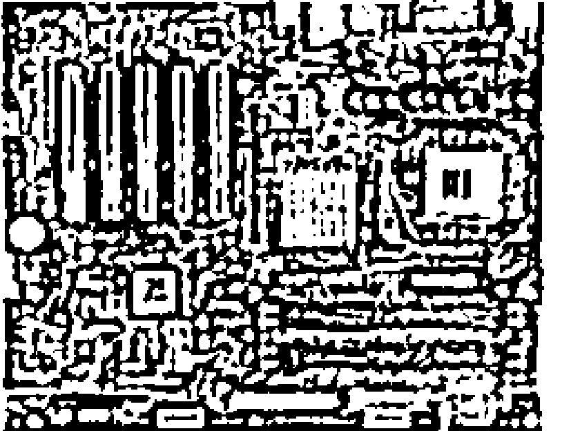

- CPU: 奔腾4处理器(478针脚)
- 芯片组: Intel® 865PE/ICH5
- 总线频率: 800/533/400MHz
- 内存: 双通道DDR400/333/266
- 扩展能力: ATX /5PCI/1AGP8X
- 板载音效: 5.1声道音效 (可选配6声道子卡)
- 外设接口: 8个USB2.0接口, 2个1394a接口 (可选)

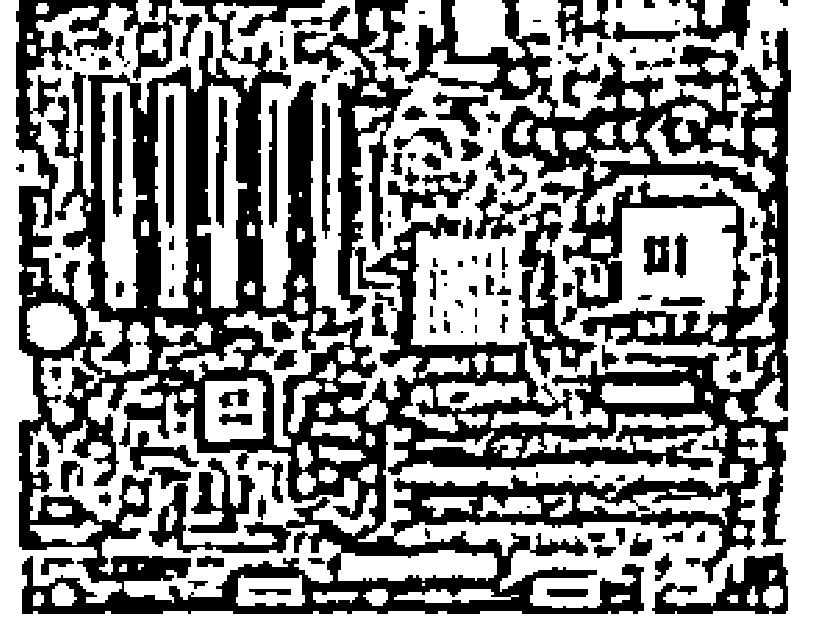

- CPU: 奔腾4处理器(478针脚)
- 芯片组: Intel® 865P/ICH5
- 总线频率: 533/400MHz
- 内存: 双通道DDR333/266
- 扩展能力: ATX /5PCI/1AGP8X
- 板载音效: 5.1声道音效 (可选配6声道子卡)
- 外设接口: 8个USB2.0接口, 2个1394a接口 (可选)

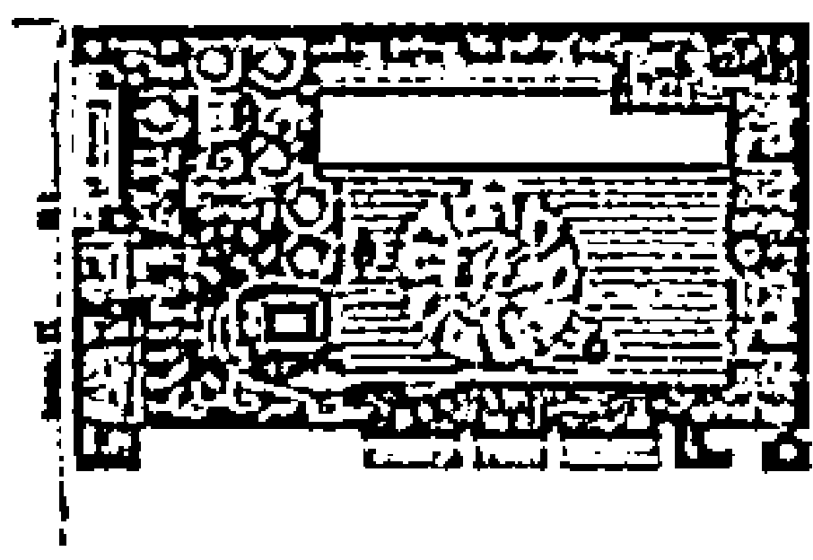

- nVIDIA 最新的第五代 GeForce FX 5200 256bit图形处理芯片
- 采用128bit 64MB DDR显存
- 支持10.4GB/s 显存带宽
- 支持Directx9.X
- 内置MPEG2解码器，支持DVD/TV输出
- Intellisample 抗锯齿技术
- 支持AGP8X技术
- 提供TV-OUT, DVI接口 (随板赠送1800mm超长TV输出电缆)


- nVIDIA 最新的第四代 GeForce4 MX440-8X图形处理芯片
- 采用128bit 64MB DDR显存
- 支持8GB/s 显存带宽
- 配备第二代光速显存架构 (LMA II)
- Accuview Antialiasing全屏反锯齿技术
- 支持AGP8X技术
- 提供TV-OUT, DVI接口 (随板赠送1800mm超长TV输出电缆)

QDI武林秘笈 超值装
绝代双雄:
QDI P4I865PEA-6A + 夸父N5200 AGP8X 超值震撼价: 1399元 (原价: 1799元)
游戏圣手:
QDI P4I865PA-6A + 夸父N440 AGP8X 超值惊喜价: 1199元 (原价: 1499元)
活动时间: 2003年6月1日-2003年7月31日
正版实惠:
QDI P4I865GA-6A + 正版WINDOWS XP 绝对疯狂价: 1350元 (原价: 1750元)
活动时间: 2003年6月15日-2003年7月31日
(剪下此印花并完整填写正确的个人资料，火速交到各地QDI行销两处，即可轻松享受以上超值套装优惠价。)
姓名: ________ 联系电话: ________
身份证号: ________
地址: ________
E-mail: ________
本活动最终解释权归联想集团QDI事业本部所有

* 所有产品具体配置及功能以实物为准。购买QDI主板正品之日起，享有三月包换、三年保修售后服务

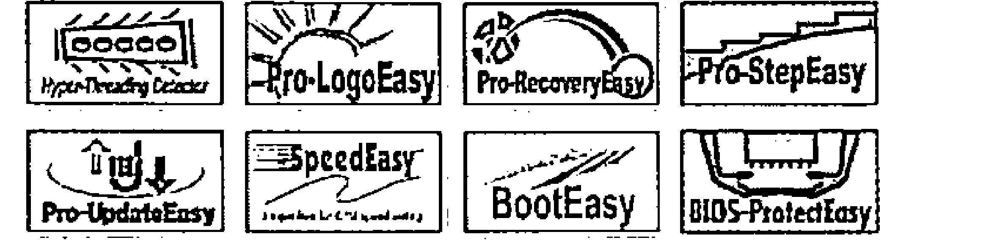

代理商名录 (部分代理商，排名不分先后)
- 华北 北京三佳恒安010-82851520 济南三立大0531-6561555 天津科鹏022-87892542 岛旭正洋0532-3846937
- 华东 南京致欣025-3366027 杭州华清0571-88216619 福建鸿腾0591-3261998 上海网道021-54244451
- 西北 陕西新希望029-8272118
- 华南 广州威之020-38182202 湖南蓝威0731-4169183 南宁新龙0771-5320460 深圳英瑞琪0755-83272582
- 华中 河南新易0371-3900278 武汉华兴027-87160058 南昌联众0791-6295779
- 西南 成都鸿烨028-5575360 昆明铭创0871-5112122

联想集团有限公司QDI事业部 电话：(0755)26955888转8815 网址：www.qdigroup.com 传真：(0755)26983668 阳光网站：www.legend.com 阳光销售热线：800-810-8888 阳光技术咨询热线：010-82879600 手机及未开通800业务地区的用户请拨打电话：010-82879600(需缴纳电话费)

# PINNACLE STUDIO version 8

# 将你的家庭电影永远保存在记忆中

完美的MPEG编码和DVD 编著方案，让你制作自己的 VCD, SVCD 和 DVD

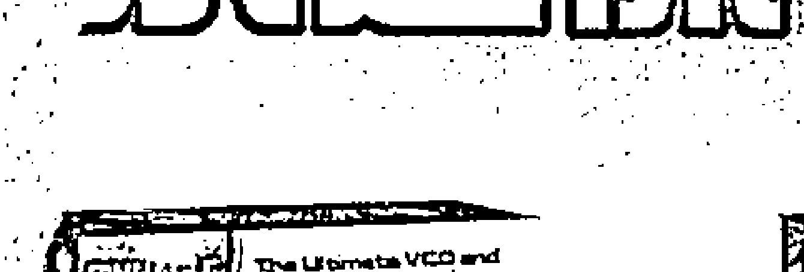

带有视频编辑和VCD/DVD 创作功能的USB2.0外置硬件 视频/电视采集设备

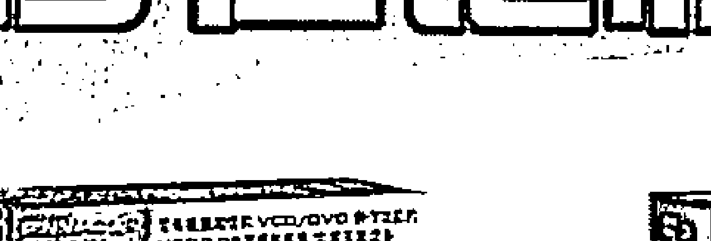

针对数码摄像机的完整 视频编辑和DVD 编著解决方案

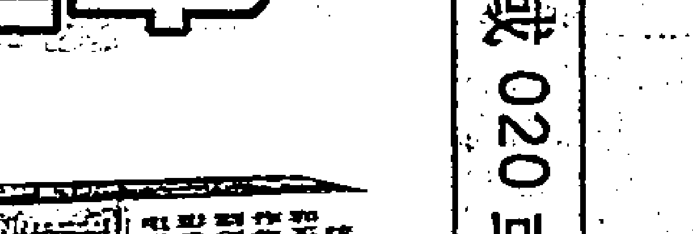

针对模拟和数码摄像机的 完整视频编辑和DVD 编著解决方案

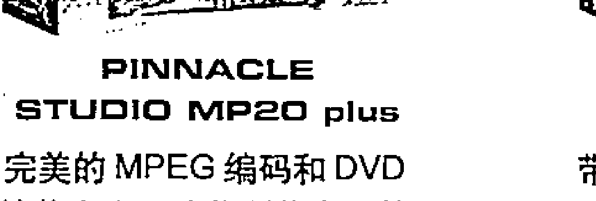

DV火线接口的外置视频 编辑高级解决方案


USB2.0接口的外置视频 编辑高级解决方案

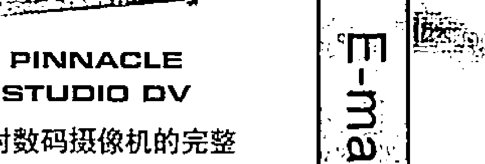

# 全球顶级数字多媒体解决方案供应商

PC TV Sat...

# 全球顶级数字多媒体解决方案供应商

# 方正存储
无限时尚


# 方正存储
晶灵AB系列

# 性能特点

- 水晶琉璃材质，耐热不变形（-20——200℃）
- 采用A级Flash芯片为存储介质，读写速度快，无需驱动程序（WIN98除外）
- 加密功能，确保数据安全
- 容量大，多种容量可供选择（16MB-2GB）
- USB接口，即插即用，支持热插拔，数据保存更安全
- 抗震、防磁、防潮，使用寿命更长
- 可直接引导系统启动
- PC锁功能，有效防止别人操作你的电脑（WIN98除外）

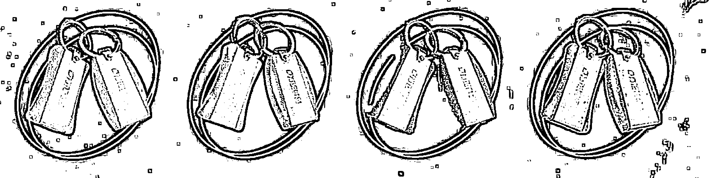

# 月光宝盒 MP3 随身听


## [全能小子] T系列

享受音乐的无障碍转录
更有FM调频自由变换心曲
把岁月融入音乐随我流转
延韵律的起伏作太清的逍遥游行
在蓝石英的幻境中冉冉升起
进入另一种痴迷
蝉蜕蝶化
在音乐的痴迷里扶摇

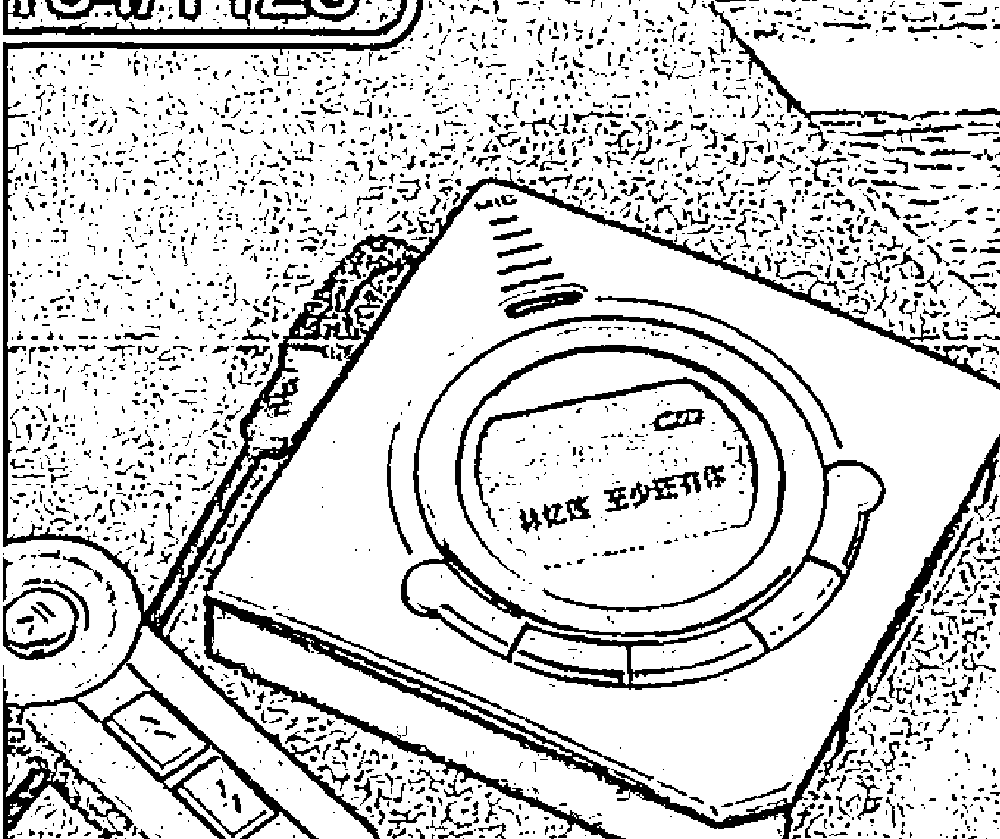

### T系列产品功能特点
- 外部音源转录，不通过电脑可将任意音源转录为MP3
- FM调频，20个电台预设，可同步内录
- 可调节播放速度，听力学习更轻松
- 双供电模式：口香糖电池和拆卸式AAA电池扩展槽
- A→B复读模式，学习外语显灵通
- 时尚线控耳机，功能尽在掌握
- 标准移动磁盘，无须驱动，即插即用
- 支持MMC扩展，最高至256MB
- 全金属外壳，时尚高贵
- 超细密结晶LCD屏，经久耐用

# 自主预算 自由打算

钱不多，却希望买到理想电脑。拿着Dell Dimension™ 2350的预算方案，一定会让老板心花怒放。它采用英特尔® 奔腾® 4处理器2.0GHz，优秀的性价比能让企业IT投资获得更大回报，迅速完成企业信息化的基础建设，迈入高速发展快车道。


对于刚刚起步的中小型企业来说，Dimension™ 2350是一款非常适合的机型，因为它经济实用，大大节省企业基础的信息化建设预算，帮助企业实现真正拥有高性能产品的愿望。在有限预算内，执行文字处理、管理应用、会计和网络浏览等常用功能，在获得强大生产力的同时，最大程度的使IT投资发挥出效益。Dell Dimension™ 2350进行外设扩展也是非常轻松方便，硬盘、内存的升级，增设光驱，或升级为更大屏幕显示器都可以随着需求的不断改变而轻松完成。

# Dimension™ 2350

- ▶ 免费从英特尔® 奔腾® 4处理器2.0GHz升级至英特尔® 奔腾® 4处理器2.2GHz
- ▶ 英特尔® 845GL芯片组
- ▶ 128MB 266MHz DDR内存
- ▶ 30GB¹硬盘
- ▶ 15英寸彩色显示器
- ▶ 集成Intel® Extreme 3D显卡
- ▶ 48倍速CD-ROM
- ▶ 3.5英寸软盘驱动器
- ▶ 集成声卡/集成网卡
- ▶ 预装Microsoft® Windows® XP (家庭版)
- ▶ 1年内有限保修 (本配置只针对中小企业，恕不包含个人用户)
- ▶ 加RMB148元，升级至40GB¹硬盘
- ▶ 加RMB168元，升级至256MB DDR 内存
- ▶ 加RMB242元，升级至17英寸彩色显示器
- ▶ 加RMB408元，加装CD-RW
- ▶ 加RMB329元，从1年内有限保修升级至3年内有限保修

标准配置价 人民币 5,538

升级建议 (需另加额外费用): ● 可升级至DVD-ROM或Combo Drive ● 台式机可升级至15英寸液晶显示器 ● 另加人民币600元，可升级至Microsoft® Windows® XP Pro专业版，即可拥有更可靠、更安全、更高性能且易操作的计算平台

Dell | 商用台式电脑


### Dimension™ 2350n 超值入门
* 免费从英特尔® 奔腾® 4处理器2.0GHz升级至英特尔® 奔腾® 4处理器2.2GHz
* 英特尔® 845GL芯片组
* 128MB 266MHz DDR内存
* 30GB¹硬盘/15英寸彩色显示器
* 集成Intel® Extreme 3D显卡
* 48倍速CD-ROM/3.5英寸软盘驱动器
* 集成声卡/集成网卡/DOS
* 1年内有限保修
标准配置价 人民币 5,238

### Dimension™ 2350n 超值入门
* 英特尔® 奔腾® 4处理器2.4GHz
* 英特尔® 845GL芯片组
* 256MB 266MHz DDR SDRAM内存
* 30GB¹硬盘/15英寸彩色显示器(13.8"v.i.s.)
* 48倍速CD-ROM/3.5英寸软盘驱动器
* 集成Intel® Extreme 3D显卡
* 集成声卡/集成网卡/DOS
* 1年内有限保修
标准配置价 人民币 5,638

### Dimension™ 2350 经济实用
* 免费从英特尔® 奔腾® 4处理器2.0GHz升级至英特尔® 奔腾® 4处理器2.2GHz
* 英特尔® 845GL芯片组/256MB 266MHz DDR SDRAM内存
* 40GB¹硬盘/17英寸彩色显示器(16.0"v.i.s.)
* 16倍速最大DVD-ROM/3.5英寸软盘驱动器
* 集成Intel® Extreme 3D显卡/集成网卡
* 集成声卡/立体声音箱
* 预装Microsoft® Windows® XP (家庭版)
* 1年内有限保修
标准配置价 人民币 6,329


### Dimension™ 4600 性能卓越
* 英特尔® 奔腾® 4处理器2.26GHz
* 支持DDR技术的英特尔® 865PE芯片组
* 256MB 333MHz DDR SDRAM内存
* 40GB¹硬盘/15英寸彩色显示器(13.8"v.i.s.)
* 16MB ATI Rage Ultra™ AGP Graphics显卡
* 48倍速最大CD-ROM
* 支持5.1声道的集成声卡/集成网卡
* 预装Microsoft® Windows® XP (家庭版)
* 1年内有限保修
标准配置价 人民币 6,548

### Dimension™ 4600 性能卓越
* 英特尔® 奔腾® 4处理器2.26GHz
* 支持DDR技术的英特尔® 865PE芯片组
* 256MB 333MHz DDR SDRAM内存
* 40GB¹硬盘/17英寸彩色显示器(16.0"v.i.s.)
* 16MB ATI Rage Ultra™ AGP Graphics显卡
* 16倍速最大DVD-ROM/支持5.1声道的集成声卡/集成网卡
* 预装Microsoft® Windows® XP (家庭版)
* 1年内有限保修
标准配置价 人民币 6,988

### Dimension™ 4600 性能卓越
* 英特尔® 奔腾® 4处理器2.4GHz
* 支持DDR技术的英特尔® 865PE芯片组
* 256MB 333MHz DDR SDRAM内存
* 60GB¹硬盘/17英寸纯平显示器(16.0"v.i.s.)
* 64MB DDR nVidia GeForce4 MX Graphics显卡
* 16倍速最大DVD-ROM/支持5.1声道的集成声卡
* Altec Lansing® ADA215立体声音箱/集成网卡
* 预装Microsoft® Windows® XP (家庭版)
* 1年内有限保修
标准配置价 人民币 7,558

# 电脑爱好者

## 合订本

2003年(上)·合订本


电脑爱好者杂志社

### 内容提要

《电脑爱好者合订本》2003年（上）·附录分册是与正文分册相配套的图书，作为合订本正文分册的补充和完善，附录分册面向最新的应用技术和热点，为读者提供了解决电脑应用实际问题的全面解决手段和方案。本书内容精练，实例丰富，实战性和可操作性强，适合于具有一定计算机应用水平的中高级读者和渴望提高实际操作技能的电脑爱好者使用。

本书设有系统专区、综合应用、CG论坛、硬件沙龙、数码时尚、编程课堂、网络世界、安全阵营、教程园地等9大板块，30个大专题，全面覆盖了软件、硬件、网络、多媒体、图形图像、系统安全等电脑应用领域。

图书配套光盘B，其中精心收录了“东方卫士”、“金山影霸2003最新修正版”、“豪杰音乐工作室”、“驱动精灵”等等多款大型应用软件，以及近100款精品免费、自由软件，20多个精彩的桌面主题以及附录文章相关资源，Flash动画等丰富内容。超值奉送，精彩不断！

# 《电脑爱好者合订本》2003年(上)·附录

社 长：孙晓旭
副社长：赵 健
总 编：高 翔
编辑策划：武 航（主编）
黄平山 陈荣贵 付振华
编辑出版：《电脑爱好者》杂志社
制 作：粟 业 王 辰

发 行：北京9615信箱《电脑爱好者》杂志社推广发行中心（100086）
发行电话：（010）62161961 62161335/62162598 - 8621
技术支持：（010）62161335/62162598 - 8603/8610
网 址：http://www.cfan.com.cn
经 销：各地新华书店

开 本：787 x 1092 1/16
印 张：25
字 数：800千字
刊 号：ISSN 1005-0043/CN11-3248/TP
国内邮发代号：82-528

本书如有印刷质量问题（错页、掉页、残页等），我们将负责调换。
联系电话：（010）62161335/62162598-8621 Email：cf_publish@cfan.com.cn
图文版权所有，未经同意不得转载、翻印
合订本定价：35元

## 系统专区
Operating System Region

## Windows XP的秘密花园

- 一、重新认识Windows XP光盘
  - (一) 中文分区更方便
  - (二) 安装“恢复控制面板”到硬盘
  - (三) 安装NetBEUI协议
  - (四) 老程序焕发新生命
  - (五) 给Windows XP添加五笔输入法
  - (六) 个性设置如影随形
  - (七) 远程控制Windows 9x/Me
  - (八) 自动安装Windows XP
  - (九) 架设自己的网络服务器
  - (十) 更多高级功能
- 二、隐藏在Windows XP中的实用工具
  - (一) 插入特殊符号不用愁
  - (二) 剪贴板数据我知道
  - (三) DVD免费欣赏
  - (四) 自解压文件自己做
  - (五) 备份数据很简单
  - (六) ODBC数据源管理器
  - (七) IP地址侦探兵
  - (八) 键盘交互更方便
  - (九) 注册表编辑我更强
  - (十) 注册/反注册ActiveX不求人
  - (十一) 妙用Rundll32
  - (十二) 让系统固若金汤
  - (十三) 巧用音量控制
  - (十四) 任务管理器的另类用途
  - (十五) 免费好用的聊天工具
  - (十六) 自动更新Windows XP
- 三、Windows XP中鲜为人知的技巧
  - (一) 定时锁定计算机
  - (二) 取消Windows XP中的保留带宽
  - (三) 让IIS进驻Windows XP家庭版
  - (四) 抓取DOS窗口中的文本
  - (五) 消除复制乱码现象
  - (六) 活用Windows XP的安全模式
  - (七) 把文件藏进MP3或图片中
  - (八) 妙用Xcopy同步文件

## 教你玩转注册表

- 一、注册表的结构关系与数据类型
  - (一) 六大根键的作用
  - (二) 注册表键值的数据类型
- 二、与注册表相关的重要文件
  - (一) 系统配置的注册表文件System.dat
  - (二) 系统配置的备份文件System.da0
  - (三) 用户平台配置的注册表文件User.dat
  - (四) 用户平台配置的备份文件User.da0

## 电脑爱好者 2003年(上)·附录分册

### (五)网络管理注册表文件Config.pol
### (六)网络管理备份文件Config.pol
### (七)Win.ini和System.ini文件
### (八)INF文件与注册表的关系

## 三、注册表编辑器的基本操作
### (一)最常见的几种操作
### (二)手动编写REG文件
### (三)在DOS环境下维护注册表
### (四)维护注册表的相关工具

## 四、Windows注册表实例技巧
### (一)桌面显示与系统图标
### (二)系统调整与优化
### (三)网络应用的修改与优化
### (四)IE安全防护与修复实例

## 关于Windows的几个'另类'问题

### 一、Windows的启动配置
#### (一) Windows 9X/Me系列的启动配置文件
#### (二) Windows 2000/XP系列的系统启动配置文件
### 二、Windows的系统进程
#### (一)最基本的系统进程
#### (二)附加的系统进程
#### (三)系统服务进程
### 三、Windows的系统服务

## 视窗时代话DOS

### 一、DOS简述
### 二、超越Windows的DOS功能
#### (一) 低级格式化
#### (二) 硬盘分区
#### (三) 破解CMOS密码
#### (四) 查杀顽固病毒
#### (五) 合并文件
### 三、辅助Windows的DOS功能
#### (一) 操作系统的安装
#### (二) 操作系统的备份和修复
#### (三) Windows注册表的编辑
### 四、Windows下DOS命令提示符的应用
#### (一) 批量改名
#### (二) 建立硬盘存储信息列表文件
#### (三) 比较文件
#### (四) 批量复制软盘
#### (五) 网络命令的使用
### 五、老树开新花——XP中的增强DOS命令
#### (一) 列目录命令: DIR
#### (二) 改变目录命令: CD
#### (三) 建立目录命令: MD
#### (四) 删除目录命令: RD
#### (五) 删除文件或目录命令: DEL
#### (六) 更改属性命令: ATTRIB
#### (七) 格式化命令: Format
#### (八) 显示系统日期和时间命令: DATE、TIME
### 六、DOS功能增强工具
#### (一) DOS支持USB的增强工具
#### (二) DOS支持长文件名的增强
#### (三) DOS对NTFS支持的增强
#### (四) DOS多媒体功能的增强
#### (五) DOS对网络功能的增强
### 七、 MS外的DOS系统
### 八、 XP的类DOS操作系统——WinPE
#### (一) WinPE的功能简介
#### (二) WinPE的启动
#### (三) WinPE的常用命令
#### (四) WinPE的网络命令
#### (五) 创建WinPE系统

## 综合应用
Synthetical Application

## 备份与修复——为你的数据上保险

## 一、有备才能无患——数据的备份与恢复
#### (一) Windows 的系统备份
#### (二) 克隆备份系统法
## (三) 关键数据备份法
#### (四) 用户数据备份
# 二、回天有术——数据的修复
#### (一) Undelete恢复误删文件
#### (二) EasyRecovery恢复文件
#### (三) FinalData恢复文件
#### (四) 恢复移动设备中的误删文件
#### (五) 损坏压缩文件的修复
#### (六) Office系列文档的修复

## 虚拟，为了更好的现实

### 一、 虚拟软驱
### 二、 虚拟磁盘
#### (一) 用内存虚拟磁盘
#### (二) 在硬盘上创建虚拟磁盘
### 三、 虚拟内存
#### (一) 什么是虚拟内存
#### (二) 优化虚拟内存
#### (三) 虚拟内存的具体设置
### 四、 虚拟光驱
### (一) CloneCD与Deamon Tools的黄金组合
#### (二) 用Alcohol 120% 制作虚拟光驱
### 五、 虚拟计算机
#### (一) 创建虚拟计算机
#### (二) 为虚拟计算机安装操作系统
### 六、 虚拟局域网
#### (一) 选择正确的通讯方式
#### (二) 虚拟局域网的组建

## 计算机字体应用一点通

### 一、 计算机字体概述
#### (一) 计算机字体的分类
#### (二) 计算机的编码知识
#### (三) 汉字库的概念
### 二、 字体制作实战
#### (一) “TrueType造字程序”制作生僻汉字
#### (二) DIY全新的计算机字体
### 三、计算机字体应用技巧
#### (一) 超强的字体管理工具The Font Thing
#### (二) 活用字体优化系统
#### (三) 常见的字体导致的问题

## 电脑输入法应用透视

### 一、电脑输入法概述
#### (一) 键盘输入法
#### (二) 非键盘输入法
### 二、电脑输入法的实现原理
#### (一) 键盘输入法的实现原理
#### (二) 语音输入法的实现原理
#### (三) 手写输入法的实现原理
#### (四) OCR输入法的实现原理
### 三、输入法生成器的使用
#### (一) 日文输入法DIY
#### (二) 创建多编码混合输入法
### 四、编程设计输入法
#### (一) 输入法编程原理
#### (二) Delphi下汉字输入法的编程
### 五、常见的电脑输入法评述
#### (一) 微软拼音输入法
#### (二) 智能狂拼II
#### (三) 拼音加加
#### (四) 紫光拼音
#### (五) 自然码
### 六、输入法通用技巧几例
#### (一) 将常用的输入法设置成热键
#### (二) 找到突然消失的输入法工具条
#### (三) 让输入法随叫随到
#### (四) 调整输入法的次序

## 软件风云榜

- RiverGenius 1.5beta(驱动精灵)
- SnagIt 6.2(抓图专家)
- Spy Sweeper(间谍清扫工)
- Phoenix(倍速浏览器)
- CuteFTP 5.0(上传下载的利器)
- AceHTML 5(超级网页编辑器)
- JavaScript Menu Master(网页菜单生成器)
- FreeRAM XP Pro 1.31(内存清理)
- Fresh Diagnose(系统测试工具)
- Jv16 PowerTools(系统优化工具)
- Quintessential Player(全功能音频播放器)
- Question Tools SimpleSet(在线测试工具)
- CSDiff 4.0(文件比较工具)

## 东方卫士网络版杀毒软件

### 一、启动及基本页面组成
#### (一) 病毒扫描
#### (二) 病毒的发现及清除
#### (三) 文件修复

## 《豪杰音乐工作室》技巧
#### (一) 录制网上音乐
#### (二) 获取声音素材
#### (三) 清晰播放CD音乐
#### (四) 巧播双语碟

## 《豪杰大眼睛》为图片变脸

## 超值影音娱乐享受——《金山影霸2003》
#### (一) 精美界面
#### (二) 多格式支持
#### (三) 导航技术
#### (四) 高画质
#### (五) 纠错能力
#### (六) 音色及字幕

## CG 论坛
The Forum of CG

## 计算机点阵图像与矢量图形漫谈

### 一、计算机图形图像基础
#### (一) 入门知识
#### (二) 什么是点阵图像
#### (三) 什么是矢量图形
#### (四) 点阵图像与矢量图形的比较
#### (五) 图像的分辨率
#### (六) 计算机中的色彩
## 二、图形图像相关软件概览
#### (一) 点阵图像软件
#### (二) 矢量图形软件
## 三、图形图像的格式
#### (一) 点阵图像格式
### (二) 矢量图形格式
#### (三) 图形图像的格式转换
## 四、多格式图形图像的浏览
## 五、结语

## 迷人的CG世界

### 一、神秘的旅程 (Photoshop + 鼠标)
#### (一) 处理线稿
#### (二) 上色
### 二、诗意的忧伤 (Painter + 压感笔)
#### (一) 画前准备
#### (二) 起稿
#### (三) 上第一层色
#### (四) 详细刻画
#### (五) 画面整体处理
### 三、眨眼睛的少女 (Flash矢量动画)
#### (一) 绘画工具之间的不同
#### (二) 实例演示

## Photoshop插件实用技巧

### 一、Photoshop插件的分类
#### (一) 获取模块类 (Acquire modules)
#### (二) 导出插件 (Export modules)
#### (三) 文件格式插件 (Format modules)
#### (四) 滤镜插件 (Filter modules)
### 二、精彩插件选粹
#### (一) 小小动画师GIF-X Plugin
#### (二) 怀旧的AgedFilm
### 三、给插件请个管家
#### (一) Plugin Manager简介
#### (二) Plugin Manager的使用
### 四、滤镜插件的使用技巧
#### (一) 注意滤镜的作用区域
#### (二) 滤镜是基于像素处理的
#### (三) 减少突兀感觉
#### (四) 将滤镜应用于通道
#### (五) 联合使用多种滤镜
#### (六) 突破常规用滤镜

## 硬件沙龙
Hardware Salon

## 2003年上半年硬件经典新品大盘点

### 一、CPU篇
#### (一) Intel日新月异
#### (二) AMD前景堪忧
### 二、主板篇
#### (一) Intel主要芯片组
#### (二) Athlon XP篇
## 三、显卡篇
#### (一) nVIDIA篇
#### (二) ATi篇
#### (三) 其他厂商篇
## 四、内存篇
## 五、硬盘篇
## 六、显示器篇
#### (一) CRT部分
#### (二) LCD部分
## 七、鼠标键盘篇
#### (一) 中低端市场
#### (二) 高端产品
## 八、机箱、电源、风扇
## 九、声卡音箱篇
## 十、光驱、移动存储篇
#### (一) CD-ROM
#### (二) DVD-ROM
#### (三) CD-RW
## (四) COMBO
## (五) 闪盘
## 十一、其他
### (一) 摄像头
#### (二) 数码相机
#### (三) MP3播放器

## 教你学评测

### 一、CPU性能测试

## 认识电脑中的接口和插槽

## 一、内部接口

- (一) CPU插槽/座
- (二) 内存插槽
- (三) PCI插槽
- (四) AGP插槽
- (五) AMR插槽
- (六) CNR插槽
- (七) ACR插槽
- (八) IDE接口
- (九) Serial ATA接口
- (十) 软驱接口
- (十一) 电源接口
- (十二) IrDA接口
- (十三) WOL插针
- (十四) WOR插针

## 二、外部接口

- (一) 串行接口
- (二) 并行接口
- (三) PS/2接口
- (四) XT/AT接口
- (五) USB接口
- (六) IEEE1394接口
- (七) SCSI接口
- (八) 音频接口
- (九) 游戏/MIDI接口
- (十) CD_IN接口
- (十一) CD SPDIF接口
- (十二) RJ-11接口
- (十三) RJ-45 接口
- (十四) D-Sub 接口
- (十五) DVI 接口
- (十六) S端子
- (十七) 增强型S端子
- (十八) VIVO端子
- (十九) 复合视频端子

## 软硬兼施

### 一、CPU篇
- (一) 绿色的CPU检测卫士——MyCPU
- (二) 实时超频利器——SoftFSB
- (三) CPU降温软件——Cpuidle

## 二、硬盘篇
- (一) 硬盘接口模式优化
- (二) 全力监测硬盘健康状况——SIGuardian

## 三、主板篇
- (一) 主板温度检测大师——MotherBoard Monitor

## 四、显卡篇
- (一) 打造个性化显卡——nVIDIA BIOS Editor
- (二) nVIDIA显卡优化大师——RivaTuner
- (三) 榨干Radeon显卡的油水——Rage3D Tweak
- (四) 让Radeon显卡更有个性——ATI BIOS Editor
- (五) 全能显卡优化大师——PowerStrip

## 五、显示器篇
- (一) 显示器检测官——Monitors Matter CheckScreen
- (二) 显示器测试软件的元老——Nokia Monitor Test
- (三) 轻松挑选LCD显示器——TFT LCD Lighting Inspection Test Program
- (四) 查看显示器信息——PowerStrip

## 数码时尚
Digital Vogue

## DVD世界全接触

### 一、初识DVD
- (一) DVD的特性
- (二) DVD的分类和结构
- (三) DVD的区码

### 二、DVD相关设备的选购
- (一) DVD光驱的选购
- (二) DVD光盘刻录机的介绍与选购

## 三、组建电脑家庭影院
- (一) 用PowerDVD欣赏DVD影碟
- (二) 主流DVD播放器
- (三) DVD的使用维护

### 四、DVD的转换
- (一) 制作DivX
- (二) DVD转换成常见的视频格式

# 五、DVD刻录
- (一) DVD刻录的基本原理
- (二) DVD刻录盘片
- (三) DVD刻录软件和注意事项

# 掌上有乾坤

### 一、手机使用秘笈
- (一) 用手机直拨分机电话
- (二) 手机无声按键两法
- (三) 找回看得懂的语言
- (四) 让手机号码自动转移
- (五) 巧用电话簿实现缩位拨号
- (六) 59秒通话是否最合算
- (七) 手机也支持模糊查询
- (八) 巧用语音键
- (九) 快速拨号

### 二、手机漫游技巧
- (一) 尽量不要查询话费
- (二) 判断是否处于漫游状态
- (三) 漫游也能用短信

### 三、短消息使用技巧
- (一) 让手机随身“呼”
- (二) 使用秘书台或网络发送短消息
- (三) 充分利用自定义信息
- (四) 把手机当笔记本用
- (五) 用ICQ免费发短消息
- (六) 群发短消息

### 四、流行英文短信缩略语

## 编程课堂
Programme Classroom

### VC界面美化编程

### 一、美化界面之开题篇

### 二、美化界面之基础篇
- (一) 设备环境类
- (二) 图形对象类

### 三、美化界面之实现篇
- (一) 美化界面的途径
- (二) 使用MFC类的既有函数
- (三) 使用Windows的消息机制
- (四) 使用MFC类的虚函数机制

## 大话Java编程

### 一、老生常谈话Java
- (一) 编程语言
- (二) Java的由来
- (三) 相关术语辨析

### 二、与Java第一次亲密接触
- (一) 编程的一般步骤
- (二) Hello CFan!
- (三) 理解HelloCFan

### 三、西天取经第一步
- (一) 了解c=2πr
- (七) 数组
- (八) 运算符

## 四、Java流程控制
- (一) 判断——八戒问路一
- (二) 分支——八戒问路二
- (三) 循环——八十一难
- (四) 流程图

### 五、Java对象编程
- (一) 物以类聚
- (二) 继承
- (三) 接口
- (四) 包

### 六、Java异常机制
- (一) 传统错误处理
- (二) 异常处理机制

## 七、结束语

## 网络世界
Network World

## 小型局域网的组建与选购
- 一、了解局域网
  - (一) 局域网的类型
  - (二) 局域网的组成和常用结构
- 二、网络硬件的选购与组建
  - (一) 网卡
  - (二) 双绞线
  - (三) 同轴电缆
  - (四) 光纤
  - (五) 集线器
  - (六) 交换机
  - (七) 其他网络硬件
  - (八) 小型局域网的组建
- 三、软件的设置
  - (一) 安装常用协议
  - (二) 设置文件共享
  - (三) 设置打印机共享
  - (四) 共享上网

## 局域网应用与故障排除技巧集锦
- 一、局域网应用技巧
  - (一) 给换了插槽的网卡设置原来的IP地址
  - (二) 在同一网卡上设置多个IP地址
  - (三) 个人用户快速修改MAC地址
  - (四) 实现苹果机和PC机互访
  - (五) 双网卡巧设防火墙
  - (六) 通过远程拨号接入公司局域网
  - (七) 让老计算机也能连接局域网
  - (八) 用Ghost快速组建局域网
  - (九) 灵活指定ADSL共享服务器
  - (十) 局域网中妙用活动桌面发布工作通知
- 二、局域网故障排除技巧
  - (一) 局域网故障排除的一般方法
  - (二) 利用网卡诊断程序检测网卡故障
  - (三) 子网掩码设置不当导致的故障(四)防范企业代理服务器被外网利用
(五)共享名导致的不能共享打印的问题
(六)局域网内巧妙加速“慢”网卡
(七)巧用MAC地址和IP地址捆绑法解决局域网IP地址冲突

## 安全阵营

### 加密与解密的基础知识

一、加密、解密的基础概念
(一)什么是加密
(二)常用的加密算法
(三)加密的用途
(四)常见的加密方法

二、对系统进行加密保护
(一)启用CMOS密码
(二)为操作系统设置密码保护
(三)核心文件加密技术——EFS
(四)密钥的备份与恢复

三、数据文件加密
(一)可执行文件的加密
(二)常见的数据文件加密
(三)启用软件内置的加密功能

四、经典加密工具PGP
(一)PGP的下载和安装
(二)密钥的生成和管理
(三)PGP的应用

五、解密基础
(一)破解密码
(二)软件脱壳和破解注册码

六、结束语

## 系统漏洞与网络安全

一、系统漏洞及补丁
(一)Windows系统漏洞
(二)常用软件漏洞
(三)教你打补丁

二、网络安全
(一)初级黑客的必备武器
(二)剖析各类恶意网页和IE漏洞对策分析

## 数字世界的身份证

一、数字签名的相关概念
二、数字证书的获得与维护
(一)数字证书的申请
(二)数字证书的导入和导出
三、Office中的数字签名
(一)保护文档免受未经授权的更改
(二)用onSign添加Office文档签名
(三)宏签名
四、用数字签名保护电子邮件
(一)Outlook Express中的数字签名
(二)PGP的签名保护
五、数字签名的高级应用
(一)网上报税
(二)工商管理
(三)网上办公
(四)网上招标
(五)网上交易

## 教程园地

## Flash精彩游戏闪出来

一、Flash游戏编程概述
(一)游戏编程概述
(二)游戏实例简介
二、Flash游戏编程基础
(一)走进ActionScript
(二)数据类型
(三)变量及表达式
(四)运算符
(五)语法
(六)控制语句
(七)命令和函数
(八)预定义类
三、本地型游戏－贪食蛇
(一)总体设计要点
(二)实现步骤
四、网络互动游戏－猜拳
(一)总体设计要点
(二)相关知识点
(三)实现步骤
五、结束语

## Authorware大制作

一、多媒体与Authorware
(一)什么是多媒体
(二)多媒体要素
(三)关于Authorware 6.5
二、初识Authorware
(一)Authorware的安装
(二)Authorware的启动
(三)了解Authorware
三、搜集素材
(一)图片文件
(二)声音文件
(三)影像文件
四、配套光盘的制作
(一)整理素材
(二)开始制作
五、打包输出产品
(一)转为EXE文件
(二)带上动画驱动
(三)Xtras
(四)带上必要动态链接库
六、刻录光盘

## 配套光盘B导读

### 超软黄金屋

#### ◆东方卫士网络版杀毒软件正式版

全球互联网及企业Intranet迅猛发展，网络共享资源越来越开放，各种黑客程序、网络蠕虫、特洛伊木马等网络病毒也开始肆虐，窃取电脑网络机密、破坏网络系统，使企业网络安全面临着日益严重的威胁。
基于目前这种网络病毒横行和传播的现状，交大铭泰公司适时推出东方卫士网络版产品。东方卫士网络版产品的主要功能特点有：引进了国际杀毒引擎；最快速的杀毒速度；查杀病毒广泛；全息数据和全息备份技术保证企业数据安全；企业定制安全码等，实现对未知病毒的全网防范。

#### ◆金山影霸2003最新修正版

金山影霸2003将会把你的个人电脑变成一个令人不可思议的多媒体影音平台，让你尽享视听之乐。《金山影霸2003》支持DVD、VCD、MPEG、AVI、RM、FLASH、HDTV、ASF、WAV等媒体格式。在软解压技术上取得了突破性的进展，播放质量以及纠错性能都可以和DVD影碟机媲美，并且是国内首家完整支持DVD、VCD导航的软解压播放器！这次我们收取的是金山影霸2003的最新版，修正了一些BUG，并增加了一些功能。

#### ◆豪杰音乐工作室

豪杰音乐工作室是一款全功能的音频处理软件。它可以完成磁带与MP3互转；可以无限长度录音；可以为音频文件加入图片及文字，从而转换成视频文件；可以制作新潮的电子像册，MTV；可以对各种流行音频格式进行互转，批量转换；可以播放WAV、CD、MIDI、MPG、DVD、WAVE、TEXT等几十种音频文件；还能轻松将CD音乐超真成批抓轨成MP3、WAV音乐等多种功能。

#### ◆豪杰视频通2.0

豪杰视频通能助你随心所欲实现视频转换。它独创的屏保技术，使精彩电影能瞬间变屏保。独创的灵活智能拷盘工具，使得DVD复制与视/音频流分拆方便快捷，制作自己的电影、贺卡、演示信手拈来。支持VOB、DAT、MPEG1、MPEG2、MPEG4、AVI、RM等常见视频格式的转换，支持DVD转VCD，支持批量转换，HT技术以及将视频格式转换为GIF等。

#### ◆驱动精灵

驱动精灵能够检测用户计算机系统中的硬件设备，并能将硬件的驱动程序提取出来备份为Zip压缩文件或自解压文件。这样就可以免去重新安装系统后驱动程序丢失的烦恼。其次，它内置高达25000余条记录的驱动数据库，提供向导模式和搜索引擎模式，还可利用驱动之家(http://www.mydrivers.com)庞大的驱动资料库，为用户准确定位硬件的最新驱动。另外，它的智能升级功能可以让您的驱动精灵软件与驱动之家网站随时保持同步！此外，它还可以备份其他关键资料，如：系统注册表，收藏夹等。

#### ◆PC万能防改精灵

PC万能防改精灵(电脑爱好者合订本专用版)是一套令Windows更稳定、更快、更好用的防御软件，它集成了IE浏览器防改、系统优化、系统还原、网吧管理、家用管理、QQ密码防盗、程序加锁、进程管理、QQ自动聊天器、电脑防删除等十大功能，并且还具有实时木马监控功能。现在能修改的系统功能已达400余项，确保您的系统安全不受侵犯。本软件作者给我们提供了100个免费注册号码，参加合订本读者调查的读者将有机会中奖获得。

## 软件风云榜

### 实用工具

#### ◆Fresh Diagnose 5.80

Fresh Diagnose可用来测试用户的电脑系统。它可以分析诊断出多种硬件类型，包括CPU、内存、硬盘、视频系统、主板以及软件系统。通过它不但可以了解当前的系统状态，还可以诊断系统的问题所在，以优化电脑的性能。

#### ◆金山毒霸下载版

金山毒霸下载版是在金山毒霸2003的基础上，保留全部特色功能，并专门针对文件进行压缩优化的杀毒软件。它延续了金山毒霸系列产品“以客户为中心，全面面向互联网”的产品形象。具有体积小、适合下载的特点。它主要有“闪电查毒”、“IE防火墙”、“系统漏洞检测程序”、“邮件防火墙”、“MSN、QQ、ICQ、Office安全助手”等多个功能模块。注意：安装金山毒霸下载版需要序列号。

#### ◆瑞星杀毒软件2003下载版

瑞星杀毒软件2003下载版是瑞星最新推出的一款反病毒产品，它免A盘、免注册，可以直接使用。瑞星杀毒软件2003下载版的具体使用方法，请参阅本光盘“\软件风云榜\实用工具\瑞星”文件夹下的使用说明文件（最好去网站查看瑞星公司最新的说明）。瑞星公司给我们提供了100个免费注册号码，参加合订本读者调查的读者将有机会中奖获得。

#### ◆FreeRAM XP Pro 1.31

FreeRAM XP可以自动监视与优化内存。它的操作非常简单，运行后，右击系统托盘中的FreeRAM图标打开主界面，即可查看内存状态以及设置优化内存了。1.31版与以前的版本比较起来，改动较少，主要是修改了一些bug。

**Fresh UI 5.6** Fresh UI 可以帮助我们定制和优化Windows。比如它可以定制Windows的用户界面，设置Windows中被隐藏的一些选项，优化系统设置，优化硬件设置等。Fresh UI按节点组织信息，易于浏览操作。在5.6版中，增加了对Internet Explorer隐含设置的控制。

**CSDiff 4.0** CSDiff 是一款免费的高级文件分析工具。它可以比较两个类似文件或文件之间的不同之处。CSDiff 一般用来分析程序源代码文件，HTML 文档和 Word 文档等。

**RAMBooster 1.6** Windows 运行一段时间后就会产生许多的内存垃圾，RAMBooster 可以帮助清理这些内存垃圾，从而加速系统运行速度。这在系统配置相对较低的电脑上效果非常明显。

### 图形图像

**豪杰大眼睛 2.1** 这款软件短小精悍，即便你选择完全安装，容量也不过8M左右。其采用类似MS Office 的安装方式，用户可以方便地定制安装。它主要包括图像浏览、屏幕保护制作、图片合成VCD、屏幕抓图、电子相册制作、批量转换等多种功能。它支持 69 种图像的浏览，可以输出 19 种格式的图像，还包含了 23 种特效插件。功能非常强大。

**IrfanView 3.8** IrfanView 与 ACDSee 类似，是一个快速的简单易用的图像查看与编辑软件，几乎支持所有的主流格式图形以及动画与声音文件等。它可以进行目录预览，支持TWAIN扫描接口，具有幻灯显示方式，可以进行批量图形转换，并可以对图像进行色彩调整，剪裁等编辑处理。

### 音频音乐

**FreeRip 2.3** FreeRip 可以成批地将 CD 上的数字音轨保存为具有 CD 音质的 MP3 文件，或将它们编码成 OGG 或者 WAV 格式的文件，速度非常之快。它还可以将 WAV 文件转换成 MP3 文件。

### 视频动画

**豪杰超级解霸 3000** 豪杰超级解霸 3000 是豪杰公司精心制作的解霸系列的最新版本，它在视频、音频方面新增了许多功能，如：独创的背景播放方式，可以把画面叠加在桌面或指示的窗口上，可以一边工作一边看 DVD；支持双屏显示卡；在对等网的环境下进行网络DVB 广播功能；独创的两声道前/后环绕技术，可以让普通立体音箱形成与 5.1 相同的环绕音场，达到与六音箱相同的效果等。

**VirtualDub 1.5.1** VirtualDub 是一款优秀的视频编辑与视频捕获工具。它支持主流的电影格式，可以任意截取视频片断，可以为视频增加十几种特效。可以对声音文件进行独立的编辑处理。

### 网络冲浪

**Bookmark Exporter** Bookmark Exporter 是一个网络书签软件，通过它就可以方便地将 IE 书签导入网景浏览器中，反之亦可。它还可以把网络书签转换成一个动态网页，便于你上网浏览。

**HTTrack Website Copier 3.23** HTTrack 是一个简单易用的离线浏览器，它允许你将站点下载到自己的硬盘里，并按链接关系组织起来，如同有了一个该站点的本地镜像！这款软件支持多语言，内置有汉化包。

### 网站建设

**Amaya 8.0 for Windows** 大名鼎鼎的网络标准组织 W3C 出品的所见即所得网页编辑、浏览器。因为服务于 W3C，所以它加入了大量最新的关于协议、格式方面的测试标准，使你能紧跟网络技术的步伐！它具有极高的通用性、可扩展性，不论是Unix 还是 Windows 平台都能统统搞定，而且它的界面友好易用，可以轻松生成含有 CSS、MathML、SVG 的 HTML 和 XHTML 页面。此外它还提供了 Resource Description Frame-work (RDF)、XLink 和 XPointer 的编译程序，所有这些将让你充分感受网络新标准的强大功能！

**Enersoft Site GenWiz 1.2** 通过Enersoft Site GenWiz 能轻松创建和发布自己的网站。你无须懂得太多 HTML 的知识，就可以使用它建立网页框架，定义菜单结构，格式化标题、子标题、文本字体、颜色、背景图像等；另外它还预置了许多网页模板供用户调用，并可以自动生成网站地图与图片集。注意：这款软件在源代码级别中不能正确显示中文，不过在预览模式或最终生成的网页中可以正常显示。

### 商务办公

**TreePad** TreePad 是一个支持树状大纲的免费记事本程序，可以让使用者用树状大纲的方式来组织记录的内容与资讯，并自行定义树状的架构，程序可以储存上万个大纲节点，每个节点可储存上百万个字元，也可作为日记簿、工作管理、PIM 等方面的应用。

### 教育学习

**单词超人** 这款软件主要有以下功能：可以看中文写英文，或者听英文朗读写英文；根据显示的英文，回想中文意思；可以录制自己的读音，与标准读音进行比较，训练单词发音；可以查看单词相关的例句，加深单词的理解及加强写作能力；可以根据自己的听力水平，调整语速，等等。

## PC专列

## Windows XP的秘密花园

## 教你玩转注册表

## 关于Windows的几个“另类”问题

## 视窗时代话DOS

Windows XP如同一个丰富的宝藏，可惜的是，平时我们只应用到了其中一部分的功能，还有许多的实用功能和工具被我们忽略掉了。本专题即是从Windows XP安装光盘上的工具软件、隐藏在系统目录中的各种小软件以及Windows XP鲜为人知的使用技巧等三个方面，进行了深入的挖掘，从而能充分地发挥出Windows XP内置的功能，为我们的工作带来更多的便利！

### 一、重新认识Windows XP光盘

大多数人在安装Windows XP时采用的都是默认设置，许多功能并没有安装上，并且在安装完Windows XP后，就将光盘束之高阁了。其实，Windows XP光盘是一个很大的宝库，其中还有很多非常实用的宝贝呢！请赶快取出你的Windows XP中文版光盘，并把它放入到光驱中，跟我们一起来学习并重新认识一下它的全新功能吧！

### （一）中文分区更方便

有些人不太敢用硬盘分区程序Fdisk，主要因为不了解它满屏的英文说明及参数，怕操作不当损坏了硬盘。不过，如果我们使用Windows XP光盘引导机器，在出现如图1所示的窗口时，按下R键，再选择登录到Windows XP的系统恢复控制台（笔者的XP系统安装在C:\windows下，所以我选择2并回车，如图2所示）。

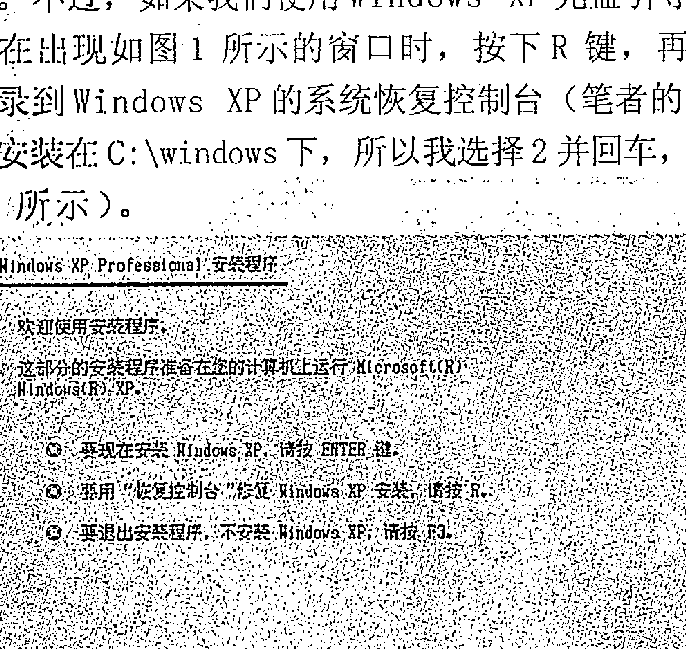

然后输入diskpart命令，即可出现一个全中文的分区界面（如图3）。利用它来分区，一定会方便许多的。

提示：利用Windows XP光盘，我们可以删除或新建NTFS分区，也可以给新硬盘分区，并安装新的操作系统。

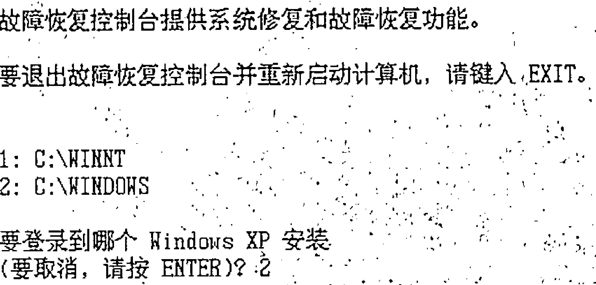

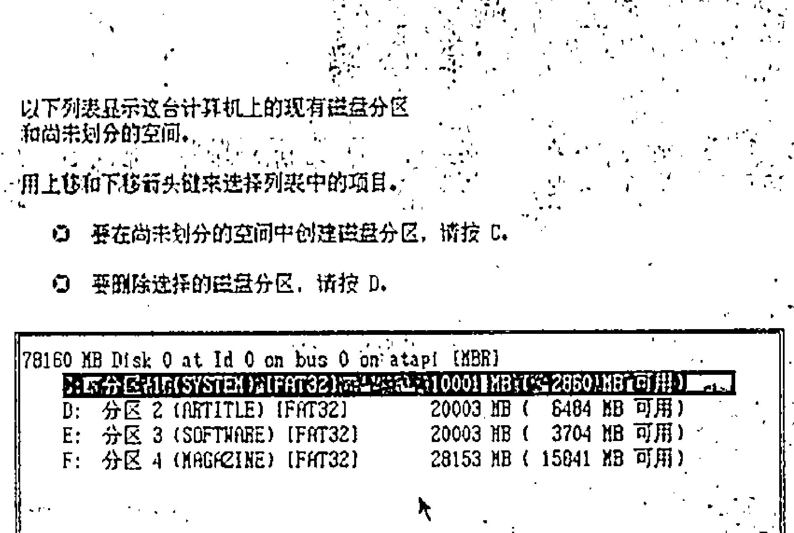

### （二）安装“恢复控制台”到硬盘

如果你不喜欢每次都从光盘启动“恢复控制台”，完全可以把它从Windows XP光盘上安装到硬盘中：把Windows XP光盘放入光驱中，然后选择“开始”→“运行”，在“运行”对话框中单击“浏览”按钮获得Windows XP光盘上I386文件夹中的Winnt32.exe程序，并在后面加上一个“/cmdcons”参数，回车后，Windows XP安装程序即会把“恢复控制台”安装到硬盘中（如图4）。重新启动计算机，将会显示有Microsoft Windows XP Recovery Console（恢复控制台）选项（如图5）。通过它，我们就可以在其中运行“恢复控制台”中的命令来修复系统或者运行一些常见的DOS命令了。

提示：尽管“恢复控制台”中能够运行的命令很少，但是很实用，可以实现诸如重写分区表、修复Windows XP引导记录、重新给硬盘分区等。大家可以在“恢复控制台”中输入Help命令来查看更多的功能。

### （三）安装NetBEUI协议

如果你使用的是小型局域网，或者你的局域网中有Windows 95/98/Me等其他操作系统。那么要实现Windows XP和其他系统之间的互访，就必须为Windows XP安装NetBEUI协议。

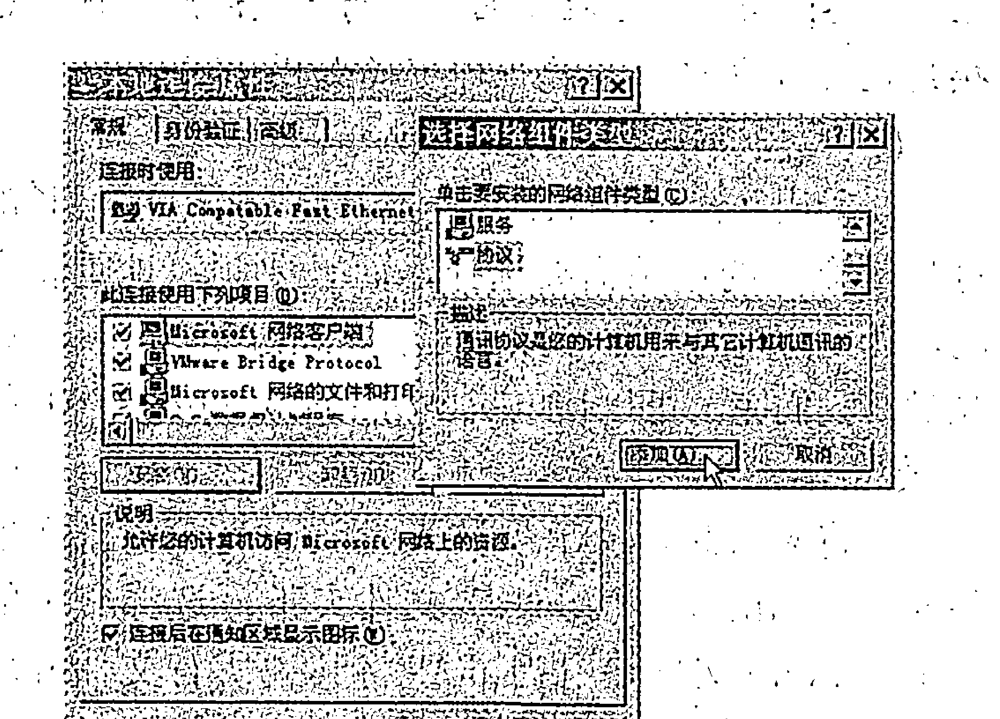

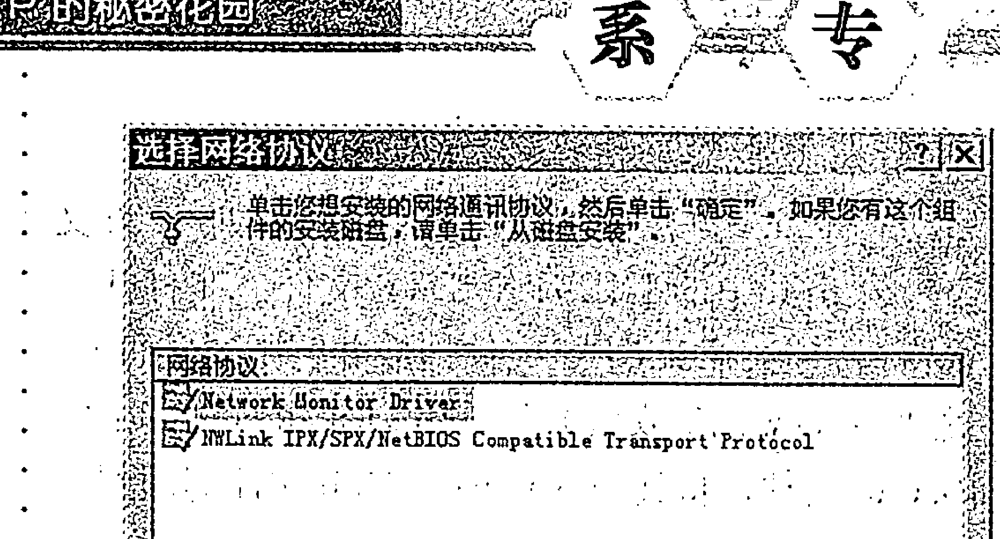

### （四）老程序焕发新生命

有不少的用户反映，有一些老的应用程序不能够在Windows XP上正常的安装或运行。不过，在Windows XP光盘的SUPPORT\TOOLS文件夹下有一个Application Compatibility Toolkit，它可以在Windows XP上模拟其他的操作系统（Windows 9x和Windows NT4等），从而使得一些老程序也能够顺利地安装和运行。首先，双击Windows XP光盘SUPPORT\TOOLS文件夹下的ACT20文件即可安装该软件。安装完成后，选择“开始”→“所有程序”→QFixApp运行它，运行后单击主窗口中的Browse按钮来选择想要安装或运行的程序，然后在Layers栏中选择想要模拟的操作系统，确定即可（如图8）。

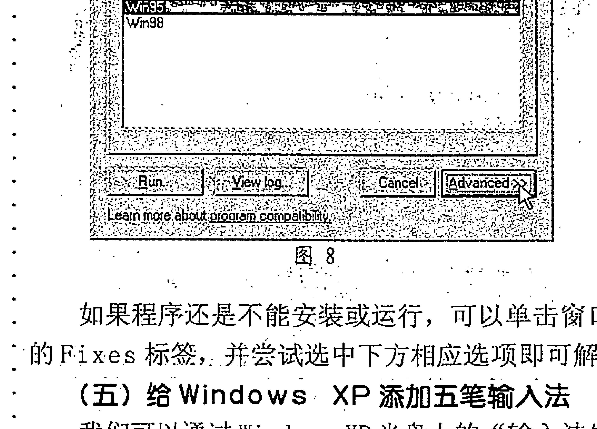

如果程序还是不能安装或运行，可以单击窗口中的Fixes标签，并尝试选中下方相应选项即可解决。

### （五）给Windows XP添加五笔输入法

我们可以通过Windows XP光盘上的“输入法生成器”程序来“制作”出一个五笔输入法。

启动WinRAR，并定位到Windows XP光盘的I386文件夹下，双击其中的IMEGEN.EX_文件，在打开的WinRAR窗口中把IMEGEN.EXE文件拖放并解压到桌面上。

找到Windows Me安装光盘，用WinRAR打开其中的WIN_19.CAB文件，将其中的winwb86.mb文件解压到一个文件夹下。

双击IMEGEN.EXE文件启动Windows XP的“输入法生成器”，按下“逆转换”标签并单击“浏览”按钮，打开winwb86.mb文件，单击“逆转换”按钮，将此码表文件逆转换成文本文件。

单击“创建输入法”标签，单击“浏览”按钮，打开刚才逆转换后的文本文件，即可获得有关输入法名、最大码长、码元集、查询键、信息元等信息。单击“输入法生成器”中的“创建”按钮，并单击随后对话框中的“确定”按钮，直至出现“输入法已生成，是否安装？”这一最后对话框，选择“是”按钮即可。

注意：五笔输入法有86五笔和98五笔两种版本，如果你习惯使用98王码，那可以从Windows Me安装光盘的WIN_19.CAB文件中把winwb98.mb文件解压出来，并用它来制作五笔输入法，方法同上。

### （六）个性设置如影随形

使用Windows XP一段时间后，每个用户都会形成一套自己所喜欢的个性化设置。但可惜的是，一旦重装系统，这些个性化设置就会不翼而飞，一切又得重新设置。不过，我们可以打开Windows XP光盘的SUPPORT\TOOLS文件夹下的FASTWIZ.EXE。之后就会出现一个“文件和设置转移向导”窗口，通过它就可以把Windows XP中我们的个性设置保存到文件中。

安装新系统后，同样运行Fastwiz.exe，然后根据向导提示将之前保存的个性设置文件导入新系统即可（如图9）。

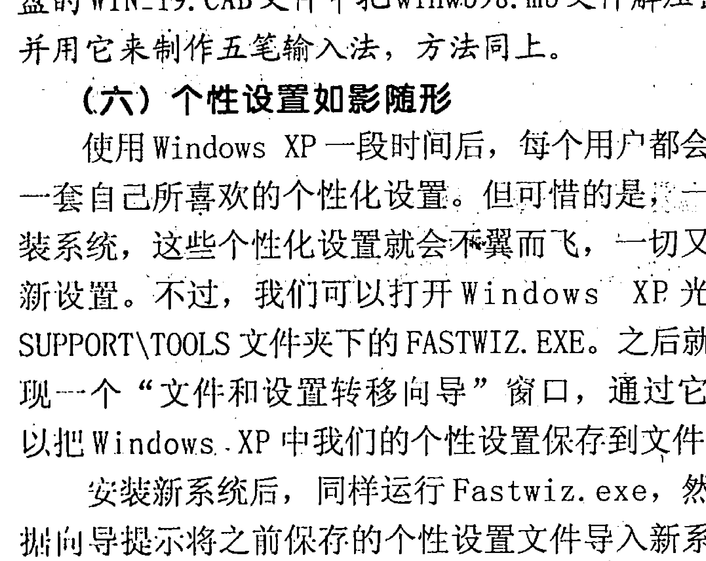

### （七）远程控制 Windows 9x/ME

Windows XP中有一个“远程桌面”功能，利用它就可以对自己的计算机进行远程控制。不过Windows XP默认安装的“远程桌面连接”程序只能控制操作系统同样是Windows XP的客户机，要想远程控制Windows 9x/ME客户机，则需要用到Windows XP的安装光盘了。

把Windows XP光盘放入光驱中。在出现“欢迎”页面时，单击“安装有关窗口操作系统之外的项目”，然后单击“安装微软XP远程桌面连接”项安装远程桌面通讯客户程序。安装完成后，启动“远程桌面连接”工具，在出现如图10所示的窗口中输入被控方计算机的计算机名称或IP地址，再输入用户名和密码，单击“连接”即可登录远程计算机。此时将打开“远程桌面”窗口，就可以看到被控制的远程计算机上的桌面设置、文件和程序了。

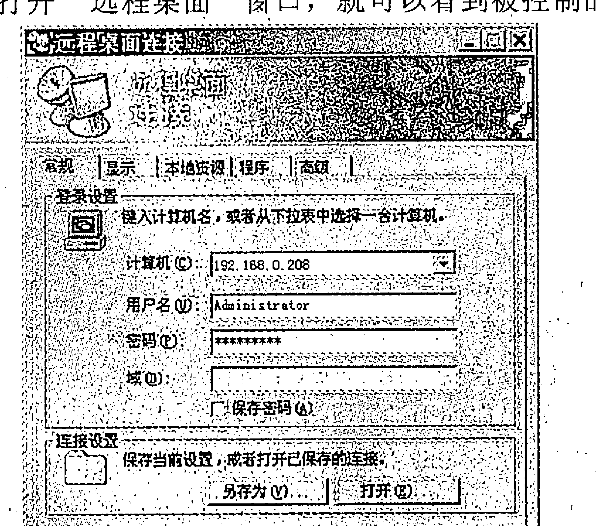

注意：在使用之前，必须先设置好被控机器，而且只有启用被控机器上的“远程桌面”功能，才能从其他计算机上对其进行远程控制：首先以管理员或Administrators组成员的身份进行登录；接着，再右击桌面“我的电脑”图标，选择“属性”，单击“远程”标签；勾选“远程桌面”下的“允许用户远程连接到这台计算机”复选框即可（如图11）。

### （八）自动安装 Windows XP

众所周知，安装Windows XP是一个相当漫长的过程，众多的选项需要选择，而且要频繁地重新启动，让人等得有些不耐烦。其实，通过Windows XP光盘，我们完全可以让电脑自动完成Windows XP的安装。

先将Windows XP安装光盘放入光驱中。在安装光盘\support\tools\文件夹下，选择其中的deploy.cab文件，用WinRAR将其中所有文件解压到一临时文件夹下。然后双击其中的setupmgr.exe运行“Windows安装管理器”，在弹出的安装管理器向导窗口中单击“下一步”按钮，启动向导。

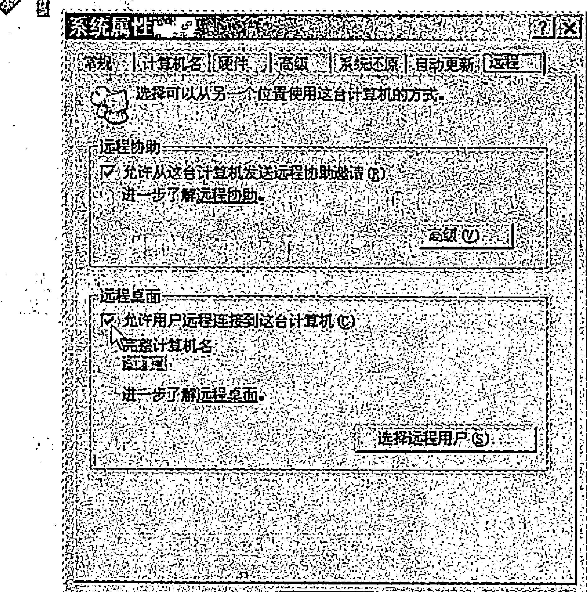

顺着向导即可制作出应答文件以便自动安装。只是到了最后一步，向导会提示我们保存自动应答文件，可保存到C:\unattend.txt文件中。以后要安装系统，只要双击C盘根目录下的unattend.bat文件即可自动完成安装了。

提示：Windows 98也可以自动安装。双击运行Windows 98安装光盘中的\Tools\Reskit\setup.exe，并完成Microsoft Batch 98的安装。然后单击“开始”→“程序”→“Microsoft Batch 98”启动Microsoft Batch 98后，单击“现在收集”按钮将本机上次安装Windows 98的相关设置读为默认值，之后可再根据自己的实际情况单击相关的按钮进行修改。最后单击“保存设置到INF”将相关设置保存为安装脚本文件（*.inf），如保存为Win98.inf，将其保存到启动软盘。重装系统时，只要用该软盘启动系统后进入Windows 98安装光盘，并键入Setup A:\Win98.inf回车，Windows 98/Me也就可以自动完成安装了。

### （九）架设自己的网络服务器

在Windows XP光盘上有IIS服务器程序，它允许我们在拥有固定IP和域名时建立起自己的网络服务器。

将Windows XP光盘放入光驱中，然后选择“开始”→“设置”→“控制面板”，双击“添加或删除程序”图标。再在打开的窗口中单击“添加/删除Windows组件”项，最后在打开的窗口中勾选Internet Information Services（IIS）项（如图12），然后按提示安装即可。

安装完毕，双击“控制面板”→“管理工具”→“Internet 信息服务”，在信息服务窗口中对IIS服务器进行各项设置，然后就可以使用了。

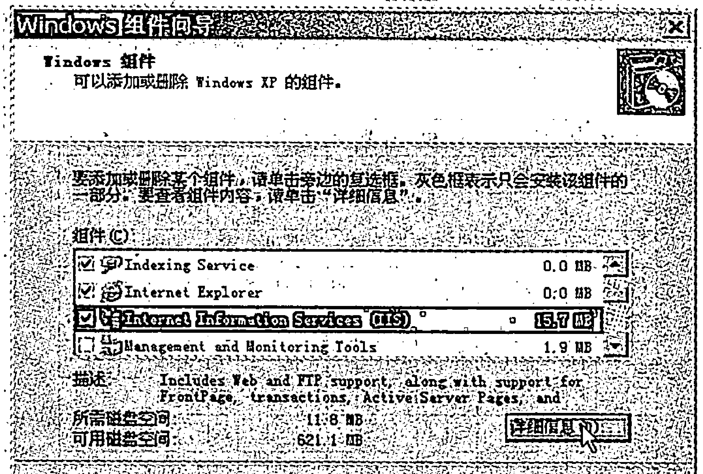

### （十）更多高级功能

双击Windows XP光盘的SUPPORT\TOOLS文件下的SUPTOOLS.MSI文件，选择“完全安装”即可安装Windows XP为高级用户定制的一些工具。包括：实现DNS、DHCP服务器、Windows账户迁移、查找重复文件等工具。利用它们，可以大大减轻系统管理员的工作。

Tools目录中所带的支持工具共有49个，如果我们使用默认安装只是安装了其中的12个。若要使用其它的支持工具，可先在支持工具帮助文件中查看一下使用该工具都需要哪些文件，然后将相应的文件从Tools目录下的Support.cab文件包中解压出来。正常安装后，可在“开始”→“程序”→“Windows Support Tools”→“Tools”中找到所安装的工具。不过，由于这套工具未经多语言标准化，所以即使是在中文版的Windows XP中，此套工具中的大部分程序也都是英文版的。

### 二、隐藏在Windows XP中的实用工具

Windows XP在给我们带来了全新的图形界面、强大的功能和超级稳定性的同时，还为我们提供了大量的小工具软件。下面我就挑一些比较实用的工具软件给大家介绍一下。

### （一）插入特殊符号不用愁

如果想插入特殊符号，那就请C:\Windows\system32\charmap.exe（假设你的系统是安装在C盘的，下同）来帮忙吧。单击“开始”→“运行”，打开运行对话框，输入charmap并回车，就可以打开“字符映射表”程序了。通过它可以查看系统中的特殊字体（如Weddings等），然后选中其中的特殊字符，再把它复制到Windows剪贴板中（如图13），即可被字处理软件粘贴使用。

### （二）剪贴板数据我知道

Windows剪贴板是各种不同的应用程序互相交流信息的一个重要渠道。C:\Windows\system32\clipbrd.exe程序可以查看当前剪贴板中的内容（如图14）。

### （三）打造自解压文件包

如果你想把一组文件打包成一个可执行的自解压文件，那么位于C:\Windows\system32文件夹下的IExpress程序就是最好的帮手。它提供了一个向导界面，我们只需按照提示即可完成打包工作。它支持两种打包方式，一种是标准自解压文件（Standard Self-Extractor），另一种是安装程序式自解压文件（Self-Extractor for Software Installation），这样我们在发布程序时就方便多了。

另外大家要注意，尽管 IExpress 的运行界面是英文的，但利用它生成的自解压文件却是中文版的，省去了繁琐的本地化工作（如图 15）。

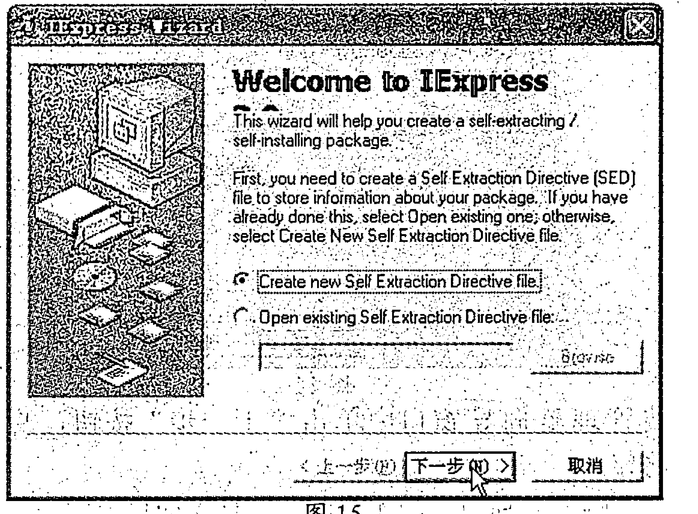

### （五）备份数据很简单

数据是计算机中最为宝贵的资料了，因此经常备份你的资料也应该成为一个好习惯。现在许多人都寻求第三方的备份工具，其实这大可不必，位于 C:\Windows\system32 下的 ntbackup 程序，可以用来帮助你（如图 16）。它不仅仅可以备份数据，还可以备份或还原我们的设置，或实现系统自动恢复。

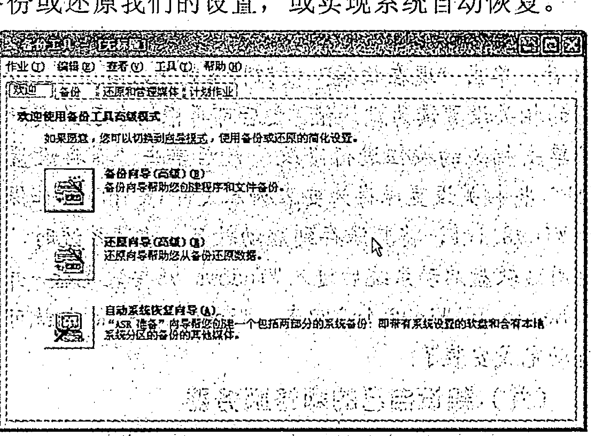

### （六）ODBC 数据源管理器

如果你的机器上使用 ODBC 数据源，那一定要使用一下位于 C:\Windows\system32 文件夹下的 odbcad32 程序。它是 Windows XP 附带的查看系统中安装的 ODBC 数据源驱动程序库及相关信息的工具。

### （七）IP 地址侦探兵

如果想查询某一网站的真实 IP 地址，可使用 Ping 命令。在“开始” → “所有程序” → “附件”中启动“命令提示符”程序，然后在命令行键入 Ping 命令及相关网址，如：ping www.cfan.com.cn，即可看到电脑爱好者网站真实的IP地址：210.192.99.116。

### （八）键盘交互更方便

在C:\Windows\system32文件夹下有一个Osk程序，利用它可以在屏幕上显示虚拟键盘，允许那些有移动障碍的残疾用户使用鼠标指针设备或游戏杆输入数据。尽管它的本意是为残疾用户设计的，但它还可以用于最基本的CAI键盘教学（如图17）。

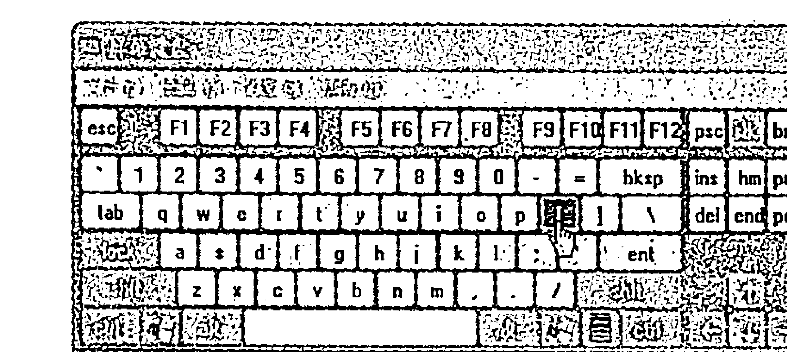

### （九）注册表编辑我更强

“注册表编辑器”是用来编辑修改系统注册表的高级工具。尽管在Windows XP中有一个名为Regedit的程序可以编辑注册表，但是如果你对注册表非常了解，那不妨试一试C:\Windows\system32文件夹下的Regedt32命令。它是Regedit的增强版本，除了可以编辑注册表外，还可以设置权限、清除重复项、删除已被卸载或删除的程序项等高级操作（如图18）。

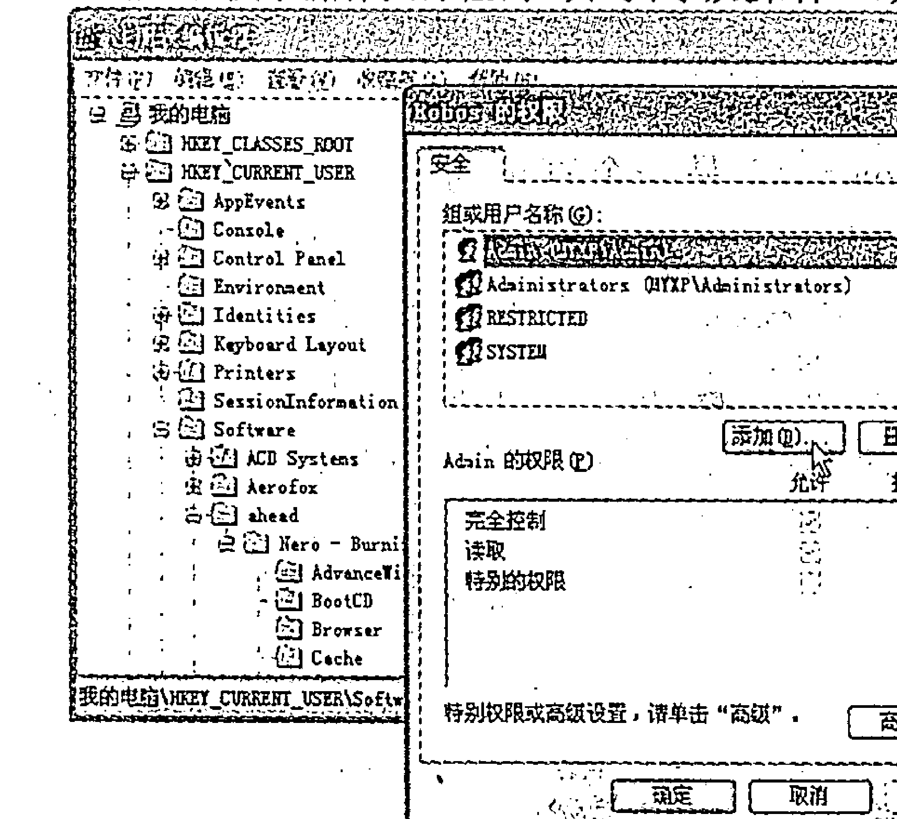

### （十）注册／注销 ActiveX 不求人

使用Regsvr32命令可以注册或注销ActiveX控件。Regsvr32命令可以带一些参数，具体用法如下：

```
regsvr32 [/u] [/s] [/n] [/i[:cmdline]] dllname
```

其中dllname为ActiveX控件文件名，建议在安装前拷贝到System文件夹下。

上面的命令格式中，中括号“[ ]”表示可选项，即中括号内的参数是可有可无的，要视具体的情况而定。各参数的意义如下：

+   /u 反注册控件
    /s 不管注册成功与否，均不显示提示框
+   /c 控制面板输出
    /i 跳过控件的选项进行安装（与注册不同）
    /n 不注册控件，此选项必须与/i选项一起使用

比如笔者要注册一个名为Amovie.ocx的控件，则打入regsvr32 amovie.ocx，回车即可（如图19），要注销它时只需使用regsvr32 /u amovie.ocx就行了。

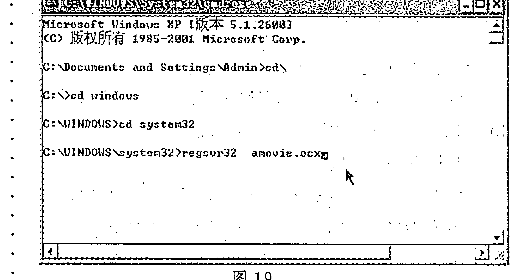

提示：在Windows XP中，即使安装ACDSee、SlowView、IrfanView等看图软件，而且作任何设置，系统都不会将BMP关联给看图软件。在“资源管理器”中双击图片文件，总是调用其内置的预览图片程序，相当霸道！这时，我们只要启动“命令提示符”窗口，进入C:\Windows\System32文件夹，输入regsvr32 /u shimgvw.dll，即可去掉BMP图形与系统看图软件的关联。

### （十一）妙用Rundll32

Windows中的很多例程都放在DLL动态链接库中，这就使得几乎所有的程序都可以共享这些动态链接库中的函数。而此时，我们可以使用C:\Windows\system32\rundll32.exe程序相应的函数。它的用法是：rundll32.exe 动态链接库名，函数名，参数名。下面是一些典型的应用实例：

```
关闭机器：rundll32.exe user.dll, ExitWindows
锁定机器：rundll32.exe user32.dll, LockWorkStation
打开控制面板：rundll32.exe shell32.dll, Control_RunDLL
打开桌面属性：rundll32.exe shell32.dll, Control_RunDLL desk.cpl
```

提示：我们可以在桌面上建立一些上述命令的快捷方式，并指定相应的快捷键。以后，只要按下相应的快捷键即可执行相应功能了。

### （十二）让系统固若金汤

在C:\Windows\system32文件夹下，有一个Sfc.exe文件，它是一个系统文件检查器。运行它后，它会扫描系统文件，如果遇到损坏的，或者发现不正确的系统文件，它会提示你并尝试修复。

的版本，则会自动提示我们插入光盘，并修复系统（如图20）。

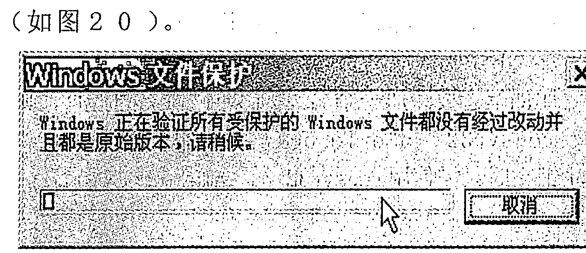

```
SFC [/SCANNOW] [/SCANONCE] [/SCANBOOT] [/REVERT] [/PURGECACHE] [/CACHESIZE=x]
```

- /SCANNOW 立即扫描所有受保护的系统文件。
- /SCANONCE 下次启动时扫描所有受保护的系统文件。
- /SCANBOOT 每次启动时扫描所有受保护的系统文件。
- /REVERT 将扫描返回到默认设置。
- /PURGECACHE 清除文件缓存。
- /CACHESIZE=x 设置文件缓存大小。

## （十三）巧用音量控制

双击系统托盘中的“音量”图标，可以调出“音量控制”面板。别小看这个面板，它还有不少妙用呢。

- 1. 让 Modem 彻底静音
如果你怕夜深人静的时候用Modem拨号上网会发出声音，那可以打开“音量控制”面板，将其上的Modem的“静音”选项选中即可使Modem彻底“闭嘴”。但如果你在“音量控制”面板中没有找到Modem项，可以选择“选项”→“属性”菜单，选择“播放”项，并勾选Modem即可。
- 2. 随意捕捉程序声音
有时听某一个多媒体程序中的声音比较好听，但是在光盘上却怎么也找不到相应的声音文件，这时我们完全可以自行录制：打开“音量控制”面板，然后选择“属性”→“录音”选项，再选中“立体声混音”复选框，然后在“音量控制”面板上选中“立体声混音”前的“选择”复选框。然后运行多媒体程序并启动一个录音软件即可把程序中的声音录下来了。
- 3. 清晰收听双语光碟
如果你的影音光碟播放起来有两种声音，混杂在一起听不清楚，那它很有可能是双语光碟。在影碟的影音文件的声音成分中左声道与右声道分别存储了不同的语言声音。这时，我们只要打开“音量控制”面板，将“音量控制”项的平衡滑块滑至最左边或最右边，直至听到你能够听得懂的语言为止即可。

## （十四）任务管理器的另类用途

在C:\Windows\system32文件夹下有一个Taskmgr.exe文件，它其实就是“任务管理器”。直接按下Ctrl+Alt+Delete或者Ctrl+Shift+Esc键即可将其调出。

平时，只有当某一程序没有响应时我们才会想起“任务管理器”，而事实上，“任务管理器”还有许多其他的功能（如图21）！

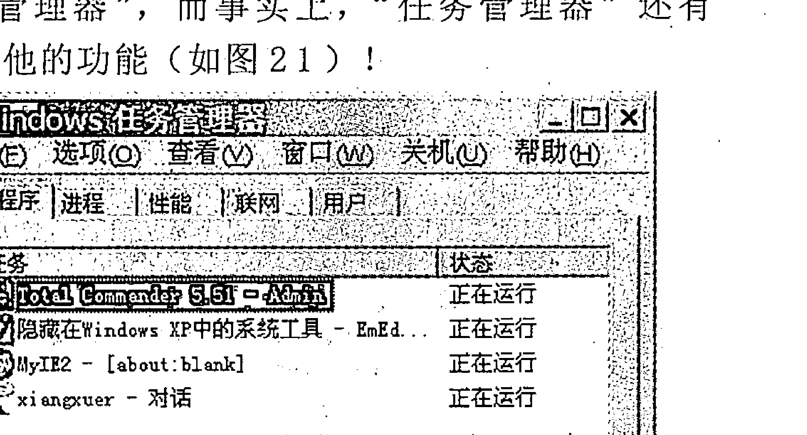

- 1. 向他人发送消息
Windows XP是一个真正的多用户平台。当多个用户运行时，打开“任务管理器”，单击“用户”标签，再从中选择一个用户，就可以看到下方有一个“发送消息”按钮，单击后可以在其中输入消息。当切换到其他用户的时候，他就可以看到你的留言了（如图22）。

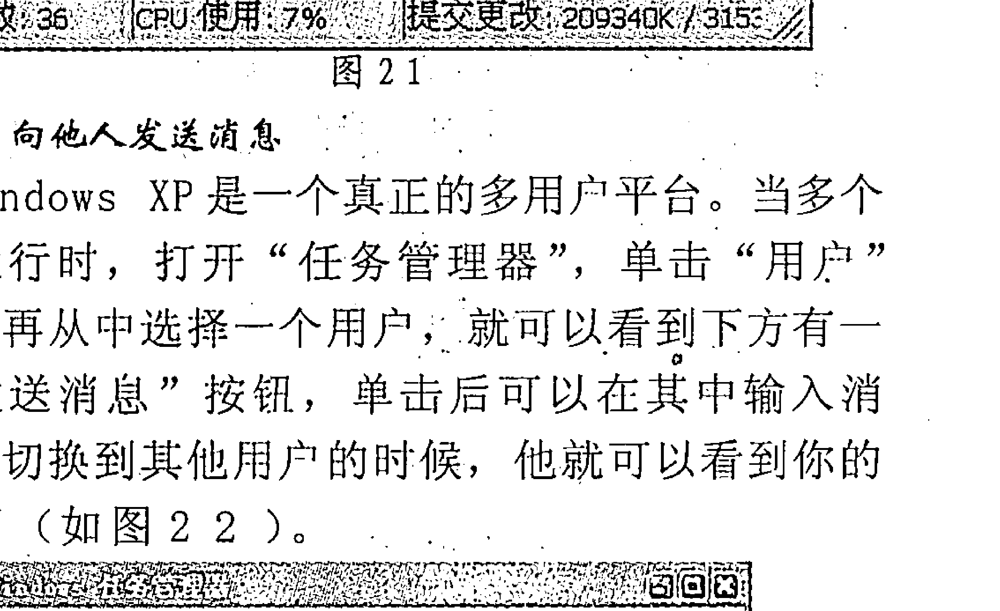

- 2. 监视计算机性能
在“任务管理器”中单击“性能”标签，然后

### 3、自由设置进程优先级

每一个运行程序都有一个进程和进程号，而且它们之间有优先级别的差异。不过，通过“任务管理器”程序，我们可以更改它们的默认优先级别！首先在“应用程序”项目中选择欲设置优先级的程序，然后右击，选择“转到进程”命令，此时在进程选项窗口中相应进程会被选中，右击，选择“设置优先级”命令，并在滑出的子菜单中自由设置！只是要注意的是，更改进程的优先级可以使相应的进程运行更快或更慢（取决于是提升还是降低了优先级），但也有可能对其他进程的性能有相反的影响。

提示：如果你在进程中看到很多可疑的进程，则可以怀疑机器是否感染了病毒或中了木马。

## （十五）免费好用的聊天工具

如果你的局域网无法上 Internet 了，那建议你使用 C:\Windows\system32 文件夹下的 Winchat.exe 程序。它是 Windows XP 中提供的一个巧小的聊天工具，可以用于局域网内的聊天。

## （十六）自动更新 Windows XP

微软会在 Windows 发布一段时间后对系统作一些更新。如果你在“开始”菜单上方无法看到 Windows Update 菜单项，那可以运行 C:\Windows\system32 文件夹下的 Wupdmgr.exe 程序。它可以自动登录到 Microsoft 公司的网站上完成你的 Windows 的升级工作！

## 三、Windows XP 中鲜为人知的技巧

前面介绍了 Windows XP 中非常实用却未能引起大家足够注意的一些软件，下面再介绍一些 Windows XP 鲜为人知的使用技巧。

### （一）定时锁定计算机

如果你经常要离开位置，又总是忘记锁定计算机，就有可能泄漏隐私。这时就可以利用“任务计划”来帮助你。

首先在桌面上新建一个名为“自动锁定”的快捷方式，其中的命令为：rundll32.exe user32.dll,LockWorkStation。

```
rundll32.exe user32.dll,LockWorkStation
```

然后在“控制面板”中双击“任务计划”图标，打开“任务计划”窗口。接着把桌面上的“自动锁定”快捷方式拖放到“任务计划”窗口中。双击这个“任务计划”窗口中的“自动锁定”图标，再单击“日程安排”标签，单击“任务计划”下拉列表框，从中选择“空闲时”，在“当计算机空闲时间超过 xx 分钟”处将时间改为 1 分钟（时间长短可自定，如图23）。再单击“设置”选项卡，取消所有选项的勾选。完成以上设置后，按“确定”按钮，再在打开的窗口中输入系统管理员密码，退出设置窗口。这样，当我们离开计算机，1 分钟后没有任何操作，则计算机就会被自动锁定。

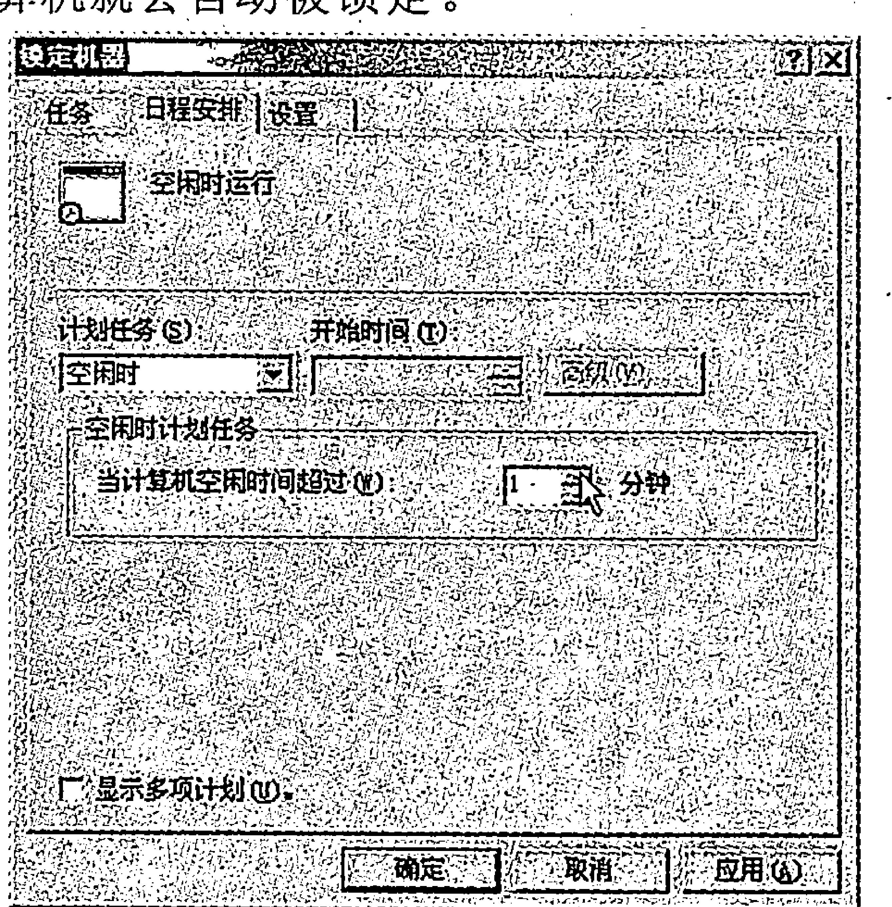

### （二）取消 Windows XP 中的保留带宽

单击“开始”→“运行”，在“运行”窗口中输入 gpedit.msc，打开“组策略编辑器”，找到“计算机配置”→“管理模板”→“网络”→“QoS 数据包调度程序”，双击其右侧的“限制可保留带宽”，打开它的“属性”窗口（如图24），选择“已禁用”项，确定之后，即可把保留的带宽还给我们了。

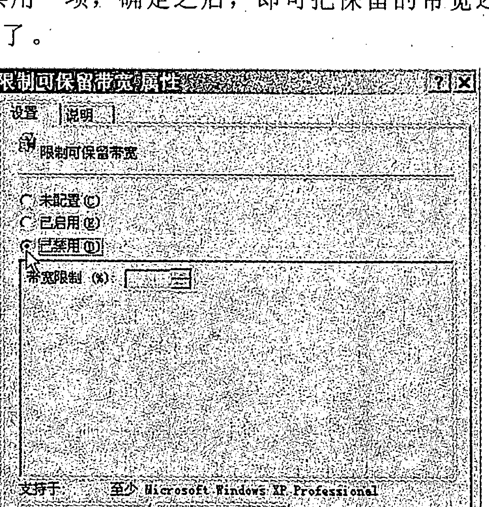

小知识：什么是组策略
组策略并非是从 Windows 2000/XP 才开始有的一项

功能，在Windows 98中就已经有了它的雏形，不过那时它被称作“策略编辑器”。通俗地说，组策略就是一个另类的注册表编辑器，利用它就可以更改系统中的某些重要设置。不仅可以省去记忆键值的痛苦，还可以免受修改注册表不慎所带来的危险。

### （三）让IIS进驻 Windows XP 家庭版

很多人安装的都是 Windows XP 家庭版（至少在国内很多联想机器上安装的就是 Windows XP 家庭版）。默认情况下，IIS 是无法安装到Windows XP 家庭版中的。不过通过下面的技巧，就可以让 IIS 在家庭版中安家落户。

### （六）活用 Windows XP 的安全模式

活用Windows XP 的安全模式往往能够解决不少棘手的问题。

假设你的 Windows XP 安装在 C:\WINDOWS 文件夹下。先把 C:\WINDOWS\INF\SYSOC.INF 文件作一份备份，然后用“记事本”程序打开它，在[COMPONENTS]下找到一行：

```
iis=iis.dll, OcEntry, iis.inf,hide, 7,
```

把它改成：

```
iis=iis2.dll, OcEntry, iis2.inf,,7
```

- 1. 轻松修复故障

保存文件。接着用 WinRAR 打开 Windows 2000 Advanced Server CD 中的 IIS.IN_ 文件，把其中的 IIS.INF 文件解压到 C:\WINDOWS\INF 目录下。再用 WinRAR 打开 IIS.DL_ 文件，把其中的 IIS.DLL 文件复制到 C:\WINDOWS\SYSTEM32\SETUP 目录下。

当 Windows XP 运行起来不是很稳定的时候，很多人可能会想到要重新安装系统。其实不用急着去找出 Windows 安装光盘重装系统，可以先试着重新启动计算机，并在启动时按下 F8 键，进入安全模式（Safe Mode），再退出。再次重启计算机，你的系统可能就已经正常了。

### （四）抓取 DOS 窗口中的文本

- 2. 彻底查杀病毒

接下来在“控制面板”中，双击“添加或删除程序”图标，再单击“添加/删除Windows 组件”，你就可以发现 IIS 项了，直接勾选即可安装。只是在安装过程中，可能会要求我们插入 Windows 2000 Advanced Server 光盘和 Windows XP 家庭版的光盘，输入指定的目录即可正常安装并使用。

Windows XP 中仿真 DOS 程序已经被改名为“命令提示符”。如果想抓取这个程序窗口中的文字，是不能像常规的方法那样直接按 Ctrl+C 键来复制的。必须首先单击“命令提示符”窗口左上角的系统图标，从下拉菜单中选择“编辑”→“标记”命令，这时，就可以按住 Shift 键不松开，并通过上下左右光标键选定该窗口的文字内容了（也可以通过拖动鼠标来选取），然后再选择“编辑”→“复制”命令即可把所选文字复制到 Windows 的剪贴板中供各种应用程序粘贴使用（如图25）。

在 Windows XP 普通模式下杀毒，因为病毒可能会交叉感染，而导致杀不干净。而一些杀毒程序又无法在 DOS 下运行。这时候我们最好将系统启动至安全模式，使 Windows 只加载最基本的驱动程序，这样杀起病毒来将会更彻底、更干净。

### （五）消除复制乱码现象

- 3. 删除顽固文件

在 Windows XP 下，有时复制的文本在粘贴时会出现乱码现象。这时，可以进入“控制面板”，并设置 Windows XP 默认输入法为中文键盘模式，有可能解决这个问题。

有时，在 Windows XP 普通模式中删除一些文件或者清除回收站内容时，系统总是提示“某某某文件正在被使用，无法删除”。遇到这种情况，可以选择“开始”→“关闭”，选择“重新启动”，并在启动时按下 F8 键进入安全模式后，再试着删除那些顽固文件并清空回收站即可。

- 4. 彻底卸载不正确的驱动程序

一般的驱动程序，如果安装后发现它工作不正常，那可以通过 Windows XP 的“驱动还原”来卸载。但是显卡和硬盘 IDE 等基本驱动，如果装错了，有可能一进入图形界面就死机，如一些主板的 ULTRA DMA 补丁就是如此，也就来不及使用“驱动还原”了。这时，可以重新启动进入 Windows XP 安全模式。安全模式中 Windows XP 会使用默认设置，并且不会加载错误的显卡和 IDE 驱动，此时就可以很方便地删除引起问题的软件或硬件了，或者使用“驱动还原”来恢复系统。

### （七）把文件藏进 MP3 或图片中

Windows XP 中的 Copy 命令有一个非常奇特的用

法，它可以把几个不同类型的文件合并成一个文件，比如：我们可以把一个文本文件合并到一幅图片或一首歌曲中，达到隐藏秘密的效果。

如果你有一个重要的文本文件（如：secret.txt），再找一首MP3歌曲（如：music.mp3，当然，它的体积最好不要太大，600KB左右即可）。然后，把这些文件保存到D盘的根目录中。在“运行”窗口中输入cmd以启动“命令提示符”窗口，接着输入以下命令：

```
d:copy music.mp3/b + secret.txt/a hybrid.mp3
```

执行该命令后，生成了一个新文件hybrid.mp3。用Winamp可以正常播放它，如果想看原先secret.txt文件中的内容，可以用“记事本”打开hybrid.mp3文件，在看到一堆乱码后，可以按下Ctrl+End键将光标移至文件的尾部，即可看到原先secret.txt文件中的内容了。

## 注意：

- 1. 其中参数/b指定以二进制格式复制、合并文件；参数/a指定以ASCII格式复制、合并文件。这里要注意文件的顺序，二进制格式的文件应放在加号前，文本格式的文件放在加号后。
- 2. 同理，我们也可以把一些文件藏进图片和WAV声音文件中，甚至可以隐藏在Word、Excel等文档中！具体的命令如下：Copy pic.jpg/b + secret.txt/a picnew.jpg（把secret.txt藏进picnew.jpg图片中）
Copy word.doc/b + secret.txt/a wordnew.doc（把secret.txt藏进wordnew.doc文档中）
Copy sound.wav/b + secret.txt/a soundnew.wav（把secret.txt藏进soundnew.wav文件中）

### （八）妙用Xcopy同步文件

在Windows XP的仿真DOS命令中有一个Xcopy，利用它可以完成一些同步软件可以做的事情。下面就以把D:\Articles文件夹中的所有文件同步到移动硬盘的H:\Folder文件夹中为例加以介绍：右击桌面，选择“新建”→“快捷方式”，在“请键入项目的位置”后面输入：

```
xcopy D:\Articlesc\*.* H:\Folder /d /y /s
```

。以后，要同步文件时，只要双击桌面上的这个快捷方式即可。
其中各参数的意义如下：
- /d 只复制那些更改过的源文件。如果使用/d: m-d-y，则表示复制指定日期或指定日期以后改变的文件。
- /s 复制目录和子目录，并且排除那些没有文件的空目录。
- /y 对所有提示都回答是，从而实现不显示任何提示信息。

如果想实现定时同步更新，可以借助于系统中的“计划任务”功能：在“控制面板”中双击“任务计划”图标。接着，把桌面上生成的更新文件快捷方式拖放到“任务计划”窗口。然后双击它，设置它的属性。
在“日程安排”标签下，单击“任务计划”下拉列表框，从中选择“每天”，而“开始时间”设置可根据自己的具体情况而定（如图26）。

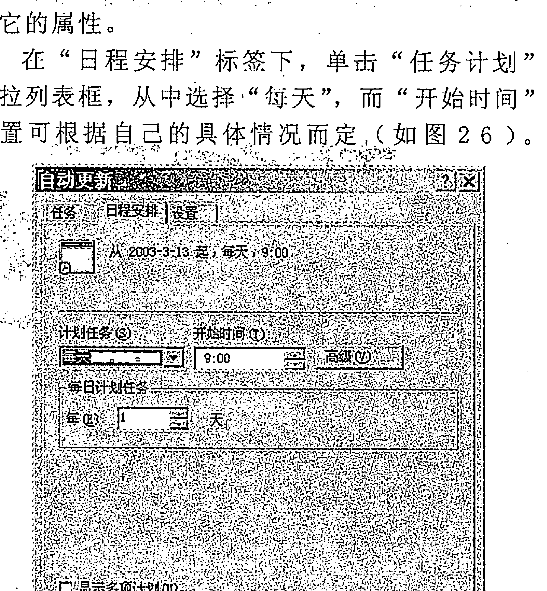

再单击“设置”标签，取消选中“电源管理”下的“如果计算机使用电池来运行，不要启动任务。”（如图27）。

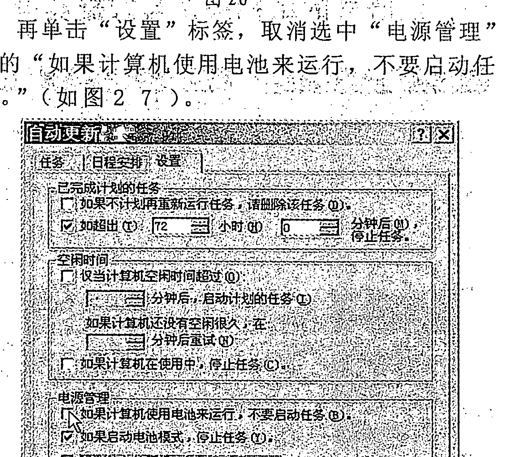

通过上述设置后，一旦到了你设置的时间，机器就会自动同步D:\Articles文件夹中的所有文件到移动硬盘的H:\Folder文件夹中。

（文/Authorboy）

当我们逐渐熟悉了Windows系统的基本操作后，总是希望能更进一步地探索它的秘密。这时，注册表就成了一个我们不得不逾越的屏障。本专题将向您讲解注册表的基本知识、各分支与系统软硬件的关系，并分类罗列了数百个注册表实例，由浅入深，带领您步入注册表高手的行列。

## 教你玩转注册表

在Windows 3.x时代，应用程序都将自己的设置信息保存在INI文件中。从Windows 95以后，Windows系统下的应用程序都将自己的用户信息、设置参数、软件数据等写入注册表，并在该程序运行时自动修改。

## 一、注册表的结构关系与数据类型

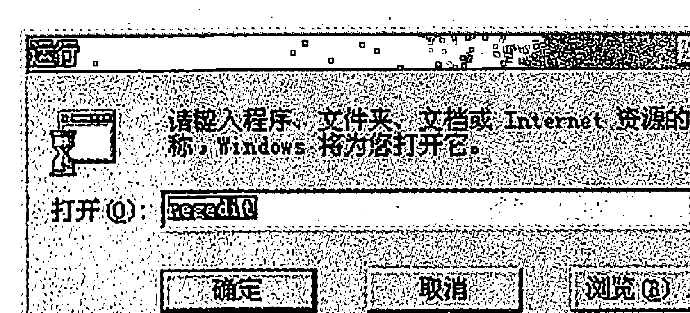

点击“开始”→“运行”，在弹出的对话框中输入Regedit，然后单击“确定”按钮，就可以运行注册表编辑器了（如图1）。

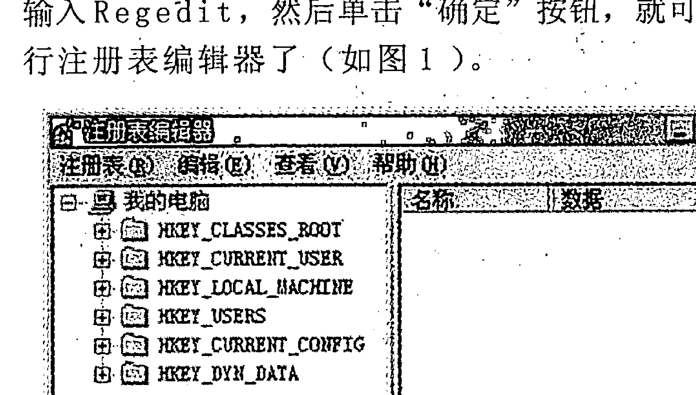

图2 Windows 98注册表的组织结构

以Windows 98为例，注册表有六大根键（如图2）。这些根键都是大写的，并以HKEY_为前缀。这种命令是以Win32 API里Registry函数的符号变量为基础的。
在注册表中，HKEY_CLASSES_ROOT和HKEY_CURRENT_USER中的信息只是HKEY_LOCAL_MACHINE中的一部分（实际上，HKEY_LOCAL_MACHINE\SOFTWARE\Classes就是HKEY_CLASSES_ROOT，为了用户便于查看和编辑，系统专门把它作为一个根键）。在每次启动后，系统就映射出HKEY_CURRENT_USER，使用户可以查看、编辑其中的信息（HKEY_USERS中保存了默认用户和当前登录用户的用户信息，而HKEY_CURRENT_USER中则保存了当前登录用户的用户信息）。根据上面的分析，注册表中的信息可以分为HKEY_LOCAL_MACHINE和HKEY_USERS两大类。

### （一）六大根键的作用

在注册表中，所有的数据都通过一种树状结构以“键”和“子键”的方式组织起来。每个键都包含了一组特定的信息，每个键的键名都和它所包含的内容息相关。如果这个键包含子键，则在注册表编辑器窗口的左边有“+”号，单击“+”号可以打开更多的内容。

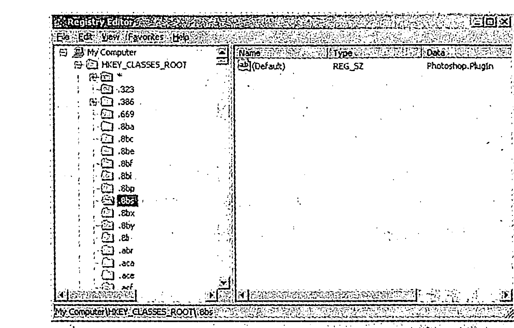

### 1.HKEY_CLASSES_ROOT

该根键主要用来记录已经注册的文件扩展名、文件类型、文件图标等，让Windows系统实现对各种文件和文档信息的访问。在第一次安装Windows 98时，双击DOC文件会自动打开写字板，但在安装了Word后，双击一个DOC文件将自动激活Word。

存放在System.dat中的内容与Windows 3.x相比，HKEY_CLASSES_ROOT替代了Win.ini文件中的[Extensions]和Reg.dat文件中相似的设置项，把应用程序与文件扩展名联系起来。图3显示了HKEY_CLASSES_ROOT根键中包括的文件扩展名的情况。

### 2.HKEY_CURRENT_USER

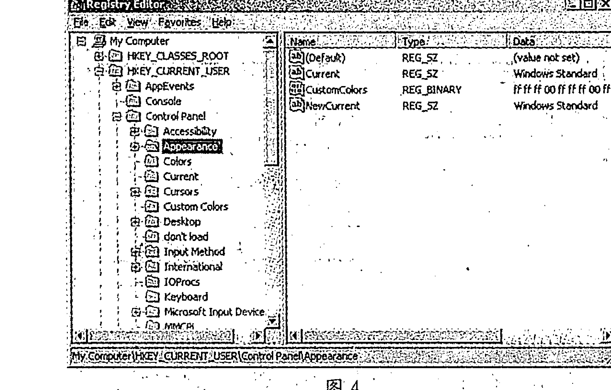

该根键包含本地工作站中存放的当前登录用户的信息，包括登录用户名和部分暂存的密码。用户登录Windows 98时，其信息从HKEY_USERS中相应的项拷贝到HKEY_CURRENT_USER中（图4为HKEY_CURRENT_USER根键下各个键之间的连接情况）。

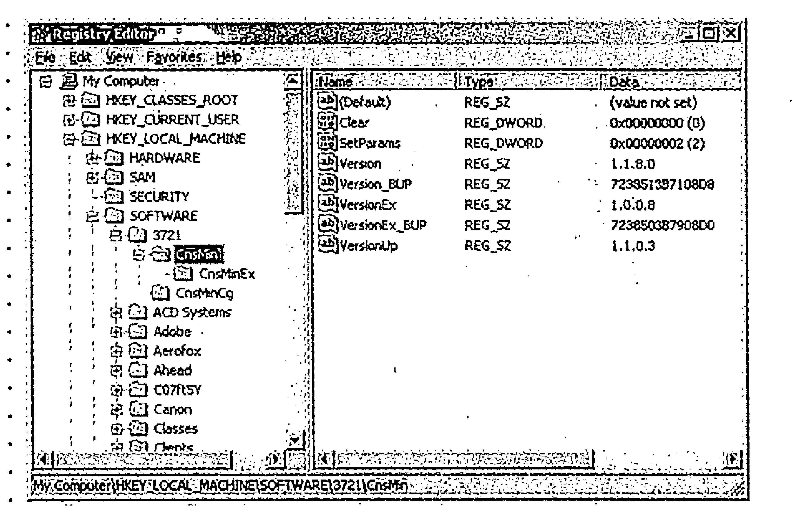

### 3.HKEY_LOCAL_MACHINE

该根键包含了本地计算机的全部软硬件信息。当系统的配置和设置发生变化时，根键下的登录项也将随之改变。在HKEY_LOCAL_MACHINE里，主要包含有以下键值：

- ★ HARDWARE
包含了ACPI、显卡、并口、SCSI、即插即用管理系统、系统资源情况等相关信息。
- ★ SECURITY
包含了安全设置的信息。
- ★ SOFTWARE
包含了系统软件、当前安装的应用软件及用户的有关信息。
- ★ SYSTEM
包含了系统的全部软件和硬件信息。

### 4.HKEY_USERS

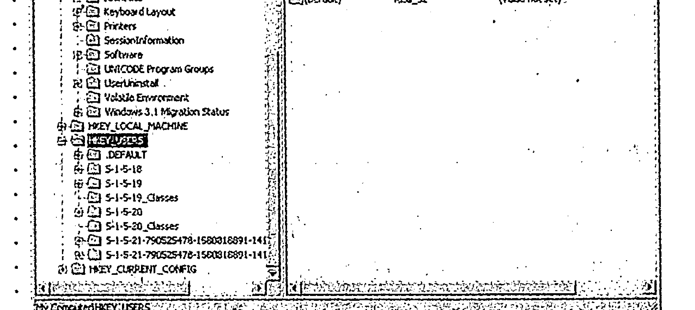

S-1-5-18~21分别代表了不同用户的名称。Windows可供多个用户使用，每个用户都单独保存自己的信息，比如桌面、背景、开始菜单程序项、应用程序快捷键、显示字体、屏幕节电设置和打印机等。HKEY_USERS的作用是保存系统的默认选项（采用Default关键字），每个用户的预配置信息都存储在HKEY_USERS根键中。

## (二) 注册表键值的数据类型

注册表通过键和子键来管理各种信息，所有的关键字都是以HKEY作为前缀开头。实际上，关键字是一个句柄，应用程序开发人员可以在使用注册表API时把它用于程序之中。

注册表中的所有信息都是以各种形式的键值项数据保存下来。在注册表编辑器右窗格中，保存的都是键值项数据。这些键值项数据可分为如下三种类型：

### 1. 字符串值

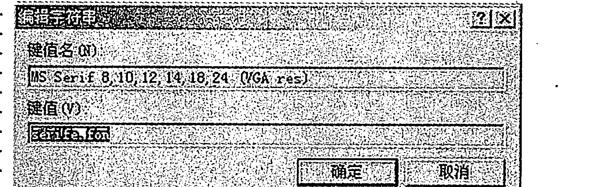

在注册表中，字符串值一般用来描述文件或标识硬件。通常它由字母和数字组成，最大长度为255个字符。通过键值名、键值就可以组成一种键值项数据（如图9）。

### 2. 二进制值

在注册表中，二进制值是没有长度限制的，可以是任意个字节长。在注册表编辑器中，二进制以十六进制的方式显示出来。

### 3. DWORD 值

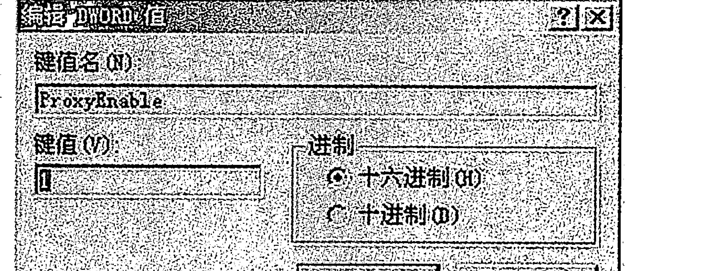

DWORD 值是一个32位（4个字节，即双字）长度的数值。在注册表编辑器中，您将发现系统会以十六进制的方式显示DWORD值。在编辑DWORD数值时，可以选择用十进制还是十六进制的方式进行输入。

## 二、 与注册表相关的重要文件

在Windows 9x系统中，注册表实际上是由两个分别名为User.dat及System.dat的具有隐藏和只读属性的二进制系统文件组成的。如果注册表遭到破坏，Windows将不能正常运行。为了确保系统安全，Windows在每次正常启动时，都会对注册表进行备份——将System.dat备份为System.da0，将User.dat备份为User.da0（在C:\WINDOWS\SYSBCKUP中，有名为rb000～rb004共5个CAB压缩文件，通过解压缩后可以得到User.dat、System.dat、Win.ini和System.ini四个文件）。

### （一）系统配置的注册表文件 System.dat

在Windows 9x系统的根目录下（C:\Windows中）有一个隐藏的系统文件System.dat，它是Windows 98注册表的一部分。该文件具有如下作用：

1.  描述单一的PC配置。
2.  描述安装在单一PC上的消息。
3.  安装即插即用类型的设备硬件配置，如设备的I/O地址、IRQ级和DMA通道等情况。

这个文件在Windows 98的网络运行状态时，保存在本地的工作站或本地PC机系统中。在Windows 98的安装期间，Setup将首先检查你的计算机上已经安装了的硬件设备，然后在System.dat中建立适当的配置项。我们经常使用“控制面板”里的“系统”来修改硬件设备的配置，这时候所进行的操作就是从System.dat中读取系统属性信息并进行修改。

### （二） 系统配置的备份文件 System.da0

Windows 98的注册表的一个非常重要的特点就是可靠性强，稳定不易损坏。这就需要靠注册表的备份文件system.da0。系统配置注册表System.dat的备份文件为System.da0，该文件在System.dat文件遭到意外破坏时，将由系统在启动的时候自动拷贝为System.dat。

### （三）用户平台配置的注册表文件 User.dat

User.dat也在Windows 9x系统的根目录下（C:\Windows），它也是Windows 98注册表的重要组成部分，这个文件具有这样的作用：

1.  定义用户优先权，如用户平台设置、运行级等。
2.  特定于某一个用户的的应用程序的安装信息、应用程序的使用信息等。

在你第一次输入用户名和密码时，Windows 98程序将把这些信息存储在User.dat中，同时你的Windows 98的系列号也存储在User.dat中。如果用户在“控制面板”的“密码”图标中选择了“用户可自定义首选项及桌面设置登录时，Windows自动启用个人设置”这个选项后，Windows 98将会为每个用户创建一个新的User.Dat，并且把它保存为C:\Windows\Profiles\用户名\User.dat。在用户每次登录后，他自己的User.dat就会被调入到系统中，同时启动自己相应的程序信息。

### （四）用户平台配置的备份文件 User.da0

用户平台配置的注册表文件User.dat也有一个备份文件User.da0。当User.dat遭到意外破坏时，将由系统将User.da0拷贝为User.dat，从而使User.dat得到恢复。

### （五）网络管理注册表文件 Config.pol

Config.pol文件是一个隐含、系统、只读文件，它主要用于Windows 98的网络用户的管理方面的策略。如果你在Windows 98系统里安装了“系统策略编辑器”后，用户就可以使用Config.pol文件中的限制来决定系统用户的操作权限（如执行程序、修改注册表等）。这也就是说，系统可以根据Config.pol文件中的设置对网络用户的操作做一些限制。

### （六）网络管理备份文件 Config.po0

Config.pol也有一个备份文件Config.po0，它是一个隐含、系统、只读文件。它存放在网络服务器中。

### （七）Win.ini 和 System.ini 文件

看了注册表的文件组成，我们再来看看Windows 98系统注册表Registry与INI文件间的关系。注册表Registry与Windows 98中的INI文件有许多相似之处。注册表中的键或子键类似于INI文件中的小节，一个键值项对应于INI文件中小节里的一条设置项。但是我们还是很容易发现他们之间的区别的：首先Registry可以包括子键，而INI文件不支持小节的嵌套；其次Registry中的键值项还可以包含可执行代码，而在INI文件中设置项只是简单的字串；第三是在同一台计算机上有多个用户时，Registry可以存储每个用户的特性，而INI文件中却不可能做到。由此可以看出，注册表Registry是在INI文件的基础上进化而来的。有关Win.ini的信息都处于注册表的HKEY_CURRENT_USER根键中；有关System.ini的信息都处于注册表的HKEY_LOCAL_MACHINE根键中。根据机器配置的不同，有些系统可能不会出现某些子键。打开注册表的HKEY_LOCAL_MACHINE目录分支，可以看到这些相关的信息。

在最新的Windows 2000/XP系统中，情况发生了一些改变。同Windows 9x一样，Windows 2000/XP的注册表也分为两个部分，但包括多个文件。其中用户配置文件保存在系统根目录“Documents and Settings”下用户名的目录中，包括两个隐藏文件：Ntuser.dat、Ntuser.ini及Ntuser.dat.log日志文件。系统配置文件位于Windows 2000/XP系统目录下的SYSTEM32\CONFIG中，包括Default、Software、System、AppEvent.Evt、SecEvent.Evt、SysEvent.Evt等多个隐藏文件及其相应的LOG（日志）文件和SAV文件。这些注册表文件在Windows 2000/XP运行时无法使用其它工具打开，这一点与Windows 9x下的System.dat及User.dat不同。

### （八）INF 文件与注册表的关系

INF 文件？相信朋友们不会感到陌生，Windows把它叫做“安装信息”文件。它的主要功能是用来记录硬件安装信息（也有其它功能，如光盘自动运行使用的AutoRun.inf)。INF文件的结构和Windows的初始化文件（INI文件）非常相似，开始的数据行都用方括号“[ ]”包括起来，以分号“;”开头的行是注释行，在执行文件操作时不会处理。和INI文件不同的是，INF文件中的行内包括一系列用逗号“,”分割的参数，而没有采用“键名=键值”的格式。它和注册表有什么关系吗？当然有了！让我们来看一个例子吧！

```
[Version]
Signature="$CHICAGO$"

[DefaultInstall]
DelReg=DeleteMe

[DeleteMe]
HKCU,"Software\Microsoft\Windows\CurrentVersion\policies\system","DisableRegistryTools"
```

这个INF文件的作用是要解除对注册表编辑器禁用的限制：让我们根据这个实例来看一看INF文件的语法结构：

```
[Version]
Signature="$CHICAGO$"
```

Windows系统规定，INF文件必须以上述字段开头，这和REG文件必须以REGEDIT4开头的规定类似。如果你想通过INF文件修改注册表，那就必须按照这个规定开头。

`[DefaultInstall]`指出INF文件包含的其他段。

`. DelReg` 是键，它的含义是删除注册表中的项目。`. DelReg =`后面是要删除的字段名，这个例子中是`DeleteMe`，所有列在`DeleteMe`下的键值都将被删除。`. 与DelReg`对应的是`AddReg`，`AddReg`表示要添加的注册表项目。Windows处理INF文件时，首先处理`DelReg`段，然后处理`AddReg`段。`. 在INF文件中删除、添加键时的格式是：“根键，子键，值项的名称，值项的类型，数值”。`. 根键名称采用缩写形式，规定如下：

| 缩写 | 含义 |
| :--- | :--- |
| HKCR | HKEY_CLASSES_ROOT |
| HKCU | HKEY_CURRENT_USER |
| HKML | HKEY_LOCAL_MACHINE |
| HKU | HKEY_USERS |
| HKR | 安装程序使用的相关注册表项。通常设置驱动程序时使用HKR。 |

值项的类型使用特殊的值来表示：

| 值 | 值项的类型 |
| :--- | :--- |
| 0x00000000 | 默认值。值项的值是ANSI字符串（REG_SZ）。如果值项已经存在，则覆盖它。 |
| 0x00000001 | 值项的值是十六进制的数字（REG_BINARY）。如果值项已经存在，则覆盖它。 |
| 0x00000002 | 值项的值是ANSI字符串。如果值项已经存在，不覆盖它。 |
| 0x00000003 | 值项的值是十六进制的数字。如果值项已经存在，不覆盖它。 |
| 0x00010000 | 值项的值是REG_MULTI_SZ类型，即多字符串值。 |
| 0x00010001 | 值项的值是REG_DWORD类型，即双字节值。 |
| 0x00010002 | 值项的值是REG_MULTI_SZ类型，如果值项已经存在，不覆盖它。 |
| 0x00010003 | 值项的值是REG_DWORD类型，如果值项已经存在，不覆盖它。 |
| 0x00020000 | 值项的值是REG_EXPAND_SZ类型，即可扩充字符串值。 |
| 0x00020001 | 值项的值是REG_NONE类型 |
| 0x00020002 | 值项的值是REG_EXPAND_SZ类型，如果值项已经存在，不覆盖它。 |
| 0x00020003 | 值项的值是REG_NONE类型，如果值项已经存在，不覆盖它。 |

## 三、注册表编辑器的基本操作

Windows系统提供了一个注册表编辑器，它位于Windows目录中，名字叫做Regedit.exe。尽管很多人说Regedit.exe的功能不够强大，但是它也能满足我们的大多数需要了。下面，让我们来了解一下注册表编辑器的基本操作。

### （一）最常见的几种操作

1.  **打开注册表编辑器**

    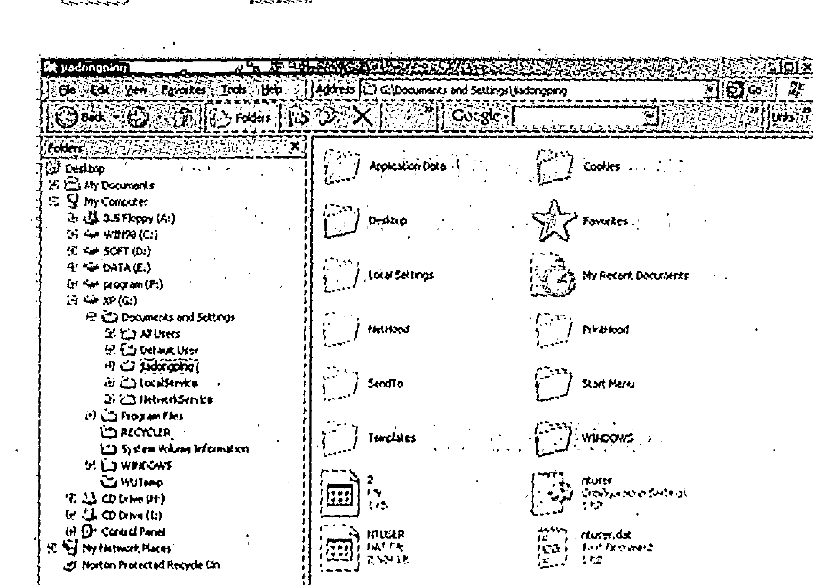

    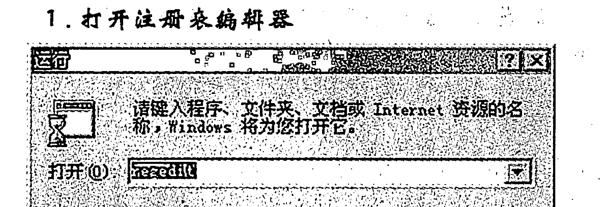

    单击“开始→运行”，输入Regedit.exe，就可以启动注册表编辑器了（如图12）。在Windows 2000/XP中，还可以使用Regedt32.exe来启动注册表编辑器。不过，从实际使用过程来看，这两个命令调用的是同一个程序。

2.  **备份注册表**

    注册表编辑器 (Regedit.exe) 没有提供“撤消操作”的功能，当我们修改某一项目后，就无法撤消该操作了。所以为了保险起见，建议你在编辑注册表之前先进行备份。通过注册表编辑器中的“导出”功能就可以实现注册表文件的备份。我们可以将注册表中的所有内容或者是某一分支导出到一个文件中，Windows 将这种文件的扩展名设置为 REG。导出的具体方法如下：打开“注册表”菜单，选择“导出注册表文件”，单击“浏览”为导出的文件寻找一个存储位置，即文件夹，然后为之输入一个文件后保存即可（如图13）。

    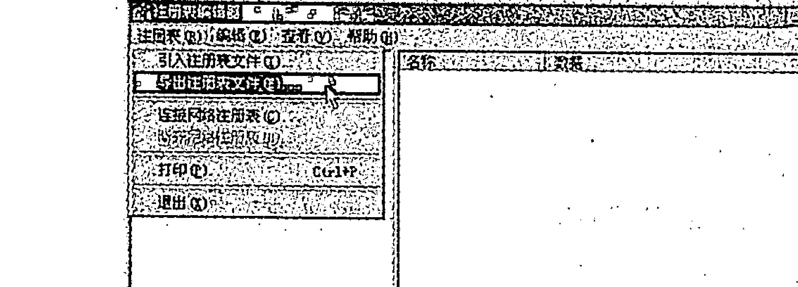

3.  **恢复注册表**

    当 Windows 的注册表出现了问题时，我们可以通过恢复注册表的方式来补救，在“注册表”菜单中，单击“导入注册表文件”，然后在弹出的对话框中单击“浏览”，找到要导入的文件，然后单击“打开”。如果你没有备份系统正常时的注册表，那也不要紧。每次 Windows 启动后，都会自动将系统中原有的 System.dat、User.dat、System.ini 和 Win.ini 这四个文件压缩成 CAB 形式的文件，然后存放在 Windows \ Sysbckup 目录下（系统自动保存最近 5 次开机的注册表数据）。执行这种备份命令的是 Windows 自带的 Scanreg.exe，它也是一个可以在纯 DOS 模式下执行的文件。当注册表出现问题时，只要选择一个没出现问题时的注册表进行恢复就可以了。具体方法如下：单击“开始” → “关闭系统” → “重新启动计算机并切换到 MS — DOS 方式”，然后单击“是”；在 MS — DOS 模式下键入 `Scanreg /Restore` 后回车。只要选择一个没出现问题时的注册表进行恢复就可以了。

    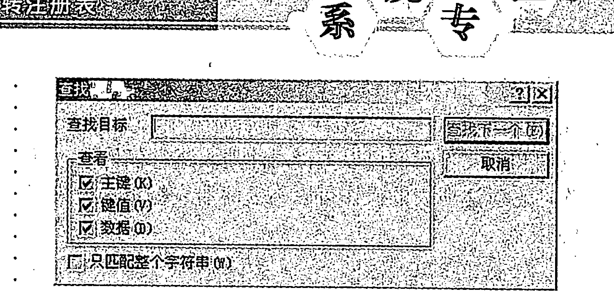

4.  **查找**

    通过“编辑”菜单中的“查找”功能，可以查找字符串、值或关键字。单击“编辑”→“查找”，键入要查找的内容。通过指定查找的位置可以缩小搜索的范围（要继续往下搜索，可以按 F3 键）。

5.  **更改注册表值**

    双击要更改的注册表值。在“键数值”中键入新数据。注意：在无据可依的情况下，请勿随意修改注册表。

6.  **添加主键**

    打开注册表列表，找到要添加主键的位置，右击要加入主键的文件夹，将鼠标指向“编辑”菜单下的“新建”，然后单击“主键”，为新的主键输入一个名字，然后回车即可。

7.  **添加键值**

    与添加主键的方法相同，但是添加键值需要确定键值的类型（这些类型包括“字符串值”、“二进制值”和“DWORD”值），为新添加的键值输入一个新的值，然后回车即可。

8.  **删除**

    查找要删除的注册表项或值，右键单击注册表项或值，然后单击“删除”。注意：如果你不了解要删除项目的作用，最好不要轻易删除，以免造成注册表的损坏。

### （二）手动编写REG文件

前面已经说过了，我们在备份注册表时，Windows 会将它保存成一个扩展名为 REG 的文本文件，我们利用各种文本编辑器（比如记事本）就可以修改它。那么，我们自己是否可以动手编辑一个 REG 文件使用呢？答案是肯定的！

1.  **认识REG文件**

    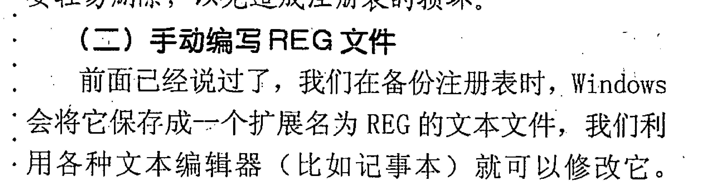

    REG文件实际上是一种注册表脚本文件，双击REG文件即可将其中的数据导入到注册表中（如图15）。利用REG文件我们可以直接对注册表进行任何修改操作，它对注册表的操作可以不受注册表编辑器被禁用的限制。

2.  **创建REG文件**

    REG文件的创建是非常简单的，可以通过任何一个文本文件编辑工具来实现。有些初学者在对注册表进行编写时，总不能成功。其实，这并不是程序出了问题，而是我们在输入时格式不对。它的完整格式是：

    ```
    REGEDIT4
    （此处空一行）
    [路径] （注意用大小写）
    “键名” = “键值”（针对字符串型键值）
    “键名”=hex:键值 （针对二进制型键值）
    “键名”=dword: 键值 （针对DWORD键值）
    ```

    以上是注册表文件的标准格式，其中小括号内是注释，其他包括方括号、引号、等号、分号都是必须有的。在编辑时要注意，千万不要漏掉什么！为了能方便初学者学习，我在给出一个具体的例子：

    ```
    REGEDIT4
    （此处空一行）
    [HKEY_CURRENT_CONFIG\Display\Fonts]
    “二进制”=hex:21,00
    "dword"=dword:00000001
    “字符串”="任意串值"
    ```

    如果还有些问题不懂，建议你先去导出一个，用记事本打开，再把你自己写的打开，两个进行比较，看看空格、标点、大小写有没有出入？一定要一模一样，它要求很严格的。

    还有一个问题值得注意。当你用记事本编辑ABC.reg（假设文件名是ABC）文件时，你用的是记事本，当你保存时自动加上TXT扩展名。这样你看到的是ABC.reg，但实际上真正的全名为ABC.reg.txt。也就是说你生成的不是注册表文件，而是文本文件了。

    改正方法：先在打开的文件夹中选中“查看”菜单，打开“文件夹选项”，选择“查看”标签。下面有一项是“隐藏已知文件类型的扩展名”，取消前面的钩，再点确定。然后给你的文件重命名为ABC.reg就可以了。

3.  **通过REG文件进行添加、删除操作**

    我们在利用REG文件对注册表进行操作时，要操作的对象有两种：一种是对主键进行操作，另外一种是对主键下的键值进行操作。

    **(1) 添加主键**

    要想利用REG文件在注册表中添加一个主键是非常方便的，只需要在文件体部分直接以“[ ]”的形式写上要添加的主键路径即可。

    例如：在HKEY_LOCAL_MACHINE\Software主键下添加一个名称为“电脑爱好者”的主键，内容如下：

    ```
    REGEDIT4
    （此处空一行）
    [HKEY_LOCAL_MACHINE\Software\电脑爱好者]
    ```

    **(2) 删除主键**

    要用REG文件在注册表中删除一个主键，在文件体部分“[ ]”括起来的主键路径前面加上一个“-”号即可。删除主键操作将会一并删除该主键下的所有子键及键值项。这是个比较危险的命令，使用时要十分注意。例如要删除我们刚才添加的那个主键，内容如下：

    ```
    REGEDIT4
    （此处空一行）
    [-HKEY_LOCAL_MACHINE\Software\电脑爱好者]
    ```

    **(3) 添加键值项目**

    添加键值项目的操作如同注册表编辑器中的“新建”命令，键值的数据类型分为三种：字符串值、二进制值和DWORD值。如果要添加字符串值，则“=”号后边要用英文的双引号引住数据（注意，编辑注册表文件时所用到的标点一定都要用英文输入法中的标点，而不要用中文输入法中的）；如果添加的为DWORD类型值，“=”号后边的格式为“dword:数据”；如果添加的为二进制值，“=”号后边则为“hex:数据”。要设置默认值的键值数据时，“=”号前边的键值名称应为“@”符号，并且没有双引号。

    例如我们要在“HKEY_LOCAL_MACHINE\Software\电脑爱好者”主键下设置默认键值为“电脑爱好者”，并分别添加“栏目名称”键值项目（字符串值）、“文章数量”键值项目（二进制值）、“是否受欢迎”键值项目（DWORD值）。相应的REG文件内容如下：

    ```
    REGEDIT4
    （此处空一行）
    [HKEY_LOCAL_MACHINE\Software\电脑爱好者]
    @="电脑爱好者"
    "栏目名称"="系统应用"
    "文章数量"=hex:20
    "是否欢迎"=dword:00000001
    ```

    注意：在添加键值项目时，如果该键值所在的主键路径不存在的话，在添加键值项目的同时会自动创建该主键。

## （三）在DOS环境下维护注册表

前面讲了一些维护注册表的基本操作，但是如果一旦注册表严重损坏导致系统无法启动的话，您就只有在DOS模式下修复了。前面说过，注册表的物理文件为System.dat和User.dat，也就说注册表中的数据保存在这两个文件中。所以，在DOS下维护注册表实际上就是对这两个文件进行操作。

### 1. 导出注册表

此命令可以实现对注册表文件进行备份。
命令格式：Regedit /L:System /R:User /E Filename.reg Regpath
参数含义：
/L: System 指定System.dat文件所在的路径。
/R: User 指定User.dat文件所在的路径。
/E: 此参数指定注册表编辑器要进行导出注册表操作，在此参数后面空一格，输入导出注册表的文件名。
Regpath: 用来指定要导出哪个注册表的分支，如果不指定，则将导出全部注册表。
如果打算将保存在C:\Windows\System.dat和保存在C:\Windows\Profiles\User.dat中所有HKEY_CLASSES_ROOT根键下的分支导出到File.reg中，可以执行如下命令：Regedit /L:C:\Windows\ /R:C:\Windows\Profiles\ /e File1.reg HKEY_CLASSES_ROOT

### 2. 导入注册表

命令格式：Regedit /L:System /R:User File.reg
参数含义：
/L: System 指定System.dat文件所在的路径。
/R: User 指定User.dat文件所在的路径。

### 3. 重建注册表

重建注册表，即重新建立System.dat和User.dat文件。
命令格式：Regedit /L:System /R:User /C File.reg
参数含义：
/L: System 指定System.dat文件所在的路径。
/R: User 指定User.dat文件所在的路径。
/C: 此参数将告诉注册表编辑器，用所指定的REG文件中的内容重新建立注册表。
如果要用File.reg文件中的内容重新建立整个注册表，并将其保存到C:\Windows\System.dat和C:\Windows\Profiles\User.dat中，可执行命令：Regedit /L:C:\Windows\ /R:C:\Windows\Profiles\ /C file1.reg

### 4. 修改键值项目

对于已经存在的键值项目，只需要将正确的数据赋予对应的键值项目即可。

### 5. 删除键值项目

用REG文件删除键值项目是很方便的，和删除主键相类似，是通过“=”号实现的，不过这次不是加在前面，而是把“-”符号放在键值项目的等号后面。例如：[HKEY_CURRENT_USER\Software\Microsoft\Windows\CurrentVersion\Policies\Explorer]"NoRun"=-（解除“运行”命令）

### 4. 删除注册表分支

此命令可以将注册表中的一个子键分支删除。
命令格式为：Regedit /L:system /R:user /D Regpath
参数含义：
/L: system 指定System.dat文件所在的路径。
/R: user 指定User.dat文件所在的路径。
/D: 此参数告诉注册表编辑器，将Regpath所指定的注册表子键分支删除。

### 5. 恢复注册表

Scanreg.exe可以检查、备份、修复注册表，此命令存放在“Windows\Command”目录下。
命令格式：Scanreg [/<Option>]
参数含义：
/Backup参数的作用是备份注册表和相关的配置文件。即把Windows目录下的System.dat、User.dat、Win.ini、System.ini四个文件压缩成名为rb???.cab的文件，存放在\Windows\Sysbckup目录下。多次使用此命令会产生多个CAB文件时，一般从000开始，系统默认最大备份数为5个。可在Windows\Scanreg.ini文件中对最大备份数进行修改，通过修改“Maxbackupcopies=？”的数值即可。
/Restore参数是选择一个备份进行恢复注册表，此命令不能在Windows 98环境下执行，必须关机后，重新启动进入纯DOS方式下才能运行。
/Fix参数是修复损坏的注册表，此命令也只能在DOS方式下运行。
/Comment="<Comment>"参数的作用是在备份注册表时增加一些详细的注释到CAB文件中。

恢复遭到破坏的注册表文件，可以使用Scanreg命令进行修复。方法是，进入DOS系统，然后执行Scanreg/Restore。此时系统会提示注册表备份情况，包括CAB文件名及备份时间等，用户可以选择要恢复的CAB文件进行恢复。如果要查看所有的备份文件及同备份有关的部分，可以执行命令：Scanreg /Restore /Comment。如果注册表有问题，可以使用Scanreg来修复，命令为：Scanreg /Fix。

## （四）维护注册表的相关工具

了解了有关注册表的基础知识和基本操作后，我们再来看看维护注册表的相关工具。有很多优秀的软件可以帮助我们完成注册表的备份、恢复、修改、监视和清理等工作，非常简单、易用。靠这些“神兵利器”的帮助，我们可以更轻松地完成我们想做的任何事。由于篇幅有限，我们不详细讲解软件的使用方法，您可以在网上下载该软件后试用，这类软件通常都很易用。

- ☆Windows 优化大师：这是一款提供从桌面图标到网络维护，从注册表清理到垃圾文件扫除，从黑客搜索到系统检测的优化软件。很多注册表的修改技巧都可以通过Windows优化大师来实现，而且操作更简单。此类软件还有兔子魔法设置、系统公园2003、WinBoost等。

- ☆Asvanced Registry tracer：这是一个制作WINDOWS注册表快照的软件，用该工具的注册表的快照功能可以备份和分析注册表，对比系统注册表因程序安装、硬件更改而增加的主键或键值，同时也能恢复到更改前的登录文件功能。

- ☆RegCleaner：这是一个可以用来清除Windows注册表垃圾键值的工具。当你执行这个工具后，会将注册表中的一些无效、已丢失的键值清除掉，将Windows系统的注册表大大减肥，提高系统运行速度。

- ☆Registry Optimizer 4.0：这款软件可以优化Windows的系统配置文件，可将登录文件及系统配置文件（System.dat 及User.dat）减肥，并不影响系统正常运作，让系统跑的更顺畅。

- ☆Registry toolkit 3.10：这是一个注册表编辑软件，它可以搜索和替换Windows注册表的内容，最主要的是它可以远程操作你的注册表，还可以使用命令行的宏命令进行批量处理。假如你不敢亲手修改注册表的话，可以请高手远程帮助。

- ☆Regmon：是一个出色的注册表数据库监视软件，它将与注册表数据库相关的一切操作（如读取、修改、出错信息等）全部记录下来供用户参考，并允许用户对记录的信息进行保存、过滤、查找等处理，为用户对系统的维护提供了极大的便利。

- ☆Regsnap：它可以详细地向你报告注册表及其他与系统有关项目的修改变化情况。Regsnap对系统的报告非常具体，对注册表可报告修改了哪些键，修改前、后的值各是多少；增加和删除了哪些键以及这些键的值。报告结果可以以纯文本的方式保存。

- ☆Regshot：是个简单、实用的注册表和Win.ini文件比较工具，它通过两次抓取注册表而快速地比较出答案。另外，它还可以将您的注册表以纯文本方式记录下来，便于浏览。

## 四、Windows 注册表实例技巧

前面讲了那么多基础知识和基本操作，相信您一定已经完全熟悉注册表了。下面，我们给大家列举一些注册表修改的实例。修改注册表时最重要的是知道到哪里去找相应的键值，要做到这一点，就要记清楚各个根键和子键存储信息的含义。需要注意的是，很多键值的名字都是用英文单词组合的，只要能看懂该英文单词，就大致可以猜测其用途了。

### （一）桌面显示与系统图标

- ☆修改桌面的提示
  路径：HKEY_CLASSES_ROOT\CLSID\{20D04FE0-3AEA-1069-A2D8-08002B30309D}。
  键值名称：InfoTip，可以修改为任意你想要说的话。

- ☆在桌面上不显示Win98版本号
  路径：HKEY_CURRENT_USER\Control Panel\desktop\
  键值名称：PaintDesktopVersion，将其修改为0即可。

- ☆禁止桌面的提示
  路径：HKEY_CURRENT_USER\Software\Microsoft\Windows\CurrentVersion\Explorer\Advanced
  键值名称：ShowInfoTip，将其修改为0即可。

- ☆关闭Active Desktop，还原为传统的桌面
  路径：HKEY_CURRENT_USER\Software\Microsoft\Windows\CurrentVersion\Policies\Explorer
  键值名称：NoActiveDesktop，将其修改为0，可以关闭这些功能；设置为1，可以激活它。

- ☆禁用“设置”菜单中的“活动桌面”选项
  路径: HKEY_CURRENT_USER\Software\Microsoft\Windows\CurrentVersion\Policies\System
  键值名称: 新建一个名为NoDispCPL的DWORD数据, 将其修改为1即可。

- ☆禁止编辑桌面项
  路径: HKEY_USERS\.DEFAULT\Software\Microsoft\Windows\CurrentVersion\Policies\System\ActiveDesktop
  键值名称: NoEditingComponents; DWORD 值, 将其修改为1即可。同理,将键值NoClosingComponents修改为1可禁止桌面项;将键值NoDeletingComponents修改为1可禁止删除桌面项;将键值 NoAddingComponents 修改为1可禁止添加桌面项。

- ☆回收站改名字
  路径: HKEY_CLASSES_ROOT\CLSID\{645FF040-5081-101B-9F08-00AA002F954E}
  键值名称: “默认”, 将“默认”二字修改为你想用的名字即可。

- ☆锁定回收站
  路径: HKEY_CLASSES_ROOT\CLSID\{645FF040-5081-101B-9F08-00AA002F954E}\InProcServer32
  键值名称: “默认”, 串值后加上“—”符号。例如原值若为“shell32.dll”则修改为“shell32.dll —”。

- ☆找回“我的电脑”、“回收站”、“收件箱”
  路径: HKEY_LOCAL_MACHINE\SOFTWARE\Microsoft\Windows\CurrentVersion\explorer\Desktop\NameSpace
  键值名称: 新建主键为相应的ID号。

- ☆隐藏“回收站”
  路径: HKEY_LOCAL_MACHINE\SOFTWARE\Microsoft\Windows\CurrentVersion\explorer\Desktop\NameSpace
  键值名称: {450d8fba-ad25-11d0-98a8-0800361b1103}, 删除该键值即可。

- ☆将“我的电脑”改名
  路径: HKEY_CLASSES_ROOT\CLSID\{20D04FE0-3AEA-1069-A2D8-08002B30309D}
  键值名称: “默认”, 修改右边的(默认)为你想要的名字。

- ☆锁定我的电脑
  路径: HKEY_CLASSES_ROOT\CLSID\{20D04FE0-3AEA-1069-A2D8-08002B30309D}\InProcServer32
  键值名称: “默认”, 修改时将串值后加上“—”符号即可。

- ☆双击“我的电脑”启动“资源管理器”
  路径: [HKEY_CLASSES_ROOT\CLSID\{20D04FE0-3AEA-1069-A2D8-08002B30309D}\shell]
  键值名称: 建open/command/文件夹, 默认建名, 将键值设为c:\windows\explorer.exe。

- ☆将你的名字放入系统任务栏
  路径: HKEY_CURRENT_USER\Control Panel\International
  键值名称: sTimeFormat = "HH:mm:ss tt", s1159="CFAN", s2359="HELLO"
  说明: 12点之前, 在系统任务栏中显示CFAN, 之后则显示HELLO, 可任意设置以达到自己的效果。

- ☆删除快捷方式中的小箭头
  路径: HKEY_CLASSES_ROOT\.lnk(Windows程序的快捷方式)或者选择HKEY_CLASSES_ROOT\.pif (DOS程序的快捷方式)
  键值名称: IsShortcut, 将其删除即可。

- ☆把快捷方式的小箭头更改为其它图标
  路径: HKEY_LOCAL_MACHINE\Software\Microsoft\Windows\CurrentVersion\explorer\Shell Icons
  键值名称: 新建或修改字符串"29", 设置其值为你的图标路径。

- ☆高彩色显示图标
  当我们安装完Windows后, windows的图标都是用位数较小的色彩来显示图标的, 使用下面的方法可以用16位色显示图标。
  路径: HKEY_CURRENT_USER\Control Panel\Desktop\WindowMetrics
  键值名称: 在右边的窗口中找到字符串值Shell Icon BPP, 并设其值为16。

### （二）系统调整与优化

- ☆删除系统无用的动态链接库（DLL文件）
  路径: HKEY_LOCAL_MACHINE\SOFTWARE\Microsoft\Windows\CurrentVersion\SharedDLL
  键值名称: 其下有若干键值, 每个DLL文件的键值说明此 DLL 被几个应用程序共享。若为 “01 00 00 00” 则此 DLL 文件被一个应用程序共享，若为 “00 00 00 00” 则说明该 DLL 文件对系统不起作用，是一个垃圾文件，删除该键值，并且记下这个 DLL 文件名，从 C:\Windows\System 文件夹中将该 DLL 文件删除。

- ☆每次退出系统时自动清除文档菜单中的历史记录
  路径: HKEY_CURRENT_USER\Software\Microsoft\Windows\CurrentVersion\Policies\Explorer
  键值名称: “ClearRecentDocsOnExit”，十六进制值，将键值改为“01, 00, 00, 00”。

- ☆删除不完全删除的软件讯息
  有时我们在直接删除某些文件夹或手动卸载软件时并没有完全将要删除的软件信息清除出系统，这时除了用反安装软件帮你打扫垃圾外，你也可以就用注册表编辑器在 HKEY_LOCAL_MACHINE\Software\Microsoft\Windows\CurrentVersion\Uninstall 下删去相应软件的主键。

- ☆禁止“系统”中出现“设备管理器”选项
  路径: HKEY_CURRENT_USER\Software\Microsoft\Windows\CurrentVersion\Policies\System
  键值名称: NoDevMgrPage, DWORD 值，将键值修改为 1；同理，将键值 NoVirtMemPage 值修改为 1 可禁止“虚拟内存”选项。

- ☆设置用软盘快速启动系统的功能
  路径: HKEY_LOCAL_MACHINE\Config\0001\Enum\Bios\*PNP0700\0B
  键值名称: FloppyFastBoost，将键值改为 “01 00 00 00” 即可用软盘快速启动系统。

- ☆改变系统的字体
  路径: HKEY_LOCAL_MACHINE\Config\0001\Display\Settings
  键值名称: Fonts.fon，其右侧默认字体为 Vgasys.fon，可以更改为其他字体。

- ☆查看系统分配给光驱的可用盘符
  路径: HKEY_LOCAL_MACHINE\Enum\SCSI
  键值名称: 找到字符串 UserDriveLetterAssignment，其值即表示系统分配给光驱的可用盘符，如果为 HZ 表示从 H 到 Z 可以给光驱使用。

- ☆为系统增加启动时自动加载的程序
  路径: HKEY_LOCAL_MACHINE\Software\Microsoft\Windows\CurrentVersion\Run
  键值名称: 新建主键，名称自定，其值为“要执行文件的路径及文件名”。

- ☆查找系统的安装注册码
  路径: HKEY_LOCAL_MACHINE\Software\Microsoft\Windows\CurrentVersion
  键值名称: ProductKey，其值即是系统安装时必不可少的注册码。

- ☆让系统自动运行一次某个程序
  路径: HKEY_LOCAL_MACHINE\Software\Microsoft\Windows\CurrentVersion\RunOnce
  键值名称: 新建一个主键，其值为要执行文件的路径及文件名。

- ☆优化文件系统
  路径: HKEY_LOCAL_MACHINE\System\CurrentControlSet\Control\FileSystem
  键值名称: 新建 ConfigFileAllocSize, DWORD 值，将其设为 “1f4”。

- ☆查看系统中的 16 位和 32 位 DLL 文件
  路径: HKEY_LOCAL_MACHINE\System\CurrentControlSet\Control\SessionManager
  键值名称: Known16DLLs 和 KnownDLLs 分别包含了系统中的 16 位和 32 位 DLL 文件，用户可以对应查找。

- ☆快速打开文件编辑
  路径: HKEY_CLASSES_ROOT\*
  键值名称: 新建 Shell 子键，在其下新建 Wordpad 子键，双击该键右面窗口的“默认”处并在“键值”栏内输入“写字板”，接着在 Wordpad 子键下建立下一级子键 Command，在“默认”的“键值”栏内输入 “C:\Program Files\Accessories\Wordpad.exe %1”。

- ☆双击 BAT 文件时编辑而不执行
  路径: HKEY_CLASSES_ROOT\batfile\shell
  键值名称: “默认”，将其值由 Open 改为 Edit。

- ☆删除查找结果中的文件列表
  路径: HKEY_CURRENT_USER\.Default\Software\Microsoft\Windows\CurrentVersion\Explorer\DocFind SpecMRU
  键值: 在右窗格中除第一、二和最后一个不能删除外，将其它删除即可。

- ☆禁止光标闪烁
  路径: HKEY_CURRENT_USER\Control Panel\desktop
  键值名称: CursorBlinkRate，字符串值，将其改为 -1。

- ☆更改关闭应用程序时出现“等待”对话框路径: HKEY_CURRENT_USER\Control Panel\desktop
键值名称: 新建 WaitToKillAppTimeOut，字符串值，在“键值”框中输入 10000（单位为 ms，缺省值为 20000ms，即 20 秒）。为了缩短系统关闭应用的等待时间，您可以将此等待时间降低为 20000ms 以下，如 10000ms、15000ms 等。

### ★加快菜单显示速度

路径: HKEY_CURRENT_USER\Control Panel\Desktop
键值名称: MenuShowDelay，字符串值，单位毫秒，值范围为 0～99，0 表示最快。

### ★禁止 Windows 平滑卷动

路径: HKEY_CURRENT_USER\Control Panel\Desktop
键值名称: SmoothScroll，设其值为 0，若允许则设值为 1。

### ★禁止屏幕保护功能

路径: HKEY_CURRENT_USER\Control Panel\Desktop
键值名称: ScreenSaveActive，指屏幕保护功能是否可用，值为 0 或 1，0 为不用屏幕保护功能，1 为可用。

### ★禁止屏幕保护使用密码

路径: HKEY_CURRENT_USER\Control Panel\Desktop
键值名称: ScreenSaveUsePassword，为 1 表示设定密码保护，为 0 表示不设定密码保护，ScreenSave_Data 表示的是密码加密后的值，将 ScreenSaveUsePassword 的值修改为 0 或将 ScreenSave_Data 删除都可以删除屏幕保护的密码。

### ★控制屏幕保护的延时

路径: HKEY_CURRENT_USER\Control Panel\Desktop
键值名称: ScreenSaveTimeOut，指屏幕保护的延时，单位是秒，最小值是 60 秒。

### ★设置墙纸的位置

路径: HKEY_CURRENT_USER\Control Panel\Desktop
键值名称: 新建 WallpaperOriginX 字符串值，表示墙纸左侧的水平坐标（单位: 像素），WallpaperOriginY 表示墙纸顶边的垂直坐标（单位: 像素）。例如，将键值分别设为 400、50，重新启动电脑后，墙纸就到了屏幕的右上角。

### ★取消动画效果开关窗口

路径: HKEY_CURRENT_USER\Control Panel\Desktop\WindowMetrics
键值名称: MinAnimate，将其设为 0 可取消动画效果。

### ★改变时间的显示格式

路径: HKEY_CURRENT_USER\Control Panel\International
键值名称: 新建 sTimeFormat，将“键值”修改为 HHmm。

### ★更改鼠标的速度设置

路径: HKEY_CURRENT_USER\Control Panel\Mouse
键值名称: DoubleClickSpeed 和 MouseSpeed，修改值可以改变鼠标的双击速度和鼠标移动速度。双击速度最快为 100 毫秒，最慢为 900 毫秒，移动速度最快为 2，最慢为 0。

### ★鼠标激活移动到的窗口（X-Mouse）

路径: HKEY_CURRENT_USER\Control Panel\Mouse
键值名称: ActiveWindowTracking，字符串值，将其设置为 1 即可。

### ★取消资源管理器的文件菜单

路径: HKEY_CURRENT_USER\Software\Microsoft\Windows\CurrentVersion\
键值名称: NoFileMenu，将其设置为 1 即可。

### ★禁止修改“开始”菜单

路径: HKEY_CURRENT_USER\Software\Microsoft\Windows\CurrentVersion\Policies\Explorer
键值名称: 新建 NoChangeStartMenu，将其值设为 1。

### ★只允许用户使用由您指定的程序

路径: HKEY_CURRENT_USER\Software\Microsoft\Windows\CurrentVersion\Policies\Explorer
键值名称: 新建 RestrictRun，DWORD 值，将其设为 1 即可。
备注: 在 RestrictRun 的主键下分别添加名为 1、2、3 等字符串值，然后将 1、2、3 等字符串的值设置为允许使用的程序名。例如将 1、2、3 分别设置为 Mshearts.exe、Freecell.exe、Sol.exe，则用户只能使用红心大战、空档接龙、纸牌程序。

### ★解决删除虚拟光驱后原光驱无法使用的问题

路径: HKEY_LOCAL_MACHINE\Enum\SCSI
键值名称: 主键下的所有子键，全部删除后重新启动即可（删除了物理光驱和虚拟光驱的信息并重新启动后，系统会自动找到物理光驱，并且重新在上述子键下加入了物理光驱信息）。

### ★禁止按“取消”键，不输入正确密码就不能进入 Windows 98

路径: HKEY_LOCAL_MACHINE\Network\Logon
键值名称: MustBeValidated，DWORD 值，将其设为 1 即可。

### ★让 Windows 启动时自动执行某一程序

路径: HKEY_LOCAL_MACHINE\SOFTWARE\Microsoft\Windows\CurrentVersion\Run
键值名称: 新建主键（如记事本），然后输入路径及程序名称和参数。
备注: 在“开始”→“程序”→“启动”中放置了程序的快捷方式。

### ★根据您的 CDROM 速度优化 CDROM 预读取性能

路径: HKEY_LOCAL_MACHINE\System\CurrentControlSet\Control\FileSystem\CDFS
键值名称: Prefetch，DWORD 值，将其修改为一个标准数值。

| 倍速 | 对应值 |
| :--- | :--- |
| 4 倍速 | 000000e4（默认值） |
| 8 倍速 | 000001c0 |
| 16 倍速 | 00000380 |
| 24 倍速 | 00000540 |
| 32 倍速 | 00000700 |
| 36 倍速 | 00000750 |
| 40 倍速 | 00000800 |
| 48 倍速 | 00000800 |

备注: 如果修改以上两个键值导致 CDROM 工作不正常，请降低一个级别。

### ★将光驱性能发挥到极限

路径: HKEY_LOCAL_MACHINE\System\CurrentControlSet\Control\FileSystem\CDFS
键值名称: CacheSize，DWORD 值，缓存的大小，正常用途就不必改；如果用于媒体就取值“d6，04，00，00”；要最大化 CDROM 速度就取值“ac，09，00，00”。

### ★禁止软盘驱动器的 FIFO 特性，从而优化软盘驱动器性能

路径: HKEY_LOCAL_MACHINE\System\CurrentControlSet\Services\Class\fdc\0000
键值名称: ForceFIFO，将其修改为 0 即可。

## （三）网络应用的修改与优化

### ★清除 IE 网址输入下拉列表中的网址

路径: HKEY_CURRENT_USER\Software\Microsoft\Internet Explorer
键值名称: TypedURLs，删除其下对应的网址即可。

### ★设置 IE 的缺省下载目录

路径: HKEY_CURRENT_USER\Software\Microsoft\Internet Explorer
键值名称: DownLoadDirectory，修改其值为自己想设定的目录即可。

### ★改变 IE 的背景位图

路径: HKEY_CURRENT_USER\Software\Microsoft\Internet Explorer\Toolbar
键值名称: 新建 BackBitmap，字符串值，指定 BMP 文件路径即可。

### ★更改 Outlook Express 的邮件存放目录

路径: HKEY_CURRENT_USER\Software\Microsoft\Outlook Express
键值名称: Store Root，将其键值改为所需的文件路径即可。

### ★禁止 Outlook Express 的启动画面

路径: HKEY_CURRENT_USER\Software\Microsoft\Outlook Express
键值名称: NoSplash，DWORD 值，将其修改为 1 即可。

### ★重新安装 IE

路径: HKEY_LOCAL_MACHINE\SOFTWARE\Microsoft\Internet Explorer
键值名称: Version，字符串值，表示 IE 的版本号，改小一点儿就行了。

### ★IE 的分级审查口令

路径: HKEY_LOCAL_MACHINE\SOFTWARE\Microsoft\Windows\CurrentVersion\Policies\Ratings
键值名称: 用鼠标选中右半窗口里的名称记录，按下 Del 键进行删除。

### ★删除 IE 的安全口令

路径: HKEY_LOCAL_MACHINE\SOFTWARE\Microsoft\Windows\CurrentVersion\Policies
键值名称: Ratings，将其删除即可。

### ★IE 的地址历史记录位置

路径: HKEY_USERS\.DEFAULT\Software\Microsoft\Internet Explorer\TypedURLs
键值名称: 删除其下的所有的键名和键值！重启后你的 IE 地址栏就不会再有什么历史地址了。

### ★将 Outlook Express 的配置全面备份

路径: HKEY_USERS\.Default\Software\Microsoft\Outlook Express\Mail\Inbox Rules
键值名称: 将该主键导出注册表文件保存，下次安装系统后可以直接双击加入。

### ★清理访问“网络邻居”后留下的信息

路径: HKEY_CURRENT_USER\Network\Recent

### ★禁止使用“网上邻居”

路径: HKEY_CURRENT_USER\Software\Microsoft\Windows\CurrentVersion\Policies\Explorer
键值名称: NoNetHood，DWORD 数据，将其修改为 00000001 即可。

### ★隐藏“网上邻居”

路径: HKEY_LOCAL_MACHINE\SOFTWARE\Microsoft\Windows\CurrentVersion\explorer\Desktop\NameSpace
键值名称: {208D2C60-3AEA-1069-A2D7-08002B30309D}，删除该项即可。

### ★解决局域网中启动直接登录问题

路径: HKEY_LOCAL_MACHINE\SOFTWARE\Microsoft\Windows\CurrentVersion\Network\Real Mode Net
键值名称: 删除 AutoLogon。

### ★支持网络服务器上的长文件名

路径: HKEY_LOCAL_MACHINE\System\CurrentControlSet\Services\VxD\NWREDIR
键值名称: SupportLFN，DWORD 数据，将其值改为 1 即可。

### ★TCP/IP 请求间隔

路径: HKEY_LOCAL_MACHINE\SOFTWARE\Symantec\pcANYWHERE\CurrentVersion\System
键值名称: TCPIPQueryInterval，DWORD 数据，默认 50 秒。

### ★更改最大的 TCP/IP 传输单元

路径: HKEY_LOCAL_MACHINE\System\CurrentControlSet\Services\Class\NetTrans
键值名称: 展开表示 TCP/IP 协议的那个子键（可以从子键下 DriveDesc 的值判断，如 0000），在其下新建 MaxMTU 字符串。如果你所用的是拨号网络，则将其值设为 576。
备注: 因为如果 MaxMTU 大于 576，系统传输就需要重新分组，这样就降低了传输效率。Windows 默认以太网的标准分组值，为 1500。

### ★更改 TCP/IP 的分组寿命的值

路径: HKEY_LOCAL_MACHINE\System\CurrentControlSet\Services\VxD\MSTCP
键值名称: DefaultTTL，将键值修改为 255。
备注: 这主要是防止 TCP/IP 分组在 Internet 中被无限复制。Windows 9x 的缺省值为 32，加大改。

### ★改变收藏夹目录

路径: HKEY_CURRENT_USER\Software\Microsoft\Windows\CurrentVersion\Explorer\ShellFolders
键值名称: Favorites，将其值改为你所希望存放的路径。

### ★远端打印等待超时

路径: HKEY_LOCAL_MACHINE\Software\Symantec\PcAnywhere\CurrentVersion\Remote Control
键值名称: PrinterFlushTimeout，DWORD 数据，秒数（默认为 30 秒）。

### ★主机连接超时

路径: HKEY_LOCAL_MACHINE\Software\Symantec\PcAnywhere\CurrentVersion\Remote Control
键值名称: NonPCAHostTimeout，DWORD，秒数（0 为永不超时）。

### ★改变串接 56K 连接速度

路径: HKEY_LOCAL_MACHINE\Software\Symantec\pcANYWHERE\CurrentVersion\System
键值名称: SerialUse56000，DWORD 数据，更改为 1。

### ★设置 Winsock 缓冲大小

路径: HKEY_LOCAL_MACHINE\Software\Symantec\pcANYWHERE\CurrentVersion\System
键值名称: TCPIPWSDataBuf，键值可设为 1～65535 字节（默认 = 8000）。

### ★为一台机器设置两个 IP 地址

路径: HKEY_LOCAL_MACHINE\System\CurrentControlSet\Services\Class\NetTrans
键值名称: 可以看到多个名为 0000、0001、0002……的目录，它们用于记录协议的安装情况。在它们中间找到 DriverDesc 为 TCP/IP 的目录，修改 IPAddress 和 IPMask 两个键。其中 IPAddress 为用逗号隔开的多个 IP 地址，IPMask 是对应的掩码。
备注: 例如设置 IPAddress 为 “202.10.1.10, 202.10.1.25”，IPMask 为 “255.255.255.0, 255.255.255.0” 时，则表示为系统设置了两个 IP 地址 202.10.1.10 和 202.10.1.25。

### ★更改传输单元接收缓冲区的大小

路径: HKEY_LOCAL_MACHINE\System\CurrentControlSet\Services\VxD\MSTCP
键值名称: DefaultRcvWindow，修改键值为 6144。
备注: 如果 DefaultRcvWindow 太大，一个分组出错后将导致整个缓冲区的分组数据丢失并重发，如果太小，将导致分组堵塞，降低速度，最好为 512 字节的 4～12 倍。

## (四) IE 安全防护与修复实例

### ☆IE 默认连接首页被修改

IE 浏览器上方的标题栏被改成“欢迎访问……网站”的样式，这是最常见的篡改手段，受害者众多。受到更改的注册表项目为: HKEY_CURRENT_USER\Software\Microsoft\Internet Explorer\Main\Start Page。通过修改 Start Page 的键值，来达到修改浏览者 IE 默认连接首页的目的。例如: 浏览“万花谷”就会将你的 IE 默认连接首页修改为 http://on888.home.chinaren.com。
解决办法: 展开注册表到 HKEY_CURRENT_USER\Software\Microsoft\Internet Explorer\Main 下，在右半部分窗口中找到串值 Start Page，双击并将键值改为 about:blank 即可。
特殊例子: 当 IE 的起始页变成了某些网址后，就算你通过选项设置修改好了，重启以后又会变成他们的网址啦，十分的难缠。其实他们是在你机器里加了一个自运行程序，它会在系统启动时将你的 IE 起始页设成他们的网站。
解决办法: 运行注册表编辑器展开 HKEY_LOCAL_MACHINE\Software\Microsoft\Windows\CurrentVersion\Run 主键，然后将其下的 Registry.exe 子键删除，然后删除自运行程序 C:\Program Files\Registry.exe，最后从 IE 选项中重新设置起始页就可以了。

### ☆篡改 IE 的默认页

有些 IE 被改了起始页后，连默认页也被篡改啦。具体说来就是以下注册表项被修改: HKEY_LOCAL_MACHINE\Software\Microsoft\Internet Explorer\Main\Default_Page_URL。Default_Page_URL 这个子键的键值即起始页的默认页。
解决办法: 运行注册表编辑器，然后展开上述子键，将 Default_Page_URL 子键键值中的那些篡改网站的网址改掉就好了。

### ☆锁定 IE 浏览器缺省主页设置项，禁止用户改回来。

主要是修改了注册表中 IE 设置的下面这些键值（DWORD 值为 1 时，该项变为不可选）：
[HKEY_CURRENT_USER\Software\Policies\Microsoft\Internet Explorer\Control Panel]"Settings"=dword:1
[HKEY_CURRENT_USER\Software\Policies\Microsoft\Internet Explorer\Control Panel]"Links"=dword:1
[HKEY_CURRENT_USER\Software\Policies\Microsoft\Internet Explorer\Control Panel]"SecAddSites"=dword:1
解决办法: 将上面这些 DWORD 值改为“0”即可恢复功能。

### ☆IE 的默认首页灰色按钮不可选

这是由于注册表 HKEY_USERS\.DEFAULT\Software\Policies\Microsoft\Internet Explorer\Control Panel 下的 DWORD 值 Homepage 的键值被修改的缘故。原来的键值为 0，被修改为 1（即为灰色不可选状态）。
解决办法: 将 Homepage 的键值改为 0 即可。

### ☆IE 标题栏被修改

在系统默认状态下，是由应用程序本身来提供标题栏的信息，但也允许用户自行在上述注册表项目中填加信息，而一些恶意的网站正是利用了这一点来得逞的：它们将串值 Window Title 下的键值改为其网站名或更多的广告信息，从而达到改变浏览者 IE 标题栏。具体说来受到更改的注册表项目为：
HKEY_LOCAL_MACHINE\Software\Microsoft\Internet Explorer\Main\Window Title
HKEY_CURRENT_USER\Software\Microsoft\Internet Explorer\Main\Window Title
解决办法: 展开注册表到 HKEY_LOCAL_MACHINE\SOFTWARE\Microsoft\Internet Explorer\Main 下，在右半部分窗口中找到串值 Window Title，将该串值删除即可，或将 Window Title 的键值改为“我的 IE 浏览器”等你喜欢的名字；同理，展开注册表到 HKEY_CURRENT_USER\Software\Microsoft\Internet Explorer\Main，然后按上述方法处理。退出注册表编辑器，重新启动计算机，运行 IE，你会发现困扰你的问题解决了！

### ☆IE 右键菜单被修改

受到修改的注册表项目为: HKEY_CURRENT_USER\Software\Microsoft\Internet Explorer\MenuExt 下被新建了网页的广告信息，并由此在 IE 右键菜单中出现！
解决办法: 打开注册表编辑器，找到 HKEY_CURRENT_USER\Software\Microsoft\Internet Explorer\MenuExt，删除相关的广告条文即可，注意不要把下载软件 FlashGet 和 Netants 也删除掉啊，这两个可是“正常”的呀，除非你不想在 IE 的右键菜单中看到它们。

# ★IE默认搜索引擎被修改

在IE浏览器的工具栏中有一个搜索引擎的工具按钮，可以实现网络搜索，被篡改后只要点击那个搜索工具按钮就会链接到那个篡改网站。出现这种现象是注册表被修改：

```
HKEY_LOCAL_MACHINE\Software\Microsoft\Internet Explorer\Search\CustomizeSearch
HKEY_LOCAL_MACHINE\Software\Microsoft\Internet Explorer\Search\SearchAssistant
```

解决办法：运行注册表编辑器，将 CustomizeSearch 和 SearchAssistant 的键值改为某个搜索引擎的网址即可。

# ★系统启动时弹出对话框

受到更改的注册表项目为：HKEY_LOCAL_MACHINE\Software\Microsoft\Windows\CurrentVersion\Winlogon，其下被建立了字符串LegalNoticeCaption和LegalNoticeText，其中LegalNoticeCaption是提示框的标题，LegalNoticeText是提示框的文本内容。由于它们的存在，就使得我们每次登录到Windows桌面前都出现一个提示窗口，显示那些网页的广告信息！

解决办法：找到HKEY_LOCAL_MACHINE\Software\Microsoft\Windows\CurrentVersion\Winlogon这一个主键，然后在右边窗口中找到LegalNoticeCaption和LegalNoticeText这两个字符串，删除这两个字符串就可以解决在登录时出现提示框的现象了。

# ★浏览网页注册表被禁用

这是由于注册表HKEY_CURRENT_USER\Software\Microsoft\Windows\CurrentVersion\Policies\System的DWORD值DisableRegistryTools被修改为1的缘故，将其键值恢复为0即可恢复注册表的使用。

解决办法：用记事本程序建立以REG为后缀名的文件，将下面这些内容复制在其中就可以了：

```
REGEDIT4

（此处要空一行）
[HKEY_CURRENT_USER\Software\Microsoft\Windows\CurrentVersion\Policies\System]
"DisableRegistryTools"="dword:00000000"
（此处一定要保证引号都是英文输入法下的双引号，如果始终出错，可以采用前面的利用INF文件解除注册表禁用的方法）。
```

# ★浏览网页开始菜单被修改

这是最卑鄙的一种恶意修改，浏览后不仅有类似上面的那些症状，还会有以下更悲惨的遭遇。例如：禁止“关闭系统”、禁止“运行”、禁止“注销”、隐藏C盘、禁止注册表编辑器、禁止使用DOS、禁止系统进入“实模式”、禁止运行任何程序等。

解决办法：对付这种办法，只有使用INF文件解决注册表禁用后，通过其他软件方式进行修改了。

# ★IE中鼠标右键失效及“查看”、“源文件”菜单被禁用

浏览网页后在IE中鼠标右键失效，点击右键没有任何反应，或者干脆弹出对话框，告知你无法使用该功能。恶意网页修改注册表的做法为：在HKEY_CURRENT_USER\Software\Policies\Microsoft\Internet Explorer下建立子键Restrictions，然后在Restrictions下建立两个DWORD值：NoViewSource和NoBrowserContextMenu，并为这两个DWORD值赋值为1。通过上面这些键值的修改就达到了在IE中使鼠标右键失效，使“查看”菜单中的“源文件”被禁用的目的。

解决办法：将这两个键值改为0即可。

（文/网海一叶晴天）

从 Windows 9X、Windows NT、Windows ME、Windows 2000 到 Windows XP，如果要说起在这些不同版本 Windows 的使用方法和技巧来，很多人都能说得头头是道，但如果问到一些诸如 Windows 的启动配置、系统进程、系统服务等问题，那很多读者未必就能说得上一二了。乍一看，这些问题显得有些“另类”，与平时对 Windows 的操作没有直接关系。而其实，这些问题涉及到了 Windows 最基本的问题，一旦你对它们有了一定的了解，就会发现这些基本的知识点，更能在很大程度上提高你对 Windows 的认识和解决问题的能力。

## 关于Windows的几个另类问题

by MAYA

### 一、Windows 的启动配置

和早先的 DOS 操作系统的启动方式不同，Windows 操作系统都有启动配置文件来控制系统的启动，根据这些系统启动配置文件的不同，系统的启动方式会有所不同。因此，这些平日看起来对普通用户关系不大的配置文件，却实实在在的影响着系统的运行。

### （一） Windows 9X/ME 系列的启动配置文件

Windows 9X/ME 的系统启动配置文件比较简单，主要的系统启动配置文件主要包括 msdos.sys、config.sys 以及 autoexec.bat 等几个文件，其中 config.sys 和 autoexec.bat 的作用和 DOS 下的相应文件的作用基本相同，主要用于加载一些在系统正常启动前需要运行的一些驱动程序或应用程序。config.sys 中主要加载一些正常启动前需要加载的驱动程序（如内存管理程序等），最常用采用的命令行格式为 “device=路径\驱动程序名”，如启动 Windows 9X 前必须加载的内存管理程序 Himem.sys 等在 Config.sys 的加载格式就是 “device=himem.sys”；Autoexec.bat 中则主要加载一些常见的应用程序，如在 DOS 时代比较重要的鼠标和光驱应用程序以及另外一些 TSR 程序，具体使用格式就是在 Autoexec.bat 中加入对应的应用程序名以及对应的存放路径，由于 Windows 9X 启动时已经内建了部分常用应用程序的加载，因此在 Autoexec.bat 已经没有必要再加载这些程序，不过，尽管 Windows 已经设置了默认的 Windows 安装路径的 PATH，但是对于一些应用程序的路径设置，还是可以在 Autoexec.bat 中通过命令 “Path=路径” 来手动指定的。

和 DOS 时代相比，Config.sys 和 Autoexec.bat 在 Windows 中的重要性已经远远不及当初，在某些情况下，这两个文件甚至可以被完全“抛弃”，在这里就不再对这两个配置文件的功能进行详细介绍了。

msdos.sys 是隐藏的只读文件，对其进行编辑前，必须取消隐藏属性和只读属性。Windows 下的 msdos.sys 与 DOS 下的相应文件有了很大的不同，其中包含的各个参数设置对于系统的启动有着很大的影响。下面就来看看其中主要的参数设置。

用文本编辑软件打开 msdos.sys，我们可以看到以下的一些内容：

- 1. [PATH]部分

顾名思义，[PATH]部分指定的是与系统相关的目录设置参数。具体有以下的一些内容。

HostWinBootDrv=C （这里设定的是Windows 9X/ME的主驱动器，也就是系统在分区时被激活的那个分区，默认值为C。）

WinBootDir=C:\WINDOWS （这里设定的是Windows 9X/ME的启动文件所在目录，默认为C:\Windows。）

WinDir=C:\WINDOWS （这里设定的是Windows 9X/ME的系统安装目录，一般在安装时自行设定，默认值为“C:\Windows”。）

注意：如果是在DOS或Windows 3.1中安装Windows 9X并执行了备份系统文件，会出现一项“UninstallDir=C”，它代表的是卸载Windows 9X所需的信息文件win95undo.dat和win95undo.ini所在的驱动器，默认值为C。

### 2. [OPTIONS]部分

[OPTION]部分指定的是启动时自动执行的一些启动指令，包括引导菜单、磁盘检查、系统缓冲等方面的一些设置，具体有以下的一些内容。

AutoScan=1 （这里设定当Windows 9X/ME非正常关机后，下次启动时会自动运行磁盘扫描程序scandisk.exe。通过设置AutoScan的值可以控制scandisk.exe的运行方式。0表示禁用，1表示运行前询问，2表示自动运行。）

BootKeys=1 （表示开始引导系统时按“F5”键或“F8”键是否允许出现启动模式选择菜单。值为0表示允许，值为1表示禁用。）

BootDelay=2 （设定在Windows 9X/ME启动时，当出现Starting Windows画面时可以按“F8”键来选择进入不同的模式。BootDelay定义了此画面持续的时间，默认值为2秒。）

BootGUI=1 （表示进入Windows 9X/ME图形用户界面，还是进入DOS模式。设定值为0表示进入DOS，值为1表示进入Windows 9X/ME图形用户界面。如果想在DOS下进入Windows 9X/ME图形用户界面，可以在DOS提示符下键入“win”命令来启动。其中GUI即Graphic User Interface。）

BootMulti=1 （如果你的系统是从DOS或Windows 3.1升级到Windows 9X的，那么就可以在这里设定Windows 9x启动时按“F4”键选择进入旧版本的DOS或Windows 3.1。值为0表示禁用该项功能，值为1表示允许。）

BootMenu=0 （表示是否在启动Windows 9X/ME时必须按下“F8”键才出现的启动模式选择菜单。设定值为1时表示总是出现，值为0表示按“F8”键后才出现。）

BootMenuDelay=30 （如果设定了BootMenu=0，那么该项设定表示启动选择菜单出现的时间。默认为30秒，表示当出现选择菜单后，用户有30秒时间来进行选择；如果没有作任何选择，那么系统将以默认的选项进行启动）

BootSafe=0 （修改BootSafe的值可以强迫Windows 9X每次是否进入安全模式。当值为0时表示让Windows 9X/ME自动选择，当发生错误时自动进入安全模式，值为1是表示不管是否发生错误都进入安全模式。）

BootWarn=0 （表示是否显示进入安全模式时的警告。当值为0时表示不显示警告，当值为1时表示显示警告。）

DblSpace=1 （表示是否装载磁盘压缩驱动程序(DoubleSpace)。值为0表示不装载，值为1表示装载，默认值为0。）

DisableLog=0 （控制是否记录引导过程的信息。值为0表示记录，值为1时表示不记录。）

DoubleBuffer=0 （0表示Windows 9X/ME不使用双缓冲，1表示Windows 9X/ME自动决定是否使用双缓冲，2表示Windows 9X/ME使用双缓冲。）

DrvSpace=1 （表示是否装载磁盘压缩驱动程序DriveSpace。值为0表示不装载，值为1表示装载。默认值为0。）

LoadTop=1 （LoadTop参数控制是否将COMMAND.COM、DRVSPACE.BIN或BDLSPACE.BIN装入常规内存的高端。值为0表示装入高端，值为1表示装入低端。）

LOG0=1 （表示是否开启Windows 9X/ME/ME的蓝天白云欢迎画面。值为1时表示开启，值为0时表示关闭。）

Network=1 （控制Windows 9X/ME启动后是否装载网络项。值为0表示不装载，值为1表示装载。）

WinVer=4.10.2222 （表示所用的系统的版本号。）

在msdos.sys的最后，还有很多行的X字符，这主要是由于系统兼容性的缘故，要求保证msdos.sys文件大小必须大于1024bytes而添加的，并没有其他实质性的作用。

### （二）Windows 2000/XP系列的系统启动配置文件

Windows 2000/XP系列的系统启动主要是由系统自带的启动管理器来管理的，它们的启动管理器不仅能很好地管理自身系统的启动，而且还是个很好的多系统引导管理器，同时它还采用了菜单选择方式，并且支持中文，使用起来非常方便。下面我们就来仔细地分析一下Windows 2000/XP的启动管理器的结构以及相关的应用。

### 1. 启动管理器的基本结构

Windows 2000/XP系列的启动管理器包括NTLDR.SYS、BOOT.INI、BOOTFONT.BIN、NTDETECT.COM四个文件和与之对应的主引导记录。在系统启动时，NTDETECT.COM会侦测系统引导区的内容然后调用NTLDR.SYS、BOOT.INI、BOOTFONT.BIN进行启动工作。其中BOOT.INI为一文本文件，是启动管理器的配置文件。

```
[boot loader]
timeout=0
default=multi(0)disk(0)rdisk(0)partition(4)\WINNT
[operating systems]
multi(0)disk(0)rdisk(0)partition(4)\WINNT="Microsoft Windows 2000 Professional" / fastdetect
```

在Windows 2000或者是XP系统中，我们可以通过系统提供的管理工具很容易地设置“BOOT.INI”文件：在“我的电脑”上单击右键，选择“属性”打开“系统属性”对话框，再单击“高级”选项卡，在“启动和故障修复”里面单击“设置”按钮，打开“启动和故障修复”对话框，在这里面我们就可以对它进行详细设置了。

现在，我们来具体说明一下BOOT.INI文件内各项的具体含义。

### （1）系统加载部分（[boot loader]）

这部分的参数设置很简单，只有两个设定。那就是“timeout=”和“default=”。

“timeout=”用来设定开机时系统引导菜单显示的时间，超过设定值则自动加载下面“default=”指定的操作系统。默认值是30，单位为秒。我们可以在这里面设定等待时间的长短。如果将其设为“0”，那么就不显示系统引导菜单。

“default=”则是设定启动时默认引导的操作系统。而等号后面的操作系统必须是已经在“[operating systems]”中存在的。如果想启动时默认加载另外的操作系统，我们可以参看“[operating systems]”中的操作系统列表，然后把想要加载的操作系统按照格式写到“default=”后面就可以了。

### （2）操作系统部分（[operating systems]）

在这里面，列出了机器上所安装的全部操作系统。比如上面的BOOT.INI示例文件中所显示的相应计算机上只有一个操作系统，那就是“multi(0)disk(0)rdisk(0)partition(4)\Windows="Microsoft Windows 2000 Professional" /fastdetect”

在这里需要注意的是，在英文引号内的文字就是引导操作系统菜单时显示出来的让我们选择操作系统的提示文字，在这里面我们可以根据自己的需要随意更改。而前面的部分“multi(0)disk(0)rdisk(0)partition(4)\Windows”在这里就需要详细地解释一下了，因为它涉及到了ARC（高级RISC计算机）命名，它是x86或RISC计算机中用于标识设备的动态方法。

ARC命名的第一部分用于标识硬件适配卡/磁盘控制器，它有两个选项：SCSI和Multi。Multi表示一个非SCSI硬盘或一个由SCSI BIOS访问的SCSI硬盘，而SCSI则表示一个SCSI BIOS禁止的SCSI硬盘。(x)是硬件适配卡序号。Disk(x)表示SCSI总线号。如果硬件适配卡为Multi，其正确表示方法是disk(0)，rdisk(x)则表示硬盘的序号，如果硬件适配卡为SCSI则忽略此值。partition(x)表示硬盘的分区序号。了解这些，我们就可以解释前面那条信息的含义了。“multi(0)disk(0)rdisk(0)partition(4)\Windows”的意思是，在0号非SCSI设备（也就是IDE设备了）上的第0号磁盘上的第四个分区里面的“Windows”目录下可以找到能够启动的操作系统。

等号后的内容前面已经说过，那就是引导菜单显示出来的供我们选择的提示文字。而后面的“/ fastdetect”又是作什么用的呢？这是一个开关符，用来控制启动该操作系统时的具体选项，如DEBUG、NUMPROC等，不过对于大家来说用处并不大，在这里就不详细进行介绍了，而对于系统默认在安装时自行添加的/FASTDETECT参数，它的主要作用是当Windows 2000/XP启动时，它可以使系统不检查串行口和并行口，从而加快启动速度。

### 2. 多种启动方式的BOOT.INI设置

上面介绍了BOOT.INI的一些基本参数内容，通过对BOOT.INI中一些字段的调整和修改，我们就可以实现多种方式的启动了，具体的实例如下。

### （1）多重引导Windows 2000 / XP系统

如果硬盘中装有不止一个Windows 2000 / XP类系统，可以采用类似multi(0)disk(0)rdisk(0)partition(1)\WINNT=“MicrosoftWindows. 2000Professional” / fastdetect的方式定义不同的系统。其中，multi(0)disk(0)partition(1)表明系统处于第一个IDE硬盘的第一个分区中，\WINNT说明系统目录。引号中为在启动菜单中显示的内容，最后所带的是系统启动参数。

### （2）多重引导Windows 9X / DOS系统

如果Windows 2000/XP是由Windows 9X升级而来，并且又使用了全新安装，安装程序会为我们自动配置与老系统的双引导。这时，可在BOOT.INI的[operatingsystems]中找到类似于以下的内容：C:\=”Microsoft Windows”。乍一看，好像就是指示系统管理器从“C:\”引导老系统。其实不然，“C:\”后面省略了一个文件名，也就是缺省文件名BOOTSECT.DOS。这个文件的内容，其实就是老系统的引导扇区。要从启动管理器启动Windows 9X，只须将Windows 9X所在分区的引导扇区存为一个文件。这可以采用Windows 2000 SupportTools中的Diskprobe或NortonDiskedit之类的磁盘编辑工具实现，编辑完成后保存为相应的文件。比如假设为boot.dat，将文件复制到Windows 2000启动分区下，在BOOT.INI中加入以下一句C:\boot.dat = “Microsoft Windows 98”就可以了。

说到多重启动菜单，在这里就顺便提一下多重启动菜单的恢复问题。在很多情况下，由于错误地传输了Windows 9X的系统引导文件或者重新安装Windows 9X甚至一些意外的重启都会破坏系统引导区的内容，导致Windows 9X与Windows 2000/XP的多重启动菜单的破坏。要恢复Windows 9X与Windows 2000/XP的多重启动菜单，可以按照下面的步骤进行操作：

- （1）在98中运行2K的安装程序（\i386\winnt.exe），当复制完安装文件后根据提示选“不要重新启动”。
- （2）在“我的电脑”中进入C盘根目录，找到“C:\boot.ini”文件并打开它，作如下修改：
  - ①将“Default=C:\$win_NT…”一行改为“Default=multi(0)disk(0)rdisk(0)partition(x)\WINNT”（如需默认启动项为Windows 2000/XP，x为Windows 2000 / XP安装的硬盘分区）或“Default=C:\”（如需默认启动项为98）。
  - ②将“C:\$win_NT$.~BT\...”目录删除。
- （3）最后将C盘根目录下文件名中带$符号的临时安装文件删除（两个文件一个目录）再重新启动即可！

### 二、Windows 的系统进程

Windows 2000/XP的用户对于“Ctrl” + “Alt” + “Del”这个组合键一定非常熟悉，在使用这个组合键后选择“任务管理器”，可以看到在“任务管理器”中有“进程”一项，在“进程”的显示窗口中不仅可显示正在使用一些的程序进程，而且还可以看到有很多使用者并不了解的进程在系统中同时运行，这些进程一些是系统运行必须的不能随便结束的进程，而有些进程也可能是正在危害你的计算机安全的一些木马程序。因此，正确地了解常见的系统进程对于更好地维护系统的稳定和安全是非常有帮助的。

下面就来详细介绍一下Windows 2000/XP的常见系统进程。

### （一）最基本的系统进程

最基本的进程是系统运行的基本条件，有了这些进程，系统才能正常运行。一般情况下有以下进程。

- smss.exe: Session Manager
- csrss.exe: 子系统服务器进程
- winlogon.exe: 管理用户登录
- services.exe: 包含很多系统服务
- lsass.exe: 管理IP安全策略以及启动ISAKMP/Oakley(IKE)和IP安全驱动程序。(系统服务)产生会话密钥以及授予用于交互式客户/服务器验证的服务凭据(ticket)。
- svchost.exe: 包含很多系统服务
- SPOOLSV.EXE: 将文件加载到内存中以便迟后打印。
- explorer.exe: 资源管理器(internat.exe托盘区的拼音图标)

### （二）附加的系统进程

这些进程不是必要的，使用者可以根据需要通过服务管理器来增加或减少。

- mstask.exe: 允许程序在指定时间运行。
- regsvc.exe: 允许远程注册表操作。
- winmgmt.exe: 提供系统管理信息(系统服务)。
- inetinfo.exe: 包含了msftpsvc, w3svc, iisadmn。
- tftpd.exe: 实现TFTP Internet标准。该标准不要求用户名和密码。远程安装服务的一部分。
- termsrv.exe: termservice服务。
- dns.exe: 应答对域名系统(DNS)名称的查询和更新请求。

### （三）系统服务进程

- tcpsvcs.exe: 提供在PXE可远程启动客户计算机上远程安装Windows 2000/XP的能力。

## 三、Windows 的系统服务

Windows 的系统服务这个概念是从Windows NT时开始提出的，因为对于Windows 9X/ME来说并没有真正意义上的系统服务。Windows 2000/XP则更是对系统服务进行了相应的发展，使得系统成为整个系统的一个非常重要的组成部分，它控制并关联着系统的很多功能。

每个系统服务都有以下三个不同的设定状态：

- (1) Automatic (自动): 设定使计算机每次启动都会自动打开相应服务；
- (2) Manual (手动): 设定由使用者或者其他关联服务需要时才打开相应服务；
- (3) Disable (已禁止): 设定完全禁用相应的服务。

对于系统服务，我们可以通过“控制面板”→“管理工具”→“服务”来进行相应的状态设定操作，在这里要提醒大家的是，对于不必要的系统服务我们可以关闭从而节省系统的资源开销，而对于必要的系统服务则万万不能自作主张关闭，否则严重的可能会导致系统无法启动等后果。

下面就来给大家介绍一下Windows 2000/XP提供的各种基本服务、相应的作用以及是否可以关闭来节省系统资源：

Alerter (警报器服务): 局域网中当系统发生问题时向系统管理员发出警报，对普通用户可设置为“已禁用”或“手动”。不过要注意的是，如果你的病毒防火墙是采用这个服务来通知使用者关于系统扫描信息的（如Etrust等），那么这个服务最好还是不要关闭，否则你将无法获得你的病毒防火墙的工作情况。

Application Management (应用程序管理): Windows 2000/XP引入了一种基于msi文件格式（应用程序安装信息程序包文件）的全新、有效软件管理方案——应用程序管理组件服务，它不仅管理软件的安装、删除，而且可以使用此项服务修改、修复现有应用程序，监视文件复原并通过复原排除基本故障等。虽然如此，当设置为“已禁用”时似乎并不影响单机上软件的安装与卸载，而且基于msi格式安装、修复与删除的行为也是正常的。

ClipBook (剪贴簿): 通过Network DDE和Network DDE DSDM提供的网络动态数据交换服务，查阅远程机器中的剪贴簿。对普通的计算机用户来说并没有什么作用，可以设置为“已禁用”。

Computer Browser (计算机浏览器): 维护网上邻居中计算机的最新列表，并将这个列表提供给请求的程序。

ismserv.exe: 允许在Windows Advanced Server站点间发送和接收消息。
ups.exe: 管理连接到计算机的不间断电源(UPS)。
wins.exe: 为注册和解析 NetBIOS 型名称的TCP/IP客户提供NetBIOS名称服务。
llssrv.exe: License Logging Service (system service)。
ntfrs.exe: 在多个服务器间维护文件目录内容的文件同步。
RsSub.exe: 控制用来远程储存数据的媒体。
locator.exe: 管理RPC名称服务数据库。
lserver.exe: 注册客户端许可证。
dfssvc.exe: 管理分布于局域网或广域网的逻辑卷。
clipsrv.exe: 支持“剪贴簿查看器”，以便可以从远程剪贴簿查阅剪贴页面。
msdtc.exe: 并列事务，是分布于两个以上的数据库，消息队列，文件系统，或其它事务保护资源管理器。
faxsvc.exe: 帮助你发送和接收传真。
dmadmin.exe: 磁盘管理请求的系统管理服务。
mnmsrvc.exe: 允许有权限的用户使用NetMeeting远程访问Windows桌面。
netdde.exe: 提供动态数据交换(DDE)的网络传输和安全特性。
smlogsvc.exe: 配置性能日志和警报。
rsvp.exe: 为依赖质量服务(QoS)的程序和控制应用程序提供网络信号和本地通信控制安装功能。
RsEng.exe: 协调用来储存不常用数据的服务和管理工具。
RsFsa.exe: 管理远程储存的文件的操作。
grovel.exe: 扫描零备份存储(SIS)卷上的重复文件，并且将重复文件指向一个数据存储点，以节省磁盘空间。
SCardSvr.exe: 对插入在计算机智能卡阅读器中的智能卡进行管理和访问控制。
snmp.exe: 包含代理程序可以监视网络设备的活动并且向网络控制台工作站汇报。
snmptrap.exe: 接收由本地或远程SNMP代理程序产生的陷阱消息，然后将消息传递到运行在这台计算机上SNMP管理程序。
UtilMan.exe: 从一个窗口中启动和配置辅助工具。
msiexec.exe: 依据MSI文件中包含的命令来安装、修复、以及删除软件。

## 关于Windows的几个另类问题

### DHCP Client (动态主机配置协议客户端):

DHCP 是一种提供动态 IP 地址分配、管理的TCP/IP服务协议, 作为网络启动过程的一部分, DHCP客户端系统就可以向 DHCP 服务器请求和租用 IP 地址。作为普通用户, 如果已通过拨号方式连入 Internet, 那么还是保持自动状态为好, 因为我们在 Internet 上的 IP 地址是由 ISP 动态分配的。如果系统不应用于任何网络, 那么使用者可以将其设为 “已禁用”。

### Distributed Link Tracking Client (分布式连接跟踪客户端):

DLTC 能跟踪文件在网络域的 NTFS 卷中移动状况, 并发出通知。普通用户可以设置为: “已禁用”, 局域网用户 (硬盘已格式化为NTFS) 设为: “自动”。

### DNS Client (域名系统客户端):

将域名解析为 IP 地址。除非没有连入任何网络, 否则请设置为 “自动”。

### Event Log (事件日志):

该服务能记录程序和系统发送的出错消息。虽然日志包含了对诊断问题有所帮助的信息, 但对普通用户可能起不了什么作用, 可以设置为 “手动”。但是对于系统服务器这个选项一定要设置为 “自动”。

### Fax Service (传真服务):

在Win95中支持的传真功能现在在Windows 2000/XP中重新被予以支持, 而且与系统集成得更好。如果用不上FAX服务的, 可以设置为 “已禁用”。

### Indexing Service (索引服务):

索引服务能针对本地硬盘或共享网络驱动器上的文档内容和属性建立索引, 并通过 Windows 2000/XP特有的文档过滤器快速定位到你所需要的文档上, 它大大强化了 Windows 2000/XP 的搜索能力。但是另一方面索引服务会消耗大量系统资源。微软建议: 仅有64MB 内存, 而要索引的文档又超过十万个, 就应该禁用这个服务。实际上, 这个对于单机用户用处不是很大, 可以设置为 “已禁用”。

### Internet Connection Sharing (Internet连接共享):

为局域网计算机提供 Internet 共享连接。这个服务为多台联网的电脑共享一个拨号网络访问 Internet提供了捷径, 以前在Windows9X中要实现这一功能需借助 SYGATE、WinGATE等代理软件, 现在这一功能已直接被 Windows 2000/XP 支持了。对普通单机用户可以将其设为 “已禁用”。

### IPSEC Policy Agent (IP安全策略代理):

该代理服务允许 IP 安全策略对两台计算机之间传输的数据包进行加密, 从而防止在网上看到它的人对它进行更改和破译。IPSEC是一种用来保护内部网、专用网络以及外部网 (Internet, Extranet) 免遭攻击的重要防御方法。使用IPSEC前必须需要首先定义两台计算机之间相互信任和通信安全的方式。请注意: 在Windows 2000/XP默认情况下 “IP安全策略代理” 是自动启动的, 而 “IP安全策略” 并没有启动 (我们可以在 “网络和拨号连接” → “你的拨号连接属性” → “网络” 页 → “Internet 协议 / TCP / IP属性” → “高级” → “选项” 页下的 “IP安全机制” 属性中看到)。对于单机用户来说, 这个功能也不是非常有用, 同样可以设置为 “已禁用”。

### Messenger (信使服务):

发送和接收由系统管理员或由Alerter 服务所发送消息的服务。由于 Alerter 服务需要依靠本服务, 因此如果已将Alerter禁止, 那么这项可以设置为 “手动” 或 “已禁用”, 否则请设置为 “自动”。

### Net Logon (网络登录):

简单说就是在局域网上验证登录信息的选项。一般用户可以将其设为 “已禁用” 或 “手动”。

### NetMeeting Remote Desktop Sharing (NetMeeting 远程桌面共享):

该服务能通过NetMeeting 允许有权用户远程访问 Windows 桌面。这个功能对一般的计算机使用者用处不大, 可以设为 “已禁用”。

### Network Connections (网络连接):

它管理着 “网络和拨号连接” 文件夹中的所有对象。如果系统有任何网络连接 (包括Internet拨号连接) 就保持 “手动” 状态。否则如果禁用它, 在 “网络和拨号连接” 文件夹中将什么都看不到, 更不用说新建连接和拨号上网了。

### Network DDE (网络动态数据交换) 和 Network DDE DSDM:

网络动态数据交换服务是一种为 DDE 对话提供网络传输和安全的服务。DDE (动态数据交换) 是实现进程通讯的一种形式, 它允许支持 DDE 的两个或多个程序交换信息和命令。对一般用户可以设置为 “已禁用”。

### Plug and Play (即插即用):

即插即用是 Intel 开发的一组规范, 它赋予了计算机自动检测和配置设备并安装相应驱动程序的能力, 当有设备被更改时能自动通知使用该设备的程序。普通单机用户可以设置为: “已禁用”, 局域网用户应设为: “自动”。

## 系统专区 - 关于Windows的几个另类问题

当前设备的状况。将该服务状态保持“自动”有利于设备的管理和维护。

### Print Spooler (打印后台处理):

该服务的作用是将多个请求打印的文档统一进行保存和管理，待打印机空闲后，再将数据送往打印机处理。无任何打印设备的用户设置为“已禁用”，否则设为“自动”。请注意：如果你启用了传真服务 (Fax Service) 的话，就应该保持自动状态，因为传真服务依赖Print Spooler服务的运行。

### Remote Procedure Call (RPC) (远程过程调用):

一种消息传递功能。在计算机的远程管理期间它允许分布式应用程序（即 COM+ 应用程序）呼叫网络上不同计算机上的可用服务。虽然看起来这个系统服务可以关闭，但是由于有很多服务需要依赖它的运行，如：Fax Service、Network Connections、Telephony等，所以还是应该保持它为“自动”。

### Remote Registry Service (远程注册表服务):

该服务能使你编辑另一台计算机上的注册表。普通单机用户根本没必要使用这个服务，可以设置为“已禁用”。

### Run As Service (以其他用户身份运行服务的服务):

当使用者用一般权限用户身份登录系统，而在使用中又需要修改只有系统管理员才能修改的系统设置项时，该服务提供了不重启系统以管理员身份登录的捷径。使用者只需要在命令提示符下运行 RunAs 命令就可达到更改目的。对于一般用户在未熟悉 RunAs 命令用法之前可以将其设为“已禁用”。

### Smart Card 和 Smart Card Helper:

这两个服务提供对智能卡设备的支持，一般情况下可以将它们设置为“已禁用”。

### Task Scheduler (计划任务):

还记得 Windows 9X 中的“计划任务”吗？在 Windows 2000/XP 中它的作用是相同的。它能使程序在预定的时间自动运行，如定期进行磁盘碎片整理。如果无法没有这方面的需要，可以将它设置为“已禁用”。

### TCP/IP NetBIOS Helper Service (TCP/IP NetBIOS支持服务):

该服务能在 TCP/IP 上提供 NetBIOS 支持。前面我们曾提到过 NetBIOS 是基于局域网的，因此作为访问 Internet 资源的一般用户可以禁用它，不过对于局域网的用户还是建议将它设置为“自动”。

### Telephony (电话):

简单地说这个服务能为计算机提供电话拨号的能力。如果使用者使用拨号方式连接到 Internet 或通过电话线连接其他计算机，就应将其设为“手动”。

### Telnet:

该服务允许你从远程计算机上登录以本系统并且使用命令行方式操作这台计算机。对于一般单机用户该服务并不重要，可以设为“手动”或“已禁用”。

### Uninterruptible Power Supply (不间断电源):

管理连接到计算机的不间断电源（UPS）的服务。如果系统上没有 UPS 设备就可以设置为“已禁用”。

### Windows Management Instrumentation (Windows管理规范) 和 Windows Management Instrumentation Driver Extensions (Windows管理规范驱动程序扩展):

WMI 是 Win2K 中的基础管理结构，它通过一组常用接口控制和监视系统（如对系统属性的查看与更改、设置用户权限等）。为加快系统启动速度，我们可以将这两个服务设置为“手动”，待系统启动后在需要的时候再自动用它们。

以上介绍的都是在Windows 2000/XP安装后系统默认自带的一些常见的系统服务，在正常的使用中，很多应用程序以及微软的补充安装程序也会将添加一些相应的系统服务（如安装IIS后会添加“W3svc——World Wide Web Publishing Service（万维网发布服务）”服务）等，对于这些系统服务的具体设置操作也可以参考上面的一些情况。

（文/张京京）

《电脑爱好者合订本》…… 因为她是历经时间考验的精品！ 《电脑爱好者合订本》…… 因为她是百万热心读者的至爱！ 因为拥有无限商机和丰厚回报！ 欢迎加盟 联系电话：010-62161961

这是个属于Windows的时代，DOS这个词汇已经稍显老旧了，毕竟，Windows人性化的图形界面，简易的操作方式是DOS所远远不及的。所以一说起DOS，人们不禁会感慨：“廉颇老矣，尚能饭否”，我们是否需要DOS呢？答案是否定的，就单从Windows操作系统（从Windows 9X到Windows XP）来看，每个版本中都有DOS的身影。因此，DOS自有它存在的道理，在有些方面，DOS在快捷、方便、稳定性、开放性等方面又是Windows所不及的。时至今日，依然有一些读者还在关注着DOS，但相关资料很少，所以我们专门开辟了这块版面，从新的角度，对视窗时代的“DOS”进行一次讨论。

### 一、DOS简述

作为曾经叱咤风云的磁盘操作系统，DOS（Disk Operating System）是Windows系统发展的基础。自从DOS在1981年问世以来，版本就不断更新，从最初的DOS1.0升级到了最新的DOS8.0（Windows ME系统），纯DOS的最高版本为DOS6.22，在这以后，虽然没有再单独发布新版本的DOS，但在各个Windows版本中，却都内含了DOS。

在这个视窗系统统治的时代，之所以DOS还仍然“顽强”地存在着，正是凭借着Windows所不具备功能。对很多人来说，只有当Windows系统故障或崩溃以后，不得不通过DOS命令来进行系统修复时，才会真正接触到DOS，才会意识到DOS的存在。对于DOS，微软曾声称已经“抛弃”了这个旧时的宠儿，但似乎又没有完全抛弃DOS，甚至随着Windows的发展，DOS的命令和功能也得到了增强，毕竟目前还有一大批DOS的忠诚簇拥者。

具体的说来，DOS的独特功能表现在它能解决好一些Windows解决不了的问题；而且与Windows相比，DOS在某些方面操作起来更简单、更方便、更直接、更高效。

当然了，虽然DOS有Windows所不具备的功能，但同时也不能否认，随着计算机技术的发展，出现了很多DOS所不能支持的新技术标准、新硬件和接口设备，使DOS逐渐满足不了人们对计算机应用的需求了。比如DOS不支持长文件名、NTFS分区格式、USB设备等，而且，DOS的网络功能比较差。为了适应应用需求，目前也出现了一些具有各种新功能的DOS和功能增强工具。下面，我们将从实际应用的角度出发，对视窗时代的DOS的新增功能，相关工具及其应用进行简要的介绍。

### 二、超越Windows的DOS功能

虽然Windows功能强大，但DOS的部分功能却是Windows所没有的。具体的说来，比如硬盘低级格式化、硬盘分区、清除CMOS密码、清除顽固病毒等等，这些在Windows中很难操作的事情，DOS中却可以轻而易举地实现。下面来详细了解一下。

#### （一）低级格式化

对于常见的磁盘错误，Windows提供了内置的磁盘检查功能就能进行简单的检查修复工作，而对于硬盘的部分错误（如出现坏道等情况）Windows 就无法进行相应的处理了，唯一的办法就是在 DOS 下对硬盘进行低级格式化。

#### （二）硬盘分区

对于大硬盘而言，在使用前都需要进行相应分区处理，以划分硬盘具体使用区域的功能。就目前而言，Windows 还没有提供相应的功能，要对硬盘分区操作，还需要在 DOS 下使用 “FDISK” 命令或者其他第三方的 DOS 程序（如 DM 等）来实现。

#### （三）破解 CMOS 密码

对于部分用户忘记 CMOS 密码而无法对 BIOS 操作的情况，Windows 同样无法提供相应的功能，而在 DOS 下我们可以利用 Debug 命令简单的来进行破解，具体的命令行操作如下：

```
debug
-O 70 10
-O 71 10
-Q
```

在运行完上面的命令后重启就可以进入 BIOS 进行操作了。

#### （四）查杀顽固病毒

对于一些感染系统文件的病毒而言，有时 Windows 是束手无策的，在 Windows 进行查杀时要么出现查杀时禁止修改系统而无法查杀，或者查杀后又重新感染而无法彻底杀尽病毒。在这种情况下，如果用 DOS 启动系统后运行杀毒软件，系统感染的病毒就可以彻底进行查杀了。

#### （五）合并文件

对于被分割的二进制文件，在 Windows 下如果要合并的话，需要 split 等其他第三方文件的帮助，而在 DOS 下利用 Copy 命令就能实现合并文件的功能。具体用法如下：

```
COPY 文件名1 [文件名2]
```

比如运行命令 “COPY /B A+B C”，就将两个二进制文件 A 和 B 合为一个文件 C。

### 三、辅助 Windows 的 DOS 功能

DOS 对于 Windows 的辅助功能主要在于 Windows 的安装以及系统维护方面。具体有以下几个方面。

#### （一）操作系统的安装

尽管 Windows 2000 以及 Windows XP 已经提供了光盘直接启动安装的程序，但实际上，很多用户安装时都是在 DOS 的状态下进行的；对于 Windows 9X 来说，其安装除了直接在原有系统上升级或者覆盖安装外，更离不开 DOS 的支持。目前这些系统都有很多用户，所以也自然离不开 DOS 的支持了。

#### （二）操作系统的备份和修复

在 DOS 下对操作系统备份主要有两种方式：一种是采用 Ghost 等备份程序对整个操作系统所在的分区进行备份；另外一种就是只备份主要的系统文件。当由于意外原因引起 Windows 出现无法启动等致命错误，那么就意味着 Windows 无法进行自身修复，如果用户已经在 DOS 下作了系统备份，这时便可以直接在 DOS 状态下进行恢复，比如通过 Ghost 恢复或者在 DOS 下直接拷贝恢复等。从而避免了重新安装系统的麻烦。

#### （三）Windows 注册表的编辑

说起注册表的编辑，大家首先想到的就是 Windows 下的 “regedit”。那么在 DOS 下是否也能对注册表进行编辑呢？当然可以，因为注册表编辑器 Regedit.exe 其实是一个“两栖型”的程序，它在 DOS 下、Windows 9X 下都可以运行。不过，要在 DOS 方式下对注册表进行编辑，首先要学会其相应的命令行操作方法以及对应的各种操作参数。

在 DOS 提示符下键入 Regedit 命令，将会出现帮助提示，包括一系列的命令行参数及其对应的使用方法。具体的命令行参数以及用法如下所示：

- ①常见命令行语法：
Regedit [/L:system] [/R:user] filename1
Regedit [/L:system] [/R:user] /C filename2
Regedit [/L:system] [/R:user] /E filename3 [regpath]
- ②其中各个具体命令行参数的含义如下：
/L:system 指定系统 system.dat 文件的存放位置；
/L:user 指定系统 user.dat 文件的存放位置；
filename1 指定需要导入的注册表数据库文件名；
/C filename2 指定需要生成的注册表数据库文件名；
/E filename3 指定需要导出的注册表文件名；
regpath 指定需要导出的注册表文件开始关键字（缺省设置导出所有关键字项）。

下面利用上面介绍的一些参数并结合下面的几个例子来详细地介绍一下 regedit.exe 在 DOS 下的常见的一些具体操作方法。

导出系统注册表数据库并备份为 bak.reg，命令行格式为：

```
regedit /E bak.reg
```

把备份的 bak.reg 导入系统注册表数据库中。命令行格式为：### 令行格式为：

```
regedit /C bak.reg
```

将 soft 开始的关键字导出注册表数据库，并命名为 soft.reg，命令行格式为：

```
regedit /E soft.reg
```

指定 system.dat 存放在 D:\，user.dat 存放在 E:\，并将 bak.reg 数据文件重新形成一个新的注册表数据库。

```
regedit /L:D:\ /R:E:\ /C bak.reg
```

通过组合这些简单的命令行操作，我们就可以充分发挥注册表编辑器的强大功能，在不破坏系统安全的前提下，对注册表进行随心所欲的修改了。

## 四、Windows 下 DOS 命令提示符的应用

作为 Windows 中自带的命令提示符，其实就是 DOS 在 Windows 中的扩展，在 Windows 操作系统“一统江湖”的年代，充分利用好这个命令提示符，对于有效地提高工作效率是非常有帮助的。因为 DOS 在某些方面有独到之处，比如它在某些方面的快捷性，是让 Windows 自叹不如的。下面就来给大家介绍一些 Windows 中 DOS 命令提示符的用法！

### （一）批量改名

我们知道，在 Windows 中对于单个文件进行更改文件名的操作是非常方便的，只要在鼠标右键菜单中选择“重命名”命令就可以了，但要对多个文件进行批量改名的操作，就必须借助于其他的第三方软件了。其实，DOS 已经为我们提供了一个简单的批量改名的功能，例如我们想把 c:\mydoc 下的所有 *.txt 文件全部改为如 *.mxd，只要在 DOS 窗口中运行以下命令：

```
ren c:\mydoc\*.txt *.mxd
```

### （二）建立硬盘存储信息列表文件

对于有些用户比如自己架设 FTP 服务器的用户来说，就必须经常查看硬盘上的文件存储情况。如果利用 DOS 的文件列表命令以及重定向功能，我们就可以方便地把硬盘上特定位置的文件存储情况生成一个文本文件，然后用记事本打开或打印出来查看了。

例如，我们想查看 C 盘的文件存储情况，就可以在 DOS 窗口下运行以下命令行：

```
dir c:/s > c:\cunchu.txt
```

运行完成后，打开 cunchu.txt，我们可以看到 C 盘中所有文件的分布情况，其中包括所有的目录分布、文件的路径、文件名、扩展名、文件大小、文件创建日期等各种详细信息。

### （三）比较文件

在 Windows 中，如果要比较两个相似文件的差别，就必须借助于第三方软件进行。其实 DOS 里的“fc”命令就可以完成这个功能。

例如我们想比较文件 1 和文件 2 的区别，并把比较的结果保存为另一个文件“bijiao.txt”，就可以在 DOS 窗口中运行下面的命令行：

```
fc 文件名1 文件名2 > bijiao.txt
```

运行完毕，打开 bijiao.txt 就可以查看两个文件的具体差异在哪里了。

### （四）批量复制软盘

尽管目前的计算机移动存储是光盘、U 盘以及各种移动硬盘的天下，但在与一些低配置的旧电脑间进行数据交换时，利用软盘拷贝仍是最简单有效的方法，对于超过一张软盘容量的文件时，就可以利用 DOS 中提供的 Diskcopy 命令，可以一次读取源盘，复制多张目标盘。它的命令行为：

```
diskcopy a: a:
```

然后根据提示依次插入软盘进行操作就可以了。

### （五）网络命令的使用

Windows 中的命令提示符提供了丰富的 DOS 网络命令，利用这些网络命令，使用者可以在不利用其他第三方工具的情况下对自己的网络有所了解，甚至能完成一些复杂的网络操作。

- 获取本地网络的详细信息

对于网络用户来说，在排除网络问题时，首先要做的工作就是获取本地网络的一些基本信息，除了采用第三方工具来完成操作外，还可以利用 Windows 提供的简单的 DOS 命令行来完成，这就是“IPCONFIG”。如果在 DOS 命令提示符中运行“ipconfig /all”，你就能够获得本地网络配置的一些基本信息了，诸如当前系统网卡的设置 IP 地址、MAC 地址、网关以及正在使用的 DNS 服务器等一些基本网络信息。

- 获取本地以及远程主机的计算机名以及共享资源

对于局域网用户来说，有时需要知道本地其他的计算机名或开放的共享资源，在没有第三方软件的情况下，利用 Windows 自带的“nbtstat” DOS 命令行即可获得所需的信息了。

- 获得本地网络的连接情况

在某些情况下，我们可能需要了解自己本地计算机上各种网络连接程序的具体情况，除了可以通过某些第三方程序来实现外，我们还可以使用 Windows 自带的“netstat”命令行命令，运行“netstat”就会显示与 IP、TCP、UDP 和 ICMP 协议相关的统计数据，而且信息非常详细，包括了本地程序的连接端口，连接外部地址的 IP 以及连接方式等一系列详细的信息。通过此命令，我们还能了解 OICQ 等连接对象的 IP 地址、发现系统中存在的一些木马程序等。

- 网络路由

对于使用路由的用户来说，Windows 命令提示符中的“Route”命令同样能提供强劲的 Route 路由功能。通过“Route”命令，我们可以获得当前整个网络的路由信息，更主要的是对于那些设置了双网卡的用户，可以不借助第三方路由程序的帮助，通过“Route Add”的命令来自己手动添加路由转化功能，这对于很多家庭用户以及小型办公用户来说是非常有帮助的，这样可以非常简单地实现网络共享，以及对外部网络和内部网络的同时访问。

- 网络共享的映射

对于固定的网络共享资源，使用 Windows 自带的“Net”命令，使用者可以将固定的网络共享映射为本地的盘符，从而提高使用的效率。例如，对于网络用户 fox 有固定的共享 XP，我们可以运行以下命令：

```
net use f: \\fox\XP
```

这样就能将映射驱动器 F: 连接到 \\fox\XP 共享点上，之后便可以直接在本地计算机的资源管理器中访问映射驱动器“F:”来访问“\\fox\XP”共享点了，而不用每次在网络中寻找相应的共享资源了。

- FTP 功能

通常我们在登录 FTP 服务器时，都是采用 FLASHFXP、leapftp 等 FTP 客户端程序来实现的，但如果我们手头没有相应的客户端程序，而又需要登录远程的 FTP 服务器获取文件时，该怎么办呢？没问题，Windows 的命令提示符提供了强大的“FTP”命令，需要登录远程 FTP 服务器时只要在 DOS 窗口中运行以下命令：

```
FTP FTP服务器的远程IP
```

然后根据命令提示，依次输入登录用户名以及登录密码，就可以进入相应的 FTP 服务器了。如果要获取对应 FTP 上的文件资源，可以输入“ls.”命令，这个命令相当于本地 DOS 中“DIR”；要进行相应的传输操作，可以使用“get”（下载）以及“put”（上传）命令；连接结束后输入“quit”就可以断开与 FTP 服务器之间的连接。

## 五、老树开新花——XP 中的增强 DOS 命令

Windows XP 推出后，人们的热情似乎都被它的强大功能所吸引了，很少有人注意到 Windows XP 所附带的 DOS 操作环境。实际上，Windows XP 已经增加了一些 DOS 命令的功能，可谓是“老树开新花”了，下面，我们就来详细地了解一下 Windows XP 下 DOS 的一些功能变化吧。

### （一）列目录命令：DIR

增加参数：/-C

参数说明：DIR 列文件目录时会显示的文件大小，通常情况下其数值以千分位为单位进行数据分隔。使用该参数后即“DIR/-C”将取消显示中的分隔符，以满足一些用户的查阅习惯。

增加参数：/Q

参数说明：Windows 是多用户操作系统，使用此参数即“DIR /Q”列文件、目录时，将显示出文件、目录的用户属性。

增加参数：/T:C、/T:A、/T:W

参数说明：使用此参数即“DIR /T:C”、“DIR /T:A”、“DIR /T:W”分别显示文件、目录的创建时间、上次访问时间和上次修改时间。

增加参数：/X

参数说明：使用此参数即“DIR /X”列文件、目录时，对于长文件名，还会同时显示“8.3”格式的文件名。

### （二）改变目录命令：CD

增加参数：/D

参数说明：此参数的作用是快速改变当前目录，比如当前目录是 C:\\Windows，使用命令“CD/D E:\\Tools”可快速切换到 E:\\Tools 目录下。

注：只有在 Windows XP 的“运行”文本框中输入“CMD”得到的 DOS 窗口中才能使用此参数。

### （三）建立目录命令：MD

功能说明：此命令并未增加参数，但是增强了功能，它可一次建立多级子目录，例如使用命令“MD AA\\BB\\CC\\DD”将一次性创建 AA、BB、CC、DD 四级子目录。而在老版本的 DOS 中，若不存在 AA 子目录，便无法直接建立 AA 下的 BB 等深层子目录。

### （四）删除目录命令：RD

增加参数：/S

参数说明：使用此参数即“RD/S”用于删除目录树，即删除目录及目录下的所有子目录和文件，相当于以前版本中的 DELTREE 命令。

增加参数：/Q

参数说明：使用上面的 /S 参数删除目录树时，系统会要求用户确认是否真的要删除。若同时使用 /Q 参数即“RD/S /Q”，在进行删除操作时将会取消确认操作，相当于 DELTREE 命令的 /Y 参数。

### （五）删除文件或目录命令：DEL

增加参数：/F

参数说明：使用此参数即“DEL/F”可删除只读文件。

增加参数：/S、/Q

参数说明：使用此参数即“DEL/S”作用与“RD/S”完全相同，即删除目录及目录下的所有子目录和文件。同时使用参数 /Q，可取消删除操作时的确认操作。

增加参数：/A

参数说明：删除指定属性或指定属性以外的文件，/AR、/AH、/AS、/AA 分别表示删除只读、隐藏、系统、存档文件，/A-R、/A-H、/A-S、/A-A 表示删除除只读、隐藏、系统、存档以外的文件。例如“DEL/AR *.*”表示删除当前目录下所有只读文件，“DEL/A-S *.*”表示删除当前目录下除系统文件以外的所有文件。

### （六）更改属性命令：ATTRIB

增加参数：/D

参数说明：在 Windows XP 中我们不能把文件或文件夹设置为系统属性，只能设为只读、隐藏或存档属性。而带参数 /D 使用 ATTRIB 命令可以对文件的所有属性进行设定，设定时必须与参数 /S 同时使用。例如“ATTRIB /S /D +S D:\Study”，作用是将 D:\Study 文件夹设置为系统文件夹。

### （七）格式化命令：Format

增加参数：/FS:filesystem

参数说明：按指定文件系统类型（FAT、FAT32、NTFS）格式化磁盘，例如“Format /FS:NTFS”，作用是将磁盘格式化成 NTFS 格式。

### （八）显示系统日期和时间命令：DATE、TIME

增加参数：/T

参数说明：使用此参数即“DATE /T”、“TIME/T”将只显示当前日期和时间，而不必输入新日期和时间。

## 六、DOS 增强工具

随着计算机的发展和人们对计算机应用要求的提高，出现了一些 DOS 系统所不支持的硬件设备和技术标准。面对这些问题，人们没有直接抛弃 DOS，而是适时地对 DOS 某项功能进行了增强，因此，DOS 依然在新技术和新应用领域找到了自己的用武之地。

### （一）DOS 支持 USB 的增强工具

对于在 Windows 推出后才使用的 USB 接口，“老”级的操作系统 DOS 自然是不可能直接认识了，使很多人感觉当 DOS 面临这些新 USB 设备的时候，注定将悄悄地退出了。

其实不然，现在很多主板的 BIOS 中就有“USB for DOS”功能，能够让使用者在 DOS 下使用 USB 接口的鼠标和键盘等设备。而且，我们还可以在 DOS 下自己加载 USB 设备驱动程序，如 DUSE、USB_CD 等，这些第三方的 DOS 驱动赋予了 DOS 新的生命，让使用者在 DOS 下也能正常使用一些 USB 接口的硬件设备。下面就来简单地介绍一下这些 DOS 下的 USB 驱动的使用方法。

DUSE 是 Pocketec 公司开发的，它为 DOS 下的使用者提供了在 DOS 下对 USB 存储设备（USB 硬盘、软驱、光驱）的支持，不过它目前还不支持 USB ThumbDrive（即各种优盘）。

DUSE 的使用比较简单，既可以象一般的驱动程序在 CONFIG.SYS 中加载，也可以用它自带的 DUSELDR.COM 程序来实现在 DOS 命令行下（包括批处理文件中）的加载。例如在 CONFIG.SYS 中加上一行：“DEVICE=C:\DOS\DUSE.EXE”或在 DOS 命令行下执行“DUSELDR C:\DOS\DUSE.EXE”两者的效果是一样的。

如果要加载的是 USB 光驱，除加载 DUSE 驱动程序外，还需象普通光驱在 DOS 下的启动处理一样运行光驱扩展驱动程序，通常可以使用 DOS 自带的 MSCDEX.EXE。DUSE 的默认光驱设备名是 USBCDROM，在 DOS 命令行下可以像下面命令行这样来简单地运行 MSCDEX.EXE：

```
MSCDEX /D:USBCDROM /K
```

DUSE 驱动程序还具有很多的运行参数选择（如 USB 的电源管理、缓冲等），有需要的读者在使用时可以自己定义相关的参数。

上面介绍的 DUSE 是一个 DOS 下通用的 USB 存储设备的驱动程序，主要支持 USB 硬盘、光驱、软驱等存储设备；除此以外，还有很多 USB 设备的相关驱动程序，如 USB_Link 中的 OHCI/UHCI 是 OHCI/UHCI 类型的 USB 鼠标驱动程序；USB_CD 是一个单独的 USB 光驱驱动程序；USB4DOS 则提供了 DOS 下使用各种 USB 设备（如 USB 打印机、USB 数码相机等）的功能。

### （二）DOS 支持长文件名的增强

大家都知道，对于 DOS 6.22 以前（包括 DOS 6.22）的版本，只能支持标准的 8+3 的文件格式，也就是一个文件的文件名只能由小于或者等于 8 位的文件名前缀加上对应的相应的后缀。但是随着 Windows 的发展以及汉字文件名的普及，文件名前缀大于 8 位的现象越来越多，当然对于这些文件的操作在 Windows 中是没有任何问题的，但在 DOS 下对于这些文件就无能为力了。不过没关系，车到山前必有路，这些问题也有它的解决办法。

- 支持长文件名的 DOS 新版本

对于支持长文件名的问题，首先来看 Windows 9X 附带的 DOS 7.0 吧，其中就有所增强。比如我们来看一个典型的长文件名文件，假设有一个文件名为 123456781.txt 的文件，在以往的 DOS 中，系统是无法识别这个文件的，但是在 DOS 7.0 中，我们可以正确的识别并能编辑相应的文件，不过和 Windows 中的显示不同，在 DOS 7.0 中，我们看到的这个文件名被重新定义显示为 123456~1.txt，也就是说这个文件被重新定义成了 8＋3 的格式，但这并不影响我们对它进行编辑操作。如果在同一目录中假设存在着 123456781.txt 和 123456782.txt 这两个文件，那么它们在 DOS 7.0 中就将分别被显示为 123456~1.txt 和 123456~2.txt。

除了使用 DOS 7.0 外，目前还有一些支持长文件名的 DOS，比如像 ROM－DOS 就能对长文件名提供很好的支持，该系统为商业软件，感兴趣的读者可以找 DEMO 版本进行试用。

- DOS 长文件名辅助工具

在这里首先向读者推荐一款由德国人所编写的辅助软件：DOSLFN，最大优点就是速度快，占内存小，在同类软件中算是不错的。其操作方法十分简单，只要在 DOS 命令提示符下直接运行 DOSLFN 命令打开长名辅助功能，然后便可以在 DOS 下使用长文件名了。

在同类工具中，最早支持文件名的有 LFNDOS，有国内的爱好者还为 LFNDOS 的写了个支持中文长文件名的子功能，不过该程序速度慢，占内存大，还存在 bug，读者可参考使用。另外还有 LFNDIR，作为 DIR 的增强工具，可以显示长文件名。这里还应该提一下比较有名 Odi's LFN tools，这是一套软件包，包含一套长文件名工具，如 LDIR，LCD，LRD，LDEL 等，比较稳定，可以当作纯 DOS 下操作长文件名的实用工具。

### （三）DOS 对 NTFS 支持的增强

错能力以及存储效率都是前两者无法比拟的，但是它也有一个主要的弱点，那就是它只能被 Windows NT 系列的操作系统所识别。NTFS 文件系统可以存取 FAT、FAT32 文件系统的文件，但其文件却不能被 FAT、FAT32 文件系统所存取，兼容性不是特别好，这对于一些需要在 DOS 下对 NTFS 格式磁盘进行操作的用户来说的确不是非常方便。尽管微软并没有针对这一问题推出自己的解决方案，很多第三方的软件公司为广大的计算机爱好者提供了很多很好的存取方法，最常见的就是加载第三方的应用程序，其中最有名的就是 Winternals 公司推出的 NTFSDOS Professional（简称为 NTFSDOS PRO）。

NTFSDOS PRO 这个软件的功能就是让使用者能在 DOS 下自由地访问和操作 NTFS 的分区。它可以在 DOS 下装载 NTFS 分区并给它分配盘符。这样，就可以对 NTFS 分区上程序和文件进行操作了。同时，NTFSDOS PRO 中还带有一个非常有用的工具：NTFSCHK，这个工具类似 DOS 和 Windows 中常用的 CHKDSK 命令一样，可以使用这个软件来检查和修复意外情况下受损的 NTFS 分区。

- NTFS DOS PRO 的安装

首先，我们在需要运行 NTFSDOS PRO 的机器上运行 NTFSDOS PRO 运行盘制作向导。为了制作一张能启动的 NTFSDOS PRO 工作盘，我们需要手动地利用 sys 或者 format/s 命令来制作一张简单的 DOS 启动盘。

在 Windows NT/2K 或者 XP 的程序组中运行 NTFSDOS PRO 启动盘的制作向导，具体的操作可以参照屏幕显示的画面提示，其中要注意的地方就是在选择程序使用的字符集的选择，尽量选择双字节编码，这样能保证在 DOS 下对于中文文件夹的支持。在操作的最后，NTFSDOS PRO 会寻找 Windows NT/2000/XP 的系统文件定位，选择具体的操作系统安装目录即可，然后选择目标磁盘为「A：」，这时向导会在软盘上进行 NTFSDOS PRO 的安装和设置，并根据实际情况的需要，产生的 2 张或者 3 张的 NTFSDOS PRO 启动磁盘。

如果系统是 Windows XP 或者是 .net 的服务器，一般会有 3 张盘，头 2 张盘会包含 NTFSPRO.EXE 这个可执行文件和相关的文件。这是装载 NTFS 分区的。如果是 NT 和 2000，一般是 1 张系统盘。另外的一张盘上是放的那个 NTFSCHK 工具，利用它就可以对 NTFS 的分区的结构进行检查。

/L：指定盘符：指定装载 NTFS 分区时的盘符，如果是多个 NTFS 分区会依次列出；
/C：缓存的大小，单位是 KB，之一指定划出多少内存给装载的磁盘来作为缓存，默认的值是 500KB；- /N: 指定代码页，用于指定字符集；
- /S: 建立一个壳程序。这样会多需要一些内存，但是可以允许在不重新启动机器的情况下卸载NTFS分区，需要环境变量初始化时指出COMMAND.COM的路径；
- /P: 指定系统文件的路径。指出包含有NTFSPRO.EXE需要引导的文件的路径。默认的情况下与NTFSPRO.EXE在同一个目录。

## （四）DOS 多媒体功能的增强

在很多人的心目中，都觉得多媒体这个概念似乎是从Windows时代才提出的，似乎和DOS根本沾不上边。但是，对于很早就接触DOS的用户来说，他们都知道，其实在DOS时代就已经有了多媒体的影子，且不说游戏中的各种音效，MIDI的标准也是从那个时代建立起来的。而且随着技术的发展、新的开发器以及编程库的推出，多媒体功能在DOS系统中的实现也越来越容易，功能也越来越强，特别是很多热情的计算机爱好者为DOS开发了很多的多媒体应用程序，让我们在DOS下一样能享受到多媒体带来的美妙效果。

目前，DOS操作系统下常见的一些多媒体软件，主要包括一些图片处理以及音频、视频播放方面的软件，图片处理软件如大家熟悉的Sea、QuickView Pro等；音频播放软件主要有QuickView Pro、Cubic Player（OpenCP）、MPXplay、DSS等，这些音频播放软件基本上都支持WAV，MP3等格式的文件，有的则支持更多的音频格式，如Cubic Player支持的格式包括WAV、MP3、MID、RMI、ASF、MOD、S3M、IT、ASF、669、CD等；视频播放软件除上面的QuickView Pro，还有Mpegone等，都可以播放VideoCD（VCD）。

笔者在这里向大家推荐全能的QuickView Pro，它支持的文件格式非常多，不仅包括多种音乐格式（如WAV、MP3等）、多种图形格式（如BMP、GIF、JPG、PCX等）甚至还有很多视频格式（如AVI、MPG、MOV、FLC/FLI、VCD等）。

## （五）DOS对网络功能的增强

目前，计算机之间的网络通讯已经成为计算机应用技术的重要领域。网络操作在Windows下是非常容易实现的，但是对于DOS下的用户来说该怎么来实现网络的连接呢？要实现DOS下的网络连接，必须借助一些第三方的附加软件，目前比较好用的主要有Netware Lite 1.x和Microsoft Network Client 3.0等，下面就以Microsoft Network Client 3.0为例，简单地讲述一下在计算机在DOS下实现局域网互联的方法。

### 1. DOS下多机互连

首先我们在需要进行联网的计算机中安装Microsoft Network Client 3.0，在安装过程中根据屏幕的提示输入相应的工作组、计算机名以及IP地址、用户名和密码等信息，并在显示的硬件列表中选择本地系统正在使用的网卡型号，对于列表中没有列出的网卡，可以自行使用网卡自带的驱动程序。安装网络协议时，一般只要选择NetBEUI和TCP/IP这两个协议就可以了。

安装完成后，Microsoft Network Client 3.0会自动将网络启动命令放入到启动配置文件AUTOEXEC.BAT中，重新启动计算机后就会发现DOS下的网络已经自动启动了。当系统提示输入用户名和密码时，输入刚才设置的相应的信息就可以登录网络了。登录完成后，网络就开始正常运转了，使用者就可以通过相应的DOS命令来实现各项网络功能了。比如想查看当前工作组下的所有计算机的情况，可输入NET VIEW命令来获得。

不过，通过上面的设置获得的只是能够实现网络联机功能的客户机，虽然能够从另外计算机的共享设备中获得相应的资源，但是无法自身为别的计算机提供共享服务，要实现自身提供共享的功能，必须使自身成为服务器端，这就必须为相应的计算机安装服务器程序才可以实现文件共享。具体的实现途径就是利用NETSHARE命令设置共享路径，如将C盘设为共享，如果必要的话，还可以为共享设置密码，以免非法访问。一旦设置好服务器和共享后，其他的计算机就可以访问该计算机上的共享资源了。

具体在使用其他计算机的共享资源时要用到NET USE的命令行命令，比如：NET USE E: \\SOFT\TEMP的命令会将名称为SOFT的计算机上的共享名为TEMP的文件夹（当然也可以是驱动器）重定向到本地的E盘，此时访问远程计算机上的共享内容就可以像在本地计算机那样访问了。

最后要提醒大家的，要实现上面提到的共享功能，必须要把MSCLIENT中的文件和打印机共享的设置打开，具体实现办法是用EDIT等文本编辑器打开MSCLIENT文件夹中的SYSTEM.INI是配置文件，将[network]项中的filesharing和printsharing的值全部改为yes，保存并退出后就可以使用文件和打印机的共享功能了。

### 2. DOS和Windows互联

DOS和Windows互联的工作组，实现计算机之间的互相关联机也是完全可以实现的。Windows 9x以及Windows NT/2K/XP中采用的是一种叫做“Microsoft Windows Network”的网络，和DOS下的Microsoft Network Client 3.0是相互兼容的，所以它们之间可以实现非常完好的互相访问，就像上面介绍的DOS和DOS之间的连接以及Windows与Windows之间的网络一样的。不过要注意的是，若想要使用DOS的计算机访问使用Windows NT/2K/XP的计算机，则一定要在Windows NT/2K/XP中设置DOS计算机的用户帐户，否则DOS用户是无法正常访问Windows用户的计算机共享的。

### 3. DOS也上互联网

## 七、MS外的DOS系统

尽管微软在推出Windows9X系统以后就正式宣布停止开发并发布DOS操作系统，但是却有很多计算机编程爱好者在原有的基础上自发地进行了DOS的研究和再开发工作，并推出了一些新的实用的DOS系统，如ROM-DOS、DR-DOS、FreeDOS、RxDOS、PTS-DOS 2000等，这些DOS系统都在原来MS-DOS系统的基础上增加了很多的实用功能。

相比较而言，在这些DOS操作系统中，FreeDOS的创新以及发展前途是最好的，它不包含任何来自微软方面的代码，但是它被设计成可以在同MS-DOS相类似的方式下工作，而且和MS-DOS以及其它的DOS系统不同的是它有一个灵巧的引导管理器，它允许使用者引导多个操作系统，这对于需要在DOS进行多环境开发的编程工作者来说是非常有帮助的。作为源代码开放的DOS系统，Freedos的非常值得广大DOS爱好者一试。

## 八、XP 的类 DOS 操作系统——WinPE

WinPE的全称是Windows Preinstallation Environment (Windows 预安装环境)，从某种意义上来说，它是一个Windows XP的简化版。WinPE的出现，或许已经意味着传统概念的DOS将有所改变了，由于WinPE有着类似于DOS的命令行语句和操作方法，所以，我们这里就姑且把WinPE当做类DOS来进行介绍吧。

### （一）WinPE 的功能简介

WinPE可以让使用者查看、管理（如格式化等）硬盘分区，并且给使用者访问NTFS文件系统分区和内部网络的权限。同时，WinPE提供的预安装环境支持所有能用Windows 2000和Windows XP驱动的大容量存储设备，使用者可以很容易地为新设备添加驱动程序。

使用WinPE，用户可以把基于MS – DOS的应用程序2位的Windows APIs，以便在标准的开发环境（例如微软的VisualStudio）中更加容易地维护。WinPE所包含的硬件诊断和其他预安装工具都支持标准的Windows XP驱动，而用者无需作任何工作，这一些程序开发者来讲是非常有帮助，从而可以把主要精力放在程序的诊断、调试和开发的环节上。总的来说，WinPE为程序开发者提供最小化、可定制的Windows XP操作系统环境。

不过，WinPE虽然很精简了，但还不能用一张普通软盘装下，但使用者完全可以把自定义过的WinPE放在其他的一些可启动媒介上，例如CD-ROM光盘远程安装服务器（RIS）等。

下面我们就走进WinPE，好好体验一下WinPE吧。

### （二）WinPE 的启动

我们把WinPE的安装光盘放入光驱，并在BIOS中将系统的启动顺序调整为光驱启动优先模式，启动计算机后，计算机的显示屏幕上会出现和Windows XP几乎相同的启动画面。只是Windows XP下的“Startting Windows XP”的字样现在变成了“Startting Windows XP Peinstallation Environment”。

WinPE启动后，直接进入命令提示符的调试窗口，在这个命令行窗口中，我们就可以通过命令来进行操作了，只要在Windows 2000/XP中可以看见的磁盘，WinPE中都可以正常地进行操作。

### （三）WinPE 的常用命令

WinPE为使用者提供了很多的操作命令，下面就来简单地介绍一下这些操作命令的主要用途以及相应的使用方法（这里介绍的不包括一些网络命令，网络命令将在后面部分进行介绍）。

在WinPE中，仍然可以使用DOS下的命令，诸如Attrib、Chkdsk、Format、Reg等等，这里略去不予介绍。下面，我们来了解一下WinPE中的新命令。

`Cmd.exe:`

这是Windows NT命令行接口，很多DOS命令都在Windows XP下运行首先必须通过它的解释处理。

`Diskpart.exe:`

说起这个命令，我们要首先了解一下基本磁盘的概念。基本磁盘是一种可由MS-DOS和所有基于Windows操作系统访问的物理磁盘。它可包含多达四个主磁盘分区，或三个主磁盘分区加一个具有多个逻辑驱动器的扩展磁盘分区。但是如果要在基本磁盘中创建跨越多个磁盘的分区，就必须首先用“磁盘管理”或Diskpart.exe命令行工具将基本磁盘转换为动态磁盘。

`Expand.exe:`

展开一个或多个压缩文件。具体命令行格式如下：

- EXPAND [-R] Source Destination
- EXPAND –R Source [Destination]
- EXPAND –D Source.cab [-F:Files]
- EXPAND Source.cab –F:Files Destination

其中各参数的含义如下：

- -R：重命名经过扩充的文件；
- -D：显示来源中的文件列表；
- Source：源文件规格。（可使用通配字符）；
- -F:Files：从.CAB文件扩充的文件的名称；
- Destination：目标文件 | 路径规格。如果来源是多个文件且没有指定-r，目标则必须是目录。

`Notepad.exe:`

写字板程序，实际上就是大家非常熟悉的Windows下的写字板程序，其操作方法也与Windows下的毫无二致。

`Pentnt`

检测本地计算机是否出现Intel奔腾处理器浮点除法运算错误，这对于需要进行调试的用户来说非常有帮助。当不加参数运行时，结果将报告系统是否出现了“奔腾”浮点除法运算错误。它还可以它的具体命令行格式是。

`pentnt [-c] [-F] [-f] [-o]`

其中各参数的含义是：

- -c：仅当系统检测到“奔腾”浮点除法运算错误时浮点打开条件仿真；
- -f: 打开强制仿真；
- -F: 浮点运算硬件失效并且浮点运算仿真将总被强制打开，忽略系统是否出现“奔腾”浮点除法运算错误，对软件仿真测试和在OS未知的浮点运算硬件缺陷中工作都很有用，应用前需要重新启动；
- -o: 关闭强制仿真。重新启用浮点运算硬件；
- Portmon.exe: 端口监控器，对于系统的端口使用情况进行监视。

### (四) WinPE 的网络命令

除了提供了常见的一些普通的命令外，WinPE还提供一些有用的网络命令，如 ipconfig、ping、net 等命令，这些命令和Windows XP中的使用方法类似，在这里具体介绍一下在WinPE中应用比较广的“Net”的常用参数。

#### 1. Net Accounts

该命令的作用是更新用户帐号数据库、更改密码及所有帐号的登录要求。必须在更改帐号参数的计算机上运行网络登录服务。如果运行不带参数的net accounts命令，则将显示当前密码设置、登录时限及域信息。带参数时命令行格式如下。

```
net accounts [/forceogoff:{minutes | no}] [/minpwlen:length] [/maxpwage:{days | unlimited}] [/minpwage:days] [/uniquepw:number] [/domain]
```

```
net accounts [/sync] [/domain]
```

各参数的具体含义如下：

- /forceogoff: {minutes | no}: 设置当用户帐号或有效登录时间过期时，结束用户和服务器会话前的等待时间。No选项禁止强行注销，默认设置为no；指定/forceogoff:minutes之后，Windows NT在其强制用户退出网络多少分钟(minutes)之前，将向用户发出警报。如果还有打开的文件，Windows NT将警告用户。如果minutes小于两分钟，Windows NT警告用户立即从网络注销；
- /minpwlen: length: 设置用户帐号密码的最少字符数。允许范围是 0~14，默认值为6；
- /maxpwage: {days | unlimited}: 设置用户帐号密码有效的最大天数。Unlimited表示不设置最长时间（天数）。/maxpwage 选项的天数必须大于/minpwage。允许范围是 1~49，710 天 (unlimited)。默认值为90天；
- /minpwage: days: 设置用户必须保持原密码的最小天数。0值不设置最小时间。允许范围是 0~49710天，默认值为0天；
- /uniquepw: number: 要求用户更改密码时，必须在经过指定的number次后，才能重复使用与之相同的密码。允许范围是0~8。默认值为5；
- /domain: 在当前域的主域控制器上执行该操作。否则只在本地计算机执行操作。该参数仅用于Windows NT Server域中的Windows NT Workstation计算机，Windows NT Server计算机默认为在主域控制器执行操作；
- /sync: 当用于主域控制器时，该命令使域中所有备份域控制器同步；当用于备份域控制器时，该命令仅使该备份域控制器与主域控制器同步。

#### 2. Net Share

Net Share命令用来创建、删除或显示共享资源。当键入不带参数的net share将显示本地计算机上所有共享资源的信息。带参数时Net Share的命令行格式为：

```
net share sharername
```

```
net share sharername=drive:path [/users:number | /unlimited] [/remark:"text"]
```

```
net share sharername [/users:number | unlimited] [/remark:"text"]
```

```
net share {sharername | drive:path} /delete
```

各参数的具体含义如下：

- Sharename: 是共享资源的网络名称。键入带sharername的net share命令，只显示该共享信息；
- drive: path: 指定共享目录的绝对路径；
- /users:number: 设置可同时访问共享资源的最大用户数；
- /unlimited: 不限制同时访问共享资源的用户数；
- /remark:"text": 添加关于资源的注释，注释文字用引号引住；
- /delete: 停止共享资源。

#### 3. Net Start

Net Start命令用来启动服务，或显示已启动的服务的列表。如果服务名是两个或两个以上的词，如Net Logon或Computer Browser，则必须用引号“”包括。当键入不带参数的net start时，显示的是运行服务的列表。带参数时该命令行的格式如下。

```
net start [service]
```

参数中的Service表示对应的各种Windows服务。

#### 4. Net User

Net User命令用来添加或更改用户帐号或显示用户帐号信息。该命令不带参数时，将查看计算机上的用户帐号列表。带参数时具体命令格式如下。

```
net user [username [password | *] [options]]
```## 5. Net View

Net View 命令用来显示域列表、计算机列表或指定计算机的共享资源列表。该命令不带参数时将显示当前域的计算机列表。带参数时命令行格式如下。

```
net view [\\computername | /domain[:domainname]]
net view /network:nw [\\computername]
```

各参数的具体含义如下：

- \\computername：指定要查看其共享资源的计算机；
- /domain[:domainname]：指定要查看其可用计算机的域。如果省略 domainname，则显示网络的所有域；
- /network:nw：显示 NetWare 网络中所有可用的服务器。如果指定计算机名，则显示 NetWare 网络中该计算机的可用资源。也可以用此开关指定添加到系统中的其他网络。

## （五）创建 WinPE 系统

WinPE 提供的功能对于需要调试程序的用户来说非常有用的，但 WinPE 并没有公开发布，微软只是向一些大批量使用 Windows XP 的 OEM 厂商提供了 WinPE。那么对于一般用户，该如何获得 WinPE 呢？没问题，现在就来给大家介绍一下如何制作 WinPE 安装光盘，具体方法如下。

首先，你手头上必须有 OEM Preinstallation Kit (OPK) 的光盘，然后在硬盘上建立一个临时目录，将 OEM Preinstallation Kit (OPK) 光盘上 WinPE 下所有文件以及 Factory.exe 和 Netcfg.exe (在 \Tools\Platform 目录中，如果你想创建 32 位的 WinPE，那么 Platform 对应的目录是 x86，如果你想创建 64 位的 WinPE，那么 Platform 对应的目录是 ia64) 拷贝到临时目录。完成后，把 OEM Preinstallation Kit (OPK) 光盘取出，插入对应的 Windows XP 安装光盘（如果你想创建 32 位的 WinPE，那么插入 Windows XP Professional 安装光盘，如果你想创建 64 位的 WinPE，那么就插入 Windows XP 64-Bit Edition 安装光盘），如果想创建 64 位的 WinPE 的话，还要记得把一张软盘放到软驱中，这张软盘在创建过程中将被用来临时存储一些相关文件。然后进入临时目录运行下面的命令行：

```
mkimg.cmd source_directory destination_directory [ image_name ]
```

该命令行的各个参数含义如下：

- The source_directory：指定的 Windows XP Professional 的文件位置，一般对于使用安装盘的直接指定光驱盘符就可以，如果使用的是磁盘路径（如本地磁盘或者网络磁盘的话）必须指定 I386 目录的上级目录。
- The destination_directory：指定生成的镜像文件的保存位置。
- The image_name：指定生成的镜像文件的文件名。

上面生成的 WinPE 镜像文件已经包含了必要的系统启动文件，利用 Nero 等光盘刻录软件，将相应的镜像文件刻写到光盘上，即制作完成了可启动的 WinPE 光盘了。

> (文/ 张京京)

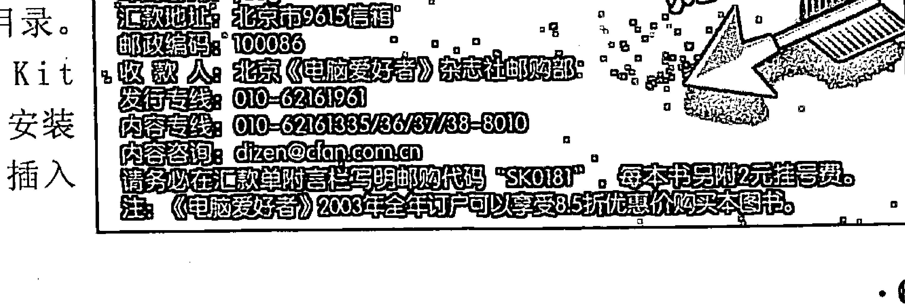

## 综合应用

### Synthetical Application

# 目录

- 备份与修复，为你的数据上保险 P63
- 虚拟，为了更好的现实 P86
- 计算机字体应用一点通 P101
- 电脑输入法应用透视 P110
- 软件风云榜 P120

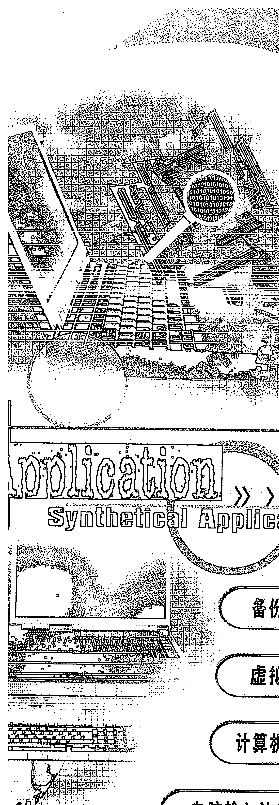

常用电脑的玩家一定都遇到过电脑运行不稳定或者软件无法正常启动，甚至系统崩溃的情况；再加上日常操作计算机过程中的误操作，一些重要的文件可能被不小心删除或毁坏了。因此，怎样确保原先各种软件和系统的配置的正常恢复，如何防止用户数据丢失及修复误删的文件成了很多用户关心的话题。俗话说有备无患，为了确保在遇到数据灾难时，能迅速地恢复系统配置和重要数据文件，我们有必要来了解一些数据备份和数据修复的知识。也许在有些读者看来，数据备份不就是把数据进行拷贝吗。其实不然，当你看过这篇文章后，你一定会对数据备份与修复知识有新的认识。

# 备份与修复
Backup together with restoration
——为你的数据上保险

随着个人电脑应用的深入，对于普通的电脑用户而言，对电脑数据的保障工作显得尤为重要。一般来说，这主要体现在操作系统和用户数据的备份，以及当文件或数据被破坏以后的及时抢救。在本文中，我们将针对个人电脑用户的实际需要，从数据备份和数据修复两个方面，向你详细介绍一下电脑数据保障方面的解决策略和操作技巧，掌握了这些知识后，你的系统和数据就能得到有力的保障了。

## 一、有备才能无患——数据的备份与恢复

也许大家都遇到过安装了一些应用程序之后会出现系统冲突的情况吧，即使卸载后也无法将系统还原到以前的状态，一旦遇到这种情况，用户最常用的一招就是格式化硬盘并重新安装Windows。虽然现在的计算机硬件性能比以前好了很多，系统的运行速度也越来越快，安装一遍Windows只需要十几分钟时间，但是还要安装各种硬件设备的驱动程序和常用的工具软件，所以不花几个小时是无法回复到故障前的状态的。

虽说这个世界上没有后悔药，但在我们使用计算机的时候却可以，通过对硬盘进行备份操作，这样无论是由于安装应用程序或者是误操作导致计算机无法正常工作，甚至对于系统崩溃也能够坦然处之了。因为只要短短的几分钟时间，我们就可以很轻松的将计算机复原到以前的状态。下面就首先来看看相关的操作方法。

### （一）Windows的系统备份

在Windows 98之后的操作系统中增加了一个系统备份的功能，也就是说只要通过Windows自身就可以完成系统的备份操作，这对于很多不希望安装第三方软件就实现系统备份操作的朋友而言是一个不错的选择，下面就以Windows XP为例来看看怎样在Windows中进行系统备份吧。

#### 1. Windows XP的系统备份

在Windows XP中进行系统备份操作可以参照下述步骤完成：

1. 依次运行“开始”→“程序”→“附件”→“系统工具”→“备份”命令，这时将看见如图1所示的操作向导窗口，选择其中的“备份文件和设置”一项开始备份操作。

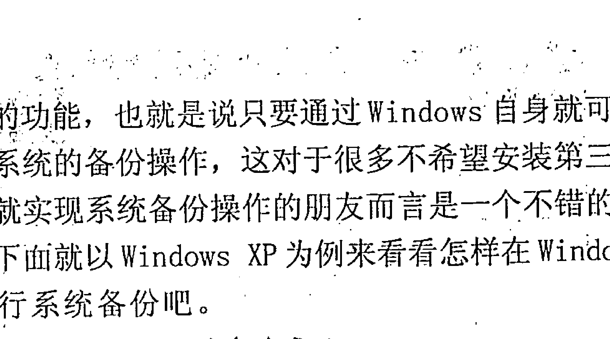

图1

2. 接着需要制定备份的内容，这里有四个选项：“备份我的文档和设置”、“每个人的文档和设置”、“这台计算机上的所有信息”、“用户自己选择需要备份的内容”（如图2），在此选择“让我选择需要备份的内容”选项。

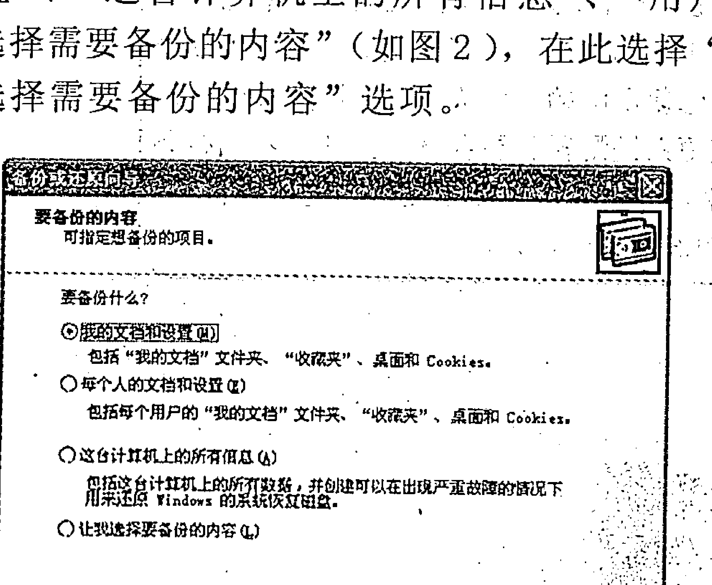

3. 单击“下一步”按钮之后，我们可以看见一个类似资源管理器的窗口，在这里需要用鼠标选择需要备份的文件夹，使其前面有一个勾号显示即可（如图3）。


4. 继续之后，系统要求我们确认备份数据保存的位置。一般备份的文件以 *.bkf 后缀名的形式出现，这时为其添加文件名并设定存放的路径即可。

5. 接下去我们将看见如图4所示的窗口，表示已经完成了备份向导的定制过程，接着只要按下“完成”按钮便完成了备份操作。如图4）

完成备份操作之后，如果我们需要将其还原，那怎么办呢？其实也很简单，只要再次运行“开始”→“程序”→“附件”→“系统工具”→“备份”命令，在如图1所示的窗口中选择“还原文件和设置”一项开始还原操作。至于具体的还原操作实现起来并不复杂，只要在如图5所示的窗口中选择需要还原的项目，然后参照进行备份操作时候的步骤依次进行即可，所以在此就不详述了。


## 2. Windows XP 的系统设置传输

在Windows XP中还新增了一些特殊的功能，这里要介绍的是文件和设置传送，它能够将当前的Windows XP系统设置传送到其他一台机器中，这样就避免了重复设置的麻烦。如果你在局域网内需要安装很多台配置完全相同的计算机，那么这项功能可以帮助你节省很多时间。

系统设置的传输：

1. 依次运行“开始”→“附件”→“系统工具”→“文件和设置转移向导”命令，这时首先看到的是启动欢迎界面，继续之后可以在如图6所示的界面中提供了两个选项，其中“新计算机”表示将需要传送的数据传送到当前的计算机中；“旧计算机”表示收集当前计算机系统中的设置和系统文件并准备传送到其他计算机中，我们通常选择第二项让程序开始收集系统信息。


2. 接着就是选择传送方式设置窗口（如图7），在此有“直接电缆传送”、“通过可移动驱动器传送”和“其他”三种传送方式。如果整个局域网构建完成，则可以选择第一项，否则建议用户将设置保存在硬盘中，然后再进行系统的恢复。

3. 这时程序会分析当前计算机中安装的应用程序，并给出程序列表（如图8）。在关联界面中提供了需要传送的对象设置，其中有“只包括设置”、“只包括文件”和“包括文件和设置”这三项。如果需要接受传送文件的系统与当前的系统应用程序配置是完全一样的，在此可选择最后一项，否则可以选择“只包括文件”一项，并选中下部的复选框来自行定义需要传送的应用程序列表。


4. 如果确定自行选择需要传送的程序列表，则可以在这一步中看见系统扫描得到的所有文件、设置列表，然后就可以根据自己的需要选择要传送的文件列表了。至于选择的方法也很简单，选择不需要传送的文件列表项，之后单击“删除”按钮将其删除即可；如果需要添加新的项目，可单击右边的几个“添加”按钮来增加需要转移的系统设置、文件夹、文件、文件类型等（如图9）。


5. 程序开始收集用户选择的设置项目列表，并生成相关的传送文件。

系统设置的恢复：

完成系统设置文件的传输之后，我们还要将生成的文件包数据复制到新的计算机中，使用其中的相同功能恢复传送的系统设置与文件。

1. 在新计算机中运行文件设置传输向导，在该程序的关联界面中选择“新计算机”一项。

2. 程序询问创建传送设置向导的方式。由于我们已经有了传送设置文件，在此直接选择“我不需要向导磁盘，我已从旧计算机中收集了文件和设置”一项（如图10）。


3. 在设置接收传送设置文件的方式时候，由于前面我们将文件保存到硬盘，所以在此应该选择“其他”一项，并在相关的文本框中设置保存传送文件的文件夹（如图11）。


4. 最后程序开始收集相关的文件和设置信息，并将其添加到当前的计算机设置中。完成之后重新启动计算机，这样就得到了一个与前面计算机设置完全相同的系统。

### （二）克隆备份系统法

和生物学界的克隆不同，我们这里所说的克隆指的是将当前系统中的分区或者是整个硬盘通过特殊的压缩方式保存在一个单独的文件中，当系统崩溃、程序冲突或者是运行效率下降的时候只要通过程序将其恢复就能够迅速把系统还原到克隆之前的状态。所以在克隆软件的帮助下，对于系统整理、注册表之类的软件都完全不需要了，一旦出现故障便可以把整个系统很快的复原到克隆之前的状态。

## 1. Ghost2002备份系统

在目前各种克隆备份软件中，Ghost应该是最为大家所熟悉的一款了，最新的Ghost2002在又新增了一些新功能，而且它支持的存储介质超出了我们的想象，除了支持对等LPT接口、对等USB接口、对等TCP/IP接口、SCSI磁带机、便携式设备（JAZ、ZIP、MO）之外，甚至可以直接将克隆的文件写入CDR和CDRW中；并且这些功能无需任何驱动程序和软件，只需一张软盘就可以做到，这就使得克隆又有了更为广泛的含义。而且它的使用方式和以前相比有了较大的改进，安装好Ghost2002之后可以通过“开始”菜单中的程序组运行“Boot Wizard”命令激活引导盘制作向导，需要指出的是在Ghost中进行任何一种备份都必须先制作引导软盘，然后通过软盘引导进入DOS模式进行相应的操作。

### （1）分区克隆和硬盘对拷

Ghost2002最基本的一个功能就是可以将本地硬盘中的分区镜像备份起来，这对于单机用户来说应该是最为常用的一个功能。而且这两个功能的基本操作基本相似，所以我们就以硬盘对拷为例来看看如何进行克隆。

1. 首先将两块硬盘分别接入到计算机中，然后运行“开始”菜单中的“Boot Wizard”命令，这时将看见图12所示的界面，点取其中的“Boot Disk with CD-R/RW, LPT and USB Support”选项。（如图12）

2. 接着出现的窗口中可以选取采用的设备种类，包括“LPT接口”、“USB接口”以及“CDR/RW设备”，但由于我们仅仅是针对本机的硬盘进行备份，所以在此不要选取任何选项（如图13）。

3. 下一步需要确定采用何种模式启动计算机。在Ghost2002中提供了PC DOS和MS DOS两种方式，其中PC DOS是程序附带的，而MS DOS还要手工安装一些DOS文件，虽然随便选用任何一个都可以启动计算机，但建议大家采用PC DOS为好（如图14）。


4. 然后程序会自动给出Ghost2002运行文件的所在路径，如果在安装Ghost2002的时候采用了默认的一路回车法就可以直接单击“下一步”继续，如果要修改安装目录的话就要在这里设置相应的路径。

5. 在下一步操作中，程序会要求你选取一个可以使用的软驱盘符，同时确定制作引导磁盘的份数。另外，在这里还可以点中“Format disk first”选项（如图15），这样当Ghost2002往磁盘中写入文件之前会对磁盘格式化操作，以检验磁盘是否存在坏道并保证有足够的可用空间。

6. 将软盘放入软驱中并单击“下一步”，程序会将一些必须的文件复制到软盘中，完成引导软盘的制作。

源盘与目标盘千万不能弄错，否则就会导致源盘中的资料全部损失！


之后可以看见图16所示的界面。这时单击 “Finish” 按钮结束引导软盘的制作，或者通过 “Start Again” 命令重新制作其它的引导软盘。


7. 重新启动计算机并通过刚才制作的引导软盘启动系统，此时系统会根据 autoexec.bat 中的配置自动进入 Ghost2002 界面。
8. 接着依次单击左边的 “Local” → “Disk” → “To Disk” 命令 (如图17)，并在弹出的对话框中输入可用的序列号。


9. 继续之后将看见图18所示的界面，其中列出了两块硬盘，并提供了一些基本信息。这时我们需要选取源盘，也就是存有原始数据的硬盘，按下 “OK” 按钮，在下一步还会出现类似图18的窗口，只不过这时选取的是目标盘 (需要写入数据的硬盘)。因此，这里要提醒大家注意的是，源盘与目标盘千万不能弄错，否则就会导致源盘中的资料全部损失！


10. 在上一步单击 “OK” 按钮，在进入下一步操作之前，Ghost2002 会弹出警告窗口，提醒你继续操作将导致目标盘中所有文件被覆盖，确认无误后单击 “Yes” 开始克隆操作，稍微等几分钟便可完成硬盘对拷的工作。

至于单机使用 Ghost2002 对分区进行克隆时，基本操作也和上述步骤差不多，只是第8步需要选择 “Local” → “Partion” → “To Image” 命令，而且选择了需要克隆的分区之后还要设定克隆文件存放的目录与文件名，在最后开始操作之前还能定义 “是否通过压缩模式”、“快速克隆”、“已经最大化压缩” 三种方式克隆，一般建议大家采用 “High” 方式，这样可以将克隆文件压缩到原先的50%左右，以节省硬盘空间。

### （2）CDR/RW设备

在 Ghost2002 中增加了直接将克隆得到的文件保存在刻录光盘上的功能，这样我们就无需事先制作好镜像文件，然后再将其克隆到光盘上，只要计算机中有一台刻录机，所有的工作都可以一次性完成。而且在刻录的时候还能够制作可引导系统的光盘，这样在使用起来就更加方便了。

1. 按照前面介绍的1至6步进入 Ghost2002 操作界面，并运行 “Local” → “Disk” → “To Image” 命令 (如图19)。


2. 接着程序会列出当前系统中安装的所有硬盘，如果当前系统中只有一块硬盘则直接点取。
3. 然后在保存文件列表窗口中单击盘符下拉列表选择刻录机所在的盘符，并输入保存的文件名。

在选中刻录机所对应的盘符，同时在下部的文件保存对话框中给这个克隆文件命名，比如cdr00001.gho（如图20）。


- 4）继续之后，确定采取何种方式来克隆硬盘，此时建议采取快速克隆方式，以节省大家的时间。
- 5）确认之后，我们将会看见一个警示对话框，如果想制作可以引导系统的刻录光盘，在这里就必须选择“Yes”。然后将Windows 98系统引导盘插入软驱中。
- 6）Ghost2002会先读取软盘中的引导文件信息，并测算出刻录文件的大小，如果刻录的文件比较大，无法在一张光盘上存放，那么它将弹出一个确认框告诉我们完成整个刻录所需要的光盘数量。
- 7）单击“Yes”确认之后系统就开始克隆并刻录到光盘中。第一张光盘刻录完成之后会自动弹出，并提示你插入第二张刻录盘，依照提示操作，程序将继续克隆与刻录操作，直至所有数据刻录完成。

虽然这里介绍的是针对整个硬盘的克隆方法，但是我们完全可以在安装好系统和必需的软件之后将Windows所在的分区制作一张可引导的光盘，这样也就拥有了有些品牌机那样的恢复光盘了！

## （3）USB对等克隆

有些计算机采用了USB对等线组建局域网，此时可以通过Ghost2002附带的USB对等克隆功能将一台计算机中的整个硬盘或者是某一个分区镜像保存，也可以实现两台计算机的硬盘对拷。具体方法如下。

- 1）运行分区和硬盘对拷操作中的第1至6步，此时需要指出的是在图13所示的界面中选中“USB Support”复选框，激活Ghost2002的USB对等克隆功能，而且在复制引导软盘的时候需要制作2张，分别用于引导主控端和客户端，最后用这两张引导软盘启动这两台计算机。
- 2）在客户端的计算机上运行“USB”→“Slave”命令，这时客户端计算机将等待主控端的响应（如图21）。


- 3）在主控端计算机上运行“USB”→“Master”命令（如图22），同时它也会尝试与客户端进行连接。


- 4）连接完成之后，我们就可以选取“Disk”→“To Disk”命令，这时Ghost2002会将主控端计算机中安装的硬盘列表显示出来，选取一块作为源盘。确认之后程序会显示出客户端计算机中的硬盘列表，选取一块作为目标盘。
- 5）参照分区和硬盘对拷操作的第10步完成克隆操作。

这里仅仅介绍了如何将一台计算机的整个硬盘复制到另外一台计算机中，在实际使用中可以在一台计算机上安装好相应的程序，然后通过这种方式将其克隆到另外一台计算机中，很快就制作出两台完全一样的机器了。

## （4）网络克隆

对于很多朋友来说，网络克隆应该是一个极具吸引力的功能。因为USB对等连接设备价格不菲，而且只能连接两台计算机；如果采用USB Hub的话整体费用很高。对于普通网卡组建的局域网来说，Ghost2002可以通过一台计算机将整个局域网中计算机的硬盘备份下来，这样就省得在办公室里跑来跑去的麻烦了。

- 1）在图12所示的窗口中选取“Peer-to-Peer Network Boot Disk”，接着在网卡类型列表中选取自己使用的网卡（如图23）。
- 2）接着参照分区和硬盘对拷操作的第3步和第4步选取启动盘的制作类型，然后需要在图24所示的界面中单击“The IP settings will be statically defined”选项，并在下部定制IP地址和子网掩码。比如本机的IP地址为192.168.0.39，子网掩码为255.255.255.0。


- 3）制作好引导软盘之后用它启动计算机，这时先运行“TCP/IP”→“Slave”命令，这时客户端计算机会等待主控端与其建立连接，需要注意的是使用这里的IP地址作为主控端的IP地址（如图25）。


- 4）再用这张引导盘启动主控端计算机，并运行“TCP/IP”→“Master”命令，此时会出现图26所示的界面。其中显示了本地当前的IP地址，但是需要将前面客户端中显示的IP地址输入进去。


完成之后可以看见图27所示的画面。接着参照分区和硬盘对拷的第8至10步完成网络克隆操作。


细心的朋友也许会提出这样一个问题：Ghost2002附带的网卡类型毕竟有限，如果我们使用的网卡里没有列表提供怎么办呢？这也没有关系，只要我们有网卡的驱动程序就可以自己定制出独特的启动盘。

具体方法如下。

- 1）在图23所示的网卡列表窗口中单击左边的“Add”按钮，并在下一个出现的窗口中选取“NDIS2 Driver”选项（如图28）。


- 2）接着在图29所示的界面中单击“Browser”按钮，同时将网卡的驱动软盘放入软驱中，选中软盘中相应的DOS格式驱动程序。
- 3）确认之后返回到图29的窗口，可见驱动程序已经添加进去了，然后在图23所示的窗口中给这个网卡类型重新命名，完成网卡驱动的安装，最后再按照上述步骤生成系统引导盘。

- 5）接着客户端与主控端会尝试建立连接，


## （5）克隆文件的恢复

其实系统克隆文件的恢复与系统的克隆是相逆的，也就是说按照相似的步骤进行操作，只不过在进入Ghost2002主界面的时候不要选取“To Image”选项，比如在恢复单机硬盘的系统时候选取“Local”→“Disk”→“From Image”选项，然后选取硬盘中的gho文件并根据系统提示完成恢复操作。在USB对等网与局域网中也需要建立主控端和客户端的连接，然后采用类似的方法来恢复系统。

对于克隆光盘来说，如果具有系统引导功能，则直接将第一张光盘放入光驱之后用它引导系统，然后程序会自动进入Ghost2002界面，然后采用类似的方法恢复系统。如果光盘没有附带系统引导功能，则需要用Windows引导软盘启动计算机，接着运行硬盘中GhostPE.exe文件（在Ghost2002安装目录下）进行系统恢复。总之，对于Ghost2002的克隆文件恢复还是比较简单的，在此就不再详述了。

## 2. Ghost 镜像文件的编辑

Ghost2002镜像保存的gho文件实际上是一个巨大的压缩文件包，但是采用普通的工具无法查看其中的内容，所以在Ghost2002中就集成了一个可以浏览gho文件的查看器。通过这个文件查看器不仅能够查看映象文件内容、制作镜像文件中的文件列表，还可以从镜像文件中添加、移动、复制、删除和运行文件，也就是说当我们对某个系统克隆保存之后，需要添加一些软件程序或者是更改一些设置，只要通过这个查看器就能够轻松搞定。

### （1）镜像文件查看

这个镜像文件查看器可以通过“开始”菜单中的“Norton Ghost Explorer”命令激活它采用了类似资源管理器的界面，所以大家在使用的时候可以很容易上手。运行之后通过“File”→“Open”命令把一个原先已经保存在硬盘中的.gho文件添加进来，这时原来很神秘的gho文件就以真面目展现在眼前了（如图30），右边窗口显示的就是其文件和目录。


单击窗口左边的目录树中的某一个目录就可以在右边的窗口中来查看文件信息，而且对于相关的文件信息还能够通过工具条上的按钮在大图标、小图标、列表和详细资料之间进行切换显示。如果觉得采用这种方式来查找自己需要的文件比较麻烦，只要在“Edit”→“Find”对话框中键入搜索的文件名就进行快速查找。

### （2）基本操作

针对镜像文件中的克隆文件，我们可以可以单击右键对其进行复原（解压缩到指定的目录中）、启动（运行程序，比如查看.txt文档）、剪切、拷贝、粘贴等操作（如图31）。如果想知道镜像文件中某个目录下包含的文件，只要选中文件夹并运行“File”→“Save Contents”命令就可以将其中所有的文件以列表形式保存在txt文本文件中，这样查看起来非常方便。而且和标准的Windows资源管理器一样，这个文件查看器也支持鼠标的直接拖放功能，也就是说你能够把一个文件或者文件夹直接拖拽到桌面上进行解压缩，或者是将一个文件通过拖拽方式很方便的添加到gho文件中。所以在它的帮助下，我们就能很便捷的把自己需要的工具添加到备份文件中，并且把备份文件中不需要的垃圾给清理出去。


### (3) 镜像文件整理

特别需要指出的是，在对镜像文件进行删除、添加操作之后，镜像文件将变得不连续（原理与磁盘碎片差不多），这样在对其进行恢复操作的时候就需要耗费比较长的时间，所以我们还可以通过“File”→“Compile”命令对镜像文件中的碎片进行整理，以便提高恢复文件时候的系统性能。不过建议大家在整理的时候采用另外一个文件名，这样不覆盖原来的镜像文件，万一出错也有办法补救。

## (三) 关键数据备份法

对于Windows系统而言，硬盘分区表、注册表、各种驱动程序以及系统文件是相当重要的，病毒、突然断电以及误操作都有可能对这些重要文件造成破坏，从而影响系统的正常运行。那么我们可以未雨绸缪，事先将这些重要文件备份下来，一旦遇到突发性的事件也能够避免重要文件的丢失。

## 1. 分区表的备份

硬盘分区表是整个计算机的最基础信息，一旦分区表损坏则直接导致操作系统无法正常启动，甚至有可能造成原有的数据文件丢失，因此备份分区表对于确保系统安全运行有很重要的意义。下面就来介绍几种方法。

### (1) 使用KV3000进行备份

KV3000不仅是个优秀的防杀病毒软件，它也具有非常强大的分区修复的能力，而且它还能进行系统分区的备份。这样，即使硬盘上的分区表全部损坏，我们还能用备份在软盘上的分区表进行修复。
通过KV3000备份的时候，事先要确认计算机中没有病毒，接着用KV3000软盘引导计算机并输入KV3000/B或者kv3000/HDPT.DAT格式的命令，此时系统将自动向A盘备份一个无病毒的硬盘主引导信息档案。备份的文件有2个，其名称分别为HDPT.DAT和HFBOOT.DAT。当硬盘主引导信息被病毒破坏或主引导记录被意外损坏而不能启动时，就可以使用干净的系统盘启动，在KV3000的A盘下输入“KV3000/Hdpt.dat”，这样就能将备份在软盘上的原主引导信息内容恢复到硬盘中，不过恢复用的备份文件必须是从该硬盘上备份的。这样可以解决大部分主引导信息损坏、系统不能启动的现象。

### (2) 使用Nuts&Bolts进行备份

尽管KV3000提供了上述备份功能，但它的功能并不完善，只能备份普通硬盘上的引导信息，当用户对硬盘进行了某些特殊设置（如同时设置了多个引导分区）之后它就无能为力了。另外，KV3000在备份硬盘引导信息时并没有提供其他辅助功能，不能满足用户对硬盘进行其他处理的需要。对于这些用户，我们在对系统进行备份时还应另辟捷径，Nuts&Bolts正好可以满足我们的这一需求。

Nuts&Bolts是一个与Norton齐名的磁盘工具软件，它提供了强大的应急盘生成功能，可对CMOS、分区表、引导区和主引导扇区等众多系统信息进行备份，并在应急盘上提供了许多对磁盘进行检测、整理的工具软件。由于这些软件都是DOS版的，我们可用应急盘启动后直接加以使用，这就比不提供DOS版磁盘维护工具的Norton应急盘要好得多。

要使用Nuts&Bolts对硬盘信息进行备份，我们只需启动Nuts&Bolts，接着在它主窗口中单击“Rescue Disk”按钮启动系统的备份功能，然后再按照备份盘制作向导的提示进行操作即可。操作完毕之后，我们将会得到一张包含硬盘引导信息的Nuts&Bolts应急盘，此后当硬盘的分区表、引导区或主引导扇区等信息被破坏之后，我们就可以使用该软盘启动计算机，并执行“RECOVER”命令，利用备份信息对系统进行恢复。另外，我们也可执行应急盘中的“RDDOS”命令，利用Nuts&Bolts自动对硬盘分区表进行恢复，并进行磁盘扫描、病毒检测等全套维护，使用非常方便。

## 2. 注册表的备份与恢复

从Windows 95开始，微软在Windows中引入了注册表的概念，它将Windows系统的配置信息存储在一个名为注册表的数据库中。因此，注册表是Windows系统管理所有软硬件的核心与灵魂，其中包含了每个计算机用户的配置文件以及有关系统硬件、已安装程序和属性设置等重要信息，是整个操作系统中最重要的一部分。它直接控制着Windows的启动、硬件驱动程序的装载以及一些Windows应用程序运行的正常与否。一旦注册表受到损坏或者发生错误，不仅会影响计算机的正常运行，严重的时候甚至可以使系统崩溃。因此正确地认识、使用、特别是及时备份以及有问题时恢复注册表，对Windows用户来说就显得非常重要了。

### (1) Windows 9x注册表的备份与恢复

我们知道，Windows 3.x是用扩展名为.ini的配置文件来保存系统及应用程序的各种初始化配置信息的。每当Windows 3.x启动时，系统都会从两个最重要的.ini文件即Win.ini和System.ini中读取各种初始化信息对整个系统的软硬件环境进行配置，从而正常启动整个Windows系统。一般来说，Win.ini文件中主要包含着控制硬件的驱动程序等Windows用户窗口环境的信息，我们可以利用文本编辑器修改这两

### 1) Windows 98 的注册表

Windows 98 的注册表本身结构与 Windows 95 一样，一般包括有六个都是以 HKEY 开头的主键分支，各分支中保存着相应的软硬件信息，对于具有一定水平的 Windows 用户，可以通过对其某个分支中多级层次结构状的次级主键及某键值名和键值进行增、删和改动等编辑来实现某一功能。关于具体如何利用这一功能，在此就不详述了。

在 Windows 95 里，注册表由保存在 Windows 目录下的 System.dat 和 User.dat 这两个具有只读隐藏属性的文件所组成，前者中包含系统硬件和软件的设置信息，而后者则保存着与用户使用环境有关的信息，它们均可以由运行 Windows 目录下的注册表编辑器 (Regedit.exe) 来打开及进行编辑。Windows 95 每次开机时，均会自动在这二个文件所在的同一目录下以 System.da0 和 User.da0 之名为这一注册表文件做备份，以便用户在万一需要时用作注册表的恢复之用。要特别指出的是：System.da0 和 User.da0 在系统重新再启动后，实际上已用原注册表文件作为蓝本进行了覆盖备份，所以这时的备份文件从严格意义上来说已无备份恢复之价值了。

在 Windows 98 中的 Windows 目录下，仍有 System.dat 和 User.dat 两个文件用来存放系统注册表信息，但都已没有了 System.da0 和 User.da0 这二个备份文件。因此在 Windows 98 中，注册表的备份及恢复工作与 Windows 95 就有了一些不同。下面来介绍一下在 Windows 98 中对注册表进行备份及恢复的几种常用方法。

### 方法一：直接进行备份及恢复

这是一种很原始的方法，即直接将所需之 System.dat 及 User.dat 二个文件拷贝存放在硬盘某个指定目录下或直接拷到软盘上作为备份，恢复时再将该备份替换覆盖回原处即可，当然在备份及恢复时都需对这两个文件的只读及隐藏属性进行相应的修改操作。需注意的是：一般情况下由于 Windows 98 的注册表（包括 System.dat 和 User.dat）往往有 2M 大小甚至更大，用一般 1.44M 的 3 寸软盘来存储备份是放不下的，所以必须利用压缩软件将其压缩后才能放入 1.44M 软盘中。当需要恢复时，还需要用解压缩软件将其解开后再放入 Windows 目录下替换覆盖原注册表数据。

这种方法的好处是如因注册表问题而导致系统瘫痪，开机后无法进行 Windows 系统时，可用应急启动盘进入 Windows 98 自带的 DOS 界面后，用常规的 DOS 操作来将存在硬盘或通过解压缩软件将软盘中的备份覆盖回原处，恢复原备份时注册表的正常数据。

### 方法二：利用注册表编辑器自带的导出及引入功能

注册表编辑器除了可以用于配置的修改外，还有一个非常重要的功能，那就是对注册表进行备份和恢复。运行 Regedit.exe 打开 Windows 98 注册表后，利用注册表编辑器中的 “导出” 及 “引入” 功能也可以用来备份或恢复注册表信息。

- 1. **注册表的备份**

运行 “regedit” 打开注册表编辑器窗口，接着运行 “注册表” → “导出注册表文件” 命令，在弹出的 “导出注册表文件” 对话框中选择注册表备份文件的保存路径、名称以及保存全部还是只保存注册表的某个分支（如图32）。最后根据自己的需要设定好后，单击 “保存” 按钮即可完成注册表的备份。


- 2. **注册表的恢复**

打开注册表编辑器后，运行 “注册表” → “引入注册表文件” 命令，在弹出的 “引入注册表文件” 对话框中找到曾经导出的注册表备份文件，接着单击 “打开” 按钮完成注册表的恢复，恢复完成后出现一个提示框，单击 “确定” 按钮并重新启动计算机。这种方法主要适合于 Windows 系统还未瘫痪或能用启动时按 F8 键的方法，选择安全模式启动 Windows 98系统时恢复注册表之用，如因注册表问题而连Windows系统都进入不了时，则这种方法就无法应用了。此外因软盘无法备份大小又超过1.44M的注册表文件，所以一般应该将备份数据保存在硬盘里。

### 方法三：用Windows 98中新增的注册表自动备份功能

在Windows 98中取消了Windows 95中每次开机时自动以System.da0和User.da0为名的二个文件来备份注册表数据的功能，而新增加了一个以.Cab（Cabinet）作后缀的压缩文件作为注册表备份的功能，具体使用如下。

- - ①备份
  这个备份过程是由Windows 98系统自动完成的。在用户当天第一次（注意“当天”二字）开机时，Windows 98将会自动将系统中原有的注册表信息，包括System.dat和User.dat，甚至还包括了System.ini和Win.ini这四个文件都压缩成Cab形式的文件，以rb00*.cab之名存放在Windows\Sysbckup目录下，其中*为0~4的数字。系统自动保存最近5次开机的注册表数据，超过5次开机时则自动挤掉最早日期的备份文件。

- - ②恢复
  可以用Windows自带的Extract.exe（在Windows\command目录下）解开该压缩文件恢复替换回原注册表文件即可，也可用其他第三方解压缩程序如Winzip等解开所需之rb00*.cab备份压缩文件覆盖回去。由于这种方法增加了注册表恢复的灵活性，可以对最近5次开机的注册表备份根据需要选择进行恢复，因此使用起来也是相当便利的。

### 方法四：利用其他注册表工具备份 / 恢复注册表

由于注册表的重要性，从而诞生了许多相关的注册表工具，来帮助我们使用注册表，在这里我们重点谈一下Scanreg，它的最大优点是简单快速。

大家都知道，Windows系统在启动过程中会自动对注册表进行扫描，会将注册表及Win.ini、System.ini一同打包压缩为rb00?.cab，存放在C:\Windows\sysbckup的目录下，若有错误便自动修复。在系统运行时也可以检查注册表，注册表检测软件为DOS版的scanreg.exe和Windows版的scanregw.exe，只要输入“Scanreg”，就会自动启动相应的版本。

在Windows中单击“开始”→“运行”命令，在“打开”对话框中输入“Scanreg”，然后单击“确定”按钮，程序会扫描注册表并显示扫描结果。如果注册表有错误便会提示您是否进行自动修复，如没有对注册表做备份可让它自动修复。如果正常而且当天还未备份的话，程序会提示您进行备份（如图33）。


如果注册表有错不能自动修复且不能进入Windows的时候，可在DOS下运行“Scanreg /Fix”命令进行修复。这样，可排除由于系统自动启动时通过初始化程序System.ini和Win.ini加载了错误的模块或应用程序以及病毒侵入造成注册表修复失败的可能。

当使用Scanreg进行系统注册表的备份后，恢复时需要在实模式下的纯DOS环境，在DOS提示符下键入“Scanreg /restore”命令，Scanreg会先检测注册表，然后就会显示几个文件提供选择，确定自己认为正常的备份进行恢复。DOS版Scanreg.exe有3个功能，其参数如下：

- - BACKUP / 备份注册表
- RESTORE / 恢复注册表
- FIX / 修复注册表

### (2) Windows 2000注册表的备份与恢复

Windows 2000的注册表也分为两个部分，但是包括多个文件。其中，用户配置文件保存在根目录“Documents and Settings”下的用户名的目录中，包括Ntuser.dat和Ntuser.ini两个隐藏文件及Ntuser.log日志文件。系统配置文件位于Windows 2000系统目录下的“system32\config”中，包括Default、Software、System、Appevent.evt、Secevent.evt、Sysevent.evt等多个隐藏文件及其相应的log文件和.sav文件。这些注册表文件在Windows 2000运行时无法使用其他工具打开，这一点与Windows 9x下的System.dat及User.dat不同。下面介绍一下对Windows 2000注册表进行备份及恢复的几种常用方法。

## 1）备份工具备份注册表

Windows 2000中附带了一个备份程序，它可以通过“开始”→“程序”→“附件”→“系统工具”→“备份”命令激活。如图34所示，选中窗口左边的“系统状态”目录，这时程序将保存## 2）注册表编辑器备份注册表

注册表编辑工具regedit是Windows 2000另一款注册表工具。运行“开始”→“运行”命令，并且在输入栏中输入"regedit"即可启动注册表编辑器，在“注册表”菜单中选择“导出注册表文件”命令就会弹出一个窗口，选择保存注册表文件的路径和文件名，再单击“保存”就可以将注册表文件以*.reg备份保存下来（如图35）。恢复时，只要直接双击备份的REG文件即可。

注意：此方法并不会备份安全注册表文件和安全账户管理器注册表文件。

如果只需要保存一个根键或者一个主键，可以使用WINNT\system32\regedt32.exe程序。此时先运行程序，接着在注册表中选择要保存的主键或子键，然后再单击“注册表”菜单下的“保存项”命令，在弹出的“保存项”对话框中输入要保存的注册表文件的文件名，扩展名建议使用"reg"，便于今后的管理。

因为Windows 2000是一个真正的多用户操作系统，因此在保存某些主键或子键时，因为执行操作的用户不同，或者是该主键或子键正在被系统使用，会出现禁止访问的警告，例如“权限不足、无法保存项”等消息提示。这时如果用Administrator身份登录，则可以使用“安全”菜单下的“权限”命令，对这些主键或子键的用户赋予“完全控制”的权限，然后就可以保存该项了。

## 3）恢复控制台备份注册表

故障恢复控制台是Windows 2000新增加的工具，用于从多次失败中恢复系统。故障恢复控制台不是Windows 2000的缺省安装，且必须在故障发生前安装才可以使用。安装故障恢复控制台的步骤是：插入Windows 2000安装光盘，在运行窗口中键入“光盘盘符:\i386\winnt32.exe /cmdcons”，启动恢复控制台安装程序（如图36）。

安装了恢复控制台后，重新启动计算机，在启动菜单中会出现“故障恢复控制台”选项。启动安全恢复控制台后，使用恢复控制台的COPY命令将“%systemroot%\system32\config”目录下的文件拷贝到一个安全目录中。在恢复时，将备份目录中的文件覆盖“%systemroot%\system32\config”目录下的文件，注册表文件就恢复了。

注意：在恢复控制台下的COPY命令不支持通配符“*”和“?”，所以一次只能复制一个文件，用起来比较麻烦。

## 4）安装光盘备份注册表

安装程序恢复注册表是在没有其它注册表备份时的最佳选择。将Windows 2000安装盘插入光驱，进入CMOS设置，将系统设置为从光盘启动。安装程序启动时，首先检测硬盘驱动器，查看已经安装的Windows 2000及其修复路径。然后会出现一个选择操作的界面，按“R”，对Windows 2000进行修复。在接下来的界面中，有四个选择，选中“检测”选项。

## 5）紧急修复盘备份注册表

制作紧急恢复盘的方法也是通过系统附带的备份程序，在欢迎标签中选择“紧急修复盘”，并且选取“将注册表文件复制到修复目录中”复选框，这样在制作紧急修复盘的同时，会自动将当前注册表文件备份到“%systemroot%/repair”文件夹。用紧急修复盘修复注册表的过程与用安装光盘基本相似，此处不再详述了。

## 3. 驱动程序的备份与恢复

对于计算机新手玩家来说，重新安装操作系统的时候，最容易出麻烦的就是安装硬件的驱动程序时出现的故障：不是声卡哑巴了，就是无法提高显卡色彩位数，至于打印机、扫描仪等特殊设备就会让你头痛不已的。其实安装驱动程序并不是很难，只要有了“驱动程序备份专家”之后，这一切问题就变得格外简单了。

“驱动程序备份专家”是我们国人自己开发的一款绿色免费软件，它不仅可以快速检测计算机中的所有硬件设备，还能够备份硬件设备的驱动程序，因此在重新安装Windows之前可以把所有的驱动程序备份下来，然后再通过软件进行驱动程序的恢复操作。所以在这款软件的帮助下，即使是刚刚接触计算机的菜鸟也能够轻轻松松的安装驱动程序了。准备好了吗？那咱们一起动手吧。

-   （1）运行“驱动程序备份专家”之后，首先运行“Interface”→“Chinese”命令，这样就可以让它显示出中文界面，那些英文不好的朋友也就不必担心看不懂满屏的英文了。

-   （2）单击窗口右边的“快速收集”按钮，这时软件会将系统中主要硬件的驱动程序列表显示出来，比如声卡、显卡、显示器、内置Modem，以及已经安装的扫描仪、打印机和数码相机等外设（如图36），同时还能够查看驱动程序的发布时间、发布公司等信息，这对于更新驱动程序有一定的帮助。

-   （3）备份驱动程序的时候，先再选取列表中的一款设备，然后按下右边的“备份驱动”按钮，这时软件会自动在硬盘中搜索所有的驱动程序文件，并且在下部显示出备份的目录，确定之后单击“开始”按钮即可将驱动程序以单独的文件夹备份下来（如图37）。

值得一提的是，通常硬件安装信息一般都是以inf脚本安装文件保存在Windows目录下的System文件夹中，只是所有的inf文件混杂在一起，很难区分出哪一个inf文件对应着哪个硬件设备。但是“驱动程序备份专家”在备份的时候会自动生成一个inf脚本安装器，这样不仅方便了驱动程序的恢复安装操作，也可以很清楚的知晓每一个硬件程序对应着哪个inf文件。

-   （4）恢复驱动程序的时候，也只要在程序主窗口中选择“安装驱动”按钮，然后在弹出的窗口中选择相应硬件的inf文件，这样就能够快速完成驱动程序的恢复操作了。

怎么样，在“驱动程序备份专家”的帮助下，大家备份和重新安装驱动程序是不是显得格外简单？其实利用它的这个功能，我们还可以将所有的驱动程序提取出来之后刻录为光盘保存，因此即使驱动程序丢失也不用担心，咱们完全可以克隆出与原先一摸一样的驱动盘，一些“古董”级的硬件自然也能够起死回生了。

## 4. 系统文件的备份与恢复

Windows操作系统操作简单、功能强大，然而它却极为的脆弱，如果一不小心将重要的系统文件删除或者因病毒破坏等等原因造成这些系统文件的损坏、丢失，就很容易导致整个系统的崩溃甚至无法启动。因此，在操作系统完好无损时对系统文件做一个备份，然后在发生故障时就可以利用备份来恢复系统文件，这个过程是相当重要的，下面就向大家简单的介绍一下如何备份和恢复系统文件。

-   （1）手工备份和恢复系统文件

Windows 98中的Win.ini等文件记录了系统的软硬件的管理信息，而msdos.sys、io.sys等文件又是操作系统的命脉所在，所以Windows 98的故障多半是由上述文件配置不当或丢失而引起。在这里我们对配置文件scanreg.ini进行适当的修改，使Windows 98所带的注册表检查与恢复程序不但可以检查注册表，而且还可以对系统文件进行备份。具体的方法如下：

-   1）用文本编辑器打开 scanreg.ini 文件，在 “boot” 字段下加入下列语句：
Backup=1； /1 表示备份，0 表示不需要备份
Optimize=1； /1 表示优化注册表，0 表示不优化
ScanregVersion=0.001； /0.001 表示指定备份文件名的格式
MaxBackupCopies=5； /5 表示最大备份数为 5 份
BackupDirectory=D:\bakup； /指定备份文件压缩包存放的路径
Files=Dir CODE, FILE1, FILE2, FILE3

需要指出的是 FILE1 等为需备份的文件名，Dir CODE 为所需备份文件所在的文件夹，其中 “10” 为 Windows 98 安装目录，“11” 为 Windows 98\System 目录，“30” 为启动目录，例如：s=30，autoexec.bat，config.sys，msdos.sys，io.sys，command.com。

-   2）修改完成后，Windows 98 在每天第一次运行时会根据配置对指定的文件进行备份，并保存在 BackupDirectory 指定的目录中。

当 Windows 98 操作系统启动时报告系统文件丢失不能够正常启动的时候，可以使用引导盘进入 DOS 环境，在 Windows 98 安装目录下执行 SCANREG 命令，待检查完成后选择所需要恢复的备份文件就可以完成系统文件的恢复工作。

## （2）在 Windows 98 中直接恢复

Windows 98 的系统文件丢失后，在启动过程中系统会提示某些系统文件被破坏或者被替换成为旧的版本，从而导致系统的部分功能不正常或者不能够使用，比如有些中文软件的界面变成英文的界面，这时候我们可以利用 Windows 98 自带的系统文件检查器来恢复不正常或者已经丢失的系统文件。

-   1）记住所丢失的系统文件的名称以及路径，运行 “开始” → “程序” → “附件” → “系统工具” → “系统信息” 程序，此时将出现 “Microsoft 系统信息” 窗口。

-   2）单击 “工具” 菜单中的 “系统文件检查器” 命令，出现如图 38 所示的界面。

-   3）选中 “从安装软盘提取一个文件” 单选按钮，然后在下面的文本框中输入要替换的文件路径和名称，或者单击 “浏览” 按钮选取您要提取的文件，如 Notepad.exe。

-   4）单击 “开始” 按钮，打开 “提取文件” 对话框，在 “还原自” 文本框中输入您的 Windows 98 安装文件所在的目录，如果你以前是从光盘安装 Windows 98，这时需要插入 Windows 98 的安装光盘，在 “将文件保存到” 文本框中输入恢复路径，最后单击 “确定” 按钮即可自动完成丢失文件的提取和恢复（如图 39）。

## （3）在 DOS 环境中恢复

上面介绍的是在 Windows 98 中利用系统文件检查器提取系统文件，前提自然是能够启动 Windows 系统，但是由于系统文件的丢失而导致 Windows 系统不能够启动的时候该怎么办呢？这时可以使用 Windows 98 的启动盘提供的 Ext 命令来进行恢复。具体操作步骤如下。

-   1）记住所丢失的文件名称和路径，用事先准备好的 Windows 98 启动盘引导计算机，在多重配置启动菜单中选择第一项（加载通用 CD-ROM 驱动程序并创建一个大小为 2MB 的 RAM 驱动器）启动电脑，启动后进入 RAM 驱动器（驱动器盘符为硬盘盘符的后一个），输入 Ext 后回车。需要注意的是，必须严格按照上述方法进行，因为 Ext 命令只能在虚拟驱动器中使用。

-   2）在提示 “Please enter the path to the Windows CAB files (a):” 后输入 Windows 98 安装压缩包所在的完整路径，如 “F:\Pwindows 98\Windows 98”，并按回车键确认。

-   3）在提示 “Please enter the name (s) of the file (s) you want to extract:” 后输入你记下的丢失文件名，按回车键确认。

-   4）在解压路径提示 “Please enter path to extract to (“Enter” for current directory):” 后输入文件将被解压的完整路径，按回车键确认。

-   5）当提示 “Is this Ok?(y/n):” 时，键入“y”进行确认。

## （四）用户数据备份

随着网络的迅速发展，Internet在工作、学习和生活中的地位已经变得越来越重要，相应的，在系统每一次彻底重装，需要保存和备份的资料也就越来越多，例如包含精彩网站的收藏夹、E-mail的通讯簿、重要的邮件、网友的ICQ和OICQ号码以及重要的谈话内容等等，这一切对于我们这些网民的重要性就不必多说，无一不属于重点保护对象。那么如何备份并迅速恢复这些网络资料呢？就请担着这个问题来看看吧。

## 1. E-mail 的数据备份

虽然E-mail的客户端软件非常多，但大多数读者最常用的也不外乎Outlook Express和Foxmail，因此下面我们仅以这两款软件为例，简单介绍一下电子邮件和通讯簿的备份和恢复。需要注意的是，在Windows 9x/Me中，默认的系统文件夹是Windows，而在Windows 2000下，系统文件则为WinNT。为了表述方便，这里一律采用Windows，请读者注意。

## （1）Foxmail E-mail 的备份与恢复

对Foxmail的备份可以分为以下几种情况：备份整个Foxmail、备份一个账户或者邮箱、备份地址簿、备份个别邮件。下面就来进行详细的介绍。

## 1）E-mail 的备份与恢复

备份整个Foxmail和备份一个账户或者邮箱之前，应该先了解各个账户邮箱目录在什么地方。如果你没有在新建账户的时候特意指定邮箱目录，那么邮箱目录存放在Foxmail的mail目录下。如果确实不了解各个账户邮箱目录在什么地方，用文本编辑器打开Foxmail目录下的accounts.cfg文件，可以看到账户邮箱路径。默认状态下，Foxmail被安装在C:\Program Files\Foxmail文件夹，所有的邮件都保存在该文件夹中的\mail\username子文件夹中，其中username是您在Foxmail中建立的用户名。

备份整个Foxmail就是备份Foxmail所在目录（包含子目录）以及不在Foxmail目录下的邮箱目录；备份账户就是备份邮箱目录。

邮箱文件存放在邮箱目录下，每个邮箱对应一个后缀为.idx和一个后缀为.box的文件，例如，收件箱对应in.idx和in.box两个文件。备份一个邮箱，就是备份这样的两个文件。

对于以上备份的恢复，只要把备份文件复制回来，覆盖到备份前的路径上即可恢复所有E-mail数据。由于Foxmail是一款绿色软件，建议将它安装在非系统分区，这样即使格式化重装系统后，Foxmail也可以照常运行并且保证邮件和地址簿信息不会丢失。

注意：如果文件备份到光盘上，复制回来时属性会变成只读的，这样会导致Foxmail不能运行或者产生异常，所以必须把所有文件的属性恢复为不是只读的。

## 2）备份地址簿

Foxmail的公共地址簿和私人地址簿下都可以有多个文件夹，其实一个文件夹就相当于一个独立的地址簿。备份文件夹下的地址信息，可以使用Foxmail地址簿“工具”菜单下的“导出”，把一个文件夹下的卡片导出到一个文件中，文件的格式可以是WAB、TXT或者CVS（如图40）。

在恢复备份的时候，只要使用Foxmail地址簿“工具”菜单下的“导入”命令就可以轻易地把备份文件中的地址信息恢复到Foxmail地址簿中。不过地址簿中的每个文件夹都保存为对应的两个扩展名，分别是.ind和.box的文件，复制和覆盖这些文件可以实现地址簿的备份和恢复，但是要特别注意的是，私人地址簿是和账户相关的，只有对应的账户才能打开，恢复时必须对号入座。

注意：导出文件夹中的地址时，并不包含文件夹中的组，应该单独对组执行导出操作。Foxmail地址簿的所有信息都保存在Foxmail的Address目录下，因此可以通过备份这个目录或者目录下面的文件实现地址簿备份。

## 3）工具条设置的备份与恢复

从Foxmail3.x中增加了工具条设置选项，由于每个人的爱好不同，所以设置的工具条样式也不会相同，那么怎样备份与恢复自己的个性化工具条设置呢？

工具条的设置参数一部分保存在C:\Windows\FoxToolBar.ini文件中，另一部分保存在注册表的HKEY_CURRENT_USER\Software\Aerofox键里面，所以只需要将FoxToolBar.ini文件和上述注册表键保存起来，即完成工具条设置的备份。待恢复时将FoxToolBar.ini复制到C:\Windows目录下，并将导出的注册表文件合并到注册表，您熟悉的工具条设置就会又出现在眼前。

## （2）Outlook Express 的备份

Windows 中免费集成的 Outlook Express（以下简称为 OE）凭借着强大的功能成为很多网虫首选的电子邮件工具，通过 OE 不仅可以与朋友通过电子邮件进行直接联系，还能够建立许多朋友的联系方法。可是一旦系统崩溃或者病毒破坏，OE 将带着你的邮件和联系人等重要资料一同逝去……如果你不想后悔莫及的话，还是尽快给 OE 来个备份，让悔恨离我们远远的。

虽然大家都知道怎样手工进行 OE 备份，但这实现起来需要涉及到查找文件、备份注册表等操作，这种较为复杂的操作明显不适合新手网虫使用，如果经常要对 OE 备份的话就会觉得很麻烦，那么有没有一种方法可以让我们轻轻松松的完成 OE 重要资料的备份呢？答案是肯定的，现在就有一款名为 Genie Outlook Express Backup 的软件帮助我们解决了这个问题。它的主要功能是可以一次性的把 OE 中所有的项目以及 IE 的收藏夹进行完整备份，并且可以将备份的资料保存为一个 EXE 格式的自解压缩执行文件，这样在还原 OE 资料的时候只要直接双击备份得到的文件即可快速完成，而且无须再安装 Genie Outlook Express Backup 原程序了。

## 1）OE 的备份

运行 Genie Outlook Express Backup 之后，在主界面中单击“Backup Now”按钮进行 OE 文件的备份操作。

① 程序首先会要求你创建一个备份的名称，一般建议大家将备份的日期设置为文件名，这样在恢复的时候可以很快找到所需的备份文件。如果嫌麻烦的话，直接采用系统默认的名称即可，而且程序会自动在备份信息中添加当前的日期，也就避免了恢复时候误选文件的情况。

② 单击“Next”按钮之后会出现如图 41 所示的窗口来选择备份的形式，此时可以选择备份到本地硬盘、局域网其它计算机、移动存储设备或者是通过刻录机完成备份操作。通常在备份的时候设置为保存在本地硬盘，但是尽量将其存放在 D、E 等非 Windows 所在的安装分区。另外，在此还可以通过选取“Backup as a self-executable EXE file”命令来把有关文件保存为 exe 格式的可执行文件，这样在恢复的时候会显得格外简便。

③ 接下来需要选择备份文件的种类。如图 42 所示，Genie Outlook Express Backup 提供了 OE 数据、IE 收藏夹、地址簿等方面的内容，而且 OE 中不仅提供了邮件的备份，还有用户账号、邮件规则、邮件签名等方面的内容。使用鼠标选择你需要备份的项目，或者单击“Select All”按钮来选中全部项目，这时可以从窗口提示信息得知当前所有需要保存文件的大小，确定之后单击“下一步”按钮继续。

④ 接着我们需要选择备份的模式：正常备份、增加备份和镜像备份。其中正常备份就是把所有需要备份的文件整合到一个单独的文件中；增加备份是在以前备份的基础上添加新的文件，如果存在程序的文件不会删除；镜像备份则是在以前备份的基础上增加新的文件，但是已存的文件会进行更新处理。一般建议大家采取第一种备份模式，这样能保证将当前系统中所有的文件完整备份下来。另外，在这里还可以设置备份文件的密码保护和文件压缩的等级，这都可以根据需要进行选择。

⑤ 完成上述的设置之后，Genie Outlook Express Backup 就开始进行文件保存操作了，稍等片刻就可以在指定的目录中找到后缀名为 .boe 的文件，这就说明备份操作已经完成了。

## 2）OE 的恢复

当我们需要时恢复备份时，先单击主窗口中的“Restore Now”按钮，随后在弹出的对话框里选择需要恢复的备份文件，然后按照提示进行操作即可。# 备份与修复——为你的数据上保险

要恢复的备份文件的位置（如图43），接着一路单击“Next”按钮就可以轻松的恢复所保存的OE的全部内容了。如果备份的时候得到了EXE格式的自解压文件，那么恢复就更为简便了：可以不用打开Genie Outlook Express Backup程序，直接双击这个自解压文件就可以来恢复OE的备份了。


另外，通过Genie Outlook Express Backup还可以设置程序的定时自动备份。单击主窗口中的“Schedule Backup”按钮之后，在弹出的窗口中选择“Create New Schedule”按钮，然后根据提示分别设置需要备份的时间与备份的内容等参数，这样以后你就不必再为忘记备份OE而导致的文件丢失烦恼了，Genie Outlook Express Backup会默默的为你完成备份的任务。

## 2. OICQ的备份与恢复

QQ有非常完善的数据备份功能，它将好友名单放在QQ的服务器上，聊天记录以及个人信息是放在本地，这些都极大的方便了用户。当重装OICQ并以用户身份登录后，好友名单将会自动加载，但是基于本地的其它数据却无法自动恢复，因此平时进行数据的备份工作是很有必要的。

### （1）手工备份与恢复

如果仅仅只是想进行QQ聊天记录、用户信息以及系统消息等消息数据的备份，那么你可以直接使用QQ中消息管理器的备份功能。

启动QQ后，单击“QQ2000”的图标，打开其菜单选择“档案管理/消息管理”，这时会打开“消息管理器”的窗口。选择菜单“文件”中的“导出/备份”命令，输入备份文件的名字，系统将自动保存你所有的消息记录。同时在“导出”菜单中，还可以对聊天记录、用户信息、地址簿进行分别备份，并且备份的文件是文本文件，方便你查看（如图44）。需要恢复时，打开“消息管理器”的菜单“文件/导入”，选择消息备份文件即可完成恢复工作。


以上方法仅仅只能备份信息记录，想备份其它的QQ数据就需要进行文件目录的备份了。在QQ的安装目录中（默认为C:\Program Files\Tencent），每个用户都对应一个用户的目录；目录以用户QQ号命名。在这个用户目录中就存放着该用户的一些信息，包括聊天记录、用户设置信息、分组数据、好友列表等等，只要备份这个目录，就可以备份用户的所有信息。重新使用时，先用“注册向导”启动你的QQ号码，然后将QQ关闭。把备份的目录覆盖QQ安装目录下的同名目录即可，重新启动你的QQ，你的一切信息都在。

提示：平时要对聊天记录进行必要的整理工作，同时还可以将目录压缩成ZIP文件，这样可以减少备份文件的体积。并且你还可以将备份文件发送到你的邮箱里面，这样在任何地方都可以使用了。

### （2）“QQ自由人”备份

如果觉得手工备份信息麻烦的话，还可以通过一些第三方软件来实现OICQ的备份与恢复，在此推荐使用“QQ自由人”。“QQ自由人”不仅可以备份QQ个人信息、好友分组、聊天记录、系统设置等信息，并能把这些信息保存到软盘或硬盘中，还可以保存到指定的邮箱中，无论何时何地，都可以便捷地从邮箱中下载自己的QQ资料，所以使用起来非常方便。

#### 1）备份QQ资料

①运行“QQ自由人”之后，选择“备份我的QQ资料”（如图45）。如果想把聊天资料保存到邮箱中，要在下面的“邮箱设置”中输入相关信息。


另外，如果你可以将备份的资料进行加密。只要选中“备份密码”并输入密码就可以将资料进行加密备份，不过密码一定要记住，否则资料就等于全部丢失了。

#### 2）恢复QQ资料

恢复QQ资料的时候，只要在图45所示的窗口中选择“从备份恢复我的QQ资料”选项并单击“下一步”按钮选择QQ的安装目录，然后选择备份文件的保存位置。继续单击“下一步”按钮，QQ资料就恢复成功了。

## 3. 输入法词库的备份与恢复

虽然输入法词库不属于系统文件范围，但无论使用哪种输入法都免不了添加一些自己的特定词汇，如果每次安装操作系统就需要全部重新定义一次用户词库，相信是一件令人不愉快的事情。好在这些用户自定义词组及短语都是用专门的文件保存的，这就为词库的备份提供了可能。如果使用的是基于Windows码表的标准输入法，那么在Windows 9x/Me操作系统下，它们的存放目录在Windows\system文件夹中；对于Windows 2000系统而言，它们的存放目录则位于%userprofile%\Application Data\Microsoft\IME下的相应子目录下。例如五笔字型的用户词库就位于C:\Documents and Settings\username\Application Data\Microsoft\IME\wb，其中username为您登录的用户名。如果你使用的是其它外挂输入程序，则用户词库的保存位置各不相同，表1就是常用输入法用户词库在Windows 9x/Me中的保存位置。

| 输入法 | 用户词库位置 | 文件名 |
| --- | --- | --- |
| 五笔字型86版 | \Windows\system | Wbx.eml |
| 智能ABC | \Windows\system | Tmmrrem, userrem |
| 微软拼音 | \windows | P*1.ink（*为注册用户名） |
| RichWin | \Rwpro | Ecvv.clr |
| 中文之星 | \cstar | Zclib.dat, zplib.dat, user.inf |

## 4. IE收藏夹的备份

收藏夹的丰富是长期积累的结果，从某种意义上来说，收藏夹也是一种宝贵的资料。因此，对收藏夹的备份就等于是对资料的备份。备份IE收藏夹可以采用几种方法：

### （1）简单拷贝

对于Windows 9x/Me而言，默认的收藏夹存储路径是C:\Windows\Favorites，对于Windows 2000或者XP，则存储在C:\Documents and Settings\%username%\Favorites中。知道这些后，我们只需要把收藏夹所在文件夹的所有文件拷贝到一个安全的目录做一个备份，需要时再把它重新拷贝回来。注意：%username%指的是当前登录的用户名。

### （2）导入和导出

利用IE的收藏夹导入/导出功能，可以很方便的将收藏夹导出，并进行备份，也可以将导出的文件再导回计算机，实现收藏夹的恢复。打开IE浏览器，在“文件”菜单中选择“导入和导出”命令，运行“导入/导出向导”，根据系统的提示，选择导出收藏夹，将收藏夹保存在硬盘上，名字为bookmark.htm，如果想恢复的话，只用选择导入收藏夹，并把过去保存的bookmark.htm找到就可以了（如图47）。


相比两种方法，采用前一种更为方便一些，而且对各种Windows操作系统通用。

# 二、回天有术——数据的修复

## （一）Undelete恢复误删文件

- （1）在Windows 9x下运行“开始”→“关闭系统”→“重新启动计算机并切换到DOS系统”命令能够看见以前的DOS命令行界面。
- （2）在提示符下输入“lock”命令，此时系统会有一个警告提示出现，并且给出一个确定选项。这是因为lock命令将激活直接读写系统内核的功能，有可能对数据造成损坏，所以会出现警告提示。如图48所示，在确认选项后输入“Y”并按下回车键，这样就打开了DOS 7.x的内核读写机制。


- （3）接着进入误删文件的目录，比如“c:\windows\Desktop”，然后输入“undelete 文件名”命令，例如原先误删的文件名称为test.txt，那么这里就要输入“undelete test.txt”，回车确认之后就可以把那个误删的文件找回来了。

## （二）EasyRecovery恢复文件

虽然在Windows 9x附带的DOS中可以通过Undelete程序恢复误删的文件，但是这样实现起来非常麻烦，而且必须要记得原先删除的文件名称，否则无法进行恢复。为此，我们来看看EasyRecovery这款优秀的文件恢复软件。

EasyRecovery在使用方面非常简单，因为它采用了分步窗口的操作方式，所以用户只需要按照窗口中的提示进行即可。下面我们就来看看如何使用EasyRecovery来恢复误删的文件吧。

- （1）运行EasyRecovery之后，程序会对当前系统中所有的驱动盘进行检测，同时将每个驱动器的信息详细提供给你。比如在图49中可以看见，窗口左边显示了磁盘的FAT结构，而右边的区域则有两块硬盘以及每块硬盘中的分区、分区的大小容量等一些信息。然后选择一个分区，并单击“Next”对其进行扫描并恢复已经删除的文件。


- （2）这时出现在眼前的是图50所示的界面，上部的窗口中详细显示了关于这个分区的详细信息，包括容量、磁盘采用的FAT文件系统、起始扇区和结束扇区等等。如果这些信息正确的话，可以直接单击“Next”来开始恢复过程；如果分区信息不正确的话，则需要通过“更改”按钮来进行信息的调整，而且选择了“高级选项”之后还能对数据恢复过程进行相关的配置。


- （3）单击了“Next”之后EasyRecovery就开始对选中的分区进行查找，并将符合刚才设定的文件类型全部查找出来。在查找的过程中，你可以得知已经处理的区块范围、已经花费的时间和剩余的时间、找到的目录和文件等相关信息，根据你所选择的分区大小、机器的配置以及恢复文件类型的不同，所耗费的时间也有较大的出入。


- （4）扫描完成之后，EasyRecovery会有一个窗口显示所有符合查找条件的文件。此时的界面有点类似资源管理器，左边是选择驱动器中所有文件夹的名称（也包括一些被删除的文件夹），单击其中的一个之后，就可以在右边的窗口看见所有被删除的文件列表。在这个文件列表中，详细提供了文件的名称、大小和删除的日期（如图53）。先找到自己需要恢复的文件，然后再用鼠标点取它们，接着在下部的“目的地”一栏中键入保存这些文件的目录，最后按下“Next”按钮进行文件的恢复工作。


- （5）在文件恢复之前，EasyRecovery会询问你是否生成一个TXT格式的恢复日志，其中记录了恢复文件的存放位置、文件名称、大小、原来的日期和恢复的日期等一些详细。一般情况下建议大家还是保留一个恢复日志，这样方便以后的查看和分析。恢复完成之后，可以看到一个恢复完成的提示界面，根据所提示的目录，你还可以看看那些选定的文件是不是已经完全恢复了。

EasyRecovery的功能的确非常强大，但是如何更好的使用它来恢复误删的文件呢，下面一些技巧可以帮助用户操作起来更加便捷。

- （1）在恢复文件的时候，为了加快运行的速度，建议大家在图51所示的窗口中不要采用默认的结束字段，而是改为原来数值的一半。比方说原先结束字段为10000，那么你先更改为5000，这样再进行恢复，若是没有找到你所需要的文件，就再进入这个窗口将起始字段定义为5001，而结束字段设置为10000。由于采用了分段搜索的工作方式，所以在理论上可以提高50%的运行效率。
- （2）在图52所示的窗口中提供了好几种文件查找类型，为了提高工作的效率，建议大家针对自己的实际需要进行选择。比如我们在恢复误删文件的时候，就只要点中“恢复已被删除的文件”选项即可，其它的选项就不要选中，否则会大大降低软件的运行速度。
- （3）在查找需要恢复的文件时，可以单击窗口中的“隐藏过程细节”按钮将有关的显示信息隐藏起来，这样能够加快一些查找的速度。
- （4）确定恢复文件的目录时，不能选择相同的盘符来存放文件。比如我们原来需要恢复的是C盘中的文件，那么在查找到之后就不能再存放在C盘，只能选择其它的分区，不然会导致EasyRecovery出错。
- （5）如果对一个比较大的分区进行文件查找的话，将会花费很长的时间，所以EasyRecovery还附带了一个暂时中断的功能。也就是说你可以在查找文件的任何时刻按下“Cancel”按钮来取消这次查找工作，同时将当前查找任务的完成情况保存下来，等到以后有空的时候再对其继续查找。
- （6）对于病毒导致文件损坏，我们可以在图52所示的窗口中选择“恢复有错误数据的文件”选项，这是因为病毒通常都是增加或者删减文件字节导致文件的损坏，这时就可以选中这个选项来实现对病毒破坏文件的恢复。
- （7）EasyRecovery的文件恢复功能虽然很强大，但是它也不是万能药。由于它的工作原理还是建立在文件删除之后的磁盘没有被其它文件写入覆盖的基础上，所以一旦运行了磁盘碎片整理程序，那么文件结构就被重新排列，你想要恢复误删的文件也就是不可能的了。

## （三）FinalData恢复文件

作为一款数据文件恢复软件来说，FinalData的工作原理是利用文件删除的时候仅仅修改第一个字节的标识位字符，然后通过检验这个字符来确定文件是否被删除，并对文件进行恢复操作。FinalData不仅可以将你误删的文件毫发无损的恢复过来，甚至能够对已经格式化硬盘中的数据进行拯救，看起来是不是有些玄乎？那我们就以它的汉化版为例试试吧。为便于介绍，先从光盘上复制一个名为“SQLSERVER”的目录到C盘（其中是一些帮助说明文档），然后按“Shift+Del”按钮把整个目录删除，再通过FinalData对目录中的文件进行恢复。

- （1）运行FinalData之后的界面有些简陋，而且和Recovery NT之类的软件非常相似，但是千万不要因此就小窥它的功能。
- （2）单击工具栏上的“打开”按钮将需要选择已删除文件所在的盘符（如图54）；窗口上部有“逻辑驱动器”和“物理驱动器”两个选项卡，其中前者显示的是Windows系统所在硬盘的分区盘符，如果你在操作系统的时候误删了这个硬盘中的文件就需要在此选择相应的盘符；而后者是针对多硬盘用户所定制的，要是想恢复其它硬盘上的数据就要点选“物理驱动器”并挑选相应的硬盘，最后再确定分区。在本例中我们只要直接选择C盘就可以了。


- （3）接着FinalData会对选中的分区进行扫描，完成之后将看见图55所示的界面，从左边的目录树列表中可以看出，FinalData已经找到了“SQLSERVER”目录，不过由于采用DOS模式下的8.3文件名形式，所以我们看见的是“#QLSER~1”的目录，这里的“#”意味着文件夹已经被删除，用来和其它正常的文件夹所区分。


- （4）单击文件夹之后，右边的窗口就显示出文件夹内全部的文件，而且单击工具栏上的显示模式按钮还可以查看到有关文件的详细信息。我们可以查看到文件的大小、簇、更新日期以及文件类型等等，其中最为重要的是文件当前的状态，它提示我们删除文件恢复之后的完整性。

在FinalData中，删除文件的状态分为“破损文件”、“断片化文件”和“没有断片化文件”三类，其中“破损文件”说明文件仅仅被删除，但是文件的内容没有受到损害，恢复的可能性比较大；而另外两个类别就说明文件已经不同程度的受到了破坏，即使恢复之后也不一定能够使用。

- （5）选中需要恢复的文件，这时窗口上部有一个红十字按钮呈可操作状态，单击之后就能够对其进行恢复的设置。如图56，在窗口中需要确定文件的存放路径和采用的FAT分区结构。最后单击“保存”按钮开始文件的恢复操作。


通过上述方法，我们完成了SQLSERVER目录中文件的恢复，原来用FinalData恢复文件是这么简单。不过在使用的时候发现具体操作过程中还有一些需要注意的事项，权且算作技巧介绍一下。

- （1）选定扫描分区的时候，我们会发现图54右侧下方有一个“查找格式”的按钮，它的作用是确定扫描硬盘区间的范围。单击之后将出现图57所示的窗口，在此可以设置扫描的起始和中止范围。如果你的硬盘分区比较大，那么对其进行全部扫描的话将需要比较长的时间，所以可以确定比较小的范围以加快扫描所用的时间，若没有找到相应的文件再对剩余的区域进行扫描。
- （2）恢复文件的时候要注意文件的当前状态，建议仅恢复破损状态的文件。
- （3）保存误删文件的时候不要存放在文件原先的分区中，一定要选择其它的分区，以免程序出错。
- （4）FinalData是根据删除文件在硬盘中的状态进行恢复的，如果有其它文件写入了它所占用的磁道，那么这个文件就无法进行恢复，而且在磁盘碎片整理之后也不能对文件进行恢复操作。

## （四）恢复移动设备中的误删文件

进入数码时代之后，我们身边也涌现出诸如数码相机、闪盘、移动硬盘等各种数码设备，在它们的帮助下能够更为方便的完成各种操作。不过也随之而来了一个困扰我们的问题：若是不小心将移动设备中的文件删除了，并不能通过Easy Recovery之类的恢复软件进行拯救，那是否真的回天无术了？其实不然，只要我们有了Digital Image Recovery之后，就可以很便捷的恢复移动设备中误删的文件了。

Digital Image Recovery能够查找的文件类型不仅有JPEG、TIF、PNG、GIF、BMP等常见的图像格式，也可以对MIDI、MP3、AVI、MOV、WAV等媒体文件进行恢复，甚至可以检测到ARJ、DOC、DBF、XLS、HTML、PDF、ZIP等普通文件格式，也就是说当你通过数码相机存储这些类型的文件时就大可以放心了，一旦文件意外丢失，就让Digital Image Recovery帮你找回来。闲话少说，还是来看看如何使用Digital Image Recovery恢复移动设备中误删的文件吧。

- （1）在运行程序之前，先要把移动设备与计算机连接起来，比如数码相机和移动硬盘通过USB线缆与计算机连接好。
- （2）接着运行Digital Image Recovery，此时可以看见图58所示的界面，其中左边“Drive”列表中是当前系统中检测到的设备，这里需要选择移动设备所对应的分区。而且在选中了移动设备之后还可以查看出当前移动设备的类型、空间大小、是否处于可用状态等信息。


- （3）右边“Destination path”对话框用于设定恢复文件的保存路径，一般默认在Digital Image Recovery安装目录下，但是我们可以根据自己的需要重新设定。
- （4）“Fix name prefix”一栏中需要添加误删文件的文件名称，此时可以仅仅写出完整文件名称的一部分，这样Digital Image Recovery才能够有针对性的进行查找和恢复。如果你忘记了移动设备中的文件名称也没有关系，因为数码相机保存相片都是有固定规律的，比如Sony系列的相机文件名全部是以DSCF打头，而Kodak相机则是以KIAA打头，这样我们只要输入这个特征字头，程序就可以从移动设备中将所有包含此特征的文件查找出来，这样也就能够将误删的文件恢复回来了。

“DSC” 开头，或者可以重新用数码相机拍摄一张相片看看文件名的前缀是什么。

（5）将上述的参数设置完成之后，直接单击下部的 “Start” 按钮，这时 Digital Image Recovery 就开始对移动设备进行搜索查找，并将符合命名规则的文件保存在指定的位置。这时可通过下部的信息看到已经恢复的文件数量，以及无法恢复的文件数量。

需要提醒大家注意的是，并不是所有误删的文件都能够完整的恢复，如果文件原先所在的存储空间被其它文件占用，那么这个文件就无法进行恢复。另外，如果你使用的是Windows XP系统，或者安装了Direct CD之类的UDF刻录软件，还可以直接将文件保存在刻录光盘中呢！

## （五）损坏压缩文件的修复

不知道大家有没有这样的经历：当我们好不容易下载了一个自己急需的工具之后，解压缩的时候却发现系统提示文件损坏，无法解压缩，而且甚至无法通过WinZip或者WinRAR打开查看压缩包中的文件内容。遇到这种情况，你所想到的可能是重新下载一次，但是如果这个压缩文档是我们自己制作的，根本无从下载，或者网站已经将文件删除了怎么办呢？不用紧张，咱们再来看看损坏的压缩文件修复方法。

### 1. 自解压文件的修复

为了方便使用，很多时候得到的都是 exe 格式的自解压文件，如果双击解压缩时候出现 “文件已经损坏，无法运行” 的错误，我们可以直接用鼠标右击这个文件，并从弹出的菜单中选择 “解压缩文件” 命令，接着确定文件存放的目标地址即可。这种问题是由于exe文件头部分有问题，在双击运行的时候无法进行自解压，所以需要借助 Windows 系统中已经安装的压缩程序来进行解压缩操作。

### 2. Zip 文件的修复

对于没有制作成为自解压格式的 Zip 文件而言，如果文件出错，有可能在WinZip或者WinRAR打开的时候出现错误信息。此时建议大家通过ZipRecovery这个工具进行修复。运行程序之后通过 “File” → “Recover...” 命令打开损坏的 Zip 文件，此时 ZipRecovery就会读取压缩包中的文件信息并尝试建立原先的目录结构。接着按照提示设定文件的保存路径和名称就可以把 Zip 文件重新保存了，这样就可以打开刚刚得到的 Zip 文件来使用其中的资源了。

需要提醒大家注意的是，ZipRecovery的恢复文件原理是对损坏的 Zip文件包进行数据分析，如果其中某个文件所在的文件簇有错误，或者正好存放在磁盘的坏道上，那么ZipRecovery对其也是无能为力的。不过即使这样，ZipRecovery还是能够恢复 Zip文件中正常的文件，这多少可以挽回一些损失吧。

## （六）Office系列文档的修复

Office是我们日常工作接触最多的一款办公软件了，因此遇到死机、意外断电等特殊情况的时候就很有可能破坏当前正在编辑的文档，甚至会出现 “文档已经损坏，无法打开” 的出错信息，如果你担心自己辛辛苦苦编辑的文档有可能毁于一旦的话，不妨通过OfficeRecovery系列修复工具来进行恢复。这个系列工具可以针对 Office中的Word、Excel、PowerPoint和Access等组件进行修复，同时还有Outlook、Exchange、MySQL等常用软件的恢复功能，所有的恢复工具都可以在http://www.officerecovery.com站点找到。由于这个系列工具的使用基本相似，下面就以Word Recovery为例向大家介绍一下使用的方法。

运行Word Recovery之后，运行 “File” → “Recover...” 命令打开损坏的 Word 文档，此时程序会对 Word文件的文字内容、格式以及表格等内容进行分析重组，接着按照提示输入文件的保存地址，最后再重新打开刚刚保存的 Word 文件，你就会发现原先Word文档中的内容已经被完全修复了（如图59）。


不过由于这个Office系列的工具并不是免费使用的，所以没有注册的情况下只能恢复有限容量的内容，而且在针对Word文档修复的时候还会在文章中添加 “Demo” 的字样，因此想真正有效的进行修复，建议大家在注册之后进行。

（文/ 赵江）

> > 本专题涉及到计算机中“虚拟”技术的方方面面，它能让我们更好的使用计算机。比如，虚拟磁盘技术可以在内存中建立一个高速的虚拟磁盘，达到加快程序运行、延长硬盘寿命的目的，也可以在硬盘上虚拟一个磁盘，以方便对一些敏感的数据文件进行加密；虚拟光驱技术，可以有效保护源光盘及光驱；虚拟主机技术，能够让用户在已有的操作系统之上轻松、安全地建立其他操作系统，而无须多重启动；虚拟局域网技术，更能让用户在没有真正的局域网环境下，演习局域网的组建技巧等等。

## # 虚拟，为了更好的现实

世上有真就有假，凡人认假不认真。假作真时真亦假，真作假时假也真。

这几句是对虚假的讽刺，但在计算机的世界里，我们与所谓的“假”却是分不开的。真实的是产品，虚拟的是技术，在电脑的世界中，虚拟与真实被完美地统一起来，用户在真实中使用虚拟，在虚拟中感受真实，而这所有的一切其实都是为了能让用户更好地畅游在电脑世界之中。

## ## 一、虚拟软驱

电脑硬件技术发展神速，CPU越来越快，显卡越来越高级，内存越来越大……只有软驱十几年如一日，依旧一副老土的模样，看来软驱确实是该淘汰了。淘汰掉软驱，那在系统出故障时用什么启动系统？平时又用什么转移文件呢？别急，现在可以用闪存盘来替代它。

闪存对于电脑玩家来说已经不算是什么新鲜事物了，它不仅容量大，读写速度快，而且越来越便宜，目前一个64MB的闪存也就是二、三百块钱的样子。闪存不仅能够承担起转移文件的任务，而且还能“虚拟”成能够启动系统的软驱，但很多用户在买了闪存之后，却没有让它担负起启动系统的任务来，这未免也是一种资源浪费。

想要让闪存启动系统非常简单，但有三个前提条件：一是闪存必须支持系统启动功能；二是必须在Windows 98环境下制作启动盘；三是系统BIOS一定要支持USB-ZIP方式。在目前看来，市场上销售的闪存几乎都支持系统启动，新一点的主板也都支持USB-ZIP方式启动，而Windows98系统就更不是问题了。下面笔者就以市场上常见的同时也比较便宜的SSK飚王64M闪存为例看一下如何操作。

因为在Windows 98下闪存无法即插即用，所以SSK飚王64M闪存自带了一张驱动光盘，光盘中带有Windows 98下的驱动、低格程序、加密程序和制作启动盘程序。首先把这些程序全部安装到系统中，然后再把闪存插到主机的USB口上，系统报告找到新的硬件并自动安装相应的驱动后，我们即可通过“开始”菜单启动“Boot-up Create”来制作启动盘（如图1）。选中“USB ZIP”后点击“开始”按钮，将会出现如图2所示的对话框，提示用户在制作启动盘的同时会清除闪存中的原有数据，点击“确定”按钮即可格式化闪存并复制系统，当出现如图3所示的界面时表示启动盘已经制作成功了。


虽然Windows 2000中依然保存着Subst命令，但在Windows 2000中它不可以虚拟已经存在的磁盘，如果此时需要虚拟软驱，我们可以用其他软件来代替，如Ramdisk等，在后面的部分我们将看到这个软件。


### 二、虚拟磁盘

接下来我们需要对电脑的BIOS参数进行简单的设置，由于BIOS芯片型号不同，所以具体设置方法也不尽相同，但最重要的一点就是把第一启动盘修改为“USB-ZIP”方式。这样，当把闪存插到主机上启动系统时，就会通过闪存启动机器，启动后的提示符为“A:\>”，也就是说闪存占用的盘符为正常情况下软驱所用的A盘，当向A盘复制文件时实际上就是复制到了闪存中。

> “我的机器上有很多数据需要频繁使用，但听说磁盘上的磁头频繁读写会影响硬盘寿命，这该怎么办呢？”
“做一个虚拟磁盘吧！”
“我的机器上有些敏感数据，我希望对它们保密，而且管理更方便一些，该怎么办呢？”
“做一个虚拟磁盘吧！”

这里需要提醒大家注意的是，闪存通过配套程序能够被分割为加密区和不加密区，进入加密区时需要输入密码登录。用户千万不能在登录到闪存加密区的情况下制作启动盘，否则将会清除加密区的文件，而启动盘却无法使用。

虚拟磁盘当然也是“虚假”的磁盘，一般说来，虚拟磁盘有两种，一种是用内存虚拟的磁盘，用这种方式生成的虚拟磁盘速度要比真实的磁盘速度快得多，可以存放一些系统常用的临时文件；另一种则是在真实的磁盘上通过专门的方法虚拟出其他的磁盘，通过这种方式虚拟的磁盘并不会扩大磁盘的容量，但它可以对虚拟的数据进行加密，从而保护其中的内容，更加便于资料的管理。

用闪存来虚拟软驱能够完成软驱的启动和文件转移功能，但一些需要在软驱中进行安装的程序却无法使用，比如某些在DOS状态下编制的软件需要UCDOS系统才能运行，而UCDOS则要求安装文件必须在软盘中，这时我们可以用系统附带的Subst命令来解决这个问题。Subst命令的使用对于一些从DOS时代过来的用户来说简直是小儿科，但在Windows时代成长起来的用户对这个DOS命令就不是那么熟悉了，下面笔者就简单介绍一下。

#### （一）用内存虚拟磁盘

Subst命令能够把某个目录虚拟成一个磁盘；在Windows 98中它可以虚拟任何磁盘。它的用法为“subst 被虚拟的盘符 已经存在的盘符：\目录”，比如要把“C:\temp”虚拟为A盘，则可以进入MS-DOS方式，然后在命令行输入“Subst a: c:\temp”（双引号不要输入）并按回车键，此时“C:\temp”这个目录就将被系统认作软驱，此时将UCDOS的安装文件复制到这个目录中，就可以安装了。取消虚拟磁盘的命令为“subst 虚拟盘符 /d”，如“subst a: /d”将取消原来的A盘指向。

1995年的时候，1条4M内存大概需要1200元，而现在一条256M DDR内存也只要200多块钱了。随着内存价格的下降，很多用户都配置了大内存，在保证系统够用的情况下，我们就可以把内存中的一部分拿出来制作虚拟磁盘。这种用内存虚拟出来的磁盘优势有两个：一是速度快。虽然硬盘的速度也越来越快，但它与内存的读写速度比起来依然相去甚远。即便是用较老的PC100内存模拟成的磁盘，其读写速度也可达到10ns，一块7200转的高速硬盘读写时间则为9ms，而ns与ms的换算为1ms=1000000ns，由此可见，读写虚拟磁盘文件比读写真实磁盘文件要快很多。二是能够延长磁盘寿命。对于系统经常读写的文件，磁盘需要频繁读写，从而影响硬盘的寿命，而把这些数据保存到虚拟磁盘上，即可大大减少硬盘的磨损，延长硬盘的使用寿命。当然，受内存自身特性的影响，如果要在虚拟磁盘上保存最终数据，那么在关机前一定要把数据保存到真实的磁盘中，否则重新启动机器后这块磁盘上的数据将会全部丢失，但最新的虚拟磁盘软件已经通过自动保存的方法基本解决了这个问题。

那么实现虚拟磁盘需要什么条件呢？非常简单，只要内存够大即可实现。一般说来，只要Windows98系统内存大于64M、Windows 2000专业版的内存大于128M、Windows XP系统的内存大于256M，我们即可把余下的内存拿出来一部分来做一个虚拟磁盘，对系统速度也不会造成太大的影响。

早在DOS时代，我们只要在Config.sys中加入“DEVICE=[盘符: 路径] RAMDRIVE.SYS [磁盘大小]”即可为系统添加一个虚拟磁盘。如果您注意一下，还会发现当用Windows 98的系统光盘启动机器时也会生成一个虚拟磁盘，但它仍然只能在DOS下工作。到了Windows时代，最好用的内存虚拟磁盘软件当属Ramdisk了，它不但有9X/ME版本，还有NT/2000版本。下面我们就谈一下如何用Ramdisk来实现虚拟磁盘，这里以NT/2000版本为例。

软件的安装非常方便，只要一直点击“Next”即可将其顺利安装到系统中。软件的使用也比较简单，其主界面如图4所示，下面具体解释一下主要选项的含义。


### 1. 基本设置

**Disk Type：** 即磁盘类型，在这里用户可以选择虚拟后的磁盘类型，如硬盘（Hard Disk）或者是1.44MB、2.88MB的软盘（Floppy Disk），如果选择的是硬盘，则可以在后面设置磁盘的大小。

**Drive Letter：** 即盘符，在这里需要为虚拟的磁盘指定一个未用的盘符。

**Start Driver at Boot：** 在启动系统的时候即启用这个虚拟磁盘，而无需手工启动，这样可以让这个磁盘看起来更像是一个真正的磁盘。

**Pagefile support：** 使虚拟的磁盘能够存放Windows 2000的页面文件，但如果在后面选中了“RAM disk ID”，则系统将不允许这个磁盘存放页面文件。

### 2. 硬盘设置

**Disk Size：** 设置磁盘的大小，只有当前面的磁盘类型选择为硬盘时才可以对它进行设置。虚拟的硬盘最小为5M。设置磁盘的上限时要考虑自己的实际内存大小，为系统保留出足够的内存。

**FAT32 Format：** 默认的虚拟硬盘格式为FAT16，但当我们把虚拟硬盘设置得大于32M时，用户即可指定磁盘使用FAT 32模式。

**RAM disk ID：** 如果选择了这个选项，则很多软件能够识别出这个磁盘是虚拟的磁盘，这样可能某些软件无法在虚拟磁盘上安装或运行。

### 3. 保存镜像设置

**Background Update：** 即后台更新。前面我们曾谈到，受内存特性的影响，当系统当机或者关机之后，虚拟磁盘上的数据就会全部丢失。为了解决这一问题，Ramdisk会在硬盘上为虚拟的磁盘建立一个镜像，用来保存虚拟磁盘上的全部内容。而选中“Background Update”则允许系统在后台自动刷新磁盘上的镜像文件，确保虚拟磁盘上的文件在任何情况下都不受损。

**AutoSave：** 设置自动保存的时间，默认值为80秒，当达到指定时间间隔，系统会检测虚拟磁盘的内容是否发生变化，如果发生变化将进行保存。

**Save Image on ShutDown：** 关机时自动保存虚拟磁盘中的文件。

**Save File Name：** 设置镜像文件的名称。

### 4. 内存设置

**Use non-paged pool：** 使用非页面方式。在这种方式下，系统将动态地把内存作为磁盘使用，但在这种情况下，虚拟磁盘的大小会受到限制，如在Windows NT系统中会限制到128M，在Windows 2000系统中限制为256M。

**Use paged pool：** 使用锁定内存方式，这种方式下用户可以在Windows NT系统中最大建立192M的虚拟磁盘，在Windows 2000系统中建立470M的虚拟磁盘。

**Allocate Excluded RAM：** 其实RamDisk可以建立极大的虚拟磁盘（可以超过4G，但您的爱机里真有4G的内存吗？），但如果要使用这种方式，需要对系统的启动文件Boot.ini进行修改，举例如下：

```
[boot loader]
timeout=10
default=multi(0)disk(0)rdisk(0)partition(2)WINNT
[operating systems]
multi(0)disk(0)rdisk(0)partition(2)WINNT="Microsoft Windows 2000 Professional" /fastdetect
multi(0)disk(0)rdisk(0)partition(2)WINNT="Windows 2k Pro (128MB)" /maxmem=128
```

其中“multi(0)disk(0)rdisk(0)partition(2)WINNT="Windows 2k Pro (128MB)" /maxmem=128”表示系统在启动的时候只使用128M内存，其余的内存可以全部作为虚拟磁盘。

### 5. 启动选项

RamDisk 的 2000/NT 版本能够把虚拟磁盘创建为 DOS 或者 2000/NT 的启动盘，这对于创建启动磁盘的镜像文件非常有用。

### 6. 读取镜像设置

**Disk Label：** 设置磁盘卷标。
**Create TEMP directory：** 在虚拟磁盘上创建系统所用的临时文件夹。
**Load Disk Image on Startup：** 在启动的时候自动读取镜像文件。
**Load File name：** 指定读取的文件名。

所有的设置都在这里了，当设置完成后，点击“Save Settings”按钮保存设置，然后点击“Start”按钮即可启用虚拟磁盘。

通过这款软件，可以解决Windows 2000中的虚拟软驱问题，我们可以在“Disk type”中选择“Floppy disk”，然后把盘符设置为A，即可用内存来虚拟真实的软驱，在安装某些需要软驱的软件时把文件复制到这个虚拟的软驱中即可。

#### （二）在硬盘上创建虚拟磁盘

虚拟磁盘还有另外一种方式，就是在原有的硬盘上创建另一个磁盘，当然不是通过重新分区的方法，而是用专门的软件创建一个作为虚拟磁盘的文件。通过这种方法，用户能够更好地管理文档，同时还可以对磁盘进行加密，从而更好地保护文档。比如我们即将谈到的Strongdisk，它就可以在硬盘中创建一个加密的文件，并使用虚拟技术将此文件虚拟成一个磁盘，在“我的电脑”中将以真实磁盘的方式显示虚拟磁盘，而且用户还可以对它进行磁盘扫描、碎片整理和格式化等操作等。软件安装后，按要求重新启动计算机，软件会在任务栏托盘中生成一个小图标，右击选择“Open”命令即可打开主界面，如图5所示。

如果以前用过这款软件并且制作过虚拟磁盘，则可以通过“Mount”按钮打开相应的文件，使其虚拟为一个磁盘。对于新用户来说，需要点击“Create”按钮制作新的磁盘。

### 1. 制作新磁盘

点击“Create”按钮后，将弹出制作新虚拟磁盘的设置向导，如图6所示，在“Disk image file name:”中输入或者点击“Browse”按钮选定一个用于制作虚拟磁盘的文件，然后点击“下一步”按钮。


在图7所示的界面中设置虚拟磁盘的大小以及文件格式，“Free”表示所用磁盘还有多少空间；“Disk size”为虚拟磁盘的大小；“File”则为系统文件格式。在Windows 98下，您可以使用FAT16、FAT32分区，在Windows 2000中，您还可以选用NTFS分区。但FAT32位分区格式需要虚拟磁盘大于32M时才能使用。“Floating-size”表示虚拟磁盘将动态使用磁盘空间，不选定时会在磁盘上划出固定大小的空间用于保证虚拟磁盘的正常使用，而如果选定了它，用于虚拟磁盘的文件则会根据虚拟磁盘中文件的多少而改变大小。“Fill disk with random data”表示用随机数据填写整个虚拟磁盘。这两个选项可以根据自己的需要进行设置。然后点击“下一步”按钮。


在图8所示的界面中设置磁盘的加密系统，如果对加密不是非常熟悉的话，可以使用默认值。

在图9所示的界面中可以设置访问磁盘的密码，它提供了文本加密和密钥加密两种，一般选择“Text password”即可，输入访问密码，点击“下一步”后，会出现图10所示的界面，提示我们创建的磁盘信息，点击“Create”按钮即可。如果要使用密钥文件，需要在执行设置向导之前先生成一个密钥文件，具体做法是使用主菜单“Service”/“Initialize Key”命令，按照提示即可生成密钥文件，然后把密钥文件妥善保存起来。

用同样的方法，您还可以创建其他虚拟磁盘。生成的磁盘中会自动包括一个“StartUp”目录，可以在这里面放入随磁盘启用同时启动的软件。

## 2. 停用和使用虚拟磁盘

虚拟磁盘创建之后，StrongDisk 会自动启用这些磁盘，同时在主界面上会为每个磁盘提供一个标签页，如图11所示。进入相应的标签页后，点击“Dismount”按钮即可将这个磁盘停用。

启用磁盘时也非常简单，在主界面的“Mounting”标签页中点击“Mount”按钮，选定所需的磁盘文件，如图12所示，然后输入密码或者选定密钥，并在“Disk:”中为其指定一个未用的盘符，选定“Read-only”表示这个磁盘为只读，选定“Autostart programs”表示同时启动虚拟磁盘上指定的程序，点击“Mount”按钮即可将其启用。在这里，用户需要输入密码或者提供密钥才能启用相应的磁盘，如果用户把数据放到该磁盘上，即可对其进行有效地保护，但密码或者密钥千万不能遗忘，否则您将无法打开这个磁盘。

## 三、虚拟内存

### （一）什么是虚拟内存

稍具计算机常识的用户都知道，内存和磁盘都是系统的存储设备，内存也被称为主存储体，磁盘则是外存储体的典型代表，它们都是电脑不可或缺的重要组成部分，而且是相辅相成的。

由于计算机的主存一般是由半导体存储器件构成的，受其成本和工艺的制约，主存的存储容量受到了限制；另一方面，操作系统和应用程序要求的主存容量却越来越大。为解决这个矛盾，虚拟存储技术便应运而生。所谓虚拟存储技术是建立在主存和辅存物理结构基础之上，它将主存和辅存的地址空间统一编址，形成一个庞大的存储空间。这样，从理论上来说，有多大的硬盘空间，就能虚拟出多大的内存空间。

在虚拟存储系统中，基本信息传送单位可采用段、页或段页等几种不同的方式。在 Windows 操作系统中，虚拟内存由Windows系统统一管理，用户不必考虑内存的大小，只需按自己的实际需要去做便可以了。

在Windows系统中，除了利用HIMEM.SYS、EMM386.EXE、DEVICEHIGH、LOADHIGH和MEMMAKER.EXE等命令对内存进行优化外，在386增强模式中，Windows系统也采用了虚拟内存管理机制，即使用交换文件来模拟额外的物理内存，这种方法对提高Windows的性能非常有用，对低配置的机器尤为如此。

实际上，在Windows 9X环境中，磁盘中会包括一个Win386.swp的文件，而在Windows 2000/XP系统中，则会有一个名为pagefile.sys的文件，这两个文件小至几十兆，大则几百兆，其实就是系统用作虚拟内存的磁盘文件。

### （二）优化虚拟内存

虚拟内存的优化是个老话题，在这个问题上也是仁者见仁、智者见智。下面就虚拟内存的大小设置及虚拟内存的位置等方面，介绍一下笔者的使用经验。

#### 1. 如何设置虚拟内存的大小

Windows可以自动设置虚拟内存的大小，但是为了得到最佳的性能，可根据自己的具体情况手工设置虚拟内存的大小。手工优化时比较常见的说法是把虚拟内存设置为主内存的1.5倍大小。其实对于虚拟内存的大小设置，应该根据自己的工作需要进行合理的分配。

- （1）主要应用于文字处理和上网冲浪的电脑
这类应用对于计算机来说应该是最常见的了，这类应用对于内存的要求不是很大，对于虚拟内存的要求也不是很高。应该说，系统的默认设置已经足够用了，如果您正好是这种类型的用户，那么您完全不必关心系统是如何分配和使用虚拟内存的，一切都按照微软的默认设置即可。

- （2）主要应用于3D游戏的电脑
3D游戏对CPU、显卡、内存等的要求都很高。虽然近来内存价格非常便宜，但由于主板的限制和用户的习惯心理，一般用户的内存大多为256M，此时硬盘将不可避免地加入到帮忙临时交换数据的行列。由于3D渲染人物和景物模型需要大量的内存资源，在游戏过程中，游戏本身的计算量已经很大，CPU负荷很重，如果初始的虚拟内存不够，要临时增加的话，Windows就向磁盘写入新数据，整个系统速度会被拖慢，有时甚至会因为内存和磁盘速度不同步导致非法操作。所以，对于经常玩3D游戏的用户，笔者建议您把虚拟内存预设得大一些，如果硬盘空间足够的话，256M内存的机器可以把虚拟内存设置为750M以上，这对增强游戏的稳定和流畅是大有帮助的。

- （3）主要用于欣赏视频的电脑
不可否认，视频应用也需要很大的硬盘空间，但是它不用像玩3D游戏一样把内存设置得很大，一般设置为内存的1.5倍即可。

#### 2. 虚拟内存的位置

Windows 9X允许把虚拟内存放到不同的磁盘上，如果用户拥有第二物理硬盘，而它的性能与系统所用的磁盘性能接近，则完全可以把虚拟内存文件放到第二物理硬盘上。对于没有第二物理硬盘的用户，也可以把虚拟内存放到不同的分区中，尤其是剩余空间比较大的分区中。但这样做的前提则是系统盘的剩余空间较小，否则，如果系统盘空间足够的话，还是尽量将其与系统盘放到同一分区中，这对提升系统的性能有一定的帮助。

Windows 2000允许将内存页面文件分布到各个不同的物理硬盘上，以此来提高系统的执行性能。从理论上讲这样做的确是可行的，但要注意的是，由于各硬盘间可能存在的寻道时间、传输速度等方面的差异而导致的系统性能的下降，因此应该尽量选择速度最快的硬盘来存放页面文件。此外，Windows 2000也支持在同一硬盘的多个分区上分别建立页面文件，但这样做非但不能提高系统的性能，反而将明显地降低整个系统的工作效率。所以从实际的使用效果来看，最好是将页面文件集中存放到同一硬盘的同一个分区中。

#### 3. 页面文件的连续性

在“驱动器”中可以选择放置虚拟内存的磁盘，然后在“初始大小”中输入前面我们讨论过的数据，在“最大值”中输入允许使用的最大虚拟内存，点击“设置”按钮即可。

在Windows98中，右击“我的电脑”，选择“属性”命令，在“性能”标签页中点击“虚拟内存”按钮，如图15所示，选中“用户自己指定虚拟内存设置”，然后在“硬盘”中选择放置虚拟内存的磁盘，在“最小值”和“最大值”中输入虚拟内存的上下限，最后点击“确定”按钮，重新启动系统即可。

## 四、虚拟光驱

虚拟光驱自然也不是什么真光驱，而是通过模拟的方式在磁盘上建立一个能够让系统认为是光驱的东西。虚拟光驱对于很多用户尤其是游戏用户来说是再熟悉不过的工具软件了，它的主要功能有两个：一是为系统模拟一个光驱，二是读取光盘内容，把光盘保存到磁盘上。使用虚拟光驱的优点在于能有效保护源光盘以及延长光驱的使用寿命、读取速度快、换盘方便、管理简单。

谈到虚拟光驱，很多用户首先想到的就是Virtual Drive或者Virtual CDROM，这两款软件使用非常方便，一套软件即可完成读光盘与虚拟光驱的功能。但实际上，很多经典玩家用的却是CloneCD和Daemon Tools这两款软件的组合，而且不论是从功能角度还是易用角度来说，这两个软件的组合确实是虚拟光驱的绝配。CloneCD负责读取光驱并生成磁盘镜像，而Daemon tools则负责把CloneCD生成的镜像文件再虚拟成光盘。目前，还有一款新兴的虚拟光驱工具，被称为“烈酒120°”。

### (一) CloneCD与Deamon Tools的黄金组合

CloneCD的功能非常强大，与其他的虚拟光驱工具相比，它最大的特点就是能够原汁原味地把光盘克隆到硬盘上，这是由于它在工作时采用RAW模式用1：1的比例读取光盘，所以对某些其他虚拟光驱工具不能支持的既包括游戏文件又包括音轨的光盘，CloneCD也能完美地支持。

#### 1. 软件的安装与语言设置

软件的安装非常简单，在安装完毕后它会要求用户选择自己的语言，如果安装了汉化包，可以选择简体中文（Simp Chinese），如图16所示。

#### 2. 软件的应用

软件启动后，主界面如图17所示，可以看到它的主要功能已经全部罗列到主界面上了，从左到右四个按钮的含义分别为制作镜像文件、向CD-R或者CD-RW中写入镜像文件、复制光盘、擦除光盘。后三个功能需要您拥有一台真正的刻录机才能使用，好在我们主要用的是它的第一项功能，也就是把光盘制作成镜像文件。

制作镜像文件非常简单，点击第一个按钮，系统会提示我们从哪个光驱中读取数据，选定后点击“下一步”按钮即可出现如图18所示的界面，左侧是用户选择需复制光盘的类型，右侧是当前光驱的设备能力。

光盘类型系统默认提供了四种，即Audio CD、Date CD、Game CD、Multimedia Audio CD，其实用户完全可以按照自己的意愿制作新的格式。制作新的格式也非常简单：在窗口左侧任何位置右击选择“新建”命令，为自己的格式取一个名字，然后右击选择“修改”即可弹出一个设置窗口，如图19所示，这里面分为三个标签页，这也是它制作加密镜像的武器：在“数据读取设置”中可以设置如何读取普通数据，首先是设置读取速度，可以设置为1速直至光驱的最大能力，最重要的是下面的“从数据轨道读取子通道数据”选项，如果您要读取用SecuROM或者和LibCrypt格式加密的光盘，它们会把数字ID存储在子通道中，因此需要选中这个选项。在“音乐读取设置”中，最重要的选项为“从音乐轨道读取音乐数据”，音乐CD中的很多信息都是存储在SubChannel中的，比如在CD播放机中显示的信息，对于读取Playstation所用的LibCrypt光盘并不需要选择这个选项（选择之后也不会影响备份），但如果读取的音乐CD光盘采用了ProtectCD技术进行加密，则应该选中此选项。

其实，如何对其进行设置，用户可以根据自己的光盘反复尝试，即可找到适合自己的最佳方式，当然，如果没有特殊的要求，我们也可以使用系统提供的四种方式制作镜像。
选定制作模式后，点击“下一步”按钮，系统会提示用户把镜像文件存放到哪里，点击“确定”按钮后即可复制光盘，如图20所示，复制成功之后会响起一段音乐提醒用户复制完毕。

### 3. 用Daemon Tools还原光盘

不论是我们自己用CloneCD制作的光盘镜像，还是从网上下载的光盘镜像，都需要装入虚拟光驱中系统才可识别，否则在系统看来，那只是一些文件而已。此时，就要请出我们的Daemon Tools了。它的安装极其简单，安装完毕后会在任务栏托盘中生成一个图标。
软件的使用方法也非常简单，右击任务栏托盘中的图标，通过它可以设置虚拟光盘的数量、装入以及弹出虚拟光盘等，如图21所示，下面介绍一下具体含义。
“Virtual CDROM”中的“Set number of devices...”为设置虚拟光驱的数量，可以设置为“Disable”（不可用）、“1 drive”（1个虚拟光驱）、“2 drives”（两个虚拟光驱）等，最多可支持四个虚拟光驱。Daemon 对虚拟光驱的设置是即设即用，不需要重新启动电脑，非常灵活。假设我们只使用一个虚拟光驱，接下来需要在“Virtual CDROM”的“Device 0:No media”中选择“Mount image”（加载镜像），这时会弹出一个文件选择框，用户选择好镜象文件后点击“打开”即可完成加载。Daemon 支持 CUE、ISO、CCD、BWT、MDS、CDI 等六种常见的镜像格式，把镜像加载后，即可在“我的电脑”中对其进行操作了。如果要取消镜像，可以在“我的电脑”中右击虚拟光驱，在右键菜单中选择“弹出”，或者通过“Virtual CDROM”/“Device 0:”/“Unmount Image”命令停用镜像文件。

“Emulation”为设置加密算法来处理那些经过加密处理的光盘镜像。目前支持三种算法：Safedisc、Securom 和 Laserlok。

“Options”为简单的设置，如用户可以选择“Automount”（自动加载）、“Autostart”（允许光盘自运行）等。

总之，Daemon Tools 的使用非常简单，而且它的系统资源占用率是同类软件中最低的，用户根本感觉不到它的存在。完成对虚拟光驱的加载后，用户可以将它的主程序关闭，并不会影响其正常的工作。

但有一点需要提醒用户注意：用 Daemon Tools 虚拟的光驱默认情况下位于真实光驱的后面，而某些游戏盘会要求用户把光盘放到第一光驱中，此时需要用户手工修改一下虚拟光驱的盘符，在 Windows 2000 中，用户可以在开始菜单的“运行”中输入“Diskmgmt.msc”，在图形界面下更改光驱的盘符（图22）；在 Windows98 下，可以右击“我的电脑”选择属性命令，在“设备管理器”中双击光驱进行设置（图23），通过上述方法可以把虚拟光驱的盘符调整为第一光驱。

### （二）用 Alcohol 120% 制作虚拟光驱

Alcohol 120% 被称为“烈酒120°”，它的作者原来创作过非常著名的 Fantom CD 软件，Alcohol 120% 则是作者自立门户后独立开发的一套功能非常强大的光盘刻录软件。这套软件界面更加友好，程序更加精炼，操作也更加方便。

#### 1. 软件的简单设置

Alcohol 120% 的主要功能有三个：一是刻录光盘，二是制作光盘镜像，三是虚拟光驱。这里我们只讨论如何用它来制作光盘镜像和虚拟光驱。

在左侧“选项”下点击“虚拟驱动器”，如图25所示，这里主要设置虚拟光驱的数量。Alcohol 120% 最多能为用户提供31台虚拟光驱，用户可以在“虚拟驱动器数目”后进行选择，其他的选项可以使用默认值。在左侧点击“驱动器参数”，这里需要设置的主要是虚拟光驱在虚拟 DVD 光驱时的区码，在“DVD 区码”后面可以加以选择，如图26所示，其他可以使用默认值。此外，这款软件更体贴用户的功能之一是它自身即可调整虚拟光驱的盘符，而无需再到系统中进行调整，通过左侧的“驱动器盘符”即可轻松地完成这一任务。

#### 2. 制作光盘镜像

这是 Alcohol 120% 最重要的功能之一，但由于 Alcohol 120% 提供了制作光盘镜像向导，所以这项工作也非常简单。在主界面左侧点击“镜像制作向导”后弹出图 27 所示的界面，在“来源光驱”中选中物理光驱（注意不要错选为 Alcohol 120% 虚拟出来的光驱），然后设置读取速度，一般设置为“最快”即可。最重要的是设置光盘的格式，在“数据格式”中列举了 18 种数据格式供用户选择。用户也可以直接在选项中选取读取哪些数据，如是否忽略读取错误、是否快速忽略坏扇区、是否读取 Sub-Channel 内容等。

点击“下一步”按钮，软件会询问我们镜像保存的类型和位置，对于普通光盘镜像，可以保存为 mds、ccd、cue、bin、iso 等多种格式，但对于加密的光盘则只能保存为 Alcohol 120% 的 mds 格式。点击“开始”按钮后即可制作光盘镜像了，其界面如图 28 所示。

#### 3. 虚拟光驱

这也是 Alcohol 120% 最重要的功能之一。Alcohol 120% 在启动之后，会在任务栏托盘里生成一个红色图标，右击会弹出一个快捷菜单，如图 29 所示，通过“轻松载入”下的光驱盘符中的“载入镜像”命令打开相应的镜像文件即可。此外，已经在主界面的镜像列表中的镜像文件，直接双击也可以载入。

## 五、虚拟计算机

在自己的电脑上安装双系统甚至是多系统已经是很寻常的事情了，比如在典型的 Windows 98 加 Windows 2000 系统中，办公的时候使用 Windows 2000 而想要玩游戏的时候则可以重启系统切换到 Windows 98 中。

上面说到的双系统是并行的关系，那么我们能不能在某个操作系统之中再安装另外一套操作系统呢？当然可以，这就是下文中将要提到的虚拟计算机。常见的虚拟计算机软件有两款，一款是 Virtual PC，它可以安装在 Windows 98/2000 中；另一款是 VMware，它只能安装在 NT 内核的 Windows 2000 或者 XP 中。由于 Windows 98 对内存管理机制的不完善，所以笔者不建议在 Windows 98 下用 Virtual PC 创建虚拟计算机，这里我## （一）创建虚拟计算机

VMware的主界面如图30所示，左侧显示的是它已经虚拟成的计算机列表，右侧是建立虚拟机的选项。建立一个新系统非常简单，只需以下几步：

第一步，点击主界面右侧的“New Virtual Machine”按钮，弹出设置向导，如图31所示。这里为用户提供了三种创建虚拟计算机的方式：

“Typical”为典型方式，也是缺省方式，在创建过程中将加载标准硬件设备和默认设置；“Custom”为手工方式，用户在这种方式下可以对设备和内容进行修改；“VMware Guest OS Kit”是VMware提供的一套工具。在这三种方式中，建议用户选择“Typical”方式。


第二步，设置要为虚拟计算机安装的操作系统。这里选择的操作系统是告诉VMware我们即将安装什么系统，软件即可根据需要为其分配物理内存。可选的操作系统从MS-DOS一直到Windows.net，甚至还包括Linux、FreeBSD等。我们这里选择Windows 98。

第三步，设置虚拟计算机文件所在的路径。在VMware中，一台计算机其实是用一个磁盘文件来模拟，在这里需要选择一个剩余空间较大的分区中的目录。

第四步，选择网络连接方式。虚拟计算机与宿主计算机之间可以进行通讯，共有四种选择方式，具体如何选择我们将在下一部分详细介绍，在这里您不妨随意选择一个。点击“Finish”按钮虚拟计算机建立完毕。按照同样的方法，您还可以建立多个虚拟计算机。

-   在主窗口左侧选中虚拟计算机，右侧即可出现此计算机的配置（图32），如果要对配置进行修改，如增加或减少内存，可以通过主菜单“Settings”/“Configuration”进行修改。

## （二）为虚拟计算机安装操作系统

为虚拟计算机安装操作系统与为普通计算机安装操作系统相同，需要按以下步骤进行：

1.  把Windows 98的启动光盘放入光驱，然后在主窗口中选择添加的虚拟计算机，点击“Power On”按钮，系统即可启动计算机，并出现自检画面（图33），此时您可以通过F2键进入虚拟计算机的BIOS对其进行设置，将其设置为光盘启动。但在这里不论您的宿主计算机使用的是什么主板、什么BIOS，一律被模拟成Phoenix BIOS。在这里，用户可以对启动画面和BIOS设置画面进行抓图。

    

2.  保存BIOS设置，重新启动虚拟机。虚拟计算机即从光盘启动Windows 98的安装程序，这里与普通计算机安装操作系统相同，只是在重新启动计算机的时候启动的是虚拟计算机，而不是宿主计算机，非常方便。

3.  为虚拟计算机设置声卡和显卡。在虚拟计算机的操作系统安装完毕后，您会发现桌面显示仅为640 × 480、16色，这与真实的计算机相差甚远，而且还没有声音。此时我们需要关闭计算机。注意，这里关闭计算机可以通过两种方式，即用虚拟计算机的操作系统关机和点击VMware主界面上的“Power Off”按钮，前者为正确顺序，而后者则相当于直接关闭了计算机的电源，一般不要采取这种方式。

    

    添加声卡：点击“Add”按钮，在弹出的对话框中选择“Sound Adapter”，即可显示系统中真实的声卡，点击“Finish”即可。但不论您用的是什么声卡，在虚拟计算机中一律被模拟成16位的Sound Blaster声卡，而且还不是即插即用。在启动虚拟计算机之后，需要手工搜索硬件设备才能找到声卡并安装驱动。

    添加显卡：添加显卡可不这么简单，VMware为用户提供了VMware Tools，它相当于虚拟计算机的鼠标、网卡与显卡驱动，我们要从虚拟计算机中运行VMware Tools，才可以添加显卡驱动。在VMware中，这套工具有Linux、FreeBSD和Windows三个版本，而且都被做成了一个ISO格式的光盘镜像中，我们需要把它放入虚拟计算机的光驱中才能安装。在如图35所示的界面中选中“DVD/CD-ROM”（如图35），在右侧选中“Use ISO Image”，然后点击“Browse”按钮选中三个ISO文件中的“Windows.iso”。重新启动虚拟计算机后，即可通过虚拟计算机的光盘安装VMware Tools，从而把虚拟计算机的显卡模拟成SVGA，分辨率可达1280×1024，显示色彩也能达到16位色。

    

4.  添加第二块硬盘：在图35所示的界面中点击“Add”按钮，选择“Hard Disk”，如图36所示，这里面有三个选项，第一个选项为建立一个新的虚拟磁盘，第二个选项为使用已经建立好的虚拟磁盘，第三个选项为使用物理磁盘。这里值得一提的是第三个选项“Use a physical disk”，这种方式可以让虚拟机直接使用系统的磁盘，从而达到两套系统、一套磁盘的目的，以方便宿主计算机与虚拟计算机之间的文件交流。

    “Create”按钮自己建立一个空软盘镜像，但在使用镜像作为软盘插入虚拟机时，必须在虚拟机的BIOS中把启动盘的顺序调整一下，否则当软驱为第一启动盘时，将无法启动虚拟机，而且在虚拟机中打开软盘时，必须首先对它进行格式化才可使用，虚拟机可以向这个虚拟软盘中写入数据，数据将保存在镜像文件中。

    

    

-   5.  更改所用的物理内存：在图35所示的界面中选中“Memory”，在右侧即可修改虚拟计算机所用的物理内存，这部分内存是从宿主计算机的物理内存中划分出来的，所以其设置一定要注意为宿主计算机留出足够的内存来。

6.  设置虚拟机的光驱和软驱：既然是虚拟主机，自然也可以使用虚拟软驱和虚拟光驱。这里面所说的虚拟软驱和虚拟光驱与我们前面介绍的不同，它是能让虚拟主机认作是软驱或光驱的设备文件。

    在图35所示的界面中点击“DVD/CD ROM”，在右侧即可对虚拟机的光驱进行设置。前面在为虚拟机安装显卡的时候我们已经尝试过用ISO文件来模拟虚拟机的光驱了，其实它还可以直接使用系统的光驱，甚至Daemon Tools之类的虚拟光驱工具制作的虚拟光驱在虚拟机中也能使用。首先我们选中“Use Physical Drive”，在其中选定“Auto Detect”或者直接选择相应的光驱盘符。在“Virtual device mode”中可以选择使用Daemon Tools之类虚拟光驱工具制作的虚拟光驱，当使用这种方式时，在宿主计算机中向虚拟光驱中插入光盘镜像时，在虚拟机中就可以使用。

    设置软驱与设置光驱相差不多，在左侧选中“Floppy Drive”，如图37所示，如果选中“Use Physical Drive”，表示使用宿主计算机的软驱，也就是真实软驱，通过这种方式用户可以用启动软盘来启动虚拟机，或者用软盘向虚拟盘中安装软件；如果选中“Use Floppy Image”，则表示使用软盘镜像，软件默认的镜像格式为*.flp，用户可以点击

最后要说一下如何在虚拟计算机与宿主计算机中进行切换。我们会发现，当鼠标点击已经启动的虚拟计算机后，将会被虚拟机“粘”住，无法再回到宿主计算机的桌面上，其实在VMware中有一个切换的快捷键“Ctrl+Alt”，只要按下这两键的组合，鼠标即可被释放到宿主计算机中了。

## 六、虚拟局域网

一些希望学习局域网组建技术的用户可能自身并没有实际的局域网，从而无法真正掌握局域网的组建。然而，既然能用VMware在宿主计算机中建立虚拟计算机，同样也可以组建出虚拟的局域网，这对于希望学习局域网的各种设置和操作的用户来说不失为一种省钱又省力的好办法。但这种学习只是软件设置上的学习，您将学不到网线的制作、网卡的安装、集线器的使用等技能。

其实通过VMware组建虚拟局域网非常简单，主要有两个关键环节，一是宿主计算机与虚拟计算机通讯的方式；二是局域网的配置。

### （一）选择正确的通讯方式

在VMware的主界面上选中虚拟计算机，通过菜单“Settings”/“Configuration”进入设置界面，在左侧选中“Network Adapter”，在右侧即可看到四个相关选项，如图38所示，其中含义如下：

Bridged：即桥接网络。如果主机已经位于局域网中，采用这种方式时会在局域网中为虚拟机提供一个可用的IP地址，虚拟机即可访问真实网络上的资源。

NAT：即网络地址转换方式，如果主机位于局域网中，但局域网中已无可用的IP地址分配给虚拟机，就可以使用NAT方式让虚拟机在访问真实局域网时与宿主计算机使用同一个IP地址。

Host-only：只建立宿主计算机与虚拟计算机之间的连接，虚拟机无法直接访问宿主计算机所在的局域网资源。

Custom：手动设置，对于初级用户来说，手动设置比较复杂，不建议使用。


对于单机组网的用户来说，因为它本身不在局域网中，我们只需要它与主机能够通讯就可以了，所以我们只要选择“Host-only”即可。但如果您在创建虚拟机的时候确实选择了“Do not use a network connection”，在这里将看不到“Network Adapter”，不过这个问题很好解决，只要点击“Add”按钮，然后选中“Network Adapter”即可添加网卡。

需要说明的是，为了能够模拟组建真实的局域网，尽量不要选择“NAT”方式，虽然这种方式在使用时更加简单，但它会在组网过程中出现一些假象，比如当宿主计算机上网时，虚拟机无需设置就可以直接访问互联网，而在真正的局域网中这是不可能的，需要另行设置。

### （二）虚拟局域网的组建

组建虚拟局域网和组建真实的局域网有些不同，它无需安装网卡、HUB，也无需布线，我们只要对宿主计算机和虚拟机进行合理的设置就可以了。一般说来，常见的局域网可以分为两种，一是对等网，二是带有服务器的主从式局域网，这里我们只以对等网为例进行说明。

-   1.  Windows 2000 专业版

    第一步，设置计算机名和工作组。右击“我的电脑”，选择“属性”命令，然后在“网络标识”标签页中点击“属性”按钮，在弹出的对话框中设置好计算机名，在“隶属于”中选定“工作组”，然后输入工作组名如“WORKGROUP”，如图39所示。

    

    第二步，添加NetBEUI协议。NetBEUI协议是对等网中各计算机之间进行通讯的必备协议。在桌面上右击“网上邻居”，选择“属性”命令，在这里会看到由虚拟网络设备构成的连接名称，右击选择“属性”命令，顺次选择“安装”/“协议”/“添加”/“NetBEUI Protocol”，即可把该协议添加到这个连接中，如图40所示。

    

    第四步，设置IP地址。在图41所示的界面中选中“TCP/IP”协议，然后点击“属性”按钮，选中“使用下面的IP地址”，对于宿主计算机，一般把IP地址设置为“192.168.0.1”，子网掩码设置为“255.255.255.0”，默认网关设置为“192.168.0.1”，如图41所示；对于虚拟机，可以把IP地址设置为192.168.0.2—192.168.0.253之中的任何一个，IP地址各计算机必须不同，但子网掩码则必须完全相同。

    第五步，启用Guest帐户

    在对等网中，如果Windows 98要访问Windows 2000，Windows 2000必须启用Guest帐户。具体操作方法是在“控制面板”中启动“用户和密码”，然后在“高级”标签页中点击“高级”按钮打开“本地用户和组”设置窗口，如图42所示，选中左侧的“用户”，在右侧双击“Guest”，然后取消“帐户已停用”即可。

    

-   2.  Windows 98 系统

    第一步，安装NetBEUI协议。启动虚拟机，右击桌面上的“网上邻居”选择“属性”命令，如图43所示，顺次点选“添加”/“协议”/“添加”/“Microsoft”/“NetBEUI”，然后点击“确定”按钮，按照提示插入Windows 98光盘，协议即可添加成功。

    第二步，允许其他用户访问本机文件和打印机。在图43所示的界面中点击“文件及打印共享”，把“允许其他用户访问我的文件”和“允许其他计算机使用我的打印机”全部选中。

    第三步，设置计算机名和工作组。在图44所示的界面中点击“标识”标签，然后设置计算机名和工作组，工作组要与宿主计算机保持一致，计算机名不能与其他计算机名相同。

    第四步，设置IP地址

    在图44所示的界面中双击与虚拟网卡相连的“TCP/IP”协议，设置IP地址、子网掩码、默认网关，具体值可参照前面Windows 2000的操作方法。

全部设置完毕后，按要求重新启动计算机。

到这里，宿主计算机和虚拟计算机已经组成虚拟的对等网了，如果要实现文件共享、打印机共享、上网共享还需要另行设置。在Windows 2000专业版中，可以右击文件夹、打印机和上网连接，然后选择“共享”命令，即可实现；在Windows 98中也是如此。

然后通过“网上邻居”，即可看到虚拟局域网中各计算机中共享出来的资源，如图44所示。如果主机安装了Wingate之类的代理服务器，虚拟机还可以共享宿主计算机的网络连接上网冲浪。

> (文 / 周建军)


看到电脑中精彩纷呈的各种字体，你或许曾想了解电脑字体是如何制作出来的，也可能想过是否能把自己的手书变成一种特定的字体，其实，这是完全可以实现的，而且不难。在这里，我们就将带你进行一次计算机字体的 DIY 之旅，同时，你还会对计算机字体的相关知识和应用技巧得到比较详尽的了解。

## 计算机字体应用一点通

只要你使用电脑，就每时每刻都会接触到电脑字体？不管用电脑写作、排版、进行平面设计、制作电脑幻灯片，还是阅读电脑上的各种资料，都要和各种各样的字体打交道。这些计算机字体的应用，不仅使人们能够轻松高效地胜任传统的文字编排、设计和信息处理工作，而且还使得各种文字资料更为美观精彩。

电脑字体通常随系统提供或者是由一些专门公司制作的，很多电脑字体实际上是从传统的书法字体中移植过来的；经过电脑处理后，这些书法字体又重新获得了新的生命，得以广泛的传播并具备了更为实用的价值。下面，就让我们对计算机体制作方法及其应用进行一次比较全面的了解吧。

### 一、计算机字体概述

所谓字体就是一套具有相同外观风格的字符类型集合。在Windows系统中，字体文件存放在系统目录的“fonts”子目录下。

#### （一）计算机字体的分类

在文字处理软件中，经常会涉及到字型的概念，字型实际上是指整个字体图案中的一个变种。标准字型常称为 Regular（普通型）字型，其他常用的字型包括 Bold（黑体）、Italic（斜体）和 Bold Italic（黑斜体）。

如果按照字体的构成，字体还可以分为点阵字体和矢量字体。

-   （1）点阵字体是把每一个汉字都分成16×16或24×24个点，然后用每个点的虚实来表示汉字的轮廓，常用来在显示器上作屏幕显示使用，点阵字体汉字最大的缺点是一旦放大后，文字边缘的锯齿也会被同级放大并显现出来，因此只能在原大状态使用。电脑中保存的点阵字体文件通常是对每个点的信息的描述。
    -   目前国标点阵字库包括：11X12、13X14、15X15、15X16、24X24五种点阵。每种点阵均有GB2312-80、GBK、GB18030-2000三种编码。字形为“宋体”。

    点阵字库应用范围很广，除了在个人电脑上使用外，还被广泛应用于手机、掌上电脑和PDA、机顶盒、MP3播放器、卡拉OK点播机、iTV等专用设备。

-   （2）矢量字体是其轮廓由矢量线条勾勒而成的字体，字体文件中保存的是对每一个字体轮廓的描述信息，比如一个笔划的起始、终止坐标，半径、弧度等等。在显示、打印这一类字体时，要经过一系列的数学运算才能输出结果。在理论上，矢量字体被无限地放大后，仍能保证笔划轮廓圆滑自然的美观效果，而且由于矢量字体在屏幕上观看与打印输出的效果十分接近，目前被广泛用于电脑排版、平面设计、普通打印输出以及印刷胶片输出等领域。

在Windows系统目录的“fonts”子目录下，可以看到这两类字体文件（如图1）。其中扩展名为FON的字体是点阵字体，其文件的图标为一个红色的“A”；扩展名为TTF的则是矢量字体，矢量字体文件图标是两个“T”如图1。

我们分别将字体放大后，就可以看到如图2所示的效果。左边为点阵字体是“WST_Czec”，其文字边缘明显存在锯齿，并且这些锯齿随着文字大小的变化而更突出；右边是矢量字体“Arial”的显示效果，虽然有大小不同，但所显示的字体边缘都比较圆滑流畅，显得更为美观自然。

## （二）计算机的编码知识

在学习电脑字体设计制作之前，还有必要了解一下电脑中字符的编码的相关知识。

### 1. ASCII码

ASCII码是电脑依次对包括阿拉伯数字、英文字母和特殊符号等256字符信息采取的编码处理。比如阿拉伯数字“0”这个文字其十进制ASCII（美国标准信息交换码）编码为“48”、十六进制ASCII编码为“30”等等。通过这些简单的编码，所有的文字信息都转化为0、1所组成的信息，这样电脑就可以处理这些信息了。

### 2. 国标码

电脑对汉字信息同样采用了与英文字符的ASCII编码相类似的编码处理方法，不过ASCII码最多只能容纳256个字符（这256个字符可以表达英文中的大多数信息，因为英文只是由26个字母及一些常用字符组成的），而我们所用的汉语中每个汉字就是一个字符，几千个汉字就有几千个字符，因此汉字编码就必须有特殊的编码。这个特殊的汉字编码是有国家标准的，叫做“中华人民共和国国家标准信息交换汉字编码”，简称“国标码”，用“GB2312－80”表示。

GB2312－80包括了汉字字符基本集，共收录汉字、图形符号等共7445个，依据其位置，分为94个区，每区共94位。“区”的序号由01至94，“位”的序号也是由01至94，“区”和“位”构成一个汉字的四位数字编码，因此四位阿拉伯数字就可以唯一地确定一个汉字或一个字符。例如：16区01位对应汉字“啊”，“啊”字的汉字编码就是1601；09区04位对应符号“一”，“一”符号的编码就是0904。四位数字的前二位代表“区”号，后二位代表“位”号。

GB2312－80国家标准字符集共有汉字6763个，分72个区安排。其中第16区～55区安排3755个常用汉字，依汉语拼音顺序排列，称为一级字库；第56区～94区安排3008个汉字，依部首排列，称为二级字库。GB2312－80国家标准还收录了许多符号和其他语言的字母，分9个区安排，第1区～第9区安排了682个图形符号，包括常用标点符号，运算符号，制表符号，顺序号，英、俄、日、希腊文的字母等。除此之外，第10区～第15区是留用的空白区。当我们需要在电脑中输入某个汉字时，只要找到它的编码，就可以找到这个汉字了。

在区位码中，每个汉字是与某个区位码相对应的，通过Windows提供的区位输入法，我们可以形象的来理解这种关系，如图3所示。

### 3. 外码、内码与输出码

汉字输入就是将汉字符号输入到电脑中，目前较为流行的方式是键盘输入。由于目前的键盘对应的是英文字母或符号，不可能直接输入汉字，所以人们就设计了许多输入方法，通常是用一串英文字母或符号键对应一个汉字，这一串为每个汉字定义的键的序列就叫做汉字的输入码，或称汉字的外码。例如，用拼音的方法输入汉字“中”时，“ZHONG”就是汉字“中”的输入码。

由于电脑内部只能识别二进制数码0和1，因此汉字的外码要被电脑识别，就要对应电脑内部的二进制编码，也叫做汉字的机内码（简称汉字内码），汉字的内码是由前面介绍的国标码（区位码）与ASCII编码组合而成，由两个字节组成。有了汉字的内码和输入码及其相互的对应关系，电脑就可以根据输入码找到内码了，不过对汉字的处理过程还没有结束，接下来还必须将与内码对应的汉字信息进行输出。

汉字是一个特殊的图形符号，输出主要是指在显示器或打印机上用点阵或矢量的方式将字体描述出来，构成了一个汉字的输出信息，叫做汉字的输出码。通过上面的介绍，我们可以把汉字的输出用原理用图4表述出来。

## （三）汉字库的概念

这里有必要申明一下字体和汉字库的区别，我们一般所说的字体，是指具有某种外观类型字符的表达形式，比如说黑体、宋体等等。

而所谓的汉字库，是把汉字转换成某种电脑能够识别的内码，然后根据一定的规则把这些内码和汉字的一一对应起来，并把它们之间的对应关系记录在一个大的数据库里，这个数据库就叫作汉字字库。

| 数字键 | (bCa2, 1601) |
| :--- | :--- |
| 1 啊 | (bCa2, 1601) |
| 2 阿 | (bCa2, 1602) |
| 3 埃 | (bCa3, 1603) |
| 4 挨 | (bCa4, 1604) |
| 5 哎 | (bCa5, 1605) |
| 6 唉 | (bCa6, 1606) |
| 7 哀 | (bCa7, 1607) |
| 8 皑 | (bCa8, 1608) |
| 9 癌 | (bCa9, 1609) |

# 电脑字体应用一点通

## 综合应用

在实际应用中，显示器、打印机上输出的汉字的字形以字体文件的保存电脑的硬盘中，需要调用某种字体时，先找到对应的字体的内码，然后通过汉字处理系统的专门处理程序自动把要输出的汉字的内码转换成对应的汉字字形后再进行输出。

汉字库中包含了多种字体，如宋体字库、黑体字库等；还有为表示字形大小的所采用的汉字放大、缩小技术，使得同一个汉字库可以产生大小不同的汉字；还有字形，如长形、粗体等。

## 二、字体制作实战

上面对电脑字体的分类和制作原理作了一些了解，接下来我们就可以开始进行电脑字体的设计制作了。

对个人用户而言，对电脑字体的制作主要有两个目的：一是制作一些系统没有的生僻的文字，二是为了定制一种属于自己的电脑字体。和作其他事情一样，也必须借助专门的工具软件来进行，在Windows XP中就有专门的“TrueType造字程序”，除此以外，目前还有很多其他的电脑字体制作专用工具软件，我们这里将主要介绍其中比较不错的Font Creator软件的使用方法。

### （一）“TrueType造字程序”制作生僻汉字

TrueType 造字程序是Windows XP（注意：在Windows 9X中为“造字程序”，其功能和操作方法也有所不同。）提供给用户的一个重要的辅助工具，通过它可以创建一些Windows中文系统未提供的各种字体的生僻汉字。

在Windows XP中，单击“开始”→“所有程序”→“附件”→“TrueType 造字程序”命令，弹出“TrueType 造字程序”窗口。由于在Windows XP系统中已经提供了许多造字的字符，因此我们可以借助于这些已有字符进行编辑和造字，下面我们就以制作一个楷体的“镕”字为例来进行讲解吧。

#### 1.创建造字字符

- （1）创建一个字符之前，首先必须确定与要制作的字符相对应的代码。在“选择代码”窗口中，就可以选择要创建或编辑字符的代码，我们这里用鼠标点选“AAA1”框；
- （2）选择“编辑”→“复制字符”命令，弹出“复制字符”窗口。单击“字体”按钮，在弹出的“字体”窗口中选择你要造字的字体（例如“楷体GB2312”）（如图5所示），确定后，在窗口的列表中是系统提供的字符，用鼠标点选所要复制的字符（例如“铁”）；

当然，倘若你事先知道要复制的代码，也可以在“代码”文本框内直接输入被复制文字的代码，比如也可以直接输入铁的代码“94C1”，同时你可以在预览窗格中观看所选字符的形状。最后单击“确定”按钮，返回到“编辑”窗口后你便可以看到楷体的“铁”字了（如图6所示）。然后利用工具栏中的“橡皮擦”工具擦除“铁”字右侧的“失”，保留“钅”，最后选择“编辑”→“保存字符”命令；

- （3）选择“编辑”→“选择代码”命令，在“选择代码”窗口中点选“AAA2”框后单击“确定”按钮；然后再选择“编辑”→“复制字符”命令，在“复制字符”窗口的“代码”文本框中输入“6995”（“榕”字的代码），重复以上步骤，对“榕”字进行编辑，去掉“木”，保留右侧的“容”；
- （4）用鼠标单击工具栏中的“矩形选项”工具，框选“容”后，按下“Ctrl+C”组合键（如图7），然后再选择“编辑”→“选择代码”命令，在弹出的“保存”对话框中选择“否”，此时又回到“钅”编辑窗口，这个时候按下“Ctrl+V”组合键，将“容”拷贝到窗口中，然后用鼠标拖动“容”的位置，使之与“钅”组合成“镕”字，保存字符即可。如图8所示；
- （5）选择“文件”→“字体链接”命令，弹出“字体链接”窗口。在“专用字符的字体类型”组合框包括“与所有字体链接”和“与所选择字体链接”两个选项。默认情况下选定前者，表示该字与所有字体关联，这时在文字排版软件中选用任何字体，都可以显示您的造字字符，这时造字字符集的名称为默认的Eudc.tte。对于下部的“选择字体”框，只有选择“与所选择的字体链接”选项后才会开始生效（如图9），这时在排版软件中只有使用了这里指定字体才能显示所制作的字符。我们在这里选择的是“楷体GB2312”，然后再单击“另存为”按钮，指定一个文件名，这时造字字符集的名称为已指定的名字；
- （6）当完成以上编辑操作后，还需要为其创建外码（也就是与这个字体对应的各种输入方法），选择“编辑”→“输入法链接”命令，弹出“微软拼音输入法”对话框，我们这里在文件名文本框内输入“MyWord.TBL”，单击“确定”按钮，然后在“输入法连接”窗口中，给“镕”字的微软拼音输入法外码赋予“rong5”（以后在微软拼音输入法中敲入“rong5”即可调出“镕”字了），再单击“注册”按钮，则定义的字符的外码将自动加入到微软拼音的输入法中。如图10所示。

完成以上操作后，一个全新的矢量字体“镕”字已经创建完成，不过还只能使用“楷体GB2312”才能进行调用。你可以打开Word程序，把字体调为“楷体GB2312”，再把输入法调到“微软拼音输入法”状态，当你敲入“rong5”时，即可把楷体的“镕”字输入到Word文件中了，由于所制作的字体是矢量字体，你还可以把文字的大小进行随意指定，就像其他字符一样。

### 2. 造字字符的移植

新增的电脑字符制作完成后，还可以在别的电脑上使用。方法很简单，只需将Windows文件夹中的EUDC.EUF和EUDC.TTE这两个文件复制覆盖目标电脑上的相应文件，重新启动后，即可进行调用。

## （二）DIY全新的计算机字体

如果专门从事语言文字研究的，或者打算在自己的电脑上使用自己书写的字体，使用字体制作工具软件可以非常轻松地完成这项工作，在这里笔者向大家推荐使用 Font Creator。这是一款共享软件，可以在 Windows 9x/ME/NT/2000/XP 中使用。其主要特点如下：

- 主要用于编辑 True Type 字体；
- 可以把 BMP 图形转换为 True Type 字体；
- 提供丰富的字体模板等。

除此之外，Font Creator 有比较全面的功能，操作简单方便，我们这里仅介绍一些主要的功能，读者可以在使用中进行进一步的了解和学习。

Font Creator 的安装比较简单，一路回车即可顺利完成，这里略去不作详细介绍。

安装好程序后，便可开始制作自己的字体了。选择“开始”→“程序”→“High-Logic”→“Font Creator Program 3”菜单，启动 Font Creator 程序。首先会出现“Tip of the day”（每日技巧）窗口（如图 11），通过该窗口可以了解该工具的一些常用技巧。如果您不希望每次启动程序时出现该窗口，可以关闭它。

在程序主界面中，可以看到标准的 Windows 软件菜单布局，包括“File”（文件）、“Edit”（编辑）、“View”（查看）、“Insert”（插入）、“Format”（格式）、“Font”（字体）、“Tools”（工具）、Windows（窗口）、“Help”（帮助）等菜单，整个程序的核心功能集中在“Insert”、“Format”、“Font”以及“Tools”四个菜单项中。下面，我们就结合操作实例来进行介绍。

#### 1. 手工绘制创建字体轮廓

- (1) 进入程序主界面后。选择“File”（文件）→“New”（新建）菜单，弹出选择类型窗口。其中 Symbol（符号）表示新建符号形字符，Unicode 表示创建 Unicode 编码字符，wgl4.ttf 表示创建正常的字符。这里我们选择 wgl4.ttf。如图 12 所示；
- (2) 然后单击“OK”按钮，弹出“Font2.ttf”新文件窗口（如图 13），该工作区共有 675 个小格，用于容纳常用的英文字母及其符号。在每一个小格上都有字符标识，比如“comma”、“plus”和“A”、“B”等，这是已经被软件默认的键盘映射表，分别与系统的内部的字符编码相对应。也就是说“comma”对应的是“,”（逗号）、“plus”对应的是“+”（加号）。所以大家在编制的时候一定要注意将每一个字符添加到对应的字符格中去（这样才能保证以后调用创建的新字体时，可以保证显示出正确的字符）；
- (3) 在编辑区域中选择“A”字母方格，双击该方格，弹出该字符的图形编辑窗口，如图 14 所示；

> 提示：红色方框用于界定新建文字的范围，注意一定要在此区域中创建文字，否则该文字将无法完整显示。

- (4) 选择“Insert”（插入）→“contour”(轮廓)菜单，以插入该字的轮廓；一个“New contour”（新建轮廓）的工具条将出现在该编辑区内；
- (5) 在编辑区域中，鼠标左键单击开始一个起点；
- (6) 按照上述操作方法进行字体轮廓的绘制，在拐角的地方单击鼠标将形成一个拐点（如果单击右键，将形成一个曲线的拐弯点），按照图15所示绘制一个字母“A”的外部轮廓；
- (7) 然后鼠标移到窗口下方的“NewContour”对话框上，单击“Apply”按钮，完成第一个轮廓，此时该轮廓自动用黑色填充；
- (8) 接下来我们必须在第一个轮廓中挖一块小的方块，以形成“A”字母完整的轮廓。也就是新建第二个轮廓，并以白色填充第二个轮廓。接着选择“Insert”（插入）→“Contour”（轮廓）菜单，在第一个轮廓中新绘制字母“A”内部的三角形轮廓；
- (9) 创建完第二个轮廓后，按下“New Contour”窗口中的“Apply”（应用）按钮，完成第二个轮廓（如图16）。用鼠标右键单击刚刚建立的内三角轮廓，选择快捷菜单中的“Change Direction”命令；
- (10) 这样，我们就完成“A”字母轮廓的创建，关闭“A”字母的编辑窗口，回到“Font1.ttf”主窗口，这时候可以看到字母“A”就出现在与A对应的窗格中了，如图17所示。

#### 2. 导入图片制作轮廓

对于轮廓比较简单的字符，我们还可以通过在主窗口中手工绘图来制作，比如字母“A”这样的字符。但对于轮廓比较复杂的字符，通过手工绘制就不容易了，这时我们可以借助导入图片的方式来制作。下面来介绍相关操作方法。

- (1) 打开Photoshop软件，新建一个300 × 300（注意：必须是300 × 300）像素的图片，如图18所示。分辨率可以不予考虑；
- (2) 在Photoshop中选择“画笔工具”，设置其笔触大小为“19”，在工作区域上用鼠标手写一个字母“B”，如图19所示；
- (3) 完成以上操作，在Photoshop中把这个图片保存为“B.BMP”；
- (4) 回到Font Creator程序中，双击“Font1.ttf”窗口中的“B”字母编辑方框，进入“B”字母的编辑窗口；
- (5) 选择“Tools”→“Import Image”（导入图像）菜单，弹出“Import Image”窗口，单击“Load”（载入）按钮，然后在弹出“打开文件”窗口中选择前面建好的“B.bmp”图片，单击“打开”按钮，回到“Import Image”窗口，如图20所示。加载图片成功后，左边窗口表示所加载的图片，右边窗口表示该图片转换为轮廓后的预览图；
- （6）单击“Generate”（生成）按钮，即可将“B. bmp”图片导入到编辑区，如图21所示，我们还可以发现，图片上除了文字的空白都被镂空了，就好像专门抠除过一样；
- （7）这样，我们就完成“B”字母的创建了，关闭“B”字母的编辑窗口，回到“Font1. ttf”主窗口，可以看到“B”字母已经出现在该窗口中了（如图22），导入完成。

#### 3. 字体文件的生成和使用

按照上述的两种方法，我们便可以将需要的字符轮廓一个个的制作出来。下面，我们就来了解如何把制作好的字符轮廓生成字体文件。

- （1）在Font Creator制作好所有字符后，选择“Format”（格式）→“Naming”（命名）菜单，给“Font1. ttf”文件设置属性；
- （2）在字体文件属性窗口中填入“Platform”（平台）【第（1）步】、“Language”（语言）【第（2）步】、“Naming”（命名属性）【第（3）步】等信息后，单击“OK”按钮完成。如图23所示；

| Platform | Macintosh Roman |
| :--- | :--- |
| Language | Dutch (Standard) - Netherlands |
| Naming | Include copyright notice: Typeface Sunbird, 1999, 2003, All Rights Reserved |
| | Include font family name: My HandWriting Font |
| | Include font subfamily name: Regular |
| | Include unique font identifier: Sunbird NewFont Regular;1999, 2003 |
| | Include full font name: My HandWriting Font |
| | Include version string: Version 1.00; January 29, 2003 |
| | Include Postscript name: My HandWriting Font |
| | Include trademark: HandWriting Font is a registered trademark of Sunbird |

- （3）这样我们就完成了一个字体文件的创建工作，接下来我们要来测试一把我们的劳动成果。选择“Font”（字体）→“Test”（测试）菜单，弹出测试窗口，该窗口中左边下拉框表示字体大小，右边下拉框表示字体语言属性。在窗口中输入A、B字符进行测试，如图24所示，如果能看到所设计的字体，证明字体设计成功；
- （4）现在，赶紧把字体保存起来，选择“File”（文件）→“Save”（保存）菜单，在保存文件窗口中输入文件名“MyHandWriting”，单击“保存”进行保存。
- （5）字体已经设计完毕，现在就可以把这个字库安装到Windows系统中使用了。既可以通过## 三、计算机字体应用技巧

### (一) 超强的字体管理工具

#### The Font Thing

虽然Windows系统提供了字体管理功能，一般来说，也能够完成字体的安装、卸载、查看字体等工作，但如果你的系统安装了大量的字体文件，管理起来就不那么简单了。这里向读者推荐一款免费的字体管理软件The Font Thing，适用于Windows 95/98/NT系统，读者可以到 http://www.onlinedown.net/TheFont.htm 下载使用。

该软件可以浏览已经安装和未安装的TrueType字体，可以十分方便地查看示范文本、字符和详细字体信息、显示效果和信息，支持一次性安装、卸载、打印、拷贝、删除一批字体等功能。对中文字体的支持也很好，界面和功能都相当不错，是您管理字体一个不可多得的工具软件。

软件完成安装以后，选择“开始”→“程序”→“The Font Thing”→“The Font Thing”命令，即可启动主窗口界面。下面来了解一下具体的使用方法。

#### 1. 查看、预览已安装的字体

当你需要了解自己的电脑中究竟安装了哪些字体的时候，用“The Font Thing”可以很方便帮你查看已经安装的字体。方法是：在主窗口的左侧窗格中选择“Installed”选项卡，在下面的列表框中便可以列出安装在计算机中的所有字体；倘若你想要预览某种字体的效果，可以在右侧的窗格中选择“Sample”选项卡，然后在下拉列表框中选择要测试的字符，如果想要某些中文字体的特定字体显示效果，可以在该列表框中直接输入要测试的文字内容，在显示框中即可显示出这些文本采用指定字体后的效果。如果你想调整显示出来的字体大小，只要用鼠标拖动窗口底部的“Size”滑块，预览字体的大小就会随之改变了，如图25所示。

#### 2. 字体打印

倘若你要打印字体的样本，只要在已安装的字体列表中选择要打印的字体选项，然后用鼠标单击工具栏中的“Print”按钮，此时，倘若你的电脑中已经安装了“SnagIt”，便会接着弹出如图26所示的字体预览窗口，当再次按下工具栏中的打印机图标按钮时，便可以进行字体样本的打印操作了。

#### 3. 字体的安装与卸载

电脑有时需要增加字体，因此字体安装也是经常用到的操作之一，在主窗口的左侧窗格中，用鼠标点选“Browse”选项卡，打开存放字体的文件夹，然后在下方的列表框选择要安装的字体（例如“All Heart”）选项，最后单击工具栏中的“Install”按钮即可完成安装，由于各种字体都有相应的预览效果，所以操作起来一目了然，十分方便。如图27所示。

有时为了释放字体所占用的磁盘空间，需要对不使用的字体进行卸载，方法是：在“Installed”选项卡中，在已安装字体列表中选取想要卸载的字体（例如“All Heart”），然后单击工具栏中的“Uninstall”按钮即可。

除此之外，该软件还提供了字体改名、剪贴、复制和删除一批字体等功能，在这里不再一一做详细介绍。

除了这款软件，目前还有很多其他的字体管理软件，其功能大同小异。

### （二）活用字体优化系统

#### 1. 多系统共享一个字库

如果电脑上安装了Windows 98和Windows 2000两个或者多个操作系统，那么，这些操作系统能不能共用字库以节省硬盘空间？当然可以，具体操作方法如下：

- （1）拷贝字库文件到硬盘的某一文件夹下，如 “E:\Softwares\汉字字体”；
- （2）启动资源管理器，进入字库所在文件夹，全部选中该文件夹下所有字库文件；
- （3）按下鼠标的右键并拖动这些文件到操作系统字体文件夹（如：D:\WINNT\Fonts）；
- （4）松开鼠标的右键，并在弹出的快捷菜单中选择“在当前位置创建快捷方式”。

完成以上操作，再进入其他操作系统，并重复（1）～（4）步骤，即可实现使多个Windows操作系统共同使用“E:\Softwares\汉字字体”下的字体文件。当然了，如果该文件夹被删除，那么将影响到所有使用到该字库的操作系统。

#### 2. 删除多余的字体

如果你的硬盘空间非常宝贵，删除Fonts目录中的部分字体文件也可以起到释放硬盘空间的作用。特别是中文字体，一般都有好几兆，甚至多达几十兆，你可以先删除一些你确定无用的中文字体，但不要删除宋体，因为它是系统缺省的中文字体。显示字体文件（即前面介绍的扩展名为.FON的文件）千万不要随便删除，否则一些对话框中的文字会变成乱码。.SYS的字体为系统字体，系统提示信息和图标描述性文字中要用到这些字体，删除后可能会使系统崩溃。还有一些符号字体，如Marlett、Wingdings等字体，也不能随便删除，比如窗口右上角的三个按钮中的图形实际上就是这类字体。

#### 3. 修改系统的显示字体设置

Windows系统和Internet Explorer的默认显示字体也是Tahoma，显得有些单调。如果你打算让系统和IE的字体看起来更加美观，可以通过以下方法来修改这一默认字体设置。

对于Windows系统，可以在桌面单击右键，选择快捷菜单中的“属性”，然后在“显示属性”窗口中选择“外观”选项卡。在该界面的下方的“字体”下拉列表中可以选择需要使用的字体。

对于IE，可以在IE中选择“工具”→“Internet选项”菜单，进入Internet选项窗口，在常规选项卡界面的下方单击“字体”按钮，进入“字体”对话框，即可设置Internet Explorer中的默认显示字体了，如图28所示。

对于显示系统配置不高的电脑，如果在Windows中设置了“平滑屏幕字体”，就会导致显示的字体边缘模糊不清。对于这种情况，应该取消这项设置，以锐化字体边缘的方式来显示字体。在“显示属性”窗口的“效果”选项卡界面中，在“视觉效果”框中取消“平滑屏幕字体边缘”前面的勾即可。

### （三）常见的字体导致的问题

#### 1. 显示字体边缘模糊的问题

对于显示系统配置不高的电脑，如果在Windows中设置了“平滑屏幕字体”，就会导致显示的字体边缘模糊不清晰。对于这种情况，应该取消这项设置，以锐化字体边缘的方式来显示字体。在“显示属性”窗口的“效果”选项卡界面中，在“视觉效果”框中取消“平滑屏幕字体边缘”前面的勾选标记即可。如图29所示。

#### 2. 打印不出字体效果的问题

如果对于原来能够打印的一些字体和字符现在打印机打印不出来了，应该是系统中安装的打印字体库受到了破坏，解决的方法是：原来在系统中安装的是什么字体库，只要重新安装一下就行了。

#### 3. 电脑无法识别某些字体

通常情况下，只要将TrueType字库文件复制到Windows系统的“Fonts”文件夹中即可完成安装。如果你的电脑无法识别某些字体（例如“方正字体”和“PostScript”字体），那是因为有些第三方的字库是需要驱动程序的。所以，只要使用它们的安装程序来安装并加载必要的驱动程序即可解决问题。

（文 / 马宪廷 陈德全）

“工欲善其事，必先利其器”，学电脑也是如此，电脑中各种输入法是人机交互的重要工具，也是学习电脑首先必须掌握的，这是最基本的技能。而当你成为电脑高手后，对输入法的掌握程度，将直接影响到你的使用效率。而对电脑输入法，你了解了多少呢？对于这个最基本而又容易被忽略的问题，很多读者未必能给出满意的答案，没关系；本文将告诉你电脑输入法的相关知识，你会从中找到答案的。

学习电脑输入法不是目的，却是学用电脑最基本的知识。你每天面对电脑不停地敲敲打打，但不要小看了输入法，学输入法不难，但自有它的学问；各种输入法形形色色，都自有它的门道。接下来，就请你一起来学习输入法的学问吧。

### 一、电脑输入法概述

电脑输入法就是往电脑中输入文字信息的方法。要往电脑中输入不同的语言，就必须用到不同的输入法。对于英语而言，输入法是比较容易的，因为可直接通过键盘进行拼写输入。而对于非英语国家或地区，比如像中文一类的文字输入，就是一个十分棘手的问题了。为此，必须采用一套完善的方案来解决文字的输入问题。

为了解决中文（汉字）的输入问题，国内许多有识之士发明了众多的“输入法”，通常是指利用键盘，根据一定的编码规则来输入汉字的一种方法。除此以外，还有将声音通过话筒转换成电脑文字信息的语音输入法；将手写笔迹通过特殊的写字板设备转换成电脑文字信息的手写输入法；以及根据手写或印刷文稿，将其扫描进电脑并识别成电脑文本信息的OCR输入法。

#### （一）键盘输入法

目前的键盘输入法种类繁多，而且新的输入法不断涌现，各种输入法各有各的特点，各有各的优势。随着各种输入法版本的更新，其功能越来越强。目前的中文输入法有以下几类：

#### 1. 对应码（流水码）

这种输入方法以各种编码表作为输入依据，因为每个汉字只有一个编码，所以重码率几乎为零，效率高，可以高速盲打，但缺点是需要的记忆量极大，而且没有什么太多的规律可言。

常见的流水码有区位码、电报码、内码等，一个编码对应一个汉字。

这种方法适用于某些专业人员，比如，电报员、通讯员等。但在电脑中输入汉字时，这类输入法已经基本淘汰，只是作为一种辅助输入法，主要用于输入某些特殊符号。

#### 2. 音码

这类输入法，是按照拼音规定来进行输入汉字的，不需要特殊记忆，符合人的思维习惯，只要会拼音就可以输入汉字。但拼音输入法也有缺点：一是同音字太多，重码率高，输入效率低；二是对用户的发音要求较高；三是难以处理不认识的生字。

例如，全拼双音、双拼双音、新全拼、新双拼、智能ABC、网络学院拼音、考拉、拼音王、拼音之星、微软拼音等；台湾地区的注音、忘型、自然、汉音、罗马拼音等；香港地区的汉语拼音、粤语拼音等。

这种输入方法不适于专业的打字员，而非常适合普通的电脑操作者，尤其是随着一批智能产品和优秀软件的相继问世，中文输入跨进了“以词输入为主导”的境界，重码选择已不再成为音码的主要障碍。新的拼音输入法在模糊音处理、自动造词、兼容性等方面都做得越来越好。

#### 3. 形码

形码是按汉字的字形（笔画、部首）来进行编码的。汉字是由许多相对独立的基本部分组成的，例如，“好”字是由“女”和“子”组成，“助”字是由“且”和“力”组成，这里的“女”、“子”、“且”、“力”在汉字编码中称为字根或字元。形码是一种将字根或笔划规定为基本的输入编码，再由这些编码组合成汉字的输入方法。

最常用的形码有五笔字型、表形码、码根码等；还有仓颉、大易、行列、呒虾米、华象直觉、纵横、快码等。形码的最大的优点是重码少，不受方言干扰，只要经过一段时间的训练，输入中文字的效率会有大大的提高，因而这类输入法也是目前最受欢迎的一类。目前大多数打字员都是用形码进行汉字输入，这对普通话发音不准的南方用户很有好处，因为形码中是不涉及拼音的。但形码的缺点就是需要记忆的东西较多，长时间不用会忘掉。

#### 4. 音形码

音形码吸取了音码和形码的优点，将二者混合使用。

常见的音形码有郑码、钱码、丁码等。

自然码是目前比较常用的一种混合码。这种输入法以音码为主，以形码作为可选辅助编码，而且其形码采用“切音”法，解决了不认识的汉字输入问题。自然码6.0增强版，保持了原有的优秀功能，新增加的多环境、多内码、多方案、多词库等功能大大提高了输入速度和输入性能。

这种输入法的特点是速度较快，又不需要专门培训。适合于对打字速度有些要求的非专业打字人员使用，如记者、作家等。相对于音码和形码，音形码使用的人还比较少。

#### 5. 混合输入法

为了提高输入效率，某些汉字系统结合了一些智能化的功能，同时采用音、形、义多途径输入。还有很多智能输入法把拼音输入法和某种形码输入法结合起来，使一种输入法中包含多种输入方法。

以万能五笔为例，它包含五笔、拼音、中译英、英译中等多种输入法。全部输入法只在一个输入法窗口里，不需要你切换来切换去的。你如果会拼音，就打拼音；会英语就打英语；如果不会拼音不会英语，还可以打笔画；还有拼音+笔画，为用户考虑得很周到。

除此之外，一般输入法都有一些辅助输入功能，比如，联想功能、模糊音设置、自动造词、高频先见、自动忘却、多重南方音、叠字叠词、智能标点等。随着网络的发展，很多输入法既可以输入简体字，又可以输入繁体字，适应性更强了。新的输入法还提供扩充GBK汉字库和GBK难字查询功能，便于难检字的输入。此外，还有以字义为基础的输入法，如英汉输入法。此类型输入法主要针对使用外语的人士，只要输入相应字义的单词，即可输入该字，但速度比较慢，而且对使用者的英文程度有一定的要求。

#### （二）非键盘输入法

无论多好的键盘输入法，都需要使用者经过一段时间的练习才可能达到基本要求的速度，至少用户的指法必须很熟练才行，对于并不是专业电脑使用者来说，多少会有些困难。所以，现在有许多人想另辟蹊径，不通过键盘而通过其它途径，省却了这个练习过程，让所有的人都能轻易地输入汉字。我们把这些输入法统称为非键盘输入法，它们的特点就是使用简单，但都需要特殊设备，我们这里只做简单介绍。

非键盘输入方式无非是手写、听、听写、读听写等方式。但由于组合不同、品牌不同形成林林总总的产品，分为下面几类：手写笔、语音识别、手写加语音识别、手写语音识别加OCR扫描阅读器，简述如下。

#### 1. 手写输入法

手写输入法是一种笔式环境下手写中文识别的输入方法。手写笔种类最多，有汉王笔、紫光笔、慧笔、文通笔、蒙恬笔、如意笔、中国超级笔、金银笔、首写笔、随手笔、海文笔等。

#### 2. 语音输入法

语音输入法，顾名思义，是将声音通过话筒转换成文字的一种输入方法。语音识别以IBM推出的Via Voice为代表，国内则推出Dutty++语音识别系统、天信语音识别系统、世音通语音识别系统等。

#### 3. OCR输入法

OCR，叫做光学字符识别技术，它要求首先要把要输入的文稿通过扫描仪转化为图形才能识别，所以，扫描仪是必须的，而且原稿的印刷质量越高，识别的准确率就越高，一般最好是印刷体的文字，比如图书、杂志等，如果原稿的纸张较薄，那么有可能在扫描时纸张背面的图形、文字也透射过来，干扰最后的识别效果。

OCR软件种类比较多，常用的比如清华OCR，在系统对图形进行识别后，系统会把不能肯定的字符标记出来，让用户自行修改。OCR技术解决的是手写或印刷的重新输入的问题，它必须得配备一台扫描仪，而一般市面上的扫描仪基本都附带了OCR软件。

#### 4. 混合输入法

手写加语音识别的输入法有汉王听写、蒙恬听写王系统等，主流产品是汉王的听写王。手写、语音、OCR同时使用的是汉王“文本王”系列，另外还有紫光B6手写语音王等等。

### 二、电脑输入法的实现原理

#### (一) 键盘输入法的实现原理

键盘输入法就是利用键盘根据一定的编码规则来实现汉字输入的一种方法。英文字母只有26个，它们对应着键盘上的26个字母，所以，对于英文而言是不存在什么输入法的。汉字的字数有几万个，它们和键盘是没有任何对应关系的，但为了向电脑中输入汉字，我们必须将汉字拆成更小的部件，并将这些部件与键盘上的键产生某种联系，才能使我们通过键盘按照某种规律输入汉字，这就是汉字编码。目前，汉字编码方案已经有数百种，其中在电脑上已经运行的就有几十种，作为一种图形文字，汉字是由字的音、形、义来共同表达的，汉字输入的编码方法，基本上都是采用将音、形、义与特定的键相联系，再根据不同汉字进行组合来完成汉字的输入的。

#### (二) 语音输入法的实现原理

语音输入是用与主机相连的话筒读出汉字的语音，利用语音识别系统分析辨识汉字或词组，把识别后的汉字显示在编辑区中，再通过“发送”功能将编辑区的文字传到其他文档的编辑中。语音识别技术的原理是将人的话音转换成声音信号，经过特殊处理，与计算机中已存储的已有声音信号进行比较，然后反馈出识别的结果。其关键在于将人的话音转换成声音信号的准确性，以及与原有声音信号比较时的智能化程度。语音识别技术是人工智能的有机组成部分。语音输入法在硬件方面要求你的电脑必须配备能进行正常录音的声卡，然后调试好了麦克风，你就可以对着麦克风用普通话语音进行文字录入。如果你的普通话口音不标准，你只要用它提供的语音训练程序，进行一段时间的训练，让它熟悉你的口音，也同样可以通过讲话来实现文字输入。这种输入法的好处是不再用手去输入，只要会读出汉字的读音即可，但是受每个人汉字发音的限制，不可能都满足语音识别软件的要求，因此在实际应用中错误率较键盘输入高。特别是一些专业技术方面的语言，识别系统几乎不能确认，错误率较高。

#### (三) 手写输入法的实现原理

手写输入法符合中国人用笔写字的习惯，只要在手写板上按平常的习惯写字，电脑就能将其识别显示出来。手写输入法需要配套的硬件手写板，在配套的手写板上用笔（可以是任何类型的硬笔）来书写录入汉字，不仅方便、快捷，而且错字率也比较低。用鼠标在指定区域内也可以写出字来，只是鼠标操作要求非常熟练。

#### (四) OCR输入法的实现原理

它是利用光电扫描仪先将印刷体的文本扫描成图像，再通过专用的光学字符识别（OCR-Optical Character Recognition）系统进行文字的识别，将汉字的图像转成文本形式，最后用“文件发送”或“导出”输出到其他文档编辑软件中。这种输入方法的特点是只能用于印刷体文件的输入，要求印刷体文字清晰，才能识别率高，好处是快速、易操作，但受识别系统识别能力的限制，后期要做一些编辑修改工作。

### 三、输入法生成器的使用

#### (一) 日文输入法DIY

即便有如此之多的输入法，有时候还是需要自己的输入法。比如各类方言的输入法，讲广东话的朋友要有粤语输入法，讲闽南话的朋友要有闽南话输入法。学习外语时有时候也需要有外语输入法，如日语输入法、韩国语输入法等等。对于有特殊需要的朋友，还可以自己制作输入法。

DIY输入法有两种思路：

- 其一、利用Windows自带的输入法生成器，其优点是简单易用，其缺点是界面单调统一；
- 其二、通过编程设计输入法，其优点是个性化界面，可以实现商用，其缺点当然是掌握起来比较困难了，起码你要懂得编程语言，知道Windows API函数的调用方法。

这两种方法我们都介绍，先易后难，我们先介绍第一种方法，在理解输入法原理的基础上，我们再来介绍第二种方法。其中第一种方法我们要重点介绍。

这里以一个“日文输入法”实例介绍整个输入法生成器使用的详细过程：

### 1. 安装输入法生成器

输入法生成器是Windows系统中自带的一个组件，在Windows 98/Me操作系统上，可以通过选择“开始”→“程序”→“附件”菜单，选择“输入法生成器”项运行。在Windows 2000/XP中不是系统默认安装项，如果你还没有安装输入法生成器，可在“控制面板”的“添加删除程序”中选择“附件和工具”组件，然后单击“详细信息”按钮，在弹出的“附件”列表中选中“输入法生成器”复选框，然后单击“确定”按钮，系统就会自动安装输入法生成器。

## 综合应用

“添加/删除程序”窗口中选择“附件和工具”组件，然后单击“详细信息”按钮，在弹出的“附件”窗口中选择“通用输入法编辑器”（在左边的方框中打上勾），如图1所示，单击“确定”按钮，并根据向导提示操作即可完成安装。

表 1 Description 区段格式及其描述

| 入口 (Entry) | 描述 |
| :--- | :--- |
| Name | 目标输入法的名称 |
| MaxCodes | 目标输入法的最大编码长度 |
| MaxElement | 目标输入法的信息元 1: 单符 2: 多符 |
| UsedCodes | 目标输入法的码元集 |
| WildChar | 目标输入法查询键 |
| NumRules | 目标输入法构词规则数 |


表 2 码表规则符号说明表

| 构词标识 | c |
| :--- | :--- |
| 逻辑符 | e: 等于 a: 大于等于 |
| 词语长度 | 用 '1' - 'f' 表示，范围 1 - 15 |
| 序号标识 | p: 正序，n: 逆序 |
| 汉字序号 | 用 '1' - 'f' 分别表示第 1 - 15 个字 |
| 取码序号 | 该字构词码序号，取值范围: '0' - MaxCodes。'0' 表示取该字的所有编码；对于没有构词码的字，取其汉字编码。 |

安装好“输入法生成器”后，在【X：\Program Files\Windows NT\Accessories\】（X表示Windows 2000/XP所在盘，如C盘、E盘等）目录下可以找到【imegen.exe】这个文件，它就是“输入法生成器”程序。你可以为该文件创建一个快捷方式，并取名为“输入法生成器”，然后复制到“E:\Documents and Settings\用户名\「开始」菜单\程序\附件”文件夹中。此时你便可以在“开始”→“所有程序”→“附件”中发现“输入法生成器”菜单项了。

### 2. 制作码表原文件

在学习输入法生成器的具体使用之前，还必须理解一个在输入法中很关键的一个概念：码表源文件，它是按照每种输入法的编码规则，由每个汉字及其相应的编码（也就是对应的键盘字符）构成的一个特定格式的文件，有些码表原文件实际上是一个TXT文本文件、有些是mb格式的文件。只有生成了码表原文件，才能创建输入法。下面来看看码表原文件的结构吧。

它是由若干构词规则表达式组成，下面给出构词规则表达式的定义：

```
c[逻辑符][词语长度]= ([序号标识][汉字序号][取码序号]+[序号标识][汉字序号][取码序号]+[序号标识][汉字序号][取码序号]+...)
```

每种输入法的码表源文件一般包括三个区段：[Description](输入法说明)、[Rule](编码规则)、[Text](编码内容)。不过码表源文件可以只有[Text]区段，[Description]和[Rule]可以省略，留待创建输入法时填写。现在分别介绍如下。

#### (1) [Description]区段

该区段描述了目标输入法的基本属性，包括六个入口，如表1所示。

如果以拼音输入法为例，该表达式说白了，就是为了快速输入一个词语，指定从组成该词的各个字的拼音中取出那几个字母来构成词语的输入拼音，表达式中详细指定了取字母的顺序、具体取哪个字、取第几个字母等信息。的各个参数含义参见表2。

#### 实例：

- 1）【ce2=p11+p12+p21+p22】
表示二字词。取第一字的第一码，第一字的第二码，第二字的第一码，第二字的第二码。
- 2）【ce2=cp10+cp20】
表示二字词。取第一字的所有码和第二字的所有码。
- 3）【ca4=p11=p21=p31=n11】
表示四字以及四字以上的词。取第一字的第一码，第二字的第一码，第三字的第一码，和倒数第一字的第一码。

#### (2) [Rule]区段

该区段描述了目标输入法的构词规则。

#### (3) [Text]区段

该区段描述了码表正文，前面是词语，后面紧接着是外码，若有多个外码，外码间以空格隔开。

下面以日文输入法的码表为例来说明：为节省篇幅，仅提供平假名的码表，片假名只需在平假名前加上字母“V”即可，如平假名あ的外码为a，则片假名ア的外码为Va。假名7的外码为va。另外，码表文件格式为纯文本文件，请注意。另外，为了排版节省空间，下面码表中的分号“；”表示该处需要回车分行。另外，下面码表中的平假名片假名可以通过微软拼音输入法的输入控制板上的平假名片假名键盘输入。

```
[Description]
Name=Jinput
MaxCodes=12
MaxElement=1
UsedCodes=abcdefghijklmnopqrstuvwxyz
WildChar=?
NumRules=3
[Rule]
ca4=p10+p20+p30+p40
ce2=p10+p20
ce3=p10+p20+p30
[Text]
あa; いi; うu; えe; おo;
かka; きki; くku; けke; こko;
さsa; しsi; すsu; せse; そso;
... (此处省略部分假名映射列表)
ンn; っtt; わxwa;
きゃkia; きゅkiu; きぇkie; きょkio;
... (此处省略更多假名映射)
ヴぁva; ヴぃvi; ヴぅvu; ヴぇve; ヴぉvo;
```

打开记事本，按上述的格式要求，根据日文输入法的要求输入编码内容，并保存为“JapInput.txt”，这样就完成了一个简单的码表原文件，详细内容如下。

### 3．创建输入法

我们在上面制作好了日文输入法的码表原文件后，接下来就可以以此为例来学习如何创建输入法了。具体操作如下。

- (1) 选择“开始”→“所有程序”→“附件”→“输入法生成器”命令，启动输入法生成器，点击“浏览”按钮，打开上面编写的输入法码表文件JapInput.txt，如图2所示；

- (2) 在“输入法生成器属性”窗口中，单击【转换】按钮后，会弹出提示窗口，如图3所示；

- (3) 选择“否”按钮，输入法生成器将把码表文件“JapInput.txt”转换成一个新文件“JapInput.mb”，该文件文件名与源文件一致，但是以*.MB为后缀名，并且该文件保存在和源文件相同的目录下，转换完成后会弹出完成提示框，单击“确定”；
- (4) 转换完成后，输入法生成器将自动打开“JapInput.mb”，输入法码表名框中将出现“JapInput.mb”文件（在生成输入法之前，一定要转换输入法码表文件的，否则输入法生成器将警告出错信息）；
- (5) 接下来在“输入法生成器属性”窗口中，单击“创建”按钮，会弹出输入法界面编辑器（如图4），填好后单击“确定”按钮，即可完成输入法的创建了；
- (6) 生成输入法后，输入法生成器将提问你是否安装该输入法，选择“是”按钮将进行安装，完成后，你的输入法托盘中就会增加一项“日文输入法”，如图5所示。

选择试用一下，可以看到如图6所示的界面，表明输入法制作成功了。


### （二）创建多编码混合输入法

对于汉字输入不太熟练的用户在忘记了某字的编码时，往往要切换到其他输入法方式进行输入，但频繁的切换会带来很多不便。其实，只要你懂得制作输入法，便可以自己动手DIY一个多编码混合输入法，便可轻松解决这样的烦恼了。下面笔者以五笔字型与拼音输入法结合为例来介绍创建方法。具体操作如下。

- (1) 在“附件”下打开“输入法生成器”。点击“逆转换”选项卡，将“Windows\System”文件夹中的“winpy.mb”文件打开（注意：在Windows 9x中安装了五笔字型输入法才能找到winwb.mb，9801版本不能逆转换），进行逆转换，生成“winpy.txt”文件。接着打开“winwb.mb”逆转换生成“winwb.txt”，然后退出“输入法生成器”；
- (2) 用写字板打开“winpy.txt”，将文件头部分删除（即[TEXT]字符以上内容），由于该文件较大，不便于小内存的电脑操作，可将文件中的不常用的词组删除，使文件变小。全选之后，把它拷贝到剪贴板；
- (3) 再用写字板打开“winwb.txt”，将光标移至文件末尾或前端（若想在使用过程中五笔字型优先，将拼音的内容放在五笔字型之后；若想拼音优先，则将拼音的内容放在五笔字型之前即可），进行粘贴合并；
- (4) 然后将光标移至文件开始，将文件按下...的内容作修改。
```
Name=多编码混合输入法:
MaxCodes=12
MaxElement=1
UsedCodes=abcdefghijklmnopqrstuvwxyz
WildChar=?
NumRules=3
[Rule]
ca4=p10+p20+p30+p40
ce2=p10+p20
ce3=p10+p20+p30
[Text]
```
- (5) 修改完后另存为“winwnwb.txt”，退出写字板；
- (6) 打开“输入法生成器”，单击“创建输入法”、“浏览”，找出“Windows\System”文件夹中的“winwnwb.txt”并将其选取，在“信息元”一栏选“单符”然后单击“转换”；
- (7) 转换完毕后，单击“创建”，接下来一路单击“是”进行确认即可，直至结束，输入法便安装完毕。

特别提示：因为拼音中使用了“Z”键，所以，“Z”不再是万能键，在上面的码表原文件的“WildChar=?”可以看出，这里取而代之的是“？”。另外，由于“多编码混合输入法”中有拼音输入，其最大码长为12，所以在使用五笔时输入4个字符后还必须敲空格才能输入。


### 四、编程设计输入法

上面我们学习了使用Windows附带的输入法生成器制作输入法，下面，我们将学习自己编写程序来设计输入法。

#### (一) 输入法编程原理

字符输入是任何操作系统所必备的功能，汉字输入自然也是中文版Windows操作系统的基本功之一。汉字输入与操作系统关系十分密切，当用户敲击键盘时，操作系统的User模块立即获取到用户的键盘活动，User模块对键盘事件进行判断，如果属于输入法管辖范围的，则User模块将键盘事件转给输入法管理器（Input Method Manager，简称IMM），输入法管理器再将键盘事件转到相应的输入法中，输入法则根据用户编码字典，翻译键盘事件为对应的汉字或汉字串，然后再传回给User模块，由User模块将翻译后的键盘事件传给当前正运行的应用程序，从而完成汉字的输入。

图7是整个输入法与操作系统的关系的示意图。


一般汉字输入法都由“状态窗口”（显示当前的输入法状态）、“编码输入窗口”（显示当前击键情况）、汉字选择窗口（列出当前编码的全部字符串，供用户选择或查询）三个窗口组成。

每个窗口有若干事件，如“状态窗口”就有“输入法切换、中英文切换、半角全角切换、软键盘切换、帮助信息、系统设置等等事件，这些事件由ImeInquire、IMEConversionList、ImeConfigure、ImeDestroy、ImeEscape等等API函数控制，编程时通过调用这些函数即可控制这些窗口事件，达到键盘与系统间的互动。

由于本部分内容较为专业，同时限于版面，在此不便展开叙述。有兴趣的朋友可以到汉字输入法软件设计技术辅导站(http://wwsys.51.net/)上查询相关信息。这里仅简要的介绍一个简单的编程示例。

#### (二) Delphi下汉字输入法的编程

许多Windows应用程序的中西文录入界面中，中西文的录入需要反复切换汉字输入法，这样使用起来非常麻烦，下面来介绍一种比较简便的解决方法。本文的程序设计环境为Delphi 7.0＋简体中文Windows XP。

### 1. Delphi下的Imename、Imemode属性

在Delphi 7.0中的Tedit、Tmemo、TmaskEdit等编辑元件在应用程序中经常使用，这三种元件都具有ImeName、ImeMode属性。其中ImeName属性是输入法名称，在对象观察器中对应一个包括当前系统中所有汉字输入法的下拉组合框；ImeMode属性是输入法模式，在对象观察器中也对应一个下拉组合框，组合框中包含imClose、imOpen、imChinese、imDontCare、imSAlpha、imAlpha六项内容。

- imClose 表示输入法处于关闭状态；
- ImOpen 表示输入法处于打开状态；
- ImChinese 表示处于中文输入法状态；
- ImDontCare 表示若输入法处于关闭状态则打开最近一次使用过的输入法；
- ImSAlpha 表示输入处于半角状态；
- ImAlpha 表示输入处于全角状态。

### 2. Delphi下汉字输入法的编程

在Delphi 7.0中，中西文录入界面中涉及到的输入元件都具有ImeName、ImeMode属性。在设计录入界面表单时，对其中每一个元件的这两种属性赋值，系统就可以在元件获得焦点时自动打开或关闭所设定的汉字输入法。但是对于用户来说，这种编程方法一点灵活性也没有。若系统所设定的输入法不是用户所喜欢的，那么只好再通过Windows XP的输入法选择器重新选择。其实，通过在Form下放置一个标签及一个下拉组合框的方法就可以灵活地解决这个问题了。本文示例的Form中共放置了四个Label、两个Edit、一个ComboBox、一个Memo及一个Button，下面对这个示例作个说明。

```
(1) 在Delphi中选择“File” → “New” → “Application”菜单项生成一个新的应用程序，设定新窗体Form1的属性为：
Caption=输入法编程示例
(2) 在Form1中添加标签Label1、Label2、Label3及编辑框Edit1、Edit2、Memo1，设定其属性为：
Label1.Caption=中文输入编辑框
Label1.Font.Size=10
Label2.Caption=西文输入编辑框
Label2.Font.Size=10
Label3.Caption=中文多行文本编辑器
Label3.Font.Size=10
Edit1.ImeMode=ImOpen
Edit2.ImeMode=ImDontCare (缺省值)
Memo1.ImeMode=ImOpen
Label1.AutoSize=False
Label2.AutoSize=False
Label3.AutoSize=False
```

编程时，一般把输入西文或以西文为主的元件的ImeMode属性设为缺省值；而把输入中文或以中文为主的元件的ImeMode属性设为ImOpen；ImeName属性值则在程序运行时由用户设定。这个方法的灵活性就在于此。另外，还需要把Edit1.Text、Edit2.Text、Memo1.Text Lines 的值设为空。

(3) 在 Form1 中添加一个标签 Label4，设定其属性为：
Caption = 请选择最喜欢的输入法：
Font.Size=10
Label4.AutoSize=False，如图 8 所示。

图8

(4) 在 Form1 中添加一个下拉组合框 ComboBox1，在对象观察器 “Object Inspector” 中选择 “Events” 选项卡，双击 OnDropDown，对此事件进行编程（如图 9），其代码如下。

图9

```
ComboBox1.Items.CommaText:=Screen.Imes.CommaText;
```

上面这个语句可以将中文 Windows XP 中安装的汉字输入法添加到下拉组合框中，它巧妙地运用了 TScreen 类的 Imes 特性，而 Imes 特性本身又是一个 TString 类，其属性 Commatext 包含了 Windows XP 已安装的汉字输入法，可以将其直接赋值给 ComboBox1 的相应属性。如果直接编辑 ComboBox1 的属性 Items 来添加汉字输入法名称，则会在应用程序发布时，因用户机器汉字输入法的不确定性造成应用程序的不通用性。

在对象观察器中双击 OnExit 事件，对此事件进行编程，代码如下：

```
Edit1.ImeName:=ComboBox1.Text;
Memo1.ImeName:=ComboBox1.Text;
```

(5) 在 Form1 中添加一个命令按钮 Button1，设置其属性为：
Caption= 退出
Font.Size=10
双击此命令按钮，对 Click 事件进行编程，代码如下：

```
Close;
```

至此，整个示例的程序设计过程就完成了，保存此应用程序及表单，再进行编译，最后的运行界面如图 10 所示。

图10

### 3. 汉字输入法的使用

首先在下拉组合框中选择你所喜欢的汉字输入法，将光标移到中文输入编辑框中就会发现所选的汉字输入法已自动出现在屏幕上；再将光标移到西文输入编辑框中，汉字输入法就会自动关闭；如果将光标移到中文多行文本编辑框中，则已选中汉字输入法又自动出现了。

从上面的程序中可以得出，在应用程序的录入界面中，设置一个选择输入法的下拉组合框，并让其控制录入界面中所有可输入项的 ImeName 属性，既可以做到在中西文录入过程中不必进行录入法的来回切换，还可以做到让用户选择自己最喜欢的汉字输入法，而且这样的录入界面对用户来说也是非常友好、方便、快捷的。

### 五、常见的电脑输入法评述

据国家专利部有关数据显示，申请过国家专利的输入法目前已经超过了 2000 项，而得到用户认可的输入法约有三、四十种，其中王永民的五笔字型可谓是其中霸主，其他的全拼、智能 ABC、智能狂拼、一根码等输入法也颇受用户的欢迎，这里向读者推荐这几款比较不错的输入法。

#### （一）微软拼音输入法

微软拼音输入法（目前最高版本为 3.0）是微软公司免费推出的一个汉语拼音语句输入法，我们只需用它连续输入整句话的汉语拼音，系统即可自动选出拼音所对应的最可能的汉字，免去了用户逐字逐词进行同音字（词）选择的麻烦。由于它具有自学习、用户自造词等优异功能，经过与用户进## 综合应用 电脑输入法应用透视

经过很短一段时间的交互操作后，微软拼音输入法即会适应用户的专业术语和句法习惯，这样很容易一次输入语句成功，基本上不需要用户选择重码，从而大大提高了输入效率。另外微软拼音输入法还支持南方模糊音输入、不完整输入、自定义词组等许多丰富的特性，完全可满足各种不同用户的需要。缺点是整句输入能力比较差。

#### （二）智能狂拼II

智能狂拼II是一个非常成熟的产品，它除了在继承智能狂拼I代其强大的智能整句输入技术、独特的CLM技术等许多优点的基础之上，进一步根据用户许多新增的使用需求，做出了诸多创造性的改进，例如：提供了字、词、句无缝输入技术、中英文、标点、数字混合输入、拼音、五笔集成、输入界面自定义功能等等超过九个类别的新特性，其中字、词、句无缝输入技术、输入界面自定义功能更是由中文之星公司首次提出并已实现，相信所有使用过智能狂拼II代的用户必从其出色的功能改进中体会到无限乐趣。

另外，智能狂拼II政府企业版除具备智能狂拼II标准版的所有功能之外，还另外附送了50款精美文鼎字库，并提供10个授权的安装许可，特别适合政府、企业等组织内部使用。

为了给用户一个相对比较准确的定位，现将“智能狂拼II”与其它优秀输入法进行一个比较：

- （1）与千禧版拼音之星相比，“智能狂拼II”不如其小巧；速度快，但“智能狂拼II”具有辅助功能多以及中英文操作系统下均能使用等优点；
- （2）“紫光拼音”词库太小，但具有更好的稳定性，输入方法与智能狂拼类似，也有不错的整句输入功能；
- （3）微软拼音的整句输入功能显然不如智能狂拼，主要是字词的识别率低，但字库却比智能狂拼小的多；

#### （三）拼音加加

拼音加加全面继承了各种拼音输入法的长处。它支持全拼、双拼、简拼、声母拼词、立即造词、频度调整、模糊音设置等；支持Win95、Win98、NT以及Windows 2000；支持GBK大字符集；无需切换，直接混合输入中英文；还精心设计了三重码技术，辅以左右Shift键选择重码，彻底突破了拼音输入的瓶颈；并且只需输入阿拉伯数字，即可得到多种中文表达方式；还有简化的日期输入；而且你再也不会被念不出来的字难住了，你用笔画输入汉字，它还会提示你如何发音。

如果你对智能狂拼的整句输入不太习惯，而且已经习惯了智能ABC式的词组拼音输入方法，那么这个号称是互联网时代的输入法将可能可以代替你系统里面的智能ABC。而比起微软拼音也要好很多。

但是拼音加加的缺点也很明显，词库太小，两个以上词语连续输入就要不停地选词、按空格确认。

#### （四）紫光拼音

紫光拼音目前版本为2.3，大容量精选词库，收录8万多条常用词、短语、地名、人名以及数字，优先显示常用字词，而字词的使用频度则从一亿七千万字语料中统计而来。支持GBK大字符集。强大的用户自定制功能，用户可定制输入习惯、定制双拼编码、定制输入界面、定制模糊音设置、定制中文符号输入、以及定制输入法的智能特性。兼容Microsoft Windows95/98/NT中文版，兼容Windows 2000，兼容Microsoft Office、Internet Explorer中文版等系统和应用软件。支持Windows系统的多用户特性，不同用户可以有不同的输入法设置和各自的词库。可以备份并恢复用户词库。用户可以随时删除不再需要的词。用户可批量导入自定义的词和短语。

另外2.3版本还提供了屏蔽Windows 2000安全漏洞的更新程序“unispim.ime”，使用它可以覆盖“%WinSysDir%”目录下的同名文件。

缺点：由于程序设计的缺陷，在稳定性方面没有拼音之星和拼音加加好，很多版本经常出现输入法引擎出错、用户词库一大就出错而无法使用，在2.3版本得到改善，但是还会出现切换应用程序时画面闪动，在一些西文软件（例如Dreamweaver）中出现输入条时隐时现，在某些应用程序中出现乱码问题，影响了软件的正常使用。

#### （五）自然码

自然码是一个老牌输入法，具有的特点是：采用万能挂接方案，可适应各种中文CCDOS和WINDOWS平台；简单易学，输入速度快，听打想打最方便；智能化处理同音字和同音词，解决重码问题。使用时自动记忆，基本无重码；使用中可随时自造词组，简单方便，词组中允许任何字符；输入单字时可以利用偏旁部首的声母，减少重码，做到盲打。新版本在整句输入上面有了较大提高，不用切换即可利用汉字偏旁代码选择重码的方式设计巧妙，倘若进一步改善，减少操作的复杂与二义性，发扬光大，还是大有前途的。

缺点是进入Windows时代后，发展迟缓，在菜单设计上也欠考虑，比较零乱，加之迟迟难以推出NT版本，让很多老用户忍痛割爱，投入新输入法的怀抱。

### 六、输入法通用技巧几例

#### （一）将常用的输入法设置成热键

我们知道，使用Ctrl+Shift组合键可以在英文和所有汉字输入法中进行循环切换。为了得到我们需要的汉字输入法，往往要连按几下Ctrl+Shift，很不方便。其实我们可以将经常使用的汉字输入法定义成热键，需要时按一下即可。比如，欲将“智能ABC”定义成Ctrl+3，可以这样做：打开“控制面板”中的“输入法”→“热键”，在“项目”中找到“切换到智能ABC输入法”，然后在“组合键”中选中“Ctrl”、“左键”、“右键”，在“基本键”中选3，最后按“确定”即可。


主键。例如系统已安装了5种输入法：英语、紫光拼音、王码五笔、日文输入、微软拼音。输入法状态栏如图11所示。

此时，【HKEY_CURRENT_USER\Keyboard Layout\Preload】下各个输入法相应的键顺序如图12所示。

| 名称 | 类型 | 数据 |
|------|------|------|
| ab(默认) | REG_SZ | (数值未设置) |
| ab1 | REG_SZ | 00000409 |
| ab2 | REG_SZ | e0210804 |
| ab3 | REG_SZ | e0100804 |
| ab4 | REG_SZ | e0010411 |
| ab5 | REG_SZ | e00e0804 |

#### （二）找到突然消失的输入法工具条

在打字时，由于某种操作，输入法工具条突然不见了，结果字打不进去。这时，可以将窗口最小化，然后还原，工具条就会出现。这种方法由于要使用鼠标，使用时不方便。用键盘实现的方法是：Win+M为窗口最小化，而Shift+Win+M为窗口还原。

#### （三）让输入法随叫随到

经常上网的朋友肯定遇到过这样一个问题：在网页中或聊天时需要输入中文时，按下“Ctrl+Space”键无法打开输入法，使用鼠标强行点击打开后也不能正常使用。

一般解决方法是：在“控制面板”的输入法中给常用的输入法指定热键。下次使用时可以直接按下该组合键来打开它。如果这招还不行，那就打开IE，选择“工具→Internet选项→高级”，将HTTP1.1设置中的“使用HTTP1.1”选项前方框中的勾去掉，点击“确定”、“刷新”即可。这时你的输入法可随叫随到，再也不会和你“玩捉迷藏”了。

#### （四）调整输入法的次序

输入法状态栏中，排在前面的图标可以用“Ctrl+Space”热键启动，因此可以将自己常用的输入法排列到前面。

一个简单的方法是，先将要调整的输入法删除，再重新安装该输入法，完成后该输入法就会安装在前面了。

第二种方法是通过修改注册表来调整输入法的顺序、增加或删除输入法。通过对注册表的分析，可以发现在【HKEY_CURRENT_USER\Keyboard Layout\Preload】下存放着各输入法对应的主键及键值，其主键为自然数，键值为上表中各输入法对应的主键。

假设我们需要把输入法状态栏中“微软拼音”与“紫光拼音”对调顺序，即微软排在第二位，紫光排在第五位。则只需把【2】的值改为【e00e0804】，把【5】的值改为【e0210804】，即在注册表中把【2】的值和【5】的值对调，修改后输入法在注册表中顺序如图13所示。

| 名称 | 类型 | 数据 |
|------|------|------|
| ab(默认) | REG_SZ | (数值未设置) |
| ab1 | REG_SZ | 00000409 |
| ab2 | REG_SZ | e00e0804 |
| ab3 | REG_SZ | e0100804 |
| ab4 | REG_SZ | e0010411 |
| ab5 | REG_SZ | e0210804 |

修改后，注销系统，重新登录系统，则输入法状态栏顺序即发生变化，如图14所示。


（文 / 马宪廷 陈德全）

本文向您推荐了十几款优秀的免费、共享软件，一定能为您的工作带来极大的便利。

## 软件风云榜

### RiverGenius 1.5beta（驱动精灵）


驱动精灵能够检测用户计算机系统中的硬件设备，并能将硬件的驱动程序提取出来备份为 ZIP 压缩文件或自解压文件。这样就可以免去重新安装系统后找不到驱动程序的苦恼。它还提供向导和搜索模式，以驱动之家（http://www.mydrivers.com）庞大的驱动资料库为支持，为用户准确定位硬件的最新驱动。

### Spy Sweeper（间谍清扫工）


Spy Sweeper 主要用来检查和清除那些可能会收集你的电脑信息的间谍程序。如木马、广告、系统监听程序等。它还提供主页浏览保护及 Cookie 保护。不过要注意的是：有些 AD（广告）程序可能是使用某些共享软件的条件，清除之后有可能会影响到该软件的使用，所以要谨慎使用 Spy Sweeper 的清除功能。

### SnagIt 6.2（抓图专家）


SnagIt 是一款非常棒的抓图软件，它可以抓取全屏、窗口、程序菜单、滚动窗口、文本、DirectX屏幕、DOS屏幕、数字相机图像等，所有显示在屏幕上的它几乎都可以抓取。新版 SnagIt 安装后，可以内嵌到 FrameMaker、Word、PowerPoint、Internet Explorer 中，从而在使用这些应用程序时可以快速访问SnagIt。另外，它还增强了图像编辑的功能，支持 BMP、GIF、PCX、JPEG、PNG、TGA、TIF 等多种图像格式。

### Phoenix（倍速浏览器）


非常棒的一款浏览器软件，可以说 Phoenix 就是一款简版的 Mozilla。它小巧灵珑，简单易用，而且打开网页的速度非常快，打开一个本地的网页文件，感觉比 IE 快 2 到 3 倍。另外，它还提供了一个 JavaScript 脚本调试器，非常实用。

### CuteFTP 5.0 (上传下载的利器)


CuteFTP可以在你的电脑及远程服务器之间传输文件。比如上传网页，下载音乐或软件，在办公室和家里的电脑之间传送大的文件资料等，都可以通过它来实现。它提供了向导功能，使用起来非常简单。

### AceHTML 5 (超级网页编辑器)


AceHTML 是一款功能强大的免费网页制作工具，它同时适合初学者以及专业网站设计人员使用。它的HTML语法检查可以确保用户制作的网页文件没有语法错，它能够支持CSS2、XML、Perl及WML等。它的另一大特色就是提供了175个动态网页及JavaScript特效样本供用户选用。为了方便使用，可去该软件的站点申请一个免费的注册代码（详情可查看该网站上的说明），否则每次启动该软件，都会弹出注册窗口，需要单击<Skip>按钮才能跳过。

### JavaScript Menu Master (网页菜单生成器)


使用 JavaScript Menu Master，不用手动书写JavaScript 代码，就可以在网页中生成下拉式导航菜单。你可以自定义菜单显示的风格，如字体、大小、颜色，可以随意调整下拉菜单项的前后位置以及为每一个命令项添加超链接等。

### FreeRAM XP Pro 1.31 (内存清理)


FreeRAM XP 可以自动监视与优化内存。它的操作非常简单，运行后，右击系统托盘中的 FreeRAM 图标打开主界面，即可查看内存状态以及设置优化内存了。1.31 版与以前的版本比较起来，改动较少，主要是修改了一些 bug，可与 Windows XP 很好的兼容。

### Fresh Diagnose (系统测试工具)


Fresh Diagnose 可用来测试用户的电脑系统。它可以分析诊断出多种硬件类型，包括CPU、内存、硬盘、视频系统、主板以及软件系统。通过它不但可以了解当前的系统状态，还可以诊断系统的问题所在，以优化电脑的性能。

### Question Tools SimpleSet (在线测试工具)


Question Tools SimpleSet 是一款非常棒的在线测试网页制工具，它可以设计出多选、单选、真假、填空四大类题型。具有向导功能，易学易用，界面也很漂亮，并且可以定制。只是对中文的支持不太好。

### Jv16 PowerTools (系统优化工具)


Jv16 PowerTools 是一款系统优化工具，包括注册表清理、重复文件查找、垃圾文件查找、备份文件、文件访问控制等多项功能。这款软件自身带有多个语言包，在“设置”下的“语言”项中，用户可将界面设置成自己所熟悉的语言。

### Quintessential Player (全功能音频播放器)


Quintessential Player 是一款界面精致、功能全面的音频播放器，绝不逊于 Winamp。它采用了插件式体式结构，支持换肤功能，带有多种可视化效果。Quintessential Player 支持当前流行的各种音频格式，包括音乐 CD、MP3、Ogg、WAV、WMA 等。

### CSDiff 4.0 (文件比较工具)


CSDiff 是一款免费的高级文件分析工具。它可以比较两个类似文件（Document）或文件夹（Folder）之间的不同之处。设置好源文件（Base）和需要比较的文件（Compared）后，单击<OK>按钮即可得到比较的结果了。CSDiff 一般用来分析程序源代码文件，HTML 文档和 Word 文档等。

## 东方卫士网络版杀毒软件

### 一、启动及基本页面组成

安装完东方卫士网络版客户端后，可点击桌面上的图标启动杀毒软件的主界面（如图1）。


图1 基本页面

### 二、病毒扫描

启动东方卫士后，切换到“扫描文件”页面，选择要扫描的驱动器或目录，单击“扫描”按钮即可对该驱动器或目录进行扫描操作（如图2）。


图2 扫描文件界面

### 三、病毒的发现及清除

如果在扫描过程中发现计算机病毒，系统将发出警告音，并显示被病毒感染的文件名、文件夹名、扫描日期、病毒名称、状态、扫描方法等信息（如图3）。


图3 发现病毒界面

### 四、文件修复

扫描病毒后，病毒清除窗口将显示结束修复、可修复、新种病毒、可执行压缩文件、压缩文件和无法修复等信息。东方卫士网络版客户端所能彻底修复的文件，将被自动修复。在能修复文件的过程中显示以下信息时，请采取相关措施。

- （1）若病毒文件被损坏，请按设置选项进行处理。
- （2）请解除Word文件密码后进行修复。
- （3）请解除Excel文件密码后进行修复。
- （4）请解除Power Point文件密码后进行修复。
- （5）文件被损害或是恶性代码而予以删除。

### 五、其他病毒清除需知

- ★解除蠕虫文件后请再删除Windows\System文件夹中的Wsock.dll文件，并将Wsock32.ska文件改名为Wsock32.dll，然后删除Win.ini文件中的“Run=”后面不必要的部分。
- ★删除伪装成NOTEPAD.EXE的特洛伊木马。为使用记事本将 Note.com文件更名为Notepad.exe。为彻底清除病毒/蠕虫，清除后必须重新启动系统。
- ★无法修复及删除备份在Windows ME/XP的系统恢复文件夹（C:\_Restore）内的文件
- ★利用One-Half修复工具清除病毒及修复变形的扇区内容。

由Windows Me/XP的系统恢复功能备份的文件是不可修复也不可删除的，且该文件在系统恢复前对系统不产生影响。如果不愿扫描由系统复原功能备份的文件，请不要在环境设置选择系统恢复文件扫描。

One-Half病毒可以感染引导区或文件，如果用户误执行感染文件，病毒会扫描内存，以确认自己是否常驻于存储器。不常驻于存储器时，就感染主引导扇区并常驻于存储器感染扩展名为COM、EXE的文件。有关One-Half病毒的杀毒程序可在东方卫士网页上免费下载。

### 六、安全码体系

在东方卫士网络版客户端安装完成后，安全码体系模块也被装入系统中，并生成一个独立的托盘图标，显示出当前安全码体系模块的运行状态。启动安全码体系模块启动，监控系统，可以保护系统中以下扩展名的文件：EXE、VBS、JS、COM、DLL、VXD、SYS、BAT、EML、OCX、SCR、CPL、CMD、HTT。

为了防止用户的误操作或者病毒对系统的破坏以及病毒的复制，禁止用户创建、修改、删除、改名以上类型的文件。

在系统桌面上选择“开始”→“程序”→“东方卫士网络版”→“网络版客户端”→“安全码体系模块”。启动安全码体系功能。

右键单击安全码体系模块的托盘图标，菜单的第一项为安全码体系模块的控制项，其功能随当前系统的安全码体系模块状态的不同也不一样。当系统安全码体系模块已经启动时，该项显示为“暂停安全码”，选择该菜单项，将暂停系统的安全码保护功能。如果执行成功，将给出相应的提示信息，同时，该菜单项变为“启动安全码”。此时选择该菜单项，将重新启动安全码保护功能。

东方卫士安全码认证客户端扫描用户计算机上的可执行文件，使用全局安全码库和服务器端认证，生成本机安全码信息文件。用户可以使用图形和列表的方式查看和分析安全码信息文件，并可以对任意两次扫描结果进行比较，跟踪可执行文件的变化。另外，用户还可以通过提交扫描结果来获得服务器上的统计信息，对本机安全性进行评估。

## 1. 名词定义

- 系统文件：操作系统目录下的可执行文件。
- 应用程序：应用程序目录下的可执行文件。
- 其它文件：以上两种文件以外的其它可执行文件。
- 全局认证：由本地全局安全码库或服务器全局安全码库认证通过的文件，安全的文件。
- 用户认证：使用服务器认证方式，已有大量用户使用并提交认证的文件，相对安全文件。
- 基本认证：使用服务器认证方式，只有少量用户使用并提交认证的文件，可识别的文件。
- 未认证：以上认证方式都失败的文件，不可识别的文件。

## 2. 安全码扫描

在程序主界面上选择扫描方式，点击“开始处理”。程序会根据扫描方式搜索指定目录或所有硬盘下的可执行文件，分析其安全码，并使用全局安全码库进行认证，如果本地认证失败，还会连接到互联网上使用服务器端的安全码数据库进行认证。扫描结束，程序生成本机安全码信息文件，用户可以认证数据浏览来查看和分析这些数据。

## 3. 认证数据浏览

在程序主界面中，选择菜单“文件”下的“认证数据浏览”，弹出“认证数据浏览”窗口。在该窗口中，使用“文件”下的“打开数据文件”来打开一个扫描数据文件。打开数据文件后，用户可以通过查找目录树和文件列表浏览安全码扫描结果，并可通过上方的饼图或柱图来直观地分析各种认证结果文件的分布。

## 4. 认证数据变更分析

在程序主界面中，选择菜单“文件”下的“认证数据变更分析”，弹出“文件变更分析”窗口。在该窗口中，使用“文件”下的“打开数据文件”来打开两个扫描数据文件进行比较。如果在两次扫描数据中，发现有安全码变更的文件，程序会显示出变更文件的相关信息，如果在某一时段，有大量的文件变更，则可能是由于病毒感染。

## 5. 认证结果提交服务器

在程序主界面中，选择菜单“文件”下的“认证结果提交服务器”。如果提交成功，则会弹出“系统认证率分析”窗口。该窗口显示了服务器的认证率统计信息与本地认证率的对比，通过认证率对比，用户可以获知本机应用程序的安全率。

## 《豪杰音乐工作室》技巧

《豪杰音乐工作室》是一款集超级录音机、电子音乐相册处理、音乐格式转换、超级音乐播放器、CD抓轨、超级界面编辑器等功能于一体的经典软件，很多朋友都用它处理过音乐文件。实际上，这款软件还有一些小功能也非常好用。

### 1. 录制网上音乐

当您打开网页，收听网上音乐时，可以用“超级录音机”中的录音按钮（如图1）把此音乐录制成MP3格式，保存到电脑上。

注：在录音前，先点击任务栏右下角的话筒图标，然后依次打开“选项”→“属性”，然后选定“录音”，在下拉列表中将“混音器”打钩（如图2）。有些声卡并没有显示这个选项，那么就需要您自己去试一下，绝对是有一个选择可以进行网页录音。

### 2. 获取声音素材

一般来说，多媒体是声音、数字电影、视频信息和动画等的有机组合，而声音在多媒体演示中起着举足轻重的作用。在这里，获取声音素材的任务可以交给《豪杰超级音乐工作室》完成。单击“开始”→“程序”→“《豪杰超级音乐工作室》”→“超级音乐播放器”命令，打开“超级音乐播放器”后，然后就可以打开VCD、CD、MP3、DAT音频流文件，然后点下工具条上“循环”按钮，再设置起点和终点，最后按下“保存为MP3”按钮即可把当前选中的片段声音保存为MP3了（如图3）。

### 3. 清晰播放CD音乐

很多CD播放器在默认情况下是使用模拟方式来播放CD的，而“超级音乐播放器”则使用数字播放方式。如果你使用“超级音乐播放器”来播放CD，声音就会清晰许多。

使用数字播放方式播放CD时，我们无需在CD-ROM驱动器和声卡中使用音频线。如果效果不是很好，那大家可以选择“控制”菜单下的“控制设置”命令，在打开的设置窗口中选中“允许DirectCDROM直接读取CD”选项即可（如图4）。

### 4. 巧播双语碟

现在市面上有很多双语碟，我们在播放这种影碟时经常会出现两种语言夹杂在一起无法听清的现象。如果通过Windows中的设置功能强制一个声道输出，那音质就会逊色许多。其实，如果使用“超级音乐播放器”打开该影碟后，只要选择“音频”菜单下的“卡拉OK音乐在左声道”或“卡拉OK音乐在右声道”，就会发现音箱中将会传出一种语言，而且仍然是立体声效果，丝毫不影响收听效果。

## 《豪杰大眼睛》为图片变脸

除了音乐工作室外，豪杰公司还推出了一个名为“豪杰大眼睛”的图像浏览软件。

安装完“豪杰大眼睛”后，运行桌面上的快捷方式，弹出主界面（如图1）。

在左边浏览框里找到图片的位置，右边框中就会显示所有图片的缩略图（如图2）。

找一幅要“处理”的图片，双击该图的缩略图，整个画面会变成（如图3）所示界面。

点击上方的“处理”菜单，列出了不少特效功能（如图4）。

下面，让我们试着使用“爆炸处理”修改这张照片。点击“处理”→“爆炸处理”，弹出设置对话框（如图5）。

在对话框左边有竖向、横向的两个调节条，可用来调整效果区域（每调整一下可以在左边的预览框可以看见改动后的效果），调节完后点击“确定”按钮，效果图就出来了（如图6）。

哈哈，可真是对不起这位仁兄了。^_^

## 超值影音娱乐享受——《金山影霸2003》

哈利波特2、指环王、英雄等大片不断推出，使用户对播放软件的要求越来越高。这时，《金山影霸2003》异军突起，吸引了影音迷的目光。

### 1. 精美界面

一路回车安装完毕后，我们看到了《金山影霸2003》的精美界面（如图1）。从换肤列表来看，影霸的每款界面都非常精美，而且还特别设计了与其他播放软件相仿的界面，小巧、精致。

### 2. 多格式支持

《金山影霸2003》不仅可以播放VCD和DVD，还可以播放许多其他格式的文件，诸如：AVI压缩影片、CD唱片、MP3、WMA、RM等。在这里，我们特别需要说明HDTV格式（高清晰数字电视）。这是目前电视和DVD影碟机经常挂在嘴上的最新技术（HDTV俗称DVD2，一般分辨率达到1920×1080，是DVD幅面的5～6倍。如果说现在的DVD是40万像素的数码相机，那HDTV就是200万像素的产品）。专家预测这样的片源将在2003年后大规模流行，而《金山影霸2003》则成为了首家可以在低档电脑上播放HDTV片源的软播放器。

### 3. 导航技术

如果没有导航技术，就不可能正确播放符合标准的盘片，这就是用户总能遇到光盘不能播放或播放不正常现象的主要原因。以前，国内用户使用的大多数播放器都没有严格遵循VCD/DVD标准，所以经常会出现错误。在测试金山影霸2003播放DVD的过程中，不仅可以用导航任意选择想看的内容，而且可以跳过导航直接播放，这一点非常体贴。

### 4. 画质表现

总体来看，《金山影霸2003》的画质表现相当不错。在播放DVD片源时，静态图像的清晰度很高，比如电影中人物的面部细节、衣服纹理都清晰可见。动态场景的表现也很好，子，精细的场景图案，背景中的物体细节清晰可见，近处的高速运动物体（镜头焦点）没有明显的运动模糊现象，自然场景的色彩明亮也自然柔和。全屏显示后，没有明显的锯齿现象。总体上图像明显较为清晰，色彩较为艳丽（如图2）。

另外，《金山影霸2003》可以根据用户电脑配置的高低自选播放模式。这样的好处在于高配置的机器可以播放出高画质的图像，而配置较低的机器也能正常播放片源。同时，我们看到影霸支持对低画质媒体图像的增强和修复技术，让高档、低档电脑都能更好地欣赏影片。

### 5. 纠错能力

一般DVD影碟的错误分为以下几种：第一种是读盘过程出现的错误，比如因为坏死的数据区造成死读；第二种是数据方面的错误，盘片制作工艺粗糙，需要DVD播放软件校验和纠错其中错误的数据；第三种是在解码过程中出现的错误，这需要播放软件要对因此产生的死锁和报错有抵抗力；第四种是导航错误，优秀的播放器应可以智能判断和纠错导航信息，导航中存在少量错误信息时可以纠正，普遍存在的问题在时回启动盘片中备份导航信息，大量错误存在时会自动转换为文件列表模式播放。

### 6. 音色及字幕

《金山影霸2003》支持左右声道、立体声、5.1声道、SPDIF声音输出。从附属功能来看，影霸也不乏特色，比如时下流行的背景播放，设置成背景播放后感觉桌面充满动感，桌面上每个文件夹都可以自由使用。另外，影霸还可以对DVD电影的字幕进行多种编辑操作，如放大、变色、透明处理等，都是影霸颇有个性的功能。

总结：由于DVD时代已经全面来临，越来越多的用户开始沉醉于DVD影碟精美的画质以及令人震撼的音响效果中。所以，伴随着《金山影霸2003》的横空出世，国内播放软件市场即将发生一场巨大的变革。

## CG 世界

计算机图形图像漫谈 **P129**

迷人的CG世界 **P158**

Photoshop插件实用技巧 **P173**

## 计算机图形图像漫谈

今年刚上大学的小铃接触计算机不久，在她的哥哥阿当的影响下，也喜欢上了计算机这个方头方脑的家伙，最近，她又迷上了计算机图形图像。这不，她又缠着哥哥阿当，让他讲解计算机图形图像知识，非要几天内掌握不可。作哥哥的阿当自然无法推脱，只好从零开始，对妹妹进行了一次短期快速的计算机图形图像知识培训。

### 一、计算机图形图像基础

#### (一) 入门知识

小铃：哥哥，究竟什么是计算机图形图像呢？

阿当：这可不是一两句话能说清楚的问题。简单的说，计算机图形图像就是用计算机软件来辅助人手画画。在没有计算机之前，广告、电影海报、书籍排版等各种绘制编排工作都是人工完成的，那时候的动画片也是画师们一张一张画出来的，电影中的特效也只能通过拍摄技巧来实现。在这种情况下，工作效率低下不说，还特别容易出错，由于人为的因素，工作质量也难以保证。随着计算机的出现和计算机技术的飞速发展与普及，计算机图形图像技术也得到了迅速发展。用计算机软件辅助人们的工作，效率大大提高了，软件里的批处理功能使得原本用人来做需要很长时间的事情在几分钟内搞定；而且出错几率也降低了，因为计算机软件是由程序控制的，不存在疏忽和疲劳的问题，所以可以以同一标准连续不断的工作很长时间；以前，人们要是在工作中出错，很可能就会使得整个过程前功尽弃；而在计算机软件中，出错时只要恢复一下就可以很容易的回到出错前的状态；计算机硬盘的海量存储，软件强大的数据处理和查询能力也是人类无法企及的。计算机图形图像技术的出现和发展，把人类从低效繁琐的工作中解脱出来，并将原来低水平的工作不断提高到更高乃至令人叹为观止的水平。因此，它的出现可以说是计算机技术发展历史上的一座里程碑。目前，美国、日本、韩国等国家的计算机图形图像技术由于发展较早，已经形成了较大的工业化规模，从业者众多，水平居于世界前列。而我国由于起步较晚，水平与这些国家相比还有较大差距。不过随着我们这些爱好者的努力，我国的计算机图形图像水平肯定会成为世界流水平的。

小铃：呵呵，这其中也包括我的一份努力咯。对了，我常听人家说CG，这又是什么意思呢？

阿当：CG是Computer Graphics的首字母缩写，是通过计算机软件绘制的一切图形图像的总称。可以说，计算机图形图像就是CG。现在很多好看的卡通漫画、漂亮的游戏动画以及科幻电影中的精彩的特技镜头就是CG技术做出来的。举个例子吧，电影《指环王Ⅱ双塔》中，就有几百个CG技术制作的特技镜头。

小铃：哇，好厉害哦！我常听说什么三维动画，那么计算机图形图像具体指哪些东东呢？

阿当：这得看从哪个角度来说了。从图形图像维度的角度来说，可以分为二维和三维。二维是平面的，它只有两个维度，长和宽，用坐标表示就是x轴和y轴。二维是个比较抽象的概念，我们身边找不出二维的实物，即便是很薄很薄的一张纸也是有厚度的。我们把那些绘制在平面上的图形图像归属为二维。我们常见的街边的那些招牌广告，就是二维图形图像的。而三维是立体的，它在二维的基础上又增加了厚度，也就是z轴。我们所处的世界就是三维的，上下左右四面八方都有深度。电影中那些逼真的虚拟对象，比如电影《哈利波特Ⅱ密室》中的那个小怪物多比，就是用三维图形图像技术制作出来的。从动态静态的角度来说，又可以分为静态图形图像和动画两部分。静态图形图像是单幅的，静止不动的。而动画是运动的，动态的，但严格来说，动画并不是连续的，它实际上也是由许多幅静态图形图像组成的。

小铃：原来计算机图形图像包括这么丰富的内容啊。那我先学什么好呢？

阿当：还是先学好静态平面这部分吧，动态的三维的以后慢慢学。饭要一口一口的吃，路要一步一步的走哦。

小铃：听你刚才说的，计算机图形图像技术应该是很有发展前途的哟。

阿当：当然了！现在，计算机硬件不断更新换代，CPU和显卡的运算能力越来越强劲，图形图像软件的功能也是越来越强大，原来对于普通计算机来说不堪重负，对于普通用户来说遥不可及的计算机图形图像技术已经越来越被更多的人所掌握和喜爱。计算机图形图像爱好者的队伍不断扩大，高手层出不穷。而且你看看，计算机图形图像的应用领域也是越来越广，广告设计与制作、服装设计、书籍排版、多媒体光盘制作、网页制作、电视节目制作、电影特技制作等等很多方面。可以说计算机图形图像技术已经深入到我们生活的方方面面，与我们每个人都密不可分了。你说，它是不是很有发展前途呢？

小铃：听你这么一说，我更要学好它了。

#### （二）什么是点阵图像

小铃：哥哥，刚才你说了那么多笼统的东西，下面讲点具体的吧。

阿当：好吧，我首先来说说静态平面图形图像的种类。静态平面图形图像分为点阵图和矢量图两种。我们一般说的图形实际上就是矢量，而图像就是指点阵。

小铃：噢，原来是这样。那你先说说点阵图像吧，它是怎么回事呢？

阿当：点阵图像又叫像素图或者位图，英文是bitmap，是由像素组成的。我们从扫描仪和数码照相机中得到的图片，以及从网络上下载的图片，都是点阵图。这些图片看起来是连续的精美的，实际上它们是由无数个排列整齐的小点组成的，它们横向和纵向都是绝对看齐的，没有交错。如果将图片放大到以足够的倍数，就可以分辨出这些小点（如图1）。这些小点每个都有自己的颜色和所携带的信息，众多的小点组合在一起，就构成了一幅漂亮的点阵图形。点阵嘛，就是许多小点的阵列咯。这些小点就叫做像素。对于一幅纯白色的点阵图来说，它并不是一无所有，而是有着许多个像素，只不过所有这些像素都是白色的。在白色图像上面画一个黑色圆形，并不是我们“画”出了这个圆形，而是我们将这个圆形范围内的像素涂成了黑色。增大或者缩小这个圆形，就是增加或者减少黑色像素的数目。如果在这个圆形上面画一个黑色的矩形，它们重叠部分的那些像素是分不清哪些属于圆形哪些属于矩形的，它们将二者合集部分的像素都涂成了黑色。

小铃：我明白了，就像是大型运动会的开幕式上，看台上由很多人举着颜色板组成图案。不同的人举着不同的颜色板就组成了各种各样的图案。

阿当：这个比喻很形象。不过点阵图的情况要比拼图案复杂得多了，它还涉及到分辨率的问题。

小铃：分辨率？这是什么意思呢？

阿当：顾名思义，就是能够分辨出像素的程度，是单位面积内容纳像素的数目，英文是resolution。分辨率越高，同样的单位面积内容纳的像素越多，图像就越清晰。反过来，分辨率越大，单位面积内容纳的像素越少，图像就越不清晰。当分辨率低到一定程度时，图像就会出现明显的锯齿和颜色不连续的现象，这时我们很容易就可以看到像素点。分辨率常用的单位是ppi。

> 提示：ppi，全称是pixel per inch，指每英寸包含的像素数目。

小铃：刚才说到了分辨率和像素，可是我该怎么知道一幅图像里包含多少像素呢？

阿当：很简单的。这里有个公式：（分辨率×图像长度）×（分辨率×图像宽度）＝图像包含的像素数目。举个例子吧，一幅4英寸×3英寸大，分辨率为100ppi的图像，图像包含的像素数目为（100ppi × 4英寸）×（100ppi × 3英寸）= 120000。

小铃：哦，我明白了，看来很简单呀！

阿当：是不难理解，但不要骄傲。我们继续来学习矢量图形吧。

#### （三）什么是矢量图形

小铃：矢量图形又是怎么回事呢？

阿当：矢量的英文是vector，它是与像素是完全不同的概念。矢，是箭头、方向的意思，矢量就是有方向的量。在数学中，矢量是既有方向又有长度的量。矢量图形的基本组成部分是对象，每个对象都是相对独立的，具有独立的形状、位置、填充颜色、笔画宽度和笔画颜色等属性，这些属性都是可以随意改变的，而这些改变是不影响其他对象的。当然，对象的填充颜色和笔画颜色都可以设为无，这时这个对象就是不可见的，但它仍然是存在的。对象是由路径构成的，路径是矢量图形的核心和灵魂。路径是一个抽象的概念，它的英文是path。要想了解路径的概念，首先要了解节点和手柄，因为是它们决定了路径的形状与走向，节点也叫锚点，它的英文是node，手柄的英文是handle（如图2）。其实它们都是有机的整体。一条路径至少包括两个节点以及它们之间的线段，当然路径可以包含很多个节点和很多段线段。根据两端节点类型的不同，线段可以分为直线和曲线。

小铃：那么节点分为几种类型呢？

阿当：不同的软件可能具体分法不同，根据手柄的不同，大致分成三种类型吧——曲线型、直角型和混合型（如图3）。有两条手柄的节点是曲线节点，其中又包括两条手柄在一条直线上的平滑曲线节点和两条手柄相互独立的组合曲线节点。没有手柄的节点是直角形节点，或者叫尖锐型节点，这样的节点看起来就是一个角状。而只有一条手柄的节点是混合型节点，可以看作是曲线型节点和直角形节点的混合。两端都是直角形节点的线段是直线，其他情况都是曲线。

小铃：一条有很多节点和线段的路径，线段中有直线也有曲线，那么整体是什么呢？

阿当：当然是曲线咯。矢量的曲线概念是建立在贝塞尔曲线的基础之上的。贝塞尔曲线是矢量图形中重要的概念。理解贝塞尔曲线的原理，掌握贝塞尔曲线的工具，就打好了矢量图形的基础。贝塞尔曲线的勾画是需要技巧和经验的，需要多加练习。

> 提示：贝塞尔曲线是法国工程师贝塞尔（Pierre Bézier）创建的，他创造了用两个节点和四条手柄决定一段曲线段的方法。

小铃：路径又分为几种呢？

阿当：也是三种，开放路径、闭合路径和复合路径。开放路径是有起点有终点的路径，闭合路径是封闭的没有端点的路径，复合路径是多条开放路径和闭合路径组成的路径（如图4）。路径是有方向的，改变路径的方向，其属性也会发生相应的变化，这正是矢量的“矢”。路径加上了填充、笔画等属性，就是对象了。

小铃：哈哈，总算又回到对象了。我觉得矢量图形的概念太多了，好像很复杂的样子。

阿当：其实只要将它们融会贯通，就会发现并不复杂。刚才说到点阵图时，我举了一个画圆形的例子，我们还用这个例子。矢量图形的圆形是一个独立的对象，它实际上是由数学函数来表达的，圆心的位置、圆形的半径、填充的颜色、笔画的宽度和笔画的颜色等等，这些属性都是可以随意改变的。移动这个圆形，就是改变圆心的位置，修改函数表达式的一个参数。增大或者缩小这个圆形，就是改变圆形半径。

（四）点阵图像与矢量图形的比较

小铃：哥哥，你刚才给我介绍了点阵图像和矢量图形，我觉得它们的差别还是蛮大的呢。那你说说，它们最明显的区别在哪里呢？也就是说，看到一幅图，我怎么判断它是点阵图像还是矢量图形呢？

阿当：看分辨率。两幅看起来差不多的点阵图像和矢量图形，放大后就能看出明显的区别。一幅点阵图像，无论它的分辨率多大，只要放大到一定程度，都能够看出明显的锯齿。而矢量图形是没有分辨率的概念的，因为它的形状表现基于数学函数，所以无论如何放大，它的曲线都是平滑的，没有锯齿（如图5）。


如果将它们打印出来，点阵图像的分辨率决定了打印的质量，而矢量图形的打印分辨率取决于打印机的最高分辨率。而且由于二者的特性，当我们将一幅点阵图像用图形处理软件将尺寸缩小，然后再放大到原大小，会看到图像质量明显下降了；而对于矢量图形来说，不论怎么放大和缩小也不会影响图形的质量。

小铃：既然矢量图形这么好，那么干脆我们只使用矢量图形好了。比如我扫描的这些自己的照片，都保存成矢量图形好了，这样可以节省很多硬盘空间呢。

阿当：你想得可真好！照片效果可不是矢量图形的长项。对于点阵图像来说，一张照片只是许许多多各种颜色的像素的排列。但是对于矢量图形，要达到同样的效果可以说是一场噩梦。因为照片中颜色丰富、景物各异，矢量图形要描述它们，就得使用大量的复杂的函数表达式，这些函数表达式罗列起来，将是一个十分巨大的数据量。你想想，一张照片级别的矢量图形文件得占用多大空间呢？

小铃：呵呵，那还是算了吧。除了分辨率呢，它们两个还有什么不同吗？

阿当：不同的地方还有很多，比较明显的还有选取方式的不同。不管是点阵图像还是矢量图形，要想对某一部分进行编辑，首先要选择目标。对于点阵图像来说，由于它是由像素组成的，我们选取的也是全部或者部分像素。能够选取的最大部分是整个图像，能够选取的最小部分是一个像素。在点阵图像处理软件中，有多种选取工具，帮助我们选择需要的那部分像素。而对于矢量图形来说，我们选取的是一个或多个对象，或者是一个或多个节点。最多可以选择整个文件中的所有对象，最少可以选择某条路径上的一个节点和一段路径。在矢量图形绘制软件中，也有多种选取工具，帮助我们选择需要的那些对象或节点。

小铃：看来他们两个还真是各具特点呢。哥哥，听你讲了这么多，我根据我的理解总结了一下点阵图像和矢量图形各自的优势和不足，列在这个表里了，你看看对不对。

表1 点阵图像和矢量图形对比

| | 点阵图像 | 矢量图形 |
| --- | --- | --- |
| 优势 | 形象逼真，色彩丰富，适于表现自然真实的效果；获取方便，可通过数码照相机、扫描仪等多种途径。 | 线条明快；图形质量不受分辨率影响；简单图形的文件尺寸小，便于保存；对象相互独立，便于分别编辑修改；打印质量仅取决于打印机。 |
| 劣势 | 受分辨率影响较大，放大后可见明显锯齿；放大和缩小图像尺寸会影响到图像的质量。 | 很难表现自然柔和的真实效果；多余的节点容易导致文件过大。 |

阿当：总结得不错。不过它们各自的优势和劣势也并不是绝对的，有些时候由于特殊的需要，劣势往往却成了优势呢。

小铃：点阵图像和矢量图形既然有这么大的区别，那么它们都分别应用在哪些领域呢？

阿当：这个问题问得好。由于它们二者的不同特点，它们各自的应用领域也不尽相同。点阵图像常用于电影海报制作、照片处理、平面特效制作、三维效果图的后期处理等方面；矢量图形多用于插图绘制、装饰画设计、标志设计、卡通制作等方面。当然，二者也不是泾渭分明的，在很多地方都有交叉和融合。比如绘制卡通漫画，通常是先用矢量图形软件绘制出底稿并进行简单的着色，然后在点阵图像软件中进行细化处理和后期的加工。三维效果的制作也是先用矢量的方法建立模型，然后进行贴图、渲染，最后还要在点阵图像软件中进行加工。由于矢量图形自身在表现真实自然效果方面的不足，很多矢量图形在绘制完之后都要在点阵图形软件中处理一下。点阵图像软件中也经常要借助矢量图形工具辅助绘制图形、勾画选区等等。要想学好计算机绘图，点阵图像和矢量图形都得学好呢，缺了哪个都会“瘸腿”的。

（五）图像的分辨率

小铃：哥哥，讲点阵图像时你提到了分辨率，说分辨率对于点阵图像来说很重要。可是我知道，显示器和打印机也有分辨率，还有扫描仪也是有分辨率的，这些分辨率是一回事吗？

阿当：当然不是一回事。这么多的分辨率确实让人迷惑，但是了解了它们的概念之后就不难理清它们之间的关系。显示器的分辨率通常称作显示分辨率，是显示器屏幕上容纳的荧光点的数目，通常有640×480、800×600、1024×768和1280×1024几种。15英寸显示器的标准显示分辨率为800×600，而17英寸显示器的是1024×768。当然，根据个人习惯的不同，可以有自己的选择。同样大的屏幕，显示分辨率越低，显示的文字和图标就越大；屏幕上显示的内容就越少；反过来，则显示的文字和图标越小，屏幕上显示的内容就越多。而图像分辨率就像我刚才提到的，是图像上单位面积内包含的像素数目，单位是ppi。打印分辨率关系到打印机的性能，是打印机在单位面积内打印出的输出点数。输出点数越多，打印分辨率越高，打印出来的图像就越清晰细腻；反之则图像质量越差。打印分辨率通常以dpi来表示。同样尺寸的图像，图像分辨率越高，打印时的速度就越慢。扫描仪分辨率指的是扫描仪的解析极限，表示的方法和打印机分辨率很类似，一般也以dpi来表示。不过这里的点指的是取样点，不同于打印机的输出点。

> 提示：dpi，全称是dot per inch，也就是每英寸包含的点数。

小铃：显示分辨率和图像分辨率有什么关系吗？

阿当：显示器能够显示的图像分辨率是72ppi。因此如果点阵图像是用于屏幕显示的，例如网页上的图片，其图像分辨率只要72ppi就够了；如果用于打印、印刷等用途，图像分辨率就要达到150ppi以上。图像分辨率为72ppi的点阵图像100%显示时，在屏幕上显示的大小与它的实际大小是一致的，因为图像中的像素将与屏幕上的点一一对应，而它们的分辨率恰好是一致的。如果一幅点阵图像的分辨率不为72ppi，而是300dpi，它包含的像素数目为1024×768个，在显示分辨率为1024×768的显示器上，它将正好铺满整个屏幕，然而它的实际尺寸却是长度为1024÷300=3.413英寸，宽度为768÷300=2.56英寸。在显示器屏幕上，因为像素与点的一一对应，所以像素排列得更稀疏了。要是将这幅点阵图像打印出来呢，也将是3.413英寸×2.56英寸大。

小铃：我明白了。那么扫描分辨率呢？我总是搞不清应该用多大的分辨率来扫描照片。

阿当：扫描分辨率一般指的是扫描仪的光学分辨率，是扫描仪的硬件所真正扫描到的图像的分辨率；目前市场上的产品级可以达到800～1200dpi以上。我们在扫描照片之前，首先要确定扫描分辨率，这就要看扫描得到的图像用于何种用途。如果扫描图像用于屏幕显示，比如你扫描照片是想将它放在个人主页上，则扫描分辨率不必大于显示分辨率，一般120dpi即可。如果扫描图像是为了打印输出，比如你想将照片扫描后处理一下再打印出来，这时候就需要采用较高的扫描分辨率，设置为300ppi甚至更高。

小铃：你说了这么多，我还是不知道如何设置扫描分辨率呢。

阿当：我这里有一个公式：扫描分辨率=输出尺寸/输入尺寸×输出分辨率。例如，要扫描一张长3英寸、宽2英寸的照片，需要打印机输出长为6英寸、宽为4英寸的图像，打印分辨率为300dpi。根据公式，扫描分辨率=6/4×300=600dpi。

小铃：哈哈，下次扫描照片时我就知道该如何设置扫描分辨率了。对了，哥哥，刚才你说过，把点阵图像缩小后再放大到原来大小，图像质量会明显下降，这又是为什么呢？

阿当：这涉及到插值的问题。我这里说的将图像缩小，并不是在保持图像包含的像素数目不变的情况下，增大图像分辨率造成的图像打印尺寸变小，而是保持图像分辨率不变，减少了图像的像素数目。在点阵图像处理软件Photoshop的图像尺寸对话框中，我们可以看到，要想改变图像的像素数目，必须要重新取样（Resample Image），这时就用到了插值。

- 二次立方（Bicubic）
- 邻近（Nearest Neighbor）
- 二次线性（Bilinear）

不论哪种插值，都是在改变图像大小的时候运用数学运算来模拟改变了的像素。缩小图像大小时，减少了图像包含的像素数目，丢失了很多信息，当再放大时，只能用插值来模拟多出来的像素，图像质量肯定是要大大下降的。增大图像大小时，图像变得很粗糙，也是这个道理。

（六）计算机中的色彩

小铃：下面你给我讲讲颜色吧，好像计算机图形图像的颜色种类也有很多呢。

阿当：计算机图形图像根据用途和特点的不同，使用多种色彩模式，我主要向你介绍几种常用的。第一种是RGB模式，我们在建立彩色图像时，多数情况下都会选择RGB模式。这种模式主要用于屏幕显示，因为它与屏幕显示的原理相同，我们常用的显示器、投影仪、扫描仪、电视机及电影屏幕都使用RGB色彩模式。它由三种基本颜色组成：红色、绿色和蓝色，RGB就是这三种颜色的英文单词Red、Green和Blue的首字母缩写。RGB模式又称为加色模式，这是因为增加越多的颜色会使总的颜色越亮越浅，因此红、绿、蓝三色相加的结果为白色。三种颜色分别构成三条颜色通道，颜色通道中存储着颜色信息，每条通道包含从0（纯黑色）到255（纯白色）共256个等级的亮度值。因为256是2的8次方，所以叫做8位色通道。三条通道一共是24位，就是2的24次方也就是1677万种颜色。

小铃：那么多种啊！那么红色就是R值为255，而G值和B值都为零咯。

阿当：这是最纯正的红色。红色有很多种，可能是RGB三种颜色不同数值的组合。比如说，一种明亮的红色可能R值为246，G值为20，B值为50。比较特别的是，当三种颜色的值相等时，结果是灰色。随着三种颜色的值从0增加到255，颜色由黑色逐步变灰、变淡，直至白色。

小铃：那我们平时看的彩色杂志使用的也是RGB色彩模式吗？

阿当：不是的，印刷使用的是CMYK模式。CMYK模式由青色、品红色、黄色和黑色四种基本颜色组成，CMYK分别是这四种颜色的英文单词Cyan、Magenta、Yellow和Black的首字母缩写。理论上，青色、品红色和黄色色素能够吸收所有颜色并产生黑色，但是由于打印油墨总会含有一些杂质，这三种油墨加在一起实际上产生一种土灰色，必须与黑色油墨混合才能产生真正的黑色。所以在三色油墨的基础上又增加了黑色油墨。

提示：使用K而不是B代表黑色是为了避免与蓝色Blue相混淆。

小铃：我们看到的印刷品都是用这四种颜色印出来的吗？

阿当：是的，以CMYK色彩模式为基础的印刷叫做四色印刷。CMYK模式又叫减色模式，因为每叠加一次具有青色、品红色、黄色亮度的颜色，墨水增加了，吸收的光线越多，图像的颜色就变得越暗，也就是总亮度减少了。减色（CMY）和加色（RGB）是互补色，每组减色产生一种加色，反过来也是这样（如图6）。CMYK模式有4条色彩通道，也就是说使用CMYK模式的图形图像是32位色的。


小铃：那么那些黑白的图呢，使用的是什么色彩模式呢？

阿当：确切的说，那些图应该叫做灰度图，使用的是灰度模式，英文叫做Grayscale。灰度图像使用由纯黑色到纯白色的256级灰色来模拟颜色的层次，所以它是8位的，只有一条颜色通道。使用扫描仪扫描照片时选择灰度模式得到的图像就是灰度的，也可以将彩色图像转换为灰度模式。从彩色图像转换成灰度图像，点阵图像处理软件会扔掉原图像中所有的颜色信息，灰度级别表示原像素的亮度。当从灰度模式转换为彩色模式时，虽然色彩模式已经变化，但表面看起来其颜色仍然是原来的灰色图像。

小铃：就是说灰度模式只有黑白灰三种颜色咯。

阿当：不是的。还有一种只有黑和白两种颜色的模式，叫做位图模式，英文是Bitmap。这里所说的位图，这和点阵图不是一回事，因为只有黑和白两种颜色，也就是1位的，所以才叫做位图。

小铃：挺有意思的。那还有其他模式吗？

阿当：还有双色调模式，英文是Duotone。因为彩色印刷品通常情况下都是以CMYK四种油墨来印刷的，但是在印刷黑白印刷品时，用四种油墨就太浪费了，这时候就可以用双色印刷来节省印刷成本。使用双色调模式，可以为灰度图像增加一些色彩信息。在双色调的基础上，还可以使用三种或四种油墨，创建三色调和四色调的灰度图像。尽管可能有四种颜色，但是双色调模式仍然是单通道的，也就是说只有8位色。

小铃：这种色彩模式用得比较少吧。

阿当：双色印刷时使用很多的，真正用得少的是索引色彩模式，英文是Index Color。这种模式普通用户很少用到。当使用索引色彩模式时，点阵图像处理软件会构建一个颜色表，用来存放并索引图像中的颜色。如果图像中的某种颜色在颜色表中没有，程序会选择已有颜色中最相近的颜色来模拟这种颜色。通过限制颜色表中颜色的数量，可以减小文件大小，同时尽可能保持图像的品质。不过这种模式也有很多限制，比如在点阵图像处理软件Photoshop中，在索引色模式下很多命令和很多滤镜使用不了，如果要进行一步编辑，可以临时转换为RGB模式。索引色彩模式是单通道的8位色。

小铃：刚才我听你提到了一个什么 Lab 模式？

阿当：Lab 色彩模式图像使用 L、a、b 三种分量表示颜色，其中 L 表示颜色的亮度，也就是英文的 Light，a 表示从绿色到红色的颜色度，b 表示从蓝色到黄色的颜色度。Lab 模式有 3 条颜色通道，它是 24 位的。Lab 这种色彩模式与设备无关，也就是说不管使用什么样的设备，比如说显示器、打印机或扫描仪，创建或输出图像，这种颜色模型产生的颜色都将保持一致。正是因为 Lab 色彩模式的这种特点，典型的点阵图像处理软件Photoshop在转换一幅图像的色彩模式时使用的内部色彩模式。也就是说，如果将图像的色彩模式从 RGB 转变为 CMYK，在 Photoshop 中是先将 RGB 模式转变为 Lab 模式，再从 Lab 模式转变为 CMYK 模式。在对图形图像进行处理时直接使用这种模式，可以减少转换过程的色彩损失，而且处理速度和 RGB 模式一样快。

小铃：你已经介绍了七种色彩模式了，还有吗？

阿当：还有一种，叫做 HSB 模式。在这种模式中，所有的颜色都用色相、饱和度、亮度三个特性来描述。色相的英文是 Hue，也就是 H；饱和度的英文是 Saturation，也就是 S；亮度的英文是 Brightness，也就是 B。HSB 模式是基于人眼对色彩的观察来定义的，所以这种色彩模式最接近人对色彩的主观判断。

小铃：又是色相又是饱和度又是亮度的，都是什么意思啊？

阿当：呵呵，我来解释一下。色相也叫做色调。学过光学物理的读者应该知道，光的颜色是由它的波长决定的，不同波长的可见光具有不同的颜色。众多波长的光以不同的比例混合可以形成各种各样的颜色，但只要波长组成情况一确定，它的颜色就确定了。色相是与可见光主波长有关的颜色特性和人对其做出的心理反映。黑色、白色和灰色不存在色相属性，而红、橙、黄、绿、青、蓝、紫等彩色都是表示颜色外貌的属性。饱和度指的是颜色的强度或纯度，表示颜色中灰色成分所占的比例，一般用 0%～100%（纯色）来表示。而亮度是颜色的相对明暗程度，通常用 0%（黑）～100%（白）来表示。

小铃：说了这么多色彩模式，它们表示出来的颜色都是一样的吗？

阿当：当然不是。你的问题涉及到了色域的问题。色域是一种色彩模式中能够显示或打印的颜色范围。在 Photoshop 使用的颜色模型中，Lab 模式的色域最宽，它包括了人眼所能看到的所有可见光，也包括 RGB 模式和 CMYK 模式的所有颜色（如图 7）。RGB 模式的色域小于 Lab 模式，也就是说，不是所有我们能看到的颜色都能够显示出来，比如金色、银色和某些荧光色。CMYK 模式的色域也小于 Lab 模式。而 RGB 模式和 CMYK 模式的色域大部分是重合的，但也有一些 CMYK 颜色处于 RGB 色域之外，因此某些用于印刷的颜色在显示器上也不能正确的反映出来。有时候，一张照片在显示器上看着好好的，可是一打印出来颜色就变了，就是因为色域的问题。这种颜色偏差是必然的，即便排除掉打印机和显示器本身的误差，偏差依然存在。RGB 模式的颜色超出 CMYK 模式的色域，这种情况被称为溢色。


小铃：原来是这么回事，下次打印照片时还真得注意点。

阿当：了解色彩模式对于掌握计算机图形图像技术至关重要，而了解图像文件的使用目的是选择合适的色彩模式的关键。虽然在软件中可以对图形图像的色彩模式进行转换，但是每一次转换，软件都会对图形图像重新进行处理，这样势必会造成图形图像质量的下降。每一种色彩模式都有其各自的优点和缺点，我们从一开始就应该根据图形图像的用途来选择合适的色彩模式，比如用来放在网页上就使用 RGB 模式，用来打印呢就使用 CMYK 模式，这样可以使我们在操作中免去许多麻烦，避免不必要的色彩模式转换操作。哦，时间也不早了，咱们今天就到这里吧。

## 二、图形图像相关软件概览

### （一）点阵图像软件

1. 计算机图像处理软件至尊：Photoshop

小铃：哥哥，你给我介绍了那么多基础知识，其实我最想自己动手编辑制作。上面提到的点阵图像处理软件Photoshop，你就介绍一下吧。

阿当：好吧。Photoshop是一款典型的点阵图像处理软件，是Adobe公司的旗舰产品。Photoshop是目前公认的最好的点阵图像处理软件，它的功能完善，性能稳定，使用方便，是几乎所有的广告、出版、软件公司首选的平面设计和制作工具。目前Photoshop的最新版本是7.0，这是个相当完善和强大的版本。经过几次大的升级，Photoshop在不断增强点阵图像处理能力之外，还增强了网络图像压缩输出、矢量图形绘制、图层样式等丰富的功能，它越来越成为计算机图形图像爱好者在点阵图像处理方面的首选软件。

小铃：嗯，其实我也听说过这个软件，听你的意思我是一定要学好它喽。

阿当：很难想象一个计算机图形图像高手却不会使用Photoshop的。现在咱们就运行Photoshop，边操作边学习吧。

你看，在Photoshop的软件界面中有可以自由移动的工具箱和浮动面板，顶部是菜单栏和属性栏，底部是状态栏，属性栏的内容随着当前选择工具的不同而发生变化，状态栏显示很多有用的提示信息。菜单中集中了Photoshop基本的操作，而工具箱可是Photoshop的宝贝，每种工具都有它神奇的功能，而浮动面板用来辅助工具完成各种操作，其中Navigator、History、Layers、Channels等几个面板将是我们最经常用到的。

小铃：这么多的菜单命令、工具和面板，好像很复杂的样子，该如何入手呢？

阿当：那就从一个简单的例子入手吧，我们用Photoshop画一枚雪花卡片。

按住Ctrl键在界面空白处双击鼠标，即可打开新建文件对话框，我们将文件尺寸设为宽300像素，高500像素，其他项目保持默认即可。单击“确定”按钮，空白文件将出现在界面中。首先选择渐变工具，注意到属性栏了吗？在我们选择了渐变工具时，它就变成了关于渐变工具的各个选项。注意到属性栏左边那个带渐变色条的下拉栏了吗？单击渐变色条，就会弹出渐变编辑器对话框，可以看到中部的那个渐变色条，那就是我们的编辑对象。色条的上下都有滑块，上面的滑块是控制透明度的，下面的滑块是控制颜色的。单击某一个滑块可以选择它，然后在下面修改它的性质。我们制作一个从淡蓝色到白色的渐变，设置好之后，给这个渐变起个名字，单击New按钮将它添加到预置渐变中，还可以将它同其他渐变一同保存起来供以后使用（如图8）。


确定之后回到文件窗口，我们刚才新建的渐变将自动出现在属性栏的渐变色条上。按住Shift键，鼠标在文件窗口内从上到下拖动，将渐变效果应用于图像。下面的操作中，我们将用它来做下雪的背景。

接下来切换到笔刷工具，可以看到属性栏又变成了笔刷工具的相关选项。单击属性栏左侧的下拉栏，会弹出笔刷选择对话框，我们可以从中选择合适的笔刷样式，并设置其直径（如图9）。单击对话框右上角的小按钮，则弹出功能菜单，可以选择多种操作命令。我们选择snow笔刷样式，并在接下来的对话框选择Append，也就是追加。如果选择OK的话，新的笔刷样式将替换原来默认的笔刷。


提示：snow笔刷并非Photoshop本身自带的笔刷样式，需要它的读者朋友可以从http://vip.5dmedia.com/sqrt3/tutor/snow.zip处下载，将下载到的文件解压到Photoshop安装目录下的Presets/Brushes文件夹下即可在Photoshop中调入使用了。

小铃：新添加的笔刷呢？我怎么没看见？

阿当：它已经添加到默认的笔刷样式后面了，向下拖动滚动条就可以看到了。下面将开始画制雪花，笔刷使用的颜色是Photoshop默认的前景色，在工具箱中可以设置。我们先将前景色设为白色，背景色设为浅蓝色。选择snow笔刷，在属性栏中调整合适的大小，在图像窗口中单击或拖动，就可以画出雪花的形状了。你可以随意画，让雪花飘落满屏。画完之后，可以切换到移动工具，将雪花图层移动到合适的位置。最后，选择文字工具，在图像上单击，输入“圣诞快乐”等字样，并设置合适的字体、大小和颜色。一张简单的雪花卡片就完成了。

小铃：原来Photoshop是这样用的呀，看起来也不是太难嘛。

阿当：这只是最简单的操作，Photoshop的强大功能远不止于此。它还有很多高级的技巧和效果，比如图层、通道、蒙版、滤镜等等，这些都需要你以后慢慢学习和实践。不过只要你有了兴趣，从简单的例子入手，逐步积累经验，一定能掌握这个强大的工具。

小铃：好的，我一定会好好学习的。谢谢你，哥哥！

阿当：不用谢，我们下次再继续学习其他内容吧。

箱的下部可以看到代表前景色与背景色的色块，如果这时前景色是黑色的，我们可以按下X键，将前景色与背景色进行交换，使其变成白色，因为白色才是雪花的颜色。在Layers面板上，单击面板下面的新建图层按钮，新建一个空白的新图层Layer 1（如图10）。我们将把雪花画在新图层上。


提示：如果没有找到Layers面板，可以通过选择菜单命令【Window】→【Layers】（或者使用快捷键“F7”）来打开它。

- 小铃：图层？图层有什么作用呢？

阿当：顾名思义，图层可以很形象地把它理解成一页页层叠起来的玻璃板，涂抹了颜色的部分将覆盖住下层，而没有涂抹颜色的部分是透明的，可以透过看到下层的图案和颜色。每一层玻璃板都是彼此独立的，在某一层上的操作不会影响到其他层。当然，涂抹上的颜色也有透明度和混合模式的问题，这其实和现实环境中一样，需要读者在实际应用中慢慢体会。

图层的概念是Photoshop和其他图形图像处理软件和核心内容之一，因此，只有真正理解并掌握了图层的应用，才能真正的开始理解和掌握 Photoshop；图层可供研究的东西有很多，Photoshop 7对于图层的操作和管理已经非常强大和完善了。不过在这个例子里，我们只接触到一点点图层的知识，将雪花画在独立的图层上是为了便于以后的修改和进一步编辑而不影响到背景和其他部分的图像。

现在继续操作，在笔刷的对话框中选择雪花样式的笔刷，将直径设为合适大小（可以自己调试），然后在文件窗口中单击。一朵雪花便出现了！注意，要单击，不要拖动，否则会出现一连串的雪花，甚至无法分辨。然后我们不断改变不同雪花样式的笔刷，以及不同笔刷的不透明度和喷出量（对透明度和喷出量的调整，请参考下面的提示内容），在窗口内画上许多漂亮的大大小小的雪花（如图11）。

切换到文字工具，用文字工具在文件窗口底部单击，即进入文字输入状态，可以直接输入文字。要写什么字呢？


> 提示：Opacity是笔刷的不透明度，值越高笔刷越不透明，值越低笔刷越透明，100%时笔刷完全不透明，0%时笔刷完全透明，即不可见。Flow是笔刷的喷出量，由于它的存在，同样的笔刷在不透明度相同的情况下，由于鼠标单击时间的不同，得到的雪花也不同，时间越长，则雪花越“浓”，喷出量越大，雪花变浓的速度越快。

- 小铃：就写“下雪了！”三个字吧。

阿当：输入文字和标点符号，在属性栏设置文字的字体、大小和颜色。在这里，我们选择字体为汉仪综艺体简，大小为 36pt，颜色就用前景色的白色。设置好之后，按下属性栏右边的对号按钮，确认对文字的修改。输入的文字将自动成为新的文字图层，图层中的文字仍保持文字属性，随时可对文字进行编辑。在Layers面板上，在“下雪了！”文字图层右侧的空白区域上双击鼠标，会弹出图层效果对话框。

> 提示：注意不要在缩略图上双击，那会进入文字编辑状态，也不要在图层名称上双击，除非你对某个图层名称不满意，想要修改它。

图层效果是Photoshop非常有特点也是非常强大的一个功能，可以通过它制作出各种丰富多彩的效果。在这个例子中，我们只用到Outer Glow，也就是外发光效果，在左侧的效果列表中选择它，在右边进行设置，Blend Mode即混合模式设为Multiply，发光颜色设为淡蓝色，外发光的Spread即扩展范围设为10%，Size即发光尺寸设为10像素（如图12）。勾选Preview复选框，可以在文件窗口中预览最终效果。设置好之后，即可确定，便回到了文件窗口。切换到移动工具，使用它将文字移动到适当位置（如图13）。


图12


图13

小铃：真的很漂亮哟！将它打印出来，还可以作为书签呢！

## 2. 电脑绘画高手：Painter

小铃：Photoshop 的笔刷和图层效果太奇妙了！

阿当：呵呵，要是说起笔刷，最厉害软件的可不是 Photoshop，而是 Painter。Painter 是著名的 Corel 公司的重头产品。它最引人注目的就是灵活的画笔工具和丰富笔触样式，能够十分逼真的模拟水彩笔、油画棒、炭笔等自然笔的笔触效果。目前 Painter 最新的版本是 7，这是一个比较成熟而崭新的版本。Painter 受到众多 CG 爱好者的喜爱和拥护，高手们的作品甚至可以以假乱真，让你误以为是油画作品或是处理过的照片。不过，要想用 Painter 画出漂亮的图画来是需要美术基础的，好在它的纹理非常丰富，滤镜也非常强大，所以对于普通的用户，也能用它来绘制出让自己惊奇的电脑作品来。

下面，我就用 Painter 来对一张照片进行艺术处理。

小铃：好啊！我倒要看看处理的结果是什么样的。

阿当：首先来运行 Painter，再打开一幅颜色比较鲜艳，对比度较大的照片图像文件（如图 14）。展开 Objects 控制面板下的 Layers 选项板，可以看到现在只有一个图层，就是背景 Canvas 图层。选择菜单命令【Select】→【All】，或者按下【Ctrl】+【A】键，可以将整幅图像选择。然后再选择菜单命令【Select】→【Float】，即可使图像脱离 Canvas，独自成为一个图层 Layer 1（如图 15）。再在 Layer 1 上单击右键，在弹出的菜单中选择 Duplicate Layer，又复制出一个新的 Layer 1 图层。


图14


图15

小铃：为什么要两个一样的图层？

阿当：我们要对上面的图层进行处理，然后再与下面的图层进行融合。在 Layers 选项板上选择最上面的图层，再展开 Art Materials 控制面板下的 Papers 选项板，在其中选择 Crosshatch 纹理。为了可以使应用于图像的纹理更加精细，我们将 Scale 降低为 40%。对于这种调节杆，用鼠标拖动杆上的滑块可进行大幅度调节，单击两侧的按钮可进行微调，直到数值满意为止，在 Painter 中会有很多地方用到这种调节杆。

设定好以后，对该层图像进行处理所用到的纹理就是我们设置好的 Crosshatch 了。选择菜单命令【Effects】→【Surface Control】→【Distress】，会弹出 Distress 对话框供我们进行设置。我们将 Edge Size 设为 22.5 左右，使纹理明暗适中；将 Edge Amount 设为 50% 左右，使纹理的对比度适中；将 Smoothing 设为 1，以免图像变得过于圆滑；将 Threshold 设为 43% 左右，以使图像纹理精细适度。其他选项保持默认即可（如图 16）。将鼠标移到预览图上面，就变成了手形光标，可以单击并拖动来移动预览位置。设置好之后，单击 OK 按钮回到图像窗口。可以看到图像变成了由纹理构成的灰度图（如图 17）。再回到 Objects 控制面板下的 Layers 选项板，将最上面图层的 Composite Method，也就是混合方式改成 Screen。不同的混合方式会产生非常神奇的效果。Photoshop 的 Layers 面板上也有此项设置。熟悉这些方式的最好的方法就是反复尝试，看看它们都能产生什么样的效果，体会它们的不同之处。


图16

提示：Screen 混合方式是作用图层与下一图层的色彩相互作用，产生变亮的效果。

小铃：这就是最后结果了吗？

阿当：还不是，我们还要调节图层的不透明度。还是在 Layers 选项板上，将最上面图层的 Opacity 改成 50%，这就降低了上面图层的作用效果，使下面图层的图像部分显示出来，产生了新的效果（如图 18）。Painter 的本领可不止这些，它丰富的纹理为滤镜效果提供了更多的可能，再加上种类繁多的画笔工具和细腻自然的笔触，使得 Painter 成为很多 CG 爱好者的首选软件。


图17


图18

## 3. 简单易用而功能强大的 PhotoImpact

阿当：PhotoImpact 是现在比较流行的一款点阵图像软件，它是友立公司产品线的领军者，也是该公司向 Adobe 公司挑战的利器，而它确实也对 Adobe Photoshop 构成了一定威胁。当初，Adobe 公司推出 Photoshop 6 时，并未打算推出中文版本，但是由于 PhotoImpact 7 中文版的上市，Adobe 公司不得不改变应对策略，所以才急忙推出中文版以抢占市场。目前 PhotoImpact 的最新版本是 7。

小铃：闲话少说，介绍个 PhotoImpact 的应用实例吧。

阿当：PhotoImpact 之所以广受欢迎，是因为它丰富的预置效果，使用者可以不用明白很多图像处理原理和技术，软件内置的大量模板和预置效果便可以引导你创建出漂亮的效果。我下面就用一个例子来向你展示一下 PhotoImpact 的预置效果有多么方便和强大。

运行 PhotoImpact，单击新建文件按钮，会弹出新建文件对话框，这个对话框可以设置的内容较多，我们需要设置的是背景颜色和图像大小。

背景颜色需要设为黑色，我们可以在画布选项中选择常规颜色，单击旁边的色块，在弹出的拾色器中选择黑色，然后确定。

图像大小选择自定义，设定宽度为 400 像素，高度为 300 像素。按下【确定】按钮后，界面中就出现一个黑色背景的图像窗口了。

选择文字工具，文字设置面板将自动弹出，以便我们进行设置，同时属性栏也变成了相关内容。用文字工具在文件窗口中单击，就会弹出文字输入框，让我们在其中输入文字并进行修饰和设置。

小铃：就输入PhotoImpact这个词吧。

阿当：好的。输入以后，在选取文字的前提下，将字体设为Arial Black，文字大小设为35pt。文字颜色无所谓，因为颜色对于我们后面的效果没有影响。勾选输入框下面的“适合窗口”复选框，可以使文字无论多大都可以完整显示在输入框中。单击输入框右侧的【预览】按钮，可以在文件窗口中预览文件的大小、样式和位置（如图19）。使用鼠标可以直接在文件窗口中移动文字的位置。设置满意后，按下【确定】按钮回到文件窗口。此时文字保持被选中状态，切换到选取工具在文字之外的部分单击可取消选择。使用文字工具在文字上单击可再次选择文字，双击可打开文字输入框对文字进行修改。


小铃：下一步要对这些文字做什么呢？

阿当：接下来我们要对文字进行扭曲。双击快速特效面板的标题栏，将面板展开，在左侧的目录树中选择绕排画廊，然后在右侧的绕排效果预览图中找到第18种效果。双击预览图可以将这种绕排效果应用于文字。使用选取工具将文字移动到文件窗口中的合适位置（如图20）。


小铃：呀！PhotoImpact 几个字母形成圆环了！

阿当：再接下来，我们就要接触到PhotoImpact最大魅力的所在了。选择文字，再选择菜单命令【效果】→【创意】→【字形效果】，将弹出字形效果对话框，这里预置了很多种漂亮的文字效果（如图21）。在对话框的左下角处可以选择各种文字效果，选择每种效果可以在左上部分进行预览，在这里我们选择“燃烧”效果。


右上部分可以对效果的参数进行设置，对于我们选择的燃烧效果，可以设置火焰里面、中间和外面的颜色，以及火焰的浓度也就是强度，在这里我们保持默认的颜色，将浓度设为最高值100。右下角处是动画的控制，也就是说，在此处我们可以将文字效果制作和保存为GIF格式的动画，单击【展开】按钮将隐藏帧控制区，再单击动画按钮恢复显示。单击【预览】按钮可以在文件窗口中查看真实环境下的文字效果，此时文字效果窗口将缩小，按下【继续】按钮回到原来的大窗口。设置的效果满意之后，按下【确定】按钮将效果最终应用于文字（如图22）。


小铃：真厉害！能不能让火焰效果再强烈一些呢？

阿当：可以。使用选取工具单击文字，将其选择，按下【Shift】键用鼠标向下拖动一些，为更强烈的火焰留出足够的空间。按住【Shift】键是为了使文字的移动保持垂直方向。然后按下【Ctrl】+【T】键，会再次弹出燃烧文字效果的设置对话框供我们修改，【Ctrl】+【T】键的作用就是再次使用上一次效果。从对话框的左上部分可以预览到燃烧效果更加强烈了，仍然可以修改火焰颜色和强度，在这里我们不做修改，直接按下【确定】按钮。从文件窗口中看到，此时的文字燃烧得更旺了，几乎都要融化了（如图23）。这只是PhotoImpact预置的大量效果中的一种，可以说它的【效果】菜单真是个漂亮效果的大宝库呢。

## 4. “火爆”的网络图像处理工具 Fireworks

小铃：好像有一款叫做“烟火”的软件现在很火爆哟。

阿当：哈哈，你说的是Fireworks吧，Macromedia公司的这款软件现在真是十分流行，也许正应了它的名字。它是Macromedia公司推出的“网页三剑客”之一，另外两个是Flash和DreamWeaver。它与Photoshop不同，不求大而全，而是专攻网络图像处理。在制作网页动画，切割网络图片，分割图片热区等方面，Fireworks确有独到之处，十分方便快捷。而且它对Photoshop的PSD格式的良好支持，更为它的流行打下了良好的基础。Fireworks的最新版本是MX，也就是相当于它的6.0版本。

小铃：你刚才说到了切割网络图片，这是做什么用的？

阿当：有时候我们要应用在网络上的图片尺寸会比较大，而尺寸较大必然造成文件较大。虽说现在宽带已经比较普及了，但是仍有相当一部分人在使用Modem上网，对他们来说速度是最关键的。一幅大图片的下载对他们来说是一种很大的负担，而若是将一幅大图片切割成多幅小图片，就可以同时下载，大大提高网页浏览的效率和速度。而且，将一幅大图片切割成多幅小图片，还可以针对每个部分的特点分别进行压缩，保存为不同的图像格式，尽可能的对网络图片进行优化。

现在，我们就用Fireworks来切割一幅图片吧。首先我们运行Fireworks，再用它打开一幅尺寸较大的图片。选择菜单命令【Modify】→【Canvas】→【Image Size】，在弹出的Image Size对话框中可以看到，这幅图片的尺寸是800×600像素（如图24）。这样尺寸的图片对于网页来说无疑是很大的。下面我们看看将这幅图片整个输出，文件大小将有多大。在Fireworks中输出网络图像，最重要的是掌握Optimize面板。

小铃：Firework的这种折叠的面板很有特点呀。

阿当：这是Macromedia的MX系列软件的统一风格。在Optimize面板上，可以设置输出图像的文件格式、使用的色板、损失和抖动等属性。

单击图像文件窗口上方的4-UP标签，切换到四个窗口预览模式，为四个窗口中的图像选择不同的设置，第一幅保持原样，文件大小为163.73K；第二幅选择GIF WebSnap 256，文件大小为298.26K；第三幅选择JPEG-Better Quality，文件大小为157.80K；第四幅选择JPEG-Smaller File，文件大小为72.19K。可以看出，在图像质量基本上损失不大的情况下，第四幅图像JPEG-Smaller File无疑是最佳的选择。

小铃：即便是第四幅，72.19K的文件大小也是很大的呀。

阿当：是啊。文件大小的下面显示着图像的预计下载时间，11sec@56Kbps，也就是说用56K的Modem下载这幅图像需要11秒的时间，这么长的时间对于浏览者来说是难以忍受的。因此我们需要将它进行切割，分别设置，同时下载。

这里就需要使用的是切割工具了，这个工具在工具箱的Web组内。选择这个工具，在图像上拖动出一个矩形，这个矩形将成为一个切割出来的部分（如图25）。我们在切割图像的时候尽量将具有相似特征的部分分割到一个部分，比如说颜色较为单纯的天空，主色调一致的沙漠，颜色较为复杂的金字塔，应该分别分割到不同的部分。而且不同的部分应该尽量对齐，以免分割的结果过于复杂，因为输出的小图片在网页中是由表格组合到一起的，切割得参差不齐会使得表格的HTML代码过于庞大。按照这些原则，继续用切割工具拖动，将图像切割为更多的部分，直到将整幅图像切割完毕（如图26）。

小铃：切割之后呢？你不是可以分别设置输出格式和进行压缩吗？

阿当：可以使用选择工具分别选择各个部分，然后在Optimize面板上进行设置。可以将各个部分设置为不同的格式和压缩比例，根据该部分图像的特点，具体情况具体分析，设置为最合适的格式，进行最合理的压缩。为了更好的进行比较，将文件窗口切换到四个窗口预览模式（如图27）。在这里，可以对每一个部分的设置进行充分的比较，并且查看每一部分的文件大小和预计下载时间，选择图像质量和文件大小平衡得最好的一个部分。将最佳部分集中于一个窗口，然后选择它来输出。在这里，我们选择的是右下角的那个窗口，选择它，然后选择菜单命令【File】→【Export】，将其输出。

小铃：最后的结果是输出为网页吗？

阿当：输出为网页是其中的一个选择。选择Export命令后，会弹出Export对话框，在这里进行输出文件的设置。可供选择的输出类型包括：网页和图像，只输出图像，DreamWeaver库等等。我们选择输出为网页和图像，设置好路径后，将网页命名为slice.htm，然后按下保存按钮，将图像切割的结果输出。在资源管理器中找到我们输出的文件，打开网页文件，可以在浏览器中看到我们切割的结果。用网页编辑软件打开slice.htm，或者查看网页的源代码，可以看到，浏览器窗口中的大幅图片实际上是由多幅小图片组成的，而将小图片组合到一起的是表格。由Fireworks自动生成的HTML代码可能不够优化，如果对网页编辑软件或者HTML代码比较熟悉，我们可以对slice.htm的源文件进行修改优化；或者将Fireworks切割图像的结果只输出为图像，然后自己制作网页，将图像组合。

小铃：先切割再组合的图片看起来和整幅图片没什么区别嘛。

阿当：是啊，但是用组合图片制作的网页对于浏览者来说，下载速度和浏览效率感觉会更高了。如果你经常制作网页，Fireworks的切割图片的功能十分值得好好利用。不过，Fireworks的功能还不仅仅如此，在制作网页按钮、网站导航栏、网页动画等方面都有极为优异的表现。

### 5. 各具特色的小型图像处理工具软件

小铃：我感觉刚才介绍的那几款点阵图像软件都非常强大，而且各有优势。不过对我来说，主要是想对图像进行很简单的处理，没必要耗费那么大的资源，花费那么多的时间来运行大型软件吧，那不是成了杀鸡用牛刀了吗？

阿当：的确没必要。其实有很多各具特色的小软件，可以对点阵图像进行处理。它们的功能往往比较单一，但非常实用，而且使用简单，不用耗费精力去理解大型软件中那么多的概念和原理。有时它们还能弥补大型软件的不足，帮我们的大忙呢。

小铃：那就说说比较有特色的吧。

阿当：比较有特色的吗，就说Color Pilot和S-Spline吧。先看看Color Pilot，它的名字翻译成汉语就是色彩向导，它的功能也就是调整点阵图像颜色的。点阵图像无论其获取渠道如何，其色彩和亮度都有可能发生失真，可能是色彩发生偏移，可能是饱和度不够，也可能是亮度不理想。

Photoshop是调整图像颜色的专家，但是对于一个初学者来说，它的诸多工具和技术未免太深奥和复杂了。Color Pilot是一款傻瓜化的软件，可以让我们只用几步操作就能达到专业的调整色彩的水平。还是举例来说吧，运行Color Pilot，打开一幅绿色不够饱满的“骑士”图像（如图28），我们需要另一幅图像来对它进行修正。再打开一幅绿色饱满的图像，我们就用它的色调作为基准来对“骑士”的图像进行调整（如图29）。


小铃：能将第一幅的颜色调整成第二幅那样？

阿当：是的，你看着吧。在图像矫正工作区内选择颜色选项，再按下相对颜色按钮。因为待调整图像只是颜色不饱满，亮度还是不错的，所以只矫正颜色就可以了。将鼠标移到基准图像上，这时的光标将变成右下角带一虚线框的十字，用它在草地上颜色较理想的地方拖动，画一个矩形框，这就是我们的基准区域。然后单击工作区内的颜色吸取按钮，基准区域中的典型颜色将成为颜色样本（如图30）。接着在待调整图像的草地上拖动画一个矩形框，这是与基准区域对应的调整区域，Color Pilot将以它为样本对整幅图像进行调整。确定好调整样本区域后，单击工具栏上的【开始】按钮，经过处理，图像的颜色便调整好了（如图31）。如果勾选了工具栏右侧的“新建窗口”选框，调整后的图像将出现在一个新建的文件中，可以将其保存为多种文件格式。


小铃：没想到这么容易就调整好了一幅图像。

阿当：我举的这个例子其实是Color Pilot自带的示例之一，还有好多个示例，跟着学习就可以掌握这个软件的大部分功能。Color Pilot可以将调整过程保存为宏，然后再批处理中调用它，这样就可以快速高效地对一批图像进行调整。

小铃：真的是很好用的一个软件。还有S-Spline呢，它是做什么用的？

阿当：S-Spline比较独特，是用来增大图像尺寸的。正如我前面在讲到点阵图像的特点时提到的，点阵图像在缩小尺寸时因为要丢掉多余的图像信息，并不会造成什么麻烦；但是在增大尺寸时，却需要补充更多的图像信息，软件只好通过插值来模拟，这就使得尺寸增大后图像质量会降低。而S-Spline可以通过独特而优秀的插值算法，使经过它放大的图像的质量要明显高于其他软件。

S-Spline的操作方法比较简单，我也说累了，你自己学着去试用吧。

小铃：好吧，我也该动动手了。

阿当：像Color Pilot和S-Spline这样功能专一的小软件还有很多，它们都各具特色，并且在自己擅长的领域独树一帜，这些软件非常值得我们去研究和学习。

## （二）矢量图形软件

### 1. 无所不能的矢量图形软件CorelDRAW

小铃：是不是该说说矢量图形软件了。

阿当：好吧。首先说说CorelDRAW，在矢量图形软件界，它绝对是个响当当的角色，可以说它与点阵图像软件界的Photoshop是齐名的。了解CorelDRAW的人都知道，CorelDRAW绝对是一款极为强大的矢量图形软件，毫不夸张的说，只要你能想到的，CorelDRAW就可以做到。目前CorelDRAW的最新版本是11。

小铃：它的功能真像你说的那样强大吗？

阿当：那就让你眼见为实吧，在这里以一个简单的实例来向你展示一下CorelDRAW强大功能的一角，要比较全面的了解CorelDRAW，那不是一两句能说清楚的。

运行CorelDRAW，新建一个文件，可以看见文件窗口中好像有一张白纸一样的空白界面，这是CorelDRAW的工作区，打印时工作区之外的图形是不会被打印出来的。如果在画图时觉得它碍事，可以选择菜单命令【View】→【Show】→【Page Border】，取消对它的选择状态，白纸就消失了（实际上是隐藏了工作区的边缘）。

下面我们来制作一个三维立体文字。首先选择文字工具，有趣的是CorelDRAW明明是个英文的软件，它的文字工具的图标却是一个汉字的“字”。用文字工具在窗口中单击，便出现了文字输入光标，我们在此输入“CorelDRAW”这个词。然后切换到选择工具，文字自动处于被选择状态，我们在属性栏上将文字的字体设为Arial Black，大小为100pt（如图32）。然后在界面右侧的色板上的红色色块上单击鼠标左键，将文字填充设为红色，再在无色色块上单击鼠标右键，将文字笔画设为无色。


小铃：左键单击设置填充颜色，右键单击设置笔画颜色，这种方式很方便啊。

阿当：还有很多快捷方法呢，这也是CorelDRAW的一大特色。我们继续来设置文字，选择互动式立体化工具，这个工具与其他互动式工具在一组中，按住显示出来的那个工具图标不放，就会看到所有工具。那个立方体状的就是互动式立体化工具。使用这个工具在文字上单击并拖动开一段距离，就可以把文字拖成立体形状（如图33）。


小铃：立体形状？我只看到连成了红色的一片……

阿当：没关系，我们可以对立体形状的颜色进行设置。单击属性栏上的Color按钮，会弹出Color对话框，在这里我们可以对立体形状的颜色进行设置。我们按下第三个按钮，设置颜色From为深灰色，To为浅灰色。这两种颜色，From颜色是靠近文字前面的颜色，To颜色是文字后面更远处的颜色。关掉对话框，文字已经显示出了明显的立体形状（如图34）。


我们还可以为立体化文字设置光照、斜角和旋转。下面我们来旋转一下这些立体化文字。用互动式立体化工具选择文字，单击属性栏上的立体化旋转按钮，在弹出的对话框中有一个立体化的“3”，我们在上面按住鼠标左键并拖动，可以控制它的旋转，同时立体化文字将进行相应的旋转（如图35）。


如果对旋转状态不满意，又不好调整回原状，可以按下左下角的按钮，使“3”和文字都回到原始状态。如果对这种互动式的调整方式不习惯，可以单击右下角的按钮切换到数字输入状态。旋转到满意状态，关闭对话框，立体文字已经进行了旋转。使用互动式立体工具选择文字，通过滑动箭头上的滑块，还可以调节立体文字的纵深（如图36）。


**小铃：** CorelDRAW的互动式立体化工具真是够强大的！

**阿当：** 这里列举的例子，仅仅涉及到CorelDRAW强大功能的皮毛，CorelDRAW还可以制作更多丰富多彩的效果，只要你打算从事平面设计工作，那么CorelDRAW很值得你首先去深入了解。

**小铃：** 那除了CorelDRAW，还有哪些软件呢？

**阿当：** 当然还有其他几个矢量图形软件，其功能也不比CorelDRAW逊色，而且各有其鲜明的特色，它们都非常很值得深入研究呢。

### 2. Photoshop 的矢量兄弟 Illustrator

**阿当：** 作为全球最大的图形图像软件公司，Adobe在矢量图形方面也有优秀的软件产品，那就是Adobe Illustrator。作为Photoshop的兄弟产品，它的界面跟Photoshop颇有几分相似之处，用过Photoshop的人一定对它感觉很亲切。事实上，它们两个也是一对好搭档，在二者之间交换文件、协同工作十分方便灵活。在实际应用中，二者的结合将会使工作事半功倍。Illustrator在国内的使用者虽然没有CorelDRAW多，但在世界范围内，它绝对是矢量图形软件界的老大，它的文件格式也是事实上的业界标准。目前Illustrator的最新版本是10。

**小铃：** 你把Illustrator说得这么好，快让它露一手来让我看看吧。

**阿当：** 那好，就用Illustrator软件的Stroke面板来让你见识一下Illustrator的威力吧，我们这就来画一条电影胶片。

在开始动手之前，我觉得有必要先让你明确一个问题：矢量的路径是没有颜色也没有宽度的，它只是一个抽象的概念，如果不填充颜色也不设置笔画的颜色，路径是不可见的。而笔画，也就是Stroke，具有颜色和宽度属性，在Illustrator中由Stroke面板来控制。笔画是平均地分布在路径两侧的，比如对一条路径添加10pt宽的笔画，在路径两边各有5pt。

阿当：可以说只用到了笔画。我们先来创建一条直线路径。Illustrator主界面中用于绘画的这部分叫做画板，英文是Artboard，而黑框就相当于我们画画用的纸，黑框内部的虚线框是打印范围，只有位于它的内部的图形才可以打印出来。如果觉得它们妨碍了你的工作，可以使用菜单命令【View】→【Hide Artboard】和【View】→【Hide Page Tiling】来将它们隐藏掉。

在工具箱上选择直线工具，在画板上单击一下，就会弹出直线工具选项对话框来，设置好直线的长度和角度，我这里设置的是长度为150mm，角度为360°，也就是水平方向（如图37），然后按下【OK】按钮。这时画板上就出现了一条直线，这时的直线取的是默认值，即笔画颜色为黑色，笔画宽度为1pt，这两条信息可以从Color面板和Stroke面板上得到。在Color面板上，左上角那两个图标中外框形的那个表示笔画颜色，单击它使它置于前面，可以查看和修改笔画的颜色。对于这个例子，我们可以将颜色类型改为灰度，单击面板右上角的小三角形，在弹出的菜单中选择Grayscale即可。在Stroke面板上，Height项表示笔画的宽度，接下来我们就要在Stroke面板上做文章了。


**提示：** 笔画宽度可以设为英寸、毫米、像素等其他单位，选择菜单命令【Edit】→【Preferences】→【Units & Undo】，在弹出的对话框中设置。

**小铃：** 我看Stroke面板下面有个Dashed Line的选项，是做什么用的？

**提示：** 如果你的Layers面板上没有该选项，请单击面板右上角的小三角形，在弹出的菜单中选择Show Options。

**阿当：** 别急，我们很快就会用到它。通过Stroke面板上的Weight选项将这条直线的笔画宽度设为5.0pt，这个值是下拉菜单中的预设值。保持直线被选择，按下【Ctrl】+【C】键复制它，再按下【Ctrl】+【F】键粘贴到前面。看起来没什么变化，但实际上已经在原来的直线上面又增添了一条同样的直线。在Color面板上，将新直线笔画颜色改为白色。在Stroke面板上，将笔画宽度设为40pt，并勾选Dashed Line复选框，设置dash为5pt，gap为6pt。看到什么变化了？


小铃：上面的新直线变成虚线了（如图38）！

阿当：Dashed Line选项就是制作虚线用的，其中dash表示虚线中的有笔画部分，gap表示虚线中的间隔部分。如果将三组dash和gap都用上，可以做出更复杂的虚线来。对于我们这个例子，一组就够了。这条虚线是胶片两侧的小孔。按下【V】键，切换到选择工具，选择这条虚线，按下【Ctrl】+【C】复制它，再按下【Ctrl】+【F】键粘贴到前面，在它上面增加一条直线。这次将新直线的笔画颜色设为黑色，将笔画宽度设为36pt，注意：这个值需要自己输入。上面新增加的直线将覆盖住白色虚线中间的部分，白色虚线剩下的部分就成了两排小孔。由于白色虚线还在剪贴板上，我们再次按下【Ctrl】+【F】键就会将它粘贴到最上面。然后在Color面板上将它的笔画颜色设为50%的灰度，在Stroke面板上将笔画宽度设为25pt，Dashed Line选项中的dash为30pt、gap为10pt。最后就做出了一条电影胶片（如图39）。


小铃：没想到Illustrator的笔画功能这么神奇！

阿当：其实这只是最简单的应用，深入学习下去，更有趣、更神奇的还有更多呢。好了，关于Illustrator就简单说这些吧。

### 3. 矢量图形软件的元老 Freehand

小铃：上面介绍了两款矢量软件，主流矢量图形软件也就差不多了吧？

阿当：错了，还没有提到一个元老级的软件呢，这就是Macromedia公司的FreeHand。可以说FreeHand是CorelDRAW和Illustrator的老师，后两者身上的很多功能最早都是从前者身上学来的，可是现在“徒弟们”已经后来居上，超过了老师，而老师反倒被边缘化了。其实FreeHand的功能也是很强大的，也许不如CorelDRAW和Illustrator丰富多彩，但是要知道，FreeHand软件的体积只是那两个大家伙的三分之一甚至四分之一，却依然提供了它们绝大多数的功能。体积小，速度快，就是FreeHand最大的优势。FreeHand目前的最新版本是MX，相当于V11。FreeHand MX功能强大了许多，早期版本的薄弱环节，如透明功能，得到了极大加强，而它的速度依然是那么快捷，操作依然是那么简便。

小铃：快让我见识一下FreeHand MX的厉害吧。

阿当：好的，下面就用它来画一幅夜空景色插图。首先选择矩形工具，在新建的文件画板上单击并拖动，画出一个矩形。我们要用这个矩形作为天空，所以要填充深蓝色，工具箱底部的Color工具组中有两个工具，那只小桶就是用来设置填充颜色的，单击小桶旁边的颜色井，在弹出的取色板中选择颜色值为ROGOB153的深蓝色。天空是没有边缘的，所以要将矩形的边线去掉，那只铅笔就是用来设置笔画颜色的，单击铅笔旁边的颜色井，在弹出的取色板中选择无色。接下来我们画月亮。切换到椭圆工具，在画板上画出两个正圆形。用椭圆工具拖动的同时按住【Shift】键即可画出正圆。切换到箭头工具，用它摆放好两个圆的相对位置，然后选择菜单命令【Modify】→【Combine】→【Punch】，使两个圆进行剪切，得到月牙形状（如图40）。将月牙填充颜色值为R255G255B153的黄色，去掉笔画颜色，摆放在天空矩形的适当位置。


小铃：有了月亮，还要有星星哦。

阿当：下面就来画星星。切换到多边形工具，它与矩形工具在一起，按住矩形工具不放就可以看到它了。双击多边形工具，会弹出工具选项对话框，将边数改成5，形状改成Star，其他选项保持默认（如图41），然后确定。这时在画板上画出的就是五角星了，我们在天空矩形范围内画上数个大小不一角度不同的五角星。使用箭头工具选择它们，选择的方法可以是用箭头工具画一个大框将所有图形都框进去，这样就选择了所有图形，然后再按住【Shift】键单击天空和月亮，将它们取消选择，剩下被选择的就是所有的五角星了。将它们填充颜色值为R255G255B153的黄色，去掉笔画颜色。


小铃：都是五角星是不是显得太单调了？

阿当：那咱们就换几个四角星。使用箭头工具，选择一个五角星，然后双击Properties面板的标题栏将其展开，在Object标签下，将Points框内的5改成4，回车后，五角星就变成了四角星。依此法将部分五角星改成四角星，这下子天空就不再单调了（如图42）。


下面我们画云彩，切换到椭圆工具，在画板上随意画几个扁扁的椭圆，要注意的是椭圆之间要相互重叠，不要漏出空隙。然后选择菜单命令【Modify】→【Combine】→【Union】，将所有椭圆合并，得到云彩的外形（如图43）。将云彩填充为白色，去掉笔画颜色。在Properties面板上，单击添加效果按钮，在弹出的菜单中选择【Blur】→【Gaussian Blur】（如图44），然后在面板下部的模糊选项区内，将模糊半径设为4。于是云彩就有了模糊柔和的边缘。如法炮制，画出几朵云彩点缀天空。我们的夜空就画完了（如图45）。


小铃：用FreeHand画画真是太有趣了！它的功能也确实够强大和实用的，我要好好的学习FreeHand MX了。

阿当：是啊，矢量图形的应用十分广泛，够你学的。比如目前互联网上如日中天的Flash动画，其实也是一种矢量图形动画。下面我就给你介绍介绍。

### 4. 网页矢量图形动画软件霸主Flash

小铃：看来矢量图形的用途真广。你刚才也说过，Macromedia公司的“网页三剑客”中包括Flash，这个Flash就是网络上红红火火的Flash动画的制造者吗？

阿当：正是。严格的说，Flash并不是一款矢量图形软件，而是一款矢量动画软件。它制作的动画之所以能在网络上大行其道，正是借助了矢量图形以及动画线条流畅、色彩明快、体积小的特点。Flash的绘画功能虽然不如CorelDRAW、Illustrator和FreeHand等软件强大，但也已经比较完善了，应付基本的动画人物和场景的绘制绰绰有余。再加上强大的ActionScript，灵活的Movie Clip，使得Flash在网站建设、商业广告、互动游戏等方面的应用越来越多，越来越普遍。目前Flash的最新版本是MX，相当于6.0版本。

小铃：我一直对Flash动画很感兴趣，正好借这个机会，你给我讲讲怎么来用它做动画。

阿当：那就讲一个最基本的例子吧。其实Flash上手很容易的，只要了解了最基本的操作，更进一步的应用可以自己摸索出来。我们现在就来运行Flash，制作一个简单的动画。

Flash打开时就自动新建了一个文件，它的默认尺寸是550×400像素，背景色为白色，播放速度为12fps，即每秒钟12帧。我们可以直接改变这些属性。单击界面底部Properties面板的标题栏，将其展开，在这里可以对文件的基本属性进行设置。Properties面板的内容并不是一成不变的，它根据我们选择对象的不同而发生变化。Size旁边的按钮上显示着文件的尺寸，单击它可以打开文件属性对话框，这里有更多的关于文件属性的设置（如图46）。我们将文件尺寸改为500×120。在这里也可以设置背景颜色，它的作用与Properties面板的作用是一样的。单击Background旁边的颜色井，会弹出供我们选择颜色，我们要经常用到它。

> 提示：当单击颜色井打开色板时；鼠标将变成吸管，这时可以移动鼠标，只要在Flash界面范围之内的颜色都可以被它吸取，成为选定的颜色。

小铃：就为背景色选择淡蓝色吧。

阿当：好，就用淡蓝色，可以在色板上方的输入框里看到这种颜色的RGB值为#66CCFF。我们还可以在输入框里直接输入我们想要的颜色的RGB值。尺寸和背景颜色都设置好之后，文件将变成一个淡蓝色矩形。接下来我们要制作一个正方形边移动边旋转同时还改变颜色动画。在工具箱的Color组中，利用颜色井将笔画色设为无色，填充色设为红色。笔状图标表示笔画颜色，桶状图标表示填充颜色。选择矩形工具，用它在背景上按住并拖动，就会画出一个矩形。拖动的同时按住【Shift】键，画出来的就是正方形了。在场景的左侧画出一个红色正方形。切换到箭头工具，在正方形上单击选择它，密布的麻点表示该物体已被选择。此时Properties面板中的内容就变成了关于被选择物体的属性。在Align面板上，按下【To Stage】按钮，使物体相对于舞台也就是背景对齐，然后按下垂直居中按钮（如图47），使红色正方形在垂直方向上位于舞台的中央。


> 提示：如果没有找到Align面板，可以通过选择菜单命令【Window】→【Align】，或者按下【Ctrl】+【K】键来打开它。

小铃：是不是想让这个红色的正方形从舞台的左侧运动到右侧？

阿当：没错。不过要使它运动起来，首先要将它转变成Symbol，即符号。保持正方形被选择，选择菜单命令【Insert】→【Convert to Symbol】，会弹出转变符号对话框。我们将它命名为“红色正方形”，类型为Movie Clip，其他选项保持默认。按下【Advanced】按钮，会展开更多选项供我们进一步设置。确定后即将这个红色的正方形转变为符号，它将出现在Library面板中（如图48）。它被选择时的状态和Properties面板上的内容也变得不同了。

小铃：为什么一定要转变为符号呢？
阿当：因为在这个例子中要用到的 Motion 变化是对于符号的，普通的物体是不可以的。而且转变为符号的好处是一个符号可以多次使用，这些叫做 Instance，也就是实例。同属于一个符号的多个实例与多个独立的物体相比，可以大大减小文件所占的空间。因此，多使用符号，在 Flash 中是个好习惯。实际上在这里，这个红色的正方形已经成了“红色正方形”这个符号的一个实例了。

小铃：我懂了。转变之后，又该做什么呢？
阿当：接下来就开始让它动起来了。在舞台上方的时间线上，可以看到代表第 1 帧的小格中已经有一个实心圆点，这是一个关键帧，是控制动画进行的一个步骤。用鼠标单击选择第 30 帧，按下 F6 键，插入一个关键帧，这个关键帧同第 1 帧是一样的。在第 30 帧中，使用箭头工具将红色正方形移动到舞台的右侧，移动时按住【Shift】键可以保证这个物体只在水平方向移动。在时间线上，在第 1 帧到第 30 帧之间的任意位置单击鼠标右键，在弹出的菜单中选择第一项 Create Motion Tween，两个关键帧之间的部分将变为蓝色，并由一只箭头连接（如图 49）。软件将根据关键帧自动补足运动的中间过程。按下 Controller 工具栏上的播放按钮，可以看到动画。


提示：如果没有找到 Controller 工具栏，可以通过选择菜单命令【Window】→【Toolbar】→【Controller】来打开它。

小铃：正方形真的动起来了！可是你说还要它旋转和变色呢。
阿当：需要一步一步来，下面就让它旋转起来。选择从第 1 帧到第 30 帧之间的任何一帧，Properties 面板将显示这个 Motion 变化的属性。单击 Rotate 旁边的下拉菜单，选择“CW”项，即顺时针方向，times 设为 2，也就是旋转两圈。这回再按下播放按钮，看到什么了？
小铃：真的旋转起来了！

阿当：再让它改变颜色。在时间线上选择第 30 帧，再在舞台上单击红色正方形选择它，这时 Properties 面板又变成了关于实例的内容。单击 Color 旁边的下拉菜单，选择 Tint 项，Tint 就是着色的意思，我们就是要给这个正方形着上别的颜色，嗯，就用蓝色吧。在颜色井中选择蓝色，或者在下面的输入框内输入 R=0 G=0 B=255 也可以，然后在颜色井右边的 Tint Amount 输入框中输入 100%。这个值越高，重新着上的颜色就越纯正，100% 将是完全的蓝色，降低这个值将使实例呈现原来颜色与新着上颜色的混合颜色。

小铃：哦，这个 Tint 就是用来为实例重新着色的。Color 的这个下拉菜单中还有 Brightness、Alpha 和 Advanced 等项目，它们都有什么作用呢？
阿当：Brightness 项可以设置实例的亮度；Alpha 项可以设置实例的透明度，而 Advanced 项是 Brightness、Tint、Alpha 三个项目的综合设置。好了，现在颜色改变也设置好了，再按下播放按钮试试吧。另外，按下【Ctrl】+【Enter】键可以对动画进行测试，在测试窗口中，动画将不断地重复播放，直到我们关闭这个窗口。保存这个文件，可以在以后再打开它进行修改或进一步编辑。如果对这个动画满意了，可以使用菜单命令【File】→【Export Movie】来输出这个动画。之后我们就可以用 Flash 自带的播放器打开它来播放了。这个动画文件大小只有 1KB 而已。

小铃：这么小的体积！而且制作动画还这么简单快捷，难怪 Flash 动画在网络上这么风靡呢。

## 5. 小而专的矢量图形工具软件

小铃：哥哥，你给我介绍了那么多软件，我现在有一种感觉，这些矢量图形软件都太庞大了，运行起来也好慢。
阿当：其实它们当初也是轻巧简单的小软件，随着软件版本的升级，功能越来越强大，体积也越来越庞大。这似乎是一种必然，但是我想问，那些增加的功能是否真的有用，是否值得我们去忍受越来越捉襟见肘的硬盘空间和越来越慢的软件运行速度。软件中越来越多的菜单，越来越多的工具，越来越多的面板，然而我们经常用到的，却只是其中的一小部分。此外，矢量图形软件最新版本的新增功能中，有很多是针对点阵图像的，这说明软件开发者的目标是使软件的应用范围更广阔，却与矢量本身无关。

如果你觉得这些主流的大型矢量软件学起来费劲，也不妨了解一下在主流软件之外的一些相对来说默默无闻的非主流软件。与那些庞然大物相比，它们以更小巧的体积，更快速的运行，来完成大型软件的多数功能，同时还都具有极具特色的工具或者独特的功能。这些软件包括 Xara X 和 Expression 等，它们都有自己忠实的爱好者，尽管人数不多，却多为矢量图形高手。

小铃：你详细介绍一下吧。

阿当：先说Xara X吧；这是个非常棒的矢量图形软件。它的界面与CorelDRAW有几分神似，但是远比CorelDRAW简单和朴素。它的工具很少，但是常用工具一个不缺，混合、阴影、透明、变形等高级工具也是一应俱全。菜单也很简单，但是对于矢量图形的操作命令来说已经足够了。这是一款十分纯粹的矢量图形软件，虽然它并不是一点不涉及到点阵图像，但它的一切都是为了矢量图形而设计的。

小铃：你说这几款软件各具特色，那么Xara X的特色是什么呢？

阿当：羽化。如果你经常接触图形图像设计，就会发现像羽化这种柔和自然的效果是点阵图像的强项。矢量图形软件虽然也能对图形进行羽化操作，但是效果非常勉强，不够自然。然而Xara X的羽化效果却非常自然，羽化功能也非常强大，完全可以和点阵图像软件的羽化效果相媲美，甚至在功能上还超过了点阵图像软件。

下面我们来做一个测试，比较一下Photoshop、Illustrator、Xara X三个软件的羽化效果，在三个软件中分别画一个200×150像素的矩形，对其进行10像素的羽化，从结果中可以看出Xara X的羽化效果虽然不如Photoshop自然柔和，但是远远超过了Illustrator（如图50）。


小铃：那在Xara X中如何做羽化呢？

阿当：使用Feather控制栏。单击控制栏右侧的按钮，可以打开设置对话框，对羽化效果进行高级设置（如图51）。如此强大细致的羽化设置，是其他矢量图形软件甚至是点阵图像软件都望尘莫及的。

提示：如果没有找到Feather控制栏，可以通过选择菜单命令【Window】→【Control Bars】，打开控制栏设置对话框，勾选其中的Feathering即可。

小铃：果然很厉害！那么Expression呢，它的特色又是什么呢？

阿当：Expression是一款比较独特的矢量图形软件，独特到甚至于让你不相信它是一款矢量图形软件。可以把它比作矢量图形软件中的Painter，它拥有丰富的自然笔触，可以让有各种需要的人都能满意，这一点对于矢量图形来说更加难能可贵。种类繁多的干湿画笔，笔压强度和笔画透明度的任意调节，再加上对压感笔的良好支持，使得Expression可以将真实笔触模拟得极为逼真，以至于很多人甚至喜欢用它来写书法和画国画。

小铃：真的！画出来的笔画就好像真是用毛笔蘸上墨在纸上涂画一样（如图52）。


阿当：还可以使用控制面板对笔触进行更加丰富细致的调节，使它们更加变化多样，更加丰富多彩（如图53）。而且它还不是其矢量图形的本色，那些逼真的笔触都是矢量对象，还可以使用路径工具进行编辑修改。Expression还支持Photoshop滤镜，它有专门的Photoshop滤镜菜单，其中列出了所有Photoshop自带的以及外挂的滤镜，当然前提是当前系统中安装了Photoshop。

小铃：这两个软件都有如此出色的功能和鲜明的特点，为什么却默默无闻呢？

阿当：也许正是因为它们的特点太鲜明了，才使得应用的范围受到了局限。小而精的软件只适合爱好者们把玩，大而全的软件才能在商业上取得成功。使用范围的狭小导致了它们的文件格式只能被自己识别。

## 三、图形图像的格式

小铃：你刚在上面提到了文件格式。我知道每种软件都有其自身特定的文件格式，这么多种图形图像软件，一定有很多种文件格式吧。

阿当：图形图像的格式相当多呢。且听我慢慢道来，咱们先从点阵图像的文件格式开始。

### （一）点阵图像格式

### 1. JPEG格式

阿当：最常见的图像格式是JPEG，文件后缀多简化为JPEG。它是一种压缩效率很高的格式，可以在保持原图像颜色变化特别是亮度变化的同时，压缩掉在视觉上不会引起明显变化的部分，因此保存为JPEG格式的图像可以将文件压缩得很小，而图像质量只是稍有下降。举例来说，一幅727像素×525像素的真彩色图像，其原始大小为1145K，非常高质量的JPEG格式为155K，而标准的JPEG格式则仅为58K，当在显示器上观看时，58K的JPEG图像与原图像相差不多。不过如果压缩比例设置得过高的话，结果会使得得到的JPEG图像惨不忍睹，所以要平衡好图像质量和文件大小的关系。JPEG格式支持RGB、CMYK和灰度模式，但不支持图层和Alpha通道。由于JPEG格式文件小、质量相对较高的特点，它被广泛的应用于网络上，用作照片等复杂图片的保存格式，一般情况下的图片传递和保存也都是用JPEG格式。由于图像质量不高，一般不用于高品质印刷。

> 提示：JPEG是英文Joint Photographic Experts Group的缩写，因为它是由联合图片专家组提出来的，故而以此命名。

### 2. GIF格式

小铃：JPEG格式我是知道的，网络上经常见到的。还有一种GIF格式也很常见的。

阿当：GIF格式也是网络上常见的图像格式，与JPEG格式不同，它属于无损压缩格式。由于它只能保存最多256色的RGB模式色阶，所以GIF文件要比JPEG文件小得多，适用于对文件大小和传输速度十分敏感的网络应用。因为GIF格式最多只能保存256种颜色，所以它只能使用位图、灰度和索引色模式。GIF格式还分为两种，CompuServe GIF和GIF 89a Export。CompuServe GIF格式在保存图像时支持图像交错，英文叫做Interlace，就是指图像在网页上显示时先是显示较模糊的图像然后逐渐转为清晰，这样可以快一点让人看到图像的大致内容，不用苦苦等待。GIF 89a Export格式除了支持图像交错特性之外，还支持透明背景和动画，这就使得GIF格式的应用更为广泛了。透明背景的特性能够让GIF图像与周围的环境更好的相融合，而动画的使用令原本呆板的静态网页变得生动而有灵气了。因此现在GIF 89a Export格式应用较多。GIF多用于简单图像和动画网页按钮的保存，但由于256种颜色的限制，它不适用于保存照片等复杂图像。

> 提示：GIF的全称是Graphics Interchange Format，可译为图形交换格式，它是一种公用的图像文件格式标准。

### 3. Photoshop的文件格式PSD

小铃：据我所知，每种软件都有其自身特定的文件格式。Photoshop的文件格式是什么呢？

阿当：是PSD格式。在Photoshop中新建一个文件，其默认的格式就是PSD。这种格式不但可以使用所有色彩模式，还包含了图层、蒙版、Alpha通道、辅助线、网格等属性。使用PSD格式保存图像文件，下一次在Photoshop中打开时，会恢复到上次关闭时的状态，方便你继续编辑图像文件。几乎所有的点阵图像软件都支持PSD格式，毕竟Photoshop是点阵图像软件界的老大，已经成了事实上的工业标准。

### 4. Painter的文件格式RIF

小铃：那么Painter的文件格式是什么呢？

阿当：是RIF格式。跟PSD格式一样，RIF格式也可以储存点阵图像相当多的属性。Painter可以打开PSD格式的文件，而且经过Painter处理过的PSD文件在Photoshop中通用，这样我们就可以利用同一文件在Photoshop和Painter中交换使用了。很多卡通漫画的绘制就需要在这两个软件之间频繁交换文件，在Painter中绘画着色，在Photoshop进行颜色修饰等后期处理。不过Photoshop不兼容RIF格式。

### 5. PhotoImpact的文件格式UFO

小铃：还有PhotoImpact，它的文件格式呢？

阿当：它的专用图像格式是UFO，听起来很酷


图53

吧！好像飞碟哦，呵呵。Ulead 公司现在正努力追赶 Adobe 公司，想夺取其在图形图像领域的头把交椅，所以将 UFO 格式也发展得跟 PSD 格式类似，能够完整记录所有经过 PhotoImpact 处理过的属性。不过二者在记录原理上颇有不同，比如 UFO 格式以对象来代替 PSD 格式中的图层，其实这两个软件本身就有很多的不同。

### 6. Fireworks 的文件格式 PNG

小铃：还有 Fireworks 呢？
阿当：Fireworks 的专用文件格式是 PNG。确切的说，PNG 不仅仅是 Fireworks 自己的格式，它作为 GIF 和 JPEG 的替代品开发的，是用于互联网上的无损压缩和显示图像。PNG 即是 Portable Network Graphic 的简称，也就是便携网络图形格式的意思。PNG 格式可以说是被寄予了厚望的网络图像格式，它结合了 GIF 和 JPEG 两种格式的优点，不但有高性能低损失的压缩，还支持透明背景，甚至还可以包含矢量图形和矢量文字。它支持 RGB、灰度、索引色和位图色彩模式，在 RGB 和灰度模式下还支持一条 Alpha 通道。它的好处真是很多很多。Macromedia 公司将 PNG 格式作为自己的网络图像处理软件 Fireworks 的专用文件格式，实在是很明智的呢。但是由于目前很多网络浏览器还没有提供对它的支持，所以它还没有广为流传，网络上的图像还是 JPEG 和 GIF 的天下。

### 7. 微软的点阵图像标准格式 BMP

小铃：这些格式多数是各个软件自己的文件格式，可是有没有一种格式是所有软件都能接受的呢？
阿当：前面说的 JPEG 格式和 GIF 格式的兼容性就很好。而高质量无压缩的文件格式中，兼容性最好的就是 BMP 了。
BMP 格式是微软公司制定的点阵图像标准，最大的优点就是在兼容性一流，兼容于 Windows 和 OS/2 系统下的大多数应用程序。就算不装任何图像软件，也可以用 Windows 系统自带的画图程序打开。BMP 格式可以保存从 1 位的黑白到 24 位的全彩色的 RGB 模式图像，它支持 RGB、灰度、索引色和位图等色彩模式，不支持 Alpha 通道。BMP 格式使用 RLE 压缩，这种压缩属于无损压缩，不破坏图像的细节，但是压缩后的 BMP 图像文件仍然很大，而且保存和打开的速度比较慢。

### 8. 兼容性突出的 TIFF 格式

小铃：BMP 格式的图像也很常见的，的确都挺大的。还有兼容性比较好的文件格式吗？
阿当：还有 TIFF 格式，文件后缀简化为 TIF。TIFF 格式支持 RGB、CMYK、灰度、Lab、索引色、位图等色彩模式，支持图层，在 RGB、CMYK 和灰度色彩模式下还支持一条 Alpha 通道。TIFF 格式可以说是做平面设计上最常使用到的一种图像文件格式，它可以应用于不同系统平台、不同图像软件。它还支持 LZW、ZIP 和 JPEG 等多种压缩格式，其中 LZW 压缩属于无损压缩，不管怎么压缩，图像的品质都能保持原来的水准。由于 TIFF 格式的这些特性，所以它经常被用于印刷输出领域。

### 9. PDF 格式

小铃：我在网络上常常见到很多提供下载的文档是 PDF 格式的，这又是一种什么格式呢？
阿当：PDF 格式是 Adobe 公司在 Post Script 技术的基础上创建的，是 Adobe Acrobat 的专用格式。它支持 RGB、CMYK、Lab、灰度、索引色和位图色彩模式，不支持 Alpha 通道。这种格式是可以跨平台使用的，在 Windows、Macintosh、DOS、UNIX 等不同的系统平台上都可以应付自如。在网络上，PDF 格式通常作为一种电子书提供下载和浏览，它可以提供很高的安全性，以避免其他人的复制和修改。

### 10. 柯达公司的数字照片光盘存储格式 PCD

小铃：为了更好的学习计算机图形图像，我买了好几图像素材光盘，里面有些图片是 PCD 格式的，说说这种格式吧。
阿当：PCD 的全称是 Photo CD，是柯达公司推出的用于在 CD-ROM 上存储数字照片的图像格式。PCD 格式的文件中含有从专业摄影到普通显示用的多种分辨率的图像，一般的素材光盘中自带有浏览软件。多数的点阵图像软件都支持这种格式。现在很多 VCD 和 DVD 播放机都能兼容这种格式的光盘，也就是说用电视机就可以浏览 PCD 光盘了。

### 11. RAW 格式

小铃：好像还有一种叫做 RAW 的格式。
阿当：是的，RAW 格式是一种灵活的文件格式，主要用于在不同的点阵图像软件之间与不同的系统平台之间传递图像。这种格式支持 RGB、CMYK、灰度、Lab 和多通道色彩模式，在 RGB、CMYK 和灰度模式下支持 Alpha 通道。RAW 格式由一串描述图像中颜色信息的字节构成。保存文件时，可以标明标题信息，在 Windows 系统下可以指定文件扩展名，在 Macintosh 系统下可以指定文件类型和文件创作者。

### 12. PCX 格式

小铃：继续哦。
阿当：还有 PCX 格式，PCX 格式常用于 PC 机。PCX 格式先后有好几个版本，在 Windows 系统下，大多数点阵图像软件都支持 PCX 格式的第 5 版。而第 3 版文件使用标准的 VGA 颜色调板，不支持自定颜色调板。PCX格式支持RGB、索引色、灰度和位图色彩模式，但不支持 Alpha通道。PCX格式还支持 RLE 压缩方法。

### 13. PICT 格式

小铃：讲了这么多了，该完了吧。

阿当：最后介绍一种，叫做 PICT 格式，后缀简化为 PCT 或者 PIC。PICT 格式在 Windows 系统下应用较少，主要应用于 Macintosh 系统下的图像软件和排版软件中，作为在应用程序之间传递图像的中间文件格式。PICT 格式支持 RGB、灰度、索引色和位图模式，在 RGB 模式下还支持一条 Alpha 通道。PICT 格式对于包含大面积纯色区域的图像具有非常好的压缩效果。对于包含大面积黑色和白色区域的 Alpha 通道，这种压缩的效果十分惊人。

### 14. 点阵图像格式的选择

小铃：有这么多的图像格式啊，我可记不住呀。

阿当：其实经常用到的只有少数几种格式而已。在实际应用中，该用哪一种格式来保存文件得看你的具体需要。

最基本的原则是，如果你使用的是有专用格式的软件，如 Photoshop、PhotoImpact、Painter、Fireworks 等，用软件的专用格式来存储是最好的选择，这样才能留住创作时的的各项信息，以后要做编辑修改也会比较容易。

另外，如果对图像品质要求较高的话，千万不要将图像保存成 JPEG 和 GIF 格式；TIFF 和 BMP 格式是不错的选择，因为它们对图像的压缩是无损的，而且这两种格式兼容性比较好，能被大多数软件接受。

需要注意的是，千万不要把还需要编辑的文件保存成 JPEG 或者 GIF 格式，由于这两种格式具有“破坏性”，每存储一次都会使图像品质下降一次，保存几次之后，整张图像一定会变得很糟。

如果图像文件是用于网络的，那么 JPEG 和 GIF 格式是最好的选择；JPEG 格式适用于照片等颜色丰富、比较复杂的图像，GIF 格式适用于颜色单纯或者背景透明的图像。

### (二) 矢量图形格式

小铃：点阵图像格式我已经了解得差不多了，下面你给我讲讲矢量图形格式吧。

阿当：呵呵，好啊，你还真是求知若渴呀。

### 1. CorelDRAW 的矢量图形格式

小铃：矢量图形软件也都有各自专门的格式吧？

阿当：没错。我们先从 CorelDRAW 说起，它的专用格式是 CDR，从字面上就可以看出它们之间的关系。CDR 格式可以记录的内容可以说是十分丰富，包括各个对象的属性、位置、分页等各种信息，以供以后修改，再次打开时文件将保持上次关闭时的状态。还有 CMX 格式，它是 Corel 公司开发的用于 Corel 软件之间的交换文件的格式。这种格式能够被 Corel 公司出品的各款软件，比如 CorelDRAW、Corel PHOTO-PAINT、Corel R.A.V.E. 等接受，方便了这几款软件的协同工作。这两种格式的文件可不容易浏览，CorelDRAW 软件自带了缩略图浏览程序，但是它在默认安装时是不安装的，需要我们在安装 CorelDRAW 时选择自定义安装，并选择 Utilities 项下面的 Thumbnail Display 这个选项。然后我们就可以在 Windows 资源管理器或者我的电脑窗口中选择缩略图查看方式来浏览 CDR 格式的文件了。不过可供浏览的缩略图尺寸十分有限，仅能看个大概而已。

### 2. Illustrator 的矢量图形格式

小铃：哦。那么 Illustrator 的专用格式是什么呢？

阿当：是 AI。AI 格式可以保存 Illustrator 文件的所有信息，包括色彩模式、对象位置、属性、锁定与隐藏状态、图层、辅助线等等，以备进一步的编辑修改。

由于 Adobe 公司业界巨头的身份和 Illustrator 软件巨大的市场占有率，AI 格式已经成了事实上的业界标准，多数矢量软件都提供了对 AI 格式的支持，可以导入或者打开这种格式。AI 格式的浏览也需要系统中安装有 Illustrator 程序。同 CDR 格式一样，AI 格式的缩略图尺寸也十分有限，只能看个大概而已。

### 3. FreeHand 的矢量图形格式

小铃：FreeHand 的专用格式呢？

阿当：FH 是 FreeHand 专用的格式，不同的版本还要在后面加上表示版本的数字，比如 FreeHand 9 版本的文件格式为 FH9，最新的 FreeHand MX 版本的文件格式为 FH11。同前两种软件一样，FH 格式能够记载 FreeHand 文件所有的信息，是 FreeHand 保存文件的默认格式也是最佳格式。现在 FH 格式的最大优势是对 Flash 的极佳的兼容性，FH 格式的文件导入到 Flash 中，可以很好的保持原貌，这就在很大程度上弥补了 Flash 自身绘画功能的不足，使得 FreeHand 成为 Flash 当之无愧的“最佳助手”。

### 4. Flash 的矢量图形格式

小铃：提起 Flash，它的专用格式又是什么呢？

阿当：有两种，FLA 格式和 SWF 格式。其中 FLA 格式的文件是 Flash 动画的“原文件”，保存了对象、符号、实例、图层、动画、声音以及 ActionScript 动作脚本等 Flash 动画的所有信息，再## 5. 通用性好的矢量图形格式PSD

小铃：不过听了你刚才的一番介绍，总的感觉是矢量图形软件的专用格式之间的兼容性比较差，相互的支持都不太好呀。

阿当：这样那样的问题。

小铃：难道就没有一种格式可以在矢量图形软件之间通用的吗？

阿当：还是有的，就是EPS格式。这种格式是一种基于PostScript技术的混合文件格式，可以同时在一个文件内记录图形、图像和文字，携带有关的文字信息。它不仅能够被矢量图像软件普遍兼容，在点阵图像软件中也能得到良好的支持。这种格式在桌面制版领域得到很广泛的应用，原因在于它来源于Post Script技术，对该技术有很好的支持，许多与印刷有关的信息只能采用这一格式来保存。EPS格式还可以用来存储剪裁路径，也就是利用矢量路径保留部分图像、剪裁掉其他部分图像，这种技术在Photoshop和Illustrator的协作应用中比较普遍。

- 提示：EPS的全称为Encapsulated PostScript，可译为封装的PostScript格式。

## 6. Windows系统默认的矢量图形格式

小铃：对了，微软公司有BMP格式作为系统的默认点阵图像格式，在矢量图形方面呢，有相对应的格式吗？

阿当：有的，Windows系统默认的矢量图形格式是WMF，它可以被多数矢量图形软件很好的支持，在微软公司的其他软件中也得到了广泛应用。举例来说，Microsoft Word中插入的“剪贴画”，就是WMF格式。WMF格式只支持基本的矢量属性，很多矢量特性如混合、网格填充等，在WMF格式中并不能得到很好的支持。不过由于WMF格式是Windows系统默认的矢量图形格式，所以在资源管理器窗口中就可直接浏览。还有一种也是Windows系统默认的矢量图形格式，叫做EMF格式，是WMF格式的增加版本。

- 提示：WMF的全称是Windows Metafile，即Windows图元文件；EMF的全称是Enhanced Windows Metafile，即增强的Windows图元文件。

## 7. 网络矢量图形格式

小铃：点阵图像格式中有专门用于网络应用的GIF、JPEG还有PNG，矢量图形格式中有没有用于网络的呢？

阿当：有的，SVG格式就是，它是W3C提出的一种专为应用于网络而开发的矢量图形格式。矢量图形有着先天的应用于网络的优势，因为形状简单、颜色单纯的矢量图形的大小相对于点阵图像来说小很多，而它迟迟没有应用是因为网络浏览器没有提供支持，而且缺乏一个统一的标准。现在由于SVG格式的提出，这些问题都迎刃而解了。

SVG格式实质上是一种XML语言定义的格式，其基本元素都由XML语言描述，元素可进行分组、添加样式、变换、组合等操作，特征集包括嵌套变换、剪切路径、蒙版、滤镜效果、模板对象和其他扩展。SVG格式的图形还可以是可交互的和动态的，可以在SVG文件中嵌入动画元素或通过脚本来定义动画。现在各种矢量图形软件基本上都对SVG格式提供了支持，都能将文件导出为SVG格式，但是这种格式还未被多数浏览器支持，想要通过浏览器查看SVG图形的话还需要安装相应插件。不过，凭借它自身的各种优势，相信SVG格式的明天还是光明的。

- 提示：SVG的全称是Scalable Vector Graphics，即可缩放矢量图形。

## 8. Xara X、Expression的专用格式

小铃：还有你前面介绍了几款非常有特色的软件，像Xara X和Expression，它们的格式是什么呢？

阿当：Xara X的文件格式是XAR，Expression的文件格式是XPR。对于它们，并没有太多好说的，都是能够包含完整的各自软件的文件信息，使软件能够方便的进一步编辑修改文件。由于这两种软件的非主流身份，它们的格式也仅仅能被它们自己支持而已。

## （三）图形图像的格式转换

小铃：哥哥，上面介绍了这么多点阵和矢量的格式，有的格式兼容性不好，不能通用，那怎样转换文件格式呀！

阿当：呵呵，首先得说说格式转换的必要性。计算机图形图像的软件有很多，格式的种类更多，每一种格式都有各自的应用范围和属性特点。当一个文件的格式不能够满足我们的需要时，就需要对其进行格式转换。

举例来说，矢量图形文件不适合网络应用，要想将其用到网络上，就应该把它转换成点阵图像格式的 JPEG、GIF 以及 PNG 等格式；或者点阵图像格式因为调整形状等需要，也可以转换为矢量图形格式；又或者同为点阵图像格式，要用于印刷的文件应该转换为 TIFF 等格式。

小铃：我已经明白格式转换的重要性啦，你快讲讲该怎样实现吧。

阿当：最基本的方法是另存和导出，这是每款软件基本上都拥有的功能，一般来说它们都在文件菜单下。软件的保存功能一般默认保存为其自身专用的格式，而另存却有着一片更加广阔的天地。

就拿 Photoshop 来说吧，保存时将存为 PSD 格式，而另存时，可供选择的包括 BMP、GIF、EPS、JPEG、PDF、TIFF 等多种文件格式。而导出还可以将 Path 面板上保存的路径导出为 Illustrator 的 AI 格式。再比如 Illustrator，保存的格式是 AI 格式，而另存时可选择 PDF、EPS、SVG 等格式，导出时可供选择的格式更多，其中还包括多种点阵图像格式，如 BMP、JPEG、PSD、TIFF 等。

软件的另存和导出功能基本上能够满足各种软件之间文件交流的需要，我们应该将文件保存为能够被多数软件接受的主流格式。对于点阵图像软件来说，PSD 格式就是很好的选择，它虽然只是 Photoshop 的专用文件格式，但是由于 Photoshop 在点阵图像软件界的地位，它能够被很多软件良好的支持，而且这种格式能够保存很多图像信息，最大程度的保持了文件的原貌。此外，BMP 格式和 TIFF 格式也是不错的选择，这两种格式的兼容性更好，不过它们携带的信息较少，不利于进一步编辑修改。

对于矢量图形格式来说，能够被多数软件支持的文件格式少之又少，AI 格式算是比较通用的一种格式，同样因为 Illustrator 在矢量图形软件领域的领头地位，AI 格式成为事实上的业界标准，能够被很多软件接受，但是在其他软件中打开或导入后，文件内容往往会发生一些令人意想不到的变化，越是复杂的文件越是如此。此外，EPS 格式也是一种选择，支持 PostScript 技术的矢量图形软件都能对 EPS 格式提供支持。但是由于矢量图像软件之间差别较大，文件交流和格式转换远不如点阵图像格式来的方便。

小铃：软件自身的功能可以实现文件格式的转换，可是如果有很多文件呢，难道说需要用软件一个一个文件的进行转换吗？

阿当：当然不用那么繁琐，软件本身的批处理功能就可以很好的完成这个任务。而且，我们可以在相关软件的帮助下轻松完成。比如图像浏览软件 ACDSee 就有图像格式转换的功能。在图像浏览窗口中，在缩略图上单击鼠标右键，选择“转换”选项，即可进入图像格式转换功能。

专门的格式转换软件，比较优秀的有 Easy Graphic Converter、QuickConvert 和 Image Converter Plus 等，它们都可以在“华军软件园”下载到，网址是 http://www.onlinedown.net，其中前两者还是免费的。

小铃：具体介绍一下该如何使用这些软件吧。

阿当：我就拿 Easy Graphic Converter 做例子，来说说转换图像文件格式的方法。其实很简单，安装好这款软件，然后运行它，可以看到它的界面非常简单清楚。Add 按钮用来添加需要转换的文件或文件夹，已经添加的文件和文件夹将在下面的表中列出，Remove 按钮用来删除列表中的项目，Clear 按钮则是将所有项目清除，按下 Setting 按钮将弹出设置对话框允许我们对即将转换成的格式及文件进行设置（如图 54），如转换成的格式、颜色位数、尺寸、目标文件夹等等，这些设置基本上可以满足我们的要求了。设置完毕，按下确定按钮后，设置信息将显示在按钮栏的下面。这些工作都做完并确认无误后，就可以按下界面左下角的 Start 按钮开始进行转换了，当进度条达到 100% 时，转换工作就完成了。

Easy Graphic Converter 还可以生成文本格式的转换报告，供我们查阅，当转换工作量比较大时，这个功能还是很有用处的。最后，按下按钮栏最右边的 Exit 按钮就可以退出了。

Easy Graphic Converter 支持 BMP、GIF、JPEG、PNG、PSD、TIFF、WMF 以及 EMF 等常用图形图像格式，基本上可以满足我们的需要了。


## 四、多格式图形图像的浏览

小铃：不过你介绍的软件似乎都侧重于用于点阵图像格式之间的转换，而矢量图形格式可以通过软件的另存和导出功能，那么点阵图像格式到矢量图形格式的转换又该怎么实现呢？

阿当：从点阵图像转换到矢量图形的过程一般被称为“描图”。对于简单的点阵图像，描出来的矢量图还可以接受，而如果点阵图像非常复杂，比如一张照片，描出来的矢量图将节点众多，文件尺寸巨大，也就失去了实用的价值。

小铃：是呀，不过对于简单的点阵图像来说，描成矢量图形不是要比自己绘画方便多了。

阿当：呵呵，那倒不假。Flash中就有描图的功能，用起来还不错。将一幅点阵图像导入到Flash中，用箭头工具单击选择它，然后选择菜单命令【Modify】→【Trace Bitmap】，随即就弹出了Trace Bitmap对话框，我们可以对描图的一些选项进行设置。确定之后，原来的图像就被“打碎”成由许多个形状不规则的图形拼成的复杂图形，也是变成矢量图形了。描完图，可以将文件保存为FLA格式，或者导出为EPS、AI、WMF等其他的矢量图形格式。

小铃：真有意思！那这方面有没有专门的软件呢？

阿当：当然有，CorelTRACE、Adobe Streamline就是。如果你安装CorelDRAW时选择的是典型安装，或者自定义安装时选择了CorelTRACE，这款软件就会安装到你的系统里。我用一幅图像做例子来讲解。单击打开图像按钮，在打开文件窗口中选择一个点阵图像文件，打开它。这幅图像将出现在软件窗口的左侧，原始图像区；而它的右侧是描图结果区，暂时还是空白的。CorelTRACE可以使用8种描图方式，分别是Outline、Advanced Outline、Centerline、Centerline Outline、Woodcut、Sketch、Mosaic以及3D Mosaic。每种方式都有相应的工具，选择不同的工具，属性栏也相应的发生变化，允许我们进行设置。按下属性栏最右侧的Do Trace按钮，开始进行描图。现在，我们选择最常用的Outline方式，以软件默认的设置进行转换（如图55）。其他几种方式则各有特点，都是蛮有意思的。描图结束后，我们可以通过选择菜单命令【File】→【Save Im。不过转换的结果可能并不乐观，我们来看一下文件所占空间的大小。刚才使用的点阵图像文件原大小为81.8KB，转换后的结果保存为CMX、AI和WMF格式，大小分别为517KB、1002KB和513KB。对于照片级的点阵图像，转换成矢量图形格式实在不是一种明智的选择。当然，如果有特殊需要就另当别论了。

小铃：讲了这么多，不过有一个问题让我挺困惑，这么多图像格式，我想看一下它们的内容，难道要运行那么多的软件一张一张的打开去看吗？

阿当：呵呵，当然不用那么麻烦了，可以通过很多办法来实现简单快捷地浏览的。

比如在Windows系统下，常用的图像格式如JPEG、GIF、BMP、TIFF等，在Windows资源管理器或者我的电脑窗口中就可以进行浏览，只要在【查看】菜单下选择缩略图方式即可，这几种格式的图像文件就会以缩略图的方式显示，这样我们就可以很方便的查看图像文件的大概内容了。在微软公司最新的操作系统Windows XP中，系统自带的Windows图片和传真查看器程序不仅可以更加方便的浏览图像文件，还可以对图像进行简单的旋转、打印等操作，对于TIFF格式还可以添加注释。

小铃：那除了这几种常用格式之外的那些格式呢，该怎么查看呢？

阿当：可以用专门的图像浏览软件，有很多这种软件，其中最著名的就要数ACDSee了。从3.0版本开始，ACDSee就奠定了图像浏览软件的老大地位，它的稳定、快速、对多数图像格式的良好支持以及丰富而强大的功能，很快就征服了广大电脑爱好者，成为Windows系统下的必备装机软件。最新推出的5.0版本，运行速度大大提高，功能也得到了加强，进一步巩固了图像浏览软件霸主的地位。

小铃：ACDSee我偶尔用，还是稍微具体地介绍一下吧。

阿当：我这台电脑里就安装了ACDSee 5.0，我们边看边说吧。

ACDSee发展到5.0版本，已经非常成熟和完善了，事实上图像浏览只是它的主要功能，除此以外，它还集图像格式转换、批量重命名、图像编辑多种功能于一身，甚至安装了相应插件后还能预览和播放多媒体文件。

它的界面除了顶部的菜单栏和工具栏之外，可以分为三部分，左上方的目录区，左下方的预览区和右方的浏览区。区域的边界是可以任意调节的，用鼠标拖动到自己认为合适的分配比例。我们在目录区选择目标文件夹，右侧的浏览区将出现选中的文件夹中所有的子文件夹和文件的缩略图，每幅缩略图下面都有文件的基本信息，如文件名、文件大小、文件尺寸和色彩位数以及创建和修改时间等等（如图56）。在这里单击鼠标左键选择一幅缩略图，左下方的预览区就会出现它的预览图。如果觉得这样不过瘾，可以双击预览图或者缩略图，进入单幅图像查看状态，可以更清楚的看清每一幅图像。这时，利用工具栏上的工具，我们可以很容易的查看邻近的图像、进行幻灯片播放、放大或缩小视图以及复制和移动等操作。再次双击则又回到了浏览状态。


除了这些最基本的功能，ACDSee 还具备建立收藏夹和私人相册，打印图册，屏幕抓图，转换图像格式等功能。

小铃：还真挺方便的。ACDSee能够浏览查看所有的点阵图像格式吗？

阿当：差不多吧，ACDSee 支持 36 种图形图像格式，这些格式中绝大多数是点阵图像格式，几乎包括了所有我们平时能够接触到的格式。它甚至还能直接浏览和查看 ZIP、RAR、CAB、ACE 等 14 种压缩包中的文件，而不用先将它们解压缩。

小铃：不过，矢量图形也有一个浏览的问题，ACDSee可以浏览矢量格式吗？

阿当：很遗憾，ACDSee 是个非常优秀的点阵图像浏览工具，可是它对于矢量图形的支持就非常有限了，目前只能支持 WMF 格式和 EMF 格式而已。不过在ACDSee之外还是别有洞天的，能够浏览矢量图形格式的浏览软件有 IrFanView、XnView和ThumbsPlus等，这几款都是非常优秀的图形图像浏览软件，前面两个还是免费的，ThumbsPlus 也有 30 天的全功能免费试用期。这几款软件能够简单浏览比较常见的矢量图形格式，如EPS、WMF、EMF、CDR、CMX等。之所以说是简单浏览，是因为它们的浏览只限于小小的预览图而已，不像点阵图像那样可以全图观看，并可以放大到较大倍数，即便将这些矢量图形放大，也只是一幅锯齿图，因而只能了解大致的文件内容。这几种软件的使用方法与ACDSee大致相同，我就不做具体的介绍了。

小铃：那另外的几种文件格式如FH、XAR、XPR等格式文件呢，怎么浏览？

阿当：很遗憾，还没有能够浏览FH、XAR、XPR等格式文件的软件，F H 格式的文件还可以通过 FreeHand 自带的缩略图功能简单浏览，而XAR 和 XPR等格式的文件只能通过用相应的软件打开来进行浏览了。与点阵图像格式相比，矢量图形格式应用得还不够广泛，再加上矢量图形格式之间很差的兼容性，导致矢量图形格式的浏览成了大问题。好在各种文件格式之间的鸿沟并不是不可逾越的，我们可以根据需要，通过上面介绍的一些方法在各种格式之间进行转换，问题还是能够解决的。

## 五、结语

小铃：太好了，哥哥，通过你的讲解，我觉得自己的计算机图形图像水平大有进步哦。

阿当：计算机图形图像是一门奥妙无穷的技术，可供学习和钻研的东西真是太多太多了。这几天我能涉及到的只是一些皮毛而已，剩下的还需要你自己多学习多多领悟了。计算机图形图像技术绝对是大有发展的。就目前的生活来看，它已经涉及到我们身边的方方面面。而随着计算机技术的不断发展，计算机图形图像技术的发展也将是日新月异的。就拿电影来说吧，越来越多的电影使用了计算机图形图像技术，拍摄出来的电影也越来越好看，甚至已经有人设想用虚拟演员完全代替真实演员了。你喜欢的平面图形图像也是如此，生活中我们能接触到的平面出版物和各种媒体，恐怕没有哪样是离开了计算机图形图像技术制作出来的，在这个领域中绝对是大有可为的。

小铃：呵呵，我的选择还是很正确的。哥哥，那你觉得点阵图像和矢量图形哪一个会更有发展潜力呢？

阿当：不能简单的说哪一个更有发展，因为点阵图像和矢量图形二者是相辅相成的。尽管它们的技术原理不同，使用软件各异，但是就像我前面提到的，二者在很多方面是可以也是需要联合应用的，通过软件的协作使用和格式的相互转换，充分发挥点阵图像和矢量格式各自的最大优势。没有哪个图形图像高手是只会使用点阵图像软件或者矢量图形软件中的一种的，大部分都能一通百通，对点阵图像软件和矢量图形软件都很精通。当然，因为个人爱好的不同，会对某个方面比较偏爱和侧重。无论如何，多学习多了解一些知识，是有益无弊的，继续努力吧。

（文 / 5D 多媒体 奇士）

一件绘画作品，不管是完全使用电脑制作的，或者只是后期使用电脑加工处理的，都可以称着CG（Computer Graphics）。虽然CG绘画并没有固定的方法可循，不过详细解读成功作品的制作过程，对CG初学者来说非常有必要。本文作者提供了“Photoshop+鼠标”、“Painter+压感笔”、“Flash矢量动画”三种CG绘画模式，并辅以精彩的实例，相信CG初学者能从本文中获得许多有益的启示。
在附录的配套光盘中，有本文的彩色源图像及Flash源文件，大家可以用来作为文本练习的素材。


## 一、 神秘的旅程（Photoshop ＋ 鼠标）

Photoshop可以说是CG制作者必备的工具之一，如果你是用鼠标绘画，则一定不能没有它。Photoshop的图像处理功能十分强大，但在纯粹绘画方面只提供了屈指可数的几种工具，不过这几种工具已经可以满足大部分人的需求了。

### （一）处理线稿

用鼠标创作CG作品时，因为它缺少灵活性，很难控制，所以一般人很少会用它直接画线稿的，而是把实际画好的线稿通过扫描仪扫进电脑后再上色。扫描线稿，分辨率通常选择200～300dpi就可以了。扫描后的线稿，会有很多瑕疵，需要预处理一下（如图1）。


在Photoshop里打开这幅画（笔者使用的是7.0版本），另存为PSD文件。
选择Image（图像）→ Adjustments（调整）→ Brightness/Contrast（亮度/对比度），调出“亮度/对比度”窗口。拖动滑钮，适当调节对比度和亮度，把人物周围的杂点尽可能多地去掉，但是要注意保持线稿的原样（如图2）。如果勾选了该窗口中的Preview项，则拖动滑钮调节时，可以实时预览到修改的效果。


调节亮度对比度后，还会有些地方的杂点不能去掉的，这时可以用橡皮擦工具将其擦掉。线稿处理完毕后，效果如图3所示。
如果只有一个图层，则给线稿上色时非常不方便。通常是将线稿放在最上面一层，然后在其下复制多层，再一层层地上色。
在Layers（图层）面板上，拖动当前图层到下部右起数第二个图标上（Creat a new layer, 新建图层），即可复制一个新层。然后点选最下面的一## （二）上色


在 Photoshop 中为线稿上色，笔者最常用的是喷枪工具，但是在 Photoshop 7.0 的工具箱中却没有了喷枪这个选项，笔者一开始很是奇怪，仔细一找，原来隐藏在 Brush（毛笔）工具里（如图5）。点选这个按钮后，毛笔工具就变成喷枪了。


## 1. 第一层颜色

开始上色，笔者喜欢先从人物画起。第一层色通常是人物的固有色，这里笔者把画中的“她”定为浅绿色的皮肤（是不是有点另类）。在 Layers（图层）面板上单击 Create a new layer（新建图层）按钮，在“线稿”图层下面新建一个名为“上身”的图层（可以通过拖动的方法调整图层的顺序）。点选该图层，并在其上进行工作。

单击选项栏左侧的 Brush（笔刷）按钮，从下拉列表中选用硬度和透明度都为 100% 的笔刷涂抹人物，注意一定要涂满涂实，要有点耐心慢慢涂，因为这个步骤很重要的（如图6）。如果不小心涂出边界了也不要紧，可以用橡皮擦擦掉出界部分的颜色。


小技巧：当选中的工具是毛笔、铅笔、橡皮擦、模糊、图章等绘画工具的时候，在画面中右单击鼠标，可直接调出 Brush（笔刷）面板，这样就可以方便快捷地调整这些绘画工具的笔刷大小了。

小技巧：如果你对鼠标操作不是很熟练，或者遇到一些需要平滑操作的地方，例如头发，那也可以用钢笔工具建立选区来填涂或擦除颜色。用钢笔工具勾好一个范围后，按住 Ctrl 键不放，使光标变成小箭头状，此时单击路径线可全选路径，放开 Ctrl 键，右击，从右键菜单中选 Make Selection（建立选区），这样路径就会转化成一个选区了，然后填充或删除颜色。

选择 Edit（编辑）→ Fill（填充）命令将其填充为白色。

现在就有了两个图层，为了方便后面的制作，可以为每个图层重新命名。在 Layers（图层）面板上，双击图层名称，则图层名称变成可修改状态，此时直接输入新的名称即可。不过有一个例外，就是双击 Photoshop 默认的 Background 层时，将会弹出一个对话框，此时直接输入新的名称，单击 OK 按钮确认即可。

根据以上方法，将最上面的一层命名为“线稿”，下面的一层命名为“背景”。

现在线稿图层是不透明的，在它下面的图层上着色，会被它遮住了看不见，此时，可以把它的层属性改为 Multiply（叠加），如图4所示。这样一来，它白色的地方就变透明了。当然也可以使用 Select（选择）→ Color Range（色彩范围）命令选择线稿中所有的白色部分，然后按小键盘上的 Delete 键清除。


就看你的需要进行相应操作。

按照上面的方法，分多个图层进行上色，上身一层（浅绿色），头发一层（深绿色），下身一层（浅黄色），并加一个背景（深蓝色），如图7所示。

按着一定的方向拉出一条直线，就可以绘出渐变的夜空来了。


## 2. 第二层颜色

接下来进一步上色，给人物加上大概的暗影。因为背景中有月亮，所以人物要背光，这里选择比肤色固有色深一点的绿色，并且要用软一点的笔刷（本例使用的是硬度为0%的笔刷，透明度依然是100%），如图8所示。


下面是上好暗影后的基本效果（如图11）。


上色的时候要养成一个好习惯，就是一边按着 Alt 键一边涂抹，按下 Alt 键就能切换到吸管工具，这样边吸边涂，很方便；还有就是先画后面的再画前面的，本例中，就是先画胸部再画手。

用软的笔刷把发根模糊一些，使之与脸接上（如图9）。

背景是夜空，要做出从深到浅的很柔和的过渡，最好使用渐变工具。在工具箱中选中渐变工具后，单击选项栏中左侧的渐变条，可调出渐变编辑器，如图10所示，设置好颜色后，在背景图层上按住 Shift 键，按着一定的方向拉出一条直线，就可以绘出渐变的夜空来了。

> 小技巧：在图层面板里（如图12），上面有一个 Lock（锁定）项，后面的四个小按钮分别是：锁定透明像素、锁定不透明像素、锁定位置、锁定全部。本例上第二层色的时候，请在各层中先点选第一个按钮，这样一来，无论你怎么样大笔挥洒，也不用担心笔触会沾到透明的地方了。


## 3. 第三层颜色

用深一点的颜色，继续加深暗影，加强明暗对比以增加色彩层次（如图13）。


有些要平滑一点的地方，例如脸颊，可以降低喷枪的透明度来绘画（如图14）。


可以再增加一个图层，这里笔者新增了一层，命名为“手”，将在这一层上刻画手部的细节。在手的边缘加一点鲜绿的反光，手的边线比较直，所以可按住 Shift 键不放，通过点击鼠标来画一条鲜绿的直线（如图15）。

然后用橡皮擦擦去出界的部分。因为是在一个新的图层上面，所以不会影响到身体其他地方。

为了增加色彩的层次，笔者在这里还用了一点暗红色涂了一下上面的天空（如图16）。


接下来为天空中加上月亮。在工具箱中选中 Elliptical Marquee Tool（椭圆选取工具），再在背景层适当的位置上拉出一个圆形的选区，然后填上很浅的黄色，并用喷枪工具，选取白色在月亮上涂出一些不规则的纹理。

为了使月亮显得更加真实，可以为它加上光晕效果：选择 Select（选择）→ Modify（修改）→ Expand（扩大）命令，在弹出对话框中输入20，那么刚才的圆形选区就会往外扩大20像素的大小。然后选择 Select（选择）→ Feather（羽化）命令，在弹出的对话框中输入10，选区就会在10像素的范围内柔化。最后设置一种更苍白的颜色，并用 Edit（编辑）→ Fill（填充）命令填充选区。

月亮的光晕出来了，如果觉得月亮过分的刺眼，可以调整一下亮度/对比度，使它暗一些，和谐一些（如图17）。

再来给头发加上反光。按住 Alt 键切换到吸管工具，单击吸取月亮上的颜色。选取喷枪工具，将透明度设为70%，在头发的边缘轻轻擦过，为头发镀上一层白边。解除“头发”图层的透明度锁定，然后在头发末端再轻轻擦写，使光亮扩散一点（如图18）。

此时会发觉背景太单调，可以为它增加一点层次感。把喷枪笔刷设置的大一点，然后在背景图层上大块大块地涂抹，使得天空的背景颜色变得不均匀。为了增加色彩的层次，笔者在这里还用了一点暗红色涂了一下上面的天空（如图16）。

## 4. 第四层颜色

接下来是更仔细的刻画，从头发开始。头发的反光地方是不应该出现黑边线的，所以要把边线改为光源色。先把“线稿”图层的透明度锁上，如图20所示在线稿图层上点选“锁定透明像素”按钮。


然后按住 Alt 键，用鼠标点取月亮的光源色，将线条擦成亮白色。

再回到“头发”图层，用更深的颜色加强前额头发的阴影，用细一点的笔刷增加一些头发的层次。

现在看到的笔触很生硬，可以使用 Smudge Tool（涂抹工具）做出头发飘逸的感觉来。使用涂抹工具时要注意 Strength（力度）的调节，一般来说取个中间值就可以了，太低了很难抹出效果，太高了抹出来的不柔美（如图21）。把线稿上头发末端的部分也涂抹一下。

这时可以刻画人物的五官了。画出发着绿光的眼睛，再在适当的部位轻擦上鲜绿色，使层次丰富一点，皮肤鲜嫩一点。在身躯上也适当加点鲜绿。光晕效果主要通过喷枪工具来完成，制作的过程中一定要有细心、耐心（图19）。


把 Strength（力度）调为75%，在耳朵两边和额前抹出拉出几条小发鬓。如果觉得头发左右两边太硬，可用橡皮擦轻轻擦去一些，橡皮擦的透明度可调50%（如图22）。


## 5. 背景的刻画

人物基本上已经定型，接着是背景的刻画了，要给它添上云彩。

用喷枪在“背景”图层上大概定出云的样子（如果你拿不定主意的话，建议新建一个图层进行操作，免得破坏了原有的背景层，如图23）。


接下来用涂抹工具和喷枪反复修改，交替使用，最终达到如图24所示的效果。


可以加上一些朦胧的辉光，使画面柔和一点。在最上面新建一个图层，命名为“辉光”。

把喷枪调节为透明度为50%，用较大的笔刷在人物的轮廓边缘，或者是有反光的部分轻轻刷一遍，刷的动作一定要连贯，不然会很难看。

再为天空点缀些星星，可以用1—9像素大小的喷枪来一颗颗的点。

最后完成的作品效果，如图25所示。

## 二、诗意的忧伤（Painter + 压感笔）

Painter可能是世界上最好的模仿自然笔触绘画的软件了，它专为压感笔用户设计的，有压感笔的用户一定不能错过。它有着丰富的模仿自然笔触的功能，


虽然在图像处理方面没有Photoshop方便，但是如果要制作复杂精美的CG，它将是您最好的选择。

下面的例子中，笔者使用的是Painter 7.0版。

### （一）画前准备

下笔之前，首先要在脑中对自己将要画的作品有一个印象，包括人物造型、道具安排、构图、色调等，那么在实际绘画时就会轻松自如了。

笔者下面的CG作品，表现的是一个女人抱着树哭泣的画面，有一点点莫名的忧伤。整体风格是写实的，女主人有一头长卷发，紧闭双眼；树是深褐色的，也是很沧桑的样子；暗红色的空气，上面投下一束束阳光。

启动Painter，新建一张2000×1600像素的画布，为了方便之后能在Photoshop里进行修改，保存为PSD格式，命名为“Dream”。

在Painter中，大家可以根据自己的喜好来安排工具栏，笔者喜欢让图像摆在中间，看上去会很舒服（如图26）。


CG 论坛
迷人的 CG 世界

先简要介绍几个常用的工具面板。
General 面板：调整笔触的形状（默认值为 Circular 圆形）及透明度（Opacity）等。
Size 面板：顾名思义就是调整笔触的大小。在 Size 选项下面还有一个 Min Size（最小笔触）选项，就是用最小的力所画出来的笔触大小。下笔的时候，笔触大小会随着我们所用的力度在 Size 和 Min Size 值之间变动，Size 的值可以理解为笔触最大值。
Objects 面板：通常都是 Layers（图层）项，增删图层和修改图层属性。
Tools 面板：这里的工具大多和 Photoshop 里的差不多。
Brush 面板：这里有各种模仿自然的画笔，还可以自己制作个性化的画笔。
Art Material 面板：一般的绘画最常展开的是 Colors 项，打开色板选择颜色。如果是特殊的画笔，如水彩、图案笔等，就要展开下面的选项，选择纹理、图案等。

除了软件之外，还要准备相应的硬件。前面我们说过，配合 Painter 制作 CG，最好要安装有压感笔。压感笔形似钢笔，而实际上它就是一种特殊类型的“鼠标”，需要配合数位板才能工作。它除了能完成鼠标的所有功能外，还能够随着使用者施加压力的大小改变笔画的大小粗细，从而模拟出真实画笔的感觉。
大多数人使用的都是 Wacom 的产品，常见的有 FJ410、FJ510、Intro1 和 Intro2 等，这要根据自己的需要去购买。FJ410 和 FJ510 已经可以满足大部分的需求了，而 Intro2 则是比较专业的数位板，价格相对比较贵。

还有一点要注意的是，有时在 Painter 里，画着画着画笔像是突然间没压感了，笔触没了粗细变化。这时可以执行 Edit（编辑）→ Preferences（喜好）→ Brush Tracking（画笔轨迹）命令，在打开的窗口中进行调试，单击 OK 按钮确认即可解决问题（图27）。


## （二）起稿

先新建一个图层，改名为 line，普通的层就可以（如图 28）。


笔者通常用来起稿的工具是笔触较软的 Brushes（Opaque Bristle spray），如图 29 所示。


开始的时候可以先把笔触调大一点，好把握整体构图。
当基本构图定好了之后，再逐渐增加细节。这时候可以用硬一点的 Pens（Fine point）钢笔工具来描绘（如图 30）。


起稿的时候要尽量严谨一点，对后面的上色能起到事半功倍的作用。
因为本例作品的基调定为写实的，所以到最后线稿会被处理掉，所以不用太过深入，但在画的时候也要体现各个部位的结构。如图 31 所示，是线稿完成后的效果。

## （三）上第一层色

完成线稿后，新建一层来上第一层色。笔者在这里先用 Brushes (Opaque Bristle spray) 完成背景的基本色块。然后用 Dry Media (Oil Pastel) 来修理边缘，这个工具的笔触较硬朗，而且渐隐的笔触非常漂亮。上第一层色要注意的是要把整个画面涂满，不要管细节，用大色块大概地铺出大效果：上方的太阳光，下面暗红色的渐渐褪去的空气，背光的人物，暗部为深蓝调子。本来人物的头发是定为褐色的，后来笔者发现其效果不是很好看，整个画面显得很暗，于是改用白色。在用色方面建议多参考欧美的插画，不但色彩丰富，而且搭配得很好。笔者在这里先是铺好背景色，再画树，最后是人物。最好多分几个层，背景一层，树一层，人物一层，这样便于修改。本例中，笔者只把人物画在新的一层上（层名为 Colour01），而把树和背景合在了同一层中（层名为 Background），如图32所示。


第一层色完成后，大效果就出来了（如图33）。


## （四）详细刻画

下面的工作主要是在结构、纹理和边缘上进行细致的刻画。因为到最后线稿是要被处理掉的，所以将线稿图层和色彩图层合并，然后边刻画就边把线稿覆盖掉。但如果你想要保留线稿的话就不必合并了。

- 1. 人物的刻画

首先从人物的脸部开始。用 Brushes 把脸部的几个主要的结构分出来。这样脸看上去立体了，但是显得很生硬，女性的脸要光滑细腻一点才行。接下来用喷枪 Airbrush (Digital Airbrush) 修理一下。在两个色块之间按住 Alt 键切换到吸色器工具，点击下拾取颜色，然后松开 Alt 键回到 Airbrush 状态，在色块的交界处喷绘。喷枪的笔触是十分软和细腻的，这样就能把硬邦邦的色块交界软化，使得色块间的过渡变得更柔和自然。如果轮廓线不够清晰，可以用 Pens (Fine Point) 工具在“适当地方”（颧骨位、下巴、额角、鼻尖、眼角、嘴角等处）描一下，形象会清晰很多的（如图34）。用同样的方法把整个人物刻画完，此时的人物效果与图33所示效果相比，变得更加细腻、丰满了（如图35）。


在刻画人物的时候，也要注意合理增加图层，本例中，笔者就新增了两个图层，一个是头发的图层（Hair），另一个是树的图层（Tree）。

为了使人物的头发更具有质感，可进一步对其细化，添加一些发丝和卷曲的效果。将 Brushes（Opaque Bristle Spray）的大小调到最小，按着头发卷曲的方向一条条地勾出发丝，可随时配合 Alt 键选取周围的颜色来勾，同时也要用喷枪 Airbrush（Digital Airbrush）来不断修改柔化。在增加细部的同时一定要不时缩小视图来看看整体效果（如图36）。


- 2. 树的刻画

树要画成很沧桑的样子，必须用到很多的纹理，在画之前最好多从素材光碟里、书上或者是直接观察实际树木的肌理。
为了方便快捷，笔者准备先在 Photoshop 里合成带树皮纹理的树干，再在 Painter 里进行修改。

首先找来一张树皮的照片，下面这张是笔者从素材光盘上找来的（如图37）。


在 Photoshop 中打开 Dream.PSD，再打开树皮的照片，全选树皮（快捷键 Ctrl+A），复制（Ctrl+C），然后把它粘贴（Ctrl+V）到 Dream.PSD 中，粘贴后自动增加一个新图层，将这个图层放在画树的图层（Tree）上面，命名为 Texture，把它的混合模式改为 Soft Light（柔光），这样树皮就和下面的背景混合在一起了（如图38）。


树皮纹理只能应用在树干上，所以用橡皮工具将树干以外的树皮擦掉。然后把树皮图层（Texture）和树干（Tree）图层合并。
虽然现在树上已经有了纹理，但是这和整幅画面不是很协调，看上去像在树上包了一张纸似的，缺少立体感。接下来还要亲自用笔按着上面的纹理描绘一遍。
启动 Painter，调出刚刚在 Photoshop 中合成了树皮的文件 Dream.PSD。接下来主要用 Dry Media画好树皮后，还有很重要的一步，就是画人物的投影，这个可根据光源的方向来判定。

## 3. 处理背景

人物和主要景物都画好了，然后就要处理背景啦。这里打算做出阳光柔媚光影斑驳的样子。先用 Dry Media (Oil Pastel) “油画棒”画出光束，Pens (Leaky Pen) “渗漏”画出斑驳的效果（如图 40）。

如果背景看起来很粗糙，可以用 Liquid (Just Add Water) “液态笔”来使光柔和，这个工具本身没有颜色，但它会把颜色蕴开来，跟 Photoshop 中的柔化工具差不多。

要注意的是笔头的形状，不同的形状刷出来的效果也不同的，一般是用圆的笔头，但如果刷光束的话最好选择平的笔头。

增加光斑效果，可以用 Airbrush (Variable Splatter) “泼溅”和 Pens (Leaky Pen) “渗漏”。前者的光斑像是自发光的，比较有动感；后者则说成是光块更合适一些，可以使用它造出树荫斑驳的效果。

## （五）画面整体处理

好啦，在 Painter 里的工作已经完成了，最后在 Photoshop 里再处理一下画面整体效果。

启动 Photoshop 并打开 Dream.PSD。为了安全起见，可将其另存为一个新的文件 Dream1.PSD，然后在这个新文件中进行各种处理。

在 Photoshop 中主要是对作品的整体效果进行调整，如使用 Image（图像）→ Adjustments（调整）→ Brightness/Contrast（亮度/对比度）命令调图像的亮度/对比度；使用 Image（图像）→ Adjustments（调整）→ Color Balance（色彩平衡）命令调整图像的色彩平衡；使用 Filter（滤镜）→ Blur（模糊）→ Gaussian Blur（高斯模糊）命令柔化图像等等。如图 41 所示，是这幅 CG 作品的最终效果。

## 三、眨眼睛的少女（Flash 矢量动画）

Flash 主要用来制作网络动画，它的绘画功能却不是很好。笔者刚刚接触 Flash 的时候，根本不知道应该怎样用它画出一幅画来，后来用得多了，也能用 Flash 有限的工具画出不错的效果来。当然，很少有人用 Flash 只是为了画一个画面，通常则是用它来制作动画，所以在画一个角色或建立一个场景时，要尽可能多地为之后做成动画多去考虑。

### （一）绘画工具之间的不同

### 1. 铅笔工具

这个工具有三种模式（如图 42）。

- 伸直：把所画的曲线都转为直线，看上去较硬朗。
- 平滑：尽可能地使曲线变得平滑圆润。
- 墨水：画成什么样就是什么样，笔画不会自动调整。

在下面的属性栏中可以调整线条粗细和形状（如图 43）。

### 2. 画笔工具

使用这个工具时，要注意一个叫“使用压力”的开关选项。如果你安装了压感笔，则打开这个选项后，就能使笔触随你用笔压力的大小而变化笔划的粗细（如图 44）。

### 3. 颜料桶工具

这个工具很常用的，用来填充闭合图形间的空隙。

单击右面的颜色框，将会有一堆预置的颜色可供选择，有纯色、渐变色和透明，如果都不合适的话可以到混色器中编辑新颜色，还可以用位图填充，以及调节颜色的透明度（Alpha值）等（如图 45）。

有时候也不一定要闭合的图形才能填充，可以在选项中将其设置为“不封闭空隙（默认）”、“封闭小空隙”、“封闭中等空隙”、“封闭大空隙”等（如图 46）。

### 4. 橡皮工具

橡皮工具的选项里有很多很好用的擦除方式，分别为“标准擦除”、“擦除填色”、“擦除线条”、“擦除所选填充”、“内部擦除”等。橡皮工具右侧的“水龙头”按钮，也是一个很好用的擦除工具，用它一点，就能把相同颜色的色块给擦掉（如图 47）。

### （二）实例演示

### 1. 起稿和描线

对用鼠标的读者，建议您用线条工具来描线，拉出来的是直线（如图 48）。

然后按着 Ctrl 键不放，就能够把直线拖拉成曲线（如图 49）。

使用压感笔的读者，可以用画笔工具直接勾出人物的脸部轮廓，用笔要尽量流畅，一笔画不好，多按几次 Ctrl+Z（撤消）重画，最后还可以用箭头工具拉一拉调整一下。

最好开启画笔工具的“使用压力”选项，使线条有大小粗细变化（如图 50）。

要想使人物作微微低头状，可以将其旋转一下。用箭头工具拖出一个矩形框选整个图形，然后按鼠标右键，在弹出菜单上选择“旋转与倾斜”，图形会被一个框框住，将光标移动到框的角上，光标会变成旋转的箭头，此时拖动鼠标将图形旋转到合适的角度即可（如图 51）。

再为人物添上耳朵、脖子、眼睛（如图 52）。

如果打算让人物做眨眼睛的动作，那么就要新建一层，再在上面画眼睛，以后做起动画来才方便与后面的分开来（如图 53）。

画头发最好也新建一层，再在新图层上绘制头发，用橡皮工具把有重叠的地方擦去（如图 54）。

### 2. 上色与细化

接下来就可以上色了。先选用最大的画笔笔刷，并关掉“使用压力”选项，然后将脸部和颈部都涂上浅橙色（如图 55）。

用橡皮工具擦去多余的色块。接下来细化眼睛的部分。先新建一层，拉到刚刚画眼睛线条的图层下面，选用比肤色更浅的灰白色来画眼白。注意：眼睛是一个球体，要画出立体感来（如图 56）。

为了避免眼珠和眼白粘在一起，可以先在外面画。用椭圆工具拉一个椭圆出来，并去掉边线（如图 57）。

在混色器里调制渐变色，外面为深褐色，中间为褐色，将椭圆形填充上渐变（如图 58）。

全选椭圆形，按 Ctrl+G 键将其变成组合，然后拉出一个黑色的小椭圆，也把它变成组合，拖到大椭圆的左边作为瞳孔。变成了组合的图形就不会因为两者重叠而粘在一起了。这样，眼珠基本上做好了。把眼珠拖到眼睛里去，按右键，在菜单上选择“旋转与倾斜”将其适当旋转一下。再调整一下它在眼眶内的位置（如图 59）。

眼睛画好后，再来细化人物的头发。在头发线条的图层下新建一层。方法和画皮肤时差不多，先用最大的画笔笔刷上一层基本色，这里的头发是褐色（如图 60）。

用橡皮工具擦去多余的色块。调出深褐色为头发上阴影，画笔选项设成“内部绘画”。

适当修理一下，画出头发的感觉来，把画笔选项设为“颜料填充”。开启“使用压力”选，使线条有粗细变化（如图 61）。

再给头发加上高光，是那种阳光似的橙黄色（如图 62）。

为皮肤也加上阳光的颜色，因为皮肤颜色比较浅，所以最好用浅黄色。眼睛和眼睫毛也可以加上高光，这样看上去会很漂亮（如图 63）。

然后再新建一个图层，画上身体和衣服。为了烘托一下气氛，可以将背景色调为浅黄色。好啦，一个人物就完成啦（如图 64）。

### 3. 做眨眼睛的动画

眨眼睛是一个很简单的动作，用三帧就足够了。所以这里笔者使用的是传统动画的制作方法，即逐帧动画法。

首先，把除了眼睛之外的其他几个图层都锁定，这样可以确保只编辑眼睛的部分，而不会在无意中破坏其他图层上的图像。并将除眼睛外的其他图层都隐藏起来，使得其他图层上的图像不会影响到当前的编辑（如图 65）。

全选眼睛部分，按鼠标右键，从右键菜单中选择“转换为元件”命令，将其转换为元件对象（如图 66）。

将元件命名为“眼睛”，注意选择其行为是“影片剪辑”，这样，只要把它放在画面上，就算画面上只有一帧，也可以在画面上作循环播放（如图 67）。

转换成元件后，可以看到眼睛的所有部分都在同一层了，之前变成了组合的眼珠冒了上来。增加一个图层，把眼珠和眼白都剪切到新图层上去。把新图层拉到最底部，免得盖住了黑色边线。在此基础之上添上眼皮，等一下在眨眼的时候就可以用了。移动眼皮遮住眼珠的方式，比较方便。注意要在新的一层上添加眼皮，这个层建在眼珠与黑色边线层之间。为了使新画的眼皮与之前的脸部连接上，最好显示所有的图层再画，这样好有个参照。

注意，现在是在“编辑元件的模式”下，除了所选元件外，其他地方都是浅色显示。进入“编辑元件的模式”的方法很简单，只需双击要编辑的元件就可以了，在图层面板下会有所显示，如图 68 所示，前面是“场景 1”，后面是“眼睛”，其中“眼睛”没有下划线，说明正在编辑“眼睛”的模式下。单击“场景 1”即可退出编辑元件的模式，回到场景 1 中。

下面开始做动画了。单击图层 1 的第一帧，按 F5 键（新建帧），再按 F6 键（复制帧），这样就复制了第一帧。每一个图层都重复这个步骤（如图 69）。然后再修改新建的第 2 帧，修改成眼睛半闭的样子（如图 70）。

然后按前面的方法复制第 2 帧到第 3 帧（如图 71）。

修改第 3 帧成眼睛全闭上的样子（如图 72）。

至此，眨眼的动作就完成了，执行菜单命令“控制”→“测试影片”，看看效果如何。

可以看到眼睛一直在眨啊眨啊眨个不停，太辛苦了吧。下面要修改一下，隔一段时间再眨一下。把眼睛闭上的那一帧复制一次，就能给人一种停顿一下的感觉了，现在有四帧啦。

如果想让停顿的时候长一点，可以延长最后闭眼睛那一帧的长度。按着 Alt 键分别点选三个图层的最后一帧，把它们都选上后，用鼠标将它们拉到第 20 帧的位置，那么眼睛眨完之后就会隔 15 帧再眨一次了（如图 73）。再测试影片看看，就会自然多了。

以上的一些经验，希望能给大家作参考。笔者觉得，要想成为一个好的 CGer，除了要多多练习，灵活掌握各种软件工具外，平时注意观察生活，积累素材和灵感更是非常重要。毕竟电脑只是一个工具，我们灵活地运用它是为了更好的实现自己的创作！

对 CG 感兴趣的朋友，欢迎来信与我交流，Email: xslattice@163.com; QQ: 7262240。

(文/xs. 贤)

第三方厂商为 Photoshop 开发的插件程序数以千计，本文通过几个实例使您能对第三方插件有一个大致的了解，并为安装了大量插件的读者介绍了一款实用的管理软件。

## Photoshop 插件实用技巧

### 一、Photoshop 插件的分类

插件（Plug-in）是一种特殊类型的软件，大多数插件自身并不能单独执行，必须依附于某个主程序之上，它的主要作用是为主程序增加一些特殊的功能。

插件技术被应用在很多地方，如最新版本的 Windows Media Player、Winamp、CoolEdit、Nero 等。我们在这里将只讨论 Photoshop 的相关插件。目前，Photoshop 中的插件按功能来划分，一般有四种。

### （一）获取模块类（Acquire modules）
这类插件的文件扩展名一般为 8ba，常用于扫描仪或视频捕捉卡接口，读取压缩格式或系统不支持的文件，可以通过“文件”→“扫描”或“输入”命令来使用。

### （二）导出插件（Export modules）
这类插件的文件扩展名一般为 8be。它主要用于图像输出，常用来控制特殊打印机或以非标准压缩格式进行的文件输出等；通过“文件”→“输出”命令或子命令调用。比如，Photoshop 中的“保存为 Web 图像”命令使用的就是这样的插件，只不过它是一个内部插件而已。

**小提示**：Photoshop 中的插件可以分为内部插件和外部插件。内部插件是在安装 Photoshop 时默认安装上的，而外部插件则主要由第三方软件厂商提供，必须单独安装才可以使用。

### （三）文件格式插件（Format modules）
这类插件的文件扩展名一般为 8bi。它的主要功能是实现标准读写系统不支持的特殊文件格式，出现在“打开”、“保存”或“另存为”等对话框的格式下拉列表框中。

### （四）滤镜插件（Filter modules）
这类插件的文件扩展名一般为 8bf。许多特殊图像效果便是出自这类插件之手，它们一般被包含在“滤镜”菜单中。滤镜插件是大家平时使用得最多的插件，本专题的内容也将以此类插件为主。

### 二、精彩插件选粹

#### （一）小小动画师 GIF-X Plugin
GIF-X Plugin 是 Ulead 推出的一款面向 Photoshop 的插件，它可以产生 Rotation（旋转）、Scan（掠光）、Nickleodeon（走马灯）等近十种动画特效。而且操作起来非常简单，如图 1 所示，就是笔者利用其中的 Flag（旗帜）效果制作出的图片。

### 1. GIF-X Plugin 的下载安装
从 ftp://ftp.ulead.com/pub/Trial/GIF-X.Plugin/Ugp2t.exe 可以下载 GIF-X Plugin 2.0 的试用版。下载后直接双击 Ugp2t.exe 文件即可安装。

**注意**：在安装的过程中，需要正确指定 Photoshop 的 Plug-Ins 文件夹位置，如图 2 所示，可通过 Browse 按钮找到该文件夹的确切位置。

### 2. GIF-X Plugin 的使用
安装完 GIF-X Plugin 后，就可以在 Photoshop 中使用它了。

（1）在 Photoshop 中打开一幅图片，然后用选取工具选定一个区域（使用此滤镜插件，一定要先选择区域，否则将无法操作）。执行“滤镜”→ Ulead Effects → Gif-X 2.0 命令打开如图 3 所示的窗口。

这个窗口大致可以分为两大部分：Motion（动画）和 Light（灯光）效果区域。而在每个效果区域下又有预览区（可以即时预览图片的效果）、画面控制区（可以对效果进行调节）、效果选择区（选择相应的效果）、按钮区等。

（2）在 Motion 区域下有很多的控制效果，主要包括：Rotation（旋转效果）、Scan（掠光效果）、Nickelodeon（走马灯效果）、3D Map（三维球体效果）、Cube（三维滚动条效果）、Clone（克隆效果）、Open Book（翻页效果）、Bounce（球体跳动效果）、Zoom（动态放大效果）、Flag（旗帜效果）、Color Shift（循环色效果）和 Neon（霓虹灯效果）等。

点选其中的某个效果图标，相应的特效就会在预览框中显示出来，在右侧的画面控制区内，也会同步显示多个选项供用户进行个性化的设置。

这个插件主要是做动画的，点击 Key Frame Control 项中的三角形播放按钮，可以实时预览动画效果。

（3）单击如图 3 所示窗口上方的 Light 按钮，即可切换到如图 4 所示的界面。此时可以看到，在 Light 区域内有十种光影效果可供我们选择，依次为：闪电效果、礼花效果、辉光效果、光斑效果、光圈效果、聚光灯效果、手电筒效果、流星效果、彗星效果和激光效果。

每一种光影效果都可以通过旁边的参数（Parameters）选项来进行个性化的设置。设置好参数后，就可以在 Key Frame Control 项中点击三角形播放按钮进行预览了。

（4）在 GIF-X Plugin 2.0 中，友立公司除了增加不少动画效果外，还引入了图库（Gallery）的功能，预置了更多的效果供用户选择。单击主界面底部的 Gallery（图库）按钮，在打开如图 5 所示的窗口中预览并选择一个满意的效果，单击 OK 按钮即可应用到当前图像中。

(5) GIF-X Plugin 不只可以生成图片特效，主要还是为了生成 GIF 动画。
GIF-X Plugin 默认的动画帧数为 15 帧，可以在 Key Frame Control 项中，单击 Frame 左侧的上下箭头按钮，以增加或减少动画的帧数。
可以为各个帧设置不同的效果；完成后，单击窗口底部的 Save（保存）按钮，再在打开的窗口中选择 Animation GIF Files（动态 GIF 文件），即可将其保存为动态 GIF 文件，使其能应用于网页中（如图 6）。


图6

## （二）怀旧的 AgedFilm

这是一款非常有意思的插件，它可以为图片增加怀旧电影的效果。

### 1. AgedFilm 的下载安装

大家可以从 http://www.digieffects.com 上下载它的最新版本。下载完成后，只要把其中的 agedfilm.8bf 文件拷贝到 Photoshop 的插件文件夹中即可完成安装（笔者的 Photoshop 插件文件夹为：C:\Program Files\Adobe\Photoshop 7.0\Plug-Ins\Filters）。

### 2. AgedFilm 的使用

安装完成后，重新启动 Photoshop 就可以使用这个插件了。在 Photoshop 中打开一幅图片。再选择“滤镜”→ DigiEffects → Aged Films 命令，将打开如图 7 所示的窗口。


图7

### 3. AgedFilm 的设置

这款插件有很多选项，下面简单介绍一下各个选项的作用。这些设置都是动态的，做了调节后马上就可以看到效果，所以使用起来会非常方便。

- (1) Film Response
怀旧电影效果，用于设置怀旧电影效果的强度。数值越大，效果越明显。
- (2) Grain Amount
颗粒的数量，数值越大，粒子的效果越明显。
- (3) Dust size
灰尘大小，用于设置灰尘的大小。
- (4) Dust Amount
灰尘数量，数值越大，灰尘越多。
- (5) Dust Color
灰尘颜色，可以单击后面的 Set（设置）按钮来定义，默认为纯黑色。
- (6) Hair Size
丝状线条的粗细，用于设置老电影中丝状线条效果的大小。
- (7) Hair Amount
丝状线条的数量，数值越大，效果越明显。
- (8) Hair Color
老电影效果中的丝状线条的颜色，可以单击后面的 Set（设置）按钮来定义，默认为纯黑色。
- (9) Scratch Amount
擦痕的数量，数值越大，擦痕越明显。
- (10) Scratch Velocity
擦痕的速率，数值越大，擦痕越明显。
- (11) Scratch Lifespan
擦痕的时间寿命，该数值越大，时间越长。
- (12) Scratch Opacity
擦痕效果的透明度，数值越大，透明度越明显。
- (13) Jitter Max Offset
虚化偏移值，数值越大，虚化越明显。
- (14) Jitter Probability
虚化的可能性，数值越大，虚化越明显。
- (15) Convert to Gray
是否转为灰度图。
- (16) Gray Tint Value
灰度效果的着色，可以单击后面的 Set（设置）按钮来定义，默认为橘红色。
- (17) Flicker Speed
闪烁速率，使画面产生闪烁效果。
- (18) Flicker Amount
闪烁总量，数值越大，画面闪烁效果越明显。
- (19) Reveal Back Layer
用于控制是否显示底图。

其他选项，在窗口下方还有 About（关于）、Reset（调整到默认值）、Cancel（取消）和 OK（确定）按钮等。

选择相应参数，即可在窗口中看到相应的效果。满意后，只要单击 OK 按钮即可生效。图8所示是原图的效果，图9所示是应用此插件后的图片效果。大家可以此插件来制作一些老电影海报的效果。


### 三、给插件请个管家

大多数的 Photoshop 爱好者，当他寻觅到一款精彩的插件时，总是会迫不及待地进行安装使用。时间一长，安装的插件多了，就会影响到 Photoshop 的运行速度，也不便于管理。当您遇到这种情况时，不妨请 Plugin Manager 来帮帮忙。

#### （一）Plugin Manager 简介

Plugin Manager 的主要作用是管理电脑中的插件程序，它可以临时禁止或启用某一插件，对它们进行动态的管理。

Plugin Manager 与一般的插件不同，它本身是一个独立的程序，可以识别出和 Adobe 兼容的所有插件，并且不依附于任何宿主程序！

#### （二）Plugin Manager 的使用

#### 1. Plugin Manager 的下载安装

通过下面的网址 http://www.icnet.de/downloads/pluginmanager21e.zip 可以直接下载到 Plugin Manager 的最新试用版。解开下载得到的压缩包，双击其中的 Setup.exe 文件，然后按照安装向导的提示，即可很容易地将其安装到系统中。

Plugin Manager 安装完后，选择“开始”→“程序”→ Plugin Manager → Plugin Manager 即可启动它。由于它是共享软件，所以会弹出如图10所示的注册窗口。可以不予理会，等 OK 按钮变成可激活状态时，单击它，就可以使用了。


#### 2. 建立配置文件

首先需要确定 Photoshop 插件的位置， Plugin Manager 才能工作。

选择 File（文件）菜单下的 Setup（设置）命令，打开如图11所示的窗口。


单击该窗口中的 Add（添加）按钮调出如图12所示的窗口，在 Label（标识）后面输入 Photoshop。再单击 Directory 后面的图标按钮，从弹出的浏览窗口中选择 Photoshop 的插件文件夹（如 C:\Program Files\Adobe\Photoshop 7.0\plugins），单击 OK 按钮确定后，即可将其添加到当前管理窗口中。

注意：必须勾选 Include Subdirectories (包含子文件夹)一项。

如果你有不同的插件放在不同的目录中，也可以重复上一步骤把所有的插件目录加入其中。

回到主窗口中，单击工具条上的第二个按钮，从下拉菜单中选择某一插件目录，稍过片刻，此目录中的所有插件类别将会显示在主窗口的左边 (如图13)。


小提示：Plugin Manager 不但支持 Photoshop 插件，还支持 Illustrator、Aftereffects、Premiere 插件，我们可以为它们建立相应的配置文件，并可以统一管理。

#### 3. 查看插件属性

如图13所示界面中，在左侧窗口中点选某一插件类别，则右侧窗口中将会显示其下的相应插件。双击右侧窗口中的相应插件 (或点选某一插件后，双击预览图)，可以打开一个新窗口，该窗口上有两个标签，单击 General properties 标签，可以查看该插件的名称、类别、支持的图像模式、文件大小及位置等一般的属性了 (如图14)。


#### 4. 测试插件效果

如果在主窗口中所列出的插件是打上绿钩的，并且又没有预览。这时我们可以先用 ACDSee 打开一幅图片，再按下 Shift 键不松开，用鼠标选出相应区域，右击，选择 Copy (复制) 命令将选中部分复制到剪贴板中 (如图15)。


接下来切换到 Plugin Manager 窗口，选中您刚才所用的滤镜，双击预览窗口，在打开的新窗口的 Preview 标签下单击其中的 Paste from Clipboard(从剪贴板粘贴)，就可以看到这个插件的预览效果了 (如图16)。利用它，可以学习、了解相应插件的作用，而无需启动庞大的 Photoshop。


#### 5. 给插件一个说法

在如图16所示窗口中，可以在 Description (描述) 框中输入对此插件的描述，如本插件的用法及注意点等。以后，就可以利用 Plugin Manager 来查看和管理这些插件了。在 Keywords 框中输入一个关键字，以后还可以利用 Plugin Manager 的搜索功能很快的找到它。

#### 6. 给英文插件取个中文名字

Plugin Manager 还有一个迷人的地方，就是它可以随意更改插件的名称。在 Plugin Manager 中右单击某一插件，从右键菜单中选择 Rename 命令，然后为插件输入一个新的名称即可。通过这种方法，

#### 7. 快速禁止或启用插件

如果您的电脑配置不是很高，那么为了不影响 Photoshop 的运行速度，可以将那些不常用的插件暂且屏蔽掉，等到需要的时候再启动它们。

在 Plugin Manager 中可以很容易地屏蔽掉 Photoshop 插件。方法是：在 Plugin Manager 主窗口的右侧点选需要禁止的 Photoshop 插件（可按 Shift 键或 Ctrl 键进行多选），然后单击工具条上的 Disable（禁止）按钮（即工具条上的第五个按钮），使这些插件打上一个红叉即可。重新启动 Photoshop 时就不会启动那么多的插件了。如果想再次启用这些插件，选中它们，点击 Enable（允许）按钮（即工具条上的第四个按钮）就可以了，从而实现动态管理（如图17）。


注意：如果您用的是 Plugin Manager 试用版，在禁止掉一些插件后，Plugin Manager 试用期一过，这些插件就不能再被启用（Enable）了，不过您可以把系统日期改在试用期内，然后再重新启用它们。

#### 8. 添加自己的程序

Plugin Manager 还提供快速启动功能，方法是把鼠标放到工具栏的最右边，此时会显示一个个突出的空按钮，点击它，就会弹出一个窗口。在该窗口的 Label 框中，可以为快速启动的软件取一个名称，如 ACDSee、Photoshop 等。单击 Command 右侧的文件夹图标，打开浏览窗口，找到需要快速启动的软件可执行文件。其他几项可选可不选，设置完毕后单击 OK 按钮确认。以后，只要点击 Plugin Manager 工具栏中的这些快捷图标，就可以快速启动相应的应用程序了。

### 四、滤镜插件的使用技巧

Photoshop 插件中以滤镜插件的数量为最多，笔者在此无法一一列举，仅给大家介绍一些通用的 Photoshop 滤镜插件的使用技巧，希望能对大家有所帮助。

#### （一）注意滤镜的作用区域

有的滤镜使用时要注意选择相应区域，如果没有选定区域，则可能会对整个图像做处理或者不能处理。如果只选中某一层或某一通道，则只对当前的层或通道起作用。这一点，对使用滤镜的用户一定要加以注意。

#### （二）滤镜是基于像素处理的

大家要明确一点，滤镜是基于像素处理的，即滤镜的处理效果以像素为单位。因此，即使使用同样的滤镜，使用相同的参数，若处理的图像的分辨率不同，则效果可能会大不相同。

#### （三）减少突兀感觉

使用滤镜时，可以先对选取的范围进行一下羽化操作（Feather），这样可以减少突兀的感觉。

#### （四）将滤镜应用于通道

Photoshop 中的滤镜很多，有些滤镜不仅能够处理所有图片信息，也可以一次只处理一个通道。若加以巧妙运用，可以达到很有趣的效果，比如在许多美术字的制作技巧中，经常会将滤镜应用于 Alpha 通道中。

#### （五）联合使用多种滤镜

对同一幅图像联合使用多种滤镜，往往能达到意想不到的效果。有时，同一种滤镜也可以使用多次，设置不同，同样能够产生很好的效果。

#### （六）突破常规用滤镜

有时，可以突破常规思维来设置滤镜。当用户不按常规设置滤镜时，反而会得到很奇妙的效果。

（文/Authorboy）

## 硬件沙龙

### Hardware Salon

- 2003年上半年硬件经典新品大看台 P180
- 教你学评测 P205
- 认识电脑中的接口和插槽 P229
- “软”“硬”兼施 P240

## 2003年上半年硬件经典新品大看台

既然是盘点，就让我们直接进入电子市场来看看吧！

## 一、CPU 篇

### (一) Intel 日新月异

表1

|   | P4 赛扬 Williamette核心 | P4 赛扬 Northwood核心 | P4 Northwood核心 |
| :--- | :--- | :--- | :--- |
| 生产工艺 | 0.18 微米 | 0.13 微米 | 0.13 微米 |
| 系统总线频率 | 400MHz | 400MHz | 400/533/800MHz |
| 总线结构 | NetBurst | NetBurst | NetBurst |
| 一级缓存 | 16KB | 16KB | 16KB |
| 二级缓存 | 128KB | 128KB | 512KB |
| 工作电压 | 1.75V | 1.525V | 1.5V/1.525V |

在桌面市场上，Intel 的产品分化相当明显。赛扬主打低端市场，Northwood 核心的 P4 攻占高端领域。Williamette 核心产品的性能较差，即将退出市场，目前只有 1.7GHz/1.8GHz 的赛扬采用该核心。而 1.7G/1.8G 的赛扬在原来 P4 的基础上精简了二级缓存，其性能更差。另外，由于其采用了 0.18 微米工艺，在发热量和超频性能上也不能让人满意，所以并不值得购买。

Intel 后期推出的赛扬 2.0GHz 采用了 Northwood 核心，虽然在发热量、超频上有一定提升，但仍然无法与同频 P4 或同等级的 Athlon XP 相比。从许多媒体的测试成绩来看，赛扬 2.0GHz 即使超频到 2.66GHz，其各方面的表现也仅仅与 P4 1.8A 的水平相似，尤其在 3D 图形游戏方面，与同档次 Athlon XP 和 P4 的差距更为明显。不过在视频、音频处理方面，赛扬 2.0GHz 的成绩还算说得过去。即使如此，600 余元的价格对于赛扬 2.0GHz 来说也还是过高。

未来 Intel 还将推出 2.2G、2.4G 和 2.6G 的赛扬处理器，依然采用 Northwood 核心、400FSB（外频）。不过从超频的测试成绩来看，更高频的赛扬处理器并不值得期待。

Intel 的市场重点显然不在赛扬这种低端产品上，P4 才是充分展现 Intel 技术实力的阵地。目前市场上的主流 P4 处理器均为 Northwood 核心，Williamette 核心的 P4 已经彻底淘汰。P4 的前端总线分为 400MHz、533MHz 和 800MHz 三种。其中 400FSB 的产品是低频产品，如 1.8A、2.0A 等。这类低频产品提供了强大的超频能力，曾经有人将 P4 1.8A 超频到 3.06GHz，十分惊人。尤其是采用 CO、DO 核心的 P4 处理器，与 3.06GHz 是一个产品线上的产物（同 3.06G 背后的电阻排布都相同），其超频能力出众，是穷人的“法拉力”。

533FSB 和 800FSB 的 P4 是 Intel 的主打产品。为了同 400FSB 的产品拉开差距，Intel 甚至在内存频率上做了手脚，如果使用 400FSB，则内存频率只能达到 DDR266 的水平。在 533FSB 的产品中，以 P4 2.4B 性价比最高，它仅比 2.0A 贵 100 元，但性能却要好 20% 左右。由于 AMD 同档次产品的价格与 P4 相差无几，因此这个层次的用户更愿意选择 Intel 的产品。


800FSB P4 是 Intel 未来的主打产品。早在它投放市场前，Intel 就先行发布了 I865、I875 芯片组以支持 800FSB。由于拥有双通道内存控制器，并支持 DDR400，800FSB 的 P4 得以发挥出最大性能。而且，低于 3GHz 主频的产品也拥有了超线程。从目前的市场情形来看，这批产品应会充当 Intel 征战 CPU 市场上的主力军。不过目前它的价格还太贵，800FSB 的 3.0GHz P4 比 533FSB 的 3.06GHz P4 还要贵 100 美元。


未来，采用 0.09μm 工艺的 Prescott 核心产品也将释放，届时该产品是否会被命名为 P5 还不得而知。不过就目前的情况来看，Prescott 将会在未来的市场上同 AMD 的 64bit 桌面产品 Athlon 64 展开激烈厮杀。

### （二）AMD 前景堪忧

由于 EV6 总线架构的老迈，AMD 产品的频率已很难提升，其 PR 值同真实频率的差距越来越大。在高端市场上，AMD 的价格优势也丧失殆尽，如果没有后续的高端产品作为接班人，AMD 的前景堪忧。好在 AMD 终于在数次跳票后发布了 Opteron，因此我们有理由相信 Opteron 的桌面市场版——Athlon 64 也会在今年 9 月如期上市。那时，才是真正的战役爆发的时候。

在低端市场上，AMD 已经调整了策略，不再生产 Duron 处理器。不过，采用 Morgan 核心的 Duron 依然值得推荐。搭配整合主板，仅 200 余元的价格即可满足一般用户的需求，尤其适合网吧、公共机房等对电脑性能要求不高的用户。

Athlon XP 本是 P4 级别的产品，但形势所迫，AMD 不得不将低频 Athlon XP 降低档次与 P4 赛扬竞争。虽然同档次 Athlon XP 的性能大幅领先于 P4 赛扬，但是由于种种原因，Athlon XP 并没有取得其应得的市场地位。目前，Palomino 核心的 Athlon XP 在市场上已不多见，Thoroughbred 核心的 Athlon XP 已成为主力军。

Thoroughbred 核心的产品也分为两个核心，即 A0 与 B0。其中，B0 核心 Thoroughbred 的超频性能相当出色，1700+ 被很多人超到了 2700+ 的水平。

不过采用 Thoroughbred 核心的产品比较混乱，仅从电压和编号不能完全判断其使用的是不是 B0 核心。目前看来，超频性能出色的 1700+/1800+ 最具性价比，仅 400~500 元的价格却提供了超越 P4 1.8A 的性能，再加上低廉的配套平台，Thoroughbred 核心的低频 Athlon XP 成为目前最为抢手的 CPU。

表2

| 生产工艺 | 0.18微米 | 0.18微米 | 0.13微米 | 0.13微米 |
| :--- | :--- | :--- | :--- | :--- |
| 系统总线频率 | 200MHz | 266MHz | 266/333MHz | 333/400MHz |
| 总线结构 | EV6 | EV6 | EV6 | EV6 |
| 一级缓存 | 128KB | 128KB | 128KB | 128 |
| 二级缓存 | 64KB | 256KB | 256KB | 512KB |
| 工作电压 | 1.75V | 1.75V | 1.5V/1.6V/1.65V | 1.65V |

在中高端市场上，Athlon XP 与 P4 相比并无优势。由于受 EV6 总线的限制，Athlon XP 频率提升缓慢，PR 算法也经过多次修正，这也是造成 Athlon XP 型号混乱的原因之一。另外，由于低频 Athlon XP 的易超频性，将低频产品超频后 Remark 成高频产品也是商家的诡计之一，目前市场上的 Athlon XP 2000+ 几乎无真品就充分说明了这一点。


在 2400+ 以上的产品中，Athlon XP 的售价与同档次 P4 相差无几。由于无法提升频率，AMD 不得已推出了增加了二级缓存的 Barton 核心 Athlon XP 来应对 P4 的压力，但是测试成绩表明，同样标称为 2800+ 的产品，由于 Thoroughbred 比 Barton 的频率高，因此新核心的 2800+ 反而不如老核心的产品出色。由于使用了更多的二级缓存，Barton 的成本也要高于 Thoroughbred，因此其售价也会相对提高。虽然 Athlon XP 3200+ 的推出先于 Intel 的 3.2G P4，但是它的实际意义并不大。因为 3200+ 只不过是将 FSB 提升到了 400MHz 的 3000+ 而已，除此之外，3200+ 同 3000+ 并无不同。

对于消费者来说，Barton 核心的 Athlon XP 并无吸引力，这个增加了缓存的 Athlon XP 类似于当年的 K6-III。它们都只不过是新产品推出之前用来稳住阵脚的角色。

总结：目前的 CPU 市场已经走到了又一个转折点。随着 Opteron 的即将推出，新一代桌面处理器步入 64bit 殿堂的日子也不远了。从目前的一些## 二、主板篇

根据选择CPU的不同，主板也分为P4和Athlon XP两大平台。

### （一） Intel 主要芯片组

| 芯片组 | 支持内存 | 支持FSB频率 | AGP界面 | USB |
|--------|----------|-------------|---------|-----|
| Intel 845GE | DDR 200/266/333 | 533MHz/400MHz | AGP4X+图形核心 | USB 2.0 x 6 |
| Intel 845PE | DDR 200/266/333 | 533MHz/400MHz | AGP4X | USB 2.0 x 6 |
| Intel 845P | DDR 200/266 | 533MHz/400MHz | 集成图形核心 | USB 2.0 x 6 |
| Intel 865P | 双通道 DDR 266/333 | 400MHz/533MHz | AGP8X | USB 2.0 x 8 |
| Intel 865PE | 双通道 DDR266/333/400 | 400MHz/533MHz/800MHz | AGP8X | USB 2.0 x 8 |
| Intel 865G | 双通道 DDR266/333/400 | 400MHz/533MHz/800MHz | AGP8X+集成更高速图形核心 | USB 2.0 x 8 |
| Intel 875 | 双通道 DDR266/333/400 | 400MHz/533MHz/800MHz | AGP8X | USB 2.0 x 8 |

作为Intel的嫡系部队，i845系列已经相当成熟。为了支持最新的800FSB P4，Intel又推出了i865/875系列。865/875系列相对于845来说改变相当大。除了支持800FSB外，865/875继承了E7205/7505的“优良传统”，支持双通道DDR内存，并由E7205/7505的DDR266一举提升为DDR400。这样，双通道DDR400内存提供的6.4Gbps带宽正好满足了800FSB P4的需要。加上Intel出色的内存控制器设计，未来的P4架构在内存性能上会有一个飞跃。另外，Intel平台上只有E7205/7505特有的AGP8X也出现在i865/875身上。


用于替代以往的低端产品，而集成了显示核心的i865G则主打高端商业用户。从865系列的市场定位来看，同品牌、同档次的865PE主板比845PE仅贵100余元，相信很快就会取代845PE普及开来。i875主要应用在入门级工作站市场上，它在865的基础上增加了ECC内存校验和用于加速内存性能的PAT技术。

除了最新的i865/875外，845系列还有很多产品在市场上流行，其中以低端的、经过再包装的845D为主。很多一线大厂的产品也仅仅400多元，让很多囊中羞涩的消费者趋之若鹜。

在中端产品中，845E/845PE和845G/845GE最为畅销，其500～700元的价位也非常适当。

下面来看看市售典型产品：

- 1. 低端产品

- ◇ 钻石（DFI）NB70-BC


NB70-BC采用i845D+ICH2芯片组，标准ATX大板，拥有5根PCI插槽和2条内存槽。由于这是一款推出已久的主板，因此除了845D主板的标准功能外，类似533MHz外频和USB 2.0的功能它都不具备。目前只有2.4GHz以上的P4处理器才支持533MHz外频，我想普通用户是消费不起这种档次的处理器的，而主流的P4 1.6～2GHz的处理器搭配这款主板都没问题。而且它的价格非常便宜，仅为420元。所以它非常适合P4赛扬的用户，是学生和网吧用户的理想选择。

- ◇ 技嘉8IR2003


技嘉的845D主板8IR2003的价格为580元，虽然它比华硕、微星降价后的845D主板贵一些，但功能却强出许多。以前，技嘉也曾推出过一款经过改进可以支持533 FSB的845D主板8IR533，不过现在的8IR2003的改进更多。首先，它可以支持超线程技术，可使用3.06GHz甚至更高的P4处理器；其次，这款主板还支持133外频下的内存1:2.66异步功能。也就是说在系统运行在133MHz (533 FSB)外频时，内存可运行在354MHz的较低频率下。这项改进对于只支持DDR266的845D而言确实是个诱人的提高。要知道标准的845PE主板，也不过是能在FSB533的状态下支持DDR333而已。另外，这块主板还拥有“两相半”电源，并集成了6声道AC’97声卡。此款主板除了没有USB 2.0接口外，同普通的845PE区别不大，因此显得十分超值。

- 2. 中端产品

- ◆ 华硕 P4B533


P4B533是华硕在845E时代的旗舰级主板，其性能和做工无可挑剔。它采用845E+ICH4芯片组，支持533MHz外频，板载CMI8738六声道声卡，同时还带有4个USB2.0接口。目前这块主板的价格已降至788元，和二线品牌相比仅贵出一百元左右。这样的价格对于以质量和做工著称的华硕来说实在不算高。

- ◆ 捷波传奇 GE J-845GE MAX


主板起中文名，是传奇的一大特色之一，这给用户的选购带来很大方便。捷波传奇GE主板采用Intel 845GE+ICH4芯片组，除845GE芯片组的特性外，它还融合了自家独创的“电源净化器”和“冰芯精灵”智能降温技术，并推出超频新概念“超频精灵”，支持线性超频，可多重调节电压。另外，捷波传奇GE主板还集成了CMI8738 6声道硬声卡，并且板载Serial-ATA技术规范接口和IEEE 1394接口，独家中置PC Health系统监控程序以及Debug Sound语音报警系统，内建RT8100自适应网卡。如此丰富的功能非常适合对系统要求较为全面的用户。

- ◆ 硕泰克 SL-85DR3

硕泰克SL-85DR3主板采用I845PE+ICH4芯片组，支持P4 3.06GHz及以上P4处理器，支持超线程技术，最大2GB DDR333内存。值得一提的是，随着800MHz FSB P4的上市，硕泰克已经宣布，目前在市面上出售的SL-85DR3主板，除了支持533MHz外频外；还能支持800MHz外频。只要刷新最新BIOS，即可让85DR3达到支持800MHz FSB的目的。它的售价为850元。

另外，硕泰克的还有一款845PE主板85DR3-C，它和85DR3在功能上没什么区别，只是板型缩小了；它的售价仅为790元。硕泰克的这两款主板均采用了银色PCB，比较美观。

- 3. 高端产品

- ◆ 捷波 865G


捷波新推出的865G主板，中文名为——传奇 II G，产品型号为J-865G MAX。该主板具体参数如下：Intel 865G+ICH5芯片组，支持800/533MHz系统前端总线；支持Intel Socket478 P4/Celeron处理器；最高4GB双通道DDR400 SDRAM；ATA100/133 IDE传输规范；6×PCI、1×AGP、4×DDR DIMM (DUAL)；内置256Bit高性能显卡；板载CMI8738 6声道硬声卡并且附赠SPDIF光纤子卡；支持USB2.0接口以及AGP8X图形界面；独创的“电源净化器”技术；板载Promise PDC20378 S-ATA控制器，支持S-ATA RAID；板载IEEE 1394接口；独创“分身精灵”多重启动技术；独家推出超频新概念“超频精灵”；内建GIGAbit千兆高速网卡。捷波这款旗舰产品融合了目前最新的技术，规格丰富，性能强劲，非常值得选购！

- ◆ 硕泰克 SL-86MP-L


SL-86MP-L采用i865G + ICH5的芯片组，集成的显示核心为Extreme Graphics2, 比845G/GE所集成的显示核心拥有更高的性能。基于865G芯片组的产品可以支持SATA RAID0，当然SL-86MP-L不会例外。SL-86MP-L采用硕泰克传统的银色PCB，电源部分采用三相供电模块，拥有RTL 10/100M网卡。此外，这款主板还具有硕泰克一贯的“红色风暴一傻瓜超频”，FSB/DIMM电压/AGP电压/核心电压等调节功能一一具备。这款主板的报价也并不夸张，1299元对于一款刚上市没多久的产品来说并不算贵。当然，大多数用户对集成的显示核心兴趣不大，硕泰克还有一款SL-86SPE-L，它采用了i865PE芯片组，其余同SL-86MP-L基本一致，价格却仅为999元。

- ◆ 技嘉i875主板GA-8KNXP


技嘉GA-8KNXP Ultra采用Intel最新i875P与ICH5南北桥组合，支持AGP 8X，拥有6条DDR400内存插槽，支持双通道技术。在硬盘输出部分，提供了IDE、SATA以及SISC当今业界最为主流的三种接口，并支持磁盘阵列功能。六相电源、千兆网络输出功能也是该款产品的最大亮点。DPS2双电源系统是该产品沿袭GA-8INXP的优点，如果系统诊断出处理器的电力供给有问题，它就会重新启动并采用DPS系统。另外，这款产品还提供光纤子输出端口，为对音效方面有苛刻要求的用户提供了更好的服务。

- ◆ 磐正4PCA3+

作为工作站平台上E7205/7505的替代者，i875芯片组比865拥有更强的实力。除了同样拥有AGP8X、800MHz FSB、双通道DDR400、ICH5南桥等强力性能指标外，i875芯片组还支持ECC内存校验和用于内存性能加速的PAT技术。值得一提的是，它采用了四相电源供电，能有效保障高频CPU的稳定性。4PCA3+除提供支持RAID功能的SATA接口外，还采用了HighPoint 374并行RAID芯片。这块芯片提供了4个红色并行ATA133接口，共支持8个并行ATA设备和热插拔功能。加上南桥提供的两个，4PCA3+一共可以支持12个并行ATA设备。当用户组建四块硬盘的Raid 0+1模式时，每块硬盘都独占一个IDE接口，使整体性能更接近理想化（普通主板只提供两个IDE RAID，倘若用两个IDE接口组建Raid 0+1模式的话，每两个硬盘需共享一个IDE通道，对性能的影响很大）。此外，4PCA3+还集成了BroadCom BCM5705千兆局域网芯片。磐正4PCA3+的售价为1399元，适合对性能和稳定性要求较高的入门级图形工作站用户。

- 4. VIA的P4主板

| 芯片组 | 支持内存 | 支持FSB频率 | AGP界面 | USB |
|--------|----------|-------------|---------|-----|
| P4X266 | DDR 200/266 | 400MHz | AGP4X | USB 1.1×6 |
| P4X266A | DDR 200/266 | 400MHz | AGP4X | USB 1.1×6 |
| P4X333 | DDR 200/266/333 | 533MHz/400MHz | AGP8X | USB 2.0×6 |
| P4X400 | DDR 200/266/333/400 | 533MHz/400MHz | AGP8X | USB 2.0×6 |

P4时代初期，Intel迟迟不给VIA的P4芯片组授权，因此从P4X266到P4X400，始终没有一线主板大厂敢生产基于VIA芯片组的主板。VIA被逼无奈，只得采用OEM贴牌的方式销售自有品牌的主板。随着VIA和Intel的和解，会有越来越多的主板厂商推出基于VIA芯片组的主板。不过，由于需要向Intel缴纳权利金，因此价格上也会相应提高。在得到授权后，VIA还计划推出支持800FSB的PT800、PT880和PT890。在低端市场上，PT800仍然是单通道DDR内存架构设计，但与P4X400芯片组相比增加了800MHz前端总线的支持；PT880芯片组支持800MHz前端总线、双通道DDR400内存，从规格上与i865芯片组相似；而PT890芯片组不但提供对800MHz前端总线的支持，甚至可以支持DDR-II内存。

- ◆ 七彩虹C.P4X400


七彩虹主板的命名风格简单明了，让人一眼就可以看出它的芯片组型号。这款主板的价格仅为499元，但与同档次的Intel芯片组主板相比，多出了AGP8X、USB 2.0、支持DDR400等特色，显得非常超值。这款主板采用七彩虹惯用的红色PCB，在供电电路部分还为发热量大的晶体管增加了两块散热片。这样，虽然该主板为了控制成本而采用了两相供电设计，但也可以在一定程度上保证系统的稳定性。另外，P4X400在更新BIOS后也可支持超线程技术。

## 硬件沙龙

## 2003年上半年硬件经典新品大看台

### 5. SiS 主要芯片组一览

| 芯片组 | 支持内存 | 支持FSB频率 | AGP界面 | USB |
|--------|----------|-------------|---------|-----|
| SiS 645DX | DDR 200/266/333 | 400MHz | AGP4X | USB 1.1×6 |
| SiS 648 | DDR 200/266/333 | 533MHz/400MHz | AGP8X | USB 2.0×6 |
| SiS 655 | DDR 266/333 | 533MHz/400MHz | AGP8X | USB 2.0×6 |
| SiS 648FX | DDR 333/400 | 533MHz/400MHz | AGP8X | USB 2.0×6 |

SiS在得到Intel P4芯片组授权后，显得颇为活跃，先后推出了645、645DX、648、655和648FX等多款芯片组，而且在性能上还稍稍领先于VIA。不过由于SiS行销上的问题，生产SiS芯片组的主板厂商始终不多。在Intel与VIA和解之后，SiS又再度陷入被动，在800FSB芯片组的授权上，SiS就落后于VIA。未来的发展格局是不是还会变回原来的样子，我们将拭目以待。华硕P4S533-X是市场上较为典型的SiS芯片组产品。


华硕是生产SiS芯片组主板比较积极的一线厂商了。这款P4S533-X采用SiS 645DX芯片组，支持533 FSB、超线程和ATA133硬盘传输标准。它还具有SD和DDR DIMM内存插槽各两条，最多可支持2GB的SD或DDR内存。另外，它还板载了支持6声道音效输出的声卡和10/100M的网卡，还配有光驱输出端口。这款主板的市场价仅为600元左右，很有竞争力。

### （二） Athlon XP 篇

由于AMD自己不生产芯片组，因此Athlon XP的配套芯片组大多被VIA、SiS和nVIDIA所包办。Athlon XP平台的芯片组没有P4那么复杂，下面将重点介绍这三个厂商的旗舰产品。

- 1. KT400A

这是VIA在KT400后推出的后继版本。虽为单通道产品，但其性能表现与双通道的nForce2相差无几。KT400A芯片组还分为两个版本，一个采用VT8235CE南桥，仅支持6个USB 2.0接口，并不支持SATA硬盘接口；另一个采用VT8237南桥，支持4个SATA + 8个USB 2.0接口。KT400A相对于KT400的改变仅在于北桥中内存控制器，新的VT8377A北桥可更好地支持DDR400内存，并且在性能测试上有一定提升。目前市场上出现的KT400A产品基本均为采用VT8235CE南桥的产品，以后的版本相信会有一定改观。

- ◆ 捷波 KT400A


KT400A芯片组采用了最新的FastStream64技术（用于提升内存速度），使KT400A的单通道64位内存控制器性能强过nVIDIA的128位双通道内存控制器，大大降低了内存控制器的等待时间。虽然KT400A的内存控制器是相对廉价的单通道64位架构，但FastStream64却使其性能超越了双通道内存控制器。此外，KT400A在同步（PC2700/333MHz FSB）和异步（PC3200/333MHz FSB）模式下，力求达到最强性能表现。捷波J-V400ADB的标准参数如下：VIA KT400A芯片组，支持200/266/333MHz系统前端总线；支持AMD Athlon / Athlon XP / Duron / Morgan系列CPU；最高3GB的DDR400 SDRAM；最新ATA133的IDE传输规范，并且向下兼容；5×PCI、1×AGP、1×CNR、3×DDR DIMM；支持USB2.0接口以及AGP 8X图形界面；V-LINK 8X南北桥连接速率；内置CMI 9738四声道声卡；独创的“电源净化器”技术；独创“分身精灵”多重启动技术。从以上数据可以看出，这款捷波主板的功能还是非常不错的。

- 2. SiS 746FX

虽然在Athlon XP发布后，VIA和SiS先后推出了支持400FSB的KT600和SiS 748芯片组，但是主流市场上仍然是KT400A和SiS 746FX在唱主角。SiS 746FX搭配的南桥为963L，取消了对IEEE1394的支持。SiS 746FX正式提供对333FSB、DDR400和AGP8X的支持。

## 支持，也取消了 735/745 的芯片组集成式设计，重回南北桥分离式架构，并采用妙渠技术连接南北桥。从一些测试成绩上看，746FX 高于 KT400 但落后于 nForce2 和 KT400A，属于中间档次。这也是一个有趣的现象，在 VIA 未推出新芯片组之前，SiS 的产品总能领先 VIA 的非 A 字芯片组，而当带有 A 字的 KT 系列芯片组一出，SiS 就又落在了后面。不过，SiS 的产品一向具有价格优势，对于那些囊中羞涩的用户来说，还是相当有吸引力的。

## 代表产品：华擎K7S8X


### 图15

华擎 K7S8X 是华硕公司走低端路线的一个产品。这款主板采用绿色 PCB 的宽板设计，仅使用了两相电源，在北桥上也并未安装散热风扇，而仅有一个金黄色的散热片。不过 SiS 746FX 的北桥芯片发热量并不大，不需要散热风扇也可以很好地工作。这款主板的售价仅为 600 元左右，同 SiS 746FX 的定位非常相称。

## 3. nForce2

nForce2 是 nVIDIA 发布的第 2 款涉足芯片组市场的产品。其前作 nForce 由于价格过于昂贵并没有占领主流市场，而 nForce2 的推出彻底改变了这一现状。nForce2 凭借其出色的性能和低廉的售价一举夺得了 Athlon XP 平台性能的王冠，即使后来推出的 KT400A 依然无法超越。目前，追求性能的 AMD 用户已将 nForce2 列为了首选目标。

nForce2 支持 200/266/333FSB，据说最新版的 nForce2 北桥也可以支持 400FSB 的 Athlon XP 处理器。nForce2 支持双通道 DDR400 内存，将 Athlon XP 平台的内存性能提升到一个新的高度。即使不激活双通道控制器（即只插一条内存），nForce2 的测试成绩也要比 KT400 和 SiS 746FX 好。这主要是因为 Athlon XP 处理器的前端总线过低所致。另外，nForce2 还支持 AGP8X 和 6 个 USB 2.0 接口。

nForce2 的北桥芯片分为 IGP 与 SPP 两种，其中 IGP 集成了与 GeForce4 MX420 水平相当的图形核心。nForce2 的南桥芯片也分为两种，分别为 MCP 和 MCP-T。其中 MCP-T 带有 nVIDIA 自行设计的 APU 声音处理单元，在声音效果上要强于其他集成于南桥内部的 AC' 97 声卡。由于有了不同的南北桥搭配，nForce2 主板的型号也较多。

### 捷波数码主板——J-NF18P MAX


### 图16

J-NF18P MAX 的具体参数如下：nVIDIA nForce2 (nForce2 SPP 北桥+ MCP-T 南桥）芯片组；支持 333MHz 系统前端总线；支持 AMD Athlon / AthlonXP / Duron / Morgan 系列 CPU；支持最高 3GB 的双通道 DDR400 SDRAM；支持最新 ATA133 的 IDE 传输规范，并且向下兼容；6×PCI、1×AGP、3×DDR DIMM；支持 USB2.0 接口、AGP8X 图形界面；内置 AC' 97 6 声道声卡；支持 S-VIDEO 视频输出功能；独创的“电源净化器”技术；板载 Serial-ATA 接口及 IEEE 1394 接口；独创“分身精灵”多重启动技术；内建 10M/100M 自适应网卡。捷波的 nFORCE2 主板技术可以用“十步一杀”来形容！所谓“十步一杀”就是五个电压调节、两个电压辅助、三个电压保护。所有的这些技术特点都是为增加超频稳定、增加性能和增加系统过载保护而设计的！这也是主板人性化设计之一。

### 硕泰克SL-75FRN2-L


### 图17

硕泰克的 SL-75FRN2-L 主板的北桥芯片为 SPP，南桥芯片为 MCP，支持 USB2.0、ATA133 硬盘传输、以太网功能等。该主板能提供最大 3GB DDR400 双通道内存支持，还有 1 条 AGP 8X，5 条 PCI 插槽，足够满足各种用户的需求。在供电部分，该主板使用了大量的电容，可以过滤不稳定的电流，让 CPU 在高负荷下也能稳定工作。硕泰克 SL-75FRN2-L 还提供了辅助电源接口，强化 CPU 供电。另外，该主板板载了 ALC650 音效芯片，不仅支持 6 声道，还提供了 SPDIF 数字输出功能。

## 三、显卡篇

随着ATi和nVIDIA的新品叠出，SiS、Trident、Matrox等厂商与二者的差距越来越大。一时间，ATi和nVIDIA几乎包揽了所有显卡界的目光。

### （一）nVIDIA篇

表6 NVIDIA新一代图形芯片一览
| 芯片组 | 支持内存 | 支持FSB频率 | AGP界面 | USB |
| :--- | :--- | :--- | :--- | :--- |
| SiS 645DX | DDR 200/266/333 | 400MHz | AGP4X | USB 1.1×6 |
| SiS 648 | DDR 200/266/333 | 533MHz/400MHz | AGP8X | USB 2.0×6 |
| SiS 655 | DDR 266/333 | 533MHz/400MHz | AGP8X | USB 2.0×6 |
| SiS 648FX | DDR 333/400 | 533MHz/400MHz | AGP8X | USB 2.0×6 |

随着FX系列图形芯片的发布，曾经叱咤风云的GeForce4系列正式退居二线。现在，即使最低端的FX 5200都能提供了对DX9.0的完美支持，再加上FX 5900的推出，nVIDIA终于又将性能的王冠从ATi的手中夺了回来，继续领跑图形芯片市场。

在低端市场上，FX 5200主要用来替代GeForce4 MX系列。在3D Mark 03的测试中，采用44.03版驱动的FX 5200性能提升达到30%～50%。目前FX系列芯片刚刚上市，价格还相对较高，不过相信经过一段时间后，FX 5200的价位会降到目前MX 440的水平。需要注意的是，很多厂商生产的FX 5200显卡采用64bit DDR显存，这将大幅度降低了显卡性能。这有点类似于早期的TNT2 Vanta和M64，这类FX 5200显卡的选购价值不大。

### Sparkle SP8834DT

旌宇的这款产品采用6层PCB板设计，在外形上与GeForce系列显卡有明显区别。它的显存是三星TSOP封装的5ns颗粒，共8颗，为8MB×16bit规格，组成128MB 128bit显存，并没有像很多小品牌那样采用64bit显存的产品。同时，SP8834DT的输出接口也相当丰富，DVI、D-Sub和TV Out输出一应俱全。刚上市时，SP8834DT的价格为898元，处于中档水平。相信随着FX 5200系列产品的大量上市，它的价格会进一步下调。

### 七彩虹 风行5200白金版


风行5200白金版延用了七彩虹一贯的红色PCB板设计，芯片散热器还做成了火焰状，显得颇为显眼。风行5200采用的显存为4ns三星颗粒，也是8MB×16bit规格，组成128MB 128bit。由于采用了4ns显存，风行5200的超频幅度较强，显存额定频率可超频至500MHz，这样就保持了对同类产品的性能优势。风行5200白金版的价格并不高，只有890元。如果你不打算超频，可以购买风行5200黄金版（采用5ns的显存，而价格也要便宜100元）。

在中端市场上，FX 5600准备取代已经为nVIDIA奋战一年有余的GeForce4 Ti。FX 5600在基于DX8.1游戏中的速度跟GeForce4 Ti 4200-8X是同一水平。由于支持了DX9.0，因此在3D Mark 03的测试中与Radeon 9500是一个档次，但FX 5600的画质更为出色（FX 5600与NV30是同一架构设计，在各向异性过滤及全屏反锯齿的处理上更为出色，而打开这些选项后，游戏的速度下降也比GeForce4 Ti系列来得低）。因此，FX 5600系列产品对那些对画质要求较高的用户来说还很有选购价值的。

### 翔升勋章FX5600

翔升勋章FX5600采用公版设计，黑色6层PCB


板，核心/显存一体式散热片。采用 TSOP 封装的显存。显存颗粒为三星 3.6ns DDR，正反共 8 片组成标准 128bit 位宽，显存容量 128MB，核心/显存频率为 325MHz/550MHz，拥有齐全的 CRT/TV-OUT/DVI 输出接口。这款显卡的价格为 1399 元。从理论上讲，FX 5600 与 GeForce4 Ti 4200、Radeon 9500 相比并无竞争力。不过相信等 FX 5600 大量上市后，它会逐渐取代 GeForce4 Ti 在市场上的地位。

### 丽台A310


此款 FX5600 显卡秉承丽台的一贯风格，做工和用料都相当讲究，在显存颗粒上均覆有散热片，散热风扇上装有防护网，份量着实不轻。该显卡采用三星 3.6ns DDR 颗粒，正反各 4 粒共计 128MB。它具有 VGA 和 DVI 接口，而且通过飞利浦的 SAA7114H 视频编码/解码芯片，实现了 VIVO 功能。不过，这款 A310 的售价为 1699 元，确实不便宜。

在高端市场上，FX 5900 的发布已经替代了 FX 5800 的市场地位。其实 FX 5800 并不能算一款成功的产品，它更像是 nVIDIA 的一个试验品。不过由于 ATi 的 R300 来势汹汹，仅以 GeForce4 Ti 系列来对抗 R300 已有些力不从心，因此 nVIDIA 必须要拿出一款有特色的高端产品来稳住厂商和用户的心。于是，NV30 仓促上阵。夸张的散热系统、高昂的售价、并不稳定的驱动和表现一般的性能让 NV30 成为一个彻底的概念型产品。日前基于 NV30 核心的最高级产品 GeForce FX 5800 Ultra 在国内市场上依然无法见到，即使在国外，它也是凤毛麟角。而 GeForce FX 5800 在市面上零星出现时，GeForce FX 5900 也已发布了。因此，FX 5800 系列很可能成为 nVIDIA 历史上最为短命的产品。

从推出时间上看，FX 5900 才应该是 nVIDIA 的下一代产品。FX 5800 失败的 128bit DDR II 显存设计在 FX 5900 上被 256bit 的普通 DDR 显存代替。这不但节省了成本，也使原先 FX 5800 的显存带宽瓶颈问题得到解决。在量产 FX 5800 时，nVIDIA 的合作伙伴“联电”的 0.13 微米工艺尚未成熟，因此造成了芯片发热巨大等问题。随着联电 0.13 微米工艺的逐渐成熟，FX 5900 的发布相当顺利。虽然显卡仍需占用一个 PCI 插槽的位置来安装散热设备，但类似 NV30 的那种夸张的散热器已不复存在，也不必再忍受巨大的噪声。FX 5900 显卡改进了 Pixel Shader 的运算能力和各向异性过滤的画面质量，这在最新的驱动程序中均可体现。FX 5900 Ultra 在大多数测试中都保持着对竞争对手的旗舰产品 Radeon 9800 Pro 的领先优势，在 ATi 头上戴了一年之久的性能王冠重新夺回。不过 FX 5900 的价格并不低，要想其进入平民市场尚需时日。

### 七彩虹风行FX 5800


风行 FX 5800 依然为市面上常见的公版产品。为了做出个性来风行 FX5800 显卡的包装十分抢眼。显卡的包装是个箱子，带有馏金字迹的红色箱式包装，显得很够档次。风行 FX 5800 的包装还有双层设计，在取出显卡后完全可放置光盘等物品。为了秉承七彩虹的一贯风格，除了显卡本身无法使用红色外，箱子里的说明书、接口线几乎全是红色。风行 FX5800 的售价为 3000 元左右，显然不是一般的用户能接受的。不过也不要期望它会有大幅度降价，因为很快 FX5900 的产品就会取代它的位置。

### （二）ATi篇

### 表7 ATI新一代图形芯片一览

|  | Radeon 9800系列 | Radeon 9600系列 | Radeon 9200系列 |
|---|---|---|---|
| 核心代号 | R350 | RV350 | RV280 |
| 生产工艺 | 0.15微米 | 0.13微米 | 0.15微米 |
| AGP规格 | AGP8X | AGP8X | AGP8X |
| API支持度 | DX9+ | DX9+ | DX8.1 |
| 显存位宽 | 256bit | 128bit | 128bit |
| 最大显存数 | 256MB | 128MB | 128MB |
| Vertex Shader版本 | 2.1 | 2.0 | 1.4 |
| Pixel Shader版本 | 2.1 | 2.0 | 1.4 |


与nVIDIA的产品类似，ATI最新产品中的中低型号也并未表现出比老产品更强劲的性能。9200只是将9000增加了AGP 8X就推向市场，在雷管44.03驱动出现前，9200保持了对FX 5200的性能和价格优势，但在最新雷管驱动面前，9200的性能优势已不复存在。如果ATI在FX 5200降价前还没有动作的话，低端市场将重回nVIDIA的怀抱；在中端市场上，9600有一定优势，但也不比9500性能高。不过，9600解决了9500系列的产量问题；在高端市场上，9800系列相对于9700系列的性能提升也很有限。

本来ATI在低端市场上并无优势，但随着GeForce4 MX系列退居二线以及FX 5200的高价上市，Radeon 9100/9200的性价比优势开始显现，众多厂商也推出了基于Radeon 9200芯片的产品。9000/9100/9200系列芯片还有一大特点就是版型设计简单，很多经济版产品都使用了“刀”版设计，可一定程度上节约成本。另外，9000/91000/9200系列芯片的发热量非常小，一块散热片就可解决显示芯片的发热问题。

### 迪兰恒进镭姬杀手Radeon 9200

作为低端产品，迪兰恒进R9200的整体做工和用料已算不错。采用的显存颗粒是MIRA的4ns DDR颗粒，正反共8颗，显存带宽128bit。迪兰恒进上市的R9200分两款，其中一款为镭姬杀手R9200 VIVO加强版，它采用了Rage Theater芯片，支持VIVO功能；此外还有一款镭姬杀手R9200加强版，除了取消Rage Theater芯片，不带VIVO功能，其余部分同加强版一样。

- 镭姬杀手R9200 VIVO加强版，它采用了Rage Theater芯片，支持VIVO功能；
- 镭姬杀手R9200加强版，除了取消Rage Theater芯片，不带VIVO功能，其余部分同加强版一样。

这两块显卡的售价分别在920元和830元左右。9200的定价比老产品要高许多，相信随着产品的大量上市，9200的价格会逐渐降到一个合理的水平线。

在中端市场上，9600应该会全面替代9500的位置。虽然9600的性能并不比9500强，但是后者由于产量的问题，在市场上并不常见，因此9600是目前中端市场上的理想产品。最主要的是，9600系列的生产成本要低于9500，这就让ATI有了更大的降价余地。

### 迪兰恒进镭姬杀手Radeon 9600 Pro


迪兰恒进的镭姬杀手Radeon 9600 Pro显卡采用了红色PCB，在元件的选用和搭配上也同公版产品有所不同。镭姬杀手Radeon 9600 Pro显卡核心工作频率为400MHz，显存频率为600MHz，并带有一个类似Radeon 9500 Pro的散热风扇。由于采用了0.13微米工艺，9600系列芯片的发热量要低于9500系列，因此这样的散热器足可满足9600 Pro的需要。另外在显存方面，它搭配了8颗三星出品的2.8ns DDR，默认工作频率为600MHz。镭姬杀手Radeon 9600 Pro显卡具备DVI、D-Sub以及TV-Out接口，与Radeon 9500系列并无太大区别。镭姬杀手Radeon 9600 Pro显卡在附件中提供了多张游戏光盘，并配送S-Video视频延长线、S-Video转接AV信号线以及DVI转接头。它的价格在刚上市时肯定高于9500 Pro的售价，不过由于成本上的优势，它将很快回落到千元以下的价位。

在高端市场上，ATI发布的旗舰产品Radeon 9800系列与Radeon 9700 Pro相比，性能提升并不明显。Radeon 9800 Pro取胜5800 Ultra也并无太多值得庆贺的地方，R350甚至在晶体管数目上同R300相同，官方宣传的诸多改变现在还不知道通过何种方式实现。而且，nVIDIA很快就会发布了新一代的5900系列芯片。不过，通过修改驱动和优化软件，R300也可“摇身一变”成为R350，轻易拥有SmoothVision 2.1和改进的SmartShader（F-Buffer及HyperZ III+是否可以通过软件修改得来还未有定论），性能有不少提升。因此，9800的上市可以让9700系列显卡的价格适当下降，对那些追逐最高性能的发烧玩家也是一件好事。

### 蓝宝石Radeon 9800 Pro


蓝宝此款显卡跟原厂Radeon 9800 Pro完全一样，采用了正反共8粒，编号为K4D26323RA-GC2A的三星2.8ns显存颗粒，这使其最高工作频率达700MHz。虽然高频带来了很大发热量，但Radeon 9800 Pro并没有采用FX 5800那样夸张的散热系统，而是在几个主要的发热芯片上使用散热片来保证其正常工作。与9700系列一样，蓝宝石Radeon 9800 Pro需要外接电源供电，以保证显卡的稳定性。蓝宝石此款产品的报价为4188元，已成为目前市场上最贵的显卡之一。

从这一轮 NVIDIA 与 ATi 大战中，NVIDIA 似乎占了上风。不过，完全重新设计的 R400 规格也已透出消息，ATi 将在未来重新对 NVIDIA 展开围剿。目前的市场上，性能稍占下风的 ATi 在售价上却稍占上风。消费者会偏向哪一方呢？

## （三）其他厂商篇

除了 ATi 和 NVIDIA，曾经叱咤显卡市场的厂商近期的反应都很低调。虽然 Matrox 推出了幻日的 128bit 简化版，但 1000 多元的售价和低于 GeForce3 Ti 系列的性能根本无法在市场上立足。虽然 Matrox 在医学领域有不错的表现，但它离普通用户是越来越远了。

Trident 虽然放出了最新的图形芯片计划，不过到目前仍然没有任何消息表明它们可以如期上市。当 ATi 和 NVIDIA 竞争已达白热化之时，Trident 理论上的芯片规格都显得有些微不足道。

SiS 倒是颇为实用，继 Xabre 200/400 后，又推出了 Xabre 600 芯片，并透露了部分 Xabre Ⅱ的资料。不过，Xabre 600 的驱动问题依然没有解决，虽然有了硬件级的 Vertex Shader 单元，但在 3DMark 03 的测试中依然扮演着悲惨的角色，还不足以与 ATi、NVIDIA 的产品竞争。

## 四、内存篇

最近几年内，RDRAM 的发展非常缓慢，而价格却居高不下。随着双通道技术的普及和 DDR400 规范的标准化，RDRAM 又失去了一贯的性能优势。因此，Intel 于 2003 年 5 月宣布，将终止所有 RDRAM 产品的开发，包括 i850E 和 i860 芯片组。同时，SiS 的 R658 和 R659 也成了受害者，估计下一款支持 4 通道 RDRAM 的 R659 也会不了了之。

在高端平台上，Intel 推出了支持双通道 DDR 的 E7205/7505 芯片组，结果 E7205/7505 的受关注程度远高于 i850E，这也更坚定了 Intel 停产 RDRAM 芯片组的决心。

DDR400 的概念在去年就被广泛提及，很多厂商都推出了自己的 DDR400（甚至 DDR466）内存。但是 DDR400 还尚未标准化，众多厂商的指标并不相同，致使很多宣称支持 DDR400 的主板和 DDR400 内存不兼容。随后，Intel 提出了一个详细的技术规划，并且规范了 DDR400 内存的市场，斩除了一些杂牌内存的生存空间。现在，Corsair、Kingston、Apacer 等高贵品牌渐渐成为人们追逐的目标。

搭配双通道内存控制器的 nForce2 芯片组在刚推出时就引起了轰动，曾经是 AMD 绝配的 KT 系列芯片组也被 nForce2 一举击溃。Intel 也看到了 nForce2 的能力和 NVIDIA 设计主板芯片组的实力，为了避免影响自家产品的销售，Intel 迟迟不给 NVIDIA P4 芯片组授权。而 Intel 在自己的入门级工作站产品中也推出了 E7205/7505 这两款支持双通道 DDR266 的芯片组试探市场。在得到认可后，Intel 将双通道内存技术应用到 865/875 芯片组中。从目前的发展来看，双通道技术在 P4 平台的扩展空间更大，因为 P4 的频率更高，对内存带宽的需求程度也更大，目前 800FSB 的 P4 在搭配双通道 DDR400 时正好可以发挥最大实力。相对而言，“Athlon XP +双通道”带来的性能提升非常有限，这主要受限于 Athlon XP 的前端总线频率（Barton 核心的 Athlon XP 3200+ 才刚刚达到 400FSB）。双通道内存用在整合芯片组上会带来比较大的性能提升，多出来的内存控制器可显著提高整合显卡的显存利用效率。因此，随着 FSB 的不断提升，双通道必然会引发一场大战。

### ◇ Kingston DDR400 超频新品 HyperX 系列

Kingston（金士顿）是美国著名的内存厂商，在内存领域一直享有非常高的声誉。Kingston 内存的兼容性和性能都很出色，超频成功率非常高，而 HyperX 产品线正是为那些喜欢将计算机系统性能发挥到极限的游戏玩家而设计的。与其他生产适应游戏的内存模组不同，所有 Kingston 内存芯片都是采用专门包装，并全部在所标明的速度上通过检测。这意味着 HyperX 内存芯片在成为 HyperX 内存模组之前，都得通过最高端的 Advantest 系统检测。不过，其高昂的价格比 KingMax 都要贵几十元。金士顿的每款 HyperX 内存做工都十分的精良，每块内存的表面都覆盖有精致而美观的散热片（宝蓝色），一方面可以有效的增强散热。Kingston 内存的颗粒和编号比较多，有 Kingston、

### ◇ KingMax DDR400

最早上市的 KingMax DDR400 内存依然采用 Tiny-BGA 封装，性能表现也很出色。不过在刚推出时，KingMax DDR400 内存与很多主板都存在不同程度的兼容性问题，再加上市场上假货横行，因此 KingMax 的产品并没有像 SDRAM 时代那样红火。不过 KingMax DDR400 内存的售价比较低，只比普通的 HY 内存贵几十元，因此在中端市场很受欢迎。

### ◇ Corsair DDR400

在 SDRAM 时期，很多人都没听说过 Corsair，但随着 DDR 的普及，国外一些发烧友的机器配置上都多出一个 Corsair 的名字。Corsair（海盗船）DDR400 在内存外面还加装了一层金属屏蔽罩，可以有效屏蔽外界信号的干扰，从而保证高频工作的稳定性。不过“海盗船”在市场上并不常见，对超频情有独钟的朋友不妨找找看。当然，它的价格也不低。

### ◇ Apacer DDR400

Apacer 就是大名鼎鼎的宇瞻科技。宇瞻以存储产品闻名，其内存在 PC133 时代就被奉为超频王，成为很多媒体测试时的标准配置。在 DDR400 盛行时，宇瞻也推出了自己的产品。不过，宇瞻的产品性能虽然强劲，但在兼容性上却不令人满意，与很多“冷门”主板（非 Intel 芯片组）都存在一定程度上的兼容性问题。不过宇瞻 DDR400 的性能毋庸置疑，其超频性能更是强劲，并且其价格也很有竞争力，与普通的 HY 相差无几。如果您的主板不拒绝 Apacer，我想你也没有拒绝它的理由。

## 五、硬盘篇

与 2002 年同期相比，今年上半年的硬盘市场显得颇为平静。Intel 倡导的 SATA 在自家的 i865/i875 芯片组上获得直接支持。就目前上市的几款 SATA 产品的测试数据来看，其性能并不抢眼，但问题并不是出在 SATA 身上。现有硬盘的内部传输速度是限制 SATA 性能发挥的主要原因，所以硬盘厂商正在寻找新的技术以提升存储介质的记录密度。届时，硬盘的内部传输速度将有望获得可观的提升。现行的 SATA 版本为 1.0，传输速度为 150MB/s。年中的 SATA II Phase 1 中会增加命令列队（Command Queuing）、乱序执行/递交、数据分散/聚集等技术，热插拔也将在 SATA II Phase 1 中得以实现，而到了 2004 年中，SATA II Phase 2 的传输速度将达到 300MB/s。此外，2007 年的 SATA III 的传输率将高达 600MB/s。所以，SATA 1.0 将是个过渡性产品。另外需要注意的是，SATA 的数据接口相当脆弱，只可承受 40 次拔插，否则将造成接口的永久损坏。

除此之外，上半年存储业界最吸引人的事件当属西部数据公司 Raptor（猛禽）的强悍登陆，携 10000RPM 之威横扫桌面 IDE 存储市场，并向入门级工作站及服务器的 SCSI 产品发起了强而有力的挑战。

在市场方面，硬盘价格的持续降低导致了硬盘厂商的入不敷出，IBM 将硬盘部门出售给日立就是最好的证明。而剩下的厂商中，除了三星还坚持三年质保外，迈拓、西部数据和希捷等传统厂商均将自己的产品质保期变为了 1 年。由此可见，硬盘行业已进入了微利时期。

在中低端市场上，5400RPM 的产品已日渐冷落，变得无人问津，目前只有迈拓的 5400RPM 大容量硬盘还较受欢迎。目前，7200RPM 2MB 缓存已成为低端市场的主流配置，容量在 60GB~80GB；中端市场也仅为这一档次的高容量产品或高缓存低容量的产品；在高端市场上，各厂商纷纷推出 8MB 缓存版本的硬盘。其中，西部数据的 8MB 缓存硬盘最早推出，也是目前唯一一款可提供三年质保的产品。各厂商对 SATA 接口都很重视，纷纷推出 SATA 接口、8MB 缓存的产品。不过在单碟容量上，各厂商的脚步都有所放缓，继 60GB 单碟容量后，只有迈拓和希捷推出了单碟容量为 80GB 的硬盘。

### ◇ 迈拓 DiamondMax D540X

迈拓所推出的这款 DiamondMax D540X 硬盘价格适中，容量为 120GB，转速为 5400RPM，2MB 缓存，采用 Ultra ATA133 接口，平均寻道时间 9.6ms。由于 5400RPM 的硬盘速度要比其他 7200RPM 的硬盘慢一点，所以 D540X 用容量来补偿速度上的不足，适合那些对硬盘速度不敏感，却需要大容量存储空间的用户。这一系列的硬盘还有容量为 80GB 的型号，价格更便宜，采用 Ultra ATA100 接口，其余性能参数相同。

### ◇ 西部数据 WD800BB、1200JB

西部数据的产品给人稳重的感觉，在各项测试中都处于中间地位，发热量和噪声都控制得很不错。WD800BB 硬盘的容量为 80GB，转速为 7200RPM，配备 2MB 缓存，采用 Ultra ATA100 接口，平均寻道时间为 8.9ms。它的价格也适中，80GB 的产品 750 元左右即可拿下。这款硬盘适合兼顾性能和容量的用户。1200JB 为 8MB 缓存版本，其余的规格同 BB 系列相同。

在如 Photoshop 和一些游戏的启动速度上，8MB 缓存比 2MB 缓存的硬盘快了不少。

### ◇ 日立 120GXP

日立 120GXP 其实就是原来 IBM 推出的桌面之星 120GXP 系列硬盘。它的转速为 7200RPM，配备 2MB 缓存，采用 Ultra ATA100 接口，平均寻道时间 8.5ms。改换门庭的日立硬盘继承了 IBM 硬盘一贯的性能优势，在多项测试中均保持性能领先。在价格上，120GXP 并不高，处于中档价位。

### ◇ 迈拓 DiamondMax Plus 9

DiamondMax Plus 9 提供了 60GB、80GB、120GB 和 160GB 共计 4 种型号。它的平均寻道时间小于 9ms，支持 Ultra ATA133 接口，单碟容量达到了 80GB。DiamondMax Plus 9 按照产品型号的不同，内置了 2MB 或 8MB 缓存。而串行 ATA 接口的所有型号，都将采用 8MB 缓存。当然，这些都是面向高端市场的了。

### ◇ 希捷 7200.7

希捷 7200.7 是用来替代酷鱼 V 的产品，其转速为 7200RPM，单碟容量提升至 80GB，因此其最低容量的型号也为 80GB。7200.7 分为 2MB 和 8MB 缓存两个版本，其中 80GB 全部采用 2MB 缓存，而大容量的 120GB、160GB 产品分别有采用了 2MB 和 8MB 缓存版本（SATA 产品均采用了 8MB 缓存）。7200.7 的平均寻道时间为 8.5ms，并行 ATA 型号支持 ATA100，SATA 型号支持 SATA150。作为酷鱼 V 的替代产品，其性能有一定提升，这主要归功于单碟容量的提升。在噪声和发热量的控制方面，7200.7 控制得不错，略大于西部数据的产品，但小于其他几个品牌的同档次产品。在价格上，7200.7 继承了酷鱼 V 的优良传统，在同档次的产品中依然保持最低的价格，是“贫民”的最佳选择。

## 六、显示器篇

### （一）CRT 部分

在 2003 年中，传统的 CRT 显示器市场受到冷落。LCD 市场也进入了平稳的增长期。现在，很多 15 寸 LCD 的售价降到了 2000 元以下，大大刺激了消费的攀升。不过，就实用角度来说，这类低价 LCD 并不值得选择。

CRT 市场虽然平淡，但购买的人依然不少，毕竟 CRT 显示器在游戏、视频、作图等领域有相当大的优势。随着各种高亮技术的成熟，以前困扰 CRT 的亮度问题也被解决。目前，低端的 17 寸纯平显示器的价格已跌至千元以下，家用高端产品也在 2000 元以下。

CRT 阵营的三大显管厂商为：三星（丹娜）、LG（未来窗）和三菱（钻石珑）。SONY 的特丽珑由于不再生产 21 寸以下的显像管，而会逐渐消失在市场上。其中，三星丹娜显像管的价格最有优势，被很多低端品牌采用，不过其在画质、颜色艳丽度和几何失真控制上不容易做好，不过丹娜 II 代显像管在这些方面有了不小的提高，但价格也有一定程度的增加；LG 未来窗在技术上的特点同珑管有相似之处，但仍属于荫罩式技术。它在画面通透度和字符显示效果上做得非常出色，但颜色的艳丽度稍有不足；三菱的钻石珑是三种显像管中最为昂贵的，它的技术特性决定了它在色彩表现上是三种显像管中最出色的。由于其采用了三枪三束结构，因此它在字符的表现效果上要强于 SONY 的特丽珑。不过，珑管特有的阻尼线是其特点，很多用户由于无法接受屏幕上的两条黑线而拒绝珑管。而且，珑管对显示器厂商的技术要求比另外两种显像管更高，一些为了节省成本而简化电路设计的珑管显示器的表现效果甚至不如其他产品。因此，如果追求最佳的显示质量，尽量不要选购低价珑管显示器。

#### ◇ 三星 753DFX

三星的 753DFX 走的是大众化路线，其降价后仅为 1169 元，甚至在活动期间曾降至 988 元！这款显示器在表现上将丹娜管的特色发挥得淋漓尽致。由于采用了荫罩式结构，因此在灰度上表现很好。经 NOKIA 显示器测试软件测试，它的灰度甚至超越很多珑管显示器。不过，在色彩表现和聚焦上，753DFX 受丹娜管所限，仍然无法同珑管相比。在汇聚测试中，它的表现属于中等水平，在白色线条的边缘有少许发散的蓝色。字符显示效果在丹娜管的显示器中应该算比较出色了。753DFX 的带宽仅为 110MHz，最佳分辨率为 1024×768@85Hz。这样的性能指标并不算出色，不过作为普通家用产品也足够了。

#### ◇ LG 774FT

LG 774FT 未来窗采用的是 LG 平面珑显像管（LG Flatron），点距 0.24mm，带宽 110MHz，最高分辨率 1280×1024@75Hz，通过 TCO95 认证。它的几何表现较出色，四条边基本呈直线。但是，未来窗 774FT 在颜色的表现力上不算出色，色温调整稍差，不容易调整出满意效果。另外，其文字对比度不够，也有轻微的呼吸现象。不过在字符显示效果上，774FT 表现得相当出色，四个边角的文字虽然不如中间的清晰锐利，但也保持在一个较高的水平线上。值得一提的是，774FT 采用 LG 特色的触摸式按键，在调节上颇为方便。这款显示器的售价为 1399 元，比

#### ◇ 三菱 74SB

由于三菱原厂产品的价格昂贵，因此三菱显示器的最终用户仅限于高端。市场上某些宣称 XX 珑的低价产品，声称以三菱钻石珑为蓝本进行了改进，实际上就是将控制电路做精简以节省成本，但是在规格上却标出诱人的高规格以吸引用户。三菱 74SB 在性能参数上并不出色，它的带宽为 146MHz，最高分辨率为 1280×1024。但是，作为一款 17 寸显示器，最常用的分辨率也就是 1024×768，因此过高的带宽给用户带来的实惠并不大。74SB 在色彩的表现上相当出色，体现了三菱原厂的价值所在。在聚焦上，74SB 也做得相当出色，文本清晰锐利，可媲美液晶显示器。但其在灰度表现和几何失真方面有一些小缺憾。74SB 的调节选项很丰富，但是边角的线条始终不能调节到很直的程度。另外，其灰度的表现也不够出色，这同珑管的阴栅式结构有关。这款产品的售价为 1699 元，适合对图像质量要求较高的用户。

### （二）LCD 部分

随着人们对 LCD 的弱点越来越清楚，厂商纷纷推出了有针对性的产品来迎合市场。其中不乏一些虚假、误导参数，如 16ms、4ms、500 流明、4 灯管......这些都是热门 LCD 产品宣传资料上的常见字眼。但是，LCD 的这些参数不像其他配件那样可以测试，除了响应时间和亮度可以靠主观感觉外，其他的还不能进行标准化测试。而所谓的 4ms 仅仅是上升时的速度，只不过是厂商的骗局而已，这和 CRT 时期的点距骗局非常相似。随着 LCD 价格战的愈演愈烈，很多厂商推出的高参数产品在欧美和国内的标称参数竟然不同。这些无不提醒我们，目前的液晶显示器市场颇为混乱，如果您决定购买一款液晶显示器，请尽量选择那些大厂的产品，并且要亲自试用、比较后再购买。

#### ◇ 讯怡纯净界 EZX15F +

纯净界系列显示器使用了三洋 A 级液晶面板，响应速度为 25ms，对比度 500：1，使用了 4 灯管设计；拥有两种亮度模式：Graphics 模式和 TEXT 模式。在 Graphics 模式下，EZX15F +可以达到比较高的亮度。但对比度感觉并没有标称的那样出色，算是个遗憾吧！EZX15F +的 OSD 菜单非常简洁，并提供了自动调整功能，这让用户方便了许多。在颜色的表现力上，EZX15F +并不能令人满意，其色彩的饱和度不足，在色彩的过度上不能算非常自然，画面稍显苍白。对于 25ms 的响应时间来说，倒确实没有多大水份，在一些游戏中的表现不错。当然，液晶显示器在游戏和色彩表现力方面无法同 CRT 相比，相信选购液晶显示器的用户也不会十分看重这两方面。EZX15F +的重量仅为 2.5kg，这在 15 寸液晶显示器中也是颇轻的。它的价格为 2299 元，价格适中。

#### ◇ 优派 VE510+

VE510 +标称的响应速度为 25ms，对比度 450：1，并且真正做到了零坏点。在亮度方面，VE510 +并没有华而不实的设计，取而代之的是出色的色彩表现力。在一些色彩较丰富的画面时，VE510 +的表现令人满意，没有丢色现象，画面的层次感也很足。标称的 25ms 时间在玩 FPS 游戏时都可接受，在浏览网页、观看电影等日常应用中也没有任何不适感觉。对比一些所谓 16ms 的产品，VE510 +的表现更为出色。

## 七、鼠标键盘篇

从去年底开始，微软和罗技就先后推出了几款高端鼠标和键盘。今年，英群、优派等厂商将一些高档键盘摆上柜台。另外，一些名气较小的厂商也先后推出了自己的有特色产品，如太阳花的CS 狙击手键盘。

随着CS、Quake III等一些传统竞技类FPS游戏的广泛流行，高端鼠标垫也成了热销产品，很多著名散热器厂商如CoolerMaster、TT也先后推出了高端鼠标垫产品，同时市场上的仿制品也越来越多。在PC传统配件大幅降价的时候，鼠标、键盘及其周边设备却在悄悄“涨价”。不过，随着人们观念的改变，鼠标和键盘这类外设产品也越来越受到人们的关注。

### （一）中低端市场

低端市场的键鼠产品依然好卖，以52V和双飞燕3D为代表的键盘产品受到很多学生用户和对价格敏感用户的青睐。同时，仿52V的键盘和仿罗技旋貂、双飞燕3D的鼠标产品如雨后春笋般涌现。不过平心而论，明基虽然在键盘领域拥有很高的市场占有率，但其产品实际上并无特色，在舒适度、抗冲突能力和价格上都没有优势。不过凭借其强大的品牌号召力，很多用户都投入到其麾下，造就了现在明基在外设市场上空前强大的市场占有率。现在罗技、明基、五洲科技、新观点等传统外设厂商都推出了自己的键盘鼠标套装，在中端市场上的市场反应非常不错。其中，罗技的光电高手套装、明基的绝代双娇系列套装的认可度最高。

#### ◆罗技光电高手套装


罗技曾经推出过一款抢手键盘和光电鼠标的套装，但由于当时的价格过高，市场的反应并不好。在这个套装之后，罗技针对中国大陆市场，推出了低端键盘产品易上手和光电鼠标的套装，价钱仅要150元左右，相当超值。相对以前的抢手，易上手将键盘底部的钢板换成了塑料，同时在按键设计上也有一定改变。其弹起速度虽然不及抢手，但在段落触感上做了增强，并且键程长，增加了打字过程中的舒适感。为了避免易上手键盘打字时间长的疲劳感，光电高手中还为键盘配了一个护托。光电高手套装中的光电鼠的外形同罗技的极光旋貂一样，只是在分辨率上做了调整，精度不如极光旋貂高。作为入门级的产品，罗技的这个套装很受欢迎，其使用感受远超过那些几十元的廉价产品。

#### ◆明基绝代双娇II键鼠套装


包括e上网键盘及光电鼠标的明基“绝代双娇”键盘鼠标套装，自推出以来成为很多用户装机时的选择。最近明基又在此基础上推出了“绝代双娇II”，新的绝代双娇II采用的键盘是USB接口的52M，鼠标是“银色月光”M106 光电鼠标，均为USB接口，这也在一定程度上迎合了目前PC外设的发展潮流。从外观上看，M106 光电鼠标可以说是“蓝色魅力”的姐妹版，但它的分辨率达到了800dpi，是蓝色魅力的2倍，远强于相对简化的M100 光电鼠标。绝代双娇II的市场价在220元左右，比易上手要高。不过凭借明基的品牌号召力，这款键鼠套装的认可度也还不错。

#### ◆百盛创威天使之翼套装


大家可能比较熟悉百盛的机箱和电源，新近推出的天使之翼键鼠套装也是其最新产品。这款键鼠套装主要以银色和黑色调为主，搭配相当协调。键盘是一款多功能键盘，它的多媒体功能是通过软件在现有的键盘上面实现的，所以多了一个Fn（Function）功能键，这有点类似于笔记本产品。该键盘并没有像一些高端office键盘那样集成功能键，不过通过Fn和F12键可以激活功能键，一些不常用的键位如F1～F11还有小键盘区都会变成有特殊功能的按键，颇为方便。该套装中的鼠标采用左右对称设计，小巧玲珑，适合手型较小的用户使用。虽然这款套装中的鼠标属于中低端，但其市场反响却相当不错。

### （二）高端产品

高端产品以罗技和微软为主。不过令人遗憾的是，罗技的高端键盘并不单独出售，都是以键鼠套装的形式销售。因此一些喜欢罗技键盘和微软鼠标的用户不好取舍。在鼠标方面，罗技和微软走的是两条路线，微软走的是提升 dpi 的路线，而罗技走的是提升扫描频率的路线。使用高端产品的用户多为FPS 游戏的高手，自然会对产品有自己的看法。通常配合高端产品后，搭配相对应的高端鼠标垫才可发挥在FPS游戏中的威力。因此，很多高手不惜重金购买价格不菲的鼠标垫。鼠标垫材质以毛玻璃、铝合金两种为多。

#### ◆微软office 键盘


微软 Office 键盘，是其有线键盘中价格最高的一款了。它集成了 Office 应用中的诸多快捷键，包括剪切、复制、粘贴、前进、后退、切换任务窗口等，还集成有常用功能的快捷键（可自定义）如Word、Excel、浏览器、邮件软件、日期显示、资源管理器、计算器等，并且可通过键盘调节音量、静音等设置。它的按键手感柔软但不失段落触感，键程适中且做了静音设计，在夜晚打字时也不会影响别人休息。不过它的弱点也很明显，可能是集成的快捷键过多的缘故，该键盘的冲突较为严重，特别是方向键和大量主键盘区的键盘冲突（不可同时按下），这对一些游戏玩家有很大影响。该键盘主要定位在平时以文字处理为主的用户（如撰稿人、编辑等），而游戏用户并不适合。该键盘的定价为399元。

#### ◆罗技MX700


MX700 是一款带有内置充电功能的无线光电鼠标。由于其运用了“MX 光学引擎”技术，因此 MX 系列鼠标的刷新率都能达到8000帧/秒，分辨率为800dpi。拥有8个按键的 MX700 的外观设计也相当出色，看上图就可以知道。作为罗技的旗舰级产品，480 元的售价倒并不能算高了。不过，是否习惯用无线键盘来玩FPS 就看您了。

## 八、机箱、电源、风扇

由于现在 PC 的整体发热量很高，因此一款优秀的机箱需要有理想的散热能力。前抽后吸的散热方式是比较科学的，因此通常高档机箱都拥有前后两个机箱散热风扇。同时，为了避免风扇转动时产生的巨大噪声，机箱风扇都采用大扇叶设计，降低转速，在尽量保证排风量的前提下降低噪声。其次，现在的 USB 设备越来越多，新出品的机箱都带有前置 USB 端口以满足人们日益增加的 USB 设备的需求。在前置 USB 端口处，还经常配有 MIC 接口和耳机接口。另外，由于 USB 2.0 的逐渐普及，对机箱上的 USB 连线也有了更高要求（由于 USB 2.0 的传输速率更高，因此需要抗干扰能力更强的 USB 数据传输线）。
现在新出品的电源都符合ATX12V 规范，而随着ATX 3.0 规范的出台，相信将来的电源产品还会有进一步变化。现在的电源产品在提供大功率的同时，还要尽量为散热做优化。由于目前CPU 的功耗越来越大，曾经在 P4 主板上才有的 4pin 电源接口也被“移植”到了 Athlon XP 平台的主板上。因此，现在购买电源应该注意是否有 4pin 接口，这也是 ATX12V 的规范之一。另外，随着 Radeon 9700 和 GeForce FX 5800 以上等级的显卡都需要一个外接电源的接口，一些高档风扇也需要从 D 型电源接口取电，所以，电源的 D 型接口数量是否充足也是需要考虑的问题。

#### ◆百盛神雕侠侣系列


神雕侠侣系列机箱采用了充满时尚感的全铝面板设计，十分美观。在材质用料及箱板设计上，使用了0.8mm全钢制冷镀锌材质，净重达9.2kg，避免了因重量不足造成的机箱摇摆。在机箱面板前下方有一个进风口，有利于机箱内部的空气流通。当然，前置的USB接口必不可少。机箱的后侧还使用了一个机箱风扇，可增加箱体内部的对流，有利于散热。机箱侧板上的散热孔也采用了防尘设计，尽量减少灰尘进入。箱体有4个5寸位，6个3寸位，3.5英寸托架直接连到了机箱底部的设计，不但可宽松安装硬盘，还可成为机箱的一个支撑点。该机箱售价468元，内置3C版BS2000P4电源，属于机箱市场上的中高档产品。

#### 金河田宝鼎系列2013B


2013B机箱是宝鼎系列中最具代表性的产品。该机箱前板和后板上各有一个风扇，会随机箱内预设的温度值自动调节工作状态，从而确保工作环境的稳定。机箱前面板采用合金材料配以大屏幕LCD液晶显示屏设计，通过蓝色的LCD液晶显示屏可看到机箱内的温度变化、硬盘工作情况、开机运行时间以及风扇运转情况等。2013B机箱另一个很重要的特点就是体积小。不过机身虽小，它的扩展性却不受影响。它具有两大两小驱动器位和一个专为光驱预留的位置，前置的USB接口，可满足一般家用。这款2013B机箱还能卧立两用，用户可根据摆放空间自行调整。由于采用了液晶屏，因此这款机箱的价格较高，为490元，适合那些追求高品位的玩家。

航嘉冷静王电源采用了一个直径达12cm的超大电源风扇，可使风扇转速由普通电源的3500PRM降到1200PRM以下，有效降低电源风扇噪声。“冷静王”电源的风扇由普通电源的垂直设计改为水平设计，扫风面积提高了1倍以上，且直接对着CPU抽风，也一定程度上解决了CPU的散热问题。冷静王的最大输出功率为320W，售价为198元（标准版）和268元（钻石版），属于市场上的中端产品。


另外，航嘉还推出了一款“天籁之音”电源。该款电源结合了“冷静王”和“CD王”的特点。以航嘉“冷静王”作为母体，集成了“CD王”电源的“CD-ON！”功能，使“天籁之音”电源同时具备了“超大风量”、“超低噪音”、“不开主机听CD”、支持LCD等四大特色功能，足可称为航嘉系列电源中的精品。该款电源的售价为328元。

#### 魔幻金刚AE-V88风扇


AE-V88是一个五彩缤纷的环状发光风扇，其散热片采用先进的Skiving技术生产，切割出极薄的28片铜鳍片，利用金属铜导热系数高的特性，加上巨大的散热面积，形成了无与伦比的散热效果。风扇采用的是大风量的70×70×25mm风扇，最高风量达34CFM，风扇转速适中。扣具采用单排三孔扣具，能稳固的扣住CPU插座，产生足够的压力使散热器紧贴CPU，产品可靠度极高。风扇外部加装铝盖，不仅减振降噪，而且增强了风压，即通风能力。该风扇适用于AMD Athlon XP，最高支持频率为3000+。

## 九、声卡音箱篇

声卡市场最近颇为平静，在创新推出顶级的Audigy2后，一直没有能与其比拼的民用级声卡出现。在低端市场上，除了一些老面孔如CMI8738、FM801、YMH744外，尚没有新的声音处理芯片。从另一个角度看，现在的主板芯片组中大都集成有软声卡，因此大众玩家单独购买中低端声卡的可能性微乎其微，这也一定程度上限制了声卡市场的发展。

#### ◇瑞丽春之颂DVD6 PRO


瑞丽春之颂DVD6 PRO声卡采用ForteMedia的FM801-AU芯片，有两颗独立的Codec芯片，1颗为4声道Woofsom的XWM9704，1颗为2声道SigmaTel的STAC9721，由它们共同完成5.1声道解码任务。瑞丽的春之颂DVD6 PRO声卡带有3个音频接口，1个DIN6声道输出接口（用来连接6声道输出子卡，用户也可以通过扩展音频线连接5.1声道音箱）和MIDI接口。瑞丽春之颂DVD6 PRO声卡支持DirectSound3D以及软件模拟EAX和A3D等3D音效。瑞丽春之颂DVD6 PRO声卡的声音输出质量也很不错，好于同档次CMI 8738芯片的产品。目前市场上瑞丽春之颂DVD6 PRO声卡还有套装出售，搭配5.1音箱和6声道子卡的价格在580元左右。

#### ◇创新SB Live! 5.1

SB Live! 5.1声卡采用了大名鼎鼎的EMU10K1芯片，不过是改进工艺版（以前的EMU10K1采用0.35μm工艺，现在采用0.25μm工艺）。创新公司为它开发了专用的EAX API接口、环境音效和SOUNDFONT。由于它的可编程特性，你可通过软件进行升级提高性能，但其MIDI合成能力不如一些好的软波表。因此笔者建议喜欢玩MIDI的朋友不要使用SB Live!的硬件波表合成器。EMU10K1音效芯片支持5.1声道和AC-3数字信号传输，搭配6声道Codec就可实现5.1声道输出。创新SB Live! 5.1的售价在330元左右，是这一档次中性价比最高的产品。

音箱市场对比声卡市场热闹许多，除了轻骑兵、漫步者、创新、兰欣、冲击波等老牌音箱厂商外，爱国者、金河田、夏新等厂商均先后涉足家用电脑音箱市场。而以前的一些专业音箱厂商如惠威、世代等，均推出了媲美高保真的书架箱。不过，根据用户的类型，音箱产品可分为2.0书架箱、2.1、4.1和5.1等几种。其中，书架箱用来欣赏音乐效果最好，但在玩游戏时的定位效果就没有4.1、5.1系统出色；2.1音箱系统在书架箱的基础上增加了低音炮，其低音表现力要好于同档次下的书架箱，但由于卫星音箱的体积和成本问题，中、高频表现无法同书架箱相比；4.1音箱主要用于游戏中的定位，而5.1则为Doubly标准，主要用于欣赏DVD影片。

#### ◇创新音诗派5300


创新的音箱始终有一批忠实拥护者。音诗派5300是音诗派系列中的低端产品，售价为1180元。它附带有遥控器，低音表现非常出色（低音出色一直是创新音箱的传统），高音部分也可圈可点。不过中频部分5300的表现一般，人声的表现不够准确，因此不适合音乐欣赏。

#### ◇漫步者R331T多媒体有源音箱


漫步者“R331T”2.1音箱的造型非常别致，经过磨砂处理的低音炮全铝面板和电镀处理的各种音量调节旋钮，卫星箱正面波浪形侧边的有机玻璃以及整体金属质感的色调，令人耳目一新。低音炮前面板上的这个音量调节区比较新颖，而且功能键位置合理，操作也比较方便。该卫星箱采用了中音和高音单元两分频设计的方式。其中，高音单元是PV膜球顶高音扬声器，而中音喇叭采用的是爱德发自己研发的3寸纸盆扬声器，直流阻抗4欧姆。由于其箱体比R301TII要大，因此声音的均衡性、频响特性上要更出色一些。该款产品的市场价格为290元。

#### ◇轻骑兵B1EX

B1EX卫星音箱采用中高频单元分离的设计，这样可在一定程度上弥补2.1音箱中、高频部分不足的缺陷。该音箱低音浑厚，体现了2.1音箱的特点。B1EX卫星音箱在中高音情况下也有所改善，不过限于成本限制，功放不够出色，在大音量情况下有种“上不去”的感觉。该产品参考报价为305元。


## 十、光驱、移动存储篇

### （一）CD-ROM

目前的 CD-ROM 市场非常萧条，因为 DVD-ROM 的价格已经降到了相当低的程度，人们更愿意去购买 DVD 产品。在对待质量不好的盘片时，一些读盘能力强的光驱还是有其用武之地的。随着主板上 IDE 接口的增加，很多朋友的电脑上都安装有 2～3 个光驱。

#### ◆明基黑色金钢 52 × CD-ROM


明基这款“黑色金刚 52X”光驱，除了采用黑色面板外，光驱托盘也为黑色，整体风格非常统一。它采用了智能调节读盘速度的“自排档”技术，一体成型面板设计，全钢机芯以及“惰性吸震板”防震减噪系统等。这款产品的报价为 260 元，比普通 52 × 光驱稍贵一点。

### （二）DVD-ROM

DVD-ROM 是目前光储市场上的主力军，其 300 余元的价格正是一年前 CD-ROM 的价格。不过，由于 DVD 刻录机的规格不同，DVD 设备很可能被未来的蓝光设备取代。现在市场上的 DVD 数据光盘还未广泛出现，其主要作用还是播放 DVD 影片。如果您仅仅是对 DVD 影片有兴趣，建议购买 DVD 影碟机；因为 DVD 在电视上的表现更为出色。

#### ◆SONY 16 × DVD DDU1621

这款产品的售价在 350 元左右，其读盘噪声小、速度稳定，并且仓门的进出非常“温柔”，给人的感觉稳定可靠。DDU1621 还采用了“瘦身”设计，比普通的 DVD-ROM 都要短，在发热量上的控制也不错。

### （三）CD-RW

CD-RW 的发展到达了一个巅峰，很难再有突破。现在主流的 CD-RW 刻录机为 52 ×，复写速度为 24 ×，已经达到了光盘刻录介质的极限。另外，刻录机的价格已经降到了 400 余元，几乎接近底线了。


#### ◆LG GCE-8520B 52 ×刻录机


LG GCE-8520B 52 × 刻录机的标称规格为 52 × / 24 ×，具备 Super Link 刻录保护技术。面板上采用单 LED、单控制按钮、防尘设计。随产品的附件包括 IDE 数据线、英文说明书和 Nero 软件。它支持对低速盘片的超频刻录，对不同 CD-R 盘片的识别和刻录都基本正常，支持盘片的超频刻录。这款产品的售价在 490 元左右，在同类产品中颇具竞争力。

#### ◆华硕 52X 外置刻录机 CRW-5224A-U

华硕在第一家推出 52X 内置刻录机后，又率先推出具备 52X 刻录速度的外置 CD-RW 刻录机，CRW-5224A-U。该刻录机支持 52XCD-R 写入 / 24XCD-RW 复写 / 52XCD-ROM 读取。其使用等角速 (CAV) 写入技术，内圈平均以 24X 开始刻录，并直线提升到 52X 持续刻录，平均刻录速度可达到 39X 以上。该款产品使用的是 USB2.0 接口，其传输速率高达 480Mb/s，相当于 60 MB / s。另外，该款刻录机还采用了 FlextraLink（废盘终结防刻死技术）、FlextraSpeed（智能刻录变速技术）、第二代高速双层悬吊动态防震技术 DDSS II、独家防尘设计、AFF 空气流场导正技术等，都将确保您的资料刻录被完全“刻隆”。这款产品的市场价格为 1550 元。另外，华硕还有一款性能较为相似的内置式刻录机 CRW-5224A，市场价格仅 700 元。

## 十一、其他

## (四) COMBO

COMBO的发展速度非常迅猛，已经由三星一家发展到现在的几家并立。COMBO功能众多且价格仅比刻录机稍高，受到广大用户的青睐。不过，COMBO内部使用了多个激光头或多种激光波段的设计，因此激光头的寿命会相对降低，平均为2年左右。因此，如果要进行大量光盘读写操作的用户还是购买分离的产品比较好。

### ◇台电 48× COMBO

有竞争才有创新，台电这个COMBO的后起之秀将COMBO产品的价格降到了更低的价位。目前，台电的48× COMBO驱动器的价格已降至499元，这已经比很多48×的刻录机还便宜了。另外，台电还有个试用活动，只要发现台电的产品不如其他品牌的COMBO产品，七天之内可免费退货。抛开退货承诺不说，光有这样的魄力已经说明台电对自己的产品很有信心了。同时，这款产品还提供了一年的保修服务，这对光储产品来说是非常难得的。

## (五) 闪盘

从当年朗科一人独享闪盘市场时开始，到现在百家齐放，闪盘在功能和价格上也经历了翻天覆地的变化。随着闪盘芯片的价格降低，闪盘的容量一再加大，而其售价却一再降低。去年9月，一款128MB的多功能闪盘产品售价还在近千元，今年中，同类产品则只需要不到300元，差价如此之大让人惊讶。随着USB 2.0接口的逐渐普及，越来越多的厂商开始推出支持USB 2.0的闪盘产品，并且在价格上同老产品并无太大差别。为避免闪盘类产品的同质化，很多厂商都想方设法使自己的产品更有个性，比如美达的海神随盘，具有防水功能，号称可做间谍工具使用。总之，越来越多的产品让我们有了更多的选择，未来的移动存储市场，还会更加精彩。

### ◇美达海神随盘

美达海神的外壳表面附着一层柔性材料，其封装采用“微波分子重组”技术，使其外壳处在完整的保护下，大大提升了防碰撞能力。内部电子电路及芯片部分，还附着一层具有超强防水的军工材料，其延长线和接口也经过防水处理，可充分保护其电子部分免受水份侵害。另外，它还附送15款软件，给用户带来很多实惠。128MB的海神随盘报价为399元，比普通的128MB闪盘稍贵几十元。

### (一) 摄像头

随着数字视频捕捉、传输、压缩技术的发展，摄像头的技术已是炉火纯青，制造工艺不断改进，价格也贴近用户，进入寻常人家的时机已经成熟。镜头是摄像头的重要组成部分，摄像头的感光元件可分为CCD（电荷耦合元件）和CMOS（金属氧化物半导体元件）。CCD一般应用在高端产品，而CMOS则在对影像品质要求不高的产品中得到广泛应用。CMOS的优点是制造成本较CCD低，功耗也低得多，但是，CMOS摄像头对光源的要求较高，使用环境受限。而最近厂家也推出了针对移动应用的摄像头。

### ◇罗技 QuickCam Pro 4000

QuickCam Pro 4000 配备了USB接口，带有5×的数字变焦，130万像素的CCD图像感测元件，如此高的分辨率远非CMOS光传感器可比。这款摄像头附带了罗技公司自主研发的QuickCam配套软件（含影音电子邮件、网页制作、视频监视器等功能），通过它可以轻松建立自己的数字监视系统，并可进行动态的网络实况转播。其它的配套软件还包括MGI VideoWave III视频编辑软件、MGI PhotoSuite III SE照片编辑软件等。除了可以实时拍摄照片和录影外，QuickCam Pro 4000还内建了一个灵敏度极佳的高质量麦克风。目前罗技QuickCam Pro 4000的市场价格为720元。

### ◇网眼 V3000

网眼 V3000采用最新一代CMOS感光芯片，独有的先进技术，色彩表现力极佳，可比拟采用CCD感光芯片的摄像头。V3000的图像传输更快，并且消除了马赛克，实时捕获CIF（352×288）的帧速可达30fps，VGA（640×480）可达10～15fps，并具备完善的自动亮度、白平衡控制。它还提供了色彩饱和度、对比度、边缘增强、伽马表等高级数码影像控制功能。另外，随机赠送USB线和拍照软件，让您使用起来得心应手。它能生成BMP、JPG、TIF等多种格式，它能帮您轻松创建网页，制作幻灯片介绍及各种证件卡片个人相册。目前网眼V3000的市场价格为340元。

### （二）数码相机

市场的发展使数码相机“飞入寻常百姓家”了。众厂商纷纷打造自己优胜品牌，力求包装外观吸引人、质量取胜人、价格诱人，又不断地推陈出新，大力加快推出新机型的速度，以求让品牌在市场上保持活力。

### ◆佳能 G3

佳能 G3 在整体设计上延续了 G2 的复古造型风格，独特的折叠翻转式 LCD 显示屏也同样应用在了 G3 上。G3 与 G2 一样，采用了 400 万像素 CCD，但其镜头改为新开发的 8 片 7 组 4 倍光学变焦镜头，最大光圈范围达到 F2.0～F3.0，能适应光线较暗的环境。G3 相机采用了佳能新版的 Digic 处理芯片，整合了 CCD 控制、自动曝光 / 自动对焦 / 自动白平衡、信号处理器、JPEG 压缩、存储卡控制和 LCD 显示等 6 个单元，加快了相机的处理速度，缩短其对焦时间，降低功耗，并增强了照片画质。此外 G3 还使用了佳能的 iSAPS 场景分析技术，能够在拍摄前根据场景的光线、色彩、对象等特性进行自动分析，选择最适合的曝光、白平衡以及色阶处理方式等。目前的市场价格为 5900 元。

### ◆佳能 A70

佳能 A70 采用了 Digic 运算芯片，在操作和画面呈像方面都非常不错。A70 数码相机的具体参数为 320 万像素、3 倍光学变焦 CCD，焦距相当于 35mm 相机的 35～105mm，可拍摄最长 30 分钟 640 × 480 15 fps 的动画素材，微距 5 cm。另外，该相机的拍摄特效相当多，也可装配 WP-DC700 防水机壳进行水下 40m 拍摄。目前佳能 A70 的市场价格为 3450 元。

### ◆联想 So-Show730

联想 So-Show730 虽然没有卡西欧 M2 那样的小巧，却有着忠实憨厚的外表。相机感光元件采用了 1/1.8″ 337 万像素的 CCD，有效像素可达到 321 万，镜头焦距为 f ＝ 7.25～20.3mm，相当于传统相机的 35～100mm 的焦距，最大光圈值为 F2.9～F4.8，光学变焦可达到 2.8 倍，配合其 2 倍数码变焦，使变焦总数达到了 6 倍。静态图片的最大分辨率为 2048 × 1536。Show730 提供了人像、风景、运动、夜景四种预设环境拍摄模式，不仅能拍摄静态图片，还能拍摄 320 × 240、160 × 120 的高质 AVI 电影短片，最长时间可达 180 秒。同时它还具有连拍功能，16 格连拍间隔 0.13 秒，全幅连拍 3 张，间隔 0.8 秒。目前联想 So-Show730 的市场价格为 2699 元。

### ◆BenQ 的 DC2300

明基的DC2300使用了200万像素CCD，即使在150～200DPI的冲印精度下也能达到10寸以上冲印大小的要求。DC2300具备慢速同步闪光、自拍、影像拍摄等功能，其HIT影像全真技术使影像更锐利清晰，DPOF直接输出打印功能可以不通过电脑便能打印出照片。作为一款200万像素的家用级数码相机，明基DC2300简单的操作和中文菜单大大方便了使用者。目前该产品的市场价格为1690元。

### ◆“文曲星” GC2860

“文曲星” GC2860的感光元件采用了130万CMOS，相机内部通过台湾凌阳（Sunplus）的芯片进行硬件插值，有效输出图像达到210万像素；内置8MB FLASH内存（另提供SD卡插槽）；采用1.5”TFT 24位真彩液晶显示屏；4倍数码变焦；提供曝光补偿功能，补偿范围为-2EV至+2EV；照片解析度为三级可调最高达1600×1280；其他如白平衡、自动闪光灯等基本功能也一应俱全。这款数码相机的市场价格为699元。

### ### (三) MP3播放器

随着MP3的价格越来越平民化，拥有一款时尚MP3的梦想离我们越来越近。

### ◆iFP-190TC

iFP-190TC是iRiver代表作iFP-180TC的升级产品。其保留了iFP-180TC的所有优点，增大的256MB内存满足了我们的需要。它支持多种流行音乐格式：MP3、WMA和ASF，附带FM收音机和FM录音功能，最长录音长达36小时。iFP-190TC的主要特点有：不断推出固件升级版本，强化iFP系列功能；透过固件升级，将可支持更多的音乐格式；只需一枚AA电池，即可享受长达20小时的特长播放时间；支持AGC控制，可适当降低噪音，可以达到更佳的语音录制功能；四行的图像液晶显示屏；支持多种语言格式显示，提供所有音乐资讯，包括歌名、歌手名称、剩余电量、均衡器模式（EQ）等。目前该款产品的市场价格为1880元。

### ◆MSC DM-P128

MSC的DM-P128的造型时尚，银白色金属外壳，天蓝色大屏幕背光显示屏，流线型机身，整个外形比iFP190TC还要小。此外，它还具有内置FM收音（10个预存频道）及同步录音功能，通过使用DM-P128内置的MIC录音及直接Audio输入录音，用随机的对接线将DM-P128与任何音源设备相连接，就可对音源送出的声音进行录制，并进行长达600分钟高清晰度录音。DM-P128的另一大卖点是可以无限升级以支持更多的音乐格式。该款产品的市场价格为1320元。

### ◆联想F300

联想F300是一款移动磁盘和MP3二合一的产品，和创新的Muvo以及爱国者迷你王MP3类似。F300的外观设计很前卫，操作也很方便；同时支持即插即用，无需安装驱动。它配备了128MB内存，支持MP3、WMA等多种音乐格式，带有A－B复读键，学习英语更方便。该款产品的市场价格为899元。

（文/李国亮 Jim）

## 教你学评测

很多消费者对电脑硬件的了解不多，在选购时往往更看重一些硬件专业媒体的评测数据（例如《电脑高手》）。但是，您能看懂那些评测的截图和表格吗？您知道这些繁琐、复杂的评测数据是怎么得来的吗？

本文邀请橄榄树网站评测组和电脑爱好者的数位评测人员精心撰写，选择了目前较为常用的评测软件，以图解的方式讲述了这些软件的使用方法和一些基础知识。即使您只是一个DIY新手，也可以在看过本文后亲手做评测，并可以针对其他媒体的评测数据，来了解自己爱机的性能到底如何。

评测软件的数量实在不少，如果全部讲清楚足够写好几本书了。在这里，我们将一些最重要的软件介绍给大家。根据测试对象的不同，我们将这些测试软件分为七大类，分别负责CPU、整机、显卡、显示器、内存、硬盘和光存储器的测试。下面，让我们来具体看一看这些软件！

## 一、CPU 性能测试

针对电脑整体性能的测试软件非常多，像 SiSoft Sandra Standard、WinBench99、PcMark2002、HARDiNFO 2002、Super Pi 等都是它们中的经典之作。

### （一） WcpuID

WcpuID可以通过CPU的ID号来识别CPU的详细信息，毕竟全面了解CPU是超频的首要前提。其实，现在有不少的测试软件可以测试出CPU的品牌、型号和运行频率，但即使是同样的主频也会有不同的型号，比如Intel的Pentium 4 1.8GHz就有Willamette和Northwood两种核心，AMD的Athlon XP 1800+也同样会有Palomino和Thoroughbred之分，而且Intel推出的笔记本电脑使用的采用SpeedStep技术的可变频CPU更是可以在不同的电源供应状态下出现不同的工作频率。这时，我们就要使用WcpuID让这些真相公布于众。

WcpuID可以通过CPU的ID号来识别CPU的详细信息，毕竟全面了解CPU是超频的首要前提。其实，现在有不少的测试软件可以测试出CPU的品牌、型号和运行频率，但即使是同样的主频也会有不同的型号，比如Intel的Pentium 4 1.8GHz就有Willamette和Northwood两种核心，AMD的Athlon XP 1800+也同样会有Palomino和Thoroughbred之分，而且Intel推出的笔记本电脑使用的采用SpeedStep技术的可变频CPU更是可以在不同的电源供应状态下出现不同的工作频率。这时，我们就要使用WcpuID让这些真相公布于众。WcpuID是一款全免费的绿色软件，执行WcpuID.exe即可运行（如图1）。在这个窗口中，我们可以看到CPU的品牌、代号、工艺、封装形式、主频、外频、倍频、L1 Cache的数据和指令缓存、L2 Cache的大小和速度以及CPU所支持的特殊多媒体优化指令，信息非常详尽。

### （二）CPUMark99

CPUMark 99是大名鼎鼎的ZD Labs实验室的的测试软件，而通过CPUMark 99测试得出的CPUMark32，也是很多DIYer测试CPU速度的公认标准。CPUMark99是一个独立的测试程序，直接执行可执行文件CPUmark.exe后，再点击Run Test按钮就能进行测试了（如图4）。

### （三）Super π

Super π 是由日本东京大学研制的一个圆周率计算程序，对CPU的浮点运算能力和系统内存有较高的要求，是目前CPU测试中必不可少的项目之一。

在WCPUID的主窗口上面有一排按钮，通过它可以得到详细的缓存信息、芯片组信息、系统信息和设备列表，同时还可以看到CPU的真实工作频率（如图2、图3）。

下载后只要执行Super Pi.exe文件即可（如图5）。

Super π的操作过程非常简单，只需要点击“开始计算”就可以了。

Super π本来是应用在大型计算机上的一个测试程序，最高的圆周率测试记录现在已经达到1万亿2400亿位。这个程序被移植到了Windows上后，运行的圆周率位数降低了不少，可以运算的范围从1.6万位到3355万位一共12个档次，一般情况下我们都是以中间

PC Shopper《电脑采购》周刊

## 首期“时尚酷采购”专刊7月隆重推出

采购激情 尽情释放

专刊特色

- 以新颖的故事形式提供
    - 不同功能的装机方案
    - 不同需求的移动及数码解决方案
    - 游戏休闲解决方案
- 厂商暑期热卖产品 尽在其中
- 全国各大电脑卖场免费赠送 用户唾手可得

（后续内容为广告鸣谢，略）

拒绝 35°C的烈日
拥挤的交通 零售店的嘈杂
非常时期的威胁……
享受 足不出户的多媒体之旅

## 我的 多媒体数码新生活
触网可及

豪杰共享软件超级特惠 6月1日至8月31日之间,通过在线支付方式购买两款豪杰产品的用户，可免费获赠一款豪杰精品软件，快行动吧！

**超级解霸3000英雄版**
件中的英雄，
普娱乐的中心
内极具实力的播放软件，拥一身举世
先的技术，陪你感悟人生的喜怒哀乐
优惠价：30元

**豪杰视频通2.0**
玩转DV转换，
无限视频享受
随心所欲，助你实现视频转换；自己的屏保、电影、贺卡、演示信手制作。影像突然有了灵魂，与记忆中的美好一同起舞
优惠价：30元

**豪杰大眼睛II**
图是用来秀的
中国第一款图像浏览、简易制作软件，电子相册/69种图像浏览/19种格式输出 /23种特效插件——有这么多高招，岂可再让心爱的图片深闺寂寞？
优惠价：30元

**豪杰音乐工作室**
音乐创意无限，
豪杰为你实现
经典音频编制软件。音频格式随需转换、绚烂的音乐相册、超强的音频播放，各项贴心设计助你信步踏上创意无限音乐人之旅
优惠价：30元

用后买零风险 即时付零距离 下载共享软件 试用满意决定购买 短信注册/在线购买/邮购

短信注册：中国移动用户发短信"HJB"、"HJD"、"HJE"到"9500"或"9501"即可分别成为《豪杰解霸3000英雄版》、《豪杰超级DVDIII》或《豪杰大眼睛II》等软件俱乐部会员；"HJV"或"HJY"到"9500"成为《豪杰视频通2.0》或《豪杰超级音乐工作室1.1》软件俱乐部，同时可以获得该软件"用户名和注册码"，并享有相应技术信息服务。
在线购买：登陆中国软件注册中心（www.softreg.com.cn），可通过网络、银行电汇等两种方式、40余种信用卡进行注册付费。
邮局邮购：通过邮政汇款的方式购买豪杰各款产品 咨询电话：010-82755568-323现在，Super π的应用非常广泛，很多电脑发烧友都以它能跑出最佳成绩为骄傲，去年10月份在日本，一位发烧友将Super π的记录定格在34秒（如图7），今年4月1日愚人节的时候台湾的一位发烧友将这项记录又提前了一秒。

## 二、系统整体性能测试

### (一) ZD WinBench 99


ZD WinBench99是一款由Ziff-Davis Publishing公司推出的用于测试系统运行情况的软件。它主要对商业图形与磁盘标准、WinMark99高端图形与磁盘标准、CPUmark32标准、FPU WinMark99标准等进行测试，从而对电脑的图形处理能力、磁盘性能和处理器子系统性能做出全面的评估。WinBench99测试项目包括图形、磁盘、处理器（包括浮点运算单元）及视频（包括DirectDraw）等。

为了达到准确的测试结果，在使用WinBench99前，最好先整理硬盘碎片，然后重新启动计算机，并确保没有其他程序在后台运行。WinBench99的大部分测试都很容易运行，您只需先选择好所需要的测试项目，然后单击运行Run按钮即可（如图9）。


对于有些测试项目，您需要在Test Settings（测试设置）对话框中编辑选项（如图10）。例如，在进行磁盘检测之前，可能需要为磁盘测试指定不同的驱动器和类型（如图11）。

另外，您还可以通过修改Test Settings中的设置对WinBench99的磁盘、视频和DirectDraw的测试功能进行裁减，WinBench99会自动保存对标准测试设置进行的修改，在下次运行时，您不必再从头开始编辑设置选项。但对于一些特殊的测试功能，您还是需要在每次运行WinBench99时重新进行设置。

下面，我们来看一看它的具体测试项目的结果分析：

- 1. CPU利用率测试：在WinBench99测试的CPU利用率指标表示的是所占用的CPU时间与CPU运行总时间的比例，越小的值说明该子系统在测试中消耗的时间越少，子系统的性能也就越好。
- 2. WinMark99图形标准：WinMark测试的结果是一个“商业与高端图形标准化”的分数，分数越大意味着图形性能越好。
- 3. GDI/User图形遍历测试：该测试程序返回每种遍历测试指标，WinBench99用“百万像素/秒”为单位给出结果。
- 4. 磁盘性能测试：WinMark的磁盘性能测试反映了磁盘子系统的工作性能。它的数值表示测试过程中计算机的传输速率，单位是1000字节/每秒（注意：不是1024字节/每秒），值越大表示性能越好。
- 5. CPU测试结果：CPU测试中包括FPU WinMark和CPUmark32两个测试。其中，FPU WinMark测试的是一种标准化的分数，只有通过与其他电脑的相对比较，才能估计出您电脑的相对性能，值越大性能越好；同样，CPUmark32反映的也是与其他处理器分数的比较。
- 6. DirectDraw测试：这项测试计算的是系统在15秒内画出的像素数。它包括“DirectDraw Animate Blt Size Tests：Blt操作尺寸测试”、“DirectDraw Animate Blt/BltFast Tests：Blt操作速度测试”、“DirectDraw Animate Color Depth Tests：颜色深度测试”、“DirectDraw Animate Memory Tests：内存测试”、“DirectDraw Animate Screen Size Tests：屏幕大小测试”、“DirectDraw Animate Solid/Transparent Tests：着色/透明处理测试”、“DirectDraw Animate Stretch Tests：拉伸测试”、“DirectDraw Animate Windowed Tests：窗口化测试”和“DirectDraw Fill Color Depth Tests：填充颜色深度测试”等九大项。
- 7. 视频测试结果：视频回放功能可以检测处理器、图形子系统、CD-ROM或磁盘子系统（取决于视频片段的存放位置）。在每次视频测试时，WinBench99都要产生5种结果，值越小表示性能越好。


最后，利用WinBench99还可以收集系统信息。System Info（如图12）标签窗口中包含系统中的CPU和内存、磁盘、多媒体、计算机和软件安装等方面的配置信息（如图13）。

### (二) PCMark2002


PCMark2002也是我们在硬件专业媒体中常见的一种整机性能测试软件，其主要用于测试以下七个方面：处理器性能（包括浮点运算和整数运算两个方面）、内存子系统能力（包括一级缓存、二级缓存以及系统主内存）、图形缓存性能（包括AGP专用总线性能）、磁盘子系统性能、Windows XP GUI（图形用户接口）性能、视频性能以及质量和便携式系统的电池子系统（如图14）。

PCMark2002一共有三种版本，分别是免费版、注册版和增强版。免费版具备基本的功能，包括CPU测试、内存测试、硬盘测试、系统信息及在线服务；注册版则增加了定制测试选项（可重复运行某一测试并得出其平均值，还可选择逻辑硬盘进行测试）、测试结果文本输出等功能；增强版则增加了结果浏览器（一个分析、比较测试结果的专业工具）、Windows XP 2D测试（这些测试显示、衡量Windows XP中一些图形用户界面GUI特性的性能）、视频编码测试（它执行把一个MPEG1格式的视频片段压缩转成ASF格式的操作，分别生成低分辨率和高分辨率两个视频片段）、视频播放测试（测试ASF和DVD的播放性能）、视频质量测试（用一系列测试来测试DVD的播放质量）、笔记本电脑电池测试（适合大多数笔记本电脑和电池的测试）等功能。


PCMark2002的主界面和3DMark2001SE颇为相似，操作起来非常方便（如图15）。当您点击Benchmark按钮时，程序会默认为测试所有项目（如图16）。


如果您想要自行设定测试项目的话，可以点击主界面中的Select按钮，这时程序会弹出一个“选择测试”对话框。Standard Tests是“标准测试”选项，包括CPU、内存、硬盘等项目，一般都选上。下面的Pro Version Tests是“增强版测试”，只有注册后才可以使用。再往下的Estimated则告诉您此次测试的预计时间，0h 9min表示0小时9分钟（如图17）。


如果您想更详细地设定测试的内容，那就点击Custom选项，这时会出现更为详细的测试清单（如图18），如CPU测试内包括有JPEG图像解码、Zlib压缩、Zlib解压缩、文本查找、音频转换等。

从详细的测试项目中，我们可以看到PCMark2002都是模拟了用户会经常操作的程序。

◇ 处理器测试包括 Jpeg Decoding（JPEG图像解码，这是一个非常典型的处理器任务，当浏览网页时，经常会下载并显示JPEG图像）、Zlib Compression（Zlib压缩）、Zlib Decompression（Zlib解压缩）、Text Search（文本查找）、Audio Conversion（音频转换）等。
◇ 内存测试包括 Raw Block Read（原始块读取）、Raw Block Write（原始块写入）、Raw Block Modify（原始块修改）、Random Access（随机访问）、Video Memory（显存）等。
◇ 图形测试包括 Windows 2D Performance（Windows 2D性能，这项测试包括诸如画线、画椭圆、画弧形、画贝济耶曲线、填充椭圆、填充方形、倾斜方形、填充多边形、倾斜多边形、绘制图像、缓存位图、绘制字符串等项目）、Graphical Memory（图形显存，测试显卡上的显存带宽和速度）等。
◇ 磁盘测试包括 HDD Test（硬盘驱动器速度测试，主要测试硬盘的读写速度）。
◇ CPU测试还包括 JPEG Decoding（JPEG图像解码，这是一个非常典型的处理器任务，当浏览网页时，经常会下载并显示JPEG图像，或者是任何包括图片的动作都会用到它）、Zlib Compression（压缩速度性能）、Zlib Decompression（解压缩速度性能）、Text Search（文本搜索）、Audio Conversion（音频转换）和3D Vector Calculation（3D矢量计算速度测试）。
◇ 内存测试包括RAW Block Read（读取速度）、RAW Block Write（写入速度）、RAW Block Modify（修改速度）、Random Access（随机存取）、Video Memory（显存）。
◇ 磁盘测试包括HDD Test（硬盘驱动器速度测试）。

多任务测试即是CPU测试、内存测试、显存测试同时进行。

◇ 增强版的Windows XP 2D性能测试包括Lines（线条）、Ellipses（椭圆）、Arcs（弧形）、Beziers（贝济耶）、Filled Ellipses（填充椭圆）、Gradient Boxes（倾斜方形）、Gradient Polygons（倾斜多边形）、Images（图像）、Caches Bitmap（缓存位图）、Strings（线形）。视频性能测试包括ASF Compression（ASF视频压缩）、ASF PlayBack（ASF视频回放）、DVD PlayBack（DVD视频回放）。
◇ 最后是视频播放质量测试和视频播放质量测试。


PCMark2002除了测试项目外，还提供了对计算机硬件的所有详细信息，只要点击面板上的System Info按钮就可以了解您的硬件情况（如图19）。

### （三）SiSoft Sandra Standard 2003

在众多的整体性能测试软件中，SiSoft Sandra Standard是一个全方位的系统检测软件，可以查看几乎所有硬件、总线及系统软件的信息。它内置了Benchmark测试内核，可以对各种硬件进行测试，从而知道硬件的真伪和实际性能。最新的2003版分为标准版和专业版，标准版是免费的，但有些子模块不能使用，而专业版则拥有更多的功能。


SiSoft Sandra Standard具有界面简洁、易用，功能全面等特点，主界面窗口中显示了所有的子模块，多达63个，分属于四大类模块（如图20），打开Modules选单您可以看到这四大类模块，它们分别是Information Modules、Benchmarking Modules、Listing Modules和Testing Modules。点击选单栏中的View，可以选择在主界面窗口只显示某一类子模块。


以主板信息为例，选择主板信息的选项，很快便可以得到主板的全部信息（如图21），包括主板芯片组类型和系列号、系统控制芯片的类型、二级缓存的大小、前端总线的速度、CPU的倍频、内存插槽的数量和种类、内存的详细参数、AGP插槽的版本、PCI的速度和分频数、USB版本和传输速度等非常详尽的信息。需要升级BIOS的用户可以通过SiSoft Sandra Standard查到BIOS的厂家、类型、版本、日期以及ID号等。另外，SiSoft Sandra Standard还提供了硬件设备诊断测试的多个选项，包括硬件中断设置、DMA设置、I/O设置、内存资源以及即插即用设备表等，可以迅速诊断出硬件中断冲突的情况，帮助排除硬件故障。


除了检测设备的功能外，SiSoft Sandra Standard也提供了比较详尽的软件测试选项。其中，Windows信息主要提供Windows版本、用户、注册以及Windows启动设置等内容（如图22）；Windows内存信息显示Windows的系统内存、物理内存、虚拟内存、交换文件以及扩展内存等信息；WinSock信息主要提供与网络有关的系统信息、进程信息、当前状态下所有进程和线程的状态；OLE信息主要显示各种应用程序的链接与嵌入类型及其对应的应用程序；DirectX信息显示与DirectX相关的所有软硬件信息，包括Direct3D、DirectDraw、DirectSound、DirectInput和DirectPlay等对应的软件和硬件信息。通过以上这些测试项目，相信大家对自己爱机的硬件软件情况和各种性能都有了一个非常全面的了解。


SiSoft Sandra Standard中还集成了Benchmark程序，可以针对CPU、多媒体、硬盘、光驱、内存和网络等方面进行性能测试。完成测试后，程序会给出性能指标参数对照，其中不仅有现有系统的得分情况，同时还会提供目前比较高端的配置分值，看得分情况也就知道自己系统的整体性能到底如何了。而且根据不同部件的Benchmark测试之后，您还可以通过参数很清楚地了解到计算机的瓶颈是在CPU、内存、硬盘还是其它方面，从而能够有针对性地更换部件来提升系统的性能。

我们在使用SiSoft Sandra Standard测试时最常用的莫过于CPU Arithmetic Benchmark、CPU Multi-Media Benchmark和Memory Bandwidth Benchmark。CPU Arithmetic Benchmark（如图23）主要是测试CPU的整数、浮点运算能力，Multi-Media Benchmark（如图24）则是用来测试CPU的多媒体性能，Memory Bandwidth Benchmark（如图25）是测试内存带宽。


新版本的 SiSoft Sandra Standard 2003 还为我们带来了全新的内存测试 Cache&Memory Benchmark。图26显示的是内存在不同大小的数据区块下，缓冲率和内存带宽的表现情况。

## 三、显卡性能测试

最近两三年3D游戏渐渐盛行，显卡摇身一变，成为了当今电脑核心配件的第二大热点。也正是因为这样，显卡测试自然离不开这些3D游戏，它们也是我们今天的主角之一 (Quake III Arena、Unreal Tournament 2003等游戏中集成了专门供显卡测试的功能)。另外，还有像3D Mark、SPEC Viewperf这样的专业测试软件，可以从另一方面反映出显卡的性能。

### (一) Quake III

Quake III (雷神之锤 III) 是在1999年推出的，当时的主流显卡还是TNT2系列，即使拥有 PIII 500+TNT2 这样的配置，在Quake III中也只能跑到每秒钟40~50帧。三年时间让3D游戏有了长足的进步，OpenGL渐渐被Direct3D所代替，版本已经升级到 DirectX 9.0。现在，像 Athlon XP 1700+与 GeForce4 MX440 这样的主流配置都能跑出150帧了。虽然 Quake III 还是采用 OpenGL编程接口，基于 DirectX 7 开发，但它依然是大大小小的各种显卡测试中的必备软件。

言归正传，在 Quake III Arena进行显卡测试是通过命令行完成的。进入游戏，按键盘左上方的“~”键即可调出命令行菜单，在这里输入相关命令就能进行测试 (如图27)。

第一步：输入“\TimeDemo 1”，然后回车。这个命令让游戏 Demo 以测试方式播放。
第二步：输入“\Demo xxxx”，然后回车。这个命令让游戏播放 Demo，其中 xxxx 为 Demo文件的名字，需要保证 Quake III 目录中的 Demos目录中有一个名为 xxxx 的 Demo文件 (在游戏的主菜单下，有一个 Demo选项，点击它可以查看现在游戏中可以使用的 Demo文件)。
第三步：等待。测试过程中，画面会飞快地变换 (这个时候不要点鼠标和按键盘，因为这样会让 Demo测试中途退出或影响 Demo测试成绩)。这个过程依 Demo的长短和显卡性能高低不定。测试结束后会跳回游戏主菜单。
第四步：查看成绩。播放 Demo完毕后，再次按“~”键调出命令行菜单，在命令行的最后一行，这里列出了测试的数据 “2757 frames” 为 Demo中渲染的总画面数量，“17.0 seconds” 为 Demo播放的时间，最后的 “162.3 fps” 就是我们最关心的测试成绩，它表示 Demo中的平均FPS为162.3帧。这个帧数可以反映显卡的性能，数值越高说明显卡越好。这里要说明一下，Quake III 的 Demo播放基于总画面数不变的原则，Demo播放时间越短，Demo测得的帧数也就越高。

另外，大家还需要注意，Quake III Arena从最开始的1.11版到最新的1.32版经历了诸多版本，存在若干个 Demo版本，一种 Demo必须用相应的 Quake III版本才能播放，这就是为什么您的 Quake III Arena升级之后早期的 Demo无法播放的原因。如果没有Demo供测试，笔者教大家自己录制一段Demo来测试。

第一步：进入游戏。按“~”键调出命令行菜单，输入`\g_synchronousClients 1`，同步记录所有客户端的移动（即录制Demo），然后输入`\Record xxxx`。此时游戏开始录制Demo并保存在Quake3\Baseq3\Demos中，其中xxxx为所录制的Demo的名称。
第二步：录制Demo。这个过程最好不要在游戏场景中，否则测试Demo将是一个很痛苦的过程，一般在两三分钟就可以了。
第三步：完成录制。要完成Demo录制同样需要调出命令行菜单，输入`\StopRecord`，然后回车，Demo就录制完毕，以后要测试显卡就可以用这个Demo了。

### (二) Unreal Tournament 2003


当Unreal Tournament 2003（虚幻竞技场2003）的Demo版放出后，所有的虚幻迷为之兴奋。这是公认的能和id的Quake系列抗衡的游戏之一（如图28、29）。

说到测试，Unreal Tournament 2003并不像Quake III那么复杂，在游戏目录的System文件夹中有一个Benchmark.exe文件，双击运行后需要进行分辨率设置（如图30），


然后系统自动进行游戏。虽然也可以通过“~”调出命令行菜单来调整游戏设置，但如果仅仅用于测试显卡我们完全没有必要这么做，只需在Settings中进行相应的设置，测试的任务便可以交给游戏自己完成了。


游戏会以批处理的方式运行三个Flyby飞行场景和四个Botmatch机器人混战场景，最后自动得出Flyby和Botmatch的最终得分（图31）。现在Unreal Tournament 2003已经推出了正式版，如果您只想通过它来作显卡测试，那么只要一个Demo版就足够了。

### (三) 3DMark 2001SE


3DMark 2001SE是一款流行最广、使用频率最高的3D测试软件。它基于Direct3D开发，支持DirectX 8.0，与全新的测试画面相结合，并辅以测试数据，让您充分了解目前所使用的显卡是否具有高强度的3D运算能力。

要运行3DMark 2001SE，系统必须安装DirectX 8.1以上版本。如果您要求获得最为准确的测试数据，建议您重新安装操作系统，并关闭屏幕保护等常驻内存的程序，使系统资源每次都最大化。这样就可以获得一个相对理想的测试环境。


3DMark 2001SE的主界面由以下几个部分组成：Project（设置此次测试的标题）、Selected Tests（自行选择欲测试的项目）、Options（自定义与测试相关的设置，如是否关闭音效等）、Display and CPU Setting（自定义分辨率、色彩深度等。这里是设置重点，除分辨率、色深外，渲染选项和渲染引擎可以设为默认值，还要注意将抗锯齿功能打开）、Benchmark（运行基准测试）用来开始测试，而Demo、Game Demo是用来演示（如图33）。

在Selected Tests中，用户可以选择需要进行的测试和测试模式（如图34、35）。


在Option中，可设置测试虚幻次数、是否开启声音等（如图36）。


在Display and CPU Setting中，除了对分辨率、色深设置外，还有全屏抗锯齿、渲染选项和渲染引擎等选项（如图37）。


3DMark 2001SE的测试分为两大部分，第一部分为模拟场景测试，提供了4项模拟场景测试，前3项场景均有低细节度与高细节之分，在高细节度上采用了多层的纹理与动态的光影效果。最后一项测试采用了Pixel Shader渲染指令。第四项测试采用了Pixel Shader渲染指令，只有支持并安装了DirectX 8的显卡才能进行测试。


第二部分的测试项目主要用于测试显卡的实际性能，偏重于纯指标测试，所以显卡的优化对这一部分起不了太大的作用。它包括了Vertex/Pixel Shader（如图42、43）及EMBM/DOT3三点内积式等测试项目，通常即使显卡采用不同驱动在这部分的测试项目中得分的浮动也不太大。另外，3DMark 2001 SE还增加了Advanced Pixel Shader（如图44）的测试，支持Pixel Shader 1.4版本。为了兼顾到不同构架的显卡，MadOnion公司特意在Advanced Pixel Shader中设计了Fall-Back的标准降低功能，也就是说即使是只支持Pixel Shader 1.1的GeForce3体系也能完成这项测试，但是它却需要渲染两个周期，而ATI Radeon 8500或更高等级支持Pixel Shader 1.4的显卡只需要一个周期就能完成渲染工作。


作为主流的显卡测试软件，3DMark 2001SE的地位依然不可动摇，但是随着支持DirectX 9显卡的普及，它的地位必将被3DMark 03所取代。

调整测试项目和测试设置，只能在默认的设置下进行测试，在完整版中则可以自由调整。免费版中测试分辨率被锁定在1024×768，而Demo版的分辨率被锁定为800×600。另外，3DMark 03除了可以上传测试外，还增加了将测试结果输出为Excel。

## （四）3DMark 03


当今最火爆的显卡测试软件当数3DMark 03了，03这个版本首次加入了CPU与声音测试，并新增了DirectX 9.0专门的测试项目，包括Vertex Shader 2.0（顶点渲染）和Pixel Shader 2.0（像素渲染），这也是DirectX 9中的两个关键技术。目前只有Radeon 9500/9500 Pro、ATI Radeon 9700/9700 Pro以及nVIDIA GeForce FX等几个显卡能达到要求，其它显卡还不能跑完所有3DMark 03的测试。以下是Futuremark.com给出的运行3DMark 03的最低配置要求：

- CPU：1GHz，或者PCMark2002的CPU得分在2500以上
- 内存：256MB，推荐512MB
- 硬盘：安装之后需要400MB空闲空间
- 系统：Windows 98/Me/2000/XP，并安装DirectX 9.0

虽然支持DirectX 7的显卡也可以完成测试，但能运行的项目非常有限，得分也低得可怜。


3DMark 03的界面非常华丽，模仿了Windows XP的风格，其主界面被划分成五部分：测试项目选择、测试设置、系统信息、测试结果和可选项测试及演示（如图46）。在免费版中，用户不能调整测试项目和测试设置，只能在默认的设置下进行测试，在完整版中则可以自由调整。免费版中测试分辨率被锁定在1024×768，而Demo版的分辨率被锁定为800×600。另外，3DMark 03除了可以上传测试外，还增加了将测试结果输出为Excel。


图47是测试选择菜单，我们看到测试分为Game Tests、CPU Tests、Feature Tests和Sound Tests四个大类。我们测试的3DMark 03分值与Game Tests有关，其包括四项测试：Wings of Fury、Battle of Proxycon、Troll's Lair和Mother Nature。


图48为测试结果的详细信息。

在最终的测试结果菜单可以看到各项测试的具体FPS（如图48），3DMark 03的得分是通过（FPS Test 1 x 7.3）+（FPS Test 2 x 37）+（FPS Test 3 x 47.1）+（FPS Test 4 x 38.7）这样一个公式算出的。同时我们也看到CPU Tests、Feature Tests和Sound Tests的具体测试分数，这些都不影响3DMark 03得分，可以说3DMark 03为我们提供了一些辅助功能，但其测试结果只能作为参考。

在测试设置中我们可以设定图像分辨率、材质引擎、像素引擎以及是否打开强制软件顶点渲染功能，并可设定测试的重复次数（如图49）。


接下来是画面质量设置，这是一个针对某一个测试项目的测试，设定完毕后点击Run测试就开始进行（如图50）。


如果是注册版本，用户可以改变Demo的分辨率，同时还可以设定循环播放次数（如图51）。


3DMark 03还提供了查看系统信息功能，但此项功能需要安装IE6才可以实现（如图52）。


3DMark 03的得分值和四项Game测试的FPS有关，我们先来了解一下这四项测试：

### Game 测试一: Wings of Fury


这是一个基于DirectX 7的测试，在这项测试中描绘了一场空战场面。3DMark 03采用实时运算。画面需要大量的像素渲染，真实地再现了飞机的爆炸效果，远方的云以及地面等，飞机爆炸溅出的火光更是对CPU和显卡的运算能力提出了更高的要求（如图53）。

### Game 测试二: Battle of Proxycon


Battle of Proxycon测试基于DirectX 8，只有GeForce3 Ti、GeForce4 Ti和Radeon 8500以上的显卡可以通过测试。测试描绘了类似星球大战的场景，同时还有很多FPS游戏中的第一视角游戏测试（如图54）。

### Game 测试三: Troll's Lair


Troll's Lair同样是基于DirectX 8的测试，画面有点类似Diablo的动作游戏，以第三视角表现，期间还加入一些第一视角的镜头，主人公是一个手持光剑的美女，径直向黑暗走去（如图55）。

### Game 测试四: Mother Nature


最后一项Mother Nature是专门为DirectX 9显卡提供的。对于这个测试的画面，我们只有两个字可以形容，那就是‘真实’！一般来讲，水是非常难以表现的物体，而由于使用了全新的顶点渲染和像素渲染引擎，画面表现得非常细致，我们简直不敢相信眼前的画面是时时生成的。清澈的溪水、礁石，缓慢移动的乌龟，就像DVD影片一样清晰细腻，这就是即时演算的结果。当然，想看到如此精美的画面您必须要有一块能支持DirectX 9的显卡和一颗高速的CPU（如图56）。

另外，3DMark 03还包括了各种显卡单项指标测试。

- 1. Fill Rate：这是显卡填充率测试，高速显卡可以从这个得分中看出优势。
- 2. Vertex Shader：3DMark 03加入了对顶点渲染的全新测试，版本升级为2.0，只有支持DirectX 9的显卡才能进行这项测试。
- 3. Pixel Shader 2.0：Pixel Shader 2.0同样是只有DirectX 9显卡才能支持的，测试画面相当精美，Pixel Shader 2.0起了很大的作用。
- 4. Ragtroll：这项Ragtroll测试了地心引力、光影等特效。
- 5. Texture Filtering


这是一个非常独特的功能，通过它可以主观测试显卡的材质过滤特性。图57就是针对Texture Filtering的设置，用户可以改变画面分辨率和像素引擎，点击Run就开始测试。

进入到测试界面，我们仿佛进入到一个长长的隧道，它有各种颜色的贴图组成（如图58）。


在画面的下方有各种操作按键，用户可以根据需要进行设置，可以通过截图功能来实现各种显卡材质过滤性对比，用户还可以通过键盘的方向键让画面翻转、前进和后退（如图59）。


最后，我们要用理性的眼光来评价3DMark 03。在我们进行的测试中，即使像Radeon 9700这样的显卡配上3GHz以上的CPU也不会超过5000分，在Athlon XP 1800+的平台上，使用Radeon 9700显卡可以获得4333分，这与使用P4 3.06的测试结果只有几百分的差距。当我们将显卡换为同样是支持DirectX 9的Radeon 9500 Pro后，却只取得3261分，毕竟这两个显卡还不是一个档次的产品。但是，在换为GeForce4 Ti4200显卡（支持DirectX 8）后，得分居然只有1379分！由此也可以看出，是否支持DirectX 9对于3DMark 03的得分起着至关重要的作用（GeForce4 Ti4200 - 8X不能支持DirectX 9.0，Game测试的第四项无法进行，所以得分一下子落下很多）。由于现在基于DirectX 9开发的游戏非常有限，大部分还停留在DirectX 8甚至DirectX 7，所以3DMark 03的测试对DirectX 9显卡有些过于偏袒。不过还好，GeForce FX 5800 Ultra通过新的雷管驱动打败了Radeon 9700 Pro。所以，3DMark 03的推出并不是简单的版本升级，它的变化超出了大部分人的预料，如果您想运行它进行测试，那您一定要有足够的心理准备！

## （五）SPEC Viewperf

除了3DMark外，还有一款专业的图形测试软件也很值得推荐，那就是——SPECviewperf。SPECviewperf不是一个单一的测试程序，还包括了5组基准测试程序，并且一直在更新。在SPECviewperf 6.1.2中的5组测试分别是：

### 1. Advanced Visualizer Viewset (Awadvs-03)

该项主要测试物体表面渲染，其中55%的测试是带有表面纹理的渲染，另有部分光源渲染和线框绘制，该测试代表较典型的产品形体外观设计，对于工业造型设计的用户和DCG用户有一定参考价值。

### 2. DesignReview Viewset (DRV-06)

DRV-06是以三维渲染方式多角度及移动视点观察一座钻井平台模型，模型中包括大量的管道、设备和建筑构件，主要测试系统的实时渲染性能，大部分渲染不包括纹理。

### 3. Data Explorer (DX-05)

DX-05是来自于IBM的一套科学数据视算处理系统，主要以图形方式表示管道内各处流动液体造成的压强，并包括了用户交互模拟过程。

### 4. Lightscape Viewset (Light-03)

Light-03是高级三维场景模拟，其中利用了各种光源的组合，以及直射、散射、衰减、模糊阴影等复杂光照效应，并包括了后期利用光线追踪进行优化。这套测试主要测试图形系统处理复杂逼真景物的性能，对于进行三维数字媒体制作和三维动画制作的用户有一定参考价值。

### 5. ProCDRS-03 Viewset

ProCDRS-03的主要内容是线框和着色渲染测试，其中包括一部分带纹理的着色。线框测试是在反走样方式下进行，使用三个光源。这个测试的条件符合工业造型软件的要求，对于外观设计的用户有参考意义（CDRS曾是最流行的OpenGL性能测试）。

总体上看，SPECviewperf的性能结果的参考意义需要具体分析，例如nVIDIA公司推出的GeForce2 Pro和Quadro2 Pro这两款显卡，通过ProCDRS-03项测试就很容易知道它们的差别了。

SPECViewperf是一款专业的显卡测试软件，但是测试过程非常简单。安装之后，在Windows程序菜单中会出现该软件的快捷方式，如果需要测试每一个项目则选择Test All，如果只测试其中的某个项目，只要选择相应的快捷方式就可以了。测试结束后，测试成绩会以TXT文本文档的形式保存，方便用户查看。

目前SPEC昨天正式推出其全新SPECViewperf 7.0测试软件，新版本在原有6.1.2版本的基础上加入了对3DSMax、UniGraphics及Pro/Engineer三项全新的测试项目。

## 硬件沙龙

## DIY实验室

色彩的真实还原；而AUTOCAD制图的设计师，就不允许图像有任何的扭曲。使用Nokia Monitor Test就可以对这些不同的应用范围做相应测试。


Nokia Monitor Test是一款绿色软件，无需安装，只要点击Ntest.exe这个文件就可直接运行（如图63）。


在主界面的下方共有11个选项（如图64），分别是Geometry（几何）、Convergence（收敛）、Resolution（分辨率）、Moire（水波纹）、Brightness and contrast（亮度与对比度）、Focus（聚焦）、Readability（文本清晰度）、Colors（色彩）、Help（帮助）和Exit（退出）。


## 四、显示器测试


### （一）Nokia Monitor Test

对于一般用户来说，使用一款复杂的测试软件不是很现实！这时，我们就可以用到Nokia Monitor Test。虽然这是一款专业显示器测试软件，但即使你是新手也可以轻松地驾驭它。

Geometry（几何）：这一项用来测试显示器图像的几何失真度。测试时看一下四个角上和中间的圆形是否为正圆，还要看屏幕上的方块是否是正方形，如果不是，就要进行调节，直至准确为止。通过这项测试，我们可以直观地看出显示器是否存在显示失真（如图65）。

Nokia Monitor Test所面对的测试范围比较广泛，如果你是做文字工作的，文本清晰度就很重要；做图像处理的，就会注重## 五、内存的测试

内存的生产制作工艺十分精密，所以人们往往更看重其生产制造技术等因素。事实上，如果缺少先进的测试手段，就很难保证内存真正合格。

在常规情况下，内存测试包括OS基本测试、兼容性测试、可靠性测试和信号分析几个步骤。在进行系统测试时，首先是OS启动检验，该项测试检测内存在主板上的运行情况。由于检验需要大量的重复启动，一般采用ROM卡方式来测试；兼容性测试就是选用多种主流配置进行测试，确保产品有较好的兼容性；可靠性测试是保证内存产品能适应各种不同的环境，包括高低温、湿度、冲击、震动、低气压等；信号分析是利用高档的信号分析仪对内存进行实时的波形进行观察和分析，直观地评价内存的实际工作性能。

以上是工业上的内存检测过程，但是我们这些个人用户更多的还是使用测试软件进行检测。通常使用的测试软件有Doc Memory或Gold Memory。

### （一）Doc Memory

Doc Memory是一个获得世界权威ZDnet四星级评定的PC内存测试软件。目前最新的Doc Memory 1.45a只有英文版，仅支持Dos和Windows 9x，不支持Windows NT/2000/ Me。

Doc Memory具有先进的内存测试及分析功能，可测试SIMM或DIMM内存及JEDEC标准的内存条中的故障，95%由内存引起的故障均可由此软件捕捉到（Normal模式）。另外，它还具有内存老化测试功能（Burnt In模式）。

进入Doc Memory程序使用十分方便，进入主程序后程序将提示用户放入一张软盘作为测试启动盘，这里要注意的是，制作测试启动盘时，系统中必须存在Format.com文件。测试盘做好后用它来启动电脑，然后程序将自动执行（在实时DOS模式下）。Doc Memory程序主画面分为3个模块：Status（状态）、System Info（系统信息）和Test Results（测试结果）。程序主界面上方工具栏中的项目可以调整测试项目，如测试方式（ACTION）包含了快速测试（Normal）与老化测试（Burnt In）；配置（Configuration）项目可更改Status窗口中的测试信息（如改变测试次数、选择内存测试容量等）；文件窗口（File）则可打印或者保存测试结果；最后的帮助窗口（Help）自然是软件版本和联系信息了。

### （二）Gold Memory

在实DOS模式下运行的内存测试程序。用户在重新启动电脑后，进入不加载任何驱动程序的DOS字符安全模式，然后进入Gold Memory程序所在的目录，键入GM即可进入测试窗口。

Gold Memory有一些程序参数：
使用格式：GM [/Q] [/B] [/D] [/L] [文件名] [/?]

- 不加参数：常规测试
- /Q：快速测试
- /B：跳过内存子系统测试
- /D：非BIOS内存容量检测
- /L：强制循环模式
- /Filename：输出报告
- /?：帮助文件

使用Gold Memory进行测试时，可以随时按ESC中断测试。测试完成的时间长短取决于CPU和内存的速度。

其实，很多专业媒体很少把内存单独拿出来进行模块测试，更多的还是使用WinBench这类软件进行系统整体性能测试，或者单独将WinBench这类软件中的某一项进行测试，毕竟没有CPU、硬盘、显卡的测试还是有些空洞。

## 六、硬盘的测试

如果用户想看懂一篇硬盘评测报告，那就必须了解硬盘涉及到的那些技术要点及其实际意义。评测软件不外乎测试硬盘的数据传输率（包括突发、最大、最小、连续数据传输率）、寻道时间（包括平均寻道时间和存取时间）、磁盘性能（包括普通商用和高端应用磁盘性能）、CPU占用率、硬盘工作噪音和工作温度等。而上面这些测试项得分的高低则取决于硬盘的各技术要点。

- 主轴转速（单位：转/分钟，RPM）：转速是决定硬盘内部传输率的决定因素之一，它的快慢决定了硬盘的读写速度。
- 平均寻道时间（单位：毫秒，ms）：它指硬盘磁头移动到数据所在磁道时所用的时间，这是衡量硬盘机械能力的重要指标，一般在5ms～13ms之间，数值越小越好。
- 平均潜伏期（单位：毫秒 ms）：它指当磁头移动到数据所在的磁道后，继续转动（半圈或多些、少些）回到磁头的时间。潜伏期小代表硬盘的读取数据的等待时间短，这就等于具有更高的硬盘数据传输率。7200RPM IDE硬盘的潜伏期为4.17ms，而5400RPM IDE硬盘的潜伏期则为5.6ms，这是由硬盘转速决定的，所以无需测试。
- 硬盘存取时间：它是平均寻道时间与硬盘平均潜伏期之和，指磁头从一磁道转移至另一磁道的查找时间和磁头开始移动直到最后找到所需要的数据块所用的全部时间。
- 数据传输率（单位：MB/s）：它分为内部数据传输率及外部数据传输率，内部数据传输率指磁头至硬盘缓存间的最大数据传输率，一般取决于硬盘的主轴转速和盘片数据线密度（这项指标常使用Mb/s或Mbps为单位，需要转换成MB/s（兆字节/秒）必须将Mbps数据除以8）。外部传输率也称为突发数据传输率或接口传输率，指从硬盘的缓存中向外输出数据的速度，目前SCSI接口硬盘的Ultra 320 SCSI接口标准的数据传输率可达320 MB/s。由于硬盘的内部传输率要小于外部传输率，所以内部传输率的高低才是评价一个硬盘整体性能的决定因素。由于突发数据传输率的突发性比较强，因此我们更加看重连续数据传输率。
- 数据缓存（单位：MB或KB）：缓存是硬盘与外部总线交换数据的场所，硬盘的读过程是经过磁信号转换成电信号后，通过缓存的一次次填充与清空的过程才按照PCI总线周期送出去的，所以大缓存硬盘在存取零碎数据时非常有利，能为硬盘带来更好的商用性能。
- 硬盘表面温度：硬盘工作时产生的温度会使硬盘密封壳温度上升，温度过高将影响薄膜式磁头（包括GMR磁头）的读写灵敏度，因此表面温度较低的硬盘具有更好的稳定性。

在业内具有权威性的几款硬盘评测软件是 ZD WinBench99中的 Disk WinMark、Sisoft Sandra、HD Tach和IOMeter等。

### （一）ZD WinBench 99

ZD WinBench 99是一个整机性能测试软件，它提供的测试结果是非常权威的。在硬盘测试部分，常用到WinBench中的 Disk Inspection Tests（磁盘底层测试）和 Disk WinMarks（磁盘性能测试）两大项。

Disk Inspection Test包括硬盘存取时间、CPU占用率及连续数据传输率（STR）。其中硬盘存取时间是由平均寻道时间和硬盘潜伏期两部分构成，如果是7200RPM IDE硬盘，只需将测试结果扣除4.17ms的平均潜伏期即可得到平均寻道时间；而CPU占用率测试则是模拟各项应用程序运行中的处理器占用率，结果以百分比表示；STR即硬盘的连续数据传输率，在WinBench99的评测结果中，我们可以得到内部与外部的连续数据传输率。图78就是比较典型的硬盘STR图，从这里可以清晰地看出硬盘的最高连续数据传输、最低连续数据传输率及从最高到最低的变化过程。在某些媒体登出的硬盘评测报告中，STR中会有许多毛刺，这表明采用的测试平台的控制器（卡）驱动或芯片间存在问题，需要改进。

在WinBench99的评测报告中有一项非常重要的测试项，即磁盘性能测试 Disk WinMarks。它包括普通商用磁盘性能（Business Disk WinMarks99）及高端应用磁盘性能（High-End Disk WinMarks99）。

普通商用Disk WinMark 99反映的是磁盘子系统在运行商用软件时的性能，得分当然是越高越好。磁盘子系统包括硬盘、硬盘控制器、硬盘驱动程序和硬盘的缓存。当测试硬盘时，这些数据直接体现出硬盘的性能，而当测试主板时，这些数据可以反映出IDE接口的速度。

高端应用Disk WinMark99测试是以高端WinStone 99套件中所使用的磁盘读写操作为依据，反映了磁盘子系统的性能，测试的结果以每秒千字节表示。这些套件包括 AVS/Express、FrontPages 98、MicroStation SE、Photoshop 4.0、Premiere 4.2、Visual C++ 5.0等，一般的硬盘评测报告只提供Disk WinMarks99的总成绩，但有些报告也提供这些具体模拟项的测试得分，从这些模拟项得分内可以清楚地看出一款硬盘在运行这些软件时的性能高低。

### （二）SiSoft Sandra

在硬盘评测中，我们也常用 Sisoft Sandra 的 Drives Benchmark 或 Sandra Te 的 File System Benchmark。由于 Sisoft Sandra 能根据用户的不同系统配置产生不同的测试基准，所以读者见到的硬盘对比基准可能会有所不同。图80中可以清楚地看出 Sandra 对该磁盘系统采用的对比基准是EIDE UDMA66、EIDE UDMA33等，而 Sandra Te 对该磁盘系统采用的对比基准则是 ATA U100x2 RAID 7200RPM、ATA U100 7200RPM 30GB等。

由于Sandra的硬盘测试得分是根据硬盘的综合磁盘性能得出的，所以用户可以非常清楚地看出当前硬盘与其它参比硬盘的磁盘性能对比，从而判断出当前硬盘的性能高低。此外，在一般的Sandra测试结果中，用户也可以得到硬盘的突发、连续、随机读/写性能的高低和磁盘平均寻道时间的大小。如图81的实例中，可以看到Benchmark Breakdown下各数据传输率项的具体值，这也是硬盘存取数据快慢的直接体现。

### （三）HD Tach

除了上面介绍的两款硬盘评测软件外，还有另外一款经常在评测报告中出现的软件——HD Tach。它能测试硬盘的连续数据传输率（Sequential Speed，包括读和写）、随机存取时间（Random Access Time）、突发数据传输率（Burst Speed）及CPU占用率。图81就是一款硬盘的实例HD Tach测试结果，这样的图相信读者在许多媒体的评测报告中都见过。

在这张图中，用户可以非常直观地看出硬盘的各项测试结果。例如其中的红色毛刺线表示硬盘的读连续数据传输率，绿线表示硬盘的写连续数据传输率。第三条红柱线代表硬盘的随机存取时间，扣除硬盘的平均潜伏期后即可得出硬盘的平均寻道时间。最下面的红柱线表示硬盘的突发读取速度，在OK按钮的左边列出的七项数字分别代表着硬盘最大、最小、平均读/写速度和CPU占用率。在HD Tach中，我们不能看出一款硬盘综合性能的优劣，而只能清楚硬盘的快慢程度。

## 七、光存储设备测试

### （一）Nero CD Speed

Nero CD Speed的测试功能十分强大，使用起来也非常方便。使用Nero CD Speed前需要有几点注意的地方：

- （1）测试的CD光盘必须在630MB以上（DVD光盘在4.0GB以上），这样才能测出光驱的实际性能。
- （2）测试最好使用盘片光滑、无污痕的正版光盘，这样程序的读取会很顺利。
- （3）关闭一切不利于测试的加重系统负担的程序。
- （4）正确设置好光驱参数（如开启对DMA的支持等）。

Nero CD Speed 的界面设计十分直观，中间下拉菜单中可选择要测试的光驱，右边直接点击 Start 按钮即可进行测试。在程序界面上方的文件（File）中可选择保存测试结果（Save Results）及调整测试参数（Options），测试参数中可选择测试长度时间（Length）、测试栅格效果（Grid）、测试读取速度（Speed）和测试主要项目等；而其他（Extra）中则有光盘质量检查（CD quality check）和驱动检查（Drive check）。前者可测试光盘质量，后者运行后可以检查出关于光驱的一些信息，包括操作系统、ASPI版本、适配器（包括ID、制造商、产品种类、软件版本等）、光驱支持的盘片种类、盘片信息及光驱所支持的命令等（如图82）。

图82

在图82中，右侧是测试的结果信息。Nero CD Speed 把测试结果分为速度测试（Speed）、DAE质量测试（DAE quality）、寻道时间测试（Seek times）、CPU占用率测试（CPU useage）、冲击传输测试（Burst）、电机起速和降速时间测试（Spin up&Spin down）。

界面中间有一个大的坐标轴，其中，纵坐标左边标识的是光驱倍速大小，右边标识的是光驱轴转速；横坐标则标识光盘容量（以80分钟音乐CD长度为最大值）。坐标轴偏右的地方还有一条竖线（红色），表示测试时光驱中的光盘容量大小，另外两条线则是测试数据。其中呈水平趋势的一条线（黄色）表示光驱的转速，而呈现抛物线（CAV，恒定角速度）的线（绿色）表示光驱的数据传输速度。

测试开始时，程序将根据放入光盘容量的大小决定红色竖线的位置，接下来黄绿两条线将随着光驱工作方式及数据读取的不同呈现不同走向。目前主流光驱（CAV，恒定角速度工作方式）的情况是，黄色的线将呈水平发展趋势，而绿色线将呈类抛物线趋势。当黄绿两线接触到红色竖线的位置时，测试即告一段落。

在测试的同时，程序下方将给出测试进度状况，并在状态栏中显示出一些相关信息，测试曲线的平滑程度取决于光驱的性能和光盘质量。

右边的测试数据窗口共分为左右两组。左边方框内，上方为速度测试（Speed），分别是平均速度、起始速度、终止速度、工作类型（包括恒定线速度（CLV）、恒定角速度（CAV）和半恒定角速度（PCAV）；中间是和音乐CD有关的测试，包括数字音乐抓取质量（DAE quality，范围为1至10，越大越好）和随机选曲正确性（Accurate，以打勾与否为准）；下面是关于光盘（Disc）的，依次为光盘类型（Type，分为音乐光盘和数据光盘）和光盘容量长度（Length）。

在右边方框内，上方为寻道时间结果（Seek times），分别显示随机（Random）、1/3和全部（Full）三种情况；中间为CPU占用率（CPU usage），分别表示光驱在以1速、2速、4速和8速读取时的CPU占用率；下方则是冲击传输项（Burst），测试主板适配器到驱动器的传输率的大小。此外，Nero CD Speed 还可以测试电机起速和降速时间（Spin Time），测试信息显示在主界面的正下方的框中，从中可以了解到光驱的反应速度。

CPU占用率测试是光驱在1X、2X、4X和8X时候对CPU的占用率，以百分数的结果显示；冲击传输测试是测试主机适配器到驱动器的传输率，主要是给SCSI光驱测试用的；电机起速和降速时间测试的信息显示在主界面的正下方，大家可以看到上图中的起速时间（Spin up）为1.8秒，降速时间（Spin down）是3.5秒。

最后值得一提的就是，放到光驱里测试的光盘一定要完好，不能有划痕，否则会得出一条弯弯曲曲的线，测试不出光驱的真正性能。

另外，Nero CD Speed 中还有一款DVD Speed，专门用来测试DVD光盘。它的测试界面和使用方法基本一样，只是在测试项目上少了光盘质量检查、驱动检查、数字音乐抓取质量和部分CPU占用率的测试。同时在光盘信息（Disc Information）中，多了DVD相关的信息。

## （二） CD WinBench 99

Nero DVD Speed不但能测出DVD光驱在常规情况下的性能状况，同时对于某些光驱为了保证读盘噪音和读盘性能而降低读盘速度的行为（如所谓“冷静指”、“定风珠”等技术）也能准确无误地测试出来，确实是各位DIYer所必须的重要武器。

自从WinBench 99出现后，CD WinBench 99便成为了一款单独的硬件设备测试软件。

CD WinBench 99一般是由光盘媒体装载，不单独提供。使用时须用CD WinBench 99提供的光盘进行测试，以保证CD WinBench 99能在各种CD-ROM设备上正确使用。测试光盘中存在大量的多媒体文件和虚拟应用软件，以最大可能地模拟日常应用需要。同时，它还支持DVD光驱和DVD数据光盘的测试。

图84: CD WinBench 99 测试结果

| 测试套件 (WEIGHTED SUITE) | 当前结果 (Current Results) | 单位 (UNITS) |
| :--- | :--- | :--- |
| CD-ROM WinMark 99 | 14901.2 | 千字节/秒 (Thousand Bytes/Sec) |

| 测试项目 (IST) | 当前结果 (Current Results) | 单位 (UNITS) |
| :--- | :--- | :--- |
| CD-ROM传输速率 (Transfer Rate) | 1.2 | |
| 内圈 (Inside) | 2860 | 千字节/秒 (Thousand Bytes/Sec) |
| 外圈 (Outside) | 6500 | 千字节/秒 (Thousand Bytes/Sec) |
| CD-ROM访问时间 (Access Time) | 89.612 | 毫秒 (Milliseconds) |
| CD-ROM CPU占用率 (CPU Utilization) | 3.42123 | 百分比 (Percent Used) |

CD WinBench 99的测试项目主要分为CD Inspection Test和CD-ROM WinMark 99两项，均采用文本显示方式（如图84）。其中，CD Inspection Test用来测试光驱的传输率、寻道时间和CPU占用率。CD-ROM WinMark 99是CD WinBench 99的主要测试分值，它给出的是光驱的综合评分，分值单位是“千字节/每秒”。它的测试方法是用光驱进行大量的读取操作，读取一些虚拟应用软件的数据，包括微软的World Atlas、Encarta 98、Microsoft Office 97、Quake III、Riven等。根据测试所使用的时间计算出CD-ROM WinMark 99的最后得分。

## （三） CD-ROM Productions

CD-R Diagnostic是一款可以检测CD-R、CD-RW光盘信息正确性的软件，可以恢复读取不顺畅盘片的资料完整性。该软件的使用重点集中在测试面板的工具栏上，有4个类别的测试选项：

- 第一类的3个图标分别是选择测试光驱、显示光盘扇区和刷新测试。
- 第二类的4个图标是改变主界面目录文件夹的显示方式，分为大图标、小图标、列表和详细资料等。
- 第三类的4个图标是测试的主要环节。其中第一个放大镜图标是关于CD分析测试的，选择后即对所插入的光盘进行分析，并给出文件目录、刻录模式、ISO格式、刻录所用软件等信息；第二个T图标提供了光盘轨道的数目、卷标、类型等信息；第三个V图标则是关于光盘卷标的具体信息，包括卷标格式、生成日期、使用格式等；而最后一项打勾图标则是一项光盘错误分析测试，其中包括Quick（快速测试）、Moderate（中等测试）和Complete（完全测试）。选择Start将对光盘扇区进行不同程度的扫描，如果发现错误则立刻反映出来，这样用户可以了解自己刻录的光盘是否存在缺陷。
- 第四类的两个图标作用十分简单，即控制光驱托盘的开关。

此外，在下拉菜单栏File（文件）的Preferences（设置）中可以调整一些测试参数，在Tools（工具）中有一些其它测试项目，包括Disc Report（测试报告）、针对音乐CD的Write Sub-Q Data和Hardware Information（光驱硬件信息）等。

## 八、测试中的作弊行为

虽然软件测试可以让我们更亲密地接触硬件的综合性能，但是想要让一款软件能够兼顾所有的硬件，并较为中立地反应出相互之间的性能差异也不是一件容易的事。

在过去几年中，nVVIDIA的显卡一直占据着权威显卡测试软件3D Mark的性能冠军宝座，但在最新的3D Mark03里却是一败涂地。目前nVIDIA的旗舰级显卡GeForce FX5800 Ultra采用了先进的0.13微米制作工艺，搭配DDRII显存，工作频率可以达到1000MHz，所支持的Pixel Shader2.0+和Vertex Shader2.0+也是业界的最高标准，但是在使用雷管v42.63驱动程序时，测试分数竟然还不如ATi在半年前发布的Radeon9700 Pro，即便是后来搭配了雷管v42.68驱动程序后，测试结果也仅仅比Radeon9700 Pro快了一点。其实，3D Mark03的第二个场景Battle or Proxycon和第三个场景Trolls lair全部采用了Pixel Shader 1.4，但实际上现在绝大部分基于DirectX8的游戏还是采用Pixel Shader 1.1/1.3。而且最后第四个场景Mother Nature更是面向最新的DirectX 9标准，对于不支持DirectX 9的显卡来说，将会大大降低测试的得分。

针对于GeForce FX5800 Ultra在3D Mark03中的表现，nVVIDIA方面表示了强烈的不满。nVIDIA为了能让GeForce FX显卡在3D Mark03中得到更好的成绩所推出的雷管v42.67、v42.68、v42.69三个驱动程序，但这三个驱动程序采用了16bit的精度渲染，其它版本则是采用32bit的精度渲染，所以使用这三个驱动时的在测试中的成绩较高。但后来Futuremark认为这三个版本的驱动有“问题”，将其在最新的3Dmark03中屏蔽掉了。现在，如果您的系统中安装了这三个版本的雷管驱动将得不到3DMark03的测试结果的。

对于nVVIDIA和Futuremark的是非之争我们暂且不去追究，但硬件完全被软件玩于股掌之中的争端已经初露端倪了。在2001年10月，ATi推出Radeon8500显卡，在一些测试项目中可以轻易击败nVVIDIA的旗舰产品GeForce Ti500，但是后来有人揭发ATi在某些测试项目中作弊，用不正当的手法提高测试数据，比如在v7191版的OpenGL驱动程序中有一段程序可以侦测出Quake III，然后套用一段未公开的处理程序以提高测试帧数。还有像现在的精英游戏主板，它板载了SiS的Xabre200图形芯片，在一些测试项目中得分就非常高，实际上这是因为它在驱动中做了相应优化的缘故，真实性能当然不会这么高。

如今，“测试”已经成为众多消费者购买配件的一个选购标准，变得格外重要。但只要您了解了众多测试软件的使用方法和原理，再加上一些对各个配件的的理性分析，那您就是一位名副其实的DIYer高手了。

（文/橄榄树评测组）

## 认识电脑中的接口和插槽

说到电脑的接口和插槽，相信很多读者都能轻松说出个一二来，但要想把电脑中所有的接口和插槽都道出个所以然来，事情就不那么简单了。其实，电脑硬件的安装和维护，说到底其实也就是把各种板卡通过接口插槽连接、架构起来，因此，对电脑中各种接口和插槽的了解和熟悉程度，将直接影响到你对电脑的安装、应用与维护。为了让读者对这方面的知识有个全面的了解，在这个小专题中，我们将通过图文并茂的方式，把各种接口和插槽进行一次全方位的展示。

电脑的接口和插槽是连接各个板卡部件的专用构造，有了各种接口和部件，使得电脑的组装拆卸不再高不可攀，也让很多普通电脑用户也能够轻松地组装和维护自己的电脑。电脑的接口和插槽很多，但各有所用，也有各自的技术标准，为了便于检索和理解，我们这里简单地将其分为内部（机箱内的）和外部（机箱外的）接口来进行介绍。接下来，就让我们对这个平时很少接触的领域作一次探索吧。

## 一、内部接口

### （一）CPU插槽/座

目前比较常见的CPU插槽/座有：Socket 7（如图1）、Slot 1（如图2）、Slot A（如图3）、Socket 370（如图4）、Socket 462（如图5）、Socket 423（如图6）、Socket 478（如图7）。

在英文中Slot的意思是“插槽”，Socket是“插座”。因此，凡是以Slot命名的CPU接口，都是长长的槽状（样子和主板上扩展槽差不多，所以称作“插槽”），插于其上的CPU也是长长的卡状，有很多“金手指”；以Socket命名的接口必定是插座式的，对应的CPU是薄片状、带有很多插针的样子。

其中，Socket 370、Socket 462和Socket 478插座是占主流地位。Socket 370插座主要对应Intel的Celeron、Pentium III系列和VIA的C3系列；Socket 462 (也称为“Socket A”) 插座主要对应AMD的Duron、Athlon和Athlon XP系列；Socket 478插座主要对应Intel的Pentium 4系列。

**小提示：如何知道CPU插座是什么类型的？**

主板上的CPU插座上都会清楚地标示出来，如：Socket 370、Socket 462。要注意的是，Socket 478插座一般是标示为“mPGA 478B”，而不是“Socket 478”。

**安装要点：**

目前，主流的CPU插座都是采用ZIF (Zero Insertion Force，零插拔力) 设计，也就是在CPU插座旁边加了一个拉杆，这样安装或拆卸CPU的时候，先要拉起CPU插座边的棕色拉杆，并呈90度的角度，然后将CPU按照特定的方向插入。以Socket 478接口的Pentium 4为例，在CPU正面的左下角，会有一个箭头，主要的目的是提示大家要与Socket 478插座上的缺针位置相对应。

### （二）内存插槽

大家最常见到的SDRAM内存具有168个引脚，引脚上有两个不对称的缺口。在SDRAM内存的两侧，还可以发现各有一个缺口。

不同的内存条必须安装在主板上的专用内存插槽上。应用在台式电脑的内存插槽主要有：SIMM、DIMM、RIMM，这些都会在主板的内存插槽边上，以及主板说明书上标示出来。

SIMM (Single In-Line Memory Module，单边接触内存模组) 是486及其较早的PC机中常用的内存插槽。SIMM内存插槽主要有两种型态：30pin和72pin (如图8)。在486以前，大多采用30pin的SIMM插槽，或者与72pin的SIMM插槽并存；而在Pentium中，应用更多的则是72pin的SIMM接口，或者是与DIMM插槽并存。

DIMM (Dual In-Line Memory Module，双边接触内存模组) 内存插槽是指这种类型接口内存金手指的两边都有数据接口触片。DIMM内存插槽主要有两种型态：168pin (如图9) 和184pin (如图10)，分别应用168Pin的SDRAM或EDO RAM内存和184Pin的DDR SDRAM内存。

RIMM (Rambus In-Line Memory Module) 内存插槽就是支持Direct RDRAM内存条的插槽 (如图11)。RIMM的引脚有184pin，资料的输出方式为串行，不同于现行使用并行输出的DIMM内存插槽。

**安装要点：**

首先将需要安装内存对应的内存插槽两侧的塑胶夹脚（通常也称为“保险栓”）往外侧扳动，使内存条能够插入。拿起内存条，然后将内存条的引脚上的缺口对准内存插槽内的凸起；或者按照内存条的金手指边上标示的编号1的位置对准内存插槽中标示编号1的位置。最后稍微用点力，垂直地将内存条插到内存插槽并压紧，直到内存插槽两头的保险栓自动卡住内存条两侧的缺口。

但要注意的是由于30pin SIMM内存插槽用来支持8位的数据处理量，72pin SIMM内存插槽用来支持32位的数据处理量。因此，例如一次可处理64位的Pentium及其兼容的CPU，你需要8条30pin或2条72pin的内存条来支持它。而在任何一块支持RDRAM的主板上，你都能够看到RIMM内存插槽是成对出现的。因为RDRAM内存条是不能够一根单独使用，它必须是成对的出现。RDRAM要求RIMM内存插槽中必须都插满，空余的RIMM内存插槽中必须插上传接板（也称“终结器”），这样才能形成回路。成对的二根内存条最好是使用相同型号，且相同容量的内存条。

### （三）PCI插槽

PCI是Peripheral Component Interconnect（互连外围设备）的缩写，是Intel公司所发展出来的一种总线接口。在主板上有数根较短的白色插槽就是PCI插槽（如图12）：PCI总线具有传输速度快（32位PCI可达133MB/秒），目前大多数的适配卡（如声卡、Modem卡和网卡等）都设计成PCI适配卡。PCI能以1/2、1/3或1/4的系统总线频率工作，这就是所谓的PCI分频技术，其目的是让PCI工作在标准的33MHz频率下。虽然目前还延伸出PCI-X和PCI Express等插槽，但还没有实质的产品出现。

**安装要点：** PCI适配卡的安装步骤很简单，只要方向正确就肯定不会装错。但要注意一点，就是PCI适配卡的金手指一定要完全插入到PCI插槽中。

### （四）AGP插槽

AGP是Accelerated Graphics Port（图形加速接口）的缩写，是由Intel提出专为显卡所设计的接口标准。大多数板载显示模块的主板是没有提供AGP插槽，其它主板上都会提供一个棕色的AGP插槽。由于AGP插槽还分为AGP 1X、AGP 2X、AGP 4X、AGP 8X等类型，所以在外观上也有少许差别。现在困扰大家的问题应该是AGP 1X/2X/4X/8X插槽之间如何区分的问题。

AGP 1X/2X属于AGP 1.0标准，采用3.3V电压；其插槽的前端比后端短（如图13）；AGP 4X属于AGP2.0标准，采用1.5V电压，其插槽有两种形式：一是前端比后端长（如图14）、二是采用通用AGP插槽（如图15）；AGP 8X属于AGP3.0标准，采用0.8V电压，其插槽的外观与AGP 4X是一样的。

**AGP 规范比较表**

| AGP 规范 | AGP 1X | AGP 2X | AGP 4X | AGP 8X |
| :--- | :--- | :--- | :--- | :--- |
| 工作频率 | 66MHz | 66MHz | 66MHz | 66MHz |
| 总线速度 | 66MHz | 133MHz | 266MHz | 533MHz |
| 工作电压 | 3.3V | 3.3V | 1.5V | 0.8V |
| 传输频宽 | 266MB/s | 533MB/s | 1.06GB/s | 2.1GB/s |
| 向下兼容性 | 无 | AGP 1X | AGP 1X/2X | AGP 4X |

**安装要点：** 安装AGP显卡时，一定要注意AGP插槽是否兼容你这块显卡(可参考上表)，但还要注意一点：AGP 4X插槽(非通用AGP插槽)并不能兼容AGP 1X/2X显卡。

如果 AGP 插槽有防滑扣（或称为“防呆片”）设计的话，安装 AGP 显卡之前必须查看此防滑扣是不是真的防止插入。如果是的话，在安装之前要按下 AGP 插槽末端的防滑扣，然后才能安装。

### （五）AMR 插槽

AMR 是 Audio/Modem Riser（声音/调制解调器插卡）的缩写。在有些主板上可以发现一个很短（长度约为 5 厘米）的棕色插槽，那就是 AMR 插槽（如图 16）。AMR 扩展卡可同时支持声音及 Modem 功能，它是将模拟 I/O 电路转移到单独的插卡中，其它部件则留在主板上，因此可有效降低成本，同时解决声音与 Modem 子系统目前在功能上的一些限制。

### （六）CNR 插槽

CNR 是 Communication and Networking Riser（通讯与网络子卡）的缩写。CNR 插槽（如图 17）看上去与 AMR 插槽有些类似，但是仔细看就可以看出 CNR 的防呆片与 AMR 有区别。CNR 有点类似于 AMR，但是功能更强大。它除了可以连接专用的 Modem 卡外，还能使用专用的家庭电话线网络，以及 10/100Mbps 以太网。

### （七）ACR 插槽

ACR 是 Advanced Communications Riser（先进通讯子卡）的缩写。ACR 插槽在主板上是一个倒装的 PCI 插槽（如图 18）。ACR 将通讯功能简化成一张卡，可整合的功能包括 Modem、以太网、家庭网络、ADSL、无线网络以及音频等。而且同一槽内支持多种通讯接口，比 CNR 接口更有弹性。与 AMR 相较，ACR 延伸 AMR 的通讯网络功能，并与现有的 AMR 卡 100% 兼容。

### （八）IDE 接口

在计算机存储设备中，与我们关系最密切的就是 IDE 硬盘。尽管大家对“IDE”这个称呼非常熟悉，可它的具体概念在许多人脑海里都是比较模糊的。IDE 是英文“Integrated Drive Electronics”的缩写，原意是指盘体与控制器集成在一起的硬盘驱动器，一般我们也将 IDE 称为 ATA（Advanced Technology Attachment）。

## 一、内部接口

### （一）IDE 接口

IDE（Integrated Drive Electronics）接口，也称为PATA（Parallel ATA，并行ATA）接口，是连接硬盘、光驱等存储设备的传统接口。其最新标准为ATA-133或Ultra DMA/133，是当前最为普遍的ATA规格。

一般在主板上我们可以找到2个或4个IDE插槽（如图19），如为4个IDE插槽，其中2个IDE插槽是用来组建RAID系统。有些主板为了区别第一个IDE插槽和第二个IDE插槽，所以用两种不同的颜色加以区分。

安装要点：
- IDE插槽的接线要遵循“红对红”的原则，也就是说IDE数据线的接头的红边一端对应插入主板IDE插槽标记有Pin1的位置中。也可以将IDE数据线的接头上的一个凸起，将其对应插入第一个IDE插槽的缺口。
- IDE接口可以使用40pin或80pin的数据线，如果IDE设备支持ATA 66/100/133的话，建议使用80Pin的数据线，配合操作系统就可以实现Ultra DMA 66/100/133传输。
- 另外，由于同一个IDE口可以连接两个设备，所以必须指定哪个是主设备哪个是从设备，IDE设备上都有一个跳线可以指定主从设备。

### （二）Serial ATA 接口

相比于传统的ATA，Serial ATA（串行ATA）不仅能提供更快的传输速度（理论上最大速度可以达到600MB/s），而且在线路连接上也有较大的优势。串行ATA只需要7根针脚就能实现全部功能，连线长度也可以达到1m以上，不仅抗干扰性能极佳，还能够实现硬盘热插拔功能（需要操作系统和电源支持，目前还很难实现）。

对于大多数用户最担心的兼容性问题，当前也有比较完整的解决方案，如今的串行ATA接口可以完全兼容并行ATA设备，只需要利用一个简单的串/并转换器就能实现随意连接，比如允许在旧主板上使用串行ATA接口的新硬盘，也可以在串行ATA接口的主板上使用并行接口的老硬盘。

目前仅在一些新型主板上才能见到Serial ATA接口，与IDE插槽一样，在这些主板上也有两个Serial ATA插槽（如图20）。

安装要点：
- 由于Serial ATA接口有防插反设计，一般在安装过程中是不会接错的。
- 而且Serial ATA已抛弃IDE设备的“等级制度”，不用再通过跳线器设置设备的主、从关系了。

### （三）软驱接口

软驱接口俗称FDD（Floppy disk drive）接口，是主板连接软驱的接口。尽管有很多新型高速软驱、活动硬盘和闪存盘问世，但现在的软驱还是会在一段很长的时间起着自己的作用。

主板上的软驱接口一般为黑色（如图21），大家可以发现在几个相邻的IDE接口里面，软驱接口是最短的，这样子大家就不会弄错了（即使你想弄错也很难哦，因为错了的话根本就插不上去）。

安装要点：
- 软驱线有一部分是拧过了90度的，此数据线的一端接软驱，另外端是接主板的软驱接口。
- 而接软驱的电源线红色的那一头与软驱线的红色那头（也就是Pin1的一端）相靠紧的话就说明是正确的，这也就是“红对红”原则。

### （四）电源接口

可能很多人都知道电源供应器主要有：AT电源供应器和ATX电源供应器两大类。但实际上主板当中的电源接口可以分成三种，分别是：AT电源接口、ATX电源接口和ATX 12V电源接口。

AT电源接口是一个12芯并排的乳白色的电源插座（如图22），安装AT电源时，是由两个6芯插头（分别标示P8和P9）并排插入AT电源插座，插入时要注意两个6芯插头的黑线要相邻。如今，采用AT电源的主板已被淘汰。

ATX电源接口是采用双列20芯插座（如图23）。但是ATX 12V电源接口（也就是所谓的“P4电源接口”）就不一样了，它是在ATX2.03的基础上发展而来的，许多人把ATX2.03电源与P4电源相等同，这是错误的。

所谓ATX 12V电源，就是在如今使用的ATX 2.0x规格的电源接口上，再加上一个额外的双列4芯12V接口（如图24），以及增强主板供电的一个6芯接口（如图25）。

安装要点：
- ATX 12V电源可以向下兼容ATX电源接口，但ATX电源不兼容ATX 12V电源接口。
- 早期有些Baby AT主板则可以选择使用AT电源或ATX电源。
- 使用Pentium 4级别的主板时，务必要使用ATX 12V电源，而且必须将电源供应器上的双列20芯插头、6芯插头和双列4芯12V插头分别插入主板对应的电源插座中。

### （五）IrDA 接口

IrDA（Infrared Data Association，红外线通信接口）泛指红外线传输资料的设备。它能让有传感器的设备间（例如：打印机、笔记本电脑、手机等）进行无线通信。

IrDA的优点是不需要任何连接线，就可以在短距离内传输数据，举例来说，在两台笔记本电脑之间，两者的红外线接口彼此对准，误差不超过30度，就可以进行资料传输。

其实从586主板开始，就已经配备了IrDA插针（如图26），但是必须安装IrDA适配器。不过，目前大部分主板都不自带这个IrDA适配器。

### （六）WOL 插针

WOL（Wake Up on LAN，网络唤醒）功能可以通过网络将计算机开启。对于管理员而言，可以在网络里远程开机，执行维护任务，再远程关机。也可以自动进行维护工作，极大方便了管理员。

要开启该功能，首先必须确认网卡和主板都支持网络唤醒，且它们之间要用3针的数据线相连接，主板上的接口就是WOL插针（如图27）。接着在CMOS设置当中开启网络唤醒功能。但是唤醒还是需要有特殊的软件，比如：PCnet Magic Packet Utility。

### （七）WOR 插针

WOR（Wake Up on Ring，响铃唤醒）功能与WOL相类似，可以通过电话线开启计算机。因此，用户可以开启远在千里之外的电脑。

要开启该功能，Modem和主板都必须支持。它们之间要用2针的数据线相连接，主板上的接口就是WOR插针（如图28）。另外，Modem必须连接电话线，且被设置为等待连接状态。为了外接成功，还必须有合适的软件在运行状态（例如，Windows 98的拨号服务器），用户才可以远程访问电脑。

## 二、外部接口

### （一）串行接口

我们平常所说的串行接口（简称“串口”）或COM口的正式名称应为RS-232接口。ATX主板上一般是提供两个9针的阳头串口（如图29），但在老式的AT主板上还可能有25针的阳头串口（如图30）。

众所周知RS-232接口的传输速度较慢，只达到115Kbps（14.3KB/s），通常用于传输速率较低的设备，如：串口鼠标、外置Modem、老式的串行数码相机或串行手写板。但是它具有连接方便的特点，几乎所有的电脑上都已配备此接口，因此无需其他的接插卡。

小知识：串行接口有三种工作模式：单工、半双工和全双工。
- 单工只能够实现数据的单向传输，很少采用；
- 半双工使用同一根线作为输入输出，但通信双方不能同时收发数据；
- 全双工分别由两根不同的传输线传送数据，通信双方能在同一时刻进行发送和接收操作。

### （二）并行接口

并行接口是一个25针D型阴头接口（如图31），所有的新型主板上都配备一个支持EPP和ECP的并行接口。目前，共三种类型的并行接口：标准并口、EPP并口和ECP并口。

标准并口一般用来在PC与打印机之间传送数据；EPP（增强型并口）是双向模式，在输入或输出数据时表现得很出色，主要用于并口存储设备，如光驱、磁带机和一些外部硬盘（也用于电缆直接连接的PC到PC的通信）；ECP（扩展功能端口）也是双向端口，它是一种压缩的技术方式来双向传输数据，其传输速率可达2MB/s，这种压缩方式在向打印机输送图形数据时特别有效，所以它主要用于目前的高速打印机和扫描仪。

小提示：虽然ECP有很多优点，但是在以下的两种情况下最好不要使用它：
1. 如果打印机不能及时处理如此大量的数据，ECP将不会带来任何好处，而且可能会产生异常错误；
2. ECP要使用一个额外的DMA（Direct Memory Access，直接内存存取）通道，但您很可能没有多余的DMA通道提供给ECP。

### （三）PS/2 接口

PS/2接口（俗称小口）采用6针输出，主要用于连接鼠标、键盘等设备。通常在ATX主板的I/O挡板上可以看到2个PS/2接口（如图32），绿色接PS/2鼠标，紫色接PS/2键盘。

### （四）XT/AT 接口

XT/AT接口（俗称大口）采用5针输出。以前的主板（586或更老的机型）都是采用的XT/AT接口（如图33），那时的主板结构都是AT的；后来ATX主板占领了市场，键盘接口由AT变成了PS/2，但从功能上来讲没有什么差别。

### （五）USB 接口

我们知道电脑使用串口和并口来连接外设，但是对于不懂电脑的人来说，可能搞不清楚要连接到哪一个接口上。USB（Universal Serial Bus，通用串行总线）接口最大的优点，就是将所有外设接口统一了，各种不同的插头或插座，都设计成同一个规格，这样就不会发生不知道外设要接到哪里的问题。

此外，USB的另一项优点是即插即用和热插拔。USB接口的数据传输率比串口要快得多，USB 1.1可达到1.5MB/s（12Mbps）的数据传输率，而最新的USB2.0可达到60MB/s（480Mbps）的数据传输率。

USB接口可以连接键盘、鼠标、MODEM、打印机、扫描仪、CDROM、游戏杆、数码相机、MP3播放机、数字音箱等，可以说所有的外设都可以用USB连接起来。

ATX主板的I/O挡板上一般都直接配备有2个USB接口（如图34）。但有些主板的USB端口多达4个或6个，但多出部分一般在主板上以插针的形式提供（如图35），通过主板上的USB插针就可以连接到USB前置面板或USB适配器。在老主板（例如586主板）上只配备USB插针，因此还需要有一个USB适配接口进行转接。

### （六）IEEE1394 接口

IEEE1394是由Apple开发的一个名为FireWire的高速实时串行标准。IEEE1394接口无需集线器，每个端口最多可以连接63个设备，最多可以有1023个总线进行互连，设备间采用树形或菊花链拓扑结构，特别适用于视频数码化的场合。

而且IEEE1394还具有一个十分吸引人的特点，电脑无需连接到FireWire设备，实际上这台电脑只是IEEE1394链接中的另一台“同位体”。从理论上来说，配备FireWire端口的数码相机可以直接连接到IEEE1394硬盘，并且可以直接将文件保存到硬盘上。

IEEE1394-1995中规定的数据传输率为100Mb/s到400Mbps（50MB/s），远远超过USB接口；IEEE1394b则规定更高的数据传输率是800Mb/s到3.2Gb/s。

IEEE1394接口定义两种接口标准，一种是6针接口（如图36），另一种是4针接口（如图37）。6针接口可以从端口获得电源，以给那些无法自己供电的数码产品提供电源。

只有少数的主板和笔记本电脑上已内置IEEE 1394接口，如果你的主板没有配备IEEE1394接口，也可以直接使用一张IEEE1394接口卡，一块典型的IEEE1394接口卡有一个内部接口和两个外部接口。

### （七）SCSI 接口

SCSI（Small Computer System Interface，小型计算机系统接口）是将各种设备连接到计算机扩展总线上的一种接口标准。使用SCSI接口卡除了传输速度较快之外，因为它独特的设计，使CPU的负担较小，传输也较为稳定。SCSI接口视不同的形式，最多可连接7、15或是31部内置与外置的SCSI设备，包括磁带机、硬盘、扫描仪、MO光驱、CD-ROM、数码录音带（DAT）、刻录机（CD-R、CD-RW、DVD-ROM、DVD-RAM）等。

按照版本演进的不同，SCSI又有SCSI-1、SCSI-2与SCSI-3之分。
- 其中SCSI-1是使用50针的8位数据总线（如图38），传输速率为每秒5MBps；
- SCSI-2又分为SCSI-2（Fast SCSI或Fast-10）、Ultra SCSI（Fast-20）、Ultra 2 SCSI、Wide SCSI-2（Fast Wide SCSI或Wide Fast-10）、Ultra Wide SCSI（Wide Fast-20）几种。SCSI-2（Fast SCSI或Fast-10）、Ultra SCSI（Fast-20）、Ultra 2 SCSI接口也是使用50针的8位数据总线，传输速率分别为每秒10MBps、20MBps、40MBps。
- Wide SCSI-2（Fast Wide SCSI或Wide Fast-10）、Ultra Wide SCSI（Wide Fast-20）则都是68针的16位数据总线（如图39），传输速率分别为每秒20MBps与40MBps；
- 而最新的SCSI-3（Ultra2 Wide，Ultra2 LVD或Fast-40）、Ultra SCSI-3则利用16位的数据总线，将传输速度加倍提升，分别达到80MB、160MB。

这些规格都是向下兼容的，也就是说SCSI-2的接口卡可接所有SCSI-1、SCSI-2的设备；但是SCSI-1的接口卡只能接SCSI-1的设备。要注意的是，SCSI设备的接口类型必须要和所使用的适配卡相匹配，这些SCSI设备才能正常的工作。

SCSI接口设备需要各自分配一个不同SCSI ID号才能正常工作。例如有两台SCSI设备，就必须分别设置不同的ID。这个ID通常在SCSI设备上的三组跳线进行调整。这三组跳线分别为0、1、2，代表的意思分别为0代表2的0次方“1”、1代表2的1次方“2”、2代表2的2次方“4”。所以假如要将刻录机的ID号码调整为4，就只需将跳线插在2的针脚上即可；而如果要调整为5，就需插上0以及2的针脚；另外全插上跳线便代表7；全拔起代表的便是0了。

通常情况下，ID号码为“0”被分配给支持系统启动的SCSI硬盘，而ID号码为“7”为保留号码，因此实际可用的ID号码范围为“1~6”。有一点要注意，SCSI设备如果连接在SCSI接口卡的末端，就必须通过跳线设定终端电阻，这个跳线标识为“TR”或“Terminator”。

目前，仅在一些高端的服务器主板上才会内建SCSI接口。一般我们是通过一张SCSI接口卡来获得SCSI接口的支持。

### （八）音频接口

在声卡的档板上或板载声卡的主板上，都会提供多个3.5mm的音频接口，分别是Line Out接口、Line In接口和MIC接口（如图40）。

Line Out接口是提供双声道音频输出，可以接在喇叭或其它的放音设备Line in接口中。一般声卡会有Line Out或Speaker Out接口，虽然两者都是提供音频输出，但是它们也是有区别的，如果声卡输出的声音会通过具有功率扩大功能的喇叭，使用Line Out就可以了；如果喇叭没有任何扩大功能而且也没有使用外部的扩音器，那就使用Speaker Out，因为通常声卡会使用内部的功率扩大功能将声音从Speaker Out输出。

Line In线性输入接口，也就是音频输入接口，通常另一端连接外部声音设备的Line Out端。对于MIC接口，想必大家都知道这是连接麦克风的接口。

要想区分出这几种接口，一般可以通过两种方法加以区分：颜色或标识。
- 大部分板载声卡的主板上（也适用符合PC’99规范的声卡），Line Out接口是淡绿色的、Line In接口是天蓝色的、MIC接口是粉红色的。
- 如果你是使用独立声卡，也可以从接口旁边的标识看出是什么接口。

### （九）游戏/MIDI接口

在声卡的档板上，一般还有一个15针阴头的游戏/MIDI接口（如图41）。如果你是使用板载声卡的主板，一般在音频接口的上方提供这个游戏/MIDI接口（一般为黄色）。

游戏/MIDI接口主要用来连接游戏操纵杆、游戏手柄、方向盘等外界游戏控制器，同时也可用来连接MIDI键盘和电子琴等电子乐器上的MIDI接口，实现MIDI音乐信号的直接传输。

### （十）CD_IN接口

在声卡或板载声卡的主板上，一般可以找出标识为CD_IN的接口（如图42），这是CD-ROM的模拟音频输入接口。CD_IN的接口上面有四根针脚，分别是：左声道、地线、地线、右声道。

利用光驱中附赠的音频线，将音频线一端按照正确的方向插入光驱后面板的音频线接口中；另一端插入声卡上标记有CD-IN的插座上。有些外接声卡或板载声卡还会对应不同品牌的光驱，提供2个以上CD-IN插座，这时大家就要根据光驱的品牌对应插入适用的插座中。

因为音频线是最容易插错的，为了避免这种情况的发生，可以将音频线接头有一个箭头标示（一般是在白色那根线的位置）与光驱和声卡的音频线接口上标示的“L”相对应插入即可。

在CD_IN接口旁边一般还会有TAD、AUX等接口，由于很少使用这里就不做介绍了。

### （十一）CD SPDIF接口

SPDIF（Sony/Philips Digital InterFace）是SONY公司与Philips公司联合制定的民用、AES/EBU（专业）接口。一般在数字音响设备、MD播放机和MP3播放机都会有Digital Out（数字输出）的端子，这样我们就可以通过它直接输入到声卡，再通过软件的控制实现数字声音信号的输入、输出全部功能。

它可以避免模拟连接所带来的额外信号，减少噪音，并且可以减少模数、数模转换和电压不稳引起的信号损失。由于它能以20bit采样音频，所以能在一个高精度的数字模数下，维持和处理音频信号。

在独立声卡上，一般会提供一个2针的CD SPDIF接口（如图43），这是为具备数字输出的CD-ROM所设计的接头。

### （十二）RJ-11接口

Modem当中一般有两个RJ-11接口（如图44），也就是用于连接电话线的接口。电话线输出接口上一般会标示“Phone”字样，连接到电话机上。电话线输入接口上一般会标示“Line”字样，用于连接电话线进线的一端。

### （十三）RJ-45接口

目前，主流网卡都是提供1个RJ-45接口（如图45），俗称“水晶头”接口，用来连接双绞线。RJ-45接口的外观与RJ-11接口相类似，但你可不能搞混哦，RJ-45接口比RJ-11接口略大一些。

### （十四）D-Sub接口

D-Sub接口可能因为竖看很像字母“D”而得名，最常见的就是显卡上的15针D-Sub接口（如图46），用于连接模拟信号的显示器。此外，串行接口和并行接口也属于D-Sub接口家族，只是针数不同。

像一个大写的字母“D”，所以才称之为“D-Sub”。绝大多数的显示器都采用传统D-Sub模拟方式与电脑连接，也就是我们最常见到的15针显示器接口。D-Sub接口除了第9只针脚没有作用外，其余14只针脚各负责传递独立的模拟信号，包括：CRT显示器所需要的红、绿、蓝三色信号，垂直同步、水平同步信号和用来同显示器通讯的串行数据和串行时钟信号。

## （十五）DVI接口

DVI (Digital Visual Interface) 接口是专为液晶显示器这样的数字显示设备设计的。DVI接口有多种规格，为了兼容传统的模拟显示设备，大部分显卡（比如：微星G4MX440-VTD8X显卡）是采用24只数字信号针脚和5只模拟信号针脚的DVI-I接口（如图47）。显然，DVI-I接口也可以兼容模拟显示器。

大部分显卡提供1个D-Sub接口（如图46），但也有少数双头显卡提供有2个D-Sub接口，配合两台显示器就可以实现双头显示输出。但要注意的是，像老式的Voodoo一代和二代显卡上面也有两个D-Sub接口，但它并不能实现双头显示输出，因为其中一个D-Sub接口用一根短线接主显示卡，另一个D-Sub接口接显示器。

## （十六）S端子

S 端子（如图 48）用来连接 TV 设备，它将视频信号中的亮度信号和色度信号分开输出，可以克服复合视频输出时的亮度和色度的互相干扰。

## （十七）增强型 S 端子

另外还有一种增强型 S 端子（如图 49），外观上与常见的 S 端子非常像，只是中间多了 2 个针脚。增强型 S 端子可以比普通 S 端子多输出几路信号；在某些显卡上可以通过转接线用来输出复合视频信号，但在一些显卡上只是将其作为常规的 S 端子使用。

## （十八）VIVO端子

VIVO 端子（如图 50）除了可以为显卡增加电视输出功能外，还可以支持视频采集功能。需要注意的是：并不是所有采用这种接口的显卡都带视频输入功能，也有一部分显卡虽然采用了这种接口，但只是将其作为普通的 S 端子使用。

## （十九）复合视频端子

复合视频端子（如图 51）输出的是复合视频信号，也是用来连接 TV 设备。由于只是一路信号，所以接口中间输出的是复合视频信号，外边是接地。因为相匹配的插头状似莲花，所以复合视频端子也称莲花插座。

## 丰厚的稿酬，只是我们给予你的一小部分！

——《电脑爱好者合订本》狂征好稿啦！

十年灌注，万木成林！历经十年的《电脑爱好者》是百万热诚读者的钟爱，每年的《电脑爱好者合订本》是百万读者争相购阅收藏的珍品！海量的资讯不仅把电脑科技的火种洒向神州四海，全新策划提炼的《电脑爱好者合订本》附录分册，更为各方电脑英才提供了发挥才智，展示自己的广阔舞台。在这里，你可以把笔耕的辛劳化作成功的喜悦！在这里，你将成为百万读者心目中的才俊英雄！在这里，丰厚的稿酬只是你所得到的一小部分！请赶快激发你的灵感，挥舞你的大笔撰写吧，我们将随时期待你的好稿！

[征稿要求] 内容：电脑应用方方面面的最新热点，最新技术！ 时间：每年6月、12月各出版一套，但投稿时间不限！ 信箱：cf_hdb@cfan.com.cn hpshan@21cn.com 形式：以大专题的方式，介绍完整的技术解决方案！ 篇幅：8000字—50000字 稿费：50—150元/字 BBS：《电脑爱好者》合订本 图书论坛 (http://www.cfan.com.cn/bbs)

“不是我好，这世界变化快”。看着层出不穷的计算机配件，很多用户都对自己的硬件不甚满意。凭借多年来的体会，如果能善于利用一些硬件优化、增强、维护的软件，就可以享受更快的操作、更优美的画面、更动听的声音，乃至飞一样的冲浪速度，这不正是DIYer追求的目标之一吗？

## “软”“硬”兼施

很多用户会经常面对电脑出现的硬件问题，对于入门级用户来说，像超频、降温、打开ATA100、调节显卡、测试显示器等工作是那样的复杂和难以理解。那我们有没有更简单的方法以达到对硬件进行检测、优化、维护的工作呢？答案是肯定的，这就是——软件！众多的程序员为了简化对计算机硬件的繁琐操作，而开发出了大量各种功用的软件。如果能够合理地运用这些软件，往往会达到事半功倍的效果。

### 一、CPU篇

在20世纪的终点，微处理器的发展速度达到了前所未有的程度。3.06GHz处理器推出的消息让我这个正在使用1.7GHz赛扬电脑的人吃惊不小。回想起自己曾经奋斗过的伙伴——一台老式的苹果电脑，真有点“曾经沧海难为水”的感觉。

### (一)绿色的CPU检测卫士——MyCPU

MyCPU是一款绿色软件（不用安装，不会产生垃圾文件）。别看它才46KB，但它的本事可不小。通过对CPU的Family、Model、Stepping Identifiers进行侦测，任你超频的本领再高强，它也能说出你的真正主频。这招可是检验CPU实际运行频率的最好方法了。直接双击MyCPU就会出现当前CPU的信息（如图1）。

图1 显示当前CPU的一般信息

图1中的五个可点选项分别是CPU Feature（CPU特征）、Copy（将信息复制到剪贴板）、Save（保存信息，在后面的提示选YES保存成HTML超文本格式，选NO保存为TXT纯文本格式）、About（点击进入会得到作者的邮箱地址）、Quit（退出）。

单击CPU Feature将可看到有关CPU的详细信息，如一级缓存、二级缓存等（如图2）。

为证明超降频频、迷惑不了 MyCPU，笔者将自己的 1.7GHz 的 CPU 降至 1.6GHz，再运行 MyCPU，下面便是 MyCPU 运行的结果。怎么样，被认出来了吧（如图3）！

值得一提的是，通过看 Model 和 Stepping，可以鉴别笔记本是否采用了台式机 CPU（如图4）。

备注：MyCPU 和某些用户的 Pentium 4 系统还存在一些兼容性问题。

### (二)实时超频利器—— SoftFSB

一般情况下，超频有两种方法。第一种：用主板跳线方式设定频率，根据不同的跳线设定不同的频率。如果要改变频率的话，就要打开机箱，调整跳线，设定频率；第二种：主板使用免跳线设计，频率是在开机时通过 CMOS 设定。其实，我们可以使用 SoftFSB 进行软件超频。SoftFSB 最大的特点是可以在不重新启动电脑的情况下改变电脑的外频。它能使外频及 PCI 频率实现从 66.8 (33.4) MHz~153 (38.3) 多达 16 种频率选择，而且不受主板跳线的限制！如果你在运行程序时感到速度不够，就可以及时把 CPU 的频率调高，非常方便。

SoftFSB 能够使用于时钟发生器 PLL-C 是 LC-WORK、LCS、Winbond 的主板，只要你的主板使用的是这类的 PLL-C，就可以使用它。如果你的主板型号在其范围中，就可以直接进行超频了（如图5）。

选择 Get FSB 会出现外频调节的选项。设置好外频，SoftFSB 将同时显示 PCI 总线的当前频率。如果 PLL-IC 支持同步 / 异步时钟频率，还可以设置 PCI 的同步 / 异步状态。接着按下 Set FSB，就能即时产生效果。当然了，调节的时候要看着 Current CPU FREQ 调节，这里会即时显示 CPU 的运行频率。你能马上看到 CPU 在这个频率下运行 Windows 的稳定性，不要调得太高，适可而止，不然的话就失去了使用 SoftFSB 的意义了。另外，使用 SoftFSB 超频时，只在当时有效，一旦你重新启动计算机，就会回到原来没有超频的状态，这样即使超频失败也不会造成损失。如果你的主板不在列表范围中，也不要心急，我们还可通过主板时钟发生器设置完成 CPU 的超频。把主板的说明书翻出来，找到主板 PLL-IC 就行了；如果说明书不见了，那就只有打开机箱了，找到 PLL-IC 并将其数字记录下来。采用跳线或者 DIP 开关设置 CPU 的主板，时钟发生器就在跳线或者 DIP 开关的附近（如图 6）。然后，通过主板时钟发生器的选择来定义你的主板，接着就可以进行超频了。

最后，点此按钮进行任务设置，是否让其设置随系统启动即生效。在下拉菜单中选定频率，然后勾选 Enable Setting 就行了，避免了每次开机还得自己手动设置的麻烦。

### (三)CPU降温软件——Cpuidle

CpuIdle 是一款能够在 CPU 空闲时，向其发送 HLT 指令，以达到将 CPU 降温的目的的软件。该软件运行时会在右下角的任务栏出现一个图标，左键双击该图标可禁止和打开该程序（如图8）。在该图标上点击右键则会出现自上至下 4 个选项，分别是 Hide（隐藏）、Enable（允许/禁止该程序运行，相当于在该图标上双击左键）、Options（设置）和 Exit（退出）。

- Hide（隐藏）
- Enable（允许/禁止该程序运行，相当于在该图标上双击左键）
- Options（设置）
- Exit（退出）

点击右键，选择 Option 进入设置选项。首先看到的是上面的 5 个大项，在 About 选项内看到的是该程序的当前状态（Enable）和官方网站等（如图9）。

Registration（注册信息栏，如图10）。反正我不会去注册，所以就这么过去了。点击名字为 CPU 的标签，记录了当前 CPU 和物理内存的一些信息。当然，没有 Intel Processor Frequency ID Utility 那样专业（如图11）。选择 Startup（启动项），上面的选项依次是开机启动、屏幕飞溅效果（就是运行该程序时出现的那个大 CpuIdle 的图标）、优化 CPU/芯片组、隐藏任务栏图标和等待 MBM（MotherBoard Monitor，主板监测软件）启动（如图12）。

Display 算是很体贴的选项，里面是设置CpuIdle在任务栏图标的表现方式。如果你选择Numeric Display，那它就会以更直观的数字告诉你资源的占用情况。下面的横轴可用来设置显示资源占用情况的时间间隔（如图13）。

除了CpuIdle外，CPUcool和Waterfall也是比较出色的CPU降温软件，大家有兴趣的话可以去下载研究一下。

备注: 该软件有两个版本，CpuIdle 6针对Windows 9x/ME系统；CpuIdle Pro 6针对Windows NT/2000/XP。

## 二、硬盘篇

从作用上看，电脑中的各部件都很重要。不过，要是从价值来讲，那就非硬盘莫属了。有句话叫做“硬盘有价，数据无价”，说的就是硬盘的重要性。

### （一）硬盘接口模式优化

现在的主流硬盘已全部采用Ultra ATA 66/100接口技术，因此要想充分发挥硬盘的性能，打开Ultra ATA 66/100模式是必不可少的。其他媒体对Windows 9x/Me下打开Ultra ATA 66/100模式已讲过不少，因此这里仅针对Windows 2000/XP作一些介绍。

#### 1. Intel系列主板

安装 Intel 芯片组驱动程序后，虽然系统能正确识别出硬盘控制器和硬盘型号，但此时硬盘的接口模式却会降一级使用，也即 Ultra ATA66/100 会降到 Ultra ATA33/66，必须再另行安装 Intel Application Accelerator 进行调整。

Intel Application Accelerator 是一套针对Intel芯片组PC机而推出的性能增强软件包，它可以有效提高电脑系统的效能。它使用了The Intel Ultra ATA Storage Drive和The Intel Advanced Caching技术，提高了输入/输出系统的传输速率，大幅度增加了系统的速度。后者仅适用于使用Windows 2000与Windows XP的Pentium 4处理器（Intel 800系列及其芯片组）的系统（如图14）。

#### 2. VIA系列主板

VIA系列主板在安装了VIA四合一驱动程序包后，虽然能识别出硬盘控制器VIA BUS Master PCI IDE Controller，但Primary IDE Controller (Dual Fifo)和Secondary IDE Controller (Dual Fifo)却仍使用着微软默认的驱动程序，而且此时VIA DMATool并不像在Windows 9x/Me下那样接管UDMA设备，因此硬盘的传输速率就会降级。如果是Ultra ATA 66/100的，就会降一级到Ultra ATA 33/66。

为了解决这一问题，朋友们可以从驱动之家下载威盛发布的IDE Miniport Driver。这是一个更为底层的驱动程序，它具有“替换性”，也就是说它完全替换了Microsoft的通用驱动层，并且直接对设备I/O操作进行控制。根据VIA的官方资料，它在下列情况下推荐安装：

1.  拥有ZIP驱动器，并且主板南桥芯片组是686B；
2.  在Windows 2000系统下使用ATA100硬盘，没有安装Service Pack 1；
3.  在Windows 2000/XP系统下，使用ATA133硬盘。它也同时支持从Windows 98开始的任何一个Windows操作系统，在VIA的官方资料中，在Windows 9x/2000操作系统下，它可以带来一些性能增长，很明显这是一款加速型驱动。虽然“4 IN 1”包内包括的IDE Bus Master Filter驱动已支持ATA133，但是据称VIA IDE Miniport driver驱动却能提供更强大的性能，这也是我们单独选择VIA IDE Miniport driver驱动的原因。

安装VIA IDE Miniport driver后，重启系统，任务栏里面就会出现一个VIA的小图标，这就是VIA IDETOOL。打开后，我们眼前一亮，这不是翻版的Intel应用程序加速器吗？内容都一样（如图15）。在VIA Bus Master PCI IDE Utility中清楚地看到硬盘当前所处的接口模式，而且还可以手动切换。

### (二)全力监测硬盘健康状况——SIGuardian

SIGuardian (S.M.A.R.T. IDE Guardian) 是一款由德国PalickSoft公司推出的硬盘监视软件。它基于S.M.A.R.T.技术设计，可在硬盘发现异常状况时提出警告，让使用者尽快备份硬盘里面的资料。在测试中，它能够显示S.M.A.R.T.的属性数值，持续检查硬盘状态，预估硬盘寿命并提出建议。SIGuardian具有很好的预防监测能力和良好的硬件兼容，是S.M.A.R.T.测试软件中的典型代表。

1.  显示硬盘制造厂商的名称及硬盘产品柱面、磁头、磁道的数据信息。
2.  判断并显示所选硬盘的工作模式（如UDMA66，UDMA100等）。
3.  显示S.M.A.R.T.的属性数值（如RAW Read Error Rate、Seek Error Rate、Ultra ATA CRC Error Rate）及图表。
4.  在系统启动时检查硬盘并给出预告，之后可自动退出，不占用内存资源。
5.  分析并计算预估TEC（Threshold Exceed Condition，硬盘使用终极寿命日期）。
6.  可周期性地检查硬盘S.M.A.R.T.状态，并以小图标方式显示在状态栏中。
7.  若在测试中发现S.M.A.R.T.属性数值异常，则可寄出E-Mail通知。

> ★小知识：什么是S.M.A.R.T. S.M.A.R.T.的全称是Self-Monitoring Analysis and Reporting Technology，即硬盘“自我监测、分析与报告技术”。该技术的主要功能是为了排除硬盘中可预测的机械性故障（不可预测的故障则包括硬盘电路板损坏、外力的撞击等），力求做到在故障发生之前提出警告，从而及早采取防范措施，保护硬盘数据不受损失。目前，绝大部分硬盘都已经支持这种技术。

SIGuardian 的安装很简单，选择安装语言和接受安装协议后选择Next即可。程序安装后，将自动默认在Windows启动时加载检测。重新启动Windows后，SIGuardian 将对当前存在的主硬盘进行初始化检测。同时在状态栏中显示一个小图标（图标根据磁盘状态的不同显示不同的颜色），点击后出现常规画面（如图16）。

常规（General）中是关于硬盘的一些基本信息，包括磁盘容量（Disk capacity）、柱面数（Cylinders）、磁头数（Heads）、扇区数（Sector）和工作模式（如Ultra DMA mode 2）等，如果在后面的选项（Option）中选择“高级”(Advanced)功能的话，则还会出现相应的功能信息（Advanced Info），直接用图标清晰地给出了当前硬盘的制造厂商信息，另外还包括了型号（Model）、固件（Firmware）和序列号（Serial）等。


- 1. S.M.A.R.T.测试开始时间。
- 2. S.M.A.R.T.测试结束时间。
- 3. TEC硬盘使用终极寿命预测（仅供参考）。


在下面还有2个测试项目，Simulate TEC和Sim Attr Change，点击以后即可测试评估硬盘TEC和其他属性状态。选择S.M.A.R.T.详细信息后，即出现当前硬盘S.M.A.R.T.属性的信息。这里要注意的是，不同品牌的硬盘产品所支持的S.M.A.R.T.属性项目也不同，测试信息一般都包括初始化数值、终极数值、TEC预测时间等（具体信息受Option中选择的影响）。如果在测试中出现红色条则说明该项属性测试出现了问题，提醒用户警惕（如图18）。如果想更改一些系统设置的话，可以选择“选项”（Options）按钮。左边的树状窗口中可以选择所测试硬盘的具体选项，这些选项都在前面的S.M.A.R.T.详细资料中显示出来。在这里，还可以设置开机时启动、所有硬盘通用设置、是否开启S.M.A.R.T.监测、是否开启警报声、测试方式（标准或高级），选择结果将影响到前面几项的显示操作（如图19）。

此外，关于（About）里面包含了注册信息和版本信息，如果用户在使用中出现问题的话，可以到主页去查询（如图20）。


值得注意的是，SIGuardian在测试时还有一些其他局限性：

- 1. 目前不少采用VIA芯片组主板的机器在Windows 95/98下使用装有SIGuardian的软件时，会出现“Smartvsd.vxd文件不能找到”的错误信息，但实际上这个文件存在于系统中。问题在于用户安装了VIA提供的Ultra DMA系列驱动程序，这种情况在其他S.M.A.R.T.检测程序中也存在。解决的办法很简单，卸下VIA的Ultra DMA驱动程序即可，但这样的话磁盘性能将大大下降。看来只能等待SIGuardian或者VIA Ultra DMA驱动程序的更新了。
- 2. 如果用户在安装硬盘时不使用主板上的IDE接口控制器而使用Promise FastTrack卡之类的产品的话，SIGuardian将检测不出来。
- 3. 在Windows 2000/NT中SIGuardian也会出现一些小小的BUG。对于上述问题，程序设计者都承诺将在今后的更新版本中及时解决。

## 三、主板篇

主板，堪称电脑中的基石，各个重要的部件都要以主板为安身之所，所以主板能否正常工作是关系

### (一)主板温度检测大师——MotherBoard Monitor

MotherBoard Monitor（以下简称MM5）是一款提供了对主板温度、使用电压、风扇温度和CPU温度等参数进行监视的工具，温度可以摄氏或华氏显示。当温度高过你的设定值时，MM5 可以启动软件、警示音乐或是显示警示文字，并且输出 TXT 或是 HTML 格式的记录文件。

#### 1.监测温度并报警

通常主板的CPU插座中均有一个传感器（温度传感器），通过它我们可大致了解CPU当前的工作温度。运行MM5后，它会自动检测主板的传感器类型。MM5支持高温报警和低温报警，通常情况下，CPU作为半导体器件是怕热不怕冷，因此我们只需将报警方式设定为高温报警即可。


温度“警戒线”视CPU发热量而定，赛扬Ⅱ可定为55℃，Athlon XP可定为70℃，P4可定为65℃（如图21）。当CPU温度超出“警戒线”时，MM5将自动采取相应措施（声音报警或关机）。

#### 2.监测主板电压并报警

与温度监测类似，MM5可以监测Core（CPU核心电压）、+3.3/1.5V（给AGP显卡供电）、+12V、-12V、+5V、-5V等主板上的各种电压。与CPU温度监测一样，MM5同样会对主板的电压适配器进行检测。


设置每项电压的报警范围，以CPU核心电压为例，可以设定Core0的电压标准值为1.90V，可允许的电压误差为4%。在实际使用过程中，当Core0的波动值大于4%时，软件将根据设定以声音报警或者直接关机来保护CPU的安全。要启动报警功能，需选中“开启报警”选项，并设定电压不正常的应付措施（如图22）。

同样，其他电压值也是一样的设定方法。

#### 3.风扇转速监测

MM5最多可以对16个风扇进行监测。通常情况下，普通主板只有2～3个风扇接口。我们可以先设定风扇接口、主板传感器、风扇转速类型，然后进行报警设置。风扇停转或者转速过低均会影响CPU温度的散发，因此我们需要为风扇指定一个最低转速，当风扇实际转速低于最低转速时，软件会通过声音报警的方式通知使用者或者直接关机（如图23）。


#### 4.报警方式设置

在“报警”项中，我们可以设置报警铃声的频率、保护关机时是否弹出对话框、是否保存报警记录等。


通过传感器，我们可以定义允许忽略的温度报警次数、电压报警次数和风扇报警次数，设定报警忽略次数可以减少误报的可能（如图24）。

#### 5.查看当前监测数据

通过MM5面板中的“高低”按钮，我们可以查看各个传感器反映出来的各种数据，其中有当前值、最低值、最高值和平均值（如图25）。

MM5是一款非常不错的主板监测软件，提供了对多种传感器的支持，通用性极佳，几乎可以支持所有的主板。同时，它全面的报警功能、处理方法和报警误差设定，都说明了这款软件的实力。

## 四、显卡篇

如同CPU一样，显卡推陈出新的速度实在太快，一般人很难跟上它的步伐。但目前的游戏更是“变态”，使用GeForce4 MX 440居然无法打开“极品飞车——风驰电掣2”的全部特效，有时就连欣赏DVD的时候都嫌图像不够艳丽。唉，看来该是想办法调整显卡的时候了……

### (一)打造个性化显卡——nVIDIA BIOS Editor

备注：更改显卡BIOS是一项有危险性的操作，失败的话就有可能无法显示。修改前，一定要先保存原BIOS文件，以防万一。

nVIDIA BIOS Editor是一款修改、优化NVIDIA显卡BIOS的软件。普通的DIYer能够轻松修改nVIDIA显卡BIOS的各项设置。


第一步是提取BIOS文件。选择“从内存读取”(Read From Memory，需显卡支持)，我们还可以直接提取显卡的BIOS文件进行修改，并保存在磁盘中（如图26）。首先要做的是备份，以防万一。


打开BIOS文件后，我们可以看到很多参数（如图27）。


在“常规”(General)选项中，我们可以更改显卡的“设备ID”(Device ID)，即修改显卡使用的芯片名称。在“子厂商”(Sub Vendor)中，我们可以修改显卡的生产商（如图28）。通过这两项的修改，你的显卡摇身一变，就成了名厂名牌了！这样一来，许多名牌大厂为自家显卡编写的驱动程序或相关超频软件就能在你的显卡上使用了，并且效果更好，功能更多。

我们还可以修改显卡的启动屏幕信息、字体颜色，让个性化从开机开始！如果你是个发烧友，那就选“工程样板”吧（如图29）！

然后，下载nVIDIA显卡专用的BIOS刷新程序——nvflash。将系统启动到纯DOS状态运行该程序。在刷新前，强烈建议备份原BIOS文件，以防不测。

- 命令: nvflash -b old.rom
- 刷新BIOS文件命令: nvflash -f my.rom

> ★小知识: 刷新失败怎么办
> 我们可以制作一个显卡备份BIOS的自动恢复软磁盘:将备份的原BIOS文件、刷新程序拷贝到软磁盘上。然后，编写自动批处理文件，插入一块PCI的显示卡，用以上软磁盘启动电脑，即可自动运行刷新程序。

### (二)nVIDIA 显卡优化大师——RivaTuner

RivaTuner 是一款强悍的nVIDIA显卡修改工具。使用这个软件，可以让你发掘出雷管驱动中未公布的功能，比如显卡超频、OpenGL调节、DirectDraw、Direct3D调节、桌面和覆盖层色彩调节、刷新率调节等。通常情况下，RivaTuner 不能让你的系统性能发生爆炸性的提升，但是它可以明显提高图像显示质量，解决一些兼容性方面的问题。


图 31

RivaTuner 的界面类似于Windows中的选项窗口，让人感觉很熟悉。在Target Adapter（目标适配器）中，列出了显卡和显示器的型号，点击Customize旁边的小三角，就可以调出更丰富的功能菜单。它们按从左到右的顺序依次是“实现显卡超频”、“调整刷新率”、“色彩管理”、“诊断图形子系统”、“重新安装显卡驱动”（如图31）。

进入超频选项后，选中Enable Low Level Hardware Overclocking，就可以通过滑块来调节显卡的核心频率和显存频率。为了验证显卡是否支持即将超频的频率，可以通过Test按钮进行测试。如果显卡不能超频，会自动恢复到安全的频率。单击More按钮，可以调出频率调整方案窗口（如图32）。

在图33的这个窗口中，可以进行更精确的调整。RivaTuner预制了几种方案，Low是最安全的调整方案。

点击“初始化设置”（Initialization），我们可以对显卡的性能进行优化，如激活SBA（边带寻址功能，需要显卡支持，GeForce 2 MX系列不支持）、FW（快速写入）、STRAP覆写，激活前两项能大幅提高显卡的工作效能（如图30）。当然，我们最想修改的还是显卡的核心频率和显存频率。点“核心”选项可以修改图形处理器的核心频率，点“内存”（Memory）可以修改显卡板载的内存频率，点“类型”可以修改显存的种类。但是如果你对此不够了解，建议不要修改。

假如你的显卡支持视频输出（输出到电视），你可以修改它的“TV模式”下的“TV模式源”和“TV模式”所对应的值，以使显卡的视频输出功能与本地的电视系统相兼容，取得最好的效果。

现在，我们的显示卡的BIOS的修改就完成了，可以保存成文件，如My.rom。


图 29


图 30

在 Low Level System Tweaks 的 AGP 选项中，列出了当前显卡的 AGP 接口类型、AGP 单边寻址和 AGP 快写的状态（如图 32）。


在 Low Level System Tweaks 的 NVStrap driver（nvidia 附带驱动程序）选项卡中，单击 Install 会安装 nvidia 附带的驱动程序（如图 35）。


安装了附带驱动程序后，可以强制打开 AGP 单边寻址和 AGP 快写（如图 36）。


还可以打开刷新率调整窗口（如图 37）。

Enable Refresh Override（启用刷新率保险杠)中提供了3种刷新率调整方案，分别是Performance Mode（最佳性能模式）、Blend Mode（混合模式）、Compatibility Mode（最佳兼容性模式，如图38）。

在 Power user 中的每一项设置都会在注册表中做出相应的改动，以便获得更多的功能。在这个面板中，不当的修改可能会对系统和硬件造成损害，所以我们不建议普通用户对其做出修改，以免造成损失（如图39）。


图39

通过 RivaTuner 确实能让我们的显卡发挥出更大的潜力。如果你用的nVIDIA芯片的显卡，那你一定要试试RivaTuner！

### (三)榨干 Radeon 显卡的油水——Rage3D Tweak


图38


图40 功能强大的Radeon显卡优化工具

Rage3D Tweak 是一款 ATi Radeon 显卡优化工具包，它支持 Radeon LE/VE/SDR/DDR、Radeon 7000/7200/7500、Radeon 8500、Radeon9500、Radeon9700。新版本加入了强制 Pixel Shader 和 Vertex Shader 版本的功能，当然这个功能只能降低版本而不能升高版本。另外还修正了一些BUG，加入了对 R350 的支持，完全重写了超频功能，还加入了对 Radeon 9600 的支持。

由于这个软件的使用并不复杂，而且其他媒体也介绍过不少，所以这里就不赘述了。

### (四)让 Radeon 显卡更有个性——ATi BIOS Editor

ATi BIOS Editor 是俄罗斯的电脑爱好者们开发的一款 ATi Radeon 系列显卡的 BIOS 编辑工具，适用于所有基于 R100、RV100、RV200、R300 芯片的显卡。新版本增加了对 ATI Radeon 9000/9000Pro 和 ATI Radeon 9700Pro 等最新显卡的支持，修正了一些小 BUG，去掉了 CAS Editing 功能。在使用上，只要你了解了前面的 nVIDIA BIOS Editor，不难做到举一反三。


图41 ATi BIOS editor 界面

### (五)全能显卡优化大师——PowerStrip

PowerStrip是一款功能强大的显卡设置工具，提供了诸如调整桌面尺寸、屏幕更新频率、放大缩小桌面、屏幕位置调整、桌面字型调整、鼠标游标放大缩小、图形与显卡系统资讯、显卡执行效能调整等多项功能。支持的显卡很广，从古老的钻石MillenniumI到最新的Radeon8500DV和GeForce4 Ti4600。它的界面非常友好，操作一目了然，但功能选项却多达500种（针对某些显卡）。


安装、设置好PowerStrip后，它会驻留在系统托盘当中。单击鼠标右键，可以打开菜单。通过Performance Profiles → Configure，可以设置超频、OpenGL等选项（如图43）。


核心频率、显存频率均可通过滑块调节，从而实现超频的目的。在Driver Options中，可以设置OpenGL选项，比如水平同步、使用快速线性过滤等。另外，还可以将超频的设置保存成方案。

如果你是nVIDIA用户，那还有一款叫Nv!dia的软件也会适合你。这是一款针对nVIDIA系列显卡的优化软件，它主要包含有速度优先、画质优先、速度与画质兼顾三个选项，操作十分简单，可以说是个傻瓜型的显卡优化软件。在新的版本里加入了对Windows Me的支持，修复了Runtime Error Bug。

## 五、显示器篇

### (一)显示器检测官——Monitors Matter CheckScreen

这是一款专业的显示器测试软件，无论是CRT，还是LCD显示器，都可以用它来测试。


对于CRT显示器，测试项目包括Colour（色彩）、Focus（聚焦）、Geometry（几何测试）、Power Supply（电源供应）和Streaking（图像拖尾）。单击相应的按钮或是图样，就可以进行测试（如图44）。


Colour（色彩测试）：以3原色及高达1.67千万种的色阶画面考察色彩的表现力（如图45）。


Focus（聚焦）：图像是由扫过屏幕的电子束组成的。聚焦好的显示器其电子束能准确地投射到显示器的荧光层（如图46）。


Geometry（几何）：用来测试图像的几何失真度。测试时看一下四个角上和中间的圆形是否为正圆，还要看屏幕上的方块是否是正方形。如果不是，就要进行调节，直至准确为止（如图47）。


Power Supply：当块闪动时，查看屏幕边缘的扭曲情况（如图48）。


Streaking测试：以对比极强的黑白交错画面考察显示器色彩边缘的锐利度（如图49）。

对于LCD来说，色彩等测试是与CRT显示器一样的。Smearing（拖尾效应）是LCD特有的测试项目。它通过屏幕上快速移动的小方块，方块后拖影的个数代表显示器信号的响应时间的高低（如图50）。


Pixel check（像素测试）：在不同色彩下检查LCD屏幕上的缺损像素点，即坏点（如图51）。

### (二)显示器测试软件的元老——Nokia Monitor Test

这是一款由NOKIA公司出品的专业显示器测试软件，功能很全面，包括了测试显示器的线性、聚焦、色纯等重要显示效果和技术参数。


NOKIA Monitor Test的主界面，单击各个测试按钮即可进入相应的测试项目（如图52）。

◇几何测试（Geometry）：几何测试是看看显示器的显示是否会出现失真的情况，CRT失真是很普遍的情况，因为这存在着技术上的问题，完全做到不失真是不可能的（如图53）。

## （三）轻松挑选LCD显示器——TFT LCD Lighting Inspection Test Program

LCD体积轻、占用空间小、辐射小，再加上价格不断下降，真是让人心动。但是，你知道如何测试LCD吗？让TFT LCD Lighting Inspection Test Program来帮你的忙吧！

由于LCD的特性与CRT有很大区别，很多在CRT上常用的测试方法对LCD来说毫无意义（例如聚焦、呼吸效应等）。所以我们一般通过如下几个方面来测试LCD的好坏：亮度、对比度、可视范围、反应时间、灰阶、色阶、文本效果、图像效果、相位问题以及坏点个数等。TFT LCD Lighting Inspection Test Program的工作原理比较简单，它按照一定顺序依次显示灰阶、黑色、红色、绿色和蓝色等图样，可以测试LCD是否有坏点、暗点、反应速度、渐层色表现等等。由于我们拿到的是DEMO版本，所以会出现英文提示（如图5.6）。

## （四）查看显示器信息——PowerStrip

前面的显卡优化已经提到了这款软件，其实PowerStrip还可以用来查看显示器信息。对于监视器来说，虽然现在假货似乎不是很多，但商家以次充好，乱说规格的也不少。比如，15英寸的显示器行频只有48KHz，却乱说可以上到1024×768@85Hz等。其实很多软件都可以通过DDC把显示器里面的详细信息读出来，这里我们就讲一下PowerStrip。

安装好PowerStrip后，在任务栏的右下角有个带有彩虹图案的显示器小图标，单击它就可以看见菜单，选择“Options（进阶选项）→ Monitor information（显示器配置）”，就可以打开显示器的配置界面。

在图58的窗口中，我们可以看到显示器的相关信息，包括生产日期、序列号、型号、最大分辨率、电源管理方案、色彩管理等。我们还可以选择读取显示器信息的方式，比如注册表、已经存储的EDID、直接从显示器上读取等。如果是生产厂家与标示的不符，则有可能是OEM的产品或者是假冒的。生产日期也是很重要的，最好不要买放了很长时间的东西。Max Horizontal是水平扫描频率（行频），它决定了最高分辨率下的刷新频率，如54KHz的可以到800×600@85Hz或者是1024×768@60Hz，70KHz的可以到1024×768@85Hz或者是1280×1024@60Hz等，基本的公式就是最高刷新频率=行频/垂直方向的像素。Max vertical指的是最高的屏幕刷新率，也就是说任何分辨率下的屏幕刷新频率都不能超过这个数值。这两个参数后面的1920 pixel（像素）和1080 pixel说的是最大的分辨率，有时并没有意义（因为即使上到这么高，由于行频和带宽的限制，刷新率也低得没有办法使用）。

另外，还有一些我们经常见到的光驱加速、内存整理、一键上网、鼠标增强等软件。这些软件通常很“傻瓜”化，所以也就不再多说了。如果你对提升硬件性能很有兴趣的话，不妨多去软件下载站点搜索一下，说不定你也会大有收获呢。

（文/ 衡阳市水利水电学校 谢云龙）

> 专题荟萃 精彩无限
>
> 邮购代码：SK0181 火爆上市中！
>
> 《电脑爱好者典藏版1998-2003》
>
> ——应用专题百宝箱
>
> 304页+1CD
>
> 十五重惊喜
>
> 仅售22元
>
> 【光盘精彩内容看点】
>
> 【商软快递】东方快车2003限时版、东方彩都2003媒体特别版、东方网页王5.0媒体版
>
> 【系统工具】超级兔子魔法设置个人版、文件夹隐藏大师、侠客系统修改器、Builder Blinds、TweakUI、Easy Recovery、Recover 4 all、Microsoft DirectX 9.0a……
>
> 【办公工具】Microsoft Producer、Snappy Fax 2000、Photocopier……
>
> 【多媒体工具】CrazyTalk、FlashJester Woof、QQ Skinner、ICQ Plus、Winamp3……
>
> 【网络工具】QQ代理公布器、Foxmail、证券之星行情分析软件、追捕、天网防火墙、搜索奇兵、CMailServer……
>
> 【娱乐工具】整人专家、Visual Boy Advance……
>
> 【硬件工具】SiSoft Sandra Standard 2003、3DMark03……
>
> 您可在全国各报刊零售点购买或向本刊邮购
>
> 邮购专线：010-62161332
>
> 邮购咨询：yougou@cfan.com.cn
>
> 汇款地址：北京市9615信箱
>
> 邮政编码：100086
>
> 收款人：北京《电脑爱好者》杂志社邮购部
>
> 发行专线：010-62161961
>
> 内容专线：010-62161335/36/37/38-8010
>
> 内容咨询：dizen@cfan.com.cn
>
> *请务必在汇款单附言栏写明邮购代码“SK0181”。每本书另附2元挂号费。
>
> 注：《电脑爱好者》2003年全年订户可以享受8.5折优惠价购买本图书。

近年来，随着生活水平的提高，人们再也不能满足于 VCD 的画质和 CD 的容量了，在这种情况下更大容量、能存储更高画质和音质的新形态存储设备呼之欲出，而 DVD 正是凭借其海量的存储以及高画质高保真的音效，迅速成为人们新一轮的追逐对象。随着厂商研发力度与宣传推广力度的加大， DVD 光驱已经下降到普通用户可以承受的价位，于是这种以前可望不可及的东东也慢慢进入寻常百姓家。那么你知道究竟什么是 DVD？怎样选购 DVD？如何优化使用 DVD 光驱？怎样把 DVD 影碟转换为普通 CD 可以播放的影碟呢？就请大家带着这些疑问走入精彩的 DVD 世界来亲身体验一番吧。

### 一、初识DVD

DVD 的英文全名是 Digital Video Disk，也就是数字视频光盘的意思，因其优良扩充性及多用途而延伸为 Digital Versatile Disk，也就是数字多用途的光盘。目前，DVD 成为继 CD 发展后的另一个数码储存装置的重大突破。为了能够较为全面的了解 DVD，我们先来看看 DVD 的特性。

### （一）DVD 的特性

做为一种新兴的数据存储媒介，DVD 具有下述几方面特性：

- (1) 容量大。通常一片 CD 光盘最多只能储存 640M 的资料，但是以 DVD 来储存，它的最大容量可以达到 17G，这相当于 26 张 CD 光盘片的容量，这种高储存容量的特性使得 DVD 在多媒体和数据存储领域的应用具有极大的潜力。
- (2) 快速读取。DVD 光盘是利用较短波长的镭射和较密集的信息坑制作，可以使单层 DVD 的最大读取率达 11.08Mbit/s，比 50 倍速的光驱还要快，因此保证了快速的读取速度。
- (3) 互动功能。由于 DVD 光盘具有大容量的特征，可容纳精彩的视频音效及游戏，因此能够充分发挥互动娱乐的效果。
- (4) 高分辨率的视频：DVD 采用 MPEG2 标准影像压缩技术的 DVD，其分辨率可达 720 × 480，远超过 VCD 的 352 × 240 标准，再加上 MPEG2 具有可弹性调整视频读取率的能力，因此可以在保有原画面品质的情况下大量节省信息的储存空间。
- (5) 高保真的音质。DVD 可利用更精确的取样精度转换类比信息，并且将传统的二声道扩充至 5.1 声道，并可加上 Dolby 实验室所研发的 AC3 数码环绕音效、DTS 等音场环绕、定位处理音效，使得观看 DVD 电影时能够享受比美电影院的音效震撼，让人们真正进入多声道的世界。

由此可见，DVD 光盘不仅已经在音/视频领域内得到了广泛的应用，而且还会带动出版、广播、通信、网络等行业的发展。

### （二）DVD 的分类和结构

DVD 问世几年来，DVD 已经有了长足的发展，现在 DVD 的用途非常广泛，这一点可以从它的五种分类中看出来：

- (1) DVD-ROM：电脑软件只读光盘，用途类似 CD-ROM；
- (2) DVD-Video：家用的影音光盘，用途类似 VCD；
- (3) DVD-Audio：音乐盘片，用途类似音乐 CD；
- (4) DVD-R：限写一次的 DVD，用途类似 CD-R；
- (5) DVD-RW：可多次读写的光盘，用途类似 CD-RW。

目前 DVD 和我们联系最为紧密的就是 DVD-Video，在一张 DVD-Video 光盘中有哪些文件？它的光盘结构和 VCD相比有哪些不同呢？当我们打开一张DVD-Video光盘之后，可以看见这里有两个文件夹，其中“AUDIO_TS”文件夹是给DVD光盘预留的目录，而“VIDEO_TS”中则存放了所有DVD的声音、视频以及字幕等文件。打开“VIDEO_TS”目录之后，可以看见这个目录还是有VOB、IFO和BUP三种我们不熟悉的文件格式（如图1），下面就来看看这些文件分别有什么用途。

| 名称 | 大小 | 类型 | 修改日期 |
|---|---|---|---|
| VIDEO_TS.BUP | 12 KB | BUP 文件 | 2000-9-3 1:28 |
| VIDEO_TS.IFO | 12 KB | IFO 文件 | 2000-9-3 1:28 |
| VIDEO_TS.VOB | 20,754 KB | 超级解霸3000 | 2000-9-3 1:28 |
| VTS_01_0.BUP | 94 KB | BUP 文件 | 2000-9-3 1:29 |
| VTS_01_0.IFO | 94 KB | IFO 文件 | 2000-9-3 1:29 |
| VTS_01_0.VOB | 204 KB | 超级解霸3000 | 2000-9-3 1:29 |
| VTS_01_1.VOB | 1,048,428 KB | 超级解霸3000 | 2000-9-3 1:33 |
| VTS_01_2.VOB | 1,048,430 KB | 超级解霸3000 | 2000-9-3 1:37 |
| VTS_01_3.VOB | 1,048,492 KB | 超级解霸3000 | 2000-9-3 1:41 |
| VTS_01_4.VOB | 1,048,466 KB | 超级解霸3000 | 2000-9-3 1:47 |
| VTS_01_5.VOB | 14,124 KB | 超级解霸3000 | 2000-9-3 1:47 |

图1 VIDEO_TS目录中的文件

### 1. VOB文件

VOB文件用来保存所有MPEG-2或MPEG-1格式的音频、视频数据，这些数据不仅包含影片本身，而且还有供菜单和按钮用的画面以及多种字幕的子画面数据。比如显示菜单的数据保存在VIDEO_TS.VOB文件中，当光盘插入到光驱中时播放器首先显示这个菜单，大多数菜单可以让我们跳到影片中指定片段、选择语言字幕以及观看附加花絮片段等内容。而视频节目则存储在名字为VTS_xx_y.VOB文件中，这里“xx”是节目编号（从01到99），“y”是从0到9的编号，不过由于DVD光盘使用的MicroUDF系统中一个文件最大只能有1G容量，因此整部电影必须保存在多个文件中。

### 2. IFO文件

IFO文件是控制VOB文件播放的，这个文件中包括电影各章节的开始时间、字幕的位置、配音的位置等信息，但是它不保存任何电影内容，只是一些播放VOB文件中数据的控制信息。比如VIDEO_TS.IFO文件保存了光盘的全局信息，可以控制光盘可以在哪个地区播放；同时还保存了如何显示可选菜单的信息。

### 3. BUP文件

BUP文件是指备份文件，它和IFO文件在内容上是完全相同的，只是由于IFO文件对于保证光盘的正常播放是至关重要的，因此IFO文件的副本保存在BUP文件中，当IFO文件不能正确读取时，DVD光驱还可以读取BUP备份文件来代替IFO文件。

### （三）DVD的区码

为了保护各地区电影放映时的权益，美国八大影业公司将全世界分成六个区域，并且限定每个区域中流通的DVD光盘必须设定影片区域码，同时在DVD播放机上加入区位码识别装置。这样一来，每个区域的用户就无法通过复制方法取得廉价的光盘，只有按照正常方式取得的DVD光盘才能够播放，比如编码为北美的DVD光盘将无法在日本或者其它地区销售的DVD机中播放。通过这种方式，当电影在世界各地上市时间不同的时候，也可以避免电影未上演却出现DVD-Video先行上市的利益损失了。

### 1. DVD区码的分类

现在世界被划分为六个区域，对应的区码分别是：

- 第一区：美国、加拿大、东太平洋岛屿；
- 第二区：日本、西欧、北欧、埃及、南非、中东；
- 第三区：中国台湾、中国香港、南韩、泰国、印尼等东南亚国家；
- 第四区：澳洲，纽西兰，中南美洲，南太平洋岛屿；
- 第五区：俄罗斯、蒙古、印度半岛、中亚、东欧、北韩、北非、西北亚一带等；
- 第六区：中国大陆。

### 2. DVD区码的破解

由于DVD区码的保护，我们只有使用了和播放机相同区码的DVD光盘才能够播放，但是如果我们得到的光盘和DVD播放机区码不一致怎么办呢？我们可以通过刷新DVD光驱的Firmware或者是采用软件破解方法来解决。

#### （1）刷新DVD光驱的Firmware

对于DVD光驱而言，Firmware相当于主板或者显卡的BIOS，通过刷新Firmware文件可以使一个DVD光驱能够播放不同区码的DVD光盘。不过在刷新DVD光驱的Firmware之前必须仔细考虑刷新之后对于你来说是否有用，如果你没有任何其它地区的DVD光盘，或者你并不打算使用其它地区的DVD，那么你就不必去破解它。因为刷新Firmware毕竟存在风险，甚至有可能导致你的DVD光驱无法正常使用。

首先需要确认自己使用的DVD光驱品牌和型号，例如笔者使用的是Pioneer DVD116光驱，接着按照DVD光驱的品牌在http://www.mydrivers.com/cgi-bin/firmware网站找到对应的Firmware文件，不过要注意RPC-1表示全区，RPC-2表示锁定区码的。通常这里下载的Firmware文件包中会提供一个刷新程序，而且同时有一个DOS工具和Windows工具，在此建议大家选择Windows下运行的工具，以免DOS下刷新的时候产生错误。

在开始刷新之前，我们需要做好一些准备，比如在计算机中接入UPS，这样可以保证如果发生停电，计算机仍然有足以完成刷新工作的时间。其次，在Windows中执行刷新程序时应该在稳定的机器上运行，如果计算机在超频使用则需要把它调回到原来的频率。再者，需要取消所有的计划任务、屏幕保护程序，并且关闭所有正在运行的应用程序和反病毒软件，以免对Firmware的刷新产生影响。运行刷新程序之后可以看见图2所示的窗口，此时点击“File”按钮载入已经得到的刷新文件，接着点击“Update”按钮开始刷新DVD。这时尽量避免不要使用计算机，稍等片刻之后刷新程序就完成了，这时将看见显示刷新成功的返回信息。最后重新启动计算机，这样一个DVD光驱的区码就被成功更改了。

#### （2）软件破解DVD区码

如果大家害怕升级DVD的Firmware来破解DVD区码时候出错而导致DVD光驱无法正常使用，我们还可以通过DVD Genie进行DVD区码软件破解。它不仅能够对目前DVD对区码进行破解，而且还有许多实用功能，再加上它简单的易用，所以特地推荐给各位拥有DVD的玩家，希望大家能够在它的帮助下更好的使用DVD。

DVD Genie是一款绿色软件，在http://www.innmatrix.com站点下载得到之后只要将其解压缩到一个指定的文件夹中就可以使用了，因此你无需担心使用之后会有难以卸除的垃圾文件残留在系统中。更需要指出的是，DVD Genie还是一款免费软件，这在共享软件满天飞，处处以银子为出发点的现在，它能够免费供大家使用还真是难能可贵。

运行DVD Genie之后，也许一些英文不太好的朋友看了满屏的英文会头晕，其实不必如此，仔细观察一下就会发现原来很多标签都是我们熟悉的DVD播放软件名称，比如WinDVD、PowerDVD、VaroDVD等等，而在不同的标签中就可以对你所采用的DVD播放软件进行区码的破解和其它方面的设置优化。比如笔者使用的是WinDVD，那么就可以在这里选择【WinDVD】标签并进行相关的设置。在这里提供了全球六个DVD区码，只要根据手中DVD碟片的区码进行选择即可。接着要选择WinDVD的版本，在此可以根据自己所使用的版本进行选择（如图3）。不过需要提醒大家注意的是，选择DVD Genie破解软件版本的时候一定要和所使用的DVD播放软件版本一致，如果你使用的是WinDVD 3.0，而在设置的时候选取了2.3，那么DVD Genie将由于无法正确识别WinDVD的版本号而导致区码破解失败。

如果大家细心一点的话，将发现在窗口下部还有一个“More Options”按键，点击之后还能够对WinDVD的播放设置进行一番调整优化。在此可以选择声音播放模式、显卡类型、对笔记本进行电源管理，以及是否采用DirectShow、TVoverscan、硬件BOB模式，甚至还能够调整屏幕上字幕的前景色和背景色彩。需要特别指出的是，如果你所使用的显卡是nVidia公司出品的TNT2或者是更好的Geforce系列，那么不妨选择你的显卡类型，这样DVD Genie会打开WinDVD的硬件加速功能来优化DVD影像的图像质量（如图4）。

问题而无法播放 DVD 的问题。这么好的东西，你难道不想尝试一下吗？

完成这些设置之后，点击图5窗口右下部的“Apply”按键将设置保存起来，然后再调用WinDVD欣赏影碟，这时候将发现原来无法识别的美国区碟片能够顺利的播放了，看来真是神奇呀。对于那些性急的朋友还可以直接点击“Run”按键打开WinDVD播放影碟，这样用其它软件调用WinDVD还是第一次吧！

另外，在【Auto Region】标签下有几项非常重要的设置内容，比如设定 DVD Genie 在 Windows 启动之后自动运行、在插入 DVD 光碟后根据光碟的区码来自动设置、设置好区码以后自动运行所选择的播放器、启动 DVD Genie 后自动根据目前 DVD 光驱的碟片区码与光驱区码进行设置、运行 DVD 播放器之后关闭 DVD Genie、运行 DVD 播放器之后将 DVD Genie 的图标最小化到任务栏、在设置区码之后自定义一个可选择的程序运行（如图5）。其中建议大家选取前面三个选项，这样只要将光盘放入 DVD 光驱中就可以由 DVD Genie 和 WinDVD 携手搞定区码设置，并自动进行播放了。

最后提醒大家一下，上文仅仅是通过 WinDVD 向大家简单介绍了 DVD Genie 的设置使用方法，如果你使用的是其它类型播放器，也可以参照上述方法进行设定。而且在【Other】标签下还有一些不很常用的 DVD 播放软件（如图6），应该说 DVD Genie 已经把目前可以找到的 DVD 播放软件全部囊括其中了，无论你使用哪一款播放器，DVD Genie 都可以帮你解决由于区码

## 二、DVD 相关设备的选购

在对 DVD 光盘有了初步的了解之后，最关键的一个环节就是如何在自己的电脑中使用这些 DVD 光盘，而这其中必不可少的就是要选择相关的 DVD 设备，那接下来我们再来看看怎样选购这些设备吧。

### （一）DVD 光驱的选购

如今 DVD 光驱可以说是如火如荼，各款 DVD 光驱价格也从 600 元至近千元不等，那么面对着琳琅满目的产品应该如何选择呢？在选购 DVD 光驱的时候应该注意下面几方面：

- 读盘倍速

目前市场上 DVD 光驱的倍速从 4 倍速到 12 倍速以上的产品都有，虽说 4 倍速 DVD 光驱足以胜任 DVD 读取和播放的需求，但是现在 12 倍速以下的 DVD 光驱都是去年的存货，这在技术方面已经落伍，成为被处理产品之列。再加上 DVD 光驱和普通 CD 光驱一样发展非常迅速，如果你不想让自己购买的 DVD 光驱在短时间之内淘汰的话，建议大家至少选择 16 倍速的 DVD 光驱。

- 接口类型

常见的内置 DVD 光驱的接口主要有 IDE 接口和 SCSI 接口两种，其中 SCSI 接口的优点在于 CPU 资源占用率较低、数据传输率较高，但 SCSI 接口的 DVD 必须另外购置 SCSI 接口卡，因此总体的成本较高；对于一般用户来说没有必要选择。IDE 接口的 DVD 优点在于物美价廉，只有主板上有空余的 IDE 接口就可以很方便地与主板连接使用，只是它对 CPU 资源占用率较高，好在如今 CPU 速度都很快，CPU 资源占用率已不是什么大问题了。所以在刻录机接口的选择上，建议选购一款 IDE 接口的 DVD 光驱为好。

- DVD 的价格

作为消费者而言，最关心的问题就是 DVD 的价格问题吧。其实随着 DVD 技术与生产成本的不断降低，DVD 的价格也开始告别了它的高贵。现在市场上 16 倍速内置 DVD 光驱价格一般都在 500 至 700 元左右，更快速的则在 700 元以上；而外置式的 DVD 光驱价格都在 1300 以上，因此建议大家根据实际需要选择 16 倍速的内置 DVD 光驱即可。

- 缓存大小

和 CD 光驱一样，DVD 光驱也有一个缓存大小问题，这个缓冲的容量直接影响到 DVD 的整体性能。通常说来，缓存容量越大性能也就越好。目前主流的 DVD 光驱一般采用了 512K 缓存，也有一些采用了 128K 缓存的 DVD 光驱，在选购 DVD 光驱的时候尽量选择缓冲大一点的 DVD，这样就能使得整个系统更为稳定。

- 多格式支持

对于 DVD 光驱来说，多格式片盘的支持是非常重要的。一款合格的 DVD 光驱除了要兼容 DVD-ROM、DVD-VIDEO、DVD-R、CD-ROM 等常见的格式外，对于 CD-R/RW、VCD 等格式的光盘都要能很好的支持，这在选购时要特别留意。

- 区域代码

在选购 DVD 光驱的时候要注意购买标有中国区域代码的，一般在 DVD 光驱的面板上或说明书上都有明显的标记或说明。另外，现在的市面上也出现了一些标称可读取全区域码的 DVD 光驱，它有五次选择区域码的机会任你选择，而且这些全区码 DVD 同只能读取单区域码的 DVD 光驱价格相差不多，因此建议还是选择这类 DVD 比较划算些。

- 品牌和售后服务

名牌的背后是以可靠的质量作为后盾的，这也是选购一款好的、让人放心的 DVD 光驱的要素之一，所以我们在选择 DVD 光驱的时候一定要尽量选择索尼、阿帕奇、先锋、三星等知名品牌的 DVD。这样不仅能够减少使用过程中的故障率，而且即使出现故障也能很快得到解决，所以对我们自己也是比较好的保护措施。

在选购 DVD 光驱的时候，我们要对上述提及的几方面格外注意，这样才能选购到称心如意的产品。为了方便大家的选购，我们在此推荐几款比较出色的 DVD 光驱。

- 志美 V16 DVD

志美 V16 DVD(如图7)突破性的采用了类神经网络纠错处理技术，使得读盘能力大大增强，同时借助松下公司的驱动马达让志美 V16 DVD 的读盘速度大大提高，在读取 DVD 格式的盘片速度能真正达到 16 倍速。在电源方面，志美 V16 DVD 舍弃普通 DVD 采用的步进马达装置，率先改用直流马达装置，在降低了电压同时有效的控制了噪音和发热量。此外，志美 V16 DVD 采用的是日立优质激光头、台达电机以及松下的单激光头单透镜双聚焦读取技术，这也在很大程度上保证了其良好的读盘速度和纠错能力以及使用寿命。

- 明基 DVP 1650P

明基 DVP 1650P(如图8)采用全钢机芯，能够确保 DVD-ROM 读盘的稳定性及寿命。这款 DVD 光盘可以读取所有格式的盘片，在数据传输方面能够以 16 倍速读取 DVD-ROM；并且通过智能变速功能来达到最佳的读盘效果。由于机器内置了 256K 缓存，能够高精度解析，使得 DVD 影像质量无可挑剔。指得称道的是，光驱采用了独有的双重缓冲设计，不仅可以有效降低震动、提高读盘稳定性，还能够保护光头并延长使用寿命。

- 华硕 DVD-E616

华硕 DVD-E616（如图9）是市面上极少数支持 ATA/100 传输规格的 DVD 光驱，因此使用它可以更为快速的资料传输。在光驱中内置了华硕独创的 DDSS II 防震设计，在有效降低径向及机壳震动的同时减少了震动噪音，更是提高了 DVD-E616 的资料读取的准确度和稳定性。特别指得一提的是光驱中集成的华硕人工智能自动调速技术，这使得华硕 DVD-E616 可根据当前盘片情况自动调整至最优速度，使不同格式、不同品质的盘片在读到时能体现出其最佳的品质，同时采用这个技术能够直接提升马达的效率，当马达转速适度调整时减少 CPU 的使用率、降低高速马达转动时产生的噪音，增加光驱效能并延长马达的使用寿命。

- 索尼 DDU1621

作为 DVD 技术的开发参与者，存储设备领域的巨头索尼公司也在不断推出更新更好的 DVD 驱动器。DDU1621（如图10）是一款短身的驱动器，比普通的 DVD-ROM 驱动器短约 20mm，便于在短小的机箱内安装。索尼 DDU1621 能够提供最高 16 倍速 DVD-ROM 读取速度和 40 倍速 CD-ROM 读取速度，使用了 512KB 数据缓存。它采用双光头，即利用不同波长的激光头分别读取 DVD-ROM 和 CD-ROM，虽然成本比较高，但在技术上比较容易实现，读盘能力也有一定保证。另外，索尼在这款 DVD-ROM 驱动器上使用了 SAS（索尼先进转轴）技术，可以确保光碟和读碟激光束的同步性，增加了这款 DVD-ROM 驱动器在读取失衡或不均匀盘片时的稳定性。

- 先锋 DVD-120A

PIONEER 一直是 DVD 光驱市场的主流产品，由于 16 倍速 DVD-ROM 和 40 倍速 CD-ROM 对于 DVD 驱动器来说是速度与稳定性的最佳结合点，所以这款 DVD-120A（如图11）依然保持了以上读速，没有追求更高的速度来吸引顾客的眼光。在光头方面，先锋公司专利的单光头双波长无论是从技术、稳定性、寿命及成本上都是最有优势最有前途的一项技术，在很大程度上保证了先锋 DVD-ROM 的读碟能力，能流利顺畅的读出所有格式的盘片，并能保持长期的稳定性。由于先锋 DVD-120A 功耗比以前的产品有所减少，这样使其在盘片高速运转时产生更少的热量，而且机身背面的凹槽结合独有的 DRA（动态减震吸收器）技术亦可起到明显的减震作用，不仅能带来舒适安静的环境，而且无形中延长了机器的元件寿命。

在购买 DVD 光驱的时候要注意避免遭遇不法奸商销售的假货。由于制作技术方面存在难度，一般假冒的 DVD 光驱大多是一些二手翻新的产品，有些更是直接从品牌机上拆下来的，这些非但没有保修，而且性能方面也有不少隐患。鉴别这些假货一方面可以通过外包装是否完整、是否附送保修卡、螺丝是否有开起过的痕迹、机壳外表是否有划痕等方法判断，同时也可以通过在 Windows 中安装后直接通过系统检测。在 Windows 中检测的时候可以在资源管理器中右击 DVD 光驱对应的图标，并选择弹出菜单中的“属性”命令，接着在弹出窗口中点击【硬件】标签，然后从磁盘驱动器列表中双击 DVD 光驱即可查看到它的一些属性（如图12），如果这里的参数和标称的参数一致则证明该 DVD 光驱不是假货了。不过由于 JS 手段的不断更新，市场上还会有假冒的产品出现，因此我们还是应该提高警惕，最好到信誉良好的商家处购买。

### （二）DVD 光盘刻录机的介绍与选购

DVD 的最大优势就在于它的海量存储，由于 MPEG2 技术的迅速普及，传统 CD-ROM 左右的容量早已不堪重负，而 DVD 的适时出现无疑是最好的解决之道。目前多媒体技术的应用使得软件容量更是节节攀升，特别是那些大量应用动画、电影形式制作而成的教学软件容量更是惊人，这种情况下就需要我们通过 DVD 刻录机来备份制作 DVD 光盘。虽然我们已经准备接受 DVD 刻录机的到来，但是为什么 DVD 刻录机现在还不能广泛普及呢？主要有以下三个问题：

- 兼容性

DVD 刻录机的兼容性是最令人头疼的问题之一，目前 DVD 刻录机主要分为 DVD+RW 及 DVD-RW、DVD-RAM 三种标准，虽然 DVD-RAM 已趋于淘汰，现在主要是 DVD-RW/+RW 两种标准为主，不过由于这两种标准之间互不兼容，导致使用上的极为不便。但是 DVD+RW 比 DVD-RW 具有着明显的优势，首先是防刻死技术 DVD+RW 领先一筹，其次在有无纠错管理、光盘刻录速度方面 +RW 都有着不小的优势，再加上软件巨人微软公司已经明确表示支持 DVD+RW 标准，相信在不久的将来 DVD 格式兼容之战应该会水落石出。

- DVD 刻录速度

由于 DVD 刻录机还是一个新生事物，因而其刻录速度也处于较原始的初级阶段。目前大多 DVD 刻录机都只能达到 1 倍至 2 倍的刻录速度，每秒数据传输量为 1.38M 至 2.76M，刻录一张 4.7GB 的 DVD 盘片需要 27～57 分钟，即使采用最快速的 4 倍速 DVD 刻录机刻录一张 DVD 光盘也需要 15 分钟，这比起几分钟就可刻录一张 CD-ROM 的速度而言无法让我们接受，要是你需要经常刻录 DVD 盘片的话，恐怕会在这方面浪费很多时间。

- DVD 刻录机的价格

DVD 刻录机目前还属于高端技术产品，其价格也是高高在上，一般都在 3 千元以上，所以目前购买 DVD 刻录机的用户大多是一些影像专业人士。更何况就算你买回一台刻录机，同样也会觉得消费不起，因为现在 DVD 盘片的价格也是居高不下，一次性写入不可擦写 DVD-R 盘片的要 80 元一张，可重复擦写的 DVD-RW 盘片价格大都在 100 元以上，这也是阻碍 DVD 刻录机进入寻常百姓家的最大障碍。

不过话又说回来了，一些口袋里银子充足的朋友还是希望再次走在时代的前面，那我们再为这些新潮一族推荐几款目前较为出色的 DVD 刻录机。

- 宏盛 DVD-RW 刻录机 DW200DVD-RW

DW-200（如图13）采用 IDE 接口，面板提供了立体声耳机插孔、数字音量控制按钮、播放按钮和退碟按钮，以方便用户使用。DW-200 支持 DVD-R、DVD-RW、CD-R 和 CD-RW 光盘，同时采用了 CLV 及 CAV 结合的读取方式，它的 DVD-R 刻录最高速度为 2 倍速，DVD-RW 覆写速度为 1 倍速。DW-200 拥有 2M 的数据缓存，并具有紧急手动退盘设计以及可竖立安装设计，同时还可以通过升级固件支持更多未来的光碟格式。

- 明基电通 DVD-RW 刻录机 Benq 2108VR

作为国内刻录机的知名品牌，明基电通也不失时机推出了自己的 DVD 刻录机，这款 2108VR（如图14）刻出的 DVD 盘存储容量高达 4.7G，是迄今为止最大容量的光存储设备。2108VR 采用了 Zero Link 防刻死技术，并装备有 2M 大容量缓存，彻底解决了缓存区欠载问题。2108VR 支持 2 倍速的 DVD-R 刻录及 1 倍速的 DVD-RW 覆写，同时也支持 8 倍速的 CD-R 刻录及 4 倍速的 CD-RW 覆写，并且它也具有良好的兼容性，制作出的视频光盘可以在大多数 DVD 播放机和 DVD-ROM 中读取。

- 菲利浦 Philips DVD+RW 208

菲利浦 DVD+RW208（如图15）支持 2.4 倍速的 DVD+RW 写入、12 倍速的 CD-R 写入、10 倍速 CD-RW 重写，在数据读取方面能够实现 32 倍速的 CD-ROM 读取、8 倍速的 DVD 读取。DVD+RW 208 采用了流行的 SLL 无缝连接技术以防止缓冲区溢出，可以较好的保证光盘的刻录质量。在四倍速的 DVD-RW 没有出现之前，2.4 倍速可谓是最快的 DVD-RW，这也是它的最大卖点所在。虽然 DVD+RW 208 的 2M 缓存不算最大，但配合着 SLL 无缝连接技术也足以应付一般的需要。

- SONY DRU-500A/DRX-500UL

SONY DRU-500A/DRX-500UL（如图16）虽说是两款不同的产品，但它们的外观和性能指标完全一样，只不过 DRU-500A 刻录机是内置机型，而 DRX-500UL 刻录机则采用了现下流行的 USB 2.0 或 IEEE 1394 接口，是一台外置机型。这两款刻录机都可以用 4 倍速刻录 DVD-R 光盘、DVD+R 2.4 倍速刻录、DVD+RW 2.4 倍速刻录、CD-R 24 倍速刻录、CD-RW 10 倍速刻录，并且这两款刻录机也可以用 8 倍速来读取 DVD-ROM、32 倍速读取 CD-ROM 光盘。作为高端产品，这两款 DVD 刻录机还都配备了 8MB 的大容量缓存来保证稳定的刻录。

## 三、组建电脑家庭影院

当我们配置了 DVD 光驱，并且购买了自己喜欢的 DVD 影碟之后，怎样才能在计算机中体验精彩的 DVD 呢？这就需要我们在计算机中组建电脑家庭影院，而其中必不可少的就是一款优秀的 DVD 播放软件了。虽然目前有很多种 DVD 播放软件，但是 PowerDVD 无论从易用性还是功能方面都非常适合大家使用，因此我们就先通过 PowerDVD 来体验一番 DVD 的魅力吧。

### (一) 用 PowerDVD 欣赏 DVD 影碟

PowerDVD 是由 Cyberlink 公司制作的 DVD 播放程序，由于程序增加了 AMD 的 3D Now! 技术、Pentium III 的多线程 SIMD 技术以及 S3 和 ATI 的硬件动态补偿技术，所以它能够加强播放流畅度，消除画面抖动现象，从而将更加逼真的画面呈现在你眼前。而且 PowerDVD 对于 CPU 资源的占用并不多，甚至在一台奔腾 II 400MHz 配置的机器上也可以获得流畅的画面。在音效方面，PowerDVD 支持杜比环绕、双声道 DS3D、A3D 及 QXpander 等模拟环绕音效，以及双声道输出与混音算法，所以在一款比较出色的声卡和音响配合下，它能够通过更好的四声道或者是六声道音频定位带给各位超越普通杜比环绕的增强模拟环绕音效。而且根据不同影片的音乐效果，你还可以选择不同的音乐区域，比如欣赏音乐的时候可以采用 Livelier 模拟出具有声乐效果的实况场景、Larger 可以模拟出诸如音乐厅或电影院之类的大型场所，因此有了 PowerDVD，你就等于在家里创建了一个卓越不凡的家庭影院。

- 播放 DVD 影碟

启动 PowerDVD 之后可以看见图程序控制面板，所有的界面按钮已经在图 17 中加以注明，在此就不详述了。由面板中的控制按钮可以得知，PowerDVD 有 DVD 影碟和硬盘文件两种播放模式，其中播放 DVD 影碟的时候只要将光盘放入光驱中即可进行播放，而播放硬盘中的文件时候则需要点击图 17 中的“选择源文件”按钮，并且从弹出窗口中选择 PowerDVD 支持的媒体文件即可直接播放，这些想必对于那些熟悉其它媒体播放软件的朋友来说应该不会陌生吧。

在使用 PowerDVD 播放 DVD 的时候，屏幕上首先会出现一个播放菜单，我们必须在这个菜单中进行相应的选择之后才能继续播放。如图18所示，这个播放菜单里就有电影播放、分段选播、特别推荐和语言/字幕选择四个选项，用鼠标点击之后即可激活相应的功能。比如我们需要立即开始欣赏DVD，只要点击“电影播放”一项即可。


## 2. 设置字幕

DVD影碟在播放的时候需要加载单独的字幕，而通常一部DVD光盘中整合了很多种语言字幕，那么怎样切换显示这些字幕呢？这在PowerDVD中可以很轻松的实现。用鼠标右击PowerDVD视频窗口之后可以看见图19所示的弹出菜单，直接选择其中的命令能够进行相应的操作，而选择“字幕设置”一项之后就可以看见DVD影碟中包含的所有字幕文件，比如这里就附带了简体中文、繁体中文和英文三种字幕，接着用鼠标选择所需要的字幕即可让PowerDVD调用这种字幕，并将其显示在视频窗口中了。

另外，如果我们选择了“第二字幕”一项之后，还可以为DVD影碟增加第二种字幕，如果你需要借助DVD来学习英语，不妨将主字幕设置为中文，然后把英文设置为第二字幕，这样视频画面中就会同时显示中文和英文字幕，对于英语爱好者来说非常适合。

## 3. 属性设置

虽然PowerDVD的使用非常简单，但是为了能够获得更加出色的影音效果，我们有必要在控制面板中点击“配置”按钮进行相关设置。

### （1）视频设置

如果你的计算机配置比较好，那么在【视频设置】标签下首先需要选中硬件加速中的“启用”一项，这样能够启用PowerDVD对于AMD的3D Now!技术、Pentium III的多线程SIMD技术以及S3和ATI的硬件动态补偿技术来获得更为逼真的画面效果（如图20）。同时，建议大家选中“保持画面显示比例”一项，这样可以避免播放DVD影片时候出现画面比例失调的情况。


### （2）音频设置

如图21所示，我们可以在“音频输出”下拉菜单中选择音频的输出模式，如果你使用的是4声道或者是6声道声卡，则可以在这里选择相应的输出模式：即使你使用的是普通音箱，或者是通过耳机作为输出源也没有关系，因为还可以选择A3D、杜比环绕、立体声等多种声道模式，这样也可以起到优化音质的效果。

对于使用了较好声卡的朋友而言，建议大家点击右下部的“高级”按钮，接着在弹出的高级音频属性窗口中选中【杜比】标签下的“启用”一项，并且设置应用于播放电影。这样以来，即使你使用的是耳机也能够体验到真实的环绕音效。

## 4. PowerDVD使用技巧

除去上述的PowerDVD播放影像之外，它还有一些非常实用的技巧，在此一并介绍给大家，希望能够帮助各位更好的欣赏DVD。


### （1）影片段落选取

在观赏DVD影片时，如果你已经播放并观看了部分的影片时突然想要选取其它的影片片段，那么你该如何处理呢？是回到影片的开头重新选取一次吗？PowerDVD强大的影片段落选取功能，可以让你轻松简单选取并观赏特定的影片段落。
将鼠标移至控制面板的“下一段”按键上，按下鼠标右键之后可以直接从弹出菜单中选择所需要的段落，但是这样往往不能最准确的找到所需要的段落所在，因此我们可以选择“浏览”，并在图22所示的窗口中选择你要观赏的影片段落。

### （2）变速播放

有时候也许你会觉得部分DVD片段很无聊吧，如果直接拖拽进度条有可能错过精彩的场面，那不妨借助PowerDVD的变速播放功能帮助我们快速跳过这些乏味的场面。在视频窗口中右击鼠标，并且在弹出菜单中选择“前进”命令，此时可以根据需要选择从2倍速到32倍速不等的快速播放模式（如图23），相信这样很快就可以欣赏到更精彩的内容了。


### （3）数字缩放

DVD影碟把我们和大明星的距离拉近了许多，而使用PowerDVD的数字缩放功能可以将影片中的对象看得更清晰，连小细纹都看得一清二楚呢。首先在PowerDVD中以全屏模式播放DVD，接着在视频窗口中右击鼠标，并且在弹出菜单中选择“数字缩放”命令，这样就可以根据需要将画面放大4倍或9倍了（如图24）。


### （4）循环播放

如果我们想要观看一段特定的DVD影片段落、章节怎么办？PowerDVD的AB两点循环播放功能让你可以轻轻松松的观赏特定的DVD影片章节段落。首先正常使用PowerDVD播放DVD影片，当发现所需要重复观看的片段时按下操作面板中的“循环播放”按键，这时视频窗口右上方会多出一个“起点设定”的文字提示，这样就已经设定好重复播放的影片章节开头了。设定好影片的起点后继续播放DVD影碟，直到你找到要重复播放特定影片章节的结尾，并再次按下循环播放按键，此时屏幕右上方会出现一个“终点设定”的文字提示，这样就设定好影片章节的结尾了。

当你设定好影片的循环播放片段之后，影片会自动的回到你第一次设定的章节片段开头并开始播放直到到设定的影片章节结尾，而且影片将会不断重复的播放你所设定的这段章节。如果要结束这段影片的循环播放，只需要再点选一次“循环播放”按钮，当屏幕显示出“清除设定点”的提示后，DVD影碟就恢复以正常的方式播放了。

### （5）快捷工具栏

在使用PowerDVD开始播放影碟之后，只需将鼠标移动至屏幕的最上方即可激活PowerDVD的快捷工具栏，而当你将鼠标移开时它又会自动的隐藏起来（如图25）。这个快捷工具栏提供了下一段、变速播放、播放、停止、暂停、下一段等功能按键，用它在欣赏DVD时候控制将更为方便。


### （6）书签

怎样才能以最快的速度找到DVD影碟中的精彩片段欣赏呢？大家不妨试试PowerDVD的书签功能。在播放DVD的时候，右击视频窗口并从弹出菜单中选择“书签”→“添加书签”命令，这样就能够给当前的DVD光碟增加一个书签位置，而且还通过这种操作方式给DVD影碟增加多个书签。在需要调用书签的时候，只要从这个菜单中选择相应的记录位置，或者通过“浏览”命令来查看一下所有记录的书签画面（如图26），相信这样更加有助于你选择喜欢的精彩片段吧。


### （7）自动续播

当我们在欣赏DVD时候突然遇到死机、断电等意外事故的时候，是否要重头开始欣赏一遍呢？其实不然，PowerDVD可以在此时自动记住最后的位置，当你下一次启动PowerDVD播放光盘时，程序将弹出图27所示的界面，然后根据需要选择“从头播放DVD”或者“从上次画面继续播放”即可。


## （二） 主流DVD播放器

除去PowerDVD之外，现在还有很多出色的DVD播放器，在此也一并提供给大家，让各位有更多的选择余地。

### 1 WinDVD

WinDVD的界面（如图28）中只放置了一些常用的功能按钮，并且把菜单、屏幕、语言等功能键隐藏在扩展面板中，因此这样更便于操作使用。此外，WinDVD最大的优势在于能够利用硬件加速来获得更为出色的视频效果，目前它支持ATI iDCT和S3的硬件加速，也支持GeForce的动态补偿功能，如果你所使用的显卡档次比较高，那么用WinDVD能够获得比其它播放器更为出色的视觉效果。即使硬件本身没有附带加速功能，只要计算机的CPU足够强劲，那么还是能够通过软件内置的横向和纵向缩放功能来获取令你惊叹不已的效果。因此WinDVD的视频画面效果在所有播放器中是最为出色的。

在音效方面，WinDVD支持单声道、立体声、杜比环绕和3D音频，也就是说如果你采用了创新或者是帝盟的高端多声道输出声卡的话，就能够欣赏在DVD的时候让你音乐把你包容起来，它最多支持六个扬声器，并且会自动将这些分配这些扬声器，提供一种身临其境的环绕体验，让你在自己的计算机上轻松打造出真实超凡的家庭影院。另外，WinDVD中集成了一个家长控制属性，它通过密码保护的方式来根据标准电影等级指标限制可以在DVD播放器中播放的主题。如果你担心家里的孩子会观看一些并不适合他们的暴力、色情和恐怖电影，那就可以采取这种方法来限制孩子的观看。


### 2. 超级解霸 3000

超级解霸3000（如图29）通过影像细节保存技术来避免影像细节，能够防止画面渗色、失真和模糊。另外，它还采用了运动图像自动跟踪补偿技术，可以有效消除运动细微抖动，而且在斜向图像处理技术支持下可以消除斜向图像锯齿毛刺，让画面看起来和真正DVD家用机一样的清晰逼真。而且超级解霸3000在播放方面还有许多独特的技术，比如DVD字幕编辑功能可以对DVD的字体、颜色、大小、位置进行随意更改，使之符合自己的要求。由于超级解霸2001兼容杜比环绕立体声输出，这项功能可以将DVD中的环绕立体声时用两个声道输出，效果同样逼真，所以如果你的音响系统足够强大，支持杜比环绕或AC-3的声音输出，使用超级解霸3000可以通过软件达到解码的目的，而不用使用价格昂贵的硬件解码器了。最让我们心动的是它的DVD全区播放功能支持多达6个区码的DVD影碟，通过DVD区码检测判别其属于第几区，然后自动进行播放，因此你就无需担心买来的DVD影碟无法播放了吧。


和传统的VCD防读死技术相似，用超级解霸3000欣赏影碟的时候也能够避免播放质量不好的烂盘会出现死机现象。并且超级解霸3000还可以根据不同的机器配置来优化影片播放质量，使播放画面更加清晰流畅。这一方面是指能够直接通过操作面板中的滑块条来调整色彩、亮度，还能够通过对音频对调整提高声音质量，让音乐更具有现场的真实感；另外一方面是通过调整全屏显示的分辨率和色彩位数、是否采用YUV显示卡加速的硬件功能、是否开启软件软件高清。

### 3. Micro DVD Player (如图30)

对于一些穷玩家来说，免费的软件应该是最为合适的，那么Micro DVD Player就是这样一款免费的DVD播放软件。它没有提供显卡的特殊优化功能，而是完全利用Pentium II以上级别CPU的强大多媒体处理能力进行软解压，所以使用它播放DVD完全取决于CPU的性能，只能提供高解析度的视频和AC 3环绕音效播放，这多少影响了DVD影碟的表现。不过它的30倍速快进与单帧慢放可以说是它的一个亮点，我们能够迅速浏览影片的主要情节，或者一帧一帧的观看慢动作。而且对于计算机配置不是很优秀的朋友来说，Micro DVD Player却是一个趁手的DVD欣赏利器，为什么这样说呢？因为它的人性化设计非常优秀，可以说在当今各款DVD播放软件中还没有出其右者。


Micro DVD Player支持书签功能，可以在突然有事的时候为正在欣赏的DVD设置一个书签，然后有机会再继续从中断的地方接着观看。在欣赏影碟的时候可以设定几秒钟之内没有移动鼠标就自动隐藏鼠标，这样我们再也不会因为屏幕上出现一个小箭头而烦恼不已了。与此同时，Micro DVD Player还可以在运行的时候自动屏蔽Windows的屏幕保护，试想一下，你愿意在欣赏大片的时候被频频激活的屏幕保护程序打扰吗？

对于Micro DVD Player来说还有三个非常独特的地方：桌面背景播放、遥控器操作和音轨录制。其中前者是将当前播放的影片作为Windows动态透明桌布显示，我们可以像平时一样正常调用Word工作，并且还能忙里偷闲欣赏一下精彩的影片呢！至于遥控器操作需要配合专门的设备，这样就可以在严寒的冬季躲在被窝里用遥控器操作Micro DVD Player看DVD大片了。而音轨录制能够将DVD或者是其它类型碟片中的音轨部分截取下来保存在硬盘中，这样我们自己就可以很轻松的制作出电影原声大碟了。

## （三）DVD 的使用维护

欣赏DVD是很愉快的事情，不过DVD光驱毕竟是一款易耗品，怎样才能让它更好的、更长时间的为我们服务呢？这就要求我们在日常使用中更多的对DVD光驱进行维护，并且对其进行一些优化。

### 1. DVD光驱的日常使用维护

DVD光驱的日常使用维护首先要从DVD的安装说起。许多玩家都认为只要将螺丝拧上就可以了，其实对于光电产品来说，其最主要的读盘前提之一就是一定要保持光电产品的水平状态，这样在光驱读盘的过程中才能够保持一种平稳的状态，否则随着光驱转速的提升，盘片和马达旋转都会产生剧烈震动，这不仅会生噪音，还会严重影响光驱的读盘性能，甚至出现损坏光头的情况，所以在安装时候要尽量保证DVD光驱处于水平状态。

其次，DVD光驱对于灰尘是极为讨厌的。因为灰尘的积累会影响光头产生的读盘光束，从而使得读盘性能下降。DVD光驱读盘性能下降就意味着在DVD光驱读不出盘时，DVD光驱所发出的噪声就会随之增大，所以防止灰尘也可以间接地起到降低DVD光驱噪声的作用。由于光头是由两根导向轴进行前后移动的，而在光头支架和两根导向轴之间涂抹了一层润滑油，如果灰尘过多会导致润滑油的实际效应下降，从而产生在光头运动过程中的噪音。为了避免这种情况的发生，建议大家在使用电脑的时候考虑到周围的环境尽量保持一个清洁的状态，这样对大家的身心健康也非常好。

### 2. 给DVD减减压

在电脑上使用DVD光驱欣赏影碟的时候，通常播放一部DVD影片需要2个小时以上的时间，这期间从头到尾勤奋的DVD光驱得不到丝毫的休息，若是遇到花碟滥碟，就会更加严重地影响到DVD光驱的寿命，大家都不希望它在一年半载之内就寿终正寝吧，所以特意给各位介绍一款DVD减压工具——DVDIdle。

DVDIdle利用了Smart Read-Ahead（智能预读）技术，它能够把有关的数据资料存储到硬盘中，以减轻DVD光驱的工作负担。例如一张120分钟的DVD影碟在DVDIdle努力之下仅仅需要读取15分钟就能完成所有数据的存储了，所以它能够延长DVD光驱使用寿命为原来的2至8倍！

使用DVDIdle也很简单，首先运行程序之后先点击左边“General”选项并设定DVD光驱所在的盘符，接着切换到“Cache”按钮并选择一个硬盘空间大的分区作为数据缓存保存区（如图31），最后点击“Application”按钮并通过“Add”按钮把自己使用的DVD播放程序添加到支持列表中。完成上述设置之后，每次激活DVD播放程序的时候DVDIdle都会进行数据预读处理，然后再读取保存在硬盘中的文件进行播放，这样就大大减少了DVD光驱频繁的读盘操作，不仅保护了DVD光驱，还使得影像播放更加稳定。


技巧：①在“General”中建议选中“Region Free”和“Macrovision Free”两项，这样可以破解一些DVD光驱的区码保护，还能够禁止DVD播放器内置的Macrovision保护功能；②设置缓存保存区的时候至少选择有2G以上可用空间的分区，以防止空间不足无法保存DVD光盘的数据资料。

好了，有DVD Idle作为DVD光驱的保护神，在欣赏DVD影碟的时候就再也不会心痛光驱坚强地持续工作2个多小时了吧，那还等什么呢？赶快请它来为你的DVD光驱减减压吧。

## 四、DVD 的转换

独乐乐，与众乐乐，孰乐？当我们沉浸在精彩的DVD世界中，有没有想过怎样让其他朋友分享你的快乐呢？其实这很简单，我们可以把DVD光盘转换制作成能够保存在一张CD中的其他视频格式，比如AVI、DivX等格式文件，然后将这些文件刻录在普通光盘中就可以了。

## （一）制作DivX

我们首先来了解一下DivX吧。说到DivX，很多读者可能还比较陌生，但如果提到MPEG，你一定不会陌生，它是Moving Picture Experts Group（运动图像专家组）的缩写，它主要有MPEG1、MPEG2、MPEG4和MPEG7几种规格，普通的VCD和SVCD就是使用的MPEG1和MPEG2压缩/解压技术；MPEG-4是指交互式多媒体系统，MPEG-7指多媒体数据库和检索。我们这里所说的DivX，其实就是MPEG-4。它是一种最新的视频压缩和解压缩技术，主要的优势就是拥有很高的压缩率的同时，还可以获得很好的图像质量，是高保真的压缩技术。举例来说，一部高清晰度的DVD影碟，如果用DivX技术来进行压缩，那么压缩后的大小只有源文件的十分之一或者更少，可以轻松放在一到两张普通光盘中保存，这样低容量的媒体文件，也为在网络上传播高清晰的影音文件提供了条件，何况，DivX的开发初衷就是为了在互联网上传输高质量的影片。

这里还要注意一下：在播放或者制作DivX影片时，需要安装一个解码插件，这个插件名为“DIVX Codec”，目前最新版本为5.0。安装这个解码器的同时，系统还会安装一个DivX Player（DivX播放器），专门用来播放DivX格式的影片的。

下面就来了解一下如何把DVD光盘转换成DivX吧。

- 1. 七步快速制作DivX

对于一般玩家来说，EasyDivX是一款非常适合的软件，这款软件可以在http://easydivx.does.it站点下载得到，它最大的特点在于将整个DVD转换过程所需要的工具全部集成起来，只要完成7个步骤的操作就可以得到最终的DivX文件。由于程序附带了向导的帮助，因此即使你第一次接触也能够很方便的上手使用。更让人开心的是，EasyDivX还是一款免费软件，无需付出任何费用就可以享用它的全部功能。好了，简单介绍一下EasyDivX的特点，接下来就一起动手尝试一下如何将DVD影碟转换为DivX影像保存吧。

- （1）运行EasyDivX之后将DVD影碟放入光驱中，这时程序会自动对其进行检测并自动添加所有的视频文件（如图32），但是我们可以在选择“Manually Select VOBs”选项之后手工设定部分视频文件进行转换。特别需要指出的是，如果你的硬盘足够大，建议先将DVD光盘中的VOB文件复制到硬盘里，这样一方面能够减少DVD光驱的损耗，同时由于硬盘读取文件的速度比DVD要快很多，所以能够加快转换的速度，因此对于哪些已经使用了60G、80G甚至是120G大容量硬盘的用户先将VOB文件复制到硬盘中，然后通过“Select Files From Hard Disk”命令来添加视频文件。


- （2）进入EasyDivX的【Step2】标签之后需要设置DivX文件的视频和音频质量。如图33所示，这里可以在“Video”区域中输入最终影片的播放时间，一般采用默认值即可；对于音频来说，可以在“Audio”区域里选择“Stereo”（立体声）和“AC3 Sound”（5.1声道）两种方式，显而易见的是采取后者的声音质量要好很多，但是也会增加DivX文件的个头，因此建议选用立体声模式。


- （3）由于DVD影碟中一般都提供了英文、中文等多种字幕，如果想在DivX影像中显示出正确的字幕，就要在【Step3】标签中需要选择使用的字幕了。如图34所示，这里提供了第一字幕和第二字幕两种选择，分别可以在下拉菜单中找到自己所需要的字幕类型。另外，如果DVD影碟中附带了多种语言的音轨，也能够在这个窗口中选择“Make second audio file”选项将其保存下来。

- （4）接着需要设定DivX文件的最终大小和图像比例了。根据不同用户的需要，我们能够把DVD影碟以单张CD、双CD等4种不同的形式保存下来，但是建议你选择单CD形式，这样得到的DivX文件不仅具有良好的画质，同时也保证了文件个头不会太大。对于图像比例，我们可以选择4:3、16:9、1:2.35等多种比例，通常选择4:3和16:9为好（如图35）。

压缩编码格式。其中程序附带了DivX 3.11版本的编码，当然你也可以选择其它高版本的编码，但是并不建议大家选用。这主要是因为DivX 3.11版的编码已经能够为我们带来理想的画质，同时转换的速度也非常快，如果选择了高版本的编码来压缩DVD影碟，虽然可以提升影像的画质，但是也需要更长的转换过程，因此采用默认的参数已经足够了（如图36）。

（6）要是你需要将DVD影碟中的字幕文件单独提取出来，别忘记在图37所示的窗口中选取“Create subtitle files”一项。同时还能够勾选“Shut down when ready”选项，这样当整个转换过程结束之后可以实现自动关闭计算机的操作。

（7）最后在图38所示的窗口中选定DivX文件的存放路径。需要提醒大家注意的是，EasyDivX会自动计算整个处理过程所需要的磁盘空间，同时提供选定分区的可用空间，如果后者小于前者的话，在转换的时候会出现错误提示。

完成上述设置之后，点击图38中的“Go For It”按钮，EasyDivX就开始读取DVD影碟中的数据并转换为DivX文件了。根据计算机配置和DVD光碟容量的不同，整个转换过程大约需要3～5个小时，在这段时间中大家可以做一些其它事情，或者是在睡觉之前运行EasyDivX进行转换，等一觉醒来的时候，DivX文件就会自动生成在硬盘中了。

## 2. 制作高质量DivX文件

虽然上述方法能够快速将DVD光盘制作为DivX文件保存，但是这样得到的视频文件存在一些缺陷，显然无法满足专业玩家的需求，如果想获得更佳的效果，我们还需要把DVD影碟转换为高质量的DivX保存。不过限于DVD光盘的独特制作技术，我们无法直接将DVD影碟转换为DivX，而是要经过分别针对碟片中的影像和音轨通过好几个繁琐的步骤来进行转换。

### （1）复制VOB文件

由于在DVD光盘中加入了区码保护机制与四种防止拷贝的CPS、CGMS、CSS（内容扰乱系统）和DCPS（数码拷贝保护系统），在这些技术的帮助下，我们有时候无法将DVD中的文件直接复制到硬盘中，即使能够将这些文件复制出来，但由于影片的内容是经过加密的扰乱处理，所以播放时是无法得到还原的。

> 提示：对于没有采用CSS保护的话，只要直接将DVD光碟中的VOB文件复制到硬盘上就可以了。但是对那些采用了CSS加密保护的DVD光盘来说，就要借助第三方工具的帮助了。

对于DVD的解密来说，目前最有效的工具就是vStrip，大家可以按照http://www.shooter.com.cn/?softid=vstrip&site=1 链接下载得到。这个压缩文件包中附带了一个图形界面的 vStrip_gui.exe 文件，同时也有一个供大家在DOS模式下使用的 vStrip.exe 文件。由于 vStrip 附带了一个图形操作界面程序，所以我们这些熟悉Windows的朋友在使用起来就会觉得非常便利了。

- 1）将要转换的DVD碟片放入光驱中之后运行vStrip程序，这时出现的窗口中有3个标签：Input、IFO 和 Output，下面就要针对这三个标签开始设置并进行转换。
- 2）在【Input】标签中可以载入DVD光盘中的文件，此时先点击“Add”按键，接着在弹出的窗口中进入DVD所在的盘符并将需要转换的VOB文件添加进来，这样可以在窗口的转换列表中了解到每一个VOB文件的大小（如图39）。另外，如果你需要将整张光盘的VOB文件添加到转换列表中的话，还可以点击主操作界面中点击“UDF”按键，这时vStrip会自动检测当前DVD光碟中所有的VOB和IFO文件，只要点击就能够将该文件添加到右部的窗口中，最后按下“OK”按键也能够快速完成VOB文件的添加。
- 3）切换到【IFO】标签之后，也需要手工选取DVD碟片中的IFO文件，它一般位于Video_ts目录下，选中正确的IFO文件之后程序会自动列出当前DVD中的文件信息（如图40），其中最上部的“2:08:39:00”表示这张DVD光盘总共有2小时8分39秒钟的播放时间，而下部还有每一个章节的具体时间。在右边的“Cells”区域还能够用鼠标点取需要转换的章节，一般建议大家全部选中。
- 4）然后进入【OutPut】标签，在上部的“Output Name”对话框中确定转换之后文件的保存路径和文件名。此时需要提醒大家的是，在选取文件保存类型的时候要在下拉列表里选中“MPEG-2 Stream (*.vob; *.m2p)”选项，这样才能把VOB文件转换为MPEG2格式的文件。

同时，这里还可以在“Split File Size”下拉列表中选取文件切割的位置，例如1024就代表在1G的位置进行切割。当然也可以在“Split”区域中选择“By VOB-ID”或者“By CELL-ID”，让vStrip自动在一个VOB文件转换完成或者是一个章节转换完毕之后自动切割文件（如图41）。另外，还有一个需要提醒大家注意的是在“Video Stream”中可以设定播放帧数以及显示模式，其中播放帧数最大速率可以达到60fps，而显示模式可以选取4:3、16:9、2.21:1等不同模式，这就看各人的喜好来进行选取了。

设置好上述这些参数之后，点击下部的“RUN”按键开始转换操作，此时需要大家耐心的等待一段时间，通常1G大小的VOB文件需要15分钟左右的转换时间，所以整张DVD转换完成将需要1个小时。

### （2）提取音频

在DVD转换DivX过程中，需要将音频单独提取出来，然后想办法将其制作为MP3文件，这样才能在最后将压缩过的视频将VOB文件音频与视频的分离的时候需要使用到DVD2AVI这个软件，它可以将VOB文件中的音频部分提取出来作为AC3文件保存。大家可以按照http://www.shooter.com.cn/?softid=dvd2avi&site=1地址下载得到，将Zip文件包解压缩后直接运行其中的DVD2AVI.exe文件就能够运行这个程序了。

- 1) 通过“File”→“Open”命令将VOB文件添加到转换列表中，此时可以在图42所示的窗口中点击“Add”按键一次性添加多个文件。
- 2) 接着在“Audio”→“Track Number”中选择“Track 1”，并在“Audio”→“Dobly Digital”中选择“DeMUX All Track”将所有的音轨都解开（如图43）。
- 3) 然后在“Video”→“iDCT”→“Algorithm”中选取“64-bit Floating Point”来获取最佳的影像质量（如图44），而且在“Video”→“Color Space”菜单中选取“YUV 4:2:2”，这因为DVD纪录的是YUV信号，不要转为RGB信号以避免信息损失。
- 4) 完成这些设置后，点击“File”→“Save Project”命令保存.d2v文件，这时DVD2AVI会开始转录操作，并在.d2v文件所在的目录中自动生成AC3音效文件，这就是VOB文件中的音频部分。

接着，我们再使用Sonic Foundry Soft Encode这个程序，大家可以按照http://www.shooter.com.cn/?softid=softencode&site=1地址链接下载得到。采用一路回车法将其安装到系统中之后，可以在“开始”菜单中找到相应的程序启动组。运行程序，点击“File”→“Open”命令添加刚才得到的AC3文件，Sonic Foundry Soft Encode会载入AC3文件中的音频部分，这个步骤需要比较长的时间，而且能够自动识别AC3文件中的多音道，完成之后将看见图45所示的界面。

在Sonic Foundry Soft Encode左边有六个声道图标，分别对应着左、右、中声道、两个环绕声道以及一个加重低音声道，每一个声道图标后面的音轨就代表着该声道播放的音乐，此时可以通过工具条中的播放按键试听音乐效果如何。同时下部的“File properties”区域中可以了解到源文件路径与名称、源文件大小、播放时间、采样频率等属性，至于右下部的“Steam settings”则是转换为WAV文件的属性，其中包括多声道模式、转换模式、采样速率，以及开始转换的时间和结束的时间。

其实Sonic Foundry Soft Encode还有一些其它功能，但是对于我们来说仅仅需要得到WAV就显得非常简单了，此时运行“File→Save As”命令，并在弹出的文件保存窗口中选取“Dolby Digital Wave (*.wav)”格式保存文件。这样，DVD的音频部分工作就全部完成了。

### （3）制作 MPEG4 影像

有了DVD的音频之后，下面的工作就是将VOB文件中的视频部分截取出来，并将其转换为MPEG4格式供其它软件使用。此时我们需要使用到FlaskMPEG这个软件，大家可以按照http://newhua.infosail.com/down/flaskmpeg_060_preview.exe地址链接下载得到。而且运行FlaskMPEG之后，先在“Options→Language”菜单中选取“简体中文”，这样程序会自动采用中文语言界面，对于那些英文不是很好的朋友来说应该是很不错的功能吧。

- 1) 运行“文件”→“打开文件”命令，并在弹出的窗口中选取前面得到的VOB格式文件，此时FlaskMPEG会多出一个播放面板（如图46），其中除去附带了常用的播放按键之外，还提供了窗口播放大小、播放比例（16:9还是4:3）、文件大小、显示帧数等信息，这对于我们了解VOB文件信息有很大帮助。
- 2) 接着点击“选项”→“全局项目选项”命令，在弹出的窗口中进行设置。
- 3) 在“视频”标签下的“画面帧尺寸”中将原先的数值更改为原始DVD影碟的宽度720、高度480，或者使用普通的640×480。对于时间基准可以选择24、25、29.97、30等参数，这是根据电视机的机制来设定转换模式，对于PAL制式来说建议大家选取25比较合适（如图47）。接着点击“iDCT Selection...”按键，在弹出的窗口中可以选取自己CPU适合的多媒体技术，比如Intel的MMX、SSE或者是AMD公司的3D Now!技术等等，这可以极大的提高影像转换速度，建议大家根据实际情况选取。
- 4) 在“音频”标签中选择“不进行音频处理”，这样能够跳过VOB文件中的音频处理部分，加快转换速度（如图48）。
- 5）切换到“执行处理”标签之后，先选中“Format”中的YUY2选项，这样可以减少转换过程中的图像损失（如图49）。同时在“Filtering”下拉列表里选择“Bilinear”达到速度和质量的平衡点，而且在修剪模式和外观模式选项中还可以调整画面在窗口中显示的位置，比如我们觉得影像画面位置偏右、偏下，就可以在“上部位移”和“左部位移”中分别输入调整数值，至于原始影像的位置还可以点击“显示输出面板”按键查看。
- 6）在“文件”标签中确定输出文件的文件夹和文件名，系统默认的是C盘下面，此时可以将其更改到其它的盘符中。
- 7）最后的“常规”属性中有一个很重要的选项，这就是“完成工作后关闭计算机”。因为整个转换过程需要耗费相当长的时间，因此建议各位在此选中这个选项，然后在睡觉之前运行转换程序，当一个VOB文件转换完成之后FlaskMPEG会自动关闭计算机，这也是一种合理利用时间的方法。
- 8）上述的设置完成后点击“运行”→“开始转换”命令，此时弹出图50所示的AVI转换属性窗口，其中“Video Codec”提供了DivX MPEG-4 Low-Motion、DivX MPEG-4 Fast-Motion和DivX Codec 4.01三种压缩编码，建议大家选取 DivX MPEG-4 Fast-Motion。
- 9）这时会有图51所示的窗口弹出，其中“Compression Control”中的控制滑块用于选择影像的质量，控制滑块越靠近 Crispness 图象就越清晰；滑块越靠近Smoothness则画面越流畅，所以建议将此值设为100。下面的“Data Rate”滑块条设置的是数据传输率，数值越大则图像质量就越好，播放也越流畅，但文件的容量也就越大，通常将其值设为900。
- 10）确认之后 FlaskMPEG 开始转换，同时会出现转换窗口，可以查看到当前转换的时间、剩余时间、影像帧数以及剩余的任务等等信息。

提醒大家一下，这个转换步骤相当漫长，是整个DVD转换MPEG4过程中最耗费时间的，因此建议大家在上述的第7步设置中选取“完成工作后关闭计算机”让 FlaskMPEG 自动完成压缩之后自动关机，这下你可以放心地去美美睡一觉了，等你一觉醒来的时候，你的MPEG4文件大概也已经静静地待在你的硬盘里等待你多时了。

### （4）合成 DivX 文件

得到了DVD中的WAV文件和无声的MPEG4文件之后，需要使用 VirtualDub 将其合并起来。

- 1）运行“File”→“Open Video File”命令，并选中刚才得到的无声 MPEG4 文件；然后在“Audio”菜单下选取“Wav Audio”命令载入前面制作好的 WAV 文件。
- 2）在“Video”菜单下选取“Direct Stream Copy”命令直接复制流文件，并且在“Audio”菜单中选择“Full Processing Mode”进行完整模式处理（如图52）。接着,再运行“Audio”→“Compression”命令，此时会出现音频压缩编码器设置窗口，当然还是在左边的音频编码中选择“MPEG Layer-3”，然后在右边的列表中采用64 Kbits/s、44100Hz的采样频率。
- 3）最后在“File”菜单中选择“Save As AVI”命令，设定好文件名和存放的路径后按开始压缩生成最终的MPEG-4格式的DivX文件（如图53），此时还可以从程序附带的窗口中得知当前转换的帧数、音频、文件大小、剩余时间等信息。

需要提醒大家注意一点：转换到DivX的时候，根据不同的计算机配置所耗费的时间也不一样，但总的来说建议大家在高配置的计算机上来完成这项工作，同时最好泡上一杯热茶来暂时休息一下，准备完成之后欣赏电影吧。

介绍到这里，相信大家对于DVD的方方面面有了一个较为彻底的了解吧，最后希望大家能够更好体验到DVD给我们带来的精彩世界。

## 3. 用豪杰超级DVDIII的“Mpeg4Make”转MPEG4

除了上面的方法，这里再介绍一种更简单的方法，用豪杰超级DVDIII的一个实用工具——“Mpeg4Make”，这个工具就在豪杰超级DVDIII的安装菜单下，运行后主界面如图54所示。

单击菜单的“文件”→“打开”，然后在弹出的窗口选择一个DVD光盘中的VOB电影文件，选择完毕后单击“打开”按钮，返回如图55所示的界面。

在这里窗口中，可以选择视频流压缩程序，比如DivX 5.0 Codec，或者微软公司自带的压缩编码程序Microsoft H.263 Video Codec、Microsoft MPEG4 Codec等，现在我们选择“DivX 5.0 Codec”；在音频流压缩程序选择中，一般选择MPEG Layer－3 Codec，压缩格式项也不变；在DVD选项栏中，可以设置压缩后的视频文件的配音和字幕。左边的控制栏用来设置需要转换的DVD段落的起始，界面下方用来选择生成的DivX文件的存储位置。选择完毕后，单击红色的开始转换按钮，程序就开始工作了，等待一会儿，高质量小容量的DivX文件就生成了。一个原本30多兆的VOB文件通过转换，变成了大小只有2兆多的DivX文件。

## （二）DVD转换成常见的视频格式

DVD影碟可以通过工具软件转换成许多其他的多媒体类型，下面简要介绍两款软件及其操作方法。

### 1. 用DVD2AVI转AVI

DVD2AVI这个软件可以把DVD光盘中的每一个视频段落都转化成为AVI格式的文件。DVD2AVI现在的最新版本为1.76版。运行DVD2AVI后，出现如图56所示的界面。

首先我们要选择DVD光盘中的某个需要转换的DVD段落。具体方法是：在“文件”菜单的“打开”中进入DVD光盘根目录后，看到两个文件夹，分别是“AUDIO_TS”和“VIDEO_TS”，它们分别存储了DVD影片的音轨和视频文件，接下来进入“VIDEO_TS”文件夹。

在这里，可以看到展名为“VOB”的文件，它们的大小都在1GB以上，这就是我们要选择的视频段落，选择需要转换的文件，然后单击“打开”按钮，这时弹出如图57所示的窗口。再单击“确定”按钮，返回主菜单。下面，就可以进行格式转换了。选择菜单的“文件”→“保存为AVI”项。单击“保存”按钮，这时，DVD2AVI就开始进行DVD到AVI的转换。

### 2. DVD全功能转换工具DVDx2.2

下面再介绍一款专业的、功能强大的DVD转换工具——DVDx2.2。它是美国LabDV公司的产品，最新版本为2.2版。运行程序，其界面如图58所示。

DVDx2.2的主要功能是：可以将DVD影碟转换为Video CD（MPEG1）、Super Video CD（MPEG2）和AVI（DivX）格式，这三种格式类型是现在比较普遍使用的格式。具体的转换步骤如下：

首先，单击菜单上的“File”→“Open DVD root”，出现如图59所示的界面。选择好欲进行转换的DVD段落，然后单击“SELECT”（选择）按钮，返回主菜单。这时会弹出一个输入文件设置窗口，不需要改变其中的设置，然后单击“OK”按钮，返回主菜单。再选择文主菜单上的“Settings”→“Output Settings”，这时弹出如图60所示的界面。

在这个窗口中，主要设置输出文件的格式，这里有三种类型可以选择——VCD、SVCD、DivX。我们可以根据自己需要进行设置，其他的设置选项主要……# 图60 输出格式设置

用来优化输出，一般选择默认的就可以了。选择完毕后，单击“Apply”按钮，就返回了主工作界面。这时，单击“录制”按钮，就可以开始转换了。

# 五、DVD刻录

以上介绍了DVD光驱的相关知识、DVD播放软件的使用以及DVD数据转换，下面来介绍一下关于DVD的刻录，先来了解一下DVD刻录的基本原理。

## （一）DVD刻录的基本原理

刻录最通常的意思，就是把计算机上存储的信息通过刻录机存储到相应的目标光盘上的这一过程。但是如果要详细了解刻录的基本原理，必须得知道关于激光的知识。激光具有极好的单向性，它强烈而集中的光束在CD-R有机染料面直接加热而烧出凹槽，或是使有机染料发生化学性变化，改变有机染料层对光的反射率。越高速度的DVD刻录机，它所需要的激光的功率就越高，在首台DVD刻录机刚刚出现时，它只需要50毫瓦功率的激光束，2倍速DVD刻录机也只要求70毫瓦功率的激光束，而现在新一代的16倍速DVD刻录机要求高达200毫瓦功率的激光束。

关于DVD刻录机的选购，我们在上面已经作了介绍。下面主要介绍一下DVD刻录盘片。

## （二）DVD刻录盘片

DVD刻录领域目前主要有三种规格：DVD-RAM、DVD+RW和DVD-RW，以下是几种DVD刻录碟片的简要说明。

- DVD-RW/R: 它是英文Digital Versatile Disc Rerecordable的缩写，由先锋公司力推，它通过了DVD论坛的认证，兼容性比一般的DVD刻录盘好，而且价格便宜，但缺点是刻录速度较慢，而且只可以写入一次。
- DVD-RAM: 它是英文Digital Versatile Disc Random Access Memory的缩写，它是一种多用途、可以重复擦写的光盘存储产品，可以当成小硬盘来使用。它的特点是可以重复擦写多次，但兼容性不好，主要用在苹果机上，不能在大多数DVD光驱或DVD影碟机上使用。
- DVD+RW: 它是英文Digital Versatile Disc ReWritable，由惠普和菲利浦联合推出。它的兼容性比较好，功能也很全面，写入速度较快，但不兼容DVD-RAM，是DVD联盟支持的标准之一，与绝大多数新上市的普通DVD影碟机兼容。

## （三）DVD刻录软件和注意事项

### 1. 刻录软件

目前使用的比较多的DVD刻录软件有德国ahead公司的产品Nero和Easy CD Creator 5.3 for DVD。其中，Ahead Nero只有版本在5.5.9.0以上的才支持DVD的刻录，对于这两款软件，熟悉普通光盘刻录的读者一定不会陌生。

除了以上两个刻录软件的巨头外，这里向你推荐两款比较有特色的DVD刻录软件，其中一款是功能齐全的Sonic MyDVD软件，除了可用于制作DVD和VCD光盘的制作外，还可进行光盘转录、捕捉影像、DVD直接编辑等；另一款是小巧的Gear Pro DVD 6，别看它只有几兆，但是它“麻雀虽小，五脏俱全”。

由于DVD的刻录操作与普通光盘的刻录操作完全一样，在此就不再赘述，读者可以仿照CD的刻录方法进行操作。

### 2. DVD刻录应注意的问题

DVD的刻录将会占用较多的系统资源，因此，尽可能的在配置较高的电脑上进行DVD光盘的刻录，而且在刻录期间最好不要运行任何应用程序。

刻录前要注意关闭屏幕保护和系统休眠功能，以防止DVD刻录过程中出现意外。

刻录之前最好要进行一下刻录的测试工作，因为这样可以检查出你机器在刻录时可能会出现的隐患。

刻录的时候最好不要选择最高速进行刻录，因为高速的刻录很容易使光盘划伤。

如果一张刻录光盘被刻坏了，先别着急，使用其他的刻录软件再试一试，或许刻录光盘就起死回生了！

（文/赵江 徐立徐起）

现在是手机的时代，它带来了时尚，也给我们的生活和工作带来了诸多的方便。相信读者在掌握了本文介绍的一些使用技巧之后，更会使您的手机如虎添翼。

### 一、手机使用秘笈

### （一）用手机直拨分机电话

许多单位都有分机电话，在拨打分机电话时，一定要等自动总机说完话才能够拨分机号码，从而浪费不少时间和话费。其实，使用手机拨打分机号时，只要在主机号后加上一个暂停符P（一般通过长按“*”号键或者“#”号键获得），再加上分机号码即可直拨分机了。

常见手机输入暂停符的方法如下。

- 诺基亚：按住星号键（*）3 次，会出现小写的p。
- 摩托罗拉：按住星号键（*）1-2秒，会出现一个小方格，即停顿一下。
- 爱立信：按住星号键（*）1-2秒，会出现小写的p。
- 西门子：按住星号键（*）1-2秒，会出现大写的P。

### （二）手机无声按键两法

一般手机在按键时我们都可以听到清晰的按键音，但有时为了不影响他人，则需要将手机的按键声关闭。

一般的手机设置中都会有一项用来设置手机按键声音的，以爱立信手机为例，按下左软键三次，进入话机设定，进入按键声音项，选择“无声”后即可。其他手机的设置与之相类似。

还有一种方法就是让您的手机进入振动状态。这时在键盘上拨号，也是不会出声的。

### （三）找回看得懂的语言

有些手机制造商考虑到语言差异的问题，会在手机中预置多种不同的语言，如果您一不小心将其设置成自己无法看懂的语言后，该怎么办呢？下面就介绍几个解决方法，仅供参考。

### 1. “输入”语言法

许多手机允许在待机状态下输入特定的字符来选择相应的语言，我们只要设置成自己能够看懂的文字即可（一般我们能够看懂的文字不外乎简体中文、繁体中文、英语）。以下给出几种品牌手机的设置方法。

- Bosch 909s手机：输入“*#0852#”就会选定中文语言；输入“*#0851#”则是自动选择语言。
- Ericsson 688/788手机：输入“*#0000#”即可将屏幕语言重设为英语。
- Simens手机：输入“*#0000#” + “发射键”，改成预设语言显示（英语）；输入“*#0001#” + “发射键”，改成英文显示；输入“*#0086#” + “发射键”，改成简体中文显示；输入“*#0886#” + “发射键”，改成繁体中文显示。

### 2. 原厂设置法

某些手机允许用户键入代码来将手机恢复到出厂前的设置状态，如NEC DB2000手机在待机状态下输入“*73738#”，再按通话键，可恢复到手机出厂状态。对于其他的手机，您可以查阅相应的说明书。如果实在不行，可以向电信局求教，看能否利用编程器强制将手机恢复到初始状态。

### 3. 更换手机法

有些手机的语言设置参数存储在手机的SIM卡中，这样，我们可以把SIM卡拔下，插到其他不能够显示该文字的手机上再重新设置语言为简体中文即可。如笔者同事的一款Nokia3310手机不小心把语言设置成了法语，后将SIM卡拔下放至笔者的Ericsson上，重新设置语言为英语后再将SIM卡拔下，放回他的手机后，问题就解决了。

### （四）让手机号码自动转移

如果您的手机号作了更改，一般情况下得一个一个地去告诉朋友新电话号码。不过通过下面的技巧，就可以免除这个麻烦：把旧的SIM卡插入手机中，并设置它的“不可及呼叫转移”到新SIM号码上。这样，把旧的SIM卡拿出话机并重新插入新的SIM卡后，就能够保证拨叫旧号码时仍可以在新号码上接听。

### （五）巧用电话簿实现缩位拨号

众所周知，用手机拨打固定电话时需要加上被叫电话的区号，如笔者所在地区的区号为0513，本市的电话均以4开头，每次打本市电话时都必须输入区号0513和4，非常麻烦。其实可以通过手机的电话簿功能实现缩位拨号，下面就以笔者自身为例做一下说明：进入电话簿，选择存储号码，并将存储号码设为05134（其中包括电话区号0513和市区电话前缀4，其他地区的用户可自行设置），存储名为Default，存储位置为1（有利于快速拨叫），以后要拨打本市电话时，只需按下1，Default 05134就出现在屏幕上，接着再输入其余的号码，按下拨号键即可通话，非常方便。

### （六）59秒通话是否最合算

中国移动电话是按分钟计费的，也就是说即使您说1分零1秒钟的话，也必须交2分钟的钱，于是许多人认为手机打到59秒或正好打满1分钟时，最节省话费了。其实不然，网络运营商在收取电话费时不是根据用户手机上的时间来计时的，而是根据网络来计时的，也就是说您的手机上显示为59秒或正好1分钟，在运营商的网络上不一定正好是59秒或1分钟，极有可能因网络传输的原因而超过1分钟。所以笔者认为最好的节约话费的方法就是：设置手机计时提醒，并将提醒时间设置为50秒一个计量单位。

### （七）手机也支持模糊查寻

根据笔者试验，手机也支持模糊查寻。如笔者的电话薄中存放有吴亚群、韶亚军、缪亚红等人的电话号码，笔者在电话薄中选择“按姓名查找”，并输入“亚”字，结果吴亚群、韶亚军、缪亚红三人的电话号码全部显示出来了，这对于快速检索电话薄中的用户是非常方便的。

### （八）巧用语音键

许多人的手机上有一个语音键，它可以联接网络运营商的语音服务系统以获取有关信息服务，但可惜的是并不是所有的网络运营商都支持语音服务的，该服务在许多城市并没有开通，用户每次按下语音键时手机屏幕都会显示无效数字信息，因此许多人认为该键是多余的。其实，我们可以在手机的菜单中，将其设置成自己平时打得最多的那个电话号码（如自己的女朋友），以后在待机情况下按下此键即相当于拨打了该电话（热线电话），非常方便。在笔者的手机上笔者用它来查询话费。

### （九）快速拨号

手机好用，可电话号码难记。尽管手机里有电话薄，但是当输入的电话号码一多，用电话薄查找起来也就不那么方便了。那么，怎样才能快速拨号呢？每个手机有其自身的特点，不过，它们还是有很多通用的技巧的。

### 1. 妙用#号键

手机中的电话薄相当于电影院里的座位，而号码则相当于观众，每一个电话号码都会占用一个特定的位置。我们要拨号时，一般都是进入“电话薄”菜单进行查找，比较麻烦。其实，笔者有一个非常巧妙的方法，只要我们在待机状态下输入一位置号再按下#键，此时存在相应位置号的电话号码就会出现在屏幕上（几乎所有的手机都支持此操作）。按下通话键即可拨叫该用户。

### 2. 建立默认区号

详见前文中的“巧用电话簿实现缩位拨号”一节。

### 3. 一键拨号

现在许多手机都支持一键拨号，即我们在手机里进行相应的设置，将某一键分配给特定的电话号码，以后在拨号时只要按下一个键即可。另外，有的手机还支持查找功能，即在待机状态下，按下某一个键不松开，以该键开头字母为姓名的用户就会依次出现在手机屏幕上，如笔者在自己的爱立信手机里存放了Xu Rei Bin、Xu Bin、Wang Li、Yang Lin等号码，我在待机状态下按下9键不松开（9键上是WXYZ字母），Wang Li这个电话号码就出现在屏幕上了，如果此时按下向右的键，则会依次出现Xu Rei Bin、Xu Bin、Yang Lin等号码（按字母排序），当电话号码被提取到屏幕上时，按下通话键即可拨叫该号码。

### 4. 语音拨号

最新生产的手机大多数都支持语音拨号，只要我们通过相应的操作，把欲拨的号码与录下来的声音（一般为用户姓名）联系起来，以后只要在待机状态下对着话筒喊一下该用户的姓名，即可拨叫该用户，非常方便。

### 二、手机漫游技巧

### （一）尽量不要查询话费

如果您是充值卡用户，那利用中国移动的特殊服务号码1861可以查询手机话费或者取得其他服务。但是要注意的是，只有您的手机在归属地拨打该号码才不收费，一旦处于漫游状态，拨打该号码是要按正常通话费收取的。如果您还不知道自己正处于漫游状态而认为它是“免费电话”经常查询话费的话，就会在“不知不觉”的情况下浪费许多的话费。

### （二）判断是否处于漫游状态

手机处于漫游状态时接听和拨出电话都必须增加一定的费用（目前中国移动用户为0.20元/分钟）。但是现在使用中国移动手机漫游是自动的，无需人工干预，因此，许多人都根据地理位置来判断是否已经处于漫游状态。

不过笔者有一个更好的方法：用手机拨打17951（IP前缀号）+您已经到达的城市区号+所在城市的一个电话号码，由于您所在城市一般不是您手机的归属地，所以一旦是漫游状态时，系统会告诉您拨的号码是空号，而如果不处于漫游状态，手机里应该是正常的拨号声。

### （三）漫游也能用短信

有些人的手机的短消息在漫游状态使用时会出现问题，常常无法发送。这时，我们只要将手机短消息服务中心的号码由原归属地改为当地城市的服务中心号码即可。如笔者在苏州时使用的短消息服务中心号码为“+8613800512500”（苏州电话的长途区号为0512），到了北京就可以改为“+8613800100500”（北京电话的长途区号为010）。

### 三、短消息使用技巧

### （一）让手机随身“呼”

当您的手机没有电了或者暂时不在服务区内（如在地下室内），可能会漏接一些很重要的电话。一般解决这个问题的方法就是使用手机的电话转移功能。但是如果您这时候正好又在旅途中或者身边没有电话，是不是就束手无策了呢？

其实，我们只要在关机之前将手机设置未通转移至1259自动寻呼系统（长途区号+1259）即可。当有人拨打您的手机时就会自动拨打至1259自动寻呼系统，系统会以短消息的方式发送给用户。而短消息的一个特点就是当用户关机时它会暂存在服务器上不会消失，这样等用户一开机就可以发现谁打了电话。

### （二）使用秘书台或网络发送短消息

用手机发送短消息的一个最大的难点就是输入中文非常的不方便。其实，发送短消息并不是非从手机上发送不可的，我们可以通过秘书服务台发送（此项业务目前仅对全球通用户开通）。当您申请了这项业务之后，别人就可以直接拨1258人工台或1259自动台向您发送短消息了。除此之外，我们还可以通过互联网来发送短消息，现在有不少网站提供这类服务，如新浪、搜狐等。在中文的Windows下打起字来比在手机上可要快多了。

### （三）充分利用自定义信息

有些名牌手机中预置有大量的常用信息供用户选用，但对一些档次稍微低一点儿的，如爱立信T10SC、爱立信T18SC、熊猫GM618等手机本身不带有常用信息，而确确实实我们又经常要发送一些常用语的话，那该怎么办呢？其实，我们可以充分地利用手机中的自定义短消息功能。以爱立信T18SC为例，只要我们进入“信箱”→“发送短信息”→“自编信息”→“新信息”，输入完成后，按下NO键保存。下次要发送短消息，只要进入“信箱”→“发送短信息”→“自编信息”，再选择自己需要的信息，继续编辑，编辑完成后，按下YES键即可发送。

### （四）把手机当笔记本用

事情多了、工作忙了，有些事情就不容易记住了，这时候我们就可以利用手机短消息业务的功能，将一些要办的事情存入手机的信箱中，必要时拿出来看一看。如果实在怕忘记了，也可以通过手机短消息中的“有效时间”定时发给自己。这样，我们就可以在特定的时间打开手机进行查看，从而保证您不错过每一件事，更好地提高办事的效率。

### （五）用ICQ免费发短消息

用手机发送短消息一般需要0.10元/条。但如果您有ICQ的话，就可以免费发送短消息了：在ICQ窗口上单击SMS图标，在弹出的窗口中选择Click here to Send SMS Now （如图1，单击这里发送短消息）。

在弹出的窗口中填入发送信息，按下 Send 按钮即可（如图 2）。

不过，如果您之前没有登记手机号，则会出现如图 3 所示的窗口，单击 Country（国家）下拉列表框，选择 China（中国）；然后在 Mobile Number（手机号码）一栏内输入对方手机号码即可。这种方法适合于经常使用 ICQ 的朋友，您可以将好友的手机号逐一添加，方便随时沟通。

### （六）群发短消息

在爱立信 T28 手机电话薄中有一个群组功能，利用它可以进行短消息的群发。但一般的手机并无此功能，怎么办呢？其实，我们只要上 http://sms.263.net，并上网为您的手机申请一个 PIN 码后（免费），即可群组发送，而且不管发多少个短消息都是免费的，何乐而不为？（编者注：网络信息时时都会更新，申请注册时，读者还需要仔细阅读相关协议条款。）

### 四、流行英文短信缩略语

如果某天你收到一条内容为 “w84m” 的短信，也许会莫名其妙，其实它是英文 wait for me（等我）的意思。8 的英文 eight 与 w 合并读音与 wait 相近，4 的英文 four 与 for 的读音相同，m 表示 me。这样合并起来，w84m 就代表了 wait for me 的意思。随着 QQ、ICQ 和手机短信的发展，出现了很多这样的缩略语。尽管这些缩略语给我们的通讯带来了许多方便，但如果您对它不熟悉的话，那就会一头雾水。下面笔者为大家搜集整理了一些流行的英文短信缩略语，供大家参考。这些短信缩略语大都运用了英语中的单词谐音，非常有意思。

- 1: 数字 1，英文 one 与 want 谐音，表示需要的意思。
- C: 字母 C 的谐音是 see，表示看到、明白的意思。
- 18: late，晚、后来、过一会儿的意思。
- sum1: someone，某人的意思，不特指固定人。
- 2: two，表示到（to）的意思。
- cu: 表示 see you，再见的意思。
- tat: 是 that 的缩写。
- 4: four，表示为（for）的意思。
- cud: could 的缩写，表示能够的意思。
- lol: 是 laugh out loud 的缩写，大声笑出来的意思。
- t2u 18r: 是 talk to you later，一会儿告诉你的意思。
- 2day: 表示 today，今天的意思。
- cul8r: 表示 see you later，再见的意思。
- luv: 表示 love，喜爱的意思。
- thnq: 表示 thank you，谢谢你的意思。
- 2nite: 表示 tonight，今晚的意思。
- d/c: 表示 dis-connected，不在线的意思。
- m@4u: 表示 mad for you，为你而疯狂的意思。
- tis: 表示 this，这，这个的意思。
- 2moro: 表示 tomorrow，明天的意思。
- d8: 表示 date，日期的意思。
- m8: 表示 mate，同事、伙伴的意思。
- tnx: 表示 thanks，感谢的意思。
- 4ever: 表示 forever，永远的意思。
- nol: 表示 no one，没有人的意思。
- u: 表示 you，你的意思。
- 4gv: 表示 forgive，原谅的意思。
- dl: 表示 download，下载的意思。
- oic: 表示 oh i see，哦，我明白了的意思。
- ur: 表示 you are 或 your。
- 4u: 表示 for you，为你的意思。
- dunno: 表示 don’t know，不知道的意思。
- oso: 表示 also，也是、而且的意思。
- w8: 表示 wait，等待的意思。
- addr: 表示 address，地址的意思。
- pcm: 表示 please call me，请 call 我，或请找我的意思。
- w84m: 表示 wait for me，等我的意思。

afaik: 表示 as far as i know，以我所知的意思。
fyi: 表示 for your information，听听你的意见，或者是说说情况的意思。
pls: 表示 please。
wat: 表示 what。
aka: 表示 also known as，而且据……所知，还可以作……讲的意思。
gd: 表示 good，好的意思。
ppl: 表示 people，人们、人民的意思。
wan: 表示 want，需要的意思。
asap: 表示 as soon as possible，尽快做某事的意思。
gr8: 表示 great，是伟大、极好的意思。
qt: 表示 cute，可爱、小巧的意思。
atb: 表示 all the best，所有最好的意思。
gtg: 表示 got to go，准备走的意思。
wru: 表示 where are you。
b: 表示 be。
haf: 表示 half，一半的意思。
rofl: 表示 roll on floor laughing，笑得在地板上打滚的意思。

y: 表示 why。
bak: 表示 back，返回的意思。
hav: 表示 have，拥有或用于现在完成时态中作助动词。
ru ok: 表示 are you ok? 你还好吧！
ya: 表示 you，指你的意思。
b4: 表示 before，以前的意思。
hm: 表示 home，家的意思。
rite: 表示 right，好、正确的意思。
bbl: 表示 be back later，一会儿回来的意思。
hp: 表示 handphone，手机的意思。
sos: 表示 save our souls，保存我们友情或情感的意思，要依据上下文而定。
brb: 表示 be right back，马上回来的意思。
i. l. u: 表示 i love you，我爱你的意思。
spk: 表示 speak，说、叫的意思。
btw: 表示 by the way，顺便说的意思。
im@: 表示 i am mad，我疯了的意思。
spk 2u 18r: 表示 speak to you later，一会儿和你说的意思。


VC++特效界面编程 P284

大话Java编程 P293

人靠衣裳马靠鞍。软件也一样，优美的界面环境将会给使用者留下深刻的印象。本文深入探讨了 VC++ 中界面美化编程的种种细节与技巧，并根据作者多年的开发经验，结合简单的实例一一展开。这对希望提升自己编程水平的读者一定大有裨益。

## VC++ 界面美化编程

### 一、美化界面之开题篇

什么是界面美化编程呢？通俗一点讲，就是编制出与 Windows 标准窗口不一样风格的界面。如图1所示就是瑞星杀毒软件的主界面，与 Windows 标准窗口比较起来，显得与众不同，非常的优美。


程序的功能如何如何强大是一回事，它的用户界面则是另一回事。千万不要忽视程序的用户界面，因为它是给用户最初的也是最直接的印象，丑陋的界面、不友好的风格肯定会影响用户对软件程序的使用。

授之以鱼，不若授之以渔。本文不会简单的向您介绍瑞星杀毒软件精美界面的具体实现，而是要向你推荐一些常用的美化编程方法。

### 二、美化界面之基础篇

如果想美化自己的程序界面，首先需要熟悉 Windows 下的绘图操作。

了解 DOS 编程的读者都知道：DOS 下面的图形操作给了编程者相当大的自由，进入图形模式后，整个屏幕就是你的了，你希望在哪画个点，那个地方就会出现一个点，红的或者黄的，随你的便。你也可以花点时间画个按钮，画个你自己的菜单，等等。但这些图形界面的设计往往很费时间。笔者曾经在 DOS 下设计过窗口图形界面，代码上千行，但实现的界面还是很古板、难看，除了我那个对编程一窍不通的女友，没有一个人欣赏它 :(。

而 Windows 本身就是图形界面，所以 Windows 下面的绘图操作功能更丰富、简单。要了解 Windows 下的绘图操作，要实现 Windows 界面的美化，就必须了解 MFC 封装的设备环境类和图形对象类。

#### （一）设备环境类

Windows 下的绘图操作说到底就是 DC 操作。DC (Device Context 设备环境) 对象是一个抽象的作图环境，可能是对应屏幕，也可能是对应打印机或其它。这个环境是设备无关的，所以你在对不同的设备输出时只需要使用不同的设备环境就行了，而作图方式可以完全不变。这也就是 Windows 编程的设备无关性。

MFC 的 CDC 类封装了 Windows API 中大部分的画图函数。以下是一些 CDC 的常见操作函数。

- Drawing-Attribute Functions: 绘图属性操作，如：设置透明模式。
- Mapping Functions: 映射操作。
- Coordinate Functions: 坐标操作。
- Clipping Functions: 剪切操作。
- Line-Output Functions: 画线操作。
- Simple Drawing Functions: 简单绘图操作，如：绘制矩形框。
- Ellipse and Polygon Functions：椭圆／多边形操作。
- Text Functions：文字输出操作。
- Printer Escape Functions：打印操作。
- Scrolling Functions：滚动操作。
- Bitmap Functions：位图操作。
- Region Functions：区域操作。
- Font Functions：字体操作。
- Color and Color Palette Functions：颜色／调色板操作。

注意：标注*项的会用到相应的图形对象类，参见下面的有关内容。

#### （二）图形对象类

设备环境不足以包含绘图所需的所有操作，所以除了设备环境外，Windows还提供了其他一些图形对象用来增强绘图功能。这些附加的功能包括画线的宽度和颜色，写文本时所用的字体等等。

下面的表格列出了MFC封装的六个图形对象类：

表1 图形对象类和它们封装的句柄

| MFC类 | 图形对象句柄 | 图形对象目的 |
| :--- | :--- | :--- |
| CBitmap | HBITMAP | 内存中的位图 |
| CBrush | HBRUSH | 画刷特性：填充某个图形时所使用的颜色和模式 |
| CFont | HFONT | 字体特性：写文本时所使用的字体 |
| CPalette | HPALETTE | 调色板颜色 |
| CPen | HPEN | 画笔特性：画轮廓时所使用的线的粗细 |
| CRgn | HRGN | 区域特性：包括定义它的点 |

掌握了CDC和图形对象类，那么在Windows里绘图就会变得很简单。让我们观察以下的界面。


该界面是通过以下代码自行绘制的假按钮：

```cpp
BOOL CUI1View::PreCreateWindow(CREATESTRUCT& cs)
{
    //设置背景色
    //CBrush CUI1View::m_Back
    m_Back.CreateSolidBrush(::GetSysColor(COLOR_3DFACE));
    cs.lpszClass = AfxRegisterWndClass(0, 0, m_Back, NULL);
    return CView::PreCreateWindow(cs);
}
int CUI1View::OnCreate(LPCREATESTRUCT lpCreateStruct)
{
    if (CView::OnCreate(lpCreateStruct) == -1)
        return -1;
    //创建字体
    //CFont CUI1View::m_Font
    m_Font.CreatePointFont(120, "Impact");
    return 0;
}
void CUI1View::OnDraw(CDC* pDC)
{
    //绘制按钮框架
    pDC->DrawFrameControl(CRect(100, 100, 220, 160), DFC_BUTTON, DFCS_BUTTONPUSH);
    //输出文字
    pDC->SetBkMode(TRANSPARENT);
    pDC->TextOut(120, 120, "Hello, CFan!");
}
```

> 当然，这还不是真正的Windows按钮，它只是一个假的空框子，当用户在按钮上点击鼠标时，放心，什么事情都不会发生。

### 三、美化界面之实现篇

Windows将诸如按钮、菜单、工具栏等等这些通用界面的绘制及动作都交给了系统，程序员就不用花心思再画那些按钮了，可以将更多的精力放在程序的功能实现方面。

但这也引发了一个问题：会不会所有人的程序界面都将是千篇一律，缺少个性？

不用担心，Windows还是给程序员留下了很多后门，通过一些特殊的编程技巧，就可以达到展示自我个性、美化界面的目的。

#### （一）美化界面的途径

如何以合法的手段来达到美化界面的效果呢？一般有以下几种方法：

1.  使用MFC类的既有函数，设定界面属性。
2.  利用Windows的消息机制，截获有用的Windows的消息。通过MFC的消息映射(Message Mapping)和反射(Message Reflecting)机制，在Windows准备或者正在绘制该元素时，偷偷修改它的状态和行为，譬如：让按钮的边框变为红色。
3.  利用MFC类的虚函数机制，重载有关的虚函数。在MFC框架调用该函数的时候，重新定义它的状态和行为。

一般来说，应用程序可以通过以下两种途径来实现以上的方法：

1.  在父窗口里，截获自身的或者由子元素（包括控件和菜单等元素）传递的关于界面绘制的消息。
2.  子类化子元素，或者为子元素准备一个新的类（一般来说该类必须继承于MFC封装的某个标准类，如：CButton）。在该子元素里，截获自身的或者从父窗口反射过来的关于界面绘制的消息。譬如：用户可以创建一个CXPButton类来实现具有XP风格的按钮，CXPButton继承于CButton。

对于应用程序，使用CXPButton类的途径相对于对话框窗口和普通窗口两种：

1.  对话框窗口中，直接将原先绑定按钮的CButton类替换成CXPButton类，或者在绑定变量时直接指定 Control 类型为CXPButton，如图3所示。


2.  在普通窗口中，直接创建一个CXPButton类对象，然后在OnCreate()中调用CXPButton的Create方法；

以下的章节将综合使用上面说到的方法，请读者朋友留心观察。

#### （二）使用MFC类的既有函数

可以直接使用MFC类中的一些既有函数来美化界面。

1.  指定对话框的背景色和文本颜色

```cpp
CWinApp::SetDialogBkColor
void SetDialogBkColor( COLORREF clrCtlBk = RGB(192, 192, 192), COLORREF clrCtlText = RGB(0, 0, 0) );
```

2.  设定背景色

```cpp
CListCtrl::SetBkColor
CReBarCtrl::SetBkColor
CStatusBarCtrl::SetBkColor
CTreeCtrl::SetBkColor
COLORREF SetBkColor( COLORREF clr );
```

3.  设定文本颜色

```cpp
CListCtrl::SetTextColor
CReBarCtrl::SetTextColor
CTreeCtrl::SetTextColor
COLORREF SetTextColor( COLORREF clr );
```

4.  设定列表控件的背景图片

```cpp
CListCtrl::SetBkImage
BOOL SetBkImage( LVBKIMAGE* plvbkImage );
BOOL SetBkImage( HBITMAP hbm, BOOL fTile = TRUE, int xOffsetPercent = 0, int yOffsetPercent = 0 );
BOOL SetBkImage( LPTSTR pszUrl, BOOL fTile = TRUE, int xOffsetPercent = 0, int yOffsetPercent = 0 );
```

5.  设置控件的扩展属性

例如：设置列表控件属性带有表格线。

```cpp
CComboBoxEx::SetExtendedStyle
CListCtrl::SetExtendedStyle
CTabCtrl::SetExtendedStyle
CToolBarCtrl::SetExtendedStyle
DWORD SetExtendedStyle( DWORD dwExMask, DWORD dwExStyles );
```

如图4所示界面，就是一个简单应用MFC类的既有函数来改善Windows界面的例子。它的背景色是浅蓝色的，与标准的Windows窗口稍有不同。


这个实例的相关实现代码如下：

```cpp
BOOL CUI2App::InitInstance()
{
	//...
	//设置对话框背景色和字体颜色
	SetDialogBkColor(RGB(128, 192, 255), RGB(0, 0, 255));
	//...
}

BOOL CUI2Dlg::OnInitDialog()
{
	//...
	//设置列表控件属性带有表格线
	DWORD NewStyle = m_List.GetExtendedStyle();
	NewStyle |= LVS_EX_GRIDLINES;
	m_List.SetExtendedStyle(NewStyle);

	//设置列表控件字体颜色为红色
	m_List.SetTextColor(RGB(255, 0, 0));

	//填充数据
	m_List.InsertColumn(0, "QQ", LVCFMT_LEFT, 100);
	m_List.InsertColumn(1, "昵称", LVCFMT_LEFT, 100);

	m_List.InsertItem(0, "5854165");
	m_List.SetItemText(0, 1, "白乔");

	m_List.InsertItem(1, "6823864");
	m_List.SetItemText(1, 1, "Satan");
	//...
}
```

#### （三）使用 Windows 的消息机制

使用 MFC 类的既有函数来美化界面，其功能是有限的。不过，既然 Windows 是通过消息机制进行通讯的，那么我们就可以通过截获一些有用的消息来美化我们的界面，以下是一些有用的 Windows 消息：

- WM_PAINT
- WM_ERASEBKGND
- WM_CTLCOLOR*
- WM_DRAWITEM*
- WM_MEASUREITEM*
- NM_CUSTOMDRAW*

注意，标注 * 的消息是子元素发送给父窗口的通知消息，其它的为窗口或者子元素自身的消息。

##### 1. WM_PAINT

WM_PAINT 消息相信大家都很熟悉，一个窗口要重绘了，就会有一个 WM_PAINT 消息发送给窗口。

我们可以响应窗口的 WM_PAINT 消息，以更改窗口的模样。WM_PAINT 的映射函数原型如下：

```cpp
afx_msg void OnPaint();
```

控件也是窗口，所以控件也有 WM_PAINT 消息，通过消息映射我们完全可以定义控件的界面，如图 5 所示。


其实现代码也很简单：

```cpp
void CLazyStatic::OnPaint()
{
    CPaintDC dc(this); // device context for painting
    //什么都不输出，仅仅画一个矩形框
    CRect rc;
    GetClientRect(&rc);
    dc.Rectangle(rc);
}
```

简单吧？不过 WM_PAINT 总是要求应用程序完成界面上所有元素的绘制，想象一下如何画出一个完整的列表控件？太麻烦了吧。所以，很少有人喜欢使用 WM_PAINT，而是使用其它更细致的消息。

##### 2. WM_ERASEBKGND

Windows 在向窗口发送 WM_PAINT 消息之前，总会发送一个 WM_ERASEBKGND 消息通知该窗口擦除背景，默认情况下，Windows 将以窗口的背景色清除该窗口。

可以响应窗口（包括子元素）的 WM_ERASEBKGND，以更改它们的背景。

WM_ERASEBKGND 的映射函数原型如下：

```cpp
afx_msg BOOL OnEraseBkgnd( CDC* pDC );
```

返回值指定背景是否已清除，如果为 FALSE，系统将自动清除。

参数 pDC：指定了绘制操作所使用的设备环境。

图 6 所示是一个简单的例子，通过 OnEraseBkgnd 为对话框加载了一副位图背景。


实现代码如下：

```cpp
BOOL CUI4Dlg::OnInitDialog()
{
    //...
    //加载位图
    //CBitmap m_Back;
    m_Back.LoadBitmap(IDB_BACK);
    //...
}
```## 3. WM_CTLCOLOR

在控件显示之前，每一个控件都会向父对话框发送一个 WM_CTLCOLOR 消息要求获取绘制所需要的颜色。 WM_CTLCOLOR 消息缺省处理函数 CWnd::OnCtlColor 返回一个 HBRUSH 类型的句柄，这样，就可以设置前景和背景文本颜色，并为控件或者对话框的非文本区域选定一个刷子。

WM_CTLCOLOR 的映射函数原型如下：
`afx_msg HBRUSH OnCtlColor( CDC* pDC, CWnd* pWnd, UINT nCtlColor );`

返回值
用以指定背景的刷子。

参数
- pDC：指定了绘制操作所使用的设备环境。
- pWnd：控件指针。
- nCtlColor：指定控件类型，其取值如表 2 所示。

表 2 nCtlColor 的类型值与含义

| 类型值 | 含义 |
| :--- | :--- |
| CTLCOLOR_BTN | 按钮控件 |
| CTLCOLOR_DLG | 对话框 |
| CTLCOLOR_EDIT | 编辑控件 |
| CTLCOLOR_LISTBOX | 列表框 |
| CTLCOLOR_MSGBOX | 消息框 |
| CTLCOLOR_SCROLLBAR | 滚动条 |
| CTLCOLOR_STATIC | 静态控件 |

作为一个简单的例子，请观察以下的代码：

```c++
BOOL CUI5Dlg::OnInitDialog()
{
    ...
    // 创建字体
    //CFont CUIView::m_Font1, CUIView::m_Font2
    m_Font1.CreatePointFont(120, "Impact");
    m_Font3.CreatePointFont(120, "Arial");

    return TRUE; // return TRUE unless you set the focus to a control
}
```

```c++
HBRUSH CUI5Dlg::OnCtlColor(CDC* pDC, CWnd* pWnd, UINT nCtlColor)
{
    HBRUSH hbr = CDialog::OnCtlColor(pDC, pWnd, nCtlColor);
    if(nCtlColor == CTLCOLOR_STATIC)
    {
        // 区分静态控件
        switch(pWnd->GetDlgCtrlID())
        {
            case IDC_STATIC1:
            {
                pDC->SelectObject(&m_Font1);
                pDC->SetTextColor(RGB(0, 0, 255));
                break;
            }
            case IDC_STATIC2:
            {
                pDC->SelectObject(&m_Font2);
                pDC->SetTextColor(RGB(255, 0, 0));
                break;
            }
        }
    }
    return hbr;
}
```

这个例子生成的界面如图 7 所示，上面的文字是蓝色，下面的文字是红色。

## 4. WM_DRAWITEM

OnCtlColor 只能修改元素的颜色，但不能修改元素的界面框架， WM_DRAWITEM 则可以。

当一个具有 Owner draw 风格的元素（包括按钮、组合框、列表框和菜单等）需要显示外观时，该元素会发送一条 WM_DRAWITEM 消息发至它的隶属窗口（Owner）。

WM_DRAWITEM 的映射函数原型如下：
`afx_msg void OnDrawItem( int nIDCtl, LPDRAWITEMSTRUCT lpDrawItemStruct );`

参数
- nIDCtl: 该控件的 ID，如果该元素为菜单，则 nIDCtl 为 0。
- lpDrawItemStruct: 指向 DRAWITEMSTRUCT 结构对象的指针，DRAWITEMSTRUCT 的结构定义如下：

```c
typedef struct tagDRAWITEMSTRUCT
{
    UINT    CtlType;
    UINT    CtlID;
    UINT    itemID;
    UINT    itemAction;
    UINT    itemState;
    HWND    hwndItem;
    HDC     hDC;
    RECT    rcItem;
    DWORD   itemData;
} DRAWITEMSTRUCT;
```

- CtlType: 指定了控件的类型，其取值如表 3 所示。
- CtlID: 指定自绘控件的 ID 值，该成员不适用于菜单项。
- itemID: 表示菜单项 ID，也可以表示列表框或者组合框中某项的索引值。对于一个空的列表框或组合框，该成员的值为 -1。这时应用程序只绘制焦点矩形（该矩形的坐标由 rcItem 成员给出）虽然此时控件中没有需要显示的项，但是绘制焦点矩形还是很有必要的，因为这样做能够提示用户该控件是否具有输入焦点。当然也可以设置 itemAction 成员为合适值，使得无需绘制焦点。

表 3 CtlType 的类型值与含义

| 类型值 | 含义 |
| :--- | :--- |
| ODT_BUTTON | 按钮控件 |
| ODT_COMBOBOX | 组合框控件 |
| ODT_LISTBOX | 列表框控件 |
| ODT_LISTVIEW | 列表视图 |
| ODT_MENU | 菜单项 |
| ODT_STATIC | 静态文本控件 |
| ODT_TAB | Tab 控件 |

- itemAction: 指定绘制行为，其取值为表 4 中所示值的一个或者多个的联合。

表 4 itemAction 的类型值与含义

| 类型值 | 含义 |
| :--- | :--- |
| ODA_DRAWENTIRE | 当整个控件都需要被绘制时，设置该值。 |
| ODA_FOCUS | 如果控件需要在获得或失去焦点时被绘制，则设置该值。此时应该检查 itemState 成员，以确定控件是否具有输入焦点。 |
| ODA_SELECT | 如果控件需要在选中状态改变时被绘制，则设置该值。此时应该检查 itemState 成员，以确定控件是否处于选中状态。 |

- itemState 指定了当前绘制项的状态。例如，如果菜单项应该被灰色显示，则可以指定 ODS_GRAYED 状态标志。其取值为表 5 中所示值的一个或者多个的联合：

表 5 itemState 的类型值与含义

| 类型值 | 含义 |
| :--- | :--- |
| ODS_CHECKED | 标记状态，仅适用于菜单项。 |
| ODS_DEFAULT | 默认状态。 |
| ODS_DISABLED | 禁止状态。 |
| ODS_FOCUS | 焦点状态。 |
| ODS_GRAYED | 灰化状态，仅适用于菜单项。 |
| ODS_SELECTED | 选中状态。 |
| ODS_HOTLIGHT | 仅适用于 Windows 98/Me/Windows 2000/XP，热点状态：如果鼠标指针位于控件之上，则设置该值，这时控件会显示高亮颜色。 |
| ODS_INACTIVE | 仅适用于 Windows 98/Me/Windows 2000/XP，非激活状态。 |
| ODS_NOACCEL | 仅适用于 Windows 2000/XP，控件是否有快速键。 |
| ODS_COMBOBOXEDIT | 在自绘组合框控件中只绘制选择区域。 |
| ODS_NOFOCUSRECT | 仅适用于 Windows 2000/XP，不绘制捕获焦点的效果。 |

- hwndItem: 指定了组合框、列表框和按钮等自绘控件的窗口句柄；如果自绘的对象为菜单项，则表示包含该菜单项的菜单句柄。
- hDC: 指定了绘制操作所使用的设备环境。
- rcItem: 指定了将被绘制的矩形区域。这个矩形区域就是上面 hDC 的作用范围。系统会自动裁剪组合框、列表框或按钮等控件的自绘制区域以外的部分。也就是说 rcItem 中的坐标点（0，0）指的就是控件的左上角。但是系统不裁剪菜单项，所以在绘制菜单项的时候，必须先通过一定的换算得到该菜单项的位置，以保证绘制操作在我们希望的区域中进行。
- itemData: 对于菜单项，该成员的取值为由 CMenu::AppendMenu、CMenu::InsertMenu、CMenu::ModifyMenu 等函数传递给菜单的值。对于列表框或这组合框，该成员的取值为由 CComboBox::AddString、CComboBox::InsertString、CListBox::AddString 或者 CListBox::InsertString 等函数传递给控件的值。如果 ctlType 的取值是 ODT_BUTTON 或者 ODT_STATIC, itemData 的取值为 0。

图8所示是WM_DRAWITEM消息美化界面的例子，它修改了按钮的界面。


图 7 利用 WM_CTLCOLOR 消息美化界面

其实现代码如下：

```c++
BOOL CUI6Dlg::OnInitDialog()
{
    //...
    //创建字体
    //CFont CUIView::m_Font
    m_Font.CreatePointFont(120, "Impact");
    //...
}

void CUI6Dlg::OnDrawItem(int nIDCtl, LPDRAWITEMSTRUCT lpDrawItemStruct)
{
    if(nIDCtl == IDC_HELLO_CFAN)
    {
        //绘制按钮框架
        UINT uStyle = DFCS_BUTTONPUSH;
        //是否按下去了?
        if (lpDrawItemStruct->itemState & ODS_SELECTED)
        {
            uStyle |= DFCS_PUSHED;
        }
        CDC dc;
        dc.Attach(lpDrawItemStruct->hDC);
        dc.DrawFrameControl(&lpDrawItemStruct->rcItem, DFC_BUTTON, uStyle);
        //输出文字
        dc.SelectObject(&m_Font);
        dc.SetTextColor(RGB(0, 0, 255));
        dc.SetBkMode(TRANSPARENT);
        CString sText;
        m_HelloCFan.GetWindowText(sText);
        dc.TextOut(lpDrawItemStruct->rcItem.left + 20, lpDrawItemStruct->rcItem.top + 20, sText);

        //是否得到焦点
        if(lpDrawItemStruct->itemState & ODS_FOCUS)
        {
            //画虚框
            CRect rtFocus = lpDrawItemStruct->rcItem;
            rtFocus.DeflateRect(3, 3);
            dc.DrawFocusRect(&rtFocus);
        }
        return;
    }
    CDialog::OnDrawItem(nIDCtl, lpDrawItemStruct);
}
```

别忘了标记 Owner draw 属性 (如图9)。


图9 指定按钮的Owner draw属性

值得一提的是，CWnd内部截获了WM_DRAWITEM、WM_MEASUREITEM等消息，并映射成子元素的相应虚函数的调用，如CButton::DrawItem()。所以，以上例子也可以通过派生出一个CButton的派生类，并重载该类的DrawItem()函数来实现。

## 5. WM_MEASUREITEM

仅仅WM_DRAWITEM还是不够的，对于一些特殊的控件，如ListBox，系统在发送WM_DRAWITEM消息前，还发送WM_MEASUREITEM消息，需要你设置ListBox中每个项目的高度。

WM_MEASUREITEM的映射函数原型如下：

```c++
afx_msg void OnMeasureItem( int nIDCtl, LPMEASUREITEMSTRUCT lpMeasureItemStruct );
```

参数
- nIDCtl：该控件的ID，如果该元素为菜单，则nIDCtl为0。
- lpMeasureItemStruct：指向MEASUREITEMSTRUCT结构对象的指针，MEASUREITEMSTRUCT的结构定义如下。

```c++
typedef struct tagMEASUREITEMSTRUCT
{
    UINT CtlType;
    UINT CtlID;
    UINT itemID;
    UINT itemWidth;
    UINT itemHeight;
    DWORD itemData;
} MEASUREITEMSTRUCT;
```

- CtlType：指定了控件的类型，其取值如表6所示。

表6 CtlType的类型值与含义

| 类型值 | 含义 |
|---|---|
| ODT_COMBOBOX | 组合框控件 |
| ODT_LISTBOX | 列表框控件 |
| ODT_MENU | 菜单项 |

```c++
ON_NOTIFY_REFLECT(NM_CUSTOMDRAW,
OnCustomDraw)
afx_msg void OnCustomDraw(NMHDR *pNMHDR, LRESULT *pResult);
```

参数

- pNMHDR：说到底只是一个指针，大多数情况下它指向一个 NMHDR 结构对象，NMHDR 结构如下：

```c
typedef struct tagNMHDR
{
    HWND hwndFrom;
    UINT idFrom;
    UINT code;
} NMHDR;
```

其中的 hwndFrom 是发送方控件的窗口句柄； idFrom 是发送方控件的 ID；code 通知代码。

对于某些控件来说，pNMHDR 则会解释成其它内容更丰富的结构对象的指针，如：对于列表控件来说，pNMHDR 常常指向一个 NMCUSTOMDRAW 对象，

```c
typedef struct tagNMCUSTOMDRAWINFO
{
    NMHDR hdr;
    DWORD dwDrawStage;
    HDC hdc;
    RECT rc;
    DWORD dwItemSpec;
    UINT uItemState;
    LPARAM lItemParam;
} NMCUSTOMDRAW, FAR * LPNMCUSTOMDRAW;
```

- hdr 为 NMHDR 对象；
- dwDrawStage 是当前绘制状态，其取值如表 7 所示。

表 7 dwDrawStage 的类型值与含义

| 类型值 | 含义 |
|---|---|
| CDDS_POSTERASE | 擦除循环结束 |
| CDDS_POSTPAINT | 绘制循环结束 |
| CDDS_PREERASE | 准备开始擦除循环 |
| CDDS_PREPAINT | 准备开始绘制循环 |
| CDDS_ITEM | 指定 dwItemSpec, uItemState, lItemParam 参数有效 |
| CDDS_ITEMPOSTERASE | 列表项擦除结束 |
| CDDS_ITEMPOSTPAINT | 列表项绘制结束 |
| CDDS_ITEMPREERASE | 准备开始列表项擦除 |
| CDDS_ITEMPREPAINT | 准备开始列表项绘制 |
| CDDS_SUBITEM | 指定列表子项 |

- hdc 指定了绘制操作所使用的设备环境；
- rc 指定了将被绘制的矩形区域；
- dwItemSpec 为列表项的索引；
- uItemState 为当前列表项的状态，其取值如表 8 所示。
- lItemParam 是当前列表项的绑定数据；

- pResult 是指向状态值的指针，指定系统后续操作，依赖于 dwDrawStage，当 dwDrawStage 为 CDDS_PREPAINT 时，pResult 的含义如表 9 所示：


图8 利用WM_DRAWITEM消息美化界面

C++ BOOL CUI4Dlg::OnEraseBkgnd(CDC* pDC) { CDC dc; dc.CreateCompatibleDC(pDC); dc.SelectObject(&m_Back); // 获取BITMAP对象 BITMAP hb; m_Back.GetBitmap(&hb); // 获取窗口大小 CRect rt; GetClientRect(&rt); // 显示位图 pDC->StretchBlt(0, 0, rt.Width(), rt.Height(), &dc, 0, 0, hb.bmWidth, hb.bmHeight, SRCCOPY); return TRUE; }

C++ HBRUSH CUI4Dlg::OnCtlColor(CDC* pDC, CWnd* pWnd, UINT nCtlColor) { // 设置透明背景模式 pDC->SetBkMode(TRANSPARENT); // 设置背景刷子为空 return (HBRUSH)::GetStockObject(HOLLOW_BRUSH); }

同时别忘了响应 OnCtlColor，否则窗口里面的控件就不透明了。 OnCtlColor 的内容详见下一节。

表8 uItemState的类型值与含义
| 类型值 | 含义 |
| --- | --- |
| CDIS_CHECKED | 标记状态。 |
| CDIS_DEFAULT | 默认状态。 |
| CDIS_DISABLED | 禁止状态。 |
| CDIS_FOCUS | 焦点状态。 |
| CDIS_GRAYED | 灰化状态。 |
| CDIS_SELECTED | 选中状态。 |
| CDIS_HOTLIGHT | 热点状态。 |
| CDIS_INDETERMINATE | 不定状态。 |
| CDIS_MARKED | 标注状态。 |

```
NMLVCUSTOMDRAW* pLVCD = reinterpret_cast<NMLVCUSTOMDRAW*>(pNMHDR);
*pResult = 0;
// 指定列表项绘制前后发送消息
if(CDDS_PREPAINT == pLVCD->nmcd.dwDrawStage)
{
    *pResult = CDRF_NOTIFYITEMDRAW;
}
else if(CDDS_ITEMPREPAINT == pLVCD->nmcd.dwDrawStage)
{
    // 奇数行
    if(pLVCD->nmcd.dwItemSpec % 2)
        pLVCD->clrTextBk = RGB(255, 255, 128);
    // 偶数行
    else
        pLVCD->clrTextBk = RGB(128, 255, 255);
    // 继续
    *pResult = CDRF_DODEFAULT;
}
```

表9 pResult的类型值与含义(一)
| 类型值 | 含义 |
| --- | --- |
| CDRF_DODEFAULT | 默认操作，即系统在列表项绘制循环过程不再发送NM_CUSTOMDRAW。 |
| CDRF_NOTIFYITEMDRAW | 指定列表项绘制前后发送消息。 |
| CDRF_NOTIFYPOSTERASE | 列表项擦除结束时发送消息。 |
| CDRF_NOTIFYPOSTPAINT | 列表项绘制结束时发送消息。 |

### 当dwDrawStage为CDDS_ITEMPREPAINT时，pResult含义如表10所示：

表10 pResult的类型值与含义(二)
| 类型值 | 含义 |
| --- | --- |
| CDRF_NEWFONT | 指定后续操作采用应用中指定的新字体。 |
| CDRF_NOTIFYSUBITEMDRAW | 列表子项绘制时发送消息。 |
| CDRF_SKIPDEFAULT | 系统不必再绘制该子项。 |

以下是一个利用NM_CUSTOMDRAW消息绘制出的多色列表框的例子（如图12）。


其对应代码如下：

```
void CCoolList::OnCustomDraw(NMHDR *pNMHDR, LRESULT *pResult)
{
    // 类型安全转换
    NMLVCUSTOMDRAW* pLVCD = reinterpret_cast<NMLVCUSTOMDRAW*>(pNMHDR);
    *pResult = 0;
    // 指定列表项绘制前后发送消息
    if(CDDS_PREPAINT == pLVCD->nmcd.dwDrawStage)
    {
        *pResult = CDRF_NOTIFYITEMDRAW;
    }
    else if(CDDS_ITEMPREPAINT == pLVCD->nmcd.dwDrawStage)
    {
        // 奇数行
        if(pLVCD->nmcd.dwItemSpec % 2)
            pLVCD->clrTextBk = RGB(255, 255, 128);
        // 偶数行
        else
            pLVCD->clrTextBk = RGB(128, 255, 255);
        // 继续
        *pResult = CDRF_DODEFAULT;
    }
}
```

## （四）使用MFC类的虚函数机制

修改Windows界面，除了从Windows消息机制下功夫，也可以从MFC类下功夫，这应该得益于类的虚函数机制。对MFC类的虚函数的重载是对消息机制的扩展。以下列出了与界面美化相关的虚函数，参数说明略去：

- CButton::DrawItem
- CCheckListBox::DrawItem
- CComboBox::DrawItem
- CHeaderCtrl::DrawItem
- CListBox::DrawItem
- CMenu::DrawItem
- CStatusBar::DrawItem
- CStatusBarCtrl::DrawItem
- CTabCtrl::DrawItem

virtual void DrawItem( LPDRAWITEMSTRUCT lpDrawItemStruct );

Owner draw元素自绘函数
显然位图菜单都是通过DrawItem画出来的。限于篇幅，不再附以例程。

（文/白乔）

本文不是一部详尽的Java参考手册，而只是一篇入门教程。它抓住了Java编程中最基本、最核心的内容加以介绍，使得初学者能很快的入门。为了不让Java初学者望而却步，文章中穿插了许多大话风格的文字，用浅显形象的语言来讲述Java中的编程要点。

## 大话Java编程

本文介绍Java编程知识将建立在实例的基础之上。如果你在学习“猪”的生物定义之前见过一头猪，见过它走路的样子，那么你就会很好地理解“猪”的含义，Java语言也是。本文中，你可以通过简单的公式c=2πr来掌握Java的基本语法，可以通过耳熟能详的《西游记》来了解Java流程控制和对象编程，甚至包括异常机制。记住，计算机语言没什么难学的，原因很简单：计算机世界就是自然世界的一种反映，你既然能看懂《西游记》，你就完全可以学好Java语言，在未来的日子里，你甚至可以用Java来编写《西游记》游戏……

让机器明白人的语言命令并不是简单的事情，所以就有了编程语言（Program Language）。编程语言介于机器语言和自然语言之间。使用编程语言，就必须符合它定义的规范，这些规范即语法（Syntax）。

我想，读者现在大概能明白编程语言是怎么回事了吧。知道这些，对一个初学者来说已经足够了。程序世界其实就是自然世界的数字化反映，程序逻辑也只是自然思维的数字化反映。人既然能理解自然世界，就完全有理由理解程序世界。

编程语言有好多种，现在最流行的编程语言之一就是Java。它也是本文的主角。

### 一、老生常谈话 Java

### （一）编程语言

接触计算机是件令人振奋的事情，它可以画图、唱歌、与你打游戏，当然，它还可以用来打字、写作。

其实计算机并不神秘，它之所以能完成这么多的功能，是因为人们在指挥它该怎么做。这些指挥计算机的指令的集合，就是程序（也可称作软件）。人们在操作计算机，其实就是在操作程序，比如操作Word进行文字处理。某某人是个计算机高手，说到底他只是一个操作程序的高手。

程序总是人编写的，编制计算机程序的过程即编程（Programming），编制程序的人就是程序员（Programmer）。

程序是由人编写的，难免会有错误，这些错误通常被称作Bug（臭虫）。随着时间的推移，程序的编写总会更新换代，不断地扩充功能、修正Bug，这样一来，程序就有了版本（version），每个版本都有个版本号，如：某某软件1.0版，表示该程序的第一次正式发行的版本号。

### （二）Java的由来

了解了事物的过去，就可以更好地预测它的未来，下面就来回顾一下Java的发展史。

1990年12月，Sun Microsystems公司在Green项目中开发用于电器中的软件：“橡树”——Oak。由Patrick Naughton、Mike Sheridan和James Gosling牵头，13人参加。Java为绿色工程中的一部分。绿色团队与三菱电器和法国电信交流，准备推广Oak技术。

1992年10月，Sun成立了FirstPerson公司，力推Oak技术进入消费品市场，人员增加到60人。由于Oak所需要的芯片、内存和显示设备价格最少也得$50左右，使得三菱电器和法国电信交流这两家公司对此项目失去了兴趣。

1993年，Internet开始流行，Java因为能在网页中加入动画，引起了许多人的兴趣。

1994年，Internet的发展使Sun认识到Oak非常适用于Internet编程。

1995年，Sun公司发现Oak名字已经被别人注册，便将 Oak 更名为 Java。

1996 年，Java编译器的第一版发布并发放许可证。

1997 年，Sun 推出 Java1.1（JDK 1.0），国际标准化组织批准了 Java 规范。

1998 年，Sun 推出 Java 2（JDK 1.2）。

### （三）相关术语辨析

翻看 Java 类的文章或书籍时，常会看到 JDK、JRE、J2EE、J2SE 等等术语，往往令初学者迷惑不解，下面就对这些术语作一简要介绍。

JDK（Java Development Kit），即 Java 开发包，是提供给 JAVA 程序员开发使用的程序包。要想使用 Java 开发应用程序，必须要有一套 JDK。

JRE（Java Runtime Environment），Java 程序运行环境。系统中必须安装有 JRE 才能运行 Java 程序。

J2SDK（Java (TM) 2 SDK Standard Edition），包括以上介绍的 JDK、JRE 以及 Java Plug-in（插件）。

Java 目前的版本是 Java2，Java2 按照其应用场合可分成以下三类：

J2SE（Java (TM) 2 Platform, Standard Edition），Java2 的标准版。主要用于桌面应用软件的编程，不包括 Servlet 等开发包。

J2EE（Java (TM) 2 Platform, Enterprise Edition），Java2 的企业版。主要用于分布式的网络程序的开发，如电子商务网站和 ERP 系统。J2EE 又包括许多组件，如 JSP, Servlet, JavaBean, EJB, JDBC, JavaMail 等。以 EJB 为主，很热门，大公司推的也很厉害，其实开发起来最简单。

J2ME（Java (TM) 2 Platform, Micro Edition），Java2 的微型版。主要应用于嵌入式系统开发，如手机和 PDA 的编程。对应于 Applet，开发出来的程序叫 MIDLET。

不管 Java 分成多少种版本，本文只引导你学习 Java 最本质的部分，即基础语法。

### 二、与 Java 第一次亲密接触

在这一节中，我们的目标是正确地运行第一个 Java 程序 HelloCFan，它会很老土地在屏幕上打印一句话：Hello,CFan!很有礼貌，它向 CFan 打了个招呼。

### （一）编程的一般步骤

#### 1. 编辑（edit）代码

编程的第一步是写出符合语法的代码，可以使用专业的代码编辑器（editer），甚至可以用一般的文本编辑器进行。通常程序的代码又称源代码（source code），或者源文件。

#### 2. 编译（compile）代码

通过编译器（compiler）将源代码编译成可执行代码（这时候的代码可以称之为程序了）。如果出现编译错误，就必须继续编辑源代码，修改出错的地方。

#### 3. 运行（run）程序

运行编译器生成出来的可执行代码。如果运行产生的结果发生异常，或者与预期结果不符，那么你就需要继续修改源代码。此时，需要使用调试器（debugger）进行代码的调试，可以更快地发现运行错误。

以上步骤流程如图1所示。


下面我们将结合 HelloCFan 程序，详细介绍 Java 程序的编程步骤。

### （二）Hello CFan!

#### 1. 安装 J2SDK

我们已经了解了编程的一般步骤，Java 编程也不例外，但程序的编写需要合适的编译器和运行环境。Java 程序的开发需要 JDK，Java 程序的运行需要 JRE，那么我们从哪里可以得到 JDK 和 JRE 呢？

可以在 http://www.sun.com 上下载一个 J2SDK，这样，JDK 和 JRE 就都有了。下载 J2SDK 的时候要注意按操作系统来分，J2SDK 有 Windows 版本和 Linux 版本之别，它的 Windows 版本的文件名为 j2sdk-1_4_1_01-windows-i586.exe。双击执行该程序即可完成 J2SDK 的安装。

#### 2. 编辑 HelloCFan

闲言少叙，开始编辑我们的第一个 Java 程序吧。打开一个合适的编辑器（例如，Windows 附件中的记事本程序），编辑代码如下：

```
class HelloCFan
{
    public static void main(String[] args)
    {
        System.out.println("Hello, CFan!");
    }
}
```

千万不要犯拼写错误（否则麻烦会很多），并记住将该文件保存为 HelloCFan.java。为了排版方便，行的缩进最好使用 Tab 键。

除了 Windows 的记事本，你也可以使用其他的编辑器。使用 UltraEdit 就是个不错的主意，因为它能将代码显示得更清晰，图2所示，是在 UltraEdit 里面编辑 HelloCFan.java 文件的画面。


#### 3. 编译 HelloCFan

Java 的编译器是 javac (你猜得没错，c 就是编译器 compiler 的缩写)。只要安装了 J2SDK，那么就肯定有 javac。假设你的 Java 安装路径为 C:\Program Files\Java，安装程序将会产生 j2sdk1.4.1_01 目录，一般可以在其 bin 目录下找到 javac。

假设我们的 HelloCFan.java 文件保存在 C:\source 目录下，为了编译 HelloCFan，我们可以在命令行模式输入以下命令：

```
C:\>cd source
C:\source>"C:\Program Files\Java\j2sdk1.4.1_01\bin\javac" HelloCFan.java
```

编译 HelloCFan.java 时，一定要记住将 javac 路径名加上西文双引号，因为其中包含了空格。

编译以后，细心的读者可以观察到原来的代码目录下新增加了一个后缀为 class 的文件，它就是编译过后的文件。

#### 4. 运行 HelloCFan

和其它语言不一样，Java 的编译过程并不直接产生可执行文件，而是产生一个字节码 (bytecode) 文件 (.class)，所以我们并不能通过鼠标双击执行它，而必须通过 java 命令来运行它：

```
C:\source>"C:\Program Files\Java\j2sdk1.4.1_01\bin\java" HelloCFan
Hello, CFan!
```

同样，java 命令的路径也需要用引号括起来。图3所示，是 HelloCFan 的编译和运行界面。

实际上，javac 和 java 还可以允许你指定一些特定的参数，具体内容可以直接输入 javac 或者 java 命令查看其帮助。

在 Linux 里面编辑、编译、运行 HelloCFan 的步骤大致相同，在此不再展开。


#### 5. 可能遇到的错误……

如果 HelloCFan 程序没能正确运行，可能是由下面的几种错误造成的：

（1）命令错误

例如，出错信息显示：

> javac不是内部或外部命令，也不是可运行的程序或批处理文件。

出错原因是系统找不到 javac。请确认你的 J2SDK 正确安装，并保证 javac 在当前路径或运行路径下（由环境变量 path 指定）。

（2）编译错误

初学者的错误大多数发生在编译阶段，可以按以下步骤排除错误：

- 确认你的源文件已保存在当前目录，并命名为 HelloCFan.java。
- 确认代码拼写正确，仔细对照 HelloCFan 的源代码，注意不要将大小写弄混淆，也不要将标点打成全角字符，不要遗漏任何字符，包括句末的分号。例如以下的错误信息：

> HelloCFan.java:5: ; expected
> System.out.println("Hello, CFan!")
>                                      ^
> 1 error

该错误指出你在第5行遗漏了一个分号。

有时候编译器给出的错误信息也只是乱弹琴，你不必总听着它的建议。但有一点是肯定的：如果编译器报错了，那么你的源代码就肯定有错。

（3）运行错误

使用 java 命令运行程序时有时候会发生错误，以下是最寻常的：

> Exception in thread "main" java.lang.NoClassDefFoundError: HelloCFan

- 你的指定目录下没有 HelloCFan.class 文件。
- HelloCFan 类里面没有 main 方法。

当 java 准备装载一个 class 文件时，它会在当前路径和系统环境变量 classpath（类路径）所指定的路径下面查找该class文件，如果找不到，java就会报错。如何解决呢？要么进入到当前路径再运行程序，要么得先指定好classpath系统环境变量，再运行java程序。还有一种办法，就是在运行java时同时指定classpath参数，如下所示：

```
java -classpath C:\source HelloCFan
```

#### 6. 可视化编程

通过上面的步骤虽然可以正常编译运行Java程序，但是步骤太过烦琐。下面给大家介绍一款可视化编程工具eclipse，将使Java编程变得轻松自如。


eclipse是IBM的产品，可以将它理解成Windows环境下的一款Java集成开发工具。事实上，eclipse未来的目标不仅仅是成为专门开发Java程序的IDE（集成开发环境，Integrated Development Environment），根据eclipse的体系结构，通过开发插件，它能扩展到任何语言的开发，甚至能成为图片绘制的工具。目前，eclipse已经开始提供C语言开发的功能插件。更难能可贵的是，eclipse是一个开放源代码的项目，任何人都可以下载eclipse的源代码，并且在此基础上开发自己的功能插件。

eclipse提供了强大的代码编辑器，在eclipse里添加一个包、类或者对方法的调用非常简单。以下是在eclipse中编辑HelloCFan的界面（图5）。


eclipse同时也为Java程序的开发提供了强大的调试器，图6所示，是使用eclipse进行调试过程中查看变量的值。


有了eclipse，我们就不用记住繁琐的命令行参数和设置环境变量了，从而将更多的精力放到语言本身的学习上来。通过如下地址可以免费下载eclipse的最新版本：

http://www-900.ibm.com/developerWorks/cn/java/1-eclipse/www.eclipse.org

### （三）理解HelloCFan

HelloCFan首先定义了一个HelloCFan的类（class），并定义了一个public static void main(String[] args)，这个main()就是程序的入口，它想要什么计算机就会做什么，例如：它可以调用System.out.println()输出“Hello, CFan！”。

至于类的概念，以及main()前面的那些关键字是什么含义，我们将在后面的章节中陆续学习到。而作为初学者，现在只要有了以下的概念即可：

1. 一个Java程序要运行，它就必须有一个java类，这个类必须有个public static void main(String[] args)，而且这个类名必须和文件名（不包括扩展名）完全相同。
2. 可以使用System.out.println()在屏幕上打印信息。如：

```
System.out.println("Hello Java!")
```

要想对HelloCFan了解得更多一点，请继续关注下面的内容。

### 三、西天取经第一步

现在除了编写HelloCFan，你还不会别的。但你的志向远大，譬如你希望能编写一个《西游记》的游戏，而绝不是简单的HelloCFan，那该怎么办呢？千里之行，始于足下。那我们还是得从Java基本语法开始学习。

在开始的时候，我们应该能猜出：使用编程语言写代码，就必须符合它的一些规范，否则编译器就不会认你的代码，你的代码就不会被编译成程序，别人也就无法运行到你的程序……

这些限制你的规范即语法。

## （一）了解 c=2πr

现在开始，我们将学习 Java 的基本语法，将会接触到许多陌生的名词。不用担心，笔者准备用周长计算公式 c=2πr 作为一个例子，先来好好解释一下这些概念。

程序语言毕竟不同于数学公式，c=2πr 写成 Java 语句，应该是这样的：

```
c = 2 * 3.1415926 * r; // 计算c=2πr
```

很简单，就这么一行。但它可以解释的地方却有很多。

- 1. 语句 (statement)：你所看到的这么简单的一行就是一条语句，它的功能就是计算 2πr。语句必须以分号 “;” 结尾。
- 2. 注释 (comment)：由双斜杠 “//” 引起的 “计算 c=2πr” 为注释部分，即对代码的注解。注释是写给人看的，编译成可执行程序的时候，注释将被编译器忽略掉。也就是说，它可有可无。
- 3. 标识符 (identifier)：这条语句中的字母 c、r 都是标识符。所谓标识符就是代表一定含义的名字 (正如人的名字)，例如此处的 c 代表周长，r 代表半径。
- 4. 变量 (variable)：这条语句中，标识符 c 与 r 都是变量，因为它们的值是可以随时改变的。
- 5. 常量 (constant)：2 和 3.1415926 就是常量。常量的值在程序中不会改变，2 就是 2，它永远不会等于 3。
- 6. 数据类型 (type)：数据类型指定数据（包括变量和常量）的类型，如 2 为整型（整数类型），3.1415926 为浮点型（小数类型）。
- 7. 运算符 (operator)：这条语句中，星号 “*” 表示乘号，“=” 表示等号，这就是运算符。Java 包含的运算符还有很多。
- 8. 表达式 (expression)：变量、常量与运算符构成表达式，如 “2 * 3.1415926 * r” 就是一个合理的表达式。
- 9. 空白 (blank)：标识符与运算符之间的空格属于代码中的空白，另一种常用的空白就是回车。空白是为了美化程序代码而采用的，它的多与少一般不会影响程序的编译。

上面只是简单的解释了一下 Java 编程语句中的概念。如果你没看太懂也没关系，下面我们将对这些概念分别作一详细的说明。

## （二）注释

Java 允许 3 类注释。

- 1. 由双斜杠 “//” 引起的注释：Java 语言规定，当一行代码出现双斜杠 “//” 时，其后面的内容都是注释。
- 2. 由 “/*” 和 “*/” 括起的注释：“/*” 和 “*/” 可以括起一段注释内容，这样的注释可以分成多行，而 “//” 只能注释一行。
- 3. 由 “/**” 和 “*/” 括起的注释：即文档注释。与 “/*” 加 “*/” 注释不同，文档注释的内容可以由 Java 的专门工具 javadoc 提取出来形成程序的相关文档。

为什么要用注释？程序确实可以不要注释，但有了注释的程序会很容易让人读懂。如果你的程序是写给别人看的，或者你的记忆力总不是很好，那最好使用详尽的注释。否则程序一旦写长了，等过段时间回头看时，自己也不明白某段代码是什么意思，那就麻烦了。

## （三）标识符

### 1. 命名规则

标识符其实是你为程序里的数据或方法取的名字，例如 c=2πr 中的 c 和 r。取这样的名字也必须有规则：标识符必须由字母、下划线 (_)、数字和美元符 ($) 组成，而且不能以数字打头。观察以下的标识符：

```
monkeyKing // 合法的标识符
monkey king // 非法的标识符，因为它包含了空格
孙悟空 // 合法的标识符
_name // 合法的标识符
3x // 非法的标识符，不能以数字打头。
```

标识符支持 Unicode（双字节字符编码标准），也就是说，在 Java 里你可以使用中文标识符（如：孙悟空），不过笔者建议，编程的时候尽量用英文字母来做标识符。

Java 中的标识符是区分大小写的，例如：monkeyKing 与 MonkeyKing 表示不同的名字，这种区分大小写的特性有时候会很时髦地称之为 “大小写敏感 (case sensitive)”。

### 2. 关键字

有一些特殊的单词你不能用来做标识符，这些单词是 Java 保留给自己用的关键字 (keyword)。这些关键字包括：

```
abstract
do
implements
private
throw
boolean
double
import
protected
throws
break
else
instanceof
public
transient
byte
extends
int
return
true
case
false
interface
short
try
static
native
float
continue
default
catch
void
super
new
for
if
final
char
volatile
switch
null
package
long
finally
class
while
synchronized
this
```

再提醒大家一次，以上的关键字是不能用来做标识符的，否则要出问题。至于这些关键字到底用来干嘛，你会在后面的内容中慢慢了解。

## (四) 语句、块和空白

一个语句就是一行以分号“;”结束的代码，如：c = 2 * 3.1415926 * r;

由花括号“{”和“}”括起来的一条或多条语句的集合即语句块（block）。语句块可以嵌套，即一个块里还包含另一个块。

在Java代码里还可以使用一些空白（blank）来分隔标识符，这些空白包括：空格（space）、Tab和空行（new line）。空格用来分隔标识符和操作符，Tab一般在开始一个新的语句块时缩进代码行，空行则用来分隔代码行。和注释一样，没有空白，编译器不会抱怨，但程序代码看起来可能觉很不舒服，合理地使用空白可以使程序更具可读性。

其实，回头看看前面HelloCFan的源代码就是最好的例子，它的缩进和换行都是十分的得体。

## (五) 变量与常量

初中数学教材中常出现的x、y、z就是变量。变量指该值可以被改变。

常量也好理解，10是一个整型常量，10.0是一个浮点型常量。常量也可以有名字（即标识符），如我们可以为前面的π定义一个变量：

使用某一变量前，必须先声明这个变量。如：

```
int x, y, z=10;
int a = 10;
float b = 3.0;
```

int和float是Java关键字，它指定所声明变量的数据类型，int表示该变量为整数，float表示该变量是浮点数（更多的数据类型，请参考下一节内容）。

x、y、z、a、b，即变量的名称，标识符。

可以一次声明多个变量，用逗号隔开即可。每个变量声明语句必须以分号“;”结束。

在上面的例子中，有些变量被赋于了初值（如：int a = 10），称之为变量的初始化。

声明常量必须以final关键字开头，否则它就是一个普通的变量。

作为约定，常量名一般用大写字母，以此警告程序员：“喂，我是一个常量，别改我的值”。

```
final float PI = 3.1415926;
PI = 3.2; //不行, 不能修改常量的值
PI = 3.1415926; //还是不行, 不能修改就是不能修改, 尽管它的值一样
```

## (六) 数据类型

Java里面的数据必须指定其类型，如我们可以指定周长c为一个浮点型数，而半径是一个以mm为单位的整型数：

```
int r = 10;
float c;
c = 2 * 3.1415926 * r;
```

关键字int指定变量r为一个整型数据，而关键字float指定变量c为一个浮点型数据。除了整型和浮点型，Java还包括其它的数值类型。Java基本数据类型包括以下几种。

### 1. 整数类型

在Java编程语言中有四种整数类型，它们分别是byte、short、int和long。它们具有不同的长度，占用字节数不同，因此表达的值的范围也不同。列表如下：

### 表1 整数类型
| 类型 | 含义 | 位数 | 值范围 |
| :--- | :--- | :--- | :--- |
| byte | 字节型 | 8 | -2^7 — 2^7-1 |
| short | 短整型 | 16 | -2^15 — 2^15-1 |
| int | 整型 | 32 | -2^31 — 2^31-1 |
| long | 长整型 | 64 | -2^63 — 2^63-1 |

整数类型可使用十进制、八进制和十六进制表示，如下所示：

### 表2 整数类型的进制表示
| 进制 | 表示方法 | 举例 |
| :--- | :--- | :--- |
| 十进制 | 正常表示 | 12 |
| 八进制 | 首位为0 | 014 |
| 十六进制 | 首位为0x | 0x6C |

表示长整型数时，可以在数字后面加上一个l（L）。请注意，由于小写l与数字1容易混淆，因此一般推荐使用大写L。

位数与进制是计算机基础知识，不明白的读者可以参考其它书目。

### 2. 浮点类型

在Java编程语言中有两种浮点类型，即float和double。各类型占用位数（bits）及其值范围列表如下：

### 表3 浮点类型
| 类型 | 含义 | 位数 | 值范围(约值) |
| :--- | :--- | :--- | :--- |
| float | 单精度浮点型 | 32 | -4.4 × 10^38 — 4.4×10^38 |
| double | 双精度浮点型 | 64 | -1.8 × 10^308 — 1.8×10^308 |

double表示精度更高一点的浮点数。表示浮点数时，可以在数字后面加上一个f（F，用于float）或d（D，用于double）来指明类型。

### 3. 逻辑类型

Java语言里还有一种常见的类型：逻辑类型。
逻辑值有两种状态，即人们经常使用的“开”与“关”、“真”与“假”或者“是”与“否”，这样的值用boolean类型来表示。
boolean只允许有两个值，即true和false。
以下是一个有关boolean类型变量的声明和初始化：

```
boolean isMarried = false;
```

这条语句的意思是说：我的已婚状态为“否”，即：我没有结婚。

### 4. 文本类型

除了数字，还有文本数据。如：除了以上的“婚姻状态”，你可能还需要填写你的“职业”，你不假思索写下的那行“Java程序员”，就是一段文本信息，如：

```
String profession = "Java程序员";
```

String指定profession是个字符串（一串字符），如上例所示，文本类型的值需要用双引号括起来。
注意：String的首字母必须大写，而其它数据类型的关键字都必须是小写。因为String是个类(class)。
文本信息除了字符串还有字符类型，即单个字符，如：

```
char nation = '汉';
```

关键字char指定变量为字符类型，它的值用单引号括起来。Java中的char占用16位。注意不要将过多的字符塞在一个字符变量里：

```
char nation = '汉族'; //错误，超过了！
String nation = "汉族"; //ok
```

字符以单引号括起，而字符串则采用双引号。那么如何在字符或字符串里表示一个单引号或双引号自身呢？例如：
`String word = "Daddy said:\"...\""` //错误，虽然我们自己能看的懂，但是编译器却无法确定怎么样去配对这些双引号。
怎么办呢？还好，Java提供转义字符解决了这个难堪，以反斜杠（\）开头，将其后的字符转变为另外的含义，如：想表示双引号自身，可写成`\"`。
以下列出了Java中的转义字符：

### 表4 转义字符
| 转义字符 | 含义 | 举例 |
| :--- | :--- | :--- |
| \ddd | 1到3位8进制数据所表示的字符(ddd) | \141 表示'a' |
| \uxxxx | 1到4位16进制数所表示的字符(xxxx) | \u0061 表示'a' |
| \' | 单引号字符 | |
| \\ | 反斜杠字符 | |
| \r | 回车 | |
| \n | 换行 | |
| \f | 走纸换页 | |
| \t | 横向跳格 | |
| \b | 退格 | |

## (七) 数组

数组是一堆相同类型的数据，例如你未来的《西游记》游戏中会有以下参数：

```
int skills[]; //用以记录唐三藏师徒四人的技能参数
```

这样的数组还没有具体内容，可以在声明数组的同时创建数组：

```
int skills[] = new int[4];
String monks[] = new String[4]; //用于记录唐三藏师徒四人的姓名
```

注意new的用法，它用来创建数组，此时[]括起的数字表示数组的长度。还可以在声明数组的同时赋值，这时候需要使用{}把数组各元素的值括起来，如：

```
int skills[] = {10, 80, 70, 60};
String monks[] = {"唐三藏", "孙悟空", "猪八戒", "沙和尚"};
```

数组的每一个数据称之为元素(element)。如何引用元素呢？每一个元素在数组里都有一个索引值(下标)，如唐三藏排行老大，那么他的索引值为0（在Java里面，数组下标从0开始计数）。Java里面可以使用[]括起下标标志以引用这个元素，如：

```
String idiot = monks[0]; //idiot="唐三藏"
```

可以通过length属性获得数组元素的个数，如：

```
int count = monks.length; //count=4
```

更复杂的，数组可以是多维的：

```
int skills[][] = new int[2][4];
skills[0][0] = 0;
```

嗯，可以这么理解，多维数组是数组的数组，即：skills的每个元素仍然是一个数组，如：

```
int count = skills.length; //count=2
count = skills[0].length; //count=4
```

## (八) 运算符

Java支持的运算符很多，以下简单列举一下。

### 1. 赋值运算符
= 赋值    如 x = 1.0;
赋值即将一个值赋给一个变量。赋值必需针对变量，并且要求等号两边的数据类型相同或兼容（即可以自动转换），否则就会出错。

### 2. 算术运算符
- \+ 加法
- \- 减法
- \* 乘法
- / 除法
- % 取余
- ++ 自加1,如: i++, 即i=i+1
- -- 自减1,如: i--, 即i=i-1
- \- 取负, 如: i = -1

### 3. 关系运算符
- \> 大于
- < 小于
- \>= 大于等于
- <= 小于等于
- == 等于
- != 不等于

注意，等于运算符为“==”，而不是“=”，不要与赋值运算符弄混淆。

### 4. 条件运算符
? : 条件运算符

条件运算符的语法定义如下：
<条件>?<条件为true时的值>:<条件为false时的值>

如：

```
int i = x > 0 ? x : -x; //取x的绝对值
```

### 5. 位运算符
- \>> 右移
- \>>> 无符号右移
- << 左移
- & 与
- | 或
- ^ 异或
- ~ 取反

位运算是计算机基础知识，在此不再展开。

### 6. 逻辑运算符
- ! 非
- && 与
- || 或

注意逻辑操作符与位操作符的区别。逻辑操作符的使用相对要普遍一点，如：

```
a > 0 && b > 0; //保证a、b都为正数
```

### 7. 运算符的优先级

当运算符和运算符相遇的时候，会怎么样呢？计算机按照什么顺序来运算呢？有两条你肯定知道：先乘除后加减；有括号先算括号里面的。这样的数学运算法则在Java语言里同样成立，系统地，Java按照以下优先级进行计算（从高到低）：

- [] ()
- ++ -- !
- * / %
- + -
- << >> >>>
- < > <= >=
- == !=
- &
- ^
- |
- &&
- ||
- ?:
- = += -= *= /= %= <<= >>= >>>= &= ^= |=

其中，点“.”为类操作符。例如以下的语句：

```
boolean bValue = i > j && i < 0 || i < 0;
```

将先运算&&，后运算||。如果你是个负责任的程序员，那么笔者推荐你多用括号，例如以下的表达式可能才是你想要的：

```
boolean bValue = (i > j) && (i < 0 || i < 0);
```

## 四、Java流程控制

前面的内容只是程序语法的基本功，下面开始接触程序的逻辑，即要让程序学会思维。

程序的逻辑体现为流程（flow）。这些流程皆来源于生活之中，让我们慢慢学来。

## （一）判断——八戒问路一

判断逻辑随处可见，如《西游记》第八十二回里就有孙悟空教八戒向女妖问路的段子。

> 行者道：“你变了去，到他跟前，行个礼儿，看他多大年纪：若与我们差不多，叫他声‘姑娘’；若比我们老些儿，叫他声‘奶奶’。”

这样的逻辑表达如下：

```
if(age < 20) //20岁以下
{
    call = "姑娘";
}
else
{
    call = "奶奶";
}
```

if…else就是判断。当if后面的条件(age < 20)成立的时候，就调用其后的语句：call = “姑娘”。否则，如果这一条件不成立，则跳过if后的语句，转而执行else后面的语句：call = “奶奶”。

上面例子的结局，大家都知道，是八戒丢丑了，拉上一个小妖精就叫了奶奶，显然这是由于思维不缜密而造成的。

Java还允许我们使用if…else if…else以表达更复杂的逻辑。如：

```
if(age < 20)
{
    call = "姑娘"; //20岁以下
}
else if(age < 40)
{
    call = "大嫂"; //20-40
}
else if(age < 60)
{
    call = "大娘"; //40-60
}
else
{
    call = "奶奶"; //60岁以上
}
```

很显然，这样可以将八戒的智商提升到最高限度。

## (二) 分支——八戒问路二

上一节中的第二个例子虽然没有什么问题，但是版式上显得很难看，对于更多的条件判断，Java提供了分支语句。分支语句采用 switch…case 关键字，用于对付更多的可选情况，可以将上一节中的第二个例子改造如下：

```
int condition = age / 20;
switch(condition)
{
case 0: //第一种情况
    call = "姑娘";
    break;
case 1: //第二种情况
    call = "大嫂";
    break;
case 2: //第三种情况
    call = "大娘";
    break;
default: //其它情况
    call = "奶奶";
    break;
}
```

这段程序首先取得 condition 的数值，然后用它与 case 后面的数值进行比较，如果 condition 等于 0，则执行 "case 0:"（别忘了后面有一个冒号哦）后面的语句：call = "姑娘"。其它情况，以此类推。
注意，condition 被声明为整数类型，如果它的赋值出现小数时，这些小数会自动被去掉的，比如，当 age 等于 15 时，condition 的值也会是 0。至所以声明 condition 为整数类型，是因为 case 只认整数常数，也就是说，如果需要进行浮点数的判断，还是得用老土的 if。
Switch…case 结构的最后，还有一个 default 项，它中文意思为“缺省”，当上面所有的条件都不成立时，则默认执行 default 后面的代码，也就是说，如果 condition 的值不是 0、1 和 2，那么不管它是多少，八戒都叫奶奶。

**注意：一定不要忘了在每一个分支后面加上 break 语句，它指定程序在此跳出分支结构，执行 switch…case 结构后面的程序。**

## (三) 循环——八十一难

循环（loop）就是不停地转圈，它也是个很普遍的逻辑，如果驴子的面粉还没有磨完，它就得一直转圈转下去。再如，《西游记》第九十九回中写到：
所有读者到此恍然大悟，《西游记》自始至终实际上就是一个如来特意设置的大循环：“只要他们师徒未满八十一难，那就让他们一直受难……”。
这就是一个简单的 "while" 循环。

### 1. while

以上的例子表达如下：

```
int lessons = 0;
while(lessons < 81)
{
    tortureThem(); //折磨他们
    lessons ++; //记上一难
}
```

“如果苦难小于 81，那么一直折磨他们”，确实很残忍，不过理解起来很简单。
程序首先判断条件变量 lessons 的值是不是小于 81，如果小于，则执行 while 花括号内的语句，lessons++ 的意思则是每循环一次，即自动加上 1。一直等到 lessons 的值等于或大于 81 时，程序跳出该循环，继续执行它后面的程序。

### 2. do … while

do…while 是 while 循环的一种变体，不同的是，do…while 是 do 在先，即先做了再说，如果有必要就再继续循环。这样的循环体至少会被执行一次。而上面所说的 while 循环中，如果一开始就将 lessons 变量赋值为 81，或大于 81 的其他数值，则该循环一次也不会被执行到。

以上的 while 循环改造如下：

```
do
{
    tortureThem(); //折磨他们
    lessons ++; //记上一难
}
while(lessons < 81);
```

以上语句的意思是：“折磨他们师徒四人吧，如果劫数未满，那么再继续”。不同于 while 循环，师徒四人至少要先被折磨一次。

### 3. for

Java 还有一种常用的循环方式，即 for 循环。
for 循环的语法定义：
for(初始条件;循环条件;条件修改)
有点枯燥，还是举上面的例子：

```
for(int lessons = 0; lessons < 81; lessons ++)
{
    tortureThem(); //折磨他们
}
```

它的意思是：“先将劫数初始为 0，开始循环。在每次循环中，先看看劫数是否满 81 条，如果没有，那么折磨他们吧！同时将劫数加 1。”

### 4. 循环控制——适可而止

使用循环应该注意到的是，程序员必须让循环最终能够停止下来。假设以上代码中缺少 lessons ++ 语句，那么结果很简单，唐三藏他们会陷入到无限的灾难中去，正所谓：“永生得不到超度”。这样不能终止的循环即死循环（dead loop）。
在 while 循环体内（即由 {} 括起的部分）使用 break 关键字，可以让程序马上跳出去，如以上 while 循环，我们可以在折磨他们的时候检查是否已经够了，如果够了就提前跳出。

while(true)
{
    if(lessons == 81)
    {
        break; // 如果已满八十一难，结束漫漫取经路
    }
    tortureThem(); // 折磨他们
    lessons ++; // 记上一难
}

break 还可以与标号（标识符加上一个冒号）相配合，从而达到多重跳转的效果。break 一直跳到标号所在的循环体外，如下面的搜索妖怪的嵌套循环：

```
monsterFound: // 设置一个标号
for(int hills = 0; hills < hillCount; hills ++)
{
    // 搜索所有的山
    for(int caves = 0; caves < caveCountOfThisHill; caves ++)
    {
        // 搜索该山上所有的洞
        findMonster(); // 找妖怪
        if(isMonsterFound)
        {
            break monsterFound; // 妖怪找到了，直接跳出搜索大循环
        }
    }
}
```

break monsterFound 的含义是，如果妖怪被找到了，那么就跳转到 monsterFound 所在的循环体外（即紧挨着标号的 for 循环之外），没必要再继续一个山一个洞地去找了。这是一个比较复杂的例子，而且还是个嵌套循环。希望读者能了解这个例子，并且明白 break 的用途。

和 break 容易混淆的还有关键字 continue，continue 仅仅结束本次循环后续语句的执行，而继续开始下一轮循环。

估计比较绕，但编程的乐趣就在于此。什么时候你拥有像电脑一样呆的思维，什么时候你就成了合格的程序员。

## （四）流程图

流程图（process diagram）是一种表达程序流程的方法，类似的方法还有伪代码。使用 Word 的读者朋友对流程图应该不陌生。流程图包含以下常用图形元素：作为例子，《西游记》的大循环就可以描述如下：流程图简单明了，可读性强。因此流程图是程序开发过程中必不可少的工具之一。

| 元素 | 含义 |
|---|---|
| 矩形 | 过程。表示执行某个操作。 |
| 圆角矩形 | 节点。表示一段程序的开始或者结束。 |
| 平行四边形 | 数据。表示数据的输入输出。 |
| 菱形 | 判断。表示判断流程。 |
| 箭头 | 流程。表示程序执行顺序。 |

## 五、Java 对象编程

Java 是面向对象的编程语言，为了方便理解什么是对象编程，我们依旧以《西游记》为例。《西游记》的世界就是对象的世界，这个世界里充满了妖魔鬼怪，也有着帝王将相。当然，还有我们的主人公，那四个可怜的总是遭难的和尚，他们也是对象。


### （一）物以类聚

说到对象编程，就一定要理解类的概念。类是对象的类型，对象是类的实例（Instance）。打个比方来说，类就好比是一个汽车模型，有了这个模型，就可以根据它制造出一辆一辆真实的汽车，这些具体的汽车则可以称之为对象了。种瓜得瓜，种豆得豆。同一个类生成的对象，都会有一些共同的属性和方法。孙悟空吹口毫毛，变出来的是小猴子，猪八戒则只能变出几头可爱的小猪。其实在前面的章节里，我们已经不知不觉地熟悉了几个类，一个是系统预置的 String 类，另一个就是我们自定义的 HelloCFan 类，还有一个就是常用来打印信息的 System 类。

```
//定义一个 Monk 类
class Monk
{

}
```

定义一个类必须使用关键字 class，再加上类的名字。我们可以在后面的花括号内，为这个类定义各种属性和方法。

```
//定义一个 Monk 类
class Monk
{

}
Monk monkTang = new Monk();
```

Monk 是类名，monkTang 是对象名，关键字 new 则通过和尚类的构造函数 monkTang() 来创建一个实际的对象，并初始化给 monkTang。你可以实例化多个对象，只要你的内存容量足够的话。

- 类的属性

类可以有属性（property），有时候称之为数据成员（data member）。如：

```
class Monk
{
    String name; //和尚的姓名
    public static void main(String[] args)
    {
        Monk monkTang = new Monk();
        monkTang.name = "唐三藏"; //设置姓名
    }
}
```

和尚可以有姓名、年龄、性别、级别等等许多的属性。正如你所看到的，现在的 Monk 类已拥有了一个姓名属性：name。可以通过点操作符“.”来访问类对象的属性，如：monkTang.name。

如一般变量一样，可以在声明属性的同时初始化它的内容，如：String name = "无名"；

- 类的方法

除了属性之外，类还可以有函数成员（function member），有时候称之为方法（method）。方法用以指定对象的行为，前面一直使用的 main() 就是一个特殊的方法。现在，我们再为和尚类添加一个 speak 方法，让他可以开口说话：

```
void speak(String words)
{
    System.out.println(name + "道： " + words); //说话
}
```

```
monkTang.speak("徒弟，自五更时出了村舍，又被那弼马温着了气恼，这半日饥又饥，渴又渴，那个去化些斋来我吃？");
```

main()方法将输出：

唐三藏道：徒弟，自五更时出了村舍，又被那弼马温着了气恼，这半日饥又饥，渴又渴，那个去化些斋来我吃？

```
class Monk
{
    ... //为了节约版面，这里省略了前面的一些代码，真正编译的时候则是不可省略的
    void speak(String words)
    {
        System.out.println(name + "道： " + words); //说话
    }
    public static void main(String[] args)
    {
        Monk monkTang = new Monk();
        monkTang.name = "唐三藏"; //唐三藏
        Monk monkPig = new Monk();
        monkPig.name = "猪八戒"; //猪八戒
        monkTang.speak("徒弟，自五更时出了村舍，又被那弼马温着了气恼，这半日饥又饥，渴又渴，那个去化些斋来我吃？");
        monkPig.speak("师父且请下马，等我看可有邻近的庄村，化斋去也。");
    }
}
```

main()方法将输出：

和属性一样，可以通过点操作符“.”来使用类对象的方法。对照 speak()，方法的语法定义如下：

```
返回值类型 方法名(参数类型1 参数1, ...)
{
    方法体;
}
```

方法可以有返回值。返回值类型可以为任何类和基本数据类型，也可以为 void。void 指明该方法不返回任何值。参数类型可以为任何类和数据类型。方法也可以没有参数，如 speak()。

在类方法中，可以通过关键字 this 来指定该类对象本身。例如：以上的 speak() 方法可以写成：

```
void speak()
{
    System.out.println(this.name + "道： " + words); //说话
}
```

简直是画蛇添足。实际上，this 很少被用到。

方法重载（Overload）是面向对象编程中的一个重要部分。

其实没什么可恐怖的，一不小心你就有了“面向对象”的思想，例如，你再准备一个 speak 方法，让和尚们都学会自报家门：

```
void speak()
{
    System.out.println("阿弥陀佛！贫僧正是" + name + "...."); //自报家门
}
```

以下是使用两个 Speak 的例子：

```
monkTang.speak(); //调用 speak()
monkTang.speak("既无化斋之处，且得些水来解渴也可。"); // 调用 speak(String)
```

完全合法。输出为：

阿弥陀佛！贫僧正是唐三藏...
唐三藏道：既无化斋之处，且得些水来解渴也可。

同一个名字，不同的功能，这就是传说中的方法重载。注意，方法重载必须具有不同的参数（参数类型或者参数个数不同），否则编译器就无法找到合适的调用形式。还有一点，仅仅依靠方法的返回值类型也是不可以的。

- 构造方法

构造方法（Constructor）是类的特殊方法，它用以指定类对象构造时执行的操作，如：

```
class Monk
{
    ...
    Monk(String monkName) // 构造方法
    {
        name = monkName;
    }
}

public static void main(String[] args)
{
    Monk monkeyKing = new Monk("孙悟空"); // new Monk()将会引起构造方法的调用
    monkeyKing.speak();
}
```

以上程序输出：

阿弥陀佛！贫僧正是孙悟空...

当调用 new Monk 创建 monkeyKing 对象时，系统会自动调用构造方法将 name 属性设置成 “孙悟空”。构造方法的方法名必须与类名相同，而且没有返回值类型（连 void 都不行）。构造方法可以带参数，也可以不接受参数。实际上，缺省情况下，Java 为每一个类已准备了一个缺省的无参数的构造方法，所以即使你的类没有自定义构造方法，你仍可以使用 new 创建它的对象。

构造方法也可以重载，如：

```
Monk()
{
    String name = "无名";
}
```

在这里，我们定义了一个无参数的构造方法，以取代系统缺省的那个。

与构造方法相对的是析构方法（destructor），析构方法名必须为 finalize()，它在对象被销毁时调用。但由于 Java 销毁对象的时机很不确定（笔者从来就没有发现 finalize 工作过），在此不想再浪费篇幅。

- 对象赋值与初始化

可以使用 new 对一个对象进行初始化 (initialization)，如：

```
Monk monkTang = new Monk("唐三藏"); // 创建一个 Monk 类的对象 monkTang
```

也可以将对象的声明(declaration)与初始化分开：

```
Monk monkTang; // 声明一个 Monk 类型对象
monkTang = new Monk("唐三藏"); // 初始化 monkTang
```

除了 new 一个新对象，也可以为对象赋以其它的值：

```
Monk sanZangTang = monkTang; // 赋值
```

注意，除非你使用 new 创建一个对象，否则在 Java 中，一般的赋值并不会创建新的对象。如上面的例子中，sanZangTang 与 monkTang 实质上是同一个对象（而不仅仅是内容相同），这也正是对象赋值与基本数据的赋值之间的区别。再体会一下：

```
Monk monkTang = new Monk("唐三藏");
monkTang.speak();

Monk sanZangTang = monkTang;
sanZangTang.name = "唐玄奘"; // 修改 sanZangTang 的姓名
monkTang.speak();
```

```
int i = 10;
System.out.println(i);
int j = i;
i = 20; // 将 i 重新赋值
System.out.println(j);
System.out.println(i);
```

输出结果为：

阿弥陀佛！贫僧正是唐三藏
阿弥陀佛！贫僧正是唐玄奘
10
20

注意到了？monkTang 的内容被 sanZangTang 修改了，而 i 的值没有被 j 修改。对象赋值与基本数据的赋值差别就在于此。i 与 j 是两个数据，而 monkTang 与 sanZangTang 则指向同一个 Monk 对象（尽管它们的名字不同）。

可以将一个对象的值赋值为 null。null 为 Java 的关键字，表示某对象为空值。Java 里面的变量都具有缺省值，如果你没有为它们赋值，它们的值就是缺省值的内容。基本数据的缺省值为 0，对象的缺省值都为 null。

- 成员访问控制

在不同的类中互相调用，类成员的访问控制问题就会产生。

既然我们的 Monk 类做得很不错了，我们打算开始《西游记》的游戏程序了，例如准备一个 Game.java：

```
public class Game
{
    public static void main(String[] args)
    {
        Monk monkTang = new Monk("唐三藏");
        monkTang.name = "刁钻古怪";
        monkTang.speak();
    }
}
```

这样很不好，在 Game 类里将和尚的名字改来改去其实并不合适（正如别人可以看到你的银行存款数一样），你的想法是，使用Monk类的Game类应该无权偷偷更改和尚的姓名（再说，“刁钻古怪”只是小妖怪的名字）。这时，你可以尝试将Monk类name属性的访问控制设置成私有：

```
private String name;
```

private是“私有”的意思，即除了Monk类本身，谁也别想修改name属性。这样一来，如果还在Game.java里堂而皇之地引用Monk.name，编译器将会产生如下错误：

> The field monkTang.name is not visible

这样才保证了Monk对象的安全。包括private在内，Java中的成员访问控制符列表如下：

| 访问控制符 | 含义 |
|------------|------|
| public | 公共的，可以在任何地方引用 |
| private | 私有的，只能在本类引用 |
| protected | 受保护的，可以在本类及其子类中引用 |
| (缺省) | 缺省的，可以在本包内任何地方引用 |

什么是缺省的呢？前面我们一直使用的，没带任何控制符的就是。

成员控制符也同样适用于类方法，如果将Monk类的speak()方法设置为private，那么Game.java还是会出错。当然，你没理由让speak()这么做，长了嘴巴就该说话。

- static

Java类里常见的关键字有一个static（静态的），一个类属性、方法可以指定为static。一个static属性意味着所有该类的对象可以共享该属性。看看例子就明白了：

```
class Monk
{
    static int monkCount = 0; // 和尚的总数
    Monk(String monkName)
    {
        monkCount++;
    }
    public static void main(String[] args)
    {
        System.out.println("现在共有" + Monk.monkCount + "个和尚！");
        Monk monkTang = new Monk("唐三藏");
        Monk monkeyKing = new Monk("孙悟空");
        System.out.println("monkTang.monkCount:" + monkTang.monkCount);
        System.out.println("monkeyKing.monkCount:" + monkeyKing.monkCount);
        System.out.println("现在共有" + Monk.monkCount + "个和尚！");
    }
}
```

程序输出：

```
现在共有0个和尚！
monkTang.monkCount:2
monkeyKing.monkCount:2
现在共有2个和尚！
```

正如你所看到的，要引用这份共同的静态属性monkCount，你既可以使用Monk.monkCount，也可以使用monkTang.monkCount。在创建任何Monk对象之前，Monk.monkCount其实就有了，可以认为静态属性并不是类对象的一部分，它只是一个全局变量。

static同时也适用于类方法。

### （二）继承

- 类继承

继承反映了自然世界的遗传特征、派生关系。

“孙悟空是和尚，唐三藏也是和尚，八戒、沙和尚也是……”，其实等你的《西游记》游戏做得更深入的时候，你就会发现，仅仅一个Monk类是远远不够的，例如唐三藏只会念经，而孙悟空他们会除妖。

怎么办？将类分得再细点，至少得再准备两个类，一个代表会念经的唐三藏，一个代表会除妖的徒弟们。

例如大师唐三藏的类可以这样写：

```
public class Master
{
    private String name; // 大师的姓名
    void speak()
    {
        System.out.println("阿弥陀佛！贫僧正是" + name + "...");
    }
}
```

这个Master是个完全独立的类。这样好吗？很不好，这意味着前面所有的劳动被浪费了。要想保住前面的劳动成果，就要用到类的继承：

```
class Master extends Monk
{
    public static void main(String[] args)
    {
        Master monkTang = new Master();
        monkTang.speak();
    }
}
```

extends指定Master与Monk之间的继承关系。Master为Monk的子类（或称之为继承类、派生类），Monk为Master的父类（或称之为超类、基类）。子类可以使用父类的非私有属性和方法，这就是为什么Master什么都没写，就拥有speak()方法的原因。

实际上，Java里继承无处不在，任何类都最终继承于Object类。

## 编 程 课堂

可以为子类添加新的属性和方法，如为徒弟们准备 Fighter 类：

```
public class Fighter extends Monk
{
    String weapon; // 武器
}
```

很好理解， Fighter 必须得有武器，否则也就和一个只会念经的和尚一般无异了。

相应的，我们再准备一个构造方法：

```
Fighter(String monkName, String monkWeapon)
{
    name = monkName;
    weapon = monkWeapon;
}
```

当然，如果 Monk 的 name 属性还是自私的 private 类型，那么以上的代码将产生成员访问错误。既然我们学过了 protected，那么我们就可以将 name 设置成 protected 类型，这样子类 Fighter 就可以共用父类 Monk 的 name 了。

## 2. 覆盖

和重载比较容易混淆的术语是覆盖 (override)，覆盖主要指子类中重新定义了父类的属性或者方法的内容。

我们还是准备举一个例子，以上那个自报家门的 speak() 对徒弟们不大合适，因为他们根本就不是文化人，文绉绉的话并不适合他们：

```
public class Fighter extends Monk
{
    String weapon; // 武器
    void speak()
    {
        System.out.println("哒！你爷爷俺就是大名鼎鼎的" + name + "，小心俺的" + weapon + "！"); // 此方法覆盖了父类的 speak()
    }
    public static void main(String[] args)
    {
        Fighter monkeyKing = new Fighter("孙悟空", "如意金箍棒");
        monkeyKing.speak();
    }
}
```

以上的程序产生输出如下：

哒！你爷爷俺就是大名鼎鼎的孙悟空，小心俺的如意金箍棒！
大圣就是大圣，说的话就是有那么一点点酷。

以上的 speak() 跳过了对父类的 speak() 的调用，这就是方法覆盖。覆盖描述的是父类与子类之间的行为，被覆盖的方法必须与父类的方法具有相同的方法名、参数类型、个数与返回值的类型。

覆盖同样也适用于属性。具有相同名字和类型的属性将覆盖父类的属性。

## 3. abstract 与 final

有一种类，不能被继承，这种类是 final 类。
有一种类，必须被继承，这种类是 abstract 类。
观察以下的代码：

```
abstract class A
{
    public static void main(String[] args)
    {
        A a = new A(); // 不行，A 不能被实例化
    }
}
final class B
{
}
class C extends B // 不行，B 不能被继承
{
}
```

final 指定类 B 不可以被继承；abstract 指定类 A 为抽象类，抽象类不能被实例化（即不能生成对象），换言之，抽象类必须被继承。

final 可以应用于类成员，用于指定属性为一常量，或者某方法不能被覆盖。

abstract 也可以应用于类方法：

```
abstract class A
{
    abstract void f1();
    void f2()
    {
    }
}
```

方法 f1() 没有定义方法体，只有空的声明。这样的类必须标识为 abstract，以指示继承类必须覆盖该方法。

只要你愿意，你也可以将 Monk 设置成 abstract 类，这样要想创建对象的话，只能通过 Master 和 Fighter。

## 4. 对象的类型转换

对象之间是可以进行类型转换的，但随便拿出两个可不行：

```
class A
{
}
class B
{
}
A a = new A();
B b = (B)a; // 不行，不能从 A 转换到 B
```

（B）为强制转换，表示将 a 从 A 类型强制转换到 B 类型。以上的代码会出错，因为只有子类和父类之间的转换才有可能。子类可以无条件地转换成父类，而父类转换成子类必须进行强制转换，而且这种转换也不一定能够成功。观察以下转换：

```
Monk monk;
Master monkTang = new Master("唐三藏");
monk = monkTang; // 可以，子类可以无条件地转换成父类
Master master = (Master)monk; // 可以，强制转换
Fighter fighter = (Fighter)monk; // 不行，运行时要产生类型转换错误
```

最后一句会运行出错，很明显，monk是个Master，而根本不是一个Fighter。

这时候关键字 `instanceof` 可能有点用途，它用于判断某个对象是否属于某个类型，如：

```
Fighter fighter = null;
if(monk instanceof Fighter)
    fighter = (Fighter)monk; //此句不会执行
```

## （三）接口

接口是抽象类的变体。接口中的所有方法都是抽象的，没有一个程序体。接口不能拥有任何属性（static属性可以）。

Java不支持多继承，使用接口可以达到这种目的，一个类只能继承于一个父类，但可以同时实现多个接口。但接口的本意并非如此，它只是提供一种访问标准，使用它的程序员只用关心它的功能，而不必关心它的具体实现。例如：电子工程师可能会为你准备一个显示器Display的接口，而这个显示器可能是CRT显示器，也有可能LCD液晶显示器。但是作为Java程序员的你，可能并不关心显示器的实现，以及两者的区别，你只需要关心Display接口的功能，例如打开显示器——显示内容——关闭显示器。以上内容用代码描述如下：

```
public interface Display
{
    public void powerOn(); // 打开显示器
    public void powerOff(); // 关闭显示器
    public void print(String text); // 显示字符串
}

public class LCD implements Display
{
    public void print(String text)
    {
        System.out.println("液晶显示器输出 " + text);
    }
}

public class CRTDisplay implements Display
{
    public void print(String text)
    {
        System.out.println("CRT显示器输出 " + text);
    }
}

public static void main(String[] args)
{
    Display displays[] = new Display [2]; // 定义一个数组
    displays[0] = new LCD();
    displays[1] = new CRTDisplay();
    for(int i = 0; i < 2; i++)
        displays[i].print("Hello, CFan!");
}
```

以上程序输出：


`interface` 指定 Display 为一个接口，`implements` 指定 LCD 和 CRTDisplay 为 Display 的实现类。和父类一样，实现类的对象可以赋值给接口类型。注意接口只提供方法接口，而不允许拥有任何方法体，而实现类则必须实现这些方法。

## （四）包

包是类的上一级概念。类多了，就该准备一个包把它们包装起来。可以考虑按照功能块来分包，如我们的《西游记》可能需要许多包，有负责人物刻画的，有负责场景描写的，也有负责故事情节的。显然，我们可以考虑将Monk之流放在人物包里：

```
package actor;
class Monk
{
    ...
}
```

而将Game放在story包，同时观察对Master类的引用：

```
package story;

public class Game
{
    public static void main(String[] args)
    {
        actor.Master monkTang = new actor.Master("唐三藏");
        monkTang.speak();
    }
}
```

`package` 关键字告诉编译器当前类属于某个包，要引用其它包的类，必须像 `actor.Master` 一样带上包名。还有一种避免这种总是戴着长长的帽子的办法，即在该类定义前添加 `import` 语句预先导入这些类：

```
import actor.Master; // 导入actor.Master类
Master monkTang = new Master("唐三藏");
```

import 同时支持通配符 *，例如：

```
import actor.*; // 导入actor包下所有的类
```

在eclipse里建立一个包很简单，如果是读者自己手动设置，则需要先在原路径为包准备一个同名目录，然后将类放进去。

有了包，就有了类和类成员访问控制的问题。类的访问控制符包括 `public`、`private` 和缺省。如果不将以前的类以及所有被引用的类方法设置成 `public`，那么改版后的 Game.java 的编译错误将会层出不穷。

在类前面加上 `public` 控制符表示该类允许被外包引用，缺省情况下，该类为非 `public`。

同理，类方法也必须具有 `public` 控制符才能被外包引用，参见 5.1.6。

## 六、Java 异常机制

### （一）传统错误处理

人总会犯错误，计算机也是。总会有莫名其妙的错误发生，如：

```
boolean saveMaster(Master monkTang) {
    boolean saved = false;
    救师傅...
    return saved;
}

// 一直救师傅，直到救出来
while(true) {
    if(monkeyKing.saveMaster(monkTang)) {
        break;
    }
}

System.out.println("Next Level, GO!!!");
```

逻辑很简单，saveMaster()方法用来救师傅。《西游记》中的每一关，其实就是不断的救唐僧的过程，唐僧救出来了，就可以开始下一关了。

以上的saveMaster()有漏洞，有一种情况：如果倒霉的唐僧中途死了，或者被妖怪煮吃了，那该怎么办？！让saveMaster()返回false？不妥。因为，唐僧死了，《西游记》就该结束了，而根本就不应该进入下一关。当然，你还是可以通过更多的逻辑判断来堵住这个漏洞，但太多的判断会让你的代码又臭又长，怎么办？可以使用异常(exception)机制。

### （二）异常处理机制

#### 1. throw

异常机制可以打破正常的流程，而直接跳转到程序准备对错误进行处理的地方。如上的saveMaster()可以改造成：

```
boolean saveMaster(Master monkTang) throws Exception {
    boolean saved = false;
    boolean dead = false;
    救师傅...
    if(dead) {
        throw new Exception("师傅死了！");
    }
    return saved;
}
```

throw用来扔出一个异常，以上的语句的意思为：创建一个内容为“师傅死了！”的异常对象并把它扔出去！注意在声明方法的时候也要在后面加上throws Exception，它告诉别人它有可能会扔出一个Exception。

#### 2. try…catch…finally

扔了就应该有人回收，try…catch…finally用来捕获机制。try用来尝试运行一段可能会产生异常的代码，catch用来捕获其中的异常，finally可以省略，它通常用来最后做收尾工作。如以上的main()再作修改：

```
try {
    while(true) {
        // 一直救师傅，直到救出来
        if(monkeyKing.saveMaster(monkTang)) {
            break;
        }
    }
    System.out.println("Next Level, GO!!!");
} catch(Exception e) {
    e.printStackTrace(); //打印出错信息
    return; //结束西游记
} finally {
    System.out.println("《西游记》至此终。");
}
```

注意try…catch的语法，当saveMaster()内部将dead设置成true时，以上main()产生如下输出：

```
java.lang.Exception: 师傅死了!
at actor.Fighter.saveMaster(Fighter.java:31)
at actor.Fighter.main(Fighter.java:47)
《西游记》至此终。
```

对声明成throws Exception的方法的调用，必须要使用try进行捕获，否则，编译器就会报错。

以上finally的意思是说，不管唐僧死了没有，程序都会向观众打出“《西游记》至此终。”的字幕。

## 七、结束语

关于Java编程的话题，到这里就暂告一个段落。如果您觉得本文对您确实有益，并且有了更进一步学习Java编程技术的兴趣，请来信或Email告知我们您的想法或建议，我们将继续为您提供精彩的文章。

（文/陆 征）

## 网络世界 Network World

小型局域网的组建与选购 P310

局域网应用与故障排除技巧集锦 P327

对等网、电缆、光纤、RJ45水晶头、网卡、集线器、交换机……对局域网的并不熟悉的个人用户很难一下子面对这些突如其来的专业名词。本专题从分析局域网的组建方式开始，简单介绍了小型局域网络的基础知识，尤其对局域网中涉及到的硬件知识进行了综合概括，并适当添加一些安装连接、软件设置方面的内容，一步步由浅入深，将您带入局域网的世界。

## # 小型局域网的组建与选购

局域网的组建可以分为三个步骤：

建网初期，要进行网络规划，在规划中对网络协议、软硬件体系等核心因素做充分论证。在此阶段，要充分了解局域网的各种类型、网络的各种拓扑结构，根据自己的需要选择一个合适的组网方案。如果只是为了共享资源，那么只需建立对等网即可；如果局域网内部需要通过电子邮件来传递信息，那就应组建一个“服务器／客户机”体系的网络，同时在服务器上安装邮件系统。

第二步是网络设备的购买阶段。在这一阶段中，用户要了解局域网中各种硬件的作用和性能，然后根据自己的需要来购买设备。对于要求不高的小型对等网来说，可以简单地通过网卡、网线、集线器、交换机的方式把计算机连接在一起组建局域网；如果计算机之间相距较远，则需要通过光纤来完成连接。

第三步是网络的组建阶段。确定了局域网类型并购买了相应的设备后，接下来要做的就是局域网组建过程了，例如网卡的安装、网线的制作和每台电脑的软件设置等。

## 一、了解局域网

> “知己知彼，百战不殆。”

在组建局域网前，首先要对局域网的类型、组成和结构进行一下必要的分析，才能做到心中有数，最终为要组建的局域网打下蓝图。

#### （一）局域网的类型

根据网络结构的不同，局域网一般分为令牌网和以太网两种。令牌网主要用于广域网、城域网及大型局域网的主干部分，其操作系统大多为普通用户不太熟悉的UNIX，组建和管理非常繁琐，普通用户很少问津。以太网（Ethernet）是目前应用范围最广的一种网络结构，其相关技术已经非常标准化，组建较为容易，各设备之间的兼容性也较好。目前主流操作系统（如Windows 9x/NT/2000、NetWare）都支持以太网，所以现在绝大多数局域网都是以太网。

按照网络的拓扑结构，局域网可以分为五种类型：

##### 1. 总线型网络结构


总线型网络是指每一台工作站都共用一条通信线路（如图1）。这种网络结构在通信时属于广播方式，如果其中一个结点发送了信息，该信息会通过总线传递到每一个节点上，每台计算机在接收到信息时，会先分析该信息的目标地址是否与本地地址是否一致。如果一致则接收此信息，否则就拒绝接收。

总线型网络有五个优缺点：一是总线型网络使用同轴电缆连接，不需要中间连接设备，建网成本很低；二是每一个网段的两端都要安装终端电阻；三是这种网络结构只适用于把较少的计算机组成局域网，一般不超过20台计算机；四是网络的稳定性比较差，任何一个节点出现问题都会导致整个网络的瘫痪；五是主要用于组建带宽为10Mbps的共享网络。

##### 2. 星型网络

星型网络（如图2）是指在网络中所有的计算机都直接连接到集线器（HUB）或交换机上，当一个工作站要传输数据到另一个工作站时，都必须通过中心结点（HUB或交换机）。


星型网络有四个优点：一是HUB或交换机可以进行级连，但级连最多不能超过四级；二是任何一个工作站接入或退出网络时都不会影响系统的正常工作；三是这种网络一般使用双绞线进行连接，符合现代综合布线的标准；四是这种网络结构可以满足多种带宽的要求，如10Mbps、100Mbps直至1000Mbps。

##### 3. 环型网络

环型网络是将每一个工作站连接在一个封闭的环路中，一个信号依次通过所有的工作站，最后再回到起始工作站（如图3）。每个工作站会逐次接收到环路上传输的信息，并对此信息进行判断，当与本地地址相同时，才接收该信息。

环型网络具有三个优缺点：一是每个工作站相当于一个中继器，接收到信息后会恢复信号原有的强度，并继续往下传送；二是在环路中新增用户比较困难；三是网络可靠性差，一个节点出现问题都会导致整个网络的瘫痪；五是主要用于组建带宽为10Mbps的共享网络。

##### 4. 树型网络

树型结构的网络是从总线型结构演变而来的。其形状像一棵倒置的树，顶端是树根，其下还有分支，每个分支还可以再带子分支（如图4）。这种结构的网络在发送信息时，先接收该信息，然后再重新广播发送到全网。


树型网络的优缺点和总线型网络的优缺点基本相同，但它还有一些特殊的地方。一是由于它可以延伸出很多分支和子分支，所以易于扩展；二是如果某一分支的节点或线路发生故障，很容易将故障分支和整个系统隔离开来，可以进行单独修复而不影响整个系统。但它的缺点也是非常明显的，就是各个节点对“根”的依赖性太大，如果根发生故障，整个网络都不能正常工作。

##### 5. 网型网络

网型网络是指各个工作站之间通过多条连线进行连接，而不是像其他结构的网络那样每个工作站只和网络有一条连接（如图5）。网型网络近年来在广域网中取得了广泛应用，由于节点之间有许多条路径相连，可以为数据流的传输选择适当的路径，绕过失效的或者过忙的节点。这种网络的结构比较复杂，成本也较高，它的网络协议也比较复杂。

#### (二) 局域网的组成和常用结构

##### 1. 局域网的组成

局域网一般由服务器、工作站、外围设备和网络协议四部分组成。这里我们以小型局域网为例进行说明。


###### (1) 服务器

小型局域网中的服务器一般提供文件服务和打印服务，而且在大多数情况下，通常将文件服务和打印服务集中到一台计算机上进行（如图6）。所有工作站通过外围设备与服务器连接在一起，共享服务器上的软硬件资源。一般小型局域网中的服务器都使用性能较高、硬盘吞吐量较大的PC机。


## (2) 工作站
工作站也称为客户机，在小型局域网中，客户机实际上就是一台普通的PC机，当它与服务器连接后，可以到服务器上存取文件。从功能上讲，工作站比独立的PC机具有更大的操作范围，它除了可以对本身的文件和设备进行操作和管理外，还可以存取服务器上的文件，或者将自己的作业通过服务器进行打印输出。从局域网的角度来说，只要是一台PC机，都可以作为工作站接入网络。

## (3) 外围设备
因为小型局域网的连接范围较小，所以其外围设备也比较简单。首先，网卡是必不可少的设备。除此之外，小型网络中所使用的主要设备还有集线器和交换机。在需要连入互联网时，还需要使用互联网接入设备，如Modem、ADSL、网卡等。此外就是网线，小型局域网中常用到的网线主要有同轴电缆和双绞线，目前随着局域网连接速度的提升，很多小型局域网中也有使用光纤作为连接线路的。

## (4) 通信协议
网络的组建必须使用一种或一种以上的网络通信协议，在小型局域网中一般使用NetBEUI、TCP/IP和IPX/SPX三种协议。

## 2. 局域网的常见结构
根据连接结构、工作方式和网络操作系统的不同，局域网常使用对等式、专用服务器式和主从式三种结构。

### (1) 对等式网络结构
对等式网络结构，也被称为对等网，这种网络不需要专用的服务器，每一台接入网络的计算机既是服务器，也是客户机，拥有绝对的自主权。同时，不同的计算机之间可以互相访问，进行文件交换或者共享其他计算机上的硬件资源，如共享打印机、光驱等。从网络拓扑结构上说，对等网既可以是总线型结构，又可以是星型结构。可用于对等网的操作系统主要有DOS、Windows 9x/2000等。

对等网的优点在于组建和维护非常简单，不需要专用的服务器，可以实现低成本组网；其缺点为数据的保密性较差，文件的存放分散。

### (2) 专用服务器结构
专用服务器结构网络的特点是网络中必须拥有一台专用文件服务器，而且所有的工作站都必须以服务器为中心，工作站与工作站之间无法直接进行通信。当工作站之间需要通信时，必须以服务器为中介进行中转。NetWare网络操作系统是专用服务器结构使用的操作系统的代理。在小型局域网中，专用服务器结构既可以是总线型的，也可以是星型的。

专用服务器结构的优点在于数据的保密性强，可以严格地对每一个工作站用户设置访问权限，可靠性好；它的缺点主要是网络工作效率低，工作站上的软硬件资源无法共享，网络的安装和维护比较困难。

### (3) 主从式结构
主从式结构是继专用服务器结构之后产生和发展而来的，它解决了专用服务器结构中存在的不足，客户端既可以与服务器端进行通信，又可以在客户端之间进行直接对话，而不需要服务器的参与。此外，客户机和服务器之间的关系是相对的，即提出服务请求的一方称为客户，提供服务的一方称为服务器。所以说，主从式结构的网络中同时存在对等网的工作模式。Windows NT Server和Windows 2000 Server网络操作系统是工作于主从式结构网络中的典型代理。

主从式结构网络的优点是它可以有效地利用各工作站的资源，减轻服务器的工作量，网络的工作效率较高；它的缺点主要是对工作站的管理较困难，数据的安全性也较专用服务器结构的网络低。

## 二、网络硬件的选购与组建
局域网是由各种各样的网络设备组成的，这些硬件是网络运行的载体，对网络性能起着决定性的作用。目前常见的网络硬件包括网卡、集线器、交换机、路由器、RJ45水晶头、网线等，这些硬件设备将分散的计算机连接起来组成局域网。

### (一) 网卡
网卡（英文全称为Network Interface Card，简称为NIC）是组建局域网最基本的网络硬件之一，也有人称之为网络接口卡或网络适配器，是计算机与局域网通信介质间的直接接口。

网卡的工作是双重的，一方面它负责接收网络上传过来的数据包，解包后将数据通过主板上的总线传输给本地计算机，另一方面它将本地计算机上的数据打包后送入网络。对于网卡而言，每块网卡都有一个惟一的网络节点地址，它是网卡制造商在生产时烧录到ROM中的，而且绝对不会重复。网卡按其传输速度，又可以分为10M网卡、10/100M自适应网卡以及千兆网卡，如今大家常会用到的主要是10M网卡和10/100M自适应网卡两种以太网网卡。这类网卡的特点是价格便宜，非常适合于一般用途的机关、企事业、家庭、学校等组建局域网。

### 1. 网卡的结构
网卡在结构上主要由五部分组成（如图7）。


#### (1) LAN的管理部分
LAN的管理部分是网卡的核心，负责执行所有规程和数据处理。

#### (2) 微处理器部分
微处理器部分包括微处理器芯片，RAM芯片和ROM芯片，这一部分在PC机和LAN管理部分之间提供链接。当PC机有数据要发送时，便中断微处理器部分，并将数据存储在微处理器部分的RAM芯片中，命令它发送数据。微处理器还将来自PC机的信号转换为LAN管理部分可接受的格式，随后命令LAN管理部分将数据发送到网络上。微处理器监视发送过程，经常访问LAN管理部分，以检查发送是否成功。

一旦PC机准备好从网络上接收帧，它便中断微处理器，并通知它能进行帧的接收。微处理器命令LAN管理部分开始接收帧，并对帧的接收过程进行监视。一旦接收的帧由LAN管理部分处理结束，微处理器便中断PC，将接收的数据传给PC机。

值得注意的是，有些网卡不含有微处理器部分，在这种情况下，PC机直接控制和监视LAN管理部分的工作。

#### (3) 曼彻斯特编码器
IEEE802.3以太网标准规定数据的传输必须用曼彻斯特编码进行。当PC机希望将数据发送到网络上时，总是以并行方式逐字节地传给LAN管理部分，LAN管理部分串行传给“不归零（NRZ）曼彻斯特编码器”，在这里进行曼彻斯特编码。NRZ曼彻斯特编码器收到NRZ信号后，将其进行编码传给发送器发送。当从网络上接收到曼彻斯特编码时，接收器将其传给曼彻斯特转换器，反转换为NRZ信号。这种过程也称为时钟恢复，因此要求很高的精确度。LAN的质量高低就取决于时钟恢复的精确度。

#### (4) 发送和发送控制部分
发送和发送控制部分负责帧的发送。发送部分接受来自“NRZ曼彻斯特转换器”的曼彻斯特码的数据，并在发送控制部分允许的条件下将数据发送到媒体，发送的数据称为TxD。发送控制部分判定是否进行发送，这种判定基于LAN管理部分和TxD来进行。

#### (5) 接收和接收控制部分
接收和接收控制部分负责帧的接收。这一部分产生网络是否有载波存在的信号，产生的依据是从RxD中获得。因此，网络上的信号一方面馈送给接收器，另一方面要馈送给接收控制部分。接收控制部分根据LAN管理部分和媒体上接收的信号判定是否使接收器工作。

### 2. 网卡的类型
按照不同的分类方法，网卡可以分为不同类型。

-   (1) 根据工作对象的不同，网卡可以分为普通工作站网卡和服务器专用网卡。

服务器专用网卡是为了适应网络服务器的工作特点而专门设计的，它的主要特征是在网卡上采用专用的控制芯片，由这些芯片直接完成大量的工作，从而减轻服务器CPU的工作负荷。此类网卡价格昂贵，一般只安装在局域网的服务器上，普通用户很少使用。

我们平时在市面上见到的多为适合普通计算机使用的网卡，也称为“兼容网卡”。这类网卡价格低廉，而且工作稳定，使用率极高。

-   (2) 按网卡的通讯速度，可以分为10M网卡、100M网卡、10/100M自适应网卡、1000M网卡等。

-   (3) 按照总线类型划分，可以分为ISA网卡、VESA网卡、EISA网卡和PCI网卡等几类。ISA网卡又可分为8位和16位两种。由于ISA网卡最多只有11M的带宽速度，故目前ISA接口的网卡已越来越不能满足现代网络环境的需求，8位ISA网卡和16位ISA接口的10M网卡已被淘汰。VESA、EISA网卡速度虽然快，但价格较贵，而且市场上也很难见到。目前市场上的主流网卡是PCI接口的网卡（图8）。PCI网卡的理论带宽为32位133Mbps，又可分为10M PCI网卡和10/100M PCI自适应网卡两种类型。10M PCI网卡价格较便宜，被低端用户广泛采用；而10/100M PCI自适应网卡作为当今的主流产品，价格只比10M网卡稍高一些，而且它能够根据需要自动识别连接网络设备的工作频率，自动工作于10M或100M的网络带宽下，所以应用范围较广。


-   (4) 按连接线的接口类型，网卡可以分为RJ-45水晶头接口、BNC细缆接口、AUI接口三类及综合几种插口类型于一身的二合一、三合一型网卡。RJ-45插口是采用10BASE-T双绞线网络接口类型。它的一端就是电脑网卡上的RJ-45插口，连接的另一端就是集线器上的RJ-45插口。而BNC接头则是采用10BASE2同轴电缆的接口类别，它与带有螺旋凹槽的同轴电缆上的金属接头相连，如T型头等。AUI接头由于普通用户很难见到，目前也较少使用。

### 3. 网卡的选购
网卡是影响局域网的速度和稳定性的重要因素之一，所以在选购网卡时，要从以下几个方面进行考虑：

#### (1) 速度
目前，以太网网卡有10M、100M、10M/100M及千兆网卡。对于数据量大的网络来说，服务器应该采用1000M以太网网卡，这种网卡多用于服务器与交换机之间的连接，以提高整体系统的响应速率。而10M、100M和10M/100M网卡则属人们经常购买且常用的网络设备，这三种产品的价格相差不大。所谓10M/100M自适应是指网卡可以与远端网络设备（集线器或交换机）自动匹配，确定当前的可用速率是10M还是100M。对于将来可能出现的语音和视频等应用来说，100M网卡将更利于实时应用的传输。鉴于10M技术已经拥有的设备（如以前的集线器和交换机等），通常的变通方法是购买10M/100M网卡，这样既有利于保护已有的投资，又有利于网络的进一步扩展。

#### (2) 总线和接口方式
当前台式机和笔记本电脑中常见的总线接口方式都可以从主流网卡厂商那里找到适用的产品。1994年以来，PCI总线架构日益成为网卡的首选总线，已牢固地确立了在服务器和高端桌面机中的地位。PCI标准保证由一台机器的BIOS或操作系统进行配置工作，并为PCI部件建立配置注册表，从而消除了PCI设备与其他设备间的冲突。多数PCI网卡都能较好地支持即插即用功能。

在接口方式上，根据传输介质的不同，网卡出现了AUI、BNC和RJ45接口三种类型。所以在选用网卡时，应注意网卡所支持的接口类型，否则可能不适用于您的网络。市面上常见的10M网卡主要有单口网卡（RJ45接口或BNC接口）和双口网卡（同时拥有RJ45和BNC两种接口），带有AUI粗缆接口的网卡较少。100M的网卡一般为单一RJ-45接口。除此之外，用户还应该注意一些其他的细节。快速以太网在桌面一级普遍采用100Base-TX技术，以UTP为传输介质。因此，快速以太网的网卡有一个RJ45接口。由于小办公室网络普遍采用双绞线作为网络的传输介质，并进行结构化布线，因此选择单一RJ45接口的网卡就可以了。另外，有的网卡在BootROM上做文章，加入防病毒功能，有的网卡则与主机板配合，借助一定的软件，实现Wake on LAN（远程唤醒）功能，可以通过网络远程启动计算机；还有的计算机则干脆将网卡集成到了主板上。由于网卡技术的成熟性，目前生产以太网网卡的厂商除了国外的3Com、英特尔等公司外，我国台湾的厂商以生产能力强且多在内地设厂等优势，其价格相对比较便宜。

#### (3) 网卡的真假鉴别
在所有的网络设备中，网卡是技术含量最低的，造假者能够非常轻松地仿造出各种品牌的产品，所以大家在选购中一定要仔细辨别。

-   ① 看焊接质量：把网卡拿到手里，首先看到的就是它的焊接质量。正规厂商生产的网卡，其焊接质量都很好，一般不会出现虚焊、漏焊或堆焊的现象，所有的焊接点看上去也基本一致。如果发现焊接异常，则不应购买。
-   ② 从接口类型来辨别：现在PC机上使用的网卡大多使用的是RJ-45和BNC两种接口类型。一般情况下，10M网卡为单口（一个RJ-45接口）或双口（RJ-45与BNC两个接口），而100M或10/100M自适应网卡则仅有一个RJ-45接口。这是因为细缆的速度达不到100Mbps。通过这点，在购买10/100M自适应网卡和100M网卡时就能成为我们辨别的依据了。也就是说，如果BNC接口的网卡标榜自己为100M网卡，则一定为假货。
-   ③ 看网卡编号：正规的网卡印有生产日期专用的12位、16进制数的ID卡号，此卡号是由全球唯一的一个固定组织分配的，任何一块网卡的卡号都不相同。所以，在购买网卡时，一定要注意其网卡的编号。

此外，我们还可以从商标、渠道、附加配件、特殊特征等诸多方面进行综合判断。凡是假冒网卡，其包装盒印刷都相当简陋，有的甚至没有正式包装，只有一层防静电袋包装，而正规产品则肯定有相应的精美包装和详细的中英文说明书。

### (二) 双绞线
### 1. 双绞线的结构
双绞线（即Twisted Pairwire，简称为TP）是综合布线工程中最常用的一种传输介质。双绞线由两根具有绝缘保护层的铜导线组成（一般由两根22~26号绝缘铜导线相互缠绕而成）。把两根绝缘的铜导线按一定密度互相绞在一起，可降低信号干扰的程度，每一根导线在传输中辐射的电波会被另一根线上发出的电波抵消。通常，每根铜线导线的绝缘层上会涂有不同的颜色以示区别。

如果把一对或多对双绞线放在一个绝缘套管中便成了双绞线电缆。在双绞线电缆（也称双扭线电缆）内，不同线对具有不同的扭绞长度。一般地说，扭绞长度在38.1~14cm内，按逆时针方向扭绞，相邻线对的扭绞长度在12.7cm以上。与其他传输介质相比，双绞线在传输距离、信道宽度和数据传输速度等方面均受到一定限制，但价格较为低廉（如图9）。双绞线要和RJ-45接头配合使用，才能完成计算机之间的连接（如图10）。


### 2. 双绞线的类型
EIA / TIA为双绞线电缆定义了五种不同质量的型号。这五种型号如下：

-   第一类：主要用于传输语音，不用于数据传输。
-   第二类：传输频率为1MHz，用于语音传输和最高传输速率4Mbps的数据传输，常见于使用4Mbps规范令牌传递协议的旧令牌网。
-   第三类：指目前在ANSI和EIA / TIA568标准中指定的电缆。该电缆的传输频率为16MHz，用于语音传输及最高传输速率为10Mbps的数据传输，主要用于10BASE-T。
-   第四类：该类电缆的传输频率为20MHz，用于语音传输和最高传输速率16Mbps的数据传输，主要用于基于令牌的局域网和10BASE-T / 100BASE-T。
-   第五类：该类电缆增加了绕线密度，外套一种高质量的绝缘材料，传输频率为100MHz，用于语音传输和最高传输速率为100Mbps的数据传输，主要用于100BASE-T和10BASE-T网络，这是最常用的以太网电缆。

计算机网络综合布线通常使用第三、四、五类。另外，双绞线还可分为非屏蔽双绞线和屏蔽双绞线两大类。在这两大类中又分100 Ω电缆、双体电缆、大对数电缆、150 Ω屏蔽电缆等，具体型号有多种。

### 3. 双绞线的传输特性和用途
虽然双绞线主要是用来传输模拟声音信息的，但同样适用于数字信号的传输，特别适用于较短距离的信息传输。在传输期间，信号的衰减比较大，并且产生波形畸变。采用双绞线的局域网的带宽取决于所用导线的质量、长度及传输技术。只要精心选择和安装双绞线，就可以在有限距离内达到每秒几百万位的可靠传输率。当距离很短，并且采用特殊的电子传输技术时，传输速率可达100～155Mbps。

由于利用双绞线传输信息时要向周围辐射，信息很容易被窃听，因此要花费额外的代价加以屏蔽。屏蔽双绞线电缆的外层由铝箔包裹，以减小辐射，但并不能完全消除辐射。屏蔽双绞线价格相对较高，安装时要比非屏蔽双绞线电缆困难。类似于同轴电缆，它必须配有支持屏蔽功能的特殊连结器和相应的安装技术。但它有较高的传输速率，100米内可达到155Mbps。

### 4. 双绞线的产品介绍
根据最大传输速度的不同，双绞线分为不同的类别：3类、5类及超5类。3类双绞线的速率为10Mbps，5类双绞线的速率可达100Mbps，超5类更可达155Mbps以上，可以适合未来多媒体数据传输的需求。

双绞线还分为屏蔽双绞线（STP）和非屏蔽双绞线（UTP），STP双绞线内部包了一层皱纹状的屏蔽金属物质，并且多了一条接地用的金属铜丝线，因此它的抗干扰性比UTP双绞线强，但价格也要贵很多。

对于UTP双绞线，阻抗值在1MHz时通常为100 Ω，中心芯线24AWG（直径为0.5mm），每条双绞线最大传输距离为100m。

### 5. 双绞线的选购
网线（这里是指常见的非屏蔽双绞线）按其传输带宽来分，通常可以分为3、4、5类和超5类，目前用得最多的还是5类和超5类线。这些看似简单的线材对于网络访问的速度却是非常关键的。在不同的品牌中，我们在市场上看到最多的还是AMP（安普）。如果我们仔细看一下，就觉得非常奇怪，不同的店铺所推介的都声称是“安普”的5类线和超5类线，可无论从外观，还是从手感、线对绕线方式都有明显的不同之处。一些假货通常是某些厂家对原来的4类甚至3类线进行重包装所得，根本达不到5类或超5类线的性能。因此在选购安普双绞线时，要注意以下几点，以防购到假货。

-   (1) 从外观上进行分辨：真正的5类安普线的塑料包皮上印刷的字符非常清晰、圆滑，基本上没有锯齿状。假货的字印刷质量较差，有的字体不清晰，有的呈严重锯齿状。正品5类线所标注的是cat5字样，超5类所标注的是5e字样，而假货通常所标注的字母全为大写CAT5、5E字样。而且，最常见的安普5类/超5类双绞线的塑料包皮颜色为深灰色，而不是大多数假货采用的浅灰色。
-   (2) 摸双绞线的物理性能：如果通过“看”的方法仍不能判别的话，可以进一步通过“摸”的方法来感觉真假5类/超5类线在材料上的差别。为了适应不同的网络环境需求，真5类和超5类安普线的质地比较软（因为有些网络环境可能需要网线以比较小的角度弯折，如果线材较硬就很容易造成断路）。而假线为了追求最大利润，通常采用的线材比较硬。而且据有人实际测试得知，真线材的阻抗比假线材的要小50%，这样难以确保网络通信信号的强度。因为阻抗一大，线路衰减比较大，在距离较长时会出现因信号过弱而不通、访问速度慢或者不定期中断等故障现象。
-   (3) 检查网线的内部结构：用剪刀去掉一小截线外面的塑料包皮，露出4对芯线。在这里我们还是通过“看”的方法来进一步判别，真安普5类/超5类线的4对芯线中白色的那条不应是纯白的，而是带有与之成对的那条芯线颜色的花白，这主要是为了方便用户在制作水晶头时区别线对。而假货通常是纯白色的或者花色不明显。还有一点就是4对芯线的绕线密度，真5类/超5类线绕线密度适中，方向是逆时针。假线通常密度很小，方向也可能会是顺时针（比较少），这主要在制作方面比较容易，这样生产成本也就小了。

### (三) 同轴电缆
同轴电缆由一层网状铜导体和一根位于中心轴线的铜导线组成。铜导线、网状导体和外界之间分别用绝缘材料进行分隔（如图11）。与双绞线相比，同轴电缆的抗干扰能力强，屏蔽性能好，常用于设备与设备之间的连接，或用于总线型网络拓扑结构中。

同轴电缆具有足够的可柔性能支持254mm（10英寸）的弯曲半径。中心导体是直径为2.17±0.013mm的实芯铜线。同轴电缆的绝缘材料必须满足同轴电缆电气参数。屏蔽层是由满足传输阻抗和ECM规范说明的金属带或薄片组成，屏蔽层的内径为6.15mm，外径为8.28mm。外部隔离材料一般选用聚氯乙烯（如PVC）或类似材料。

### 1. 同轴电缆的类型
#### (1) 基带同轴电缆
同轴电缆以硬铜线为芯，外包一层绝缘材料。这层绝缘材料用密织的网状导体环绕，网外又覆盖一层保护性材料。有两种广泛使用的同轴电缆。一种是50 Ω电缆，用于数字传输，由于多用于基带传输，也叫基带同轴电缆；另一种是75 Ω电缆，用于模拟传输，即下面要讲的宽带同轴电缆。

#### (2) 宽带同轴电缆
使用有线电视电缆进行模拟信号传输的同轴电缆系统被称为宽带同轴电缆。“宽带”这个词来源于电话业，指比4kHz宽的频带。然而在计算机网络中，“宽带电缆”却指任何使用模拟信号进行传输的电缆网。由于宽带网使用标准的有线电视技术，可使用的频带高达300MHz（常常到450MHz）；由于使用模拟信号，需要在接口处安放一个电子设备，把进入网络的比特流转换为模拟信号，并把网络输出的信号再转换成比特流。

宽带系统又分为多个信道，电视广播通常占用6MHz信道。每个信道可用于模拟电视、CD质量声音（1.4Mbps）或3Mbps的数字比特流。电视和数据可在一条电缆上混合传输。宽带系统和基带系统的一个主要区别是：宽带系统由于覆盖的区域广，需要模拟放大器周期性地加强信号。这些放大器仅能单向传输信号，因此，如果计算机间有放大器，则报文分组就不能在计算机间逆向传输。为了解决这个问题，人们已经开发了两种类型的宽带系统：双缆系统和单缆系统。

-   ① 双缆系统：双缆系统有两条并排铺设的完全相同的电缆。为了传输数据，计算机通过电缆1将数据传输到电缆根部的设备，即顶端器（Head-End），随后顶端器通过电缆2将信号沿电缆往下传输。所有的计算机都通过电缆1发送，通过电缆2接收。
-   ② 单缆系统：另一种方案是在每根电缆上为内、外通信分配不同的频段。低频段用于计算机到顶端器的通信，顶端器收到的信号移到高频段，向计算机广播。在低分段（sub split）系统中，5~30MHz频段用于内向通信；40~300MHz频段用于外向通信。在中分（mid split）系统中，内向频段是5~116MHz，而外向频段为168~300MHz。

### 2. 同轴电缆的传输特性
在网络中，同轴电缆适合传输速率10Mbps的数字信号，但具有比双绞线更高的传输带宽。
同轴电缆的带宽取决于电缆长度。1Km的电缆可以达到1～2Gbps的数据传输速率。还可以使用更长的电缆，但是传输率要降低或使用中间放大器。目前，同


图11 同轴电缆示意图

## 小型局域网的组建与选购

同轴电缆大量被光纤取代，但仍广泛应用于有线电视和某些局域网。

光纤的芯通常是由石英玻璃制成的横截面积很小的双层同心圆柱体，它质地脆，易断裂，因此需要外加一个保护层。在多模光纤中，芯的直径是15～50μm，大致与人的头发粗细相当，而单模光纤芯的直径则更小，仅为8～10μm。光纤中的玻璃芯的外面包围着一层折射率比芯低的玻璃封套，以使光纤传输的信号保持在芯内。玻璃封套的外面是一层薄的塑料外套，用来保护封套。光纤通常被扎成束，外面有外壳保护。

### 1. 光纤的结构

光纤和同轴电缆相似，只是没有网状屏蔽层，中心是光传播的玻璃芯。

### 2. 光纤的类型

计算机小型局域网一般选用RG-8以太网粗缆和RG-58以太网细缆。RG-59用于电视系统，RG-62用于ARCnet网络和IBM3270网络。

在局域网中，光纤用于各计算机位置的物理相距较远（超过100米）时使用，它主要分以下两大类：

#### （1）传输点模数类

传输点模数类分单模光纤（Single Mode Fiber）和多模光纤（Multi Mode Fiber）。单模光纤的纤芯直径很小，在给定的工作波长上只能以单一模式传输，传输频带宽，传输容量大。多模光纤是在给定的工作波长上，能以多个模式同时传输的光纤。与单模光纤相比，多模光纤的传输性能较差。

#### （2）折射率分布类

折射率分布类光纤可分为跳变式光纤和渐变式光纤。跳变式光纤纤芯的折射率和保护层的折射率都是一个常数。在纤芯和保护层的交界面，折射率呈阶梯型变化。渐变式光纤纤芯的折射率随着半径的增加按一定规律减小，在纤芯与保护层交界处减小为保护层的折射率。纤芯的折射率的变化近似于抛物线。

光纤的类型由模材料（玻璃或塑料纤维）及芯和外层尺寸决定，芯的尺寸决定光的传输质量。常用的光纤有下面几种：

- （1）8.3μm芯，125μm外层，单模光纤。
- （2）62.5μm芯，125μm外层，多模光纤。
- （3）50μm芯，125μm外层，多模光纤。
- （4）100μm芯，140μm外层，多模光纤。

光纤是新一代的传输介质。由于光纤不会向外界辐射电子信号，所以使用光纤介质的网络无论是在安全性，可靠性，还是网络性能方面都有了很大的提高。

### 3. 光纤的传输特性

光纤传输的带宽大大超出铜质线缆，可以在光纤上以100Mbps以上的速率进行数据传输，而且光纤支持的最大连接距离达两公里以上，是组建较大规模网络的必然选择。光纤的接收端由光电二极管构成，在遇到光时，它给出一个点脉冲。

### 4. 光纤的产品介绍

在网络工程中，一般选购62.5μm/125μm规格的多模光纤，有时也用100μm/125μm或100μm/140μm规格的光纤。户外布线大于2km时可选购单模光纤。单模光纤较多模光纤具有更高的容量和更大的传输距离，但比较昂贵。

## 3. 同轴电缆的产品介绍

目前基带常用的电缆，其屏蔽线是用铜做成的网状的，特征阻抗为50Ω（如RG-8、RG-58等）；宽带同轴电缆常用的电缆的屏蔽层通常是用铝冲压成的，特征阻抗为75Ω（如RG-59等）。

最常用的同轴电缆有下列几种：RG-8或RG-11 50Ω；RG-58 50Ω；RG-59 75Ω；RG-62 93Ω。

## 4. 同轴电缆的选购

在选购同轴电缆时要注意：粗同轴电缆与细同轴电缆是指同轴电缆的直径大小。粗缆适用于比较大型的局部网络，它的标准距离长、可靠性高，由于安装时不需要切断电缆，因此可以根据需要调整计算机的入网位置。但粗缆网络必须安装收发器和收发器电缆，安装难度大，所以总体造价高。相反，细缆安装则比较简单，造价低，但由于安装过程要切断电缆，两头需装上基本网络连接头（BNC），再接在T型连接器两端，所以当接头多时容易产生接触不良的隐患，这是目前以太网的常见故障之一。

## （五）集线器

集线器在OSI（开放系统互连）七层模型中处于物理层，其实质是一个中继器。中继器的主要功能是对接收到的信号进行再生放大，以扩大网络的传输距离。正因为集线器只是一个信号放大和中转的设备，所以它不具备交换功能，但是由于集线器价格便宜、组网灵活，所以经常可以看到它的身影。集线器使用星型布线，如果一个工作站出现问题，不会影响整个网络的正常运行。因为以太网遵循“先听后说”的CSMA/CD协议，所以计算机在发送数据前首先进行载波侦听。只有当判定网络空闲时，才发送数据。如果在发送数据时检测到冲突，则该帧将被重发。当一个站点多次检测线路均为载波时，将自动放弃该帧的发送，从而造成丢包。因此，当网络中的站点数过多时，网络的有效利用率将会大大降低。根据工程经验，采用10Mbps集线器的站点不宜超过25个，采用100Mbps集线器的站点不宜超过35个。所以，当网络较大、用户较多时，只有采用交换机才能保证每台计算机拥有足够的网络带宽。

### 1. 集线器的作用

集线器(HUB)是局域网中重要的部件之一，它是网络连线的中央连接点。把连接能力、网络互联和管理功能的各种组合全部集成到智能集线器中，网络管理员就可为各自的环境创立完美的物理网络基础结构。
早期的集线器通常都是以优化网络布线结构，简化网络管理为目标而设计的。现在的集线器则以高性能、多功能和智能化为设计目标。这种集线器不仅具有传统集线器将多个节点汇接到一起的能力，而且采取了模块化结构，可根据需要选择各种模块。这些模块可以兼容各类传输媒体和多种连接方式，还支持通信协议等，几乎无所不能。这种将多种网络技术集中到一个机箱内的设备，有的人称之为超级集线器，更多的人则将其称为集中器。

### 2. 集线器的种类

集线器作为最古老的集线设备，从诞生到现在已有20余年的历史了。在其漫长的发展过程中，技术不断成熟，结构不断变化，性能不断提高，分工不断明确，因此而诞生了众多不同的集线器产品。

#### (1) 按尺寸分类

按照外形尺寸分，集线器有机架式和桌面式两种。
所谓机架式集线器，是指几何尺寸符合工业规范，可以安装在19英寸机柜中的集线器，该类集线器以8口、16口和24口的设备为主流。由于集线器统一放置于机柜中，既方便了集线器间的连接或堆叠，又方便了对集线器的管理。
所谓桌面式集线器，指的是几何尺寸不符合19英寸工业规范、不能够安装在机柜中、只能直接置放于桌面的集线器。该类集线器大多遵循接8～16口规范，也有个别4～5口的产品，仅适用于只有几台计算机的超小型网络。桌面型集线器不适合于对设备管理有较高要求的环境，因为当不得不配备多个集线器时，由于尺寸或形状的不同，很难统一放置和管理集线器。
不过，机架式集线器和桌面式集线器只是在外形尺寸上不同，其工作原理和内部构造是一样的，因此不会存在兼容性问题。用户可依据局域网内站点数的不同，选择不同端口数量和尺寸的集线器。

#### (2) 按带宽分类

按提供的带宽划分，集线器有10Mbps集线器、100Mbps集线器、10/100Mbps双速集线器三种。
10Mbps、100Mbps集线器中的所有端口分别能提供10M、100Mbps带宽，双速集线器可以在10Mbps和100Mbps之间进行切换。前几年的网络以10Mbps为主，但是现在100Mbps已经成为主流。当网络升级到100Mbps后，原来的10Mbps集线器无法再继续使用，这也是双速集线器诞生的原因。双速集线器分为内置交换模块与无交换模块两类，前者可以作为小型局域网的主干设备，后者一般作为小型网络的接入设备。在实际应用中有些用户为减少交换机的负载、提高网络的速度，在选用与交换机相连的集线器时，也可以选择具有交换模块的双速集线器。

#### (3) 按管理方式分类

按管理方式分，集线器有哑集线器(Damp Hub)和智能集线器(Intelligent Hub)两种。哑管理的集线器，属于低端产品；智能集线器是指能够通过SNMP（Simple Network Management Protocol,简单网络管理协议）对集线器进行简单管理的集线器，比如启用和关闭某些端口等。这种管理大多是通过增加网管模块来实现的。
在集线器中实现网管的最大用途是用于网络分段，减少冲突，提高数据传输效率。需要指出的是，尽管同样对SNMP提供了支持，不同厂商的模块是不能混用的，甚至同一厂商不同产品的模块也不能混用。由于集线器的传输特性，其网管能力相对有限。

#### (4) 按扩展方式分类

按照扩展方式分类，集线器有可堆叠集线器和不可堆叠集线器两种。

当集线器的端口不够用时，可通过两种扩展方式来增加端口数：堆叠和级联。堆叠是指能够使用专门的连接线，通过专用的端口将若干集线器堆叠在一起，从而将堆叠中的几个集线器视为一个集线器来使用和管理。目前，几乎所有的机架式集线器均可进行堆叠和级联，而桌面式集线器则大多只能级联而不能够堆叠。堆叠数量可以达到5～8层，可堆叠的层数越多，说明集线器的稳定性越高，当然价格也就越贵。

由于堆叠中的集线器端口均为共享带宽，即某一时刻只有一对端口传输数据，当堆叠的集线器层数较多，连接的计算机数量较多时，连接在各个端口的计算机相互争用带宽，使数据传输效率和速率变得非常低。因此，堆叠并不能增加集线器的传输能力。

级联是在网络中增加节点数的另一种方法，但是此项功能的使用是有条件的，即集线器必须提供可级联的端口，此端口上常标有Up-link或MDI字样，用此端口与其他的集线器进行级联。如果没有提供专门的端口，在进行级联时，连接两个集线器的双绞线在制作时必须要进行错线。

### 3. 集线器的选购

集线器的品牌和种类繁多，在选购时应考虑以下几个问题。

#### (1) 传输带宽

当网络规模较大，在几十台计算机以上时，集线器可能需要通过某个端口与上级网络设备相连接。如果上联设备提供了100Mbps带宽，100Mbps集线器自然是理想的首选。只要您的资金够用，建议您购买10/100Mbps自适应集线器。这种类型的集线器在网络中的应用比较灵活，上下兼容、左右逢源，既可以与10Mbps网络接轨，又便于升级至100Mbps快速以太网。

#### (2) 外形尺寸

集线器外形尺寸的选择一般与网络的规模和管理要求有关。如果组建的网络很小，如一家很小的公司或是家庭网络，局域网内的用户很少，对管理的要求不高，则桌面式集线器足以满足需要。如果组建的网络比较大，用户比较多，设备管理上严格，需要将网络设备安装到机柜中，则应当选购符合机架标准的19英寸机架式集线器。该类集线器符合统一的工业规范，可以轻松地安装在机柜中，便于堆叠、级联、管理和维护。

#### (3) 智能管理

现在可网管的集线器已经不多了，因为带有网管功能的集线器，在价格上并不比具有网管功能的交换机便宜多少，但是工作效率却比交换机差得远了。因此，不建议选择具有智能管理模块的集线器，而是推荐选择性能更优良的交换机。

#### (4) 扩展能力

可以堆叠的集线器肯定能够级联，而能够级联的集线器则未必能够堆叠。所以，考虑到以后网络扩展的需要，当然应当首选可堆叠集线器。其实，目前绝大多数集线器都支持堆叠，只是支持的最高堆叠的数量不同罢了。鉴于冲突域中的计算机数量不能太多的原因，太大的最高堆叠允许值其实并没有多大的实际意义，只要能够堆叠3～4个也就绰绰有余了。以每台集线器提供24个端口计，4个集线器堆叠就能够提供96个端口，完全够用了。

#### (5) 品牌

不同厂家和品牌的集线器的价格不同，但是在性能上差别不太大，主要在耐用性、可靠性上有所差别。国外品牌集线器的价格比较高，一台集线器的价格甚至比一台相同带宽的国产交换机的价格还高，因此建议选择全向、神州数码D-Link等价格非常实惠的国产集线器。

## （六）交换机

### 1. 交换和交换机

交换（switching）是按照通信两端传输信息的需要，用人工或设备自动完成的方法，把要传输的信息送到符合要求的相应路由上的技术统称。广义的交换机（Switch）就是一种在通信系统中完成信息交换功能的设备。

在计算机网络系统中，交换概念的提出是对于共享工作模式的改进。HUB集线器是一种共享设备，HUB本身不能识别目的地址，当同一局域网内的A主机给B主机传输数据时，数据包在以HUB为架构的网络上是以广播方式传输的，由每一台终端通过验证数据包头的地址信息来确定是否接收。也就是说，在这种工作方式下，同一时刻网络上只能传输一组数据帧的通讯，如果发生碰撞还得重试。这种方式就是共享网络带宽。

交换机拥有一条很高带宽的背部总线和内部交换矩阵。交换机的所有端口都挂接在这条背部总线上，控制电路收到数据包后，处理端口会查找内存中的地址对照表以确定目的MAC（网卡的硬件地址）的NIC（网卡）挂接在哪个端口上，通过内部交换矩阵迅速将数据包传送到目的端口。目的MAC若不存在才广播到所有的端口，接收端口回应后交换机会“学习”新的地址，并把它添加入内部地址表中。

使用交换机也可以把网络“分段”，通过对照地址表，交换机只允许必要的网络流量通过交换机。通过交换机的过滤和转发，可以有效隔离广播风暴，减少误包和错包的出现，避免共享冲突。

交换机在同一时刻可进行多个端口之间的数据传输。每一端口都可视为独立的网段，连接在其上的网络设备独自享有全部的带宽，无须同其他设备竞争使用。当节点A向节点D发送数据时，节点B可同时向节点C发送数据，而且这两个传输都享有网络的全部带宽，都有着自己的虚拟连接。假使这里使用的是10Mbps的以太网交换机，那么该交换机这时的总流通量就等于2×10Mbps=20Mbps，而使用10Mbps的共享式HUB时，一个HUB的总流通量也不会超出10Mbps。

总之，交换机是一种基于MAC地址识别，能完成封装转发数据包功能的网络设备。交换机可以“学习”MAC地址，并把其存放在内部地址表中，通过在数据帧的始发者和目标接收者之间建立临时的交换路径，使数据帧直接由源地址到达目的地址。

### 2. 交换机的分类及功能

从广义上来看，交换机分为两种：广域网交换机和局域网交换机。广域网交换机主要应用于电信领域，提供通信用的基础平台。而局域网交换机则应用于局域网络，用于连接终端设备，如PC机及网络打印机等。

从传输介质和传输速度上可分为以太网交换机、快速以太网交换机、千兆以太网交换机、FDDI交换机、ATM交换机和令牌环交换机等。
从规模应用上又可分为企业级交换机、部门级交换机和工作组交换机等。

各厂商划分的尺度并不是完全一致的，一般来讲，企业级交换机都是机架式，部门级交换机可以是机架式（插槽数较少），也可以是固定配置式，而工作组级交换机为固定配置式（功能较为简单）。另一方面，从应用的规模来看，作为骨干交换机时，支持500个信息点以上大型企业应用的交换机为企业级交换机，支持300个信息点以下中型企业的交换机为部门级交换机，而支持100个信息点以内的交换机为工作组级交换机。本文所介绍的交换机指的是局域网交换机。

交换机的主要功能包括物理编址、网络拓扑结构、错误校验、帧序列以及流控。目前交换机还具备了一些新的功能，如对VLAN（虚拟局域网）的支持、对链路汇聚的支持，甚至有的还具有防火墙功能。

交换机除了能够连接同种类型的网络外，还可以在不同类型的网络（如以太网和快速以太网）之间起到互连作用。如今许多交换机都能够提供支持快速以太网或FDDI等的高速连接端口，用于连接网络中的其它交换机或者为带宽占用量大的关键服务器提供附加带宽。

一般来说，交换机的每个端口都用来连接一个独立的网段，但有时为了提供更快的接入速度，我们可以把一些重要的网络计算机直接连接到交换机的端口上。这样，网络的关键服务器和重要用户就拥有更快的接入速度，支持更大的信息流量。

### 3. 交换机的应用

作为局域网的主要连接设备，以太网交换机成为应用普及最快的网络设备之一。随着交换技术的不断发展，以太网交换机的价格急剧下降，交换到桌面已是大势所趋。

如果局域网中拥有大量的用户、繁忙的应用程序和各式各样的服务器，而且未对网络结构做出任何调整，那么整个网络的性能可能会非常低。解决方法之一是在以太网上添加一个10/100Mbps的交换机，它不仅可以处理10Mbps的常规以太网数据流，而且还可以支持100Mbps的快速以太网连接。

如果网络的利用率超过了40%，并且碰撞率大于10%，交换机可以帮你解决一点问题。带有10/100Mbps快速以太网端口的交换机可以全双工方式运行，可以建立起专用的20Mbps到200Mbps连接。

使用交换机的目的就是尽可能地减少和过滤网络中的数据流量，所以如果网络中的某台交换机由于安装位置不当，几乎需要转发接收到的所有数据包的话，交换机就无法发挥其优化网络性能的作用，反而降低了数据的传输速度，增加了网络延迟。

除安装位置外，如果在那些负载较小，信息量较低的网络中也盲目添加交换机的话，同样也可能起到负面影响。受数据包的处理时间、交换机的缓冲区大小以及需要重新生成新数据包等因素的影响，在这种情况下使用简单的HUB要比交换机更为理想。因此，我们不能一概认为交换机就比HUB有优势，尤其当用户的网络并不拥挤，尚有很大的可利用空间时，使用HUB更能够充分利用网络的现有资源。

### 4. 交换机的选购

同集线器一样，交换机市场上可供用户选择的余地也非常大。在选购交换机时要注意以下几个方面：

#### (1) 看品牌

从目前的市场来看，网络产品传统“强国”——3Com、Cisco、Intel拥有难以动摇的地位，但与之对应的自然就是高昂的价格，这几个品牌的交换机价格普遍比一般品牌高出1~2倍。虽然网络产品单个设备价格不菲，但总体购买量有限，所以用户宁愿花更多的钱买个放心。但这种现象也在逐渐改变，如联想-Dlink的交换机产品，无论从认知率还是使用率上都与上述品牌没有明显的差别，而在价位上则属中档，非常值得考虑。

其实交换机产品的选择余地还是比较大的，单从国产品牌来看，有从做网络产品起家的华为、桑达，有从其它IT产品拓展而来的实达、长城、全向，也有从家电行业拓展而来的TCL等；国外及台湾地区的一些品牌也做到了较好的性价比，如台湾的Accton、Zonet和Netcore，在国内也拥有一定的知名度和用户群。这些交换机品牌虽然也覆盖了较完整的产品线，但主要还是以低端产品为主，以低价位和售后支持能力吸引客户。

#### (2) 看端口数量

交换机设备的端口数量是最直观的衡量因素，常见的交换机端口数有8、12、16、24、48等几种。笔者从一些网络产品经销商了解到，目前在工作组级和部门级交换机中，24端口的产品是卖得最火的。对于一个百人以内规模的企业或校园网环境来说，24口的交换机既可以做部门交换机，也可以当做企业的中心骨干交换机使用，并且有更大的扩展余地，对企业进一步扩充网络有利。

交换机的交换速度是决定企业内部网传输性能的重要因素，目前10/100Mbps快速以太网已成为主流，一般的交换机都能够提供全部或部分10/100Mbps端口。如果企业对于局域网的传输速度要求较高，那么还是应该选用千兆级的核心交换机作为企业网骨干，但其价格要远远高于普通的工作组级交换机。

#### (3) 看价格

不同品牌、性能、服务能力的交换机，价格上有巨大差别。以24口交换机为例，大致分为三个档次，3Com、Cisco的价格普遍在万元左右，Intel的相应产品价位在6000～8000元，而大陆品牌和一些台湾品牌的价格一般在4000元以下，如联想-Dlink、Accton、Zonet、实达、TP-Link等。其中联想-Dlink由于有较好的品牌知名度和完整的产品线，其交换机价格比其它同档次产品要高10%左右。对于一般应用的企业或事业单位来说，在价格档次如此明显的情况下（几乎是1：3），不妨把眼光多投向国产品牌和台湾地区的品牌，毕竟能节省约三分之二的资金；如果有充裕的资金又对网络的要求较高，则从技术成熟的角度考虑，国外品牌仍是首选。

交换机产品型号繁多，仅一个端口数还不能决定产品的类别和价格。是否有扩展槽、能否支持千兆模块、是否可堆叠、可堆叠层数、是否提供网管能力、是否提供VLAN功能，这些因素会使价格有天壤之别，也体现在不同的产品型号中。用户在选择时一定要问清楚，产品是否具备自己需要的功能。

## （七）其他网络硬件

组成局域网的设备很多，除了前面介绍的外，还可能用到中继器、网桥、路由器等，这些设备在小型局域网中不是很常见，这里只简单介绍一下。

### 1. 中继器

中继器（RP Repeater）是连接网络线路的一种装置，常用于两个网络节点之间物理信号的双向转发工作。由于存在损耗，在线路上传输的信号功率会逐渐衰减，衰减到一定程度时将造成信号失真，因此会导致接收错误，中继器就是为解决这一问题而设计的。它完成物理线路的连接，对衰减的信号进行放大，继而保持与原数据相同。中继器是最简单的网络互联设备，主要完成物理层的功能，负责在两个节点的物理层上按位传递信息，完成信号的复制、调整和放大功能，以此来延长网络的长度，使网络覆盖的距离得到扩展。

一般情况下，中继器的两端连接的是相同的媒体，但有的中继器也可以完成不同媒体的转接工作。从理论上讲，中继器的使用是无限的，网络也可以无限延长。但是，事实上这是不可能的，因为网络标准中都对信号的延迟范围作了具体的规定，中继器只能在此规定范围内进行有效的工作，否则会引起网络故障。以太网络标准中就约定，一个以太网上只允许出现5个网段，最多使用4个中继器，而且其中只有3个网段可以挂接计算机终端。

### 2. 网桥

网桥工作在OSI参考模型的数据链路层上，不需要检查上层信息。网桥基于站点或者MAC地址，将业务量分成几段并将它过滤，以达到减少网络上不必要的业务量，并将冲突发生的可能性降至最低的作用。

过滤网络业务量；数据沿着网络介质传输时，网桥将数据携带的目的MAC地址与它的表格中的MAC地址进行比较，它们能够迅速转发代表任何网络层协议的业务量。因为网桥仅仅注意MAC地址，它们不关心协议，所以网桥只关心是否需要传递数据包。如果网桥确定数据的目的MAC地址与其源MAC地址处于同一个网段，那么它就不再把数据转发到网络的其他网段。如果网桥确定数据的目的MAC地址与其源MAC地址不处于同一个网段，那么它就把数据转发到网络的所有其他网段中。这样，网桥通过去除不必要的业务量而大大降低网段之间的业务总量。

## 3. 路由器

网桥主要是用来连接网络中的各个段；路由器则是用来连接不同的网络以及接入因特网。路由器是一种网络设备，是用于网络连接、执行路由选择任务的专用计算机。路由器工作于网络层，具有信包转发和过滤功能。


路由器是利用位于网络层的不同寻址方法来确定是否转发数据。路由器使用IP地址或者说逻辑地址，而不是MAC地址。这是因为IP地址是在软件中实现的，描述的是设备所在的网络。这些网络层的地址也称为协议地址或者网络地址，物理地址或者说MAC地址通常是由网卡生产商来分配的，而且已经固化到网卡中，而IP地址则通常由网络管理员来分配。路由器具有在网上传递数据时选择最佳路径的能力。过量的广播流量的问题可以通过使用路由器来解决。除非特别允许，否则路由器并不往前传送广播帧。

## （八）小型局域网的组建

小型局域网的组建工作并不复杂，主要分为硬件的连接和软件的设置两部分。这里我们以Windows系统下组建小型对等网为例进行说明。

### 1. 网卡的安装

网卡的安装非常简单，具体操作步骤和安装显卡、声卡完全一样。对于ISA接口的网卡，安装完毕后首次开机时应先在DOS下运行网卡自带的设置程序，把中断号由3改为5、9或11（避免和主板COM2口冲突），记下修改后的中断号和I/O地址，并修改Windows98中的网卡资源，使两处修改结果一致，网卡才能正常工作。然后在Windows 98的网络设置中添加适配器，安装网卡驱动程序即可。对于即插即用的PCI网卡，在把网卡插入主机上后，一般开机时都会检测到网卡，Windows 98会自动分配资源并提示安装好驱动程序。如果有问题，可以点击“控制面板”的“添加新硬件”来手工安装，还不行的话应调整主板BIOS设置及换一个PCI插槽试试。

### 2. 制作网线

在组建局域网时，双绞线主要用于连接网卡与集线器或者集线器与集线器间的连接，有时也可以直接用于两个网卡间的连接。这里我们以5类非屏蔽双绞线为例，介绍在星型局域网布线中的连接方法。

#### （1）用于连接网卡和集线器

从网卡到集线器间的连线为直通，即双绞线两端的两个水晶头（RJ-45接头）的线序排列应当一致。5类UTP有8根线，但在组网时只使用其中的4根。当水晶头有弹片的一面向下，带金属片的一端向上时，水晶头的8个引脚如图16所示，其中引脚1和2用于发送数据，引脚3和6用于接收数据。在实际组网的时候，用于连接网卡到集线器之间的网线两端线序一般为“橙白、橙、绿白、蓝、蓝白、绿、棕白、棕”。


#### （2）用于连接两个集线器

如果是两个集线器通过双绞线级联，则有两种可能，一种是需要进行错线，另外一种是直通。错线的方法是把两端的线序按照1和3对调、2和6对调的原则进行调整（如图17），即两端的线序分别为：

-   橙白 橙 绿白 蓝 蓝白 绿 棕白 棕
-   绿白 绿 橙白 蓝 蓝白 绿 棕白 棕


不过，这种错线方法只适用于那些没有标明专用级联端口的集线器之间的连接，现在很多集线器为了方便用户，往往已经提供了一个专门用来串联到另一台集线器的端口，这种端口内部已经错线了，因此在对这类集线器进行连接时，双绞线不能错线，只能直通。

#### （3）直接连接两个网卡

如果局域网只由两台计算机组成，我们只要直接用双绞线把两块网卡连接起来就可以了，但这时双绞线必须进行错线，其方法与集线器连接的错线方法相同。

-   细缆：将细缆切断，两头装上BNC头，然后接在T型连接器两端。
-   接，否则网络会形成环路。

#### （4）网线制作的具体步骤

-   粗缆：粗缆一般采用一种类似夹板的Tap装置进行安装，它利用Tap上的引导针穿透电缆的绝缘层，直接与导体相连。电缆两端头设有终端器，以削弱信号的反射作用。

#### （2）细缆Ethernet的组成规则

细缆Ethernet和粗缆Ethernet所遵循的协议都是IEEE802.3 CSMA/CD，不同的是：一种用粗缆作为传输媒体，另一种使用细缆作为传输媒体。由于电缆的粗细不同，在组成规则上有很多方面的不同。

在使用同轴电缆的同时，需要注意以下规则：

细缆Ethernet的收发器功能不像粗缆时那样在电缆上有一独立的收发器，用以执行收发功能，在细缆Ethernet情况下，收发功能由网络接口板中的电子线路来执行，或者说，这种功能是集成到网卡中的。细缆与网卡的连接使用一种特殊的连接器，称为BNC-T连接器。由于细缆价格便宜，又比较灵活，在小型的LAN环境中，或工作组环境中相当普遍。

#### （1）粗缆Ethernet的组成规则

-   规则1：粗缆上的收发器(Transceiver)或MAU（媒体连接单元）必须处于电缆每2.5m的标记处，其容差应在0.05m范围内，终接器也应置于这些标记处。


在使用细缆构成网时，必须遵循下述规则：

-   规则2：电缆段的最大长度限制为500m（1640ft）。
-   规则3：电缆最小弯曲半径为254mm。

-   规则1：电缆类型应为RG58。
-   规则2：缆段最大长度为185m。

-   规则4：一个500m长的电缆段上可允许安装的收发器数最多100个。
-   规则3：收发器之间的最小距离为0.5m。
-   规则5：每个电缆段仅一次接地，而且仅仅一次。
-   规则6：10BASE5段可经过中继器与10BASE2段相连，但10BASE2段绝不能用来连接两段粗缆。
-   规则4：一个缆段上允许连接的工作站为30个。
-   规则7：收发器电缆（或AUI电缆）的最大长度为50m。
-   规则5：电缆最小弯曲半径为50mm。
-   规则8：如可能，同轴电缆尽可能使用一整根，避免使用多节互联在一起的电缆。如果不得不使用多节互联，最好每节电缆长度为23.4m的奇整数倍，如23.4m, 70.2m。
-   规则6：必须使用50Ω的BNC连接器和终接器。

-   规则9：电缆段两端必须用50Ω的终接，以免产生反射现象。
-   规则7：在粗、细混合组网时，细缆部分只能处于网络外围即不能连接一个以上的任何不使用的BNC-T阳性连接器决不能终接，而是置入适当的保护套内。

### 3. 同轴电缆的连接方法

同轴电缆一般安装在设备与设备之间，在每一个用户位置上都装备有一个连接器用户提供接口。接口的安装方法如下：

-   规则10：使用中继器时，任何两个站之间允许的最大传输通路为5个段，4个中继器，在5个段中最多3个同轴电缆段，其余为链路段。中继器不能并行连接，否则网络会形成环路。

### 4. 设备的连接

网卡安装好，网线制作完毕后，只需用网线把网络设备连接起来，家庭局域网的硬件组装就完成了。

对于双机互联的家庭局域网，只要把网线的两个RJ-45接头分别接到两台电脑的网卡上就可以了。而对于三台或三台以上的电脑，需要把每条网线的一端连接 到电脑的网卡上，然后把另一端 连接到集线器或交换机的RJ-45 端口上即可。

## 三、软件的设置

安装完硬件设备后，网络的 连接就基本完成了，剩下的软件 设置也比较简单。对等网上需要 做的软件设置工作主要包括安装 通讯协议、设置文件共享、设置 打印机共享即可。这里我们只以 Windows 98为例进行说明。

### （一）安装常用协议

局域网中常用的协议有三个， 即NetBEUI、IPX/SPX和TCP/ IP，在组建局域网时需要使用的 是NetBEUI和TCP/IP协议，如果 要联网打游戏，则还需要安装 IPX/SPX。协议的安装比较简 单，TCP/IP协议一般在安装操作 系统的时候会自动装上。如果要 另外安装NetBEUI协议，在Windows 98中，可以在控制面板中 双击“网络”图标，在“配置” 标签页内点击“添加按钮”，在 弹出的窗口中选择“协议”，点 击“添加”按钮，在“选择网 络协议”的窗口的左侧选择 “Microsoft”，在右侧选择 NetBEUI，然后点击“确定”按 钮，根据提示插入Windows 98系 统光盘即可（也可以指向Windows 98安装文件夹在硬盘中的位置， 如图19）。然后，用同样的方法 也可以添加IPX/SPX协议，以确 保局域网连机对战游戏能够顺利 进行。

### （二）设置文件共享

首先要对所有的机器进行网络 标识和工作组的配置。工作组是 一个计算机的集合，只有在同一 个工作组内的计算机才可以轻松实 现文件、打印机等资源的共享； 而网络标识则是同一个工作组中各 个计算机的名字，用于识别各台 计算机。打开“控制面板”，双 击“网络”，点击“标识”标 签，在“计算机名”中输入电脑 的网络标识（每台电脑必须不 同），如图20所示，在“工作 组”中输入工作组名（每台电脑 必须相同）。然后在“配置”标 签内点击“文件及打印共享”按 钮，在弹出的对话框中选取“允 许其他用户访问我的文件”和 “允许其他计算机使用我的打印 机”，点击“确定”按钮，按 要求重新启动计算机。


如果要把某个文件夹共享给其 他用户使用，可以右击此文件 夹，选择“共享”命令，然后 在图21所示的界面中进行合理设 置，一定要选中“共享为”选 项，一般这个名称是默认的， “备注”可以使用默认项或自己 进行设置，总之这个名字是为了 方便对方访问的。“访问类型” 中有三个选项，“只读”表示对 方只可以读取目录中的文件，不 可以删除或修改；完全表示对方 可以读取或者修改、删除目录中 的文件；“根据密码访问”表示 对方在访问或者修改、删除该目 录中的文件时，需要提供相应的 密码，密码在下面的“密码”中 进行设置，全部设置完毕后，点 击“确定”按钮。


所有的电脑都设置完毕后，打 开“网上邻居”就可以看到所共 享的电脑标识，双击它即可打开到对方电脑中共享的目录；然后就像操作本机电脑的文件一样对这些文件进行访问。如果对方设置的权限为“完全”，我们还可以修改或者删除这些文件。

### （三）设置打印机共享

通过“我的电脑”打开“打印机”，右击安装好的打印机，在快捷菜单中选择“共享”命令，在弹出的对话框中选中“共享为”命令，为其设置一个共享名称，然后点击“确定”按钮，打印机即可共享出来。需要共享使用这台打印机的电脑可以在“打印机”中启动添加打印机向导，然后选择添加“网络打印机”，选中共享的打印机进行安装，当安装完这台打印机的驱动程序后就可以使用了。只要对方的电脑和打印机打开，我们在使用Word、Excel等程序时就能够选择相应的打印机远程打印了。

以上这些都是以Windows 98为例进行说明的，在Windows 2000/XP中操作方法基本相同。但需要注意的是，如果安装Windows 98的机器要和Windows 2000的机器组建对等网，Windows 2000能够随意访问Windows 98机器上的共享文件，但安装Windows 2000的机器必须设置一下才能让Windows 98访问自己。当然，也可以让Windows 2000启用Guest帐号，或者为Windows 98专门建立一个帐号（这里我们不提倡开启Guest帐号的方式，因为这会给系统带来不安全因素）。建议为Windows 98建立一个专用的帐号，例如建立一个用户名为PC1、密码为ABC的有限权限帐号，然后在启动Windows 98进行网络登录时，就用PC1为用户、ABC为密码的方式进行登录，这样才能访问安装了Windows 2000的电脑。

### （四）共享上网

共享上网是目前局域网中应用最多的功能之一，通过这种方式可以让所有局域网内机器通过一台已经接入了网络的电脑访问互联网资源。

共享上网有两种方式，一是硬件方式，即通过路由器来实现共享上网，但路由器价格昂贵，非小型用户所能承受；二是软件方式，即通过代理或者共享拨号连接方式上网，这种方式无需额外的投资即可达到相应的目的，被许多小型局域网所采用。

能够实现共享连接的软件很多，例如Wingate、Sygate等，这里以配置相对简单，而且易用的Sygate为例进行说明。

### 1. 配置客户机和服务器的网络属性

安装Sygate的计算机我们称之为服务器，首先要对它的网络属性进行设置。在“控制面板”中启动“网络”，在“配置”标签页的“网络组件列表”中可以看到“TCP/IP -> RelTeck 8139”类的网络协议（RelTeck 8139为当前电脑所使用网卡的名称），双击它可以配置局域网内机器的TCP/IP属性（如图22）。

配置IP地址：选中“TCP/IP -> RelTeck 8139”之类的网络协议，然后点击“属性”按钮，弹出“TCP/IP属性”对话框，点击“IP地址”标签（如图23），选定“指定IP地址”，然后在下面的“IP地址”中输入“192.168.0.1”，子网掩码设置为“255.255.255.0”。

配置默认网关：点击“网关”标签，在“新网关”中输入“192.168.0.1”，然后点击“添加”按钮，将其添加到下面的列表中。

配置DNS服务器：点击“DNS配置”标签，选中“启用DNS”，在“主机”中填写作为服务器的机器的名字。由于我们组建的是对等网，所以不用填写“域”，然后在“DNS服务器搜索顺序”中顺次填入“192.168.0.1”和当地ISP提供的DNS服务器地址（可以向ISP咨询）。


客户机的网络属性配置与配置服务器基本相同，不同之处在于IP地址的设置，需要掌握的原则是所有机器的IP地址都要位于“192.168.0.1”至“192.168.0.255”之间，但各台计算机的IP地址不应相同，子网掩码则要相同，全部使用“255.255.255.0”。其他如DNS、默认网关的配置则完全相同。

### 2. 在服务器上安装Sygate

用户可以到http://www.sygate.com.cn上下载这个软件的最新版本，我们以Sygate Home Network为例进行介绍。软件的安装非常简单，使用其默认设置即可，但在安装时要选择把软件安装为Server Mode，即把此计算机通过Sygate模拟成网关。

软件安装后，Sygate会启动它的诊断程序 SyGate Diagnostics 对计算机及网络自动进行配置，如果使用的是外置 Modem 或需要手动打开才能工作的上网设备，要先准备好，然后点击“确定”按钮，诊断程序会自动通过上网设备连接到网络上并进行诊断。

Sygate 的设置大部分都已经自动进行调整，需要用户设置的地方不是很多，一般使用默认方式即可。

### 设置 SyGate

双击任务栏托盘内的 Sygate 图标打开管理工具窗口，然后点击 Advanced 按钮调整到高级状态（如图24），点击 Configuration 按钮进行设置（如图25）。在 Options 下取消 Enable address server (DHCP) 选项前面的小勾，同时取消 Enable DNS Forwarding，禁用这两项功能。这主要是因为 Sygate 的 DHCP 和 DNS 功能不是非常完善。

### 客户端的设置

由于 Sygate 是一个网关软件，所以客户机上的所有网络软件都无需设置，只要服务器上运行了 Sygate，客户机把 DNS 和默认网站都指向服务器，客户机上的网络软件就可以进行网络访问。


Sygate 比较稳定，一般情况下不出问题，但需要注意的是，某些版本的 Sygate 和 Realtek 的网卡可能会发生冲突，造成客户机无法访问网络，尤其表现为 IE 无法浏览网页的现象；此时可以更换一个新的 Sygate 版本，或者更换一下网卡即可解决。

（文／周建军）

## 磁盘管家

## 电脑软硬盘维护之必备工具

《磁盘管家》是北京军民软件园研制开发的一款对电脑软、硬盘进行专业级管理维护的常用工具，图形界面和傻瓜型的操作设计，使每一个电脑用户都可以轻松使用，无需任何专业知识。它的主要功能包括：硬盘的分区，软硬盘的格式化、检测、克隆，以及扇区浏览等；尤其是硬盘分区、格式化快捷方便，比如：一个60G的硬盘，在半分钟之内即可完成所有分区和快速格式化，最多可分24个逻辑盘，使您一夜之间便成为电脑维护的专业级高手！

### “扇区浏览”功能是专门为电脑高级发烧友提供的功能

用于查看磁盘上的每一个扇区的详细内容，包括跟系统相关的磁盘底层的资料；如：分区表、引导记录、文件分配表、物理扇区等等。

地址:北京市复兴路83号 联系电话:010-81563318
邮编:100856 联系人:王女士
传真:010-81563318 EMAIL:jmf@95700net

## 历史跳跃全彩惊喜

## 《电脑高手》总第50期 绝版精选

8月,全国上市


零售价: 6.00 元
邮购地址: 北京市9615信箱 电脑高手邮购部(100086)
邮购电话: 010-82161332随着网络技术的发展，作为人们日常办公与生活中获取与交换信息的重要工具，局域网已经得到普及应用，所发挥的重要作用也是毋庸置疑的。因此，对局域网的日常应用与维护技能逐渐受到关注，除了网络管理员外，普通用户对局域网操作技巧与维护知识的了解程度，也直接影响着网络的良性运转。本文正是针对广大用户对局域网实用技术的需求，精心搜集了一些典型的局域网应用案例，其中涉及了具体的应用技巧和解决问题的方法，希望能让读者在阅读过程中，对局域网的应用知识有所借鉴与提高。

## 局域网应用与故障排除技巧集锦

### 一、局域网应用技巧

### （一）给换了插槽的网卡设置原来的 IP 地址

某台操作系统为 Windows 2000 Server（Windows 2000 服务器版）的计算机，原先装有一张 PCI 网卡，设置的 IP 地址为 192.168.221.48。后来把这张网卡换了一个插槽，再去绑定设置原来的那个 IP 地址，结果出现提示信息：“您为这个网络适配器输入的 IP 地址 192.168.221.48 已经分配给了另一个适配器......如果相同的地址分配给两个不同的适配器，并且它们都处于活动状态，只有一个会使用这个地址......”。

这是怎么回事呢？

原来，Windows 2000 Server 系统本身认为不同 PCI 插槽中的网卡就是不同的网卡；而且，即使网卡被拆掉了，它的相关配置文件也会被 Windows 2000 记录了下来。所以，这个问题的真相就是：系统认为现在计算机中安装了两张网卡，而且原来一张已绑定了 192.168.221.48 这个 IP 地址。那么，再给另一张网卡绑定此 IP 时当然会有出错提示。

消除这个问题最简单的解决方法就是将“旧”的网卡卸掉。具体操作如下：

- 单击【控制面板】的【添加/删除硬件】，当出现【选择一个硬件任务】的提示窗口时，选择【卸载/拔掉设备】项；
- 当出现【选择一个删除任务】的提示窗口时，应确保选中的是【卸载设备】项；当出现【计算机上已安装的设备】列表的提示窗口时，一定要认清已有的网卡名称，以免在后面的操作中做出误删除；
- 再勾选中【显示隐藏设备】项，这时你就可以看到在原有的网卡名称处又多了个新的网卡名称，而这个新名称对应的就是“旧”的网卡驱动，选中它，再单击“下一步”按钮，即可成功卸载！

当你完成了上面的操作之后，你所需的那个“旧” IP 地址也将自然随之被释放了出来。

而掌握了这个小技巧，你当然也就可以任意去为换了插槽的网卡设置原来的地址了。

### （二）在同一网卡上设置多个 IP 地址

一般来说，同一台计算机是无法同时对应不同的 IP 地址和子网掩码的，如果计算机上安装了依赖于局域网运行的多个应用程序，但应用程序需要用不同的 IP 地址和子网掩码才能运行，那怎么解决呢？

在 Windows 2000 / XP 操作系统下，中规中矩的做法是安装两块网卡，并分别设置不同的 IP 地址。如果手头没有两块网卡可以安装的话，就需要修改本机 IP 地址和子网掩码。但如果操作系统是 Windows 98，这种方法就显得很麻烦，因为修改 IP 地址是需要重启计算机的。

面对 Windows 98 的特殊情况，我们可以通过修改注册表，然后在同一个网卡上绑定多个 IP 地址来达到“偷懒”的目的。具体作法如下：

首先在 Windows 98 的【开始】菜单选择【运行】并输入【regedit】，查找以下注册表分支：

```
HKEY_LOCAL_MACHINE\System\CurrentControlSet\Services\Class\NetTrans
```

在其下单击 0000、0001、0002……0005，并留意其中右边的窗口（如图1），当发现右边窗口中的字符串的【DriverDesc】值为【TCP/IP】时，修改同一窗口中的字符串【Ipaddress】和【Ipmask】，把【Ipaddress】设定为您所需要的 IP 地址即可。如【192.195.0.3, 198.168.0.17】，可把【Ipmask】设为对应的掩码，如【255.255.255.0, 255.255.255.0】。

当然，你还可以根据自己的需要在一张网卡上设置更多的 IP 地址，格式照上面的例子在地址之间用“，”隔开，而子网掩码也用相同的格式在同一项上面列出并隔开。这里要提醒的是：设置的 IP 地址还是适可而止为好。因为设定了多个地址以后，Windows 98 的启动等待会加长时间，设置太多 IP 地址的结果可能是你打开计算机后需要打个盹才能开始使用你的计算机，这样就很不划算了。

### （三）个人用户快速修改 MAC 地址

在局域网内，由于面临的问题不同，不仅需要利用 Arp 命令将 IP 地址和 MAC 地址捆绑起来以防止局域网用户 IP 盗用，但还需要在某些情况下修改网卡 MAC 地址。

这些做法看似矛盾，实质则是大同。

我们在绑定 IP 地址和 MAC 地址后，往往还会出现由于个人用户的网卡更换，计算机网卡的 MAC 地址就随之改变的问题。这时个人用户就需要重新向管理员要求将绑定的 IP 地址表进行改动，但是从请求到回复完成需要较长一段时间。如果用户急于使用，或想减少麻烦，其实可以通过修改自己的 MAC 地址，跳过重新绑定的这个过程来达到目的。

下面我们就针对微软的几个操作系统来说明一下修改网卡 MAC 地址的方法。

首先来看 Windows 98 中的修改方法。在桌面上的网上邻居图标上单击右键，选择【属性】，弹出【网络】对话框，在【配置】框中，双击你要修改的网卡，打开网卡属性对话框。在【高级】选项中，单击【属性】标识下的【Network Address】项，在右边的两个单选项中选择上面一项，然后在右边的框中输入你想改的网卡 MAC 地址（注意要连续输入，不要带“-”），如【00A0405000A0】，单击【确定】，系统会提示你重新启动。重启后你可以在命令提示符下用【winipcfg】查看修改的结果。

MAC 地址在 Windows 2000 中的修改过程和在 Windows 98 中基本相同，在桌面上的网上邻居图标上单击右键，选择【属性】，在弹出的【网络和拨号连接】窗口中一般有两个图标，一个是【新建连接】图标，一个是【我的连接】图标。在【我的连接】图标上单击右键，选择【属性】，这时会弹出一个【我的连接属性】的窗口。在窗口下面有一个【配置】按钮，单击此按钮，进入了网卡的属性对话框，单击第二项【高级】选项卡，在【属性】标识下有两项或多项，有一项是【Network Address】的属性，单击该项，在对话框右边的【值】标识下有两个单选项，默认为【不存在】，现在只要选中上面一个单选项，然后在右边的框中输入想修改的网卡 MAC 地址，格式和修改 Windows 98 的时候是一样的。当然，在 Windows 2000 下不需要重新启动也可以看到结果。

在 Windows ME 下，MAC 地址的更改和 Windows 98 下是一样的。

另外，假如想把网卡的 MAC 地址恢复原样，用户只要在 Windows 98 下选择【Network Address】项右边的【没有显示】，然后重新启动即可。在 Windows 2000 下面则是选择【不存在】，即可恢复原来的 MAC 地址。

### （四）实现苹果机和 PC 机互访

苹果机不同于 PC 机的 x86 构架，它们的系统构架不同，也互相不兼容，苹果机使用的操作系统是Mac OS。苹果机在图像处理领域使用颇广，很多公司中局域网必须兼顾到苹果机和PC机的同时存在，它们的系统不同、CPU不兼容、操作环境也不同，但用户有时会希望实现它们之间的互访，进行文件和资料的传输。具体该怎么实现呢？

其实，PC机与苹果机可以通过局域网互联，其操作过程也并不复杂，这需要一个叫PC MAC LAN的软件来完成互联。具体操作方法如下。

- (1) 首先，在PC机上安装PC MAC LAN，顾名思义，就是连接PC和MAC，其安装过程比较简单，这里略去不讲，安装完毕，我们就可以在PC机的“网上邻居”上看到MAC机了，其名称就是苹果机的【Sharing setup】中定义的【Computer Name】；
- (2) 然后选取我们要连接的苹果机，就如同在苹果机上操作一样，在用户名和口令中分别输入在苹果机的【Sharing Setup】中定义的【Owner Name】和【Owner Password】即可；
- (3) 而如要在苹果机中共享PC机中的文件，则要先在PC上运行PC MAC LAN软件的File Server，在对话框中按第二个键，然后在弹出的对话框中的Name中填入PC机的计算机名称，就是以后在苹果机中看到的PC名称。接着回到前一步，按下第三个键，填入用户名，并可通过【Set Password】设置密码。再返回到前一步，按下第四个键，设置苹果机共享PC机那一个目录；
- (4) 返回到第一步，按下第一个键，PC机上的文件或者资料就可以开始共享了，我们便可以在苹果机上看到PC机上可共享的内容了。

完成上述步骤后，我们就可以顺利的进行苹果机和PC机的互访了。

### （五）双网卡巧设防火墙

当公司的各部门的计算机连入公司局域网后，就可以进行资源共享和共享上网了，但是，问题也会随之而来：因为一般在部门局域网内，共享的文件夹并不设置密码，其他部门的人都可以在“网上邻居”看到部门内部共享的文件夹。另外，为了在部门内共享打印机，必须把打印机共享，这样一来，就使其他部门也能使用自己部门的打印机。那怎么样在不影响部门内共享上网和打印，又可以不让其他部门看到自己部门的共享内容，而且部门打印机不被外部享用呢？对于这个问题，我们可以用下面的方法来解决。

把部门内部小局域网的一台电脑作为部门内部代理服务器，装两块网卡，一块连公司的局域网，一块连接部门内部的HUB，然后装一个代理软件（Winroute），大家通过这台服务器共享上网。

下面是具体的操作步骤：

- (1) 首先选择部门小局域网上一台安装了Windows 2000的计算机作为服务器，之所以选择Windows 2000，是因为用装有Windows 2000的计算机比用安装Windows 98的计算机要稳定一些，这台计算机将担负起本部门所有计算机连接公司大局域网的重任。并在这台计算机上装上第二块网卡；
- (2) 第一块网卡按照原来连接公司大局域网的原有设置就可以了。对于第二块网卡的TCP/IP协议的属性，只需设置IP地址和子网掩码，如IP地址：192.168.8.1；子网掩码：255.255.255.0；
- (3) 在本部门的其他计算机上的TCP/IP协议属性设置为：IP地址分别从192.168.8.2到192.168.8.X (只要部门内部所有的计算机互不相同就可以了)；子网掩码为255.255.255.0；网关为192.168.8.1；DNS也配置为192.168.8.1；
- (4) 接下来就该安装和设置代理软件Winroute了。WinRoute专业版与个人计算机集成，可以很好地替代那些价格比它高得多且还需要依赖于硬件才能实现的路由器和防火墙产品。安装好WinRoute后打开它的管理界面，选择【Settings】→【Interfaces/NAT】菜单（或者直接单击相应的图标），然后打开连接公司局域网的那块网卡（也就是服务器的第一块网卡）的属性窗口，按照我们在前面预先考虑好的地址设置。单击【确定】按钮后，就可以了。

完成以上操作后，不仅能够正常地与其他部门联系或者浏览网页、收发邮件，而且也不用再担心在部门小局域网上共享的资源被泄漏出去，也不必担心共享的打印机被公司大局域网上的其他计算机使用了。

### （六）通过远程拨号接入公司局域网

目前，很多公司、单位都有自己的局域网，这为在公司内部进行信息资源共享带来了极大的方便。但在现实中，如果员工出差在外，但又想进入公司的局域网或者想从公司局域网中的某台计算机上拷贝重要文件；或者由于某些文件的重要性而无法信任Email；或者你是SOHO（在家上班）一族，不需要经常去公司，却需要登录公司的局域网等等。解决这些问题都涉及到在“远端”连入公司局域网的问题。如何在家安全接入公司局域网呢？下面就来介绍一些这方面的技巧。

### 1. Windows中的“呼叫回拨”功能

在Windows中有一个“呼叫回拨”功能，它能很容易地解决在公司以外的地方安全接入公司局域网的问题。呼叫回拨的原理非常简单，远程电脑作为一个客户机，向局域网中的服务器发出拨号请求，当服务器验证身份之后，将挂断电话，并回拨到客户机。这样，我们就通过这条单独的电话线实现了两机的互联，客户机通过服务器可以访问服务器所在的局域网，如果这个局域网能够上互联网的话，那么此方法也可以提供给客户机上网的请求，其安全性也是不言而喻的。

### 2. 设备配置

服务器要求：把操作系统为Windows NT或者是Windows 2000的电脑作为局域网内的服务器，并连接一条电话线和一个Modem。

客户机要求：操作系统只要是Windows 95及以上的版本就可以，同样也需要一条电话线和一个Modem。

### 3. 接入

#### (1) 服务器端的设置

这部分工作目的是在服务器上建立一个拨号网络连接，使其连接具有回拨的能力。以Windows 2000为例。

- 1) 单击【打开】→【设置】→【网络和拨号连接】，然后双击【新建连接】，我们将看到一个【网络连接向导】对话框。单击【下一步】，我们在看到的对话框中选择第四项“接受传入的连接”，（如图2）；
- 2) 再单击【下一步】，选择连接的设备，即你的Modem。接着单击【下一步】，如果此服务器连接在Internet上，那么它可以提供给客户机上Internet的请求，选择【允许虚拟专用连接】，如图3所示；
- 3) 又一次单击【下一步】，我们将在此对话框中设置允许“呼叫回拨”的客户机的用户名及口令。如图4所示；
- 4) 单击【添加】我们将看到所示的【新用户】的对话框，输入你需要的用户名和口令后单击【确定】按钮。返回如图4的画面你将看到你添加的用户名；
- 5) 然后单击你建立的用户名，单击【属性】。我们将看到【常规】项和【回拨】项，【常规】内为你设置的用户名及密码，不需要改动；
- 6) 下面我们来设置一下【回拨】项。如图5所示。若选择的一项“不允许回拨”，当客户机向服务器拨号时，验证身份后，服务器不回拨，保持现有连接，客户机可以直接访问局域网以及通过局域网访问互联网。若选择第二项“允许呼叫方设置回拨号码”，那么当客户机向服务器拨号时，在验证身份后，服务器将自动断开连接，等待几秒后自动向客户机所在的电话拨号。第一项与第二项效果上是无差别的，它们的区别在电话费，若选择第一项，电话费将由客户机端电话支付，若选择第二项，电话费将由服务器端电话支付。然后选择第三项“总是使用下面的回拨号码”，设置一个固定的回拨号码；
- 7) 下面以选择第二项为例。设置好属性后，单击【下一步】，我们来设置网络组件。如图6所示。图6中的三个协议是默认的，我们直接单击【下一步】。然后为此项连接起个名字，单击【完成】按钮，由此服务器的设置就结束了。

#### (2) 客户机端的设置

客户端的设置是比较简单，只要像平时拨号上网一样建立一个新连接便可以。我们以Windows 2000 为例，单击【开始】→【设置】→【拨号网络】，双击【建立新连接】，为此连接取个名称。然后单击【下一步】，在电话号码一栏内键入服务器端的区号及电话号码。紧接着单击【下一步】，单击【完成】，客户端设置就结束了。

### 4. “呼叫回拨”的完成

服务器和客户机的设置结束以后，下一步就可以进行“呼叫回拨”了。假设服务器端的电话号码为12345678，客户端的为87654321。第一步，在客户机端打开建好的连接，输入用户名和密码（此用户名和密码是服务器端建好的用户名和密码），然后单击【连接】。此时客户机和服务器的Modem 将同时响应。第二步，服务器将验证客户机的用户名及密码，当验证通过后，服务器将挂断电话，等待数秒，服务器将向客户机拨号，并要求输入客户机的电话，马上输入87654321，之后服务器将向客户机拨号，双方Modem 响应之后，“呼叫回拨”完成。这时客户机便可以在网上邻居里访问局域网内计算机上的共享资源了。

### （七）让老计算机也能连接局域网

老式计算机一般是指PII 以前的计算机，诸如486、586 之类，这些计算机受限于当时的技术条件，硬盘、内存都很小，CPU 速度也很慢，而且运行的也多是DOS 系统。在局域网非常流行的今天，如何把这些计算机连接到局域网上也是一个问题。让DOS 系统连接到局域网上的方法很多，鉴于这些电脑虽然很老，但一般都带有硬盘，所以可以按照有盘DOS 工作站来处理。

首先在Windows98 或DOS 下格式化一张启动软盘，然后找到MSClient 和MetaFrame 的ICADOS32 软件，前者能够让DOS 连接并共享服务器的资源，而后者能够使其登录到服务器上。如果您找不到这两款软件，可以从http://www.enanshan.com/down/netsetup.zip 和http://www.enanshan.com/down/icados32.zip 处下载此文件。

#### （1）安装并配置MSClient

启动有盘DOS 站，进入MSClient 目录，运行“Setup.exe”程序，开始安装；在出现的安装界面中，敲回车以表示接受安装；接下来要求输入安装路径的提示，可使用预设值；在“User Name”中输入从有盘DOS 站登录到网络所需的用户名；然后修改MSClient 的一些默认设置（如图7）。

在下的Workgroup Name（工作组名）处改为本局域网内的工作组的名称；再选择Change Setup Options（改变设置操作）项进入，确保其下的Redir Options（转向操作）处为Use the Basic Redirector（使用基本的转向器）、Logon Validation（登录确认）处为Do Not Logon to Domain（不登录到域）；选择Change Network Configuration（改变网络配置）项进入，修改网卡的类型，并用Add Protocol（增加协议）项把添加TCP/IP 和NetBEUI 协议（图8）。当确认各项已修改好后，确保已选中图7 中的The listed options are correct（所列操作均正确）。

## （八）用 Ghost 快速组建局域网

我们知道诺顿 Ghost 是一个磁盘镜像软件，在组网的时候，如果大多数计算机的配置基本相同，就可以先安装一台网络上的“样机”，用 Ghost 将“样机”的系统备份为一个镜像文件，然后将文件复制到其他的“待装”计算机，并逐台进行恢复。由于配置相同，被“克隆”的系统也同样适用于其他的计算机，这样比逐台安装省事很多。在新版本的 Ghost2002 中，其“多播”功能还可以把这些过程自动化，能把你在样机备份出来的镜像文件自动恢复到其他的计算机当中去，操作起来更为方便。

下面就来学习一下 Ghost 辅助建网的操作方法，具体如下。

-   （1）首先要安装网络“样机”。在这台计算机上安装好网卡、操作系统及应用软件，并做好相应设置；
-   （2）在“样机”上安装好 Ghost。然后进入 Ghost 的主程序，在依次选取菜单中的【Local】→【Partition】→【To Image】，对它的 C 盘进行镜像备份。如果其他待装的计算机和“样机”硬盘容量是一样的，那么选【Local】→【Disk】→【To Image】，可能会更为合适；
-   （3）在其他待装的计算机中安装好与“样机”一样的网卡（下面以 NE2000 兼容系列网卡）；
-   （4）因为待装机都未安装系统，所以我们必须准备好一张启动软盘使之联入局域网：先准备好一张可启动的软盘，然后将 Ghost.exe 及 NE2000 兼容系列网卡配置文件 ne2000PD.exe 复制到软盘中；
-   （5）用启动盘启动待装机，然后在待装计算机中均建立一个扩展名为.cfg的文本文件，其内容为：

```
ip=192.168.3.50
netmask=255.255.255.0
gateway=192.168.3.1
```

其中IP的最后一段必须确保不重复，并与“样机”处于同一子网中；
-   （6）再新建一个扩展名为.bat的批处理文件（比如为wk.bat），其内容如下：

```
ne2000PD 0x60 10 0x280
set Ghostip=%1.cfg
Ghost
```

wk.bat中第一行的含义是对网卡的中断、IRQ地址、I/O地址进行定义，以便在命令提示符下将计算机联入局域网，比如这里定义的0x60为中断号，10为IRQ地址，0x280为I/O地址。对于不同的网卡，这些设定值也会有所不同，比如RTL8139网卡对应的命令只需是“rtspkt 0x60”；3COM 509的PCI网卡的命令为“3c5x9pd”；
-   （7）完成以上操作后，我们便可以开始在“样机”上进行Ghost的多播了。运行Ghost.exe，选择【Multicast Server】开始设置。先在【Session Name】（会议名）处输入任意内容，然后在【Image】（.gho映像文件）处输入或选择所要多播的.gho文件，紧接着选中【Partition】（分区）项，并选择待装机的系统安装分区；最后按下【Accept Client】（接受客户）按钮；
-   （8）接下来，在“待装”计算机上插入软盘启动，并执行“wk.bat 1”（1对应1.cfg），进入Ghost主程序后，再选择菜单中的【Multicasting】（多播）选项，根据提示输入要加入的【Session Name】，便会进入等待多播会议开始的工作界面；
-   （9）再依次在“待装”计算机进行类似的工作，并注意将“wk.bat 1”命令的数字根据安装顺序进行改变，比如第二台计算机为wk.bat 2，第三台为wk.bat ....以此类推。除此以外，其他步骤和第一台的操作完全一样。
-   （10）回到“多播服务器”上，这时可以看到所有“待装”计算机的IP地址都已经显示在列表中，按下【Send】按钮，便可进行多播工作了，这时，所有的“待装”计算机都会同时对“样机”的.gho目标镜像文件进行拷贝，并恢复到自己的硬盘中，如图10所示。


余下的时间，你只需静坐等待“多播”工作的完成。等完成后启动电脑，组网工作便轻松完成了。

在平时，如果需要在局域网上增加新的计算机或者重装某一台系统被破坏的计算机，只要该计算机与“样机”配置相同，就可以采用同样的方法。

下面需要对 C:\NET 目录（即安装目录）中的 Protocol.ini 文件进行简要的编辑，把 [TCPIP] 段中 SubNetMask0（子网掩码）值改为局域网的子网掩码；将 IPAddress0（IP 地址）后改为未用的局域网内 IP 地址；将 DisableDHCP（禁止 DHCP）后改为 1。

软件在安装过程中，会提示用户生成一个 Autoexec.00X 的文件，把这个文件复制到前面制作的启动软盘根目录下，并更名为 Autoexec.bat。然后用此软盘启动电脑。当启动过程中，一律根据实际情况按回车或选 Y（Yes）即可完成有盘 DOS 站使用 TCP/IP 协议进行的网络登录。

在服务器的 GUEST 用户已启用的前提下，在有盘 DOS 站上使用 net view \\nodisk（nodisk 为终端服务器名）的命令行如果能成功显示终端服务器中已共享的目录，则说明 MSClient 已经安装和配置成功！

服务器的登录。登录后服务器中“我的电脑”里带 $ 符号的驱动器标识符就是有盘 DOS 站本身的驱动器。

由于整个操作是在 DOS 下运行，而在 DOS 下不能做到即插即用，所以网卡的配置是一个重要的过程，如果您用的网卡在列表中不存在，例如常用的 RTL8139 网卡，那么在 MSClient 的安装过程中可以任选一网卡，然后把 8139 网卡驱动盘中的 rtsnd.dos 复制到安装目录中，再修改一下安装目录中的 system.ini 文件，将其中 [network drivers] 段下的 netcard=ne2000.dos 改为 netcard=rtsnd.dos 的新内容，再修改安装目录中的 protocol.ini 文件，将其 [MS$NE2CLONE] 段下的 DriverName=MS2000$ 改为 DriverName=RTSND$。

对于 ICADOS32 来说，任何网卡都可用，因此不必对其进行修改。修改完毕后，重新启动有盘 DOS 工作站即可。

### （2）ICADOS32 的安装和配置

进入有盘 DOS 站中 ICADOS32 的安装文件所在目录里的 install.exe 安装程序，根据提示，按 F1 接受协议，再按回车接受默认的安装目录 C:\WFClient，即可顺利地完成 ICADOS32 的安装工作。

进入 C:\WFClient 目录，运行 wfclient.exe 文件进入 ICADOS32 客户端管理器，建立一个 ICADOS32 客户端到 MF18 终端服务器的连接（建议连接名用不带空格的半角字符），并作好相应的色彩数和分辨率等的设置（如图 9）。

回退到 DOS 下，运行 “wfclient disk /batch” 命令（其中 disk 为连接名）即可完成有盘 DOS 站到终端服务器的连接。

## （九）灵活指定 ADSL 共享服务器

在使用ADSL宽带共享上网的时候，如果没有ADSL共享器，一般情况下都是选定一台计算机作为代理服务器，在该计算机上采用双网卡结合代理服务器软件实现共享ADSL共享连接。但这种方式的不便之处是必须有专门的稳定的代理服务器，那么是否能不用指定固定的服务器方法呢，答案是肯定的，下面来介绍两种方法。

第一种方法最简单，其实只要使用一个宽带共享路由器就可以了。将该设备与ADSL MODEM连接好，然后将电脑上的网卡通过网线与该设备连接好，按照说明书进行一些简单设置就可以实现共享上网了。

第二种方法是不借助专用硬件设备，通过灵活变换代理服务器来实现。一般而言，固定代理服务器的连接方式是：①ADSL MODEM先与代理服务器连接，然后代理服务器再连接HUB的UP－LINK口；②另一种连接方式与固定代理服务器的连接方式不同，这种方式是ADSL MODEM直接连接HUB的UP-LINK口，其余每台局域网内计算机各连一个HUB接口。这里就针对第二种方法进行讨论。

软件设置：如果这台电脑安装的是Windows 98第一版的话，就需要添加Internet连接共享，具体方法是：选择【我的电脑】→【控制面板】→【添加/删除程序】→【Windows安装程序】→【通讯】→【Internet连接共享】项，再单击【确定】按钮。

而对于Windows XP，其设置如下：用鼠标右键单击【网上邻居】打开【属性】，选择【网络安装向导】打开→【下一步】→【下一步】→选择【这台计算机通过我的网络上的另一台计算机或住宅网关连接到Internet(M)】→【下一步】→【填写计算机名和计算机描述】→【下一步】→填写【工作组】→【下一步】，之后网络配置将会出现一个本地连接在【LAN或高速Internet】下，然后选择【新建连接向导】，建立自己的宽带连接（设宽带连接命名为“ADSL”）。再右键点选【本地连接】选择【属性】→【常规】→双击【Internet协议（TCP/IP）】→选择【自动获得IP地址】，在下面的【DNS服务器地址】（首选DNS服务器项）中填入【192.168.0.1】→【高级】→【DNS服务器地址】添加【192.168.0.1】，WINS选择其默认值，最后单击【确定】按钮。

Windows 2000的设置基本与Windows XP相同，Windows 2000在装了网卡后会出现一个【本地连接】，以后步骤同Windows XP第三步的设置，不同之处在于Windows XP不用安装虚拟拨号。

完成以上设置后，在每次上网的时候，如果哪台计算机首先连接上宽带网，只需打开Internet共享（右键单击ADSL→单击【属性】→【高级】→【允许其他用户通过此计算机的Internet连接来连接】），然后通过DHCP动态分布IP地址给每一个后上的局域网计算机，这样，后来连接的计算机都将通过最先上的那一台作为一个虚拟的服务器来上网。当作代理服务器的计算机要断开的时候，可以预先告诉别人，让别的计算机重新进行拨号连接。当然了，如果代理服务器计算机断线的时候，可别忘了去掉【Internet连接共享】，否则下次如果别人先上的话，就会提示IP地址冲突（因为打开共享会导致你的IP地址被指定为192.168.0.1），对于Windows 2000/XP只要注销一下用户，如果使用Windows 98，你就得重启计算机了。

## （十）局域网中妙用活动桌面发布工作通知

目前，局域网成了许多单位在工作中交换文件和数据的主要工具，但是，在单位内部的信息通知却还没有充分地利用好网络来发布。一般来说，在局域网上实现信息发布主要有两种方法：其一，安装Lotus Notes邮件；其二，安装IIS或PWS服务器，建立信息发布主页。这两个方法固然不错，但对一些中小型单位而言，平时信息有限，也不可能老去监督保证每个员工都去浏览相应的主页，而且，如此费劲地安装庞大的软件，很有点划不来。

其实，我们可以将单位的电脑全部使用活动桌面，然后通过共享服务器上要发布的文件来进行信息发布。现在分两种情况来说明，具体做法如下。

-   方法一：打开显示属性的Web设置页，选中【按Web页方式查看活动桌面(V)】，然后，单击【新建(N)……】按钮，进入新建Active Desktop项对话框，这一步极为重要。如果服务器中安装了WWW服务器，可在“位置(L)”文本框中输入WWW服务器上我们需要的地址，这个地址是服务器上的一个页面，网管通过这个页面发布通知，或干脆连到留言本等。

要注意的是：这种方法需要局域网中的电脑都安装TCP/IP协议，并且都设定了惟一的IP地址。

-   方法二：很多时候电脑上并没有安装WWW服务器，那只能采取另外一种方法：把用来工作通知的html文件在网络上共享，在其他计算机上将该文件设置为桌面即可。

这样设置后，如果想获取新的内容只需要刷新一下桌面就可以了。由于这种方式直接通过桌面来发布信息，因此只要你打开了电脑，就可以看到发布的通知了，十分方便。

### 二、局域网故障排除技巧

### (一) 局域网故障排除的一般方法

局域网故障的排除过程，事实上也是一个检查和修正的过程，包括故障现象记录、故障原因分析和诊断。下面来学习一下如何查找和诊断故障的基本方法。

### 1. 如何查找故障原因

一般而言，故障原因无非就是硬件问题和软件问题，也就是网络连接性问题、配置问题及网络协议问题。

#### (1) 网络连接性问题

网络连接性是故障发生后首先应当考虑的原因。连接性问题通常涉及到网卡、跳线、信息插座、网线、HUB、Modem等设备和通信介质。任何一个设备的损坏，都会导致网络连接的中断。连接性通常可以采用软件和硬件工具进行测试验证。

#### (2) 配置文件和选项问题

服务器、计算机都有配置选项，配置文件和配置选项设置不当，同样会导致网络故障。如服务器权限的设置不当，会导致资源无法共享的故障。计算机网卡配置不当，会导致无法连接的故障。当网络内所有的服务都无法实现时，应当检查HUB。

#### (3) 网络协议问题

没有网络协议，网络内的网络设备和计算机之间就无法通信。遇到这方面的问题，应当使用一些软件来测试自己的网络协议是否正确。

### 2. 网络诊断工具的应用

对于普通用户而言，平时用的最多的是ping命令和网络硬件测试仪。这里简介一下Ping命令的使用方法。

#### (1) Ping命令

Ping命令的全名是“Ping.exe”，可以快速准确地判定网卡及线路是否正常、DNS配置是否正确，并能判断网络故障出在何处，从而可以迅速解决网络故障。下面就举例来说明如何使用Ping命令来解决局域网故障的。该例中计算机的操作系统是Windows XP，网络配置如下：

- IP地址: 10.96.1.85
- 默认网关: 10.96.0.1
- DNS服务器: 202.112.112.100

1）验证网卡工作正常与否

单击【开始】→【运行】，输入“Ping 10.96.0.1”，回车运行。若出现4行“No Rout to Host”提示，则说明网卡工作不正常，需重新安装网卡或者更新网卡驱动。若出现以下信息则说明网卡工作正常。

```
Pinging 10.96.0.1 with 32 bytes of data:
Reply from 10.96.0.1: bytes=32 time<1ms TTL=255
Reply from 10.96.0.1: bytes=32 time<1ms TTL=255
...
```

2）验证网络线路正常与否

单击【开始】→【运行】，运行“Ping 10.96.0.1”，若出现4行“Destination host unreachable”提示，则说明网络线路有故障，需要检查自己的网络接口。若出现以下信息则说明网络线路正常。

```
Pinging 10.96.0.1 with 32 bytes of data:
Reply from 10.96.0.1: bytes=32 time<1ms TTL=255
Reply from 10.96.0.1: bytes=32 time<1ms TTL=255
...
```

3）验证DNS配置正确与否

单击【开始】→【运行】，随意ping一个域名，看能否解析成一个IP地址，比如“Ping www.cfan.com.cn”，回车运行。若出现“unknown host name”提示信息，则说明DNS配置出错；若出现以下提示信息，则说明DNS配置正确。

```
Pinging pagegrp1.crsky.com [61.129.81.62] with 32 bytes of data:
Reply from 61.129.81.62: bytes=32 time=22ms TTL=117
Reply from 61.129.81.62: bytes=32 time=22ms TTL=117
...
```

4）验证网关配置正确与否

单击【开始】→【运行】，在输入框中输入“Ping 61.129.81.62”，回车运行，看从网络内主机向域外主机发送IP包能否送出。若出现4行“Request time out”提示，就说明网关设置有错误；若出现以下信息，就说明网关设置正确。

```
Pinging 61.129.81.62 with 32 bytes of data:
Reply from 61.129.81.62: bytes=32 time=23ms TTL=117
Reply from 61.129.81.62: bytes=32 time=23ms TTL=117
...
```

#### (2) 网络测试仪

硬件工具网络测试仪是一种网络测试工具，可以用它来测试网线的通断状况，使用方法比较简单：把网线的两端分别插到测试仪上，打开测试仪的电源，其中有8个灯，如果都亮则该网线是通的，但是不代表线序是正确的。

局域网的故障虽然多种多样，但并非无规律可循。随着理论知识和经验技术的积累，故障排除将变得越来越快、越来越简单。严格的网络管理，是减少网络故障的重要手段；有效的测试方法和监视工具则是预防、排除故障的有力助手。

### (二) 利用网卡诊断程序检测网卡故障

某台计算机重装了Windows 98系统，安装了显示卡、声卡、网卡等即插即用设备并安装了驱动程序，重新启动电脑，出现了网络登录画面，填入用户名及口令后系统却提示【网络设备不正常，无法使用网络资源】。打开网络属性，查看适配器、标识、协议、登录方式，一切都很正常，于是将网络属性中的适配器、标识、协议统统删掉，重新启动系统，让Windows自己去配置网络系统，重新启动后却并没有出现找到新硬件的提示，没有办法，只好自己手工安装了。

在【控制面板】里双击【网络】图标，选择【添加网卡】，选择【从磁盘安装】，读入驱动程序后重新启动后，但问题依旧，查看网络属性中网卡系统资源，中断和I/O都没有冲突。打开设备管理器，发现网卡上一个黄色的“！”号赫然出现在那里。

于是拿出最后一招，运行网卡的诊断程序。这时才发现原本是“PNP”的网卡却被设置成了“非PNP”，立即动手设置成“PNP”。重启后，问题终于得到了解决。

### (三) 子网掩码设置不当导致的故障

在局域网中，子网掩码的设置具有非常重要的作用。有时候子网掩码设置不当可能会使局域网出现莫名其妙的故障。

比如某计算机联入办公室局域网后，可以访问单位的服务器，也可以访问Internet，但偏偏无法访问隔壁办公室的计算机，同时隔壁办公室的计算机也无法访问这台计算机。

用Ping命令检查，发现两边的计算机都无法ping通，但是这两边的计算机都可以通过代理服务器访问Internet，这说明网卡网线等硬件正常。仔细检查双方的网络配置，发现原来两边的计算机分属不同的子网。双方发送的所有信息应当通过网关转发，却因为这里的子网设置较为马虎，将子网范围扩大了，所以使双方计算机都认为自己与对方处于同一子网内，结果原本应该通过网关转发的数据包不再经网关而直接进行广播寻址，最后导致数据包丢失，造成双方其他连接正常，而相互之间却无法访问的问题。

从这个案例可以看出，在设置子网掩码的时候千万不可马虎。如果将子网掩码设置过大，也就是说子网范围扩大，那么根据子网寻径规则，很可能发往和本地计算机不在同一子网内的目的计算机的数据，会因为错误的“相与”结果而被认为是在同一子网内，那么，数据包将在本子网内循环，直到超时并抛弃。于是数据不能正确到达目的计算机，导致网络传输错误。

将子网掩码设置得过小，那么就会将本来属于同一子网内的计算机之间的通信当做是跨子网传输，数据包都交给缺省网关处理，虽然可以进行数据传输，但势必会增加缺省网关的负担，造成网络效率下降。因此，任意设置子网掩码是不可取的。

## （四）防范企业代理服务器被外网利用

某公司局域网有一台提供 Internet 代理服务器兼防火墙的 NT 服务器，因为还要对外提供 WEB 服务，因此申请了固定 IP。客户机均为 Windows 98 或者 Windows 2000，配置好服务器后工作良好，客户机浏览网速正常。但近期网速反常，白天上班时间内还时快时慢，到了晚上，只有几台客户机开着的时候反而非常缓慢，到深夜的时候速度才恢复正常。

经判断，首先怀疑的是电信的线路不稳定或者是网络连接设备连接故障，但是关掉代理服务器软件后，在服务器上浏览网页速度正常，连接稳定，经过一段时间下载测试证明电信方面线路良好，路由器等和外网连接的设备工作良好。

接下来测试内网，仍是关闭代理服务器软件，将所有客户机登录，ping 通服务器的地址，连接也很正常，因此排除了内网设备及线路问题引起故障的可能性。

疑点集中在服务器性能及代理服务器软件上，打开 NT 代理服务器的事件查看器，查看 C 盘空间和虚拟内存，磁盘剩余空间充足。清理系统临时文件和已经过时的日志文件，将虚拟内存设置改大，并重启了服务器，开启代理服务器软件，但不久后，打开网页和下载，速度仍旧缓慢，故障依旧，而此时公司内部只有一台客户机开启并通过代理访问。

打开代理服务器的监视器，过一段时间后观察，发现除了内网的 IP 通过代理服务器访问，另外还有一些外网的 IP 也在使用这台代理服务器，在某一段时间后有增多的趋势，伴之而来的是客户机访问 Internet 网络越来越慢，查看代理服务器的日志文件，发现外网 IP 通过代理服务器访问国外的网站。

经过以上检查，考虑到目前国内诸如电信 169 和教育网等大部分用户无法直接访问国外网站，所以推断公司的这台服务器可能是被这些用户作为了代理服务器访问国外网站。

于是，所有的现象都可以用这个原因来解释：首先，白天个人上网的用户不多，因此用该公司服务器代理上网的计算机也不多，所以网速并不是太慢，而到了晚上，网虫们都出来活动的时间正好是服务器负担最大的时候，此时内网浏览网页的速度自然慢了下来；其次稳定的代理服务器的 IP 地址会被公开或者在网虫间流传，会有越来越多的人利用该公司的服务器上网，所以服务器的负担会越来越大，表现出来的症状就是浏览 Internet 越来越慢，至于在关闭代理服务器软件和重新启动计算机的一段时间内速度正常是因为所有的请求代理的连接都被复位，负载不大而已。

总结以上问题，有两种方法可以避免代理服务器为局域网外的计算机利用：

- (1) 代理服务器用户密码验证，即所有的计算机要使用代理服务器时都需要通过密码验证；
- (2) 在代理服务器软件上设置通过该服务器进行代理的计算机 IP 地址，只让内网的 IP 才能使用代理，其他的地址一概拒绝。

## （五）共享名导致的不能共享打印的问题

某局域网安装了一台打算网络共享的 EPSON 1610 打印机，其共享名设置为“EPSON1610”。安装完成后，在网络上的其他计算机安装该网络打印机的时，发现按照提示输入共享的打印机名后却无法正常连接到打印机，然后用“网上邻居”查看与之相连的共享资源和共享打印机，均能正确显示，证明网络通讯正常。与该打印机连接的计算机上测试打印后一切正常，说明打印机的正常使用。通过以上测试，可以发现此时局域网通讯正常，打印机也正常，但为什么打印机不能共享了呢？

后来在网上邻居中仔细观察该打印机的信息，发现因为一时手快，将共享名设置为“EPSON1610”了，而正确的是“EPSON1610”，因为打印机名称和文

## （六）局域网内巧妙加速“慢”网卡

有一台安装了10M/100M的网卡的台式机，它在向局域网内其他计算机传送文件的时候非常缓慢，检查了该计算机的连接网线和软件设置，都没有任何问题；而别的计算机之间传送文件都非常的迅速。所以初步确定问题出在网卡上面。

正常说来，10/100M自适应网卡传输会与其他网络设备进行自动协商，以确定当前可以使用的速率是10M还是100M。也就是说，当对方能够提供的最高连接速率是10M时，本端也只能是采用10M速率，而当对方提供的是100M速率时，则本端也采用100M连接。

目前遇到的问题的症结在于，在双机互联的情况下，这台计算机的10/100M自适应网卡与其他计算机的网卡在传输数据的过程中，两个网卡在反复不断地进行协商，以确定当前可以使用的最佳速率是10Mbps还是100Mbps。正是由于这种不停的自动协商过程，所以耗费了部分网络资源，使得10/100M自适应网卡的传输速度非常的慢。

找到问题的“症结”所在，问题的解决就变得很简单了。右键单击桌面上的【网上邻居】的【属性】，选中10/100M自适应网卡，打开【属性】，单击【高级】选项，在【属性】栏中选择【Link Speed/Duplex Mode】，紧接着在【设置值】栏中将【Auto Mode】（自动协商模式）更改为【10 Half Mode】，将10/100M自适应网卡的属性强制设为10M半双工模式；使两台计算机的网卡之间不进行自动协商，传输时始终以10Mbps的速度进行。设置完成后，网络之间的传输效率大大提高了，问题得到了有效解决。

## （七）巧用MAC地址和IP地址捆绑法解决局域网IP地址冲突

中小型局域网一般用DHCP服务分配IP地址，在这一类的中小型局域网中，最头疼的问题就是经常会碰到一些爱捣乱的家伙盗用别人的IP地址，结果这些被盗用IP地址的计算机就会出现IP地址被占用的提示，这时使用DHCP服务器正常分配给自己的IP地址就不能正常联上网络。不仅如此，更为糟糕的是，有些计算机是作为服务器而存在于局域网中的，发挥着某项重要的功能，一旦服务器的IP地址被盗用，这项应用就会瘫痪，所以盗用IP地址也可能造成安全上的隐患。

- (1) 首先必须确定自己的计算机的MAC地址，方法如下：在命令提示符下，输入【Ipconfig/all】，回车运行后会出现提示信息，其中的【Physical Address】即是所查的网卡MAC地址；
- (2) 记录下MAC地址和IP地址。接下来将记录的MAC地址与DHCP服务器端的静态IP地址进行捆绑。比如这里以MAC地址【00-00-72-E3-72-D4】和IP地址【211.83.34.98】为例，具体作法是：在命令提示符下输入【ARP -s 211.83.34.98 00-00-72-E3-72-D4】。这样，MAC地址【00-00-72-E3-72-D4】就和IP地址【211.83.34.98】捆绑起来了，以后211.83.34.98就只能分配给拥有网卡MAC地址为【00-00-72-E3-72-D4】的计算机了。

同样的道理，依照上面的命令行格式，我们可以对局域网上的其他计算机都作这种捆绑设定，使所有的IP地址和网卡MAC地址都一一对应起来，就再也不用担心局域网内IP地址盗用的问题了。

其中各个参数的含义如下：
- -s：将相应的IP地址与物理地址的捆绑，如上；
- -d：删除相应的IP地址与物理地址的捆绑；
- -a：通过查询ARP协议表显示IP地址和对应的物理地址情况。

> （文/杨榕桦 周建军）

# # 安全营
Safety Camp

加密.解密 P339

系统漏洞与网络安全 P355

数字世界的身份证 P365

据说三国时期，曹操截获了张飞发给诸葛亮的密件，非常高兴，于是仿照张飞的信写了一封假密件，他还发现张飞的信件当中用墨汁涂了一个大黑点，猜想到可能是某种暗记，于是也在假密件上涂了一个大黑点。但当这封假密件送交诸葛亮之后，诸葛亮却一下子就识别出这是假的。原来张飞每次都在密件的墨点中间用针扎一个小孔，而曹操做的假密件上却忽略了这一点，从而被诸葛亮迅速识破。现在看来，张飞的做法无疑是对密件进行了加密处理，从而对有效地保护了密件上的信息。随着计算机技术的发展，当今社会已经进入信息化时代，人们的日常生活和工作学习已经离不开信息了。然而，由于人们对信息技术的依赖，也导致了一系列问题，比如如何确保信息的安全、如何对计算机内的信息进行保密、如何在网络中保护用户的隐私等，这也是国内外一直在研究的。对于这个问题，人们一致认为，目前最简单也是最有效的方法就是对信息进行加密。那么什么是加密、又如何加密呢？针对这个问题，本文将试图在有限的范围内为读者介绍尽可能多的相关知识和解决方法。

## 一、加密、解密的基础概念

### （一）什么是加密

加密是一种信息安全保密措施，是最常用的安全保密手段。所谓加密，简单地说就是为了保护我们的数据在传递或者保存过程中不被别人窃听或阅读、修改，而对数据进行一定的技术处理，使加密后的文件（密文）在不解密的情况下无法阅读原文，即使别人窃取了我们的数据（密文），但由于没有密钥也无法将之还原为原来的内容（明文），从而保证了数据的安全性。而接收方由于有正确的密钥，可以将密文还原。

### （二）常用的加密算法

目前常用的加密方法有两种。一种称为对称密钥加密法，如DES加密法。DES（Data Encryption Standard）是由IBM公司在70年代发展起来的，并经政府的加密标准筛选后，于1976年11月被美国政府采用，DES随后被美国国家标准局和美国国家标准协会（American National Standard Institute，ANSI）承认。这种加密算法之所以被称为对称密钥加密法，是因为它的加密和解密使用的是同一密钥，既用这个密钥来加密数据，也用这个密钥来还原数据。第二种加密为不对称密钥加密法。它是随着网络的发展要求而产生的，比较著名的如RSA算法。不对称密钥加密算法主要的特点就是加密和解密使用不同的密钥，能加密的密钥（公钥PK）不能解密，能解密的密钥（私钥SK）不能加密，这样就可以把公钥公诸于世，让所有人都知道这个公钥，如果别人想给你发送加密邮件则只需使用这个公钥加密，收到邮件后使用自己的私钥解密，从而实现邮件的安全传送。

### （三）加密的用途

通过以上的介绍我们可以看出，加密最主要的目的有以下四个：一是保护用户数据。数据被加密后以密文的形式出现，不掌握密钥的用户无法对密文进行解密，从而保护数据的安全。二是保证数据的完整。某些加密算法如HASH则可以通过运算来确定数据是否被修改过。三是不可否定性。如金融组织可以在电子货币交易中通过这种方式对信息进行处理。四是身份认证。例如FTP站点提供的服务就需要身份认证，从而确定正在访问用户的服务器的人就是用户认为的那个人。

### （四）常见的加密方法

对于普通用户来说，日常接触到的加密产品最多的是各种各样的软件，软件开发商通过加密的方法保护产品不被盗版。由于数据所处载体的不同，需要加密的对象也不同，但总的来说，常见的不外乎两种：

### 1. 依赖硬件的加密

- （1）软盘加密
这是在计算机上最为古老的一种加密方案，它的原理是在软盘的特殊位置写入一些信息，软件在运行时要检验这些信息。这种软盘就好像一把钥匙。此方法加密简单，成本低。但因为软驱是慢速设备，多次检查软盘上的加密点会大大拖慢程序的运行速度，而且由于软盘是一种易损载体，加密软件对软盘加密点的反复读写很容易造成软盘的损坏，因此目前这种加密方式已不多见。

- （2）卡加密
在90年代初，各种各样的汉卡涌现出来，随之而来的卡加密技术也风行一时。但目前这种加密技术现在已经难得一见了。

- （3）软件锁加密
软件锁加密是在国外首先出现的，它是一个插在计算机打印口上火柴盒大小的设备，国内俗称“加密狗”。由于它不像卡加密那样需要打开计算机的机箱来安装，但又像加密卡那样可以随时访问，而且访问速度很快，所以一推出就受到软件开发者们的青睐。加密锁也有其缺陷：由于加密锁利用的是计算机的打印口，因此用户在使用时可能出现硬件冲突现象。

- （4）光盘加密
光盘加密的主要原理是利用特殊的光盘母盘上的某些特征信息是不可再现的特点，而且这些特征信息大多是光盘上非数据性的内容，在光盘复制时复制不到的地方。因为投入是一次性的，对于大规模的生产这种加密方案可以将成本降得很低。而且软件数据和加密在同一载体上，对用户无疑是很方便的。但由于光盘的只读性，如果发生加密出错则无法修复。

### 2. 不依赖硬件的加密方案

由于硬件加密成本可能比软件本身的售价还高，所以近年来产生了很多软加密方案。

- （1）密码表加密
在软件运行的开始要求用户根据屏幕的提示信息输入特定的答案，答案往往在用户手册上的一份防复印的密码表中。用户只有输入密码正确后才能够继续运行。但由于这种加密方案实现简单，所以破解起来也简单，是一种“防君子不防小人”的加密方式。

- （2）序列号加密
这种加密方式从某种角度来讲不是一套完整的加密方案，现今很多共享软件大多采用这种加密方式，用户在软件的试用期是不需要交费的，一旦试用期满还希望继续使用这个软件，就必须到软件公司进行注册，当用户收到注册后得到的序列号并将其输入软件，软件会对其进行验证。这种加密方案实现简单，而且购买过程也完全在互联网上实现，因此非常方便。

- （3）许可证加密
这种方式从某种角度上可以说是序列号加密的一个变种，用户从网上下载的或购买过来的软件并不能直接使用，软件在安装时或运行时会对计算机进行一番检测，并根据检测结果生成一个你的计算机的特定指纹，这个指纹可以是一个小文件，也可以是一串谁也看不懂的数字，用户注册时把指纹数据发送到开发商手中，开发商根据指纹反馈一个注册码或注册文件，用户用注册码或注册文件进行注册后软件即可正常运行。

## 二、对系统进行加密保护

要想确保数据的安全，首先要保证存储在本地计算机中的数据安全。而要做到确保本地计算机数据的安全，要打造两道防线：一是确定用户的操作权限，二是对磁盘中的敏感数据进行加密。

### （一）启用CMOS密码

防止非法用户物理接触计算机是保护信息的一项重要措施，所以为CMOS加上启动密码防止其他人非法启动计算机显得十分重要。

对于不同的计算机，由于所用的BIOS芯片不同，所以在具体设置上也稍有不同，这里只以Award BIOS 6.0G为例说明如何为CMOS添加密码。

在启动计算机的时候，按住键盘上的“DEL”键即可进入CMOS设置，在主界面上把光标移动到“Set User Password”上按回车，即可输入密码，然后回到主界面，找到“Advanced Bios Features”一项，按回车后即入详细设置，找到“Security Option”，这里有两项设置，一是“Setup”，二是“System”，如果设置为“Setup”，用户在进入CMOS设置时将被要求输入密码，如果设置为“System”，则会在启动系统过程中被要求输入密码。这里需要设置为“System”。

这种方法操作简单，但目前破解的方法极多，所以，这只能作为一项最基本的防护措施。

### （二）为操作系统设置密码保护

为系统设置第二道防线是设置系统的启动密码功能。

- 1. Windows 2000
Windows 2000是一个多用户操作系统，它的安全性非常好，只要合理设置用户和密码，即可防止他人非法使用我们的计算机。可是我们仍然要做一些简单的设置工作让 Windows 2000 充分发挥其安全功能。

### (1) 取消自动登录
在“控制面板”中双击“用户和密码”，在“用户”标签页中选中“要使用本机，用户必须输入用户名和密码”，如图 2 所示，点击“确定”按钮后即可生效。

### (2) 禁止登录界面显示上次登录的用户名
如果让系统在登录时显示上次用户的登录名，就存在非法用户根据用户名猜测密码的危险。取消的方法很简单，“控制面板”→“管理工具”启动“本地安全策略”，在主窗口左侧的树状列表中选中“本地策略”→“安全选项”，在右侧双击“登录屏幕上不要显示上次登录的用户名”，如图 3 所示，在弹出的对话框中选择“已启用”，点击“确定”按钮即可。

- 2. Windows 98
Windows 98 的安全防护能力极差，即使设置了用户名和密码，但只要在启动的时候点击“取消”按钮仍然能够进入系统。虽然某些文章称可以通过修改注册表的方法取消这一功能，但仍然不能从根本上禁止他人非法启动电脑，例如用户可以通过软盘启动系统、或者在启动 Windows 98 的时候进入安全模式或 DOS 方式等，都不能充分保证系统的安全。相对而言，Windows 2000 的安全性要远远高于 Windows 98，所以笔者这里建议如果对系统有保密需要的用户一定要把 Windows 98 升级到 Windows 2000，Windows 2000 在提供前面所述的功能的同时，还提供了称为“核心文件加密技术”的 EFS 加密系统，通过它能够很好地保护数据的安全。

### (三) 核心文件加密技术——EFS

Windows 2000 提供了一种称为“核心加密文件系统”（EFS）的加密系统，这是一种核心文件加密技术，该技术用于在 NTFS 文件系统卷上存储已加密文件。

### 1. EFS 加密系统的优点

- 第一，加密和解密完全自动。用户只要对特定的文件或目录的属性进行设定，以后的工作就完全无需用户干预。文件的存储、打开时解密无需用户干预。
- 第二，加密技术非常强健。EFS 是基于公钥的加密技术，它使用了 Windows 的 CryptoAPI 结构。每个文件都使用随机产生的密钥进行加密，目前的 EFS 将 DES 作为加密算法。
- 第三，消除临时文件和分页文件的隐患。EFS 与 NTFS 紧密地集成在一起。当创建临时文件时，只要所有文件在 NTFS 卷上，原始文件的属性就会被复制到临时文件中。如果加密了一个文件，EFS 也会将其临时文件进行加密。EFS 驻留在操作系统内核中，并且使用不分页的池存储文件加密密钥，保证了密钥不会出现在分页文件中。
- 第四，内置的数据恢复支持。EFS 提供内置的数据恢复支持，从而能够保证用户文件的安全性。

### 2. 用 EFS 加密文件（夹）
要使用 EFS 系统对文件（夹）进行加密，用户的计算机的文件系统必须是 NTFS 分区格式。用户有两种办法进行 NTFS 的转换。

- 第一，再安装 WINDOWS2000 时选择用 NTFS 格式化硬盘；
- 第二，从命令提示符将卷转换为 NTFS，具体操作是：打开命令提示符窗口，然后在命令提示符窗口中输入以下命令。

```
convert drive_letter:/fs:ntfs
```## （四）密钥的备份与恢复

EFS 使用的是双钥加密，因此对密钥的备份十分重要，因为如果一旦系统出现故障，如果没有密钥备份，那么所有加密过的数据将无法再重新打开。

### 1. 密钥的备份

在 Windows 2000 的“开始”->“运行”中输入“mmc”，然后使用“控制台”->“添加删除管理单元”，选择“证书”后点击“添加”按钮，如图6所示，(如果是管理员，会要求选择证书方式，选择“我的用户证书”)”然后顺次点击“关闭”和“确定”返回控制台，如图7所示。

依次展开左边的“控制台根节点”->“证书”->“个人”->“证书”，在窗口右侧选择账户，右击在弹出的菜单中“所有任务”->“导出”命令，即可出现证书备份向导，按要求即可将证书备份出来。

### 2. 导入密钥

双击导出的密钥，会看到导入向导，如图8所示，点击“下一步”按钮会看到要求确认路径和密钥证书，点击“下一步”后会要求用户输入密码。

如图9所示，同时选中“将私钥标记为可导出的”，以确保下次能够导出，然后一直点击“下一步”即可完成操作。

Windows 2000 中提供了两种使用 EFS 的方法：

## （1）在图形化界面中使用 EFS

使用 EFS 对文件（夹）进行加密与设置文件的属性（如只读、隐藏）等一样简单，如果加密一个文件夹，则在加密文件夹中创建的所有文件和子文件夹都自动加密。

右击某个文件或文件夹，单击右键选择“属性”命令，如图4所示，然后点击“高级”按钮，即可出现高级属性对话框（如图5），在“加密内容以便保护数据”选项前打上钩，点击“确定”按钮即可。解密则更加简单，依照上步将选项前的钩去掉就行了。

## （2）在命令行下使用 EFS

在命令行方式下，用户可以使用 cipher 命令对文件进行加密，其具体用法用户可以通过“cipher/?”进行查询，使用该命令可以更加灵活的对文件进行加密。例如，用户要加密“C:\My Documents”目录，可以输入以下命令：

```
C:\>cipher /e "My Documents"
```

drive_letter 指的是盘符，如 c:，d:，使用此命令，即可将 FAT 或 FAT32 卷转化为 NTFS。


## 三、数据文件加密

前面介绍的是利用计算机系统以及操作系统自身的功能保护用户的数据，实际上，可供用户选择的数据加密方案还有很多，可用的工具软件也有很多，对于编程高手来说，还可以设计出自己的加密算法来保护数据。目前在互联网上提供的加密工具也很多，其具体用途也不尽相同，下面就让我们从实用角度出发来看看如何对各种数据进行加密，需要说明的是，同类的产品可能很多，我们这里介绍的只是比较典型的产品。

### （一）可执行文件的加密

可执行文件自身也是一种数据，它是一种可执行的数据，对它加密可以采取很多方法，例如早期的制作加密钥匙软盘，共享软件所采用的通过注册码方式来控制软件的运行等。但对于普通用户来说，只希望没有得到授权的用户无法执行指定的程序，例如，经过 PrivateEXE 处理过的可执行程序在启动时，用户只有输入正确的密码才可以启动程序。用户可以到 http://gd.skycn.com/down.php?id=3193 下载这款软件。


软件的主界面如图10所示，右侧显示的是当前的磁盘及目录，左侧为当前目录中所有的可执行文件，下方为功能按钮。

### 1. 加密和解密可执行文件

在左侧选中需要加密的可执行文件，然后点击“Protect”按钮，即可弹出要求用户输入密码的对话框，如图11所示，在“Password”中输入密码，然后在“Verification”中重复输入一次以确定密码的正确性，点击“OK”按钮后即可对此文件进行加密。加密后，可以通过点击“Verify”按钮对其进行验证。


如果要对已经加密的文件进行解密，只需选中已经加密的文件，然后点击“Unprotect”按钮，输入密码后即可将其解密。

### 2. 更换密码

对于已经加密的文件，可以通过“Change”按钮来修改密码，点击“Change”按钮后，会首先要求用户输入原有密码，然后再输入新密码。

可执行文件被加密后，当启动此程序时，会出现一个如图12所示的对话框，用户只有输入正确的密码后方可执行此程序。


### （二）常见的数据文件加密

很多软件都可以对所有文件进行加密，但这些软件良莠不齐，功能相差极大，这里我们推荐使用ABI-CODER来加密数据文件。

ABI-CODER是一款非常优秀的加密工具，它能够使用Blowfish、3DES、AES三种加密算法对文件进行加密。前面我们曾简单介绍过DES算法，目前DES算法因为密钥长度短（56位），已经不被用户所采用，Blowfish、3DES、AES则是后来居上的非常优秀的三种加密算法，其中Blowfish最大支持448位密钥，3DES支持168位密钥，AES支持256位密钥，所以它们的加密强度都要远远高于传统的DES加密算法。您可以到http://www.skycn.com/soft/3128.html下载这款软件的最新版本。

软件的主界面如图13所示，其具体用法也非常简单。


在加密文件前，首先要通过主菜单“Options”选择加密算法，推荐使用加密强度最高的Blowfish加密算法。在右侧上面的窗格中选择磁盘和目录，在下面的窗格即可出现当前文件夹中的文件。选中需要加密的文件，在右侧上半部的“KEY”和“CONFIRM”中输入密码，点击“Encrypt”按钮后，即可对指定文件加密。

解密文件也相当简单，用户既可以在软件的主界面中选定被加密文件后点击“Decrypt”按钮对文件进行解密，也可直接在资源管理器中双击被加密的文件，这样也可以启动软件对其进行解密操作。

这里需要说明的是，加密的位数与输入的密码长度有关，输入的密码长度越长，加密的强度越大，密码长度最低不能小于8位。

### （三）启用软件内置的加密功能

很多软件自身也提供了加密保护功能，例如Office办公软件基本都支持密码保护功能，压缩软件如Winzip、Winrar也都能为其压缩的文档设置密码。充分利用软件自身的保护功能，也可以达到加密数据的目的。

### 1. Word加密文档

在Word主菜单“工具”→“选项”的“保存”标签页（图14）中可以看到，Word允许通过设置密码的方式对文档进行保护。Word的密码保护分为两种，一种是打开权限密码；另一种是修改权限密码。如果设置了打开权限密码，用户在打开文档时会被要求输入正确的密码，只有密码正确方可打开此文档；如果设置了修改权限密码，用户在打开文档时也会被要求输入密码，但如果不输入密码，用户仍然能够打开文档，但没有权力修改文档。


### 2. 启用Winzip加密功能

其实压缩本身也是一种类似于加密的东西，它也能把正常的数据变为不可理解的“乱码”，但它最终的目的是为了压缩，而这种压缩通过解压之后仍然是原始的信息。所以，从这个角度来说，压缩并不等于加密。但是，目前流行的压缩工具如Winzip、Winrar却提供了自身的加密功能，而且使用起来非常简单。

让Winzip对压缩文档加密非常简单，当用户选定一组文件通过系统的右键菜单将其压缩时，会出现图15所示的界面，点击下面的“Password”按钮就会出现一个要求用户输入密码的对话框，在此输入密码后点击“OK”按钮，此时生成的压缩包将被密码保护。

### 3. 启用Winrar的加密功能

Winrar的加密功能比Winzip更为完善。当用户对数据进行压缩时，在出现界面中的“Advanced”标签页内点击“Set password”按钮，将出现输入密码的对话框。但在默认情况下，加了密的压缩包虽然无法直接解压，但仍然可以用RAR打开进行浏览，但压缩包中的文件名后面会带一个星号，表示被加密，解压缩的时候才被要求输入密码。这种方法虽然能够加密压缩包中的文件，但压缩包中的文件名仍然能够被别人看到。其实RAR还有一个加密文件名的功能，在打开这种方式处理的压缩包之前会先要求用户输入密码，如果密码不正确，就无法浏览压缩包中的文件名。我们只要在图16所示的界面中选中“Encrypt files names”选项，再点击“OK”按钮。这样创建的压缩包在打开时将先询问密码，如果没有密码就无法浏览压缩包中的文件。

### 4. 电子邮件加密

电子邮件是网络通讯的主要方式之一，但电子邮件的安全性非常差，因此，很多公司推出了各种各样的电子邮件保护方案，例如微软的Outlook Express就提供了一种称为“安全邮件”的加密功能。

OE 提供的安全邮件需要使用网站提供的、专供某个E-Mail使用的数字标识（其实就是公钥和私钥），也被称为数字证书。所以，如果想使用OE 的安全邮件，要先申请数字标识，然后才能发送安全邮件。

由于在本书的《数字世界的身份证》一文中已经对电子邮件加密的相关应用作了详细介绍，所以这里不予赘述了，请读者查阅参考。

### 5. 硬盘和目录加密

PC Security 是一款非常优秀的系统保护工具，它几乎可以保护任何用户希望保护的资源，例如开始菜单、控制面板中的内容、注册表等，当然也包括磁盘和文件夹，而且它的使用极其简单。

首先要对软件进行一下简单的设置。软件启动输入密码进入系统后，在软件的主界面中点击“Settings”即可出现设置对话框，如图17所示。在“Password”中可以修改软件的密码，初始密码为“SECURITY”，密码用于加密或解密资源，修改后一定要牢记。在“Context Menu Settings”中设置是否将加密功能添加到系统的右键菜单中，建议将所有的选项全部选中。


对磁盘或者目录加密时，只要在资源管理器或者“我的电脑”中右击需加密的资源，在右键菜单中即可看到“PC Security”选项，如图18所示，选择其中的“Lock”命令为对该磁盘或者目录进行加密，“Unlock”为解密，“Unlock and open”为解密并打开。通过这种方法可以非常简单地对磁盘或目录进行加/解密。

另外，在软件的主界面中也可以非常轻松地实现加解密。在主界面中点击“Folder/Drive Lock”，可以看到图19所示的界面。在上方左侧选定需要加密的磁盘或目录，在右侧选择加密的方式。加密的选项包括五种方式，建议使用“Total lock”，即全部锁定，这样当用户访问相应的磁盘或目录时，将看不到任何内容，同时指定的内容也将被加密。选定磁盘或目录后，点击“Lock”按钮即可加密，点击“Unlock”按钮即可将其解密恢复正常。

### 6. 网页的加密

由于网页必须能够让别人正常游览的特点，所以对网页的加密比较困难，这里我们需要运用两款软件，一个用于保护文字，另一个用于保护图片，达到能够让访问者游览，又不被别人复制的目的。

### （1）用 Homepage Content guard 防止文字被复制

Homepage Content guard 是一个网页防拷贝工具，它采用一种非常另类的方法处理网页，能够非常有效地防止别人从网页上复制文字，从而保护作者的著作权。可以到 “http://www.softcome.com” 下载其 3.0 版本，软件大小为 679K，30 天试用。安装很简单，在此不再多讲。

### 1）软件的基本使用方法

Homepage Content guard 不能对已经制作好的网页进行二次处理，它只能把 TXT 格式的文档直接转化为处理后的防复制网页。它的加密方法其实非常简单，一种是空格加密，就是在文字的空格中添加与背景颜色相同的乱字符，其他人复制时得到的是正文同乱字符混在一起的东西；另一种是表格加密，就是把文字分割开分别放到表格的单元格中，从而使用户在复制后得到逻辑混乱的文字。

软件启动后，点击其 “general” 标签页，对其进行简单设置，如图 20 所示。


在 “Language Processing” 下有两个选项，“SPACE Language” 用于处理英文类通过空格来区分单词的语言，“NON - SPACE Language” 用于处理中文之类不通过空格来区分文字的语言。

在 “Files” 标签中，点击 “ADD Files” 按钮选择需要处理的文本文档，在 “HTML Template” 标签页内选择一种输出格式，在 “Encryption” 里是加密的设置：“On table includes paragraph” 是指在用表格方式加密时一个表格分为几列，默认值为 3；“On raw includes chars” 是指一行多少个字符。下面的 “Reply every X space” 是指每隔多少个空格就插入一个乱字符，“Reply SPACES with X chars of staring” 是指用后面字符串中的 X 个字符来替换空格，“Insert Left/Right X chars of staring” 是指用字符串中的多少个字符来加到每一行的左 / 右面。

一切都设置完毕之后，按下下面的 “Start” 按钮开始加密文档。加密后的 HTML 文档可用网页编辑软件再行润色。

### 2）如何选择加密方式

软件在 “NON-SPACE Language” 方式时提供了三种加密方式：

- “Non Encryption”：不加密，只把 TXT 文档直接转换成为超文本文件。
- “Char Encryption”，字符加密法：在使用这种加密方法时，它会把一部分空格替换成其它字符；在正常显示时这些添加的字符不会显示出来，只有在用鼠标选定这些字符时才会出现，这样复制下来的内容中就会存在大量无用字符，无法直接拿来使用。图 21 是正常显示与选定时网页的对比。


- "Table Encryption"，表格转换加密：使用这种方法加密时，软件会在网页上制作一些虚线表格，把正常的文本分割后放入表格中，这样在显示时不显示表格线，只显示正常文字，但如果有人拷贝，复制下来的内容却是以表格分开后的内容分块显示的，所以这种文字看起来正常，但如果复制到记事本之后，文字虽然还是那些文字，但排列顺序却发生了变化，达到加密的效果。图22是用 Frontpage 打开处理后的网页结构。


这两种加密方式的效果各有千秋，个人可以根据自己的需要进行选择。

在处理 “SPACE Language” 语言文档时，也提供三种加密方式，"Non Encryption" 为不加密，"Simple Encryption" 为简单加密，另一个选项是 "Full Encryption" 为全方位加密。

### （2）用 Secure Image 保护网页中的图片

Secure Image 是专门用于保护网页上图片的工具，它会把图片处理成为 JAVA 程序，从而避免别人复制。

下载地址为 ftp://www.artistscope.com/ artistscope.zip。

软件下载后的安装非常简单，不再多讲。但需要提醒读者注意的是，安装时最好不要修改软件的默认安装目录。

添加图片：按 “ADD” 按钮添加需要处理的图片，我们可以把所有需要处理的图片全部添加到列表中，选定某个图片时就可以在右侧的预览窗口中显示此图片。如图 23 所示。


转换设置：在图片列表中选定图片点击 “Config” 按钮进行转换设置，如图 24 所示，具体设置内容如下：

- Border Size：图片到边界的距离，默认为 0
- Border Color：背景颜色
- Image Scale：转换后的图片大小
- Text Color：设置图片载入时提示文字的显示颜色。
- Image 后面的按钮：设置图片载入时显示的文字
- Status 后面的按钮：设置当鼠标指向图片时状态栏的提示文字
- Link 后面的按钮：可以设置右击图片时转到的网页地址
- None：不加密
- Normal：普通加密
- Domain：表示将这个图片锁定在指定的网站中，万一哪个网站盗用了我们所有的东西放在他的网站上时，在显示这个图片的时候将显示 "The Image is not viewable from this domain"，而不会显示此图片。

这些可以根据自己的需要进行设置，然后按 “OK” 按钮加以确定。

加密转换：所有的图片加密方式设置之后，可以按 “Select All” 选定所有的图片，也可以按 “Deselect” 反向选定，之后按下 “Convert” 按钮，设定输出文件的目录后即可加以转换。

用户在输出目录中可以看到若干 class 文件和一些 JAR 文件，在向网站发布网页时，要把 Jar 文件和 Class 文件连同 HIML 文档同时发布，并且保证在同一目录之中，访问者才能正常浏览。

## 7. 光盘加密

### (1) 光盘加密技术简介

很多公司在用光盘发布软件的时候，为了防止盗版软件对市场的侵害，都使用加密的方法来保护自己的软件。尽管目前加密光盘的方法有很多种，但其主要原理是利用特殊的光盘母盘上的某些特征信息是不可再现的特点，而且这些特征信息大多是光盘上非数据性的内容，在光盘复制时复制不到的地方。这里就简要介绍一下光盘加密的几种类型。

CSS加密技术：CSS即数据干扰系统，它将全球光盘设置为6个区域，并对每个区域进行不同的技术加密，只有具备该区域解码器的光驱才能正确处理光盘中的数据。

APS加密技术：APS即类比信号保护系统。该加密技术通过一颗Macrovision 7的芯片，利用特殊信号影响光盘的复制功能，使光盘的图像产生横纹、对比度不均匀等现象，从而避免光盘被复制。

光盘狗技术：一般的光盘加密技术需要制作特殊的母盘，进而改动母盘机，而光盘狗技术不在母盘制造上动手脚，而是通过识别光盘上的特征来区分是原版盘还是盗版盘。

外壳加密技术：所谓“外壳”就是给可执行的文件加上一个外壳。用户执行的实际上是这个外壳的程序，而这个外壳程序负责把用户原来的程序在内存中解开压缩，并把控制权交还给解开后的真正的程序。

CGMS技术：CGMS技术也叫内容拷贝管理技术，该技术主要是用来防止光盘的非法拷贝的。该技术主要是通过生成管理系统对数字拷贝进行控制，它是通过存储于每一光盘上的有关信息来实现的。

DCPS技术：该技术的中文含义为数字拷贝保护系统技术，它的主要作用是让各部件之间进行数字连接，但不允许进行数字拷贝。

CPPM技术：该技术的中文含义为预录媒介内容保护技术，该技术一般用于DVD-Audio。它取代了CSS，通过在盘片的导入区放置密钥来对光盘进行加密。

CPRM技术：该技术也称为录制媒介内容保护技术，它将媒介与录制相联系。它在每张空白的可录写光盘上有一个64比特盘片ID放置在BCA上。当受保护的内容被刻录到盘片上时，它可由盘片ID得到的56位密码进行加密。

这些技术都是光盘厂家所用的种种技术，对于普通用户来说因为条件所限无法使用，下面就介绍一些普通用户能用的光盘加密软件。

### (2) 用 CryptCD 加密光盘

CryptCD是一款典型的外壳加密技术，它会把真正的光盘数据加密为一个大的数据文件，然后通过密码打开此数据文件，用户才可以看到真实的光盘数据。用户可以到 http://www.timesavesoftware.com/ 下载这款软件的最新版本。

软件的安装非常简单，使用也非常简单，但是该软件只提供了制作加密数据的功能，而没有提供光盘刻录功能。所以，我们需要在CryptCD生成加密数据之后，再用Nero之类的光盘刻录工具将其刻录到光盘上才能完成最终任务。

软件启动后，其界面如图25所示，用户只需从上方左侧把目录或者文件拖到下面加密区中，然后使用主菜单“Create CD”命令，在图26所示的对话框中输入将来打开光盘的密码，然后点击“Apply”按钮，在接下来的窗口中点击“Create CD Image”按钮即可。


接下来的工作要交给Nero来完成，用Nero把相应的数据刻录到光盘中，把光盘放入光驱后，光盘会自动运行，输入正确的密码后，才能显示出光盘中实际的数据。

### (3) 用光盘加密大师制作加密光盘

这款软件的下载地址为http://hnpy.onlinedown.net/down/gphynew.exe。光盘加密大师原名叫做光盘慧眼，是一款光盘加密工具。它可对ISO格式的光盘镜像进行修改加密，其加密方法主要有以下几项：

- 为光盘添加密码：与CryptCD一样，它可以为光盘添加密码，只在密码验证正确后方可浏览光盘。
- 把文件或目录隐藏：这种隐藏不是指文件的隐藏属性，而是把目录或文件制作用DIR之类的命令无法发现的目录或文件，但它确实在光盘上存在。
- 把文件变为超大文件：光盘的总容量为700MB，但通过这种方法可以把某个文件变为2GB大小的文件。
- 把目录变为文件/把文件变为目录：它可以把目录（文件）修改为文件（目录），这样在系统看来是文件的数据实际上是目录，所以无法执行，反之如果系统认为是目录但实际是文件的数据，也无法浏览其中的内容。

在这几种加密方式中，为光盘添加密码可以防止他人非法进入光盘，而通过其他几种方法加密的光盘用户就无法对其进行复制。这几种方法可以综合起来使用。

软件的具体用法非常简单，主界面如图27所示。通过“文件”→“打开”命令打开需要加密的ISO格式光盘镜像，光盘镜像中的数据就会显示在主界面中，在右侧右击某个文件/目录，即可出现软件的功能菜单，通过相应的命令即可制作超大文件、把目录变为文件、把文件变为目录、隐藏对象等操作，使用起来非常简单。需要说明的是功能菜单中的“主要目录”和“主要程序”，主要目录用于标记主要的加密目录，在写入光盘密码时要用到此目录，这个目录以及其中的子目录和文件不能隐藏；“主要程序”在写入光盘密码时要用到此程序，主要程序所在的目录要隐藏起来。如果要为光盘添加密码，可以使用“文件”→“光盘密码”命令，按要求操作即可为光盘添加密码。

当所有的工作完成之后，保存镜像并用Nero之类的光盘刻录程序将ISO文件刻录为光盘，即可达到对光盘进行加密的目的。

虽然光盘的加密比较复杂，但由于研究其解密的cracker非常多，所以目前也有很多解决的方法，通常使用最多、同时也是最简单的方法不是如何对其进行破解，而是如何对其进行模拟，很多加密光盘都可以通过CloneCD之类的光盘复制工具进行复制或制作镜像，然后或者刻录下来或者用虚拟光驱进行模拟，这样即可“兵不血刃”地解决掉加密光盘。

## 8. QQ 的加密

QQ 是常用的即时通讯工具，为了防止其他人窥探用户的信息，我们也要对它进行必要的加密。

QQ 自身就具备了良好的本地信息加密功能。QQ 收发的消息都保存在本地目录中，这种文件本身就是经过加密的，虽然信息文件可以看到或拷贝，但别人无法打开。如果要更安全，我们最好再启用 QQ 的“本地消息口令”功能，具体做法是在 QQ 的“系统参数”设置中点击“安全设置”，然后选中“启用本地消息加密”，输入最多16位的本地口令，口令提示问题可选，如图 28 所示。


在设置了本地消息密码以后，启动 QQ 输入登录密码后还会要求用户输入开启本地消息的密码，如图 29 所示，这样他人即使能够打开你的电脑、能够登录你的 QQ 也无法看到你的秘密。

## 四、经典加密工具 PGP

PGP 是一款非常经典的加密工具，它使用的是非常著名的 RSA 和 IDEA 等加密算法相混合的加密算法。它的主要功能是对邮件进行加密或签名，从而保护邮件的安全，确认发信者的身份。


### （一）PGP的下载和安装

目前 PGP 分为两种版本，一种称为 PGP，这是美国和加拿大使用的版本，另一种是 PGPi 版本，又称为国际版本，在美国和加拿大以外的地区使用，我们能够下载使用的是国际版本的 PGPi，我们可以到 http://www.pgpi.org/ 上下载。 PGP 为多种操作系统提供了多种版本，这里我们以使用范围更广的 PGP Desktop 为例进行说明，您可以到 http://www.onlinedown.net/internationalpgp.htm 下载软件的最新版本。

PGP 采用了通用的向导方式进行安装，安装比较简单，但在安装过程中有几点需要注意，一是它在安装前会询问用户是否已经有自己的密钥，首次使用时要选择 “No, I'm a New User”；二是 PGP Desktop 提供了众多的功能，如图 30 所示，在这里只选择您已经安装的软件就可以了，一般应根据自己的邮件系统选择 PGP 插件。安装之后，会要求我们重新启动系统。


### （二）密钥的生成和管理

#### 1．生成密钥

按要求重新启动系统之后，PGP 会自动运行，并弹出密钥制作向导要求用户为自己制作密钥，点击 “Expert” 按钮后输入自己的信息，如图 31 所示，在 “Full name” 中输入您的名字，它只起一个标识作用，没有什么实际意义，在 “Email address” 中输入您需要保护的电子邮件的地址，这个地址要求使用真实地址，这样可以方便以后的操作，在 “Key type” 中选择加密算法，软件提供了三种加密算法，在实际使用过程中，选择哪种算法都无关紧要，在 “Key Size” 中输入密钥的位数，最后在 “Key Expiration” 中设置密钥的有效期，默认为 “never”，也就是永不过期。填好相关内容后，点击 “下一步” 按钮后，会要求我们在 “Passphrase” 中输入通行密码，然后在 “Confirmation” 中重新输入一次，这个通行密码是在我们打开自己的私钥时所用的，这样做的目的是即使别人盗取了我们的私钥，也会因为不知道通行密码而无法打开，点击 “下一步” 按钮后 PGP 即会为我们生成自己的密钥。


如果以后要为其他邮箱生成密钥，可以点击任务栏托盘内的 PGP 图标，选择 “PGPKeys” 打开密钥管理器，使用菜单 “Keys” → “New Key” 命令即可生成新的密钥。

#### 2．发送自己的公钥和接收别人的公钥

把自己的公钥发给别人很简单，点击任务栏托盘内的 PGP 图标，选择 “PGPKeys” 打开密钥管理器，如图 32 所示，右击自己的密钥，选择 “Copy” 命令，然后打开 Outlook Express，撰写新邮件并在正文区使用 “粘贴” 命令，如图 33 所示，即可把公钥复制到邮件中发送给好友。

如果收到对方用邮件发送的公钥，需要把对方的公钥添加到密钥管理器中，具体操作方法是选中邮件中涉及公钥的全部内容，然后用 “复制” 命令将密钥复制到剪切板中，再到PGP的密钥管理器窗口空白处单击右键，选择“Paste”命令，将密钥粘贴到密钥管理器中。

### (三) PGP的应用

#### 1. 加密和签名邮件

加密是对邮件进行彻底保护，把明文变为密文，而签名是在原邮件中附加一段代码，用以确认发信者的身份，针对每封邮件来说，是用加密还是用签名需要根据自己的需要来选择，但它们的操作方法却非常相近。这里我们以Outlook Express为例进行说明。

PGP为Outlook Express提供了插件，当我们在用OE写邮件的时候，点击快捷按钮栏右侧的下拉菜单拉出所有的按钮，就可以看到PGP的按钮，如图34所示，按正常方法写好邮件后，选择“Encrypt Message(PGP)”命令即可对邮件进行加密，选择“Sign Message(PGP)”命令可以对邮件进行签名，不过加密或签名的操作是在我们点击“发送”按钮之后才操作的。

#### 2. 解密和验证邮件

如果收到了对方发送的加密或签名邮件，需要进行解密或验证操作，来获取明文邮件内容或确认发件者。在OE中需要打开此邮件，如图35所示；选择“Decrypt PGP message”命令，如果是解密邮件，就会要求我们输入私钥的通行密码，打开私钥进行解密，如果是验证签名邮件，则会告诉我们此邮件是否正常，如图36所示。


```
-----BEGIN PGP PUBLIC KEY BLOCK-----
Version: PGPfreeware 7.0.3 for non-commercial use
<http://www.pgp.com>

mQGiBDhu4YIQBC7j6V5dZzLd1j8BkAzV7j6N2C+8qA1mBq8m5GeWqy1zK4mD
BQmgCBfXzSFY8Kz8T3nN3pPhU6oX3Rk8zF1bX7Y4Vv7d2YnEjG5B6V4C1mD
...（中间base64内容）...
=Zm3m
-----END PGP PUBLIC KEY BLOCK-----
```

#### 3. 在其他软件中使用PGP

PGP是一个通用加密软件，它在为某些软件提供了插件的同时，既提供对当前窗口进行加密/签名/解密和验证，又提供对剪切板内容进行加密/签名/解密和验证。举个例子来说，如果我们要用Foxmail写一封加密邮件，可以通过这两种操作方式来完成：第一种操作方式是在写完邮件后，点击任务栏托盘中PGP图标，从其菜单中选择“Current Windows”→“Encrypt”命令，PGP就会自动选取邮件正文，然后弹出一个窗口让我们选择使用谁的密钥进行加密，双击需要使用的密钥，点击“OK”按钮，PGP会对邮件正文进行加密并替换原文，签名的操作与此相仿。

#### 4. 用PGP Desktop加密虚拟磁盘

用PGP也能制作加密的磁盘。右击任务栏托盘里的PGP图标，可以看到其中有一项“PGPdisk”选项，其中包括Mount Disk、New Disk、Unmount All Disks等几个命令，通过这些命令即可非常轻松地制作和使用加密磁盘。

制作加密磁盘：使用“New Disk”命令，在制作向导中点击“Next”后出现图37所示的界面，在“Choose a location”中设置加密磁盘所在的物理磁盘位置和名称，在下面输入磁盘容量，点击“下一步”按钮后软件询问我们是用密钥来加密磁盘还是用口令来加密磁盘，建议选择“Public Key”即用密钥对磁盘进行加密，点击“下一步”，软件会打开密钥管理器，确定后软件将对磁盘进行加密并格式化。


使用加密磁盘：在使用加密磁盘前，首先要把加密磁盘“调入”系统，通过右击任务栏托盘中的PGP图标，选择“PGPdisk”→“Mount disk”命令，输入打开密钥的通行密码后磁盘将被调入系统，作为一个真实的磁盘使用。如果我们制作了其他磁盘，也可以通过同样的方法同时打开多个加密磁盘。当磁盘调入系统时，向其中写入的数据将被自动加密。

退出加密磁盘：加密磁盘在不用时应该及时退出系统，以防止数据泄露。右击任务栏托盘中的PGP图标，选择“PGPdisk”→“Unmount all disk”命令即可把加密磁盘退出系统。

## 五、解密基础

自古有矛就有盾，有加密技术就有解密技术。所谓解密，就是指通过特殊的方法把用户加密的密文破解成原来信息的一种技术。总的说来，解密可以归纳为三种类型：一是破解密码，二是软件脱壳，三是破解注册码。

### （一）破解密码

破解密码是普通用户日常接触到的最多的解密方式，例如破解遗忘了的ZIP密码、Word文档密码等。这种破解方式一般都采用穷举法，也就是把所有能够用于密码的字符进行组合，用于轮流猜测密码。这是所有解密方法中最费力的一种方法，如果不借助于电脑，普通人穷一生之力也不一定破解得出一个密码，但随着技术的发展，计算机运行速度越来越高，使用这种方法也能非常有效地“猜”出正确的密码。下面我们就介绍几种密码的穷举破解法。

#### 1. 破解Windows 2000的登录密码

对于Windows2000来说，它的登录密码尤其是Administrator帐号的密码是系统安全的关键所在，只要取得了系统管理员的密码，就能在这台电脑上为所欲为。我们知道，Windows 2000的密码保存在winnt/system32/config/sam文件中，只要得到了这个文件就可以暴力破解。破解工具一般使用LC3，您可以到它的老家http://www.securitysoftwaretech.com/下载这款软件。

软件的安装非常简单，运行之后首先启动的是向导，如果是在本机上破解，只需一直点击“下一步”即可，软件会自己找到SAM文件并对其进行破解，如图38所示，在界面中显示的是这台计算机中的用户名和正在破解的密码，理论上它可以破解所有的帐号密码，如果密码设置得非常简单，软件可以非常轻松地破解出来，但如果设置得非常复杂，将会消耗极长的时间。


对于根本启动不了的电脑该怎么办呢？可以有两种方法，一是用DOS启动软盘或NTFSDOS制作的软盘启动电脑，找到SAM文件并将其删除，这样在重新开机登录系统的时候允许系统管理员用空帐号进行登录，但其他的用户将被删除，这种方法适合于自己的电脑丢失了启动密码而且系统中用户不多的情况。另一种方法则是修改Windows 2000的用户密码，这种方法我们需要下载一个用于修改系统密码的小工具，下载地址为：http://www.sometips.com/soft/bd010114.bin，然后下载一个用于写软盘的rawrite（下载地址：http://www.bbiagent.net/tools/rawrite.exe）。

首先需要用下载的工具生成工具软盘。将rawrite.exe和bd010114.bin这两个文件保存到硬盘的某个目录中，准备一张质量好的软盘放入软驱并将其格式化，以保证该软盘没有坏区，然后进入保存下载软件的目录，运行rawrite程序，根据提示把bd010114.bin写到软盘上。然后用制作好的软盘启动电脑，修改密码。虽然此项操作全部是英文，但理解起来并不困难，其具体步骤这里就不再详细介绍了，大家可以自己摸索一下。

#### 2. 破解压缩文档和WORD密码

破解用WinRAR、WinZIP之类压缩时加密的文件以及Word加密之类密码、BIOS密码一般都使用专用的密码破解工具，而且都采用穷举法。您可以到华军软件园（http://gz.onlinedown.net/ty_passwordc.htm）查看一下，有很多这类软件，例如用Advanced RAR Password Recovery破解RAR密码等，这些软件的使用非常简单，在这里不再详细介绍。

#### 3. 查看系统中的星号密码

系统中还有一类星号密码，例如Foxmail中的帐号密码在显示时会以“*”号的形式显示，此时我们可以用Get Password（下载地址：http://gz.onlinedown.net/GetPassword.htm）之类的工具实时显示密码，软件的界面如图39所示。软件运行后，把光标定位到密码所在位置，然后按下“F9”键，即可看到实际的密码。这种方式在Windows 98下可以破解所有的星号密码，但在Windows 2000中无法破解拨号连接的密码。

### （二）软件脱壳和破解注册码

软件脱壳和破解注册码是破解软件加密的一种方法。目前各公司发行的软件中绝大多数都采取加壳或注册码的方法进行加密。软件脱壳与破解注册码需要较高的专业知识，如破解者必须熟练掌握汇编语言和深层次的编程知识、对操作系统了如指掌等；而且还需要一定的破解经验才能迅速、熟练地进行破解，所以这里我们只简单讲述一下其原理。

#### 1. 软件脱壳

说到软件脱壳，首先让我们了解一下什么是“壳”。所谓“壳”，指的是用特殊的软件也就是所谓的加壳工具对已经编制好的软件加上一个用于识别加密的壳。一般的加壳软件都需要一个用作解密钥匙的载体，如软盘、软件狗等。壳程序对解密载体进行识别，如果符合条件，再运行正确的程序；否则程序将被中断。这种加密方法在DOS时代得到普遍使用，例如江民公司的KV系列杀毒软件，用的就是这种加密技术，它会在软盘上生成一个加密识别点，只有壳程序对加密点识别之后才能启动软件进行杀毒。近期的光盘加密一般也采用这种方法。对于壳加密的程序，用户编制软件时可以先不考虑对程序的加密，等程序编好后用专门的加壳程序对编制好的软件进行处理即可。

对这种加密方法有两种解密方法，一是对软件进行脱壳，破解之后得到的软件是软件的内核，可以脱离加密盘运行；另一种方法是复制加密载体，对于DOS下的程序，可以用双星公司的King Copy复制加密软盘，对于加密的光盘，可以用CloneCD制作光盘的镜像或者对加密光盘进行复制，这样得到的是与原软件同等的软件，既包括程序又包括加密点，也就是说用户可以在不涉及编程的情况下对软件进行破解。这第二种方法也是对编程不太熟悉的普通用户常用的软件解密方法。

CloneCD和King Copy之类的工具使用起来都非常简单，这里就不再详细说明。

## 2. 破解注册码

随着网络的迅猛发展，很多软件公司也都改变了原来的销售渠道，把原来通过软盘、光盘销售的软件改为网上销售，也就是我们常见的共享软件。这种软件一般采取注册码或序列号的方式进行加密，这种加密方法是在程序本身中做一个注册码（序列号）的认证，当用户使用一段时间后，如果检测不到正确的注册码（序列号），软件就会开始罢工，或者减少部分主要功能，或者干脆不能运行。需要说明的是，注册码与序列号并不等同，注册码一般是针对用户电脑的硬件情况生成一个硬件码，然后针对这个硬件码进行注册，而序列号一般是针对用户名、邮件地址之类的信息生成代码进行注册。

破解注册码（序列号）有两种方法，一种是制作补丁，当补丁运行后软件就不再对注册码进行校验，从而达到长期使用软件的目的；另一种是生成注册机或注册码，这样只要在软件要求注册的时候输入注册码就可以了。对于破解注册码，最简单的方法是到网上去搜索软件的注册码，比如国外的 http://astalavista.box.sk/ 网站，能够找到绝大多数舶来共享软件的注册码。当然，如果您有一定的编程基础，也可以自己对注册码进行破解。破解注册码需要使用专门的跟踪工具，例如最初的 DEBUG、GAMETOOLS，现在广泛使用的 Soft-ICE、CrackCode2000 等。这些软件的使用非常复杂，用户必须具备相当的编程基础和破解经验，限于篇幅，这里就不再详细介绍。

## 六、结束语

随着加密技术的兴起，解密技术也在飞速发展。曾经被美国称为几千年也破解不了的DES算法曾被黑客用了不到三天的时间成功破解。但解密技术的发展反过来也促进了加密技术的进一步进化。“道高一尺，魔高一丈”，究竟是盾坚还是矛利，目前的确还很难说。尤其是对于普通用户来说，由于高级的加密算法是受国家保护的，它直接涉及到国家的安全和利益，所以普通用户接触到的只是一些强度比较低的加密算法。所以，如果只凭借一两种加密工具就想完全保障信息的安全是远远不够的。技术是保证安全的客观因素，而人本身则是保证安全的主观因素，所以每个用户都要从自身出发，如果能做到随时注意数据的安全，即使不使用加密技术也不会泄漏数据，如果完全把安全寄托在加密工具上而自身对数据安全注意不够，即使加了密也不能保障数据的安全。

（文/周建军、孙玉良）

读者亦可自由组合挑选五本，价格不变！

不间断

电脑爱好者上半年合订本6月底上市

惊喜 前100名的读者加10元钱（以邮戳为准）可获得2003年电脑爱好者合订本上半年一套

每套50元

## 超级五连环大礼包限售 500套

电脑爱好者

| 平面设计师大礼包（A） | |
| --- | --- |
| Photoshop7.0从入门到提高 | 19元 |
| 广告设计新概念 | 28元 |
| Photoshop完美创意赢家 | 28元 |
| Photoshop实例秀 | 28元 |

| 网页动画设计大礼包（B） | |
| --- | --- |
| Flash mx入门到提高 | 19元 |
| 网页制作秘笈 | 19元 |
| 三剑客外挂软件插件红宝书 | 19元 |
| Flash动画设计案例精粹 | 19元 |
| 影视片头制作大揭密 | 19元 |

| 电脑程序设计大礼包（C） | |
| --- | --- |
| 多媒体创作精灵Authorware实战技巧 | 19元 |
| 编程魔法师Delphi入门实战百例 | 19元 |
| Visual Basic编程高手精彩100例 | 19元 |
| C++到VC++6.0精彩100例 | 19元 |
| Authorware精彩100 | 19元 |

| OFFICE办公应用大礼包（D） | |
| --- | --- |
| 玩转Windows | 19元 |
| Excel十日通 | 19元 |
| 上网十日通 | 19元 |
| Word Visio Powerpoint十日通 | 19元 |
| 精通office2000应用 | 19元 |

| 电脑硬件局域网络大礼包（E） | |
| --- | --- |
| 完全精通电脑维护 | 19元 |
| 深入浅出BIOS | 19元 |
| 局域网故障排除与应急技巧 | 23元 |
| 完全精通局域网 | 19元 |
| 装机大师II | 19元 |

汇款地址：北京市9615信箱
收款人：北京《电脑爱好者》杂志社邮购部
邮政编码：100086
邮购查询电话：010-62161332
邮购查询信箱：yougou@cfan.com.cn
请在汇款单附言栏写明礼包名称，代号即可。
另请附2元挂号费。

提起Windows系统不稳定、不安全的特性，每个人都恨得牙根儿痒痒。本专题的系统漏洞部分列举了Windows操作系统与一些软件的常见漏洞，并向您介绍其修补方法；网络安全部分将恶意网页、初级黑客的攻击手段介绍给大家，并指导您进行正确的防护。

数不清的系统漏洞，补不完的软件Bug，让许多读者经常觉得一个头有两个大。下面，让我们来看一看这些常见的系统与软件漏洞。

### 一、系统漏洞及补丁

### （一）Windows系统漏洞

- **共享密码校验漏洞**
在对客户端的口令进行校验时，NetBIOS协议的口令是以客户端发送数据的长度为依据的。如果客户端数据包中的密码长度域为1，并发送一个字节的明文口令给服务端，服务端就会将发来的口令与正确口令的第一个字节进行明文比较，如果匹配就认为通过了验证。也就是说服务器在进行共享密码校验时并不要求与正确密码完全一样，而是只看输入密码的第一字节和服务器上正确密码的第一个字节是否匹配。只要两者一样，那么服务器将允许访问。该漏洞为企图非法进入共享资源的操作者带来极大的方便。

- **ICMP攻击**
用于ICMP攻击的命令有很多，例如WinNuke、Sping和Teardrop等。它们可向某一IP地址发送OOB (Out of Band)数据，并攻击139 (NetBIOS)端口，导致对方无法处理数据，并出现Internet连接中断或蓝屏、死机现象。如果攻击者进行端口监听的话，还可攻击其它端口。
补丁：Http://support.microsoft.com/support/kb/articles/Q154174.asp

- **NetBIOS 缓存漏洞**
NetBIOS高速缓存允许远程插入动态缓存条目，并可移走动态或静态缓存条目。这是由于NetBIOS缓存的实现和CIFS浏览协议间的交互所引起的。CIFS浏览协议用来生成网络资源的列表，该协议被用在“网上邻居”和“我的网络”等服务中。它还定义了一些浏览帧，这些帧被封装在NetBIOS数据包中。当从138号UDP端口接收到一个浏览帧的请求时，NetBIOS数据包中的信息被提取出来并添加到NetBIOS缓存中。这些信息包括源和目的地的NetBIOS名字、第二源IP地址以及IP头。

- **NetBIOS 空源主机名导致系统崩溃**
当Windows 95/98收到一个NetBIOS会话的包，这个包中源主机名被设置成NULL，那么将导致发生不可预料的错误：系统崩溃、蓝屏、重启动、死锁或者丢失网络链接等等。

- **无效驱动器类型拒绝服务漏洞**
如果Windows 98客户端连接到“文件/打印共享”服务器时，服务器返回一个错误驱动器类型，那么将导致客户端崩溃。Windows 98能识别的驱动器类型有驱动器号、LPTx、COMMx、IPC，除此之外的其他类型都会引起拒绝服务。

- **NetBIOS over TCP/IP 耗尽资源漏洞**
一个远程拒绝服务漏洞可以使 NetBIOS 遭受到拒绝服务攻击，攻击者能够通过连接 NBT 端口而促使系统耗尽网络资源并停止工作。例如：天网防火墙据说可以记录 6 万日志，那假如我们知道了天网会过滤那些东西，就一直攻击，直到天网的日志被填满就可以了。这就是强行突破 FireWall 或 IDS 的前奏。
补丁：http://www.microsoft.com/Downloads/Release.asp?ReleaseID=25114

- **登录输入法漏洞**
当我们启动 Windows2000 进行到登录验证时，任何用户都可以打开各种输入法的帮助栏，并且利用其中的一些功能绕过登录验证，以最高管理员权限访问整个系统。当我们进入系统后，还可以利用 Terminal Server 远程通信这个漏洞对系统进行攻击。对此，我们可以把输入法的帮助文件删除掉（Win2000 的安装目录 C:\WINNT\Help 下），后缀名为 CHM。

- **NetBIOS 信息泄漏**
这个问题与 98 下的 “NetBIOS 空源主机名导致系统崩溃” 类似，是 NT 系统最常见的入侵手段。

- **奇怪的系统崩溃特性**
Windows 2000 用户按住右 Ctrl，同时双击 Scroll Lock 键，就可以让系统崩溃。这个奇怪的特性平时是关闭的，我们可以通过修改注册表把它激活：运行 regedt32.exe，进入主键 HKEY_LOCAL_MACHINE\SYSTEM\CurrentControlSet\Services\i8042prt\中的 Parameters，新建一个双字节值，将键名为 CrashOnCtrlScroll，然后再设置一个不为零的值即可。不知道这是不是微软程序员做的一个小测试，但要是有黑客或病毒利用它就危险了。

### （二）常用软件漏洞

- **IE 浏览器跨站访问的验证漏洞**
IE 在验证跨站访问时存在漏洞，这将导致一个域中的脚本能非法访问其它域框架中的内容和信息。在任何含有元素<frame>或<iframe>的网页中运行恶意脚本，可非法获取其它站点的 Cookie 信息，并访问和篡改站点内容，甚至在客户机器上执行任意指令。对此，我们可以把 Active Scripting 功能屏蔽掉。

- **IE 浏览器 ActiveX 漏洞**
IE5.0 为了增强其自身功能，加入了对 ActiveX 控件的支持，可以创建和复制客户端文件。黑客可以在你点击网页上的超级链接时，将 Html 应用文件中的可执行程序放在你的硬盘里，并将你的注册表修改掉，使程序在下次重启时自动运行。对此，我们应该把 IE 的安全级别设置为“高”，或者把 ActiveX Controls 和 Plug-in 功能关闭，并同时屏蔽 Active Scripting。

- **多种 Web 浏览器处理零宽度 GIF 图像可使缓冲区溢出漏洞**
Netscape、Mozilla 和 Opera 等多种浏览器无法处理零宽度 GIF 文件，会导致堆栈结构中的信息被覆盖。远程攻击者可利用此缺陷使客户的 Web 浏览器崩溃，而精心构建的恶意 GIF 文件会在目标系统上执行任意指令。由于多种浏览器都存在这个缺陷，所以我们目前的解决办法是对浏览器进行设置，禁止自动装载 GIF。

- **Foxmail 的不安全口令**
打开 Foxmail 的安装路径，找到 Mail 目录下的用户账户目录中一个名为 Account.stg（账户配置文件，包含有账户名、邮箱参数、账户口令等重要信息）的文件。将该文件改名后再运行 Foxmail，该目录下会重新生成一个 Account.stg 文件。这样别人就可以任意阅读你的邮件查看你的好友邮件地址以及联系资料等信息了。

- **Windows Media 的 Skins 下载漏洞**
Windows Media Player 7 允许用户定制播放器的外观。但是如果您从一个恶意站点下载 Skin(WMZ)文件，就会运行潜在的 Java 代码，使本地机器上文件公开。如果您使用的仍然是 7.0 的版本，请您一定要下载相应软件补丁：http://www.microsoft.com/Downloads/Release.asp?ReleaseID=27961。

- **Outlook 任意程序执行漏洞**
当使用 Outlook 查看信件时，在 IE 缓冲区中会建立一个临时对象，通过把对象嵌入到 HTML 中，使用 Codebase 和非零 ClassID 值来引用一个可执行文件。

- **Outlook Javascript 代码可执行漏洞**
Microsoft Outlook 可以导致用户在未知的情况下执行 HTML 中的 JavaScript 代码。当 Javascript 代码嵌入到 “about:” 或者 “JavaScript:” 的 URL 中时，嵌入的 JavaScript 代码可不受 IE 关闭执行脚本代码的限制。

### （三）教你打补丁

当您知道了系统与软件的漏洞后，你肯定非常想为自己的电脑打上补丁。下面，就让我们来看一看打补丁的方法。

如果软件提供了 Update（自动更新），打补丁就变成了一个自动升级过程。您只要找到该软件的 Update 命令，电脑即可以自动联上 Internet 网，检查有无最新版本或者补丁程序（如 Windows 操作系统的 Windows Update；又如下载工具 Flashget，帮助菜单中就有一个“检查是否存在新版本”的命令）。多数的补丁需要自己先去软件官方网站下载，然后在本机上运行补丁命令。

由于软件的发展速度相当快，每天都要出不少补丁。因此，我们只为大家罗列一些重要的补丁。

- **UPnP 漏洞 -- 即插即用软件功能模块漏洞**
此漏洞暴露了网络设备中未作检查的缓冲区，能让黑客轻易控制一台受影响的电脑。
补丁网址：http://www.microsoft.com/china/security/letter.asp

- **共享密码验证漏洞**
Windows 98/Me在文件及打印共享的实现上有缺陷，远程入侵者不用输入完整的密码，通过程序修改密码的数据段长度，就能访问受共享级保护的资源。
补丁网址：http://www.bugsos.com/janker/article/273991usam.exe

- **Windows Me Malformed IPX NMPI Packet NWLINK.VXD Security Vulnerability Fix**
解决系统崩溃且能影响网络中相关机器的漏洞。
补丁网址：http://download.microsoft.com/download/winme/Update/1.1974/WinMe/EN-US/273727USAM.EXE

- **Windows 2000 安全补丁——Windows 2000 Service Pack 3**
这是Windows2000第三升级维护包，提供了微软发布的所有系统升级补丁。
许多网址均可下载，您到各大网站搜索一下即可。

- **Windows 2000 Security Rollup Package--Windows2000 安全补丁集**
它提供了自Windows 2000 SP2发布以来的所有安全漏洞补丁。
下载网址：http://202.102.231.142/code/fixdown/down/download.asp?id=2209&tp=filename

- **WinXP 关机补丁**
安装之后可以解决WinXP 2600中关机时死机的问题。
下载网址：http://202.102.231.142/code/fixdown/down/list.asp?id=61

- **WinXP 任务栏假死补丁**
在使用WinXP的初期，很多人都遇到了任务栏不能动弹的现象。
下载网址：http://202.102.231.142/code/fixdown/down/list.asp?id=32

- **WindowsXP 光盘刻录补丁**
当你在WindowsXP中向压缩CD-R、CD-RW中拷贝数据时，经常会发生错误，刻录出来的光盘只能在WindowsXP下读取。
下载网址：http://202.102.231.142/code/fixdown/down/list.asp?id=2171

- **Windows XP 超级系统管理员工具包**
这工具包提供了大量的远程管理工具，使管理员可以对Windows2000的计算机进行控制。
下载网址：http://202.102.231.142/code/fixdown/down/list.asp?id=135

- **Office 2000 SP-2**
下载网址：http://officeupdate.microsoft.com/china/downloadDetails/2000/SP2upd.htm

- **Office XP Service Pack 1**
提供了大幅的安全性增强功能，并提高了其稳定性及性能。
下载网址：http://202.102.231.142/code/fixdown/down/list.asp?id=909

- **Office XP 开发工具服务包**
一个专为Office XP开发人员准备的服务包（SP1）。这个服务包不仅包括最新更新的Office XP开发组件，还包括大量Windows XP和Office XP SP1中的新技术。
下载网址：http://202.102.231.142/code/fixdown/down/list.asp?id=2167

- **Microsoft Windows Script 5.6**
它的作用是对IE漏洞进行修补，可以预防混客绝情炸弹，恢复IE标题栏、首页、主页地址栏变灰、改右键、OE标题栏修改等内容。
下载网址：http://www8.pconline.com.cn/down-load/swdetail.phtml?id=6184

除了系统常见补丁外，您还有必要经常去专门的补丁网站浏览一番，以寻找一些自己电脑里的系统与软件补丁。

- **专门的补丁网站**：http://www.mypatch.net/system/index.htm（补丁广场）
- **游戏网站**：http://patch.ali213.net/（游侠补丁网）
- **汉化补丁**：http://www.hanzify.org/（汉化新世界）
- **硬件类**：http://www.mydrivers.com/（驱动之家）

## 二、网络安全

随着互联网的飞速发展，网络安全问题越来越多地受到大家的关注。为了帮助您提高网络安全防范意识，杜绝他人对您的侵害，我们特意准备了这个网络安全专题。

### （一）初级黑客的必备武器

在网络中存在着许多黑客软件，这些工具对于真正的黑客来说是比较低级的，但对于初学者来说，却非常简单、易用。下面，我们就介绍一下它们的特点和防御方法。

### 1. 冰河

冰河是最优秀的国产木马之一，也是使用最多的一种木马。它由客户端和服务器两部分组成，作为服务器的主机会打开一个默认端口，如果有客户机向服务器提出连接请求，服务器上的相应程序就会自动应答（这个程序被称为守护进程）。

冰河的被控制端可视为一台服务器，控制端则是一台客户机，服务端程序 G_Server.exe 是守护进程，G_Client.exe 是客户端应用程序。被控制端可以是一个单独的程序，也可能是绑定在其它程序之上（比如和一个图片文件合成）。当一台电脑执行了服务器端软件后，该电脑的7626端口（默认端口，您可以自行修改）就对外开放了。下面，我们来看看“冰河”的使用。

这是“冰河6.0”的主界面（如图1）。

我们先要执行 G_Client.exe 配置服务端程序 G_Server.exe，打开设置菜单，然后选择“配置服务器程序”，弹出“服务器配置”窗口（如图2）。

在这里说明一下各个选项的意思：

1.  “安装路径”是指这个程序被远程主机执行以后，存放在该主机上的路径。
2.  “文件名称”是指在对方主机上生成的主程序名称，这里默认的是 Sysdll32.exe。
3.  “进程名称”是显示是进程列表中的名称。
4.  “访问口令”是以后连接时必须输入正确的口令才允许连接，以防为他人提供方便。
5.  “敏感字符”是自动捕获的字符，上面列出来的已经够全的了，我们不用修改。
6.  “监听端口”是让对方执行以后打开的端口，建议大家修改一下。
7.  “自动删除安装文件”表示安装后会自动删除守护进程程序。
8.  “禁止自动拨号”是指对方开机时禁止自动拨号，如果不禁止，一开机谁都知道中了木马。
9.  “待配置文件”是指 G_SERVER.EXE。

点击“自我保护”设置冰河的自我保护方式，可采用开机启动和关联相应文件的方式（如图3）。

点击“邮件通知”可以设置窃取信息的输出方式及输出类型（如图4）。

配置好 G_SERVER.EXE 后，发送到要控制的那台主机，并诱使对方执行它。然后打开“文件”菜单，选择添加主机（如图5）。

在“显示名称”处随便输入一个标识，给该主机命名；在“主机地址”处填写对方主机的IP；在“访问口令”处填写前面设置的访问口令（如果配置G_SERVER.EXE时没有输入口令的话，就不用填写了）；在“监听端口”处填写前面配置G_SERVER.EXE的端口。点击“确定”按钮后，就在列表中添加了一台主机。很容易就完全控制了一台远程电脑，可以在“文件管理器”中对远程主机的文件列表进行添加、修改、删除等操作（如图6）。

也可以在命令控制台进行系统信息收集、各种命令管理等操作（如图7）。

冰河的防御措施：在上网时，一定要注意运行软件的安全性。对于来历不明的软件或者图片、文本等，都要检查后缀名后方可运行（如果一个图片或者文本的后缀名是EXE，那它99%就是木马）。另外，目前大多数杀毒软件可以查杀冰河，使用“木马克星”等专业查杀木马的软件效果更好。

## 2. Wnuke

Wnuke是一款炸弹软件，它主要利用Windows系统的漏洞，通过TCP/IP协议向远程机器发送一段信息，导致一个OOB错误，使系统崩溃。当系统受到Wnuke攻击时，系统屏幕上出现一个蓝底白字的提示：“系统出现异常错误”，按ESC键后可回到原来的状态。它可以攻击Windows 9x/NT/2000等系统，并可以自由设置包的大小和个数，通过连续攻击导致对方死机。

图8是Wnuke的主界面，怎么样？相当简单吧？

Wnuke的防御方法：首先，不要轻易点击别人在论坛或聊天室告诉自己的网址，那很可能是探测IP地址的（如Iphunter就可以做到这一点）。然后，用写字板或其它的编辑软件建立一个文本文件，并输入如下内容：

```
REGEDIT4

[HKEY_LOCAL_MACHINE\System\CurrentControlSet\Services\VxD\MSTCP]
"BSDUrgent"="0"
```

然后，将该文本文件的后缀名改为REG保存。启动资源管理器后，双击该文件即可。

## 3. 黑客工具之 Shed

Shed是一款基于NetBIOS攻击的软件，图9显示的是Shed的主界面。

NetBIOS (Network Basic Input Output System，网络基本输入输出系统，其作用是为局域网添加特殊功能）是一种应用程序接口（API），几乎所有的局域网电脑都是在NetBIOS基础上工作的。在Windows 9x/Me中，NetBIOS和TCP/IP是捆绑在一起的。当我们安装TCP/IP协议时，NetBIOS和文件打印共享功能也被装进了系统。NetBIOS不光允许局域网内的用户访问你的硬盘资源，Internet上的用户也可以做到，而Shed正是利用了这一点。

在Shed的主界面中，点击“选项”按钮打开系统配置对话框（如图10）。

然后，在主界面中输入要扫描的起始IP和终止IP，开始扫描（如图11）。

Shed的防御方法：以Windows 98为例，打开控制面版，双击“网络”选项，打开对话框。在“配置”标签页中检查已安装的网络组件中是否有NetBEUI。如果没有，点击列表下边的添加按钮，选中“网络协议”对话框，在“制造商列表”中选择“Microsoft”，在网络协议列表中选择NetBEUI，点击确定，根据提示插入安装盘，安装NetBEUI。

然后回到“网络”对话框，选中“拨号网络适配器”，点击列表右下方“属性”按钮。在打开的“属性”对话框中选择“绑定”标签页，将除“TCP/IP → 网络适配器”之外的其它项目前复选框中的对勾都取消。

再次回到“网络”对话框，选中“TCP/IP → 拨号网络适配器”，点击列表右下方“属性”按钮，不要管弹出的警告，点击“确定”。在“TCP/IP属性”对话框中选择“绑定”标签页，将列表中所有项目前复选框中的对勾都取消，点击“确定”。这时，Windows会警告你“尚未选择绑定的驱动器，现在是否选择驱动器”，点击“否”。之后，系统会提示重新启动计算机，确认。

重新进入“TCP/IP → 拨号网络适配器”的“TCP/IP属性”对话框，选定“NetBIOS”标签页，看到“通过TCP/IP启用NetBIOS”项被清除了吧。这样，就解决可以防御来自Shed的扫描和攻击了。

## 4. SuperScan

SuperScan是一个功能强大的扫描器，可以通过Ping来检验IP是否在线，并在一定范围内核实目标计算机的端口开放情况。软件自带一个木马端口列表Trojans.lst，通过这个列表可以检测目标计算机是否中了木马。同时，我们也可以自己修改这个木马端口列表。

图12是SuperScan的主界面。

单击“端口设置”，可以配置用户自定义要检测的端口（如图13）。

输入要检测的端口范围，点击查找，即可得出结果。（如图14）。

SuperScan 的防御方法：微软的那些没完没了的补丁包是有用的，这些补丁能使我们的系统更安全。另外，使用像 Norton 网络安全特警这种软件也可以较好的隐藏真实 IP。

## 5. 黑客工具之 ExeBind

ExeBind是将指定的黑客程序捆绑到另一个软件上的工具。它支持多重捆绑，通过多次分割文件，多次从父进程中调用子进程来实现。目前，很多其类型的病毒和木马程序常通过这种方式在 Internet 上寄生传播。

图 15 显示的是 ExeBind 的主界面。

点击 “可执行文件 1” 或 “可执行文件 2” 按钮，选择你要捆绑的两个可执行文件，确定要合并的文件（如图 16）。这样，木马文件就和其他图片、文本或者软件合并到一起了。

- ExeBind 的防御方法：首先，不要随意执行来历不明的软件（包括朋友给你发的）；其次，任何程序在首次运行前，都要用最新的杀毒软件和查杀木马软件检查后才能使用。

## 6. FlashSendMail

FlashSendMail 和所有的邮箱炸弹一样，其最根本的目标就是涨破邮箱，使邮箱无法正常收发 E-Mail。

图 17 显示的是 FlashSendMail 的主界面，攻击者只要输入信箱信息及 Smtp 服务器就可以发动攻击。

- FlashSendMail 的防御方法：首先，不要轻易留下自己的 E-mail 信箱地址；其次，申请较大的邮箱，并启用过滤功能（例如某些网站的信箱可以设置删除同一主题或者 E-Mail 地址的信箱。

## 7. 流光

流光是一款利用各种系统、软件漏洞进行攻击的黑客工具。它可以探测 POP3、FTP、HTTP、Proxy、FORM、SQL、SMTP 和 IPC$ 上的各种漏洞，并设计了不同的破解方案。

图 18 显示的是流光的主界面。

打开 “文件” 菜单中的高级扫描向导，配置要扫描对象及扫描规则（如图 19）。

配置结束后，开始扫描（如图 20）。扫描结束后，可以查看扫描结果。

- 流光的防御方法：流光综合了多种扫描探测方式，很难防御。对付它的前提是必须及时打好各种补丁；同时，还要使用防火墙，灵活地设置规则，把有害的数据包挡在机器外。

## 8. 溯雪

溯雪是一款利用ASP、CGI对免费信箱、论坛、聊天室进行密码探测的工具。溯雪的运行原理是通过提取ASP、CGI页面表单，搜寻表单运行后的错误标志，有了错误标志后，再挂上字典文件来破解信箱密码。用溯雪探测信箱密码很容易，由于许多人对密码的设置采用了自已的生日或常用英文单词等较简单的方式，这给溯雪留下了很大的施展空间。

在NewUserN...对话框中表明要破解的用户名，在Birth_year中，输入要破解人的出生年；在Birth_Month处可以使用溯雪的字典，如Month.doc；在Birth_day处，可以使用溯雪的字典Day.doc。如果都没有的话，大家还可以使用国产的字典工具万能密码生成器！

下面，我们按“CTRL+R”就可以开始破解了（如图24）。

图21显示的是溯雪的主界面。

溯雪本身是一个功能完善的浏览器。在默认模式下，一个页面下载完毕后，溯雪会自动分析页面中的表单，并将表单显示在窗口中（如图22）。

按CTRL＋I提取表单，得到如图23显示的结果。

溯雪的防御方法：首先，不要轻易暴露自己的信箱地址、论坛和聊天室的用户名，以免引起“有心人”的注意；另外，要尽量把密码设置得复杂一些，不要设置成纯数字或纯字母（最好能加一些！@#%……这样的符号当作密码）。

## （二）剖析各类恶意网页和IE漏洞对策分析

有人说，上网只查查资料，看看网页，不会遭到攻击吧？但...网站都带有或多或少的恶意成分。下面，让我们来看一看恶意网站的类别。

### 1. 利用IE的文本漏洞通过脚本程序修改注册表

- （1）修改标题栏，默认主页，搜索页，添加广告等

我们先来看看一段代码：//a.setCLSID("F935DC22-1CF0-11D0-ADB9-00C04FD58A0B")，恶意网页就是通过这样的ID修改注册表的。

对于浏览器的修改方法，前面的注册表专题已经有了不少实例，这里就不再赘述。而且，网络上有很多IE修复软件，比如Windows优化大师、超级兔子魔法设置、IE设置专家等，比直接修改注册表要方便得多，推荐使用。

- （2）注册表禁止命令形式的修改

我们可以通过“REG导入法”或“INF安装法”解开注册表的锁定（具体内容可以参看注册表专题中的内容）。有时，还涉及到关联REG、VBS、INF等后缀名的问题。把EXE后缀改为COM、INF或SCR后，注册表编辑就又可以使用了。另外，我们也可以在重新启动后，按F8进入DOS下，敲入Scanreg/Restore，选择以前的注册表还原就可以了。

- （3）注册表后门

有些网站在你的系统上留了个后门，让你以为修改成功，但重新启动后又恢复到被修改前的状态。这时，我们可以打开注册表到以下路径：

- ★HKCU\Software\Microsoft\Windows\CurrentVersion\Run
- ★HKCU\Software\Microsoft\Windows\CurrentVersion\RunOnce
- ★HKCU\Software\Microsoft\Windows\CurrentVersion\RunServices
- ★HKCU\Software\Microsoft\Windows\CurrentVersion\Run

在这里，我们给大家讲几个需要注意的地方。启动项里键值有出现HTML、HTM、VBS、DLL后缀的都要去掉。如果出现System的键值是Regedit – s C:\Windows……请注意，这个Regedit – s的作用是用来导入注册表文件的，这样的选项也一定要去掉。

除此之外，你还要看看C:\Windows\win.ini文件，看看“Load =”和“Run =”这两个选项后面是不是空的，如果有其他程序就要将其删除。删除前看看路径和文件名，删除后在系统目录下删除对应的文件。大家如果屡次修改后又恢复回去，可以搜索C盘下所有的VBS文件，可能有隐藏的，用记事本打开，看到里面有关于修改注册表的都把它删除或改掉。

另外，大家在启动IE时还有一个陷阱；这就是IE主界面的工具的菜单里的广告。这些广告会在你启动IE时启动，所以你修改完其他的先别着急打开IE窗口，否则白费力气。打开注册表HKEY_LOCAL_MACHINE\Software\Microsoft\Internet Explorer\Extensions，看到广告就删，然后先清空所有IE的临时文件，切记！

对付这种广告，我们可以把HKEY_CLASSES_ROOT\CLSID\{F935DC22-1CF0-11D0-ADB9-00C04FD58A0B}这个ID删除。另外，在IE的选单栏中选择“工具”→“Internet选项”，在弹出的对话框中切换到“安全”标签，选择“Internet”后点击“自定义级别”按钮，在“安全设置”对话框中，把“ActiveX控件和插件”、“脚本”中的相关选项全部选择“禁用”或“提示”即可（提示：如果浏览某网站遇到警告，看看该网站的“源文件”，如果发现有出现Shl.RegWrite的代码，就不要去了）。对于Windows 98用户，请打开C:\Windows\JAVA\Packages\Cvlvlnbb.zip，把其中的ActiveXComponent.class删掉；对于WindowsMe用户，请打开C:\Windows\JAVA\Packages\5nzvfpf1.zip，把其中的ActiveXComponent.class删掉，这些不会影响正常浏览网页；在Windows 2000/XP下，可以通过禁用“远程注册表服务”来阻挡部分恶意脚本。具体方法是：在“控制面板”→“管理工具”→“服务”中右键单击Remote Registry Service，在弹出选单中选择“属性”，打开属性对话框，在General内将StartupType设为Disabled。这样也可以拦截部分恶意脚本程序。

### 2. 利用IE漏洞直接破坏Windows系统

当某一天，你上网时突然跳出警告说“当前页面包含***不安全的页面”，如果你选择“是”，很可能硬盘被格式化掉。看看它的部分原代码：

```
//<object……id=wsh……F935DC22-1CF0-11D0-ADB9-00C04FD58A0B……>wsh(……)</object>
```

防御这一类网页，可以用下面的方法：删掉注册表中的HKEY_CLASSES_ROOT\CLSID\{F935DC22-1CF0-11D0-ADB9-00C04FD58A0B}这个ID，因为这个ID可以用来生成命令格式，并执行硬盘操作。另外，建议大家把Deltree.com和Format.com等破坏较强的命令改名。

IE浏览器可以被恶意脚本修改，原因就是IE 5.5以前版本中的WSH允许攻击者利用JavaScript中的Getobject函数以及Htmlfilr.Activex对象读取浏览者的注册表。微软最新的Microsoft Windows Script 5.6已经修正了这个问题。如果你手里没有这个软件，那么你最好把C盘Windows下的Wscript.exe改名。

### 3. 安全性漏洞问题

很多网页脚本病毒（例如新欢乐时光）都是利用IE漏洞入侵的，网页木马也是利用了IE的MIME头错误漏洞，让用户自动运行木马程序而给用户造成损失。

补丁: http://www.microsoft.com/windows/ie/download/critical/Q290108/default.asp

- （1）IE现在还有IFRAME漏洞，通过这个漏洞可以让IE自动执行.exe文件。

防御对策：升级IE到SP2上，或者安装PATCH Q290108补丁。如果你不想用高版本IE，就一定要把补丁打上。目前很多病毒都是利用IE和OE的这个漏洞进行传播，例如爱情森林病毒。另外，还要删除HKEY_CLASSES_ROOT\CLSID\{0D43FE01-F093-11CF-8940-00A0C9054228} 这个ID。

- （2）在IE6（Build 2600）版本中，可以用一段JavaScript脚本代码让IE拒绝服务，Windows 98中能造成IE不响应，当试图终止任务的时候，操作系统会崩溃，而在Windows2000中会造成50%的CPU处理能力被长时间消耗。

防御对策：把JAVA和脚本禁止掉，建议是升级IE或打补丁。

- （3）IE中框架（Frame）漏洞，这个漏洞会泄露用户信息，IE 6.0以前的版本都受到影响。

补丁: http://www.microsoft.com/Windowsupdate http://www.microsoft.com/technet/security/bulletin/MS02-009.asp

虽然说IE提供对于“下载已签名的ActiveX控件”进行提示的功能，但是恶意代码会绕过IE，在无需提示的情况下下载和执行ActiveX控件程序。这时，恶意攻击者就会取得对系统的控制权限。解决方法是在注册表分支：

```
HKEY_LOCAL_MACHINE\SOFTWARE\Microsoft\Internet Explorer\ActiveX Compatibility\下为Active Setup Controls中创建一个基于CLSID的新键值{6E449683-C509-11CF-AAFA-00AA00 B6015C}，然后在新键值下创建一个REG_DWORD类型的键Compatibility，并设定键值为0x00000400即可。
```

### 4. 无聊恶意网页

这一类网页是利用JavaScript代码编写一些死循环，可以弹出无数关不完的窗口，只能让CPU资源耗尽而重新启动。说实话，现在国内的杀毒软件的网页监控功能对这类恶意网页根本没用。

防御方法：升级IE版本，并禁用JavaScript。

（文/李军 晴天）

## 《天骄》游戏介绍

### ☆时代背景

《天骄》的故事背景发生在中国第一个统一帝国——秦王朝。在秦朝即将灭亡的动荡时期，强盗官兵凶狠残暴，农民起义频频爆发，天灾人祸不断折磨世人。此时，玩家将扮演一位有志向的乱世英雄，汇集志同道合之士共同闯荡江湖，游历天下。

### ☆强大的游戏人工智能

众所周知，网络游戏为了节省服务器资源以及强调系统平衡性，往往很难兼顾游戏的智能性，所以在大多数游戏中看到的NPC和怪物都很傻。而在《天骄》游戏中，怪物的AI设计就很独特：当怪物的血少到一定程度后，怪物立刻就会逃跑，并把玩家引到怪物更多的地方进行伏击——那种感觉极为惊心动魄。

### ☆完美的武器DIY系统

《天骄》中共有近三十个系列数百种不同的道具，而且游戏有一个完善的道具属性随机生产系统，也就是说在游戏中玩家很难找到两个属性完全相同的道具，这将极大地加强玩家搜寻高级装备的乐趣。还有更酷的事呢，玩家可以为自己打造的道具命名，想象自己穿戴刻有自己名字的全套装备走在游戏中，那将是多么爽的一件事啊！

### ☆丰富的角色体系

《天骄》提供了5大类15种可供扮演的游戏角色，包括游侠、刺客（女性）、力士、术士、巫师（女性）五个职业，在选择的过程中，每种职业都可以选择无属性的人物和天生带有特殊属性的职业，比如可以选择带有火属性的力士，这样天生就可以克制木属性的玩家，又会被水属性的玩家所克制，这样在帮会战和PK战中大大增加了变数，让游戏变得有趣无比。

《天骄》游戏在暑期即将开始第二轮“赢Polo大奖”活动，如果你想了解更多的信息，请访问《天骄》的官方网站：www.timez.com.cn。

网络传输为我们带来便利的同时，也带来了安全隐患。如何保证通过网络发送的电子文档或邮件不被别有用心的人窃取或篡改呢？数字签名无疑是一个理想的解决之道。本文详解了数字签名的相关概念，数字证书的获取与具体应用等知识，为您的网上生活与办公提供了安全帮助。

## 数字世界的身份证

### 一、数字签名的相关概念

根据发送的信息产生摘要，并用自身的签名私钥对摘要进行加密，这样，信息和用私钥加密的摘要就组合成了数字签名。数字签名提供了一种在Internet上进行身份验证的方法，是用来标志和证明网络通信双方身份的数字信息文件。这与我们日常生活中的身份证有些相似，因此可以说数字签名就是我们在Internet上的身份证。

数字签名一般具有以下几方面特点：

- 信息除发送方和接收方外不会被其他人窃取。
- 信息在传输过程中不会被第三方篡改。
- 发送方能够通过数字证书来确认接收方的身份。
- 发送方对于自己发送的信息不能抵赖。

可以看出，数字签名不仅能用于标识签名者的身份，还可以对文件内容加以确认。如果一份经过数字签名的文件有了丝毫的改动，都会导致数字签名验证过程的失败，因此我们能够验证被签名的文件有效性。

在实现数字签名加密过程中，必不可少的就是数字证书了，它的作用有点类似我们常见的密码保护。举个例子来说，普通电脑玩家使用数字签名最基本的目的在于对电子邮件和电子文档进行加密保护，从而保证信息的保密性和完整性，只有当收件人拥有正确的数字证书时才能阅读加密的邮件和文档，因此，即使你发错了邮件也不用担心邮件内容会被泄密，因为没有相对应的数字证书的人，将无法查看到邮件的内容。

从数字证书使用对象的角度分，目前的数字证书类型主要包括个人数字证书、单位数字证书、单位员工数字证书、服务器证书、代码签名证书和表单签名证书等，这些证书都是由专业的认证公司颁布的。如果想获得证书，首先要向认证中心提出申请，说明自己的身份，认证中心在证实用户的身份之后向用户发出相应的数字安全证书。认证机构发放证书时要遵循一定的原则，比如要保证自己发出的证书的序列号各不相同，两个不同的申请者获得的证书的主题内容应该不同、不同主题内容的证书所包含的公开密钥不同等等。

其实数字证书对于我们来说并不是陌生的名词了，当我们登录某些网站的时候有可能会看见如图1所示的弹出窗口，这就是一个数字证书了。


那么为什么说有了数字证书之后就能够确保文档和邮件的安全了呢？这是由于数字证书采用PKI（Public Key Infrastructure）公开密钥基础架构技术，利用一对互相匹配的密钥进行加密和解密。每个用户自己设定一把特定的仅为本人所知的私有密钥（私钥），用它进行解密和签名；同时设定一把公共密钥（公钥），由本人公开，为

## 二、数字证书的获得与维护

前面已经提到，数字证书通常都是由专业认证公司颁布的。下面我们通过一个实例来看看如何才能获得数字证书以及如何对数字证书进行操作与维护。

### （一）数字证书的申请

数字证书的申请有两种方式，分别是通过Outlook Express申请和直接登录到认证公司网站申请。其中前者可以在Outlook Express中依次打开“工具”→“选项”菜单，在“安全”标签中点击“获取数字标识”按钮，这样将自动连接到微软公司获得数字标识的默认网页，在这里会有许多认证机构，根据需要选择即可。

不过需要提醒大家注意的是，这些认证机构都是国外需要收费的公司，实用性并不高，因此我们还是来看看如何免费获得一个国内认证机构颁发的数字证书。

- 首先登录到 https://testca.netca.net 页面，点击其中的“证书申请”链接（如图2）。
- 在接着出现的页面中提供了试用型个人数字证书申请、试用型代码签名数字证书申请和试用型服务器数字证书申请三种。对一般个人用户而言只要选择“试用型个人数字证书申请”即可。
- 由于只有安装了根证书（即证书链）的计算机才能够完成后面的申请步骤和正常使用申请得到的数字证书，所以在接下来的页面中（如图3）需要先点击“安装证书链”按钮进行证书链的安装。
- 证书链安装完毕后，进入“基本信息”页面，此时按照表单的提示内容依次输入姓名、国家、城市等个人资料（如图4）。在此提醒大家注意，“CSP加密服务提供程序”项目中最好选择“Microsoft Base Cryptographic Provider V1.0”选项，同时根据需要设置密钥长度，一般512位即可，如果要求更高的安全性则可以选择1024位密钥。
- 随后将进行数字证书的下载。在如图5所示的页面中，记下业务受理号及密码，再点击“安装证书”按钮。


提示：CSP负责创建密钥、吊销密钥以及使用密钥执行各种加密或解密的操作，每个CSP都提供了不同的实现方式。某些CSP包含了硬件组件，例如智能IC卡或USB电子令牌等。当你使用这些特殊的数字证书存储介质存储数字证书及其相应的私有密钥时，可以在“CSP加密服务提供程序”下拉框中选择该存储介质生产厂商提供的CSP。

> 提示：完成上述步骤后，系统将发送一封申请成功的确认信到您指定的电子邮箱中，里面包含业务受理号和密码以及数字证书的下载地址。


恭喜，恭喜。

### （二）数字证书的导入和导出

按照上述方法可以免费申请一个数字证书，但是在重新安装系统之后就不能再用相同的信息来申请第二个数字证书了，这将给我们的使用带来极大的不便。因此，如果你需要在不同的机器上使用同一个数字证书，或者希望在重新安装机器之后继续使用原有的数字证书，就要做好数字证书的导入导出操作。

#### 1. 根证书的导出

对前文提及的范例而言，在安装数字证书时必须先安装根证书，而且目前几乎所有的数字证书都需要根证书来检验个人证书，因此我们先来看看根证书的导出。

- (1) 启动IE浏览器，依次运行“工具” -> “Internet选项”命令，在弹出窗口中进入“内容”标签并点击“证书”按钮，这时可以在“受信任的根证书发行机构”标签中找到“NETCA Test Root”一项(如图7)，这就是我们所需要的根证书。
- (2) 在图7所示窗口中，点选“NETCA Test Root”项，然后单击“导出”按钮，将出现欢迎使用证书管理器导出向导界面，单击“下一步”按钮进入下一个界面，这里提供了DER编码二进制、Base64编码、加密消息语法标准等三种导出的格式，无论选择哪一种都可以导出根证书，所不同的只是文件格式不同而已，在此我们选择系统默认的DER编码二进制来导出。单击“下一步”按钮。
- (3) 接着需要设置导出文件的路径和文件名，此时可以单击“浏览”按钮打开另存对话框，选择要导出的路径并给出文件名。
- (4) 继续单击“下一步”，系统会显示上面的各项设置信息，确认之后点击“完成”按钮即可导出根证书。


- 6. 在接下来的页面中，填写好业务受理号和密码之后点击“确定”按钮提交。
- 7. 在安装数字证书之前，系统会提示你一些安装的数字证书的基本信息。确认无误之后单击如图6所示界面下方的“安装证书”按钮即可进行数字证书的安装。
- 8. 当看到“证书成功下载并装入应用程序中”提示后，这表明你的数字证书已经成功安装了。
- 9. 我们可以检查一下数字证书是否真的已经安装到系统中了。此时先打开IE浏览器，运行“工具” -> “Internet选项”之后进入“内容”标签，点击“证书”按钮之后，如果在“个人”一栏能看到颁发者为“NETCA Test Individual CA”字样的证书，就说明已经成功地获得了一个数字证书。


#### 2. 根证书的导入

根证书的导入与导出是一个逆过程，只要在如图7所示的窗口中选择“导入”按钮，然后按照导入向导，选定刚才我们导出的根证书文件即可。

导入的过程中，证书向导将会询问你是自动选择证书存储区还是将所有的证书放入一个特定的存储区。一般情况下建议大家选择前者，由系统自动选择证书存储区。

完成根证书的导入操作之后，再按照前文所述的方法在IE浏览器中进入“受信任的根证书发行机构”标签，会发现其中多出了刚才我们选定的根证书，也就说明根证书导入成功了。

#### 3. 个人证书的导出

解决了根证书的导入和导出之后，接下来就需要对个人证书进行导出操作了，大家可以参照下述步骤完成。

- (1) 打开IE浏览器，运行“工具”→“Internet选项”之后进入“内容”标签，点击“证书”按钮之后，在“个人”标签栏中选取NETCA颁发的证书，并且点击下部的“导出”按钮激活个人证书导出向导。
- (2) 证书导出向导会询问是否将私钥一同导出。对个人用户而言，建议大家选择“是，导出私钥”一项。
- (3) 接着向导会询问导出证书的一些属性，比如是否将所有证书包括到证书路径中、是否启用加强保护、是否在导出个人证书之后删除密钥等。在此建议大家选择前两项以省却设置的麻烦，同时也能够加强安全性。
- (4) 如果选择了导出证书时同时导出私钥，这时向导会提示输入私钥保护密码，在输入两次相同的密码之后点击“下一步”按钮继续。
- (5) 根据向导的要求为导出的文件设置保存路径和文件名，建议大家最好将个人证书和根证书保存在相同的文件夹中，这样便于日后的调用。
- (6) 最后，证书导出向导会显示出前面所有的设置内容，确认无误之后点击“完成”按钮即可导出个人证书了。

#### 4. 个人证书的导入

和根证书的导入方法相似，导入个人证书的时候也只需几个步骤即可，大家可以参照下文介绍的方法完成。

- (1) 双击导出得到的个人证书文件，此时证书导入向导将会自动运行，并且“文件名”一栏中会显示出当前证书文件所在的路径，确认无误之后点击“下一步”按钮继续。
- (2) 如果在导出个人证书的时候将私钥一同导出，那么在接着出现的窗口中就要输入正确的密码，同时可以选择是否启用强私钥保护和标志此密钥为可导出（如图8）。


不过需要提醒大家注意的是，如果选择了将私钥标记成可导出的，那么可以打开即将导入数字证书的计算机用户都可以把你的数字证书私钥重新导出，并且在网络中冒充你的身份，因此一般不建议选择“标志此密钥为可导出”选项，并且在离开该电脑时删除数字证书。

- (3) 接下来，向导会询问证书的存储区，和根证书一样，我们还是让系统根据证书类型来自动选择证书存储区。
- (4) 最后出现设置信息提示窗口，确认无误之后点击“完成”按钮即可结束个人证书的导入操作。

## 三、Office中的数字签名

下面我们来看看数字签名在Office中的具体应用。在Office中，我们可以看到两种基本类型的签名文件：签名文档和签名宏工程。一般来说，签名文档的目的是验证其内容；签名宏工程的目的是确保其不含有病毒（图9）。


在给文档添加了数字签名之后，文档的所有内容将保持签名状态，不得修改，因此在编辑文档的时候，将其发布之前应该做的最后一件事才是附加签名。

### （一）保护文档免受未经授权的更改

对于Office而言，数字签名最为重要的应用在于保护文档免受未经授权的更改。

在Word中依次运行“工具”→“选项”命令；接着从弹出窗口中选择“安全性”标签，点击其中的“数字签名”按钮之后，单击“添加”按钮，并且选择需要添加的证书，最后单击“确定”按钮即可（如图10）。


### （二）用onSign添加Office文档签名

onSign可以按照 http://software.wx88.net/down/onSign.exe 链接下载得到，这是一款用于Outlook系列和Word、Excel程序的免费电子签名软件，一旦在文档或者邮件中插入这个签名之后，它就会和邮件或者文档的内容结合在一起，使得第三方对其无法进行复制或者篡改。如果邮件和文档内容有细微的变化，这个签名就会显示无效。

- 在开始使用onSign之前首先要利用它的签名向导制作一个签名，可以通过onSign程序组中的 “onSign Signature Wizard” 选项打开签名向导，在向导第二步中会提示我们选择输入签名的设备。这里有扫描仪或者图像、传真等输入，如果没有这些设备的话则可以通过选择 “Mouse” 选项来使用鼠标制作一个签名（如图11）。


- 单击窗口中显示一个空白区域，可以用鼠标在这个区域中“写”出自己的签名。如果对创建的签名不满意，可以点击下方的 “Clear” 按钮清除重来（如图12）。


- 完成之后单击“下一步”按钮来保存签名，为了安全起见，onSign会要求你给这个签名设置一个密码，输入密码之后单击“下一步”按钮完成签名制作（如图13）。
- 安装好onSign之后再打开Word程序，会发现工具栏中多出了一个 “Sign” 按钮，借助它就可以很方便地给Word添加数字签名。比如我们先编辑好一篇文档，接着单击这个 “Sign” 按钮，此时会弹出密码输入框，在其中选择合适的签名并输入相应的密码之后就能够把这个签名插入到Word中了。对于这个插入了签名的文档来说，双击签名可以

## 四、用数字签名保护电子邮件

电子邮件是如今最为方便的一种交流方式，虽然它有着省钱、快捷等诸多特性，但由于Internet的自由开放，导致电子邮件的安全性大打折扣。不仅有许多黑客会阅读和破坏别人的邮件，还有些喜欢恶作剧的人会冒充别人的朋友发送一些乱七八糟的东西。不过有了数字签名，这些问题都可以轻松解决。

### （一）Outlook Express中的数字签名

Windows中集成的Outlook Express，凭借着强大的功能和免费的特性赢得了无数用户，那我们就先来看看怎样在Outlook Express中通过数字签名保护电子邮件。

#### 1. 设置数字证书

想在Outlook Express中通过数字签名保护电子邮件，首先要做的就是进行相关的数字证书设置，这样才能起到防护效果。

- (1) 在Outlook Express中依次运行“工具”→“选项”命令，单击选项对话框中的“安全”标签。如果选择了其中的“对所有待发邮件内容和附件进行加密”和“在所有待发邮件中添加数字签名”两个选项，那么对你发的所有邮件都将进行加密和签名的。不过一般不会勾选这两项，而只对需要加密和签名的邮件单独进行设置（如图19）。
- (2) 单击下方的“高级”按钮，此时会出现一个如图20所示的窗口，这里一共分为三个部分。


第一部分是关于邮件加密的。它包括你要求在什么加密级别以下时提醒自己，其中程序提供了40位、56位、64位、128位和168位五个级别，位数越高则加密级别越高，当然加解密所用时间也越长。另外还有一个“发送加密邮件时始终加密给自己”选项，选择了这个选项之后，你加密发给别人的邮件将用你自己的加密首选项，加密后再存入“已发送”文件夹中，这样可以防止其他人从你的计算机中查看这封邮件的内容。

第二部分是关于对邮件的数字签名。它包括三个选项：第一个选项是“发送数字签名时包含我的数字ID”，如果选择了该选项则在你发送你签名的电子邮件时，你的签名证书（不包括私钥）、加密首选项和所用的单密钥加密算法都将附在该电子邮件后一齐发给对方，这样对方就可以根据是否信任你的数字证## 五、数字签名的高级应用

通常认证机构颁发的数字证书分为两类：SSL证书和SET证书。其中SSL（安全套接层）证书是服务于银行对企业或企业对企业的电子商务活动的；而SET（安全电子交易）证书则服务于持卡消费、网上购物。虽然它们都是用于识别身份和数字签名的证书，但它们的信任体系完全不同，而且所符合的标准也不一样。简单地说，SSL证书的作用是通过公开密钥证明持证人的身份；而SET证书的作用则是通过公开密钥证明持证人在指定银行确实拥有该信用卡账号，同时也证明了持证人的身份。

利用这两种数字证书，我们可以在Internet上开展各种商务活动和行政作业活动，包括支付型和非支付型电子商务活动，其应用范围涉及需要身份认证及数据安全的各个行业，比如网上购物、企业与企业的电子贸易、安全电子邮件、网上证券交易、网上银行等网上交易，以及公共事业、金融服务业、工商税务海关、政府行政办公、教育科研单位、保险、医疗等网上作业系统。同时，认证机构还可以与企业代码证中心合作，将企业代码证和企业数字安全证书一体化，为企业网上交易、网上报税、网上报关、网上作业奠定基础，免去企业面对众多的窗口服务的苦累。总的说来，数字签名可以应用在下述几个方面。

### （一）网上报税

为了配合税务机关和企业信息化工作，加强网上报税系统的安全性，认证机构可以向税务机关和纳税人提供权威的数字认证服务，利用基于数字安全证书的用户身份认证技术对网上报税系统中的申报数据进行数字签名，确保申报数据的完整性，确认系统用户的真实身份和申报数据的真实来源，防止出现抵赖行为和他人伪造篡改数据。与此同时，利用基于数字安全证书的安全通讯协议技术，对网络上传输的机密信息进行加密，防止纳税人商业机密或其他敏感信息泄露。

### （二）工商管理

以数字安全证书认证技术为核心，以工商行政管理计算机信息网络为基础，面向全国、全省各类型企业的一项信息化工程基础项目。它可以使工商局更加有效的管理企业，并且保证企业能够在更加安全的网络环境中从事经济活动。

### （三）网上办公

网上办公系统综合政府、企事业单位的办公特点提供了一个虚拟的办公环境，并在该系统中嵌入数字认证技术，展开网上公文的上传下达，通过网络联结各个岗位的工作人员，通过数字安全证书进行数字加密和数字签名实行跨部门运作，实现安全便捷的网上办公。

### （四）网上招标

传统的招投标受时间、地域、人文的影响，存在着许多弊病，例如外地投标者的不便、招投标各方的资质，以及招标单位和投标单位之间存在的复杂关系等等。而实行网上的公开招投标，利用数字安全证书对企业进行身份确认，招投标企业只有在通过身份和资质审核后，才可在网上展开招投标活动，从而确保了招投标企业的安全性和合法性，双方企业通过安全网络通道了解和确认对方的信息，选择符合自己条件的合作伙伴，确保网上的招投标在一种安全、透明、信任、合法、高效的环境下进行。通过该网上招投标系统，使企业能够制定正确的投资取向，根据自身的实际情况，选择合适的合作者。

### （五）网上交易

利用数字安全证书的认证技术，对交易双方进行身份确认以及资质的审核，确保交易者信息的唯一性和不可抵赖性，保护了交易各方的利益，实现安全交易。

（文/赵江）

## 闪客

### Tutorial Garden

Flash MX精彩游戏闪出来 P375

Authorware大制作 P388

利用Flash可以编制出各种类型的游戏。本教程不但详细讲解了Flash内置的编程脚本ActionScript的工作原理，还提供了本地型游戏《贪食蛇》以及时髦的网络互动型游戏《网络猜拳》，这两款经典游戏的完整开发过程。这对想提高Flash编程技能的读者一定大有帮助。
本书配套光盘中带有这两款游戏的完整源代码，将其与本教程对照来学习，一定能达到事半功倍的效果。

## 一、Flash 游戏编程概述

### (一) 游戏编程概述

Flash游戏编程的流程与用其他语言编写游戏的流程大同小异，主要包括以下环节。

-   1. 基本创意
一个游戏的基本创意是对游戏实际做什么的描述，一般用几句话就可以总结。比如一些冒险游戏的基本创意可以归结为：带上你的宝剑，在迷宫的深处营救被劫走的公主。不管是什么创意，在开始开发游戏之前一定要先弄清楚自己是否的确对它感兴趣，没有兴趣的开发过程是枯燥无味的。

-   2. 总体设计
一旦基本创意定下来，就可以设计游戏的总体框架了。总体框架一般包括以下信息。
目标：目标定义的是通过玩游戏用户可以完成什么。比如战争模拟游戏的目标可能是占领敌人的首都。游戏的所有其他方面内容都应该是支持或阻碍游戏者完成目标。
角色：角色是在游戏中各个实体的职务。比如本文游戏例程《贪食蛇》中的贪食蛇。
规则：规则是描述怎样玩游戏的指导方针。游戏规则并没有一个固定的公式，游戏开发者可以制定自己的规则。

-   3. 详细设计
总体框架设计好后，就可以逐步细化游戏的内容了，如角色之间的逻辑关系、游戏场景的切换和游戏所需的媒体资料等。

-   4. 编程制作
万事具备后，即可开始编制游戏，一般游戏的编制过程包括：界面设计、代码编写和程序调试等。

-   5. 后期加工
游戏调试完毕，基本上没有错误的时候，即可对游戏进行进一步的润色，如添加游戏的片头动画、版权和帮助信息等。

### (二) 游戏实例简介

在正式学习Flash游戏编程之前，先简要介绍一下本教程中两个游戏例程的大致内容，也许这样能提高你继续读下去的兴趣。这两个游戏的源文件及编译好的最终文件，读者可以在本书配套光盘中找到。

-   1. 贪食蛇
在Flash播放器中打开本例程序（也可通过IE浏览器直接打开），首先出现游戏的初始画面，单击“开始”按钮即可开始游戏，如图1所示。
随后程序将显示游戏的难度级别选择，可按自身游戏水平选择“初级”、“中级”和“高级”三种，如图2所示。
选择某个级别后游戏即开始，用户需通过键盘的方向键来控制贪食蛇的移动，确保其可吃到食物，且不撞墙或撞到自身，在程序窗口的左上角将实时显示用户的得分情况，如图3所示。
如果贪食蛇撞墙或撞到自身，则游戏结束，将显示结束画面和最后得分，用户可单击“再玩”按钮继续游戏，如图4所示。

-   2. 网络猜拳
通过浏览器打开包含本例Flash程序的HTML文件，单击需出的“拳”按钮（即通常的“石头”、“剪子”和“布”），在参加游戏的双方都出拳后，服务端将给出胜负或平手的判别，并在双方的屏幕上显示出来，如图5所示。单击“清空”按钮，即可继续游戏。

## 二、Flash 游戏编程基础

工欲善其事，必先利其器。如果想用Flash编制出精彩的游戏，必须要熟练掌握Flash内置的脚本语言ActionScript。下面就对ActionScript的语法和使用方法作一介绍。如果您对ActionScript已经非常熟悉的话，可跳过这一节，直接看后面的实例部分。

### (一) 走进 ActionScript

在Flash中可添加ActionScript脚本的对象包括按钮（button）和影片剪辑（MovieClip）的帧（frame）等处。添加脚本代码的模式包括普通和专家两种模式。具体如下所述。

## 1. 在按钮中添加 ActionScript

在按钮中添加ActionScript代码，主要针对Flash场景中的按钮触发事件，即当用户鼠标单击该按钮或键盘键入某特定键时，Flash程序应执行何种指令。

添加方法为，在场景中右键单击需添加代码的按钮对象，在弹出的右键菜单中选择Actions命令，将弹出ActionScript编辑窗口，然后添加自己的代码即可，如图6所示。

## 2. 在帧中添加 ActionScript

在帧中添加ActionScript代码，主要针对Flash播放至某一帧时所触发的事件。由于事件触发和时间密切相关，因此添加时须通过时间线来操作。在时间线中用鼠标右键单击需添加代码的帧，从弹出的右键菜单中选择 Actions 命令，将弹出 ActionScript 编辑窗口。添加了代码的帧，将显示小写字母 “a” 字样，如图 7 所示。

## 3. 普通模式

普通模式是针对初学者所设计的模式。可通过 ActionScript 编辑窗口右上角的下拉按钮菜单来切换普通（Normal mode）模式和专家（Expert mode）模式。
普通模式的优点在于编程 “傻瓜化”，即用户可在窗体左侧的树型列表和上方的提示操作中直接选择需使用的方法或对象属性即可，如图 8 所示。

## 4. 专家模式

专家模式针对较熟悉 ActionScript 的用户使用，其编辑风格更趋灵活，编辑代码时如同使用文本编辑器一般简单，如图 9 所示。

## 5. 辅助编辑功能

除上面介绍的内容外，Flash 还提供了诸如查找、替换、语法检测和自动格式化等辅助编辑工具。灵活运用这些工具，将会大大加快开发的速度。

### （二）数据类型

纵观各类编程语言，数据类型是构成程序的基本单位。ActionScript 也提供了数值、字符串、逻辑、对象和影片剪辑等数据类型，具体如下所述。

-   1. 数值类型 (Number)
数值类型代表各类数字，其既可为整数，也可为小数，可以为正数也可以为负数。在 ActionScript 中为方便开发者，特意模糊了数值类型的区分，即不再细分类型，用户只需直接对各种数字进行运算，ActionScript 会自动识别进行运算的数值类型。

-   2. 字符串类型 (String)
ActionScript 中的字符串和其它编程语言的字符串类型类似，由多个字符、数字或符号等组成。在 ActionScript 中，字符串有一整套完整的函数来完成相应操作，这些操作包括：串联接、求串长、查找子串、截取子串等操作。

-   3. 逻辑类型 (Boolean)
逻辑类型，顾名思义，即仅有 True（真）和 False（假）两个值，该类型主要用于条件表达式。

-   4. 对象 (Object)
对象类型是从 Flash5 版本开始引入的新数据类型，也是很抽象的一种数据类型。通俗地说，对象即由一些参数、数据及其动作描述构成的集合体。如一辆汽车即为一个对象，其属性可包括汽车的牌号、速度等，当定义汽车对象后，只需提供汽车的新牌照、速度等即可新建一个新的汽车了。
在调用对象类型时，其相应的操作为点 “.” 运算操作。

-   5. 影片剪辑 (MovieClip)
影片剪辑是 ActionScript 中一个很重要的数据类型，其用于指向绘画元素，是一种特殊的对象，可使用影片夹对象的操作方法来进行控制。
在调用影片剪辑类型时，其相应的操作为 “.” 点运算操作。

### （三）变量及表达式

1. 变量概念
变量是学习编程的入门之路。变量是存储一个或一组数据内容的载体，变量内容在程序运行中会改变，但变量名不会改变。
在 ActionScript 中为变量命名的要求如下所述：
（1）必须以标识符开头（即英文字母、数字或下划线）。
（2）不可使用 ActionScript 中已保留的关键字。
（3）作用域内必须具有唯一性。
(4) 在Flash的ActionScript中变量没有大小写区分。（如：“a”、“Ab”、“aB”、“AB”均代表同一个变量。）

小提示：在ActionScript中变量首次赋值时，其数据定义即已完成，可包括前述的任一种数据类型。

### 2. 变量作用域

变量的作用域指变量起作用的范围，可防止变量之间的冲突，避免程序出错。一般作用域分为全局和局部变量二种。全局变量指在程序的任何位置均可访问的变量，而局部变量指在函数或子程序内部定义且只在内部可访问的变量。

### 3. 表达式

变量和常量等通过运算符联接后即构成了表达式，它是程序中常见的组成单位。在ActionScript中表达式分为：逻辑表达式、字符串表达式和数值表达式三种形式，具体如下所述。

-   (1) 逻辑表达式
即由一个或多个逻辑变量通过与、或、非等操作联接构成的表达式。

-   (2) 字符串表达式
即由一组字符串经联接或其它运算构成的表达式。

-   (3) 数值表达式
即数值通过数值运算符联接构成的表达式。

### (四) 运算符

不同编程语言之间的运算符往往是共通的，比如ActionScript中提供的运算符，除了字符串运算符之外，其他的运算符则与Java运算符极为相似。为免内容重复，这一部分的详细情况，读者可参考本附录《大话Java编程》一文中《运算符》一节的内容。下面仅对Flash中的运算符作一简单介绍。

-   1. 数值运算符
该类运算符主要用于数值的计算，如加、减、乘、除等。

-   2. 关系运算符
比较操作是逻辑表达式中重要的组成部分，比较操作中一般都会用到关系运算符，如：>（大于）、<（小于）、!=（不等于）等等。

-   3. 字符串运算符
字符串的操作比较复杂，在Flash4中有专门相对于字符串操作的函数，如eq、ge、lt等，但在Flash5中可利用前述的数值运算符及比较运算符来对字符串进行操作。

-   4. 逻辑运算符
该类运算符主要用于对逻辑型表达式进行操作。

-   5. 位运算符
从Flash5版本开始，ActionScript新增了位运算符，这些操作可帮助用户开发加密类的程序。

-   6. 赋值运算符
赋值运算符可将一个操作的值传递至另一个变量，且可用连续的等号，即可将一个值一次性赋予多个变量。

-   7. 点运算符
点（英文的句点）运算符可用于操作数组、对象及影片剪辑，点运算中对象名在点左侧，对象属性方法在点右侧。

### (五) 语法

-   1. 大括号
在ActionScript中可使用大括号“{}”将一段代码分隔构成代码段，实现相对完整的功能，这种代码一般位于子程序、函数或功能组中。

-   2. 分号
在ActionScript中分号“;”代表一句命令语句的结束，每一条语句均由分号结束。

-   3. ActionScript 关键字
关键字属于系统保留的标识符，用户不得使用它们。下面是ActionScript中常用的关键字，注意，这些关键字的大小写是敏感的，不能随意更改：
break for new var continue function return void delete if this while else in typeof with……

```
break for new var continue function return
void delete if this while else in typeof with……
```

-   4. 注释
使用注释语句可大大增加程序的可读性。在ActionScript中可使用双斜杠“//”来注释一行。在专家模式下可使用“/*……*/”方式进行多行注释。

-   5. 常量
在ActionScript中如需使用一些内容固定不变的变量，可在编程时通过常量来引用，如常用按键的键值或逻辑变量的True和False值等。

### (六) 控制语句

ActionScript的控制语句包括顺序执行、条件控制和循环控制三种，具体如下所述。

-   1. 顺序执行
该方式即程序逐条向下执行，且无语句的跳转，执行顺序仅取决于代码排列的先后顺序。顺序执行语句是ActionScript中使用频度最多的语句，其主要用于为变量赋值或设置对象属性等简单操作。

-   2. 条件控制
条件控制主要由条件判断语句完成，当条件成立时，执行一部分代码，而当条件不成立时则执行另一部分代码。

部分代码。当每一个分支中需执行的代码包含顺序执行的多个代码行，则需使用大括号将代码行括起来。

## 条件控制的语法如下所述：

### (1) if语句
if可结合else if ,else一起使用。
```
if (条件判断语句1) {
 代码1
} else if (条件判断语句2) {
 代码2
 ...
} else if (条件判断语句n) {
 代码n
} else {
 代码n+1
}
```
小提示：条件控制语句可嵌套使用。

### (2) switch语句
一个 case 关键字，其后跟着表达式、冒号和一组语句，当某一case后面的表达式的值与switch 参数相匹配的话，则执行其后面的一组语句。

如果所有的 case 表达式都不与 switch 参数匹配时，则执行 default 后面的默认语句。下面是一段代码实例，根据变量 no 的值来确定执行哪一段代码。
```
switch (no) {
 case 1:
   trace ("case 1 tested true");
   break;
 case 2:
   trace ("case 2 tested true");
   break;
 case 3:
   trace ("case 3 tested true");
   break;
 default:
   trace ("no case tested true")
}
```

## 3. 循环控制
循环控制可多次重复执行一段完全相同的代码。在ActionScript中，常用的循环控制包括for 和 while语句，其用法如下所述。

### (1) for 循环语句
```
for(变量初值;变量条件;变量增减)
{
 循环执行的代码
}
```
下面是一段实例：
```
k = 0;
for(i= 0;i<10; i++){
 k++;
}
//运算后k的值为10
```

### (2) while 循环语句
```
while (条件表达式)
{
 循环执行的代码
}
```
下面是一段实例：
```
k=0
while(i%2==0 and i<10){
 k++;
 i++;
}
//运算后k的值为5
```

## (七) 命令和函数
在ActionScript中提供了大量的命令和函数，对于初学者而言，很难迅速掌握。因此笔者结合长期开发的经验，精选了一些常用的函数，希望读者能快速掌握这些常用函数的使用。

动画控制即对动画进行播放、停止和跳转等控制操作。常用的动画控制命令如下。

### 1. 动画控制
- play：用于开始主场景动画的播放。
- stop：用于停止主场景动画的播放。
- prevFrame：用于跳转至前一帧。
- nextFrame：用于跳转至后一帧。
- nextScene：用于跳转至下一个场景。
- prevScene：用于跳转至上一个场景。
- setProperty：用于设置属性。
- getProperty：用于获取属性。

### 2. 求值和取整
求值和取整是数学运算中常用的操作，常用的求值和取整函数如下所述。

#### (1) eval
该函数用于求取表达式的值，常用于求取字符串值，然后将其名称做为变量来操作。下面是代码实例：
```
MyParams = "action script"
MyString = eval("My" add "Params");
//MyString 的值为 "action script"
```

#### (2) int
该函数用于“截断”式地取整，即无论正数或负数，均仅取其整数部分。

#### (3) Math.floor
该函数用于“向下”式地取整，即取小于或等于当前值的最大整数。

#### (4) Math.round()
该函数用于通过四舍五入方式取整。

### 3. 定时和随机数
常用的定时和随机数函数如下所述。

#### (1) gettimer
该函数用于获取动画执行至当前帧的时间，单位为毫秒。该函数在计算时间方面有较广的用途。

#### (2) Math.random
该函数用于生成 0 至 1 之间的任意小数。

#### (3) random
该函数用于生成 0 至预设数值间的任意整数。下面给出一段代码实例：
```
//使用 random 返回 0、1、2、3 或 4
myVariable = random(5);
```
中的某个值：
MyNumber = random(5);

## （八）预定义类
想要编写出精彩的 Flash 游戏，使用好 Flash 预定义的类是一个关键。Flash 预定义了很多的类，这些类一般可以通过 new 关键字加上该类的构造函数初始化成对象实例后，再加以引用，比如：
```
myColor = new Color(myMovie);
myColor.setRGB(0xff0000);
```
首先将 myColor 初始化成一个 Color 类对象，其中的 Color(myMovie) 就是预定义类 Color 的带参数的构造函数。初始化对象后，就可以使用该对象的方法与属性了，第二句代码即通过 Color 的 setRGB 方法将 myMovie 对象重新设置为红色。

Flash 预定义类中有一种常量类，如 Math，它不需要用 new 来实例化，可以直接调用。它提供了一系列与数学计算相关的方法和属性。下面是一段关于 Math 对象的代码实例：
```
//返回-5的绝对值
aNumber = Math.abs(-5);
//返回4的平方根
aNumber = Math.sqrt(4);
//圆周率
Pi = Math.PI;
```
Flash 中的 String 类封装了一系列的方法和属性，使得对字符串的操作变得更加简单。下面是一段关于字符串操作的代码实例：
```
//初始化字符串对象
myString = "action script";
//返回字符串中的第7个字符 "s"
yourString = myString.charAt(7);
//返回字符串的长度 13
yourNumber = myString.length;
```
Flash 中，还有许多其他的预定义类，比如：
- Array（数组）
- Color（颜色）
- Date（日期）
- Key（键盘）
- MovieClip（影片剪辑）
- Mouse（鼠标）
- Number（数字）
- Sound（声音）
- XML 等。

## 三、本地型游戏——贪食蛇

### （一）总体设计要点
本地型游戏开发的总体思路可归纳为以下一些要点。

#### 1. 对象的封装
通常在本地型游戏中，游戏角色较多，因此可通过影片剪辑来封装这些角色。这样不仅可以使游戏程序结构清晰，还可以对对象进行复用。

#### 2. 速度的控制
速度的控制也是本地型游戏开发的要点，在 Flash 中，用户可通过控制每秒播放的帧数来控制游戏的速度。

#### 3. 交互事件的捕捉
本地型游戏往往需通过复杂的用户交互来实现游戏的趣味性，因此在编制过程中需正确地捕捉各类用户交互事件，如键盘按键、鼠标点击等。

### （二）实现步骤

#### 1. 制作按钮

##### （1）新建按钮
首先新建一个按钮，可单击 Insert 菜单下的 New Symbol 命令，或直接按 Ctrl+F8 快捷键。在弹出的 Create New Symbol 窗口中，在 Behavior 栏中勾选 Button（如图10），单击 OK 按钮即可进入按钮符号编辑窗口。


图10

在按钮符号编辑窗口的时间线上，一共有四帧。其具体的含义如下所述。

##### 1）Up
Up 帧中的画面，表示按钮的初始状态。

##### 2）Over
Over 帧中的画面，表示当鼠标经过时按钮的状态。

##### 3）Down
Down 帧中的画面表示当鼠标按下时的按钮状态。

##### 4）Hit
Hit 帧中的画面，在最终的影片中是不显示出来的，它表示的是按钮的鼠标响应区域，只有在这个区域内单击按钮，才会产生响应。

##### （2）插入按钮关键帧
单击 Insert 菜单中的 Key Frame 命令，设置一个关键帧，然后用 Flash 提供的绘画和文字工具，充分发挥想像力绘制出所需的图形即可。以同样的方法制作其他状态下的按钮图形。本例中制作完毕的按钮如图 11 所示。


本例中还有其他一些按钮，如 “初级”、“中级”、“高级”、“再玩”、“不玩了”、“body”等，制作方法与上类似，就不再详述了。读者也可以参考配套光盘中的源文件 Snake1.fla。

#### 2. 制作影片剪辑

##### (1) 食物剪辑 (food)
单击 Insert 菜单中的 New Symbol 命令（Ctrl + F8），在弹出的 Create New Symbol 窗口中，勾选 Behavior 栏中的 Movie Clip 项，单击 OK 按钮即可进入影片剪辑编辑窗口。

本例中所用的 “食物” 图形比较简单，因此仅需一帧即可，如图 12 所示。


##### (2) 贪食蛇头部 (head)
贪食蛇不停的游动，所以它的头部需要显示多个角度，本例中建立了四个帧来分别显示头部的四个侧面。

首先在第一帧中绘制出贪食蛇头部的正面，如图 13 所示。

随后在时间线中选择该帧，右键单击后在弹出菜单中选择 Actions 命令，调出 Actions-Frame 编辑窗口，输入以下代码：
```
// 影片停止播放
stop();
```
输入代码后的 Actions-Frame 窗口如图 14 所示。

关闭 Actions-Frame 窗口，在 Properties 面板中设置 Frame（帧标签）为 “front”，如图 15 所示。


其他三帧的标签属性分别设置为 “left”、“right” 和 “back”，且均按前述步骤添加代码 “stop();” 即可。贪食蛇的头部即制作完毕。

##### (3) 脚本影片剪辑 (Action)
下面再建立一个影片剪辑，只存储代码。
```
类型: MovieClip
名称: action0
局部变量:
sizex         初始位置横坐标 (num)
sizext        用于判断的横坐标 (num)
sizey         初始位置纵坐标 (num)
k             贪食蛇身体的个数 (num)
get 标记
have 标记
dead 标记
全局变量:
fx            方向
value分数 (num)
```
在第 1 帧中加入的代码：
```
/* 设置初始位置 */
sizex = 0;
sizext = 0;
sizey = 100;
get = 0;
have="no";
/* 画面上的10个贪食蛇身体（1至11），body0（贪食蛇头部）设置为可视 */
for(i=11;i<101;i++){
    // 隐藏其余的贪食蛇身体
    setProperty("_parent.body"+i, _visible, 0);
}
```


在第 5 帧中加入的代码：
```
// 隐藏食物
setProperty("_parent.food",_visible,0);
/* 贪食蛇身体长度设置 */
k = 10;
```
在第5帧中加入的代码：
```
/* 按fx变量设置移动的坐标 */
if (_parent.fx == "s") { //向上移动
    sizey = sizey-32;
    // 设置x轴，使爬行时有倾斜的效果
    sizex = sizex+10;
}
if (_parent.fx == "x") { //向下移动
    sizey = sizey+32;
    sizex = sizex-10;
}
if (_parent.fx == "z") { //向左移动
    sizex = sizex-40;
    sizext = sizext-40;
}
if (_parent.fx == "y") { //向右移动
    sizex = sizex+40;
    sizext = sizext+40;
}
/* 判断游戏是否结束 */
// 贪食蛇是否接触边界
if (sizext>440 or sizext<-440 or sizey>452 or sizey<-252) {
    gotoAndStop ("stop");
    dead = "yes";
}
/* 判断游戏是否结束 */
// 贪食蛇是否撞到自身
for (i=0; i<k; i++) {
    if (sizex == eval("sizex" add i) and sizey == eval("sizey" add i)) {
        gotoAndStop ("stop");
        dead = "yes";
    }
}
if (dead ne "yes") {
    /* 未得到两个食物，则贪食蛇身体长度加1，t代表计数变量 */
    if (t == 2) {
        t = 0;
        k++;
        setProperty ("_parent.body" add k, _visible, 1);
    }
    /*************************************
    * 变量sizex0至sizexN, sizey0至sizeyN;
    * 用于记录贪食蛇所有身体的坐标（也可用数组代替）
    * num的初值默认为0
    *************************************/
    /* 获取body0的横、纵坐标 */
    sizex0 = _parent.body0._x;
    sizey0 = _parent.body0._y;
    /* 设置坐标 */
    setProperty (_parent.body0, _x, sizex);
    setProperty (_parent.body0, _y, sizey);
    /* 本循环用于将bodyN的坐标赋予bodyN+1 */
    for (i=0; i<k; i++) {
        set ("sizex" add (i+1), eval("_parent.body" add (i+1) add "._x"));
        set ("sizey" add (i+1), eval("_parent.body" add (i+1) add "._y"));
        setProperty ("_parent.body" add (i+1), _x, eval("sizex" add i));
        setProperty ("_parent.body" add (i+1), _y, eval("sizey" add i));
    }
}
```
在第 6 帧中加入以下代码：
```
/* 如贪食蛇吃到食物 */
if (sizex == foodx && sizey == foody) {
    get = "0";
    setProperty (_parent.food, _visible, 0);
    _parent.value = _parent.value+5;
    t = t+1;
}
/* 设置食物位置 */
if (get == "0") {
    have = "no";
    // 取随机数
    x = random(23);
    y = random(23);
    foodx = (x-11)*40-(y-11)*10;
    foody = (y-11)*32+100;
    get = "1";
}
/* 判断食物位置，如和贪食蛇身体重叠即不显示 */
for (i=0; i<k+1; i++) {
    if (foodx == eval("sizex" add i) and foody == eval("sizey" add i)) {
        have = "yes";
    }
}
if (have eq "no") {
    setProperty ("_parent.food", _visible, 1);
    setProperty (_parent.food, _x, foodx);
    setProperty (_parent.food, _y, foody);
} else {
    foodx = NaN;
    foody = NaN;
    setProperty (_parent.food, _visible, 0);
    get = "0";
}
gotoAndPlay (2);
```
```
stop();
if (dead eq "yes") { _parent.gotoAndStop("gameover"); }
```
如图 16 所示，是笔者编辑程序过程中的一个截图。限于篇幅，影片剪辑action1、action2中的脚本代码，请参考本书配套光盘中的源文件Snake1.fla。


#### 3. 制作场景
单击Edit菜单中的Edit Document命令，或直接按Ctrl + E快捷键返回到主场景。然后按F11键调出Library（库）面板，在库面板中，即可调用前面制作的所有按钮和影片剪辑了（如图17）。


#### 4. 制作帧
场景和按钮制作完毕后，即可制作本例游戏所需的其他帧了，具体步骤如下所述。

##### （1）第一帧
设置该帧为关键帧。从Library库面板中将“开始”按钮拖至场景中，然后右键单击“开始”按钮，并在快捷菜单中选择Actions，如图18所示。为该按钮输入以下代码：


```
//release 参数：代表鼠标释放
//keyPress "<Enter>"参数：代表键盘输入“Enter”键
on (release, keyPress "<Enter>") {
    //跳转至下一帧
    nextFrame();
}
```
这个函数用于捕捉按钮的事件。再为包含该按钮的帧输入代码：
```
stop();
```

##### （2）第二帧
设置该帧为关键帧。从Library库面板中将前面制作的“初级”、“中级”和“高级”按钮拖至场景中。

下面以“中级”按钮为例，介绍这帧中按钮代码的编制。

右单击“中级”按钮，选择Actions，在打开的代码窗口中为该按钮输入以下代码：
```
on (release) {
    //跳转至名称为“normal”的帧，但不播放
    gotoAndStop("normal");
}
```
并为包含该按钮的帧输入以下代码：
```
stop();
```

##### （3）第三帧
设置该帧为关键帧。

1）从Library库面板中将“head”按钮拖至场景中。其Instance Name属性需设置为“body0。（命名）”（即数组的形式）。

2）从Library库面板中将“body”按钮拖至场景中（约需复制100个），分别命名为“body1”至“body100”其中“body0”至“body10”需依次从右至左排列为一行。

3）从Library库面板中将“food”按钮拖至场景中，命名为“food”，如图19所示。


4）从Library库面板中将action1按钮拖至场景中，命名为“action”。

5）在工具栏中使用文字工具在场景中添加一个动态文本（Dynamic Text），命名为“value”，用于显示游戏得分。

6）从Library库面板中添加一个“隐藏按钮”至场景中，如图20所示。


## （4）第四帧

设置该帧为关键帧，标签为“gameover”。
从Library库面板中将“再玩”按钮拖至场景中，如图21所示。


输入按钮的代码，具体如下所示：

```
on (release) {
    gotoAndPlay(1);
}
```

在工具栏中使用文字工具在场景中添加一个动态文本（Dynamic Text），命名为“value”，用于显示游戏得分。
全部步骤检查无误后，按Ctrl+Enter键即可调试程序了。

## 四、网络互动游戏——网络猜拳

### （一）总体设计要点

网络互动游戏开发的总体思路可归为以下一些要点。

- 1. 网络的交互
网络交互一般建议通过Flash的相关函数和服务端开发语言进行交互，本例程序使用的服务端开发语言为微软的ASP，选用ASP的理由在于其稳定性好，且代码易写、易调试。
- 2. 网络传输延时
鉴于网络服务器响应速度的不同，在开发网络游戏时应考虑到网络的延时因素，具体可通过相应的循环或帧播放来实现。
- 3. 游戏角色
在游戏角色的设计方面，尽可能地使用影片剪辑来封装相关的游戏角色。
- 4. 避免误交互
由于网络状态的改变，在程序中应通过代码来避免误交互，即程序读取了完全错误的交互数据，造成程序出现无法预料的错误。

### （二）相关知识点

- 1. Flash的网络交互功能
Flash提供了loadVariablesNum函数，使Flash可方便地和服务端的ASP程序实现交互。该函数的语法如下所示：
`loadVariablesNum ("url", level [, variables])`
具体参数说明如下：

url：该参数代表变量位置的绝对或相对地址。

level：该参数用于设置Flash接收变量的级别。

variables：可选参数，用于设置发送变量所使用的HTTP方法。该参数的值必须为“GET”或“POST”。如无需发送至ASP变量，则可省略该参数。

小提示：GET方法用于将变量追加至URL的尾部，适用于发送少量的变量。POST方法用于在单独的HTTP报文头中发送变量，适用于发送长或大量的变量。

- 2. ASP技术

ASP (Active Server Pages) 技术是目前较流行的Web服务端应用程序开发技术。ASP是一个开放式无需编译的应用程序环境，其将HTML的简单性和脚本编写及Active服务器组件等常用技术进行了整合，可创建动态的网站。

- 3. Flash和ASP的交互

Flash和ASP交互的主要思路如下所述：

- (1) 通过Flash的函数将变量提交至ASP程序。可通过前述的loadVariablesNum函数，将URL和相关参数一起提交至ASP程序，然后应通过代码循环或帧播放的方式来等待服务端程序的响应。
- (2) ASP程序处理数据后将结果对页面进行输出。ASP程序接受Flash提交的数据后，进行相关的处理，最后通过Response对象的write方法将处理的结果按Flash所需的格式输出至页面。
- (3) Flash接受服务端返回的数据。ASP输出至页面的数据应遵循“变量名 = 值”的格式，因此当ASP将结果输出至页面时，Flash即可获取并自动解析输出的内容，并为对应的变量赋值。

小提示：当ASP需提示输出若干个变量值时，应通过“&”符号进行分隔，以免Flash误读取。

### （三）实现步骤

- 1. 制作按钮
- （1）操作按钮
本程序所需的操作按钮的制作较为简单。为实现按钮的动态效果，可在按钮的不同状态帧中绘制不同效果的按钮图形，如图22所示，就是“清空”按钮在Up、Over和Down帧下各自的效果。
- （2）手型按钮
由于猜拳需三个不同姿势的手型图片，因此需绘制或准备三幅不同的手型图片，并分别命名，如图23所示。然后按三幅图片分别制作三个按钮即可。

- 2. 制作影片剪辑


由于本程序需要动态显示手型动画，因此可将该部分封装为影片剪辑。影片剪辑的制作较简单，只需按需将三幅手型图片导入后即可，如图24所示。

制作完毕后，将该影片剪辑命名为“handMovieClip”，并保存在资源库中即可。

- 3. 制作场景

回到主场景中，从Library库面板中将前面制作的各种按钮和影片剪辑调入场景中，最终的场景界面如图25所示。


如图25所示场景中的对象作用如下所述。

- （1）影片剪辑（handMovieClip）
命名为 myMovieClip，位于场景左侧，用于显示手型动画。
- （2）影片剪辑（handMovieClip）
命名为 yourMovieClip，位于场景右侧，用于显示手型动画。
- （3）手型按钮
位于场景下方，用于向服务端程序发送数据。
- （4）清空按钮
位于场景的中部，用于清空每次游戏的状态。
- （5）不可见（白色）文字
该白色文字即通过文字工具绘制的文字，但文字颜色和场景相同。该文字用于在提交时将数据传送至服务器，并命名为 “myValue”。

- 4. 编制代码
- （1）“清空”按钮的代码

```
//鼠标单击释放触发事件
on (release) {
    //调用服务器端的clear.asp
    loadVariablesNum("clear.asp", 0, "post");
    // yourMovieClip开始播放
    yourMovieClip.play();
    //清空前一次所用过的变量
    yourMovieClip.yourValue="";
    myMovieClip.play();
    yourValue="";
    myValue="";
    //锁机制为防止用户在前一次运行还未结束，就在此执行，设为null是允许用户执行
    lock =null;
}
```

- （2）影片剪辑的代码

```
//当影片得到数据时触发事件
onClipEvent (data) {
    // eq 用于字符串之间比较，也可用“==”
    if(yourValue eq "2"){
        //由于是加在影片剪辑中的脚本，因此只需用”this.”即可。
        //将影片定制在第一帧（这里指yourMovieClip）
        this.gotoAndStop(1);
    }else if(yourValue eq "5"){
        this.gotoAndStop(3);
    }else if(yourValue eq "10"){
        this.gotoAndStop(2);
    }
}
```

- （3）手型按钮一的代码

```
on (release) {
    // 判断是否加锁
    if(lock==null) {
        //myValue设为5，代表“5”的手型
        myValue ="5";
        loadVariables("sent.asp", yourMovieClip, "POST");
        //由于需控制场景对象“myMovieClip”，因此需添加“myMovieClip.”
        myMovieClip.gotoAndStop(3);
        yourValue="";
        // 锁机制上锁，禁止在此执行
        lock=1;
    }
}
```

- （4）手型按钮二的代码

```
on (release) {
    //判断是否加锁
    if(lock==null){
        //myValue设为2，代表“2”的手型
        myValue ="2";
        loadVariables("sent.asp", yourMovieClip, "POST");
        myMovieClip.gotoAndStop(1);
        yourValue="";
        lock=1;
    }
}
```

- （5）手型按钮三的代码

```
on (release) {
    // 判断是否加锁
    if(lock==null){
        //myValue设为10，代表“10”的手型
        myValue = "10";
        loadVariables("sent.asp", yourMovieClip, "POST");
        myMovieClip.gotoAndStop(2);
        yourValue="";
        lock=1;
    }
}
```

- 5. 编制ASP相关代码
- （1）ASP 程序
- 1）send.asp
该文件用于向服务端提交Flash画面数据，代码如下所示：

```
<%@ Language="VBScript" %>
<%
'Application("id")的初值为空，因此无论如何用户均需先调用该ASP才可运行
if Application("id") <> Session.SessionID then
    '当Application("flag")的值为“write”时
    if Application("flag") = "write" then
        '判断Application("Value1")的值是否为空
        if Application("Value1") = "" then
            Application.Lock
            '将调用该ASP的用户上传值赋值于Application("Value1")
            Application("Value1") = request("myValue")
            '设置Application("clear")标志为1
            Application("clear") = 1
            Application.UnLock
        else
            '再次调用该Application("Value1")不为空，因此将值赋值于Application("Value2")
            Application.Lock
            Application("Value2") = request("myValue")
            '通过“get.asp”来读取数据
            Application("flag") = "read"
            '设置Application("clear")标志为1，使用户无法清除已存储的值
            Application("clear") = 2
            Application.UnLock
        end if
    end if
end if
%>
```

- 2) clear.asp

该文件用于清空服务端的残余信息，代码如下所示：

```
<%
'加清除标志，防止第一个用户执行“get.asp”后，第二个用户继续调用
'初始化清除标志为0...
if Application("clear") = 0 then
    Application.Lock
    Application("Value1") = ""
    Application("Value2") = ""
    Application("id") = ""
    Application("flag") = "write"
    Application.UnLock
end if
'标志为1时，所对应第一个用户已执行“send.asp”，而第二个用户未调用
if Application("clear") = 1 and Application("id") = Session.SessionID then
    Application.Lock
    Application("Value1") = ""
    Application("Value2") = ""
    Application("id") = ""
    Application("flag") = "write"
    Application.UnLock
end if
%>
```

- 3) get.asp

该文件用于取回其他游戏者的数据，代码如下所示：

```
<%@ Language="VBScript" %>
<%
'当标志为“read”时可向客户端输出值
if Application("flag") = "read" then
    '确保用户已获取对方发送的值
    if Application("id") <> Session.SessionID then
        Response.write "&yourValue=" & Application("Value2")
        Application.Lock
        '清空Application("Value2")
        Application("Value2") = ""
        Application.UnLock
        '当Application("Value1")已被清空时初始化下一次执行
        if Application("Value1") = "" then
            Application.Lock
            Application("flag") = "write"
            Application.UnLock
        end if
    end if
    '标志为1时，所对应第一个用户已执行“send.asp”，而第二个用户未调用
    if Application("clear") = 1 and Application("id") = Session.SessionID then
        Application.Lock
        Application("Value1") = ""
        Application("Value2") = ""
        Application("id") = ""
        Application("flag") = "write"
        Application.UnLock
    end if
end if
%>
```

- （2）Global.asa

该文件用于初始化服务端的数据，代码如下所示：

```
<Script Language="VBScript" Runat="Server">
    '当用户登入时执行Session_OnStart过程
    Sub Session_OnStart
        '使用Application.Lock以防止其他用户同时使用
        Application.Lock
        '初始化服务器端Application变量
        Application("id") = ""
        Application("Value1") = ""
        Application("Value2") = ""
        '清空判断标志
        Application("clear") = 0
        '读写标志
        Application("flag") = "write"
        Application.UnLock
    End Sub
</Script>
```

## 五、结束语

Flash 游戏开发是一个充满乐趣的挑战，也是充分发挥创意的天地。相信通过本教程的学习，广大读者能充分掌握典型 Flash 游戏开发的要点，并可结合示例程序举一反三，编制出更为精彩绝伦的游戏，相信未来闪客排行榜中会出现您的大作哦。 (文 / 汤大伟 e-车间)

什么是多媒体？多媒体光盘是怎样开发出来的？多媒体开发需要哪些工具？不懂编程的人能否制作多媒体……本教程正是要解答这些问题，为广大读者揭开多媒体制作的神秘面纱，并以图书的配套光盘为例，为大家介绍了多媒体制作的完整流程，与大家共享多媒体制作所带来的乐趣。


### 一、多媒体与 Authorware

### （一）什么是多媒体

动听的音乐、震撼的音效、美仑美奂的画面……虽然我们时时刻刻能感受到多媒体的存在，却很难给它下一个明确的定义。一般而言，多媒体就是指文本、声音、图形、动画和视频等诸多元素的组合体。如果多媒体演示的过程中能允许用户选择与控制演示的流程，则称之为交互式多媒体。如果多媒体中提供了链接导航的功能，则交互式多媒体又成了超媒体。

其实，我们可以将它看作是系统整合（System Interaction）的工具，主要是为了达到下面三个目标：友好性（User-Friendly Interface）、交互性（Interactivity）和多样性（Variety）。

### （二）多媒体要素

多媒体由各种多媒体元素组成，我们可以把多媒体产品看成一个建筑物，而元素就是建筑多媒体产品的各式建筑材料，主要有以下几种。

- 1. 明了文本
语言是人类相互交流的最主要的方式，在多媒体中加入恰到好处的文字，就会有画龙点睛的神韵。
如果多媒体作品中涉及到的文本不多的话，可以通过多媒体编著软件（如 Authorware）自身提供的文字工具进行输入。如果需要处理的文本量很大的话，那最好还是借助于 Word、WPS 等专业软件进行处理，最后再导入到多媒体编著软件中去。

- 2. 图形图像
人对图形图像的敏感程度要远远高于文本，图形图像可突破地域的限制，充分表达你的灵感。同时，精美的图片也可以让你的多媒体更胜一筹！
计算机图形有矢量图与位图之分。位图处理软件一般用 Photoshop、Paint、PSP 等；矢量图处理软件一般用 CorelDraw、Illustrator、FreeHand 等。

- 3. 动感声音
优美柔和的背景音乐、警告的铃声、通过麦克风录入的旁白等都是声音素材的实例。试想一下，如果一个多媒体作品中没有音乐会是什么样？那将是可怕的寂静……
处理波形声音文件，笔者推荐使用 Goldwave；处理 MIDI 音乐，可以使用 Cakewalk。

- 4. 视频动画
视频与动画的界限越来越模糊了，实质上它们就是连续“运动”的图像。恰当地运用视频动画，可以增加多媒体的趣味性，生动形象地诠释主题。
视频处理软件，最常用的有 Adobe 的 Premiere；三维动画软件，比较知名的则有 3D MAX、MAYA 等。

### （三）关于 Authorware 6.5

准备好了文本、图像、音频、动画、视频等素材，就如同盖楼备好了建筑材料。还必须通过建筑工具，即借助于多媒体编著软件（Authoring Tools），按客户的设计要求，制作成为交互式的多媒体程序，并最终刻录到光盘上，制作成多媒体产品才行。现在多媒体编著软件有许多种，主要有 Macromedia 的 Authorware、Director；方正奥思、洪图、银河、摩天等国产多媒体创作工具；微软 Office 中的电子幻灯片 Power Point 等……不过最为通用的还是 Authorware，目前最高版本为 6.5。

Authorware 的优点在于简单易学，其基于流程图的特性让大家不需编程就可以制作出交互性很强的优秀课件。另外，它配有大量的函数和导航功能，使得操作灵活多变；当今流行软件共同的特性：可视化、模块化、动态链接库、跨平台、应用于 Internet 网络等特性它都具备。

本教程主要学习 Authorware 的使用。

### 二、初识 Authorware

### (一) Authorware 的安装

在 Macromedia 网站上 (http://www.macromedia.com) 提供有 Authorware 6.5 测试版的下载。只要直接双击下载得到的 aw65_trial.exe 文件，然后顺着向导一路安装即可。在完成安装后，最好安装它的汉化程序，这样使用起来会更方便。

### (二) Authorware 的启动

安装后，选择“开始”→“程序”→Macromedia Authorware → Authorware 6.5 即可启动它。假设你的 Authorware 安装在 C 盘中，也可以直接进入 C:\Program Files\Macromedia\Authorware 6.5 文件夹，右键拖动 Authorware 6.exe 到桌面上后，放开右键，然后从弹出的右键菜单中选择“在当前位置创建快捷形式”，以后只要双击桌面上的这个快捷形式图标也可以快速启动 Authorware 了。

### (三) 了解 Authorware

当你第一次进入 Authorware，面对那一排排的设计按钮和设计窗口，可能会不知所措（如图 1）。不要怕，下面我们就先来认识一下 Authorware 的界面。其实，可以将 Authorware 的整个创作环境分为五个部分。


1.  菜单和工具栏

    第一部分是菜单和工具栏。菜单栏分组提供了许多菜单命令；主要是对文件进行处理、完成常规编辑操作、为配合图标工具完成一些控制及完成其他一些特定的功能等。而菜单栏下面的工具栏，其实就是一些常用菜单命令的快捷形式。

    

2.  设计工具箱

    第二部分就是 Authorware 的设计工具箱（如图 2）。Authorware 的 13 个设计图标从上到下依次是：显示图标（Display Icon）、移动图标（Move Icon）、擦除图标（Erase Icon）、等待图标（Wait Icon）、导航图标（Navigation Icon）、框架图标（FrameWork Icon）、决策图标（Decision Icon）、交互图标（Interaction Icon）、计算图标（Calculation Icon）、群组图标（Group Icon）、动画图标（Movie Icon）、声音图标（Sound Icon）、视频图标（Video Icon）。在其下还有调试用的开始标志旗（Start Flag）和结束标志旗（Stop Flag）及用于给图标着色的调色板（Icon Color Palette）。

3.  设计窗口

    第三部分是 Authorware 的设计窗口，它是以流程线为基本单位，并通过放置设计图标来构成 Authorware 的程序结构。

4.  演示窗口

    在演示窗口中会显示出你设计的多媒体内容。利用它我们可以调试程序的运行，并可以在未制作成产品之前观看程序的效果。演示窗口一般与屏幕大小相同。

5.  知识对象窗口

    知识对象其实是一种特殊模块，利用它们可以提高设计的效率。

现在，我们对 Authorware 是不是有了一个初步的了解？其实，利用 Authorware 创作多媒体程序的过程可以概括为：首先是搜集整理素材，然后再通过拖动设计图标在设计窗口中建立程序结构，在演示窗口中显示并调试程序运行效果，最后制作成 EXE 文件发布。

### 三、搜集素材

巧妇难为无米之炊。多媒体程序的优劣，在很大程度上取决于素材的质量。因此，如何获取更多的素材成为制作多媒体程序过程中比较关键的一个环节。下面笔者就介绍一些获取素材的方法，希望对大家有所帮助。

### (一) 图片文件

图片文件一般可以通过扫描仪、数码相机和截屏软件来抓取。

-   1. 扫描仪、数码相机

    通过扫描仪获取图像时，首先要把扫描仪的驱动程序安装好，然后就可以使用相应的软件来获取扫描图片了。像 Photoshop 这样的专业图像处理软件，一般都带有获取扫描图像的命令，即使像 ACDSee 这样的图片浏览软件，也可以选择 File → Acquire 命令来直接扫描。
    如果使用数码相机，那就更简单了。根据数码相机的说明书，将其与电脑连接后，就可以下载所拍摄的数码照片了。

-   2. 抓图软件

    抓图软件有很多，HyperSnap-DX、Capture Professional、SnagIt 都是不错的抓图软件，功能相当强大。不过，对于 VCD、RM、DVD 中的画面，大家还是使用播放软件，如超级 DVDIII、PowerDVD 等来截取较为方便。

-   3. 从网上下载

    从 Internet 上获取图片也是一个不错的选择，在网页中看到想保存的图片后，右击它，再选择“图片另存为”命令即可。如果想批量保存某个网页上的所有图片，可以使用 FlashGet、NetAnts 等下载软件。

### (二) 声音文件

-   1. 从网上下载

    声音文件可以从网上下载。只是大家要注意的是，有些声音文件是有版权的，请不要用于商业目的。

-   2. 录制 CD

    对于 CD 音乐，我们可以通过豪杰超级解霸中的“MP3 数字 CD 抓轨”程序来获得（如图3），它可以把抓取后的声音保存为 WAV 或 MP3 格式。

    

-   3. 用麦克风录制

    先接好麦克风，然后启动音乐编辑软件，如 Cool Edit 2000（我们在后面会有介绍），按下录制按钮，就可以通过麦克风把人的解说词、旁白、背景音乐等声音录制下来，并储存成 WAV 或 MP3 格式了。

-   4. 使用线录

    如果你准备录制磁带上的歌曲，则可以准备一根双头音频线，一端接入声卡的 Line In 口，另一端接入磁带的耳机口。双击任务栏中的喇叭图标，选择“选项” → “属性” → “录音”，切换到录音面板方式，并设置录音方式为“线路输入”（如图4）。

    

    最后按下磁带播放键开始播放，同时启动录音软件，如 CoolEdit 2000 等进行录音，最后保存为 WAV 或 MP3 备用。通过这种方法可以把磁带上的歌曲录制到硬盘中来。

-   5. 录制程序中的声音

    有些多媒体软件和光盘中没有单独的声音文件，但是程序运行中却有声音，如果想录制其中的声音，那可以双击任务栏托盘区中的小喇叭图标，选择“选项” → “属性” → “录音”，切换到录音面板方式。

### 四、配套光盘的制作

准备好充足的素材后，就可以制作多媒体了。下面我们以《电脑爱好者》光盘图书部前期出品的《Flash MX动画设计》一书的配套光盘为例，向大家介绍一下多媒体光盘的开发流程。

### （一）整理素材

首先把获取到的素材放到不同的文件夹下，如声音文件放到Sounds文件夹下；按钮文件放到Buttons文件夹下；图片文件放到Images文件夹下，以及要用到的一些动画或要调用的EXE文件都放到相应的文件夹中。这样做将方便对多媒体项目进行维护与管理。

### （二）开始制作

-   1. 新建文件

    启动Authorware，新建一个文件，并保存为AUTORUN.a6p。

-   2. 隐藏Windows的任务栏

    为了确保多媒体程序能够在全屏状态下运行，一定要隐藏任务栏。首先将光标置于设计工具箱中的计算图标上，按下鼠标左键不放并拖动，拖到设计窗口的流程线上时释放鼠标键，则流程线上会多出一个未命名的计算图标，点选它，将其改名为hide taskbar（其他图标的操作与此相似，下文中不再详述）。
    再按下Ctrl+Shift+F键，打开“函数”窗口。从“分类”下拉列表框中选择刚才新建的AUTORUN.a6p文件，再单击左下角的“载入”按钮打开加载对话框，选中BUDAPI.u32文件（如图6）。

    

    BUDAPI.u32是个动态库文件，在网上可以找到它的下载链接。动态库文件可以增加Authorware自身所不具备的功能，这一点有点类似于插件程序，它们大多是第三方厂商开发，Authorware高手也可以自己来开发，当然作为一般的用户，我们只要会使用他人开发的动态库文件就可以了。
    打开BUDAPI.u32文件后，在如图7所示的窗口中载入baHideTaskBar和baOpenFile两个函数。

    双击hide taskbar计算图标，如图8所示，在打开窗口中输入一行命令：

    ```
    baHideTaskBar(1)
    ```

    这个命令可以隐藏任务栏。

-   3. 制作起始动画

    隐藏了Windows的任务栏之后，接下来开始为光盘程序制作起始动画。

    （1）保存/居中桌面

    首先从设计工具箱上拖放一个群组图标到流程线上，命名为“整体界面”。双击它，打开二级设计窗口，整个起始动画都将在这个二级设计窗口中进行。

    然后从设计工具箱上拖放一个计算图标到流程线上，命名为“保存/居中桌面”，再双击它，如图9所示，输入以下命令：

    ```
    oriheight:=ScreenHeight
    oriwidth:=ScreenWidth
    ResizeWindow(400, 300)
    MoveWindow((oriheight-WindowHeight)/2, (oriwidth-WindowWidth)/2)
    ```

    

    这样就把窗口设置成400像素×300像素大小了，以便下面放置我们的Logo动画。

    （2）插入Logo动画

    从设计工具箱上拖放一个动画图标到流程线上，将其改名为“Logo”，再双击它，单击“导入”按钮，然后导入我们事先准备好的Logo动画CFAN.AVI即可（如图10）。

    （3）等待动画完成

    为了让Logo动画能演示完毕再进入下一个界面，需要使用等待图标。

    从设计工具箱上拖放一个等待图标到Logo动画下，双击它，在打开的窗口中勾选“单击鼠标”和“按任意键”复选框。这表示在等待的时候，如果有鼠标单击或者键盘按键操作时，立即终止等待进入下一个图标中。

    在“时限”后面填上8，表示如果没有按键或单击操作，延续8秒钟后再自动跳到下一个图标继续执行程序。这里的等待时间长度，大家可根据自己动画的播放长度来定（如图11）。

    

    这个对话框的下面还有两个复选项，“显示倒计时”和“显示按钮”。选中前者，则等待时会出现一个走动的小闹钟；选中后者，则会显示一个“继续”按钮，单击该按钮即可终止等待；这样就可以由最终用户自己来决定等待的时间了。

    （4）删除动画

    当用户按键或者等待8秒钟后，将进入下一个界面，此时，动画不再需要停留在屏幕上，我们可以通过擦除图标来清除屏幕。

    拖动一个擦除图标到等待图标下。双击之，然后再单击屏幕上的Logo动画，该动画画面即会从屏幕上消失。Logo 的图标会自动加入到擦除列表中（如图 12）。

    

    使用删除图标可以擦掉屏幕所有显示的对象，如文字、图形、图像、影片和动画等，还可以设置擦除的过渡效果。

    （5）恢复大小

    动画演示完毕，接下来我们要恢复程序大小到 800 像素×600 像素。从设计工具箱中拖放一个计算图标到流程线上，命名为“恢复桌面”，双击它，输入以下命令：

    ```
    oriheight:=ScreenHeight
    oriwidth:=ScreenWidth
    ResizeWindow(800, 600)
    MoveWindow((oriheight-WindowHeight)/2, (oriwidth-WindowWidth)/2)
    ```

    这样就把窗口设置为了 800 像素×600 像素大小，并会居中显示。

    （6）制作封面

    完成上述制作后，我们还必须制作一个封面效果。关闭“整体界面”二级设计窗口，返回到一级设计流程线上。从设计工具箱中拖放一个显示图标到“整体界面”图标下，命名为 background，按下 Ctrl++ 键，在打开的窗口中输入：

    ```
    Movable:=0
    sounds:=0
    ```

-   6. 多媒体素材库光盘

    现在市面上流行的多媒体光盘中，往往都含有声音资料，一般以WAV、MIDI等格式存放。我们可以通过Windows的查找功能来寻找上述文件，这是获取声音素材的一个快速、经济的方法。

### （三）影像文件

影像文件较为特殊，因此它的获取也较为麻烦一些。

-   1. VCD光盘

    VCD光盘结构较为特殊，其中的文件我们无法直接拿来使用。不过，我们可以启动超级解霸3000程序，选择“文件”菜单下的“播放各种影碟”命令打开VCD光盘进行观看，看到想要截取的电影片断时，按下工具栏上的循环钮，并选择起始点和终止点，然后按下MPG按钮，解霸就会弹出保存文件对话框，输入文件名，并单击保存按钮即可把当前片断保存为MPG文件了（如图5）。

    

-   2. 实时采集

    实时采集需要有视频采集卡，采集卡的驱动程序安装好后，将录像机的视频输出线接到采集卡的视频输入口，把录像机的音频输入线也接到采集卡的音频输入口，再打开相应的视频采集程序（一般购买采集卡时会随光盘赠送），然后播放录像机中的录像带，就可以把录像带上的内容采集到电脑中。

-   3. 从网上下载并转换

    还有很多视频动画可以从网上下载，但是一般从网上下载回来的文件都是压缩比相当高的流媒体格式，无法直接被Authorware识别。不过，我们可以用MPGEnc对它们进行格式转换，这样即可被Authorware正常识别并使用了。

```
baFindDrive
baFindWindow
baFolderExists
baFolderList
baFontInstalled
baFreeCursor
baGetVolume
baGetWindow
baHideTaskBar
baInstallFont
baKeyBeenPressed
baKeyIsDown
baMakeShortcut
baMemoryInfo
baMoveWindow
baMsgBox
baNextActiveWindow
baOpenFile
baOpenURL
baPasteText
baPlaceCursor
```

```
OK := baOpenFile("FileName", State)
Opens the specified file using it's associated program.
Returns an error code. If return is less than 32, then an error occured.
```


### ☆灵活使用擦除图标选项

如图 12 所示，在擦除属性对话框中，默认的选项是“删除图标（屏幕中要擦除的对象）”，本例中正是使用的默认设置。不过它还有一个恰恰相反的选项“保留图标（屏幕中要保留的对象）”，如果选中了它，则列表中的图标成了被保留的对象，不在列表中的其他屏幕对象反而都会被擦除。灵活地使用这两个选项可以方便地控制欲擦除的对象。

### ☆擦除多个对象

可以一次擦除多个对象，只要这些对象正显示在屏幕上，用鼠标点选它们，将其加入擦除列表即可。

### ☆应用自动擦除

除了使用擦除图标外，Authorware 还提供了自动擦除对象的选项。应用自动擦除，就不用手动向程序流程线上加入擦除图标，这样有时会提高程序开发的效率：比如我们可以在程序流程线上单击显示图标，再单击“修改”→“图标”→“属性”或按下 Ctrl+I 键打开属性对话窗口，勾选“擦除以前内容”复选框，单击“确定”按钮完成。这样，当程序执行至此时，便会自动擦除前面所有图标的运行结果。当然，那些选择了“防止自动擦除”复选框的图标，其运行结果将不会被自动擦除，要擦除这些图标，只能使用擦除图标了。

### ☆有时不必使用擦除图标

在交互程序或决策程序里，双击分支节点或响应类型标志，可以预设分支或响应运行结果在什么时候擦除，如“在下一次输入之后”、“在下一次输入之前”或“在退出时”等，程序会根据你的设置自动进行擦除操作，而无需调用擦除图标。

### ☆擦除非可视对象

我们知道，在Authorware中，擦除图标一般只能够擦除如显示图标、电影图标等可视的对象，而对非可视对象则无能为力了。其实，我们通过一些设置还是可以擦除非可视对象，从而扩展擦除图标的功能。以擦除计算图标的内容为例说明：先在程序的流程图上放置一个计算图标，命名为“box”，在它的里面写上代码：Box(5, 100, 100, 500, 500)，它的作用是画上一个矩形；再放置一交互图标到 box 下，拖动一擦除图标到交互图标里，设置为按钮响应，运行程序单击按钮，出现擦除图标属性设置框，点下展示窗口中的矩形后，就会发现一计算图标已经自动加到擦除列表中了。这样不管你在box图标中用什么语句作出复杂的图形，只要单击这个按钮就可被全部擦除掉了。

```
Box(5, 100, 100, 500, 500)
```

### ★直接使用VCD光盘文件

一般情况下，若想获得VCD中的视频动画片断时，都是采用超级解霸、iFilem Edit等软件截取，以MPG格式的文件存放到硬盘上，再导入到Authorware中使用的。不过，如果我们要使用的是一个完整的视频文件，则没有必要那么麻烦了，直接从资源管理器中将VCD光盘中Mpegav文件夹下的相应扩展名为DAT的文件拷贝到硬盘中，再将它的扩展名改为MPG的文件即可被Authorware识别并使用了。


### ★利用内部变量

可能有时候我们需要让动画静止在某一帧上，这时候可以将动画图标中的“开始”和“结束”值都设置为同一帧，且将动画设置为永久播放即可。另外，我们还可以将“开始”和“结束”值设为两个变量Startframe和Endframe，然后在程序中设置它们的值，达到对动画的动态控制。这比一段一段地制作动画要方便多了。

enter:=1

再双击background显示图标，打开演示窗口。选择“文件”→“导入”命令，在打开的窗口中选中我们事前准备好的background.bmp文件（如图13）。


接下来，右击background图标，选择“特效”命令，在打开的“特效方式”窗口中选择一个过渡效果，本例选择的是“DmXP过渡”下的“向下解开展示”（如图14）。这样，程序的封面就会显示动感十足。


## ★从外部引入文字

在演示窗口中有一个工具面板，可以使用该面板上的文字工具为画面配上文字。除此之外，我们也可以选择“文件”→“导入”命令从外部文件导入文字。Authorware可以支持RTF、TXT等格式的文件。对于导入的文件，我们还可以设置是否分节等。

## ★快速打开常用控制

双击显示图标，会出现演示窗口和一个工具面板。通过工具面板中的工具，可以快速打开一些常用控制。

双击箭头图标，会出现图像的模式设置框。其中有不透明（Opaque）、去白（Matted）、透明（Transparent）、反相（Inverse）、删除（Erase）和Alpha通道（Alpha）几种效果，其主要作用是过滤纯白色。

双击“十”字图标，会打开线宽设置框，在这里我们可以设置线段的宽度和线型，是否带箭头等等。

双击椭圆图标，会打开颜色设置框，可以设置字体的颜色和对象的前景色、背景色等。

双击矩形图标，会出现填充模式设置框，在Authorware中有许多种填充模式可供用户选择，从而制作出更加丰富多彩的画面。

## ★显示前一屏幕内容

平时大家用Authorware调试程序时可能经常要用到开始和终止图标，但是使用了开始和终止图标后，会发现有些原本显示在屏幕上的内容不再显示在演示窗口中了。这给修改带来了很大的麻烦。其实，只要我们在修改演示内容时，按下Shift键不松手，然后再双击相应图标，那么原先的内容就仍然停留在演示窗口中了。

## ★快速预览图标内容

有时我们为了了解某个图标中包含的对象，不得不打开此图标。其实只要用右键单击该图标，再从右键菜单中选择“预览”命令就会自动演示其中的内容了。

## ★快速调整文字界宽

有时在显示图标中输入汉字时，由于边界宽度不合适，使得汉字呈现无法识别的乱码。此时，只要将鼠标箭头置于字符边框的调节方框上单击，就可以快速微调宽度，使字符显示正常了。

## (7) 添加小图标

从设计工具箱上拖放一个显示图标到background下，命名为object；双击它；在其中导入如图15所示的几个小图标。


## (8) 添加标题

再拖放一个显示图标到object下，命名为“标题”，双击它打开演示窗口，从工具面板中点选文字工具（T），再在演示窗口中输入“Flash MX动画设计案例精粹”字样，拖动鼠标选中所有文本，通过“文本”菜单下的“字体”和“大小”命令来重新设置字体和大小（如图16）。

最后右击“标题”图标，选择“特效”命令，在打开的“特效方式”窗口中选择“内部”的“从上往下”。

## （9）添加背景音乐

为了让光盘程序有声有色，下面再为它添加背景音乐。

从设计工具箱上拖放声音图标到“标题”图标下，命名为“背景音乐”。再双击它，导入一个事前准备好的背景音乐，同时设置“执行方式”为“同时”，设置“播放”为“直到为真”，再在下面输入：sounds=1。单击“确定”按钮完成后返回（如图17）。


## 声音图标高级技巧

一般来说，声音文件会比较大，这会影响到多媒体程序的运行速度。不过，通过下面的技巧，我们可以对声音进行优化。

- ★变速法

用Windows中的录音机程序打开需要添加的声音文件，选择“效果”→“加速”命令（按100%），然后存盘。此时，原文件大约能被压缩到一半。

双击打开Authorware中的声音图标，调用该声音文件，在调用时出现的参数设置对话框中，将播放速率设置为50，这样就又可以按原来的速度播放声音文件了，而实际上声音文件已经小了很多。

当然同一个声音文件不要重复运用这一方法，否则声音效果会严重失真的。

- ★转换格式法

我们也可以使用CoolEdit、SoundEdit、CakeWalk等音乐编辑软件对原声音文件进行格式转换，以达到减少声音文件所占空间的目的：比如把22kHz的声音文件转换成11kHz的声音文件，就可以减小文件的容量。

- ★使用MIDI文件

通过a5wmme.u32动态链接库中的MIDIplay、MIDIpause等函数，可以像控制WAV文件一样灵活地控制MIDI文件。

- ★将声音转化成超级音频格式

SWA文件是一种超音频格式文件，被广泛应用在Macromedia公司的Authorware、Diretor、Flash等软件中。一般来说超级音频格式的声音文件在容量上与波形文件的比例约是24:1，压缩率比MP3还要高：启动Authorware 6.5，选择“其他”→“其他”→“转换WAV到SWA”命令，在打开的窗口中单击“添加文件”按钮，再在打开的对话框中选定欲转换的WAV文件，单击“打开”按钮返回。再单击“转换文件的目标文件夹”按钮，选择一个目标文件夹后，再单击“转换”按钮即可。

## 5. 制作交互

起始动画完成后，接下来我们要为光盘程序增加交互功能。

## （1）制作进入画面

从设计工具箱中拖放一个交互图标到“背景音乐”下，命名为“交互”，再拖放一个群组图标到“交互”下，在出现“交互”类型时，选择“热区域”（如图18），再把它命名为Enter。选中它，按下Ctrl++键，在打开的窗口中输入如下代码：


```
sounds:=1
enter:=0
```

接下来，再拖放一个显示图标到Enter旁边，命名为en。双击en图标，在其中写上“观看效果”（如图19）。

再双击该图标上方的区域，打开它的属性窗口。从“匹配”下拉列表框中选择“指针处于指定区域内”（如图20）。接着，用鼠标画出一个区域，让它正好盖住最左边的红色图标，这样用户只要把鼠标移到这个图标上，将会显示“观看效果”文字。

## （2）制作浏览按钮

同样，拖放一个计算图标到“交互”下，在出现“交互”类型时，选择“热区域”，把它命名为Browse。双击它，在其中输入如下代码：

```
baOpenFile(FileLocation^"\MAT", 1)
```

双击browse图标上方区域，在打开的窗口中从“匹配”下拉列表框中选择“单击”，再用鼠标画出一个区域，让它正好盖住中间的那个黄色图标（如图21）。


同样，拖放一个显示图标到browse旁边，命名为br。双击br，在其中写上“浏览素材”。再双击br图标上方区域，在打开的窗口中从“匹配”下拉列表框中选择“指针处于指定区域内”。再用鼠标画出一个区域，让它正好盖住中间的那个黄色图标。这样，用户只要把鼠标移到这个图标上，将会显示“浏览素材”文字。而单击后，则会打开光盘上当前文件夹下的MAT文件夹。

## （3）制作浏览源文件模块

拖放一个计算图标到“交互”下，在出现“交互”类型时，选择“热区域”，把它命名为scene，再双击它，在其中输入如下代码：

```
baOpenFile(FileLocation^"\scene", 1)
```

双击scene图标上方区域，在打开的窗口中选择“匹配”下拉列表框，从中选择“单击”，再用鼠标画出一个区域，让它正好盖住第三个图标。

再拖放一个显示图标到scene旁边，命名为sc。双击sc，在其中写上“浏览源文件”。再双击sc图标上方区域，在打开的窗口中选择“匹配”下拉列表框，选择“指针处于指定区域内”。再用鼠标画出一个区域，让它正好盖住第三个图标。这样，用户只要把鼠标移到这个图标上，将会显示“浏览源文件”文字。而单击后，则会打开光盘上当前文件夹下的scene文件夹。


## （4）制作退出模块

拖放一个群组图标到“交互”下的sc右边，命名为quit。再拖放一显示到quit右边，命名为qu。双击它，在其中写上“退出”信息。再双击qu图标上方区域，在打开的窗口中选择“匹配”下拉列表框，选择“指针处于指定区域内”。再用鼠标画出一个区域，让它正好盖住最右边的那个退出图标。

接下来，双击quit群组图标，拖放一个显示图标到其中，按下Ctrl++键，在打开窗口中输入如下代码：

```
sounds:=1
enter:=0
```

再双击此显示图标，在其中引入版权页图片（如图22）。

单击工具面板右上角“X”按钮，关闭演示窗口返回到流程线。再拖放一个等待按钮到显示图标下，双击它，打开设置窗口，勾选“单击鼠标”和“按任意键”复选框，同时在“时限”后面填上6，表示如果没有按键操作，6秒后将会自动执行下一图标。

最后在此等待按钮图标下方放置一个计算图标，在其中输入如下代码。

```
baHideTaskBar(0)
Quit()
```

最后单击右上角“X”按钮关闭该窗口，这样，用户只要把鼠标移到画面上的退出图标，则会显示“退出”文字。而单击后，则会先显示版权页，如果 6 秒内既没有鼠标动作，也没有键盘动作，则会自动退出程序。

## 5. 调试程序

到这里，我们已经完成光盘程序的设计，大家可以按下工具栏上的“运行”按钮或者按下 Ctrl+R 键进行调试，如果发现问题，可按下 Ctrl+B 键返回当前图标，修改后再继续调试。

## 程序调试高级技巧

- ★在流程线上使用开始和结束标志，这样程序运行时就被限定在开始和结束标志之间，如果出现了问题，那么问题肯定出在此区间的图标中，这样就能很快找出问题的所在。
- ★如果你希望出现的图标内容没能显示，很有可能是让擦除图标擦除了，除了查看该显示图标外，不要忘记检查一下流程上的擦除图标；另一个可能是后面的显示图标覆盖了前面的图标，这时你可以调整它们的位置和显示模式，特别是后一个图标中的对象，需要的话也可设成透明模式。
- ★如果动画、声音或影像图标的内容不能正常播放，故障除了图标本身的设置可能有问题外，与其前后的图标设置也可能有关系。如因为一个动画图标而导致它后面的声音放不出来了，可以试着将声音图标与动画图标换一个位置，并将动画图标中的 Audio On 选项关闭，并检查一下其运行设置是同步还是运行完以后再运行其他图标的。如果你设定了运行条件，检查一下条件设定是否有问题，或者是提供的条件满足出了问题，尤其是变量，此时可以按下 Ctrl+Shift+V 键来查看当前的变量值。
- ★对于使用了链接内容的图标，还应检查所链接的程序内容，极有可能错误不在你设计的程序中，而是在你所链接的程序中，这种错误会给我带来相当大的麻烦。
- ★如果确信错误不在具体某个图标中，并且每个变量或函数及表达式语法上也不存在错误，这表明整个程序可能有逻辑性错误，这种错误也可导致某个图标运行不正常。这种错误的查找是比较困难的，使用控制面板中跟踪调试图标运行程序是个有效的解决办法。
- ★如果实在找不出错误所在，你可以尝试重新设计一遍（这是万不得已的事情），但千万不要使用粘贴功能从原程序中复制内容，因为你不知道错误在哪里，所以很有可能将错误的内容也复制过来了。重新设计后如果正常了，可将其与原程序比较一下，找出原因，这对以后的设计和排错工作是很有帮助的。
- ★一次只改动一处你所怀疑的图标内容，如果不能排除故障，请赶紧改回原来的设置，再在别处进行改动，这样可以防止在查找错误的过程中又产生新的错误，越改越乱。
- ★在修改之前应先制作一个副本，只对副本进行改动，而将原来的程序保存好，以免丢失了辛苦工作的结果。
- ★如果上面的方法仍不能够奏效的话，可以使用一个叫做 debugger.u32 的动态链接库，将它加载在 AuthorWare 文件的开头，等最后交给用户时再将它删除掉。这个动态链接库中的例程可以动态观察正在执行的图标，最后一次按下的键，最后点击的对象及当前的变量值等，还可以动态地修改变量它，非常方便，就相当于一个 C 语言的调试窗口一样。相信学习过编程的人用起来一定会得心应手的！

## 五、打包输出产品

## （一）转为 EXE 文件

光盘程序调试好之后，就可以打包发行了。选择“文件”→“发布”→“打包”命令，再在打开的窗口中选择“应用平台 Windows 9x 和 NT variants”项，单击“保存文件并打包”按钮即可把当前文件打包成 EXE 文件（如图23）。

打包后的文件可以脱离 Authorware 的编辑环境独立运行。本例中，笔者将其保存为 C:\CDROM\autorun.exe。

注意：如果光盘程序需要在 Windows 2000 下使用，请在打包时选择“应用平台 Windows 9x 和 NT variants, Windows 2000”项。


用，那在打包时一定要把 Authorware 安装文件夹下的 AWIML32.DLL 和 VCT32161.dll 两个文件一同放到打包后的 EXE 文件所在文件夹，否则在 Windows2000 下运行该光盘程序时总会弹出无法定位 AWIML32.DLL 和 VCT32161.dll 文件的窗口。尽管能够运行，但是难免会影响演示的效果。不过，据笔者试验，在 Windows 9x 和 Windows Me 下无此限制。

## （二）带上动画驱动

有时可能会碰到这样的情况，光盘程序在自己的机器上可以正常运行，一旦打包后在别的机器上运行时，却会出现许多错误提示，且不能够运行。这多半是因为有些必要的文件没有带上或者有些驱动程序没有正确安装的缘故。

本例中，由于我们使用了 AVI 动画（Logo 动画），因此，要把 Authorware 安装文件夹下的 A6vfw32.xmo 文件放到打包后的文件夹中。如果使用了 QuickTime 电影，则必须带上 A6qt32.xmo 文件，而 MPEG 文件必须带上 A6mpeg32.xmo，使用了 Director 文件则一定要带上 A6dir32.xmo 文件。

多媒体程序中往往包含 AVI 或 MPG 等动画文件，在 Authorware 中，这些是被当作外部（external）文件存储的，不能像图片文件、声音文件那样嵌入到最终打包的 EXE 文件内部，这样就容易导致“外部文件搜索路径”错误。最简单的解决办法是将动画文件与最后的打包文件放在同一目录下，这样虽然目录结构看起来乱一些，但却能解决问题。另一个办法是在源程序文件打包前为动画文件指定搜索路径。在 Authorware 中选择“修改” → “文件” → “属性”，在打开的窗口中单击“交互作用”。再单击“路径搜索”项后面输入指定搜索路径即可保证引用到的外部文件能被搜索到了。

## （三）Xtras

如果打包后运行，出现 The transition Xtra specified by this icon is not available 之类的错误。我们只要把 Authorware 6.5 安装文件夹下 Xtras 子文件夹及其中的文件一并复制到打包程序所在文件夹下即可。

不过要注意的是，如果你使用了第三方的过渡效果，请务必保证已经注册，且亦必须将它拷贝到相应的文件夹下，必要时还要带上它们的安装程序。另外，我们在发布这些外部过渡效果时，仅发布所需要的文件，这样可以减少软件的容量。

## （四）带上必要动态链接库

如果你使用了 U32 或 DLL 动态链接库中的函数，务必把这些文件拷贝到打包文件的同一文件夹下。

如果你不想把一些自己独有的 U32 或 DLL 拱手送给他人，则可以先将 *.u32 全部改名为 *.dll，然后在 Authorware 中就引入这些 DLL 文件中的函数，最后制作一个安装程序，通过安装程序将所用的动态链接库文件作为共享的动态链接库安装到用户机器的 System 文件夹下即可。

## 六、刻录光盘

用记事本程序新建一个 autorun.inf 文件，在其中输入以下语句：

```
autorun=autorun.exe
```

将这个文件一并烧录到光盘根目录下，即可使该光盘放入光驱时就能自动运行我们制作的程序了。

接下来的事情就非常简单了，用 Nero-Burning ROM 软件将本项目中的所有文件都刻录到光盘中，一张自己的专辑光盘就制作成功了。

（文/Authorboy）

# 《电脑爱好者合订本》读者调查奖品

本奖品由品尼高、金山、瑞星、天骄游戏等公司提供。


## 品尼高视频采集卡有奖调查表

- ☆品尼高多功能电视卡——10套
  请务必填写右侧的品尼高有奖调查表。
- ☆博士系列风扇——10套
  清华华天公司出品的散热风扇。
  支持AMD Athlon XP类型CPU，最高至2600+ (2.133GHz)，共4个。
  支持P4 478类型CPU，最高至2.8GHz，共6个。
- ☆瑞星下载版杀毒软件升级年卡——100张
  光盘中的“实用工具”栏目下有瑞星杀毒软件下载版，但需要序列号和升级ID方可安装、升级。瑞星公司提供了100张免费升级1年时间的年卡，作为合订本有奖调查的奖品。
- ☆金山网镖2003——100套
- ☆金山词霸大百科——50套
- ☆金山打字通2002——50套
- ☆金山单词通2002——50套
- ☆天骄游戏客户端+280点小时卡+PC万能防改精灵注册码——100个

1. 您的职业是?
   □学生 □IT行业 □教育行业 □其他
2. 您的学历?
   □初中 □高中 □大学 □硕士以上
3. 您的月收入水平为?
   □2000以下 □2000～5000 □5000以上
4. 您是否拥有电脑?
   □是 □否 (购买计划：□有 □无)
5. 您是否有摄像机?
   □模拟 □数字 □否 (购买计划：□有 □无)
6. 您是否有数码相机?
   □是 □否 (购买计划：□有 □无)
7. 您是否对家庭视频编辑感兴趣?
   □是 □否
8. 您是否有把家庭影带，朋友聚会，旅游等视频素材进行编辑，精选并与他人分享的需求?
   □是 □否
9. 是否使用过视频采集板卡?
   □是 (品牌__________) □否
10. 是否使用过电视卡?
    □是 (品牌__________) □否
11. 是否听说过品尼高 (Pinnacle) 公司及其产品?
    □是 □否
12. 是否想得到相关的产品资料以及演示光盘?
    □是 □否

以上奖品不分等级。抽取时按顺序发放奖品。
请您在9月30日前，将填好的读者调查表寄到以下地址，参加抽奖（请务必填写右侧的“品尼高视频采集卡有奖调查表”）。获奖读者将在10月第二期《电脑爱好者》杂志和网站上公布。
北京9615信箱光盘图书部收
邮政编码：100086
E-Mail: hd_book@cfan.com.cn

> 欲了解更多信息或索取资料，敬请登陆品尼高中文网站：http://www.pinnaclesys.com.cn，或致电品尼高客户联络中心：010 (020、021) 95000288。
E-mail: Hotline@pinnaclesys.com

## 读者调查表

姓名：_________ 年龄：_________ 职业：_________ 学历：_________ E-mail：_________________________

通讯地址：_____________________________________________________________________ 邮编：_________

### ★您在哪家媒体看到过“这期”《电脑爱好者合订本》的广告？（可多选）

- □电脑爱好者
- □电脑高手
- □中国电脑教育报
- □PCDIY电脑自做
- □电脑采购PCShopper
- □大众硬件
- □大众软件
- □游戏世界
- □电脑商情报家用电脑
- □不看广告，看到就买

### ★您最喜欢看哪三家IT类杂志或报纸？

__________

### ★除《电脑爱好者合订本》外，您还看哪些合订本？

__________

并说明其优点：_________________________

### ★您得到《电脑爱好者合订本》的途径？

- □报摊
- □科技书店
- □图书城
- □新华书店
- □直接邮购
- □网上购买
- □向朋友借
- □图书馆借阅

### ★如果您已经订阅了《电脑爱好者》杂志，您是否还会购买合订本？

- □是
- □否
- □看情况

### ★您对这期合订本的封面和目录页的设计编排是否满意？

- □是
- □否
- □无所谓

### ★您喜欢《电脑爱好者》杂志中的哪些栏目？（可多选）

- □业界
- □新品
- □系统应用
- □实用软件
- □防黑防毒
- □现代办公
- □图像和多媒体
- □硬件
- □市场
- □评测
- □网络
- □游戏
- □程序
- □傻博士问答
- □电脑入门

### ★您对正文分册的分类编排有何看法

____________________________________________________________________________

### ★您对正文分册的目录和关键词检索目录有什么看法

____________________________________________________________________________

### ★请您给合订本附录分册的栏目打分（每个单项的满分为10分）。

系统应用 _______ 综合应用 _______ CG论坛 _______ 硬件沙龙 _______ 数码时尚 _______ 编程课堂 _______ 网络世界 _______ 安全阵营 _______ 教程园地 _______

### ★您最喜欢看合订本附录分册中的哪三篇文章？并陈述理由（注意：是文章，不是栏目）。

1. ________________________ 理由：________________________________________
2. ________________________ 理由：________________________________________
3. ________________________ 理由：________________________________________

### ★列举您最不喜欢看的两篇文章，并陈述理由（注意：是文章，不是栏目）。

1. ________________________ 理由：________________________________________
2. ________________________ 理由：________________________________________

### ★对于合订本的配套双光盘您认为可以打几分（每个单项满分10分）。

A盘 _______ B盘 _______

### ★您对光盘中最感兴趣的内容是什么？

____________________________________________________________________________

### ★您觉得光盘中哪些地方做得不好？

____________________________________________________________________________

### ★您一年花费在IT类图书上的金额是多少？

- □100元以下
- □100～200元
- □200～400元
- □400元以上

### ★假如我们推出一套3～4CD的《电脑爱好者精品光盘》，您是否会购买？

- □是
- □否
- □看情况

### ★您觉得一套3～4CD的《电脑爱好者精品光盘》的合理价位应该是多少元？

____________________________________________________________________________

### ★您觉得《电脑爱好者精品光盘》应该重视哪方面内容？

____________________________________________________________________________

请您于9月30日前，将填好的读者调查表寄到以下地址，参加抽奖（请务必填写上一页的“品尼高视频采集卡有奖调查”）。获奖读者将在10月第二期《电脑爱好者》杂志和网站上公布。

北京9615信箱光盘图书部收 邮政编码：100086
E-Mail: hd_book@cfan.com.cn