# 电脑爱好者2003合订本（下）附录分册

年度电脑全面总结 指点一年电脑热点
深入介绍电脑技术 精彩应用案例实战

电脑学习的百科全书

EPSON
爱普生

## 一线相连一拍直印

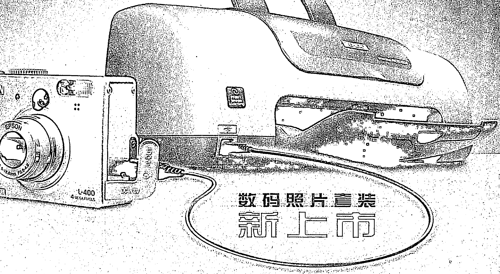

打开繁复的照片打印程序，体验爱普生“一拍直印”时尚数码组合！

通过Epson PhotoPC L-400/L-300数码相机中内置的智能芯片，不用电脑，只需一根USB连线，就可在Epson Stylus Photo 830U照片打印机上直接打印照片，让享受数码生活更简单、更有出色照片品质、超长拍摄时间、以及让乐趣直线飙升的数码照片魔板（P.I.F.），从此引领数码生活欢乐无限！

欢迎光临爱普生展示店亲身体验
现在，爱普生印像馆及12个城市的20多个展示店开展了一拍直印时尚数码组合的体验活动，太多精彩与欢乐等你来！此外还有全国范围内的更多经销店展示店。
购买Epson PhotoPC L-400加Epson Stylus Photo 830U一拍直印组合，就送价值200元的数码相机包一个。
数码有限，送完即止。

### 407万像素 豪华版

- 407万有效像素，3倍光学变焦
- 内置P.I.F.魔板
- 4节普通5号电池，超长拍摄250分钟 (500张照片)
- 优化5760dpi分辨率
- 6色墨水，4微微升超精微墨滴
- 前置USB接口
- 黑白打印14页/分钟，彩色打印13.7页/分钟

### 324万像素 实用版

- 324万有效像素，3倍光学变焦
- 内置P.I.F.魔板
- 4节普通5号电池，超长拍摄250分钟 (500张照片)
- 优化5760dpi分辨率
- 6色墨水，4微微升超精微墨滴
- 前置USB接口
- 黑白打印14页/分钟，彩色打印13.7页/分钟

爱普生(中国)有限公司
地址：北京市朝阳区东三环北路2号南银大厦28层 邮编：100027 http://www.epson.com.cn

客户服务热线：800-810-9977(免费) 010-82012626 E-mail: Service@ecc.epson.com.hk

维修负责：爱普生（北京）技术服务有限公司维修部 北京朝阳区光华路甲八号和乔大厦南座102室 电话：010-65812929

爱普生（北京）技术服务有限公司西三环维修部 北京市海淀区西三环北路68号 电话：010-68458450/51/52/53

北京爱普生印像馆 地址：北京市海淀区海淀大街3号鼎好电子大厦首层N1866室 电话：010-82696006/82696010

指定经销商(排名不分先后)：
北京北力时空010-62560844 北京莱特 010-62644565 北京金谷生010-82625784 郑州创佳0371-3927576 郑州新远宇0371-3851017-802 山东惠佳科技0531-8918186 上海龙日021-53511404 南京泛达025-5018548
南京佳信 025-3691057 江苏宏图三胞025-4791111 浙江图灵0574-87251856 杭州远方0571-88211966 安徽国联0551-3661935 广州网通020-38499209 厦门新锐邦0592-2206000 广西海蓝0771-5325826
深圳赛格0755-83775026 深圳电电0755-83320006 杭州中恒科技0591-3374137 杭州登丰0591-3332412 成都龙腾佳胜028-86316219 重庆汇通023-68602542 沈阳新龙光024-81524838 武汉力泉027-87888188

本广告内容最终解释权归爱普生（中国）有限公司所有

## 电脑爱好者

## 合订本

2003年(下)·附录分册

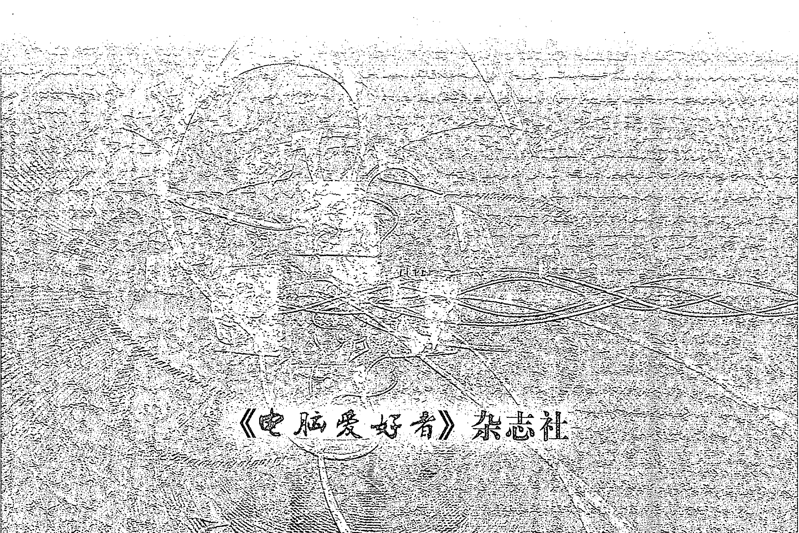

## 内容提要

《电脑爱好者合订本》2003 年（下）·附录分册是与正文分册相配套的，作为合订本正文分册的补充和完善，附录分册面向最新的应用技术和热点，为读者提供了解决电脑应用实际问题的全面解决手段和方案。本书内容精练，实例丰富，实战性和可操作性强，适合于具有一定计算机应用水平的中高级读者和渴望提高实际操作技能的电脑爱好者使用。

本书设有系统专区、工具与软件、安全阵营、硬件沙龙、办公专刊、多媒体、数码时尚、网络世界、综合应用、编程课堂、游戏空间、产品与技术等12大版块，50多个大、小专题，全面覆盖了软件、硬件、网络、多媒体、图形图像、系统安全等电脑应用领域。

图书配套光盘B，为读者精心定制了一款“Flash 与卡通画”多媒体软件，让您成为一个真正的闪客高手。另外，配套光盘B中还收集了易表.net、亘天炫彩2003短信彩信软件、金山毒霸系列软件以及几十款国产软件精品。还有数款娱乐小游戏、DV 大赛作品选以及云南风情图片展，更让你在工作学习之余，放松一下身心。

## 《电脑爱好者合订本》2003年(下)·附录

- 社 长：孙晓旭 副社长：赵 健
- 总 编：高 翔
- 编 辑 策 划：武 航（主编）
- 黄平山 陈荣贵
- 编 辑 出 版：《电脑爱好者》杂志社
- 制 作：雨 冬
- 责 任 编 辑：董 宏

- 开 本：787 × 1092 1/16
- 印 张：25
- 字 数：800千字
- 刊 号：ISSN 1005-0043/CN11-3248/TP
- 国内邮发代号：82-528

# 目录

# 系统专区
Operating System Region

## 2003，默默生长的Linux

- 一、Linux预备知识 ................................................................................................ 17
- 二、配置要点和新手指南 .................................................................................... 19
- 三、让网络在自由中翱翔 .................................................................................... 20
- 四、系统软件举要 ................................................................................................ 21

## 缝缝补补又一年——Windows系统补丁与外挂增强工具

- 一、Service Pack补丁 .......................................................................................... 25
- 二、安全隐患补丁 ................................................................................................ 27
- 三、外挂增强工具 ................................................................................................ 29

## 强悍数据拯救入门与提高

- 一、硬盘的分区方式 .......................................................................................... 31
- 二、硬盘分区结构 ................................................................................................ 31
- 三、数据丢失原因及恢复概率 ............................................................................ 33
- 四、常用数据恢复软件介绍 .............................................................................. 34
- 五、几种常见情况下的数据恢复 ........................................................................ 35
- 六、数据恢复注意事项 ........................................................................................ 37
- 七、硬盘数据的硬件保护 .................................................................................... 37

## 打开硬件大门的金钥匙——驱动程序应用指南

- 一、各种安装驱动的方法 .................................................................................... 39
- 二、驱动程序的安装顺序 .................................................................................... 40
- 三、驱动程序故障的解决 .................................................................................... 40
- 四、驱动程序的备份 ............................................................................................ 41
- 五、驱动程序应用技巧 ........................................................................................ 42
- 六、2003年最新驱动总结 .................................................................................... 43

# 工具与软件
Utility and Software

## 2003年度十大最具影响的软件

- 一、Microsoft公司的Windows Server 2003操作系统 ........................................ 45
- 二、Microsoft公司的Office 2003 ........................................................................ 45
- 三、金山公司的WPS Office 2003 ...................................................................... 46
- 四、金山公司的金山毒霸V .................................................................................. 46
- 五、博大公司的Foxmail ...................................................................................... 47
- 六、Adobe公司的PhotoShop CS .......................................................................... 47
- 七、Microsoft公司的Internet Explorer 6.0 ............................................................ 48
- 八、美国在线-时代华纳公司的Netscape 7.1 ........................................................ 48
- 九、腾讯公司的QQ 2003 .................................................................................... 49
- 十、Macromedia公司的Flash MX 2003 ................................................................ 49

# 工具软件点将台——磁盘分区与多系统安装工具

- 一、分区格式简介 ........................................................................................................ 61
- 二、分区方案 .................................................................................................................. 62
- 三、分区工具 .................................................................................................................. 62
- 四、多系统并存 .............................................................................................................. 63

# 工具软件点将台——系统备份与还原工具

- 一、系统内置工具和功能 ............................................................................................ 65
- 二、第三方备份与还原工具 ........................................................................................ 67
- 三、第三方系统还原工具 (GoBack) ........................................................................... 70
- 四、工具比较及注意事项 ............................................................................................ 71

## 工具软件点将台——光盘刻录工具

- 一、刻录工具的选择 .................................................................................................... 72
- 二、特殊刻录技巧宝典篇 ............................................................................................ 74

# 工具软件点将台——文件压缩工具

- 一、常规压缩工具 ........................................................................................................ 79
- 二、可执行程序压缩工具 ............................................................................................ 82

# 工具软件点将台——图片浏览工具

- 一、经典看图软件 ........................................................................................................ 83
- 二、看图软件的另类——菜单中的图片 ...................................................................... 84
- 三、看图软件的技巧以及应用的实现 .......................................................................... 84

# 工具软件点将台——文字处理工具

- 一、系统自带文字处理工具 ........................................................................................ 87
- 二、免费和共享文字处理工具纵览 ............................................................................ 88
- 三、另类文字处理工具 ................................................................................................ 90
- 四、“小块头也有大智慧”——常用字处理软件使用技巧 ............................................ 91

# 工具软件点将台——文件管理工具

- 一、文件管理综合类 .................................................................................................... 92
- 二、检索、查找文件类 ................................................................................................ 94
- 三、文件复制类 ............................................................................................................ 94
- 四、文件比较类 ............................................................................................................ 95
- 五、文件属性查看、修改类 ........................................................................................ 95
- 六、文件（夹）更名类 ................................................................................................ 96

# 工具软件点将台——虚拟光驱工具

- 一、VirtualDrive ............................................................................................................ 97

工具软件点将台——桌面管理工具

- 一、经典桌面软件 …… 100
- 二、桌面软件中的另类 …… 101
- 三、桌面美容全攻略 …… 102

工具软件点将台——个人记事工具

安全阵营
Safety Camp

构筑个人电脑的安全网

- 一、初释安全 …… 107
- 二、我们要保护的内容 …… 107
- 三、扫描器检查系统是否安全 …… 107
- 四、个人防火墙 …… 110
- 五、PC的内衣IPSEC …… 114

我的隐私你别看

- 一、清除操作系统的历史记录 …… 116
- 二、清除IE浏览器的历史记录 …… 118
- 三、清除网络程序的历史记录 …… 119
- 四、清除字处理程序的历史记录 …… 120
- 五、清除其它应用程序的历史记录 …… 121
- 六、清道夫清除所有记录 …… 121

小心，默认设置中的陷阱

- 一、默认共享陷阱 …… 122
- 二、默认开放的NetBIOS协议陷阱 …… 123
- 三、默认开放服务的陷阱 …… 124

硬件沙龙
Hardware Salon

2003年度十大最具发展前景的硬件技术

- 一、“64-bit数据运算”: CPU核心架构的“变革” …… 125
- 二、“迅驰”: 移动世界的“革命” …… 126
- 三、PCI Express技术——突破系统带宽瓶颈 …… 126
- 四、Serial ATA串行标准——硬盘数据传输的“高速公路” …… 127
- 五、QBM内存——DDR的新生 …… 128
- 六、有机发光显示器 (OLED) ——液晶显示明日之星 …… 128
- 七、DVD-Dual —— DVD刻录时代的最强音 …… 129
- 八、USB On-The-Go标准——USB标准“全面扩张的号角” …… 130
- 九、BlueTooth (蓝牙) 技术——无线世界“作用巨大的小牙齿” … 130
- 十、燃料电池 (FC) ——未来笔记本电脑的动力之源 … 131

## 2003电脑外设大观

- 第一篇 打印机 … 132
    - 一、Canon … 132
    - 二、EPSON … 133
    - 三、惠普 … 133
    - 四、Lexmark … 134
    - 五、联想 … 135
    - 六、激光打印机 … 135
- 第二篇 扫描仪 … 135
    - 一、扫描技术 … 135
    - 二、产品展示 … 138
- 第三篇 投影机 … 138
    - 一、投影机技术 … 138
    - 二、投影机技术指标 … 140
    - 三、产品展示 … 140
- 第四篇 多功能一体机 … 141
    - 一、多功能一体机分类 … 141
    - 二、产品展示 … 141

## 2003年板卡生产与设计技术特点综述

- 一、主板领域 … 142
- 二、显卡领域 … 143
- 三、内存领域 … 143
- 四、未来板卡生产设计技术展望 … 144

## 通往明天的桥梁——数字电视机顶盒

- 一、模拟信号的缺陷 …… 146
- 二、数字电视与数字化电视 …… 146
- 三、机顶盒的结构 …… 146

## 办公专刊
Office Monograph

## PDF及其制作

- 一、什么是PDF … 148
    - (一) PDF 卓越的跨平台特性 … 148
    - (二) 可以导航阅读 … 148
    - (三) 其它文本格式无法比拟的特性 … 148
- 二、Adobe Acrobat 5.0制作电子图书 … 148
    - (一) 软件的安装 … 148
    - (二) 软件在安装过程中做出一些系统修改 … 149
    - (三) PDF 文件的创建 … 149
    - (四) PDF 文件的编辑 … 150

EXE格式电子书的制作

- 一、EXE电子书概述 … 173
- 二、通过eBook Edit Pro制作EXE电子书 … 173
    - (一) 软件简介 … 173
    - (二) 软件使用 … 173
- 三、通过友益文书制作EXE电子书 … 177
    - (一) 软件介绍 … 177
    - (二) 软件使用 … 177
- 四、其他EXE电子书制作工具 … 179
    - (一) ePublisher Gold 1.4 … 179
    - (二) E-Book HTML Compiler Pro 2.1 … 179
    - (三) WebExe 1.5 … 179
    - (四) 酷书制造 1.0 … 179
    - (五) EbookBuilder 4.0 … 179

揭开Office 2003的面纱

- 一、Office 2003简介 … 180
- 二、Office 2003的主要改进 … 182
- 三、安装过程 … 183
- 四、文字处理Word 2003新功能介绍 … 183
- 五、电子表格Excel 2003新功能介绍 … 185
- 六、邮件收发Outlook 2003新功能介绍 … 186
- 七、幻灯片PowerPoint 2003新功能介绍 … 187
- 八、网页制作FrontPage 2003新功能介绍 … 187
- 九、数据库Access2003新功能介绍 … 189
- 十、体验新增组件 … 190
    - (一) 电子表单InfoPath 2003 … 190
    - (二) 笔记记录和管理Onenote 2003 … 191
- 十一、其他组件介绍 … 192
    - (一) 图表绘制Visio 2003 … 192
    - (二) 项目管理Project 2003 … 192
    - (三) 排版制作Publisher 2003 … 193

多媒体
Multimedia

Director MX的三维世界

- 一、创建Shockwave 3D场景 … 194
- 二、修改2D文字 … 195

Photoshop实例经典

一、文字特效篇 … 200

（一）打孔效果文字 … 200

（二）酷酷的发光字 … 201

（三）冷峻的铁锈文字 … 202

二、视觉效果篇 … 203

（一）火焰效果 … 203

（二）爆炸效果 … 204

（三）粗糙的绘画效果 … 205

（四）液体金属效果 … 206

（五）神秘的逆光效果 … 207

三、特殊效果篇 … 209

（一）鸡蛋上的眼睛 … 209

（二）晶莹剔透的冰块 … 210

实战Flash MX 2004最新绝技

一、Flash MX 2004 总体印象 … 212

（一）Flash MX 2004 中的新特性 … 212

（二）Flash MX 2004 professional 的新特性 … 213

（三）Macromedia Flash Player 7 的改进 … 214

（四）存在的问题 … 214

二、Flash MX 2004 的改进实例 … 214

（一）制作爆炸文字动画 … 214

（二）在Flash 中使用CSS 样式表 … 215

（三）定制右键菜单 … 216

三、专业版独有的特点 … 218

（一）使用组件制作日历 … 218

（二）项目文件管理 / 源代码管理 … 218

（三）用Flash 制作一个播放器 … 220

数码时尚
Digital Vogue

移动的音乐精灵——MP3随身听面面谈

一、MP3 随身听选购八要素 … 222

（一）音质是重要的取舍因素 … 222

（二）外观要体现新潮时尚 … 223

（三）存储量大才能听的舒心 … 223

（四）支持文件格式是否齐全 … 223

（五）附加功能并非越多越好 … 223

## 2003年(下)·附录分册

移动的办公室——笔记本电脑的选购与使用

- 一、笔记本电脑选购指南 … 234
    - (一) 根据需要确定配置 … 234
    - (二) 选购中的注意事项 … 234
    - (三) 识别水货和行货 … 235
- 二、笔记本电脑的节电措施 … 236
    - (一) 根据需求调整模式 … 236
    - (二) 精简运行的程序和硬件设备 … 237
    - (三) 善用待机和休眠 … 237
    - (四) 设置CMOS优化电能 … 237
    - (五) 软件节约电能 … 237
- 三、笔记本电脑的维护保养 … 238
    - (一) 使用环境 … 238
    - (二) 外壳的维护 … 238
    - (三) LCD液晶屏的维护 … 239
    - (四) 键盘和触摸板的维护 … 239
    - (五) 硬盘的维护 … 239
    - (六) 电池的维护 … 240
    - (七) 散热 … 240
- 四、笔记本电脑相关名词解释 … 240

留住永不褪色的精彩——数码相机简明指南

- 一、选购一款合适的数码相机 … 242
    - (一) 重要指标 … 242
    - (二) 识别行货与水货 … 243
    - (三) 购买测试 … 243
- 二、数码相机使用之新手上路 … 245
    - (一) 外观简介 … 245
    - (二) 操作简介 … 246
- 三、数码相机使用进阶 … 247
    - (一) 打造靓图的基础：摄影构思 … 247
    - (二) 抓住相片的精灵：光线控制 … 248
    - (三) 让图像更清晰：对焦调整 … 248
    - (四) 留下流光溢彩的瞬间：光圈与快门 … 249
    - (五) 点滴中的精彩 … 249
    - (六) 数码相片后期处理 … 250
    - (七) 数码相机另类应用：在家拍电影 … 253
- 四、数码相机节能谈 … 255
- 五、让数码相机常葆青春 … 255
    - (一) 数码相机的日常维护与保养 … 255
    - (二) 镜头的日常维护与技巧 … 256
    - (三) LCD液晶屏日常维护技巧 … 256
- 六、数码相机相关名词解释 … 257

不能忘却的记忆——数码摄像机

- 一、如何购买中意的数码摄像机
    - （一）根据用途选择
    - （二）外观尺寸要便携易用
    - （三）镜头变焦以实用为主
    - （四）舍弃华而不实的功能
    - （五）不可忽视的附件
    - （六）辨别行货还是水货
- 二、数码摄像机使用之新手上路
    - （一）外观简介
    - （二）操作简介
- 三、数码摄像机使用进阶
    - （一）数码摄像机使用技巧
    - （二）实物影像拍摄技巧
    - （三）让数码摄像机更实用
    - （四）让拍摄的影像更精彩
- 四、数码摄像机节电谈
- 五、细心呵护你的数码摄像机
    - （一）数码摄像机的日常维护与保养
    - （二）数码摄像机镜头和LCD液晶屏的清洁保养
    - （三）磁头的清洁
    - （四）录像带的保养方法
    - （五）带仓内部件的清洁
- 六、数码摄像机相关名词解释

掌中的数字世界——PDA

- 一、从头说PDA
- 二、PDA的应用
- 三、PDA操作技巧
- 四、PDA问题解答

数码照片的处理

- 一、让照片更完美
    - （一）消除红眼
    - （二）清除皮肤上的瑕疵
    - （三）让你看起来更年轻——消除皱纹
    - （四）使皮肤更柔顺
    - （五）让失焦的照片变得清晰
    - （六）拨开云雾——提高照片的对比度
    - （七）快速调整照片的偏色
    - （八）快速调整照片的角度
- 二、让照片更漂亮时尚
    - （一）时尚文身
    - （二）亮丽彩妆
    - （三）漂亮首饰
    - （四）换新衣裳
- 三、让照片更吸引目光
    - （一）怀旧老照片
    - （二）黑白的魅力
    - （三）添加颗粒感
    - （四）木版画风格
    - （五）柔和的光彩
    - （六）轮廓肖像
    - （七）自制木质相框
- 四、结束语

网络世界
Network World

2003年度十大最具发展前景的网络技术

第一篇 宽带技术领域 … 297
- 一、ADSL 接入技术 … 297
- 二、FTTx+LAN 接入技术 … 297
- 三、CABLE MODEM 接入技术 … 298

第二篇 无线互联领域 … 298
- 一、GPRS 无线上网技术 … 298
- 二、Wi-Fi 无线接入技术 … 299
- 三、蓝牙技术 … 299

第三篇 未来网络接入领域 … 300
- 一、VDSL 接入技术 … 300
- 二、光接入网络技术 … 300
- 三、电力线接入技术 … 301

第四篇 新一代互联网络技术 … 301
- 一、万兆以太网技术 … 301

Windows 2003网络应用实战

- 一、Windows Server 2003 初探 … 302
    - (一) Windows Server 2003 简介 … 302
    - (二) Windows Server 2003 家族巡礼 … 302
    - (三) 硬件要求 … 303
- 二、Windows Server 2003 的网络服务配置 … 304
    - (一) 使用全新的方式配置网络服务 … 304
    - (二) 配置 NAT 服务 … 304
    - (三) 配置 Web 服务 … 305
    - (四) 配置邮件服务器 … 308
    - (五) 配置打印机和打印服务器设置 … 309
    - (六) 遥控服务器 … 309
    - (七) 配置 VPN 服务 … 311
    - (八) 配置网络电视直播系统 … 314
- 三、Windows Server 2003 的一些网络服务配置技巧 … 315
    - (一) 在控制面板里显示全部组件 … 315
    - (二) 禁用登陆时的 Ctrl+Alt+Del … 315
    - (三) 禁用配置服务器向导 … 315
    - (四) 禁止空连接进行枚举 … 315
    - (五) 如何通过修改注册表删除共享 … 315
    - (六) 如何添加 NETBEUI 协议 … 315
    - (七) 在 RAS 或 VPN 服务器上禁用 Netbios 代理 … 315
    - (八) 如何在一块网卡上使用多个IP地址 … 315

无线网络的应用

- 一、常见的无线网络 … 316
    - (一) Wi-Fi 无线网络 … 316
    - (二) 蓝牙无线网络 … 317
    - (三) HomeRF 无线网络 … 318
    - (四) IrDA 无线网络 … 318
- 二、无线网络的组网特点 … 319
- 三、无线上网方案 … 319
    - (一) 室内无线网络组网方案 … 319## 四、四战之地的ISP无线接入服务
- (一) 中国移动随e行
- (二) 中国联通掌中宽带
- (三) 中国电信天翼通
- (四) 中国网通无限伴旅服务

### 五、无线上网组网及连接实战
- (一) WLAN与ADSL/Cable Modem/LAN等有线宽带的组合
- (二) WLAN与中国移动随e行/中国联通掌中宽带/中国电信天翼通/中国网通无限伴旅的组合

# 六、无线网络Q & A

# 综合应用
## 电脑文件搜索攻略
- 一、精通Windows的搜索助手
  - (一) 基本用法
  - (二) 进阶用法
- 二、熟悉DIR命令
  - (一) DIR命令的基本格式
  - (二) DIR命令的主要参数
- 三、查找重复文件
- 四、查找OFFICE文档
  - (一) 切换到搜索状态
  - (二) 开始搜索
- 五、搜索局域网资源
  - (一) 搜索计算机
  - (二) 搜索共享资源
  - (三) 搜索服务器
  - (四) 搜索文件
- 六、快速搜索压缩文件
  - (一) 设定查找范围
  - (二) 设定文件类型
  - (三) 设定查找文件名
  - (四) 查看查找结果
- 七、快速搜索MP3
  - (一) 添加MP3文件
  - (二) 管理音乐列表
  - (三) 快速搜索MP3
- 八、图片的搜索
  - (一) 确定管理的图片
  - (二) 管理图片
  - (三) 搜索图片
- 九、重复图片的搜索
  - (一) 确定查找范围
  - (二) 查找雷同图片
  - (三) 处理雷同图片

## 软件汉化实战
- 一、汉化基础知识
  - (一) 软件汉化的概念
  - (二) 常见的软件汉化方法
  - (三) 软件汉化的要求
- 二、汉化的必备常识
  - (一) 了解汉化工具软件
  - (二) 资源
  - (三) C语言类的程序汉化
  - (四) Delphi、C++ Builder语言类的程序汉化
  - (五) VB语言类的程序汉化

# 汉化进阶技巧
- (一) 快速、准确判断软件的类型，选择相应的汉化工具
- (二) 利用Visual C++汉化时一次更改多个资源项目的内码属性
- (三) 解决汉化后软件图标（Icon）变形的问题
- (四) 鼠标右键快捷菜单的汉化

# 汉化补丁制作篇
- (一) 文件打包方式的补丁制作
- (二) 文件修改方式的补丁制作

### 六、结束语


# VC++编程
- 一、前言
  - (一) 控件之于VC++
  - (二) 主要内容
- 二、使用Windows标准控件
  - (一) 常见控件列表
  - (二) 引入控件
  - (三) 设置控件属性
  - (四) 映射控件变量
  - (五) 响应控件事件
  - (六) 控件子类化
- 三、使用ActiveX控件
  - (一) ActiveX控件的注册
  - (二) 引入ActiveX控件
  - (三) 设置ActiveX控件的属性
  - (四) 映射控件变量
  - (五) 响应控件事件
  - (六) 调用ActiveX控件的方法

# Windows脚本编程指南
- 一、WSH技术概述
  - (一) 什么是WSH
  - (二) WSH的特点
  - (三) WSH能做什么
- 二、编辑和运行WSH文件
  - (一) 编辑WSH文件
  - (二) 运行WSH文件
- 三、WSH常用对象

# 四、WSH开发实例
- (一) 显示对话框
- (二) 获取驱动器信息
- (三) 获取文件夹信息
- (四) 获取网络信息
- (五) 访问文本文件
- (六) 建立快捷方式
- (七) 模拟键盘输入
- (八) 设置IE浏览器首页
- (九) 控制Word程序

# 五、WSH出错信息参考

### 六、结束语

# 游戏空间
## 2003年度经典游戏回顾
- 一、CS 1.6
- 二、魔兽争霸3 —— 冰封王座
- 三、家园2
- 四、仙剑奇侠传3
- 五、战地1942：二战秘密武器
- 六、传奇3
- 七、掌握大海的人，才能征服世界——大海战Ⅱ
- 八、综述

# 产品与技术
- DIY 最简单的DVD视频——“DV 一指录”
- “傻瓜精灵” 一键装机——颠覆传统电脑驱动安装方式
- 800MHz P4, 飞入寻常百姓家——848P 芯片组和TM-848P
- 随心所欲 通讯先锋——开创红外通讯的机箱扫描
- 还原经典感悟生活——JHT-356 游戏音箱扫描
- i865G——Intel 的整合芯片组
- 来自海湾的紫色蝴蝶——明基革命性架构键盘扫描

# 电脑爱好者俱乐部特价商场

百世EVR-150 MP3播放器（256M） 市场价:1998元 特价:1680元（附送价值200元的森海塞尔MX500名牌耳机）产自韩国，品质一流/超大容量，一酷到底/大幅面纳米玻璃材料，至酷感受/时尚银色金属外壳，超强耐磨，超薄设计，仅厚9.8mm，重37.1g；支持MP3、WMA、WAV等多种音乐格式，支持VBR播放；蓝色背光，中英文歌名显示；独立A-B复读键，播放速度可调，学英语更方便；具有SYNC功能，可自动监测CD歌曲间的空隙，分段录制整张CD；MP3格式录音，音质更高，空间占用更少/录音长达72小时，世界领先；FM调频收音，兼容波段更广(76MHz-108MHz)，出国照常使用，可记忆保存20个电台，具有FM转录MP3功能；1400mAh超大容量镍氢充电电池，可连续播放长达12小时；附送麦克、LINE IN线、电话录音等专业录音笔配件。

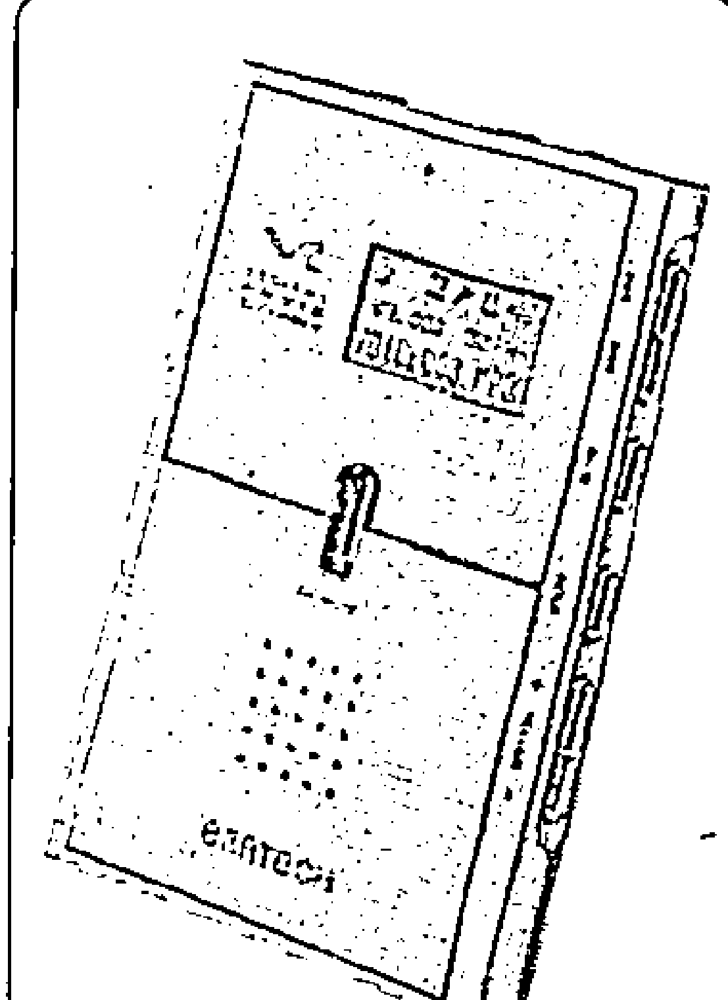

三立屠龙刀MP3播放器（128MB） 特价:568元强力推荐，性价比之王，表现出众；独特“变色龙”烤漆工艺，高技术的纳米镜面，蓝色背光，时尚高雅；中、英、繁三种文字操作界面，自由切换；同步显示中、英文歌词，可通过附送软件随意添加编辑歌词；支持MP3及WMA音乐格式，最多可存储80首歌曲；五级播放速度，变速不变调，学习外语轻松上口；超长时间数码录音、A-B复读；“无线”直插，移动存储超级方便。

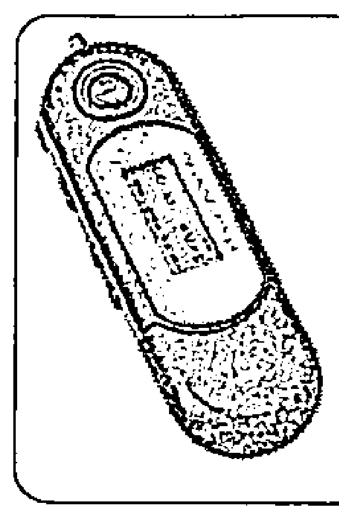

三立音乐至尊MP3播放器（128MB） 特价:568元支持MP3/WMA格式；歌词同步显示；支持中、英、繁体显示；支持目录选择；支持本机删除；7种音效设置；11小时高品质数码录音；附送录音格式转换软件；EL超炫蓝背光；支持语音复读功能；8小时连续播放；纳米技术不磨损喷油镜面。

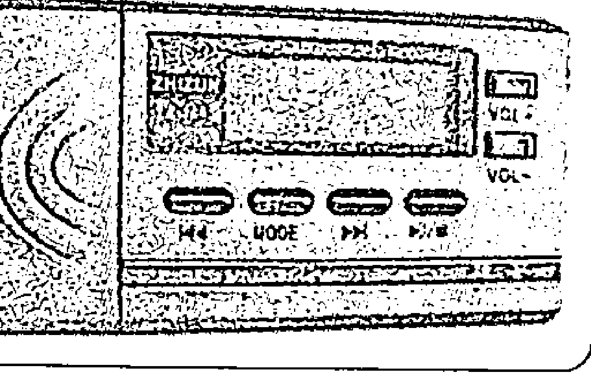

科旗NC-838 MP3播放器（128MB） 特价:768元（赠送锂电2块/外接充电器）可更换香口胶电池，循环充电；内置高灵敏度FM调频立体声收音功效；支持MP3、WMA音乐格式；超小、流线型时尚外观设计；耐磨、抗划伤纳米视窗镜片；中英文显示，时尚蓝背光；长时间高品质数码录音；支持中文菜单；五种音效，多种循环播放模式；CD级音质，绝对震撼；USB高速传输；银白/蓝/黑3色供选；31×80×16mm/32g。

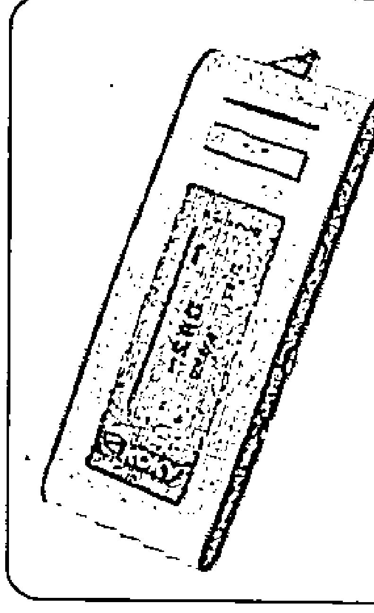

三立哈佛通898 MP3播放器（64M） 特价:548元超强语音复读功能，学外语、听音乐双重享受；大容量语音复读；语音无损，清晰无噪；备份轻松快捷；同步显示音文内容；查找目录文件功能完善；复读时间无限制；素材无限升级；在线翻译即点即查；银灰色外观，小巧轻便。

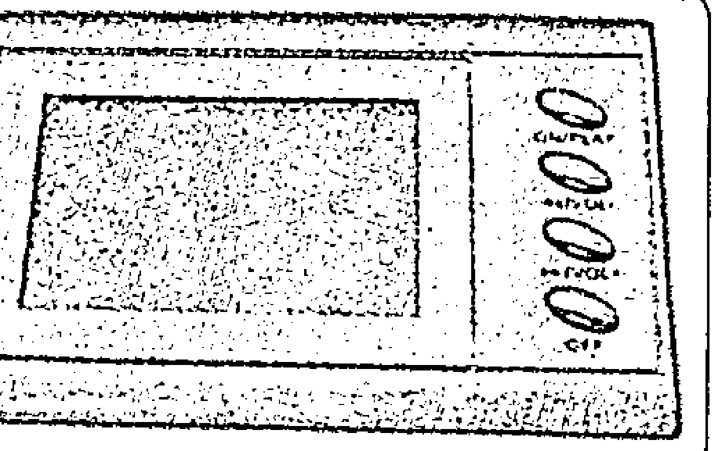

TCL朋友698掌上电脑 特价:368元蓝色背光，轻巧美观，可拆式翻盖，设计独特；手写输入功能完善，可通过内建强大手写汉字识别功能和完全笔触式操作轻松输入和管理信息；侧面滚轴滑轮设计，实现全程单指操作；名片、便笺、计算、日历、游戏、字典、闹钟等PDA功能一应俱全；多重提醒功能，配合十种曲调选择；独有5种查询、6种输入方式功能组合，查询定位准确快捷；英汉互译，内置金山词霸25万词汇量和例句功能，可作为电子词典使用；附送专用包1个、电池2节。

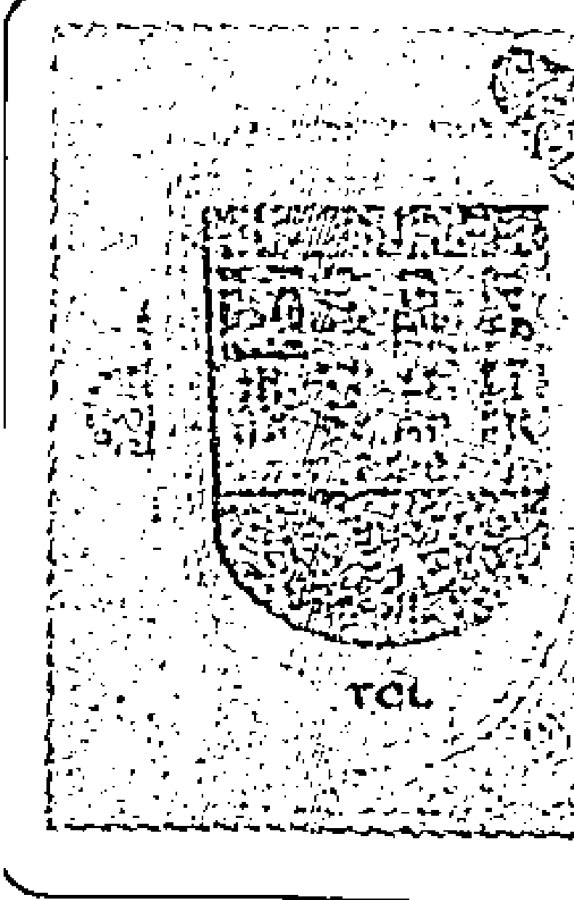

SSK飚王7合1读卡器 特价:168元轻松读写CF/SM/SD/MMC/MS/XD/Microdrive Cards 7种记忆卡（只支持XD卡的读卡器市场价都要近100元）；名片夹大小，易于携带；银色仿铝合金外壳，做工精细；可直接在闪驱上快速浏览和编辑文件内容；配备存储卡可作为移动硬盘使用，传输速度12Mb/s；USB接口供电，无须外接电源；支持Win98/Me/2000/XP和Mac操作系统；支持热插拔，操作方便；LED灯显示读写状况；附送USB延长线（约1米）、Win98系统驱动光盘、保修卡、说明书等。

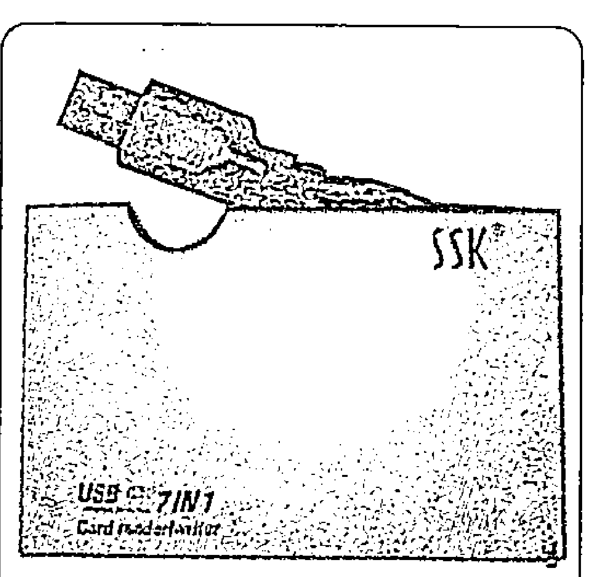

声明全部商品须按售价加汇5%邮资；请在附言栏中留下联系电话；全部商品均提供厂家、杂志社双重质保，邮购用户可享受全面售后服务（无需发票），需提供发票者加汇5%税金。

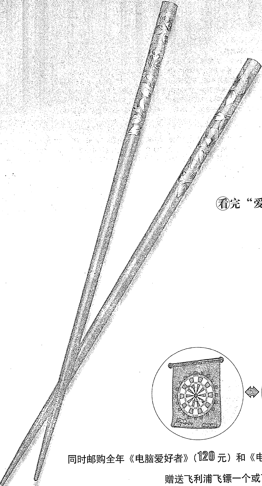

# 爱好者
> 看完 “爱好者” 看 “高手”

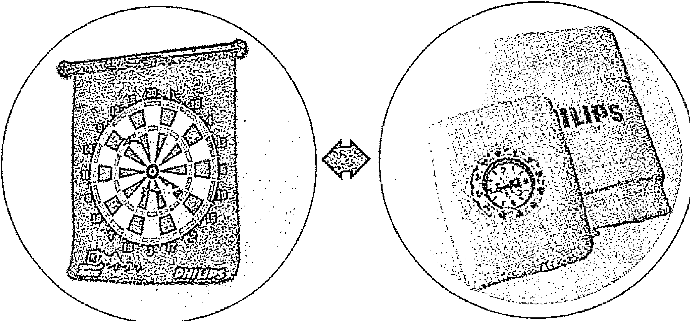

同时邮购全年《电脑爱好者》(120元)和《电脑高手》(93.6元)
赠送飞利浦飞镖一个或飞利浦运动护腕手表一个

# 2003，默黑生长的Linux
文/念青

- 选择Linux版本
- Linux的安装要点
- Linux的登录
- 找回Linux的登录密码
- 使用Linux的帮助命令
- 改变Linux的默认启动顺序
- 切换图形和文字界面
- 使用五笔输入法
- 使用Modem和ADSL
- 使用网页浏览与电子邮件程序
- 使用FTP程序
- 使用即时通讯工具
- 使用字处理工具
- 使用图像处理工具
- 播放软件的使用
- 在Linux中玩游戏

上个世纪末，Linux挟自由和开放的雄风狠狠地火了一把。如今，经过几年光景的历练，Linux并没有像许多曾经红火一时的新玩意儿那样成为昙花一现的泡沫，而是变得更为务实和奋进，更值得我们用激赏的眼光去关注，用更大的热忱去拥抱。

Linux是一个类Unix的操作系统，也正因此，它在服务器层面得到了广泛的应用。Linux的服务器应用相当专业，很多服务器软件都集成在各个发行版本中。系统安装完成后，只需经过简单的配置，就可以使用包括Web、FTP、E-Mail、NNTP、Telnet、Samba等服务。

近几年，Linux在桌面应用方面也有长足的发展。以Red Hat 9.0为例，系统已经支持包括简体中文、英文在内的数十种语言文字，并且包含有丰富的字处理、图形、多媒体、网络等方面的桌面应用软件。

现在，国内已经有越来越多的企业选择Linux作为自己的操作系统平台，为Linux提供软硬件支持的生产人员也已经越来越多。这当中既有热爱Linux的程序员和他们的忠实拥趸，也包括有金山、用友等消费类软件和行业软件厂商。此外，还有很多行业如能源、保险、电子政务等也在开始使用Linux操作系统。

中国信息产业部官员近期更是表示，Linux对于我们在软件研发领域取得突破性进展是一个良机，中国政府计划注资基于Linux的计算机系统，中国将发展一个以Linux为基础的国内软件行业。

如果说早前用户们或者还有踌躇的理由，现在，当我们面对在性能和稳定性上不会逊于任何操作系统的Linux，我们作出选择时，已经没有太多的障碍。

## 一、Linux 预备知识

### 1. 选择一个 Linux 发行版本

和Windows不同，Linux的版本具有异常丰富的内涵，在自由的旗帜下，各式异彩纷呈的Linux发行版本不断推陈出新，知名的有Debian Linux、Open Linux、Power Linux、Slackware Linux、SUSE Linux、Turbo Linux等等。其实，各种不同的Linux发行版本，使用的都是由Linux之父——Linus Torvalds推出和维护的Linux核心档案，按照目标用户群的需要，集成各具特色的功能软件包而已。它们在结构上并没有截然不同的分别。正是在这个意义上说，我们可以根据自己的需要，定制出一个全球独一无二的个性化Linux系统。在众多的发行版本中，笔者推荐大家使用Red Hat Linux（图1），它在业界的声誉和魅力都相当不错，这一点，只要看一下国内一些知名的“中文Linux”如红旗等的早期版本就可以知道了。事实上，Red Hat的许多规则已经成为Linux的标准之一，它对时下流行的大多数硬件都提供了很好的支持，并且集成了相当多的常用软件，包括各种服务器和桌面应用程序。这也是许多Linux用户的“启蒙”系统都选用它的原因。

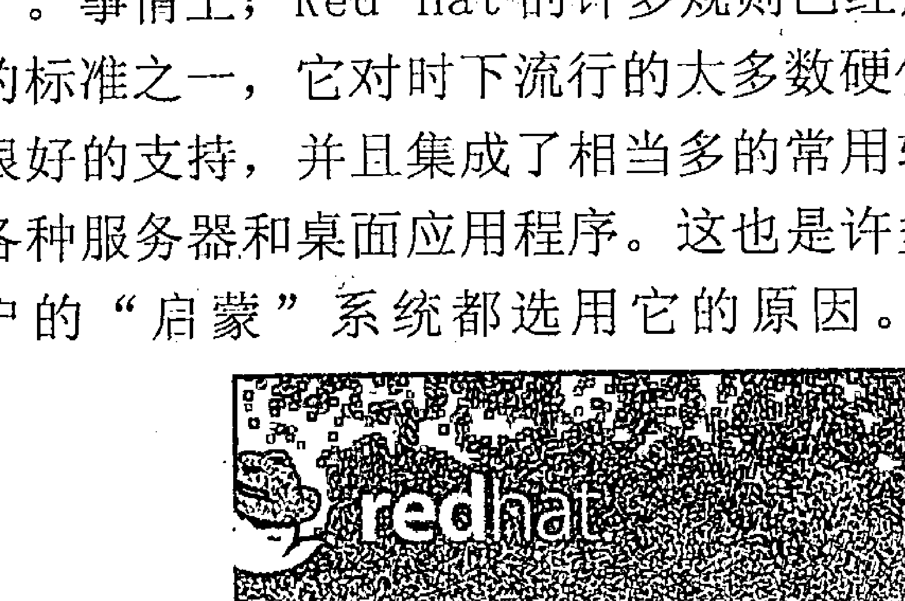

### 2. Linux的安装要点

现在，各个Linux发行版本在安装时都提供了相当人性化的安装向导界面。以Red Hat 9.0为例，安装时可以选择包括简繁体中文、英文等数十种语言界面。并且在每一个步骤，都有详尽的解说文字。其实所有Linux的安装步骤，都很相似，用户只要遵循着系统的提示信息按部就班去做，很容易就可以完成安装的过程。

因为Linux系统的安装涉及到对硬盘的分区操作，因此用户在安装前一定要做好重要数据的备份工作。要成功安装Linux系统，至少需要为它准备两个硬盘分区：根分区（root）和交换分区（swap）。我们可以把交换分区看成是硬盘上的一个缓存空间，这个空间并不允许我们自由地读取和写入，系统会对它做“透明”的控制，就像Windows系统中用来存放临时文件的虚拟内存那样；因应不同的需要，根分区也可以拆分成多个挂接（装载）点，例如负责启动系统的/boot分区、临时工作目录/tmp，用户程序目录/usr等等。安装Linux的时候，系统会为你提供一个直观的对硬盘进行分区和格式化的工具程序。

即便你对上述说明完全陌生，也没有关系，系统可以针对当前的硬件环境，给出一个自动的分区方案供你选择或参考。剩下的事情，就更加简单了，配置系统硬件（对于大部分流行的硬件配置来说，新版本的Linux系统都提供了相当完善的驱动支持），选择好想要使用的功能软件（对于初级用户而言，避免因为功能不足而频繁重装系统的一个简单方法，就是安装好全部的应用程序），设置根用户（root）的使用密码，以及添加其他的用户名和密码。

通常一个Linux发行版本，不仅提供了Web、FTP等多种网络服务，还提供了各种各样的网络客户端软件、图形处理工具、多媒体应用程序、字处理软件以及众多精致小巧的小游戏。Linux的风行与其愈来愈广泛的桌面系统应用相互促进，互为因果。尽管我们可以定制一个能够放进一张3寸软盘里的Linux系统，用以提供拨号共享等单一服务，但是要想完全体验这个日益发展壮大的桌面系统，至少应该准备三四GB的硬盘空间。而且，不要对Linux的速度和资源消耗抱有太大的幻想，那个对系统硬件要求很低、又“快而稳”的Linux系统，是针对终端（字符）界面的服务器层次而言的，它们不需要图形界面。Red Hat 9.0及其他同档次Linux版本，对系统的需求不会逊色于Windows 2000，当然，其功能更是如此。

### 3. 登录、关闭系统和简单的命令介绍

安装完成后，用户可以使用root用户和安装时设置的密码登录系统。因为root拥有完全的系统权限，在命令使用不当的时候可能会对系统造成不可估量的伤害，所以建议用户平时工作时，应该使用其他用户名登录Linux系统。添加新用户和设置密码的命令分别是adduser和passwd。查看命令的帮助文档可以使用man命令。

登录Linux后，如果选用的登录界面是文本模式，可以使用startx命令进入图形界面。Linux是一个多用户、多线程的操作系统，按下组合键Ctrl+Alt+F1~Ctrl+Alt+F6，可以在六个控制台之间来回切换，你可以在不同的控制台上以不同用户名登录及进行相应操作。通常Linux只能启动一个X Window，按Ctrl+Alt+F7可以切换到X窗口中。

Red Hat默认使用的是GNOME桌面系统，在其中可以方便地切换到另一个著名的KDE桌面环境。用户只需要在终端窗口中键入switchdesk指令，或者打开“系统菜单/系统工具/更多系统工具/Desktop Switching Tool”，在弹出窗口中进行相应的选择（图2），退出（logout）当前视窗管理系统后，再次使用startx指令就可以进入到用户新近选择的X Window中来。Linux的视窗管理系统极其丰富多彩，如果你对其它的视窗管理器感兴趣的话，可以从网上（如http://www.plig.org/）下载。

## 二、配置要点和新手指南

进入新安装好的Linux系统的X窗口界面，已经能够在鼠标的帮助下遍历Linux桌面丰富的应用软件了。不过，如果你想更改当前的配置，或者为了可以让Linux更符合自己的使用习惯，花一点时间做一些适当的调整，还是很有必要的。

在桌面上右击鼠标，选择“新的终端”，就可以在桌面打开一个新的终端窗口（界面和功能类似于Windows中的DOS窗口），在其中执行终端命令是一种非常实用快捷的方式。

键入setup命令启动文本模式的设置工具，可以对包括用户帐号的验证方式、防火墙、键盘、鼠标、网卡、打印机、系统服务进程、声卡、时区、显示器等进行重新配置。进入X Window后，点按“开始／系统设置”或者“开始／首选项”菜单，也可以对包括多种网络服务器、安全级别、语言以及显示器的分辨率、刷新率、颜色等系统属性进行设置。

下面是一些对于新手来说较为常见的问题，大家可以据此根据自己的需要对系统作进一步的调整。

- 1. 进入Linux的初始帐号和密码以及忘记根密码的解决方案

如果在安装的时候没有添加其它用户，就只能使用根用户登录，帐号为root，密码使用系统安装时用户设置的密码。如果忘记了root用户的密码，可以采用单用户模式进入系统，再使用passwd命令更改根用户的密码。要在LILO启动模式下进入单用户模式，可在出现lilo:提示符时键入“linux l”或“linux single”（图形LILO可按Ctrl+X组合键切换到文本方式）；在GRUB启动模式下，选择相应的Linux启动选项，按E键，然后再选择通常的启动系统核心位置（如“kernel /vmlinuz-2.4.18-3 ro root=/dev/hda2”），再按E键，进入命令行状态，在后面加上single参数（如“kernel /vmlinuz-2.4.18-3 ro root=/dev/hda2 single”），回车后，按B键启动系统。以单用户模式进入Linux系统时，无需输入以前的密码，并且可以使用passwd命令重新设定新的root用户密码。

- 2. 获取Linux系统帮助命令

几乎所有的Linux系统命令都带有man page（帮助页面），例如使用“man ls”命令就可以查看列目录命令ls的详细文档。Red Hat 9.0也提供了部分命令的中文帮助文档，你可以使用“ls --help”来获得命令的帮助信息。来自GNU项目的工具软件的在线帮助手册多以info文件的形式存在，用户可以使用info命令调用GNU的超文本帮助系统。此外，用户也可以直接打开系统菜单/帮助电子文档手册。另外，用户还可以在http://www.linuxforum.net/ 网站维护的一个“中文 man page 计划”中，下载安装经由众多的 Linux爱好者翻译过来的Linux系统命令的中文帮助文档。

- 3. 改变LILO、GRUB的默认启动顺序

编辑LILO的配置文件 /etc/lilo.conf，更改“default=dos”值后存盘退出，或者使用命令“lilo -D dos”（以上两种方式都是将标识为 DOS 的操作系统设置为默认启动系统）。

GRUB是一个免费的多功能启动系统控制器，其配置文件为 /boot/grub/menu.1st，其中的 default 值以 0、1、2…表示默认启动随后的第1、2或第3个操作系统，修改 default 的值就可以更改系统的默认启动顺序了。

- 4. 图形界面和文字界面启动系统方式的切换

编辑 /etc/inittab 文件，将其中“id:5:initdefault:”一行中的5改为3，重新启动系统即可。反之，将3改成5则表示选用图形界面启动方式。

- 5. 在 Red Hat Linux 中使用五笔输入法

可能是因为版权的原因，Red Hat 9.0 自带的 miniChinput 中文输入法中没有收入五笔输入法，不过我们可以手工升级程序的最新版本。首先用“rpm -e miniChinput”命令删除当前的 miniChinput，然后到 miniChinput 软件的网站 http://minichinput.sourceforge.net/ 下载最新的软件版本，使用“rpm -ivh <文件名>”完成安装，重启进程后，就可以使用集成在其中的“念青五笔输入法”了。

## 三、让网络在自由中翱翔

当 X Window 带给我们最初的震撼稍微平伏以后，你或者会想要获得更多另类的体验，在 Linux中冲浪的感觉，相信会帮助你深刻认识Linux。

- 1. 用 Modem 连通 Internet

在 Linux 中使用 Modem，都是通过串行端口（COM）来进行的。只要系统能够找到 Modem 使用的串行端口，就可以通过它来进行通讯。

KDE 系统提供了一个很好的用于建立新连接的网络软件 KPPP，在 GNOME 中可以用鼠标点选“GNOME菜单 / 互联网 / 更多互联网应用程序 / KPPP”打开这个程序，它不仅可以帮助你拨号上网，还能够记录你上网的时间和费用呢。第一次使用时，需要点按“设置”按钮作一些必要的配置。首先在弹出的 kppp 配置窗口中创建一个新的拨号帐号，此处主要用于设置连接名字、电话号码和 DNS（Domain Name System，域名解析服务器，例如 202.96.128.68）等相关信息，此外，在设备和调制解调器配置页面中，用户可以更改 Modem 的端口和速率、音量等选项。需要注意的是，Linux 系统中的串口数字要比 Windows 少1，例如 COM2 代表串口2，而 Linux 中是以 /dev/ttyS1 来表示，通常我们可以选用默认值 /dev/modem，让系统自动设置。

经过一轮不算繁复的设定之后，我们可以回到最初的 KPPP 拨号软件界面中来了，选择一个可用的拨号帐号，输入用户名和口令，就可以“连接”了。

- 2. 用 ADSL 连通 Internet

时下，ADSL 宽带用户比率不断攀升，在 Red Hat 中使用 ADSL 也是非常简单的，因为系统中已经集成了用于连接到宽带网络的 PPPoE 客户端软件。下面我们以常见的连接网卡的 ADSL Modem 为例简介一下冲浪前的准备。

首先，按照 ADSL Modem 的使用说明配置好网卡（eth0）的局域网 IP 地址（例如：192.168.1.2）和子网掩码（255.255.255.0），此时无需设置默认路由（网关）。上述设置可能在系统安装时已经配置好，你也可以在 X 界面中打开“GNOME菜单 / 系统设置 / 网络”，在网络配置工具中重新设置或修改网卡的相关参数。

接下来，点按网络配置中的“新建”按钮，我们可以创建一个 xDSL 连接，选择好连接 ADSL Modem 的网卡（默认是 eth0）后，依次输入 ADSL 连接标识（可随意填写）、登录名（username）、口令（password），应用之后，该配置文件将会出现在“网络配置”工具的主窗口中，双击它可以对 xDSL 作更多的配置，例如可以选择在计算机启动时激活、更改帐号密码等。

配置完成后，选择新建的配置文件，点按“激活”按钮，成功后就可以开始美美地享受一番在自由中冲浪的感觉了。

事实上，我们在刚才的“新建”菜单中已经发现，在这里可以配置包括以太网、ISDN、Modem 以及无线连接等多种网络连接形式。所以，不论你想采用哪种方式联网，都会是非常简单快捷的。

## 四、系统软件举要

- 1. 网页浏览器及收发电子邮件程序Mozilla

对于国内的许多Linux新手来说，无法用微软的IE在Linux上浏览互联网可能是一件令人伤心的事情。不过，Linux操作系统下仍然有非常多的主流浏览器可以选择，像Netscape Communicator、Konqueror以及字符界面浏览器Lynx等都能够让人耳目一新。下面笔者简单介绍一下著名的浏览器Mozilla，让大家在Linux中也能够轻松快意地连上互联网。

Mozilla，一个Netscape浏览器的开放源码版本，也因为是Microsoft Internet Explorer的对手之一而受到青睐。软件本身提供了非常详尽的中文帮助内容，用户可以点按“帮助”菜单打开和查看它们。Red Hat 9.0把打开Mozilla的快捷方式放在了最底下的面板上，点按红帽子旁边的“鼠标＋地球仪”图标，或者点按“开始菜单 / 互联网 / Mozilla”，都可以打开Mozilla浏览器。

打开Mozilla浏览器后，首先显示的是你的“主页”，这是默认的起始页面，用户也可以自己对起始页面进行设置。打开“编辑”菜单中的“首选项”，你可以对 Mozilla 浏览器的外观、主页、默认搜索页面、语言以及是否禁用Cookies、是否使用代理服务器等进行配置。在这里，你还可以对Mozilla系列的网页编辑器和收件箱程序进行相应的设置。

有很多方法让用户打开一个新的网页。最简单直接的方法就是在浏览器主窗口的地址栏内输入网页的URL，按回车键就可以打开新的网页。要打开一个新的窗口也很简单，在“文件”菜单中选择“新建 / 浏览器窗口”，就会打开一个显示用户“主页”的浏览器窗口，更为快捷的方式在浏览器的左下方，你可以找到直接打开另一个浏览器窗口的快捷方式。

在浏览到有用的网页时，如果你想把它们加入到自己的收藏中去，点按工具栏上的“书签”菜单，选择“加为书签”或“新建书签”（此选项可新建书签文件夹），就可以把当前网页的URL及标题说明加入到用户书签中去。

在 Mozilla 系统软件窗口的左下角有四个小图标，第一个用来打开新的浏览器窗口，第二个是用来处理邮件和新闻组的收件箱程序，第三个是网页编辑器。Mozilla 收件箱的设置、界面和使用方法都与微软的 Outlook Express 很相似。其帐户设置工具在收件箱的编辑菜单之下，对于电子邮件用户来说，只需要提供用户名、密码以及收发邮件服务器等基本的资料，就可以方便地使用邮件程序了。

- 2. FTP应用软件gFTP

gFTP 这一图形界面的 FTP 客户端程序，也是 Red Hat Linux 系统中自带的 FTP 软件，程序的最新版本可以在 http://gftp.seul.org/ 下载得到。

这是一个用Gtk编写的适用于X Window的多线程FTP客户端软件，其功能包括有同步下载、续传中断的文件传输、文件传输队列、下载整个目录、ftp及http代理支持、远程目录缓存、被动及非被动文件传输、拖放支持、书签菜单、停止按钮等等。

进入 X Window 后，在“开始 / 互联网 / 其他互联网应用程序”中可以找到启动 gFTP 的快捷方式。启动程式以后，在“主机”输入框中键入远程主机名或其 IP 地址，在旁边输入用户名和口令后，点按旁边的网络连接小图标，如果输入无误的话，就可以实现FTP连接了。gFTP已经内置了一些与Linux相关的FTP站点，点按“书签”按钮可以快速地连接它们，你也可以将当前连接的FTP站点加入书签。

程序的主菜单“本地（Local）”和“远程（Remote）”分别用于对本地和远端文件进行操作，可以实现改变目录、修改权限、新建目录、重命名、删除、编辑等功能。gFTP程序中间的主界面分成左右两个窗口，分别对应本地和远端的文件，在其中右击鼠标也可以完成相关的功能操作。要上传或下载文件，只需要在选定文件之后，简单地点按一下两个窗口之间的箭头就可以了，相当方便。程序下面的两个窗口分别用于显示当前的文件传输进程以及状态提示。

- 3. 即时通讯工具 Licq

ICQ是英文“I Seek You”的谐音，中文名称习惯称之为“网上传呼机”，早在QQ、MSN风行之前，ICQ就曾经一统网上即时通讯天下，相信早期的网络用户对它都不会陌生。这部在Internet上的BP机比起从前我们身上的那台可强多了，而且还是全球传呼，免交台费哩！ICQ最大的功能就是可以让大家随时知道网上好友是否正在网上。透过ICQ，网友可以互送Message（不管双方是否在线）。ICQ比E-Mail和新闻组更具即时性，有那种现场转播Live的感觉。

Red Hat Linux系统带的Licq完全兼容ICQ平台，是一个多线程的ICQ在Linux系统中的克隆版。在“开始/互联网/其他互联网应用程序”中可以找到启动Licq的快捷方式，首次使用时，只需要输入用户号码（UIN）和密码，验证通过后就可以上线了。不过用户要想和线上好友交谈的话，还要自己一个个的把好友的ICQ号码加进去。Licq的界面和使用方法与Windows中的ICQ版本相似，这里就不再赘述了。

如果用户对QQ或者是MSN情有独钟，可以从网上下载将多种即时通讯工具融为一体的Gaim的Linux版本及其QQ插件，现在已经是历经多次升级的产品，技术上正在逐步走上成熟之中。

- 4. 字处理软件和表格处理软件 OpenOffice.org

OpenOffice.org是一套免费的跨操作系统平台办公软件，免费的OpenOffice使用与StarOffice相同的代码内核，该产品向用户和企业提供了一个能与Microsoft Office争锋的软件包，能在Linux、MacOS以及Windows等多种操作系统上执行。它主要包含了字处理器（Writer）、电子制表软件（Calc）、简报（Impress）、制图工具（Draw）及其它一些应用组件。OpenOffice.org不但能够读写Microsoft Office的文档格式，而且还可以将文件转换成PDF文档、将图形文档转换成swf（Flash）文件。

OpenOffice.org Writer可以帮助你创建一系列文档，你可以用它编写不限长度的文档、在文档中插入图片和表格、设计传真件甚至是专业手册。软件也提供有模板、拼写检查、自动更正以及字典等功能，OpenOffice.org自带各种适用于不同目的的模板，它也提供了多种选项让你能够方便地润色自己的文档。你可以根据自己的需要定制在文档中的索引和表格的结构和外观，超链接和书签功能则让你可以直接跳到文档中的相关项目里去。

OpenOffice.org Calc首先是一个电子制表软件，其界面和Excel相仿，你可以在单元格中输入文本、数字和公式，透过表格间简单或复杂的运算关系得到结果，程序提供了许多强大的自动功能帮助你完成工作。OpenOffice.org Calc能够帮你管理庞大的数据库，它能够快速地对数据库进行排序、搜索特殊字串（如最大值、最小值）等。

用户能够方便地对数据进行重组，使某些特定的数据行显现或隐藏起来，对数据作小计和合计运算，动态更新计算结果。程序支持多种数据统计方式，相信面对它丰富的财务运算功能，即使是财会人员用起来也会爱不释手。

用户可以随时配置程序的图标和菜单项，而软件的各种功能窗口（像工具栏、导航条等）则可以悬浮在屏幕的任何地方。这使得OpenOffice.org和Linux系统本身一样，其程序界面也可以因应用用户不同的参数选项而表现出自己独特的风格。

- 5. 图像处理软件 GIMP

也许因为Linux的成长期正好赶上了读图时代的崛起，Linux系统上的图形图像处理软件极其丰富。这些软件当中，功能最为强劲的应该算是GIMP了；GIMP是GNU Image Manipulation Program（GNU 图像处理软件）的缩写，适用于对图像进行各种艺术处理，被誉为Linux上的Photoshop。

GIMP集成很多图形方面的功能，它既可以作为一个简单的绘图程序，也可以作为一个高质素的图像处理软件，软件还提供有图片批处理、图像格式转换等功能。GIMP具有良好的可扩展性，支持插件功能，目前可用的插件有数十种之多。支持脚本也是GIMP一个非常强大的功能，透过脚本用户可以让程序自动完成图像处理过程。

GIMP是一个免费而又功能强大的绘图和图像处理软件，这是一个为图画艺术所准备的强劲工具，它不仅可以帮助你充分的修饰和润色图片，还可以让你淋漓尽致地发挥创造性和想像力。如果你喜欢用Photoshop软件，你就会爱上GIMP。

- 6. 影音软件

较之于Windows或者MAC，Linux操作系统的多媒体功效或者有些先天不足；但是随着越来越多的硬件厂商提供了相关的技术支持，兼之Linux在桌面上的持续铺陈，我们现在已经可以找到相当丰富的音频、视频领域方面的应用软件，不难在 Linux 的声色世界中纵情享受了。

如前所述，通常在安装Linux系统时，Red Hat已经为你检测并安装好了声卡的驱动程序。如果你的声卡未获支持，可以尝试使用系统提供的sndconfig程序手工加入对声卡的支持，或者在网站http://www.opensound.com/上找到由4Front Technologies推出的OPEN SOUND SYSTEM这个“拯救”声卡的软件，它能够让众多找不到Linux驱动程序的声卡焕发生机。

在正式享受多媒体之前，不妨先“启动系统菜单/系统设置/声卡检测”，看一下系统中的声卡是否有正确安装。

### (1) 混音器

GNOME为用户提供了一个双声道的声卡混音程序，可以调校主音量、喇叭、MIC、CD、视频等多种音响效果。当你对多媒体应用程序的音效不满意的时候，就可以使用混音器进行更精细的调控。

在X Window中点选系统菜单/声音和视频/音量控制，就可以启动这个全功能的调音台。

### (2) 播放音乐CD

在电脑上用光驱播放CD是我们最常用的欣赏音乐的方法之一，Red Hat为此提供了一些清爽的CD播放软件。

在控制台（console）中键入 cdp 命令，将出现一个字符界面的CD播放机，同时动人的乐曲也将在空气中飞舞跃动（如果是键入 cdplay 命令，将会在后台启动软件播放音乐CD）。对应屏幕右上角的说明，使用小键盘上的数字键能够进行播放/暂停、重播、选曲、退出等常规操作。另外，箭头键也可以很方便地控制cdp的操作，其中左右箭头分别控制后退/前进音轨，向上箭头控制播放/暂停操作，向下箭头则弹出光盘。

此外，在启动时还可以指定从第几道音轨开始播放，例如命令 cdp play 3 表示启动终端CD播放器，并从第3音轨开始播放。在 cdp 显示时键入 a 可以编辑歌手的名字，键入 c 可以编辑CD名，键入 Enter 键可以编辑当前的歌名。

如果是在 X Window 界面，就可以使用类似视窗的 CD 播放器软件了。点选“系统菜单/声音和视频/CD 播放器”，就可以打开这台很漂亮的CD播放机了。CD 播放器除了控制更为便捷之外，编辑音轨信息的界面也很精致，程序还支持CDDB，能够透过互联网从CD数据库中获取相应CD的资料。

### (3) 播放MP3音乐

Red Hat Linux 9.0系统集成了著名的跨平台音频播放程序 XMMS。不过，如果你想用它来播放 MP3音乐，还得到其官方网站 http://www.xmms.org 上下载程序的最新版本，xmms-1.2.8-1.i386.rpm 的大小是 1.9MB，使用“rpm -U xmms-1.2.8-1.i386.rpm”命令完成更新安装后，可以在系统菜单/声音和视频/更多音频和视频程序中打开 XMMS。

XMMS 的界面酷似 Windows 的程序风格，软件包含一个均衡器和一个播放列表编辑器。除了面板上显见的播放功能按钮外，点按程序的左上角或者在 XMMS 上右击鼠标，可以找到更多的程序设置使用选项。

除了 MP3 文件外，XMMS 也支持播放CD（选择音乐 CD 所在的目录，默认为/mnt/cdrom）以及WAV、CIN、AU等文件，同时它还内置了许多皮肤让你随时置换。要为 XMMS 添加新的功能，可以在程序站点上下载各种相关的功能插件。

### (4) 播放MIDI文件

KDE 桌面提供的 KMIDI 程序就是一个界面豪华高贵的 MIDI 播放工具，而且因为它只要求配备基本的声卡设备，所以用户只需要准备一个简单的声卡或者芯片，就可以在 KMIDI 中获得非常棒的音色享受。

点按“系统菜单/声音和视频/更多音频和视频程序/KMID”就可以启动软件，程序预设有 MIDI 播放列表，点按播放按钮开始滚动播放 MIDI。KMIDI 的界面酷似一台家用音响，各式按钮一应俱全，把鼠标放在 KMIDI 的各个按钮上停留一会，就会看到相应按钮的功能说明。点按左上角的 KMIDI 图标，可以切换是否显示下面的文件列表面板。点按配置按钮还可以对这台播放机的面板背景进行个性化颜色设置。

### (5) 播放RM电影

RealPlayer 的最新版本可以在其主页 http://www.real.com/ 下载取得，软件提供有为 Red Hat 定制的RPM安装包。

## 5. Linux经典游戏

Linux准备的RPM安装包，安装或升级都十分方便，rp8_linux20_libc6_i386_cs2.rpm的大小为4.70MB。

安装成功后，在Terminal窗口中键入realplay就可以启动RealPlayer。RealPlayer的外观看起来像是一台真正的收录机或者是录像机，播放、暂停、停止、快退、快进以及调整播放音量的状态条一应俱全，最下面一条绿色信息栏用于监视有关你的连接的主要信息，它将会清晰地显示出播放速度、立体声选项、G2串流技术选项以及文件的大小和播放进度等当前播放片段的状态。

点击Zoom（缩放）按钮或者是透过访问View（查看）菜单，可以调整RealPlayer的大小。可供选择的显示选项包括Normal（正常）和Compact（紧凑）模式，切换到紧凑模式，将仅显示一些必需的按钮、一个更精悍的状态栏及图像窗口；用户也可以选择原始大小和扩大图像显示区域的大小（如果你正在查看的视频片段支持的话）。直接将鼠标点按在程序窗口的边缘，也可以手动拖曳以调节其大小。更大的图像区域和你的网络连接速度没有关系，但是就需要耗费更多的CPU资源。

游戏向来都是电脑软硬件技术发展的动力，在Red Hat Linux的GNOME桌面环境之上，系统自带的游戏是愈出愈奇，比起早前的版本有着长足的进步。现在就让我们一齐走进Linux的游戏世界，感受一下它的迷人表现吧。

把鼠标指向GNOME的红帽子，打开游戏菜单，发现什么了？呵，好大一堆游戏清单！

- (1) AisleRiot
进入游戏菜单打开第一个游戏AisleRiot（这个游戏又叫Solitaire或者sol，是不是有一点儿眼熟？没错，这就是在Windows中出现得最早的纸牌游戏。
不要以为AisleRiot纸牌游戏就到此为止了，进入“游戏”菜单的“选择”项，你将会看到数十个不同的游戏名字。篇幅所限，其它游戏的玩法就不再赘述了，各位纸牌爱好者不妨自己好好享受一番。
- (2) 空当接龙
这个英文名叫做Freecell的纸牌游戏和Windows中的“空当接龙”玩法完全一样。
- (3) Gnome贪吃蛇
这个经典的“贪吃蛇”类游戏，早期的电脑游戏玩家相信都不会陌生。
- (4) Gnome Robots
Gnome Robots是一个见诸于各种UNIX系统的机器人游戏，在“设置”菜单中可以选择各种不同的机器人来参与游戏。
- (5) Gnome Mines
又一个因Windows而为人熟知的经典游戏——扫雷，一打开它就让人不由想会心的笑。
- (6) Gnome-Stones（图5）
一个有趣的挖地道游戏，由玩家指挥着一位可爱的卡通小子穿梭在地底之下。
玩家在地底行进的时候，要注意从上面坠下的巨石，在巨石林立的地方，尤其要万分小心。在一些关卡，还会出现上下飞舞的杀手。前进的目的是为了拾获在画面中出现的所有钻石，这将为你赢得高分。只有在囊括足够多的钻石之后，通向下一关的出口才会出现。在“Settings”菜单的“P”项中，可以找到三种不同的游戏模式，场景各有千秋。
- (7) Gnotravex
一个好玩的搬数字方块游戏，有从2×2到6×6的不同数量的小方块供玩家选择。
- (8) lagno
著名的黑白棋游戏，又名“连珠”，在8×8的方阵棋盘上，让你可以体验到胜利和失败不过是在一线之间。
- (9) 堆麻将
源于中国的麻将，比起纸牌来说，游戏的变化、玩法更显丰富。
- (10) Same Gnome
这是一个异常迷人的泡泡龙游戏。笔者到现在都弄不明白，为什么这个服务器级的操作系统竟有那么多胜过Windows的小游戏，看来有竞争才有进步此言真是不虚。
以上介绍的是GNOME桌面环境中的部分游戏的玩法，其它一些好玩的游戏还包括国际象棋（Chess）、文明（FreeCiv）、仓库番等，种类有数十种之多。

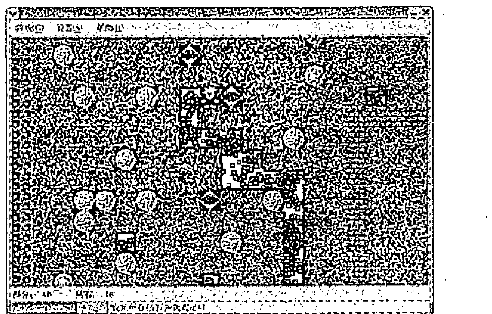

## 缝缝补补又一年——Windows系统补丁与外挂增强工具

文/阿亮

- Hotfix补丁和微软安全公告的形式
- Service Pack补丁包的安装方法
- Service Pack与Hotfix的区别与互替性
- Service Pack的版本
- Office Service Pack的重要性与版本
- 使用冲击波（Worm.Msblast）安全补丁
- 使用微软DirectX漏洞补丁
- 使用Windows Script中文版补丁
- 使用Windows 2000中文输入法状态识别补丁
- 使用Iomega软件与Windows 2000兼容补丁
- 使用Windows 2000高度加密包
- 使用OEM许可服务器启动失败补丁
- 使用Windows XP任务栏假死补丁
- 使用Windows XP关机补丁
- 使用DirectX卸载工具
- Microsoft Plus!——Windows的美丽外套
- Windows优化大师、超级兔子魔法、Norton Utilities三款系统调整设置工具推荐
- 2x2mas InfoBar监视系统资源
- Absurd Terminator强力关闭程序
- Bootvis加速Windows XP启动
- EF Process Manager关闭后台程序

尽管Windows NT内核的新一代操作系统已经变得十分稳定，但是面对层出不穷的软件已经无孔不入的黑客程序，Windows系统难免会在长期使用之后受到一定程度的损坏。毫无疑问，此时进行及时的修补与防护至关重要。这不仅能够最大限度地保护资料安全，更能让PC发挥出最佳的性能。

### 一、Service Pack补丁

#### 1. 了解Service Pack

虽然Windows操作系统被广泛采用，不过这并不表示它的稳定性和可靠性最好。相反，早期的Windows是相当不可靠的，大家广泛采用它只是因为它的易用性和兼容性。不过现在好多了，随着Windows 2000和Windows XP的广泛应用，Windows产品的稳定性和可靠性已经不再是那么突出的问题。相反，现在人们关注最多的，则是Windows的安全性！

既然是全世界应用最广泛的软件产品，研究它的人自然不会少。进而Windows系统上被发现的漏洞和缺陷似乎也特别的多，并且还有不少的人以制造在Windows上传播的病毒和木马为乐。我们经常能够看到提醒大家Windows产品新发现某个漏洞之类的文章。所以在发现漏洞后的第一时间给我们的系统打补丁已经成为了Windows用户的一个必修课。

一般需要安装的补丁有两种，Hotfix和Service Pack。Hotfix是针对某一具体问题而发布的专门解决这个问题的小程序（也可以叫做修复程序）。微软一般会把在自己的软件产品中发现的重大问题以安全公告（Security bulletin）的形式通知给大家，这些公告都有一个唯一的编号，即MS**-***。例如MS02-063，表示微软公司在2002年发布的第63个安全公告（图1）。而这些公告所涉及的问题还有另外一个编号：Q*******。MS02-063安全公告的编号就是Q329834，这个号码表明了该问题在微软知识库（Knowledge Base）中的编号，只要记住这个编号，随时都可以查找到相应的文章和解决方案。因此，每个安全公告所发布的补丁也就有了相应的编号，例如Q329834针对Windows XP系统的补丁名称就是Q329834_WXP_SP2_x86_ENU.exe ，这表示这个补丁解决的问题在知识库文章Q329834中讨论过，适用于Windows XP，即将被集成到Windows XP SP2中，并且是英文版。

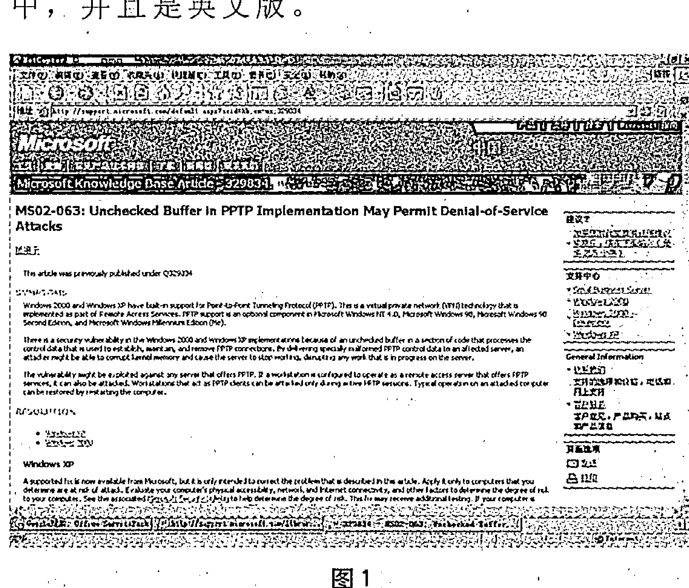

由于微软频繁地发布各种Hotfix补丁，对于一般的系统管理员，要察看自己的电脑是否安装了某个Hotfix补丁就成了一件很麻烦的事情。并且，依次安装各种Hotfix补丁在操作上也非常烦琐和辛苦。微软为了解决这个问题就开始发布Service Pack补丁。这种补丁一般在操作系统正式上市一段时间后发布，包含了自发布之日全部的Hotfix补丁。只要安装了Service Pack，在这个Service Pack发布之前的所有Hotfix补丁就都不用再安装了。

Service Pack有两种安装方式：本地安装和网络安装。本地安装要求你下载完整的安装包，然后运行安装程序（图2）；网络安装则是下载并运行网络安装程序，然后程序自动从网络上下载所有需要的安装文件。这两种方法各有利弊：本地安装需要一次下载一个较大的文件，一般都在100MB，不过如果以后要重装系统，这个安装文件还可以再次使用，不用重复下载。而网络安装的下载量比较小，安装程序会决定你所需要的文件并且有选择地下载，这样安装一次可能会下载少于50MB的文件，因此这种方式更加适合宽带用户。不过如果没有宽带，也不想用56K的调制解调器下载100MB的完整安装文件，则可以在Service Pack发行后关注一下那些送光盘的IT杂志，这些杂志一般都会收录最新的Service Pack完整安装文件。

#### 2. Windows Service Pack

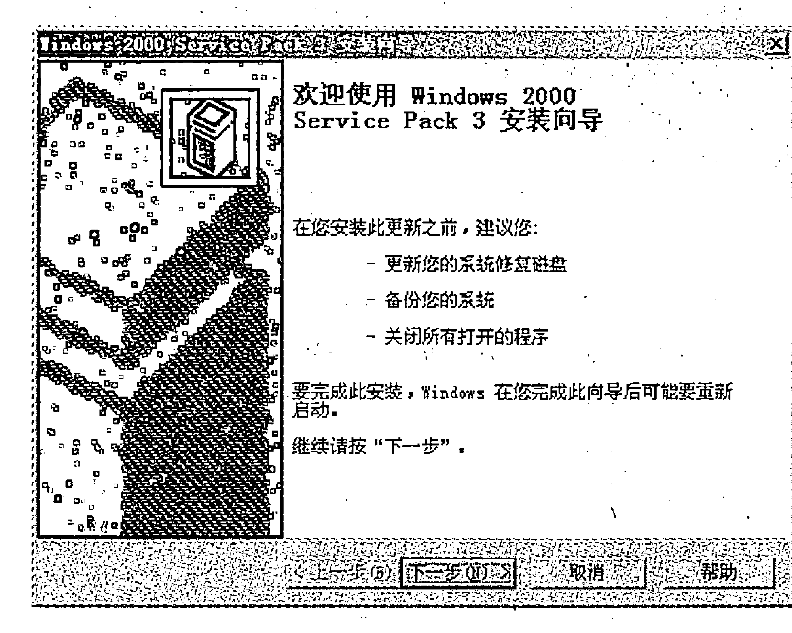

自从Windows 2000开始，微软的Service Pack就引起了用户的广泛关注。对于全新内核的操作系统而言，各种兼容性问题总是难以避免，而此时Service Pack就成了最管用的救命稻草。毫无疑问，Windows 2000/XP“即插即用”功能的漏洞可能使你的系统“即插即漏”，导致严重的数据泄漏。同时，不断涌现的新硬件让Windows 2000/XP面临穷于应付的窘境，如最新的USB 2.0标准等。另外在其推出之际，与之兼容的应用软件尚未大量上市，显得有点“曲高和寡”，而其内置的不可卸载或禁用的应用程序又将同类软件逼入死胡同，在业界引发争议。针对以上问题，微软的Service Pack补丁程序都是最佳的解决方案。即便你如今并没有遇到严重的兼容性问题，也应该立即升级到最新版本的Service Pack，以便杜绝后患。

通过Windows Update，也可以安装到最新的Service Pack。你也许就会有这样的疑问了：如果我已经通过Windows Update安装了所有的Hotfix补丁，那么我还需要Service Pack吗？答案是肯定的！如果你很在意系统安全，那么就一定要装Service Pack。尽管你可以通过Windows Update安装补丁，但是你能保证所有系统漏洞的补丁程序都会出现在Windows Update站点中吗？订阅微软安全通告的用户经常会收到一些通知，告诉你某个Windows系统又发现了什么漏洞，以及怎样修补这个漏洞。修补漏洞的方法一般是以补丁的形式提供的，当你兴冲冲地下载了安全通告中所提供的补丁之后，可能会失望地发现，这些补丁只能在英文版的Windows上安装，并且并没有提供其它语种的下载。如果你用的不是英文版操作系统（这也是建议对安全要求高的人用英文版操作系统的原因，因为总能在第一时间安装新发布的补丁程序），那么只好等待了，这些补丁会集成到以后发布的Service Pack中去，并且Service Pack会提供各种语言的版本。因此，Service Pack能带给你更多的安全保障，这是Hotfix补丁程序所不能替代的。

以Windows 2000为例，目前Service Pack已经发展到第四版，总计修正了五百多个BUG，能够适用于Windows 2000专业版、Windows 2000服务器版、Windows 2000高级服务器版以及服务器应用工具。需要提醒大家的是，使用Service Pack之前应该看清楚对应的语言版本，千万不能搞错。由于Service Pack升级文件的体积很大，因此下载前要做好足够的心理准备。

如果大家还熟悉第一版Windows 2000的话，一定对当时的兼容性记忆犹新。在Service Pack没有推出之前，很多程序在Windows 2000下根本无法运行。需要注意的是，安装Windows 2000的Service Pack4之前应该先安装Service Pack1以及Service Pack2，因为Service Pack4与前两个独立，并没有将它们集成进去，仅仅集成了Service Pack3。

至于Windows XP，目前Service Pack2是最新版本，而且集成了Service Pack1。令人欣喜的是，Windows XP的Service Pack所涉及的内容不仅仅是兼容性改善，微软还带给我们很多令人耳目一新的新功能，以及更加实用的人性化设计。然而不可忽视的是，很多盗版Windows XP在安装Service Pack之后就会“原形毕露”造成激活失效，此时大家应该根据自己的实际情况权衡利弊！除了Windows 2000/XP，目前网上还释放出了测试版的Windows Server 2003 Service Pack1，不过目前使用这一操作系统的桌面用户还很少，因此也就不多介绍了。

#### 3. Office Service Pack

Office可谓是最常用的办公软件了，微软对这一拳头产品也不敢怠慢，时刻保持更新。更为重要的是，Office从某种程度而言已经不仅仅是一款应用软件，它甚至在底层与操作系统相关联，某些漏洞甚至可能会造成安全隐患，因此更新Service Pack并非没有必要。

Office XP用户可以安装最新的Service Pack2，它提供了大量的安全性增强功能，在提升稳定性及性能上有长足的进步。此外，Office 2000用户也可以安装Service Pack3，以解决各种兼容性问题，特别是Microsoft Security Bulletin和几个之前公布的下载程序中所列出的安全隐患。

#### 4. Internet Explorer Service Pack

Internet Explorer浏览器面对的各种安全问题更为突出，而复杂的动态网页效果、多语言处理以及JAVA虚拟机等也需要时刻更新。毫无疑问，如果希望顺利地畅游网际，那么安装Service Pack是必须的，其重要性丝毫不亚于Windows Service Pack。

Internet Explorer 6的Service Pack1集成了Windows XP Home Edition和Windows XP Professional中核心技术的最新版本，即便是使用Windows2000/9X/ME的用户也应该安装。Internet Explorer 6 Service Pack1为个人用户提供私人的、可靠的、灵活的浏览体验。至于那些还在坚守Internet Explorer 5.5的用户，我们也推荐使用Service Pack2。

### 二、安全隐患补丁

#### 1. 冲击波 (Worm.Msblast) 安全补丁

冲击波病毒利用微软的RPC漏洞进行快速传播，通过攻击RPC服务默认端口，其较小的体积能在网络上快速传播并且造成网络严重阻塞。最近很多用户反映上网速度严重减慢的原因就是中了该病毒，不过Windows9X/ME并不存在RPC问题。

对此，微软立即作出了快速反应，适时地推出了相关RPC补丁，从而彻底杜绝了冲击波病毒。需要注意的是，针对冲击波病毒的RPC补丁分为Windows NT、Windows 2000、Windows XP、Windows Server 2003这四个版本，而且注意区分不同的语言版本以及Professional、Advanced或者Home 版本。安装 RPC 补丁之后，冲击波病毒将无法起作用，但是对于那些已经不能上网的用户而言，使用杀毒软件进行彻底清理也是最正确的解决之道。

#### 2. 微软 DirectX 漏洞补丁

DirectX 漏洞存在于 DirectX 下一个叫 quartz.dll 的组件中，这个组件被很多软件调用以播放 MIDI 文件，包括 Internet Explorer。一旦黑客在 MIDI 文件上作些手脚，这个组件就会引发缓冲区溢出并把系统的控制权拱手交给攻击者，这就使得用户系统很容易被破坏或者被利用于引爆另一场类似“冲击波”的恶意攻击。成功的攻击可导致 DirectShow 或使用 DirectShow 的应用程序出现问题，或导致用户的计算机运行攻击者的代码。

针对这一十分严重的问题，微软已经推出了相关补丁程序，而且对应不同版本的 DirectX 以及 Windows。此外，即便是最新版本的 DirectX 9.0 也无法幸免遇难，安装补丁程序也是必须的。需要注意的是，对于 DirectX 9.0 而言，安装补丁程序后将无法卸载，不过暂时还没有发现该补丁程序会对系统造成什么伤害，可以放心地使用。

#### 3. Windows Script 中文版补丁

为了更好地推广网站，不少网页都通过一些手段来修改 IE 标题、首页以及其它内容，让用户感到非常头疼。有些网站甚至在启动组里做手脚，使得重启以后标题依旧，或者禁止注册表编辑。尽管这不能说是微软的漏洞，但是微软还是推出了最新的 Microsoft Windows Script，彻底防止 IE 标题被修改，同时还能保护 Outlook Express 标题栏。

#### 4. Windows 2000 中文输入法状态识别补丁

在系统安装过程中安装了一种输入法之后，这种输入法就可以在系统登录界面中使用。在这种情况下，此输入法应该知道它当前是运行在 LocalSystem 权限下，而不是一个实际的交互式用户权限。因此，某些特定的功能应该受到限制。然而，简体中文输入法没有能正确的检测当前的状态，导致在系统登录界面中提供了不应有的功能。毫无疑问，一个恶意的用户可以通过直接操作该计算机的键盘或一个远程终端连接来得到 LocalSystem 权限，而根本不用事先登录到该计算机。

绝大多数情况下，只有 Windows 2000 简体中文版有此问题。对于其它语言版本的 Windows 2000，只要不是在整个系统安装过程中安装的简体中文输入法，它就不会缺省地在登录界面中出现。

#### 5. Iomega 软件与 Windows 2000 兼容补丁

Iomega 软件在 Windows 2000 下运行时会出现不能识别并行端口的问题，这是由于 Windows 2000 本身的兼容性问题所引起。当然，安装这一补丁程序之后可以解决 Iomega 软件和 Windows 2000 不兼容的问题，从而允许 Iomega 软件工具在 Windows 2000 下查看并行端口。对于其它并口设备，如果 Windows 2000 无法识别时，也可以考虑采用该补丁程序。

#### 6. Windows 2000 高度加密包

Windows 2000 高度加密包可以使系统达到最高水平的 128Bit 加密，进一步增加安全性。它可以为用户在 Internet 上使用信用卡以及从事其它金融或机密事务提供最高级别的安全保护。

#### 7. OEM 许可服务器启动失败补丁

OEM 许可服务器启动失败是在服务器上发生的一类问题，这些服务器都是来自微软原始设备制造商（OEM）或系统组装商，并且都配置了终端服务许可服务。对于这些特殊的服务器，Windows 2000 终端服务许可服务器启动并不检验从 Microsoft Clearinghouse 处获得的启动证书，于是导致将服务器启动为终端服务器许可服务器的失败。结果导致不能安装 Windows 2000 终端服务客户访问许可。安装补丁之后可以完全解决这一问题，这也是微软的一个小失误。

#### 8. Windows XP 任务栏假死补丁

不少用户反映 Windows XP 的任务栏会突然停止响应，此时即便进入管理器将进程终止也无济于事。当然，这一故障并非一直发生，而是不间断地出现。安装任务栏假死补丁之后，问题将会得到彻底解决。

#### 9. Windows XP 关机补丁

Windows XP 的关机速度很慢已经是一个公开的秘密，然而更为令人感到棘手的是，有些配置环境下，系统在关机时停留在”保存设置“的画面上，进而不能正常关机！微软公司已经确认这是 Windows XP 的问题，通过安装关机补丁可以解决。

#### 10. DirectX 卸载工具（图3）

或许 DirectX 卸载工具归为这一类并不合适，不过新版本的 DirectX 确实会带来一些兼容性问题，特别是最新的 DirectX9.0。对于那些涉及视频处理的用户而言，DirectX 的版本往往与视频卡本地驱动休戚相关，此时更换 DirectX 版本将十分可能地解决问题。然而微软似乎总喜欢一厢情愿地强加于用户，DirectX 居然不能安装比当前低的版本！无奈之下，使用 DirectX 卸载工具是必须的，而其中 BUE DirectX 卸载工具是一款很不错的工具，能卸载所有 DirectX 版本，让你顺利实现“降级”。

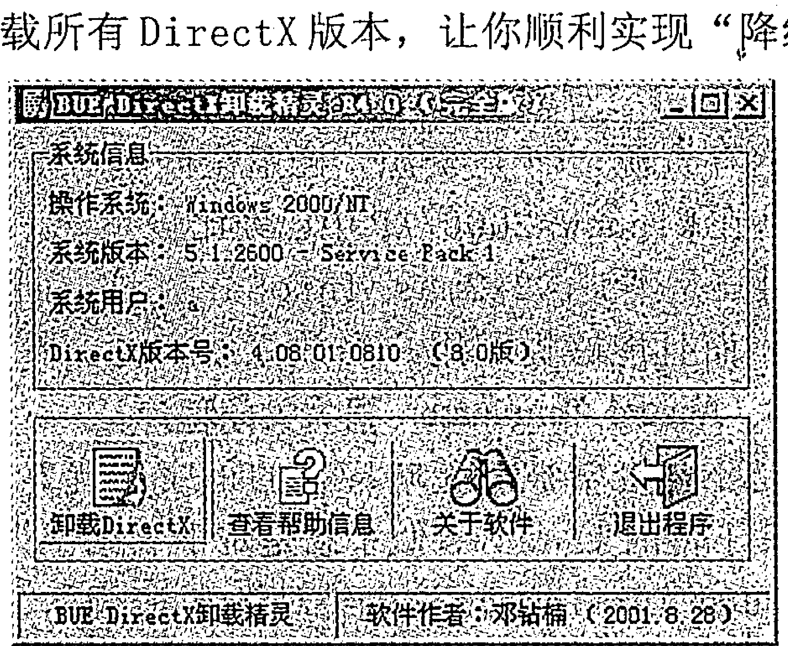

图3

### 三、外挂增强工具

#### 1. Microsoft Plus! (图4)

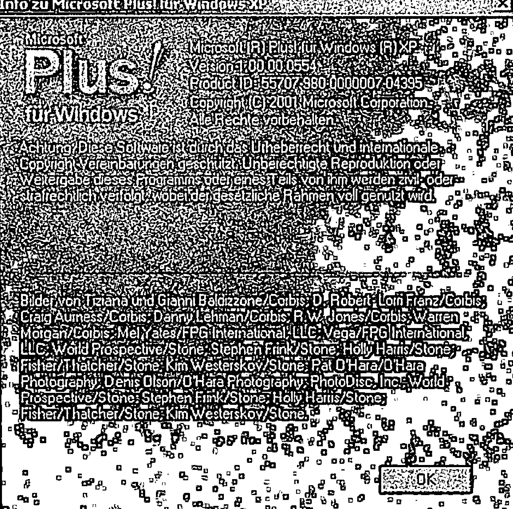

图4

从 Windows 95 开始，Microsoft Plus! 就为广大 Windows 用户翘首期盼的一道大餐，直到现在的 Windows XP。与令人尴尬不已的 Service Pack 不同，Microsoft Plus! 决不是用来解决各种系统漏洞，而是丰富 Windows 的功能，尤其是多媒体功能以及效果出色的主题桌面。对于用户而言，使用 Microsoft Plus! 无疑是一件愉快的事情，惟一遗憾的是 Microsoft Plus! 并非免费，而且没有试用版本，渴望尝鲜的用户将不得不自己掏钱购买。

#### 2. Windows 优化大师 (图5)

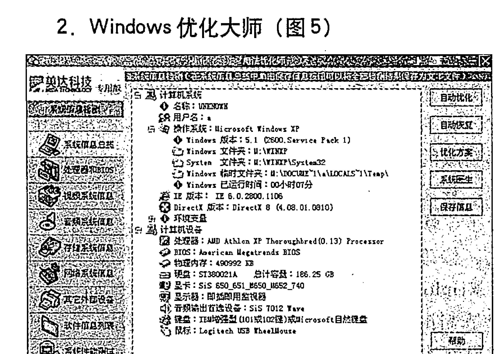

图5

对于庞大的 Windows 而言，系统优化至关重要。从第一代 Windows 95 开始，各种优化软件就层出不穷，而其中著名的 Windows Tweaker、Winbooster、WinOptimizer 等都是地地道道的英文版软件。令人感到欣喜的是，Windows 优化大师的出现让中文版 Windows 用户有了最佳的选择，其功能甚至超越了国外的同类软件。从桌面到网络，从注册表清理到垃圾文件清除，从黑客搜索到系统检测，Windows 优化大师提供了相当全面的解决方案。Windows 优化大师软件包内置：Windows 优化大师、Windows 系统医生、Windows 内存整理、Windows 进程管理、快猫加鞭、自动优化向导等软件模块。Windows 优化大师软件同时适合 Windows98/Me/2000/XP 操作系统平台，能够为系统提供全面有效而简便的优化、维护和清理手段，让你的电脑系统始终保持在最佳状态。

#### 3. 超级兔子魔法 (图6)

超级兔子魔法的定位与 Windows 优化大师十分相似，而起初超级兔子魔法的功能比较有限，且稳定性和兼容性都不是很理想。但是较为可爱的中文界面很具亲和力，所以有不少初级用户喜欢用它，现在它已成为商业软件出现在零售市场上。最新版的超级兔子2003在功能上有不少改进和增补，共支持20个方面的Windows设置，并且还整合了5款超级兔子系统软件（软件优化、注册表优化、修理专家、IE保护器和内存整理），涉及到了Windows修改与优化的方方面面。总体而言，无论是Windows优化大师还是超级兔子魔法，其优化效果都达到令人十分满意的境地，强烈推荐用户选择一款使用！

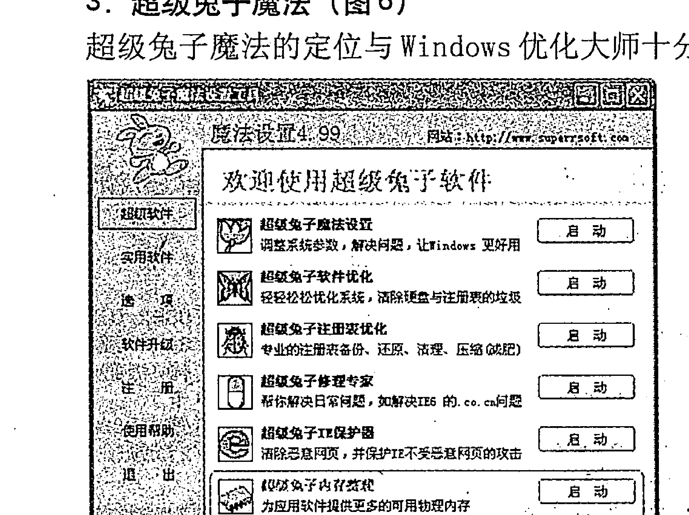

图6

#### 4. Norton Utilities (图7)

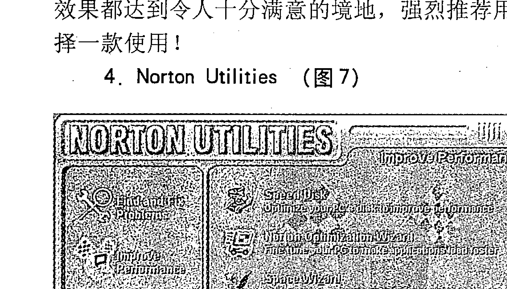

Symantec 公司出品的 Norton Utilities 历来就是 Windows 优化软件中的北斗泰山，其功能之强大是其它软件所无法比拟的。毫无疑问，Norton Utilities 是一套真正意义上的 PC 实用软件工具包，它集成了磁盘修复、磁盘优化、系统维护、系统优化等一系列功能。对于高级用户而言，Norton Utilities 的强大功能确实十分实用，毕竟这已经不仅仅是一款简单的注册表优化软件，而是可以全面提供系统的稳定性与性能，并且在磁盘管理、数据保护、系统安全等多方面达到令人满意的效果。

#### 5. 2x2mas InfoBar

对于用户而言，时刻关注系统资源是一件麻烦的事情。2x2mas InfoBar 就是让用户时时刻刻关注内存资源、CPU 资源、磁盘空间资源等，虽说这些在 Windows2000/XP 中已经比较完善，但是直观性还是不够，2x2mas InfoBar 在这方面更胜一筹，而且能够提醒用户释放系统资源。

#### 6. Absurd Terminator 强力关闭程序

是不是经常被“无响应”的程序困扰？而天生管理不善的 Windows 似乎总是难下“杀手”。有了 Absurd Terminator 这个绝对终结者之后，用户就能以最快的速度关闭包括 Windows 在内的任何任务，包括正在运行的程序和后台服务，这对于还在使用 Windows98/ME 的用户而言无疑是雪中送炭。

#### 7. Bootvis 加速 Windows XP 启动

Windows XP 的启动速度令人不敢恭维，而使用微软提供的 Bootvis 可以有效的提高 Windows XP 启动速度。这个工具是微软内部提供的，专门用于提升 Windows XP 启动速度。运行 Bootvis 之后在“Trace”下拉菜单中选择跟踪方式，此时会引导 Windows XP 重新启动，并记录启动进程，生成相关的 BIN 文件。

#### 8. EF Process Manager

EF Process Manager 用来让使用者能了解看不到的在后台执行的处理程序，能显示目前已经载入哪些模块，分别是正在被哪些程序使用着，假如有不需要的程序，大可马上关闭，而不会影响操作系统继续正常执行。对于 Windows98/ME 的用户而言，EF Process Manager 将让他们弥补无法使用类似 Windows 2000/XP 任务管理器的遗憾。

# 品牌的外观·兼容的价格·专业的推荐·媒体的信誉

# 电脑爱好者有礼了

- ○ INTEL Celeron 2.0 GB
- ○ 40GB硬盘
- ○ 17英寸纯平显示器
- ○ 128MB DDR内存
- ○ 光电键盘鼠标套装
- ○ LG 52X CD-ROM
- ○ 2.1声道音箱
- ○ 捷波P4MDUT主板（USB2.0接口/2 DDR SDRAM插槽/3 PCI插槽/支持ATA133 IDE传输/板载显卡/AGP扩展/AC'97声卡）
- ○ 蓝色微型机箱（前置2 USB接口/1 IEEE1394接口/2音频输入输出口）

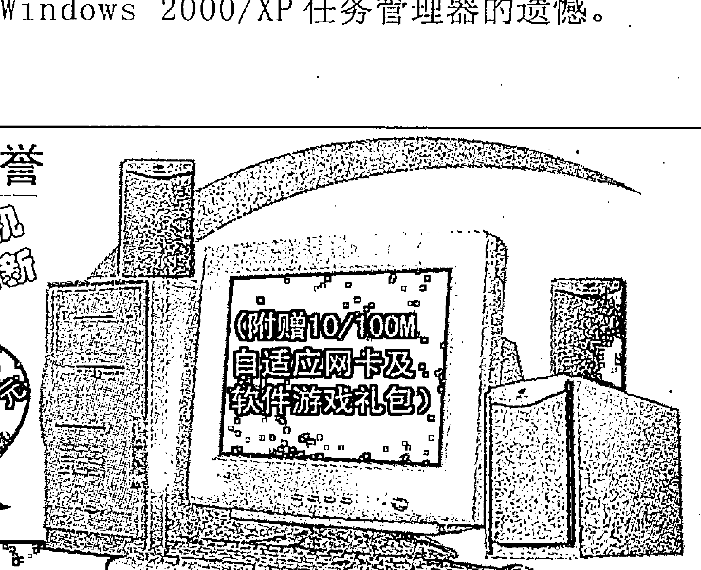

装机热线：(010) 62141292 邮件查询：cfclub@cfan.com.cn 电脑爱好者俱乐部外店地址：北京宣武区广安门外大街华联超市东侧广外电脑科技商城

## 硬盘数据恢复技术入门与提高

文 / It door · 王涵涵

- 数据丢失原因与恢复概率
- 常用的数据恢复工具
- 高级格式化后数据恢复
- 零磁道损坏时的数据恢复
- 分区表损坏时的数据恢复
- 误删除后的数据恢复
- 硬盘数据的保护方法
- 日常硬盘维护

随着硬盘容量的日趋倍增，长时间使用硬盘，硬盘难免有时会出错，轻则数据丢失，重则整个硬盘报废，造成不可预料的严重后果，本文就带领大家深入浅出地了解硬盘相关知识，并对常见的几种数据丢失情况采用特殊恢复软件来进行数据恢复。

### 一、硬盘的分区方式

硬盘分区后一般形成3种形式的分区，即主分区、扩展分区和非DOS分区。其中主分区又称为主DOS分区（Primary DOS Partition），扩展分区又称为扩展DOS分区（Extended DOS Partition）。非DOS分区（Non-DOS Partition）是一种特殊的分区形式，它是将硬盘中的一块区域单独划分出来供另一个操作系统使用，如Windows NT、Linux和Unix等。对主分区的操作系统来讲，非DOS分区是一块被划分出去的存储空间。只有非DOS分区内的操作系统才能管理和使用这块存储区域，非DOS分区之外的系统一般不能对该分区内的数据进行访问。

主分区是一个比较单纯的分区，通常位于硬盘的最前面一块区域中，构成逻辑C磁盘。在主分区中，不允许再建立其他逻辑磁盘。

扩展分区的概念则比较复杂，也是造成分区和逻辑磁盘混淆的主要原因。由于微机操作系统仅仅为分区表保留了64个字节的存储空间，而每个分区的参数占据16个字节，故主引导扇区中总计可以存储4个分区的数据。由于操作系统只允许存储4个分区的数据，如果说逻辑磁盘就是分区，则系统最多只允许4个逻辑磁盘。对于具体的应用，4个逻辑磁盘往往不能满足实际需求。为了建立更多的逻辑磁盘供操作系统使用，系统引入了扩展分区的概念。

所谓扩展分区，严格地讲它不是一个实际意义的分区，它仅仅是一个指向下一个分区的指针，这种指针结构将形成一个单向链表。这样在主引导扇区中除了主分区外，仅需要存储一个被称为扩展分区的分区数据，通过这个扩展分区的数据可以找到下一个分区（实际上也就是下一个逻辑磁盘）的起始位置，以此起始位置类推可以找到所有的分区。无论系统中建立多少个逻辑磁盘，在主引导扇区中通过一个扩展分区的参数就可以逐个找到每一个逻辑磁盘。需要特别注意的是，由于主分区之后的各个分区是通过一种单向链表的结构来实现链接的，因此，若单向链表发生问题，将导致逻辑磁盘的丢失。

### 二、硬盘分区结构

为了方便操作系统在启动过程中访问硬盘的分区参数，分区的相关数据存储在一个被称为主引导扇区（MBR）的特殊存储空间中，也就是存储在硬盘的0磁头0柱面1扇区。主引导扇区为分区数据保留了64个字节的存储空间，每个分区的数据占用16个字节的存储空间。硬盘分区数据由于受到主引导扇区中只能存储4个分区数据的影响，因此采用的是一种混合的分区数据保存结构，这种混合的分区数据结构由以下3个部分组成：

1. 主分区的分区数据存储在主引导扇区中，并且通常是分区表数据中的第一项。考虑到应用的广泛性，主分区通常也是活动分区。
2. 根据用户需要，可以建立一个扩展分区。扩展分区的相关数据也存储在主引导扇区中。扩展分区实际上是一个指针，它指向系统下一个分区，也就是下一个逻辑磁盘的位置。
3. 根据是否已经建立了扩展分区，系统允许建立2～3个非DOS分区，用于建立其他操作系统的存储和管理区域。

根据分区的结构，我们知道在主引导扇区的分区表中存储上述3种类型分区形式的参数，这些参数包括分区的起始磁头、柱面、扇区和分区结束的磁头、柱面、扇区参数，以及分区的类型和是否为活动分区等对分区至关重要的数据。对于主分区和非DOS分区来讲，这些参数就是分区实际的参数。而对于扩展分区来讲，其扩展分区的起始物理地址实际上是另一个分区表数据的存储物理地址。根据扩展分区中所建立的逻辑磁盘的数量，将相应产生相同数量的分区数据。

例如，假设一个物理磁盘的扩展分区中建立了3个逻辑磁盘，则在主引导扇区中存储的分区表中可以找到第一个逻辑磁盘的起始分区地址；而在第一个逻辑磁盘的起始物理地址中将存储两项分区数据，一项是当前逻辑磁盘的分区数据，另一项是指向下一个逻辑磁盘的起始分区地址。也就是说，每一个逻辑磁盘实际上均有一个分区引导扇区，该分区引导扇区存储当前分区和下一个分区的引导扇区的物理地址。若分区引导扇区中仅存有当前分区的物理地址，没有下一个分区的物理地址，则表示当前分区是最后一个逻辑磁盘。所以，我们称这种逐项给出下一个分区地址的指针链表为一个分区结构的链表。

包括有4个逻辑磁盘的分区数据存储结构如图1所示。

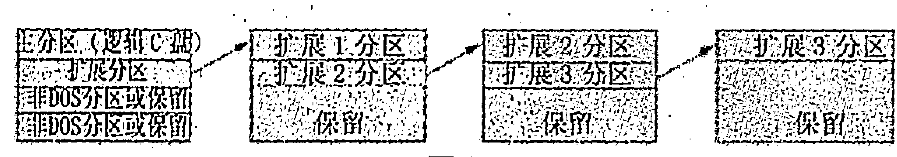

根据图1所阐述的分区与逻辑磁盘结构关系，不难得出这样的结论：逻辑磁盘实际上就是一个独立的分区，只不过分区的参数不是存储在主引导扇区中，而是存储在各个分区的第一个扇区中。通过存储在主引导扇区中的扩展分区参数，按单向链表的方式可以逐个访问到逻辑磁盘的分区参数。

下面我们用一组实际的数据对上述分区结构理论进行论证，有关的数据如图2所示。

图2：显示硬盘0磁头0柱面1扇区、0磁头F4H柱面1扇区等实际分区数据的十六进制转储表。

根据图2提供的数据，主引导扇区（0磁头0柱面1扇区）中存储的分区表数据表示物理硬盘分成两个区，其中第1个分区为主分区（分区类型标志为06H），且为活动分区。而第2个分区为扩展分区（分区类型标志为05H），下一个分区表数据的存储地址为0磁头F4H柱面（即244柱面）1扇区。用汇编语言程序读入0磁头F4H柱面1扇区的数据，发现其分区表的数据结构与主引导扇区完全相同，但没有分区引导程序部分，除了分区表数据外，其余数据均为0。第2个分区引导扇区中存储的分区表数据表示该分区从1磁头F4H柱面1扇区开始，这是该分区的逻辑0扇区的位置，而分区标志（06H）表示对应的分区为主分区，下一个分区从0磁头1ABH（即427）柱面（柱面参数共10位二进制，其中第9和10位由前一个字节的最高两位提供）1扇区开始，为扩展分区。依次类推，可以通过第1个扩展分区的数据依顺序找到每一个分区或逻辑磁盘的数据。在0磁头262H（即610）柱面1扇区中存储的分区表数据表示该分区是最后一个分区。

根据图2所提供的硬盘实际存储的分区数据，不难得出这样的结论：该硬盘共有两个分区，其中主分区构成逻辑C磁盘，扩展分区构成D、E和F 3个逻辑磁盘。

至此，我们了解了硬盘分区及逻辑磁盘的构成原理，同时掌握了分区的数据存储结构。通过掌握分区的数据存储结构有助于我们了解数据恢复的意义。

### 三、数据丢失原因及恢复概率

参考以下内容，对突发的硬件问题不要慌张,应迅速采取措施以防止更多的数据损失。

1. 无法读硬盘
    1) 计算机问题
        - Auto Detect (自动监测无法运作)
        - Controller Failure (控制器失效)
        - Booting (启动不通过)
        - Invalid Drive Specification (损坏的磁盘格式)
        - Hard Disk Fail (硬盘故障)
        - Invalid Media type (损坏的媒体类型)
        - Missing Operating System (丢失操作系统)
    2) 硬盘硬件问题
        - 零件损坏(磁头,核心电机,电路板,其他)
    3) 软件问题
        - 分区表损坏、引导记录损坏、病毒感染、引导目录损坏。

2. Hard Disk Fail
    - 当判断是50%以上的磁盘碎片、零件损坏等诸原因时,一旦确定好原因之后,预防更多的数据损坏将是非常重要的事情。
    - 当判断是软件问题时,应慎重使用NDD、Scan Disk等Disk Utility(如遇核心部分0磁道等有坏扇区时有可能已经破坏了数据现有的存储结构，所以应该更加注意)。
    - 当是硬件故障时,修复率是50%,如不是硬盘自身问题,修复率将远远超过这个比率。

3. 核心电机问题
    1) 核心电机出现偷停状况
        - Hard disk fail, (无法读硬盘)等症状。
        - 硬盘虽试图使自身处于Ready (准备)的状态,但它无法自己读出必要的情报,所以通过多次重试。
        - 用户自己能够点检的惟有替换Board (注意! 正常运作的Board 如相互替换也出现很多不能运作的情况)。
        - 恢复成功率约70% (注意!除上述情况外,如听到硬盘的声音或击打摩擦的声音时应关闭电源)。
    2) 核心电机不转
        除核心电机自身有问题的情况外,其它问题不是很严重。如果是核心电机自身的问题,恢复数据工作就非常困难,因为这个工程好比把基石和房柱拿出来后从新盖房子一样。
        - 把电源打开,将手轻轻放在硬盘盖上就可感知它是否运转。
        - 恢复成功率:80%。

4. 盘片被刮伤
    这是无法读硬盘,“Hard Disk Fail”, “Not Ready”等的主要原因,也是硬盘的较大的问题。
    - 自身缺陷、震动、冲击、碰撞、摔落、电源开关(On/Off)时,给长时间没有使用的硬盘接上电等,以及温度、湿度等环境因素 (严重受损的无恢复可能性,不能恢复的大部分同这些因素有关)。
    - 轻微受损,有可能Ready或能够复制,就有可能全部或部分恢复。
    - 盘片被刮或损伤的硬盘数据恢复率为30%左右。

5. 坏扇区
    - 如保持原状态,可能全部恢复或大部分恢复。有时由于使用Disk Utility等原因,造成不能恢复或本来可能恢复的许多数据恢复不了。
    - 在可读硬盘的情况下,尽可能多的备份数据后,再行操作。
    - 实际恢复率约为50% (注意!使用Disk Utility 要特别小心)。

6. 系统或者内部零件损坏
    是前述无法读硬盘,无法达到准备状态,马达时而转动时而不转等的原因之一。
    - 除盘片被刮产生碎片之外,这大容量硬盘普遍产生的故障,如不是电脑专业技术人员,就无法做出诊断。
    - 使用者几乎没有自行解决的可能。根据不同的厂家和型号,恢复可能性在30%-60%之间。

7. 分区表被删除或有问题
    用户误操作、病毒、坏扇区、电流的冲击等所造成。严重的病毒、坏扇区等情况则一般显示为“Invalid Drive Specification”。实际恢复率为90%。
    经常使用Disk Utility, 及由于病毒或坏扇区所造成的情况,一般无法恢复或难以恢复。

8. 感染病毒
    恢复成功率:74%

## 四、常用数据恢复软件介绍

### 1. PCtools9.0 (DOS)

该软件具有初级的数据恢复功能，使用计算机时间较长的用户对此软件较为熟悉。由于只在 DOS 下使用该工具，目前此款软件的应用范围已经大大缩小，取代它的则是在操作系统下使用的数据恢复软件。

工具软件 PCTOOLS 是由美国 Central Point 软件公司针对 PC 机设计的实用工具箱。自 1985 年第一版问世，已经历多次版本更新。功能从初期的方便快速的磁盘/文件操作(弥补 DOS 功能的不足)到如今的集磁盘维护、桌面管理、支持网络通讯等多种强有力的功能于一体。操作极为方便、灵活，使一般用户能做以前只有专家才能进行的一些工作，诸如编辑 EXE 文件、汉化软件、恢复被删除的数据。查看磁盘状态：用 PCTOOLS 的 MAP 功能，可以获知磁盘上是否有坏的扇区，磁盘上自由空间百分比、可用空间、文件分配表、已分配的文件、BOOT 区、目录、只读、隐含等文件的分布状况。排序(SORT)：可将磁盘上的所有文件按文件名、扩展名、文件最后修改日期和文件大小进行的分布重新排列。恢复已删除文件(UNDELETE)：只要被删掉文件的存贮区域未被其他文件覆盖，均可恢复。搬动文件(MOVE)：可将文件从源盘上移到目标盘上。此外，PCTOOLS 还提供了磁盘初始化、硬盘磁头复位、查找字符串和打印文件清单等其它功能。

### 2. Easyrecovery 6.0

Easyrecovery是一个非常著名的老牌数据恢复软件(图 3)。该软件功能可以说是非常强大。无论是误删除/格式化还是重新分区后的数据丢失，都可以轻松解决，其甚至可以不依靠分区表而按照簇来进行硬盘扫描。但要注意不通过分区表来进行数据扫描，很可能不能完全恢复数据，原因是通常一个大文件被存储在很多不同的区域的簇内，即使我们找到了这个文件的一些簇上的数据，很可能恢复之后的文件是损坏的。所以这种方法并不是万能的，但其提供给我们一个新的数据恢复方法，适合分区表严重损坏使用其他恢复软件不能恢复的情况下使用。Easyrecovery最新版本加入了一整套检测功能，包括驱动器测试、分区测试、磁盘空间管理以及制作安全启动盘等。这些功能对于日常维护硬盘数据来说，非常实用，我们可以通过驱动器和分区检测来发现文件关联错误以及硬盘上的坏道。

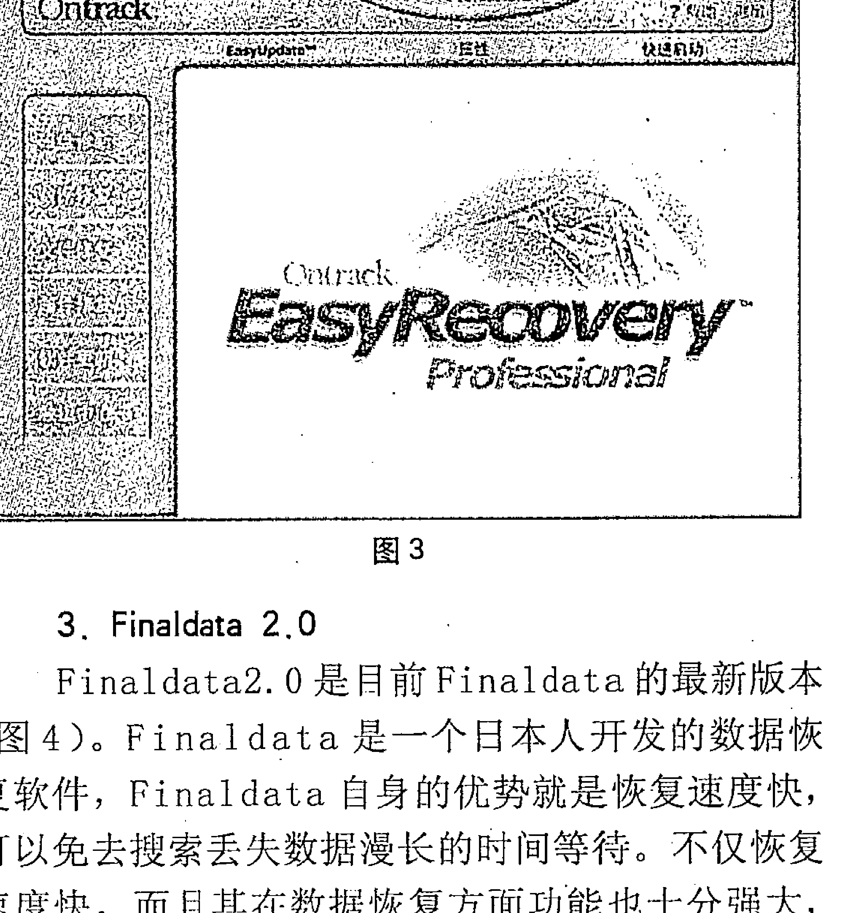

### 3. Finaldata 2.0

Finaldata2.0 是目前 Finaldata 的最新版本(图 4)。Finaldata 是一个日本人开发的数据恢复软件，Finaldata 自身的优势就是恢复速度快，可以免去搜索丢失数据漫长的时间等待。不仅恢复速度快，而且其在数据恢复方面功能也十分强大，不仅可以按照物理硬盘或者逻辑分区来进行扫描，还可以通过对硬盘的绝对扇区来扫描分区表，找到丢失的分区。Finaldata 在对硬盘扫描之后会在其浏览器的左侧显示出文件的各种信息，并且把找到的文件状态进行归类，如果状态是已经被破坏，那么也就是说如果对数据进行恢复也不能完全找回数据。这样方便我们了解恢复数据的可能性。同时此款软件还可以通过扩展名来进行同类文件的搜索，这样就方便我们对同一类型文件进行数据恢复。

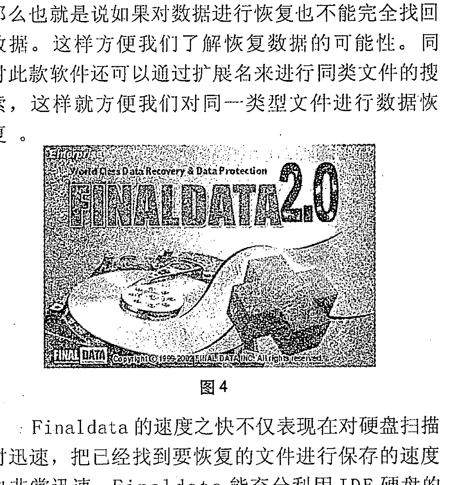

Finaldata 的速度之快不仅表现在对硬盘扫描时迅速，把已经找到要恢复的文件进行保存的速度也非常迅速，Finaldata 能充分利用 IDE 硬盘的 ATA133、ATA100 等最大接口速度，对数据进行快速保存，在保存数据时间方面，Finaldata 比其他同类型软件要快一倍以上。

## 五、几种常见情况下的数据恢复

### 1. 误操作导致高级格式化分区后的数据恢复

在 DOS 时代有一个非常不错的工具称为 UnFormat，它可以恢复由 Format 命令清除的磁盘。如果用户是在 DOS 下使用 Format 命令误格式化了某个分区的话，那不妨使用该命令试试。不过 UnFormat 只能恢复本地硬盘和软盘驱动器，它不能恢复网络驱动器。UnFormat 命令除了上面的反格式化功能，它还能重新修复和建立硬盘驱动器上的损坏分区表。

但目前使用 UnFormat 来恢复格式化后分区的方法已经不那么实用了，我们可以使用多种恢复软件来进行数据恢复，比如诺顿、Easyrecovery 和 Finaldata2.0 等恢复软件均可以方便地进行数据恢复工作。

### 2. 零磁道损坏时的数据恢复

硬盘的主引导记录区（MBR）在零磁道上。MBR 位于硬盘的 0 磁道 0 柱面 1 扇区，其中存放着硬盘主引导程序和硬盘分区表。在总共 512 字节的硬盘主引导记录扇区中，446 字节属于硬盘主引导程序，64 字节属于硬盘分区表(DPT)，两个字节(55 AA)属于分区结束标志。零磁道一旦受损，将使硬盘的主引导程序和分区表信息遭到严重破坏，从而导致硬盘无法引导。

0 磁道损坏判断：系统自检能通过，但启动时，分区丢失或者 C 盘目录丢失，硬盘出现有规律的“咯吱……咯吱”的寻道声，运行 SCANDISK 扫描 C 盘，在第一簇出现一个红色的“B”，或者 Fdisk 找不到硬盘、DM 死在 0 磁道上，此种情况即为零磁道损坏！

零磁道损坏属于硬盘坏道之一，只不过由于它的位置太重要，因而一旦遭到破坏，就会产生严重的后果。如果 0 磁道损坏，按照目前的普通方法是无法使数据完整恢复的，通常 0 磁道损坏的硬盘，可以通过 PCTOOLS 的 DE 磁盘编辑器（或者 DiskMan）来使 0 磁道偏转一个扇区，使用 1 磁道来作为 0 磁道来进行使用。而数据可以通过 Easyrecovery 来按照簇进行恢复，但数据无法保证得到完全恢复。

### 3. 分区表损坏时的数据修复

硬盘主引导记录（MBR）所在的扇区也是病毒重点攻击的地方，通过破坏主引导扇区中的 DPT（分区表），就可以轻易地损毁硬盘分区信息，达到对资料的破坏目的。

分区表的损坏是分区信息被破坏。所以，是可以用软件来修复的。

通常情况下，硬盘分区之后，备份一份分区表至软盘、光盘或者移动存储活动盘上是极为明智的。这个方面，国内著名的杀毒软件 KV3000 系列和瑞星都提供了完整的解决方案。但是，对于没有备份分区表的硬盘，虽然 KV3000 也提供了相应的修复方法，不过成功率相对较低。

在恢复分区上，大名鼎鼎的诺顿磁盘医生 NDD 是绝对强劲的工具，可以自动修复分区丢失等情况，可以抢救软盘坏区中的数据，强制读出后移动到其它空白扇区。这是纯 DOS 下的工具。在硬盘崩溃或异常的情况下，它可能带给用户以希望。在出现问题后，用启动盘启动，运行 NDD，选择 Diagnose 进行诊断。NDD 会对硬盘进行全面扫描，如果有错误，它会向你提示，然后只要根据提示选择修复，它就可以将这些问题轻松搞定。在操作系统下，还有 NDD32 图形化界面（图5）让你事半功倍。

另外，中文磁盘工具 DiskMan 在这方面也是行家里手。重建分区表作为它的一个非常实用的功能，非常适合用来修复分区表损坏。

对于硬盘分区表被分区调整软件（或病毒）严重破坏，引起硬盘和系统瘫痪，DiskMan 可通过未被破坏的分区引导记录信息重新建立分区表。在菜单的工具栏中选择“重建分区表”，DiskMan 即开始搜索并重建分区。DiskMan 将首先搜索 0 柱面 0 磁头从 2 扇区开始的隐含扇区，寻找被病毒挪动过的分区表。接下来搜索每个磁头的第一个扇区。搜索过程可以采用“自动”或“交互”两种方式进行。自动方式保留发现的每一个分区，适用于大多数情况。交互方式对发现的每一个分区都给出提示，由用户选择是否保留。当自动方式重建的分区表不正确时，可以采用交互方式重新搜索。

但是，需要注意的是，重建分区表功能不能做到百分之百的修复分区表。这也说明了天下并没有免费的午餐，还是需要注意保护好自己的硬盘，尽量避免硬件损伤以及病毒的侵扰，所以就要求要备份分区表。

### 4. 误删除之后的数据恢复

此种情况是计算机使用过程中最常见的数据恢复，通常不要再向误删除文件的分区内写入其他文件，这样数据才有可能 100% 进行还原。

当你执行了删除命令后，计算机只是将该文件目录项第 0 个字节改为 E5，并将文件所占簇号在文件分区表中的登记项清零，表示释放空间。格式化时，计算机也只是将根目录区清零。由于删除与格式化操作只是在文件名或根目录名上做了一些手脚，对于文件的数据部分丝毫未动，这样，就给文件恢复提供了可能。利用一些反删除软件，即使初学者也可以轻松地进行文件恢复工作。一般反删除软件工作原理是通过对照分区表恢复文件，误格式化同误删除的恢复方法基本一样，只要没有用 Fdisk 命令打乱分区的硬盘，要恢复的文件所占用的簇不被其他文件占用，这样，格式化前的大部分数据仍然是可以被恢复的。

如果你的 Windows 系统可正常使用，则最简单的恢复方法就是用 Windows 版 EasyRecovery 软件，它恢复硬盘数据的功能十分强大，不仅能恢复被从回收站清除的文件，而且还能恢复被格式化的 FAT16、FAT32 或 NTFS 分区中的文件。

该软件的使用方法十分简单，解压缩安装以后，运行 EasyRecovery，出现主界面。界面左侧包括 4 个功能按钮以及 2 个软件支持按钮，磁盘诊断可以帮助我们测试潜在硬件故障、监视并报告潜在驱动器故障、查看驱动器空间使用详细资料、IDE 硬盘跳线设置、以及分析文件结构和创建可引导的诊断磁盘。这 6 个功能按钮，对于硬盘资料恢复来说，数据恢复选项提供的功能是我们最需要的。

从图 6 我们可以看出 EasyRecovery Professional 提供了多种数据恢复选项。其中包括：使用高级选项自定义数据恢复功能、查找并恢复已删除文件、从一个已格式化的卷中恢复文件、不依赖任何文件系统结构信息进行恢复。此软件还可以保存恢复数据进度以及创建可引导的紧急引导软盘。现在我们选择高级选项自定义数据恢复功能来进行数据恢复操作，经过扫描系统，会显示磁盘驱动器信息（图7）。我们在这里选择恢复资料的硬盘分区 C 盘，此时 EasyRecovery Professional 将自动扫描分区，之后会把所有详细文件信息显示出来，其中包括目前还存在的和已经被删除的文件。

使用 Finaldata 2.0 恢复数据也非常的简单，下面是使用 Finaldata 2.0 来恢复误删除的 111111111111.txt 文档。

原数据文件存在于 0 盘根目录下。双击 Finaldata 2.0 图标，打开主界面。点击文件选择打开选项，然后选择 0 盘为目标盘符。开始搜索，因为 Finaldata 2.0 特殊的设计，使得搜索数据非常快速。

搜索完之后，左侧有许多选项，分别对分区中数据进行了归类，在根目录下，我们可以看到系统搜索出来 111111111111.txt 文件，只要在该文件上点击右键选择恢复即可完成对数据的恢复，其实恢复数据就这么简单。选择丢失的文件，我们可以看到 Finaldata 2.0 对丢失文件进行了归类，并标明了其在那个簇上，方便我们对丢失数据的查找。比如我们选择 AVI 文件，在右侧界面上显示出两个 AVI 文件，并且其已经被标识为损坏文件，这说明此数据文件不能够进行恢复。

另外，Finaldata 2.0 提供了特殊的目标文件夹保护功能。提供了类似诺顿 UnErase Wizard 的功能，可以为指定文件夹分配一定空间来保存删除文件的信息，这样我们就可以方便快速的进行数据恢复，而不用在意是否要经过磁盘扫描来进行数据恢复了。

如果用户丢失资料之前已经安装过 Norton Utilities 或者 Norton UnErase Wizard 工具的话，资料的恢复将易如翻掌。

如图 8，安装完 Norton UnErase Wizard 之后，回收站上会出现一个蓝色盾牌图标。例如我们删除一个文本文件 bbbbbbbbbb.txt 并且清空回收站，此时在操作系统下使用 Norton UnErase Wizard 就可以使该文件轻松的恢复。双击回收站图标，就可以对已经删除的文件进行搜索。

我们可以从图 8 中可以看到已经删除了的 bbbbbbbbbb.txt 文件，通过点击 Recover 就可以恢复了。上面介绍的是简易恢复方法，通过打开 Norton Utilities 主界面的 Find and Fix Problems 中的 UnErase Wizard 选项。我们可以选择三种不同的恢复方法。分别为寻找已删除文件，在特定分区中寻找所有被保护文件，以及搜索通过文件打开类型要恢复的文件。

一般用户找到所丢失的文件，大部分都可以通过上面的方法恢复，但有时候你会发现，使用上面介绍的工具仍然不能找到丢失的文件，这是什么原因呢？这要从磁盘的原理来说明，磁盘空间是以簇为单位进行分配的。由于磁盘簇是文件系统进行分配、释放、读出的最小空间单位，即使只有一个字节的文件也要占用整整一个簇的磁盘存储空间。通常当我们把文件写入磁盘时，文件即在磁盘上占用一定数量的簇，当从磁盘上把文件删除后，磁盘就释放出一定数量的簇，此时若使用软件来恢复被删除的文件，则文件被恢复的可能性最大。如果在删除文件之后又对磁盘进行了写操作，那么新文件有可能会覆盖被删除文件原先所占据的簇，那么该文件就不能成功地被恢复了。

## 六、数据恢复注意事项

-   文件丢失后，不要再向该分区或者磁盘写入信息，即刚被删除的文件被恢复的可能性最大。
-   小文件比大文件更容易恢复。
-   恢复之前千万千万别用磁盘整理功能，否则数据恢复的成功几率将大大减小。同时也尽量不要使用 Fdisk 程序，否则将会给你的恢复造成很大的困难。
-   有足够的空余磁盘空间或者外接新硬盘以备写入恢复资料。

## 七、硬盘数据的硬件保护

### 1. 硬盘保护卡

硬盘保护卡又称为硬盘还原卡，是彻底解决计算机数据保护问题的最佳方案。它作为一个板卡安装于计算机的扩展槽中，在硬件的层面上实现对硬盘中的数据进行保护和恢复。其优点是可以瞬间恢复各种有意或无意操作而导致的数据丢失。
硬盘保护卡的特点：不占用硬盘空间、被破坏的数据瞬间复原、简便易用、全面保护电脑参数 / 设置安全。

### 2. 数据保护软件

一些主板都提供了硬盘数据的保护功能，例如捷波的“数据恢复精灵”和联想 QDI 的“宙斯盾保护系统”，在此我们以联想 QDI 的“宙斯盾保护系统”为例介绍一下通过软件对硬盘数据的保护方法。
宙斯盾(RecoveryEasy)是联想 QDI 主板最新保护硬盘数据的技术。使用该技术的主板可以备份、保护并且立即恢复硬盘资料，防止重要资料丢失。此外，宙斯盾还能保护和恢复 CMOS 中的数据。因为宙斯盾是建在 BIOS 中的，只要计算机进入 BIOS 启动步骤后，就可以立即进入宙斯盾界面，用户可以选择是否备份。宙斯盾比目前传统的救援卡更为先进。
传统的救援卡一般放在一个 PCI 槽上或调制解调器上，它有可能同主板不兼容。当安装了救援卡后，相应的参数设置必须工作，如果升级 ROM 必须升级软件。此外，硬件的质量和维护将变得复杂。但宙斯盾是建在 BIOS 中的，不但它百分之百兼容，而且不用安装任何软件或硬件，还可以通过升级 BIOS 自动升级。而且不会造成硬件的额外质量和维护的问题。

由于传统的救援卡程序和参数有部分存在硬盘中，因此如果硬盘被病毒或其他原因毁坏，救援卡也就失去了作用。但宙斯盾却有很强的防病毒功能，它可以把任何病毒都关在备份区外。再加上联想 QDI 的无敌锁功能，宙斯盾完全可以防止病毒袭击。而且不像一般的救援卡只能保护一个硬盘，宙斯盾 (RecoveryEasy) 可以保护最多四个硬盘。

捷波主板的恢复精灵也是使用了类似的技术，同样也是非常受到电脑爱好者的喜欢。宙斯盾和恢复精灵的惟一缺点是，它需要占用一些硬盘空间。

RecoveryEasy II 比 RecoveryEasy 精简了界面，热键进入，备份与恢复只需简单的几个选择，一目了然，更方便使用，更适合普通用户。它采用了 ATA-5 及其以后规范中的"Host Protected Area"功能，在硬盘高端划分出保护区域存放备份数据，从硬件一级保证了数据的安全。不需要用户划定备份区域大小，备份时根据当前硬盘中数据实际占用的空间的大小，自动在硬盘高端划分出相应大小的区域作为备份区域，自动更改硬盘的分区，更经济地使用硬盘空间，是 RecoveryEasy II 明显的改进之处。

## 当电脑崩溃之后：硬盘使用注意事项

### 硬盘在工作时不能突然关机

当硬盘开始工作时，一般都处于高速旋转之中，如果我们中途突然关闭电源，可能会导致磁头与盘片猛烈摩擦而损坏硬盘，因此要避免突然关机。关机时一定要注意面板上的硬盘指示灯是否还在闪烁；只有在其指示灯停止闪烁、硬盘读写结束后方可关闭计算机的电源开关。

### 要防止温度过高

温度对硬盘的寿命也是有影响的。硬盘工作时会产生一定热量，使用中存在散热问题。温度以 20～25℃ 为宜，过高或过低都会使晶体振荡器的时钟主频发生改变。温度还会造成硬盘电路元器件失灵，磁介质也会因热胀效应而造成记录错误。温度过低，空气中的水分会被凝结在集成电路元器件上，造成短路；湿度过高时，电子元器件表面可能会吸附一层水膜，氧化、腐蚀电子线路，以致接触不良，甚至短路，还会使磁介质的磁力发生变化，造成数据的读写错误；湿度过低，容易积累大量的因机器转动而产生的静电，从而烧坏 CMOS 电路，吸附灰尘而损坏磁头、划伤磁盘片。另外，尽量不要使硬盘靠近强磁场，以免硬盘所记录的数据因磁化而损坏。

### 防止灰尘进入

灰尘对硬盘的损害是非常大的，这是因为在灰尘严重的环境下，硬盘很容易吸引空气中的灰尘颗粒，使其长期积累在硬盘的内部电路元器件上，会影响电子元器件的热量散发，使得电路元器件的温度上升，产生漏电或烧坏元件。另外灰尘也可能吸收水分，腐蚀硬盘内部的电子线路，造成一些莫名其妙的问题。所以灰尘体积虽小，但对硬盘的危害不可低估。因此必须保持环境卫生，减少空气中的潮湿度和含尘量。切记：一般计算机用户不能自行拆开硬盘盖，否则空气中的灰尘进入硬盘内，在磁头进行读、写操作时划伤盘片或磁头。

### 定期整理硬盘上的信息

在硬盘中，频繁地建立、删除文件会产生许多碎片，碎片积累多了，日后在访问某个文件时，硬盘可能会花费很长的时间，不但访问效率下降，而且还有可能损坏磁道。为此，我们应该经常使用操作系统中的磁盘碎片整理程序或者第三方磁盘整理工具对硬盘进行整理，整理完后最好再使用硬盘修复程序来修补那些有问题的磁道。

### 定期对硬盘进行杀毒

现在的病毒攻击范围越来越广泛，而硬盘作为计算机的信息存储基地，通常是其攻击的首选目标。

### 在工作中不能移动硬盘

硬盘是一种高精设备，工作时磁头在盘片表面的浮动高度只有几微米。当硬盘处于读写状态时，一旦发生较大的震动，就可能造成磁头与盘片的撞击，导致损坏。所以不要搬动运行中的微机。在硬盘的安装、拆卸过程中应多加小心，硬盘移动、运输时严禁磕碰，最好用泡沫或海绵包装保护一下，尽量减少震动。

### 用手拿硬盘时要小心

在日常的电脑维护工作中，用手拿硬盘是再频繁不过的事了。也许这最常见的事情，最不能引起我们的注意。其实，用手拿硬盘还是有学问的，稍有不慎也会使硬盘“报废”的，因此我们在用手拿硬盘时一定要小心注意。

## 打开硬件大门的金钥匙——驱动程序应用指南

编文/河意

### 文章重点与技巧目录

- Inf 直接驱动程序的安装方法
- 驱动程序的安装顺序
- USB 驱动程序在 Win95/Win98 下的安装
- RAID 中断与 PCI 插槽的冲突解决
- 显示器驱动与刷新率调整
- “驱动精灵”备份驱动程序
- 游戏手柄的驱动安装方法
- VIA IDE Miniport Driver 驱动的效能
- Voodoo3 驱动程序的借用
- SB Live! 驱动程序的借用
- 2003 年新推驱动程序点评

硬件设备的性能发挥离不开驱动程序的支持，这是很多人都明白的道理。但是驱动程序不同于一般软件的使用，其安装时具有一定的窍门，而且很容易出现各种难以预料的兼容性问题。此外，驱动程序还有互补、通用、修改、挖掘的潜力。用好驱动程序，你的硬件设备将在性能上提高一个档次。

### 一、各种安装驱动的方法

一般而言，驱动程序的封装形式可分为两种，分别是“Setup 执行方式”与“Inf 直接驱动”。对于 Setup 执行方式的驱动程序而言，其使用是相当简单的，我们只要在 Windows 下直接运行 Setup.exe 文件即可，该程序会为我们把驱动信息、注册表、应用软件等全部一次性安装完毕。不过，并非所有的驱动程序都采用 Setup 执行方式，也有不少驱动程序采用 ZIP 压缩包，而解压缩之后发现其中没有任何可执行文件。此时，大家也不必惊慌。将 ZIP 压缩包中的文件全部释放到一个目录之后，右键单击“我的电脑”，选择“属性”并切换到“设备管理器”标签（图1）。在这里，你可以看到需要安装驱动程序的硬件设备，一般位于“未知设备”之下，当然有时也可能 Windows 为其安装了并不合适的默认驱动。双击该硬件设备的图标，并选择“更新驱动程序”，此时 Windows 会要求我们确认驱动程序的来源途径，我们可以选择“指定驱动程序的位置”（图2）。随后，我们所要做的仅仅是输入刚才 ZIP 解压缩的文件夹，Windows 会自动根据其中的 Inf 文件来驱动我们的硬件设备。需要注意的是，在这一过程中，Windows 可能需要用到 Windows 安装光盘，因此请大家最好事先准备好。

### 二、驱动程序的安装顺序

随着 Windows 版本的提升，它对各种硬件产品的兼容性不断增强。不过在安装驱动程序时，大家还是要注意一些技巧，不然会引起一些不必要的麻烦。对于 Windows 2000/XP 等最新的操作系统而言，大家在安装驱动程序之前应该先安装 Serve Pack，这样可以有效避免一些难以估计的兼容性问题。

由于主板芯片组是整个系统的基础，因此建议大家最新安装主板的 IDE、AGP 补丁，随后，显卡的驱动程序可以正确安装。事实上，不仅仅 AGP 补丁会对显卡的驱动程序产生很大的影响，不安装 IDE 补丁有时也会导致显卡工作不正常。另外需要注意的是，电视卡的驱动应该在显卡驱动之后安装，这样才能让电视卡获得有效的中端，避免冲突。

至于网卡、声卡、Modem 等在以往 Windows95 中的“老大难”问题，目前版本的 Windows 都能很好地解决，因为最新的主板上有自动 IRQ（中断）分配器，并且得到了 Windows 的支持。所以，网卡、声卡、Modem 的驱动程序我们可以不顾顺序地随意安装。

对于 USB 设备而言，我们更需要注意一些细节问题。USB 设备需要操作系统的支持，因此建议大家使用 Windows98 及其以上的版本。对于 Windows 95，可能需要安装 OSR2 补丁，而且比较麻烦，如果没有特殊情况的话，建议升级操作系统。此外，部分 Socket 7/Super 7 时代的 VIA、Ali 以及 SiS 芯片组对 USB 设备的兼容性存在一定的问题，尤其是在 Windows 9X 下。以部分基于 VIA MVP3 芯片组的主板为例，它需要安装 USB FILTER 补丁才能正常运作 USB 设备，因此这一步千万不能省略，不然在后续的安装过程中会带来更多的麻烦。

安装 USB 设备之前，我们必须确保自己的 USB 端口已经能够使用。如果你的电脑上还未使用过任何 USB 设备的话，那么请先进入 BIOS 设置界面，打开 USB 开关，不然我们的 USB 端口永远是屏蔽着的。

一般而言，USB 设备的驱动程序可以分为两类。一种是驱动与应用程序分开，我们需要先安装驱动再安装应用程序；另一种是将驱动与应用程序相结合，用户只需要执行一次 Setup 即可。

对于前者，我们可以在带电状态下将 USB 设备与电脑的 USB 接口相连，随后 Windows 会立即提示发现新硬件。当我们输入驱动程序的路径之后，USB 接口的摄像头就安装成功了，期间可以要求我们插入 Windows 的安装光盘。一切完毕之后，此时我们应该能够在硬件设备管理器中看到相关设备的图标（图 3）。

当然，各种随机附送的应用程序是可以随意安装的，没有什么特别的讲究。需要强调的是，对于那些将驱动与应用程序合而为一的 USB 设备而言，我们最好先执行 Setup 程序，等系统重新启动之后再将 USB 设备与电脑相连（可以热插拔）。

### 三、驱动程序故障的解决

不可否认的是，有时即便采用了正确的驱动程序与安装方法也会形成冲突，这是让人感到非常头痛的。遇到这类问题时，我们可以尝试在“设备管理器”中去掉自动设置，然后手动调整中断请求（图 4）。如果还是不能解决问题的话，应该将该冲突设备的驱动程序卸载，然后重新安装。

最后，也是最麻烦的办法，我们只能将除了冲突设备以外的所有板卡都一一拔去，这样一般可以解决冲突问题，然后逐个插入其它板卡，看看到底和哪个设备形成冲突，这样可以有针对性地解决。找到问题所在之后，我们可以试着使用其它版本的驱动程序，或者换一个PCI插槽位置。此外，有时我们还要注意板卡与主板板载芯片之间的冲突。

譬如某些主板内置了RAID控制芯片，一般调用第三个PCI插槽的默认中断，此时最好不要在第三个PCI插槽上安装SCSI卡、声卡等设备。

你是否遇见过这样的现象？格式化硬盘重装系统后，想更改一下显示器的刷新频率，打开显示属性对话框后却发现只有“默认的适配器”和“优化”，其它选项全都不见了！有时甚至连这两项都没有！查看显卡驱动程序，明明已经正确安装了。那么，这究竟是怎么回事？

大多数人在装机的时候，对于显卡驱动程序往往非常注重，并且一般都能正确安装，可是对于显示器驱动程序通常都没有注意，而是在安装中让Windows自动识别。然而Windows有时并不能正确识别显示器的型号，因而也就无法安装最适合的驱动程序，这就导致了上述现象的产生。在这种情况下Windows通常都是把显示器识别为“即插即用监视器”或是“无法识别的监视器”，这在“显示属性”和“系统属性”中都可以看到。

正确的做法是，先从随机资料中查出显示器的品牌和型号，显示器背面贴的标签中也有同样的内容，然后从随机光盘或从网上下载最新的驱动程序进行安装，这些驱动程序一般都不大。重新打开显示属性对话框，你会发现监视器已被正确识别为相应的型号。在“刷新速度”这一栏中是不是增加了许多选项？现在你就可以选择你所需要的刷新频率了！

## 四、驱动程序的备份

对于经常折腾自己电脑的朋友特别是DIYer来说，经常要安装驱动程序，装了一遍又一遍，既麻烦又机械。此外，万一驱动程序不慎丢失，麻烦就更大了。为何不将驱动程序也备份一下呢？其实这并不难做到。

“驱动精灵”(WinDriver Ghost) 就是这样一个实用的软件，它能够快速检测计算机中的所有硬件设备，提取并备份硬件设备的驱动程序。只要你的操作系统与硬件设备运转正常，就可以克隆出与原盘一模一样的驱动程序，因此该软件特别适合丢失了驱动程序光盘或驱动程序软盘受损的用户。

“驱动精灵”使用的时候，首先点右侧的“收集全部”图标，图中列出了系统中所有硬件设备的驱动程序，由于有些驱动程序是由微软提供的，操作系统中已自备，故不必要作备份，可以点上方的“快速收集”找出真正需要备份的驱动程序（图5）。

选中需要备份的驱动程序，按右键弹出菜单。驱动精灵有三种备份方式：备份到文件夹、备份到CAB压缩包、备份至可自动安装的EXE文件，任选一种即可。为了方便起见，建议大家选择“EXE文件”。在驱动精灵中，导入备份的驱动也是十分方便的。点击“恢复驱动”图标，从中选择已备份的驱动程序，打开后就可以了。经过重新启动之后，驱动程序就可以生效了。

## 五、驱动程序应用技巧

### 1. 万能手柄驱动

在很多情况下，我们的MIDI端口或者并口的手柄总是找不到驱动程序，因此也不能正常使用。其实，针对这种情况，我们完全可以使用Direct Pad万能手柄驱动，其下载地址为ftp://cable.pchome.net/drv/directpad/joystick/DPadPro50.zip。

事实上用Direct Pad万能手柄驱动是由当年红极一时的DDR跳舞毯给我们带来的，它几乎可以驱动所有MIDI端口或者并口的手柄，兼容性极强。将下载文件解压到一个路径之后，我们可以按照安装普通手柄的方法进行。值得一提的是，Direct Pad万能手柄驱动可能会与部分声卡的MIDI端口有冲突，此时大家可以安装一个补丁程序，我们上面提供的Direct Pad下载网址中就有。

此外，即便Direct Pad万能手柄驱动起不了作用，我们还可以利用Windows自定义手柄。在“游戏选项”的“添加”中选择“自定义”，此时便可确认手柄的按钮数与轴数目（图6）。对于一般的手柄而言，我们使用默认的“2轴”，而按钮数最大也只能设定到4个。没办法，只能将就一下，好在“自定义”手柄的兼容性还是很强的，只要你的手柄没有坏，那么肯定可以使用。

### 2. VIA IDE Miniport Driver

大家或许没有注意的是，VIA还为IDE磁盘通道推出了VIA IDE Miniport Driver。在这里，有朋友可能会问了：不是4IN1驱动中已经内建了IDE Bus Master Filter驱动了吗？为什么这里又出现了一个独立的VIA IDE Miniport driver 3.0.14驱动呢？这就需要从头说起了。IDE Miniport Driver与IDE Filter Driver乃是VIA开发的两款IDE控制器驱动，这两种IDE控制器驱动各有它们自己的特征与目的。

IDE Device driver分别有两个特征，过滤与覆盖。所谓的过滤驱动就是VIA IDE Filter Driver了，它主要被用来确定系统常规驱动程序的高位/低位层，监控常规驱动程序的特定情形。VIA IDE Filter驱动为Windows 95/98/2000/ME/XP等系统所支持，是除NT外的所有微软操作系统的缺省安装驱动。过滤驱动无法直接存取I/O也就意味着它无法控制一些设备，WinNT不支持的原因其实也就在这里，这同时也是过滤驱动这种类型的局限性。所谓的覆盖驱动就是我们现在所看到的IDE Miniport Driver了，它将会覆盖掉系统原有的驱动并取而代之。它能够直接通过设备I/O控制硬件动作。微软对于驱动有保证兼容性的明确要求，对于IDE控制器来说，覆盖驱动实际上是SCSI miniport驱动，它位于SCSI接口驱动之下用来掌控所有的IDE控制器以及ATA/ATAPI设备，同时我们也应知道，SCSI适配器也正是利用这种接口来控制SCSI设备。

VIA IDE Miniport Driver能够巧妙地校正设备出现I/O错误的情况。它能够由高到低地逐级自动递减设备的传输模式级别至正确，这里所谓的传输模式级别其实就是我们经常说到的UDMA 100、UDMA 66、UDMA、DMA以及PIO模式了。微软缺省的驱动可就没这么聪明，它只会直接把存储设备传输模式从最高降到最低，这就是很多朋友的系统未装VIA IDE驱动前硬盘传输模式被固定在可恶的PIO模式的原因。VIA IDE Miniport Driver还使用了一种另外占用系统内存的运算法则，这也是它能够从其他角度增进硬盘及IDE控制器性能的原因。

IDE Miniport Driver驱动并不随4IN1驱动默认安装。根据VIA的官方资料，它在下列情况下推荐安装：

- 拥有Zip驱动器，并且主板南桥芯片组是686B；
- Win2000系统下，使用ATA100硬盘，没有安装Service Pack 1；
- 在Win2000和WinXP系统下，使用ATA133硬盘。

在VIA的官方资料中，当VIA芯片组使用于Win9X和Win2000操作系统下，VIA IDE Miniport Driver可以带来一些性能增长，很明显这是一款加速型驱动。不过需要注意的是，并非所有的VIA芯片组都需要安装这款加速器。表1是总结的具体方案：

表 1
|             | Win98 | Win2000+SP2 | WinXP+SP1 |
| :---------- | :---- | :---------- | :-------- |
| VIA 4IN1    | 推荐安装 | 推荐安装     | 推荐安装    |
| VIA IDE Miniport Driver | 推荐安装 | 不推荐安装 | 不推荐安装 |

### 3. 显卡驱动借用

目前仍然使用Voodoo3 与VoodooBanshee 显卡的老用户为数不少，其实只要大家简单地下载几个文件，显卡性能就可以大幅度提升！大家首先需要明确的是，3dfx 的显卡的OpenGL 驱动是依靠C:\windows\system目录下的3DFXOGL.DLL这个文件来执行的，所以它的版本将直接影响到Voodoo 3的OpenGL性能。鉴于目前所有的Voodoo卡都是使用这种方式来实现的，我们只要简单地更换一下这个文件的版本就可以大幅提升Voodoo 3 的OpenGL性能。

但是 3dfx 已经倒闭，3DFXOGL.DLL 这个文件已经不可能更新了。但是，令人感到意外的是，Voodoo3 与VoodooBanshee显卡居然可以使用Voodoo 5驱动程序中的3DFXOGL.DLL！现在问题就变得很简单了，我们只要下载最新版本的Voodoo 5驱动程序中，然后从中提取 3DFXOGL.DLL文件并复制到C:\windows\system目录下即可。关于3dfx 的驱动程序，大家可以在驱动之家（mydrivers.com）找到。

### 4. SB Live！声卡“借用”游飘修改版驱动

Creative在声卡芯片研发上的不思进取让人无可奈何，即便是最新的 Audigy2 所使用的芯片依旧是新瓶装旧酒，在本质上与经典的EMU10K1 并无多大区别，只不过通过高档数模转换来提高音质。对于广大SB Live！声卡用户而言，Creative 已经停止了对Liveware 的更新，好在还有游飘修改版驱动，它巧妙地将Audigy2 驱动运用到SB Live！声卡，而且让SB Live！声卡用户得意享受各种转为Audigy2 设计的应用软件。

尽管目前有着多款游飘修改版驱动，但是我们建议大家下载整合版的YouP-PAX 版，下载地址为http://www.mydrivers.com/dir78/d31575.htm。该驱动包含了Audigy2 应用软件（但该驱动程序体积巨大）。安装游飘修改版驱动之前必须保证系统中不能留有以前任何版本的驱动，因此最好重新安装操作系统。尽管YouP-PAX版已经提供了一个专用的反安装程序，但是这并不是最保险的方法。

需要注意的是，在安装游飘修改版驱动之前，我们一定要先安装Audigy2 应用软件。不过这里的Audigy2 应用软件千万不能是官方版，一定要使用刚才下载的整合版的YouP-PAX 版压缩包。在解压目录下，我们可以找到“SB_INSTALL”这一子目录，将其复制到C 盘根目录下，即在C：\ SB_INSTALL 的路径下执行Setup。之所以这样是因为该驱动经过修改，将默认文件路径改变了。如果我们忽略了这一步，那么安装程序执行到一半会出错。

在安装过程中，我们将看到乱码，此时不必惊慌，只需选择自定义安装，并且在随后的选择安装内容对话框中不要选择最后一项即可，因为最后一项是Audigy2 的驱动。在最后的音箱配置中，大家根据实际情况选择即可。安装好Audigy2应用软件之后，执行压缩包Drivers目录中的CTZAPXX.exe安装游飘修改版驱动。为了能够看到中文界面，可以通过Windows 的“运行”菜单来添加“/L:CH”参数。安装游飘修改版驱动是可谓非常顺利，一路Next到底即可。

## 六、2003年最新驱动总结

### 1. 显卡驱动

ATi 驱动以往给人的印象是更新缓慢，且时时出现莫名其妙的Bug，部分评论甚至认为是其拙劣的驱动程序导致显卡不能发挥应有性能。而当催化剂驱动推出之后，这一局面得到了相当大的改观。催化剂驱动虽有些效仿雷管之意，但是这不能不说是ATi的一个巨大的进步。ATi将催化剂驱动定义为“承诺+信心+能力”。所谓“承诺”是指ATi将会经常升级CATALYST催化剂驱动，并承诺每年至少升级8～10次，以改进CATALYST 的性能。此外，ATi的最终用户可以反馈给ATi一些在使用CATALYST驱动过程中所遇到的问题。而“信心与能力”是指ATi将确保与多个主流3D游戏互相优化，让用户更受到最佳的兼容性、画质与速度。很明显，ATi将兼容性与画质放在了一定的高度，这让我们感到十分高兴。在本身提供众多3D细节设置功能的同时，催化剂驱动还加强与第三方ATi工具的合作。

目前最新版本的催化剂驱动为V3.8，该版本的驱动能够支持正式版DirectX 9.0，使用Radeon 9000以上档次显卡的朋友很有必要安装这一版本的驱动。只有这样，显卡的全部威力才能发挥出来。当然，催化剂驱动也像nVIDIA 雷管那样保持了极高的兼容性，因此使用Radeon 8500、Radoen7500 显卡的老用户也能从中获益。但是要提醒大家的是，尽管最新版本的催化剂驱动也能支持 Radeon 7200/7000 等老显卡，不过此时性能的提升幅度非常有限，甚至还可能造成性能与兼容性降低，因此建议使用这类显卡的用户在安装新版本催化剂驱动后全面测试一下，如果发现问题可以及时恢复原有版本的驱动。

nVIDIA 显卡一向以驱动程序见长，经典的雷管驱动曾经让Geforce2 GTS的D3D性能在一夜间暴涨25%，成为DIYer中的美谈。从50系列驱动开始，nVIDIA告别了使用已久的Detonator雷管驱动体系，而给大家带来的新驱动体系ForceWare驱动，宣告一个全新时代的到来。nVIDIA ForceWare的构建于nVIDIA Unified Driver Architecture（UDA一体化驱动）的基础之上，它能在所有nVIDIA产品之间提供正向和反向的硬件和软件的兼容性。对于nVIDIA GeForce图形芯片而言，ForceWare驱动能够提供更好视觉质量和令人振奋的性能，升级到3.0版的nView桌面管理程序更加方便易用且功能强大，全新的个性化设置能够使用户针对每一款应用程序/游戏保存不同的显示设置。同时ForceWare 52.16驱动也正式提供了对GeForce 5700、GeForce FX 5700 Ultra、GeForce FX 5950图形芯片的支持，并且能够大幅度提升Geforce FX系列图形芯片在新一代DirectX 9.0游戏当中的表现。

另一大图形芯片厂商SiS也为Xabre系列显卡推出了Performance版驱动，能够提供较好性能，但目前还仅仅是测试版。此外，拥有大量整合图形芯片市场份额的Intel也为Extreme Graphics 2推出13:3版本的驱动，性能与兼容性都有大幅度的提高。

### 2. 声卡驱动

由于Creative独霸声卡市场，因此声卡驱动的热点基本上以各种修改版为主。游飘修改驱动已经推出了第五版，而由俄罗斯发烧友编写的kX驱动也发展到5.10版本，它们都比Creative的官方驱动更为出色，让SB Live!以及第二代Audigy重新焕发青春。至于官方驱动，目前也只有Audigy2能保证正常的更新速度。

相对而言，在板载声卡市场拥有巨大份额的Cmedia似乎更加勤于更新驱动，通过9739A/9738系列AC97 Codec的5.12版本驱动，音质提升效果相当明显。而老迈的8738系列驱动从年初到现在一直没有更新，可能已经没有多大的发展潜力。

对于使用Diamond声卡的用户，最令人欣喜的莫过于刚刚发布的S90声卡For Windows Server2003，这款驱动彻底解决了与Windows Server 2003的兼容性问题，让它可以继续服役。此外，Diamond还对DT0398/399更新了驱动，不过经典的MX200以及MX300似乎很难等到最新版本的驱动。

准备在板载声卡市场大展鸿图的VIA倒是对驱动更新不敢怠慢，3.80a版的最新Combo驱动可以适用于VT686A/VT686B/VT8231/VT8233/VT8233A/VT8233C/VT8235/VT8237系列主板南桥芯片组所配的AC97声音芯片。对于最新的Envy24PT系列芯片，VIA也推出了最新版驱动，完美地支持24位、96KHz的音讯取样频率，更支持8声道的音效输出，符合Dolby Digital EX与DTS ES等最新的DVD音效标准。

### 3. 主板芯片组驱动

在驱动一体化的道路上，VIA或许是个先锋，早在nVIDIA的雷管驱动之前，VIA就已经把IDE、INF、PCI IRQ、AGP四个部分的驱动放在一起供用户使用了，这就是著名的VIA 4IN1驱动。如今VIA 4IN1驱动发展到4.49P3版本，已经非常成熟，而且增加了对Windows Server 2003系统的支持。通过历代驱动的不断努力，VIA芯片组已经完全摆脱了兼容性不佳的尴尬。

作为另一大芯片组厂商，SiS也有完整成熟的驱动程序，只不过没有采用一体化安装形式。最新的1.17版的AGP驱动已经非常成熟，完全解决各种兼容性问题，而且支持历代SiS芯片组。2.03最新版本的IDE驱动更是SiS磁盘性能出色的奥秘所在。

nVIDIA nForce2芯片组也已经有了一体化驱动，由Aopen释出。该版本整合声音部分驱动为3.62 WHQL版，网络部分驱动为3.46 WHQL版，GART驱动程序的版本是3.34 WHQL版，SMBus部分的驱动是3.38 WHQL版，IDE驱动是3.43 WHQL版，几乎都是最新的。使用最新版本的驱动之后，nForce2芯片组的兼容性将会大大提高。

相对而言，Intel的驱动最少，毕竟它与Microsoft之间的关系非同一般，Windows操作系统往往已经内置最佳的驱动。不过IDE驱动对于Intel芯片组而言还是必不可少，这可是提高磁盘性能的利器。目前Application Accelerator RAID Edition已经发布了3.52版，推荐所有使用I865/875系列主板用户使用，至于I845系列主板应用，应该仍旧使用非RAID Edition版本。

## 2003年度十大最具影响力的软件

文/信子

## 2003年度十大最具影响力的软件

- Windows Server 2003操作系统（微软）
- Office 2003（微软）
- WPS Office 2003（金山）
- 金山毒霸V（金山）
- Foxmail 5.0（博大）
- PhotoShop CS（Adobe）
- Internet Explorer 6.0（微软）
- Netscape 7.1（美国在线）
- QQ 2003（腾讯）
- Flash MX 2003（Macromedia）

### 一、Microsoft公司的Windows Server 2003操作系统

长久以来，微软公司同英特尔公司凭借它们的“Wintel”联盟，分别在软件及硬件领域一唱一和。一方面，微软不断制造出需要更多处理能力的操作系统；另一方面，英特尔则避免发布超越Windows 发展节奏的处理器，这确保了PC制造商的销量，最终销出更多的Pentium芯片和Windows 许可证。不管最终这是两家公司的阴谋理论还是狡猾的商业之道，电脑界的确是存在着这样一条有趣的规律：软件制造商不断推出需要更大计算能力的操作系统和程序，从而推动了对芯片及其它硬件的需求的增加。

今年已经是微软的操作系统软件Windows 2000服役期的第四个年头了，微软显然急需向市场推出另外一款操作系统来逐步取代Windows 2000。一方面也是因为需要为大家升级自己的电脑提供机会，另一方面也是为了能够继续在操作系统领域保持领先优势，毕竟作为微软公司安身立命的基础，Windows 操作系统在微软产品中的地位可以说是极其重要的。显然主要面向消费领域的Windows XP操作系统并不能完全担此重任，所以Windows Server 2003 出现在了我们面前。“Windows Server 2003”是之前微软大张旗鼓广为宣传的“Windows .NET”框架战略的开山之作，据微软公司介绍，Windows Server 2003 是继Windows 95以来，微软操作系统一次最为重要的升级，也是迄今为止最安全、最为稳定、运行效率最高的操作系统。其实Windows XP与Windows Server 2003 是同时制定开发计划，连系统内核也基本上相似，不过当Windows XP 完成的时候，服务器版还没有搞好，恰逢微软公司过往的产品频频发生安全性问题，微软决定对Windows Server 2003进行更完善的测试，所以有理由相信这个版本是个品质优良的软件。

Windows Server 2003 被微软公司针对不同领域细分为四个版本，分别是：WEB版、标准版、企业和数据中心版。同时，Windows Server 2003还有专门针对AMD公司的Athlon 64 CPU的64位版本，但目前在零售市场还比较少见，主要以OEM方式向装机商提供。

新的操作系统发布还未尘埃落定，微软下一代的操作系统已经浮出水面，这就是代号为：longhorn（长角）的Windows新版操作系统，从网上泄露出来的测试版截图来看，这还是一个蛮值得期待的产品。

### 二、Microsoft公司的Office 2003

很多人会以为，操作系统Windows会是微软公司最赚钱的产品，其实准确地说，正为微软公司带# 工具与软件

来丰厚利润的是Office系列办公软件。微软的Office系列办公软件发展到今天，已经占据了全球办公软件90%多的市场份额，可以说，其在全球办公软件领域的龙头地位无可撼动。

微软基本上每隔两年都将对Office进行一次主版本升级。今年10月21日，微软发布了Office办公软件的最新版：Office 2003，集成了字处理软件Word 2003，表格处理软件Excel 2003，演示文稿制作软件PowerPoint 2003，数据库软件Access 2003，网页制作软件FrontPage 2003，电子邮件收发软件Outlook 2003、信息收集与交换软件InfoPath 2003和OneNote个人工作簿。同先前版本的Office相比，新版的Office 2003主要有四个方面作了改进：

- 本地以及远程信息的管理和控制
- 业务处理能力的增强
- 团体的沟通与协作
- 增加个人工作效率

另外据微软称，新款Office 2003软件还有一项很值得关注的新功能：新版软件可以以“Office”现有的文件格式以外的XML格式保存文件。这一功能使得诸如企业数据库和客户关系管理（CRM）工具等其他软件也可以读取相关的数据。而且，微软在新版的Office 2003里加入了一项更加引人注目的功能：数字版权管理功能。这意味着Office 2003所建立的文件将无法用其他的办公软件打开。长久以来，Office软件一直使用通用的“.doc”或者“.xls”等格式保存文档，因此是在任何一个兼容的应用软件上，从旧版的Office到竞争对手的产品如Sun的StarOffice，以及国内的WPS和永中Office等都可以打开，但是以后这种情况要发生变化了。在Office 2003里所建立的文件，只可以用Office 2003打开。微软仿佛再次启用他们屡试不爽的垄断大法。微软要大家都用Office，而且只能用Office。

## 三、金山公司的WPS Office 2003

在1997以前，如果有人问起所使用的电子文档是什么格式的话，听到最多的将是WPS格式的，而在97年以后的时间里，情况出现了变化，人们提起电子文档，更多人首先想到是Word文档。可以说，微软Office办公软件的介入，几乎使WPS从市场上销声匿迹。但是WPS办公软件并没有选择放弃，而是意识到在技术上，尤其是在高端应用上跟国际巨头微软还有相当大的差距，因此没有必要一味和已经占据了全球办公软件市场90%份额的Office争个高下，而是要另辟蹊径，突出自己的本土化优势，去做有中国特色的办公软件。

2003年，金山公司对外发布了最新的WPS办公软件2003版。WPS Office 2003继承了WPS Office的传统，继续保持了办公应用中最常用的四大模块，包括金山文字、金山表格、金山演示和金山邮件。同时，WPS Office 2003内置的图文符号库对一些特定行业的专业用户所常用的特殊公司、专用符号及图片等提供了良好的支持，这一功能是包括微软Office在内的其它办公软件所不支持的。此外，WPS Office一直以来引以为豪的特色功能——极其丰富的办公模板及实用方便的稿纸功能并在新版的WPS Office里面也重新得到了加强，并且专门针对目前的政府采购而新加入了标准的政府办公模板，这无疑为在将来的政府采购中夺取胜利打下了基础。

另外，金山也宣布已经基本实现对Microsoft Office软件格式的全兼容，这点无疑为数量众多的微软Office用户群转入符合国人习惯的WPS Office软件铺平了道路。并且不要忘了，WPS Office还有它最重要的一点优势——价格优势，以不到微软同类软件1/4的价格，而享受到更加符合用户习惯的软件服务，这还不够诱人吗？

## 四、金山公司的金山毒霸V

在国内的信息安全领域，金山作为一个后来者，在2000年以金山毒霸万人测试活动开始，不到3年的时间，创造了信息安全市场的又一个品牌神话。从最早在产品宣传中提出的双引擎杀毒，再到后来的嵌入式杀毒及闪电杀毒，金山公司凭借后来居上的自信和后发制人的勇气，技术上坚持走在业界前沿，在市场份额上也是节节攀升。金山公司的市场营销手段往往在对手看来匪夷所思，往往令对手招架不及，2002年9月的“蓝色安全革命活动”，金山一举击碎了用户购买正版杀毒软件最大的价格瓶颈，重塑了消费者的杀毒消费观念，同时也使得消费者对其品牌认知率迅速提高。此时国内信息安全市场的三足鼎立局势也初步形成。

2003年金山向市场推出的“金山毒霸V”则让人看到了金山在信息安全市场的勃勃雄心。新推出的金山毒霸V有两大亮点：一个是金山历经五年研发取得重大突破的“蓝芯”自主引擎，一个是无线防黑技术。“蓝芯”引擎使得金山毒霸在病毒分析、邮件杀毒、内存杀毒和压缩包杀毒等方面达到业界顶尖技术水准；而具备无线防黑技术的“金山网镖V”更是宣称是全球首家支持 Intel 迅驰移动计算技术，成为首款支持无线上网的个人网络防火墙。
反病毒软件发展到今天，已经不是单纯杀毒那么简单，随着网络迅速发展，有针对性“防毒”的实际意义已经远大于一味的“杀毒”。早在金山毒霸2003中就已经融入了“杀毒更有效，防毒更安全”的理念，全面升级的金山毒霸V更是秉承了这一核心，其产品功能设计重点已由“杀毒”转向“防毒”，通过安全中心集中管理，六大防火墙（病毒防火墙、网页防火墙、邮件防火墙、办公防火墙、下载防火墙、聊天防火墙）构筑成了浑然一体的防范体系。

## 五、博大公司的 Foxmail

大部分人上网经常做的三件事就是浏览网页、收发电子邮件及在线聊天。其中，网页浏览及在线聊天随着互联网的不断发展，相关技术及辅助软件已经相当成熟、完善，但是电子邮件收发模式及相关软件基本没什么重大发展，倒是伴随着互联网的迅猛发展，垃圾邮件及邮件病毒成为人们日益头痛的问题。相较于其它两种技术的不断完善进步，还是有不少软件厂商在做着各种不同的努力，以使人们能够更加快捷、安全地使用电子邮件。这其中就包括博大公司的 Foxmail 软件。作为最出色的国产电子邮件客户端软件，Foxmail 一直深受广大用户的喜爱。
从 1997年1月份推出 Foxmail 1.0beta版到2000年4月，张小龙和他的 Foxmail 以2000万元人民币加盟博大公司，可以说，Foxmail 的一举一动总能引起万众瞩目。今年9月推出功能更为强大的 Foxmail5.0版本，虽然只是测试版，但是在很短的时间内下载量已经达数十万。据官方称，Foxmail5 相对于 4.0版本提供了数字签名加密、反垃圾邮件等新功能，并且在软件的人性化服务和功能方面作了更为细致的完善工作。

Foxmail 5 中不仅内置了普通的垃圾邮件过滤功能，还集成了“贝叶斯概率模型算法”来加强对垃圾邮件的智能辨认能力，更有趣的是还增加了“黑名单”、“白名单”的概念，更方便、准确、快速的抓住垃圾邮件，并且保护正常邮件的顺畅传递。黑名单表示要过滤掉的人，白名单表示受保护的人，是要正常通信的人。
针对特殊邮件的处理上，Foxmail 5 在提供对 MSN 和 Hotmail 邮件收取支持的同时，又增加了对 Yahoo.com 邮件的支持。
Foxmail 5 与国际接轨，集成了与 IE 相统一的编码转换功能，提供了对世界各种语言的支持，可以发送接收并正常显示不同语言编码的邮件。
另外，Foxmail 5 提供了另外一项安全邮件技术：数字签名和加密功能，进而更好的保证网上传输数据的安全，并能确认对方的身份。
同时，FoxMail 5.0 还改进了收发 Hotmail、MSN 电子邮件的速度，在修正了以往版本中不同邮箱之间复制邮件的不便。

## 六、Adobe 公司的 PhotoShop CS

提起修改照片等处理图形文档，很多人首先想到是通过 PhotoShop 进行修改。可以说，在图形图像编辑这一领域，Adobe 公司的 PhotoShop 拥有绝对的权威。2003 年，在经历了无数荣誉与赞美之后，Adobe 公司又对其当家图形软件 PhotoShop 又作出了重大升级。这就是 Adobe Photoshop CS! 而不是之前人们所猜测的Photoshop 8.0。CS 的意思是 Creative Suit。Photoshop CS 只是 Adobe Creative Suite（CS）的组件之一。Adobe Creative Suite 是一套整合了Adobe最新创意工具完整版本的集成设计环境，带有全新的文件管理功能、平滑的 Adobe 便携文档格式（PDF）工作流、全面的设计资源，协助您创建及发布适用于印刷和 Web 的内容。

与 Photoshop7.0 相比，新版 Photoshop CS 将原来的 Web 制作应用程序 ImageReady 也升级为 CS 版本，并提供了对 Flash（swf）文件导出支持，可以使用 ImageReady CS 创建 swf 动画，并带有矢量艺术作品和可变文本；这新版 PhotoShop 中，图层组可以支持复制了；增加了文本跟随路径功能；增强了 Help 功能，用户可以制作自己的 Help 文件；而且用户可以根据个人的喜好来定制 Photoshop 的键盘快捷方式，更大的提升工作效率；对文件浏览器进行了改进，可以快速预览、标记和排序图像，搜索和编辑元数据及关键字，

## 七、 Microsoft 公司的 Internet Explorer 6.0

目前大部分上网计算机中所安装的浏览器多为微软操作系统所集成的 Internet Explorer，很多人已经自然而然的将IE作为了互联网浏览器的代名词。最早的浏览器软件市场并不是这样，甚至可以说在上个世纪末以前还是网景公司（后被美国在线公司收购）的Netscape一枝独秀，或者说至少Netscape Navigator对浏览器市场还有着决定性的影响，但是这一切伴随着微软将其浏览器IE与Windows操作系统进行捆绑销售而逐渐发生变化，IE浏览器在浏览器市场中所占的份额迅速扩大，并逐渐超过Netscape Navigator。1998年6月25日，微软发布的新一代操作系统Win98实现与IE的完全融合。微软凭借着这一垄断战略，最终取得了浏览器市场90%以上的占有率，将Netscape远远抛在身后，并导致后者退出了浏览器市场。

今年微软拿出了IE最新的6.0版本，并着重加强了一直以来比较薄弱的安全功能。新版的IE浏览器对网站的Cookie管理作出了严格界定，你可以选择接受或拒绝Cookie（一个由网站存储在你的PC上的小文件）。同时，IE 6.0能够记住你的Cookie选择，并且在你下次访问同一个站点的时候自动进行识别。

IE 6.0工具栏中新增加了Media Bar（多媒体栏），点击工具条中的图标，“多媒体栏”就会弹出来了，再次点击图标它就会消失。当它被激活的时候，“多媒体栏”将会占据浏览器的左半边用来让你播放音频或者视频流，而不用再弹出一个专用于播放的独立窗口。这就是说，你可以一边浏览网页一边收听或观看多媒体流文件。

同时，用户在使用IE 6.0浏览带有图片的网页时，如果鼠标悬停在图片上面，在图片的左上角就会弹出一个工具栏，包括了保存、打印、E-mail发送当前图片及将当前图片加入收藏等四项快捷方式，而且当用户浏览大尺寸图片时，IE 6.0会将图片先缩放到适合屏幕的大小，在图片右下显示一个小的浮动按钮，这样用户只需点击这个按钮，图片就会按原大小显示。虽然不是很复杂的功能，但是却是方便用户使用，十分贴心的设计。

## 八、 美国在线－时代华纳公司的 Netscape 7.1

之所以在目前IE已经占据到浏览器市场九成以上份额以后，仍选择Netscape 7.1作为今年最具影响的十大软件之一，是因为今年4月，是互联网历史上第一个网页浏览器诞生十周年的纪念日。这个浏览器是Mosaic，也正是网景（Netscape）的前身。虽然Netscape的日子已经是江河日下、风光不再，而这个纪念日也稍显得寂寞而安静，几乎没有人愿意为这个日子喝彩。同样以下这个事实同样让笔者决定将Netscape纳入年度十大软件考虑之列：今年7月份，Netscape目前的拥有者——美国在线(AOL)宣布，美国在线将使用微软的IE作为默认浏览器，并裁减其Netscape通信网络浏览器发展部门的50名员工。这也意味着在浏览器软件市场驰骋达十年之后并曾经风光一时的Netscape从此将淡出历史舞台。

从Netscape Communication1994年4月最早推出Netscape，很快地就以其强大的功能、友好方便的用户界面获得了广大用户的好评，成为风行一时的浏览器，其市场份额一度达到70%以上，后因微软公司的Internet Explorer浏览器的介入，从一个一度先进的浏览器一下子变得满头白发，步履蹒跚地跟在别人后面，到目前市场占有率不超过3%，变得微不足道。可以说，也许没有这个浏览器，也许就不会有互联网今天的繁荣，但是今天的Netscape已经成为了互联网的一段历史。不禁我们也在设想：如果目前微软仍只是跟随在Netscape后面的话，那我们也不用再总是抱怨电脑中的IE总是有这么多的安全缺陷，使用起来总是有这么多的问题；如果Netscape稍微还有些能力与IE一较高下的话，那么今天我们的浏览器技术也不会这么糟糕。失去了竞争压力的微软早已放缓了浏览器的开发速度，而失去了Netscape的我们剩下的只有无尽感叹了！

## 九、腾讯公司的QQ 2003

即时通信软件(Instant Messenger)，有时称呼为“网络寻呼机”或“buddy list”，是一种提供以下两个最基本功能的应用软件：跟踪网络用户的在线状态并允许用户实时双向沟通。用户必须下载特定的客户端软件才能使用。一般来说，只有相同的即时通信软件之间才可以进行通信。深圳市腾讯计算机系统有限公司自主开发了基于Internet的中文短讯通信，并已成为中国最大的互联网注册用户群。腾讯QQ具有良好的易用性、强大的功能，稳定高效的系统运行利率，作为一种即时通信工具，QQ支持显示朋友在线、寻呼、聊天、即时传送文字、语音和文件等功能。QQ目前已经不仅仅是网络虚拟呼机，它还实现了与无线寻呼、GSM短消息、IP电话网的互联互通。

今年5月13日，腾讯公司推出了全新的QQ2003版，与以前的小规模升级不同，这次的QQ2003版进行了全新设计。新版的QQ2003登录界面和以前的版本相比有了很大的不同，除了可以用QQ号码登录外，还可以用Email地址或手机号码进行登录。

QQ2003版对聊天窗口做了根本性的改动。新的聊天窗口与QQ秀服务进行了整合，使得整个界面更加个性化，并且将常用的功能列在聊天窗口旁，更利于用户使用，用户可以方便自如的在“消息模式”和“聊天模式”中进行切换，并可以隐藏或显示窗口右侧的QQ型像和功能菜单。

目前互联网上，QQ的版本比较多，这样当网友使用不同版本的QQ进行聊天时，可能就会出现因版本差异而造成部分功能无法正常使用的局面，所以这次腾讯公司在QQ 2003版里加入了自动更新的功能，这样不仅方便了用户，也使得以后用户的版本更为统一。

新版的QQ还加入了多人对话的功能，此外首次对“文件断点续传”功能提供了支持，虽然很简单，但是却是相当实用。

此外，考虑到目前手机通讯在人们的生活中使用频率越来越高，腾讯也明显加强QQ与手机功能的整合。新版的QQ在手机短信发送及相关增值服务上面下足了功夫，而且对最新的“彩信”功能也提供了支持，以后我们就可以在QQ上给我们的网友发照片了。

## 十、Macromedia公司的 Flash MX 2003

当今矢量动画制作软件中当之无愧的王者，极大丰富了互联网的内容，并延展了网络动画的表现能力，几乎改变了我们的上网方式。可以说，Flash的出现是划时代性的，如果没有了Flash，就没有了网络上形形色色、个性鲜明的动画资源，比如说我们所熟知的阿贵系列及三国系列；如果没有Flash，我们所接触的互联网就不会这么绚丽多彩，引人入胜。最近，Macromedia公司又升级了它的Flash制作软件，并推出了一个全新的版本---Flash MX 2004。这个版本（包括Flash MX 2004专业版）更加确定了Macromedia Flash的多功能网络媒体开发工具(RIA)的地位。

在Macromedia MX 2004产品家族中，Flash MX划分为两个版本：Flash MX 2004和Flash MX Professional 2004。Flash MX 2004是为设计者设计的，而Flash MX Professional 2004则是为高级的Web设计者和应用开发者设计的。Flash MX Professional 2004包含了Flash MX 2004的所有特性，以及一些功能强大的新工具。

Macromedia在新版软件中采用了同Windows XP相类似的产品激活方式来防止盗版，因此在Flash MX 2004安装完成后，第一次启动软件时，产品激活对话框就会弹出，用户可以使用通过互联网自动激活产品，或者通过该公司的24小时热线来激活产品。

新版本中主要增加了对CSS（层叠样式表）的支持，这让你能够将Flash和HTML更为和谐的混合在一起。Flash MX 2004还升级了编程语言——改进后的能够兼容于ECMAScript 3.0（JavaScript的一个分支）的ActionScript 2编程语言，以及能够支持第三方插件的新的API，比如说Photoshop或者QuarkXPress。

同时，Macromedia公司将自己的Flash Player播放器也升级到了7.0版本，新的播放器中加入了对鼠标右键菜单的编辑功能，现在用户可以在动态自定义你的菜单；Macromedia Flash Player 7还包含了自动更新特性，这个播放器每周都会检测一次新版本并且指导用户尽可能通过一个方便的更新途径来更新。

## 耀眼之星——2003年值得记忆的共享软件

文/鲲鹏

### 文章重点与技巧目录
- 新版 Flashget 的新功能
- 共享下载的 BT 软件——另类的高速下载工具
- 减少资源占用：减少 BT 软件优先级
- 腾讯 QQ 两次推出重要的升级版新功能
- MSN 6.1 的新功能
- 媒体播放器新秀——网际飞音点评
- 媒体播放器王者——Media Player 9.0 点评
- 浩方对战平台——互动游戏大本营
- Foxmail 5.0 新功能
- 天网防火墙新版功能
- Windows 优化大师新功能简介
- 轻松文本——文本编辑的后起之秀
- Readbook 的新青春
- 经典压缩工具 WinRar
- 紫光拼音的进军
- 红蜻蜓抓图精灵——免费的专业工具
- 王牌超级工具组合箱特点描述

2003 年，微软开发出了更加先进的操作系统以及办公软件，各大软件厂商也纷纷推出最新的商业软件。但是，共享软件也骄傲的昂起了自己的胸脯，面对商业化的冲击，不畏艰难，勇敢的走着自己的道路，面对商业软件的高价，共享软件是使用量最大的软件群体。比如共享软件 icq 和国产的 QQ 也让微软帝国也感到了即时通讯软件的商机所在，推出了最新版的 MSN 6.1 作为聊天交流工具，那么 2003 年有那些共享软件值得我们注意，那些共享软件又值得我们使用呢？

## 一、冲浪必备——下载狂飚

2003 年国内最大的新闻就是宽带的普及，随着中国电信加大基础设施的改造力度，尤其是主干网的改造，我国的互联网用户以每年 20% 的比例上涨着，特别是宽带用户也日益增多，ISDN 早也不流行，ADSL 成为主流，更有 DDL 等高速度连接，对应着这种形式，很多传统的网络软件也失去了使用的价值，在很多下载站点上一落千丈，例如几年前最流行的拨号计费器，还有快猫加鞭等。现在都被 ADSL 加速器等软件代替，但是还有些传统的网络工具依然保持着以前的流行，这就是网络蚂蚁、网际快车等下载工具，同时最新的下载方式也快速的占领了用户的硬盘，例如 BT 下载以及 FTP 下载等宽带网络下载模式。下面就简单的介绍一下传统的网际快车和最新的 BT 工具，让大家对于新老两代下载工具有一个详细的认识。

### 1. 生姜还是老的辣

网际快车的英文名称叫 Flashget, 最早的时候叫 Jetcar。快车的名字就是从这里流传出来的。对于网络下载来说最大问题是什么呢——速度，其次是什么——下载后的管理。见图 1。

网际快车 FlashGet 就是为解决这两个问题所写的，网际快车最多可把一个软件分成 10 个部分同时下载，而且最多可以设定 8 个下载任务。通过多线程、断点续传、镜像等技术最大限度地提高下载速度，下载速度可以提高 100% 到 500%。 FlashGet 可以创建不限数目的类别，每个类别指定单独的文件目录，不同的类别保存到不同的目录中去，强大的管理功能包括支持拖拽、更名、添加描述、查找、文件名重复时可自动重命名等。

BitTorrent（简称BT，俗称BT下载、BitTorrent下载）是一个多点下载的源码公开的P2P软件，使用非常方便，就像一个浏览器插件，很适合新发布的热门下载。其特点简单的说就是：下载的人越多，速度越快。BitTorrent下载工具软件可以说是一个最新概念P2P的下载工具，它采用了多点对多点的原理，一般简称BT（BitTorrent），有时候下载的速度会快得让你不可思议。该软件相当的特殊，一般我们下载档案或软件，大都由HTTP站点或FTP站台下载，若同时间下载人数多时，基于该服务器频宽的因素，速度会减慢许多，而该软件却不同，恰巧相反，同时间下载的人数越多你下载的速度便越快，因为它采用了多点对多点的传输原理（图2）。

而且下载前后均可轻易管理文件。新版本中可手动也可自动通过FTP Search自动查找镜像站点，并且可通过最快的站点下载。

内建的站点资源探索器轻而易举浏览HTTP和FTP站点的目录结构，可以有选择的大批下载文件。可管理以前下载文件。每一个连接可以使用不同的代理服务器，彻底突破一些站点的连接限制。对于目前流行的FTP下载来说，网际快车FlashGet（原名JetCar）可以支持整个FTP目录的下载。

FlashGet可定时的检查原来的文件是否更新或重新下载。同时可以计划下载，避开网络使用高峰时间或者在网络费较便宜的时段下载。

对于传统的调制解调器用户来说还可以支持自动拨号，下载完毕可自动挂断和关机。

可定制工具条和下载信息的显示。下载的任务可进行任意排序，尤其是重要文件可提前下载。

目前，网际快车FlashGet（JetCar）已经成为了全世界通用的下载软件，独有的多语种界面，支持包括中文在内的三十几种语言界面，并且可随时切换。

2003年推出的最新版本网际快车1.40版本添加了下面这些重要的功能：

- 专门为国内用户而设的文件镜像服务使得FlashGet的镜像功能（多地址下载）有了用武之地，同时可以大大的加快下载速度。
- 内建了站点资源探索器，可以轻而易举浏览HTTP和FTP站点的目录结构，可以有选择的大批下载文件。
- 最新版本的网际快车同时开始支持换肤功能，使你的FlashGet更漂亮。

### 2. 小荷已露尖尖角

相对于网际快车的传统下载方式而言，

· BitTorrent的工作原理是什么呢？

BT首先在上传者端（或者叫第一个提供文件下载的服务器端）把一个文件分成了Z个部分，甲在服务器随机下载了第N个部分，乙在服务器随机下载了第M个部分，这样甲的BT就会根据情况到乙的电脑上去拿乙已经下载好的M部分，乙的BT就会根据情况去到甲的电脑上去拿甲已经下载好的N部分，这样就不但减轻了服务器端的负荷，也加快了用户方（甲乙）的下载速度，效率也提高了，更同样减少了地域之间的限制。比如说丙要连到服务器去下载的话可能才几K，但是要是到甲和乙的电脑上去下载就快得多了。所以说用的人越多，下载的人越多，大家也就越快，BT的优越性就在这里。而且，在你下载的同时，你也在上传（别人从你的电脑上拿那个文件的某个部分），所以说在享受别人提供的下载的同时，你也在贡献。

要使用BT，先下载安装客户端，就可以开始你的BT共享之旅！

# 工具与软件

首先找一些提供 torrent 文件下载的站点，点击 torrent 文件就可以开始下载了。torrent 文件是由一些 BT 爱好者自发组建的网站提供的，torrent 文件(扩展名为 .torrent)，包含了一些 BitTorrent 下载所必须的信息，有了这个文件，你才可以下载。torrent 文件通常很小，大约几百 K 大小吧。

#### · BT 下载的硬件保护

大家知道，BT 之所以能提供这么高的下载速度，是因为在下载文件的同时，也为别人提供着这个文件的下载服务。一种观点认为：当一个文件有 N 个人下载的时候，硬盘就要承受 1 次下载和 N-1 次上传(即你给别人提供的下载)，如果有 N×10 或者 N×100 个人在同时下载，硬盘的负荷将大大增加，造成损坏的几率也大大增加。另一种观点认为：硬盘的读写属于正常操作，硬盘有一个参数叫连续无故障时间(MTBF)，它是指硬盘从开始运行到出现故障的最长时间，一般硬盘的 MTBF 至少在 30000 小时以上，而用户使用 BT 下载的时间肯定远远少于这个时间，所以使用 BT 对硬盘没有太大的危害。

笔者认为，与一般场合相比，使用 BT 会对硬盘进行更频繁地读写操作，在一定程度上，会加快硬盘的老化，但是如果我们注意使用时间并采取一定的优化措施，这种影响可以忽略。

#### · BT 下载的占用资源

BT 占用资源较多，使用时可能会对系统的性能产生一定的影响。如果你用的是 Windows 2000/XP，则可以用任务管理器降低所有 BT 软件的优先级，这样即使它要占用资源，也不会对其它应用程序产生太大的影响。具体方法是，用 “Ctrl+Alt+Del” 组合键启动 “Windows 任务管理器”，在 “进程” 选项卡中，用右键点击 BT 软件进程，在 “设置优先级” 选单中选择 “低” 或者 “低于标准” 即可。

## 二、网络联系传情达意

### 1. 最多的用户——腾讯 QQ

即时通讯工具已经不再陌生，各种各样的聊天工具层出不穷，微软的 MSN 和 QQ 的 2003 版本成为 2003 年即时通讯市场的一道亮点，大家已经很熟悉 QQ 的使用了，这里就简单的介绍一下最新版本的 QQ 新增的特点。

#### · QQ2000c Build 1230b 版

QQ 的升级一直很频繁，每年都有官方的非官方的各种版本出现，但是 QQ2000c Build 1230b 版的横空出世一改以往平凡的界面，以全新的 QQ 秀的面貌呈现在大家的眼前，让我们看看这个版本的 QQ 有些什么改进。

在聊天室加入 QQ 秀形象，各个靓男俏女在聊天室里竞相出场，比起原来单纯的号码和名称来说，充分增加了人性化的设计，同时新增 QQShow，而且原来的视频聊天开始支持 DV，新版本的 QQ 支持了 TCP 方式登录，这样非会员也能通过 HTTP 代理上线。

对于原先的 QQ 群，新增了群的 WEB 功能：留言本、BBS、相册等，同时可以直接查找、显示、呼叫视频用户使视频用户的联系更加方便。

在内建的 TE 浏览器里，可以像 3721 一样直接输入关键字，就能够到达想去的网站，如果是移动 QQ 用户的话，在 QQ 上面显示出的是金色的图标。

新版本还有一些改变，如改进了加快发送消息的速度、消息管理器的分组改进、查找以及图标显示、优化主面板显示、优化查找好友、加快会员 V.I.P 代理的速度、优化传送文件、优化收发消息界面等。

#### · QQ 2003 Build 0808 版

而紧接着腾讯公司又推出了 QQ 2003 Build 0808 版本，这个版本的 QQ 最大的特点就是增加了手机、E-mail 登录以及 UDP 方式传送文件、视频聊天，而且可以利用断点续传传送文件，让以前那些无法一次接收完毕的文件传送起来更为方便。另外还可以传送文件支持直接拖放文件到窗口，支持发送彩信、拍摄图片发送、下载最新彩信等手机捆绑功能。

### 2. 功能超强微软 MSN 6.1

QQ 的卡通化，使用功能上还有不完善的地方，如非会员用户经常因为各自处在不同的防火墙内无法进行文件的传送，而微软的 MSN 却没有这些局限，所以微软 MSN 成为了商业用户的首要选择，很多分居各地的商业合作伙伴都利用 MSN 进行交流、沟通，现在国内的白领用户已经成为 MSN 的最大用户群，让我们看看到底最新的 MSN 有哪些值得注意的特点。

然后进行交谈、发送文本消息甚至通过网络摄像机看到联系人。同时与家人共享照片，与朋友交换视频，一起玩游戏。

与QQ不同的是MSN可以在同一个时间与一组朋友对话。最多可以邀请 14 个朋友到一个对话中。给身在世界各地的家人和朋友打电话。可使用你的计算机直接拨打电话。利用 MSN Messenger, 你可以通过计算机直接给世界各地的人打电话，看到并听到你的联系人。

利用网络摄像机、麦克风和扬声器，你可以与任何地方的任何人进行面对面的交流。即时发送文本消息。利用移动设备将文本消息发送到移动电话、MSN Direct Watch 或任何其他移动设备，即使是在你无法使用计算机的时候。

原来的 MSN 5.0 不能保存对话，新版本现在可以使用 MSN Messenger 自动保存所有对话。重要的想法、有趣的谈话，想保存多久就保存多久。但是这项功能要求使用 IE6.0 的支持。

使用 MSN Alerts 可以及时的接收重要新闻。当有重要事件发生时，你就会在屏幕上看到新闻标题。你自己控制希望接收的信息类型。管理你的财产，阅读最新的好莱坞娱乐资讯，找出最佳的旅行方案，“MSN 今日焦点”上有更多精彩等着你。

新版本的 MSN 增加了活力地带，你可以使用“活力地带”与朋友和家人一起玩游戏、创建自定义的图释、共享你在最近旅行中拍摄的照片、交流喜爱的歌曲等。你甚至可以使用“活力地带”来传送由于太大而无法通过电子邮件发送的文档。

和QQ单调的图标比起来，MSN的图标精致漂亮，而且种类众多，你可以利用全新的，动态的图释来表达自己的感受，用自己创建的图释使交流更加顺畅。

QQ只能使用原有的图片，而MSN可以使用你自己最喜爱的照片或从大量的可用显示图片中进行挑选来表现你的个性。并且可以随时更改图片。和QQ只能有一个昵称相比。MSN可以随心所欲的更改你的显示名称。你可以给每个对话选择不同的名字。

和QQ的聊天安全比起来，微软在这方面走的更远，阻止来自陌生人的消息。你可以进行设置只接收来自你联系人名单中的人的消息，或接收来自所有人的消息。特别值得指出的是“家长控制”这个功能，利用此项功能可让用户对孩子的联机体验更加放心。每周发送的电子邮件报告会告诉你下列信息：你的孩子使用了多长时间的MSN Messenger，以及与哪些人进行过交谈，一目了然。

## 三、媒体播放各领风骚

### 1. 网际飞音

相对于聊天软件的同质化，媒体播放软件的差异却渐渐地有加剧扩大的趋势，各种播放器按照 media 和 real 的内核，各自推出不同界面不同风格的播放器，很多播放器不但可以播放本地文件，甚至还可以播放网络媒体，一时间，大战骤起。这里我们介绍一款支持最多的播放器——网际飞音。

网际飞音是由昆明热线推出的一款多功能的媒体播放器，可以播放CD、VCD、MP3、MPEG4、RM、RA、RMVB等，可以算是目前市场上支持格式种类最多的播放器了；特别值得指出的是同时支持微软的WMA、WMV、ASF和和其它常见的音乐和视频文件。

网际飞音不但可以作为本地文件播放器，最大的特点还是与网络全面整合，只要有了小小一个播放器相当于有了上百G的音乐，上100G的影视节目随时可在线欣赏。对于喜爱观看网络电视、收听网络广播的用户来说，这绝对是一个极佳播放器。

网际飞音有很多人性化的功能。

它不但可以随意地更换皮肤，同时还可以自己制作播放器的外壳，还可以到网站上下载最新的皮肤以供选择。

网际飞音可以自动记住上次播放的时间，下次打开时可以继续播放。自动从指定的时间开始播放，在看连续剧时很有用，如果不愿意收看片头的情况下，还可以直接跳过片头，从节目的开始处直接收看，而不需要像传统软件一样拖放时间轨道。

如果你觉得网际飞音还是不理想的话，它自定义了一套强大的脚本格式，有一点编程基础的用户就可以通过编写脚本控制播放的播放器，编写却很简单，你编制的播放器还可以上软件排行榜。

最新版本的网际飞音还可以支持DVD的播出，但是影像效果略微差一点，但是作为一款免费的播放软件，能够做到这样，不得不说是网际飞音很大优点。

### 2. MEDIA PLAYER 9.0

如果说网际飞音是一个小家碧玉的话，那么出生豪门的Windows Media Player就是标准的贵族小姐。面对网络播放器的飞速发展，微软自然不可能放弃这个赚钱的机会，虽然是免费的播放器，但是一旦控制了播放器软件市场，那么所有希望能够将电影音乐放到网络上的使用者，不得不跟随微软的脚步走下去，这种无限的商机使微软欲罢不能，所以最新的Windows Media Player 9.0大大的改善了原来很多不完善的地方，可以这么说，从Windows Media Player 9.0开始，微软的播放器真正的长大了。

使用 Microsoft Windows Media Player, 可以播放和组织计算机及 Internet 上的数字媒体文件。此外，你还可以使用此播放机收听全世界的电台广播、播放和复制 CD、创建自己的 CD、播放 DVD 以及将音乐或视频复制到便携设备（如便携式数字音频播放机和 Pocket PC)中。

Microsoft Windows Media Player最大的特点就是优化了流媒体的播放格式，以数据流的形式传入计算机并可同时进行播放的数字媒体内容称为流媒体。在播放时使用的存储在计算机（或共享网络驱动器）上的数字媒体内容称为本地媒体。

但是不得不说微软是一个很霸道的公司，在使用Windows Media Player 9的过程中，笔者发现发现这样一个问题：当试图卸载WMP9的时候，会发现根本无法卸载。这种微软最新的媒体播放器在Windows me 或者Windows XP上根本就没有卸载机制，也就是说它没有自动卸载的功能。Windows Me或者Windows XP的用户如果想卸载WMP9, 必须使用这两个系统提供的“系统还原功能”，恢复到你未装WMP9时候的状态。但即使这样做，你还未完全清除掉WMP9的东西，还是会有一部分东西留下来潜在的威胁你的系统。看来最干净的方法就只有重装你的系统了。但是在Windows 98和Windows 2000上却可以使用“添加删除程序”轻松搞定。

## 四、网络对战战火纷飞

随着为了速度的进一步增快，原先很多只能在局域网上进行的对战游戏可以轻松的在网络上进行了，近年以来，不少的公司推出了各自的网络对战平台，最为著名的就是GAMEspy。

而国内的浩方平台，目前已经拥有了几百万的用户，每天不分白天黑夜，无数的游戏爱好者在平台上厮杀、搏斗，比起单纯的棋类游戏来说，FPS和即时战略游戏的网战魅力更是不可阻挡。

浩方对战平台是由上海浩方科技有限公司所投资开发的项目之一，是一种全新概念的网络游戏平台，自2002年9月投入运作以来，目前国内最大的互动、对战游戏平台（图3）。

浩方对战平台为众多的Internet用户提供了多人联机游戏服务，该平台使用者可以很轻松地通过Internet，进行通常只能在局域网上进行的种类繁多的多人联机游戏，并拥有实时与其他用户进行多媒体交流、查看当前在线游戏状况、自动启动游戏等功能。对战平台的网络技术充分运用行业标准的TCP/IP和IPX协议的优势，兼容绝大多数现今最流行的多人联机游戏以及即将发布的支持标准网络协议的多人联机游戏。就如同将Internet变成一个巨大的网吧，玩家可以在其中任意遨游，与其他玩家切磋技艺增进了了解。

目前，浩方对战平台拥有全国各地31家电信级运营商的加盟，200多台服务器的海量带宽接入遍布全国各省市，满足不同地区，不同宽带接入用户的高速稳定需求。

浩方对战平台目前拥有注册用户600万，最高同时在线人数70000人，平均58000多人，论坛最高6000人同时在线，每日发帖数超过13000贴。用户都是从15-30岁之间的青年一代，高文化、高素质，并且追求的是现代的娱乐生活。同时，浩方科技所拥有的中国第一电子竞技门户网站--中国电子竞技联盟（www.CGA.com.cn）为浩方对战平台提供了信息的交互以及玩家的交流。目前。浩方平台可以支持许多游戏，例如反恐精英1.5、魔兽争霸3、星际争霸、闪点行动、帝国时代、EA足球、英雄无敌3、极品飞车、战地风云1942、突袭、虚幻2003、神话时代、黑暗破坏神2、红色警戒、三角洲、雷神之锤3等而且还会根据最新的游戏不断的添加新的支持项目。

## 五、邮件发送轻松简便

Foxmail是近几年来最著名、最成功的国产软件之一，赢得了最具权威的ZDNET的五星级评价，2001年3月，在全国优秀共享软件评选活动中，被评为国内十大优秀共享软件之一。

自最初的Foxmail 1.0 Beta版（英文版）具备电子邮件管理程序应该具备的功能；到Foxmail 2.0版本后，包含邮箱监视器、直接查看HTML格式的邮件和Multipart/partial格式分割的邮件等功能；Foxmail 3.0版实现真正的多用户、多帐户、多POP3支持；邮箱目录树结构，可以无限建立子邮件夹和子邮箱；不再是MDI（多文档）窗口本。

Foxmail加盟博大之后，先后推出了3.1和3.11版本，对Foxmail的外观和功能都做了较大的改进，包括多内码的全面支持和自动识别、全面兼容Outlook Express、认证的邮件传输方式、更为强大的地址簿和邮件过滤器等。

2001年8月，博大互联网技术有限公司隆重推出Foxmail 4.0第一个测试版，2002年4月推出Foxmail 4.1版本，同年7月推出Foxmail 4.2版本，2003年9月推出功能更为强大的Foxmail 5.0 beta1版本。Foxmail 5.0 beta1版提供数字签名加密、反垃圾邮件等功能，同年10月推出Foxmail 5.0 beta2。

新版本有什么令人吃惊的东西呢？由于越来越多的人通过电子邮件进行重要的商务活动和发送机密信息，因此保证邮件的真实性（即不被他人伪造）和不被其他人截取和偷阅也变得日趋重要。

Foxmail通过安全电子邮件通过使用数字标识（数字证书，即安全电子邮件证书），对邮件进行数字签名和加密，以确保电子邮件的真实性和保密性。Foxmail全面支持安全电子邮件技术，兼容多种加密、解密算法，可应用于各种重要商务活动处理机密信息时接收和发送数字签名、加密邮件。

由于电子邮件的特性，垃圾邮件的存在有其必然性，并且日渐泛滥。同时，在电子邮件用户的热切盼望之下，反垃圾邮件技术也应运而生。Foxmail应用了多项先进的反垃圾邮件技术，提供了强大的反垃圾邮件功能。

yahoo.com的免费电子邮箱不提供POP3服务，无法通过POP3方式收取邮件。Foxmail在支持Hotmail、MSN邮箱的基础上，又增加了接收yahoo.com邮箱邮件的功能。对于使用yahoo邮箱的人来说是一个福音了。

## 六、网络安全急需注意

在写这篇文章的时候，笔者的天网防火墙不停的提示有各种各样的攻击来自网络，也是由于宽带的普及，很多有意或无意的网络害虫一直在窥视着别人的电脑，轻者引起电脑故障，重则泄露机密，甚至毁坏机器，那么如何解决这种情况呢？不可或缺的就是软件防火墙（图4）。

和许多收费的杀毒软件比起来，无疑天网防火墙的防止攻击功能更为特殊，天网防火墙（SkyNet-FireWall）个人版（简称为天网防火墙）是一款由天网安全实验室制作的给个人电脑使用的网络安全程序。它根据系统管理者设定的安全规则（Security Rules）把守网络，提供强大的访问控制、身份认证、应用选通、网络地址转换（Network Address Translation）、信息过滤、虚拟专网（VPN）、流量控制、虚拟网桥等功能。它可以帮助抵挡网络入侵和攻击，防止信息泄露，并可与天网安全实验室的网站（www.sky.net.cn）相配合，根据可疑的攻击信息，来找到攻击者。天网防火墙把网络分为本地网和互联网，可以针对来自不同网络的信息，来设置不同的安全方案，它适合于任何拨号上网的用户，也适合通过网络共享软件上网的用户。目前最新的版本是2.4.1beta版本。

天网防火墙已经得到了“中国公安部信息安全产品认证”和“中国国家信息安全测评认证中心信息安全产品认证”。

## 七、系统优化不可或缺

由于平常使用的各种软件太多，在不愿意使用时，就简单地一删了事，殊不知，这样，很多的垃圾文件就存在了自己的电脑里，天长日久，自己的机器就越来越慢，但是杀毒软件还找不到病毒，这就是垃圾文件留在系统里造成的后果，要解决这个问题，原来只有重新安装系统了事，但是，这样做的话，既费时又费事，有没有更好的方法呢？

Windows优化大师会帮你这个忙。Windows优化大师同时适用于Windows 98/Me/2000/XP/2003操作系统平台，能够为你的系统提供全面有效而简便的优化、维护和清理手段，让你的电脑系统始终保持在最佳状态。Windows优化大师软件的主要功能包括：

- 系统信息检测：详细检测系统的各种硬件、软件信息。系统检测模块按照系统信息总揽、处理器和BIOS、视频系统信息、音频系统信息、存储系统信息、网络系统信息、其它外部设备、软件信息检测、系统性能测试（Benchmark）等分为九大类。
- 自动优化、自动恢复以及网上升级是提供给注册用户的功能，它能够根据计算机的硬件配置和软件环境由软件对使用者的电脑系统进行全自动优化，如果用户不满意优化结果还可以选择“自动恢复”将用户的电脑系统恢复到优化前的状态。
- 系统性能优化：包括磁盘缓存优化（含Windows内存整理）、桌面菜单优化、文件系统优化、网络系统优化（含快猫加鞭）、开机速度优化、系统安全优化、后台服务优化、系统个性设置等。
- 系统清理维护：包括注册表清理、垃圾文件清理、冗余动态链接库清理、ActiveX/COM组件清理、软件智能卸载、驱动智能备份、系统磁盘医生、其他优化选项、优化维护日志等。

Windows优化大师最新的5.71 Build 1030提供了如下的最新功能：

对于某些系统第一次运行Windows优化大师后第二次无法进入系统的错误，新版本进行了修正，而且解决了注册表清理的兼容性问题。对于目前大硬盘的普及，修正了目录统计在统计超过5G的目录显示容量越界的错误。集成了Windows系统医生等配套软件的最新版本。集成了Windows内存整理、Windows系统医生、Windows进程管理、Windows文件粉碎机、黑客和蠕虫病毒库的最新版本。

新版本改进了注册表清理，提高了兼容性、稳定性和易用性。改进了系统信息检测，能更加准确地检测更多新硬件。改进了软件智能卸载，能智能分析更多的可卸载内容。

## 八、局域网用户代理上网

现在很多学校，小公司都建有自己的局域网，但是对于网内的用户开通的上网权限就需要应用到代理服务器，虽然也有很多的国外代理服务器软件，但是现在最流行的代理服务器就是CCProxy（图5）。

代理服务器CCProxy于2000年6月问世，是国内最流行的下载量最大的国产代理服务器软件。主要用于局域网内共享Modem代理上网，ADSL代理共享、宽带代理共享、专线代理共享、ISDN代理共享、卫星代理共享、蓝牙代理共享和二级代理等共享代理上网。总体来说，CCProxy可以完成两项大的功能：代理共享上网和客户端代理权限管理。

只要局域网内有一台机器能够上网，其他机器就可以通过这台机器上安装的CCProxy来代理共享上网，最大程度的减少了硬件费用和上网费用。只需要在服务器上CCProxy代理服务器软件里进行帐号设置，就可以方便的管理客户端代理上网的权限。在提高员工工作效率和企业信息安全管理方面，CCProxy充当了重要的角色。全中文界面操作和符合中国用户操作习惯的设计思路，CCProxy完全可以成为中国用户代理上网首选的代理服务器软件。

通过代理服务器CCProxy可以实现代理浏览网页、代理收发电子邮件、代理QQ通讯等，网页缓冲功能还能够提高网页浏览速度。CCProxy在实现代理共享上网的同时，还提供了强大的代理上网权限管理功能，这些功能包括：控制局域网用户的代理上网权限，多达7种控制方式：IP地址、IP段、MAC地址、用户名/密码、IP+用户名/密码、MAC+用户名/密码、IP+MAC；能控制用户的共享代理上网时间：可以使有些用户只能在非工作时间代理上网，而同时又可以让有些用户能全天候代理上网；能对不同用户开放不同的代理上网功能：可以使有些用户只能浏览网页，有些用户只能代理收发邮件；而同时有些用户则能使用所有代理服务器提供的上网功能；可以给用户分配不同带宽，控制其代理上网速度和所占用的带宽资源，可以有效的控制有些用户因为下载文件而影响其他用户代理上网的现象，还可以统计每个用户每天的代理上网网络总流量；可以给不同用户设置网站过滤，特别可以保护青少年远离不健康网站；同时强大的日志功能可以有效的监视局域网代理上网记录。

## 九、文本编辑方便快捷

文本文件应该是目前最通行的文件了，文本文件主要是以一种以“.TXT”为文件扩展名的文件，可以说是电脑中最常见、最原始的文件格式，因其组成简单，存储体积小，于是自然成了一种跨平台、跨系统的通用文件存储格式和交流形式，几乎所有的操作系统都能正确识别，因此很多软件的帮助说明文件以及部分电子书等，都直接采用文本格式以方便交流和阅读。

在Windows系统中，编辑和查看文本文件的默认软件就是附件中的记事本，可这东西偶尔用用还可以，如果要经常用它去处理文本文件，就会给人一种捉襟见肘的感觉，毕竟功能太弱，而且还不能打开大于64K的文件。但是如果用功能强大Word或WPS等软件去处理文本文件，又浪费系统资源，所以如果要是有一款功能强大、体积小巧、对系统要求不高、资源占用少、能够让你快速处理阅读文本文件且不怕64K容量的限制、足以取代微软记事本的文本文件处理软件，该有多好啊？

轻松文本作为一款文本编辑及阅读类软件，因其拥有丰富的文本处理工具，具备一系列超强的文本处理功能，再加上亲切友好的界面，带给你的是非常简明易懂、极其方便快捷的操作环境，相信你在得到本软件后一定会有一种耳目一新的感觉。轻松文本的特色功能主要有：

- 类似资源管理器的界面，左边是文件目录浏览窗口，右边是编辑区，编辑区背景颜色还可任意调整，打开文件不受64K的限制，即点即开，打开保存文件非常方便，支持最近文档记忆和定时自动存盘功能，可对文件进行加密保存，具有HTML和TXT文件的双向转换以及网页压缩功能，强大的文本转换功能可让你将普通文本迅速变成出色的网页。
- 轻松文本具有强大的编辑排版功能，支持多次撤消重做，具有按段首空格或段尾标点符号智能分段或按规定每行长度进行段落重排功能，具有行列互换、文本翻转、字母大小写转换、全半角转换、整行平移等功能，可迅速删除文中所有空行、每行行首行尾空格、每行前后N个字符或每行任意字符前后的所有内容、所有和选定字符相同但不一定在同一位置的字符、段内文字间空格、块内硬回车等，对于编辑好的文字还可进行打印预览。
- 强大的自动输入功能是这款软件的另一大特色，可迅速在文中插入各种特殊符号、常用短语、文本文件、字符画、大写金额、当前日期时间、分隔线、文件路径、图形文字、图像文字等。

此外，还可以像WORD文档、EXCEL电子表格等其它对象，还可对一串选定字符进行快速重复输入，还可迅速显示出当前目录内的所有文件名或当前盘的所有文件路径和文件名，为你制作文件列表提供极大的方便。同时轻松文本还全面支持中文和英文文本的电脑朗读，可帮助你校正文章或自己的中英文读音，具有汉语拼音加注、成语查询、按给定行数列表动制表、内码转换、简繁体转换，按给定分隔符或按行进行文本排序、文件批量改名、两百年日历查询与制作、ASCII码查询、邮件发送、网页预览等功能，此外本软件还具有MP3、MID、WAV、MPEG以及VCD等格式的音视频文件的循环播放、BMP、PIC、GIF、JPG等格式图像的浏览、俄罗斯方块、定时提醒等贴心功能。当然轻松文本的功能绝不仅限于以上介绍的这些，更多的功能还要你亲自去发现、去体验，轻松文本暗藏了很多的使用技巧。

## 十、文本阅读独树一帜

现在网络上的文学是越来越多了，尤其最多的就是各种各样的小说，很多的小说用文本编辑器看起来非常的费事，要是有一款自己的阅读软件该多好。Readbook就是这样一款著名的阅读软件，不但可以支持文本文件，而且同时支持html、wps等格式自动平滑滚屏，可多级调速；字体颜色可调；同时支持GB、BIG5码，并可自动识别；尤其值得一提的是可以直接读取Zip文件；对于港台方面的文章，Readbook可以将文章任意显示为简体或繁体；能够充分配合你的计算机给你高质量文字显示。对于想修改文件的人来说，还可以支持“块定义与拷贝”；可以对文件进行局部编辑，用以改正文件中的错字。Readbook具有“智能分段”功能，可以将每行都是硬回车换行的文章，去掉回车重新排列，并且不破坏原有的段落；任意插入书签和书签描述；如果你想继续收看上次尚未看完的文章，启动时可自动装入上次正在阅读的文章，并置于上次的位置；阅读时间超过一分半钟的文件将留下历史纪录。ReadBook可以管理以前读过的文件留下的历史纪录；在DirectX支持下，可定制分辨率和色彩数；对于想查找某些专门文字的人来说，该软件的模糊查找功能非常强大，查找时可用？代替任何一个英文字母或一个汉字；当你离电脑很远的时候怎么看小说呢，呵呵选择使用独创的“鼠标控制”，以鼠标的屏幕位置决定滚屏速度；鼠标的位置越下，翻屏的速度越快，非常的体贴，这可以看出设计者独特的设计角度。最不可思议的是Readbook还是一款杀毒软件，能够发现机器内的病毒，许多用户就是靠了这个不起眼的功能发现了CIH的存在。Readbook象蚯蚓一样，在受病毒感染或者ReadBOOK.exe轻度受损的情况，可以修复自身。

## 十一、文件压缩老将风范

压缩软件一直是每一个电脑用户的必备，虽然目前的大硬盘占了市场的主流，但是压缩软件依然有着自己的一片天空，WinZip是最著名的压缩软件，但是这里想介绍一下支持更广泛，压缩比例更大，同时也最方便的压缩软件——WinRar。Winrar是目前最流行好用的压缩工具，支持鼠标拖放及外壳扩展，完美支持 ZIP 档案，内置程序可以解开CAB、ARJ、LZH、TAR、GZ、ACE、UUE、BZ2、JAR、ISO 等多种类型的压缩文件；同时具有估计压缩功能，你可以在压缩文件之前得到用 ZIP 和 RAR 两种压缩工具各三种压缩方式下的大概压缩率；具有历史记录和收藏夹功能；压缩率相当高，而资源占用相对较少、固定压缩、多媒体压缩和多卷自释放压缩是大多压缩工具所不具备的；使用非常简单方便，配置选项不多，仅在资源管理器中就可以完成你想做的工作；对于ZIP和 RAR 的自释放档案文件（DOS 和 WINDOWS格式均可），点击属性就可以轻易知道此文件的压缩属性，如果有注释，还能在属性中查看其内容。新版更加强了 Windows NT/2000 在信息安全和数据流方面的功能，并对不同的需要保存不同的压缩配置。

## 十二、紫光拼音打出非凡

令人耳目一新的紫光拼音终于出正式版了，紫光拼音是很多人使用输入法以来最好的输入方式。为什么呢？紫光拼音输入法不但输入速度快，各种定制方案让任何人都觉得方便实用，现在紫光拼音已经成为最受欢迎的输入法之一了。

紫光拼音输入法是一个面向用户的，基于汉语拼音的中文字符、词及短语输入法。紫光拼音追求以自然的方式，流畅地输入汉字。

紫光拼音不但方便初级用户掌握，也充分考虑长期使用拼音输入的老用户的习惯。紫光拼音提供“输入拼音同时显示字词”和“输入拼音后显示字词”两种输入风格，输入时具有跟随光标功能。提供全拼和双拼功能，并可以使用拼音的不完整输入。双拼输入时可以实时提示双拼编码信息，无需记忆。

对于口音不准的人士来说，紫光支持翘/平舌音、前/后鼻音以及南方口音的模糊输入。大小写结合的英文串可直接输入；用字母“v”开头等方式可以方便地输入E-Mail地址、URL等。

如果你从事的是财务工作，那么紫光使用特殊输入可以方便地输入中文数字和常用单位。使用NumLock方便地输入数字和小数点。

大容量精选词库，收录8万多条常用词、短语、地名、人名以及数字，优先显示常用字词，而字词的使用频度则从一亿七千万字语料中统计而来。

强大的用户自定制功能，用户可定制输入习惯、定制双拼编码、定制输入界面、定制模糊音设置、定制中文符号输入、以及定制输入法的智能特性。兼容Microsoft Windows95/98/NT中文版、Windows 2000/XP，Microsoft Office、Internet Explorer中文版等系统和应用软件。

支持Windows系统的多用户特性，不同用户可以有不同的输入法设置和各自的词库。可以备份并恢复用户词库，可以合并不同的用户词库中自定义的词。用户可以随时删除不再需要的词。用户可批量导入自定义的词和短语。

对于词库中没有的词或短语，紫光拼音输入法可以搜寻相关的字和词，帮你组成所需的词或短语。组词算法同样以大量语料的统计信息为基础，组词速度快，准确率高。词和短语输入中的自学能力：包括自动造词、动态调整词频、自动隐藏低频词。

智能调整字序，可根据用户前一次的输入情况，动态调整汉字的优先选择顺序。

紫光拼音3.0版本重新改写输入法引擎的动态加载机制，运行使用更安全稳定；使用全新的配置和管理中心，帮助用户优化定制输入法，让你用起来更得心应手；使用配置和管理中心，可以对输入法配置文件和用户词库进行统一的管理，可以读入使用其它的配置方案，包括双拼编码配置方案；增加用户配置向导，让用户初次接触即可按自己的输入习惯定制好输入法；增加用户词库合并功能；支持简体字和繁体字的分开输入，并用同一份用户词库，实现词库中简体字到繁体字的动态转换；改进最近输入的单字优先算法，区分多音字；可定制候选字词在一页显示的个数，候选个数从3个到9个，满足不同用户习惯；自定义特殊字词和短语不再限于9个汉字，可多达32个汉字；增加的字、词输入调整选项，满足用户对字、词分别调整的需求；增强对双拼的支持，包括更自由的双拼编码定义和更准确的双拼提示；系统词库进行了调整，与国家教育部、国家语委制订的《第一批异形词整理表》的推荐词形相一致。

## 十三、想看就看想抓就抓

很多朋友在使用电脑的时候喜欢抓一些精美的图片，或者在编辑某些软件教程的时候，更是如此，所以，抓图软件也是软件里重要的一部分，但是，国外很多的抓图软件不但汉化不彻底，而且更多的是要求使用者支付不菲的费用才可以使用，例如大名鼎鼎的HA-HysnapDx就是这样，如果不注册的话，抓下来的图片就带有软件的信息，更可恨的是，如果你使用软件的同时抓图，原先的软件就会报错，提示非法操作。

但是国人当自强，目前人气最高的抓图软件不但功能强大，而且是彻底免费的，想知道是哪一个么？那就是大名鼎鼎的红蜻蜓抓图软件（图6）。

红蜻蜓抓图精灵 (RdfSnap) 2003 是一款完全免费的专业级屏幕捕捉软件，能够让你得心应手地捕捉到需要的屏幕截图。捕捉图像方式灵活，主要可以捕捉整个屏幕、活动窗口、选定区域、固定区域、选定控件、选定菜单等。软件具有捕捉鼠标指针、设置捕捉前延时、显示屏幕放大镜、自定义捕捉热键、图像文件自动按时间或模板命名、捕捉成功声音提示、重复最后捕捉、图像打印、图像裁切、图像反色、图像翻转、图像旋转、图像大小设置、墙纸设置等功能。捕捉到的图像能够以保存图像文件、复制到剪贴板、打印到打印机等多种方式输出。本软件采用当今流行的更换外壳技术，用户可以根据自己的喜好随时更改软件界面风格，尽显你的个性！

## 十四、软件仓库无限精彩

林林总总的，介绍了这么多的共享软件，那么有没有一项软件可以集所有或者是大多数软件的功能于一身呢？既可以看电影，也可以看小说，同时还能浏览网站，加上压缩文件，等等等等，本年度最具创意的软件诞生了，这就是“王牌超级工具组合箱”（图7）。

“王牌超级工具组合箱”可以说是为电脑用户打造的一把软件中的“瑞士军刀”。它精选组合了电脑用户最常用的各种实用功能于一身，如多媒体播放、资源浏览、实用资料查询、定时提醒、超级搜索等，让你不必再东奔西跑到处搜寻工具软件。

我们常用的媒体播放器大都只能用来播放各种影碟和多媒体文件，而“王牌超级工具组合箱”则集成了更多的播放功能。单击“家庭影院”菜单中的“Flash影院”，你就可以像看电影一样播放Flash动画，利用该功能打开上网缓存目录后还可以直接播放网上的Flash动画；打开“网上电台”，还可以直接收听收看国内、国外数百个网上广播和电视节目。它的“超级影院”不仅具备基本的影碟、多媒体播放功能，还可以单击“多画面”按钮实现四个文件同步播放。

“批量执行”是软件的一个重要功能，单击“成批执行”菜单，可以看到它能够实现批量改名、批量加密、批量解密等功能，特别是它独具的批量解压缩功能，可以支持ZIP、RAR、CAB三种压缩格式。

“王牌超级工具组合箱”还集成了许多特色小工具，如字体浏览器、化学元素周期表、全国邮政编码、万年历、备份恢复CMOS等，甚至还包括了一个小小钢琴练习器和视力自测表。总之，只要你使用电脑，王牌超级工具组合箱都会有你常用的工具。

# 品牌的外观 · 兼容的价格 · 专业的推荐 · 媒体的信誉

# 电脑爱好者有礼了

| 配置项 | 详情 |
| :--- | :--- |
| INTEL Celeron 2.0 GB | |
| 40GB硬盘 | |
| 17英寸纯平显示器 | |
| 128MB DDR内存 | |
| 光电键盘鼠标套装 | |
| LG 52X CD-ROM | |
| 2.1声道音箱 | |
| 捷波P4MDUT主板 | (USB2.0接口/2 DDR SDRAM插槽/3 PCI插槽/支持ATA133 IDE传输/板载显卡/AGP扩展/AC'97声卡) |
| 蓝色微型机箱 | (前置2 USB接口/1 IEEE1394接口/2音频输入输出口) |

**特价靓机 火爆迎新 超值震撼价 2998元**

装机热线：(010) 51934102 62141292 邮件查询：cf_club@cfan.com.cn 电脑爱好者俱乐部厂外店地址：北京宣武区广外大街华联超市东侧广外电脑科技商城3层

# 工具软件点将台
## ——磁盘分区与多系统安装工具
文/D·孩儿

- 文章重点与技巧目录
- 分区格式的种类
- 策划分区方案
- 使用FDISK进行分区
- 使用Windows安装盘进行分区
- 使用PQMagic分区
- 使用Smart FDISK分区
- LINUX的多系统管理程序LILO
- 使用BootMagic安装多系统
- 使用System Commander 2000安装多系统

### 一、分区格式简介

#### 1. FAT16
这是MS-DOS和最早期的Windows 95操作系统中使用的磁盘分区格式。它采用16位的文件分配表，是目前获得操作系统支持最多的一种磁盘分区格式，几乎所有的操作系统都支持这种分区格式，从DOS、Windows 95、Windows OSR2到现在的Windows 98、Windows Me、Windows NT、Windows 2000，最新的Windows XP也支持FAT16。但只支持2GB的硬盘分区成为了FAT16的一大缺点。此外，使用FAT16分区，会造成很大的空间浪费。现在看来，这种分区格式已经成了昨日黄花，淘汰是指日可见了，除非考虑兼容性，否则不予推荐。

#### 2. FAT32
为了解决FAT16分区出现的种种问题，微软公司在Windows 95 OSR2中推出了一种全新的磁盘分区格式——FAT32。这种格式采用32位的文件分配表，对磁盘的管理能力大大增强，突破了FAT16下一个分区的容量只有2GB的限制。由于现在的硬盘生产成本下降，其容量越来越大，运用FAT32的分区格式后，我们可以将一个大容量硬盘定义成一个分区而不必分为几个分区使用，大大方便了对磁盘的管理。而且，FAT32与FAT16相比，可以极大地减少磁盘的浪费，提高磁盘利用率。目前，Windows 95 OSR2以后的操作系统都支持这种分区格式。但是，这种分区格式也有它的缺点。首先采用FAT32格式分区的磁盘，由于文件分配表的扩大，运行速度比采用FAT16格式分区的磁盘要慢。另外，由于DOS和Windows 95不支持这种分区格式，所以采用这种分区格式后，将无法再使用DOS和Windows 95系统。

#### 3. NTFS
它的优点是安全性和稳定性方面非常出色，在使用中不易产生文件碎片。并且能对用户的操作进行记录，通过对用户权限进行非常严格的限制，使每个用户只能按照系统赋予的权限进行操作，充分保护了系统与数据的安全。Windows 2000、Windows NT以及Windows XP都支持这种分区格式。当然，它的缺点是Win95、Win98、Win ME都不支持这种格式。需要注意的是，虽然Win NT Win2000也可以安装在使用FAT、FAT32分区的硬盘上，但是这时肯定会影响系统性能。而且不能对文件和磁盘进行用户权限的限制。

#### 4. Ext2
这是Linux中使用最多的一种文件系统，它是专门为Linux设计的，拥有最快的速度和最小的CPU占用率。Linux的磁盘分区格式与其他操作系统的完全不同，其 C、D、E、F 等分区的意义也和 Windows 操作系统下不一样，使用 Linux 操作系统后，死机的机会大大减少。但是，目前支持这一分区格式的操作系统只有 Linux。

### 二、分区方案
合理的分配硬盘上的分区，需要从以下几个方面来权衡。

- 1. 用途
如果你只是家用，打打游戏，听听音乐什么的。当然不必安装 WinNT、Win2000 之类的操作系统。此时 Win98/ME 就成了首选，此时的分区格式可以选择 FAT32。
如果是一台办公用机，甚至是一台服务器的话，那么此时机器的稳定性和安全性就成了需要首要考虑的问题。选择的操作系统也自然变成 WinXP、Win2000 SERVER 或者是 LINUX 等等。分区格式自然也要选用 NTFS 和 LINUX EXT2 等。

- 2. 存放的数据类型
分区类型确定了，现在需要确定每个分区的大小。这个时候你就要考虑，这个分区是用来存放什么的。拿 C 盘举例来说，一般它只用来安装操作系统，大小可以限定到 4 - 5G 足以。而 D 盘我们可能拿来安装常用软件和第二个操作系统，空间就要分配得大一些。如果你喜欢从网上下载一些电影音乐什么的。建议你划出一个 30G 以上的分区来专门管理这些文件，因为音视频文件的尺寸一般都很大。分得大些，可以统一保存，方便管理。此外，为了方便管理，我们在安装软件时，也可以按照他们的性质放在不同的分区，如游戏统一安装在 E 盘，而应用软件则统一安装在 F 盘。

下面我们以一个 100G 的硬盘为例，来介绍一下如何分区。

假设我们的机器平时用来工作、娱乐、游戏。推荐安装一个 Win98 和一个 WinXP 系统，Win98 有着极强的兼容性，同时用来打游戏效果也不错，而采用了 Win2000 内核的 WinXP 不仅有漂亮的外观，友好的操作界面，而且有很强的稳定性，可用于工作和学习。

C 盘，用来安装 Win98。由于 Win98 不支持 NTFS，所以该磁盘需要使用 FAT32 格式，建议大小是 4-5GB，由于 FAT32 格式会不断产生磁盘碎片，太大的分区会使得磁盘碎片的整理过程变得过于漫长。

D 盘，由于要安装 WinXP，所以最佳的分区选择了 NTFS 格式，由于要 WinXP 要占用比较大的空间，并且在这个分区中，我们还需要安装一些常用的办公学习软件。此外还要考虑经常要进行的 Windows UPDATE，所以建议的大小是 10 - 15GB。同时，一些重要的文档也可以放在这个分区内，加以保护。

E 盘，这个分区主要用于安装大型软件，由于要考虑到兼容性（在 98 下也要使用），所以以 FAT32 格式为好。大小以 15 - 20G 左右。

F 盘，主要用于安装游戏，FAT32 格式，大小主要依自己对游戏的痴迷程度而定。考虑到现在的游戏多半是大小惊人，在这里我们至少要为他分配 20G。

G 盘，用于保存从网络上下载的音乐、视频。没什么好说的。都是一些大块头的家伙，要为他们多准备点空间，推荐不少于 30GB。FAT32 格式。

H 盘，为系统备份盘，主要是存放系统的 GHOST 文件、更新的驱动等，索性就将剩余的空间都分给它们吧。

实际上，使用什么样的分区方案，主要还是要根据用户自己的需求来决定的。只要在分区的时候，围绕着合理利用空间，方便管理的角度来考虑问题即可。

### 三、分区工具
常用的分区工具有很多，最简单的如 Windows 的命令行程序 FDISK，当然它的使用是不太方便的。同时在使用 Win2000/XP 安装盘安装系统的时候，也会提示你进行分区。另外就是一些第三方公司提供的分区工具，如 PQMagic 等。我们将逐一介绍。

- 1. 使用 FDISK 进行分区
这个老牌工具说起来可是无人不知。早在 DOS 时代我们就已经在使用它进行分区了。使用它的方法就是在命令行状态输入 FDISK，然后根据选项进行分区，如建立主分区（Primary Partition）等。由于操作相对复杂，在这个一切图形界面的时代，显得有一点落伍。而且随着硬盘容量的增大，FDISK 分区速度慢的缺点可是越来越明显啦。此外它支持的分区类型比较少，在此就不详细说明了。

- 2. 使用 Windows 安装盘进行分区
现在 Win2000 和 WinXP 的安装盘中都集成有分区功能，如果检测到你的硬盘还未分区，安装程序会提示你进行分区。你可以按照提示进行分区即可，不过这里要告诉大家一个小窍门，就是在分区时，只分系统分区即可（就是操作系统要安装的那个分区）。然后在系统安装完后，使用系统集成的磁盘管理程序进行分区，可以节省很多时间。

#### 3. 使用PQMagic等磁盘分区工具进行分区
有的朋友可能还想使用 Win98/ME。这个时候就不能使用 Win2000/XP 的安装盘进行分区了。而 Win98 启动盘自带的 FDISK 命令除了速度慢外，使用也不是很方便易用。这里介绍一款简单易用的软件 PQMagic——分区魔术师。它是 PowerQuest 公司出品的一个高性能、高效率的磁盘分区软件，最新的版本是 8.0，它有以下一些强大的分区操作功能：

- * 进行磁盘分区的全部操作
* 文件系统间的数据无损转换，
* 合并 FAT/FAT32 格式的分区
* 改变分区类型
* 重新调整磁盘簇的大小

现在我们以刚才提到的那个磁盘为例，来介绍一下 PQMagic 具体的使用方法。

首先下载一个 PQMagic 的 DOS 版（国内各大下载站均有下载），将它解压缩后生成的文件拷贝到一张软盘上。然后再准备一张 Win98 启动盘。

用 Win98 启动盘引导机器后，插入拷贝有 PQMagic 的软盘，输入 pqmagic，回车，即可进入 PQMagic 的主界面。

由于此硬盘尚未经过初始化，整个硬盘在分区列表图中显示为一个灰色长条。在这个灰色长条上或是下方的分区详细信息栏上点击鼠标右键，选择 “Create”，即可开始创建分区。

接下来会出现建立分区对话框，从上至下的选项分别是：分区类别（选择主分区还是逻辑分区）、分区格式、分区卷标（可不填）和分区容量，右侧的其他选项都可以不管。对于一块新硬盘来说，我们首先要建立一个主分区，因此对话框的第一项一定要选择 “Primary Partition”，其他的选项可根据大家的实际需要来进行选择。设置完成后点 “OK” 按钮退出对话框。

接下来我们需要激活主分区，在 C 分区的图标上点鼠标右键，选择 “Advanced → Set Active..”，并在随后出现的对话框中选择 “OK”。

现在再来划分逻辑分区，操作大体与步骤三相同，只是第一项一定要选择 “Logical Partition”。如果要划分多个分区，重复此步骤直到所有的空间都分配完毕。

至此，磁盘分区划分完毕，不过千万不要认为现在已经可以搞定收工了。确认各项设置完成并确认无误后，就可以开始执行了。点击右下角的 “Apply” 按钮，会出现一个对话框，告诉你现在有多少个步骤将被执行，点击 “Yes” 确认。PQMagic 就会按部就班地去干活了。大概一两分钟后，你会看到一个要求重新启动计算机的提示信息，按 OK 重启。PQMagic 就会按照刚才的设置干活了。

#### 4. Smart FDISK
除了 PQMagic 以外，常用的磁盘分区工具还有 Smart FDISK 等，作为一款国产硬盘管理工具，也是一个 DOS 运行环境下的硬盘管理实用工具软件，可以方便地管理计算机硬盘，能方便地在硬盘上建立基本分区、逻辑分区，并且可以格式化分区。通过内建的启动管理器，可以方便地在一个或多个硬盘上的不同分区中独立安装多个不同的操作系统，如 DOS、Windows95/98/NT、Linux、Free BSD、OS/2 等。在启动计算机时，启动管理器可以通过菜单选择需要进入的系统，从而为硬盘分区管理、硬盘格式化、在同一计算机上安装和使用多个不同的操作系统提供了极大的方便。

这些分区工具各有特点，FDISK 短小精悍，但支持的分区类型少，操作起来也不方便直观。而 PQMagic 功能全面，操作简单，但是容量也相对较大。不过也可以用一张软盘携带。可以算是个不算缺点的缺点。在稳定性和安全性方面。毕竟是微软自己家的 FDISK 要胜出一筹了，而 PQMagic、Smart FDISK 要差些。不过综合来看。由于 PQMagic 功能全面，操作简单方便，而且拥有其它分区工具所不具备的功能（如无损数据的转换分区格式），而且速度也很快。所以除非你很怀念 DOS 的字符时代，否则还是推荐使用 PQMagic 来对磁盘进行操作。

### 四、多系统并存
除了为工作、娱乐各安装一个系统以外，还可以安个 LINUX 尝尝鲜。毕竟时下这个东西炒的火热。学点新东西总是好的。

要做到多系统启动，需要借助一些软件来实现，常见的有 LINUX 自带的 LILO、PQMAGIC 集成的 BootMagic 和 System commander 等。下面我们就以一个需要安装 Win98、Win2000 和 LINUX 的电脑为例，来逐一介绍他们的使用方法。

#### 1. LINUX的多系统管理程序LILO
LILO 是 LINUX 自带的多系统启动管理模块。全称是 Linux Loader。使用它，你可以在多个操作系统之间进行切换。如果使用 LILO，当你的机器启动时，LILO 将显示一个 boot（提示），然后，可以启动 Red Hat Linux 或 LILO 配置的其他操作系统。

首先使用 PQMagic 在硬盘上划分出安装 Win98 和 Win2000 的分区，当然 Win98 的分区一定要是 FAT32格式，安装 Win2000 的分区则可根据实际情况选择 FAT32 或者 NTFS。同时为 LINUX 留出至少 2G 以上的磁盘空间。

按照 Win98、Win2000、LINUX 的顺序分别安装操作系统，这样 LINUX 的 LILO 可以一次性识别出已安装的操作系统。具体做法是分别安装 Win98 和 Win2000 到 C 盘和 D 盘。然后安装 LINUX 到你为它留出的空间里面。在安装过程中，安装程序会提示你安装 LILO。然后将 LILO 安装到系统的主启动记录（MBR），安装程序提示是否为 LILO 启动命令增加默认选项，你输入的任何选项在每次启动时都将被传给 Linux 内核。

最后，安装程序列出了所有可以启动的分区，包括用于其他操作系统的分区。此外还有一栏叫“Default”，在这一栏只有一个分区包含一个星号。如果在启动时没有用户输入，则 LILO 将默认启动包含星号的那个分区。最初 Red Hat Linux 根分区被选为默认。如果你想修改，用光标键移到你想选的默认分区按“F2”。星号会移到选择的分区。

好了，安装完 LINUX 后重启机器后，会有一个 boot 提示符，输入对应的操作系统的启动项名称，即可进入相应的操作系统。

#### 2. 使用 BootMagic 安装多系统
同 PQMagic 一样，BootMagic 也是由 PowerQuest 公司发布的一款磁盘管理软件，不过它的功能是可以帮助你在一台 PC 上运行多个操作系统。每次启动或重新启动计算机时，BootMagic 都会提供一个操作系统（OS）列表，让你选择要启动的操作系统。

使用 BootMagic 安装多系统的时候和应用 LILO 的方式大同小异。也是先要安装 Win98，不过在安装完 Win98 后，进入 Win98 系统，安装 BootMagic。

再行安装别的操作系统。另外要说明的就是在配置 LILO 时，一定要选择把它安装在 Linux 主分区的 root，一定不要选择安装在 Master Boot Record。如果安装在 Master Boot Record，一定要把 lilo 安装在 linux 主分区的 root，不能选择为 master boot record，否则 master boot record 会把 bootmagic 的管理功能覆盖掉，使其在启动的时候失去功效。此时代替 LILO 的是 BootMagic，重新启动计算机后会有一个图形化的菜单供你选择。

#### 3. 用 System Commander 2000 来安装多系统
美国 Communications 公司出品的 System Commander 2000 是一个可以安装多个操作系统的引导工具软件。它通过向硬盘分区表中写入信息而获得硬盘引导控制权。开机时，它会从相应子目录中将系统文件拷入硬盘引导区，从而实现多个操作系统的引导。最新版本的 System Commander 据说能识别并同时安装近 100 个的操作系统，是一款功能强大的多操作系统引导工具软件。

使用 System Commander 安装多系统的方法十分简单，安装完操作系统，在 Win98 中安装好该软件后，机器会重新启动。这时，System Commander 2000 会自动扫描当前机器的磁盘分区信息和引导信息，并对其进行备份，然后根据当前信息创建机器引导启动菜单“OS Selection Menu”。这个菜单在机器每次启动的时候出现，用户通过选择菜单即可实现多操作系统之间的切换。

通过以上的介绍，大家可以看出，作为 LINUX 本身集成的多系统引导模块，LILO 的优点在于不需要第三方软件的支持。但是本身配置较为复杂，而且选择启动方式需要输入字符的方式也不是很方便，在这方面 BootMagic 和 System Commander 都要好的多。而 BootMagic 虽然在 Windows 环境下运行，但是由于软件容量较大，使其使用受到了限制。而 System Commander 却是一个非常小巧的工具，软件的安装版本只有 2.5MB 大小，但是提供的多系统引导管理功能却非常强大。值得大家选用。

不过对于用户来说，用着顺手才是最好，由于上述三款软件都可以很好的完成多系统引导的工作，所以具体使用的时候，还是选择自己喜欢的好啦。

# 工具软件点将台
## ——系统备份与还原工具
文/黑仔

### 文章重点与技巧目录
- 使用WinXP备份和还原工具
- Norton Ghost的使用
- 使用Norton Ghost创建自动恢复启动盘
- 使用Norton Ghost克隆硬盘分区
- Drive Image磁盘备份工具
- True Image磁盘备份工具
- GoBack磁盘备份工具
- 磁盘备份工具的比较

Windows XP Professional内置的系统备份与还原功能，以及目前最流行的第三方专用工具软件，作一简要的介绍，以期能对你的系统日常维护有所帮助。

### 一、系统内置工具和功能
微软最新版操作系统Windows XP Professional内置有“备份”和“系统还原”2个工具，以及“最后一次正确的配置”和“返回驱动程序”等系统恢复功能。其中，“备份”工具不仅允许用户自行选择要备份的文件和文件夹外，还可以只备份系统状态数据，或备份计算机上所有的数据，并可以创建在系统出现严重故障时用来还原Windows的系统恢复盘。

#### 1. Windows XP “备份”工具
使用Windows XP “备份”工具对系统数据进行备份与恢复的具体方法如下：
以管理员或者具有备份操作权限的用户登录系统，单击“开始”按钮，然后选择“所有程序”→“附件”→“系统工具”→“备份”命令，启动“备份或还原向导”。
单击“下一步”按钮，保持默认选中的“备份文件和设置”单选按钮，然后再单击“下一步”按钮。
选择要备份的内容，再单击“下一步”按钮，指定备份数据的保存位置和名称，再单击“下一步”按钮。
“备份或还原向导”将列出要备份的数据资料。用户可以单击“高级”按钮，指定具体的备份类型、备份时间以及备份后是否需要验证数据完整性等高级选项。单击“完成”按钮，即可开始备份指定的数据。

在当今数字化办公理财和休闲娱乐的世界里，确保各项数据的安全显得尤为重要。不管微软公司如何标榜其Windows操作系统的稳定性和安全性，但几乎所有计算机用户都经历过系统崩溃的不幸遭遇——不得不重新安装操作系统、硬件驱动程序以及各种常用的应用程序等——唉，那种被迫忍受漫漫煎熬的滋味，想起来就让人头疼！

那究竟该怎么办呢？Windows系统常常会莫名其妙地崩溃！有时，它与用户的误操作有关；而有时则可能是病毒和木马程序等在作怪。这些隐患常常不期而至。因此，用户必须提前做好准备工作，选用某种有效的工具软件，及时对系统数据做好备份，以便在系统崩溃时能够快速恢复系统的正常运行。

微软在Windows操作系统中都内置有一些备份与还原工具，用户可以利用它们确保计算机数据的安全。当然，用户也可以购买第三方专用的工具软件，来对自己的系统进行备份和维护。这里对恢复备份数据的操作和备份时的相似，启动“备份或还原向导”后，单击“下一步”按钮，选择“还原文件和设置”单选按钮，再单击“下一步”按钮。选择要恢复的备份数据文件，单击“下一步”按钮，再单击“完成”按钮，即可开始恢复先前备份的系统状态数据和此次还原操作选定的其他数据。

## 2. Windows XP “系统还原”工具

微软曾使用“时光机器”一词来形容其“系统还原”工具，意指该工具具有“令时光倒流”的功效。在默认设置下，“系统还原”工具长驻于系统内存，监视并记录用户操作，在启动和关闭系统时检查并记录系统中有变动的设置和文件，并在每次安装应用程序或其他需要对系统文件进行写操作的动作时，创建一个“还原点”状态记录。此后，用户可以在需要时将系统恢复到创建还原点时的状态，从而可以有效解决由于安装新软件或者更改系统设置而引起的系统异常。

与第三方软件相比，Windows XP的“系统还原”工具能更好地与操作系统结合，可以在发生一些重要的系统事件时自动创建还原点，而且在将系统还原到先前状态时又不会丢失个人数据（如Office文档、历史浏览记录、图片文件、收藏夹中的地址和电子邮件等）。

- 1. 单击“开始”按钮，然后选择“所有程序”→“附件”→“系统工具”→“系统还原”命令，启动系统还原向导。
- 2. 选择“创建一个还原点”单选按钮，可以为当前的系统状态创建一个还原点。这里以保持默认选择的“恢复我的计算机到一个较早的时间”单选按钮为例，介绍还原系统的具体方法。
- 3. 单击“下一步”按钮，在日历中选择一个已有的还原点（图1），然后连续单击“下一步”按钮，即可将系统恢复到创建该还原点时的状态。
- 4. 每次还原系统时都需要重新启动计算机。系统启动后，将询问恢复工作是否成功。如果不满意还原的结果，还可以通过系统还原向导将系统恢复到执行系统还原操作前的状态。

> 提示：“系统还原”不时会出现还原失败和在安装某些应用程序时丢失已创建的还原点等情况，因此建议用户不要仅依赖于此工具。

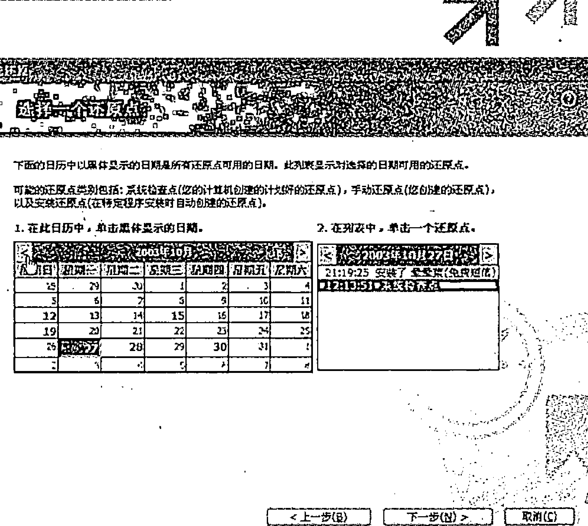

用户也可以选择关闭计算机上个别或所有驱动器上的系统还原功能，使用第三方软件。具体操作步骤如下：

- 1. 单击“开始”按钮，右击“我的电脑”，选择“属性”命令，打开“系统属性”对话框。
- 2. 单击“系统还原”标签，打开“系统还原”选项卡。
- 3. 选中“在所有驱动器上关闭系统还原”复选框，可关闭所有驱动器上的系统还原功能。
- 4. 单击“可用的驱动器”列表中的某个驱动器，然后单击“设置”按钮，选中“关闭这个驱动器上的‘系统还原’”复选框，可单独关闭该驱动器上的系统还原功能。

## 3. 其他内置恢复功能

“系统还原”虽然功能强大，但在Windows无法正常启动时，该工具仍将无计可施。这时，Windows XP的高级启动选项功能便有了用武之地。重新启动计算机，在看到“显示Windows XP高级启动选项”的提示信息时按F8键，打开Windows XP高级选项菜单，通过方向键将高亮显示条移动到“最后一次正确的配置”选项，然后按Enter键启动系统，即可使用系统自动备份的最后一次正确的配置启动计算机。

技巧：前一段时间，“冲击波”病毒肆虐，不幸中招的计算机屏幕上一般都会出现一个60秒后重新启动计算机的倒计时窗口，而且不易通过“Windows任务管理器”关闭，危害极大。其实用户此时大可不必惊慌，因为只要在这60秒内重新启动计算机，按F8键，选择用“最后一次正确的配置”启动计算机即可。当然，顺利恢复被“冲击波”病毒修改的系统配置后，还应该及时给系统打上相应补丁，并运行最新版本的杀毒软件彻底清查整个计算机系统。对于更新设备驱动程序后导致系统不稳定的情况，可以单击“开始”按钮，右击“我的电脑”，单击“属性” → “硬件” → “设备管理器”，再右击问题设备，选择“属性”，单击“驱动程序”标签，最后单击“返回驱动程序”按钮，即可取消该设备最近一次的驱动程序更新，恢复使用上次安装的驱动程序。

### 二、第三方备份与还原工具

Windows操作系统内置的系统备份与还原工具由于能够有效地识别系统文件与用户个人文档，所以在使用过程中占用的系统资源比第三方系统还原工具要少。但一般来说，第三方的专用工具软件的功能更为强大。因此，除了前面介绍的Windows操作系统内置工具和功能外，用户还选择使用第三方专用的备份与恢复软件。

克隆工具一般所做的是对计算机磁盘上的数据进行完整的、丝毫不差的复制备份。当系统出现问题时，用户可以使用克隆的数据将整个操作系统恢复到克隆时的正常状态，也可以只恢复备份文件中的个别文件。

目前，可以实现磁盘克隆功能的工具软件有许多，但真正功能强大且稳定可靠的便屈指可数。这里将只介绍其中最流行的3款：Symantec 公司的 Norton Ghost、Power Quest 公司的 Drive Image 和 Acronis 公司的 True Image。这3款软件总体性能旗鼓相当，在功能上也各有千秋，很难说孰强孰弱。

True Image 虽然功能不如另外2款软件强大，但操作界面友好，普通用户需要的功能它都有，是初级用户的最佳选择；Drive Image 则是惟一可以定时备份的磁盘克隆工具，而且和 True Image 一样，Drive Image 也可在Windows图形界面内进行操作；Norton Ghost 虽然在其2003版本中提供了图形向导操作界面，但设置完毕后还需要转到DOS环境下进行备份和恢复操作。

#### （一）Norton Ghost

在上述3家开发磁盘克隆工具的公司中，Symantec公司最重视中国市场，它也是其中惟一一家提供中文版软件的公司，因此许多国内用户都将 Norton Ghost 做为其磁盘克隆工具的首选方案。

该软件最新的2003中文版除了提供Windows式向导操作界面外，功能也有所增强，不仅可以在NTFS文件系统格式的磁盘分区上进行写入操作，支持备份、还原和克隆Linux EXT3文件系统，还可以将数据直接备份到各种可移动存储器上。但 Norton Ghost 2003在真正执行备份和还原操作时仍需要重新启动计算机，在命令行方式下工作。这种运行机制在国外受到绝大部分媒体的批评，但实际上，这种运行机制能最大限度地减少软件在备份和还原时受到其他软件影响的可能性。

##### 1. Ghost 基本功能

Norton Ghost 2003在安装后会自动在Windows状态栏右侧的通知区域中显示其软件图标。双击该图标，或者通过“开始” → “所有程序” → “Norton Ghost 2003”程序组菜单都可以启动 Norton Ghost 2003，打开如图2所示的工作界面。与 Norton Ghost 历史版本不同的是，用户可以更加方便地在Windows图形界面中指定 Norton Ghost 2003 的备份和还原任务，不需要再在 DOS 环境中进行操作。

单击“Ghost 基本功能”页中的“备份”选项，即可启动 Norton Ghost 2003 的备份向导，按照如下步骤备份需要的磁盘或分区。

单击“下一步”按钮，在“源”列表框中选择要备份的磁盘（图2）。用户可以一次选择多个磁盘分区，但必须是同一物理磁盘上的多个分区。

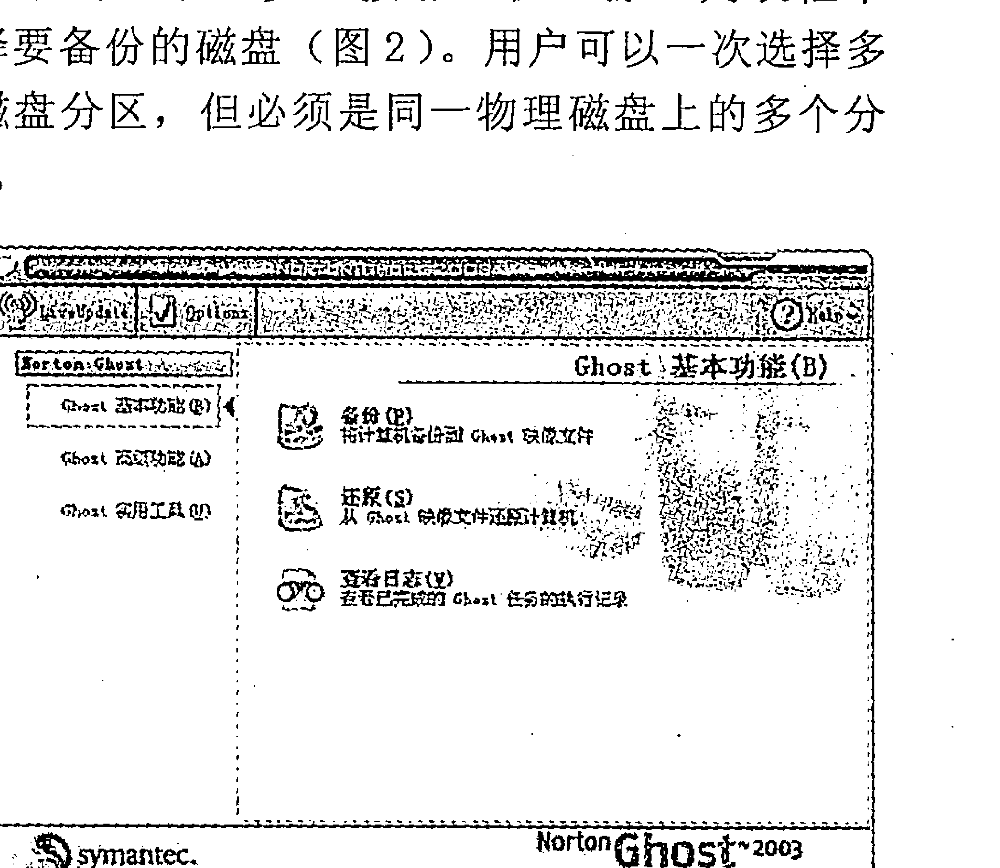

在“目标”选项组中，选择准备将数据备份到文件还是可擦写CD上，然后单击“下一步”按钮，选择存储备份文件的位置和文件名。如果需要，还可以在“映像描述”文本框中输入一些描述性文字。

单击“下一步”按钮，Norton Ghost 2003将自动检查系统状态。通过下一个界面中的“高级设置”按钮，可设置Norton Ghost 2003备份文件的压缩比率和密码等高级选项。

单击“下一步”按钮，备份向导将提示需要重新启动计算机并转到命令行工作方式，直到完成备份后才会回到Windows图形界面。如果不希望以后每次到这一步时都显示此警告信息，请选中“重要信息”对话框中的“请不要再显示该屏幕”复选框。

单击“下一步”，再单击“继续”按钮，备份向导将警告：在创建映像文件后，要确保可以在DOS状态下运行Ghost.exe来访问该映像文件，可能需要创建恢复启动盘。

单击“下一步”，再单击“立即运行”，备份向导将重新启动计算机，创建备份映像文件，然后再重启计算机登录Windows系统。

在“Ghost基本功能”页中单击“还原”选项，则可以启动Norton Ghost 2003的还原向导。选择要还原的备份文件，然后指定要将其还原到的具体位置，单击“下一步”继续，即可还原所需的备份数据。

##### 2. Ghost高级功能

启动Norton Ghost 2003后，单击左侧窗格中“Ghost高级功能”标签，打开“Ghost高级功能”页。可以看到，Norton Ghost 2003提供有以下5项高级功能。

“克隆”选项用于启动“克隆向导”，允许用户分别选择源磁盘或分区和目标磁盘或分区，将整个磁盘或分区复制到另一个磁盘或分区。

单击“交互式运行Ghost”选项，可以重新启动计算机，切换到命令行工作方式，运行Ghost.exe，以Norton Ghost历史版本的操作方式进行操作。

选择“对等连接”选项，可启动“对等连接向导”，按提示选择连接方式（USB、LPT或TCP/IP），Norton Ghost将重新启动计算机并运行Ghost.exe准备建立连接，然后在另一台计算机上执行相同操作，即可将这2台计算机连接起来，并通过网络来执行备份、还原和克隆等操作。

“创建虚拟分区”选项可以创建包含用于DOS下的文件的虚拟分区。

“映像完整性检查”选项可以检查产生的备份文件是否正确。

##### 3. Ghost实用工具

启动Norton Ghost 2003后，单击“Ghost实用工具”标签，选择“Norton Ghost浏览器”将打开“Norton Ghost浏览器”窗口。单击“文件”→“打开”，选择Norton Ghost备份产生的映像文件，即可查看、修改、添加或解压缩映像文件中的文件。需要注意的是，如果映像文件创建自某个NTFS分区，则只能查看和解压缩该映像文件中的文件，但不能添加或删除其中的文件。

在Norton Ghost 2003的“Ghost实用工具”页中，单击“Ghost启动向导”选项，可进入Ghost启动向导，选择创建所需的Ghost启动盘，从而可以在DOS环境下启动Norton Ghost 2003，完成相应的操作。

##### 4. 创建自动恢复启动盘

在Norton Ghost 2003中，还可以创建能够自动恢复系统的启动盘，具体方法如下：

- 使用Norton Ghost备份计算机的系统盘，然后将备份的映像文件存储到某个磁盘的根目录下。这里假设将系统的备份映像文件System.gho保存在E盘的根目录下。
- 将Norton Ghost 2003安装目录下的Ghost.exe文件复制到E盘根目录下。
- 打开“记事本”编辑器，编辑所创建的Ghost启动盘根目录下的Autoexec.bat文件，在该文件中添加“e:\ghost.exe -clone, mode=pload, src=e:\system.gho:1, dst=1:1 -sure”命令。
- 编辑完毕后，保存修改并退出该文件。在使用这个启动盘启动时，就可以自动调用硬盘上的Ghost程序恢复系统了。

> 注意：“src=e:\system.gho:1”中的“1”是指备份映像文件在第1个硬盘上，如果用户系统中的E盘在第2块硬盘上，则需要改为“2”。另外，“dst=1:1”是指将映像文件的内容恢复到第1个硬盘的第1个分区，用户也可以按实际情况进行修改。

> 技巧：可以将启动盘与映像文件一起刻录到光盘中，制作系统恢复光盘。

##### 5. 将Windows XP克隆到其他电脑

对计算机软硬件工作方式比较了解的用户知道，要想将安装好的Windows NT/2000/XP操作系统复制到另一台计算机上使用会有一些困难。因为Windows NT/2000/XP通过硬件抽象层（HAL）与计算机上各种硬件设备的驱动程序进行通信，所以操作系统安装后在HAL不同的计算机上是无法使用的，只有在硬件设备完全相同的计算机上才可以使用。通过“SYSPREP（系统准备）”工具修改计算机的安全性识别码（SID），即可轻松实现这一点。这里以Windows XP为例，介绍具体的方法：

- 检查待复制系统上是否存在加密文件或只有当前用户可读的文件和文件夹。如果有，则需要先解密或取消权限限制。
- 使用WinRAR或WinZip，将Windows XP安装光盘上support\tools\deploy.cab文件中的“SYSPREP”工具解压缩到计算机系统磁盘上的Sysprep文件夹中。
- 确定“SYSPREP”工具中的Sysprep.exe和Setupcl.exe都已成功解压缩到Sysprep文件夹中。
- 运行Sysprep.exe程序，选中“MiniSetup”和“PNP”复选框（如图3所示），在“关机”下拉列表框中选择重新启动或关闭计算机，然后单击“重新封装”按钮。

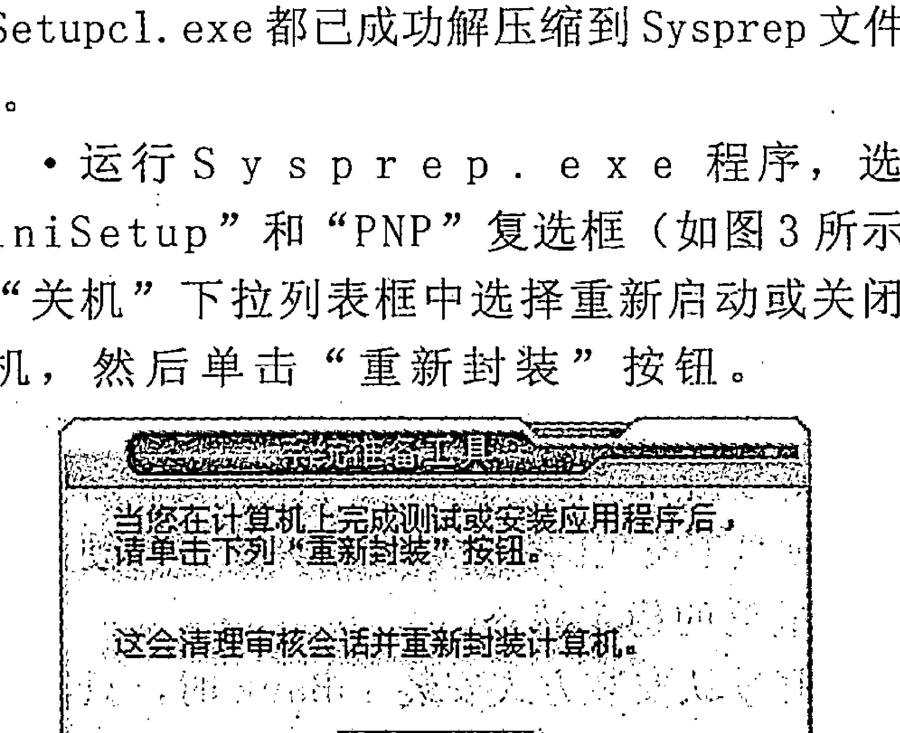

- 使用Norton Ghost 2003将Sysprep处理过的Windows XP操作系统备份为一个映像文件，再将它还原到任何一台与当前计算机硬件设备相同的计算机上即可。

> 提示：在还原过程中，计算机在启动时将需要重新检查即插即用设备，然后要求指定使用者名称及组织、网域或工作组、地区选项等信息以及要安装的网络协议及服务，最后请删除系统安装磁盘上与“SYSPREP”工具有关的文件，例如Sysprep.exe和Sysprep.inf等。

#### （二）Drive Image

PowerQuest公司的Drive Image在国际上也享有盛誉已久。与Norton Ghost相比，Drive Image没有那么多细致的选项，但实际上的功能相差不大，而且最新版的Drive Image也已经可以在Windows图形界面下完成克隆工作。另外，该软件还具有按照用户预定计划自动执行备份操作的功能。

与Norton Ghost类似，Drive Image也提供有一个用于浏览和管理备份数据文件的程序“Backup Image Browser（备份映像浏览器）”，而软件的主程序只负责克隆和恢复工作。

启动Drive Image，可以看到图4所示的操作界面。左侧是软件各项功能的说明和一个转到高级操作界面的“Advanced View”选项，右侧是“Back Up Drives”、“Restore Files or Folders”、“Restore a Drive”和“Copy One Drive to Another”4个选项，分别用于激活相应功能的操作向导。

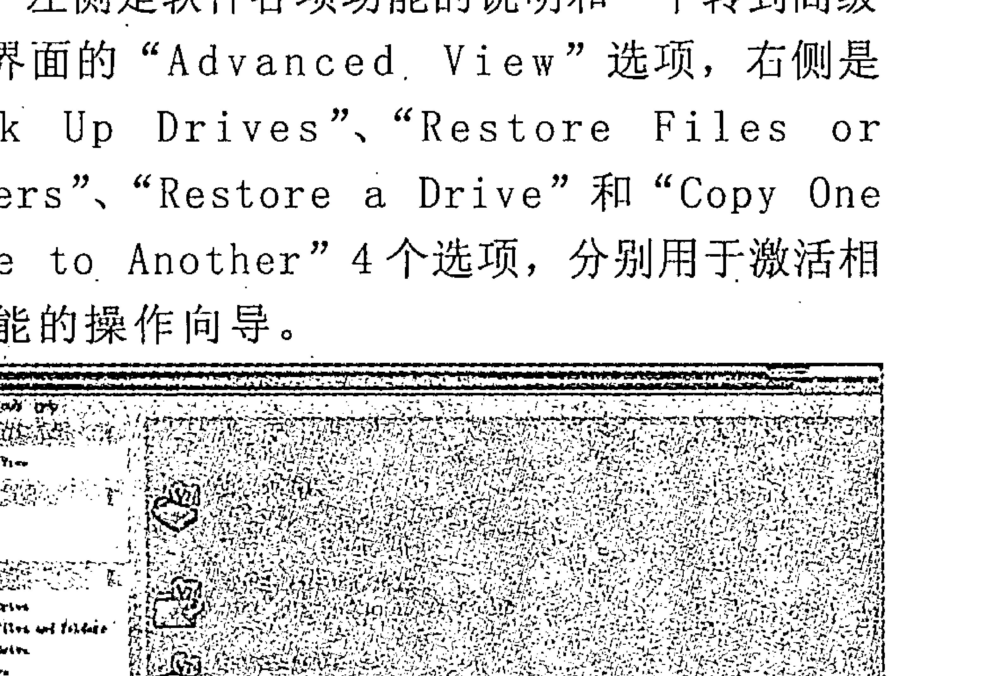

“Back Up Drives”选项用于备份用户所需的磁盘或分区，允许选择要备份的磁盘和保存备份数据的具体位置，选择压缩比率，以及决定是否需要添加密码或分割备份文件等。

“Restore Files or Folders”和“Restore a Drive”选项用于还原指定的文件、文件夹或磁盘。

“Copy One Drive to Another”选项用于将源磁盘上的数据直接复制到指定的目标磁盘上。

单击Drive Image操作界面左侧的“Advanced View”选项，右侧窗格中会出现“Drives”、“Backup Jobs”、“Backup History”3个选项。

选择“Drives”，左侧窗格将提供“备份”等选项。

#### （三）True Image

在 Acronis 公司推出 True Image 之前，磁盘克隆工具市场一直是 Norton Ghost 和 Drive Image 的天下。但现在，大部分国外媒体都在推荐用户使用 True Image，因为 True Image 是第一个能够在 Windows 图形界面下完成备份和还原工作的磁盘克隆工具。而且更神奇的是，在 True Image 执行克隆工作的同时，用户还可以继续自己的工作。

在 True Image 安装完毕后，默认将自动运行应急磁盘创建工具，帮助用户创建一个能够在紧急情况下（例如在系统崩溃或者由于其他故障无法进入 Windows 系统时）用来启动系统的应急磁盘，然后再使用 True Image 恢复系统。

通过“开始”→“所有程序”→“Acronis”程序组菜单选择“True Image”，启动 True Image 磁盘克隆工具。True Image 以向导方式操作，首先是欢迎界面，单击“Next”按钮，通过以下 3 个选项选择执行相应的操作。

选择 “Create an image of a partition or whole hard disk dive”，将启动备份向导。

选择 “Restore a action or whole hard disk dive or deploy on a new hard dive/PC”，将启动还原向导。

选择 “Explore an image archive”，则可以浏览和管理已备份的数据文件内容。

此外，该软件的操作界面和使用方式都十分简单友好（如图5所示），对用户的电脑水平要求很低。在 True Image 的各个向导中，计算机上所有硬盘和硬盘分区都以图示方式列出，并提供一个与 Windows 资源管理器相似的界面，方便用户选择所需的文件。同时，True Image 的向导将所有选项划分为一个个单独的步骤，用户不会漏过某一项设置。而在选择备份结果的压缩比率时，True Image 还提供一个滑块，方便用户在文件大小和备份时间之间直观地做出选择。

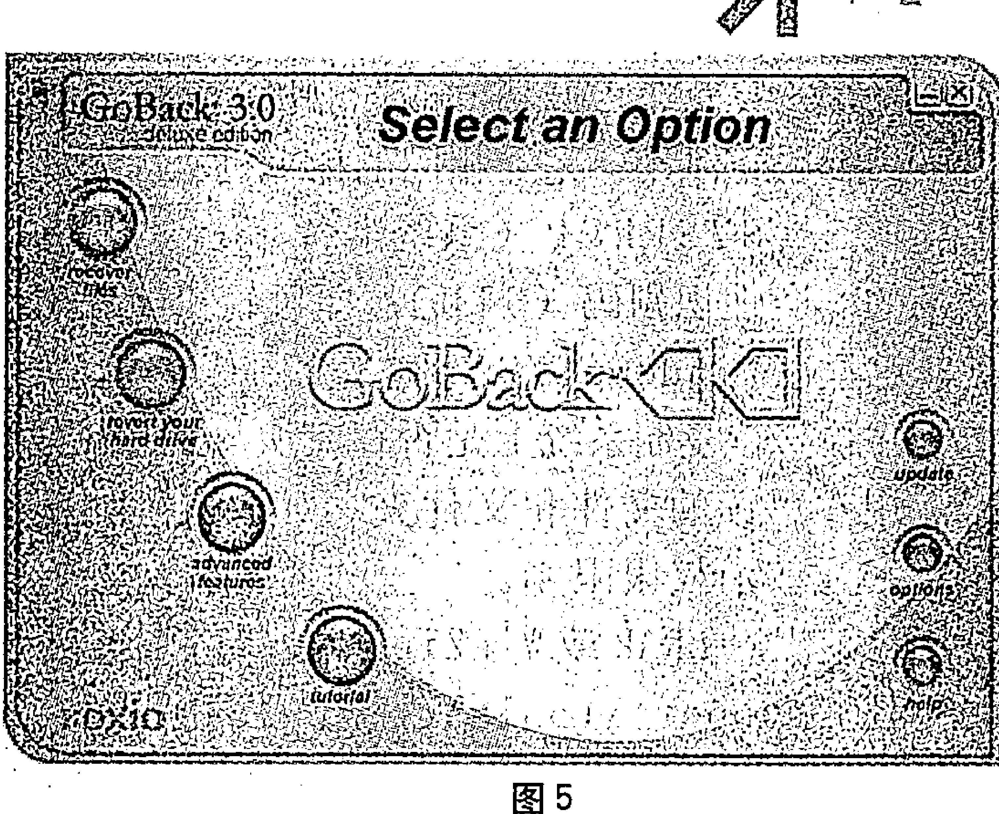

### 三、第三方系统还原工具（GoBack）

GoBack 是当前最著名的一款第三方系统还原工具软件，它原是 Roxio 公司的产品，但已经以 1300 万美元的价格卖给了 Symantec 公司。用户可以在 Symantec 公司的系统工具套装软件中找到该软件的简化版，也可以直接向 Symantec 公司购买 GoBack 3 Delux 完整版。简化版比完整版少了密码保护和自动恢复数据等功能。该软件可以在安装后驻留内存监视硬盘上发生的变化，并允许用户将硬盘恢复到任何最近的稳定状态。

选择默认安装方式安装 GoBack 时，只需要指定安装的目标位置即可，安装程序会在安装完成后为计算机上每个硬盘指定一个存储备份数据的位置。当然，也可以选择自定义安装模式，自己指定各硬盘备份数据的位置。

一般情况下，GoBack 将使用大约硬盘空间的 10% 来实现系统的还原功能。当然，这个空间的大小是可以调节的。GoBack 的性能非常出色，虽然是一款长驻内存的程序，但它并不会影响其他应用程序的运行。当然，假如执行比较繁重的任务，特别是既占用大量系统资源又需要频繁读写硬盘的操作，GoBack 用于存储硬盘数据变化的缓冲区很快会被占满，系统速度就会有所下降。

当系统崩溃或者发生其他故障无法正常进入系统时，GoBack 就会在系统启动界面上弹出一个菜单，供用户选择是否需要恢复到之前的某个状态。而在系统还能够正常运行的情况下，用户也可以双击 GoBack 在系统状态栏右侧通知区域中的图标，打开 GoBack 主界面（图5），选择“recover files”或者“revert your hard drive”，来恢复个别文件或者恢复整个硬盘上的数据。

### 四、工具比较及注意事项

虽然GoBack没有中文版，但整个软件的操作界面和使用方法都非常简单。唯一需要注意的是，当用户系统处于GoBack保护之下时，如果准备使用磁盘克隆工具备份硬盘上的数据，则需要在GoBack主界面单击“Options”按钮，然后在“GoBack Options”设置对话框中单击“Disable GoBack”，禁止GoBack运行，重新启动系统后再进行备份，否则有可能出现错误。

到这时，我们可以很清楚地知道，在Windows操作系统中，可以实现系统备份与恢复功能的软件主要有两类：一类是备份与还原工具，可以备份整个磁盘分区乃至整个硬盘数据，在需要时可对整个分区或整个硬盘进行恢复；另一类是系统还原工具，可以记录系统文件更改，监视对磁盘的读写操作，在必要时帮助用户将系统恢复到先前某一特定时间的状态。分别采用这两类软件所对应的数据安全方案的优缺点比较，如表1所示。

表1 数据安全方案比较

| 数据安全方案 | 优点 | 缺点 |
| --- | --- | --- |
| 采用备份与还原工具 | 可以将系统备份到移动存储设备或其他电脑上，可以应付硬盘损坏、系统崩溃等任何数据丢失的情况，只要用户愿意就可以将系统恢复到先前备份时相同的状态，也可以只恢复备份文件中的个别文件 | 需要大量的磁盘空间存储备份数据，备份时需要花费较多的系统资源和时间，不便于经常更新 |
| 采用系统还原工具 | 可以创建多个还原点，在需要时将系统恢复到还原点创建时的状态，占用的磁盘空间较少 | 要获得较好的效果，需要让还原工具长驻内存，对用户操作进行监视。在进行还原时只能恢复系统的部分数据，在某些情况下无法解决问题。备份数据只能存储于本地磁盘，在硬盘损坏时将前功尽弃 |

这里所介绍的各种工具各有其优缺点，适用范围和局限性也不同。若能结合使用备份工具和系统还原工具，则可获得最佳的数据安全效果。当然，那将需要占用较多的系统资源。本文所介绍的各工具软件的优缺点比较，如表2所示。

表2 常用的系统备份与还原工具比较

| 分类 | 工具名称 | 优点 | 缺点 |
| --- | --- | --- | --- |
| 备份与还原工具 | Norton Ghost | 功能强大，选项灵活多样，可直接备份到各种存储介质，满足多种应用需求 | 要掌握所有功能和技巧，需要具有一定的专业知识 |
| 备份与还原工具 | Drive Image | 稳定、容易使用，并能够按计划自动定时执行备份操作 | 在某些情况下不如Ghost灵活 |
| 备份与还原工具 | True Image | 全向导式的操作界面非常友好，可在执行其他任务的同时备份数据，且速度较快 | 功能不如上2个软件强大 |
| 备份与还原工具 | 系统内置的“备份”工具 | 操作简便，且不必支付额外的费用 | 功能不如第三方的专用软件强大 |
| 系统还原工具 | 系统内置的“系统还原”工具 | 无需支付额外费用，与操作系统紧密配合，占用的系统资源相对较少 | 功能较弱，某些兼容性不佳的软件可能导致还原工具失效 |
| 系统还原工具 | GoBack | 功能相对强大，最大的优点是可以在系统启动时还原系统 | 需要额外支付费用，并消耗大量系统资源，而且大部分此类软件对系统或存储备份数据的空间有特殊要求 |

最后，为确保备份操作切实有效，还请用户注意以下3点。在备份系统前，应该先检查和修正磁盘错误，删除不必要的文件，将垃圾箱清空并整理磁盘上的碎片。预先准备好存储备份数据文件的位置。由于大部分系统备份软件是将整个磁盘分区或磁盘上的文件存储为一个映像文件，这个巨大的文件所占用的存储空间出现任何错误都可能导致备份数据的失效。因此，应尽可能准备一个读写操作不太频繁的空间用于存储备份文件。在备份后，请尽量不要移动备份文件或在存储备份数据的磁盘上进行任何可能威胁磁盘数据安全的操作，包括执行磁盘碎片整理程序等。

## 工具软件点将台——光盘刻录工具

文/自由风

### 文章重点与技巧目录

- Easy CD Creator介绍
- Nero Burning Rom介绍
- Roxio WinOnCD介绍
- NTI CD-Maker 2000 Professional介绍
- CD-Mate(光碟工坊)介绍
- 超量刻录技巧
- 自运行光盘制作技巧
- “智能光盘”制作自运行光盘
- SecureBurn制作加密光盘
- 单启动光盘刻录
- 多启动光盘刻录
- 自动恢复光盘制作技巧
- 把CDR光盘作CD-RW技巧
- CD-RW当作万用CDR技巧

### 一、刻录工具的选择

#### 1. Easy CD Creator

Easy CD Creator是由Adaptec公司出品的一款刻录软件，目前多数的刻录机都会随机附送该软件。

正如其名称那样，它是一款操作简单的刻录软件，但简单并不代表不专业，Easy CD Creator的功能也非常强大，支持多种格式的混合刻录，支持CD拷贝、启动盘制作、Autorun制作等，支持几乎所有的刻录机，包括SCSI、IDE和并口类型，而其Platinium版本除了常规的刻录工具外，还包含许多实用工具，无论是制作电子像册、VCD、光盘封套、CD、MP3光盘都能方便地完成，就是制作AVI、MPEG也能通过VideoImpression方便地完成。

Easy CD Creator的界面设计非常漂亮(图1)，采用向导模式，使初级用户能够轻易上手。在Easy CD Creator中，可以直接使用鼠标拖曳方式添加刻录对象，同时程序会在界面下边给出所添加的所有文件总的容量，非常直观。DirectCD是Easy CD Creator的Platinium版本附带的一个非常实用的软件，该软件专门针对CD-RW设计，采用UDF格式，可以让你把CD-RW当作普通的磁盘一样使用。使用前只需要先格式化CD-RW，然后就可以在Windows资源管理器窗口中使用复制粘贴命令或者拖放操作把文件刻录到CD-RW中，而不必设置任何刻录参数等，而且你还可以随时删除CD-RW中的数据，或者在一次没有刻满的情况下继续刻录，大大降低了光盘刻录操作的难度。此外，Easy CD Creator提供的CD封面编辑器Jewel Case Creator，也是一个非常优秀的工具，通过它可以快速创建出漂亮的CD封面。

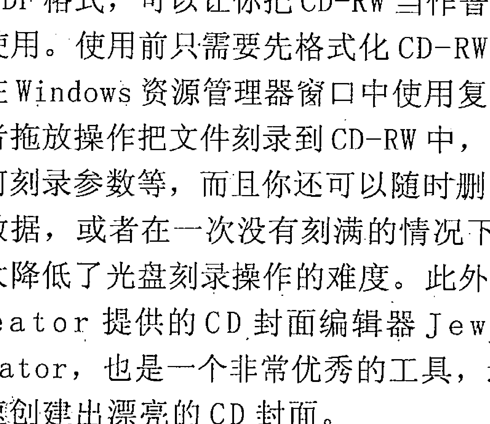

图1

#### 2. Nero Burning Rom

Nero Burning Rom是一款非常优秀的CD刻录工具，由德国Ahead Software Gmbh公司出品，提供有多国语言包，其中包括简体中文语言。

它的最大特点就是功能非常强大，可以支持制作数据CD、Audio CD、包含音轨和数据的混合模式CD、VCD、SVCD、可引导数据CD、Hybrid格式CD、UDF格式CD等。最新的6.0版本更可以直接刻录miniDVD，可以说目前常见的刻录CD格式程序都可以支持，而且它可以很好的支持目前市面上常见的多种品牌和规格的刻录设备，兼容性非常好。

最新版本的Nero Burning Rom 6.0在易用性上进行了加强设计，增加了一个界面非常漂亮的StartSmart程序作为控制中心(图2)，我们不仅可以在这里启动所有的组件，更可以直接选择打开各种细节功能，操作上更加方便。对于第一次使用Nero的朋友来说，可以启动Nero Express，这是一个向导程序，可以一步一步地引导你完成各种操作，对于老手来说，则可以直接打开Nero Burning Rom手工设置参数进行刻录。

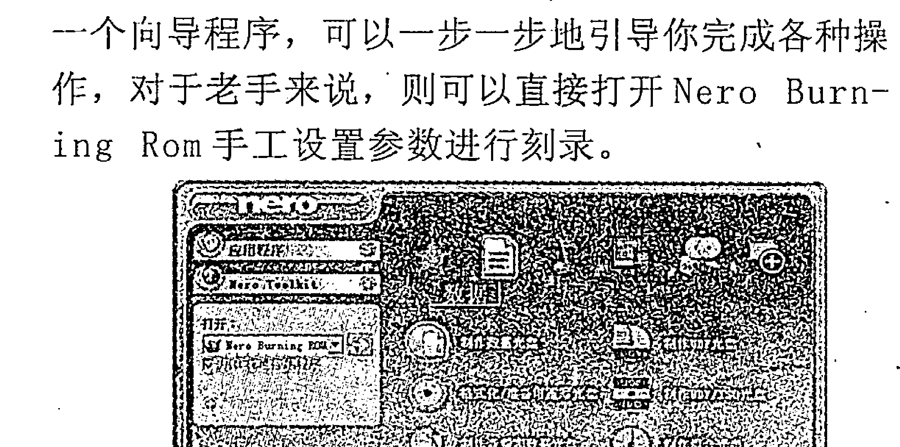

图2

Nero Burning Rom 提供了非常丰富的刻录选项满足你的不同要求，它可以很好的支持中文文件名，支持基于 Windows 系统的长文件名特征，最新版本更是可以支持超过64个字符的超长文件名刻录。同时，软件支持插件扩充功能，这使它在刻录 Audio CD 音频格式时能够支持WAV、MP3、WMA、VQF 甚至是 APE 等多种格式，是目前常见工具中最多的。同时，Nero Burning Rom 也提供了一个与DirectCD 功能类似的 UDF 光盘格式刻录软件，使用上也更为简单、方便。

#### 3. Roxio WinOnCD

WinOnCD 是以创建CD刻录技术而闻名的Roxio公司出品的一款功能强大的光盘刻录集成工具软件，支持制作各种数据、音频、视频以及混合模式光盘。从基本的数据光盘刻录功能上说，WinOnCD与前面介绍的两款软件类似，甚至可以说有些逊色，但它在特殊刻录方面，尤其是多媒体光盘的刻录功能上，却是无人能出其右，是从事影视制作的专业人士和高级用户的不二选择。

WinOnCD 在视频光盘制作上，可以把你的视频文件轻松制作成DVD、VCD光盘，而且可以制作包含动态按钮选项和专业水准的菜单页面，更可以制作高达 98 层深度菜单页面的 DVD Video、Video CD 和 Super VCD，方便制作交互式的视频演示，创新的Video OverSpan技术，自动切割超大的视频文件跨越多张Video CD 光盘。在音频光盘制作上，可以直接转换MPE、WAV、WMA等格式的音频文件，制作成标准CD光盘。而且在制作CD、DVD格式的MP3音乐光盘时，可以自动生成HTML操作使用界面。同时，在 WinOnCD 中还可以直接进行音频或视频文件的格式转换，提供了对于音频、视频文件的简单编辑，能够对声音进行多达 8 层的编辑以及直接从 Line In 录制声音，内置网络化模块，让你直接从网络上拖曳音乐文件并创建音频光盘。

WinOnCD 还内置了非常实用的光盘加密功能，加密后的光盘只有在输入正确的密码后才能看到真正的文件内容。在最新版本的WinOnCD 6 中，除了打造全新的软件界面外(图3)，向导程序、模版、DVD编码引擎、MP3编码器等都进行了重要改进，使其更容易操作，但从使用角度来说，它的操作仍显得有些复杂，推荐已经有一定的刻录基础的朋友使用。

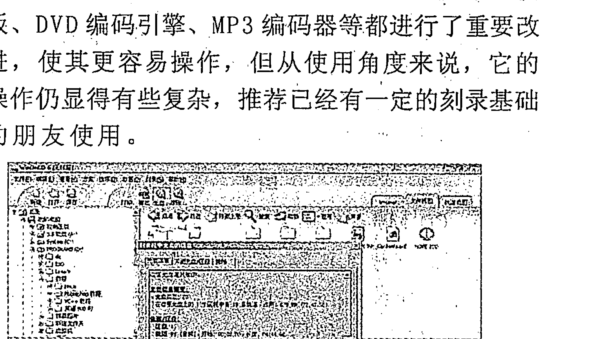

图3

#### 4. NTI CD-Maker 2000 Professional

NTI CD-Maker 2000 Professional 是由美国NewTech Infosystems 公司推出的刻录软件。它可以支持的刻录格式包括数据 CD-R/CD-RW、CD-ROM XA、Audio CD、Video CD、Mixed Mode CD 以及 CD Extra 等常见的 CD 格式。此外，程序还支持 CD 的复制功能和刻录多区段的CD光盘以及影音光盘制作等等， 具备光盘盒封面制作功能。

NTI CD-Maker 界面设计相当简洁(图4)，再加上其全中文的界面，非常适合国内用户使用。软件提供了一个所有程序刻录功能的向导界面，即使你是第一次使用也不会有任何困难。对于每个刻录操作上，程序全部采用两步操作向导方式，第一步设置刻录原始内容，第二步开始刻录，非常简单。对于刻录设置，程序提供的默认设置可以适合一般的刻录需求，不过你也可以自己创建刻录方式，以满足刻录对象的要求。在刻录内容的添加方面，程序提供的界面形式与 Easy CD Creator 完全一样，甚至连界面结构和文件添加方式也大致相同，而且提供了直接使用鼠标拖曳方式添加刻录对象功能，非常方便。在刻录文件名方面，程序提供了对中文长文件名的良好支持。除此之外，NTI CD-Maker 2000 Professional 版本还提供了针对与 DirectCD 类似的 CD-RW 光盘 UDF 格式支持程序——FileCD。

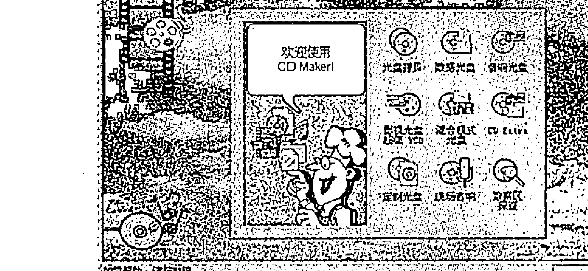

#### 5. CD Mate(光碟工坊)

光碟工坊是由安辰电脑所出品的一款烧录软件，它的功能设计简单而实用，体积小巧，是这几款刻录软件中体积最小的一个，但却拥有一般刻录软件所有的功能，如刻录资料光盘、混合式光盘、音乐光盘、视频光盘等方式。光碟工坊可使用多种刻录方式，它可以支持 Track at Once (TAO)、Disc at Once (DAO)、Session at Once (SAO)、Raw Write 模式，对于不同的光盘格式使用不同的烧录方式，可以让刻录过程更加稳定，允许自行设定刻录速度，同时还支持多部刻录机同时刻录功能（图 5 ）。

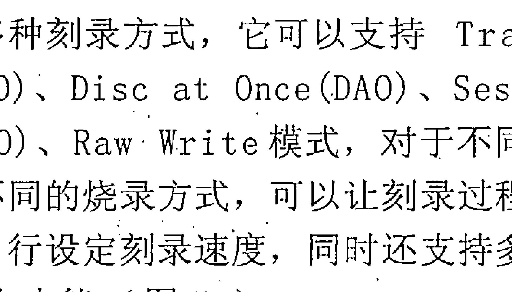

光碟工坊在对音乐 CD 的制作方面有更强大且方便的功能，这是在其它刻录软件中所不及的部份，你无须再使用其它软件来抓取音轨再转换至 WAV 文件，或是使用软件将 MP3 文件转换成 WAV 文件，只要使用它即可一次完成。同时软件的光盘封面制作（光碟彩妆）功能也是很有特色的，操作简单，使用者不需美工背景即可设计自己想要的图案，而且还将文件名称拖拉变成文字控件，也可以自行输入文字并设置位置和字型大小，内置版权图库、合并列印，可以自行设计尺寸，支援市面上多种光盘封面纸，同时它还会自动裁切边缘为光盘大小的圆形。

### 二、特殊刻录技巧宝典篇

#### 1. 超量刻录

我们知道，一张光盘正常容量是 700MB，但如果你需要刻录一个 710MB 的电影，你该怎么办？其实每张刻录盘的外缘部分经常会留有一些余地，这些部分同样可以在特殊情况下作为“备用油箱”刻录数据。

要进行超刻，首先需要刻录机和软件的共同支持，也就是说，选择的软件需要有超刻选项，同时刻录机也要支持超刻录功能。支持超刻的软件也有许多，例如 NERO、CDRWin、DiscJuggler 等，这里我们就以最新的 NERO 6.0 刻录软件为例进行介绍。

先看看你的刻录机是否能够支持超刻功能，单击“刻录器”菜单，“选择刻录器”，在弹出的菜单中选中你的刻录机盘符，在下面的“超烧功能”中如果提示有“支持”，那么恭喜你，你可以使用超刻功能了。然后再来看看你的刻录光盘的超刻能力，打开 Nero CD/DVD Speed 程序，在“其他”菜单中选择“超刻测试”，在下面的“光盘信息”中可以看到光盘标准容量信息，单击“开始”按钮即可进行超刻测试，不要担心，这不会破坏你的刻录盘，当测试结束时，它会弹出提示框告诉你测试结果，并询问你是否保存测试结果，从这个提示中我们可以看到这张光盘最多可以刻录到 82 分钟，折合成容量也就是 720MB，这下够用了。

超刻的设置往往是以时间为换算单位的，这里告诉大家一个刻录时间与容量的换算方法：先按 1 分钟等于 1MB 换算出结果，然后再减去 100MB 左右的文件信息检索空间就是该光盘的存储容量了，例如 74 分钟的光盘容量为 650MB、80 分钟的 700MB、90 分钟 800MB、99 分钟的 900MB。

我们了解到盘片的超刻能力后，下面就可以进入实战阶段了。启动刻录软件Nero Burning Rom，单击菜单“文件”→“设置”→“高级属性”选项卡，选中“允许超烧光盘一次刻录”选项，根据我们前面测试的结果，在下面的时间框中填入超刻时间“82”分钟，单击“确定”按钮保存设置，然后用正常的刻录方式即可进行超量刻录了。当然，超刻并不一定每次都能成功，不过在超刻时掌握一点技巧，还是可以提高成功机率的，下面是一些必备经验：

在设置刻录选项时，一定要在“多重区段”选项卡中选择“无多重区段”，并在“刻录”选项卡中的“写入方式”下拉框中选择“光盘一次性刻录(DAO)”，并选择“终结CD”选项，这样可以节约10MB的空间，同时为了避免刻坏光盘，你也可以先进行模拟刻录。

在超量刻录光盘时，速度是最大的关键，尤其是在刻录到空白光盘的最外圈时，完全考验读写头以及驱动机制的精确程度，一般来说，普通的80分钟700MB的光盘不能使用12倍速以上的高速刻录，否则刻录到超过80分钟时，整个刻录过程就很可能会不正常终止。解决方法就是把速度调低，越慢越好，1速或2速刻录几乎可以保证百分之百的超刻成功率。

在进行超刻前，一定要关闭那些无用的后台应用程序，包括病毒防火墙等程序在内，这样可以保持最大的可用系统资源，使系统能够“全身心”地投入到超刻工作中。

要避免刻录机长时间连续刻录，如果你的刻录机在进行超刻前已经“疲惫不堪”，那么肯定会增加超刻失败的机率，所以在进行超刻前一定不能让刻录机处于“疲劳”状态。

刻录盘片对超刻能否成功的影响也很大，建议你选择品质较好的盘片，这样比较容易成功实现过量刻录，比如Ritek(铼得)、Benq(明基)、Unibit(优百特)等。如果你想大容量的超刻，市面上有一种99min/900MB容量的CD-R盘片可以选择，这种高容量CD-R采用了提高轨迹密度的方法来提高盘片的容量，因此激光头必须发射足够强劲的功率来保证刻录品质，这样从某种程度上会影响刻录机的寿命，这点是要注意的，不过，偶尔试试也无妨，另外要注意在刻录软件中要将超刻时间设置为“99”分钟。

虽然也可以用CD-RW光盘来测试超量刻录，但不建议你这样尝试，后果可能会造成你的光驱不能识别它，更严重的是，你的刻录机可能不能再将信息擦除。CD-RW从此变成CD-R了。

#### 2. 自运行光盘制作

为了让我们制作出的光盘更容易使用，我们可以利用一个技巧，把光盘刻录成能够自动运行的光盘，这样当你把光盘放入光驱或在“我的电脑”中访问光驱时，就会自动执行特定的程序，可以实现自动安装、显示界面等功能。

##### (1) 自运行基本格式

制作自动运行光盘的奥妙就在于光盘根目录下的Autorun.inf文件，它的功能就是对光盘自动运行中的一些参数进行设置，Autorun.inf文件可以使用任何文本编辑器进行编写，通常使用记事本即可完成，其基本结构如下：

```
[autorun]
open=setup.exe
icon=cd.ico
```

其中“open”表示要自动运行的文件路径和文件名，“icon”表示光盘图标文件的路径和文件名，注意这两个文件中的路径必须要使用相对路径，而不能使用绝对路径，也就是不能带盘符。


“icon”中除了可以使用指定的图标文件外，也可以直接使用EXE或者DLL文件中的图标，使用方法例如“icon=shell32.dll,13”，后面的数字表示要使用DLL文件中的图标序号。

创建Autorun.inf后，把它复制到光盘根目录中进行刻录即可，一般来说，为了方便，我们通常还会把自动运行的文件和图标文件都保存在光盘根目录下。刻录完毕之后，当我们把这张光盘放进光驱后，光驱盘符图标会变成cd.ico，并自动运行Setup.exe文件。

##### (2) 高级应用

依靠上面的技巧我们实现了光盘的自动运行，其实在Autorun.inf文件中还隐藏了一个功能，我们可以通过它来实现在光盘盘符右键菜单中添加菜单选项，让你的光盘功能更加丰富。添加一个右键菜单需在Autorun.inf文件中增加两行命令，例如：

```
[autorun]
open=setup.exe
icon=cd.ico
shell\win98= 安装Windows 98
shell\win98\command=win98\setup.exe
```

其中，“shell\win98= 安装Windows 98”表示在光盘右键菜单中添加一个名为“安装Windows 98”的选项。

“Win98”的菜单项，要注意的是“shell\win98”中的“Win98”是一个可以自定义的变量，但在添加多个菜单时，这个名称必须是不同的。“shell\win98\command”表示选择该菜单后要运行的命令，这里我们设置指向“win98\setup.exe”，也就是Windows 98的安装程序。
同样，你可以按照这个格式添加其它更多的菜单命令选项，这样就可以在光驱右键菜单中完成大部分的光盘功能，非常方便。

### (3) 方便的制作工具

如果你觉得手工编写Autorun.inf文件比较麻烦的话，你还可以使用一款叫做“智能光盘”的工具，它可以让你在图形界面中完成Autorun.inf文件的设置工作。
运行软件后，打开“第一步”选项卡，单击“浏览”按钮设置Autorun.inf文件保存目录，再单击“选择图标”右边的“浏览”按钮设置要使用的图标文件，在右边的“自动运行”中单击“浏览”按钮可以选择要自动运行的程序，下面可以设置运行参数。然后再打开“第二步”选项卡，在这里可以添加右键菜单命令，首先单击“浏览”按钮选择菜单对应的运行程序，在下面的“输入右键菜单的名称”中可以设置菜单装饰符号和名称，单击“添加”按钮即可添加一个菜单，重复这个步骤，可以添加其它的菜单。最后单击“第三步”标签，单击“完成”按钮即可生成需要的Autorun.inf文件了。

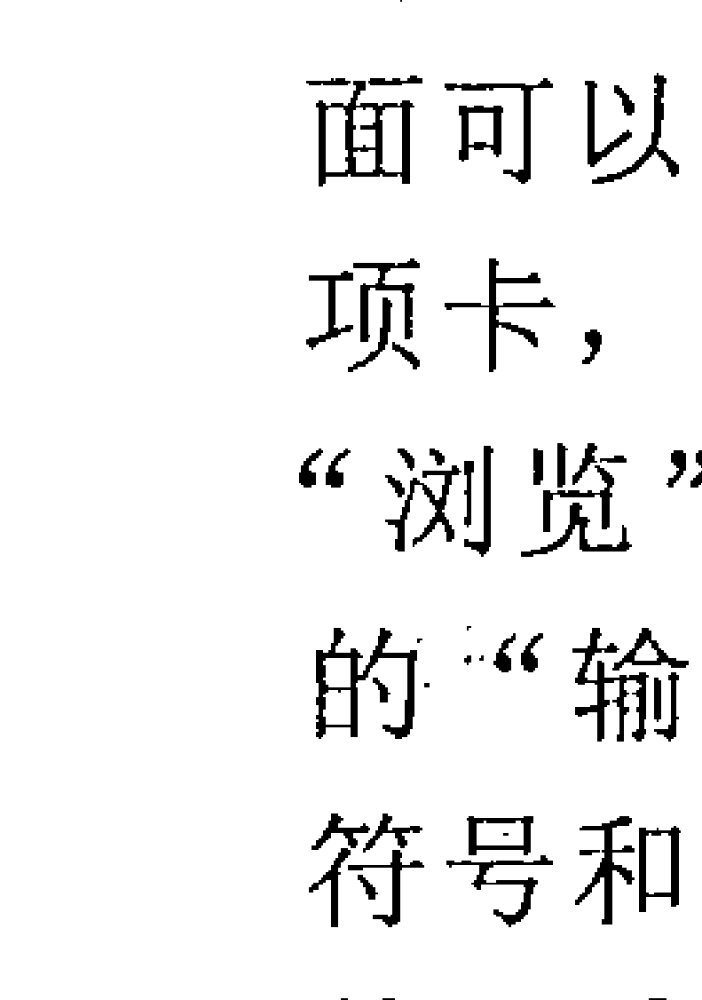

智能光盘还有一个非常实用的功能，可以读取并修改已经存在的Autorun.inf文件，在第一步选项卡中单击“浏览”按钮打开要修改的文件，这时会弹出提示框，选择“是”按钮进行修改即可。

## 3. 加密光盘制作

传统的光盘加密方法需要手工修改，难度较大，而且这类加密光盘有个致命弱点，使用Isobuster等ISO管理工具就可以轻松读取被加密轨道，这里笔者介绍给大家最简单但也最安全的工具加密技巧——使用SecureBurn刻录加密光盘。

### (1) 添加刻录文件

在左边的“File Browser”资源管理器中可以选择你要刻录的文件或目录，把它们拖拉到右边的“CD Layout”列表中即可添加刻录文件，在右下角可以看到待刻录的文件总大小，如果你想规划目录结构，也可以在“CD Layout”文件列表中单击右键选新建文件夹命令或对文件夹进行重命名。

文件添加完毕后，选定左上角的“SecureBurn CD”选项，这样才会刻录出加密光盘，同时还要选中下面的“Writer SecureCD to CD”也建议选上，这样在刻录光盘时SecureBurn会把解锁程序一并刻录，这样你才能在其它未安装SecureBurn的电脑上打开被加密的光盘，最后在“CD Title”中输入光盘卷标。

### (2) 设置刻录参数

单击“Options”按钮打开选项设置窗口，在左边的“Burn”下拉框中可以选择合适的刻录速度，为了防止刻坏光盘，最好选上“Underrun Protect”选项，这样可以起到一定的保护作用，为防止因缓存欠缺而刻坏盘，可以在“Buffer Size”参数中适当调大一些缓存尺寸，如果你还不放心的话，那最好就选择“Test Mode”选项，先做测试刻录再正式刻盘。

### (3) 开始刻录

现在单击“Record”按钮，SecureBurn就开始刻录加密光盘了；首先它会提示你输入要加密的密码，输入两次密码后，它就开始刻盘了，稍等片刻，一张完全的加密光盘就刻好了。

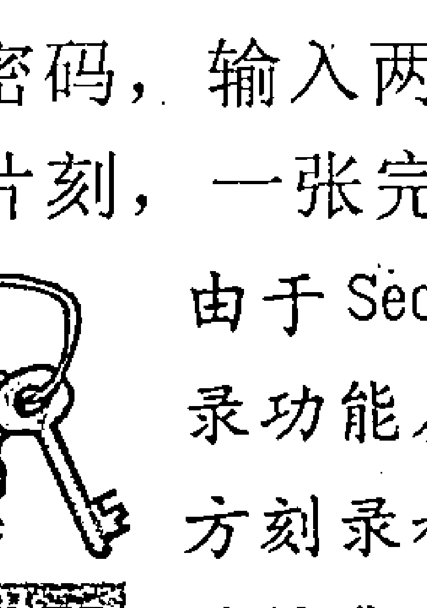

由于SecureBurn并未内置刻录组件，它的刻录功能在Windows 9X/NT/2000下需要第三方刻录程序的支持，而在Windows XP中由于系统集成了刻录功能，可以直接进行刻录。

好了，现在把刻录好的加密光盘放入光驱，打开光盘目录，这时你只能看到几个无关的VXD程序和一个名为“UNLOCK.EXE”的程序，无法看到真正的光盘刻录文件。双击这个“UNLOCK.EXE”文件，就可以打开解密程序，这时会提示你输入密码。在文本框中输入正确的密码后单击“Unlock”按钮，解密程序会进行解密操作，这时光驱会自动弹出一下，然后再自动关闭，这时你就可以看到光盘中的真正内容了。如果你把加密光盘拿到未安装过SecureBurn的电脑上使用时，第一次系统不是弹出解密对话框，而是弹出一个安装提示框，这时你需要单击确定安装，因为SecureBurn必须把光盘上的解密程序安装在你的系统中才能正常解密使用。

### (4) 让SecureBurn支持中文

由于SecureBurn是一款针对英文系统设计的刻录软件，因此对中文双字节文件名的支持很不好，如果文件名中含有中文的话，光盘中的所有中文名称将变成乱码。

# 工具与软件

解决方法是先在NERO刻录软件中单击菜单“刻录器”→“选择刻录器”，选择驱动器为“Image Recorder”后确定，然后按照正常程序刻录，可以把要刻录的文件制作为光盘ISO映像，当然你也可以使用UltraIso来制作光盘ISO文件。然后在SecureBurn中设置好加密选项，单击“CD Image”按钮，选择我们刚才制作的那个ISO映像文件，SecureBurn就会将ISO包中的文件刻录到光盘上并自动为其加密。刻录完毕后再打开光盘查看，你会发现光盘中已经可以看到所有的中文文件名了，而且所有的程序都能正常运行了！

## 4. 启动光盘刻录

### (1) 单启动光盘制作

单启动光盘有两种形式，一种是在光盘启动时模拟软驱来启动系统，这种启动光盘是最常见也是最实用的一种形式，制作这种启动光盘非常简单。首先你需要有一张可以启动的IMG软盘映像文件，你可以去下载一款叫做Winimage的软件，选择菜单“Disk”→“Read Disk”，从一张可引导软盘中读取文件，然后单击菜单“File”→“Save As”即可把软盘文件制作为IMG映像。当然也有更方便的办法，下载一个叫做“超级通用MS-DOS 7.10启动盘”的IMG软盘映像，它不仅可以直接启动系统，而且提供了对多种设备的支持，非常实用。然后打开Nero Burning-Rom刻录软件，在打开的“新编辑”窗口中选择“CDROM（引导）”刻录方式，在右边选择“映像文件”选项，单击“浏览”选择我们前面制作或者下载的IMG映像文件，并在下面的“虚拟类型”下拉框中选择为“虚拟1.44MB磁盘”选项，其它的选项参数按照正常刻录设置即可，刻录后的光盘就能够直接启动系统到DOS环境了。还有一种单启动光盘形式，它的引导区存储的不是一个软盘映像，而是一小段引导程序，这段程序能够直接运行光盘上的程序，Windows NT/2000/XP的安装光盘均为这种形式。例如你利用Windows XP光盘上的安装文件做了一个集成SP1补丁的光盘，却发现刻录后的光盘不具备启动功能了，则可以通过下面的方法让它恢复正常的启动功能。首先从http://www.nu2.nu/nu2files/wxp_addon.zip下载一个压缩包，把其中的“w2ksect.dat”文件解压出来，它就是我们要用到的引导程序了。

然后从http://hn-http.skycn.net:8181/down/InstActiveISO.EXE地址下载一个叫做ActiveISO的光盘制作工具，运行后单击“常规设置”页面，在“源文件夹”中单击“浏览”选择你集成了SP1补丁的Windows XP安装文件路径，如C:\Winxp目录，“目标文件”设置生成的ISO映像文件保存路径，例如d:\XPSP1.iso，“卷标”输入“WinXPSP1”，接下来一定要选中“加入引导文件”选项，并点击“浏览”按钮，选择前面下载得到的“w2ksect.dat”文件。单击“文件”选项卡，选中“包含隐藏的文件和文件夹”选项，再单击“字符集编码”选项卡，在“使用Joliet 编码”下拉框中选择“使用Joliet 编码，并兼容DOS”选项。最后单击“开始制作”按钮，等待几分钟的时间，就可以在D盘根目录下看到一个名为“XPSP1.iso”的镜像文件，这就是制作完成的集成了SP1补丁并且能够启动的Windows XP光盘了。

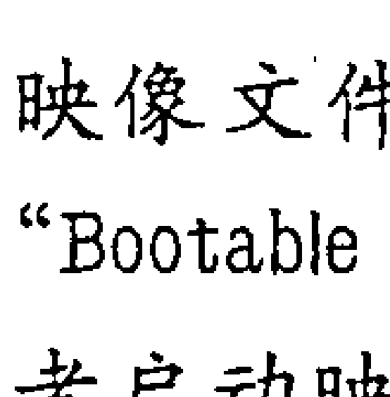

如果你手头上已经有一张能够启动的光盘或者ISO光盘映像文件，那么你就可以从http://tj-http.skycn.net:8181/down/isobuster_14_0515_allang.exe下载一款叫做IsoBuster的软件，运行后选择光盘盘符或者打开ISO映像文件，可以看到光盘文件结构，单击左边的“Bootable CD”，在右边看到的就是光盘的引导文件或者启动映像，双击文件名即可将它们提取并保存到硬盘上，以方便制作启动光盘时使用。

### (2) 带菜单的多启动光盘制作

前面的方法制作出来的光盘只能引导一个系统或者启动一个IMG文件，不过启动光盘还有另外一种形式：多重启动，它可以让你在启动时选择使用不同的引导文件，从而实现更复杂、功能更强大的启动光盘。制作多重启动光盘我们可以使用一个叫做“EasyBoot”的软件，它可以帮你制作出全中文彩色带菜单选择的启动光盘，你可以选择引导不同的系统，而且可以让你添加LOGO图片，制作出更加个性化的启动光盘。EasyBoot采用完全图形化的所见即所得模式，使用非常简单。打开EasyBoot后，可以看到两个窗口，一个是控制面板窗口，在这里可以用来对菜单进行参数控制；一个是菜单预览窗口，你可以所见即所得地看到最后的修改结果。软件已经内置有一个最实用的Windows XP/98的双启动安装光盘菜单实例了，对于大多数用户来说，只需要在

## 5. 自动恢复光盘制作

许多品牌电脑为了方便用户，都提供有系统恢复光盘，用这张光盘引导系统后即可自动恢复。现在我们就来利用一款叫做“GHOST 全自动备份还原系统光盘”的软件来制作一张自动恢复光盘。

首先把下载压缩包中的“ghost.iso”解压到一个临时目录，如 C:\bootcd，再从 http://tj-http.skycn.net:8181/down/uiso6_cn.exe 下载一个叫做UltraISO的光盘映像文件编辑器，运行后单击“文件”菜单→“打开”，选择 C:\bootcd 目录下的“ghost.iso”即可打开这个ISO映像文件。然后在窗口下面的“本地目录”列表中找到你用Ghost备份的GHO映像文件，先把它改名为“system.gho”，再拖到上面的光盘目录中，单击“文件”菜单中的“保存”按钮保存对ISO映像所做的修改。最后再使用NERO等刻录软件把修改后的“ghost.iso”文件刻录到光盘上即成为一张自动系统恢复光盘了。

当你用这张自动恢复光盘引导系统后，首先会显示一个菜单，让你选择是对硬盘C分区操作还是D分区操作（其实这个菜单就是用我们上面介绍的EasyBoot制作的），例如当你选择C盘后，会显示出一个子菜单，根据提示可以选择备份当前C盘到其它硬盘分区或者从其它分区中恢复.GHO文件到C盘，输入“W”后回车就可以自动把光盘中的.GHO映像文件恢复到C盘了，非常方便。

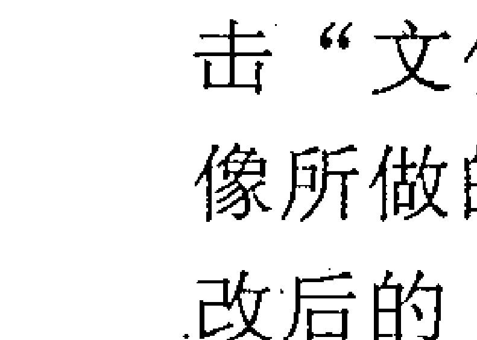

## 6. 逆向思维玩光盘

### (1) 把CDR光盘当作CD-RW来用

大家都知道使用CDR光盘可以直接刻录文件，但一旦刻录后就不能再删除了，虽然使用多重区段功能可以随时增加文件，但很不方便，有没有想过让CDR光盘像CD-RW那样可以直接在资源管理器中随时添加或者删除文件呢？

运行Easy CD Creator中的DirectCD组件程序，单击“格式化光盘”按钮，弹出设置对话框，把CDR光盘放入光驱，在“标签”栏中输入卷标，如果你想让这张光盘存储更多的文件，还可以选择“启用压缩”选项，然后单击“开始格式化”按钮。格式化完成后，这张CDR光盘就具备了CD-RW的UDF格式，也就是说你可以在资源管理器中直接向这张光盘中复制文件，或者从这张光盘上删除文件，而不必启动专门的光盘刻录程序，也不必做任何设置，非常方便。

但如果从光盘上删除文件，由于CDR的特性，删除后的空间并不能再次使用，因此在CDR上删除文件，实际上只是让它们不再显示，对于空间并没有什么影响，因此在删除文件时请三思而行。

使用UDF格式的CDR光盘容量会比正常容量少一些，而且你每次写入数据时，除了数据占用的空间外，还需要额外占用一些索引空间，因此建议你不要频繁写入文件，可以采取大量文件一次写入的方式。另外每次在写入数据时都新建一个独立的目录，这样可以节省一些空间占用哦。

UDF格式的CDR光盘可能会在某些系统中无法读取，这时你需要在系统中安装UDF驱动程序，该程序可以从 http://download.pchome.net/php/download2.php?sid=2873&url=/utility/cdr/udfread_v501-191_inst.exe&svr=4 下载，下载后直接运行安装，然后就可以正常读取了。

### (2) CD-RW当做万用CDR

通常情况下，我们是把CD-RW格式化为UDF格式，以方便在资源管理器中使用拖放添加和删除光盘文件。其实我们也可以把CD-RW光盘当做一个CDR光盘来使用，可能有的朋友要说了，那不是太浪费了吗？其实一点也不浪费，即使我们把它当作CDR光盘来用，但是由于它具备了可以重复擦写的功能，我们可以在刻录一次以后，它仍然是可以再次使用的，这样我们在刻录光盘时，就可以先用CD-RW光盘进行刻录测试，这要比用刻录软件的模拟刻录功能的测试要准确得多，可以避免刻坏CDR光盘的可能性。

要想把CD-RW光盘当作CDR光盘来使用，首先需要擦除光盘中的数据，使其成为一张完全空白的CDR盘片。例如在Nero Burning Rom中，你只需要单击菜单“刻录器”→“擦除可重写光盘”命令，然后在擦除方法中选择“快速擦除可重写的光盘”即可，1分钟左右即可完成快速抹除操作。操作完成后，现在这张CD-RW光盘就可以作为一张空白的CDR盘片来进行刻录了，如果需要再次用它刻录时，你只要再次执行一次擦除操作，它就又成了一张全新的CDR光盘，如果你还想恢复它的UDF格式时，则需要使用DirectCD重新格式化后才能使用。

# 工具软件点将台

——文件压缩工具

文/冯小民

- 文章重点与技巧目录
  - **1. 国外压缩软件**
    - WinRAR
    - WinZip
    - WinAce
    - PowerArchiver
    - IZArc
    - Extract Now
    - FilZip 2000
    - PicoZip
  - **2. 国产压缩软件**
    - 中华压缩(ChinaZip)
    - 压宝
    - 压缩加密安装宝 2003
    - 压缩圣手(Zipghost)
  - **3. 可执行程序压缩工具**
    - ASPack
    - Vidfern Squeezer
    - 程序压缩器(Upx_Pro)
    - PePackGUI

### 一、常规压缩工具

#### (一)国外压缩软件

##### 1. WinRAR

WinRAR 是当之无愧的压缩软件中的老大，现在的压缩包多用它生成，除了压缩效果很完美之外，软件本身易用、灵活性也是一个重要原因。它支持鼠标拖放及外壳扩展（即在资源管理器右键菜单中可以方便调用），对于早期经典的压缩格式 ZIP 做到了完美支持，现在已经可以压缩生成和解开如 CAB、ARJ、LZH、TAR、GZ、ACE、UUE、BZ2、JAR、ISO 等多种类型的压缩文件格式；在压缩之前，WinRAR 可以让你估计压缩比率；软件的压缩率相当高，而资源占用相对较少；软件本身无须怎样配置便可很好的完成你的压缩、解压缩工作；可以生成自释放压缩文件，且自释放文件可基于 DOS 和 WINDOWS 平台创建；你可以在压缩包中添加注释，通过属性便可查看；为了保密，你可以压缩时输入密码；软件的分卷压缩功能让你可以抛开其他文件分割程序而完成大文件的分割及合并操作；如果遇到压缩包有损坏，软件还可以帮助你修复，为了避免压缩时损坏则可以设置进行 CRC 校验；当你压缩一个特别大的文件时（软件所支持的 RAR 格式最大可达 8,589,934,591 GB ，不过要注意，如果创建的压缩文件大于 4GB，则需要使用 NTFS 分区格式，所支持的 ZIP 格式则最大可达 2GB），你可以设置让其压缩完成后自动关机而不用在电脑前苦苦守候；对于 ISO 这种光盘镜像文件也可以直接从中提取出需要的文件，这让你无需安装虚拟光驱软件。新版本加强了 NT/2000/XP/2003 系统信息安全和数据流方面的功能。软件还具有历史记录和收藏夹功能，方便你将经常用到的文件保存好。WinRAR 包括图形界面版本和命令行版本，如果你细心发掘，WinRAR 可完成很多你意想不到的功能哦！

**推荐指数：★★★★★**

##### 2. WinZip

以前 WinZip 是有相当知名度的，现在仍然有较多的拥趸者，几乎能够与 WinRAR 齐名，不过，在笔者看来，近年来它逐渐没落了，原因很简单，因为它不支持广为采用的 RAR 格式；不过要

# 工具与软件

## 压缩软件大集合

#### 3. WinAce

尽管没有 WinRAR 和 WinZip 的知名度高，但 WinACE 同样算是压缩软件中的悍将。这个来自德国的压缩工具经过数年的发展，功能也日益强大，不但增强了原来的压缩与解压缩功能还有更多突出的特点，如创建压缩文件、解压缩之外、分片压缩、加密压缩、支持鼠标右键快显、生成自动解压缩文件等；支持的格式更丰富，包括程序本身独创的 ACE 格式及 ZIP、RAR、LZH、ARJ、TAR、CAB、LHA、GZIP 等多种；此外，WinACE 可预设压缩及解压缩文件的路径、编辑压缩包中的文件所用的程序、和用来查病毒的程序等。

**推荐指数：★★★★★**

#### 4. PowerArchiver

PowerArchiver 是一个相当值得推荐的压缩程序，支持 ZIP、RAR、CAB、ARJ、LHA、ACE、ARC、TAR、GZ、ZOO、XXE、UUE 等格式。坦白说，当年笔者就曾因为 WinZip 和 WinRAR 要注册就使用过很长时间这个免费的程序，感觉相当好用（不过现在变成要注册的了）。除了一般压缩与解压缩的功能外，可设置密码（可以选 5 种加密算法），可分卷压缩，支持用鼠标右键调用（它这个功能比 WinRAR、WinZip 都要早出现）、可以生成 ZIP 和 CAB 的自解压缩文件、功能比起来 WinZip 来毫不逊色；而且可以直接查看压缩包中的 TXT，RTF，和 18 种图像格式文件的内容；压缩时可以同时对多个文件进行；允许设置自动备份压缩；通过它可以方便的将压缩包上传到 FTP 站点；

**推荐指数：★★★★☆**

#### 5. IZArc

IZArc 这个全免费的压缩软件支持包括 7-ZIP、ACE、ARC、ARJ、BH、BZ2、CAB、DEB、GZ、HA、JAR、LHA、LZH、PAK、PK3、RAR、RPM、TAR、TGZ、TZ、ZIP、ZOO 等数十种格式，可以说具备那些商业软件的所有功能。拖放式操作让你快速压缩和解开文件，可以创建多卷压缩文件，编辑和查看压缩包的注释，软件中带有一个密码侦测器让你查找受到保护的压缩文件中的口令；可以向压缩文件添加文件、删除其中的文件等，也可以转换压缩格式、修复受损的文件，在压缩包查找文件；有方便的与资源管理器集成菜单，在压缩包中的某个文件双击将会自动用相关联的程序来打开；软件可以自动升级。

#### 6. Extract Now

Extract Now 是一个免费、快速和易用的解压缩工具，除有解压缩文件功能外，可以测试压缩文件是否有 CRC 错误、查看压缩包中的文件等功能。值得一提的是，它解压缩文件的方式有点与众不同，你可以拖放文件到 ExtractNow 界面中来解压缩（一般的都是拖动来压缩），可一次解开多个压缩文件，用户只需设定好解压后的存放路径即可。它支持英文长文件名和中文长文件名，不用担心解压的文件有乱码。

**推荐指数：★★★★★**

#### 7. FilZip 2000

FilZip 2000 支持自解压、多盘压缩、能显示子目录的路径，功能不比 WinZip 差，而且界面更轻巧。新版本中提高了压缩文件加载的速度、支持在资源管理器右键菜单中快速调用，可以将压缩包中的文件列表输出到文件或打印出来，压缩后的文件可以用电子邮件发送出去，软件支持多语言，而且由于在软件中内置了新的语言引擎，故容易将其翻译为其他语言（有兴趣的朋友不妨将其翻译为中文）；你可以选择将设置信息保存在注册表或配置文件中；采用了更安全的 AES 加密算法确保压缩文件安全。

**推荐指数：★★★★☆**

#### 8. PicoZip

Pico Zip 简单易用，为初学者设计了许多贴心的功能；能生成 8 种格式的压缩文件，能解开 15 种格式；支持电子邮件传递功能，可以导出文件清单，可以转换文件格式、修复受损的压缩文件，允许对压缩文件更名、复制等，可以设置调用杀毒软件杀毒，创建自解压文件，和资源管理器紧密集成，强大的批量处理功能让你修复、提取、压缩、解压、转换格式等操作快速完成，可以将压缩包中的文件列表导出到 HTML、CSV 和纯文本文件。

## 9. PKZIP Pro

PkZip在DOS时代就曾风光过很长时间，算是经典、好用的文件压缩工具了，支持TAR, GZIP, MIME, BinHex, UUencoded与XXencoded等压缩格式。支持长文件名，每个压缩文件中可容纳16000个文件。这个软件包中包括PKZIP（压缩）、PKUNZIP（解压）、ZIP2EXE（生成自解压文件）、PKZIPFIX（修复压缩包）等多个实用程序。

推荐指数：★★★★

## 10. Self-Extracting Archive Utility

Self-Extracting Archive Utility主要可以用来创建安装程序，只需要把要安装的文件压进一个自解包文件中，点击就可以安装。首次进入软件时你可以选择“皮肤”，软件功能极为强大，在创建的自解压安装文件中可以包含利用此软件编写的帮助文件（readme.txt），且可以直接写入文件到CD-R等介质中，而且可以设置让压缩后创建的安装程序到指定的时间过期（你也可以像有些共享软件那样来限制软件的使用期限了）、设置不支持某个操作系统等（如果你有一些程序必须运行在某个平台上，则可以将不支持的系统平台都选上）；生成的安装程序可以带自动卸载组件。借助于该软件，数分钟之内为你的软件包制作一个专业的安装程序不是问题。

推荐指数：★★★★

## 11. Cabinet Manager 2003

Cabinet Manager是专用于CAB格式的压缩工具软件（CAB是微软多用的压缩包格式，其产品通常用该方式分发，如windows98安装盘中就有几十个CAB文件），除可用来建立及解压缩CAB压缩文件外，还可以创建自解包文件及自动安装程序，支持从鼠标右键调用。

推荐指数：★★★★

## （二）国产压缩软件

### 1. 中华压缩(ChinaZip)

“中华压缩”是国产压缩软件中的佼佼者，它支持数十种压缩格式（包含ZIP, ZIP SFX, ZOO, ZOO SFX, RAR, ARJ, ARJ, SFX, ARC, ARC SFX, ACE, CAB, HA, JAR (JavaSoft java format), LHA, LHA SFX, LZH, LZH SFX, PAK, PAK SFX, TAR, GZIP, Z, BH、BH SFX, UUE, XXE, ENC, Install-Shield等），作者承诺将不断增加支持新的压缩格式，支持对ZIP格式创建自解压压缩文件，支持UUEncode, XXEncode编码/解码。允许在压缩文档中添加注释，可以直接对压缩包中的文件进行查看和重命名，具备压缩文件的校验功能，支持使用口令加密；能与资源管理器右键菜单相集成，方便调用，拖放操作也简化了你添加文件到压缩包的操作；软件还提供对ZIP格式文档的修复，让你轻松修复损坏的压缩文件。

推荐指数：★★★★☆

### 2. 压宝

压宝是由北京九州计算机网络有限公司开发的一个创新性压缩和通信软件，它可对各种文字、图像、声音及复合文件自动进行高效压缩，并可用该软件将压缩后文件快速通过email发送出去。压宝可以创建8种格式的压缩包：bh、cab、gz、jar、lha、Mcf、tar、zip；还可以解压ace、arc、arj、bh、cab、gz、jar、lha、lzh、Mcf、rar、tar、tgz、z、zip、zoo等16种格式的压缩文件。

推荐指数：★★★

### 3. 压缩加密安装宝 2003

“压缩加密安装宝”是个功能强大、简单易用的软件，它可以压缩解压一批文件，又可进行软件的加密解密；最为实用的功能是它可以对一批文件进行打包、解包，方便你在互联网上上传数据，而且可生成专业效果的自解包安装系统。方便为自己开发的软件进行打包安装和反安装，软件带有自免疫功能，可有效抵抗病毒或被修改。

推荐指数：★★★

### 4. 压缩圣手(ZipGhost)

压缩圣手短小精悍，各功能强大，从实用角度出发，考虑到用户各种可能的操作方式，提供了众多的实用选项；用户不需学习就能够直接开始使用，支持资源管理器鼠标右键直接运行。其压缩功能包括：批量压缩解压缩，支持子目录及光盘直接压缩解压缩，可以对某个文件夹中的文件只生成一个压缩文件，也可以每个子目录分别生成压缩文件，或每个文件分别生成压缩文件，据笔者的观察，目前还找不到与这个软件类似的压缩软件。

推荐指数：★★★

# 实用工具介绍

## ——图片浏览工具

文／阿峰

### 文章重点与技巧目录

- ◯ACDSee 经典看图软件点评
- ◯豪杰大眼睛国产看图软件点评
- ◯Ulead Photo Explorer 点评
- ◯Turbo Photo 点评
- ◯轻松图像浏览器点评
- ◯ComicsViewer 点评
- ◯阿达看图片
- ◯ImageContext 点评
- ◯ABView 点评
- ◯用 ACDSee 压缩图片文件
- ◯用 ACDSee 搜索重复图片
- ◯用 ACDSee 制作文件列表
- ◎用 ACDSee 屏幕捕获
- ◎用 ACDSee 文字和声音给图片注释
- ◎用 ACDSee 查看隐藏文件
- ◎用 ACDSee 发送邮件
- ◎用 ACDSee 批量重命名图片
- ◎用 ACDSee 制作网页相册
- ◎用 ACDSee 幻灯片文件的制作
- ◎用 ACDSee 制作图片光盘
- ◎用豪杰大眼睛制作视频相册
- ◎用 Ulead Photo Explorer 刻录相册VCD
- ◎用 Ulead Photo Explorer 制作日历
- ◎用 Turbo Photo 进行数字美容

### 二、可执行程序压缩工具

程序员通常会考虑将自己软件的主程序进行压缩，通过压缩后不仅可以减少体积，而且也相当于给软件加上了壳，使用一般的工具软件无法破解。这方面的软件尽管不多，但均堪称精品。

#### 1. ASPack

ASPack 是一个非常好的 32 位可执行文件压缩工具，很多程序员都在用它。ASPack 专门对 WIN32 可执行程序进行压缩，压缩后程序照样能正常运行，丝毫不会受到任何影响。即使你将 ASPack 从系统中删除，曾经压缩过的文件仍可正常使用。

推荐指数：★★★★☆

#### 2. Vidfern Squeezer

Vidfern Squeezer 容易使用，功能强大，可以压缩 .exe .txt .htm 文件，并且不会影响程序的执行，最高压缩率可达 60%。

推荐指数：★★★☆☆

#### 3. 程序压缩器(Upx_Pro)

经过压缩后的程序文件不容易被破解，这方面的工具要说简单好用当然要数中文界面的“程序压缩器”了。此软件有如下特点：经过压缩的程序体积减小到 30%-50%，占用空间明显减少；经过压缩的程序载入内存花费的时间减少，运行更快；一般的破解软件（如 ExeScope 等）均无法直接打开压缩过的程序，这在一定程度上保护了软件。可以说程序员必备的工具之一，操作极其简单，点击“打开”按钮选择要压缩的程序，然后点击“压缩”按钮即可，还可在任何一个程序上点右键，选择“程序压缩”来完成。

推荐指数：★★★★☆

#### 4. PePackGUI

该程序是从为方便 PePack 而设计的一个外壳，PePack 是一个可执行文件压缩工具，压缩率高，同时提供了不少压缩选项，程序中提供了很多附加的选项。有需要对可执行文件进行压缩的朋友不妨考虑用它。

推荐指数：★★★☆☆

### 一、经典看图软件

#### 1. 看图软件大哥大——ACDSee

ACDSee 是目前使用最广泛、功能最强大的看图软件，它支持超过 50 种常用多媒体格式，可以轻松的获取、管理、浏览、优化电脑中的图片，还可以快速的从数码相机和扫描仪中获取图片（图1）。

随着软件的不断更新，它的功能也越来越强大，如现在我们可以用它来播放 Flash 动画、播放常用的视频文件；它还有强大的图片编辑功能，可以轻松处理数码影像、红眼、剪切图像、锐化、浮雕特效、曝光调整、旋转、镜像等基本编辑，还能进行批量重命名文件名。现在软件已经集成了刻录功能，这样就可以把图片刻录到光盘中制作图片光盘。

ACDSee 还有很多功能强大的插件，如 ACD RoboEnhancer，ACD FotoSlate 等，这些可以去网站 http://www.acdchina.com 去下载。

#### 2. 国产精品——豪杰大眼睛

“豪杰大眼睛”号称是中国第一款图像浏览、简易制作软件，用它可以浏览多达 60 多种格式的图片，而且还可以转换输出近 20 种图片格式，软件自带的 20 多种特效可以处理一般的图像编辑，还可以把图片制作为视频相册。

软件独有的“图网”功能，只要把图片的网站添加进去，以后只要点击一下就可以轻松的查看网上的图片；软件的辅助功能也很强大，支持图像生成桌面壁纸、屏保功能，图标自动生成功能等，可以和 ACDSee 相媲美。

#### 3. 后起新秀——Ulead Photo Explorer

“Ulead Photo Explorer”是一个不错的看图和图形处理软件，它的界面非常漂亮，软件支持多达几十种图片格式，支持数码相机、扫描器直接捕获图像，还可以给每张图片设定等级、添加印章、制作日历、添加声音注释、刻录视频相册呢（图2）。

#### 4. 数码爱好者的必备——Turbo Photo

“Turbo Photo”是一个为数码相机用户而设计的看图软件，用它可以轻松的管理、浏览、处理、输出数码照片，是数码相机的最好伴侣。

Turbo Photo 拥有强大的数码照片处理功能，用它可对数码照片中人物的皮肤进行自动检测、识别和美化处理，这样就可以快速的达到数字美容的效果，软件的综合去噪技术可以有效去除感光噪声和色彩斑点；而且它的“问题中心”可以解决照片在拍摄中如曝光不足、偏色、红眼等缺陷，把你的照片调整到最佳效果。Turbo Photo 的操作很简单，有很多功能都是向导式的，所以它使用起来很容易上手。

#### 5. 最简单的看图软件——轻松图像浏览器

“轻松图像浏览器”目前世界上最小、最快、最方便的看图软件，软件大小只有几十个 KB，一张磁盘就可以轻松搞定了。安装软件后只要选择一张图片就可以进行浏览，软件本身没有界面的，只有一个操作菜单，具有前进、后退、放大、缩小、墙纸设置、自动播放等基本功能，这些所有操作可由用户自定义热键，非常方便。

如果要设置热键的话，在菜单中选择“设置”，然后在软件的功能后面输入相应的按键就可以了。

#### 6. 看漫画的专业工具——ComicsViewer

“ComicsViewer”是专为看漫画图片而设计的看图软件，它内置许多漫画专用功能，如书签、自动播放、单键浏览等功能等，而且还可以使用软件中的图像增强显示技术，获得最完美的显示效果。

目前支持的图片格式有JPG、UFO、GIF、BMP等，还可以直接从ZIP、RAR文件中读取图像文件而不需要进行解压缩。

### 二、看图软件的另类——菜单中的图片

看图软件中还有一些另类的，它们按照普通的浏览方式来进行看图片的，它们是通过右键菜单看的，这样就无须打开看图软件来看图了，下面我们就来介绍三个这样的软件。

1. 阿达看图片
“阿达看图片”是挂在鼠标右键上的看图软件，安装好软件后在图片上点击鼠标右键，接着在弹出的菜单中选择“用阿达看图片查看”，然后就会在旁边显示出这个图片，显示的图片在选择其他图片后会自动消失。

2. ImageContext
“ImageContext”是一个快速查看图片的软件，查看图片的时候不需另外打开任何程序，只要在图片文件上点击鼠标右键，在弹出的菜单中就会可以看见图片了，非常方便。

3. ABView
“ABView”也是一个可以在右键菜单中看图的软件，不过它的功能更强大一些，它除了可以看图片外，还可以在右键听歌、看视频文件和Flash，是不是很酷啊！

### 三、看图软件的技巧以及应用的实现

ACDSee是大家常用的看图软件，下面就介绍一下它的使用操作和一些特色功能的应用吧。

#### 1. ACDSee的基本操作

安装好ACDSee后，所有的图片文件都会和ACDSee关联起来，我们只要双击图片文件就可以用ACDSee来打开。

进入ACDSee的主界面后，双击里面的图片就可以打开图片浏览窗口；这样就可以使用窗口中的工具栏来对图片进行浏览和编辑的操作，如图片的向前、向后翻页、旋转、缩放、设置为墙纸、打印、添加语音等，而且还可以像幻灯片一样自动浏览图片，所有的操作只需点击一下相应的按钮即可，点击左面第三个按钮是返回软件的主界面。

#### 2. 压缩图片文件

先选中需要压缩的图片，接着点击菜单“创建/创建压缩文档”来调出压缩设置对话框，然后在“输入文件”中点击后面的“浏览”按钮来选择压缩文件的保存目录和文件名，接着是选择压缩包类型，ACDSee共提供了四种压缩格式，一般常用的就是ZIP的压缩格式，然后把下面的“包含子文件夹”和“包含隐含文件夹”选中，如果需要对压缩文件设置密码的话，那就把“压缩包密码保护”选中，然后在后面设置密码。

我们还可以点击压缩类型后面的“设置”按钮来设置压缩级别，进入“ZIP压缩设置”对话框，移动上面的滑条来选择压缩的标准，如果以后还想使用这个压缩设置，那把下面的“保存设置”复选框选中就行了。

最后就可以点击压缩对话框上的“创建”按钮来进行压缩图片了，在压缩的时候会有一个窗口查看压缩的情况，最后等压缩完毕后就点击“确定”按钮来结束这次压缩。

#### 3. 重复图片的搜索

先点击菜单“工具/查找重复的图像”，在弹出的对话框中点击“添加文件夹”来添加要查找的文件夹，然后在下面选择怎么样来查找重复文件，软件提供二种查找方法，一般是选择第一种，如果你是在两个文件夹中比较查找的话，那选择第二种方法比较好，设置好后点击“下一步”。

接下来就是来设置查找什么样的重复图片，如果是查找文件名相同图片就选择“同一文件名”，如果是想查找图片内容相同的图片，那就选择“精确副本（相同文件）”，然后点击“下一步”来进行重复文件的搜索。

经过一番搜索后，我们就可以在搜索结果中看见重复的图片列表，选中这些重复的图片，再根据下面的图片保存路径来确定哪些图片需要删除，然后选中前面的复选框就可以了。其他的重复图片也是按这个方法删除，全部完成后点击“下一步”。

最后就是确认一下要删除的图片，没有问题后点击“完成”按钮就可以了。

#### 4. 制作文件列表

我们在刻录图片光盘的时候，很有必要把光盘里面的所有图片来做成一个列表，以便今后的使用和查看，可是一张光盘里面的这么多图片一个一个的输入，太浪费时间，那有什么方便快速的方法吗？

ACDSee 就可以来制作文件列表，选择需要制作列表的图片文件夹，选好后点击菜单上的“工具－生成文件列表”。

点击后就会弹出一个 TXT 文件，文件里面的内容就是这个目录的所有文件的列表，我们还可以根据自己的情况对它进行适当的修改，修改好后就可以点击“文件 / 另存为”来保存这个列表。

#### 5. 屏幕捕获

ACDSee 还有一个非常不错的抓图功能，可以对桌面、窗口、对象进行抓图，而且可以把抓到的图片输出到剪贴板、文件和 ACDSee 的图像编辑器中。

在软件主界面上点击菜单“工具 / 屏幕获取”，接着在弹出的对话框中对图片来源、保存目标进行设置，然后设置一下抓图的方式，是通过热键还是计时器，设置好后就可以点击“开始”按钮进行抓图了。

#### 6. 图片的文字和声音注释

在 ACDSee 中可以对图片添加文字和语音注释，而且还可以给每张图片设定级别呢，下面我们就来看看设置的过程。

在图片上点击鼠标右键选择菜单中的“属性”，这时会显示一个“属性”窗口，我们就可以在里面添加图片的注释和级别。

如果要添加语音注释，先打开图片的浏览窗口，点击工具栏上面的那个喇叭按钮，在弹出的菜单中选择“编辑”。

在弹出的“编辑音频”对话框中就可以来进行录制声音了，点击下面的“录制”按钮开始录音，结束时也是点击这个按钮，完成后点击上面的“播放”按钮听听效果，没有什么问题的话就可以点击“确定”把声音添加到图片中。

添加了语音注释的图片上面会有一个喇叭状的图片，如果设置了级别也会显示在上面的。

#### 7. 用 ACDSee 查看隐藏文件

用 ACDSee 还可以查看被隐藏的文件呢，打开 ACDSee 点击菜单“视图 / 过滤”会出现一个过滤器窗口，选中里面的“显示隐藏文件”就可以了。

#### 8. 用 ACDSee 发送邮件

有时候我们在浏览图片的时候，看见好的图片时就会想到发送给好友一起分享，其实我们用 ACDSee 也可以发送邮件，这样就更加方便了。

先点击菜单“文件 / 邮寄图像”来调出“邮寄图像共享向导”，接着点击“下一步”来添加图片，然后点击下面的“添加”按钮。

在弹出的选择图片窗口中来添加要发送的图片，我们还可以通过下面的“左移”和“右移”按钮来调整图片的位置，或者点击“视图”按钮来预览选中的图片，完成添加后点击“确定”按钮就可以了。

然后在向导里面点击“下一步”来选择邮件客户机程序，一般都是选择“使用你的默认邮件客户机程序发送图像”；如果你有自己的 SMTP 服务器就可以选择下面的“通过一个 SMTP 服务器发送图像”来发送图片。

点击“下一步”后，软件就会自动调用系统中默认的邮件发送程序来发送图片，只要输入收件人的电子信箱就可以了。

#### 9. 批量重命名图片

从网上下载的图片文件名都是乱七八糟的，如果一个一个进行重命名，那就会很麻烦，这里我们可以用 ACDSee 来对它们进行批量重命名，只要简单的几步就可以搞定。

先选中需要进行重命名的图片，接着点击菜单“工具 / 批量重命名”来调出重命名对话框，然后在“模板”标签中根据提示来进行设置，右面是新旧文件名对本预览，我们可以一边设置一边来看效果，而且还可以点击“插入元数据”按钮来把图片的相关数据应用到文件名中，设置好后点击“开始重命名”就可以了。

#### 10. 制作网页相册

最新版 ACDSee 的 HTML 相册功能上比以前的版本强太多了，做出来的效果也很好看，下面我们就来制作一个。

先把需要制作相册的图片全部选中，接着点击菜单“创建 / 创建 HTML 相册”来调出创建相册的向导，再选择一个相册的样式。

首先是页面设置，输入相册的标题、副标题和主页地址，再点击“页面字体和颜色”标签来设置一下相册页面中的字体和颜色。

设置一下缩略图图片的格式和大小，然后点击后面的“设置”按钮来对图片格式进行适当的设置。

接下来就是选择缩略图和图像的标题内容和样式，如标题、日期、作者等。然后就是来优化图片了，选择一下图像的质量，移动下面的滑条来使图片达到最佳效果。

最后就是设置一下输出文件夹和缩略图的前缀，点击“下一步”就开始转换了。

#### 11. 幻灯片文件的制作

最新版的ACDSee还可以把图片做成幻灯片效果可执行的EXE文件，这样别人只要双击就可以打开进行浏览图片了。

点击菜单“创建 / 创建幻灯片”，在弹出的对话框中点击“添加”来添加图片，选好后点击“下一步”。

接下来设置一下图片之间的转换效果，根据自己的喜好进行选择，还可以在“高级”标签中设置一些电子相册的高级属性。

最后就是设置电子相册的大小、输出路径和文件名，完成后点击“下一步”就可以了。

#### 12. 制作图片光盘

最新版的 ACDSee 还可以把图片制作成图片光盘，先选择要做到光盘里的图片，点击菜单“创建 / 创建光盘”来调出“创建光盘向导”，点击“下一步”设置光盘的标题，然后根据自己的情况来选择下面的特征选项，完成后点击“下一步”。

接着就是选择电脑中的刻录设备，然后放入一张空白的刻录光盘，稍等一会选择刻录速度，最后点击“下一步”就开始刻录了。

刻录完成后，你把光盘放入光驱就会自动弹出一个网页，里面就是我们刚才选择的照片，而且还有自动浏览、向前、向后、打印等按钮，做的不错吧！

#### 13. 用豪杰大眼睛制作视频相册

用“豪杰大眼睛”可以制作出视频格式的电子相册，首先选择要制作相册的图片，然后点击菜单“工具 / 生成电子相册 / MPG E1 / VideoCD 格式”，也可以根据需要选择EXE格式或屏保格式。

接下来进行电子相册的设置，点击“Audio File”来给相册添加背景音乐，点击“Save As”来选择这个电子相册的保存路径和文件名，完成后点击下面的输出按钮就可以了。

#### 14. 用 Ulead Photo Explorer 刻录相册 VCD

Ulead Photo Explorer 的功能很强大，用它可以刻录 VCD、SVCD 和 DVD 光盘，先选中要刻录的图片，然后点击菜单“工具 / 刻录电视相册”来进行设置。

选择输出的格式，如选择“VCD”格式，接着选择电视的系统，一般我们使用的都是“PAL”制式的，然后点击“下一步”。

选择系统中的刻录机，再设置一下刻录的速度，为了安全起见，最好选中“刻录前执行写入测试”和“启用缓冲区间断保护”，这时就可以放入刻录光盘点击“刻录光盘”按钮来进行刻录了。

#### 15. 用 Ulead Photo Explorer 制作日历

日历现在成了我们生活中不可缺少的东西，如果你需要日历的话，那就用 Ulead Photo Explorer 来制作一张吧，先选一张自己喜欢的图片，然后点击菜单“工具 / 日历”。

在“日历”对话框的“模板”中选择一个自己喜欢的式样，接着设置一下日历的年月，软件对日历提供了三个输出方式：我们可以通过打印机打印到纸上，或者设置为桌面背景，也可以复制到剪贴板上进行其他操作。

#### 16. 用 Turbo Photo 进行数字美容

Turbo Photo 可以对在拍摄过程中的一些有缺陷的图片进行数字美容，打开要进行编辑的图片，然后点击菜单“图像 / 增强与特效 / 数字美容”。

接下来就是进入数字美容的向导，第一步是去除皮肤上的斑点和污点，在左面拉动“尺寸”滑条可以调节笔刷的大小，设置好后直接点击图片中斑点和污点。

第二步就是设置皮肤的色调，软件会提供三个自动设置的效果给你选择，选择一个最满意的就可以了，选好后点击“下一步”。

最后一步也是选择一个软件设置的效果，选好后点击“完成”按钮就行了，最后的效果还是很不错的！

# 工具软件点将台——文字处理工具

文/冯小民

### 文章重点与技巧目录

- 1. 文字处理工具
  - 记事本
  - 写字板
- 2. 免费、共享版文字处理工具纵览
  - EditPlus
  - EmEditor
  - 文本一族
  - 文本之星
  - 轻松文本(EasyPad)2003
  - EasyOffice
  - 永中Office
  - OpenOffice
  - WinHex
  - UltraEdit
- 3. 另类文字处理工具
  - 拼音大师
  - 中华拼读王
  - 公文专家
  - 特殊字符输入器
  - DOC Reader
- 4. 应用技巧
  - 记事本使用技巧
  - 写字板使用技巧
  - 将其他常用工具集成到EmEditor中

### 一、系统自带文字处理工具

Windows系统自带了两个文字处理工具——“记事本”和“写字板”。它们虽说个头小，但称得上是文字处理工具的“元老”，而且在很多时候它们足以胜任我们的工作。

#### 1. 记事本

这个小巧的写字工具用起来简单方便，且对于常用的字处理都有：复制粘贴、替换、插入日期时间、自动换行、设置字体、打印等都具备。更值得一提的就是所支持存储的TXT格式（文本文件）几乎可被任一种文本处理工具读取，而且体积相当小。Windows2000以上版本的记事本支持保存文件的编码格式设定，包括：ANSI、Unicode、Unicode big endian、UTF-8等四种编码格式。

记事本不太受欢迎的主要原因在于：第一，不能将文章修饰得漂漂亮亮的，设置字体后所有文字都变成同一效果；第二，无法实现图文并茂的效果；第三，Win9X中的记事本建立的文件大小不能突破64KB也不能读取超过该值的文件。请记住它的优点：文件体积小且通用性强，例如，众多多媒体编辑约稿都希望投来的文字稿件用文本格式而不需要花里胡哨的修饰效果。

#### 2. 写字板

写字板是Windows系统自带的另一免费字处理工具，相对记事本而言，功能增加不少（Word的前身就是它，微软至今尚未完全放弃对写字板程序的开发，要不，Windows都更换了几代了，为什么每一代中都可以找到它的踪影？在Windows XP中，它对应的文件是“C:\Program Files\Windows NT\Accessories\Wordpad.exe”，大小也才188KB。和记事本比较，该软件功能多得多，如查看插入对象的属性，直接调用对象编辑工具在文档中修改对象，用拖动方式实现文字的复制粘贴，插入项目符号，用标尺设置段落缩进等；它已经具备功能强大的Word的雏形了，支持用插入对象的方法插入画笔图片以及其他对象，也可以为不同段落文字设置不同的属性，很多朋友在熟悉Word之前都喜欢将其作为学习文字处理方法的工具之一。在其保存格式中，开始支持RTF，当然，对于前面所提到的通用TXT格式也是支持的。“记事本”和“写字板”可以说是后来的文字处理软件仿效和超越的标杆，不过时至今日让人感叹“廉颇老矣，尚能饭否？”，由于二者各自侧重点不同——记事本重在“记事”（写下文字即可），所以不提供对文字过多的修饰，写字板重在对“字”的处理，因而后来便在两条道路上诞生了很多形形色色的文字工具。

### 二、免费和共享文字处理工具纵览

由于Word、WPS Office太知名且为商业软件，所以在这里我们就不再罗列其功能了，大家都快用滥了。

#### 1. EditPlus

EditPlus可以充分代替记事本，给网页设计师及程序设计师们提供诸多强悍的功能。对于HTML、CSS、PHP、ASP、Perl、C/C++、Java、JavaScript及VBScript的语法突出显示，让你对这些内容一目了然。当然，它也可以在自定义语法文件后扩充其他的程序语言。借助于网页浏览器可作HTML页面的预览，协同FTP命令也可将本地文件上传到FTP服务器。其他典型功能还包含HTML工具栏、用户工具、列号、标尺、URL突显、自动完成、剪贴文本、行列选择、强大的搜索与替换、多重撤消/重做、拼写检测、自定义键盘快捷键。推荐指数：★★★★☆

#### 2. EmEditor

EmEditor之强大好用在于它支持多种配置（根据自己的需要可以重新配置编辑方案）、允许自定义颜色、字体、工具栏、可对快捷键进行灵活的设置，可以调整行距避免中文排列过于紧密，具有选择文本列块的功能方便处理如电话簿一类的文字材料（按ALT键再拖动鼠标即可，这个功能通常在Word中才有），允许无限撤消、重做，和EditPlus相比不相上下，你完全可以用来替代记事本。对于程序设计师，如果经常使用EmEditor，你会发现它为你调试程序带来相当大的方便（很多网页编程人员都是直接在其中书写代码的）；软件所具备的自动备份、定时存盘功能更可以说是贴心的设计；此外，针对EmEditor的插件也不少，如处理从网页中复制来的文字时要快速地清除行首或行尾的空格，就可在插件中使用删除行首行尾空格这个功能来实现；它还可以像Word那样避免一些不该出现在行首的标点符号显示在一行的开头；可以自定义菜单和工具条等。其实笔者经常用的一个功能就是它的自定义宏功能——当需要书写相同的签名信息时不用每次都重新录入，在EmEditor中先录制一个包含签名信息录入过程的宏，然后点击工具栏上的运行宏命令便可轻松完成签名。推荐指数：★★★★☆

#### 3. 文本一族

决不要仅从名称上就判断“文本一族”属于记事本一类的简单文字编辑工具，相反它是集富文本、纯文本、十六进制编辑于一身的编辑器，属于多文档窗口类型，可同时编辑多个文件。具备以下特点：可用一个群组文件列表来设定所要打开的文件与目录；带有如Word等才有的模板功能；方便的短语库管理功能，可任意添加与创建、删除自己的短语；支持多重剪贴板操作，自动监视剪贴板，也可进行选择性粘贴；支持书签跳转、行列跳转等；可将其它程序和文档加入到工具菜单下，可定制全面的运行选项（包括DOS输出捕捉、等待运行结束等）；自由定义操作风格、菜单热键、文件关联、编辑设定等，让程序更加适合个人习惯；可以直接给文字加入汉语拼音，只需要点击“插入”→“汉语拼音”即可；丰富的转换功能让你爱不释手，如英文数字与中文简写的相互转换、小写数字与中文简写的互转、中英文符号的互转、表格线的转换、TAB键和空格的互转、OEM与ANSI的互转等。

坦白说，“文本一族”很不错，办公中常用的很多方面它都替我们想到了，如此优秀的文字处理软件，而且是中文免费的，何不用来代替记事本和写字板？

推荐指数：★★★★★

#### 4. 文本之星

文本之星可用于编写及阅读特别大的文本文件，同样算是一个功能完备的文本编辑器。它完全支持拖放操作，可以像Microsoft Word那样把一段文本移动至另一段的前后，而不必先剪切后粘贴；可以根据个人喜好随意设置背景/前景色，有丰富的设置字体的功能；具有文件合并功能，可以把两个或多个文件合并起来，简单的三个步骤便可省去烦琐重复的打开、复制、粘贴等多个操作；具有分向选择的功能，可以设置是从当前位置向下/向上选择文本，方便对大文件进行操作（特别是需要选择很多文字时此功能比较方便，可以免除你从开头拖到中途选上了多余的内容；具有文档后台自动保存功能，每隔5分钟保存一次，自动保存的文件存放在用户安装目录下的“$temp$.tmp”中；有HTM(HTML)网页预览功能；具有文档的即时发送功能；自动滚屏有助于你阅读长文件；具有丰富的键盘快捷键方便操作。

推荐指数：★★★★★

#### 5. 轻松文本(EasyPad) 2003

“轻松文本”兼有文本编辑和阅读的功能，功能超强，界面友好，使用方便，主要功能包括：支持对各种文本文件的打开、编辑，不受64K大小的限制，采用资源管理器界面，可以用快捷键打开同一目录下所有文本文件；支持对文件的加解密；对网页和文本文件的双向转换，将文本转换为网页时还可以压缩网页；具有强大的编辑排版功能，支持多次撤消、重做和智能段落重排，可迅速删除文中所有空行、行首行尾空格、段内文字间空格和文中所有同类字符，迅速删除块内硬回车和替换空格为硬回车，以及文字上下标设置、英文字母大小写转换、全半角转换、文本左中右对齐方式和段落边界设置、行列互换、光标前后内容的快速选择、网址的选定链接和文本倒序翻转和定时自动存盘、英文拼写检查功能和查找替换、支持对单词、句子、整行或整段文字的快速选定以及光标的快速定位等诸多字处理软件的高级功能；可迅速在文中插入当前日期时间、分隔线、连续的选定字符、特殊符号和项目符号、系统安装字体名称、输入法名称、大写金额、常用短语、其它文本文件、字符画、图形文字、图像文件、当前文件路径名、当前目录下所有文本名和当前盘内所有同类文件名；最有特色的是可以朗读英文、音频视频文件后台循环播放让你边协作放松，此外如定时提醒、成语查询、日历查询、百年日历制作、批量改名、打印目录很多功能都是其他软件没有涉及到的；具有网络蚂蚁那样的拖放篮，可轻松保存文本资料；具备像素级文字自动滚屏和自动翻页功能，阅读文本很轻松。

推荐指数：★★★★★

#### 6. EasyOffice

EasyOffice是与Microsoft Word及Excel兼容的软件组合。其中包括EastWord（文字处理）、EasySpreadsheet（创作电子表格）、EasyPresentation（动画演示）；EasyBookkeeper（可做出基本的收入报表、平衡报表、支出报告等等的会计系统）、EasySpeaker（英文阅读工具）、EasyZip（一个完整的压缩工具）等等组件，功能十分强大，如果你觉得office是商业软件，又想找一个替代品的话，不妨考虑考虑EasyOffice。不过要注意，这个软件块头有点大，拨号用户不要轻易尝试。

推荐指数：★★★★☆

#### 7. 永中Office

上面提到的Easyoffice是国外免费的办公软件，永中Office则是全中文的，可能更适合于中国人使用。它在同一操作界面下集成了文字处理、电子表格、简报制作、多媒体应用等办公软件常用功能（有点像wps office），并提供自选图形、艺术字、商业图表、剪贴画等附加功能；软件采用Java语言开发，可以在Windows系统和各种Linux平台上运行。它功能完备、适用性强，不仅可满足一般用户的办公需求，也完全可以满足对于集成应用有特殊需求的商业用户，其 Office 内部数据集成功能，在正确性、数据更新速度、文件大小等方面可以和微软 Office 相媲美；软件秉承卓越的数据对象储藏库设计思想，结合强大的宏编辑器，具有极强扩展性，便于二次开发。更需要提到的是，它全兼容微软 Office 文档，支持存取 Excel，Word， PowerPoint 文件；也支持存取 RTF、HTML 和 XML 格式文件。特别是文字处理部分，你会感觉和 Word 的使用相当接近。

软件还开发了大量的基于用户需求的实用功能（如时间序列应用、分配应用、在线协作、链接区域等），也有符合中国人使用习惯的功能（如自动加注拼音、稿纸方式等）。

推荐指数：★★★★☆

#### 8. OpenOffice

Open Office 原是 Sun 公司的一套商业级办公软件，经过 Sun 公司公开程序码之后，由许多热心于自由软件的人士共同来维持。该软件整合度也很高，包含了许多工具，且功能不比微软的 Office 差，不但有 Word 一样的字处理、制作简单的图形的功能，更有功能强大的图表功能，也能用于编写网页，还可以做出在微软 Office 中很难处理的数学符号等，支持了 XML、Word、Excel、 ppt 文件等格式。注意，这是真正意义上的简体中文版，对中文支持很不错。

推荐指数：★★★★

#### 9. WinHex

WinHex 的大名想必朋友们都知道，在很多人眼里它应该属于 16 进制文件编辑与磁盘编辑软件。不过它可以作为文字处理工具使用，以文件小、速度快、功能不输其它的十六进制编辑器工具得到了 ZDNet 软件实验室五颗星最高评价，可做十六进制与 ASCII 码编辑修改工具、具备多文件查找替换功能、一般运算及逻辑运算、磁盘扇区编辑（支持 FAT16、FAT32 和 NTFS）、文件比对和分析等功能。

推荐指数：★★★★★

#### 10. UltraEdit

Ultra Edit 和 WinHex 有异曲同工之妙，它是一个十分优秀的文字、十六进制、ASCII 码编辑器，内建英文单字检查、C++ 及 VB 指令突显等功能，可同时编辑多个文件，即使开启很大的文件速度也不会慢；可以用不同颜色表示 HTML 标志；“宏”功能让你操作更得心应手，在程序中便可以执行 DOS 命令；不过多数朋友是用来修改 EXE 或 DLL 文件（比如软件汉化工作者）。

推荐指数：★★★★☆

### 三、另类文字处理工具

#### 1. 拼音大师

准确的说，《拼音大师》并不是严格意义上的文字处理软件，它比较“另类”，可以将汉字转换为汉语拼音——这也算是对文字进行的一种特殊处理。它具备以下功能：拥有大容量汉字库（包括简体字库和繁体字库），所以既可以用于查简体字拼音，又可以用于查繁体字拼音；可以将整篇文章迅速转换成带声调的真正的拼音（文字不一定要在软件中输入，可以直接导入），而不像 Word 中那样的拼音标注，当然，要在文字上显示对应的拼音也可以（这对给小学生出“拼音识字”材料有好处！），也可以将文字和拼音对照显示；软件具有智能化识别功能，能较好地识别多音字，此功能远超过 Word 中的拼音指南；如果你愿意，还可以用来阅读中文文章、学习汉语拼音并测试自己的拼音水平。

推荐指数：★★★

#### 2. 中华拼读王

《中华拼读王》和拼音大师类似，也是给文字添加拼音的一种另类软件。使用时将文字录入或者直接打开一个文本文件，然后转换或者朗读。该软件采用标准拼音标注方式，完全自动实现汉字拼音声调的标注，包含各种强大的汉语拼音转换功能，可对原有中文文本文件以汉字和拼音分行、分段等各种形式进行拼音标注，让你轻松快速录入汉语拼音，摆脱烦琐的以符号方式的点鼠标输入方式，为广大大学生及语文教师提供方便。软件引入了目前流行的微软 5.1 版本 TTS 语音引擎，使软件有强大的中英文文本朗读功能（朗读对象可以是全文或选中部分）；和拼音大师相比多了汉字笔划数查询、文章字数统计、查询同音字、更改界面等功能。

推荐指数：★★★★☆

#### 3. 公文专家

我们通常用 Word 或 WPS Office 中的公文模板写进行公文写作，其实，“公文专家”这个只有 4 兆多的共享软件在多数时候便可以满足我们的需要。它具有快速成文功能，你可以充分利用软件

### 四、“小块头也有大智慧”——常用字处理软件使用技巧

上面我们罗列了数款文字处理工具，如果发现记事本和写字板单薄了，大家可以根据自己的喜好选择一种。不过话又说回来，有不少的工具不是功能很有限，有时候是我们自己没有发掘出来而已，下面我们就来看看如何在那些不起眼的软件中找到令人心动的功能吧！

#### 1. 记事本使用技巧

- (1) 实现删除线效果
在字体设置中是不会有删除线效果供你选择的，你需要修改注册表：进入 HKEY_CURRENT_USER \ Software \ Microsoft \ notepad 分支下，“lfStrikeOut”项用来表示是否将文本加上删除线，将其值改为“1”表示加上删除线。

- (2) 给文本加上划线
上划线是和下划线相反的，线在文字之上，怎么才能实现呢？同样修改注册表“HKEY_CURRENT_USER \ Software \ Microsoft \ notepad”分支下的DWORD值，这次得将“lfUnderline”值改为“1”了。

#### 2. 写字板使用技巧

- (1) 在写字板中插入公式
一般人有空来插入公式时首先想到的是在Word中进行，其实，“公式编辑器”并非是Word自带的，它是Office中的共享工具，我们同样可以在写字板中插入它，或许你会发现写字板的插入菜单下没有公式呀，别着急，插入下不是有个“对象”吗？点击它会出现很多对象类型让你选择，找到“Microsoft 公式 3.0”（当然你得先安装好这个Office中的自定义安装组件），文档中是不是出现了公式编辑窗口了？

- (2) 巧将文字变图片——特殊粘贴
有时候我们需要将写字板中的一段文字变成图形，这不用劳动抓图软件的大驾，在写字板中可以轻松实现：选中文字并且复制，然后单击“编辑”菜单下的“特殊粘贴”（相当于Word中的选择性粘贴），之后在对话框中选择粘贴为“图元（元文件）”，确定之后你会发现文字就变成图片了。实际上，在特殊粘贴下还可以将文字粘贴为RTF等多种格式。

#### 3. 将其他常用工具集成到EmEditor中

下面我们以在EmEditor中集成抓图软件Hyper Snap为例简单说明集成方法，其他软件的用法也大体相似：

假定使用的是EmEditor汉化版，则单击“工具”/“外部工具”/“自定义工具”，弹出对话框后点击“新建”按钮，为新增的工具指定一个标题名字，再单击“命令”行右边的省略号按钮找到需要添加的程序路径和文件名；只要这些信息足够了就不用担心以后调用对应的程序有问题。

其实，得益于程序提供的接口，我们可以将一个文字处理工具变成个人事务管理中心或者多媒体影音中心，具体方法不多说了。

# 工具与软件

## 工具软件点评

### 文章重点与技巧目录

- 1 文件浏览工具
  - Total Commander
  - Turbo Browser
  - EF Commander
  - 勇芳文件工具
  - Directory Opus
  - AutoVue Pro
  - Windows 文件浏览器
  - 虚拟资源管理器
  - 程式猎人(Phunter)
- 2 检索、查找文件类
  - CloneSpy
  - Where Is It?
  - Ava Find
  - 百里挑一
- 3 文件复制工具
  - Badcopy Pro
  - 拷贝王
  - Batch Copy
  - Total Copy
  - 曙光文件拷贝机
- 4 文件比较类
  - ArcDiff
  - FileCompare
- 5 文件属性查看、修改类
  - TouchPro
  - Folder Size Shell Extension
  - 批量文件设置器
  - 文件属性时间修改器
- 6 文件（夹）更名类
  - 拖把更名器
  - 文件名生成器(NamMaker)
  - RenameWiz
  - MP3批量更名器
  - 全格式自动改名器
  - 文件目录名大小写转换工具

## ——文件管理工具

文/冯小民

用电脑经常要涉及到文件管理，多数用户似乎更喜欢用和 Windows 与生俱来的资源管理器，这个工具不光可以管理文件，更可以管理电脑中的软硬件资源，它的重要性是不用多说的。然而，“资源管理器”并非是惟一的选择，当我们发现它的功能有些缺陷时，寻找另外的文件管理工具自然而然就成为了每一个电脑用户所不得不面对的话题。人人都想选择一种更方便好用的文件管理工具，可到底好用、实用、够用的文件管理工具有哪些呢？本文将为你品评数款各类文件管理工具，给你提供更多的选择参考。

### 一、文件管理综合类

#### 1. Total Commander

首先要推出的就是 Total Commander，这个工具已经成为了代替 Windows 资源管理器最好的选择。
此软件文件体积如此之小，安装后仅有一个文件，但更让人垂青的是它强大的功能：简洁的界面中集成了大量常用而实用的功能，如压缩与解压缩、文件和路径的寻找、文件分割、文件合并、文件编码、文件解码（MIME、UUE、XXE）等，像一般的复制、删除、搬移、编辑等功能更不用多说，在一个程序界面中窗口中被分成两个部分，可以各自显示不同的盘符或文件夹中的内容，让你复制、移动文件更方便（直接拖动是复制，按住 shift 键拖动则是移动）；常用的操作按钮和功能键说明都放在窗口下方，一目了然；除此以外还可以当作 FTP 工具来使用，且它的 FTP 功能具有续传、背景传输等特点。尽管是英文版本，可是能够与和中文文件名和谐相处。其他功能包括直接显示并修改文件属性、方便调用 DOS 控制台、网络连接、文件共享等。
尽管 TC 窗口中不支持鼠标右键操作，但是和 Windows 资源管理器相比，笔者个人觉得在使用上更方便。

推荐指数：★★★★★

小技巧：嫌Total Commander 的功能不够丰富？那就自己修改其隐藏的设置吧！怕麻烦也没有关系，现在已经有人制作了调教工具了，那就是Tweaker Total Commander ，这个仅106 KB的免费软件可以帮助你调整Total Commander 中的超过58项的隐藏设置，但请注意，必须是5.0 以后的版本。

## 2. Turbo Browser

Turbo Browser 是一个强大的资源管理器的替代工具，其操作界面也与资源管理器很类似，不过功能比后者要多，如可以一边浏览一边删除该文件，该功能可避免误删文件，即使文件在回收站中，也可以直接浏览相关资料；可离线在上网过程中浏览过的网页文件，如果你认为这些资料有用则可以储存于其他目录（此功能可用于离线整理网页资料），否则可立即删除；如果你没有安装Office 软件，Turbo Browser 可以让你直接预览包括Word、Excel 等建立的文件。此外，对于图形文件及多媒体文件，它也都能打开；如果配合Turbo Zip你会发现文件的压缩解压等相当方便。

推荐指数：★★★★

## 3. EF Commander

使用电脑时间稍长的朋友应该知道Norton Commander 吧？在DOS 时代，NC 几乎成了玩家们替代DOS 命令行工具的最佳武器，如果你怀念NC，那就试试EF Commander 吧，它和NC 差不多，功能也很不错！在界面两边可以分别用来查看来源和目的地，常用的文件管理操作统统具备，还有压缩、解压缩、文件分割功能，另外，可自由定制界面的颜色。此软件另外有个Lite版，各位需要什么自行决断。

推荐指数：★★★★

## 4.勇芳文件工具

“勇芳文件管理工具”有很多方便实用的文件操作功能，如“多功能复制”有准确的进度条和时间显示，可以读取盘上损坏的文件，复制支持断点续传；遇到同名文件时可选重命名复制、复制过程随时可暂停或终止复制，并可在复制途中增加要复制的文件；“试读”功能可以测试文件是否可正常读取；“文件编辑”可将文件按16进制方式编辑，且操作中自动存储，最多支持同时打开3个文件进行操作，还可以完成文件对比、大小转换、局部数据加密或输出成一个文件、将其它文件数据嵌入其中等；“批量设置属性”可将多个文件设置成某个相同的属性；“探索器”能提供所选择文件类别等信息（收集了超过600多种文件格式的信息），它不但可以自动探索文件格式，且能手动查看所有被收集的格式的文件的内容，还可自由编辑、增删内容、用密码保护文件；“加密与解密”可对文件、数据进行加密或解密；“分割文件”在将文件分割成多个小文件时可生成能自动合并的文件。

推荐指数：★★★☆

## 5. Directory Opus

Directory Opus也采用和Windows 资源管理器相似的界面，但其强大的功能主要表现在：增强了复制、移动、删除、更名、查找、浏览、打印、创建快捷方式、压缩/解压缩、分割/合并等功能，可以直接发送邮件或将文件压缩后发送邮件，在上述方面，软件比Total Commander 做得更完善一些；软件内置完整的ZIP 文件的压缩和解压缩引擎；软件内置小型图片浏览器，支持对常用图片格式直接浏览，或像旋转、放大、缩小、打印等常规操作；软件内置强大的FTP 客户端功能；支持plug-in功能；可自定义系统热键、菜单、工具栏。

推荐指数：★★★★

## 6. AutoVue Pro

AutoVue 是一个多用途的应用软件，提供单一界面和一组内容丰富的工具，让你查看、标注、打印、转换各种电子文件都很方便，它还能让你直接对超过200 种不同文件格式的文件（典型的如Adobe Acrobat PDF、AutoCAD、CALS G4、CGM、HPGL/2、Lotus 123、MicroStation、ME10、MS Word、Excel、TIFF、WordPerfect等软件生成的文件）进行操作而不用安装相应的编辑工具，且能完全保留源文件的完整性。此软件另有Professional 版本，在上述基础上新增标注模式及超链接功能。

推荐指数：★★★★

## 7. Windows文件浏览器

这个软件可以预览60多种文件的内容，包括18种文本文件、3种WEB文件、12种图片文件（含DWG, DWT）、30种多媒体文件以及RTF文件、DOC文件，还可提取动态链接库中的图标文件(DLL)和可执行文件的图标，也可以播放文件部分版本的Flash动画(SWF)。可以将浏览的文件导出为TXT文件——此功能用于快速整理歌曲文件等的播放列表比较实用。

推荐指数：★★★

## 8. 虚拟资源管理器

该软件主要为数据资源比较多的用户而设计，比如如果你手上的光盘很多时，通常是将每张光盘插入计算机、打开来查找所需文件，这样肯定会浪费很多时间；使用“虚拟资源管理器”后，只需花很少的时间在硬盘中建立一个虚拟资源信息库，以后要访问某个文件时如同它们都已经同时插入了计算机一样，从而大大提高了工作效率。

推荐指数：★★★★

## 9. 程式猎人(Phunter)

“程式猎人”引入软件数据库的概念，对文件管理有自己的特色：自动查找硬盘上的应用程序，并自动分类；引入“程序组”与“程序项”的概念，使各种程序的管理更加方便。可以方便的启动任一个应用程序；可以根据程序使用频率自动进行排序，使常用的程序总在最前；多种资源管理：程序项不仅可以是应用程序，还可以是任何一个可以使用的文件，比如MP3文件，甚至可以是一个网址或E-mail地址。此软件还是一个绿色免费软件。

推荐指数：★★★☆

### 二、检索、查找文件类

Windows 自带有文件查找功能，但它也有众多的弊端，比如，没有将内容完全相同的重复文件找出来的功能，当硬盘很大时如果选择整盘搜索速度很慢，因此在很多时候这个功能就如同鸡肋。鉴于此，下面特收录了一些比较知名的可以替代Windows自带查找功能的软件，大家可以后选择一款所需要的。

#### 1. CloneSpy

CloneSpy 的主要功能是从电脑中扫描出文件名相同、内容一模一样和长度为零字节的文件，它不仅能避免电脑中文件重复浪费宝贵的硬盘空间，还可以用作硬盘、光盘的文件对比，例如，某个文件在光盘中能够找到，通过软件比较后你就可以将硬盘中的删除了——何必放在硬盘上呢？

推荐指数：★★★

#### 2. Where Is It?

从名字上不难看出该软件的主要功能。软件先对软盘、硬盘、光盘和可移动驱动器的文件建立快捷映象，把资料存放在分类中，以后如果需要查找、浏览、定位、比较等就相当方便了……无论对新手还是专家，它都很顺手。支持FAT、VFAT、FAT32、CDFS、NTFS 以及其他可用于 Windows 的文件系统。支持 zip、arj、rar、cab、lha/lzh、arc、tar、gzip、z、sfx 等多种档案格式。自动从 file_id.diz、files.bbs 等文件中导入描述。

推荐指数：★★★★

#### 3. Ava Find

尽管 Windows 中集成了功能强大的搜索功能，但如果搜索某个位于后面分区上的文件（夹）时很花时间（选择搜索整个硬盘时），Avafind 这个免费的软绝对可以代替 Windows 来完成文件搜索任务，它利用特殊技术自动为硬盘文件建立索引，可以让你在极短时间内搜索到任何想要的文件，再大的硬盘两三秒之内完成搜索绝不成问题。特别是搜索各种多媒体文件、程序和文档，它的效率更高。

推荐指数：★★★★

#### 6. 百里挑一

“百里挑一”可以从成百上千的压缩文档中将有用的文件迅速查找出来，只需输入要查找的文件名（或目录名），然后点击“搜索”按钮，它就会立即从选定的目录下搜索出所有包含这个文件（目录）的压缩文档。软件还支持使用通配符来查找。可以说这是一个透视压缩文档的利器。

推荐指数：★★★☆

### 三、文件复制类

通常我们都用 Windows 自带的复制功能来实现文件的转储，不过，系统自带的复制功能并非完美无瑕，当你复制较大文件时如果中途出现问题（比如，目标位置磁盘空间不够，复制的文件本身有瑕疵，或者在从局域网中复制大文件时突然停电等），就会直接导致复制失败。解决这些问题的最佳办法只有一个，舍弃系统的复制功能改用功能更强大的复制工具。

#### 1. Badcopy Pro

BadCopy 可在不需人工干预的情况下读出 CD-ROM 或磁盘上的坏文件，效果明显，具有智能修复的功能，最大程度挽回数据损失。该版本新增加强了以下功能：采用优化的算法保证修复拯救数据更快更全；支持文件夹直接复制，甚至可以直接把整个逻辑盘完整复制到另一个文件夹下；可以自由定制 BadCopy 的各项纠错参数，保证能高效、最大限度的挽救宝贵数据；可以直接对隐含或系统文件进行操作；文件操作安全性增强，遇到危险操作先有提示，避免不必要的损失。

推荐指数：★★★★★

#### 2. 拷贝王

拷贝王的英文名称是“KingCopy”，它是一款优秀的可应用于文件复制、备份、修复的实用工具。具有速度快、智能度高，有较强的文件读取及纠错能力，可以读取损坏的文件，并能对损坏的文件进行修复，以恢复重要的数据。有人以前曾用此软件复制过一些加密软盘，不过，笔者并不推荐你这么做，呵呵。

此版本加入了许多智能的自动处理程序，不过你最好掌握一些技巧，例如将常用的文件夹添加到软件的收藏夹中可加快操作；当在复制损坏的文件时会自动修复，在复制任务完成后将出现提示框，你可以查看复制记录来了解文件损坏程度及修复率；在出现文件复制的进度窗口时按住 Ctrl 键，则在任务完成后将自动打开目标文件夹；当要复制的文件与目标文件夹有相同名字的文件时，可以选择“覆盖已有的文件”、“跳过此文件”、“保留原文件”、“按文件的新旧更新文件”、“自动找出合适的新文件名供进行重命名”等。

推荐指数：★★★★☆

#### 3. Batch Copy

Batch Copy 的主要功能是批量复制文件，你可以选择将一个文件夹的所有文件进行复制且设置不同的文件复制到不同的目标文件夹中。这个功能有助于你整理某些资料，比如，浏览网页时一股脑儿的将网页复制到同一位置后，可以通过该软件进行整理以实现分类存放。

推荐指数：★★★★

#### 4. Total Copy

Total Copy 可改善Windows复制功能的不足，让复制功能变得与网络上下载文件一样，不但可以自己设置文件下载速度，复制中途可以暂停，更可以断点续传！安装该软件后，你只要在复制时用右键按住文件并拖放到目标文件夹或电脑，松开鼠标就能弹出一个菜单选择相应项目即可，从此你再也不用担心大文件复制时停电了。

推荐指数：★★★★

#### 5. 曙光文件拷贝机

当你从软盘、光盘等复制文件时，如果遇到截至损坏而正需要的重要数据还在里面，怎么办？ Windows 本身的复制功能会无情地把你的文件放弃，哪怕有许多数据是完好的，仅仅坏了那么几个区而已！此时就就需要一个读坏盘很在行的工具来帮你忙了。“曙光文件拷贝机”会在读取坏扇区时智能处理，或者用 ASCII 字符填充坏扇区，当然你可以选择舍弃坏扇区，尽管可能有一些舍弃，不过多数能够读取出来总比一点也不能出来要强！

推荐指数：★★★☆

### 四、文件比较类

很遗憾目前的Windows 并不提供在图形界面上直接进行文件比较的工具，倒是有一个DOS程序 fc.exe可以比较，不过那一系列参数可能会让很多人头疼。别担心，代替它的工具同样有。

#### 1. ArcDiff

ArcDiff可以不用解开文件就查看和比较压缩文件，支持ZIP, LZH, CAB, RAR等压缩格式文件，还可以比较不同的驱动器或者两个文件夹。

推荐指数：★★★

#### 2. FileCompare

FileCompare 用二进制的模式，来快速比对两个文件内的内容是否相同。

推荐指数：★★★

### 五、文件属性查看、修改类

Windows 提供的属性查看办法通常是在文件（夹）上点击右键，然后查看，但它所提供的信息不一定全，且不能修改。下面这些工具能够从一定程序上弥补系统功能的不足。

#### 1. TouchPro

Windows下文件的时间属性有三种：创建时间、修改时间、访问时间。有时要修改时间属性靠系统的自带功能就不易实现（除非你很熟悉DOS命令）。TouchPro就是运行于Windows下的时间属性修改工具。在安装后集成于资源管理器，不占任何资源，支持多级目录与隐藏文件的日期属性批量修改（即使是DOS命令实现起来也比较麻烦）。操作时，选中文件或目录后单击鼠标右键菜单中的“TouchPro”即可按指定的时间格式快速将创建时间，修改时间，访问时间设置为你指定的时间或当前系统时间。

推荐指数：★★★★

#### 2. Folder Size Shell Extension

这是一个快速查看文件夹及其子文件夹大小的资源管理器外壳扩展程序，通过它可以直观了解文件夹的大小和实际占用空间，并计算出空间的浪费程度。安装后，在文件夹属性对话框中会多出一项“文件夹大小”，在选项中可以改变查看方式，并保存配置参数，还能将文件夹信息保存到一个文件中（Windows 虽然可以查看大小，但不好像不提供保存）。另外，在对话框中的文件夹项目上右击鼠标可查看更详细的信息。

推荐指数：★★★★☆

#### 3. 批量文件设置器

软件可以批量设置文件属性、日期时间、文件名、压缩、改名复制等等众多强大的资源管理程序。

推荐指数：★★★

#### 4. 文件属性时间修改器

此工具可以方便修改文件的创建时间、修改时间、访问时间、只读、系统、隐藏属性。

推荐指数：★★★

### 六、文件（夹）更名类

Windows 的文件更名功能并不强大，特别是在对文件批量更名方面更是显得很有些力不从心。试试下面的这些替代工具吧！

#### 1.拖把更名器

“拖把更名器”是一个免费的、批量进行文件更名和整理音乐文件标签的软件。主要功能有：基本的转换、添加、删除、替换、加序等更名操作；文件名繁简互换、内码互换、利用文本文件更名、根据音乐文件中的标签进行更名（支持常见的 MP3、APE、WMA 等格式）、文件名汉字转拼音、支持自动预览、支持通配符、支持拖放操作、支持操作记录的保存和导入、可用表达式方式写入标签、对音乐文件标签中的繁简互换、内码互换、把音乐文件标签导出到文本文件、对音乐文件标签的批量移除、ID3v1 与 ID3v2 互相拷贝、可以更改文件日期、标签繁简互换、内码互换。

推荐指数：★★★★☆

#### 2.文件名生成器 (NamMaker)

文件名生成器可以按你的要求为文件顺序命名或自动起名，支持图片预览以及还原功能。软件小巧简单，很容易上手。且捆绑 ActiveX 控件 (Comdlg32.ocx) 和 QFind（快速查找文件的小工具）。

推荐指数：★★★

#### 3. RenameWiz

RenameWiz 是一个文件批量改名工具，操作的对象可以是一个文件夹所有子文件夹中的在内容，可对文件名加入前缀、后缀或数字，也可以将文件名中的某些字符批量替换为指定的字符。

推荐指数：★★★

#### 4. MP3 批量更名器

此软件可根据MP3文件的ID3v1信息来对网上下载的MP3文件名进行批量改名，你可以选自己的命名格式来批量命名，可以自动在文件名前面加上编号，支持子目录的改名，提供改名预览功能，支持从资源管理器中拖放文件或者目录到改名列表中。

推荐指数：★★★

#### 5.全格式自动改名器

这是一个根据音频文件中的ID信息进行文件自动更名的工具。通常从网上下载的各种音乐格式的文件名是一大堆数字，但如果文件中带有标记信息，本软件便可根据这些信息自动将文件改名为你想要的文件名格式。软件支持MP3、VQF、Real Media、MONKEY'S AUDIO、OGG VORBIS、Windows Media等音乐格式，支持任意形式的文件名模板，支持多级子文件夹处理，可记录操作情况，可以撤销换名。

推荐指数：★★★

#### 6.文件目录名小写转换工具

Unix操作系统是大小写区分的，因此Windows系统的文件传到Unix系统文件名字必须保持原样才行，而Windows系统却很难做到。另外，Windows2000的文件到Win98系统中，首字母会变成大写，也可能需要作转换。该软件的功能单一，就是将文件或目录的名称转换为小写，一次处理的文件或目录数没有限制，并可处理子文件夹。本软件最适合网站建设者上传文件前对文件名进行规范整理。

推荐指数：★★★

## 工具软件点将台 ——虚拟光驱工具

文/Gleansky

### 文章重点与技巧目录

- ◎Virtual Drive的使用
- ◎数据光盘创建VCD文件
- ◎用音乐光盘创建VCD文件
- ◎硬盘文件制作为VCD文件
- ◎镜像数据文件的转换
- ◎Daemon Tools的使用
- ◎Alcohol120%的使用

所谓虚拟光驱就是利用工具软件在硬盘上虚拟光盘资料。虚拟光驱工具能够在硬盘或者文件服务器上建立整张光盘内容的镜像文件作为虚拟光盘，同时在系统中建立虚拟光盘驱动器，由虚拟光驱模拟对虚拟光盘的各种插入、弹出、读取、自动运行等操作。虚拟光盘驱动器也是一个标准的Windows系统设备，能够被应用软件使用，与真正的光盘驱动器在功能与操作上是完全相同。

随着大容量硬盘技术的快速发展和硬盘价格的不断下降，虚拟光盘的应用也越来越普遍。下面就详细为大家介绍几款出色的虚拟光驱工具软件的用法。

### 一、VirtualDrive

首先要介绍的是虚拟光驱软件中的大哥大——VirtualDrive，该软件功能很强大，而且它的“个头”也比较大，安装包就有近20M。该软件是由台湾东石科技有限公司开发的，主要特点和优点有：支持大多数光盘格式，包括CD-ROM、VCD、DVD（数据模式）以及音乐CD等；支持复制带保护（如Safedisk1、Safedisk2、Laserlock等）的光盘；支持由选择文件创建虚拟光盘；支持光盘游戏；可以同时运行多个光盘，优化光盘性能，虚拟光驱相当于一个200倍速的物理光驱；甚至还可以将音乐CD压缩为MP3等。

#### 1. 软件的使用

在软件安装完成之后，在桌面任务栏的右侧将出现VirtualDrive图标，双击该图标，将打开VirtualDrive Manager（虚拟光驱管理器）。

#### （一）创建虚拟光盘文件（VCD文件）

这里所说的VCD并不是我们通常说的那种VCD光盘，而是Virtual Drive所创建虚拟光盘文件的格式，即.vcd。

##### 1. 由数据光盘创建VCD文件

在相应的光盘驱动器中插入需要虚拟的光盘，单击界面按钮条中的第3个按钮Build，将打开Select Physical Drive（选择物理驱动器）对话框。

单击“下一步”按钮，打开Select File Path（选择文件路径）对话框。

在弹出对话框中选择存放虚拟光盘文件的路径，如果需要的话，还可以将存储到局域网或者移动硬盘中。该对话框中还## 工具与软件

### 工具软件总结

### 入门

显示了当前驱动器的空间信息。单击“下一步”按钮。

在打开的 Settings（设置）对话框中，选择读盘的方式以及是否采用数据压缩，单击“下一步”按钮。

**提示：在设置对话框中，提供了2种读盘方法：**

- Normal Read Method（普通读盘法），缺省的读盘方式，可以成功应用大多数的光盘格式。
- Intelligent Extraction（智能读盘法），如果对一些光盘采用普通读盘法压制的虚拟光盘文件不能正常运行，就要采用智能读盘法，这适用于某些保护类游戏格式的光盘。

软件还提供了数据压缩的方法，最大压缩会将光盘压缩到最小容量，但需要较多的运算时间，也将影响以后虚拟光盘文件的运行速度。

在打开的 Option（选项框）对话框中，输入一些诸如描述、作者等光盘信息。单击“下一步”按钮。

**提示：还可以在对话框中指定光盘自启动指令，指令的格式为：drive:\path\executable program。**

在随后的对话框中将显示系统信息和设置信息，确认无误之后，就可以单击下一步按钮，开始虚拟光盘文件的制作。在创建虚拟光盘对话框中，提供了当前读取的文件大小、针对文件的压缩比例、压缩大致需要的时间以及当前运行的时间信息。任务完成之后，将弹出创建成功的提示框。依次单击“确定”和“完成”按钮，完成 VCD 文件的创建。

### 2. 由音乐光盘创建 VCD 文件

在相应的光盘驱动器中插入音乐光盘，单击主界面上的 Build 按钮，将打开 Select Physical Drive（选择物理驱动器）对话框。

单击“下一步”按钮，选择 VCD 文件路径和名称之后，再单击“下一步”按钮，打开 Select Tracks（选择音轨）对话框，如图 2 所示，选择要包含在 VCD 文件的音轨。

**提示：单击 “Select Wave Format”（选择波形格式）按钮，将打开“声音选定”对话框，可以选择声音文件的压缩格式和属性。**

连续单击“下一步”按钮，直到开始创建 VCD 文件。

### 3. 将硬盘文件制作为 VCD 文件

在软件主界面工具条上单击 Custom（自定义）按钮，打开 Build Customized VCD（创建自定义 VCD）界面。

将需要的文件用鼠标拖至右下方的窗格中，在工具条上单击 Build 按钮，按 1 中介绍的方法，就可以完成自定义 VCD 文件的制作。

### （二）使用虚拟光盘文件（VCD 文件）

### 1. 插入 VCD 文件

打开资源管理器，选中指定的 VCD 文件，右击鼠标，在弹出的快捷菜单中依次选择 Insert（插入）和虚拟光驱名称即可。

也可以打开 VirtualDrive Manager，在工具条上单击 Add 按钮，在打开的 Add VCD 对话框中指定要添加的 VCD 文件，单击“打开”按钮。在对话框中，选中 warcraft3 文件，右击鼠标，在弹出的对话框中选择 Insert 和 G 盘。这样 G 盘就成了游戏的安装光盘，我们可以在资源管理器中对它进行操作，体会高速光驱的感受。

### 2. 弹出 VCD 文件

如果想在虚拟光驱中换张光盘，方法也很简单。在工具栏中单击 Eject 按钮，虚拟光驱中原光盘就被“弹”了出来，就可以添加新的 VCD 文件了。

### 3. 添加虚拟光驱的个数

有时候希望在计算机中多添加几个虚拟光驱，这样就可以边听音乐，边打游戏或者查阅百科全书光盘等，具体的步骤如下：

在软件主界面上，打开 View（察看）菜单，选择 Drives 命令，打开 Set Number of Virtual Drives（设定虚拟光驱的个数）对话框。

（2）在右侧的窗格中，选中驱动器号前面的复选框，单击 OK 按钮。完成虚拟光驱的数目设定。

### 4. 提取出 VCD 中的文件

要将 VCD 中的文件提取出来，首先软件主界面左侧窗格双击对应的虚拟光驱图标，然后在右下侧的窗格中选择要提取的文件，右击鼠标，在弹出的快捷菜单中选择 Extract 命令。

在打开的“另存为”对话框中，选择保存的路径和保存文件的名称，单击“保存”按钮。

### 5. 数据文件之间的转换

我们在网络中下载文件的时候，经常会遇到一些以 ISO 为后缀名的文件。ISO 文件又被称为光盘镜像文件，该文件是以 ISO9660 做为结构标准的。

VirtualDrive 提供了 VCD 格式文件与 ISO 格式文件之间的相互转换。在 VirtualDrive Manager 主界面上打开 File 菜单，单击 Convert 命令，打开 Convert File（转换文件）对话框。单击 Browse 按钮，选择要转换的文件，单击 Convert 按钮，开始文件转换。VirtualDrive 软件还具有 Rapid Cache（快速缓冲）功能，能提高读取光盘的速度。

### 二、轻量级的 Daemon Tools

下面将介绍一个轻量级的虚拟光驱工具软件——Daemon Tools，目前版本是 3.4.1，官方网站在 http://www.daemon-tools.cc/。该软件的安装包只有 500Kb 大小，安装后无需重新启动计算机，就可以直接使用。软件安装很简单，双击下载的 daemon341.exe 文件，进入软件安装界面，按提示完成安装。安装后，任务栏的右侧将出现一个红色的图标，表明 Daemon 软件已在后台运行。相对于 VirtualDrive 软件而言，Daemon 的特点是支持将各种光盘镜像文件直接虚拟为光盘使用。如果计算机中有很多 bin（需 cue 索引文件支持）、iso、cdi 或者是 cwt 格式的镜像文件，那么使用 Daemon 软件就是很好的选择。

#### 1. 载入光盘镜像文件

右击任务栏中的图标，在弹出的菜单中依次选择“Virtual CD/DVD ROM → Device 0:No media → Mount image”选项。在打开的 Select new image file（选择新的镜像文件）对话框中，选择需要作为虚拟光盘的镜像文件，单击“打开”按钮。这样这个镜像文件就被放入了虚拟光驱中。打开资源管理器，可以查看虚拟光驱的文件。现在就可以对它进行各种操作，与在物理光驱中插入该光盘效果一样。

提示：Daemon 虚拟光驱有自动运行功能，当放入的虚拟光盘有自动运行文件时，它就会像真正的光驱一样弹出自动运行界面。Daemon 还可以虚拟一些带有保护措施的光盘。

#### 2. 卸载光盘镜像文件

右击任务栏上的 Daemon 图标，在弹出的菜单中依次选择“Virtual CD/DVD ROM → Unmount all drives”选项，就可以将载入的所有镜像文件从虚拟光驱中“弹”出来。

Daemon 软件的优点是显而易见的，小巧、使用方便和容易掌握。不足之处是它本身无法制作镜像文件，还有它最多只支持 4 个虚拟光驱。

### 三、国产精品 Alcohol120%

全能型虚拟光驱软件 Alcohol120% 是一整套功能非常强大的光盘刻录软件。功能非常强大，界面更加友好，程序更加精炼，操作相当方便。光盘的复制能力在同类软件中数一数二。它的特点主要有：

- 提供了光盘刻录的完整解决方案，能完整的虚拟仿真原始光盘片。
- 支持多种镜像文件格式（mds、ccd、cue、bwt、iso 和 cdi），既可以将光盘镜像文件直接载入 Alcohol 120% 的虚拟光驱中，也可以直接将镜像文件刻录到空白 CD、DVD 中。
- 可虚拟多达 31 部虚拟光驱。
- 支持多部刻录器并同时进行读取及刻录动作。
- 可用 RAW 模式执行 1:1 的读取和刻录并将光盘备份或以光盘镜像文件储存。

软件安装后，将在桌面上创建一个新的 Alcohol 120% 快捷图标，双击该图标，打开 Alcohol 120% 程序主界面。这时候在任务栏的右侧将出现 Alcohol 120% 的程序图标，载入镜像文件的方法跟 Daemon 软件用法类似。右击图标，依次选择“轻松载入→AVX CD/DVD ROM →载入镜像”命令，在“打开”对话框选择镜像文件打开即可。制作镜像文件的方法如下：将要复制的光盘插入物理驱动器中。在 Alcohol 120% 主界面上，单击“镜像制作向导”超链接。选择来源光盘、读取的速度和数据格式，单击“下一步”按钮。选择镜像文件的位置、名称和格式，单击“开始”按钮，开始制作光盘镜像文件。镜像文件制作完成之后，将自动关闭该对话框，回到 Alcohol 120% 主界面。这样就完成了光盘镜像文件的制作，载入到虚拟光驱中，就可以自如对它进行操作了。

## 桌面管理工具

文/沈明峰

### 文章重点与技巧目录

- XP 界面仿真器
- ScreenTime SFW Desktop 让桌面动起
- Cursor XP 鼠标也要扮酷
- 桌面日历
- Samurize 天气预报
- 桌面时钟——ClocX
- Wallpaper Packager 壁纸制作工具
- e-Pointer 电脑黑板
- 主题美容师——Style XP
- ObjectBar 设置开始菜单
- IconPackager 百变图标
- ObjectDock 设置快捷栏

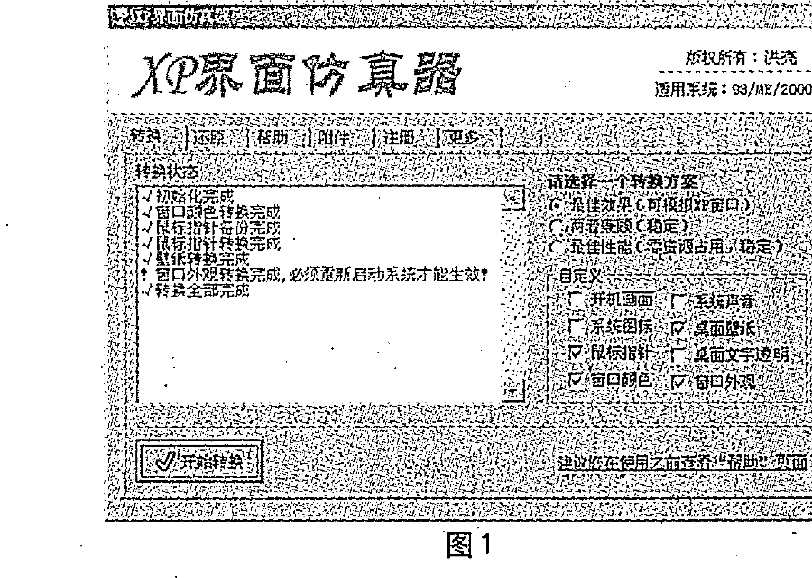

### 一、经典桌面软件

#### 1. 逼真的 Windows XP 模拟软件——XP 界面仿真器

“XP 界面仿真器”可以将 Win98/Me/2000 的界面外观模拟成为 Win XP 的漂亮界面，包括窗口外观、系统图标、鼠标指针、系统声音、窗口颜色等。

运行软件，在“转换”标签中选择一个转换的方案，如果你的硬件配置还可以的话，就选择“最佳效果”，当然也可以根据自己的需要有选择的设置要转换的内容，设置好后点击下面的“开始转换”按钮，完成后重新启动就可以看见效果了（图1）。

如果想还原到原来系统的界面，可以在“还原”标签中进行设置，在右面的选项中可以自定义要还原的项目，设置好后点击“还原系统”按钮就可以了。

#### 2. 让桌面动起来——ScreenTime SFW Desktop

你想让背景桌面动起来吗？其实很简单的，“ScreenTime SFW Desktop”就可以快速把 Flash 动画制作成一个桌面安装程序，运行这个程序就可以把 Flash 动画设置为桌面背景了。

运行 ScreenTime SFW Desktop，在“Content”标签中点击上面的“Brower”按钮来选择要制作屏保的 Flash 动画，然后在下面的“swf settings”设置一下 Flash 文件的播放质量和比例等参数（图2）。

在“Properties”和“Installer”标签中设置一些安装程序的显示图片，一般是不需要进行设置的。

最后就是创建安装程序了，点击“Build”标签后会弹出个保存对话框，第一个是保存制作 flash 桌面的配置文件，第二个才是保存桌面安装程序的，保存完成后运行这个程序来安装桌面背景，在弹出窗口中点击“Install”按钮就行了。

如果看腻了这个 Flash 背景想取消它的话，直接在桌面上点击右键是不行了，这样会弹出 Flash 菜单的，我们可以从“控制面板”中进入“显示”属性中来修改背景。

### 二、桌面软件中的另类

#### 1. 桌面上的天气预报——Samurize

Samurize 不算是一个桌面工具，但是用它来配合适当的脚本，就可以制作出非常漂亮的桌面效果，如桌面即时新闻、天气预报、股市、电视节目表等，这样既可以美化桌面，也能提供相关的最新信息，下面我们就制作一个桌面的天气预报（图3）。

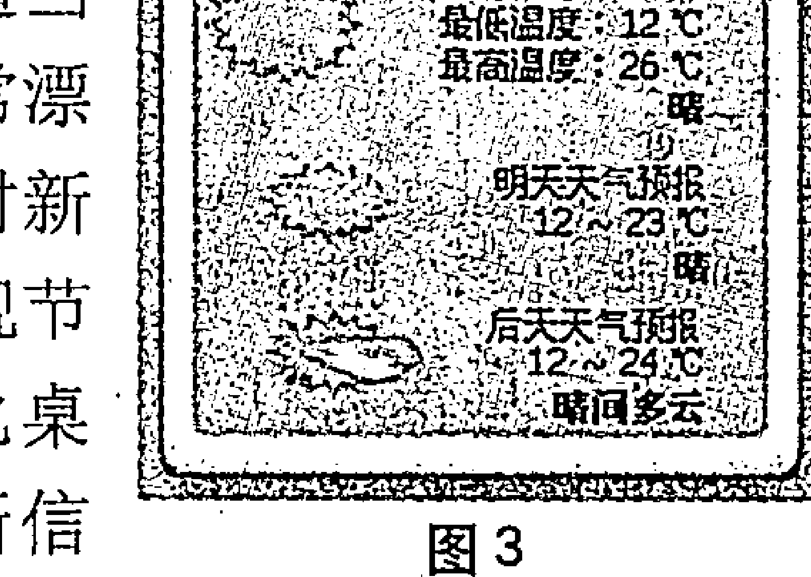

安装好 Samurize 后打开所在的文件夹，接着在下载脚本并解压缩，Samurize 的脚本编制很复杂，我们可以使用别人做好的脚本，解压缩后把脚本里面的内容复制到相应的文件夹中，如“Configs”文件夹中放的是后缀名为 ini 的配置文件，“Scripts”文件夹里面就是后缀名为 vbs 的脚本文件，图标就放在“skins”文件夹中。

复制好后我们就要对文件进行一些编辑，打开“Configs”文件夹下的“WeatherOnlinePlus.ini”把里面的 Samurize 路径换成安装的实际路径。

用记事本打开“scripts”文件夹下的“WeatherPlusStart”脚本，把里面的城市 ID 换成需要的城市 ID，再把 Samurize 安装路径改一下。

城市的 ID 我们可以去网站 http://www.t7online.com 来查找，如果我们要查南京的天气预报，先从首页上进入“中国天气”，接着在左面选择相应的省份，然后把鼠标指针放在右面相应的城市上，这时在浏览器下面的状态栏就会有一个链接，里面的“58238”就是南京的城市 ID。

完成上面的设置后就可以运行 Samurize 文件夹下的 client 程序，这时会在系统托盘出显示一个 S 图标，右键点击它在弹出的菜单中选择“select config file/WeatherOnlinePlus.ini”。

#### 2. 桌面时钟——ClocX

“ClocX”是一个十分漂亮的 Windows 桌面时钟，可以自定义钟面的背景和透明化设置（仅限 Win2K/XP 可用）。

运行后会在系统托盘中显示一个图标，右键点击它在菜单中选择“选项”，然后在弹出的“选项”对话框中对时钟进行如随系统自动启动、固定钟面等一些设置。

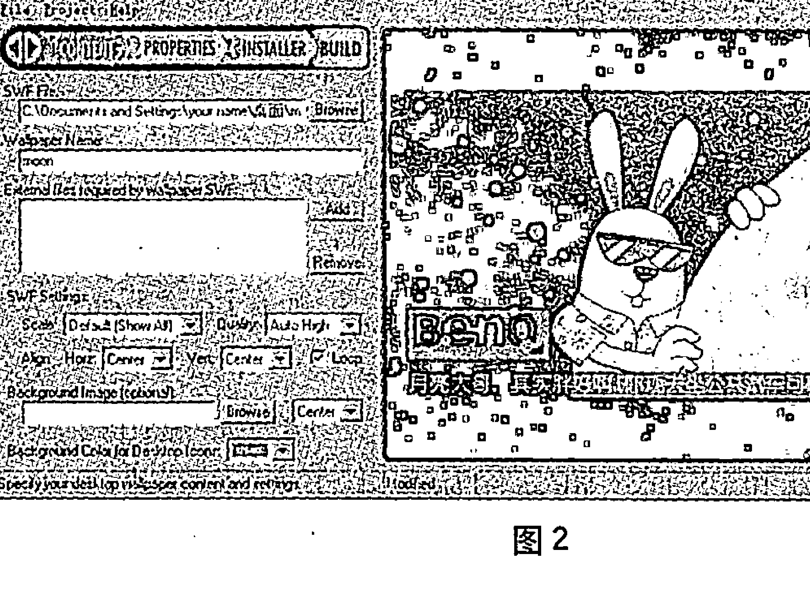

#### 3. 鼠标也要扮酷——Cursor XP

Cursor XP 是专门设置鼠标主题的软件，里面内置了很多有趣的鼠标指针样式，在安装的时候有个语言选择窗口，在里面选择“Simplified Chinese”就可以成为中文版了。

安装好后进入系统的“控制面板”，打开里面的“鼠标”项就可以进行设置了，在弹出的窗口中选择“CursorXP”标签，在下面的“主题”中选择自己喜欢的鼠标主题，选择好后，点击下面的“应用”按钮就可以看见指针的效果了。

Cursor XP 的鼠标样式都是带有阴影的，可以点击下面的“选项”按钮来设置指针阴影的高度、亮度、角度等一些参数。

#### 4. 桌面上的台历——桌面日历

“桌面日历”就是一个很不错的日历工具，安装运行后，软件会在系统托盘中启动一个图标，右键点击这个图标选择“日历外观设置”，然后就可以在弹出的对话框中设置日历的颜色、背景效果、水波特效，添加口令保护。

设置好后我们就可以打开日历，点击上面的日期来添加信息，而且还可以进行信息提醒，对于有信息的日期，旁边会多一个“i”。软件还会随着系统自动启动，启动后隐藏在屏幕的右面，只要点击一下日历上的箭头就可以显示和隐藏。

软件还有一个不错的功能，就是可以定时更换背景桌面。

### 3. 图标也精彩——桌面图标任我排

“桌面图标任我排”是一个可以轻松的把图标排列成其他形状的软件，很有意思的哦。

在进行设置前，先给取消图标的“自动排列”，在桌面上右键点击鼠标，在弹出的菜单中选择“排列图标／自动排列”，把前面的勾去掉。

然后直接运行下载的程序，在界面上点击喜欢的图标排列形状就可以了，效果不错吧，而且软件可以随系统自动运行，这样每次启动就可以显示你设置的图标样式。

### 4. 壁纸制作工具——Wallpaper Packager

“Wallpaper Packager”是一个可以制作桌面背景程序的软件，这样就可以像安装软件一样来设置桌面背景，只要双击制作出来文件就可以更改背景了。

运行软件后，点击“Browse”按钮来选择要设置为背景的图片，接着选中下面的“Set position”和“Set desktop color”，前面的参数是设置显示图片的方式，如居中、平铺、拉伸，后面是设置桌面颜色的，完成后点击“Build”按钮。

然后会弹出一个选择保存路径的窗口，点击“Browse”按钮来选择，最后点击“OK”就可以了。

### 5. 把电脑当成黑板——e-Pointer

“e-Pointer”是个可以让你把桌面当成黑板一样使用的软件，这样就可以在桌面上随意进行涂画了。

运行软件后会弹出一个工具窗口，里面有橡皮、吸管、铅笔、打字、清除屏幕等功能按钮，选择下面的数字可以设置铅笔的粗细，如要隐藏窗口右键点击一下就可以了，要显示窗口再点击一下就可以了。

使用铅笔等工具，我们可以在屏幕上随意画。利用它的文字输入功能，我们还可以进行留言，把留言的信息直接写在屏幕上就可以了。

### 三、桌面美容全攻略

#### 1. 主题美容师——Style XP

“Style XP”是一个功能强大的 Windows XP 界面设计软件，可以让你 Windows XP 外观焕然一新，Style XP 是一个多语言软件，运行后点击菜单“Language－Simplified Chinese”就是中文版的了。

Style XP 提供了五个主题风格供你选择，选择好后点击右下角的“应用主题”就可以了。如果你从网上下载了一些不错的主题，也可以添加进去，点击“增加一个新主题”来选择下载的文件，当然你也可以直接点击“下载一个新主题”去它们的网站下载。

除了主题外，Style XP 还精心制作了几个不同的视觉效果，选择一个效果后，设置一下颜色配置和字体大小，然后点击“应用效果到现有主题”，如果要添加和下载效果点击下面的按钮就可以了。

Style XP 还提供了丰富的桌面背景供选择，选好后点击“应用此背景到当前主题”就可以了。

我们还可以利用 Style XP 来每天更换桌面主题、视觉效果和背景图片。

#### 2. 开始菜单——ObjectBar

“ObjectBar”是一个设置系统开始菜单风格的软件，可以用它实现苹果电脑、Windows XP 和其他好看的菜单效果。

安装运行软件后，点击左面的“Available Themes”项，然后在右面选择自己喜欢的菜单样式，选好后双击就可以应用到系统中了。

怎么样？这个模拟的 Windows XP 的开始菜单，不错吧，功能比真正的 XP 开始菜单还强呢。

#### 3. 百变图标——IconPakager

“IconPakager”是一个美化系统图标软件，它内置了多种漂亮的图标样式，运行软件后点击左面的“Packages”项，然后就可以在右面选择自己喜欢的图标样式了，选中后双击就可以应用到系统中，在右面的“Include”中可以自定义更新哪些图标，最后点击“OK”按钮就可以了。

#### 4. 动态快捷栏——ObjectDock

ObjectDock 可以模拟出苹果电脑中的“动态快捷栏”，这样你的桌面看起来就更加酷了。安装运行软件就可以在桌面的下方看见效果。

在“动态快捷栏”上点击“Configure Dock”图标就可以对 ObjectDock 进行设置，在“Appearance”标签中，移动“Dock Size”的滑条可以设置动态快捷栏图标的大小，在下面的“Position on screen”可以来设置动态快捷栏的位置。

# 软件工具点将台
——一个人跑事工具

文/阿峰

### 文章重点与技巧目录

- ○记事帮手Sticker
- ○名片管家“大名鼎鼎”
- ○电子日记本
- ○求职助手
- ○友情强档
- ○理财好轻松
- ○多功能日历
- ○金锋文件加密器
- ○资料收集 Winnote
- ○手写的 Siwen Xnote
- ○手机号码归属地查询
- ○定时提醒 Cclock

## 今天我听布谷鸟

图1

点击下面的“browse”按钮就可以了，不过目前只支持WAV的格式。

如果你在桌面上建立了多个便签，那可以给每个便签设置不同的颜色，右击便签选择“Skin”来选择。

### 2. 名片管家——大名鼎鼎

《大名鼎鼎》是一个管理对名片信息和日常相关事务进行智能分类管理的高效管理系统，它可以将名片永久地保存在计算机中，查找、修改都非常方便，而且还可以将名片导出到Excel、Outlook等软件中。

### 1. 记事好帮手 —— Sticker

“Sticker”是一个不错的桌面便签程序，它可以更换便签Skin、更改文字格式、大小，而且还有半透明功能，这样再多的便签也没有关系。

安装好后，软件会在系统托盘中运行一个图标，点击一下就会生成一个新便签，在里面输入文字后就设置一下提示的时间，点击便签左上角的那个铃铛按钮就可以设置了（图1）。

把“Enable alarm”选中，在后面设置一下提示的日期和时间，提示的声音是系统默认的，如果你想用自己电脑中的声音来提示的话，先把“System Default Sound”前面的勾去掉，然后运行软件后，先输入自己的一些个人信息，如单位、姓名、地址等，然后在下面设置一下自动压缩数据库，最后点击“确定”。

进入软件后，在左面选择一下名片的分类，可以根据自己的情况选择几个，接着在右面输入名片的内容，完成后点击上面的“保存”就可以添加进去了。

输入名片后，我们可以点击工具栏上的“我的名片夹”来管理和使用里面的名片了。如果你的名片太多，那其中不免就有重复的，这时我们可以点击菜单“系统/高级设置”里面的“重复名片”设置判断的标准，然后在“我的名片夹”下的“重复名片”里就可以看见了，如果不需要就可以删除这些名片了。

### 3. 超酷日记本——电子日记本

“电子日记本”是一个可以在电脑上写日记或收集文档的软件，它支持常用的文字编辑排版功能，而且具有高强度的保密性，只有输入正确用户名和口令才能进入。

软件是个绿色软件，无需安装直接运行就可以了，首次使用会提示新建一个用户名，按照提示输入用户名、日记保存路径和密码，点击“确定”按钮就可以了。

接着就可以用刚才注册的用户名和密码进行登录了，这个日记本的功能很强大，可以在日记中插入类似QQ里面的图标，而且还可以设置软件的皮肤呢，只要你用了后一定会爱不释手的。

软件还有一个特色功能，就是可以自动选择输入法，这样当你打开这个日记本时，设置的输入法同时也已经切换好了。

### 4. 求职助手

“绝世好简历”是一个简历制作软件，只要输入个人的信息后就可以自动生成一篇完美的简历，而且还有多种简历风格供你选择。运行软件后点击工具栏上的“向导”按钮，接着就可以根据向导来制作简历了，按提示选择风格，输入基本信息、工作经验等内容就可以了（图2）。

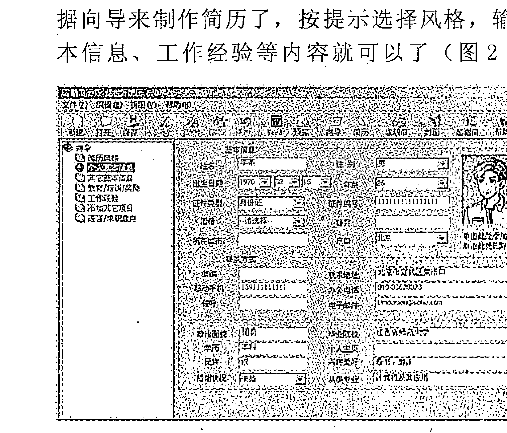

完成资料输入后，我们就可以点击工具栏上的“简历”来选择你喜欢的模板，而且还有几个不错的封面供你选择。软件还附带了几封不错的求职信和感谢信的模板，你只要把自己的内容替换到模板中，再进行适当的修改就可以使用了。

### 5. 超强通讯录——友情强档

友情强档是一款荣获多次大奖的个人信息管理软件，可以保存、查询、处理通讯录、名片、地址簿等信息，而且还可以管理个人日记、日程安排等，日历功能可以显示农历日期、节气、记年及生肖。首次使用会提示选择一个保存数据库的文件夹，选好后就可以新建帐户了，输入用户名、密码和权限，点击“完成”就创建好了。

接着用刚才注册的用户名和密码登录软件，点击菜单“联系人—新建联系人”来建立用户资料，输入完成后点击工具栏上的“保存”按钮就可以了。软件还有很多强大的辅助功能，如我们可以用它发送手机短信、发送邮件、电话拨号等。

### 6. 理财管家——理财好轻松

“理财好轻松”是一个免费的个人家庭理财软件，功能包括收支、图表，日记等，而且还可以查看“月收支对比图”和“月平均收支图”。

运行软件，按照默认的用户名和密码登录，登录后我们可以点击“密码设置”来添加新的登录用户名。

接着在“收支记帐”中点击“新添收支”按钮来添加数据，点击“收支分类”后点击箭头可以选择收支的分类，输入完成后如果想继续输入数据的话，点击“保存并新添”按钮就可以了。

软件还会根据你的收支情况自动汇总成图表，这样你就可以更加了解自己的收支情况了。

### 7. 数字时钟——多功能日历

“多功能日历”是一个实用的日历工具，能够给使用者带来很多有用的资料，可以在界面上欣赏音乐，软件还支持时间打铃、日程提醒等功能，而且还有一个不错的课程表呢。

运行软件后我们就可以看见这个多功能的日历，点击下面的“换样子”可以给日历更换皮肤，而且还可以点击周围的按钮来查询相应的资料。

这个日历还附带了一个网页浏览器，点击菜单“其他功能/日历浏览器”就可以将它调出来，在地址栏中输入网站地址就可以访问网页了。

### 8. 文件保镖——金锋文件加密器

“金锋文件加密器”是一个加密文件的好工具，安全性极高，软件操作方便，支持文件拖放、文件批量加/解密，可以将已加密EXE文件生成自解密文件。

### 9. 资料收集好帮手——Winnote

“Winnote”是一个文档管理软件，可以方便快捷地保存上网时的资料，或者其他任何文件中的文本资料，而且还可以设置密码进行加以保护。

软件在启动的时候会在界面上只留一个小窗口，我们只要将网页中的资料选中拖到这个图标里，这时图标会显示一个分类菜单，选择相应的分类就可以保存了。

除了用拖动来保存资料外，软件还可以通过剪贴板来保存，先把资料复制到剪贴板上，然后在图标上右击鼠标，在弹出的菜单中选择“剪切板文本到”中的相应分类就可以了。

对于收集到的资料，软件可以用自带的编辑功能进行编辑，能满足一般的编辑需要。为了防止别人偷看你收藏的资料，我们可以点击菜单“数据库/密码”来设置密码进行保护。

### 10. 可以手写的桌面便签——Siwen Xnote

“Siwen Xnote”是一款不错的桌面便签软件，它最大的特点就是支持手写输入，很有个性哦。运行软件后右击系统托盘中的Siwen XNote图标，在弹出的菜单中选择“Add new note”，这样就可以在新建的便签中记录信息了，点击中间的按钮切换到手写状态就可以来写留言内容了。

我们还可以给便签添加附件和语音留言呢，点击左上角的菜单选择“Voice Recorder”就可以来进行留言录音；如要添加附件，在菜单中选择“Attach”，然后选择一个文件就可以了。

### 11. 号码查询——手机号码归属地查询

“手机号码归属地查询”可以详细查询到手机号码的开户地信息，包括该号码所属省份、城市、长途区号以及该号码SIM卡类型，而且还集合了“来电显示”、“通讯录”和“更换皮肤”等功能。

运行软件，点击菜单上的“归属地查询”，在下面的号码栏中输入要查询的号码，然后点击下面的“查询归属地”按钮就可以看见结果了。

软件的来电显示功能也是在这里设置的，先选中调整解调器的端口，然后选中“启动来电显示功能”就可以了（图3）。

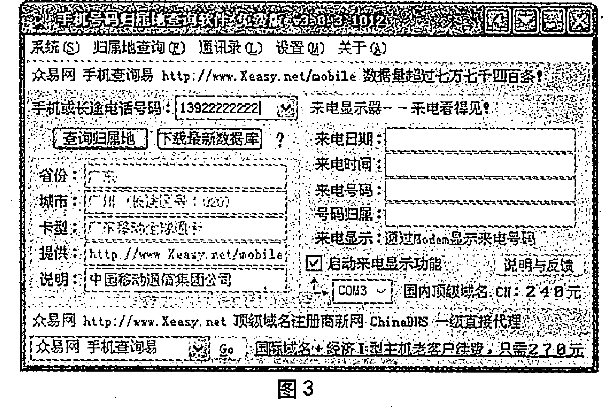

软件还支持换肤功能，点击菜单上的“设置”，然后从网上下载皮肤就可以了，而且在这里还可以设置来电显示的“保留时间”和“自动开启设置”。

### 12. 定时提醒——Cclock

“Cclock”是一个定时提醒软件，能够设定在半点整点、每天的任意时间、任意间隔时间进行提醒，而且还可以在上网的时候自动删除无用的广告页和广告窗口，还可以向网络中用户发送消息呢。

安装运行软件后会在系统托盘处显示一个图标，点击图标选择“显示主窗口”就可以进行了。在“闹钟”项中，我们可以根据自己的需要设置提醒的时间和内容，设置好后点击右下角的“保存”按钮才可以生效。

软件还可以利用“信使服务”向好友发送消息呢，输入对方的IP地址，然后在下面输入内容，点击“发送”按钮就可以了。

“禁止广告窗口”也是这个软件的另一个特色功能，我们可以在“禁止”项中添加、删除广告窗口的地址。

# 构建个人电脑的安全网

文/叶知秋

收到朋友们从 Email 软件里传来的文件的时候经常要下意识的看一眼任务托盘中是否有运行着一个杀毒软件的图标（图1），这个习惯已经不知道救了我多少次，至少我的计算机中的病毒并不象别人的机器中那么肆虐……


写这篇文章的时候正好是冲击波病毒开始在我们的写字楼里大肆传播的时候。当时，虽然笔者已经不再专门从事计算机安全和网络管理工作了，但仍旧想把自己的经验贡献出来。说真的，冲击波病毒其实并不应该在全球范围内如此泛滥；而这种泛滥在很大程度上归功于宽带的普及、以及Windows XP的大量使用。一台计算机很长时间地连在计算机网络中，如果没有任何防护那么就一定会感染蠕虫病毒或成为D.O.S.攻击的温床。象“计算机不胡乱地使用来历不明的软盘、不要轻易地打开电子邮件附件，这样就可以避免感染病毒……”这样的论断也已经好象过时，让人觉得不可相信了。

### 1. 安全是什么？

首先，绝对的安全是拔掉网线；不使用任何无线上网设备；不使用来历不明的软盘、光盘；每时每刻地备份文件……

但是问题是计算机不去连到网络上，不交换和处理数据，那么我们要计算机做什么？

### 2. 什么是安全？

安全是在不影响我们做任何事情的时候并不觉得不便，而计算机也不会出任何我们不希望发生的故障。所谓的因为要安全，我们禁用Activex或者关闭Cookies和Script Host，都让他们去死掉，那不是安全而是自我摧残。

### 文章重点与技巧目录

- 家用电脑的安全运行方式
- 用扫描器来查找安全漏洞
- ShadowScan 扫描 IP 地址
- ShadowScan 扫描端口
- 安全风险评估
- 什么是个人防火墙
- Norton 个人防火墙的使用
- 制定防火墙规则
- IPSEC 网际安全协议
- IPSEC 协议使用

### 一、初释安全

#### 1. 正规商业安全的运做方式

商业电脑用户的安全是按照一定的步骤定义起来的（图2）：

- 进行风险评估
- 设计安全标志
- 选择实施方案
- 进行安全培训
- 实施安全监控
- 对入侵产生响应

图2
（示意图内容）
对入侵者的响应
安全监控
风险评估
设计安全标志
选择及实施方案
标准和过程

我们可以看到，在每个阶段都有着固定的工具来进行相应的工作，通过工具的使用、政策标准的实施那么就可以构筑一个相对于安全的系统。

#### 2. 家庭用户的安全运行方式

那么笔者所倡议的家用电脑的安全政策规则为：

- 知道我们所要保护的目标
- 采取安全保护措施
- 建立使用规则
- 响应安全事件

由这四点构筑的安全并不能保证它的严密性，但如果按照这四点去做，那么我们可以减少大部分安全问题所带来的损害，并且可以应付多数的问题。虽然我们的方式也会增加一些使用的麻烦，但总比不断的重新安装系统简单得多。

### 二、我们要保护的内容

我们列一个表格看看我们需要在计算机里保护些什么的内容，他们的缺失会给我们造成什么伤害。

但表1所列的这些内容中并不是所有的内容都是至关重要的，有些内容我们是可以划入不重要的内容之中的。那么重要的内容是什么？重要的内容因人而异，但其中的系统文件、密码、银行帐户、个人工作文档是重要的。

#### 表1

| 内容 | 功能 | 缺失后产生的麻烦 |
| :--- | :--- | :--- |
| 系统文件 | 保证计算机正常运行的必不可少的文件 | 计算机将不能正常工作 |
| 密码 | 确保未经过授权的人不可使用计算机 | 人们将未经授权访问计算机 |
| 应用软件 | 帮助我们完成特定的工作 | 特定的工作不能被很好的完成 |
| 游戏 | 娱乐 | 不能娱乐 |
| 工作文挡 | 保存在计算机上的工作成果 | 工作未完成，工作资料、成果被泄露 |
| 个人文挡 | 记录岁月的照片或写给某人的私人信笺 | 隐私泄露 |
| 银行帐户 | 网络付费的数字证书，密码 | 经济损失 |

### 三、扫描器检查系统是否安全

#### 1. 什么是扫描器

首先要为安全扫描正名：安全扫描并不是黑客攻击，而是对系统进行风险评估，建立一个设计安全的并且可以不断适应新问题发生，能够不断的自我完善的系统，风险评估是第一个环节的第一步，也是最后一步，并且是秉承前后两个环节的一步。

如前所述，世界上没有安全的系统，只有不断完善的系统，先入侵者一步将漏洞发现自己就能在网络安全战场上占到优势。

用作风险评估的安全扫描器是模拟入侵者的探测和进入网络的各种方法，对各种设备和系统做彻底的安全检测，是使用一系列的网络命令或请求来探测计算机故障和漏洞，并将所得到的结果以报表的方式显示出来，通过这些结果用户就可以确切地得知系统的哪一个部分薄弱，薄弱在什么地方。

扫描器是这一类进行扫描工作软件的统称。此类软件仅仅是对一个特定范围内的目标代替人工（同时也代替了安全人员）进行简单而又重复的操作。不过它们的速度快，而且信息定位比较准确，因此它们是一种有力的安全工具，被广泛应用在安全评估过程中。

安全扫描有针对于整个系统的扫描器也有针对专项服务的扫描器，一般的来说，一个设计完善的安全扫描器可以针对于不同的平台在防火墙外实施防范的系统漏洞侦测工作。这些扫描针对TCP/IP系统的网络漏洞、容易破解的不符合规范的用户名密码、特定软件的安全漏洞进行扫描。

#### 2. 主流市场的商业安全扫描器软件

目前软件市场上可以见到的安全扫描软件主要有以下几种：

- AxeBt Netrecon
- Cyrano e-secure
- PGP Security CyberCop Scanner
- ISS Internet Scanner
- WebTrends Security

这些软件发展成熟，界面友好并且可以详细地分析系统，生成符合商业需要的安全报告，但他们也有致命弱点——价格昂贵。虽然其中的一些产品已经推出了适合中小企业的版本，但价格仍然在10000人民币到70000人民币之间，对于SOHO用户或个人用户来说价格仍然太高。

因此大多数SOHO用户或者个人用户将目标转向共享软件。

在共享软件比较出色的扫描器是Shadow系列的产品，Shadow系列安全产品是乌克兰高手RedShadow编写的一套安全软件。包括远程控制、防火墙、以及两款扫描器ShadowScan和ShadowSecurityScaner。全套的Shadow安全软件可以在http://www.rsh.kiev.ua/ 下载。

在个人安全评估中同样推荐使用这两款扫描器作为个人的安全检测工具。

#### 3. ShadowScan扫描器的使用

ShadowScan是一款综合网络分析工具，其中包括常用的网络命令的GUI版本以及多种功能的扫描器系统，我们这次主要讨论其中的扫描功能。

Shadow系列软件中的扫描系统基于相同的内核，对IP地址的处理上可以接受固定的域名也可以使用单一的IP地址或者NetBios名称，更可以指定IP范围以及导入包含主机名称或IP地址的文本文件。

通过ShadowScan可以完成IP地址扫描、端口扫描、代理服务器扫描、NetBios扫描等，并可扫描网络系统中存在的部分trojan木马程序。

##### (1) IP地址扫描

IP地址扫描是我们了解网络中一个主机是不是可以访问，一个网段中有哪些主机可以被访问到的一种手段。但如果有些计算机使用了特定的防火墙规则，那么这些计算机就有可能不能被IP地址扫描器正确地识别。

通过IP地址扫描结果可以使我们更快地得到网络中主机开启的大致情况，并可得到NetBios兼容主机的主机名称。

使用ShadowScan IP地址扫描器需要进入ShadowScan的Internet Scaner模组，在模块中选择Scaners项目。在Scaners项目中包括IP Scanner、Port Scanner、Proxy Scanner、NetBios Scanner、Banner Scanner五个扫描功能。点击IP Scanner进入IP 扫描器，输入要扫描的IP地址。

在ShadowScan的一系列软件中对IP地址采取三类的处理方式：

- 单一的主机名称或IP地址 (Host)
- IP地址段 (IP Zone)
- 由文本文件导入的IP地址 (List)

现在对一个ADSL网段进行IP扫描。在IP Zone中输入Starting IP: 61.136.21.1和Ending IP: 61.136.21.254，然后点击Start Scan (图3)。

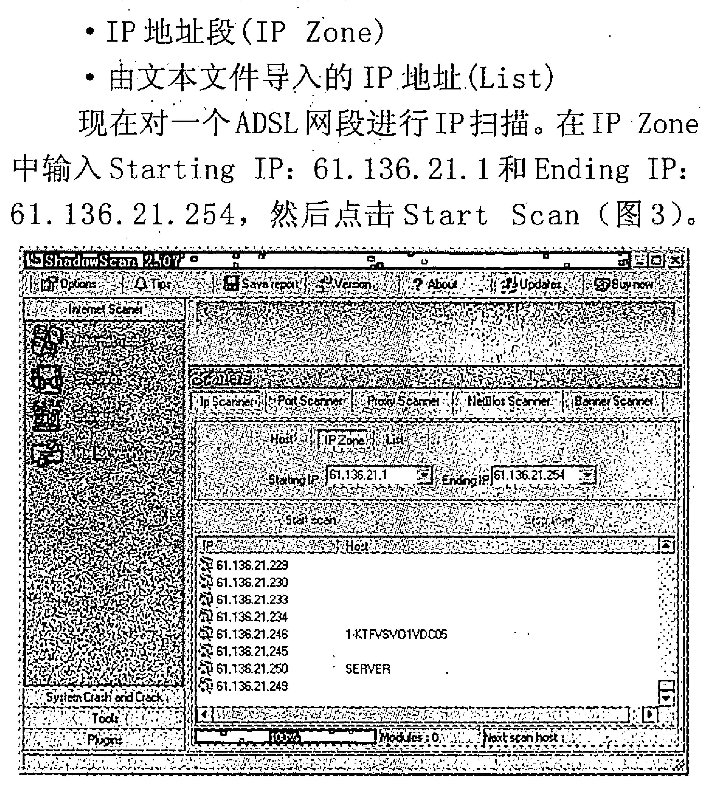

经过扫描我们可以得到在网络地址段 61.136.21.1 到 61.136.21.254 这254台计算机中哪些可以访问、哪个IP地址对应的主机名称是什么的参考信息。这些信息在网络主机状态分析中有着比较重要的用途。

##### (2) 端口扫描

我们知道TCP/IP协议中不仅定义了不同的IP地址来表示不同的主机，也定义了0-65535这些端口来表示不同的服务功能，那么一台存在于网络中的计算机都提供了什么服务，我们就可以靠端口扫描进行分析。

在ShadowScan中使用端口扫描功能同样需要选择Internet Scaner模组，在模块中选择Scaners项目中的对应功能——Port Scanner。选择要扫描IP的方式也与IP扫描的方式相同，由于端口扫描的试探次数要远大于IP扫描，所以端口扫描的时间比较漫长。

这里我们做一个对单一IP的端口扫描：选择Port Scanner功能，在HOST中填写61.136.21.22，这是一台刚刚在IP扫描中发现的名叫SERVER-741PWSL0的机器，现在我们看看它开放了哪些端口（图4）。

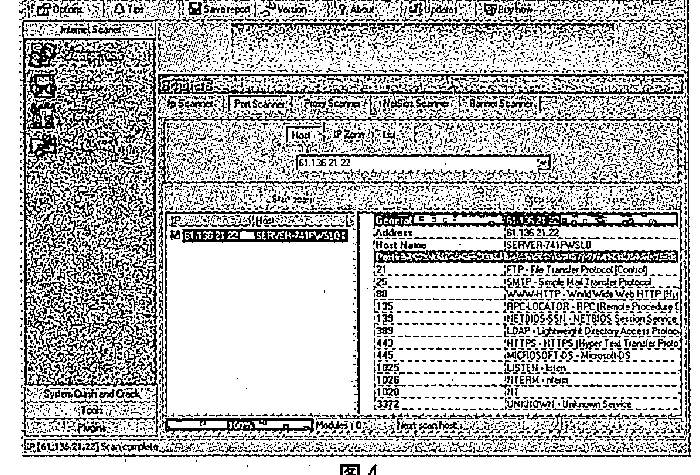

经过扫描我们发现在61.136.21.22这台机器中分别开放了几个重要的服务端口：21 FTP服务、25简单邮件传输协议、80超文本传输协议、139 NETBIOS服务等。

##### （3）NetBios扫描

NetBios（网络基本输入/输出系统）是在简单的网络中实现资源共享的基础，但如果NetBios与TCP/IP协议进行了不恰当的绑定后就会出现NBT（NetBios Over TCP/IP）漏洞。NBT将资源不必要的通过TCP/IP协议暴露在局域网以外。检测这种漏洞的出现有助于我们计算机内文档不被无关用户非法访问。

同样，在Scaners项目中的对应功能——NetBios Scanner。在HOST中输入IP地址61.136.21.22，开始扫描。

扫描的结果我们发现61.136.21.22这台主机的确存在着NBT问题，显示了自身的主机名SERVER-741PWSL0、MAC地址00-40-B8-50-0B-B3、以及6个开放的共享名称。由于这台主机是一个WINDOWS NT内核的系统，因此在这台主机上每个固定的磁盘都有盘符+“$”的共享名称以及ADMIN$指向WINNT目录和IPC$进程管理接口。当然这六个共享名一般的情况下在网络邻居中是不可见的。但是这些共享接口可以让使用者获得主机的完全管理权限，因此十分危险。

使用ShadowScan发现了些问题和危险，但这个61.136.21.22还有什么问题？这些值得深入研究。更深层次的安全扫描评估应当使用ShadowSecurityScaner。说句题外话一个真正负责任的安全扫描软件只致力于发现安全问题并且协助用户提出相应的补救方案，而不是发现了安全问题后协助于用户利用问题去攻击系统。这点是安全扫描软件和为人所不齿的入侵程序之间的根本区别。

#### 4. 实战ShadowSecurityScaner

安装后启动Shadow Security Scaner可以见到主窗口，其中包括了四大功能模块：SCANNER、Password Checks、Dos Checks、Base SDK，分别为扫描器、口令检测、D.O.S.检测和开发模块。其中SCANNER（扫描器）部分可以扫描多达1445种TCP/IP端口并证实22大类千余种网络漏洞的存在。而口令检测和D.O.S.检测模块也可在常用网络协议中起到响应的作用。作为功能扩展Shadow Security Scaner更可以利用BASE SDK进行PLUGIN模块的挂接。

##### （1）扫描过程的建立

当Shadow Security Scaner程序开启后，点击SCANNER模块，弹出扫描事务设置向导，在扫描事务向导中可以设置扫描任务的规则、说明、以及目标地址。默认的扫描规则是完全扫描（COMPLETE SCAN）。选择规则后进入下一步。然后在下一个窗口中设置扫描任务的说明。在随后的窗口中设置要扫描任务所涉及的主机，这里添加的主机可以是单一的IP地址或域名，也可以设置成NETBIOS名称。并且Shadow Security Scaner在Add IP Zone中可以只直接支持IP地址范围的添加。全部设置完成后选择Done结束向导，便可显示出扫描窗口。

点击“开始扫描”按钮就可以开始扫描任务，在扫描任务的过程中系统依次对目标进行确认地址、端口扫描、服务漏洞检测直至最后生成安全报表（图5）。

扫描完毕后在报表窗格中ADUIT栏内将显示所侦测出的漏洞，每个漏洞的说明在窗口下方的信息窗格中将有具体的说明修改的方法。

在显示中Shadow Security Scaner将问题分为3个等级，向上的红色箭头代表严重漏洞，黄色箭头代表中等程度的漏洞，向下的绿色箭头代表轻微漏洞或信息性提示。

### 四、个人防火墙

#### 1. 什么是防火墙

依据前面介绍的扫描方式，我们对IP地址61.136.21.22进行了风险评估。

说到网络安全软件第一个要提到的就是网络安全的防御基础——防火墙。

评估的结果是让人担心的，61.136.21.22是随机的从ISDN拨号网段中选出的一个IP地址。在ISDN拨号网段中通常集中了中小企业、网吧和高端个人用户等人群。这个IP地址后来被证实是一个经营性网吧的服务器。经过安全扫描上面共有大大小小的安全漏洞36个之多！其中被标记为严重的漏洞就有10个。如果要进入并更改系统的话目的不难达到，这里有两个案例：

在大型建筑中常常为了防止火灾的蔓延使用一些耐火材料构筑一些防火隔离区，当建筑中发生火灾后，这些耐火材料可以防止火焰引燃防火墙后面被保护的设施，而当火势十分凶猛的时候耐火材料也可能被烧毁，但可以形成更大的防火带仍然保护其后设施，这个建筑学术语也被应用在网络安全中这就是“防火墙”。网络安全范畴内防火墙的用途是组织灾难的蔓延，同时通过经过验证的信息。这和建筑学中的防火墙有相同之处。

计算机防火墙在隔离安全与不安全区域、对进出计算机网络系统的数据根据安全规则的需要进行过滤，使认为安全的信息可以进出计算机网络，拒绝认为不安全的信息进入计算机网络，同时保证机密的信息不流露出计算机网络。计算机防火墙同现实的防火墙一样在使用时也使得通道变得不是那么畅快，因此在使用防火墙的计算机系统中网络速度明显的变慢。

系统包括前面提到的NBT安全问题使得对此机器的进入可以实现；并且经扫描系统的Administrator用户不设置密码，导致了安全形同虚设。并且进入者有完全的权限。可以任意更改系统。

在构建安全的网络环境的过程中，防火墙作为第一道安全防线，它能限制被保护的网络与互联网络之间，或者与其他网络之间进行的信息存取、传递操作。防火墙可以作为不同网络或网络安全域之间信息的出入口，能根据企业的安全策略控制出入网络的信息流，且本身具有较强的抗攻击能力。它是提供信息安全服务，实现网络和信息安全的基础设施。在逻辑上，防火墙是一个分离器，一个限制器，也是一个分析器，有效地监控了内部网和Internet之间的任何活动，保证了内部网络的安全。

#### 2. 实战风险评估

在这次检测中发现这个系统已经被入侵过了。虽然不是人工的进入但是也同样暴露了系统安全的脆弱性。

大家所见到的这个页面同样是在主机61.136.21.22提供的WEB服务被攻击后遗留物（图6）。61.136.21.22的默认页面是被一种名为sadmind/IIS的蠕虫病毒所改动而遗留的，这个蠕虫病毒利用的传播手段模拟入侵者，入侵一个包含安全漏洞的过程来感染IIS系统的，并且会在IIS系统的中通过SCRIPT目录留下后门。使得二次入侵更加容易。

的方块代表中等问题，而I图标表示提示信息。针对Shadow Security Scaner所提出的漏洞可以按照Shadow Security Scaner所描述的错误修改提示进行漏洞的修改。

## 2. 防火墙的安全防护原理

防火墙的安全技术包括包过滤技术、网络地址转换——NAT技术、代理技术等。

包过滤技术(Packet Filter)。这是防火墙为系统提供安全保障的主要技术，它通过设备对进出网络的数据流进行有选择的控制与操作。包过滤操作通常在选择路由的同时对数据包进行过滤(通常是从互联网络到内部网络的包进行过滤)。用户可以设定一系列的规则，指定允许哪些类型的数据包可以流入或流出内部网络(例如只接收来自某些指定的IP地址的数据包，或者内部网络的数据包可以流向某些指定的端口)；哪些类型的数据包的传输应该被拦截。包过滤规则以IP包信息为基础，对IP包的源地址、IP包的目的地址、封装协议(TCP/UDP/ICMP/IP Tunnel)、端口号等进行筛选。包过滤这个操作可以在路由器上进行，也可以在网桥，甚至在一个单独的主机上进行。

网络地址转换(NAT —— Network Address Translation)是一种用于把内部IP地址转换成临时的、外部的、注册的IP地址的标准。它允许具有私有IP地址的内部网络访问因特网。它还意味着用户不需要为其网络中每台机器取得注册的IP地址。

应用代理或代理服务器(Application-Level Proxy or Proxy Server)是代理内部网络用户与外部网络服务器进行信息交换的程序。它将内部用户的请求确认后送达外部服务器，同时将外部服务器的响应回送给用户。这种技术被用于在Web服务器上高速缓存信息，并且扮演Web客户和Web服务器之间的中介角色。它主要保存因特网上那些最常用和最近访问过的内容，为用户提供更快的访问速度，并且提高网络安全性。这项技术对ISP很常见，特别是如果它到因特网的连接速度很慢的话。在Web上，代理首先试图在本地寻找数据，如果没有，再到远程服务器上去查找。也可以通过建立代理服务器来允许在防火墙后面直接访问因特网。代理在服务器上打开一个套接字，并允许通过这个套接字与因特网通信。

代理防火墙中对Ftp、Telnet、Http、Smtp和POP3等应用实现了代理服务。这些代理服务对用户是透明的(Transparent)，即用户意识不到防火墙的存在，便可完成内外网络的通讯。防火墙使用透明代理技术，使防火墙的服务端口无法探测到，也就无法对防火墙进行攻击，大大提高了防火墙的抗攻击性能。

## 3. Norton Internet Security 个人防火墙

针对于个人用户，推荐使用的防护产品是赛门铁克出品的Norton Internet Security。2001年出品的Norton Internet Security有三个销售版本、单纯的防火墙软件、防火墙和防病毒捆绑销售的软件包、带有多用户身份认证功能的防火墙。一般推荐使用Norton Internet Security 2001。它包括了Norton Internet Security与Norton AntiVirus两个软件，分别提供网络安全防护和防病毒功能。

Norton Internet Security就是个人防火墙软件，所谓个人软件就是安装在计算机中的一个网络通讯过滤器，它可以阻挡或允许网络的连接或数据的传递。

在安装完毕Norton Internet Security的时候，Norton Internet Security安装在系统上，在运行了Norton Internet Security后，可以点击启用按钮使防火墙处于工作状态，在工作状态防火墙才可以对计算机网络上的数据进行筛选和过滤。如果需要每次在系统启动的时候Norton Internet Security都可以自动启动，那么就需要在Norton Internet Security选项窗口中选择“系统启动时运行”项，在以后每次系统启动的时候Norton Internet Security都可以自动的加载，这一点对LAN用户尤其重要。

## 4. Norton Internet Security 的用户界面

和赛门铁克的大多数系统工具软件一样，Norton Internet Security的控制方式也是任务板式的在任务板中可以快速的访问大多数基本功能。由于功能被分类成卡片组所以访问起来十分的顺手。

Norton Internet Security任务板所提供的功能包括四个——状态、安全、隐私和禁止广告（图7）。

- 状态
- 安全
- 隐私
- 禁止广告

（1）在状态标签下面显示出Norton Internet Security的工作信息，从这里可以实现4种操作：

- 单击“禁用”或启动以关闭或打开各种形式的Norton Internet Security保护。
- 单击单个保护服务（安全、隐私或禁止广告）以临时挂起保护功能。
- 查看表明Norton Internet Security如何保护系统的实时统计表。有关保护活动的详细说明，单击与每项服务相关联的单个统计表。
- 检查Norton Internet Security的订阅内容的到期周期。

（2）安全标签中显示的是当前安全设置的基本视图，从任务板的滑块可以控制Norton Internet Security的防护等级，其中的“高级”设置可以屏蔽所有的端口使外界根本就不可能访问用户计算机，但由此当计算机有任何网络操作的时候都将弹出提示框会给用户带来一些不便。中级选项是针对于大多数用户而做的设计，在系统中已经按照普遍的规则而定义了用户的访问规则，用户可以无任何问题的访问大多数资源也可以防护住已知的大多数黑客攻击行为。低级选项仅仅提供了极少的防护，允许PC上所有应用程序访问网络，除非该应用程序表现为恶意的（低级设置将应用程序与一小列已知为恶意的程序相比较）。Java程序和ActiveX控件运行正常。

如果用户不满意这三种设置的话，可以选择自定义级别功能去自己定义安全等级。一些设置如下：

- Java程序安全：允许控制从网站下载Java程序时浏览器的处理方式。
- ActiveX控件安全：允许控制浏览器处理Internet中遇到的ActiveX控件的方式。（禁止ActiveX控件可能会使有些网页无法正常运行。）
- 秘密禁止未使用的端口：允许禁用警报信息，否则当您的某个PC端口接收到入站连接尝试而您的PC上相应的监听服务不可用时，会发出该警报信息。
- 以及是否启用个人防火墙警报

（3）在隐私控制版中控制的是个人隐私行为，主要是对浏览器的Cookie行为和安全访问行为进行监控。在浏览中我们的访问会因一些服务器的响应而在本地保存一些Cookie，这些Cookie中的数据很多竟然包括我们所输入的用户名、密码甚至信用卡帐号这些信息如果不及时清除的话就有可能被其他站点或一些恶意的程序所利用给用户带来利益上的损失，在Norton Internet Security中提供的Cookie隐私保护就是在这个隐私控制板中实现的功能。

（4）在Norton Internet Security中也对恼人的网络广告提供了屏蔽功能。在禁止广告控制板中可以开启禁止广告功能。Norton Internet Security是依据图形的尺寸识别一个图片是否是广告。在默认的状态下对468长60高的广告条图形进行屏蔽，也可以通过将浏览器中显示的广告条拖动到垃圾箱按钮上来屏蔽非标准尺寸的广告条。

## 5. Norton Internet Security 的规则

什么是规则？规则是一系列的比较条件和一个对数据包的动作，就是根据数据包的每一个部分来与设置的条件比较。当符合条件时，就可以确定对该包放行或者阻挡。通过合理的设置规则就可以把有害的数据包挡在你的机器之外。防火墙仅仅是执行规则的一个工具，而一个防火墙的优劣也是从很大角度上要从防火墙定义规则和实施规则的效率来考虑的。个人防火墙的规则一般是过滤规则居多，它们根据每个IP数据包中的报头来区分一个数据包的合法性，如果合法再转交给其他应用程序去处理。

Norton Internet Security的过滤规则是依靠Norton Internet Security选项卡中高级选项防火墙卡片进行定义，在其中可以定义哪些程序可以运行网络应用，哪些不可以运行网络应用等网络访问规则。但程序检测到一个程序试图访问网络的时候将会自动提出警告，弹出规则配置窗体。在该窗口中点击配置今后使用规则按钮，当确认今后一定要使用网络，则选择总是允许该网络通信，并根据需要配置网络使用端口和访问IP地址范围。

在这几步操作中实际上就表明了程序到底在访问哪些网址，启用了哪些服务，因此在此步就可以有效的防止程序的非法访问网络资源。

在一切都设定好后，命名规则名称并点击完成按钮，到此这个单一程序的网络规则就设定好了。

在使用Norton Internet Security的时候，如果计算机使用局域网那么可能出现不能访问局域网资源的现象，这是因为Norton Internet Security默认的设计是在单机连接Internet的环境，如果使用局域网那么就应当在 Norton Internet Security 高级选项防火墙中修改 Default Inbound NetBIOS Name 规则，将其操作功能由禁止改变成允许。

Norton Internet Security 是轻度防御的包过滤防火墙与 Norton Internet Security 软件包中的防病毒程序 Norton AntiVirus 构建出最基本的个人网络安全方案可以有效的组织远程的扫描、以及包炸弹的攻击，使系统在网络中处于稳定状态。

## 6. 企业级防火墙

企业防火墙软件是基于企业的重任务解决方案。一般的情况下企业防火墙不安装于企业的每个计算机中而是安装在位于企业路由器和交换机之间，负责整个企业网络的通信规则定义，抛弃或禁止含有特定标记的数据包，因此要求企业防火墙有着强大的数据处理能力，所以一些企业级的防火墙不仅仅是一套计算机安装的某个软件，甚至是一台专用的网络设备。

如果是软件的企业防火墙那么仍旧是推荐 Symantec 的产品——Symantec Enterprise Firewall。

Symantec Enterprise Firewall 是原来名为 RAPTOR FIREWALL 的防火墙产品，通过介入到网络的传输中以实现对网络系统的保护。

Symantec Enterprise Firewall 可以提供针对恶意入侵的防火墙保护，同时也可使经过批准的商业数据流以所需要的网络吞吐量速度在企业中传输。它将获奖的体系结构与广泛多样的功能集于一身，可以提供功能全面的安全性，并可确保对进入和离开企业的信息实施完全控制——从而为 Internet 外围、企业内部网 (intranet)、专用子网、和分支办事处等提供妥善保护。

Symantec Enterprise Firewall 的解决方案是将通过 TCP/IP 堆栈的七个层对在某个内部客户机上进入 TCP/IP 堆栈的数据包采用各种扫描技术。一旦扫描测试完成，如果发现不存在任何问题，则允许这些数据包流出 Symantec 企业防火墙而进入下一个网段。表 2 为 Symantec Enterprise Firewall 工作示意图。

可见企业级防火墙软件的功能已经远远的超出个人防火墙，并且企业级防火墙软件还具备了支持多点远程管理、支持 VPN 功能、支持用户身份验证等功能

## 7. 从另一个角度看防火墙

为什么神奇的防火墙可以防止骇客的攻击？原因是利用防火墙可以决定计算机上哪些端口是可以开放、哪些是不可以开放的。决定和监控这些端口是否开放以及对谁开放就是防火墙的最基本功能。

为了实现这样的功能，防火墙系统通常要截断内部网络与外部网络的直接通讯，然后建立一个代理，通过代理确定数据包到网络的传输的方向与安全性，因此防火墙还有个另外的名称——边界网关。

然而仅仅有防火墙还不能够绝对保证安全，因为防火墙的安全是建立在安全的规则策略上的。防火墙正是依据安全规则和策略，对网络上的数据传送实施监控和操作。

而从个人计算机上是使用的个人防火墙来讲，个人防火墙实施的是对计算机端口的监控，这些个人防火墙往往会依照一个规则来决定哪些端口可以由哪些程序来使用。

在通常的情况下，防火墙具有很好的保护作用。入侵者必须首先穿越防火墙的安全防线，才能接触目标计算机。你可以将防火墙配置成许多不同保护级别，高级的保护可能会禁止一些服务，如视频流等，但至少这是你自己的保护选择。

但是，防火墙并非是绝对可以保护计算机系统的一个坚固屏障，因为防火墙尤其是运行在 PC 上的个人防火墙软件可以被攻击，从而导致挡在入侵者和计算机之间的这一个屏障坍塌。如果仅仅有防火墙的保护那么当这一层防护不存在的时候，计算机资源就赤裸裸的呈现在入侵者面前。

这样我们需要在防火墙坚固的外衣里面再加一件内衣。加这层内衣，有的人立刻想到多安装一个个人防火墙软件——但这样不实际也不可行，大量的防火墙软件仅仅能拖垮系统而不能做更多的事情。

### 五、PC 的内衣 IPSEC

给计算机穿上内衣那么我们有一个很好的选择的就是 IPSEC（网际协议安全）。

IPSEC 已经成为工作标准，广泛的应用于各种系统平台和网络硬件中，在 Windows 2000 以及 Windows XP 中 IPSEC 已经成为标准的配置，IPSEC 的特点是：

- 安全组网的长期指导
- 对专用网络和 Internet 攻击的主动保护，同时保持易用性
- 一套基于加密术的保护服务以及安全协议
- 端对端的安全性。惟一必须了解 IPSec 保护的计算机就是通讯的发送方和接收方
- 保护工作组、局域网计算机、域客户和服务器、距离很远的分公司、Extranet、漫游客户以及远程管理计算机间通讯的能力

IPSec 安全协议为每个 IP 数据包提供数据和完整性保护。Windows 2000 IPSec 使用“验证报头”和“封装安全措施负载量”来提供这些服务（图 8）。

#### 1. IPSEC 实战

我们在正常使用计算机的过程中，往往利用防火墙的某些特性去封锁某些 TCP 端口，但是这样的封锁在网络中仅仅可以防范基于端口的入侵，并且需要有正确的端口安全规则防范才可以生效。但对于更多的考虑来讲并非是一种有效的做法。

对于在通过 LAN 接入 Internet 的 PC 来讲，有些特性是需要考虑的，这些 PC 既需要和 LAN 内的所有 PC 完成文件共享，又要防止 Internet 的计算机随意访问到 LAN 中的本地共享资源。从纯技术的角度来考虑这个问题就是要在 LAN 内限制和 NETBOS 相关的 135 端口的使用，将 135 端口的使用权限制在 LAN 内。
而如果一个 LAN 内对即时通讯软件需要限制，那么针对于 ICQ 或 OICQ 的最直接的限制方式就是关闭计算机上的 4000 端口。这时候我们也需要 IPSEC 的协助。
当然，针对于一个计算机我们也可以通过手工设置防火墙来完成这种操作，但是针对一个网络中所有的计算机我们通过什么途径来限制呢？
通过屏蔽端口我们可以禁止一些操作。当然，反过来我们也可以仅仅允许某台计算机仅仅开放一个或几个端口来最大限度的保证其安全。

#### 2. 禁止 135 端口的访问，避免 NBT 安全问题

打开本地安全设置，右击“IP 安全策略，在本地机器”，选择“管理 I 筛选器表和筛选器操作”，启动管理 IP 筛选器表和筛选器操作对话框。我们要先创建一个 IP 筛选器方可建立一个相应的 IPsec 安全策略。
添加新的 IP 筛选器列表，我们以 LockDown135 命名新的筛选器列表，并且填写适当的注释。
在建立新的 IP 筛选器列表后，通过添加按钮向这个新建立的筛选器列表添加筛选器，点击添加按钮后出现 IP 筛选器向导。在这个向导中可以 IP 地址、TCP/UDP 端口进行筛选规则的编辑。
由于我们要阻止外部计算机对本地计算机 TCP 135 端口的访问，因此我们要定义以下规则：端口（135）；源地址（任何地址）；目标地址（本地计算机地址）。在向导中定义源地址为“任何 IP 地址”，目标地址为“我的 IP 地址”，协议为“TCP”，端口为“到 135”。
关闭向导，返回“管理 IP 筛选器表和筛选器操作”对话框，选择“管理筛选器操作“标签。
在“管理筛选器操作”中点击添加按钮以添加新的筛选器操作行为，添加一个名为“拒绝”的操作，并且将行为设定为“阻止”。
在筛选器和行为都定义完成之后我们就可以着手设定 IP 安全策略。
在“IP 安全策略，在本地机器”条目上右击，选择“创建 IP 安全策略”，在向导中为安全策略命名，激活默认响应规则并选择“编辑属性”。策略命名为“封锁TCP135端口”。在下一步中的“安全通讯请求”对话框中，不选择激活默认响应规则。在完成页面，选择“编辑属性”并点击“完成”。随即弹出IP安全策略属性编辑对话框。在这里添加IP筛选器和行为的对应关系。

- 单击下面的“添加...”按钮，启动安全规则向导。跳过欢迎页面。
- 在隧道终结点页面，选择默认的“此规则不指定隧道”。
- 在网络类型页面，选择默认的“所有网络连接”。
- 在身份验证方法页面，选择默认的“Windows 2000默认值(Kerberos V5协议)”。下一步。
- 在IP筛选器列表页面选择我们刚才建立的“LockDown135”筛选器。
- 在筛选器操作页面，选择我们刚才建立的“拒绝”操作。
- 在完成页面，确定。

这样我们就建立了一个封锁TCP135的安全策略。在默认的状态下IP安全策略中所有的安全策略都不被指派，只有通过指派安全策略才可以使安全策略生效，因此最后一步是指派我们刚刚定义的安全策略。在策略列表中找到我们建立的“封锁TCP135端口”，在“封锁TCP135端口”上点击右键选择“指派”，这样策略“封锁TCP135端口”就被激活了。

利用端口检测工具我们来查看计算机端口设置，发现激活“封锁TCP135端口”策略的前后135端口访问状态的变化——激活后135端口不可访问。

出于安全的防范的角度考虑我们需要对计算机中不使用的端口进行封锁，仅仅开放我们必须使用的端口，并且我们的一些服务可能仅仅在LAN内运行而不在拨号网络中使用。对这些安全规则的定义也可以利用IPSEC进行。

出于可用和安全两方面考虑我们在对文件共享的时候要使用137、138、139端口在Windows 2000系统中还将用到445端口，因此我们就需要限定这四个端口的使用范围，既在LAN内可用在远程网络中被拒绝，因此我们就可以利用IP安全策略做出如下定义。

限定子网范围，例如我们所使用的LAN的IP地址范围在192.168.0.1~192.168.0.254间那么我们就要在IP筛选列表中建立这个LAN的范围（图9）。

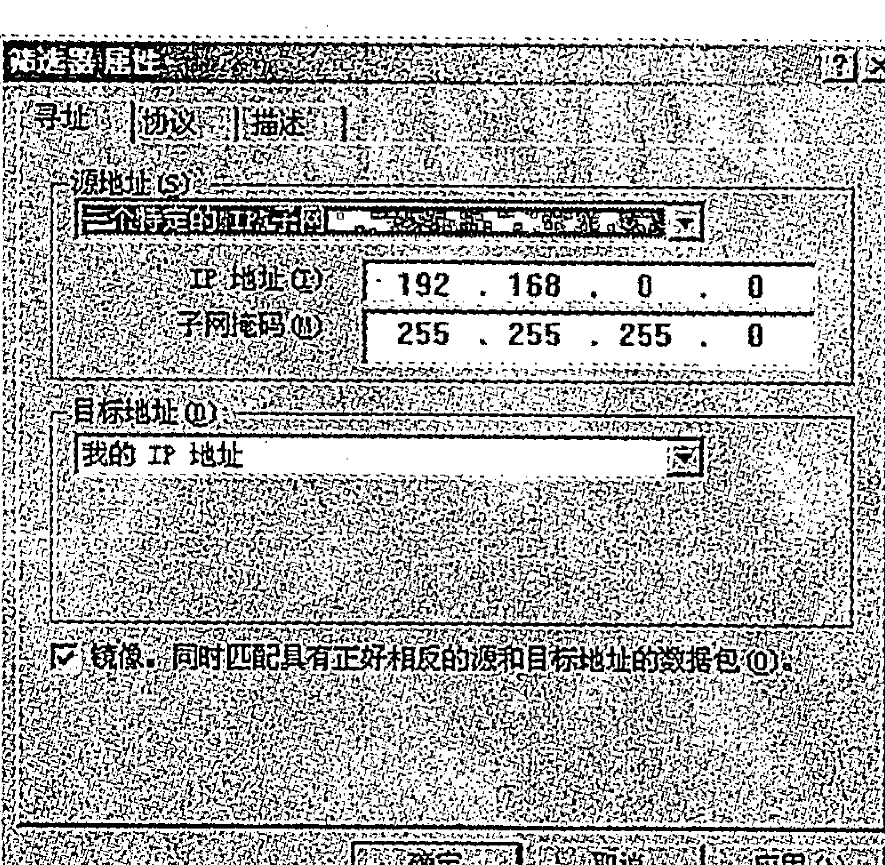

对不同的子网范围确定不同的规则，例如139端口在界定了LAN和Internet的范围后就可以确定针对不同网段的安全策略。

## 3. 引申出来的策略

IPSEC可以定义和阻止不同的站点、协议的访问行为就对我们的LAN管理计算机管理提供了有效的手段。

例如在一些公司内，不允许使用QQ进行网络聊天，那么就可以针对QQ进行IPSEC的控制，需要做的事情就是建立对任何地址段上UDP 4000端口的访问禁止。

而基于NT域的计算机可以将IP安全策略延伸到整个域范围内更加有利于我们的管理和使用。

对于各种类型的服务器，通过对IP安全策略的配置就可以很好的防止各种攻击，微软公司的策略中表示IP安全策略是一种“深层防御策略”，在不久以前的一个实验中通过一个IP安全策略规则表配置的WEB服务器在测试所进行的几周内，有效的防止了从网络上的各种攻击行为。

总之，无论是基于防火墙的防护还是基于IP安全策略的防护，关键的实质就是防御的策略是什么，一句话说——你如何正确地界定什么是“允许”什么是“禁止”。

# 我的隐私，你别看

文/舒洁

对于使用公用机器的用户，稍微有些电脑经验的人都可以毫不费力地找到你刚编辑过的报告、被你删除的邮件、你过去曾经访问过的站点、曾经看过的电影、上网浏览时输入的用户名、搜索内容、邮箱地址等信息，总之，你的一切隐私都可能被别有用心的人窥探，听起来是不是有些恐怖？我们又要如何才能保护我们的隐私不被泄露呢？

总的来说，要从以下几个方面堵住泄密的漏洞，保护我们隐私(以目前流行的Win2000和IE6.0为例)。

文章重点与技巧目录
- 清除“文档”中的历史记录
- 清除“运行”中的历史记录
- 清除“查找”中的历史记录
- 禁止显示前一个登录者的名称
- 清除Temp中的内容
- 清空回收站
- 删除或修改日志文件
- 清除已访问网页历史记录
- 清除已浏览的网址(URL)
- 清除上网时输入的私人信息
- 清除上网留下的颜色足迹
- 清除收藏夹中的记录
- 清除自动登录
- 清除网络实名网址
- 清除Foxmail和Outlook邮件记录
- 清除OICQ的聊天记录
- 清除下载工具中的下载记录
- 清除Office的文件菜单中的记录
- 删除Office文档的“属性”信息
- 清除记事本和写字板中的记录
- 删除输入法自动记忆的信息
- 清除Winzip和Winrar的历史记录
- 清除Realoneplayer的历史记录
- 清除“画图”程序的记录
- 利用PC清道夫清除所有记录

### 一、清除操作系统的历史记录

#### 1. 清除开始菜单“文档”历史记录

在开始菜单“文档”历史记录中记录着我们最近访问过15个文档（包括你刚从网上Download下来并打开过的文件），通过它，我们可以迅速地访问一段时间前编辑过的文档。

我们可以利用系统的设置任务栏功能，清除最近访问过的文档。单击“开始|设置|任务栏和开始菜单”，打开系统的“任务栏和开始菜单”属性对话框。选择“高级”选项卡，单击“清除”按钮即可清除最近访问过的文档，如图1。

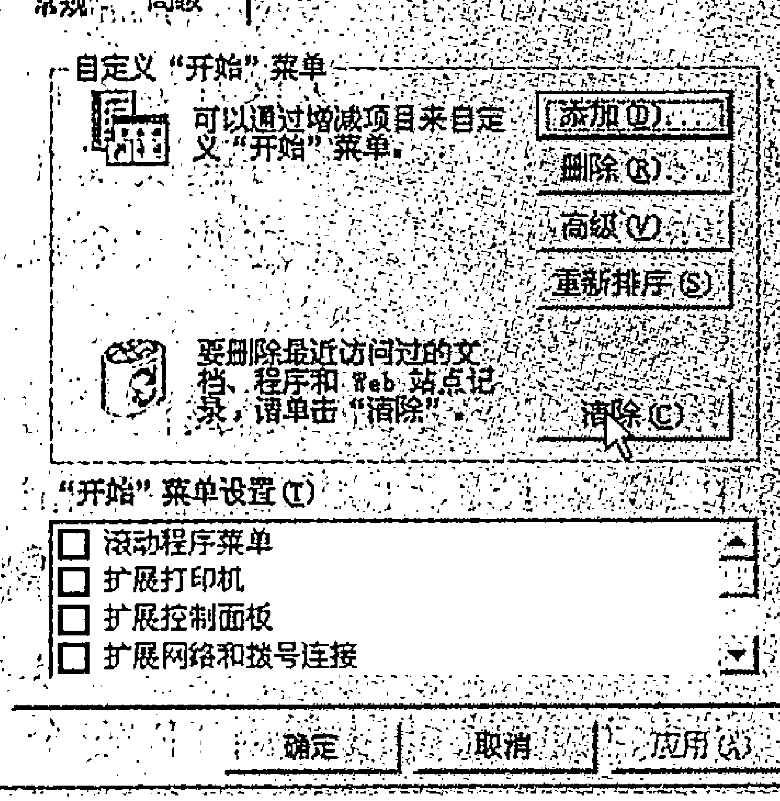

这种清除方法会将所有的历史记录都删除，不太适合只想删除部分记录的用户，因为对于某些共用电脑，你在删除记录时总不能将别人的记录也给删除吧，这时我们可以进入资源管理器中的‘C:\Documents and Settings\Administrator（用户自己的帐号）\Recent’文件夹，删去自己不想要别人看到的文档即可。

如果不想清除这些历史记录，可以通过修改注册表的方法把‘文档’菜单项隐藏掉，需要时再把它显示出来。在开始菜单‘运行’对话框中输入‘regedit.exe’，进入注册表编辑器，找到HKEY_CURRENT_USER\Software\Microsoft\Windows\CurrentVersion\Explorer分支，该分支下新建一个DWORD键值‘NoRecentDocsMenu’，并设为‘1’，允许隐藏。当需要显示文档菜单时设为‘0’即可恢复显示。

#### 2. 清除开始菜单‘运行’对话框中的历史记录

使用Windows‘开始’菜单中的‘运行’菜单项运行程序或打开文件，退出后，‘运行’中运行过的程序及所打开文件的路径与名称会被记录下来，并在下次进入‘运行’项时，在下拉列表框中显示出来供选用，这些‘记录’也会暴露我们的秘密，需要清除。

我们可以通过修改注册表的方法来达到清除这些‘记录’的目的。进入注册表编辑器，找到HKEY_CURRENT_USER\Software\Microsoft\Windows\CurrentVersion\Explorer\RunMRU分支，从中选择不需要的或不想要别人看到的历史记录删除即可。

#### 3. 清除开始菜单‘查找’对话框中的历史记录

开始菜单‘查找’对话框中的历史记录会暴露我们曾经查找过的文档或程序文件，也需删除。

- （1）清除查找计算机的历史记录

进入注册表编辑器，找到HKEY_CURRENT_USER\Software\Microsoft\Internet Explorer\Explorer Bars\{C4EE31F3-4768-11D2-BE5C-00A0C9A83DA1}\ComputerNameMRU分支，选择不需要的或不想要别人看到的历史记录删除即可。

- （2）清除查找文件的历史记录

进入注册表编辑器，找到HKEY_CURRENT_USER\Software\Microsoft\Internet Explorer\Explorer Bars\{C4EE31F3-4768-11D2-BE5C-00A0C9A83DA1}\FilesNamedMRU分支，从中选择不需要的或不想要别人看到的历史记录删除即可。

#### 4. 禁止显示前一个登录者的名称

系统启动时会要求用户输入用户名和密码，默认情况下前一次登录者的名称会自动显示在‘用户名’框内，根据此用户名，别有用心者可能会猜测该用户可能的密码，从而进入到相应帐户偷窥你的重要资料，所以需要清除用户名框里的记录。

我们可以通过修改注册表的方法来达到清除这些‘记录’的目的。进入注册表编辑器，找到HKEY_LOCAL_MACHINE\SOFTWARE\Microsoft\Windows NT\CurrentVersion\Winlogon分支，新建一个‘DontDisplayLastUserName’的字符串值，并设为‘1’，重新启动后，就再不会显示上次登录的用户名了，当需要显示上次登录的用户名时可以设为‘0’即可。

#### 5. 清除Temp中的内容

我们常用的Word 97/2000和其他应用程序通常会临时保存你的工作结果，以防止意外情况造成损失。即使你自己没有保存正在处理的文件，许多程序也会保存已被你删除、移动和复制的文本。这些‘内容’被存放在C:\Documents and Settings\Administrator（当前登录用户）\Local Settings\Temp目录下，所以在离机前应删除各种应用程序在该文件夹中存储的临时文件，以清除上述这些零散的文本，同时还要删除其子目录中相应的所有文件。虽然很多文件的扩展名为TMP，但它们其实是完整的DOC文件、HTML文件，甚至是图像文件。还有，在Foxmail和Outlook Express中打开邮件的‘附件’，也会在该文件夹中留下‘备份’。所以，对于C:\Documents and Settings\Administrator（当前登录用户）\Local Settings\Temp文件夹中近乎‘纯垃圾’的内容，一定要坚决地清除。

#### 6. 清空回收站

每次结束操作，离开计算机之前，要记住清空回收站。

#### 7. 删除或修改日志文件

存放在WinNT目录下的SchedLgU.txt是‘计划任务’的日志，忠实地记录了‘以往计划任务的执行情况’，以及你每次开机启动Windows系统的‘时刻’信息，可以用任何字处理软件打开它，无形中就会暴露你什么时候开机，什么时候关机，让别人知道了你的行踪，所以需要删除。

因为SchedLgU.txt实时监控着Windows系统的开和关，所以在Windows系统下要修改或删除都不可能，那怎么隐藏自己的行踪记录呢，我们只能以纯DOS方式启动计算机，再删除或修改SchedLgU.txt即可。

### 二、清除IE浏览器的历史记录

#### 1. 清除已访问网页历史记录

上网浏览时产生的网页历史记录，会暴露我们的上网痕迹，需要清除。
在IE浏览器的主菜单中选择进入“工具 | Internet选项” 在“常规”标签下单击“Internet临时文件”栏目的“删除文件”按钮，会弹出警告，选中“删除所有脱机内容”，单击“确定”按钮就可以了。这种清除方法还不太彻底，会留少许Cookies在文件夹内，还需要点击“删除Cookies”按钮删除遗留的Cookies。
另外，也可直接删除C:\Documents and Settings\Administrator（登录用户名）\Local Settings\Temporary Internet Files和C:\Documents and Settings\Administrator（登录用户名）\Cookies文件夹下面的内容，也一样可以达到清除已访问网页历史记录的目的。

#### 2. 清除已浏览的网址(URL)

上网浏览的网址也会在历史记录里记录下来，别人在IE浏览器中点击浏览器栏的历史图标，就可以看到最近一段时间浏览的网址记录，如图2所示，所以需要清除。

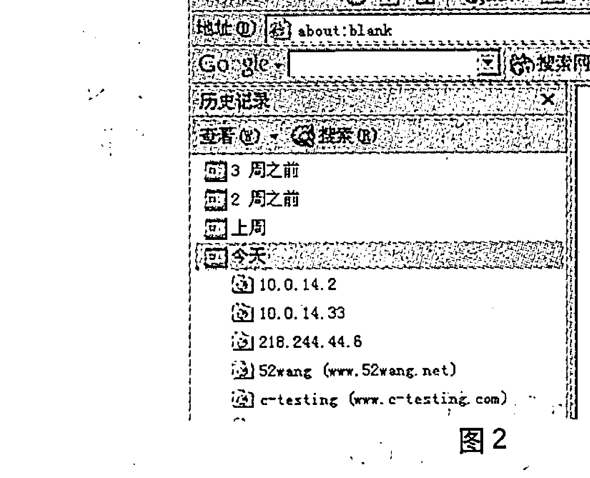

在IE浏览器的主菜单中选择进入“工具 | Internet选项 | 常规”，单击历史记录区域的“清除历史记录”按钮。这时系统会弹出警告“是否确实要让Windows删除已访问过网站的历史记录？”，选择“是”就行了，并且将“网页保存在历史记录中的天数”输入框中敲入“0”，再点击“应用”按钮，这样下次使用浏览器时再不会保存你曾经浏览过的网址了。当然你也可以直接从资源管理器中进入C:\Documents and Settings\Administrator（当前登录帐户名）\Local Settings\History文件夹，删除其中的所有文件即可。
若只想清除部分记录，单击浏览器工具栏上的“历史”按钮，在左栏的地址历史记录中，用鼠标右键选中某一希望清除的地址或其下一网页，选取“删除”即可。另外也可用修改注册表的方法达到清除部分网址的目的，进入注册表编辑器，找到HKEY_CURRENT_USER\Software\Microsoft\Internet Explorer\TypedURLs分支，从中选择不需要或是不想要别人看到的历史记录删除即可。

#### 3. 清除上网时输入的私人信息

我们在上网访问网页时，在浏览器地址栏输入的地址、还有网页上输入的用户名、密码、搜索内容、邮箱地址等都会被电脑自动记录下来，这会暴露我们的隐私，为了防止别人获知你的这些个人资料，有必要对其进行清除。
在IE浏览器的主菜单中选择进入“工具 | Internet选项 | 内容”，在“个人信息”栏，点击“自动完成”按钮，弹出一个名为“自动完成设置”的界面。如图3，在该界面中点击“清除表单”按钮和“清除密码”按钮就可以清除我们在上网时输入的用户名、密码、搜索内容、邮箱地址等个人信息了。另外还需将“Web地址”保持空选，这样别人就无法通过在地址栏输入部分地址与你曾输入的内容相匹配的方法打开您曾经访问过的Web站点了。

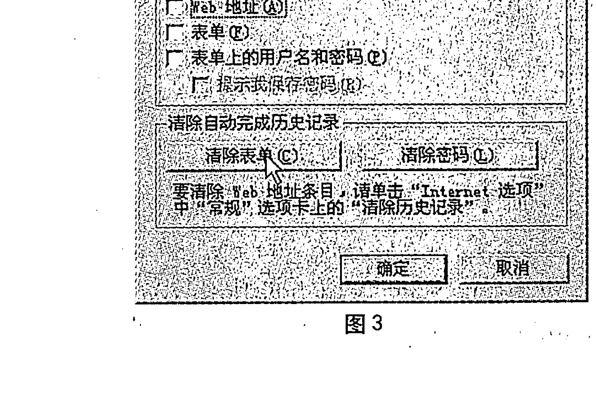

#### 4. 清除上网留下的颜色足迹

在IE的菜单栏点击“工具 | Internet选项 | 常规”，点击下部的“辅助功能”按钮，在随后的对话框内勾选格式区域的“不使用Web页中指定的颜色”项，如图4，确定之后，点击“颜色”按钮，在颜色区域勾选“使用Windows颜色”，在链接区域通过色板将未访问的和访问过的链接的颜色设置成相同，确定之后别人就看不到你的浏览足迹了。

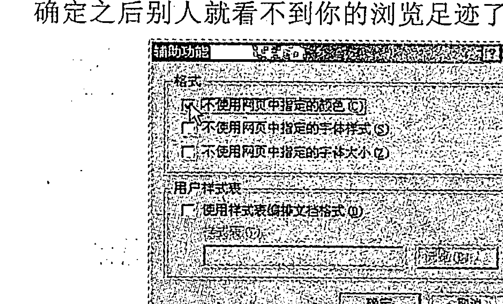

#### 5. 收藏夹中的记录

大多数朋友上网时，常把喜爱的网址添加到“收藏夹”中，甚至设置为“允许脱机使用”，其优点当然是便于下次快速地进行浏览。但你的爱好和兴趣就必然暴露给他人了，所以也需要删除。

在资源管理器中进入C:\Documents and Settings\Administrator（当前登录用户名）\Favorites文件夹，选中想要删除的目标文件，删除即可。

如果自己需要收藏夹中的内容怎么办呢？你可以在离开机器前将收藏夹中的内容导出，进入IE工具栏的“文件 | 导入和导出”，选择导出IE的收藏夹。然后对导出的收藏夹进行加密保存，这样别人就不可能轻易看到你收藏夹的内容了。

#### 6. 自动登录

很多用户喜欢让Windows替他来记住口令，即建立拨号连接后，随着“连接到”窗口的出现，输入用户名，再输入登录口令（即密码），输入时密码以星号（“*”）的形式出现在口令栏中，在下面的“保存口令”前打勾，这样每当出现“连接到”窗口时你就不必重复输入用户名和口令了。同样在WEB页面直接登录邮箱时也有个“保存密码”选项，这些的确都方便了你。不过尽管系统将保存的密码以“*”号显示在屏幕上，但是想想别人可以查阅你的邮件，而且现在看“*”号的工具软件很多，可以轻易将密码破译出来。为了避免密码丢失给你带来的麻烦和被窃密所造成的损失，建议你尽量不要在“保存口令”前打勾。

#### 7. 清除网络实名网址

3721网站网络实名制的推出，使得用户只需输入中文内容便可实现查询，搜索相应的网站。但是，上述清除“历史记录”的方法却无法清除这些中文输入的内容，这些中文内容同样显示在“地址”栏里，同样会暴露我们的上网足迹，所以也需要删除。

在“Internet选项”对话框中选择“高级”标签，将“网络实名”中“清除地址栏下拉列表中显示的网络实名”前的复选框选中，单击“确定”按钮退出后，地址栏中的“网络实名”即被清除，如果使“网络实名”中“在地址栏下拉列表中显示输入过的网络实名”前的复选框保持空选，那么将只是暂时地将“网络实名”不在地址栏中显示，而是不彻底地清除，如图5所示。

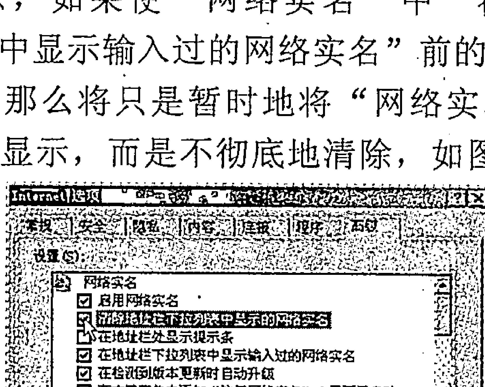

另外，我们也可以采用修改注册表的方法来清除输入的网络实名网址。进入注册表编辑器，打开如下项目：HKEY_CURRENT_USER\Software\3721\InputCns 和 HKEY_CURRENT_USER\Software\3721\CnsUrl，可以看到这两个键里的内容正是你曾经输入过的，你可以将不需要或是不想要别人看到的记录清除。

### 三、清除网络程序的历史记录

#### 1. 清除Foxmail和Outlook Express的邮件记录

为避免我们的邮件被别人看到，在添加邮件账号时，一定要采取不记住密码的办法，这样每次收取这个账户邮件时程序都会要求输入密码，同时也可避免别人用一些看“*”软件查看你的密码。

但是已经收取下来的邮件却没法保护它的安全，你可以将邮件另存到硬盘其它目录并加上密码压缩保护，或拷贝到移动存储介质中，然后将邮件删除。

需要注意的是，当我们在删除邮件时，系统并未真正删除邮件，而是将其转移到‘已删除邮件’或是‘废件箱’中，只有当我们再次对‘已删除邮件’或是‘废件箱’中的选定邮件执行删除操作时才会真正删除选定的邮件。但这种操作对于某些高手仍然可以恢复删除的邮件，因为这时仍没有真正将其从硬盘上删除，而是像数据库系统那样只是打上删除标记而已，这就为别人提供了恢复被删除邮件的可能。

对于使用Outlook Express用户，别人可以使用Foxmail中的‘导入Outlook Express信箱’功能，便可导入Outlook Express的所有信箱，包括未压缩的‘已删除邮件’。只有当你执行‘文件|文件夹|压缩’操作之后被删除邮件才会被真正从硬盘上删除，用Foxmail才无法导入，这样才能保证你的邮件安全。而对于使用Foxmail用户，别人只要右击‘废件箱’，从弹出的快捷菜单中选择‘属性’，打开‘邮箱属性’对话框，单击‘工具’标签页面的‘开始修复’，系统即会将用户已经删除但还未被压缩的邮件恢复回来。所以删除邮件后一定要压缩邮箱，系统才会真正将那些已经删除的邮件从硬盘上清除掉，它们所占用的磁盘空间此时才会释放出来，这样才能保证你的私人邮件被真正删除。

#### 2. 清除OICQ的聊天记录

OICQ默认情况下安装目录为C:\Program Files\oicq\，使用OICQ后，就会在该目录下产生一个帐号，现在互联网上针对OICQ的黑客软件很多，有些别有用心的人就会利用你遗留在硬盘上的这个目录来窃取你的私人信息，如聊天记录和好友列表信息等，所以离机时需要删除此目录。下次使用时进入注册向导，选择‘使用已有的OICQ号码’，再逐步注册就行了，而且通过这个步骤还可避免专门针对登录窗口来窃取密码的木马，可谓一举两得。

#### 3. 清除下载工具中遗留下的下载记录

如果你利用了网际快车或网络蚂蚁等下载工具下载了软件，那么在这些工具软件中都会保留着你的下载记录，这些下载记录一样可以被别有用心者利用，所以也需要清除。

打开网际快车和网络蚂蚁，将‘正在下载’和‘已下载’文件夹中的有关信息全部删除，被删除信息将全部放进‘已删除’文件夹，再将‘已删除’文件夹中文件全部删除后就可彻底地删除了，如图6。

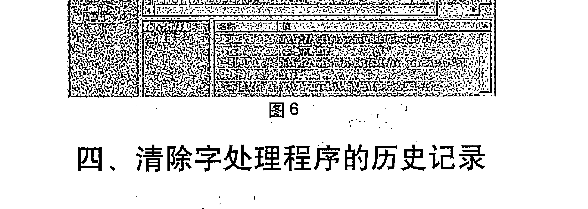

### 四、清除字处理程序的历史记录

#### 1. 清除Office的文件菜单中的记录

平时我们经常使用的Office家族的Word、Excel等软件进行工作后，会在‘文件’菜单中留下‘记录’，记录的多少由‘工具|选项’中设置‘列出最近所用文件’的多少来决定。别有用心者会从此记录中看到你最近编辑过什么样的文档，甚至能把这些文件复制一份带走！所以一定要记得清除。

如果‘文件’菜单里列出的文件不多，可按‘Ctrl + Alt + -（减号）’键，光标会变成‘’（粗减号），打开‘文件’菜单后，用‘’（粗减号）单击需要删除的文档即可。也可在Word中单击‘工具|选项|常规’标签，选择‘列出最近所有文件’选项，在其后的输入框中输入‘0’，（或者把复选框‘列出最近所用文件数’前面的‘打勾’标记去掉），最后单击‘确定’按钮。这样，你所编辑的文件就不会保存在文件菜单里了。

#### 2. 删除Office文档的‘属性’信息

对于存储在公用计算机的Office文档，许多用户都喜欢采取设定‘打开权限密码’的办法，以防止未经授权用户打开，防止泄露有关该文档的信息。但是，该文档的‘属性’信息，也可能造成泄密，为防止标题泄密，我们可能已经将文件名更改的面目全非。但当鼠标指到已被更改的文件名时，该文件的属性信息便显示出来了，这些属性信息可能是我们文档第一段的内容，因为Office默认情况用第一段内容作标题，虽然过后我们可能已经将其重命名，但属性信息并未随之改变。

## 小心默认设置中的陷阱

文/舒洁

由于Win2000的稳定可靠性、可管理性比Win98强得多，兼容性又比WinXP好，所以Win2000逐渐成为人们爱机和服务器操作系统的宠儿。微软公司为了我们使用方便，默认设置条件下直接运行Win2000时会自动开放很多端口和启动很多服务，人们不需进行复杂的设置就能够使用各种服务；而且默认的Guest用户，默认的IPC$共享和管理共享，让我们只要知道IP地址，就可以轻松访问到目标机的硬盘数据。

### 一、默认共享陷阱

#### 1. 默认共享的陷阱

在默认设置下，Win2000会开放提供文件共享服务的TCP的139号端口。因此，在默认条件下启动文件共享服务后，系统就进入等待状态。由此，机器就会始终处于被攻击者访问共享资源的危险境地，你使用“`net share`”命令就可以看看你机器所有的共享就知道了。Win2000的默认安装允许任何用户通过空用户连接（IPC$）得到系统所有账号和共享列表，本来是为了方便局域网用户共享资源和文件的，但是任何一个远程用户也可以利用这个空的连接得到你的用户列表：这样，一些别有用心者会利用IPC$的这项功能，采用“流光”之类的黑客软件查找到我们的用户列表中没有密码或是简单密码的用户，或许还会选用一些专门的黑客字典试出更多的用户密码，对我们的主机进行攻击。

另外，在安装系统时还会创建一些隐藏的默认共享，通过“`计算机名或IP地址\盘符$`”就可以非常方便地访问。或许你会说，黑客不知道你的IP，也就无法共享你的资源了。可是你知道吗？查看IP地址的方法很多，平时我们上网时经常使用的QQ就有可以显示对方IP地址的改造版本，另外通过BBS等方法也可以查看到你的IP地址。黑客获得了你的IP，再利用专门的工具窃取到用户名和密码之后，只需在IE浏览器的地址栏输入：`\\IP地址`，就会弹出一个对话框要求输入用户名和密码，将得到的用户名和密码输入之后就可轻松进入你的机器，不过这里看到的仅是你的机器主动共享出来的文件夹。如果在地址栏输入：`\\IP地址\C$`（或是D$,E$等），则可以看到机器上C盘（或是D$,E$等）的全部内容，就跟我们自己在本地的Administrator权限一样。

或者微软公司在设计给予用户这种方便时并未想到会给用户带来麻烦吧，我们千万不能身在陷阱之中却全然不知。因为对于一般用户而言，上网时并不需要同别人共享什么资源，当然更不需要连操作系统都任由别人进入，安装木马、后门之类的东西了。

#### 2. 铲除默认共享陷阱办法

- （1）禁止空连接

我们可以通过修改注册表来禁止建立空连接：点击“开始 / 运行”，在运行框里输入：`regedit`回车后打开注册表，将`HKEY_LOCAL_MACHINE\SYSTEM\CurrentControlSet\Control\LSA`的`RestrictAnonymous`项设置为1，即可禁止空用户连接。

另外，Win2000的本地安全策略（“控制面板”|“管理工具”|“本地安全策略”）里，选择“本地策略”的“安全选项”里的“对匿名连接的额外限制”一项也可设置。双击该项即可对本地策略进行设置，它有三个选项，默认是“无，依赖于默认的许可权限”，你只需将此设置更为“不允许枚举SAM账号和共享”或是“没有显式匿名权限就不允许访问”也可禁止空用户连接。

- （2）关闭默认共享

Win2000默认设置自动共享的C$、D$、E$等驱动器，这并非我们的本意，不过我们可以手工禁止这些共享。打开“管理工具 / 计算机管理 / 共享文件夹 / 共享”，鼠标右击欲停止共享文件夹，在右键菜单中选择“停止共享”再确定即可；不过机器重新启动后，这些共享又会重新开启，对此我们可通过修改注册表的方法来取消管理共享。

打开注册表的HKEY_LOCAL_MACHINE\SYSTEM\CurrentControlSet\Services\LanmanServer\Parameters项

对于服务器，添加键值AutoShareServer，类型为REG_DWORD，值为0。

对于客户机，添加键值AutoShareWks，类型为REG_DWORD，值为0。

关闭注册表重启动计算机即可关闭默认共享。

- （3）手工编写批处理文件删除共享

用记事本自建一个删除所有默认共享的批处理文件，放在启动栏里，每次启动机器时都自动运行，以删除所有这些默认共享。批处理程序包含内容如下：

```
net share ipc$ /delete
net share admin$ /delete
net share c$ /delete
net share d$ /delete （如果有e驱，f驱，......可以继续用此命令删除）
```

最后保存为autodel.bat文件，放到启动栏里，每次开机就可以自动删除所有共享。

- （4）停止Server服务

Server服务提供RPC支持、文件、打印以及命名管道共享的服务，ipc$和默认共享要依赖于这个服务，我们只需要将这个Server服务关闭即可关闭ipc$和默认共享。进入“控制面板 / 管理工具 / 服务”，在右侧列表中找到Server服务，鼠标双击它，进入Server的属性对话框，点击“常规”选项卡，在启动类型中选择“手动”或“已禁用”均可使得我们的机器在启动时不启用Server服务。从而达到禁用所有共享的目的。但是关闭了该服务会导致很多相关的服务无法启动，如IIS中的一些服务，而且登陆域的时候会出现问题，所以一般情况下不推荐该方法。

- （5）设置拒绝从网络访问这台计算机

选择进入“控制面板 / 管理工具 / 本地安全策略”，打开本地安全设置窗口，选择“本地策略”的“用户权利指派”，然后利用该项下的“拒绝从网络访问这台计算机”，指定拒绝访问的对象。如果想拒绝所有的访问，最好指定为“Everyone”，这样任何人都不能通过网络访问你这台计算机了，包括你自己，有得有失。

- （6）安装防火墙

为自己的爱机安装一个网络防火墙，如天网个人网络防火墙，选择“只允许局域网的机器使用我的共享资源”、“禁止互联网上的机器使用我的共享资源”或是“禁止所有人连接”等相关设置，这样也可轻松防范别人来共享我的资源。

- （7）设置复杂密码

要防止通过ipc$穷举密码，最简单的方法就是把的密码设置得复杂一些，以免被一些不怀好意的人使用工具破解出来。不过想提醒大家一点，任何复杂的密码都有可能被破解，但是也要相信，越复杂的密码，被攻破的可能性也就越小。

### 二、默认开放的NetBIOS协议陷阱

#### 1. NetBIOS协议的陷阱

因为当我们在接入互联网时，需要安装TCP/IP协议，但当我们安装TCP/IP协议时，NetBIOS也被Windows作为默认设置载入了我们的电脑，在局域网内部使用NetBIOS协议可以非常方便地实现消息通信，但是如果在Internet上，这个开放的NetBIOS协议就可能成为一个后门程序，黑客们很可能通过NetBIOS协议漏洞对我们发起攻击。换句话讲，在安装TCP/IP协议时，也同时安装了NetBIOS协议，从而打开了139端口，在不知不觉间，我们的上网电脑已被打开了一个危险的“后门”。通过这个后门，黑客们可以利用一些专门的工具扫描出我们共享的资源（包括Win2000的默认共享），再利用一些破解共享密码的攻击工具破解密码（甚至有些共享根本就没有密码）后，就可以进入相应的文件夹或磁盘访问我们的文件了。

为此，我们很有必要关闭默认开启的建立会话连接的139端口及相互传送数据的445端口，以致于铲除敌人设下的阴谋陷阱。

#### 2. 铲除陷阱办法

- （1）解除文件和打印机共享绑定

鼠标右击桌面上“网络邻居 / 属性 / 本地连接 / 属性”，去掉 “Microsoft 网络的文件和打印机共享” 前面的勾，解开文件和打印机共享绑定，这样就会禁止所有从 139 和 445 端口来的请求，别人也就看不到本机的共享了。

- （2）利用 TCP/IP 高级设置

鼠标右击桌面上 “网络邻居 / 属性 / 本地连接 / 属性”，打开 “本地连接属性” 对话框。选择 “Internet 协议（TCP/IP） / 属性 / 高级 / WINS”，选中下侧的 “禁用 TCP/IP 上的 NetBIOS” 一项即可解除 TCP/IP 上的 NetBIOS。

- （3）使用 IPSec 安全策略阻止端口访问

选择 “我的电脑 / 控制面板 / 管理工具 / 本地安全策略 / IP 安全策略，在本地机器”，在这里定义一条阻止任何 IP 地址从 TCP139 和 TCP445 端口访问我的 IP 地址的 IPSec 安全策略规则，这样别人使用扫描器扫描时，本机的 139 和 445 两个端口也不会给予任何回应。

- （4）使用防火墙防范攻击

在防火墙中也可以设置阻止其他机器使用本机共享。如在 “天网个人防火墙” 中，选择一条空规则，设置数据包方向为 “接收”，对方 IP 地址选 “任何地址”，协议设定为 “TCP”，本地端口设置为 “139 到 139”，对方端口设置为 “0 到 0”，设置标志位为 “SYN”，动作设置为 “拦截”，最后单击 “确定” 按钮，并在 “自定义 IP 规则” 列表中勾选此规则即可启动拦截 139 端口攻击了。

另外，也可以停止文件和打印共享所依赖的 Server 服务来达到关闭 NetBIOS 协议的目的。

### 三、默认开放服务的陷阱

#### 1. 默认开放服务陷阱

除了常用的 139 端口和 445 端口以外，默认情况下，还打开了其它一些端口和服务。每一项服务都对应相应的端口，比如众所周知的 WWW 服务的端口是 80，smtp 是 25 端口，ftp 是 21 端口，Win2000 安装中默认的都是这些服务开启的，这些默认开放的端口和服务给黑客带来了很多攻击机会。对于个人用户来说确实没有必要开启，关掉无用的服务也就关掉了相应的端口。一般来说，仅打开需要使用的服务会比较安全，对于那些我们根本用不着的服务，就没必要将端口开给黑客了。

#### 2. 铲除陷阱办法

我们可以选择进入 “控制面板 / 管理工具 / 服务” 中来设置禁用某些服务，从而关闭相应的端口，不过在关闭服务时，需要清楚地知道该服务的作用，该服务的依存关系，否则可能导致其它相关服务功能受到影响。禁用不需要的服务后，下次启动机器便不会启动该服务了，这样即便外部发来连接请求，机器也不会作出响应。通常情况下，除非特别需要，我们可以禁用以下一些服务：

Alerter：通知所选用户和计算机有关系统管理级警报。

Clipbook：支持 “剪贴簿查看器”，以便可以从远程剪贴簿查阅剪贴页面。

Computer Browser：维护网络上计算机的最新列表以及提供这个列表给请求的程序。

DHCP Client：通过注册和更改 IP 地址以及 DNS 名称来管理网络配置。

FTP Publishing Service：通过 Internet 信息服务的管理单元提供 FTP 连接和管理。

Messenger：发送和接收系统管理员或者 “警报器” 服务传递的消息。

Net Logon：支持网络上计算机 pass-through 帐户登录身份验证事件。

Network DDE：提供动态数据交换（DDE）的网络传输和安全特性。

Network DDE DSDM：管理网络 DDE 的共享动态数据交换。

RunAs Service：在不同凭据下启用启动过程。

Remote Registry Service：允许远程注册表操作。

Server：提供 RPC 支持、文件、打印以及命名管道共享。

Simple Mail Transport Protocol：即 SMTP 服务，提供的功能是跨网传送电子邮件。

Task Scheduler：允许程序在指定时间运行。

TCP/IP NetBIOS Helper Service：允许对 “TCP/IP 上 NetBIOS (NetBT)” 服务以及 NetBIOS 名称解析的支持。

Telnet：允许远程用户登录到系统并且使用命令行运行控制台程序。

Workstation：提供网络链结和通讯。

World Wide Web Publishing Service：即 WWW 服务，通过 Internet 信息服务的管理单元提供 Web 连接和管理。

最后还需要提醒大家注意的是：操作系统安装完成以后必须及时打上最新安全补丁。

## 2003年度硬件发展前景的十大硬件技术与展望

文 / 信子

### 2003年度十大硬件技术

- 64位CPU技术
- 迅驰技术
- PCI Express技术
- Serial ATA串行标准
- QBM内存技术
- 有机发光显示器
- DVD-Dual技术
- USB On-The-Go标准
- BlueTooth（蓝牙）技术
- 燃料电池（FC）技术

### 一、‘64-bit数据运算’：CPU核心架构的‘变革’

从第一片Intel公司的4位微处理器4004一直到后来的32位处理器Pentium II、Pentium III、Pentium IV、Xeon、Celeron以及AMD的K6，Athlon XP、Duron，32位运算一直是PC机市场的主流体系结构，但是，随着处理数据量的不断扩大，32位处理器在处理能力和地址空间等方面明显不足。因此，64位CPU应运而生了。

2003年4月22日，美国AMD（超微半导体）公司推出全球首款可与业界标准x86架构兼容的64位处理器Opteron，Opteron处理器将主要面向服务器及工作站领域，随后AMD公司又于9月份推出主要面向主流桌面计算机市场的64位处理器Athlon 64。AMD公司在自己的64位CPU中引入了一种称作x86-64的崭新架构，它保留了对原来32位和16位程序兼容的硬件结构，并在此基础之上再加入一套处理64位程序的硬件结构，这样能很好地支持32位和64位应用程序，能兼容目前所有的16位和32位软件，使用户在使用64位处理器的同时，还能继续运行原来的软件（图1）。

而Intel公司则针对64位数据运算推出了全新的IA-64架构，并且宣布不再兼容原有的X86指令集。IA-64是由Intel和HP公司共同开发的64位体系结构。传统的CPU内核指令集主要分成复杂指令集运算（CISC）和精简指令集运算（RISC）两大类。IA-64架构基于显性并行指令计算EPIC(Explicitly Parallel Instruction Computing)技术，每个指令周期可执行20条指令，大概是RISC(精简指令结构)指令集的4倍，是CISC（复杂指令结构）指令集的5倍，至今已经得到了众多厂商的支持。

### 前景展望

所谓的32位与64位实际上是指计算机的寻址空间大小，32位的计算机和操作系统把能访问的最大内存量为4GB(2的32次方)，而64位数据运算系统的内存寻址能力则破天荒的达到的180亿GB(2的64次方)，使得它可以在相当长时间内轻松满足高端服务应用中对内存寻址的需求，这一点上气象、金融、证券及民航等需要进行大量数据处理的领域已经从64位运算中获益匪浅。可以预期，正如当初计算机处理器架构从16位迈入32位的门槛一样，迈## 一、64位领域是迟早的事，只是一个时间问题了。

前不久美国苹果公司针对零售市场推出的其最新的64位Power Mac G5计算机无疑是一个佐证。

## 二、‘迅驰’：移动世界的‘革命’

2003年3月12日，英特尔全球同步发布了以主题为‘无线的无限’的‘迅驰’移动计算机技术（Centrino Mobile Technology），向用户展示了迅驰技术（图2）。

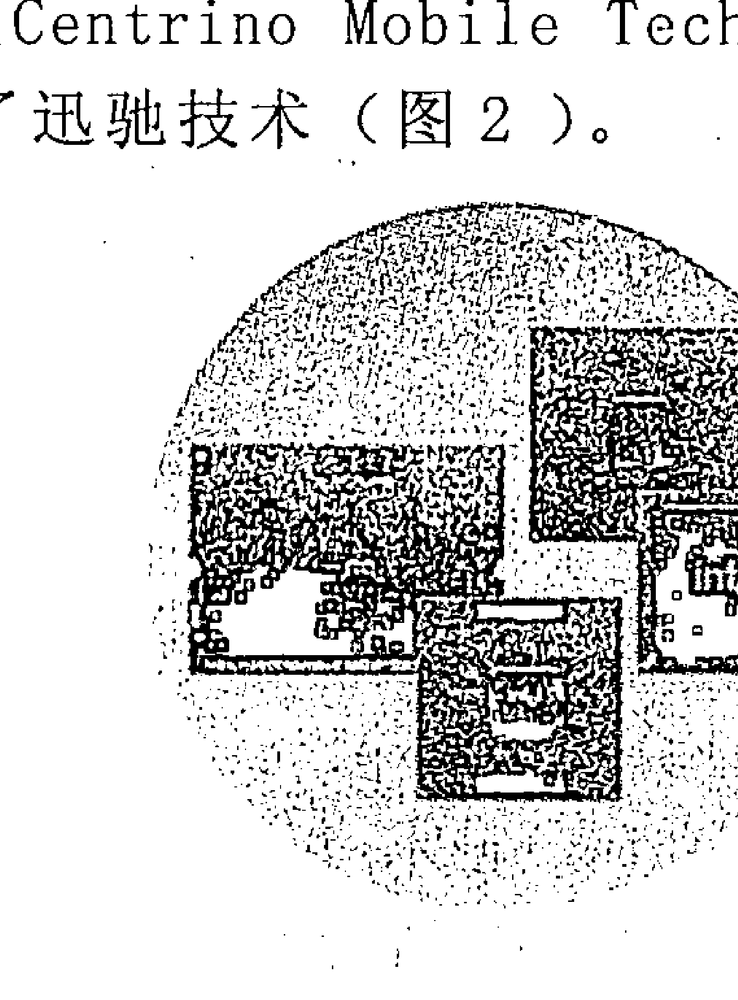

通过英特尔的产品白皮书我们得知，Centrino是一系列技术的总称，包括Pentium-M CPU（产品代号为‘Banias’，采用0.13微米工艺生产）、I855芯片组以及Intel Pro/无线2100 LAN 3B Mini PCI网络适配器（透过一个迷你PCI 802.11b无线电模块）三个模块。也就是说，迅驰已经不单单是一块处理器，而成为笔记本电脑的一种整合性的解决方案了。它提供了内建的完整无线通信解决方案和更长的电池使用寿命。与同频率的Pentium 4-M CPU相比，‘迅驰’的计算性能提高了10%，而功耗最多下降了40%。根据Intel的预计，采用‘迅驰’技术的笔记本将可能在使用单颗电池的情况下连续工作7-9小时，比目前的笔记本有显著提高（图3，东芝的DynaBook SS S7迅驰笔记本）。

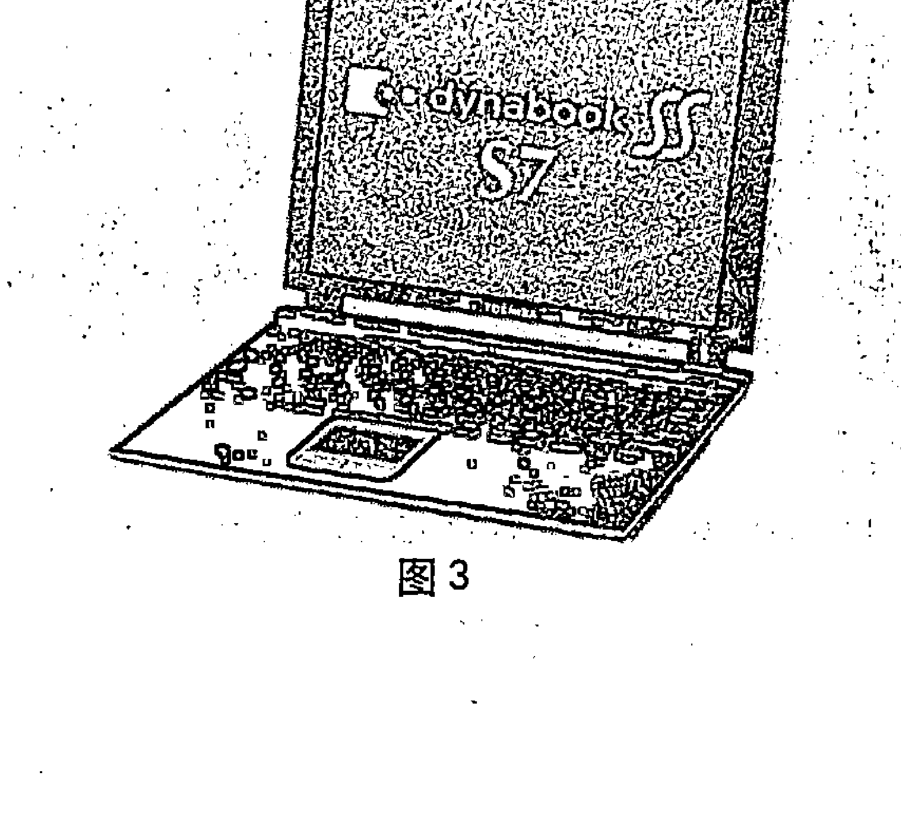

Intel称该迅驰的LOGO有‘移动’和‘飞翔’之意，而Centrino则是由‘Center’和‘Neutrino’两个单词拼合而成（图4）。

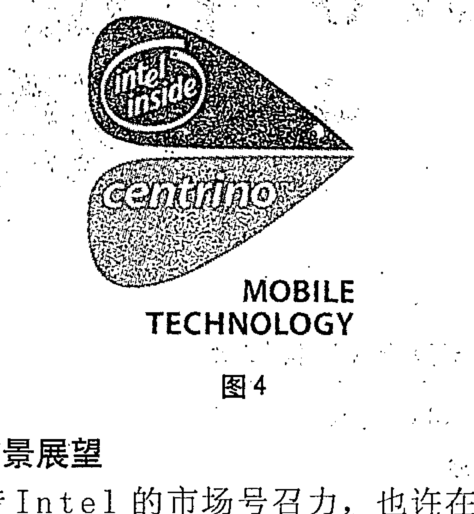

### 前景展望

凭借Intel的市场号召力，也许在不远的未来，心型的‘Centrino’标志将会和‘Intel Inside’一同出现在大大小小、形形色色的笔记本电脑上，而‘迅驰’这个响亮的中文名字也会同‘奔腾’齐名。因为它代表着Intel创造笔记本电脑全新架构、更长久的电池使用时间、更高性能以及集成无线局域网功能的实力和决心……

## 三、PCI Express技术——突破系统带宽瓶颈

目前，大多数主板芯片组的内部互连总线还是沿用PCI总线架构，由于PCI总线工作在33MHz和66MHz两种时钟频率上，而且通常都是33MHz，加上32-bit的总线位宽，只能提供133MB/s的数据传输率。而随着前一代CPU前端总线的不断提升，及双通道DDR、串行ATA及AGP 8X，这些都使得系统对总线带宽的需求日益苛刻。显然，古老的PCI总线架构已经无法满足这一发展趋势。这时，PCI Express技术就应运而生了。

PCI Express是由Intel、AMD、IBM、Microsoft、Dell、Compaq等共同草拟并推举成为取代PCI总线标准的下一代标准。高性能、高扩展性、高可靠性、更良好的升级性以及更为低廉的花费，就是PCI Express的设计理念。PCI Express采用点对点的联系方式，数据传输通过桥接芯片进行，而并不需要通过内存。它允许接驳IEEE 1394b， InfiniBand， Gigabit Ethernet和下一代的图形处理器，此外，PCI Express总线也将会实现单独设备间的点对点访问，这样将能消除当计算机的发展进入 GHz 时代时，PCI 总线技术在应对系统各设备的高带宽需求时越来越力不从心，它象 ISA 总线一样光荣隐退也将成为不争的事实。作为 PCI 总线最有可能的取代者——PCI Express 总线拥有众多技术优势，而且也得到了业界的一致认同，当然，它要发展成为一套完善的标准并最终取代 PCI 总线技术，还要一段相当长的过程。

## 四、Serial ATA 串行标准——硬盘数据传输的“高速公路”

传统的 Parallel ATA（并行 ATA）标准的信号采用并行方式传输，其接口速度已从最初的 Ultra DMA/33，历经 Ultra DMA/66、Ultra DMA/100，一直到今天的 Ultra DMA/133。并行 ATA 标准到现在已经接近了它的发展极限，再进一步提速时，并行电缆间的信号干扰将会进一步增大，直接威胁到信号传输的稳定性与准确性（图 5）。

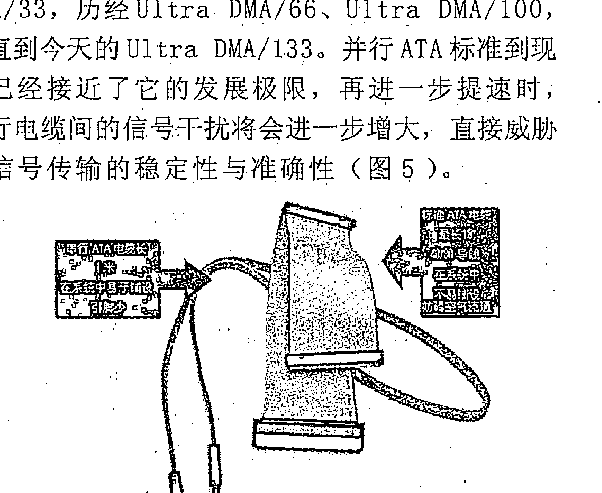

于是，最早由 Intel 提出了串行 ATA 标准，后来得到了包括 Seagate、IBM、Dell、Maxtor 等诸多厂商在内的联合支持。Serial ATA 采用串行模式进行传输，因此可以在较少的位宽下使用较高的工作频率来提高数据传输的带宽。目前 Serial ATA 1.0 标准已经确定，第一代 Serial ATA 的速度为 150MB/s，比时下最快的 ATA/133 还要高出一些，未来 Serial ATA 更是可以扩展到 2X（速度为 300MB/s）和 4X（速度为 600MB/s），足可以满足相当长一段时间内对硬盘传输速率的要求。除了高性能外，Serial ATA 还大幅提升了数据传输的可靠性。如图 6 所示。

Serial ATA 可同时对指令及数据包进行 CRC 校验（循环冗余校验），再加上本来 Serial ATA 总线的工作频率较高，可以很快对错误数据进行重新传输，因此对性能的影响很小。而重要的是 Serial ATA 采用点对点的传输协议，每个硬盘都独占一个通道与主机通信，所以不存在主 / 从控制的问题。

### 前景展望

Serial ATA 相较 Parallel ATA 可谓优点多多，并且它保持了对 Parallel ATA 的良好兼容性，用户无须对操作系统及驱动程序作任何升级，即可实现对 Serial ATA 设备的支持，并且 Serial ATA 只要利用一个简单的串 / 并转换器就能够实现串 / 并行 ATA 设备的随意连接。目前各大硬盘厂商均已向市场推出了 S-ATA 接口的硬盘，并且 Intel 公司的 ICH5 芯片及 VIA 公司的 8237 芯片也都提供了对 Serial ATA 的支持。可以说，从 Parallel ATA 过渡到 Serial ATA 是大势所趋，应该只是时间问题。

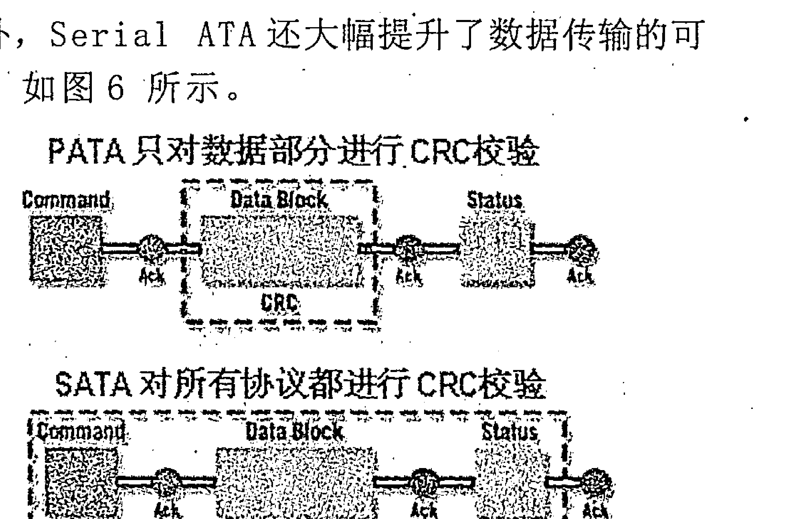

表1
|   | 支持外设数量 | 总线时钟频率 | 最大数据传输速率 | 时钟同步方式 | 总线位宽 | 引脚数量 |
| :--- | :--- | :--- | :--- | :--- | :--- | :--- |
| PCI-32 V2.2 | 6 | 33MHz | 133MB/s | 与CPU及时钟频率有关 | 32bit | 84Pin |
| PCI Express V1.0 | 64（单线） | 2.5GHz | 8.2GB/s | 内建时钟 | 32bit | 40Pin |

## 五、QBM内存——DDR的新生

随着 Pentium 4 及 Athlon XP 处理器系统总线频率的不断提升，传统DDR内存所能提供的内存带宽已经无法满足数据传输的要求，但是JEDEC刚刚完成 DDR II 标准的制定工作，短期内不太可能得到普及。也有厂商通过设计支持双通道DDR技术的芯片组来满足处理器对高内存带宽的需求。但是DDR SDRAM内存却本身是低延时特性的，而且采用的是并行传输模式，还有最重要的一点：当DDR内存的工作频率高于400MHz时，其信号波形往往会出现失真问题，这些都为设计一款支持双通道DDR内存系统的芯片组带来不小的难度，芯片组的制造成本也会相应地提高，这些因素都制约着这项技术难以在短时间内发展起来。

美国波士顿的内存公司 Kentron 开发了基于DDR内存的 Quad Band Memory（QBM）技术，在增加内存子系统带宽的同时却不用增加内存运行频率。那么 QBM 究竟是一种什么样的技术，它又如何做到这点的呢？

QBM内存其实同DDR相比，内存在针脚定义等方面两者是一样，所不同的是QBM内存在每个内存模组中增加一个DDR模块，并且每两块DDR模块下面都会对应一块FET芯片，这两个模块一个按正常速度工作，另一个则延迟1/4周期，而这个FET芯片就负责起开关缓冲作用的场效应管，在它的作用下，实现了一个时钟周期内的4次数据读写。这样采用QBM技术的内存在未提高运行频率的情况下，却成倍增加了内存的带宽（图7）。

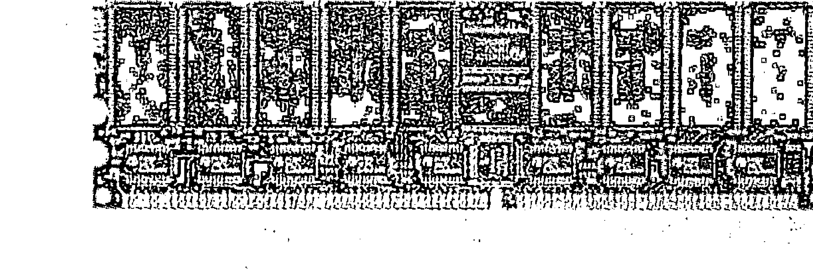

### 前景展望

目前，VIA（威盛）公司明确表示将在P4T800芯片组中提供对QBM内存技术的支持，Sis（矽统）及 Ali（扬智）公司也相继表示将在各自新的芯片组里加入QBM内存技术的支持，虽然Intel公司始终未明确表态，但是也不排除在QBM内存市场成熟时加入对其技术支持的可能，就像 Intel之前由 Rambus 内存架构转投DDR怀抱一样。QBM 内存技术可以说已经得到了业界的广泛赞同，相信随着时间推移，会不断的有更多的厂商加入到这一阵营中来，毕竟它使我们只需花很少的钱就得到了成倍的内存带宽。

## 六、有机发光显示器（OLED）——液晶显示的明日之星

提及液晶显示技术，目前常见的多为TN（被动矩阵，又称无源矩阵）显示和TFT（主动矩阵，又称有源矩阵）显示两种，但是这两种显示技术都是要靠背光模块来发光，相应的能耗也就比较大，并且成像质量始终无法达到普通CRT的级别，这也就催生了一种新兴的技术：自发光显示技术。OLED (Organic Light Emitting Display) 显示器正是利用这种显示技术原理成像的。

有机发光显示器的发光原理及显示器的驱动方式和发光二极管相似，主要是施加电流在可发光物质上以达到发光效果，由非常薄的有机材料涂层和玻璃基板构成，当电流通过这些有机材料时就会发光。简而言之，OLED 使用了一种基于碳分子的设计，当电流通过它时能够发光。将许多个分子排列到一起，就组成了一个绝妙的超薄显示器 - 而且它根本不需要使用耗电的背光设计。

> 以下是OLED所具备的一些优势：

- 1. OLED器件的核心层厚度很薄，厚度可以小于1毫米，厚度为液晶的1/3；
- 2. OLED器件为全固态机构，无真空、液体物质，抗震性好，可以适应巨大的加速度、振动等恶劣环境；
- 3. 主动发光的特性让OLED几乎没有视角问题，在很大的角度内观看，显示画面不失真；
- 4. OLED器件单个像素的响应速度是液晶元件的1000倍，可以实现精彩的视频重放；
- 5. 低温特性好，在零下40度能正常显示，而液晶在低温下显示效果不好；
- 6. 对材料和工艺的要求比LCD减少约1/3，成本将会更低；
- 7. 发光转化效率高，能耗比液晶略低一些；
- 8. OLED器件单个像素尺寸可以相当小，而且还有很大的“减肥”潜力，非常适合应用在微显示设备中；
- 9. OLED 能够在不同材质的基板上制造，可以做成能弯曲的柔软显示器。

### 前景展望

有机发光显示器有着比液晶显示器更大的视角（最大可达165°），更快的响应速度、更加省电、更高的亮度以及相对较轻的重量、相当纤薄的厚度等无数先天优势，使得 OLED 完全有能力取代现今的普通 CRT 显示器及 LCD 显示器，成为未来理想的显示器。据了解，目前致力于 OLED 开发的主要厂商有 DuPont Displays、三星电子、索尼、惠普、IBM、柯达、三洋、朗讯及飞利浦等，此外，中国台湾省也有公司开发生产 OLED。现在 OLED 最主要的缺点是寿命比 LCD 短，目前只能达到 5000 小时，而 LCD 可达 10000 小时，因此目前的 OLED 还只适合不经常使用的设备，一旦将来在 OLED 寿命方面取得技术突破，那么 OLED 必将成为显示器的主流。

## 七、DVD-Dual——DVD刻录时代的最强音

就在人们还徘徊于 CD-RW 与 COMBO 驱动器之间时，DVD刻录时代已经悄然降临。不同于 CD刻录机，因为截止到目前，DVD刻录标准仍未统一，DVD-RAM、DVD-RW、DVD+RW 三种 DVD 刻录规格共存，因此 DVD 刻录机的发展相对比较缓慢。更由于不同的厂商所支持的标准都不尽相同，在产品规格上又互不兼容，造成目前 DVD刻录市场诸侯纷争的局面。表 2 是三种刻录规格的详细参数对比。

不同的刻录标准使得刻录机生产厂商及消费者都无从选择，也多选择了观望徘徊的态度，这无疑极大制约了 DVD 刻录的普及。就在这种情况下，业界巨擘 SONY 公司发布了其最新款的 DVD刻录机——采用了 DVD-Dual 技术的 DRU-500A，该产品同时支持 DVD-RW 和 DVD+RW 两大规格，让用户不用在 DVD+RW 和 DVD-RW 两大规格之间徘徊，更不用担心某种格式成为规格之争的失败者。那么何谓 DVD-Dual 技术，是一种崭新的标准吗？DVD-Dual 将 DVD+RW 和 DVD-RW 整合在一起，可以刻录 DVD+RW 和 DVD-RW 两种规格的 DVD 盘片，而且由于刻录芯片具有可升级性，即使以后两种规格有了新的变化，也可以及时进行调整，从而保护了厂商的投资及消费者的利益。同时，采用 DVD-Dual 技术的刻录机是相当智能的，在进行 DVD 刻录时无需用户选择 DVD+RW 或者 DVD-RW 盘片，刻录机都会进行自动识别，具体刻录模式、刻录速度完全不需要用户进行干涉。并且 DVD-Dual 技术可以有效保护用户的投资，比如：目前 DVD-R 盘片比 DVD+R 盘片便宜，而 DVD+RW 盘片比 DVD-RW 盘片的可重写次数多，格式化更快，有了 DVD-Dual 技术，用户就可以在多种刻录盘片中选择最为经济合适的刻录方式及盘片载体。

### 前景展望

采用 DVD-Dual 技术的刻录机优势非常明显，而且市场认同度也比较高，普通用户不用再去考虑 “+”与“- ”的规格之争；同时，相对于单一格式的DVD+RW和DVD-RW刻录机，采用DVD-Dual技术的刻录机成本并不增加多少成本，因此，在SONY推出DVD-Dual技术的刻录机后，台系厂商建兴、华硕等厂商纷纷表示将会陆续推出各自采用DVD-Dual技术的刻录机产品。可以说，无论是对于消费者还是对于生产厂商来说，DVD-Dual技术都是一个不错的DVD刻录解决方案，绝佳的兼容性和并不太高的价格都将为DVD-Dual技术的普及助力。我们有理由相信，不久的将来，随着“价格杀手”台系厂商的介入，采用DVD-Dual技术的刻录机必将很快普及，这也预示着DVD刻录时代就要来临。

表2
| 刻录规格 | DVD-RAM | DVD-RW | DVD+RW |
| :--- | :--- | :--- | :--- |
| 支持厂商 | 松下、日立、东芝 | 先锋公司主导，并获 DVD 论坛（包括东芝 SONY 松下、日立、先锋、苹果、NEC、SHARP、三星等）支持 | DVD 联盟（包括 PHILIPS、Sony、YAMAHA、Mitsubishi Chemical-Verbatim、Ricoh、HP 和 Thomson）支持 |
| 优点 | 格式化时间很短，不足 1分钟；格式化好的光盘不需要特殊的软件就可以进行写入和擦写，而且价格便宜 | 由于采用和 DVD-ROM 相同的文件格式，刻录的盘片可以在大多数 DVD 光驱和家用 DVD 播放机上读取 | 具有 DVD-RAM 光驱的易用性，提高了 DVD-RW 的兼容性，并且速度是最快的。虽然格式化时间需要一个小时左右，但采用后台格式化技术，因此一分钟以后就刻录数据。DVD+RW 也是微软惟一支持的 DVD 可重写标准 |
| 缺点 | 只能在装有 DVD-RAM 驱动器的电脑上使用 | 格式化时间很长，需要一个小时左右，刻录盘片在一些 DVD 光驱上有兼容性问题 | 可刻录盘片价格相对较高 |
| 兼容性 | 不能在普通的 DVD 播放机和光驱中读取 | 较出色 | 相当出色 |
| 备注 | 目前多用于一些专用领域 | 定位于消费类电子产品，不太适合普通的商业用途 | 定位于消费类电子产品及电脑数据存储用 |
| 代表产品 | 较少在零售市场出现 | 先锋 DVR-A03/A-04/A-05 | Aopen DVRW2412PRO、HP DVD200i、理光 MP5240A-DP、明基 DW400A |

## 八、USB On-The-Go标准——USB标准“全面扩张的号角”

USB 2.0相对于USB 1.1来讲，最大的变化就是传输速度上的提升，而其它方面变化很小，并且它同USB 1.1一样：无法摆脱PC单独存在，任何两台USB设备之间的数据传输均需与PC上的主控制器端（Host）连接，再经由PC向USB设备发送数据。因此以Intel为首的USB开发者论坛（USB Implementers Forum）着手制定了能使USB设备不通过PC便可以相互通讯的USB On-The-Go标准，并于2001年12月18日发布了该标准的1.0版本。该标准将主要应用于各种不同的设备或移动设备间的联接，进行数据交换。特别是PDA、移动电话、消费类设备。使用USB OTG时，通过USB连接的设备共同承担识别对方、互为主机与从机的作用。因此，即使没有个人电脑，也可以通过USB进行数据交换。新旧主从关系对比，如图8。

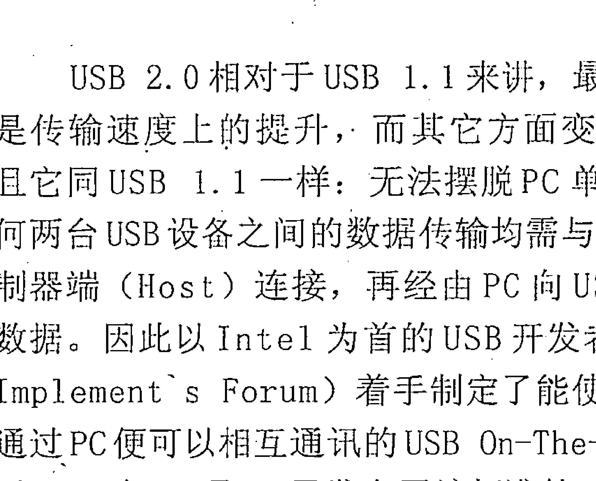

前段时间，半导体厂商Seiko-Epson公司在日本东京发布了他们最新开发的LSI控制芯片，该芯片全面整合了主机界面、外设界面和OTG技术，支持USB OTG 1.0规格，可以很好地支持“USB OTG”性能，也就是支持在没有PC介质的情况下，直接进行外部USB设备的相互连接。由此，移动电话，数码相机、摄像机等设备都可以通过LSI芯片相连接。

### 前景展望

USB OTG技术让USB接口设备摆脱主从架构，进而具备独立运作能力，大大扩展了USB标准的应用范围，使得原来主要应用于PC领域的USB接口完全有可能借助USB OTG技术而向AV及家电等消费电子领域扩张，目前，除了Intel表示支持USB OTG技术外，包括微软、爱立信、惠普、摩托罗拉、诺基亚、飞利浦及NEC等在内的众多厂商也纷纷表示支持USB OTG技术。可以说，随着这些厂商的加入，USB OTG技术必将不断完善，加上USB标准的普及程度，USB OTG技术可谓是前景一片光明。

## 九、BlueTooth (蓝牙) 技术——无线世界“作用巨大的小牙齿”

“蓝牙”取自10世纪丹麦国王哈拉尔德的别名。这位君王在位期间为四分五裂的瑞典、芬兰、丹麦的统一有着不朽的功劳。而瑞典的Ericsson也许希望自己新的无线技术将来能一统全球的无线标准而以此命名（图9）。

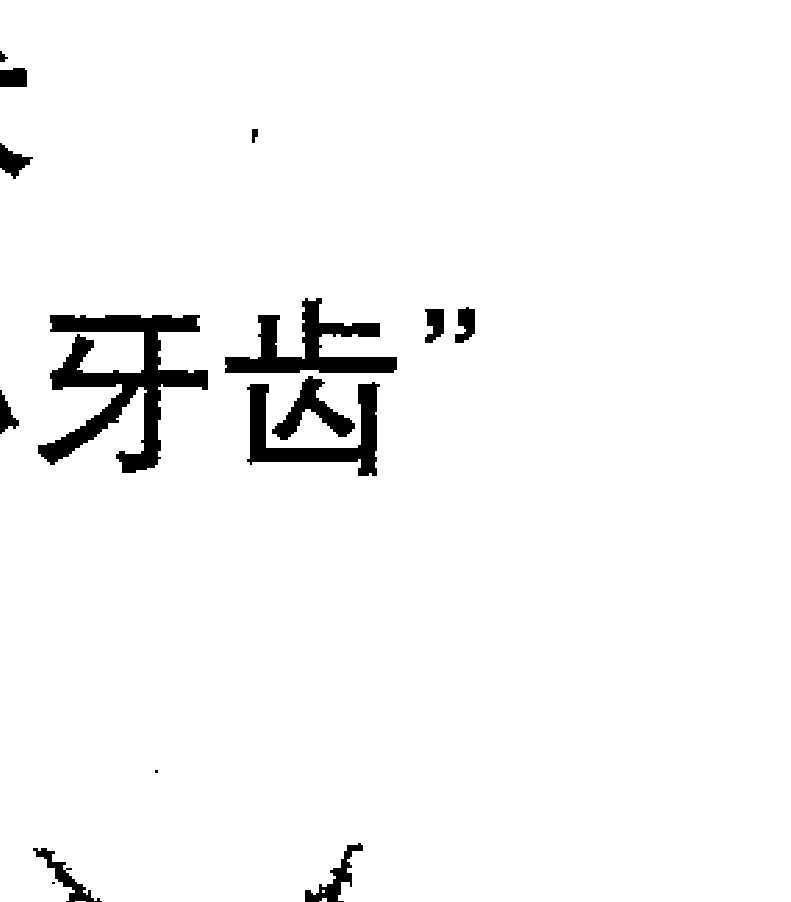

BlueTooth（蓝牙）技术是由包括爱立信、诺基亚、摩托罗拉、微软、3Com、东芝、Intel、IBM、朗讯等9个成员组成的“蓝牙特殊利益集团”（SIG）于1998年5月共同提出的近距离无线数字通信的技术标准，旨在全球建立一套统一的无线数据与语音通信的开放性规范。它是一种支持点对点或点对多点的短距离无线通信技术。蓝牙工作在全球通用的2.4GHz ISM（即工业、科学、医学）频段，数据传输速率为1Mb/s，传输范围从10厘米到10米左右。

蓝牙技术的应用被认为非常广泛而且极具潜力。它可以应用于无线设备（如PDA、手机、智能电话、无绳电话）、图像处理设备（照相机、打印机、扫描仪）、安全产品（智能卡、身份识别、票据管理、安全检查）、消费娱乐（耳机、MP3、游戏）、汽车产品（GPS、ABS、动力系统）等。

## ·前景展望

由“蓝牙特殊利益集团”（SIG）推广的这一标准目前已经吸引了全球超过2000家的企业来共同参与这一技术的推广工作。可以预期，未来数以亿计配备了基于蓝牙技术的无线接口的手机、个人数字助理（PDA）、PC机及其它信息设备，在近距离内将无需任何数据线均可实现互操作和数据共享，从而建立一个全球统一的无线连接标准。

## 十、燃料电池（FC）——未来笔记本电脑的动力之源

目前的笔记本电脑用户可能都遭遇过这样的尴尬：正当兴味盎然地使用自己的笔记本电脑处理事情时，却突然发现笔记本的电池电量已经处于告罄的边缘，因此不得不慌忙拿出电源线四处寻找电源插座。很多笔记本用户都梦想，什么时间能带着自己的笔记本电脑在室外工作一天。可以说，目前采用常规电池的任何一款笔记本都还无法实现这一目标，即使是搭配Intel公司最新发布的“迅驰”芯片，笔记本的最长工作时间也只有7到8个小时。可以说采用当前技术制造的电池已经成为笔记本电脑的软肋。

目前笔记本电脑多配备锂电池，虽然锂电池具有容量大，重量轻并且电池记忆效应不明显等优点，但是在笔记本电脑日益增加的功耗面前，也总显得捉襟见肘，用户对更新电池制造技术的呼声也越来越强烈。在众多新型电池技术中，燃料电池是最为人们所看好的技术之一。燃料电池的工作原理类似汽车发动机，它通过一种电化学反应，利用含氢燃料和空气产生电力。根据电解质和燃料的不同，燃料电池分为碱性电池（AFC）、磷酸性燃料电池（PAFC）、熔融碳酸盐型燃料电池（MCFC）、固体氧化物燃料电池（SOFC）和质子交换膜燃料电池（PEMFC）等诸多类型，而针对笔记本电脑电池应用的多是指直接甲醇型燃料电池（Direct Methanol Fuel Cell，简称为DMFC）。在同体积情况下，这种新型燃料电池的容量将近普通锂电池的5倍左右，使得笔记本的使用时间可以延长至20小时左右（图10）。

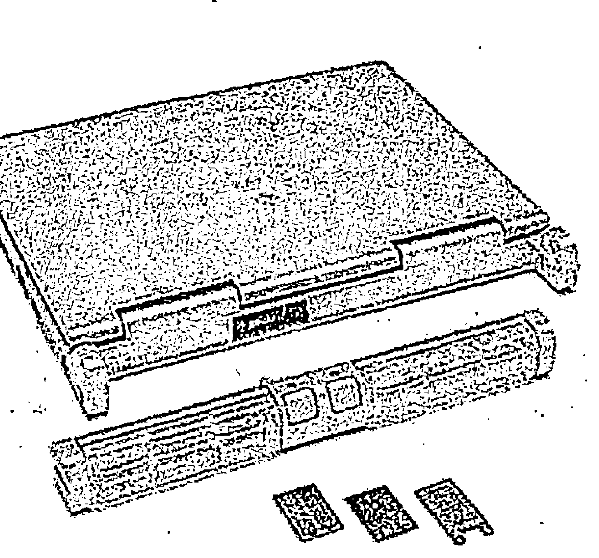

就在前不久的CeBIT 2003消费电子大展上，德国Smart Fuel Cell已经展出了其最新研究的便携式DMFC燃料电池的样品，而且众多厂商均已看到了燃料电池在未来笔记本电池应用中的美好前景，都在积极投入资金与技术力量进行项目开发，象东芝、NEC和卡西欧等著名厂商都已加入到新型燃料电池的研制行列中来。

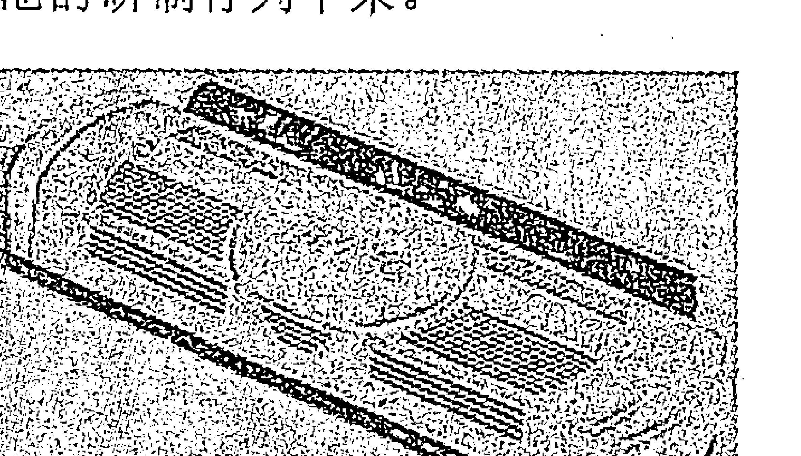

图11 为在2003年3月份召开的CeBIT 2003大展上，东芝展示的50毫升燃料盒规格的燃料电池，它的体积为275 × 75 × 40MM，重约100g，平均输出功率为12W，最大输出功率可达20W。在实际测试中，这款燃料电池可连续驱动笔记本电脑工作约5小时，而同比锂电池只能驱动2-3小时。

## ·前景展望

燃料电池无需充电，只需要补充燃料即可以长时间工作，而且燃料电池对化学能的转化率较高，一般在60%一90%之间，因此能得到较大的能量密度，另外，燃料电池多使用天然气、甲醇等含氢物质作为燃料，对环境不会造成什么污染，更没有任何电池记忆效应，因此，相信未来燃料电池在便携性设计方面一旦取得突破后，将会在笔记本电脑领域得到广泛应用。

# ## 2003年电脑办公外设大观

文/琪华

# 第一篇 打印机

2003年的打印机市场，依然热闹，特别是在数码相机越来越普及的情况下， Canon、EPSON、HP、Lexmark等4大厂商连续推出了多款彩色喷墨打印机来满足用户的需求。与此同时，方正、联想、三星等公司也先后进入到彩色喷墨打印机市场，使得打印机市场更加热闹非凡，新产品和新技术层出不穷，你方唱罢我登台，竞争是非常激烈，因而打印机的价格也在逐步下跌，已经到了用户完全可以接受的地步了。但是打印机耗材还是用户消费的一个大头，价格下降非常缓慢，因而，在一定程度上限制了用户的打印机消费。

从大的方面讲，在2003年，彩色喷墨打印机主要有以下2个大的改观：

- 1. 外观设计非常出色
2003年发布的彩色喷墨打印机产品，不管是针对商业用户还是家庭用户，外观都有了很大的改观，更加专注于人性化设计理念，使其更加具有家用办公特色，更加符合操作环境的需求。相对来说，Canon、HP两大公司在这个方面进步明显， Canon推出的i320、i470、i550系列充分体现了Canon最新推崇的四I理念，而HP推出的新系列打印机可以说是完全改变了HP原本严谨的形象，更加活泼、时尚，容易被普通用户接受。

- 2. 插卡直接打印成为趋势
由于使用数码相机的用户越来越多，希望通过数码相机直接进行照片打印的需求也越来越高，因而各大打印机厂商先后推出了直接照片打印机，不必通过计算机，直接完成照片打印。按照方式的不同，它们又主要分成了两种方式，第一种是用USB传输线直接和数码相机相连，如Canon、HP推出的系列打印机；第二种方式是配备存储卡插槽（如Compact Flash卡或Smart Media卡），将存储卡中的数码照片直接打印出来。因为这两种方式直接绕开了电脑的处理，使得用户应用起来更加方便，得到了广大用户的欢迎，因而从来没有推出过插卡打印机的Lexmark、联想都推出了相关的产品。

### 一、Canon

作为传统的打印机生产厂商，Canon在继续提高打印机技术的基础上，更加融入了自己在数码相机方面的优势，推出了一系列的高低端的数码照片直接打印机，只要将数码相机和打印机连接起来，用户只要3步就可以完成打印操作。

- 1. 照片逼真技术
传统显示器在色彩表现上都是基于sRGB色域空间，但sRGB色域在表现青色时明显存在着欠缺。彩色喷墨打印机的色彩表现范围在理论上要超过基于sRGB色域空间的显示器等设备，但由于多数彩色喷墨打印机在设计上实际也是基于sRGB来完成色彩输出，所以它们在表现蓝色海洋、绿色植物等场景时仍差强人意。
为突破sRGB的局限，Canon在驱动程序中采用了照片逼真技术，拓展了打印机的实际色彩表现范围，使得带有青色色调的图像能够获得更逼真的打印输出效果，从而也使彩色喷墨打印机自身的色彩表现潜能得到更加充分的发挥。值得一提的是，Canon的照片逼真技术在进行色域拓展时也考虑了整体色调的平衡，所以Canon的打印输出也更接近于真实的自然色彩。

## Canon i950 喷墨打印机

- 2. 四马达系统
Canon的打印机中采用的4马达系统具有步进马达、小车马达、进纸马达和清洁（维护）马达共4个马达，每个马达各司其职，这样不仅避免了以往马达需频繁进行功能切换的麻烦，大大提高了打印速度，也减弱了马达切换的噪音。

- 3. 精确进纸与接力进纸
Canon最新推出的打印机都采用了新型的精确进纸结构，即使进行长时间连续高速打印，也能保证进纸动作的稳定和精确，避免了频繁调校的烦琐。此外，该机还采用了“接力进纸”，即在打印出纸的同时，完成进纸操作，从而大大加快了连续打印的速度。

- 4. 产品展示 (本节文章内容放在配套光盘A上，请在配套光盘上阅读)

### 二、EPSON

EPSON可以说是彩色喷墨打印机的老大，其产品占有很高的市场份额，并且在打印色彩方面有非常独到的地方。它是世界上第一个推出7色打印概念的厂商，也是第一个推出直接插卡打印的厂商，其最初推出的EPSON STYLUS PHOTO895引起了非常大的轰动。然后在2003年，当其他厂商高歌猛进之时，它显得相对有些沉默。

- 1. 全真数码影像技术（Print Image Matching II）
全新推出的第二代“全真数码影像技术”（Print Image Matching II），可以说是EPSON在2003年推出的最大打印机更新技术。它跨越了电脑的局限，通过与图像数据同步存储的命令，直接反映数码相机所拍摄的照片，确保拍摄的每个数码细节能尽数呈现。全新推出的第二代“全真数码影像技术”（Print Image Matching II），完全包含了Exif 2.2并超越了这一标准，并新增两项数码相机的特有降噪参数（Noise Reduction）及用户情景设置（Scene Custom Setting），更进一步扩展了全真功能。只要使用支持P. I. M. 技术的数码相机，EPSON的打印机便能将数码相机的独特拍摄效果进行忠实再现，确保精彩无二。

- 2. 智能墨滴变换技术
EPSON在其中高端彩色喷墨打印机中采用的这项技术，能根据图像分辨率的高低和色彩区域的不同，自动变换三组共九种不同尺寸的墨滴，使墨滴在每一颜色区域，都能实现极佳配置，特别是在浓度高的部分采用了大墨滴打印，从而加快打印速度，进一步提高工作效率。

- 3. 产品展示 (本节文章内容放在配套光盘A上，请在配套光盘上阅读)
  - (1) EPSON STYLUS PHOTO 830
  - (2) EPSON STYLUS PHOTO 900
  - (3) EPSON STYLUS PHOTO 950

### 三、惠普

在办公领域，惠普的彩色喷墨打印机拥有绝对的市场份额，成为众多工作人员推荐的对象，但是其外形也一直有些呆板，严谨。但是在惠普的打印及成像集团成立后，惠普的彩色喷墨打印机在提高打印质量的情况下，更加注重外观设计，推出了多款令人爱不释手的产品。在2003年，惠普再接再厉推出了第四代“富丽图”色彩分层技术和全球第一台8色彩色喷墨打印机。

- 1. 第四代“富丽图”色彩分层技术
在第三代“富丽图”色彩分层技术的基础上，惠普推出了第四代“富丽图” （Photo RET4）色彩分层技术，其最大的改进是采用了6色打印方式，将4色打印（3色彩色）的17层色级以平方量级组合提高，变为289层，实现120万种色彩打印，得到更加真实的照片级彩色打印效果，为用户提供色调连续、颗粒度更小的照片一样逼真的图像。与爱普生不同，惠普并没有特意去追求

- 2. 八色技术
八色墨打印技术在原来品红、浅品红、青、浅青、黄色和黑色六色墨基础上又增加了深灰和浅灰两个颜色，形成了惠普首创的八色打印，有效地减少了图像颗粒度，增强阴影部分的细节表现力。八色墨中的浅灰和深灰色墨，不但提升了彩色打印的色域，而且在黑白照片打印效果上实现了突破，精确还原黑灰色的颜色层次，不会出现打印偏红或偏蓝的色彩偏差。照片灰色和黑色墨是由惠普特殊的颜料合成的，以此来表现真正的中性灰和中性黑的图案。精巧配方的染料提供了广阔的灰度色谱——从白色到浅灰、中度灰、深灰色调，直至照片用的深黑色。由于无需依靠合成颜色墨水来产生灰度级别，就不会在黑白打印作品上产生一些不需要的色彩（比如粉色或者绿色），能够打印出纯正的黑色，而且灰色等中间色的过渡层次更丰富，图像更加细腻、颗粒度小、质感更好，由此产生含有更少的图像杂点，更精确的阴影表现力的高质量黑白照片。此外，配合惠普专用防褪色相纸及墨盒打印出来的照片放在镜框中能够保存长达73年不褪色，满足用户对照片长时间存放的要求。

- 3. 产品展示（本节文章内容放在配套光盘A上，请在配套光盘上阅读）
  - (1) HP deskjet 3658
  - (2) HP deskjet 5168 打印机
  - (3) HP Deskjet 5652
  - (4) HP photosmart 7960 惠普数码照片打印机

### 四、Lexmark

Lexmark是全球惟一的一家专门致力于打印机技术的厂商，其产品具有良好的性能价格比，不过耗材偏贵，其低端产品拥有较高的市场份额，而高端产品则不是其他3大厂商的对手，尽管如此，它还是拥有很多独到的打印技术。

- 1. PrecisionSense（精密的感应技术）
利盟创新的PrecisionSense感应技术运用一个光学传感器，实现自动探测打印纸张类型并依此自动调节打印机设置。凭借PrecisionSense精密的感应技术，用户在改变打印纸张时无需记住要调整打印机设置，从而避免了因为不正确的打印介质设定引起效果不满意而导致的纸张浪费（对于目前尚不能支持的纸张介质或者特殊规格的纸张，用户依然需要手动设置）。
PrecisionSense精密的感应技术的另一个特色是为确保打印质量的完美，打印头的校正过程自动进行，无需用户干预。校正队列图案被首先打印出来，然后被位于打印墨盒字车的一个光学传感器“读取”。校正的信息参数均被存储在打印机中。这样使得打印机即使被在不同的用户使用，它的校正信息不会改变，确保完美的打印质量。这意味着用户将不必在每台计算机设定打印机校正参数。

- 2. PrecisionPhoto精细相片打印技术
Lexmark 的 PrecisionPhoto 结合了多项全新技术，能够互相配合以在各种打印材质上传递清晰、鲜锐的打印效果，色泽浓度也比以往更佳。使得采用了 PrecisionPhoto 技术的彩色喷墨打印机能够提供业界最佳的五百七十六万墨点分辨率，是2400x1200 dpi 打印机的两倍。为平衡效能与速度，PrecisionPhoto 技术能让 Lexmark 驱动程序根据打印文件的各区域，自动选择最适合的墨点大小，以尽可能在最短的打印时间内达到最佳的打印品质。

- 3. AccuFeed无忧精确进纸系统
Accu-Feed 无忧精确进纸系统成功的秘密在于一组齿轮机构。装有弹簧的这组齿轮机构能够在进纸槽上释放持续的压力。这意味着纸张可以非常可靠地从第一张到最后一张依次被输送进打印机，而且不同类型的纸张介质均能自动地被抓取，无需任何手动调整的必要。Accu-Feed 无忧精确进纸系统通过一组连续的齿轮和一套变速系统来发挥功能：随着在齿轮机构一端速度的加快，在另一端的扭矩也逐渐增大，直至将整张纸完全送出。当Accu-Feed 无忧精确进纸系统被激活时，“快速取纸”功能通过一个离合器来防止压盘滚筒的旋转。它能使Accu-Feed 无忧精确进纸系统在前一页纸被打印完毕的同时马上开始输送下一页打印介质。“快速取纸”功能将防止已经打印完毕的纸张再被拖回进打印机中。利盟Accu-Feed 无忧精确进纸系统已经适用于利盟最新全系列彩色喷墨打印机中。

- 4. 产品展示（本节文章内容放在配套光盘A上，请在配套光盘上阅读）
  - (1) Lexmark P707
  - (2) Lexmark Z705
  - (3) Lexmark Z605

### 五、联想

联想作为国内最先推出彩色喷墨打印机的民族企业，很多产品都是由Lexmark代工生产的，因而这两家的产品具有相似的外形和打印质量。其具有的打印技术也是相差无几的，因此，我们直接推荐2003年联想发布的几款产品。

产品展示（本节文章内容放在配套光盘A上，请在配套光盘上阅读）
  - 1. 联想6110彩色喷墨打印机
  - 2. 联想3110

### 六、激光打印机

曾经的激光打印机高高在上的情况，在近几年中随着技术的革新和层出不穷的新产品的不断推出，使得这种情况有了很大的改观。纵观2003年的黑白激光打印机市场，一般桌面办公环境下的黑白激光打印机大多在3000元以下，有的甚至跌破了2000元，这在价格上与一些彩色喷墨打印机相差无几。由于黑白激光打印机在打印速度、打印成本以及文本打印质量等方面与彩色喷墨打印机比较，都有很突出的优势。因此，对那些需要经常打印文本，而又不在意色彩的家庭和小型办公用户来说，黑白激光打印机是他们很好的选择。

其中HP Laserjet 1010黑白激光打印机系列是HP Laserjet1000系列的升级版本。它是惠普目前体积最小、重量最轻、打印速度最快，同时也是价格最低的个人激光打印机。此系列产品分4个型号，其中Laserjet 1010标准版、Laserjet 1010企业版、Laserjet 1012的市场售价均低于2000元。这4个型号的打印机速度从12ppm到14ppm，第一页输出速度为10秒，可实现1200dpi的输出质量，而体积只有Laserjet 1000的一半。

为了对抗HP Laserjet 1010系列产品，EPSON也推出了A4幅面黑白激光打印机EPL-6200L。6200L凭借20ppm的打印速度，成为了目前市场上同级别黑白激光打印机中打印速度最快的产品。

与HP、EPSON比较，Lexmark、Canon、联想、方正等公司也发布了相应的新产品，由于这些新产品无论在性能、价格还是质量方面都有一定的差距，因此在这里我们也就不多提及。

在彩色激光打印机方面，2003年可以说是非常重要的一年。彩色激光打印机的价格首次跌到了万元以内，而首次发动这波潮流的仍然是HP、EPSON两家著名的打印机厂家。在年初，HP推出了color Laserjet2500系列，它们采用4色分体式硒鼓，具有黑白16ppm、彩色4ppm的打印速度，同时价格也只有9980元。而EPSON针对开发的EPSON C900和C1900同样采用4色分体式硒鼓，具有黑白16ppm、彩色4ppm的打印速度。其中C900的市场售价也只有8900元，并且彩色打印质量也比较出色，对于广大中小型企业用户来说是相当有吸引力的。

而传统的美能达、富士施乐等其它厂商都还没有推出这种价位的产品，它们的产品定位还相对较高。同时由于彩色硒鼓的价格也较高，单独更换一套硒鼓，价格高达数千元，也是影响彩色激光打印机向下普及的一个障碍，因此，对于普通办公用户来说，对于彩色文本的打印输出，还要更多的依赖彩色喷墨打印机。

# 第二篇 扫描仪

2003年的扫描仪，可以说是在数码相机和多功能一体机的夹缝中生存，其消费市场进一步萎缩。由于扫描仪的扫描功能基本能够被数码相机、多功能一体机所代替，因而普通消费者越来越多的选择了数码相机和具有扫描功能的多功能一体机。针对这种情况，各大扫描仪厂商着手调整自身产品设计，推出了各具特色的扫描仪产品，因而更多的扫描仪被应用到办公文件扫描、影楼照片处理等。而针对家庭用户的扫描仪产品，在产品外形以及易用性方面有了很大的改观，超薄超轻成为了家用产品的主流，USB 2.0等2002年开始流行的新技术，在2003年得到了全面的应用。

综观全年，虽然扫描仪市场在逐渐萎缩，但是各厂家推出的新产品中，还是包括了各种最新技术，使得扫描仪的技术含量更高，扫描效果也更好。

### 一、扫描技术

- 1. 扫描精度方面
扫描精度很大的影响到扫描出来的效果，所以，扫描精度的提高是必不可少的事情，提高扫描精度主要有焦距自动调整技术、双镜头扫描技术和多镜头技术。

  - （1）焦距自动调整技术
随着扫描仪使用时间的延长，其光学部分不可避免地要产生一定的变形，使镜头的聚焦点产生偏移，焦距自动调整技术可以有效地避免光学部分变形产生时对扫描效果的影响。这项技术是通过精密电机伺服系统来对焦距进行调节，在扫描时，调节焦距的电机组越多，调节的焦距就越精确。焦距自动调整技术不但可以扫描平面图像，还可以扫描立体实物，保证扫描仪在长时间使用过程中保持聚焦的精确度，所获得的图像质量均能保持原有的锐度和深度，同时也避免了因为结构上的变形所带来的扫描品质下降。

  - （2）双镜头扫描技术
在不改变CCD精度的情况下，扫描仪采用了双镜头扫描模组设计，根据使用者选定的扫描分辨率，通过两组不同焦距的专业镜头的光学组合来进行焦距的自动调整，从而提高扫描精度。用户在扫描设定时拥有最大弹性，以及使系统有最佳执行效率与精度，从而获得最佳的扫描效果，从根本上解决了传统变焦镜头扫描时产生的边缘变形问题。

  - （3）多镜头技术
这项技术的原理是采用几组高品质的自动对焦镜片，对不同的扫描分辨率进行精确校准，始终保持图像边缘能够精确对焦，这样可以降低图像边缘畸变效应。不过，由于采用这种技术必须配合高精度的机械结构和特别磨制的高品质镜头，所以造价非常高。

- 2. 扫描效果方面
扫描效果是衡量一款扫描仪好坏最重要的标准，而且也是用户最为关注的问题，所以，如何提高扫描效果已经是厂商最为关注的问题。

  - （1）LIDE技术
LIDE技术（LED In Direct Exposure，二极管间接曝光）是佳能公司独创的革新技术，它是一种与优秀的接触式图像传感器相结合的技术，其最重要的设计理念就是化繁为简，从原稿图像的反射次数来说，LIDE扫描仪中只有原稿反射光导照明一次，这样就省略了一系列反射镜，避免因此带来的各种像差和色差，可以最为逼真地重现原稿的细节和色彩。LIDE扫描仪主要由三部分组成：光导、柱状透镜和线性光学传感器。光导的主要作用是增强RGB三个色彩通道的光照强度，柱状透镜则可以确保反射光更好地向传感器聚焦，为提高扫描仪的分辨率和扫描精度起到非常大的作用，线性传感器则最大程度地避免了边缘变形问题。采用LIDE技术的扫描仪机身非常薄，通过专用的扫描仪立架，不但可以直立放置，还可以在直立位置上进行扫描操作，大大地节省了桌面空间。同时LIDE技术有效降低了扫描仪的噪音，减少了功率损耗，还能够精确扫描页面边缘的全部文件细节。

  - （2）VAROS技术
VAROS技术（Variable Refraction Optical System）是佳能的光学技术和其特有的精密技术的完美结合，可以有效提高扫描分辨率。普通的CCD扫描仪在扫描时，需在被扫描物体表面形成一条细长的白色光带，光线通过一系列镜面和一组透镜，最后由CCD元件来接收光学信号。但是，在这种条件下，光学分辨率被CCD的像素数量所限制。而拥有VAROS技术的扫描仪，在扫描分辨率设置为600dpi以上时，扫描仪会自动对原稿进行两次扫描。第一遍获取600dpi精度的信息，第二遍扫描时，VAROS系统的透射镜会微微偏移一个角度，让光轴移动半个像素，于是传感器获得了另一组信息，实际上描述了第一组数据间隙中的图像，这两组组合起来就达到了1200dpi的精度。这种设计的最大问题是使扫描速度变慢，因为必须扫两次。彩色套准也会受到影响，特别是当扫描仪的机械精度不够好时，影响更大。不过，这种“迂回智取”型的扫描仪以相对低廉的代价实现了高精度的扫描，为1200dpi产品走向主流立下了汗马功劳。

  - （3）双扫描头技术
在扫描仪的传统CCD上，规则地排列着3条感光元件阵列，分别获取红、绿、蓝三色光学信息。每条感光元件阵列上光电耦合元件的数目，也就是这个CCD能够获取的像素数，同时也决定了这台扫描仪的最大光学分辨率。CCD的制造依靠高精度的微电子加工工艺，制造长度更长的CCD，意味着非常昂贵的价格、很低的成品率；而保持当前CCD长度不变的情况下，提高像素数就会相应减小单个感光单元的面积。感光单元面积缩小，会带来敏感度和图像信噪比的降低。因此，为了获得同等质量的扫描图像，扫描仪就必须增加每次扫描的曝光时间。对于1200dpi的扫描仪而言，其像素尺寸为3.2～3.5微米，如果希望保持CCD长度而增加像素至20000点，像素面积会缩小到2微米以下。为了不仅能获得1200dpi这样高的分辨率，而产品的成本又不会增加太多，惠普推出了双扫描头技术。

## HP ScanJet 4670扫描仪

一种双CCD技术，为高分辨率扫描输入带来了新的途径。这种双CCD扫描仪采用了交错像素设计来实现2400dpi的高光学分辨率。CCD传感器中，包含两组像素单元：低分辨率部分的传感器单元具有较大的信号感受面积，可以提供高速、高质量的扫描，光学分辨率为600dpi；而高分辨率部分采用了6条感光元件——红、绿、蓝各两条，每两条同色感光元件错开半个像素的位置。因为每条传感器都具有10000像素点。每次扫描过程中，根据特殊的算法把6条传感器的数据结合在一起，就可以实现2400dpi的有效光学分辨率，足以适应35毫米幻灯片或负片放大的需求。采用双光源和惠普专利的CCD所需要的反应时间极短，运用新技术的惠普扫描仪将可仅用4秒钟就完成一幅A4图片的扫描预览任务。

## (4) 同步RGB扫描技术

扫描仪对原始图像进行扫描是靠扫描头不断移动而捕捉图像的，因此，CCD的工作状况对图像质量会产生较大影响。CCD通常的结构特征是装载有颜色过滤器的三行CCD，彼此之间平行排列，中间有几行间隔。基于CCD的这种结构，大部分厂商在扫描头向前移动一行的过程中，通过对三色CCD进行切换来实现像素点的全色扫描，因此，会使扫描图像产生偏色或不连贯，不能对原稿进行准确扫描。幸好，EPSON扫描仪研制出了一种新的特殊CCD控制技术，可以同时捕捉红、绿、蓝三色数据。即把一束纯净光线投射到图像上，然后使用一组能准确分辨颜色的高质量的透镜，将接收到的光线分送到不同的彩色传感器，或者叫电荷耦合器上。这一过程，只需一次扫描，同时分析三种颜色，从而使扫描仪能够记录扫描图像上的任何一点的正确颜色，准确捕捉目标图像，减少色彩失真，同时，也加快了扫描的速度。

## (5) 动态范围控制技术

在扫描过程中，扫描仪利用模数转换器（ADC）将图像信号转换成数字信号。模数转换器的输入信号就是CCD的输出信号，这种信号带有随机噪声，当原件具有较高的光密度数值时，这种随机噪声便会使CCD的信号质量产生巨大损失。EPSON的最新动态范围控制技术，可预先对Gamma值进行优化和预设，再由扫描仪对Gamma预设值进行分析，自动重新调整预设值和曝光时间，从而使得扫描影像在亮部与暗部均有良好的信噪比，让层次表现淋漓尽致。

## (6) “微雕”扫描技术

“微雕”扫描技术又名“A. C. E. 色彩增强技术”，是明基独立开发的符合ICC标准的色彩管理引擎，率先在高中档的产品中实现了专业功能的大众化。“微雕”技术是利用软件模拟色彩合成运算，来强化扫描图像的色彩表现。它包含在Acer扫描仪的Mir ascan驱动程序中，当色彩深度提高到48位时，色彩辨识点数可由1亿6千多万种增强至281万亿种以上，犀利的分色能力令图像栩栩如生，每一个细节都能展现得淋漓尽致，从而使用户得到满意的效果。“微雕”技术还提供了常见品牌显示器、打印机等输出设备的色彩特性文件供选择，以保证扫描图像得到精确、忠实地显示和输出。用户在实际扫描时可以自由选择使用或屏蔽“微雕”功能，从而保证色彩在输出设备间进行准确的传递和转换，非常方便快捷。

## (7) 高速图像处理器

扫描过程对个人计算机的中央处理器和内存要求很高，要提高图像精度，所处理的扫描数据量也必然增加。普通扫描仪依靠软件通过计算机来完成大部分的图像处理工作，大量消耗系统资源。而EPSON将在扫描仪中置入一个先进的高速图像处理器，它是专为更快速、更高效地处理图像数据而开发的。其不但能够提高扫描图像品质，又能够缩短扫描时间。

## (8) 优化扫描速度技术

所谓优化扫描速度，当然是要靠软件来实现的啦，这种技术适用于采用并口连接的扫描仪。它能使扫描仪自动以计算机并口所能提供的最快速度来进行数据传输，能确保用户以最优速度扫描，同时，其操作非常方便，即使你是“菜鸟”也很容易上手。

## 二、产品展示

虽然扫描仪市场受到了多方的挤压，但是各大厂商还是发布了多款新品。

## 1. 惠普

像惠普的彩色喷墨打印机一样，惠普扫描仪产品也是主要针对商业办公用户，不过在今年也发布了3款针对家用的扫描仪产品，这一系列的产品秉承了惠普扫描仪的特点，外观秀丽，使用简单，并配送了丰富的图片扫描处理软件。

- (1) HP ScanJet 2400
- (2) HP ScanJet 3970
- (3) HP ScanJet 4670 扫描仪

（本节文章内容放在配套光盘A上，请在配套光盘上阅读）

## 2. EPSON

EPSON 在 2003年推出了多款扫描仪产品，这些产品都有不错的外观和扫描质量，同时还具有旧照片翻新等实用功能。

- (1) EPSON Perfection 3170 Photo
- (2) Perfection 1670Photo

（本节文章内容放在配套光盘A上，请在配套光盘上阅读）

## 3. Canon

由于Canon在数码相机方面取得了很高的市场份额，因此，它在扫描仪推出方面相对有些慢，并且大多数产品都采用的是CIS技术，具有漂亮的外观，具有较好的移动性能，很受时尚用户的喜爱。

- (1) Canon CanoScan LiDE 80
- (2) Canon CanoScan 3200/3200F

（本节文章内容放在配套光盘A上，请在配套光盘上阅读）

## 4. Benq

Benq 具有很强的扫描仪生产能力，由于其生产工厂给国内很多品牌进行代工生产，反而自身的产品推广更新相对缓慢，不过产品质量还是相当不错的，具有很高的产品性能价格比，并且人性化方面做得比较出色。

- (1) 书法版扫描仪5250C

（本节文章内容放在配套光盘A上，请在配套光盘上阅读）

# 第三篇 投影机

以往人们做演示文稿时，先把需要的资料打印出来，再做成投影片，非常不方便。随着投影仪的出现，你只要将投影仪接上计算机，就可以进行演示文稿，节省了许多的操作时间。投影机在几年前还只是属于影音领域，随着多媒体显示技术的发展，现今的投影机已经成为标准的计算机外设之一。各品牌投影机的产品技术日益趋同，价格迅速回落，使得投影机逐渐在商业会务、电化教学、军队、政府部门、学术演示、家庭影院等领域普及开来。目前的投影机市场，可以说是群雄并起，众多品牌厂家林立。这对普通消费者来说，很难对投影机有个清楚的认识。

## 一、投影机技术

目前市面上的投影机价格从万元至几十万元的都有，为什么相差这么大呢？这主要取决于所采用的显示技术。一般来说，我们将投影机按照所采用的显示技术不同来分类的，主要有CRT (Crystal Ray Tube，阴极射线管)、LCD (Liquid Crystal Display，液晶显示)、DLP (Digital Light Processor，数码光路处理器)三种。目前，LCD投影机和DLP投影机是目前市场上主要机种，而使用CRT技术的投影机只是在相当高端的场合下使用，因此在这里我们主要介绍LCD投影机和DLP投影机。

## 1. LCD投影机

它的成像器件是液晶板，也是一种被动式的投影方式。LCD投影机以液晶面板的数目来分可以分为单片式与三片式两种，单片式液晶投影机由于要在一片液晶面板上同时提供R、G、B三种颜色，所以在色彩的表现上要比三片式的要差，目前在市场上已经很少见到。所以我们主要针对三片式LCD投影机内部的结构来做一个解说。LCD投影机的基本原理是利用LCD液晶模块来调变由外光源金属卤素灯或UHP（冷光源）发射出来的光线，为了要让LCD液晶模块能准确投影出影像的色彩，需要将光线分离成R、G、B三色分别加以控制，之后再将R、G、B三色合并，利用投影镜头投影至银幕上。如图1。

## 图1

LCD投影机中所使用的液晶面板与一般见到的LCD显示器是不同的，LCD投影机所使用的液晶面板必须要能够耐强光、高热，同时LCD面板中有许多晶体管作为开关来遮光或透光。液晶因为是有规则性排列的液体，受到外力的作用，像是电场或磁场的影响而改变排列的状态，显示的原理是由外部的电压改变来控制液晶分子的排列状态，进而控制光线的路径，造成光线的穿透、半穿透或是不能穿透。此外，LCD投影机若依使用液晶面板的方式来区分，又可分为穿透式液晶面板及反射式液晶面板两种。

## （1）穿透式LCD投影机

穿透式LCD投影机内部主要的组件为液晶面板及用来分光合光的双色镜。光线由光源模块发出，经过分光的双色镜，将光源分成R、G、B三种颜色，这三种颜色分别由三片液晶面板控制调变之后，在投射镜头前由合光棱镜将三种颜色合并，再透过LCD投影机镜头投影至银幕上。

## （2）反射式LCD投影机

反射式LCD投影机除了液晶面板与穿透式的不同之外，最大的不同在于反射式LCD投影机还多了一组极化分光镜。光线在经过双色镜分色之后，投射到极化分光镜中，再经由反射式液晶面板调变光线反射后回来，再同样由极化分光镜来处理反射回来的光线，然后再经由合光棱镜合并三种颜色，经由投影机镜头投射到银幕。由于光线前后来回反射在光学系统中，所以反射式LCD投影机的结构要十分精准，同时液晶面板的安装也要正确才能确保投影的精确性。

LCD投影机表示光通量的单位是ANSI流明，ANSI流明是美国国家标准化协会制定的测量投影机光通量的方法，它测量屏幕“田”字形九个交叉点上的各点照度，乘以面积，再求九点的平均值，即为该投影机的ANSI流明值。LCD投影机的光输出主要决定于光源的亮度和光路系统以及液晶板的透射或反射能力。目前高亮度投影机在不增加光源功率的前提下通过技术提高光利用率，在光路上设置P.S光转换板，把起偏以后的垂直方向震动的S光反射转向，P光透射来提高光的效率。就目前市场而言，LCD投影机已经发展成为投影机领域内的主流产品，因其具有体积小、重量轻、便于携带、分辨率较高、亮度高、色彩丰富、操作简单、价格适中等特点，而受到用户的欢迎，目前LCD投影机占有的市场份额约占总体市场份额的90%以上。

## 2. DLP投影机

DLP投影机是采用反射光的原理，以DMD（Digital Micromirror Device，数字微反射器）作为光阀成像器件。DMD是由德州仪器公司在1996所研发出来的。DLP投影机是将光源所发出来的光线，经过一个高速旋转的色盘，将光线滤成R、G、B三种颜色，再投射到一个称为DMD的芯片上，这个芯片上以矩阵方式排列了许多微小的反射镜，每一个反射镜就是相对于画面上的一个图素，透过反射镜的角度，来决定这点图素的亮或不亮。举例来说，假设现在要投射一张全白的图片，DMD上的镜片，就会全部旋转到亮的角度，将经过色盘的三色光线反射到投影机镜头，我们就会看到由R、G、B三色混合的白光。若要投射红光，DMD上的镜片则会在色盘旋转到红色时才会将角度调整到亮的角度，这时投射出来的就是红光。通过DMD上面镜片不断地变化角度，配合高速旋转的色盘，再加上人眼的视觉暂留，一个图素就可以展现出不同的色彩变化。

DLP所使用的核心芯片DMD，是由数十万个面积16×16微米，比头发的断面还小的微镜片所组成。如欲提高产品的分辨率，只要增加DMD内微镜片镜的数量即可，不须改变微镜片的大小；微镜片数越多，组件面积越大，反射的光就随之增加。因此DMD是亮度与分辨率可以同时并存的组件。根据所用DMD的片数，DLP投影机可分为：单片式、两片式、三片式，所以我们也称DLP投影机称为：单枪DLP投影机、双枪DLP投影机、三枪DLP投影机。目前，XGA级DLP投影机使用的是0.9"DMD芯片，且TI正积极开发0.7"的XGA级DMD芯片。如图2。

## 图2

DLP 投影机的亮度单位为 ANSI 流明。DLP 投影机以 DMD 作为光阀成像器件通过信号放大，输出大屏幕图像。DLP 投影机由于是通过电极控制镜片倾斜角度来切换光的方向，使成像器件的总光效率达 60% 以上，对比度和亮度的均匀性都非常出色。因为完全采用数字控制，与液晶式相比，具备分辨率高、画面均匀、色彩锐利、画面质量稳定、反应速度快、调整便利、噪声小等优点。另外，DLP 投影机的轻巧外型，强调便携性，使得 DLP 投影机市场快速成长。

## 二、投影机技术指标

如同其他如 LCD 显示器、数码相机等产品一样，投影机的性能指标是区别投影机档次高低的标志。为了更加清楚明了的认识投影机，首先我们来看看它有哪些重要的技术指标。

## 1. 亮度

如同 LCD 显示器一样，亮度也是衡量投影机的一个重要指标。投影机的亮度越高，说明它适应外界环境的能力越强，能够在更多种环境下使用。

亮度是以光通量来表示，液晶投影机的光输出主要决定于光源的亮度和光路系统以及液晶板的透射或反射能力；而 DLP 投影机的亮度是由数字微反射镜器件（DMD）决定的。投影机的实际测试亮度，与投影机距离屏幕的远近和屏幕视角，以及增益指标有很大关系。

## 2. 分辨率

分为物理分辨率和最大分辨率，物理分辨率是指屏幕上每行有多少像素点、每列有多少像素点，一般用矩阵行列式来表示，其中每个像素点都能被计算机单独访问。它是由制造商设置和规定的，一般不能任意调整，即所谓的物理分辨率，投影机只有在物理分辨率下，才能显现出最佳影像。物理分辨率越高，则可接收分辨率的范围越大，则投影机的适应范围越广。最大分辨率是指投影机可接收比物理分辨率大的分辨率，是通过压缩算法将信号投出，画面的清晰度比在物理分辨率下要差。通常我们是用物理分辨率来评价液晶投影机的价值，物理分辨率越高，投影机越贵。投影机的物理分辨率为 SVGA (800 × 600)、XGA (1024 × 768)。

## 3. 对比度

简单的说就是黑与白的比值，也就是从黑到白的渐变层次。比值越大，从黑到白的渐变层次就越多，从而色彩表现越丰富，有助于我们对画面细微之处的观察。因此，如果一个画面只能显示白色和黑色，而不能显示出阴影区域或黑暗区域的细微层次变化，我们就失去了画面的精细效果。对比度反映了一个画面明暗变化的范围大小，而对比率则纯粹呈最大亮度与最小亮度的数值比。一般来说，只有亮度与对比度搭配得恰到好处，才能够呈现美观的画质。品质较佳的投影机都具有智慧的调节功能，能够自动调节图像，使亮度和对比度达到最佳，得出最完美的画面。

## 4. 均匀度

这是与亮度相关的概念。投出画面的中间亮度与周围亮度的比值。一般将中间定义为 100%。投影机投射到屏幕上的图像的亮度其实并不是完全均匀的，有的地方的亮度会高些，有的地方的亮度会低些。当然，投影机亮度分布越均匀越好。

## 5. 会聚

会聚是指 RGB 三种颜色在屏幕上和重合，对 LCD 投影机来说，会聚控制性显得格外重要，因为它有 RGB 三种液晶板，要想做到图像完全会聚，必须对图像各种失真均能校正，如梯形失真、倾斜失真等。机器位置的变化，会聚也要重新调整，因此对会聚的要求，一是全功能，二是方便快捷。虽然目前的 LCD 投影机都有较强的自动调节功能，但是为了得到最佳效果，多数情况下，还需要用户亲自调节。

## 6. 信号输入接口

对于投影机来说，信号输入包括了多种方式，如 RGB 模拟信号输入、DVI 数字信号输入、S－video 信号输入等。对于越来越多的移动办公投影机来说，在 S－video 信号输入成为标配的情况下，更多的投影机选择了 DVI 数字接口输入；这是为了防止避免在进行数模转换时造成的信息损失，保证得到最佳画面。

## 三、产品展示

（本节文章内容放在配套光盘 A 上，请在配套光盘上阅读）

- 1. BenQ SL705SA
- 2. BenQ DS650D
- 3. EPSON EMP-730
- 4. HP xb31
- 5. Infocus LP70
- 6. InFocus LP650 DLP
- 7. NEC LT150Z
- 8. 神州数码 CX65
- 9. Luxeon D315M

# 第四篇 多功能一体机

多年来多功能一体机市场波澜不兴，它从一开始就是由国内厂商领导，国外厂商跟风的局面。在过去的2002年，尽管许多IT产品市场发展速度放缓，但是在多功能一体机市场则是处于一种高速发展的势态，这一势态终于在2003年全面爆发了，随着众多厂商的大力投入和持续不断的产品推出，使得多功能一体机成为了外设市场一颗冉冉升起的明星。

## 一、多功能一体机分类

我们将把传真、打印、复印、扫描和其它功能中的两种或两种以上功能结合在一起，并可直接或间接地与一台计算机相连的设备称为多功能一体机。多功能一体机是目前外设产品中分类最为复杂的一种了，根据不同的分类标准来划分多功能一体机的阵营。

- 1. 根据产品原型分类
  - 基于打印机的一体机：这类产品从打印机发展而来，它在结构上以打印机 + 扫描仪为基础，看起来、用起来都更像是一台打印机，普遍具有打印、扫描、复印的功能，有的也集成了传真模块。
  - 基于传真机的一体机：这是传统办公自动化厂家切入一体机市场的方式，例如三星、佳能、松下等。通过扩展普通纸传真机基于激光或喷墨输出的功能，加上与计算机通讯的接口，一体机就顺理成章地产生了。这类机器的传真功能依旧非常强大，但是打印、扫描功能则偏弱，在操作上更符合传统办公用户的习惯。
  - 除了基于打印和传真两种机型外，还有我们平时很难看见的基于复印机的一体机，它们通常都是在中高端数码复印机上增加附件构成的。

## 2. 按照打印技术和扫描技术分类

一体机上最重要也是最基本的部分就是打印和扫描功能单元，目前的一体机产品通常采用在打印机和扫描仪中早已经发展成熟了的技术，它们的实现原理也成了一体机分类的界限。

- · 喷墨打印：现在提起喷墨打印好像人们已经默认是彩色喷墨了，能够廉价实现彩色输出是喷墨打印最大的优势，在一体机上也是如此。采用喷墨方式的一体机价格一般都在4000元以下，比彩色激光复印机便宜很多倍。由于办公通常是彩色文本和图形的输出需求，因此大部分的喷墨一体机都基于4色墨水打印方式，分辨率中等，可以满足日常办公要求。
- · 激光打印：激光带来的快捷速度、锐利的文本质量和低廉的输出成本也是对办公用户的极大诱惑。这类产品的“办公味道”更加浓厚，可以实现很好的文本复印效果。

## 二、产品展示

> 本节文章内容放在配套光盘A上，请在配套光盘上阅读

- 1. Conon MP 700
- 2. Canon MP 730
- 3. 佳能 MultiPASS C200
- 4. EPSON STYLUS CX3100
- 5. EPSON STYLUS CX5100
- 6. HP officejet 4110
- 7. HP PSC 1218 惠普彩色喷墨一体机
- 8. HP PSC2410 Photosmart 彩色一体机，
- 9. 联想 M700
- 10. 方正 D737## 2003年主板生产与设计技术热点综述

文 / 信子

### 一、主板领域

主板做为整部电脑的核心构成，其产品特性很大程度上也决定着一台电脑所能具备的一些特征，因此不同厂商针对市场需求，分别开发出了不同特色的产品，以求在市场中能脱颖而出，夺取更大的市场份额：

#### 1. 主板技术

- 华硕主板系列的AI技术

为了实现对用户友好的界面，华硕引入了人工智能系列，这些主板包含智能的功能于千兆网卡，6声道音频，BIOS恢复等技术中。具体主要由AI 音效（智能音频感知技术）、AI 网络（智能网络诊断技术）、AI 超频（智能CPU频率调节器）、AI BIOS（智能自动恢复BIOS）等技术组成。

- 技嘉主板系列的“6-Dual”技术

技嘉主板的“6-Dual”技术主要是对主板的6个关键技术部位做了全新优化，使得自己的产品具有了有别于现时代其它主板产品的革命性技术内涵。“6-Dual”技术具体包括：可以大幅提升运算效能的“Dual Logical Processor”双逻辑处理器技术、“Dual Channel DDR”双通道DDR技术、“Dual Power System”，即DPS双电源供电系统设计，还有用于保护数据、提升数据存储容量及调用速度的“Dual RAID”技术、维持系统稳定的“Dual Cooling System”技术，以及为人们熟知的，用于防范病毒攻击和系统灾难恢复的技嘉主板标志性技术：DualBIOS(tm)。

- 升技主板系列的OTES技术

升技的OTES技术是通过使用离心式风扇加以特殊特级的散热管道以及热管技术，将发热部件所散发的热量直接通过专门管道抽出机箱，从而有效解决散热问题。从图1中我们可以看出，在整个主板供电系统中发热最高的MOSFET上使用了铝制散热片，电容则没有使用，而OTES系统则是将供电系统中所有的元件，全部圈了起来，并在I/O背部加上了一个小风扇，将内部的热量排出，通过巧妙的设计达到出色的散热效果。图中正是升技官方所提供的一组数据，左边为使用OTES系统，而右边是没有使用OTES系统，差距相当明显。

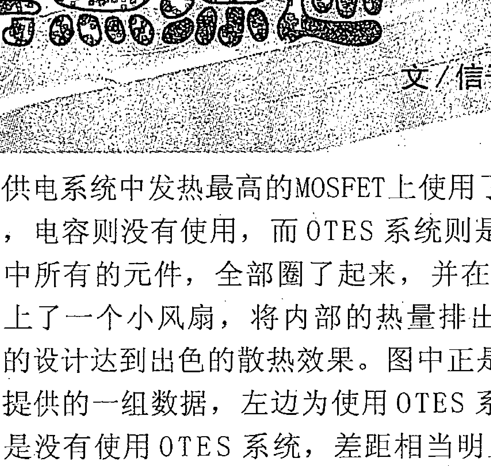

#### 2. 个性和色彩

个性和色彩充斥了现代人生活的方方面面，也许生活中任何我们可以想象得到的个性点缀或者色彩应用在现代人看来都不足以算作大胆。但是当这种对色彩的想象超出了原有的范围，延伸到半导体制造工业，当风格刻板的制造工业被赋予了色彩多变的文化内涵，就不可避免地引起了新一轮的心理和视觉震撼。

以往在我们选购主板时，面对形形色色不同品牌的主板，我们对主板上元件的色调印象最深的也许就是白色的PCI插槽和黑色的内存插槽了，恐怕很难会有人把它们同自然界五彩斑斓的色彩联系起来，但是，目前主板厂商的确做到了：主板的色调再也不是以前的单色调，取而代之是五颜六色，万紫千红的元件，色彩驱于多样化。

前不久DFI推出的“LAN PARTY”系列主板更是在主板各插槽中加入了荧光元素，使得在紫外光的照射下会发出绚丽的荧光，相当吸引眼球。并且连随主板附送的彩色圆形数据线里也含有荧光材料。DFI 称“LAN PARTY”系列主板这一特色为“UV Sensitive”技术，在搭配透明机箱和紫外光风扇时，发散荧光的“LAN PARTY”系列主板会非常漂亮。可以说，DFI 的“UV Sensitive”技术把主板的颜色文化发挥到了极致。

#### 3. 接口

随着用户数码设备的不断增加，用户的数码设备与电脑之间的数据交换也日益频繁，相应的也使得主板所附带的 IO 接口在悄无声息的发生着改变：
一些主板逐步取消了不是很常用的游戏手柄接口，打印机接口，甚至是普通键盘及鼠标把使用的 PS2 口，取而代之的是越来越多的数码接口：USB、IEEE1394、SPDIF 输入输出以及网卡接口。图 2 图 3 分别是两块不同主板的后部 IO 接口图，细心的读者可以认真看一下其中区别。

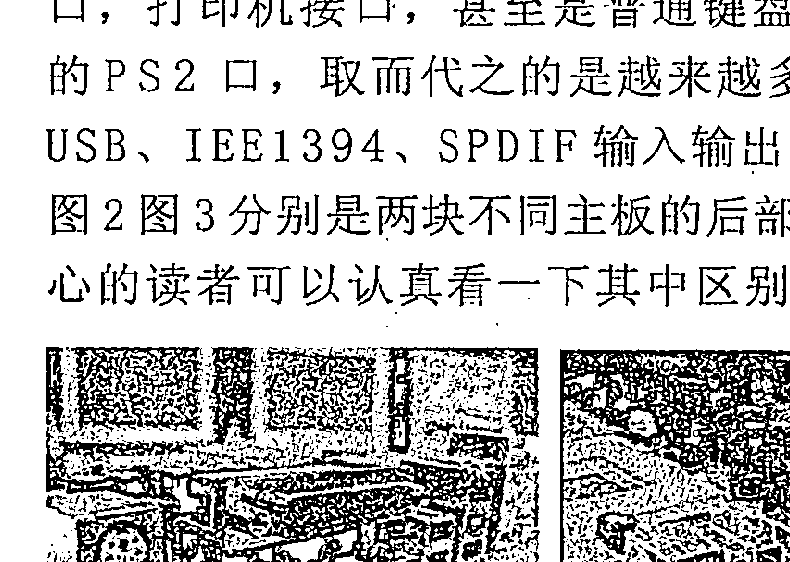

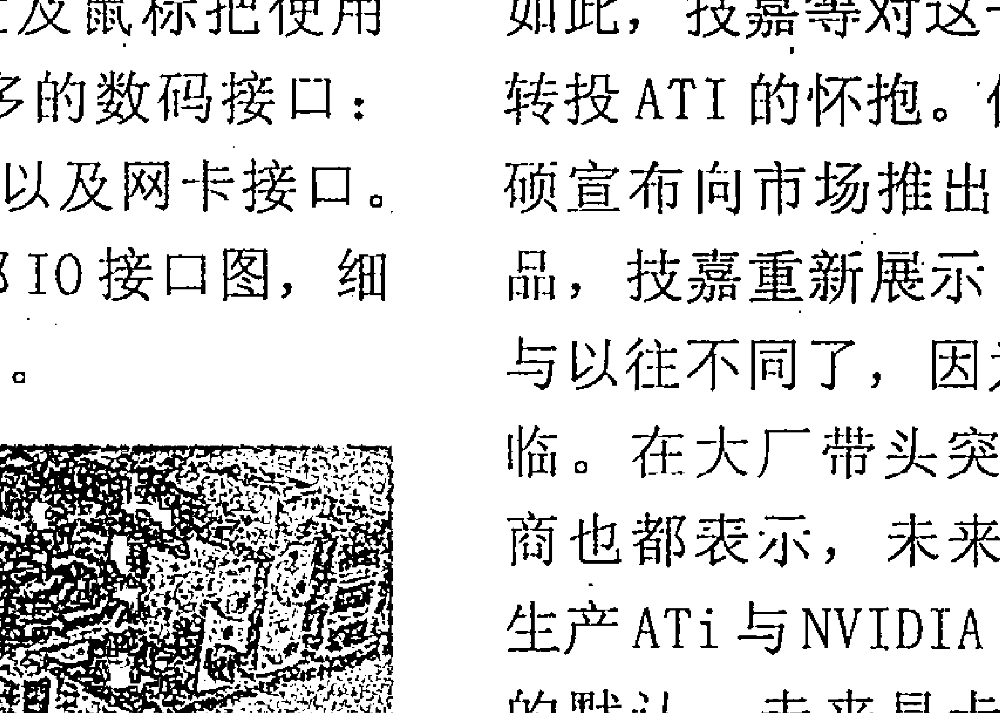

#### 4. 产品线更全面

生产厂商在使自己的产品线更为齐全，努力使其产品层次多元化，或者单一品牌全面涉足高中低档产品，如近段时间的精英（ECS）针对高端市场推出的采用 865PE 芯片组的 PF1；或者推出二线品牌，主攻中低端，如华硕（ASUS）的第二品牌华擎（ASROCK）。

### 二、显卡领域

#### 1. 板卡的制造工艺日益复杂

8 层及 12 层板的应用，以及核心晶体管数量的不断增加都给显卡制造带来不少的难度，而且像 NVIDIA 公司的 GeForce FX 5800 鼓风机式的散热设备更是要占用一个 PCI 插槽的空间，并且类似的现象还有愈演愈烈之势。另外 Voodoo 时代开辟的显卡外接电源式的设计先河在如今的显卡设计中得到了全面继承。

#### 2. 现今的显卡越来越倾向于选择全接口式的设计

计，为以后不同设备的输出留下空间。
随着液晶显示器的普及和视频输入输出技术的应用，目前所销售的显示卡多配备了 DVI（数字显示接口）、D-SUB（模拟显示接口）及 S-Video 接口。并且目前众多的显示芯片厂商均实现了对多显示应用的技术支持，因此通过显卡的不同接口实现双屏甚至是三屏输出也已成为现实，为我们体验多屏显示所带来的非凡体验提供了可能。

#### 3. 板卡生产厂商的阵营在渐渐模糊

在 nVidia 的 TNT 到 Geforce4 时代，nVidia 以非常严格的政策对待它的显卡厂商，有如 Intel 便用的铁腕政策。据称，如果对 ATI 表示友好，那么就不能继续保持和 nVidia 的合作关系。正因为如此，技嘉等对这一铁腕政策不满的显卡厂商相继转投 ATI 的怀抱。但是这一切随着台湾艾尔莎及华硕宣布向市场推出基于 ATI 显示芯片的图形卡产品，技嘉重新展示 Nvidia 图形芯片产品，都变得与以往不同了，因为图形卡芯片多元化时代已经来临。在大厂带头突围之下，多家专业绘图卡制造商也都表示，未来将在考虑产品线区域下，同时生产 ATi 与 NVIDIA 的产品。看来随着 Nvidia 和 ATi 的默认，未来显卡厂商将会有更多的选择，估计一些大厂都将双线甚至多线（再加上 XGI 及 S3，前段时间台湾的 Computex 大展中 XGI 展出了她们超炫的 Volari 系列显卡，已经有多家厂商表示有意推出自有品牌的 XGI 显卡）作战。2000 初 Nvidia 和 ATI 制定的严格伙伴政策的瓦解一方面是竞争所致，一方面也是利益使然。当然，对于厂商而言虽然可以丰富产品线，但是也不排除同一品牌产品自相残杀的局面，但是对于终端用户而言，应该是有利的，更多的竞争，更多的选择最终将使我们从中受益。

### 三、内存领域

#### 1. 内存颗粒封装形式的变化

内存封装技术起着保护内存芯片，防止芯片电路被空气中的不良物质侵蚀的作用，因此封装技术的优劣直接决定了内存工作的稳定性及整条内存的性能。并且随着内存频率的不断提升，更加合理完善的内存封装技术就显示尤为重要了。从最早的 DIP 填充装技术，再到后来的 SOJ、TSOP、BGA，以至今天的 CSP 封装技术，内存芯片的封装形式大致经历了这五个阶段，表 1。

| DIP (Dual-In-Line Package)双列直插封装 | SOJ(Small Outline J-Lead)J型引脚小外形封装 | TSOP(Thin Small Outline Package)薄型小尺寸封装 | BGA(Ball Grid Array Package)球栅阵列封装 | CSP(Chip Size Package)芯片级封装 |
|----------------------------------------|------------------------------------------|----------------------------------------------|----------------------------------------|----------------------------------|
| 引脚从两侧引出，引脚尺寸大、间隔远，只能通过PCB板穿孔安装 | 引脚排布于芯片两边，管脚尺寸相对较小，排列紧密，可直接焊嵌于PCB板表面 | 引脚可以在芯片四周引出，封装厚度极薄，稳定性好，可满足超过200MHz的高频使用 | 引脚由芯片底部引出，为球状触点形，电气性能良好，信号传输延迟极小，极限工作频率较高 | 芯片通过无数极小锡球直接焊接在PCB板上，信号传输距离极小(0.2毫米)，芯片功耗极低，信号衰减小，电路冗余度低，拥有极强的抗干扰及抗噪性，适应超高工作频率 |
| 20个左右引脚 | 40引脚 | 304引脚 | 600引脚 | 1000左右引脚 |
| FPM内存 | FPM 及 EDO 内存 | SDRAM及DDR内存 | SDRAM及DDR内存 | DDR内存 |

#### 2. 内存芯片同样也被赋予了色彩

2003年2月，KingMAX（胜创）公司在北京发布了公司的最新产品（图4）：炫彩内存，并对外宣布：从此终结内存芯片的黑白时代。炫彩内存的颜色共分为 5 种主打色彩，分别是：红、蓝、青、绿、紫。全新的炫彩内存除了可以充分炫出你的个性外，而且可以有效地防止假货的侵扰。


#### 3. 内存架构已经全面转向DDR标准

在最初的内存规范方面，Intel 公司不顾市场需求而选择了 Rambus 内存，AMD 公司则联合了包括 VIA 在内的厂商开发和推广 DDR 内存规范，这个规范后来被联合电子设备工程委员会（Joint Electron Device Engineering Council，简称 JEDEC）接纳并且修订成为了统一的规范，为这种技术的发展铺平了道路，JEDEC 也是从那个时候奠定了在业界权威的地位。这种内存规范得到了包括 VIA、AMD 和 Ali 在内的处理器、芯片组厂商的支持，并且得到了 Samsung、Toshiba、NEC、Hyundai（Hynx）、Micron 等内存厂商的支持。

生产体系，制造成本比 SDRAM 略高一些，制造普通 SDRAM 的设备只需稍作改进就能进行 DDR 内存的生产，而且它也没有授权费用的问题。这些都是 Rambus 不能为内存厂商广泛支持的主要原因。最终在这场有关内存规范的世纪争夺中，以 AMD 为首的厂商取得了完胜，Intel 公司不得不放弃价格高货少的 Rambus 内存，也转投 DDR 规范的怀抱。这样，全新的 DDR 规范就逐步取代了 SDRAM 内存，成为目前的主流内存架构。

### 四、未来板卡生产设计技术展望

#### 1. 主板架构的全面变革

每年 Intel 的开发者论坛（IDF）总能带给我们一些惊喜，让我们从中看到未来技术和市场的发展方向，今年同样也不例外。在 2003 年春季和秋季的 Intel 开发者论坛上，Intel 都在向世人预示着，未来 PC 机的主板架构将发生重大变化。Intel 公司向外展示了全新的“Big Water”（后称之为 BTX）的主板架构，用于取代目前 ATX 架构的主板标准。BTX 将作为目前 ATX 标准的接替者，其设计规范将全面适用于未来的主板、机箱和电源，其设计目的则是使整个系统的布局更加合理，并将明显提高系统的散热效率（图 5）。BTX 新架构的特点如下：

- 支持 Low-profile，也即窄板设计，系统结构将更加紧凑；
- 针对散热和气流的运动，对主板的线路布局进行了优化设计；
- 主板的安装将更加简便，机械性能也将经过最优化设计。

和 ATX 架构相比，BTX 架构对整个系统布局作了较大调整，见表 2 。

| 项目         | ATX架构                          | BTX架构                          |
|--------------|----------------------------------|----------------------------------|
| CPU位置      | 位于主板右上侧，靠近电源抽风口   | 位于主板左下侧，靠近机箱前面板，便于散热风扇可以直接从前面板的风口吸入外界冷空气使处理器降温 |
| 芯片组排列   | 纵向排列                         | 横向排列（“处理器-北桥-南桥”一线排列，便于插卡设备、硬盘及光驱等设备安装） |
| 内存排列     | 位于主板右下角，与PCI插槽垂直排列 | 平行于PCI插槽，移至主板左端       |
| 扩展槽位置   | 位于主板左上角                   | 位于主板右上角                   |

#### 2. 显示卡将逐步适用新的图形接口

传统的AGP总线标准从最初的1.0到2.0，直
到目前的3.0标准，最大所能提供的带宽也仅有2.1GB/sec，但这相对于显卡同系统内存之间的数据交换量仍是显示子系统的最大瓶颈。在Intel秋季开发者论坛（IDF 2003）上，我们注意到，包括NVIDIA、ATI、3D Labs等厂商都在研发基于PCI Express（由Intel设计的第三代输入输出总线技术，允许接驳IEEE 1394，InfiniBand，Gigabit Ethernet和下一代的图形处理器）界面的图形产品，以取代AGP界面。ATI甚至在本次论坛上已经展示出了采用PCI Express ×16接口的显卡，虽然ATI并未公开这款显卡采用何种显示芯片，但从整块显卡的板型来看已经完全成熟，相信只要未来取得主板的支持，便可迅速向市场推出采用各个显示芯片的PCI Express ×16接口的显卡。未来显卡接口全面向PCI Express过渡已经成为定局，很明显PCI Express ×16所提供的高带宽更符合显卡的发展要求。

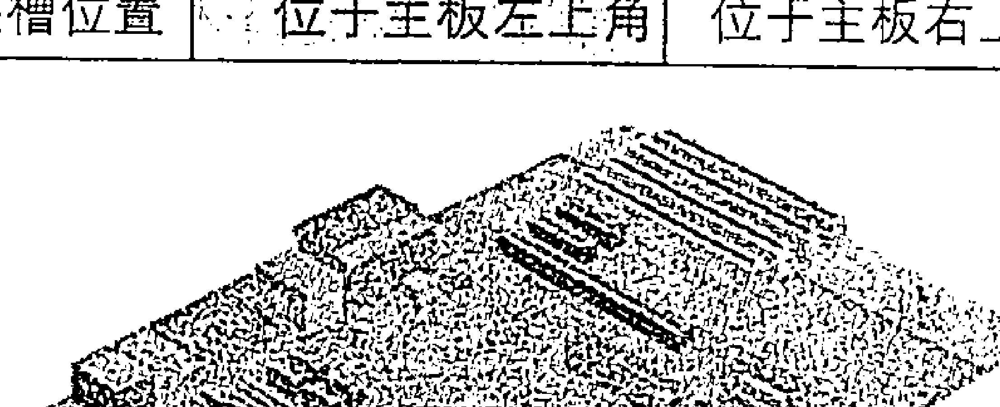

BTX 架构将主要分为三种不同规范，见表3。

| 规范         | 标准BTX                          | MicroBTX                         | PicoBTX                          |
|--------------|----------------------------------|----------------------------------|----------------------------------|
| 扩展槽数量   | PCI Express ×16槽:1个/ <br>PCI Express ×1槽:2个/ <br>32位PCI槽:4个 | PCI Express ×16槽:1个 <br>PCI Express ×1槽:2个/ <br>32位PCI槽:1个 | PCI Express ×16槽:1个 |
| 主板尺寸     | 12.8×10.5英寸                    | 10.4×10.5英寸                    | 8×10.5英寸                       |
| 图例         | BTX BOARD示意图                  | microBTX示意图                   | picoBTX示意图                    |

在未来 BTX 架构的主板上，传统的串口、并口以及PS/2口都将被高速的USB2.0及IEEE1394等接口所取代，并且将更多集成网卡接口、音频接口及光纤输入输出等接口，甚至是基于蓝牙及IEEE 802.11技术的无线网络接口。同样我们也可以看到用以取代AGP扩展槽的PCI Express ×16槽，以及用于逐步替代普通PCI插槽的PCI Express ×1槽。一切都在表明，一场主板架构的变革正在逐步酝酿中，也许明年期间，我们所配置的电脑就将转移到新的 BTX 架构中。

#### 3. 内存架构将逐步完成向DDR-II的过渡

早在开发GeForce FX 5800时，NVIDIA公司就做出了一个惊人的决定：将领先业界为自己的图形芯片配备“DDR-II”显存芯片，向人们展示了显卡芯片厂商对“DDR-II”标准的美好期望。虽然最终由于种种原因，GeForce FX 5800的这一举动并未取得预期的效果，并且NVIDIA公司又为它下一代的图形芯片GeForce FX 5900重新配置了普通的DDR显存芯片，但是这丝毫没能阻止“DDR-II”标准的普及之路。正是如此，ATI在它的新一代显卡Radeon 9800 Pro中也使用了“DDR-II”显存芯片。这也充分显示了“DDR-II”芯片所具备的出色素质。终于，Intel公司也在最近公布的芯片组开发计划中，提供了对“DDR-II”标准的支持，并计划用两年时间完成从DDR向“DDR-II”标准的过渡。目前Intel公司已经得到了来自Infineon（英飞凌）、Elpida、Hynix（现代）、Samsung（三星）和Micron（美光）等所有内存大厂的支持，并且大多数内存厂商均表示将在明年上半年量产“DDR-II”芯片。如果说NVIDIA公司还只是试探性的举动的话，那么凭借着Intel公司在业界的号召力，“DDR-II”标准的普及之势已经如离弦之箭，一发而不可收了。

## 数字电视机顶盒的今天与明天

1953年，美国制定了NTSC模拟彩色电视标准，从此人类进入了彩色电视时代。上个世纪80年代之后，模拟彩色电视先后实现了遥控彩电功能化，画中画与数字立体声伴音，以及模拟电视数字化处理。这些技术的出现，最大程度地提高了模拟彩色电视的图像和伴音质量，消除了普通彩电的行间闪烁和大面积闪烁，使得电视画面更加稳定；用户也能够方便地进行自动调台，图像及伴音模拟量控制，多种模式的切换等操作。到了90年代中期，模拟彩色电视已经发展到了顶峰。

音频信号从制作到传输、接收都是数字信号，而后者传输时候是模拟信号，只是在电视机里面进行了一下数字化处理（采样→量化→处理→存储→数模变换，由于数字信号能够再生，因此数字电视在抗干扰方面远远优于模拟电视；数字信号易处理、易存储，加密性能好。但是全数字电视原始码率很高，达到200多Mbps，因此把如此高的码率压缩到2一15Mbps就是数字电视技术的关键。这就需要对数字信号进行编码压缩。

### 一、模拟信号的缺陷

然而，由于模拟信号固有的缺点，模拟彩色电视始终无法克服一些传输和处理上的缺陷。

模拟信号在传输过程中所叠加的噪声会逐渐积累，和模拟信号成为一体，由于模拟信号不能再生，使得这些累积的噪声很难消除，这样在电视接收机里面，信号始终伴随着噪声。尽管现在已经有了数字化彩色电视机，即把接收到的模拟信号数字化之后进行处理再变成图像和伴音，但它也很难去掉模拟信号中的噪声，同时还会因为数字量化而引入新的量化噪声。这样经过多次传输之后，电视图像质量就会明显下降。

模拟信号要求较宽的带宽。现有模拟电视，采用地面无线传输和有线传输时带宽为6MHz（NTSC）或8MHz（PAL），采用卫星传输时带宽达到27～36MHz；而高清晰度电视则达到了54MHz，从而使得频带利用率大大下降。

模拟信号不易存储，也很难完成各种图像特技功能。

目前世界上数字电视标准主要有三种：美国的ATSC标准，欧洲的DVB(Digital Video Broadcasting)标准，以及日本的ISDB标准，此外我国的清华大学和上海交通大学也提出了各自的数字电视标准方案。这三种标准都采用了MPEG-2作为数据压缩编码方式，但三者在纠错码的采用上有所不同，这里主要介绍欧洲的DVB标准。根据传输信道的不同，DVB又分成了三个标准：DVB-C，适合于有线电视信道；DVB-S，适合于卫星信道；DVB-T，适合于地面无线信道。这三种方式的区别在于纠错码和调制方式上。

国家广电总局在2001年确定了我国有线和卫星数字视频广播均使用欧洲的DVB标准，及DVB-C和DVB-S，而地面数字视频广播标准则还没有最终确定。按照国家广播电影电视总局的总体规划，2005年，全国1/4的电视台将发射和传输数字电视信号；2008年，数字高清晰度电视节目将在国内主要城市播出；2010年，全国实现数字电视广播；2015年，停止模拟电视广播。而目前我国家庭里面几乎都使用的是模拟彩色电视机，不能直接接收数字电视节目，而从模拟电视完全过渡到数字电视还需要一个过程，因此数字电视机顶盒就是这个过渡时期最理想的数字化视频产品。

### 二、数字电视与数字化电视

正是由于模拟电视无法克服以上问题，人们才把目光投向了数字电视。数字电视和数字化电视不同，前者是指视频和

### 三、机顶盒的结构

机顶盒其实就是一个数字信号解调解码设备，接收到的已调数字信号输入到调谐器（tuner），在那里经过解调之后变成数字信号，然后进行解码、数模变换、放大变成模拟的视频和音频信号输入到电视机，这样电视机就能够收看节目了。根据数字电视节目的加密情况，数字电视可以分为条件接收（CA: Condition Access），即传输加密节目和自由接收（FTA: Free To Air），传输非加密节目。前者需要用户购买解密卡插在机顶盒对应的插槽里面，后者则不需要。因此机顶盒也可以分为CA和FTA两种。除了收看电视节目，机顶盒还可以用来进行一些数据交换和数据通信，用户可以收看图文电视，进行视频点播，收看互动电视，今后甚至还可以通过它访问网络。

打开一个机顶盒，我们会看见一块主板以及一些接口，还有面板以及电源。通常所有的器件都会焊接在一块主板上。一块主板通常由以下几个部分组成：调谐器（tuner）、中央控制器（CPU）、存储器、音频视频放大器、加密卡插槽、电源以及各种输出端子等。下面依次介绍各个部分的作用和功能。

## 1. 调谐器

已调数字电视信号首先进入调谐器，进行解调操作。以DVB-S为例，调谐器接收从卫星天线高频头送来的L波段中频信号（950－2150MHz），对其进行变频，其中频率为479.5MHz，经放大后解调出I、Q信号。随后送入QPSK解调器和前向纠错单元，在那里先进行模数变换（ADC），再进行QPSK解调以及前向纠错(FEC)，包括Viterbi解码、RS解码、解扰、解交织等，输出既可以采用8位并行接口，也可以采用串行数据接口。目前常用的调谐器都包含了变频、解调、解码几个部分，常用的调谐器有日本夏普（SHARP）、韩国三星（SAMSUNG）以及法国汤姆森(THOMSON)公司的产品。

## 2. 中央处理器 (CPU)

CPU是整个机顶盒的核心部件，它负责对数字电视信号进行MPEG-2解压缩，进行PAL/NTSC/SECAM数字编码，并对调谐器、存储器、RS232接口进行控制。目前最常用的CPU是法国ST公司生产的STi5518系列，它是32位微处理器，最高频率81MHz，共有208个引脚，采用PQFP封装方式。STi5518共有6个8位可编程并行接口，含有一个视频解码器和MPEG音频解码器，还有一个锁相环（PLL）。视频解码器是一个实时解压缩处理器，它支持MPEG-1，也支持码率为720×480×60Hz（NTSC）或720×576×50Hz（PAL）标准。音频解码器取样频率可以采用32kHz、44.1kHz和48kHz，并能处理5.1杜比立体声（5.1 channel Dolby Digital）和进行MP3解码。因此，该芯片除了用于机顶盒之外，也可用于DVD、VCD、SVCD解码和处理。该芯片还能支持硬盘和MODEM，可以用来存储数字电视节目以及访问网络。

## 3. 存储器

通常主板上有两块存储器，一块是随机存储器，例如SDRAM、DRAM或者SRAM等；一块是只读存储器，如ROM、FLASH等。其中随机存储器主要用来存储解压缩过程中产生的数据，只读存储器则存储解码和控制所必须的软件程序，包括频道信息、卫星信息（DVB-S）、界面图像等等。通常只读存储器里面的软件是可以更新的，通过主板上的RS232接口和计算机相连，更新程序就可以写入只读存储器。

## 4. 音频视频处理部分

该部分通常由数模转换器（DAC）、集成运算放大器、混频器以及一系列相关电路组成。STi5518音频输出是PCM编码信号，视频输出则是模拟信号，共有三组：CV输出、YCbCr输出以及RGB输出，生产商可以根据不同用途进行配置。输出的视频信号经过放大之后和模拟音频信号一起通过输出端子输出。

## 5. 信号输出端子

生产商通常会根据用户和商家的需求，来对信号输出端子进行配置。常见的输出端子有AV端子、SCART输出端子以及调制器输出端子。其中调制器专门用于没有AV端子的电视机，它将视频信号和音频信号先进行调制，形成全电视信号，然后输入到电视机。但这种方式会使图像和伴音质量下降。

## 6. 其他组成部分

机顶盒电源向主板各个器件提供30V、5V、3.3V、23V、12V、5V不等的直流电，晶体振荡器输出27MHz的时钟，作为所有时钟的来源。

目前在市场上用户只能买到DVB-C和DVB-T的机顶盒。目前常见的机顶盒品牌有同洲、航科、STARSAT、BEAUSAT等，国内的一些电视机生产厂家也通过OEM方式生产机顶盒。今后3－5年内，随着模拟电视节目将逐步减少，数字电视节目的逐步增多，以及数字电视节目图像更清晰、节目更精彩，并向多样化、个性化、专业化发展，机顶盒将得到广大用户的认可和接受，最终用户可望达到普通有线电视用户的50%，人们将真正迎来数字电视时代。

## PDF电子书打造全面指南

文/王军

### 文章重点与技巧目录

-   ◎ PDF 文档的特性
-   ◎ 使用 Adobe Acrobat 5.0
-   ◎ 在 Word 中制作 PDF
-   ◎ 将网页转换成 PDF
-   ◎ 使用 Adobe Acrobat 5.0 编辑 PDF
-   ◎ 使用 PDF Factory pro 生成 PDF
-   ◎ 将 PDF 转换成 HTM、TXT 或图像文件

### 一、什么是PDF

PDF(PortableDocumentFormat)是便携文档格式的简称，同时也是该格式的扩展名。它是由Adobe公司所开发的独特的跨平台文件格式。

#### (一) PDF 卓越的跨平台特性

可以说跨平台是PDF文件最重要的特性之一。这种跨平台的特性可以不依赖于任何的软件、硬件而独立浏览。你大可以在Windows 98中创建PDF文档，把它传输给你朋友的Macintosh主机，然后朋友可以在他的UNIX工作站上阅读它，朋友看到的和你最初创作的完全一样，尽管你是中文系统而朋友是英文系统。仔细想想看，而你见过其他的文本有这么强大吗——对Word的DOC文档就不要有这种奢望了！

#### (二) 可以导航阅读

对于最流行的HTML文本来说，图像、超文本链接、书签和导航阅读是其流行的根本。现在PDF也拥有了这些特性！PDF的特性同时还包含：内部和外部的连接、书签、每页标签、文章多线程、域。和HTML一样，PDF也是多姿多彩的网络文件。你可以通过浏览器在互联网上浏览文本，并可以打印和及时保存（这比HTML还要方便，PDF就一个文件，而HTML却分为文本和众多使人迷惑不清关系的图片）。同时PDF还拥有更快的传送速度，它的体积只有同类HTML的1/5左右。你可以一边下载一边观看，不需要全部下载完毕后再一页一页的浏览。这将使网上在线帮助服务系统可以更方便的实现。

#### (三) 其它文本格式无法比拟的特性

作为现在最流行的网络出版的标准格式，PDF有着其它文本格式无法比拟的特性。PDF文件以PostScript为基础的图形特性，可以方便地在几乎所有的支持PPD的打印机上，快速的、精致的打印出来。而且它在任何的显示分辨率下，允许用户放大文档直到800%来观看文本，文本或图像的效果上也不会有明显的失真。最为重要的是，它有着与众不同的强大的安全保护措施。PDF的文件能防止文本、图像等信息被复制。在开发者创建他们的PDF文件时，可以创建对文本的读、写、修改权限。没有许可或授权的情况下，得到文本的人是不能从PDF文件中拷贝出文本、图像等资料的。这就有力的抑制了网络上的肆虐的文本盗版行为，极大限度的保护了原创作者的利益！

### 二、Adobe Acrobat 5.0制作电子图书

Adobe Acrobat 5.0是Adobe公司推出的PDF电子图书制作软件，其功能十分强大，可以轻松、高速、专业的制作出PDF电子图书。因此，它是PDF电子图书的首选软件。不过，由于这个软件是商用软件，因此其价格也是不菲的。这里，我们将以Adobe Acrobat 5.0为例，介绍一下如何制作电子图书。

#### (一) 软件的安装

Adobe Acrobat 5.0的安装程序包约100MB，软件的安装与其它软件安装大致相同，这里就不多

#### （二）软件在安装过程中做出一些系统修改

软件在安装完成之后，将在操作系统的控制面板中，生成一个叫做 Acrobat Distiller 的虚拟打印机（如图 1）。因为 Acrobat 使用了一个叫做 Acrobat Distiller 的模拟打印机来创建 Adobe PDF 文件。

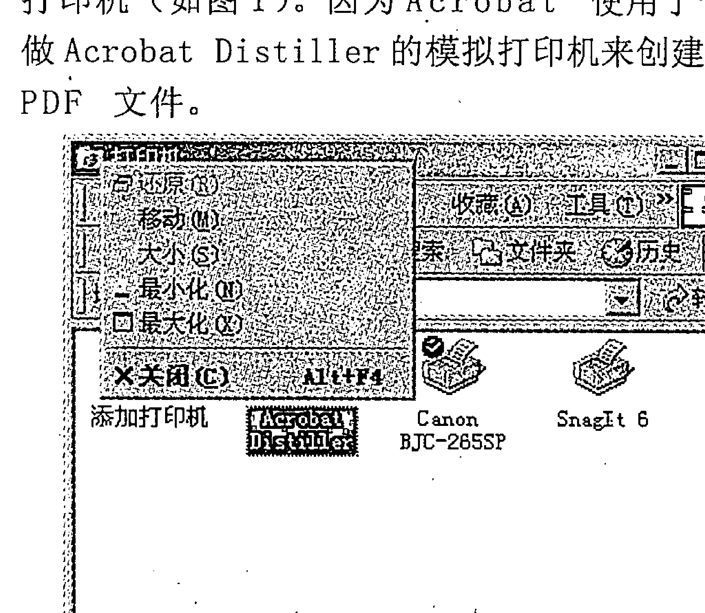

当你进行 Acrobat 典型安装时，便已经自动安装和配置了创建Acrobat Distiller 打印机所需的全部组件，这时你便可以在其它应用程序（譬如 OFFICE2000）中，轻松地创建 Adobe PDF 文件。

#### （三）PDF 文件的创建

安装 Adobe Acrobat 5.0 之后，我们可以通过多种渠道来创建PDF 文件，譬如微软的Office 办公软件、Internet Explorer 和其它支持打印的Windows 软件，均可以通过Acrobat Distiller 将自己处理的格式转换是标准的PDF 文件，且其转换的过程非常方便和快捷。这里，笔者仅以Word 和 Internet Explorer 为例，介绍一下如何将Word文档、HTML 网页转换成PDF 文件。

##### 1. 在Office办公软件中进行PDF文件转换

当我们安装Adobe Acrobat 5.0之后，Office 2000 的每个办公组中，都新增了两个工具按钮（如图 2 ）。

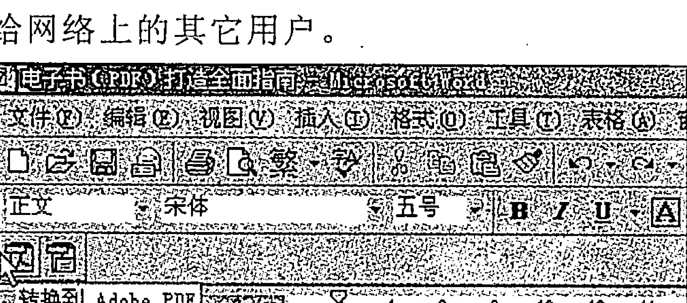

这两个按钮均可以将Word 文档快速、直接的转换成PDF 格式的文件。这里有两个按钮，第 2 个按钮与第 1 个按钮从功能上略有不同。第 2 个按钮，不仅可以将Word 文档转换成PDF 文档，而且还能在完成文件转换之后，将文件通过E-mail 发送给网络上的其它用户。

单击“转换到 Adobe PDF”按钮之后，会弹出一个提示对话窗口（如图 3），这个对话窗口将告诉你必须先保存一下当前正在编辑的文件，才能进行下一步的文件转换。单击“是（Y）”按钮，继续PDF 文件的转换工作。

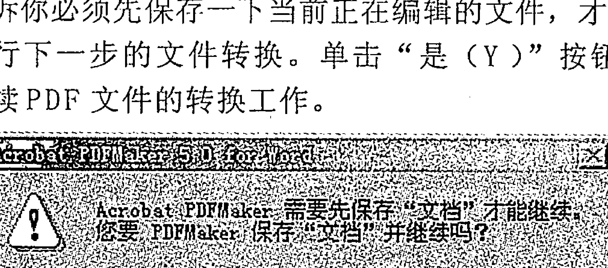

之后，Acrobat PDF maker 5.0 for Word将要求你输入一个转换之后的文件名和文件保存路径。我们这里就以当前Word 文档的文件名来命名，而文件扩展名则设置为PDF。单击“保存”按钮，Acrobat PDF maker 5.0 for Word 便开始对当前Word 文档进行转换，其间无须人工干预。转换过程结束后，一个PDF 格式的文件便创建成功了。

##### 2. 在Internet Explorer浏览器中将网页转换成PDF

首先，在 Internet Explorer 浏览器中打开一幅欲转换为PDF 文件的网页。之后，单击菜单栏上“文件”/“打印”命令。在弹出的“打印”对话框中，我们在“名称”栏中将打印机定义为“Acrobat Distiller”（如图 4）。这个时候，单击“确定”即可开始PDF 的转换。但是，很多时候这样创建的PDF 文件内容是“乱码”文字，而这正是由于没有正确设置转换字体所造成的。

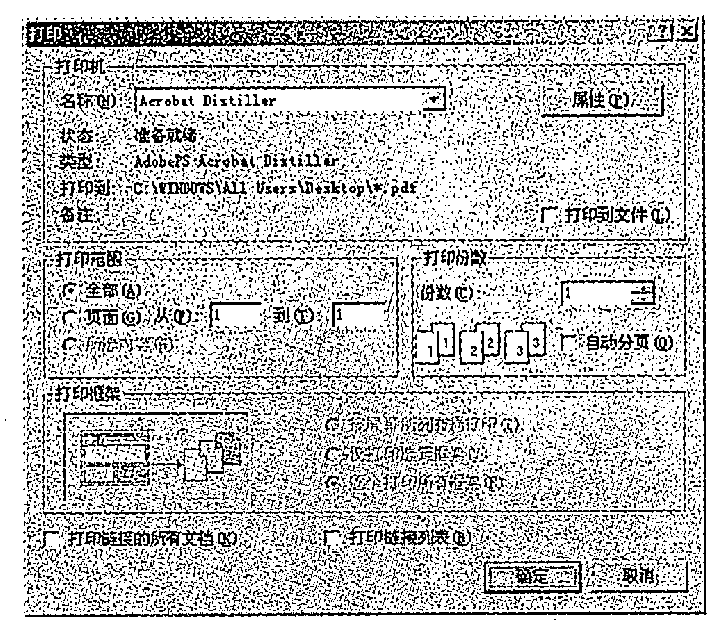

这个时候，我们需要在网页文件的转换之前，正确设置“Acrobat Distiller”属性。单击“打印”对话窗口中的“属性”按钮，进入“Acrobat Distiller”设置窗口。在这个“Acrobat Distiller”属性设置窗

图中，我们单击“Adobe PDF 设置”标签（如图5），然后再单击“编辑转换设置”按钮，以进行PDF转换作业选项的设置。

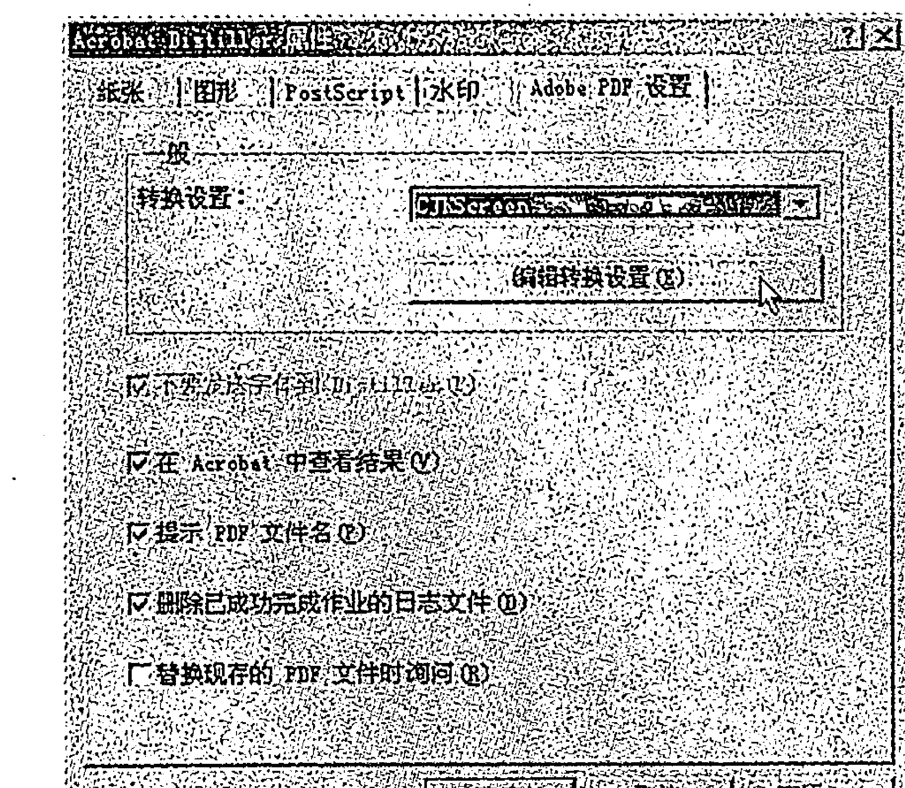

进入“Cjkscreen”作业选项设置窗口后（如图6），我们先选中“嵌入所有文体”单选项。之后，在“嵌入”下拉列表中，将字体的路径指定为“C:\Windows\Fonts”，即Windows操作系统的字体文件夹。用“Shift + 鼠标左键”将“C:\Windows\Fonts”下的所有字体全部选中，然后单击旁边的“双箭头”按钮，将选中的所有文字全部添加到“总是嵌入”框中。设置完成之后，我们单击“另存为”按钮，将刚才的修改，保存为“Cjkscreen（1）”。今后，当我们在进行网页的转换创建工作时，只要在“Acrobat Distiller属性”窗口的“转换设置”下拉列表中选择“Cjkscreen（1）”

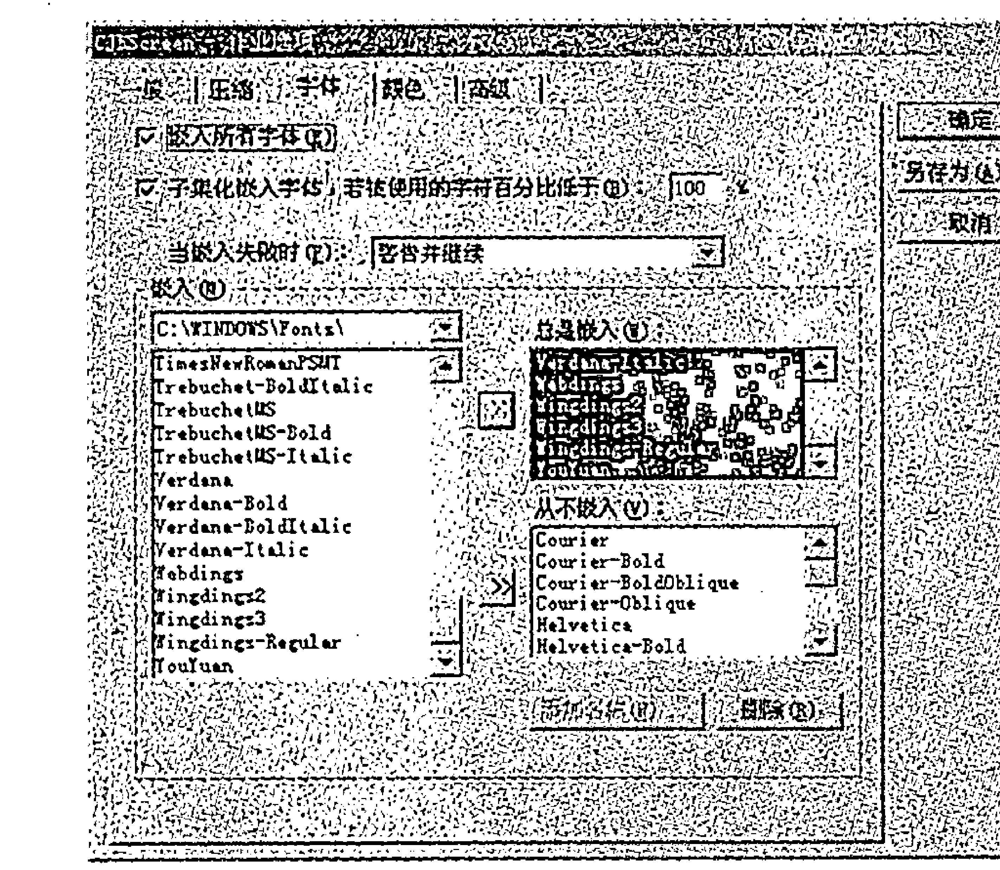

（如图7），就不会遇到网页转换时可能出现的“乱码”现象了。

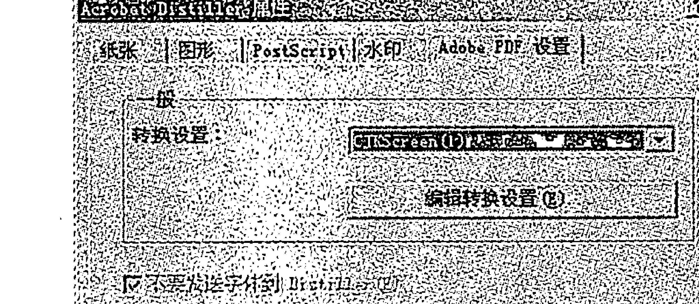

因为，在Cjkscreen（1）方案，已经定义并加载了Windows默认条件之下所能支持的全部中文字体。因此，便不会遇到“乱码”现象了。除了以上创建PDF的途径之外，我们还可以通过扫描仪、拖放图像文件到Adobe Acrobat 5.0编辑界面、捕捉网页等方式来创建PDF文件。限于篇幅，这里笔者就不一一介绍了。

#### （四）PDF文件的编辑

当我们创建好一个PDF文件之后，其中可能会有许多地方是不尽如人意的地方，只有经过合理的编排和修改才能使新创建的PDF文档符合我们的需要。

##### 1. 书签的创建

（1）书签的创建书签是一种能代表“导览窗格”中文本的链接。“导览窗格”中的每个书签代表文档中不同的视图或页面。你可以象过去常用的纸书签那样使用电子书签，在文档中标记你要返回的位置。你也可以使用书签修改目标视图，将读者的注意力引到你要的地方。书签允许你在PDF文档内部跳跃或跳到另一个文档（PDF 或非 PDF），或跳到网页。书签也可以执行动作，例如播放电影或声音、执行菜单项或提交表单。

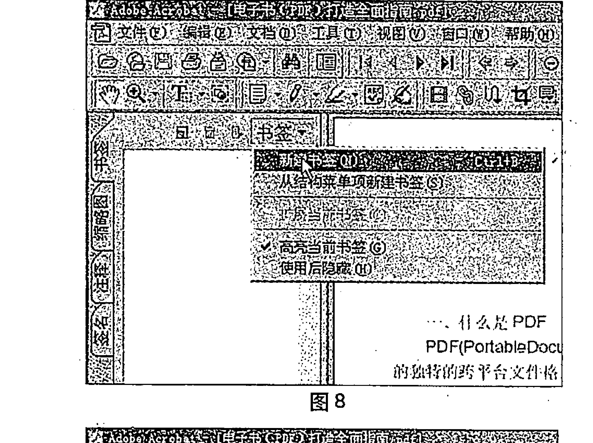

图 8

如果你的 PDF 文档的内容很多，那么建议你在文档中建立书签，因为书签不仅可以起到目录的作用，而且还能将页面快速翻到相关内容所在的页面上。

我们可以通过 “书签” 中的 “新建书签” 命令来新建一个书签（如图 8）。单击 “新建书签” 命令之后，我们需要给这个新创建的标签取个名称，譬如 “…、什么是 PDF”（如图 9）。

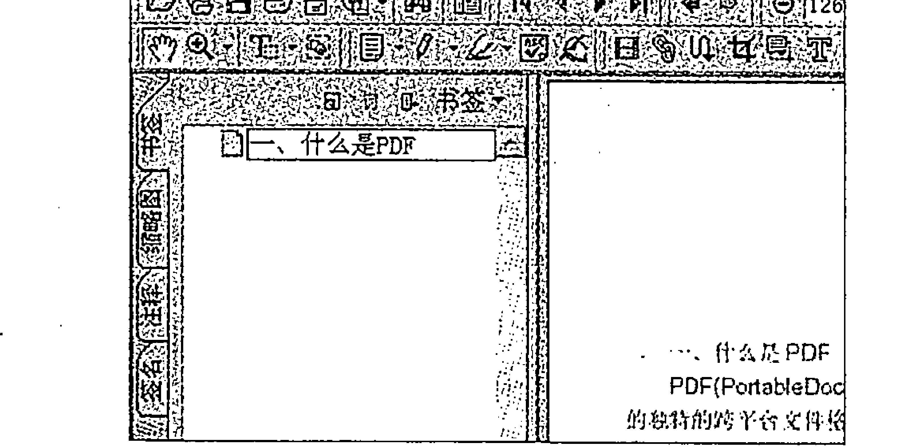

图 9

在我们创建一个书签之后，我们还可以给这个书签设定相应的动作。所谓设定动作，就是设定当我们单击标签时，所产生的动作（读文章、跳至视图、执行菜单项等）

要设定动作，可以通过对书签的 “属性” 设置来实现。单击某个书签，然后单击鼠标右键，从弹出的快捷菜单中，选择并执行 “属性” 命令即可（如图 10）。

在 “属性” 命令中，我们可以设定单击该书签时产生的各种动作（如图 11）。

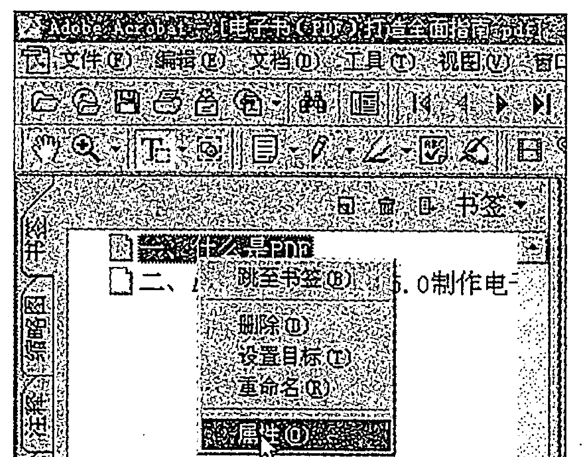

图 10

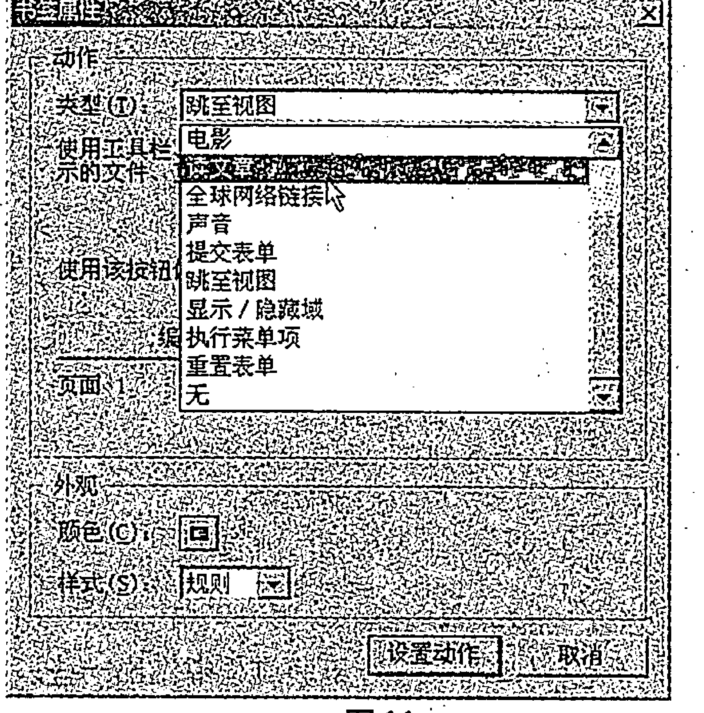

图 11

举个例子来说：一个电子文档的第一章在第 1 页，那么我们可以为其创建一个书签；这个电子文档的第二章在第 4 页，那么我们可以将页面翻到第 4 页，然后再创建一个书签。之后，我们可以单击不同的书签，来实现快速而有效的进行翻页和定位了。

另外，我们还可以通过另外一种方式来创建书签。首先，我们通过工具栏上的 “文本选择工具” 选中文章中的一个标题，然后单击鼠标右键弹出快捷菜单，然后在快捷菜单中，单击 “新建书签” 命令，便可以在将这个标题定义为标签（如图 12）。可以说，这样创建标签非常的快捷和方便，标题名称直接变成书签名称，由于避免了麻烦的书签命名输入，因此这也算是一个技巧吧。

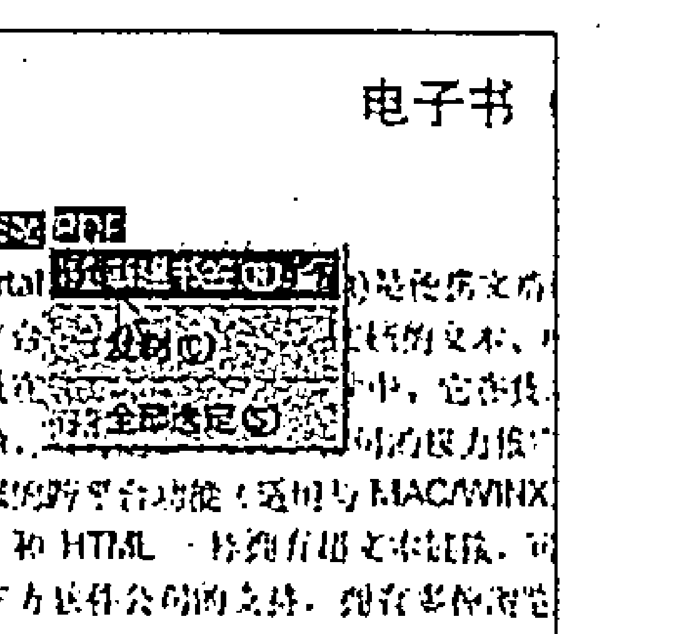

图 12

### (2) 书签的层次结构

这里再谈一下书签的组织结构形式。利用书签的组织结构形式是为了层次更加分明地利用书签来查询文档内容。在实际应用，我们可以设定不同层次的书签（一级、二级、三级），有点类似于树形目录结构的书签组织形式。

下面，我们来看一下如何建立不同层次的书签。我们知道，以常规方式建立起来的书签都是同一个层次和等级的。因此，要让书签有层次，就要讲究点方法了。

以本文的PDF文件为例，笔者一共为其创建了10个标签，准备采用三级标签层次（如图13）。

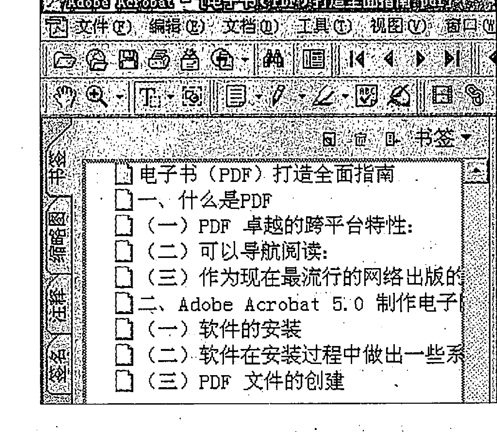

第一级是总章的总标题、第二级是文章的一级标题、第三级是文章的二级标题。

首先，我们用鼠标选中属于“一级标题”的标签，然后将其拖放至总标题所在的标签中（如图14）。

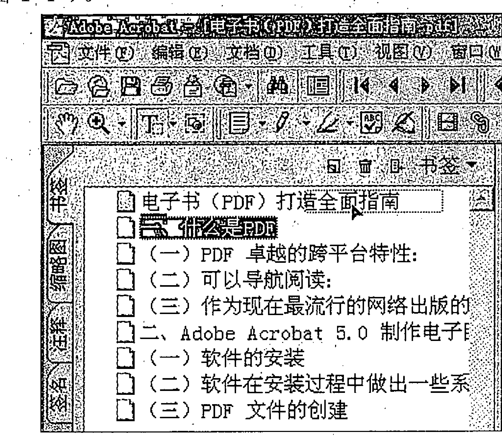

当我们把一级标题标签拖放到总标题标签的位置上之后，文章的层次结构便显示出来了。之后，我们再将属于二级标题的标签，也各自拖放到其隶属级标题标签上，便可创建出层次分明的书签结构（如图15）。这里的操作只需简单的“拖放”便可以轻松完成，非常简单和方便。

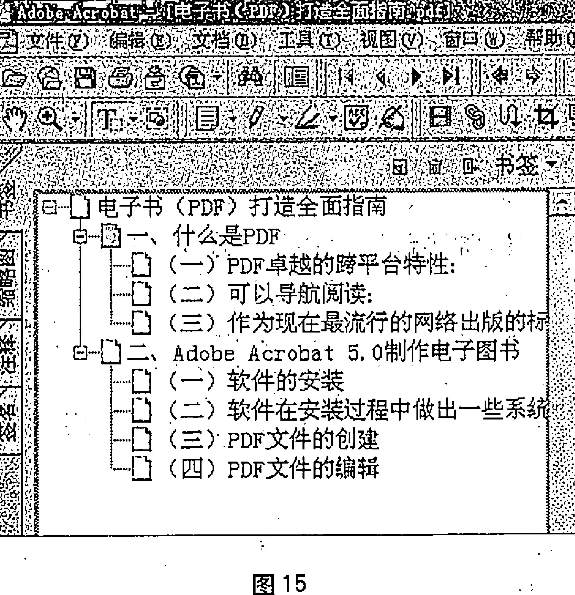

##### 2. 如何在文章中加入注释

通过Acrobat提供的注释工具，我们可以在PDF文档中加入注释。注释提供了很多方式来标记文本，以及将附注和注释附加到PDF文档。这些批注可以是文本、图形或音频格式；如果喜欢，你甚至可以附加外部文件。而且你可以从PDF文件导入和导出注释和标记。

Acrobat注释工具共有三大类：分别是注释工具、图形标记工具和文本标记工具。

-   **注释工具**：含附注工具、自由文本工具、声音附件工具、图章工具和文件附件工具，允许你使用各种格式为PDF文档附加注释。每种工具提供了一种独特的方式来传递注释信息。
-   **图形标记工具**：含铅笔工具、矩形工具、圆形工具和线条工具。这些工具允许你使用图形符号来形象地标记PDF文档的区域，并附加带有标记的附注作为更详细的注释。
-   **文本标记工具**：含高亮工具、删划线工具和下划线工具，这些工具将允许你可见地标记PDF文档页面上的文本，并附加了带有标记的文本附注作为更深入的注释。

### (1) 注释工具

你可以将注释放置在文档框架的任何地方，并且你可以修改注释的样式和格式，来与文档的格式和类型搭配。较长的备注可以放到附注中、录制为音频文件、或嵌入为可以打开的文件。摘要注释可以通过应用图章注释、标记文本或使用一种图形标记工具来表示。你在注释上移动时，与其相关的文本附注显示在半透明的框中。这意味着你可以读取该附注，但注释实际上并未打开。你必须打开注释，方可编辑文本附注。

#### 1）附注工具

通过附注工具，我们可以在PDF文档的任何页面上创建附注，并且可以将附注放在页面上的任何位置。如果你输入的文本超过了窗口，文本会滚动。当然，我们也可以按喜好来重新调整窗口大小。

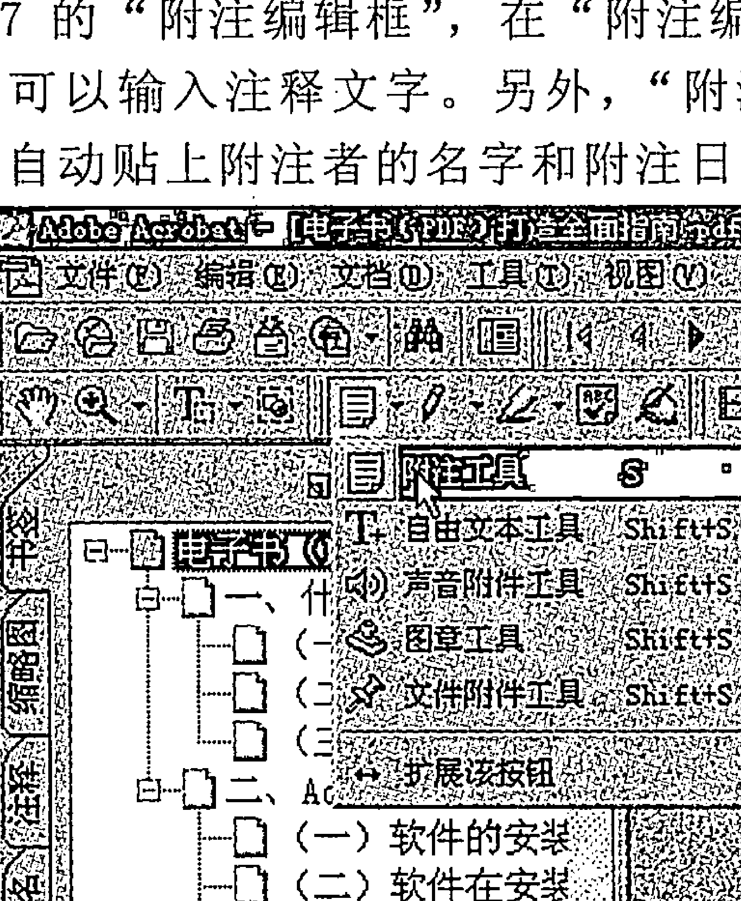

如图16所示，我们在注释工具组中单击“附注工具”，然后在页面的相应位置单击，便会出现如图17的“附注编辑框”，在“附注编辑框”中，我们可以输入注释文字。另外，“附注编辑框”还会自动贴上附注者的名字和附注日期。

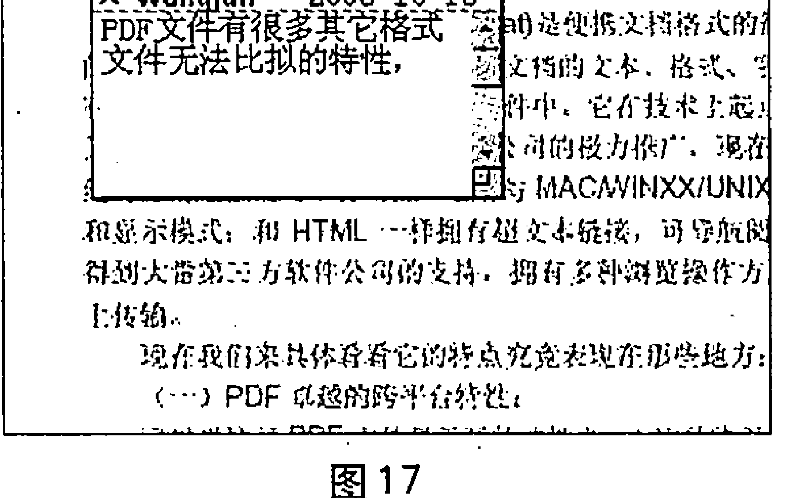

单击“附注编辑框”上的“×”标记，“附注编辑框”将变成最小化状态。当我们要查看“附注”时，双击附注图标即可。

#### 2）自由文本工具

使用自由文本工具，我们可以在页面的任何一个位置，轻松的写入注释文字（如图18）。我们可以根据注释内容的多少来调节自由文本框的大小，也可以利用工具栏上的“手形”工具来移动它。另外，通过鼠标右键快捷菜单，我们还可以设定自由文本框的外观、背景填充颜色和文本框中文字的大小、颜色和对齐方式（如图19）。

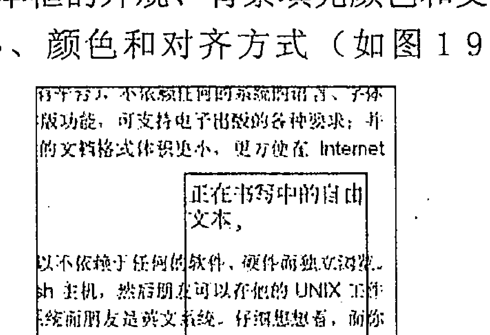

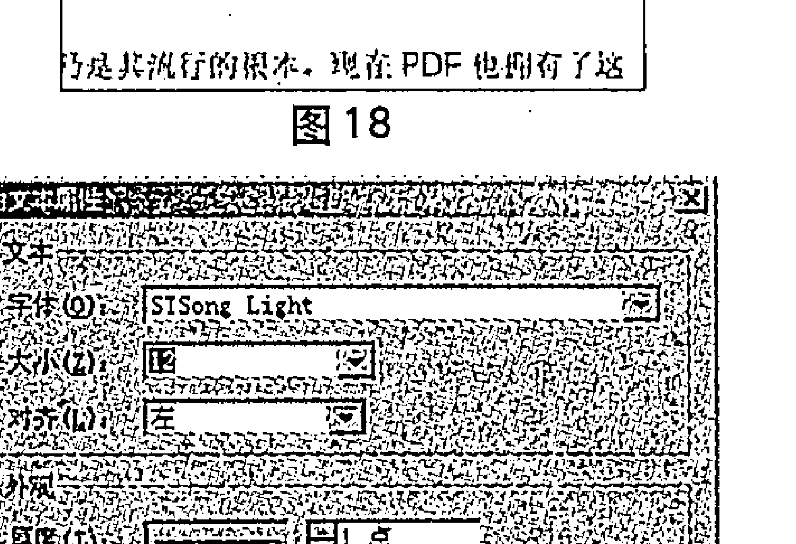

#### 3）声音附件工具

除了文字附注之外，我们还可以在PDF文档中插入声音注释，具体的做法是在注释工具中，选择并单击声音附件工具。之后，当我们将鼠标指针移动在页面的时候，鼠标指针将变成一个扬声器状的指针（如图20）。单击鼠标左键，将会弹出一个录音机（如图21），准备好MIC（话筒）之后，我们按下红色按钮开始录音。录音完成之后，我们可以单击放音按钮，试听一下。

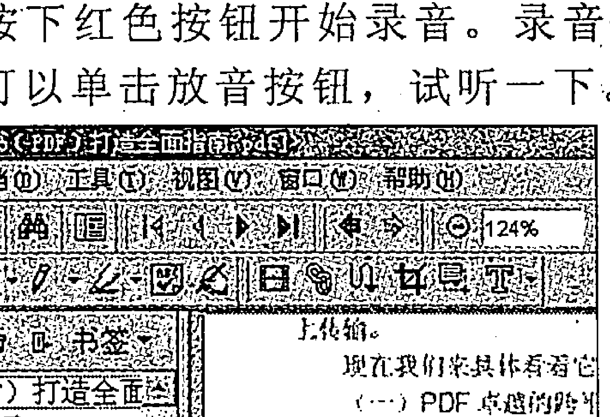# 办公专刊

## PDF电子书安全向导

如果对录制下来的声音注释感到满意，我们可以单击“确定”按钮。这个时候，将在页面的相应位置生成一个扬声器状的按钮（红色）。今后，只要我们单击这个按钮，以前录制的声音注释，便会从扬声器上重放出来。

### 4) 图章工具

通过图章工具，我们可以在PDF文档中生成一个非常醒目的图章样式注释，且当我们双击这个注释的时候，还能够看到这个图章注释中的注释内容。

首先，我们在注释工具中选择并单击“图章工具”，然后在页面的适当位置单击，便会产生一个图章。

之后，我们单击选中“图章”，并且以鼠标右键单击弹出快捷菜单，在快捷菜单中，我们可以定义图章的属性以及打开或创建注释内容（如图22）。

在图章的属性设置中，我们可以定义图章的外观、颜色以及图章注释作者的姓名（如图23）。

双击图章，我们便可以对图章注释内容进行书写了（如图24）。今后当我们双击图章注释的时候，我们以前书写的注释内容便会随之出现。图章注释最显著的特点就是非常的醒目。

### 5) 文件附件工具

我们可以通过文件附件工具将某个文件以附件的形式加入到文章中。这个文件可以是一幅图片、一个文档或一张表格。通过文件附件，可以让PDF文件携带更多的信息量，而更多的信息量则可以帮助PDF文件说明更多的问题。

同样，在注释工具中，我们单击“文件附件工具”。然后，在页面的相应位置单击一下。这个时候，将会弹出一个“选择要附加的文件”对话框（如图25），在这里我们可以指定要添加并成为文件附件的文件。之后，单击“选择”按钮确定之。

确定之后，我们还需要对这个文件附件的属性进行设置（如图26），这里我们可以设置文件附件在文档中的外观、颜色以及作者、说明。完成之后，将在页面上生成一个文件附件按钮，当我们单击这个按钮时，软件将会提示你是否打开附件，如果你确定打开，那么软件将会调用系统中的相关应用程序将附件文件打开。

### （2）图形标记工具

我们可以在 PDF 文档中加入图形标记，当我们单击这个图形标记的时候，附注也将随之弹出。其实图形标记就是一种个性化的注释标记。

我们可以加入铅笔（手绘图形）、矩形、圆形和线条等形状的图形标记（如图 27）。

加入图形标记的方法与前面的“附注”加入方法基本上相同，这里就不赘述了。

### （3）文本标记工具

#### 1）高亮工具

对于文档中那些非常重要和关键的字句，我们可以将其定义为高亮显示。这样做，将令那些重要和关键的字句更为醒目（如图 28）。另外，我们还可以通过“属性”来定义高亮显示部分的颜色。

#### 2）删划线工具

对于文章中错误的字句和段落，我们可以用删划线工具将其标识出来。删划线对于错误段落和字句的标识效果参见图 29。

#### 3）下划线工具

对于文档中比较重要的字句和段落，我们还可以用下划线工具将其标识出来。下划线标识工具所产生的效果如图 30 所示。

### 3. 页面操作

一个 PDF 文档是由一页页的页面组成的，我们通过页面操作可以向文档中插入页面，将文档中的某个页面提取出来另存为一个文件、通过指定范围对某些页面进行删除，替换页面，还可以裁剪页面、旋转页面、编排页码和设置页面动作（如图 31）。

### （1）插入页面

通过插入页面，我们可以向当前PDF文档中添加其它PDF文档，也可以通过此方法将两个PDF文档合并起来。

插入页面时，我们可以先指定要插入文档的名称，譬如R.pdf，然后再指定文档插入的位置。位置可以是某个页面之后或某个页面之前，这个可以根据需要自行定义。譬如笔者准备将R.PDF插入到当前文档之后，具体设置是：在“位置”下拉列表中将位置设定为“之后”，然后在“页面”中，再选中“最后”即可（如图32）。这表示在最后一个页面的后面插入R.PDF文档的内容。

**图32**

### （2）提取页面

我们可以从PDF文档中提取页面并保存为单独的文件。注意从PDF文档中提取页面时，与页面内容相关的所有注释、表单域和链接也被提取。但是，不会提取与页面相关的书签和文章。提取页面在分解和重新组织PDF文件时非常有用。譬如在我们准备将A文档的某些页面与B文档的某些页面进行整合的时候就非常有用了。

首先我们要选择一个提取页面范围，譬如1-3页。在指定提取范围之后，单击“确定”按钮（如图33）。这个时候，就会生成一个以“页面源于XXXXXX”命名的新文档。

**图33**

### （3）替换页面

所谓替换页面，就是用B文档的某个页面来替代正在编辑的A文档的某个页面。

我们可以在原文件的“替换页面”中指定要替换页面，譬如文档的第3个页面（A文档），之后，我们还需指定准备用替换文件（B文档）中哪一个页面，来替代正在编辑的A文档中的指定页面（如图34）。

**图34**

### （4）删除页面

所谓删除页面，就是在正在编辑的文档中，删除指定的页面。当然，我们可以删除某个页面或所指定的连续页面（如图35）。

**图35**

### （5）裁剪页面

通过裁剪页面，我们可以将页面的多余部分去掉。我们可以在裁剪页面的设置窗口中，设置顶部、底部、左、右的裁剪边距。另外，我们还可以设置裁剪的页面范围（如图36）。

**图36**

### （6）旋转页面

对指定范围的页面进行旋转，在旋转页面的设置窗口中，我们可以设置旋转的角度和页面的范围。

### （7）编排页码

在文档页面中，我们有时会发现页码并不连续，或需要重新开始编号。

总是与出现在缩略图下和状态栏里的页码相符。这是由于 Acrobat 用整数编排页码，从第1页开始文档的第一页，如此类推造成的。由于一些PDF文档原来是包含前置内容的硬拷贝文档，例如包含版权页面和目录页面，其正文页面可能不会遵循状态栏上显示的页码进行编排。因此，我们在这种情况下可以利用“编排页码”来统一编排文档页码。

Acrobat 允许你使用多种方式编排页码或重排页码。你可以对成组的页面指定不同的页码编排样式，例如，1、2、3，或i、ii、iii 或a、b、c。你也可以通过添加前缀来自定义页码编排系统。例如，第1章可以编排为1-1、1-2、1-3，等等，第2章可编排为2-1、2-2、2-3，等等。

举个例子来说，某个文档的1-10页为这篇文档的第1章节，这个时候我们就可以在编排页码的设置窗口中，将页面范围定义为1-10页，然后选定一个样式，并将前缀设定“1 - ”即可（如图37）。

### （8）设置页面动作

我们可以给某个页面在打开或关闭时设置一个动作，譬如在打开某个页面的时候放上一段音乐，或者在关闭某个页面的时候执行某个菜单项。这样，可以使我们在翻阅文章时更加有趣或者能拥有更好的交互性。

### 4. 文字的选取、复制/粘贴和格式设置

### （1）文字内容的选取

对 PDF 文章进行编辑时，必须对 PDF 文件中的字符文本内容进行选取，才能进行“复制/粘贴”等操作。对于字符文本的选择我们可以通过“文本选择工具”和“栏选择工具”来进行选取（如图38）。

“文本选择工具”通过连续的拖动操作来选择字符文本，选取内容的多少受拖动速度的影响。这个工具比较适合对少量的字符文本进行选取。当然，它也可以选择大段大段的文字，只是选取速度稍慢。

“栏选择工具”通过鼠标拉出的一个范围来选取字符文本，譬如笔者可以通过“栏选择工具”快速将整整一个页面的字符文本全部选中。需要指出的是：虽然“文本选择工具”的选取速度稍慢，却能够连续对数页的字符文本进行选定。“栏选择工具”虽然选取速度稍快，但一次选取的范围只能是一页。

另外，当我们准备对整篇文档中的字符文本进行选定，可以使用“全部选定”命令。

### （2）文字内容的复制/粘贴

当我们对字符文本进行选取之后，可以通过“复制”命令将其载入到系统的“剪贴板”中，然后打开一个文字处理软件，利用其编辑栏中的“粘贴”命令，即可将 PDF 文件中的文字内容载入到其它文字处理软件中。

对于 PDF 文档内部的文字内容“复制/粘贴”，其选取和复制/粘贴的方法是：在工具栏中，选择 TouchUp 对象工具（如图39），然后用其选中一段或数段文字（如图40），选中之后单击鼠标右键，在弹出的快捷菜单中，选择“复制”命令。

之后，我们再单击右键弹出快捷菜单，并执行其中的“粘贴”命令即可。

不过，“粘贴”之后我们并不能立即看到“粘贴”的内容。因为这个时候原来的内容和粘贴内容是重叠在一起的。我们必须将其拖开，方能看到“粘贴”内容。

### （3）文字内容的字体、字号设置

通过工具栏上的“TouchUp 文本工具”，我们可以对某行文字进行选取。在选取范围的位置上，以鼠标右键弹出快捷菜单，并在快捷菜单中执行“属性”命令（如图41）。

在“文本属性”窗口中，我们可以对选取文本的字体、字号、对齐方式、文字前景颜色、文字背景颜色、字符间距等参数进行设置（如图42）。

### 5. 文章

### (1) 什么是文章

许多传统的印刷文档，比如杂志和报纸，通常使用多栏排列文本。这种格式适合于印刷文档，但因为要求滚动和缩放，这种类型的结构很不方便在屏幕上阅读。

Acrobat 的文章功能允许你引导读者翻阅跨多栏或多页的材料。你可使用文章工具创建一系列链接的矩形，这些矩形连接了文章的不同章节。你可以在将页面转换为PDF 时选择从页面布局文件自动生成文章线索。大部分（并非全部）桌面出版程序允许你为文件自动生成文章线索。如果你查看的文件有文章，你可以在调板中显示文章的名称，并通过文章方便地导览。

按照你阅读的顺序在文档内容周围定义一系列的框，就可指定一篇文章。你对文章定义的导览路径就是我们所熟知的文章线索。你可使用文章工具创建线索，与围绕文章内容的不同框连接，使框形成连续的文本流（如图43）。

### (2) 如何定义文章

选择文章工具，指针在文档窗口中显示为十字叉形。移动选取框定义首个文章框，在选取框完成后松开鼠标按钮。一个文章框出现在所包围文本的周围，指针变成了文章指针。

你创建的每个文章框有一个标记。标签由PDF 文档的文章号码组成。例如，你在文档中定义的第一篇文章的第一个框标为 1-1，第二个框标记为 1-2，等等。同一文档中第二个文章框标记为 2-1、2-2、2-3，以此类推。

跳到你要在文章中包含的文档的下一章节，在该文本周围用鼠标指针拖出一个选取框。就这样不断的重复选取，直到你定义好整篇文章。另外，如果要调整或移动文章框，则必须先结束文章，要结束文章，可按回车键来结束。

### 6. 创建和编辑网络链接

Acrobat 允许你打开“全球网络”上的网站，就如同打开PDF文档一样容易。当你单击PDF文档中嵌入的网络链接时，被链接的网页会在网络浏览器中打开。但是，如果PDF是由下载的网页创建的，单击里面的链接则会将目标页添加到PDF文档中。

### （1）网络链接的创建

1）从工具栏中选择链接工具（如图44），然后在PDF页面的相应位置，创建一个链接矩形。

2）在弹出的链接属性中，我们可以根据需要选择链接的类型，我们可以选择“可见矩形”或“不可见矩形”。如果我们选择“可见矩形”，则需要设置链接矩形的外观（如图45）。

3）将动作类型设定为“全球网络链接”，并单击“编辑URL”。在弹出的“编辑URL”中，我们输入该全球网络链接动作指向的网页地址（如图46）。单击“确定”按钮返回到“链接属性”窗口，单击“设置链接”完成网络链接的创建。

### （2）网络链接的打开

1）直接在文档中打开网络链接指向的网页内容

使用工具栏上的“手形”工具，并将指针指向网络链接所在的位置上，单击网络链接，便可下载指定链接的网络元素，并将在文档后面显示出来（如图47）。

2）以其它方式使用网络链接

这里，同样也是使用手形工具。将指针定位到网络链接所在的位置上，单击鼠标右键，在快捷菜单中，我们便可以选择其它的方式来使用网络链接了（如图48）。譬如：通过浏览器来打开网络链接，将网页内容添加到当前文档中，或者将网络链接转换为新的PDF文档。

### 7. 文档的安全性设置

当你使用Adobe“自签名安全”为一个PDF文件创建了收件人列表时，该PDF文件将被自动加密。

### （1）创建收件人列表以及加密文件

1）打开PDF文件，选择“文件”/“文档安全性”。

2）在“文档安全设置”对话框中，请选择“Acrobat Self-Sign Security”作为安全设置处理程序（如图49）。

3）在“加密设置”对话框中，创建加密文件的收件人列表。选择“可信任证书”窗格中的收件人，然后单击“添加”，将该收件人移到“收件人”列表。按Shift键并单击来选择连续的多个收件人，按Ctrl键并单击来选择非连续的多个收件人。

4）从“允许更改”菜单选择一个选项来说明你允许用户对 PDF 文档所作更改的种类：

“无”：禁止用户对文件进行任何操作，包括填写签名和表单域。

“仅文档组合”：允许用户插入、删除、旋转页面、以及创建书签和缩略图。

“仅表单域填写或签名”：允许用户签名和填写表单域，但不能创建。

“创作注释，表单域填写或签名”：允许用于执行以上描述的所有操作，并加上创作注释。

“一般编辑，注释和表单域创作”允许用户执行除了提取内容和打印的其它所有操作。

5）从“打印”菜单选择一个选项来定义用户允许的打印级别：

“不允许”：禁止用户打印文档。

“低分辨率”：允许用户以一种分辨率打印，该分辨率将禁止用户重新创建包含不同安全设置的 PDF 文件（打印过程会很慢，因为每一页都是作为位图图像打印）。

“高分辨率”或“完全允许”：使用户可以以任意分辨率打印，允许以高质量的矢量输出到 PostScript 打印机或其它支持高级的高质量打印功能的打印机。

6）单击“确定”来完成你的设置。

### （2）为收件人设置访问许可级别

1）在“加密设置”对话框的“收件人”窗格中，选择收件人或你希望为其设置访问许可级别的收件人，然后单击“用户访问许可”。你可以为不同的用户设置不同的访问许可级别，或者给予所有收件人完全访问许可级别。

2）单击“完全访问许可”给予收件人对 PDF 文件的完全访问许可。该选项给予了收件人进行一般编辑、注释和表单域的特权，以及以任意的分辨率打印文档，复制和提取的能力，如内容的完全访问能力。

3）单击“用户访问许可”来定义有限制的访问许可级别，然后单击“用户设置”在“用户许可”对话框中设置有限制的访问许可。

“为视力不佳启用内容访问”：允许复制文档内容，该项要求支持“辅助性”功能。

“允许内容复制和提取”：允许用户选择和复制 PDF 文档的内容。该项也使需要直接访问 PDF 内容的操作（例如，Catalog）变得更加便利。

### （3）检查收件人的可信任证书

在“加密设置”对话框的“收件人”窗格中，选择收件人，然后单击“详细资料”。单击“关闭”来返回到“加密设置”对话框。

### （4）从分发列表删除收件人

在“加密设置”对话框的“收件人”窗格中，选择你要删除的收件人，然后单击“删除”。按 Shift 键并单击可以选择多个收件人，按 Control 键并单击可以选择非连续的多个收件人，之后单击“确定”可进行删除。

### （5）检查加密文档上的安全性设置

1）在 Acrobat 中打开文档，选择“文件”/“文档安全性”。在“文档安全”对话框中，如果文件是使用 Adobe “自签名”进行加密，则 Adobe “自签名”将会显示在“文档安全方式”文本框中。

2）单击“显示设置”。

### （6）更改加密文档的安全性设置

1）在 Acrobat 中打开文档，选择“文件”/“文档安全性”。

2）在“文档安全”对话框中，单击“更改设置”。按照说明来加密文件并设置收件人的访问许可。

### 8. 文档的打印输出

通过 Acrobat 的打印命令，我们可以将 PDF 文档的内容，通过打印机打印出来。

通过“打印”设置窗口（如图50），我们打印设置窗口，包含打印机选择、打印范围、份数、打印处理、PostScript选项、颜色管理等设置区域。

### 三、通过其它软件来实现PDF文件的转换、生成

这里，我们将以一个Word文档为例，介绍一下如何通过PDF Factory pro来将DOC文档转换成PDF文档的。对于其他格式文档（HTML、XLS等）转换成PDF文档的方法与之雷同。

### （一）PDF Factory pro 的介绍与安装

PDF Factory 是一个无需Acrobat创建Adobe PDF文件的打印机驱动程序。PDF Factory Pro提供的创建PDF文件的方法比其他方法更方便和高效。

其功能包括：
- 将多个文档整合到一个PDF文件中
- 内嵌字体
- 通过E-mail发送
- 文档预览
- 自动压缩优化。

对于其企业版本（PRO版）来说，除了拥有PDF Factory的所有功能之外，还增加了128位加密、书签、可用URL、可变的窗口大小和状态条等新特性和新功能。

软件安装之后，会在系统“控制面板”/“打印机”中生成一个叫做PDF Factory Pro虚拟打印机（如图51）。

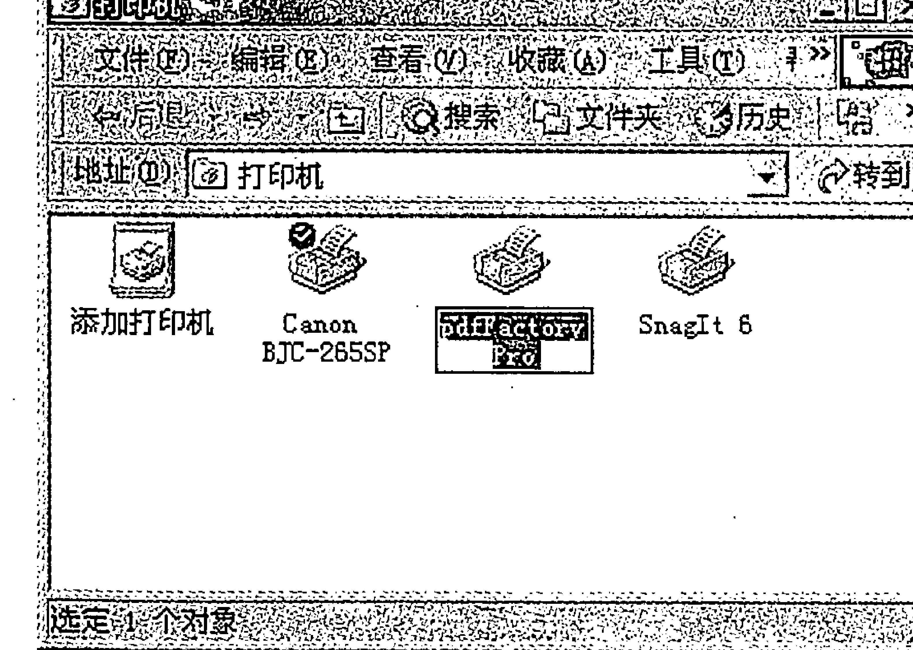

其实，这个虚拟的打印机就是一个PDF转换程序。它负责将其它文档转换成PDF文件。另外，软件安装之后，我们需要重新启动一次计算机方能进行PDF文档的转换和生成。

### （二）如何使用 PDF Factory pro 将文档转换成 PDF 文档

#### 1. 定义打印机

在WORD程序中，单击菜单栏上的“文件”/“打印”命令。在随之弹出的“打印”设置窗口中，将打印机定义为“PDF Factory Pro”（如图52）。

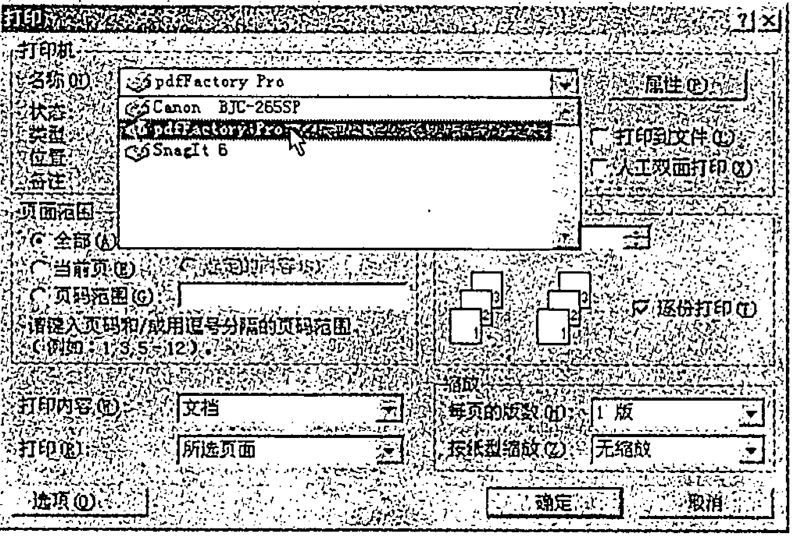

#### 2. 设置“转换”属性

将打印机定义为“PDF Factory Pro”之后，我们单击“属性”按钮，进入PDF Factory pro程序的转换设置界面。在PDF Factory Pro属性中，我们可以设置一些PDF文档的转换参数（如图53）。

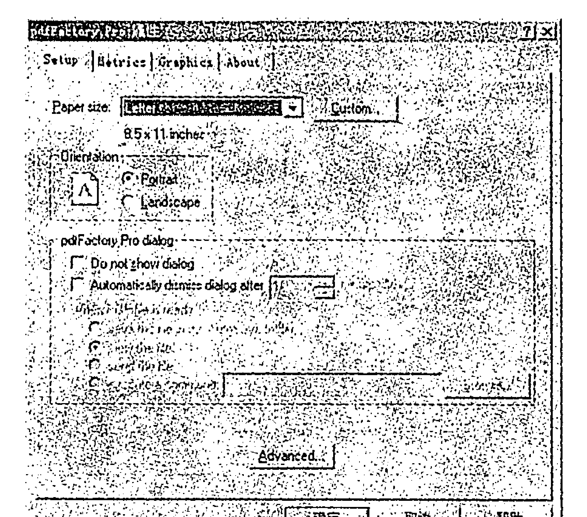

##### （1）Setup（常规设置）

其中，Print size 用来设置转换之后的PDF文档的页面大小。当然，我们还可以通过“Custom”按钮来自定义页面大小。在“Orientation”中，我们可以设置页面的方向：Portrait（纵向）、Landscape（横向）（如图60）。

另外，通过“Advanced”按钮，我们可以设置更多的转换参数。

##### （2）Metrics

在这里，我们可以设置转换PDF文档的分辨率和上、下、左、右边距。分辨率不宜设得过高，否则生成一个PDF文档不仅花费更多时间，而且体积也将变得更大（如图54）。

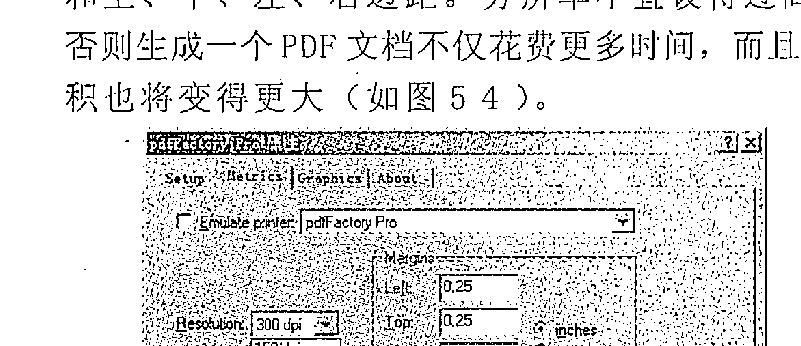

##### （3）Graphics（如图形）

在Graphics中，我们可以设置DOC文档中的图像在转换成PDF文档的图像过程中，图像的分辨率。当然图像分辨率设得更高，转换之后图像的清晰度也越高。但是，这样做将会转换之后PDF文档体积更大。除非对图像质量有较高要求，否则不宜将分辨率设得过高。分辨率的默认值为96DPI（如图55）。

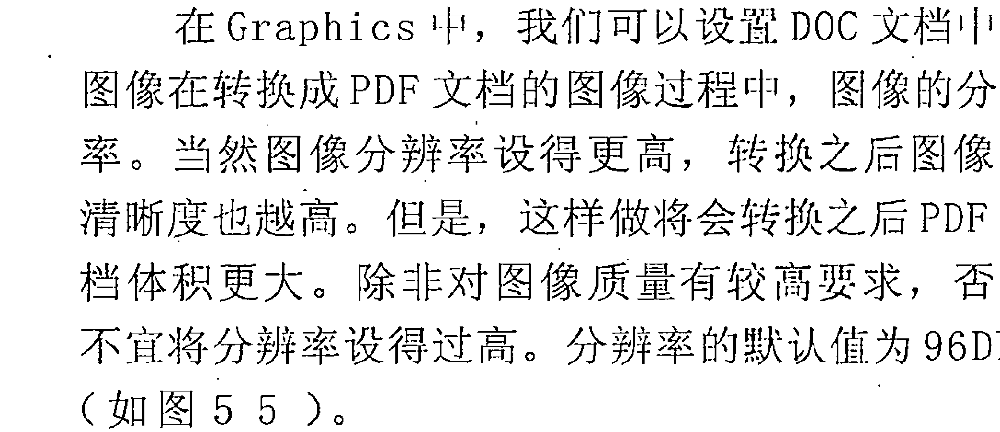

另外，我们还可以设置JPEG算法的压缩率，大家知道JPEG可以非常有效的减少图像文件的体积。其中，best compression（最高的压缩率）和 best quality（最好的图像质量）可以根据需要来把握。最高的压缩率必然造成图像质量的下降，而最好的图像质量必然造成文件的体积变大。

#### 3. 开始转换

通过“属性”按钮对相关的转换参数进行设置之后，我们回到“打印”设置窗口中，单击“确定”按钮（如图56），PDF Factory pro将开始对当前正在编辑的DOC文档进行转换。文档之间的转换时间视原文档页面的多少和转换参数中的分辨率和图像压缩比率而定。另外，在进行文档的转换时，CPU的资源占用率非常高，这个时候最好不要运行其它程序，特别是硬件配置较低的机器更是如此。

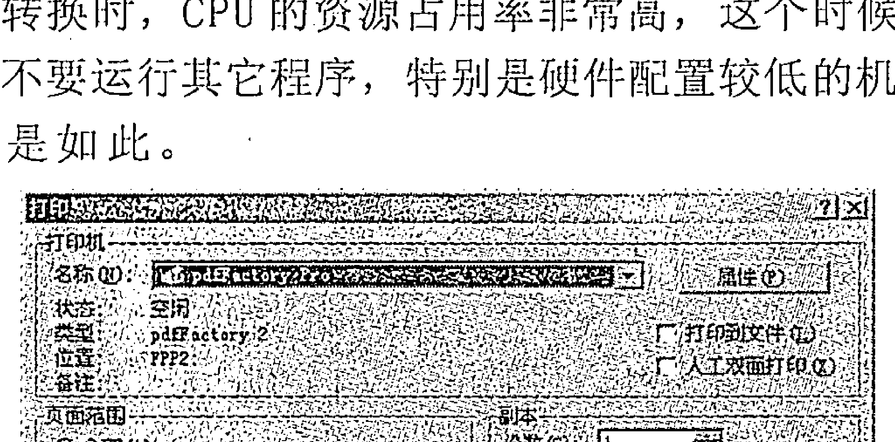

#### 4. 后期处理工作

只有在转换过程结束之后，PDF Factory pro的主界面才会出现（如图57）。主界面中有预览、字体、文档信息、安全策略、链接、书签、设置、关于，共8个标签。

##### （1）预览

我们可以在“预览”中查看转换之后的PDF文件，拖动垂直滚动条，我们可以查看任何一个页面（如图57）。

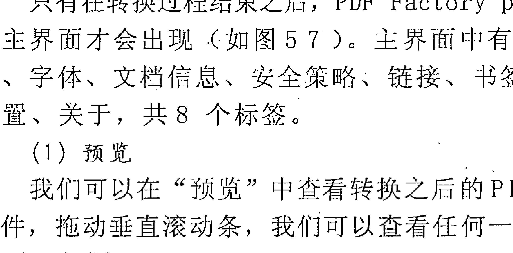

##### （2）字体

在字体设置对话框中，将会在“不内嵌这些字体”列表中，列出该文档中使用过的字体，如果是在本机打开生成的PDF文档可以不内嵌字体，而如果生成的PDF文件需要在传送到互联网上或者是其它的电脑上使用。那么，我们需要单击“全部内嵌”按钮，将所有字体定义到“内嵌这些字体”中（如图58）。

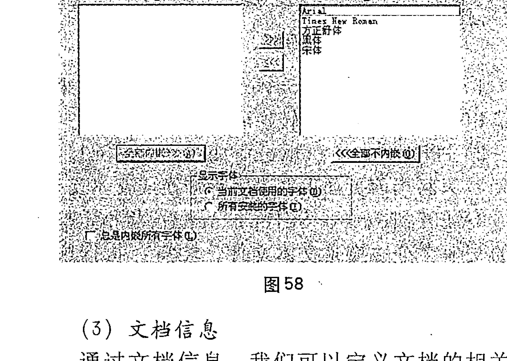

##### （3）文档信息

通过文档信息，我们可以定义文档的相关信息内容，譬如标题、主题、作者和关键。另外，我们还可以定义Acrobat read在打开这个文档时候的查看参数。譬如Acrobat read在打开这个文档的时候的放大倍数、边面板是什么（书签、缩略图或者是层），还可以定义文档在打开时，自动翻页到哪个页面上等等。总之，通过文档信息，我们可以很灵活的定义这篇PDF文档阅读方式（如图59）。

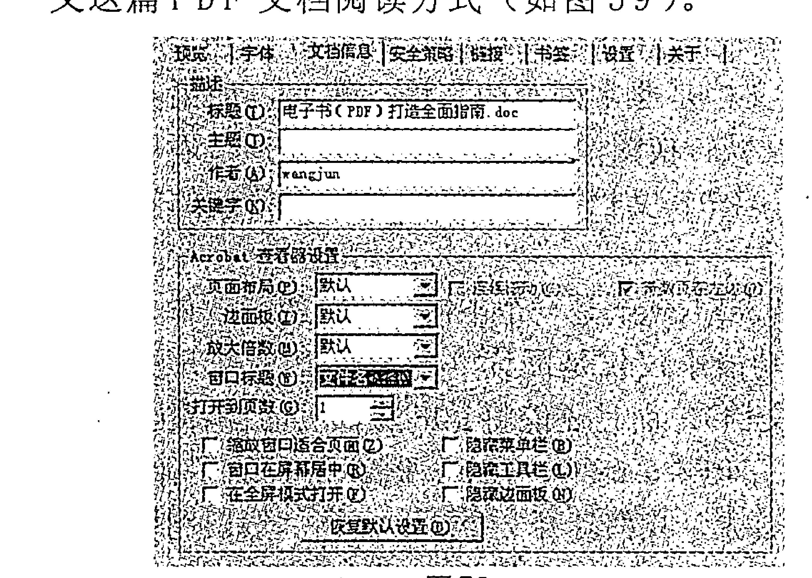

##### （4）安全策略

通过安全策略（如图60），我们可以定义文档在加密时，是采用40位加密还是128位加密，其中128位加密方式可以带来更高的安全级别。我们可以对文件做出一些限制。譬如：阅读限制、复制限制、打印限制、更改限制和对于文件中的注释和表单区域进行更改限制等文档安全措施。

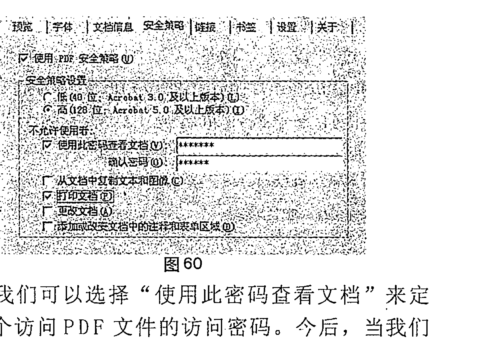

我们可以选择“使用此密码查看文档”来定义一个访问PDF文件的访问密码。今后，当我们在打开这个PDF文档时，只能正确输入访问阅读密码，才能打开并阅读PDF文档中的内容。当我们选中“从文档中复制文本和图像”选项时，这个PDF文档中的所有文本和图像将不能被“复制/粘贴”。这样做，可以保护文档内容不被非法复制。选中“打印文档”选项，可以避免文档被打印出来，该文档只能用来阅读。选中“更改文档”选项，可以避免文档内容被任意篡改。选中“添加或改变文档中的注释和表单区域”可以防止其它人在文档中添加和修改注释和表单区域。

##### （5）链接

如图61，通过“链接”中的“把网址自动转换为PDF链接”，我们可以把PDF文档中的所有网络链接转换成PDF文档中的网络链接。另外，我们还可以设定链接的边界颜色和线条风格等。

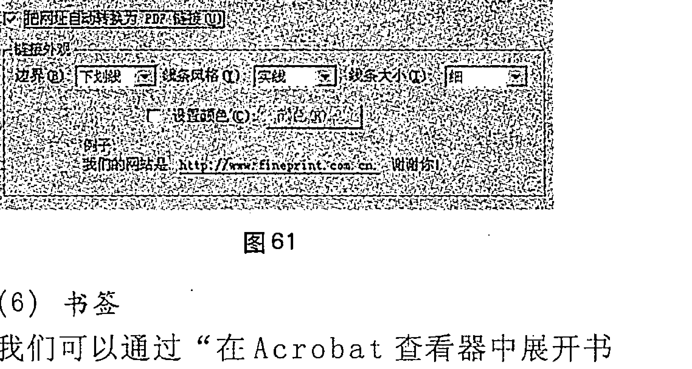

##### （6）书签

我们可以通过“在Acrobat查看器中展开书签”和“使用PDF书签自动生成目录表”来定义该文档的书签功能（如图62）。


##### （7）设置

通过“设置”功能（如图63），我们可以定义PDF Factory pro在处理PDF文档时的自动保存的工作任务个数，而这些工作任务的结果，均将被暂时存放在相关的文件夹之下。

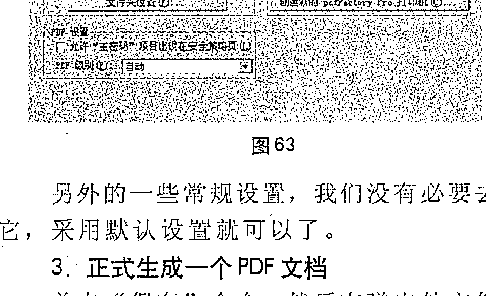

另外的一些常规设置，我们没有必要去设置它，采用默认设置就可以了。

#### 3. 正式生成一个PDF文档

单击“保存”命令，然后在弹出的文件保存对话框中，定义该PDF文档的保存位置和存盘文件名，单击“保存”，一个PDF文档便生成了。

#### 4. 将PDF文件转换成其它格式的文件

##### （1）. PDF2HTM（PDF转HTML网页文件）

PDF2HTM（如图64）是一个用来将PDF文件转换为HTML文件的软件，完全支持中英文PDF文档的转换，对PDF的版面信息可以完全保留，生成HTML的效果基本与原版的PDF一致，简单排版后即可输出。

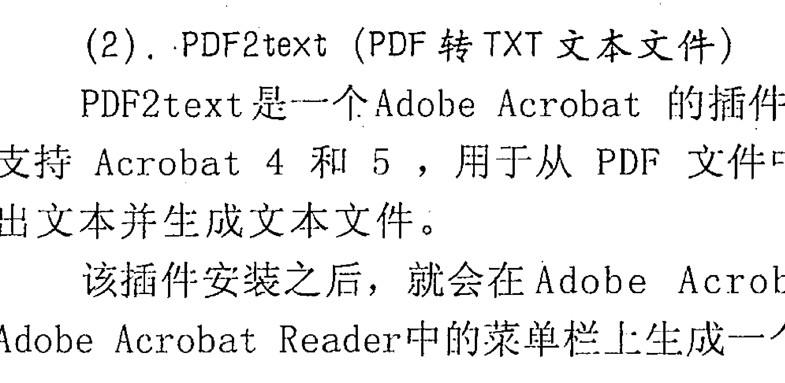

##### （2）. PDF2text（PDF转TXT文本文件）

PDF2text是一个Adobe Acrobat的插件工具，支持Acrobat 4和5，用于从PDF文件中抽取出文本并生成文本文件。该插件安装之后，就会在Adobe Acrobat或Adobe Acrobat Reader中的菜单栏上生成一个增效工具菜单（如图65）。

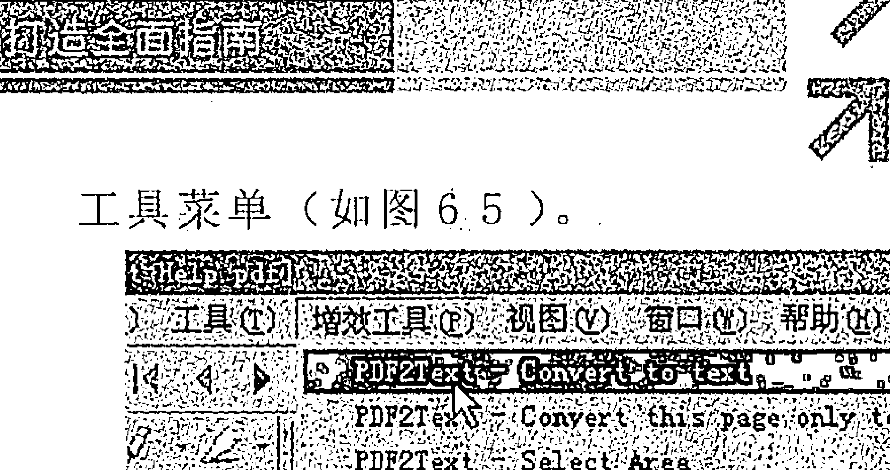

- 1）PDF2Text – Convert to text: 用来将整篇PDF中的文本字符转换成文本文件。
- 2）PDF2Text – Convert this page only to text: 只将当前页面上文本字符转换成文本文件。
- 3）PDF2Text – Select Area: 将指定范围内的文本字符转换成文本文件。注意：执行这个转换命令之后，你必须用鼠标指针在文档中拖出一个识别范围。
- 4）PDF2Text Options: 转换设置选项。对于中文PDF文档的转换，经过笔者反复的测试，认为在PDF2Text Options中取消所有选项，并且将Text tolerance（文本辨识误差）调到最低时，更适合于汉字文本的转换，这个时候转换出来的文本文件更适合于中文处理的需要。另外，需要注意在设置完成之后，单击“Save/exit”按钮，保存设置。

##### （3）. 利用DocViewer将PDF文档转换成图像文件

DocViewer是一个不错的PDF阅读软件，当然它的功能不仅仅是阅读（譬如可以打开加密的PDF文档），而且还能将PDF文档页面保存为BMP、PNG、JPEG、GIF、TIF、PCX格式的图像文件。

首先，我们打开一个PDF文档，然后利用“放大镜”工具将PDF放大到可以清晰阅读为止（文档放大得越大，输出的图像文件也更清晰）。单击“文件”/“导出”，然后输入一个文件名，选定一个图像文件格式。单击“保存”即可。

不过，这个软件不能一次性将文档所有页面按顺序转换出来，每次必须翻到指定页面，然后再“输出”，这样效率不是很高。不过，对于十几页之内的普通的PDF文档，还算是非常有效的解决方案。

## CHM格式电子书的制作

文/e界贫民 哈节棍

### 一、CHM文件概述

CHM文件格式是微软公司于1998年推出的基于HTML文件特性的帮助文件系统，并逐步取代了早先的HLP格式帮助系统，在Windows 98中将CHM类型文件称作“已编译的HTML帮助文件”，该文件最大的优点在于只要能够被IE浏览器所支持的对象，如JavaScript、VBScript、ActiveX、Java Applet、Flash、常见图形文件（GIF、JPEG、PNG）和音频视频文件（MIDI、WAV、AVI）等均可通过软件制作为CHM文件，并可直接执行后阅读。此外，通过网页的链接，CHM还可直接访问互联网。不过CHM格式也存在一些缺点，如操作系统必须为Windows 98及以上版本、浏览器必须为IE3.0或以上版本，不过这些目前已不算是很苛刻的条件，因此CHM文件仍不失为一种大众化的电子书格式。

典型的CHM文件运行后的界面窗口分为三部分，上面部分为功能按钮区，放置一些常用的浏览器按钮。右边为主窗口，直接显示电子书的内容。左边为导航窗口，用于快速定位，可包含主题、索引、搜索和书签等选项卡，如图1所示。

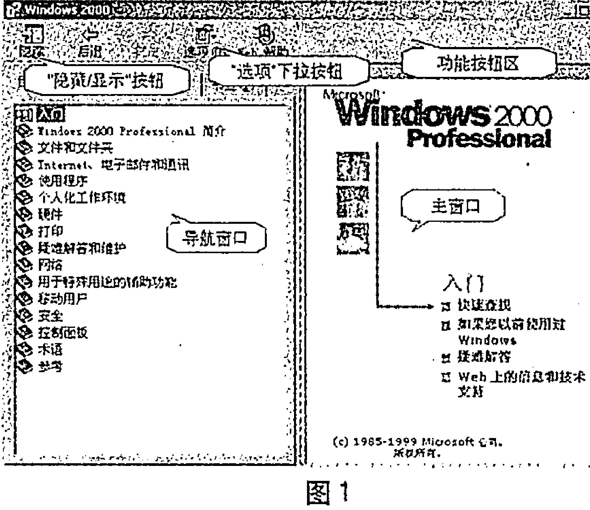

在图1中，单击“隐藏/显示”按钮可将左边的导航窗口关闭或打开，其他几个按钮和浏览器中功能类似。此外，“选项”下拉按钮中是一些常用的控制命令。这些按钮均可在制作CHM文件时设置是否显示。

在Windows 98及以后的版本中，CHM文件所需的运行程序（hh.exe）已被整合为操作系统的一部分，该软件用于控制支持ActiveX组件的网页浏览器来解释并运行CHM文件中的元素，实现了跨语言系统浏览电子书的目的。

### 二、制作CHM的基本步骤

目前制作CHM文件最权威的工具当属微软推出的HTML Help WorkShop，该软件可在Visual Studio 6.0安装光盘的“htmlhelp”目录中通过“htmlhelp.exe”文件来安装其1.1版，或在http://www.skycn.com/soft/3902.html下载其V1.32版，本文将以1.32版为例进行介绍。

#### （一）启动制作程序

安装完毕后，HTML Help WorkShop会在“开始”菜单的“程序”组中添加一个“HTML Help Workshop”组，单击“HTML Help Workshop”项即可启动软件，软件启动的主界面如图2所示。

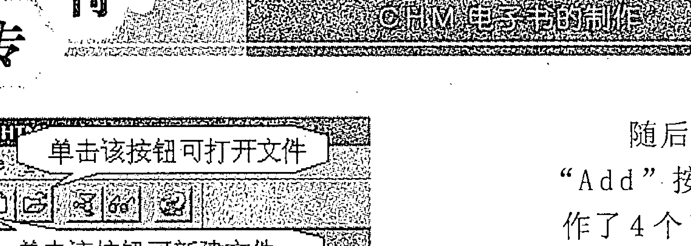

#### （二）创建工程文件

在图2所示窗口中，单击“File”主菜单的“New”子菜单或单击工具条的第一个按钮，即可弹出新建文件对话框，选择“Project”列表项，如图3所示。

随后将提示添加制作CHM所需的文件，单击“Add”按钮可显示对话框供选择。假设本例已制作了4个HTML文件（HTML文件可通过各类网页制作工具或直接通过Word、WPS等来制作），其中“1.html”、“2.html”和“3.html”分别为CHM电子书的三个章节，而“about.htm”为电子书的封面，那么即可添加这四个HTML文件，如图6所示。

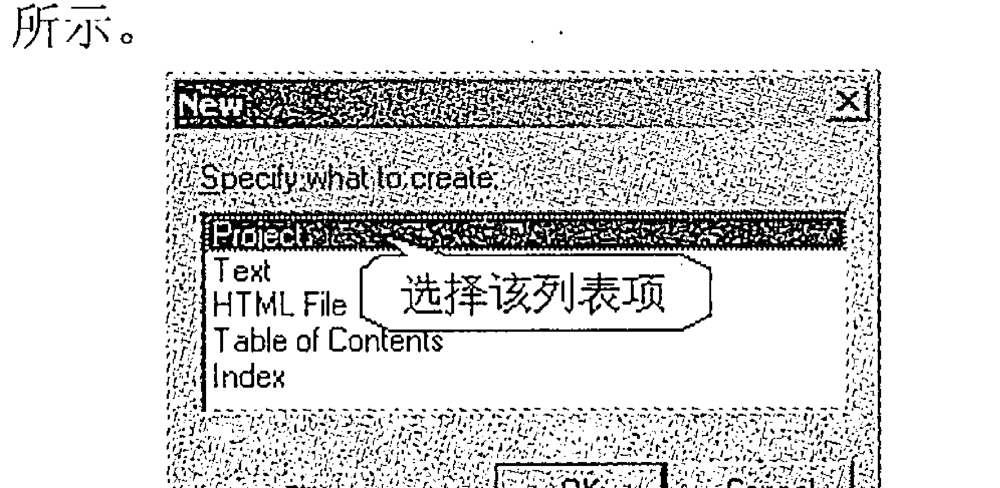

单击“OK”按钮后出现新建工程向导，可直接单击“下一步”按钮，在随后出现的对话框中按需设置创建的工程文件（.hhp）的路径和文件名，也可单击“Browse”按钮来选择，如图4所示。

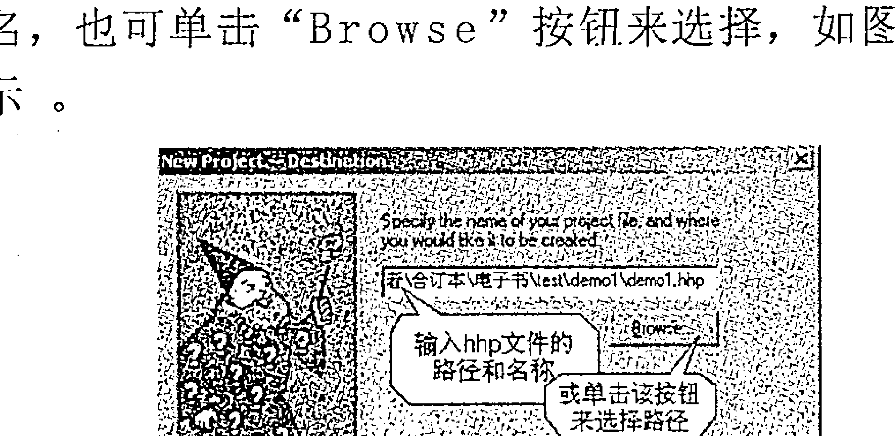

继续单击“下一步”按钮，将显示三个复选框，分别代表创建CHM的方式。本例选择最后一项“HTML files”，如图5所示。

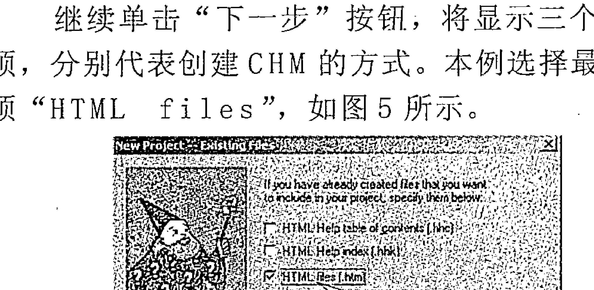

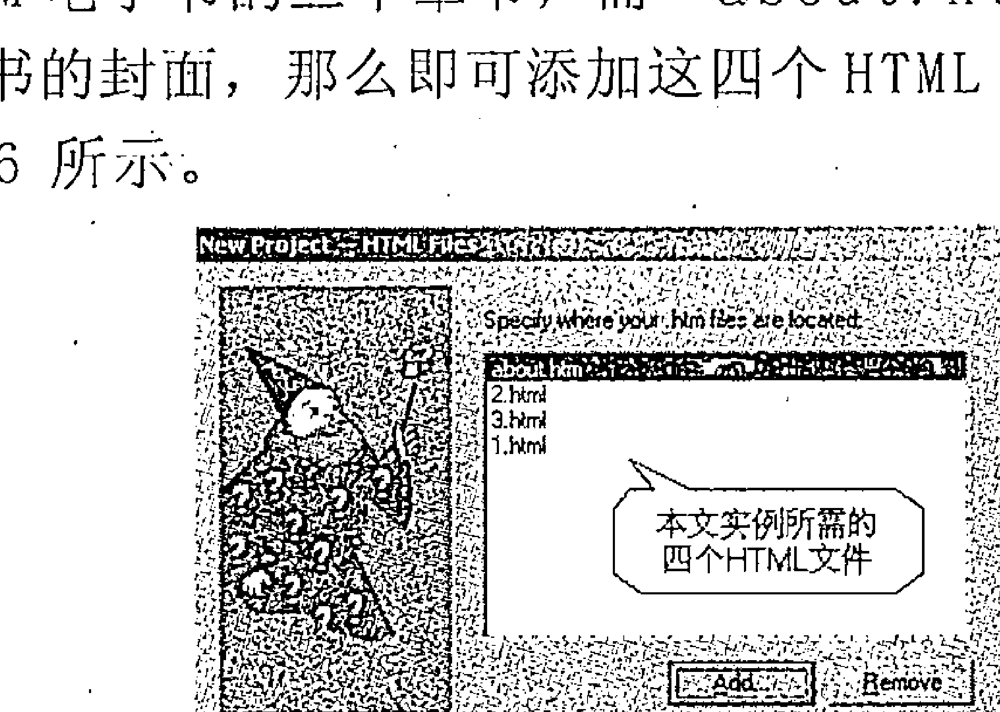

上述步骤添加的四个文件如使用了图片等文件链接，那么软件会自动将这些文件一并自动加入工程中。随后工程文件即创建完毕，可开始添加电子书的功能。

#### （三）设置工程文件

创建后的工程文件需进行一些简单的设置，以使其更为完善。单击“Project”选项卡左下侧的第一个工具栏按钮，弹出Options（选项）窗口，如图7所示。

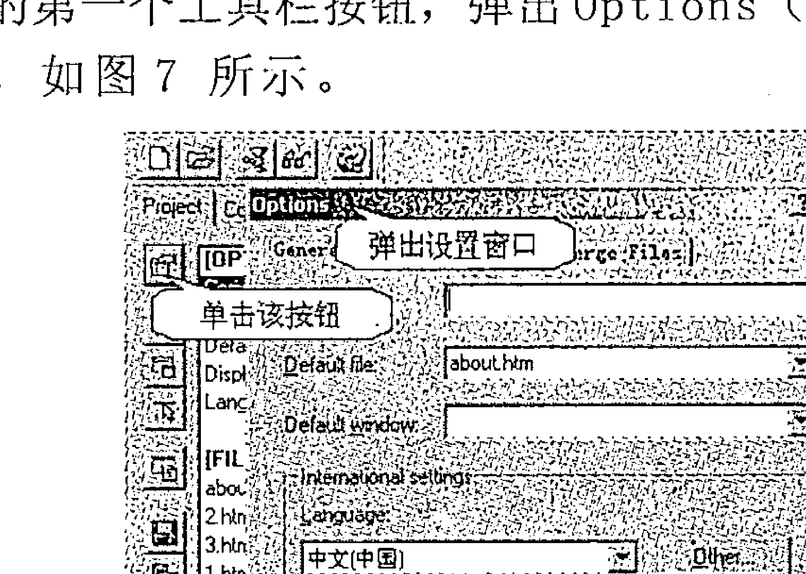

在Options（选项）窗口切换至“General”选项卡，在“Title:”文本框中输入电子书的标题，编译CHM文件后，该标题会显示于标题栏。单击“Default file:”下拉框，选择电子书打开时默认显示的文件，本例选择了“about.htm”文件做为封面。此外，还可在“Language:”和“Font:”文本框中设置语言和字体，一般可使用默认值，如图8所示。

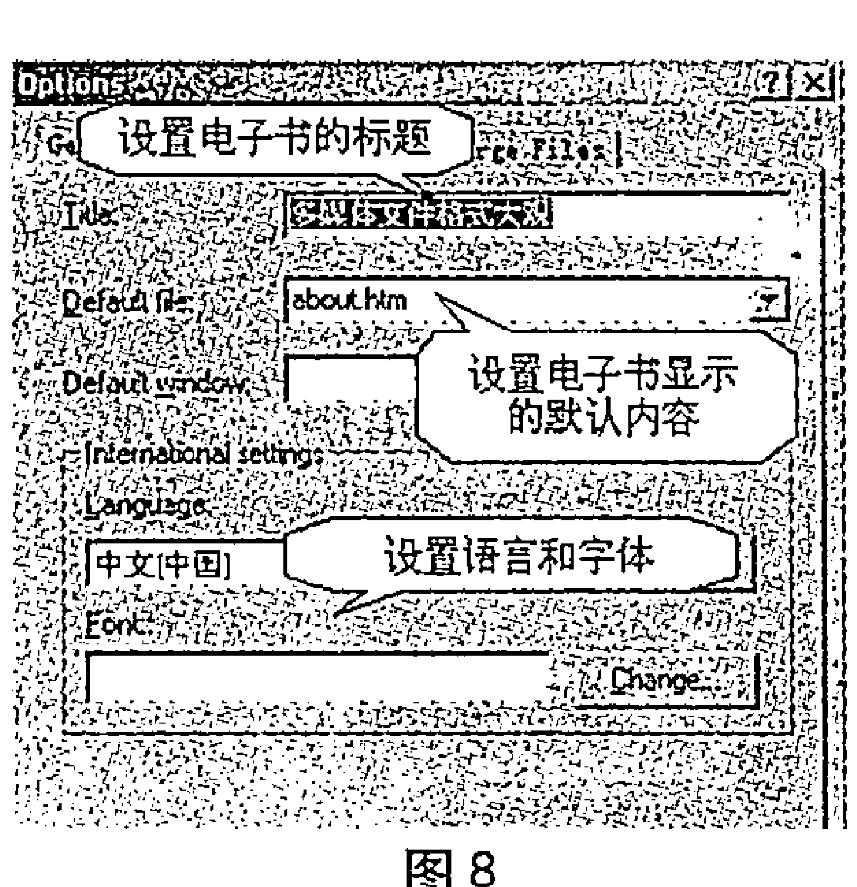

随后切换至“Files”选项卡，在“Complied file:”文本框中输入编译生成的CHM文件名和路径，默认CHM文件将编译生成于工程文件同一目录中。最后切换至“Compiler”选项卡，选择“Compile full-text search information”复选框，使编译CHM文件时自动建立全文搜索，如图9所示。

#### （四）创建目录文件

在主界面中切换至“Contents”选项卡，第一次选择该选项卡时会弹出的对话框，选择“Create a new contents file”单选框，创建新的目录文件并保存在工程文件相同的目录中，以便修改，文件名可用默认值。

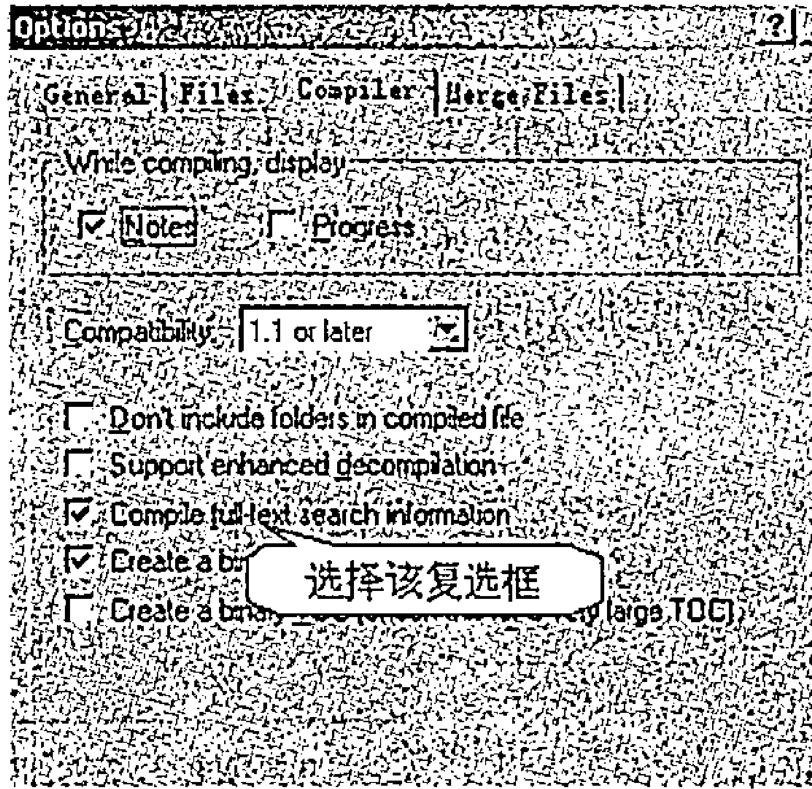

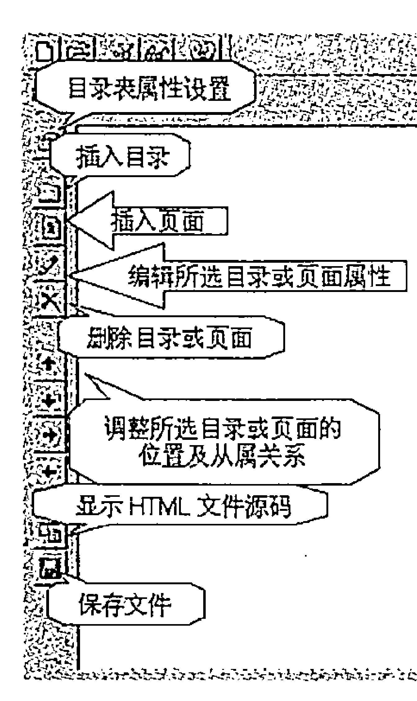

在“Contents”选项卡左侧，从上至下依次有11个按钮，前5个按钮分别为：目录表属性设置、插入目录、插入页面、编辑所选目录或页面属性、删除目录或页面；下面4个箭头按钮用于调整所选目录或页面的位置及从属关系；最后两个按钮分别为显示HTML文件源码和保存文件，如图10所示。

##### 1. 插入目录

单击“Insert a heading”按钮（第二个按钮），弹出“Table of Contents Entry”对话框。在“Entry title:”中输入目录的显示内容，如“本书总目录”。按“Add”按钮，在弹出的“Path or URL”对话框中选择“about.htm”（列表框中显示的列表项为HTML的“<Title>”标记对应的内容），单击“OK”按钮即可返回并添加完毕。此外，还可单击“Browse”按钮来调用前述步骤未添加的HTML文件，如图11所示。

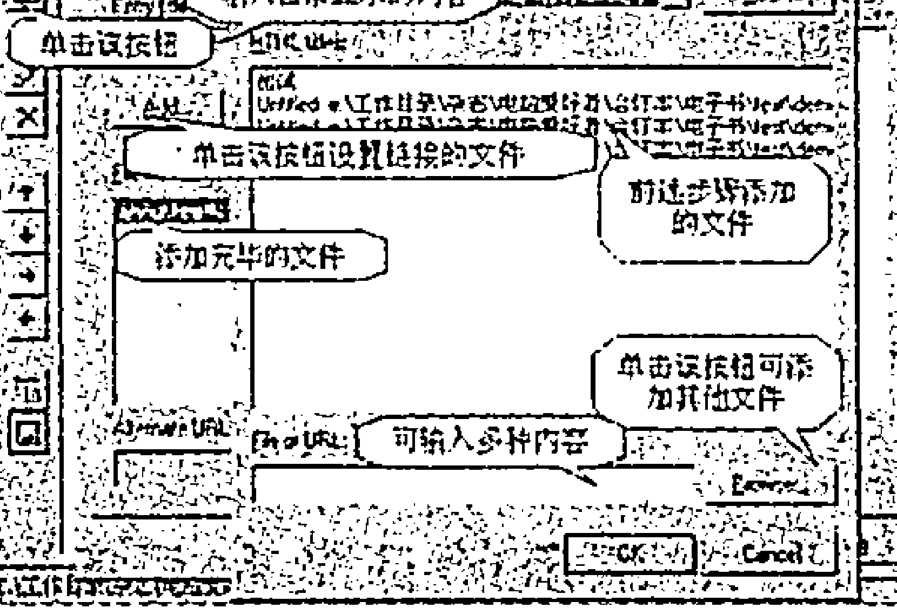

##### （小提示）

- 1. 如需定位于页面中的某个位置，则需在图11所示的“File or URL:”处输入HTML文件中的书签名，该书签名可在制作HTML文件时通过“<A>”符号来指定。如：“1.htm#tag1”，此处的“tag1”即代表书签名，而“#”符号则用于连接文件和书签名。
- 2. 如需定位于同一目录下的另一个CHM文件中某个页面，可在图11所示的“File or URL:”处输入CHM文件名及页面名称，如“1.chm::/1.htm”，此处的“::/”符号用于连接文件名和页面名称。

##### 2. 插入页面

单击“Insert a page”按钮，弹出一个询问是否在所选目录上方插入标题的对话框，单击“否”按钮，弹出“Table of Contents Entry”对话框。在“Entry title”文本框中输入页面显示的标题，如“第一章”，并单击“Add”按钮设置对应的HTML文件，返回后即可增加页面标题，如图12所示。

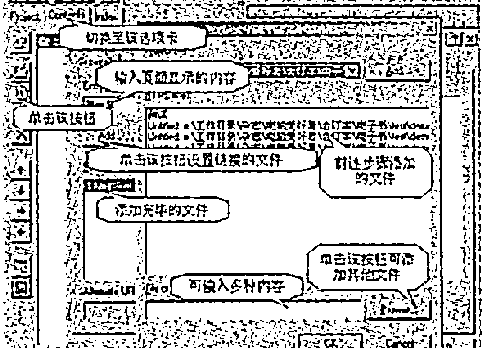插入页面和插入目录显示的对话框类似，因此可按插入目录的方法来插入多个页面，然后用目录编辑窗口左侧的四个方向按钮调整从属关系，HTML Help Workshop目前最多支持9个层次的标题深度，最后单击左下角的“Save File”按钮保存目录表文件即可，如图13所示。

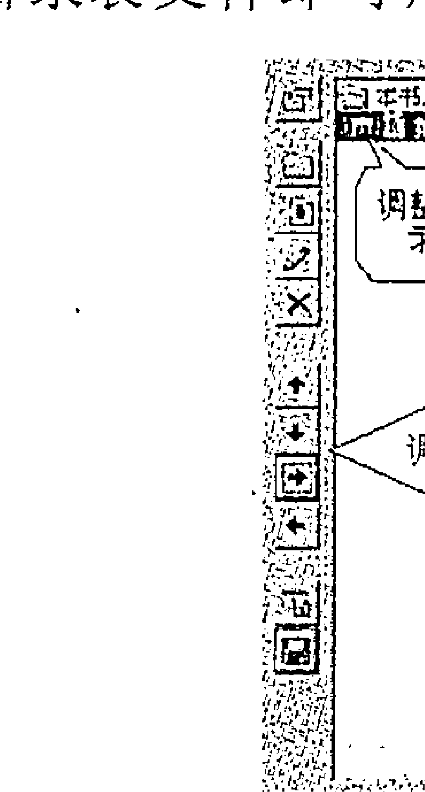

图13

> [小提示]
如需修改CHM中显示的目录和页面的图标，可选择目录或页面后，单击第四个按钮来编辑其属性，然后切换至“Advanced”选项卡，修改“Image index”的值即可改变目录或页面的图标，HTML Help Workshop目前提供了多达43个图标供选择，如图14所示。

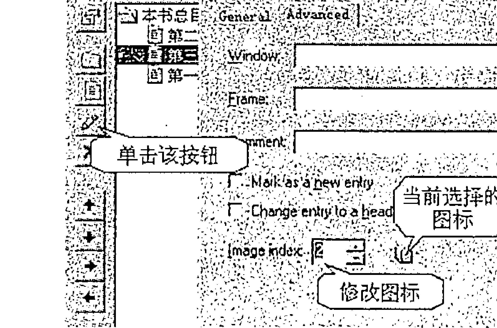

图14

## (五) 创建索引文件

索引文件用于定义帮助系统中所包含的关键字，即用户可能会使用的和一个或多个帮助主题文件有关联的字、词或短语，一般多用于电子书中所涉及的术语、概念或同义词等，条理清晰的索引可帮助用户快速查找内容。

切换至“Index”选项卡，在弹出的对话框中选择“Create a new contents file”单选框创建新的索引文件（.hhk），可使用默认的文件名，索引表编辑窗口左侧从上至下依次排列有11个按钮，前4个分别为索引表属性设置、插入索引、编辑所选索引和删除索引按钮，下面四个方向键箭头用于调整所选索引的位置及从属关系，最后三个按钮分别为索引排序、显示HTML文件源码和保存索引文件按钮，如图15所示。

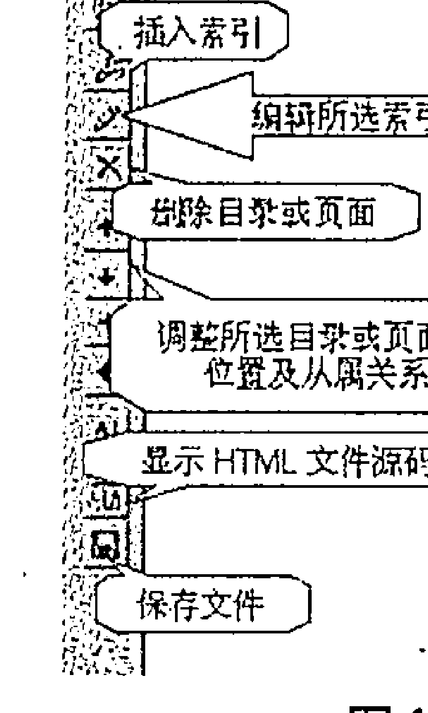

图15

插入索引可单击第二个按钮（“Insert a keyword”），弹出“Index Entry”对话框，在“Keyword”文本框输入索引名称，本例输入“Wave文件”。然后单击“Add”按钮，在弹出的“Path or URL”对话框中选择“1.html”为“Wave文件”索引项对应的HTML文件，如图16所示。

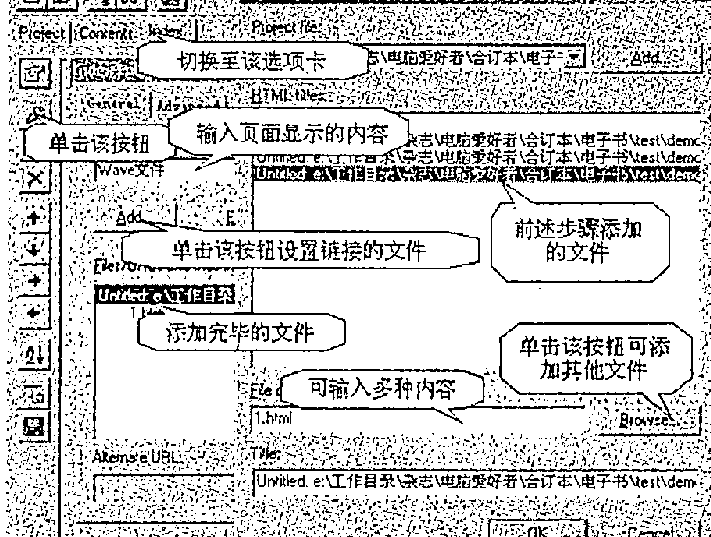

图16

## (六) 完善功能设置

经过前述的多个步骤，一个基本的CHM文件已制作完毕，在编译前还可进行一些完善功能的设置，具体如下所述。

### 1. 设置窗口显示风格

重新切换至“Project”选项卡，在选项卡的左边从上至下有七个按钮，分别为“修改项目选项”、“增加/删除HTML文件”、“修改窗口显示风格”、“API选项”、“查看HTML源文件”、“保存项目和保存”并编译按钮，如图17所示。

### 2. 设置工具栏按钮

切换至“Buttons”选项卡可设置 CHM 文件中工具栏中出现的按钮，其中“Hide/Show”复选框用于设置“隐藏 / 显示”按钮；“Refresh”复选框用于设置“刷新”按钮；“Locate”复选框用于设置“定位”按钮；“Back”复选框用于设置“后退”按钮；“Home”复选框用于设置“主页”按钮；“Jump1”和“Jump2”复选框用于显示二个可跳转的链接；“Forward”复选框用于设置“前进”按钮；“Options”复选框用于显示“选项”按钮；“Stop”复选框用于显示“停止”按钮；“Print”复选框用于显示“打印”按钮，如图19所示。

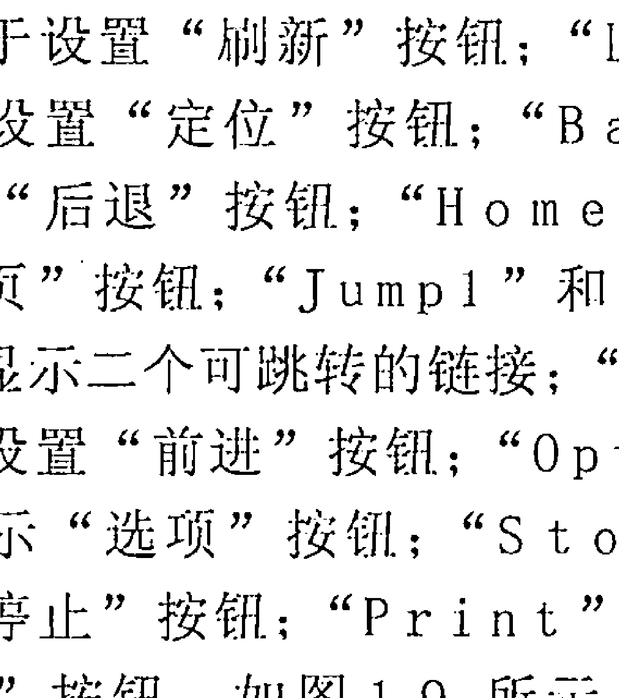

单击“修改窗口显示风格”按钮，在弹出的窗口类型中输入自定义的名称，如“test”，然后单击“OK”按钮打开“窗口类型”定义对话框。切换至“General”选项卡并在“Title bar text”文本框输入标题文本“CHM 电子书测试”，如图18所示。

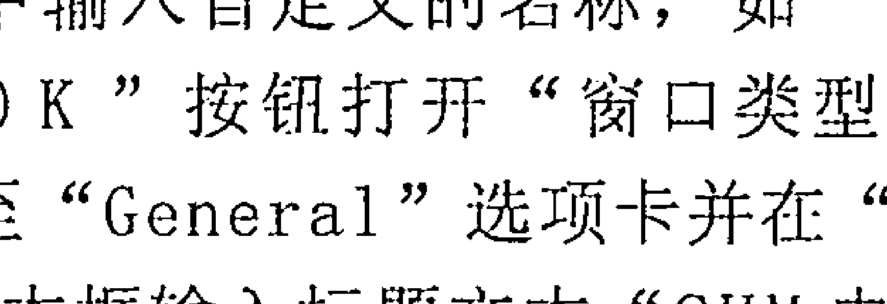

### 3. 设置窗体位置和大小

切换至“Position”选项卡可设置窗口的位置和大小。如选择“Save user defined windows position after first use”复选框，则系统会保存 CHM 文件浏览者最后一次退出时的窗口位置和大小等，而如不选择则每次均按默认的窗口位置和大小打开。“Left”和“Top”文本框可输入打开 CHM 文件时窗口左上角的坐标，“Width”和“Height”文本框则可输入窗口的宽度和高度，如图20所示。

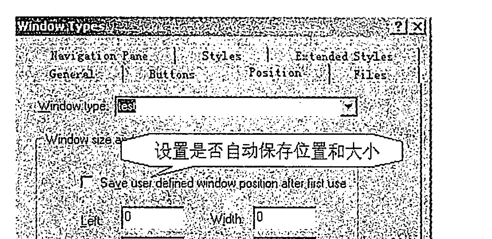

### 4. 设置工具栏和导航窗

切换至“Navigation Pane”可设置工具栏和导航窗，其中“Windows with navigation pane, topic pane, and button”复选框如不选择，则 CHM 窗口将没有工具栏和导航窗；“Navigation pane width”文本框可设置导航窗的宽度；“Open with navigation pane closed”复选框如选择，则打开 CHM 文件时导航窗默认为关闭状态；“Auto sync”复选框如选择，则 CHM 文件中的目录标题和相关的 HTML 文件内容自动保持同步；“Automatically show/hide navigation pane”复选框如选择，则 CHM 为活动窗口时显示导航窗；“Default tab”下拉框可设置导航窗中默认的显示项，可选择目录、索引、搜索或书签；“Search tab”复选框如选择，则 CHM 文件的导航窗将增加“搜索”选项卡，而“Advanced”复选框如选择则可让 CHM 文件具有高级搜索功能（可使用“and”、“or”、“not”等逻辑操作符）；“Favorites tab”复选框如选择，则 CHM 文件的导航窗将增加“书签”选项卡，如图21所示。

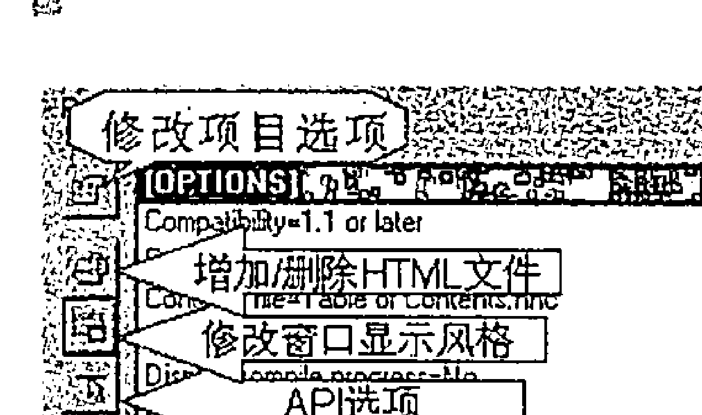

## 四、CHM 电子书制作工具推荐

除了前述的制作工具外，如前所述，虽然CHM的格式已标准化，但仍有不少辅助制作的工具，下面简要介绍几款较实用的制作工具。

### （一）耶书制造 CHMmaker 2.88

CHMmaker是由开寅软件工作室出品的一款CHM电子书制作工具，该软件为简体中文共享软件，提供了快速和方便的方法使用户制作CHM文件更为简单易行，最少只需单击鼠标六次即可。此外，该软件还可反编译CHM文件和HLP文件，并可转换HPJ工程文件和相关RTF文件至HHP工程文件和HTML文件。

### （二）FAR HTML Help 3.5.4

该软件为英文版的共享软件，界面非常友好，如不需制作非常复杂的CHM文件，那么使用该软件的默认值即可快速生成CHM文件。软件可直接将包含HTML文件和图片的目录导入，随后只需设置输出的文件名、标题、首页等信息即可生成CHM文件。

### （三）CHM制作精灵 1.0

该软件为简体中文共享软件，可快速将HTML文件转换CHM格式，简化了HTML Help Workshop的工程创建、目录索引编写和工程编译等多个步骤，如配合HTML Help Workshop一起使用的效果会很好。

### （四）Quick CHM 2.6

该软件为简体中文共享软件，原名电子文档处理大师，是一款所见即所得的CHM格式制作软件，其内置简单易用的网页编辑器，使用户只需一个软件即可完成CHM文件的制作。

### （五）Visual CHM 4.0

该软件为简体中文共享软件，可制作具有专业水准的CHM文件，且所见即所得。整个软件界面类似一个CHM文件。制作时首先准备HTML文件并设置电子书的标题和首页文件。然后即可通过软件提供的工具栏按钮和相关选项方便地制作CHM文件。

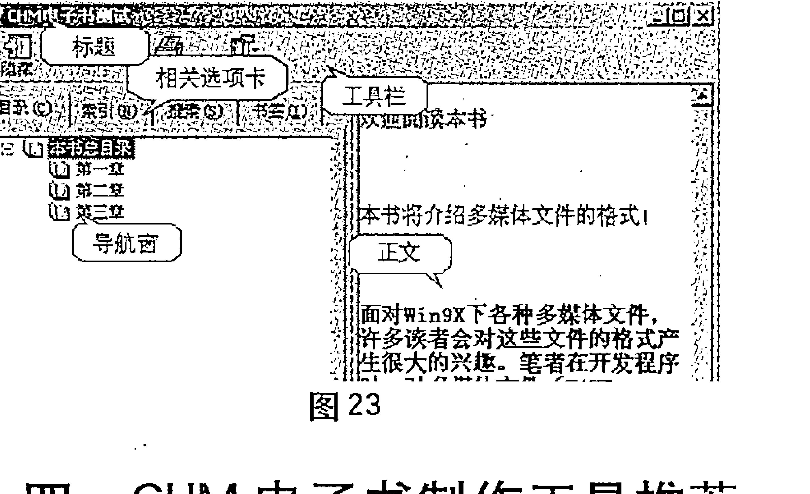

### 5. 其他设置要点

需注意：如在“窗口显示风格”的“General”选项卡中的“Title bar text”中输入了标题文本，那么前述步骤设置工程文件时输入的窗口标题文本失效；如在“窗口显示风格”设置的“Files”选项卡中的“Default”下拉框中选择了默认的文件，则设置工程文件时输入的首页失效。如在“窗口显示风格”的“Navigation Pane”选项卡中的“Search tab”复选框未选择，则设置工程文件时的全文搜索功能失效。

## （七）编译文件

完成了前述的所有步骤后，即可开始编译CHM文件来享受劳动的成果，具体方法如下所述：

单击“Compile HTML file”按钮或单击“File”菜单的“Compile…”子菜单，在弹出的对话框中按“Compile”按钮即可编译。此外还可直接单击“Project”选项卡左下方的“Save all file and Compile”按钮，随后在主界面的右边将显示编译的信息，如图22所示。

编译完毕后可直接在资源管理器中打开该CHM文件查看，如发现问题还可重新修改调整。本例制作的CHM文件浏览效果如图23所示。

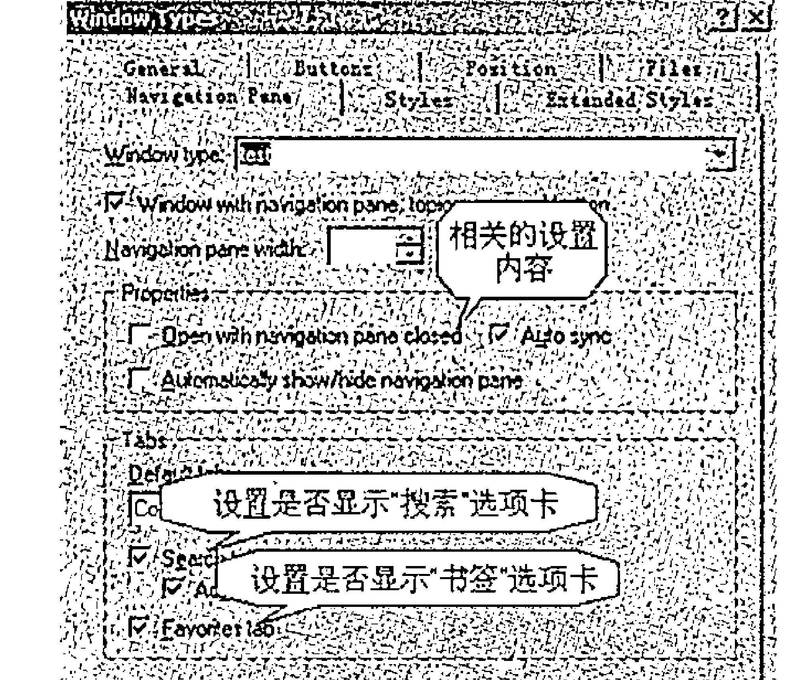

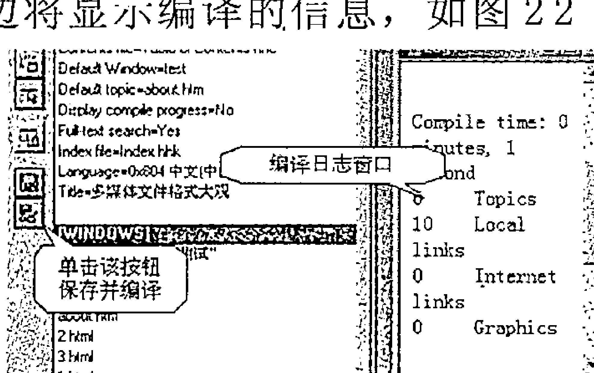

## 光盘使用说明

- 1. 光盘放入光驱后，光盘程序将自动运行，播放片头动画。动画播放结束后，进入程序主界面。如果想跳过动画，可以在画面中任意处单击鼠标即可。
- 2. 如果不想让光盘程序直接运行，可以在放入光盘的同时按<Shift>键不放，以跳过动画的播放。在资源管理器中可以直接浏览光盘，也可以双击Start.exe文件重新运行光盘程序。
- 3. 在主界面上点击相应的主题按钮即可进入下一级界面或调用其他程序。
- 4. 在主界面上点击右下角的声音按钮可关闭或打开背景音乐。点击退出按钮可关闭光盘程序。
- 5. 在下一级界面中，都会有一个返回按钮，点击即可返回到上一级界面中。
- 6. 光盘A中的“2003年期刊全文检索”调用的是PDF电子书，需要预先安装好Acrobat Reader软件，否则无法正常使用。如果您的系统中没有安装该阅读器，可安装本光盘中所带的Acrobat Reader 5.0。

## 魔法学校

“我被施了魔法”
电脑教学系列产品
，以轻松、无厘头
搞笑风格迅速颠
覆传统教学理念
！誓将搞笑教
学进行到底！
全新热门产
品竞相上市
，给你无
限惊喜，
敬请关注！

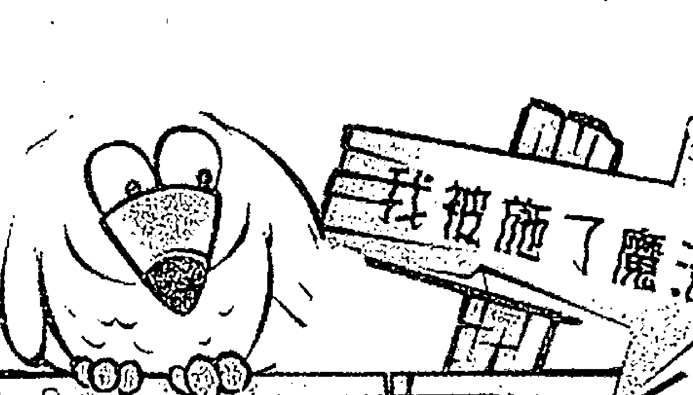

Dreamweaver、Fireworks、
Flash是网页制作的三员猛将，现在一骨脑全教给你！
加入一场星际足球争霸，咧着嘴，笑翻天，无论是实用的个人网页，还是眩目的商用网站，甚至
Flash广告的制作方法，全包在咱身上！

月黑之夜，电闪雷鸣，美术馆大楼顶上出现一个黑影，他就是令非法画商闻风丧胆的飞天侠盗——改画怪杰。他总是悄悄潜入美术馆，在名画被非法倒卖之前偷梁换柱，用Photoshop改绘的赝品调包……跟随Photoshop改画怪杰偷画历险，15天成就电脑改画高手！

“不会Flash，你就是网络时代的原始人”！看形色各异的超级麻辣教官使出奇招怪法，爆笑短片，搞怪实例，没有枯燥的知识，不用死记硬背！15天成就Flash动画高手。

卡通画与Flash激情相遇
，用Flash打动卡通画的每一根运动神经，让卡通画活灵活现的动起来。直白的技巧，幽默诙谐的语言，充满想象力的实例，让没有绘画天分的卡通动画爱好者在15天也成为卡通动画高手。

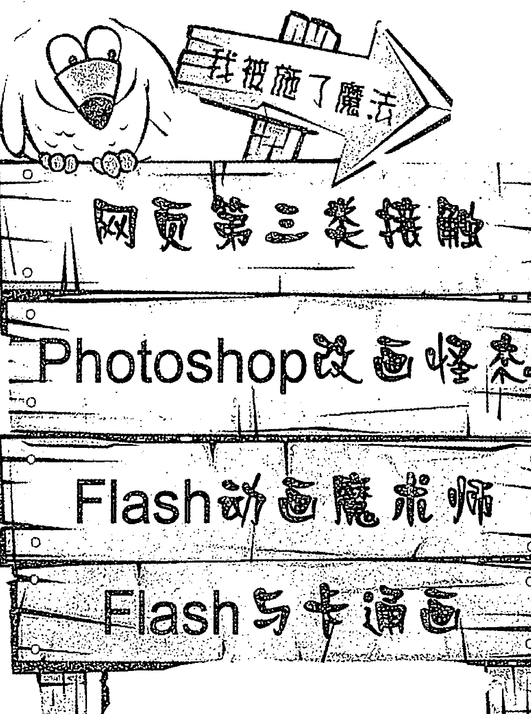

## EXE格式电子书的制作

文/e界贫民 哈节棍

### 一、EXE电子书概述

EXE 格式的电子书以其可直接执行的特点，成为目前较流行的一种电子书格式，且由于该格式不存在统一的标准，因此相关的制作工具也非常之多。EXE 格式电子书的最大特点在于阅读方便、制作简单且无需专用阅读器支持即可阅读，因此对运行环境几乎无任何要求，但该格式的电子书也有一些不足之处，如多数制作软件制作的 EXE 文件均不支持 Flash 和 Java 及常见的音频视频文件等。本文将介绍二款典型的 EXE 电子书制作软件的使用，并简介一些其他的 EXE 电子书制作软件。

### 二、通过eBook Edit Pro制作EXE电子书

#### (一) 软件简介

本章以 eBook Edit Pro 软件为例来制作电子书，该软件可将 HTML 网页文件（包括媒体文件）打包转换为 EXE 电子书，最新版本集合了目前同类软件的优点，是 EXE 电子图书制作软件中较豪华和完善的一款，读者可在 http://download.pchome.net/php/dl.php?sid=12463下载其 3.21 汉化版，本文将以 3.21 版为例进行介绍。

#### (二) 软件使用

##### 1. 输入基本信息

软件的安装较为简单，不做赘述。软件运行的主界面如图1所示。

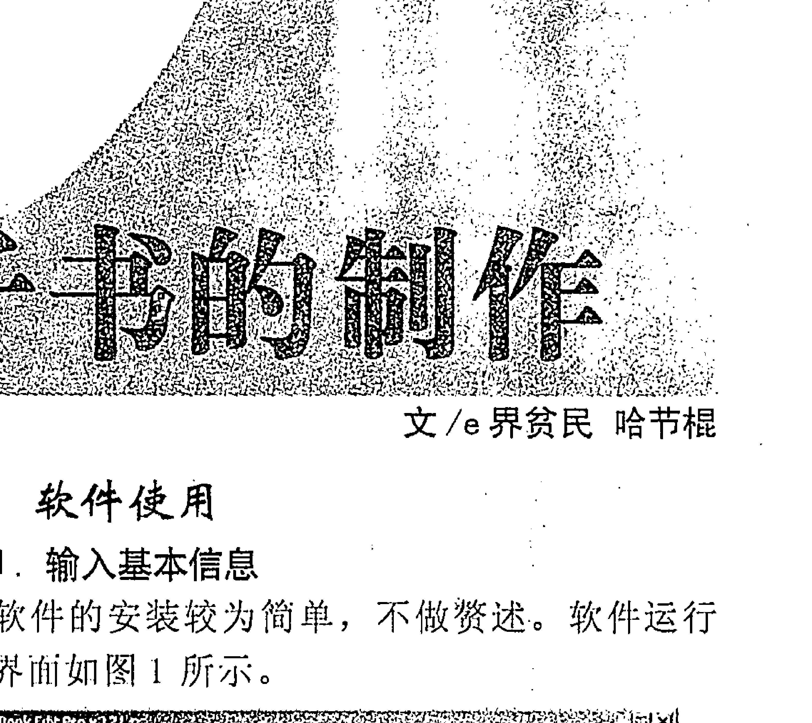

在图1 所示窗体中，在“授权给”文本框中可输入用户名，在“注册键”文本框中可输入注册码。“会员 I D ”文本框为软件专用的会员信息，编译时将自动添加至电子书。“U R L ”文本框可输入网站地址，将显示在编译后文件的“关于”菜单中，可通过该菜单直接连接指定网站。输入完毕后，单击“保存注册信息”按钮即可。“设置”栏中包含两个选项：“显示弹出的帮助提示”复选框用于设置在使用软件过程中当鼠标...

##### 4. HTML格式电子书的制作

标指向某个位置时，是否即时显示帮助信息；“软件启动时检查软件的更新情况”复选框用于设置是否在软件每次启动时均上网搜索新版本，如使用该功能，则需输入用户名和密码，并单击“保存下载信息”按钮。

##### 2. 设置电子书选项

设置完毕后，单击“下一步”按钮即可开始转换网页。在“选项”选项卡中可设置电子书的一些相关必填信息。“输入eBook的标题”文本框可输入在电子书中以标题栏形式显示的文本。“自定义关于对话框的文本”文本框可输入编译后的电子书内置“关于”对话框的信息，如作者的授权信息和URL地址等。“eBook图标”栏可设置一个ICO格式的图标文件作为电子书的图标。“显示设置”栏可设置软件运行后是否以最小化方式运行，并可设置电子书窗体的大小。“其它”栏如选择了“eBook自行调节”复选框，则可手工调整运行后窗口的大小；选择“允许右键菜单”复选框则可在电子书运行时通过右键打开快捷菜单，进行复制等操作。“弹出消息/闪屏”栏可设置电子书在启动或关闭时是否显示弹出消息或闪屏（闪屏指软件的Logo界面）。此外，在该选项卡中有很多“设为默认”按钮，如单击这些按钮，则相关设置值均会使用默认值，如图2所示。

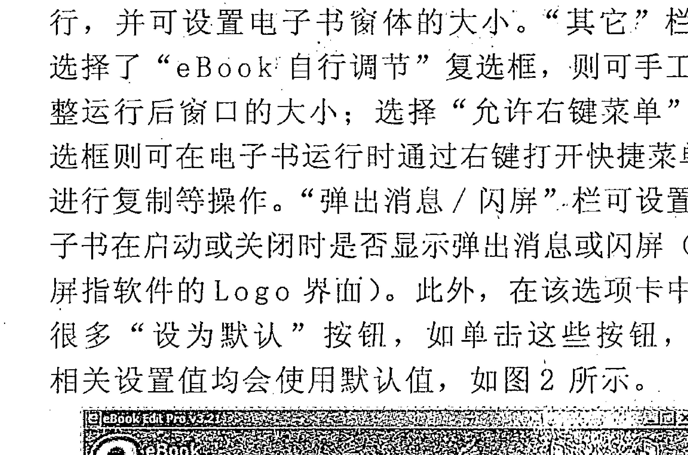

按钮则可重新导入新版本的HTML文件，如图3所示。

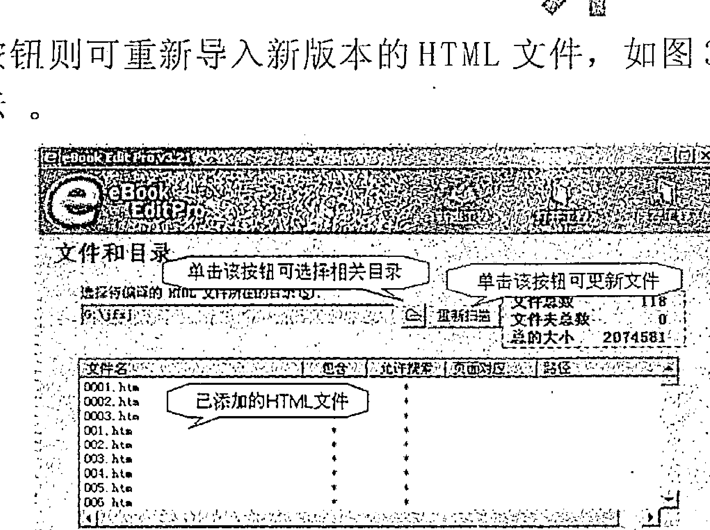

##### 4. 调整文件顺序

设置完毕后，单击“下一步”按钮切换至“页面顺序”选项卡，对页面的情况进行顺序的设置，首先选择需转换为电子书的部分文件，然后单击“添加”按钮将其从左侧列表框中添加至右侧列表框，也可单击“全部添加”按钮来快速操作。如添加错误，可通过“移除”按钮将其删除。在“起始页面”下拉框中选择作为电子书首页的文件。此外，在“页面顺序”列表框中还可通过鼠标拖动来调整顺序，如图4所示。

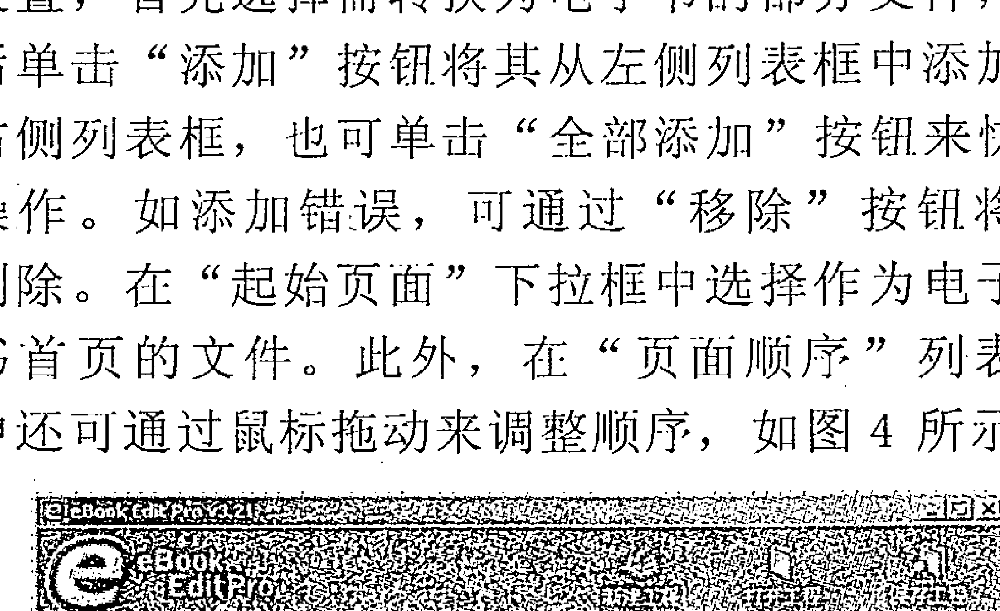

##### 3. 添加HTML文件

前述步骤设置完毕后，单击“下一步”按钮切换至“文件”选项卡，添加需转换为电子书的文件。单击“选择待编译的HTML文件所在的目录”下的“打开”图标按钮可选择相关目录，随后软件将对目录进行搜索，在下方的列表框中显示搜索文件的结果，并在右侧显示文件总数、文件大小及子目录情况。此外，如单击“重新扫描”

##### 5. 设置书签

设置完毕后，单击“下一步”按钮，切换至“书签”选项卡设置书签。在“URL”文本框中可输入地址，“描述”文本框中可输入标签名称，需注意：URL地址分为内部和外部地址，内部地址指电子书所包含的页面，输入时以“ebook:HTML文件名”来表示；外部地址需用“http://”字符开头，完毕后单击“添加到书签”按钮可继续设置另一个书签，如图5所示。

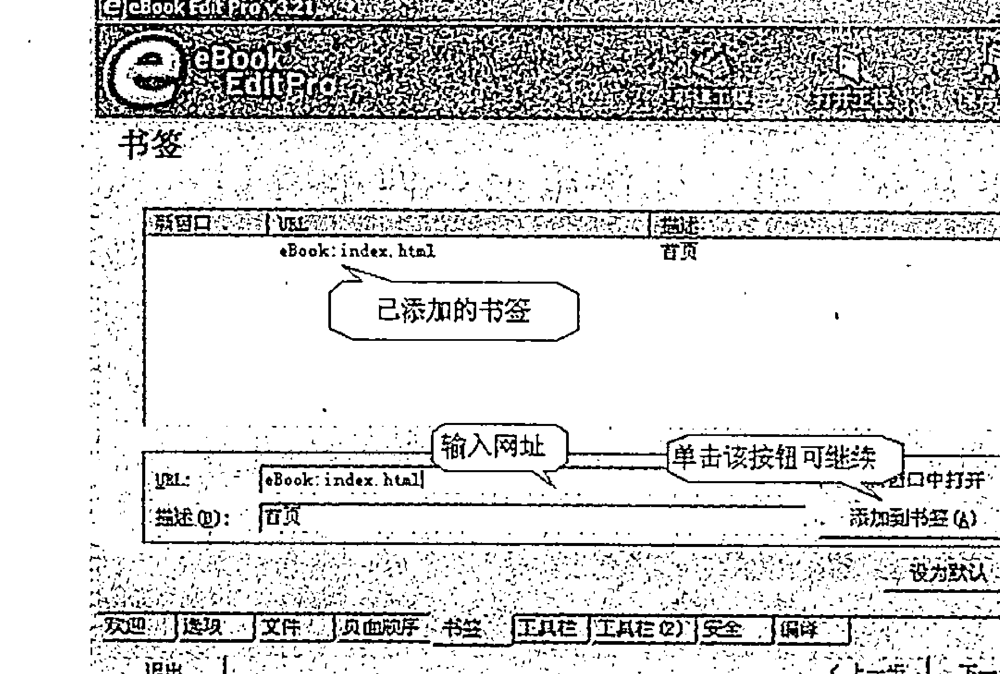

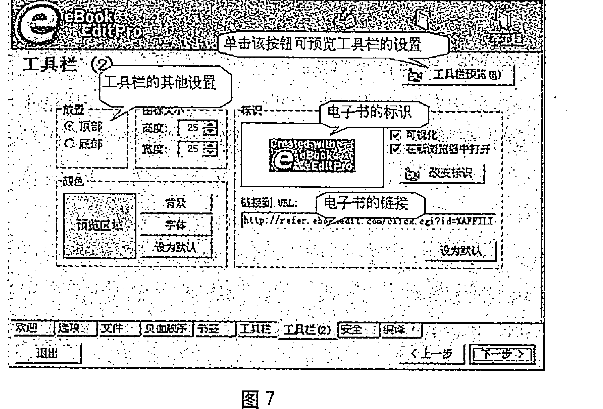

##### 6. 设置工具栏

在图8所示窗体中，“共享保护”栏包含两种保护方案：一是软件运行多少天后失效，二是软件运行多少次后失效，可按需设置。“要求验证密码”栏也提供了两种方案：一是启动时即要求输入序列号，二是免费使用期满后生成序列号。“自定义安全对话框的文本”栏中可设置各种类型的安全提示，如弹出安全信息标题、弹出文本要求输入序列号等。“核实被保护的页面”栏可选择需保护的网页文件并进行保护。“显示弹出安全信息”单选框可设置当用户试图访问被保护页面时，以对话框的形式显示的警告信息。“显示安全信息页面”单选框可在电子书中制作一个关于安全方面的页面，当用户试图访问被保护的页面时，该页面将显示。

设置完毕后，单击“下一步”，切换至“工具栏”选项卡，设置电子书可显示的快捷工具。用户可单击“工具栏预览”按钮来查看实际的工具栏效果，如需隐藏某些工具栏可取消工具栏前复选框的选择。此外，单击每个按钮对应的图标可使用自定义的位图文件来替换，软件允许用户最多显示12个工具栏，如图6所示。

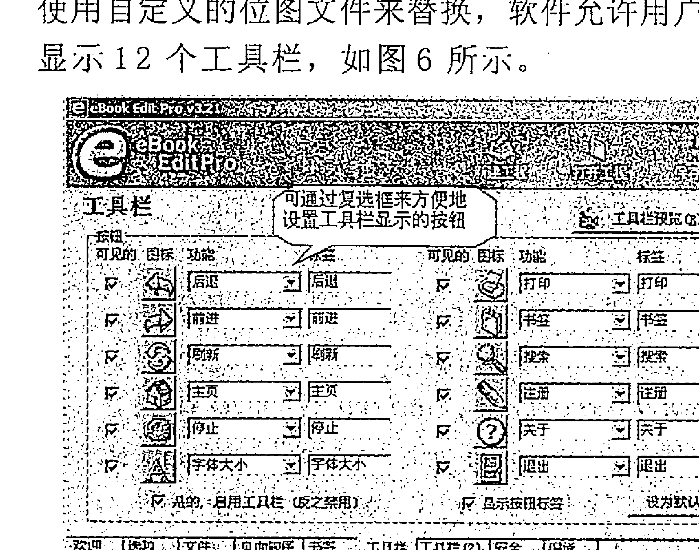

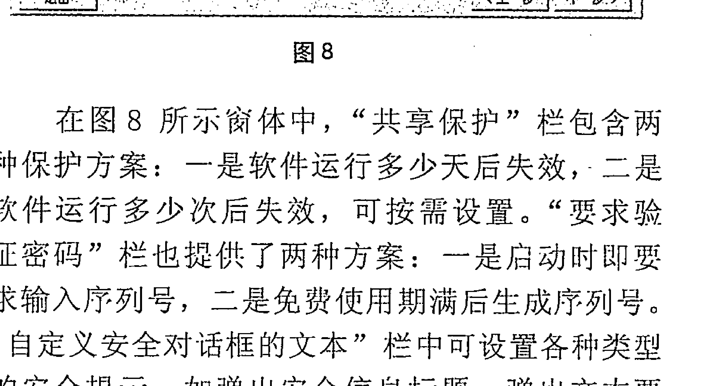

##### 7. 设置电子书标识

- （1）“无安全保护”单选框：任何用户均可无限制地浏览。
- （2）“密码”单选框：可设置一个密码，但该密码对于所有电子书的复制版本均有效，即只

设置完毕后，单击“下一步”按钮，切换至“工具栏（2）”选项卡，设置电子书的标识。用户可设置电子书的标识图片、单击链接的位置、图标的大小和位置、颜色和字体的大小等。此外，单击“工具栏预览”按钮还可预览工具栏的设置效果，如图7所示。

##### 8. 设置密码

设置完毕后，单击“下一步”按钮，切换至“安全”选项卡，为生成的电子书设置密码，如图8所示。

## 办公专刊

需有密码即可阅读。
（3）“用户名加序列号”单选框：为每个用户设置不同的密码。
（4）“10 位唯一的计算机代码”单选框：该安全级别最高，为每台计算机生成一个 10 位的代码，用户必须将该代码提交至作者，然后由作者生成相应的序列号并反馈后才可浏览。
对于“用户名加序列号”或“10 位唯一的计算机代码”两种方式，软件提供一个非常简单的“Key Maker”功能，用于生成用户名和计算机代码序列号生成器，单击“立即运行 Key Maker”链接，即可使用该软件，在链接界面中输入用户名或密钥，再单击“单击这儿来生成密码”按钮即可生成序列号，如图 9 所示。

图9

### 9. 编译生成

全部设置完毕后，单击“下一步”按钮，切换至“编译”选项卡生成电子书，如图 10 所示。

图10

在图 10 所示窗体中，首先选择电子书的保存文件夹和文件名，然后在“压缩”栏中设置压缩选项，具体包含“不压缩”、“快速压缩”、“标准压缩”和“最佳压缩”四个等级，压缩比随等级而逐渐提高。单击“测试 eBook”按钮可打开窗口显示电子书，单击“编译”按钮即可生成电子图书。本例生成的 EXE 格式电子书运行效果如图 11 所示。

图11

### 10. 使用技巧

eBook Edit Pro 软件为方便用户制作电子书，还提供了一些内部的特殊代码，具体如下所述：

- 1. “ebook:back”：回退代码。
- 2. “ebook:next”：前进代码。
- 3. “ebook:home”：页首代码。
- 4. “ebook:reload”：刷新代码。
- 5. “ebook:stop”：停止代码。
- 6. “ebook:print”：打印代码。
- 7. “ebook:font”：显示文字大小下拉菜单代码。
- 8. “ebook:font1”：文字最大代码。
- 9. “ebook:font2”：文字较大代码。
- 10. “ebook:font3”：文字中等大小代码。
- 11. “ebook:font4”：文字较小代码。
- 12. “ebook:font5”：文字最小代码。
- 13. “ebook:bookmark”：书签代码。
- 14. “ebook:search”：搜索代码。
- 15. “ebook:register”：注册代码。
- 16. “ebook:about”：关于代码。
- 17. “ebook:exit”：退出代码。

### 三、通过友益文书制作EXE电子书

#### （一）软件介绍

友益文书是一款使用方便的电子图书制作工具，可将TXT和RTF等格式的文件制作为可执行文件直接阅读。该软件是一款绿色软件，不需安装即可使用，并采用视窗风格、目录树结构管理和所见即所得的设计，不需复杂的转换和编译，即可自由地添加、删除目录树，并可随意编辑文档内容，改变字体大小和颜色。

软件最主要的特点在于具有超链接功能，生成可执行文件后文书仍可修改，是一款集资料管理、信息管理、电子文档和电子图书制作多功能于一体的工具。读者可在http://download.pchome.net/php/dl.php?sid=14702下载其4.5版本。

#### （二）软件使用

由于该软件是一款绿色软件，因此无需安装，只需放置在目录中即可运行。

##### 1. 编辑目录

软件的主界面分为左、右两个部分，左侧为目录框，右侧为编辑窗口。此外软件还提供了悬浮窗口、工具栏和菜单栏等，如图12所示。

图12

在目录框中单击鼠标右键将弹出快捷菜单，如图13所示。

图13

该快捷菜单的功能如下所述：

- （1）添加新目录：在当前目录下添加一个同级的目录（在同级目录最后面），文档内容为右边的文档内容。
- （2）添加子目录：在当前目录下添加子目录。
- （3）插入目录：在当前目录之前插入目录。
- （4）移动目录：将当前目录移至指定位置。
- （5）重命名目录：对当前目录进行重命名操作。
- （6）删除当前目录：删除当前目录及子目录。
- （7）确认修改文档：确认右边文档内容为当前目录的内容。
- （8）添加到书签：将选择的目录添加到书签中。

> 【小提示】
> 当文件设有修改密码时，在目录框里单击鼠标右键会弹出输入密码框，输入修改文书密码后才可编辑、移动目录和对文件进行设置和修改文档内容。

##### 2. 移动目录

按住鼠标左键拖动鼠标即可实现完成目录移动，目录移动包括移为子目录（移至目录文本或文本右方）、前插（移至目录的图标或图标左方）和目录最后（移至目录的后无文本处）。

##### 3. 菜单设置

软件允许用户对目录背景色、文档背景色、文书制作者等进行设置。“文档背景色”文本框可设置电子书的背景颜色；“目录背景色”文本框可设置电子书目录框的背景色；“文书制作者”文本框可输入作者名称；“主窗口标题栏文字”文本框可设置标题栏中显示的文字内容；“文书内容是否允许复制”栏可设置制作的电子书是否允许复制；“文书打开方式”栏中包含“普通”（允许对电子书进行修改）、“只读”（只允许阅读，无法修改并只显示部分菜单）和“浏览”（无法修改，完全不显示菜单）三个单选框；“文书不显示的菜单设置”栏可设置在电子图书中显示的菜单，如图14所示。

图14

##### 4．编辑文档

在右边的文档编辑窗口中，用户可直接输入文字，也可通过粘贴操作来输入文字。选择文字后单击鼠标右键，可对文字的字体大小、颜色等进行设置。

软件允许设置超级链接，分为文书内部超链接、Internet超链接和文件超链接三种。文书内超链接可直接选择目录进行超链接，如输入网址，可用“http://”开头（如http://www.cfan.com.cn），如输入邮件超链接，可用“mailto:”开头（如mailto:cfan@cfan.com.cn）。

> **［小提示］**
> (1) 在编辑框中仅在鼠标变为手形时超链接才有效，如在超链接位置上鼠标未变为手形，那么只需前后移动鼠标即可。同时超链接文字与超链接的目录或网址功能相同，进行复制或粘贴后，超链接仍有效。超链接文字的字体颜色无法更改，且文字无法增加和删除（除超链接文字和目录、网址相同外）。
> (2) 文件超链接即链接外部文件，超链接文件的路径分为绝对路径和相对路径，相对路径指相对文书目录下的相对路径，因此如有超链接的文件需发布，建议使用相对路径，即超链接的文件和文书放在同一目录下。

图15

在编辑框中单击鼠标右键，在弹出的菜单中选择“段落”，即可调整首行缩进、行间距和段落间距等，如图15所示。

软件还提供了对图片和表格的支持。如需插入表格，可先用Word等软件制作表格，然后复制表格至编辑框中粘贴即可将表格插入编辑框中。如需插入图像，可先用画笔将图片打开，然后将图片复制到剪贴板中，然后在编辑框中粘贴即可。

##### 5．使用悬浮窗口

当打开的文书可编辑时，软件会出现一个绿色的悬浮窗口，具有避免窗口间频繁切换的功能，还可加速文书编辑并方便上网。当鼠标在悬浮窗口停留时，会提示主窗口打开的文件，在悬浮窗口单击鼠标右键弹出快捷菜单，如图16所示。

图16

该弹出菜单的主要功能如下所述：

- (1) 新建目录粘贴：将剪贴板的内容粘贴至编辑框，并以第一行为标题新建一个目录。当上网或编辑资料时，对需编辑的资料可选择后复制，然后在悬浮窗口新建目录粘贴即可将资料添加至文书。
- (2) 插入对象粘贴：将剪贴板的内容插入当前编辑框。插入对象包括文字、图像和表格等。导入文档可导入 TXT 或 RTF 格式的文件，并以文档内容的第一行为标题新建一个同级目录。
- (3) 显示主窗口：弹出主窗口。此外双击悬浮窗口也可弹出主窗口。
- (4) 关闭悬浮窗：将该悬浮窗口关闭。

##### 6. 编译为可执行文件

电子书编辑完毕后，单击“生成可执行文件”菜单即可打开转换对话框，选择输出文件夹和文件名后单击“保存”按钮即可将其转换为可执行文件，转换后的文件可在任何计算机上阅读。

### 四、其他 EXE 电子书制作工具

除了前述的一些制作工具外，如前所述，由于 EXE 电子书的格式没有统一的标准，因此制作工具五花八门，本章将简介一些较实用的制作工具。

#### (一) ePublisher Gold 1.4

该软件为英文版共享软件，下载地址为：http://nj2.onlinedown.net/down/epublish.zip。

该软件使用了向导方式引导用户制作电子书，也支持基本的 HTML 标记、CSS 和脚本等。此外软件除基本的制作功能外还可添加作者的版权信息、支持自定义电子图书信息、设置全部或单个电子书的访问权限并且制作的 EXE 文件压缩率高于同类产品。

#### (二) E-Book HTML Compiler Pro 2.1

该软件为简体中文共享软件，下载地址为：http://www.newhua.com/file/ebook.zip。

该软件支持使用 48 × 36 像素的动态图片作为产品标识，与其它软件不同，该软件可按显示器的分辨率来随意调整运行后的默认窗口大小并支持音效和加密功能。在使用软件时需注意：每次制作完毕后应及时清空文件列表，以免下次制作时将原有的文件一并加入。此外在编译 HTML 文件时，软件会提示用户输入 EXE 文件运行的起始页面，因此需保证文件名的后缀正确。且软件不支持 CSS 和脚本。

#### (三) WebExe 1.5

该软件为简体中文共享软件，下载地址为：http://sq.onlinedown.net/down/HA_Webexe150_gnati.zip。

该软件专用于将 HTML 文件转换为 EXE 文件，提供了智能向导的方式，用户只需按提示操作即可轻松制作电子书。不过该软件不支持 Java、脚本、DHTML 和 Flash 等技术。

#### (四) 酷书制造 1.0

该软件为简体中文共享软件，该软件可非常方便地将图片、HTML 文件、TXT 文件和 MHT 文件批量封装为图文并茂的 EXE 电子书，且生成的电子书自动按目录生成关键字查询并可在阅读时加入书签。

#### (五) EbookBuilder 4.0

该软件为英文版免费软件，下载地址为：http://nj2.onlinedown.net/down/ebookbuilder4.zip。

## 揭开Office 2003的面纱

文/张金贵

- ○ 在 Word 中使用 XML 方法
- ○ 使用 Word 中阅读版式
- ○ 改进的 Word 文档保护
- ○ 比较 Word 文档
- ○ 设置文档的访问权限
- ○ 在 Excel 中使用列表管理数据
- ○ 在 Excel 中使用 XML
- ○ 增强的 Excel 统计功能
- ○ Outlook 新界面使用
- ○ Outlook 垃圾邮件的过滤
- ○ 为 Outlook 联系人添加个性图片
- ○ 为邮件增加隐私保护
- ○ 将幻灯片打包成 CD
- ○ FrontPage 新窗口的使用
- ○ 布局表格和单元格的使用
- ○ FrontPage 中使用行为
- ○ FrontPage 中使用动态模板
- ○ FrontPage 中使用网站视图
- ○ FrontPage 中优化测试 HTML
- ○ Access 中查看对象相关性
- ○ Access 中自动更新字段属性
- ○ Access 中自动备份数据库
- ○ 使用 InfoPath 创建和填写表单
- ○ 使用 Onenote 作笔记和便签
- ○ Visio 的新改进
- ○ Project 的新改进
- ○ Publisher 的新改进

在全球用户的期盼下，微软公司终于在2003年10月21日准时发布了 Office 2003，中文版也于2003年11月13日与国内用户见面。作为微软重量级的办公软件，新版本凝聚了微软2000多名工程师的心血和60万测试者的辛勤劳动，这次新版本的推出，不但在操作使用和功能上有了极大的提高，而且提出了办公“系统”的概念，加强了用户之间的协同和沟通，为用户提供了一个集成的系统，从而让Office从一个单一的办公应用组件发展成一个应用方案平台，这一观念的转变，必将为 Office 带来革命性的变化。

### 一、Office 2003简介

Office 2003 是 Office产品的第11个版本，作为新一代的办公软件，Office突破了原来单纯的办公应用组件，而是发展成为一个更全面、更集成的系统，可以全方位的为企业和个人创造价值。微软把新版的 Office 命名为“Office System”，意在强调这是一个系统，而不是单一的办公组件。Office System是一个庞大而复杂的系统，它集成了许多功能和组件，包括6个组件，11个产品，1项服务，以及解决方案加速软件(Solution Accelerators)。Office System 体现了微软为帮助个人用户、所在团队以及其服务的公司大幅度提高生产力以实现商业目标所进行的专注与努力。

Office System包括:

#### ●核心平台 Office 2003 包含的组件

- • Microsoft Office Word 2003
- • Microsoft Office Excel 2003
- • Microsoft Office PowerPoint 2003
- • Microsoft Office Access 2003
- • Microsoft Office Outlook 2003

#### ●独立应用软件

- • Microsoft Office Project 2003
- • Microsoft Office FrontPage 2003
- • Microsoft Office Publisher 2003
- • Microsoft Office Visio 2003
- • Microsoft Office InfoPath 2003
- • Microsoft Office OneNote 2003

#### ●服务器

- • Microsoft Office Project Server 2003
- • Microsoft Office Live Communications Server 2003
- • Microsoft Office SharePoint Portal Server 2003
- • Microsoft Exchange Server 2003

#### ○服务

- • Microsoft Office Live Meeting

#### ●解决方案加速器

- • Microsoft Office Solution Accelerators

#### ●服务器应用软件

面对这么多的产品，我们可能会感到眼花缭乱，它们既有我们熟悉的Word、Excel、Powerpoint等老产品，也有OneNote、Infopath等我们没有见过的新面孔，下面我们就来了解一下这些产品和组件的作用。

#### 1. Word 2003

Word 2003 是 Microsoft Office System 的字处理程序，是当今最流行也是功能最强大的文字处理软件，它适用于制作各种文档，如文件、信函、传真、报纸、简历等，也可以利用它快速制作网页和发送电子邮件。Word为我们的办公和生活带来了很大方便。

#### 2. Excel 2003

Excel 2003 是 Microsoft Office System 的电子表格程序，利用它可以制作出各种复杂的电子表格，完成繁琐的数据计算，将枯燥的数据转换为彩色的图形形象地显示出来，大大增强了数据的可视性，并且可以将各种统计报告和统计图打印出来，掌握了Excel可以成倍地提高工作效率。

#### 3. PowerPoint 2003

PowerPoint 2003 是 Microsoft Office System 的演示图形程序，主要用于制作幻灯片，可用于单独或联机创建效果。使用PowerPoint可以创建内容丰富、形象生动、图文并茂、主次分明的幻灯片，而且可以将制作的幻灯片在计算机上演示或发布到网站浏览。作为一个表达观点、传递信息、展示成果的强大工具，它在社会上得到了广泛应用。

#### 4. Access 2003

Access 2003 是 Microsoft Office System 的数据库管理程序，具有强大的交互性，用户可以不用编程就能够创建整个数据库，利用它可以将信息保存在数据库中，并可以对数据进行统计、查询及生成报告。

#### 5. Outlook 2003

Office 2003 是 Microsoft Office System 的个人信息管理器和通信程序，可用于组织和共享桌面信息，并可以与他人进行通信。Outlook 2003 提供了一个统一的位置来管理电子邮件、日历、联系人和任务。作为一个高度集成化的个人信息管理软件，Outlook给我们管理个人信息带来了极大的便利。

#### 6. FrontPage 2003

FrontPage 2003 是 Microsoft Office System 创建和管理 Web 站点的程序。它提供强大的功能和控制，可帮助你设计更好的 Web 站点，更快地生成代码，并通过合并 XML 功能和连接到外部数据源来扩展你的 Web 功能。FrontPage 2003 使你能够将 Web 发布从静态网页扩展到高级的交互式 Web 站点。

#### 7. OneNote 2003

OneNote 2003 是Microsoft Office System 生成便笺和管理便笺的程序。使用这个新程序，你可以捕获、组织和重用膝上型电脑、台式计算机或Tablet PC上的便笺。OneNote 2003 为你提供了一个捕获多种形式的信息的地方，其中包括键入的和书写的便笺、绘制的图表、音频唱片、Web上的照片和图片以及其他应用程序中的信息。然后OneNote 2003帮助你以喜欢的方式组织和重用这些信息，从而可以更好地管理每天面对的大量信息。

## 8. InfoPath 2003

InfoPath 2003 是 Microsoft Office System 的信息收集和管理程序，它简化了信息收集过程。这个新程序允许你执行三项主要操作：创建动态表单、完成表单、将这些表单提交给启用 XML 的系统和业务进程。它提供了一种高效灵活的收集信息的方法，并使单位中的每个人都可以重用这些信息。InfoPath 2003 使信息工作者可以方便及时地提供和获取他们所需的信息，从而制定更加可靠的决策。

## 9. Publisher 2003

Publisher 2003 是 Microsoft Office System 的桌面发布程序，它使得专业营销和通信资料的创建、设计和发布比以往更加简便。可以使用你在其他 Microsoft Office System 程序中熟悉的用户界面来创建用于打印、电子邮件和 Web 的资料。Publisher 2003 使得营销资料的创建和发布达到了一种新的水平。

## 10. Visio 2003

Visio 2003 是 Microsoft Office System 用于绘制业务和技术图表的程序，可以帮助你将想法和传统的业务数据转化为图表。Visio 2003 帮助你更好地了解和交流重要信息，从而改进了决策制定过程，在单位内营建一致的氛围，加强沟通，并给用户带来更加专业、更加持久的影响。

## 11. Project 2003

Project 2003 是 Microsoft Office System 的项目管理程序，包括 Microsoft Project Professional 和 Microsoft Project Server，二者结合在一起可以提供强大的企业项目管理（EPM）解决方案，使得单位可以协调企业指标、项目和资源，从而达到更好的商业效果。通过使用其灵活的报告和分析功能，你可以确保拥有可操作的信息来帮助优化资源、安排工作优先顺序并协调你的项目与总体商业目标。

其它的一些服务器和服务产品，是专门为企业用户定做的，主要用来帮助企业用户进行“团队协作”，这样才能发挥 Office System 作为一个“系统”所表现出来的强大与实用，由于这些功能个人用户很少涉及，我们这里就不再讲述。

## 二、Office 2003 的主要改进

作为一个全新概念的Office办公软件，Office 2003 与 Office XP 相比，有了很大的变化，它是微软Office应用软件平台产品的一次重要飞跃和重大更新，通过在协作、集成和个人生产力上的突破性创新，Office 2003 将帮助企业极大地释放信息能量，实现商业潜能。

Office 2003 的主要改进之处并非单个的应用程序，而是能够让用户一起工作的能力。看看下面这些改进，你就会有一个深刻的体会。

Office 2003 在四个方面作了改进：信息管理和控制、业务处理、沟通与协作以及个人工作效率。

### 1. 电子邮件及信息的管理和控制

Outlook 2003 做了显著地重新设计以使阅读和组织电子邮件变得更轻松。其中最明显的地方包括查看区域变得更大，这样就可以看到邮件的更多内容，减少了滚动页面的次数。

新的 Outlook 2003 工具将根据所选择的条件组织邮件并压缩长线程的电子邮件会话。

Outlook 2003 包括“智能连接”和“缓存模式”以允许用户在忙碌的时候检查电子邮件，同时使用户获得当今各种网络和数据连接的更一致的体验。

### 2. 业务处理

Office 2003 允许创建和分析支持 XML（可扩展标记语言）的内容，这样就可以为改进的业务处理创建功能强大的新解决方案。

Office 2003 中的 XML 使得在文档中实现了新的工作流级别。它还可以用于简化不同来源的信息的日常使用和处理，从而减少冗余和错误。

开发人员和高级用户可以开发利用熟悉的 Office 界面和工具的解决方案。两个新功能是： Excel 2003 可视化设计工具（它使你能够不用代码来创建 XML 架构）和数据绑定 Web 部分（它使 Web 站点的信息可以显示在文档中）。

XML 支持使你可以对内部及外部数据源进行研究。每个 Office 应用程序都将包括一个任务窗格，根据管理员的选择，该窗格可在企业防火墙后面或在 Internet 上进行搜索。

### 3. 协作与沟通

Office 2003 和 Microsoft Windows SharePoint Services 一起提供了一个进行协作文档创作的平台。每个 Microsoft Office 文档都将有一个显示详细信息的任务栏，所显示的信息包括在 SharePoint 站点的何处检索此文档、谁在使用此文档、任务以及在何处查找相关链接和更多信息。

“活动”电子邮件文档，“活动附件”使每个作者可以实时跟踪所有投稿人的改动。

Office 2003 文档中的“即时消息”可以让用户即时地进行通信，而无需打开 Outlook 2003 或离开正在使用的应用程序。

另一项 Windows SharePoint 服务“会议工作区”为你提供了一个工作区，以帮助你召开并跟踪会议进程。新的 Microsoft Office 2003 允许文档置于办公场所以提供会议通信和文档，帮助组织、共享和存档信息。

### 4. 个人工作效率

所有的创新都对提高单个用户的工作效率有帮助。Office 2003 不断地对其所有核心应用程序进行改进，以使其使用更方便，功能更强大。同时还保留了传统 Microsoft Office 一贯的可靠性、安全性和易用性。

## 三、安装过程

- 1. 将光盘放入光驱，双击 Setup.exe 文件，启动 Office2003 安装程序，程序首先运行配置向导，稍候片刻，出现输入产品密钥窗口，输入软件的序列号，单击“下一步”。
- 2. 输入用户名、单位等个人信息，单击“下一步”。
- 3. 出现“最终用户许可协议”，选中“我接受《许可协议》中的条款”选项，单击“下一步”。
- 4. 选择安装类型，有典型安装、完全安装、最小安装和自定义安装四种类型，一般选择默认的典型安装方式，单击“浏览”按钮可以选择安装目录，设置完毕，单击“下一步”。
- 5. 出现画面，提示你安装程序准备完成，将开始安装程序，单击“安装”按钮，就会正式开始安装软件。

安装完成后，无须重新启动系统，就可以开始使用 Office 组件。

对于其它独立的组件，如 Frontpage2003、Visio2003、Project2003、Onenote2003 等，安装过程与此类似，不在赘述。

## 四、文字处理 Word 2003 新功能介绍

从前面的介绍我们可以看出，Office System 是一个庞大而复杂的系统，其中包括了许多产品和组件，它们有机的结合在一起，组成了 Office System 一个完整统一系统。对于一般的用户来说，Office XP 中的一些组件已经基本能够满足他们大多数的工作。因此，我们首先介绍一下 Office XP 原有组件在 Office 2003 中都有哪些新的变化，这些组件包括：Word 2003、Excel 2003、Powerpoint 2003、Outlook 2003、Access 2003、Frontpage 2003。

### 1. 全面提供对 XML 文档的支持

XML（可扩展标记语言）是一种可替代 HTML 语言并且在互联网上有广阔应用前景的新的标记语言，因此，微软在新的版本中提供了对 XML 文档的支持，也预示了它的超前性。在 Word 2003 中，用户可以方便的建立和保存 XML 文档。

新建 XML 文档有两种方法：

第一种方法：单击“文件 / 新建”命令，在打开它的“新建文档”任务窗格中单击“XML 文档”，就会出现“XML 结构”任务窗格，单击其中“模板和加载项”，弹出“模板和加载项”窗口（图1），单击其中的“添加架构”按钮，然后按照提示选择一个已经建立好的架构文件，此时就会在 XML 任务窗格底部显示出可以应用的 XML 标记，然后根据需要选择要添加到文档中的 XML 标记即可，最后保存，就可以建立一个 XML 文档。

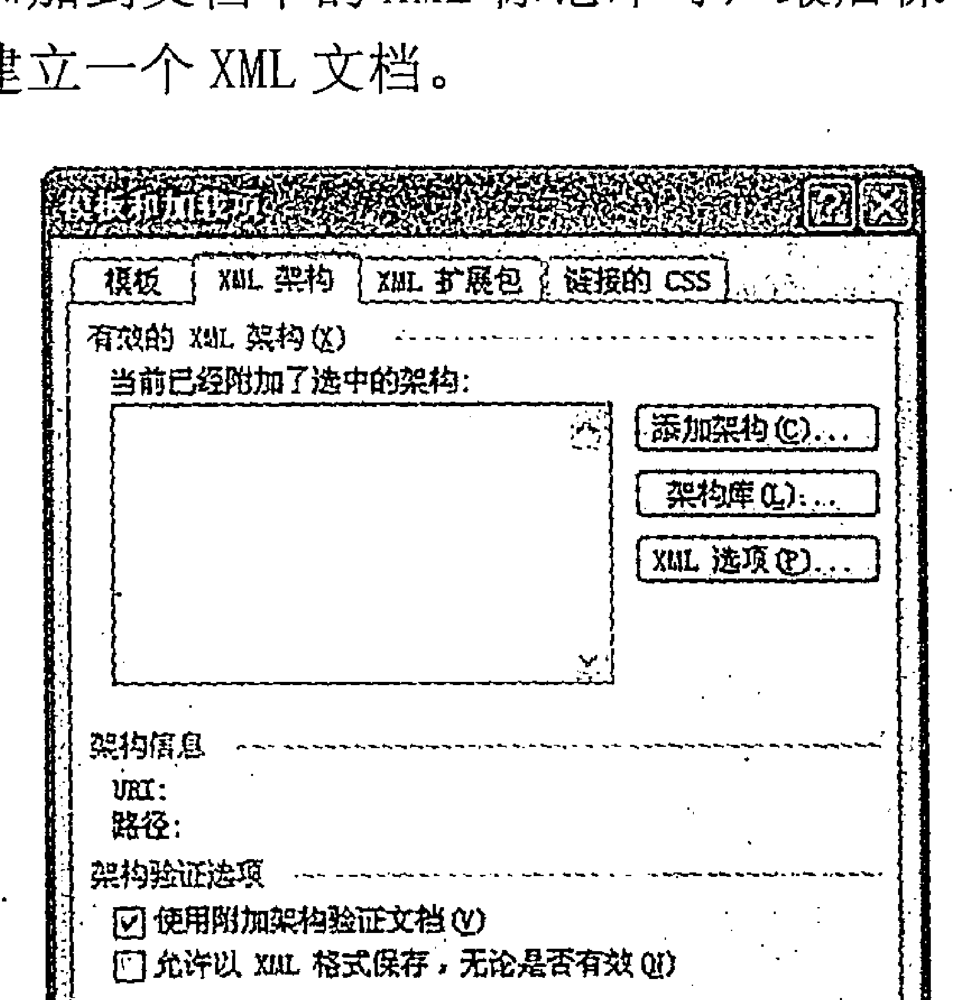

第二种方法，采用嵌入式，单击“插入 / 域”命令，打开“域”窗口，在“域名”下拉列表中选中的 includetext，然后在“域选项”中选中“Xpath 表达式”选项，指定一个表达式，也可以将 XML 数据嵌入到当前文档中。保存 XML 文档的方法就比较简单了，单击“文件 / 保存”命令，在“保存类型”下拉列表中选中“XML 文档 (*.xml)”选项，然后单击“保存”按钮即可。在保存过程中，如果希望以某种特定方式设置 XML 数据的格式，可以选中“应用转换”选项，然后单击“转换”按钮，选择转换的文档即可；如果只想单纯的保存数据，选中“仅保存数据”选项就行了。

### 2. 新的阅读版式视图

在原来，如果我们编辑了一篇较长的文档，那么在屏幕上阅读起来是非常不方便的，为了改变这种状况，Word 2003新增了“阅读版式”视图，它针对用户的屏幕大小和分辨率优化了显示效果，这种视图不更改文档本身，只更改页面版式并改善字体的显示，以便用户更加轻松方便地阅读文档。它的使用很简单，单击工具栏中的“阅读”按钮，就可以打开“阅读版式”窗口（图2），在这个窗口中，它自动隐藏了一些不必要的工具栏，而且自动将文档内容缩放到屏幕上合理放置，并且便于浏览的多个页面。单击“文档结构图”按钮，可以在窗口左侧显示文档中的所有标题，以便快速地查找文档中的内容；单击“缩略图”按钮，可以在窗口左侧显示文档的分页缩略图。除此之外，你还可以放大/缩小显示字体，选择以“实际页面”或“多页”方式进行查看。如果需要，还可以在阅读版式中进行编辑操作，如添加批注或修订，所有这些功能，给我们阅读文档带来了非常轻松和愉快的感觉。

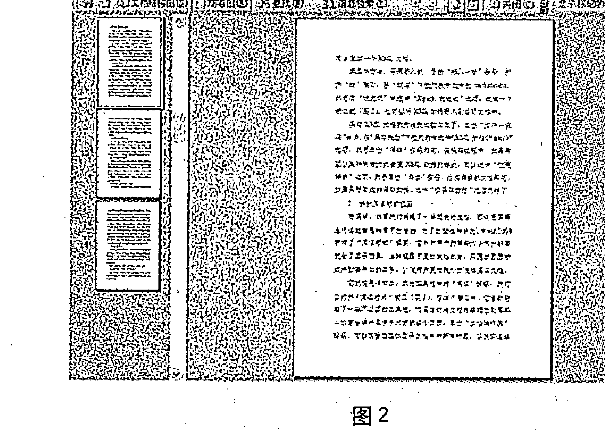

### 3. 改进的文档保护功能

在 Word 2003中，文档保护功能得到了很大的增强，它不但能够操作特定的文档格式，而且还可以有选择地保护文档中的部分内容，这就给用户保护文档带来了很大的便利。单击“工具/保护文档”命令，就可以打开“保护文档”任务窗格（图3），就可以有选择地进行文档保护了。

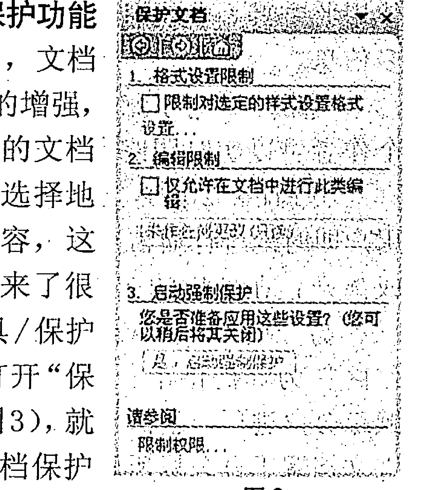

### 4. (1) 保护文档格式设置

选中“限制对选定的样式设置格式”选项，然后单击“设置”，弹出“格式设置限制”窗口，在下拉列表中可以选择要限制的格式，然后单击“确定”即可。这样就可以防止用户使用你没有明确指定可用的样式，还可以防止用户将项目符号列表、编号列表或字体属性对格式直接应用于文本。注意，当格式设置受到限制时，直接应用格式的命令和键盘快捷键均不起作用。

### 5. (2) 允许编辑保护文档中的内容

在将文档设为只读或仅允许添加批注时，用户可以将部分文档指定为无限制，还可以对特定用户授权修改文档中不受限制的文档内容，它的操作方法如下：在“保护文档”任务窗格中，选中“编辑限制”下的“仅允许在文档中进行此类编辑”选项，在下拉列表中选择“未作任何更改(只读)”，然后在文档中选中需要开放限制的内容，如果允许打开文档的任何人编辑选定的内容，可以选中“组”框中的“每个人”；如果只允许特定的用户编辑选定的内容，则需单击“更多用户”，然后在弹出的窗口输入用户名，最后单击“确定”，然后选中允许编辑的用户名。重复以上操作，可以继续为文档中的其他部分分配用户的编辑权限，最后单击“是”，启动“强制保护”按钮，然后在弹出的窗口中输入密码即可。

### 6. 并排比较文档

如果你想比较两篇文章的差异，可以使用“并排比较”命令来完成。首先打开这两篇文档，然后单击“窗口/并排比较”命令，窗口会自动平铺显示两篇文档，同时显示一个“并排比较”工具条，然后就可以同步比较两篇文档的异同了。

### 7. 信息权限管理

信息安全现在是越来越重要了，Word 2003 在这方面也有了极大的提高，它新增的“信息权限管理”（IRM）功能可以赋予用户“读取”和“更改”访问权限，以及设置内容的到期日，这样，就可以防止重要的信息被其他人获取。

它的用法很简单，单击工具栏中的“权限”按钮，选中“限制对些文档的权限”选项，然后就可以在“更改”和“读取”框中输入用户的电子邮件地址，当然也可以从通讯簿中选择。单击“其他选项”按钮，可以进行一些高级设置，全部设置完毕，单击“确定”，就可以在“共享工作区”任务窗格看到该文档的受限权限及授权人信息。

### 8. 其它新增功能支持墨迹输入功能

如果你使用的是 Tablet PC，就可以直接使用 Tablet 笔来利用 Word 2003 的手写输入功能，直接用手写批注、注释和发送手写电子邮件。

### 9. 增强的邮件合并功能

Word 2003 新增了一个“邮件合并”任务窗格，利用它可根据收件人的性别选择不同的问候语，还可以根据收件人所在的国家和地区选择不同的地址格式。

另外，增强的排版功能可以实现更好的多语言文本显示。智能标记也更加完善，新增了“多语言人名识别”和“中文日期”智能标记。批注和修订功能也得到了改进，使它们更加清晰更易于使用。

## 五、电子表格Excel 2003新功能介绍

Excel 2003 新增和改进的功能主要有：

### 1. 利用列表功能管理数据

Excel 2003 新增了一个列表功能，利用它可将表格中的某一部分指定为列表，然后可以方便地管理和分析列表中的数据而不用担心列表之外的其他数据，在列表中你可以排序、筛选、汇总、求平均值、建立图表等操作。一个工作表中可以建立多个列表。

要想建立列表，首先在工作表中选择一个区域，然后单击“数据 / 列表 / 创建列表”命令，弹出“创建列表”窗口，单击“确定”，就可以创建一个列表，同时弹出“列表”工具条（图4）。

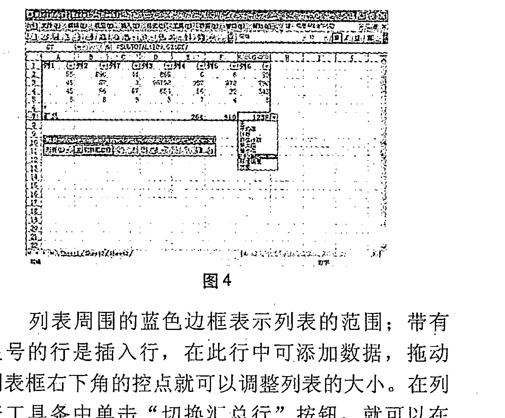

列表周围的蓝色边框表示列表的范围；带有星号的行是插入行，在此行中可添加数据，拖动列表框右下角的控点就可以调整列表的大小。在列表工具条中单击“切换汇总行”按钮，就可以在列表下部添加汇总行，进行求和、平均值、方差等运算。单击每列标题行中的三角按钮可以按升序或降序排列数据，选择“自定义”可以按你的要求自动筛选数据。

如果想取消列表，恢复工作表原貌，可以单击“数据 / 列表 / 转换为区域”命令来完成。

在列表中你可以任意插入行 / 列，同时还可以将列表发布到 sharepoint 网站上与其他用户共享数据。

### 2. XML 支持

Excel 2003 对 XML 提供了更广泛的支持，使得用户分析和共享信息更加容易，利用 Excel 你不但可以将工作表保存为 XML 表格或 XML 数据，而且可以在任何客户定义的 XML 架构中读取数据，当 XML 数据变化时，动态更新图表、表格和曲线图。在 Excel 2003 的“数据”菜单中新增了一个“XML”子菜单，专门用来处理 XML 数据。

### 3. 增强的智能标记

Excel 2003 中的智能标记更为灵活，你可以将智能标记操作与电子表格中的特定部分关联在一起，并使适当的智能标记操作仅在用户将鼠标悬停在关联的单元格区域上时出现。

### 4. 并排比较功能

利用“并排比较”功能可以很方便地比较两个工作簿中的内容。方法是：打开两个工作簿，单击“窗口 / 并排比较”命令，就可以看到两个工作表并排显示，当你滚动第一个工作表时，第二个工作表也同步滚动。利用“并排比较”工具条可以设置两个工作表是否同时滚动以及重置窗口的位置，使它恢复比较时的初始状态。

### 5. 增强的统计功能

Excel2003对大多数的统计函数进行了改进，使它们的外观和精确性都得到了增强。

## 六、邮件收发 Outlook 2003 新功能介绍

在 Office 的所有组件中，变化最大的就是 Outlook 2003 电子邮件组件，这一组件使得电子邮件更方便阅读和阻止垃圾邮件，可以说，新版的 Outlook 无论在界面，还是功能操作上都给我们一种崭新的感觉，它已经在由一个简单的邮件收发工具向专业的个人信息管理工具转变。

### 1. 崭新的工作界面

Outlook 2003 与以前的版本相比有了很大的变化，邮件预览窗口放到了右侧，增大了阅读面积，当然它也可以放到下面或关闭。最左侧的导航窗格也经过了重新的整合，利用最下边的配置按钮可以很方便地增加 / 删除导航窗格中显示的项目，“文件夹列表”也被设计成一个按钮，单击即可查看。在“文件夹列表中”新增了一个“搜索文件夹”，可以通过它添加新的搜索条件（图5）。

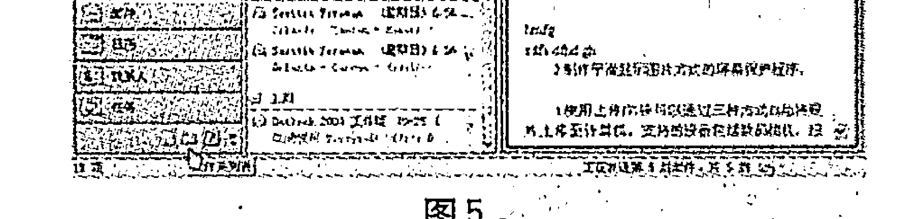

最明显的一个变化就是在取消了“收藏夹”菜单，新增了一个“转到”菜单，利用“转到”菜单就可以方便地在导航窗格中的各个窗格之间进行切换。原来的“收藏夹”菜单被整合到了邮件窗格中。

在阅读邮件时，你可以选择以纯文本方式阅读和查看已打开过的 HTML 邮件，当在邮件中有超链接时，单击它就会新开打 IE 窗口进行浏览，而不是像原来版本的 Outlook 一样仍在 Outlook 预览窗口中打开。

对收件箱中的邮件，Outlook 提供了13种排序方式，你只需单击“排序字段”，在弹出的窗口中就可以选择排序的方式。其中按会话排序可以允许用户按照某种排序方式将电子邮件会话中的邮件分组在一起，以便于查找和响应会话或“线程”。

“日历”视图也经过了极大的简化，隐藏了“任务板”，“日期选择区”也移到了导航窗格中，新的指示器可以使用户更容易地查看当前的日期和时间，现在你可以用“日历”视图同时查看多个日历。

### 2. 增强的垃圾邮件过滤功能

面对越来越厉害的垃圾邮件，用户苦不堪言，希望有更强大的垃圾邮件功能，微软在新的 Outlook 中对垃圾邮件过滤功能进行了很大的改进，可以说，只要灵活使用好这个功能，就可以帮助用户屏蔽掉大多数的垃圾邮件。这个功能也是 Outlook 的一个亮点，它可以自动鉴别垃圾邮件，并将垃圾邮件放到垃圾邮件文件夹中，还可以阻止邮件自动下载其中的图片和其它内容。

单击“工具→选项→首选参数→垃圾电子邮件”，在打开“垃圾邮件选项”窗口中单击“选项”标签，就可以设置垃圾邮件的保护级别，在“安全发件人列表”、“安全收件人列表”和“阻止发件人列表中”标签中可以建立相应的邮件列表，这样程序就会自动根据你的列表来筛选垃圾邮件，并将捕获到的邮件放到专门的垃圾邮件文件夹中。

### 3. 新增联系人图片功能

现在你可以给自己的联系人添加有个性的图片，并且将图片与姓名和其他信息相关联。方法是：在添加联系人窗口中单击带有人头标记的“添加联系人图片”按钮，然后选中你满意的图片即可。

### 4. 新增功能标记图标

在预览邮件窗口中你可以看到在发件人的旁边有一个 MSN Messenger 图标，单击它就可以进行许多操作。

### 5. 改进的地址簿

对“选择姓名”对话框进行了改进，可以显示更多信息，还可以调整对话框大小以便利用较大的显示器。同时，由于 Outlook 2003 支持 Unicode 编码标准，所以在地址簿以其他语言输入的信息（如繁体中文）再也不会显示为乱码了。

### 6. 记忆式键入功能

Outlook 现在也可以自动记忆你输入过的电子## 7. 增强的隐私保护功能

现在有些垃圾邮件采用了比较高明的做法，它在邮件中有图片和声音，但这些图片和声音并不包含在邮件本身中，而只有当你在打开邮件时才从WEB服务器上下载，如果你此时同意下载了这些内容，那么垃圾邮件发送者就会获得你的信息，从而给你发更多的垃圾邮件。因此，我们必须禁止下载这些内容。单击“工具→选项→安全”，单击“更改自动下载设置”按钮，然后在弹出的窗口中选中“在HTML电子邮件中禁止自动下载图片或其他内容”选项。

## 8. 简化了新邮件撰写窗口

在用Word作为撰写新电子邮件的编辑器时，Outlook 2003 进行了许多简化，用新的“电子邮件”工具栏取代了原来的混合工具栏，将“格式”和“标准”工具栏放到了邮件正文的上方，这样更易于操作，并且节约了屏幕空间。

## 9. 其他新功能

Outlook的信息权限管理可以创建具有受限制的邮件；在电子邮件中展开通讯组列表；最小化时隐藏Outlook任务栏按钮；新邮件桌面通知可以巧妙地淡入；邮件下载速度显著提高，而且可以显示下载进度条；对每个电子邮件帐户，都可以有一个不同的默认电子邮件签名。

## 七、幻灯片 PowerPoint 2003
新功能介绍

### 1. 将幻灯片打包成CD功能

在以前的版本中，大家一直对PowerPoint的打包功能感到不满意，现在好了，利用PowerPoint 2003可以直接将幻灯片、播放器及相关的文件刻录到光盘上，制成一个可自动播放的光盘。它的操作也很简单，单击“文件→打包成CD”，弹出一个窗口（图6），单击“复制到CD”按钮，放入刻录盘，即可刻成一张光盘。如果想将多个幻灯片刻录到同一张光盘上，可以单击“添加文件”按钮来逐一进行添加。单击“选项”按钮，可以设置打开/修改文档的密码以及是否包含播放器等选项。如果单击“复制到文件夹”按钮，则可以将幻灯片发布到一个指定的文件夹中，其包含的内容与记录到光盘中的一模一样。

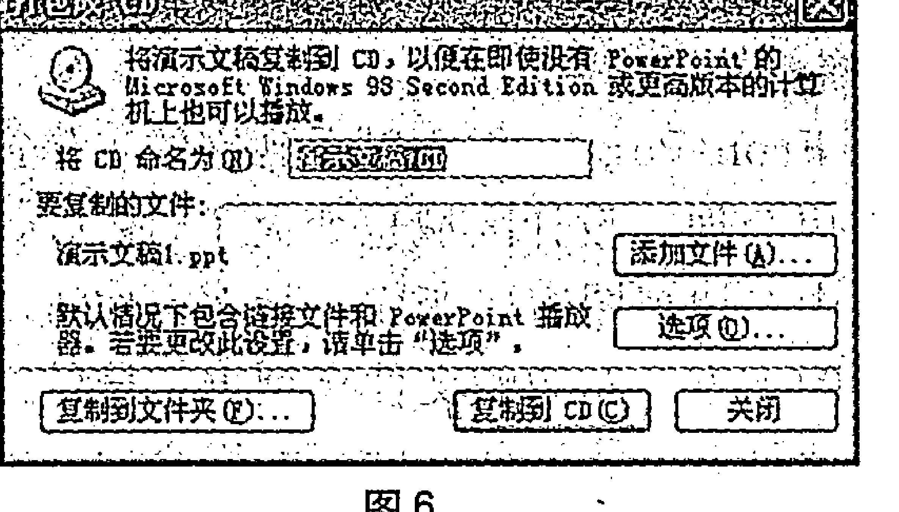

### 2. 改进的播放器

PowerPoint2003中的播放器功能得到了很大的改进，具有高保真输出功能，它与Windows Media Player集成，可以全屏播放视频、流式音频和视频，或从幻灯片内显示视频播放控件。默认情况下，PowerPoint播放器与Office2003一起安装，当然你也可以从网站下载。当你使用“打包到CD”功能打包幻灯片时，默认的包含播放器，在打包后的文件夹中双击Pptview.exe文件，就可以启动播放器，选择要浏览的幻灯片，就可以放映了。

### 3. 全屏幕播放影片

PowerPoint2003可以全屏幕观看和播放影片，方法是：在编辑窗口中右键单击插入的视频文件，在弹出的菜单中选择“编辑影片对象”命令，在弹出的窗口中选中“缩放至全屏”选项即可。

### 4. 墨迹注释功能

墨迹注释功能可以帮助用户在做演示时使用墨迹标注幻灯片，新版的PowerPoint在这方面有了很大的改进，它提供了多种字迹供用户选择，而且可以随意擦除和保存墨迹。

### 5. 支持智能标记

智能标记在Word、Excel中得到用户的高度评价，现在PowerPoint2003中也增加了该项功能，单击“工具→自动更正选项→智能标记”，选中“给文字加上智能标记”选项，然后在列表中选中相关的选项即可。

## 八、网页制作 FrontPage 2003
新功能介绍

提起以前版本的FrontPage，往往令专业网页设计者摇头，因此FrontPage也就成了初学者的入门产品，很难树立起一个专业网页制作工具应有的威信。微软公司在FrontPage2003中痛定思痛，进行了许多革命性的变革，尤其是吸收了其他网页设计工具如Dreamweaver的优点，并加以创造性的运用，可以说，现在展现在用户面前的FrontPage已经今非昔比，令人刮目相看了。

### 1. 崭新的工作窗口

打开FrontPage，你可以看到它的工作窗口比以前变得更合理，设计区域也变大了(图7)。它将以前版本中左边视图窗口变成一行文字按钮，放在网站窗口的下方，左边的文件夹列表和导航窗格也可以自由地打开/关闭。在网页编辑窗口下方有四种视图方式，即设计、拆分、代码和预览，这比上一版本新增了一个“拆分”视图，它可以同步编辑网页代码并且查看效果。

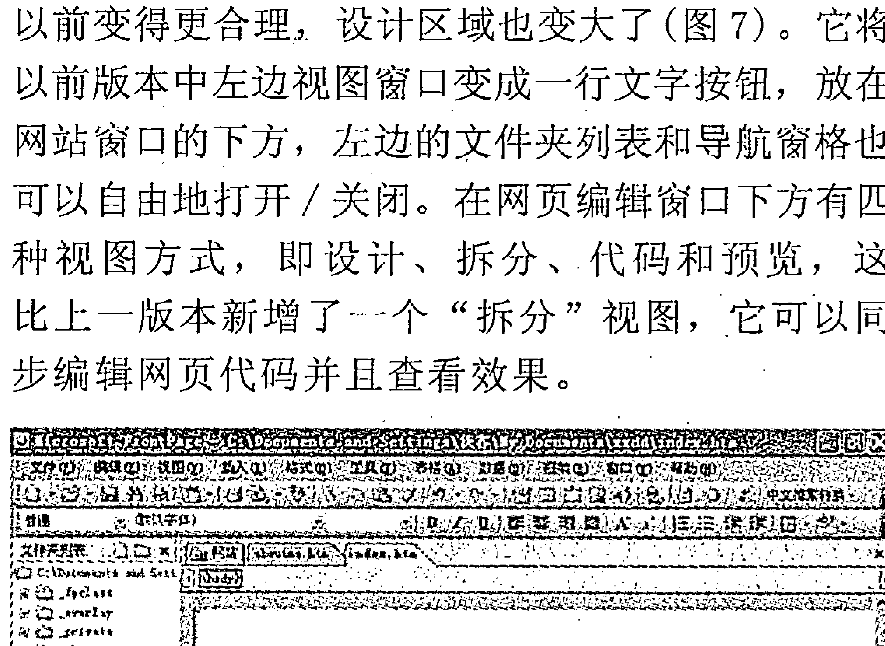

另外，FrontPage还增加了显示标尺和网格的功能，单击“视图→标尺和网格”就可以使标尺和网格显示出来，这样更加方便用户精确设计网页。

### 2. 布局表格和单元格

如果想创建专业化的网页外观布局，利用传统的方法就显得有些过时了，而且出力不讨好。现在有了“布局表格和单元格”就可以帮你解决如何设计专业化、个性化网页的问题。

微软为此新功能特意新增了一个“布局表格和单元格”任务窗格，在此窗格中你可以单击“插入布局表格”和“插入布局单元格”，自动插入布局表格和单元格；也可以单击“绘制布局表格”和“绘制布局单元格”按钮手工进行绘制，你还可以直接在下面的“表格布局”中选择相应模板，单击就可以创建一个表格布局，然后就可以像修改表格一样修改、添加、删除表格和单元格，所有这些都可以通过任务窗格中的相关命令来完成，布局完成以后，在其中输入文字、图像等元素，一个极富专业效果的网页就完成了，效率是不是很高？

### 3. 对层的支持

利用层可以方便地在网页中插入对象，然后通过让层显示/隐藏、重叠或嵌套，设计出复杂美观的网页，在层任务窗格中，用户可以单击“插入层”和“绘制层”按钮来自动或手工创建层，然后在层中插入任意的网页元素。在层任务窗格中可以查看层的状态，修改层属性。层是网页中的一个独立元素，它可以自由地移到网页中的任何位置，一个网页中可插入多个层。

### 4. 对Flash的支持

在FrontPage2003中，用户终于可以方便地插入Flash动画了，方法是：单击“插入/图片/Flash影片”命令，就可以在文档中插入Flash动画，然后在Flash动画上右键单击，可以播放Flash动画或修改Flash动画的属性。

### 5. 支持描摹图像

利用描摹图像，你可以方便、准确地进行网页元素的设计和定位，它就像一张描红纸，放在网页的下面，可以显示/隐藏、改变透明度和位置。它只在设计网页时起作用，在网页浏览时并不会显示出来。单击“视图/描摹图像/设置”命令，就可以调节图像的透明度和显示位置。

### 6. 制作交互式按钮

单击“插入/交互式按钮”命令，弹出交互式按钮窗口。在此你可以自由地设置按钮文字、选择字体和按钮颜色、定义链接，并且可以为原始、悬停及按下状态设置图像和文字。

### 7. 支持行为功能

利用行为功能，我们就可以给网页中的元素，如文本和图像添加交互性或增强功能。在网页中选中要添加行为的元素，如一幅图片，然后在“行为”任务窗格中，单击插入按钮，我们可以看到FrontPage内置了16种行为，假如我们要实现单击图片弹出一个消息框的效果，就单击“弹出消息”，弹出一个对话框，输入要弹出消息的内容，单击“确定”，就可以在行为任务窗格中看到新增加的行为事件，单击“事件”下拉菜单，选择onclick选项，意思是单击鼠标，最后预览网页，单击图像，就会弹出一个消息框。

### 8. 增强的代码编辑功能

FrontPage2003 对代码编辑新添了许多功能，单击“代码”视图，首先可以看到它增加了行号显示，另外新添加了“智能感知”，当你输入 HTML 标记时，程序会自动弹出标记提示窗口，让你选择需要的标记，选中标记后，又会弹出该标记的属性及行为标记选择窗口供你选择，完成标记输入后，程序又会自动加上结束标记。有了这个功能，用户输入代码时就方便了许多。

单击“视图→快速标记选择器”，就会在编辑窗口上方出现一个标记条，单击不同的标记就可以快速选定相应的标记或内容。另外，单击“视图→显示标记”命令可以在设计视图中显示标记，单击它也可以选中相应的标记内容。

在代码视图中，将光标移到某一个位置，按 Ctrl + Enter 键，就会弹出一个窗口，选中要插入的内容双击，就可以在文档中该标记的代码段。

除此之外，FrontPage2003 还提供了许多加快代码编写的工具，如自动换行、自动缩进、书签、高级代码选项以及对 ASP.net 控件进行预览、重新放置和调整大小。

### 9. 建立数据驱动网站

FrontPage 扩展了网站的功能，使其能够以新的方式与人员和信息链接。你可以方便地将数据视图插入网页中，通过使用“WEB 部件”任务窗格，向网页添加一个或多个 WEB 组件，利用数据视图 WEB 部件直接在设计视图中针对实时数据创作数据视图，这样就可以以“所见即所得”的方式建立起一个丰富的、交互式的数据驱动网站。

### 10. 使用动态 WEB 模板

在以前版本的 FrontPage 中，我们是使用共享边框来在网页上创建被网站内的一个或多个网页所共有的区域，操作和使用都比较麻烦，现在利用动态 WEB 模板可以方便地创建共享同一布局的网页。除此之外，你还可以允许他人对模板中的一些区域进行编辑，但仍保留网页的布局与模板本身不变。

创建动态模板的方法很简单，新建一个网页，然后单击“文件→另保存”，在文件保存类型中选择“动态 WEB 模板”，“保存”即可。单击“视图→工具栏→动态 WEB 模板”，在屏幕上出现“动态 WEB 模板”工具条，在模板中选中某个区域，然后单击“动态 WEB 模板”工具条上的“管理可编辑区域”按钮，在弹出的窗口中输入区域名称，然后单击“添加”按钮，就可以指定一个可编辑区域，重复以上操作，可以添加多个编辑区域。

当要在某个网页中插入动态 WEB 模板时，首先打开该网页，然后单击“格式→动态 WEB 模板→应用动态 WEB 模板”命令，就可以将动态 WEB 模板插入到当前网页中，然后就可以根据需要修改可编辑区域。

### 11. 新增网站视图

微软改变了原来版本中“发布网站”功能较弱的状况，新增了“远程网站”视图，利用它可以直观地浏览和发布网站。单击“视图→远程网站”，设置好远程网站的属性后，就可以显示一个远程网站视图。在该视图中同步显示了本地网站和远程网站中的文件，通过它，用户可以方便地上传、下载和同步文件。

### 12. 优化HTML

在发布网站时，用户可以将网页中多余的空标记、空白、多余标记、不用的和空的样式以及指定的某些标记删除，在优化HTML、减小网页的体积。在“远程网站视图”中单击“优化发布的 HTML”按钮，在打开的窗口中选中“在发布时通过删除下列元素来优化 HTML”选项，然后在下面选择要删除的内容，最后单击“确定”即可。

### 13. 兼容性测试

在 FrontPage2003 中，你可以根据浏览器和屏幕分辨来设置合适的网页。

在“设计视图”模式下，单击“视图→网页大小”命令，可以根据分辨选择网页的大小。

单击“工具→网页选项→创作”，在“浏览器版本”中可以选择相应的浏览器和版本号。

如果想测试网页的兼容性，单击“工具→浏览器兼容性”，在出现的窗口中选好检查的网页范围，单击“检查”按钮，就可以马上看到检查的结果，单击“生成 HTM 报表”按钮可以生成一份完整的检查报告。

## 九、数据库 Access2003 新功能介绍

### 1. 查看对象相关性

为了便于维护数据库，避免发生与丢失记录源有关的错误，Access2003 新增了查看对象相关性的功能，有了它，我们就可以在删除某个项目（如表、查询）时，先查看与之关联的项目，然后有选择地进行删除，避免出现错误。在Access中，只能为表、查询、窗体、报表生成相关性信息。单击“视图→对象相关性”命令，就可以在“对象相关性”任务窗格中显示那些使用选中对象的对象列表，若要查看该窗格中列出的对象的相关性信息，只需单击其旁边的加号图标。

### 2. 崭新的窗体外观

Access2003支持windows XP的主题功能，当用户在windows XP中选择了默认主题以外的其它主题时，access会自动将所选择的主题应用于视图、对话框和控件，当然，你也可以通过数据库或项目设置选项，禁止窗体控件应用所选的主题，方法是：单击“工具 / 选项 / 窗体 / 报表”，取消选择“在窗体上使用应用了主题的Windows控件”选项。

### 3. 自动检查错误

Access新增的错误检查功能，可以自动检查出窗体和报表中的常见错误，帮助你快速检查和修复错误，提高工作效率。你可以自由地开启 / 关闭这项功能，方法是：单击“工具→选项→错误检查”，选中或取消“启用错误检查”，同时还可以指定“错误指示器颜色”。

### 4. 自动更新字段属性

以以前的版本中，如果用户修改了某个字段的继承属性，那就只有自己手动修改每个窗体和报表中相应控件的属性，非常麻烦，现在好了，利用Access2003可以自动更新控件的属性了。方法是：在设计视图中打开包含字段的表，在“字段名称”下，选择某一字段，修改其属性，然后按回车键，这时在属性名称旁边出现“属性更新选项”按钮，单击它，然后单击“更新”命令，在“更新属性”对话框中，选择包含必须更新的控件的窗体和报表，然后单击“是”即可。

### 5. 轻松备份数据库

现在，你可以方便地备份数据库，在防出现意外，方法是：单击“工具→数据库实用工具→备份数据”命令，指定保存的位置即可。当想恢复备份的数据库时，打开保存的文件夹，重命名备份的数据库文件，然后打开就可以。

### 6. 随意变换字体设置

利用Access2003用户可以根据自己的喜好自由定义SQL和查询设计视图中的字体和字号。方法是：单击“工具→选项→表 / 查询”，在“查询设计字体”项目中可以选自己需要的字体和字号。

### 7. 支持XML格式

Access2003支持XML格式文件的导入和导出。导入XML数据的方法是：单击“文件/获取外部数据/导入”命令，选中要导入的XML文件即可；当你要将数据导出到XML文件时，只需单击“文件→导出”命令，然后在“保存类型”中选中“XML (*.xml)”选项即可。

## 十、体验新增组件

### （一）电子表单 InfoPath 2003

在日常的工作和学习当中，我们往往需要填写大量的表单，在以前，一般是通过手工填写或购买价值很高的第三方办公软件来完成。微软为了帮助用户提高工作效率，专门推出了这款专门用来设计和填写表单的应用程序Infopath，这是微软办公系列中的一位新成员，它的出现将大大简化用户信息收集的过程，提高办公效率。

Infopath 主要帮助你来完成三项操作：创建动态表单、完成表单，并将这些表单保存或与其它用户共享。它内置了二十多种常用的表单模板，你直接可以选择使用。如果你对模板不满意，还可以修改或设计自己的模板，Infopath 提供了丰富的控件和版式，让你非常轻松地就可以设计出一个专业化的表单，然后把它保存起来或发布到Sharepoint站点与其他用户共享。Infopath 与其他Office程序也可以共享数据，如将表单导出到Excel，利用Access数据库填充表单内容等。

#### 1. 填写表单

单击“文件→填写表单”命令切换到填写表单模式，然后在“填写表单”任务窗格中单击“填写表单”下的“其它表单”链接，弹出表单选择窗口，系统在“示例表单”标签中内置了二十三种表单模板，我们选择一种（如“会议议程”），单击“确定”打开它，然后我们就可以按照表单的要求逐项进行填写，表单设计的非常清晰，一目了然，用户很容易地就可以把它设计完成（图8）。之后，单击“文件→保存”就可以把表单保存起来；单击工具栏中的“打印预览”按钮可以预览填写的表单；单击“文件/导出到”命令，可以把表单发布成网页或Excel电子表格。

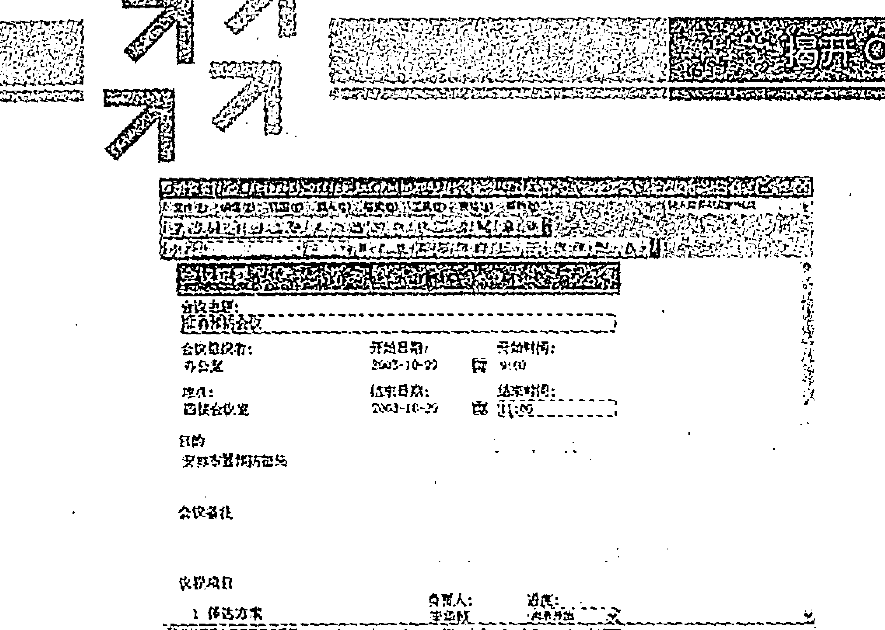

#### 2. 设计表单

单击 ‘文件→设计表单’ 切换到设计表单模式，然后你就可以随心所欲设计自己需要的表单了。
在 ‘设计表单’ 任务窗格中，你可以选择设计新表单的方法，共有三种：根据数据源、新建空白表单和从示例模板供你选择，选择一种打开它，我们就可以对它进行修改了。打开示例表单之后，我们就可以通过 ‘设计任务’ 窗格中的 ‘版式’、‘控件’、‘数据源’、‘视图’ 来设计修改表单。
版式：提供了各种版式表格，你可以直接选择使用，也可以对表格进行编辑。
控件：包括各种表单控件，以便用户输入数据。
数据源：用来显示和修改表单的数据源。
视图：用来定义表单的外观，你可以选择视图样式，并设置视图的属性。下面就可以像在 word 中编辑文档一样，给表单设计好版式，然后插入各种控件，设置数据源、定义视图属性，最后把设计好的表单保存起来或单击 ‘文件→发布’ 命令把表单分发给其他用户。

### （二）笔记记录和管理 Onenote 2003

Onenote 2003 是 Office 新增的一个笔记记录和管理程序，利用它，我们就可以方便地将自己的想法记录到一个电子笔记本中，然后在需要的时候直接打开和搜索要查找的信息。Onenote 不但可以记录文字信息，而且可以插入图片和声音，利用它提供的手写工具可以直接在页面上绘图或进行书写，所有的信息可以分类保存在不同的文件夹和分区中，你可以方便快捷地进行查找和浏览，并且可以与别人共享你的笔记（图9）。下面我们就来了解一下 Onenote 的主要特色。

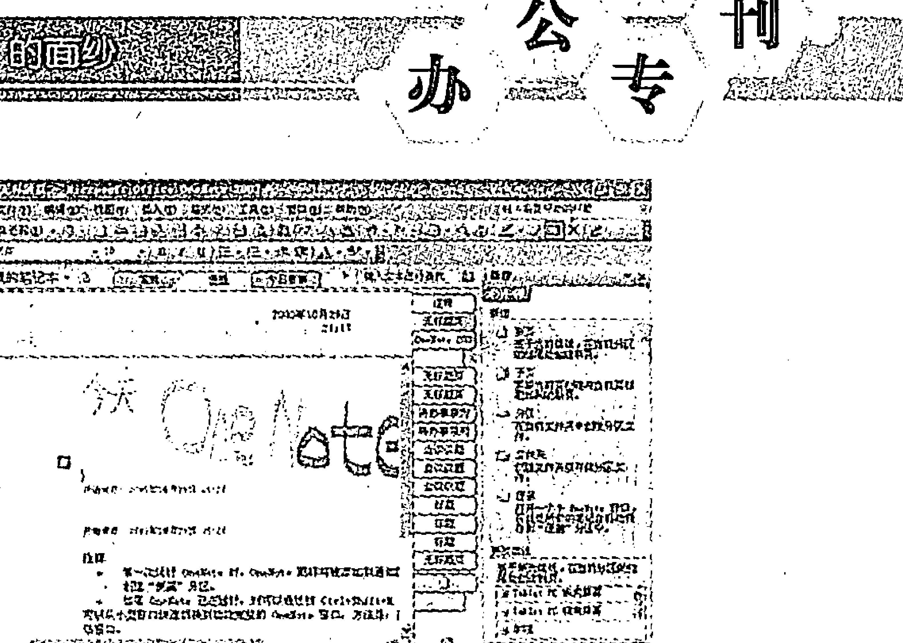

#### 1. 方便快捷的记录笔记

Onenote 给用户提供多种方式来记录笔记。你可以随意在页面上的任何位置记录笔记，并且可以自由地进行移动。可以用鼠标、Tablet 笔，也可以用键盘来书写笔记或绘制图表和图片，利用拖放操作可以直接将网站上的图片、文字和其他信息放入 Onenote 笔记中，Onenote 会自动包含超链接。

#### 2. 轻松管理笔记

在 Onenote 中，用户可以根据自己的需要创建多个笔记本、文件夹和页面，并且给它们指定存放的位置，利用笔记标记可以对笔记分类进行标记，然后快速地进行浏览。利用强大的搜索功能可以快速找到需要的内容。除此之外，用户还可以合并、重新排列笔记，自由设置笔记的格式。

#### 3. 快速查看笔记

除了利用搜索功能查找特定信息外，Onenote 还具有智能记忆功能，它会始终在用户上次最后工作的页面和笔记本处打开，可以让用户立即找到最新的笔记。记录笔记内容的 Onenote 快速窗格可以始终显示在屏幕最前端，提高你最的信息。

#### 4. 共享笔记内容

自己保存的笔记还可以方便地重用和与其他人共享，你可以将笔记作为电子邮件发送给别人，也可以将笔记发布到 SharePoint Services 网站上与其他人共享。

#### 5. 与其他 Office 程序协同

作为 Office 系列的一个成员，Onenote 可以与其他 Office 协同工作，以提高工作效率。Onenote 可以使用 Outlook 发送邮件，也可以与其他 Office 程序之间进行复制和粘贴操作，利用 ‘粘贴选项’ 按钮可以控制从其他程序粘贴的内容的格式。

#### 6. 数据安全性

Onenote 拥有不会丢失的数据安全性，它在工作时会不断地保存工作内容，在关闭笔记本或退出 Onenote 时也会自动保存分区，所以用户不必担心数据的保存问题，只须一直输入即可，事实上，Onenote 也没有设计 ‘保存’ 命令。

## 十一、其他组件介绍

### （一） 图表绘制 Visio 2003

Visio 是微软公司一个著名的图表绘制软件，是当今平面绘图领域的精品，利用它可以快速制作各种复杂的业务和技术图表，在包括项目管理图表、商业流程图、软件设计图、机械工程制图、电路图等许多领域得到了广泛的应用。Visio 2003通过与数据源直接同步数据，可以提供最新数据的形象化图表（图 10）。

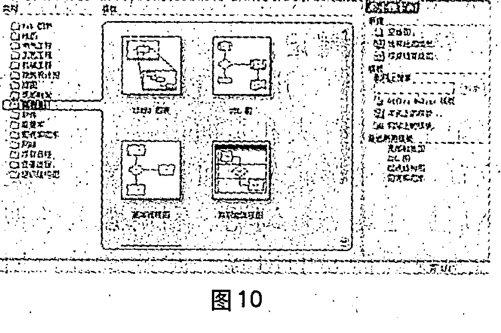

### 1. 新增任务窗格

Visio 2003 在任务窗格中新增了许多项目，如开始工作、帮助、剪贴画、信息检索、搜索结果、新建绘图、模板帮助、共享工作区、文档更新、审阅，可以帮助用户更方便使用 Visio。

### 2. 新增和改进了许多形状和模板

Visio 2003 新增了“业务流程”、“灵感触 发”模板，同时对组织结构图、日历、空间规划、时间线、网络图、电气工程图、建筑设计图等进行了大量的改进，新增了许多模板。

### 3. 快速搜索形状

在“形状窗口”中，把以前的“查找形状”改进为“搜索形状”，利用它可以更容易、更快 捷地找到形状，如果在联机状态下，还可以直接搜索网站上的内容。

### 4. 提供多种选择形状的方式

现在，Visio 2003 提供了三种方法来选择多个形状：使用“指针”工具，使用“套索选择”工具围绕要选择的所有形状画一个选中内容网，或者按住 shift 键的同时单击各个形状。

### 5. 旋转手柄

Visio 的形状终于有了 Office 风格的旋转手柄，这样用户不用更换工具就可以轻松旋转形状，大大方便了操作。

### 6. 用“收藏夹”管理形状

Visio 新增了“收藏夹”模具，它可以将用户常用的形状添加到其中，以便以后再快速的使用。

### 7. 改进的 DWG 转换器

新的 DWG 转换器可确保转换到 Visio 的图形更接近于原始的 CAD 文件，因此用户可以比以前更精确地处理空间和形状。

### 8. 其它功能

利用“跟踪标记”功能可以在绘图中执行或查看建议的更改。

Visio 支持墨迹设备，利用墨迹功能，可以在审阅绘图时插入手写注释。

支持 SVG（可缩放矢量图形）图形格式。

支持 Unicode、EUDC（最终用户定义字符）集和 GB18030 标准。

### （二） 项目管理 Project 2003

Project 2003 是微软最新版本的项目管理程序，利用它用户可以更有效地进行日程安排和资源管理，以提高生产效率。Project 2003 系列产品包括 Project Standard 2003、Project Professional 2003、Project Server 2003 和 Project Web Access。

### 1. 新增“将图片复制到 Office 向导”功能

如果你想将项目数据以图片的形式显示到其他 Office 程序中，可以单击“视图→工具栏→分析”命令，开启“分析”工具栏，然后单击其中的“将图片复制到 Office 向导”按钮（图 11），就会出现向导窗口，按照提示一步步操作，就可以将当前的项目数据以图片的形式导入到 Word、Visio 或 Powerpoint 中。

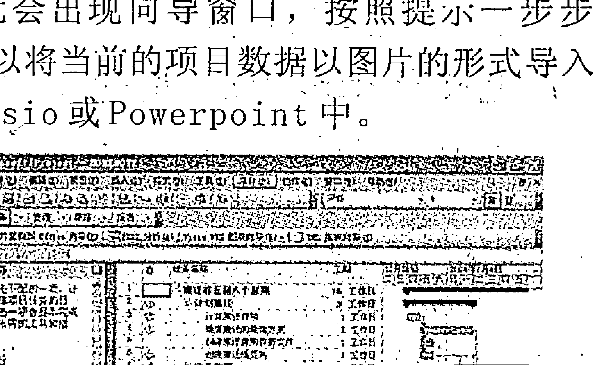

### 2. 快速打印视图报表

现在，利用 Project 2003 可以非常方便地将视图打印成报表。具体操作是：单击“项目向导”工具栏中的“报表→将当前视图打印为报告”命令，出现打印向导，按照提示操作即可。

### 3. 指定资源的预订类型

在Project 2003中，用户可以将资源分配指定为“建议”或“提交”，方法是：在“资源管理”工具栏中，单击“资源→指定资源的预订类型”命令，打开“资源预订类型”窗口，你可以在其中设定资源类型。

### 4. 锁定比较基准信息

比较基准提供用于衡量项目实际进度的参照点，所以它的准确性很重要，在Project 2003中，可以防止其他人改写比较基准信息，以保证它的正确性。

### 5. 自动安装COM加载项

以前需要下载安装的Project“组件对象模型”（COM）加载项现在已经自动随Project 2003安装，这些COM加载项包括：

Visio WBS图表向导、XML报表向导、比较项目版本、欧元货币转换器、数据库升级工具。

### （三）排版制作 Publisher 2003

Publisher 2003是一个全面的桌面出版解决方案，用于创建和发布各种出版物，并将这些出版物进行打印、电子邮件分发或在网站上发布，有了它，用户就可以轻松地设计、创建和发布专业的出版资料。

### 1. 改进的工作区操作

通过“新建出版物”任务窗格可以在打开Publisher时快速地创建书面出版物、网站和电子邮件、设计方案集、空白出版物（图12）。

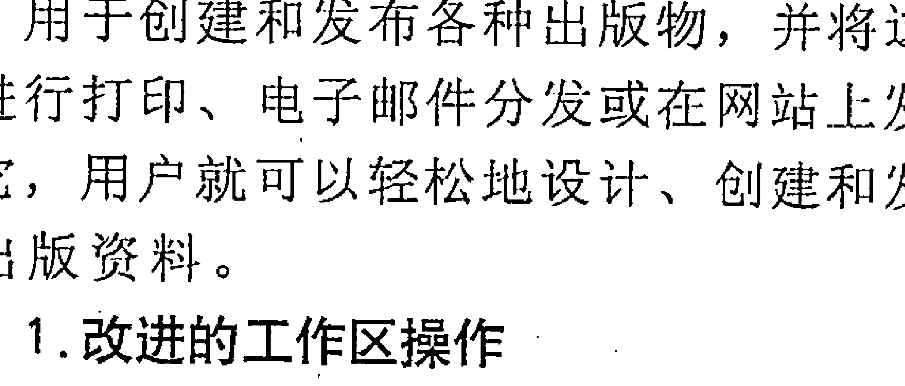

新增“查找和替换”任务窗格可以帮助用户在出版物中快速查找和替换文字。

缩放功能增强，提供10%～800%区间缩放率。

使用新的“页面排序”功能可以将页面从一个位置拖放到另一个位置，或者快速定位到特定的页面，还可以方便地插入、重命名或删除页面，应用母版页。

### 2. 新增“主设计方案集”和出版物类型

Publisher 2003新增了10个“主设计方案集”并且新增和改进了多个出版物类型，这就给用户设计有专业外观的出版物提供了更多的便利。

### 3. 快速建立网站

Publisher 2003提供了多个新功能用来创建、编辑、发布和更新网站，新增的“网站向导”可以让用户快速地创建专业效果的网站。

新增众多的“网站页面类型”给用户提供了更大的选择空间。为设计WEB出版物提供了一种专门的“WEB”模式，以便用户更方便地设计WEB出版物。

利用“简易网站生成器”可快速生成用户需要的自定义网站；可以方便地添加、删除、更改导航栏上的链接，或者更改导航栏的设计或按钮样式，还可以向网站添加辅助导航栏。

### 4. 增强的版式和图形功能

利用改进的“图形管理器”可以快速查看出版物中所用图形的列表并对其进行排序，也可以使用它修复链接图片以及查看所有图形的详细信息。

改进“检查设计方案”可以检查出版物在打印或发布到WEB之前存在的问题并自动加以修复。

新增的段落格式设置选项可以精确地定义段落与其前后段落之间的关系。

支持多个“主页”，并使用改进的“版式或参考线”、“基线参考线”提供对出版物更多精确地控制。

### 5. 新增“电子邮件向导”

Publisher 2003新增了六种电子邮件版式，单击“文件→新建”命令，在“新建出版物”任务窗格下单击“网站和电子邮件→电子邮件”，就可以选择所需的出版物类型。

### 6. 新增“邮件和目录合并向导”

利用新增的“邮件和目录合并向导”可以将数据源中的多条记录合并到单个出版物中，并且能够在执行邮件合并或目录合并时将来自数据源的文字和图片合并到出版物中。

### 7. 提供专业的印刷功能

Publisher 2003优化了RGB向CMYK的转换，可以打印复合CMYK PostScript输出，并可用于第三方补漏白和页面排版程序。增强了颜色控制，可以在出版物中创建并管理颜色和墨迹，新的高级打印设置允许直接从“打印”对话框创建分色。

## # Director MX 的三维世界
文/沉吟 张志国

-   创建 Shockwave 3D 场景
-   修改 2D 文字
-   创建 3D 文字
-   修改 3D 文字
-   旋转 3D 文字
-   修改行为
-   漫步在 Director 3D 的世界

Shockwave 3D 的应用范围很广。从简单的三维文字动画到交互式的三维游戏环境，都可以通过 Shockwave 3D 技术表现出来。通过 Microsoft Internet Explorer 等支持 Shockwave 的浏览器，用户还可以浏览互动影片。

本文将为你介绍 Director MX 3D Xtra 组件。在开始学习 Director MX 3D 的有关知识之前，如果你是初次接触 Director MX，建议你最好先去熟悉一下 Director 的用户界面、一般的概念、制作流程和基本行为的使用等。

Director MX（以下简称 Director）中包含了两种不同类型的 3D 行为（ Behaviors）：Trigger（触发器）和 Action（动作）。当用户的某一动作（如鼠标单击）发生时，Trigger 将向系统发出信号，从而引起指定的 Action 的执行。在 Director 中，Action 又分成三种：Local Action（本地动作）、Public Action（全局动作）和 Independent Action（独立动作）。当一个本地动作赋给一个 Sprite（角色）后，该动作只能被赋给同一角色的触发器所触发。与本地动作不同的是：公共动作能被任何触发器触发，不管触发器是被赋给同一角色还是其他的角色。公共动作使用和本地动作一样的触发器，而独立动作根本无须触发器触发即可执行。比方说我们可以使用独立动作中的 Automatic Model Rotation，让场景中的某个模型自动旋转；利用 Model Rollover Cursor，使鼠标指向某个模型时，指针改变形状。

下面将以实例的形式讲解一下 Director MX 3D 的一些具体应用。

### 一、创建 Shockwave 3D 场景

用户可以通过 Lingo 来创建 Shockwave 3D 场景，不过要想创建复杂一些的场景就必须借助 3DS MAX 或 MAYA 等三维软件。以 3DS MAX 为例，Discreet 公司提供了输出 Director W3D 格式文件的插件，该插件适用于 4.0 以上版本，供用户免费下载。可以到 www.discreet.com/products/3dsmax/exporter/register/ 下载。解压缩后将文件名为 SW3D_Exp.dle 的文件复制到 “3ds max 5” 目录下的 “plugcfg” 子目录中，即可完成该插件的安装。

启动 3DS MAX 5，创建一个 3D 场景。然后选择菜单命令 “File” → “Export” 即可导出为 Shockwave 3D Scene Export (*.W3D)格式的文件。为了方便起见，我们使用一个 Director MX 自带的已经部分完成的 DIR 文件，里面包含了所需要的场景 。
1. 在 Director MX 中选择菜单命令 “File” → “Open”。
2. 浏览到 Director MX 应用程序的文件夹，并打开 Tutorials/3D/ Magic_start.dir 文件。
3. 选择 “File” → “Save As” 命令将该文件保存到另外一个文件夹下。

### 二、修改 2D 文字

想要创建 3D 文本，需要先创建 2D 文本然后使用属性检查器赋予它深度，从而建立 3D 文本。但是为了方便读者的操作，本例使用已经创建的 2D 文本。

1. 如果 Cast:internal 窗口没有打开，请选择菜单命令 “Window” → “Cast” 去打开它。在 Cast 演员窗口找到名称为 Title Text 的演员（如图1）。Title text 是在 Director MX 中创建的 2D 文本。

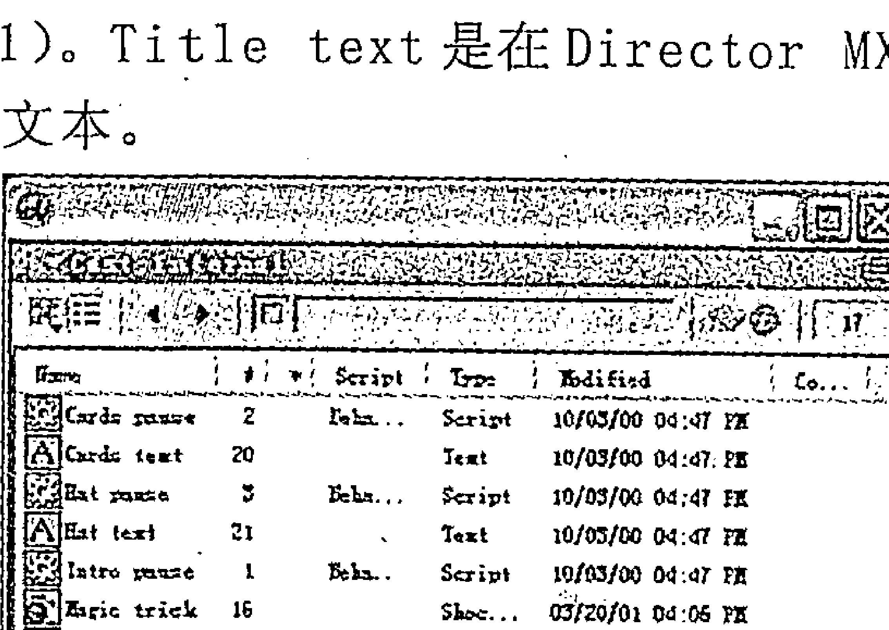

2. 双击 Title Text 演员，打开文字编辑器。
3. 将里面的文字改成自己所需要的，比如本例中就改成了 “沉吟魔法屋”（如图2）。选择字体、字号、样式和对齐方式，字体可以多试几次，因为有些中文字体不适合做 3D 文字。

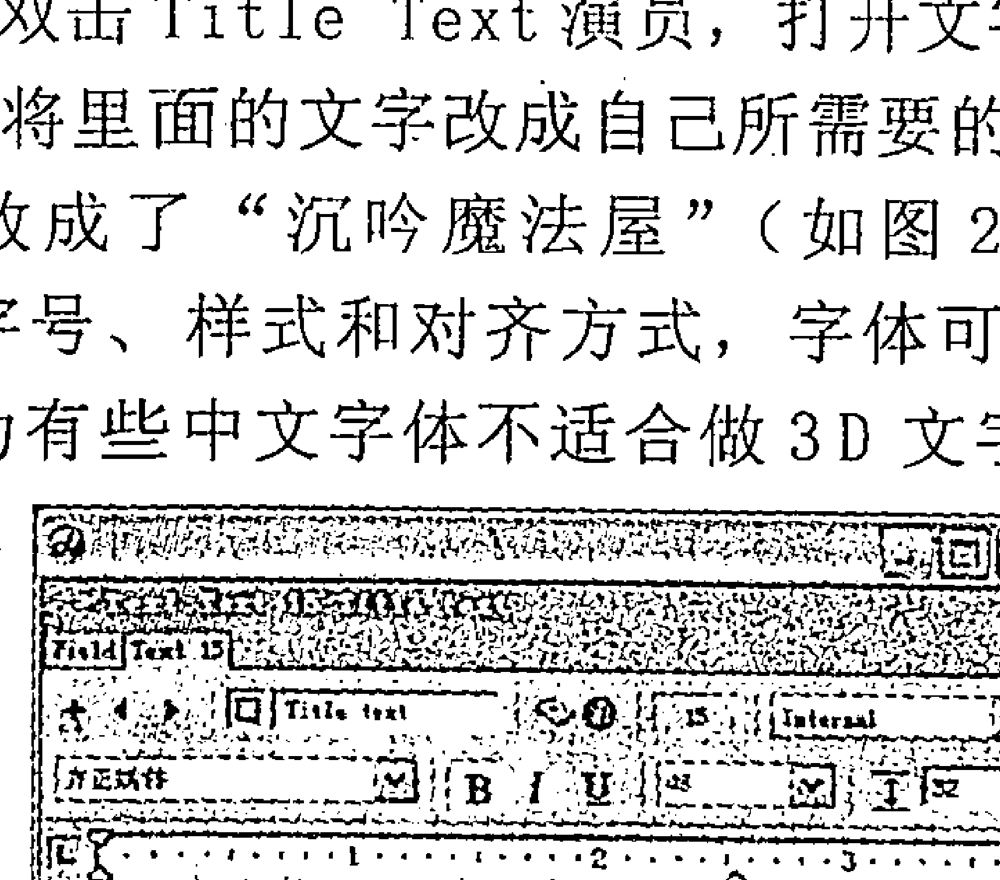

4. 也可以直接在舞台窗口上双击文字进行修改，不过在修改成中文后文字会显示成乱码，需要到 “Modify” → “Font...” 中进行定义。
5. 在 Cast:Internal 窗口的 Cast 演员列表中找到名称为 Hat text 的演员。Hat text 也是在 Director MX 中创建的 2D 文本，本例中将它修改成 “尖帽 火之属性 $12.99”（如图3）。对 Ring text 和 Cards text 也进行同样的修改。

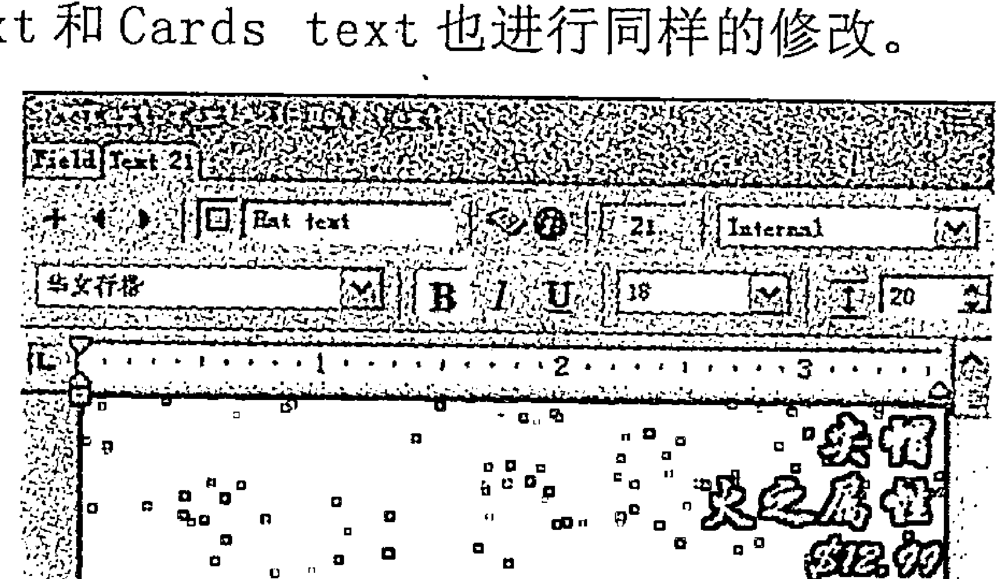

### 三、创建 3D 文字

1. 确保 Stage 电影舞台和 Library 面板打开并在屏幕中可见。如果没有，选择菜单命令 “Window” → “Library Palette” 将其调出。

2. 在 Score 面板上，选择通道 3（channel3）中的帧 1（frame1）。如果 Score 面板没有打开，请选择菜单命令 “Window” → “Score” 去打开它。

3. 把 Title Text 演员从 Cast:Internal 内部演员窗口拖到舞台左上角，如图 4 所示。

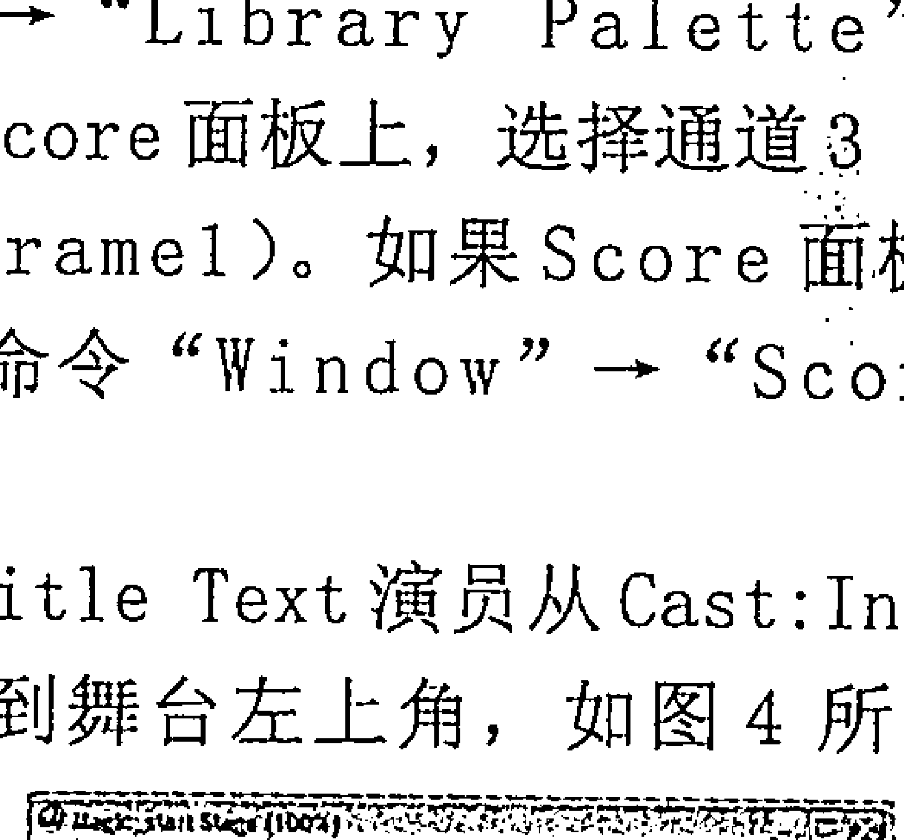

4. 如果属性检查器没有打开，选择 “Window” → “Inspectors” → “Property” 打开它。现在让我们给角色进行精确定位，选中舞台上的 Title Text 角色，然后在属性检查器的 Sprite（角色）选项卡里，在 X 和 Y 后面的文本框中分别输入 0，按回车。

5. 在 End 文本框中输入 70（如图 5），按回车，延长 Title Text 角色到电影结尾。

### 四、修改 3D 文字

通过修改属性检查器3D Extruder选项卡的设置可以改变3D文字的外观。

1. 点击属性检查器的3D Extruder选项卡。

2. 左右移动Tunnel Depth滑块并注意观察不同的效果，当松开鼠标时，文字深度也将随之改变。本例中将Tunnel Depth设置为20左右的一个值。

3. 在Light下拉菜单中选择Top Center。Director中的3D对象可以使用全光源和方向性光源，通过指定Top Center，可以看到在文字正上方仿佛有一束光在照射。如图8所示。

6. 在Cast:Internal内部演员窗口选中Title Text演员，然后点击属性检查器的Text选项卡。属性检查器的Text选项卡用于指定文本的3D属性，在其Display下拉框中选择3D Mode（如图6）。

7. 在舞台上，文字就变成3D效果的了（如图7）。

### 五、旋转 3D 文字

我们可以在Library面板中选择一个行为来旋转文字，当3D文字旋转时，我们在属性检查器中指定的方向性光源将从固定的位置照射，就象聚光灯一样照亮文字。

1. 在库列表弹出菜单中选择“3D”→“Actions”。调整库面板大小以察看列表中的所有行为（如图9）；注意：如果库面板处于融合状态，将它拖出来就可以进行缩放了。

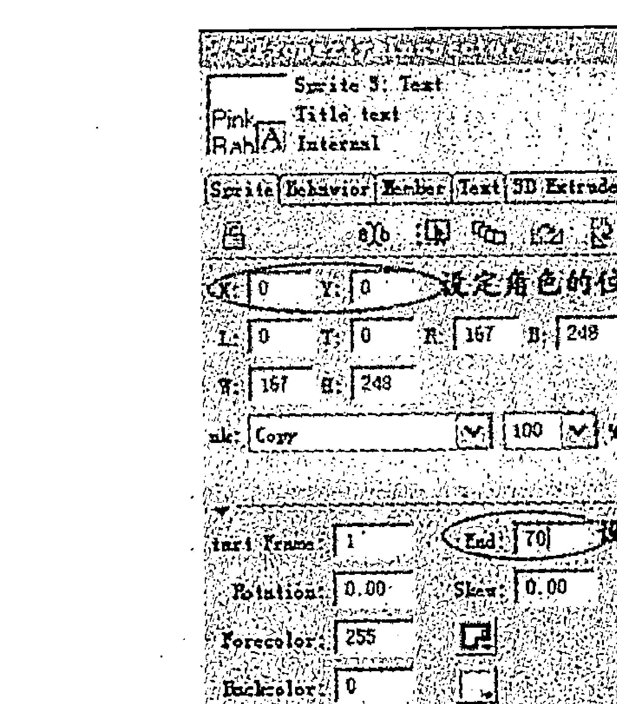

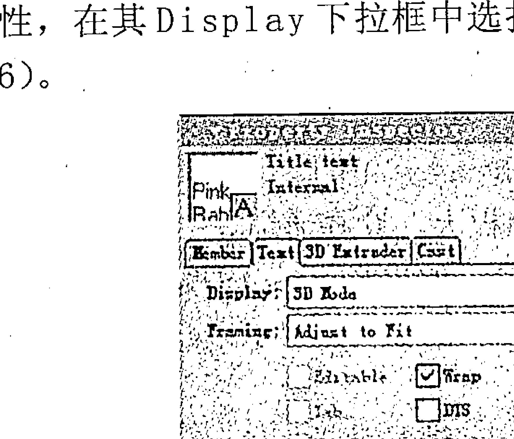

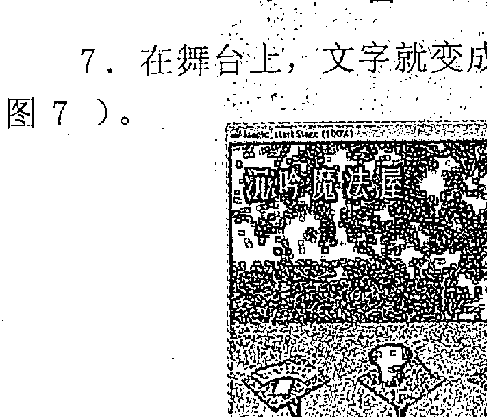

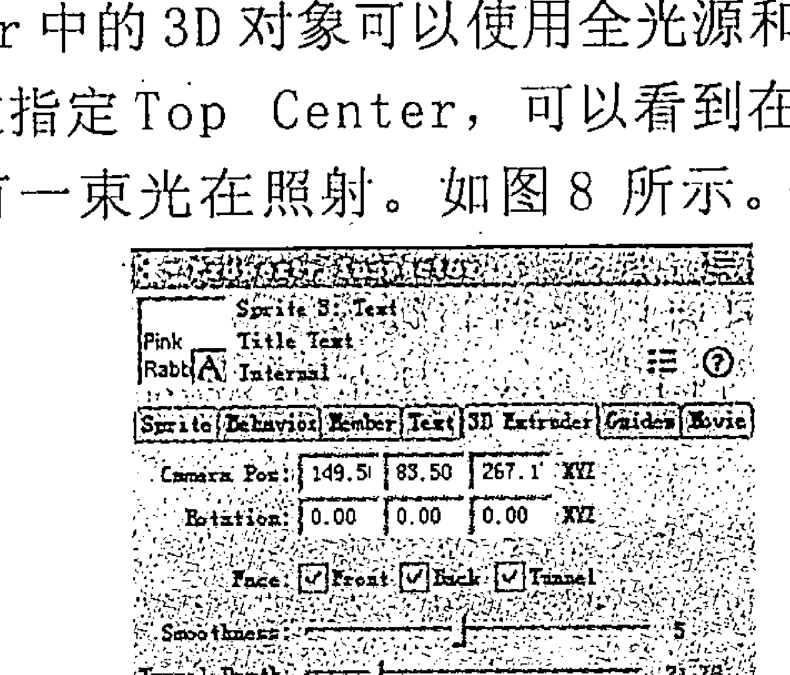

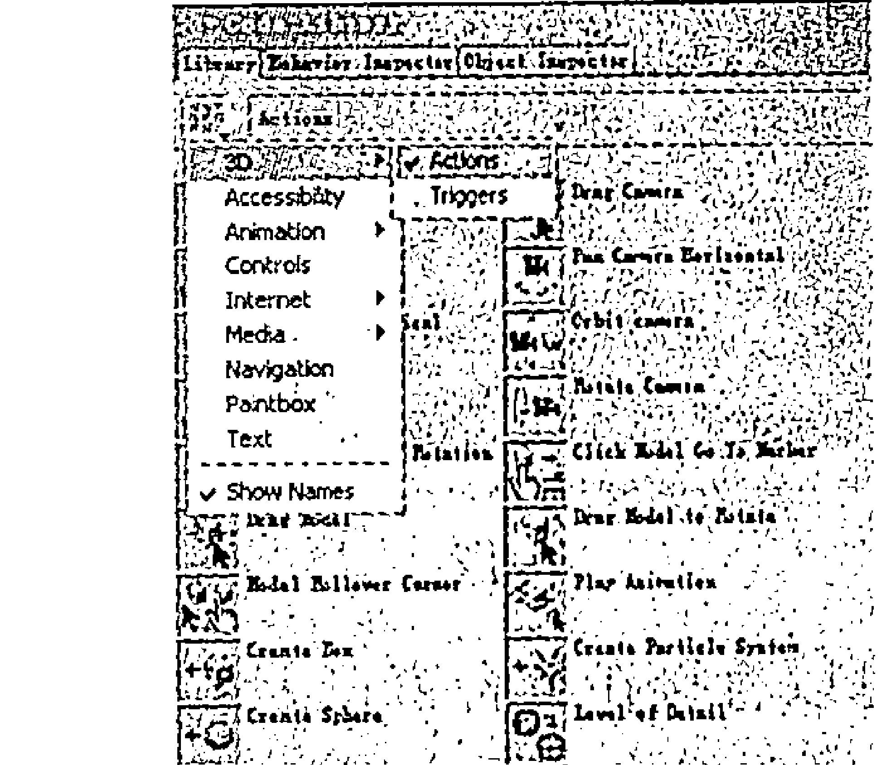

2. 拖动Automatic Model Rotation到舞台上或线谱上的Title Text角色。

3. 在Automatic Model Rotation参数对话框中，移动Rotation speed滑块到10的位置。

4. 在Which axis to Rotate about下拉列表中选择Y（如图10），单击OK按钮确定。X和Y轴分别是Model的水平和垂直轴，Z轴指定Model的深度。

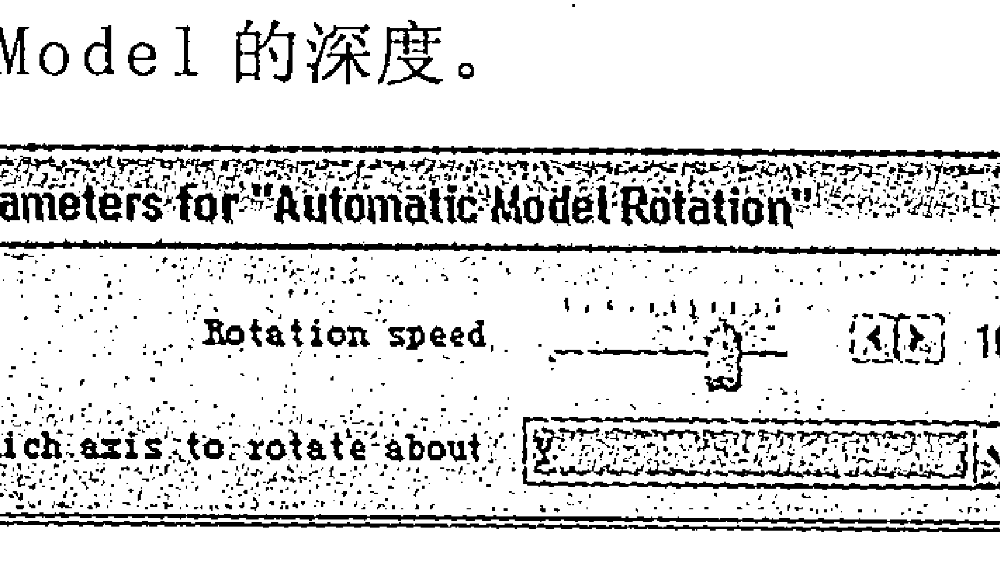

5. 播放电影，查看3D文字旋转。

### 六、修改行为

如果觉得旋转速度有些快了，可以停止播放并返回到电影中，在属性检查器中降低3D文本的旋转速度。

1. 保持Title Text角色为选定状态，然后单击属性检查器中的Behaviors选项卡。

2. 确定Automatic Model Rotation(Internal)被选定，然后单击Rotation Speed右侧的箭头按钮，将滑块从10移动到3（如图11）。

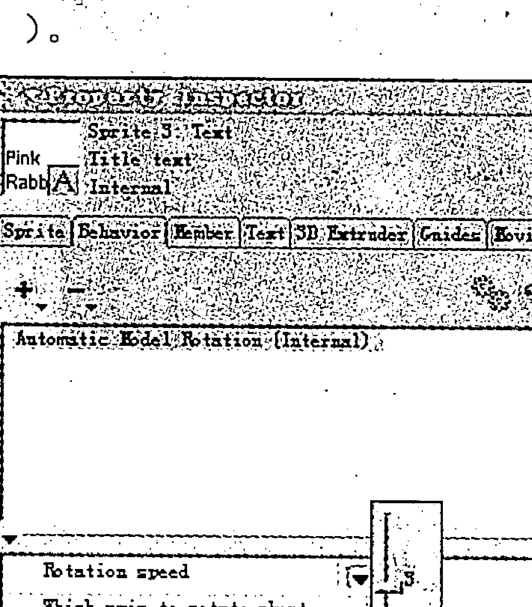

3. 播放电影查看文字的旋转速度是不是已经降低了不少。如果觉得旋转的速度还满意的话，可停止播放并返回到电影中。

### 七、漫步在Director 3D的世界

单击舞台上的魔术商店场景，该场景由一个名为Magic tricks的单独角色模型构成。3D世界包含模型(Model)，Magic tricks演员是一个3D世界的实例。所谓模型，就是3D世界中的可见对象，比如桌子（如图12）。

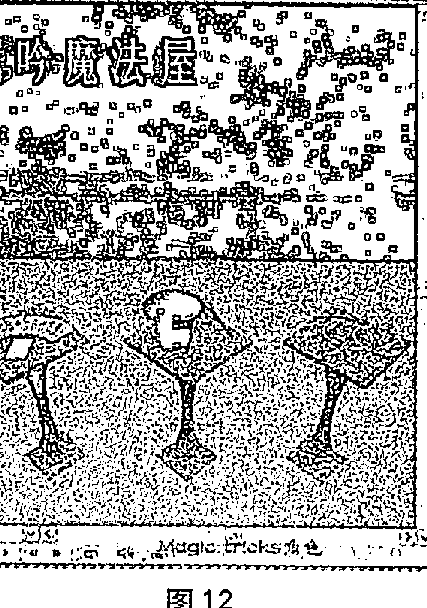

对3D世界的观测则依赖于镜头的位置。和现实生活中的摄像机一样，我们可以通过移动Director摄像机，从不同的角度和距离观赏我们所建立起来的虚拟世界，就好像在其中漫步一样，感觉不错喔！

#### （一） 应用Pan Camera Horizontal行为

应用Pan Camera Horizontal行为可以平移一部电影的摄像机，在它的轴心上转动，就像是现实中的摄像机在三脚架上从这边转动到那边一样。我们可以使用库面板中的两个平移行为来让摄像机上下左右移动。

1. 单击工具栏上的库按钮打开库面板，确保3D Action Behaviors处于显示状态。

2. 从库面板中拖动Pan Camera Horizontal行为到舞台上的Magic tricks角色上。

3. 在Pan Camera Horizontal参数对话框中进行以下设置：

在Degrees to pan per Frame文本框，输入10。

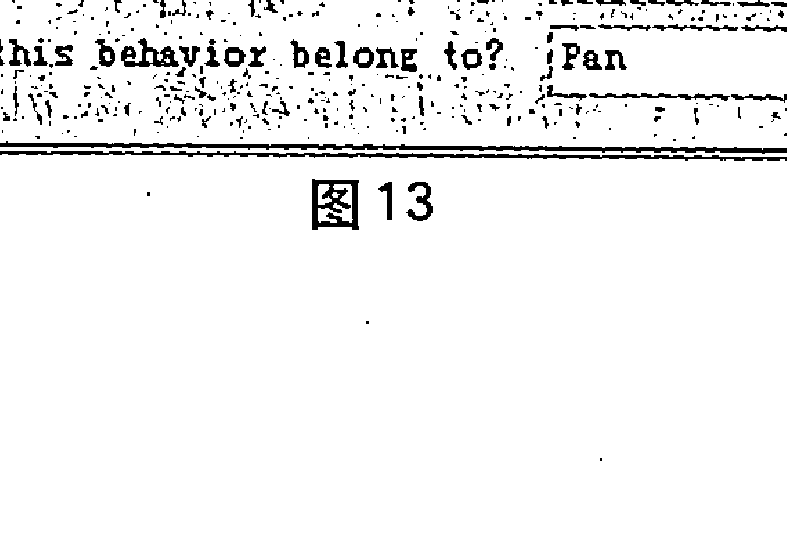## （二）应用第一个Keyboard Input触发器行为

虽然我们已经增加了摄像机动作使其水平移动，但还必须确定用户在播放电影时如何激活并控制平移，这就需要一个触发器行为来控制这个动作。上面我们已经创建了一个名为 Pan 的 Group（组），一个动作及其触发器必须在同一个 Group（组）中工作，实际上就是把动作及其关联触发器放在同一 Group 中。

下面我们就来增加触发器行为。

- 1. 在库列表下拉菜单中选择“3D”→“Triggers”。
- 2. 从库面板中拖动Keyboard Input触发器行为到舞台上的Magic tricks角色上。
- 3. 在Keyboard Input参数设置窗口中进行如下设置：
    - 在Which key will be used下拉列表中选择Left Arrow。
    - 在If using a custom key，enter it here输入框不要输入任何值。
    - 在Which modifier key will be used下拉列表中选择No modifier key。
    - 在Select a Group and its Action下拉列表中选择Group pan → Pan Camera Left。

如图14所示进行设置后，当用户按下左向箭头时就会将摄像机向左移动。

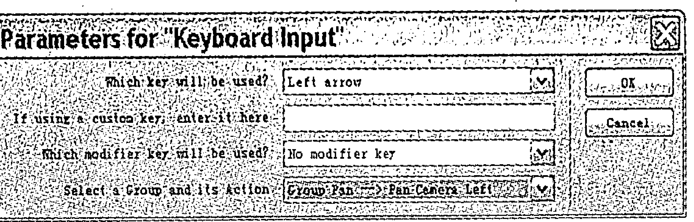

## （三）指定反向平移摄像机

- 1. 前面已经使用过一次键盘行为了，因此它会自动成为一个演员。从Cast演员窗口拖动Keyboard Input行为到舞台上的Magic tricks角色上（如图15）。

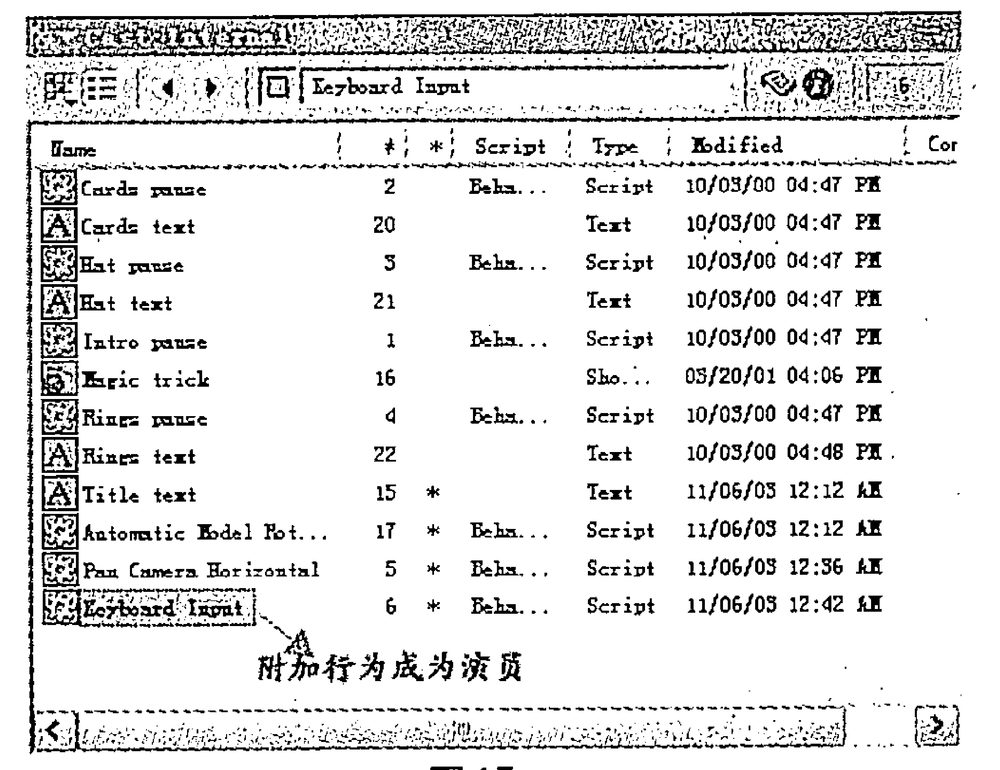

图15 (Cast窗口中的行为列表，包含Name, Type, Modified等列)

- 2. 在Keyboard Input设置窗口中，除Which key will be used选择Right Arrow，Select a Group and its Action选择Pan → Pan Camera Right外，其他设置同上（如图16）。即当用户按下右向箭头时，将向右移动摄像机。

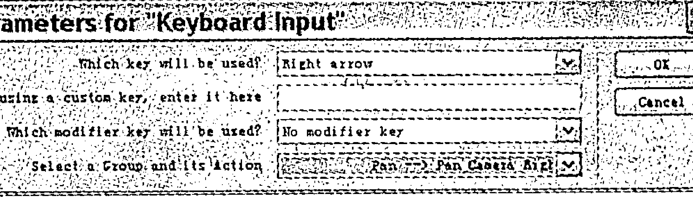

现在可以播放电影进行测试了，重复按左箭头键或右箭头键，可以看到电影场景向左或向右的角度移动了（如图17）。

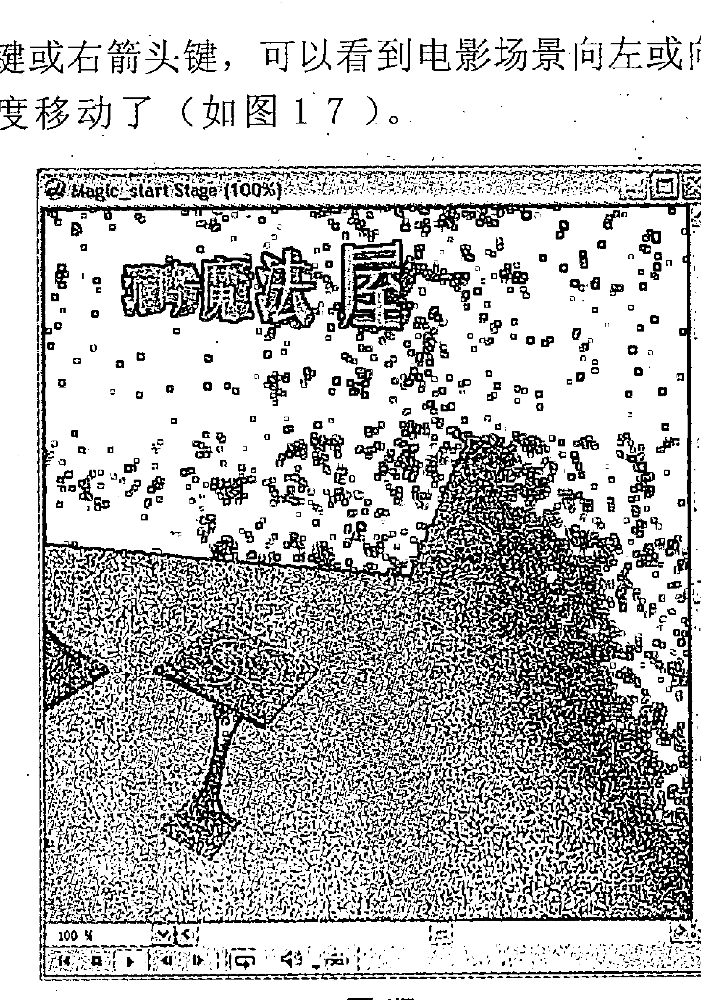

## （四）上下位移及推拉镜头

同样可以让摄像机镜头作上下移动。操作方法与前面介绍的水平移动的方法大致相同，只不过在参数设置上稍有不同，如：要在舞台的Magic tricks角色上附加上Pan the Camera Vertically动作行为，在Keyboard Input设置中Group pan → Pan Camera Up 或者 Pan → Pan Camera Down 等。

还可以给角色附加上 Dolly Camera 行为，则可以为电影增加推拉镜头的功能。它们的操作方法大同小异，在这里就不详细讲解了，大家可以参照前面内容进行操作。

## （五）使用 3D 行为导航

当指针变成手形时，浏览者便知道可以点击并期待一些结果。在本例电影中，手形指针的点击动作将显示桌子上对象的一些信息。

如果看看 Score，我们会发现与对象关联的文字首先出现在 Channel 1 的第 10 帧上，一个名为 Cards text 的标记（如图 19），标示 Cards 文字开始。同样，Hat text 和 Rings text 标记也标示着相应文字的开始。接下来我们将增加一个行为，使浏览者单击相应物体时电影能跳转到 Score 中对应的标记播放。

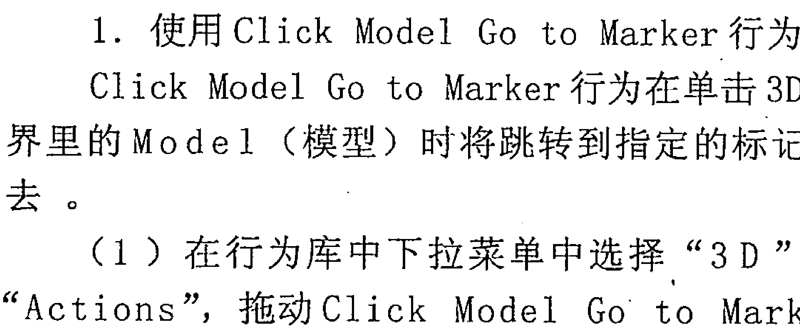

### 1. 使用 Click Model Go to Marker 行为

Click Model Go to Marker 行为在单击 3D 世界里的 Model（模型）时将跳转到指定的标记上去。

- (1) 在行为库中下拉菜单中选择 “3D” → “Actions”，拖动 Click Model Go to Marker 行为到 Magic tricks 角色上。
- (2) 在 Click Model Go to Marker 设置窗口中进行以下设置：
    - 在 Which model 下拉列表中选择 Table 1。
    - 在 Go to which marker 下拉列表选择 Cards。
    - 在 Which group does this behavior belong to 文本框中输入 Cards。然后单击 OK 按钮确定（如图 19）。

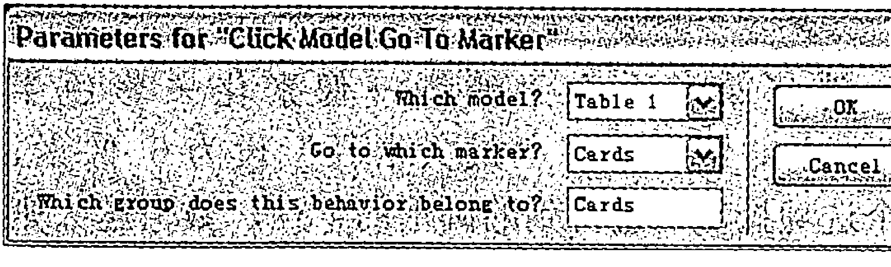

### 2. 增加触发器行为

接下来再增加一个行为，当用户按下鼠标左键时触发 Click Model Go to Marker 行为。

- (1) 在行为库下拉菜单中选择 “3D” → “Triggers”，拖动 Mouse left 行为到 Magic tricks 角色上。
- (2) 在 Mouse Left 设置窗口中进行设置：
    - 在 When does this Action occur 下拉列表中选择 Anytime the left Mouse button is being pressed。
    - 在 Which modifier key will be used 下拉列表中选择 No modifier key。
    - 使 If using an additional modifier key, enter it here 文本框为空。
    - 在 Select a Group and its Action 下拉列表中选择 Group Cards – Go to Marker 项。然后单击 OK 按钮确认（如图 20）。

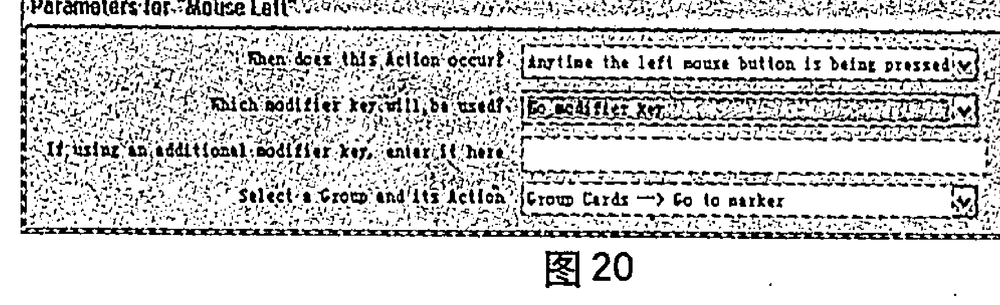

- 3. 以同样的方法对 Hat 标记和 Rings 标记进行操作，Which Model 分别设置为 Table 2 和 Table 3。Go to which marker 自然是选择 Hat 和 Rings 了。

## （六）保存电影

现在来看看我们完成的电影是个什么样子。

- 1. 在 Stage 舞台下部的控制工具条上单击 Play 按钮播放电影（或执行 “Control” → “Play” 命令）。注意当文字旋转时它表面的轻微闪光。
- 2. 按箭头键进行旋转，在 Dolly Camera 中设置的快捷键可以拉近和推远场景。当鼠标移动到三张桌子上时指针会变成手状，单击之则在舞台的右上方出现物品的相关信息。至此，就可以让浏览者自由地漫步在我们所建立的三维世界了。当然，如果你愿意的话，还可以让场景中的模型具有交互性能，例如，当我们按下场景中的扑克时扑克会自动翻过来等。
- 3. 感觉还不错吧？看完电影后，在 Stage 舞台下部的控制工具条上单击 Stop 按钮停止播放电影（或者执行 “Control” → “Stop” 命令）。再执行 “File” → “Save” 命令保存电影。

## Photoshop十大经典实例

文 / 5d多媒体 奇士

- ○ 打孔效果文字
- ○ 酷酷的发光字
- ○ 冷峻的铁锈文字
- ○ 火焰效果
- ○ 爆炸效果
- ○ 粗糙的绘画效果
- ○ 液体金属效果
- ○ 神秘的逆光效果
- ○ 鸡蛋上的眼睛
- ○ 晶莹剔透的冰块

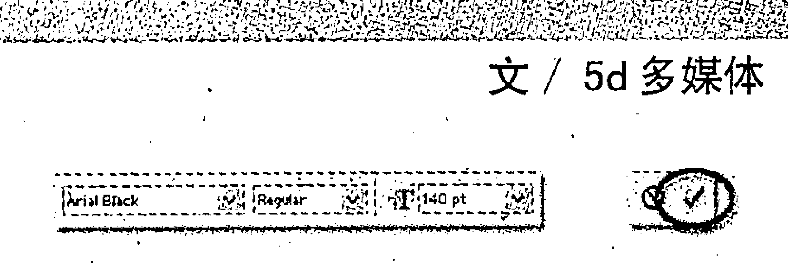

这是一个“经典”的时代，凡事都惟“经典”是从，读书要读经典名著，听音乐要听经典名曲，看电影要看经典名片，那么学习Photoshop当然也要学习经典实例。本文将十个经典实例打包，提供给喜爱Photoshop的广大读者，希望大家都能从中找到对自己有用的东西。

按下 Ctrl+E 键，将文字图层合并到背景图层中。然后选择菜单命令“滤镜→模糊→高斯模糊”，在对话框中将“半径”设为 10 像素，然后确定。再选择菜单命令“图像→调整→色阶”，在对话框中将“输入色阶”的白场滑块（右侧的中空滑块）稍向左移动一些（如图2），目的是使周围的白色侵入到红色文字中，并使文字的模糊边缘更有层次。

### 一、文字特效篇

随着版本的不断提高，Photoshop 对文字的支持和处理能力变得异常强大，不但可以进行一般的编排组织，还可以制作出精彩的文字特效。那么就让我们一起走进 Photoshop 文字特效的世界吧。

#### （一）打孔效果文字

在 Photoshop 中选择“文件→新建”，创建尺寸为 500×300 像素，“模式”为 RGB 颜色，“内容”为白色的新文件。选择文字工具（快捷键为 T），在文件窗口中单击并输入“cfan”，可以选取文字，在选项栏上对文字进行设置，选择字体为 Arial Black（或者其他较为粗重的字体），文字大小为 140pt（尽量充满文件窗口），单击文字颜色块，在拾色器中选择红色（R255G0B0），满意后单击选项栏右侧的对号按钮确认修改（如图1）。

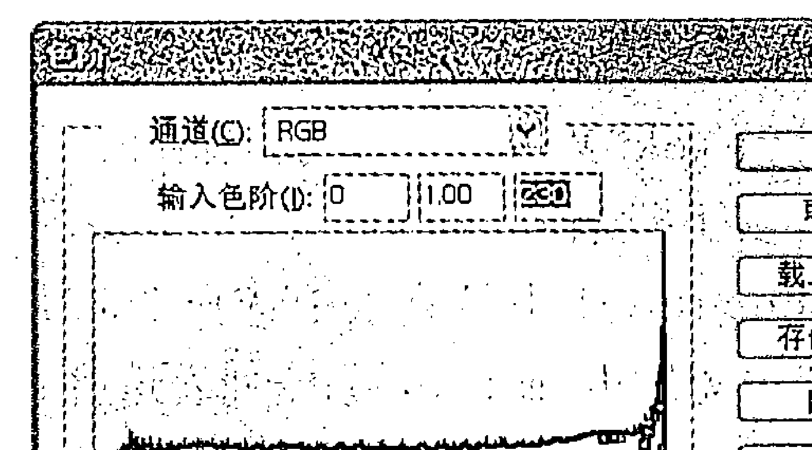

选择菜单命令“滤镜→像素化→彩色半调”，在对话框中将“最大半径”设为 6 像素，这个选项控制的是得到的圆形的半径，数值越大则圆形越大，读者应该根据具体情况进行设置；在下面的“网角”选项中，只保留通道 1（即红色通道）的默认数值，将其他通道的数值都改为 0。确定之后，文字就变成了由圆形组成的文字（如图3)，这些由大到小规律变化的圆形叫做“波尔卡点”。


选择魔棒工具（快捷键为W），在选项栏上将“容差”设为10，选择“消除锯齿”选项，不选择“连续的”选项，然后在文件窗口中的白色部分单击，选择图像的白色部分，按下Ctrl+J键将被选择的部分通过复制创建为新图层。在图层调板上，选择背景图层，先按下D键将前景色和背景色恢复为默认的黑白色，然后按下Ctrl+BackSpace键使用背景色的白色填充背景图层。选择新建的图层1，使用矩形选框工具（快捷键为M）在文字周围选择出一个矩形选区，然后按下Ctrl+Shift+I键将选区反选，再按下Delete键删除被选择的部分，按下Ctrl+D键取消选择。

在图层调板上，将图层1的透明像素锁定，将前景色改为红色，然后按下Alt+BackSpace键使用前景色的红色填充该图层（如图4）。

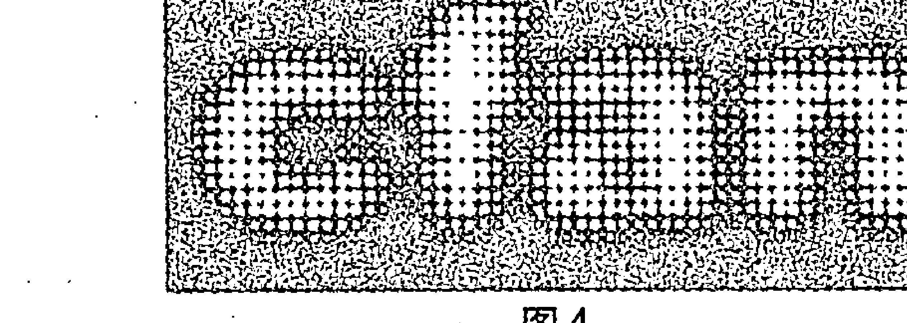

在图层1缩略图右侧的空白区域双击，在图层样式对话框中，在左侧选择“斜面和浮雕”，在右侧进行设置，选择“样式”为内斜面，“方法”为平滑，将“大小”改为3像素，其他选项保持默认即可；再选择“投影”，在右侧进行设置，将“不透明度”降为50%，“距离”设为3像素，“大小”设为3像素，其他选项保持默认即可。选择“预览”选项可以实时观察文件窗口中的变化，调整满意后确定。如图5所示，我们就得到了具有立体效果的打孔文字了。


#### （二）酷酷的发光字

看过系列片《X档案》或者它的海报的朋友，一定对片头和海报上那神秘而冷酷的文字效果很感兴趣，下面我们就来模仿一下。

新建尺寸为400 × 400像素，“模式”为RGB颜色的新文件。按下D键将前景色和背景色恢复为默认的黑白色，然后按下Alt+BackSpace键使用前景色的黑色填充背景图层。按下X键将前景色和背景色交换，选择文字工具，在文件窗口中输入“X”，字体选择Times New Roman或类似的字体，文字大小以适合文件窗口为宜（如图6）。


切换到通道调板，将蓝色通道（红色和绿色通道也可以，其实三个通道是一样的）拖到调板底部的“创建新通道”按钮上，创建出蓝色通道的副本，将其改名为“白色光”。按住Ctrl键单击“白色光”通道，将其载入为选区，选择菜单命令“选择→修改→扩展”，将“扩展量”设为2像素后确定。

使用白色填充扩展后的选区，按下Ctrl+D键取消选择。接着选择菜单命令“滤镜→模糊→高斯模糊”，进行半径为2像素的模糊。

复制“白色光”通道，改名为“黄色光”，将其载入选区，再将选区扩展3像素，用白色填充选区，然后取消选择，再对通道使用半径为3像素的高斯模糊滤镜。

复制“黄色光”通道，改名为“绿色光”，将其载入选区，再将选区扩展6像素，用白色填充选区，然后取消选择，再对通道使用半径为10像素的高斯模糊滤镜。这时的通道调板如图7所示。

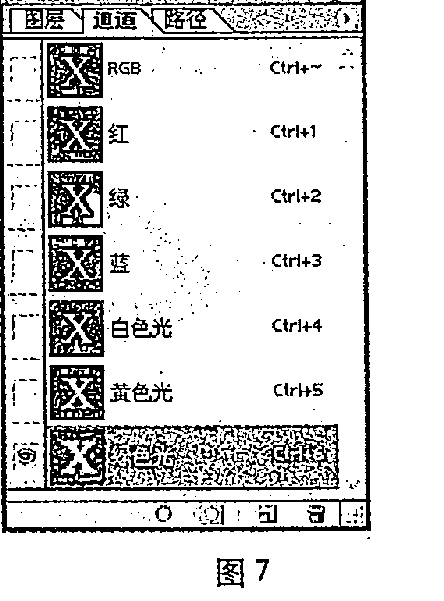

切换到图层调板，选择背景图层，然后选择菜单命令“选择→载入选区”，在对话框中选择“通道”为绿色光，确定将“绿色光”通道载入选区。将前景色改为明亮的绿色（例如颜色值为R0G255B80），然后按下Alt+BackSpace键使用前景色填充选区。再选择菜单命令“选择→载入选区”，在对话框中选择“通道”为黄色光，并注意“操作”应为新选区，确定载入“黄色光”通道为选区，将前景色改为明亮的黄色（例如颜色值为R255G255B50），然后使用前景色填充选区。最后载入“白色光”通道为新选区，使用白色填充选区，再取消选区。再将文字图层中的文字改为黑色，就可以看到最后的效果了（如图8）。是不是很酷呢？

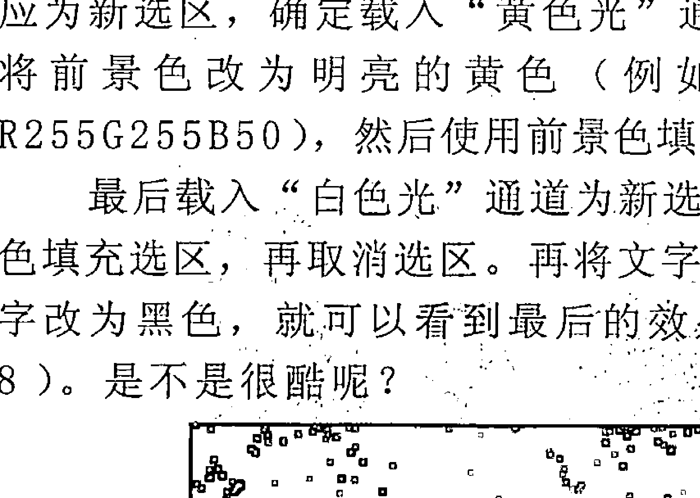

#### （三）冷峻的铁锈文字

新建尺寸为400×300像素，“模式”为RGB颜色，背景色为白色的新文件。使用文字工具在文件窗口内输入文字“cfan”，在选项栏上调整文字的字体为Arial Black，颜色为灰色（例如颜色值为R128G128B128），文字大小以充满文件窗口为宜（如图9）。

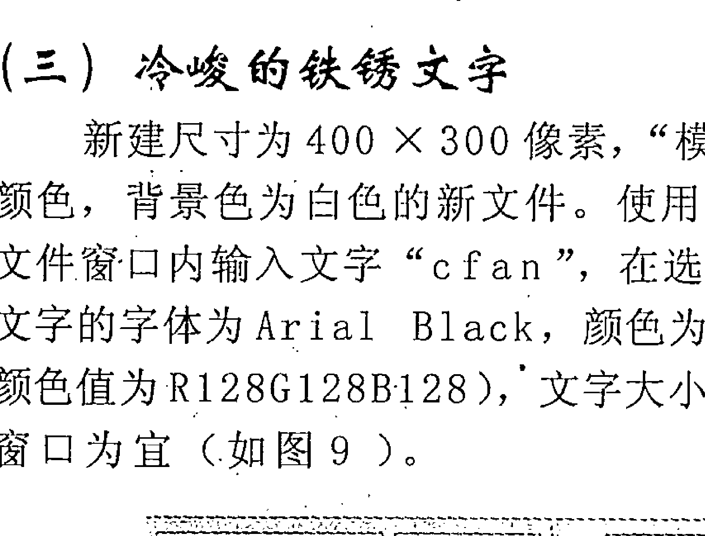

切换到图层调板，在文字图层的空白处双击，在图层样式对话框中左侧选择“投影”，在右侧设置“角度”为120度，并选择“使用全局光”复选框，“距离”为6像素，“大小”为8像素，其他选项保持默认即可。然后在左侧选择“斜面和浮雕”，在右侧设置“样式”为内斜面，“深度”为200%，“大小”为6像素，“高度”为50度，并将高光颜色改为淡蓝色（例如颜色值为R140G200B255），以使文字的高光部分泛起金属质感的蓝色光芒。接着在左侧选择“内发光”，在右侧设置“混合模式”为正片叠底，发光颜色为纯黑色，并将“品质”部分的“范围”调高至70%。勾选“预览”选项有助于我们边调整边观察文字效果的变化。设置好之后按下“好”按钮，就得到已经具有立体感的文字了（如图10）。

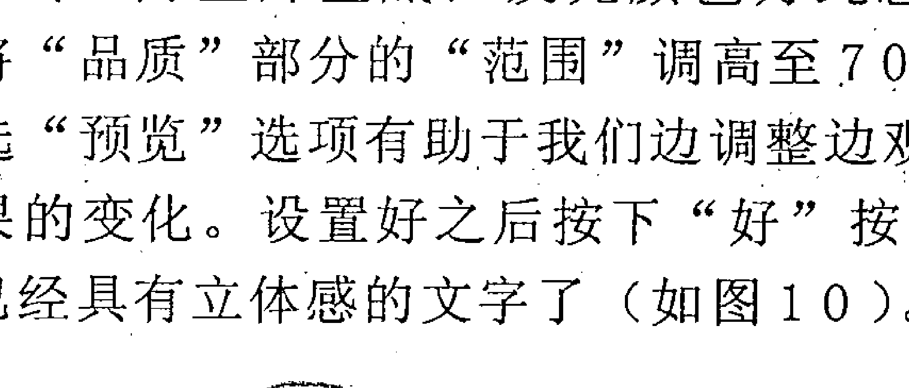

确认前景色和背景色为默认的黑白色，如果不是，按下D键恢复为默认。创建新图层，命名为“金属拉丝”。选择菜单命令“滤镜→渲染→云彩”，制作云雾效果，再选择菜单命令“滤镜→杂色→添加杂色”，在对话框中设置“数量”为10%，“分布”选择高斯分布，并选择“单色”复选框，确定为图像增加杂点。选择菜单命令“滤镜→模糊→动感模糊”，在对话框中保持“角度”为0度，“距离”设为30像素，确定使图像具有金属拉丝效果。选择菜单命令“滤镜→锐化→锐化”以强化效果。在图层调板上，按住Alt键在图层“金属拉丝”和文字图层之间（待光标发生变化时）单击，将两个图层编组，使文字获得金属拉丝效果（如图11）。

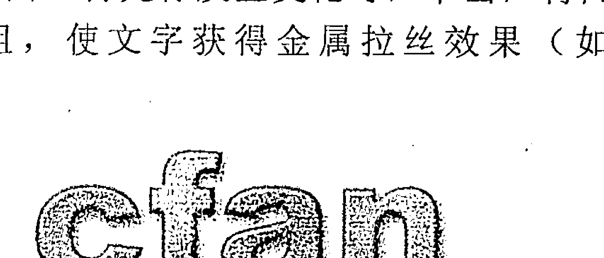

在所有图层的顶部创建新图层，命名为“铁锈”。将前景色改为橙红色（例如颜色值为R255G100B40），将背景色改为褐色（例如颜色值为R140G40B0）。使用云彩滤镜，再使用添加杂色滤镜添加数量为3%的杂点，得到类似铁锈的纹理。

切换到通道面板，单击调板底部的“创建新通道”按钮新建Alpha 1通道。在该通道中，选择菜单命令“滤镜→渲染→分层云彩”，再使用添加杂色滤镜添加数量为3%的杂点。重复使用这两个滤镜，不同的是杂点的数量为2%，得到铁锈纹理通道（如图12）。

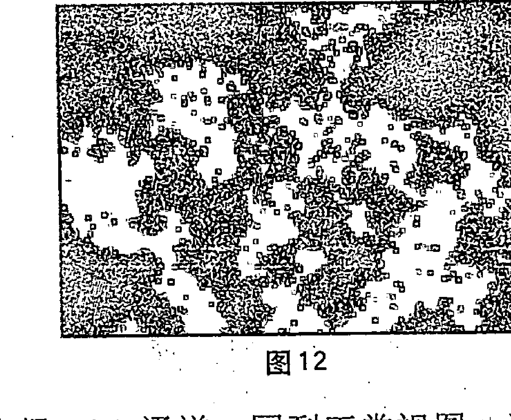

选择RGB通道，回到正常视图，选择菜单命令“滤镜→渲染→光照效果”，在对话框中将灯光类型设置为平行光，纹理通道选择Alpha 1，并进行相应设置（如图13）。

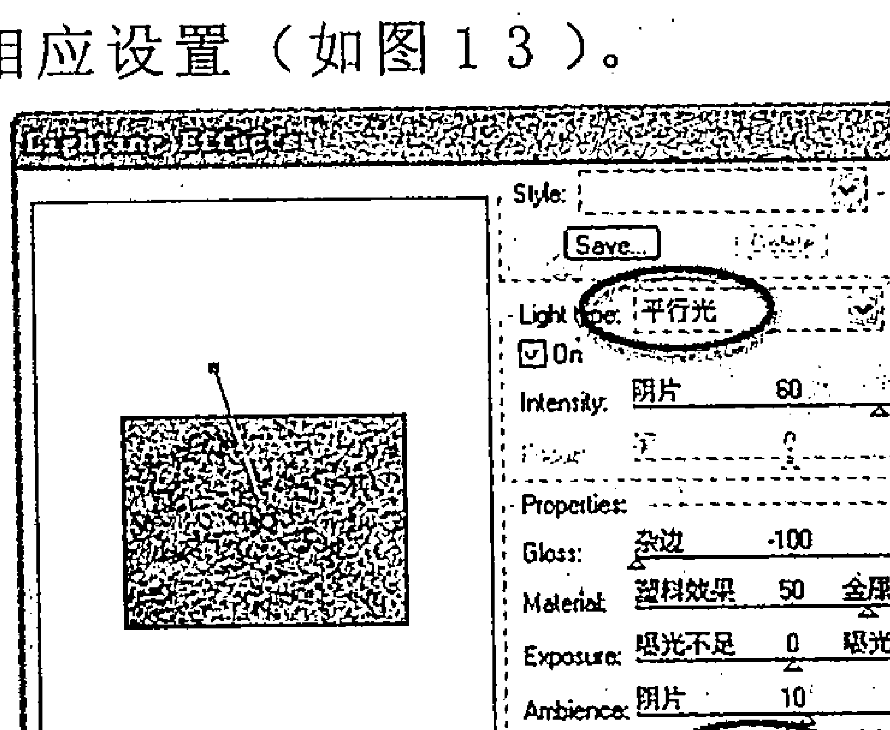

按下Ctrl+G键将图层“铁锈”与下面两个图层编组（如图14）。

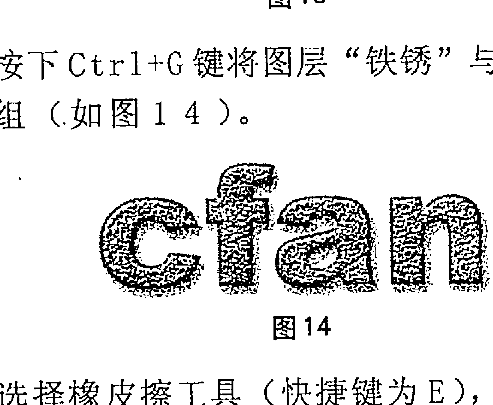

选择橡皮擦工具（快捷键为E），在选项栏上选择直径为39像素的喷溅画笔，模式为铅笔，在文字上点击结合涂抹的方法擦除部分铁锈，露出后面的金属拉丝，直到得到比较真实的效果（如图15）。

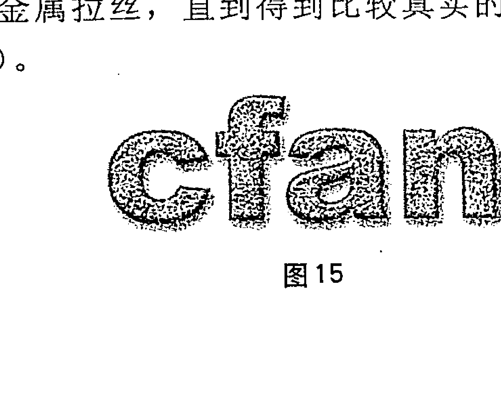

最后为图层“铁锈”添加图层样式，选择“投影”，设置“不透明度”为40%，“距离”为1像素，“大小”为1像素；再选择“内发光”，设置“混合模式”为正片叠底，“不透明度”为50%，发光颜色为纯色黑色，“阻塞”为10%，“大小”为1像素。设置好之后确定，就得到了逼真的铁锈金属字了（如图16）。

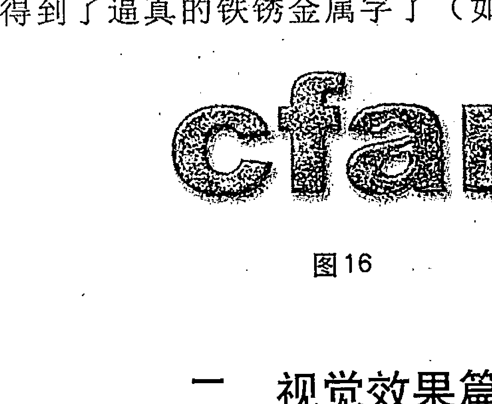

### 二、视觉效果篇

在这个读图时代，一切都以视觉为先，一幅精彩的图片胜过千言万语。下面将要介绍给大家的都是一些在生活中司空见惯的东西，可是要在Photoshop中白手起家制作出来就需要花点心思了，并需要一些技巧。

#### （一）火焰效果

新建尺寸为500×400像素，“模式”为RGB颜色的新文件。确认前景色和背景色是默认的黑白色，如果不是，按下D键将其恢复为默认。

选择菜单命令“滤镜→渲染→云彩”，制作前景色和背景色之间的云雾状效果。由于结果是随机的，我们可以按下Ctrl+Z键恢复一步，再按下Ctrl+F键重复使用上一个滤镜。如此反复，直到得到满意的效果（如图17）。

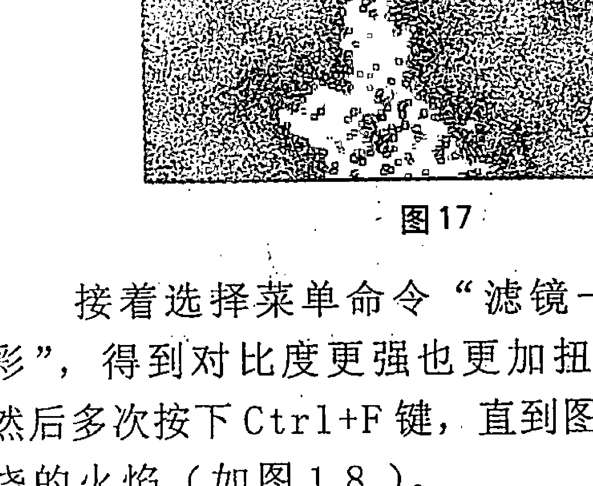

接着选择菜单命令“滤镜→渲染→分层云彩”，得到对比度更强也更加扭曲的云雾效果，然后多次按下Ctrl+F键，直到图像看起来像是燃烧的火焰（如图18）。

按下 Ctrl+E 键将渐变图层合并到背景图层中。单击图层面板底部的“创建新的填充或调整图层”按钮，在菜单中选择“渐变映射”。在对话框中单击渐变条，在渐变编辑器对话框中制作一个由黑色经红色、橙色到黄色的渐变。边观察文件窗口中的变换边调整各个色标的颜色和位置，以得到最理想的效果。经过两次确定，就得到逼真的火焰效果了（如图21）。如果对结果不太满意，可以使用笔刷工具，选择足够大直径的柔角画笔，选择模式为“颜色加深”，在背景图层上对火焰进行修饰。

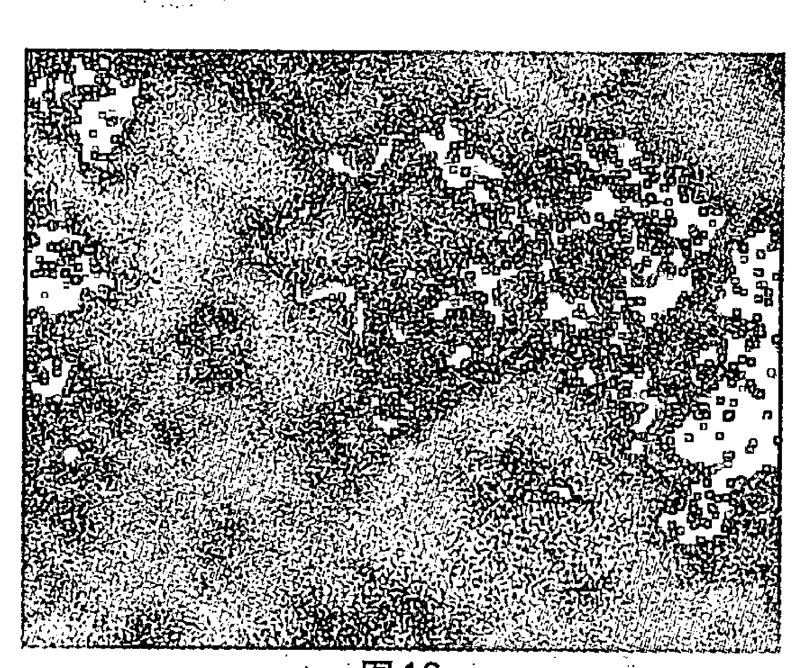

选择笔刷工具（快捷键为 B），在选项栏上选择合适尺寸的柔角画笔（例如直径为 10 像素），根据图像的纹理勾画出火焰的大致轮廓。再选择套索工具（快捷键为 L），沿着勾画出的轮廓将图像的上半部分选择出来（如图19）。

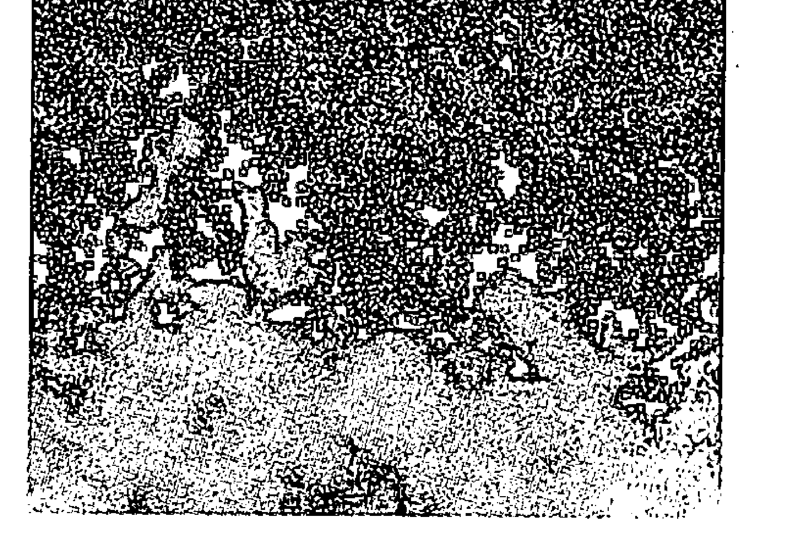

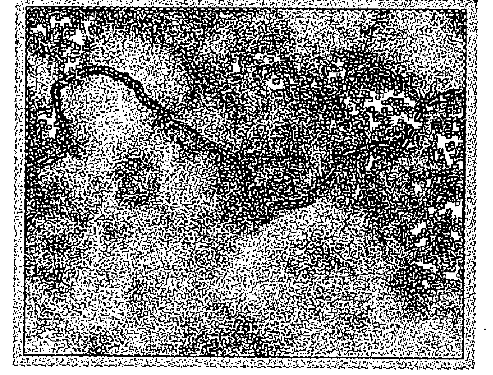

## （二）爆炸效果

然后按下 Alt+BackSpace 键使用前景色的黑色填充选区，再按下 Ctrl+D 键取消选择。创建一个新图层，选择渐变工具（快捷键为 G）使用默认的前景色到背景色的渐变在文件窗口中创建从上部到中下部的黑白渐变，可以按下 Shift 键以保持竖直方向。在图层面板上将渐变图层的混合模式改为“颜色加深”，使火焰上面变暗，下面保持亮度（如图20）。

新建尺寸为 500 × 400 像素，“模式”为 RGB 颜色的新文件。确认前景色和背景色是默认的黑白色，如果不是，按下 D 键将其恢复为默认。选择菜单命令“滤镜→杂色→添加杂色”，在对话框中设置“数量”为 15%，“分布”选择平均分布，选择“单色”复选框，为图像增加杂点。选择菜单命令“图像→调整→阈值”，将滑块拖到像素区域的边缘稍向里一点，这样就保留了少部分黑色杂点，而大部分杂点变成了白色。然后选择菜单命令“滤镜→模糊→动感模糊”，在对话框中将“角度”设为 90 度，“距离”设为 400 像素。确定后得到极具动感的若干条纵向竖线（如图22）。

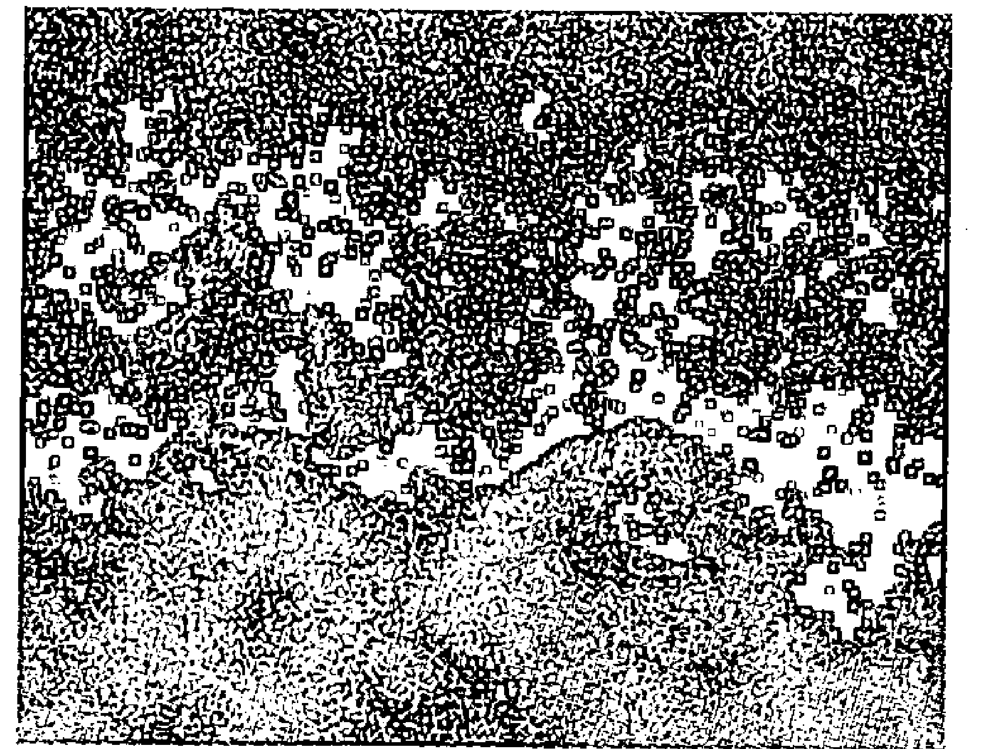

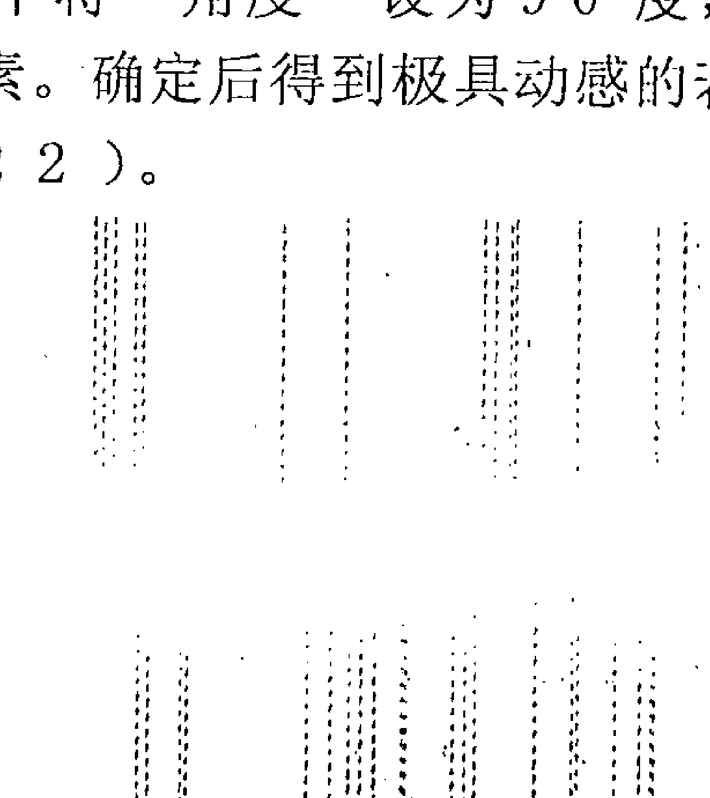

按下 Ctrl+I 键将图像反相。选择渐变工具，选择默认的前景色到背景色的线性渐变，并将“模式”改为屏幕，然后在图像窗口中自下而上拖动（如图23），拖动时可结合 Shift 键使方向保持竖直。

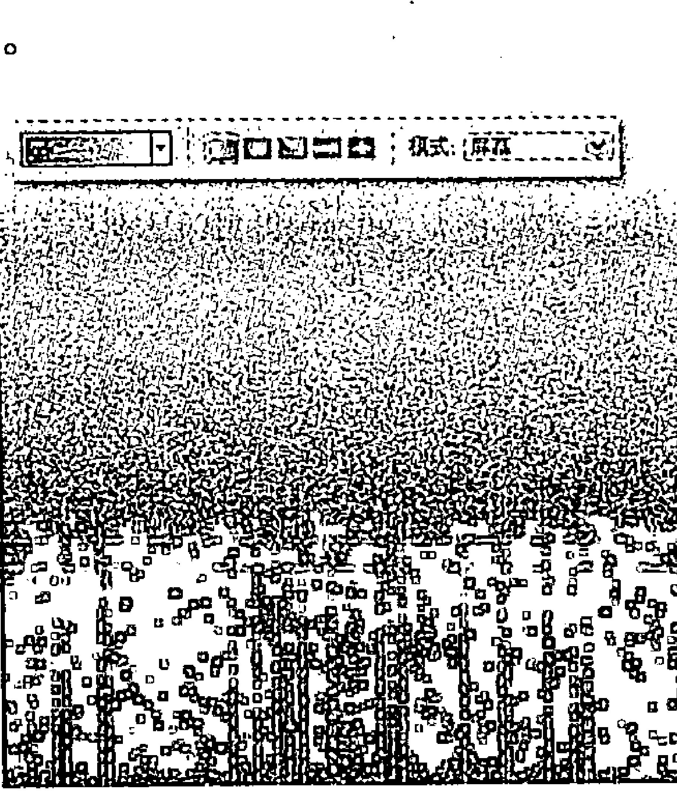

选择菜单命令“滤镜→扭曲→极坐标”，在对话框中选择“选项”为平面坐标到极坐标。确定后得到了初具规模的爆炸效果（如图24）。

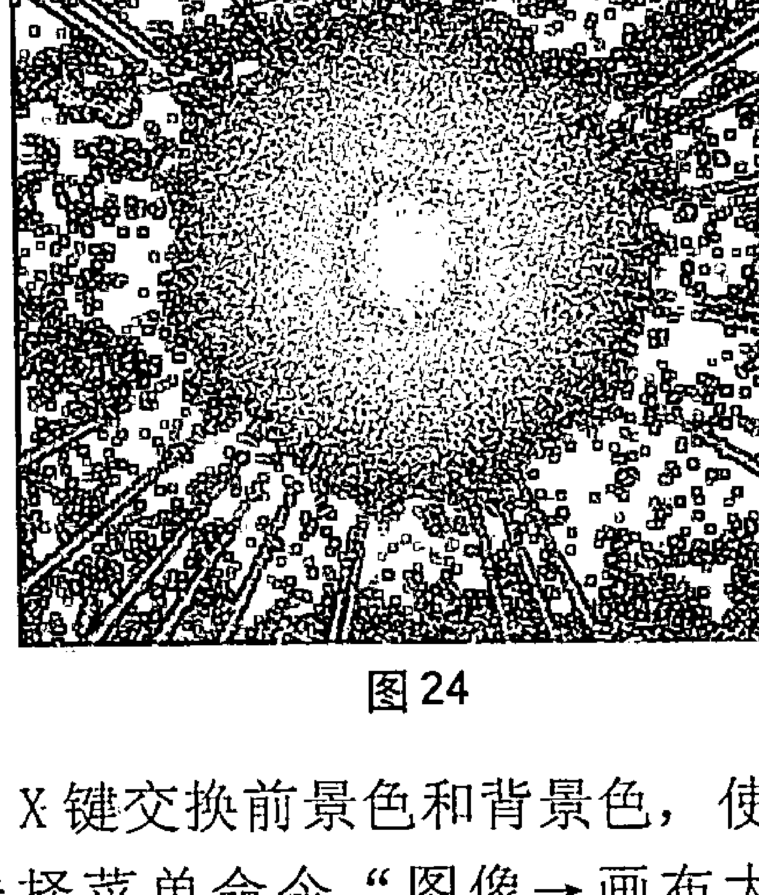

按下 X 键交换前景色和背景色，使背景色变成黑色。选择菜单命令“图像→画布大小”，在对话框中将“宽度”和“高度”均扩大到500像素，并确认定位在中心位置，设置好之后按下“好”按钮将画布扩大。

选择菜单命令“滤镜→模糊→径向模糊”，在对话框中将“数量”设为最大值100，选择“模糊方法”为缩放，“品质”不妨选择最好，然后确定将爆炸效果扩大。

选择菜单命令“图像→调整→色相/饱和度”，在对话框中勾选“着色”复选框，然后将“色相”设为45，“饱和度”设为70，“明度”设为5，确定后为爆炸涂上明亮的黄色。

创建新图层，选择菜单命令“滤镜→渲染→云彩”，在新图层上制作云雾效果。将新图层的混合模式改为“颜色减淡”。再选择菜单命令“滤镜→渲染→分层云彩”，强化爆炸效果。如果还不够满意，可以不断按下 Ctrl+F 键重复使用该滤镜，直到得到满意的效果为止（如图25）。

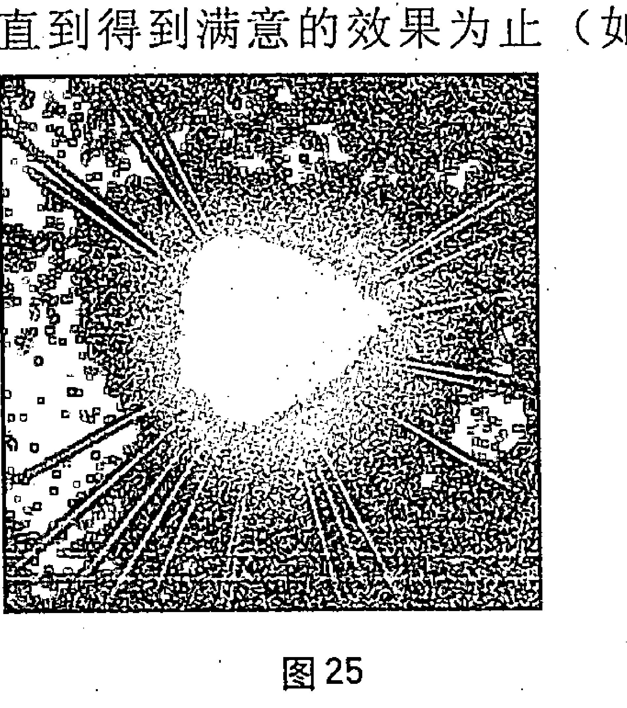

## （三） 粗糙的绘画效果

经常可以看到一些个人网站或是宣传海报使用了略显凌乱却不失随意、率真的粗糙绘画效果，感觉有点另类。这些效果看起来漫不经心，实际上可是经过了精心制作的哟。下面我们就来看一下绘制过程。

新建尺寸为500×400像素，“模式”为RGB颜色的新文件。按下 D 键将前景色和背景色恢复为默认的黑白色。选择菜单命令“滤镜→渲染→云彩”，制作云雾状效果。再使用菜单命令“滤镜→渲染→分层云彩”，加强效果（如图26）。

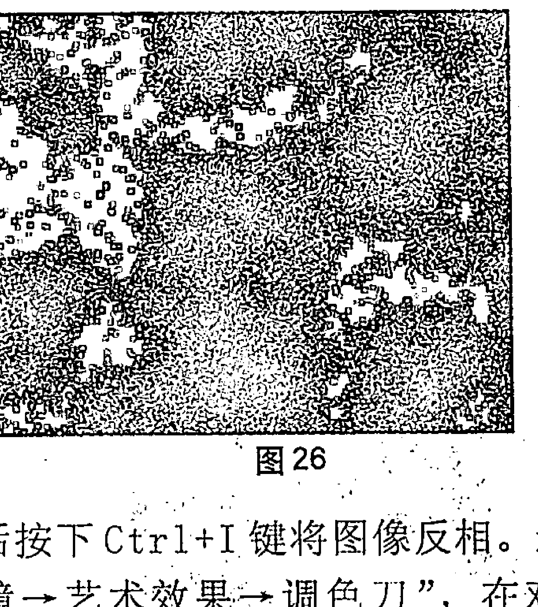

然后按下 Ctrl+I 键将图像反相。选择菜单命令“滤镜→艺术效果→调色刀”，在对话框中将“描边大小”设为20，“线条细节”设为3，“软化度”设为0，设置好之后确定。

选择菜单命令“滤镜→艺术效果→海报边缘”，在对话框中将“边缘厚度”设为2，“边缘强度”设为1，“海报化”设为2，设置好之后确定。再选择菜单命令“滤镜→扭曲→玻璃”，在对话框中将“扭曲度”设为5，“平滑度”为3，选择“纹理”为结霜，“缩放”设为 100%。确定后完成纹理的制作（如图 27）。将其保存为 psd 文件。

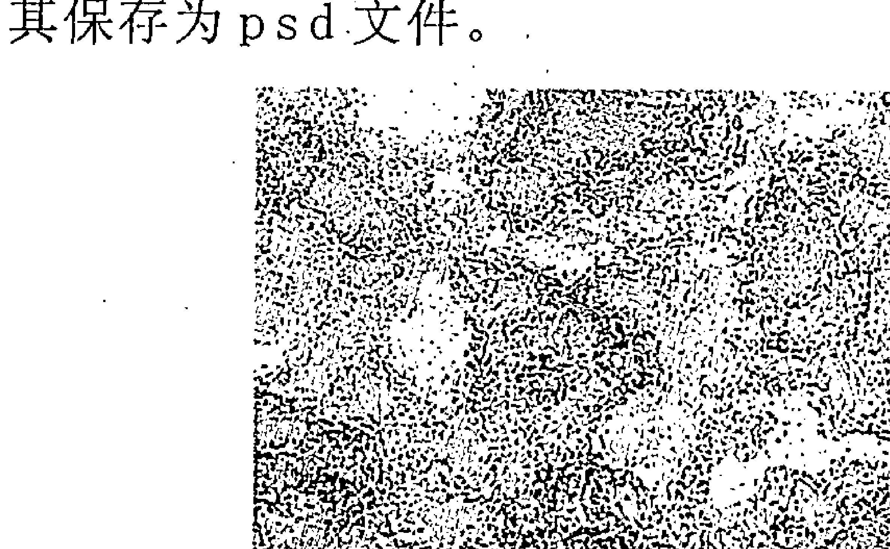

新建尺寸为 500 × 400 像素，“模式”为 RGB 颜色的新文件。选择铅笔工具（快捷键为 B），在选项栏上选择较大直径的画笔，在图像窗口中随意涂画几笔。再选择矩形选框工具，在图像窗口中拖出几个选区，填入黑色（如图 28）。

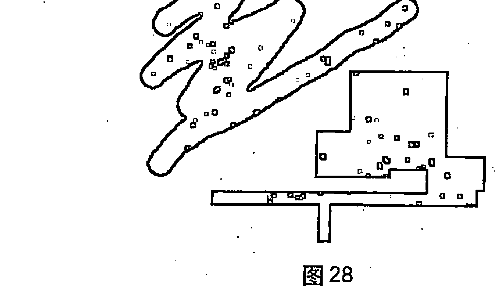

选择菜单命令“滤镜→扭曲→置换”，在对话框中将“水平比例”和“垂直比例”均设为 10%，选择“置换图”为伸展以适合，“未定义区域”为重复边缘像素，按下“好”按钮后在窗口中选择刚才保存的 psd 文件。确定之后，可以看到置换后的图像变得粗糙了（如图 29）。

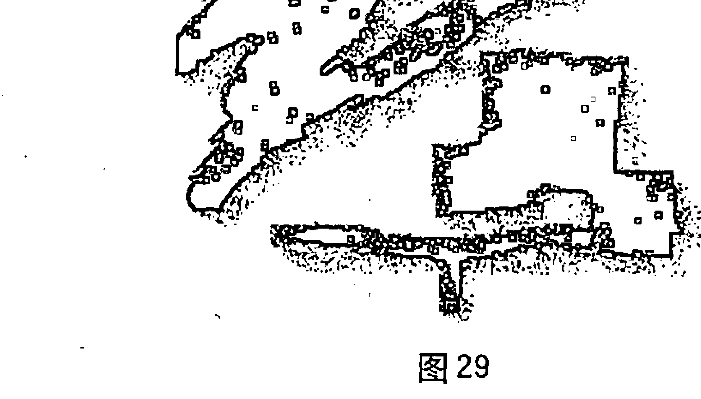

为了增加效果，可以使用选择工具选择不同的部分，分别使用置换滤镜，改变对话框中的比例数值，并注意选择“置换图”选项为“拼贴”。经过一番修整，就可以得到更粗糙的绘画效果了。

我们还可以对其进行调整色相 / 饱和度、添加纹理等进一步的操作，还可以在上面添加文字。只要我们有想象力并勇于尝试，就可以得到更精彩的效果。

## (四) 液体金属效果

新建尺寸为 400 × 400 像素，“模式”为 RGB 颜色的新文件。按下 D 键将前景色和背景色恢复为默认的黑白色。

选择菜单命令“滤镜→杂色→添加杂色”，在对话框中将“数量”设为最大值 400%，选择“分布”为高斯分布，并选择“单色”选项，设置好之后确定。

选择菜单命令“滤镜→像素化→晶格化”，在对话框中将“单元格大小”设为 16。确定后得到黑白灰三色的结晶块。再选择菜单命令“滤镜→风格化→照亮边缘”，在对话框中将“边缘宽度”设为 2，“边缘亮度”设为 6，“平滑度”设为 5，确定之后得到很多不规则的白色和灰色线条（如图 30）。

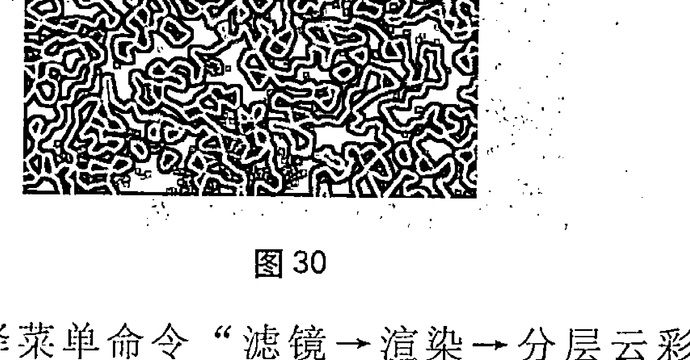

选择菜单命令“滤镜→渲染→分层云彩”，制作云彩效果，然后再按下几次 Ctrl+F 键重复使用该滤镜，得到足够的对比效果（如图 31）。

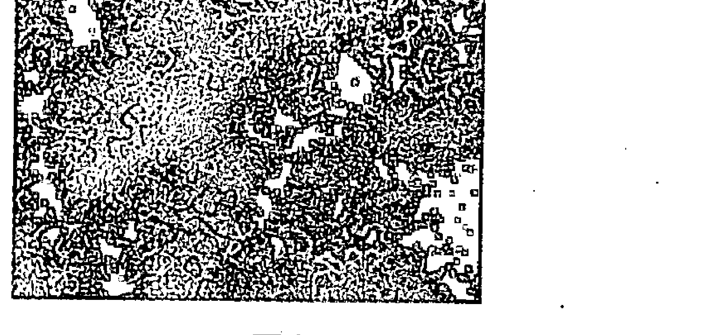

选择菜单命令“滤镜→素描→铬黄”，在对话框中将“细节”设为 5，“平滑度”设为 7 。在这里，原来的白色和灰色线条就成为了液态金属表面不规则的反光。“细节”数值越大，“平滑度”数值越小，得到的液态波纹越细密，读者朋友可以根据自己的需要进行相应的调整。设置好之后按下“好”按钮，就得到了很有质感的液态效果（如图32）。

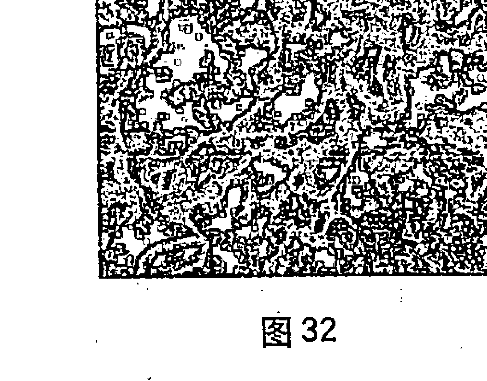

但是作为金属，图像的亮度明显不够，我们可以选择菜单命令“图像→调整→色阶”，在对话框中将输入色阶的白场滑块拖到像素区域的右边缘以增加高光区的亮度，并将灰点滑块向左拖动一些以增加中间调的亮度（如图33），确定后得到亮度适合的图像。

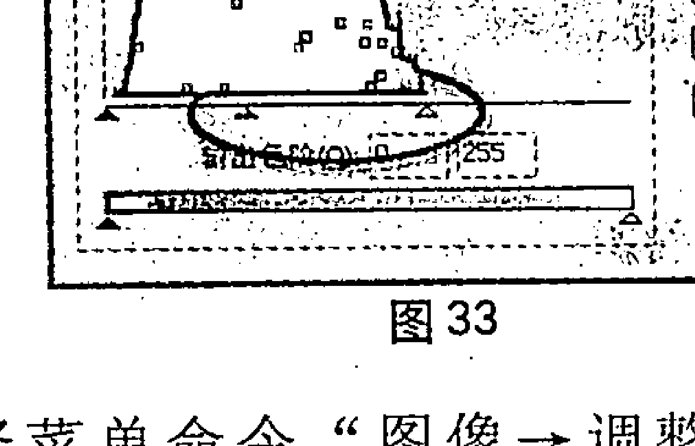

选择菜单命令“图像→调整→色相/饱和度”，在对话框中勾选“着色”选项，并将“色相”设为35，“饱和度”设为35，“明度”保持不变，确定后就得到了古铜色的液态金属了（如图34）。

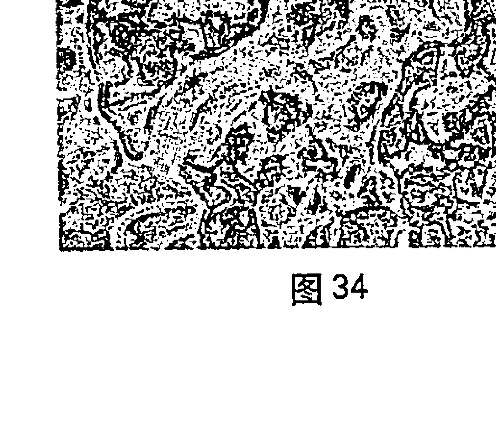

## （五）神秘的逆光效果

找出两张人物的全身肖像照片，使用套索工具分别选择人物的轮廓。只要大致轮廓就可以了，不用非常细致，在这里过于拘泥精确的轮廓是没有意义的。对于轮廓的镂空部分，可以结合Alt键将该部分从整个轮廓中减去。

再创建新图层，在新图层中将选区填充为黑色。新建尺寸为400×500像素，“模式”为RGB颜色的新文件。选择移动工具（快捷键为V），将两个人物轮廓拖到新文件窗口中来。如果大小不合适，可以按下Ctrl+T键然后进行调整。调整好大小，并摆到合适的位置（如图35）。

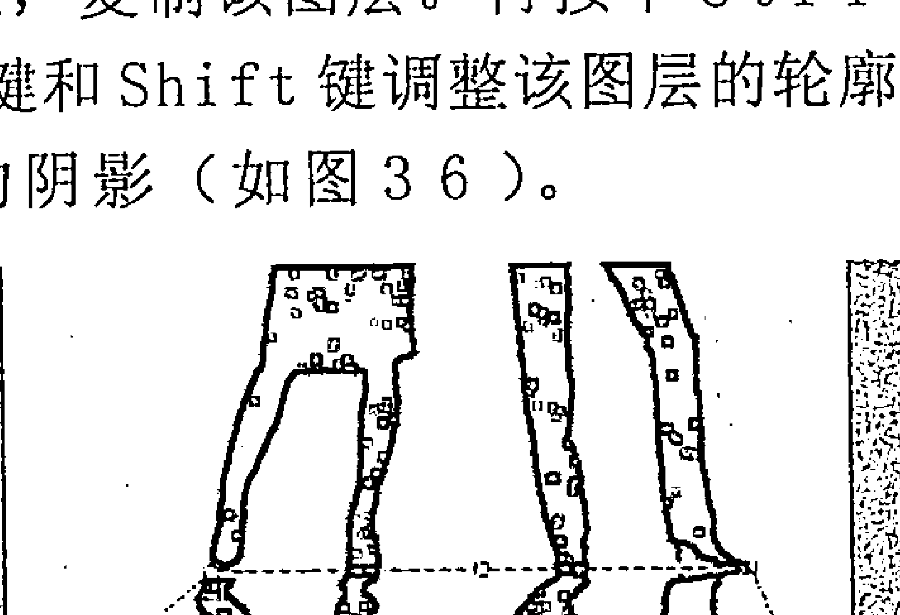

然后将两个人物轮廓合并到一个图层中。在图层面板上，将人物轮廓图层拖到“创建新图层”按钮上，复制该图层。再按下Ctrl+T键，结合Ctrl键和Shift键调整该图层的轮廓，使之成为人物的阴影（如图36）。

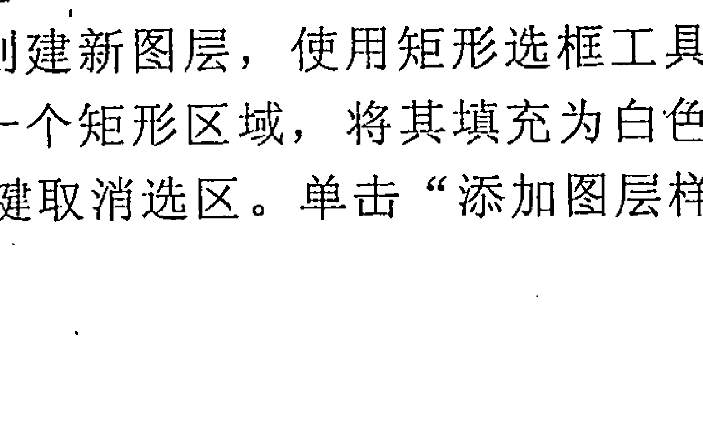

选择面板的功能菜单中的“拼合图层”，将所有图层都合并到背景图层中。在图层面板上，单击“创建新图层”按钮，在背景图层上面创建一个新图层。按下D键将前景色和背景色恢复为默认的黑白色。然后按下Alt+BackSpace键将该图层填充为黑色。再在这个图层上面创建新图层，使用矩形选框工具，在右上角选择一个矩形区域，将其填充为白色。按下Ctrl+D键取消选区。单击“添加图层样式”按钮，在菜单中选择“外发光”，在图层样式对话框中左侧已经选择了“外发光”，在右侧进行设置，选择“混合模式”为正常，“不透明度”为100％，“发光颜色”为纯色白色，“方法”为精确，“扩展”为40％，“大小”为200像素。设置好之后确定，得到明亮的光源（如图37）。

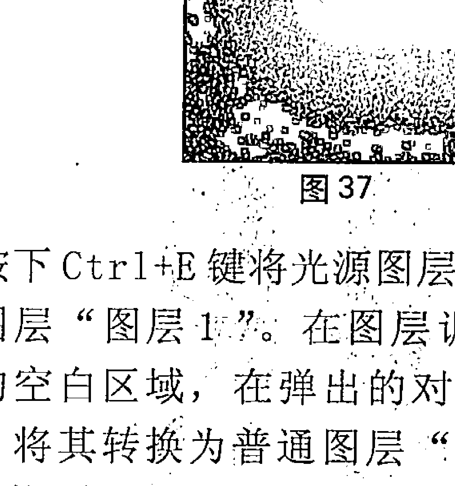

按下Ctrl+E键将光源图层和黑色图层合并为一个图层“图层1”。在图层面板上，双击背景图层的空白区域，在弹出的对话框中单击“好”按钮，将其转换为普通图层“图层0”。将“图层0”拖到“图层1”的上面，然后将其混合模式改为“正片叠底”。这样“图层0”中黑色的人物得到保留，白色部分被滤掉了。

在图层面板上，单击“图层0”左侧的眼睛图标，将其隐藏。再切换到通道面板，按住Ctrl键单击任意一个通道（因为每个通道都是一样的），将白色区域作为选区载入。回到图层面板，再次单击“图层0”左侧的眼睛图标，将其显示。选择“图层0”，然后选择菜单命令“滤镜→模糊→高斯模糊”，对选区内图像进行“半径”为5像素的高斯模糊。按下Ctrl+D键取消选区，再使用半径为2像素的高斯模糊滤镜，对人物的脚部和阴影进行一点模糊，并对人物轮廓进一步模糊。选择菜单命令“图像→调整→色阶”，在对话框中将输入色阶的白场滑块向左大幅度拖动，再将灰点滑块向左移动一些（如图38）。

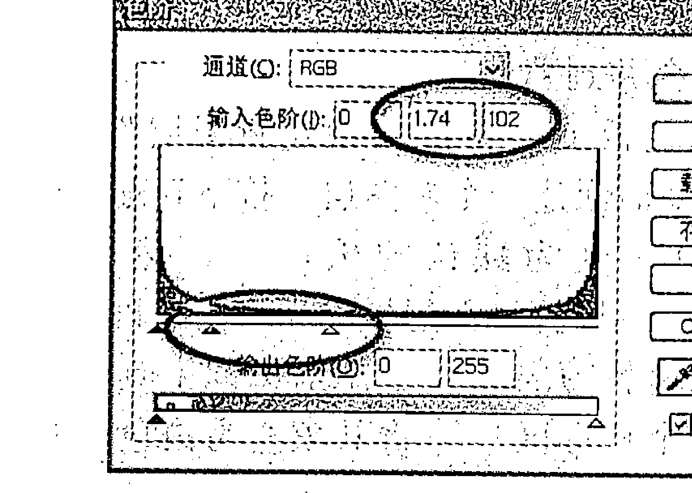

确定之后，人物轮廓有了明亮的光晕（如图39）。

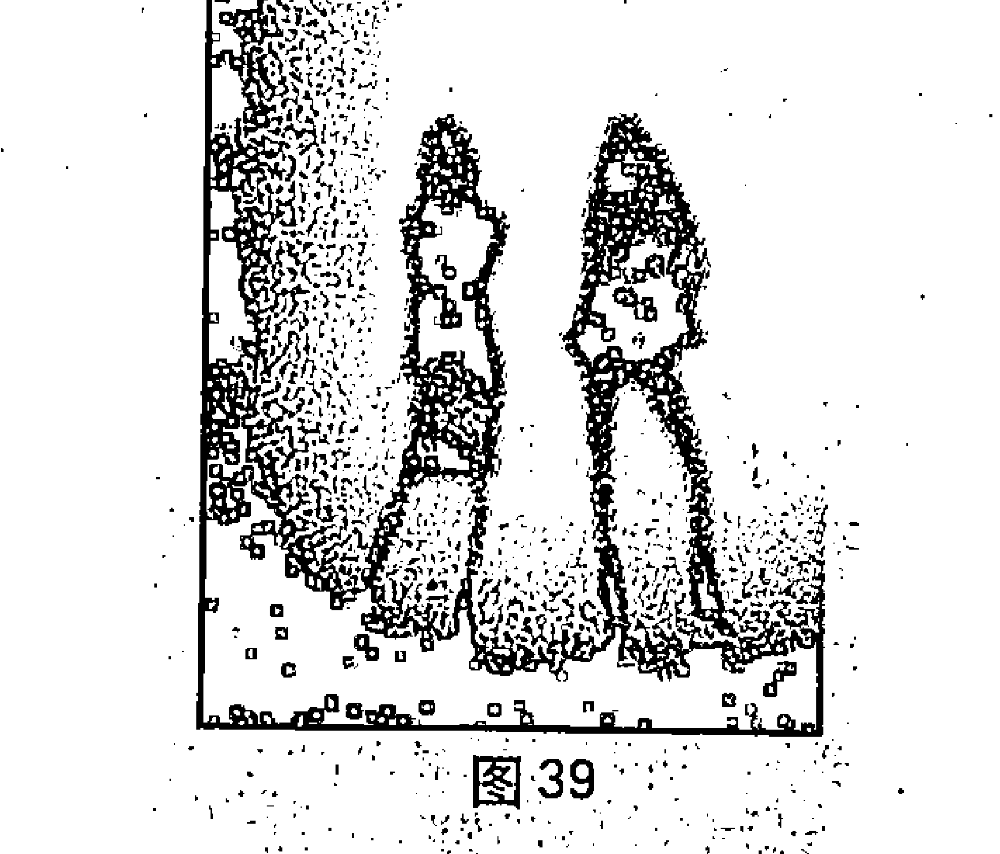

在面板的功能菜单中选择“拼合图层”，将所有图层拼合为背景图层。选择菜单命令“图像→调整→渐变映射”，在对话框中单击渐变色条，在渐变编辑器对话框中制作从黑色经褐色、橙色、黄色到白色的渐变（如图40），确定两次后图像变成暖色调。

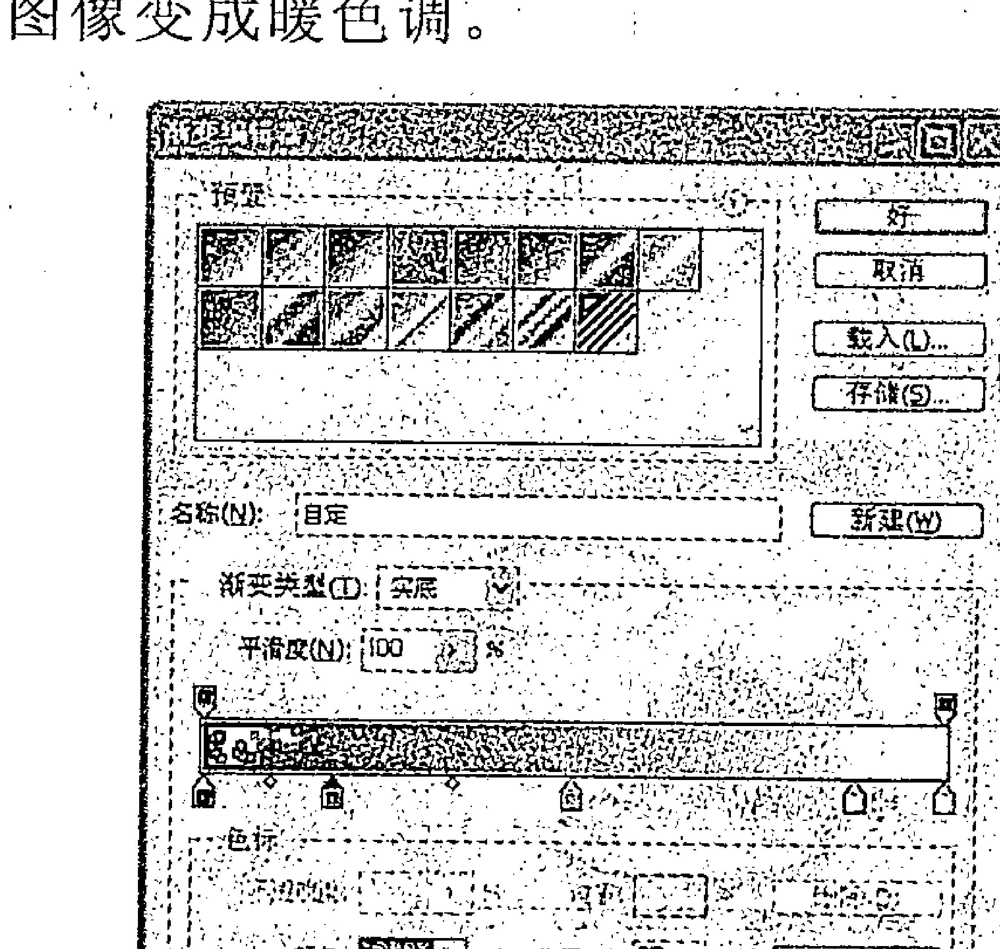

我们还可以为其添加纹理。创建新图层，选择菜单命令“滤镜→渲染→云彩”，再选择“滤镜→渲染→分层云彩”，然后按下两次Ctrl+F键强化效果。选择菜单命令“滤镜→扭曲→海洋波纹”，在对话框中将“波纹大小”设为10，“波纹幅度”设为11，设置好之后确定，得到波纹纹理（如图41）。

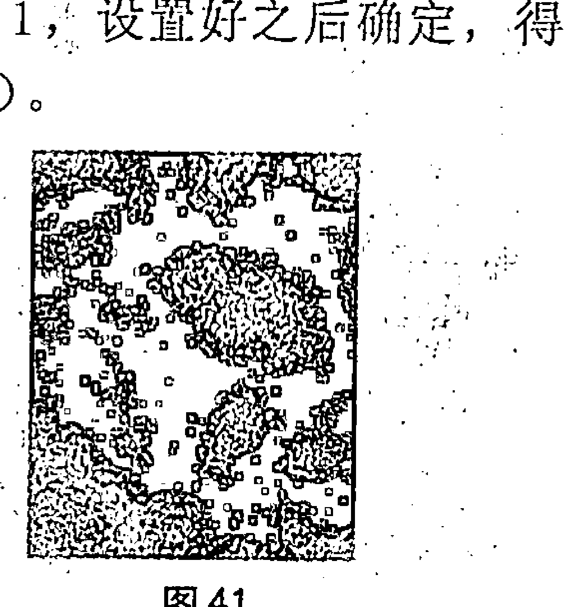

选择菜单命令 “图像→调整→色相/饱和度”，在对话框中选择 “着色” 选项，将 “饱和度” 设为40，将纹理改为红色调。将纹理图层的混合模式改为 “叠加”，整个图像就获得了纹理效果（如图 42）。怎么样？效果很震撼吧！

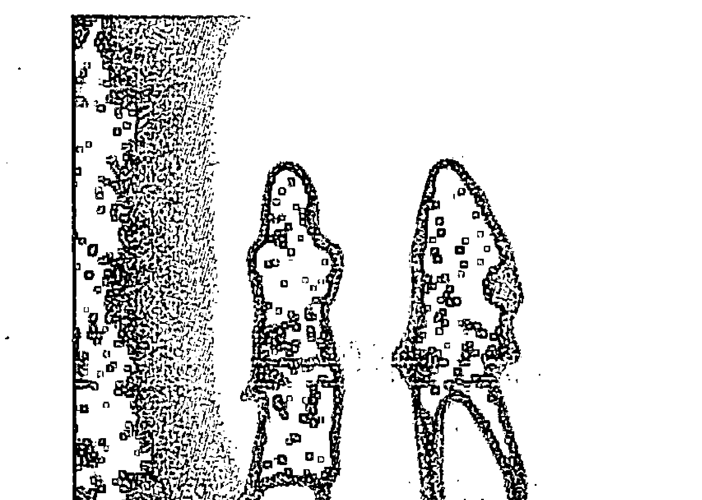

## 三、特殊效果篇

特殊效果其实并不特殊，无论它多么的令人难以置信，多么的以假乱真，它都是在Photoshop中一步一步制作出来的。每一个步骤，对我们来说都并不复杂，而正是这些简单的技巧和操作，组合起来就制作出了令人叹服的特效。

## (一) 鸡蛋上的眼睛

在本例中，我们要将一只漂亮的眼睛放在一只鸡蛋上，使它看起来好像原本就是那里的。我们需要这样的两张图片素材（如图43、44）。

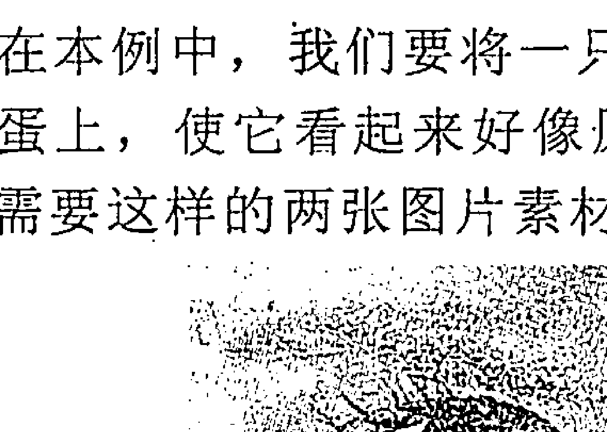

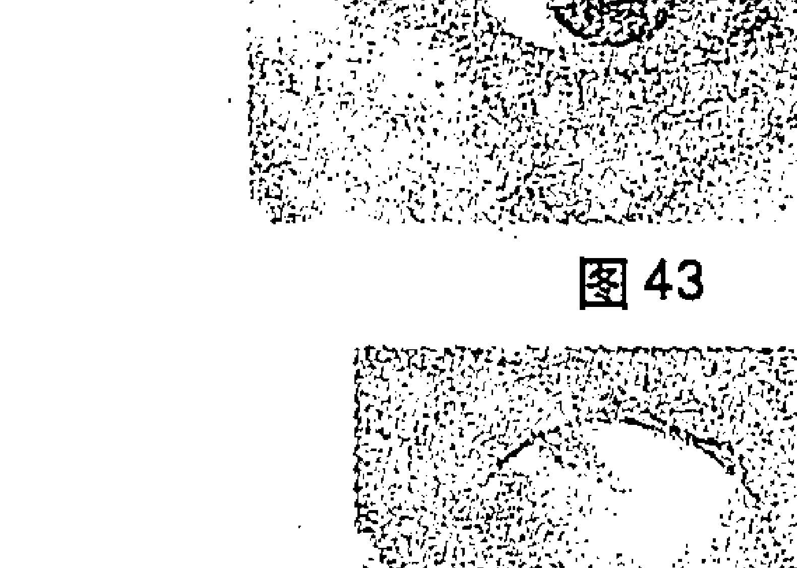

首先选择套索工具，在选项栏上将“羽化”设为20像素，然后选择出眼睛的范围。按下Ctrl+C键复制，切换到鸡蛋所在的文件窗口，按下Ctrl+V键将眼睛粘贴过来（如图45）。

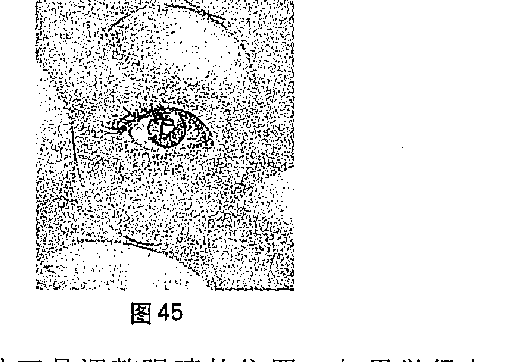

使用移动工具调整眼睛的位置，如果觉得大小不合适，就按下Ctrl+T键进行调整。切换到图层面板，将粘贴过来的图层改名为“眼睛”。选择菜单命令“图像→调整→曲线”，在对话框中将曲线中部稍向上拖动（如图46），将眼睛调整得亮一点。将图层“眼睛”的混合模式改为“正片叠底”，这样眼睛就随着鸡蛋表面的明暗关系发生变化，还透出鸡蛋表面的纹理。

在图层面板上，将背景图层拖到底部的“创建新的图层”按钮上，创建其副本图层，然后将它拖到所有图层的最上面，将其图层混合模式改为“颜色”，将图层不透明度降为65%。现在眼睛在色调上也与鸡蛋保持一致了。不过我们希望眼珠保持原来的颜色，这可以通过图层蒙版来实现。选择背景副本图层，单击面板底部的“添加图层蒙版”按钮，为其添加图层蒙版。选择笔刷工具，在选项栏上选择合适大小的中等柔软程度的画笔（直径以与瞳孔大小差不多为宜），“模式”为正常，“不透明度”为100%，按下D键再按下X键，将前景色设为黑色，然后在瞳孔上单击一下（如图47）。

这就在背景副本图层的蒙版上涂上一块黑色，相当于在图层上挖了个洞，露出了下面图层中真实颜色的瞳孔，作品完成（如图48）。

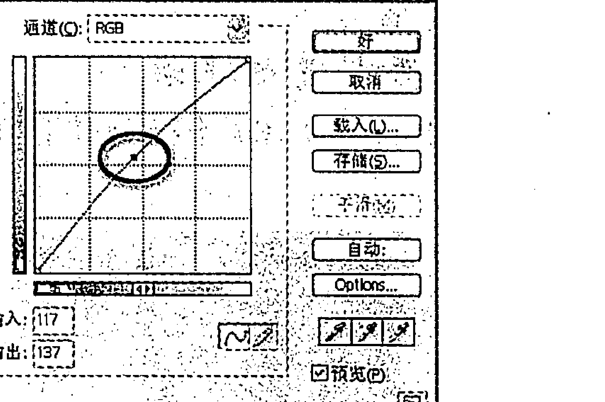

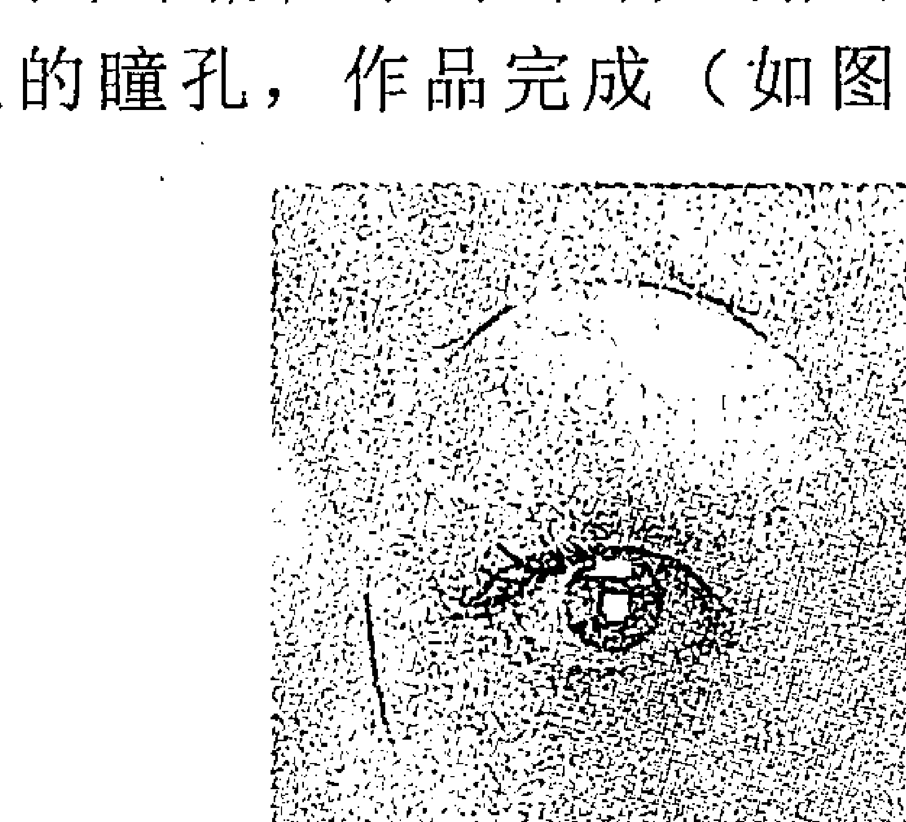

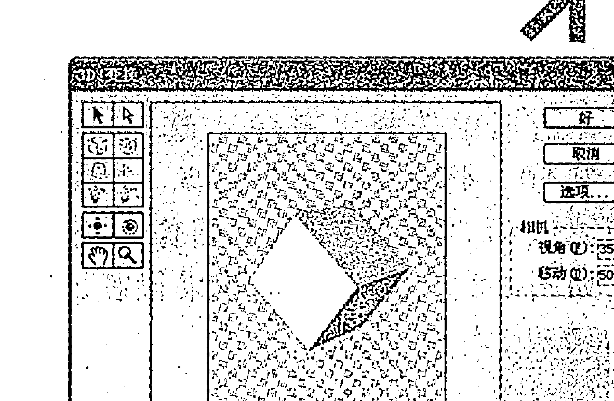

## （二）晶莹剔透的冰块

首先打开一幅图片作为冰块存在的背景（如图49）。


创建新的图层，命名为“冰块”，选择菜单命令“滤镜→渲染→3D变换”，在滤镜窗口中，先选择立方体工具（快捷键为M，只在该窗口中有效，下同），在预览区域中画出一个立方体，再选择轨迹球工具（快捷键为R），拖动立方体旋转，直到露出立方体的灰面并有一个比较舒服的角度（如图50）。

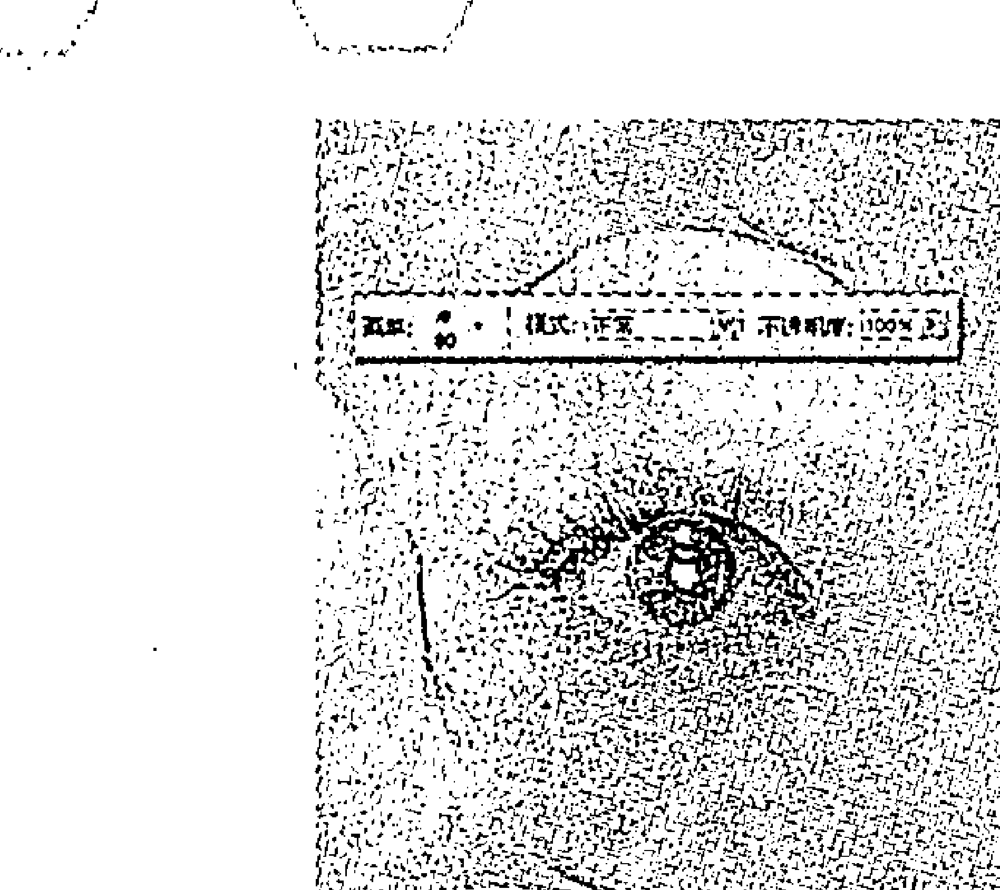

确定之后，一个大立方体就出现在窗口中了（如图51）。

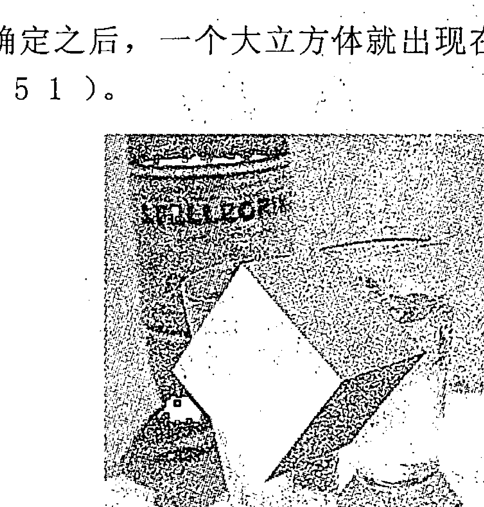

选择菜单命令“图像→调整→自动色阶”，这样一来立方体的最浅色变成白色，最深色变成黑色，从而增大了立方体的对比度。按下Ctrl+T键，调整立方体的大小、角度和位置。创建新图层，命名为“白边”。选择图层“冰块”，使用魔棒工具（快捷键为W）在立方体的白面上单击进行选择，选择图层“白边”，使用菜单命令“编辑→描边”为选区做“宽度”为5像素，“颜色”为白色，“位置”为居中的描边。使用同样的方法，在图层“白边”中对立方体的灰面和黑面进行描边（如图52）。

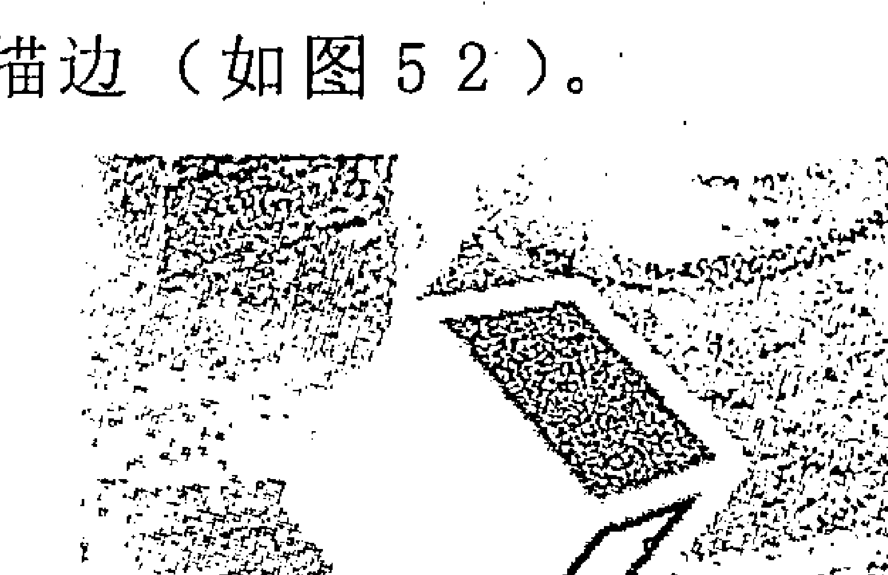

在图层面板上，按住Ctrl键单击图层“冰块”将其轮廓载入为选区，再按住Ctrl+Shift键单击图层“白边”将其轮廓加入到选区中。切换到通道面板，将选区存储为 Alpha 通道，命名为“轮廓”。然后可以按下 Ctrl+D 键取消选择。回到图层面板，将图层“冰块”的不透明度降低到 20%。链接上图层“白边”，按下 Ctrl+E 键将两个图层合并。切换到通道面板，按住 Ctrl 键单击通道“轮廓”将其载入为选区。回到图层面板，选择背景图层，选择菜单命令“滤镜→模糊→高斯模糊”，在对话框中将“半径”设为 2.4 像素，对冰块后面的背景进行模糊。选择菜单命令“滤镜→扭曲→旋转扭曲”，在对话框中将“角度”设为 -75 度，然后确定。选择菜单命令“滤镜→艺术效果→海绵”，在对话框中设置“画笔大小”为 3，“定义”为 12，“平滑度”为 5，然后确定。选择菜单命令“滤镜→艺术效果→塑料包装”，在对话框中设置“高光强度”为 12，“细节”为 5，“平滑度”为 7，然后确定。再选择菜单命令“滤镜→扭曲→海洋波纹”，在对话框中设置“波纹大小”为 10，“波纹幅度”为 10，然后确定。经过一系列滤镜的应用，冰块已经初具形状了（如图53）。

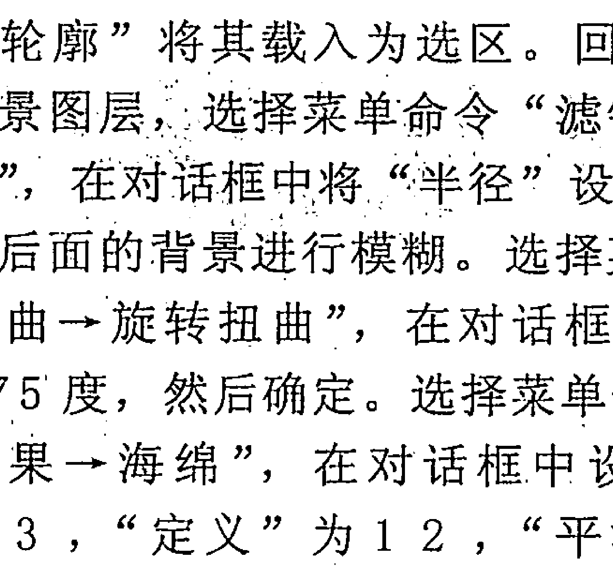

在图层面板上，选择图层“冰块”，使用高斯模糊滤镜对其进行 2 像素的模糊。选择菜单命令“选择→修改→平滑”，在对话框中将“取样半径”设为 8 像素，确定之后选区变得圆滑了。按下 Ctrl+Shift+I 键将选区反向，按下 Delete 键删除冰块的棱角部分，再按下 Ctrl+Shift+I 键将选区反向，重新选择冰块。按下 Ctrl+E 键将图层“冰块”合并到背景图层中。按下 Ctrl+C 键复制冰块部分，再创建新文件，将冰块粘贴进来，保存文件，留待后面使用。

回到原文件窗口中，选择菜单命令“滤镜→模糊→径向模糊”，在对话框中设置“数量”为 6，“模糊方法”为旋转，“品质”为最好，然后确定。选择菜单命令“滤镜→扭曲→玻璃”，在对话框中将“扭曲度”设为 5，“平滑度”设为 2，“纹理”选择载入纹理，在打开文件对话框中选择刚才保存的文件，“缩放”设为 120%。确定之后，冰块的效果就出来了（如图54）。

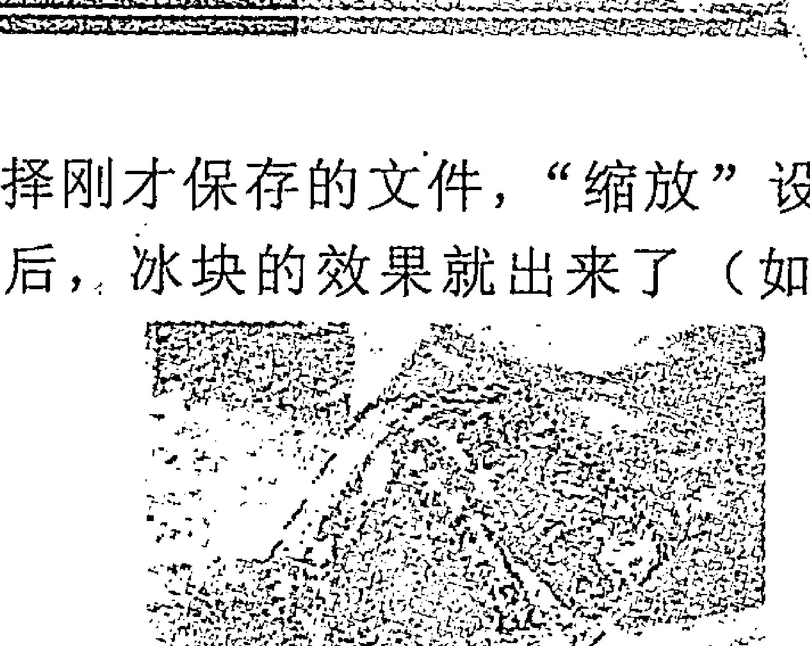

最后，选择菜单命令“图像→调整→曲线”，在对话框中将曲线下端向下拖动一点，将曲线上端向上拖动一点，使之略微呈现 S 形以增强冰块的对比度；再选择蓝色通道，将曲线中部向上拖动一点（如图55），增加蓝色成分可以使得冰块显得更加晶莹剔透。

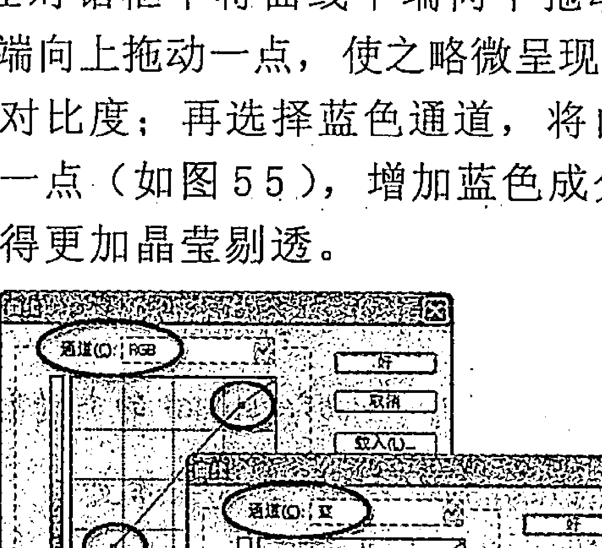

调整好之后确定，取消选择，就得到了我们想要的可以以假乱真的冰块了（如图56）。

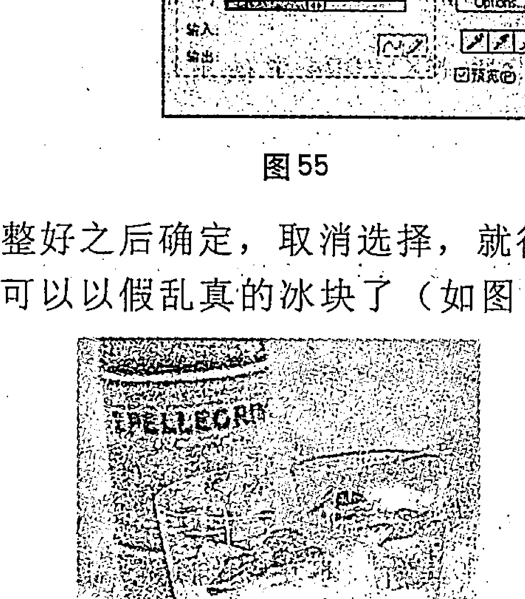

十个实例已经介绍完了，这顿丰盛的经典大餐是不是很过瘾呢？这些实例之所以经典，就在于我们可以在其中学到很多实用的技巧，而更有价值的是思路。当我们真正掌握这些实例的精髓，还担心自己创造不出更经典的作品吗？

# 实战Flash MX 2004最新绝技

文/邢延刚

*   文章重点与技巧目录
*   Flash MX 2004中的新特性
*   Flash MX 2004 Professional 的新特性
*   使用Flash MX 2004制作爆炸文字
*   在Flash MX 2004中使用CSS样式表
*   定制右键菜单
*   使用Flash MX 2004组件制作日历
*   在Flash MX 2004中使用项目管理
*   使用Flash MX 2004制作一个播放器

# 一、Flash MX 2004总体印象

Flash的最新版本命名为Flash MX 2004，分为专门面向设计者的标准版Flash MX 2004和专门面向开发者的专业版Flash MX 2004 Professional。新版本更加确定了Macromedia Flash 的多功能网络媒体开发工具(RIA)的地位。Flash MX 2004/MX professional 2004和Flash MX相比，在许多方面，特别是易用性上做出了值得关注的改进。跨平台、标准化等新概念的引入，甚至让人感觉Macromedia正在或多或少地受到微软各条产品线的影响。

# （一）Flash MX 2004中的新特性

1.  时间线特效(Timeline Effects): 在新版Flash中，我们可以简单地在时间线上添加预制的阴影、模糊、缩放、位移、不透明和颜色变化等特效，简化了过去令人头疼的繁琐步骤。
2.  行为: 可以通过面板快速应用ActionScript而无需了解代码（如图1），用户也可以创建自己的行为。

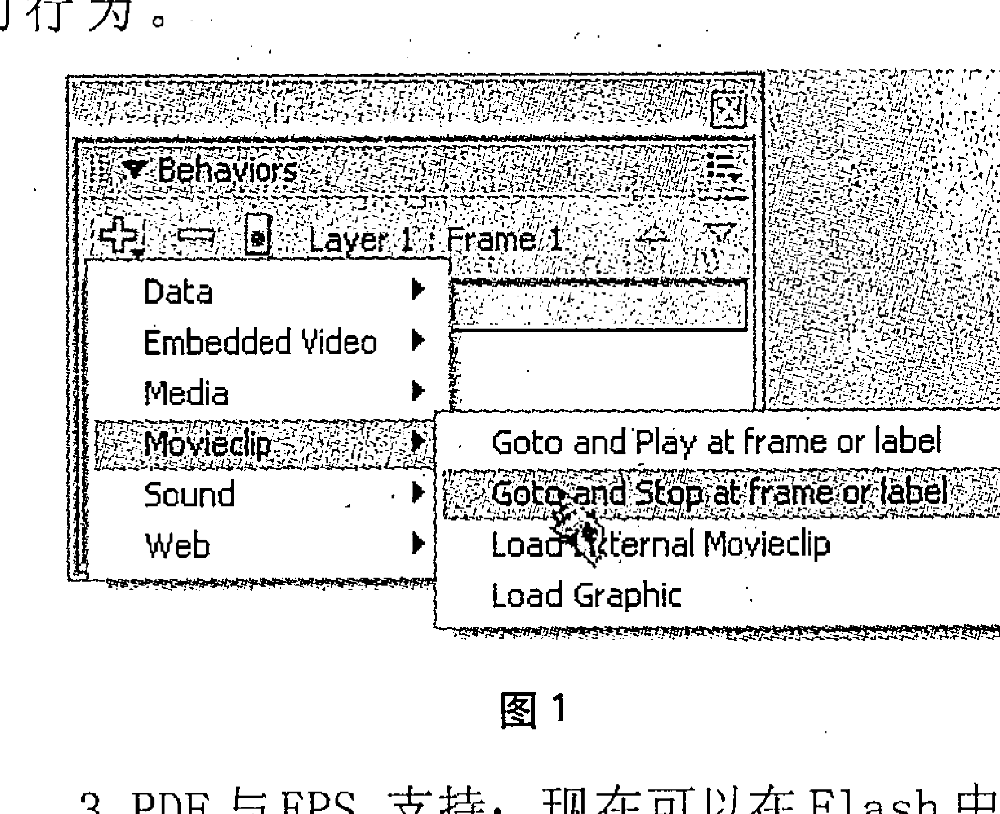

3.  PDF与EPS 支持: 现在可以在Flash中直接导入PDF和AI文件。
4.  CSS 样式表: 表面上这只是TextFormat对象的改进，一个你用来控制格式的脚本，然而，在新版Flash中CSS已经走得更远了一些，现在可以导入CSS文本并使用在你的网站上。
5.  字体边缘强化(Alias Text): 旧版本中，字号较小的文字边缘模糊，难以阅读，我们只能把文本框属性设置成动态文字(Dynamic Text)。现在，我们只需要选择文本框，按下Alias Text按钮，边缘模糊的问题就被彻底解决，并且不存在动态文本框文字位置不确定的问题。
6.  模板: 增加了许多模板。
7.  开始页面: 该新窗口可以让用户选择从哪个项目开始工作。
8.  帮助: 新的帮助系统整合全部帮助信息到应用程序中。
9.  视频导入向导：这个新的多步向导提供了控制指定范围的视频被导入，可重复使用的编码设置和颜色修正等新性能。
10. 外部FLV支持：你现在可以直接播放硬盘上的FLV（Flash视频）文件而无需导入。这样可以用有限的内存播放很长的视频文件而不需要从服务器下载完全部文件。
11. 改良的性能：大部分的功能都或多或少地得到了改进，编译后的文件不仅在Flash Player 7中执行效果良好，在以前版本的播放器中也同样很好。
12. 拼写检查/全局查找替换：Flash有了一个拼写检查工具。还有了一个可以查找和替换的工具。在Flash MX 2004文档中，可以使用查找与替换功能查找和替换指定的相同类型元素，这些元素包括文本、字体、颜色、图符、声音文件、视频文件或导入的位图文件。随着查找元素的类型的不同，Find and Replace对话框中的选项也会随之改变。
13. 辅助功能：改进了MSAA（Microsoft Active Accessibility）标准支持。
14. 动作脚本2.0：为支持面向对象编程做了非常大的改进。
15. 改进的历史面板和命令（如图2）。

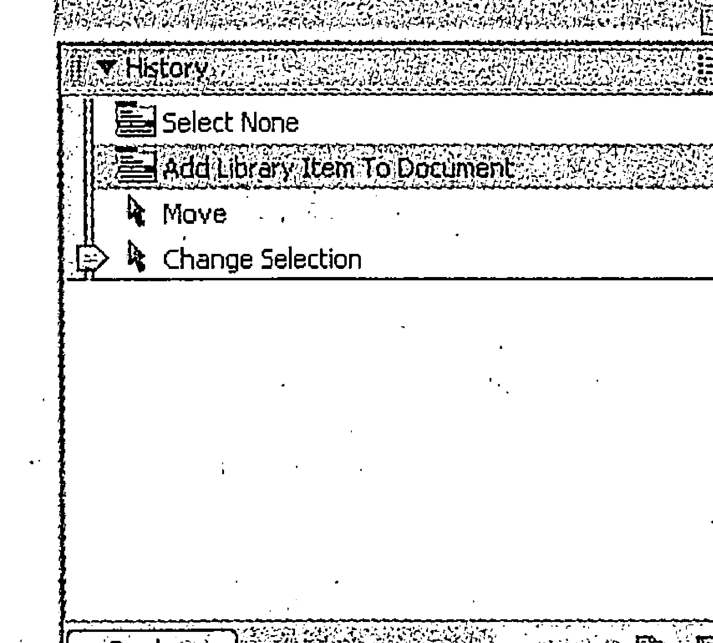

16. 多语种支持（Unicode）与字符串面板：在Flash MX中，对双字节文字的支持有很大问题，需要在调用文本的时候使用UTF-8编码才能正常显示。Flash MX 2004全面支持Unicode编码，并且字符串面板允许本地语言直接成为多国语言。
17. 扩展性：新的可扩展架构，有第三方软件提供支持。
18. 发布设置：增强了报表功能（如图3）。

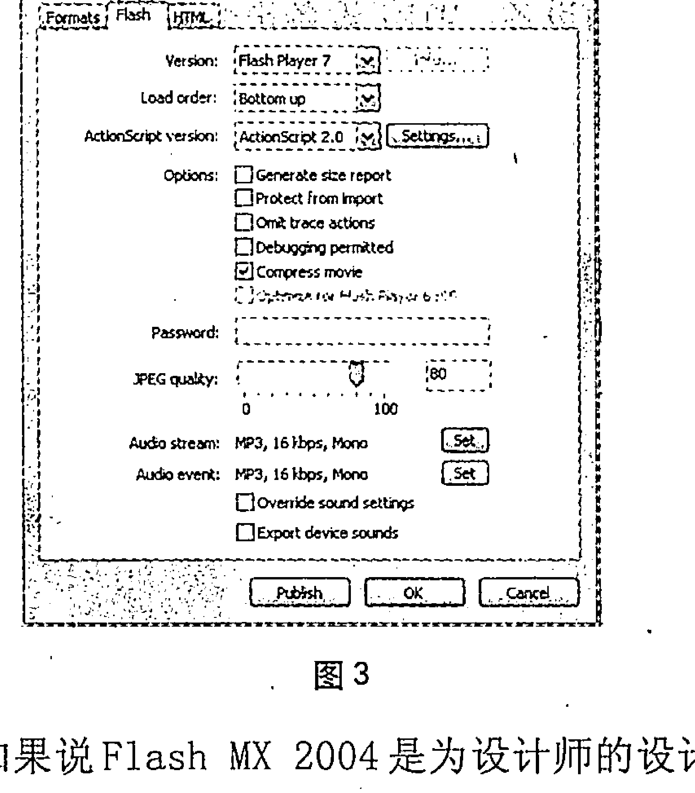

如果说Flash MX 2004是为设计师的设计而准备的话，那么Flash MX 2004 professional 则更多考虑到开发者的需求。

# （二）Flash MX 2004 professional 的新特性

Flash MX professional 2004除了拥有Flash MX 2004的全部特性之外，还有以下一些令人怦然心动的功能。

1.  屏幕（窗体）：专业版Flash引入了一套基于表单的可视化开发环境（类似于Microsoft Visual Basic），让程序员更加得心应手地完成自己的工作，并且不用考虑时间线问题。
2.  高级组件：在Components中增加了几个额外的组件。
3.  数据交互整合：使用WEB服务和XML组件连接数据源，简单方便地显示数据和操作数据。
4.  编辑器：通过用户界面的形式添加、编辑、删除对象。
5.  项目文件管理/源代码管理：开发大型Flash项目终于可以像模像样地进行工程化管理。
6.  专业视频软件整合：Quicktime FLV导出插件允许第三方软件支持Quicktime格式直接导出成FLV（Flash视频），被支持的软件有：Avid、Final Cut Pro、Cleaner、After Effects、Combustion和Quicktime播放器。
7.  增强视频质量和屏幕记录：使用Quicktime FLV导出器（上面提到的）、一个新的视频编码器，让Flash视频更加出众。
8.  流媒体组件：新增三个组件，允许你快速连接播放 FLV 和 MP3。事件原型允许视频触发项目中的其他事件。
9.  移动设备：MIDI 设备声音可以映射到 Flash 中。

Flash MX 2004 Professional 软件界面如图4所示。

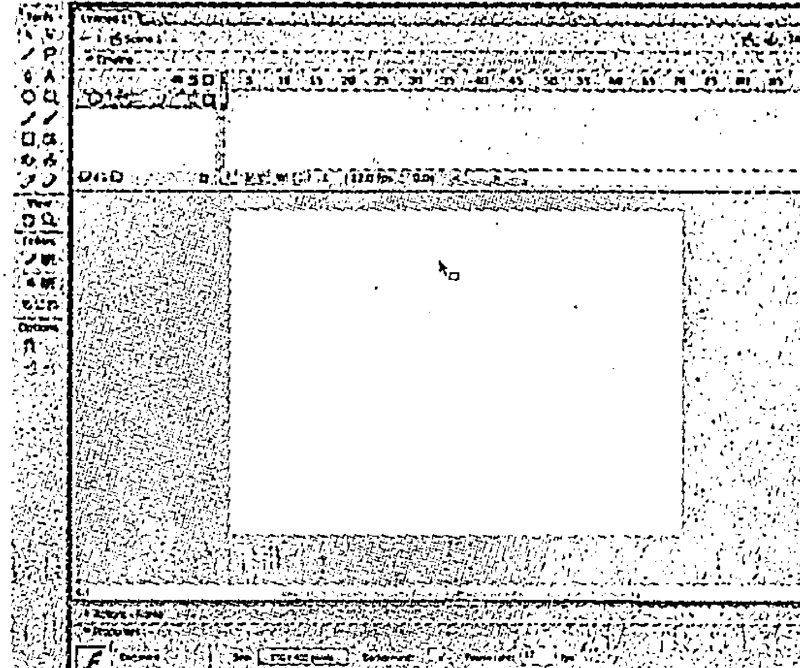

# （三）Macromedia Flash Player 7 的改进

除了错误修正和运行效率提高，Macromedia Flash Player 7 还有以下两点值得一提的改进。

1.  右键菜单：现在你可以动态自定义自己的右键菜单了。
2.  自动更新：Macromedia Flash Player 7 包含了自动更新特性。有能力的用户可以控制检测周期和其他一些高级设置。只要在浏览器内右击 Flash 影片，选择 Settings，点击 Advanced 按钮，然后你就可以访问 Macromedia 上的一个 SettingManager 来帮助你进行设置。在这里，你可以选择 Global Privacy Setting 来管理网站设置，包括摄像机、麦克风和本地 Shared Object 的存储量等。

# （四）存在的问题

在介绍了 Flash MX 2004 纷繁的新功能之后，也必须注意到下列一些问题：

1.  系统资源消耗过大。
2.  文件兼容性问题。
3.  回放平台尚待改进。Flash Player 7 在效率上做到了最优化，但在回放品质上却难说完美。新版 Flash 中引人注目的“字体边缘强化”功能，会在某些平台上让文字字体发生无法停止的抖动现象。

# 二、Flash MX 2004 的改进实例

# （一）制作爆炸文字动画

时间轴特效（Timeline effects）是 Flash MX 2004和Flash MX Professional 2004都拥有的新功能。使用 Flash 内建的时间轴特效，可以快速创建复杂的动画。

时间轴特效可以应用于以下对象：文本、图形（包括矢量图、组合对象和图符）、位图、按钮图符。给一个对象添加时间轴特效时，Flash会新建一个层，然后把该对象传送到新建的层。该对象被放置在特效图形中，特效所需的所有过渡和变形存放在新建层的图形中。新建层的名称与特效的名称相同，后加一个编号，表示特效应用的顺序。添加时间轴特效时，在图符库中会添加一个以特效名命名的文件夹，内含创建该特效所用的元素。

> 提示：对电影剪辑应用时间轴特效时，Flash在电影剪辑内部嵌套特效。

1.  按常规方法，在编辑区中添加一个文本框（如图5）。

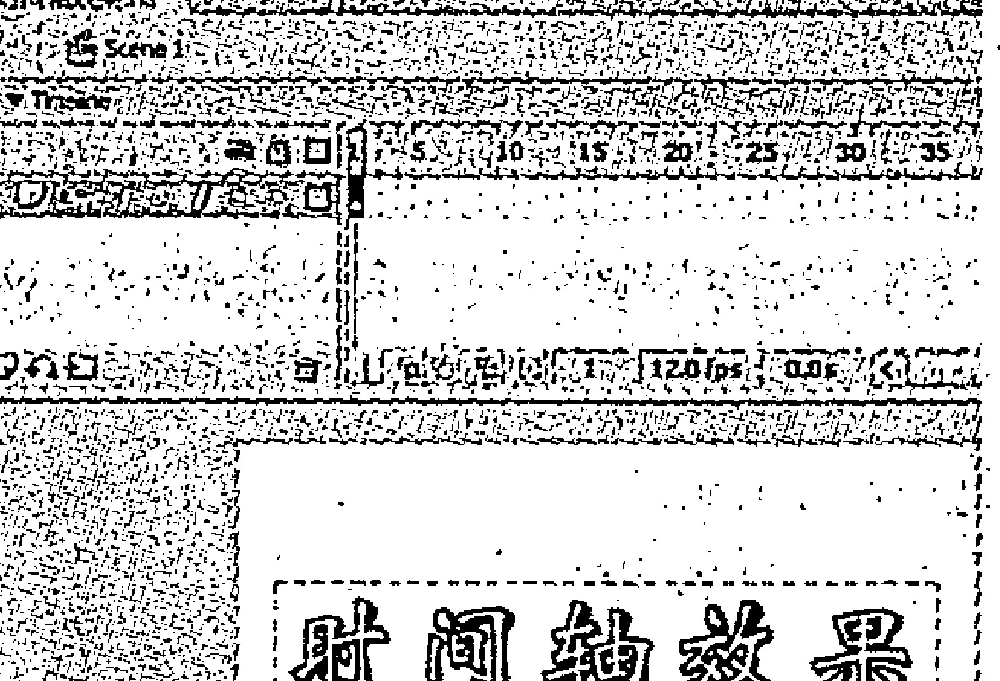

2.  在编辑区中选取要添加时间轴特效的对象，然后选择 Insert → Timeline Effects → Effects → Explode（如图6）。

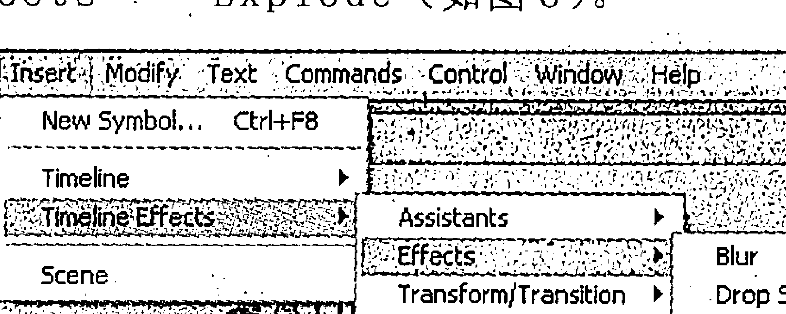

3.  在显示的特效设置对话框中可预览基于默认设置的特效。如果需要，可以修改这些设置，然后单击右上角的 Update Preview（更新预览）按钮，预览新设置的效果（如图7）。

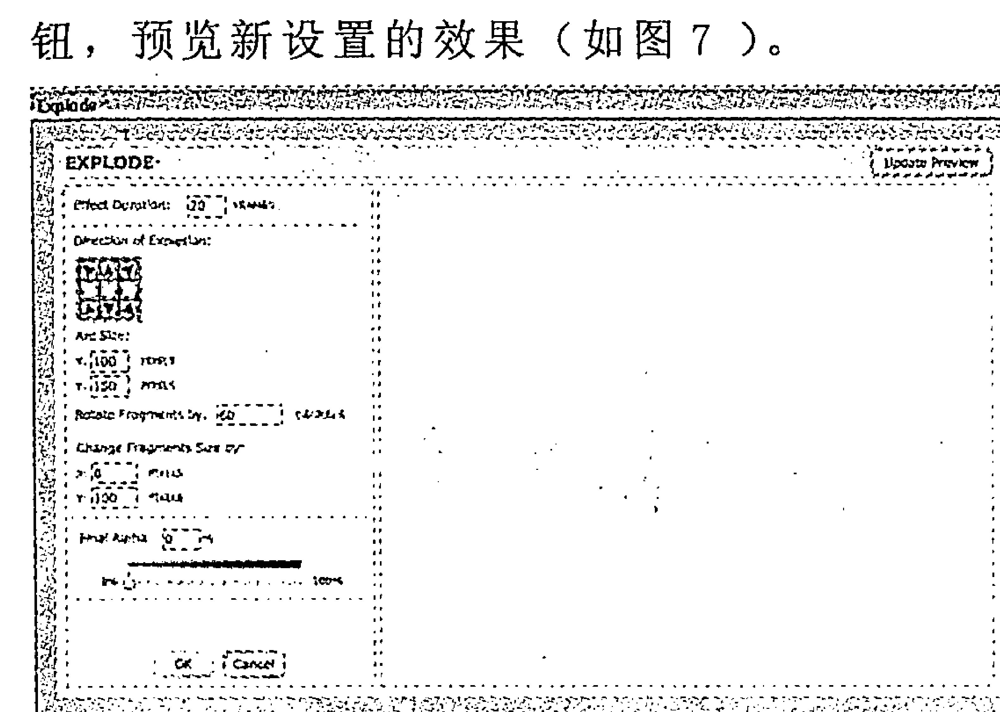

    -   Effect duration（特效时长）：设置爆炸特效持续的时间（以帧为单位）。
    -   Direction of Explosion（爆炸方向）：点选此图标中的方向按钮，可设置爆炸特效的运动方向。
    -   Arc Size（弧的大小）：设置 x 和 y 方向的偏移量（以像素为单位）。
    -   Rotate Fragments by（旋转碎片）：设置碎片的旋转角度（以度为单位）。
    -   Change Fragments Size by（改变碎片的大小）：设置碎片的大小（以像素为单位）。
    -   Final Alpha（最后的 Alpha 透明度）：设置爆炸特效最后的 Alpha 透明度百分数。可以在其右边的文本框中直接输入百分数，也可以通过拖曳其下面的滑块进行调整。

4.  如果感觉效果满意，单击 OK 按钮，Flash 自动在时间轴中添加创建特效所需的帧。如果你对添加的时间轴特效不满意，在选定对象上右击，然后从右键快捷菜单上选择 Timeline Effects → Edit Effect 命令，或者在它的属性面板上单击 Edit 按钮（如图8）。在打开的特效设置对话框中进一步修改设置参数即可。

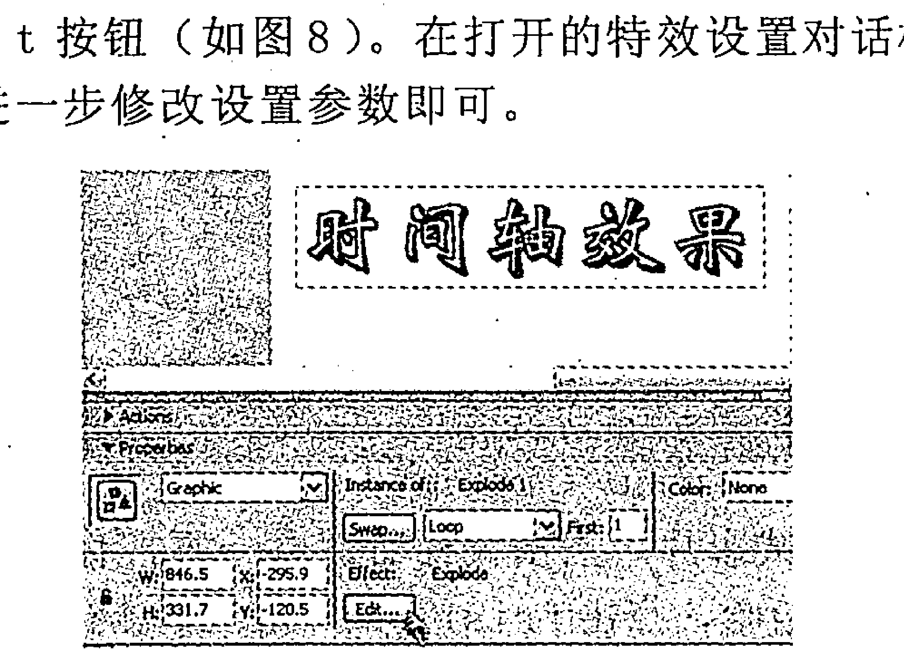

5.  选择 Control → Test Movie 命令（控制 → 测试动画），即可测试时间轴特效了。

# （二）在 Flash 中使用 CSS 样式表

Flash MX 2004 一个新的功能就是能加载外部的 CSS 文件并使之应用到 Flash 文本中。现在有一个新的类：TextField.StyleSheet。这个类的几个方法使我们能像给 HTML 定义 CSS 一样来格式化 Flash 文本，比如字体大小、颜色、位置等等。以后我们想要改变 Flash 文本的样式时，只要修改外部的 CSS 文件即可，而不必再到 FLA 文件中修改了。

1.  首先新建一个 CSS 文件。你可以用 Dreamweaver MX 2004 也可以用其他文本编辑工具编写这个文件：

    ```
    .textTitle {
        font-family: Verdana, Arial, Helvetica, sans-serif;
        font-size: 12px;
        font-weight: bold;
        color: #993300;
        text-align: center;
    }
    .textContent {
        font-family: Arial, Helvetica, sans-serif;
        font-size: 12px;
        color: #000000;
    }
    ```

    保存文件并命名为 Flash.css。

2.  新建一个 Flash 文档，从 Components 面板里拖一个 TextArea 组件到场景中（如图 9）。

    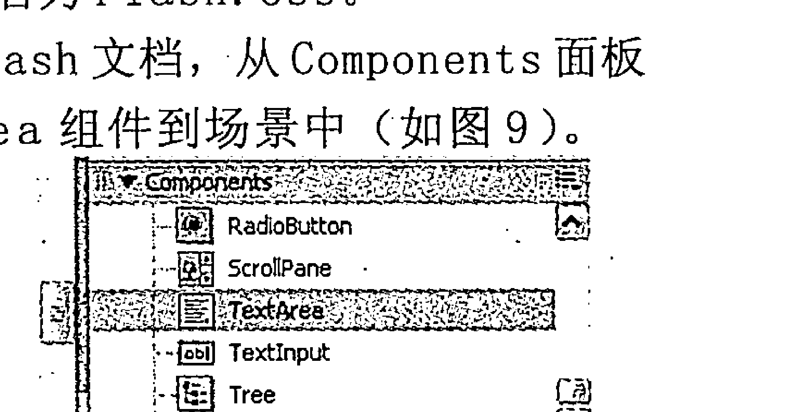

    并将组件命名为 “myText”（如图 10）。TextArea 组件的高和宽根据你文本来确定，并确保其 HTML 参数为 true。

    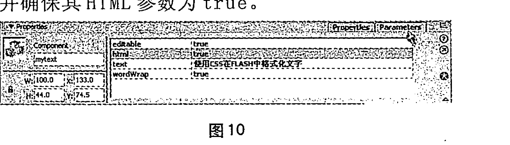

3.  选中时间轴的第一帧，然后按快捷键F9，弹出Action面板，输入以下代码：

    ```
    // 新建样式表对象
    var myCss = new TextField.StyleSheet();
    // CSS文件位置
    var cssURL = "flash.css";
    // 定义文本框组件的内容，这个随你。
    var textStr:String = "<p class='textTitle'>SHE-恋人未满</p><span class='textContent'>……我不相信 都动了感情却到不了爱情 那么贴心却进不了心底 你能不能快一点决定 对我说我爱你</span>";
    // 加载外部CSS文件并判断是否加载成功
    myCss.load(cssURL);
    myCss.onLoad = function(suc) {
        if (suc) {
            // 如果加载成功，设置文本框内容并应用加载进来的CSS
            myText.styleSheet = myCss;
            myText.text = textStr;
        }
    };
    ```

    注意：定义文本字符串的时候用到了两个HTML标签：<p>和<span>，作用就是为Flash文本定义CSS。

4.  保存Flash到flash.css文件的目录，Ctrl+Enter测试，是不是文本效果和CSS文件中定义的一样？呵呵，就这么简单。

下面是Flash支持的CSS1.0属性值

| CSS属性 | ActionScript属性 | 使用方法和支持的值 |
| :--- | :--- | :--- |
| text-align | textAlign | left, center和right |
| font-size | fontsize | 实际被使用的只有数字部分，单位(px, pt)不会被解析，也就是说12pt和12px是相等的 |
| text-decoration | textdecoration | none和underline |
| margin-left | marginleft | 实际被使用的只有数字部分，单位(px, pt)不会被解析，也就是说12pt和12px是相等的 |
| margin-right | marginright | 实际被使用的只有数字部分，单位(px, pt)不会被解析，也就是说12pt和12px是相等的 |
| font-weight | fontweight | normal和bold |
| font-style | fontstyle | normal和italic |
| text-indent | textindent | 实际被使用的只有数字部分，单位(px, pt)不会被解析，也就是说12pt和12px是相等的 |
| font-family | fontfamily | 字体列表使用逗号分界符，降序排列。下面的字体转换有效：mono转换成_typewriter，sans-serif转换成_sans，serif转换成_serif |
| color | color | 只支持十六进制，不支持诸如"blue"的颜色名 |
| display | display | inline, block和none |

# （三）定制右键菜单

在Flash MX 2004中新增加了两个类ContextMenu和ContextMenuItem。有了这两个类，用户就可以随心所欲地定制自己的Flash右键菜单了，这也意味着纯Flash站可以通过它进行方便的导航，Flash游戏也算是有了最为简便的功能菜单。

在制作右键菜单之前，我们先来看一个例子。

新建一个Flash文档。打开Action面板，并输入以下语句（如图11）。

```
var my_cm = new ContextMenu();
my_cm.hideBuiltInItems();
my_cm.customItems.push( new ContextMenuItem("frist", func_1) );
my_cm.customItems.push( new ContextMenuItem("second", func_2) );
my_cm.customItems.push( new ContextMenuItem("third", func_3) );
my_cm.customItems.sort();
function func_1() { trace(" Called frist! ") }
function func_2() { trace(" Called second! ") }
function func_3() { trace(" Called third! ") }
_root.menu = my_cm;
```

测试影片，点击鼠标右键看一下，你看到了什么？哈哈，点击frist、second或third就可以调用func_1、func_2和func_3了。下面我们分析一下上面例子的代码。

1.  new ContextMenu();
    创建一个 ContextMenu 对象。简单地说，它就是一个容器，用来盛装用户定义的菜单项。除了像本例中那样简单地创建外，还可以在创建的同时增加一个事件，这个事件将在用户点击右键出现菜单的时候发生。
    例：
    `var my_cm = new ContextMenu(rightClick);`
    `function rightClick() {(" Right Clicked! ")}`
    `_root.menu = my_cm;`
    点击鼠标右键，输出`" Right Clicked! "`；
    其实到了这，你已经知道如何来使用右键事件了，遗憾的是，无论如何，菜单都是会弹出来。所以，如果你想使用与菜单无关的右键效果，仍然会非常的不方便。

2.  ContextMenu.hideBuiltInItems();
    ContextMenu 对象的方法。用来隐藏内建菜单项，例如 `copy`、`Zoom In` 等等。注意：Settings 和版权信息是不会隐藏的。另外自定义的菜单项不能起诸如 Copy、Zoom In 等系统已经使用的名字，否则它们不会起作用。

3.  ContextMenu.customItems
    ContextMenu 对象的属性。它是一个数组，存储着用户定义的所有菜单项，因为菜单项本身是对象，所以这个数组的每一个元素都是对象，因此可以用数组的操作方法来操作它。菜单中添加菜单项可以使用 `push()` 方法，并用 `customItems[i]` 的方式访问它。
    另外：可以对 `customItems` 使用 `sort()` 方法，使用最后出现的菜单就是按字母顺序排列的。也可以通过数组操作来动态地改变菜单项的内容。

4.  new ContextMenuItem(caption, func)
    创建一个 ContextMenuItem 对象。
    caption：菜单项的名称（注意刚才提到过的，不要和内建菜单同名）。caption 也是 ContextMenuItem 的属性，含义相同。
    func：菜单项被点击后对应的处理函数的名称。
    另外几个 ContextMenuItem 对象的属性也可以在创建对象的时候作为参数传递。
    enabled：菜单项是否可用。（不可用为灰色）默认为 `true`。
    separatorBefore：菜单项下面是否会出现分隔线（用于菜单分类）。默认为 `false`。
    visible：菜单项是否可见。默认为 `true`。
    完整的构造函数为：`new ContextMenuItem(caption, func, separatorBefore, enabled, visible);`
    例：
    `my_mc = new ContextMenuItem("Item", func_item, true, false, true);`
    该方法创建了一个名为 Item 的菜单项，在它下面将出现菜单分隔线，该项目可见，但处于不可用状态，处理函数为 `func_item()`。

5.  ContextMenuItem.copy()
    ContextMenuItem 对象的方法。返回一个菜单项对象的拷贝，返回值仍为 ContextMenuItem 对象。

6.  ContextMenuItem.onSelect
    ContextMenuItem 对象的事件，当菜单项被选中时发生。该事件的处理函数实际上就是创建对象时的 `func`。但是如果在创建对象后，对 `onSelect` 事件制定新的处理函数，则 `func` 不会生效。

7.  ContextMenu.copy()
    Context Menu 对象的方法，返回一个 Context Menu 对象的拷贝。返回值仍是 ContextMenu 对象。

8.  ContextMenu.onSelect
    ContextMenu 对象的事件。在用户调用菜单，且菜单出现之前发生。它可以让你根据鼠标所处位置来动态地创建菜单。该事件的处理函数可以有两个参数：
    `my_cm.onSelect = function (item:Object, item_menu:ContextMenu)`
    item：当用户点击鼠标时，位于鼠标指针下方的对象实例，可以是 MovieClip、按钮、文本域。这让你可以实现类似于操作系统的右键菜单的效果，即在不同的对象上面点击右键会出现不同的菜单。你可以用 instanceof 来确定鼠标指针所指的对象的类型。

item_menu: 当前菜单对应的菜单项对象。

例：（这是Flash 帮助中的例子）

```
my_cm = new ContextMenu();
menuHandler = function (obj:Object, menu:ContextMenu) {
    if(obj instanceof MovieClip) {
        trace("Movie clip: " + obj);
    }
    if(obj instanceof TextField) {
        trace("Text field:" + obj);
    }
    if(obj instanceof Button) {
        trace("Button: " + obj);
    }
}
my_cm.onSelect = menuHandler;
_root.menu = my_cm;
```

你可以在场景中建立几个MC、Button 和 Textfield，并在这些位置上点击鼠标右键，比较一下有什么不同。

## 9.ContextMenu.builtinItems

ContextMenu 对象的属性。它本身是一个对象，包含了以下几个布尔类型的属性，分别对应 Flash Player 的内建菜单项：
save, zoom, quality, play, loop, rewind, forward_back, print。
设置相应的属性为 false 会将其从菜单项中移除。

例：

```
my_cm = new ContextMenu();
my_cm.builtInItems.zoom = false;
_root.menu = my_cm;
```

测试影片，点击右键后，菜单中将不会出现 Zoom In/Zoom Out 选项。如果想屏蔽所有的内建菜单项，请用 ContextMenu.hideBuiltInItems()。

## 三、专业版独有的特点

### （一）使用组件制作日历

Flash MX 2004 Pro 新增了很多有用的UI组件，为我们的开发提供了更多新功能。组件之间还可以进行绑定。下面的例子就是将日期选取组件 (DateChooser)和文本对象进行绑定的例子。我们要让用户在日期组件里面选择一个日期，然后系统自动在文本对象里面显示选取的日期。

1.  将日期选取组件(DateChooser)拖放到主场景上，并命名为 ShowDate (如图12)。

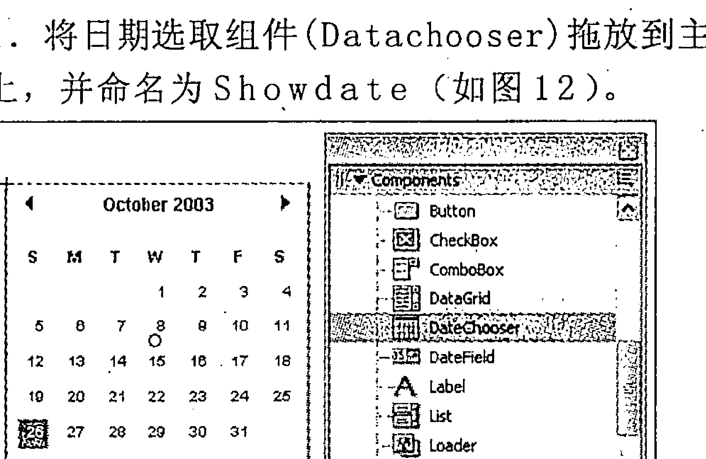

2.  在场景上再建立一个标签组件(UI组件中的Label)，并命名为 SelDate，并为其设置一些默认显示的文本。例如“请在左侧选择一个要显示的日期”。现在，场景上已经有2个对象了（如图13）。

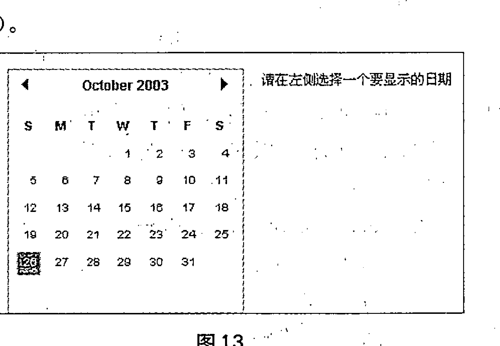

3.  选取 DateChooser 组件，打开组件检查器，单击其中的 Bindings 选项卡（如图14）。

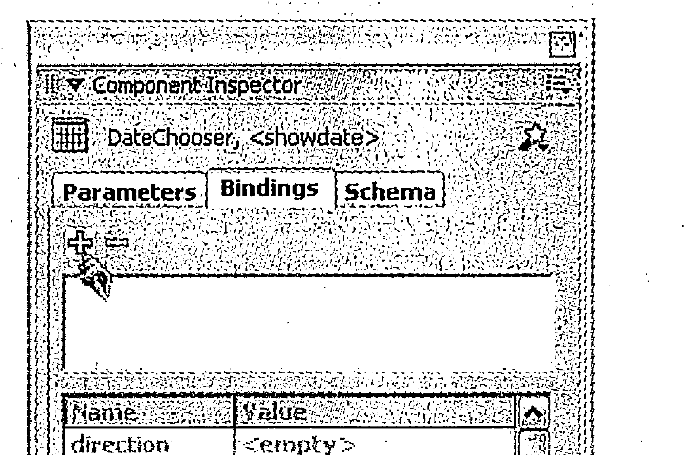

4.  在 Bindings 选项卡上，单击“+”号按钮（如图14）调出添加对话框，为组件增加绑定（如图15）。

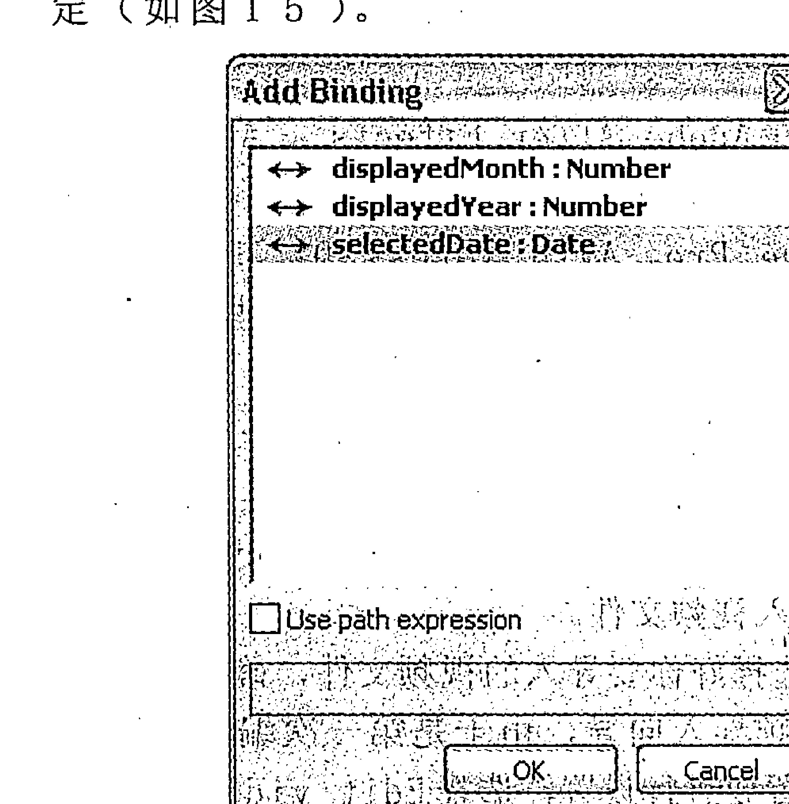

5.  在列表框里面选择 selectedDate:Date，点击 OK 按钮确认。设置好组件绑定后，Bindings 选项卡将如图16所示。

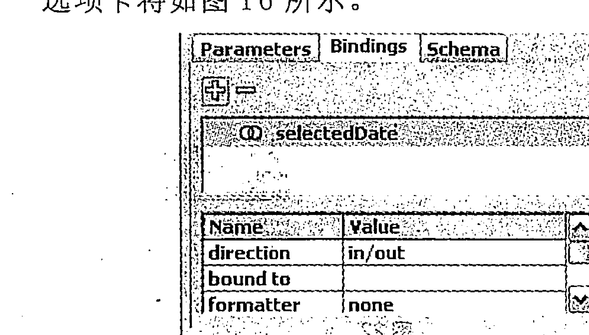

6.  现在为“日期选取”组件指定绑定对象，在这里，要为其指定标签组件(Label)。请选择绑定面板中的 selectedDate:Date。这时，在下面的属性列表框中便显示出一系列属性。选择 Bound to，并点击右侧的放大镜图标，打开设置窗口（如图17）。

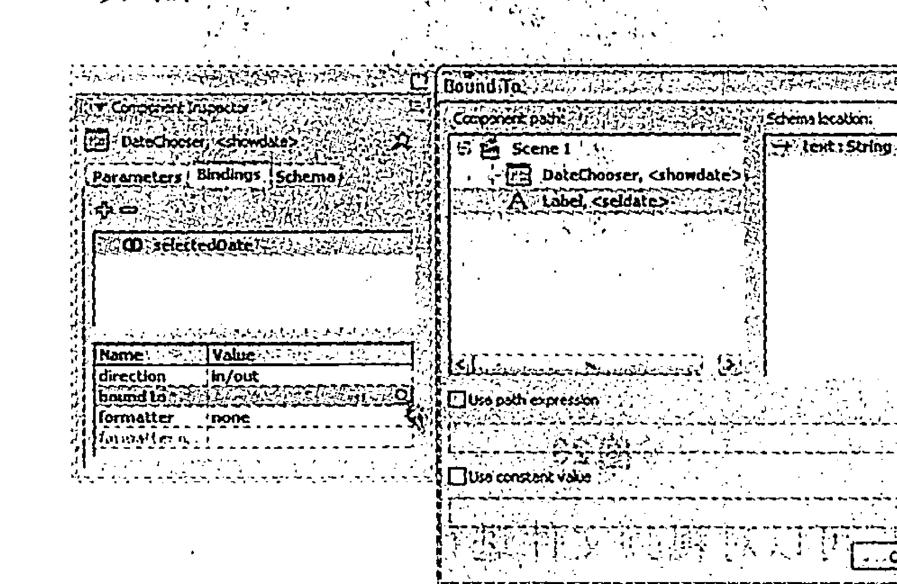

7.  选择绑定的目标对象，也就是 Label 组件，并点击 OK 按钮。

至此，本例的工作就算完成了。测试一下影片，在我们点击日期选取控件的时候，右侧的标签组件便同时显示出选取的日期来（如图18）。

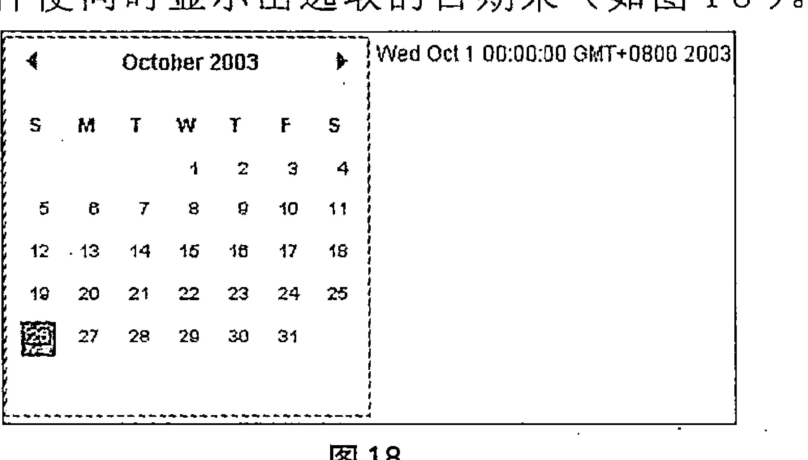

### （二）项目文件管理／源代码管理

Flash MX 2004 的项目文件管理的工作原理基本与 Dreamweaver 的相同。

-   1. 执行 File → New → Flash Project 命令建立一个项目文件，里面记录了这个项目里包含了什么文件，如 fla、as 等等。
-   2. 在项目面板上右击项目文件名，在弹出的快捷菜单中选择 Add File 就可以加入文件了。
-   3. 不过这时还不能实现版本管理功能。执行 File → Edit Sites 命令，在弹出的对话框中选择 New，出现站点定义对话框（如图19）。

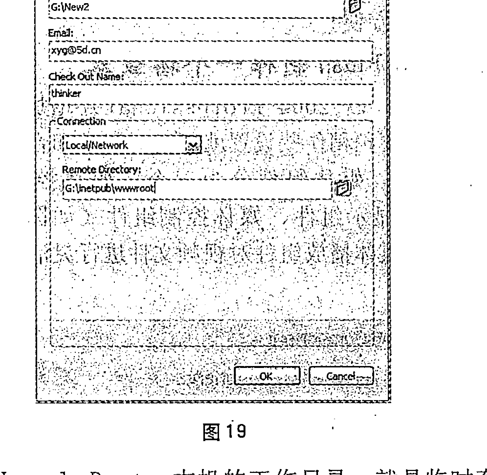

Local Root: 本机的工作目录，就是临时存放到你机器里用的目录；Remote Root: 就是大家一起存到服务器的最新文件所在目录。

-   4. 站点（Site）建好之后，就可以为项目(Project)指定“站点”了。在 Project 面板上右击，从右键菜单中选择 Setting，然后再选择 Version Control（版本控制）并指定 Site（站点）后，就可以进行基本的版本管理了（如图20）。

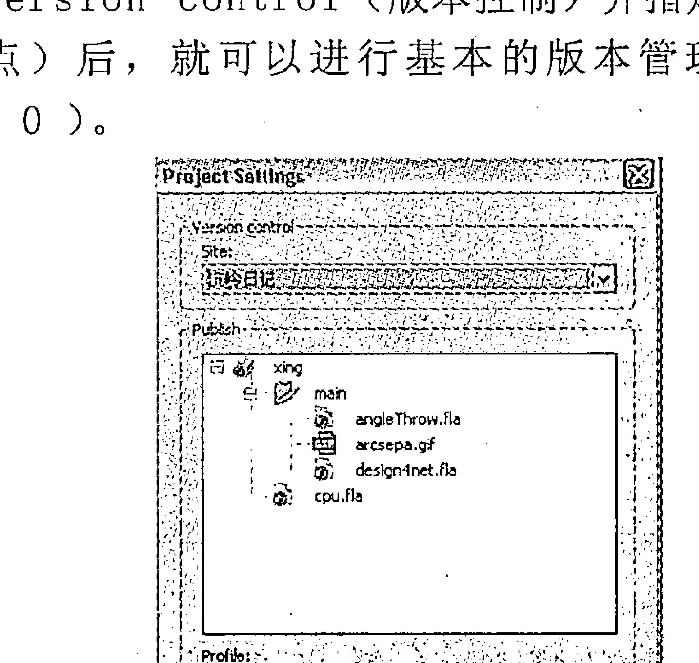

-   5. 第一次将文件放到服务器上，需要先 Check out 后再 Check in。以后，每次需要修改文件时，先把文件从服务器上 Check out 出来，修改完之后再 Check in 回去即可，如果该文件已经被其他人 Check out 了，你会得到警告提示；如果你强行修改，可能会出现版本错误问题。

为 Flash 项目添加或删除文件之前，别忘了先要 Check out 项目文件本身。项目里面的所有文件还可以使用同样的发布设置 (Public Setting)，面对大批的文件，再不用逐个地设置了，非常方便！

### （三）用Flash制作一个播放器

Flash MX 2004 Professional 还增加了媒体组件，只要稍作些设置就可以对视频和音频进行播放控制。媒体组件分为三个：媒体控制条组件、媒体显示组件、媒体控制组件（如图21）。你可以用媒体播放组件对视频文件进行灵活的播放控制。

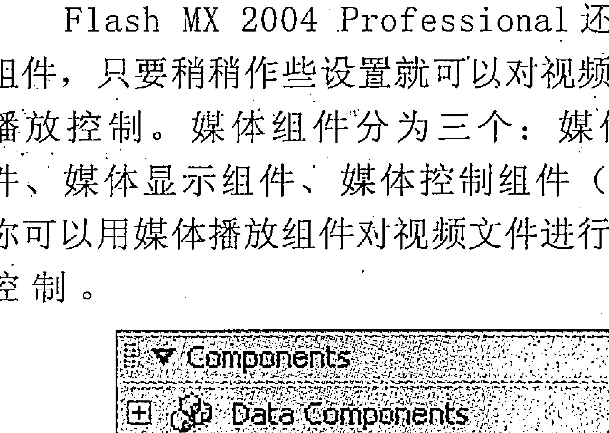

在制作播放器之前，我们还需要做以下准备工作：安装好 Flash MX 2004 Professional 后，还要运行一个 Flash_Video_Exporter.exe 的安装程序，这样在 Adobe After Effects、Anystream Agility、Apple FinalCut Pro、Apple QuickTime Pro、Avid Xpress DV、Discreet Cleaner、Discreet Cleaner XL 这些软件的文件输出选项中就会出现 Flv 的格式。

-   1. 选择 File → New... → Flash Document, 新建一个 Flash 文档。
-   2. 选择 File → Import → Import to Library 导入视频文件。
-   3. 选择好你要导入的视频文件，确定后会出现一个视频导入向导，由于是第一次编辑，所以有一些配置要进行设置，选择 Edit Video First（如图22）。

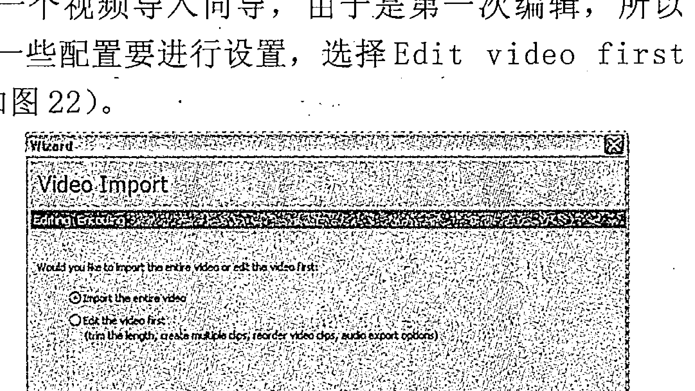

-   4. 单击 Next 按钮进入下一步窗口，点击 Create Clip 按钮，左边的窗口将出现我们先前导入的视频文件名（如图23）。

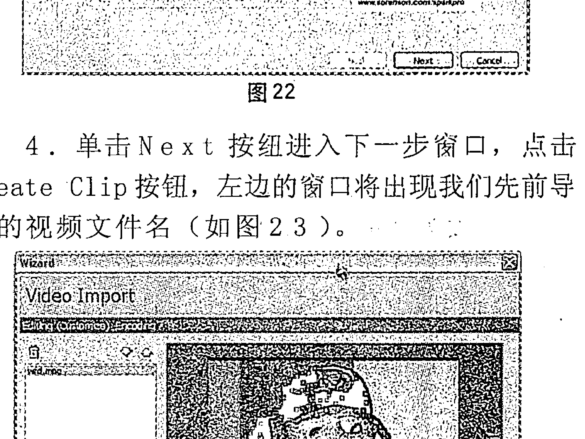

在这里可以对视频文件进行剪辑、播放等操作。

-   5. 单击 Next 按钮进入下一步窗口，单击 Compression profile 右侧的 Edit 按钮（如图 24）。

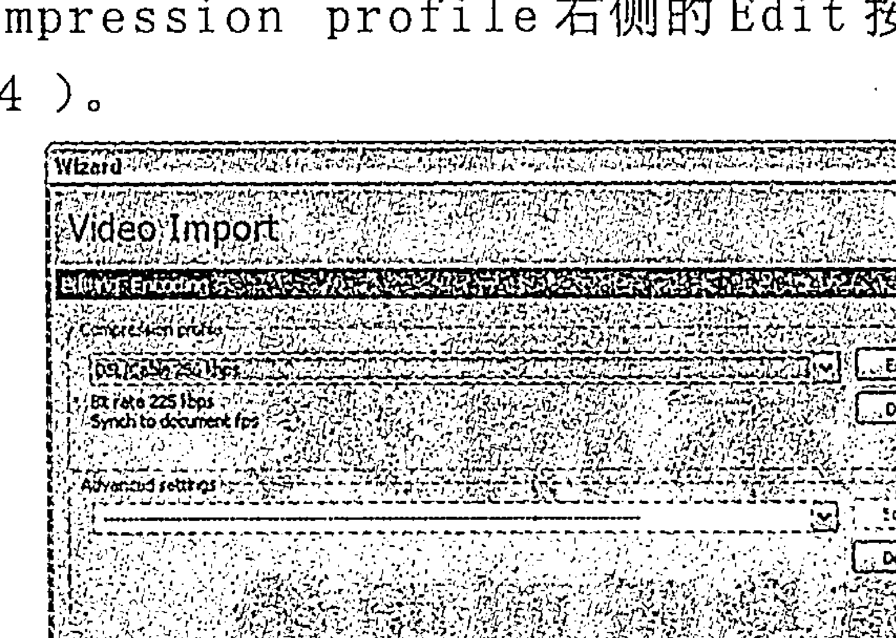

-   6. 在弹出的压缩设置窗口中，设置观看的带宽、画面质量以及 Flash Frame 的比例等（如图 25）。

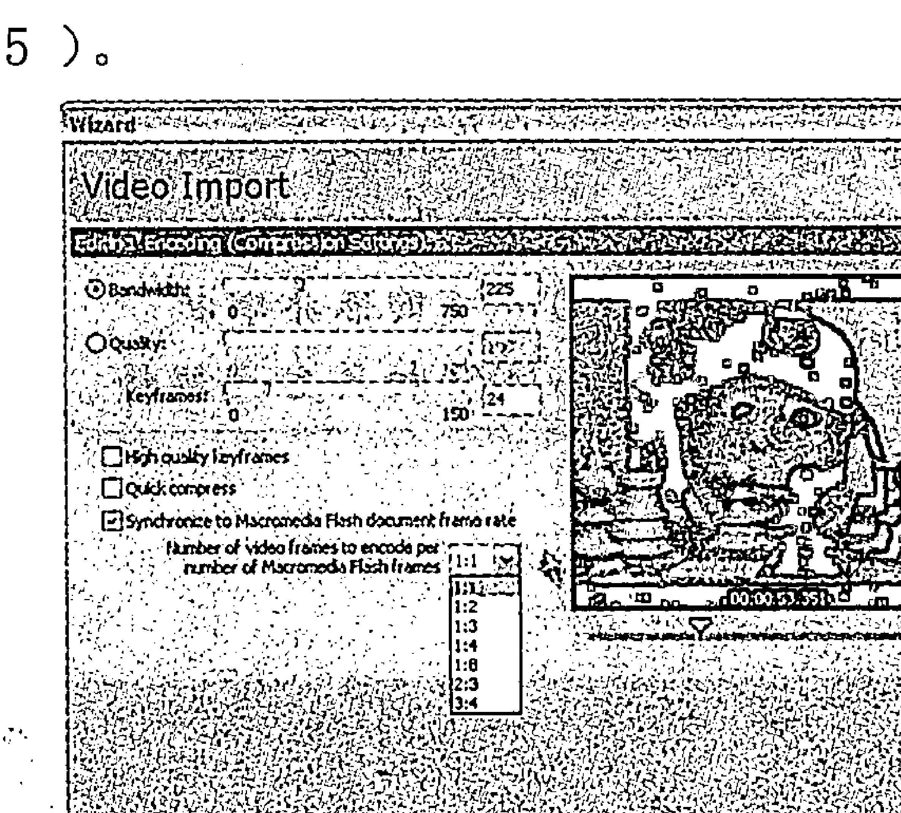

-   7. 单击如图 24 所示中 Advanced Setting 右侧的 Edit 按钮。在弹出的高级设置窗口中可以进行颜色、形状等的设置。设置好后连续按 Next 按钮返回到第五步所示的窗口中。
-   8. 单击 Finish 按钮，你就会在 Library 中看见视频文件 wfd.mpg。右击视频文件，在弹出的快捷菜单中选择“属性”。在弹出的属性对话框，选择 Export 输出成 FLV 文件。
-   9. 现在我们开始制作播放器。从 Components 中拖动 MediaDisplay 组件到场景中。打开它的属性面板（如图 26）。

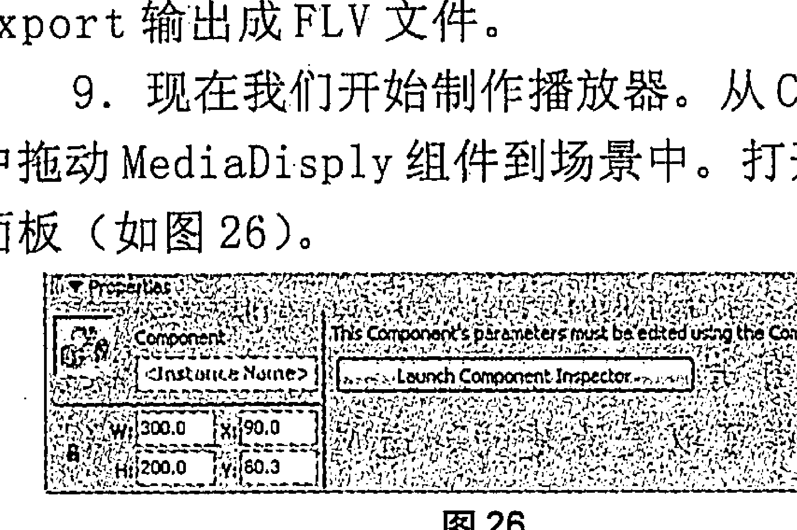

-   10. 单击属性面板上的 Launch Component Inspector 按钮打开配置窗口，点选 FLV 项，然后在下面的 URL 输入框中输入刚才转换成 FLV 视频的文件名称。本例为 xing.FLV。
-   11. 关闭窗口，再在 Components 中选择 MediaController 影片控制组件拖入到场景中。
-   12. 再在场景中选出刚才的 MediaDisplay 组件，在 Behaviors 面板中选择添加一个事件（如图 27）。

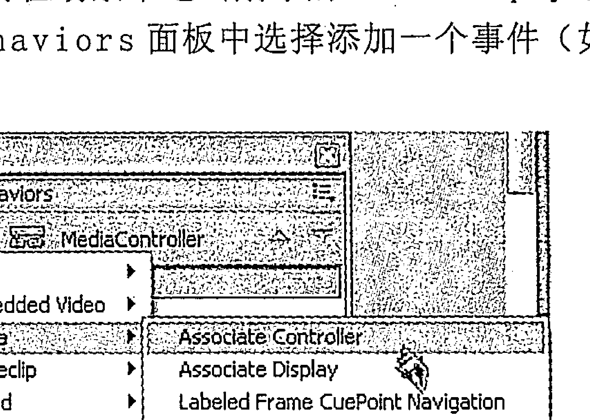

-   13. 弹出事件绑定窗口，选择 MediaDisplay 组件通过 MediaController 组件来控制。
-   14. 单击 OK 按钮，将弹出提示框，原来没有为 MediaController 组件命名。单击 Rename 按钮。
-   15. 本例中为 MediaController 组件命名为 mvcon。这样，一个播放器就已经制作完成了。按 Ctrl+Enter 键测试一下吧（如图 29）。

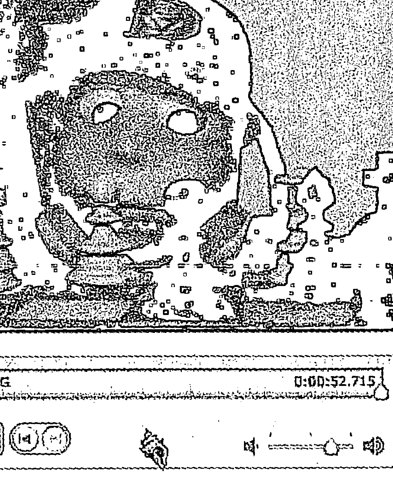

## 移动的音乐精灵
——MP3随身听面面谈

时尚是一个永恒的话题，以前是牛仔裤、CD随身听等等，如今的新人类最能够标新立异的无疑就是在胸前挂一个个头小巧，但是却功能非凡的MP3随身听，这样一边走一边听，让音乐永远都能流淌进耳朵中……

文/赵江

- 文章重点与技巧目录
- MP3 随身听选购要素
- MP3 使用指南
- 获取 MP3 音乐
- 制作 MP3 音乐
- MP3 使用技巧
- MP3 的保养维护
- MP3 相关名词解释

### 一、MP3随身听选购八要素

如果你到电脑商城去逛一圈，可以看到柜台上有着众多的MP3播放器，品牌和型号之多足以让你眼花缭乱。面对着这些让人眼花缭乱的MP3随身听，许多朋友都会问：“究竟怎么样的MP3播放器才适合我呢？”其实，如果从下述几个方面来结合自己的实际需求，我们就可以很容易地选购到自己心仪的产品。

#### （一）音质是重要的取舍因素

毕竟MP3播放器最大的功能还是用于满足人们欣赏音乐的需要，因此音质的好坏始终是衡量MP3性能最重要的指标。事实上，不同品牌、不同型号的MP3播放器之所以存在音质差别，主要是在数字转换模拟这个部分以及耳机方面存在差异。在这方面，Sony、三星等国际大厂应该说表现的非常出色，而国产MP3基本上采用了同样的解码芯片，因此同价位的MP3随身听价格相差无几。为了能够表现出一流的音质，很多MP3随身听都附带了多种音效模式，比如摇滚、爵士、流行乐以及古典音乐，低音和高音的控制等（如图1），这些都可以帮助我们更好的欣赏音乐，因此选购的时候也要留意一下。


另外，耳机对音质的影响也相当大。厂商附带的耳机一般都不能很好的表现MP3的音乐解析能力，即便Sony、三星等品牌的MP3所体现出来的音质已经很不错了，但是配上一副好的耳机，将可以获得更高质量的声音回放效果。为了掩饰耳机的不足，很多商家都会让你在噪杂的环境中试听，此时我们可以让商家寻找一个安静的环境来试听，而且要对不同风格的歌曲分别测试低音和高音部分，看看MP3对于音乐的表现能力如何，最好能够达到低音沉稳有力、中音圆润清晰、高音靓丽透彻。

> 提示：有条件的话，最好能够自己带一款耳机去试听，这样可以更清楚的知道MP3随身听的性能如何。

#### （二）外观要体现新潮时尚

由于MP3播放器本身是一种时尚数码产品，所以外观自然也就是一个非常重要的衡量标准。目前几乎所有的MP3都有一个不俗的外观，有长方形、椭圆形、手表形、手机形、U盘形、圆柱形，甚至是卡式磁带形的。虽然外观对于MP3的整体性能影响不大，但是对于时尚一族来说，如果选择了一款外观土气的MP3随身听，可能自己也不会喜欢，所以在选购的时候自然要多放一些注意力在外观上了（如图2）。

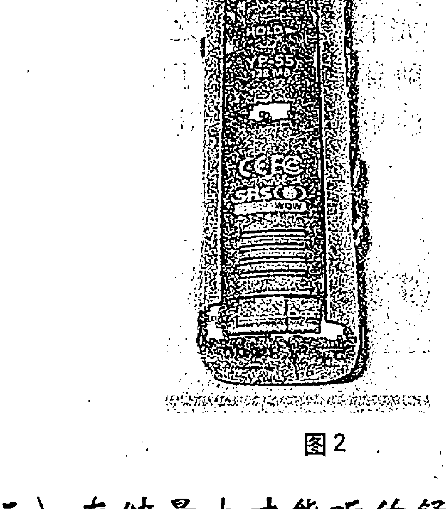

#### （三）存储量大才能听的舒心

目前MP3随身听的容量都在32MB以上，甚至还有192MB或者256MB之类的大容量MP3随身听。虽然存储容量增大会影响它的价格，但是过小的存储量可以容纳的歌曲数量有限，如果你的MP3随身听只能存放40分钟甚至30分钟的歌曲，那么它的实用性将大打折扣。更何况如果想欣赏到一流效果的音乐，必须要保证MP3歌曲的采样频率在128Kbps以上，这就对MP3随身听的存储量提出了更高的要求。为了保证一次性在MP3随身听中存储更多的歌曲，在资金允许的情况下建议大家选购128MB存储量的MP3随身听，为了日后的使用需要，最好能够选择具备内置闪存扩充功能的MP3随身听。

#### （四）支持文件格式是否齐全

如今压缩率高的音乐文件格式并不止MP3一种，微软公司推出的WMA文件也具有很高的压缩比，它能够以64Kbps采样频率来实现CD音质，而相应的文件大小只有MP3文件的一半。如果选购的MP3随身听支持WMA格式，这就意味着存储量无形中扩大了2倍，这样就能够存放更多的音乐歌曲。支持文件格式的另外一方面是要看MP3随身听除了可以存储多种音乐文件之外，是否可以把它作为一款U盘使用。因为U盘可以很方便的进行各种格式文件的复制存放，所以要注意它是否能够存放各种Office文档、压缩文件、照片以及数码影片等，这样不仅给我们的使用带来了诸多便利，而且一次性花费银子相当于多购买了一个U盘，何乐而不为呢？

#### （五）附加功能并非越多越好

MP3随身听现在已经不仅仅具有初期单纯的音乐播放功能，同时还集成了诸如收音机、录音、复读、液晶屏显示、中文歌名等功能，这些附属功能虽然在一定程度上丰富了MP3随身听的可用性，但是多种功能高度整合，势必会增加内部结构的复杂度，给技术运用带来相当大的困难。而且在现实使用中，功能丰富也不是吸引人们购买的主要原因。比如有些MP3提供录音功能，而这一功能大部分人在日常生活中极少使用，这部分华而不实的功能反而使成本不断上升，同时也增加了使用者的操作难度，因此需要大家根据自己的实际需求来进行选择（如图3）。

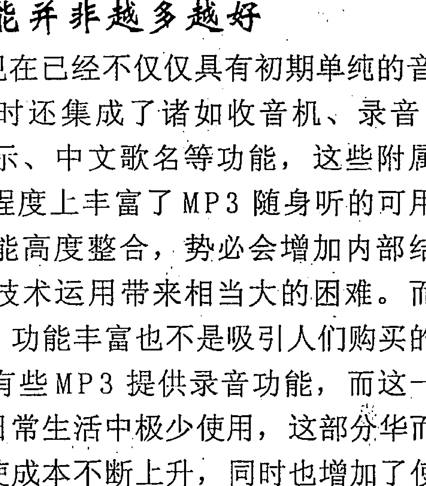

#### （六）操控要便捷

购买MP3随身听的时候，一定要要求机器的按键清晰突出、便于操作，而且液晶显示屏的面积要足够大，能显示完整丰富的信息。另外耳机最好集成线控功能，这样可以直接通过耳机连接线上的按钮操作MP3播放机，所以在性能、价格等相差不大的情况下尽量选择具有线控功能的机型。

#### （七）尽量选择品牌产品

由于MP3播放器还属于一个新兴的产品，很多厂商在利益的驱使下纷纷投入到生产MP3播放器的热潮中来，可是限于技术水平有限，每个厂商生产出的播放器质量良莠不齐，因此购买时要格外小心。最保险的方法就是尽量选择知名厂家生产的产品，如Sony、三星、爱国者、方正等品牌，一般这些品牌的产品在质量和售后服务方面都比较有保障。

#### （八）价格因素灵活把握

无论选购什么产品，价格都是大家最关心因素了，而MP3播放器也会随着品牌、功能的差异导致价格不尽相同。比如一些主流的128MB播放器，知名品牌的产品可能价位在1500元左右，而杂牌的产品只需500～600元即可买到，这就和产品的质量、功能有关了，好的MP3一般做工精致、细节处理到位，而劣质MP3播放器大都在外观上仿冒知名品牌，采用板材很差的印刷电路板和性能不稳定的元器件来降低产品造价。虽然质量差的MP3播放器价格便宜，但在使用一段时间之后就可能出现故障，之后可能就是费时费力的维修，所以在预算足够的情况下建议购买一个名牌产品。

怎么样，在看完了上述几方面之后，大家应该对于如何选择MP3随身听心中有数了吧。希望你可以购买到称心如意的MP3播放器，让优美的音乐永远陪伴着你。

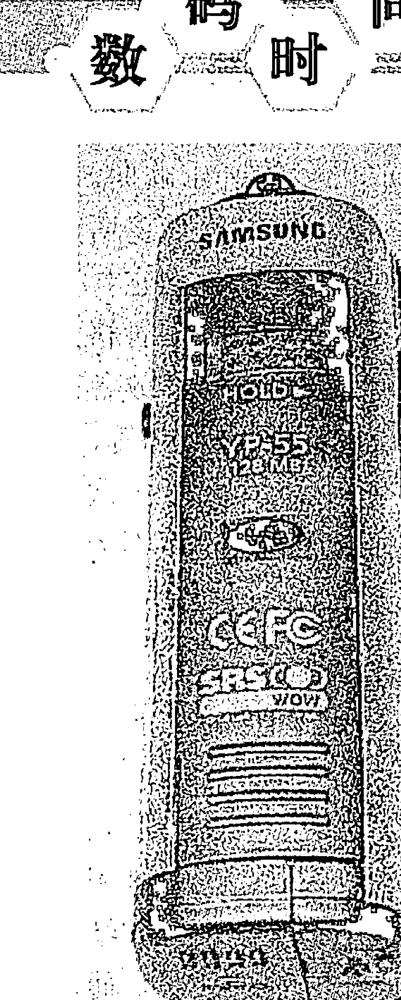

### 二、让MP3随身听流淌出靓丽的音乐——MP3使用指南

选购了中意的MP3随身听之后，怎样才能更好地使用它欣赏MP3歌曲呢？一般来说MP3的播放操作应该说是基本上差不多，大家只要仔细查阅一下用户手册就可以很快播放歌曲了，因此笔者在此也不赘述。但是怎样才能让自己的MP3随身听中时刻都保存有最新最酷的歌曲呢？这就要求我们自己通过电脑把好听的歌曲传输到MP3随身听中了。

#### （一）与电脑的连接

现在的MP3随身听与电脑的连接方法都相差无几，在此笔者以三星Yepp YP-55为例介绍一下具体的连接方法。

-   1. 首先将驱动光盘放入光驱中，此时系统将自动运行该光盘中的安装程序，并且在弹出的窗口中选择“USB Driver”一项即可开始安装驱动程序（如图1）。在安装过程中，程序会询问你安装的路径等一些问题，只要采用一路回车法即可完成安装。
提示：通常Windows 98系统安装好驱动程序之后需要重新启动计算机。
-   2. 接着分别把随机附送的USB连接线两端插入MP3随身听和计算机的USB接口，此时Windows系统会提示发现新硬件，不过由于我们事先已经安装过了驱动程序，因此无需我们的干预即可完成相应的驱动程序查找和安装操作，最后屏幕右下角出现“新硬件安装成功”的提示字样。这时候可以进入设备管理器查看一下，如果能够找到相应的USB设备则证明MP3随身听已经和计算机建立了连接（如图2）。
-   3. 对于三星Yepp YP-55来说，系统把它作为一款移动存储器来对待，因此在所有系统盘符最后会多出一个“可移动磁盘”的盘符，只要在“我的电脑”中打开这个盘符，就可以像使用普通U盘一样进行文件的复制、粘贴、删除等操作了。

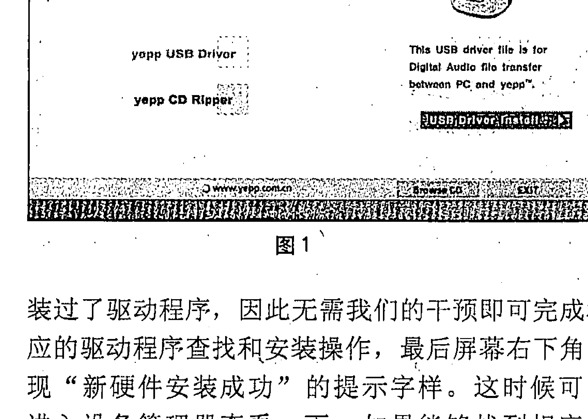这样我们就能够把歌曲从硬盘中复制到MP3随身听中保存，自然也能够让你的MP3随身听不断流淌出最为时尚的歌曲了。

## （二）MP3歌曲哪里来？

有了MP3播放利器在手，到哪里去找那么多MP3呢？答案的一方面是从网上下载，另外一方面就要依靠我们身边的电脑来亲手制作了。

- 1. 翩翩仙乐网上来

随着Internet的迅猛发展，大量的MP3也在Internet上广为传播，但是在浩瀚的网络上如何才能有效的查找到自己喜爱的MP3歌曲呢？是仅仅局限在你所知晓的几个MP3站点？还是每次查找的时候先登录到搜索站点查找相关的MP3歌曲？显然这些都不是最好的方法，它在浪费了大量上网费用和宝贵的时间之后往往带给你的只是失望。所以在此向大家推荐一款名为Real MP3 Finder的MP3歌曲强力搜索引擎，在它的帮助之下就可以轻轻松松的在全球数十个最最著名的MP3歌曲站点中来寻找自己喜欢的歌曲。下面就以搜索极富盛名的Guns N Roses（枪炮与玫瑰）的歌曲为例，简单介绍一下MP3歌曲下载的方法。

资源管理器中把已经保存在硬盘中的MP3歌曲拖拽到这个盘符中即可（如图3）。

(1) 首先在图5所示的“Search”标签下用鼠标点选需要查找的搜索引擎。比如我们在此选中“2000 MP3”这个站点，就意味着下面的搜索是在这个站点中进行的（如图5）。

(4) 在所有的歌曲复制完成之后，还要提醒大家注意一下：此时不能直接把MP3随身听从USB连接线上拔下，否则有可能造成系统死机。正确的方法是右击系统图标栏中的安全删除硬件图标，并且在图4所示的窗口中选取USB设备（如图4），点击“停止”按钮之后系统会要求你确认是否停止当前选中的硬件设备，按下“确定”按钮来卸载MP3随身听，然后才可以取下MP3随身听。

## 数码时尚

## 移动的音乐精灵

（2）切换到 “Songs To Get” 标签，并在下部的文字输入框中键入需要查询的内容。比如在此我们就可以输入 “Guns N Roses”，然后点击右下角的 “Add Text” 按键，此时上部的搜索列表中就会有相应的内容出现。接着选择上部列表中的 “Guns N Roses”，然后按下 “Search for selected” 按键（如图6）。

（3）这时程序界面会自动跳转到图5的窗口中，不过和第一次出现相比，它上部的搜索栏中已经有了 “Guns N Roses” 的内容。然后按下 “Search” 按钮，准备进行搜索。

（4）接着出现在我们眼前的是 “Organizer” 标签，这里显示了你所挑选的搜索站点，并在前面用打勾的符号表示。其实这个标签中并没有我们可以操作的内容，只是提供了一些搜索的信息，所以不看也无妨，只要直接点击下部的 “Show” 按钮就可以得到搜索的结果了。

（5）由于Real MP3 Finder 的搜索速度非常快，因此几乎是在按下了 “Show” 按钮的同时就会出现一个类似IE浏览器的画面，把这个站点上所有 Guns N Roses 的歌曲列表显示出来，不错，有他们最出名的 “Don’t Cry”，看来不错哟。而且对于每一首歌曲都有下载地址链接、文件大小的信息，同时还提供了最后检测的时间与传输速率，这就防止了虽然提供下载链接但是文件并不存在的情况（如图7）。

（6）找到这些歌曲之后怎么下载呢？有两个方法。第一是通过我们常用的 NetAnts 等专业下载工具来进行，此时可以手工将歌曲的 URL 地址连接输入到 NetAnts 中，不过这显得有些麻烦了吧，你看见在每首歌曲最后都有一个Winamp的图标吗？原来这就是MP3 歌曲的地址连接，只要将其拖拽到NetAnts中就可以开始下载了。再者就是 Real MP3 Finder 中也集成了一个小巧的下载工具，如果你手头一时没有专门的下载工具时，也不妨用它来帮你快速下载。这时要把Winamp 的图标拖拽到窗口上部的 “Download” 输入框中，然后按下右边的按键，就可以开始下载了。值得一提的是，这种下载功能也具有断点续传功能，所以如果由于意外事故掉线的话也不必紧张，只要再次点击 “Download” 按键就可以继续下载了。

等到下载完成之后，你就可以在电脑中欣赏那美妙的MP3歌曲并且把它传输到MP3中了。不过需要提醒大家注意，现在 Internet 上的MP3 的合法性还有待商榷，所以大家用 Real MP3 Finder 找到了中意的歌曲并下载试听了之后，还要注意音乐的版权问题！

## 软件信息：

- 软件名称：Real MP3 Finder
软件类型：免费软件
软件大小：1.50MB
下载地址：http://hn-http.skycn.net:8181/down/mp3finder.exe

## 2. 音乐CD转换MP3歌曲

喜欢音乐的朋友一定都收藏有为数不少的音乐CD，如何才能将其中好听的各种保存在MP3随身听中欣赏呢？其实这并不复杂，在AudioConverter的帮助下，只需几个步骤就能够让你轻松完成音乐CD转换为MP3的操作。

（1）运行 Audio Converter 的之后，将音乐光盘放入光驱中，接着点击上部的“音频 CD”按钮，这样程序将自动识别音乐 CD 中所有的曲目，此时用鼠标勾选需要转换的曲目。
（2）确认之后将看见图 8 所示的窗口（如图 8 ），用鼠标右击歌曲，并且从弹出菜单中选择“MP3 格式”命令，以便 AudioConverter 可以对当前的歌曲转换为 MP3 歌曲。

（3）接着再次右击需要转换的歌曲，并且从弹出菜单中选择“音频设置”命令对 MP3 的属性进行设置。如图 9 所示，在此可以设定 MP3 的压缩编码器、采样频率等属性，一般情况下建议大家最多使用 128kbps 的位采用频率，否则得到的文件个头过大，不适合存放在 MP3 随身听中。

（4）完成上述操作之后，点击工具栏中的“转换”按钮，稍等片刻就能够得到新鲜出炉的 MP3 歌曲了。
另外，如果硬盘中还有 MP1、MP2、VQF 等格式的音乐文件，也可以通过“添加文件”或者“添加文件夹”命令来选取它们，并且参照上述步骤把多个单独的音乐文件一次性转换为 MP3 保存，这样我们就能够更为便捷的获得更多的 MP3 歌曲了。

软件信息：
软件名称：Audio Converter
软件类型：共享软件
软件大小：1.20MB
下载地址：http://hn-http.skycn.net:8181/down/HAC-AudioConverterPro405-Fire.zip

## 3. MediaPlay 录制 WMA 文件

自从微软公司推出 WMA 文件之后，这种音乐文件就凭借着更小巧的个头和出色的音质受到了大家的一致欢迎，因此现在很多 MP3 随身听都提供了对于 WMA 文件的支持，这也就要求我们能够自己动手把其余的音乐文件格式转换为 WMA。其实在 Windows 中只要安装一个 MediaPlay 8/9 就可以直接把音乐 CD 转换为 WMA 文件，下面就让我们来看看怎样自制 WMA 音乐。
（1）放一张 CD 碟片到光驱中，此时 MediaPlayer 8 会自动进行播放。
（2）按下左边的“从 CD 复制”功能键，右边的区域中显示的就是当前 CD 中的所有曲目列表。
（3）在自己中意歌曲前面的复选框中打勾选择，最后点击上部的“复制音乐”按键，MediaPlayer 8 会对选中的歌曲进行复制（如图 10）。

（4）复制完毕之后，WMA 格式的文件保存在“My Documents”目录下的“My Music”文件夹中，这时可以直接双击或者是选中多个文件进行连续播放。
需要指出的是，在将 CD 曲目复制到硬盘时，音质越高，要求的磁盘空间越大，因此你可以按照自己的实际情况来选择复制曲目所占用的硬盘空间。如果你不希望使用象CD上那样多的可用磁盘空间来存储曲目，就可以对CD曲目进行压缩复制。虽然压缩曲目时会降低一些音频质量，但是只要选择适当，你还是很难察觉出来的。下表显示了不同音质需用的磁盘空间范围。

| 质量 | 比特率 | 磁盘空间 |
|------|--------|----------|
| 最小 | 48 Kbps | 22 MB |
| 中等 | 64 Kbps | 28 MB |
| 较高 | 96 Kbps | 42 MB |
| 高 | 128 Kbps | 56 MB |
| 很高 | 160 Kbps | 69 MB |
| 最佳 | 192 Kbps | 86 MB |

## 4. Advanced WMA Workshop 制作WMA 文件

虽然MediaPlayer可以直接录制WMA文件的方法，但它只能转换音乐CD中的歌曲，对于已经保存在硬盘中的MP3、WAV或者是其它格式的音乐文件就无能为力了，因此建议借助Advanced WMA Workshop把其它类型的音乐文件批量转换为WMA文件。这款软件不仅能够将现有的WAV文件转换为WMA格式的音乐文件，而且可以直接将MP3歌曲转换为WMA音乐，同时由于它对计算机的要求低、转换速度快、使用简单，即使你是一位新手也可以很快的掌握它的用法。下面就以如何转换一首MP3歌曲为例向大家简单介绍一下自制WMA的过程：

(2) 为了获得更好效果的WMA文件，最好在开始转换之前点击工具栏上的“Options”按键对歌曲转换进行相关的设置。在这个设置窗口中有三个标签，影响WMA音乐质量的就是“Encode/Decode”标签，其中可以设定转换的采样频率、采用立体声还是单声道进行录制（如图12）。一般说来，采样频率越高音乐的质量也越好，但是文件的个头也会随之增长，因此建议大家选择96kbps、44100Hz的Stereo（立体声）进行录制，这样得到的音乐不仅质量好，且文件个头也还说的过去。

同时，在这里还能够对WMA文件相关属性进行设置，比如是否从转换的MP3音乐中提取歌曲的名称、演唱者、下载地址等信息，还能够设置在转换为WMA之后将原先的MP3文件删除，这样能够节省很多硬盘空间。

(3) 设置好上述属性之后，就可以点击工具栏中的“Encode”按键开始录制工作了（如图13），通常一首4分钟左右的歌曲只要一分钟不到就可以转换完成，可见速度还是很快的。如果我们一次性选取了多首MP3歌曲转换，那么Advanced WMA Workshop会在完成第一首歌曲之后自动开始下一首歌曲的转换，因此我们只要将所需转换的歌曲全部拖拽到下部的转换列表中就可以放心地做其他的事情，等一会回来之后WMA文件就制作完成了。

最后得到的WMA文件将存放在原先MP3歌曲目录中，可以通过Windows MediaPlayer进行试听。

软件信息：
软件名称：Advanced WMA Workshop
软件类型：免费软件
软件大小：745KB
下载地址：http://hn-http.skycn.net:8181/down/HBC-AWMAWorkshop181-yp.zip

看完上文的介绍之后，你一定知道了怎样获得MP3音乐和WMA音乐，那么再也不用为找不到好听的歌曲抓耳挠腮了吧。那还等什么？赶紧把自己喜欢的歌曲转存到MP3随身听中，让耳朵好好的享受一番吧！

### 三、MP3随身听使用技巧

在拥有了一款称心的MP3随身听之后，大家一定想把它用的更好吧。不仅要让它给我们带来靓丽的音乐，充分发挥它的各种功能，更要让它给我们带来时尚的感觉。为此，在日常使用过程中就要注意到一些技巧操作，这会让你的MP3随身听工作的更好。

#### （一）播放模式的选择

很多品牌的MP3随身听都提供了多种播放模式，虽然这些播放模式只是厂商按一定比例调节了高低音并保存在MP3随身听中，但是在欣赏歌曲的时候可以通过集成在MP3随身听里预设这些模式来改变播放时的音效，这样对于不同类型的歌曲采用不同的播放模式对歌曲进行优化处理，就能够让原本平淡无奇的音乐变得别有韵味。

通常MP3随身听中会提供诸如ROCK、POP、JAZZ、CLASSIC等模式，但是这些模式的使用也要根据歌曲的类型选择。比如在欣赏流行音乐的时候使用POP模式可以让声音更加丰满动听，可是使用了ROCK模式之后的效果就恰恰相反了，此时低音过重，甚至连歌词都听不清。同样，CLASSIC和JAZZ模式的选取也很有学问。一般POP模式适用于流行音乐、CLASSIC可以更真实的表现出现古典音乐的精髓、在播放摇滚音乐的时候采用ROCK模式可以让你切身感受到摇滚的疯狂、JAZZ则可以让爵士音乐变得甜美细腻，可见不同的播放模式对于不同类型的歌曲表现力是完全不同的。

#### （二）音乐文件的采样频率

由于目前MP3随身听的存储量有限，很可能无法将你喜欢的歌曲全部存放在其中，因此很多朋友都采用了降低采样频率的方法来减小音乐文件的个头。由于MP3文件是一种有损压缩文件，也就是说当我们从音乐CD中转录的时候会损失一些音质，如果采用96kbps甚至64kbps的采样频率来录制，这样得到的MP3音质就不敢恭维了，欣赏美妙的音乐也就无从说起。虽然WMA也是一种有损压缩文件，但是它在音乐表现力方面明显要优于MP3，一般采用64kbps录制的WMA文件和128kbps的MP3文件效果差不多，都比较接近CD音质，而它的大小只是同等音质MP3文件的一半。鉴于这些方面，如果你的MP3随身听可以播放WMA文件，那么用WMA文件来替代MP3音乐无疑是最佳的选择，如果MP3随身听只能播放MP3音乐也不要采用过低的采样频率，建议采用128kbps来录制MP3音乐，最低也不要小于96kbps，这样才能让MP3随身听存放较多歌曲的同时保证了音乐的质量。

#### （三）直接转录音乐CD至MP3随身听

在往MP3随身听中增加新歌曲的时候，通常都是先将音乐CD转换为MP3或者WMA歌曲保存在硬盘中，然后再复制到MP3随身听中，这样操作就显得有些麻烦了，其实我们完全可以一次性完成这些操作。

由于Windows Media Player 7.0以上的版本提供了把音乐CD转存为MP3或者WMA文件的功能，同时它也支持各种MP3随身听，因此我们就可以把这两个功能合而为一，直接通过程序来完成音乐CD到MP3随身听中的转录操作。此时可以先运行Windows Media Player，接着将MP3随身听和计算机连接好，这时候程序会自动检测到当前的MP3随身听，而且左边窗口中显示出音乐CD中的歌曲列表，而右边的窗口中则是已经存放在MP3随身听中的歌曲。然后在左边的窗口中勾选需要复制的歌曲，最后点击左上角的“复制音乐”按钮，这样稍等片刻就能够直接完成音乐CD到MP3随身听的复制操作了（如图1）。

提示：在复制之前建议运行“工具→选项→复制音乐”来设定MP3或者WMA文件的采样频率。

## 移动的音乐精灵

另外，现在还有一些型号的MP3随身听提供了直接将音乐CD中的歌曲转录到MP3随身听中的功能，这样就可以更方便的获得更多的MP3歌曲。例如通过三星 Yepp YP-55直接转录MP3的时候，先用随机附送的连接线把MP3随身听和CD随身听连接起来（如图2），接着推动“REC/ENC”按钮开始MP3的编码，再次按下“REC/ENC”按钮停止编码，CD中的歌曲按照L001、L002、L003......的顺序保存在MP3随身听中。

### （四）给MP3音乐动手术

在制作MP3音乐的时候，很可能由于各种原因导致MP3文件经常会有起始和结束阶段的空白、音乐中间的杂音，这就严重影响了音乐的质量，因此我们可以借助Mp3Trim对MP3进行后期编辑来对其进行优化处理。运行Mp3Trim之后，首先通过“打开”命令载入一首需要编辑的歌曲，这时窗口上部会显示出当前MP3文件的一些信息，比如歌曲的采样频率、播放时间、是否附带CRC校验等（如图3）。初步了解这些简单的信息之后，我们就开始对MP3文件动一些小手术吧。

#### 1. 去除静音

通过去除歌曲开始和结尾的静音，不仅能够减少一些MP3的个头，而且可以在播放歌曲的时候不会让你等待比较长的时间。在窗口中部，有一个时间调节栏，分为从头部和从尾部两种。顾名思义，前者就是从MP3歌曲起始位置处截除一段时间，后者就是将MP3歌曲最后的空白部分删除。在定义这两个参数的时候，建议大家先试听一下原来的MP3歌曲，并且记录下空白的时间，这样才能够准确的确定这两个数值。比如我们知道由于录制转换造成歌曲前面有1秒钟的空白，而结尾部分有3秒钟空白时间，这时就可以如图4所示分别设定两个参数为1和3。要是你觉得上述操作比较麻烦的话，不妨直接按下“自动”按钮，让程序帮你分析这首MP3歌曲的空白时间并自动完成去除时间的设置。

在设定好去除的时间之后，最好点击后部的喇叭图标播放一下去除点后面/前面的音乐，看看是否完整的保留了原先的歌曲，以免误删了部分歌曲。另外，在区域的左下部还提供了处理之后歌曲的时间长度、去除的文件大小等信息，这也就

是去除静音的附加效果——给MP3文件减减肥。

#### 2. 音量修正

在制作MP3歌曲的时候，由于随身听音量、麦克风音量或者是源文件的音量不同，都有可能造成MP3歌曲的音量高低不同，以至于欣赏多首MP3歌曲的时候出现一首歌曲音量低的听不清楚，而下一首歌曲又震耳欲聋，往往就要频繁的调整音量，非常麻烦。但是通过Mp3Trim可以对这些MP3歌曲进行音量修正，让我们在欣赏MP3的时候能够保证每首歌曲的音量完全一致。

对音量进行修正的时候，只要拖动窗口左下角的音量控制滑动条即可，对于声音不足的歌曲可以将滑动条向右拖拽来适当增加音量，而声音太高的文件就要向左移动滑动条来降低音量（如图5）。但是需要提醒大家注意的是，在增加音量的时候，不要将其设置的太高，否则播放时会有明显的爆音出现，这就大大影响了歌曲的质量。当然，这里的“自动”按键也可以帮助我们轻松完成这一操作，不过笔者建议还是不要采用的好，因为每个人的听力都不尽相同，还是根据自己的实际情况调整才最为有效。

#### 3. MP3音乐特效

想必大家在收听电台广播的时候都知道有一些歌曲在播放的时候音量是逐渐慢慢变大，而结束的时候则是由大变小渐渐消失，这些淡入淡出特效都是非常专业的设备来完成的，那么你有没有想过让MP3歌曲也有这样的效果呢？其实非常简单，在Mp3Trim中只要用鼠标点选就能够很轻松的实现。

在Mp3Trim窗口右下角有淡入淡出调节滑块条，其中淡入条中有四个选项，分别是没有淡入效果、急剧增强、中等和慢速淡入，同样，淡出条也有类似的四个选项。当我们想要让歌曲播放的时候拥有淡入效果，而结束的时候具备淡出的效果，只要拖拽滑块条中的滑块条即可快速完成（如图6）。通常建议大家选择中等效果，因为急剧选项给我们带来的听觉冲击过于强烈，甚至是歌曲刚开始就马上进入正常播放状态，给别人造成一种起始部分音量不足的感觉；至于慢速又显得有些不温不火，有些歌曲往往要到了高潮部分才能够步入歌曲正常播放阶段，这对欣赏者来说也就是一种折磨。

软件信息：
软件名称：Mp3Trim
软件类型：共享软件
软件大小：210KB
下载地址：http://hn-http.skycn.net:8181/down/HAP_mp3Trim185a_OFA.rar

### （五）更改开机Logo

MP3随身听原本就是一个时尚产物，拥有了它之后更要让它能够体现出自己独特的个性，所以我们再来看看MP3随身听的个性化方法。

相同型号的MP3随身听开机Logo都是一样的，如果能够修改一下就能与众不同了，一些品牌的MP3随身听就提供了这类Logo修改软件。比如三星Yepp YP-55就有这样一款软件，运行之后可以通过左部的画笔来书写文字，同时配合下部的“Frame Delay”滑块条还能够实现动态Logo功能（如图7），完成之后再将其传输到MP3随身听中就能够让它在开机的时候炫一下了！

## （六）升级MP3随身听固件

固件是具有相当软件功能的硬件，其实它就是担任着一个系统最基础最底层工作的软件，而在MP3播放器中固件就是播放器的灵魂，因此固件也就决定着播放器的功能及性能。如果我们能够对MP3固件升级，不仅可以弥补当前的一些缺陷，还能够扩展MP3随身听的功能，所以这也是用好MP3随身听的终极一招。

以三星 Yepp YP-55 随身听来说，在升级固件之前要到官方网站下载型号相当的固件程序并将其安装在计算机中。接着把MP3随身听和计算机连接好，按下播放按钮5秒钟，这时液晶屏中会显示“Player Recovery Device”字样，此时运行固件升级程序，取消其中的“Quick Download”选项，并按下“Start”按钮开始升级操作（如图8）。在升级完成之后，一定要取下MP3随身听，重新连接USB线缆来重新识别驱动程序，这样就完成了固件升级操作了。

提示：由于升级固件是有一定风险性的，因此在升级前需要确认电池是否有充足的电力，否则在升级过程中因为电池电力中断就麻烦了。同时还要备份原有的固件，这样可以防止在升级错误或者不满意新版固件时回退到原有版本。

## （七）让MP3随身听变为U盘

目前大多数的MP3随身听都集成了U盘功能，但并非所有的MP3随身听都具有这个功能，尤其是一些低端MP3随身听只能存放MP3文件，这就给我们使用带来了一些不便。不过我们可以通过移花接木的方式让这些MP3随身听也具有U盘的功能。由于MP3随身听主要是通过文件的后缀名来判断需要复制的文件是否属于音乐文件，因此我们就可以在Windows中先将其它格式文件的后缀名更改为MP3，然后将其复制到随身听中。等复制出来使用的时候，再将其后缀更改为原先的名称即可。

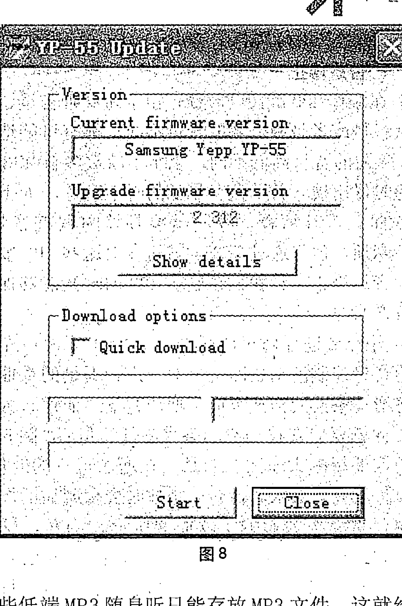

## 四、MP3随身听的保养维护

由于MP3随身听非常精巧，在使用中不加注意就很容易出现各种故障，所以也要注意日常的保养维护。

- 随身携带的时候要放好，不要碰、摔和划伤机体。一般商家都会随机附送一个专用的口袋，建议使用的时候都把随身听放在口袋中，否则机器的外壳上很容易出现划痕。
- 尽量避免在下雨、灰尘多的环境中取出MP3随身听，这有可能导致MP3随身听的损坏。
- 要注意防潮湿和防磁，由于存储芯片的工作方式和磁有关，所以记得不要放在有磁体的旁边，防止损害存储芯片。
- 电池不要在机器里放置过久，以防漏液损坏机身。对于充电电池而言，最好是在用完全部电力后再充电，否则会造成电池的记忆效应而影响使用。
- 如果MP3随身听使用的是专用充电电池，最好能够另外购置一个充电器，以免在充电的时候也要使MP3随身听处于电路接通的状态。
- 收听时不要把音量开得太大，而且听音时间也不宜过长，以免损害听力。
- 在通过计算机或者其它方式往MP3随身听中复制文件的时候，要保证连接线的牢固，千万不要在复制文件中途拔下连接线缆，这样有可能对存储芯片造成永久性的伤害。
- 由于随身听的体积小，内部电路复杂且密集，如果出现故障不要自行打开修理，应该送到专业的维修店进行检修。
- 在完整的MP3随身听中，耳机也算是其中比较娇弱的一部分，耳机损坏或音质下降的原因有多种，比如经常缠绕耳机线导致内部线缆断开、在多尘环境中使用致使鼓膜沾有尘灰等等，因此要注意对耳机的保养。

相比较其它数码设备而言，MP3随身听还是很好伺候的，不过也不能因为这个原因就忽视对它的保养哟！相信喜爱音乐的朋友也一定会对自己的MP3随身听善爱有加的。

## 五、MP3相关名词解释

### 1. MP3
MPEG Audio Layer 3 的简称，这是一种计算机文件格式，通过 1:10 甚至 1:12 的压缩率压缩音频文件，使其远远小于原来要达到 CD 质量的录音效果所需的文件大小。

### 2. 比特率
一种数字音乐压缩效率的参考性指标，表示记录音频数据每秒钟所需要的平均比特值，通常我们使用 Kbps 作为单位。CD 中的数字音乐比特率为 1411.2Kbps，近乎于 CD 音质的 MP3 数字音乐需要的比特率大约是 112Kbps 至 128Kbps。

### 3. 编码
通过压缩文件将其转换成另一格式文件。

### 4. 解码
通过解压缩文件将其转换成另一格式文件。

### 5. 采样率
把模拟音频转成数字音频的过程称作采样。简单地说就是通过波形采样的方法记录 1 秒钟长度的声音，需要多少个数据。44KHz 采样率的声音就是要花费 44000 个数据来描述 1 秒钟的声音波形。原则上采样率越高，声音的质量越好。

### 6. 杜比环绕声
一种将后方效果声道编码至立体声信道中的声音，重放时需要一台解码器将环绕声信号从编码的声音中分离出来。

### 7. 量化级
描述声音波形的数据是多少位的二进制数据，通常用 bit 做单位，如 16bit、24bit。16bit 量化级记录声音的数据是用 16 位的二进制数，因此量化级也是数字声音质量的重要指标，标准 CD 音乐的质量就是 16bit、44.1KHz 采样。

### 8. 压缩率
通常指音乐文件压缩前和压缩后大小的比值，用来简单描述数字声音的压缩效率。

### 9. VBR
全称是 Variable BitRate，就是动态比特率的意思。和恒定比特率 (CBR) 编码方式不同，VBR 则采取了一种全新的全程动态调节技术的压缩方法，在低音段 VBR 会自动采用较低的比特率如 32Kbps 对音质进行压缩；在高音段时会用较高的比特率如 224Kbps 对音质进行压缩；在高端时则采用最高 320Kbps 进行压缩。因此 VBR MP3 在控制文件大小的情况下，最大限度的提高了 MP3 的音质。

### 10. CDDB
包括歌手、专辑名称、单曲名称、音轨长度和其它信息的数据库。

### 11. ID3
MP3 文件的标签，其中注明该 MP3 歌曲的标题和作者。

### 12. SRS WOW
一种音质增强技术，这种技术可显著扩展声场的宽度、高度和深度，使声音变得更加自然、悦耳。而且它还将 SRS 的 TruBass 低音增强技术融入其中，可以产生更加深邃、浑厚、富有弹性的低音，最佳听音区的范围也大了许多。

### 13. MP3Pro
一种全新的 MP3 技术，它将音频分为两部分：一部分是将音频数据中的低频段部分分离出来，通过传统的 MP3 技术而编码得出的正常的 MP3 音频；另一部分则是将分离出来的高频段信号进行编码并嵌入到 MP3 流中，这样可以还原出高频信号并将两者进行组合，得到高质量的全带宽的声音。通过这样的技术，使得 MP3Pro 能在 64kbps 的编码率便可提供与 128kbps 的 mp3 相同的质量。

### 14. 固件
硬件设备中的只读存储器中的软件或数据。

# 移动的办公
## 笔记本电脑的选购与使用
文/赵江

如今计算机的应用已经完全渗入工作和生活的方方面面，甚至于很多人离开了计算机就无法正常工作，所以很多人都通过笔记本电脑在不同的环境中连续工作。近几年来，笔记本电脑的性能已逐渐可以和台式机相比，同时它的价格早已能够为大众所接受，因此移动办公已成为时尚，而笔记本电脑的办公应用高潮也正向我们走来。在这种情况下，很多朋友都希望拥有一台笔记本电脑来亲自体验一番移动办公的乐趣，就让我们一起走入这个移动的世界看看吧。

- 笔记本部件配置指南
- 笔记本水货识别
- 笔记本节电措施——调整设备和程序
- 笔记本节电措施——使用待机和休眠
- 笔记本节电措施——优化BIOS设置
- 笔记本节电措施——节能软件的使用
- 笔记本的保养和维护
- 笔记本相关名词解释

### 一、笔记本电脑选购指南

#### （一）根据需要确定配置

（1）确定配置首先要从工作需要方面考虑。比如你主要是用于办公文字处理的，那么配置不需要太高；如果用于程序开发，而且需要在Windows XP平台下工作，那么CPU速度和内存容量的要求就相对高一些；如果用于图像处理，那么除去CPU、内存等方面之外，显卡和显示器还要有特殊的要求；如果需要经常欣赏DVD影碟，那么一定要选取配置了DVD光驱的笔记本电脑。总之，选购笔记本电脑之前需要从自己的主要用途方面考虑，确定所需要的CPU、内存、硬盘、LCD液晶屏大小、显卡功能等主要方面。

（2）确定配置还要从使用环境方面考虑。比如在办公室中使用局域网环境，那么就要求笔记本电脑配置网卡；如果需要经常外出使用，最好选择超薄轻便类型的；如果不需要经常外出，则可以选择屏幕较大、全内置的笔记本电脑。

#### （二）选购中的注意事项

在选购笔记本电脑过程中，主要考虑下述几个方面对于机器的性能影响。

##### 1. CPU类型
通常笔记本电脑主要用于上网、听音乐、文字处理等操作，这对于CPU的要求并不高，如果采用P4移动版的CPU则价格较高，选择P4架构的移动版赛扬CPU就是极佳的选择。而且在选择CPU的时候不要一味求新求快，比如现在的迅驰CPU价位较高，但是如果所使用的环境中没有无线网络支持，那么现在购买就明显是一种投资浪费，因此不要有过份的“超前”意识。

##### 2. 内存的支持能力
目前大多数笔记本电脑都将256MB内存作为标准配置，这看起来似乎已经足够了，但是随着Windows XP的普及，256MB内存只能勉强运行Windows XP，一旦运行大型程序或者同时运行多个程序就会发现速度严重下降。再加上部分机型的显存是共享内存，那么就让原本不足的内存更加显得捉襟见肘。虽然可以通过增加内存条来提高系统运行效率，但是很多机型都有最大内存容量的限制，如果只能支持最多384MB的内存，也就是说只能增加一根128MB的内存，这就为日后使用笔记本电脑埋下了隐患，因此在选购的时候也要看清楚这点（如图1）。

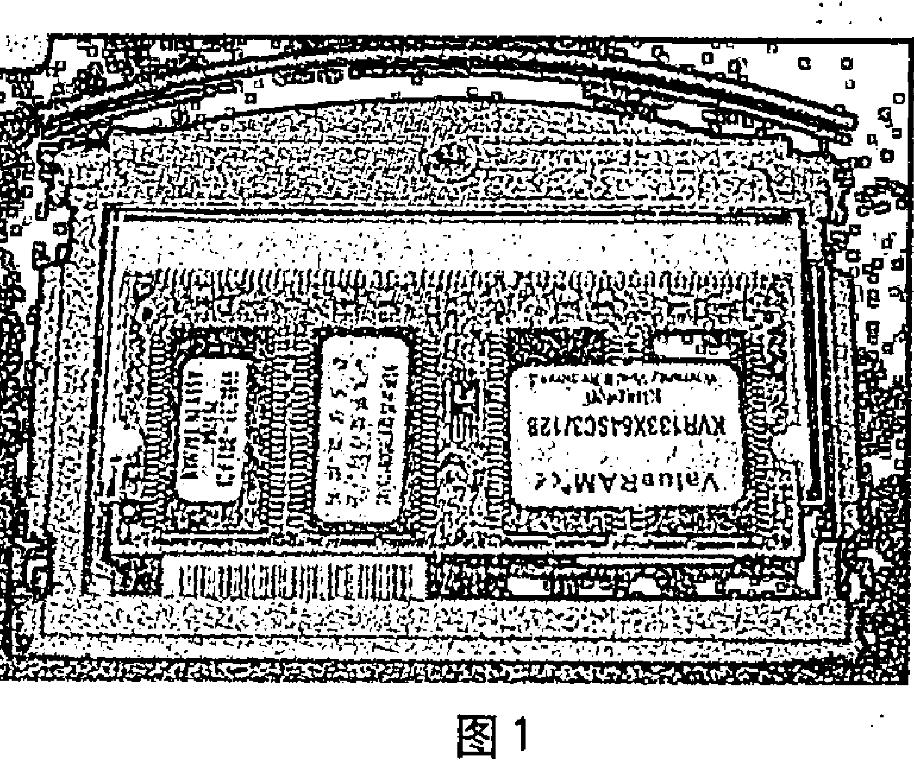

##### 3. LCD 液晶屏
选购 LCD 液晶屏主要从尺寸和质量两方面来把关。目前笔记本电脑液晶屏的尺寸从 12.1 英寸到 15 英寸不等，如果经常需要外出携带使用则可以考虑 12.1 英寸大小的液晶屏，如果在办公室使用则可以选取 13.3 英寸或者 13.1 英寸的液晶屏，如果需要进行图像编辑处理则可以挑选一款配备了 15 英寸的笔记本电脑，这样才能满足使用要求并带来最大的便利。

在 LCD 质量方面要特别留意是否存在亮点或者坏点。在购买时可以先不开机，对着光线来看看显示屏幕上有没有油渍或者小花纹之类的毛病。接着开机，将屏幕背景变成全白或者全黑，仔细观察有无坏点，或者从 Internet 下载 Nokia Monitor Test 来测试屏幕的坏点。在查看这两方面之后，还要检测一下 LCD 液晶屏的可视角度、对比度等，这样才能确保购买的笔记本电脑拥有一个完美的液晶屏。

##### 4. 内置网卡
现在使用电脑几乎都要求网络支持，因此笔记本电脑除了配置 Modem 之外最好还要配备网卡，而且考虑到目前网络和日后网络的升级，最好选择 10M/100M 自适应的网卡。这里需要提醒大家注意的是，网卡应首选内置在笔记本电脑中的，如果使用 PC Card 网卡就需要一个接口转接配件，这在使用的时候多少有些不便。

##### 5. 键盘布局
用惯了台式机键盘之后，会很不喜欢笔记本电脑的 84 或者 87 键盘，因为这些按钮的布局和常见的台式机键盘不一样。而且为了让笔记本的整体更加小巧，按钮的尺寸也有所减小，因此在输入的时候经常会出现按错键的情况，以致于不得不停止下一步操作对原先内容进行调整，也就大大影响了工作速度，所以选择一个键盘适合自己习惯的笔记本就显得格外重要了。

##### 6. 音响系统
在使用笔记本电脑工作之余经常要欣赏优美的音乐或者是播放影碟，这时候对于音响系统就提出要求了。如果播放的声音效果不很理想，主要是扬声器质量不好或者扬声器位置安放不恰当所致，因此在选购笔记本电脑的时候要播放一些 MP3 歌曲或者影碟来测试一下音响系统的效果如何。若不满意笔记本电脑集成的扬声器，还可以单独购置一个外部扬声器。

##### 7. 外观和重量
低价笔记本电脑一般是光软全内置的机型，所以外观上会显得很厚，很宽，重量一般也在 3kg 以上（含电池）。使用是否舒适主要是看键盘、触摸板以及发热量等几个方面。键盘的手感是否良好，触摸板是否灵敏，能不能接受长时间工作的发热量。中高价笔记本电脑一般是光软互换或者全外置机型，在外观和使用舒适度方面要比低价笔记本电脑好。

##### 8. 电池续航能力
由于笔记本电脑具有移动工作能力，所以电池的重要性可想而知。在选购的时候可以先直接使用电池开机，一般新机器的电池只有部分余电，如果电池中的电量较多则证明这台笔记本电脑已经使用过了。接着可以接上电源充电 30 分钟左右，再使用电池播放 MP3 歌曲或者是 VCD 影碟数分钟，同时观察电池容量减少的比例来大概估计电池的持续使用时间。不过需要注意的是，标称的持续使用能力都是在不使用光驱、不播放媒体文件时候计算的，因此估算的时候要考虑到这方面因素。

##### 9. 配件
出于私利考虑，一些奸商会把原配的配件给收起来，而这些大多人往往不太注意，因此在验货的时候要按照说明书上的配件清单逐一清点，发现缺少的配件要和商家讨要。

##### 10. 注意保修
保修是笔记本非常重要的内容，因此购买时不仅要了解保修的内容、条款、年限等，还要保存好相关的单据和保修卡，同时把具体的保修服务条款落实到纸面上，避免日后维修的麻烦。另外，最好能够选择快修或全球维修的品牌，而且要在口碑好、服务好的商家购买。

#### （三）识别水货和行货
对于笔记本电脑本身来讲，行货和水货没有什么本质的区别，这对机器的质量是不存在直接影响，但是周边配套环节的区别就很大了。比如水货的原厂预装操作系统和软件为非简体中文版本，以英文和日文居多；如果是日版水货，由于使用日文键盘，因此在某些键位上会与我们普遍使用的英文键盘有所不同；行货的售后服务自然不必担心，而水货的维修就难以保障了。因此，为了避免遭遇水货，我们在购买的时候还要睁大自己的火眼金睛仔细辨别。

##### 1. 机器型号
为了对不同国家地区销售的同型号机型加以区别，大多数厂商都会给该机型额外地标记一个附属编号，通过查看这个附属编号就可以来判断该机型的销售地区。例如IBM ThinkPad系列笔记本电脑是通过机型编号的最后一个字母来进行标识的，其中C代表中国大陆地区、U代表北美洲地区、H代表中国香港地区等等，如果你购买的IBM笔记本电脑编号不是以C结尾的，那就很有可能遇到水货了。

##### 2. 随机程序和资料
既然是水货，那么原厂的预装操作系统和软件就不会是简体中文版，而很多商家会给水货笔记本电脑改装简体中文系统，并提供一套他们自制的系统恢复盘。其实只要用原厂随机的系统恢复盘恢复一下，看看操作系统是不是简体中文版本就可以很容易得知了。不仅软件如此，行货的操作说明书和文字资料也应该是简体中文版本或者多国语言版本，而水货的随机资料多为英文、日文等非简体中文版本。应该说这是最直观的一种方法，不需要在购买前去查询任何的资料就可以靠眼睛辨别了。

##### 3. 机身序列号
一些厂商提供了网上查询机身序列号来验证行水货的方式，只需要登陆指定页面并输入机身背部的序列号便可以查阅该机型各种详细信息，其中包括出厂配置、每个硬件编号、保修开始日期、销售地区等等，而我们只需通过销售地区就可以判断该机是否为水货了。另外，部分厂商的查询数据库并非全球联网，那么你只要到中国官方网站进行查询，如果无法得到相应的信息就可以判断它是水货了（如图2）。

##### 4. 键盘语言
这个方法仅对日版和部分台湾的水货非常有效，因为在日本销售的笔记本电脑大多配置的是日文键盘，除了会在键盘的键位上标记日文字母以外，还有几个键位功能与我们日常使用的英文键盘有所出入。另外，在我国台湾省销售的部分笔记本电脑中会使用繁体中文键盘，这也可以很直观的判断水货与行货（如图3）。

虽然上述方法不一定适用于每个品牌的笔记本电脑，但是起码可以通过其中的一种或两种来进行辨别。为了避免买到水货，到厂商指定的代理商处去购买是一个比较稳妥的选择。

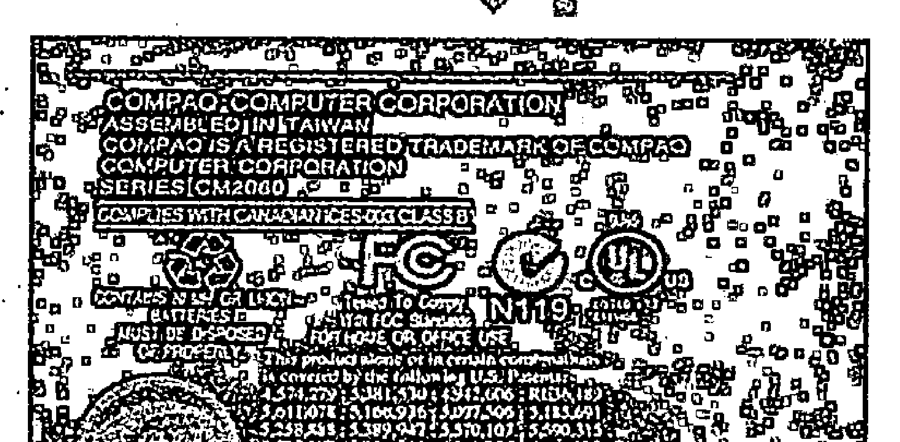

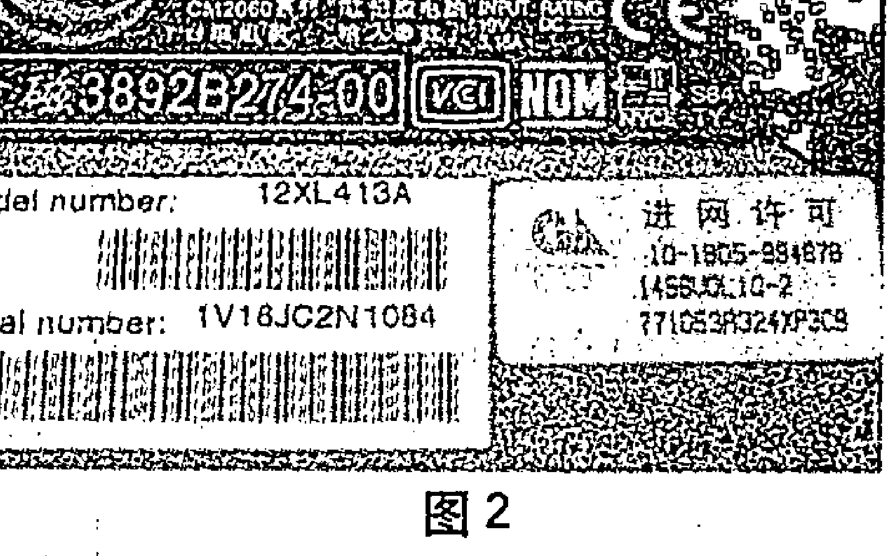

### 二、笔记本电脑的节电措施

#### （一）根据需求调整模式
现在较新款的笔记本电脑都配备了相应的CPU工作模式切换功能，比如Pentium M系列移动处理器独有的SpeedStep技术都可达到上述效果，但是如果CPU不支持工作模式的切换，这就需要我们自己手工进行切换了。通常笔记本电脑中会提供比台式机种多一些的工作模式，用户可针对当前运行的程序来设定计算机的运行模式。比如使用Word进行文字处理时候对于系统性能的要求比较低，此时就可以把系统工作性能设定在便携或接驳式系统模式，这样在满足工作的基本需求的情况下节约大量的电力；而当需要运行Photoshop或者是运行其它大型程序的时候，就可以把模式切换到“台式机”，这样就能够保证程序的正常运行（如图1）。

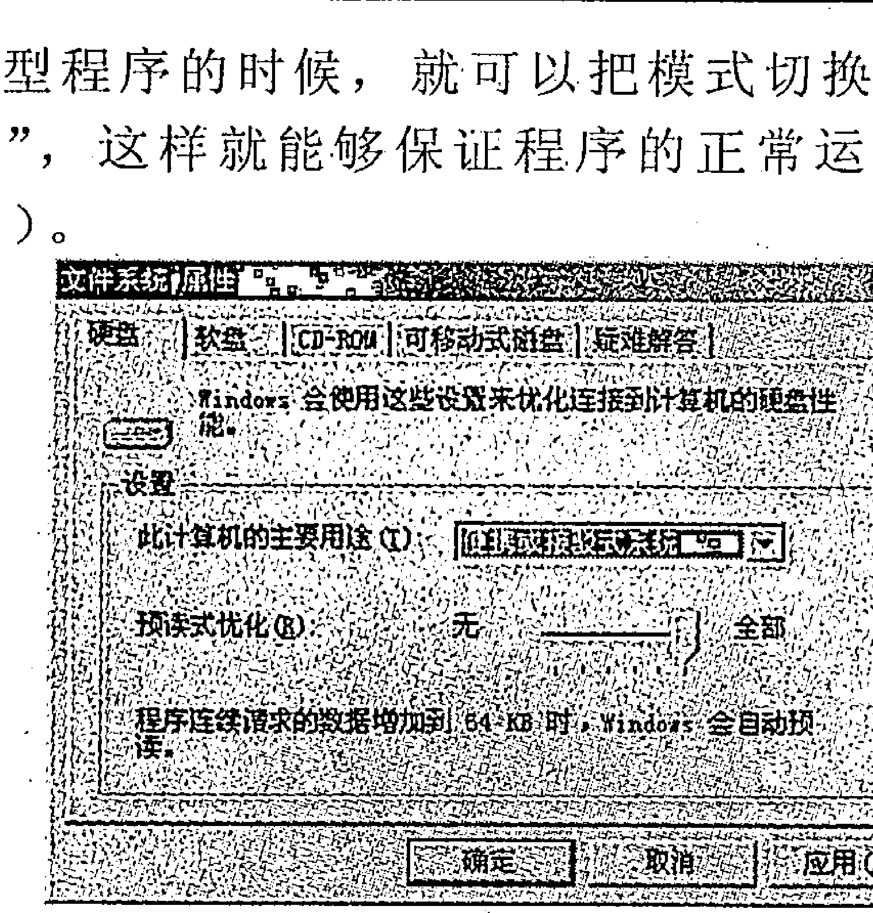

#### （二）精简运行的程序和硬件设备
对于笔记本电脑而言，LCD液晶屏对于电力的消耗也非常大，除去LCD面板本身的耗电外，位于面板背后的LCD灯管也是耗电大户，所以在周围的环境灯光许可的情况下应该尽量将液晶屏调暗一些，这样既不会影响笔记本电脑的正常使用，而且更可以节省电源。在使用笔记本电脑的时候光驱和外接的PCMCIA卡也相当耗电，在使用的时候也要尽量减少这些设备的使用率来节约电源。另外，如果选购的是最新款迅驰笔记本电脑，除非你在线网络站点环境中使用，否则要关掉无线网卡的自动信号扫描，这也能够大大节省电源。

同样，每次运行程序的时候都要读取硬盘，这就要求我们尽量减少频繁运行程序的次数。比如开机时候驻留在后台的光盘伺服器、杀毒软件、网络防火墙以及各种辅助类的程序，它们都会消耗部分电力，有选择的使用这些程序也可以让电力节省很多。而且定时对硬盘进行碎片整理操作，这样可以减少程序运行时候的寻道时间，不仅加快了程序的运行速度，同时也节约了电力。

#### （三）善用待机和休眠
目前几乎所有的笔记本电脑都提供了待机和休眠功能，它们会在你适当的时候关掉LCD液晶屏、硬盘以及CPU，但是它仍会留着一点电源去保留数据，在需要的时候可以在极短时间内重新投入使用，这样就能够帮助我们节约大量电源。设置这两种模式可以在控制面板中双击“电源管理”图标，接着分别设定启用待机和休眠的时间即可（如图2）。

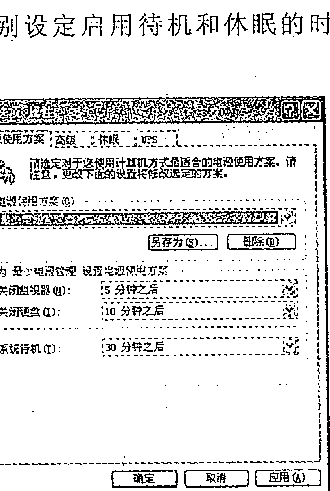

##### 1. 待机
当计算机进入待机状态后，机器会暂时切断硬盘及CPU的电源，但是还要继续向内存供电。由于数据被保存在内存中，因此恢复时只需很短时间就可以恢复到关机之前的状态。虽然此时的耗电量不大，可是由于机器一直在耗电，因此长时间处于待机状态也会耗尽电池的电量。

##### 2. 休眠
和待机不同的是，计算机进入休眠状态之后会关闭硬盘、CPU、内存的所有电源。但是在关闭电源之前，内存中的内容会全部保存到硬盘中，所以在恢复到正常使用状态时候，保存在硬盘的内容会重新回到内存中。不过为了保存相关的数据到硬盘中，关机和恢复操作时都需要一定的时间。

除去上述两方面之外，在较长时间不使用计算机的时候要关闭计算机来节约更多的电源。

#### （四）设置CMOS优化电能
对笔记本电脑的CMOS参数进行设置可以在一定程度上节约“电能”。如图3所示，在CMOS中有一个“PowerSavings”选项，其中有“Customized”、“Maximum Power Savings”和“Maximum Performance”三项。设置节能选项时，可以直接选取“Maximum Power Savings”将笔记本电脑设置为最节能状态，也可以通过“Customized”来设定“StandbyMode”（待命）时间和“Auto Suspend Timeout”（休眠）时间。设定了节能模式之后，系统将自动参照设置的时间适时地进行相关节能操作，比如关闭LCD液晶屏、硬盘，还可以将内存中的内容保存到硬盘，整个电脑系统基本维系关闭状态。

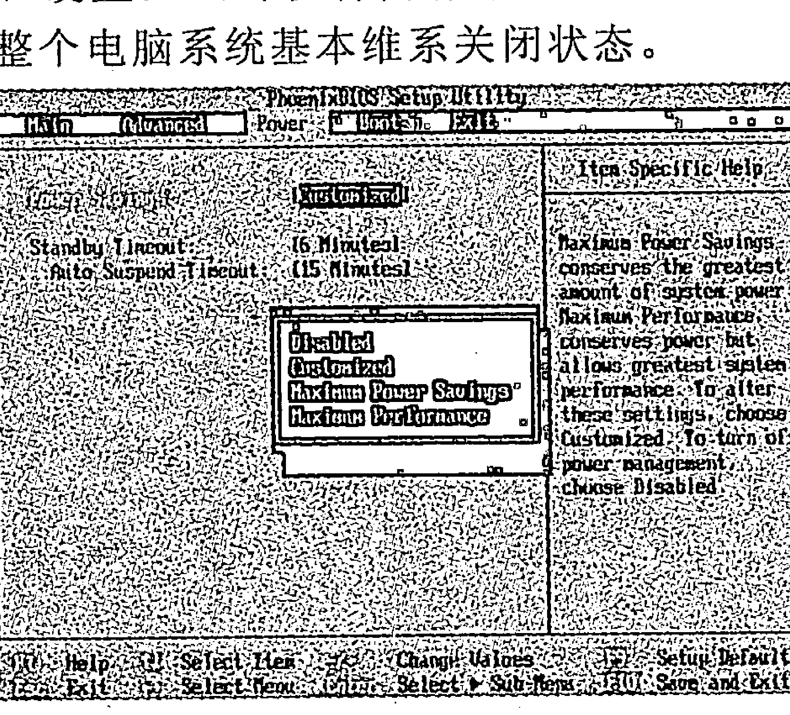

> 提示：笔记本电脑大多数使用Phoenix BIOS，不同的BIOS设置可能有些不同。

#### （五）软件节约电能
虽然硬件节能是笔记本电脑节能降耗的关键，但节能软件的作用也不可小觑。由于笔记本电脑本身的硬件设计已经无法改变，所以我们要做的是从软件方面尽量让它变得节能。

##### 1. 硬盘节能

现在许多笔记本电脑都采用IBM系列硬盘，这款硬盘采用了自适应电池增效技术，因此我们可以通过Power Booster软件对电池进行节能操作。运行程序之后，它会在后台每隔5秒钟监测一次是否有读写硬盘的动作，然后根据设定从最省电到最佳性能来使硬盘进入省电模式。这个软件可以提供比Windows更多级别的硬盘等待时间，当Power Booster设置为Max Battery的时候，硬盘只在需要读取/写入的时候转一下，读取/写入完毕就马上恢复到停转的待机状态，但也因为有启动的时间，所以速度比较慢。

- 软件名称：Power Booster
- 软件类型：免费软件
- 软件大小：301KB
- 下载地址：ftp://ftp.cq.hktk.com/drive/drive_disk/PowerBooster-1.0.exe

##### 2. CPU省电

Waterfall Pro是一个功能非常强大的CPU降温软件，它最大的特点就是其独特的温度调节器设计，通过它还可以自行设定警戒温度的高低、时间的长短等附加条件值，而且CPU Throttling还能够控制笔记本电脑CPU风扇的转动，从而降低电池消耗量，因此可以实现CPU省电的目的。

运行Waterfall Pro之后，它会自动对电脑进行一些分析，然后缩小到系统托盘中自动运行，但是这并不表示它就正常运行了，要实现它的诸多功能还得进行手工设置。此时点击系统托盘里的Waterfall Pro图标，并且在弹出的窗口中点击“Option”进入设置界面。在设置的时候要依次设定CPU与主板型号、报警设置以及杂项设置，完成之后即可让它驻留在后台对CPU进行节能控制了（如图4）。

- 软件名称：Waterfall Pro
- 软件类型：共享软件
- 软件大小：1257KB
- 下载地址：http://sq2.onlinedown.net/down/wfpdemo.zip

怎么样，看了上述几个方面之后，你是否知道应该怎样让自己的笔记本电脑拥有更长的使用时间呢？相信这些小技巧一定会对你有很大帮助，让你能更加自由自在的随心所用。

### 三、笔记本电脑的维护保养

笔记本的价格比较昂贵，而又显得非常脆弱，因此如果想增加笔记本电脑的使用寿命，日常使用过程中进行适当的保养维护是必不可少的。不过保养笔记本电脑是非常讲究的，而且保养得当还能够减少使用中出现问题的几率呢。

#### （一）使用环境

使用笔记本电脑的时候要求环境不能过热太湿，20度至30度的室温是电池最适宜之工作温度。如果长期在湿气和温度高的环境中操作，便有可能因内部某些电子零件过热而导致不正常。比如夏天炎热，所以应该尽量避免在户外使用笔记本电脑，最好是在有空调的环境中使用；而且存放笔记本电脑的环境也应该尽量避免潮湿和炎热。

此外，空气当中有许多的灰尘，而尘埃积聚可能会令笔记本电脑内部的线路不通，所以最好避免在多尘的地方使用电脑，而且定期对其进行清洁可令它更加耐用和保持美观。

此外，笔记本电脑周围要避免有大功率的电器设备，因为这些设备产生的强磁场极易消去电脑硬盘上的信息。而且不要在笔记本电脑旁边放置茶杯或者是其它盛水的容器，因为一不小心打翻之后就会有可能导致笔记本电脑内部渗水，并对笔记本电脑造成损坏。

#### （二）外壳的维护

目前的笔记本电脑外壳基本上都是在工程塑料外面再镀上一层铝镁合金或者其它金属镀层，镀层往往非常脆弱，比较容易被刮除，所以在我们的日常使用中要格外注意。比如在移动的过程中，一定要使用独立的皮包将笔记本电脑装好，免得在途中划损外壳，而且在工作的时候也不要将笔记本电脑放到粗糙的桌面上，以保护外壳的光亮常新。

### (三) LCD 液晶屏的维护

LCD液晶屏是笔记本电脑中价格最贵的配件之一，所以使用笔记本电脑过程中要对它格外重视。

#### 1. 使用中的注意事项

##### (1) 切忌挤压

使用笔记本电脑的时候，大家一般都比较小心，因此不会被严重的撞击，但是挤压却往往会被大家忽视。由于LCD是由多层反光板、滤光板及保护膜组合而成，而这些材料又非常脆弱且极易破损，一旦外界对其施力过大就会出现显示模糊、水波纹等不可修复的损坏，从而影响了显示输出效果。如果不慎导致LCD破裂，就只能换屏了，而它的价格几乎是整个笔记本价格的一半！因此在使用的时候不要在LCD液晶屏上放置重物，而且移动过程中也要尽量小心，外出携带也要将其放入专用的背包中，这样可以在一定程度上避免LCD液晶屏的损坏。

##### (2) 开关LCD上盖要注意

很多笔记本电脑为了降低整机重量，都会将LCD上盖做的很薄很软，对于这部分机器就要采用合理的方法来开关LCD液晶屏了。一般开关液晶屏的时候要双手操作，均匀用力，这样可以使LCD及固定轴免受因用力不均匀而造成的损伤，也能够避免了因为长期开关方法不得当而出现的一边无法盖严的现象。

##### (3) 调整显示亮度

与传统的CRT显示器相比，LCD液晶屏的使用寿命要短许多，大概在两、三年左右便会出现显示发黄的现象。这种情况主要是由于液晶屏的背灯管在使用过一段时间后亮度就会逐渐地下降，这便是显示发黄的根源所在。另外，长时间的高负荷使用还会使液晶颗粒老化失效而产生死点。所以在使用中尽量不要让LCD长时间地工作，并且尽可能地调低它的显示亮度，这样可以延缓液晶屏老化现象的出现。

##### (4) 避免液晶屏划伤

很多用户在使用电脑的时候都喜欢用手指在电脑屏幕上点来点去，这对于LCD来说是一个非常不好的习惯。首先这么做会在LCD表面留下一些很难看的指纹，它同油污一样不易清洁，而最主要的就是手指甲可能会不经意之间在LCD上留下了划痕，这些划痕是无法修复的永远性伤害。所以在使用的时候一定要避免手指或者其它物体与液晶屏的直接接触，以免对液晶屏造成伤害。

#### 2. 液晶屏的清洁

由于空气中有很多灰尘，所以液晶屏在使用一段时间后会在表面粘落很多灰尘，为了保证笔记本电脑的洁净，我们必须定期给它进行清理。如果液晶屏上只有一些灰尘，就可以用一块微湿的软布轻轻的擦去LCD表面灰尘就可以了，注意这块布不要过于粗糙，否则擦过之后反而会让屏幕伤痕累累。如果液晶屏表面有油渍存在，就需要借助一些专用液晶屏清洁剂了，通常笔记本电脑专卖店都有这类清洁剂，把清洁剂均匀的喷到液晶屏表面之后，用软布从上往下顺方向擦拭即可。

提示：切勿使用不知名的清洁剂或者附带有酒精的液体来清洁液晶屏，否则其中的腐蚀性化学成分很可能对液晶屏造成损害。

### (四) 键盘和触摸板的维护

键盘和触摸板是笔记本电脑的输入设备，也是使用频率最高、最容易脏损的部件。为了避免键盘和触摸板过早损坏，首先要求使用笔记本电脑的时候双手清洁，以免手指上的污渍粘在键盘和触摸板表面，而且按键时要注意力量的控制，不要用力过猛。但是即便这样，由于空气中的灰尘很容易积聚在键盘表面，因此还要经常进行清理操作。在清理灰尘的时候，可以用小毛刷来清洁缝隙，或者小型吸尘器来清除键盘缝隙中的灰尘和碎屑。如果键盘和触摸板表面残留有难以去除的污渍，则可以用洁净的软布沾上少许清洁剂，在关机的情况下轻轻擦拭键盘表面，不过千万不要用粗布物品擦拭，以免对触摸板造成损坏。

### (五) 硬盘的维护

和台式机中使用的硬盘差不多，笔记本硬盘使用过程中也有一些需要注意的地方。首先就是尽量保证笔记本电脑使用环境的稳定性，一方面要避免在容易晃动的地点操作计算机，同时尽量不要在笔记本电脑运行的时候移动笔记本。尤其是在开关机的时候更要值得注意，由于此时硬盘轴承转速尚未稳定，所以这个过程是硬盘最脆弱的时候，如果产生震动就容易出现坏道，时间长了就有可能导致整个硬盘的报废，因此建议在关机后等待约十秒左右后再移动笔记本电脑。另外，建议大家每隔一定时间就对硬盘进行碎片整理操作，这不仅可以加快程序的运行速度，更主要的是减少了寻道时间，也减小了硬盘的故障率。

### (六) 电池的维护

当我们新购一台笔记本电脑时候，你会发现电池电量非常的少，这是因为电池经过长时间的存放，电池中的电量已经自然放完了，但这并不影响电池的容量。不过如何保证能够正常使用电池还是大有学问的呢！

#### 1. 充电的学问

第一次充电时，应该连续地把电池充电到12个小时，然后拔下电源线，只使用内置电池进行工作，一直到将所有的电力全部用尽为止。然后再按照这种方式完全充、放电两次以完全地唤醒新电池，这样才能够让电池处于最佳的工作状态。

#### 2. 电池的保养

一般的充电电池都是通过化学反应来储存电子能量的，因此它的容量就有可能因为温度、未使用时间的长短、负载环境以及使用次数而受到影响。为了保证电池长期有一个良好的工作状态，在开始给电池充电之前尽量将电力全部用完，而且最好在充满电量之后再使用它。由于在使用外接电源的时候，每次接上电源就会自动对电池进行充电操作，所以最好能够把电池取下之后再外接电源，这可以保证电池不会频繁的进行充电放电。另外，如果一段较长的时间不使用笔记本电脑，这就需要定时进行深度放电以优化电池的性能。具体做法就是用电池供电，一直使用到电池容量为0%，然后接上交流充电器一直充满到100%为止。

提示：如果发现电池的使用时间缩短了，也可以采用这种深度放电操作来解决。

### (七) 散热

一般而言，笔记本电脑制造厂商将透过风扇、散热导管或散热孔等方式来降低使用中所产生的高温，而且为了节省电力并避免噪音，笔记本电脑的风扇并非一直运转的，而是CPU到达一定温度时风扇才会启动。为了避免笔记本电脑过热而导致频繁死机甚至损坏部件的情况，散热问题就是不得不考虑的。

在高温或者太阳光能够直射到笔记本电脑的环境下最好还是不要使用笔记本；其次要尽量避免把笔记本电脑放置在床上、沙发之类柔软的物品上，因为这样有可能会堵住散热孔而影响散热效果，进而降低运作效能，甚至出现死机。再者，我们可以想办法把笔记本电脑垫高，这样方便笔记本底部的空气流通，能够更快地把热量散走。如果需要长时间连续使用笔记本电脑，还可以在笔记本下部垫上铜板或者钢板以促进散热。当然最好的方法是购置一个专用水垫，这样可以使笔记本非常平稳的放在上面来使用。

其实，在使用笔记本电脑过程中要有一个良好的心态，应该认识到笔记本电脑是一件昂贵且易受损的高科技产品，其中还有最重要的数据，这样在任何时刻你都会照顾好它，让你的笔记本电脑的寿命更长。

### 四、笔记本电脑相关名词解释

#### 1. USB 端口

USB 是指通用串口总线技术，笔记本电脑只需通过一个 USB 端口即可串接打印机、摄像头、数码相机、鼠标和键盘等各种外部设备，实现真正的即插即用。

#### 2. 3D SOUND

3D 就是数字混响、数字录音和数字制作，而 3D SOUND 是指采用数码技术进行混响、录音和制作，用以保证能够充分发挥多媒体音响的3D环绕立体声技术。笔记本电脑中采用带有3D SOUND立体声的声卡，将家电技术引入高科技的计算机领域，使笔记本电脑的声音表现更加逼真。

#### 3. TCP 技术

电脑性能越好，对散热的要求就越高，而 TCP 是指主板自动散热技术，可根据 CPU 工作的快慢来自动调节散热的需要。

#### 4. IR红外线传输

IR (IR, Infrared) 红外线通讯端口，通过它我们不用连线就可以连接台式机、笔记本电脑、PDA、打印机等设备。作为笔记本电脑与外部沟通的无线传输设备，使用非常简单方便，传输速度可以达到 4Mbits/秒。

#### 5. All-in-One设计

All-in-One 设计是指软盘、硬盘、光驱、调制解调器等部件均可同时内置在笔记本电脑中，不需抽换或外接，这样使用起来比较方便，但是比较重，维护升级不是很方便。

#### 6. PCMCIA 插槽

PCMCIA 卡 (Personal Computer Memory Card International Association) 通称PC卡，比较常见的就是网卡、调制解调器等，我们通常是通过它来使笔记本电脑上网以及连接到内部局域网的。笔记本电脑有了 PCMCIA 插槽，可以使用很多具有丰富功能的部件，使笔记本电脑的功能更加全面。目前有三种 PC 卡标准：TYPE I、II、III，其中 TYPE I 以前几乎是在内存中应用，但现在MODEM 和其它设备也开始用 TYPE I 标准；TYPE II 是当今主流的一种标准，用于大多数设备；TYPE III 主要用于硬盘驱动器。

#### 7. CardBus

一种32位个人计算机卡的标准总线，它允许用户通过32位接口使用 FastEthernet 和高速 SCSI 及图像捕捉等技术。Cardbus 可使32位 PCI 设备包装成16位PC卡形式，以插进 PC 卡插槽。

#### 8. 电源器变压

电源器变压的功能是把交流电转换为直流电，以提供笔记本电脑使用。绝大多数变压器多供应 100V 至 240V 的交流电转换。国内使用的是 220V，而有些国家及地区使用的是 110V，到时可直接使用而无顾虑。但必须注意国外品牌的插座是否与国内习惯相同，若插座不相同则必须购买适和当地使用的电源变压器以及插座。

#### 9. Intel SpeedStep Technology

英特尔 SpeedStep 技术，使我们能够在笔记本电脑上定制高性能要求的计算。当笔记本电脑连接到AC输出口时，移动式电脑能够运行最为复杂的商业和互联网应用，同时速度可以达到台式机系统的水平。当采用电池供电时，处理器频率将自动降低，同时能耗也相应降低，从而在保持高性能的同时延长电池寿命。

#### 10. Enhanced Intel SpeedStep technology

增强型英特尔 SpeedStep 技术，能够根据处理器需要在两种性能模式之间实时进行电压和频率的动态切换。这主要是通过切换系统总线比率、内核工作电压以及核心处理器的速度而无需重新设置系统来实现。

#### 11. LCD 液晶屏

液晶显示器是利用液晶的偏向角度来显影，主要是利用杆状水晶分子受到电流作用会改变方向的原理来显示信息。LCD 在两片平行的玻璃平面当中放置液态的晶体，在这两片玻璃中间有许多垂直和水平的细小电线，透过通电与不通电的动作，来控制杆状水晶分子改变方向，将光线折射以显示画面。

#### 12. 液态轴承硬盘

这类硬盘使用液态轴承马达，与传统的滚珠轴承马达不同之处在于，液态轴承马达使用的是黏膜液油轴承，以油膜代替滚珠。这样不仅避免了金属面的直接磨擦，噪声及温度被减至最低，而且油膜可有效吸收震动，使抗震能力由以往的 150G 提高至 1200G。

#### 13. Bluetooth (蓝牙)

是一种短距的无线通讯技术，电子装置彼此可以透过蓝牙而连接起来，传统的电线在这里就毫无用武之地了。透过芯片上的无线接收器，配有蓝牙技术的电子产品能够在十公尺的距离内彼此相通，传输速度可以达到 10M/s。

#### 14. 扩充内存

笔记本电脑所使用的内存与台式机的内存是不一样的，价位上也比台式机要高一些，一般机器上有一个到两个的插槽。

#### 15. 触摸板

触摸板由一块能够感应手指运行轨迹的压感板和两个按钮组成，两个按钮相当于标准鼠标的左右键。触摸板没有机械磨损，控制精度也不错，操作起来很方便，初学者很容易上手。

#### 16. 指点杆

指点杆由 IBM 发明的，目前常见于 IBM 和 Toshiba 的笔记本电脑中。它有一个小按钮位于键盘的 G、B、H 三键之间，在空白键下方还有两个大按钮，其中小按钮能够感应手指推力的大小和方向，并由此来控制鼠标的移动轨迹，而大按钮相当于标准鼠标的左右键。

#### 17. ACPI

ACPI 是 1997 年由 INTEL/MICROSOFT/TOSHIBA 提出的新型电源管理规范，意图是让操作系统而不是 BIOS 来全面控制电源管理，使系统更加省电。

#### 18. 热点

热点是指那些拥有无线网络（使用 802.11b 或 802.11a）的公共场所，如机场、购物中心和会议中心等。

# 留住永不褪色的精彩——数码相机简明指南

文/赵江

### 文章重点与技巧目录

- 数码相机的参数指标
- 识别数码相机行货和水货
- 购买数码相机测试方法
- 认识数码相机操作界面
- 数码相机基本操作
- 数码相机拍摄技术
- 数码相机的光线控制与焦距调整
- 数码相机拍摄技巧要点
- 数码照片的简单后期处理
- 使用数码相机拍电影
- 数码相机的节能
- 数码相机维护
- 数码相机相关名词解释

### 一、选购一款合适的数码相机

有了中意的数码相机就可以抓住生活中精彩的瞬间，但是首次选购数码相机的朋友可能对它了解的并不多，虽然数码相机是一分钱一分货，但是贵的产品不一定是最适合自己的，很可能会花了大笔的钱买了一堆用不到的功能，因此我们很有必要对数码相机的选购常识进行一些了解。

#### (一) 重要指标

对于数码相机而言，最主要的参数在于像素、成像质量、LCD屏和附属功能等几个方面，所以首先要考虑这几个方面。

##### 1. 像素

对于数码相机而言，像素可以说是最为重要的参数标准之一，如今千元级别的低端数码相机一般都拥有130万像素甚至200万像素，三千元级别的中档数码相机能够具有300万像素，在价格可以接受的情况下尽量选择像素值更高的相机，这样能够确保拍摄得到的相片具有理想效果。即使出于价格因素考虑，所选择的数码相机也不能低于130万像素，否则拍摄得到的相片在电脑中显示或者打印输出的效果将惨不忍睹。

##### 2. 成像质量

即便是中低档的数码相机，它们都或多或少的提供了增强成像质量的方式，比如镜头素质、测光方式、对焦方式和手控功能等。一般的数码相机可以达到1024×768分辨率的相片，还有些性能出众的相机可以达到1600×1280甚至更高的分辨率，如果对于拍摄得到相片的要求较高，则可以选择这种拥有更高分辨率的相机。

##### 3. 液晶屏 (LCD)

有过使用数码相机经验的朋友肯定都知道，虽然液晶屏在阳光直射的环境中存在着模糊或者无法看清图像的弊端，不过通过液晶屏取景拍摄还是非常便利的。目前几乎所有的数码相机都附带了液晶屏取景的功能，因此建议初次使用数码相机的新手还是尽量选择一款带有液晶屏的数码相机，这在更改相机设置以及取景时候都非常方便。

##### 4. 附属功能

在选购数码相机的时候要尽可能的一物多用，充分发挥数码相机的全部潜能。为了吸引更多的用户，现在一些型号的数码相机提供了诸如录音、拍摄动态影像的功能，有些机器还可以作为网络摄像头时候，甚至还能够利用相机中的存储条来充当一个移动硬盘，这对于那些需要购买多个电子设备的朋友来说，这样一个多功能的数码相机就已经足够了。不过有些数码相机在集成了这些功能之后价格也会随之增加，这时候就要考虑一下多花费一些口袋中的银子换取这些功能是不是值得了。

## (二) 识别行货与水货

相信经常逛电器城的朋友对水货和行货一定不会陌生，水货的出现无疑可令发烧友以最快的时间一尝新机滋味，而且价钱相对行货便宜数百元，但是水货的质量和售后服务方面都存在很多问题，因此在选购的时候不要为了数百元的便宜去选择水货，只有购买一款行货才能确保数码相机的卓越品质。由于现在大部分数码相机的货源是日本，因此不少说明书和软件都是日文版本，有些甚至连机身上的标签都是日文，而且菜单显示的语言通常只有单一的日文。而行货数码相机基本上是英文或中文（如图1），对于中国人来说看英语菜单总比日文的容易接受，所以凭借这点就可以非常容易的区分出水货与行货了。

安装是否牢固，镜头和机身之间连接的合缝是否紧密等。另外还要提醒大家不要只注重相机的美观和功能多样化而忽略了手感，这是因为相机的手感也非常重要，如果相机的手感不好，那么在日后使用的时候可就有得难受了。在体验手感的时候要具体感受一下每一个按键，比如有些采用了软胶的电源开关按钮，按下去好像有种拖泥带水的感觉；而对于手感最重要的是相机的快门按钮，它的设计是否合理将会直接影响到拍摄相片时机。如果相机的快门采用了凹于机壳的设计，当我们在选好拍摄的对象之后按下快门，则会由于机壳的阻碍导致相机的不经意颤抖而造成散焦，从而导致拍摄的图像效果不好，因此要尽量选择手感好、凸出机壳的快门按钮为好（如图2）。

## (三) 购买测试

在购买数码相机的时候，一定要在现场对机器进行严格的测试，整个测试可以从外观检查和性能测试两个方面入手。

### 1. 外观检查

检查数码相机外观的时候，首先要查看包装盒是不是比较陈旧或者有没有打开过的痕迹，如果有明显的打开痕迹，这台机器则很可能已经被挑选过了，也就意味着机器可能存在着问题。接着要查看数码相机的外观，主要对于镜头、LCD液晶屏和外壳等方面查看是否有划痕，如果存在划痕就表示机器被使用过，而且还受到过外伤，这类相机千万不能选购。

在检查外观的时候也不能忽视机器的做工，虽然家用型数码相机的做工没有高端或者专业级别的数码相机精细，但也需要查看一下机壳的用料是否坚实、做工是否精致等，而且还要检查相机的

### 2. 性能检测

数码相机属于光电技术结合的精密设备，但这并不意味着它不可能不出现工艺上的差异，所以我们还要对每个主要器件进行检测。

#### (1) 检查噪点或者 CCD 坏点

目前大部分数码相机都采用了光照灵敏度高、噪声低的 CCD 作为光电转换器，此时可以先用变焦功能来查看远近的景物，看看这些景物是否都可以拍清楚。如果对将要购买的数码相机不熟悉，试机的时候可以选定 ISO 200左右，同时将画质设置为最大，而且最好是非压缩格式以增加准确度。接着先对着白墙或者白纸拍一张纯白的照片，接着再盖上镜头盖拍摄一张全黑的，然后再选择其它单一颜色的地方拍摄一张相片，拍摄之后用相机的 LCD 液晶屏回放查看一下，看看是否在不同颜色的图像间有位置固定的点，如果有则可以断定 LCD 有坏点。而噪点多半也是固定位置的，一般随曝光时间增加而亮度增加的点多半是 CCD 噪点。

提示：有时由于LCD液晶屏与机壳的缝合不紧密，被无孔不入的灰尘入侵，同样也会出现类似坏点的现象。

但是对于很多朋友来说，直接用眼睛来查看拍摄得到的图片很难找到坏点，因此可以借助一款名为DEADPIXELTEST的软件帮助我们进行检测。运行软件之后将看见如图3所示的窗口，这里“Threshold for hot”对话框是噪点的参数，表明当一个点的亮度高于60就判断为噪点，同样“Threshold for dead”对应的是坏点参数，它的数值为250。点击上部的“Browser”按钮之后载入一张刚才拍摄的图片，接着按下“Test”按钮进行分析，此时可以从中间区域中查看到噪点和坏点的数值，其中“Type”中标记为“Hot”就是噪点，而“Dead”就是坏点了。如果软件检测出机器有超过3个坏点，建议大家还是更换一款为好。

图3

| 项目 | 内容 |
|---|---|
| 软件名称 | DEADPIXELTEST |
| 软件版本 | 1.0 |
| 软件类型 | 免费软件 |
| 软件大小 | 192KB |
| 下载地址 | http://www.starzen.com/imaging/downloads/deadpixeltest.zip |

#### （2）检查自动聚焦

自动聚焦是当相机对准了被拍摄的物体之后，聚焦系统就会自动测量距离且自动调整镜头，以达到准确聚焦的目的。由于自动聚焦是通过红外线感应器来检测景物的垂直线，再由机身中的反差检测系统来控制镜头移动，从而实现焦距的自动调整。因此，检查自动聚焦的时候可以在暗处放置一个物体，在这种光线昏暗的环境中更容易发现出自动聚焦是否存在问题。

#### （3）变焦噪声

如果你所选择的数码相机附带了光学变焦功能，那么可以对数码相机进行变焦操作，并且仔细听听变焦时候的声音。一款好的数码相机不会在变焦时候发出太大的声音，而且声音应该是平滑的，如果听到类似冲击钻的声音就说明相机存在问题，还是赶紧换一个为好。

### 3. 商家洽谈

如果经过详细的检查都没有发现问题，这时你已经找到了功能与价格的平衡点，不过在掏出钱包之前还要多留一个心眼。因为数码相机的配件并不少，而且诸如存储条、USB连接线、电池等配件的价格不菲，很多JS都有可能弄移花接木，所以为了保障消费者的利益，则还要注意下面的一些事项了。

- （1）向商家索取与该相机有关的原厂彩色宣传广告，按照其中的参数说明或者登录到公司网站查找资料，看看这款数码相机的标准配件，以防止JS克扣配件。
- （2）检查存储卡容量与新旧程度。首先将存储卡对着光线从侧面看一下接口是否有划痕，用过存储卡一定会有划痕，因此基本上可以断定这是一款旧的存储卡，为了避免日后存储卡过早的损坏，可以让商家更换一条新的。
- （3）通常数码相机的电池都较为昂贵，所以也要格外注意电池的新旧。此时不仅可以查看电池两端是否有划痕来判断电池是否使用过，而且还要检查电池是否全新的。一般全新的电池都会有极少量的电，而使用过的电池通常都会有较多的余电，因此能够较轻松的分别出电池是否被使用过。
- （4）在付了钱款之后，拿到的数码相机还要按照前面所述的方法再仔细鉴别一次，因为有些JS会拿出一款品质不错的数码相机给你验货，但是在交货时再上演一场狸猫换太子的“好”戏，所以最后也大意不得。
- （5）最后，一定要向商家索取发票和保修单，对于产品的保修期限你也应该有所了解。由于数码相机的集成度相当高，一旦出现问题，修复的难度很大且费用也很高，此时保修单将会成为你以后放心使用的护身符了。

经过前面的检测与选购，你将拥有一款自己中意的数码相机了，以后就可以用它来记录下生活中的精彩点滴瞬间了！

### 二、数码相机使用之新手上路

好不容易选购了自己中意的数码相机之后，自然要用好它来拍摄各种相片。但是无论对于新手还是老鸟，首先要全面了解数码相机，在熟悉了基本的操作之后才能步入数码影像的神奇殿堂。现在的数码相机都很重视功能的易用性和可操作性，所以基本上按键的功能都较为单一，下面就以 Sony DSC-S75 为例给大家简单介绍一下数码相机的入门操作。

#### （一）外观简介

从图1至图3所示的 Sony DSC-S75 正面图、背面图和俯视图可以看出，在机身表面有如下主要功能按钮。

1.  电源开关：和传统相机一样，在使用数码相机之前需要打开电源开关，这样才能开始拍摄相片。
2.  快门按钮：既然作为相机家族中的一个成员，数码相机当然也少不了快门按钮，而且它还是一个相当重要的部件。通常数码相机的快门按钮分为两端行程设计，在按下快门按钮一半的时候可以完成自动对焦以及测光的功能，而全部按下之后即可完成相片的拍摄操作。
3.  功能转盘：数码相机中的功能转盘非常重要，通过它可以实现相机的功能选取，比如选择“M”表示手动设定快门的速度和光圈进行拍摄；选择“A”可以采用光圈优先模式进行拍摄；选择“S”可以采用快门速度优先模式来拍摄；选择“SETUP”可以对相机的功能进行设置；选择“SCN”可以用 Scene Selection 模式拍摄，另外还有拍摄静止影像、拍摄活动影像以及播放拍摄影像的功能。
4.  电子取景器：数码相机中的取景器和传统相机的取景器类似，这个电子取景器相当于小型的 LCD 取景器，但是它的取景效果更加直观，能够真实反应出需要拍摄景物的效果，不会由于光线照射之后干扰而出现色差或者是色偏的情况。
5.  LCD 液晶屏：LCD 液晶屏是数码相机所特有的，它可以在拍摄的时候辅助取景，而且还可以在拍摄完成之后预览相片。但是通过 LCD 液晶屏取景的时候容易受到外界光线的干扰，尤其在光线较强的场所无法真实反应出景物的效果。
6.  变焦按钮：在 Sony DSC-S75 中有一个标识为“W-T”的按钮，这就是相机的变焦按钮，而且它调节的不仅仅是光学变焦，还有数码变焦部分。按下“W”端可以让拍摄对象变远，适用于广角拍摄；按下“S”端可以使拍摄对象变近，适用于近距离拍摄。
7.  控制按钮：在设置菜单中可以通过控制按钮选取功能选项来设置属性，在拍摄相片的时候还可以通过控制按钮在不同拍摄模式中转换。
8.  MENU 按钮：数码相机通常需要对白平衡、锐度、分辨率以及其它等属性进行设置，按下 MENU 按钮就可以进入详细的菜单对这些属性进行设置。
9.  曝光按钮：通过这个按钮可以设定自动调节所设置的曝光量。
10. 对焦按钮：通常数码相机都可以自动对焦，如果自动对焦功能无法正常工作，或者在光线比较暗的环境中很有用。
11. 固定曝光按钮：按下这个按钮将固定获取的曝光量，这在希望物体部分曝光的时候非常方便。
12. 点测光按钮：在逆光或者被拍摄物体与背景之间对比度强烈等情况下，可以选择这个模式。
13. 取景器/LCD 液晶屏切换按钮：通过这个按钮可以在电子取景器和 LCD 液晶屏之间进行切换。
14. 镜头：数码相机感受图像的载体是 CCD 之类的图像传感器，镜头的作用就是捕捉图像，然后将光信号传送给图像传感器，接着通过模拟数字转换器的转换变成为数字信号，然后存储在存储器中。
15. 闪光灯：Sony DSC-S75内置了闪光灯，而且还提供了一个闪光灯插座，前者可以在光线不足的时候直接使用，而后者则可以外接一个闪光灯，这在内置闪光灯功率不足的时候就可以使用外接闪光灯了。
16. 麦克风：Sony DSC-S75除了可以拍摄影像之外，还能录制一定长度的动态视频文件，这时候就可以通过麦克风来录制现场的语音信号。

### （二）操作简介

在介绍了Sony DSC-S75相机的按键布局之后，我们再来实际尝试一下最基本的拍摄操作。

### 1. 拍摄静止影像

拍摄静止图像可以参照下述步骤完成：

- (1) 打开相机电源开关，此时可以听见开机的音乐声，等待相机自检完成之后可以从取景器或者LCD取景器中看见近处的影像。
- (2) 通过功能转盘将拍摄模式确定为A、S、M或者SCN中的一个。
- (3) 在选定需要拍摄的影像之后轻轻按下快门按钮，这时影像将会暂时被固定，但是还没有被记录下来。当取景器或者LCD液晶屏中出现绿色的锁定指示灯闪烁时，相机开始对影像的曝光和焦距进行自动调节。
- (4) 在完成自动调节之后指示灯将呈绿色常亮状态，此时将整个快门按钮按下，快门将发出“咔嚓”响声，并且在LCD屏幕上出现“Recording”字样，等字样消失之后就完成了静止影像的拍摄操作，同时拍摄得到的静止影像会以JPEG格式保存（如图4）。

### 2. 拍摄活动影像

Sony DSC-S75相机可以将活动影像以MPEG格式的文件拍摄下来，这样可以用相机捕捉一些有趣的动作。

- (1) 旋转功能转盘，将当前模式设置为“SETUP”。
- (2) 通过控制按钮中的上下按钮在出现的窗口中选取“CAMERA”一项，然后按下右向按钮进入设置窗口。
- (3) 用控制按钮中的上下按钮选取“MOVIE IMAGE”一项，并且利用右向按钮选取“MPEG MOVIE”一项，然后按下控制按钮中心的圆形按钮设置当前选项（如图5）。
- (4) 旋转功能转盘将模式设置为“活动影像”一项。
- (5) 完全按下快门按钮，此时LCD液晶屏上会出现“REC”字样，同时所拍摄的动态影像即可保存在存储条中。
- (6) 拍摄完成之后再次完全按下快门按钮即可停止拍摄。

#### 3. 播放影像

在Sony DSC-S75相机中可以直接通过LCD液晶屏来播放以及拍摄得到的影像。

- (1) 旋转功能转盘，将当前模式设置为“播放”，此时最后拍摄的静止或者活动影像将出现在LCD液晶屏上。
- (2) 用控制按钮的左右按钮可以前进或者后退查看静止的影像文件。
- (3) 如果查看活动影像文件，可以先用控制按钮的左右按钮选取需要播放的文件，然后按下控制按钮中心的圆形按钮开始播放和停止播放。

提示：在播放活动影像文件的时候，可以用控制按钮的左右按钮实现快进或者快倒，而且可以用控制按钮的上下按钮调节音量。

### 三、数码相机使用进阶

现实世界是非常精彩的，我们身边的人群、都市，甚至是一草一木都有其独特的魅力。但是对于新手来说，要想捕捉这大千世界的美丽瞬间并非易事，其实只要注意了拍摄的方式、方法和技巧，我们就能够迅速在各种场景下获得令人心动的靓图。下面就让我们一起来看看数码相机使用中的点滴经验技巧，也让自己的摄影技术有所提高。

## (一) 打造靓图的基础：摄影构思

当别人拍摄了一张你周围环境的相片之后，你也许会惊叹道：没想到拍出来的效果还真不错！为什么以前没有发现呢？其实这并不是摄影师使用的相机档次很高，而是摄影师在摄影的创作过程中，可以在有限的图像空间中更为合理的安排画面中每个元素的位置，因此在经过深思熟虑之后拍摄的相片才能达到最佳的艺术效果。其实构图的主要目的是突出相片的主题，这就要求我们构思图像的时候舍弃一些无关紧要的内容，并适当的增加一些使画面更具吸引力的东西，这样别人一看就能够很直接的知道图像所要表达的中心主题。

### 1. 线条的运用

线条在图像的画面中起着骨架的左右，任何一张相片的画面都是由不同形状的线条构成的。不同的线条代表的含义也不一样，比如垂直的线条象征着坚强、庄严，适用于拍摄高大的建筑物；横线象征着宁静宽广，用它拍摄大地或者海洋给人一种宽阔的感觉；斜线象征着动态和纵深效果，用来拍摄都市街道可以给人无限的遐想；曲线象征着柔和浪漫，例如弯曲的天桥就给我们带来美的感觉。在拍摄相片之前先对景物进行构图，合理的运用线条能够使得相片具有特殊的韵味，如图1所示。

图1 采用横拍方式拍摄卢浮宫表现出建筑物宏伟，广场中的玻璃建筑和天空中的喷气飞机轨迹也给图片添加了特殊的韵味

### 2. 画面的整体设计

在欣赏一幅好图像的时候可以发现，画面中的线条、形状、景物搭配的安排都非常均衡，比如在拍照的时候除了人物等主体部分之外，还要有各种前景部分和背景部分的衬托，这样各种部分相互搭配能够使得相片看起来更加和谐。但是在整体设计画面的时候要注意：前景是引导浏览者的视线到画面上的主题，背景的作用使衬托出主体部分，因此要考虑两者的色调和结构，以免这些部分喧宾夺主影响相片的效果，如图2所示。

图2 在“天桥遗墩”景点前选取后部全景，同时拍摄介绍牌，这样浏览者先看见介绍，再对远方的景点浏览，可以更好的理解图片的含义

### 3. 色彩的运用

在现实生活中，我们已经对色彩有了固定的认识，比如红色给人的感觉就是热烈奔放；蓝色给人的感觉就是寒冷深沉；黑色给人的感觉是稳重大方；白色给人的感觉是高雅纯洁。拍摄相片的时候就要充分考虑到色彩效果，例如在拍摄春天的场景时候就要运用一些红色之类的色彩，如果运用了大量蓝色就会显得和环境不协调，这样才能表现出色彩本身对于主体所要表达的作用，如图3所示。

图3 在节日喜庆的气氛中选取红色的灯笼衬托主体，再加上远处的霓虹灯管更可以反应出节日的气氛

### 4. 陪体的运用

陪体的作用是起到陪衬的作用，它在画面中的作用就是与主体构成一定的情节，辅助表达主题的构思。比如在拍摄人物主题的时候，其他朋友把手指放在主人公的头上或者做出一些搞笑的动作可以突出主体形象，相片的视觉效果也可以更准确的表达出来。但是需要注意的是，陪体的作用是以不削弱主体为原则的，提示陪体在画面中占据的面积、色彩、表情都要与主体紧密相关，不能脱离主体单独存在，如图4所示。

其实摄影构思不是一朝一夕可以养成的，这就要求我们时刻用独到的眼光来观察世界，逐渐培养自己的观察力和构思感觉，这样才能捕捉到精妙绝伦的精彩瞬间。

## （二）抓住相片的精灵：光线控制

由于数码相机采用的是影像传感器感光，这对于光线的要求就格外高，而使用好光线也就成为拍摄出一张好相片的必要条件。使用光线首先要注意光线的强度，它的大小决定了摄影物体表面的明暗度，不同的光线强度可以让拍摄的画面有立体感。相比较而言，光线的位置对于相片拍摄结果的影响更大一些。

### 1. 正面光

当拍摄物体正面对着光源的时候，光线可以从正面方向均匀照射在被拍摄物体上，这样物体的受光面积大，拍摄时候曝光容易控制。但是由于被拍摄物体受光情况基本相同，这样拍摄得到的相片难以表现出立体感和个性，所以对主体的表现显得非常平淡。

### 2. 侧面光

当光线从拍摄物体的左边和右边照射下来，这样物体将会出现我们所说的“阴阳脸”效果，这样可以造成强烈的立体效果，如果需要突出画面的某一个局部或者细节，则可以采用这种侧面光突出效果。

### 3. 逆光

逆光是光线来自于拍摄物体的后方，这可以使得物体产生生动的轮廓线条，也正是因为它有着极强的表现力，既可以表现出景物的质感和纵深度，又能够勾画出清晰的轮廓线，因此深受摄影者的喜爱。但是在逆光拍摄的时候，往往会出现曝光不足，这时候就可以借助闪光灯来补光，把自然光无法照射到但是又必须表现的部分照亮，否则很可能出现主体黑呼呼一片的效果。

## （三）让图像更清晰：对焦调整

在使用数码相机拍摄相片的时候，经常会出现拍摄的相片模糊不清，这将是非常扫兴的事情，其实这主要是由于对焦不准确造成的，如果想得到清晰的相片，就要在对焦方面下一些功夫了。

### 1. 手动对焦

手动对焦是人工来调整镜片的位置来实现准确对焦，这种方式的优点在于可控制性强，在一些场合非常适用。但是它的缺点也很明显，比如对焦的速度比较慢，而且在光线较暗的地方难以看清镜头内的景物而无法准确对焦，因此在大多数场合以及新手使用的时候都不采用这种对焦方式。

### 2. 自动对焦

自动对焦是当相机对准了被拍摄物体之后，聚焦系统就会自动测量其距离并自动调整镜头以达到准确对焦，通常自动对焦的时候只要把镜头对准拍摄物件就可以获得清晰的图像。在Sony DSC S75相机中提供了光圈优先、快门优先等多种对焦模式，在拍摄的时候就要确保拍摄的物体位于屏幕的中央位置，此时相机将自动完成选择好焦点位置，接着轻轻按下快门按钮完成对焦操作，最后再完全按下快门按钮拍摄图像即可。

但是对于行驶中的汽车或者太小的物体，有可能无法准确对焦，这时就要尽量避免把焦点放在这些物体上来完成对焦，应该尽量在被拍摄物体旁边选择一个容易对焦的物体作为参照物进行对焦，在对焦成功后锁定焦距再对被拍摄物体进行拍摄。比如在车展中拍摄新款汽车的时候就可以先对车旁的模特小姐对焦，由于模特小姐和汽车的距离很近，因此她就起到一个参照物的作用。此时先对模特小姐进行确定焦点，接着轻轻按下快门完成对焦。

焦操作，等对焦指示灯处于常亮状态之后保持快门按钮的半按下状态，并且将镜头移动到汽车进行拍摄。使用这种对焦方法关键在于选择一个容易对焦的参照物，并且参照物到镜头的距离和被拍摄物体到镜头的距离要尽可能相同。

## （四）留下流光溢彩的瞬间：光圈与快门

大家都知道光圈是用来控制镜头的通光量，而快门则是控制 CCD 感光的时间，光圈数值以 F 值表示，通常有 F1.8/2/2.8/4/5.6/8/11/16/22等；快门速度表示为1/2/4/8/15/30/60/125/250/500等数值，它的单位是秒，比如快门速度 2 则表示 1/2秒钟。在快门速度固定的时候光圈越大则曝光量越大，而在光圈固定的时候快门速度越快则曝光量越小。在拍摄过程中，我们需要根据被拍摄景物以及周围的环境来合理搭配光圈和快门，这样才能获得效果一流的相片。

### 1. 光圈优先模式

光圈优先模式指的是用户自定义光圈大小，由相机自动决定快门速度来确定曝光量的一种半自动拍摄模式。一般在镜头焦距不变的情况下，光圈数值越大则景深越短，比如当光圈数值由 F16 向 F4 变化时候景深会变小，图片中焦点以外的景物会逐渐变模糊，而处于焦点的物体却变得格外生动清晰，更加吸引别人的注意力。这种朦胧的效果会使得摄影主体周围的环境富有优雅而柔和的色彩，色调更加浅薄，因此主体得到有力的衬托。相反，如果将光圈值由 F4 向 F22 增大的时候，景深则会越来越大，对被拍摄物体的描绘更加真实，画质也更加清晰明锐。而且随着景深的增加，焦点涵盖的面积会更大，因此会有泛焦点的效果，这在对焦诸如高速移动的汽车或者是昏暗环境中可以避免因对焦失误而造成的主体模糊。

### 2. 快门优先模式

快门优先模式指的是用户指定快门速度，由相机自动决定光圈大小确定曝光量的一种半自动拍摄模式，并且通过高速和低速快门可以获得不同的效果。比如高速快门能够固定移动中的物体，鲜明的显示固定后物体的动作细节和质感，使得物体更富有立体感；而低速快门则可以使得运动中的物体模糊，体现出强烈的运动感。例如我们在拍摄夜晚城市中运行的车辆所留下的车灯轨迹就可以采用低速快门，这样拍摄得到的相片中将有车灯的光线汇成长龙，十分绚丽。

不过需要注意的是，低速快门和诸如 1/250 和 1/500 秒的高速快门不同，它们拍摄出来的效果往往难以比较。不同速度的慢速快门之间曝光时间差别较大，因此用慢速快门拍摄时，速度的选择就很重要，速度太快会不小心冻结影像；太慢则会使得相片整体看起来过于朦胧，失去需要表现的效果。因此，在拍摄的时候需要尝试一下各种速度的低速快门，以找出最佳的速度。

## （五）点滴中的精彩

除去上述介绍的四个主要方面之外，在拍摄数码相片过程中还有很多经验技巧，在此一并介绍给大家，希望能够帮助你拍摄出效果更好的相片。

### 1. 拿稳你的相机

如今的家用数码相机为了引吸那些追求时尚的用户，在设计上可谓是小之又小，因此这种小巧玲珑的设计却为你在拍摄时带来了一些不必要的麻烦，而小巧机身所带来的弊端最主要体现在不容易拿稳机身，容易造成画面跳动，如果不持之有道，很难在拍摄的同时进行复杂的功能操作。因此我们在手握相机时最好可以靠在墙壁或者大树上来保持身体的稳定，然后主要用左手把持相机，右手则进行变焦和拍摄操作，在按下快门按钮之前还要屏住呼吸，以免造成晃动。在条件许可的情况下，最好的方法还是用三角架，这样才能确保拍摄得到的相片具有一流效果。

### 2. 利用数码特性

数码相机一个很大的优点在于可以方便的进行后期编辑制作，所以拍摄过程中的一些不足完全可以通过后期制作进行弥补，这样你就可以在拍摄的时候胆子大一些了。因此我们在拍摄一些例如婚礼、生日PARTY等需要不断变换场景和内容的时候就不必手忙脚乱，不妨在更换场景或内容多拍摄一些相片，这样后期就可以多一些选择的余地，以免事后发现相片数量太少。

### 3. 夜景拍摄技巧

在拍摄城市夜景的时候最好可以找一个地势较高的场所，而且要和被拍摄的景物之间有一定的距离。在拍摄之前需要将数码相机的闪光灯关闭，因为机器内置的闪光灯根本无法照亮这样大面积的场景，只能白白的浪费电池。另外需要手动设置感光度（也就是 ISO 值）在最低档，这时因为 ISO 数值越高则感光速度越快，快门速度也会相应增加，但是画面的颗粒会变粗，甚至出现大片杂色噪点，因此将 ISO 数值降低能够保证画面的质量。

### 4. 拍摄焰火的技巧

逢年过节的时候都会见到满天焰火，这时候如果将它拍摄下来将是永恒的纪念，不过要想真正拍摄到出色的焰火并不是轻松的事情呢。首先要将对焦设置为手动对焦模式，而且焦点不能设置为天空一样的无穷远，应该根据焰火的高度来设置，一般200～300米即可。在光圈设置的时候尽量不要采用大光圈，一般设定在F7～F11之间即可，否则大光圈需要较长的曝光时间，这样获得的相片就曝光过度了。同时，快门速度也要选定在1～5秒钟之间，太快的快门速度会造成曝光不足，而且无法体现焰火的绚丽线条；而太慢的快门速度会使得线条过长，整个画面看上去很乱。最后还要将感光值设置为最小，这样可以获得最佳的拍摄效果。

### 5. 微距拍摄的技巧

通常微距拍摄的距离小于50厘米，在如此近的距离中拍摄就要注意几个方面的设置。首先是设置被拍摄物体的光度，在可能的情况下尽量使用台灯或者日光灯之类单一的光源，否则光源的复杂将需要对数码相机的白平衡进行设置，会给拍摄带来很多难度。其次是关闭相机的闪光灯功能，否则近距离拍摄容易出现曝光过渡甚至光斑的情况，如果必须要借助闪光灯补光，这时候可以在闪光灯前面放置一张透明的纸张来降低光度。再者是对焦的时候采用相机的自动对焦功能，这是因为大部分相机自动对焦的最小距离比手工对焦的最小距离要小，这样能够拍摄距离更近的物件。最后是拍摄昆虫或者细小物件的时候，可以先选用较大的分辨率拍摄，完成之后再借助Photoshop之类的图像处理软件截取出所需要的图像部分。

### 6. 舞台拍摄的技巧

在欣赏晚会的时候经常需要拍摄一些明星特写，这时候需要注意一些特殊事项。比如数码相机要有较长的焦距和大光圈，两者的配合可以较好地进行人物特写拍摄。还有就是要将ISO数值设置在400以上，这样不仅能够有效提高快门速度、定格人物造型，还可以让光线昏暗的舞台充分曝光。在拍摄之前，建议大家先多尝试不同的快门速度和拍摄位置，这样才能找到最佳的拍摄模式。

## （六）数码相片后期处理

虽然数码相机具有所拍即所得的特点，但是由于数码相机本身原理及构造的特殊性，拍摄出来的影像往往存在画面黯淡、噪点多、画面缺乏层次、偏色等缺点，因此我们需要通过PhotoShop、PhotoImpact等专业图像软件对拍摄得到的相片进行色彩、明暗对比度、亮度等方面进行调整（在本书以及配套光盘中，我们为你提供了篇图文并茂的数码照片后期处理的专题电子文档。读者可以进一步学习数码照片处理的相关知识），或者借助Ulead Cool 360全景拼接软件来制作全景相片，通过Premiere来把相片作为卡拉OK歌曲的画面，甚至还可以借助Nero Burning Rom之类的刻录软件把相片制作为VCD相册，这样就可以在电视中欣赏精彩的瞬间往事了。下面就介绍两款数码相片后期处理软件的使用。

### 1. 轻松伴靓数码照片

当我们使用数码相机在节日或者郊游的时候把自己的倩影记录下来之后，由于拍摄的模式、自然光线、机器噪音等原因往往导致拍摄的效果不尽人意，这就需要我们对相片进行后期处理了。虽然Photoshop之类的图像处理软件能够实现各种调整功能，但是它的使用比较复杂，用它处理相片有点杀鸡用牛刀的感觉，因此推荐数码一族试试这款Digital Camera Enhance，相信它让你的数码照片更漂亮。

Digital Camera Enhance是一款专为bmp、jpg、pcx、png、tga等格式数码相片后期处理所定制的编辑软件。它不仅可以对相片的白平衡、色彩饱和度、局部细节等方面进行优化处理，还能够把由于数码相机噪音产生的杂色去除，完美地还原出相片应有的本色。除去这些功能，更吸引我们的是Digital Camera Enhance属于傻瓜软件类型，操作非常简单，即使是第一次使用的新手也可以轻轻松松的完成相片的伴靓操作。

运行Digital Camera Enhance之后，首先点击主界面左上部的“载入”按钮，并从硬盘中选择一张需要处理的相片，这时可以分别在窗口左边和右边查看源文件和调整之后的图片预览，这种所见即所得方式非常将能够直接了解源图调整的效果（如图5）。在窗口下部可以看见程序支持的各种调整功能，比如自动平衡用于调整相片的整体亮度、颜色用于改善相片的色彩饱和度、中调用于修正相片亮度中间值、提高细节能够增强相片的锐利程度、去杂色可以消除机器噪音产生的杂点等等。而对相片进行优化处理，只要直接拖拽下部的各种滑块条就能够快速完成调整操作，最后再通过“应用”按钮将其保存即可。另外值得一提的是，我们还可以按照相片的类型在窗口右边的风景照、普通人物照和人物近照选项中选择，这样就能够使调整后的相片产生更加逼真的效果。

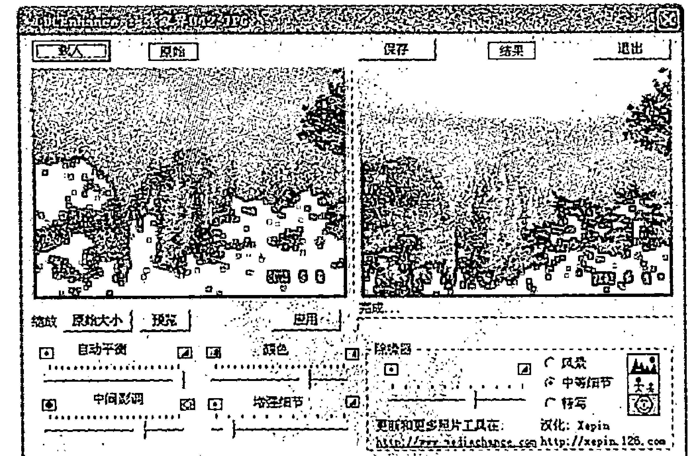

怎么样，在 Digital Camera Enhance 的帮助下调整相片还是很简单的吧。不过需要提醒大家一点，对于拍摄比较差的相片而言，Digital Camera Enhance 能够发挥最大的功用，但如果拍摄效果比较好的话，那就用不着它的帮忙了，呵呵。

-   **软件信息：**
    -   **软件名称：** Digital Camera Enhance
    -   **最新版本：** 1.3 汉化版
    -   **软件类型：** 免费软件
    -   **软件大小：** 348KB
    -   **下载地址：** http://hn-http.skycn.net:8181/down/ha_DigitalEnhance13_xepin.exe

### 2. 从相片到 VCD

有电脑的朋友都喜欢将以往的相片保存在硬盘中随时浏览，或者把这些相片制作为电子相册来欣赏一番，那么有没有想到过在自己的 VCD 机中来欣赏自己的靓照呢？目前虽然有一些刻录工具附带了这个功能，但是操作起来非常繁琐，其实只要有了 Photo2VCD 这个软件之后，制作相片 VCD 简直就是小菜一碟了。

和同类软件相比，Photo2VCD 最独特之处在于能够根据不同相片的主题来分门别类制作不同的相册集，而且它不仅支持 BMP、JPG、PNG、TIF 等图像文件，同时还支持用 WAV、MP3 等音乐文件作为相册的背景音乐，更可以为每一张图片来定制各异的动画效果。当我们定制好相册中的图像之后，既可以直接通过软件刻录为相片光盘，也能够将其以标准的 BIN 和 CUE 文件保存起来，然后再使用你所习惯的刻录软件进行刻录。虽然 Photo2VCD 的功能很强大，但是它的操作非常便捷，短短数分钟就能够制作出一张精美的相片 VCD。不信？那咱们一起来试试吧。

第一步：运行 Photo2VCD 之后，首先在 "Photos" 标签下点击 "Add Photo" 按钮，并且在弹出的窗口中选择需要添加到相册中的图片文件。添加好图片之后，我们可以在图 6 所示的窗口中查看所有的相片列表，用鼠标点击其中一张还能够对其进行预览，对于不适合的图片只要选中之后点击 "Del" 按钮即可删除。

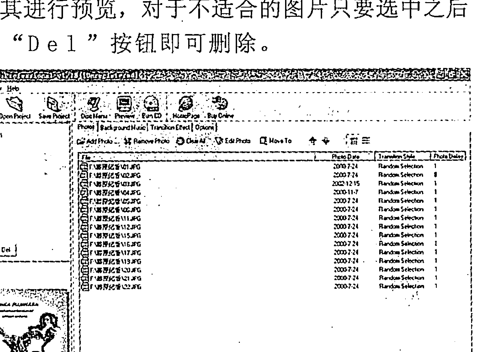

提示：可以在下部的 "Subtitle" 对话框中输入说明性的文字。

第二步：添加好相片 VCD 中的图像之后，接着就要为每一个相册集设置特定的背景音乐。此时先进入 "Background Music" 标签，然后通过 "Add Music" 按钮来选择硬盘中现存的 WAV 和 MP3 歌曲，所有添加的歌曲都会在下部列表中显示出来，点选之后还可以进行试听（如图 7）。

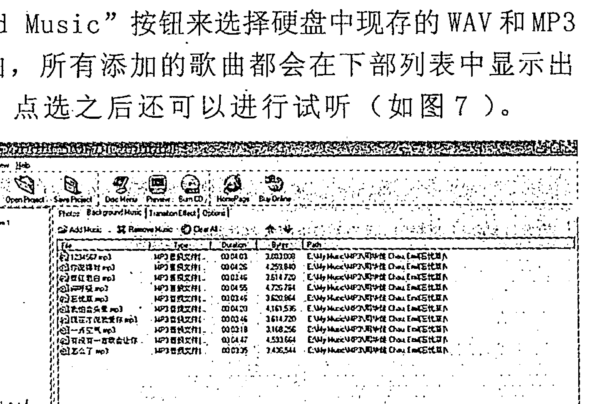

第三步：接下来需要点击 "Transition Effects" 标签来设置每一张图片的过场效果。从图 8 可以看出，Photo2VCD 附带了数十款图片切换效果，每一种效果的表现都非常不错，在此可以根据需要进行选择，而且每一种特效都能够即时查看到切换效果，这样就更方便大家的选择了。接着用鼠标拖拽“Transition Speed”滑块条来设置过场特效的切换速度，同时还需要分别在“Picture Delay”和“Title Count”对话框中设置图片图片显示时间和标题显示时间。

第四步：要是你想让自己的相片VCD变得更加绚丽夺目，不妨点击“Disc Menu”按钮来设置一个首选界面。如图9所示，在此可以通过“Background Color”和“Icon Member Page”下拉菜单来选择背景色彩和VCD菜单中显示的片段数量，这样也可以让VCD变得与众不同。

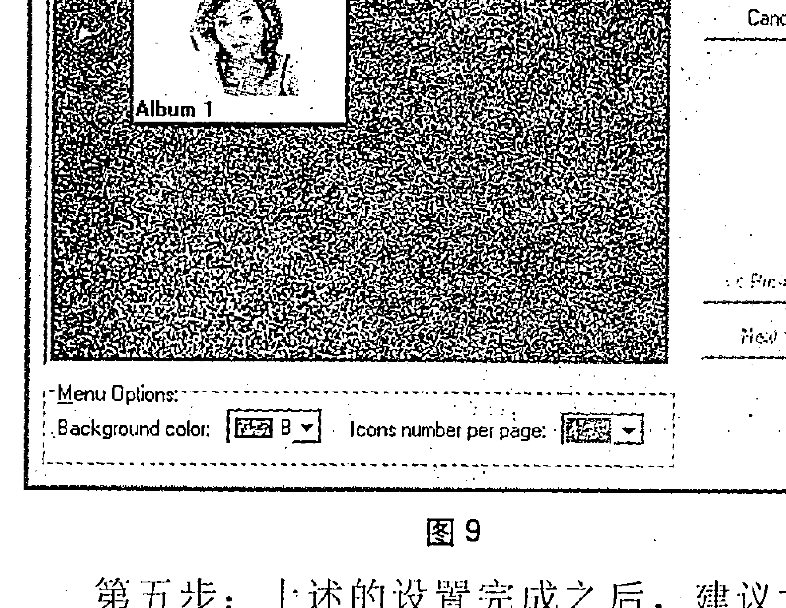

第五步：上述的设置完成之后，建议大家先点击“Preview”按钮来查看一下自己的相片VCD效果如何（如图10），并且可以通过右边的遥控器面板来对所有的相册进行一个完整的预览，这时就在悠扬的乐曲声中欣赏一下自己的相片VCD吧。要是对当前效果还挺满意，就可以返回制作窗口并再次点击“Burn CD”按钮进行最后的刻录或者文件保存操作。

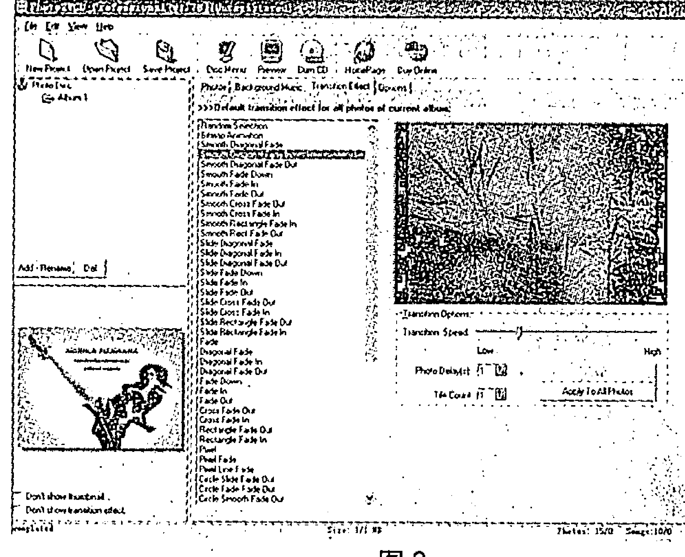

提示：此时需要调整好图片播放时间与背景音乐播放时间是否匹配，这两个数值需要分别计算一下。如果不匹配的话，要么调整一下图片文件的持续时间，要么回到第二步来重新设置背景音乐的持续时间，最终使得两者数值基本一致即可。

第六步：首先需要设置文件保存的名称、光盘标号等熟悉，但是在图11所示的“Output Option”窗口中一定要选择PAL制式，这样才能保证刻录出来的VCD可以在我们家用的VCD上正常播放。而且根据相片和背景音乐的容量来选择采用VCD还是SVCD制作方式，如果光盘容量不是很紧张的话，则建议大家选择SVCD方式来获得更理想的画面效果。

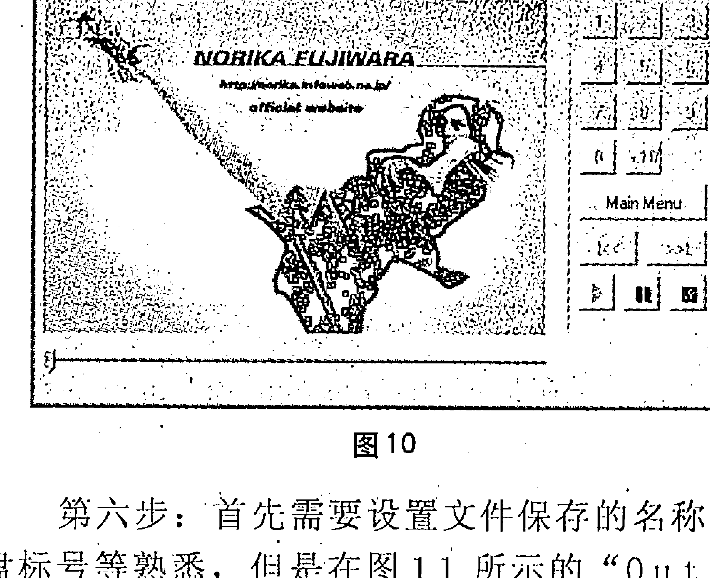

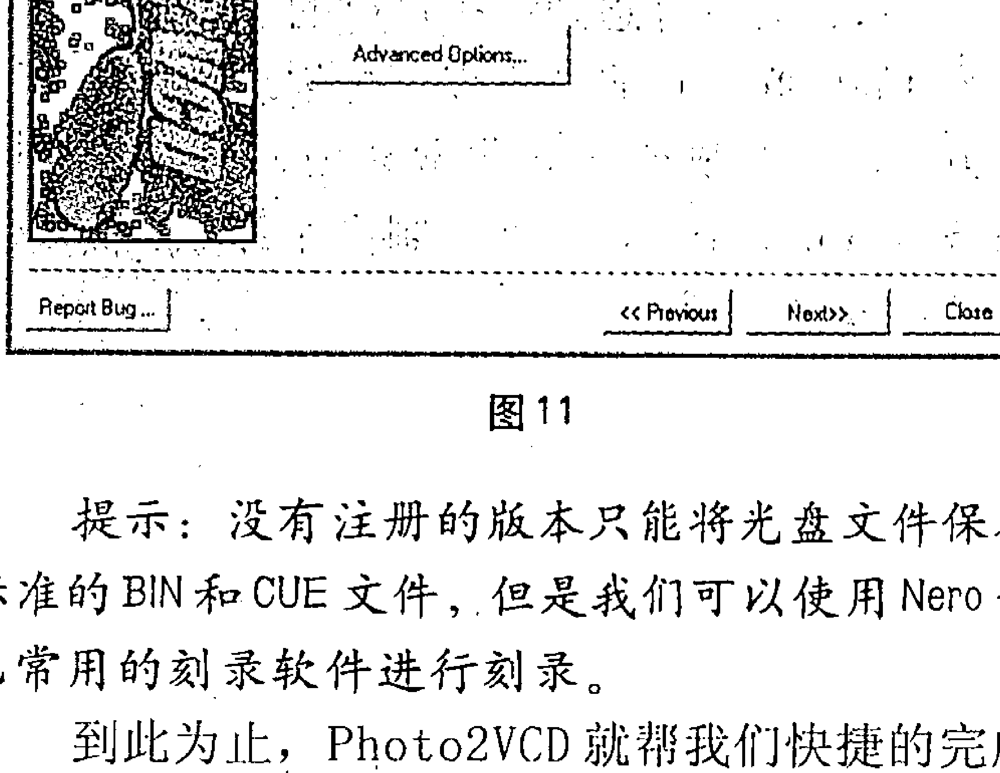

提示：没有注册的版本只能将光盘文件保存为标准的BIN和CUE文件，但是我们可以使用Nero等自己常用的刻录软件进行刻录。

到此为止，Photo2VCD就帮我们快捷的完成了相片VCD的前期制作步骤，至于怎样将BIN和CUE文件刻录为光盘想必不用多费口舌了吧。当你拿着一张新鲜出炉的VCD和家人共享美妙时光的时候，是不是有一种幸福的感觉呢？可别忘记，这都是Photo2VCD的功劳呀。好了，不再耽误了，你还是赶紧把自己的靓照制作作为VCD保存吧！

-   软件信息：
    -   软件名称：Photo2VCD
    -   最新版本：3.08
    -   软件类型：共享软件
    -   软件大小：2428KB
    -   下载地址：http://hn-http.skycn.net:8181/down/photo2vcdstd_trial.exe

## （七）数码相机另类应用：在家拍电影

数码相机除了能够拍摄得到静态相片之外，它还集成了许多其它功能，比如有些型号的数码相机附带了拍摄动态影像、录音的功能，这些功能为我们日常拍摄提供了更多的乐趣所在。不过虽然数码相机中增加了动态影像拍摄功能，但影像文件分辨率几乎都限制在320×240，这样得到的影像画面效果实在不敢恭维。再加上由于存储卡的容量限制，拍摄的时间往往只能以秒钟为单位，因此使得这个功能成为了食之无味的鸡肋。只要你拥有一块附带视频捕捉功能的电视卡，就可以把数码相机转变为数码摄像机，从而在家拍摄室内剧，并轻松的过一把导演瘾。

### 1. 硬件安装

实现这个功能首先需要用一根专用的视频线把电视卡和数码相机连接起来，一般在购买数码相机的时候都会随机附送。拿笔者使用的系统来说，数码相机是Sony S75，电视卡则是WinFast TV 2000 XP，此时将视频线的一头插入数码相机的视频输出（Video out）端口，另一头插入电视卡背后的视频输入（Video in）端口，这样硬件的安装即告完成。

> 提示：由于Sony S75数码相机具有录音功能，为了让拍摄的影像具有同步音效，还需要把音频线也连接在电视卡背后的音频输入端口（Audio in）进行同步录音。

### 2. 软件设置

在通过数码相机进行室内剧拍摄之前需要进行相应的设置，在笔者的计算机上可以参照下述步骤完成：

-   （1）启动WinFast TV 2000 XP附带的WinFast TV播放器，并且点击控制面板中的“设定”按钮进行设置。
-   （2）如图12所示，在影像采集设备对话框中需要选中“WinFast TV2000 XP WDM Video Caption”，这样才可以启用电视卡的视频捕捉功能进行影像的录制。至于这里的其它选项则可以根据大家的实际情况进行选择，但是比较重要的有录像格式范本、声音输入选择和工作文件夹位置三个方面，其中录像格式范本建议选取“MPEG-2 良好的画质”，这样能够确保录制较好画质的影像；声音输入选择建议选择“立体声混音器输入”，这样可以确保录制得到立体声；工作文件夹位置是最终影像文件的保存位置，建议大家选择一个可用空间较大的分区，这样能够让你连续录制较长时间的影像。

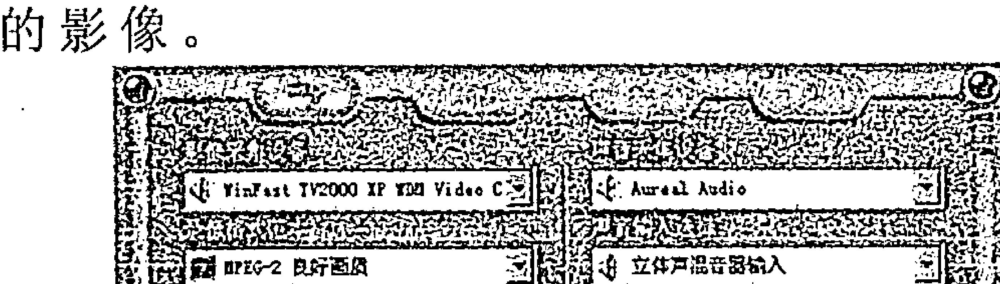

-   （3）对这里设置完成之后，点击主控制面板中的“切换影像来源”按钮，将视频来源切换到“AV端子”。打开数码相机电源开关之后，可以从播放窗口中查看到相机镜头对着的场景画面（如图13）。

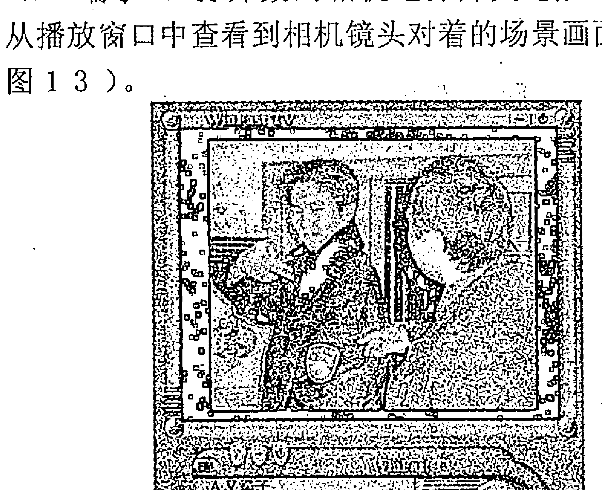

-   （4）由于室内光线等方面的限制，造成拍摄出来的影像画面很有可能在质量存在一定的欠缺，如果你不想在后期进行复杂的编辑处理，则可以通过电视卡附带的影像调整功能进行优化操作。如图14所示，可以通过移动明亮度、对比、色调、饱和度滑块条来调整相关的属性，同时能够即时查看到调整之后影像画面的效果，这样就能够保证拍摄得到的影像具有较好的效果。

## 254

完成上述各方面的调整设置之后，我们所要做的就是通过数码相机取景，并且按下“录制”按钮，接下来所有的摄像任务就交给视频卡了。但是由于录制得到的影像文件是相对来说个头很大的AVI格式，因此我们还可以通过TMPGEnc之类的专业软件进行影像压缩，或者通过绘声绘影之类的工具进行后期编辑处理，经过这些操作将为影像带来更为出色的效果。

需要指出的是，由于录制的影像直接保存在硬盘中，因此只要硬盘有足够大的可用空间，我们就能够一直拍摄下去，并没有时间的限制。但是这种方法也存在着移动距离不能过长的缺点（由视频线的长短决定），所以也就决定了只能用于拍摄室内剧。

## 3. TMPGEnc为影像减肥

虽然通过电视卡录制的时候可以自行设定多种压缩格式，但是对于一些硬盘空间紧张的朋友而言，更好的方法就是对其进行适当的压缩，这样不仅节约硬盘空间，而且更便于通过Internet和其他朋友分享。对于这种情况，建议大家使用TMPGEnc这款专业的视频压缩软件。

TMPGEnc是一套MPEG编码压缩工具，运行程序之后首先显示“Project Wizard”窗口（如图15），新手朋友可以在向导的帮助下完成所有的操作。如果你更习惯窗口操作的方式的话，点击“Cancel”按钮之后可以进入TMPGEnc主界面按照下述步骤进行操作。

- (1) 运行TMPGEnc，点击主界面下部“Video source”右边的“Browse”按钮载入视频文件，接着在“Output file name”对话框中设置输出文件名和路径（如图15）。

> 提示：输出文件的扩展名由右部的“Stream Type”类型决定，对于同时录制了声音的影像而言，可以选择“System(Video+Audio)”来对视频文件和音频部分同时进行处理。

- (2) 在TMPGEnc中还提供了多种现成的模板，只要点击图15窗口右下角的“Load”按钮就可以看见模板选择对话框，此时根据自己的需要选择即可。比如你需要压缩VCD可选用VideoCD(NTSC)的模板，如果制作DVD就需要选DVD(PAL)或DVD(NTSC)模板。通过这些模板可以极大的提高工作效率，让你制作出更具专业效果的影像文件。

- (3) 调入模板后，最好检查一下模板的设置，此时可以点击窗口下部的“Setting”按钮，在“Video”标签中可以设置文件的压缩类型、画面大小、帧速率等参数。这里特别需要提醒大家注意“Motion search precision”一项，这是用来调节画面品质的，一般使用默认的“Normal”状态即可，当然你可以选择Low quality(fast)或High quality(slow)等更差或更好的画质，画质越高，压缩时间越长，反之压缩的时间越短。

- (4) 切换到“Advance”标签之后，主要针对下述两方面进行设置：
“Source Aspect ratio”（宽高比）：NTSC设为“4:3 525 line (NTSC)”，PAL设为“4:3 625 line (PAL)”。“Video arrange Method”（画面显示的设定）为“Full screen (Keep aspect ratio)”（全画面显示）。

- (5) 最后在主窗口中点击“Start”按钮，TMPGEnc就开始影像文件的压缩制作。在压缩过程中可以通过Elapsed time和Remaining time来了解已用时间和剩余时间，同时还会有压缩进度等信息，耐心等上一会就能够得到新鲜出炉的压缩文件了，这时候再看看效果是否满意呢？

### 四、数码相机节能谈

都说数码相机是个电老虎，笔者记得曾经用 2 节金霸王 5 号电池拍摄相片，结果只拍摄了 4 张就无法继续拍摄了，这也足以证明数码相机的确是耗电大户。由于一款数码相机专用的电池都需要数百元的额外开销，因此如何使用有限的电能拍摄更多的相片则成为大家所关注的话题了。为了避免电能过早的消耗殆尽，在拍摄时候需要注意下述事项。

（1）关闭不必要的功能。在数码相机中提供了多种功能，比如防红眼、相片时间显示等功能，如果拍摄时候不需要这些功能则最好将它们关闭，这样可以节约一些电力。

（2）尽量避免频繁的开关机操作，由于在开机时候所有的部件都要重新检测运行一遍，同时还有开机的声音提示，这些都会消耗一部分电力。而且减少频繁的开关机操作也不会让数码相机始终处于开启工作状态，因为在固定时间内没有操作则数码相机会自动关闭。

（3）尽量避免使用不必要的变焦操作，每次变焦操作都要相应的驱动单元工作，这自然会损耗部分电力。

（4）将闪光灯设置为手工开启状态，在光线不足的时候再手工打开。这是因为闪光灯工作时候非常耗电，避免频繁使用闪光灯可以节约很多电力。

（5）在对被拍摄景物取景的时候最好使用取景器，而不要使用 LCD 液晶屏。这一方面是取景器获得的景象更真实，更重要的是因为开启液晶显示屏取景而消耗更多电力，而大部分数码相机默认的都是采用 LCD 液晶屏方式工作，所以把它关闭之后可以使电池备用时间增长两、三倍。

（6）尽量少用连拍和动态影像拍摄功能。数码相机的连拍功能大都利用机身内置的缓存来暂时保存数码相片，如果经常使用这些缓存的话，那么所需的电力则非常多，因此减少使用连拍和动态影像短片拍摄对节电有很大帮助。

（7）对于拍摄完成的相片，尽量减少使用数码相机直接查看的次数，因为每次查看相片都需要切换不同的工作模式，并且需要打开 LCD 液晶屏，这些都会浪费电力。

除去上述几方面的使用数码相机过程中的省电技巧之外，平日对于电池的使用和保养也是有很多学问的。刚刚买回来的充电电池一般电量很低，在使用之前应该进行充电，对于充电时间则取决于所用充电器和电池，以及使用电压是否稳定等因素。如果是第一次使用的电池，锂电池的充电时间一定要超过 6 小时，镍氢电池一定要超过 14 小时，否则日后电池寿命会较短。一般需经过三次完整的充电和放电过程，才能达到最佳效率，在电池还有残余电量时尽量不要重复充电，以确保电池寿命。

为了避免电量流失的问题发生，对电池的清洁是很有必要的。保持电池两端的接触点和电池盖子的内部干净，必要时使用柔软、清洁的干布轻擦，绝不能使用具有溶解性的东西清洁数码相机、电池或是充电器。如果在长时间内不使用数码相机，必须要将电池从数码相机中取出，待其完全放电后存放在干燥、阴凉的环境，而且不要将电池与一般的金属物品存放在一起。而且存放已充满电的电池时，一定不要放在皮包、衣袋、手提袋或其他装有金属物品的容器中，以防止短路。

### 五、让数码相机常葆青春

由于数码相机是一个非常精密的设备，所以在使用过程中更要对它格外小心，稍有不慎就会给相机带来难以修复的外伤。如果你也希望自己的爱机能够永葆青春，就请一起来看看下文介绍的维护保养技巧吧。

无论是否长期不用数码相机，都要在保存前先取出电池，以防电池漏液损坏相机内部器件。由于相机是精密的机器，放在平常的衣橱、柜子容易受到湿气的影响，如果有条件则应该放在能够控制温度、湿度的封闭空间，或者在存放的盒子中放置一些干燥剂来吸取周围环境中的潮气。而且存放前应先把皮套、机身和镜头上的指纹、灰尘擦拭干净，给数码相机一个良好的存放环境。

### (一) 数码相机的日常维护与保养

#### 1. 数码相机的存放

数码相机要保存在远离灰尘和潮湿的环境中。

#### 2. 数码相机的使用环境

在使用时要注意防烟避尘，尽量在清洁的环境中使用和保存，这样可以减少因外界的灰尘、污物和油烟等污染而导致相机产生故障。如果在室外使用数码相机，一定要把相机装在皮套中，这是为了防止室外风沙或者携带时候不小心对相机造成损害。而且拍摄相片的时候要防止因为污染物落到相机的镜头上会弄脏镜头，影响拍摄的清晰度，甚至还会增加相机的调整开关与旋钮的惰性。另外，在户外空旷地区拍摄时有可能风沙比较大，由于风沙容易刮伤相机的镜头或渗入对焦环等机械装置中造成损伤，因此在拍摄完成之后要随时用护盖将镜头盖住。

#### 3. 预防高温

由于数码相机独特的机械构造，它不能直接暴露于高温环境下，如果相机不得不晒在太阳下，则需要用一块有色而且可以遮沙的毛巾或表面有锡箔的遮挡工具来避光，而且不要用黑色的毛巾，因为黑色吸光性能很好，这会对数码相机造成更大的损害。另外，拍摄相片的时候不要将相机直接对着太阳拍照，也要尽量避免在太阳直射下查看LCD液晶屏。

#### 4. 预防寒冷

和预防高温一样，预防寒冷对数码相机使用也很重要。由于相机在低温下可能会停止工作，因此可以通过将相机藏于衣服口袋的方法让相机保持适宜温度。如果在严冬将相机从寒冷的室外带入温暖的家中使用时，相机往往会有结露现象发生，因而在携带过程中需用报纸或塑料袋将相机包好，而且在室内要等相机温度升至室内温度之后再使用。另外，当数码相机从低温处转移到高温处还会使相机出现一些压缩现象，这些不容易用肉眼看出，所以要注意不要使相机的温度在瞬间变化。

#### 5. 防水防潮

作为一款电子仪器，数码相机的防水防潮也是最不能忽视的。但在实际使用过程中，我们不排除有突发原因或者其它方面的因素，必须在潮湿环境下工作，这时我们一定要采取严格的防护措施，确保在这种恶劣的环境下相机不受伤害或者少受影响。比如我们可以携带一个塑料拉锁链袋子，在非常潮湿或尘土的环境中使用时，可以在侧面挖一个刚好放得下相机镜头的小洞，然后把相机放在袋子里，不让雾气、湿气和尘土进入相机，这会延长相机的使用寿命。如果不小心喷到水或者受潮之后，一定要赶快将电源关掉，然后用吸水性好的纸张擦拭机身以及各个部分接缝中的水痕，等待几个小时自然风干之后再测试相机是否没有故障。需要提醒大家注意的是，在相机受潮之后千万不要马上急着开机测试，否则可能造成相机电路上的短路。

### (二) 镜头的日常维护与技巧

镜头是数码相机的一个相当重要的部分，由于它经常暴露在空气中，所以镜头上会沾上一些灰尘，但是如果长时间使用相机而不注意维护镜头的话，那么镜头上的灰尘将越聚越多，这样会大大降低数码相机的工作性能。比如镜头上的灰尘会严重降低图像质量，使得拍摄得到的相片出现斑点或减弱图像对比度等情况。总的说来，使用数码相机过程中需要注意下述几方面。

1. 在使用过程中尽量不要用手或者其它物体接触到镜头表面，因为用手接触镜头会在镜头上留下指纹，这会使取景的效果下降，如果有硬物触碰到镜头，则有可能在镜头表面留下永久性的划痕，这就很难修复了。
2. 如果拍摄过程中有一些灰尘落在镜头表面，可以先不对它清洗，因为镜头上的少许灰尘并不会严重影响图像质量，只有在非常必要时才对镜头进行清洗。
3. 清洗镜头的时候，先用吹气球清除尘埃颗粒，然后滴少许专用的镜头清洗液在拭纸上轻轻擦拭镜头表面，然后用一块干净的棉纱布擦净镜头，直至镜头干爽为止。如果你没有专用的清洗液，那你可以在镜头表面哈一口气，虽然效果不比清洗液，但同样能使镜头干净。需要提醒大家注意的是，在清洗过程中一定要使用棉纸，而且擦洗时不要用力挤压，因为镜头表面覆有一层比较易受损的涂层。还有就是千万别用硬纸、纸巾或餐巾纸来清洗镜头，因为这些产品都包含有刮擦性的木质纸浆，会严重损害相机镜头上的易损涂层。而且在清洗相机的其它部位时，不要使用酒精等挥发性物质，以免相机变形甚至溶解。
4. 在不使用时，最好盖上镜头盖，以减少清洗的次数。

### (三) LCD液晶屏日常维护技巧

LCD液晶屏是数码相机的重要的特色部件，不但价格昂贵，而且容易受到损伤，因此在使用过程中需要特别注意保护。

1. 在使用和存放数码相机的时候，要注意不能让液晶屏表面受重物挤压，更要注意不要脱手将相机掉到地上以免摔坏液晶屏。
2. 尽量不要用手直接触摸液晶屏，防止手上的污渍残留在液晶屏上，影响取景时候的查看。
3. 只能用干净的软布轻轻擦拭液晶屏表面，不要用酒精之类的有机溶剂清洗，以防对液晶屏造成永久性的损伤。
4. 在温度很低的时候，液晶屏显示的亮度将会很低，一旦温度回升，亮度又将自动恢复正常，但是要避免在温差很大的情况下使用数码相机。
5. 液晶屏背面有一个无法从表面看到的灯，如果彩色液晶显示屏显示的影像变暗或显示影像上斑斑点点，甚至根本就不能显示影像，多半是灯泡老化所致，遇到这种情况一般只要更换相应的灯泡即可。
6. 如果怕数码相机的液晶屏会被刮花或拍摄时沾上污渍，可以贴上PDA用的透明贴纸，这也有一定的用处。

### 六、数码相机相关名词解释

1. **像素**
    像素是衡量数码相机最重要的指标。不过像素是数码相机中感光元件CCD的实际像素而不是输出图像像素，因为有的数码相机用130万像素的CCD，在照相机中通过某种插值算法输出220万像素的图像。用于半专业领域的数码相机最低像素应该不低于330万，输出图像不低于1024×960。最好能达到430万像素。
2. **定点测光**
    在光圈、快门无法手动控制的情况下，定点测光功能显得尤为重要。自动曝光一般都是通过TTL加权平均测光而得，定点测光可以先对主体景物进行测光，然后按此测光值进行曝光。
3. **曝光补偿**
    这是高级相机才具备的功能，通过定点测光再加上曝光补偿可以弥补没有手动控制曝光的缺陷。
4. **焦距锁定**
    当拍摄主体不在对焦范围内，此功能十分有效，有此功能可以先对拍摄物体进行测距，然后锁定焦距重新构图拍摄。
5. **感光度 (ISO)**
    感光度是传统相机底片对光线反应的敏感程度测量值，通常以ISO数值表示，数值越大表示感光性越强，常用的表示方法有ISO 100/400/1000等。一般而言，感光度越高则底片的颗粒越粗，放大后的效果较差，而数码相机也套用了ISO值来标示测光系统所采用的曝光，ISO越低所需曝光量越高。
6. **拍摄延迟**
    数码相机在按下快门到实际捕捉成像都有一段时间延迟，这段时间越短越好，最好在0.5秒以下，如果超过1秒，这台相机的实用性就大打折扣。
7. **拍摄间隔时间**
    数码相机拍完一张后都有个压缩和储存时间，此时不能连续拍摄，这段时间的长短与拍摄模式、压缩模式、拍摄景物都有关系，一般这段时间不应长于10秒。
8. **传输接口**
    数码相机可以将拍摄出来的成品经过信号传送给电脑，如果数码相机带有TV输出接口，还可以在电视上直接显示出照片。目前传输接口有TV-OUT、RS-232、红外线传输和USB接口。
9. **CCD**
    中文是电子耦合组件的意思，它是感应光线的电路装置，如同传统相机的底片。当光线与图像从镜头透过并投射到CCD表面时，CCD就会产生电流把感应到的内容转换成数码资料储存起来。CCD像素数目越多、单一像素尺寸越大，收集到的图像就会越清晰，所以尽管CCD数目并不是决定图像品质的惟一重点，我们仍然可以把它当成相机等级的重要标准之一。
10. **图像储存格式**
    由于数码相机拍下的图像文件很大，储存容量却有限，因此图像通常都会经过压缩再储存。最常见的图像储存格式就是JPEG和TIFF格式，其中JPEG经过高度压缩，能使档案变为原先的1/4、1/8或1/16大小左右，可以省下不少储存空间，不过相对也会让原始图像资料有所损失，许多相机都会提供特定的压缩比例供使用者自己选择。而TIFF文件几乎未经压缩，所以图像会比JPEG文件大很多，保存的更完整。不过由于图像分辨率越高、压缩越小就越占记忆空间，所以拍照时必须兼顾对图像的品质要求与存储卡容量。
11. **广角镜**
    又叫短焦镜头，这是因为广角镜的焦距非常短，投射到底片上的景物就变小了，因此扩阔镜头拍摄角度，这样除了可以拍摄更多的景物，更能在狭窄的环境下拍摄出宽阔角度的影像。
12. **变焦**
    变焦有助于望远拍摄时放大远方物体，但是只有光学变焦可以支持图像主体成像后增加更多的像素，让主体不但变大，同时也相对更清晰。通常变焦倍数越大者越适合用于望远拍摄。光学变焦同传统相机设计一样，取决于镜头的焦距，所以分辨率及画质不会改变。数码变焦只能将原先的图像尺寸裁小，让图像在LCD液晶屏上变得比较大，但并不会有助于使细节更清晰。
13. **光学变焦**
    依靠光学镜头结构来实现变焦，变焦方式是通过摄像头的镜片移动来放大与缩小需要拍摄的景物，光学变焦倍数越大，能拍摄的景物就越远。如今的数码相机的光学变焦倍数大多在2倍至5倍之间，也有一些数码相机拥有10倍的光学变焦效果。
14. **数码变焦**
    实际上是画面的电子放大，把原来CCD影像感应器上的一部份像素使用插值处理手段做放大，将CCD影像感应器上的像素用插值算法将画面放大到整个画面。通过数码变焦，拍摄的景物放大了，但它的清晰度会有一定程度的下降。
15. **自动曝光**
    自动曝光是电子技术与人工智能相结合的产物，采用这种方式曝光时，相机不但能根据光线条件算出合适的曝光量，还能自动选择合适的曝光组合。
16. **插值**
    是在不生成实际像素的情况下增加图像像素大小的一种方法，在周围像素色彩的基础上用数学公式计算丢失像素的色彩。有些相机使用插值人为地增加图像的分辨率。
17. **存储介质**
    图像储存媒体为数码相机中储存图像的设备，一般我们称为存储卡。市面上数码相机所采用的存储卡主要有三种规格：Smart Media卡、Compact Flash卡和Memory Stick。
18. **LCD 液晶屏**
    LCD 液晶屏有黑白和彩色，彩色中又有真彩和伪彩之分，其中伪彩便宜但效果差。数码相机中用于取景和回放的LCD几乎都是目前最好的TFT真彩。
19. **防红眼功能**
    指在用闪光灯拍摄人像时，由于被摄者眼底血管的反光，使拍出照片上人的眼睛中有一个红点的现象。但一般现在的主流数码相机都具有防红眼功能，不过如果不打开的话，依旧不会起作用。
20. **对比度**
    对比度指的是一幅图像中明暗区域最亮的白和最暗的黑之间不同亮度层级的测量，差异范围越大代表对比越大，差异范围越小代表对比越小，好的对比率120:1就可容易地显示生动、丰富的色彩，当对比率高达300:1时便可支持各阶的颜色。
21. **白平衡**
    物体颜色会因投射光线颜色产生改变，在不同光线的场合下拍摄出的照片会有不同的色温。一般来说，CCD没有办法像人眼一样会自动修正光线的改变，所以通过白平衡的修正，它会按目前图像中图像特质，立即调整整个图像红绿蓝三色的强度以修正外部光线所造成的误差。
22. **分辨率**
    用于量度位图图像内数据量多少的一个参数，通常表示成PPI（每英寸像素）。包含的数据越多，图形文件的长度就越大，也能表现更丰富的细节。
23. **光圈**
    光圈是一个用来控制光线透过镜头，进入机身内感光面的光量的装置，它通常位于镜头内。表达光圈大小一般用F值。光圈F值=镜头的焦距/镜头口径的直径，完整的光圈值系列为F1/1.4/2/2.8/4/5.6/8/11/16/22/32/44/64。光圈F值愈小，在同一单位时间内的进光量便越多，而且上一级的进光量刚好是下一级的一倍，例如光圈从F8调整到F5.6，进光量便多一倍，我们也说光圈开大了一级。
24. **焦距**
    如果你在相机的英文规格书上看过“F=”，那么后面接的数字通常就是它的焦距长度。如“F=8-24mm，38-115mm(35mm equivalent)”，就是指这台相机的焦距长度为8至24mm，同时对角线的视角换算后相当于传统35mm相机的38至115mm焦长。

## 25. 可对焦范围
是焦距的延伸，通常分为一般拍摄距离与近拍距离，相机的一般拍摄距离通常都标示为“从某公分到无限远”，有些相机就具有支持1公分近拍的功能，适合用来拍摄精细的物体。

## 26. 景深
在进行拍摄时调节相机镜头，使距离相机一定距离的景物清晰成像的过程叫做对焦，那个景物所在的点称为对焦点，因为清晰并不是一种绝对的概念，所以对焦点前、后一定距离内的景物的成像都可以是清晰的，这个前后范围的总和就叫做景深，意思是只要在这个范围之内的景物都能清楚地拍摄到。景深的大小首先与镜头焦距有关，焦距长的镜头景深小，焦距短的镜头景深大。其次，景深与光圈有关，光圈越小景深就越大；光圈越大景深就越小。再者，前景深小于后景深，也就是说精确对焦之后，对焦点前面只有很短一点距离内的景物能清晰成像，而对焦点后面很长一段距离内的景物都是清晰的。

## 27. 快门
是镜头前阻挡光线进来的装置，一般而言快门的时间范围越大越好。秒数低适合拍运动中的物体，某款相机就强调快门最快能到1/16000秒，可轻松抓住急速移动的目标。

## 28. 快门时滞时间
相机在不使用对焦锁定功能同时保证在自动对焦工作状态下，从按下快门释放按钮到开始曝光的这段时间称为快门时滞时间。

## 29. 连拍速度
由于数码相机拍摄要经过光电转换，模拟数字转换及媒体记录等过程，因此数码相机的连拍速度都不很快。目前，数码相机中最快的连拍速度为7帧/秒，而且连拍3秒钟后必须再过几秒才能继续拍摄。

## 30. 曝光补偿
一种曝光控制方式，一般常见在±2-3ev左右，如果环境光源偏暗，即可增加曝光值（如调整为+1ev、+2ev）以增加画面的清晰度。

## 31. 曝光量
是图像构成最原始的关键因素，它主要由光圈以及快门两方面决定。

## 32. 杂色或噪点
图像中不该出现的外来像素，通常由电子干扰产生，看起来就像图像被弄脏了，布满一些细小的糙点。

## 不能忘记的回忆
### ——数码摄像机
文/赵江

- 文章重点与技巧目录
- 数码摄像机选购要点
- 数码摄像机的外观与操作
- 数码摄像机的拍摄方法
- 数码摄像机的拍摄技巧
- 数码摄像机实物拍摄
- 让数码摄像机录制电视节目
- 用数码摄像机复制录像带
- 用数码摄像机进行视频聊天
- 数码影像编辑与修饰
- 数码摄像机的节能方法
- 数码摄像机的维护
- 数码摄像机相关名词解释

对于很多热衷数码影像的发烧友来说，肯定不会满足于仅仅依靠一台数码相机来拍摄静态影像，如果能够用数码摄像机将生活中精彩的片断录制下来永久保存该有多好。其实这个想法已经不再难以实现，只要拥有了一台数码摄像机就能够让你随心所欲的记录下生活中的千姿百态。由于现在数码摄像机价格早已可以被普通大众所接收，因此越来越多的人已经拥有了自己的数码摄像机。下面，就让我们一起和数码摄像机来个亲密接触吧。

### 一、如何购买中意的数码摄像机
#### （一）根据用途选择
目前数码摄像机的价格差距很大，低端的三千余元即可购买到，但是贵的则要数万元，这就需要根据自己的经济承受能力来决定。一般来说，价格较高的机型通常在功能、性能及外型上要优于低价格的机型，但并不能说明低价格的机型就一定不能满足你的日常使用。如果购买数码摄像机主要目的是用来摄录一些家居生活场景，这时就没必要过分追求品牌和整体功能，因为索尼、松下等一线品牌的数码摄像机价格通常比较昂贵，而且这些摄像机附带的很多功能并不是你所需要的，所以在选购数码摄像机的时候要根据自己的实际用途来选择。不过一定要选择附带了液晶屏的摄像机，这不仅可以让初学者轻松上手，而且能够在拍摄的时候直接通过液晶屏查看所选取的景物，在场景变换的时候也不会丢失重要的环节。

#### （二）外观尺寸要便携易用
习惯使用传统摄像机的朋友都比较喜欢较大尺寸的数码摄像机，虽然大尺寸的数码摄像机在功能方面会强一些，而且操作方面会方便一些，但是由于它的个头很大，因此不便于携带。试想一下，在你和朋友外出游玩的时候，本来就要携带很多东西，如果再背着一个偌大的数码摄像机将是不小的负担，这无疑会影响游玩的心情了。但是强调便携并不是一味的追求数码摄像机的尺寸小巧，比如现在有些迷你摄像机的尺寸小到可以放入口袋，它虽然具有其它摄像机无法比拟的便携性，但是它配备的液晶屏较小，光学变焦范围也较小，用它难以获得理想的效果，而且由于这种机型的设计一般较为特殊，支持的附件往往与同其它系列不同，这对日后的维护造成了一定的麻烦。

#### （三）镜头变焦以实用为主
要使数码摄像机拍摄到尽可能清晰的影像效果，除了高分辨率的 CCD 传感器外，所采用的光学镜头也是一个不可忽视的因素，为此许多数码摄像机厂商都为自己的产品配有优质的镜头，而数码摄像机镜头的光学变焦能力和最大光圈值也是影响成像质量的主要因素。在判断数码摄像机的变焦能力时应该更加看重光学变焦而不是数码变焦，因为数码变焦没有多大价值，它的画面放大是以画质损失为代价的。一般数码摄像机的光学变焦能力在 20 倍左右，过高的光学变焦将导致价格的直线上升。

#### （四）舍弃华而不实的功能
目前数码摄像机功能越来越丰富，比如自动/手动聚焦、自动/手动/数码变焦、LCD 液晶屏取景、慢动作及组合编辑等等，但是我们不必过于追求这些功能，根据自己的需求选择实用的机器。比如一般数码摄像机都具有编辑功能，可以直接对拍摄得到的影像增加标题、画外配音，其实这些功能并不符合我们的需要，因为在通过专门的视频编辑软件对影像进行后期处理的时候功能更丰富、更强大，这些集成在数码摄像机中的功能就显得有些鸡肋的味道了。

#### （五）不可忽视的附件
在选购数码摄像机的时候，另外一个不可忽视的环节就是附件，比如电池、录像带、背包等附件都要尽量和商家索要。数码摄像机对于电能的消耗很大，通常一块随机电池只能维持一个小时左右的摄像，而另外购买一款电池又要数百元的开销，因此如果促销赠送电池千万不要以为这只是小恩小惠呢。数码摄像机的录像带、背包也是日常使用中必不可少的，通常购买机器时候都有赠送，所以也要注意向商家索取。另外如果对摄像有着特殊的要求，那么诸如镁光灯、广角镜头和长焦镜头等专用配件都是不可缺少的，在这些附件的帮助下可以拍摄到更为出色的影像。

#### （六）辨别行货还是水货
如同数码相机一样，数码摄像机也有水货和行货之分，购买到水货不仅难以保证质量，而且在维修的时候也有很多问题，为此我们尽量在购买的时候选中行货，这里主要介绍一下一般数码摄像机的行货与水货鉴别方法。

- 确定数码摄像机是否为 PAL 制式，因为行货是面向中国内地销售的，因此采用的也是中国内地电视采用的 PAL 制。如果商家不能确定地告诉你这款摄像机到底是什么制式，则可以通过 CCD 的像素值来进行判断。通常 PAL 制式的 720×576（约 40 万）画面解析度决定该制式的产品标称像素应该大约是 40 万的整倍数或整倍数半（如 1.5 倍）；而相同型号的水货像素数必定与 NTSC 制式的解析度 720×480（约 34 万）具有类似的倍数关系，例如 SONY 17E 如果 CCD 像素值为 68 万，这必定是 NTSC 制式的水货。

- 查看数码摄像机的说明书和保修卡是否为中文。行货的说明书和保修卡一定是原厂印刷，如果中文说明书是复印件，那么极有可能遇上水货了；而且保修卡一定要全国联保，而不是经销商自行提供的只在本店有效的保修卡。另外，还要注意说明书和保修卡上列出的数码摄像机型号、机器序列号与包装盒上的是否一致。

- 通常同型号的水货与行货在外观上也会有一定差异，因此要细心检查中文说明书上标注的音频/视频的输入/输出接口、摄像按键的位置描述与机器实际情况是否相符，如果出现差异则说明有可能是水货产品。

除去上述的几个方面，在选购数码摄像机的时候还有一些选购技巧，在此一并介绍给大家。

- 选购家用数码摄像机的时候最好也不要购买那些没有手动变焦的产品，因为自动变焦的效果往往不尽如人意，随着你对摄影效果要求的提高，自动对焦将很难满足你的需求，此时不妨选择同时具备了手动变焦与自动变焦的产品。
- 对于数码摄像机的 LCD 液晶屏坏点检测不能忽视，这可以参照数码相机部分介绍的方法进行检测。
- 需要对 CCD 进行测试，测试的方法是把数码摄像机接上电视，把 DV 机设置在录像模式，盖上镜头盖之后把电视或监视器的亮度调到最亮，如果屏幕是一片灰色则表示 CCD 正常，如果看到有任何光点就表示 CCD 有瑕疵。
- 分别拍摄最近距与无限远的景物来检查对焦是否正确，以及镜头推拉时是否均匀、是否对焦点有影响等。
- 检查磁带和话筒，主要查看磁带在正常、快进、快退等状态下的带速是否稳定，而且随机话筒的音量是否可调，是否有杂音等。

经过上述操作之后，一款适合自己的数码摄像机也就不难选择了。在选购的时候还要睁大眼睛，从上述各个方面来进行测试，这样就可以买到一款让你满意的数码摄像机了。

### 三、数码摄像机使用之新手上路
在购买了数码摄像机之后，首先要了解数码摄像机的各种按钮功能，以及数码摄像机的基本使用方法，这才能为日后拍摄到出色的影像打下坚实基础，下面就以 Sony DCR PC110E 为例简单介绍一下数码摄像机的入门操作。

#### （一）外观简介
从图 1 至图 5 所示的 Sony DCR PC110E 各方位视图可以看出（如图 1～图 5），在机身表面有如下主要功能按钮：

## 数码时尚

（1）电源开关：使用数码摄像机之前需要打开电源开关，这样才能开始拍摄影像。

（2）录制按钮：在取景完成之后按下录制按钮开始动态影像的录制操作，在录制完成时候再次按下这个按钮可以停止当前的录制操作。

（3）视频／音频输入输出端子：通过视频／音频输入输出端子可以把摄像机和电视机连接起来，这样可以在电视机大屏幕上欣赏拍摄的影像。另外，通过这些端子还能够将两台摄像机中的录像带进行复制操作。

（4）电子取景器：数码相机中的取景器相当于小型的LCD取景器，但是它的取景效果更加直观，能够真实反应出需要拍摄景物的效果，不会由于光线照射之后干扰而出现色差或者是色偏的情况。

（5）LCD液晶屏：LCD液晶屏在拍摄的时候起到辅助取景，而且还可以在拍摄完成之后对影像进行预览，给拍摄带来了很大的便利。但是通过LCD液晶屏取景的时候容易受到外界光线的干扰，尤其在光线较强的场所无法真实反应出景物的效果。

（6）变焦按钮：在Sony DCR PC110E中有一个标识为“W-T”的按钮，这就是相机的变焦按钮，而且它调节的不仅仅是光学变焦，还有数码变焦部分。按下“W”端可以让拍摄对象变远，适用于广角拍摄；按下“T”端可以使拍摄对象变近，适用于近距离拍摄。

（7）MENU按钮：如果需要对白平衡、锐度、分辨率以及其它等属性进行设置，按下MENU按钮就可以进入详细的菜单对这些属性进行设置。

（8）功能控制面板：在拍摄完成之后可以即时通过LCD液晶屏对影像文件进行预览，此时就要借助功能控制面板中的各种按钮来实现播放、快进、快退等操作，而且可以调节音量大小、放大局部等操作。

（9）旋转拨钮：通过旋转拨钮可以对数码相机进行拍摄模式切换，比如拍摄影像、拍摄数码照片和预览等模式。

（10）锁定开关：由于数码摄像机提供了多种拍摄模式的功能，而这些功能都是通过一个旋转拨钮实现的，不小心就会切换到另外一种模式，因此需要这个按钮来锁定当前的拍摄模式。

（11）红外发射器：Sony DCR PC110E提供了红外遥控的功能，这在不方便自行操作的时候可以通过遥控器下达拍摄指令。

（12）闪光灯：Sony DCR PC110E内置了闪光灯，而且还提供了一个闪光灯插座，但是这仅仅在拍摄数码相片的时候有效，如果拍摄动态影像则无法使用。

（13）麦克风：在拍摄动态影像的时候需要通过麦克风来录制现场的语音信号。

（14）逆光拍摄：当拍摄背后有光源或者背景明亮的对象时候，按下“BACK LIGHT”按钮可以进行逆光拍摄。

（15）夜间拍摄：在夜间拍摄的时候，将“NIGHTSHOT”按钮推至“ON”位置可以启用夜间拍摄模式，帮助我们满意地拍摄夜间环境。

### （二）操作简介
在介绍了Sony DCR PC110E数码摄像机的按键布局之后，我们再来实际尝试一下最基本的拍摄操作。

### 三、数码摄像机使用进阶
知道了数码摄像机基本的使用方法之后，可以说已经步入了数码摄像殿堂的大门，但是仅仅依靠这些基本操作并不能获得最佳效果的影像，因此我们很有必要来看看怎样才能更好的拍摄影像，相信在看完了下述内容之后，你的数码摄像水准将有大幅提升。

### (一) 数码摄像机使用技巧
#### 1. 拿好你的数码摄像机
如今的家用数码摄像机为了吸引那些追求时尚的用户，在设计上可谓是小之又小，因此这种小巧玲珑的设计却为你在拍摄时带来了如何拿好相机的问题，提出这个问题看起来有些可笑，不过数码摄像机的把握还真的很有些学问。小巧的机身所带来的弊端最主要体现在不容易拿稳机身，容易造成画面抖动。另外，操作的时候也很难在拍摄的同时进行复杂的功能操作。不同的摄像机，都有不同的特点，因此用户在使用摄像机前，应该先熟悉一下自己的摄像机的特点，找到最适合自己的把持方法。如图1是笔者手持摄像机的手势。

当然，用摄像机拍摄最好的方法还是用三角架，不过也不能因为使用了三角架就毫无顾忌，在进行拍摄特别是变焦操作时候，还是要一边用手扶持，一边用变焦。

#### 2. 拍摄影像
拍摄影像可以参照下述步骤完成：

- （1）打开数码摄像机电源开关，此时可以听见开机的音乐声，等待数码摄像机自检完成之后可以从取景器或者LCD取景器中看见近处的影像。
- （2）通过旋转拨钮将拍摄模式设置为“CAMERA”，也就是通过录像带来进行拍摄。
- （3）在取景器或者LCD液晶屏中选择需要拍摄的影像，并且通过变焦按钮调整好焦距，接着按下录制按钮开始动态影像的拍摄，此时LCD液晶屏中会出现红色的“REC”录制指示符（如图6）。
- （4）在拍摄完成之后，再次按下录制按钮结束影像拍摄操作。

在拍摄影像的时候需要提醒大家注意，在拍摄表面黑暗的物体（如暗处的物体）、有光泽或反射光太强的物体（如水面）、反差太小的物体（如白墙）、快速移动的物体（如行驶中的汽车）、一部分靠近摄像机而另一部分离得太远的物体（如大桥）等性质的物体时，摄像机的自动对焦功能无法充分发挥，此时最好使用手动变焦。而且在长时间静止拍摄后，自动对焦马达会产生惰性，再移动拍摄其它被摄物时摄像机可能聚焦不准，这时只要按动推拉按钮进行变焦或快速移动摄像机就可以激活对焦马达进行自动对焦了。

#### 3. 播放影像
对于拍摄得到的影像，我们可以直接在LCD液晶屏或者取景器中进行查看。

- （1）打开摄像机电源，装入已经摄像的录像带。
- （2）通过旋转拨钮将摄像机模式切换到“VCR”位置。
- （3）通过“快退”按钮快速倒带。
- （4）待录像带倒带完毕之后按下“播放”按钮开始放像。
- （5）如果需要调整音量，可以直接按下“VOLUME”按钮进行调节。

#### 4. 保持充足的电力
由于数码摄像机的设计一方面为了便携而更加小巧，另一方面几乎所有的数码摄像机都有LCD液晶显示屏，因此相比于模拟摄像机来说，数码摄像机比传统摄像机更加耗电，所以在使用数码摄像机之前一定要记得充足电，而且更要注意使用过程中的节电。那么应该如何在使用过程中有效的节电呢？例如尽量不使用LCD液晶取景器，减少变焦功能的使用，不要在拍摄时使用数码摄像机内建的编辑功能，一些不必要的指示灯也不要打开。现在有很多数码摄像机都带有拍摄静态图像的功能，如果你只是拍摄影片，不妨取下用来储存静态图片的存储卡如SONY系列摄像机中的记忆棒，这样也有利于节约电力。

如果数码摄像机是使用镍镉（NiCd）或镍氢（NiMH）电池则要避免电池因记忆效应而缩短使用寿命，所谓记忆效应指的是当电池电量尚未完全消耗前便加以充电的话，则电池的电力容量会减小。因此，使用这类电池时最好等电池电量用完再加以充电，对延长电池使用寿命很有好处。现在一般数码摄像机都配备了锂电池，就不存在记忆效应问题了。要注意的是，通常我们的使用环境不可能和厂家提供的标准一样，所以厂家标明的电池使用时间一般在实际使用中不能达到，大概只有80%甚至更低。如果有可能，建议配备另外一款更大容量的电池或者备用电池，以防止拍摄过程中出现电力不足的问题（如图2）。

#### 5. 利用数码特性
数码摄像机一个很大的优点在于可以方便的进行后期编辑制作，所以拍摄过程中的一些不足完全可以通过后期制作进行弥补。数码摄像机拍摄的结束只是完成了一半，很多不足之处都可以通过后期编辑弥补，这样你在拍摄的时候胆子就可以放大一些了。因此我们在拍摄一些例如婚礼、生日PARTY等需要不断变换场景和内容的时候就不必手忙脚乱，不妨在更换场景或内容多拍一点，这样就可以多一些编辑选择，场景和内容的过渡也可以自然一些。数码摄像机在使用时要注意磁带记录的时间码一定要连续，不能间断，否则在正常编辑或用于非线性编辑时，会出现时间码不连续的提示而不能编辑。

提示：数码摄像机记录一帧画面需要6至24条磁迹，而时间码则是一帧画面、每一条磁迹定位标记。

#### 6. 变焦拍摄技巧
在拍摄过程中变焦分为两种：一种就是将被摄物体逐渐放大，即所谓‘拉近’（或叫做‘放大’）；另一种就是将已放大的被摄物体逐渐缩小，即所谓‘远离’（或叫做‘缩小’）。用这种方式进行拍摄，就叫做‘变焦拍摄’。与之相应的是要想将被摄物体拉近时，就将变焦杆调到放大（T）的位置，如想远离被摄物体时，就将变焦杆调到广角（W）的位置。变焦是一种很好的镜头语言，运用得当会有意想不到的效果，如果把握不好，会造成画面忽近忽远拍摄的重复。所以在平时拍摄中一定要注意，变焦不是为了变而变，而是要带有一定的目的性。作为变焦拍摄的基本概念，须记住的就是：当想让观众注意被摄物体时，就用拉近的方式来进行拍摄；当想说明被摄物体周围的环境情况或打算转换画面时，就用远离的方式来进行拍摄。

数码摄像机的变焦功能包括光学变焦和数码变焦，一般来说将数码变焦调到光学变焦的2~2.5倍就可以了，这样基本上可以保持画面中的被摄物体的清晰度。不过现在很多数码摄像机的数码变焦是光学变焦的十多倍甚至几十倍，平常是用不上的。一般情况下，数码变焦主要用于一些高度的特写拍摄或切换画面的特殊效果。例如：当在拍摄飞机降落时，由广角逐渐地进行大倍数变焦，最后用大倍数变焦拍摄飞机头部后再切换画面，就会更加突出飞机向自己方向降落的逼真感。不过有过摄像经验的人都知道，在拍摄的时候如果焦距拉得很长，画面就更加容易抖动而不容把握。如果要拍稍微远一些的画面，不妨多走几步，尽量不要拉镜头。

另外，现在一般的数码摄像机都能够调节变焦速度，对于想立刻引起人们注意的镜头可以用快速变焦来放大；当希望先让人们了解周围的环境之后，再从环境中捕捉被摄物体时，可以用慢速来进行变焦。当用手拿着摄像机进行变焦拍摄时，最好打开画面稳定器的开关。这样就可以避免一些由于变焦所造成的抖动。

## （二） 实物影像拍摄技巧

### 1.拍摄人物

在拍摄人物时，根据自己对体现其人物状况的构思，来选择最合适的景别。这样就能使画面更具说服力。例如如果想突出人物和周围景物的关系，远摄是最有效的，将摄像机从被摄人物逐渐拉开，这样就可以让人知道周围的环境情况了。当在拍摄舞蹈或体操时等体现整个被摄人物的时候，可以采用将整个被摄人物全部放在镜头里的方法；如果要突出被摄人物的上半身的动作和表情，可以从膝盖以上拍摄人物；如果要突出被摄人物表情时，可以主要拍摄人物胸部以上的部位；而放大拍摄是强调被摄人物的面部表情时最有效果的尺寸。

### 2.拍摄天空与大地

在拍摄开阔地带的风景时，应注意天空与地面的比例。地平线设在画面的中间位置，不能算是好的构景，给人会有一种不上不下的感觉。一般来说，画面中天空与地面的比例为5:3（或者3:5）左右，就是一个最适当的构景了。如果想要体现一种明朗开阔的感觉，就让画面中天空占的大比例；相反，就要使地面占的比例大一些。

### 3.拍摄夜景

使用数码摄像机拍摄夜景是比较困难的，往往眼前的万家灯火，在拍摄出来的画面中完全不是那么回事。事实上，数码摄像机的自动调节功能在拍摄夜景的时候已经捉襟见肘了，需要通过手动调整达到我们的目的。要想使得夜景中灯光拍摄效果与肉眼看到的差异不大，就要使用数码摄像机的白平衡功能，也就是主掌拍摄时针对不同的光源调整出正确颜色的重要功能。在遇到背景灯光色彩比较复杂的情况时，首先将全自动功能切换到手动调整功能上，找到白平衡功能。一般以太阳表示室外晴天，一朵云表示阴天，灯泡表示室内灯，或者是干脆直接提供了夜景模式。将功能选择在室外晴天，然后缩减光圈，找到亮度调整键，看着摄像机的取景框或液晶屏，直到可分辨出一颗颗小灯泡为止。

### 4.拍摄瀑布

拍摄这种大自然的景观，应显示出其气势。取景时，镜头的视角要大，景深要长，最好以远景和全景为中心进行景别组合，这样可使画面能收进更多具有特点的陪衬景物。用侧光、顶逆光拍摄，可以使瀑布流水的受光部分表现为白色，阴影部分则呈浅蓝色，从而体现流水的质感。白平衡的调节要以瀑布流水的亮度为准，这样才能使瀑布流水的影纹、层次、质感和动势都得到完美的再现。另外，瀑布景观的平均亮度变化较大，拍摄时同样适合采用手动光圈。

## （三） 让数码摄像机更实用

在我们花费了数千元购买了一款数码摄像机之后，一定会拍摄很多精彩绝伦的动态影像。其实除去这个主要功能之外，数码摄像机还有很多其它功能，通过这些不仅可以实现很多以前难以实现的功能，而且能够利用数码摄像机充当摄像头之类的外设，给我们的生活带来更多的乐趣。

### 1.用数码摄像机录制电视节目

现在市面上大部分数码摄像机都具有视频/音频输入输出功能，这样我们就可以使用数码摄像机把精彩的电视节目录制到录像带中保存。具体可按以下步骤操作：

1.  首先确认数码摄像机具有视频/音频输入输出功能，因为早期的部分机型不具备此功能。
2.  将摄像机电源打开并切换到VCR状态，并且通过“MENU”按钮进入摄像机的菜单，在“VCR SET”菜单中有“A/V->DV OUT”一项，确认其是否选在“ON”状态，如果不是则需要将其设置为“ON”（如图3）。

    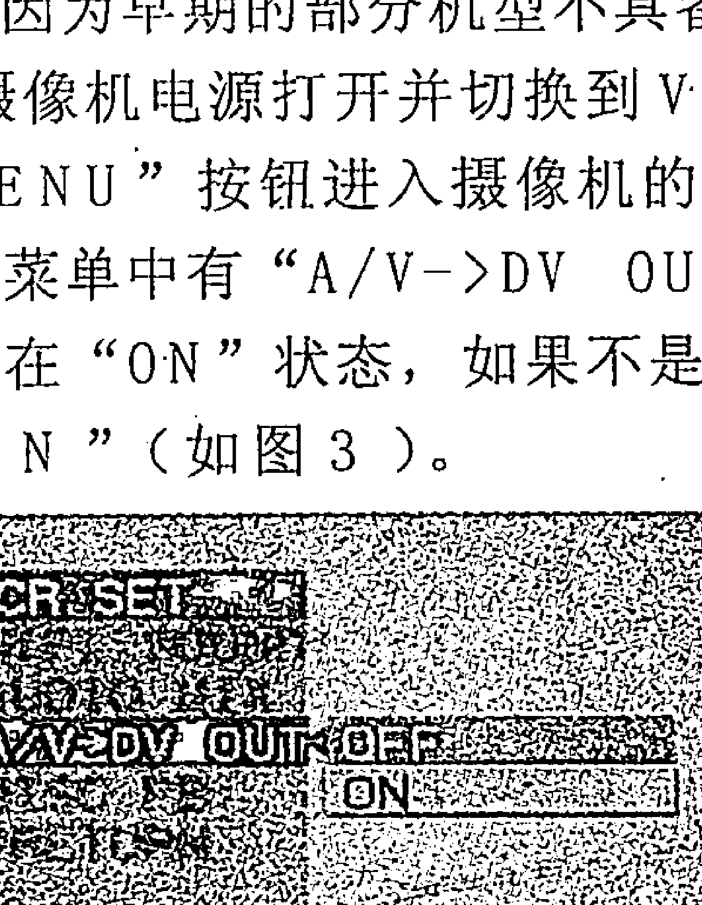

3.  将随机带的AV线一端插入摄像机的AV输出口，另外一端的三根线黄色的插入电视机的视频输出口（VIDEO OUT），而红色和白色插入电视的音频输出口（AUDIO OUT），然后将电视调到需要录制的电视台。数码摄像机的相应端口，连接好之后打开数码摄像机的电源开关。
4.  这时数码摄像机屏幕上会出现电视的节目内容，此时同时按下控制面板上的“PLAY”和“REC”两个按钮，这样摄像机将开始记录输入的电视信号。

不过需要注意的是，在录制完成后不要忘了将刚才菜单中的“A/V->DV OUT”选项恢复为“OUT”，否则摄像机将无法输出信号到电视上。

### 2. 用两台数码摄像机进行录像带复制

如果从朋友那里看到了他拍摄的一盘优美的录像带，只要你的摄像机和朋友的摄像机都有1394数字接口的话，那么就可以很轻松的对录像带进行复制操作了。

1.  首先需要准备一根1394线缆，然后将线缆的两端分别插入两台摄像机的DV接口，此时摄像机的连接即告完成。

    提示：由于所有摄像机上的1394接口都为4芯的小口接口，因此准备的1394线缆也应该是4芯的小口电缆。
2.  将两台摄像机的电源打开，并且都切换到放像状态。将需要复制的源带放入用于放像的摄像机（A机），将空白磁带放入用于录像的摄像机（B机）。

    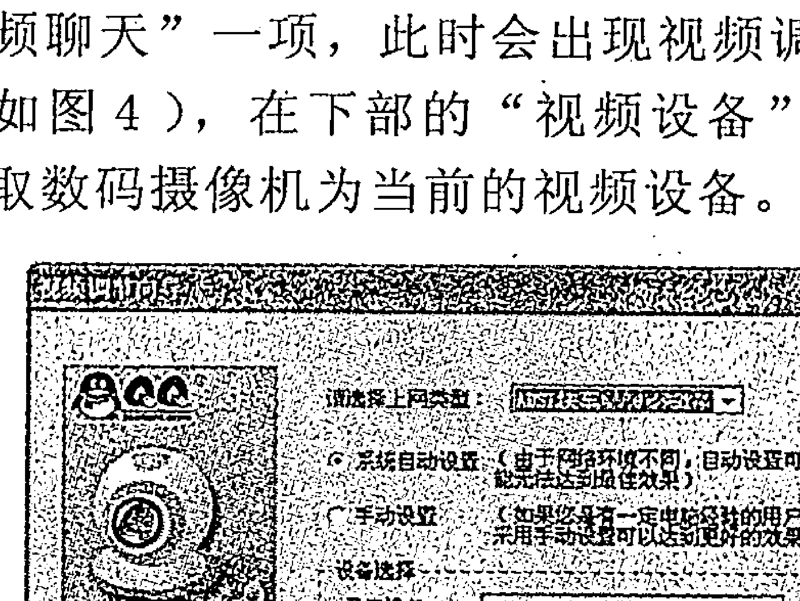
3.  在A机上进行播放操作，几秒钟之后图像和声音将出现在B机上。此时在B机上同时按下“PLAY”和“REC”按钮，这样B机将进入记录状态，录像带的复制就开始了。

    提示：复制录像带之前需要参照录制电视节目的设置方法将“A/V->DV OUT”设置为“ON”状态。

### 3. 用数码摄像机视频聊天

对于很多朋友来说，上网和朋友聊天是非常惬意的事情，尤其是能够通过摄像头进行视频聊天，可以让虚幻的网络世界变得真实起来。如果你还没有摄像头的话，不妨让数码摄像机来客串一下，这样不仅省去了购买摄像头的费用，而且可以提供比普通摄像头更为优越的性能呢！下面我们就来看看怎样使用数码摄像机实现QQ中的视频聊天。

1.  首先要求计算机中安装一款1394视频捕捉卡，同时用1394连接线缆分别连接到采集卡和摄像机。
2.  运行QQ，并且从右部菜单中点击“语音视频聊天”一项，此时会出现视频调节向导界面（如图4），在下部的“视频设备”列表中可以选取数码摄像机为当前的视频设备。
3.  根据调节向导配置好麦克风的音量大小之后，向导还会要求你对视频画面进行调节。此时可以设定画面的大小、图像质量和图像传输速度等参数，一般情况下采用系统默认的参数值即可（如图5）。
4.  配置完成之后，对方的QQ对话窗口中就出现了邀请语音视频对话的提示，如果对方点击了“接受”之后就可以建立连接，这时就可以看见你的图像了（如图6）。

    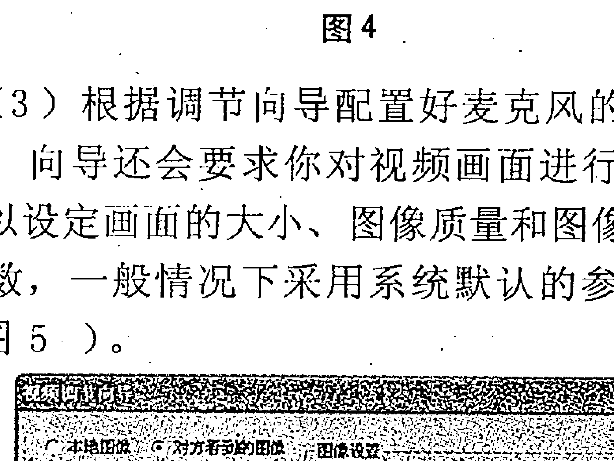
    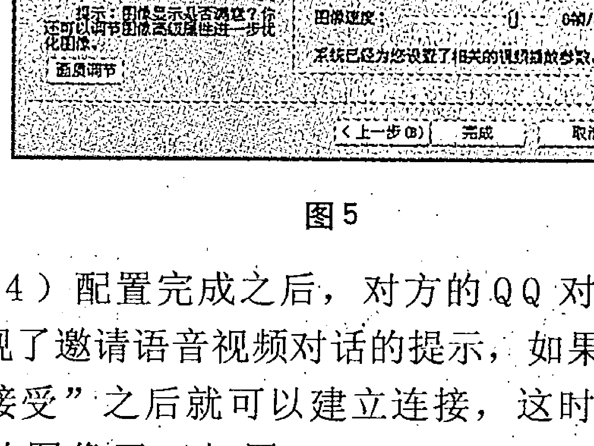

## （四）让拍摄的影像更精彩

用数码摄像机拍摄好精彩的影像之后，怎样才能对它进行编辑操作，或者是转存在刻录光盘中让其他朋友分享呢？这时候就需要自己动手进行后期编辑处理了，在此建议大家尝试通过会声会影对影像进行后期处理，这样可以让自己导演的电影增色不少呢！也许大家对会声会影这款软件都比较熟悉了，因此就介绍一些编辑过程中的实用技巧吧。

### 1. 添加动态字幕

很多电影或者广告片断中都会有动态字幕出现，这对于会声会影而言简直就是小菜一碟，那咱们就先来看看怎样添加动态字幕吧。

1.  运行会声会影之后点击上部的“故事板”按钮，接着从资源管理器中把已经录制好的视频文件拖拽到下部的时间轴-视频轨中。
2.  点击窗口上部的“标题”按钮，此时可以从右边的素材库中选取一个标题素材，并将它拖拽到时间轴-标题轨。但是对于那些需要自行添加标题的朋友而言，则需要在左边的“编辑”区域中选择“创建标题”按钮，接着在视频区域中输入与画面适合的标题文字内容，同时还可以借助左边的选项面板来调整对齐、大小、色彩、字体等属性（如图7）。

    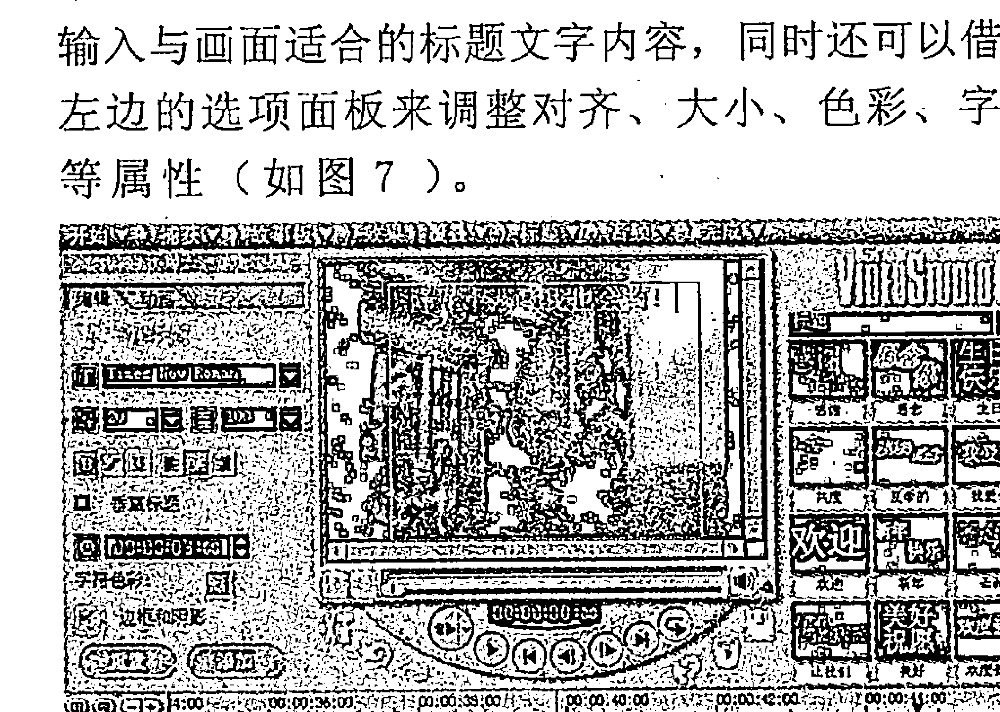

    在完成一段视频的标题添加之后，还可以将时间轴-标题轨中的蓝色三角标记拖拽到另外一个片断处，接着按照上述方法重新定义一个标题文字，这样就能够让影像中出现多个标题文字内容了。

    提示：选项面板中有一个时间设置功能，这是用于设定标题文字在影像中的显示时间，可以根据需要适当增加。
3.  从右边素材库的下拉菜单中选择“动画”命令，此时将看见会声会影附带的所有动态标题模板，而且能够及时预览到所有动态标题的特效。选中合适的特效之后，直接双击它就可以赋予刚才创建的标题文字特殊的动态特效，这时候再尝试着播放一下影像文件，看看是不是多出了一段动态标题呢（如图8）？

    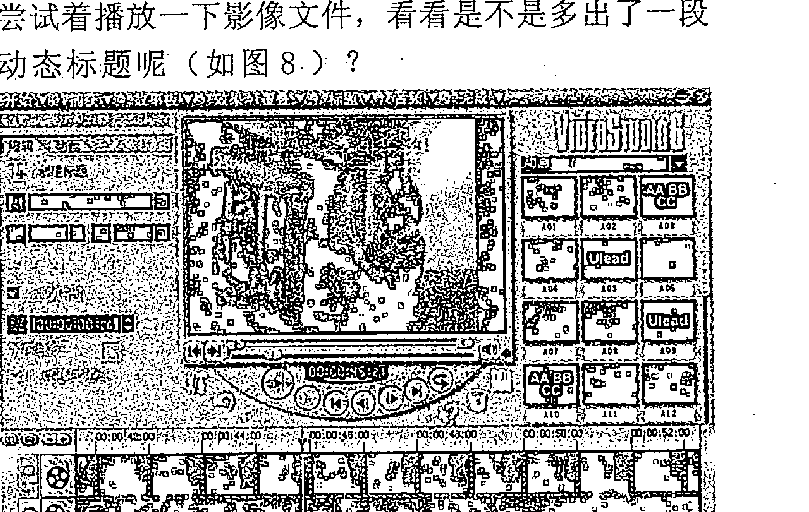

### 2. 添加背景音乐

一部评分为10分的电影至少有3分是背景音乐的功劳。但是在拍摄家庭室内剧的时候，由于条件限制，通常无法一次性录制完美的背景音乐，这样自然会让影像效果大打折扣。如果你也希望自己拍摄的影像文件具有大片一样的效果，那么优美的背景音乐绝对是不可忽视的。

1.  在时间轴中点击音乐轨，接着用鼠标点击需要添加背景音乐的时间点准备添加音乐。
2.  在时间轴最下方有一个打开文件的按钮，点击这个按钮之后，依次选择“添加音频->到音乐轨”命令，此时将会有一个弹出窗口询问新增何种文件。根据自己的需要选择WAV、MIDI或者更为流行的MP3歌曲，这样就为当前时间点添加了一个背景音乐。
3.  按照上述方法，我们还可以为不同内容的影像片断添加风格迥异的背景音乐，这时候再播放看看，相信效果会好了不少吧。

### 3. 制作画中画

一些高档电视机拥有画中画功能，这样让我们在观看某个节目的时候还可以欣赏另外一个节目。其实这种表现手法在视频制作时候还是非常有用的。

### 4.输出视频

到此为止，基本上已经完成了影像文件的后期编辑处理，接下来自然是将其输出保存了。在会声会影中提供了VCD、SVCD、DVD等多种输出模式，一般建议大家选择VCD或者SVCD模式来平衡视频质量和文件大小。可以先通过“项目回放”按钮来预览一下整个视频效果，满意之后只需点击“导出”按钮即可生成最终的目标文件，在输出过程中还能够再次对整个影像进行完整的查看。得到输出的视频文件之后，我们就可以通过Nero之类的软件将其刻录为VCD保存了。

怎么样，在看完上文的介绍之后，是不是对自己从新手进阶到老鸟有了一个大概的了解？最后也希望大家能够早日成为一名优秀的摄像高手。

### 四、数码摄像机节电谈

虽然数码摄像机能够把精彩的瞬间丝毫不差的重现在我们眼前，不过这一方面要取决于摄像机的性能，同时还要考虑到录像带和电池是否足够，否则在外游玩的时候突然发现录像带存储满了，或是电池没电了，这种尴尬的局面肯定会让大扫游兴的。因此大家可能更关心的还是如何使用有限的电能拍摄更多的影像吧，为此我们就来看看怎样才能让数码摄像机拍摄更长的时间。

1.  在数码摄像机中提供了多种功能，比如特技模式拍摄、影像时间显示等功能，如果拍摄时候不需要这些功能则最好将它们关闭，这样可以节约一些电力。
2.  尽量避免频繁的开关机操作，这是由于在开机时候所有的部件都要重新检测运行一遍，这将会消耗部分电力。在暂时不需要拍摄影像的时候只需把LCD液晶屏关闭即可，在一定时间内没有拍摄、变焦等操作则数码摄像机会自动关闭。
3.  尽量避免使用不必要的变焦操作，每次变焦操作都要相应的驱动单元工作，这也会损耗部分电力。
4.  拍摄过程中最好使用取景器，而不要使用LCD液晶屏。这一方面是取景器获得的景象更真实，更重要的是因为开启液晶显示屏取景而消耗更多电力，把它关闭之后可以使电池备用时间增长两、三倍。
5.  不要用数码摄像机拍摄数码相片，这一方便因为数码摄像机拍摄数码相片的效果不如专用的数码相机，另外一方面是切换到数码相片模式拍摄相片也需要耗费电力，因此尽可能减少使用数码摄像机拍摄数码相片的次数。
6.  对于拍摄完成的影像，尽量不要使用数码摄像机直接查看，因为每次查看影像都需要切换不同的工作模式，并且需要打开LCD液晶屏并进行倒带、播放等操作，这些都会浪费电力。
7.  尽量不要通过数码摄像机内置的影像编辑功能来进行影像编辑操作，这是因为在全部拍摄完成之后通过专业的后期视频处理软件更容易获得更为全面的编辑效果，如果在拍摄过程中进行处理则只会白白浪费电力。
8.  一些数码摄像机可以调节LCD液晶屏和取景器的亮度，比如Sony DCR PC110E就可以通过“MENU”按钮进入设置窗口，在“LCD/VF SET”菜单中选择“LCD BRIGHT”一项，然后调整LCD液晶屏的亮度为中等即可节省一部分电力。

    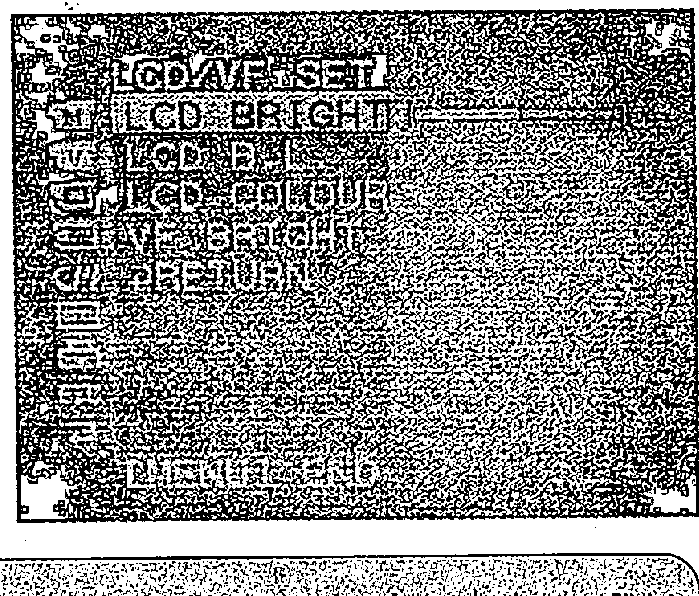

    （如图）。
9.  尽量不要在气温很低的环境中使用数码摄像机，因为此时拍摄将较为耗电。

除去上述的使用数码摄像机过程中的省电技巧之外，平日也要注意电池的使用和保养，这部分大家可以参阅数码相机部分的相关内容，在此就不赘述了。不过需要提醒大家注意的是，虽然通过上述方法可以适当延长电池的使用时间，但它毕竟只是一种节约用电的方法，如果要真正确保数码摄像机拍摄的时间不受限制，最好的方法还是多配备几块备用电池。

### 五、细心呵护你的数码摄像机

购买了数千元的数码摄像机之后，大家一定是对它爱护有加吧。但是如果你认为经常给摄像机擦灰清洁就是呵护数码摄像机的话，那么就大错特错了，因为这些并不是呵护数码摄像机的全部，更重要的是需要我们在日常使用过程中注意维护，这样才能够让数码相机给你带来更多的乐趣。

### （一） 数码摄像机的日常维护与保养

由于数码摄像机是比较贵重的数码产品，所以平时使用的时候应该比较小心，主要说来有下面几方面注意事项。

1.  在晴天拍摄要注意避免镜头直接对着阳光拍摄，如果必须在光线较强的环境中拍摄影像，则可以考虑在镜头前加上滤光设备以避免损坏最主要的CCD部件。
2.  尽量不要在雨雪天气拍摄，如果必须在恶劣的天气中拍摄，就必须要数码摄像机的防水保护，比如用一个较大的塑料袋套住整个数码摄像机，而仅仅在镜头部分挖出一个镜头大小的洞用于拍摄，这样可以有效的避免雨点或者落在数码摄像机上对机器造成损害。
3.  过热或者过冷的环境都容易引起数码摄像机的老化，如果在寒冷的天气使用数码摄像机的时候要随时将其放入专用的包中，否则回到室内温暖的环境时，很容易在镜头上形成一层水雾影响下一次拍摄，正确的方法应该是放置在密封的塑料袋中，等机器与室内温度一致时再取出。
4.  保存数码摄像机的时候应该先用干净的软布擦去机器表面的灰尘，然后尽量放置在干燥的地方避免机器受潮，有条件的情况下最好放在防潮的箱内。如果由于条件限制只能存放在摄影背包中，那么一定要同时放置一些干燥剂，因为这类软质的摄影背包含有大量的泡棉与布材，这些都很容易吸收水分，如果摄影机长时间存放在里面就很容易受潮而导致镜头发霉。
5.  在保存数码摄像机的时候，一定要取出磁带和电池，以防止磁带和电池损坏。
6.  在外出拍摄的时候要避免在灰尘多、风沙大的环境中使用，这主要是防止灰尘嵌入机器的缝隙中，同时也会粘在镜头或者LCD液晶屏上，对正常拍摄造成影响。
7.  室外拍摄的时候一定要随身携带专用的数码摄像机包，在一段影像拍摄完成之后要将机器放入摄像包中存放，以免失手将摄像机摔在地上，同时也可以避免其它硬物划伤数码摄像机。
8.  长期不使用数码摄像机的时候，应该定期接通电源，并在CAMERA和VCR模式下分别录制和播放3分钟左右的影像。

### （二）数码摄像机镜头和LCD液晶屏的清洁保养

### 1.镜头

在拍摄影像的时候，尽量避免手指或者其它硬物接触镜头，因为这样会在镜头上留下难以修复的永久性划痕。平时不使用摄像机的时候或者在拍摄间隙，应该随手盖好镜头的防护罩，以免灰尘粘在镜头上。如果发现镜头沾上了灰尘，就要用专业的擦眼镜或擦照相机镜头布轻轻擦去镜头上的灰尘，对于粘在镜头边缘部位等不容易用柔布擦去的灰尘，可以用细棉花棒擦去。但是在擦拭数码摄像机的时候不要用沾有酒精的棉花棒擦拭镜头和机身，这是由于用酒精擦拭镜头容易使镜头变色，而一旦镜头染上了颜色就不能拍摄实际色彩了；另外，机身上有一些塑料按钮，经常用酒精擦拭会使其变形，影响数码摄像机的正常使用。另外，在清洁镜头的时候不要忘记

### 2.LCD液晶屏

清洁LCD液晶屏的时候可以先用柔软的布和细棉花棒擦拭液晶屏以及取景器，同时用细棉花棒擦拭变焦、拍摄按钮等常用操作键。如果在变焦等按钮上积累了比较多的污渍，则可以用沾有少量纯净水的棉花棒来擦拭，而且在擦完之后还要用干的棉花棒再擦拭一遍。不过需要注意的是，LCD液晶屏和取景器千万不能用酒精擦拭，否则会造成永久性的损伤。

### （三）磁头的清洁

摄像机如果长期使用而又不注意保养清洁，磁头就会出现结垢或积灰的现象，从而影响拍摄和播放质量，所以为了确保能够获得更好的拍摄效果，定期清洗磁头也是必不可少的。一般说来，累计拍摄满30小时就要清洗一次磁头，而且清洗时一定要使用专门的清洗带，并参照下述步骤完成。

1.  按照放置录像带的方式将清洁带放入摄像机中。
2.  切换到“CAMERA”模式，按下“PLAY”按钮播放，此时清洁带将自动对磁头进行清洗操作。
3.  等待最多十秒钟之后按下“STOP”按钮停止清洗操作。

在清洗完毕之后，再观看播放和录制的影像，如果图像没有恢复正常则可以重复上述三个步骤，但重复操作不要超过四次，否则会损坏磁头。另外，在每次使用完清洁带之后不要倒带，而是要一直使用到清洁带卷到头为止，否则下次清洁磁头的时候就是用污损部分来清洁磁头了，这样就无法起到清洁磁头的效果了。

提示：在清洗磁头的时候，可以在清洁带某个部位注入清洗液来加强清洁效果。

这种使用清洁带清洗磁头的方法最为简便，也可以清除通路中所能触及到的所有部件上的污垢和磁粉，但是由于清洗带会使磁头及导杆磨损，所以频繁使用将影响磁头的使用寿命！一般情况下我们还可以用下述方法来清洁磁头。

1.  用清洁液清洗。使用清洁液清洗磁头时，最好用鹿皮、鹿皮包头棒、不会起毛的棉布或脱脂棉签蘸取适量的清洁液进行擦拭。清洗磁头时，必须顺着磁鼓旋转的方向轻轻擦拭，不要用力过大，更不能上来回擦拭。而且擦拭时一定要注意不要将清洗液滴在橡胶上，以免引起橡胶老化。清洗完毕后，一定要等清洗液蒸发后再开机使用，如果擦拭一次效果不理想可再擦几次。
2.  用新的录像带清洗。这种清洗方法只适用于磁头不是很脏的时候，只要打开摄像机的电源，将一盘新磁带插入摄像机内，接着按下放像键走带约半小时，只要磁头不是太脏一般都能清洗干净。如果清洗效果不理想，可再适当延长走带时间。如果急着需要使用摄像机，可以使用快进或快倒，这样也可以起到清洗的作用。需要特别指出的是，用新录像带清洗磁头只是一种应急的措施，这种方法虽然能暂时将磁头清洗干净，但灰尘和污物却由磁头转移到磁带上，而且对磁头和导杆的磨损较大，因此不是在万不得已的情况下最好不用这种方法。

### （四）录像带的保养方法

对于数码摄像机而言，录像带的重要性不言而喻，因此我们在日常使用数码摄像机的时候也要有意识的对其进行保养维护。

1.  摄像机在没有任何操作的几分钟后，出于省电的目的会自动停机。如果在视频直播时使用这种摄像机，突然停机肯定是不行的。其实解决这个问题方法很简单，只要取出带仓中的录像带就可以了。因为目前录像带都是金属带，特别容易磨损磁头，所以摄像机在没有接受操作指令6分钟后会自动停机保护磁头，而一旦录像带被取出就不会因为保护磁头而停机了，摄像机便可以连续工作。
2.  当录像带表面上有划痕或不平整时，摄像机也会停机保护磁头。这时要特别注意操作，否则会造成卷带，以致录像带无法再使用。正确的操作方法是在自动保护时立即关闭摄像机电源，过一分钟左右之后，在关闭电源的状态下取出录像带，并查看录像带表面的划痕情况。如果划痕很多或很深，应立即停止使用这盒录像带；如果划伤情况不是很严重，则可打开摄像机电源放入录像带，并把摄像机切换到放像状态，用快进功能卷过有划痕的地方，这样录像带可继续使用。
3.  平时使用录像带的时候要注意检查一下磁带有没有松弛，如有松弛就应该转动驱动轮把磁带拉平，否则容易出现卷带或者划伤磁头的情况。为了减少磁带的松弛，应把磁带盒竖立起来保管，并把磁带多的一端放在下面。
4.  不要打开录像带保护盖，也不要用手指接触录像带，以防止灰尘颗粒残留在录像带表面，在摄像或者播放的时候划伤磁头。
5.  录像带保存的时候要远离强磁场，以免...磁化录像带表面的磁性物质。

## （五）带仓内部件的清洁

摄像机在使用一段时间后，带仓内走带系统部件和驱动部件会受到脱落的磁粉、油污、灰尘等物质的污染，此时应该打开带仓的面板，对其进行清洁。先将里面的灰尘、纸屑等粘附不牢的杂质用小型吸尘器吸出，然后用麂皮蘸无水酒精等清洁剂对零部件逐一小心清洁。要清洁的主要是磁带通路：导柱、磁鼓、主导轴、压带轮等。在清洁过程中要注意这些部件多为橡胶制品或与橡胶直接接触的部件，清洗时不要用过多的无水酒精，以免橡胶老化。而且不要用力过度，以免变形，特别是清洗主轴和导柱时更要小心一些。

### 六、数码摄像机相关名词解释

### 1.光学影像稳定器

在CCD捕获影像前，通过调整在镜头前面三棱镜的角度或通过镜头自行转动进行调整，对影像进行修正。

### 2.数字影像稳定器

在CCD捕获影像后通过内置的感应器和软件对影像数据进行处理计算，通过总像素修正达到对影像进行修正的目的。

### 3.Digital 8

简称D8，是由Sony开发的家用数码摄像机的一种新规格，是将影像信号存储到Video 8或Hi 8磁带的方式，其水平解析度为500线。

### 4.DV

DV格式是由50余家公司共同开发的一种国际通用的数字视频标准，可以记录高质量的数字视频信号，目前市面上的DV录影带有两种规格，一种是标准的DV带，另一种则是缩小的miniDV带。

### 5.Mini DV

使用DV格式进行影像的存储，针对家用设计、使用了小型DV磁带记录影像和声音。

### 6.IEEE-1394

由国际电气和电子工程师协会 IEEE 制定的规范，用于规范消费级家用数码摄录机与电脑传输界面的标准。

### 7.i.Link

由 Sony 公司给 IEEE-1394 标准起的名字。

### 8.编码解码器 Codec

编码解码器的主要作用是对视频信号进行压缩和解压缩。现在最基本的VGA显示器是640×480像素，这意味着如果视频需要以每秒30帧的速度播放，则每秒要传输高达27MB的信息，1GB容量的硬盘仅能存储约37秒的视频信息，所以必须对信息进行压缩处理。通过抛弃一些数字信息或容易被我们的眼睛和大脑忽略的图像信息的方法使视频的信息量减小，这个对视频压缩解压的软件或硬件就是编码解码器。编码解码器的压缩率从一般的 2：1至100：1不等，使处理大量的视频数据成为可能。

### 9.NTSC、PAL和SECAM

这是三种基带视频，是一种简单的模拟信号，由视频模拟数据和视频同步数据构成，用于接收端正确地显示图像。其中NTSC的分辨率为每帧只有525线（60Hz），是北美和日本采用的标准；PAL每帧有625线（50Hz），是我国采用的制式；SECAM则是法国采用的制式。这三种制式目前尚无法统一，所以相同型号的数码摄像机也有不同的制式。

### 10.MPEG标准

MPEG标准包括MPEG视频、MPEG音频和MPEG视音频同步三个部分。MPEG压缩标准是针对运动图像而设计的，它的基本方法是在单位时间内采集并保存第一帧信息，然后就只存储其余帧相对第一帧发生变化的部分以达到压缩的目的。目前MPEG系列标准包括MPEG-1、MPEG-2、MPEG-4等。

- MPEG-1 用于传输 1.5Mbps 数据传输率的数字存储媒体运动图像及其伴音的编码，经过 MPEG-1 标准压缩后，视频数据压缩率为 1/100 至 1/200，音频压缩率为 1/6.5，具有接近家用视频制式录像带的质量。MPEG-1 允许超过70分钟的高质量的视频和音频存储在一张 CD-ROM 盘上，VCD 采用的就是 MPEG-1 的标准。
- MPEG-2 主要针对高清晰度电视的需要，传输速率为 10Mbps，与 MPEG-1 兼容，适用于 1.5 至 60Mbps 甚至更高的编码范围。MPEG-2 有每秒30帧、704×480的分辨率，是 MPEG-1 播放速度的四倍，它适用于高要求的广播和娱乐应用程序。
- MPEG-4 标准是超低码率运动图像和语言的压缩标准，用于传输速率低于 64Mbps 的实时图像传输。较另外两个标准而言，MPEG-4 为多媒体数据压缩提供了一个更为广阔的平台。它可以将各种各样的多媒体技术充分用进来，包括压缩本身的一些工具、算法，也包括图像合成、语音合成等技术。

### 11.数字视频

数字视频就是先用摄像机之类的视频捕捉设备，将外界影像的颜色和亮度信息转变为电信号，再记录到储存介质。播放时，视频信号被转变为帧信息，并以每秒约30 幅的速度投影到显示器上，使人们的眼睛认为它是连续不间断地运动着的。

### 12. SP 和 LP 模式

摄像机通常有 SP 和LP 两种模式，SP 是指标准播放，LP 是指长时间播放。LP 模式的工作原理是使用较少的录影带存储相同数量的影像，因此在LP 模式下可延长拍摄时间、播放时间、电池寿命和给录音加注标题等。但是 LP 模式是以降低影像质量为代价的，特别是使用旧录影带时噪声会明显增大。

### 13.水平解析线

是指画面高度下人眼能分辨的垂直线。换句话说，它就是在一个宽度等于画面高度的区域里能分辨出来的黑白线条的数量，这样规定的目的是使其不受画面比例的影响。

### 14.自动亮度增益

当全自动拍摄时，如果机体内感应到光线不足，便启动此一装置以电子式提升画面的亮度。

### 15.电子防抖

当防抖电路工作时，拍摄画面只有实际画面的90% 左右，然后数字电路对摄像机抖动方向进行模糊判断，进而用剩下的10% 左右画面进行抖动补偿。这种方式的特点是成本低，但可能对画面清晰度带来一定的损失。

### 16.红外夜视

在夜视状态下，摄像机会发出人们肉眼看不到的红外光线去照亮被拍摄的物体，红外线经物体反射后进入镜头进行成像。不过拍摄出来的画面是黑白的。

### 17.排风功能

当我们使用摄像机在刮着强风的户外拍摄时，就会在记录的声音里产生很强的频率很低的“呼呼”声。摄像机的话筒的排风功能就是利用左右两个话筒拾取的低频的风声进行相减，从而在一定程度上减轻风声的干扰。

## 1993-2002：IT风云变幻尽在 3CD+1手册 仅售35元

## 《电脑爱好者》10年版 钻石电子珍藏版

## 上市了

## 《电脑爱好者》10年钻石珍藏版11月20日正式上市

## 电脑应用百科全书

海量信息，3 张CD 光盘的内容涉及到软件、硬件、数码、网络、游戏、办公、编程、病毒安全等方方面面的电脑知识。既是电脑初学者的良师益友，也是电脑高手的智囊宝库。

## 10 年内容原汁原味

荟萃《电脑爱好者》杂志自1993 年创刊以来10 年共175 期杂志的正文内容，并保留原杂志的版式风格，图文并茂、原汁原味。

## IT 发展历史宝典

一览10 年来电脑发展的沧桑变换，回顾不同时期IT 界发生的重大事件。

## 检索方便图文并茂

方便快捷的全文检索功能，通过关键词即可找到想要查找的信息。完整系统的书签标识，使您可以方便地按年份、期号以及文章的标题等信息，快速检索所需的内容。

## 自由缩放自动浏览

本套电子版的文档不但可以手动翻页，还可以设置为让文档自动向上滚动，免去手动翻页的繁琐。另外，它也可以任意放大或缩小，以适应不同读者的阅读习惯，比如对视力稍差一点的读者，可将其适当放大以便于阅读。

## 包装精美界面豪华

本套光盘外包装精美华丽，光盘软件界面美观大方，人性化的界面设置，操作起来非常容易。

## 掌中的数字世界
——PDA
文/Vapouy

### 一、从头说PDA

PDA的英文全称为Personal Digital Assistant翻译成中文就是个人数字助理。所谓个人数字助理对于个人来说意味着什么呢？最初也就是最简单的解释取代了笔记本，这个笔记本可不是膝上电脑哦，而是我们从上小学就开始用的那种可以用笔在上面写字的本本。对于学生来说，笔记本可以用来记一些老师布置的作业了，一些学校的事情了和同学之间的电话、家庭住址了等。因为这个笔记本会每天都看，甚至一天会看好多回，所以就显得格外的重要。

不过笔记本的有其缺点，比如写的太多就会很快用完，用的太勤破损的就比较快。于是，到了上世纪90年代初，由于计算机工业的发展，很多的厂家开始注意到个人移动计算这个方面，并开始制作出封闭系统的只具有个人信息管理（PIM）功能的PDA产品，不过由于无法与PC连接，所以引不起市场的太大兴趣。幸好富于想象和创造的APPLE公司在1988年组建了Newton研究小组，并于1991年夏天成功推出了第一种笔输入手持设备Newton产品，这是一种价值500美元的设备，具有个人行程或事件安排功能，记录功能，通信功能和可以自由安装任意软件的功能。随着Newton的开发及推出，Apple公司斥资1000多万美元展开了强大的广告宣传活动，公司总裁John Sculley把Newton吹捧为一种高度便携的智能设备，可在全球任何地点进行信息的收发、组织与联络。但是Apple的许诺实在是夸大其辞，由于所说的种种功能无法兑现或者有严重的缺陷，导致了人们对Newton的热情很快的消失了。最令人失望的是手写识别功能，因为真的是非常糟糕。当时研究小组认为这个芯片级的处理能力非常强大，能对付手写识别的问题，但事实并非如此。据一名Newton的零售商汇报，当你用相当清晰的印刷体字母书写“Apple Newton”时，屏幕上反馈的反而是“IPieWarm”。最后，Apple公司于1998年2月底发表了声明，表示不再进行与Newton有关的一切开发。

回过头来，我们发现Newton却是一个具有划时代意义的产品，它带来了PDA和手持这两个新的计算机术语，也带来了计算机的新一轮革命。在1993到1996年中，也有其他很多公司发布过PDA，其中包括像CASIO，PHILIP等知名企业，大家都取得了不同程度的成功。但是最终获得彻底成功的却是一直名不见经传的Palm Computing公司，他们在Newton亮相3年后推出了PilotPDA，也就是今天大名鼎鼎享誉世界的Palm掌上电脑。Palm的创始人Jeff Hawkins说过，“我们一定要设计出卓有成效的功能”。可以说PalmPilot产品做到了这一点。其实PalmPilot的成功很大一部分是依赖于其非常好用的Graffiti手写输入软件，这个识别率高且书写简单的软件为PalmPilot的辉煌打造了坚实的客户基础。在随后的几年中PalmPilot的产品迅速走红，在PDA界一直处于一支独秀的霸主地位，无人可以动摇。

随着Windows 95的出现和Windows 98的空前成功，另一个巨人——微软成长起来了，并迅速在PC操作系统业界建立了微软帝国。统治者的欲望和野心总是不会满足，看到了PalmPilot在手持计算机领域的蓬勃发展，微软自然蠢蠢欲动，于是终于将手伸向了PDA领域，并于1998年推出了WinCE操作系统。可以说WinCE最大的特色就是桌面电脑Windows操作系统的缩小版，在资料同步上可以与PC有良好的兼容性；为了提高WinCE的竞争力，微软在WinCE操作系统中加入了简易版的Word和Excel，这样用户在处理文档方面更加方便直接。不过虽然WinCE有突出的优点，由于系统需要占用的空间大，运算速度慢，所以微软着实在PDA市场上吃了不少的苦头，市场占有率也被Palm OS远远的抛在了后面。但是自从WinCE3.0系统的发布和COMPAQ IPAQ3630的诞生，WinCE操作系统的主机以其强大的多媒体功能深入人心，而且微软也为操作系统重新命名，一个新的名词：Pocket PC代表着完善的功能和强劲的性能，从此诞生了。随着日新月异的现代科技，PDA的软件系统和硬件体系也在随之变化。

#### 三款主流你的Pocket PC产品

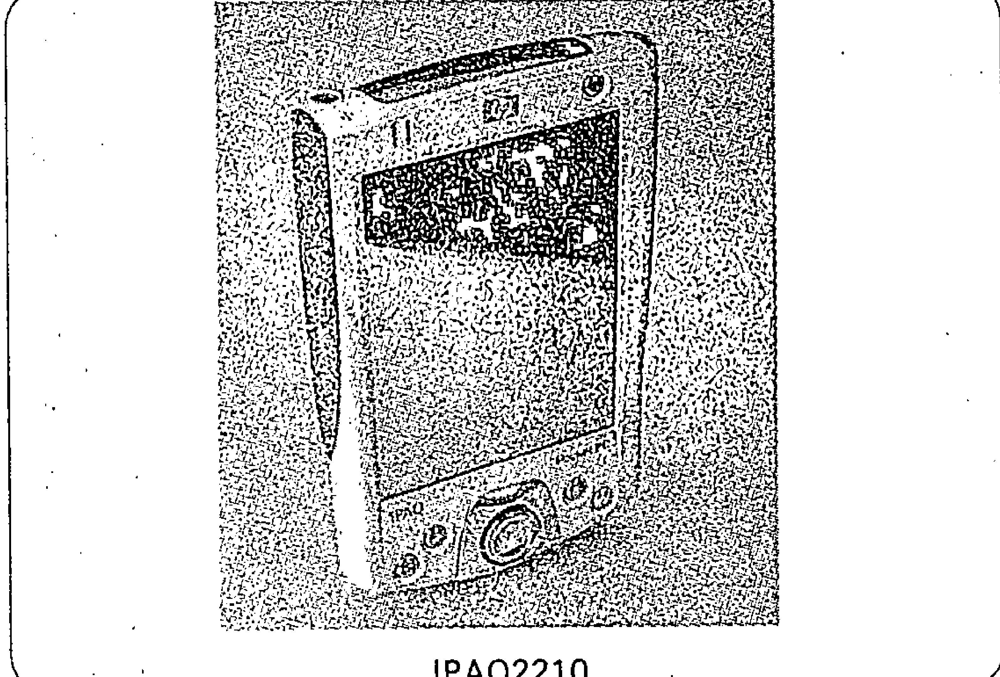

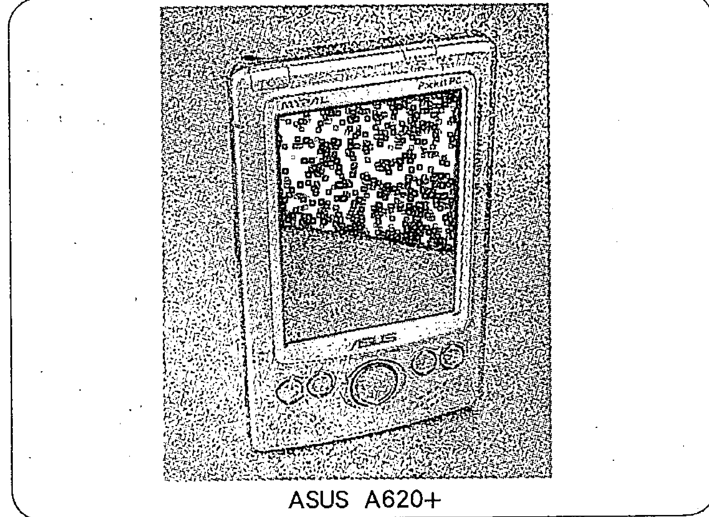

Palm OS的产品从最初Palm OS1.0经历了Palm OS2.0、Palm OS3.0和Palm OS4.0后，现在应用比较普遍的是Palm OS5.0。与上代产品相比，其改变让人瞠目结舌。如果说Palm OS的前四代产品

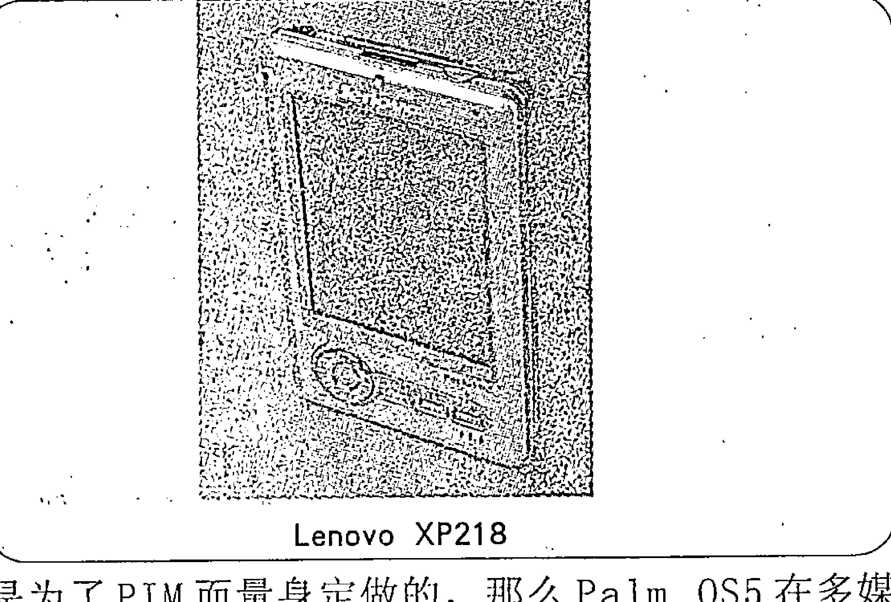

是为了PIM而量身定做的，那么Palm OS5在多媒体方面已经决定要与Pocket PC产品一挣高下。

#### 采用Palm OS5.2的三款旗舰级主机

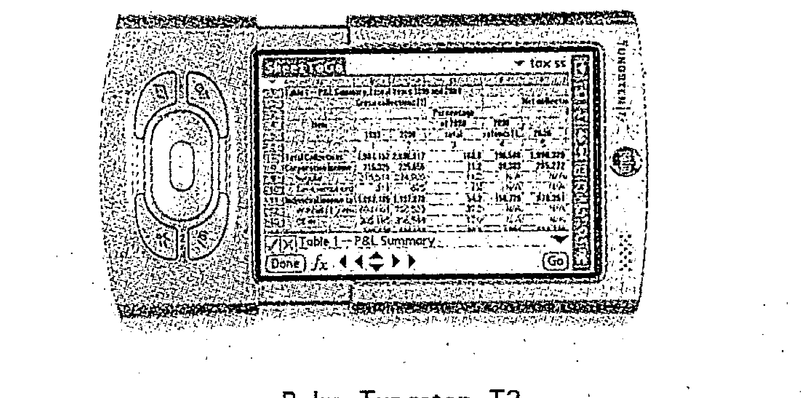

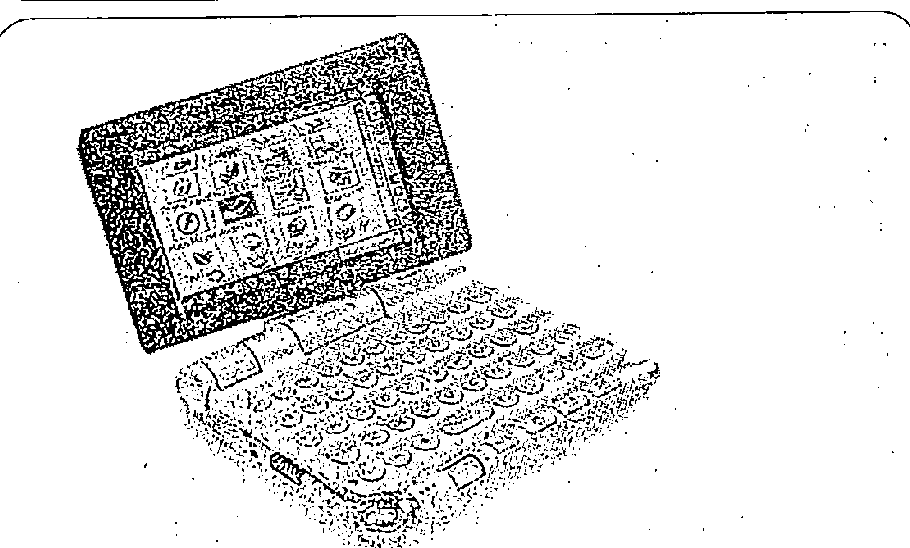

在硬件上，其CPU的速度和内存容量也比当初增大了好几倍。WinCE系统的发展也差不多，WinCE3.0的成功扭转了长期被Palm OS压的太不起头的局面，更名成Pocket PC后，其强大的多媒体更是深入人心，这也为Pocket PC产品的推广注入了一针强心剂。在当今的Palm OS5和Pocket PC阶段，PDA才算是真正到了争锋割据的时代。

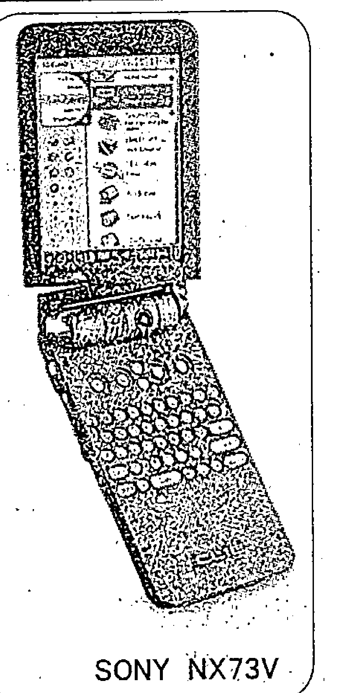

### 二、PDA的应用

看了PDA的发展历程，下面我们来说说PDA的应用吧。

按使用者来分，PDA分为民用和行业应用，这也是业内最常用的分类方法。

民用上，不用说大家也都知道。不过可能很多人还不了解PDA可以应用在各行各业中，所以先来说说行业应用方面。PDA的行业应用非常之广，可用于股票、保险、医疗、税务、警务、政务、企管等30多个行业。也可以为一些特殊的行业进行一些特殊的改装。比如在第二次伊拉克战争中，惠普公司就应美军的要求对IPAQ系列的掌上电脑进行了防水、防尘和防震的改装，使之可以适应战争的要求。在战争中IPAQ系列的掌上电脑可以充当GPS卫星定位系统，还可以当作互联网终端以便特种兵随时与总部联络，当然还可以作为设备调试终端对其他军用设备进行调试，还可以用来遥控其他军用设备以达到监视、侦察、爆破等目的。在其他行业中，最常见的是餐饮行业的PDA应用方案。餐饮行业的PDA应用方案中由三大部分组成，首先是无线基站和发送接收系统，其次就是命令主体——PDA产品，另外还需要一个作为中央智能餐饮系统的主机。

一个无线网络基站覆盖的范围可达300～500米，这就构成了无线基站，而外接了WLAN（无线局域网卡）的PDA都可以与之连接并交换数据，就构成了发送和接受系统。不过由于适合Pocket PC产品的CF I型无线局域网卡在价格上有很大的优势，所以从成本的角度出发，在餐饮行业中更多采用内置CF插槽的Pocket PC产品为终端。由于Pocket PC可以在黑暗的环境中利用背光照明来进行操作，所以很多酒吧或者咖啡厅非常青睐此种行业应用方案。由于此系统基于802.11B无线网络协议，所以更有读写速度快，系统稳定等诸多优点。硬件配置有了，下面我们来看看这套系统的思维系统，也就是软件系统方面。我们以著名的博达PDA点菜系统为例，此系统由六大部分组成分为：无线移动点菜系统、预定系统、前台系统、经理查询和报表系统、厨房成本控制与分析系统和库存系统。首先由预定系统对顾客姓名、就餐时间、就餐台号和就餐人数等信息进行记录。然后进入点菜系统，这其中会有菜品信息，可以根据顾客所点菜品进行记录，并通过无线网络即时传送到中央智能餐饮系统的电脑中，再由中央智能餐饮系统分别将信息发送到收银台和厨房终端，最后在顾客消费结束后，可以立刻通过收银台终端将消费信息迅速反馈到PDA上。这就是PDA点菜系统的一个大概的过程，其中还会有很多的细节和其他的功能，这里就不一一介绍了。

综上看来，PDA点菜系统有菜单明确，信息传递速度快，节约人力等诸多优点。应用了PDA点菜系统后，再也不用担心会忘记记录顾客所点的菜品了。其他的诸如股票、保险、医疗、税务等行业中，所投入的要远比点菜系统少的多。因为PDA在此类行业的应用主要是配给个人使用，所以只要软件做的专业，再配合相应的主机，效果就会很好。在个人应用方面，不同的人使用PDA会有不同的侧重点。按照现在使用PDA的主要人群来说分三种：学生、发烧友和业务繁忙的白领们。学生使用PDA多数会安装各种各样的字典和各种学习类的软件，来辅助自己学习，同时也会安装一些游戏。而一些业务繁忙的白领们则多数会安装各种行业软件，来帮助自己安排各种各样的业务。当然多数白领们都比较有钱，所以也会安装一些理财或者投资类的软件。最后，对于发烧友来说，安装的软件就不固定了。拿笔者来说，就是一个彻头彻尾的发烧友，有很多的主机，而安装的软件也不固定，比较喜欢安装一些新奇的软件或者比较热门的软件，当然不论装什么新鲜的软件，总有一些软件是必装的，包括：看书软件、中文外挂软件（英文系统主机必备）、手写软件、字典软件、文件管理软件和理财软件。差不多就是这些，具体的某个软件可以看个人的习惯来选择安装。

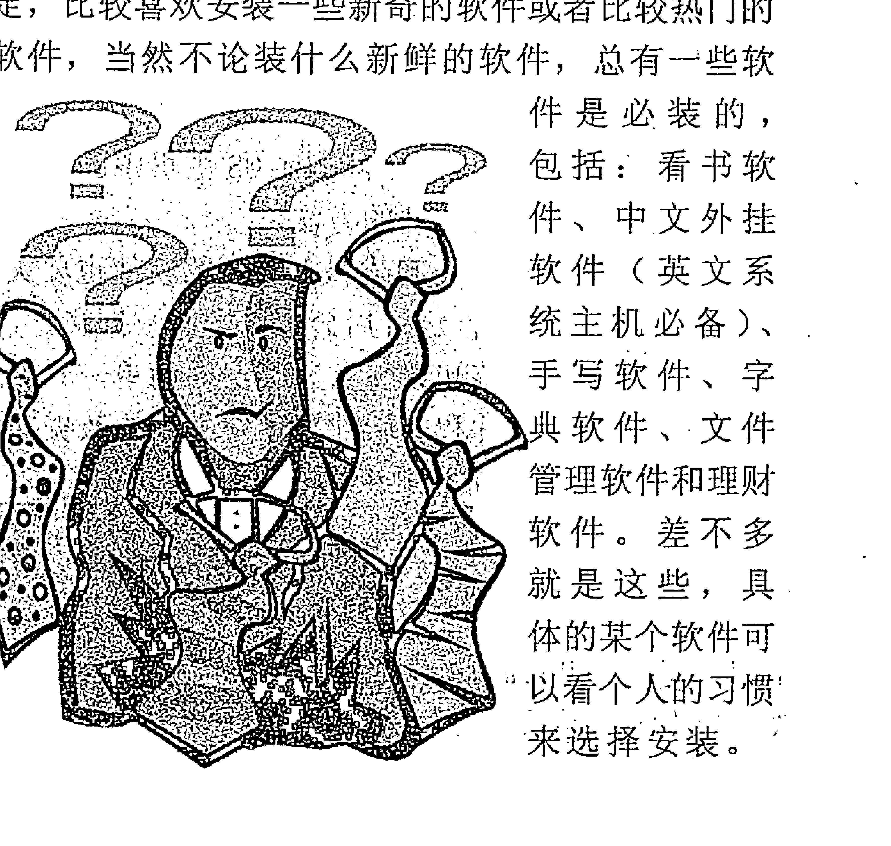

### 三、PDA 操作技巧

PDA几乎是桌面电脑的微型化，不论是Palm还是Pocket PC都是这样，都有中央处理器，内存和屏幕。但是Pocket PC与桌面电脑可能更像一些，因为毕竟都是微软出的操作系统。下面我们分成Palm和Pocket PC两部分来谈谈PDA的操作技巧。

先说说Palm，Palm OS的操作界面比较直观，非常简单，但是对于大多数用惯了PC的国人来说，初用Palm OS的产品反而略有生疏，感到比较困难，造成这个的主要原因就是大家不甚了解Palm OS。那让我们从安装Palm OS的软件说起，以BtToggle为例，打开文件夹，其中数个.prc的文件，BtToggle18_Thai.prc、BtToggle18_Russian.prc和BtToggle18_Chinese.prc，其实这三个文件都是一样的，从前面的名称都是BtToggle18就能看出来，下划线后面不同的Thai、Russian和Chinese则代表的是不同的语言。当然不同的软件，下划线后面的定义也不一样。比如在MegaLaunch的文件夹中有ML43_Color.prc、ML43_Handera.prc、ML43_HR_Sony_Color.prc和ML43_HR_OS5_Color.prc。第一个是彩色版的MegaLaunch，既然没有特殊说明则是低分辨率，第二个是MegaLaunch的Handera版，即适合Handera这款主机的版本，第三个是适用于索尼高分辨率彩色机型的版本，最后的是适合Palm OS5高分辨率的版本。从以上两个例子中，我们可以看出HR代表高分辨率，Color代表彩色，OS5代表适合的系统版本。所以从软件名称上的蛛丝马迹用户就能判断出那个程序适合你所用的PDA。这是最常见的一种安装软件的方法，当然还有其他的，如直接在PC上安装，按同步按钮后，自动同步到Palm OS主机中的方法和安装主程序加数据文件的方法。

学会安装软件后，卸载Palm OS的软件也要关注一下。因为一些软件运行后会生成一些数据文件，让初学者不知道应该卸载什么。其实很简单，只要找到需要卸载的软件和与软件名称差不多的数据文件（多数数据文件带DB字样）就行了。

接下来，让我们谈谈Pocket PC安装软件的方法。与Palm相比，给Pocket PC安装软件要直观一些。Pocket PC软件的安装方法与PC安装软件绝大多数情况下是一样的，先在PC上安装，完成后会弹出对话框，提示正在Pocket PC中进行安装，在Pocket PC上安装完毕后，整个安装的过程才算完毕。而卸载上也与PC类似比较简单，有专门的删除程序，可在里面直接卸载。

Pocket PC还有另一种安装方法，有时候大家从网站上下载的软件，解压缩后发现并没有Setup文件，而只有扩展名是.CAB的文件，其实这也是一个安装程序，只不过不是通过PC安装的，而是直接在Pocket PC中安装的。我们只需要将.CAB的文件拷贝到Pocket PC中，点击即可进行安装。

说完软件，再来说说Palm OS，在我们使用PC机一段时间后，就需要重新安装系统，对于Palm OS的PDA来说，由于系统是固化在ROM中的，所以无需重新安装，只需要对主机进行硬复位（恢复到出厂状态）即可，Palm OS的主机硬起动的方法都是一样的，即按Power键，然后戳reset，当屏幕出现Palm字样后松开Power键，屏幕上会提示按UP键清除RAM中所有程序，按DOWN键保留，当我们按下UP键的时候，主机就恢复到了出厂的状态。

有时候，我们在安装程序的时候，出现了程序冲突而无法进入到主界面将冲突的软件卸载，怎么办？呢这时我们一般需要进入安全模式来处理问题，按住UP键，戳reset，这样系统就不会调用任何程序，大多数情况下程序冲突的问题就可以通过这种方法来删除软件而解决。

在Pocket PC上，硬启动的方法不统一，最常见的有两种，一是同时按Power键加reset键，二是同时按1和4快捷键再戳reset键。每款PDA都有自己的特性，所以在技巧上各不相同，而且每个用户的使用又习惯不一样，所以其中有些使用细节还需要在实践中慢慢体会。

### 四、PDA 问题解答

1. 为什么我的PALM主机不能识别记忆卡了？答：首先应该排除没有插好卡的情况，看看是否卡已经插好。再者看看主机的电量是否足够，因为当主机的电量降低到一定数值后，为了节省电力，## Palm主机使用FAQ

**将自动屏蔽掉存储卡，解决办法是请即时充电。**

#### 2. 怎么关闭背光？
答：切换背光开启和关闭的方法是常按Power键。但是有的主机不允许将背光关闭，所以常按Power键后就只是将背光关到最小。

#### 3. 我的Palm OS主机可以播放Flash文件吗？
答：这要分两部分来说，Palm OS4.1以下的主机可以用Flash Player播放，还可以用Kinoma或者Gmovie进行转换后播放。而OS5的主机中SONY CLIE可以直接播放Flash文件，因为内置了Flash播放器，而Palm公司的OS5产品目前还不能播放Flash。

#### 4. 我的Palm主机怎样才能看Office文件
答：Palm主机要浏览或者简单编辑Office文件的话需要安装第三方软件，比较有名的第三方软件是WordSmith、Documents To Go和Quick Office。其中WordSmith和Quick Office的部分版本支持中文，而Documents To Go不支持中文。

#### 5. 我的Palm主机采用锂电池，请问电池寿命是多长时间呢？
答：一般而言，锂电池每充放电500次，电池容量会下降一些。举例来说，如果你的主机电池为1000毫安，那么完全充放电500次后其容量可能会降到900多毫安。按照一般Palm主机满电使用时间约为3天，一年大概充电100次左右，所以电池的寿命可以达5年左右。

#### 6. 点击屏幕的时候，出现了触笔点击不准的情况，怎么办？
答：可以选择Preference中的Digitalizer correction来重新定位，或者直接用随机带的Welcome来定位。

#### 7. 为什么别人通过红外传给我的通讯录打开以后是乱码？
答：从有些手机或者有些Pocket PC通过红外传送到Palm主机中的时候，由于字符集的不同所以会出现无法显示中文的情况，属于正常现象。只有通过第三方软件打开才能正常显示中文。

#### 8. 我的Palm主机可以上网吗？
答：当然可以。有三种方式可以上网。第一是通过Palm主机专用的Modem连接电话线上网；第二是在与PC机连接后，利用Softick PPP这个软件与PC机共享上网；第三种就是通过手机与Palm的连接无线上网，但是要求手机有红外线和蓝牙。不过除了爱立信和索尼爱立信的几款机型（R520，T39，T68，T68ie，T618）外，其他手机如果要和Palm实现成功无线上网则需要编辑脚本，而脚本又不是公开的，只有少数论坛中会有公布，所以建议想用Palm上网的朋友选择上面的几款机型。

#### 9. 我的Palm主机可以发短信吗？
答：当然可以。只要手机有蓝牙或者红外接口就都可以发短信息，而且对手机机型无限制。

#### 10. 我的Palm主机可以看电影或者听音乐吗？
答：可以。Palm OS通用的看视频软件是Kinoma，而索尼CLIE机型则可以用内置的ClieView或者MoviePlay来播放。听音乐的话，Palm OS5以上的主机都可以，而OS4的主机中要看具体情况而定，可以播放音乐的主机包装上都会有注明。

#### 11. 我能否用Pocket PC打电话？
答：可以，但是需要购买相应的配件。市面上常见的有三种牌子英泰、熊猫和AudioVox，价格相差不大，既可以打电话，还可以当作GPRS Modem进行无线上网，但是需手机的SIM卡支持相关业务才可以。

#### 12. 有了Pocket PC是不是就可以不用笔记本电脑？
答：不是的。Pocket PC虽然功能趋于强大，但是毕竟还属于PDA，功能上和性能上还是无法与笔记本相比。反过来说，无论笔记本做的多小，目前也无法取代Pocket PC。

#### 13. 我的Pocket PC为什么连续用一段时间后就变得非常慢了？
答：Pocket PC支持多线程，而很多初级用户在关闭程序的时候直接点击右上角的叉符号，这样做实际上并没有关闭程序，而只是将程序转入后台运行。所以反复这种操作的话，就会占用很多的系统资源，机器速度就会变慢。

#### 14. 我的Pocket PC可以玩那些类型的游戏？
答：有Pocket PC专用的游戏。由于Pocket PC强大的性能，还可以使用GB、GBA、FC、世嘉等多种游戏的模拟器，可以说是一个万用的游戏机了。

#### 15. 我的Pocket PC内存不够用，怎么办？
答：现在大多数的Pocket PC都带有扩展功能，所以只要将软件安装到存储卡中就可以了。不过有极少数的软件不支持在卡中运行，所以要看清楚软件说明。一般来说放在卡中运行软件，速度没有在内存中快，而且耗电会增加。

## 数码照片的后期处理

文/5d多媒体 奇士

文章重点与技巧目录
- 如何消除红眼
- 如何消除皮肤瑕疵和皱纹
- 如何使皮肤柔顺
- 让模糊的照片清晰
- 提高照片的对比度
- 调整照片的偏色
- 调整取景角度
- 为照片人物添加个性纹身
- 为照片人物化妆
- 为照片人物添加首饰
- 为照片人物变化衣物
- 打造怀旧老照片
- 打造黑白照片
- 为照片添加颗粒质感
- 制作木版画照片
- 制作朦胧人物照片
- 制作轮廓肖像照片
- 为照片制作木质相框

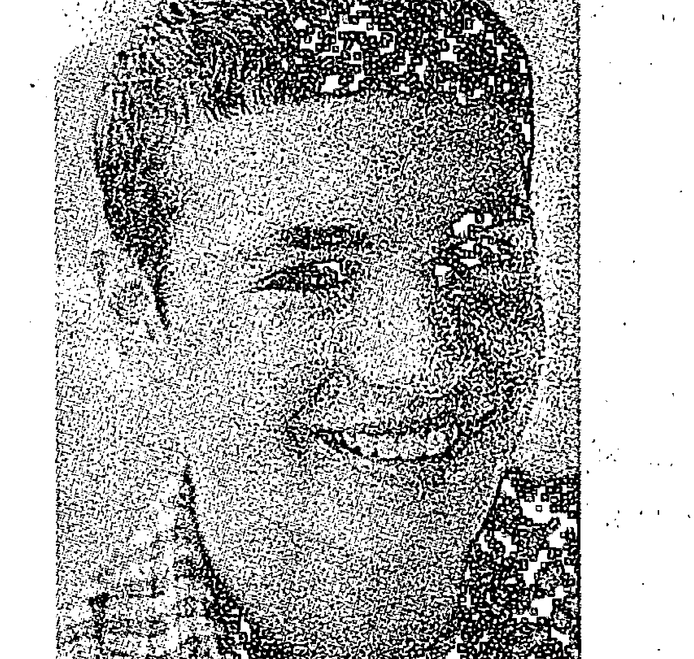

### 一、让照片更完美

有时候，数码相机拍出的照片往往有着这样那样的不尽人意之处。而有了 Photoshop，便可以告别这些不完美了。

#### （一）消除红眼

在夜间或者室内、阴影中等光线昏暗的地方利用闪光灯拍摄照片时，常常由于被拍摄的对象直视镜头，在其瞳孔中出现红色反光现象，也就是所谓的“红眼”现象。

在 Photoshop 7 中打开有红眼现象的照片（如图 1）。选择笔刷工具（快捷键为 B），确认前背景色为默认的黑白色，在选项栏上选择合适尺寸的柔角画笔（如直径为 20 像素的柔角画笔），选择模式为“颜色”，并降低不透明度（如 80%）。设置好之后，可适当放大视图以方便操作，用笔刷工具在瞳孔中的红眼部分单击，一下不行就再来一下（如图 2）——搞定了！就是这么简单。红眼去掉了，双眼仍旧神采奕奕（如图 3）。

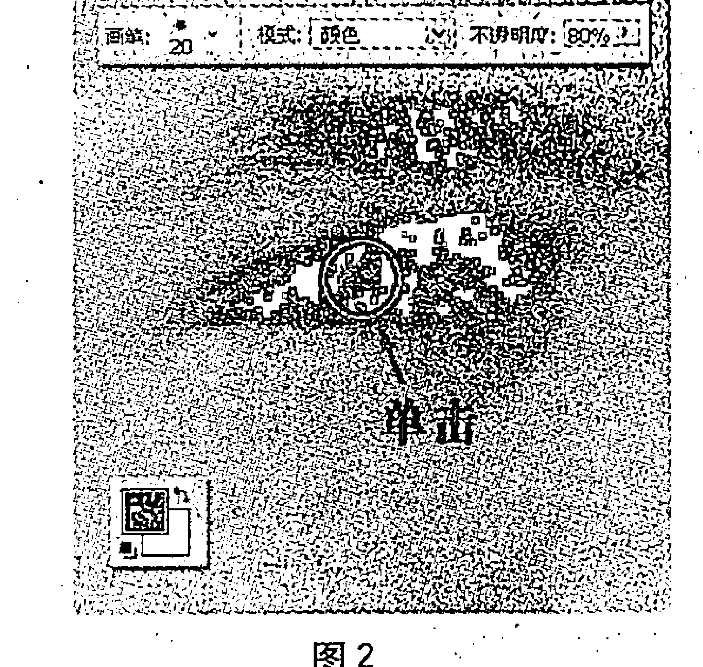

#### （二）清除皮肤上的瑕疵

谁也不希望照片上的自己有疵子、青春痘等杂物，尽管事实上就是如此。既然我们可以使照片上的自己变得更完美，那么为什么不呢？

#### （三）让你看起来更年轻——消除皱纹

时光永远不会倒流，在照片上却未必如此。一个人显得苍老的最明显的标志就是皱纹，尤其是眼角的。将皱纹消除，照片上的你会显得更年轻、更有活力。


在 Photoshop 7 中打开需要修改的照片（如图6）。消除皱纹的方法与清除皮肤上的瑕疵的方法基本相同，不过要更加仔细，因为皱纹的面积较大，取样后需要在欲消除的部分单击并拖动，而且对于取样点的选取要更加慎重。仍然选择修复画笔工具，在选项栏上选择合适尺寸的柔角画笔（如直径为６像素的柔角画笔），选择模式为“替换”，选择源为“取样”，不勾选“对齐的”选项。适当放大视图，并将需要清除的皱纹置于视图的中央部分，按住 Alt 键在皱纹附近较为平滑的皮肤上单击取样，然后在皱纹上单击并拖动（如图7）。操作过程中要不厌其烦，并注意经常更换更适合的取样点（否则将出现重复的图案），如果操作不当，就按下Ctrl+Z键恢复到上一步；重新来过。经过细致认真的处理，将眼角、额头等部位的皱纹及眼袋清除后，照片中人显得年轻了许多（如图8）。

打开需要修改的照片（如图9）。可以看到这幅照片中人物的皮肤纹理太重，显得有些粗糙，我们来把它变得细腻一些。切换到通道调板，分别单击选择红、绿、蓝三个色彩通道，观察各个通道的情况。红色和绿色通道中的皮肤相对比较细腻，而蓝色通道中的皮肤则比较粗糙；绿色通道中的皮肤足够明亮，而且与其他部位的对比最强烈，因此可以通过它来选择皮肤部分。按住Ctrl键单击绿色通道，通道中的白色部分将被选择，灰色部分颜色越接近白色被选择的程度就越高，而黑色部分则完全不被选择。选择菜单命令“滤镜→模糊→特殊模糊”，将“选项”下的“半径”调整为1.0，其他选项保持默认即可。确定后可以看到，绿色通道中的皮肤纹理被淡化了，皮肤变得细腻了一些。保持选区的存在，单击选择红色通道，对其使用特殊模糊滤镜，参数与前一次相同即可，更快捷的方法是按下Ctrl+F键，即可以相同的参数重复上一次使用的滤镜。使用滤镜后，红色通道中的皮肤也变得细腻了。再选择蓝色通道，由于该通道中的皮肤较为粗糙，所以我们按下两次Ctrl+F键，也就是使用两次特殊模糊滤镜。需要注意的是，使用两次半径为1的特殊模糊滤镜与使用一次半径为2的该滤镜，效果是不一样的。然后按下Ctrl+D键取消选区，单击选择RGB通道回到彩色视图。我们会惊喜地发现，照片中人物的皮肤变好了，更加细腻了（如图10）。

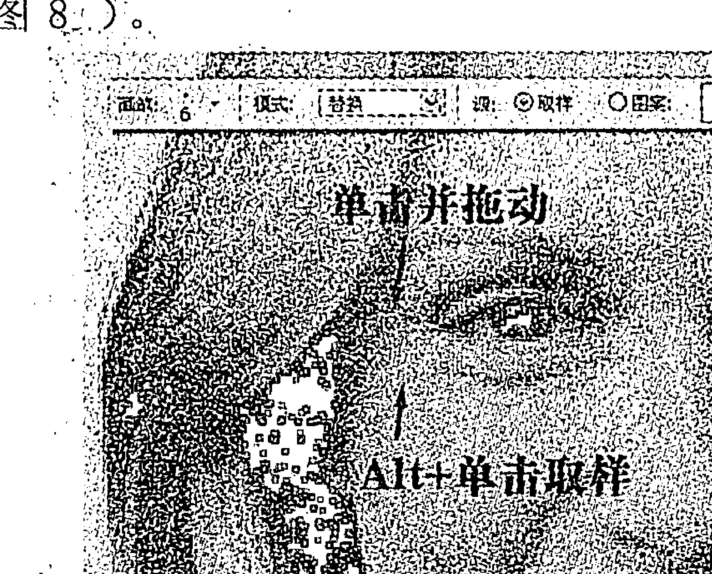

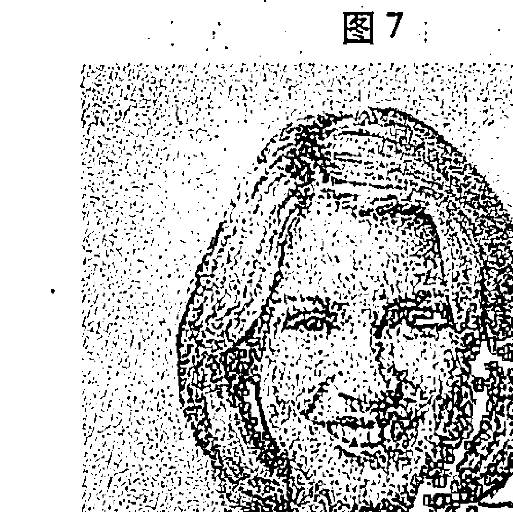

#### （四）使皮肤更柔顺

每个女孩都希望拥有光滑细腻的肌肤，可是照片上的皮肤总是显得干巴巴的。不用郁闷，启动Photoshop吧，让它来帮你——或者让你的男朋友来启动，呵呵。

虽说爱美之心人皆有之，但是在进行特殊模糊时，一定不要太贪心，不要将参数调得过高或者使用太多次滤镜，过于细腻的皮肤会显得很不真实。

#### （五）让失焦的照片变得清晰

对于初学摄影的朋友来说，最常犯的错误就是拍出的照片对焦不准，拍摄主体不够清晰，也就是说照片“失焦”了。我们可以用Photoshop进行一定程度的弥补，记住，仅仅是一。

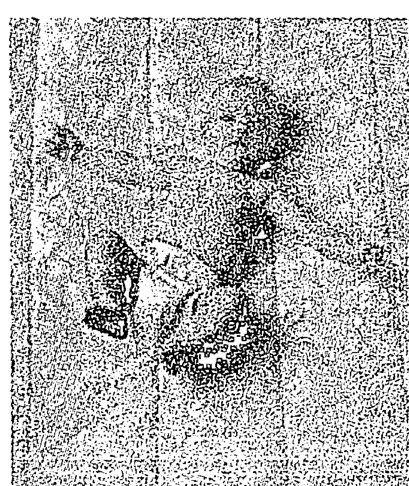

在 Photoshop 7 中打开对焦不够准确的照片（如图 11）。我们将通过锐化使主体变得更清晰一些。对于这张照片，主体（婴儿）与背景（床）十分接近，因此可以同时锐化主体与背景。选择菜单命令“滤镜→锐化→USM 锐化”，在对话框中设置参数“数量”为 200%，“半径”为 1 个像素，“阈值”为 2 个色阶。确定后，照片变得清晰了一些。为了避免锐化对照片颜色的影响，可以在应用滤镜之后，立即选择菜单命令“编辑→消褪 USM 锐化”，在对话框中将模式改为“亮度”，然后确定。如果觉得仍然不够清晰，可以再次使用 USM 锐化滤镜，结果锐化的有点过了。应用“消褪 USM 锐化”命令，在对话框中将模式改为“亮度”，再将不透明度降低到 30%。确定后照片的效果已经可以接受了（如图 12）。

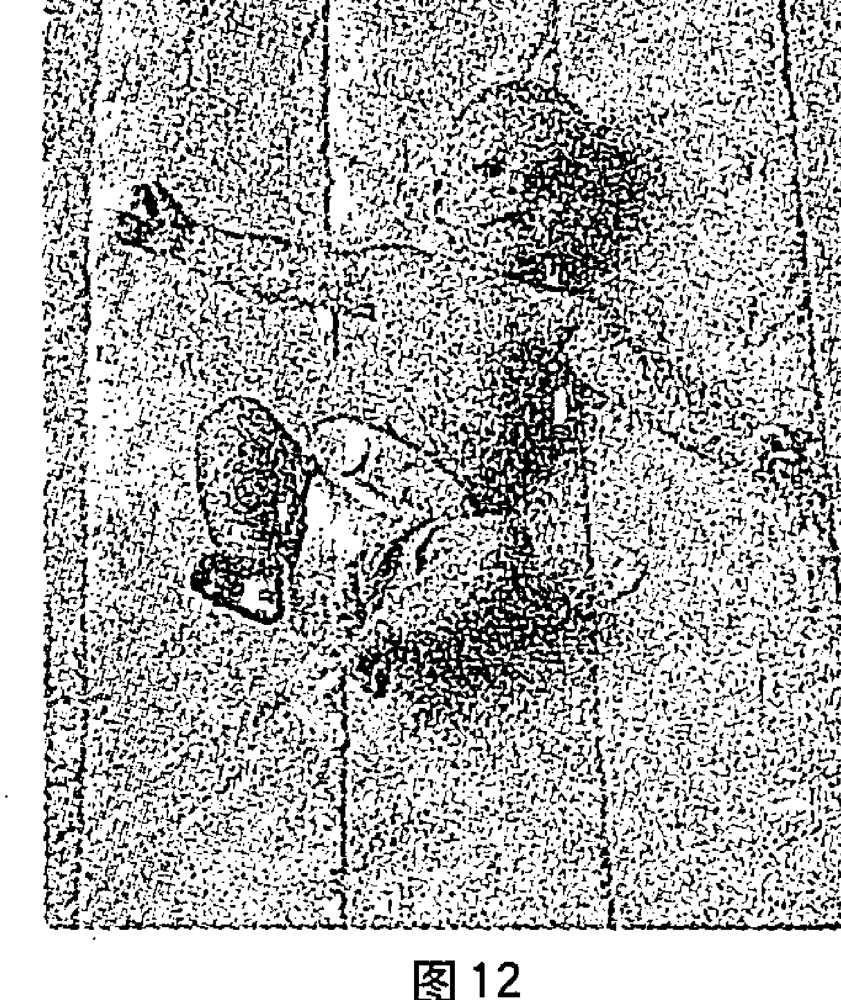

如果被拍摄主体与背景相距较远，需要将主体变得清晰同时保持背景的模糊，我们可以使用锐化工具（快捷键为 R）。在选项栏上选择适当的画笔，选择适当的模式，并调整到合适的强度，然后在主体图像上单击或拖动，可以将涂抹过的部分变得更加清晰。使用锐化工作最需要的就是耐心，一定要认真细致的涂抹才能得到令人满意的结果。但是我们不能一味地依赖锐化滤镜和锐化工具，因为锐化的效果毕竟十分有限。锐化的过程就是细节丢失的过程，锐化过分的话会使照片的图像质量变得很糟糕。想要得到清晰的照片，还是应该在拍摄时认真对准焦点。

#### （六）拨开云雾——提高照片的对比度

在拍摄照片时，天气条件并不总是晴朗清澈的。遇到阴天或者雾天，拍摄出来的照片就显得灰灰的。在 Photoshop 中，我们可以通过“色阶”和“曲线”命令来进行调整。

打开需要调整对比度的照片（如图13）。可以看到，由于某种原因，这张照片的对比度比较差，整张照片显得灰蒙蒙的，不够明亮。我们只需要几步简单的操作就可以使情况大为改观。切换到图层调板，单击位于调板底部的“创建新的填充或调整图层”按钮，在菜单中选择“色阶”。在弹出的色阶对话框中，我们可以看到照片的色阶分布，直方图显示色阶分布不均匀，暗部和亮部几乎没有像素分布——这就是照片显得灰蒙蒙的原因。一张好的照片的色阶分布应该是在整个区域内近似的呈正态分布。我们将输入色阶部分代表黑场和白场的滑块都向中间拖动，直到有足够像素出现的地方（如图14）。这样就强迫照片中的像素在整个区域内分布。调整好后确定，原本灰蒙蒙的照片就变得透亮了（如图15）。使用“曲线”可以达到同样的目的，在新建调整图层的菜单中选择“曲线”，就打开了曲线对话框。确认顶部的“通道”为RGB，在中间部分的斜线上单击并拖动，就可以增加调节点。在斜线的两端各增加一个调节点，将斜线调整为稍稍有点“S”形（如图16）。这样调整就使得照片中的暗部更暗，亮部更亮，从而增强了照片的对比度。确定后，照片就变得更透彻了。

#### （七）快速调整照片的偏色

数码相机都有白平衡设置，这是因为在不同的光线条件下物体的颜色会有微妙的变化。比如，阴天时光线略微偏蓝，荧光灯的灯光更加偏蓝，白炽灯的灯光则偏黄。虽说多数数码相机都有预设的白平衡或者自定义白平衡，但是拍摄时复杂的情况经常令我们无所适从，结果拍出了偏色的照片。我们可以使用Photoshop将偏色调整回来。

在Photoshop 7中打开偏色的照片（如图17）。我们使用“曲线”命令进行调整，切换到图层调板，新建“曲线”调整图层。在曲线对话框的右下角有三个吸管工具，从左向右依次用来设定黑场、灰点和白场。黑场就是照片中仍有层次的最暗的部分，白场就是仍有层次的最亮的部分。而所谓中性灰，就是RGB三种颜色的色值完全相同的纯灰色。偏色的照片，其灰点和白场都会有不同程度的偏色，变得不那么灰和不那么白，我们就通过使用灰点吸管来设定灰点，或者白场吸管来设定白场的方法进行快速调整偏色。黑场吸管是用不上的，因为无论如何偏色，黑色总是黑色。对于图21这张照片，色调明显偏绿，我们使用灰点吸管来校正偏色。在曲线对话框中选择灰点吸管，然后在照片图像窗口中你确信是中性灰的地方单击，就可以将偏色校正过来了（如图18）。不一定一次就成功，也许需要多试几次才能得到满意的结果，在成功之前，不要失去耐心。对于有些偏色的照片，使用白场吸管会更有效率，这要根据具体情况来进行选择。类似的，在“色阶”命令的对话框中也有着三个吸管工具，它们的作用是一样的。设定灰点和白场的校正偏色方法与数码相机自定义灰平衡和白平衡的原理是一致的，就是由我们来决定什么是灰、什么是白。不过这种方法只是一种快捷的取巧方法，对于情况比较复杂的偏色照片就有些力不从心了，那时候就要使用更专业也更复杂的方法来进行校正了。其实有些时候适当的偏色可以营造出不一样的氛围，甚至于我们要用“色阶”或“曲线”来故意使照片偏色呢。

#### （八）快速调整照片的角度

我们在拍摄照片时，多数情况下是手持数码相机拍摄，这就难免会由于姿势不当或者手的抖动造成照片的构图倾斜了。也可能在拍摄之后，我们对构图不够满意，想要做一些必要的旋转。这好办，我们还是请Photoshop来帮忙。

打开需要调整角度的照片（如图19）。这幅照片中游廊的柱子都是倾斜的，好像整个游廊要倒掉似的，显然需要进行调整。但问题是我们无法判断柱子们究竟倾斜了多少，我们需要旋转多大角度才能使它们恢复竖直状态。我们使用度量工具（快捷键为I）解决这个问题，它就在与吸管工具同一组中，看起来是一把小尺子的模样。在这幅照片中，我们确信那些柱子应该是竖直方向的，所以就用度量工具在一个柱子的边缘上单击并沿着边缘拖动一段距离再松开（如图20）。尽量拖得远一点，因为距离越大误差就越小。然后选择菜单命令“图像→旋转画布→任意角度”，在弹出的对话框中，已经填入了一个角度值并选择了旋转方向，这就是照片应该旋转的角度。确定之后，照片就旋转到了正确的角度。不过这时周围就会出现白边，我们可以使用裁切工具（快捷键为C）将多余的部分裁去。最后得到了构图端正的照片（如图21）。

### 二、让照片更漂亮时尚

对于眼光挑剔的我们来说，一幅数码照片可能不是仅仅色彩饱满、层次丰富、构图精美就能让我们满意的，我们还需要照片上的我们以及我们的亲人、朋友更漂亮、更时尚。拍摄照片时没有做到或是难以做到的事情，就让我们在Photoshop中加以实现吧。

## （一）时尚纹身

在大街上看到有人身上绘着精美时尚的纹身招摇而过，你是否也心向往之呢？可是性格矜持的你又不敢贸然一试。既想追逐时尚的脚步，又不想太张扬，那么就在Photoshop中过一把纹身的瘾吧。


打开一幅自己的照片，照片中应该有部分裸露的皮肤，因为我们要在皮肤上下手。如果没有更合适的，那就纹在自己的脸上吧（如图22）。在本例中，我们选择的纹身图案是如图23所示的卡通小熊。使用移动工具（快捷键为V）将小熊图案拖动到照片所在的文件窗口中。按下Ctrl+T键，出现围绕在图案周围的调整框，拖动其四个角上的手柄可以调整图案的大小，将鼠标移到调整框之外还可以对图案进行旋转。按住Shift键锁定比例将图案调整到合适的尺寸，并将其旋转到适合人物面部的角度。调整好之后，在框内双击鼠标，或者按下Enter键，确认对图案的调整。然后将图案移动到适当的位置上（如图24）。切换到图层面板，将图案所在的图层命名为“图案”。


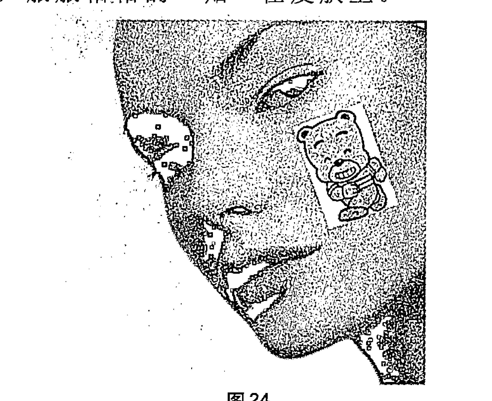

这时候，小熊图案看起来只是覆盖在人物面部的上面，我们要让它沿着面部的曲线发生变化，服服帖帖的“贴”在皮肤上。

选择矩形选框工具（快捷键为M），在小熊图案周围画出一个矩形选框，注意一定要将整个图案全都包括进去。在图层面板上选择背景图层，按下Ctrl+C键复制人物面部位于选框内的部分皮肤。然后选择菜单命令“文件→新建”，在新建文件对话框内，图像的宽度、高度和分辨率已经自动填入了我们复制的那部分图像的相应数值。将文件命名为“皮肤”，选择“内容”为“透明”。确定后建立新的空白文件，在文件窗口内按下Ctrl+V键，将人物面部的部分皮肤粘贴进来。保持“皮肤”为当前窗口，切换到通道调板，分别单击选择各个色彩通道对它们进行观察。可以看到，红色通道明亮而缺乏对比度，这是因为人物的皮肤颜色中红色的成分最多；绿色通道暗一些，有足够的对比度；蓝色通道最暗，对比度也最强。因为我们最关心的这部分皮肤的对比度，而且对于这个文件来说只有前两个通道是起作用的，所以我们将保留绿色和蓝色通道。将红色通道拖到调板底部的垃圾桶上删除掉，在弹出的“要拼合图层吗？”对话框中表示确认。剩下的两个通道将变成洋红通道和黄色通道，图像的色彩模式将变成多通道模式，这对我们的操作并没有影响。选择洋红通道，选择菜单命令“图像→调整→色阶”，在对话框中将直方图下面两端的黑场和白场滑块向中间拖动，直到大部分像素出现的地方（如图25）。这将增大该通道的对比度，也就使得面部的明暗变化更加明显了，但是皮肤上隐约的杂点也变得清晰了，需要减少一些细节。选择菜单命令“滤镜→模糊→高斯模糊”，将“半径”调整为1.5像素——这个值并不确定，只要能够去除杂点并能保持原有的明暗对比即可。确定之后，这个通道中的图像变得模糊了（如图26）。然后选择蓝色通道，同前面一样，先是通过调整色阶来增大其对比度，再使用高斯模糊滤镜去除杂点。保存这个皮肤文件，注意一定要保存为psd格式，而且要记住它存放的位置，因为我们后面要用到它。

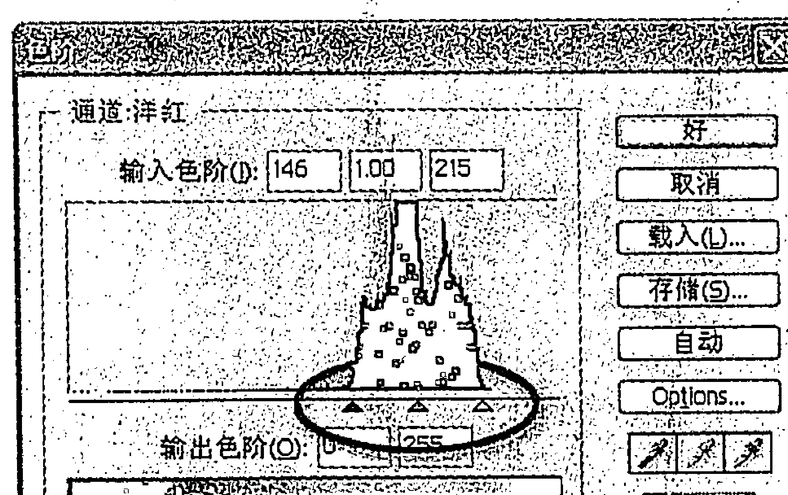

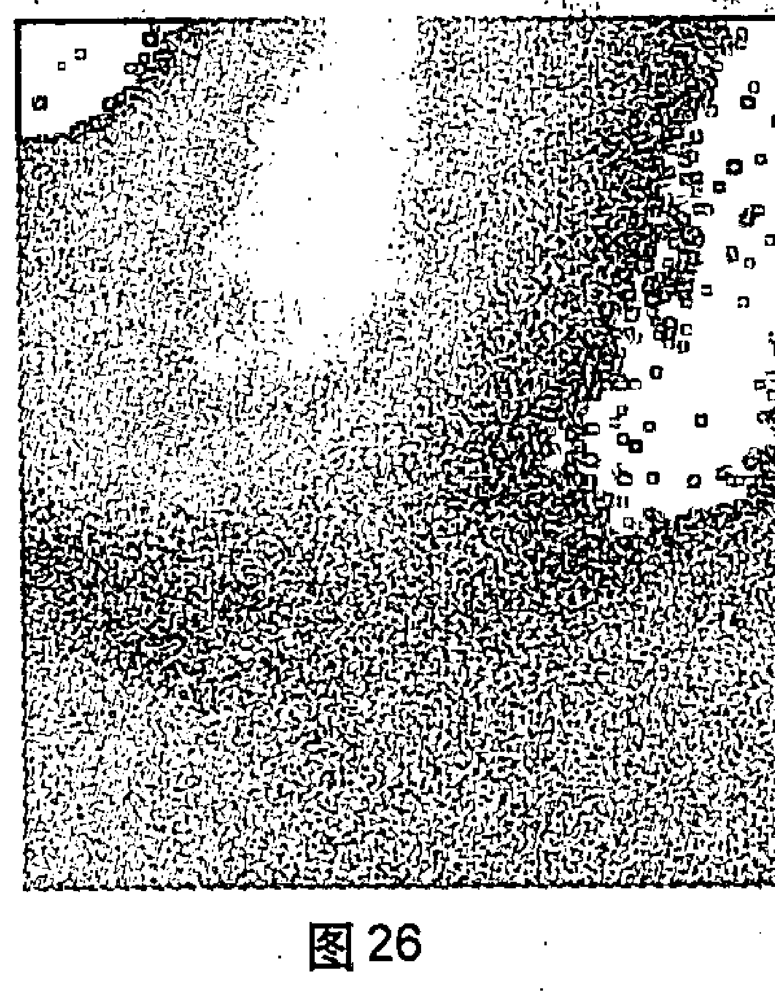

回到照片所在的文件窗口中，包围在图案周围的矩形选框应该还在，保留它。切换到图层调板，选择“图案”图层，然后选择菜单命令“滤镜→扭曲→置换”，在对话框中，水平比例和垂直比例均保持为10%，下面两个选项保持默认，然后按下“好”按钮。在出现的打开文件窗口中，找到我们刚才保存的“皮肤.psd”文件，选择它，按下打开按钮。小熊图案发生了沿面部皮肤的扭曲变换，看起来就像是贴在了皮肤上（如图27）。记得按下Ctrl+D键取消选择。现在还有一个问题，就是图案现在只是“贴”在而不是“绘”在皮肤上的，好像是块胶布，我们还要做进一步的加工。在图层调板上选择“图案”图层，将其图层混合模式改为“正片叠底”，并适当降低图层的不透明度（例如50%）。这下子小熊图案就自然地“绘”在了面部皮肤上，不但露出皮肤的自然纹理，而且还随着面部曲线有着明暗变化（如图28）。

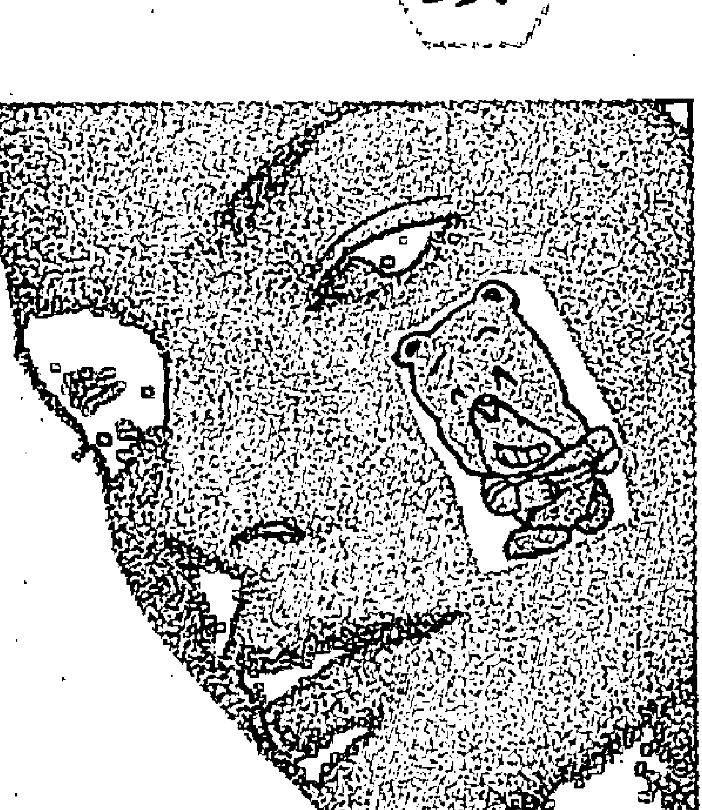


这样进行纹身是不是很有趣呢？在本例中我们将图案纹在了脸上，如果纹在身上的其他部位上，比如胳膊、肩膀、后背等地方，也是一样的。这样纹身，既赶了时髦，又不用担心遭到不理解的人的白眼，而且还省钱，何乐而不为呢？

## （二）亮丽彩妆

有句话说：世界上没有丑女人，只有懒女人。一个女孩经过一番精心妆饰，将会变得容光焕发，更加漂亮。在正式开始化妆之前，不妨先在Photoshop中预演一番，看看效果如何。


在Photoshop 7中打开自己（或是自己女朋友 ^_^）的照片，笔者将以图29为例。这张照片上的女孩素面朝天，虽说十分清纯素雅，不过化上彩妆之后一定会变得更加亮丽的。首先来观察一下需要化妆的部分：女孩的嘴唇很饱满，但是没有足够的光泽，如果画上唇彩再纹上唇线会更漂亮；眼睛是心灵的窗户，女孩的双眼很明亮很有神，如果涂上一点眼影，再撒上一点亮光粉，会使双眼更加有神采；另外，虽然女孩的皮肤很洁白很细腻，不过显得有点苍白，如果让脸色更红润一些，会使她的气色改善不少。好了，我们开始化妆喽。

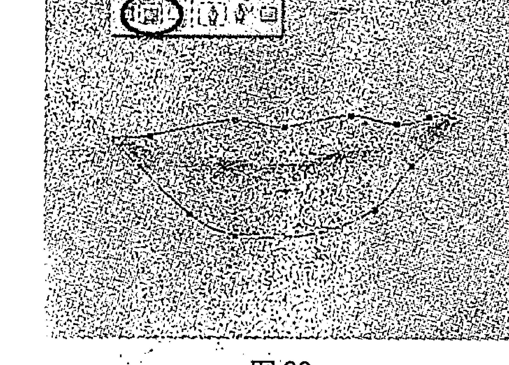

我们先来画唇彩。选择钢笔工具（快捷键为P），在选项栏上选择模式为路径，在照片上勾勒出嘴唇的轮廓。可以适当放大视图，并使嘴唇位于视图的中央。勾路径时要注意结合Ctrl键和Alt键两个功能键，Ctrl键的作用是暂时切换到直接选择工具（白色箭头），移动已经定位的节点，而Alt键的作用是暂时切换到转换点工具（尖角状），调整节点的手柄。路径并不需要特别细致，只要与嘴唇的大致轮廓差不多即可（如图30）。因为我们不止一次用到这条路径，所以需要保存它。切换到路径调板，可以看到我们刚刚描出的路径作为一条工作路径出现，双击它，在弹出的对话框中为其命名为“嘴唇”，然后确定，即可将该路径保存为路径“嘴唇”。按住Ctrl键单击路径“嘴唇”，将其作为选区载入。切换到图层调板，单击调板底部的“创建新的图层”按钮，在背景图层的上面建立空白图层，将新图层命名为“唇彩”。单击工具箱底部的前景色块，在拾色器对话框中选择粉红色（例如颜色值为R255G50B140），按下Alt+BackSpace键使用前景色的粉红色填充选区，然后按下Ctrl+D键取消选择。这时候，女孩的嘴唇上覆盖了一层生硬的粉红色，这当然不是我们想要的效果，还需要进一步处理。选择菜单命令“滤镜→模糊→高斯模糊”，在对话框中将“半径”设为2像素，然后确定。高斯模糊滤镜使嘴唇上的粉红色变得柔和了。在图层调板上，将“唇彩”图层的混合模式改成“颜色”，并适当降低图层的不透明度（例如40%）。到这里，我们已经为女孩画上了漂亮自然的唇彩（如图31）。

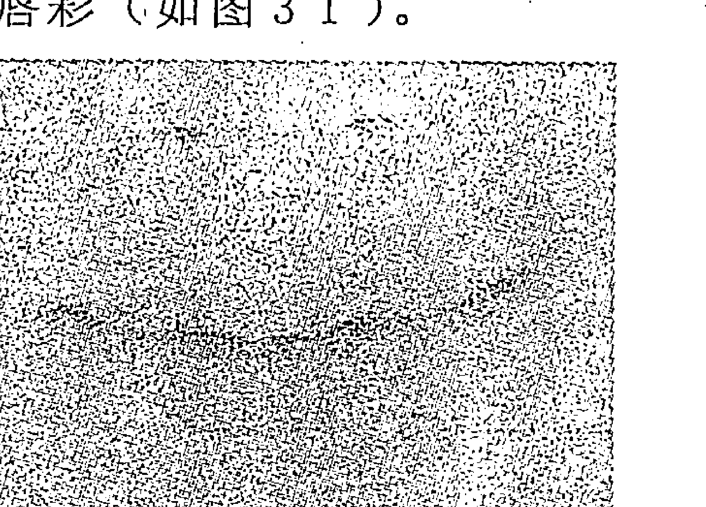

粉红色的唇彩让嘴唇变得更漂亮了，下面我们来加亮唇线使得嘴唇更有光泽。切换到路径调板，再次按住Ctrl键单击路径“唇彩”，将嘴唇的轮廓作为选区载入。切换到图层调板，创建一个新图层，将其命名为“唇线”。然后选择菜单命令“编辑→描边”，在对话框中将“宽度”设为1像素，单击“颜色”旁边的色块，在拾色器对话框中选择白色（颜色值为R255G255B255），“位置”选择“居外”，其余选项保持默认，然后确定。记得按下Ctrl+D键取消选择。现在的唇线太生硬了，使用高斯模糊滤镜，将“半径”设为1.5像素，对唇线进行柔化。在图层调板上，将“唇线”图层的混合模式改为“柔光”，并适当降低图层的不透明度（例如50%）。有了唇线，女孩的嘴唇变得更加有光泽了。

眼影可以让女孩的双眼显得更有神采，接下来我们来为她涂眼影。在图层调板上，创建一个新图层，将其命名为“眼影”。单击前景色块，在拾色器对话框中选择青色（例如颜色值为R95G100B145）。选择笔刷工具，在选项栏上选择较小尺寸的柔角画笔（如直径为10像素的柔角画笔），适当放大视图，分别在女孩两只眼睛的上眼皮部分涂画，为其画上眼影（如图32）。涂画时要非常小心，如果不小心涂到了眼睛上或者涂的范围太大了，可以按下Ctrl+Z键恢复一步操作，或者使用橡皮擦工具（快捷键为E）换用较小尺寸的画笔将多余的部分仔细擦除。使用高斯模糊滤镜，将“半径”设为2像素，对眼影进行模糊处理。在图层调板上，将“眼影”图层的混合模式改为“颜色”，并适当降低图层的不透明度（例如40%）。现在，女孩的双眼看起来更有神采了。

然后使用高斯模糊滤镜，将半径设为4像素对眼影进行柔化。在图层调板上，将“眼影”图层的混合模式改成“颜色”，并适当降低图层的不透明度（例如30%）。这样女孩的眼影就变得自然了（如图33）。

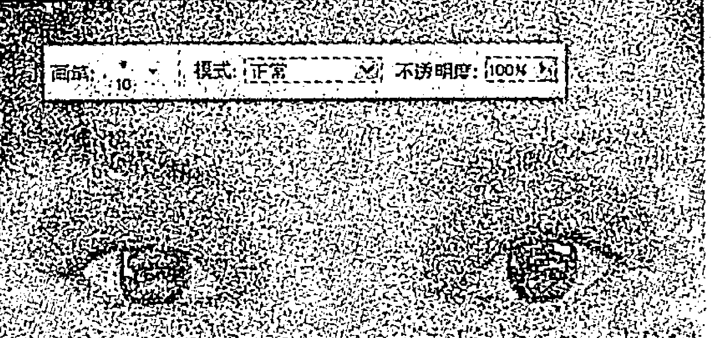

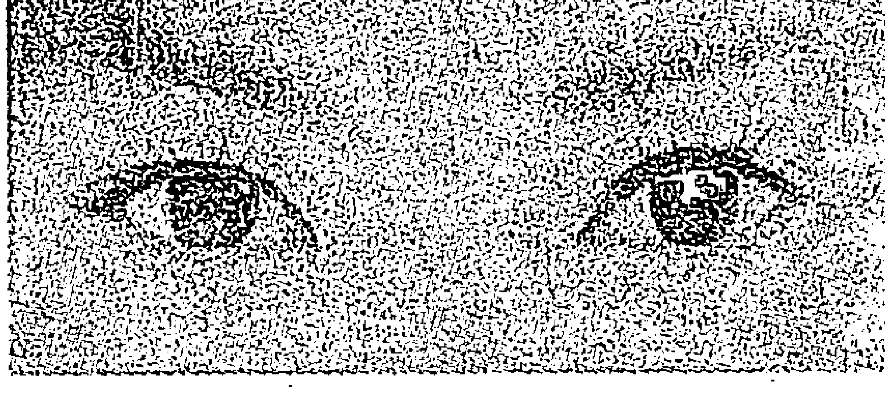

仅有眼影的妆饰，女孩的双眼还不够亮丽，我们再为她撒上一点亮光粉。首先来制作亮光粉，创建一个尺寸为100×100像素，“模式”为灰度，“内容”为“白色”的新文件。按下D键，将前景色和背景色恢复为默认的黑白两色。选择菜单命令“滤镜→杂色→添加杂色”，在对话框中将“数量”设为8，“分布”选择“高斯分布”，并勾选“单色”复选框，单击“好”按钮为图像添加黑白杂色。然后选择菜单命令“选择→色彩范围”，将“颜色容差”设置为较低水平（例如值为4），然后使用吸管单击图像中的白色部分，对白色部分进行选择，可能需要尝试多次才能得到满意的选取范围（如图34）。按下Ctrl+C键复制被选择的部分，回到女孩照片所在的文件窗口，两次按下Ctrl+V键将白色杂点复制过来。使用移动工具将两块白色杂点移动到女孩双眼的上面。复制过来的两块白色杂点自动创建了两个新图层，选择上面的图层，按下Ctrl+E键将两个图层合并，将其命名为“亮光粉”。选择橡皮擦工具（快捷键为E），在选项栏上选择适当尺寸的硬角画笔（如直径为13像素的硬角画笔），将双眼上多余的亮光粉擦除（如图35）。在图层调板上，将“亮光粉”图层的混合模式改成“柔光”，并适当降低图层的不透明度（例如50%）。

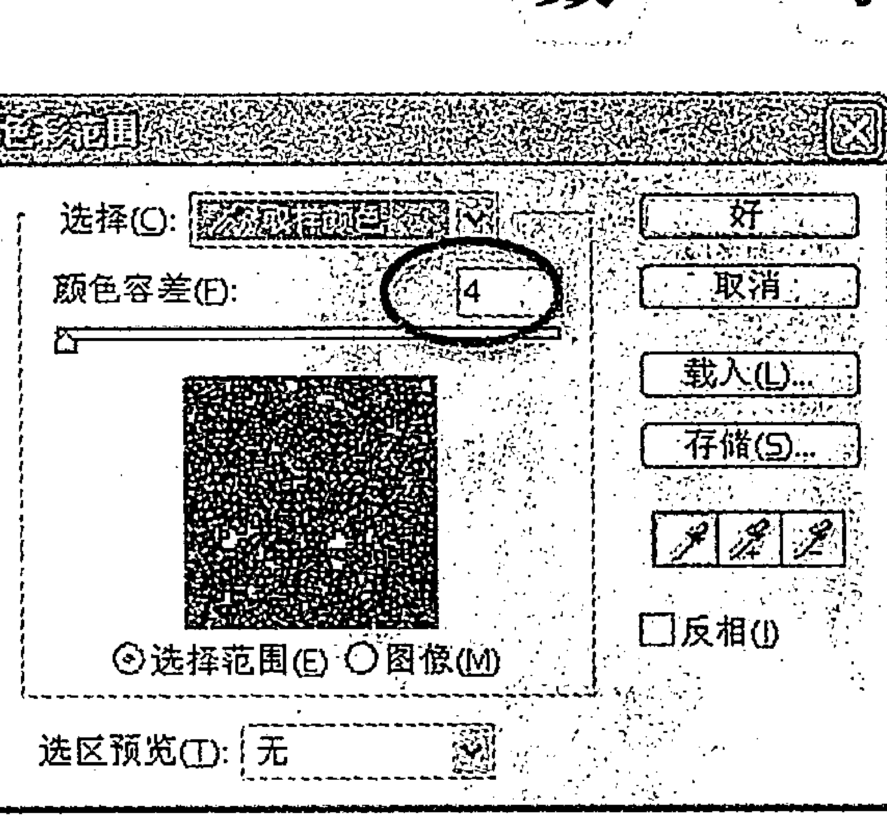

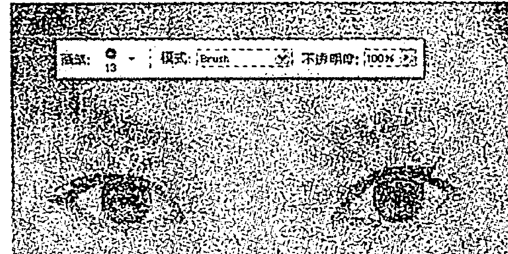

最后再来改善一下女孩的脸色。在图层调板上，创建一个新图层，将其命名为“红润”。单击前景色块，在拾色器对话框中选择红色（颜色值为R255G0B0）。选择笔刷工具，在选项栏上选择较大尺寸的柔角画笔（如直径为100像素的柔角画笔），在女孩的两颊处分别单击，为其涂上通红的脸蛋（如图36）。这样的红脸蛋太傻了，需要修改。在图层调板上，将“红润”图层的混合模式改成“颜色”，并适当降低图层的不透明度（例如40%）。到这里，我们就完成了为女孩化的彩妆（如图37）。


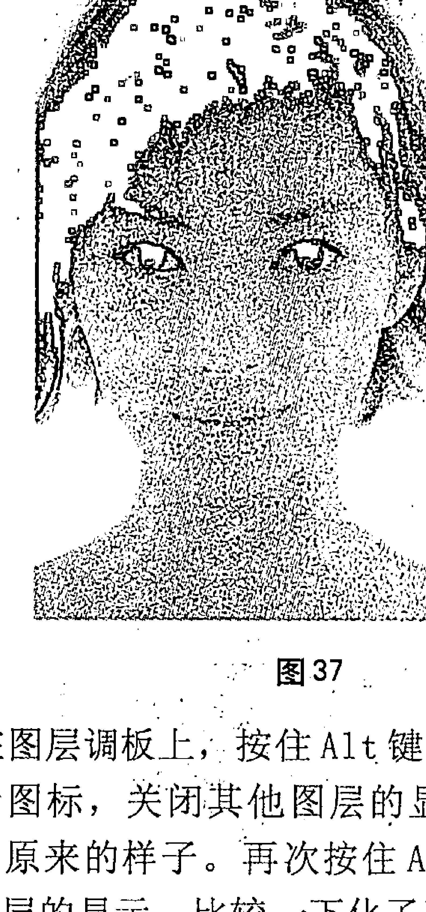

在图层调板上，按住Alt键单击背景图层左侧的眼睛图标，关闭其他图层的显示，可以回顾一下女孩原来的样子。再次按住Alt键单击，恢复所有图层的显示，比较一下化了彩妆的女孩是否变得光彩照人了呢。什么？还不如不化妆？晕倒！（由于奇士晕倒，本教程课间休息10分钟。）

## （三）漂亮首饰

时尚之风越吹越强劲，人们开始在自己的脸上做起了文章，一些新新人类在脸上打洞穿环，玩的就是一个酷。更多的人也许没这个胆量和勇气，但是这并不妨碍我们在Photoshop中拿自己的照片来虚拟地酷上一把。


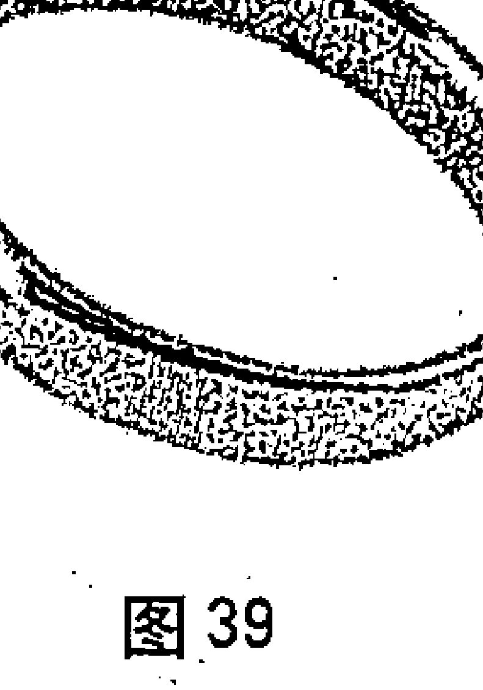

在Photoshop 7中打开一张人物头像照片（如图38）和一个金属环图像（如图39），我们将把这枚金属环穿在这个人的脸上。在使用金属环图像之前，应该将其背景去掉。可以先使用磁性套索工具（快捷键为L）描出金属环的大致轮廓，再使用套索工具（快捷键为L）结合Shift键和Alt键对选区进行增减，最后选择完整的金属环。使用移动工具将金属环图像拖动到人物头像照片所在的文件窗口中，并放置在适当位置。如果对金属环的尺寸不满意，可以按下Ctrl+T键，拖动调整框四角的手柄调整其大小，按住Shift键可以保持纵横比例。调整满意后在框内双击鼠标或者按下Enter键确认调整（如图40）。切换到图层调板，将金属环所在的新图层命名为“金属环”。然后单击调板底部的“添加蒙版”按钮，为图层“金属环”添加一个蒙版。蒙版的最初状态是全白色的，这意味着图层“金属环”上的所有部分都是可见的。选择笔刷工具，在选项栏上选择较小尺寸的硬角画笔（如直径为5像素的硬角画笔），按下D键将前景色和背景色恢复为默认的黑白色，用笔刷工具在图层“金属环”的蒙版上涂抹，将金属环的顶部隐藏（如图41）。注意在涂抹时要将隐藏的边缘擦得圆滑一点，这样显得更真实一些。


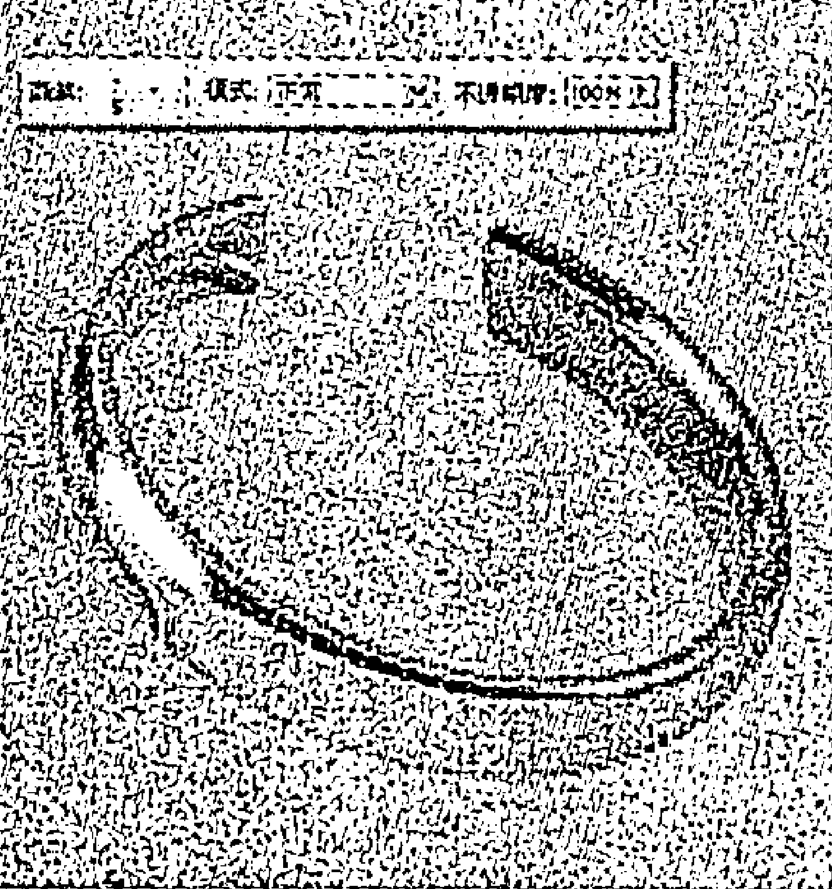

由于光线的存在，金属环会在人的面部留下阴影，接下来我们就来为它添加阴影。在图层调板上，双击图层“金属环”的空白处，在弹出的图层样式对话框中，在左侧选择“投影”，在右侧进行适当的设置，将“角度”调整为90度，并取消“使用全局光”选项的选择，“距离”设为5像素，“扩展”设为10%，“大小”设为10像素。设置好之后确定，金属环下面便出现了下落阴影（如图42）。我们仔细观察一下人物面部的光线，金属环的阴影显然不会是现在这个样子的，因此我们还需要对它进行调整。在图层“金属环”的图层样式标志——那个字母“f”上单击右键，选择“创建图层”，在弹出的警告对话框中单击“好”按钮，便为金属环的阴影独立创建了一个图层“‘金属环’的投影”。选择该阴影图层，按下Ctrl+T键，结合Ctrl键对调整框进行调整（如图43）。满意后在框内双击鼠标或者按下Enter键确认修改。

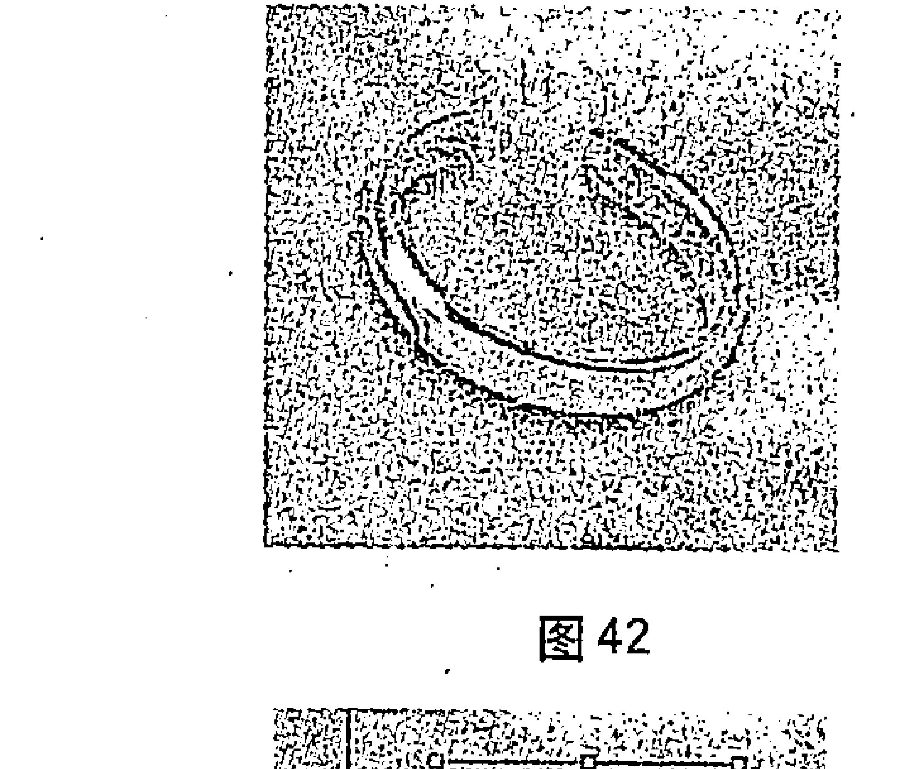

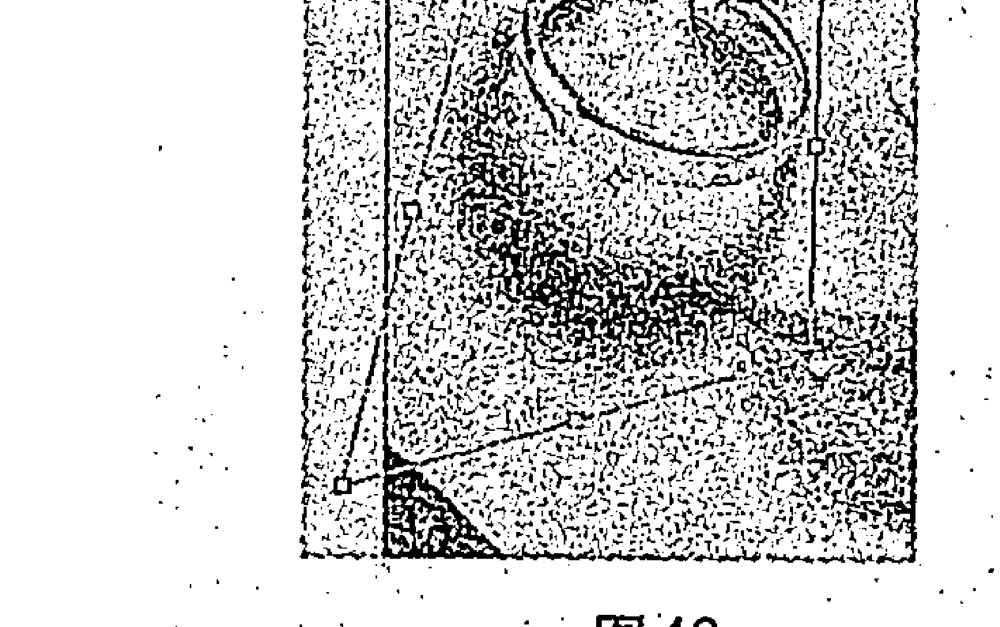

生活中的常识告诉我们，倾斜的阴影并不是均匀的，而应该是距离物体越远，阴影就颜色越浅也越模糊。选择矩形选框工具，在选项栏上将“羽化”设为10像素，然后在金属环的阴影上单击并拖动，选择阴影的下面三分之二部分。选择菜单命令“滤镜→模糊→高斯模糊”，在对话框中将“半径”设为10像素，然后确定。记得按下Ctrl+D键取消选择。然后再次用羽化值为10像素的矩形选框工具选择阴影的下面三分之一部分，对这部分使用半径为20像素的高斯模糊滤镜。经过这样一番处理，金属环的阴影看起来真实多了（如图44）。

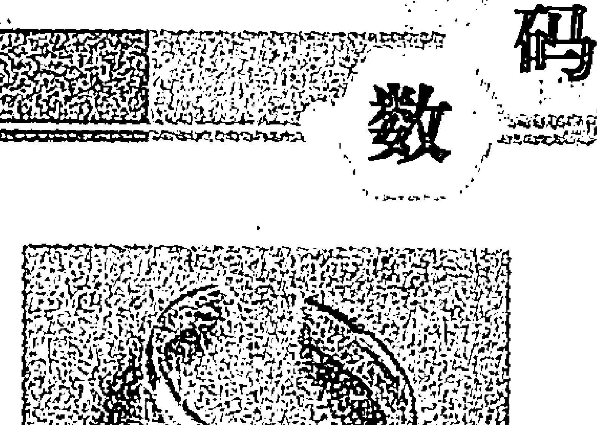

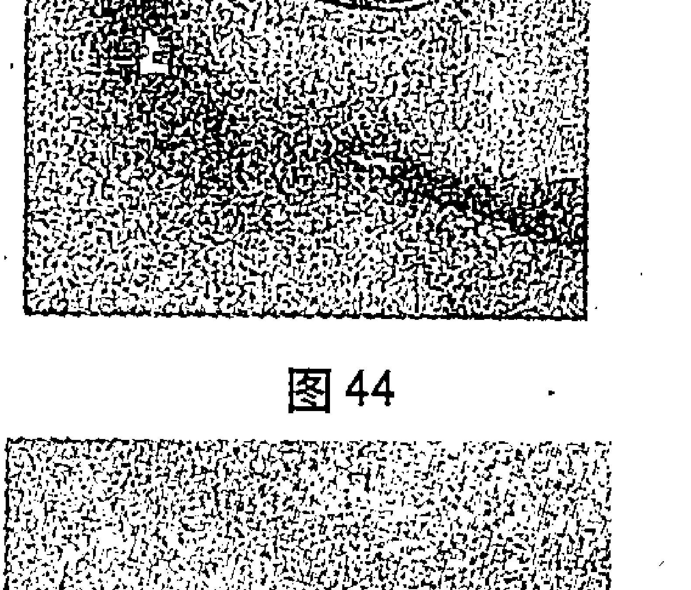

我们还面临着一个问题，那就是当有物体穿入皮肤时，皮肤是不会没有变化的。我们使用图层样式来模拟这种变化。在图层调板上，选择背景图层，选择椭圆选框工具（快捷键为M），在选项栏上将“羽化”改为0，在金属环与皮肤的一个相交处单击并拖动，画出一个椭圆形选区（如图45）。按下Ctrl+J键，将选区内的部分复制为一个新的图层，将其命名为“皮肤隆起1”。单击调板底部的“添加图层样式”按钮，在菜单中选择“斜面和浮雕”，在图层样式对话框中，左侧的“斜面和浮雕”选项已经被选择了，在右侧进行设置，“样式”选择“浮雕效果”，“深度”设为50%，“大小”设为15像素，“软化”设为5像素，“阴影角度”设为70度，“高度”为30度，并取消“使用全局光”选项的选择。确定之后，皮肤与金属环接触部分发生了隆起（如图46）。同样，在另一个相交处画出一个椭圆形选区，按下Ctrl+J键复制为新图层，将其命名为“皮肤隆起2”。这个图层的图层样式就不用逐项设置了，因为两个部分是一样的，可以直接复制过来。在图层“皮肤隆起1”上单击右键，在菜单中选择“拷贝图层样式”，然后在图层“皮肤隆起2”上单击右键，在菜单中选择“粘贴图层样式”。于是，两个图层就拥有了同样的隆起效果。感觉两处隆起效果太重了，我们可以适当降低两个图层的不透明度（例如50%）以减轻隆起效果。经过一番努力，我们终于将金属环穿在了人物的脸上（如图47），看起来够酷吧。

## （四）换新衣裳

一件衣服穿久了，难免会觉得厌倦，想换新的，可是我们总换新衣服需要多少钱啊！不过，虽然我们没有很多钱，但是我们有Photoshop，可以在Photoshop中尽情体验随意换新衣裳的畅快与乐趣——是不是有点阿Q？


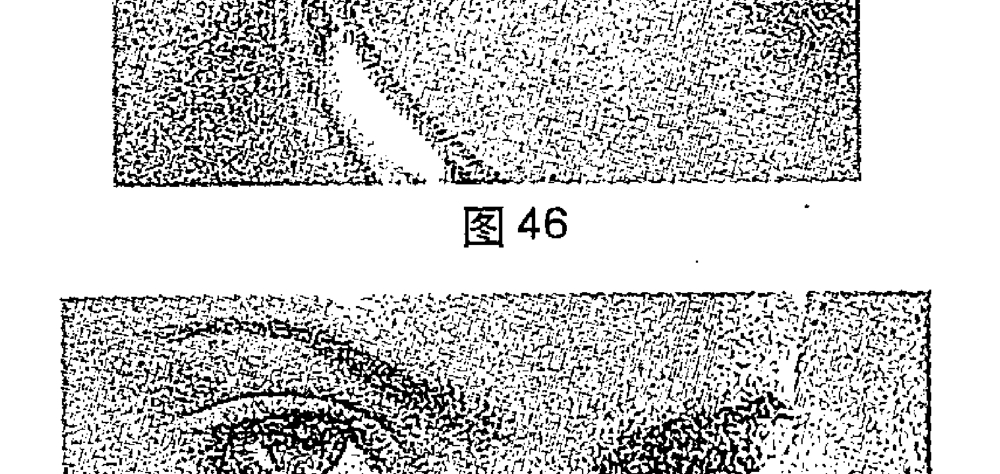

应该说现在的效果仍然不够细致，金属环与皮肤相交处的情况要比现在复杂得多，然而我们现在得到的结果无疑是快速而能够令人满意的。当你的朋友因为看到这张照片而瞪大了眼睛时，你的心里肯定在偷着乐呢。

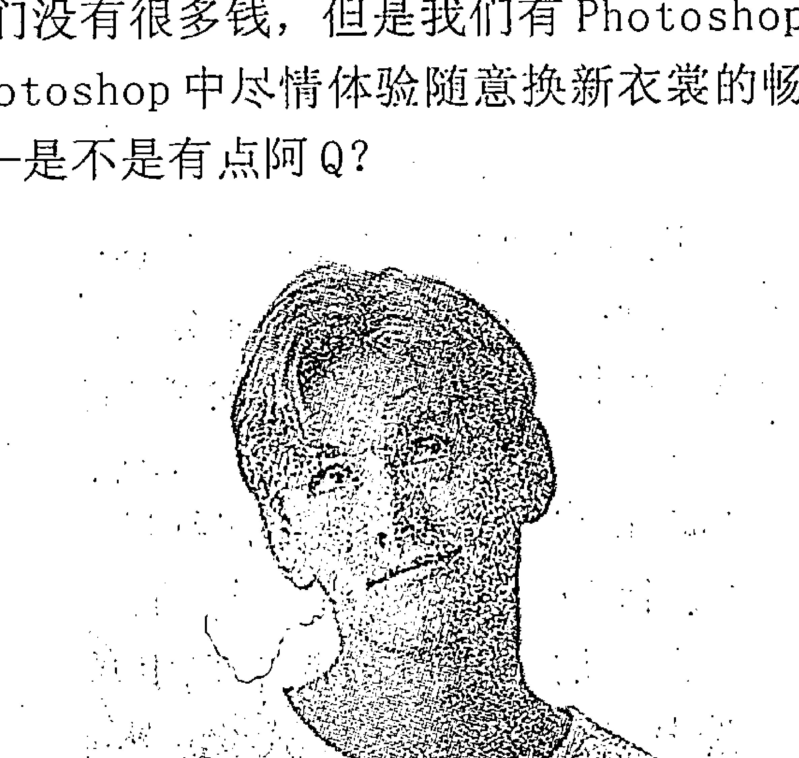

打开一幅穿着T恤衫的人物照片（如图48），读者朋友可以将其换成自己或者亲人、朋友的照片。T恤衫最好是白色的，如果是其他颜色的会影响最后的效果——看来天下果然没有免费的午餐，不花钱随意换新衣裳终究是个梦。下面我们就要把这件白色T恤衫改换成迷彩的。选择菜单命令“文件→新建”，创建一个尺寸为400×400像素，“内容”为“白色”的新文件。在工具箱上，单击前景色块，在拾色器中选择深绿色（例如颜色值为R25G65B6），再单击背景色块，在拾色器中选择浅绿色（例如颜色值为R154G175B144）。然后我们按住Alt键，选择菜单命令“滤镜→渲染→云彩”，注意选择菜单时需要按住Alt键不放并拖动，直到在“云彩”项目上放开。于是文件窗口中便出现了绿色云雾效果（如图49）。云彩滤镜的作用就是制作前景色与背景色之间云雾状的随机变化，而按住Alt键的作用是增强云彩滤镜的效果。我们可以尝试着比较一下，可以看到按住Alt键应用云彩滤镜的效果要明显强于不按Alt键时的效果。这种云彩效果是随机变化的，每次应用都会有所不同，如果对得到的云雾效果不满意，可以反复尝试，直到效果满意为止。再选择菜单命令“滤镜→像素化→晶格化”，在对话框中将“单元格大小”设为60，确定后文件窗口中的云雾效果变成了晶体状的色块。

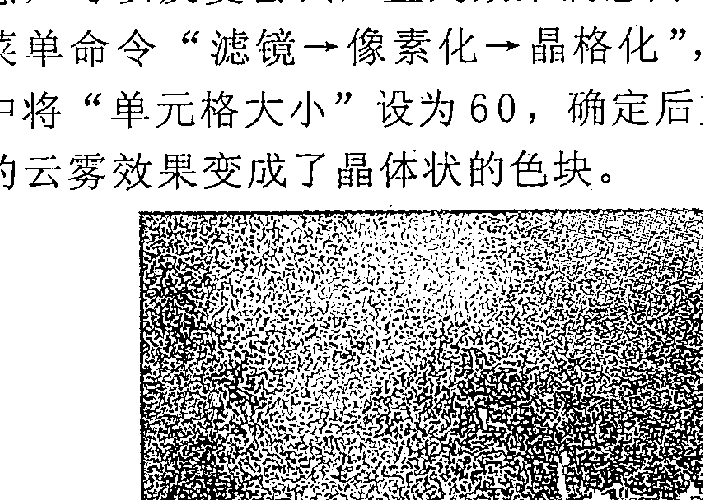

选择菜单命令“滤镜→扭曲→波浪”，在对话框中设置“生成器数”为5，“波长”的最小值和最大值均为100，“波幅”的最小值和最大值均为5，“比例”在水平方向和垂直方向上均为100%，“类型”选择“三角形”，“未定义区域”选择“重复边缘像素”。可以不断单击预览窗口下面的“随机化”按钮，窗口中的图像将根据我们设置的参数发生随机变化，得到令我们满意……的结果后确定，可以看到文件窗口中的晶体色块发生了扭曲变形。接下来再选择菜单命令“滤镜→扭曲→海洋波纹”，在对话框中将“波纹大小”设为10，“波纹幅度”设为8。确定后图像窗口中的色块将变得更加混乱和复杂，这样就最后得到了我们需要的迷彩图案（如图50）。下面我们要把它应用到白色T恤衫上去。

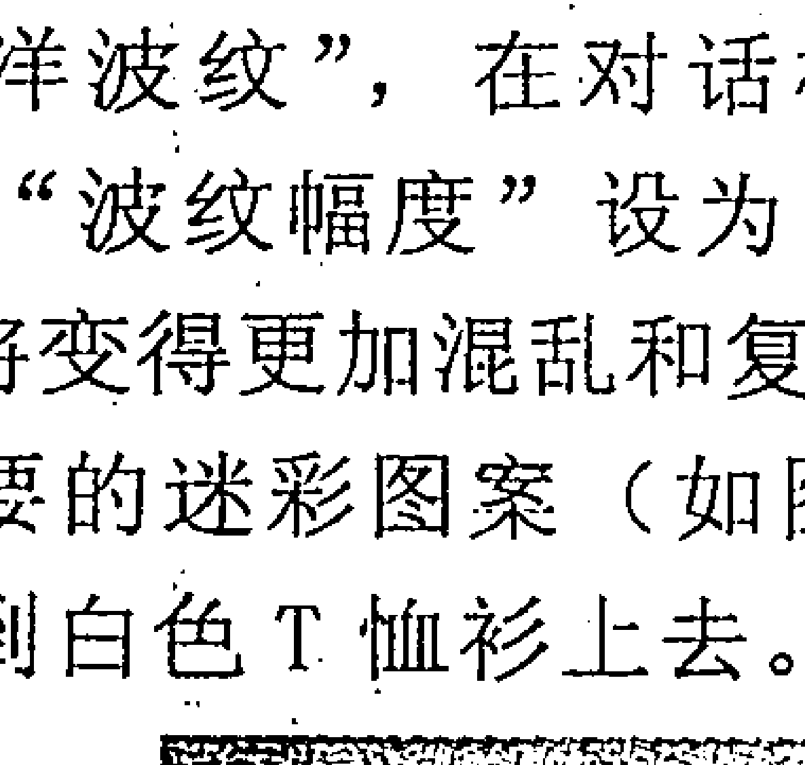

切换到人物照片。首先需要选择出T恤衫的范围，根据其轮廓的特点，使用钢笔工具勾勒路径无疑是最为准确快速的方法。选择钢笔工具（快捷键为P），在选项栏上选择路径模式，沿T恤和图像的边缘勾出轮廓（如图51）。轮廓勾好之后，切换到路径调板，双击T恤衫的轮廓路径，在弹出的对话框中为其命名为“T恤衫轮廓”，然后确定，即可将该路径保存为路径“T恤衫轮廓”。

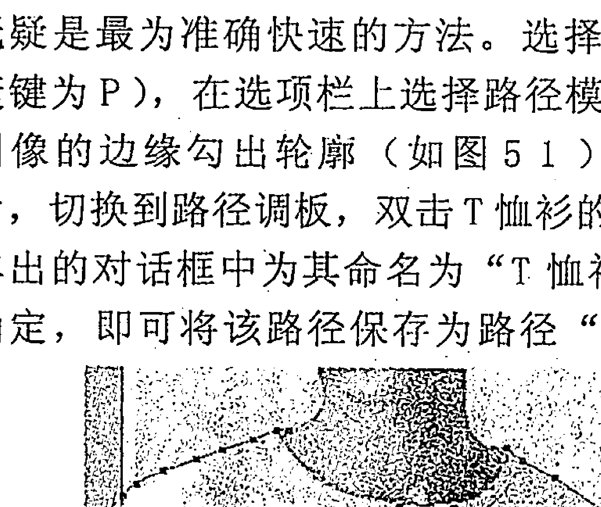

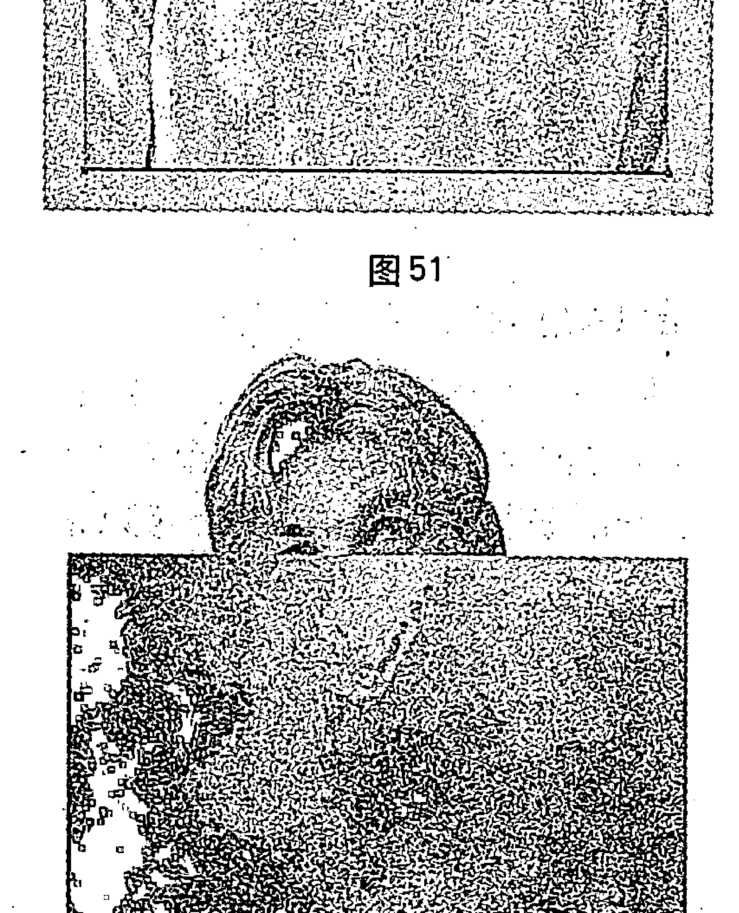

选择移动工具，将我们刚才制作的迷彩图案从其所在的窗口中拖动到人物照片上来，并摆放在适当的位置上（如图52）。切换到图层调板，将迷彩图案自动创建的新图层命名为“迷彩图案”。迷彩图案应该只在T恤衫上出现，我们就用刚才保存的路径“T恤衫轮廓”来限定它的范围。切换到路径调板上，按住Ctrl键单击路径“T恤衫轮廓”，将其作为选区载入。切换到图层调板上，选择“迷彩图案”图层，单击调板底部的“添加蒙版”按钮，为该图层制作蒙版。这时选区之内的部分仍然能够显示出来，而选区之外的部分被蒙住了。在图层调板上，将“迷彩图案”图层的混合模式改为“正片叠底”，并适当降低图层的不透明度（例如80%）。迷彩图案就自然地“印”在T恤衫上了，我们成功地将白色T恤变成了迷彩T恤（如图53）。


由于我们用到的很多滤镜效果是随机的，所以读者得到的结果可能与笔者的不完全相同，而个性正在于这些随机的变化之中。发挥我们的想象力，还可以创造出更多更漂亮的图案来装点我们的衣服。不过，这毕竟有很多的局限性，想要真正拥有漂亮的新衣裳，还得花钱去买。

### 三、让照片更吸引目光

这是一个讲求个性的时代，数码照片当然也不能例外。凡事都要与众不同的我们怎能忍受自己的数码照片与他人的雷同？在摄影本身，也许我们已经江郎才尽，无法再挖掘出更多的奇思妙想，但是在 Photoshop 的后期处理中，可供我们发挥的空间却仍然是那样广阔，以至于我们已经迫不及待的要对我们的数码照片“大动干戈”了。

#### （一）怀旧老照片

一张历经数载、沾满了岁月的痕迹的老照片，似乎总能让我们感受到时光流逝的沧桑和无奈。不知你是否有耐心将数码照片冲洗出来再等待它慢慢的变黄，反正笔者是没有，不过我们有 Photoshop。

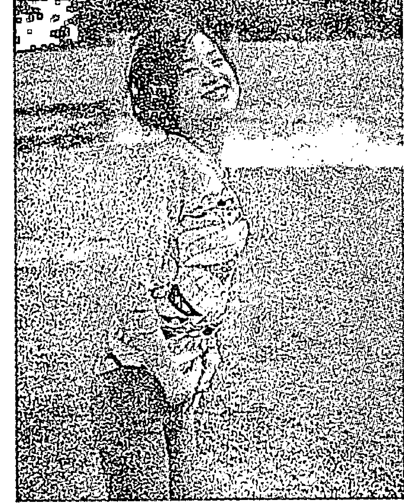

打开预备变老的照片（如图54）。注意这张照片一定要对比度比较强烈，色彩层次丰富的，否则做出的结果会很差。切换到图层调板，单击底部的“创建新的填充或调整图层”按钮，在菜单中选择“渐变映射”。在对话框中，默认的渐变是由黑到白，如果勾选了“预览”复选框，可以看到照片变成了黑白的，这是因为渐变中的颜色依据亮度代替了照片中的所有颜色。我们需要对渐变进行修改，单击渐变条，就弹出了渐变编辑器对话框。位于下半部的渐变条是我们修改的对象，位于其上面的滑块是控制透明度的，位于其下面的滑块是控制颜色的。单击选择下面左边的滑块，然后单击下面的颜色块，在弹出的拾色器中选择褐色（例如颜色值为 R80G40B0）。再选择下面右边的滑块，为其选择浅棕色（例如颜色值为 R255G240B210）（如图55）。选择好颜色之后，确定回到渐变映射对话框，这时渐变条已经变成我们修改的褐色到浅棕色的渐变了。确定之后，照片就变成了棕黄色调的老照片了（如图56）。如果我们更狠心一点儿，还可以继续“蹂躏”这张照片，为其制作污渍和破损，使其老得掉渣儿，笔者就不在这里细说了。

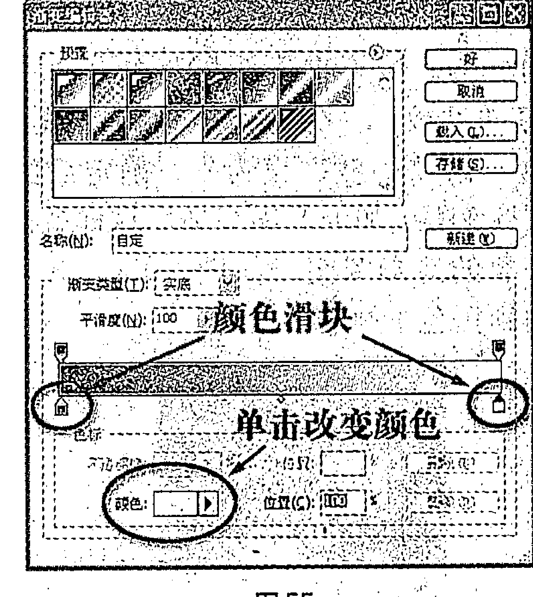


同样利用“渐变映射”命令或调整图层，我们还可以制作各种色调的照片，比如冷酷的蓝色、神秘的紫色、温暖的橙色等等。如果将渐变调整得复杂一些，还可以使照片发生非常奇妙的变化。只要我们多多尝试，就会发现更多技巧。

#### （二）黑白的魅力

在彩色照片大行其道的今天，黑白照片仍以它那独特的魅力占据着一席之地，至今无法替代。虽说多数数码相机提供了黑白模式，可以很容易地拍摄出黑白照片，但是那太简单了，效果也不在我们的控制之下。所以我们仍然选择 Photoshop。

将彩色照片在 Photoshop 中打开（如图57）。同样要求这张照片对比度强烈，色彩层次丰富。使用菜单命令“图像→模式→灰度”和“图像→调整→去色”都可以制作黑白照片，后者的效果要稍好于前者，不过这两种方法得到的结果都不能令我们满意，因为它们并没有提供让我们调整的余地。真正的高手使用“运算”命令来制作黑白照片，

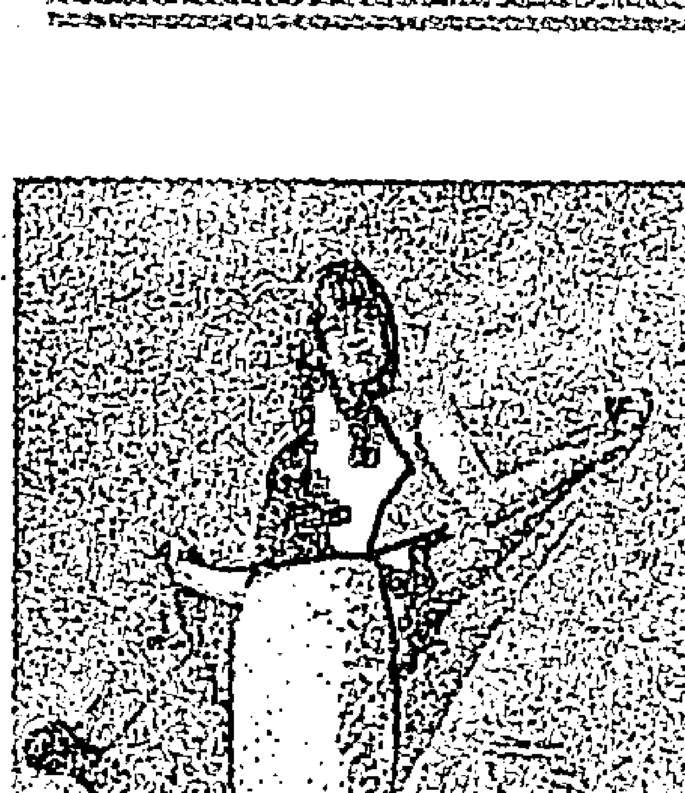

### 图57

呵呵。首先切换到通道调板，依次选择三个色彩通道进行观察，发现红色和绿色通道质量较好，并且红色通道的亮度较高，绿色通道的对比度较高，而蓝色通道情况比较糟糕。选择 RGB 通道回到彩色视图，然后选择菜单命令“图像→运算”，于是弹出了运算对话框。“运算”命令可以将来自一个甚至两个文件的图层和通道进行混合，而且还可以调整混合叠加模式、不透明度，甚至将某个通道作为蒙版，通过这一系列丰富的参数调节，最后得到精致细腻的黑白照片。由于我们只有一个单个图层的文件，所以源文件和“图层”选项均不用选择。根据刚才的观察，我们分别选择“源 1 ”的“通道”为红色通道，“源 2 ”的“通道”为绿色通道，这样是将红色通道叠加到绿色通道上面，注意顺序不同结果是不同的；将“混合”模式改为“柔光”，将不透明度降低到 50％，以获得更高的对比度；勾选“蒙版”复选框，在随之出现的选项中，选择“通道”为红色通道，这样可以使照片获得更好的层次感。在对话框的最底部，选择“结果”为“新文档”。设置好之后确定，即得到了一个新文件，而原照片仍保持原貌。这时新文件的色彩模式为多通道，我们可以通过菜单命令“图像→模式→灰度”将其彻底变成灰度模式下的黑白照片（如图 58 ）。

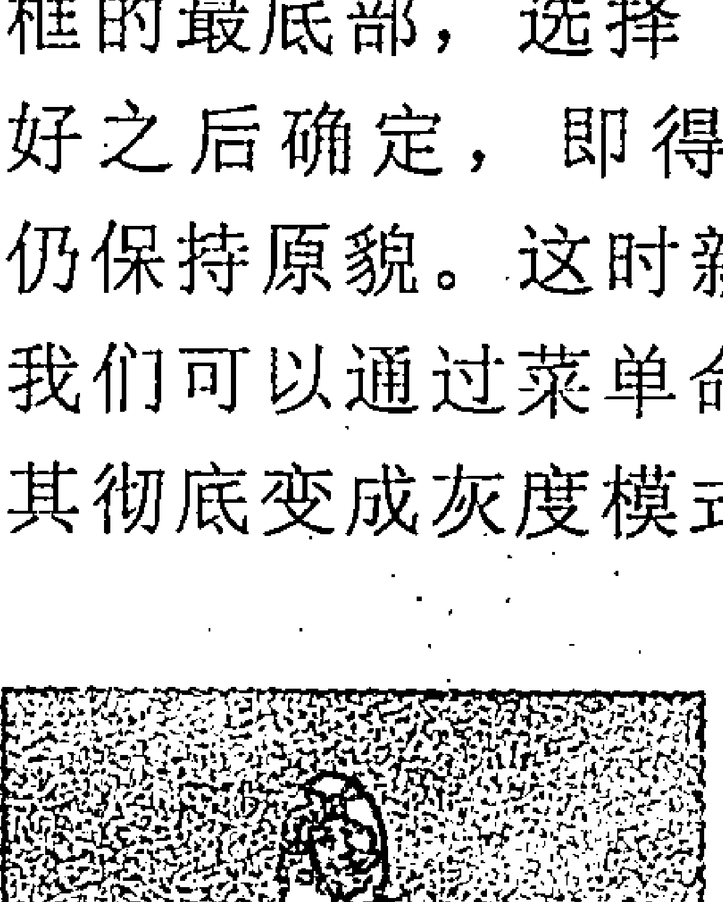

### 图58

我们可以将几种方法得到的结果进行比较，不难看出孰优孰劣。在运算对话框中，改变混合的叠加模式，还可以得到更多更令人意想不到的效果。

#### （三）添加颗粒感

冲洗出来的照片如果使用绒纸，由于颗粒状表面使光线发生漫反射，从而避免了讨厌的反光，更重要的是它使照片看起来更有质感。我们可以在数码照片上模拟这种效果。添加颗粒感还有一个好处是可以掩盖照片中尤其是人物皮肤上的一些缺陷。

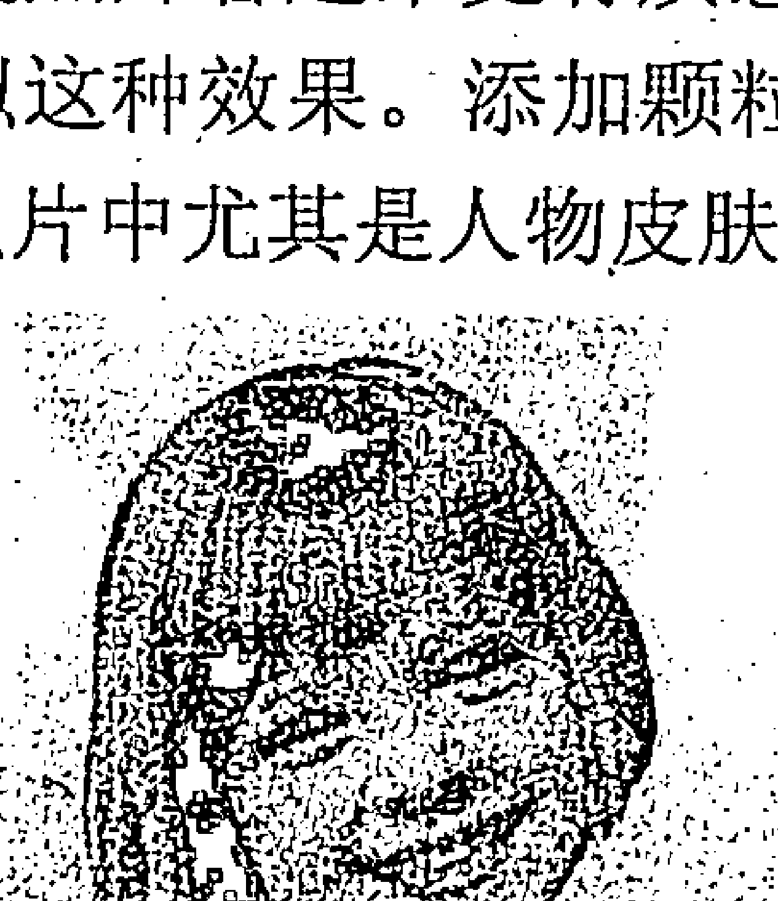

### 图59

在 Photoshop 7 中打开欲做处理的照片（如图 59）。为了更好地控制效果，我们将保留原照片，而在新图层上添加颗粒。切换到图层调板，按住 Alt 键单击调板底部的“创建新的图层”按钮——按住 Alt 键的目的是让新图层选项对话框出现。在该对话框中，我们为新图层命名为“颗粒”，将模式改为“叠加”，并勾选 “填充叠加中性色（50%）”选项。确定后我们发现照片毫无变化，这是因为叠加模式下的 50% 灰色对下面的图层是没有影响的，我们将在新建立的“颗粒”图层中进行下面的操作。选择菜单命令“滤镜→杂色→添加杂色”，在对话框中将“数量”调整为 20%，选择“高斯分布”，并勾选“单色”复选框。确定后，照片上蒙上了一层厚重的颗粒，我们可以降低图层的不透明度（例如 20%）以改善照片质量（如图 60）。

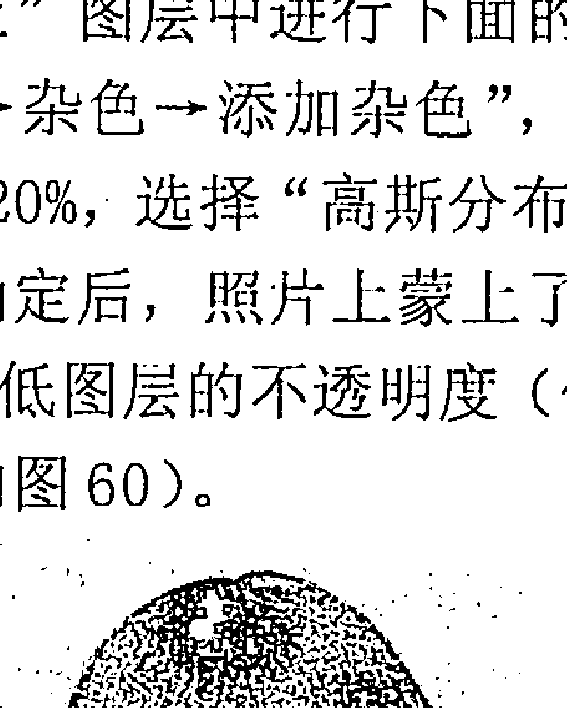

### 图60

#### （四）木版画风格

所谓木版画风格就是由大面积色块叠加而成，感觉非常的酷，要是用在个人主页或者个人宣传海报上，肯定会吸引众多的目光。


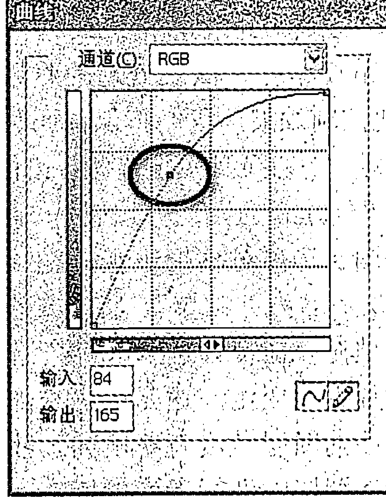

在 Photoshop 7 中打开一张样子比较酷的人物照片（如图61）。首先我们需要将照片的亮度调高；选择菜单命令“图像→调整→曲线”，在对话框中将斜线向上拉动，拉成一个向上凸的弧形（如图62）。确定后照片的亮度提高了很多，但对比度仍保持了原来的水平。再选择菜单命令“滤镜→艺术效果→木刻”，在对话框中设置“色阶数”为8，“边简化度”为3，“边逼真度”为2。确定后照片变成了由大面积色块所组成的图像。然后再对照片的色调进行一些调整，选择菜单命令“图像→调整→色相/饱和度”，在对话框中将“色相”调整为+10，饱和度调整为-30，然后确定。现在我们得到了一张木版画风格的人物照片（如图63）。

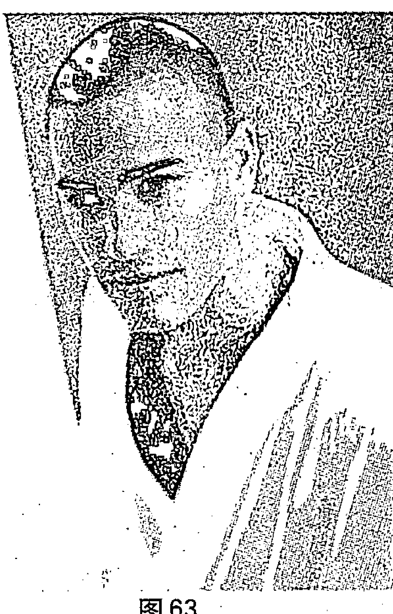

在此基础上继续发挥，比如添加文字或者与其他图像融合，就可以制作出非常有个性的图片——没想到自己也能这么酷吧？

#### （五）柔和的光彩

人物照片，尤其是女孩子的照片，如果清晰得纤毫毕现，反而变得没有味道了。有时候朦胧柔和的感觉更能给人以美好的印象，不信就来尝试一下喽。

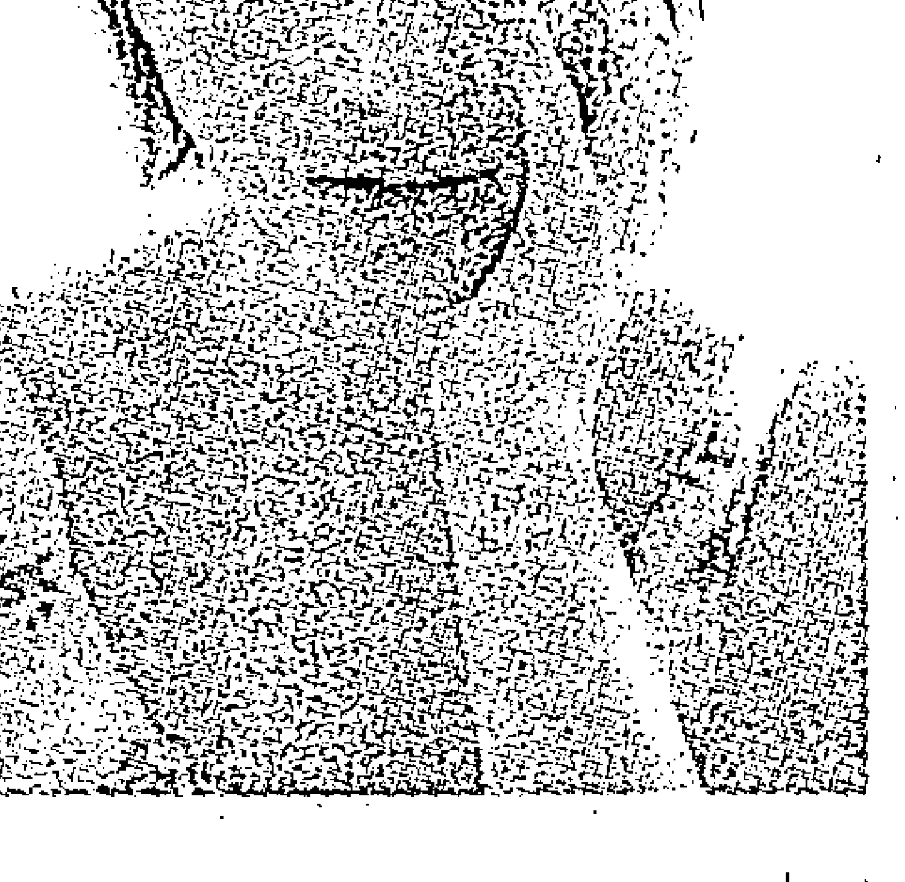

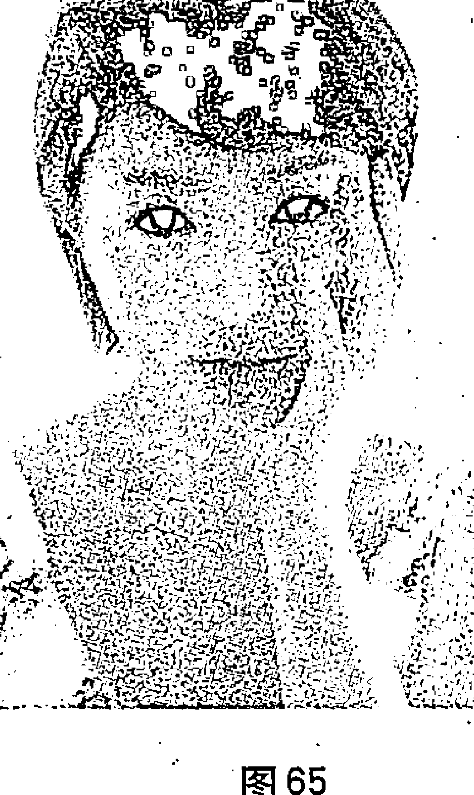

在Photoshop 7中打开一幅女孩子的照片（如图64）。在这个实例中，我们主要应用到图层的混合模式。首先切换到图层调板，将背景图层拖到“创建新的图层”按钮上，建立一个背景图层的副本，选择菜单命令“滤镜→模糊→高斯模糊”，在对话框中将“半径”设为4.0像素，然后确定，再将副本图层的混合模式改为“柔光”。这样，照片的对比度有所增强，并且变得柔和了。复制该副本图层，进一步柔化照片（如图65）。单击图层调板右上角的三角形按钮，在菜单中选择“拼合图层”，将上面两个图层合并到背景图层。选择菜单命令“图像→调整→曲线”，在对话框中将斜线的中部稍稍向下拉动（如图66），使照片变得暗一点。在图层调板上拖动建立背景图层的副本，再对副本图层应用半径为4像素的高斯模糊滤镜，然后将其图层混合模式改为“屏幕”，并将图层的不透明度适当降低（例如40%）。这样我们就得到了一张具有梦幻效果的照片（如图67）。如果觉得梦幻的还不够，可以再复制副本图层，并将新图层的不透明度降得更低。

怎么样？效果很棒吧！男孩子们，不妨把自己女朋友的照片制作得梦幻一点儿，再梦幻一点儿，没准儿还能得到她的奖励呢，呵呵。

#### （六）轮廓肖像

经常能看到一些CD封套和电影海报上将人物肖像处理成只有轮廓，看起来给人感觉这个人不同凡响、卓尔不群。哈哈，是不是动心了，想要给自己也来一张轮廓肖像？那就先启动Photoshop 7吧。

打开想要进行处理的肖像照片。首先通过菜单命令“图像→调整→去色”（快捷键为Ctrl+Shift+U）将照片变为黑白照片，但这时图像仍然是RGB模式的。再选择菜单命令“图像→调整→色阶”，在对话框中将直方图下面两侧的黑场滑块和白场滑块均拖动到中央附近（如图68）。确定后就将照片制作成只有黑白两色的轮廓肖像了（如图69）。这样的轮廓肖像未免单调了些，我们可以将其融合到其他图像背景之上。使用移动工具将人物轮廓肖像拖动到背景上面，肖像自动建立并位于新图层中。将该图层的混合模式改为“正片叠底”，并适当降低图层的不透明度（例如50%），人物肖像便融合到背景中了（如图70）。通过菜单“图像→调整”下面的“色相/饱和度”命令还可以为轮廓肖像改变色相，使其不仅仅只是黑白两色。

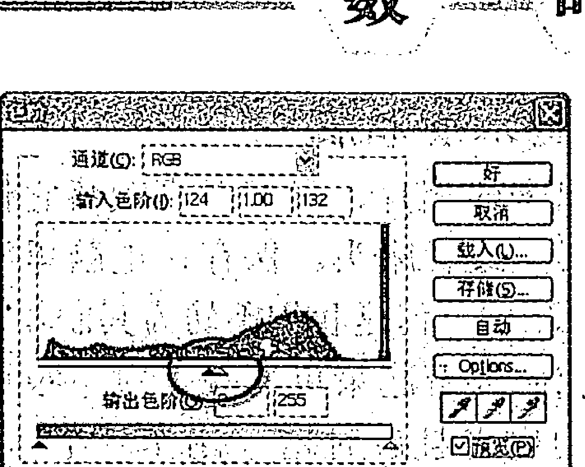

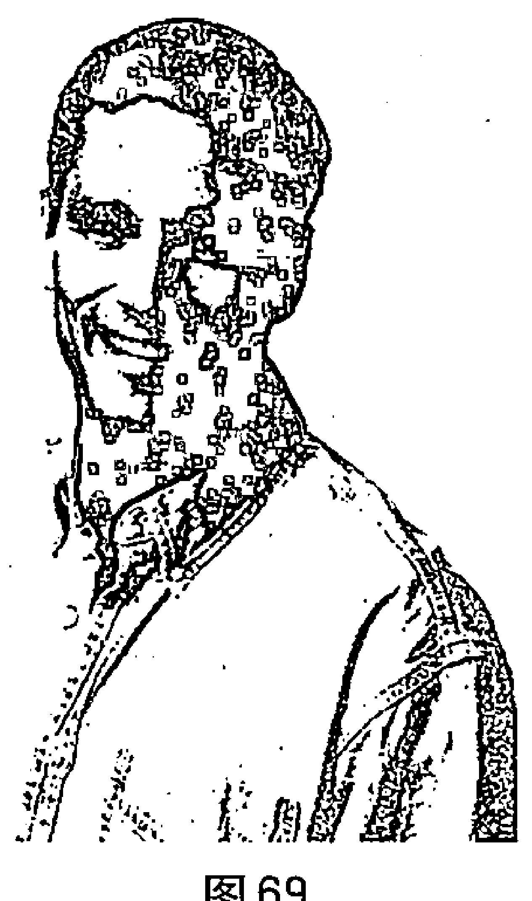

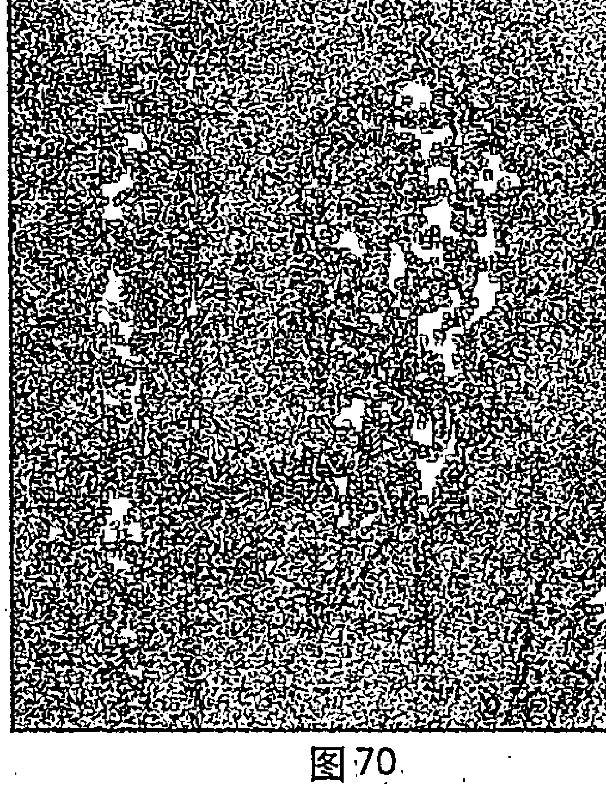

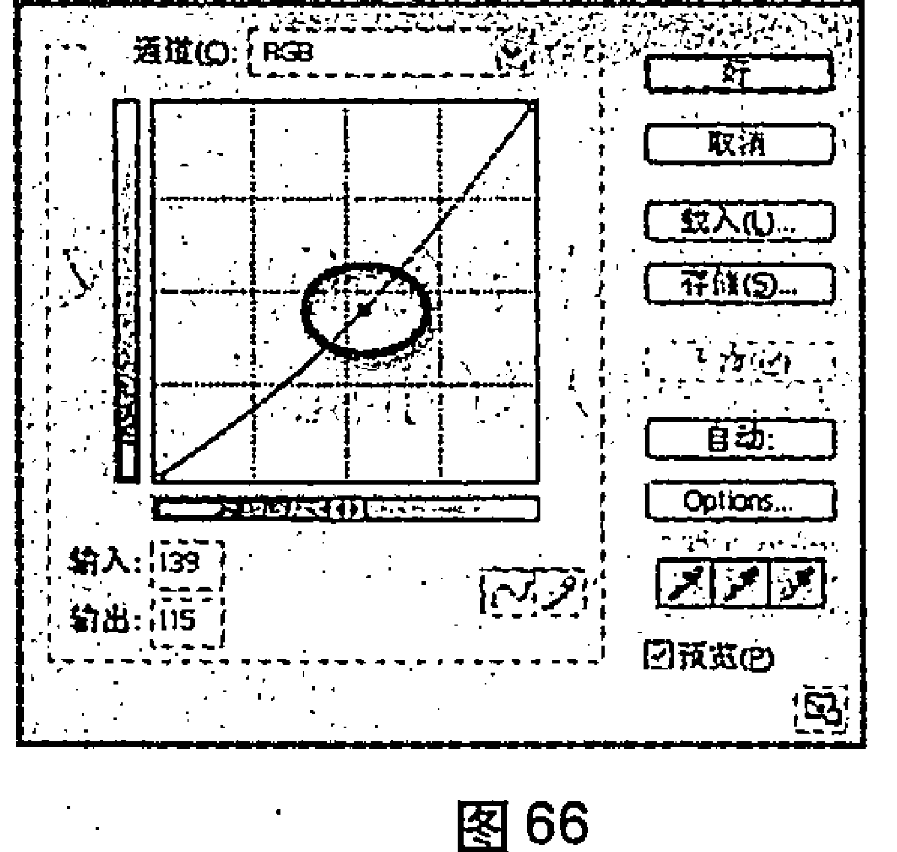

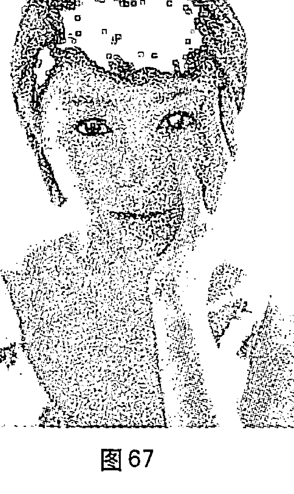

#### （七）自制木质相框

冲洗出来的相片，我们总喜欢将它嵌进相框里，摆在桌上或者床头。保存在电脑里的数码照片虽然不用相框，但是我们不妨为其制作一个虚拟的相框，使照片看起来更美观。时下很讲究回归自然，我们也来赶赶时髦，制作一个木质相框。

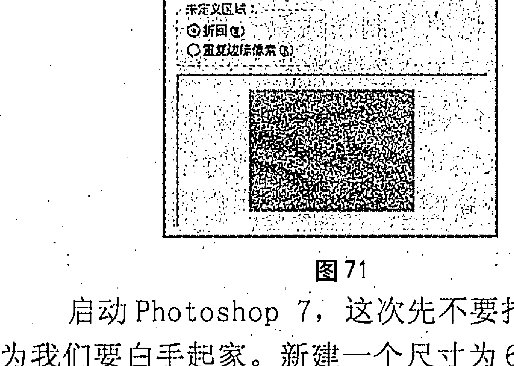

启动Photoshop 7，这次先不要打开照片，因为我们要白手起家。新建一个尺寸为640×480像素，“模式”为“RGB颜色”的空白文件。单击工具箱底部的前景色块，在拾色器中选择棕色（例如颜色值为R200G120B30），用同样的方法将背景色设置为褐色（例如颜色值为R110G40B0）。然后选择菜单命令“滤镜→渲染→云彩”，制作前景色和背景色之间云雾状的随机变化。然后选择菜单命令“滤镜→杂色→添加杂色”，在对话框中设置“数量”为2%，“分布”选择“平均分布”，并勾选“单色”复选框。确定后，图像中增加了一些淡淡的杂色。选择菜单命令“滤镜→像素化→晶格化”，在对话框中设置“单元格大小”为8，单击“好”按钮应用滤镜。再选择菜单命令“滤镜→扭曲→切变”，在对话框中将左上角的曲线大幅度扭曲，并选择“未定义区域”为“折回”（如图71）。在应用了一系列滤镜之后，我们得到了木质纹理。

接下来我们打开一张想要嵌进相框内的照片。将其调整到合适的尺寸（例如500×375像素），再使用移动工具并按住Shift键将其拖动到木质纹理的上方，并位于图像窗口的中央位置。切换到图层调板，将照片所在的图层命名为“照片”。双击背景图层，在弹出的对话框中将其命名为“相框”，确定后背景层将变为普通图层。按住Ctrl键单击图层“照片”，将其轮廓作为选区载入。保持图层“相框”为当前层，按下Delete键，删除掉该图层被照片盖住的部分。再选择菜单命令“选择→修改→扩展”，在对话框中填入40像素。确定后选区范围扩大了40像素。按下Ctrl+Shift+I键将选区反向，按下Delete键，删除掉选区包含的图像边缘部分。按下Ctrl+D键取消选择。这时候，“相框”图层就只剩下一个围绕着照片的框子。在图层调板上，将图层“相框”拖动到图层“照片”的上面，然后单击面板底部的“添加图层样式”按钮，在菜单中选择“斜面和浮雕”。在图层样式对话框中，“斜面与浮雕”样式已经被选中。在右侧选择“样式”为“内斜面”，“方法”为“雕刻清晰”，设置“大小”为6像素，“软化”为3像素，其余项目保持默认即可。确定之后，图层“相框”便拥有了立体感，仿佛真的木质相框（如图72）。

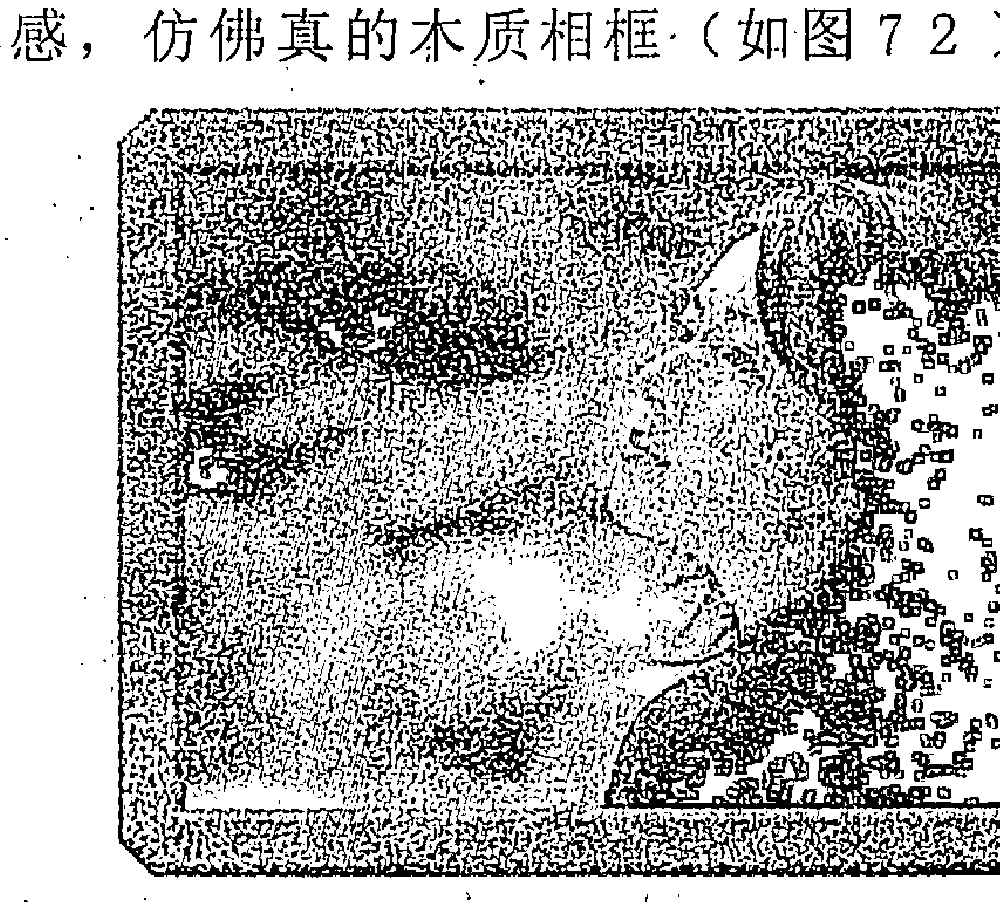

这样的相框既能为我们的照片增色不少，又有利于环保，实在是有利无害的大好事呢。

### 四、结束语

只有将数码摄影与后期处理结合起来，才能真正发挥出数码摄影的优势，并将我们的创意发挥到无限广阔的领域。经过以上一番介绍，读者朋友们应该对数码照片的后期处理有一些把握了吧。这样一来，我们在举起数码相机对准目标想要拍摄时，才能做到心中有数；而面对已经传输到电脑中的数码照片时，也不会再茫然无措了。当我们掌握了用Photoshop处理数码照片的技巧并积累了足够多的经验时，我们电脑里差强人意的、平凡无奇的甚至拙劣的数码照片都将越来越少，而完美的、漂亮时尚的、吸引目光的优秀作品则会越来越多。最后，用一句话来结束本文：有了Photoshop垫底，什么样的数码照片我们都能应付。

## 2003年度十大最具影响力的网络技术

文/信子

- ADSL 接入技术
- FTTx+LAN 接入技术
- CABLE MODEM 接入技术
- GPRS 无线上网技术
- Wi-Fi 无线接入技术
- 蓝牙技术
- VDSL 接入技术
- 光接入网络技术
- 电力线接入技术
- 万兆以太网技术

# 第一篇 宽带技术领域

速度的瓶颈主要出现在用户的接入点，为了提高数据传输速率，要实现宽带传输就必须更改信号传输的载体或者使用特殊的技术和设备。在这一转换过程中，各种接入技术不断涌现，PSTN 模拟接入、ISDN 接入和 DDN 接入等方法都曾小试身手，但皆因带宽或费用的原因而无法令人十分满意，渐渐退出市场。就目前情况而言，在光纤到户之前，普通用户所能接触到的宽带接入技术主要包括三种：ADSL 接入技术、FTTx+LAN（俗称小区宽带）接入技术及 CABLE MODEM（俗称有线通）接入技术。以下就几种网络接入技术分别作以介绍。

### 一、ADSL 接入技术

ADSL (Asymmetrical Digital Subscriber Line, 非对称数字用户环线) 使用一对电话线，在用户线两端各安装一个 ADSL 调制解调器，该调制解调器采用了频分复用（FDM）技术，将带宽分为三个频段：最低频段部分为 0～4KHz，用于普通电话业务，中间频段部分为 20～50KHz，用于速率为 16～640Kbit/s 的上行数据信息的传递；最高频段部分为 150～550KHz 或 140KHz～1.1MHz，用于 1.5Mbit/s～8.0Mbit/s 的下行数据信息的传送，这样就实现了用户可以一边使用电话进行通信，一边可以毫不影响的遨游互联网了。ADSL 设计目的有两个功能：高速数据通信和交互视频。数据通信功能可为因特网访问、公司远程计算或专用的网络应用。交互视频包括需要高速网络视频通信的视频点播（VoD）、电影、游戏等。这样对于普通用户来说，只要安装了电信的电话，都可以直接利用现有的电话线路，再添加一块 ADSL MODEM，即可实现 ADSL 宽带接入，从而享受到上述的各项功能。ADSL 技术成功之处就是不需要对原有线路进行重新改造，充分利用了现有线路，在网卡—ADSL Modem—网络服务商之间分别用 UTP 双绞线和电话线连接起来即可，不但降低了成本，还大大减少了用户的上网费用。

虽然 ADSL 的最大理论上行速率可达 1Mbps，下行速率可达 8Mbps，但目前中国电信及中国网通为普通用户提供的实际接入速率多为下行 512Kbps，很少提供超过 1Mbps 以上的接入速率。但是 ADSL 接入技术的一点优势是，这里的上下行传输速率为用户独享，不会随着同一时间内上网用户的增多而造成接入速率的明显下降。

### 二、FTTx+LAN 接入技术

FTTx+LAN接入技术是指在网络服务商通过光纤接入到楼（FTTB—Fiber To The Building）或小区（FTTZ—Fiber To The Zone），用户再通过五类双绞线（Cat-5 或 Cat-5e）接入自己家中，从而实现整幢楼或者一个小区共享带宽接入互联网。

## 三、CABLE MODEM 接入技术

也被称为“广电通”，因为它是通过对现有的有线电视网络稍加改造，之后利用闭路线缆的一个频道进行数据传输，同时并不影响原有的有线电视信号传送。普通用户可以通过 CABLE MODEM 连接有线电视宽带网（即 HFC 网络）接入有线电视数据网，有线电视数据网再和 Internet 高速相连，用户即可在家中高速连入 Internet 网。用户在看电视的时候可以上网，这样既可以避免拨号上网因为占用电话线而带来的烦恼，又可以在看电视的同时享受宽带接入带来的无穷乐趣。利用 Cable Modem 上网，不用拨号，不用密码，不用帐号，只要打开计算机，Cable Modem 会自动将计算机连接到网上。

### Cable Modem 接入特点

高速率接入，用户端的接入速率可达到 10M，是其它接入方式不能比拟的。采用 Cable Modem 实现接入的速率远远超过其它传统接入方式，一般下行可达到 10-40M，彻底解决了用户端接入瓶颈的问题。

用户终端可以始终挂在网上，无需拨号。Cable modem 实现了永远连接，只要开机就能使用网络。

平时不占用带宽，只有当有数据下载时才会占用。Cable modem 用户虽然对带宽资源在同一小区内是共享的，但仅仅只是在发送接收数据的瞬间占用带宽，抓住瞬间可利用的所有资源下载数据包，用完后立即释放。单个用户能享用的带宽不等于总带宽除以用户数。系统支持弹性扩容，最简单的方法是增加数字频道，每增加一个频道，系统增加相应的带宽资源。

不占用线路，打电话、收看有线电视、上网可以同时进行。

可拥有独立的 IP 地址。

# 第二篇 无线互联领域

当上网成为人们生活中不可或缺的一部分时，另外一个问题出现了人们面前：如何能使用用户终端摆脱传统网线的束缚，真正实现无线互联互通，移动上网。伴随着因特网接入技术的蓬勃发展，一种全新的互联网接入方式已经从悄悄发芽，到茁壮成长，并逐渐进入人们的视线，这就是无线接入技术。目前实现无线接入的几种技术，有蓝牙无线接入技术、IEEE 802.11 连接技术、家庭网络的 HomeRF 技术以及移动运营商正大力主推的 GPRS 技术等等。其中又以 GPRS 技术及 Wi-Fi 技术最具影响力。

### 一、GPRS 无线上网技术

GPRS 的英文全称为 General Packet Radio Service，中文含义为通用分组无线服务，它是利用“包交换”（Packet-Switched）的概念所发展出的一套无线传输方式。所谓的包交换就是将 Data 封装成许多独立的封包，再将这些封包一个一个传送出去，形式上有点类似寄包裹，采用包交换的好处是只有在有资料需要传送时才会占用频宽，而且可以以传输的资料量计价，这对用户来说是比较合理的计费方式，因为像 Internet 这类的数据传输大多数的时间频宽是闲置的。使用 GPRS 上网，下载资料和通话是可以同时进行的。从技术上来说，声音的传送（即通话）继续使用 GSM，而数据的传送便可使用 GPRS。使用了 GPRS 后，数据实现分组发送和接收，这同时意味着用户总是在线且按流量计费，迅速降低了成本。而 GPRS 的优势还在于它相对较快的数据传输速度。目前的 GSM 移动通信网的传输速度为每秒 9.6K 字节，GPRS在去年年初推出时已达到56Kbps的传输速度，到现在更是达到了115Kbps（此速度是常用56K modem理想速率的两倍，GPRS号称最高传输速率更是可以达到171.2K）。除了速度上的优势，GPRS还有“永远在线”的特点，即用户随时与网络保持联系。举个例子，用户访问互联网时，点击一个超级链接，接入设备就在无线信道上发送和接收数据，主页下载到本地后，没有数据传送，接入设备就进入一种“准休眠”状态，接入设备释放所用的无线频道给其他用户使用，这时网络与用户之间还保持一种逻辑上的连接，当用户再次点击，接入设备立即向网络请求无线频道用来传送数据，而不像普通拨号上网那样断线后还得重新拨号才能上网冲浪。

### 二、Wi-Fi 无线接入技术

今年3月份，首先是Intel公司发布其新一代的迅驰移动平台，内部集成了称为“Calexico”的Wi-Fi模块，紧接着Intel又联合网络供应商开设“热点（Hotspot）”区域，提供无线上网服务，一下子无线上网变得无比的真实而又贴近我们的生活，毕竟“热点”已经出现在我们所熟悉的办公室、机场及酒店附近。Wi-Fi无线技术也为越来越多的人所熟悉。

Wi-Fi是英语“Wireless Fidelity”的缩写，意为“稳定可靠的无线技术”。该技术使用的是2.4GHz附近的频段，其核心是IEEE 802.11b技术。IEEE 802.11b是IEEE制定的一种无线局域网络标准，它能在2.4GHz的传输频率上使用DSSS（Direct Sequence Spread Spectrum）无线电传输方式，提供1Mbps、2Mbps、5.5Mbps和11Mbps等多重传输速率进行数据交换（传输速度受距离和环境影响）。

Wi-Fi技术突出的优势在于：

- 覆盖范围广，半径可达300尺左右，约合100米，办公室自不用说，就是在整栋大楼中也可使用。
- Wi-Fi技术传输速度非常快，可以达到11mbps，符合个人和社会信息化的需求。
- 厂商进入该领域的门槛比较低。厂商只要在机场、车站、咖啡店、图书馆等人员较密集的地方设置“热点”，并通过高速线路将因特网接入上述场所。这样，由于“热点”所发射出的电波可以达到距接入点半径数10米至100米的地方，用户只要将支持无线LAN的笔记本电脑或PDA拿到该区域内，即可高速接入因特网。也就是说，厂商不用耗费资金来进行网络布线接入，从而节省了大量的成本。目前中国移动及中国电信均积极介入这一新兴领域，分别开启了“随E行”及“天翼通”的Wi-Fi服务。
- 相信有了厂商的大力推广，并且伴随着技术的不断改进，又具有一系列突出技术优势的Wi-Fi技术必将成为无线通信的另一种选择，也必然掀起无线通信领域的大变革。

### 三、蓝牙技术

蓝牙是取代数据电缆的短距离无线通信技术，可以支持物体与物体之间的通信，工作频段是全球开放的2.4GHz频段，可以同时进行数据和语音传输，传输速率可达到10Mb/s。其实质内容是建立通用的无线电空中接口（radio air interface）及其控制软件的公开标准，使通信和计算机进一步结合，使不同厂家生产的便携式在没有电线或电缆相互连接的情况下，能在近距离范围内具有相互操作的性能（Interoperability）。可以说，蓝牙技术在无线领域具有一些其它技术所不可比拟的优势：支持语音和数据传输；采用无线电技术，传输范围大，可穿透不同物质以及在物质间扩散；采用跳频展频技术，抗干扰性强，不易窃听；功耗低；成本低等等。在具有了以上优势之后，在一些对速度不是十分敏感的领域，将会是蓝牙技术充分发挥作用的地方。

尽管目前蓝牙技术的主要设备还局限在手机、笔记本电脑及其一些相关设备范围，但是未来蓝牙的应用领域将会是我们身边的方面：比如通过内置蓝牙芯片的掌上设备随时随地实现互联网接入；通过带有蓝牙功能的数码相机将拍好的照片转输到手机或者是任何希望的设备里；同样可以通过蓝牙及相应程序实现同步自己笔记本及PDA内的资料；以至于我们使用的键盘、鼠标、家庭网络及高速无线内部网络等都可以通过蓝牙方式实现互通互联。想象一下，未来通过采用蓝牙技术的遥控器随心自如的控制任何一部家电，或者是无拘无束的家中或者办公室的各个房间中穿行，但是却能保持在局域网甚至是互联网上不掉线，又或者是再也不用为长长的耳机线缠绕在一起，同样因为使用的是通过蓝牙方式传输信号的耳机等等，未来生活中的方面我们都将能感觉到蓝牙给我们带来的便捷，可以说，蓝牙将会改变我们的生活，或者说目前蓝牙正在悄悄的改变我们的生活。

# 第三篇 未来网络接入领域

也许今天看来还离我们相当遥远的技术，明天就会被市场所接受，成为新的技术标准而投入使用。也正是这一个个息息相关的环节才推动着我们整个社会不断向前发展：新兴技术催生市场，而市场应用又孕育新的技术。

### 一、VDSL接入技术

曾经有专家预测：由于ADSL只是整个xDSL家族技术中一个初等层次的技术，所以中短期ADSL将会发展很快（从目前的情形来看，这一预见已得到验证）；但从长期的技术发展来看，由于技术更新换代，ADSL作为一种过渡技术，发展速度将迅速降低，市场规模趋于稳定，而最终真正具备市场发展潜力的是ADSL的下一代技术，也就是目前倍受关注的VDSL技术。VDSL（Very high data rate Digital Subscriber Line）称为甚高比特率数字用户线，从技术角度看，甚高速数字用户线（VDSL）可被视为不对称数字用户线（ADSL）的快速版本，是DSL家族中速率最高的接入方式。采用VDSL技术，在较短距离内可以获得比ADSL技术更高的传输速率，VDSL的最大下传速率可达55Mbps，上传速率可达19.2Mbps。

VDSL是目前能最大限度利用用户铜线设施的DSL技术，其最大特点是可在相对较短的距离（0.3公里～1.5公里）以最高52Mbps的速度提供对称/非对称数据传输。VDSL系统与ADSL一样，可利用普通电话铜缆在不影响语音业务的情况下，传送高速数据业务。而且它与ADSL良好兼容性以及相比比较所具有的各种技术优势，决定了它可以成为ADSL方案的最佳替代技术之一。

目前VDSL接入技术所面临的最大问题就是它的传输距离比ADSL技术所允许的5公里还要短，最远只能达到1.5公里，这一问题只能期待未来能有新的技术突破解决这一传输瓶颈。相信到那时，VDSL接入技术才会真正发挥它应有的技术及速度优势，成为未来网络接入技术中的佼佼者。

### 二、光接入网络技术

据Vertical Systems Group表示，目前只有3%的企业连接到光纤网络上，同时76%的企业距光纤网的距离在一英里（约为1.6公里）之内。但是，直到目前为止，将光纤直接连接到企业的惟一途径是使用价格昂贵的SONET设备，因此无法将光纤连接到每个建筑上。

一项新出现的网络技术——光接入网络技术（OAN）是消除阻挡在局域网和广域网中不断增加的容量之间瓶颈的实用技术。所谓光接入网（OAN）就是采用光纤传输技术的接入网，泛指本地交换机或远端模块与用户之间采用光纤通信或部分采用光纤通信的系统。通常，OAN指采用基带数字传输技术并以传输双向交互式业务为目的的接入传输系统，将来应能以数字或模拟技术升级传输宽带广播式和交互式业务。OAN使服务提供商可以向各种规模的企业提交基于光纤的宽带服务。基于无源光学网络（passive optical network，PON）的OAN不需要在外部站中安装贵重的有源电子设备，因此使服务提供商可以高性价比地向企业提供所需的带宽。

OAN由三个部分构成：一台安装在服务提供商中心局的光接入交换机（OAS）；一台安装在客户端的智能光终端（IOT）；以及一台安装在上述两种设备之间的PON。在PON环境中除了光纤线路之外惟一所需的外部设备是低价（几百美元）无源光分路器和耦合器。这两种设备可以像水管子上的T形连接器那样分离或合并传输流：将一半的光线传向一个方向，另一半传向另一个方向。耦合器/分路器可以从很多光学部件生产厂商那里买到。

OAS是一种将分布在PON上“下游”的数百个IOT的传输流汇集起来的IP/ATM交换机，配置标准接口的OAS提供了一个进入广域网的有效输入点。而比萨饼盒大小的IOT是一种低价客户端设备，它可以支持宽带语音和数据服务。

综上所述，一个全光纤的FTTH（FTTH—Fiber To The Home）网在战略上具有十分重要的位置。然而主要由于经济的原因目前尚不能立即实现光纤到家，影响这一目标实现的因素很复杂，有系统成本的因素、竞争的需要、政策法规的影响以及新技术的推动等。随着时间的推移，光纤光缆和光元器件成本在稳步下降；各种宽带业务的需求正在逐步呈现；现有铜缆网的维护运行负担的增加在不断推动网络运营者转向光纤网；各国电信政策法规管制的逐渐放开越来越有利于FTTH的实施；各种新技术，诸如新型环路用激光器的出现，平面光波电路（PLC）的发展，光纤放大器的问世，波分复用和频分复用以及数字集成和压缩技术的进展都在积极推动 FTTH 的实现。有理由相信，在接入网中较大规模引入 FTTH 的时机已不太遥远了。

### 三、电力线接入技术

目前，开展接入网业务有两种方式：一种是建立新的网络，另一种是利用已有的线路资源。第一种方式可通过无线、新铺电缆或光纤等方法实现，无线方式需要射频转换的硬件，由于成本较高，难以得到大面积推广，只能作为有线接入的一种补充；新铺电缆或光纤需要重新布线，费时费力，建设投入和维护费用大，并给用户带来诸多不便。因此，利用现有线路资源是比较理想的解决方式。现有线路资源主要有：电话线、有线电视网和电力线。电话线和有线电视网的接入线路资源归传统的运营商所拥有，而且相对于电力线而言，其线路覆盖范围要小得多。在国内，除了特别偏僻的山区外，电力线几乎无所不在，在每个家庭的每个房间，至少都有一个以上的电源插座，这对开展接入业务而言非常方便。在室内组网方面，计算机、打印机、电话和各种智能控制设备都可通过普通电源插座，由电力线连接起来，组成局域网。现有的各种网络应用：如话音、电视、多媒体业务、远程教育等，都可通过电力线向用户提供，以实现接入和室内组网的多网合一。

采用电力线接入方式上网所具有的优势：

- 利用现有的电力资源，不再需要任何新的线路铺设，安装设备简单方便，使用方式多种多样，可随意接入。
- 共享互联网络连接，可以在任何客户进行网络连接。
- 移动计算机至任意位置，简单使用。
- 高通讯速率，可达 14Mbps（将来通过升级设备可达 100Mbps），可使用 VOD 点播。
- 数据加密，提供高安全性和高可靠性能。

在未来的宽带接入服务市场，电力线上网将占有一席之地。在广阔的农村地区，电力线上网也具有一定的优势，毕竟，电力网规模之大，是其他任何网都不可比拟的。可以说，电力线接入方式上网不仅为百姓提供了一个新选择，而且它必然推动整个宽带产业的发展与繁荣。

# 第四篇 新一代互联网络技术

### 一、万兆以太网技术

在很长的一段时间里，以太网都是主要应用于局域网领域，人们普遍认为以太网不适合用于城域网或者是广域网。原因就在于以太网用作城域网骨干带宽太低（10M 以及 100M 快速以太网的时代），传输距离也过短。100M 快速以太网作为城域骨干网带宽显然不够。即使使用多个快速以太网链路绑定使用，对多媒体业务仍然是心有余而力不足。而且无论是 10M、100M 还是千兆以太网，则由于信噪比、碰撞检测、可用带宽等种种原因五类线传输距离都是 100m。使用光纤传输时距离限制由以太网使用的主从同步机制所制约。802.3 规定 1000Base-SX 接口使用纤芯 62.5 μ m 的多模光纤最长传输距离 275m，使用纤芯 50 μ m 的多模光纤最长传输距离 550m；1000Base-LX 接口使用纤芯 62.5 μ m 的多模光纤最长传输距离 550m，使用纤芯 50 μ m 的多模光纤最长传输距离 550m，使用纤芯为 10 μ m 的单模光纤最长传输距离 5000m。最长传输距离 5km 千兆以太网链路在城域范围内远远不够。但是这一切都随着万兆以太网技术的出现而迎刃而解了。

万兆以太网技术始于 2002 年 6 月 802.3ae 10GE 标准的正式发布。从原理上分析，万兆以太网在物理层上将包括两类 PHY（物理层），分别以 10Gbps 速度运行的局域网 PHY 和以 9.58464Gbps（与 SONET OC-192 有效载荷速度相同）速度运行的广域网 PHY。新标准在保留了原有以太网技术特点的同时，使以太网能够在单模和多模光纤上达到现有千兆以太网 10 倍的传输效率，传输距离在 65 米到 40 公里之间。可以说，新的标准扫清了以太网进入城域网及广域网的最后障碍，而且采用以太网技术构建的城域网和广域网的费用比采用 ATM/SONET 技术构建的类似的系统降低约 25%，并且整个网络基于单一的核心技术，易于管理，费用低廉。正是这些因素促使以太网从局域网扩展到城域网、广域网，并建立工作速率为 10Gbps 的可靠、高速的数据网。

## Windows Server 2003 网络应用实战

### 一、Windows Server 2003 初探

#### (一) Windows Server 2003 简介

在全球IT界的一片“反垄断”、“拆分”的喊打声中，Microsoft公司——IT业的摩天大厦又开启了一扇崭新的窗户，这就是Windows Server 2003（如图1）。

Windows Server 2003可称得上是Microsoft集多年功力于一身的最新最强劲的服务器操作系统，堪称最具工作效能的基础架构平台，甚至有“Windows Server 2003是迄今为止最快、最可靠和最安全的Windows服务器操作系统”(Microsoft语)的说法。

Windows Server 2003所携带的各种工具能够帮助用户配置、管理和使用网络结构，从而获得最高的效率。它所提供的灵活易用的工具，有助于使用户的设计和配置与组织及网络的要求相匹配；同时，通过加强策略、使任务自动化以及简化升级来帮助用户主动管理网络；另外，还可以通过让用户自行处理更多的任务来降低支持开销。

Windows Server 2003系列沿用了Windows 2000 Server的先进技术并且使之更加易于配置、管理和使用。因此说Windows Server 2003是Windows 2000的后代是非常形象的，除了继承前辈的优良传统外，还改善和扩展了Windows Server操作系统，使组织能体验到Microsoft .NET（用于连接信息、人、系统和设备的软件）的好处。

在Windows Server 2003中还引入了一个全新的概念——服务器角色。作为一个多任务操作系统，Windows Server 2003能够按照用户的需要，以集中或分布的方式处理各种服务器角色。这些服务器角色包括：

- 文件和打印服务器；
- Web服务器和Web应用程序服务器；
- 邮件服务器；
- 终端服务器；
- 远程访问/虚拟专用网络（VPN）服务器；
- 目录服务器、域名系统（DNS）、动态主机配置协议（DHCP）服务器和Windows Internet命名服务（WINS）；
- 流媒体服务器。

#### (二) Windows Server 2003 家族巡礼

与其前辈一样，Windows Server 2003也包含多个版本，因此它也成立了自己的家族，下面就一一介绍一下吧。

Windows Server 2003分为4个版本：标准版、企业版、Datacenter版和Web版。

Windows Server 2003标准版：Windows Server 2003标准版是一个可靠的网络操作系统，可迅速方便地提供企业解决方案。这种灵活的服务器是小型企业和部门应用的理想选择。支持文件和打印机共享；提供安全的Internet连接；允许集中化的桌面应用程序配置。

Windows Server 2003企业版：Windows Server 2003企业版是为满足各种规模的企业的一般用途而设计的。它是各种应用程序、Web服务和基础结构的理想平台，它提供高度可靠性、高性能和出色的商业价值。是一种全功能的服务器操作系统，支持多达8个处理器；提供企业级功能，如8节点群集、支持高达32GB内存等；可用于基于Intel Itanium系列的计算机；将可用于能够支持8个处理器。

# Windows Server 2003网络应用实务

处理器和 64GB RAM 的 64 位计算平台。

Windows Server 2003 数据中心版：Windows Server 2003 数据中心版是为运行企业和任务所倚重的应用程序而设计的，这些应用程序需要最高的可伸缩性和可用性。是 Microsoft 迄今为止开发的功能最强大的服务器操作系统；支持高达 32 路的 SMP 和 64GB 的 RAM。
提供 8 节点群集和负载平衡服务是它的标准功能；将可用于能够支持 64 位处理器和 512 GB RAM 的 64 位计算平台。

Windows Server 2003 Web 版：Windows 操作系统系列中的新产品，Windows Server 2003 Web 版用于 Web 服务和托管。用于生成和承载 Web 应用程序、Web 页面以及 XML Web 服务；其主要目的是作为 IIS 6.0 Web 服务器使用；提供一个快速开发和配置 XML Web 服务和应用程序的平台，这些服务和应用程序使用 ASP.NET 技术，该技术是 .NET 框架的关键部分；便于配置和管理。

从应用的角度来讲，Windows Server 2003 企业版的性价比较高，将会是今后应用的主流，因此本文后面的章节也将围绕着 Windows Server 2003 企业版做进一步介绍。

## （三）硬件要求

Windows Server 2003 的基本硬件要求如表 1 所示，作为服务器操作系统，要使 Windows Server 2003 能够运行得更好，还得有更强的硬件支持才行。

需要提醒读者注意的是，Windows Server 2003 企业版和 Windows Server 2003 Datacenter 版的 64 位版本只与基于 Intel Itanium 64 位的系统兼容。它们无法成功安装到 32 位系统上。

略显遗憾的是 Windows Server 2003 对一些硬件的支持还不太好，从目前部分网友的反馈消息来看主要表现在：

*   如果使用老式的 SCSI 光驱或硬盘，其驱动不容易加载（如 AVA-1502 的老式刻录光驱）。
*   某些移动硬盘可能不能使用（系统能够发现新硬件，但是在“我的电脑”中看不到该驱动器）。
*   声卡不容易加上（如 AU8820 芯片组的 Diamond 声卡），需要在 Windows XP 中复制 Aurea.inf 等文件手工加载。

另外，用户在使用 Windows Server 2003 时还应当注意使用以下技巧，以便完全发挥各个硬件的功能：

1.  使用摄像头、扫描仪等数码设备
如果用户需要使用摄像头、数码相机、扫描仪等影像设备，那么必须启用图像捕获服务。单击“开始”菜单，打开“管理工具”下的“服务”，在“服务”窗口中找到“Windows Image Acquisition”项，双击它进入设置对话框，将“启动类型”更改为“自动”，并点击“启动”按钮启动该服务。

2.  进行 CD 刻录
在 Windows 2003 的默认设置下是无法刻录 CD 的，解决方法是：进入“服务”窗口，找到“IMAPI CD-Burning COM Service”项，双击它进入设置对话框，将“启动类型”更改为“自动”，并点击“启动”按钮启动该服务。

3.  启用硬件和 DirectX 加速
    （1）硬件加速
    在桌面上单击鼠标右键，在弹出的快捷菜单中选择“属性”命令，在“显示 属性”对话框中选中“设置”选项卡并单击“高级”按钮，在弹出的对话框中选择“疑难解答”选项卡，将“硬件加速”的设置滚动条拖动到“完全”的位置，单击“确定”按钮保存并退出，需要提醒用户注意的是，出现的暂时黑屏是正常现象。

    （2）DirectX加速
    单击“开始”菜单，在“运行”对话框中输入“dxdiag”，启动“DirectX 诊断工具”对话框，在“显示”选项卡中，分别单击“DirectDraw加速”、“Direct3D加速”和“AGP纹理加速”三个按钮以启用该加速；在“声音”选项卡中把“声音的硬件加速级别”设置滚动条拖动到“完全加速”的位置。

Windows Server 2003 安装后，默认状态下声卡是被禁止使用的，需要在“控制面板”的“声音”设置中启用它。如果用户使用的是 Windows Server 2003 标准版的话请在“服务”窗口中找到“Windows Audio”，将其启动模式设置为“自动”，同时启动该服务。

为了突出本文的可操作性，在接下来的章节里，我们将以某企业的网络管理员小王的操作为例，来学习如何用 Windows Server 2003 企业版配置公司网络及其服务的相关知识。

### 二、Windows Server 2003的网络服务配置

小王在一家小企业上班，人力所限，他既是人力资源部的负责人同时也担负着公司网络管理的任务，由于公司的规模不大，因此在网络建设上是以最低投入来运作的。因此，小王需要使用一台服务器来扮演网络服务角色。

#### （一）使用全新的方式配置网络服务

在 Windows Server 2003 中为用户提供了“配置用户的服务器”和“管理用户的服务器”向导，在他们的帮助下系统管理员可以轻松地进行服务器角色的安装和管理，从而完成各种服务器的安装和配置，因此可以说 Windows Server 2003 为我们引入了一个全新的配置概念。

在 Windows Server 2003 中内置了文件服务器、打印服务器、应用程序服务器、邮件服务器、终端服务器、远程访问/VPN 服务器、域控制器、DNS 服务器、DHCP 服务器、流媒体服务器、WINS 服务器等服务器角色，如图 2 所示。几乎囊括了所有的服务器应用。利用这些内置的服务器角色，只需简单的几步，即可完成相应服务器的配置。

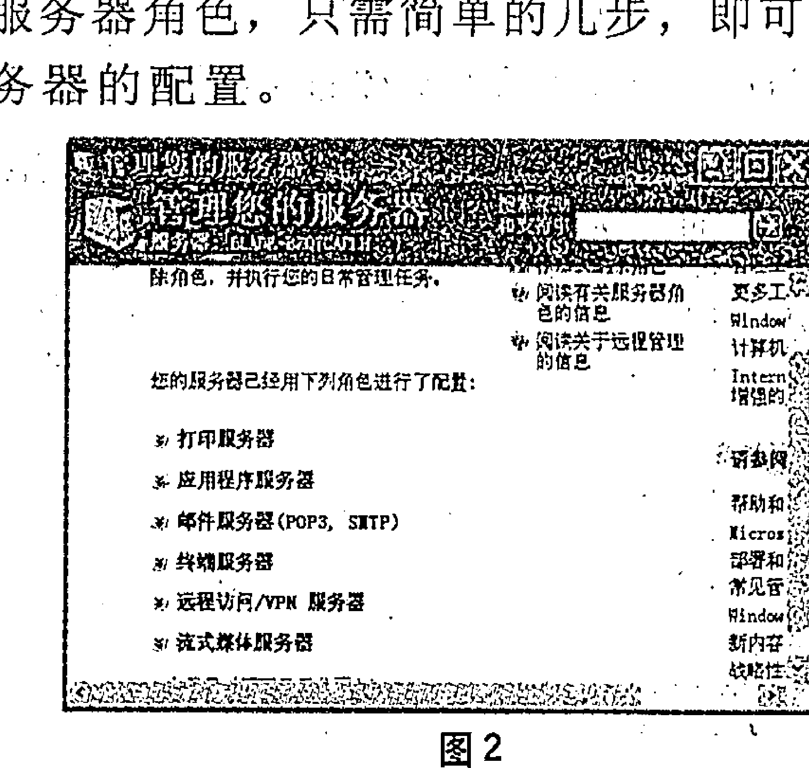

#### （二）配置 NAT 服务

小王的公司由于经费有限，因此只申请了一个宽带业务，换言之整个公司只有一个 IP 地址能够访问 Internet，也就是说除了服务器以外，其他的计算机只能使用内部 IP 来做局域网内的访问，如何使一台服务器带动其余几十或上百台计算机访问 Internet 呢，老板把任务交给了小王。

小王在翻查了大量资料后，决定在软件方面使用 Windows Server 2003 来扮演网络地址转换（简称 NAT）网络服务角色，即通过该服务实现一台带多台的功能。

而在硬件投入方面，小王在原有服务器硬件的基础上又安装了一块网卡（这也是公司投入的唯一一笔资金，仅仅几十元而已）来配合这一角色的扮演。

首先将服务器的一块网卡通过网线连接至交换机（即与其它计算机组成局域网），而另一块网卡则连接至对外的网口（抑或是交换机），如图 3 所示。

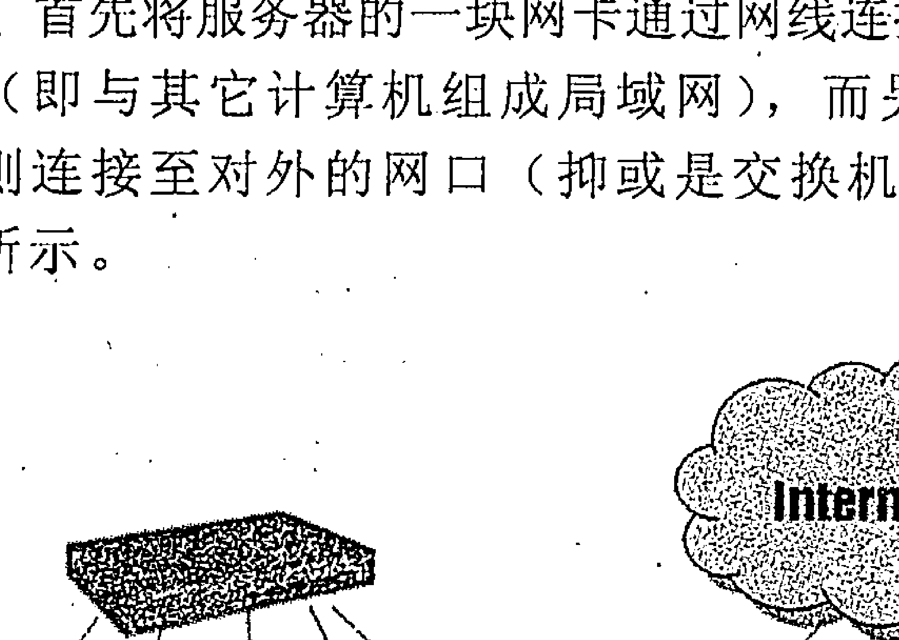

由于服务器上安装了两块网卡，因此“控制面板”的“网络连接”中应当有两个选项即“本地连接”和“本地连接 2”（分别对应两块网卡，现假设“本地连接”为对外网卡，“本地连接 2”为连接内部局域网的网卡）。设置“本地连接”的 IP 地址以及其余选项如 DNS、网关、子网掩码等（这些设置应当在申请宽带业务时由宽带公司提供）；设置“本地连接 2”的 IP 地址为 192.168.0.1，子网掩码为 255.255.255.0。另外公司其它计算机 IP 地址一律设置为 192.168.0.*（*为 2-254 中任意数字），网关为服务器的内部地址“192.168.0.1”，DNS 与服务器“本地连接”的设置相同。

确定服务器与局域网内计算机以及 Internet 连接无误后，Windows Server 2003 就要上场表演了。

打开“开始”菜单，在“管理工具”选项中单击“路由和远程访问”，弹出如图 4 所示的窗口。

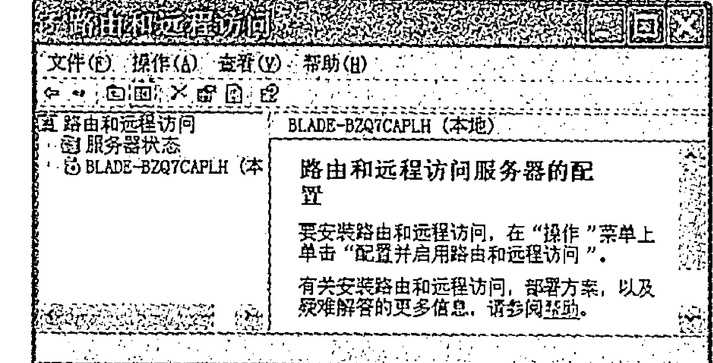

图 4

右键单击带有红色向下箭头（表示未启动服务）的服务器，在弹出的快捷菜单中选择“配置并启用路由和远程访问”，在出现的安装向导对话框中单击“下一步”。

在接下来出现的如图 5 所示的对话框中，列出了“路由和远程访问服务器”所能够扮演的所有角色，在此我们选中“网络地址转换 (NAT)”并单击“下一步”按钮。

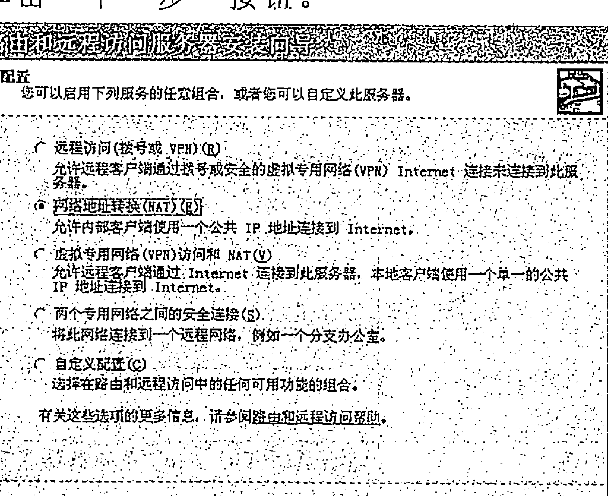

图 5

在接下来出现的对话框中，选中“使用此公共接口连接到 Internet”，同时选中“本地连接”（表明使用“本地连接”作为公共接口连接到 Internet）；用户可以根据实际需要来决定是否选中“通过设置基本防火墙来在对选择的接口进行保护”。配置界面如图 6。

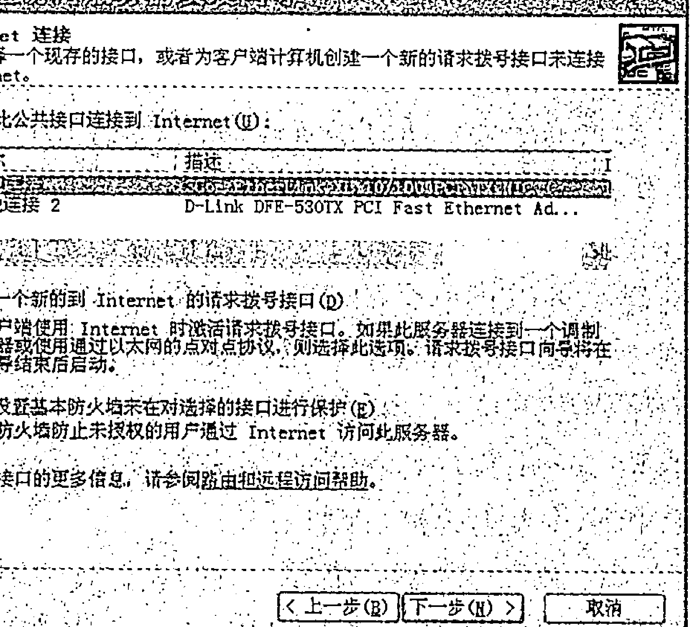

图 6

单击“下一步”按钮后，在安装向导的最后一个对话框中单击“完成”按钮，就可以启动 NAT 服务了。

这样，公司里的任何一台计算机都可以上网冲浪了，小王首战告捷。

#### （三）配置 Web 服务

在解决了公司上网的问题后，老板异常高兴，于是乎公司网站软硬件平台的建设重任又交给了小王。不过在经历了上一次的锻炼后，小王对 Windows Server 2003 更加充满信心，他相信 IIS 6.0 是绝对不会令他失望的。

在 Windows Server 2003 中使用的 IIS 6.0 较之 Windows 2000 的 IIS 5.0 和 Windows XP 的 IIS 5.1 进行了重新设计以便利用基本 Windows 内核 HTTP.sys。IIS 6.0 具有内置的响应和请求缓存和队列功能，并能够将应用程序进程请求直接路由到工作进程，从而改善了服务的可靠性和性能。

IIS 的安全性在 6.0 版中得到了显著的增强，表 2 列出了不同版本 IIS 的功能对比。与以前版本不同的是：在 Windows Server 2003 安装完成后，包括 IIS 6.0 在内的许多服务都没有安装，用户必须手动选择安装 IIS 6.0。IIS 6.0 安装完毕后默认设置为锁定状态，只能提供静态内容服务（该功能类似于 IIS 4.0/5.0/5.1 中通过 IIS Lockdown 的锁定）。IIS 6.0 使用了一系列的安全技术用于确保站点内容的安全性，同样也可以保护通过站点传输数据的安全性。

在拿到了已经做好的网站代码后，小王兴奋地想，通过 Windows Server 2003 的 IIS 6.0，公司漂亮的网站很快就能发布给 Internet 上的所有用户浏览了，而他作为网站的站长 (Webmaster) 更是颇有成就感，而且 IIS 6.0 的出色性能大大降低了他的工作量。

Internet Information Services (IIS) 6.0 是启用了 Web 应用程序和 XML Web 服务的全功能 Web 服务器，它采用了一个新的容错进程模型重新构建，可以将单个的 Web 应用程序或多个站点分隔到一个独立的进程中，这些独立的进程将阻止某个应用程序或站点影响服务器上的 XML Web 服务或其他 Web 应用程序，因此在很大程度上提高了 Web 站点和应用程序的可靠性。

打开“开始”菜单“管理工具”中的“管理用户的服务器”，在弹出的窗口中选择“添加或删除角色”，在经过“预备步骤”之后，用户将会进入如图 7 所示的对话框中，在这里用户可以添加需要的 IIS 服务器角色（其它服务器角色添加方法也是如此）。

选中“应用程序服务器 (IIS, ASP.NET)”，单击“下一步”按钮，在接下来的对话框中选中所有的选项后（强烈建议用户至少要选中“启用 ASP.NET”），单击“下一步”按钮，如图 8。

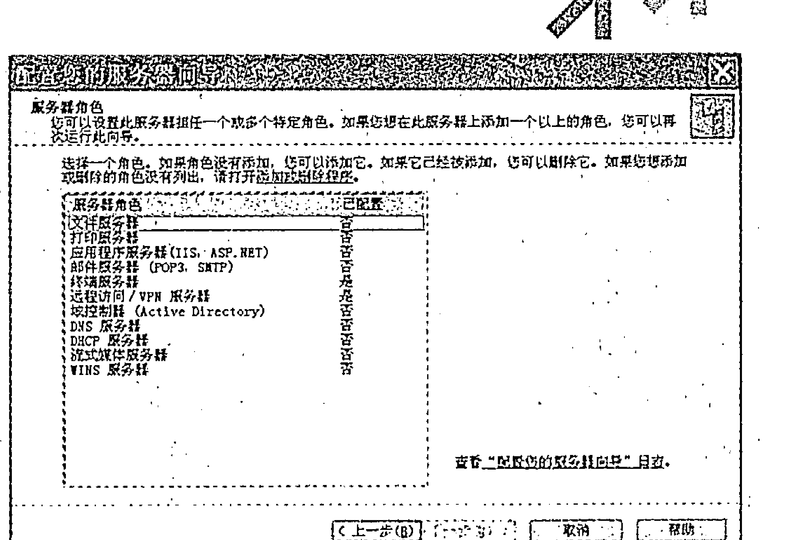

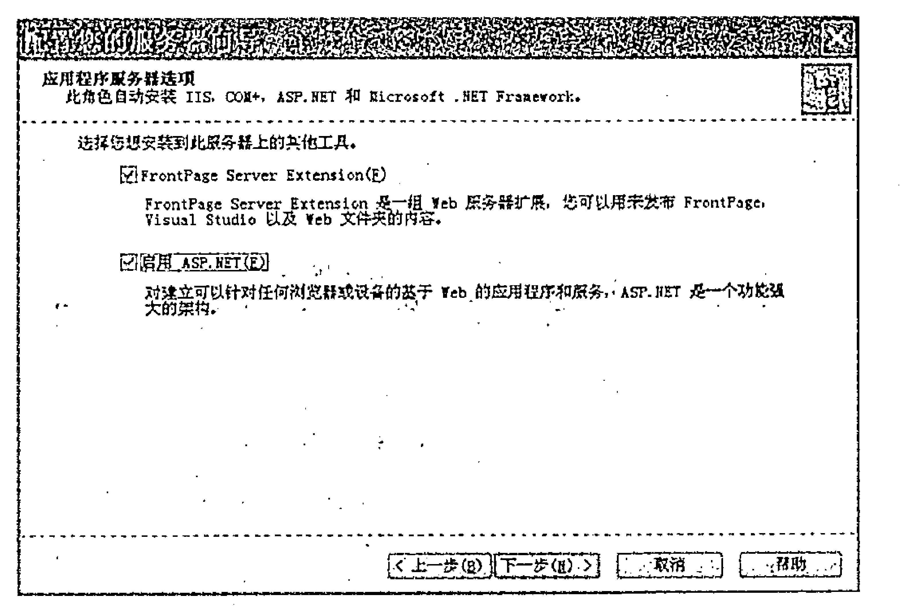

单击“下一步”按钮之后，就可以进行安装了，安装过程略，下面详细介绍配置过程。

单击“开始”菜单，打开“管理工具”中的“Internet 信息服务 (IIS) 管理器”，鼠标右键单击“网站”下的“默认网站”（该默认网站即为我们要配置并放置公司网页的站点），选择快捷菜单中的“属性”命令，弹出如图 9 所示对话框，所有网站的设置选项都在此对话框中。

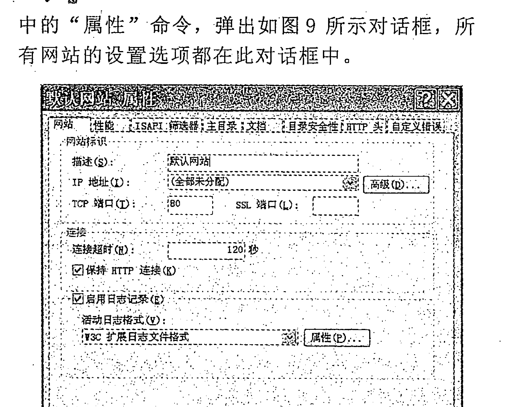

图 9

**基本 Web 站点配置：**

在如上图所示的“网站”选项卡中，用户可以对网站的 IP 地址以及连接端口进行设置，一般来说默认的端口是 80 而 IP 地址则是服务器上所有可用的 IP 地址（即默认的选项“全部未分配”），如果用户只需要某个 IP 地址的话，可以在“IP 地址”框中单击右侧的下拉菜单按钮来指定此 Web 站点的 IP 地址。其余选项按照默认设置即可。

在“性能”选项卡中，用户可以对站点的带宽使用和 Web 连接数量进行设置。通过配置网络带宽及连接数量，用户可以更好地控制该站点的通信量。

需要提醒用户注意的是，每个浏览 Web 站点的客户端一般都会使用三个连接，所以用户应当根据此数据来决定网站的连接数量。

在“主目录”选项卡中，用户可以设置网站内容的所在目录即网站的主目录，选中“在此计算机上的目录”选项后，单击“浏览”按钮查找目录或输入该目录的路径，例如“D:\wwwroot”，如图 10 所示。

如果要使用存储在另一台计算机上的网页，用户应当选中“另一计算机上的共享”，然后在出现的“网络目录”框中输入所需位置。

出于安全的考虑，请不要选中“脚本资源访问”、“写入”以及“目录浏览”选项，其余配置使用默认选项即可。

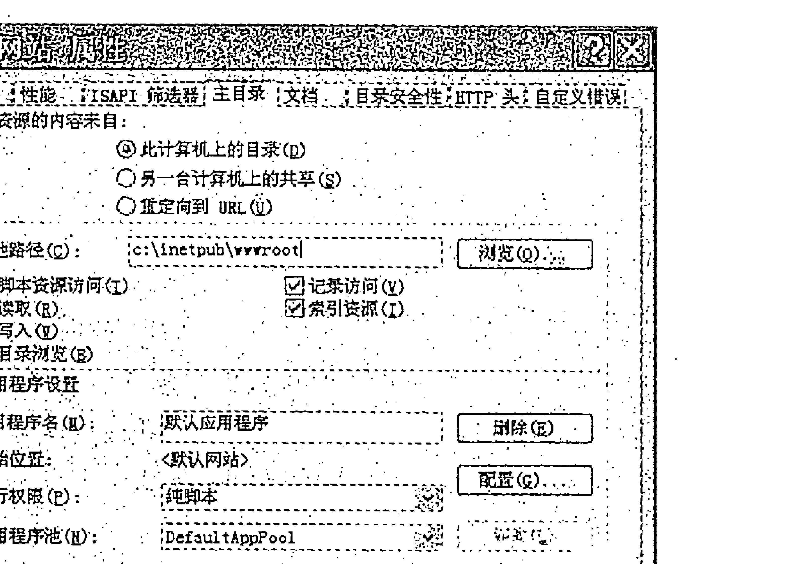

图 10

到这里网站的基本配置大功告成，下面还要做的就是使匿名用户能够访问网站。打开“目录安全性”选项卡，单击“身份验证和访问控制”选项中的“编辑”按钮，在弹出的“身份验证方法”对话框中选中“启用匿名访问”即可，如图 11。

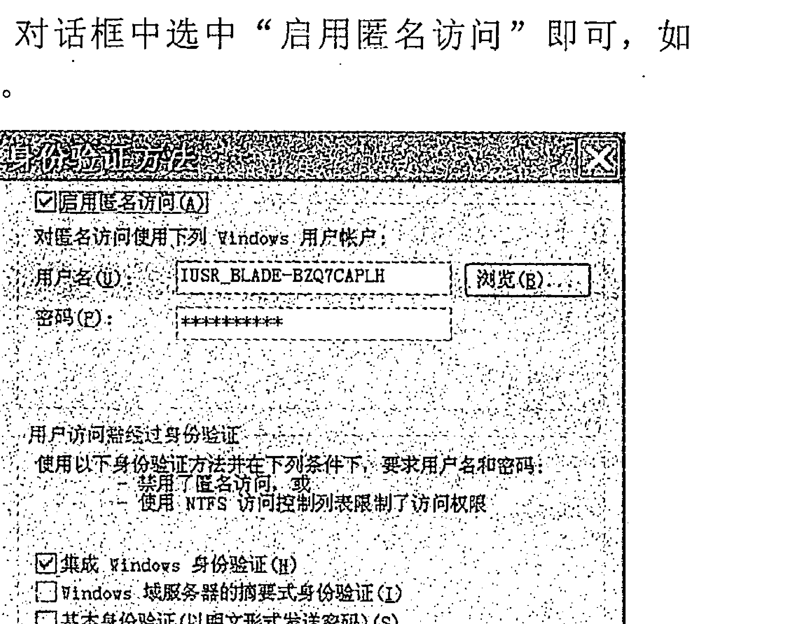

图 11

一般来说，在安装 IIS 6.0 后，系统会自动创建并使用帐户 IUSR_computername（“IUSR_”加计算机名），匿名用户帐户密码只能在 Windows 中使用，匿名用户是不需要用户名和密码来进行登录的。在“已验证身份的访问”选项中选中“集成的 Windows 身份验证”后，匿名用户就可以访问网站了。

完成了以上工作后，一个简单且性能稳定出色的网站就搭建成功了，小王将已经做好的网页放入网站主目录后，在浏览器中输入服务器的 IP 地址或公司的国际域名后，一个亮丽的网站就展现在人们的面前了，而小王不仅欣赏了网站的内容，而且还陶醉于 IIS 6.0 的快捷配置与出色的性能。

#### （四）配置邮件服务器

顺利地完成网站搭建后，小王在公司的地位上升很多，大家都称呼他为“站长”或“网络专家”，小王在高兴的同时也明白，从此以后自己会面对一个又一个的网络服务任务，这不，任务又来了。

对于一个企业来说，拥有自己的邮箱是一个基本的功能，随着公司网络建设的不断完善，这一需求逐渐浮上桌面，小王又一次接收了挑战。

Windows Server 2003 中的邮件服务器角色适合这场演出。

首先，还是要添加邮件服务器，方法与添加 IIS 服务器一样，在如图 7 所示的对话框中选择“邮件服务器 (POP3, SMTP)”并单击“下一步”按钮，在接下来的对话框中设定“身份验证方法”为“加密的密码文件”，并输入公司的域名，如图 12 所示，单击“下一步”按钮进行安装，安装过程略。

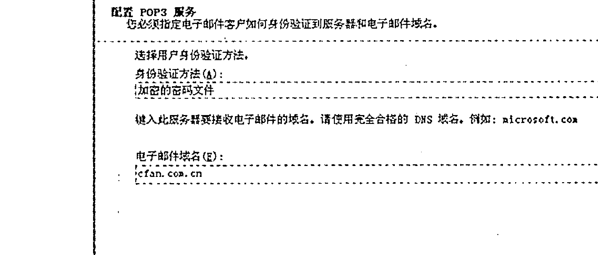

单击“开始”菜单，打开“管理工具”中的“POP3 服务”，启动“POP3 服务”的配置窗口。在左侧窗格中的“POP3 服务”下方显示的是本机名称，选中该名称后，单击中间窗格中的“新域”命令，在弹出的对话框中输入邮箱的域名，也就是电子邮箱的后缀地址（@后面的部分，如 xxx@cfan.com.cn，则 cfan.com.cn 就是邮箱的域名），单击“确定”按钮后，就会在本地计算机下方生成一个域，在这个域下就可以添加邮箱了，如图 13 所示。

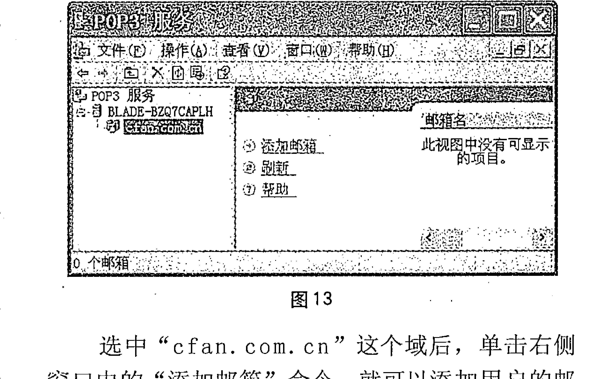

选中“cfan.com.cn”这个域后，单击右侧窗口中的“添加邮箱”命令，就可以添加用户的邮箱了，输入用户名和密码后，单击“确定”按钮，邮箱就建立成功了，如图 14 所示。

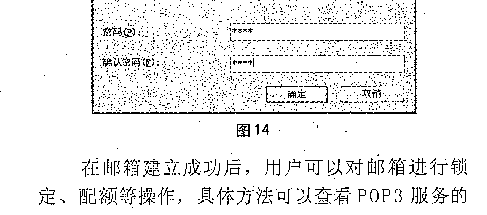

在邮箱建立成功后，用户可以对邮箱进行锁定、配额等操作，具体方法可以查看 POP3 服务的帮助，由于篇幅有限，在此就不多说了。

至此，企业邮件服务器的 POP3 服务就配置成功了，接下来需要配置 SMTP 服务。单击“开始”菜单，打开“管理工具”中的“Internet 信息服务 (IIS) 管理器”，在弹出的窗口中选中“默认 SMTP 虚拟服务器”下的“域”，如图 15 所示。

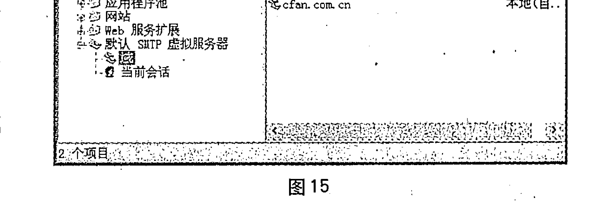

由于我们在前面的 POP3 设置已经添加了“cfan.com.cn”这个域，所以系统已经自动将该域添加到 SMTP 虚拟服务器中了。右键单击“默认 SMTP 虚拟服务器”下的“cfan.com.cn”域，选择“属性”命令，在弹出的对话框中可以设置邮件的存储位置等参数，如图 16 所示。

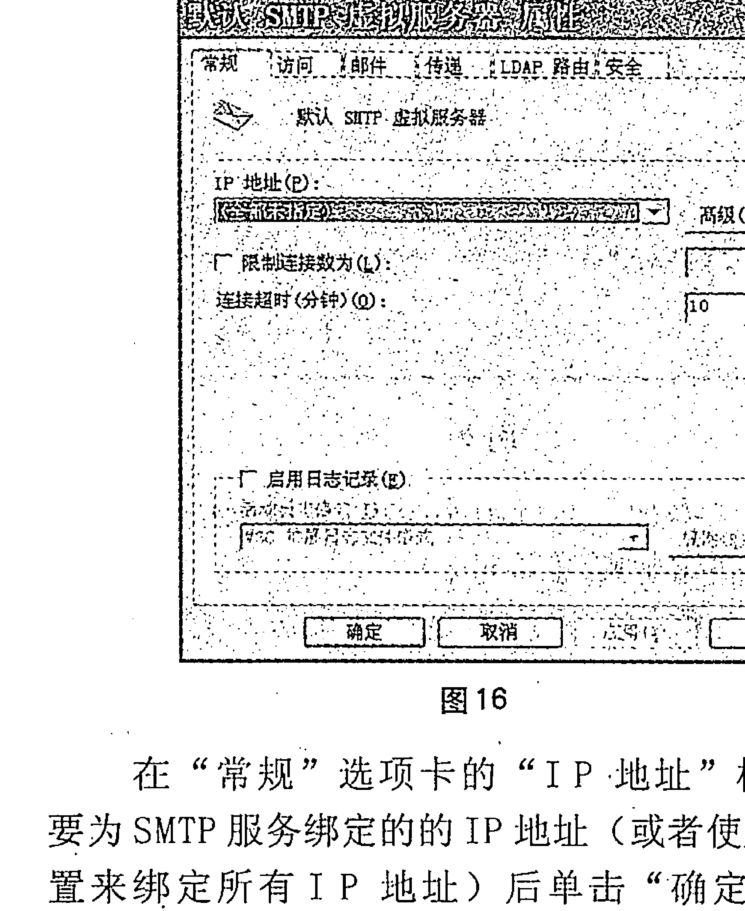

图 16

至此，Windows Server 2003 下的 Web、邮件等基本网络服务就配置完成了。小王通过这次实践，不仅成功地搭建了公司的网络服务平台，也极大地提升了自身的技术能力，可谓一举两得。

在“常规”选项卡的“IP地址”栏设置需要为SMTP服务绑定的IP地址（或者使用默认设置来绑定所有IP地址）后单击“确定”按钮，SMTP服务就配置完毕了。一个邮件服务器也就顺利完工了。小王又一次出色的完成了任务。

员工听说了这个消息之后，在小王的指导下，在Outlook的邮件账户中添加了自己的邮箱，将POP3和SMTP的地址均设置为服务器的地址（内部IP或者真实IP均可）后，感受到了快速收发邮件的乐趣，而老板也骄傲的在自己的名片中印上了自己企业的邮箱地址，终于不用使用免费邮箱了！

## （五）配置打印机和打印服务器设置

公司最近新购置了一台HP激光打印机，可以方便员工打印文稿，但是放在哪里呢？是否需要单独配置一台计算机作为打印服务器呢？小王微微一笑，根本不用，连在服务器上，用Windows Server 2003的打印服务器角色就可以了，其他的用户可以连接到此服务器上直接打印。

连接上打印机之后，打开如图7所示的窗口，选中“打印服务器”并单击“下一步”按钮，在接下来出现的对话框中选中“所有Windows客户端”（如果公司内的所有计算机都是Windows 2000以上的版本，则选中“Windows 2000和Windows XP客户端”即可，在这里我们假设公司内尚有Windows 98操作系统的存在，因此选中“所有Windows客户端”），单击“下一步”按钮，如图17所示。

接着用户将要进行两项配置，首先是“添加打印机”。

Windows Server 2003沿用了Windows 2000以来的打印机添加向导，因此用户不会陌生，在此不再赘述，只是提醒用户注意，一定要在向导中选择共享此打印机。

接下来是“添加打印机驱动程序”的配置，同样使用的是一个添加向导，这个向导将协助用户在打印服务器上安装多种平台（如Windows XP、Windows 98、Windows NT）等的打印机驱动程序，这样，当其他客户连接到打印服务器时，合适的打印机驱动程序将被自动安装到客户的计算机上，免去了客户（特别是Windows 9x/Me的用户）自己寻找并安装驱动程序的烦恼，如图18所示。

在安装驱动程序时，用户如果添加了Windows 2000以前的操作系统（如Windows NT4.0）的驱动程序，则需要为打印服务器提供这些驱动程序（应当在打印机的随机光盘中）。

两项设置全部完成后，网络上的用户就可以通过网上邻居来访问并使用打印服务器的打印功能了，小王又为公司的办公自动化作出了贡献。

## （六）遥控服务器

随着几次出色的完成了任务，一个天大的好消息降临了——小王升职了，他的工作环境也从象征着打工仔的办公楼4层搬到了白领阶层的5层，真的是恭喜他了。但是，搬家之后小王又遇到了新的问题，那就是，服务器并没有搬家，所以他每次需要维护或配置服务时都要从5层跑到4层，“网络专家”不仅为公司的网络服务消耗了极多的脑细胞，还浪费了大量的体力。不行，这样跑下去不是个办法，小王下定决心要解决这个问题。

### 1. 用“远程桌面”进行远程控制

在Windows Server 2003中有一个非常有用的功能——“远程桌面连接”，这是一种新的、更为方便快捷的远程控制手段，是Windows Server 2003在保留原有的“终端服务”基础上新增的一个可以实施远程控制的模块，它使用Microsoft的远程桌面协议（Remote Desktop Protocol，简称RDP）进行工作。与“终端服务”相比，“远程桌面”在功能、配置、安全等方面有了很大的改善。

哈哈，Windows Server 2003又一次帮助了小王，下面让我们来看一看如何启动“远程桌面连接”。

在桌面或“开始”菜单上使用鼠标右键单击“我的电脑”，在弹出的快捷菜单中选择“属性”，进入“系统属性”对话框。打开“系统属性”对话框中的“远程”选项卡，选中“远程桌面”选项中的“允许用户远程连接到这台计算机”，如图19所示。

单击“选择远程用户”可以授予其他的非管理员账号连接该服务器的权限。如图20所示。

单击“添加”按钮在弹出的对话框中直接输入或查找并添加账号即可。

需要提醒用户注意的是，如果服务器已经添加了终端服务，则图19的界面略有不同，若用户仅仅是日常维护等工作需要远程控制服务器的话，笔者不推荐安装终端服务。

服务器的配置完毕后，小王就不再需要在4、5层之间来回奔波了，只要在计算机中安装一个“远程桌面连接”的客户端即可。

Windows XP和Windows Server 2003的用户可以直接从“开始”→“程序”→“附件”→“通讯”→“远程桌面连接”启动客户端，Windows 2000及以前的Windows版本需要下载并安装该客户端（Windows Server 2003安装光盘的“Support\Tools”目录下有该客户端的安装文件Msrdpcli.exe）。

启动客户端后，用户只要输入服务器的IP地址或域名并对远程桌面窗口的大小、颜色数等设置完毕后，单击“连接”按钮即可登录远程服务器，登录方式与本地计算机相同，如图21所示。

从此，小王再也不需要上下奔波了，一边喝茶一边查资料一边配置服务器，真是其乐融融。

### 2. 终端服务

远程连接的问题解决后，小王开始带徒弟啦！
小刘是一个新来的大学生，他对Windows Server 2003的网络服务配置产生了浓厚的兴趣，也想学一学，但是远程连接只能同时登录两个用户，万一有两个以上的人想同时使用怎么办呢？而且公司的其他员工有时候也需要登录的服务器上作一些工作如执行一些程序，思来想去，小王决定使用Windows Server 2003的终端服务——可以使任何一种计算设备远程连接至Windows Server 2003服务器，并且执行服务器上的应用程序或者进行服务器管理工作。

和以前具有终端服务功能的Windows相比，Windows Server 2003的终端服务器支持更多的客户端连接，并且通过利用组策略技术提供了卓越的远程管理特性。同时，由于远程桌面管理增强了对RDP（远程桌面管理协议）5.2的支持，因此很多客户端的本地资源可用在远程会话中，例如音频（输出）、串口、打印机及剪贴板（用户可以在本地计算机上复制文本并直接粘贴到远程计算机的相应程序中），此外，RDP 5.2也增强了客户端的屏幕分辨率和颜色质量，可为客户端提供高达24位真彩的屏幕色深和1600×1200的屏幕分辨率，非常适合局域网内的用户使用，只要有足够的网络带宽，连接到服务器上的用户使用起来根本感受不到与使用本地计算机的区别。

和添加其它服务器角色一样，小王现在又开始动手添加终端服务器角色了。
在图7的对话框中选择“终端服务器”并单击“下一步”按钮，安装过程略。
终端服务安装完毕后，就已经默认启动了，但是远程客户还无法连接，用户还需要在组策略中对终端服务进行配置即可，方法如下：
单击“开始”菜单打开“运行”对话框，输入“gpedit.msc”，然后单击“确定”按钮启动“组策略编辑器”窗口，如图22所示。

在“组策略编辑器”窗口中，可看到“本地计算机策略”中有两个选项“计算机配置”和“用户配置”。“计算机配置”允许设置适用于计算机的策略，而不考虑谁是登录者。“用户配置”允许设置适用于登录到计算机上的每个用户的策略。

依次打开“计算机配置”→“管理模板”→“Windows组件”→“终端服务”，选中“终端服务”后，在右侧的窗口中，可以看到所有关于终端服务的设置选项。

双击打开“允许用户使用终端服务远程连接”，在弹出的对话框中用户可以为服务器配置终端服务远程访问。将状态设置为“启用”，则用户可以使用终端服务远程连接到目标计算机。用户可以通过配置“限制连接数量”来限制可以同时连接的用户数量；如果将状态设置为“禁用”，则目标计算机维持当前连接，但是不接受任何新传入的连接；如果将状态设置为“未配置”，则终端服务使用目标计算机上的“允许用户远程连接到用户的计算机”选项，确定是否允许远程连接，方法与配置远程桌面连接相同，选项位于“系统属性”的“远程”选项卡上，只是界面与图19略有不同。

用户还可以设置“限制最大颜色深度”等选项来适应终端服务的需要。
至此，小王为公司服务器制定了两套远程连接的方案，带多少个徒弟都没问题了！

## （七）配置VPN服务

随着公司业务的不断扩展，小王的公司已经在外地设立了分部，公司的员工都很兴奋，但是随之而来的新问题又产生了：在分部的员工抱怨说“在分部无法访问公司内部网络，很多机密的资料无法取得”。
解决这一问题的常规做法是在电信部门申请一条专线，连接总部与分部，这样分部的计算机就能够视同与总社计算机在同一个网络内，自然可以互相访问，但是专线的费用实在是昂贵……头疼的老板又一次找到了小王。

聪明的小王立刻在 Internet 上找到了最廉价的解决办法。

虚拟专用网络（VPN-Virtual Private Network）指的是在公用网络上建立专用网络的技术。之所以称为虚拟网主要是因为整个VPN网络的任意两个节点之间的连接并没有传统专网所需的端到端的物理链路，而是架构在公用网络服务商所提供的网络平台（如Internet, ATM, Frame Relay等）之上的逻辑网络，用户数据在逻辑链路中传输。由于通过公用IP网络来建立VPN，这样就可以节省大量的通信费用，可称得上物美价廉。

首先，还是从如图7的界面选择“远程访问 / VPN服务器”，在出现安装向导画面后，单击“下一步”按钮进入如图5所示的“配置”对话框。

选中“远程访问（拨号或VPN）”后，单击“下一步”按钮，出现远程访问的配置对话框，如图23所示。

选中“VPN”后，单击“下一步”按钮，选中服务器对外的网卡“本地连接”，如图24。

单击“下一步”按钮，进入“IP地址指定对话框”，选择“来自一个指定的地址范围”选项并单击“下一步”按钮来设定远程访问的计算机所使用的内部IP的范围，如图25、图26所示。

在最后的配置对话框中选择“否，使用路由和远程访问来对连接请求进行身份验证”，单击“下一步”按钮，完成服务的配置，至此VPN服务器的配置完成。

服务器配置完毕后，还需要为远程的用户添加一个账户，VPN服务器将使用该帐户对远程连接进行认证，在桌面或“开始”菜单上使用鼠标右键单击“我的电脑”，在弹出的快捷菜单中选择“管理”命令，打开“计算机管理”窗口，如图27所示。

打开“系统工具”下的“本地用户和组”，单击“用户”，在右侧窗口的空白处单击鼠标右键在弹出的快捷菜单中选择“新用户”命令，在出现的如图28所示的对话框中，输入用户名“VPN”，密码“VPN”，选中“用户不能更改密码”和“密码永不过期”，最后单击“创建”按钮完成添加用户的工作。

创建完毕后，在图27右侧的窗口中使用鼠标右键单击“VPN”用户，在弹出的菜单中选择“属性”，打开“属性”对话框。

单击对话框的“拨入”选项卡，在“远程访问权限（拨入或VPN）”选项中选中“允许访问”，如图29所示。

单击“确定”按钮后，远程的计算机就可以连接到本地局域网了，下面介绍一下配置VPN客户端的方法。

以Windows XP为例，打开“控制面板”中的“网络连接”，选择“新建连接”，在出现的网络连接类型选择“连接到我工作场所的网络”，如图30所示。

单击“下一步”按钮，根据系统提示完成连接名及VPN服务器地址的配置后，VPN客户端就配置成功了，用户可以像拨号上网那样来进行VPN连接了，如图32所示。

连接成功后，公司分部的员工也可以像本部的员工一样使用局域网内的资源了，如网上邻居、FTP等。

需要提醒用户注意的是，如果在配置VPN服务器之前，服务器已经配置了NAT服务，则应当在如图5的配置界面选择“虚拟专用网络（VPN）访问和NAT”，同时配置NAT和VPN服务。

## （八）配置网络电视直播系统

公司会议室新添了一台电视机，在休息的时候总是有很多人挤在一起观看电视，由于会议室面积有限，来晚的根本挤不进去，这怎么行呢，如果在自己的电脑前就能够收看电视节目那该有多好啊，小王灵机一动，他想到了Windows的流媒体服务。

Windows Server 2003包含了一个焕然一新的流媒体管理系统：Windows Media Services 9，它用来配置和管理传输到客户端的数字媒体流。与以前的版本相比，Windows Media Services 9每台服务器所支持的并发连接增加到了原来的两倍，并且还可以通过缓冲/代理机制扩充为分布式结构以支持更多的连接。

通过资料的翻查，小王又想出了一套网络电视直播方案：
硬件方面，花400元左右购置一块电视卡，安装在服务器上，并将电视天线连接好。
软件方面，Windows Media Encoder + Windows Server 2003的Media服务。

说干就干，小王又准备行动了。

安装电视卡驱动以及搜索电视台的过程略去不说了，下面来看看如何让Windows Media Encoder和Windows Server 2003的Media服务双剑合璧。

首先，在图7的界面中选择安装Media服务，选中“流式媒体服务器”并单击“下一步”按钮，安装过程略。

下载并安装完毕Windows Media Encoder 9 Series后就可以开始搭建直播系统了。

启动电视卡自带的应用程序，将选定需要直播的电视频道。启动Windows Media Encoder 9 Series，并开始一个新的广播项目，在视频输入选项中选择电视卡，在广播方式选项中选择“Pull from the encoder”，如图33所示。

Push to a Windows Media server是我们常说的推递送到Media Services，而Pull from the encoder是利用拉传递来实现基于Windows Media Services 9的视频多播（Multicast）直播。利用多播可以大大的减轻服务器的负担，不管多少人连接用户都可以收到理想的直播效果。因此多播无疑是最理想的流媒体传播方式。

单击“下一步”按钮后，输入广播的端口，这样，Windows Media Encoder就可以发出基于“http://计算机名（或IP地址）:端口”的广播流了。

单击“下一步”按钮后，设定广播的视频和音频流的编码速率，由于是局域网内的广播，因此可以尽量选择较大的速率以保证清晰度，单击“完成”按钮，按下Windows Media Encoder工具栏上的“Start Encoding”按钮后，配置即告完工。

接着，打开“管理工具”中的“Windows Media Services”，如图34所示。

使用鼠标右键单击“发布点”，在弹出的菜单中选择“添加发布点（高级）”，打开“添加发布点”对话框；选中“广播”选项，输入要创建广播发布点的名称如“CCTV1”，在“内容的位置”中输入Windows Media Encoder如图34界面中的URL，单击“确定”按钮后，“发布点”下方就会出现名为“CCTV1”的发布点，选中该发布点后选中右侧窗口的“公告”选项卡，单击“运行多播公告向导”按钮，并在弹出的对话框中选择启动多播数据写入插件。

在弹出的“多播公告向导”对话框中单击“下一步”按钮，在“指定要创建哪些文件”选项中选择“多播信息文件和公告文件”，单击“下一步”按钮，在“流格式”对话框中添加Windows Media Encoder广播的内容位置。

添加完毕后，单击“下一步”按钮，对是否启用多播日志记录、多播信息文件和公告文件的保存路径等进行设置，如图 38所示。

在完成了“多播公告”向导后，系统自动弹出测试流媒体服务的对话框，就可以测试刚配置的是否成功。

到这里，小王长出了一口气，一套网络电视直播系统完成了，用户只需要启动Windows Media Player，然后打开“Web服务器”地址，就可以观看网络电视了。

### 三、Windows Server 2003的一些网络服务配置技巧

#### （一）在控制面板里显示全部组件

在控制面板的添加删除Windows组件中并不能显示出所有的组件，用户无法删除不需要的组件，可以采用下面的方法解决：

将Windows\inf目录下的“sysoc.inf”文件中的“hide”删除。

#### （二）禁用登录时的Ctrl+Alt+Del

Windows Server 2003在启动后，必须要按下Ctrl+Alt+Del组合键才能够输入用户名和密码，其实可以省去这一步的，打开“管理工具”中的“本地安全策略”，在“本地策略”中的“安全选项”下找到“交互式登录：不需要按Ctrl+Alt+Del”，将其启用即可。

#### （三）禁用配置服务器向导

有的用户可能并不习惯每次登录后出现的配置服务器向导，没关系，可以禁用它。

只需要去除“管理您的服务器”窗口左下角“登录时不要显示此页”的选定即可。

#### （四）禁止空连接进行枚举（此操作并不能阻止空连接的建立）

打开注册表编辑器“regedit”，定位到HKEY_LOCAL_MACHINE\SYSTEM\CurrentControlSet\Control\LSA，将RestrictAnonymous的键值改为“00000001”即可。

RestrictAnonymous 各个键值的含义如下：

- 0x0 缺省
- 0x1 匿名用户无法列举本机用户列表
- 0x2 匿名用户无法连接本机IPC$共享

需要提醒读者注意的是，最好不要使用0x2，否则可能会造成一些服务无法启动，如SQL Server。

#### （五）如何通过修改注册表删除共享

打开注册表编辑器“regedit”，定位到HKEY_LOCAL_MACHINE\SYSTEM\CurrentControlSet\Services\LanmanServer\Parameters，将“AutoShareServer”的键值改为“00000000”即可，如果该键不存在，新建一个同名的双字节键并修改键值即可。

#### （六）如何添加NETBEUI协议

默认情况下Windows Server 2003是不安装netBEUI协议的，用户需要手工添加。

以管理员身份登录Windows Server 2003，打开安装光盘下的 Valueadd\MSFT\Net\NetBEUI目录，把“Nbf.sys”复制到Windows\System32\Drivers文件夹中，把“Netnbf.inf”复制到隐藏的Windows\Inf文件夹。

复制完毕后用户就可以在“本地连接”的“属性”对话框中添加NetBEUI协议了。

#### （七）在 RAS 或 VPN 服务器上禁用Netbios 代理

打开注册表编辑器“Regedit.exe”，定位到HKEY_LOCAL_MACHINE\System\CurrentControlSet\Services\Remoteaccess\Parameters\Ip\EnableNetBcastFwd，将值更改为“0”并重新启动计算机即可。

#### （八）如何在一块网卡上使用多个IP地址

打开“本地连接”属性对话框，选中“Internet 协议 (TCP/IP)”选项后，单击“属性”按钮，在弹出的对话框中单击“高级”按钮，打开“高级TCP/IP设置”对话框。

单击“I P 地址”选项中的“添加”按钮，在弹出的“TCP/IP地址”对话框中输入需要的IP地址即可，用户可用此方法添加任意多个IP地址。

## 无线网络 无限精彩

文 / 爱在残阳间

### 文章重点与技巧目录

- Wi-Fi 无线网络技术
- 蓝牙无线网络技术
- HomeRF 无线网络技术
- IrDA 无线网络
- 室内无线网络组建方案
- 室外组建方案
- 中国移动无线接入方案
- 中国联通无线接入方案
- 中国电信无线接入方案
- 中国网通无线接入方案
- 无线组网连接实战
- 无线网络问答

### 一、常见的无线网络

#### (一) Wi-Fi无线网络

苹果公司是最早在个人电脑中配备 WLAN 功能的，是苹果引领消费者个人电脑进入了使用 WLAN 的时代；此后以美国 IBM 为首的著名制造商纷纷推出各自的无线战略，为普及 WLAN 做出了巨大贡献。如今，WLAN 市场特别是 IEEE802.11b 产品的市场在此后获得了快速发展。WLAN 主要有四种标准：IEEE802.11、IEEE802.11b、IEEE802.11a、IEEE802.11g。

##### IEEE802.11

IEEE802.11 是 IEEE（电气和电子工程师协会）制定的一个无线局域网标准，主要用于解决办公室局域网和校园网中的用户与用户终端之间的无线接入。IEEE802.11 业务主要限于数据存取，传输速率最高只能达到2Mbps。由于 IEEE802.11 在速率上的不足，已不能满足数据应用的需求。

##### IEEE802.11b

正如前面所述，IEEE802.11b（Wi-Fi）是如今普及最广的WLAN规格。802.11b使用2.4GHz频带的电波，可以在相距50～100m的较长距离内实现设备间的通信。另外，它还具有以下优点，抗障碍物的能力较强、可以在公众WLAN接入服务（节点）中使用、廉价产品的出现等等。实际上，正是这些因素构成了WLAN的普及动力。IEEE802.11b的最大数据传输速度为11Mbps，无需直线传播（注：其实际的传输速率在5Mbps左右，与普通的10Base-T规格有线局域网处于同一水平）。使用动态速率转换，当射频情况变差时，可将数据传输速率降低为5.5Mbps、2Mbps和1Mbps。且当工作在2Mbps和1Mbps速率时可向下兼容IEEE802.11。IEEE802.11b的使用范围在室外为300m，在办公环境中则最长为100m。虽然与原有的WLAN相比，速度快了不少，但要想收发送动态图像等今后将日趋普及的大容量内容尚心有余而力不足。

IEEE802.11b运作模式基本分为两种：点对点模式和基本模式。点对点模式是指无线网卡和无线网卡之间的通信方式，这种模式可以让不限量的主机实时地架设起无线通信网络，又称 IBSS（Independent BSS）。在这种架构中，主机彼此之间直接通信，一般而言都是由少量的主机因临时需求而构成，如会议室。基本模式是指无线网络规模扩充或无线和有线网络并存时的通信方式，这是 IEEE802.11b 最常用的方式。也就是在一个有线网络架构中，装设一个特别的节点称作访问接入点（AP），它可将一个或多个 WLAN 与现存有线网络的分布式系统相连接，以提供某个无线局域网络中两个主机间的通信数据交换，另一方面也使 WLAN 中的主机能存取有线网络的资源。这类型的 WLAN 范围，通常以同栋建筑物出现，如商店、医院或同一栋楼层。

利用 IEEE802.11b 无线局域网技术，提供公共宽带无线上网服务（如图1），在世界各地越来越普遍，技术成熟、简单，成本低廉，并正威胁着 GPRS 和 3G 的市场发展。

##### IEEE802.11a

由此应运而生的是 IEEE802.11a。虽然名为 “a”, 但却是 802.11b 后续规格。802.11a 的通信速度快，最大数据传输速度为 54Mbps。由于使用 5GHz 频带的电波，因此传输损失较大，具有未经许可无法在户外使用、很难通过墙壁等缺点。另外，802.11a存在不能与802.11b兼容的缺点。也就是说，将现有的 802.11b 网络过渡到 802.11a 网络时，如果改变接入点 (主机)，就必须更换所有的客户设备

> 你知道吗？802.11a 先前还有一个爱称 Wi-Fi5 Wi-Fi5 是业界团体 Wi-Fi Alliance（原组织名称为 WECA）为了促进普及而给 802.11a 规格取的爱称。与作为 “Wi-Fi” 闻名的 802.11b 相对，由于 802.11a 使用 5GHz 频带的电波，因此得到了这么一个爱称。但是，Wi-Fi Alliance 于去年 10 月正式决定不再使用这一爱称。虽然解释是 “因为消费者容易混淆”，但这或许可以理解成 802.11a 失宠的象征。

的 WLAN 卡（子机）。总之，现有的 WLAN 环境的规模越大，更换的成本就会越高。

##### IEEE802.11g

802.11g 是在 802.11a 之后亮相的规格。融合美国德州仪器（TI）及美国 Intersil 等几家公司向 IEEE（美国电气电子技术者协会）提出的方案制订而成。该规格与 802.11b 相同，使用 2.4GHz 频带，不过数据传输速度却与 802.11a 相同，可以提高到 54Mbps。由于 802.11g 与 802.11b 具有兼容性，因此向现有的 WLAN 环境过渡时，只需购买接入点就可以。因为即使从 802.11b 的 WLAN 卡也可以访问 802.11g 的接入点（这时的最大通信速度是 802.11b 的 11Mbps）。另外一点就通信距离问题，802.11g 较 802.11b 通信距离短。802.11b 模式的通信距离是 “以接入点为中心的半径约 45 米”。如果是 802.11g 模式，那么通信距离是 “以接入点为中心的半径 15 米”。总之，根据环境，必须将此前 1 台就足够的接入点增加到 2 台以上。也就是只要能够提供无线连接多个接入点的桥接功能，就可以轻松地扩大可通信距离。

#### (二)蓝牙无线网络

“蓝牙”的英文名称为 “Bluetooth”, 是一种开放性短距离无线通信技术标准。蓝牙的学名为 “IEEE802.15”。可根据 IEEE802 标准取得一个唯一的 48bit 的 BD_ADDR，这是一个公开的地址码，可以通过人工或自动方式进行查询。它是面向移动设备间的小范围连接，其本质可以说它是一种代替线缆的技术。从应用的角度来讲，它与目前广泛应用于微波通信中的一点多址技术十分相似；因此，它很容易穿透障碍物，实现全方位的语音与数据传输。蓝牙同 IEEE802.11b 一样，使用 2.4GHz 频段，采用跳频扩频（FHSS）技术（注：跳频是蓝牙使用的关键技术。对应于单时隙分组，蓝牙的跳频速率为 1600 跳 / 秒；对应于时隙包，跳频速率有所降低；但在建链时则提高为 3200 跳 / 秒）。以 2.45GHz 为中心频率，来得到 79 个 1MHz 带宽的信道。由于使用比较高的跳频速率，使蓝牙系统具有较高的抗干扰能力。在发射带宽为 1MHz 时，其有效数据速率为 721kbps。在联网上，蓝牙支持点对点和点到多点的连接，使用无线方式将多个蓝牙设备连成一个微微网，多个微微网又可互连成特殊分散网，形成灵活的多重微微网的拓扑结构，从而实现各类设备之间的快速通信。

> 你知道吗？蓝牙名字的由来
> Bluetooth原为一千多年前的某个丹麦皇帝的名字，他为四分五裂的瑞典、芬兰、丹麦的统一有着不朽的功劳。而瑞典的Ericsson为这种即将成为全球通用的无线技术命此名，也许大有一统天下的含义。其原本含义也许已经无法得知，但按照英文字面的翻译为“蓝牙”已经为大家所接受，是一颗作用巨大的小牙齿，还是会吞噬蓝天，占尽无线天空，我们只好拭目以待了。

在技术规范方面，蓝牙包括协议（Protocol）和应用规范（Profile）两个部分。协议定义了各功能元素（如串口仿真协议、逻辑链路控制和适配协议等）各自的工作方式，而应用规范则阐述了为了实现一个特定的应用模型，各层协议间的运转协同机制。整个蓝牙协议体系结构可分为4层，即核心协议层、线缆替代协议层、电话控制协议层和采纳的其它协议层。

#### （三）HomeRF 无线网络

HomeRF 无线标准是由HomeRF工作组开发的，旨在家庭范围内，使计算机与其他电子设备之间实现无线通信的开放性工业标准。HomeRF是IEEE802.11与DECT的结合，使用这种技术能降低语音数据成本。与前几种技术一样，使用开放的2.4GHz频段。采用跳频扩频（FHSS）技术，跳频速率为50跳/秒，共有75个带宽为1MHz的跳频信道。调制方式为恒定包络的FSK调制，分为2FSK与4FSK两种（注：采用调频调制可以有效地抑制无线环境下的干扰和衰落。）。2FSK方式下，最大数据的传输速率为1Mbps；4FSK方式下，速率可达2Mbps。在新的HomeRF 2.x标准中，采用了WBFH（Wide Band Frequency Hopping，宽带跳频）技术来增加跳频带宽，由原来的1MHz跳频信道增加到3MHz、5MHz，跳频的速率也增加到75跳/秒，数据峰值达到10Mbps。

HomeRF提供了流媒体真正意义上的支持。由于流媒体规定了高级别的优先权并采用了带有优先权的重发机制，这样就确保了实时播放流媒体所需的带宽、低干扰、低误码。HomeRF把共享无线接入协议（SWAP）作为未来家庭联网的技术指标，基于该协议的网络是对等网，因此该协议主要针对家庭无线局域网。其数据通信采用简化的IEEE802.11协议标准，沿用类似与以太网技术中的冲突检测的载波监听多址技术（CSMA/CD）CSMA/CA。语音通信采用DECT（Digital Enhanced Cordless Telephony）标准，使用TDMA时分多址技术。

不过由于HomeRF技术没有公开，目前只有几十家企业支持，在抗干扰等方面相对应其他技术而言尚有欠缺，因此注定它没有广泛的应用前景。

#### （四）IrDA 无线网络

简单来讲，IrDA是一种利用红外线进行点对点通信的技术，是由Infrared Data Association（红外线数据标准协会）制订的一种无线协议。红外线数据标准协会成立于1993年，是一个致力于建立无线传播连接的国际标准的非营利性组织，目前在全球拥有160个会员。现行的IrDA传输速率为最新VFIR的16Mbps，相比原来FIR的4Mbps快了4倍。接收角度也由传统的30度扩展到120度。并且其硬件及相应软件技术都已比较成熟。以下便是其在技术上的主要优点：

无需专门申请特定频率的使用执照。这一点，在当前频率资源匮乏，频道使用费增加的背景下是比较重要的。

具有移动通信设备所必需的体积小、功率低的优点。

数据传输速率比较高。由于采用点到点的连接，数据传输所受到的干扰较少，最高数据传输速率可达16Mbps。

IrDA具有一定的市场优势。目前，全世界有5000万台设备采用IrDA技术，并且仍然每年以50%的速度增长。大多数的笔记本电脑及一些外设都安装有IrDA接口。在成本上，红外线LED及接收器等组件较其他产品来得更便宜。

当然，IrDA也有其不尽如人意之处：
首先，IrDA是一种视距传输技术，也就是说在多个具有IrDA接口的设备之间传输数据，中间就不能有阻挡物，这在两个设备之间是容易实现的，但在多个设备之间传输数据就必须彼此调整其位置与角度等。其次，IrDA设备的核心部件——红外线LED是一种不耐用的器件，频繁使用会令其使用寿命大大缩短。

IrDA进入市场较早，产品应用比较多，有一定的市场价值，所以在短期内，还不会退出市场。不过由于其技术的原因，终不能成为无线局域网的标准。

### 二、无线网络的组网特点

虽然大家都知道无线网络与有线网络相比，有不少优点。无线网络在组网方面（如图2：室内、室外、Internet组网示意图）主要特点如下：

- ☐可靠通信
该技术抗射频干扰性能强，具有理想的接收灵敏度，宽范围天线能够提供强大的、可靠的无线传输。

- ☐低成本
使用无线局域网可以降低综合布线成本、使用维护成本，并可避免因布线、网络安装对装修、环境的破坏。在覆盖区域内，多个房间的用户可以共享宽带上，分担上网费用，节约开支。另外，无线技术的发展非常迅速，因此用户难以避免需要向未来的无线局域网技术升级。比如：朗讯科技的WavePOINT II采用双重PC卡槽设计，可以使用户将未来的、与IEEE802.11兼容的高速技术与基站集成起来，从而保护用户的投资。又如：如果你原先是使用华硕P4P800等WiFi主板，即可通过选购华硕WiFi-b WLAN扩展卡（只需399元），即可将这些主板具备Wi-Fi无线网卡的功能，而且还具有AP（Acess Point）功能，最多可以支持31个客户端，无论对于家庭用户还是对于小型公司而言这都可以节省一笔可观的开支。

- ☐灵活性
由于没有线缆的限制，用户可以随心所欲地增加工作站或重新配置工作站。另外，在难以布线的环境如老建筑、布线困难或昂贵的露天区域，以及频繁变化的环境如临时性会议、展览馆等场所，无线局域网可方便、快捷地为用户提供网络服务。

- ☐移动性
用户可以不受网线的约束以及墙壁信息插座的限制，自由自在地在无线网桥（AP）所覆盖的范围内轻松接入网络，并且可以无缝漫游。并可以通过局域网访问宽带互联网。

- ☐高吞吐量
目前，WLAN的数据传输速率以11Mbps为主，并且可达54Mbps，这比ISDN（128Kbps）、ADSL（8Mbps）、Cable Modem（10Mbps）都要高。快速安装无线局域网的安装工作非常简单，它无需施工许可证，不需要布线或开挖沟槽，安装时间只有安装有线网络时间的零头。

- ☐安全性高
由于WLAN采用扩频、跳频无线传输技术，本身就使盗听者难以捕捉到有用的数据；扩展频谱技术在50年前就被美国军方用来进行保密传输。所以，从一开始它就设计成抗噪音、抗干扰、抗阻塞和未授权检测。因此，WLAN的安全级别远高于有线网络。

### 三、无线上网方案

在目前的WLAN技术中，Wi-Fi和HomeRF更适合无线网络的实际组建和使用，但由于HomeRF还是很普及，所以本文只以Wi-Fi为重点。蓝牙技术主要应用于移动电话、掌上电脑等轻便携带设备，使用距离相对较短；IrDA则必须直线视距连接，限制太大。蓝牙和IrDA均不适合我们通常意义上的无线网络，在这里我们就不多作介绍了。

#### (一) 室内无线网络组网方案

##### 1. AD-HOC对等网络（如图3）

对等方式下，无需AP，一个基站会自动设置为初始站，并初始化网络，使同域基站成为一个局域网。此模式下，不支持TCP/IP协议，较适合未建网的用户，或组建临时性的网络，如野外作业、临时流动会议等。

上插有一块无线网卡，通过无线网卡来完成无线链路的联通。无线网卡的射频输出端口，通过馈线接到天线。无线网桥连接完成后的效果类似于HUB级连。

##### 2. Infrastructure 星形拓扑网络（如图4）

接入方式以星形拓扑为基础，以接入点AP为中心，所有的基站通信要通过AP转接。应用时，既可以AP为中心独立，建立一个无线局域网，也可以AP作为一个有线网的扩展部分。支持TCP/IP和IPX等多种网络协议。是WLAN主要的应用方式之一。

A、B、C网分别为三个有线网，A网为中心点，外围有B网和C网。无线网桥的接法与上一例点到点的非常相似，只是中心点A网的无线网桥上需插有两块无线网卡，两块无线网卡分别通过馈线接两部天线，两部天线分别指向B网和C网。

##### 3. 多接入点组网模式（如图5）

##### 3. 室外点对多点（如图8）

这是一点对多点且有路由功能的无线连接方案。A有线网为中心点，B、C、D分别为外围的三个有线网，在此案例中，几个有线网可以为不同网段。在无线设备上的选用有所不同，在中心点需要采用全向天线，并且需要有专用的路由软件的支持，才能实现路由功能。

这种模式下，多个接入点可以构建自己的独立域，也可以组建为一个大的统一域，让基站在域内无缝漫游。

#### （二）室外组网方案

##### 1. 室外点对点组网（如图6）

A网与B网分别为两个有线局域网，现通过两台无线网桥将两个有线网连在一起，可通过网桥上的RJ45口或BNC细缆接口与有线网相接。每台网桥

##### 2. 室外中继的连接（如图7）

##### 3. 室外点对多点（如图8）

这是一点对多点且有路由功能的无线连接方案。A有线网为中心点，B、C、D分别为外围的三个有线网，在此案例中，几个有线网可以为不同网段。在无线设备上的选用有所不同，在中心点需要采用全向天线，并且需要有专用的路由软件的支持，才能实现路由功能。

### 四、四战之地的 ISP 无线接入服务

作为无线领域主流应用之一的WLAN，为几乎每一个基础电信提供了充分表现的空间。据IDC（国际数据集团）预测，WLAN将是今年通信市场增长速度最快的市场之一。其市场规模据业内人士预计，在未来 3 年内将超过 100 亿元人民币。

中国移动随 e 行在无线宽带网市场率先发力，无线上网成了网民们最新的时尚标签。鉴于无线宽带巨大的市场前景日渐清晰，各大电信运营商各显神通、纷纷抢滩，宽带的无线接入之争开始正面交锋。随后，中国联通也推出了与中国移动随 e 行类似的“掌中宽带”业务。目前，联通正考虑用 CDMA1X + WLAN 的方式为集团用户提供无线接入互联网服务。中国电信去年推出了“天翼通”无线上网业务，提供最后 10～100m 的 WLAN 接入方式。中国网通在北京、上海、广州、深圳四个城市建设无线漫游网，并在商务热点地区开通了“无限伴旅” WLAN 接入服务。

#### （一）中国移动随 e 行

随 e 行是中国移动面向商务人士、集团客户推出无线上网服务，用户可通过笔记本电脑、掌上电脑等终端以 GPRS/WLAN 接入互联网和企业网，获取信息、娱乐或移动办公业务。“随 e 行”业务的宗旨是为用户带来“网络随身、世界随心”的感受。

##### 1. 中国移动随 e 行 GPRS 服务

目前，中国移动在全国 31 个省 240 多个城市提供 GPRS 服务，不管在市内、室外、静止还是运动中，用户都可以接入互联网，用户的接入速度大概在 30～40kbps，可以满足用户收发 E-mail、网页浏览等上网需求。用户通过 GPRS 无线上网时，可以一直与网络保持连接，始终附着在 GPRS 网络上，每次使用时只需一个激活的过程，一般只需要 1～3 秒的时间马上就能登录至互联网，而固定拨号方式接入互联网需要拨号、验证用户名密码、登录服务器等过程，至少需要 8～10 秒甚至更长的时间。用户可以一直在线，按照用户接收和发送数据包的数量来收取费用，没有数据流量的传递时，用户即使挂在网上，也是不收费的。

> 小知识：GPRS
> GPRS 是通用分组无线业务 (General Packet Radio Service) 的英文简称，是一种新的分组数据承载业务，特别适用于间断的、突发性的或频繁的、少量的数据传输，也适用于偶尔的大数据量传输。

### 申请过程

如果你想办理随 e 行 GPRS 业务，你可以携带你的身份证就近到你所在地的中国移动通信营业厅进行申请。

一些经过中国移动授权的合作伙伴，如笔记本经销商和 GPRS 网卡经销商，也可以为你办理随 e 行业务的入网。你也可以在同当地中国移动公司核实后，在中国移动的合作伙伴处办理随 e 行业务。

用户使用数据 SIM 卡时，可将数据 SIM 卡与移动电话号码捆绑，实现单一账单。

### 资费标准

目前随 e 行业务按 GPRS 流量进行计费，你可以根据自己的使用时间的长短，选择下表中四种套餐中的一种。

###### 随 e 行业务的资费标准

| 套餐名称 | 月租费 (元) | 赠送的免费流量数 (MB) | 超过免费流量后的费用 (元/KB) |
| :--- | :--- | :--- | :--- |
| 自由套餐 | 0 | 0 | 0.03 |
| 经济套餐 | 20 | 1 | 0.01 |
| 时尚套餐 | 100 | 20 | 0.01 |
| 商务套餐 | 200 | 不限量使用 | |

注 1：用户漫游时不加收漫游费。目前，中国移动通信还在部分省市对用户进行促销活动，用户可以通过更加优惠的价格享受 GPRS 服务。

注 2：由于接入互联网使用方式的特殊性，用户一般无法感知和控制使用流量，建议用户选择商务套餐。

### 使用配件

用户使用随 e 行业务所需的硬件设备为以下三种：移动终端（笔记本电脑或掌上电脑）、GPRS 网卡、数据 SIM 卡。

**移动终端：** 移动终端为随 e 行业务的最终载体，申请开通了随 e 行业务的用户就可以通过移动终端无线接入 Internet 享受网络随身、世界随心的移动办公新境界。

**GPRS 网卡：** GPRS 网卡，是采用 GPRS 无线网络技术的网卡，可以通过 PCMCIA 插槽或 USB 接口连接笔记本电脑或掌上电脑 (PCMCIA 槽平常用于安装网卡和拨号 Modem 卡)。所有 GPRS 网卡上都有数据 SIM 卡插槽，用户使用时需将数据 SIM 卡插入 GPRS 网卡使用。

**数据 SIM 卡：** 数据 SIM 卡是中国移动通信为随 e 行用户提供的一种关闭了语音功能，只保留数据通信功能的专用 SIM 卡。将数据 SIM 卡插入 GPRS 网卡中，再与移动终端相连接，就可实现无线上网，并可以收发短信。

### 配置方法

设备连接、参数设置与使用方法，以笔记本电脑为例，具体操作如下：

- (1) 确认你的 GPRS 网卡，数据 SIM 卡一切正常；

## 2. 中国移动随e行 WLAN服务

- 2. 将数据SIM卡插入GPRS网卡，并将GPRS网卡插入笔记本电脑的PCMCIA槽中；
- 3. 根据购买GPRS网卡时获得的安装光盘及说明书，在笔记本电脑中安装客户端软件；
- 4. 请按以下参数正确对GPRS网卡进行配置连接：将GPRS连接设为缺省，设置接入点名称（APN）为“CMNET”，配置用户名、密码为空；
- 5. 确定笔记本电脑处于GPRS网络覆盖区域内（客户端软件上有信号强弱的标识）；激活GPRS连接；
- 6. 访问Internet或企业内部网。

中国移动WLAN采用802.11b标准，可以提供11Mbps的共享接入速率，满足用户浏览WWW网站、使用带宽要求高的流媒体业务、下载大型软件等需求。

目前中国移动已在全国近700个热点地区提供了网络覆盖，热点地区包括机场、酒店、会议中心和展览馆等商旅人士经常出入的场所。

### 申请过程

- 1. “移动电话号码+密码”认证方式

用户以移动电话号码作为账号，通过短消息、1860申请上网密码。登录时输入移动电话号码和密码即可上网，上网费用记在移动电话账号上。

- a. 短消息申请

用户向1866发送端消息，即可申请密码或者修改密码，具体格式如下：

```
WLAN业务开户指令：SQWLAN（大小写均可）；
```

```
修改WLAN密码指令：XGWLANMM（大小写均可）□原密码□新密码（密码区分大小写，长度为6位，□表示空格）；
```

```
重置WLAN密码指令：CZWLAMMM（大小写均可）。
```

- b. 1860申请（部分省开通）

用户拨打开户地的1860申请上网密码即可。

- c. 采用SIM认证方式时(暂未开通)

用户使用双模网卡（GPRS+WLAN）时，可向当地的移动公司购买一张数据SIM卡，并且该卡已打开GPRS和WLAN对应标识。用户将数据SIM卡插入网卡，将网卡插入笔记本电脑或掌上电脑即可使用。上网时不用再输入账号和密码。

- 2. SIM认证方式时（目前暂未开通）

用户将SIM卡放入网卡的SIM卡插槽中或SIM读卡器中，登录时不用输入用户名和密码，而是通过SIM卡中的有关信息进行认证，费用计入该SIM卡中。

### 资费标准

| 套餐 | 月基本费(元) | 含免费时间(小时) | 超出部分通信费(元/分钟) |
|------|--------------|------------------|------------------------|
| 自由套餐 | 0 | 0 | 0.20 |
| 经济套餐 | 20 | 10 | 0.15 |
| 时尚套餐 | 100 | 50 | 0.10 |
| 商务套餐 | 200 | 150 | 0.10 |

注1：用户使用WLAN业务并通过“移动电话号码+密码”方式认证时，费用计入对应移动电话账单，随同话费一起缴纳；使用数据SIM卡时，可将数据SIM卡与移动电话账单捆绑，实现单一账单。

注2：通过短信方式申请开通业务默认资费标准为0.20元/分钟。

注3：各省资费套餐申请方式请拨打1860咨询。

### 使用配件

移动终端：笔记本电脑（需要有PCMCIA接口）或掌上电脑。笔记本电脑需要预装Window 9x/2000/Me/XP。掌上电脑需要预装Windows CE。

无线网卡：通过Wi-Fi认证并支持IEEE 802.11b协议的无线网卡。如果笔记本或掌上电脑有内置网卡，则可直接使用。

有数据SIM卡（打开WLAN对应的业务标识）或者已从中国移动申请的登录密码。

### 配置方法

- 1. “移动电话号码+密码”认证方式时

- a. 完成无线网卡的安装后，打开浏览器（即IE）；
- b. 在地址栏中输入你想访问的网址；
- c. 用户登录页面会弹出，正确输入账号和密码即可。

- 2. SIM认证方式时（暂未开通）

用户将数据SIM卡插入网卡，将网卡插入笔记本电脑或掌上电脑即可使用。上网时不用再输入账号和密码在WLAN覆盖区域。

## 中国联通掌中宽带

掌中宽带业务是利用CDMA1X网络开展的无线上网业务，是对现有有线互联网业务接入业务的延伸和拓展。中国联通CDMA1X代表联通CDMA网络的全面升级，可提供无线互联网接入和无线数据业务。联通无线是联通CDMA1X无线数据业务的总体品牌，掌中宽带是CDMA1X高速无线互联网接入业务的品牌。

| 优惠档次 | 月基本使用费 | 所包含的流量 | 按包含流量折算的单价 | 超出部分资费标准 |
| :--- | :--- | :--- | :--- | :--- |
| A | 50 元 / 月 | 100MB | 0.005 元 / KB | 0.005 元 / KB |
| B | 200 元 / 月 | 500MB | 0.0004 元 / KB | 0.005 元 / KB (每日23：00-次日7：00，按实际发生量的50%收费) |
| C | 300 元 / 月 | 2GB | 0.00015 元 / KB | 0.005 元 / KB (每日23：00-次日7：00，按实际发生量的50%收费) |

注：以上资费标准采集自中国联通网站，价格如有变动请致电当地的中国联通客服热线1001或至联通各营业厅及代理商处询问。

### 申请过程

用户须到当地的中国联通营业厅购买CDMA1X无线网卡，填写掌中宽带业务登记表，选择套餐，申请开通业务。开通业务后会给用户分配一个移动电话号码。

### 资费标准

中国联通掌中宽带业务使用费按发送、接收双向流量（单位：KB）计费，标准资费为：0.005元/KB（千字节）。不足1KB按1KB计收。每日23：00-次日7：00，按实际发生量的50%收费。为了适合更多不同需求的客户，中国联通特别设置了以下资费标准供客户自由选择。你可以自愿选择“包月包量”优惠档位及其生效时间（当月或次月生效）。

小知识：CDMA 1X
属于2.5G移动通信技术，无线数据传输速率可达153.6kbps，远远超过了目前移动电话上网的9.6kbps，也大大超过了电脑拨号上网的56kbps。

### 使用配件

终端设备：拥有笔记本电脑或手持终端设备。

CDMA 1X网卡：用户可以将CDMA1X无线网卡插入笔记本电脑或手持终端设备的相应接口，通过联通CDMA1X网络访问因特网，实现移动办公、随身理财、网络在线等功能。

### 配置方法

- (1) 将CDMA-1X无线上网卡插到笔记本电脑的PCMCIA槽中，注意卡的正反方向，将卡上的活动天线直竖向上；
- (2) 运行拨号程序，系统加载程序，并进行上网设备的搜索。
- (3) 将用户账号和密码均设为“CARD”（大写），并选择使用动态DNS Server IP。

## （三）中国电信天翼通

“天翼通”是中国电信新推出的无线宽带上网业务，其采用WLAN无线局域网技术。用户在家中或办公室内移动上网，同时也可在“天翼通”已布网的公共场所实现无线网络连接。并可提供最大11Mbps的带宽，充分满足客户对宽带业务的需求，非常适合高速上网和视频服务等宽带业务。“天翼通”是采用ADSL+WLAN的方式实现无线上网，所以“天翼通”适用于已装或新装ADSL的客户，或者需要在公共场所进行无线上网的用户。

### 申请过程

中国电信天翼通业务开放的类型为新装天翼通、原有ADSL客户改装天翼通，以及用户申请公共区使用的天翼通业务。
开户时，需提供加装“天翼通”的电话号码的账单，并携带本人身份证原件、办公用户携带单位介绍信到当地中国电信营业厅填写“天翼通业务住宅、办公用户登记表”；客户申请公共区注册应填写“天翼通公共区注册用户登记表”。由负责受理的信息服务平台将客户信息录入营业计算机管理系统。

### 资费标准

以上海地区为例，针对住宅（个人）用户，天翼通的资费标准如下。

- （1）一次性接入费（含无线网卡一块）
  - a. 新装“天翼通”用户：1500元（300元安装调试费+10元手续费+590元MODEM+600元无线网卡）
  - b. ADSL改装“天翼通”用户：710元（100元安装调试费+10元手续费+600元无线网卡）
  - c. 公共区用户：610元（10元手续费+600元无线网卡）
- （2）网络使用费（512K）
  - 有限包月：100元/月，包60小时，以后0.1元/分钟
  - 无限包月：150元/月

注1：业务推广期间，住宅用户使用账号可在公众区使用，其中无限包月用户不另外计费，有限包月用户公众区使用时间计入使用账号一并计费，费率按有限包月制。
注2：全国各地的天翼通服务的资费标准并不统一，请大家拨打10000中国电信综合服务热线询问。

### 使用配件
终端设备：拥有笔记本电脑或台式机。
ADSL 调制解调器、滤波分离器、无线网卡：用户可以自行购买无线网卡，也可以购买中国电信提供的无线网卡。
无线路由器：一般是由中国电信提供给用户，但无线路由器产权归中国电信所有，用户退租时需返还设备。
普通直线电话：普通直线电话（ISDN除外），线路和号码无需改动

### 配置方法
- 1. （1）安装无线网卡及其他设备；
- 2. （2）程序会自动弹出让你输入（ESSID）的对话框，输入正确的ESSID号（上海电信为“CTC”），即可完成初步的设置；
- 3. （3）上网认证。
  - 在家中：安装人员会为你配置好无线路由器，无需安装任何拨号软件；你只需打开WEB浏览器，在地址栏内输入任意的网址，无线路由器会自动拨号；大约5秒左右时间线路拨通，出现你要访问的网页时说明已连入Internet。
  - 在公共场所：打开WEB浏览器，在地址栏内输入任意的网址后，输入正确的用户名和密码，验证通过后会显示“天翼通”的服务网站，这时你已连入Internet。

## （四）中国网通无限伴旅服务

中国网通推出的无线宽带接入服务——“无限伴旅“（Mobile Office），摆脱了网线和电话线的束缚，只需在笔记本电脑或掌上电脑上安装WLAN无线网卡就能在网通无限伴旅网络覆盖区域内实现安全的高速无线上网和商务处理，其可靠性和安全性与局域网相同。上网速度比传统方式快50～200倍，高达11Mbps。无限伴旅服务将为你建立VPN通道，保证你能安全地远程登录公司内部网站，使你在全国主要城市的机场、酒店商务区、会务中心和高档咖啡厅等商务热点地区都能像在办公室一样轻松料理公务。该服务基于国际标准协议，实现了与众多国际运营商间的漫游。

### 申请过程
个人用户只要从中国网通的无限伴旅业务受理点处购买无限伴旅账号，即可享受无限伴旅带来的“无线”方便。

### 资费标准
- （1）预付费
  - a. 一次性预付费卡
    用户购买一次性预付费卡后，利用卡上的账号和密码就可直接上网，在卡面金额用完后，自动实时断线。用户在拿到卡后，可以登录到http://www.mobileoffice.com.cn/进行密码修改、余额查询等。目前，中国网通已经推出三种预付费不可充值卡：宜时通、商旅通、商务超值卡。
  - b. 可充值预付费卡
    用户购买可充值预付费卡后，利用卡上的账号和密码就可直接上网，在卡面金额用完后，自动实时断线。用户在拿到卡后，可以登录到http://www.mobileoffice.com.cn/进行密码修改、余额查询、续费等操作。

| 计费类型卡有效期 | 产品名称 | 金额(元) | 时长(分钟) |
| :--- | :--- | :--- | :--- |
| 宜时通 | 30 | 60 | 一年 |
| 商旅通 | 300 | 600 | 一年 |
| 商务超值卡 | 100 | 24小时（1440分） | 一年 |
| 可充值预付费卡一年 | 充值卡 | 100 | 200 |
| 充值卡 | 300 | 600 | 一年 |

- （2）后付费
  针对商务集团用户，中国网通特别推出“先使用、后付费”的后付费计时账号。

| 用户类型 | 包月限时费(元) | 使用时长(分钟) | 漫游费率(元/分钟) | 备注 |
| :--- | :--- | :--- | :--- | :--- |
| 后付费计时账号 | 0 | 0 | 0.5 | 超过包月限时的使用时长按表中漫游费率收费。 |
| | 50 | 200 | 0.5 | |
| | 100 | 500 | 0.3 | |

注：以上资费标准是采集自中国网通无限伴旅网站。

### 配置方法
- 1. （1）配置无线网卡：将网络名称（SSID）设为“cnc”；
- 2. （2）从各无限伴旅业务受理点处获得无限伴旅账号；
- 3. （3）启动网络浏览器，在地址栏中输入你想访问的网址；
- 4. （4）在弹出的无限伴旅用户登录页面中输入账号和密码；
- (5) 登录成功后，无限伴旅网站和无限伴旅用户使用状态页面同时出现，开始使用服务；
- (6) 在你使用完本服务后，请在无限伴旅用户使用状态页面退出登录。

### 五、无线上网组网及连接实战

#### (一) WLAN 与 ADSL/Cable Modem/LAN 等有线宽带的组合

##### 1. 所需设备

- ☐ 笔记本电脑主机＋台式机客户机
  笔记本电脑1台、MiniPCI或PCMCIA或USB或无线网卡1块；台式机若干台、PCI或USB无线网卡若干块。
- ☐ 笔记本电脑主机＋笔记本电脑客户机
  笔记本电脑若干台、MiniPCI或PCMCIA或USB无线网卡若干块。
- ☐ 台式机主机＋台式机客户机
  台式机若干台、PCI或USB无线网卡若干块。
- ☐ 笔记本电脑主机＋掌上电脑客户机
  笔记本电脑1台、PCI或USB无线网卡1块；掌上电脑若干台。
- ☐ 台式机主机＋掌上电脑客户机
  台式机1台、PCI或USB无线网卡1台；掌上电脑若干台。

注1：如果笔记本电脑已内置无线网卡（一般来说迅驰笔记本电脑均已内置MiniPCI无线网卡和天线），则不需要另配无线网卡。

注2：如果你原先是使用华硕P4P800、P4C800等WiFi主板，只要选购华硕WiFi-b WLAN扩展卡（只需399元），即可让这些主板具备Wi-Fi无线网卡的功能，而且还具有AP功能，最多可以支持31个客户端，无论对于家庭用户还是对于小型公司而言这都可以节省一笔可观的开支。

##### 2. 必要条件

第一，必须保证主机已连上有线宽带网；
第二，使用范围必须在WLAN标准规定的范围之内（IEEE802.11b规定在室外最长为300m，办公环境中则最长为100m）。

##### 3. 实现过程

通过点对点模式，主机与客户机之间可以实时地架设起无线通信网络。下面，笔者以台式机主机＋台式机客户机（台式机均使用华硕P4P800S主板），然后通过华硕WiFi-b WLAN扩展卡（如图9）这套AP设备，组建无线局域网+ADSL共享上网的网络（其中，主机已开通ADSL有线上网服务）。目前，同时带有华硕WiFi-b WLAN套装的主板也已经上市，这些套装有：P4C800 DELUXE/WiFi-b=¥2188、P4P800 DELUXE/WiFi-b=¥1888、K8V DELUXE/WiFi-b=¥1688，用户只需要在原主板价格基础上加100元即可轻松拥有无线AP套装。这款WiFi-b WLAN扩展卡目前在AP模式下软件支持还只限于Windows XP。如果你所使用的华硕主板上带有WiFi扩展插槽（如图10），只需花399元就可以购买到华硕WiFi-b WLAN（最便宜的无线AP设备也要在1000元左右）。

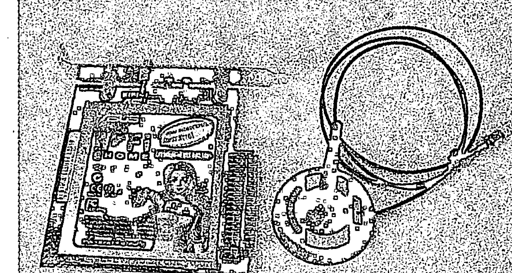

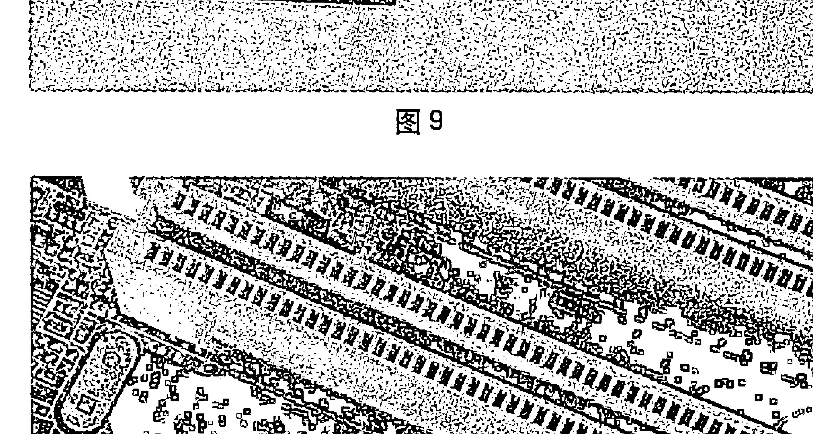

小提示：如果你不是使用华硕主板或你所使用华硕主板不带WiFi扩展插槽，那么也可另购一块支持IEEE 802.11b、PCI接口的无线网卡。

第一步：华硕WiFi-b WLAN扩展卡的安装过程非常简单，将华硕WiFi-b WLAN扩展卡插入华硕P4P800S无线主板的PCI插槽下面的WiFi扩展插槽中（如图11）。

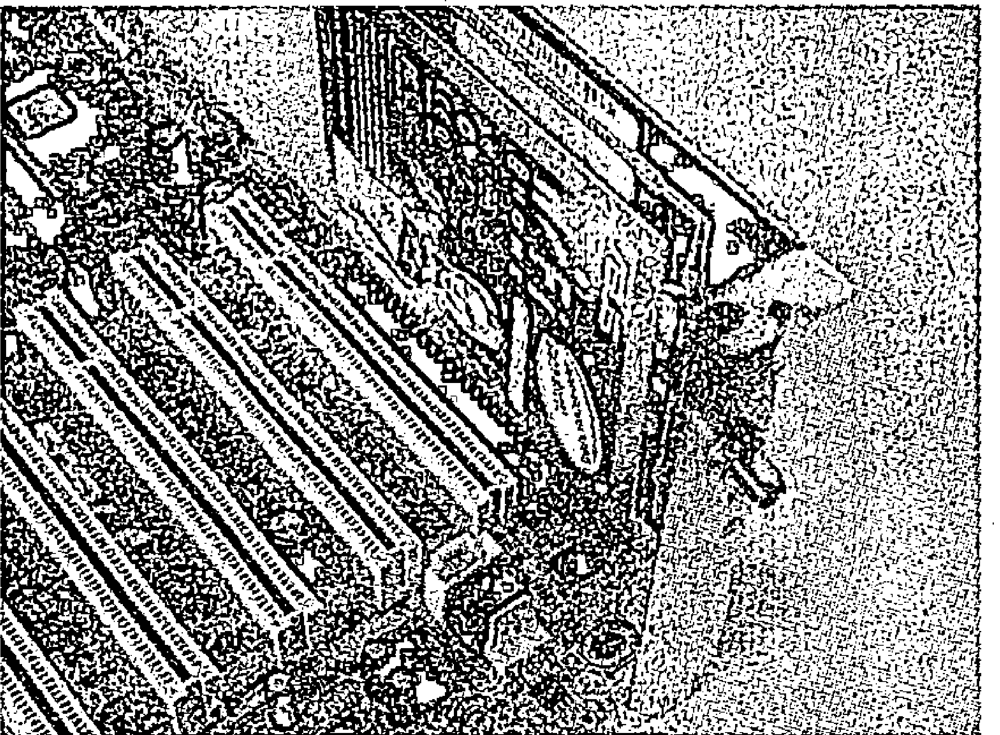

第二步：将华硕WiFi-b WLAN扩展卡附加的外置天线的接头与华硕WiFi-b WLAN扩展卡档板上的接口相连接（如图12）。

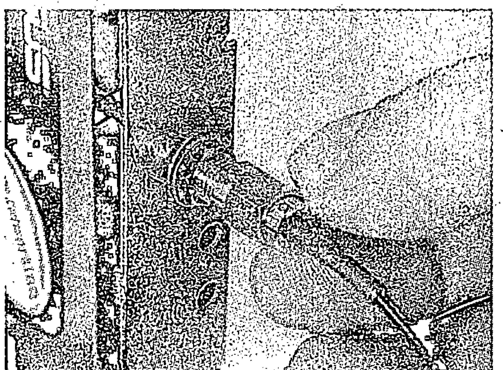

第三步：然后将这个小巧的外置天线放在机箱或显示器上（如图13）。要注意：主机与客户机之间的距离不要太远。

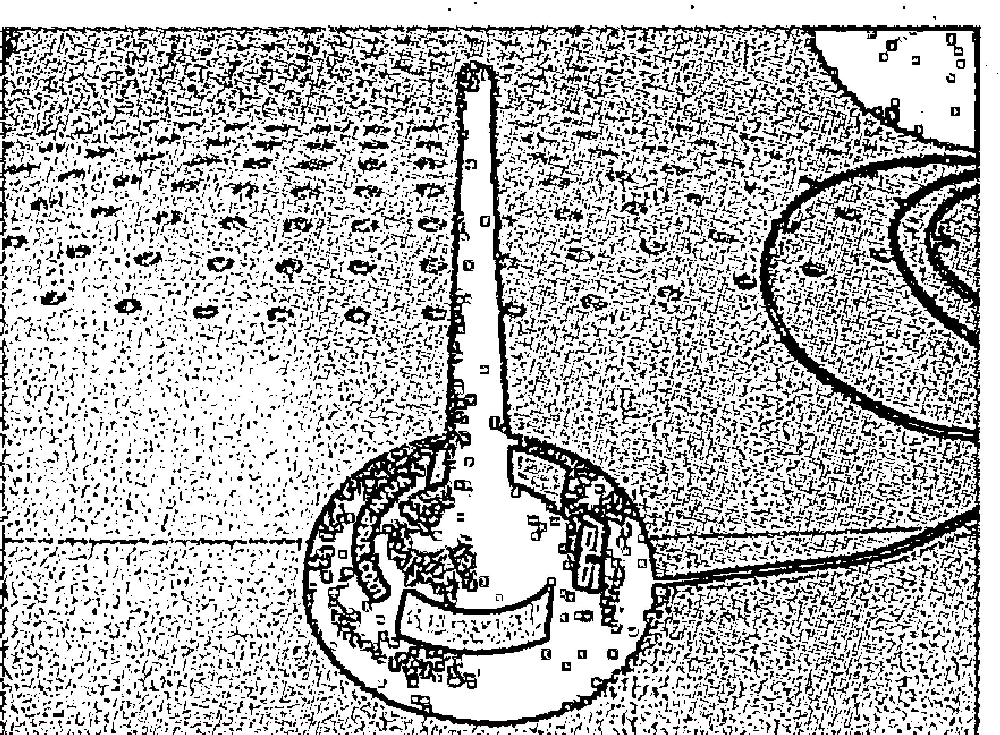

第四步：进入Windows XP后，将华硕WiFi-b WLAN扩展卡的安装光盘放入光驱。此时会弹出一个主界面，在“Drivers”选项卡下点击“ASUS Wireless LAN adapter Drivers”按钮（如图14），再点击“Install ASUS WLAN Card Utilities”按钮即可根据操作向导安装驱动程序和软件工具。

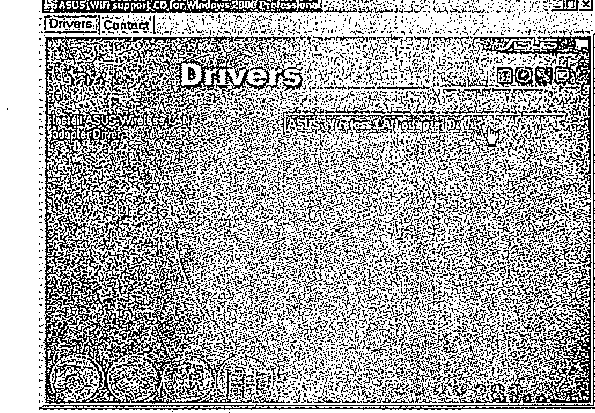

第五步：华硕WiFi-b WLAN扩展卡几乎不用什么设置就可正常使用，华硕提供了界面相当友好的软件工具，它可以帮助用户快速的同其它计算机和设备相连（此过程可参照使用说明书，这里就不多介绍了）。

最后，只要客户机和主机均按以上步骤安装好华硕WiFi-b WLAN扩展卡，即可将客户机和主机组成无线局域网，并通过主机的ADSL共享上网。

#### （二）WLAN与中国移动随e行/中国联通掌中宽带/中国电信天翼通/中国联通无限伴旅的组合

##### 1. 所需设备

- ☐ 笔记本电脑主机
  笔记本电脑1台、MiniPCI或PCMCIA或USB无线网卡1块。
- ☐ 笔记本电脑主机+台式机客户机
  笔记本电脑1台、MiniPCI或PCMCIA或USB无线网卡1块；台式机若干台、PCI或USB无线网卡若干块。
- ☐ 笔记本电脑主机+笔记本电脑客户机
  笔记本电脑若干台、MiniPCI或PCMCIA或USB无线网卡若干块。
- ☐ 台式机主机
  台式机1台、PCI或USB无线网卡1台。
- ☐ 台式机主机+台式机客户机
  台式机若干台、PCI或USB无线网卡若干台。
- 掌上电脑主机
  掌上电脑1台。
- 笔记本电脑主机+掌上电脑客户机
  笔记本电脑1台、PCI或USB无线网卡1块；掌上电脑若干台。
- 台式机主机+掌上电脑客户机
  台式机1台、PCI或USB无线网卡1台；掌上电脑若干台。

注1：如果采用中国电信天翼通服务，还必须有ADSL调制解调器一台（网线一根）、滤波分离器一个、无线路由器一台、无线网卡一块（无线路由器一般由ISP服务商提供，其他设备可由ISP服务商提供，也可自行购买）、普通直线电话一条。采用中国电信天翼通的非公共区用户的服务，不能使用掌上电脑做为主机。

注2：如果采用中国移动随e行的GPRS服务，则必须将主机的无线网卡换成GPRS网卡，且还必须拥有中国移动的数据SIM卡。

注3：如果采用中国联通掌中宽带服务，则必须将主机的无线网卡换成CDMA 1X网卡。

注4：如果笔记本电脑已内置无线网卡（一般来说迅驰笔记本电脑均已内置MiniPCI无线网卡和天线）且你并非使用中国移动随e行的GPRS服务，则不需要另配无线网卡。

注5：如果你原先是使用华硕P4P800、P4C800等WiFi主板，只要选购华硕WiFi-b WLAN扩展卡（只需399元），即可让这些主板具备Wi-Fi无线网卡的功能，而且还具有AP功能，最多可以支持31个客户端，无论对于家庭用户还是对于小型公司而言这都可以节省一笔可观的开支。

##### 2. 必要条件

- 1. 必须保证已开通中国移动随e行、中国电信天翼通或中国网通无限伴旅的WLAN接入服务，且你所在的地区已在该ISP的WLAN覆盖区域内；
- 2. 使用范围必须在WLAN标准规定的范围之内（IEEE802.11b规定在室外最长为300m，办公环境中则最长为100m）。

##### 3. 实现过程

通过主机与ISP的WLAN热点联接，主机与客户机之间再实时架设起无线通信网络。下面，笔者以笔记本电脑主机+笔记本电脑客户机，然后通过无线网卡，组建无线局域网+中国移动随e行WLAN服务的共享上网的网络（其中，主机已开通中国移动随e行WLAN服务）。

第一步：首先要查看你的笔记本电脑是否具备无线上网功能，如果没有的话，就要为你的笔记本电脑加装无线网卡。

a. 一般来说，迅驰（Centrino）笔记本电脑才会配备一块内置无线网卡。
b. 如果你的笔记本电脑已内置了MiniPCI插槽（如图15）（如acer travelmate 363笔记本电脑），那么笔者就要恭喜你了。因为这种方式最省钱，只要购买一块MiniPCI无线网卡（如图16）就可以了，所需花费远比选购自带MiniPCI无线网卡的迅驰笔记本电脑划算得多。相对来说，安装步骤也比下一种方式麻烦一些。MiniPCI无线网卡安装于机器内部的MiniPCI插槽中，本身不集成天线，靠安置在笔记本机身中的天线来获取信号，是否可以使用MiniPCI无线网卡视该机是否留有多余的MiniPCI插槽和是否预置天线。

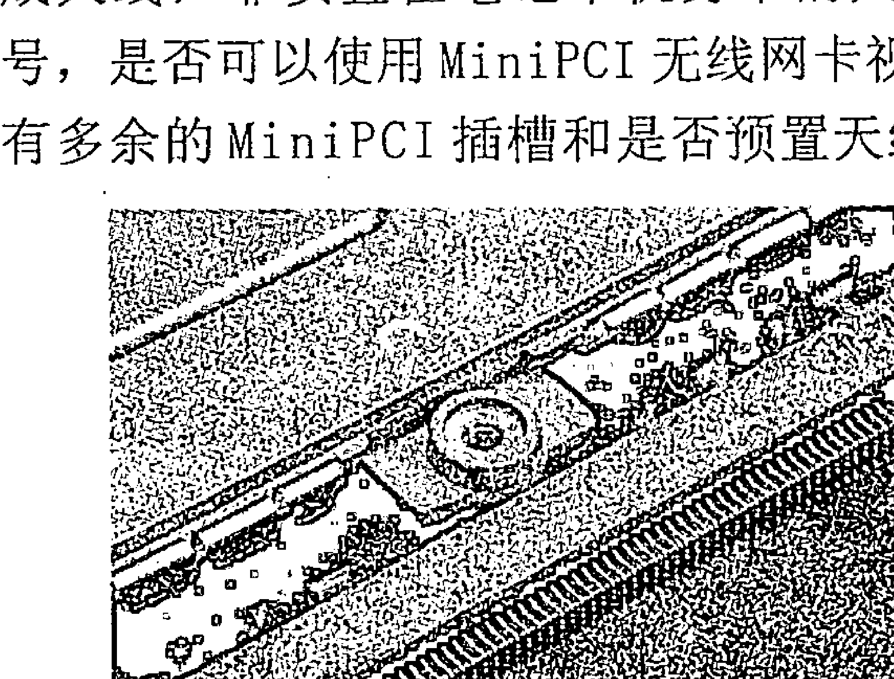

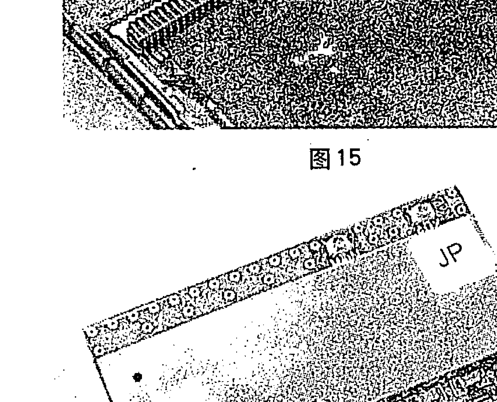拿好无线网卡，呈30度轻轻用力，压入插槽，只听“啪”的一声轻响，网卡就安装好了。

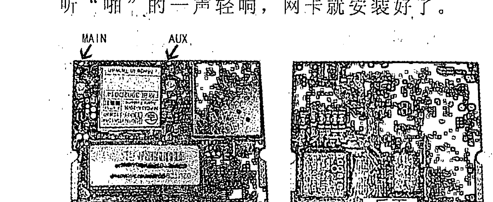

如果笔记本电脑已内置MiniPCI插槽，但没有内置天线，除非买到带天线的MiniPCI无线网卡，否则也只好选购PCMCIA无线网卡。

c. 如果你没有内置MiniPCI插槽，那只好选购PCMCIA无线网卡（如图18）或USB无线网卡（如图19），一样可以实现无线上网。只是由于PCMCIA无线网卡或USB无线网卡在使用方便性、系统资源节约程度上一般不如MiniPCI无线网卡。不过PCMCIA无线网卡的或USB无线网卡价格比较贵，一般都在600元以上。

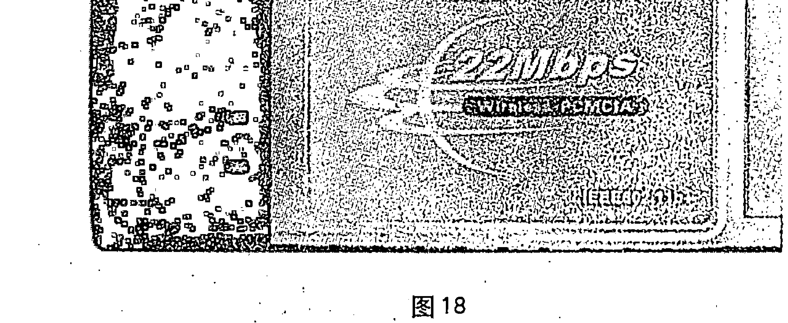

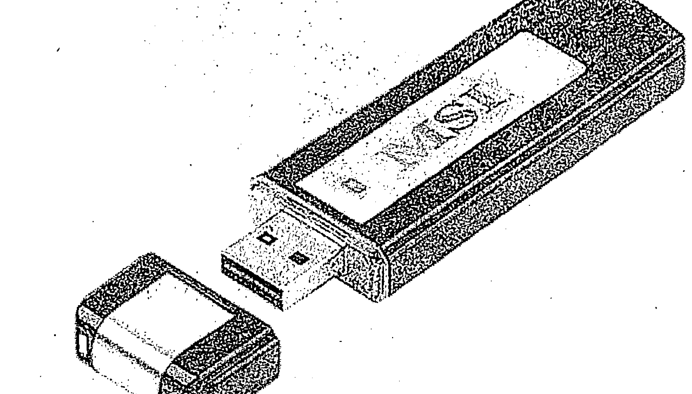

第二步：插上电源，进入Windows XP后，提示找到新硬件，安装好驱动程序后，接下来就可以在“设备管理器”的“网络适配器”下看到新增加的无线网络设备（如图20）。如果你是使用Windows XP，就可以不用安装其他的管理程序就能正常使用无线网络的功能。当然，你也可以使用无线网卡自带的无线网络管理程序。

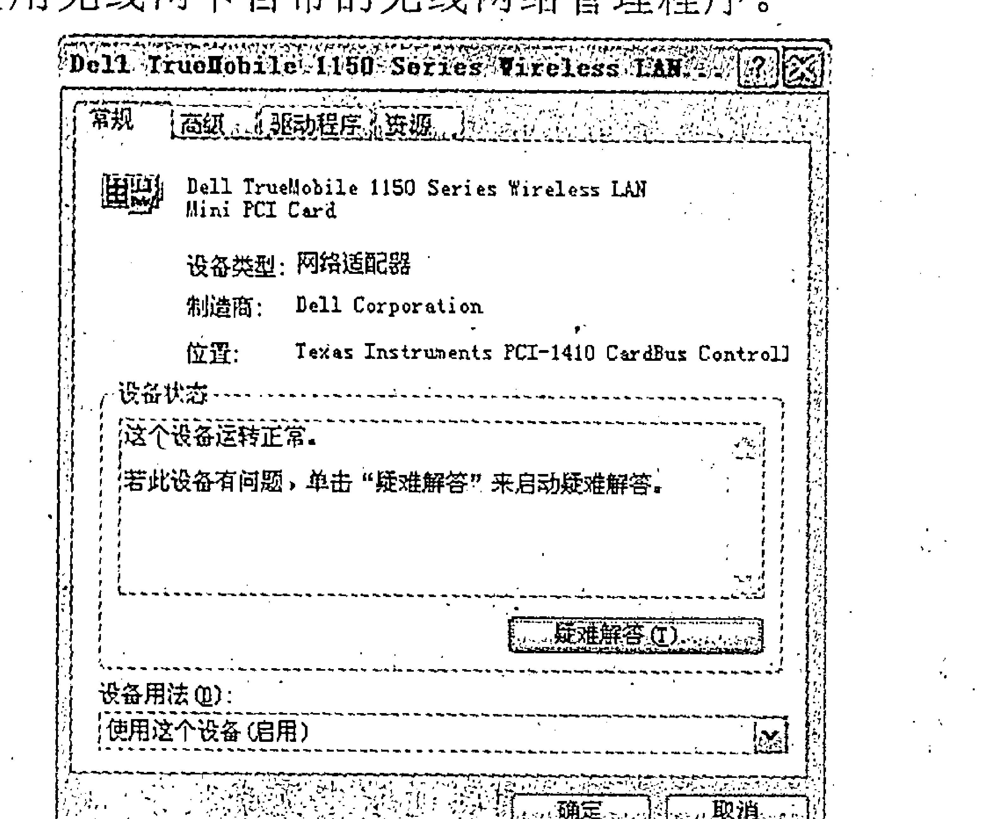

第三步：到电信运营商（如：中国移动随e行、中国联通掌中宽带、中国电信天翼通、中国网通无限伴旅）开通无线接入服务，笔者选择的是中国移动随e行的WLAN服务，并采用“移动电话号码 + 密码”认证方式。

第四步：配置好无线网络连接后，单击托盘区的“无线网络”图标，会弹出“连接无线网络”的窗口（如图21）。如果所在的网络没有经过WEP加密，会提示“此无线网络不安全”，我们大可不必理会它，勾选“允许我连接到选择的无线网络，即使它是不安全的”复选项，然后单击“连接”按钮。

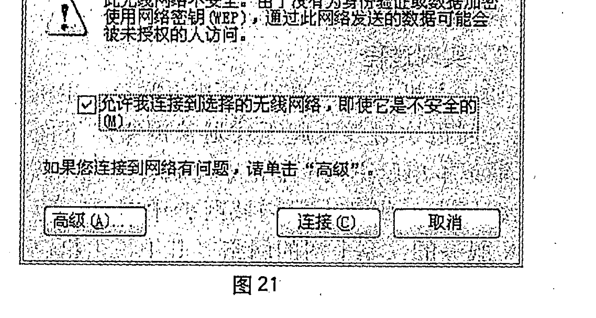

小提示：单击“高级”按钮，就可以针对这个可用网络进行配置。这里可以选择是否启用WEP，当然这个设备必须参照AP的设置来决定。网络密钥就是前面谈到的WEP密钥。密钥索引可以提供四个不同的密钥，这样客户端和AP通信时，就可以采用不同的密钥，会使黑客破解的难度提高不少，当然使用起来也麻烦了一些。最下面的是一个点到点的设置，相当于传统有线网络的双机直联，不需要通过AP交换信息。

第五步：这时在托盘区的“无线网络”图标上方出现“无线网络连接现在已连接”的提示，并显示当前的信号强度（如图22）。如果主机的信号强度较弱，应该寻找合适的位置或者尽量靠近AP的位置；如果客户机的信号强度较弱，应该寻找靠近主机的位置。

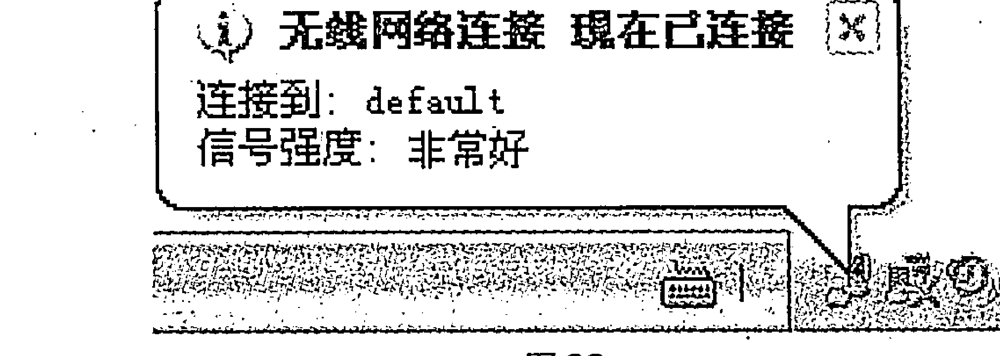

第六步：打开IE浏览器，在地址栏中输入想访问的网址，此时会弹出用户登录页面，正确输入账号和密码即可。

小编语：建议大家使用中国移动为用户的“随e行”客户端软件（客户端软件V1.097的下载地址：http://www.monernet.com/download/setup1.097.exe），不仅降低了用户的使用门槛，而且支持GPRS和WLAN之间的切换，让用户体会到“网络随身、世界随心”。“随e行”客户端软件用来管理用户接入中国移动网络的连接参数设置，包括两个主要部分：以GPRS为承载方式的“GPRS连接设置”和以WLAN为承载方式的“WLAN连接设置”。默认设置里已设置了需配置的参数，如果该图中“高级”按钮不可用（呈灰色），则需要手工设置“网络名称”（如图23）。在“网络名称”中输入接入的WLAN网络名称，中国移动WLAN网络的网络名称设为“CMCC”。对“WEP加密设置”进行相应选择，如果不加密，则选择“不加密”。这时下面的键值输入框不允许输入任何值。如果需要加密，有两种加密设置可供选择“64 BIT加密”和“128 BIT加密”。选择其中一种，这需要和厂商提供的加密设置一致。当需要加密设置的时候，在“键值0”，键值“1”，键值“2”，键值“3”里填入厂商提供的键值。然后，在“使用WEP密码”中输入账号和密码。接着点击“自动连接”按钮，系统会依次检测所有设备，并自动选取可用设备进行连接。出现设备连接的窗口，如果设备检测成功，显示“通过验证”，任务栏中出现已连接的图标，网络设备中将显示当前您所用的设备驱动、连接速度、已接收、已发送信息、WLAN信号强度。现在你可以上网了。

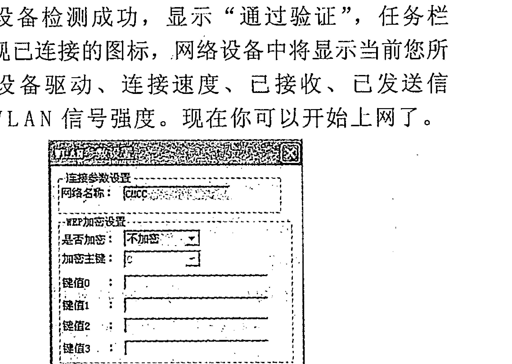

### 六、无线网络Q&A

- 问：何谓无线网络？
- 答：所谓无线，顾名思义就是利用无线电波来传输信息，就应用层面来讲，它与有线网络的用途完全相似，两者最大的不同在于传输数据的媒介不同。除此之外，正因为它是无线，因此无论是在硬件架设或使用的机动性方面均比有线网络具有更多的优势。

- 问：何谓网桥/AP（Access Point）？
- 答：Access Point，通常又称为网络桥接器（网桥），顾名思义即充当有线局域网络与无线局域网络的桥梁。因此任何一台装有无线网卡的PC均可通过AP去分享有线局域网络甚至广域网络的资源。除此之外，AP本身还兼具有网管的功能，可对它覆盖范围内的无线终端进行管理。

- 问：何谓漫游（Roaming）功能？
- 答：和移动电话一样，无线网络工作站也可漫游在不同的AP之间，只要AP及它覆盖范围内的无线工作站也可漫游在不同的AP之间，只要AP及它覆盖范围内的无线...

- 问：何谓 Access Control?
- 答：基本上每个无线网卡上都有一组独一无二的硬件地址，即 MAC address，经由 Access Control table 可定义某些卡登录或被拒绝登录此 AP，避免窃取资源。

- 问：何谓 Ad-hoc?
- 答：是一种特殊的无线网络应用模式（对等模式），一群计算机接上无线网络卡，即可相互连接，资源共享，无需透过网桥 (AP)。

- 问：何谓 Infrastructure？
- 答：一种整合有线与无线局域网络架构的应用模式（接入模式）。透过此种架构模式，即可实现网络资源的共享，此应用需透过 Access Point。

- 问：何谓 BSS?
- 答：一种特殊的 Ad-hoc 局域网的应用，称为 Basic Service Set (BSS)。一群计算机设定相同的 BSS，即可自成一个 Group，而此 BSS 名称，即所谓的 BSSID。

- 问：何谓 ESS?
- 答：一种 Infrastructure 的应用，一个或多个以上的 BSS，即可被定义成一个 Extended Service Set (ESS)，使用者可于 ESS 上 Roaming 及存取 BSSs 中的任何资料，其中 AP 必须设定相同的 ESSID 及 Channel 才能允许 Roaming.

- 问：何谓 WEP?
- 答：WEP 是 “Wired Equivalent Privacy” 的简称，802.11b 标准里定义的一个用于无线局域网 (WLAN) 的安全性协议。WEP被用来提供和有线局域网同级的安全性。局域网天生比无线局域网安全，因为局域网的物理结构对其有所保护，部分或全部网络埋在建筑物里面也可以防止未授权的访问。经由无线电波的无线局域网没有同样的物理结构，因此容易受到攻击、干扰。WEP的目标就是通过对无线电波里的资料加密提供安全性，如同端端发送一样。WEP特性里使用了 RSA 资料安全性公司开发的 RC4 PRNG 算法。如果你的无线基站支持 MAC 过滤，推荐你连同 WEP 一起使用这个特性（MAC 过滤比加密安全得多）。

- 问：无线网络对人体是否有所影响?
- 答：因无线网络的发射功率较一般的移动电话要微弱许多（无线网络发射功率约 10~70mW，而移动电话发射功率约 200mW 左右），而且使用的方式也并不像移动电话一样和人体直接接触，因此对人体没有影响。

- 问：无线网络在使用过程中的保密性如何?
- 答：无线网络产品采用 DSSS 技术，本身就具有防窃听的功能，再加上 MAC 地址的访问控制，管理软件的 40bits/128bits 的 WEP 加密，ESSID 及 Channel 的软件设置等安全措施的采用，使用无线网络产品的通信是安全的。

- 问：若要架构一个无线网络，需要哪些最基本的配备?
- 答：一般架设无线网络的基本配备就是一片无线网卡及一个网桥 (AP)，这样就能通过无线方式，配合已存在的有线架构来共享网络资源。

- 问：网桥 (AP) 能与何种宽带或专线相连?
- 答：从理论上讲任何形式的宽带或专线组成的有线网络均可与 AP 相连。常见的公网有：ADSL、ISDN、DDN、E1、X.25 等。

- 问：在使用网桥 (AP) 时可同时支持多少工作站?
- 答：理论上是可以支持 512 个工作站，但为了保证让工作站本身有足够的带宽可用，一般建议一台 AP 支持约 20~30 左右的工作站为最佳状态。

- 问：使用 WLAN 是否会被干扰或影响其他设备的运作?
- 答：基本上无线网络所使用的频段是属于 ISM 2.4GHz 的高频率范围，和日常生活或办公室等所用电器不会相互干扰，因频率差异甚多，而且无线网络本身共有 12 个信道可供调整，自然干扰的现象不必担心。

- 问：WLAN 所能覆盖的范围有多广?
- 答：一般 WLAN 所能覆盖的范围应视环境的开放与否而定。若不加外接天线而言，在视野所及之处约 250m；若属半开放性空间，有隔间之区域，则约 35~50m 左右。当然若加上外接天线，则距离可达更远，这关系到天线本身的增益值，因此需视客户需求而定。

- 问：若 WLAN 设备架设于室外，该如何防止雷击?
- 答：基本上可为 WLAN 配置避雷器，此设备可选购装设于无线网络设备上。

- 问：天线所使用的导线长度是否影响传输品质?
- 答：天线所使用的导线的长度、材质、阻抗匹配都会对信号造成影响，而最明显的就是增益衰减。通常以 20 英尺长度而言，就会让信号衰减约 1.2dBi，而平均每衰减 8dBi 就会让原传输距离约缩减一半。

## 电脑文件搜索攻略

文／周建军

- 文章重点与技巧目录
- Windows 搜索助理技巧
- 使用 DIR 命令实现搜索
- 查找重复文件
- 在 Office 里应用搜索
- 在局域网里应用搜索
- 搜索压缩包里的文件
- 搜索网上 MP3 音乐
- 搜索网上图片
- 查找重复图片

如何快速从计算机中找到我们需要的资料，是用户必须掌握的一项技能。大家当然知道，我们可以通过 Windows 的搜索助理查找文件，也可以通过 DIR 命令来查找文件，但如何快速找到某些图片、如何迅速找到我们喜欢的 MP3 呢？下面就来了解一下这方面的知识。

### 一、精通 Windows 的搜索助理

Windows 操作系统自带的图形化搜索界面被称为“Windows 搜索助理”，它是目前查找文件最基础的工具和方法。我们这里以 Windows 2000 为例进行说明。

#### （一）基本用法

通过“开始”菜单 / “搜索” / “文件或文件夹”命令即可启动搜索助理。如图1所示，它由两部分组成，左侧为搜索界面，右侧为搜索结果。搜索文件时，只要在“要搜索的文件或文件夹名”下输入关键字，例如输入“A B C”，那么所有文件名中包含“A B C”这三个字符的文件将全部显示在右侧的搜索结果列表中。

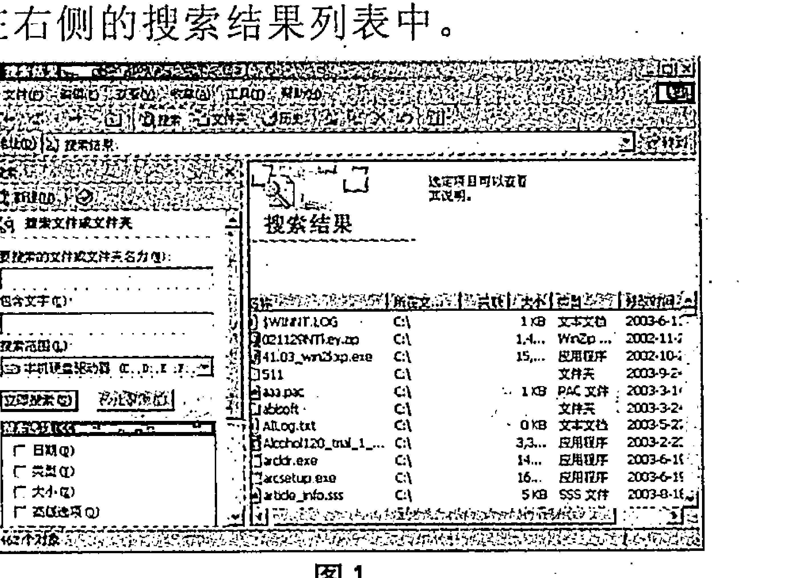

如果在资源管理器中按下快捷键“Ctrl + F”，那么搜索助理也会随时出现，而且搜索的范围将被设置为资源管理器的当前目录。

#### （二）进阶用法

##### 1. 搜索文件内容

如果在“包含文字”中输入关键字，那么搜索助理在搜索时将针对文件的内容进行搜索，只有文件的内容中包括指定的关键字才认为是符合要求的结果。

但是，这个功能要求搜索的对象必须是 ASCII 文件，也就是文件必须直接由 ASCII 字符组成，例如 TXT 文件、HTML 文件等，而一些带有格式的文件如 Word 文档、PDF 文档等则无法通过这种方法进行搜索。

##### 2. 设置搜索范围

默认情况下，搜索的范围是本计算机中所有...

##### 3. 根据日期进行搜索

在“搜索选项”中选中“日期”，下方就会出现一些关于日期的选项，如图3所示。一个文件的日期属性包括创建的时间、修改的时间和最后访问的时间，因此，我们需要在“日期”下方的下拉列表中确定一种日期的属性，然后再设置日期的范围，例如前1个月、前1天或者介于某段时间之内。

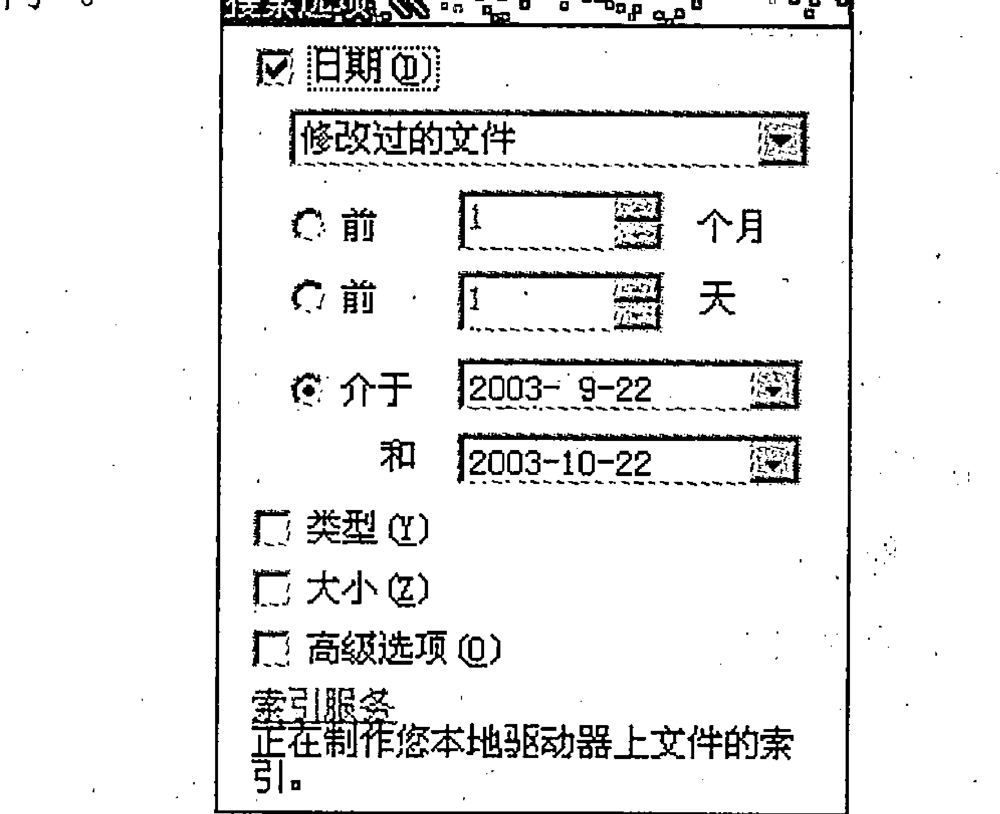

##### 4. 设置目标文件的类型

我们知道，不同的软件能够创建不同类型的文档，如 Word 创建的文档后缀为 doc，Excel 文档的后缀为 xls 等，因此，搜索助理也为用户提供了按文档的类型进行搜索的方法，如图4所示，选中“类型”，然后即可在列表中挑选一种文档类型。

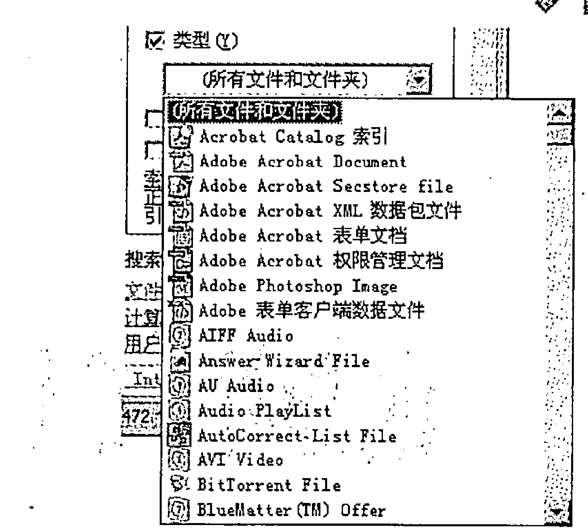

##### 5. 设置文件大小

文件体积的大小也可以作为一种限制输出结果的条件，如图5所示，选中“大小”，然后设置限制条件，如至少100K或者最大500K等，即可根据指定条件进行搜索。

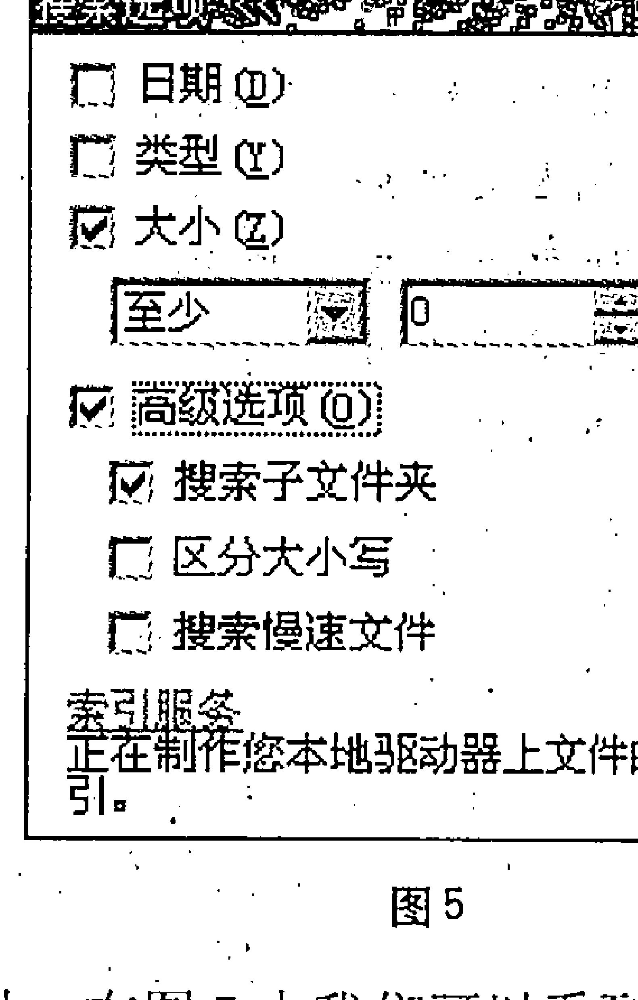

此外，在图5中我们可以看到搜索助理还提供了一个所谓的高级选项，它包括是否搜索子文件夹、是否对输入的关键字区分大小写等，它所说的慢速文件是指位于可移动媒体上的文件，例如光盘或磁带备份。总的说来，搜索助理的使用是非常简单的，也非常有效，是我们在搜索文件时最常使用的方式。

### 二、熟悉 DIR 命令

如果说 Windows 系统自带的搜索助理是基础的搜索方法的话，那么用 DIR 命令搜索就可以称作是古老的文件查找方法。DIR 是一个传统的 DOS 命令，伴随着 DOS 系统的诞生而诞生，主要的功能就是对文件进行列表，因为它简单、可靠、实用，因此即使是在最新版的 Windows 2003 中这个命令仍然被保留下来。如果熟练掌握 DIR 命令的用法，则可以完成一些搜索助理不能完成的任务，例如查找当前目录下哪些文件是只读文件等。

#### （一）DIR 命令的基本格式

DIR 命令要在 DOS 窗口中才能完成，它的基本格式为：DIR [盘符：][路径][文件名] [参数]
DIR 命令的基本使用方法非常简单，例如，在命令行提示符状态下输入“dir c:\”，将列出 C 盘根目录下的所有文件，如果输入“dir c:\a*.*”，将列出 C 盘根目录下所有以字符 A 开头的文件或目录。

#### （二）DIR 命令的主要参数

加参数的 DIR 命令能够完成更多的功能，其主要参数如下：

| 参数 | 说明 | 示例 |
| :--- | :--- | :--- |
| /P 和 /W | /P 表示分页显示，/W 表示宽行输出（只显示文件名） | `dir /P`， `dir /W` |
| /S | 在搜索当前目录的同时搜索下级目录中的文件（包含子目录） | `dir /S` |
| /A | 搜索指定属性的文件，如 /AH（隐藏）、/AS（系统）、/AR（只读）、/AD（子目录） | `dir C:\/AH`（搜索C盘隐藏文件） |
| /O | 设定输出目录的排序方式，子参数如：/ON（按名称）、/OS（按大小）、/OE（按扩展名）、/OD（按时间） | `dir /ON`（按名称排序） |

DIR 命令历史悠久，在图形化界面大行其道的今天，人们用得很少了，但一旦计算机发生了故障，需要通过命令行方式来解决的话，相信这个命令用得还是很多的。

### 三、查找重复文件

不管因为什么原因，反正我们的硬盘上总会有大量的重复文件，这些重复文件不仅白白浪费着系统资源，还为系统的文件管理增加不必要的负担。因此，如果条件允许，应该对其进行一下治理。那么哪些文件是重复文件呢？我们不妨借助一款名为 Dupeless 的软件来看一下，它的下载地址为 http://download.enet.com.cn/file/fmanager/other/100071107.shtml。

首先对软件进行一下简单的设置。软件启动后，使用菜单“Action”/“options”命令打开配置窗口，如图 6 所示，在左上角框选中需要搜索的磁盘，在右上角的“Comparison File Names”列表框是最重要的选项，我们必须通过它设置 Dupeless 在搜索文件时以什么为标准判断重复文件，“Compare File Names”表示以文件名为标准加以判断，“Compare File Sizes”选项表明以文件尺寸为标准加以判断，“Compare Last - Modified Date/Time”选项表明以文件日期为标准加以判断，一般应选择所有选项，让 Dupeless 综合考虑这些条件后再判断重复文件，以保证搜索的正确性。左下角的选项是设置删除文件时放到哪里，包括有彻底删除、删除到回收站、删除到 Dupeless 专用删除目录等选项，一般可以选择“Move to Recycled Bin”，也就是移入回收站中。设置完毕后，点击“OK”按钮加以确认。

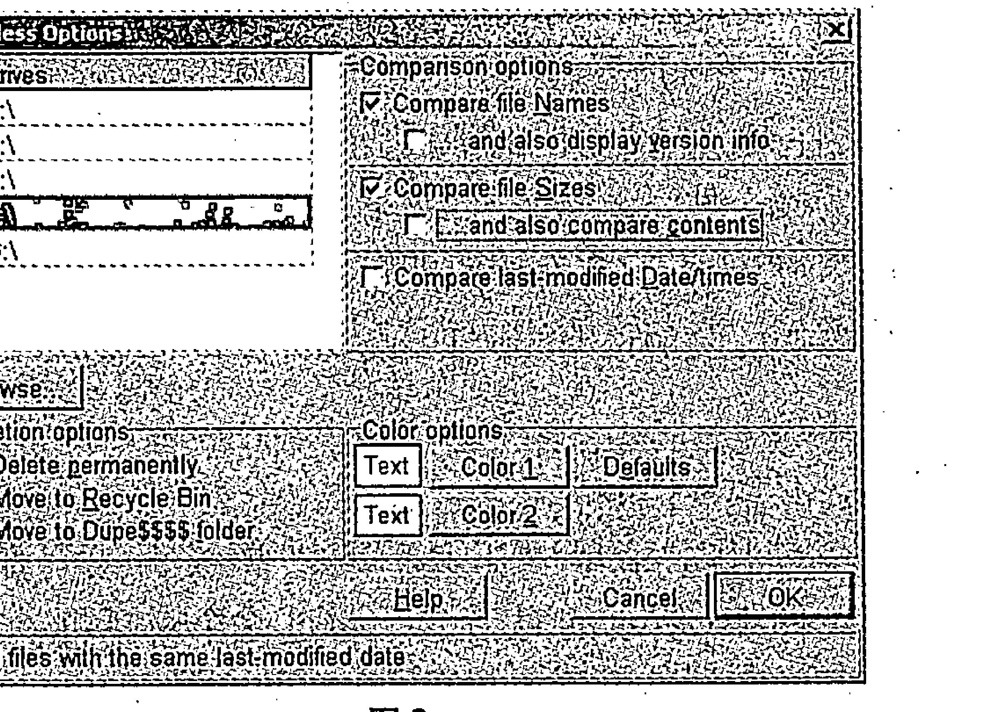

通过菜单“Action”/“Start scan”命令即可开始对指定磁盘进行搜索，搜索到的重复文件将在主界面中列表，如图7所示。

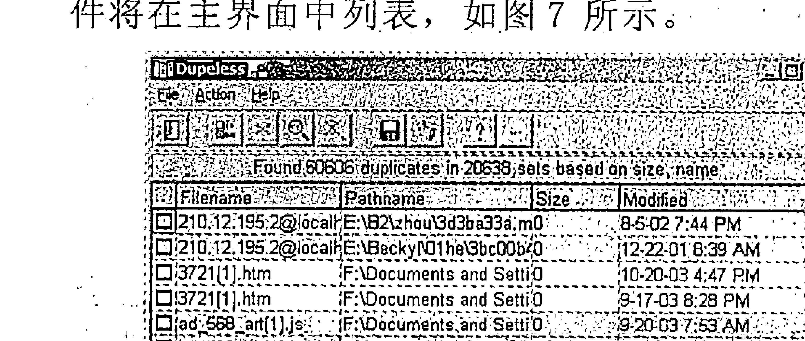

笔者的40G硬盘上面居然有17万个重复文件，在列表中，对那些确实是重复而又不再需要的文件，可以用鼠标选中它们，并通过工具上的Delete按钮将其彻底删除。

### 四、查找OFFICE文档

微软的Office办公组件包括Word、Excel、Power Point等，它们生成的文档都是专有格式，如果使用系统自身的搜索功能，只能根据文件名进行搜索，无法根据文档的内容进行定位。其实，要实现对Office文档全方位的搜索，Office本身提供的Outlook就具有这个功能。

在一般人眼中，Outlook只是一个邮件收发工具，有时也用它配合Modem收发传真。其实，它还有一个非常重要的功能，就是可以实现全方位搜索Office文档。

#### （一）切换到搜索状态

Outlook启动后；默认为邮件收发状态，而我们要将其转变到文档管理状态，才能对Office文档进行搜索。

如图8所示，使用主菜单“视图”/“转到”/“文件夹命令”，弹出图9所示的界面，把“查找”设置为“文件系统”，文件夹名就会自动变成“我的电脑”，点击“确定”按钮即可。切换为文档管理状态后，Outlook的主界面就与资源管理器的窗口类似。

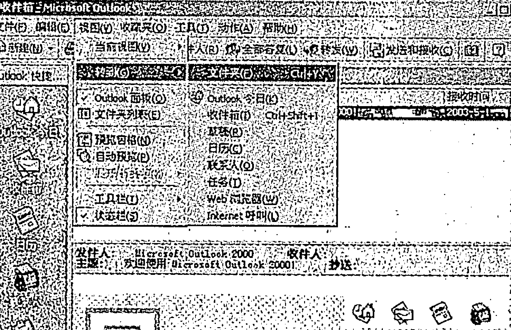

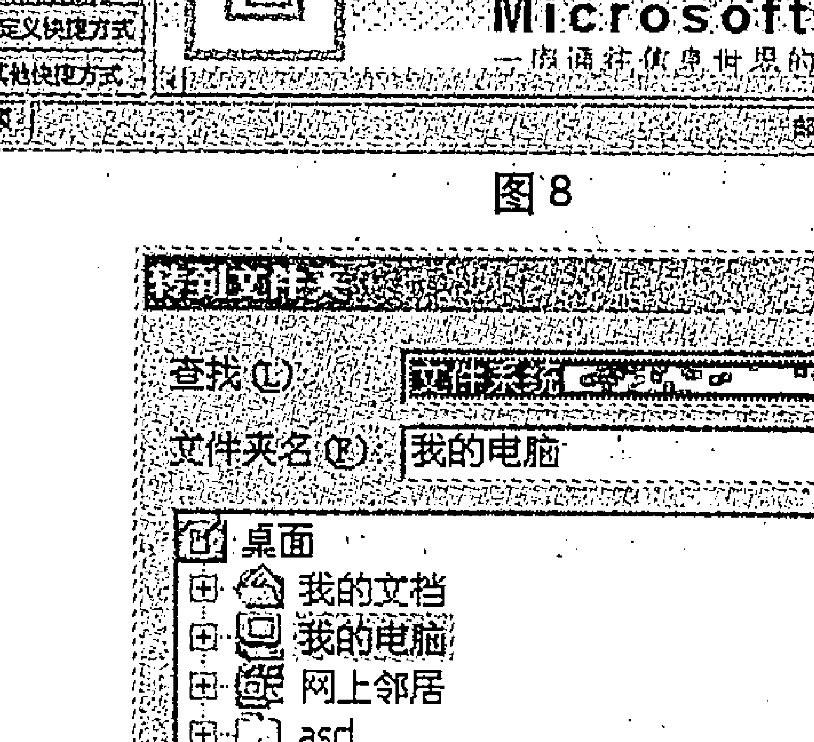

#### （二）开始搜索

使用主菜单“工具”/“高级查找”命令，弹出图10所示的对话框，通过这个对话框，我们就可以开始搜索磁盘中的Office文档了。

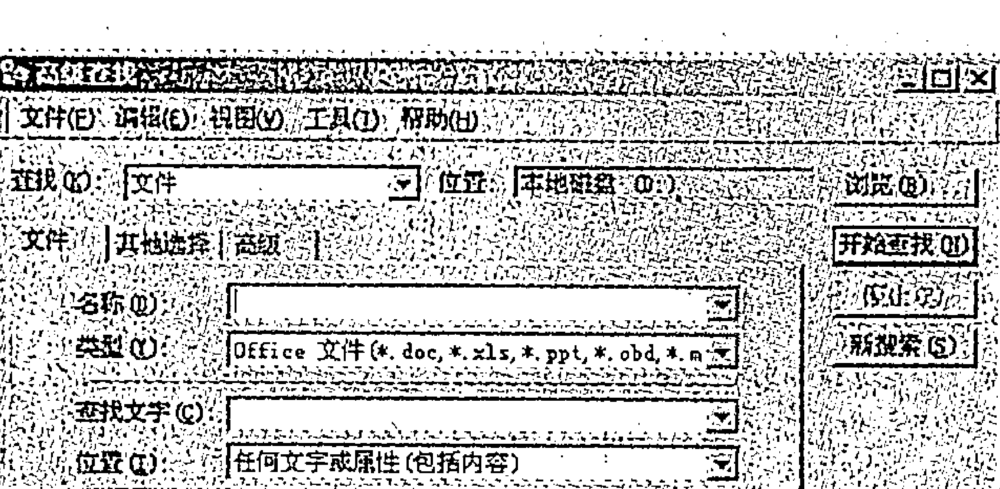

在“文件”标签页中；在“名称”中输入要搜索文档的文件名；在“类型”中选择要搜索哪种格式的Office文档；在“查找文字”中输入文档中包括的关键字；然后在“位置”中设置在文档的哪些部位查找关键字，如选择“任何文字或属性”，那么文档的备注、作者信息等也都会作为搜索对象，如果选择“仅内容”，那么只搜索文档的正文；通过下面的“时间”可以设置搜索对象的时间范围。

在“其他选择”标签页中，可以设置关键字是否区分大小写，以及是否限制文档的大小，如图11所示。

在“高级”标签页中，可以针对文档的一些特性进行搜索，如图12所示，点击“字段”按钮，设置文档中相应的查询信息，例如搜索保存者为user1的文档，就可以点击“字段”/“所有文件字段”/“保存者”，然后把“条件”设置为“包含”，把“值”设置为“user1”即可。

搜索条件设置完毕后，点击“浏览”按钮设置搜索范围，搜索范围为复选，也就是可以同时搜索多个位置。然后点击“开始查找”按钮，即可对指定范围内的文件根据设置的关键字进行搜索，搜索结果将显示在列表中，如图13所示。

## 五、搜索局域网资源

很多公司都拥有自己的局域网，也都通过常用的“网上邻居”来实现资源的共享。那么，如何在局域网中快速搜索可用资源，也就成为广大用户面对的一个很重要的问题。

一般说来，在局域网上搜索资源可以先通过“网上邻居”连接到其他计算机上，然后再搜索其中的文件。但这样做效率很低，因此我们推荐国产的局域网工具软件Netsuper，又称为局域网超级工具，软件的下载地址为：http://www.hktk.com/soft/soft_netassistant/jywcjgj.html。

Netsuper具有很多功能，但最主要的功能就是搜索局域网资源，比如搜索局域网内所有活动的计算机，搜索指定的计算机上的共享资源，搜索所有计算机的共享资源，搜索服务器，搜索局域网内其他计算机中的文件等等。

### (一) 搜索计算机

软件启动后，其界面如图14所示，点击“搜索计算机”按钮，软件就会自动搜索局域网中正常活动的计算机，并将其以列表的形式在“计算机列表”中反馈给用户。搜索到的结果包括计算机名、IP地址、计算机的描述、域或工作组名以及网卡的MAC地址。

### (二) 搜索共享资源

在软件的主界面上可以看到有“搜索共享”和“所有共享”两个按钮，选中某台计算机名，点击“搜索共享”，就会在“共享资源列表”中反馈给用户。如果点击“所有共享”按钮，那么局域网中所有机器的共享资源就会全部显示出来，非常方便，如图15所示。

| 共享名 |
|--------|
| \\\\OFFICE\\c |
| \\\\OFFICE\\i... |
| \\\\OFFICE\\e |
| \\\\PC125\\C |
| \\\\PC125\\PC... |

### (三) 搜索服务器

通过Netsuper，用户可以迅速地找出局域网中有哪些服务器，如SQL服务器、打印服务器等，通过使用“搜索服务器”下拉按钮的几个命令可以实现相应的功能，其执行结果如图16所示。

| 服务器名 | 操作系统及版本 |
|----------|----------------|
| OFFICE   | Windows NT 5.0 |
| PC125    | Unknown        |

### (四) 搜索文件

软件的界面在启动后并没有完全显示出来，如果点击一下“扩展”按钮，软件的主界面就会展开，如图17所示，新增加的部分就是文件搜索部分。

## 六、快速搜索压缩文件

不论是软件还是文档，很多时候我们都把它们压缩起来保存，尤其是网上提供的软件，几乎全是通过压缩文件的方式提供下载。但压缩之后的文件也存在着一个不可忽视的问题，就是从外表上无法看出其中都包括了哪些东西，虽然我们可以给压缩包取一个易于理解的内容，但具体到其中包含什么文件，最终还是需要通过解压软件打开来查看。因此，用户无法直接搜索压缩包中的内容。为了解决这个问题，有人开发了一些专门搜索压缩包内文件的工具，比如这里推荐给大家的国产工具“百里挑一”。百里挑一最主要的功能就是直接在压缩文件中进行搜索，它支持ZIP、RAR、ACE、CAB四种格式，下载地址为http://www.onlinedown.net/soft/11675.htm。软件的主界面非常简洁，如图18所示，没有华丽的界面，但使用起来非常轻松。

### (一) 设定查找范围

要在压缩文件中查找内容，首先要确定查找哪个目录中的压缩文件。点击“选择目录”按钮，如图19所示，指定需要搜索的目录，点击“确定”按钮。

### (二) 设定文件类型

百里挑一能够搜索四种格式的压缩文档，因此要确定搜索指定目录中的哪种压缩文件，点击“搜索一个在XXX文档中”下拉框，从中可以设置搜索文件类型。

### (三) 设定查找文件名

在“文档中的名为”后面的文字输入框中输入关键字。这里的关键字最好跟上通配符，例如要搜索setup.exe，最好输入“setup*”，如果只输入“setup”，那么软件将只搜索不带任何扩展名而且名字与输入文字完全相符的文件，这也是该软件设计中的一个不足之处。然后，在右侧选择是搜索文件还是位于压缩目录中的文件夹。

### (四) 查看查找结果

所有条件设置完毕后，点击“搜索”按钮，即可进行搜索。搜索完毕后，会显示所查找出来的结果，包括所在的压缩文件位置、文件的大小、时间以及在压缩文件中的位置等基本信息。需要注意的是，由于该软件的搜索引擎是其作者自行开发的，并没有采用解压缩软件的动态链接库，因此该软件不具备解压缩功能。并且对于没有注册的版本，也无法从搜索结果窗口中直接打开压缩文件。

## 七、快速搜索MP3

很多音乐迷从网上收集了大量的音乐，即便是我这个不算太迷的Fans，硬盘上大概也有近1个GB的MP3。然而，MP3文件与普通文本文件不同，对于操作系统来说，它的内容是什么只能凭一个名字来识别，管理起来非常麻烦，时间一长，哪个目录中是哪些歌曲就忘了，最后想听的歌找不到，想删除的删不了，就连到底收藏了哪些MP3都不知道了。其实，MP3中还保存着一些隐藏的标签，被称为ID3标记，它一般由作者、题目、唱片集、时间、音乐类型等组成，通过这些标记即可对不同的歌曲进行区分。

但是，操作系统本身并不能识别MP3的ID3标记，更谈不上针对ID3标记进行管理和搜索了。因此，我们需要借助一些第三方软件来实现通过ID3标记对MP3进行分类管理和搜索的目的。这里我们以AbyssAudio Pro（下载地址：http://www.onlinedown.net/soft/8792.htm）为例进行说明。

### (一) 添加MP3文件

软件启动后，其界面如图20所示，上方为MP3列表，右侧为功能按钮，中间是选定MP3的ID3标记，下方是播放控制面板。

AbyssAudio Pro可以把磁盘中所有的MP3文件添加到列表中，以形成一个数据库，所有的操作如搜索、播放等都针对这个列表进行。要把MP3添加到列表中，需要点击右侧的“Scan”按钮，如图21所示，选定某个磁盘并点击“Scan”按钮，即可搜索该磁盘上所有的MP3文件。如果要搜索磁盘内的某个目录，双击该磁盘即可进入相应的目录。这个界面中还有两个选项，“Include subfolders”表示搜索子目录，“Folder name to Volume name”表示在“Name of Collection”中显示实际的目录名，否则将只显示磁盘符号。

扫描完成后，找到的MP3将被添加到列表中，并按照一种分类格式进行排列。

### (二) 管理音乐列表

#### 1. 排列方式

在软件的MP3列表中，我们可以按照四种方式对其进行分类，一是Author/Year-Album/Title，即按照“作者—时间及唱片名—标题”进行分类，二是Volume/Author/Year/Title，即按照“磁盘—作者—时间—标题”进行分类，三是Folder/Author-Title，即按照“目录—作者—标题”的形式分类，四是Genre/Author/Title，即按照“音乐类型—作者—标题”的格式进行分类。这四种分类方法可以通过最上方的下拉列表进行切换，以方便用户的管理。例如，我们要按演唱者进行分类，那么不妨使用“Author/Year-Album/Title”分类方法。

#### 2. 删除不必要的记录

有时添加到列表中的MP3文件可能是一些系统自带或者某些游戏附带的声音文件，不在我们的管理范围之内，此时需要从列表中将其删除。在列表中删除文件的方法也非常简单，选定某个MP3，点击“Delete”按钮即可。但为了方便起见，建议根据不同的情况通过使用不同的分类方式的方法，比如要删除某个目录中的MP3，则可以使用Folder/Author-Title对MP3进行分类，然后直接删除该目录即可。

#### 3. 修改ID3标记

MP3音乐文件在最初设计的时候，没有一个内在的方法存储与歌曲相关的信息，为了解决这个问题，1996年通过一个名为Studio3的工具在MP3文件的尾部加入一块额外的数据，使得文件可以加入一些关于音频或者是音频自身的一些信息，如歌曲名称、歌手、专辑等信息，一般用30个字符来标记歌曲标题，用30个字符标记歌手名称，用30个字符标记专辑名称，用4个字符标记出品年份，用30个字符为歌曲做注释，用1个字节注明歌曲的风格，所有的这些信息有助于用户理解和查找歌曲，被称为ID3 Tag。

并不是所有的MP3在发行时都添加了ID3 Tag，但我们可以通过AbyssAudio Pro为没有ID3 Tag的MP3添加标记，也可以修改已有ID3 Tag的MP3的标记。我们只需要在软件的主界面中右击某个MP3，如图22所示，然后选择“Edit”命令，即可对修改MP3的ID3 Tag，如图23所示。

### (三) 快速搜索MP3

如果所有的歌曲都标记了正确的ID3 Tag，那么搜索我们需要的歌曲是非常简单的事情。在主界面上点击“Search”按钮，其界面如图24所示。

搜索的方式有三种，一是在“General”标签页中搜索：在“Search for”中输入关键字，在下方选择搜索的项目，“File name”是MP3的文件名，“Directory name”是MP3所在的磁盘目录名，“Any of tag fields”是ID3 tag中的所有内容，设置完毕，按下“Find again”按钮即可找到匹配的MP3文件。第二种方法是在“Certain fields”标签页中输入具体的ID3 tag内容，然后根据ID3 tag进行搜索。第三种方法是在“Property”标签页中根据MP3的采样频率或者文件大小或者音乐时长进行搜索。通过这三种方式，即可迅速地找到我们需要的MP3。

## 八、图片的搜索

随着日益人性化的数码相机、便携式数码摄像机的普及，普通用户已经把拍摄数据照片作为家庭聚会和各种活动中的一个重要组成部分。然而，面对着众多的数据照片，又如何快速定位、迅速找到自己想要的那一张呢？当然，用户面临的问题还有很多，例如如何迅速修改照片、如何把数据照片组织成电子相册等。面对这些问题，Adobe公司开发了一款名为Adobe Photoshop Album的软件（下载地址：http://www.onlinedown.net/soft/20790.htm），在它的帮助下，用户在几分钟之内就能迅速组织和管理自己的图像文件。这里，我们只谈一下如何通过它来快速搜索和定位图片。

### (一) 确定管理的图片

软件启动之后，首先要确定哪些图片需要通过它来管理。它能够直接从数码相机中读取、从扫描仪中扫描图片，其实，更多的时候是我们把所有的文件都已经保存在磁盘里，只要让Adobe Photoshop Album来管理它就可以了。

#### 1. 一网打尽

首先，通过软件的主菜单“File” / “Get Photos” / “By Searching”命令打开搜索图片窗口，如图25所示，通过它可以把磁盘中的图片一网打尽，全部纳入Adobe Photoshop Album的管理范围。“Look In”后面是搜索的范围，包括“All Disks”（所有磁盘）、“Drive C”（C驱动器）、“My documents”（我的文档）和“Browse”（指定目录）几项内容，用户可以根据自己的需要进行选择。下面有两个选项，“Exclude System and Program Folders”是指去除系统和程序文件目录，“Exclude Files Smaller Than (100) KB”，意思是搜索的结果将不包括小于100K的图片（这种图片很小，不会是扫描仪或者数码相机生成的图片）。设置完毕后，点击右侧的“Search”按钮即可查找指定范围的图片。搜索结束后，选中需要被管理的图片，然后点击右侧的“Import Folders”命令，即可将其添加到Adobe Photoshop Album的管理窗口中。

#### 2. 精挑细选

也许通过上面的方法会把一些用户不希望管理的图片也纳入软件的管理范围，那么用户还可以通过手工挑选的方式为软件添加图片。通过软件主菜单“File” / “Get Photos” / “From Files and Folers”命令打开浏览图片窗口，如图26所示，在这个窗口中，每选定一个文件，都会在右侧显示，用户即可确定是否需要此图片。这里选择多个图片的方法与资源管理器中一样，按住Shift可以选定连续的图片，按住Ctrl可以选择不连续的图片。选定所有图片后，点击“Get Photos”按钮，即可将其纳入软件的管理范围。

### (二) 管理图片

#### 1. 软件的主界面

软件的主界面如图27所示，上面的滑块表示时间，以月为单位，拖动滑块到哪个时间，该时间段内第一个图片就会闪烁。左下方是如何排列图片，有Date（Newest First）、Date（Oldest First）、Import Batch、Folder Location四个选项，其意思依次为按日期排列新的在前、按日期排列旧的在前、按导入顺序排列、按目录排列。右下角的几个按钮表示如何查看图片，从左到右共有四个按钮，分别为小型图片、中型图片、大型图片和单个图片。

#### 2. 为图片添加标题和注释

需要提醒大家注意的是，不论是为图片添加标题和注释，还是下面的把图片分类，其最终目的只有一个，就是为将来查找图片带来方便。

其实，要为图片添加标题和注释非常方便，在软件的管理界面中选中某张图片，然后使用主菜单“View” / “Properties”命令打开标题和注释对话框，也可以选中图片后，通过快捷键“Alt+Enter”打开这个对话框，如图28所示，在“Caption”中输入标题，在“Notes”中输入注释。

#### 3. 把图片分类

##### (1) 指定分类

Adobe Photoshop Album默认的分类有Favorites、Hidden、People、Places、Events和Other六类，选定一张或一组图片后，通过菜单“Tag” / “Attach Tag”命令下的各个类别来对其进行分类。指定了类别后的图片在显示时会加上一个小标记，用以区分与其他图片的不同。

##### (2) 删除分类

那么如何把一张已经分类的图片取消其分类呢？其实也非常简单，选中带有分类标志的图片后，使用主菜单“Tag” / “Remove Tag”命令即可将分类标志删除。

##### (3) 自定义分类

软件提供的几个分类下面都没有什么具体内容，用起来不是很方便，但软件允许用户自己在这六个分类的基础上自定义一些小类别，这样用户就可以根据自己的意愿对图片进行分类管理了。

自定义分类的方法比较简单，使用主菜单“Tag” / “New tag”命令建立新的分类，如图29所示，在“Category”中选择隶属于哪个目录，然后在“Tag Name”中输入分类的名称，如果愿意，还可以在“Notes”中输入注释性文字。

### (三) 搜索图片

前面所做的一切，都是为了这里的搜索图片做准备。在Adobe Photoshop Album中，搜索图片大致可以分为四种方法：

#### 1. 按日期查找

使用主菜单“Find” / “Set Date Range”命令，如图30所示，在“Start Date”中确定起始时间，在“End Date”中确定终结时间，点击“OK”按钮，软件主界面中所显示的图片就符合要求了。

#### 2. 按标题和注释查找

使用主菜单“Find” / “By Caption or note”命令，如图31所示，在文字输入框中输入关键字，并在下方选择一下搜索范围，“Match only the beginning of words in Captions and Notes”表示关键字要和标题或注释的开头一致，“Match and part of and word in Captions and Notes”表示只要在标题或注释中包括这些字符，就符合搜索条件，然后点击“OK”按钮进行搜索。

#### 3. 按分类查找

使用主菜单“Find” / “Items tag with”下的各个分类命令，即可使用窗口中只显示某个分类中的图片。如果使用“Find” / “Untagged Items”命令，那么找到的将是未分类的图片。

#### 4. 按名称查找

其实按名称查找图片也是最基本的方法，通过主菜单“Find” / “By Filename”命令，如图32所示，输入文件名并点击OK按钮，即可按文件名对图片进行检索。

## 九、重复图片的搜索

对于图片收藏者来说，存有重复图片是避免不了的，但如何查找这些重复图片呢？从文件名上固然可以看出哪些图片是相同的，但这并不可靠，因为同名的文件并不一定相同，而相同的文件名字也并不一定相同。而且如何界定图片是否重复也很困难，比如改了一笔的图与原图是否应当算作重复图片呢？对于计算机来说，只要有任何一点不同它都会认为是不同的，但这种只改了一笔或者只是添加了一个小注释的图片对于用户来说是相同的，或者说是雷同的。

其实，我们完全可以通过专门的软件来查找这些相同或是雷同的图片，ImageDupeless应该是这类软件中的佼佼者，您可以在网上下载到这款软件。这款软件支持的图片格式非常广泛，如JPG、GIF、BMP、PCX、PNG等常见的图片格式都能够被很好地支持，而且这款软件最大的特点就是针对图像的内容进行比较，而不论图片是哪种格式的。比如说，一张图片，如果将其保存为BMP、PNG、JPG等多种格式，甚至是保存成不同的尺寸都没有关系，这款软件都可以非常明确地告诉用户这是雷同图片。

### (一) 确定查找范围

软件启动后，其界面如图33所示。要让软件查找哪些图片是雷同的，需要先建立一个画廊(gallery)，然后具体的操作都在这个画廊中。

扫描结束后，目录内的图片就被添加到了画廊中，如图 36 所示，窗口右侧显示的就是画廊中的图片。

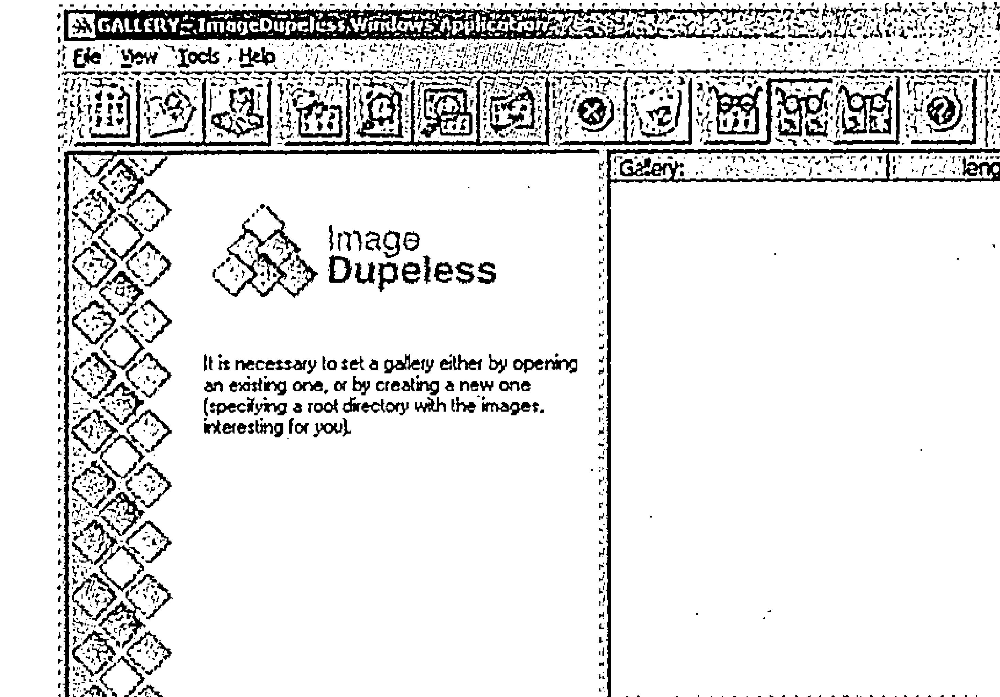

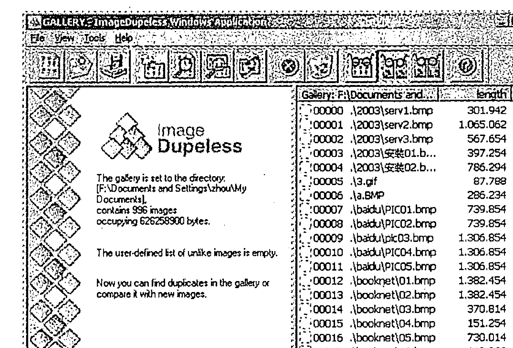

通过主菜单 "Tools" / "Create gallery" 命令，打开图 34 所示的对话框，选定图片所在文件夹。

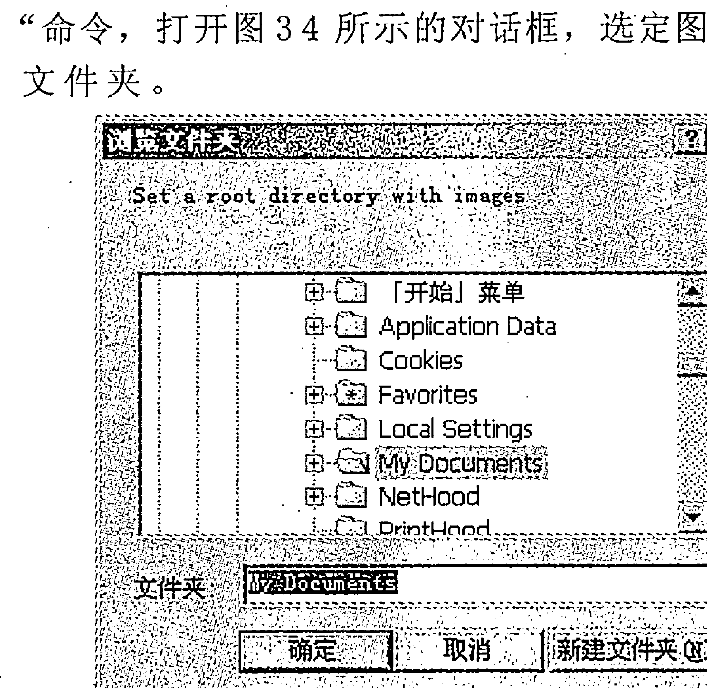

## （二）查找雷同图片

通过主菜单 “Tools” / “Find Duplicates” 命令即可查询画廊中哪些图片是雷同图片，如图 37 所示。在这里需要调整 “Level of difference” 滑块，这也是一个非常重要的参数，其最小值为 0%，最大值为 18%，数值越小，表示两个图片之间的差异越小，设置为 0% 时表示查找完全相同的两个图片，如果把它设置得很大，那么即使两张图片有一定的差别，但只要大致相同，软件也会认为它们是雷同图片。它的默认值为 11%。如果选中 “Show images”，将会在比较的时间在左侧预览图片，但这会影响比较速度，因此建议关闭这个选项。点击 “Compare” 按钮，即可对画廊内的图片进行比较。

点击 “确定” 按钮后，如图 35 所示，点击 “Start” 按钮开始对指定目录内的图片进行扫描。如果选中 “Show images”，在扫描的同时会在左侧预览图片。

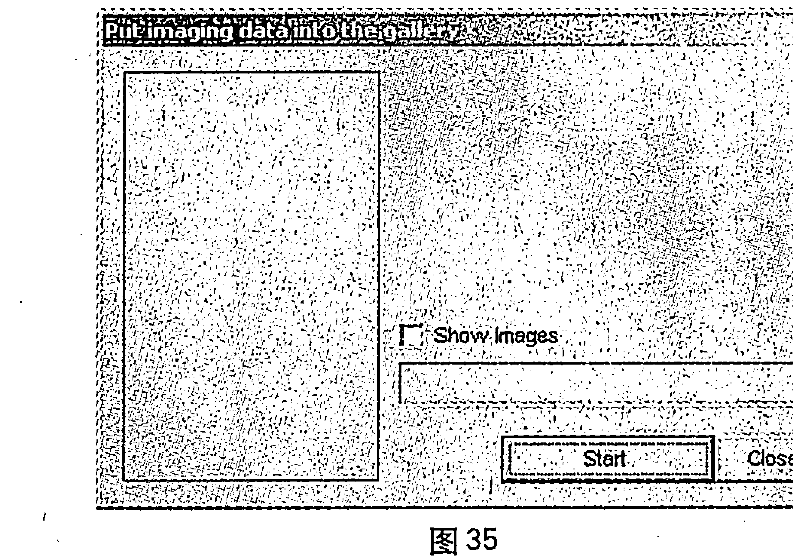

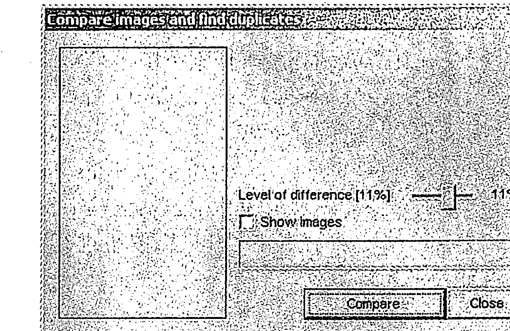

## （三）处理雷同图片

比较完成后，雷同图片列表就会出现在主窗口的左侧，两个或多个雷同图片位于同一行，中间用一个大眼睛连接起来，如图38所示。

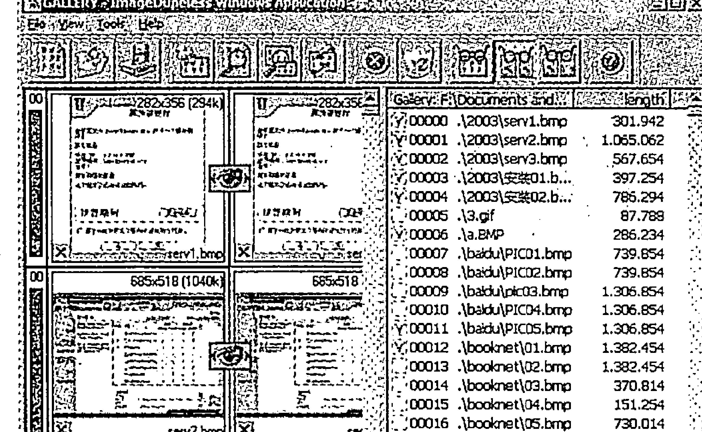

对于雷同的图片，软件提供了两种处理方法，一是从画廊中删除，二是从磁盘中删除。实际上，常用的是第二种方法。

要删除雷同图片，首先要选定雷同图片，这非常简单，在雷同图片列表中点击某个图片，这个图片上就会打上一个小红勾，表示此图片被选中，再点一下红勾消失。用这种方法可以把所有雷同图片选中，然后通过“Tools” / “Delete Selected images from gallery”命令可以把这些雷同图片从画廊中删除，或者用“Tools” / “Delete Selected images from disk”命令把雷同图片从磁盘上彻底删除。

删除时，会出现图39所示的提示，点击“Delete”按钮就会开始删除，而点击“Not Delete”按钮则会取消此操作。

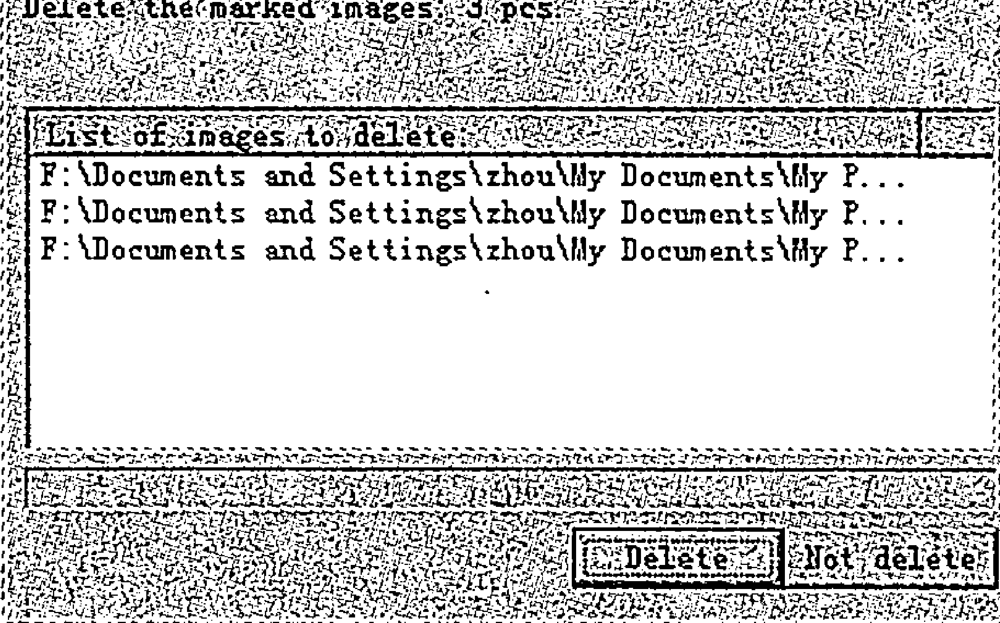

本文列举了几种简单的常见文件查找方法，文件的查找是计算机操作的基本功，如果能够熟练掌握各种资料的搜索方法，就能迅速地找到自己需要的资料。

## 学用为本 创业指南

## 2004年，我们给您一个不一样的《电脑爱好者》！

### >五大变化

- 1. 实用内容全面扩充，深受读者喜爱的系统、实用软件、网络、硬件等实用栏目大幅度增加页码；
- 2. 文章质量全面升级，汇聚万千电脑超级技巧，集萃电脑应用精华；
- 3. 纸张品质全面提高，《电脑爱好者》更漂亮、更厚实、更精致；
- 4. 订阅2004年全年《电脑爱好者》，免费赠送VIP专刊——《傻博士超经典问答》；
- 5. 每月赠送超实用系列手册——《稀饭易精经》，让您不仅精通电脑绝妙招数，还能独享DIY杂志的无穷乐趣！

### 四大承诺

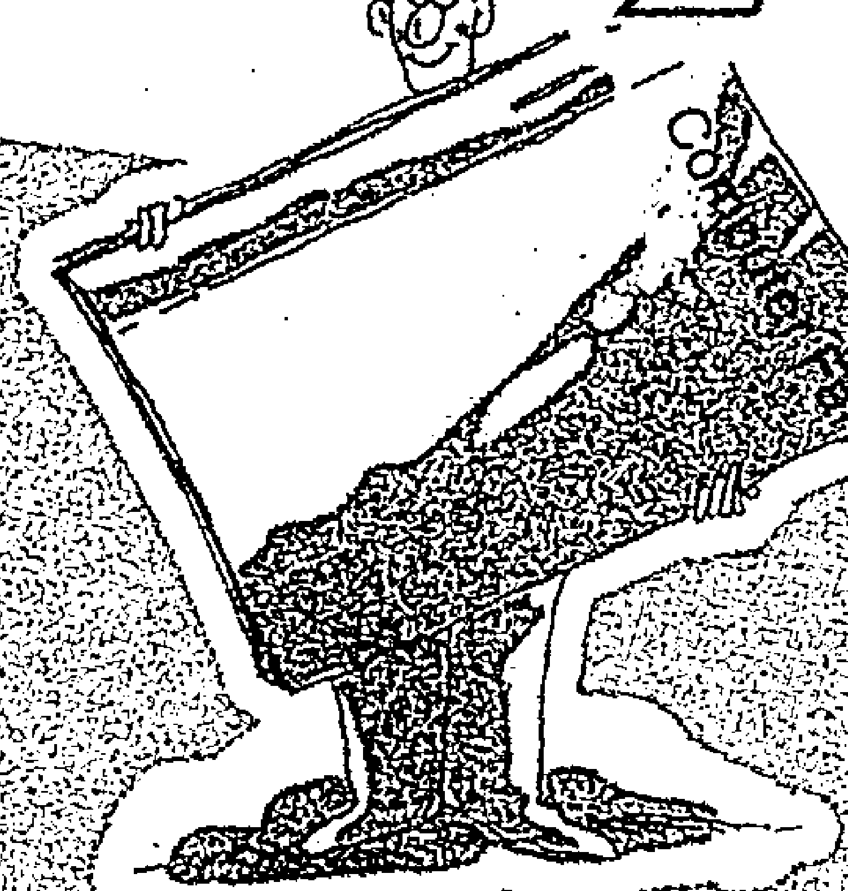

- 1 每期精彩的实用文章超过 100 篇！
- 2 每期绝妙的超级技巧超过 100 招！
- 3 每期即学即会的实例超过 50 个！
- 4 每期经典的故障解决超过 50 例！

### 一本大家都能看懂的电脑杂志

## 循序渐进学汉化

文/张京京

### 一、汉化基础知识

尽管汉语是世界上使用人口最多的语言，但在国际上的各种交流中，同为联合国工作语言的英语却要远远比汉语通用。很多优秀的软件在最初推出时都提供国际通用的英文界面，尽管一些软件为了市场拓展的需要会推出相应的中文版本，但还是有很大一部分的软件并没有提供相应的中文界面，这对于很多不是很熟悉英文的计算机爱好者来说，要熟练地运用这些软件就往往要花一段时间来摸索了。针对这种情况，国内的一些软件商采用了翻译软件附带汉化包的方法来实现对部分软件的“汉化”，如大家熟悉的东方快车系列、金山快译、Dr eye 以及晴窗系列等。采用这种外挂方式进行汉化时，需要同时运行英文软件和相应的翻译解释程序，对系统资源的占用比较严重，而且翻译效果也不是很好，经常会出现中英文相混杂的情况，严重的甚至会导致系统不稳定，出现异常错误等问题。

与外挂式翻译模式不同，一些计算机爱好者基于自己的兴趣爱好，也推出了针对某些软件的汉化包，这种汉化方式不需要借助第三方软件来实现，而是采用对于相应程序的修改来实现的，因此汉化的质量以及使用时系统的稳定性都要比前者好很多，而这也是本文要介绍的软件汉化方式。

#### （一）软件汉化的概念

所谓软件的汉化就是指将外文版的软件经过一系列本地化的技术处理后，将操作界面信息（如菜单、对话框、提示、帮助等）变成中文，而程序内核和功能基本保持不变。

软件汉化的实现，与软件的开发语言还有密切的关系。一般来说，用常规编程软件（如 Borland C++、Visual C++、VB 等）开发的软件，可以通过打开相应的 EXE、DLL、PKG 等后缀文件中的软件资源进行汉化。对于部分采用读取文本等相应软件资源的软件，则需要根据其特点做相应的汉化处理。

#### （二）常见的软件汉化方法

就目前而言，常见的汉化方法主要有以下两种：

- 1. 使用自动汉化工具进行汉化，如东方快车的永久汉化等。采用这种方式进行汉化的优点是快捷，傻瓜化，使用者不用怎么费心，比较适用于初学者使用；但是这种方式翻译无法作到准确无误，往往给人感觉汉化出来的效果仅仅是单词翻译的堆砌，缺少语法和逻辑性，汉化后无法达到理想的使用要求。

- 2. 使用手工汉化工具进行汉化，使用这种方式汉化的优势在于使用者可以对相应的资源进行全面的手工调节，因此汉化的比较完善，译文也比较合理，它的缺点就是整个汉化过程比较慢，需要花费较长的时间，而且可能需要安装 Borland C++、Visual C++ 等大型软件。

#### （三）软件汉化的要求

##### 1. 软件汉化的硬件要求

从某种意义上来说，汉化也可以归属于一种特殊方式的“程序编写”过程，它“编写”的并不是大家所熟悉的程序代码而是整个程序的资源文件部分。和常规的编程工作一样，汉化工作对于系统硬件的要求并不是非常高，简单的 586 电脑就能胜任常规的汉化工作，目前的绝大部分用户的计算机配置都完全可以满足汉化需要了。

##### 2. 软件汉化对软件的要求

软件汉化需要一定的工具，笔者在这里给大家推荐 Hex-workshop 及 eXeScope。其中 Hex-workshop 和 UltraEdit-32

##### 3. 软件汉化对软件汉化者的要求

对于想进行软件汉化的计算机爱好者来说，并不需要对计算机的程序设计有非常深入的了解，但是需要掌握下面的一些知识：

- ①熟悉Windows操作系统GUI（图形界面）的一些基本工作原理和工作方式；
- ②熟悉VC++与Borland C++的基本工作原理和工作方式；
- ③具备比较高的计算机英语水平（当然，一本好的英汉辞典是少不了，当然也可以借助现在比较流行的电子词典，如金山词霸等）；
- ④最好还是要稍微懂一点计算机编程语言（譬如：C语言、Delphi语言、Basic语言等），这样才能够减少汉化过程出现一些不必要的问题，更快更好地进行汉化操作。

### 二、汉化的必备常识

正如上面所说的，软件汉化需要一定的软硬件配置方面的要求，也需要汉化者对软件编程有一定的了解。因此，下面就详细地来谈谈在进行汉化前所需要的软硬件的安装以及一些软件编程方面的基础知识。

#### （一）了解汉化工具软件

汉化工具软件的选择，就在于大家的使用习惯以及需要汉化的软件的需要了，下面先为大家简单地介绍一些常用的汉化工具：

##### 1. Visual C++、Borland C++系列

作为汉化C语言所编写程序的工具，Visual C++、Borland C++系列应该是首选，Visual C++和Borland C++两者在汉化时各有优缺点，Borland C++可以直接在 Windows 9x系统中存盘，

##### 2. EXEScope

这是一个可以独立使用的汉化工具，常见的软件基本上都能进行汉化，不过它更多地被用来汉化Delphi所编的程序，此外还可以汉化其他类型的软件。它的优点在于能够避开某些软件的自校验，从而使软件顺利被汉化；不过缺点也是很明显的，就是没有字典自动汉化功能，用它单独汉化一个软件比较麻烦，一般被作为辅助汉化工具。

##### 3. Language Localizator

这是一个相当不错的专门汉化Delphi、Boland C++ Builder所编写程序的汉化工具，可以读出的资源类型有RCDATA、DIALOG、STRINGS等。它的最大优点在于具有字典翻译功能，这在汉化Delphi类程序的汉化工具中是仅有的！另外，在Windows NT下它还支持资源回写，在Windows 9X系统中也可结合其他工具进行回写；并且还可以单独存出DFM文件中的图形，以便于进行修改。

##### 4. Pebbles

Pebbles是一个很好的WIN32资源编辑器及翻译工具。它可以象Visual C++、Borland C++系列一样打开文件去汉化，只是不能修改其中的图片。

##### 5. RCShell

RCShell可以把RC或RES文件中的资源导入对应的原程序文件中。对于Visual C++、Borland C++系列生成的RC或RES文件，RCShell可以把它们的资源导回原程序，并且可以解决Borland C++系列汉化导致程序出错的问题，还可以使Visual C++汉化不再需要NT系统就可实现资源导回，以及解决汉化时出现的对话框中下拉表框信息丢失的现象，是Visual C++、Borland C++系列汉化必备的辅助工具。

##### 6. Hex-workshop 和 UltraEdit-32

这两款软件都是很好的文字、Hex、ASCII码编辑软件，可以取代记事本，内建英文单字检查、C++及VB指令突显，可同时编辑多个文件，

#### （二）资源

在Windows程序中，所有由非源代码直接提供的内容称为资源（包括位图、字串表、对话框等）。Windows为应用程序提供了与DOS完全不同的程序结构方法，允许将资源附在可执行代码后面，而且修改资源后可以不用重新编译生成可执行代码，即可直接连接编译后的资源。Windows应用程序的绝大部分字符串都是放在程序的资源部分，标准的资源文件内容包括：①Bitmap点阵图；②Cursor光标；③Dialog对话框；④Menu菜单；⑤Icon图标；⑥Version版本信息；⑦Strings字符串等。这些资源文件就决定了软件运行时的显示界面，因此从某种意义上说，软件汉化的就是对软件资源的汉化过程。

通常软件中需要汉化的资源，都是放在.exe和.dll等后缀格式的文件中，有些软件的资源放在专门的语言文件中（如CloneCD等），一般都是文本文件，扩展名五花八门，依作者的编排而有所不同。

找到需要汉化的资源位置后，还需查清楚相应资源的类型。

从汉化的角度来看，资源的类型可分为六种：

- * (1) VC类标准资源（包括Menu、Dialog、String、message table资源）；
- * (2) Delphi类标准资源（Rcdata资源）；
- * (3) 非标准的Unicode字符（主要是一些VB编译的程序，程序的Unicode字符不出现在Menu、Dialog、String等资源中，有少数VC、Delphi编译的程序也含有少量这样的字符）；
- * (4) 非标准的ASCII字符（指的是不出现在String、Rcdata等资源中ASCII字符）；
- * (5) 语言文件（一般指包含语言资源的文本文件，扩展名多由作者随意取）；
- * (6) 其它（包括Bitmap资源中的文字等等）。

在进行汉化前，我们一般要先对软件的资源进行定位，为进一步的汉化工作打好基础。下面，我们通过一个具体的例子来讲解一下如何初步判断程序资源的位置和类型。

推荐使用工具：eXeScope

由于大多数软件的资源都存放在exe或dll等后缀格式文件中，我们可以先看看在exe、dll等文件中是否存在需要汉化的资源和资源的具体类型。

运行eXeScope，将需要汉化软件目录中所有的exe、dll文件一一打开，仔细查看里面的资源，看看是否有我们需要汉化的资源（Menu、Dialog、String或Rcdata等）。

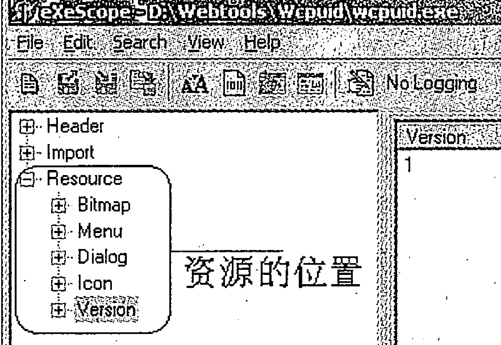

图1

对于一般的软件，其文件包含的资源部分如图1所示，将显示在eXeScope窗口左边的“Resouce”项下，而如果具体的窗口中只有“Header”、“Import”或者“Export”项的，表明打开的文件中并没有相应需要汉化的资源。

要注意的是，有时使用eXeScope打开相关的文件时，会出现无法打开的错误信息，这种情况通常是由于打开的程序正在运行或者文件被设置成只读属性，这时只要关闭该程序或把该文件的只读属性去掉，重新用eXeScope打开就可以了。

对于各种常见的程序，利用eXeScope就可以很容易地查看到的VC类标准资源（包括Menu、Dialog、String资源）和Delphi类标准资源（Rcdata资源），而VB类的标准资源用eXeScope一般无法看到，还需要第三方的16进制编辑程序（UltraEdit、Hex-workshop等）来查找，对于这些具体的操作，我们将在后面的汉化实战中具体介绍。

### 三、汉化实战

在对软件汉化有了初步的了解后，喜欢自己动手的朋友想必也希望自己动手来汉化英文软件了。下面，我们就通过一些实例来具体地介绍一下软件的基本汉化过程。

#### （一）C语言类的程序汉化

对于C语言类汉化工具选择，在前文中已经介绍过了，一般都是采用Visual C++、Borland C++系列来进行汉化，但是Visual C++不能在Windows 9X系统中直接保存修改过的程序，只能在Windows NT 或Windows 2000中存盘，所以令许多朋友望而却步！而Borland C++在这点上就表现得更优秀些，它可以在任何系统中直接保存修改后的程序。虽然Borland C++的易操作性在有些时候要比Visual C++逊色不少，而且存在个别软件在汉化后无法正常运行的问题，但如果在汉化时使用相应的汉化辅助工具，就可以很好地解决这些问题，因此作为C语言类的程序汉化工具，Borland C++绝对值得推荐。下面就以Borland C++为例来介绍C语言类程序的汉化过程。

##### 1. 准备工作

安装Borland C++，EXEScope，以及需要汉化的软件（本例中被汉化的软件是NFO Build，一个很好的NFO制作工作），另外不要忘了金山词霸或者其他翻译工具。

##### 2. 汉化工作

首先，记得备份需要汉化的软件，这是每次在汉化时千万要记得做的第一件事情。因为在汉化过程中出现的任何意外都有可能破坏原文件而导致汉化后的程序无法正常运行，因此在汉化过程中养成即时备份的好习惯是非常有必要的。

接下来用EXEScope查找软件资源的存放处，这在前面的基础篇中已经作了简要介绍。在这个例子中经过查找，NFO Build的资源就存在于NFO Build.exe中。

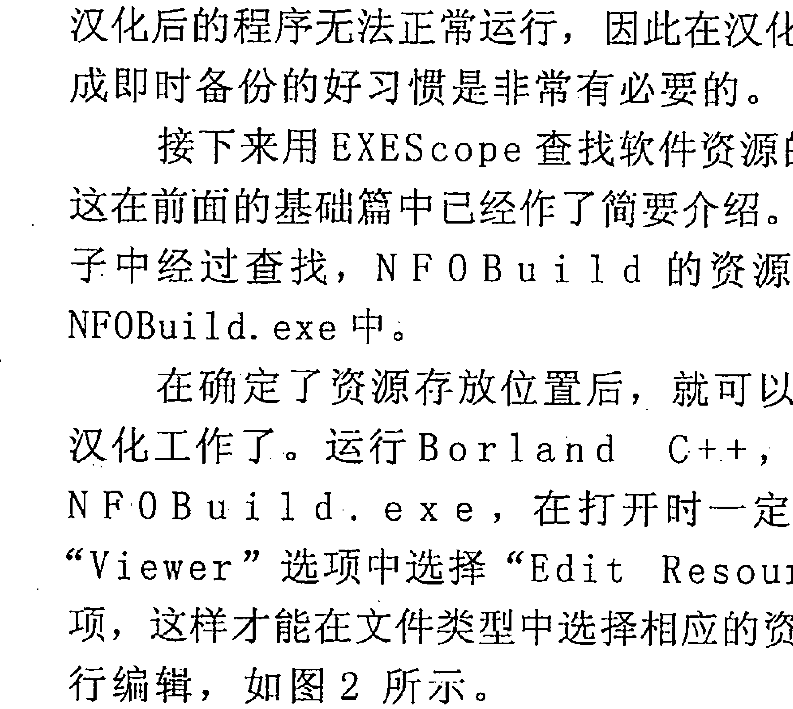

在确定了资源存放位置后，就可以正式开始汉化工作了。运行Borland C++，选择打开NFO Build.exe，在打开时一定要注意在‘Viewer’选项中选择‘Edit Resources’选项，这样才能在文件类型中选择相应的资源文件进行编辑，如图2所示。

打开相应需要汉化的文件后，进入Borland C++的操作界面。整个操作界面分为左右两栏，在左栏的窗口中列出了程序中所有的资源项目，点击每个资源项目旁边的加号就会列出该资源项目所包含的具体资源分项。用鼠标双击任何一个资源分项，就可以打开它并进入编辑状态，从而对该分项进行汉化了，如图3所示。在右栏窗口显示的是在左栏中被选中的资源分项的预览图形，图形预览是Borland C++中一项非常好的功能，它可以让你快速查看每个资源分项的实际显示图形。如果你想查找某个资源分项，就不需要每个分项都双击打开来看，只需用预览功能即可查看内容，就象是在Windows资源管理器中一样，非常的方便。这也是Borland C++优于Visual C++的地方之一，Visual C++没有预览图形功能，只能在存盘后看到相应的显示效果。

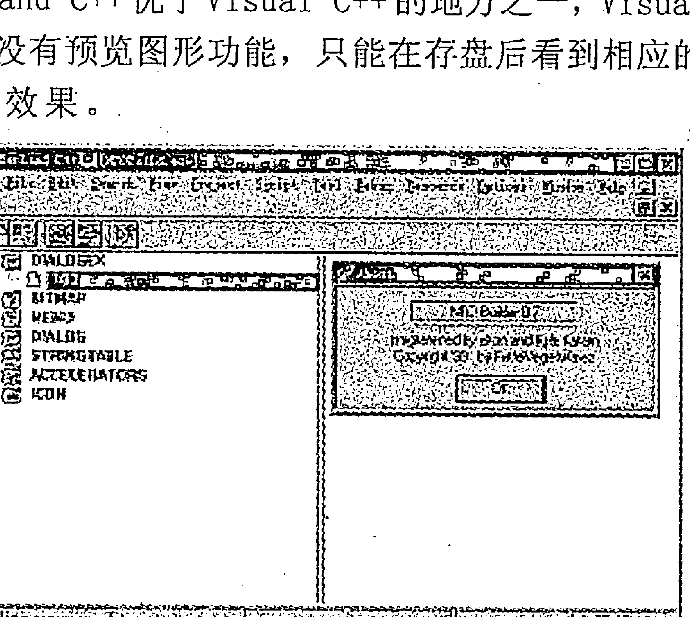

下面，让我们继续看图3来进行学习，在左栏中列出了所有的资源项目，包括了‘DIALOGEX’、‘BITMAP’、‘MENU’、‘DIALOG’、‘STRINGTABLE’、‘ACCELERATORS’以及‘ICON’这些项目，其中需要我们进行汉化的是‘DIALOGEX’、‘MENU’、‘DIALOG’、‘STRINGTABLE’这几项。‘MENU’项是软件中的菜单项，‘DIALOG’和‘DIALOGEX’都是软件中的对话框（要注意，在Visual C++中，这两项被统一标识为‘DIALOG’），‘STRINGTABLE’是软件中的字串表项目。至于‘BITMAP’项目，里面都是位图文件，因为有些位图文件中也可能包含了部分文字标识（如版权信息等），如果想实现完美的汉化效果的话，就要在其他的汉化工作都处理完毕后，再用Borland C++自带的位图编辑器对需要修改的位图文件进行编辑修改。

我们就先从左栏的第一个项“DIALOGEX”，鼠标双击“DIALOGEX”下的“103”分项，进入了相应的编辑窗口，在这个窗口中显示的是NFOBuild程序中的“About”窗口，如图4所示，用鼠标双击此“About”窗口，会弹出“About”窗口的属性窗口（如图5），在这里可以对整个窗口的属性进行修改，首先我们要汉化的是整个窗口左上角的“About”字样，注意了下图中“General”中的“Caption”属性了吗，这里的“About”就是需要修改的地方，将它替换为汉字“关于”。另外在“Font”属性中，可以根据需要更改整个“About”窗口的显示字体，如果在这里作了修改，那么不要忘了在其他修改的地方也要选择相同的字体选项，这样才能保证汉化的整体显示效果。

| Caption: | About |
| --- | --- |
| ID: | 103 |
| Left: | 109 |
| Width: | 63 |
| Height: | 83 |
| Visible: | ☑ |
| Horizontal ScrollBar: | ☐ |
| Vertical ScrollBar: | ☐ |
| Disabled: | ☐ |
| Tabstop: | ☐ |
| Group Flag: | ☐ |

按钮，用鼠标左键点击需要改动的部位，会在整个字符串周围显示一个标识字符串位置的区域边框点（如图6），用鼠标双击相应的区域，会弹出相应的text和button属性窗口。同样的，我们也可以修改“Caption”输入框中的文字来达到汉化的目的。具体操作步骤非常简单，不过要注意的就是，在将相应的英文字符修改为汉字后，可能会出现部分汉字无法正常显示的情况，这是由于原先的英文字符显示区域过小引起的，汉化时出现这个问题，可以在相应的弹出窗口中设置对应资源的“Width”和“Height”属性来修正，更简单的方法就是直接在修改窗口用鼠标左键点击相应的区域边框，利用鼠标直接拖拉来调节显示区域的大小。

经过上面几个步骤，就完成了“DIALOGEX”项的汉化工作，对于“DIALOG”项中的各个分项按照上面的步骤同样进行汉化，图7就是汉化前后的窗口信息对比。

接下来汉化“MENU”项中的内容。用鼠标左键双击“MENU”项下的分项，会弹出如图8所示的编辑窗口。窗口中显示的主要内容就是NFOBuild运行界面的主菜单部分。

## 程序渐进与汉化 综合应用

在“Property Inspector”中显示的就是相应位置菜单条的属性，只要移动相应的显示位置，对“Property Inspector”中“Text”属性中的文字进行相应的修改就能完成这个部分的汉化工作。英文翻译成中文的处理过程比较简单，就不具体讲述了，在这里要给大家详细地讲讲“Text”属性中的各种符号的具体含义，如上面的图示，主菜单中“File”项在“Text”中显示的是“&File”，其中“&”表示“F”是快捷键，因此我们在汉化时如果不想丢了这个快捷键的显示效果，那么就将“Text”中的“&File”汉化处理为“文件（&F）”。而对于主菜单的下层菜单，也要同样进行相应的汉化处理，惟一要注意的就是快捷键的定义字母要定义为英文菜单中的带下划线的字母（如“Save As”快捷键的定义字母是“A”）。对于其他的菜单显示项也进行相同的汉化处理。

在上面的对话窗口汉化完成后，就可以开始汉化“STRINGTABLE”部分的内容，点击Borland C++主窗口中左栏中的“STRINGTABLE”项（如图9），一一打开相应的下面的子项，在主窗口的右栏中显示的就是对应的字符提示串，在右栏中将相应的英文直接替换为中文就可以了。

至此，我们对此软件的简单汉化就基本完成了，下面是汉化前和汉化后的效果对比，如图10和图11所示。

经过上面简单的汉化操作步骤，NFOBuild看起来变成一个中文软件了。上面的操作主要目的是介绍汉化思路和步骤。要想让自己的汉化更完美些，还需要在基本汉化的基础上进行一些后期的具体润色工作，如上面提及的汉化时字体大小的更改、图标中文字的更改，这些都是一些后期工作，具体操作也不是很麻烦，在这里就不具体介绍了。

### （二）Delphi、C++ Builder 语言类的程序汉化

对于Delphi、C++ Builder语言类的程序汉化，常用的工具主要有EXEScope、Language Localizator等，而EXEScope比较容易上手，下面就以EXEScope为例来简单地介绍一下对于Delphi、C++ Builder语言类的程序汉化过程。

和上面一样，首先要安装好EXEScope以及需要汉化的程序以及翻译工具。下面就以Delphi编写的程序Graph to ascii为例来介绍汉化过程。

首先，我们用EXEScope打开Graph to ascii的主程序Bg_asci.exe，查看其中相应的资源部分。我们可以看到在软件的资源（Resource）部分（如图12），有“Bitmap”、“String”、“RCData”、“Cursor”以及“Icon”，除了“RCData”这一部分外，其他部分在C语言类的汉化例子中都看到过了，而“RCData”这一部分也正是Delphi和C++Builder语言类所特有的，大家在判断程序的编写环境时就可以利用这个来判断并以此为根据选择适当的汉化工具。

对于Delphi、C++ Builder语言类的程序汉化和上面介绍的对于C语言类的汉化的例子差不多，汉化工作基本也就是对相应的资源部分进行翻译，其中“String”部分的汉化和上面的例子差不多，在这里就不详细介绍了。下面主要介绍“RCData”这一Delphi、C++ Builder语言类的程序独有的资源部分的汉化工作。

打开“RCData”部分（如图13），我们可以看到在“RCData”下面包含了很多分项，那么具体什么项目是我们需要更改的部分呢？熟悉Delphi编程的计算机爱好者都知道，Delphi的很多功能都是通过控件对象实现的，看到其中“T”开头的部分了吗，这些基本上都算是属于控件对象部分的内容，因此我们需要更改的就是这些控件中的相关信息。打开图13中的“TFORM2”，在右边的窗口中显示的就是“TFORM2”的相关信息，我们要注意修改的部分集中在“Caption”以及“Font.Name”上，修改“Caption”属性中的英文为中文，并把“Font.Name”中默认的“MS Sans Serif”修改为宋体，惟一要注意的是，要分清“Caption”属性分别是什么控件对象的，是窗口的还是按钮的。这些都很容易理解的，如果对这个不是很了解的话，可以看一下Delphi编程方面的书，一般前面的章节都有相应的介绍，理解起来也不是很困难的事。

将“String”和“RCData”这两部分的内容翻译汉化后，对该程序的初步汉化工作就完成了（如图14），至于其他地方的细节处理就是相应的后续工作了。

### （三）VB语言类的程序汉化

在当前流行的程序设计语言中，VB是其中较为易学易用的一门语言，可是VB程序的汉化却是几种流行的程序设计语言中难度最大的。目前，基本没有什么专门的汉化工具可以方便的实现对这种软件的汉化。由于它的资源形式比较特殊，类型很多，有些类似C语言的格式，有些类似Delphi的rcdata，对于不同的程序不像上面介绍的两种类型的程序有一定的规格可循，因此在具体汉化时只能针对不同情况来具体分析。下文就以Skin CD这个软件为例给大家简单地介绍一下VB语言类程序的汉化思路和方法，供大家在汉化VB语言类程序时借鉴参考。

首先还是安装EXEScope、Hex-workshop以及需要进行汉化的程序（本例就选用VB编写的程序Skin CD为例）。当然也不要忘了安装金山词霸或者其他翻译工具以备在汉化过程中使用。
接下来就可以开始汉化工作了。
我们首先还是运行EXEScope打开Skin CD来看看Skin CD内部的资源形式，从EXEScope运行后的情况来看，和上面的两种汉化时的情况大不相同，在“Resource”中根本没有对应的可以汉化的资源，如“DIALOGEX”、“MENU”、“DIALOG”、“STRINGTABLE”，或者“RCData”等，只有“Icon”和“Version”这两项，不过我们从“Import”项下的“MSVBVM50.DLL”中可以看出这个程序是用VB编写的程序（如图15）。

很显然用常规的汉化工具是无法对这样的程序进行汉化工作的，在对这样的程序进行汉化前，我们必须首先查找相应资源的位置。这就要靠Hex-workshop了，我们首先来看Skin CD的原版画面（如图16），把相应的英文部分记录下来，然后用Hex-workshop打开Skin CD，我们不妨先查找一下左下角的“Tracks”的字样，在Hex-workshop中查找“Tracks”，显示没有找到，没有关系，由于Hex-workshop默认的查找方式是ASCII字符方式查找，在查找窗口中选中“Unicode String”，然后查找一下，可以查找到4处有相应的字样，图17中就是第一处的“Tracks”相应的位置。

仔细看看，“Tracks”后面还跟着“Total Time”，非常像Skin CD界面中左下角的显示字样，修改一下看。用Hex-workshop将“Tracks”修改为“音轨数”，在修改时要注意，由于“Tracks”是用Unicode方式存储的，因此，在修改时要特别注意，并不能像修改ASCII码的方式直接地修改相应的“Tracks”字样为“音轨数”，而应该直接在16进制中进行修改，如上图17中“Tracks”对应的16进制是“54007200610063006B007300”，那我们如何才能知道“音轨数”对应的Unicode16进制代码吗？在Hex-workshop中选择“Edit”菜单中的“Replace”命令，选择“Unicode String”，在“Replace”中输入相应的汉字，下面就会显示相应汉字的Unicode16进制代码，图18所示的音轨数对应的Unicode16进制代码就是“F397688F7065”，和上面的“Tracks”对应差位可以“全部填0”（注意，是16进制数字后面补0，不是汉字后面补0）来补足，这是很重要的，位数必须完全一样，否则修改后的文件将无法运行。

完成这部分汉化后，Skin CD界面如图19所示。

在图中可以看到“Tracks”的显示处已经变成了“音轨数”，看来我们寻找和替换的位置是正确的，接下来按照上面的办法，依次将界面中的英文替换为相应的中文。下面就是汉化完成后的Skin CD的界面，如图20所示。

在这里要补充说明的是，在VB程序中存在大量的Unicode以及ASCII字符，上面介绍的是Unicode的字符修改方式，必须在转换后用16进制进行相应的修改，而对于后者ASCII字符就要方便得多，直接进行汉字替换就可以了，惟一要注意的也是字符长度要一致，不足的用空格补，操作比较简单，在这里就不具体介绍了。

### 四、汉化进阶技巧

在上面，我们对汉化的概念和常见汉化软件的应用作了简要介绍，但要做出一个满意的汉化成果出来，也不是那么简单的事情，还需要大家在汉化后进行修改和调整工作。而且由于各种软件的编写环境等因素，在汉化过程中经常会出现一些意想不到的问题。因此，掌握一些必要的汉化进阶技巧对于提高汉化工作的效率，减少汉化中出现的错误，提高汉化水平是很有帮助的。

#### （一）快速、准确判断软件的类型，选择相应的汉化工具

由于各种软件的编写环境不同，决定了不同的软件必须采用不同的汉化工具进行处理。如何快速、准确判断软件的类型，选择相应的汉化工具，对于整个汉化工作的进程有很大影响。对于判断软件的类型，笔者还是推荐大家使用EXEScope来进行判断，具体的判断方法在上文中都曾提及，在这里将这些内容再总结到表1中，供大家参考。

#### 表1 不同软件的类型和汉化工具

| 软件类型       | 在EXEScope中的关键字段                     | 建议选择的汉化工具                                                                 |
|----------------|--------------------------------------------|----------------------------------------------------------------------------------|
| C              | "DIALOGEX", "MENU", "DIALOG", "STRINGTABLE" | 推荐Visual C++，Borland C++，另外还可以用EXEScope，Pebble等                      |
| Delphi, C++ Builder | "RCData"                                    | 推荐EXEScope，Language Localizator，DFM Viewer                                    |
| VB             | 无                                         | 推荐Hex-workshop，UltraEdit                                                      |

#### （二）利用Visual C++汉化时一次更改多个资源项目的内码属性

利用Visual C++进行汉化时，和其他常见的汉化工具不同，对于每个资源部分的修改都在修改前将资源的内码属性修改为中文，非常麻烦。其实可以做到一次全部更改：在VC++的资源管理环境里把待汉化软件的资源项目统统扩展开来并全部选中，按回车键一次全部打开，选择“Window（窗口）”菜单项下“Windows（所有窗口）”中的所有的资源项目，单击鼠标右键选择资源属性“Properties”，把资源的内码改为“Chinese（P.R.C.）”，再单击“OK（确定）”后，就可以将全部资源项目原来的内码属性“English（US）”修改为“Chinese（P.R.C.）”了。

#### （三）解决汉化后软件图标（Icon）变形的问题

有一些软件（如Winamp、WinZip等）在汉化后运行时会出现图标变形而影响显示效果的问题，其原因是这些软件的图标资源采用了多个规格尺寸和颜色，即一个图标里面包含了（16×16，256色、8×8，16色等）多种不同尺寸颜色的规格，由于汉化后不同规格图标的先后次序被改变了，所以在运行时引起图标显示的变形。解决的办法就是在汉化后手工调整多种规格图标的先后次序，把（16×16，256色）的图标规格放到最上层即可。

#### （四）鼠标右键快捷菜单的汉化

很多软件在安装后，会在Windows鼠标右键快捷菜单中添加一些快速操作的命令，如Ultraedit32在安装后会在其中添加“Ultraedit-32”等，这些快捷菜单的汉化也是软件汉化的一部分。对于鼠标右键菜单中快捷命令的汉化，同样也要先找出相应的资源位置，然后进行相应的汉化工作。从目前来看，关于鼠标右键菜单中的显示字样一般隐藏在以下三个地方：①在整个软件的总资源部分，这样在汉化软件的时候也许你已经把它顺便汉化了；②如果不是前面的情况，那么这个资源部分可能隐藏在注册表中，你可以根据右键菜单中显示的英文信息在注册表中进行搜索，将完全符合的字符串键值修改为相应的中文；③如果不是前面两种情况，那么一般隐藏在Windows系统目录中的或者相应软件目录的某个文件中，可以利用Windows搜索功能中的“包含文字”功能选择相应目录进行搜索，将搜索到的文件中的对应部分进行汉化就可以了。

### 五、汉化补丁制作篇

在一系列的汉化操作完成后，如果想把自己的汉化“成果”与人分享，还要把自己汉化后的程序进行打包发布，也就是大家所常见的汉化补丁。常见的汉化补丁的制作主要有以下两种方式：①文件打包方式的补丁制作：直接把修改后的资源文件（exe、dll等）放置到相应的汉化补丁包中；②文件修改方式的补丁制作：这种方式通过比较修改汉化前后的资源文件（exe、dll等），生成相应的修改程序来达到最后的汉化目的。下面就来简单地介绍一下这两种补丁制作方式的具体实现过程。

#### （一）文件打包方式的补丁制作

采用这种方式制作的补丁，从某种意义上说其实就是简单的文件覆盖，也就是用汉化后的资源文件来覆盖汉化前相应的资源文件来达到汉化的目的。这类补丁的制作比较方便，我们可以利用常用的压缩程序（Winzip、WinRAR等）的自解压程序包来制作相应的汉化包。

在制作时首先把修改后的资源文件存放到同一个目录中，对于资源文件分布在不同子目录的软件，就必须按照原先英文版安装后的文件目录结构进行存放，然后把相应的目录压缩后成自解压压缩包。以后在汉化软件时，解压并覆盖相应的文件即可。

当然，上面介绍的压缩包自解压方式是非常简单的，但给人感觉有点“土”。没关系，我们还可以利用WinRAR的安装脚本来“装饰”汉化补丁。下面就来简单地介绍一下如何使用WinRAR的安装脚本。

如果你看过WinRAR的帮助文件的话，你会发现其实WinRAR自解压模块其实是支持很多脚本的，比如HTML标识，并能在输出窗口以超文本形式显示，支持可供选择的授权窗口，输出窗口支持Ctrl+C复制操作等。大家在平时使用时，都只会注意它的压缩功能而已。常用的WinRAR命令如下。

```
Title=<title>
<title>部分为自释放文件运行窗口的标题，
如：Title=Nfo Builder 汉化版
Text
这个命令支持两种版本的语法。
①传统文本语法
Text=<string>
<string>部分为自释放文件运行窗口的输出文本，如：
Text=轻松制作NFO文件
Text= ，表示一个空行
②超文本格式
Text
{
string1
string2
}
超文本格式语法支持少量常见的HTML标识，这样可以使输出的文本对话框有网页效果，目前支持以下的HTML语法：
<b>、</b> 粗体字；
<i>、</i> 斜体字；
<u>、</u> 下划线
<s>、</s> 删除线
<p> 段落换行，类似回车
<br> 段落换行，类似shift +回车
<font size=? color="#??????" face="?">、</font> 设置字体类型、颜色和大小
这些都可以在下面的窗口中进行设置（如图21）。
```## （二）文件修改方式的补丁制作

对于用这种方式制作的补丁，需要比较修改前后的资源文件（exe、dll等），因此要采用一些第三方的补丁生成工具来生成相应的修改程序并完成汉化。

这里以常见的Winpatch为例（如图22），我们首先要建立两个对应的目录，一个目录中存放修改前的那些资源文件，一个目录中存放修改后的那些资源文件，然后运行Winpatch，在主窗口选择相应的原始资源存放目录以及修改后资源文件的存放目录，记得不要忘了“Create Self-extracting Patch”前打钩，这样可以生成一个可以单独运行的Patch可执行文件，否则以后每次修改都需要Winpatch来执行，对于其他的使用者来说这是不大现实的。最后单击“Build Patch”按钮就可以生成相应的Patch文件。

完成以上操作，生成的Patch文件就可以直接进行发布了，使用者下载生成的patch的可执行文件后，只要运行patch文件，并选择相应的目录就可以了（如图23）。

当然，上面介绍的都是补丁制作中最简单的方法，大家可以在安装上再下些功夫，把补丁的安装也搞得更专业一些，如采用一些专业级别的install安装程序制作工具来制作相应的安装程序，其原理和上面介绍的基本类似，大家可以参照上面的来进行相应的制作工作。

### 六、结束语

由于篇幅有限，上面仅仅在有限的范围内简要介绍了汉化的操作过程。对于想亲手进行汉化操作的读者来说，上面的介绍应该会有一定帮助的。由于汉化并不需要触及软件的内核，再加上当前的软件大都采用模块化设计，这也为我们汉化软件带来更大的方便。因此汉化在很大程度上并不需要太多的编程知识，我们只需要掌握各种汉化工具以及一些汉化技巧就基本能胜任。实际上，一个完整意义上的汉化工作，不仅仅包括上面介绍的主要的汉化过程，还包括了汉化后的后续处理（如字体优化等）以及帮助文件的汉化等。另外，在汉化时，还要在汉化翻译上下苦工，翻译的词汇必须准确恰当才行。总之，汉化其实并不难，只要你有兴趣和信心，就能掌握好汉化技术，为自己喜欢的软件设计出漂亮的中文界面。

- 附：文章中提到的一些汉化软件的下载地址
  - EXEScope: http://www.onlinedown.net/soft/9593.htm
  - Language Localizator: http://www.onlinedown.net/soft/5693.htm
  - Winpatch: http://www.onlinedown.net/soft/2682.htm
  - Hex-workshop: http://www.onlinedown.net/soft/3825.htm
  - UltraEdit: http://www.onlinedown.net/soft/608.htm

## 站在众人的肩上 — VC++ 控件编程
文/白乔

- 文章重点与技巧目录
  - 使用 Windows 标准控件
  - 引入控件
  - 设置控件属性
  - 映射控件变量
  - 响应控件事件
  - 控件子类化
  - 使用 ActiveX 控件
  - 常用控件推荐

### 一、前言

#### (一) 控件之于 VC++

控件与 Visual C++（以下简称 VC）没有直接的关系，控件是 Windows 操作系统的界面元素，而 VC 只是一种开发语言。VC 可以编写 Windows 程序，当然也可以编写 Windows 界面，包括最熟悉的对话框界面。

一上手就学习复杂的“文档/视图”对于初学者来说是很痛苦的事情。而对话框的优点就在于它的“所见即所得”，设计界面画得有多好看，程序运行界面就有多好看。而如何让你的对话框的界面更丰富一点，那就是控件的事情了。因此可以说，对话框界面是初学者学习 VC 的一道门槛。而本次教程，正是要指导你如何在 VC 里实现控件编程。

控件实际上就是一个窗口，是一个能完成特定功能的小窗口。控件放置在对话框里，对话框就成为控件的容器，或曰父窗口；而控件就成为对话框的元素，或曰子窗口。

控件并不总是显示成一个窗口，它可以是隐藏着的，例如：你可以使用定时器控件来控制“神五”的定时发射，但没必要一定要在发射系统的主界面上土气地画上一只小闹钟。

列表框、文本框、按钮、滚动条、标签、定时器等等，Windows 系统已为我们准备了许多标准控件。但 Windows 系统提供的标准控件总是有限的，于是一些先辈程序员（第三方）便自己编制出一些符合 Windows 规范的其他控件来，即 ActiveX 控件。你可能会免费得到这些控件，也可能需要花费一定的金钱购买这些控件，只要你合法地获得了这些控件的使用权，你就完全可以象使用 Windows 标准控件一样大大方方地使用它们了。ActiveX 控件的使用与标准控件一样简便快捷，你可以使用 MsComm 控件让你的电脑总是在深夜拨打我的电话，或者使用 ActiveMovie 控件反复播放你最钟爱的影片，这些都是 ActiveX 控件的应用实例。

同样的，你也可以使用 Macromedia 公司的 Flash 控件来播放所有有关 Snoopy 的 Flash 动画，而这正是本文要为你讲述的。

#### (二) 主要内容

本教程除了讲解 Windows 标准控件的使用方法外，还会指导你通过使用第三方控件完成一个简单的 Flash 浏览器（如图 1）。

不是很酷，但至少能说明一些问题。这个简单的界面包含以下 4 个控件。

- 文本编辑框：显示用户选择的文件路径，如“D:\movies\星语心愿.swf”；
- “浏览”按钮：让用户选择Flash文件；
- “退出”按钮：用来结束本程序；
- Flash 浏览窗口：用来显示 Flash 动画，是 FlashPlayer 的主会场。

前 3 者是 Windows 标准控件，而 Flash 浏览窗口则不同，它来源于 Macromedia Flash，是一个 ActiveX 控件。

通过本教程，笔者承诺你可以学习到以下内容（当然，你首先要对 Visual C++ 有一定的了解）：

- 控件的引入，即如何将一个控件加入到你的 VC 工程中来；
- 控件属性的设置，即如何通过属性的修改来设计控件的运行界面；
- 控件变量的映射，即如何象使用通常的一个变量一样操纵一个控件；
- 控件事件的响应，即如何处理控件的事件；
- 控件方法的调用，即如何调用控件的既有函数来操作它。

仅此而已，你不可能再学习到其他的内容，你也不会接触到诸如 ActiveX 制作等方面的问题，那样只会冲淡本次教程的主题，让你的头更疼。

### 二、使用 Windows 标准控件

#### (一) 常见控件列表

Windows 标准控件即普通控件，撰写此文时，笔者每天面对的 Word 就带了一“脸”的控件，当然你肯定也熟悉：字体选择下拉框、工具栏、滚动条、状态栏等等。

常见的 Windows 标准控件在 VC 里就有，如图 2 所示。

通常这个控件集窗口在你的对话框设计界面的附近总能找到，如果找不到，在 VC 工具栏的任何空白处点击右键，在弹出菜单的 Controls 菜单项前面打上勾即可，如图 3 所示。

前面已经说过，图 1 所示的 FlashPlayer 中有 3 个控件是 Windows 标准控件，好，我们先系统地学习一下怎么使用这 3 个控件。

#### (二) 引入控件

##### 1. 准备对话框

对话框相当于控件的容器，我们当然要先准备一个对话框。好办，直接创建一个基于对话框的新工程就是了。启动 VC++6.0 后，执行 File > New 命令，在新建对话窗口中点选 Projects 标签，然后选择 MFC AppWizard (exe) 项，在 Project name 中给新工程取一个名字，在 Location 中选择新工程的保存路径。点 OK 按钮确定后将显示向导窗口。

在 Step 1 窗口中，点选 Dialog based 项，表示此应用程序是基于对话框的，如图 4 所示。

注意，在 Step 2 中要确认 3D Controls 和 ActiveX Controls 已经被点选，如图5所示。

这样你的程序就支持三维控件和我们后面即将使用到的 ActiveX 控件了。如果去掉了勾选，或者你面对的正是你师兄当年准备论文的旧的 Project，它好像并不支持 ActiveX 控件，那该怎么办呢（好多VC网友总是带着那张哭丧脸的表情问我这种问题）？没事，在主程序文件的 InitInstance()函数头部加上以下语句即可：

```
BOOL CFlashPlayerApp::InitInstance()
{
    AfxEnableControlContainer();

#ifdef _AFXDLL
    Enable3dControls();
    // Call this when using MFC in a shared DLL
#else
    Enable3dControlsStatic();   // Call this when linking to MFC statically
#endif

    //...
}
```

闲言少叙，按照向导所示一步一步 Next 下去，最后单击 Finish 按钮完成，对话框就准备好了。默认情况下，它总会自动带上3个控件：“确定”与“取消”按钮以及一个“TODO： 在这里设置对话控制”文本标签。

前两项的功能将要在后面讨论到，我们现在只关心Properties（属性），点击它即可弹出文本编辑框的属性界面，如图8所示。

#### (三) 设置控件属性

引入的控件，通过鼠标简单的拖拽即可调整其位置和大小。当然也可以通过属性对话框来设计这个控件。在控件上右击鼠标，将弹出右键菜单（如图7）。

这个右键菜单的最下面三项分别为：

- ClassWizard... 为控件创建类及变量
- Events... 为控件映射事件
- Properties 设置控件的属性

##### 2. 准备文本编辑框

我们并不需要文本标签，点选后直接按 Delete 键删除即可。但我们需要一个文本编辑框，用以显示Flash文件路径。引入新的Windows标准控件很简单，只要简单地从控件集窗口选择相应的控件拖拽至对话框即可。

我们按照以下的步骤进行控件的属性设置：

- 1. 在 General（普通）标签页里将文本编辑框的ID修改成IDC_FLASH_FILE，而不是缺省的IDC_STATIC;
- 2. 在 Styles (样式) 标签页里将文本编辑框的 Read-only 打勾，这样我们的文本编辑框就显示成灰色，并且只读。也就是说，它的内容只能由程序更改，用户不能手动输入；
- 3. 以同样的方法调出按钮的属性界面。在两个按钮的 General (普通) 标签页里，设置它们的 Caption (标题)，分别为“浏览...”和“退出”；
- 4. 在“浏览...”按钮的 General (普通) 标签页里，将它的 ID 设置成 ID_BROWSER。

需要指出的是，每个控件都具有 ID，就相当于每个人都具有一个身份证号。除了 IDC_STATIC (它的值是-1)，每个对话框的控件的 ID 都必须惟一，不能重复。一些特定的 ID 代表特定的含义，如：IDOK 对应于“确定”按钮，IDCANCEL 对应于“取消”按钮，IDC_STATIC 则对应于一个匿名控件。MFC 认识这些特定的 ID，并为其赋值指定的行为，例如，你可以不需要编写任何代码，就可以使用“确定”按钮关闭对话框，就是这个原因。

以上内容讲解了如何修改控件的属性，包括它的 ID、标题以及样式等。这种修改都是所见即所得的，执行 Build>Build *.exe 命令编译程序，编译成功后再执行 Build>Execute *.exe (或者按 Ctrl+F5) 运行程序，你就会欣喜地发现，一切确实都改过来了。

#### (四) 映射控件变量

好了，现在我们有了一个文本编辑框，但是如何使用它呢？下面让我们开始学习如何将控件映射成一个变量，这个过程即“映射控件变量”，或曰“绑定控件变量”。

映射控件变量是 VC 的一个很好的功能，有了它，你就可以象使用一个变量一样控制控件。映射成什么类型的变量，这依赖于你的控件。一般来说，一个控件可以映射成一个值变量（Value），也可以映射成一个控件对象（Control）。如：一个文本编辑框既可以映射成一个 CString 值，也可以映射成一个 CEdit 对象，CString 是个字符串，而 CEdit 则是 MFC 为文本编辑框专门准备的控件类。

##### 1. 控件——>值变量

我们从简单的入手，先将文件路径文本编辑框映射成一个普通的值变量，请按照以下的步骤进行操作。

- (1) 在编辑框上打开右键菜单（如上图 7 所示），选择 ClassWizard...，弹出如图 9 所示界面。
这个窗口看起来有点复杂。先不用管别的，因为我们要映射变量，那就选择 Member Variables 标签页，在这儿可以看到当前对话框中的所有控件，包括我们的文本框和其他两个按钮。

- (2) 找到上面我们创建的 IDC_FLASH_FILE，双击它（或者点击 Add Variable 按钮），就弹出了映射控件变量窗口了，如图 10 所示。
该窗口中分别要求输入变量名、类别和变量类型。本例，我们选择 Value 和 CString，将 IDC_FLASH_FILE 映射成 CString m_sFilePath。

大功告成！这时观察 VC 程序代码，其中会有如下变化：

```
class CFlashPlayerDlg : public CDialog
{
    // ...
    // Dialog Data
    //{{AFX_DATA(CFlashPlayerDlg)
    enum { IDD = IDD_FLASHPLAYER_DIALOG };
    CString     m_sFilePath;
    //}}AFX_DATA
}
```

```
cpp
CFlashPlayerDlg::CFlashPlayerDlg(CWnd* pParent /*=NULL*/)
: CDialog(CFlashPlayerDlg::IDD, pParent)
{
    //{{AFX_DATA_INIT(CFlashPlayerDlg)
    m_sFilePath = _T("");
    //}} AFX_DATA_INIT
    // ...
}

```

下面我们先试试这个 CString m_sFilePath 的使用，如：

```
cpp
BOOL CFlashPlayerDlg::OnInitDialog()
{
    CDialog::OnInitDialog();
    m_sFilePath = "空即是色";
    // ...
}

```

遗憾的是，以上的代码是没用的！与 Visual Basic 不同，在 VC 的世界里，映射的值变量与实际控件的内容并不同步，欲使用映射的值变量就必须额外地使用到 UpdateData() 函数，它的函数原型如下：

```
cpp
CWnd::UpdateData
BOOL UpdateData( BOOL bSaveAndValidate = TRUE );

```

简单地说，UpdateData(TRUE)读取对话框中各控件的内容，并及时反映到其映射值中去；UpdateData(FALSE)则恰恰相反，它将当前映射值反映到控件中去，如：在文本框里面显示你刚刚设置的字符串“空即是色”。我们现在是要通过变量修改控件，因此采用 UpdateData(FALSE)；以上的代码修改成：

##### 2. 控件——>控件对象

与值变量不同，如果映射变量是一个控件对象，那么就没有必要调用 UpdateData() 来完成同步。将一个控件映射成控件对象也很简单，依上面的方法调出添加变量窗口（如图12）。

图11 使用映射变量修改文本编辑框的内容

UpdateData ()如何知道哪些控件与哪些变量映射，靠的是 DoDataExchange()，作为初学者，我们现在还没必要对 DoDataExchange()了解更多，但注意不要随便手动修改 DoDataExchange()中的代码。

图12 添加控件对象变量

注意：与值变量设置不同，此时在 Category（类别）一栏选择 Control，而变量类型别无选择，只能选择 CEdit，点击 OK 确认。这样我们的 IDC_FLASH_FILE 就有了2个映射变量了，如图13所示。

图13 同时为控件绑定值变量和对象变量

删除控件变量并不需要任何技巧；在ClassWizard窗口选定该变量，然后点击Delete Variable按钮即可。为了配合后续教程，我们先删掉这个CEdit m_FilePathEdit，在下面的章节中，我们将要把这个文本编辑框映射成我们自定义的类型。

#### （五）响应控件事件

控件都是一个个的窗口，所以控件都有事件。最简单的例子，按钮被鼠标按下时将产生BN_CLICKED事件。

那好，我们就响应“浏览”按钮的BN_CLICKED事件。

- 1. 右击“浏览”按钮控件，在右键菜单中选择Events，将弹出如15所示窗口。
- 2. 双击左侧的BN_CLICKED（或者点击右边的Add Handler按钮），即弹出如图16所示的窗口，提示为响应函数取个名字。

图15 控件事件窗口

该窗口主要分成3个部分：左侧为当前控件的所有消息列表，右上侧为已响应的消息，右下侧为当前窗口所有的控件列表（包括窗口本身）。注意到我们的“浏览”按钮现在还没有任何已响应的消息。

图16 为事件响应函数命名

同样地，以上的映射也将导致程序代码的改变：

```
void CFlashPlayerDlg::DoDataExchange(CDataExchange* pDX)
{
    CDialog::DoDataExchange(pDX);
    //{{AFX_DATA_MAP(CFlashPlayerDlg)
    DDX_Control(pDX, IDC_FLASH_FILE, m_FilePathEdit);
    DDX_Text(pDX, IDC_FLASH_FILE, m_sFilePath);
    //}}AFX_DATA_MAP
}
```

DDX_Control 标明控件IDC_FLASH_FILE与m_FilePathEdit映射，接下来，我们就可以通过使用CEdit类来控制文本编辑框控件了，如图14所示。

图14 使用CEdit变量修改控件内容

这时候，使用如下代码同样可以达到设置编辑框内容的效果：

```
m_FilePathEdit.SetWindowText(“请点击“浏览”按钮选择文件！”);
```

相比较而言，使用控件对象可以最大限度地控制控件。但是，使用一个对象的步骤要比操纵一个变量麻烦得多。

响应函数的名字一般皆以 On 打头，缺省的名字 OnBrowser 就挺好，点击 OK 按钮确定。

可以看到，文本编辑框的事件窗口中已经包含这个 BN_CLICKED 了（如图 17）。

图 17 已添加事件响应

- 3. 选择 BN_CLICKED 事件再点击 Edit Existing 按钮（也可以在上一步就点击 Add and Edit 按钮），即可观察到代码中已增加了以下内容：

```
BEGIN_MESSAGE_MAP(CFlashPlayerDlg, CDialog)
	//{{AFX_MSG_MAP(CFlashPlayerDlg)
	ON_WM_SYSCOMMAND()
	ON_WM_PAINT()
	ON_WM_QUERYDRAGICON()
	ON_BN_CLICKED(ID_BROWSER, OnBrowser)
	//}}AFX_MSG_MAP
END_MESSAGE_MAP()
```

```
void CFlashPlayerDlg::OnBrowser()
{
	// TODO: Add your control notification handler code here
}
```

- 4. 修改这个 OnBrowser() 的代码，以实现我们需要的操作。既然我们希望它弹出一个选择文件的对话框，那么程序代码可以这样写：

```
void CFlashPlayerDlg::OnBrowser()
{
	// 文件对话框
	CFileDialog FileDialog(true, ".swf", "", OFN_EXPLORER,
		"Flash 动画文件(*.swf)|*.swf|所有文件(*.*)|*.*||", this);
	// 显示对话框
	if(FileDialog.DoModal() == IDOK)
	{
		m_sFilePath = FileDialog.GetPathName();
		UpdateData(FALSE);
	}
}
```

呵呵，是不是又注意到 UpdateData(FALSE) 了？没错，将变量赋值了，就应该调用 UpdateData(FALSE) 将值反映出来。现在我们的程序就可以如图 18 所示的那样浏览并选择文件了。

图 18 事件响应函数 OnBrowser() 的实现

- 5. 添加事件处理还有一种方法，就是使用我们前面熟悉的 ClassWizard 窗口，打开 Message Maps（消息映射）标签页，即可管理我们的控件消息（如图 19）。

图 19 使用 ClassWizard 窗口管理消息映射

## (六) 控件子类化

尽管 Windows 系统提供了各种各样的控件，但总会有美中不足的时候。细心的你也许会注意到，我们现在的文本框远没有 FlashPlayer 成品中的好看。FlashPlayer 中的文本框黑底绿字，那叫一个酷！

那么我们就准备在原有文本编辑框的基础上再做一些定制，解决的办法是控件的子类化。

子类化是应用于窗口的高级技术，当然也就可以应用于控件了。子类化的原理就在于它修改了窗口（控件）的类内存块，这样既有窗口（控件）就不知不觉地修改了自己的模样和行为。

得益于控件的变量映射机制，在 VC 里，子类化控件并不是一件很难的事情。具体操作就是：为控件准备一个新类，例如 CCoolEdit。一般这些类都从某个原有的 MFC 类（如 CEdit）继承而来，这样它就可以很方便地继承基类的模样和行为。下面我们就将文本编辑框控件映射成新的 CCoolEdit 类，非常简单，步骤如下。

##### 1. 准备基类

MFC 中已经有很好的 CEdit 类了，既然我们要改造它，那就直接继承它（如图 20）。

注意：Class type 选择 MFC Class，我们将这个新的子类命名为 CCoolEdit。Base class 选择 CEdit 为基类。

##### 2. 映射控件对象

参照上图 12，我们现在再打开“添加控件变量”窗口。打开变量类型列表，会发现我们的 CCoolEdit 已经赫然在列了。不错，我们就映射一个 CCoolEdit 变量 m_CoolEdit（如图 21）。

现在我们操作的控件即为 CCoolEdit 类型，但实际上除了名字之外，我们的 CCoolEdit 与 CEdit 类没有什么两样。这时候运行程序，界面并不会发生任何变化。

既然我们需要 FlashPlayer 最终版本的那样酷的文本输入框，那就让我们继续下一步。

##### 3. 定制子类 CCoolEdit

多查点资料我们就可以知道：在控件显示之前，每一个控件都会向父对话框发送一个 WM_CTLCOLOR 消息要求获取绘制所需要的颜色（更多内容可以查阅《电脑爱好者合订本》2003 年（上）附录分册《VC++ 界面美化编程》篇）。只要响应 WM_CTLCOLOR 消息，我们就可以修改控件的颜色。那好，我们响应 WM_CTLCOLOR 消息试试看。

首先在类视图右击 CCoolEdit，弹出右键菜单（如图 22）。

在右键菜单中选择 Add Windows Message Handle 项，即弹出如图 23 所示窗口。

双击 WM_CTLCOLOR，添加事件响应函数 CCoolEdit::CtlColor()。接下来，我们可以在

```
HBRUSH CCoolEdit::CtlColor(CDC* pDC, UINT nCtlColor)
{
    // TODO: Change any attributes of the DC here

    // 设置前景色
    pDC->SetTextColor(RGB(0, 255, 0));
    // 设置字体背景色
    pDC->SetBkColor(RGB(0, 0, 0));

    // 设置背景色
    return (HBRUSH)::GetStockObject(BLACK_BRUSH);
    // TODO: Return a non-NULL brush if the parent's handler should not be called
}
```

就这么多了，如图24所示就是修改后运行程序的结果，文本输入框果然变成了黑底绿字。

### 三、使用ActiveX控件

上面介绍了Windows标准控件的使用方法，其实在Windows里，你还会接触到大量的ActiveX控件，它来源于第三方的开发者而非Windows操作系统。一般来说，这样的控件功能丰富而且使用方便，从而大大简化了程序员的工作。本章即以Flash控件为例，阐述一下如何在VC程序中使用第三方控件。

#### （一）ActiveX控件的注册

不同于Windows的标准控件，ActiveX控件需要注册才能使用。ActiveX一般以OCX或者DLL文件格式发布，可以使用VC附带的工具来注册某个控件，按照以下步骤进行。

- 1. 在VC的Tools菜单下启动ActiveX Control Test Container;
- 2. 在ActiveX Control Test Container里执行菜单File > Register Controls命令;
- 3. 在弹出的Register Controls窗口里显示系统中已注册的所有ActiveX控件，点击左下角的Register按钮打开一个对话框;
- 4. 选择待注册的控件文件，如在笔者的机器上“C:\WINNT\system32\Macromed\Flash\swflash.ocx”即为Macromedia Flash的ShockwaveFlash控件文件;
- 5. 点击“打开”按钮，即完成以上控件的注册。我们可以在控件列表中发现它的名字为“ShockwaveFlash.ShockwaveFlash.1”。以上操作画面如图25所示。
- 6. 还有一种简单的方法，即使用Regsvr32.exe命令进行控件注册，如图26所示。
- 7. 对于某些软件，安装时即完成对自带控件的注册。例如在Macromedia Flash安装之后，你的Internet浏览器就可以播放动画了，你也可以在控件列表里找到ShockwaveFlash控件。那么这些软件是如何完成控件的自注册的呢（这也是常见的问题之一）？一种途径是使用安装程序，它们可以自动完成ActiveX控件的注册；另一种方法是

利用程序调用DllRegisterServer()即可：
```
HMODULE hModule = LoadLibrary(sControlFilePath);
if (hModule)
{
    FARPROC DLLRegisterServer = (FARPROC)GetProcAddress(hModule, "DllRegisterServer");
    if (DLLRegisterServer)
    {
        HRESULT regResult = DLLRegisterServer();
        if (regResult != NOERROR)
            MessageBox(NULL, "注册 ActiveX 控件时发生错误！", "警告", MB_OK | MB_ICONINFORMATION);
    }
    FreeLibrary(hModule);
}
```

#### （二）引入 ActiveX 控件

好了，我们已经注册了Flash控件，现在就可以在程序中引入它了。

- 1. 在对话框设计界面空白处右击鼠标，在弹出的右键菜单中选择 Insert ActiveX Control 项，如图27所示。
- 2. 在 Insert ActiveX Control 窗口中点选 Shockwave Flash Object，如图28所示，单击 OK 按钮确认即可。
- 3. 成功引入Flash控件后，拖动它到对话框适当的位置。也可以通过拖动控件四周的锚点来调整Flash控件的大小（如图29）。
- 4. 在VC6.0中引入ActiveX控件还有一种途径，就是通过 Project > Add To Project > Componets and Controls 菜单命令进行，在此略过不提了。

#### （三）设置 ActiveX 控件的属性

上面我们引入了Flash控件，现在就来设置它的属性。如图30所示，Flash控件的属性窗口多出了一项Flash Properties标签页，它显示了Flash控件的许多独特属性。

All 标签页则以值的方式列出了该Flash控件的所有属性（如图31）。

做过Flash的朋友对这些属性的含义应该比较熟悉，例如：Quality 用以设置动画的画面质量；Scale 则指定动画的显示方式；Play 和 Loop 决定动画是否一开始就播放以及是否循环播放等。我们现在就让这个控件播放一则Flash动画，操作太简单了，只要将 Movie URL 设置成动画文件路径即可（如图 32）。

图 32 设置 Flash 的 Movie URL

运行程序，美妙的动画伴着歌声，呵呵，这个 Flash 控件真的开始工作了（如图 33）。

图 33 FlashPlayer 运行界面

#### （四）映射控件变量

小试牛刀，看来已初显成效。下面我们来更好地控制这个控件，首先是映射变量。

- 1. 将控件的 ID 设置成 IDC_FLASH_SCREEN。
- 2. 复习前面所学过的内容，打开 Class Wizard 窗口。
- 3. 选择 IDC_FLASH_SCREEN，双击。跟前面的好像不太一样，居然出现一个提示框（如图 34）。
- 4. VC 可以为每一个 ActiveX 控件封装出一个类作为未来的控件变量的类型，如果你还希望映射控件变量，那么点击“确定”按钮。
- 5. 接下来的操作是为这个自动生成的类指定类名和文件名，如图 35 所示。
- 6. 使用缺省的 CShockwaveFlash 就很好。接下来的画面比较熟悉，我们选择 Control 和 CShockwaveFlash（如图 36）。ActiveX 控件没有值变量，只有一个控件对象变量，这个变量的类型就是前面准备好的 CShockwaveFlash。没问题，我们将 Flash 控件取名为 m_FlashScreen。

图 34 提示窗口

图 35 确认类名和文件名

图 36 添加控件对象变量

#### （五）响应控件事件

ActiveX 控件也具有自身的事件，例如上面的 IDC_FLASH_SCREEN 就具有如图 37 所示的事件。其事件的响应与标准控件一样，在此不再赘述。

图 37 ActiveX 控件事件

#### （六）调用 ActiveX 控件的方法

前面已经提及，不管是标准控件还是 ActiveX 控件，都可以映射成对象变量。既然是对象，我们就可以调用成员函数（或曰方法，method）来完成特定的功能，下面我们结合 FlashPlayer 来学习 CShockwaveFlash 方法的调用。

通过前面的操作，可以发现 VC 已经帮我们准备了两个文件 shockwaveflash.cpp 和 shockwaveflash.h，以及一个类 CShockwaveFlash（如图 38）。

VC 会自动提取控件的所有方法和属性，并封装成我们所熟悉的成员函数形式。CShockwaveFlash 为我们准备了不少的函数，我们先用一个熟悉点的试试：

```
void CShockwaveFlash::SetMovie(LPCTSTR lpszNewValue)
{
    static BYTE parms[] = VTS_BSTR;
    InvokeHelper(0x66, DISPATCH_PROPERTYPUT, VT_EMPTY, NULL, parms,
        lpszNewValue);
}
```

这个 SetMovie() 可以用来设置当前播放动画的 URL，估计相当于属性窗口里面的 Movie URL。我们使用这个 SetMovie() 结合“浏览”按钮来实现选择播放功能：

```
void CFlashPlayerDlg::OnBrowser()
{
    CFileDialog FileDialog(true, ".swf", "", OFN_EXPLORER,
        "Flash 动画文件(*.swf)|*.swf|所有文件(*.*)|*.*||", this);

    if(FileDialog.DoModal() == IDOK)
    {
        m_sFilePath = FileDialog.GetPathName();
        UpdateData(false);

        m_FlashScreen.SetMovie(m_sFilePath);
    }
}
```

运行 FlashPlayer 后界面如图 39 所示，它现在已经支持文件选择的功能了！至此，FlashPlayer 程序打造完毕。下面的一节内容中，笔者再向大家推荐一些其他比较有用的控件。

### 四、常用控件推荐

#### （一）MsChart 控件

控件名称: Microsoft Chart Control 6.0 (sp4)
控件类: CMsChart
控件简介: MsChart 是微软制作的功能强大的图表工具，用它可以很方便地建立各种图表，包括各种二维或三维的饼图、折线图、直方图、面积图等。
应用图例（如图 40）。

应用图例（如图 40）。

图 40 MsChart 控件应用图例

### (二) DataGrid 控件

控件名称: Microsoft DataGrid Control 6.0 (sp5)
控件类: CDataGrid
控件简介: DataGrid 控件是由微软提供的数据表格控件，需要与 ADODC 控件配合使用。通过使用 DataGrid 控件，可以很方便地实现数据表记录的浏览、增加、删除和修改功能。
应用图例（如图 41）。

图 41 DataGrid 控件应用图例

### (三) MsComm 控件

控件名称: Microsoft Communications Control, version 6.0
控件类: CMsComm
控件简介: MSComm 控件提供了一系列标准通讯属性和方法，使用它可以建立起应用程序与串行端口的联接。

应用图例（如图 42）。

图 42 MsComm 控件应用图例

以上画面来源于笔者自行制作的手机通讯软件 FreePhone，其底层采用 MsComm 控件，感兴趣的读者可以参见 http://bluejoe. yeah. net。

### (四) Web 浏览器控件

控件名称: Web 浏览器控件
控件类: CWebBrowser2
控件简介: Web 浏览器相信大家再熟悉不过了，IE 浏览器就内嵌了一个 Web 浏览器控件，这也为什么腾讯浏览器与 IE 如此相似的原因。通过使用 Web 浏览器控件，可以很方便地实现网页的浏览和显示。

### (五) ActiveMovie 控件

控件名称: ActiveMovie Control Object
控件类: CActiveMovie3
控件简介: ActiveMovie 是 Microsoft 公司开发的视频播放控件。该控件内嵌了 Microsoft MPEG 音频解码器和 Microsoft MPEG 视频解码器，播放控制更加简捷方便。

### 五、结束语

控件是好东西，有了它，绝对会节省你的时间和精力。如果你正在为某个复杂的实现而苦恼万分，那么笔者建议你先上网查查是否有相应的控件可供下载使用。一个专业的控件往往会比你考虑得要周密得多，也要方便得多，而你的任务就是如何使用它，如何去推广它。当然，如果你有好的代码，譬如是一个底层硬件通讯的工程类，我也希望你会将这些东西封装成控件，然后贡献出来，让大家一起共享你的成就和快乐！

## 一、WSH 技术概述

+   ○ WSH 技术概述
○ 编辑和运行 WSH 文件
○ WSH 常用对象
○ WSH 开发实例
○ 显示对话框
○ 获取驱动器信息
○ 获取文件夹信息
○ 获取网络信息
○ 访问文本文件
○ 建立快捷方式
○ 模拟键盘输入
○ 设置 IE 浏览器首页
○ 控制 Word 程序
○ WSH 出错信息参考

### （一）什么是 WSH

通俗地说，WSH（Windows Script Host，脚本宿主语言）就是类似于 DOS 下的批处理。它使用 VBScript 和 Jscript 作为脚本文件的编制语言，可以在 Windows 系统中直接运行，功能强大，几乎可以完成所有 Windows 环境中的操作。WSH 对于非交互性脚本操作，如网络登陆脚本、管理脚本和自动化操作等是一种理想的补充。

### （二）WSH 的特点

WSH 主要有两个特点。第一，有 WScript.exe 和 CScript.exe 两个独立的可执行文件，因此可分别在 Windows 和 DOS 系统环境下运行脚本文件。WScript.exe 提供一个窗口界面用来设置脚本，而 CScript.exe 则提供了一个命令行转换的界面。第二，WSH 支持多种文件格式，在 Windows Script（.wsf）文件中可以调用多种脚本语言编写的代码执行多任务操作。

### （三）WSH 能做什么

开发者可使用 WSH 提供的各类对象、方法和属性来完成诸如在屏幕上显示信息、创建并获取各类 COM 组件对象、获取网络驱动器连接信息、连接打印机、读取和修改系统注册表键值、模拟键盘输入和运行各类应用程序等操作。

## 二、编辑和运行 WSH 文件

### （一）编辑 WSH 文件

对批处理文件稍有了解的读者，想必会知道批处理文件的本质为文本文件，因此可用任何文本编辑器编辑。WSH文件也不例外，其本质也是文本文件，但由于 WSH 是一种 32 位的批处理语言，因此它在代码中往往需调用大量的组件对象，而组件对象提供的大量方法和属性，如全部通过手工输入将非常繁琐且易出错。如果在编制 WSH 文件时也能如同编辑 VB、Delphi 等文件一样有动态提示帮助，岂不是很妙？微软的 Visual InterDev 6 就提供了对 WSH 的支持功能，使开发者能像编辑 VB、ASP 程序一般享受动态提示的便利。

特别提醒你的是，即使你没有 Visual InterDev 6 软件也没有关系，你完全可以通过 Windows 自带的记事本程序编制代码文件。只是比较起来，纯手工编制和调试代码要麻烦一些。所以下面简单介绍一下如何借助 InterDev 来编制 WSH 脚本。

首先启动 InterDev，新建一个 Web Project，然后单击 File 主菜单中的 New File 项，在弹出的新建文件对话框中，双击 ASP Page 项新建一个 ASP 文件。随后在代码输入窗口中用“<%”和“%>”定界符分隔后输入 WSH 代码，通过 InterDev 提供的动态提示，使编辑效率大为提高，如图 1 所示。

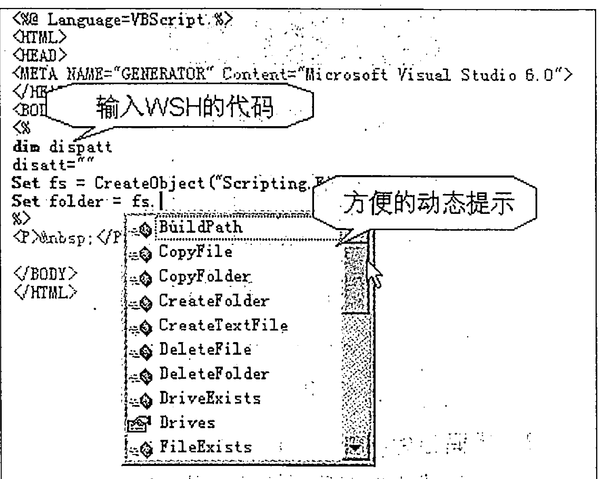

代码输入完毕后，将 “<%” 和 “%>” 定界符中（不包括 “<%” 和 “%>” 定界符）的内容选择并复制，如图 2 所示。

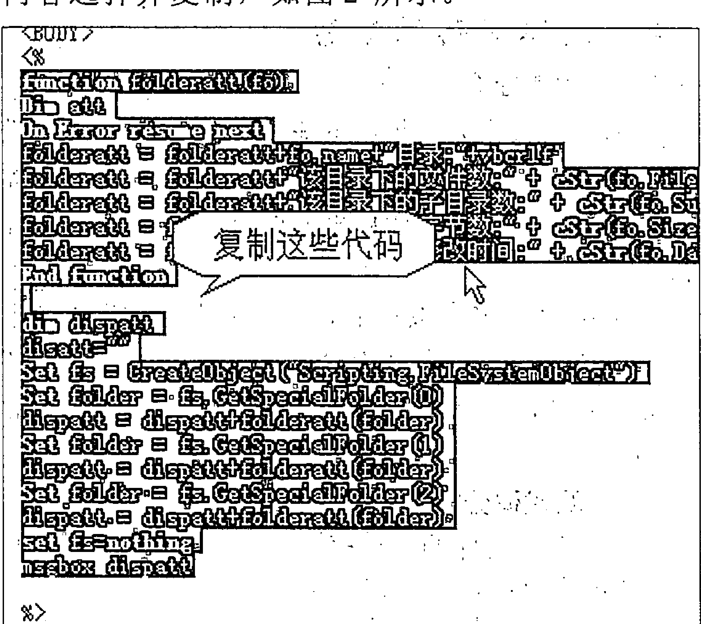

启动任何一种文本编辑器（如：“记事本”）新建文件，然后使用“粘贴”的方法，将 InterDev 中输入的代码粘贴至新文件。最后将新建的文本文件以 VBS 或 JS 为扩展名（视你所使用的语言而定）保存即可。

### （二）运行 WSH 文件

#### 1. 通过 Wscript.exe 运行

WScript.exe 是在 Windows 系统下直接运行 WSH 脚本的程序，它提供了窗口界面可用来设置脚本属性。WSH 的相关文件（如 VBS 文件及 JS 文件）一般默认和 WScript.exe 关联，因此可双击脚本文件直接执行或通过“运行”对话框来执行。

#### 2. 通过 Cscript.exe 运行

CScript.exe 是在 DOS 环境下直接运行 WSH 脚本的程序，它提供了命令行转换来设置脚本属性。在 DOS 下使用 CScript.exe 程序时，输入的命令行格式如下所述：

```
cscript [宿主选项……] [脚本名] [脚本选项及参数]
```

其中，宿主选项即选择使用或不使用多种 WSH 的特有属性，需使用“//”符号开头。由于在 DOS 下运行 WSH 很少使用，在此就不赘述了，有兴趣的读者可查阅相关资料。

## 三、WSH 常用对象

如前所述，WSH 使用的开发语言已是很多开发者熟悉的工具，因此本文对 WSH 的开发语言不做赘述，但 WSH 自带的一些对象却是全新的概念。这些对象封装了大量的 Windows API 函数和系统的底层功能，通过这些基本的对象即可开发出一些强大的批处理程序。

+   1.  WScript 对象
    Wscript 对象提供了对运行脚本的支持，并可创建各类组件对象，是 WSH 的基本对象。
+   2.  WshArguments 对象
    WshArguments 对象用于获取命令行参数的指针，该对象无直接的功能语句，可通过 WScript 对象的 Arguments 属性来调用。
+   3.  WshEnvironment 对象
    WshEnvironment对象用于获取Windows系统的环境变量，该对象无直接的功能语句，可通过 WshShell 对象的 Environment 的属性来调用。
+   4.  WshNetwork 对象
    WshNetwork对象可直接访问Windows的网络操作，用于控制远程网络驱动器和打印机的连接。
+   5.  WshShell 对象
    WshShell 对象是WSH开发的一个核心对象，该对象可创建各类快捷方式、访问注册表和获取系统的各类设置等。
+   6.  WshShortcut 对象
    WshShortcut 对象用于创建快捷方式对象，该对象无直接的功能语句，可通过 WshShell 对象创建快捷方式的 CreateShortcut 方法来调用。
+   7.  WshSpecialFolders 对象
    WshSpecialFolders 对象用于获取 Windows 系统中各类特殊文件夹的实际路径，该对象无直接的功能语句，可通过 WshShell 对象的 SpecialFolders 的属性来调用。
+   8.  WshUrlShortcut 对象
    WshUrlShortcut 对象用于创建引用 URL 的快捷方式对象，该对象无直接的功能语句，可通过 WshShell 对象创建快捷方式的 CreateShortcut 方法来调用。

上述对象提供的属性和方法在后文的 WSH 开发实例中将结合代码一起详细介绍。

## 四、WSH 开发实例

下面将结合大量的实例来详细介绍 WSH 的应用（本章所介绍实例，如无特殊说明，均在 Windows XP 下调试通过）。在开始之前，有几个问题请读者朋友注意。

+   1. 如果系统中安装了一些播放器软件或者一些网页编辑软件，有可能会修改 VBS 或 JS 文件的关联，此时可将 VBS 或 JS 文件的关联重新修改为 Windows 的 system 目录中的 Wscript.exe。
+   2. 如果 WSH 文件无法运行，可以在 http://www.microsoft.com/downloads/details.aspx?displaylang=zh-cn&FamilyID=0a8a18f6-249c-4a72-bfcf-fc6af26dc390 下载用于 Windows 98、Windows ME 或 Windows NT 4.0 的 Windows Script 5.6 安装包，或者在 http://www.microsoft.com/downloads/details.aspx?displaylang=zh-cn&FamilyID=c717d943-7e4b-4622-86eb-95a22b832caa 下载用于 Windows 2000 和 XP 的 Windows Script 5.6 安装包，安装后即可运行 WSH 文件。
+   3. 以下示例代码均使用的是 VBScript 语言。一些涉及到系统的操作会有一定的危险性，试验之前最好做一些适当的备份。
+   4. 所有实例的源代码都可以在本书配套光盘中找到。

### (一) 显示对话框

## 1. 程序简介

各类可视化程序均可显示一个简单的对话框，WSH 也可轻松实现。本程序运行后将显示一个对话框，如图 3 所示。

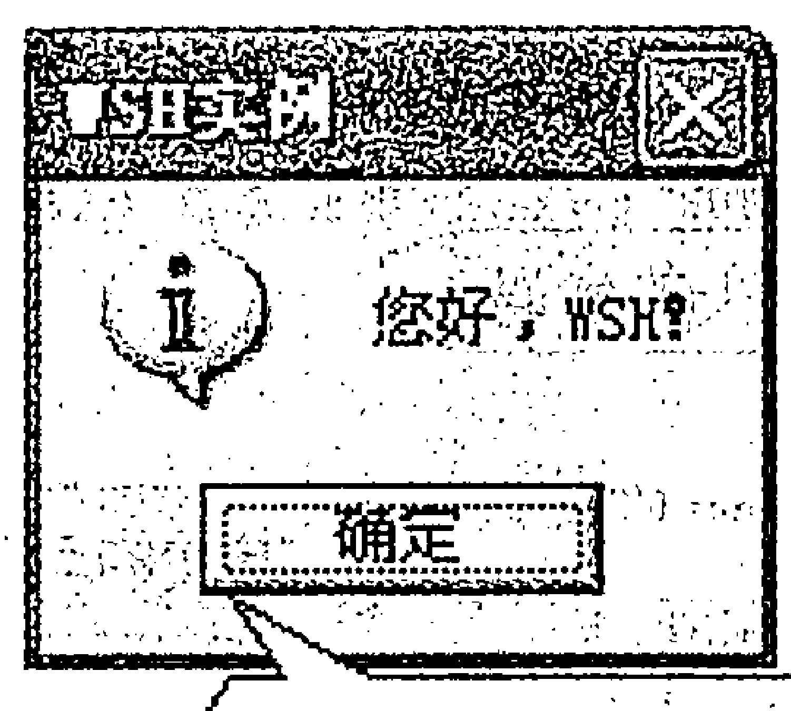

弹出的对话框
图3

## 2. 代码分析

```
WelcomeMessage=" 您好，WSH！ "
WelcomeText = "WSH 实例 "
' 显示提示信息
MsgBox WelcomeMessage, vbInformation, WelcomeText
```

### (二) 获取驱动器信息

## 1. 程序简介

通过 WSH 可方便地获取驱动器信息，从而实现随时监视驱动器状态的目的。本实例程序运行后将通过对话框显示当前计算机的所有驱动器的详细信息。

单击“确定”按钮后，程序在 WSH 程序文件同一目录下生成一个名为“驱动器详细信息.txt”的文本文件，文件内容即为对话框中显示的驱动器信息。

#### 2. 源代码分析

```
' 写文本文件的子程序
Sub writefile(detail)
    Set fs = CreateObject("Scripting.FileSystemObject")
    Set file = fs.CreateTextFile("驱动器详细信息.txt", True)
    file.Write detail
    file.Close
    set fs=nothing
End Sub
Sub dispdrvstat(drvname)
    Dim dn
    dn = Left(drvname, 1)
    Set drv = fso.GetDrive(dn)
    With drv
    Select Case .DriveType
    Case 1
        dn = "软盘"
    Case 2
        dn = "硬盘"
    Case 4
        dn = "光盘"
    End Select
    ' 将驱动器的各项信息加入字符串
    drvinfo = drvinfo+" 驱动器的类型:" + dn+vbcrlf
    If .IsReady Then
        drvinfo = drvinfo+" 驱动器的情况:已准备"+vbcrlf
        drvinfo = drvinfo+" 驱动器的未用容量:" + cStr(.FreeSpace / 1024 / 1024) + "MB"+vbcrlf
        drvinfo = drvinfo+" 驱动器的全部容量:" + cStr(.TotalSize / 1024 / 1024) + "MB"+vbcrlf
        drvinfo = drvinfo+" 驱动器的文件系统:" + .FileSystem+vbcrlf
        drvinfo = drvinfo+"驱动器的序列号:" + cStr(.SerialNumber)+vbcrlf
        drvinfo = drvinfo+" 驱动器的共享名:" + .ShareName+vbcrlf
    Else
        drvinfo = drvinfo+ " 驱动器的情况:未准备"+vbcrlf
        drvinfo = drvinfo+ "驱动器的共享名:" + .ShareName+vbcrlf
    End If
    End With
End Sub
' 获取所有驱动器对象的信息
Set fso = CreateObject("Scripting.FileSystemObject")
Dim drv
Dim drvs
dim drvinfo
Set drvs = fso.Drives
For Each drv In drvs
    If drv.IsReady Then
        drvinfo=drvinfo+drv.DriveLetter + ":\ [" + drv.VolumeName + "]"+vbcrlf
    Else
        drvinfo=drvinfo+drv.DriveLetter + ":"+vbcrlf
    End If
    call dispdrvstat(drv.DriveLetter)
Next
set fso=nothing
' 将驱动器的信息通过对话框显示
msgbox drvinfo
' 将驱动器的信息写入文本文件
call writefile(drvinfo)
```

## 3. 知识点回顾

+   (1) GetDrive方法
    该方法属于FSO对象，用于获取指定路径中的驱动器对象。其语法为：object.GetDrive(drivespec)。其中，Drivespec参数代表驱动器字符、加一个冒号的驱动器字符、一个驱动器字符加冒号和路径分隔符或任何网络共享名称，对于网络共享应检查该共享是否存在。
+   (2) DriveType属性
    该属性用于返回指定驱动器的类型，具体可返回“0”（未知类型）、“1”（可移动）、“2”（固定驱动器）、“3”（网络驱动器）、“4”（CD驱动器）和“5”（RAM虚拟驱动器）。
+   (3) IsReady属性
    该属性用于返回指定的驱动器是否已准备完毕，对于可移动驱动器和CD-ROM驱动器仅在插入盘并已准备可供访问时才返回True。
+   (4) FreeSpace属性
    该属性用于返回指定驱动器或网络共享驱动器的可用磁盘剩余空间。
+   (5) TotalSize属性
    该属性用于返回驱动器或网络共享驱动器的总空间。
+   (6) FileSystem属性
    该属性用于返回驱动器所使用的文件系统类型，目前可返回的类型包括FAT、NTFS及CDFS等。
+   (7) SerialNumber属性
    该属性用于返回惟一标识磁盘卷标的十进制序列号，可使用该属性确保正确的磁盘已插入到可移动驱动器中。
+   (8) ShareName属性
    该属性用于返回指定驱动器的网络共享名，如指定的驱动器不是网络驱动器，则返回一个0字节长度的字符串。
+   (9) DriveLetter属性
    该属性用于返回本地驱动器或网络共享驱动器的字母，如指定的驱动器未和某个驱动器字母关联，则返回一个0字节长度的字符串。
+   (10) VolumeName 属性
    该属性用于设置或返回指定驱动器的卷标名。
+   (11) Drives 集合
    该集合用于获取所有可用驱动器的集合。

### (三) 获取文件夹信息

## 1. 程序简介

WSH不仅可获取文件和驱动器的信息，还可获取文件夹信息。本实例程序运行后将弹出一个显示当前计算机中Windows目录、System目录和Temp目录详细信息的对话框。

## 2. 代码分析

```
' 定义获取文件夹属性的函数
function folderatt(fo)
    Dim att
    On Error resume next
    ' 将指定文件夹对象的文件数、子目录数和占用字节数依次加入字符串变量
    folderatt = folderatt+fo.name+" 目录:"+vbCrLf
    folderatt = folderatt+" 该目录包含的文件数:" + cStr(fo.Files.Count)+vbCrLf
    folderatt = folderatt+" 该目录包含的子目录数:" + cStr(fo.SubFolders.Count)+vbCrLf
    folderatt = folderatt+" 该目录占用的字节数:" + cStr(fo.Size / 1024 / 1024) + " MB"+vbCrLf
    folderatt = folderatt+" 该目录的最后修改时间:" + cStr(fo.DateLastModified)+vbCrLf
End function
dim dispatt
dispatt=""
' 创建FSO对象
Set fs = CreateObject("Scripting.FileSystemObject")
' 获取 Windows 文件夹的信息
Set folder = fs.GetSpecialFolder(0)
dispatt = dispatt+folderatt(folder)
' 获取 System 文件夹的信息
Set folder = fs.GetSpecialFolder(1)
dispatt = dispatt+folderatt(folder)
' 获取 Temp 文件夹的信息
Set folder = fs.GetSpecialFolder(2)
dispatt = dispatt+folderatt(folder)
set fs=nothing
' 将获取的文件夹信息通过对话框显示
msgbox dispatt
```

## 3. 知识点回顾

+   (1) Folders 集合
    该集合属于FSO对象，可返回包含在一个Folder对象内的所有Folder对象集合。
+   (2) GetSpecialFolder 方法
    该方法用于返回指定的特殊文件夹，并可通过常量来获取一些特殊的文件夹，如WindowsFolder (Windows文件夹)、SystemFolder (系统文件夹)和TemporaryFolder (存储临时文件的文件夹)。
+   (3) Files 集合
    该集合属于FSO对象，返回一个文件夹中所有的文件对象集合。
+   (4) SubFolders 属性
    该属性返回文件夹中的所有子文件夹集合，包括隐藏和系统文件属性的文件夹。
+   (5) DateLastModified 属性
    该属性返回最后一次修改指定文件夹的日期和时间。
+   (6) Size 属性
    对于文件来说，返回以字节为单位的指定文件大小。对于文件夹来说，返回以字节为单位的文件夹中所有文件和子文件夹的大小。

### (四) 获取网络信息

## 1. 程序简介

通过利用WshNetwork对象可方便地获取系统和网络的信息。本程序运行后，将通过对话框显示域名、计算机名和用户名并显示驱动器和打印机的网络映射信息，如图4所示。

## 2. 代码分析

```
' 创建WshNetwork对象
Set WshNetwork = WScript.CreateObject("WScript.Network")
' 设置EnumNetworkDrives参数集
Set oDrives=WshNetwork.EnumNetworkDrives
' 设置EnumPrinterConnections参数集
Set oPrinters=WshNetwork.EnumPrinterConnections
```

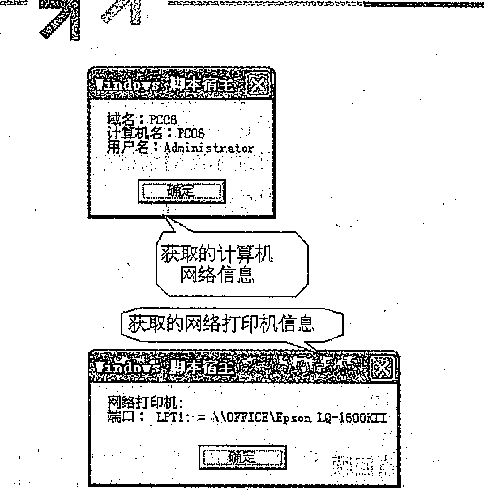

```
' 获取域名
netinfo=" 域名:"+WshNetwork.UserDomain+chr(13)
' 获取计算机名
netinfo=netinfo+" 计算机名:"+WshNetwork.ComputerName+chr(13)
' 获取用户名
netinfo=netinfo+" 用户名:"+ WshNetwork.UserName+chr(13)
' 通过对话框显示
WScript.Echo(netinfo)
' 如有网络映射驱动器，将网络映射驱动器的信息也显示于对话框
netmap=""
for i=0 to oDrives.Count()-1 step 2
netmap=netmap+"驱动器" + oDrives.Item(i) + " = " + oDrives.Item(i+1)+chr(13)
next
if netmap<>"" then
WScript.Echo(" 网络映射驱动器:"+chr(13)+netmap)
end if
' 如有网络打印机，也将网络打印机信息送至对话框
netprn=""
for i=0 to oPrinters.Count()-1 step 2
netprn=netprn+"端口: " + oPrinters.Item(i) + " = " + oPrinters.Item(i+1)+chr(13)
next
if netprn<>"" then
WScript.Echo(" 网络打印机:"+chr(13)+netprn)
end if
```

## 3. 知识点回顾

本例主要使用了 WshNetwork 对象的一些方法和属性，具体知识点如下所述：

- (1) AddPrinterConnection 方法
该方法用于映射远程打印机，如将网络打印机连接到LPT1端口，可用 “WshNetwork.AddPrinterConnection "LPT1", "\Server\Print1"” 语句来实现。
- (2) EnumNetworkDrives 方法
该方法用于返回网络驱动器的映射信息，当其中包含本地名和远程名时，第一个条目为驱动器盘符，第二个条目为网络映射信息，并适用于所有网络映射信息集。
- (3) EnumPrinterConnection 方法
该方法用于返回当前网络打印机的映射信息。
- (4) MapNetworkDrive 方法
该方法用于映射共享信息，如将 “Z” 驱动器映射为网络共享，可用 “WshNetwork.MapNetworkDrive "Z:", "\Server\Share"” 语句来实现。
- (5) RemoveNetworkDrive 方法
该方法用于删除连接的当前资源，如删除驱动器 “Z” 的网络共享映射，可用 “WshNetwork.RemoveNetworkDrive "Z:"” 语句来实现。
- (6) RemovePrinterConnection 方法
该方法用于删除当前连接的打印机资源，如将打印机的连接从LPT1端口删除，可用 “WshNetwork.RemovePrinterConnection "LPT1:"” 语句来实现。
- (7) SetDefaultPrinter 方法
该方法用于将指定的远程打印机设置为默认打印机，如将已连接到LPT1端口的网络打印机设置为默认的打印机，可用 “WshNetwork.SetDefaultPrinter "\Server\Print1"” 语句来实现。
- (8) ComputerName 属性
该属性用于获取计算机的名称。
- (9) UserDomain 属性
该属性用于获取用户域名。
- (10) UserName 属性

## （五）访问文本文件

## 1. 程序简介

通过 WSH 技术来访问 FSO（文件访问对象）可直接对文本文件进行各种操作。本实例将详细介绍使用 WSH 来创建、编辑文本文件的方法。本程序运行后，首先创建一个名为 wshtest.txt 的文本文件，内容有两行，第一行为“WSH 实例”，第二行为“写入文件”。然后程序将打开该文件，依次读入文件每行的内容并通过对话框显示。

## 2. 代码分析

```
dim fs
dim file
' 创建文本文件的子程序
Sub writefile
    ' 创建FSO对象
    Set fs = CreateObject("Scripting.FileSystemObject")
    ' 创建一个名为wshwrite.txt的文本文件，覆盖属性为True
    Set file = fs.CreateTextFile("wshtest.txt", True)
    ' 写入一行 "WSH 实例"
    file.WriteLine("WSH 实例")
    ' 写入一行 "写入文件"
    file.WriteLine("写入文件")
    ' 关闭文本文件
    file.Close
    ' 清除fs变量
    set fs=nothing
End Sub
' 读文本文件的过程
Sub readfile
    ' 以只读方式打开文件
    ForReading=1
    ' 以 ASCII 格式打开文件
    TristateFalse=0
    ' 创建FSO对象
    Set fs = CreateObject("Scripting.FileSystemObject")
    ' 打开wshwrite.txt文件，并使用iomode和format参数
    Set file = fs.opentextFile("wshtest.txt", ForReading, TristateFalse)
    ' 读入一行内容并显示在对话框中
    msgbox file.readLine
    ' 继续读入一行内容并显示在对话框中
    msgbox file.readLine
    ' 关闭文本文件
    file.Close
    ' 清除FSO对象
    set fs=nothing
End Sub
writefile
readfile
```

## 3. 知识点回顾

本例使用了很多 FSO 对象的方法和属性，具体如下所述：

- (1) CreateTextFile 方法
该方法用于创建一个文件读写的 TextStream 对象，该对象对应的文件名已由该方法的参数指定。
- (2) OpenTextFile 方法
该方法用于打开指定的文件并返回 TextStream 对象，可对文件进行读、写或追加操作。
- (3) ReadLine 方法
该方法用于在 TextStream 对象中读取一整行（至换行符但不包括换行符）并返回读取的字符串。
- (4) WriteLine 方法
该方法用于写入字符串和换行符至 TextStream 对象。

## （六）建立快捷方式

## 1. 程序简介

WSH 可方便地创建普通快捷方式或 URL 快捷方式。本例程序运行后，会在桌面上建立一个指向附件中的“计算器”的快捷方式和一个指向“电脑爱好者”网站的 URL 快捷方式，如图 5 所示。

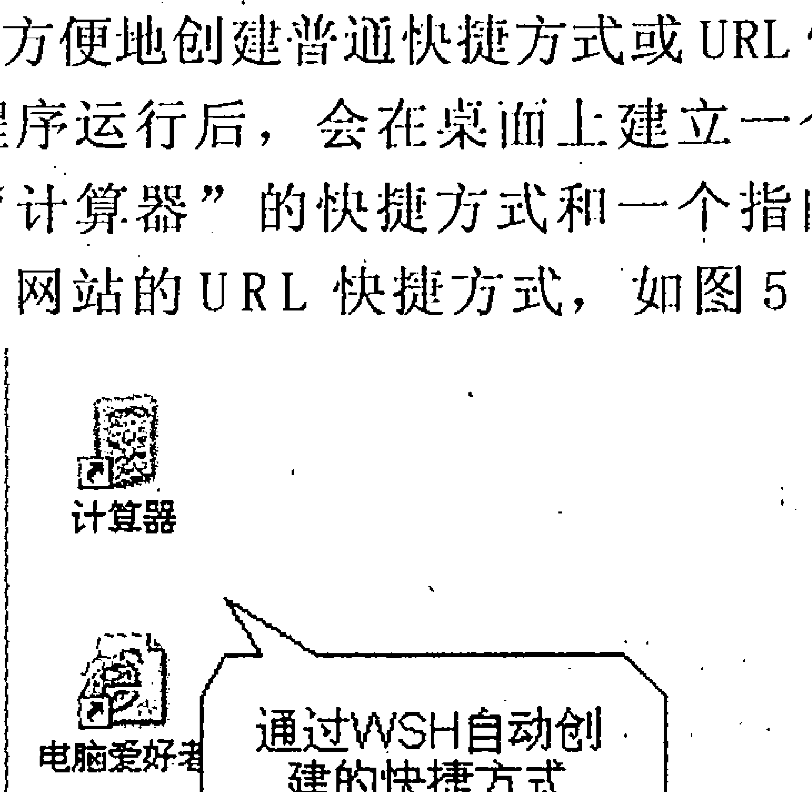

## 2. 代码分析

```
' 用 CreateObject 的方法创建 WshShell 对象
set WshShell = WScript.CreateObject("WScript.Shell")
' 获取桌面文件夹
strDesktop = WshShell.SpecialFolders("Desktop")
' 在指定文件夹创建 "计算器.lnk" 快捷方式
set oShellLink = WshShell.CreateShortcut(strDesktop & "\计算器.lnk")
' 设置快捷方式的目标程序
oShellLink.TargetPath = "calc.exe"
' 设置风格
oShellLink.WindowStyle = 1
' 设置快捷键
oShellLink.Hotkey = "CTRL+SHIFT+P"
' 设置图标
oShellLink.IconLocation = "calc.exe, 0"
' 添加快捷方式的注释
oShellLink.Description = "由 WSH 建立的快捷方式"
' 设置工作目录
oShellLink.WorkingDirectory = strDesktop
' 保存快捷方式
oShellLink.Save
' 在指定文件夹建立"电脑爱好者.url"快捷方式
set oUrlLink = WshShell.CreateShortcut(strDesktop & "\电脑爱好者.url")
' 设置 URL 地址
oUrlLink.TargetPath = "http://www.cfan.com.cn/"
' 保存 URL 快捷方式
oUrlLink.Save
```

## 3. 知识点回顾

本例主要介绍了 WshShortcut 对象的应用，该对象的常用方法和属性如下所述：

- (1) Save 方法
该方法用于保存快捷方式。
- (2) Description 属性
该属性用于设置快捷方式的说明内容。
- (3) Hotkey 属性
该属性用于设置快捷方式的快捷键，可直接用按键名称设置。此外仅在快捷方式放置在桌面或“开始”菜单中时才可使用快捷键。
- (4) IconLocation 属性
该属性用于设置快捷方式的图标位置，可使用索引方式，即 “Path, index” (“路径，索引”)。
- (5) TargetPath 属性
该属性用于设置快捷方式的可执行文件。
- (6) WindowStyle 属性
该属性用于设置快捷方式对象的窗体风格，包括激活并显示、激活并最大化显示和最大化显示等方式。
- (7) WorkingDirectory 属性
该属性用于设置快捷方式的工作目录。

## （七）模拟键盘输入

## 1. 程序简介

WSH 的 WshShell 对象不仅可创建各类快捷方式，还可模拟键盘输入。本实例程序运行后将启动 Windows 附件中的“计算器”程序并激活其窗体（需预先切换至英文输入状态），然后程序会模拟键盘输入，自动依次输入“1”，“+”，“3”，“Enter”，“*”，“5”，“Enter”并计算出结果，最后自动输入<Alt>+<F4>组合键关闭“计算器”程序，如图 6 所示。

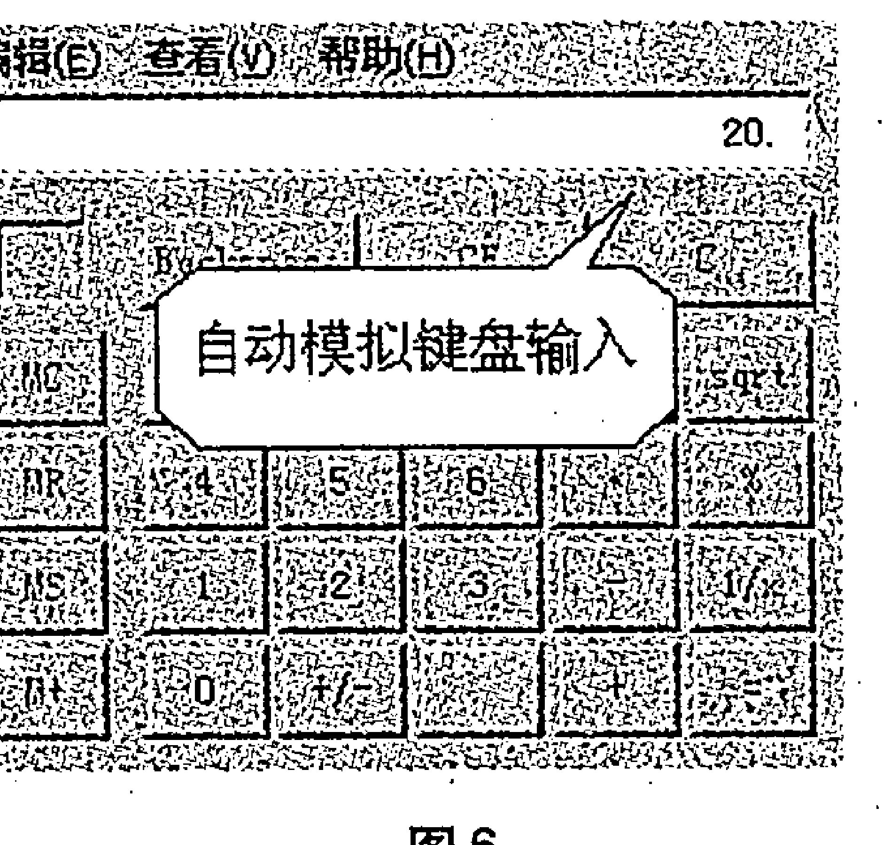

一定注意：运行本实例程序的过程中，不可切换至其他程序，即保持“计算器”程序具有焦点，否则会出现错误。

## 2. 代码分析

```
' 创建 WSHShell 对象
set WshShell = WScript.CreateObject("WScript.Shell")
' 调用“计算器”程序
WshShell.Run "calc"
' 等待100毫秒
WScript.Sleep 100
' 激活“计算器”窗体
WshShell.AppActivate "Calculator"
WScript.Sleep 100
' 模拟键盘输入“1”、“+”并送至计算器窗口
WshShell.SendKeys "1{+}"
' 等待 500 毫秒
WScript.Sleep 500
' 模拟键盘输入“3.”并送至计算器窗口
WshShell.SendKeys "3."
WScript.Sleep 500
' 模拟键盘输入“Enter”键并送至计算器窗口
WshShell.SendKeys "~"
WScript.Sleep 500
' 将用户通过键盘输入的 *5 送至计算器窗口
WshShell.SendKeys "*5"
WScript.Sleep 500
' 将用户通过键盘输入的 Enter 送至计算器窗口
WshShell.SendKeys "~"
WScript.Sleep 2000
' 键入“ALT+F4”关闭程序
WshShell.SendKeys "%{F4}"
```

## 3. 知识点回顾

本例程序主要使用了 WshShell 对象的一些方法，具体如下所述：

- (1) AppActivate 方法
该方法用于激活应用程序的窗口，可将焦点转移至指定的应用程序或窗口。
- (2) Run 方法
该方法用于执行其他程序，是 WSH 中的常用方法，并可设置程序运行时的样式及是否程序运行结束前就返回 WSH 脚本继续运行等，如运行“记事本”程序可用“WshShell.Run ("%windir%\notepad")”语句来实现。
- (3) SendKeys 方法
该方法用于模拟键盘输入，并将程序模拟的按键内容传送至活动的程序窗口。每个键均可由一个或多个字母代表，具体可查阅相关的帮助。
此外，本实例还使用了 WScript 对象的 Sleep 方法，该方法可使脚本在执行过程中进入停止状态，并在经过设置停止的毫秒数后继续执行。

## （八）设置 IE 浏览器首页

## 1. 程序简介

WshShell 对象功能很强大，除了上面所讲的功能外，还可轻松访问注册表，并可巧妙用于很多场合。本实例将通过修改注册表的方式来设置 IE 浏览器的首页，也实现了 IE 反修改软件的部分功能。
注意：对注册表的操作有一定的危险性，做尝试之前一定要做好各种备份工作。另外，Windows 不同版本的注册表结构也有所不同，必须查阅相关的帮助文档。

## 2. 代码分析

```
' 定义 shouye
dim shouye
shouye="www.cfan.com.cn"
' 用 RegWrite 方法将字符串写入注册表中作为 IE 首页的键值
Set WSHShell = WScript.CreateObject("WScript.Shell")
WSHShell.RegWrite "HKEY_CURRENT_USER\Software\Microsoft\Internet Explorer\Main\Start Page", shouye
```

## 3. 知识点回顾

WshShell 对象中对注册表的操作主要由 RegDelete、RegRead 和 RegWrite 方法构成，具体如下所述：

- (1) RegWrite 方法
该方法用于设置注册表的键值，可用于创建新的键值，目前支持 REG_SZ、REG_EXPAND_SZ、REG_DWord、REG_BINARY、和 REG_MULTI_SZ 的数据类型，且对于 REG_SZ 或 REG_EXPAND_SZ 类型时，该方法会自动转换为一个字符串型。
- (2) RegDelete 方法
该方法用于在注册表中删除键值，其参数必须以简写的键名开头，即“HKCU”（代表“HKEY_CURRENT_USER”）、“HKLM”（代表“HKEY_LOCAL_MACHINE”）和“HKCR”（代表“HKEY_CLASSES_ROOT”），而“HKEY_USERS”和“HKEY_CURRENT_CONFIG”则可直接使用。
- (3) RegRead 方法
该方法用于读取注册表的键值，目前支持 REG_SZ、REG_EXPAND_SZ、REG_DWord、REG_BINARY、和 REG_MULTI_SZ 的数据类型，如其他数据类型，则会返回 DISP_E_TYPEMISMATCH。

## （九）控制 Word 程序

## 1. 程序简介

WSH 技术可通过 COM 组件的方式来方便地控制很多提供 COM 接口的软件，如 Office 系列软件，这样可大大提高工作效率。本实例将介绍使用 WSH 访问 Word 提供的 COM 接口。

本程序运行后将显示一个提示框，单击“确定”按钮后将打开 Word 程序并在其中显示一些计算机的网络信息，如图 7 所示。

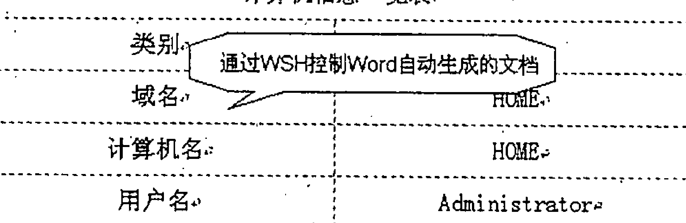

此外，由于本例使用了很多的 Word 接口控制知识，这些已不属于 WSH 技术讨论的范畴，读者可查阅相关的帮助资料（如微软的 VBA 开发帮助）。

## 2. 代码分析

```
WelcomeText="本脚本运行后将在 Word 中显示计算机的一些信息。"
WelcomeTitle = "WSH 实例"
' 显示提示信息
Call Welcome()
' 定义 Word.Application 变量
dim objWD
dim objDOC
dim counti
Set WshNetwork = WScript.CreateObject("WScript.Network")
' 启动 Word
Set objWD = WScript.CreateObject("Word.Application")
' 设置 Word 为可视
objWD.Visible = TRUE
' 增加一个文档
objWD.Documents.Add
set objDOC=objWD.ActiveDocument
' 设置格式为为居中对齐
objWD.Selection.ParagraphFormat.Alignment = wdAlignParagraphCenter
objDOC.Range 0, 0
objWD.Selection.TypeText "计算机信息一览表"+chr(13)
' 增加一张四行二列的表格
objDOC.Tables.Add objWD.Selection.range, 4, 2
objWD.Selection.TypeText "类别"
objWD.Selection.MoveRight
objWD.Selection.TypeText "值"
' 循环填写表格内容
for counti=1 to 3
' 移动 Word 中的编辑光标
objWD.Selection.MoveDown
objWD.Selection.MoveLeft
select case counti
case 1
objWD.Selection.TypeText "域名"
objWD.Selection.MoveRight
objWD.Selection.TypeText  WshNetwork.UserDomain
case 2
objWD.Selection.TypeText "计算机名"
objWD.Selection.MoveRight
objWD.Selection.TypeText  WshNetwork.ComputerName
case 3
objWD.Selection.TypeText "用户名"
objWD.Selection.MoveRight
objWD.Selection.TypeText WshNetwork.UserName
end select
next
' 将 Word 窗体最大化
objWD.WindowState = 1
' 选择全部文档
objWD.Selection.WholeStory
' 设置字体
objWD.Selection.Font.Name = "宋体"
' 设置字号
objWD.Selection.Font.Size = 14
' 设置对齐方式为居中
objWD.Selection.ParagraphFormat.Alignment = 1
' 取消全部选择
```

根据代码分析，本例在Word中创建了一个四行两列的表格，表头为“类别”和“值”，并填充了三行数据。表格内容如下：

| 类别 | 值 |
| :--- | :--- |
| 域名 | WshNetwork.UserDomain |
| 计算机名 | WshNetwork.ComputerName |
| 用户名 | WshNetwork.UserName |

objWD.Selection.MoveDown
' 显示提示信息的过程
Sub Welcome()
    Dim intDoIt
    ' 显示选择对话框
    intDoIt = MsgBox(WelcomeText, vbOKCancel + vbInformation, WelcomeTitle)
    ' 如用户选择“取消”
    If intDoIt = vbCancel Then
        ' 结束运行
        WScript.Quit
    End If
End Sub

### 五、WSH 出错信息参考

在编制、调试WSH程序时，难免会有错误，那么及时了解错误信息和出现错误的原因对快速纠正错误有很大的帮助，本节将介绍一些常见的WSH出错信息，供读者参考。

- 1. 错误信息: The shortcut path name must end with .lnk or .url
  中文含义: 快捷方式的扩展名必须为.lnk 或 .url。
  出错原因: 所创建快捷方式的扩展名错误。
- 2. 错误信息: There is no printer called "%1"
  中文含义: 没有找到打印机。
  出错原因: 默认的打印机名错误。
- 3. 错误信息: Unable to remove environment variable "%1"
  中文含义: 无法删除环境变量。
  出错原因: 需删除的环境变量不存在。
- 4. 错误信息: Unable to remove registry key "%1"
  中文含义: 无法删除注册表键值。
  出错原因: 需删除的注册表键值不存在。
- 5. 错误信息: Invalid root in registry key "%1"
  中文含义: 注册表键值无效。
  出错原因: 需读写的注册表键值无效或不可用。
- 6. 错误信息: Unable to open registry key "%1" for reading
  中文含义: 无法打开需读取的注册表键值。
  出错原因: 需进行读操作的注册表键值不存在。
- 7. 错误信息: Unable to write to wsh.log. Please check with your administrator
  中文含义: 无法写入日志文件，请检查文件管理权限。
  出错原因: 在调用 LogEvent 方法时，日志文件被锁定不可修改。
- 8. 错误信息: Unable to save shortcut "%1"
  中文含义: 无法保存快捷方式。
  出错原因: 保存的快捷方式或URL快捷方式已存在且为只读属性。
- 9. 错误信息: Protocol handler for "%1" failed to execute
  中文含义: 协议错误，无法执行。
  出错原因: 创建的URL快捷方式所指定的目标不符合已注册协议，不可执行。
- 10. 错误信息: Invalid syntax in URL: "%1"
  中文含义: URL语法错误。
  出错原因: 创建的URL快捷方式所指定的目标URL语法拼写错误。
- 11. 错误信息: Protocol handler for "%1" not found
  中文含义: 协议未找到。
  出错原因: 创建的URL快捷方式目标停滞，如等待运行另一个快捷方式、链接的URL未通过协议验证等。
- 12. 错误信息: Unable to execute - argument list is too long
  中文含义: 参数表过长导致无法执行。
  出错原因: 拖曳操作时脚本文件参数过多，无法执行。
- 13. 错误信息: Unable to wait for process
  中文含义: 等待停止。
  出错原因: 操作过程不可等待。

### 六、结束语

通过本文的学习，相信读者能对WSH这一功能强大的批处理语言有比较完整的了解，并可在此基础上充分利用WSH，结合Windows提供的大量组件来开发出提高工作效率的各类新一代批处理程序来。

## 2003年度经典游戏回顾
文/疾风之狼

- * 2003年度经典游戏目录
- CS 1.6
- 魔兽争霸3——冰封王座
- 家园2
- 仙剑奇侠传3
- 战地1942——二战秘密武器
- 传奇3
- 大海战II

时近岁末。在这一年中，我们不知不觉和众多游戏亲密接触。在这些游戏里面，又有哪些使你眼前一亮，爱不释手呢？对于我们这些游戏玩家来说，又有多少游戏是难以忘怀的？为了使大家对过去一年的游戏大作有个全面的概念。老狼从众多游戏中挑出了几颗耀眼夺目的明珠，奉献到众玩家的眼球前。

### 一、CS 1.6

出品厂商: Sierra(雪乐山)
游戏类别: FPS(第一人称射击类)

介绍这个游戏的理由可能不用多说，CS 反恐精英不愧是继星际争霸后，游戏业的又一个奇迹。尽管有人说它模式简单，也有人说他暴力血腥，但是一个不争的事实却是，自从2001年CS发售以来，已经使得无数玩家沉迷在电脑前的厮杀，走进网吧，你能听到GOGOGO, FIRE THE HOLE的喊杀声此起彼伏……

不夸张地讲，时下到大街上随便叫一个十几岁的孩子，问他知不知道Doom、Quake，你多半看到的是一双惊诧的大眼睛和一脸的迷茫，甚至问他Half-Life听说过吗，他也会摇摇头。可要是问他CS玩过吗，他很可能会对你说：“你敢跟我单挑嘛？！”。同时随着玩家群体的壮大，CS还造就了一批著名的“游戏明星”。如著名的AWP天才Jonny.R，被广大CS玩家奉若神明。而10月19日，世界知名的CS战队访华，受到了如同明星般的欢迎。
这就是CS，一个有着黑洞般引力的磁场。
Valve Software在9月12日～16日之间，推出了CS 1.6安装版和游戏完全版本，本作是继CS 1.5版推出的升级版本。也是CS系列里面变化最大的一次。首当其冲的就是彻底摒弃了仅依靠WON协议的认证系统，取而代之地采用了Steam在线系统。同时HLTV也去除了WON协议认证单元，因此CS 1.6的注册、完成安装、认证均需要通过Steam来完成。这同时意味着如果你的电脑不具备连接Internet的条件，那么对不起，CS1.6的大门不向你打开，就算自己建单机玩玩也没戏(而且现阶段也没有针对1.6的机器人补丁)。最后，今后官方对CS 1.6的更新不必采用释放补丁包的方式，每次进入游戏前都会自动与Steam服务器进行版本验证，进行更新下载，这一点倒是颇为方便了玩家。

各位玩家可以从URL http://www.steampowered.com/getsteamnow.htm下载安装包。注意，这次CS1.6的安装和以前有些许不同。在安装完毕后，要进行一次在线注册过程，如图1所示。而这也是很多玩家反应问题最多的地方。

点击Create new account按钮，进入新窗口，在这里，玩家要填入自己的邮箱地址作为自己的用户名，所以你最好是填入一个有效的邮箱地址，日后如果修改密码或者获取Steam相关信息都要依赖这个邮箱。

安装完毕后，进入Stream系统界面。点击游戏(GAME)，会显示游戏列表菜单，玩家需双击对应的游戏进行添加即可，这时会提示你输入游戏的CD-KEY。如果填写CD-KEY是盗版号，就会有一封告知你使用的盗版CD-KEY的信件发到你的邮箱。很明显的，CS1.6应用了STREAM在线系统后，实际上可以很容易的将使用非正版CD key的玩家拒之门外。你想建个本地游戏练练枪法都没门。

进入CS 1.6，最直观的印象就是游戏的贴图质量大大提高。新的材质贴图更加复杂，画面效果也趋向于真实，与之前相比简直是天壤之别。尤为叫人安慰的是，以前那个游戏过程中切换桌面后再返回游戏就没有声音的毛病，此次在1.6版本中，终于得到根除。总算是去了广大玩家的一块心病。不过玩家最感兴趣的，恐怕还是在CS1.6中增加了什么新装备。那好，让我们先从新增枪械开始介绍。

警（CT）这一方加入了法制CLARION 5.56自动步枪，口径与M4A1相同，射速很高，每分钟1100发，25发弹夹，伤害比M4A1略低一点，购买顺序为B41。和M4相比，它的威力、准确程度都不占优势。但是它价钱是2250元（比AK还要便宜）。可以说不管第一局输赢，CT都可以在第二局买一只CLARION，来和T的AK抗衡，毕竟这是自动步枪，比MP5要强太多了。那些抱怨CT枪太贵的人现在满意了吧？

再来看看匪（T）这边，新加入了以色列的IDF DEFENDER自动步枪，弹夹容量35发，射击频率每分钟675发，子弹伤害与CT的新枪相当。虽然没有特殊功能，但在游戏中可以打穿木箱和墙壁边缘。购买顺序为B41，原来的AK47变成B42购买。在游戏中，这把枪的表现要好于CT的CLARION，是一把令CT头痛的枪。它的价格同样也很便宜，仅2000元。对比它强劲的火力来说，的确是一支性价比非常好的枪。

如果用3个非常变态来形容盾牌不是没道理。盾牌是那样的恐怖...它只能由CT一方购买，除了雷以外可以100%地挡住正面所有枪械的攻击。包括穿透力最强的AWP。

现在你是不是也觉的点恐怖？虽然购买了盾牌后就不能装备主要武器了，所以现在CS 1.6服务器上用盾的玩家都喜欢配威力较大的沙漠之鹰，瞅准机会移开盾牌，给对手致命一击后又缩回盾里。经常会出现T端着把AK47把一梭子子弹都倾泻到CT的盾牌上，结果CT毫发无损，然后趁T换子弹间歇一枪“爆头”。2－3个持盾的CT在前面强行突破，后边跟着拿重武器的CT就开始大开杀戒。基本上，只要配合得当，CT想突破那里都是肯定成功的。

除了这些游戏的固有设定以外，盾牌的Bug也成为它的一大罪状。目前已知的Bug有两个：当手持盾牌的CT为手枪换子弹时扔掉盾牌，上前一步捡起来时子弹自动装满，由此可以保证持续不断的火力。其二，当购买盾牌且配备沙漠之鹰时，即使在开盾的情况下仍然可以挡住攻击的子弹！具体方法是：当CT时候买盾牌然后买沙漠之鹰，之后按右键就可以躲在盾牌里面进行开枪~！好啦，你现在无敌了，冲入敌阵，把T杀个干干净净！恐怖吧？

总体来讲，盾牌的出现，让很多玩家极为不满，认为大大削弱了以进攻为主的T方，让CT面对T时更加有恃无恐。鉴于CT盾牌的诸多问题，目前许多开始进行CS 1.6比赛的赛事都明确表示，比赛时屏蔽盾牌，否则无法兼顾比赛的平衡性。是啊，如果长此下去，叫我们T怎么活啊！强烈呼吁Sierra调整盾牌属性，至少不能刀枪不入。要不，就给T配属火箭弹。

其它地方的细微变化还有：枪械的购买顺序变了，如著名的沙漠之鹰(13)现在的购买顺序变为14，当T时AWP的购买顺序变成45。

此外。CS 1.6中对匕首这个默认武器也进行了重新设计，样子更酷了，攻击的动作更趋向真实。当玩家持匕首一段时间而没有做出任何攻击时，会作出一个用拇指轻触刀刃的动作。

### 二、魔兽争霸3——冰封王座

- 游戏类型：RTS(即时战略)
- 制作公司：Blizzard(暴雪)
- 发行公司：Blizzard(暴雪)
- 发行日期：2003-7-20
- 官方网站：http://www.blizzard.com

《冰封王座》是凭借星际争霸成为即时战略霸主的暴雪公司在去年推出的超级即时策略大作《魔兽争霸3》的资料片。关于《魔兽争霸3》。我想已经不用多费笔墨。精美的画面、气势恢宏的音乐、宏大的故事、优秀的平衡性和独创性的战争战术系统，无可争议地成为了去年即时策略游戏的最强音。而今年资料片《冰封王座》的推出，使得众多喜爱RTS游戏的玩家兴奋不已。所以如果不介绍这款游戏，恐怕不高兴的玩家会很多。

作为资料片，善于讲故事的暴雪这次又为玩家们献上了一个曲折动人的诗篇：本作冰封王座的剧情衔接上作，时间设定在阿克蒙德(Archimond)及其燃烧军团(Burning Legion)在海加尔圣山战役被击败的几个月后。这时一种邪恶的新力量威胁着艾泽拉斯(Azeroth)。虽然邪恶的耐奥祖(Ner'zhul)的躯体已经不复存在，但是他的灵魂还继续存在，因此他正在冰河的深处又一次策划着他的阴谋诡计。随着故事的发展，玩家很快就会看暗夜精灵的叛徒伊利迪安(Illidan)，邪恶的死亡骑士阿尔塞斯(Arthas)都争分夺秒地寻找耐奥祖(Ner'zhul)以及蕴藏在冰河中的神秘力量。一场围绕着冰封王座的强者争霸随即展开。

游戏里面的战役分三个阶段，玩家要围绕暗夜精灵、人类和不死亡灵来展开游戏。而兽人没有自己独立的战役，这不知会不会使得兽人的支持者不满呢？

暴雪的美工以及音乐的功力可能没有人会怀疑，此次《冰封王座》的音乐旋律全部选用了交响乐和古典风格。那种剑拔弩张的压迫感和浩大声势给人带来的震撼令人难以用语言形容。同样，与恢宏浩大的音效相得益彰的，是出色精美的图像效果，尤其是经过优化，重新加工的光影特效，更是叫人大饱眼福。

游戏中单位数据的平衡性在经历了长期的测试后，可谓已经几近完善。对于刚刚接触冰封王座的玩家来说，很多变化都是很新颖的，比如法师也不再具有物理伤害。这就意味着很多在魔兽争霸3——混乱之治里面很有效的战法如今要改改啦。

新作中最吸引玩家的，恐怕就是每个种族新增的英雄了。在前作魔兽争霸3——混乱之治中，每个种族都有这样那样的缺陷。而这次在冰封王座中出现的英雄，则是为了弥补各个种族的劣势而新增的。下边我们来介绍一下这些新增英雄。

#### 1. 人族——血魔法师

许多研究斯多葛派哲学的高级精灵仓惶逃出他们世代居住然而不幸陷落的家园Quel' Thalas，屈服于自身的憎恨和绝望，陷入他们追求魔力的本性的黑暗面。这些冷酷的避难者自称“血精灵”，他们搜寻着能够提升他们残存的魔法力量的方法，不计任何代价。

这个英雄是一个典型的魔法系英雄。他会使用以下四种技能：

烈焰之击：在施法区域可造成数百伤害的区域性魔法。给位于施法中心的敌人造成最大的伤害。与大法师的暴雪不同，烈焰之击是不可打断的。而且是一段时间内就可以给被施法者造成很大的伤害，所以这是一个比暴雪更为可怕的大面积杀伤魔法。在最高级，烈焰之击可以在瞬间消灭暗夜弓箭手之类的单位，所以为了平衡这个技能，暴雪为这个技能设计了延长的施法准备期。

放逐：将一个单位变为一个鬼魂，将其从游戏中踢出，在一定的时间内保护这个单位或使其变得无用。

魔法盾：在血巫周围建立一个屏障替他吸收物理攻击和魔法攻击的伤害，每级都有30秒持续时间和20秒施法间隔。

终极技能——火魔之痕：将任意一个己方单位转化为一只会飞的，有大量生命值并能造成大量伤害的火凤凰。这种凤凰一次只能召唤一只，即使其在战斗中不被对方干掉，也会在四分钟的施法有效期后涅槃。

#### 2. 兽族——影子猎手

一些隐遁的，足智多谋的丛林巨魔在他们各自的战斗部落中享有最崇高的威望。他们是巫毒魔法（Voodoo）的大师，善于使用精神力量祝福治疗盟友、将诅咒降临到他们不幸的敌人身上。戴着他们的仪式面具 rush' kah ——借此传送暗黑力量——影子猎手游走于光明与黑暗之间，盼望拯救他们野蛮兄弟的未来。

影子猎手的出现，在一定程度上弥补了兽人部队在前期无法补血的缺点。除了使用治疗波为己方单位补血之外，他还可以使用以下的几种技能。

施魔：就像变羊的野生生物版本，施魔目前只有很少的魔法消耗和施法间隔。被施法单位的生命值和装甲值不变，但要根据影子猎手的等级，保持野生生物状态15到30秒。施魔可将对方转化为一个随机的小动物，而不仅仅是一只羊，暴雪的ROPER为我们展示了将敌人转变为一只老鼠，然后是一只螃蟹，最后又变为一只企鹅。被施法的飞行单位不能被彻底干掉。

眼镜蛇守卫：眼镜蛇守卫，这个就类似于低成本的箭塔！他们射出火球造成可观的伤害，但只有100点生命值，他们很容易被敌人的物理攻击干掉（尽管他们魔法免疫）。如果影子猎手在己方后方设置一些眼镜蛇守卫的话，他们将为兽人提供令人生畏的远程火力支持。

终极魔法——VOODOO伏都：这是一个极端强大的魔法，并且是持续性的。施展时，施法者被强迫原地不动。伏都使整个屏幕内的所有单位无敌。对友方进攻单位来说，这是一个好消息，但对影子猎手来说，这可是一个坏消息。由于无敌的单位不会成为敌人的目标，影子猎手就沦为整个屏幕上敌人可以攻击的唯一目标！在这个魔法失效前利用无敌的部队保护影子猎手将是非常重要的。能持续30秒！

#### 3. 暗夜精灵——守护者

这些神秘的守护者在精灵族中充当着特别警察的角色，这些守护者被雇用来成为狱卒、刺客或是猎手。一旦自己的猎物跑失，这些守护者超凡的能力可以使他们再次捕获到逃跑的犯人并施以精灵族似的惩罚。

这是老狼最喜欢的一个新增英雄了，除了外形PP以外，实力也是相当的不俗。作为暗夜精灵的敏捷形英雄，可以自如出入敌阵，取上将首级——确实是居家旅行、谋财害命的首选英雄。她可以施展的技能如下：

刀阵旋风：发出扇形刀刃攻击数个敌人。

瞬移：使守护者短距离跳跃的传送技能。这一招对实施HIT AND RUN（游击战）非常有用。同时也可以用来对付没有血了的正在撤退的敌方英雄。

阴影之击：对先前的伤害施加更致命的攻击，并随时间的延续持续伤害。第一击造成225点伤害，并有45点延续伤害。这招对试图逃跑的敌人英雄非常有效，结合上边介绍的瞬移魔法，一个瞬移跳过去，使用阴影之击，然后跳回来，你就可以看着敌人的慢慢挂掉。

终极魔法——复仇之魂：这是一个非常霸道的魔法。使用该技能，守护者可以召唤出一个强大的复仇之魂，本身具有强大的战斗力。当双方激战尸体横陈的时候，复仇之魂还可以收集战死者的灵魂并把他们转化为一个个“复仇灵魂”。在一定的时间内，这些“复仇灵魂”是无敌的。只有当魔法时间已到或者是复仇之魂被消灭，这些“复仇灵魂”才会消失。想想看，当你和暗夜精灵激战正酣，死伤惨重的时候，忽然出现大批无敌的“复仇灵魂”绝对不是一件开心的事。

#### 4. 不死亡灵——地穴领主

这种古老邪恶巨大的地下生物是地下蜘蛛王国阿思隆·奈拉的强大君王。在那场传说中的蜘蛛战争时里，纳勒俾被狂暴的巫妖王攻陷以后，阴险狡诈的地穴领主便成为了巫妖王的手下，并被赋予了无穷的力量与亡灵的永生。现在，这些异乎寻常的猛兽作为最凶悍的武士效力于巫妖王手下，并充当纳瑟加德要塞的“天灾”军团的守护者。

对此种族不是很“感冒”。所以对这个新增英雄没什么好说的。

穿刺：施加在一个敌人身上，把敌人扔到天上，并将其钉在地穴领主的一只尖利的前肢上，从而造成大量伤害，并使目标眩晕几秒钟。实际上，这还是一个用来逃命的好方法，当己方英雄快没血的时候，使用此技能，可以把追击的敌人全部刺到天上，等他们回过神的时候，我们的大甲虫早就逃之夭夭了。

刺盾：地穴领主钻入地下攻击敌人，在地下时，地穴领主只有在攻击时才能被对手发现，这有点像精灵狼。钻地后，地穴领主发出尖刺攻击敌人，成线形的造成伤害。另外，地穴领主还可以通过升级这项技能获得额外的装甲。与天神下凡和魔化金身类似，刺盾也是一种变身技能。

腐蚀甲虫：使地穴领主可以从地面上任意一具尸体上召唤一只甲虫。随技能的升级，所召唤的甲虫将增强，同时，地穴领主可召唤的甲虫数目也将增多，目前，甲虫具有普通一级单位一半的生命值可造成中等的伤害，他们还有钻地的技能，使他们能快速的恢复生命，并可成为一个固定的隐型侦察兵，这些甲虫没有时间限制，在被消灭之前是永远存在的。虽然甲虫的战斗力实在有限，可作为免费的侦察兵，还是相当划算的。

终极魔法——蝗群：在地穴领主周围召唤一大片蝗虫，给攻击区域内的敌人造成伤害。蝗群将随地穴领主移动，使敌人很难逃脱他们的攻击。这个魔法施展起来，可是很有当年星际争霸中PROTOSS航母的风范。

总之，新英雄的出现，使得我们在选择英雄时有了更多的变数。英雄之间的搭配组合也有了更多战术，由此产生很多新的战法和配合，给游戏增添了很多乐趣。比如老狼常常使用山丘之王和血魔法师的组合。由山丘之王使用“雷霆一击”将对方英雄砸晕，此时使用血魔法师在被击晕的敌方英雄身上施用烈焰。一下子就可以消耗掉敌方英雄60%左右的HP，而且还能对英雄旁边的地方单位造成伤害。

#### 5. 新增兵种介绍

除了新增英雄外，冰封王座还增入了很多陆空兵种，也都极富创意。善用这些兵种可以使你实力大增。下面来介绍几种极富特色的新增兵种。

##### （1）人族

魔法打断者：这些狡诈的血精灵精通施法的艺术，以至于达到了对即使是最强大的魔法都免疫的境界。结合他们凶猛的格斗技能，这些魔法免疫的打断者面对施魔的敌人敢冲敢杀。然而，这些魔法打断者最令人惊讶的技能是他们居然可以窃取敌人的有益法术并将其转移到友方身上。这种离奇的技能将不止一次的帮助血精灵们在战斗中扭转战局。

龙鹰：先前在前作的亡灵战役中出现过的龙鹰是人类肩负攻城任务的空军。可空对空攻击，但他最有效是在敌人的防御塔楼上施展迷雾技能。这个技能可以挡住敌人视线，并允许单位安全穿过敌人防御。只要施法者保持固定，这个云雾技能就一直持续下去！龙鹰的另一技能是锁定，可以将对方空中单位锁定，然后你就可以一直K它到死。怎么样，龙鹰骑士简直就是星际争霸中海盗船和幽灵兵的和体。

##### （2）暗夜精灵

山岭巨人：这些身体庞大的家伙们是可以媲美牛头王的“肉盾”型兵种。超长的HP可以使他们能够抗住敌人的打击，庞大的身躯可以把那些企图攻击己方英雄的敌人统统挡在外边。好了，现在你的英雄可以在肉盾的保护下，悠哉游哉的施放魔法啦。除此之外，山岭巨人还可以使用以下的技能。

辱骂/嘲笑：使用时，把所有的攻击者转移到巨人身上，施法者（巨人）可继续干他的工作，而其他因此被保护的相对较弱小的单位可以躲在巨人身后肆无忌惮的攻击。这个技能在巨人死亡或敌人将集中攻击到巨人外的单位上时结束。

拔树：这项技能能使山丘巨人立即从周围拔起一棵树木，拿着树的巨人从而对建筑物具有更大的破坏，用一棵可以维持15下敲击。

磐石皮肤：减少穿刺伤害的被动技能。

抵抗皮肤：减少敌方对巨人魔法攻击的破坏，并对某些魔法免疫。

仙龙：仙龙将帮助暗夜对付敌人的法师单位。仙龙是魔法免疫单位，他是拥有标准攻击的空军，有独特的魔法闪耀技能，在他的肉身状态下，拥有魔法闪耀的仙龙将给一定区域内的敌人施法者施加伤害，因此，成群的暗夜在有可能面临范围伤害魔法威胁的时候，使用仙龙助阵将是明智之举。

##### （3）兽族

骑蝠战士：具备特殊对空能力和攻城能力的……兽人新空军，拥有火液和自杀两种技能，其中后者的用途颇象星际争霸中虫族的自杀机。在作战中将他引入一群敌人空军中引爆。可能搭上好几个敌人空军作为陪葬。

猎头狂暴者：万能的掷矛兵，能对空中部队造成严重的打击，而且作为游戏初期就可以招募的兵种，猎头狂暴者无疑加强了兽族在游戏中前期的防空能力。

## (4) UNDEAD——不死

腐蚀甲虫：由地穴领主从尸体上召唤的肉搏单位，在被干掉前，这些甲虫会一直存在，当然，他们的战斗力可以说不值一提，但是他们拥有钻地技能。在钻地后，敌人很难发现他们。这个技能使他们能快速的恢复生命，并可成为一个固定的隐型侦察兵，就象星际里的虫族。

骷髅法师：由亡灵男巫从尸体上召唤而来；亡灵的男巫获得了一种新的升级：允许他们召唤一个骷髅法师和一个骷髅战士，而不是两个骷髅战士。这项升级为战斗中更有效的利用骷髅提供了便利，因为，躲在骷髅战士身后的骷髅法师是远程攻击的！

黑曜石雕像：不死族新增的强悍辅助单位，其特点是可以在战斗中恢复友军的生命和魔法值。

在冰封王座中，战斗的结果越来越多的取决于你是否能够合理有效地搭配不同的兵种。那种仗着自己手快，在游戏中出单一兵种的兵海淹没对手的打法如今可是不大灵光了。

## 6. 其他

那些一直关注魔兽争霸3——冰封王座的朋友可能早就听说过熊猫仙了。作为国宝，真是没有道理不介绍它。

在本作中，熊猫仙是作为中立英雄出现的，同时新增的中立英雄还有亡灵射手、兽王、深渊领主等。作为一类新的单位概念。中立英雄只有在那些设定有酒馆的地图里面才能招募。

体形魁梧的熊猫仙在冰封王座中是作为凶悍的肉搏型英雄出现的（和大家印象中憨态可掬的形象可能有较大出入）。但绝对是一副地道的中式打扮，长袍马褂的形象有板有眼。说到这里，还有一段花絮：本来暴雪设定的熊猫仙是一副日本武士的造型，后来在国内玩家的一致要求下，才改为颇具中国特色的马褂造型。由此可见暴雪开明的销售理念。否则，当国内玩家看见本国的国宝挥舞着武士刀的时候，会不会影响暴雪在玩家心中的地位呢？

其它较大的改动还有：每个种族都可以建造自己的宝物商店，以前需要到外边购买的宝物，现在在基地就可以买到，这下各位玩家可以不用冒险去野外的宝物商店买东西，而被对手伏击了。

### 三、家园2

- 出品厂商：Sierra(雪乐山)
- 游戏类别：RTS(即时战略)
- 游戏开发：Relic
- 游戏发行：Sierra Entertainment
- 正式版发布日期：09/17/2003

《家园2》是 Sierra 公司今年为我们做的第二道“盛菜”。说来也怪，2003年 Sierra 带给我们的游戏大作，竟全都是一些过去作品的续作。是否说明 Sierra 的创意矿脉已经掘尽了？

玩过家园1的玩家都有记忆，当这款即时战略的大作展现在我们面前时，带给我的绝对是一种耳目一新的震撼。在大家还沉醉在星际争霸、帝国时代那样的2D世界时，家园已经率先使用了全3D引擎，给大家带来的视觉冲击也是前所未有的：广阔的宇宙中，几艘飞船在无限伸展的空间中爬升，给人一种荒凉和孤寂。

既然是 RTS，那么一个比较好的游戏剧情是必不可少的。

游戏开始，Kushan人在Kharak星球的一个坑洞中挣扎残喘。偶然间，他们找到了一件远古遗留下来的宝物，上面绘有他们以前家园的图案。这时，Kushan人才知道自己原来并不是Kharak星球上土生土长的居民，而是来自一个叫做 Hiigara 星球的遥远世界。不久之后，还处在纷争中的Kushan人开始在目前所在的星球上建造太空飞船，以便能够赶快离开这个星球，找到属于自己的家园。可是，他们并不知道自己是被放逐的并且在其它星球上不受欢迎的种族。事实上，即便知道了这一点，他们也并不在乎。他们只是一心一意地要返回自己的家园。在建造了一艘巨大的飞船之后，Kushan人由勇敢的 Karan Sjet 带领，离开 Kharak星球，开始了他们寻找最终目的地的艰难历程。历经数战，成千上万人死去了，Kushan人成功地驱逐了企图阻止他们返回家园的 Taiidan 政府势力，终于成功地抵达了 Hiigara。

在返回家园100年后，Hiigaran文明兴旺发达起来。在没有敌人和阻碍的情况下，他们的领地扩展到了整个银河系。可是，邪恶的事情又开始萌生。一群新的敌人Vaygr族人突然出现了，他们不断侵袭当地Hiigaran平民，给Hiigara造成了很大的威胁……说到这里，心急的玩家一定想要知道后面又继续发生了什么样的事情。不过，Relic Software并没有过多地透露有关这个新种族的消息，他们只是提到玩家或许可以在先前的游戏中找到一点线索。明显的吊大家胃口么！！不过不管怎样，玩家在游戏可以认准的一件事情就是保护自己家园，和侵略者展开殊死的战斗。

作为家园的续篇，《家园2》在秉承了《家园》优秀的视觉效果的同时，将其做得更为精美细致。新的材质贴图更加复杂，画面效果也更加趋向于细腻。舰船的外形更加考究。而且你在抵近观察的时候，甚至可以看见战舰舰体上由于对方攻击造成的损伤。此外，游戏中发射、爆炸的效果更加逼真。所有的这一切配合着浩瀚的宇宙背景、气势恢弘的舰队、精美的动画效果、情感丰富的音乐，将一副浩大的宇宙战争的恢宏场面完美地营造给诸位玩家。

尽管当年的《家园》以其惊人的视觉效果折服了很多玩家，但是它操作复杂、难于上手的缺点还是遭到了玩家的诟病。此次《家园2》将游戏的操作设计得更为紧凑和简单。在前作中，我们首先要选择自己要指挥的单位，然后使用相应的热键来操作，如M就是移动，这种不太“友善”的操作的确使得一些对《家园》感兴趣的玩家望而却步。

而在家园2中，玩家仅仅使用鼠标即可完成行动，指定作战目标的操作比前作不知方便了多少。除此之外，游戏界面经过改进，比原作更加流畅顺手，它允许玩家用最有效率的方法操作大量分布在地图各处的舰船。按住Shift键，能让自己的军队上下移动，按住鼠标左键不放，也可达到相同的效果；空格键可在多种视图中切换，视角变换极度平滑，毫无迟滞感。使用鼠标，你还能放大缩小地图，甚至调整视角的方向，寻找优越位置，或是瞄准某一艘飞船，接着扯近画面，观察它的每一个细节。

作为续集，《家园2》除保留一些前作的武器外，还引入了大量的新飞船和装备，为游戏带来了新活力，由此产生的新战术和新思想，就要由玩家在游戏中慢慢领悟了。在这里我们着重介绍几种有特色的装备。

战列巡洋舰（BATTLE CRUISER）：这是《家园2》中出现的终极战舰，看见它庞大的身躯，众多的炮塔。我想所有的玩家都会明白他的特点的——那就是装甲厚、火力强，是游戏进行到后期，用于舰队决战的中坚力量。不过不要高兴的太早了，有矛就有盾。BATTLE CRUISER的最大弱点就是移动太慢。所以编队的时候一定要注意用战斗机和轻型舰艇来保护它。不然如果它半路掉队，被人家一群BOMBER（轰炸机）围住猛K的时候，你可是哭都来不及了。

造船所（Shipyard）：这可是个比BATTLE CURISER还要大的家伙。不过你千万不要因为它个头大就把他派上火线当炮灰。其实听名字就可以看出来，它不过是一个活动的造船厂，可以生产包括BATTLE CURISER在内的一切战舰。但是它的防御力很低，还没有自卫能力。而且由于它的重要地位，往往是敌人重点打击的对象，所以一定要加派战舰严加保护啊。

资源采集船（RESOURCE COLLECTOR）：此次家园2中的 RESOURCE COLLECTOR 和《家园1》中的资源采集船不同不仅仅体现在外形上，还包括功能的不同，玩过《家园》的玩家可能记得，在前作中，修理的工作是由专门建造的修理船来完成的。而在《家园2》中，这个使命则是由 RESOURCE COLLECTOR 来完成的。玩家只要升级 REPAIR 选项，就可以在作战时使用资源采集船来完成工作。

好了，《家园2》的介绍就到这里。对于广大玩家来说，可能“回家”的路不止一条，但是只要坚持走下去，一定会圆自己的“家园梦”的。

### 四、仙剑奇侠传3

| 项目         | 内容                     |
|--------------|--------------------------|
| 游戏名       | 仙剑奇侠传3              |
| 内容         | 4CD                      |
| 游戏语言     | 简体中文                 |
| 游戏类型     | RPG角色扮演              |
| 制作公司     | 上海软星                 |
| 发行代理公司 | 北京寰宇之星软件有限公司 |
| 上市日期     | 2003年8月2日             |
| 售价         | 69                       |

它在那个年代里光芒乍现然后又光辉灿烂，4个清纯的金童玉女走进了玩家们的脑海，玩家们再环顾四周竟无以匹敌。在仙剑里，有入人为彩依的化蝶感动，有入人为灵儿最后的牺牲的感动，也有入人为一曲碟恋感动。这种印象被延续下来，致使它榜上的排名久上不下。以至于可以说这几年的武侠RPG游戏，一直笼罩在《仙剑》的阴影下，尽管近来好作连连，却都如过眼云烟，在玩家的脑海中刻不下多少痕迹。

由于今年年初仙剑2的推广遭遇滑铁卢。导致仙剑这一金字招牌的信誉危机。在巨大的压力下，仅用半年，仙剑3火速登场。这多少使得玩家对该作的品质抱有几分忧虑。

那么实际究竟如何呢？仙剑1的成功很大程度上依赖于精彩的剧本，此次仙剑3的世界观设定依然是那个熟悉的空间。故事发生在《仙剑》第一代的五十年前，那时候，李三思刚刚发出赤子的第一声啼哭；巫后还是襁褓中的婴儿，而剑圣，则还没有拜入蜀山修仙……这是一个独立成篇的故事，也许有的玩家会问，这样子还是仙剑吗？这点我想可以让大家放心，游戏仍然继承仙剑的传统，以“轮回”为主题表现爱情的永恒。

事情的起因是从锁妖塔顶端突然坍塌，封印被解除开始的，但是，更深层的因果却要追溯到千年前的神界。神将军飞蓬与魔将军重楼因两界的冲突而屡屡交手，一直难分胜负，两人逐渐有惺惺相惜之意。重楼提出要和飞蓬在自己发现的一处新仙界中决斗，一较高下，飞蓬碍于神界天规而犹豫再三，最终经不起重楼诱惑而答允。

两人势均力敌，比试旷日持久，最终惊动了天庭，天帝派兵捉拿飞蓬问罪，飞蓬因感知到追兵将至而分心，佩剑被重楼打落人间而落败……

光阴荏苒，飞蓬被神界问罪贬为人，经过多次转世成为渝州唐门新安当铺伙计景天。

同时，重楼自魔界窥探人间，偶然发现飞蓬的转世如此卑微平凡，心中动念想要帮助景天，于是来到人间，滋扰蜀山，想要帮飞蓬找回佩剑，无意中毁坏了锁妖塔，偶然得到了飞蓬在人间第一世——姜国太子龙阳铸炼的魔剑。景天得到魔剑的同时，结识了唐门小姐雪见，从此改变了自己的生活。

一开始被卷入雪见家族的内部斗争以及唐门和霹雳堂的争斗之中，而后遇到蜀山弃徒长卿及其未婚妻紫萱，走上了协助蜀山寻找五灵珠，封印锁妖塔的漫漫征途。

一直隐藏在魔剑中的鬼魂化身而出，竟然是景天前世龙阳的妹妹龙葵。

几个人的情爱纠葛，生离死别反复交织纠缠，雪见的离奇身世，紫萱不为人知的秘密，龙葵长久以来的心中愿望……伴随着人类与妖界死生存亡的争斗。其实人的欲望，才是所有纷争的本源，而仙剑3的故事也就此展开。

如果一款游戏没有什么文化底蕴，那么它一定不免归于平凡，仙剑3对历史根源挖掘独到。在景天旅途中所有遇到的人，看似萍水相逢，但其实早就命中注定。当年神将军飞蓬在转世为当铺伙计之前的千年之间，就已经经历过多次轮回。其中在作为姜国太子龙阳时，就是一个重要阶段。当景天接受了魔剑时，剑中的女子龙葵，就是当年的姜国公主——景天前世龙阳的妹妹。

可以说仙剑3的剧本策划的相当完善，故事情节跌宕起伏。前后关联巧妙。而故事中的人物性格也相当丰满。本作主角景天和仙剑1中的李逍遥相似，都是那种拥有铮铮傲骨的市井小民形象。而作为其最大对手的魔将军重楼则亦正亦邪、或敌或友。刚毅的外表下藏着丝丝温情。其它女性形象也都刻画的十分成功。唐门大小姐雪剑很有当年林月如的风范。龙葵的双重性格表现的淋漓尽致。

《仙剑三》是用软星自己开发的3D引擎，这个引擎开发时间已经超过两年，经过了大量的技术测试和不断的改进，同时也应用了一些最新的技术。所以此次仙剑3的图像效果可谓上乘：3D建模的精致度也超越了任何一款国产游戏，人物动作非常协调，服饰方面也有不错的修饰，人物身上的吊饰，龙葵的衣衫长袖，都会在运动中飘动。显得别有一番情趣。

作为RPG游戏，迷宫和战斗都是不可或缺的，仙剑3在这两方面的改动十分明显，战斗由以前的回合制改为了半即时制。当使用魔法时还有一段准备期，中途遭到攻击就会被打断。这无疑提高了游戏的策略性。此外，在仙剑3中迷宫系统有了很大改善。大家可能还记得，仙剑1里面地形复杂的迷宫，曾让很多玩家望而却步。而在仙剑3中，强调的是迷宫的解谜性而不是道路的曲折。无论是自然环境的迷宫还是人工环境的迷宫在同等面积上的道路长度和其他3D游戏相比较是很低的，也就是说仙三的迷宫并不是那种考验人记忆力和耐力的迷宫。同时，仙三的迷宫机关的比例却非常高，很多地方是需要动一番脑子才能通过的。在地道中穿行和利用跳板也是很有创意的设定。此外在仙剑3的迷宫中不能即时存档。只有在特定地点才能进行。

总而言之，仙剑奇侠传3较好地继承了前作的精髓，并且有所发展。凭心而论，仙剑奇侠传3是一个值得一玩的游戏。但是老狼仍然不建议大家处处拿他和仙剑奇侠传1作对比。毕竟仙剑1是一个特殊的历史时期的产物，是基于那个年代的成功，是个“初级阶段的历史产物”，给尚处于蒙昧状态的玩家带来的印象过于深刻。以至于实际上很难接受其它类似的作品。所以对于仙剑3，也不宜带有过高的期望。最好以平和的心态，来细细品味这款游戏，如果能够重拾当年的一缕温情，一份感动。不是很好？

### 五、战地1942：二战秘密武器

- 英文名称：Battlefield 1942: Secret Weapons of WWII
- 开发公司：Digital Illusions
- 平台：PC
- 类型：FPS（第一人称射击）
- 测试日期：2003年9月11日

2003年的经典游戏似乎带有太多的火药味、CS、家园、海战，无一不和打打杀杀联系在一起。本来不再想介绍这类游戏了，但如果真的漏了这款游戏，也许2003年的经典就会暗淡几分。

《战地1942：二战秘密武器》是战地1942的资料片。玩过前作的朋友都知道，战地1942丰富多彩的战斗模式以及使用各种武器的综合快感，给大家带来的震撼感受。而此次资料片中增加的新游戏要素则更好地延伸了游戏的深度、增添了耐玩性。

战地1942：二战秘密武器中出现了很多独特并且颇具威力武器，资料片中还增添了游戏的戏剧性和刺激感，让那些还在试验阶段的新武器重见天日。除此之外，本作除保留前作如战斗机、坦克等作战平台以外。还可以让玩家控制多达46种作战平台，新添加诸如美国T28重型坦克、C47运输机等平台。德国更是出现了Wasserfall（瀑布）空对空导弹和喷气机等划时代的装备。

在战场模式中也有独特的新设定，诸如在布拉格夏日中黄昏出击和挪威的冬季战斗。除了新装备和新的战场设定外，游戏中还出现了英国突击队和德国特种部队，并且可以通过目标为导向的游戏模式来获取经验，新模式中玩家必须接受并完成摧毁战场上指定目标的指令才能获取胜利。

总而言之，经历了长时间的等待，这款姗姗来迟的资料片，一定不会使得玩家失望。那些厌倦了CS中单调的对战模式的玩家，或许可以抽出时间来，体会一下二战战场的震撼感受了。

### 六、传奇3

- 游戏名称 传奇3
- 英文名称 mir3
- 开发：Wemade（韩国）
- 游戏类型 MMORPG
- 代理公司 光通通信
- 公测时间：5月25日

如果问当今哪类游戏最火爆，那网游当属第一了。因此在我们的文章中，如果不出现几个网游，那简直显得没有专业操守。而如果说当今的网游中哪个又受玩家青睐，那又非传奇莫属了。

传奇的经历就正如游戏本身的名字一样，已然成为了网游领域的一个传奇。围绕着它发生过那么多的风雨：外挂成风、盗号严重、源代码泄漏、私服遍地，所有的这一切竟然都被它安然度过，并稳居国内网游市场达两年之久。实在不能不让人佩服该款游戏的吸引力和代理方深厚的实力。

与前作不同的是，由于各种原因，传奇3的韩国开发公司将传奇3国内代理权签订给了光通通讯发展有限公司，而不再是传奇2的 success 代理商——上海盛大。那么这次换过东家的传奇3到底带给玩家什么样的新东东呢？

传奇3的客户端大得有点变态，有1.04GB之多，真不知里面放有什么东西。以现在 ADSL 普遍的速度来说（512K），需要至少一夜的时间下载，看来想见传奇3真面目，还真要费点周折啊。

进入传奇3，给玩家带来的是一种似曾相识的感觉。山还是那山，水也依旧那水。走上大街，商店、地摊仍旧历历在目。不同的是，这次开发商在图像质量上作出了很大的改善。在原来传奇2华丽的画面基础上，提供更精美的视觉效果。从原有的 256 色大幅升级为 65535 真彩色，可以表现出更生动的细节。但是在这个游戏画面普遍 3D 化的今天，我们的传奇还是痴心不改，依然不依不饶的使用 2D 图像。

在传奇3中，每个职业的出生地都不同。而且增加了背景音乐，这多少缓解了些打怪升级的枯燥乏味。其次，传奇3中的地图比2代可是大了不少。为了避免玩家“找不找北”，游戏开发商专门在地图有道路的地方设有一条白线，可以指引大家到达各个村庄和洞穴。同时为了解决玩家在超大型地图上长途跋涉，传奇3引入了马匹这个道具。骑马可是很惬意哦。不过需要注意的是，马匹可是很贵的——50万。在没钱的时候，就只好看着那些骑在高头大马的玩家咽口水了。

传奇3和老传奇最大的分别，大概就是任务机制了。在本作中，拥有丰富的任务。玩家完成这些任务后，可以得到丰厚的奖励。特别需要说明的是，在传奇3中，玩家需要和比奇县的王大人保持亲密关系，完成他的任务。

玩过老传奇的玩家，可能清晰地记得：传奇里面技能书可是非常昂贵的。而在传奇3中这些东西将不会再困扰玩家。在本作中，玩家可以通过一些特别设定的 NPC 来学习技能，只需通过一些简单的考核就可以顺利地学习技能了。

总之，传奇3和老传奇相比，无论在画面、音乐、还是任务方面都超越了前作。但是必须承认的是，它只是在各个方面对前作进行加强而已。实在是难有那种叫人眼前一亮的创意。这其实也是几乎所有网络游戏的通病，模式单一，时间长了难免生厌。

### 七、掌握大海的人，才能征服世界——大海战 II

- 游戏名称：大海战 II
- 开发厂商：SD EnterNET
- 国内代理：万向通信
- 游戏类型：在线海战策略游戏
- 发售时间：2003年1月2日
- 国内官方网站：www.nf2.com.cn

紧急！敌方大舰队东南方出现，方向正北！沙恩霍斯特级战列巡洋舰 2，驱逐舰 8。旗舰九点方向发现 2 架零式，6 点方向出现舰影……确认！！！纳尔逊级 2！！！本舰队奇数舰向右弦攻击！偶数舰向左弦开炮……

以上听起来像是关公占秦琼的对话可不是出自哪部影片，而是在一款网络对战游戏中和同伴的对话。有趣吧，这就是大海战2。在这里介绍它，不仅仅是因为它是2003年一款人气较重的游戏，还因为发生在它身上的一些事……

可能有很多朋友儿时都和我一样，曾经向往着蔚蓝的大海，畅想着自己站在战舰的舰桥上，指挥着自己的战舰，在一场伟大的海战中做个历史的见证。2003年，这个梦想在虚拟空间得以实现，而这个虚拟空间就是大海战2。

首先作为一款网络游戏，大海战2有着和传统网游截然不同的地方，它彻底摒弃了传统网游那种：打怪——升级——升级——打怪的枯燥方式。它的耐玩程度的确很高。和时下流行的射击类游戏 CS 类似的是，你的对手和伙伴不再是机械思维的程序，而全部是真真切切的另一群玩家。你需要操纵自己的舰船和网络那边的对手斗智斗勇。同时，作为舰队一份子，你必须要和同伴合作，充分发挥自己舰船的长处，相互弥补缺陷，才能在激烈的海战中取胜。这时，良好团队配合、技战术应用和每个人的操控水平就成了取胜的关键。

其次，大海战是大型拟真海战网络游戏。里面的舰船全部都是历史上出现过的真实船只。例如大家非常熟悉的传奇战舰俾斯麦、胡德、大和等，可能仅仅听到这些舰名，那些军事爱好者们就已经很感兴趣了，而且为了真实地再现历史名舰，开发商全力搜集舰船的数据。再经过精心设计，完美的再现了这些巨舰的雄姿。最终展现给玩家的是一款蕴涵丰富军事历史信息，还对海军武器和技术装备进行了系统介绍和模拟的优秀游戏。

《大海战2》可以大致分为水兵系统、舰艇系统和战斗系统，船长的等级决定了能开的船的等级，炮手决定能操作的炮的等级，等级越高操作的效率也越高。水兵的升级是通过战斗获得，每次战斗后你会有一定的经验（如果失败，可能会被倒扣的哦）。舰艇系统主要体现在舰艇的装配，你可以按你的需求装配舰艇，例如不装防空炮，改装鱼雷，增减装甲等。战斗系统就是在战斗区域内，建个房间等待玩家的加入，等到所有人都Ready了，你就开始指挥着你的舰艇去体验梦中的海战了。

玩家刚刚加入海战游戏时，仅仅拥有很少的一些钱，只够买一条小小的FF（护卫舰），你需要在战斗中获得经验和钱，用来购买更好船和更犀利的武备。同时，水兵级别的升高使你可以购买更高等级的战舰，还可以提高你的战舰的各项性能，如火力、射程等。而当玩家上升到一定等级后（12级），就要面临国籍的选择问题了，对应的国籍只会出现本国的舰船，而只有使用本国的装备，才能获得最大的使用威力。此时，玩家需要在美、英、德、日四国中选择一个作为自己以后的发展路线。注意，选择了国籍后，可是不能回头的哦。而后随着玩家舰长、水兵的等级逐渐增高，一些名舰也陆续“浮出水面”。而玩家也可以根据自己的喜好来改装这些船，如加装更大口径的火炮、增厚防鱼雷层等。但是这种改装是在一定范围内的，如你侧重火力，则必须要在防护、机动性上作出牺牲，同理，如果你使用了很厚的装甲，那么你就不可能加装大威力的火炮，同时舰船的航速也会受到影响，总之鱼和熊掌不可兼得。

游戏中鱼雷的威力似乎有点变态，本来在现实海战中，鱼雷是一种辅助武器，舰队决战更多依靠的是大口径舰炮和航空兵。但是在此游戏中，鱼雷的威力被大大加强了，以著名的日本93型鱼雷来说，不仅威力不是炮弹可以比拟，而且射程居然也远远大于炮弹，这样一来，就出现了只装鱼雷，不装大炮的“全鱼船”。而且由于全鱼船基本上都是日本船，并且普遍采用“hit and run”（打了就跑）的战术，所以深为资深玩家们所不齿。

作为海战游戏，最重要，也是最吸引人的肯定就是那些舰船了。下边介绍的就是几种很有特色的舰船。

美国亚特兰大级轻巡洋舰（30）：二战中颇为有名的一级军舰，其特点是炮位比较多（8个），在游戏中可以配属8座双联装6英寸炮，或者是8座7寸单装炮。一次齐射简直弹如雨下。游戏里为了照顾平衡性，为该舰设置了很大的射击死角。但该舰仍然是游戏前期很优秀的一类舰种。

美国巴尔帝摩级重型巡洋舰（48级）：该级舰无论是现实还是游戏中，都堪称最优秀的重型巡洋舰。它把火力、防护、机动性较好的融和在一起，在游戏中是上镜率较高的舰种。

日本北上级鱼雷巡洋舰（51级）：该舰在历史上只有一艘，为重型鱼雷突击舰，日本海军本想用它在夜间以大量93型鱼雷突击敌舰队而建。在大海战2中，该型船可以一次最多携带120枚93型“长矛”鱼雷，是全鱼船的终极代表。在游戏中，往往1－2艘该型舰即可在游戏中重创敌方整个舰队。

德国沙恩霍斯特级战列巡洋舰（60级）：这是游戏中很抢手的一类战舰。特点是航速快，生命值高，同时可以配置9门11英寸（283mm）舰炮，火力也属上乘。总之，是各项能力较为均衡的舰种。

英国的复仇级战列舰（56级）：是英国路线玩家梦寐以求的装备，英国船长在开上复仇级后终于可以吐气扬眉了。复仇可以配置4门18英寸L型（长身管型）单管炮，或者8门15英寸双联装重炮，想当年开着复仇级是可以左右着一场战斗的，也是复仇使得玩家第一次尝到了“秒杀”（一击必杀）的快感。

英国纳尔逊级战列舰（71级）：这可是很有特色的一级舰，该舰的3座3联装16寸主炮全部位于前甲板，可以最大限度发挥战舰向前的火力，所以为了平衡该舰的强大火力，游戏射击者没有为他配属侦察机，所以必须和己方轻型舰艇配合使用才可以发挥威力。

日本伊势级航空战列舰（73级）：这级舰和前面几个同行比起来，显得有点不伦不类。他的前甲板装备重炮，后甲板改装为飞行甲板后可以携带轰炸机。在游戏中这个家伙的表现可谓变态。大炮+轰炸机的组合实在叫人难以抵挡，然而在历史上，则是由于日本在二战后期海军损失惨重，航母的建造速度又跟不上损失，因此将战列舰改装为能搭载水上战机的战舰，美其名曰航空战列舰，而在实际作战中，它们也基本没有什么战绩，窝窝囊囊的被击沉了。

舰船的介绍到此为止，实际上，由于这款游戏新颖的对战方式、精美的制作，以及对历史的精确再现，的确在推广的初期聚集了相当数量的玩家。似乎一切都很完美。但好景不长……

还在大海战2游戏测试的初期，就已经耳闻有人在使用外挂，只是当时的使用者很少。基本上没有什么感觉。然而不久以后，网上就开始大量的流传大海战2的外挂。类型包括刷钱、刷点、强行安装重炮等，这下子连笔者这种资深玩家都感到了来自外挂的压力，首先就是作弊者强行在他们的小船上加装重炮。这下好，和对手的船火力对等，船身却比对手小几倍，对手明显吃不消。而且刷钱刷点的外挂横行——又造成鱼雷船横行——以前由于大家需要在战斗中获取金钱，数量很有限（每局也就几百的样子），而使用鱼雷的费用极高，所以实际使用鱼雷船的人很少。而使用外挂，一个下午就可以刷出来几千万“巨款”。所以一时间鱼雷船横行，此时使用鱼船的人由于根本不考虑经济因素，往往在视距外就以大量的鱼雷饱和突击对方舰队，一旦有所斩获，就马上退出游戏，这种单方面的屠杀使得游戏的不平衡性在此时体现到了极致。可苦了一些坚定的大舰巨炮的拥护者。

随着外挂愈演愈烈，游戏的人气也开始下降，而游戏的设计和代理商好像对此无能为力。除了定期封一些数据异常的帐号外，好像没有什么实质性的解决方法。

其实，几乎所有的网游都受到外挂和作弊的困扰，这极大的干扰了游戏的公正性和可玩性。只是这次我亲身经历了我喜爱的一款游戏从鼎盛走向没落，竟然是因为一些人发布的外挂，实在令人惋惜。希望有一天，大海战2的开发者和代理商能够认真的解决外挂问题，那时，还是有很多人愿意回来继续争雄大海。

### 八、综述

通过以上对2003年的发布的热门游戏介绍，大家可以发现2003年是游戏行业创新求变的一年。游戏行业发展趋势又有了新的变化：

- 1. 第一人称射击游戏的回归

自Quake系列，沉寂许久的第一人称射击FPS游戏卷土重来，CS、半条命、虚幻锦标赛2003等作品在游戏开放性和组队作战方面做了大胆的尝试，令玩家耳目一新。去年年初的《战地1942》等作品又将第一人称射击与历史性战争题材结合起来，预示着该类型游戏在2003年新的发展趋势。新的射击游戏更加明显地将玩家所控制的第一人称RPG化，然后放置于纵横交错的历史场景或者科幻背景中。从《杀手2：沉默刺客》等游戏体现的发展趋势看，有经验的玩家不难察觉，射击游戏大类中的第一人称与第三人称两大分支，区别正变得越来越模糊。设置的任务方面必定效法RPG游戏策划精华，带有一些《古墓丽影》冒险（AVG）加解谜的味道，主线任务、分支任务、过关道具等各色花样层出不穷。玩家在游戏中不再只是一味死命对射，而是需要完成一定的情节。参与性将有进一步的提高，令人沉浸其中，难以自拔。

- 2. 游戏的网络化

随着互联网的普及和完善，游戏的开发厂商不约而同的看中了这个新的市场领域。新开发的游戏纷纷支持网络对战不说，很多游戏厂商还打算将一些著名的游戏开发为网络版。如暴雪就打算推出魔兽争霸的在线版本——魔兽世界。轩辕剑有了《轩辕Online》，“仙剑”也要配备网络版。随着越来越多游戏开发商转战在线市场，今后的网络游戏有可能从PC游戏框架中独立出来，自立门户。未来的网络游戏的成功需要几大关键因素。首先，从韩国网络游戏的成功经验来看，利用.com已有的免费形象大打免费试用牌依然有效，网站的用户资源是在线游戏用户开发的好场所，另外门户模式企业在网络基础架构上有先发的优势。其次，要注意本地市场的文化倾向。具体到游戏的内容、背景设定而言，游戏开发者既可以考虑采用传统RPG的中古时期背景，也可以是超前的宇宙战争，更要注意一些独有的文化特色，如亚太源远流长的儒家文化、阴阳道教和武侠，欧洲的德鲁伊教派、北欧神话等。

- 3. 游戏的界限模糊化

为了加强游戏的可玩性，游戏厂商绞尽脑汁，纷纷在自己开发的游戏中，引入多种游戏的特点。如魔兽争霸系列就引入了网游RPG打怪升级的概念。为玩家对战提供了更多变数和乐趣。同样的，一些网游也引入了对战，甚至是FPS游戏的激烈对抗特性，打破了传统网游单调的游戏模式，这方面的代表有大海战2等。

## DIY最简单的DVD视频

### ——“DV一指录”

最简单的 DIY 视频记录方式是视频采集，只需将采集设备连接在电脑上，运行采集设备的软件后，等待视频文件保存完成即可，当然为了追求专业级的品质，最好的硬件选择是 DV；最优秀的视频记录格式是 DVD 视频，你需要将刚刚采集好并已经保存在硬盘上的视频文件重新编码，再转刻到可写入的 DVD 盘片上。

BenQ DVD+RW DW800A 附送的 “DV 一指录” / QVideo 软件，通过 DW800A 刻录机与 QVideo 软件的配合，最简单的实现了从 DIY 视频到 DVD 视频盘片的过程。下面就让我们来看看如何实现。

开始安装运行 Setup 程序，然后就是一路默认设置安装结束后，运行，就会看到如图 1 所示界面。

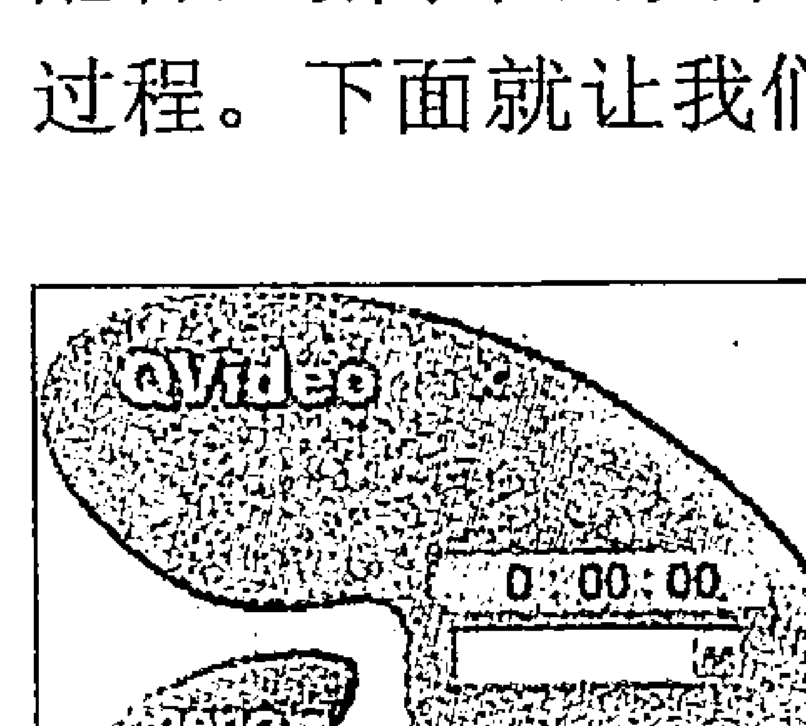

QVideo 运行时，会先自动检测 1394 端口是否有 DV 硬件设备，如果没有正常连接将会弹出提示窗口。

下一步连接 DV，找到 1394 接口连接。连接完毕后，液晶显示会提示：DV In。连接 1394 线另一端到 PC。再通过 DV 控制，调整磁带到需要刻录的视频部分。

这时你只需要点击 “DV 一指录” —— QVideo 软件的刻录按钮就可以完成专业级的视频刻录了。在这个过程中，DV 会自动将 VCR 模式的视频播放打开，也就是 DV 会自动开始播放。你所需要做的就是，在需要停止的地方，再次点击界面上惟一的按钮停止刻录。

最后软件会提示封闭盘片，以便正常读取，选择确定后，你的专业级 DIY 视频 DVD 就做好了。

“DV 一指录” —— QVideo 软件是 BenQ 独有的应用软件，使用 BenQ DVD+RW 刻录机配合一指录，通过简单操作即可实现 DV 到 DVD，并取得专业级品质视频文件，这是 BenQ DVD+RW 提供给消费者的专业级视频 DIY 的解决方案。目前此软件除了和 DW800A 捆绑销售外，还可以与 DW400A （Firmware 版本 B1HY 以上）配合使用，BenQ 官方网站上也提供此软件的下载，下载连接 http://www. BenQ. com. cn。

刻录完成的 DV 影片要分享给朋友、家人，最好是在 DVD 家庭影碟机上播放。但是，由于历史原因，DVD 影碟机和较旧的 DVD-ROM 光驱在读取各种 DVD 刻录盘的兼容性上，会遇到一些兼容性问题。不过，明基的 DW800A 能够解决这一顾虑。明基 DW800A 独有盘片 “易容术” —— Book Type Management 技术，可以将 DVD 刻录盘宣告成 DVD-ROM 格式，让 DVD-player 以为是读取的 DVD-ROM，轻松克服兼容性难题，达到 DVD 刻录机中最高的 99.99% 的兼容性。即使家里的 DVD 影碟机是不支持 DVD+RW 盘片的影碟机，也可以看到。

另外，还可以修改 DVD 刻录盘的属性。将刻录完成的 DVD 盘放入 DW800A 刻录机，然后执行 Book Type Management 软件。单击 “Check Drive” 按钮，可以看到刻录盘当前的属性（Book Type）是 “DVD+R” 或 “DVD+RW”。为了确保最佳的兼容性，点击 “Set to DVD-ROM Type” 按钮，软件会提示你正在进行的步骤，单击 “确定” 即可完成修改盘片属性的动作（图 2）。

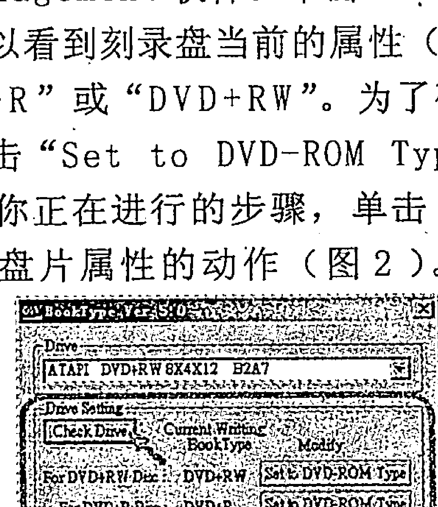

## **“傻瓜精灵”一键装机**

### ——颠覆传统电脑驱动安装方式

全球专业板卡厂商——捷波主板（Jetway）继推出“冰芯精灵”、“超频精灵”、“分身精灵”等独特技术后，再次推出“傻瓜精灵”技术，实现电脑驱动一键安装，创造全新智能驱动安装模式——安全、准确、方便、快捷。

有过装机经历，特别有过重装电脑经历的朋友都知道，每次安装电脑硬件驱动是非常的麻烦和费时的，经常发生驱动无法安装或者驱动程序找不到的情况，而诸多的驱动光盘保管起来也是非常麻烦。现在有了捷波的“傻瓜精灵”，一切就变得非常简单，只需将捷波“傻瓜精灵”光盘放入光驱，手指轻轻一按，即可将电脑硬件驱动一次搞定。

捷波“傻瓜精灵”安装原理基于系统最底层的安装方式，合理安排INF顺序，减少冲突。捷波将所有驱动均只存放在一张光盘，较以前多安装盘的情况相比更方便保存。另外“傻瓜精灵”有着独特的驱动安装界面，并且拥有多种语言界面可供选择，对英文不好的用户可谓非常的人性化，操作起来更简单方便。

以往安装驱动时往往可能为了某一硬件的驱动要重复多次的查找，安装往往也有顺序的讲究，一旦顺序上安装错了可能就会影响后续部件的安装，这使得硬件安装显得相当复杂，并且当安装结束后，有时回过头来还会发现有漏装驱动的现象，并且发现的前提还要有一定专业知识才能办到，所以非常不便。在以前，驱动安装完成后一般都需要重启，多次启动使整个安装过程少则需要数十分钟，非常耗时。而现在捷波的“傻瓜精灵”无需再自己查找驱动，也无需考虑到顺序问题，无需手动修改各种设备，也就是说你无需任何专业知识的情况下，就可以非常方便的完成以上的操作了，的确堪称“傻瓜”软件。

另外以往安装起来为了快捷会常常使用类似GHOST的克隆软件来进行安装操作系统，这类安装法在Windows 98系统下能完成各驱动的安装，但在Windows 2000及Windows XP系统下由于这两个系统多采用NTFS格式，往往在用了GHOST此类软件进行克隆系统安装后会造成系统极不稳定导致驱动无法正常安装使用的现象，而“傻瓜精灵”完全适用于现有的MS的PC系统：Win98、Win2000、WinXP系统。

捷波“傻瓜精灵”技术即将在捷波主板、捷波显卡上使用，更多详情可垂询他们的免费咨询电话：8008100195。

## 附：捷波“傻瓜精灵”与传统驱动安装对比

| 编号 | 安装对比 | 传统方式电脑驱动安装 | 捷波“傻瓜精灵”驱动安装 |
|------|----------|----------------------|------------------------|
| 1 | 保存方式 | 驱动存放在各种软盘或光盘中，保存不便 | 一张光盘包含所有系统驱动，方便保存 |
| 2 | 安装准备 | 需查找驱动位置，费时麻烦 | 一键安装，无需查找，自动安装 |
| 3 | 安装重启 | 过程需要重新启动数次 | 安装完毕，一次重启，方便快捷 |
| 4 | 安装顺序 | 需一定专业知识，严格按规定顺序安装 | 一键智能安装，无需操心 |
| 5 | 安装过程 | 容易出错，有时需反复安装 | 一次安装，确保安全准确 |
| 6 | 漏装驱动 | 有可能 | 一键整体安装，安全无遗漏 |
| 7 | 安装方式 | 多次点击，非常不便 | 一键按毕，“傻瓜”安装，无须再理 |
| 8 | 安装时间 | 时间长，正常情况至少需20－30分钟 | 快捷，正常情况至多8分钟 |
| 9 | 同类软件 | GHOST方式在安装部分系统时容易出错 | 完全适用现有主流系统，如Win98、Win2000、WinXP |
| 10 | 操作界面 | 涉及不同语言界面，操作常有不便 | 全中文界面，操作更人性，另有多种语言界面可选 |

## 800MHz P4，飞入寻常百姓家

### ——848P芯片组和TM-848P

为了推广 800MHz FSB 的 P4 处理器，Intel 推出了针对低端市场的支持单通道 DDR 400 的 848P 芯片组，寄期能够同时满足高端低端不同用户。 i848P 此前已有报道，它是 Intel i865 “Springdale” 架构下的派生物，支持 800MHz FSB 总线，单通道 PC2100、PC2700 或 PC3200 DDR SDRAM 内存，AGP8x 图形接口，超线程技术，通信数据流体系，采用专用网络总线（DNB）接口来支持 wire-speed 千兆位以太网。另外，i848P 可与最新的 ICH5 和 ICH5R 搭配使用，支持串行 ATA-150 和 USB 2.0。从 848P 的北桥封装来看，82848P MCH（Memory Controller Hub，内存控制中心）与 i865 其他系列针脚兼容，都采用 932 FCBGA 封装。与之对照，i875P MCH 采用的是 1005 FCBGA 封装，而 i845PE MCH 则采用 593 FCBGA 封装方式。我们可以看出，i848P 与 i865P/PE 的架构体系是一致的，这也真正预示了 Intel 将其作为 865 系列中的低端产品线。

继微星和华硕宣布推出 848P 芯片组的主板后，顶星科技也在国内厂商中第一家正式发布了基于 848P 芯片组的主板——TM-848P。顶星 TM-848P 主板将以优势价格配合 FSB800、DDR400、AGP 8X、Serial ATA 等四大高阶规格，成功取代以 i845 芯片组为主体的 P4 主流市场。

顶星 TM-848P 拥有新世代高速传输规格等四大特点，能大幅提升计算机系统的整体效能，为预算有限却又不想屈就于 i845 芯片组旧规格的玩家，提供了另一个绝佳的选择。这四大效能提升包含：

- 1. FSB 800 MHz：拥有每秒 6.4 GB 的 FSB 传输速度。与 i845 芯片组的 FSB533 相比，效能提升 30% 以上，并支持 Intel 最新的超执线程技术（Hyper-Threading Technology），可支持模拟两颗 CPU 运作，系统效能大幅升级。
- 2. DDR 400 MHz：可支持目前业界最新标准的 DDR400 以上内存，较 i845 芯片组的 DDR333 在效能上，每秒增加 500MB 的数据传输。
- 3. Serial ATA：可支持每秒 150MB 高速数据传输，比 i845 芯片组的 Ultra ATA/100 总线要快 50%，大幅增加使用者在系统升级规划的弹性。
- 4. AGP 8X：支持最新高频宽的八倍速绘图卡传输接口，与 i845 芯片组的 AGP 4X 相比，效能整整提升了一倍，达到每秒 2.1GB 的传输速度，可彻底发挥新世代高阶绘图卡流畅的 3D 影像传输。

除了上述的高效能架构外，TM-848P 内建了六声道音效；同时主板还提供了六组 USB 2.0 接口。

## 主板的规格说明

- ● 支持 Socket 478 Pentium 4/Celeron 处理器，总线频率为 400/533/800MHz FSB，支持 3.20GHz 时钟频率及以上.
- ● 可发挥 CPU 的 Hyper-Threading 超线程技术优势
- ● i848P+ICH5 芯片组
- ● 2 个 DIMM 插口，支持最高达 2GB PC2100，PC2700 或 PC3200 DDR SDRAM 内存;
- ● 4 个 PCI 和 1 个 AGP 8x 插 口;
- ● 2- 通道 ATA-100/66/33 集成控制器;
- ● 2 个串行 ATA-150 端口
- ● 6 个 USB 2.0 端口
- ● 6- 声道声卡
- ● 标准 ATX 板形

在附加功能上，顶星的这款主板特增加了双LCD纠错指示灯，通过这个小小的LCD纠错灯，用户可以方便的从上面读取到硬件方面的问题出在哪里。

此外，附带的超频猛将功能可以在 bios 和 Windows 中双双实现超频的目的，而且一旦超频失败，主板会跳回到初始状态，可以免除 CPU 因为超频不当造成的致命伤害。

当然，还有一项重要功能——守护忠将功能，它可以有效的保护 BIOS 芯片免受病毒入侵。

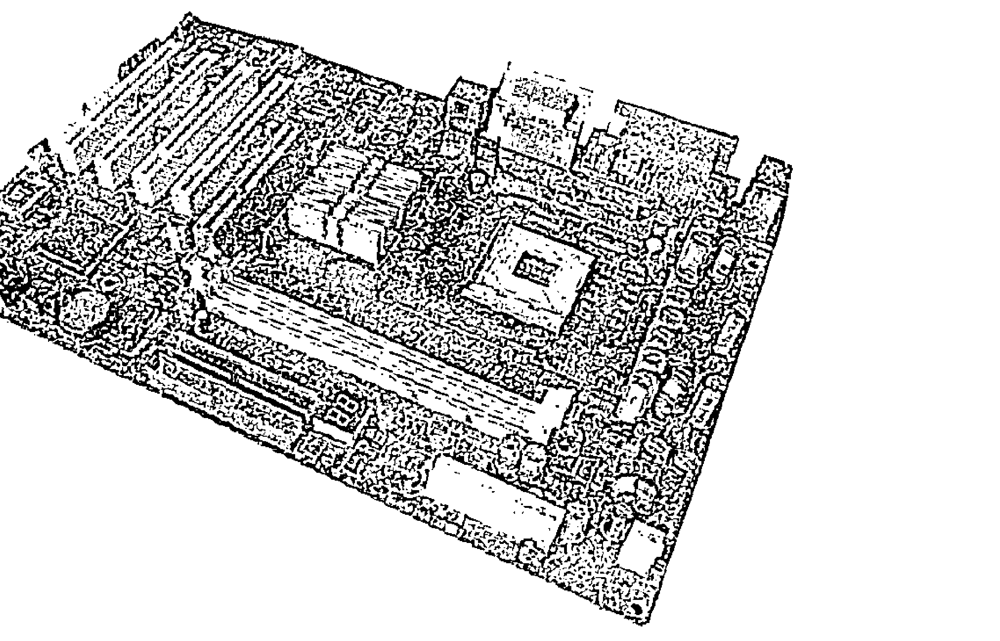## 随心所欲 通讯先锋——开创红外通讯的机箱扫描

金河田最近推出创导系列机箱共五款，我们看到的是创导7001和创导7002这两款。机箱钢板采用优质镀锌钢板，采用了内藏式光驱设计。机箱外观以流线型的外观设计，配以简洁的面板。

机箱采用了左右侧板抽拉式设计，顶板由一个手动螺丝固定，极易拆装，并加了锁扣设计。机箱前板全屏蔽设计，做到了防辐射、防静电，并通过国家B级标准。采用了全折边处理，板材边缘光滑、无毛刺，100%不伤手。侧板风扇及前后板风扇的组合，更有利于机箱内部的散热，需要特别说明的是，这两款机箱均增加了CPU导风筒，专门针对CPU散热。当你安装好机箱，在CPU的上方，有一个抽风用的导风筒，它可以把CPU产生的热量通过这个导风筒导出，再通过机箱侧板把热风排出。同时这种设计可将各风扇的切风控制得恰到好处，使之发出的噪音小，远低于人们所能承受的正常噪音干扰度。四大一小的驱动器位置，可以满足不同用户需要；前置的两个USB端口及音频接口。采用了金河田自主生产的通过3C认证的ATX-320WB+P4电源，不仅功率强劲，各项技术指标严格按照INTEL标准，并通过3C认证，可延长CPU、主板、硬盘等重要配件的使用寿命。

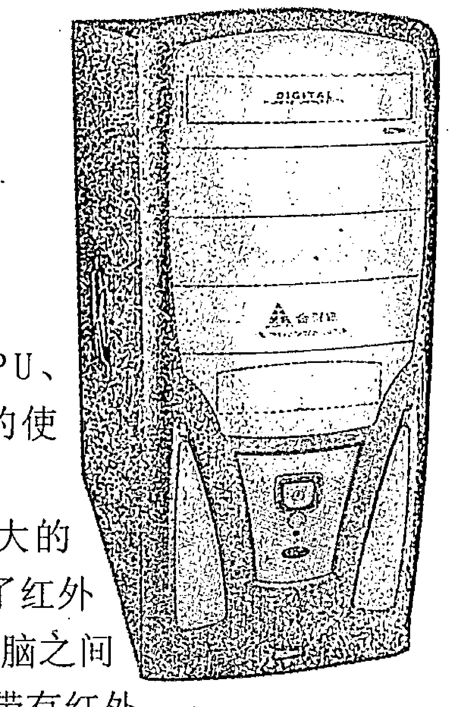

创导系列机箱，最大的亮点，就是在机箱上提供了红外接口，解决移动终端与电脑之间数据交换的问题，可以与带有红外接口的手机、PDA、掌上电脑、笔记本电脑等移动终端建立无线连接，实现双向数据交换。

要使用创导机箱的红外线功能，需要主板的支持。装好电脑后，找到主板上的红外线接口插针（有单排、双排，IR、IRDA、JIR等，有的主板有红外接口，但并没有明显的标注，所以要查看主板说明书，以确定红外接口的位置），将机箱附带的红外线接口插针接在主板上。无需驱动，安装完毕，在BIOS中打开红外设置；进入系统后，将移动终端的红外端口打开，对准机箱的红外线口即可。此时系统会提示找到了新的硬件，比如手机，如果你安装了相应的软件，系统会自动识别这是一款什么型号的手机。

## 还原本色 感悟生活——JHT-356游戏音箱扫描

JHT-356是金河田一款全木质结构的2.1声道音箱。银灰色调的箱体，配以独特的高级进口钛铝合金面板，表面经过拉丝处理，使得整个音箱显得高贵且时尚。前置的音频控制旋钮和倒相孔配合，不仅造型独特，而且操作方便。整台音箱采用了全防磁处理，可以让消费者任意摆放。同时JHT-356还可以接驳PC机、VCD、DVD、AV及TV等各种音源，做到物尽其用。

JHT-356的低音炮采用了多项降噪抗振技术，将共振和噪音值降到了最低，再配以金河田最新研制出来的钛铝合金组合磁体5寸扬声单元，使其低音更加震撼雄厚；卫星箱仍然采用了两分频设计，使得中频通透、高频悦耳，定位更加准确。特别值得一提的是增加了高音调节单元，彻底防止破音和沙音的出现，使高音更加清脆悠扬。其良好的表现力，使我们有理由相信，这款JHT-356将会成为游戏玩家的最佳配置，是物超所值的选择。

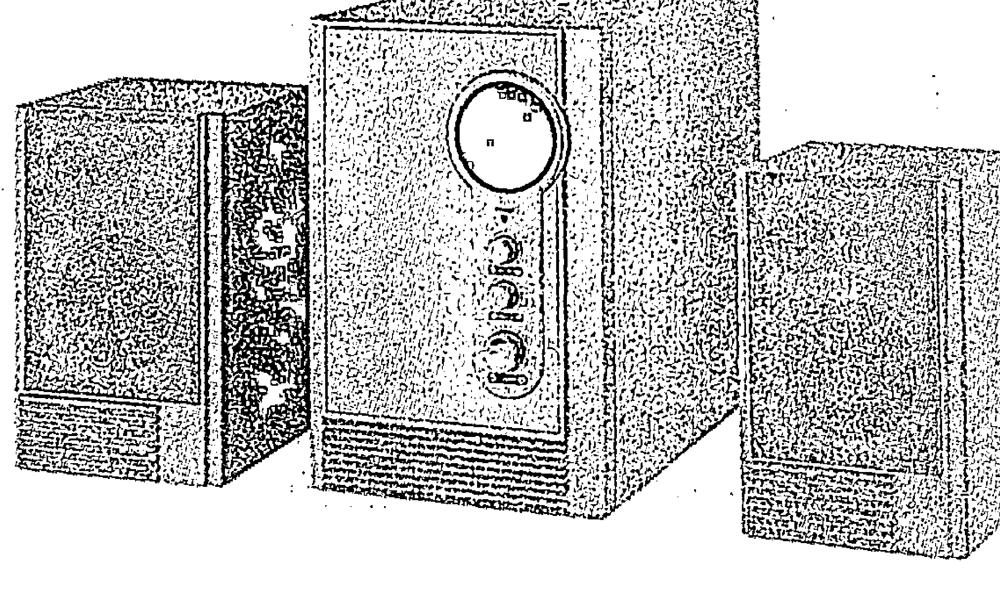

## i865G——Intel 的整合芯片组

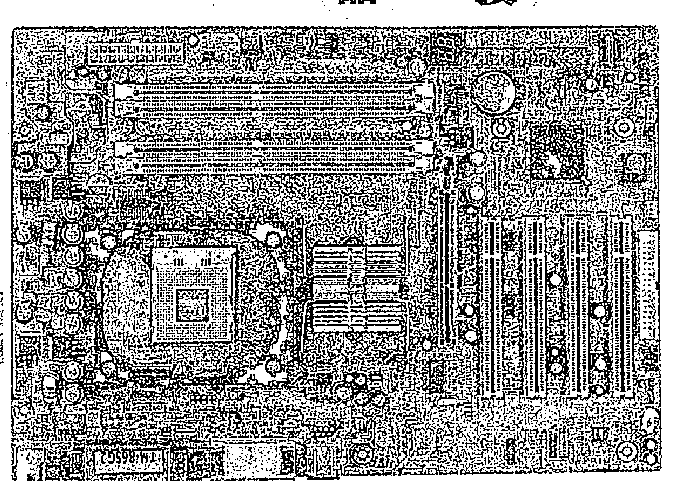

2003年Intel把我们带到了800MHz前端总线（FSB 800）和超线程技术（Hyper-Threading）的时代，800MHz FSB Pentium4处理器比533MHz FSB在性能上提升了50%之多。而其中的Intel 865系列芯片组主板以比Intel 875P更能让用户所接受的价格，配合其出色的性能优势已成为2003年主板市场的主流产品。

顶星TM-865G2，主板不仅整合了改进型的Intel Extreme Graphics 2代3D显示芯片，而且如果用户有升级的需要，主板上支持AGP 8X的显卡插槽可满足任何要求。TM-865G2，由于提供了对800MHz前端总线的支持，大大高于845系列的533MHz，如果配合800MHz的CPU，在性能上会比845G、845GE提升幅度大很多。TM-865G2支持双通道DDR400（4个内存插槽），最大容量达到4GB。另外，TM-865G2不仅支持支持800/533/400MHz前端总线的 Intel Socket 478 Pentium4&Celeron处理器，而且支持Intel下一代的Prescott处理器，更增加了它的可拓展性。

虽然865没有针对服务器的ECC内存校验，也不支持英特尔最新技术—PAT，但是它表现出来的强大性能已经对商业办公、家用娱乐绰绰有余。对比865同系列产品，i865G与i865PE的区别就是是否板载显示核心，顶星TM-865G2采用了Intel Extreme Graphics2的显示芯片,和采用Intel Extreme Graphics 的i845G芯片组相比，3DMark 2001SE测试结果提升了一倍。显然，新品的图形处理性能得到了大幅提升。确切的说，英特尔的Intel Extreme Graphics 2甚至可与nVIDIA的GeForce4 MX 400相媲美，甚至超过它的性能。

接下来，就让我们来进一步了解Intel Extreme Graphics 2图形核心部分，我们知道在i845G、i845GL、i845GE和i845GV第一次运用到了Intel Extreme Graphics图形核心部分，但是它的工作核心频率仅为200Mhz，而在3D图形性能上也让我们不能满意，终于Intel在i845GE上对图形核心进行了加强，将频率提升到266MHz，但是众所周知简单的在频率的提升上不能将性能提高很多。这时Intel Extreme Graphics 2诞生了。Intel Extreme Graphics 2图形核心部分不仅提高了工作频率，并在内部设计进行了彻底的改进，更新的像素材质引擎、区域渲染2代引擎、动态视频存储2 代技术以及更具效率的智能内存管理技术，再加上FSB 800以及双通道DDR400内存带宽，使得图形性能得到了前所未有的提升。

顶星TM-865G2主板还具备四条PCI插槽以及6个USB2.0接口，可以满足任何外接设备的应用。板载了六声道声卡，为视听提供更好的解决方案。主板上附带了一个DEBUG纠错指示灯，用户可以通过说明书的故障代码，方便的找出问题所在。另外，这块主板还附带了两个SATA硬盘接口，随着串行技术的成熟和流行，串行硬盘以其更快的传输速度和热拔插特性为越来越多的人所瞩目。

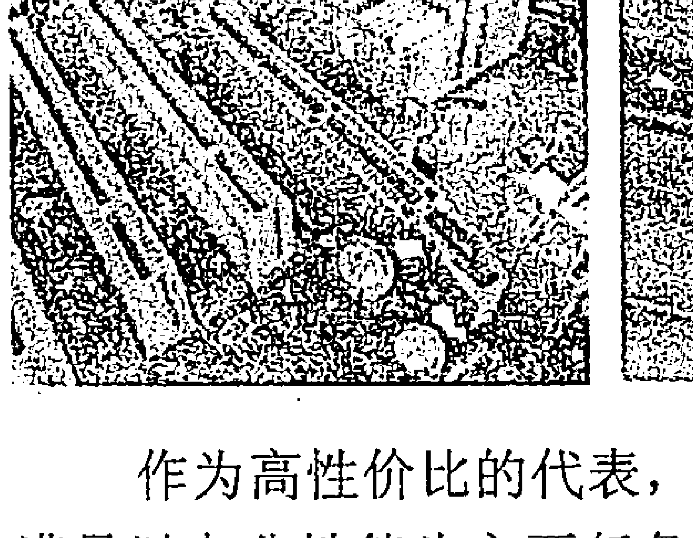

作为高性价比的代表，i865G的集成显卡足以满足以办公性能为主要任务的用户，也可以满足一般家庭用户的娱乐需要。i865G主板和集成显卡构成的系统相对低廉的成本，是吸引商业和家庭用户的重点。

## 来自海湾的紫色蝴蝶

“海湾键盘”采用明基专利技术的“X 架构”，“X架构”主要运用两组平行四连杆机构，以强迫运动方式运动，让使用者按触键盘的四个角落时，都能享受到顺畅及一致的手感，相对于传统的“单轨滑动架构”的键盘来说，“X架构”键盘无疑更加地科学、更加省力、同时带给我们的是更小的击键噪音。

### 1. 优雅的视觉感受

明基“海湾键盘”采用了海湾造型ID 设计、键盘采用了人体工学曲线设计，由于键帽模组高度只有10.0mm，更加方便与键盘弧度合二为一，“海湾键盘”的键帽采用了宽大，超薄的设计，按键之间的间隙更小，键位排列更美观。全尺寸键盘的设计并没有破坏“海湾键盘”的美感，为了适应用户不同的操作方式，调整脚的设计在曲线键盘中就显得尤为重要。“X 构架”与传统键盘相比，在按键行程不改变的情况下，键盘能够制作的更薄。

### 2. 柔和的触觉感受

目前我们使用的键盘基本上可以分为传统台式机键盘和笔记本架构键盘，传统台式机键盘采用的轨道直滑式构架，由于反复进行滑动摩擦，对材料要求较高，而且经过一段时间的使用，由于磨损，往往会有键帽摇晃同时伴随有卡键的现象发生。由于所需要的敲击力道相对较大，时间长了容易引起手部疲劳，随着腕道综合症在全球的愈演愈烈，手部健康以及输入设备的人体工学设计也越来越受到重视。另一方面，笔记本键盘越来越受到欢迎，不过被一部分人诟病的就是笔记本键盘的手感，由于笔记本键盘的设计和制造受到了严格的高度限制，按键行程通常只有2.5~3mm，而键帽模组高度也仅仅为6mm，这些限制严重的限制了笔记本键盘手感。

BenQ海湾键盘拥有三段式触感，由于敲击力道被平均分配于键帽的四个角落，使得键盘更加舒适，出色的“X 架构”，保持了键帽的稳定性，绝对不会摇晃，而对于“空格”等长度较大的按键，依然继承了金属平衡杆的特性，相对于台式机键盘 20mm 的键帽模组高度，海湾键盘 10mm 的键帽模组高度搭配 3.8mm 的按键行程，使整个敲打过程更加的省力，按键力道平均仅仅为70g 以下，长时间使用也不会疲劳。

更重要的是，由于键帽模组的厚度下降，整个键盘的重量也大幅度下降，键盘不再是笨重的也不应该是笨重的了，轻盈、美观才应该是键盘的本来面目。

### 3. 享受的听觉感受

当传统键盘从机械式转型到电容式，由于习惯了机械键盘轻脆的敲击声音，电容式键盘相对疲软的声音让很多人都不适应，直到应用于笔记本这种狭窄环境的“剪刀脚架构”的键盘出现，人们才意识到，轻微而又清脆的声音正是我们追求的，然而一台笔记本价值不菲，而这种架构的键盘制造工艺相对复杂，对技术要求和模具的精细程度都有严格的要求，并不是随便就能做好的。经过不断的研究和发展，终于在手感和声音方面寻到了一个平衡点，海湾键盘的平均击键声音仅仅为45分贝，而传统的电容式台式机键盘要高达52分贝以上。

### 4. 合理的搭配 完美的组合

同键盘处境相同的还有显示器，随着LCD液晶显示的逐渐成熟，笨重且危害健康的CRT也要慢慢的退出历史舞台。明基BenQ“海湾键盘”兼具时尚美学、人体工学和科技创新，可以和同样轻盈的LCD显示器作为电脑的标准搭配，同样的轻，同样的薄、同样的小，这正是很多人追求的完美组合。

## 圣诞夜疯狂大酬宾

CFAN套装大礼包热抢中

### 市价总值1947元
### 立刻节省1248元

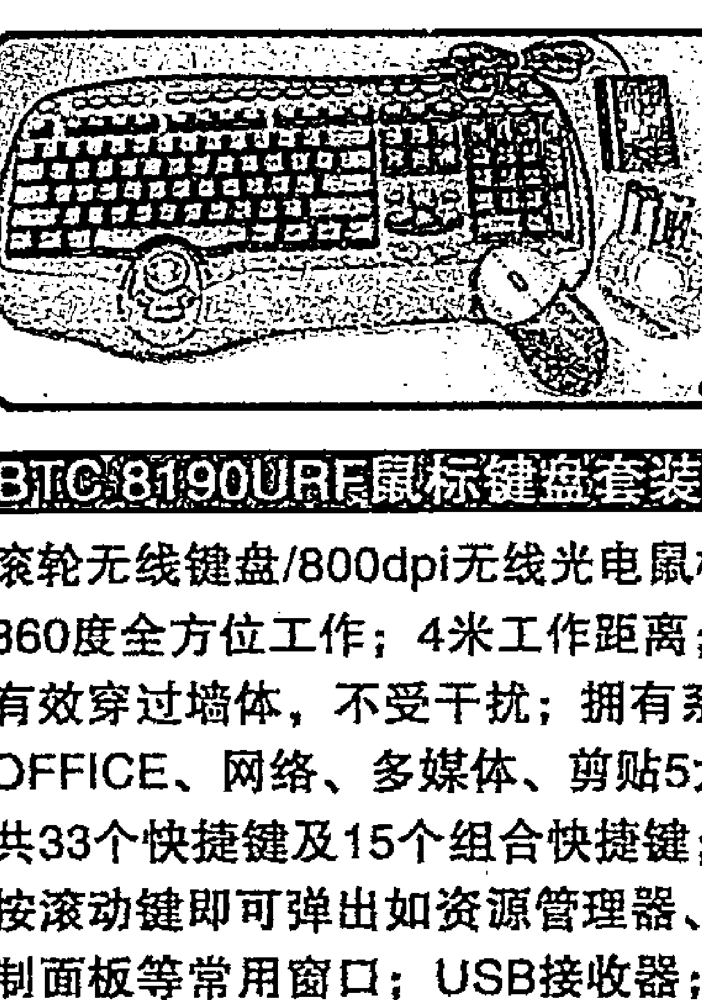

### BTC3190URF键鼠套装

滚轮无线键盘/800dpi无线光电鼠标；360度全方位工作；4米工作距离；可有效穿过墙体，不受干扰；拥有系统、OFFICE、网络、多媒体、剪贴5大类共33个快捷键及15个组合快捷键；轻按滚动键即可弹出如资源管理器、控制面板等常用窗口；USB接收器；赠送四节金霸王5号电池。

感谢以下厂商，给予大力支持
创新科技	英群企业
CREATIVE	BTC®

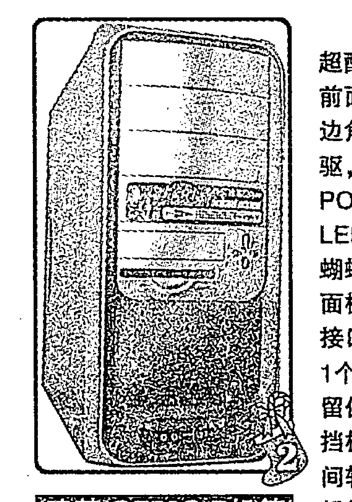

### 酷魔黑G30机箱

超酷黑色外观，镀锌钢板，前面板采用ABS防火塑料，边角经卷边处理；提供4光驱，2软驱位置，前面板POWER、RESET、HDD-LED、POWER-LED4键呈蝴蝶型排列，时尚美观；前面板下部提供前置2个USB接口和音频输入输出插孔各1个；后面板提供2个风扇预留位置和散热孔，机箱两侧挡板也留有散热孔；内部空间较大；为便于安装主板，机箱底板已安装部分铜柱。

### PC好险四套件惊爆价：699元(免邮费)

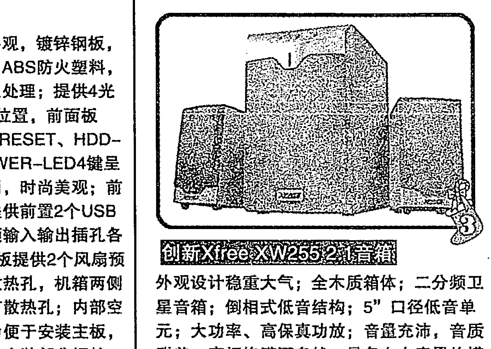

### 创新XfreeXW255 2.1音箱

外观设计稳重大气；全木质箱体；二分频卫星音箱；倒相式低音结构；5”口径低音单元；大功率、高保真功放；音量充沛，音质甜美，声场饱满而自然；具备左右音量均衡调节功能，可在摆放不对称时调整最佳听音位置；高仰角卫星音箱设计，声音直射入耳，音质更加清纯。

### 市价总值：1240元

## 礼上加礼喜上加喜

参加活动者均可获赠：

- 面值为500元的俱乐部商品代金券一套。
- 价值100元的电脑爱好者俱乐部会员卡一张。
- 价值35元的电脑爱好者10周年纪念特刊CD-ROM一套。
- 价值35元的《电脑爱好者》2004年(上)一套。
- 价值19元的2003年《电脑爱好者》一本。
- 价值38元的电脑爱好者集团2004年全年刊一套。

### 赠品总价值727元

## 活动实施细则

1.  通过邮局汇款699元至“北京9615信箱电脑爱好者俱乐部”；收款人：沈纯玲；邮编：100086；电话：(010)62141292 (010)62162598-8201 电子邮箱：Cf_club@cfan.com.cn；网址：http://www.cfan.net.cn；在汇款附言栏中注明CFAN大礼包并留下可靠联系电话。
2.  单独选购套件中任一款产品，均享受市价8折优惠，不再提供赠品。
3.  活动截止到2004年春节前，以汇款单到达时间的邮戳为准。
4.  收到汇款后3天内发出礼包，5-10天内收到。
5.  厂家、商家双重质保，1年内提供全程售后服务。
6.  北京读者可享受俱乐部免费装机服务；爱好者资深编辑专业推荐或自定配置，性能可靠，质量保证。俱乐部装机电话：(010)51934102


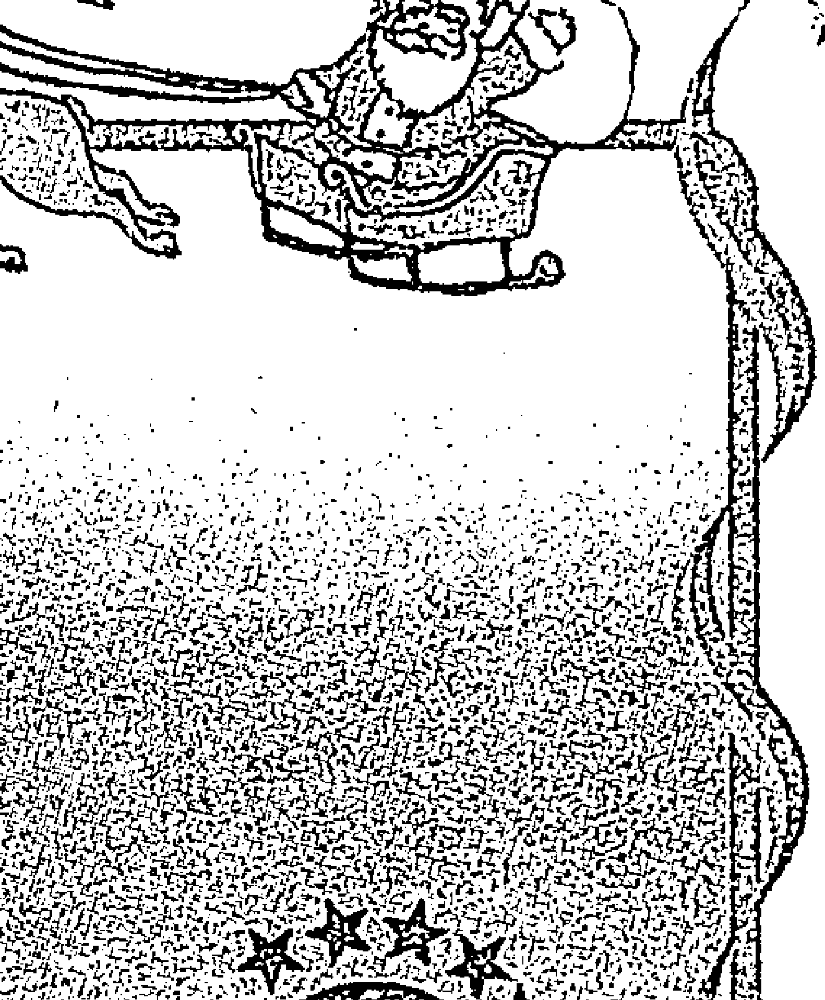


订全年《画王》即可获得（价值50元）的精美礼品！

零售价：9.5元 全年定价：114元
邮发代号：82-529
邮购地址：北京9615信箱推广发行中心 邮编：100086
联系电话：010-62143082 010-62161335~38 转8605,8058

### 一、电脑爱好者合订本百元大礼包（限量500套）

100元=（2002全年+2003全年）电脑爱好者合订本（原价140元）
8本书，8张CD的超大容量，充分满足对知识渴望的你。

### 二、增刊、电脑应用文萃合订本大礼包

50元=2003年电脑爱好者增刊+2002年电脑应用文萃全年合订本（原价：76.8元）
电脑应用文萃合订本绝版倾情出击，电脑爱好者增刊火辣上市，超酷、实用的电脑知识，是学习电脑的必备工具。

### 三、电脑高手三年精华合订本大礼包

15元=高手硬件篇+软件网络篇+宽带玩家（原价48元）
高手的眼光、高手的视角，DIY玩家必备。

### 四、5元正版图书大热卖：

| 书名 | 邮购代码 | 原价 |
| --- | --- | --- |
| 《影视片头制作大揭密》 | SK0141 | 19元 |
| 《软件应用实战宝典》 | SK0112 | 19元 |
| 《优化系统完全解决方案》 | SK0115 | 19元 |
| 《多媒体创作精灵Authorware实战技巧大全》 | SK0124 | 19元 |
| 《C++到VC++精彩100例》 | SK0118 | 28元 |
| 《Photoshop实例秀》 | SK0119 | 28元 |
| 《IT考试圣经》 | SK0126 | 19元 |
| 《动态网页实例教程》 | SK0128 | 28元 |
| 《精通Office2000应用》 | SK0129 | 19元 |
| 《黑客过招》 | SK0130 | 22元 |
| 《实战精通Windows XP》 | SK0131 | 19元 |
| 《网页制作秘笈》 | SK0132 | 19元 |
| 《装机大师第二部》 | SK0133 | 19元 |
| 《个人服务器架设与应用》 | SK0135 | 22元 |
| 《Delphi精选实例》 | SK0137 | 28元 |
| 《玩转Windows》 | SK0139 | 19元 |
| 《Flash MX设计案例精粹》 | SK0140 | 19元 |
| 《广告设计新概念》 | SK0142 | 28元 |
| 《Word十日通》 | SK0143 | 19元 |
| 《上网十日通》 | SK0144 | 19元 |
| 《Excel十日通》 | SK0152 | 19元 |
| 《编程魔法师delphi入门实战百例》 | SK0125 | 19元 |
| 《Authorware精彩100》 | SK0158 | 19元 |
| 《三剑客外挂红宝书》 | SK0156 | 19元 |
| 《VB编程高手》 | SK0159 | 19元 |
| 《编程黑马真言》 | DS200101 | 25元 |
| 《完全精通电脑维护》 | SK0155 | 19元 |
| 《Photoshop完美创意赢家》 | SK0121 | 19元 |
| 《大话升级》 | SK0171 | 18元 |

缺书通告：硬件高手已经无货，请读者暂时不要汇款购买了。
邮购地址：北京9615信箱，发行中心收，邮编：100086
邮购免邮费，每本图书另加2元挂号费。（以上活动售完为止）
咨询电话：010-62161332（周一到周五，9：00～16：30）
E-mail咨询：yougou@cfan.com.cn

## 合订本2003年（下）读者调查表（复印有效）

姓名 _______ 年龄 _______ 文化程度 _______ 职业 _______ 电子信箱 _______
通信地址： _______ 省（市）________________________ 邮编： _______

1.  你以何种方式购买《电脑爱好者》杂志
①邮局订阅 ②报摊购买 ③网上书店 ④书店购买 ⑤超市购买

2.  购买合订本的年限
①1年 ②2年 ③3年 ④4年以上

3.  购买合订本的原因（可多选）
①有全年内容 ②有光盘 ③有附录 ④检索方便 ⑤软件多 ⑥便宜

4.  合订本有（上）（下）两册，但我
①只买上册 ②只买下册 ③上下都买 ④想上下都买，但没有买到

5.  希望在哪里买到合订本
①报刊亭 ②书店 ③邮局订阅 ④邮购 ⑤超市 ⑥网吧 ⑦网上书店

6.  购买合订本的目的
①学习提高 ②查阅资料 ③保存收藏 ④获得软件

7.  希望从光盘里获得的内容是
①软件 ②杂志全文检索 ③软件教程 ④源程序 ⑤电子书 ⑥素材

8.  你的合订本有几个人看
①1人 ②2人 ③3人 ④4人 ⑤5人以上

9.  合订本刊登的广告对你有用吗
①有 ②无 ③不看广告 ④希望更多

10. 如果合订本再增加1张光盘（共3张光盘），售价提高到38元，你认为
①很好 ②可以接受 ③看内容再说 ④不买了 ⑤最好不变

注：如果你还有其他建议，可另附纸张。

邮寄地址：北京9615信箱光盘图书部收 邮编100086

本次读者问卷调查设两类奖品。

### 优秀建议奖10名

我们将从提出建议的来信中评出。奖品为《电脑爱好者10年期刊钻石电子珍藏版》1套，价值35元。

### 幸运读者奖30名

从全部读者问卷来信中随机抽取。奖品为《电脑爱好者2003年增刊》1本，价值19元。奖品如有变动，可提供不低于原价值的其他产品。

问卷邮寄截止时间为2004年4月30日（以当地邮戳为准）。获奖名单将在《电脑爱好者2004年合订本（上）》或《电脑爱好者》2004年第12期中刊登。

本次活动的最终解释权为《电脑爱好者》杂志社。

## 购买提示

如果你正在为买不到全年的合订本而发愁时，可以按照下面的方法去购买：

1.  零售——每年的7月和12月，你可以在全国的报摊、各类书店买到。
2.  邮购——杂志社邮购部全年向读者提供销售服务。邮购地址：北京9615信箱邮购部收
咨询电话：010-62161332
3.  网上购买——贝塔斯曼（网址：www.bol.com.cn）和当当网上书店（网址：www.dangdang.com）都是我们的合作伙伴，你可以在这两个网站上购买。
4.  邮局订阅——每年的10-11月或5-6月，均可在邮局办理订阅手续，邮局订阅可以送到家。
全年价格70元，半年价格35元。订阅代号82-528。