# 电脑爱好者2004合订本（上）附录分册

-   百种软件热门推荐
-   教程指南技巧指点
-   精彩解剖实战演练
-   软件学用终极宝典

Canon

影像文化 尽在佳能

让感觉触手可及！

> > 触摸它...感受他... FEEL IT ON PAPER

### 佳能直接照片打印机

有一种感觉叫真实，有一种感觉叫细腻，有一种感觉叫冲击，有一种感觉叫完美；如果在电脑显示器上欣赏您的数码照片没有感觉的话。请用佳能直接照片打印机打印出来感觉一下吧！ 无与伦比的色彩还原能力让你感觉触手可及！

分享快乐 体验精彩

### C3700 for PC Music

-   造型简洁时尚，庄重大方；
-   3英寸全频带扬声器，中高音细腻纯厚；
-   5.25英寸大口径低音扬声器确保低音汹涌澎湃；
-   有黑色、深灰、粉色、蓝色四种颜色可供选择。

### C3500E for PC Gaming

-   木质低音箱体，时尚卫星箱，前置音量调节；
-   有银白、宝蓝、黑色、木纹白四种颜色可供选择。

### C3300 for PC Music

-   造型简单，纯粹，前置音量调节；
-   3英寸全频带扬声器，中高音细腻纯厚；
-   5.25英寸大口径低音扬声器，确保低音强劲有力；
-   有黑色、白色两种颜色可供选择。

Hussar® 车马兵® 专业个人音响制造商

各地经销商：(以下按省会字母顺序排序，不分先后)

气：010-82664390 010-62546160 010-82668019 010-82852190 021-54248474 022-27462531 028-85451892 028-86313879
重庆：023-68791998 023-68636840 023-68793415
长沙：0731-4142490 0731-4151465
长春：0431-5640485 0431-2734812
延吉：0433-2916625
沈阳：024-23967161
大连：0411-3627631
锦州：0416-2142659
鞍山：0412-2226419
福建：0591-3358279
厦门：0592-2233448
泉州：0595-2988476
贵阳：0851-5818970
广州：020-38788003
深圳：0755-83681005
汕头：0754-8366901
珠海：0756-2173069
海口：0898-66955881
哈尔滨：0451-88230721
合肥：0551-3662944
杭州：0571-56772945
金华：0579-3210866
温州：0577-88868071
宁波：0574-87267637
呼市：0471-2297640
包头：0472-3622136
赤峰：0476-8248751
济南：0531-6412294
青岛：0532-3826090
烟台：0535-6656105
淄博：0533-2775708
昆明：0871-5165587
兰州：0931-8274031
南宁：0771-2814761
柳州：0772-2836338
南昌：0791-6288676 0791-6262557
南京：025-57713317
无锡：0510-2755076
常州：0519-6644857
南通：0513-5104991
淮安：0517-3915658
徐州：0516-3824188
石家庄：0311-7037355
沧州：0317-2011825
秦皇岛：0335-3042700
邢台：0319-7611199
保定：0312-2031809
太原：0351-8710483
武汉：027-87160038 027-87658890
乌市：0991-2831592
西安：029-85598151 029-85543604 029-82242311
宝鸡：0917-2866660
郑州：0371-3551253

商：北京市中北高科机电公司 地址：中国·北京市中关村南大街七号三层 邮编：100081 免费咨询电话：800-810-0141 http://www.hussar.net

领略高端 极致风采

真正的极致是高科技与高性能的和谐统一。这在九州风神新款散热器上都全力追求并得以实现。全新高端技术的应用，让你尽情体验高科技、高性能所带来的极致感受！领略高端，拥有高端，怎能不风采卓然！

### Double Dragon 热管散热器

### Prescott [热管] 散热器

-   □ Up to Intel Pentium 4 478 3.6EGHz (Prescott)
-   □ Up to Intel Celeron 478 Series

-   □ 散热片内镶2根热管，它通过在全封闭真空管内导热介质的蒸发与凝结来传递热量，具有极高的导热性，使散热器散热性能强劲
-   □ 纯铜散热底部设计，传热迅速，散热效率高
-   □ 散热器中部安装7015风扇，高风量高风压

### 战神 阿瑞斯 HERO ARES

### Prescott [温控] 散热器

-   □ Up to Intel Pentium 4 3.4EGHz (Prescott)
-   □ Up to Intel Pentium 4 3.4GHz(NorthWood)
-   □ Up to Intel Celeron 2.8GHz

-   □ 倒挂风扇设计并具有自动温控功能，转速随温度变化而自动调整，从而有效的控制风扇噪音
-   □ 散热片采用独特四面挤型设计，增大通风量和散热面积，散热效果明显
-   □ 散热片底部镶铜柱设计，传热快，散热效率高

九州风神 3D飞侠 铝制鼠标垫

游戏玩家首选

Huntkey 航嘉电源
引领PC电源方向

| 主要高功耗部件 | +12V需求电流 |
| :--- | :--- |
| Intel Prescott 2.8C | 8.5A |
| ATI 9800Pro | 5A |
| SATA 7200转硬盘 | 1.5A |
| DVD-ROM | 2A |
| 总计 | 17A |

## 您的+12V输出够吗？

## 宁静王 钻石1.3版
+12V电流高达18A

-   额定功率300W
-   +12V最大电流18A
-   +3.3V最大电流27A
-   满载时转换效率72.3%，更节能、更环保
-   符合Intel ATX12V 1.3电源规范
-   2路SATA

www.belson.com.cn

## 百盛机箱
品位引领时尚

电脑爱好者

IT市场分析

## 内容提要

《电脑爱好者合订本》2004年（上）附录分册是与正文分册相配套的，作为合订本正文分册的补充和完善。2004年上半年的《电脑爱好者合订本》附录分册以软件应用为中心，包含有软件扫描、软件使用教程、开发与设计教程、软件双雄会、软件插件、软件技巧、软件问答、软件特别话题等八大软件栏目，近百个小专题，汇聚了数百个读者所关心的热门软件，这些软件涉及到各种形式、各个类别，是一本帮助你快速掌握当前热门软件的软件学用宝典。

本附录分册，内容精练，实战性和可操作性强，适合于具有初中级电脑应用水平的读者阅读。《电脑爱好者合订本》2004年（上）附录分册配套光盘B，收有经厂家特别授权的WPS Office 飓风、豪杰超级解霸V8、驱动精灵、趋势科技网络安全个人版杀毒软件等多款大型特别版软件，并收有《电脑高手》、《互动软件》精选版以及期刊“程序谷”栏目全文及源代码，并且还收有爱好者十周年征文精选近千篇。

## 《电脑爱好者 合订本》2004年（上）· 附录

-   社长：孙晓旭  副社长：赵健
-   总编：高翔
-   编辑策划：武航（主编）
    陈荣贵 王磊
-   编辑出版：《电脑爱好者》杂志社
-   制作：小玩子
-   责任编辑：董宏（副主编）
-   发行：北京9615信箱《电脑爱好者》杂志社推广发行中心（100086）
-   发行电话：（010）62143106
-   技术支持：（010）62161336/62162598－8603/8610/8618
-   网址：http://www.cfan.com.cn
-   经销：各地报刊亭及新华书店
-   开本：787×1092 1/16
-   印张：25
-   字数：800千字
-   刊号：ISSN 1005-0043/CN11-3248/TP
-   国内邮发代号：82-528

本书如有印刷质量问题（错页、掉页、残页等），我们将负责调换。联系电话：（010）62143106  E-mial：ftian728@cfan.com.cn
图文版权所有，未经同意不得转载、翻印
合订本定价：35元（含正文分册、附录分册、双CD）

## 精彩导读

## 常用硬件工具扫描 P17

通过软件来设置调整、优化、测试硬件，是一项有趣味的工作，当然，也是比较复杂的工作。作为家庭用户来说，到底有哪些硬件工具，来让我们得心应手地控制那些冷冰冰的硬件呢？

## 内存管理与优化软件精品放送 P26

内存很便宜，可是您知道吗？256MB内存对于WinXP操作系统而言，也只是刚刚够而已。如果您不优化的话，运行Office、PhotoShop都很吃力。那么，怎么来优化内存呢？

## 个人加密与保密工具扫描 P34

工作总结、情书、私人照片、重要文件，现在统统都放在电脑里，如何才能保证不被别人偷看而泄密呢？当然方法是很多的……

## 常用硬件工具扫描

### 一、优化软件

### 二、测试软件

### 三、超频软件

### 四、硬件模拟与维护软件

## DOS磁盘工具扫描

1.  FDISK
2.  Maxtor 硬盘系列工具
3.  Seagate 硬盘系列工具
4.  Western Digital 硬盘系列工具
5.  IBM 硬盘系列工具
6.  三星硬盘系列工具
7.  DOS 下驱动 USB 设备的工具
8.  金硕硕效率源硬盘坏道检测程式

## 内存管理与优化软件精品放送

1.  FreeMem Pro
2.  RAM Idle Standard V5.0
3.  WinRAM-Booster Pro
4.  Memory Zipper Plus
5.  MemMonster
6.  RAMBooster.Net 3.1.1
7.  Cacheman
8.  SuperRam
9.  MemTurbo

## 刻录进行到底——刻录工具扫描

1.  Easy CD Creator 5.0
2.  Nero Burning ROM 6.3.1.6
3.  NTI CD-Maker V6.7.0.16 Platinum
4.  Clone CD V4.3.2.2
5.  CDRWin

## 个人加密与保密工具扫描

1.  文件夹隐藏大师
2.  文件夹伪装专家

## 精彩导读

## 流行病毒及专杀工具软件大扫描 P42

好像每个月都有特别厉害的病毒出现，并且出现在科技新闻的排行榜上。而这些病毒好像每次出来后，那些高价购买的防病毒软件都会毫无作用，那么到底这些可怕的流行病毒有多少，都有些什么特别的工具对付它们？

## 邮件检测与邮件安全工具扫描 P47

垃圾邮件太厉害了，简直比蝗虫还厉害，有时候为了对付蝗虫，将有用的信件也一起删除掉了，据说我们编辑的一个信箱一个月没有收，就积满了1GB的垃圾邮件。不过，上帝保佑，现在有越来越多的方法来对付这些蝗虫了。

## 2004聊天软件精彩大扫描 P52

现在几乎所有人都知道网络聊天，大部分人都知道QQ，很多办公一族也知道MSN，但很少人知道这个世界上，到底有多少聊天工具。确实，现在聊天工具太多了，跟世界上的语言一样，数不胜数，我们就来看看我们家庭用户，有那些重要的聊天工具值得一试。

3.  渗透
4.  万能加密器
5.  加密金刚锁
6.  金锋文件加密器
7.  新概念文件加密器
8.  E神加密文件夹
9.  ACProtect
10. 文件蒸发
11. 私人图片安全浏览器

## 防间谍的“偷窥”——间谍软件的防间谍软件

一、“香花”与“毒草”：间谍软件分析
二、主流反间谍软件及使用
三、其他反间谍软件工具推荐

## 流行病毒及专杀工具软件大扫描

一、流行病毒新趋势
二、流行病毒及专杀工具大扫描
三、流行病毒专杀工具荟萃
四、防毒软件使用综合策略

## 邮件检测与邮件安全工具扫描

一、邮件检测技术概要
二、Outlook与Foxmail的邮件检测功能
三、替“用户”行道：另类邮件检测软件

## 浏览过滤工具扫描

1.  广告清除专家
2.  Ad Killer 广告杀手
3.  广告终结者
4.  Google工具栏
5.  网页吸尘器

## 2004聊天软件精彩大扫描

一、谁与争锋：QQ与ICQ
二、流行风：Messenger系列
三、烽烟乍起：国内聊天系列
四、一统江山：另类融合系列
五、2004聊天软件总结

## 宽带拨号工具扫描

1.  RASPPPoE
2.  EnterNet 500
3.  WinPoET

## 2004热门下载工具扫描

一、拳头 —— FlashGet 网际快车
二、长生剑——NetTransport影音传送带
三、霸王枪——CuteFTP Pro
四、碧玉刀——FlashFXP

## 精彩导读

## 万“码”奔腾：
2004输入法工具扫描 P74

现在研究输入法的人，虽然比前几年少多了，但万码奔腾的局面并没有改变，而各种常用输入法的升级更是如火如荼。风起云涌的输入法工具，还是要经常去关注一下。

## 电子图书浏览器扫描 P78

一个朋友推荐了一个软件，说可以通过它阅读网络数码杂志，这又是一个电子阅览器——而且是很专门的——专门阅读他们制作的内容。但我们知道，这样的电子阅览器已经铺天盖地来了……

## DC与DV的最佳拍档 P86
——数码工具软件大扫描

电脑城的黄金铺面都开始卖数码了，大街上的电脑广告都换成了数码产品广告，每个人都在谈论要拥有一个数码相机，但一旦拥有，您还必须要了解形形色色的相关软件工具。

六、多情环——贪婪BT
六、孔雀翎——Offline Explorer离线浏览器

## DVD播放工具扫描

1.  Windows Media Player
2.  InterVideo WinDVD
3.  PowerDVD
4.  豪杰超级DVD
5.  金山影霸DVD
6.  东方影都全能王
7.  烈火DVD

## 股票分析工具扫描

一、主流股票分析软件
二、其他股票分析软件分析

## 万“码”奔腾：2004输入法工具扫描

一、输入法技术漫谈
二、2004年输入法工具大盘点

## 电子图书浏览器扫描

1.  PDF专业浏览器——Acrobat Reader
2.  小巧的PDF浏览器——PDFReader
3.  资源丰富的浏览器——超星图书浏览器
4.  电子小说浏览器——e-book
5.  方正的电子浏览器——Apabi Reader
6.  傻瓜式浏览器——百博阅读软件
7.  小巧玲珑的浏览器——ReadBook
8.  支持多种格式的浏览器——Z-BOOK
9.  读书迷的浏览器——书香门第
10. 能说会道的浏览器——说IE
11. 语音朗读浏览器——Read2U
12. 另类的浏览器——电脑&VCD两用浏览器

## 课件制作工具扫描

一、常用课件制作软件
二、另类课件制作软件
三、参考方案

## DC与DV的最佳拍档——数码工具软件

一、DV篇
二、DC篇

## 打造天籁之音——音频处理工具扫描

一、音频格式转换
二、提取MTV与CD中的背景音乐
三、CoolEdit常见应用方法

## 声色并茂——轻松贺卡制作工具扫描

一、常用贺卡制作工具
二、动态3D贺卡制作

## 高速路上的高速快车——学习使用BitTorrent下载

BT下载似乎体现了群众的力量，这个下载方式的发明让一些人愤恨，也让一些人兴奋。BT下载的王者工具——BitTorrent是怎么实现软件下载的呢？

## 驱动精灵，解除你的后顾之忧

驱动精灵是一个很酷的工具，可以将所有的驱动程序备份下来，当下次重新安装系统的时候，安装完操作系统后，用很简单的步骤，就可以将系统所有的驱动安装完成了，可以说是跟系统克隆一样简单，却比克隆备份要方便得多。

## 全面的硬件测试工具SiSoft Sandra

想简单又权威地测试自己电脑的硬件效能吗？想全面了解自己电脑的具体参数吗？这一切，都只需要一个独一无二的软件——SiSoft Sandra。

## 百花齐放是春天——Linux版本概览

1.  Red Hat Linux
3.  Slackware Linux
4.  SuSE Linux
5.  Debian GNU/Linux
6.  TurboLinux
7.  红旗Linux
8.  蓝点Linux

## 软件使用教程

保护系统，不让“特洛伊”有机可乘
天网防火墙——网络安全好助手
CuteFTP Pro 6.0急速上手
简单几招教你学会FlashFXP
高速路上的高速快车——学习使用BitTorrent下载
下载新贵——Net Transport
远程控制三剑客简明指南
直观、简洁的离线浏览器Webdup
WinGate，让家里的几台电脑都上网
变速齿轮——改变你的游戏速度
ADSL超频奇兵，帮助菜鸟全速冲浪
备份之星，备份随心所欲
驱动精灵，解除你的后顾之忧
“豪杰超级解霸V8”引领多媒体之旅
Daemon Tools，让我们的光驱更长寿
全面的硬件测试工具SiSoft Sandra
掌握ACDSee 6.0看图王
十分钟让你彻底学会用UC
利用Cool Edit录制自己的卡拉OK
抓图工具SnagIt使用指南

## 软件设计教程

## 实战FrontPage 2003网页制作

一、网站管理与编辑网页
二、编辑网页
三、使用表格规划网页
四、使用框架规划网页## 精彩导读

PhotoImpact —— 图像处理软件中的平民英雄

PhotoShop 太难了，我只想简单地做几个艺术字，快捷地处理数码照片，那么来试一下 PhotoImpact。

InfoPath 2003 实用教程

InfoPath 是 Office 2003 中的新组件，用来干什么？怎么用？告诉你——如果你是一个事务繁忙的人，那么，你可以不用 Word，一定要试试这个。

“会声会影” 简明教程

使用家用数码摄像机，自己制作 DV 短片，不久前还是很不方便的事情。不过随着“会声会影”等家庭视频编辑软件的出现，一切都开始变得简单了。

- 五、动态网页效果
- 六、发布站点

## PhotoImpact —— 图像处理软件中的平民英雄
### 一、英雄但问出处
### 二、文字效果篇
### 三、图像特效篇
### 四、图像调整篇
### 五、锦上添花篇
### 六、网页制作篇
### 七、总结

## Pinnacle Studio —— 影像编辑上手指南
### 一、视频捕捉采集
### 二、视频剪辑
### 三、制作字幕
### 四、添加画外音
### 五、添加背景音乐
### 六、校正数码影片的缺陷
### 七、影片的制作与输出

## InfoPath 2003 实用教程
### 一、InfoPath 2003 基础
### 二、填写表单
### 三、设计表单

## “会声会影” 简明教程
### 一、视频的捕获与采集
### 二、视频的编辑与处理
### 三、为影片添加转场特效
### 四、为影片添加滤镜
### 五、会声会影的项目管理

## 软件双雄会
### 软件双雄会—— WinZIP vs. WinRAR
### 软件双雄会—— 超级兔子 vs. 优化大师
### 软件双雄会—— 金山词霸 2003 vs. 东方大典 2003
### 软件双雄会—— Microsoft Office vs. WPS Office
### 软件双雄会—— PowerDVD vs. WinDVD
### 软件双雄会—— FoxMail vs. Outlook Express
### 软件双雄会—— MSN vs. OICQ
### 软件双雄会—— Netants vs. Flashget
### 软件双雄会—— Real 10 vs. Windows Media Player

精彩导读

## 软件双雄会

既生瑜，何生亮。世界上的事情，总是有旗逢对手。软件当然也是。“软件双雄会”就演义了九对软件的恩恩怨怨……。

## 软件插件

### 网页三剑客的左膀右臂
- 一、概述
- 二、Dreamweaver 篇
- 三、Fireworks 篇
- 四、Flash 篇
- 五、结束语

### Office插件精选
- 一、个性化文档签名
- 二、Excel 扩展插件
- 三、打造 3D 的Powerpoint

### IE浏览器 插件一览
- 一、浏览类插件
- 二、搜索类插件
- 三、功能增强类插件
- 四、其他类插件

### MSN Messenger插件大全

MSN属于实力派软件，而它的实力后盾，就来自于丰富的插件，这些MSN插件就如同MSN的七大姑八大姨，完美地验证了中国谚语“人多好办事”。

- 一、MSN超酷插件Messenger Plus!
- 二、MSN力量倍增器-ENat For MSN Messenger
- 三、游戏插件MSN6 Custom Games Installer
- 四、MSN Shell ——让感觉与众不同
- 五、心情涂鸦——韶光笔
- 六、其他MSN Messenger 插件

### 缤纷多彩的 Winamp 插件

Winamp可以代替的软件太多了，Windows Media Player就是头一个。想代替Winamp的公司也太多了，微软公司就是头一个。但谁也代替不了，因为Winamp是大家设计的，据说好事之徒为Winamp设计的插件已达上千个。

- 一、视觉插件
- 二、音效处理插件
- 三、普通插件

## DVDRip播放插件攻略
- 一、DVDRip 播放插件
- 二、插件的优化设置

## 软件问答

## 数据备份与恢复问答

### Windows操作系统疑难问答
- 一、Windows 9X 问答专集
- 二、Windows 2000常见问题解答

精彩导读

Windows操作系统疑难问答

Windows操作系统的问题多如牛毛，而这篇“Windows操作系统疑难问答”涉及到解决方法也只是九牛一毛。但这一毛却是资深作者精挑细选之毛，值得一观。

网迷的搜索全书

现在用大海捞针来形容互联网信息海洋是再贴切不过的了，这篇《网迷的搜索全书》，近20页的文章，说实话，也只是介绍了在互联网的海量信息中，如何不被淹死的原则性方法，但要找到自己想找的海底神针，还需要有走遍天涯的勇气的。

2004年DV市场面面观

2004年上半年，最让人目不暇接的产品，就是数码相机和数码摄像机，如果平时不密切关注，那么可以肯定地说，士别三日，真要刮目相看……

## 搜索全书

## 第一篇 闲话搜索
- 一、繁荣的搜索业
- 二、什么是搜索引擎
- 三、搜索引擎的用户接口

## 第二篇 初级搜索必读
- 一、搜索世界没有神
- 二、初识关键词
- 三、你知道分词吗？
- 四、布尔运算符的功能

## 第三篇 文字内容一把抓
- 一、文字搜索知识篇
- 二、文字搜索进阶篇

## 第四篇 网络热点大搜索
- 一、图片音乐大搜捕
- 二、网际的逍遥生活
- 三、商业化的搜索引擎
- 四、生活小助手

## 数码

## 2004年DV市场面面观
- 一、2004年DV市场的5大特点
- 二、2004年新产品概览

### 2004上半年数码相机发展趋势
- 一、 像素两极分化
- 二、 镜头品牌化
- 三、 消费级产品“价格”与“性能”双普及
- 四、 2004上半年数码相机市场格局写真
- 五、2004上半年数码相机技术写真

### 好马配好鞍——笔记本配件
- 一、 笔记本内部配件
- 二、 笔记本的接口卡
- 三、 无线网卡
- 四、 笔记本电池
- 五、 笔记本包
- 六、 LCD保护膜

精彩导读

## 2004年最新硬件技术与使用解析

2004年，硬件技术、硬件产品的更新换代可谓紧锣密鼓。虽然我们的钱包并不见得喜欢硬件厂商推出一代又一代新技术产品，但不管我们愿意不愿意，这些产品，总有一天会进入到我们的电脑里面——例如为了玩最新的电脑游戏。

## 好事成“双” —— PC双设备实战

用双显示器来扩大我们的桌面，用双硬盘来扩大我们的容量，用双CPU来提升我们的速度，用双声卡来发出我们的合唱——这就是电脑中的好事成双！

## 新奇硬件总汇

电脑本身好像从来都缺乏个性，但放眼世界，我们还是找到好多好多的奇奇怪怪的电脑玩意。其实，电脑产品就像热带雨林，从来都不缺乏个性，只是这些个性的东西，因为价格而离我们太远……。

### 一个好汉三个帮——数码相机与数码摄像机配件
- 一、 增强镜头
- 二、 数码存储卡
- 三、 摄影包
- 四、 三脚架
- 五、 DV摄像带与清洗带
- 六、 电池

### 数码音频术语解析

## 硬件

## 2004年最新硬件技术与使用解析
- 一、“X86-64指令集”：主流数据运算架构的“变革”
- 二、超线程技术：一“芯”二用的神奇技术
- 三、PAT技术及Intel 865芯片组一系列优化技术：相关技术的开启与应用简介
- 四、Dual-DDR技术：通往CPU的“高速公路”
- 五、Serial ATA串行技术：S-ATA硬盘应用介绍
- 六、PCI Express技术：下一代的系统总路线标准
- 七、有机发光体技术：16ms与12ms液晶显示器
- 八、DVD-Dual技术：双模式DVD刻录机
- 九、迅驰Wi-Fi无线上网：无限你的无线
- 十、纵横滚轮技术：鼠标版的“向左走、向右走”

## 品牌机升级指南
- 一、 拒绝盲目升级：明白升级的侧重点
- 二、 品牌机升级实例
- 三、 品牌机升级技巧

### 好事成“双”——PC双设备实战
- 第一篇 专业用户的选择——双CPU
- 第二篇 速度与容量的诱惑——双硬盘安装攻略
- 第三篇 拓宽你的视野——组建双显示器系统
- 第四篇 变废为宝——玩转双声卡
- 第五篇 实现游戏机的梦想——安装双游戏手柄

## 新奇硬件总汇
- 一、 计算机硬件类
- 二、 显示器类
- 三、 散热类
- 四、 机箱电源类
- 五、 主机类
- 六、 USB扩展类
- 七、 外设类

## 超值AMD，超值KT600主板

### P4 2.4G稳超3G?

## 软件技巧

### 深入Windows 2000/XP
- 一、忘记Windows 2000管理员密码的解决技巧
- 二、在DOS下更改启动菜单选项
- 三、巧用Windows 2000注册表收藏夹
- 四、关闭Windows 2000的光驱自动运行功能
- 五、自动登录Windows 2000
- 六、在Windows 2000下玩老程序
- 七、卸载Windows 2000/XP中无法卸除的闪存盘
- 八、在Windows 2000中自动关闭停止响应的程序
- 九、在Windows 2000中共用网络连接
- 十、恢复Win2000中的个人配置
- 十一、在Windows 2000中创建启动盘
- 十二、取消Windows 2000播放DVD的限制
- 十三、让Windows 2000也可以使用Msconfig.exe
- 十四、用好Windows 2000的关机与休眠功能
- 十五、在Windows 2000中维护系统文件
- 十六、安全卸载Windows 2000技巧
- 十七、禁止Windows XP向微软报告错误
- 十八、改变Windows XP程序的超时限制
- 十九、自定义占用CPU的时间
- 二十、在WindowsXP中禁止IE报告脚本错误
- 二十一、导入、导出或备份Cookie
- 二十二、重新加载Explorer.exe让系统变得稳定
- 二十三、解决Windows XP关机速度慢的技巧
- 二十四、加快Windows XP远程访问共享文件夹的速度
- 二十五、成为真正的系统超级管理员

### 终极优化Windows 2000/XP
- 一、优化Windows 2000速度的技巧
- 二、优化Windows 2000的虚拟内存
- 三、优化Windows 2000的NTFS系统
- 四、在Windows 2000中“超频”鼠标
- 五、去掉Windows 2000中的POSIX支持
- 六、关闭Windows 2000的索引服务
- 七、优化Windows XP的硬盘空间
- 八、提高Windows XP速度的几个小技巧
- 九、让Windows XP上网速度提升20%
- 十、Windows XP瘦身技巧
- 十一、禁止Messenger在Win XP中自动运行

### 深入Windows 98/Me
- 一、自己打造Windows 98启动菜单
- 二、用紧急修复盘恢复Windows 98/2000双启动
- 三、巧用MSDOS.SYS同时装两个Windows 98
- 四、自行添加欢迎对话框中的文本
- 五、禁止系统加载项加快Windows 98启动
- 六、活用msconfig减少硬件冲突
- 七、将HTML文档设置为屏幕保护
- 八、快速修改所有文件夹的显示属性
- 九、同时最小化多个Windows窗口
- 十、在桌面上创建屏幕保护程序图标
- 十一、将文件的修改日期都调整为同一天
- 十二、将控制面板添加到开始菜单
- 十三、在Windows Me中实现“一键上网”
- 十四、共享两套系统中的Internet临时文件夹
- 十五、巧用参数加快安装速度
- 十六、Windows Me安装盘的另类使用技巧

### 终极优化Windows 98/Me
- 一、快速访问Windows 98桌面的技巧
- 二、修改Windows硬盘显示的图标
- 三、改变Windows98记事本字体
- 四、为Windows 98的注册表数据库减肥
- 五、禁止注册表检查器自动运行
- 六、Windows 98系统图标提示功能
- 七、利用系统配置程序控制Windows 98自动运行
- 八、启用Windows 98的后台打印功能
- 九、修改Windows 98显示字体的技巧
- 十、加快Windows Me速度的技巧
- 十一、在Windows Me中优化Modem
- 十二、优化Windows Me硬件设置
- 十三、全面优化Windows Me软件设置

## 系统任务栏应用技巧
- 一、删除Windows XP任务栏隐藏不活动的图标
- 二、活用任务栏增加Windows效率六例
- 三、优化分组Windows XP系统的任务栏按钮
- 四、改变任务栏的大小
- 五、自定义任务栏的技巧
- 六、让任务栏不再假死的技巧
- 七、锁住你的任务栏
- 八、禁止任务栏上下文菜单
- 九、让时间显示更完整
- 十、禁止使用任务栏

## IE使用技巧点滴
- 一、巧用组策略定制IE浏览器
- 二、取消IE自动缩图功能
- 三、更改IE工具栏背景
- 四、启用脚本记录功能
- 五、查询磁盘文件信息
- 六、直接运行程序
- 七、不让网址自动保存
- 八、IE5.0使用技巧

## Office技巧之精挑细选
- 一、助你提高工作效率的六则Office技巧
- 二、在Word 2003中打开多文档对照编辑的技巧
- 三、巧用“样式”编辑Word文档
- 四、巧除Word中的页眉横线
- 五、为Word、Excel、PPT文档“减肥”
- 六、美化你的Word右键菜单
- 七、在Word右键菜单中添加“页面设置”
- 八、用“分节符”巧妙为Word排版
- 九、用Word转换向导批量转换Word文档的技巧
- 十、将Word变成超级多媒体播放器
- 十一、让Word也能语音校对
- 十二、在Word和Excel中按“笔画”排序
- 十三、Word中分栏页号的设置技巧
- 十四、在Word2003中更新微软拼音输入法词典的技巧
- 十五、在Word中使图片随意旋转的技巧
- 十六、将Word表格压缩的技巧
- 十七、用Word保存网页中的内容
- 十八、在Word中快速输入上、下标
- 十九、最简单的纵、横页面混合打印技巧
- 二十、把Excel表格内容复制成为图片的技巧
- 二十一、让Excel给你语音报账
- 二十二、在一个PPT文稿中使用不同模板
- 二十三、用幻灯片搜索器复制PPT幻灯片
- 二十四、将Word快速转换为PowerPoint文稿
- 二十五、在PowerPoint中插入视频的三种方法

### OutLook Express技巧速递
- 一、自动添加E-mail地址
- 二、让Outlook Express释放更多的空间
- 三、消除Outlook Express乱码
- 四、自动添加发信者地址到通讯簿
- 五、发送匿名的E-mail
- 六、多人共用计算机时邮箱的保密
- 七、用Outlook通讯簿给联系人分组
- 八、让系统自动分拣收到的邮件
- 九、自动添加邮件签名
- 十、完全备份你的邮件
- 十一、巧用Outlook Express找信息
- 十二、用OutLook Express实现多邮件账号并存

### Foxmail密技十三帖
- 一、在Foxmail中打造自己的“每日一帖”
- 二、解决Foxmail新邮件提示栏错误的技巧
- 三、快速给邮件添加附件的技巧
- 四、高效使用 Foxmail 的技巧
- 五、加快 Foxmail 的启动
- 六、将 OE 通信簿导入 Foxmail 之中
- 七、调整 Foxmail 的邮件保存路径
- 八、在 Foxmail 中建立多级邮箱
- 九、为 Foxmail 减肥
- 十、恢复误删邮件的技巧
- 十一、发送 BIG5 码邮件的技巧
- 十二、在资源管理器中直接发送邮件
- 十三、在 Foxmail 中导出地址簿
- 十四、用 Account.stg 弥补 Foxmail 的安全漏洞

## FlashGet 技巧
- 一、让站点资源探索器充当 FTP 软件
- 二、用 FlashGet 检测并修复受损的 ZIP 文件
- 三、FlashGet 妙取 Flash
- 四、让 FlashGet 减少对硬盘的损伤
- 五、快速添加下载任务的技巧
- 六、巧妙添加下载任务
- 七、轻松管理 Flashget 的注释信息
- 八、禁用自动捕获
- 九、优先级下载

## 网络蚂蚁技巧
- 一、将网络蚂蚁变为自己的专版
- 二、更换网络蚂蚁的换肤
- 三、避免网络蚂蚁窗口背景闪烁
- 四、去掉网络蚂蚁的启动画面
- 五、强制下载文件
- 六、用网络蚂蚁加快邮件下载速度
- 七、让网络蚂蚁自动下载文件
- 八、使用拖放高效率下载
- 九、添加批处理下载多个文件
- 十、导入下载列表文件
- 十一、自动调整下载速度

## MSN Messenger 技巧
- 一、手动更改 MSN Messenger 的背景
- 二、给自己的名称添加图形
- 三、保存 MSN 的聊天记录
- 四、改变 MSN 状态的技巧
- 五、批量添加 MSN 好友
- 六、让 Messenger “百毒不侵”
- 七、做一个 MSN “隐形人”
- 八、使 MSN 6.0 中文版能够玩英文版的游戏
- 九、突破 MSN 五表情和头像大小限制
- 十、找个 MSN 机器人帮你聊天
- 十一、用 MSN 召开网络会议
- 十二、让 msn 不再记住密码自动登录
- 十三、向联系人名单外的其他朋友发送即时消息
- 十四、禁止 Windows Messenger 自动运行

### QQ 聊天密技
- 一、隐藏你的 QQ 登录号码
- 二、把 QQ 隐藏到底
- 三、把隐身好友找出来
- 四、妙用备忘录功能
- 五、用 QQ 帮我们检查邮箱
- 六、同时使用多个 QQ 快速登录的技巧
- 七、得到 QQ 好友更多的信息
- 八、禁止 QQ 登录的妙招
- 九、加任意号码到 QQ 好友名单中
- 十、用 QQ 轻松建立 “FTP”
- 十一、排除 QQ 登录故障的技巧
- 十二、手工备份 QQ 数据的技巧
- 十三、保护 QQ 密码的技巧
- 十四、自己打造个性化的 QQ 声音
- 十五、让你的 QQ 头像更酷
- 十六、在 QQ 组别里查找网友的技巧
- 十七、让头像靠最前排
- 十八、把自己加为好友
- 十九、用 QQ 查看隐藏的文件夹

### Windows Media player 技巧
- 一、让流媒体播放更加流畅
- 二、利用 Media player 有效管理
- 三、在 Media player 中制作媒体播放列表
- 四、让 Media player 在播放 MP3 歌曲时显示歌词
- 五、去除歌曲的版权保护
- 六、清除 Media player 的历史纪录

# 合订本·2004(上半年)

# 电脑爱好者 Computer Fan

## Winamp技巧

- 一、用 Winamp 下载流媒体的技巧
- 二、用 Winamp 实现音频格式的转换
- 三、用 M3U 播放 Winamp 列表文件
- 四、用 Winamp 为 MP3 设置歌曲信息
- 五、巧用 Winamp 压缩处理 MP3 文件
- 六、用 Winamp 开设个人广播

## RealOne Player技巧在线

- 一、以幻灯方式浏览图片
- 二、自动捕获在线视听文件下载链接
- 三、加快 RealOne Player 的启动速度
- 四、播放双语电影的技巧
- 五、几个“隐藏”的快捷按钮
- 六、专门针对老机的优化措施
- 七、让 RealONE 网上播放更流畅的技巧

## 豪杰超级解霸技巧

- 一、利用超级解霸进行播放测速
- 二、超级解霸音频设置技巧
- 三、使用超级解霸录制文件
- 四、用超级解霸保护光驱
- 五、提高超级解霸容错能力的小技巧
- 六、用超级解霸上网
- 七、用超级解霸听文章
- 八、快速播放硬盘文件
- 九、快速选曲目
- 十、“超级解霸自动伺服器”特殊技巧两则

## Ghost的克隆密技巧

- 一、减少 Ghost 镜像文件体积
- 二、用 Ghost 制作启动型 U 盘
- 三、Ghost 镜像文件的维护技巧
- 四、用命令行操作 Ghost 的技巧
- 五、Ghost 参数应用小技巧
- 六、用 Ghost 整理磁盘碎片

## PQmagic分区技巧荟萃

- 一、用 PQmagic 隔离硬盘坏扇区
- 二、让 PQmagic 在 Windows 2000 Server 版中运行
- 三、利用 PQmagic “移花接木”
- 四、拥有自己的“秘密基地”
- 五、利用 PQmagic 实现多系统并存
- 六、用 PQmagic 备份硬盘数据

## Nero刻录之技巧密招

- 一、让 Nero 实时显示刻录速度
- 二、实用技巧：用 Nero 刻录 CD 音乐光盘
- 三、用 Nero 为刻录盘随时追加数据
- 四、活用 Nero 的影像刻录机
- 五、用 Nero 实现超刻功能
- 六、保存光碟的轨道

## ACDSee图片处理小技

- 一、用 ACDSee 制作幻灯片
- 二、用 ACDSee 来轻松美化图片
- 三、用 ACDSee 批量修改文件名
- 四、用 ACDSee 批量转换图像方向
- 五、用 ACDSee 批量转换文件格式
- 六、ACDSee 的“照相机”功能

## WinRAR 技巧集锦

- 一、利用 WinRAR 解压缩文件的技巧
- 二、利用 WinRAR 加密文件的技巧
- 三、WinRAR 安全防范设置技巧

## WinZip技巧集锦

- 一、解压缩操作的技巧
- 二、WinZip 另类实用技巧

## 中文输入法技巧荟萃

- 一、通用输入法系统设置
- 二、拼音输入法技巧
- 三、五笔输入法技巧荟萃

特别提示
《电脑爱好者合订本》2003（下）读者调查获奖名单在第 102 页
《电脑爱好者合订本》2004（上）读者有奖调查表在第 400 页

有些东西，自然是越大越好！

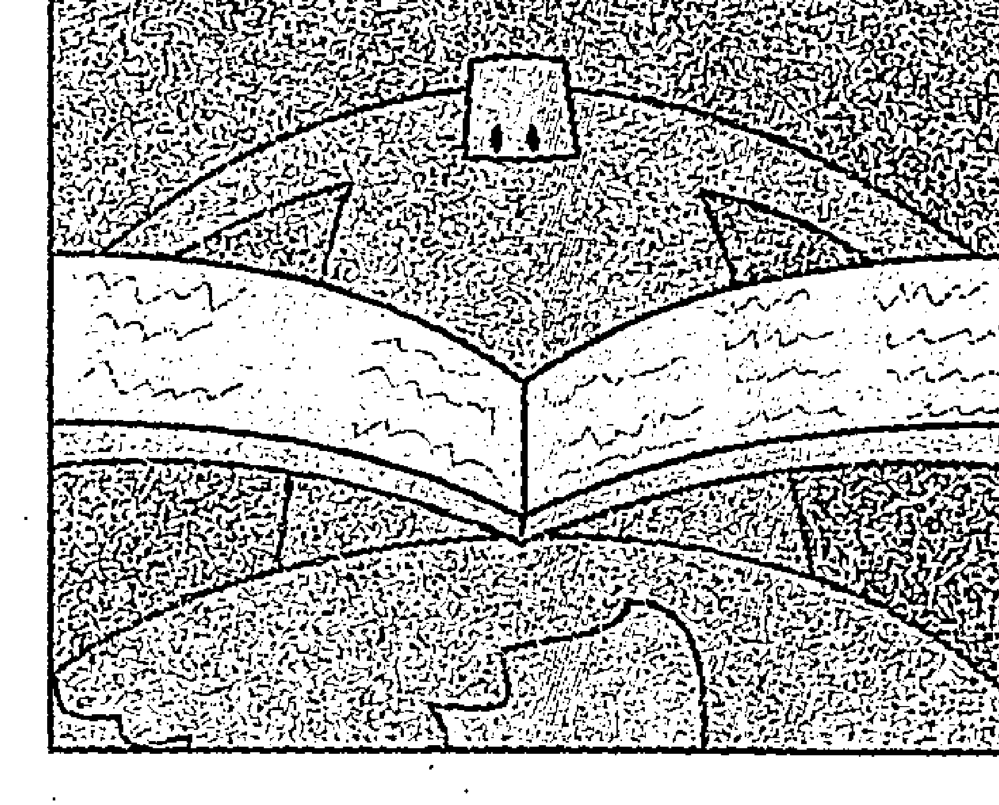

# 电脑，支配世界的运转 我们，支配电脑的运转

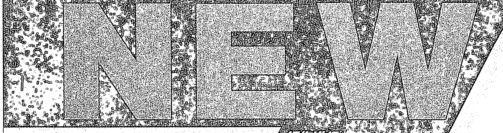

- 硬核解析 13代酷睿深度测试——办公效率报告
- 触手可及 手机办公不费力——办公场景应用实测
- 凝聚年轻 信息的加速器——数码技术全应用
- 智能联动 随身信息随心发
- AI强加持 团队信息直通库——无纸化办公的STL技术应用
- 办公利器 这一次效率大提升——办公设备的革新


七月《电脑高手》 增大版面尺寸，增加新栏目

# 电脑爱好者俱乐部特价商场

## 暑期疯狂大派送

## 拍得丽DC-S3数码相机 原价:1299元

- 310万像素
- 500万插值像素
- 4倍数码变焦
- 绚丽金属外壳
- 无限短片拍摄功能（按存储卡规格）
- 16MB内存，支持SD卡或MMC卡
- 方便易用的近拍、自拍功能

静态照片2560×1960/2048×1536/1600×1200/1280×960；动态影片320×240；镜头固定焦距7.7mm，F-number3.5；快门速度1/15～1/1000秒；自动曝光，带手动EV补偿+/-2.0EV(步长0.5EV)；自动白平衡、白炽灯、荧光灯、阴天、日光等可设；调焦范围标准1.4m至无穷远，人物0.7m至1.4m；10秒延时自拍；USB端口/TV-OUT视频输出；电池AA×2；体积小，约83.5×60×31.5mm；1.5″TFT LCD显示器；自动闪光/红眼强制闪光/禁止闪光自拍器。

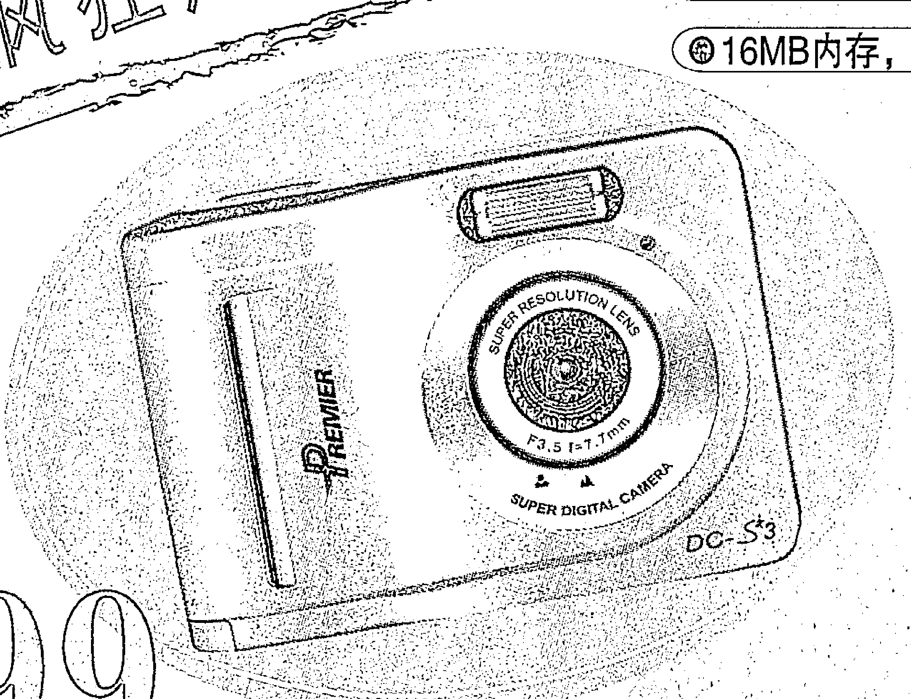

惊爆价 999元

送 一台价值449元的爱好者MF-006 MP3播放器(128M)

| 选购附件 | 规格及价格 |
| :--- | :--- |
| SD存储卡 | 128M/288元；256M /488元 |
| 读卡器 | 只读SD卡/ 68元；12合1/168元 |
| 三角架 | 15~25cm/35元；40~130cm/99元 |
| 专业相机包 | 90元 |
| 亚光相纸(包) | 128元 |
| 充电宝 | 充电器、4节电池(2000毫安时)/99元 |

## 爱好者MP3播放器普及省电版MF-006(128M)


送 价值198元的正版瑞星杀毒软件2004一套

特价:449元

中英文菜单；中文歌名、歌词同步显示；兼容MP3、WMA等音乐格式；USB直插免驱，移动存储更方便；12小时超长录音及播放时间；6种播放模式；循环方式、亮度、背光等轻松可调；独有PREVIEW功能支持曲内前进后退；可选黑色反显炫光。

## 爱好者MP3播放器zippo版MF-007(128M)

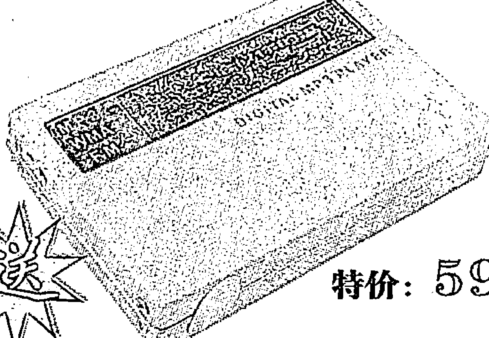

送 价值188元的35万像素摄像头或64M U盘1个

特价:599元

超大屏幕，超酷炫光；支持CD直录，可转录各种音频设备；金属外壳，腐蚀工艺，高度耐磨；多语言菜单；歌名、歌词同步显示；兼容多种音乐格式；高效锂电，播放录音长达12小时；支持优盘、录音、A-B复读等功能；内置FM调频功能，可预置20个频道，并支持同步内录；6种音效模式。

## 爱好者MP3播放器时尚版MF-008(128M)


特价:699元

经典造型，卓尔不群；超酷深色反显炫光；金属外壳，腐蚀工艺，高度耐磨；歌名、歌词同步显示；独特节能设计，可连续使用12小时；兼容MP3/WMA等多种音乐格式；支持优盘、录音、A-B复读等功能；内置FM调频功能，可预置20个频道，并支持同步内录；6种音效模式；配备铁三角牌优质耳机。

送 价值238元的128M U盘1个

## 爱好者摄像头CF-35D(35万像素)

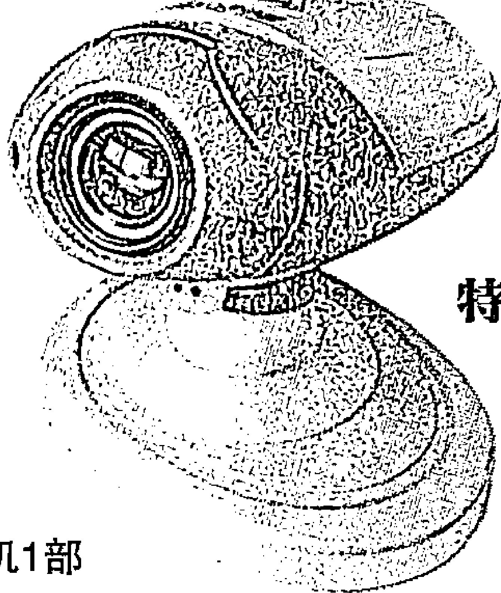

送 价值48元的电视无线伴音耳机1部

特价:188元

新一代图像传感器；高品质5组光学镜头；高性能图像压缩算法，速度快、无拖影，节省系统资源；最高动静态分辨率为640×480像素；最高帧速度每秒30帧；自动或手动控制参数调节对焦范围、色彩饱和度、光度、对比度、GAMMA校正、白平衡等；硬件快拍功能强大；转动角度上下±20°、左右360°。

## 爱好者优盘(64M)

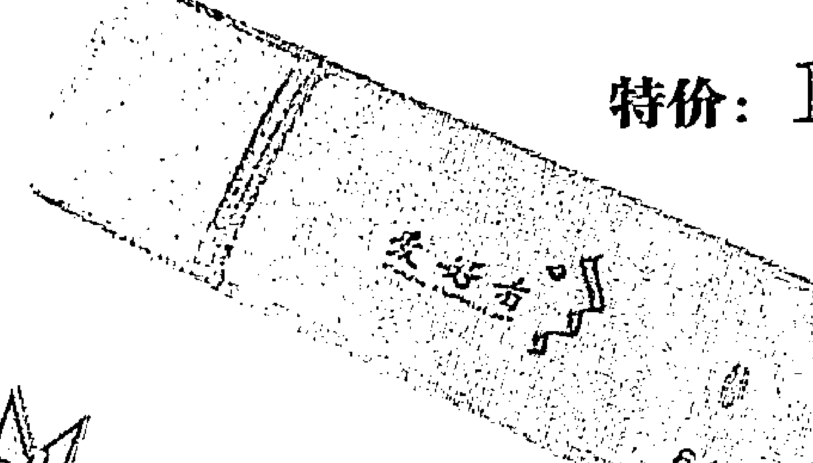

特价:148元

送 价值25元的爱好者鼠标垫1个

金属外观，造型精巧，时尚美观，方便携带；超稳定三星A级Flash芯片，数据存储更安全；标准USB接口，高速稳定；100万次反复擦写，数据可存10年；USB直接供电；兼容Win98/2000/Me/XP。

> 声明：本次活动限时限量，送完为止，如遇超额者俱乐部会立即与您联系并办理退款，请读者放心选购；欲购商品者可通过邮局办理汇款，款到发货，邮费按照产品定价的5%收取(选配附件及赠品免邮费)；请在汇款单附言栏中注明产品型号并留下个人联系电话；商城售出商品均提供一年质保，3个月包换，1年包修。

## 常用硬件工具扫描

尽管随着技术的发展，硬件设备的性能越来越强大，但是很多设备还是少不了相关软件的帮助。毫不夸张地说，在各种功能强大的软件的支持下，硬件设备才能发挥最大的威力，甚至有效延长使用寿命。在关注最新硬件技术的同时，让我们也来关心一下与硬件密切相关的软件吧。

### 一、优化软件

优化软件的作用在于提升硬件性能，往往能够取得令人意想不到的效果。当然，千万不要指望优化软件能够将 P III 变成 P4，毕竟我们还是应该着眼于现实。多年前曾经出现的 386 To 486 优化软件最终被认为是一个玩笑，但是如若运用得当，优化软件至少还是能够达到一定的性能提升效果。总之对于优化软件应该抱着平和的心态：既不可过分迷信，也不必一概抹杀。

#### 1. Windows 优化大师（图1）

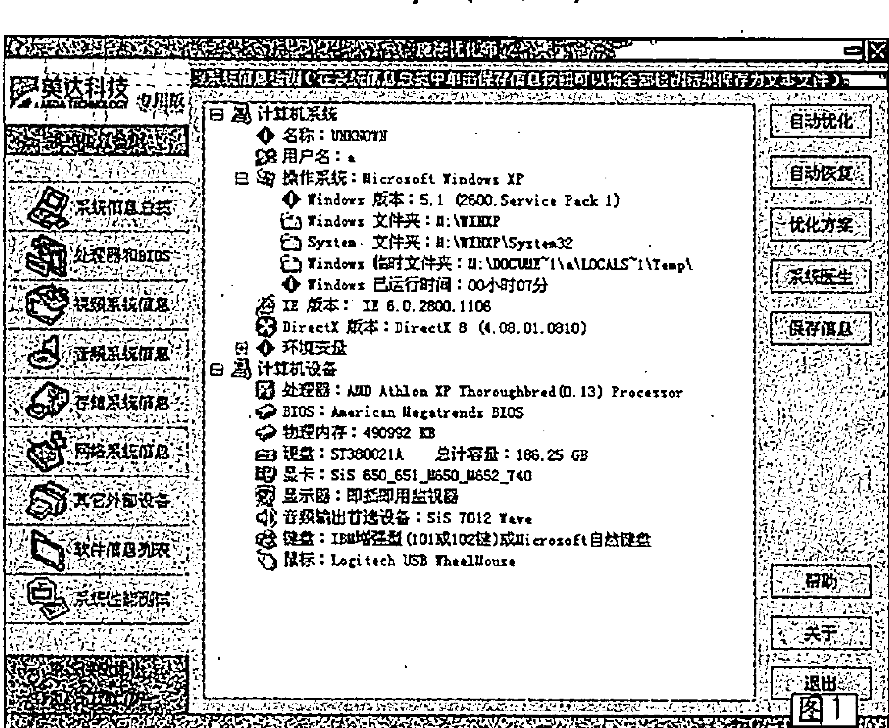

对于庞大的 Windows 而言，系统优化至关重要。从第一代 Windows 95 开始，各种优化软件就层出不穷，其中著名的 Windows Tweaker、Winbooster、WinOptimizer 等都是地地道道的英文版软件。令人感到欣喜的是，Windows 优化大师的出现让中文版 Windows 用户有了最佳的选择，其功能甚至超越了国外的同类软件。

从桌面到网络，从注册表清理到垃圾文件清除，从黑客搜索到系统检测，Windows 优化大师提供了相当全面的解决方案。Windows 优化大师软件包内置了 Windows 优化大师、Windows 系统医生、Windows 内存整理、Windows 进程管理、快猫加鞭、自动优化向导等软件模块。Windows 优化大师软件同时适合 Windows 98/Me/2000/XP 操作系统平台，能够为系统提供全面有效而简便的优化、维护和清理手段，让你的电脑系统始终保持在最佳状态。

#### 2. 超级兔子魔法设置（图2）

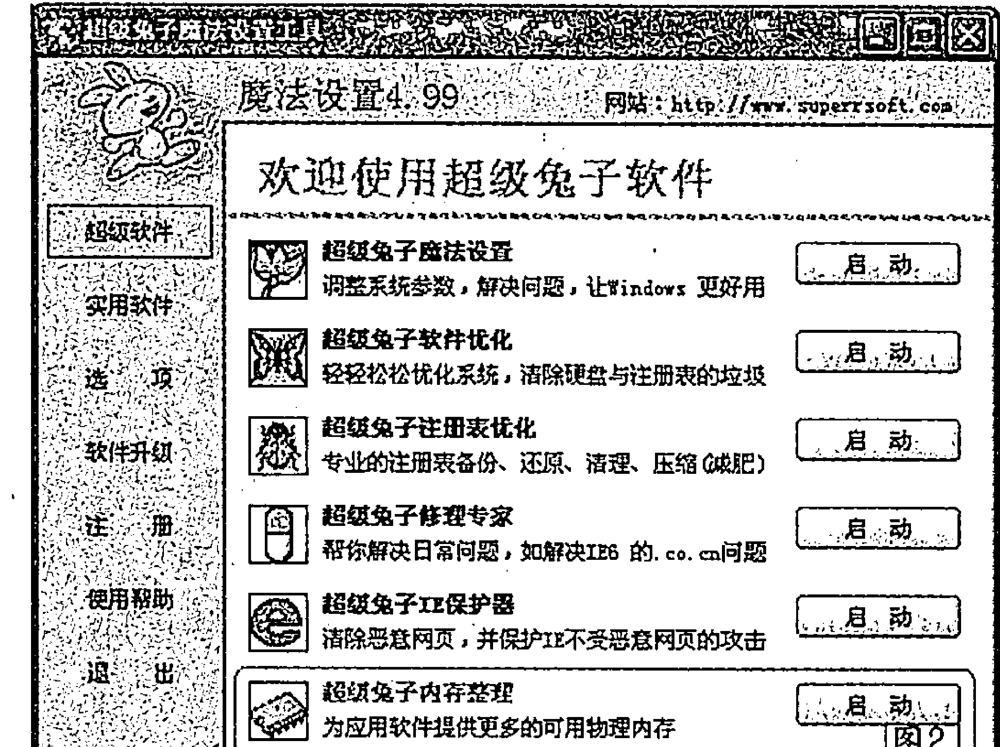

超级兔子魔法设置的定位与 Windows 优化大师十分相似，而起初超级兔子魔法设置的功能比较有限，且稳定性和兼容性都不理想。但是较为可爱的中文界面很具亲和力，所以有不少初级用户喜欢用它，现在它已成为商业软件出现在零售市场上。最新版的超级兔子2003在功能上有不少改进和增补，共支持20个方面的 Windows 设置，并且还整合了5款超级兔子系统软件（软件优化、注册表优化、修理专家、IE 保护器和内存整理），涉及到了 Windows 修改与优化的方方面面。总体而言，无论是 Windows 优化大师还是超级兔子魔法设置，其优化效果都达到令人十分满意的境地，强烈推荐用户选择一款使用！

#### 3. Norton Utilities（图3）

对于大多数系统优化软件而言，似乎注册表都是最终的着眼点，这就不可避免地出现雷同，而且技术上难以有重大突破。而 Symantec 公司出品的 Norton Utilities 历来就是 Windows 优化软件中的泰山北斗，其功能之强大是其他软件所无法比拟的。毫无疑问，Norton Utilities 是一套真正意义上的 PC 实用软件工具包，它集成了磁盘修复、磁盘优化、系统维护、系统优化等一系列功能。对于高级用户而言，Norton Utilities 的强大功能确实十分实用，毕竟这已经不仅仅是一款简单的注册表优化软件，而是可以全面提高系统的稳定性与性能，并且在磁盘管理、数据保护、系统安全等多方面达到了令人满意的效果。

#### 4. WinRAM-Booster Pro

WinRAM-Booster Pro 可以强迫 Windows 将“物理内存”让出来提供给重要软件使用，对于内存容量在128MB以下的用户特别适用！当你同时开启好几套软件时，还是会感觉到电脑效能的明显降低。其中有一部分原因就是因为 Windows 没有办法完全有效地利用内存，而且 Windows 本身的内存管理机制相当低能。在大多数情况下，Windows 往往没办法最好地利用“物理内存”。WinRAM-Booster Pro 2000 是一套可改善增加内存的工具，可以提高电脑使用时的效能及速度。例如：如果你的电脑在一开机时就会自动执行一些程序，然后你又开启了几套程序，这时如果你再运行 Word，很有可能因为所有的物理内存已经被其他软件占用了，Windows 只好使用虚拟内存，从而使得 Word 的运行效能降低。这时你就可以利用 WinRAM-Booster Pro 让 Windows 把物理内存“吐”出来给 Word 使用，Word 能够跑得顺一点（128MB内存的配置约可提高33%～40%的效果）。WinRAM-Booster Pro 功能很强，它可以让你指定内存给特定的软件使用。例如：你可以在桌面上建立某个程序的快捷方式，并且在 WinRAM-Booster Pro 中指定分配给该程序的物理内存。这样当你运行此软件时，就有足够的物理内存可以使用了！

#### 5. Cacheman

Cacheman 是一个用于优化 Windows 缓存设置的工具，可以让你方便快捷地设置 Cache 中的某些参数，分别对 Disk Cache（磁盘缓存）和 File Cache（文件缓存）进行优化，并可以对不同的使用环境进行不同的优化设置，使之最大限度地发挥自己的威力，从而有效地提高系统的运行速度。Cacheman 的界面做得非常体贴用户，用户可以在该窗口的上半部分看到系统当前的内存使用状况，包括物理内存（Physical memory）和虚拟内存（Virtual memory）的可用空间数、总空间数、可使用的系统资源（Free Resources），而在该窗口的下半部分则可以方便地对系统的 Disk Cache 和 File Cache 进行设置。

所谓 Disk Cache，即是我们常说的磁盘缓存，主要用来储存一些常用的数据，使之在被再次调用的时候更快地被读取。在 Windows 工作时，系统可能会不断增大 Cache 的大小，导致浪费过多的 RAM。而在 Cacheman 中，可以设定 Cache 的最大值和最小值，使 Windows 不再浪费 RAM，提高电脑的性能。设定方法十分简单，只需用鼠标直接在“Disk Cache”页面中拖曳“Minimal Disk Cache”、“Maximal Disk Cache”设置项中的滑块即可调整缓存空间的最小、最大值。在这里，我们还可以设定磁盘缓存块（Chunk Size）的大小。因为 Disk Cache 在内存中分为许多小块，如果块设置得太小就会占据过多的资源。在 Cacheman 中，你可以根据自己的需要来设定块的大小，只需用鼠标直接拖曳“Chunk Size”项中的滑块即可调整缓存块的大小。

Cacheman 的另一个功能就是设置系统的文件缓存（File Cache），可分别对系统的文件名缓存（Name Cache）和目录缓存（Directory Cache）进行设置。所谓 Name Cache，就是用来记录 Windows 曾经访问过的文件的路径，以加快下次访问的速度；而 Directory Cache，就是用来记录 Windows 曾经访问过的目录和该目录下的文件个数，以加快对目录的操作速度。

#### 6. 快猫加鞭

也许是国内的网络速度太慢了，也许是微软的 Windows 太低能了，也许是 Modem 生产厂商的驱动程序编写员考虑不够周到，普通 56K Modem 优化后竟然会判若两“猫”。这就使得原本技术含量并不高的 Modem 的加速软件有了生存的空间。作为一款较早推出的 Modem 加速软件，快猫加鞭的确表现出色。一般而言，经过它优化的 56K Modem 能有 10% 左右的速度提升，应该说已经很让人满意了，而且它也能用于 ADSL、Cable、FTTB 等宽带网。此外，快猫加鞭的“Readme 文档”做得十分详细，里面有不少软件加速原理，使用户在使用该软件时也能获得不少知识。

### 二、测试软件

自己的 PC 究竟性能如何？价格不菲的 CPU 是不是 Remark 产品？系统的性能瓶颈又在哪里？这些都是 PC 用户十分关心的话题。毫无疑问，使用测试软件将有助于我们更加公正、全面、科学地看待问题。

#### 1. CPUmark 99（图4）

CPUmark 99 是由大名鼎鼎的 ZD Labs 推出的专业级 CPU 测试软件，它现在已经整合在 Winbench99 中。不过，CPUmark 99 也有独立版本，其下载地址是 ftp://...（地址不完整，保留原文）。

CPUmark 99 的使用非常简单，无需我们多做介绍。执行主程序后，按下“Run Test”按钮即可进行标准测试，而且 CPUmark 99 也不像其他大型测试软件那样可以自定义测试方式。CPUmark 99 可以对你电脑的 CPU 子系统的效能给出标准的评估分数。简单地说，就是给你的 CPU 打分。这个分数表示你的 CPU 速度的快慢，分数越高，表示你的 CPU 速度越快。

#### 2. N—Bench 2.0

N-Bench 是 AMD 日本公司开发的一款 CPU 性能测试软件，它主要偏重于 CPU 3D 处理速度的测试。尽管 N-Bench 是由 AMD 开发的，但是其测试成绩还是相当公正的，AMD 并没有对 Intel 做手脚。此外，N-Bench 2.0 支持 3DNow!、Professional 3DNow! 和 SSE、SSE2 多媒体指令集，可以充分发挥 CPU 的潜力。不过，N-Bench 2.0 至少需要 700MHz 以上的主频才能完成测试，而显卡也必须具有 32MB 以上显存。N-Bench 2.0 的下载地址为 http://gwbnsb.pchome.net/system/benchmark/n-bench2.exe。N-Bench 2.0 主要通过运行一些苛刻的 3D 场景去测试处理器的能力，如 3D 场景渲染、粒子生成等，一共分为 3D CG 影片生成、3D DEMO 渲染和 CPU Benchmark 三部分。在 N-Bench 2.0 的测试中，画面和声效得到了完美结合，给人的感觉是在享受，而不是枯燥乏味。

#### 3. 3Dmark03 (图5)

如果你的显卡能够支持 DirectX 9 API，那么选择 3Dmark03 进行测试也是可行的。但是需要提醒大家的是，目前 3Dmark03 的公正性受到置疑，因此性能间的比较应该仅仅局限于同一品牌的产品，而不要将 nVIDIA 与 ATi 进行横向比较。事实上，测试软件因为种种原因而出现的不公正现象并非是最近才出现的，单纯的数据根本无法全面地反应产品的性能，充其量只能是一个参考数据。如果我们将其作为衡量产品性价比的唯一标准，那么最终失之偏颇的还是我们自己。从 3Dmark99 到 3Dmark03，一代又一代的 3Dmark 在扶持厂商的同时也害苦了其竞争者。以 3dfx 为例，因为先后缺乏 32Bit 渲染与硬件 T&L 而在 Benchmark 中远远落后于 nVIDIA，而这些技术特性的应用价值并不大。对于用户而言，当时的 Voodoo3 与 TNT2、Voodoo5 与 Geforce2 GTS 之间的差距并没有测试软件所表现出得那样明显。显然，错误的评估方法误导了我们。目前最令人担心的不仅仅是测试方法的问题，驱动作弊更加难以接受。在渲染精度方面，厂商很容易做一些手脚，此时分数就能大幅度提升。也正是基于这一点考虑，我们建议大家仅仅将 3Dmark03 作为参考成绩，而不是评价显卡 3D 表现优劣的风向标。

#### 4. Nero CD Speed (图6)

以 Nero 刻录软件而出名的 Nero 公司所推出的 CD Speed 可谓是目前最好用的一款光驱测试软件，大家只要安装完整版的 Nero 刻录软件即可，因为这个测试工具已经集成于刻录软件包中。将 CD 光盘放入光驱之后，我们按下 Start 按钮即可开始测试。需要注意的是，光驱的测试成绩与我们所使用的光盘也有很大的关系，因此尽量使用优质的正版光盘。此外，不同种类的盘片也会客观上决定测试结果。CD-R 与 CD-RW 盘片的反射率远不如压制的 CD，因此结果会相差很多。一般而言，建议大家使用 CD 数据盘、CD-R、CD-RW 与 CD 音乐光盘分别进行测试。

Nero CD Speed 在对整张光盘进行读取之后会显示出所有重要的信息，其中包括平均速度（Average）、开始速度（Start）、结束速度（End）和读盘类型（Type）。对于前三者，想必大家很容易理解，自然是数值越高越好。当然，大多数用户还是喜欢参考直观读取数据图。图中绿色的线条表示对应每一时刻的读取速度，而黄色的线条表示光驱电动机的转速（×100）。如果盘片质量理想的话，读取的数据图应该相当平滑，没有明显的凹凸。当然，有时我们还可以用带有少量划痕的光盘来考验光驱的纠错能力，此时优秀的光驱会在遇到数据错误时尝试重新读取或进行纠错。

#### 5. Displaymate

一般而言，常见的 CRT 显示器瑕疵是聚焦不准、摩尔纹、边角色彩不均匀、高频稳定性不够等。如果借助相关测试软件的话，测试过程将异常轻松，推荐大家使用 Displaymate。Displaymate 内置了 Video Obstacle Course 这个疯狂的测试单元，这一项目搜集了许多常规显示器难以通过的显示图片以测试显示设备，不过说穿了它不过是从 Tune-Up Program 中挑选出来几个最常用的测试项目。

Video Obstacle Course 包含了文字清晰度测试、单色纯度、网格偏移、色彩过渡、刷新率效果等。Tune-Up Program 可以说是 Displaymate 的精华所在，集中了大量的显示测试功能，能有效地检测出一款显示器的性能好坏。不过对于目前大部分用户来说，其中的一些测试项目要求比较苛刻，十分专业化，因此对显示器也不可要求太高，毕竟大多数人用的都是民用市场产品。

Geometry and Distortion 是测试几何变形的有力工具，任何细微的偏差都逃不过它的火眼金睛。Sharpness and Resolution 测试单元收集了一些显示难度非常高的图片，有些近乎苛刻。如果从事图形设计或者网页制作，显示器的色彩与灰度表现是极其重要的，DisplayMate 的 Color and Gray-Scale 测试单元可以非常方便地检验显示器的这方面能力。DisplayMate 的最后一项测试可以检验显示器在各种刷新率下的效果。

需要明确的是，并非所有显示器在同一刷新率下的效果都是一致的！这主要取决于电子枪扫描的稳定性。同样是 85Hz，很可能部分显示器还会让人感到闪烁，而有些中高档产品就没有类似现象。

#### 6. SiSoft Sandra Standard 2004

对于大多数用户而言，需要一款使用简单，并且可以立即知道电脑具体配置与性能的软件，而这两个方面正好是 SiSoft Sandra Standard 2004 的特长。不过大家需要注意的是，SiSoft Sandra 2004 有两个版本，一种是网上可以随便找到的标准版 SiSoft Sandra Standard 2004。这个版本相当于试用版，界面和菜单与专业版完全一样，但其中部分功能被屏蔽掉。相对而言专业版 SiSoft Sandra Professional 2004 的功能更加全面，不过价格不菲。一般来说，我们使用标准版 SiSoft Sandra 2004 就可以了。

SiSoft Sandra 的模块被分成四类：Information Modules（信息类模块）、Benchmarking Modules（分值测试类模块）、Listing Modules（列表类模块）和 Testing/Diagnostic Modules（测试/诊断类模块），这四类模块形成了 Sandra 强大的系统分析测试功能。毫无疑问，信息类模块和分值测试类模块是最有用的。在 SiSoft Sandra 的信息类模块中，我们可以对 CPU、显卡、声卡、硬盘、内存等硬件的信息详细了解。当然，大家更为关心的还是性能测试模块。在这里，我们可以测试 CPU、内存、磁盘、网络性能，而且 SiSoft Sandra 为我们列出了多种常见配置的测试成绩，大家可以横向比较。

### 三、超频软件

超频可谓是 DIY 永恒的话题，通过简单的设置，低频率的 CPU 可以稳定运行在更高频率，从而大幅度提升性价比。虽然通过主板上的跳线或是 DIP 开关，我们就可以方便地超频，但是如果你想让超频过程更加方便，超频后的稳定性更高，最大限度地榨取 CPU 的剩余价值，那么使用这些特别为超频而开发的软件将是十分有效的。此外，在一些相关软件的帮助下，我们的显卡也能超频。

#### 1. SoftFSB (图7)

无论主板的功能再强大，我们超频的时候仍然要不断地重启、进 BIOS，如果超频失败还要清 CMOS。而 SoftFSB 这个软件却为我们省却了很多繁琐的步骤。这是一款专门修改主板外频的实用软件，使用它可以非常容易地调整系统外频。SoftFSB 工作的原理是通过调整主板上的外频产生器，达到调整系统外频的目的。当然这样仅仅只能用于调整外频，而不能调整 CPU 倍频。

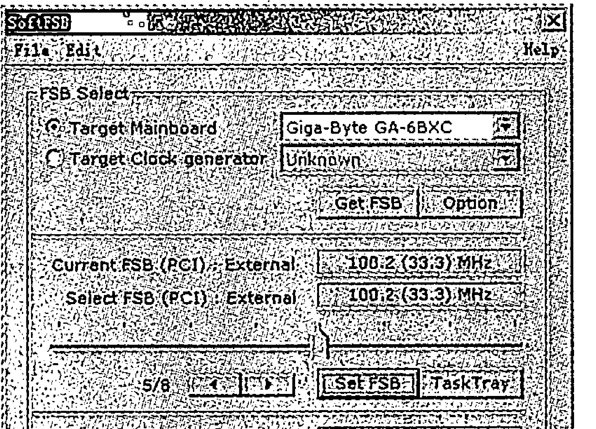

我们都知道 CPU 的工作频率实际上是由主板上的时钟发生器所控制，以往的主板都是通过跳线或者在 BIOS 中对其进行控制，从而得到我们所想要的频率。SoftFSB 也采用了相同的工作原理，不过它是在 Windows 界面下对时钟发生器进行控制。SoftFSB 作用如其名称，就是采用软件方式对 CPU 的 FSB (Front Side Bus，前端总线) 进行控制。

SoftFSB 的使用非常简单，只要你知道自己主板的生产厂家、型号以及时钟发生器，就可以对 CPU 的外频进行更改。即使主板不在 SoftFSB 的支持范围之内，用户仍然可以通过 SoftFSB 对 CPU 外频进行控制，因为 SoftFSB 是对时钟发生器进行控制，只要选择正确的时钟发生器就可以了。目前主板上的时钟发生器多为 IC、ICS、Winbond、PhaseLink、IMI、C-Media等几大牌子，采用跳线或者DIP开关设置CPU的主板，时钟发生器就在跳线或者DIP开关的附近。

#### 2. WCPUID（图8）

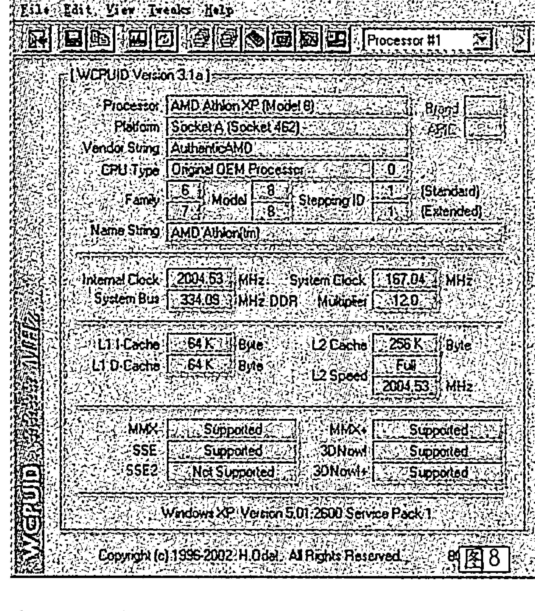

在超频时，大家很有必要全面了解一下自己的CPU，包括制作工艺、内核等，这样在超频时就会有的放矢。虽然不少测试软件都可以测试出机器里CPU究竟是什么品牌、型号、运行在什么频率，但是像Intel或者AMD公司出品的CPU即使同一主频也有不同型号的情况发生。比如Intel公司的2.4GHz Pentium4 CPU就有2.4BE和2.4C两种，3.2GHz的Pentium4 CPU也有代号为Northwood和Prescott两种内核的不同型号；AMD也有老型号的A0版AthlonXP和B0版。这一切无疑为我们通过经验来辨别CPU的型号增加了空前的难度。美丽的外表下究竟安了一颗什么样儿的“芯”呢？使用WCPUID这个软件，神秘的面纱立即为你揭开！只有了解了这些信息，我们才能更加有效地超频。

WCPUID的全称是Windows CPU ID。该软件是由H. Oda创作的全免费软件，它通过CPU的ID号来识别CPU的详细型号。该软件也是一款真正的绿色软件，可以在Win9x/Me/2000/XP下直接运行，并不需要安装也不需要在Windows目录下添加任何DLL文件，且不会更改系统注册表文件。

WCPUID的主窗口右上方有一排按钮，第1个是重新分析当前CPU，第2个是详细测试CPU所支持的多媒体指令。当点击这个按钮后，将会看到包括是否具有片内协处理器FPU，以及是否支持虚拟模式扩展等项目在内的多达二十余种特殊项目测试。在接下来的Cache Info和Cache Reg两个子项目里我们同样可以观察到系统Cache的详细信息，包括Cache的大小，工作速度、模式、结构，支持的线程，可缓存空间大小等等信息。

#### 3. WaterFall Pro（图9）

WaterFall Pro是一个老牌的降温软件，由Yihong开发，它的运行非常稳定，这是很多同类软件所不及的。使用WaterFall Pro可以有效地降低CPU的温度，而且还可以延长CPU的寿命（CPU温度每降低10℃，它的使用寿命就会延长一倍）、降低电源消耗量。该软件还具有优化CPU的功能，运行时只占用1%～2%的系统资源。尽管微软的操作系统已经具有良好的电源管理功能，但是通过测试发现使用WaterFall Pro依然能够大幅度地降低CPU温度。

WaterFall Pro最大的特点就是其独特的CPU Throttle（温度调节器）设计，因此在CPU温度管理方面与其他软件相比有着独到的优势。该软件除了可以有效地降温外，通过CPU Throttle，用户还可以自行设定警戒温度的高低、时间的长短等附加条件值。一旦CPU温度达到警戒值或持续一段时间，整个CPU会负担很大、效能降低，这时Waterfall Pro就会自动“强制”降低系统的负担，达到降低CPU温度的作用。另外，我们认为这个软件的节电功能对于笔记本电脑用户来说非常重要，能够使得电池使用时间更长，电池寿命也会相应增长，从而节省大量的维护费用。

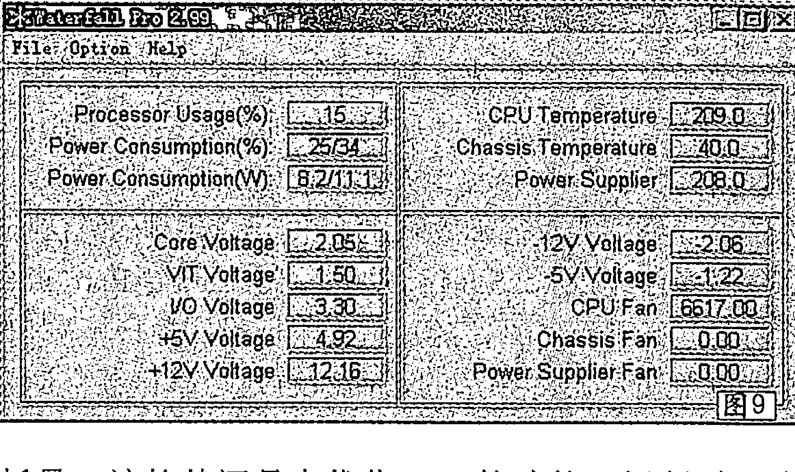

#### 4. Motherboard Monitor

Motherboard Monitor是一款功能强大，界面友好的系统监测工具。Motherboard Monitor能够从主板上获得很多信息，如LM75、LM78、LM78-j、LM79、LM80、WinBond W83781D、WinBond W83782D、WinBond W83783S、WinBond W83627HF、Asus AS99127F、GL518SM、GL520SM、ADM 9240、ADM 1021、ADM 1020、MAX 1016，MAX 1016a、FMS 2701，VIA686、THMC10和THMC50等。另外Motherboard Monitor还能获得主板温度、电压、风扇速度。

当温度高过设定值时，Motherboard Monitor便会启动软件、警示音乐或是显示警示文字警告你，并且可以输出TXT、HTML以及XML格式的记录文件。毫不夸张地说，有了Motherboard Monitor这款软件，就基本免去了超频的后顾之忧。毫无疑问，Motherboard Monitor为超频用户提供了最大限度的保护，大家正确使用它就可以及时了解自己的超频系统是否处于危险境地。

#### 5. PowerStrip

运行3D游戏时，显卡的像素填充率和显存带宽是决定速度的关键。因此我们可以考虑提升显卡内核与显存的工作频率。尽管部分显卡都有自己的专用超频程序，但是最通用的方法还是使用大名鼎鼎的PowerStrip。

#### 6. Riva Tuner

Riva Tuner是一款专用的显卡超频软件，可以为主流显卡提供完善的频率修改支持。然而更为重要的是，Riva Tuner还支持破解显卡的渲染流水线，诸如Radeon 9500破解为Radeon 9700，Radeon 9800SE破解为Radeon 9800Pro，这些都可以由Riva Tuner来实现。

以破解渲染流水线为例，首先安装好催化剂驱动，将C:\Windows\System32\drivers目录下面的ati2mtag.sys复制到C盘根目录（可以直接在我的电脑中查找该文件），同时下载安装最新版本的Riva Tuner。然后运行Riva Tuner，选择进入“Power user”模式并点击“Open patch script”选项。进入ATI目录，选择“Soft9x00”，在弹出的对话框中选择“Force 9800 Capabilities”，并点击Continue。此时系统会寻找ati2mtag.sys文件，只要将其指定为C盘根目录即可。短短几秒之后，Riva Tuner会提示修改成功，我们将修改后的ati2mtag.sys文件复制到C:\Windows\System32\drivers目录即可激活被屏蔽的渲染流水线。

### 四、硬件模拟与维护软件

随着PC系统的提升以及软件技术的发展，各种能够模拟硬件工作或者维护硬件的软件工具相继出现。对于用户而言，这些软件的价值是毋庸置疑的，有时甚至比真实的硬件更为强大，同时还能延长PC硬件的使用寿命。

#### 1. DVDIdle (图 10)

客观而言，目前DVD光驱的唯一作用便是播放DVD影碟，毕竟DVD数据盘在国内还未普及。但是，DVD光驱仍属于消耗产品，其寿命不可能与CPU、内存等相提并论，如果长时间工作的话，很可能造成读盘能力下降，甚至不认盘。为此，如何保护DVD光驱就成了十分关键的问题，特别是对于那些使用价格不菲的COMBO的用户。

事实上，无论大家在使用时有多么小心，厂商在防尘技术等方面有多大的突破，激光头的老化总是不可避免的，这也是光存储产品的一大通病。为此，尽可能地减少激光头工作时间是唯一切实可行的办法。众所周知，播放DVD影碟时，我们的DVD光驱只要以2X速度工作即可胜任，而如今的DVD已经跨上了16X的时代，因此利用高速读取是减少激光头工作时间的关键。

以普通方法播放DVD影碟时，DVD光驱在一刻不停地工作，这对于激光头的损耗是相当厉害的。在VCD时代，很多人尝试将DAT文件拷贝到硬盘播放，不过这一办法对具有版权保护功能的DVD可起不了任何作用。不过，我们的处理方法还是万变不离其宗。利用DVDIdle这款软件，我们可以让DVD光驱将影碟中的信息以最大速度预读到硬盘，如此一来便大大减轻了激光头的负担，也能提高画面流畅度。激活DVDIdle之后，DVD光驱在播放影碟时就能预读数据，一般只需要1/8的时间就能预读完毕，有效地延长了寿命。

当然，在使用DVDIdle时要注意硬盘剩余空间，默认缓存保存于C盘。除此之外，DVDIdle还具有破解区码的功能，默认方式即启动了该功能，无需过多的人为干预。

#### 2. 虚拟光驱 (图 11)

虚拟光驱其实是一种模拟CDROM或者DVDROM工作的工具软件，它并不是指一个真正的光驱设备。简而言之，虚拟光驱就是在Windows操作系统中通过特殊程序虚拟出一个与光驱功能相同的软件驱动器。

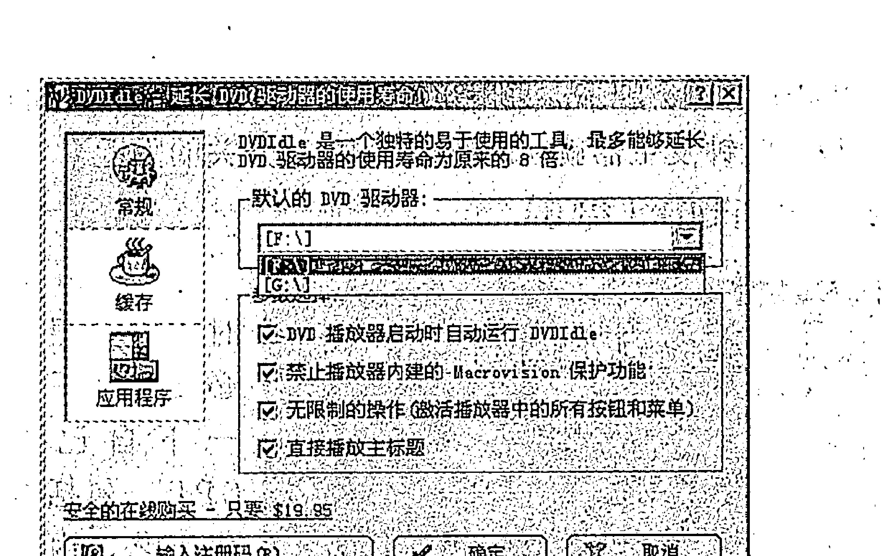

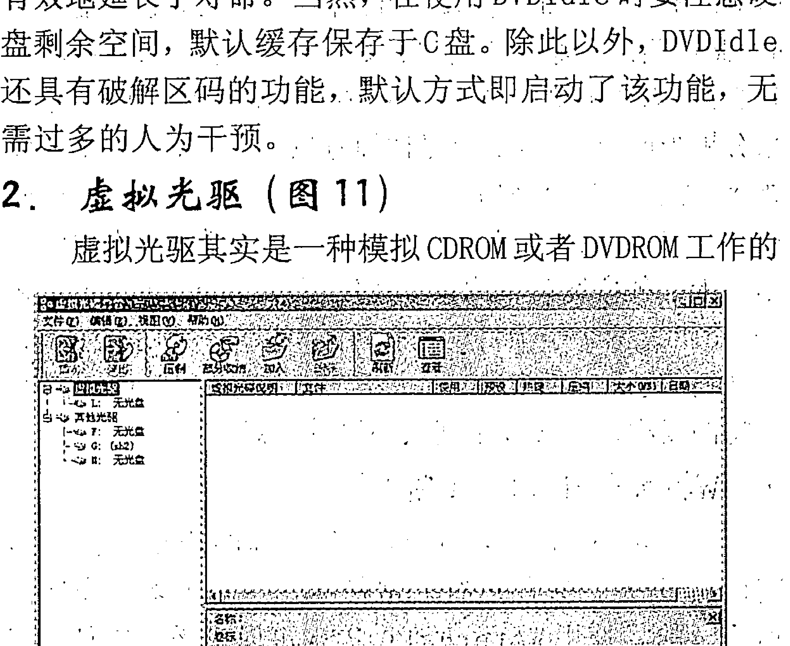

虚拟光驱表面上看来与真实的光驱没有什么区别，你可以在“资源管理器”窗口中正常地操作虚拟光驱中的文件，几乎察觉不到这是虚拟的，只是放入、退出光盘是通过软件来控制的。现在的虚拟光驱软件兼容性都相当出色，几乎所有的应用程序都可以做在一张虚拟光盘上并且运行顺利，即使是需要使用光盘卷名和光盘属性的程序或游戏仍然可以在虚拟光驱上顺畅运行。

物理光驱的速度与纠错能力一直令用户难以满意，而且频繁地取出再放入光盘的确是一件麻烦的事情。有了虚拟光驱之后，一切问题都能迎刃而解，用户再也不必担心光盘磨损、光驱激光头老化等问题，而且数据的读取速度也将飞速提高。

当用户需要启动应用程序时，不必将光盘放在光驱中，也就无需等待光驱的缓慢启动，只需要在插入图标上轻按一下，虚拟光盘立即装入虚拟光驱中运行，快速又方便。只要你的硬盘容量足够大，理论上还是在硬盘上存放足够多的镜像文件，此时切换光盘也将是异乎寻常的简单。

由于虚拟光驱实际上是对硬盘上的数据进行操作，因此速度相当于100倍速的物理光驱，这将会使游戏，特别是大场景的载入更为顺畅。其次，经常运行一些质量不佳的光盘对光驱的伤害是非常严重的，而使用虚拟光驱可以一次性地把光盘数据读入硬盘做成虚拟光盘，然后就不需要反复读取光盘，可以减少光驱的使用频率，延长光驱的寿命。还有，虚拟光驱映像文件作为一种特殊格式的文件存放在硬盘上，病毒是不会对这种文件感兴趣的，也就是说虚拟光盘还有防毒作用，用户尽可以将重要文件做成虚拟光盘而高枕无忧。

#### 3. RAMDISK

很多用户使用具有VIVO功能的显卡，或者多媒体电视卡，利用AV视频输入功能可以方便地进行视频捕捉，配合录像机、摄像机、摄像头、游戏机等设备十分有趣。不过遗憾的是，大多数显卡与电视卡使用的视频芯片都不具备实时压缩功能，因此视频捕捉的速度让人难以满意，特别是在配置不高的情况下，丢帧更是常有的现象，并且随着分辨率的提升而越发严重。

事实上，整个视频捕捉过程的最大薄弱环节就在于存储系统。我们所使用的IDE硬盘的速度实在太慢了，而且占用大量的系统资源。以采用软件编码实时压缩高品质的MPEG4视频为例，至少需要1.2GHz以上的CPU和7200r/min高速硬盘。对于硬件配置不够的用户而言，这无疑是非常痛苦的。难道除了升级硬件设备就没有其他解决方案了吗？当然不是！如今的内存十分便宜，巧妙地利用内存来虚拟硬盘将达到十分出色的效果。

RAMDISK可以利用内存模拟技术产生与硬盘功能一模一样的虚拟硬盘，它可依照内存大小设定模拟的硬盘空间大小，最大支持到4GB。利用RAMDISK虚拟512MB硬盘已经足够存放MPEG4视频文件。需要注意的是，RAMDISK分为NT内核版本与Win9X内核版本，大家在使用时要注意一下自己的操作系统。RAMDISK的界面十分直观，执行主程序后，我们可以在同一窗口中设置所有的选项。

Disk Type与Disk Size是我们首要关注的。首先将Disk Type设定为“Hard Disk”，然后Disk Size可以设定为我们所需要的容量。至于Drive Letter，只要不与现有的盘符相冲突即可。如果设定的虚拟硬盘容量大于32MB，建议大家选中FAT32 Format，这样可以节约空间。倘若希望每次启动时都能使用虚拟硬盘，那么可以选中“Start Driver at Boot”，至于卷标以及临时目录我们无需使用。

#### 4. VMWARE (图12)

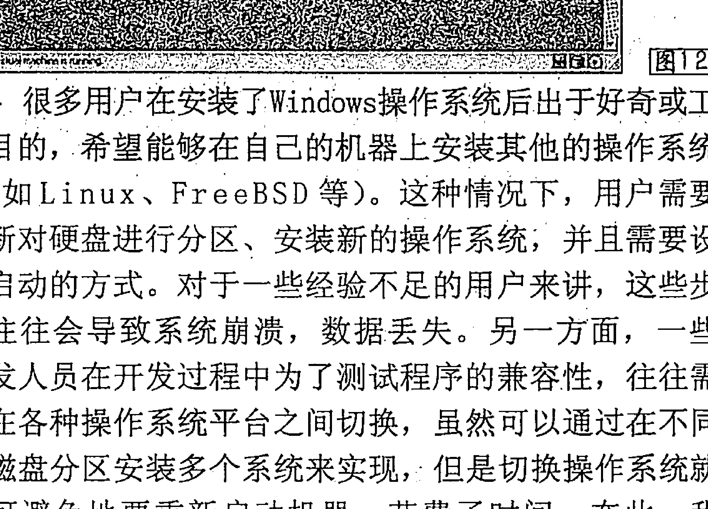

很多用户在安装了Windows操作系统后出于好奇或工作目的，希望能够在自己的机器上安装其他的操作系统（诸如Linux、FreeBSD等）。这种情况下，用户需要重新对硬盘进行分区、安装新的操作系统，并且需要设置启动的方式。对于一些经验不足的用户来讲，这些步骤往往会导致系统崩溃，数据丢失。

另一方面，一些开发人员在开发过程中为了测试程序的兼容性，往往需要在各种操作系统平台之间切换，虽然可以通过在不同的磁盘分区安装多个系统来实现，但是切换操作系统就不可避免地要重新启动机器，花费了时间。在此，我们推荐大家使用VMware Workstation。

顾名思义，VM就是Virtual Machine虚拟机器，该软件通过在已有的操作系统当中模拟一台机器来实现多个操作系统共享，并进行操作系统之间的简单切换。由于直接使用了X86的保护模式，VMware在性能上有十分出色的表现。它可以在一台X86微机上同时、并行地运行多个不同的操作系统，或者同一个操作系统的不同版本，包括Linux、Win95/98/NT/2000/XP等。并且，在多个操作系统同时运行的情况下，其中一个操作系统的崩溃并不影响其他正在运行的系统。（文 / 阿亮）

## DOS 磁盘工具扫描

几乎所有的磁盘工具都要求在DOS模式下使用，即使少数能够在Windows界面下使用的磁盘工具，其底层操作仍然需要重新启动至DOS模式下完成。这里，笔者向朋友们介绍一些非常重要的DOS磁盘工具。

### 1. FDISK

这个东西的重要性不用笔者在这里多说了吧？如果你曾有过使用超级启动盘的经验，那么应该不会陌生FDISK.EXE的分区功能，在Windows 95和Windows Me时代，FDISK几乎是唯一的分区选择，如果你希望成为一名高手，那么一定要掌握FDISK的分区操作（见图1所示），如果你怕危险，可以在虚拟机上练习。

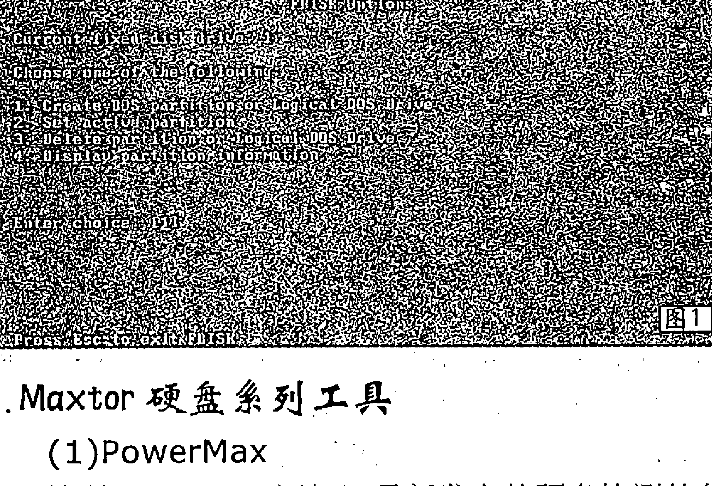

### 2. Maxtor 硬盘系列工具

#### (1) PowerMax

这是 Maxtor（迈拓）最新发布的硬盘检测软件，适用于全部 Maxtor/Quantum 系列硬盘，可以让用户及早发现硬盘上的隐患，例如坏道、坏扇区、分区格式化错误等，也可以解决硬盘无法被操作系统正确识别的问题。

#### (2) Acoustic Management

Maxtor Acoustic Management 设置工具，可以让你控制迈拓硬盘工作时的“音量级”，它分为 Quiet 和 Fast 两个级别。如果你选择了 Quiet，那么磁盘将进入安静寻道模式，此时噪音明显减小，但磁盘性能大幅度下降；如果你选择了 Fast，那么磁盘将进入快速寻道模式，此时噪声减小，磁盘性能有一定下降。Acoustic Management 的主执行文件是 amset.exe，它拥有四个命令参数：当输入 amset.exe /quiet 时就切入了 Quiet 模式；输入 amset.exe /fast 时就切入了 Fast 模式；当输入 amset.exe /off 时就关闭了降噪功能，此时硬盘性能最高，但噪音最大；输入 amset.exe /check 可以查看当前硬盘降噪功能的运作状态。

#### (3) Write Verification

可以调整硬盘的写校验模式，适用于 Maxtor DiamondMax Plus 40 UDMA/100、DiamondMax 60 UDMA/100、DiamondMax VL 30 UDMA/100 以及更新型号的UDMA/100 Maxtor 硬盘。

### 3. Seagate 硬盘系列工具

#### (1) DiscWizard Starter Edition

可以创建一个带有DiscWizard Starter Edition的启动磁盘，用这张磁盘引导系统，可以快速格式化IDE/ATA/SCSI驱动器，一般情况下只需1分钟即可完成新硬盘的安装工作，如果选择“高级安装”选项，还可以为某个分区选择自定义簇的大小。

#### (2) Reg48bitLBA

如果你打算在Windows 2000 SP3或Windows XP SP1操作系统中安装大于137GB以上容量的硬盘，那么需要对注册表键值“EnableBigLBA”进行设置，才能对48位硬盘提供正确的支持，这个工具就是用来重置注册表中相应的键值的，同时安装时还会检测系统是否支持48位硬盘。

#### (3) SeaTools DiscDiagnostic

当系统出现故障时，SeaTools 能够帮助用户快速判断故障的原因，例如这些故障是源自硬盘或是由其他软、硬件问题所造成，这款软件能够自动创建一张可启动的软盘，软盘内包括一个可以引导的 Ontrack 操作系统，需要检测硬盘时只需要用这张软盘引导系统，然后会自动进入 SeaTools 的操作系统，可惜的是只能检测基于 FAT 的硬盘，不支持 NTFS、HPFS 分区。

### 4. Western Digital 硬盘系列工具——Data Lifeguard Tools

西部数据公司的Data Lifeguard技术是原有的数据保护技术的延伸，包括嵌入式错误检测技术、硬盘实时环境保护系统、硬盘自动修复系统，将此程序自解压到一张空软盘上，此软盘即可用于系统的启动及诊断。

利用这个软件，不仅可以让你的操作系统正常支持大于137GB以上容量的硬盘，而且可以全面检测并修复磁盘错误，如果与 Data Lifeguard 硬件技术配合，我们还可以对新硬盘进行分区、格式化、还原操作，并且对Ultra ATA100与系统的兼容性进行测试，如果有问题会快速诊断并自动修复。不过，这个程序不能直接在Windows NT下自解压到软盘上，而必须在Windows95/98或直接在DOS下自解压。

### 5. IBM 硬盘系列工具

#### (1) Disk Manager 2000

Disk Manager 2000可以一步一步地帮助你完成IBM硬盘的顺利安装配置，可以对硬盘进行分区、格式化，还有让硬盘突破主板容量的支持瓶颈（528MB、540MB、2.1GB、4.2GB、8.4GB、32GB）的功能。下载后运行程序，它将自动为您创建一个能够启动的IBM DOS2000软盘，软盘之内包括Disk Manager 2000的全部内容。需要使用的时候，将软盘插入软驱启动系统，会自动进入一个方便的管理界面。

#### (2) Feature Tool

这是IBM推出的一款非常有意思的工具，它能够开启IBM硬盘的Automatic Acoustic Management（自动声音管理）功能。目前Deskstar 40GV以及Deskstar 75GXP或者更新型号IBM硬盘可以支持这种功能。可以利用它将IBM硬盘在两种工作模式下来回切换，一种是低噪音的安静模式（Quiet Seek Mode），一种是高性能的正常模式（Normal Seek Mode）；此外它还能改变硬盘容量（32G或8G）以及硬盘的UDMA模式（依次为ATA 100、ATA 66、ATA 48、ATA 33、ATA 25、ATA 16）来适应系统的要求。

#### (3) Drive Fitness

这个软件可以全面检测IBM硬盘的质量和稳定性，一个迅速的IBM SCSI、IDE硬盘可靠评估方案，同时还具备清除引导区、低级格式化硬盘、修复损坏的扇区等功能，购买IBM硬盘时带上这样一个好工具就没什么好担心的了。

### 6. 三星硬盘系列工具

#### (1) Samsung HUTIL

HUTIL的全称是Samsung HDD Utility，是一个实用的工具包，除了可以设置最大的可寻址容量、硬盘清零、格式化、设置UDMA运行模式外，还可以设置硬盘噪音大小、诊断故障等，也可以利用这款软件激活或屏蔽硬盘的S.M.A.R.T功能。

#### (2) Ontrack Disk Manager DiskGo!

下载后运行程序，会自动创建一张可引导系统的软盘，软盘之中包括Ontrack Disk Manager DiskGo!的全部内容，用这张软盘引导系统，然后会自动进入一个方便的管理界面，可以完成分区、格式化等功能。

### 7. DOS下驱动USB设备的工具

现在的USB设备是越来越多了，例如数码相机、U盘、移动硬盘、摄像头等都开始进入普通用户的生活，不过遗憾的是这些USB设备几乎无一例外地只能在Windows系统下使用，而且如果是Windows 98的话还必须单独安装驱动程序。利用第三方工具，我们只要稍动脑筋，同样可以在DOS模式下驱动USB设备，当然最常见的是那些闪存盘啦。

Pocketech公司发布了一款可以在DOS下使用USB设备的通用驱动程序，该驱动程序可以驱动USB接口的硬盘、光驱、ZIP、MO软驱等，但可惜的是不支持闪存盘，它的用法很简单，只要在config.sys文件中添加一行“device=a:\duse.exe”即可，或者在命令行使用DUSE自带的DUSELDR工具或者DEVLOAD命令加载duse.exe就行了。

如果你希望在DOS下使用闪存盘，可以去下载这款名为Motto Hairu的软件，解压后可以得到ramfd.sys、usbaspi.sys、di1000dd.sys等3个文件，3个文件的作用分别如下：

- ramfd.sys: 虚拟软驱程序，可以在内存中虚拟一张盘符为A:的软驱，而原来的物理软盘的盘符则变为B:，功能类似于SUBST命令。
- usbaspi.sys: USB设备的管理程序。
- di1000dd.sys: USB设备的驱动程序。

将解压得到的usbaspi.sys、di1000dd.sys两个文件拷贝到一张启动盘中，然后用记事本打开软盘中的config.sys文件，添加下面两行命令：

```
device=a:\usbaspi.sys
device=a:\di1000dd.sys
```

将闪存盘插入USB接口，然后用这张经过改造的软盘引导系统，系统会根据config.sys文件中的内容自动加载USB设备管理程序和USB设备驱动程序，并自动检测系统中的USB设备、设置I/O地址、分配盘符，图2中线框所示的内容即笔者的朗科16MB优盘，接下来的操作就不再多说了。


### 8. 金海硕效率源硬盘坏道检测程式

这款软件的主要功能是对目标硬盘进行全面的坏道检测，支持目前市场上所有的IDE、SCSI硬盘，包括IBM、富士通、迈拓、昆腾、三星、易拓等硬盘厂商的产品，测试时采用独特算法对硬盘进行快速、无损数据的检测。
运行程序，按照提示创建一张启动盘，重新用这张启动盘引导系统，如图3所示，可以看到这里提供了多种检测方式，例如全面检测、高级检测、坏道列表、坏道智能修复等，一般建议选择“硬盘全面检测”，检测时会显示即时进度条，可以从中查看到当前位置、已进行时间、剩余时间等信息，同时会显示出所有检测到的坏道扇区、百分比位置、累积坏道等信息，请及时记录下有关信息，检测结束后按F2键即可返回主界面，按F5键，可显示坏道列表。

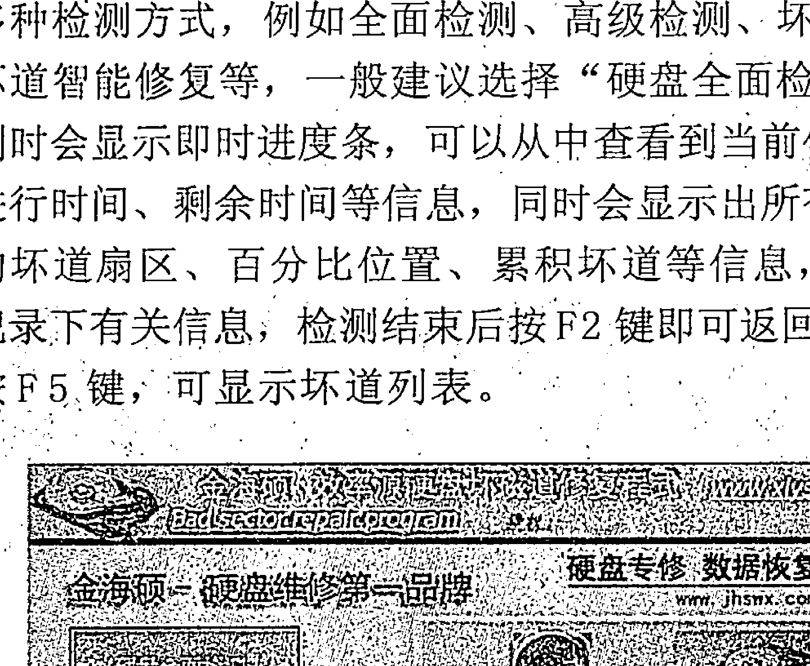

### 9. HDD Regenerator

硬盘上出现坏道后，我们可以利用HDD Regenerator进行自动修复，它采用的是所谓的“反向磁化”的工作原理，也就是通过软件指令迫使磁头产生与磁介质本身相应的高低电平信号，通过多次的往复运动对损坏或者失去磁性的扇区进行反复加磁，使这些扇区的磁介质重新获得磁能力，从而达到修复硬盘坏道的目的（见图4）。


### 10. NDD

假如你曾经经历过DOS/Windows 98的洗礼，那么一定听说过NDD(Norton Disk Doctor)的大名，它可以用来检测和修复磁盘经常出现的文件碎片丢失、交叉链接文件、文件分配表损坏等错误，虽然操作系统早已由DOS进入Windows时代，但NDD一直被收入Norton Utilities工具包，在Norton SystemWorks 2004中也可以找到它的踪影。

(文 / 王志军)

## 内存管理与优化软件精品放送

内存条越来越贵，安装的软件越来越多，机器运行的速度越来越慢。怎么办？这就需要我们最大限度地利用系统硬件资源、优化管理。作为电脑整机性能的关键部件之一，内存性能的好坏将直接影响到整个电脑的运行状态。一方面，随着IT技术的进步，CPU、硬盘等电脑硬件的技术指标不断刷新。内存升级速度有些落伍了，有的甚至成为整机性能发挥的“瓶颈”。另一方面，很多用户都有这样的体会，运行某个大型软件后，计算机的速度会变得特别慢，甚至出现死机。其主要原因在于一些软件设计时没有考虑在退出时同时释放相应的内存空间，导致内存非常紧张。因此，许多内存优化软件应运而生。通过使用这些软件，可以达到挖掘内存的最大潜力、提高其使用性能的目的。

### 1. FreeMem Pro

FreeMem Pro是一个优秀的老牌内存优化软件，它具有自动检测内存数据访问功能，这样可以将不需要经常使用的数据转移到虚拟交换文件中，既得到了更多的内存，而又不会降低系统运行速度的效果。软件启动后，在系统任务条中添加一个图标。使用鼠标右键单击该图标，即可弹出一个面板。
选中此菜单上的“Background activity”和“Status”状态，表示使用后台自动内存优化，并显示其状态。在菜单中选择“Show FreeMem Professional”，就会弹出软件主界面，界面中的列表框给出了可供选择的内存优化上限值，还有当前的内存使用情况。下面我们来看看这个软件的功能按钮。

#### Manual Free-up 按钮

如果现在就需要优化内存，可单击界面中的“Manual Free-up”按钮，程序会根据列表框中的设置自动优化内存空间。根据机器内存情况的不同，将会出现三个不同的Free-up优化数值，从而选择运行该应用程序需要的内存空间，单击“hotkey”按钮还可以设置热键。如图1所示。

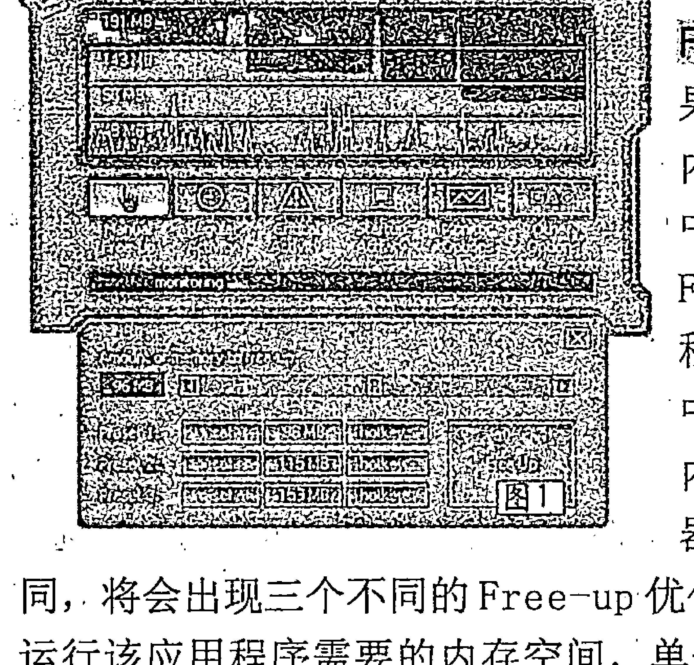

#### Regular Activity 按钮

单击面板上的“Regular Activity”按钮，可以自动设置常规释放内存总量，还可以设置释放的时间间隔，默认的时间间隔是一个小时。在右边还会出现一个“Idle”标签，该界面中提供了当系统空闲超过指定范围时，是否可以自动优化内存空间设置，其中包括强行空闲探测和软空闲探测两个设置项目，探测的对象是CPU活动状况。对于这个界面中的设置项目，使用程序提供的默认设置就可以了。

#### Critical Activity 按钮

单击紧挨着的“Critical Activity”按钮，我们会发现，在界面中显示了两个很重要的临界值，通过这两个参数，我们可以选择一个合适的数值。

#### Startup Activity 按钮

单击此按钮则可以对系统启动时的一些参数进行设置。选中该界面中的“Run FreeMem Professional automatically with Windows”复选框，程序就会随系统启动而自动运行。在下面的选项中，还可以设置系统启动优化的空间、等待的时间等。

#### Monitor Options 按钮

这个按钮用于显示监控时的一些选项，包括刷新的时间、内存和CPU图标显示的方式等。软件启动后，在任务栏的右下方出现了三个图标，通过设置“Monitor Options”监控面板中的显示按钮，可以得到“Bar”、“Chart”、“Number”等方式；单击“Off”按钮则关闭右下方的显示图标。同时，“Display mode”则可以切换使用的内存状况和空闲的内存状况。

#### Other Options 按钮

可以恢复以前的设置和更换软件面板的风格等。

此外，在启动特定的应用程序时，FreeMem Pro还提供了专门的优化内存空间。单击状态图标，选择“Free and Run”选项中的“Manage Entries”，程序会弹出操作界面。单击该界面中的“Add”按钮，在界面中选择需要运行的应用程序。可以看到，我们设置的应用程序已经添加到该菜单中了，直接选择即可运行。或者对界面列表框中存在的项目进行编辑，或者单击“Remove”按钮将其删除。

软件评价：软件的界面有一定风格，参数设置和优化内存的操作都很方便，而且可以指定要释放的空间，具有界面独特、功能强大的特点，不愧为一款品质优良的老牌内存优化软件。不过软件向导功能较差，相对其他软件，操作性要相对较差，针对专门软件的内存优化功能一般，而且需要注册。

### 2. RAM Idle Standard V5.0

RAM Idle Standard V5.0是一款专为Windows设计的内存优化软件，在可用内存低于设定的下限时，软件将自动释放内存供系统使用。软件启动后，会在屏幕右下角的任务栏中生成一个“状态图标”，动态反映当前的可用物理内存空间。右键单击此图标，然后从弹出的快捷菜单中，我们可以选择释放内存空间的大小，默认为11MB、23MB、47MB。

#### (1) 内存优化

直接启动软件，或者双击图标，可以打开软件的面板。在左边的栏目中，可以看到四个选项。单击“RAM Optimizer”图标，可以看到当前的动态参数。最吸引人的，在于它可以通过定比、定时和定值来释放内存。在这个面板中，我们可以设置当可用内存空间低于内存总容量的某个百分比时，每间隔多长时间释放出多少内存。如图2所示，当可用内存的值小于内存总容量的50%时，每间隔3分钟，便释放出2MB内存。此外，在充分考察本机系统资源的前提下，软件为本机“量身定做”了一套缓冲方案，用户只需单击左边的“Recommend”按钮即可。

单击图2所示面板下方的“More Options”按钮，可以进行更多的优化设置。选中“Free up RAM on start up”，设定当系统可用内存空间达到某个下限数值时，RAM Idle开始工作，并将可用内存空间恢复至所设定的目标空余内存值。这项操作只有系统空闲时才能进行，此数值通常是内存总数的1/16，以192MB内存为例，当系统可用物理内存低于12MB时，软件将在系统空闲之时，释放部分内存。选中“Clear the clipboard when freeing up RAM”，就会释放Windows剪贴板中占用的内存资源，从而获得更多的可用内存空间。不过，需要注意的是，如果剪贴板中暂存着重要的数据就要慎用了。此外，还有一些针对任务栏、图标等设置的选项。

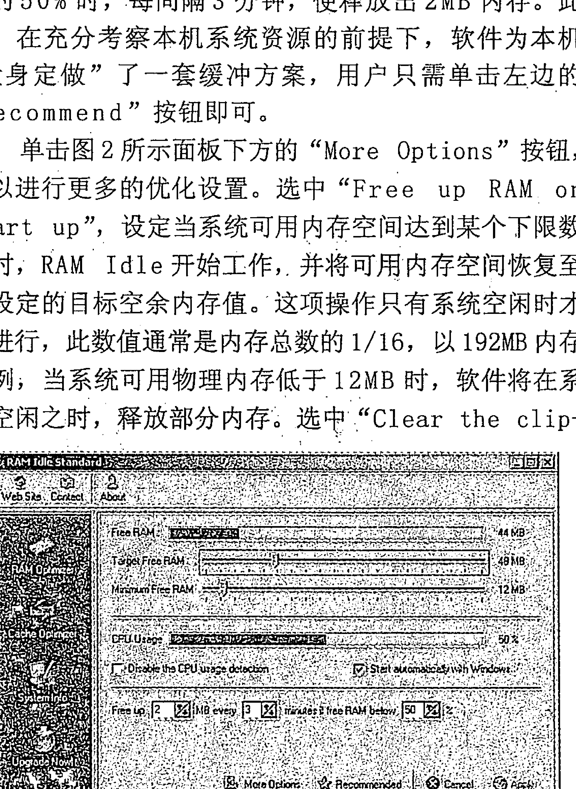

#### (2) 缓存优化

在软件的主界面中，单击“Cache Optimizer”按钮，设定一个数值，就可以通过优化缓存来提高系统的性能。通常情况下，内存缓冲区设置合理，其读取数据的命中率才会更高。进行优化设置时，软件利用电脑处理工作的空闲时间，因此并不会影响系统效率，使用者也不会感到机器变慢。由于避免了与速度较慢的硬盘交换数据，因此其执行效率要高很多。

软件评价：由于可以自动和手动释放内存，使软件的操控变得十分容易，即便是电脑初学者也可轻松掌握。总的来说，通过RAM Idle释放内存之后，执行应用程序的效率有明显的提高。

### 3. WinRAM-Booster Pro

这个软件可改善内存，提高电脑使用时的效能及速度，将实体内存释放出来，让其他的应用程序使用，与Windows操作系统的集成性好，内存优化的效果、效率都比较高。

#### (1) 内存优化

能实时了解当前计算机CPU、内存、交换文件等系统资源的使用情况，使用了不同颜色及颜色过渡效果的条形图分别表示了内存、CPU、交换文件的使用统计信息，其中红色曲线表示内存的使用率、绿色曲线表示CPU的使用率、粉红色曲线则表示系统交换文件的使用率。单击“优化内存”按钮，即可自动进行优化，不过优化时的警告声音很恐怖。如图3所示。

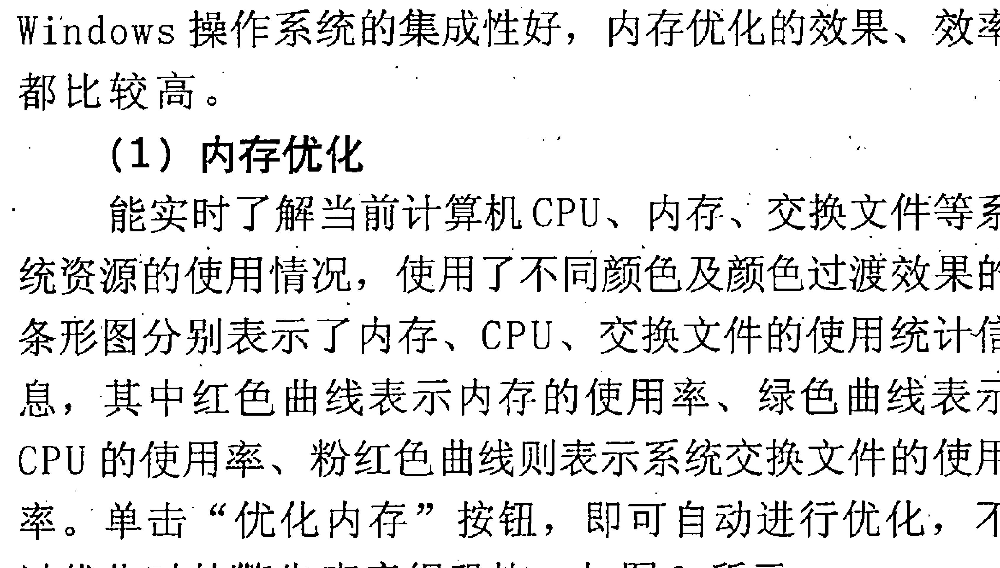

#### (2) 缓存优化

进行缓存文件优化的时候，只要根据自己实际情况选择不同的应用种类，然后点击下部的“保存设置”按钮即可，重新启动后，它就会自动进行缓存文件优化，发挥缓存的最大效率来提高系统总体性能。

#### (3) 应用程序的优化

如果要针对某个程序进行内存优化，可以在桌面上创建一个快捷方式，在启动这个应用程序的时候进行内存优化，以保证该程序运行所需要的内存，提高系统性能。打开软件界面上的“快捷方式”按钮，输入快捷方式的名称并找到需要优化的程序文件，然后调整要求的可用内存大小，按下“创建快捷方式到桌面”按钮就可以创建了。单击“任务监视器”按钮，在该界面的列表框中给出了所有系统内存中驻留的文件列表。如果确定其中的某些文件没有驻留必要，可使用鼠标选择它，然后单击界面中的“中止选取的进程”按钮，在关联的对话框中确认即可。

单击程序界面中的“设置”按钮，会出现“设置一”、“设置二”等按钮。在“设置一”中，提供了针对Windows的优化设置。在“Windows调整下”，将程序发现系统内存中的动态链接库文件不再使用时立刻将其从内存中清除，以释放该程序所占用的内存空间；优化连续文件的分配空间，就是优化内存碎片；禁止使用FIFO磁盘存取方式。此外，还可以进行内存显示刷新时间设置，该项目默认的单位是毫秒。该数值设置的越小，刷新显示越准确，但是也会占用更多的CPU时间。显示内存空间的单位设置包括字节、千字节、兆字节。在“语言”项中提供了界面语言设置。

在“设置二”中，“启动”设置项目的含义依次为：在Windows启动时自动运行该工具，但是不进行内存优化操作、在Windows启动时优化内存并腾出16MB可用内存空间、不设置该工具随Windows启动自动运行。在“自动优化”中，可以设置系统内存占用空间达到一定百分比时，就自动进行内存优化。此外，还可以优化内存时清除系统剪贴板中的信息、给出按钮声音提示、设置程序界面总在前端显示等。

软件评价：根据WinRAM-Booster Pro的说明，应用程序的启动速度甚至能够加速30%以上，并将大型软件所占据的内存释放出来，除可设定时间功能自动最佳化内存，也可手动随时最佳化内存。如果使用比较熟练，这款软件还是很实用的。不过，软件目前一直没 有更新，而且软件界面实在不敢恭维。

### 4. Memory Zipper Plus

Memory Zipper Plus是一款功能很齐全的内存管理与调校工具，它通过内存回收和内存整合，避免系统内存资源被占用。

#### (1) 内存优化

软件启动后，如图4所示，界面上显示了系统内存的多少及使用情况。在“内存使用历史记录”栏中，以图表的形式显示了系统中的物理内存以及内存的变化过程，黄线以下部分是代表可以使用的自由内存量。在图## 5. MemMonster

这是一个优秀的系统内存管理工具。它可以动态地监测到计算机系统内存的使用情况，并且可以根据需要，自动帮助计算机系统内存释放更多的物理内存空间，从而达到充分利用资源的目的。

#### (1) 内存优化

运行 MemMonster，在“RAM Monitor”标签页面中显示了内存的使用状态，红色水平线是内存基准线，绿色曲线指示了当前系统的可用内存量。下面的数字，清楚地显示了计算机系统中可用的实际物理内存大小、自由内存大小以及系统的页面文件大小。

在主界面中选择“RAM Recover”，在分别设置“Target RAM to recover”和“Low level RAM”中内存恢复的目标值以及警戒值。运行的程序越多，这两个值就应该设置得相对小一些。一旦计算机的系统内存低于警戒值，软件将自动对内存进行整理、恢复。如果低于警戒线，单击“Recover NOW”按钮，可以及时整理系统内存。如图 5 所示。

#### (2) 配置和缓存优化

单击主界面中的“Configurations”标签，就可以设置 MEM Monster 程序。选中“Run at Background On Windows Startup”选项，程序在系统启动后就开始工作；选中“Recover RAM automatically if available RAM under Low Level”选项，在系统的自由内存小于警戒内存值时可以自动启动。除了可以使用手工方式和自动方式来让 MEM Monster 整理计算机系统内存外，选中设置界面中的“Recover RAM automatically every XX minutes”选项，就可以根据一定的时间间隔来整理系统内存。

此外，在“Memory Tuning”标签页面中，还可以优化页面缓存、优化 DMA 缓存、指定缓冲大小等，在“Page1”、“Page2”、“Page3”、“DirectX Settings”等选项中选择适当的参数即可。

在“Task Manager”标签页面中，选中需要结束的任务，单击“End Task”就能结束指定任务了；为了方便快速整理内存，我们还可以在“Run”标签页面中设置调用内存整理命令的快捷方式；在“System Profile”标签页面中，我们还能查看到系统的详细处理器信息、资源信息等。选中上述参数后，单击“Apply”按钮，就可以使之生效。

软件评价：软件界面标签功能很详细，功能比较齐全，而且操作也很方便。但在任务栏上没有相关显示图标，不便于了解实时的内存动态。

### 6. RAMBooster Net 3.1.1

RAMBooster Net 能够自动检测并分析当前内存或 CPU 资源，它有非常直观漂亮的内存与资源损耗图形分析界面。当它发现可用内存空间很低时，会按照预先设置自动采取内存优化措施，防止系统崩溃。为了发挥 RamBooster 的最佳效能，在使用前要进行相关设置。选中界面上的“Clear the clipboard when freeing up RAM”，在释放内存时将自动清除剪贴板的信息。选择“Automatically free if memory goes below 15%”（其中百分比可以设置），当内存低于这一数值时让 RamBooster 自动优化。点击主界面中的“Optimize”按钮，程序就会按照前面的设置来自动整理内存碎片并强制释放内存空间，以加快系统的运行速度。如图6所示。

软件评价：由于 RamBooster 用 Delphi 语言编写而成，执行效率很高，只占用 0.15% 不到的 CPU 时间和 700KB 左右的内存空间，这在同类软件中是非常出色的。不过，如果在游戏状态下使用时，由于这些软件对内存的独占性很强，所以释放的余地不是很大。

### 7. Cacheman

Cacheman 可以根据不同的操作系统自动选择优化配置，它是来自德国的一款免费软件，也可以手工调整。重要的是它不用驻留内存或加载其他驱动程序，优化后根本不占用系统资源，而且优化后效果极佳。安装完成之后打开 Cacheman，最上面的是菜单栏，接下来便是显示系统物理内存和虚拟内存使用状况的信息栏，最下面的是用来手工调节配置信息的调节区。如图7所示。

根据不同的用户，软件设置了不同的配置文件，分别是“Desktop Computer”、“Server”、“low memory System”、“Games”、“Mobile System”。首先选择“Settings”菜单下的“Profiles”选项，根据内存的实际情况选择一个配置文件，再单击上方的“Load”按钮，配置即可生效。我们还可以手工调节，通过设置磁盘高速缓冲的最大值和最小值、选择缓冲区工作时使用的大小等选项后保存设置，重新启动计算机，就能发挥作用了。

### 8. SuperRam

软件安装后，会在系统托盘上产生一个“Super Ram”图标，单击这个图标就可以打开内存占用状态表，其中，红色的水平线表示基准线，绿色的曲线表示当前可用的内存量，下面的数字表示当前系统中可用的内存空间、已用的内存空间和可以释放的内存空间。使用之前，可以进行软件参数设置。点击软件界面左边的“软件设置”菜单，就能释放内存空间，这就是网格中基准线的含义。当然不同的系统配置，这些数值也不同。还可以使用快捷键“Ctrl + Alt + F”手动释放更多的内存。通过观察从谷底反弹的曲线，这个快捷键释放内存空间的效果非常明显。如图8所示。

软件评价：这款软件界面操作很方便，释放浪费内存的功能也很强大。不过功能比较单一，自动优化的功能不多。

### 9. MemTurbo

MemTurbo 的界面是比较漂亮的，使用起来也非常的方便。

#### (1) 内存优化

首先，你可以直接看出现在还剩余多少内存可以使用，同时图表的旁边有二处可以让你自由移动的拉杆，分别用来调节自动回收等级和空闲内存目标。当你设置完这两个值后，单击“回收内存”或者“净化内存”按钮，就可以自动运行了。如图9所示。

单击软件主界面上的“选项”标签，可以设置一些运行参数。常规方式下，可以进行如下设置：

- Windows 启动时自动运行。启用时，MemTurbo 会出现在启动组中，以便在每次 Windows 启动时自动运行。清除复选框并应用，MemTurbo 就会删除启动组快捷方式。
- Windows 启动后，当 CPU 空闲时，进行一次回收。
- 达到警报等级时自动回收内存。启用时，MemTurbo 会监视你的可用内存。如果它低于在主页面中的警报等级设置值时（图表中的红色虚线），MemTurbo 会自动执行回收操作并尝试达到目标等级的设置值（白色虚线）。
- 自动回收内存于每 N 分钟。启用时，MemTurbo 会自动地每 N 分钟执行回收操作并尝试达到目标等级设置值。默认值为 N=30，你可以更改它。
- 启用 MemTurbo 向导。一般，MemTurbo 向导会关联性地弹出给你提供相关帮助信息。如果你不想被打扰，可以不选中此复选框禁用。
- 不自动回收，除非 CPU 使用率低于 X。此选项防止 MemTurbo 在你系统繁忙时自动执行操作。
- 更改热键。当“使用现在回收热键”复选框被选中时，MemTurbo 可以不管你现在正处于什么应用程序下，只要你按下输入框中定义的组合热键（MemTurbo 正在运行中），它就会开始一次内存回收操作。要更改此热键（默认为 CTRL-ALT-M），选中复选框并点击右边的输入框，然后你可以按下你希望使用的组合键。注意为了安全原因，键组合必须包括 CTRL 和 ALT。

#### (2) 高速缓存优化

高速缓存优化仅在注册版本中可用。可以设置最小缓存大小（建议值为物理内存量的 1/16）、最大缓存大小（内存少于 32M 时设置为 0；如果有更多内存，则设置为内存总量的 1/4）、缓存块大小、异步 IO 缓冲、设置使用于存储异步读取和写入页面的缓冲大小等参数。

软件评价：从用户使用的反应情况看，这款软件可以和 FreeMem Pro 这样的老牌内存管理软件媲美。软件界面比较美观，操作方便，是一款不可多得的软件。

通过使用这些内存优化工具，我们就可以实时监测内存的使用情况，当发现内存紧张或者内存中的数据排列散乱的时候，自动对内存进行优化操作，从而帮助系统更好地使用内存。当然，我们在选择这些软件的时候，除了考虑优化功能，还要考虑软件对特定应用程序的优化功能、稳定性等，从而达到理想的优化效果。

(湖北 / 彭文波)

## 将刻录进行到底——刻录工具扫描

随着刻录机的大幅降价，原本可望不可及的东西现在我们也能轻松拥有。虽然目前刻录光盘的价格也很便宜，但是如果选择刻录软件不合适的话，那么刻坏盘的概率非常大，而且一旦刻盘失败，就意味着这张光盘不能再使用了。所以说选择一款优秀的适合自己使用的刻录软件是非常重要的，在此笔者介绍几款目前比较流行的刻录软件，希望能让朋友们可以找到自己需要的工具，提高刻录的成功率。

### 1. Easy CD Creator 5.0

Easy CD Creator 5.0 是由 Adaptec 公司推出的一款刻录软件，它的使用面非常广，除具有基本的刻录功能外，还提供了很多专业级的光盘制作工具，它的操作界面做得非常漂亮（见图1），支持 Windows 9x/NT/2000/XP/2003 操作系统。Easy CD Creator 5.0 采用在线驻留方式运行，当程序安装到系统后则会自动设置并且随系统启动而自动运行，并会在系统任务栏中添加相应的图标。

在 Easy CD Creator 5.0 的功能选择界面中，有“制作音乐光盘”、“制作数据光盘”、“制作照片或视频光盘”、“光盘复制器”、“在线检查”、“光盘封套制作工具”、“帮助”等七个按钮。只需将鼠标移向 Easy CD Creator 5.0 主界面的按钮，就能得知如何进行下一步工作。对于刻录方式，Easy CD Creator 5.0 数据光盘制作界面简单明了，用户只需使用鼠标将刻录对象（文件或目录）从上部窗口（系统文件列表窗口）直接拖拽到下部窗口（新建光盘文件窗口）即可添加刻录对象，同时程序会在界面下边给出所添加的所有文件总的容量，看上去非常直观。

Easy CD Creator 5.0 除具有支持刻录数据 CD、Audio CD，支持复制 CD、支持刻录多段 CD（Multisession CD）等常用功能外，还有以下功能：支持在线检查功能；支持光盘封面制作；支持光盘镜像文件，并可以从光盘镜像文件还原刻录 CD；支持制作 Autorun 光盘等等，几乎可以应用于所有的刻录机，包括 SCSI、IDE 等。

在 Easy CD Creator 5.0 中还集成了 DirectCD 这个工具，它主要提供我们非常熟悉的 FileCD 功能。这个软件专门针对 CD-RW 设计，通过对 CD-RW 进行格式化，用户可以像使用普通磁盘驱动器一样在 Windows 的资源管理器窗口中向 CD-RW 中添加文件和文件夹，如果说以前是进行文件的复制，那么此时进行的就是文件的刻录。对于这种格式的 CD-RW，可以在弹出光盘后由程序进行 CD-ROM 相容性处理，之后就可以在其他的驱动器中读取了。使用这种方式的好处是如果用户不能一次全部刻录满整张 CD-RW，通过这种方式还可以分期分批刻录，同时保证了刻录数据的安全存放。

另外，Easy CD Creator 5.0 还提供了一个刻录 CD 封面编辑器 Jewel Case Creator，通过它可以快速创建出漂亮的 CD 封面。

### 2. Nero Burning ROM 6.3.1.6

Nero Burning Rom 是一款非常著名的 CD 刻录工具，它是由德国 Ahead Software Gmbh 公司设计，可以很好地运行于 Windows 9x/NT/2000/XP/2003 下。并且它还提供了多语言界面（其中包括简体中文，见图2），这样一来即使用户对英文一窍不通，也可以快速使用这个工具来完成 CD-R/CD-RW 的刻录。

Nero Burning Rom 的功能强大、支持格式丰富，能支持制作数据 CD、Audio CD（包含音轨和数据的混合模式）、复制 CD 盘片、Video CD、Super Video CD、可引导数据 CD、Hybrid 格式 CD、UDF 格式 CD 等，可以说目前常见的刻录 CD 格式 Nero Burning Rom 都可以很好地支持。而且还能支持目前市面上常见的多种品牌和规格的刻录设备，可见其程序的兼容性是非常不错的。作为刻录工具，Nero Burning Rom 在数据刻录的支持方面做得非常好，其中包括创建独立的数据 CD，以及创建分段存储数据 CD。在刻录文件支持方面，程序可以很好地支持中文文件名，支持 ISO Level 1 以及 ISO Level 2 文件名命名格式，支持基于 Windows 的长文件名特征，支持超刻，支持创建 CD 卷标描述，支持更改刻录文件创建日期及时间，支持用户自定义刻录速度以及由程序自动测定刻录速度，支持 DAO 以及 TAO 刻录模式以加快刻录速度，支持创建多个刻录副本，支持对小文件和网络驱动器上的文件进行缓存——防止刻录时出现数据缓存欠载等。在刻录设置方面，程序针对每个刻录类型提供了独立的设置界面，用户可以在创建刻录项目时首先进行设置，以最大限度保证刻录环境与刻录对象保持一致。

对于刻录操作，也是相当的简单，程序在界面中提供了系统文件列表窗口，用户可以直接使用鼠标拖拽刻录对象到刻录文件列表窗口中快速创建刻录文件列表，并可以自由调整刻录文件的存放位置，使用起来相当方便。而在此尤其值得一提的是这个工具提供的 VCD 和 SVCD 制作功能，它可以在创建 VCD 或 SVCD 格式盘片时直接为你创建 VCD 或 SVCD 视频格式，并且创建相应的目录和索引文件，以方便在家用 VCD 或 SVCD 设备上播放。此外，在刻录 Audio CD 音频格式支持方面，它可以支持 WAV、MP3、WMA、VQF 等多种格式，是目前常见工具中最多的。

Nero Burning Rom 的使用方法相当简单，如果用户是初学者，可使用程序提供的操作向导 Nero Express 快速创建刻录任务，如果用户有一定的使用经验，则可直接使用程序提供的简单方式刻录文件。

### 3. NTI CD-Maker V6.7.0.16 Platinum

NTI CD-Maker V6.7.0.16 Platinum 是一款容易上手的刻录软件，它是由美国 NewTech Infosystems 公司推出的，最新版本的 NTI CD-Maker V6.7.0.16 Platinum 可以运行于 Windows 9x/NT/2000/XP/2003 环境下，也是一款共享工具软件，提供 30 天全功能试用期。NTI CD-Maker V6.7.0.16 Platinum 经常是 SONY 等日本品牌刻录机的随机盘，其特点是文件系统小但功能齐备，刻录过程采用向导式操作提示，操作非常简单。该工具可以支持的刻录格式包括数据 CD-R/CD-RW、CD-ROM XA、Audio CD、Video CD、Mixed Mode CD 以及 CD Extra，可以说目前常见的 CD 格式都可以支持。此外，它也能支持 CD 的复制功能和刻录多段落 CD（Multisession CD）功能，这样可以方便地进行 CD-ROM 盘片的备份和分批次将不同的数据合并刻录到一张 CD 中。在刻录功能方面，程序采用了许多特殊的技术，其中包括 Burn Proof、为刻录大量小文件提供的缓存空间等。在刻录文件名方面，程序支持 Joliet、MS-DOS、ISO 9660 level 1 compliant MS-DOS names、Romeo 等多种方式，支持 Windows 的长文件名特性、支持中文文件名刻录，而最长可以支持 128 个字符的文件名。在数据刻录方面，程序支持 Mode 1（CD-ROM）和 Mode 2（CD-ROM XA）模式，支持将刻录文件制作为 ISO 文件，使用起来相当的灵活。

NTI CD-Maker V6.7.0.16 Platinum 界面的亲和力非常好，其中提供了一个所有程序刻录功能的平台界面（见图3），而且程序还提供了一个简单的即时说明，以方便用户快速地选择使用相应的功能，这样即使是第一次使用这个工具也不会遇到任何困难。对于最常使用的数据刻录界面，与 Easy CD Creator 大致相似。不过在每个刻录操作上，程序全部采用两步操作向导方式，第一步设置刻录原始内容，第二步开始刻录，非常简单。对于刻录设置，程序提供的默认设置可以适合一般的刻录需求，不过用户也可以自己创建刻录方式，以满足刻录对象的要求。在刻录内容的添加方面，程序提供的界面形式与 Easy CD Creator 是完全一样的，甚至连界面结构和文件添加方式也大致相同，而且程序提供了直接使用鼠标拖拽方式来添加刻录对象的功能，这样使用起来会觉得非常的方便。NTI CD-Maker 还提供了针对自由写入 CD-RW 的 FileCD 程序，这项功能同 DirectCD 类似，通过对 CD-RW 的格式化，用户可以像使用硬盘一样在 Windows 的资源管理器中向 CD-RW 盘片中任意添加文件和文件夹，并且能让以这种方式刻录的 CD-RW 的盘片在其他电脑的只读光驱中读出。在 NTI CD-Maker 的帮助文件中还有不少关于光盘刻录术语的解释说明，对有兴趣的朋友来说是不可多得的良师益友。此外 NTI CD-Maker 还提供有 CD 封面制作程序 Jewel Case Maker。

### 4. Clone CD V4.3.2.2

Clone CD 是 Elaborate Bytes 推出的一款功能强大的多语言版 CD 拷贝程序，支持 Windows 9x/NT/2000/XP/2003 平台，它可以帮助用户完美地复制现在几乎所有的加密光盘，比如 SafeDisk（c - dilla 开发）、SecuROM（Sony 开发）、LaserLock、LibCrypt（Sony 开发，主要用于 PS）。对于这些采用了加密技术的光盘一般用户是无法利用普通的刻录软件来进行复制的，或者说即使复制之后也无法正常使用，这也正是这些加密技术被开发出来的原因，防止光盘被轻易地大量拷贝。这样无疑也给用户带来了很大的麻烦，因为很多用户都希望更好地保护自己购买的原版光盘，所以希望能够进行备份。不过现在一般的软件都做不到这一点，Clone CD 的出现很好地解决了这个难题，它的安装文件很小（2MB 多一点），界面简单（见图4），操作方便，还支持目前较为流行的换肤（skin）功能，声音提示功能也给人以非常新鲜的感觉。

Clone CD 的刻录速度虽然较快，但是资源占用率较高，约 16% 左右，有时可能会出现死机现象，所以要求系统提供有足够多的内存和硬盘空间（至少 700MB）。因为 Clone CD 在进行光盘复制时，通常是先读取光盘上的文件并在硬盘上生成相应的映像文件（该文件保存的默认目录为 Windows 目录中的 Temp 目录），然后再将映像文件刻录到光盘中，通过这个方式可以大大减少光驱的损耗。Clone CD 要求 Windows 95（OSR2）内存不少于 32MB，Windows98/98SE/ME 内存不少于 64MB，Windows 2000 内存不少于 128MB，Windows XP/2003 内存不少于 256MB。Clone CD 还支持目前大部分 ATAPI 界面和极少数的 SCSI 界面刻录机。

Clone CD 虽然是一款较好的光盘克隆工具，但在克隆有些具有特殊的防拷技术时却显得有些无能为力，但在 Clone XXL 的帮助下，可将 Clone CD 的功能发挥得淋漓尽致。Clone XXL 是 Clone CD 的一个外挂程序，它会自动检测 CD 的防拷技术，并根据不同的防拷技术，对 Clone CD 的克隆方式做出不同的设定，设定完成后 Clone XXL 会自动启动 Clone CD，这时只需要放入空白光盘，一张“原汁原味”的光盘就新鲜出炉了！

### 5. CDRWin

CDRWin 是一套支持光盘格式丰富、特点极多的刻录软件，并且为初学者提供了只需几步简单的操作就能实施六种类型光盘刻录的快捷工具，又为刻录高手提供了## 个人加密与保密工具扫描

电脑中的一些重要文件或者不想让别人看见的文件，我们最担心的就是它的安全性，怎么样才能将这些文件彻底加密起来，而且操作也不要太麻烦？现在对文件进行加密和保密的软件很多，它们的功能各有千秋，下面就向大家推荐几个不错的软件。

### 1. 文件夹隐藏大师

“文件夹隐藏大师”不但可以彻底隐藏所选择的文件夹（在“文件夹选项”中选中“显示所有文件”也一样看不到），驱动器，而且还能把文件夹换成一些像“*.dll”、“*.sys”的图标，这样就能使别人误以为这是系统文件了。

首先点击“文件夹隐藏”项，在左边的窗口选中你要隐藏的文件，双击该文件，它会弹入右边的窗口，然后点击下面的“隐藏”，文件夹就被隐藏了，如果想恢复隐藏的文件夹，只要选择隐藏的文件夹，点击下面的“恢复”按钮就可以了（图1）。

功能齐全、设置完备的全功能界面，同时也是目前少有的支持DVD刻录的软件之一。

CDRWin是PADUS公司推出的刻录软件，支持Windows 9x/NT/2000/XP/2003。CDRWin为初学者提供了快捷工具“Quittool”，启动“Quittool”后会在Windows任务栏中出现CDRWin的快捷图标，右击快捷图标会弹出CDRWin提供的“1:1复制”、“MP3光盘”、“音频CD(A)”、“视频CD(V)”、“数据CD(D)”、“擦除CD-RW(E)”六种快捷工具选项，通过这些快捷工具，只需在极简单的对话框中，根据提示完成最为简单的对话即可完成光盘制作。

CDRWin 支持制作多种类型的光盘制作，它能支持AUDIO、CDROM (Mode1)、CDROM-XA (Mode2)、CD-I、混合型、多重扇区盘片；独有的 CUE SHEET 语言可以100% 定制盘片的布局，避免其他刻录软件在不同 track之间产生间隔的现象，强大的备份功能可以防止盘片上原有数据的损失；符合 ISO9660 磁盘控制标准；可以制作光盘启动盘；支持 Karaoke CD G 盘片（需要Sony CDW-900E, Panasonic 或 Yamaha 刻录机）；是仅有的支持 Philips/Kodak/HP 家族刻录机 Disc-at-once 技术的软件；支持盘片的 UPC 码和 track 的 ISRC 码；支持“Kodak Disc Transporter”高速盘片复制技术。

CDRWin为每种刻录类型提供有单独的设置界面，用户可以在创建刻录项目时首先进行刻录设置，从而最大限度地保证刻录光盘与被刻录光盘的完全一致。在它的主界面(见图5)刻录功能选择区提供有“1:1复制”、“提取轨道”、“写光盘映像”、“测试映像”、“创建数据CD/DVD”、“创建音频CD”、“创建视频CD”、“创建CD-Extra”（先音频轨后数据轨混合光盘）“创建混合模式CD”（先数据轨后音频轨混合光盘）等光盘制作功能选项按钮，按下按钮即进入相应的功能光盘制作界面，不同格式光盘制作界面略有不同。

CDRWin除具有以上功能外，还具有一些非常实用的特殊功能，如支持DVD光盘制作，支持制作光盘封面，支持中文长文件名刻录，支持快速制作光盘目录，支持查看当前光盘的存储结构，支持利用CD-RW光盘模拟硬盘，支持设置文件的隐含属性和优先级别，支持将硬盘上的WAV、MP3文件直接刻录成CD音轨等。

软件还能利用改变文件夹的图标来达到隐藏的目的，点击右边的“改变图标”，弹出“更改文件夹图标”窗口，选择需要改图标的文件夹，然后点击“选中图标”，选中后单击“确定”就可以了，软件本身就提供了很多不错的图标给我们使用。

它还有两个很不错的小功能——“程序锁”和“私人文件夹”，用它我们可以把一些程序锁住，还可以把一些重要的文件放入到一个属于自己的“私人文件夹”中保存。

### 2. 文件夹伪装专家

“文件夹伪装专家”除了能改变文件夹的图标，还能隐藏文件夹内所有文件，替换成其他内容，如可以把文件夹改成“控制面板”的图标，而且双击后打开的也是控制面板的内容，而你自己的资料一点也看不见。

首先在左边的窗口中选中要改的文件夹（图2），选中后，点击右边的图标，你想改什么就点什么。软件会提示你是否继续，点击“确定”就可以把文件夹伪装好了，如果想还原的话，也是先选中目标文件，然后点击右面图标里的“还原恢复”就可以了。

### 3. 渗透

“渗透”能将多个文件保存在一张图片中，而且保存后的图片与保存前的图片几乎没有什么差别，如果不使用软件提供的识别码将无法进行破解，这就增强了文件的可靠性和安全性。

下载后直接运行软件，注册登录后，点击工具栏上的“选择图片”按钮，在出现的对话框中选择一张图片（注意，此时打开的文件的属性不能为“只读”），把“启用个人识别码”前的勾选中，这时将弹出输入识别码的对话框，在这里输入你的识别码，单击“确定”就行了。主界面左下角的图片就是刚才我们选择的图片（图3）。

选好图片后再点击旁边的那个按钮来选择需要加密的文件，在弹出的对话框中选择需要加密的一个或者多个文件，但是要注意目录中的文件大小不能超过空闲渗透空间的2倍。

选好图片和文件后就可以开始进行“渗透”了，点击工具栏上的“开始渗透”按钮，在弹出的对话框中点击“开始”就可以了。

如果要给图片添加密码的话，点击菜单上的“菜单 / 渗透文件权限设置”，在弹出的对话框中点击“安全保密设置”选项卡，把下面的“密码有效”复选框选中，然后输入你的密码就可以了。

当想把图片中的文件释放出来，先把进行了渗透的图片打开，再选中需要释放的文件，选中后点击鼠标右键选择菜单“释放所选文件或目录”，在弹出的目录对话框中选择好释放目录就行了。

最后要提醒大家的是，千万不要使用任何图片编辑软件对已渗透图片进行编辑，任何修改都可能造成加密文件的数据丢失；在使用了识别码后，一定要记住图片名和它的识别码。万一丢失识别码就不能打开加密的图片，一般不推荐使用，除非你的文件很重要。

### 4. 万能加密器

“万能加密器”是个小巧高速的加密软件，加密文件大小不限、文件类型不限，它采用高速的算法，加密速度快，安全性能高。而且软件的界面也比较美观，有加/解密列表功能，独有的密码查询功能，忘记密码不再发愁。

“万能加密器”是一个绿色软件，下载后解压缩就可以使用，如果我们要对文件进行加密的话，点击“加密”标签，接着点击“添加文件”按钮来把要加密的文件加进去（如果要加密多个文件可以点击“批量添加文件”按钮），然后在下面设置一下密码，点击“开始加密”按钮就行了（图4）。

软件除了可以进行加密和解密，还可以编译可执行文件、分割文件、伪装文件夹等功能，还可以对程序设置访问密码，拥有加密历史列表功能。

### 5. 加密金刚锁

“加密金刚锁”是一款专业的文件和文件夹加密工具。

### 6. 金锋文件加密器

“金锋文件加密器”是一个全功能的文件加密软件，它除了基本的加密保密功能外，还有日记本、密码本、提取文件图标等小功能。软件的加密操作很简单，只要点击工具栏上的“添加文件”按钮选择要进行加密的文件，然后点击下面的加密按钮就可以进行加密设置了（图6）。

软件还可以将已加密文件（文件夹）生成自解密程序，在主窗口中单击菜单“文件 / 制作EXE文件 / 标准自解密程序”，这时会弹出标准自解密程序制作窗口，接着在“已加密的文件”栏中，指定要将其生成自解密程序的一个已加密的文件，然后在下面输入一个生成exe文件保存的位置，再设置一下“程序标题”、“背景色”、“程序图标”，这些都是生成的exe文件运行后窗口的内容，完成所有的设置后就可以点击下面的“立即生成自解密程序”按钮来生成自解密程序了。当然我们还可以将设置保存为设计方法以供下次打开使用。

### 7. 新概念文件加密器

“新概念文件加密器”突破了传统的加密软件的格局，可以将电脑上任何类型的文件进行加密。更重要的是加密后得到的文件，当打开它时提示输入密码，一旦正确输入了密码，就会将你加密的文件直接打开。同时，软件可以对文件的各种属性进行修改，可以自由修改文件创建、打开、保存、修改的时间以及多种附加属性。

在进行加密前，我们可以在工具栏上对密码的加密程度和安全性的级别进行设置，一般选择“中”级就可以了（图7）。

设置好了密码级别后，我们就可以在右面选择要进行加密的文件，然后再点击左面的“加密”按钮就进行加密的设置了，点击浏览按钮，设置一下目标文件，再设置一下密码，一般还要删除源文件，这个可以根据自己的实际情况进行选择。

### 8. E神加密文件夹

“E 神加密文件夹”是一款功能完善、界面豪华、操作简便的文件夹加密软件，使用它可以轻松地把资料加密保存，只要在想要加密的文件夹图标上点击右键选择“E - 神加密”，然后输入正确的密码按一下回车就可以将文件夹加密了。

文件夹被加密后，原文件夹被换上一个带有“密”字的绿色图标，双击运行它会弹出一个输入密码的窗口，在密码框里输入密码再点击“解密”按钮，就可以完成文件夹的解密操作了（图8）。

如果加密后的文件夹被别人删除了，我们只要打开软件的“设置”窗口，在“已加密的文件夹列表”里找到被删除的文件夹，然后选中它点击旁边的“修复”按钮就可以恢复了。

## 提防间谍的“偷窥”——间谍软件和防间谍软件扫描

据美国互联网服务提供商 Earthlink 最近发表的一篇报告显示，平均每台家用电脑感染了 28 个间谍软件。在实验过程中进行的 100 万次扫描中，发现了 2900 万个间谍软件。这些数据比较直观地说明了当前间谍程序的危害程度，但是，很多用户并没有充分认识到这一点。

同其他恶意的程序相比，间谍程序并不属于病毒定义的范畴，和人们概念中的常规病毒也大相径庭，所以除非特别设置，一般的反病毒软件是难以发现它们的。这类软件能捕获计算机相关数据，如操作系统、服务器以及密码、信用卡号和其他机密数据。同时，间谍软件还会大量消耗计算机的资源，导致计算机崩溃，并使用户淹没在网络广告的汪洋大海中。即使我们安装了防火墙软件，品种繁多的间谍软件也依然可能构成威胁。因此，在日常的安全防范中，除了病毒、蠕虫和垃圾邮件，间谍软件的危害也不容忽视。对于这些间谍软件，如何查找？如何清除？本文将深入浅出地带给您一套完整的解决方案。

### 一、“香花”与“毒草”：间谍软件分析

间谍软件采用各种途径进入用户的计算机，而且通常是在用户毫不知情的情况下完成的。也许，在您打开一个页面、安装一个软件，或者接收一封邮件的时候，它就已经潜入电脑了。

#### 1. “随风潜入夜”之浏览网页

浏览网页是上网冲浪时最基本的活动，尤其是浏览一些恶意站点、黑客站点或国外的站点时，单击某些链接后，间谍程序就被安装在浏览器或系统中。虽然这种下载通常会在得到允许后才进行，但是很多人接受了下载，并相信这是该网站的正常功能。

间谍软件发展之初，多被一些在线广告商以及音乐交换网站所使用，这些公司打着免费赚钱或免费获得音乐的幌子，将一些监控程序放在用户电脑内，监视其网上行为、收集其兴趣爱好，或者在空闲时间进行其他操作。而且，间谍软件或者广告软件以cookie或插件的方式驻留在用户计算机中，跟踪用户操作并且把统计数据发回一个指定位置。这些数据可用于有针对性地发送广告，或者转卖牟取利益，或出于更恶毒的目的，如记录键盘登录操作以获得用户的银行账号，其危害程度可想而知。

#### 2. “润物细无声”之邮件接收

电子邮件向来就是一个易惹是非的地方，由于邮件的方便、快捷性，它同样也成了间谍软件抢夺的宝地。最近一家自称为情人间谍的美国公司推出了一种新方法，只需向对方发送一张含有该公司间谍程序的贺卡，对方阅读后便可轻松地监控他的网上行踪。

垃圾邮件可以包含隐藏的到间谍软件的HTML链接，当收件人打开邮件的时候就会下载间谍软件。于是，当邮件接收者浏览一个网页时，就会开始一个下载进程。

#### 3. “明修栈道，暗度陈仓”之软件捆绑

在美国一个比较有争议的案例中，当人们在玩一个关于“9·11”的游戏时，一个小的广告软件就会飞速地装到用户的机器中，该软件每三分钟激活自身一次，向它的母公司发送数据，而且在游戏结束后很长时间内都在工作。的确，软件捆绑方式是间谍软件采用得较多的一种，它通常和某实用软件放在一起，当用户在安装这款实用软件时，间谍软件便悄悄进行自动安装。

不显眼的文件名使它们善于在一个程序的组成文件中隐藏自己。该类程序不管是被安装还是运行时都不会在计算机上显现任何明显的反应，结果就是间谍程序长期潜伏在计算机系统中而用户根本就不了解。

跟病毒一样，间谍软件也在不断地更新和发展，香花与毒草，如何分辨？常言道：“魔高一尺，道高一丈”。其实，通过配备某种反间谍软件，我们便可以轻松地解决这些问题。

### 二、主流反间谍软件及使用

对于一般用户来说，要避免间谍软件的侵入，一方面，要做到不收阅陌生人的邮件，不去不健康的站点浏览，不到不正规的站点下载软件；另一方面，还要善于利用最新版本的反间谍软件进行查找、清除。

#### 1. Ad-aware 6.0

Ad-aware 是一个很小的系统安全工具，它可以扫描广告跟踪文件和相关文件，除了扫描速度相当快，还能够生成详细的报告，并且可在瞬间删除这些文件。目前最新版本为 Version 6.0 Build 181。安装完毕，将ChineseGB.bmp、ChineseGB.det、ChineseGB.ini这三个文件放到语言包的安装目录下，如“D:\Program Files\Lavasoft\Ad-aware 6\Lang”。软件运行后，界面如图1所示。

- (1) 软件设置

在程序主界面上，单击“立即扫描”，就可进入扫描菜单，然后选择“使用默认扫描选项”旁边的“自定义”，如图2所示。

通过选择软件左边的按钮，可以对软件进行相关的设置，包括“常规”、“扫描”、“高级”、“Ad-Watch”、“自动”、“调整”等。

- (2) 查找与清除间谍软件

首先是查找“间谍”。在软件启动后的主界面中，点击“立即扫描”按钮，单击“下一步”，Ad-aware就开始自动检查一切与间谍软件有关的信息，并列举在结果窗口中。

扫描完毕，点击“下一步”，会出现相关的间谍软件或疑似间谍软件信息，这就需要我们来仔细判断了。其中，“类型”用于显示项目的相关类别，表明它可能是一个文件、模板、文件注册表主键或键值。点击列表框上方的帮助，就会弹出一个窗口解释这些图标是什么意思。“对象”用于描述该记录的路径，可以是文件路径、文件或者模板名称，也可以是注册表中键值的路径，如图 2 所示。

然后是清除“间谍”。选择一个项目，单击右键，弹出菜单。“项目详情”用于显示该文件或文件夹的属性。“选择标记”和“取消标记”选项可以灵活地对项目进行操作。

单击“项目详情”或者直接双击这个项目，就可以了解这个项目的具体情况了。它对这个间谍软件进行了详细的描述，甚至对间谍软件所递送的目的地址也了解得一清二楚。

> 被人在自己背后安装一个“偷窥”的摄像头是令人很气愤的，不过在我们删除这些“摄像头”的时候，还要注意将操作步骤记录到记录文件中；或者检查该间谍软件是否有自己的反安装程序，如果有，最好先用它自带的程序卸载，然后再使用Ad-aware清除；某些软件程序和间谍软件结合十分紧密，以至于删除了间谍软件后，该软件就无法运行了，是删除还是保留，就要慎重考虑了。

#### 2. Spy Sweeper

Spy Sweeper 是一个系统安全监控工具，它可以自动检测并清除系统中的间谍软件。它能在我们浏览网页、浏览邮件、下载软件的时候给予充足的保护，免受间谍软件的入侵。同时该工具还可对间谍软件的活动进行分析，从而了解间谍软件的行踪。

- (1) 扫描参数设置

安装软件后并运行，进入主界面后选择“Option”进行系统参数的扫描设置。

“Configure”设置选项。首先，在“Select drive(s) to sweep”的下拉菜单里可选择进行扫描的分区，根据实际情况，可选某个分区，或同时选多个分区，同时可点选图中的“Sweep memory”（内存扫描）和“Sweep registry”（注册表扫描）选项。

同时，还可选择下方“Sweep Priority Level”的“High”进行最高优先级别扫描，这样可以增加安全扫描级别，以防止攻击性的漏洞存在。然后，选择“Enable Password Protection”打开密码保护功能，同时输入保护密码。如图 3 所示。

扫描计划设置。进入“Schedule”选项，这里可以设置扫描计划，比如设置一周中的哪几天需要进行扫描监控，或以每月、每周、每日等为周期，系统运行几小时后自动扫描。首先，左边的“Load and sweep”项目用来设置扫描方式，包括启动电脑时扫描还是关闭电脑时进行扫描，其它选项选默认设置即可。

网站高级保护。进入“Active Shields”选项，点选“IE Home Page Shield”的“ON”选项，然后在下面输入一个网址，如http://www.backdoor.com，只要你进入该网站，一旦该页面有攻击性病毒程序，软件就会做出相关的保护。另外几个项目是设置缓存跟踪和内存保护的，一般系统运行异常缓慢，并且提示缓存不够用的原因可能是受到一些恶性程序的攻击，打开这些项目后，软件就会释放被病毒消耗掉的资源，保证系统的正常运行。

- （2）查找与清除间谍软件

经过上面的设置，点击“Sweep Now”开始对设置的区域进行扫描，经过数分钟扫描完毕后，会在界面中显示扫描后的情况。点“Next”按钮进入下一步进入文件管理界面。

对于不安全的数据，我们可以把它们隔离出来。由于隔离操作需要对某些有问题的程序进行读写，因此隔离前最好把其它所有的应用软件都关闭，以便能使隔离工作的顺利进行。选择需要隔离的文件，按“Next”按钮执行隔离操作。

隔离完毕后进入最后的效果显示画面，这里显示以上所有文件的扫描和操作情况，以便于我们对文件扫描进程的全面了解。点“Quarantined”可以查看扫描发现的病毒文件，可以发现，在这里依然可看到以上扫描到的病毒文件数据，这是因为软件并没有把这些数据彻底删除，而是把它们隔离起来，以免它们对系统造成影响。

#### 9. ACProtect

“ACProtect”是一个专门为软件加密的工具，用它可以有效地防止盗版软件，它通过为程序加上的一层坚硬的保护壳，可以为程序设置限制注册功能，即使你没有程序的源代码，你也可以用 ACProtect 在程序上加上运行次数限制、运行天数限制、运行有效日期限制。

软件的操作很简单，先在“程序文件”标签中选择要被保护的程序，接着在“选项”标签中设置一下压缩的比例，然后在“试用设置”标签下设置软件的试用次数和天数等设置，最后点击工具栏上的“加密”按钮就可以了（图9）。

#### 10. 文件蒸发

“文件蒸发”采用先进的编码技术，可以把重要文件完美地“蒸发”掉，软件的操作十分方便，十分适合个人电脑用户的保密工作。

打开本程序，在主界面双击要蒸发文件所在的文件夹，在右边的列表框里选中要蒸发的文件，然后点击“蒸发所有选中文件”按钮就可以轻松搞定，如果是要蒸发文件夹，那就点击右面的“蒸发该文件夹”按钮就可以了（图10）。

#### 11. 私人图片安全浏览器

“私人图片安全浏览器”是一款让你放心浏览私人图片的保密软件，它能快捷有效地为各种类型的图片文件加密，并且能够浏览加密过的图片，加密过的图片用其他软件是不能浏览的，这样就再也不必担心某些重要的私人图片曝光了。而且软件的使用方法类似 ACDSee，所以很容易就可以上手操作了。

运行软件就会弹出一个对话框，点击“增加路径”按钮来选择要加密的图片文件夹路径，选好后会在下面显示出文件夹中所包含的图片，接着点击工具栏上的“加密 All”按钮把所有图片进行加密，加密后的图片会进行重命名和转换后缀名，只有用本软件才可以正确打开这些图片（图11）。

如果要对加密的图片进行解密，只要进入该图片文件夹，然后点击工具栏上的“解密 All”按钮就可以把图片还原了。

（文／小 峰）

#### 3. SpyStopper 3.0

SpyStopper 是一个优秀的防间谍软件，它可以有效地阻击恶意软件的侦测，把端口扫描、网页广告等恶意程序拒之门外。在软件初次安装时，会出现选择语言的提示信息，安装完成后，要重新启动计算机才能使 SpyStopper 开始工作。SpyStopper 正常启动后，会自动最小化到系统托盘中，并在后台监测所有互联网的链接和拦截一切窥探行为，使用者只要把鼠标轻轻移到带蓝色“X”图标上，即可看到一个简短的统计提示信息。

##### (1) 软件设置

启动 SpyStopper，出现软件的主界面，如图 4 所示。下面针对一些程序选项进行说明。

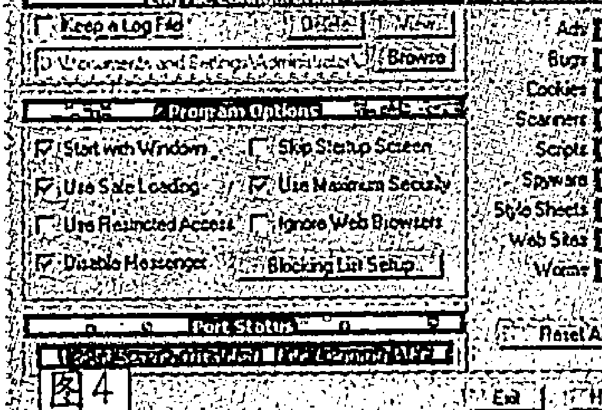

Use Safe Loading：开启该功能后，SpyStopper 会通过一些公开的代理服务器来访问网页上的图片。这是针对一些站点利用图表侦测来访者的信息而设定的，这样，对方得到的信息只不过是代理服务器的信息，个人的隐私也就得到保障了。

Use Maximum Security：在浏览一些新闻网页中的部分图片和图表时，如果图片和图表没有显示出来，则可以去除该功能后再浏览。如安装该软件后，再打开新浪网时，有些图片不能正常显示的状况。

Use Restricted Access：这是专门针对 Windows 2000/XP 系统多个用户而设计的，默认情况下，SpyStopper 需要访问系统多个文件，如果不是管理员的用户使用这个软件时，容易出现“Run-time error”的错误提示。此时开启了此功能再重新启动软件，则其他权限的用户也能正常使用了。

Disable Messenger：主要是针对 Windows XP 中的消息信使服务。消息信使服务有时也被人用以发送垃圾讯息，选取这个选项后，传播垃圾信息者对你就无可奈何了。

Ignore Web Browser：虽然 SpyStopper 很好地保障了用户的隐私不受窥探，但同时也付出了一些代价，比如有一部分网页的本来面目没有看到，选择此选项可让 SpyStopper 暂时停止对浏览器的干扰。

我们还可以进行声音设置。在默认情况下，每次拦截成功，软件图标都会快速地闪动，如果要知道拦截发生的时间，则可在在图标上单击右键，依次选择“Options”菜单下的“Notifications”选项，然后选中“Both”。这样，发生拦截行为时除了看到图标闪动外，还能够听到声音提示。

##### (2) 查找与清除间谍软件

在软件的主界面中，单击“Blocking List Setup”按钮，在“User Defined Block”（用户定义拦截列表区）区域下面的“ADD URL”空白栏中输入有关的地址，然后单击“Apply”按钮则可添加到用户定义拦截列表区。如果想把一批站点一次添加到拦截列表，可以先建立一个文本文件，然后把全部地址逐一输入，注意每行只能有一个URL地址，接着点击“Import Hosts”并选择该文本文件就能完成导入。

#### 4. SpyBlocker V7.4

这是由 EarthLink 公司推出的一款防间谍软件产品，它能够防止1500多种间谍软件的感染。SpywareBlocker 包含能够扫描和清除用户计算机上任何间谍软件的工具，并与所有的防火墙程序、浏览器、Windows 操作系统相兼容，能阻挡广告、cookies、web bugs。SpyBlocker 最显著的特点是，在达到目的的同时，并不删除或修改任何程序或系统文件，而是从传输管道和接收的广告以及跟踪系统里封杀间谍软件。

##### (1) 软件设置

当“SpyBlocker”启动后，会在系统托盘上显示出图标，用鼠标左键单击，将弹出程序主界面。如图 5 所示。选中“Start with Windows”复选框，表示程序会随系统一同运行。若选中“Use Safe Loading”复选框，表示会使用最安全的设置。若选中“Ignore Web Browsers”复选框，则表示会忽略网页浏览。选中“Skip Splash Screen”复选框，则表示将跳过程序启动画面。选中“Use Limited Account”表示使用具有限制的账户。

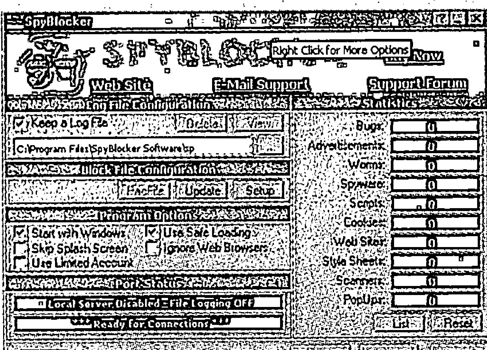

日志功能。在软件界面上单击右键，弹出一个对话框，我们可以进行相关的参数设置。若选中“Keep a Long File”复选框，则表示已激活日志记录功能。此后，在下面的文本框中可以设置日志文件的存储路径。若想删除日志可点击“Delete”按钮；若想查看日志则点击“View”按钮；点击“Browse”按钮可以打开已存在日志或创建新的日志。设置完毕，保存即可。

### （2）查找和清除间谍软件

过了一段时间之后，我们再次查看一下程序主界面。在 “Program Options” 项目中，点击 “List” 按钮后在弹出对话框中可以设定阻止或清除已截获内容。如果要想重新对统计信息（Statistics 项目下的各参数项）进行计数，可以点击 “Reset” 按钮，在弹出的对话框中确认即可。我们点击 “Setup” 按钮后将弹出 “Setup SpyBlocker” 对话框，并在列表中显示所有被拦截的网址。在该视图中，我们还可以自行添加准备拦截的网址或删除指定网址。

“SpyBlocker” 将所有拦截的网址全部重定向到 “127.0.0.1”，即本机 IP 地址。这样一来，就完全切断了计算机与目标网址之间的联系，个人隐私自然能够得到很好的保护。在软件主界面的统计信息及端口状态项目中，可以查看相应的参数。

#### 5. Spybot Search and Destroy V1.3 RC5

### （1）查找和清除间谍软件

Spybot Search and Destroy 也是一个专门用来清理 spyware 的工具，其最大的亮点是可以检测多种间谍软件。到目前为止，已经可以检测一万多种 spyware，并可对其中的一千多种进行免疫处理，而且这个软件是完全免费的。软件安装完毕，选择 “language” 菜单下的 “简体中文”，即可转换为中文界面。软件界面如图6所示。

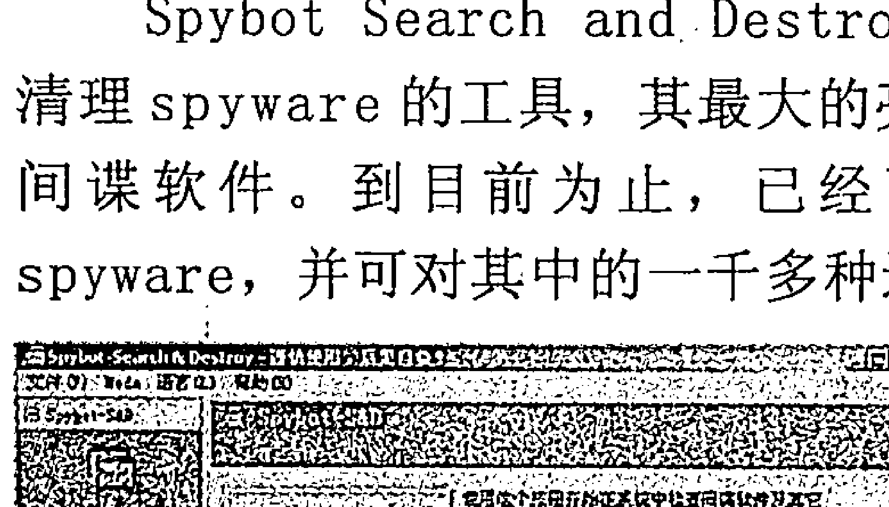

借助于这个软件，可以很轻松地实现扫描、恢复。单击 “检查问题” 按钮，就可以对系统内的恶意程序进行扫描。

扫描完毕单击软件界面中间的 “修复选定的问题” 按钮，就可以对出现问题的软件进行修复或清除。

### （2）高级模式

单击 “Mode” 下的 “Advanced Mode”，可以进入高级模式。可以看到，在界面的左下方出现了 “Settings”、“Tools”、“Info and License” 三个伸缩式的菜单。单击 “Settings”，可以看到右边的窗口出现了关于 “语言”、“文件夹”、“皮肤”、“Cookies” 等设置选项，可以对操作系统进行个性化的设置，和国内的 “Windows 优化大师” 等软件比较类似。

单击 “Tools” 菜单，同样也可以看到一些很实用的工具，读者朋友可以一一体会。

### 三、其他反间谍软件工具推荐

通过上述介绍，我们对反间谍软件的操作有了一个比较深刻的体会，但间谍软件层出不穷，也给我们带来了不少麻烦。下面我们将推荐另外一些比较有特色的软件作为补充，现列举如下。

#### 1. Spytech NetArmor V1.75

Spytech NetArmor 是一款出色的网络安全工具，它能够及时发现黑客对系统的攻击，并迅速发出警告信息。从报表功能看，它可以记录黑客的信息，把探测到的所有信息记录在案；从反间谍的功能看，它可以通过运行程序管理器随时查看是否有程序非法运行；通过查看端口，它可以探测到计算机中已经被打开的所有端口。

#### 2. SpywareGuard V2.2

这个软件最吸引人的地方是，当恶意网站或程序试图安装间谍软件到你的计算机中时，它可以马上发出警告，并阻止安装程序执行。它和防毒软件相结合时，可以达到比较好的保护效果。

#### 3. BPS Spyware/Adware Remover V8.2.0.7

“常在网上飘，哪有不中招”。这些 “招” 很大一部分来自网络广告。如果这方面的间谍软件比较多，可以采用 BPS Spyware/Adware Remover。它是一个专门用来删除广告记录文件的软件，支持多语言。同时，它还能够扫描内存、注册表以及广告程序，对于有害的文件，可以修复或者删除。

#### 4. Spy Cleaner V8.0

Spy Cleaner 可以清除 300 多种常见的间谍程序，而且非常容易使用。它有一个强大的数据库程序作为支持，通过这个数据库，Spy Cleaner 能精确地判断并清除间谍程序。同时，它还可以给用户提供一份比较详细的报表和保存日志等。不过要使用它的专业版本需要19.95美元的注册费。

#### 5. SpyBouncer

这个软件能比较快速地探测到间谍程序，如键盘记录、活动监测程序、网站记录和广告程序、网络寄生程序、cookies 等，避免某些程序跟踪和监视电脑。值得一提的是，它特别擅长对正在活动的间谍程序进行跟踪，并能对一些导致电脑严重损坏和性能下降的问题进行诊断。

有了上述软件的完美出击，我们就能在 “香花” 与 “毒草” 之间清楚地进行辨别了，就再也不必担心系统内隐藏的程序向外界发送各种信息了。

（文 / 彭文波）

## 流行病毒及专杀工具软件大扫描

### 一、流行病毒新趋势

今年，五一节前后的“冲击波”、“震荡波”病毒给我们敲响了计算机安全的警钟。的确，计算机病毒对我们日常生活的影响越来越大。总体而言，比较流行的病毒主要来自邮件和网络。所谓邮件病毒就是以电子邮件方式作为传播途径的计算机病毒，它们一般是以邮件中“附件”夹带的方法进行扩散。而现在网络时代的网络病毒，已经不是如此单纯的一个概念了，它被融入了更多的东西。可以这样说，如今的网络病毒是指以网络为平台，对计算机产生安全威胁的所有程序的总和。邮件病毒的出现，将网络病毒推向了病毒之王的宝座。那么，这些流行的病毒到底在哪些方面可怕呢？

#### 1.传播速度和范围加大

电子邮件本身是无毒的，但它的内容中可以有UNIX下特殊的编码序列，因此不少计算机病毒能自动通过电子邮件传染、扩散。在单机环境下，病毒只能通过软盘从一台计算机带到另一台，而在网络中则可以通过网络通讯机制进行迅速扩散。根据测定，针对典型的PC网络正常使用的情况，只要有一台工作站有病毒，就可在几十分钟内将网上的数百台计算机全部感染。

#### 2.电子邮件夹带的文件可能带毒

由于病毒在网络中的扩散非常快，扩散的范围很大，不但能迅速传染局域网内所有的计算机，还能通过远程工作站将病毒在一瞬间传播到千里之外。

#### 3.难于彻底清除和潜在威胁

单机上的计算机病毒有时可通过删除带毒文件、低级格式化硬盘等措施将病毒彻底清除，而网络中只要有一台工作站未能彻底消毒就可使整个网络重新被病毒感染，甚至刚刚完成清除工作的一台工作站也有可能被网上另一台带毒工作站所感染。网络一旦感染了病毒，即使病毒已被清除，其潜在的危险也是巨大的。根据统计，病毒在网络上被清除后，85%的网络在30天内会再次感染。因此，仅对工作站进行病毒杀除，并不能解除病毒对网络的威胁。

#### 4.破坏性大

网络中的病毒将直接影响网络的工作，轻则降低速度，影响工作效率，重则使网络崩溃，破坏服务器信息，使多年工作的成果毁于一旦。

#### 5.可激发性

网络病毒激发的条件多样化，可以是内部时钟、系统的日期和用户名，也可以是网络的一次通信等。一个病毒程序可以按照病毒设计者的要求，在某个工作站上激发并发出攻击。

为了对付泛滥成灾的流行病毒及流行病毒的变种，许多杀毒厂商和其他软件公司推出了许多优秀的专杀工具，本文将结合流行病毒的趋势，对这些保障电脑安全的卫士进行一次大“阅兵”。

### 二、流行病毒及专杀工具大扫描

#### 1.震荡波病毒及专杀工具

“震荡波”病毒是五一节后出现的一个比较猖狂的病毒，很多用户谈之色变。鉴于此病毒的危害性很大，而且现在这个病毒也逐渐出现了不少变种，我们重点讲述其专杀工具。

##### (1) 病毒特征

“震荡波”病毒的起因在于 LSA 服务的漏洞，它是Windows系统中一个相当重要的服务，所有安全认证相关的处理都要通过这个服务。该服务在记录日志的时候，由于函数的字符串参数缺少正确的边界检查，导致发送超长的字符串会导致缓冲区溢出，进而执行任意代码，完全控制系统。如果用户的系统中出现下列现象之一，则表明已经中毒，应该立刻采取措施清除该病毒。

最典型的是出现系统错误对话框。被攻击的用户，如果病毒攻击失败，用户的电脑会出现 LSA Shell 服务异常框，接着出现一分钟后重启计算机的“系统关机”

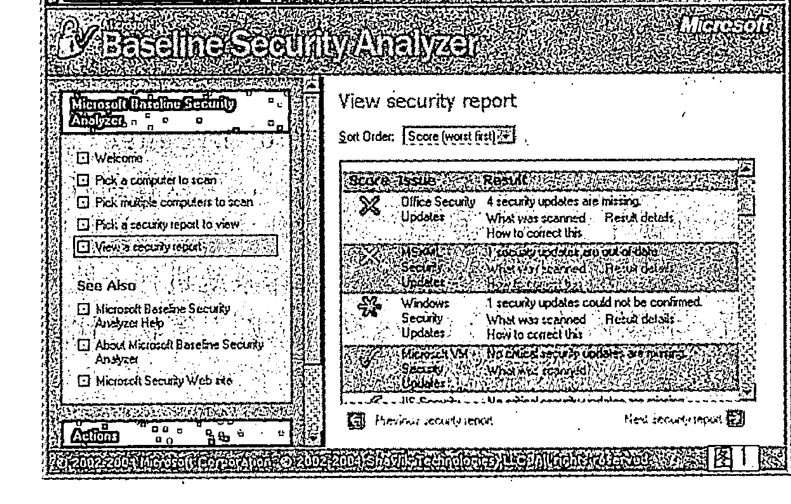

对话框，如图1所示。此病毒的重要特征是：系统资源被大量占用，系统日志中出现相应记录，内存中出现名为 avserve 的进程。病毒如果攻击成功，会在系统安装目录下产生一个名为 avserve.exe 的病毒文件。

另外，在[HKEY_LOCAL_MACHINE\SOFTWARE\Microsoft\Windows\CurrentVersion\Run]下，有如下键值："avserve.exe" = "%SystemRoot %\avserve.exe"，同时会扫描并攻击网络上的其他主机的 TCP/445 端口，一旦攻击成功，就在被攻击的主机的 TCP 9996 端口上启动一个 shell 程序，然后回连到本地的 FTP 服务器上下载蠕虫并运行。

##### (2) 专杀工具

微软专杀工具下载地址是 http://download.microsoft.com/download/1/e/b/leba8a6e-a22a-431f-9df4-a0cd2873e3c5/Windows-KB841720-ENU-V2.exe。同时要到http://www.microsoft.com/china/technet/security/bulletin/ms04-011.mspx。下载及安装微软安全性更新835732，这个更新已经与 Microsoft 安全性公告 MS04-011一同发布。断开网络，运行补丁程序，当补丁安装完成后再上网。现在开始运行专杀工具，在最终用户许可条例被接受之后，运行该工具就会自动检查电脑是否受到影响，并能移除所有被发现的蠕虫。运行过程中，会有一个信息提示和进度窗口出现，同时会在 %WINDIR%\debug 文件夹生成一个记录文件 sasscln.log。

瑞星专杀工具的下载地址是http://it.rising.com.cn/service/technology/RS_sasser.htm。这是全球首次由反病毒厂商向用户提供内存补丁工具，解决了用户无法正常下载微软补丁程序、以及杀毒后再中毒的问题，受益者不光包括国内用户，还有国外的用户。使用瑞星的“震荡波”专杀工具，既能查杀“震荡波”病毒，又能有效防止利用 MS04-011 漏洞的后续版本的病毒。

金山毒霸专杀工具的下载地址为：http://www.duba.net/download/3/113.shtml。这个工具的特点是可以很快扫描系统是否有病毒，而且可以植入免疫器，对用户来说，可以说是一举两得的事情。在软件界面上，还提供了微软补丁的下载地址和金山毒霸对该病毒的解决方案。

此外，还有诺顿的专杀工具。这个工具可以终止 W32.Sasser 病毒进程、删除 W32.Sasser 文件、删除蠕虫加入的注册表的键值。下载地址为 http://securityresponse.symantec.com/avcenter/FxSasser.exe。

#### 2. 冲击波病毒及专杀工具

##### (1) 病毒特征

远程过程调用（RPC）是 Windows 操作系统使用的一个协议。RPC 提供了一种进程间通信机制，通过这一机制，在一台计算机上运行的程序可以顺畅地执行某个远程系统上的代码。RPC中处理通过 TCP/IP 消息交换的部分有一个漏洞。为利用此漏洞，攻击者可能需要向远程计算机上的 135 端口发送特殊格式的请求。

冲击波病毒发作后，在局域网内大肆传播。这个病毒生成随机 IP 地址，然后向这些 IP 地址发送利用的数据，以尝试感染系统；在随机 TCP 端口上运行 HTTP 服务器，以使存在漏洞的计算机可以重新连接到受感染计算机，然后进行本地下载并将蠕虫作为 WksPatch.exe 执行。受感染的电脑将出现 %Windir%/system32/drivers/svchost.exe 这个文件。

打开中毒机器的 Windows 任务管理器，按 Ctrl+Alt+Delete，在“任务管理器”中，单击“进程”选项卡，在运行的程序清单中，会出现 MSBLAST.EXE 这个进程。在注册表管理器左边的列表中，双击以下项目：[HKEY_LOCAL_MACHINE\SOFTWARE\Microsoft\Windows\CurrentVersion\Run]，在右边的列表中查找并删除“Windows auto update” = MSBLAST.EXE。

##### (2) 专杀工具

微软提供的补丁是 MS03-026，下载地址为http://www.microsoft.com/china/technet/security/bulletin/MS03-026.asp。微软专杀工具的下载地址为：http://www.microsoft.com/downloads/details.aspx?FamilyID=e70a0d8b-fe98-493f-ad76-bf673a38b4cf&displaylang=zh-cn。此工具可帮助用户删除“冲击波”蠕虫。

瑞星专杀工具的下载地址是http://it.rising.com.cn/service/technology/RS_blaster.htm。如果没有打上微软“冲击波”漏洞补丁，点杀毒按钮后会自动提醒用户。运行软件后，直接点击“杀毒”按钮，就可以对系统进行扫描，操作十分方便。

金山专杀工具的下载地址为http://www.duba.net/download/3/91.shtml。这个工具增加了对“冲击波克星”的查杀，还可查杀最新冲击波变种。

#### 3. QQ 病毒

##### (1) 病毒特征

随着 QQ2004 的推出，QQ 已经成为任何人都不能忽视的互联网应用。正所谓“树大招风”，QQ 正成为电子邮件之后又一个主要病毒传播渠道。

比较常见的是 QQ 连发器及其变种。该病毒运行后会偷偷藏在用户的系统中，并修改注册表进行自启动。发作时会寻找 QQ 窗口，每隔1分钟就给被感染用户的所有线上的 QQ 好友发送诸如“快去这看看，里面有蛮好的东西一”之类的消息，诱惑用户点击一个网站，如果点击链接的话，就会被病毒感染，然后成为毒源，继续传播。

还有一些骗取密码的病毒，如 QQ 伪装专家病毒，此外The request was rejected because it was considered high risk

##### （2）亿虎 Email 安全大师

相对而言，亿虎 Email 安全大师的功能更加全面些。这个软件采用多线程快速检索技术，支持任意多账户。在功能特点上，它体现在可以防止病毒邮件的感染和恶意邮件的攻击上，特别是新病毒邮件。而且内置强大的病毒检测和清除功能，可以直接在远程邮箱中进行删除。值得一提的是邮件发送过程信息能随时追踪邮件，有助于我们分析邮件的真正来源，如图 5 所示。

图 5 亿虎邮件安全大师的邮件列表界面（显示了邮件的序号、发件人、主题、大小、状态等信息）

综合分析以上两个软件，由于其全中文化界面，而且使用很方便，因而得到了一些网友的认可。不过，它们在与 Outlook、Foxmail 等软件的功能集成、建立收发者之间的相互信任工作模式上，还有待进一步深化。

##### 3. 垃圾邮件猎杀者加强版

垃圾邮件猎杀者的人气指数很高，其优势体现在对特定信息过滤和防止对用户系统的攻击。它是一个免费的垃圾邮件过滤软件，可以根据邮件的内容、标题、发件人、收件人，甚至是发件人的 IP 地址等，准确地识别垃圾邮件，再依据用户相关命令，将其清除掉。它采用自动与人工相结合的原理，不依赖任何邮件软件，可独立地对远程邮箱里的垃圾邮件进行智能识别。

该软件同时是一个邮件预处理器，除了过滤垃圾邮件外，它还可以帮助你直接登录远程的邮件服务器，查看信件内容。对于某些带病毒的电子邮件，你可以在远程服务器里以纯文本方式阅读，读完后将其保存为纯文本文件，从而避免了病毒发作。此外，用户还可以使用它直接回复来信，如图 6 所示。

##### 4. 快捷反垃圾邮件 V2.0

“快捷反垃圾邮件”可以让我们快速预览远程邮箱中的邮件，并自动清除服务器上的垃圾邮件。

首先，设置邮件处理程序。一般来说，“快捷反垃圾邮件”首次运行时已自动识别出了你所用的邮件处理程序。如果需要更改或补充设置，可启动“快捷反垃圾邮件”，在“工具”菜单上，单击“邮件处理程序管理器”，在弹出的对话框中单击“添加”按钮，设置所用的邮件处理程序，如 Outlook Express 或者 Foxmail，也可以同时设置多个程序。以后，单击本软件工具栏上的“邮件程序”按钮，就可以直接启动默认邮件程序，如图 7 所示。

其次，还可以添加朋友邮件地址列表。在“邮件规则”菜单上单击“朋友”，在弹出对话框中单击“添加”按钮，可添加单个邮件地址或域的所有邮件地址或者邮件列表。如果你使用的是 Outlook Express，可通过“导入”按钮，直接将其地址导入到软件中。如果使用的是 Foxmail 等软件，可先导出为 *.wab、*.csv 或 *.txt 文件，再导入到软件。

再就是邮件账户，是指用户邮件地址的相关信息。每个邮件地址对应一个邮件账户，我们可以在“邮件账户”菜单上单击“添加”命令，然后按提示操作。如果使用的是 Outlook Express，则可自动导入其账户到本软件。

总体而言，“快捷反垃圾邮件”与通用邮件接收程序结合得不错，而且很方便用户建立有效的相互信任工作模式。对于那些经过伪装的可疑邮件，它也能识别并做上标记，让用户决定是否清除，从而达到安全清除垃圾邮件的目的。不过在对特定信息过滤和防止对用户系统的攻击的效率方面，有待进一步加强。

##### 5. SpamKiller 4.0

这款软件的人气指数不错，从网友下载的次数可见其影响力。

从对特定信息过滤和防止对用户系统的攻击来看，SpamKiller 是一个非常强大的垃圾邮件清除工具。它提供了很多过滤器和简单易用的过滤向导，使用户可以非常轻松地建立自己的过滤器。SpamKiller对每份到来的邮件都会进行全面的审查，包括邮件头、内容、附件。当发现垃圾邮件时，可根据用户的设定自动将其删除或是作上记号保留在收件箱中，而且它还可以自动回复一封警告信给垃圾邮件发送者，如图8所示。

从使用过程中来看，SpamKiller可以透过POP3通讯协议登入到邮件主机上，列出你所有的信件标题。或者你根本就不想亲自一封封去检查的话，也可以交由SpamKiller担任过滤邮件的工作。但是，SpamKiller对各种免费信箱支持不是很好，在连接检测的过程中经常发生无法链接的错误，如图9所示。

从建立有效的相互信任工作模式来看，SpamKiller还可以将朋友的邮件地址定为友好地址，这样就不会影响你与朋友们的通信来往。SpamKiller强大、丰富的过滤器以及体贴的用户自定义功能使得它清除垃圾邮件的准确率非常之高，而且它的智能化程度也很高，你使用的时间越长，它就会越灵敏。

总体而言，这个软件虽然功能强大，但进行速度却不乐观，有耐心等待其速度的朋友可以一试。

总体而言，SpamKiller的智能化程度和灵敏度都很高。强大、丰富的过滤器以及体贴的用户自定义功能使得它清除垃圾邮件的准确率非常之高，在测试中几乎没有漏掉一封垃圾邮件，也没有错杀一封正常邮件。美中不足的是，对中文邮件的判断能力和与通用收发软件的结合能力有待提高。

综上所述，对一个成熟的邮件检测软件来说，必须注意在对特定信息过滤、防止对用户系统的攻击、建立有效的相互信任工作模式、与通用邮件接收程序的结合程度上下工夫。另外，方便快捷、亲切易用的界面也是用户看重的一个方面。

##### 6. SpamEater Pro

从SpamEater Pro的名字，可以看出这个软件在特定信息过滤和防止对用户系统的攻击上有一些实力。它附带了包含5000多种垃圾邮件的列表，所有与之匹配的邮件在你看到它们之前就被删除掉了。SpamEater Pro还带有Interactive Checking工具，它可以使你在删除信件之前查看邮件头。不过令人遗憾的是SpamEater Pro不能按关键字进行过滤或检查邮件内容，所以这也导致了它拦截清除垃圾邮件的准确度不是太高。

当然，在现有技术的基础上，我们还要不断关注邮件检测技术的发展动向。值得一提的是，最近出现了一种“比特动态滤毒”技术，其独特之处在于支持所有邮件客户端程序、完全“前杀邮件病毒”。在邮件接收过程中，它利用“比特动态滤毒”技术在电脑与网络之间建立起实时过滤网，在内存阶段即开始对病毒进行实时查杀，使带毒邮件在没有进入硬盘之前就已经被查杀了，不会出现错杀现象。清除病毒后的邮件，用户还可以继续使用。此技术一改以前邮件病毒拦截的被动局面，把“前杀邮件病毒”的概念提升到了一个新的高度。随着第三代邮件病毒检测技术的出现，到时也将逐渐涌现出许许多多优秀的邮件检测软件，我们拭目以待。

（文/彭文波）

### 过滤工具扫描

在你浏览网络的时候，是否曾被不断弹出的广告窗口搞得心烦意乱？是否曾有误入恶意网站的经历？是否希望远离那些色情、反动、暴力网站？本文将介绍一些时下流行的浏览过滤工具，让你心情舒畅地上网冲浪。

#### 1. 广告清除专家

广告清除专家目前的版本是V2.0，它专门用于防止弹出广告窗口。它可以非常有效地屏蔽几乎所有的弹出广告，最大的特点就是可以在广告窗口产生之前就将其消灭，而且不会误杀正常的弹出窗口，只屏蔽广告窗口，非常智能。它可以去除烦人的广告窗口，有效地节约你的系统资源。该软件可以有3种屏蔽模式，分别为普通、最佳和严格模式，用户可以选择设定，还支持界面皮肤更换，有4种美观的界面皮肤方案可供随时切换。

它的使用非常简单，可以不用进行任何设置，就能帮你去除所有烦人的广告窗口；软件界面还有工具按钮，可以直接调用视窗系统的工具软件。广告清除专家是一款共享软件，只提供了20次的试用次数，要使用正式版，需要交纳20元的一次性注册费用。

#### 2. Ad Killer 广告杀手

该软件目前的版本是V7.1，是一款小巧的国外共享软件，大小仅576k。Ad Killer可以去除浏览一些网站时自动弹出的广告窗口，它使用了一种智能过滤技术来捕获和杀死广告窗口，无须设定。和一般的同类软件不同的是：广告杀手在广告网页被下载之前就将它们去除了，所以不会占用带宽，也不会占用系统资源。广告杀手使用简单，不需要进行配置，直接安装，打开IE窗口后会自动运行，是目前最好的去除广告窗口的工具之一。

Ad Killer具有高级设定，即黑白名单功能。可以在黑名单中添加一个网址以阻止访问该网址，或者在白名单中添加一个网址强制在访问该网址时Ad Killer显示该URL。还可以在黑白名单中添加一整个网址，以阻止或者显示网站下的所有内容。例如，如果在黑名单中输入一个网址，则该网站的所有页面将被阻止访问。注意在网址的后面还需要有一个斜杠符号“/”。

Ad Killer是一款共享软件，未注册的情况下可使用10天。

#### 3. 广告终结者

广告终结者是国内Better工作室的软件作品，现在的版本是V8.6，它是一个效果很好的弹出广告和Flash广告清理软件。

广告终结者的特色如下：

- 全自动处理，杜绝一切弹出广告窗口。根本不允许广告弹出，节省资源与带宽。
- 智能识别，正常聊天等弹出式窗口不受干扰。
- 注册版还提供Flash清除功能，100%去除Flash，包括漂浮的Flash广告。Flash广告提供站点内容可以照常浏览。

使用广告终结者非常简单。启动IE浏览器后（建议使用IE6.0以上版本），会在Windows状态栏出现一个K字图标。K字为蓝色，表示已激活，将禁止弹出广告；单击一下变成蓝色，表示允许弹出广告。再单击，又变成绿色，如此反复可以随时切换状态。

广告终结者的共享版本没有时间或者使用次数，要成为正式版，注册费用为人民币28元，可以获得清除Flash广告的增强功能。

#### 4. Google工具栏

如果不希望安装额外的软件，Google工具栏就是一个很好的选择。Google工具栏提供了各种选项来提高你网上冲浪的乐趣和效率。

在Google网站下载该插件并安装之后，打开IE浏览器就会发现多出了一个工具条，如图1所示。

Google工具栏不仅给我们提供了在互联网搜索内容的快捷方式，还具有拦截弹出式窗口的功能，禁止所访问的网站生成任何讨厌的弹出式广告。

在访问某个网站时，Google工具栏中的弹出式窗口拦截器可以禁止新窗口自动打开。这些新窗口经常显示广告，可能会影响查看网页上要阅读的内容。弹出式窗口拦截器拦截收到的广告时，光标会暂时改变。弹出式窗口拦截器按钮会显示拦截图标，以及自上次安装工具栏以来拦截的弹出式窗口数。要在个别情况下显示弹出式窗口，在单击链接转到新网页时按住Ctrl键即可，还可以单击“已拦截”按钮，该按钮将变为“允许显示网站的弹出式窗口”，这样就能看到网站上的弹出窗口。

要完全禁用弹出式窗口拦截器，单击“选项”按钮，打开“工具栏选项”对话框，在“附件”选项组中取消弹出式窗口拦截器旁边的复选框即可。

美中不足的是，Google的工具栏不能拦截漂动的Flash窗口。不过，它可是免费的，与强大的搜索引擎绑定在一起，逐渐成为网友的最爱之一。

#### 5. 网页吸尘器

网页吸尘器是网络卫士 www.NetGuarder.com 推出的一款可以实时过滤黄色、暴力、赌博等不良互联网内容的浏览过滤软件，目前的版本为V2.5。

网页吸尘器采用先进的网址拦截和智能内容过滤技术对浏览网页进行实时监控。用户可以分别对赌博、色情和暴力设置不同的限制级别。当用户访问有赌博、色情和暴力内容的网页，或者在搜索引擎中搜索这些网页时，网页吸尘器会根据限制级别，运用智能判断算法截获受限网页，阻止相关访问请求，并且给访问者以警示信息。此外，软件中拥有的受限访问历史记录使家长和老师对孩子的上网记录一目了然。不仅适用于家庭用户，而且可以广泛应用于学校、机房、网吧等场所。

在软件安装完成之后，首先要创建网页吸尘器管理员密码。注意要牢记该密码，因为只有提供正确的管理员密码才可以进行管理和使用该软件。另外，当卸载网页吸尘器时也需要提供管理员密码。

- 内容分类：分别划分赌博、色情和暴力内容的限制级别，严格程度从高到低（0 - 4）。
- 特殊网站：指定哪些网站可以允许访问或禁止访问，而不管在内容分类中如何划分。
- 通用属性：用户可以更改管理员密码并且可以设置以下选项：

#### 功能属性

- 使用内容过滤：如果选择，网页吸尘器会智能实时过滤网页内容；
- 使用访问记录：如果选择，网页吸尘器会记录受限访问，提供网址、访问时间和禁止原因等信息；
- 使用锁定模式：如果选择，网页吸尘器只允许访问在“特殊网站”中指定为允许的网站，而禁止其他一切网址。

#### 网络属性

- 用户如果通过代理服务器访问互联网，那么请在此设置代理服务器的参数。
- 在线升级：用户可以在线获得最新版本。

另外，用户还可以利用管理菜单隐藏软件界面、查看访问记录、注销和退出等。试用版网页吸尘器只可以使用7天，之后需要注册使用。

## 2004聊天软件精彩大扫描

2004年4月8日，MSN Messenger 6.2强劲登场，神秘面纱彻底揭开；

美国时间2004年4月20日，ICQ 4.0 Lite版发布，全新的插件功能让人兴奋不已；

2004年4月28日下午六点半，腾讯QQ 2004预览版发布，引来叫好一片；

2004年4月29日，网易泡泡2004正式版发布，网友无不侧目相看；

步入2004年，聊天软件的花样不断翻新，功能不断增强。无论是国内还是国外，一些期望在即时通讯市场上大展拳脚的公司，都开始风风火火地发布新版聊天软件，打破了过去由QQ一统国内天下的局面。的确，一个功能强大的聊天软件，等同于一个完整的个人通信交流平台，人们利用这些软件所能做的，远不止聊天这么简单，还有语音、视频、文件共享、发送短信等。对广大网友来说，这无疑是一件好事，我们可以根据自己的需要，来选择适合自己的即时通讯软件。从腾讯公司重新开放免费注册QQ的服务上，我们就可以充分体会到这一点。

在这场没有硝烟的聊天软件大战中，究竟谁是聊天软件界的“王者”？本文将从以下方面对聊天软件进行一次完整的大扫描：综合界面与聊天窗口、表情与皮肤功能、查找好友、视频功能与音频功能、文件传输、安全功能等。通过这些分析，相信大家将对这些软件有一个比较全面的认识。

### 一、谁与争锋：QQ与ICQ

#### 1. QQ 2004预览版

QQ是由腾讯公司开发的即时通讯软件，其最新版本为QQ2004预览版（以下简称为QQ 2004）。截至今年2月，腾讯的用户数已经达到2.8亿户，活跃用户9200万，在国内聊天软件市场占有举足轻重的地位。人们可以使用QQ和好友用户进行交流、信息即时发送、即时回复。此外QQ还具有聊天室、传输文件、语音邮件、手机短讯服务等功能，还可与传统的无线寻呼网、GSM移动电话的短消息系统互联，是一个特别适合在网上进行即时交流的通讯工具。

##### （1）个性与时尚扫描

软件界面设计体现的是一个公司的开发实力和对软件的重视程度。在QQ2004里，界面采用深蓝色作为基调，辅以渐变效果，连用户分组都充满了渐变的淡蓝，看起来特别醒目。除了QQ的界面改变之外，手机好友也调了上来。企鹅被放置在QQ好友分栏上，毗邻QQ邮箱，虽然位置变了，但是其内在功能跟旧版的还是一样。另外，移动QQ面板也web页面化了，在这个页面上还可以显示图像等元素。人性化的“最近联系人”功能，独创的立体头像，充分体现着“以人为本”的设计理念。它储存了好友里面最新与你聊天的QQ号，再也不用直接到庞大的好友列表里查找好友了，如图1所示。

###### QQ2004

###### 聊天窗口

聊天时很多的交流都在窗口进行，因此，这里也反映了软件的亲和力。QQ2004的聊天窗口也有很大改观。主窗口布局合理，左为功能栏，上方为邮件功能，下为菜单栏，让人感觉清新、合理。聊天窗口的上方增加了一排按钮，分别表示“视频”、“传文件”、“短信”、“邀请”、“窗口”等，这样可以更加便捷地进行交互，让人感觉QQ不愧为国内即时通讯软件的老大，如图2所示。另外，QQ 2004支持聊天界面定制DIY，方便的“自动更新场景列表”使得场景可自动装载。不过，相对其他软件而言，QQ2004的场景交互功能稍显单薄，让喜欢绚丽多姿的美眉们，会觉得少了点活泼的气氛。

###### 皮肤管理器

QQ 2004 有一个皮肤管理器，针对以前网友下载皮肤后需要自己解压缩到目录的麻烦，它分为官方皮肤和网友皮肤两大类，下载之后只要双击左方列表就可自动进行换肤操作。皮肤的下载安装可自动完成，只需选择我们喜爱的皮肤，剩下可一键搞定！

###### 表情功能

QQ2004 对表情功能进行了加强，表情输入支持自动完成。QQ 2004闪耀的立体头像也是一个亮点，不过不同版本的表情含义不同，遇到使用不同版本QQ的好友，使用表情就会出现歧义。

##### （2）功能扫描

###### 查找好友

聊天工具较为重要的一项功能就是查找好友，特别是支持多条件自由组合的复杂查找。QQ2004采用了三种不同的查找聊友方式，分别能根据基本信息、高级信息和群信息来寻找聊友。另外，在好友分组时，为了避免塞满面板，QQ 2004将所有的分组全集合在QQ好友里，就算添加再多的分组，面板也不会拥挤不堪，这种改变的确非常方便用户。

###### 视频功能与音频功能

只要对话双方客户端都装有摄像头，然后在普通对话窗口中打开视频聊天功能，就可以同时进行视频聊天。在聊天的同时不仅可以通话，还可以看到对方的图像、表情。单击左上方的“视频”图标，可以进行视频（音频）聊天或者视频设置。

###### 共享文件和传输文件功能

在浏览器的地址栏中输入“QQ:\\号码\\”，即可浏览共享文件夹，非常方便快捷。在保持传输文件稳定性和超强穿透防火墙能力的基础上，QQ2004重点提升了传输文件的速度，尤其是局域网的速度比原来提高了很多倍，只需点击对话面板上方的“传文件”按钮即可在任何网络环境下畅通无阻地传输文件。

###### 安全杀毒功能

针对目前QQ病毒比较猖狂的状况，QQ2004 推出了最新的病毒资讯和在线杀毒等功能。其中“在线杀毒”功能可以查杀QQ尾巴病毒、窃取QQ密码的木马等，如图3 所示。详细的杀毒信息还可以参考 http://club.qq.com/virus/qqvirus.htm。

###### 游戏功能

网友们现在的眼光很高，他们不仅要“聊得好”，还要“玩得好”。在QQ2004 中，增加了许多游戏，在聊天对话框中，可以直接邀请好友玩游戏，非常方便。同时，好友头像状态显示增加好友游戏或聊天的状态。

###### 方便的功能设置

在QQ 的面板上，选择菜单可以进行相关的参数设置，包括“会员功能”、“好友与资料”、“娱乐”、“无线QQ”、“工具”、“更换皮肤”、“个人设置”、“系统设置”、“在线升级”、“更改用户”等。通过这些设置，我们可以很方便地领略到QQ2004 的新功能。

###### 群功能

在QQ2004中，群不再是一个孤单的集合体，而是可以由一个个的树状讨论组来组成。在群组里我们可以根据个人喜好建立不同层次的特色讨论组。我们还可以像和好友聊天一样，将自己认为有趣的自定义表情发送出去。

通过以上的界面和功能扫描，我们对QQ2004预览版的评价是：自定制的亮丽界面，更简洁的步骤，更快的速度，能够让网友更加方便地使用软件，非常人性化。同时加大了群的人数，加快了文件传输的速度，对于会员还可以享受大容量的邮箱。但QQ2004也存在一些不完善的地方，例如升级时可能会出现好友名单不见的兼容性问题；缺少丰富多彩而互动的场景等。最大的缺点是很多有特色的功能被收费所限，不过也使其他的聊天软件有了喘息的机会。

#### 2. ICQ 4.0 Lite版

软件官方地址：http://www.icq.com

美国当地时间4月20日，美国在线服务公司（AOL）推出了ICQ的全新4.0版。虽然现在即时聊天工具群雄并起，但每次ICQ新版的发布都会引起整个即时聊天工具业界的关注。20世纪90年代末期，ICQ工具使即时消息成为一种主要的通信技术。1998年，美国在线以2.87亿美元收购了其制作者Mirabilis公司。目前每天活跃于ICQ网络的用户将近800万，其中有八成ICQ用户使用的是英文之外的语言。ICQ在中国也拥有一定的用户市场，而且其中文版本很受国内用户的青睐。这次发布的ICQ 4.0更是一次重要的升级，首推的新特性要数允许开发人员创建扩展ICQ功能的插件。

##### （1）个性和时尚扫描

**软件界面** ICQ 4.0重新修订的用户界面把众多操作集结于单一的窗口之中，从而简化了用户的聊天体验。主界面上方是一个矩形的广告栏，中间部分显示的是联系人列表。界面下部三个圆形按钮是主功能按钮，由左到右依次为：主菜单、添加/查找、在线状态。最下面是重新整合的Google搜索框，如图4所示。

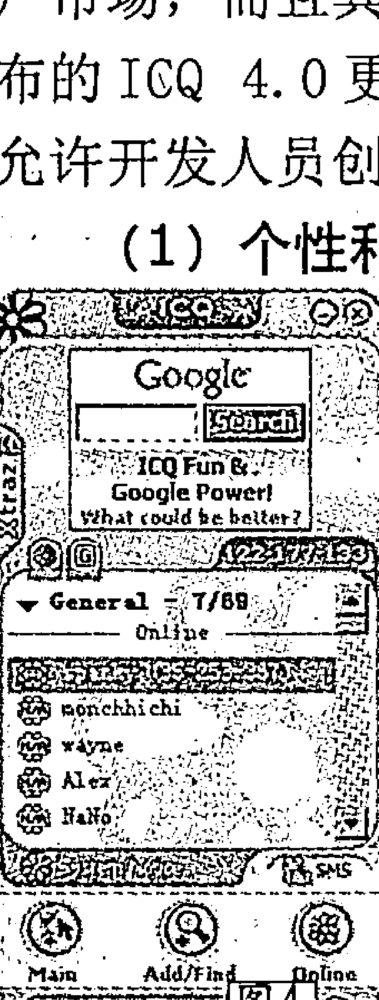

**聊天窗口** 从实际使用情况来看，对话框中的几个按钮很实用，单击后可以轻松地进行语音聊天、设置字体格式和颜色，如图5所示。

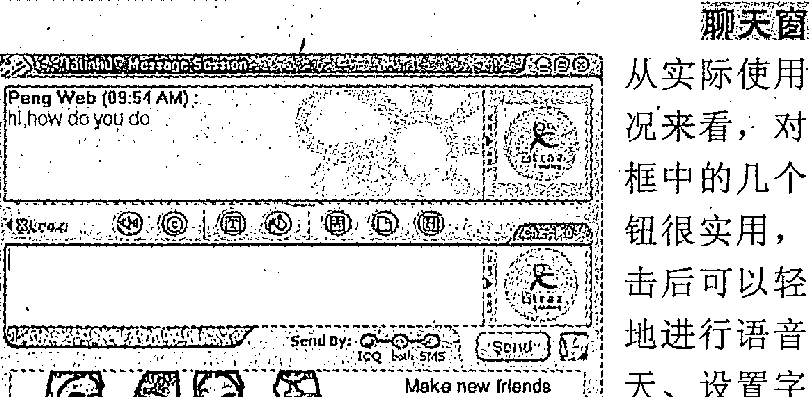

**更换皮肤** 更换皮肤是很多聊天软件的必备功能之一，在ICQ中你不仅可以更换皮肤，还可以更改皮肤的颜色。打开主菜单中的“Preferences and Security”选项，在弹出的对话框中，选择“Skin/Appearance”。只需要拖动“Change the skin colors”标签下的小块，就可以方便地更改皮肤的颜色。

总体感觉来看，ICQ4.0的界面更加大方得体，新ICQ界面和互动更加容易了，改变皮肤颜色也是易如反掌，新的表情更加可爱生动。在联系人名字上点击右键，可以调出聊天菜单。聊天界面中，不单单可以进行文字聊天，还可以发送文件、链接、贺卡，还可以和朋友一起玩游戏。不过广告添加了不少，特别是Google搜索功能。

##### （2）功能扫描

**添加用户功能** ICQ提供了两种添加用户的方式：“Add/Invite Users”和“People Search”。通过ICQ的搜索好友功能，可以很方便地查找到哪些好友在线。前者只能按照一个关键词进行搜索，点击“Add/Find”按钮，就可以看到“Add/Invite Users模式”，在这种模式下你可以通过ICQ号码、Email地址、名字、昵称来进行搜索。“People Search”方式则可以按照比较精确的方式进行搜索。点击“People Search”标签页，就可以使用以下项目进行查找：用户姓名、昵称、国家、年龄、城市、所在州、性别、所使用的语言和附加的关键词等，大大加强了搜索的针对性。

**主菜单功能** 单击面板上的“Main”按钮，可以看到ICQ的主菜单。如“View/Change My Details”项可以查看或者更改个人信息，包括姓名、昵称、Email地址等。

**安全功能** 安全一直是我们关注的一个热点，在安全的总体设置页面，可以设定添加好友时的认证功能，设置查看自己的在线状况、安全级别等。在垃圾信息的设置页面，我们可以选择只接收联系人发给你的信息，应用ICQ的垃圾消息过滤器等，从而营造出一个干净的聊天环境。

**Xtraz插件** ICQ 4.0最显著的地方是带有一个名为“Xtraz”的开发平台，ICQ Xtraz中心允许从ICQ好友那里组成一个动态交互式中心，这个平台具有开放的应用编程接口，允许开发人员创建、传输及自动更新以HTML、DHTML（Dynamic HTML）和Flash格式开发的插件程序。ICQ Xtraz中心主要包括“个人相片”、“发送贺卡”、“玩游戏”等项目。

**人性化的提醒功能** 使用过ICQ的朋友都知道其独特的音乐提示功能，在托盘上发出一声“滴答声”的同时，还能直接显示消息的来源和内容、对方的头像等。另外，ICQ为好友建立了一个好友生日列表，当其中的某人有生日时，ICQ会及时提醒是否要送生日祝福，尤其让人感到体贴的是，好友的头像旁边还会有闪烁着的蛋糕。

通过上述界面和功能扫描，我们看到了一个功能不断扩展的ICQ4.0，Xtraz Center插件这种将娱乐和附带功能集成到一起的方式，让我们窥见了聊天软件的一个发展方向。但是，这个软件和国内用户的亲密接触还有一定的距离，而且感觉广告功能特别强大，也造成了一定的距离感。

### 二、流行风：Messenger系列

除了QQ与ICQ，还有许多重量级的聊天软件，很多国外的聊天软件对国内的用户产生了巨大的影响。下面选择几款在全球范围有一定影响而且有一定国内用户的Messenger系列软件加以介绍，从而全面了解这些软件在今天的发展状况。

#### 1. MSN Messenger V6.2

MSN Messenger 是微软公司推出的即时消息软件，平台无缝结合加上其优秀的性能，目前MSN Messenger 在国内已经拥有了大量的用户群，其最新版本MSN Messenger V6.2 几经波折，终于出炉。与QQ 和ICQ 等软件登陆方式不同的是，使用已有的Email 地址，即可注册获得免费的MSN Messenger 的登录账号。如果我们拥有hotmail 或者MSN 的邮件账号，可直接登录MSN Messenger 而无须再申请新的账号了。

##### （1）个性和时尚扫描

**软件界面**

MSN Messenger界面简洁，易于使用，与MSN Messenger 6.0 相比，MSN Messenger 6.2 在聊天界面上没有多大改变。在“工具”菜单下的“背景”中可以选择软件自带的图片，而且在下次谈话时可依然保持。界面中，还添加了聊天人的头像，除了软件自带的头像，还可以从硬盘中直接选取，而且无须担心原来图片的尺寸。软件界面如图6 所示。

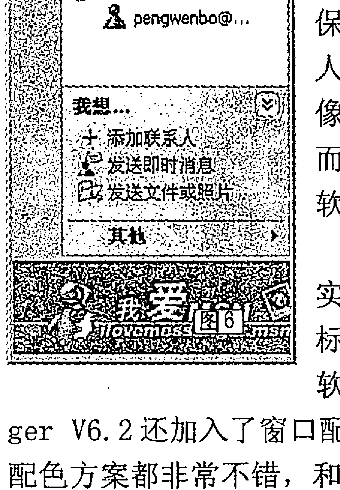

**聊天窗口**

聊天窗口典雅朴实，上方为邮件功能，左边为标签的功能，布局已经成为其他软件效仿的典范。MSN Messenger V6.2 还加入了窗口配色功能，默认提供的几种窗口配色方案都非常不错，和背景功能配合起来使用可以达到相当协调的效果。MSN Messenger V6.2 新添加了数十个创造型的表情，而且还支持表情的定制，在表情面板中，执行“我的自定义图释”命令，在随后出现的对话框中选择“添加”，即可添加自定义的表情了。皮肤功能在聊天窗口中单击“背景”按钮，可以选择自己喜爱的背景图片。背景提供了很多种，每种都有自己的特色。

##### （2）功能扫描

**查找和添加好友功能**

单个的添加功能没有多大的变化。如果要添加一批联系人，可以通过“批量添加”模式来完成，这种方法特别适合“整体迁移”，即将原有MSN Messenger 账号中的联系人转会到新申请的MSN Messenger账号中。首先，将原来账号中的联系人导出。单击MSN Messenger 主窗口中“联系人”菜单下的“保存联系人名单”，将联系人名单以.ctt 保存为文件。然后单击“联系人”菜单下的“从已保存的文件中导入联系人”，将旧账号中的联系人添加到新账号中。

**聊天记录保存功能** 刚开始使用MSN Messenger 6.2 的用户，可能会对聊天记录保存功能感到比较纳闷，因为聊天记录没有保存。MSN Messenger6.2 的默认选项没有开启这项服务，如果要保存聊天记录，可以单击MSN Messenger 主窗口中“工具”菜单下的“选项”，在弹出的对话框中单击“消息”标签，选中“自动保留对话的历史记录”复选框。聊天记录的文件保存格式是XML，在聊天记录的目录下，有一个配置文件MessageLog.xsl，里面详细配置了聊天内容记录的格式。

**视频聊天功能** 若要进行双向的网络摄像头对话，则两位参与者必须都安装了网络摄像头并且必须邀请对方。在MSN Messenger 主窗口中，单击“操作”菜单，然后单击“发送我的网络摄像头画面”，选择一个联系人，然后单击“确定”。或者直接单击聊天窗口上方的“网络摄像头”按钮，即可进行视频聊天。

**文件传输** MSN能够根据文件类型自动配合相应的文件图标标识，对于图片文件，更是能够直接预览到图片的显示内容。MSN Messenger V6.2 中，还具有图片预览功能。同时还可以根据传送进程生成绿色的进度条，传送时更加直观。在防火墙下传送文件也取消了一定的限制，可突破防火墙进行文件传输。

**安全功能** 在MSN Messenger 中我们可以自动检测接收的文件，从而达到保护的目的。首先点击“工具”下的“选项”，接着在弹出的对话框中选择“消息”标签，在“文件传输”栏里选中“使用下列程序进行病毒扫描”项。然后点击“浏览”按钮，在弹出的对话框中选择你的计算机中安装地杀毒软件的执行程序。通过这些设置，就可以安全的监控接收文件了。

总体而言，MSN Messenger V6.2 的界面十分漂亮，在个性化方面感觉比较典雅，具有微软一贯的特色。不过速度过于缓慢，文件传输、网络游戏的连接也同样感觉到了速度的延迟，主要原因还在于它的服务器在国外。另外，如果我们想让MSN功能更强大一些的话，还可以给MSN安装一些插件，使之更加完美。

#### 2. Yahoo! Messenger 6.0 beta版

Yahoo 是全世界用户数量最多的互联网公司，它的原则是为互联网的发展提供服务，Yahoo Messenger 应该是门户站点的一部分，其目的是实现对Yahoo 平台的捆绑，重点是对站点的捆绑，因此这个软件也提供了较多的基于Yahoo 站点的功能。使用之前，首先需要到Yahoo 的站点注册一个免费的电子邮件账户（如果直接在Yahoo Messenger 上注册较难成功），然后使用这个账户登陆到Yahoo Messenger 上就可以了。其最新版本为Yahoo! Messenger 6.0 beta版。

##### （1）个性和时尚扫描

**界面** 在以前的版本中，Yahoo Messenger采用了传统的Windows图形用户界面的风格，而且比较简单，一直没有什么特色。在Yahoo! Messenger 6.0 beta版中，界面美化做了很大的改进，秉承其以前产品的特点，就好像一个微型的浏览器，用户只需使用鼠标单击左键，即可获得相关的信息或服务。对其他必要服务的支持，则采用浏览器支持的方式，直接由站点提供服务，例如：当查询天气情况时，简要的天气信息里没有包括某个地区的信息时，用户可通过输入该地区的名称，在浏览器中会显示相关的信息。总体来说，这种实现风格与其系统总体体系密切相关，如图7所示。

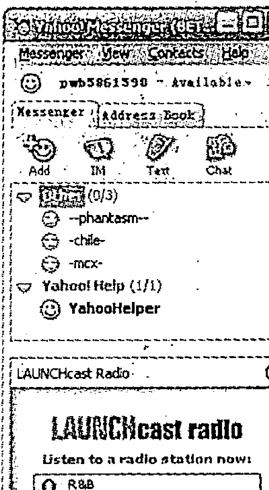

**聊天窗口** 进入文字聊天窗口后，你可以在窗口中间看到笑脸符号，用鼠标点选后，出现不同的表情符号并选择适合的图示即可。当你选定后，它便会自动输入图示文字代码，进入文字信息窗口内，当你选择传送后，你和你的朋友都会看到可爱的表情。

聊天场景是Yahoo! Messenger 6.0 beta较有特色的地方。通过选择雅虎的聊天情景，我们能够把一个互动的聊天环境发送给朋友。或“海上生明月”，或“天涯共此时”，或谈情、怀旧、搞笑、一起玩小游戏，让人其乐无穷。

##### （2）功能扫描

**添加好友** 单击面板菜单上“Contacts”按钮下的“Search Yahoo Member Directory”，可以看到一些在线的会员信息，选中某个会员后，就可以将他加入好友列表。

**多方会谈** 可以同时和两个以上的朋友聊天或传送文字信息。

**视频聊天和语音聊天功能** Yahoo! Messenger 6.0 beta版在原有的即时影像功能基础上，推出了“超级即时影像”视频聊天的功能，可以更加快捷、清晰地得到即时图像。单击对话窗口上方的“Webcam”按钮，即可和对方进行视频聊天，或进行相关的功能设置。另外，只要电脑连接有麦克风和喇叭，我们就可以和朋友畅谈对话，Yahoo! Messenger的音质比较优秀，而且延迟的情况不明显。

**独特的站点服务** 该类功能可以说是站点服务的一个缩影，用户可以定制自己关心的部分，而检索由站点服务完成，该类功能包括股票信息、新闻、体育赛事的报道、天气预报、小书签本、旅游信息的公布、定制日历、网上拍卖信息、邮件和消息的查收等。

通过以上对界面和功能扫描，我们看到了一个功能不断加强的Yahoo! Messenger，而且Yahoo! Messenger在向其他软件学习的时候，仍然能保留自己的特色信息服务，特别是独有的场景功能，也吸引了不少的用户。

#### 3. AOL Instant Messenger V5.5

AOL Instant Messenger 简称AIM，是美国在线推出的一款即时信息传送客户程序，其最新版本为V5.5，在美国互联网用户中非常普及。这个软件目前已是Netscape Communicator的标准元件，在安装Netscape Communicator时会一起安装这个软件。

##### （1）个性和时尚扫描

**软件界面** 登陆美国在线后，我们注册一个用户。安装AIM程序之后，软件窗口显示已经在线的AIM朋友，这个软件的窗口很简单，上面是一排菜单，中间是用户列表，下面是常用的功能按钮，最下方可以显示用户目前的状态，如图8所示。

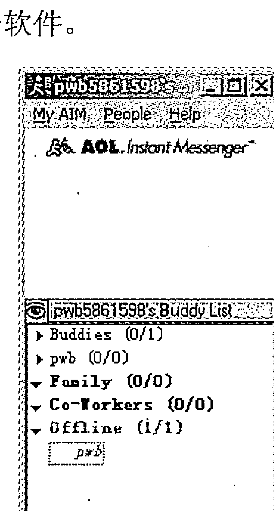

对话的窗口也很普通，在这个窗口中，我们可以进行字体颜色和大小、超链接、对话表情、聊天背景等设置。

##### （2）功能扫描

在AIM窗口中，通过单击“People”菜单下的“Find a Buddy Wizard”选项，可以根据Email、姓名和地址、兴趣等关键词进行搜索。

AIM还可以方便地传送文件、语音聊天等。不过在个性化的功能方面稍显欠缺，对于看惯了QQ或ICQ界面的用户来说，AIM可能不是一到两个地方需要改进的问题。不过，AIM和ICQ实现互联互通的功能倒是值得我们期待。

### 三、烽烟乍起：国内聊天系列

#### 1. 网易泡泡2004 Build 0428

网易泡泡是由国内大型门户站点网易（http://www.163.com）开发的一款免费即时通讯工具。它功能强大、方便灵活、安全可靠，集即时聊天、手机短信、在线娱乐等功能于一体，除具备目前一般即时聊天工具的功能外，还拥有许多更加体贴用户需要的特色功能，如自建聊天室、自设皮肤、网络文件共享、穿透防火墙的超大文件传输、视频聊天，语音聊天等功能。其最新版本为网易泡泡2004 Build 0428。

##### （1）个性和时尚扫描

**界面扫描** 网易泡泡的界面比较美观，支持拖放功能，如可以把好友的头像拖到桌面上，把一个文件直接拖放到你好友的头像。另外，网易泡泡2004还支持照片上传，让你能真实展现自我风采，如图9所示。

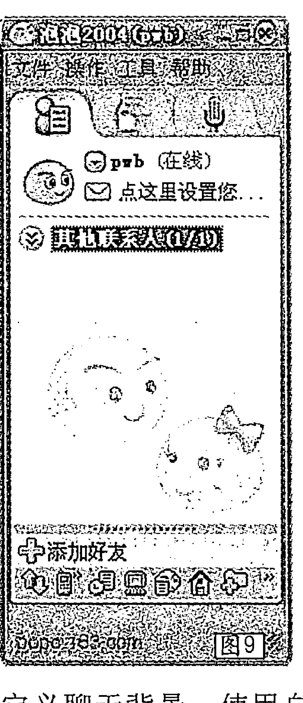

聊天窗口采用了比较流行的窗口结构，上面是菜单栏和常用操作按钮，“消息”、“短信”、“表情”等按钮则放在对话框和输入框之间。

**皮肤功能**：泡泡2004里内置多种不同功能的主题供你选择，如“蓝色梦幻”、“紫色情怀”、“素雅”等，还可以自定义聊天背景，使用自己钟爱的图片作为背景。

此外，网易泡泡的常用短语库存储了1000多条时网上最流行的短语，我们还可以将自己喜爱的词句添加至短语库中。只要轻松地点一下鼠标，即可以选择一条精彩的短语。

##### （2）功能扫描

**添加好友功能**：在主窗口中，点击“添加好友”按钮，就可以通过四种方式查找用户，还可以通过“省份”、“城市”、“年龄”、“性别”等条件进行高级查询，而且加入好友也比较方便。

**网络连接**：网易泡泡2004仅可以通过普通方式连接登录，也可以通过http代理，sock5代理，并能够穿透任何防火墙。网易泡泡2004的一个亮点是可以进行超大文件传输，可以交换超过100MB的文件，而且支持断点续传，在一个聊天窗口可以传送多个文件，这对喜欢在网上传递文件的网友来说，无疑是一个惊喜。这可是其他聊天工具所不能比拟的。

**语音、视频聊天**：如果有声卡、话筒、扬声器等设备，在网易泡泡2004上就可以进行语音聊天了，毕竟是专业的聊天网站推出的软件，它的通话质量比普通电话的效果还好！打开聊天窗口中的“视频”按钮，就可以通过网络摄像头发送实时视频影像。

**远程管理邮箱**：网易免费邮箱功能在广大网友中的口碑还不错，默认情况下，网易泡泡2004可以对当前Email账号的邮箱进行管理。打开“工具”菜单下的“系统配置”选项，在弹出的对话框口中切换到“邮件检查”标签，填好Email地址、密码、POP3服务器和间隔时间即可。当邮箱有邮件时，在“检查邮件”窗口可以预览邮件标题和删除邮件。不过，现在不少邮箱需要进行认证管理。

通过对网易泡泡2004界面和功能的扫描，我们可以看到，它功能强大、方便灵活，大文件传输是新版本中的一个亮点，而且支持断点续传；在个性化方面，可以上传照片，自定义皮肤、主题和聊天背景等，是一款不错的聊天软件。不过，在人气上有待和网易门户的人气相结合。

#### 2. 新浪了了吧

了了吧是新浪网最新推出的客户端聊天软件。了了吧是一种比电子邮件、BBS等更加方便快捷的网上通讯工具，它不仅在Internet上实现了寻呼功能，更具有手机的作用，让你和朋友们在网上方便地聊天！

##### （1）个性和时尚扫描

**界面扫描**：了了吧的界面如图10所示。


**聊天窗口**：了了吧可供选择的有中国龙、大力水手、万圣节、咖啡、灰色回忆、罗马时代、海洋世界、蝴蝶飞舞等聊天背景。你可以根据自己的喜好，从中选择一款，或时时更新，总保持一份新鲜感。

**魔法功能**：了了吧的魔法功能动感十足，一个丰富的表情和图释，就可以简单明了地表达你的心情！包括“电击”、“丘比特之箭”等，这些都增加了聊天的乐趣。

**个性化的信息功能**：新浪网在资讯方面具有十分强大的优势，在了了吧中就设置了滚动内容，还可以定制自己。

##### （2）功能扫描

**好友查找功能**：通过了了吧，可以方便地找到网友。在主菜单中点击“查找”选项，在弹出菜单中，选择在线的网友，在“省份”提示框中选择“湖北”，于是所有当前在线的、允许联络的湖北网友便会跃然眼前。在了了吧中，为了方便管理自己所联络的网友，特别提供了分组管理功能。也就是说，你可以将自己的网友进行归类整理，建立诸如“我的同事”，“我的同学”等小组。

**群发消息两法**：把好友分组后，直接在主窗口中使用右键单击某个组，会出现“群发消息”选项，在对话窗口中输入消息即可，使用十分方便。

**强大的邮件功能**：当有新邮件时，滚动条右侧的邮件图标将会闪动，此时单击该图标就可以收到邮件。在主菜单中，选择“设置”，单击“邮件检测”选项卡，选择“自动检测新邮件”；然后填写会员代号和密码，单击“确定”或“应用”完成设置。令人兴奋的是，还可以使用其他邮件客户端软件接收新浪100邮箱的邮件，添加新的邮件用户名和密码后，根据要求设置邮件服务器即可。

**语音视频聊天**：了了吧同样支持语音和视频聊天功能。

### 了吧

喜爱的新闻内容，包括时事新闻、体育新闻和财经新闻。你可以根据自己喜好定制新闻内容。从主菜单中选择“设置”，单击“定制新闻”标签，选择感兴趣的内容即可。

插件功能 了吧为广大用户提供了丰富多彩的插件，包括网址传送、剪切板传送、文件传输等功能。比如，如果我们发现了一个好站点，就可以采用网址传送功能，将它通知给自己的网友。灵活使用这些功能，将大大提高工作效率。

通过对了吧的界面和功能扫描，我们可以看到，了吧在邮件方面的功能十分强大，其独有的魔法功能和强大的资讯也十分有特色。

#### 3. 搜Q 2.4

搜Q 是由搜狐公司为用户提供的在线即时通讯软件。搜Q除具备一般即时通讯软件的常用功能如发送消息、文件等以外，它最突出的一点是更为贴近用户的人性化设计，如提供多种独具特色的动作、多款软件皮肤、不同风格的消息窗口背景、电击提醒对方等。在使用搜Q 之前需要进行申请账号，如果已经是搜狐、CHINAREN或搜狐短信的用户，可以直接在搜狐交友中心将自己的账号激活。有了账号和密码之后，我们就可以登陆搜Q了。

##### (1) 个性和时尚扫描

**软件界面** 搜Q的界面比较简单，默认的淡蓝色风格十分典雅，模仿ICQ的声音功能也显示其独特的一面。软件界面上主要有“聊天”和“速配”两个栏目。主菜单按钮将很多个性化的功能设置集中在一起了，如图11所示。

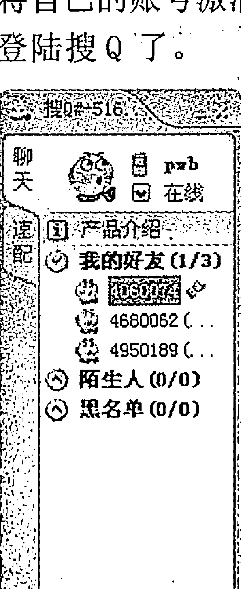

**皮肤功能** 在搜Q当中还可以更换皮肤，为用户提供了4款精美的皮肤。如要变换软件皮肤，单击“主菜单”按钮面板中的“更换皮肤”，选择合适的皮肤即可。

**聊天界面** 搜Q的聊天界面跟QQ非常相似，也有表情图标、字体设置等功能。在消息窗口中，点击工具栏上的背景图片图标，在弹出的消息窗口背景设置中选择喜欢的一款背景图，然后点击“确定”，这样在消息窗口的上半部分里就会显示选择的背景图。只有自己能看到背景图，对方则不显示。

**表情和电击功能** 对话窗口中的表情很丰富，而且可以自定义表情。“电击”是搜Q里面最有意思的，当消息发出的瞬间，消息窗口会在对方的桌面快速颤动几秒以引起对方重视。在消息窗口中单击红色闪电图标，消息窗口会在你的桌面和对方的桌面同时颤动。为了避免对方恶意的攻击，每启动一个消息窗口后可连续电击对方3次。电击3次后，电击图标为不可点击。再次给对方发送10条消息后，电击功能才能被再次激活。另外，动作也不错，通过它可以选择丰富多彩的交流方式。

##### (2) 功能扫描

**添加好友** 单击面板上的“添加好友”按钮，可以通过4种直接方式或高级查找方式添加好友，分别是：“使用账号”、“看看谁在线上”、“高级查找”、“其他查找方式”。其中“高级查找”可以指定“省份”、“城市”、“年龄”、“性别”等条件查找联系人。找到好友后，点击“下一步”，选择将该联系人放至哪个联系组。

**组功能** 搜Q里面也有组的功能，你可以将好友进行分类，并且可以群发消息。在搜Q主窗口中，选择一个组后，在下拉菜单中选择“群发给所有好友”，然后在消息窗口内输入消息后直接发送即可。

通过以上扫描，搜Q给我们带来了一些全新的视觉和听觉感受，比较有特色的“电击”功能，也让人流连忘返。功能相对简练、集中，只是人气相对欠缺，和搜狐网站的特色有待结合。

#### 4. UC V3.80

UC是朗玛公司新近推出的一款融合P2P思想，集通讯平台娱乐平台于一身的即时通讯类软件，随着功能的不断增强，用户的持续增长，已经越来越引起人们的广泛关注了。UC 凭借不俗的实力，其上线人数也在今年突破了30万的可观数目。但和QQ相比，重新开放免费注册的QQ依然掌握国内用户数量上的绝对优势。之所以把UC称为即时通讯的后起之秀，除了它本身新颖的功能外，更多的还在于UC身上表现出来的那种追求新功能的进取精神。

##### (1) 个性和时尚扫描

**聊天窗口** 乍一看，UC的外观和国内即时通讯霸主QQ有些相似，其实，这个软件运用了很多全新的设计思路，提供了一些非常新颖实用的特色功能。UC的聊天窗口，吸取了QQ和MSN两方面的优点。UC的文本聊天支持一次发送内容中字体、颜色和大小的不同设置，设置可以自定义表情，如图12所示。

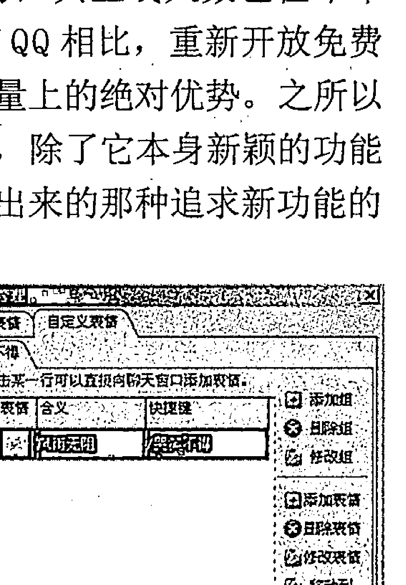

**场景聊天** 这可以说是UC最具特色的一个功能了，类似的功能在雅虎通上也有，但UC的不同在于：你不但可以通过场景为自己选择一个喜欢的聊天背景，还可以在场景中发送各种不同有趣的动画聊天动作来表达自己的感情，向聊友表达爱心，砸聊友脑袋一个椰子，化成恶魔吓唬MM等，现在通过动画外加伴音的形式可以完美地表达出来。

**动画图标** UC 的心情图标使用 GIF 动画，保存在 UC 的安装目录里面，我们还可以像更改 QQ 头像那样更换它们，并且没有太多的大小限制。如果你和网友同步进行了更换，那就可以使用全新的心情图标了。

##### (2) 功能扫描

**用户查找** 高级查找功能十分强大，用户可以利用“随意查找在线用户”，“按 I D 、昵称、电子邮件”，“按省份、城市、性别、年龄”等多种条件方式查找好友，尤其是在在线分类查找。

**立体声聊天室** UC 可以在本机开设聊天室，值得称道的是 UC 聊天室最新版本具备了接收消息提示的功能，这对于喜欢整天泡在聊天室的聊友来说是很实用很体贴的一个功能。而且有很多聊天室有主持人进行现场直播，聊天的网友可以一个一个地轮流参与节目，这种方式吸引了不少网友参与。

**消息群发** UC 的群发功能除了可以分组发送，还可以直接设置不同发送的对象，这比那些只能进行分组群发的软件又方便了许多。

**游戏平台** 从功能上讲，UC 的游戏可以说是国产聊天软件中最好的，最新版本 UC 推出了广受欢迎的“双升”，给喜爱打牌的朋友带来了一份惊喜。由于游戏服务器建立于用户的本机，因此提供了非常强大的管理功能，用户不但可以自己设定游戏的主题、欢迎词、开放级别等，最新版本旁观者也具备邀请的功能了。更主要的是，UC 的游戏不仅仅是简单的游戏插件，而是建设了一个完整的游戏平台。只要进入 UC 的游戏大厅，就可以在里面找到很多在线等待游戏的网友，也可以自己创建一个游戏，等着别人来挑战。这样，游戏的参与程度就在无形中扩大了。

**聊天机器人** UC 捆绑了聊天机器人“悠悠”，在用户列表中单独显示。它知识渊博、消息灵通，聊天的范围包括新闻、咨询、各种笑话、娱乐八卦等，好像对减肥特别感兴趣，想难住它还真不容易。

**附加功能** UC 的设计者们想尽心思来吸引用户，可以免费申请主页；还可以创建“团体”或者“同学录”，而且支持的班级数量也很多。

#### 5. 电信 Vnet Messenger

Vnet Messenger（简称 VIM）是中国电信为适应宽带业务的蓬勃发展、用户对电信级宽带即时通信业务的迫切需求，而推出的电信级互联网即时通讯软件，它是集即时消息、视频通信、语音通信、协同工作为一体的免费软件，除了文字聊天、语音聊天、视频聊天、传送文件等常用功能外，还可以利用 Internet 向小灵通用户发送短信，这可是目前非常实用的一个功能。

**聊天功能** 在聊天内容输入区，我们可以设置文字的字体、字型、下划线等格式，一次最多可以发送 2000 字的文字信息，按下回车键即可发送出去。也可以拷贝任意部分的 Internet Web 网页内容，这样就可以与朋友们共享多媒体和图片信息了。更妙的是，它同样支持发送表情符号和设置背景图案，可惜的是表情符号略少一些。软件提供了不同的外观，用户可以自己选择；可在主界面上右键单击系统标题栏，然后选择你喜欢的外观形式，如图 13 所示。

**功能** 除了提供目前最流行的即时通信软件主要功能，VIM 还增加了诸多面向个人和商业用户的功能，向互联网用户提供跨平台的集视频、语音、数据为一体的全方位网络应用，实现与小灵通用户互通。

从“操作”菜单中选择“小灵通短信”命令，此时会弹出窗口，缺省设置是从 VIM 向小灵通用户发送短信，首先在“区号”列表框中选择或键入对方城市所在的区号，在“号码”栏中键入对方的小灵通号码，然后在“短信内容”框中键入需要发送的短信内容，最后点击“发送”按钮即可。

**视频聊天** 与好友进行视频通讯功能时，必须安装 Windows Media Codecs 和 DirectX8 以上版本，从 http://www.vim.cn/time/downloads/download12.htm 可以下载这些软件。通过这些软件可以完成视频数据的压缩和解压缩功能，如果不使用以上软件，视频通讯过程中将无法正常显示图像。

### 四、一统江山：另类融合系列

从使用情况看，绝大多数网友使用的工具不外乎是 QQ、ICQ、MSN Messenger、Yahoo! Messenger、AIM、网易泡泡等，但是，这些软件彼此之间是无法进行联系的。如果你有一个朋友使用 QQ，另一个朋友使用 ICQ，再有一个朋友使用 MSN Messenger，那就必须把这些个软件全部安装上了！从目前的发展趋势来看，在某一个聊天软件没有一统江山之前，彼此融合应该是一个发展趋势，因此，国内外出现了不少的整合软件。

#### 1. 整合 QQ 与 MSN 的 IMU

在登录窗口中单击“注册”按钮，即可申请 IMU 账号。IMU 不仅自己在聊天功能上有很多特色，其最大亮点就是它可以将 QQ、MSN 集成到一起，我们就可以脱离独立的聊天软件而在 IMU 中独立完成与QQ、MSN好友的聊天功能。将QQ、MSN绑定到IMU中后，MSN中的好友分组将分门别类地存在于IMU的主窗口中，如图14所示。

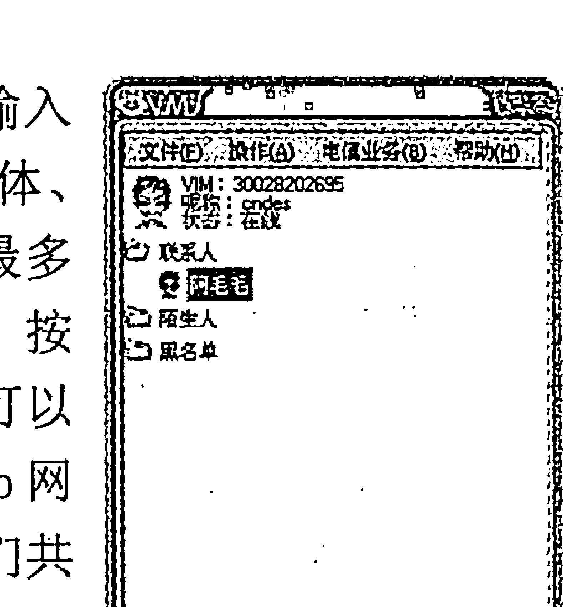

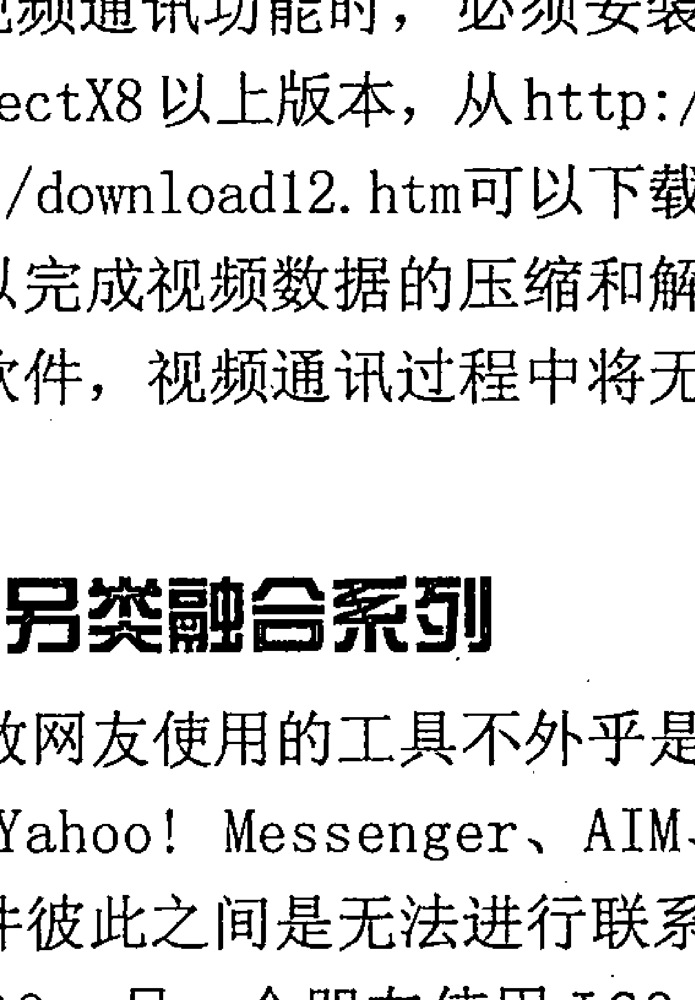

**绑定方法** 单击IMU主窗口中的“主菜单”，在弹出的子菜单中选择“功能设置”。在弹出的窗口中选择“QQ设置”或是“MSN设置”选项卡，然后分别将QQ号及密码或MSN账号和密码输入到相应的位置，单击“确定”按钮即可。绑定成功并登录后，QQ好友、MSN好友都将作为一个单独的组而存在。

**查找用户** 单击主窗口中的“查找”按钮，打开搜索窗口。我们可以通过“随机查找、指定查找、按服务器查找”的方式来查找好友。将联系人添加到好友列表中之后，我们就可以与之进行聊天了。

**语音、视频聊天** 直接单击“语音聊天”按钮，当对方接受我们的语音聊天邀请，语音聊天就建立起来了；IMU的语音聊天功能与视频聊天功能是分开的，如果我们安装了摄像头，视频聊天按钮就成为可用状态。

**群功能** 双击任何一个好友，打开聊天窗口，在此窗口中单击“邀请加入”按钮，随即聊天窗口的右侧将会展开一个面板。群发功能与群聊天差不多，单击“群发信息”按钮后，聊天窗口的右侧窗口将会弹出“信息群发”面板，选择好友，然后单击“群发信息”按钮即可，所有的好友都将收到发送的消息。

**游戏** 直接单击“游戏中心”按钮，在下拉菜单中选择相应的游戏，等对方接受我们的邀请后，就可以开始游戏了。

#### 2. 兼容QQ、MSN、ICQ的MyIM Preview 2004

MyIM是一个功能强大，操作简便的即时通信平台，兼容MSN、QQ、ICQ、Yahoo Message和AOL Message五大即时通讯协议，可以让客户把不同的即时通讯服务的客户端软件联合成一个软件界面，而不需要同时安装、运行多个不同的即时通讯程序。用户能从不同的服务中看到自己的好友，并且能在MyIM平台中向使用不同即时通讯服务的朋友发送即时文本信息，甚至进行文件传输等各种高级功能。因此，兼容性也是MyIM的一个特色。

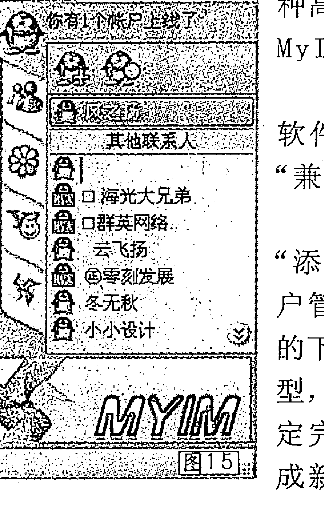

MyIM2004的界面综合了各大软件的优秀之处，充分突出了“兼容”的个性，如图15所示。

**账户设置** 登录后，点击“添加新账户”按钮；弹出“账户管理”页面，在“服务类型”的下拉列表中选择相应的服务类型，依次输入用户名和密码，设定完成后，点击“保存”即完成新账户的添加。如果密码出错，在下面的状态栏也会有相应的信息显示，但MYIM的用户注册是比较原始的。如申请一个新的QQ用户号时，必须进入QQ的用户账号申请网页，然后以网页的方式进行账号的申请，当然即时聊天软件下的用户账号申请都是这样的了，除非，腾讯公司与其他软件联合开发一个兼容的软件。

**聊天窗口** 随着即时通信使用的增加，用户容易出现顾此失彼的情况。MyIM提供了灵活的聊天窗口排列方式，用户可根据自己的需要，选择所有对话在同一窗口或者分列在不同窗口，并可以选择把同一种IM服务的对话放在同一窗口，或者把同一分组的对话放在同一窗口。

**功能** MyIM支持五个主流IM最新版本的各项功能，包括QQ的即时信息、文件传输和群组功能，MSN的个性化图案、共享背景和穿透防火墙的文件传送功能，Yahoo Message、ICQ/AIM的各项通信功能等，可以满足用户日常使用一个MyIM软件代替多个IM客户端的使用需求。但是像语音聊天，视频聊天，短信发送等时尚功能则比较欠缺。

**好友管理** 在MyIM中，我们可以轻松管理联系人名单，在同一个软件界面下，可以向任何一个聊天平台下的联系人发送文字消息或传送文件。由于会同时使用到多种IM服务，因而会出现大量的使用不同IM服务的好友。MyIM提供了丰富的管理手段，用户可以根据软件的服务方式，或自定义用户分组方式对冗长的好友列表进行有效的归类排序。但一些高级的聊天功能，如视频聊天、群组聊天则无法使用，只能进行文字聊天和文件传输这样的基本功能。

总的来说，该软件还是非常稳定的，对系统资源的占用也不多。但在操作方便性上，通常要使用某类聊天软件官方网站上的网页来进行一些用户查找、帐号申请等服务，因此在这个时候的资源占用率会增高不少。如果软件在“好友查找”、“新用户注册”、“个性头像”、“个性化声效”、及“特色和高级聊天功能”方面等有所加强和支持，那才能达到真正的“一统江湖”了。

#### 3. Trillian Pro V2.0

Trillian曾是一款能够使用户在同一个界面上使用包括AOL的AIM和ICQ、雅虎的Messenger、微软的MSN在内多个通讯协议的聊天工具。Trillian的最大好处也是整合了上述除QQ外的五大即时通讯产品。它不仅包括了好友上网提示、同一程序多重连接、表情图示、对话记录和离开/隐身等功能，还有统一的联络清单，让用户可以在一个界面内，同时看到不同通讯软件的朋友的状态。不过，最新版本Trillian Pro V2.0收取的25美元注册费也是一个不小的门槛。

第一次运行启动该软件，立即进入设置画面，填上你的基本信息，依照提示顺序设置IRC、MSN Messenger、AIM、ICQ、Yahoo! Messenger的设置。联网的机器会自动搜索到好友列表，界面可以随意更换，如图16所示。

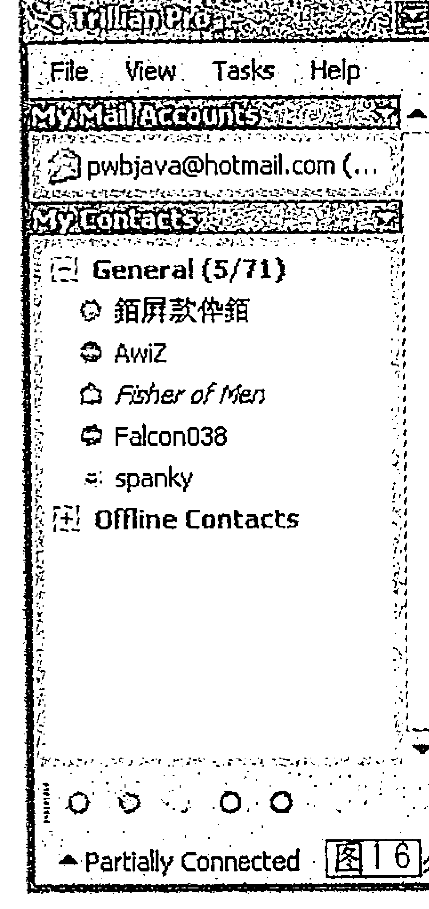

好友列表一般在线用户显示在列表的上部，离线用户则排列在底部，用户名前面的不同图标表示来自不同的即时联络服务器。至此完成全部设置，联网的机器会自动搜索到好友列表。好友列表类似于ICQ，但它不分类别，Yahoo!、MSN、AIM、ICQ的好友列表统一陈列在一个显示框内，十分方便。

单击主界面上的“Partially Connected”按钮，在弹出的菜单中选择“Connection Manager”。在这里我们可以进行帐户的相关设置，单击“Preference”按钮还可以修改相关的连接参数。

总体而言，Trillian Pro在某些地方做得还是有些粗糙，某些功能还处于半成品的状态。不经常使用即时聊天工具的用户可以考虑继续使用免费的Trillian 0.74。

现在，兼容性软件功能还有待完善。很多聊天软件提供商一直不愿意在多种服务之间建立兼容性，目的就是为了各自占据自己的地盘，以便利用这一地盘传送广告和促销自己的服务，而诸如Trillian等软件却使得用户可以同时与雅虎、AOL以及微软的MSN、QQ等建立网络连接，还可以避开聊天软件商提供商的广告，这自然令IM提供商不太高兴。因此，关于这一兼容软件的发展前景，我们仍然需要拭目以待。

### 五、2004聊天软件总结

| 聊天软件 | 优点 | 缺点 |
| --- | --- | --- |
| QQ 2004 预览版 | 自定制的靓丽界面，更简洁的步骤，更快的速度，能够让网友更加方便地使用软件，非常人性化。 | 升级时可能会出现好友名单不见的兼容性问题；缺少丰富多彩而互动的场景等；功能被收费所限。 |
| ICQ 4.0 Lite版 | ICQ4.0的功能不断扩展，最大亮点是能将娱乐和附带功能集成到一起的Xtraz Center插件。 | 和国内用户的亲密接触还有一定的距离，而且广告比较多，也造成了一定的距离感。 |
| MSN Messenger V6.2 | MSN Messenger V6.2的界面十分漂亮，在个性化方面感觉比较典雅，具有微软一贯的特色。 | 速度过于缓慢，主要原因还在于它的服务器在国外；文件传输、网络游戏的连接也同样感觉到了速度的延迟。 |
| Yahoo! Messenger 6.0 beta版 | 功能不断加强的Yahoo! Messenger，而且Yahoo! Messenger在向其他软件学习的时候，仍然能保留自己的特色信息服务，特别是独有的场景功能，也吸引了不少的用户。 | 界面需要进一步改进，人性化服务待加强；而且有时通过软件不能直接申请账户。 |
| AIM V5.5 | AIM通讯方式简练，符合其惯有的特色。在美国拥有众多用户也是一个不容忽视的因素。 | 在个性化的功能方面稍显欠缺；对于看惯了QQ或ICQ界面的国内用户来说，AIM可能不是一到两个地方需要改进的问题。 |
| 网易泡泡2004 Build 0428 | 功能强大、方便灵活，大文件传输是新版本中的一个亮点，而且支持断点续传；可以上传照片，自定义皮肤、主题和聊天背景等，是一款不错的聊天软件。 | 在人气上有待提高；很多个性化的功能有待加强；突出自己的特色。 |
| 新浪了了吧 | 了了吧在邮件方面的功能十分强大，其独有的魔法功能和强大的资讯也十分有特色。 | 还要加强除邮件之外的注目点；增加一些更加人性化的功能。 |
| 搜Q2.4 | 搜Q给我们带来了一些全新的视觉和听觉感受，比较有特色的“电击”功能，也让人流连忘返。功能相对简练、集中。 | 人气相对欠缺；有待和搜狐网站的特色结合。 |
| UC V8.80 | UC的语音聊天室给人印象深刻；场景聊天也让人赞不绝口。很多在QQ上收费的功能，在UC中都是免费开放；现在UC的用户正在快速增长；这些都让我们看到了国产聊天软件的良好发展前景。 | 普及率不够。注册用户数目前已经很可观，但是远不及QQ，而且已开始模仿QQ的收费模式。 |
| Vnet Messenger | 可以利用Internet向小灵通用户发送短信，这是目前非常实用的一个功能。 | 支持的地区有限；软件功能比较少，界面单一。 |
| IMU | IMU不仅自己在聊天功能上有很多特色，其最亮的点就是它可以将QQ、MSN集成到一起，我们就可以脱离独立的聊天软件而在IMU中独立完成与QQ、MSN好友的聊天功能。 | 集成后的功能比较少，对话方式单一；支持的软件类型也不多。 |
| MyIM 2004 | 兼容MSN、QQ、ICQ、Yahoo Message和AOL Message五大即时通讯协议，可以让客户把不同的即时通讯服务的客户端软件联合成一个软件界面，而不需要同时安装、运行多个不同的即时通讯程序。 | 集成后的功能比较少，对话方式单一；需要注册费；在某些地方还有些粗糙，某些功能还处于半成品的状态。 |
| Trillian Pro V2.0 | 不经常使用即时聊天工具的用户可以考虑继续使用免费的Trillian 0.74；可以对国外聊天软件较好地集成。 | 半成品的状态。 |

综上所述，随着网络技术的不断发展，未来的聊天软件将逐步成为我们的信息交换中心，它们将在人们的日常生活中扮演越来越重要的角色。

（文 / 彭文波）

## 宽带拨号工具扫描

ADSL 技术是一种用不对称数字用户线实现宽带接入互联网的技术，ADSL 作为一种传输层的技术，充分利用现有的铜线资源，在一对双绞线上提供上行 640kbps 下行 8Mbps 的带宽，从而实现了真正意义上的宽带接入。宽带技术发展很快，ADSL 迅速走进普通用户的家庭。在 ADSL 的数字线上进行拨号，不同于模拟电话线上用调制解调器的拨号，而是采用专门的 PPP over Ethernet 协议，拨号后直接由验证服务器进行检验，用户需输入用户名与密码，检验通过后就建立起一条高速的用户数字线；并分配相应的动态 IP。虚拟拨号用户需要通过一个用户账号和密码来验证身份，并且这个账号是做了限制的，只能用于 ADSL 虚拟拨号，不能用于普通 MODEM 拨号。选择一款好用的宽带拨号工具是很重要的，目前使用在 Windows 上的主要有 Enternet300、Enternet500、WinPOET、RASPPPoE，分别介绍如下。

### 1. RASPPPoE

目前常用的版本是 0.98c，是目前最好用的宽带拨号工具，打包压缩之后文件大小不到 200K。它不同于一般的 ADSL 拨号程序，而是利用了 Windows 原有的拨号网络，增加对 PPPoE 通讯协定的支持，让用户直接用拨号网络就能用 ADSL 上网，和用老式“猫”一样使用简单。安装它之后就不必再用既占系统资源、登录及拨号时间又长的其他 ADSL 拨号程序了。

RASPPPoE 是一款免费软件，该程序没有安装界面，相对于其他同类软件，在安装上显得有点复杂，具体步骤如下：

- 确定网卡和 ADSL 硬件已正确安装，卸载系统已有的 PPPoE 拨号工具。
- 双击 Raspppoe_098.exe 文件，将其解压缩到一个临时文件夹，比如 C:\ras98 中。
- 安装 PPPoE 协议。以 Windows 2000 操作系统为例，在桌面上右击“网上邻居”，在弹出的快捷菜单中选择“属性”，打开“网络和拨号连接”页面。
- 在“网络和拨号连接”中，右击“本地连接”，选择“属性”命令，进入属性设置页面。
- 在“常规”选项卡中，单击“安装”按钮，在打开“选择网络组件类型”对话框中选择“协议”，并单击“添加”按钮。
- 在打开的“选择网络协议”对话框中，单击下方的“从磁盘安装”按钮。
- 在打开的“从磁盘安装”对话框中指定 Raspppoe 存放的目录，如 C:\ras98，系统会自动列出所要安装的协议名称，单击“打开”按钮。
- 在打开的“选择网络协议”对话框中，将出现“PPP over Ethernet Protocol”网络协议，单击“确定”按钮，系统开始安装协议（系统如弹出“无数字签名”提示窗口，单击“是”按钮即可），完成之后单击“关闭”按钮，结束安装。
- 协议安装完之后，还需要建立拨号网络连接。单击“开始”按钮，在“运行”对话框中输入“Raspppoe”，单击“确定”按钮。
- 单击“查询可用服务”按钮，可以看到已安装的可用的服务。如果没有，需要检查一下以太网网卡是否正确安装，是否已经和“PPP over Ethernet protocol”一起绑定。
- 单击下方的“为所选服务创建一个拨号连接”按钮，在桌面上将看到新创建的一个拨号连接。
- 在桌面双击新建的连接，输入用户名和密码即可上网。

### 2. EnterNet 500

最流行的 PPPoE 驱动软件（ADSL 虚拟拨号软件）之一，中国电信、法国电信等大部分 ISP 都选择它提供给用户，不依赖于拨号网络可直接独立工作。具有独立的 PPP 协议，可以不依赖操作系统。具体安装步骤如下（以 EnterNet 500 V1.5 RC1 汉化版为例）：

- 先下载 p-Enternet500RC1.rar 压缩文件包，用 Winrar 软件解压缩，双击 setup.exe 文件，开始安装。
- 选择“Quick Install”（快速安装），单击“Finish”按钮结束安装。重新启动计算机。
- 重启计算机后桌面上出现 EnterNet500 图标，双击 EnterNet500 图标，打开配置文件窗口，双击右侧窗格中的“建立新配置文件”图标，创建虚拟拨号连接。
- 在弹出的“连接名称”对话框中输入连接名称，例如“MyADSL”。
- 单击“下一步”按钮，在打开的对话框中分别输入服务对应的用户名和密码。
- 单击“下一步”按钮，选择计算机上的以太网网卡。
- 单击“下一步”按钮，选中 PPPoE 协议单选按钮。
- 单击“下一步”按钮，如果配置成功，寻找服务器和服务成功，则单击“完成”按钮后在右侧窗格中将出现新建立的拨号连接——MyADSL。
- 双击拨号连接 MyADSL，单击“连接”按钮，连接成功后，该虚拟拨号窗口将缩为桌面右下角的一个小图标，绿灯闪烁，表示拨号连接成功。
- 要退出只需右击该连接标志，选择“断开”命令，连接即可断开。

相比 RASPPPoE 软件，EnterNet 500 软件安装较简单，还提供了“高级”功能，用户可以诊断网络状况、查看路由表、驱动信息和消息等，不足之处在于程序较大，占用资源多。

### 3. WinPoET

WinPoET 是美国 WindRiver System 公司开发的一个 PPPoE 虚拟拨号软件，流行的 ADSL PPPoE 驱动软件，由 PPPoE 协议创立者之一开发，需要拨号网络来配合工作，使用简单，和用老式“猫”一样。

WinPoET 的安装相对简单：

- 下载压缩包后，解压缩到临时文件夹，双击 setup.exe 进行安装。
- 单击“Next”按钮，进行下一步安装。打开版权协议页面，选择接受协议，单击“Yes”按钮继续。
- 连续单击“Next”按钮，直到完成软件安装。
- 单击“Finish”按钮，重新启动计算机。
- 计算机重启后，计算机桌面的右下角会出现 WinPoET 的图标。
- 双击桌面上 WinPoET 图标，输入服务用户名与密码，单击“Connect”按钮就可以连入互联网。计算机桌面的右下角将出现一个连接标志。
- 要退出只需右击该连接标志，选中“Disconnect”连接即可断开。

流行的网络拨号软件还有不少，有的还提供了计时和计费的功能，这里就不多介绍了。建议使用小巧高效的 RASPPPoE 软件，它将是您使用 ADSL 上网的好帮手。

(文/晴空)

## 2004热门下载工具扫描

Internet 就是一个大宝藏库，其中存储有海量的资料、软件、影视、音像文件等，让人流连忘返。这时候就需要一些专用工具将所需要的文件下载到本地计算机中，本文就将给您介绍时下最为流行的下载“武器”。

### 一、拳头 —— FlashGet 网际快车

FlashGet 如同古龙小说《七种武器》中的“拳头”一样，最大特点就是朴实无华、简单实用，没有什么花哨和招摇之处。

FlashGet 的出现，较好地解决了下载的2个问题：

一是下载速度。通过把一个文件分成几个部分并且可从不同的站点同时下载可以成倍地提高速度，下载速度可以提高100%～500%。

二是下载后的文件管理。网际快车可以创建不限数目的类别，每个类别指定单独的文件目录，不同的类别保存到不同的目录中去，强大的管理功能包括支持拖拽、添加描述、更名、查找，文件名重复时可自动重命名等等，并且下载前后均可轻易管理文件。

经过多次升级，目前 FlashGet 的最新版本是 V1.60，更新后支持 rtsp 和 mms 协议，可到它的主页 http://www.amazesoft.com/ 下载和获取最新资讯。

#### 1. 下载方法

FlashGet 的使用方法非常简单，每当通过浏览器需要下载文件的时候，用鼠标右键点击该下载链接，在弹出的快捷菜单中选择“使用网际快车下载”项即可。还有一种方法是，在浏览器工具栏上单击 FlashGet 图标，即可启动软件，出现悬浮窗后，把下载链接拖拽进去即可。FlashGet 还可以监视浏览器的点击，当单击 URL 时，如果该 URL 符合下载的要求（扩展名符合设置的条件），该 URL 将自动添加到下载任务列表中。总之，FlashGet 对于文件下载考虑得很详尽周到，操作起来也很方便。

这里要重点介绍的是多文件下载和批量下载。

- (1) 多文件下载
与单文件下载方式类似。在浏览中，如果要下载某页面的所有链接，可以在页面上单击鼠标右键，在弹出的快捷菜单上选择【使用网际快车下载全部链接】项，打开【选择要下载的 URL】对话框；对话框内列出了该页面的所有链接。可以逐一选择每个链接名称前的复选框，然后单击【确定】按钮。还有一种更为实用的方法，单击【选择特定】按钮，打开【选择链接】对话框。在对话框右侧的【文件扩展名】列表框内，选中要下载的文件的扩展名类型复选框，单击【确定】按钮，就将把具有选中扩展名的文件加入到下载列表任务中。

##### (2) 批量下载

有时我们需要从网上下载成批的文件，而且这些文件的下载网址相同，只是文件名是按序号排列的，譬如：01.bmp、02.bmp……20.bmp等，那么利用FlashGet提供的批量下载功能最合适。在FlashGet【任务】菜单中单击【添加成批任务】命令，打开【添加成批任务】对话框，在URL里填入相应的下载地址。假设要下载的文件为http://www.ABC.com/下面的01.bmp到20.bmp，那么URL处输入http://www.ABC.com/(*).bmp，从“01”到“20”，通配符长度为2，单击【确定】按钮即可。FlashGet还支持文件名后以字母为序列的成批文件下载，但要注意大小写。

#### 2. 下载任务和文件的管理

在下载任务列表窗口中选中任务，使用菜单命令、常用工具栏或者右键菜单，可进行开始、暂停、计划、删除、移动、更改属性等管理。

对下载文件进行归类整理，是FlashGet最为重要和实用的功能之一。FlashGet使用了类别的概念来管理已下载的文件，每种类别可指定一个磁盘目录，当下载任务完成后可将下载文件拖放至适当的类别目录中进行归类整理，让凌乱的文件从此变得井然有序。

##### * 新建类别

FlashGet 为已下载的文件缺省创建了“软件”、“游戏”、“驱动程序”和“Mp3”四个类别，如果下载文件很少就不需改变文件夹结构，将下载后的文件拖至相应的类别中便可。但如果下载的文件较多，就需要创建新的类别。

如果要新建一个类别，在FlashGet 界面的左侧目录树中右击【已下载】文件夹，在弹出的菜单中选择【新建类别】选项，打开【创建新类别】对话框，输入类别名称，如Photo，这样我们就在【已下载】文件夹下面创建了“photo”子文件夹，以后就可以把下载的图片拖到这里了。

##### * 改变默认下载目录

还可以将下载的文件放入指定的目录中，这样就方便了以后的文件管理。比如可以每天创建一个目录，存放当天的下载文件。设定步骤如下：

- 打开【工具】菜单，选择【默认下载属性】，打开【默认下载属性】对话框。
- 改变【类别】名称或将【另存为】文本框中的文件夹名称改为自定义的文件夹名称，例如“C:\download\20040501”。这样所有下载的文件将保存到新的下载目录中。
- 单击【确定】按钮，退出【默认下载属性】对话框。

假设这里只改变【类别】名称为“mp3”，【另存为】指定文件目录会自动变为“C:\downloads\mp3”，所有下载的文件都将保存到目录“C:\downloads\mp3”下。

##### * 使用下载规则

有时候希望设定下载规则，让具有相同扩展名的文件自动对号入座，存储到相应的文件夹。这样整理起来更为方便，具体设定步骤如下：

- 在【工具】菜单中选择【下载规则】命令，打开【下载规则】对话框。
- 单击【新建】按钮，打开【新建下载规则】对话框。
- 在【选择规则条件】选项组中，选中【当文件扩展名符合特定的字串】复选框，在【选择规则操作】选项组中，选中【移动到指定的类别】复选框。
- 单击【当文件扩展名符合特定的字串】按钮，在弹出的文本框中输入“.mp3”，单击【确定】按钮。
- 单击【移动到指定的类别】按钮，打开【移动】对话框，选中mp3 目录，连续单击【确定】按钮直到退出【下载规则】对话框。

这样就新建了一个下载规则，以后下载的mp3 文件将被自动置于C:\downloads\mp3目录下。

FlashGet 考虑到了文件下载的方方面面，一些操作细节也为用户想得非常周到，已逐渐成为Internet 上最流行的下载软件之一，是网友们上网冲浪的必备武器。

### 二、长生剑——NetTransport影音传送带

长生剑是古龙小说里锋利无比的利器，也是剑客手中的好伙伴。“长生”不仅是其可逞一时流行之能，更因其在综合能力方面的出众使其长葆青春，

影音传送带就是一把长生剑，不仅下载速度飞快，在同类软件中鲜有对手，还支持流媒体下载，是国内第一个支持多线程MMS、RTSP、HTTP 和FTP 协议的下载利器，并且支持多线程断点续传。

影音传送带目前最新版本为1.86a。

##### * 下载文件

影音传送带的主界面与网际快车非常相似，用法也相差不大。将流媒体文件的链接拖到影音传送带的悬浮窗口中，将打开【添加新的下载任务】对话框，依次选择目标的类别、文件下载目录、块数（文件分多少块下载，一般使用2～4 块就足够了）、用户名和密码等设定，单击【确定】按钮开始下载。

提示：MMS协议流每秒的字节数差不多是固定的，这就决定了MMS流本身不能充分利用用户所有的带宽，所以多线程技术在缩短MMS流下载时间方面的效果立竿见影。

##### * 文件管理
对下载文件进行归类整理，是影音传送带较为实用的功能之一。同网际快车类似，影音传送带也使用了类别的概念来管理已下载的文件，每个类别指定一个磁盘目录，所有指定下载完成后存放到该类别的下载任务，下载完后文件就会保存到该磁盘目录中。

创建新类别的步骤如下：

1. 打开【类别】菜单，单击【新建】命令，打开【创建新类别】对话框。
2. 输入类别名称，对应的目录名，单击【确定】按钮即可。

如果该类别下的文件太多还可以创建子类别，例如可以在类别 “music” 下创建子类别 “mp3” 和 “ape” 等等，相应的目录对应 “C:\music\mp3” 和 “C:\music\ape” 等等。影音传送带允许创建任意数目的类别和子类别。下载文件存放的类别可以随时改变，具体的磁盘文件亦可以在目录之间移动。对于类别的改变影音传送带提供了拖拽的功能，只需简单拖动就可以把下载的文件进行归类。

Net Transport 还有其他的功能，比如监视浏览器点击、添加成批任务、带有站点探测器等等，与网际快车用法类似，这里就不再多说了

在江湖上奔走，一把快剑是必不可少的。如果网友要高速下载大文件，请把影音传送带放入您的软件百宝囊中。

### 三、霸王枪——CuteFTP Pro

“霸王，力拔山河兮气盖世。枪，百兵之祖是为枪”，“世上最霸道的七种武器，有一种就是霸王枪”。在众多的FTP下载软件中，最为强悍的软件莫过于CuteFTP软件了。

CuteFTP 是一个使用容易且很受欢迎的老牌FTP软件，支持断点续传，可下载或上传整个目录，不会因闲置过久而被踢出站台，可以创建上载下载队列，上载断点续传，进行整个目录覆盖和删除等。CuteFTP Pro 为其专业版，功能更强，在主界面下方增加了一个信息窗口，支持多站点连接。

现在我们就以CuteFTP Pro 3.3汉化版为例，来介绍如何使用它。

添加FTP站点。运行CuteFTP Pro程序，打开【文件】菜单，依次单击【新建】、【FTP站点】命令。

在打开的【站点属性】对话框中，输入新站点信息。这里以北大FTP为例，【标签】文本框中输入“北大FTP”；【主机地址】文本框中输入FTP地址：ftp.pku.edu.cn；【登录方式】中请单击【匿名】单选按钮。

提示：很多情况下要在【FTP站点用户名称】和【FTP站点密码】文本框中分别输入登录所需要的用户名和密码。如果登录站点不需要密码，则在【登陆类型】中单击【匿名】单选按钮。北大FTP是允许匿名登陆的，所以这里选中【匿名】项。另外，【FTP站点连接端口】文本框中为FTP地址的端口，默认值是21。

下载文件。在对话框的左侧窗格中双击【北大FTP】，进行FTP连接。也可以右击站点名称，在弹出的快捷菜单中选择【连接】命令。

连接到服务器以后，CuteFTP的中部窗口被分成左右两个窗格。左边的窗格显示本地硬盘的文件列表，右边的窗格显示远程硬盘上的文件列表。文件列表的显示方式和Windows的资源管理器完全一样。上传和下载都可以通过拖曳文件或者文件夹的图标来实现。将右侧窗格中的文件拖到左侧窗格中，就可以下载文件；将左侧窗格中的文件拖动到右侧窗格中，如果有上传权限，就可以上传文件。

在队列窗口中可以看到下载的进度，可以随时暂停和中止下载。也可拖动选定的文件或目录至本地驱动器中，这样也可将文件加入下载队列中。

下载完成以后，在工具栏上单击关闭按钮并退出CuteFTP软件。

CuteFTP Pro的FTP下载有一些特色功能，诸如智能保持连接。许多FTP站点都设置了空闲超时，一旦在服务器设定的时间内没有动作，服务器会自动将用户踢出，设置了智能保持连接后，Cuteftp pro将自动发送一些FTP命令，就能避免这个现象，大大方便了用户。

还支持多线程下载，可以将一个文件分成几部分同时下载，这样能大大提高下载速度。方法也很简单，在右侧的文件列表中选中想下载的文件后，单击右键，从弹出菜单中依次选择【下载高级】、【多线程下载】、【最大4线程】命令即可。CuteFTP Pro还具有应用队列定时上传、目录比较、智能规则设定、添加下载过滤等功能。

CuteFTP Pro的另一个改进功能就是直接支持对HTML文件的编辑，包括对本地和服务器文件的编辑。不过，在CuteFTP Pro中只支持HTML代码式的编辑方式，因此可能对使用者的要求偏高一些，功能也较少，用处不大。打开【查看】菜单，在【工具栏】级联菜单中选中【HTML编辑栏】项，就可以调出网页工具栏。

总而言之，CuteFTP Pro是目前最好的FTP客户端程序之一，功能强大，性能稳定，其独霸FTP应用软件的内力源自于其作者多年执著的改进和不变的专业风格。

### 四、碧玉刀——FlashFXP

“段家的碧玉刀非但价值连城，而且古老相传，据说其中还隐藏着一个很大的秘密。无论谁只要能解开这个秘密，他立刻就能变成技压群雄的武林高手。FlashFXP有些类似碧玉刀，它的特殊功能使得该软件超越了其他FTP下载软件，成为网站斑竹们最热衷使用的软件之一。

FlashFXP是一款功能强大的FXP/FTP软件，融合了一些其他优秀FTP软件的优点，如像CuteFTP一样可以比较文件夹，支持彩色文字显示；具有像BpFTP一样支持多文件夹选择文件的功能，能够缓存文件夹；具有像LeapFTP一样的外观界面；支持文件夹的文件传送、删除；支持上传、下载及第三方文件续传；可以跳过指定的文件类型，只传送需要的文件；可以自定义不同文件类型的显示颜色；可以缓存远端文件夹列表，支持FTP代理及Socks 3&4；具有避免空闲功能，防止被站点踢出；可以显示或隐藏“隐藏”属性的文件、文件夹；支持每个站点使用被动模式等。

FlashFXP界面很简洁，新手也能迅速上手。基本功能即设置站点、上传下载文件与CuteFTP用法类似，不再多述。它的特殊功能在于实现站点之间的文件传递。FXP（文件交换协议）是一个关于站点对站点文件传输的术语。FXP功能不但能够将服务器上的文件直接下载到硬盘，还可以实现在两个服务器之间搬运文件。FlashFXP能够完成所有FXP功能，具体步骤如下：

1. 在【站点管理器】列表中，输入站点的ftp信息，定义好要对传的两个站点。
2. 在【站点管理器】中，连接ftp站点。首先连接其中一个站点，之后再连接另一个站点。选中一个站点中的文件或者文件夹，右击鼠标，在弹出的快捷菜单中选中【传送】命令。

FlashFXP带来的直接好处就是可以将大型软件、游戏、音像文件等从一个下载速度奇慢的站点先传到对自己来说速度最快的站点，然后再高速地下载；对于网站斑竹而言，则可以作为制作镜像网站和服务器间文件传输的工具。

FlashFXP还具有站点文件同步、快速连接站点、恢复队列等功能。单窗口、多线程、多站点是Cuteftp Pro最大的特点，这是Flashfxp所不足的地方，不过使用FXP传送功能则FlashFXP更强，并且FlashFXP为绿色软件，大小不到700KB，界面清爽，值得收藏。

### 五、多情环——贪婪BT

“多情环是一种犀利的武器，多情环无论套住了什么，立刻就紧紧地缠住，绝不会再脱手，哪怕是主人也一样。”

贪婪BT就是这样的一款软件，在使用的时候，如同八爪鱼一般，把世界范围内互联网软件下载用户联系在一起，下载的速度与下载的人数紧密相关。安装了贪婪BT，就可以放心大胆地高速下载不容易获得的大型软件、游戏、影视、音乐文件，体会到网络共享的快乐。

BT下载已经成为目前最流行的互联网下载方式，而贪婪BT更是“一旦拥有、别无所求”，对于宽带包月和办公用户更是如此，担心的将不再是能否下载软件，而是硬盘是否足够大，以容纳海量的下载文件。

在BitTorrent还没出现之前，网络上的下载软件虽然有很多，但下载方式无外乎就是点对点的传输，FTP、P2P等都是基于两点的传输，这就从根本上限制了速度，决定了它们不会有太大的突破。BitTorrent的出现改变了这一现状，它是一种多点下载的源码公开的软件。其原理是充分利用了用户富余的上行带宽。在BitTorrent的世界中，凡是参加下载的计算机无所谓“服务器”或者“客户机”，每一台“客户机”同时也是“服务器”，当它下载的时候，同时也会使用上行带宽将已经下载的部分发送到其他计算机上。这样，下载的人越多，实际网络带宽就越大，速度自然就越快，

贪婪BT是一个超强的Bittorrent客户端，单窗口多任务，资源消耗很少，最新汉化版本可以在http://bt.greedland.net/greedbt.php下载，目前的版本是V2.6.4。软件安装非常简单，依照缺省设置，连续按【下一步】按钮即可完成。

相比其他的BT客户端软件，贪婪BT的界面更友好，单窗口多任务管理更容易上手。“多情环”威力十足，让你的互联网冲浪更有成就和满足感。现在就去下载一个贪婪BT软件体会一下吧。

### 六、孔雀翎——Offline Explorer 离线浏览器

没有任何一种武器比孔雀翎更有威力和更方便，因为它是便于携带的“暗器”。Offline Explorer就是一种这样的武器，一来简单的几个步骤就可以将整个网站一股脑地下载下来，功能很强；二来使用该软件下载时，文件列表有如孔雀开屏一般快速滚屏，下载速度很快。

Offline Explorer（以下简称OE）是目前最好用的离线浏览工具。离线浏览器，顾名思义就是将想看的网页下载到硬盘等断线后再慢慢看。OE不但使用简单，而且功能也十分的强大。OE支持断点续传；可以按计划时间自动下载；支持代理服务器下载；可以选择或自定义要下载文件的大小、类型，及下载文件的存放位置、存放的空间限制；下载的文件既可使用其内置的浏览器浏览，亦可调用自己喜欢的浏览器浏览（如IE、Netscape等），支持全屏方式；对于已下载的网站提供地图功能，让你清楚了解整个网站的链接结构。

使用OE下载和浏览网站的方法如下（以OE企业版3.0为例）：

1. 运行OE软件，在主界面工具条上单击【Wizard】# DVD播放工具扫描

现在，无论是品牌机或是个人自主攒机，DVD光驱早已代替了CD-ROM，成为标准配件，当然绝大部分朋友是用DVD光驱来欣赏画质一流的DVD影片。下面，笔者就向朋友们介绍一些常见的DVD播放工具：

#### 1. Windows Media Player

凭借着Windows XP的威力，Windows Media Player无可非议地成为了绝大多数用户播放DVD的首选工具，原因无它，免费！

默认情况下，Windows并未包含DVD解码器，因此你无法从菜单中找到与DVD相关的命令、选项和控件，自然也就无法播放DVD。不过，只要安装了InterVideo WinDVD或PowerDVD程序后，DVD解码器就会被自动加载了。

#### 2. InterVideo WinDVD

WinDVD可以说是DVD播放工具中的大哥大，是目前最流行的DVD播放工具，支持MPEG2视频解码、Dolby Digital(EX)、DTS(ES)等多声道音轨的音频解码，插入碟片后，WinDVD会自动确定光盘类型并使用正确的播放方式。

它的播放界面看起来比较直观，如图1所示，工作面板做得非常专业、细致，子菜单和右键菜单中的命令很丰富，所有操作都可以在菜单上完成，你不用事先退出全屏窗口再返回主界面进行操作。在快放和慢放方式下，WinDVD支持最高60×(2×、4×、8×、20×、60×)的快放和最慢-60×(0.8×、0.4×、0.2×、-2×、-4×、-8×、-20×、-60×)的慢放，另外还可以在-1.5×～+2.0×之间以0.05×进行调节。

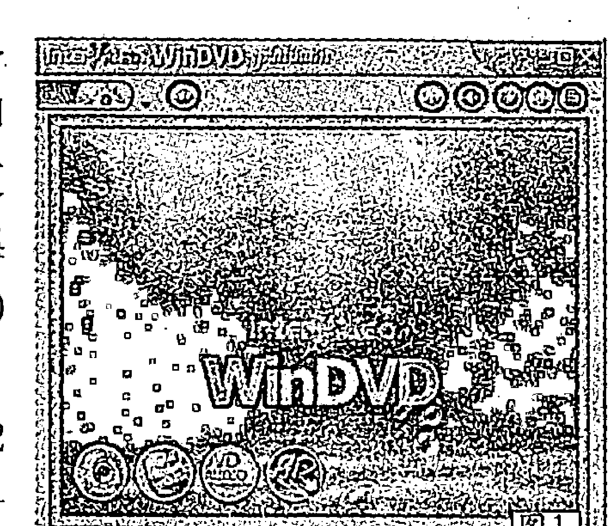

WinDVD不仅支持用户调节画面的亮度、对比度、色温、色饱和度和灰度系数，并且还为不同的显示设备创建了不同的颜色方案，如果使用的是LCD液晶显示器，可以使用LCD颜色方案获得更清晰、更舒服的画面显示效果。另外，WinDVD支持摇滚、低音、音乐厅、柔和、声音等DSP效果，支持标准、深夜和影院等三种环绕声效果，由于支持2、4、6、7、8声道输出和SRS环绕声场效果，允许将音频信号以数字形式输出到外部处理器，可以支持外部的Pro Logic环绕杜比定位系统，因此可以营造出不同档次的家庭影院。

#### 3. PowerDVD

虽然PowerDVD出道较早，但无论是功能或是用户数都渐渐落后于 WinDVD，不过虎死威风在，PowerDVD 在市场上的占有率依然比较高。

PowerDVD 采用仿液晶的界面和飞梭控制方式，如图2所示，在播放中屏幕上方有自动隐藏的导航条，可以用来调整播放时间，允许用户以 0.5×、1×、2×、3×、4×、8×、16×、32× 的速度快进播放和以 0.5×、1×、2×、3×、4×、8×、16×、32× 快退播放，一共16级，软件内置了行动、影院、明亮、原始配置等四套配色方案，用户可以根据自己的喜好自由选择。另外，我们还可以通过 CLEV 影像增强功能获得更漂亮的画面质量、改善逐行扫描的方式，调整画面的亮度、对比度和色饱和度以及色差分量。

虽然 PowerDVD 可以支持 DS3D 虚拟环绕声、杜比虚拟环绕声场、TruSurroundXT、超重低音、SRS 环绕声场等声场效果和重低音效果，对 Multi-Channel MP3 提供的支持，让你即使只是播放 MP3，也可以获得环绕音效输出的效果。

不过，最大的遗憾是支持的文件格式太少，例如它居然不支持微软的 ASF 流媒体格式和 Real 的 RM、RMVB 等格式，这可太不可思议了。

#### 4. 豪杰超级 DVD

相信你一定听说过“超级解霸”这个名词，其实“豪杰超级 DVD”和它同属豪杰公司的产品，因此使用起来相当容易上手。豪杰超级 DVD 的面板给人一种非常清新和直观的印象（见图3），其绝大多数的控制功能均可以在其面板上直接实现。软件能够支持 1～8× 的 8 级快放和 1/1×～1/8 的 8 级慢放，一共是 16 级，在国产 DVD 播放软件中算是比较高的了，豪杰超级 DVD 允许用户对画面的色温和亮度进行调整，“消除毛刺”技术可以有效消除 DVD 播放时出现的锯齿边缘，使画面更加平滑。

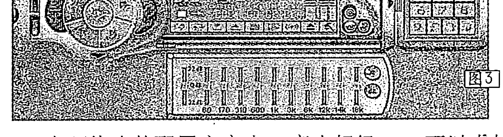

在环绕声的配置方案上，豪杰超级 DVD 可以支持 2、3、4、5、6、7、8 声道输出模式，并提供了一种环绕声场模拟功能，我们可以利用该功能在两个音箱上模拟出多达六音箱的声音效果，其独创的音频环绕数字影院处理技术(SDTS)，可以支持多达八声道的各种音频组合，而音箱软接线技术，只要拖拽鼠标即可指定音箱输出，从而摆脱了繁琐的连线操作，即使是菜鸟也能快速上手。

值得一提的是，豪杰超级 DVD 提供了一些非常实用的视频转换工具，例如 DVD → VCD、DVD → MPEG4、MPEG4 → VCD，都非常值得一试。另外还免费提供了豪杰译霸，这个工具提供了常用翻译工具所必备的整篇文章翻译、整句翻译、双向词典、鼠标指点翻译、活动窗口翻译等功能，虽然词库量不是很丰富，但翻译质量还相当不错。

#### 5. 金山影霸 DVD

金山影霸 DVD 支持包括高清片在内的上百种媒体格式，是国内首家完整支持 VCD 及 DVD 导航的播放软件，提供了 DVD 智能反毛刺技术、VCD 多维平滑技术，即使系统配置稍次，也可以获得高质量的 DVD 效果。

另外，软件还支持多种特技播放，例如倍速播放、背景播放、多字幕显示等功能。不过，遗憾的是，金山影霸 DVD 虽然可以调整亮度、对比度、色饱和度和色差分量，但竟然只支持 2 声道、4 声道、6 声道。

#### 6. 东方影都全能王

东方影都全能王是国内首家支持 QUICK TIME 影音格式的软件，支持画面缩放、章节播放、多字幕、多伴音等 DVD 专有特效，较旧版本的播放画面更加清晰、音质更加逼真。

#### 7. 烈火 DVD

烈火 DVD 的英文名称是 BlazeDVD Player，是深圳烈火数码科技有限公司出品的一款 DVD 播放软件，具备标准 DVD 播放器的所有功能，可以播放 DVD 光盘、Video CD(VCD)、SUPER VIDEO CD(SVCD)、MP3、MPEG 等多种媒体格式，支持从单声道到 7.1 声道的完美解码，完美支持多语言字幕显示，由于采用了先进的解码技术，因此消除了屏幕毛刺和屏幕抖动的现象，具有高强度的播放顺畅的图像；场滤波功能提高了消除毛刺后的清晰度，充分保留 DVD 高清晰度的特点。

除了具有上述功能外，烈火 DVD 还提供了一些非常实用的增强功能，例如可以提供 DTS 信号的 S/PDIF 输出、书签、图像捕获、播放文件、区域设置等普通 DVD 播放器所不具备的功能。

如果你的系统配置尚可，那么笔者推荐你选择 InterVideo WinDVD，无论是画质和操作，这款软件都首屈一指，而且它对各种 DVD 盘片的兼容性非常好，不过它的价格可不菲哟。对那些讲究实惠的朋友来说，建议选择豪杰超级 DVD，或者使用免费的 Windows Media Player 也是不错的选择。

(文/王志军)

## 股票分析工具扫描

股市是不流血的战场，光听消息靠跟风是永远赚不了大钱的，毕竟庄家不是慈善家，他们会想尽办法赚散户的钱。要取得电子时代战争的胜利，拥有先进的武器至关重要。所以，炒股也要有一个好的分析软件。目前，各类股票分析软件名目繁多，媒体广告连篇轰炸令人眼花缭乱，软件价格也从免费赠送到数十万元绝版奇货应有尽有。随着理性投资分析的深入，市场从早期偏向于处理一般资讯和提供通用分析工具的软件，转为具备个性化辅助交易功能的软件。近几年，新版的大智慧、证券之星、股票之星、《股经》等软件，分别突出了选股、评价、优化等辅助交易功能，有的还开放了自编公式平台，而老牌的单一功能软件山河日下。取舍之间，该怎样挑选股票分析软件呢？

首先，提供的信息要全面、丰富。除了一般的行情报价、大盘走势分析功能外，还应具备一些实时的财经新闻、专家推荐等资讯。股市千变万化，如果软件能够提供一个丰富、可靠的信息渠道，自然能吸引用户。

其次，具备实用的决策功能。比较常见的功能包括技术分析、即时分析、报价分析、公告分析等，这样股民就能做出自己的交易决策或某些独有决断。随着技术的不断发展，计算机技术和股票理论的结合也越来越紧，作为一种工具分析软件，尤其要突出智能选股、评价、优化等辅助决策交易功能。

再次，操作的方便性。股票分析软件涉及到很多的概念，炒股也是一门很深奥的学问，因此，股票分析软件应该能提供方便的操作功能，鼠标轻轻一点，就能轻松地了解相关概念的图形状况。如果用户了解当前的买入卖出状况，通过一些实用工具和测试平台就能轻松完成，这样将更贴近用户的想法，给用户带来利益。

### 一、主流股票分析软件

#### 1. 大智慧证券信息平台

大智慧证券信息平台是一套很优秀的股票分析软件，在各大下载站点牢牢占据着头把交椅，可见其吸引人之处。它主要用来进行行情显示、行情分析并同时进行信息即时接收，整合行情分析、盘口分析、竞价分析、趋势分析、技术分析、基本面分析、盘中选股、指标选股、基本面选股、基本分析于一体。软件安装后需要注册一个免费的账号。登陆后，软件界面如图1所示。

##### （1）信息提示功能

大智慧资讯系统可标识信息地雷、警示即时行情、描述生命历程、分析盘中异动、判断大市趋向、综合名家评点，为投资者提供全方位的信息分析手段。我们来看看其中比较有特色的几个功能。

基本面排行：可以对选定的个股进行数十项基本资料的排行，通过该功能可迅速了解市场全貌，附带的历年送配资料对全面评估某只股票具有重大意义。

精品资讯：提供了一个全新的精品资讯平台，操作更简便，内容更详实，并支持网页链接方式，囊括了券商的资讯和万国测评提供的资讯内容，新版软件在内容和界面方面都做了相当大的调整，堪称为精品。

独有的‘信息地雷’功能：只要在盘中出现重要市场评论及预测、买卖参考等内容，都会在相应的分时走势图上出现地雷标志，这样用户的操作就更加有针对性。单击‘行情报价’菜单下‘智慧排行’中的‘信息地雷’，即可得到地雷标志。

板块监测：可以在盘中及时跟踪各板块，如概念、行业、地域的动向及其领涨股，从中发现热门板块、潜力板块、风险板块以及板块中的潜力股。这在同类软件中是做得比较细致的。

阶段排行：大智慧阶段排行功能可以统计选定的股票在任意时段内的累计涨跌幅、换手率及最大涨幅，同时进行排行和比较，以此发现主力动向以及挑选潜力股。

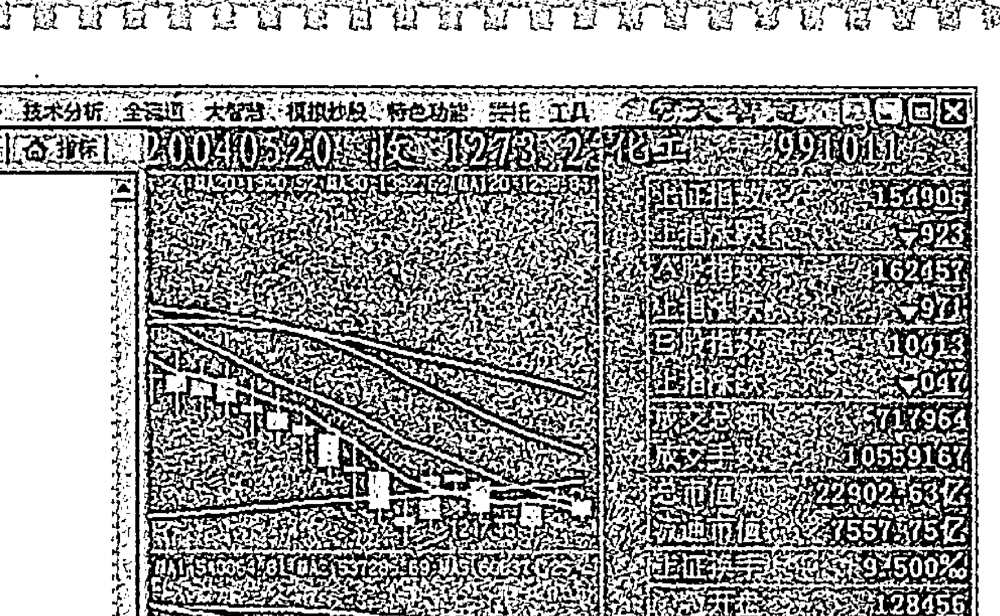

移动筹码分布在个股K线图界面下，按“-”号可以进行盘口切换，我们称之为“筹码分布”。它反映的是不同价位上投资者的持仓数量，在形态上像一个峰群组成的图案，实际上这些山峰是由一条条自左向右的线堆积而成的，线越长表明该价位堆积的股票数量越多，也反映了在此位置的成本状况和持仓量。

##### （2）参数决策功能

智能选股：大智慧软件支持技术指标、条件选股、交易系统、五彩K线和组合条件五大类方法进行选股，同时还包括个股诊断的功能，并可进行向导选股。

精确复权：此功能可消除被股市套牢后的股价失真和技术指标走样情况，从而避免庄家利用“除权”、“填权”等概念引诱投资者高位接货，长期被套。

区间统计功能：可以帮助用户迅速统计个股选定阶段内的累计涨幅、跌幅、金额、换手率、均价等。从中了解到个股的压力支撑力度，掌握主力资金运作规律。单击“技术分析”菜单下的“区间统计”，即可得到相关参数。

指标编辑：通过大智慧的公式编辑功能，用户可以通过对每日沪深两地交易所和历史上发送的行情数据按照简单的运算法则进行分析、选股、测试，在大智慧中一共提供了四大类公式编辑器。并且可以用多类函数，以达到快速提取数据和提高运算能力，同时简化计算过程的目的。因此对不同类型的函数赋予了相当精确的含义。

##### （3）个性化操作功能

画线工具：股票分析软件未出现时，人们大多是“纸上谈股”，大智慧提供多种画线工具，可让用户多角度地分析趋势，捕捉最佳买卖点。

个人理财：大智慧的个人理财系统正是根据广大股民的理财需要应运而生。它不仅能够实时计算盈亏，更能从不同角度汇总每笔交易，让您可以结合市场实际迅速调整资金比例和持仓结构，理性操作，从容进出。大智慧的个人理财系统真正使您做到了轻松炒股，在风起云涌的股市中应付自如。单击“工具”菜单下的“个人理财”，即可进入操作界面。

委托：大智慧可以外挂各种委托系统，还可以同时使用多个券商的委托系统，通过其自助委托就可轻松实现，确保交易的便捷性。

个股评价：个股评价可以根据自定义的评价公式对个股进行智能化综合评定，大智慧的个股预警是值得用户信赖的火眼金睛。它可以按照用户拟定的条件与范围监控股票，忠于职守，快速反应。结合大智慧自编公式的强大威力，用户几乎可以监控任何值得注意的情况。

从以上分析来看，软件在信息提供、决策、操作方面都符合了股民的操作习惯，而且界面美观，具有多种窗口，每个窗口都对应各种热键，大大简化了用户操作的繁琐程度。

#### 2. 证券之星行情分析软件

“证券之星”是符合主流看盘习惯的新一代行情分析软件。它充分吸收和借鉴了市面上流行的行情分析软件的特色，加入了一些更加细致的功能。软件安装后，如果没有注册，可以点击“试用”按钮申请账户，软件界面如图2所示。

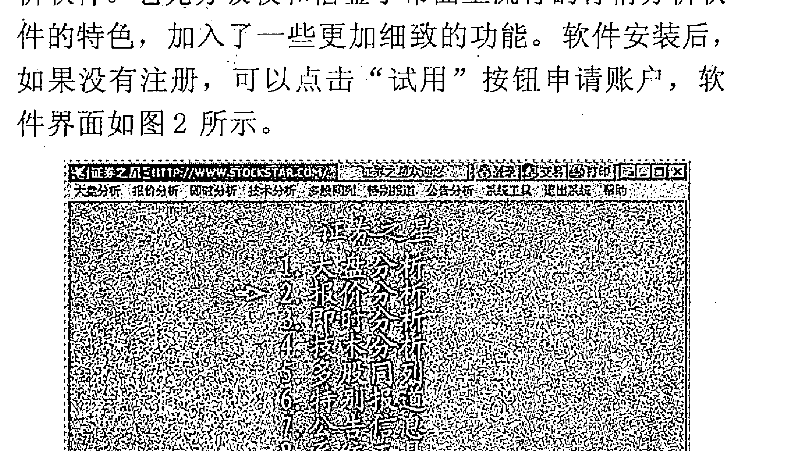

##### （1）信息提示功能

大盘分析：这是一个比较常用的功能，如在“大盘分析”下的“沪市大盘走势”子菜单中列出了九项查看功能，分别是上证指数走势、上证A股走势、上证B股走势、上证30走势、上证领先指标、上证ADL指标、上证多空指标、上证买卖、上证分类指数走势。点击“上证指数走势”选项，就可进入相应的走势图。

多股同列：软件将此功能单独列出，多股同列是将多只股票的分时走势图并列显示在一个界面上，方便直观。在主界面中单击“多股同列”菜单，可以选择五种不同的分类选股列表方式，包括最近访问、自选股、商品顺序、分类股、板块股等，有助于用户对比和分析。

特别报道：系统根据涨跌幅、成交价震幅、成交量、成交量变化（量比）、资金流向、买卖量差（委比）、综合指标等七种方式对目前沪深两地上市的所有证券进行排名显示。点击“特别报道”菜单下的“涨跌幅排名”，在弹出的子菜单中选出一项，就会得到该类股票根据涨跌幅的排名情况。

公告分析：“公告分析”的子菜单分别是“个股基本资料”、“上交所公告”、“深交所公告”、“创业版公告”、“券商公告”、“产品版本信息”等，提供了比较全面的市场公告信息、个股基本资料以及券商公告信息等。

##### （2）参数决策功能

报价分析：即通过不同的分类选股的方式对个股的走势进行分析，包括分时走势的追踪分析和K线技术指标分析。报价分析包括五种选股的方式，分别是最新访问、自选股、商品顺序、分类股、板块股。该板块中，各项内容均为模仿证券营业部大屏显示。

例如，将鼠标移到股票上，双击左键，即可查阅该股的当日分时走势图，进入分时走势图后，使用快捷键F5可以直接切换到该股票的K线图，在K线图中可以通过“<”进行各种技术指标的切换，并且可以通过热键F8对K线的周期进行切换。在任何时候，都可以通过单击鼠标右键退出当前界面。

即时分析：这个功能通过选择不同的技术指标对个股的走势进行分析，从而给出个股的分时走势及成交量等情况，包括三种走势图，即分时走势图、买卖力道和量比指标。

技术分析：它是K线技术指标的组合分析方式，可以按两种指标进行组合选择。

##### (3) 个性化操作功能

系统工具：用户所有自定义的设置均是在本菜单中设置的。包括“用户登陆”、“脱机/联机”、“配置代理服务器”、“系统参数设置”、“自动滚动股票”、“导入导出股票”、“设定自选股”、“设定板块股”、“多股同列设置”、“设定技术分析参数”、“盘后数据下载”、“保存屏幕图形”、“打印行情图表”、“设置显示属性”、“简单帮助信息”等十五个子菜单，这些实用的工具大大方便了用户的操作。

例如，要将日K线图上的三条平均线天数分别设为5天、10天、30天，可以按如下操作进行。首先点击主菜单“系统工具”中的“设定技术分析参数”，弹出“设定技术分析参数”对话框。然后，在“技术分析周期类别”栏中选择“日线”，在“设定参数值”中选择“K线”和“K线平均天数”，在左下角的数字栏中选择“5”。最后，重复上述操作分别改为“10”、“30”，保存设置，然后退出。

总体而言，这款软件便于投资者进行盘中分析，有效把握投资机会。实用的系统功能和参数分析功能，有助于保护投资者的利益。软件操作也很方便，是一款比较优秀的股票分析软件。

#### 3. 天网网上股票分析交易系统

软件下载地址：http://www.hexin.com.cn/。

天网网上股票交易分析系统提供实时行情、技术分析、信息资料、委托交易等功能，完全实现网上炒股，和“大智慧”、“证券之星”等软件的界面比较类似。

##### (1) 信息提示功能

大盘分析：可以查看上证和深证的各种大盘指标图，从整体上把握股市大盘的整体发展走势，并可直接切换到技术分析模式，对大盘的各种指标进行相应的技术分析。股票代码的查询实现多种方式模糊查询，可以使用股票代码、股票名称和股票名称的拼音简称，多条查询结果排列输出，显示股票代码、拼音简称和股票名称，一目了然。

排行榜：提供沪深两地个股或债券的各种指标的排名，供股民方便地查询。方便的排名输出，自由的前后页翻动，使用户可以查询指数类股票的大盘走势图、个股类股票的即时分析图。

##### (2) 参数决策功能

技术分析：提供沪深两地个股行情的各种K线图和各种技术分析指标图供股民进行技术分析。实现了多种技术指标、不同分析周期和多种模糊方式的代码输入。查看当前股票的即时分析图和个股资料所需要的仅是一次点击，各个栏目之间就可以快速地跳转。

报价分析：可查看各种股票、债券以及自选股的主要技术参数，供股民进行对比分析。在客户中心设置自己关心的多条股票，可以在此查询自选股的报价分析。

即时分析：可以查看分时走势图、量比指标图和成交明细表，能方便地直接跳转到当前股票的技术分析图和个股资料上。

##### (3) 个性化操作功能

画线说明：在系统工具菜单中选择画线或在工具栏中选择适当工具可实现画线功能。包括直线、矩形、平行线、黄金分割线、上下甘线等。

方便的操作性：系统的操作可以通过键盘、鼠标和菜单分别完成；对于键盘操作可以根据热键和主画面的菜单提示进行；鼠标操作主要为双击选中，还可点击鼠标右键弹出快捷菜单，在这些快捷菜单中提供了直观的信息提示。

个股资料：提供沪深两地个股的全面系统的财经资料供股民分析查询，在查询输入框中输入想查询的股票的代码或拼音简称或汉字的全部或部分，我们就可以得到比较详尽的资料。

总体而言，这款软件沿袭了大众股票分析软件的界面，而且功能上也有一定的类似。不过，对于试用的用户来说，还有不少的功能限制。

#### 4. 股票之星

股票之星的分析功能十分强大，包括作图、预测、选股、计算和最实用的个人账簿功能。当然，它最大

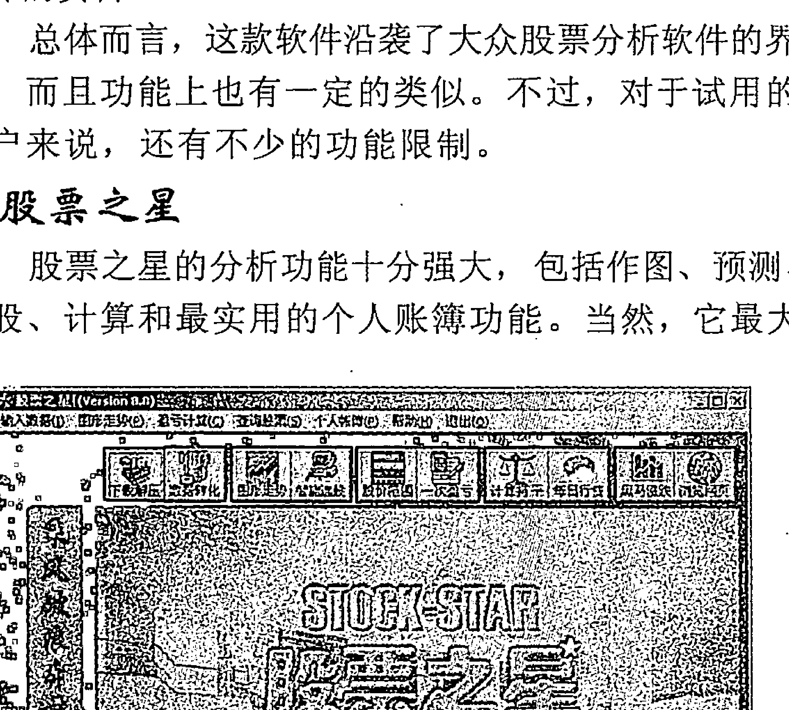的特色在于能让投资者在收盘前得到预测，能让您随时抓住庄家刚刚拉升的股票，低价买入，充分享受赚钱的乐趣。软件的界面如图3所示。

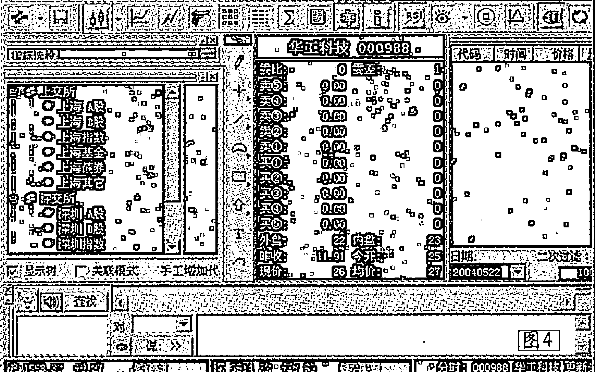

##### （1）信息提示功能
强大的数据转化功能：通过将其他软件的数据转化为股票之星的数据，用户可利用一切资源得到每日的股票数据。单击软件界面中的“下载解压按钮”，即可得到多种数据。

进入“图形走势”功能后，可在“股票代码”框中输入股票代码或股票拼音即可得到股票的图形和个股预测。

##### （2）参数决策功能
智能选股。这个功能可以从上千只股票中挑选出具有暴利性质的股票，首先要缩小范围，指标范围可以从-30～30。

预测功能：软件最大的特色就是会告诉您任意一支股票的预测结果，就像一个经验丰富的股票专家随时在指点。从“股票选择”一栏可调出“智能选股”中存盘的股票，先在“图形走势”中打开您的股票图形，接着按“预测输入”按钮，这时会弹出一个窗口显示最新的股票数据，就可以输入现在的数据了。股票之星偏重短线操作，所以选取的周期比其他的股票分析软件要短，这样才能保证指标的敏感性，并及时提醒用户。所以，有的股票在本软件上形成了金叉，在其他软件上不一定会形成金叉。

##### （3）个性化操作功能
股票之星选出的股票一般都可以在下一交易日以低于当日收盘价的价格买到，软件还提供了丰富的盈亏计算工具，如“计算一次盈亏金额”、“计算多次盈亏金额”、“计算持平点”、“计算多次买入持平点”等。单击“盈亏计算”菜单下的“计算一次盈亏金额”即可。

总体而言，这款软件的特色在于具有很强大的预测功能，可以告诉您任意一支股票的预测结果。

#### 5.《股经》智能选股
《股经》建立在X线趋势理论基础上，辅以筹码分布、螺旋周期、主力动量、明日警戒点、雷霆出击排行榜、股价领先指标、投机指标和犀牛指标等独具特色的技术指标，从趋势、强弱、时间和庄家力度四大方面对股价进行综合分析。选股出发点基于波段操作，中短线为主，每日通过电脑自动筛选潜力个股给投资者参考。软件界面如图4所示。

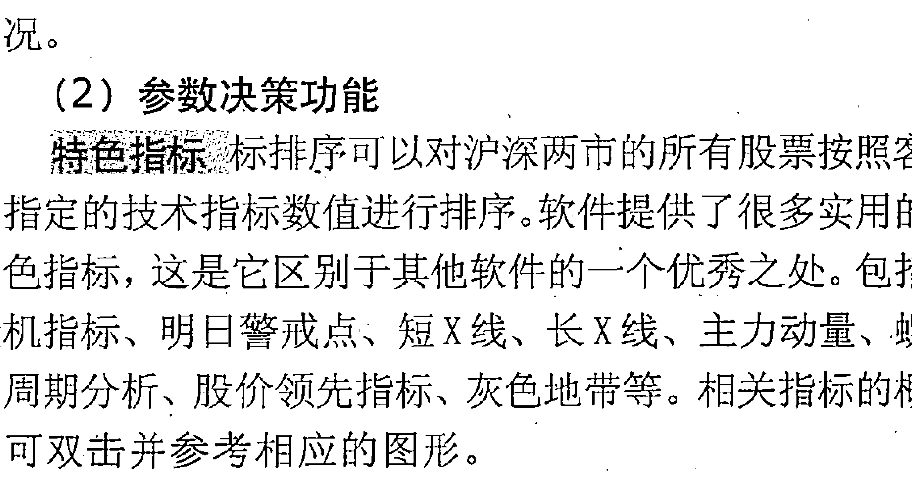

##### （1）信息提示功能
采用灵活与方便的版面组合采用人性化设计，操作简单快捷，股票强弱一目了然。如行情信息表+行情信息窗。如果需要对软件的界面进行设置，可单击右上方的“系统设置”按钮。

键盘精灵：其主要功能是输入想查询的快捷键、个股代码、个股名、版面代码、板块代码、指标名和相关热键。通过相应的快捷键，就可以很快了解某只股票的具体情况。

##### （2）参数决策功能
特色指标排序：可以对沪深两市的所有股票按照客户指定的技术指标数值进行排序。软件提供了很多实用的特色指标，这是它区别于其他软件的一个优秀之处。包括投机指标、明日警戒点、短线、长线、主力动量、螺旋周期分析、股价领先指标、灰色地带等。相关指标的概念可双击并参考相应的图形。

特色选股：《股经》的选股出发点基于波段操作，以中短线为主。它可以通过电脑自动筛选潜力个股给投资者参考。提供了多种不同方案，适应不同的市场环境及短、中、长线等不同风格的投资人士。包括投机选股、黄金选股、专业选股、大水牛选股、神枪手选股、牛魔王选股、白金选股，还支持多种指标同时进行排序。通过这些各具特色的方式，可以方便用户查阅指定的排序名次。

筹码分布：通过统计一段时间市场交易成本，以图形化的方法描述的成交比例状态的指标。该指标在K线图的右侧以若干根蓝色水平线表示，线条的高度代表价格，线条长度代表持仓筹码在这一价位的比例。随着十字光标的移动，线条长短会变化，指示不同时候的持仓成本分布状况。

排序筛选功能：可以方便选出指定排序名次，灵活扩展为阶段性的统计功能，如五日涨幅、五日热门和五日量比等。用户除了可以调用和修改特色指标及常用技术指标外，一些公式高手还可以自由编写新的技术指标，把自己的想法变成公式，充分发挥其聪明才智。

##### （3）个性化操作功能
特色监控：选择雷霆出击功能时，可以实时监控盘口，并且全天候捕捉一些技术形态出现异动的个股，为短线投资者提供最佳介入个股。

实战性测试平台：选股成功率测试是检验优劣的最好方法，其检测结果包括股经首次提出的百只获利、信号量、止损率、高价成功率、高价次成功率和平手率等实战性测试，避免高成功率和高止损率。

**板块编辑**：主要用于对各种板块的更新、编辑和维护。用鼠标左右键就可以操作，支持拖动、联动，可任意编辑，灵活、方便。

总体而言，《股经》股票分析软件的设计理念与市场趋势同行，不测底有多深，不测顶有多高，采取吃鱼身策略，及时介入，力求资金利用率最高。并利用多种指标分析技术，使用户得到最大的效益回报。

### 二、其他股票分析软件分析
为了使读者对股票分析软件有一个全面的了解，我们还推荐了一些比较有特色的股票分析软件，使读者朋友有一个更大的选择余地。

#### 1. 赢家－江恩证券分析系统
“赢家－江恩证券分析”系统是作者独创的一套基于江恩理论的股票分析软件，其分析方法独特、分析指标独创，一切遵从自然法则。

软件的最大特点是周期分析和阻力支撑分析，除实现了江恩经典工具外，作者还根据自己多年的研究，开发了许多极具实战价值的工具、指标等。经典工具包括江恩轮、价格正方形、时间正方形、六角形、角度线、江恩计算器、时间及价格循环线、时间周期线、黄金分割阻力支撑线等。另一个重大突破是完全彻底开放的公式开发平台，用户可以根据自己的实践经验编制任意算法的公式指标、选股条件等，并通过测试平台对选股条件进行测试、测评、优化。软件界面如图5所示。

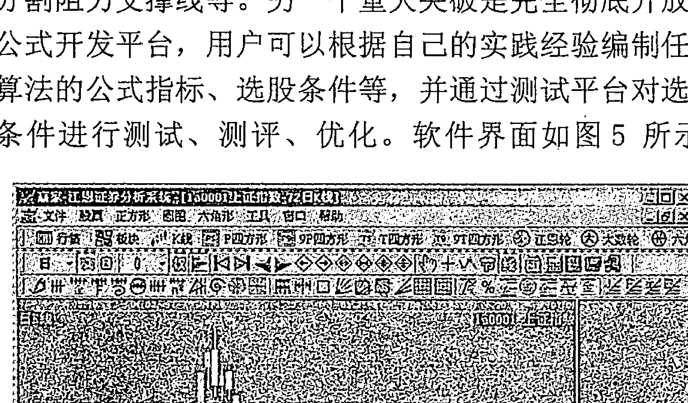

#### 2. 傲群选股专家
“傲群选股专家”是北京傲群科技发展有限公司开发的一套证券盘后分析软件。它结合箱体理论和其他多种技术分析理论，在国内率先提出“按股价走势对股票进行分类”的概念，结合其他多种分析理论，给用户提供了强大的形态选股方式和独特的选股思路。“股票箱理论”是以整个股票箱的所有数据作为研究对象，这使形态选股成为可能，而不仅仅局限于技术选股，同时决策的信息量更大，选股成功的概率更高。

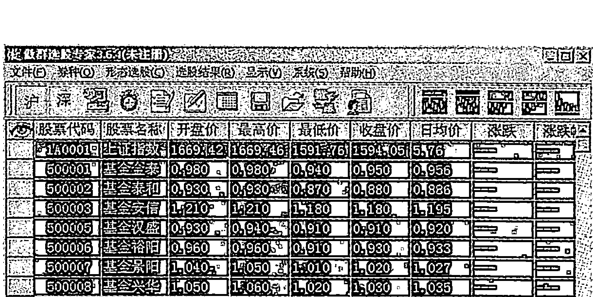

它侧重于选股，使用非常简单，系统自身具有16种默认的选股方案，点击菜单中的“形态选股”按钮，查看选股结果就可以了。用户还可以修改选股的方案和自定义选股方案。尤其值得指出的是，软件中依据“股票箱理论”中的“横有多长，竖有多高”思想设计的“正在突破的股票”和“面临突破的股票”方案对捕捉黑马尤为有效，软件界面如图6所示。

#### 3. 高速行情宝
本软件是一款简单而又实用的看股票行情的小工具，相当于一个股票行情浏览器，可以缩小驻留于系统托盘中，特别适合上班族查看行情（图7）。

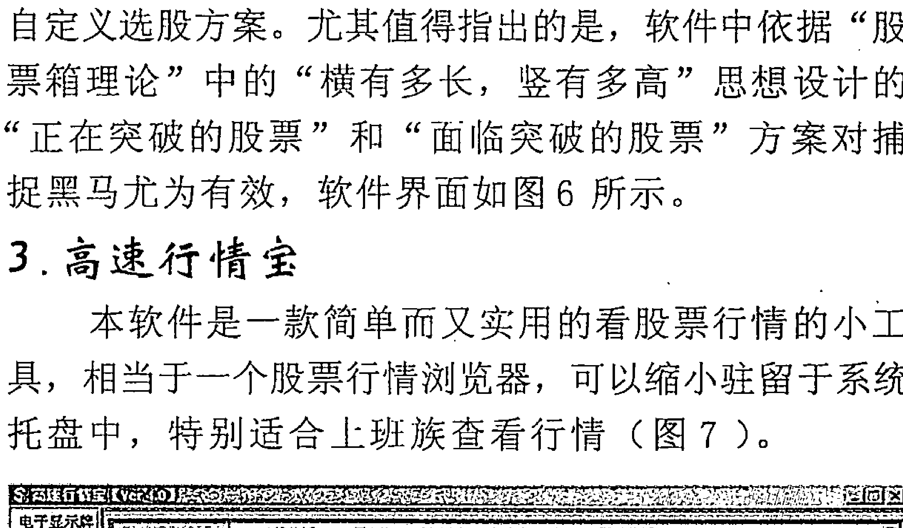

综上所述，股票分析软件侧重于某种理念和技法的表述，有了一款分析独到的软件，我们就可以在股市上大展拳脚了。当然，再好的股票分析软件，也仅仅是一种投资工具，不能保证用户绝对赚钱，也不会无限增值。评价这些软件，是为了更好地为投资服务，应当根据实际需要，选择一款真正适合自己的软件。

(文 / 彭文波)

## 2004输入法工具电子扫描
从国内各大下载站点的查询状况来看，汉字输入法基本上是五笔字型和拼音输入法的天下，大约有几百种，但99%以上都没有在市场销售过，真正投放市场的只占1%左右。综观2004年的输入法工具，虽然输入法呈现出万“码”奔腾的局面，给用户提供了更多的选择余地，但真正好学易记、功能全面的输入法仍未出现。究其原因，拼音输入法过慢而且错误率偏高，音码重码多，因而不能准确表达单音节词；形码拆字，编码没有可读性，导致五笔字型难学易忘。但是，主流的优秀输入法软件功能逐步加强，也在一定程度上赢得了用户的青睐。在万“码”奔腾的2004年，我们应该选择哪些输入法工具呢？

### 一、输入法技术漫谈
目前，汉字输入方法可分为键盘输入法和非键盘输入法，下面我们就从这两类着手了解中文输入法的技术。

#### 1. 键盘输入法
通过键盘并根据编码规则来输入汉字的方法就是键盘输入法。汉字和键盘没有任何对应关系，为了向电脑中输入汉字，必须将汉字分割为部件，并使之与键盘联系起来，这样我们就能按照某种规律输入汉字，这就是汉字编码。目前，汉字编码方案已经有数百种，但基本上都是采用将音、形、义与特定的键相联系，再根据不同汉字进行组合来完成汉字的输入的。目前的中文输入法有以下几类。

- (1) 音码。按照拼音规定来输入汉字，符合人的思维方式。如全拼双音、双拼双音、新全拼、新双拼、智能ABC、拼音王、拼音之星、微软拼音等。这种输入方法适合普通的电脑操作者，现在新的拼音输入法在模糊音处理、自动造词、兼容性等方面都有很大提高，微软拼音输入等输入法还支持整句输入，使拼音输入速度大幅度提高。
- (2) 形码。形码是按汉字的字形来进行编码的。例如，“码”字是由“石”和“马”组成，其中“石”、“马”称为字根。最常用的形码有五笔字型、表形码、仓颉、大易、行列、华象直觉等。形码最大的优点是重码少；不受方言干扰，只要经过一段时间的训练，输入中文字的效率会有很大的提高，因而这类输入法也是目前最受欢迎的一类。
- (3) 音形码和混合输入法。音形码吸取了音码和形码的优点，将二者混合使用。常见的音形码有郑码、钱码、丁码等。混合输入法采用音、形、义多途径输入，使一种输入法中包含多种输入方法。以万能五笔为例，它包含五笔、拼音、中译英、英译中等多种输入法。除此之外，还有模糊音设置、联想功能、自动造词、南方音、智能标点等。
- (4) 流水码。比较常见的是电报码，这种输入方法以各种编码表作为输入依据，因为每个汉字只有一个编码，所以重码率几乎为零，效率高，可以高速盲打，但缺点是需要的记忆量极大。

#### 2. 非键盘输入法
不通过键盘轻易地输入汉字的方法称为非键盘输入法，如手写输入法只要在手写板上按平常的习惯写字，电脑就能将其识别显示出来。它们的特点就是使用简单，但都需要特殊设备，我们这里只做简单介绍。非键盘输入方式无非是手写、听、听写、读听写等方式。但由于组合不同、品牌不同就形成林林总总的产品，分为下面几类：手写笔、语音识别、手写加语音识别、手写语音识别加OCR扫描阅读器。

#### 3. 输入法工具选用原则
一般来讲，选择输入法或者判断输入法工具的优劣时，我们可以从下面几个方面来考虑。

- (1) 符合用户使用的习惯，容易学习。针对不同的使用对象，我们可以这么认为，非专业人员可选择简单的音码，专业打字员应选择形码，非专业打字人员但工作上有些要求的人员可以采用音形码。因此，用户的需求永远是输入法工具必须首先考虑的问题。
- (2) 从智能特性上看，输入法应具有智能提示、语句输入、语句提示及简化输入、智能选词等功能；应支持各种符号输出，对于词库中没有的词或短语，输入法甚至可以搜寻相关的字和词，组成所需的词或短语。
- (3) 输入的效率。这个应该是我们比较看重的一项了，用键盘输入法来输入汉字，其输入速度取决于你对键盘和编码的熟悉程度。现在比较流行的键盘输入法有智能ABC标准输入法、微软拼音输入法、五笔字型输入法、自然码等。如果为了输入一个字要冥思苦想很长时间，我们就要考虑换个输入法了。另外，为了提高输入效率，输入法是否支持长句或者整句输入功能也很重要的。

传统的五笔字型必须与现代的智能处理输入技术相结合才能使其更为完美。至于其使用方法，网上的教材也很多，相信很多朋友已经相当了解，在此不一一赘述。
- (4) 词库。组词速度、准确率、词和短语输入中的自学习能力等都是我们必须考虑的问题。为什么有些词语在某些输入法工具上可以输出？而在有些输入法工具上不可以？这就是词库的差异。特别是对于需要经常输入一些专用名词的用户，一个优秀的词库是必不可少的。
- (5) 与操作系统的无关性。就Windows平台而言，如果能在Windows 98上使用，而不能在Windows XP上使用，那就是一件很郁闷的事情了。对于一些系统调试员来说，还涉及到在Linux等平台下使用的问题。

### 二、2004年输入法工具大盘点
通过上面的讲解，我们对输入法的分类和选择有了一个大致认识，下面我们来看看2004年的输入法工具发展情况。

#### 1. 风光依然：王码五笔型输入法和极品五笔5.5增强版
从各大下载站点的排行榜来看，王码五笔输入法、极品五笔输入法等版本高居榜首，下载后很轻松就可以安装成功，而且不需要注册。说明老牌的输入法工具依然牢牢占据着一定的地位，不过，更加易用的输入法也值得期待。

从用户使用的习惯来看，由于五笔输入法速度快，重码率比较低，而且一些优秀的五笔输入法增加了不少功能。因此，仍然有不少用户在使用五笔输入法。但是，随着电脑的逐步普及，与拼音输入法相比，这种枯燥的输入法面临着被淘汰的局面。

从输入的效率上看，五笔字形码是一种形码，在五笔字型编码输入方案中，选取了大约130个部件作为组字的基本单元，并把这些部件称为基本字根。基本字根按一定的方式组成汉字，在组字时这些字根之间的位置关系就是汉字的部位结构。因此，重码率低，输入效率高，是专业录入人员的首选输入法。

从词库上看，极品五笔5.5增强版完美兼容王码五笔字型4.5版，收录词组46000余条，创五笔词汇量新记录。在完全支持GB2312-80简体汉字字符集的基础上，增加部分GBK汉字，避免了不能输入不常用汉字的尴尬。而且它适应多种操作系统，通用性能较好。

总体来说，五笔字型输入法以其优异的功能仍然占据着一定的地位，但是，随着智能汉字输入法的产生，传统的五笔字型已难以满足现在广大用户的要求。

#### 2. 以质取胜：紫光拼音3.0
从用户使用的习惯来看，紫光拼音输入法3.0是一个完全面向用户的，基于汉语拼音的中文字、词、短语输入法。它提供两种输入风格，具有跟随光标功能。同时，它还提供全拼和双拼功能，并可以使用拼音的不完整输入。双拼输入时可以实时提示双拼编码信息，无需记忆。

状态条窗口用于显示和设置输入法状态。用鼠标左键点按相应的按钮可以修改输入法状态设置。当输入法打开时，在屏幕的右下角显示状态条窗口。状态条窗口也用于输入法的控制操作。按鼠标右键将打开输入法系统菜单，甚至可以直接使用“软键盘”输入各种符号，如图1所示。

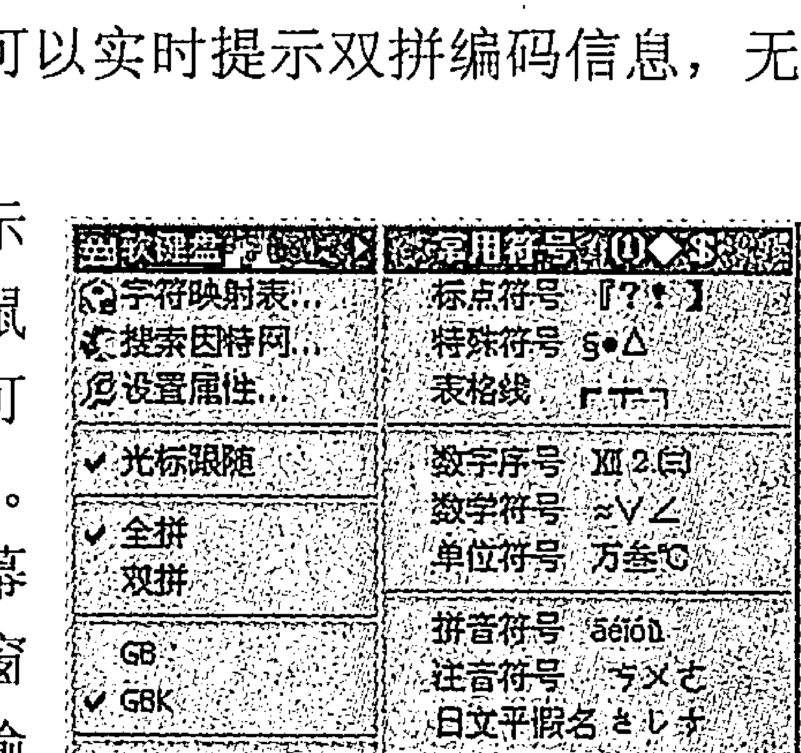

点击右下角任务栏中的图标，这时屏幕上会弹出状态栏，表示现在已进入紫光拼音输入法状态，在状态栏中可以设置输入法的属性；右键单击按钮，在弹出的菜单中选择“设置属性”，弹出输入法设置窗口。

在“输入设置”中，“输入风格”设置显示汉字的方式；“全拼 / 双拼”设置输入形式，“字 / 词调整”设置词的频率和优先级，“其他”中可以设置输入栏候选词和光标跟随等。“模糊音设置”主要是针对南方的发音设计的，你可以根据自己的口音来设计拼音习惯。此外还可以自定义“高级属性”，包括是否支持大字符集、是否支持智能组词、调整字序、设置输入栏的外观等，如图2所示。

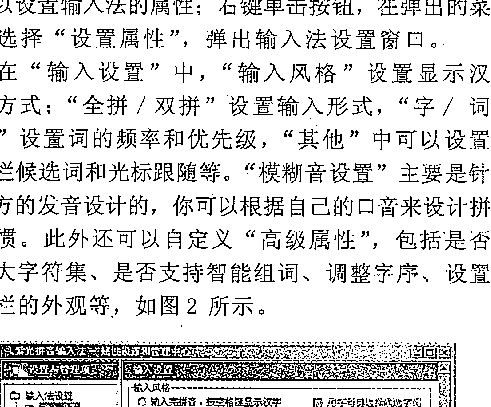

从智能特性上看，对于词库中没有的词或短语，紫光拼音输入法可以搜寻相关的字和词，帮您组成所需的词或短语。组词算法以一亿七千万字语料的统计信息为基础，组词速度快，准确率高。词和短语输入中的自学习能力包括自动造词、动态调整词频、自动隐藏低频词。还可根据用户前一次的输入情况，动态调整汉字的优先选择顺序。

从词库容量上看，紫光拼音输入法的大容量精选词库收录了8万多条常用词、短语、地名、人名以及数字，优先显示常用字词，而字词的使用频度则从一亿七千万字语料中统计而来。对于词库中没有的词或短语，紫光拼音输入法可以搜寻相关的字和词，帮您组成所需的词或短语。

从以上分析来看，紫光拼音输入法功能十分强大，其卓越的造词功能，完全符合中国人的输入习惯。面世以来，就以其小巧玲珑的体积、占用资源少、对硬件要求低、准确高效的词组输入等特色赢得了用户的好感，是一款值得推荐的输入法工具。

#### 3. 超强兼容：智能陈桥五笔 V5.5
在五笔字型和拼音输入法激烈竞争的时候，出现了综合两者功能的输入法，其中比较知名的有智能陈桥五笔，这种输入法把传统的五笔字型和智能化的输入技术结合起来，从而使五笔字型的使用性能大大提高了。

从智能特性上看，具有智能提示、语句输入、语句提示及简化输入、智能选词等多项非常实用的独特技术，还具有语句提示及简化输入操作功能，只需按几个键即可输出一句话。新版本全面提升了陈桥拼音功能，可实行字、词、句混合输入。

从词库的容量来看，它内置了直接支持国家GB18030标准，能输出二万七千多汉字编码的五笔。同时，它还具有GB/BIG5双内码汉字支持功能，既可输出大五码汉字，又可在繁体WINDOWS系统下正常使用。新版本采用了灵活的词库管理功能，可随时对常用词库进行增减等操作，如图3所示。

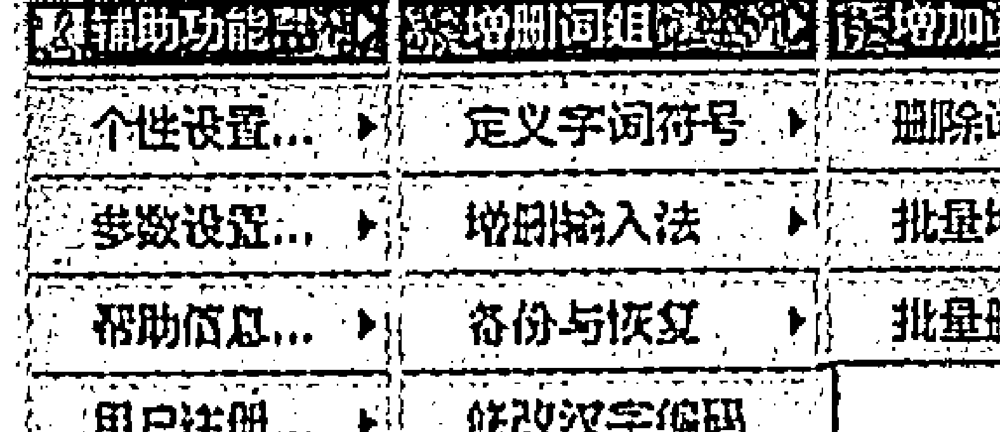

从使用效率来看，智能陈桥五笔对重码采取多种处理方式，可以根据文章中的内容采用计算机智能自动选择字词，还可根据使用先见的方式来进行排序选择，从而减少了人工选择字词的操作，使重码对输入速度的影响减至最小。并且还针对专业录入人员，设置了禁止重码词的方式，可使专业录入人员在无重码情况下快速录入。因此，在各类用户中具有较高的知名度。

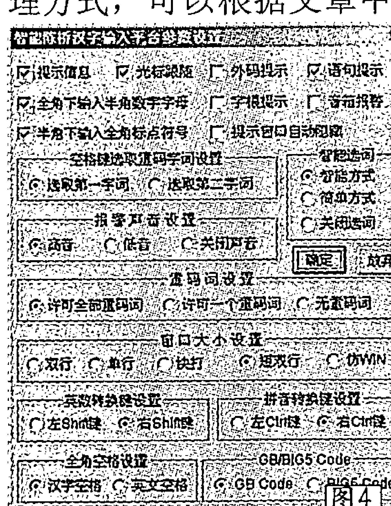

另外，陈桥智能五笔拥有强大的设置功能，用户可对系统进行灵活的设置，从而使智能陈桥系统适合于各种人员及各种场所。改进的参数设置窗口，使设置操作更为直观和方便，如图4所示。

总体来说，智能陈桥五笔适用于多种环境和各种人员，是一款很优秀的输入法。

#### 4. 随心所欲：万能五笔输入法
从用户使用的角度来讲，万能五笔输入法最吸引人的地方是，它提供了一种万能的多元汉字输入法，通过这种输入法，可以克服现有技术的缺点，以多重汉字编码代替传统的单一编码。具体地说，就是在一种汉字编码输入状态下，对一个汉字或词组短语同时存在多种编码输入途径，从而提供更便利、更高效的编码输入，如五笔、拼音、中译英、英译中等。另外，如果有用户不懂的英语单词时，可直接利用万能五笔输入不懂的英语单词，这时就可以方便地看到它的中文意思了。

从词汇方面来看，它具有多种词库挂接，我们可以从中直接使用最熟悉的输入方式，它还具有灵活多样的自造词功能，这样既可以采用自动造词，也可以手工造词。

从智能的角度看，凡是用户输入过的重码字或词，万能五笔均会自动记忆，下一次再输入该字或词，自动调频在第一位，用户只需直接敲空格键即可上屏，无须再选数字。这对用户经常输入一些特定的字词非常有帮助，而且万能五笔的智能记忆会根据用户的使用习惯自动替换，不断更新。如果我们需要自定义一些智能规则，可以在状态条上打开设置面板，如图5所示。

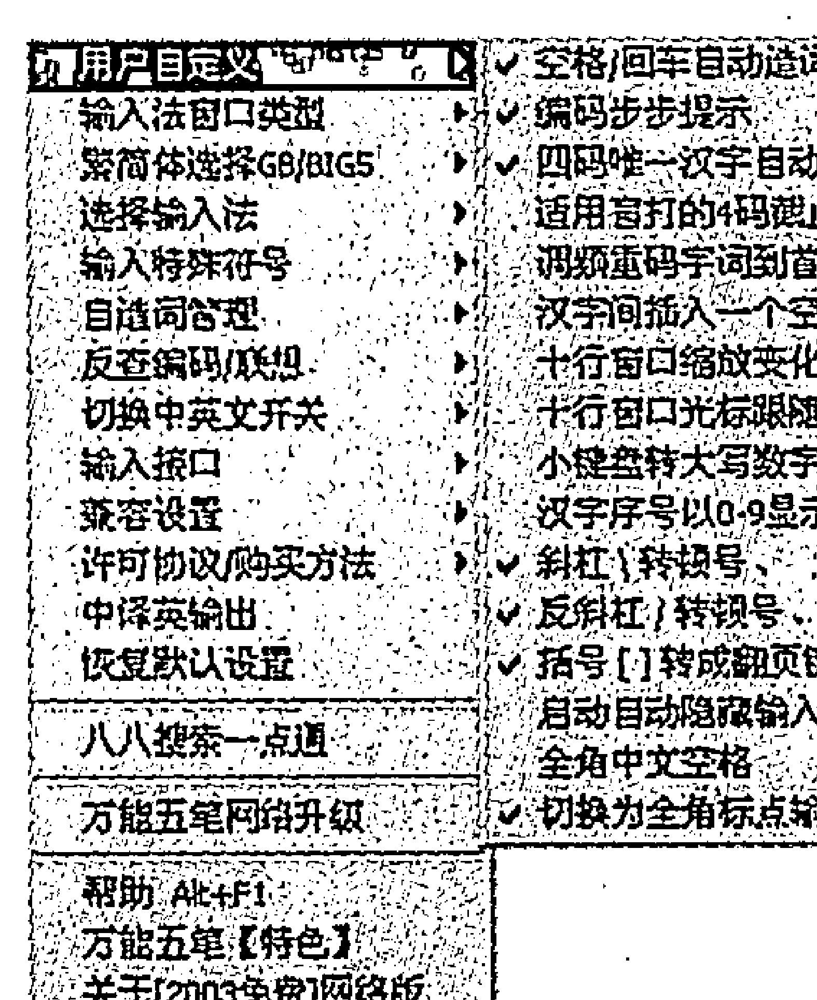

从输入效率上看，万能五笔有助于提高输入速度。一般情况下，懂五笔用五笔，懂拼音用拼音，懂英语就尽量用英语，因为英语单词一般是对应一个汉字组合（词组），这有助于提高输入速度。有词组就尽量输词组，有简码就尽量输简码。对于一些重码特别多的拼音单字输入，可用拼音+笔画的方法以尽量减少重码，又可避免繁琐的翻页查找，如图6所示。

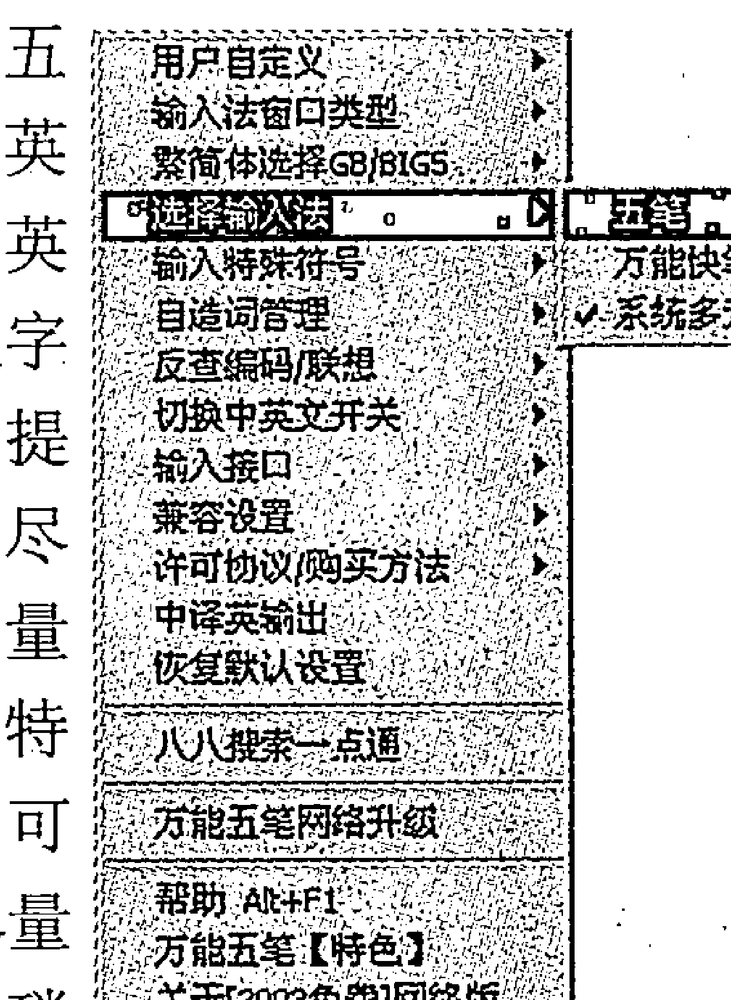## 5. 拼音至尊：智能ABC 5.22版

智能ABC作为微软公司Windows、中科红旗Linux、中软Linux等多家操作系统的基本汉字输入方法，在输入法工具中占据着很重要的地位。新版的智能ABC 5.22输入法具有多种汉字输入方法，包括全拼、简拼、混拼、音形混拼、纯笔形和双拼等。

从词汇角度看，新版的智能ABC 5.22输入法支持GBK大字符集。智能ABC 5.22以前的版本只支持GB2312，也就是支持6763个汉字，现在支持21000多个汉字。智能ABC的词库以《现代汉语词典》为蓝本，同时增加了一些新的词汇，共收集了大约六万词条。利用强制记忆功能，只需输入词条内容和编码两部分，就可以直接把新词加到用户库中。它还收入了一些常见的方言词语和专门术语，此外还有一些常用的口语和数词、序数词。

从智能的角度来看，智能ABC输入法能够自动记忆词库中没有的新词，这些词都是标准的拼音词，可以和基本词汇库中的词条一样使用。智能ABC允许记忆的标准拼音词的最大长度为九个字。注意：刚被记忆的词并不立即存入用户词库中，至少要使用三次后才有资格长期保存。同时，它还具有多层次的记忆功能，如自动记忆、强制记忆、朦胧回忆等。

总体来说，新版的智能ABC 5.22版输入法还是不错的。不过，新版本需要注册，这也在一定程度上限制了用户的选择。毕竟，在输入法层出不穷的2004年，用户的选择范围是很广的。

#### 6. 老牌劲旅：微软拼音4.0

从用户使用和输入效率来看，微软拼音输入法增加了“微软拼音新体验模式”输入风格，带给我们全新的拼音输入风格，尤其是整句输入方式和词组输入方式十分吸引用户，因为微软拼音的转换准确率很高，这也进一步提高了输入效率。

从智能的角度看，微软拼音是一种基于语句的智能型拼音输入法，采用拼音作为汉字的录入方式。对于一些特定地区的用户来说，还提供了模糊音设置，对于那些说话带口音的用户，不必担心微软拼音会产生“听不懂”的现象。

从造词功能上看，微软拼音输入法有一个“自造词工具”，在这里你可以编辑自造词的词条，如双击“拼音输入法”词条，就可以在“词条编辑”中键入自造词，设置快捷键为in，选择多音字的拼音等，这样你在开启自造词的功能后，输入in就可轻松输入“微软拼音输入法”了。在“自学习词条”选项卡中，选中一个自学习词条并单击右键，选择“移到自造词库”，就可把自学习词条录入到自造词库中，然后再进行编辑，因为自学习词库是不能添加、导入或者编辑的。自学习能更快地学会你的用词方式，以方便你的使用。

总体来说，微软拼音输入法4.0的输入效率还是不错的，特别是它能够和Windows XP的语言栏完美结合在一起，在Office中输入文字时，能方便地完成文字校对。尤其是其整句输入功能，几乎可以完整输入一些句子而不用停顿，大大提高了工作效率。

#### 7. 输入新贵：拼音加加输入法

拼音加加是基于汉语拼音的键盘输入方法，它采用了智能感知技术，将传统的汉字输入法概念演变为流畅的键盘处理方案，是一款特别适合网上使用的输入法。拼音加加输入法的安装十分简单，依照安装向导，很快就把输入法安装上了。

从使用效率来看，拼音加加全面继承了各种拼音输入法的长处。它支持全拼、双拼、简拼、声母拼词、立即造词、频度调整、模糊音设置等。对于操作系统而言，它支持Windows 95/98/NT/2000/XP，而且不需切换，直接混合输入中英文。在“拼音加加”的状态条上，单击右键即可进行相关设置，如图7所示。

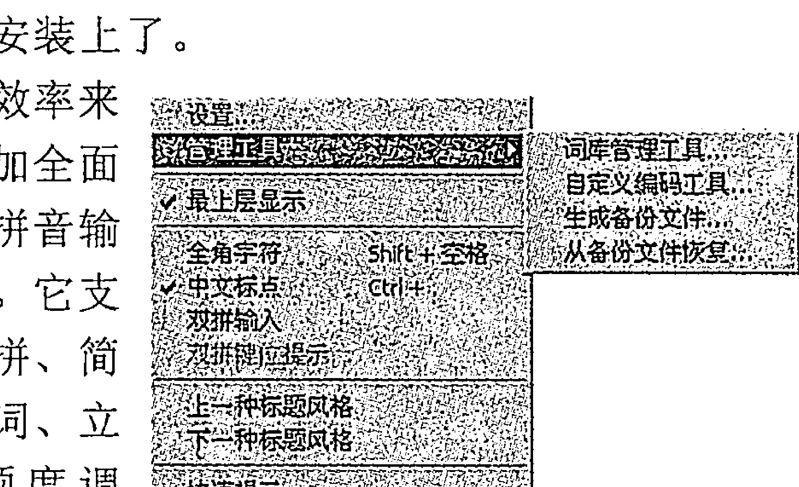

从智能角度来看，拼音加加精心设计的三重码技术，辅以左右Shift键选择重码，彻底突破拼音输入的瓶颈；并且只需输入阿拉伯数字，即可得到多种中文表达方式；还有简化的日期输入；而且你再也不会被念不出来的字难住了，你用笔画输入汉字，它还会提示你如何发音。在“拼音加加”的状态条上，单击右键，在弹出的菜单中选择“设置”，即可打开“拼音加加设置”窗口，打开“重码”即可进行重码设置。

总体来说，拼音加加的拼音输入功能很不错，如果你对目前使用的输入法感到厌倦，可以尝试着使用这个输入法。

#### 8. 层出不穷：其他输入法

随着输入法技术的不断发展，新的输入法工具不断涌现，现在列举一些比较成熟的输入法，有兴趣的朋友可以试试。

**拼音之星**：作为输入法中的佼佼者，拼音之星给广大用户提供了一种快速输入汉字的简便方法，就输入效率而言，它增加拼音/汉字分两行同时显示的词语输入方式，同时保留句输入方式，两种方式都支持整句输入。其平台通用性十分吸引人，在英文Windows下也能使用“拼音之星”，无论操作系统是Windows 2000/XP，还是Windows 95/98/Me均可使用拼音之星。

**自然码输入法**。自然码输入法是一种高效、简易的汉字输入方法。该输入法以音为主，以形为辅，音形结合，既可以输入单字，又可以输入词组，是一种非常实用的形声码输入法。自然输入系统适合中、英、台WIN 9X/NT4/2000/XP多种环境，加上语意分析能力，可以让输入法更加聪明。现在的版本增强了语音功能、容错能力、生字、成语查询及繁简输出转换等，功能更强大。

**最强五笔输入法5.1正式版**。这个五笔输入法取用王码五笔4.0版的编码规则，增加了大量的词汇，它的安装非常方便，跨越Windows98/2000/XP操作平台。值得一提的是它的词汇联想功能得到很好改善，词语顺序很符合我们的文书用词特点，对于经常需要撰写公文的朋友很具有吸引力。

**中文之星智能狂拼3.0.15 Update**。智能狂拼是一款基于中文语言模型技术的整句输入法，与传统输入法相比，其最大的特点是能够实现整句输入，输入的平均准确率能达到95%左右，改变了以往只能以字、词为单位的输入方式，这样用户不用再为不时停顿选词而烦恼。

综上所述，2004年输入法工具的一个典型特点是主流输入法功能不断加强，同时，新的输入法不断出现，特别是整句功能不断加强，对提高输入效率具有很大的作用。而对用户来说，关键在于选择一款适合自己的输入法，还要考虑其智能性、词库的容量、辅助功能等因素，从而达到一种输入新境界。（文/彭文波）

## 电子图书浏览器扫描

随着电脑的普及，电子图书也得到了非常广泛的应用，同时也出现了很多不错的电子图书的浏览软件，大家比较熟悉的就有Acrobat Reader、超星图书浏览器、百博阅读软件等，用软件浏览电子图书不但方便，而且还有很多辅助功能，还可以帮你语音读书呢。下面我们给大家介绍几个不错的电子图书浏览器。

### 1. PDF专业浏览器——Acrobat Reader

大名鼎鼎的PDF (Portable Document Format) 文件是电子图书中很常用的一种格式，而Acrobat Reader就是查看、阅读和打印PDF文件的最佳工具，而且它是免费的。

用Acrobat Reader浏览PDF文件很方便，如果是浏览本地硬盘中的PDF文件，只要直接双击文件就可以打开进行浏览了。

软件提供了多种形式的浏览窗口，可以切换到包括目录书签、全屏浏览及单页浏览在内共三种方式的浏览窗口，以满足不同方式阅读的要求。页面的多级缩放功能，可以使用户轻松选择合适的页面大小比例来进行阅读，点击工具栏中“放大镜”或下方状态行中向下的实心三角形，可以按8.33%～1600%的比例来对页面进行缩放（图1）。

Acrobat Reader还可以作为浏览器的插件，这样我们就可以很方便地浏览网上的PDF文件或内嵌了PDF页面的HTML网页，在浏览PDF网页的时候，页面中会显示一排Acrobat Reader的工具栏来对文档进行操作，和在软件中的操作差不多。

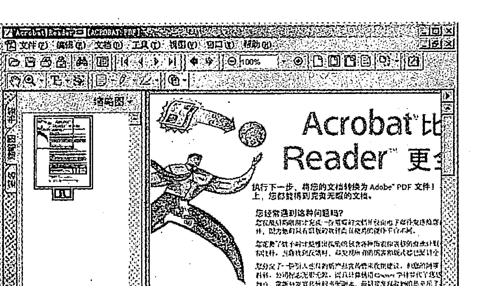

### 2. 小巧的PDF浏览器——PDFReader

如果你对阅读PDF文件的要求不是很高，那可以用小巧的“PDFReader”来代替，它是一个阅读PDF文件和转换PDF文件的浏览器，它除了可以浏览PDF文件，还能够把PDF文件转换成图片，如可以转换为bmp、jpg、png、tif、gif、pcx等图片格式，软件也支持目录功能，支持热链接，而且还能够打开带密码的PDF文档。

打开PDFReader点击菜单“文件－打开”就可以选择一个PDF文件打开了，如果我们要将当前的页面保存为图片，只要点击菜单“文件－导出”，在弹出的对话框中选择自己要转换的图片格式即可（图2）。

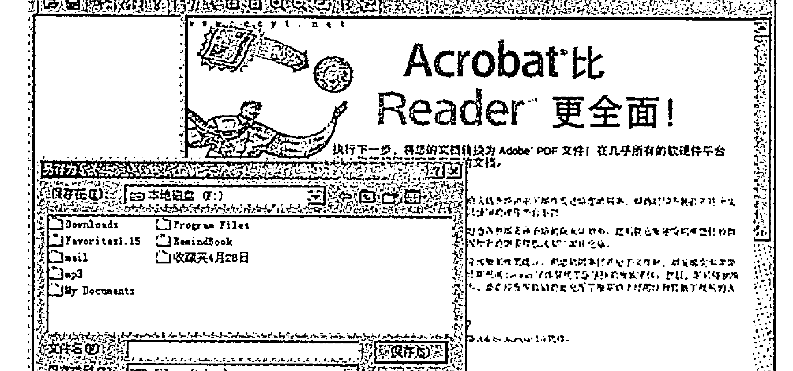

如果是要打开加密的PDF文件，只要点击菜单“文件－加密PDF文件”，在弹出的对话框中选择加密的PDF文件就可以轻松打开了，而且去除了被禁止的操作。

### 3. 资源丰富的浏览器——超星图书浏览器

“超星图书浏览器”是专门针对电子图书的阅览、下载、打印、版权保护和下载计费而研究开发的图书浏览器，用它可以阅读网上各大图书馆提供的总量超过30万册的PDG格式的电子图书，而且还可以阅读其他多种格式的数字图书。 在使用前先进行免费注册，这样才能阅读软件提供的电子图书资源，注册后登录，点击软件界面上的“资源”标签，从左侧的“数字图书馆”站点中可以看到最新的图书分类，展开分类直到右侧书名窗口显示书名（图3）。 我们还可以将下载的电子图书刻录成光盘，光盘内内容可以从软件列表中的“光盘节点”查看。软件还有一个“历史”标签，里面记录了我们通过超星浏览器访问的所有资源，这样当我们要查询以前看过的图书时，就可以在这里寻找了，有点类似IE浏览器中的“历史”功能。

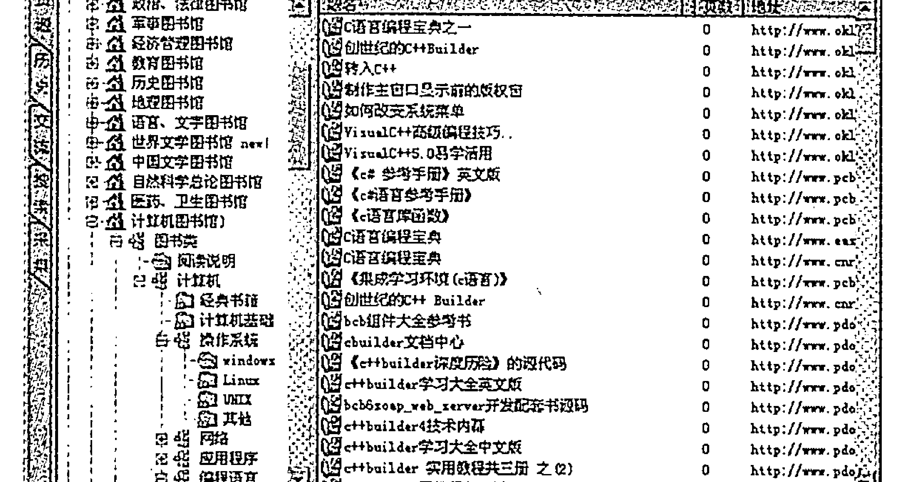

### 4. 电子小说浏览器——e-book

“e-BOOK”是用VB5设计的纯32位中文文本文件阅读器，尤其适合于阅读各种文本格式的电子小说文件，它的特点是采用了印刷书籍式的人性化界面，具有多种特色功能，是休闲时在电脑上阅读电子小说的理想工具。目前软件支持的文件格式有TXT、HTML。 运行软件后会在屏幕上显示一本书的样式，很漂亮、逼真，这个就是软件的主界面，在书中点击鼠标右键，就会弹出一个操作菜单，里面有内码识别、智能分段、自动翻页、书签、全文检索、目录、书柜、墙纸映射、更换皮肤等许多功能，需要什么操作只要点击相应的功能项就可以了（图4）。 比如我们选择书页的样式，只要点击“选择书页样式”下面的相应样式就可以马上切换到该样式了，而且还内置了内码识别功能，这样就可以轻松地支持繁体中文了。

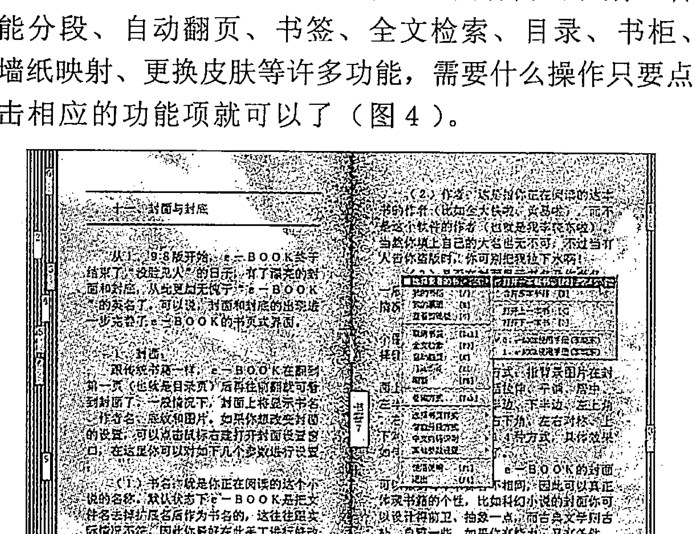

### 5. 方正的电子浏览器——Apabi Reader

“Apabi Reader”是一个为中文电子图书环境设计的浏览软件，用它可阅读CEB、PDF、HTML、TXT和OEB等多种格式的电子图书。 在浏览电子图书的同时，我们还可以直接在软件中使用翻译软件、关键词查找等操作，如果要在书上添加什么，只要选中相应的文字就会自动弹出一个菜单来供我们选择，这样就能很方便地在书上加着重、圈注、批注、划线，插入书签等内容（图5）。 软件还可以快速点选网上的书店来下载免费或者收费的电子图书，“书架管理”功能可以管理电脑中现有的电子图书。

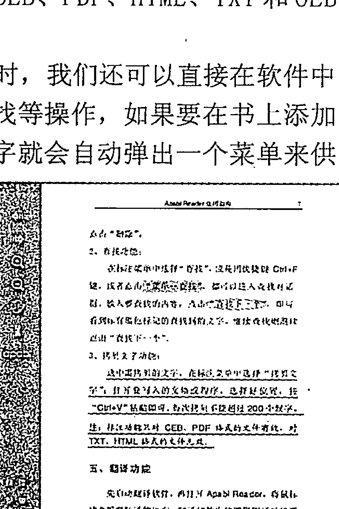

### 6. 傻瓜式浏览器——百博阅读软件

“百博阅读软件”是一个操作很简单的电子图书浏览器，它功能强大，包括书架管理、图书分类、图书查找、全文检索、书签、笔记、双页显示，以及快速下载等，还可以导入、管理和阅读其他格式的电子图书，如TXT、HTML、DOC、PDF等。“百博阅读软件”结合了百博书城网站(www.bbook.net)的数千种电子图书，这样就可以免费拥有家庭数字图书馆。

打开软件后，点击右面工具栏上的“书店”就可以登录到“百博书城网站”，然后就可以下载一些免费提供的电子图书了，下载的图书会自动放到相应的分类中（图6）。

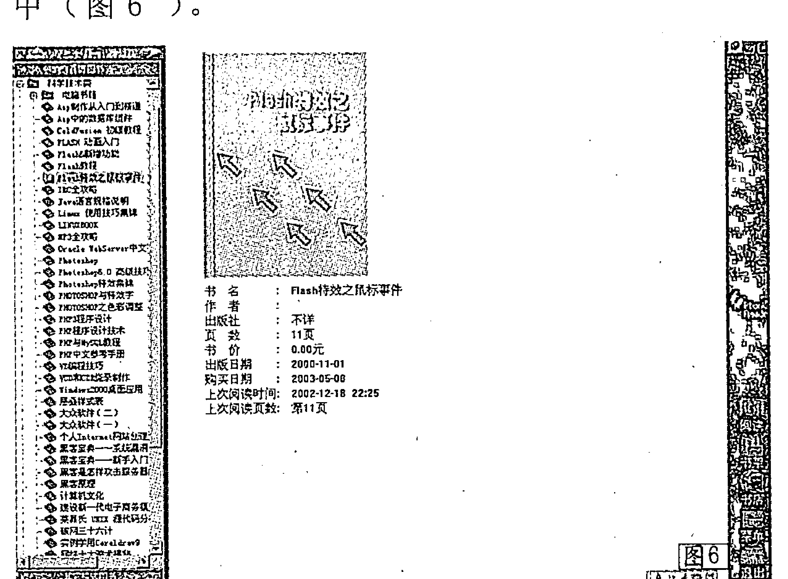

双击下载的电子图书就可以进行阅读了，如果你看累的话，只要点击右面工具栏上的那个嘴的图标，就可以让软件给你读书了。

### 7. 小巧玲珑的浏览器——ReadBook

“ReadBook”是一个功能相当完善的电子图书浏览器，最适合长时间进行浏览的人。软件支持Big5码和html格式，并能自动翻页、无级调速，还提供打印功能、DirectX支持、MIDI播放、文字校正等功能。软件特有的历史记忆功能，只要阅读时间超过一分半钟的文件就可以留在历史记录中，点击菜单“编辑－历史文件管理”就可以回顾以前看过的文件（图7）。

软件还能对显示的字体进行边角圆角处理，这样就可以提高文字的显示质量，看起来就比较舒服些。

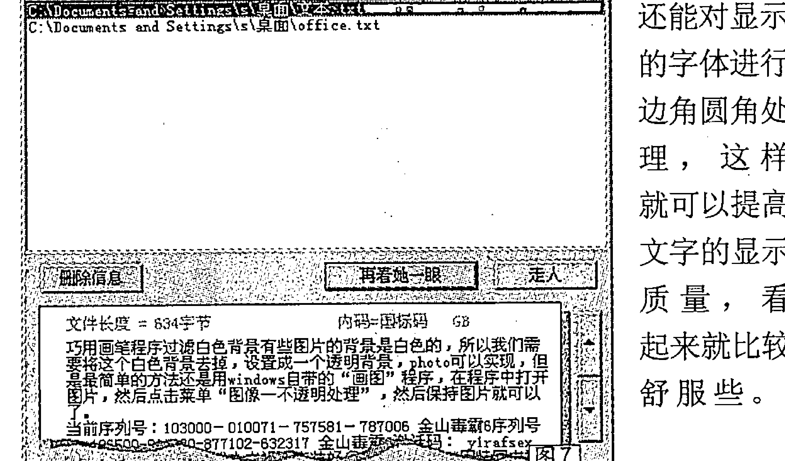

### 8. 支持多种格式的浏览器——Z-BOOK

“Z-BOOK”支持nico de、ANSI、UTF-8等编码格式，支持网址或文件的直接拖放，可以把ZIP、RAR、CHM格式的文件直接拖放到软件的“目录索引”中进行阅读，同时软件还集合了很多非常实用的功能，如语音读书、书页模式等。

如果想启动软件的“语音阅读”功能帮你读书，需要先从网上下载一个微软的发音引擎（下载地址：http://www.softboy.net/ttssetup2.exe)，然后点击菜单“工具－语音控制－语音引擎”，把里面的“Microsoft Simplified Chinese”选中，这时我们就可以点击工具栏上的“朗读”按钮让软件读书了。

软件还有“自动滚屏”或“翻页”功能，而且可以打破单个文件限制，这样就可以在一个文件结束时自动打开下一个文件，省去了来回打开文件的麻烦。

软件还有很多漂亮的书页模式，可以把这些书页模式套用到文本内容上，点击菜单“查看－工具窗口－书页导航”来显示窗口，然后就可以把自己喜欢的书页模式套用到电子书中（图8）。

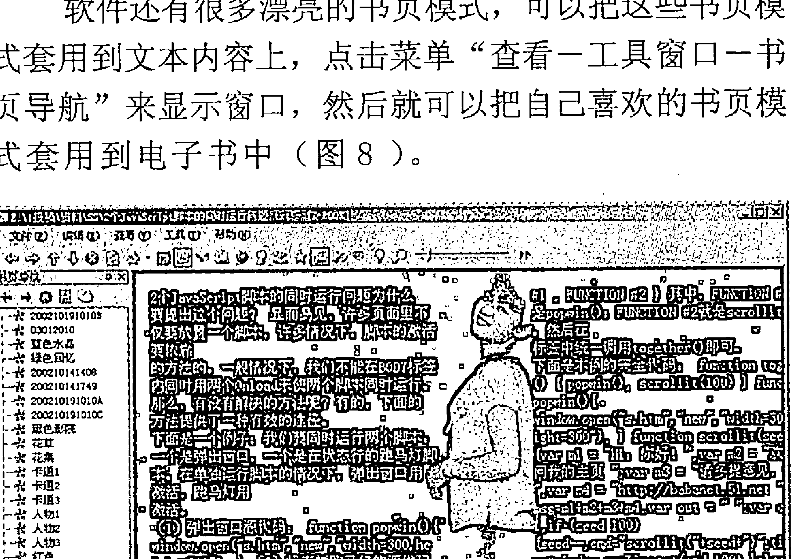

### 9. 读书迷的浏览器——书香门第

《书香门第》是一款适合于真正读书迷的电子图书浏览器，它外表并不花哨，但对于长时间、大量阅读的读书迷来说，它却是最舒适、体贴和细致的。

软件包括多达27种质感的窗口背景、页面背景可供选择，总共超过700种背景组合，为读书迷提供最高舒适度和最大程度的视力保护，更换背景的方法很简单，只要在“菜单”选项中选择“图案”就可以在弹出的对话框中进行选择了（图9）。

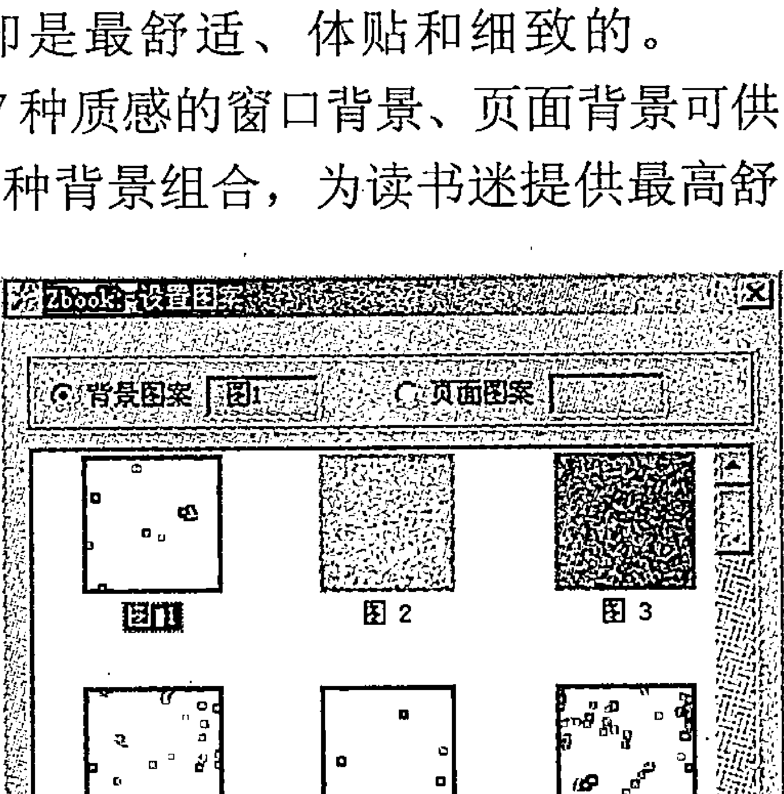

软件还有强大的智能化自动排版功能，并可以随意设定字体大小、颜色、行距、标题行，点击菜单“选项—排版及其他选项”会弹出一个对话框，在里面就可以对排版进行设置了。

它还有强大的搜索功能，能方便使用者在书中查找任何内容，而且它还具有强于Word和IE的汉字乱码纠错能力。

### 10. 能说会道的浏览器——说IE

现在很多电子图书都是HTML格式的，这样一般用IE浏览器就可以打开浏览了，如果你想通过IE来听书的话，那可以用“说IE”帮你读书，它是一个可以朗读网页文字的软件，支持中文和英文。使用方法很简单，只要在网页中选择要阅读的文字，然后点击鼠标右键选择“朗读”就可以了（图10）。

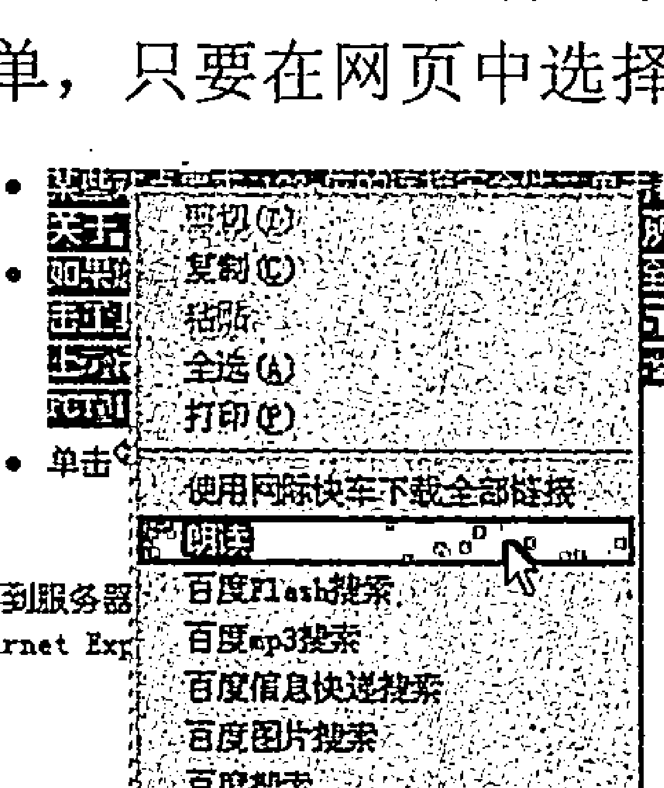

点击后就可以听见软件在朗读网页的内容了，在朗读的同时会弹出一个控制对话框，我们可以在这里设置朗读的声音模式、语速和音量，而且还可以控制朗读的播放和停止。

### 11. 语音朗读浏览器——Read2U

“Read2U”是一个语音朗读软件，能够将文本转换为语音，它是专门为朗读文章而设计制作的，它不是机械的模拟的电子声音，语音库中所有声音都是真人发音，语音清晰、悦耳，它还具有卓越的多音字识别系统，通过词库来辨识多音字，会对随位置不同而声调不同的多音字做一定的处理。软件支持多种文件格式，其中文本格式包括TXT、GB、RTF、HTM、WPS，它还支持几种通用的音乐格式MP3、WAV、MID、CDA，此外它还支持BIG5码的文件。

软件的使用很简单，运行软件后点击鼠标右键，在弹出的菜单中选择“打开文件”项就可以了，打开后再选择“开始朗读”就可以听见软件朗读的声音了，在“设置”项里面我们还可以对朗读进行很多设置，如词库的管理、读音的调整等（图11）。

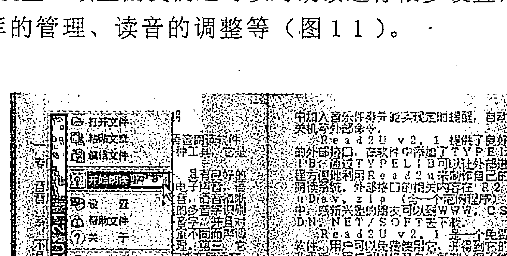

### 12. 另类的浏览器——电脑&VCD两用浏览器

最近出来一种另类的浏览电子图书的方式，其独特之处在于不需要电脑也可以阅读，它能在VCD机上使用遥控器来操作阅读，在电脑上可以使用“超级解霸”的单帧功能来播放阅读。它是把制作的电子图书用Nero Burning Rom光盘刻录软件刻录成一张Vcd2.0的光盘，然后插入VCD机中就可以单步播放了，可以像在电脑中一样欣赏。

（文/阿峰）

## 课件制作工具扫描

随着计算机技术的迅速发展，硬件、软件质量不断提高，计算机辅助教学逐渐受到重视，多媒体教学也逐步走进我们的课堂。同时，市场上涌现出大量的课件制作软件，这对现代教育技术的发展起到了很大的促进作用。因此，结合教育教学实际需要，寻找师生喜爱的课件制作软件并达到良好的教学效果，是我们应该思考的一个重要课题。

选择课件制作软件时，我们可以从以下方面着手：

### 1. 易用原则

“一千个读者就有一千个哈姆雷特”，同样，一千个教师就有一千种教学方式，课件制作软件的操作应简单易用，使教师能在很短的时间内掌握，并达到良好的教学效果。

### 2. 高效原则

多媒体开发工具应具有“所见即所得”、“特殊效果丰富且实现容易”的特点，这样才能充分体现课件开发软件的效率优势。

### 3. 开放原则

教学内容千变万化，开发平台必须兼容绝大多数的媒体格式，支持各种输入输出设备，能够采用或提供各种素材。

### 4. 经济原则

软件成本要尽量低，用最经济的电脑配置就能制作出优秀的课件，即以最小的成本做出最好的效果。

基于上述介绍，我们可从易用原则、高效原则、开放原则、经济原则等方面选择不同的课件制作软件。实际制作过程中，并不是以选择软件为目的，能达到最优的教学效果才是最终目的。

### 一、常用课件制作软件

下面首先介绍几种主流的课件制作软件，使读者朋友对当前流行的课件制作软件有一个比较全面的认识。

#### 1. Powerpoint

Powerpoint是微软公司的产品，是专用于制作演示幻灯片的工具。利用PowerPoint，可以方便地制作各种文字，加入图像、声音、动画、视频影像等各种媒体信息，并根据需要设计各种演示效果。上课时，只需轻点鼠标，就可以播放出制作好的一幅幅精美的文字和画面。

使用Powerpoint制作课件最大的优点是操作简便，系统提供了优秀的模板和各种体贴的提示，适合初级用户制作一些“讲义式”、“幻灯片式”的课件。对于熟悉微软产品的用户来说，可以很快掌握这个软件，如图1所示。放映幻灯片时，按一下F5，或者单击“幻灯片放映”菜单下的“观看放映”就行了。在放映过程中想换到上一张、下一张很简单，可以用Page Down、Page Up键来控制，也可以用方向箭头控制，如果只是想换到下一张还可以用空格键、回车键等。

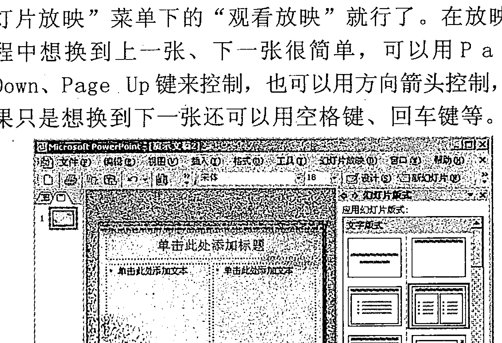

#### 2. Flash MX 2004

毫无疑问，如今网络与Flash的关系愈发难舍难分。我们可以用Flash设计动画点缀网页，可以用Flash做各种产品的广告，当然也可以利用它来制作课件，Flash正逐渐形成着一种网络文化氛围。随着校园网络建设的不断发展，Flash也逐渐成为校园制作课件的一个得力平台。

使用Flash制作课件最大的优点是，它能够制作动态交互式媒体专页或开发与主题相关的多媒体课件。它强调对多种媒体的导入和控制，如声频、录像带、位图、矢量、文本和数据等。Flash MX专业版2004包括了Flash MX 2004的所有特征，还附带了一些强有力的新工具，如数据绑定组件、专业视频开发、设备开发等，它的外部脚本和处理动态数据的能力使Flash特别适合大规模的课件项目，从而达到最佳工作效率。软件界面如图2所示。

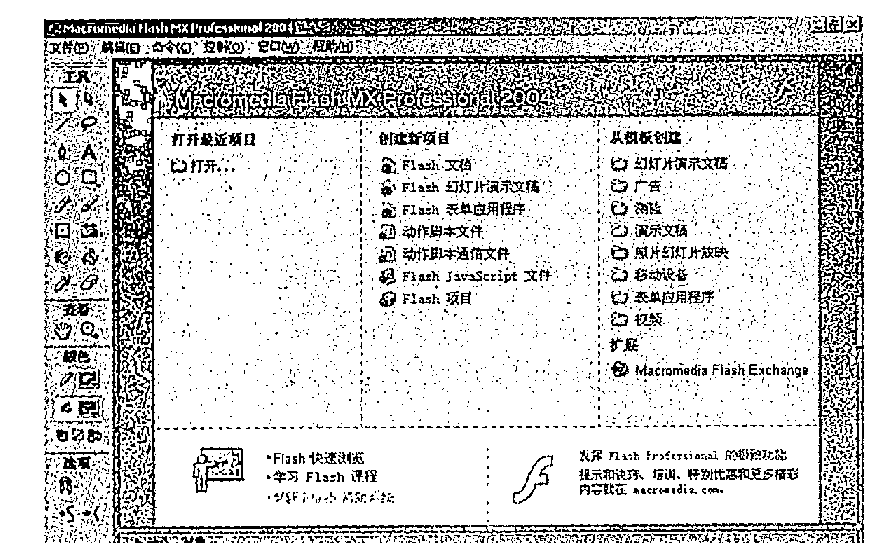

另外，Flash本身具有极其灵巧的图形绘制功能，同时具备专业级绘图工具，如使图形产生翻转、拉伸、擦除、歪斜等效果，可以创建透明的图形，还可以将图形打碎进行编辑，产生形状的渐变。而且，矢量图案可以任意放大或缩小，不会出现马赛克现象。

Flash采用精灵动画的方式，在Flash中可以随意创建按钮、多级弹出式菜单、复选框，同时具备形式多变的交互性。用Flash生成的互动式动画课件体积小，传输速度很快，尤其Flash动画课件是边传递边演示，几乎感觉不到停顿现象。对于流动性比较大的授课老师来说，Flash可以将制作的影片生成独立的.exe可执行文件，方便老师进行演示。

#### 3. Authorware

Authorware是美国Macromedia公司的产品，适合非计算机专业的学科教师开发多媒体教学课件。使用Authorware制作课件的大致步骤是，用系统提供的图标先建立应用程序的流程图，然后通过选中图标，打开相应的对话框及系统提供的图形、文字、动画等编辑器，逐个编辑图标，添加教学内容。整个制作过程以流程图为基本依据，非常直观，且具有较强的整体感，制作者通过流程图可以直接掌握和控制系统的整体结构，如图3所示。

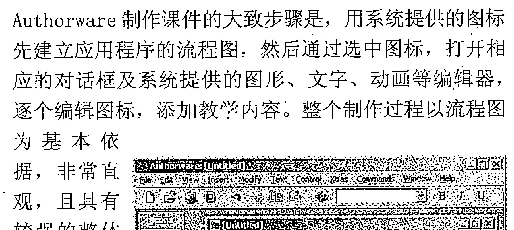

从教学课件制作的角度来看，Authorware还具有以下明显的优点：

- 1. 具有大量适合教学的素材库。在教学课件制作中，有些素材经常用到，如底纹、壁纸、效果声等。Authorware支持多种格式的文件，便于方便地采集素材。制作者可以收集素材并保存起来，不断丰富素材库的内容。
- 2. 可以很方便地利用多种载体。视频影像是多媒体课件的重要组成部分，可选择VCD中的有关片断通过视频编辑软件转化为AVI文件。比如，合理利用现有光盘中的内容，可以极大地丰富课件制作的素材，还可以降低开发费用。
- 3. 集成功能强大。Authorware是一套优秀的多媒体编辑工具，它强大的功能为使用者提供了极大方便。在课件集成时，首先应该根据制作要求规划好整个课件流程，根据流程规划，用鼠标把工具栏中的图标拖到流程线的相应位置上，再对图标内容进行编辑，这样在结构上将更加直观。
- 4. 丰富的开发方式。Authorware提供多种位移动画和交互方式，有助于提高开发效率。在课件开发过程中，用鼠标右键单击相关的显示、声音、影像等图标就能快速查看到该图标的内容、听到该图标的声音。

#### 4. Director MX 2004

Director是Macromedia公司推出的一代交互式多媒体应用软件开发工具，具有强大的面向对象开发能力，用户可以将图片、声音、三维动画、视频电影、数据库访问、Internet链接等技术集成在一个课件中，从而制作出令人震撼的多媒体交互程序。据Macromedia统计，已经有超过35万的用户在使用Director。通过Macromedia Shockwave Player，Director还可以在CD/DVD-ROM、信息站和WEB上设计多样化、交互式的内容及应用程序。这是一款融合了众多新功能的创作工具，可满足当今多媒体开发人员不断发展的需求。其界面如图4所示。

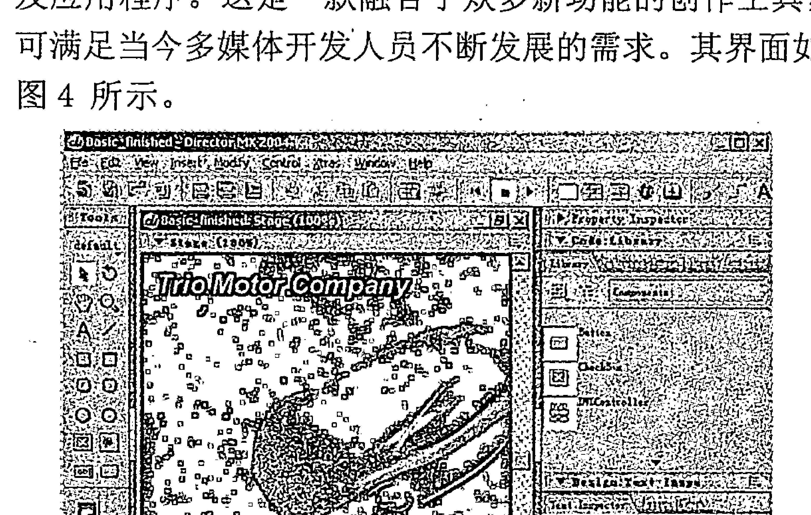

Director的强大功能还表现在能轻松地融合众多的媒体类型，从而达到编辑不同课件的目的。包括主要视频(RealVideo、QuickTime和AVI)、音频(MP3、WAV、AIF和RealAudio)、位图(JPG、GIF、PNG、BMP、PSD、TIFF和PICT)和矢量格式，运用Director MX中强大的Lingo编程语言，我们可以轻松地控制这些媒体类型。另外，我们还可以用Director包装PowerPoint文档，实现PowerPoint和Director的无缝衔接，这对当前的教学实践有很积极的意义。

#### 5. Multimedia Builder

Multimedia Builder是一款制作多媒体程序的优秀软件，它是制作互动式多媒体课件和光盘浏览画面的工具，可以制作CD播放程序、MP3播放程序，或是可放在桌面上的Toolbar快捷条。我们可用它制作非常个性化的播放器、教学演示、软件说明，还可以制作个人介绍、生动的卡片以及配乐的电子像册。Multimedia Builder的操作环境具有‘所见即所得’的特性和向导功能，并且支持绝大多数的多媒体文件格式和多种影像处理效果，如图5所示。

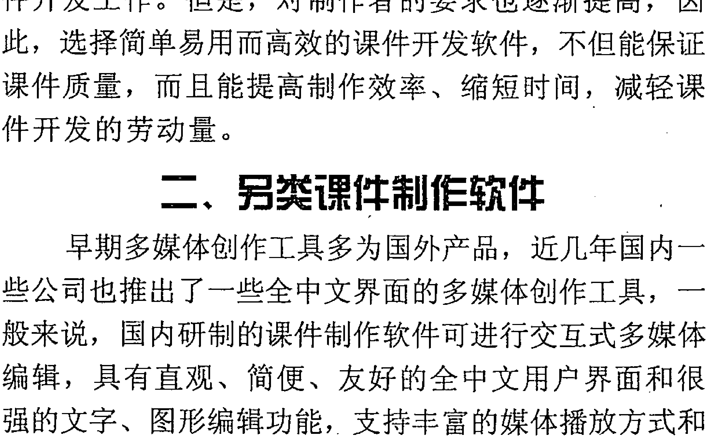

通过对上述课件制作软件的扫描，不难看出，这些软件的编辑功能十分强大，可以胜任平时大部分的课件开发工作。但是，对制作者的要求也逐渐提高，因此，选择简单易用而高效的课件开发软件，不但能保证课件质量，而且能提高制作效率、缩短时间，减轻课件开发的劳动量。

### 二、另类课件制作软件

早期多媒体创作工具多为国外产品，近几年国内一些公司也推出了一些全中文界面的多媒体创作工具，一般来说，国内研制的课件制作软件可进行交互式多媒体编辑，具有直观、简便、友好的全中文用户界面和很强的文字、图形编辑功能，支持丰富的媒体播放方式和动态效果，能实现灵活的交互操作和多媒体同步。下面我们来看看这些比较有特色的软件。

#### 1. 方正奥思多媒体创作工具

方正奥思多媒体创作工具是北大方正技术研究院精心研制的一个可视化、交互式的多媒体创作工具，具有直观、简便、友好的用户界面。通过方正奥思，创作人员能够根据自己的创意，将文本、图片、声音、动画、影像等多媒体素材进行集成，使它们融为一体并具有交互性，从而制作出各种丰富多彩的多媒体应用软件产品。

方正奥思具有很强的文字、图形编辑功能，支持多种媒体文件格式，提供多种声音、动画和影像播放方式，并提供丰富的动态特技效果，以及具有强大的交互能力。奥思直接面向各个应用领域的非计算机专业的创作人员，所以，您不需要编计算机程序就可以制作出高质量的奥思产品。软件界面如图6所示。

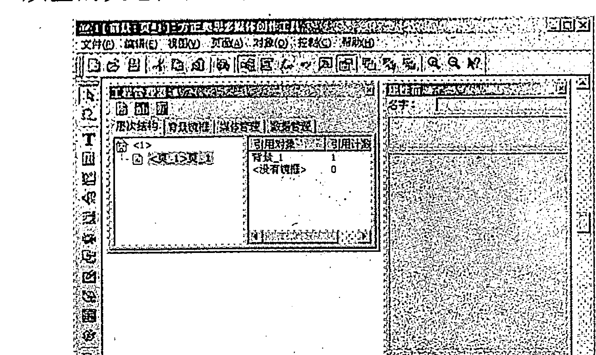

使用方正奥思的大致过程为：首先以页码为单位，在每页中加入文本、图形、图像、声音及影像等多媒体对象，对象之间可以实现交互功能；然后，通过层次结构管理器来设计和管理，轻松实现页与页之间的超文本链接。这样就构成了一个完整的课件。

这个软件最典型的特点是面向普通用户，无须编程就可以按自己的创意制作出高质量的多媒体应用产品，用奥思制作的软件可以很容易地制成EXE文件或HTML网页格式，脱离环境安装、运行。此外，在各种多媒体应用和电子图书中，常常涉及大量数据的处理及检索。软件提供了多媒体数据库的解决方案，通过内建的数据库实现声音、影像、动画等对象的存储和检索，可以方便地组织和使用大规模的数据信息，实现多媒体数据库。

#### 2. 蒙泰瑶光多媒体编著系统

蒙泰瑶光多媒体编著系统是由武汉蒙泰科技发展有限公司开发的一套多媒体制作工具，用蒙泰瑶光制作的课件就像一本书，课件的内容制作在“页”上，就像一页一页的书；课件中不同的浏览方式相当于书的不同检索方式。这种结构比较符合教师的思维方式，比流程图结构、时序结构等其它方式更容易理解和学习，全中文操作界面易于使用操作。如图7所示。

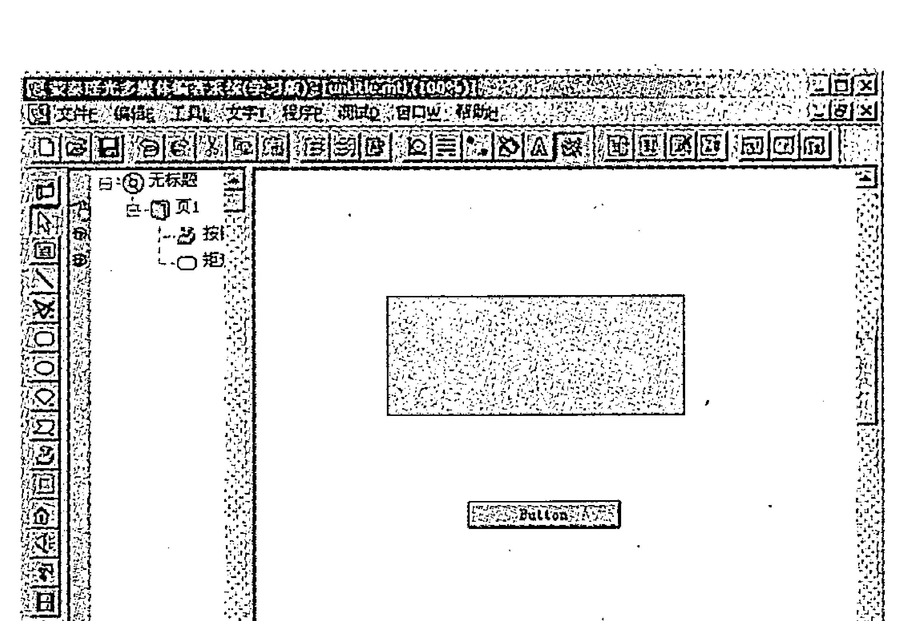

蒙泰瑶光具有以下的典型特点：
操作方便，适合中国人的特点。它提供了所有汉字的汉语拼音自动注音功能，同时对多音字可手动调整，还可手动更改注音，彻底解决了汉语拼音输入难的问题。另外，简单快捷的公式输入方法，使各类公式的输入不再需要拼拼凑凑。

丰富的多媒体功能。软件提供了160种媒体现场方式和20多种媒体进出方式可使课件中的各种内容以其意想不到的方式呈现，提高课件观赏性和感染力。它还内置高效视频驱动模块，除能对视频资料进行节选播放和播放控制，还可在视频上进行媒体叠加，减少课件制作时对视频资料编辑处理的时间。

#### 3. 速龙易之课件制作系统

该系统以独到的创意、强大的功能和方便的操作，真正地将课件制作变成一件每位教育工作者都可轻松从事的工作。简单易学，轻松上手，无需编程即可实现强大的交互功能。它具有强大的动画制作能力，能够轻松定义运动轨迹。如图8所示。

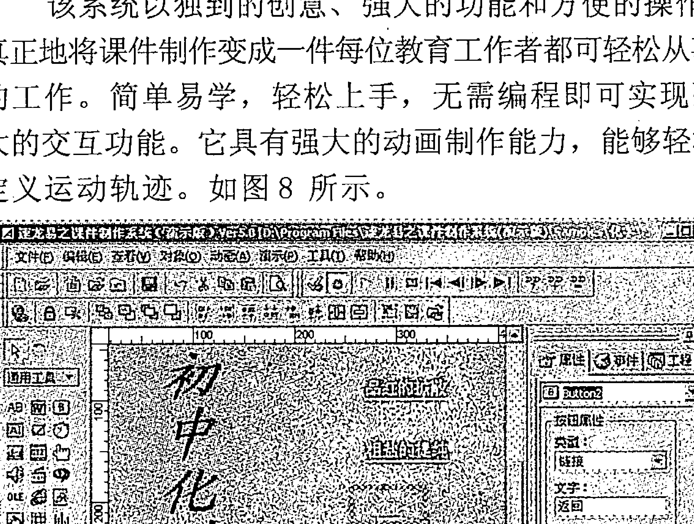

从制作课件的角度看，该软件具有如下典型特征：
易用性。系统以完整的对象为基础，提供了“搭积木”式的制作方式，仅需简单的鼠标拖拽、点击，即可完成一个漂亮的课件。系统的对象均支持任意旋转、缩放等操作。通过系统中所提供的交互对象，如按钮、输入框、图片、文字、文档文字、热区等以及事件处理的概念，可以在制作中加入交互的功能，实现播放过程中的交互，得到更好的教学效果。
高效性。系统中预制了各种专业的学科对象，基

#### 4. 几何画板

几何画板通过设计和编写应用范例来体现老师的教学思想和教学水平，而不是编者的计算机软件技术水平。由于每个画板都可以被用户按自己的意图修改并保存起来，所以它特别适合用于进行几何交流、研究和讨论。人们由此把它称之为“动态黑板”。它还是教师布置作业、学生完成作业的理想工具，如图9所示。

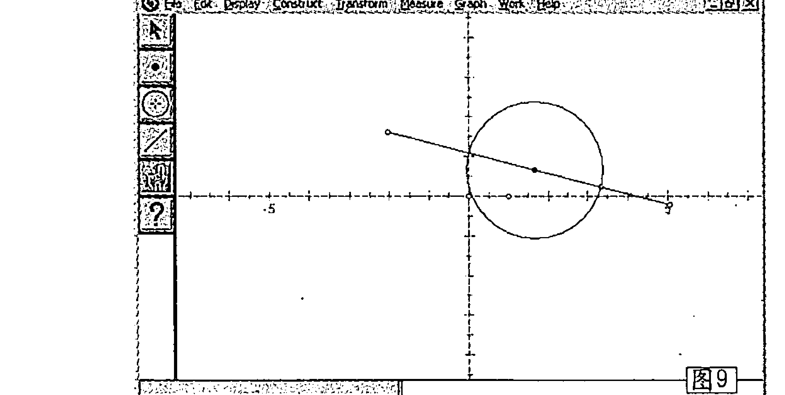

几何画板最典型的特点在于，它是一个演示工具，能准确地、动态地表达几何问题。一旦与大屏幕投影仪等设备配合，它的演示效果更加完美。另外，几何画板还能进行其它学科的动态演示，如物理中的力学、运动学、光学，数学中的认数，地理中的行星运动等等。

几何画板为我们创设了一个数学实验室，提供了一个理想的做数学的环境。学生可以从“听”数学转变到“做”数学，即以研究者的方式，参与包括发现、探索在内的获得知识的全过程，具有动态直观、色彩鲜明、变化无穷的特点，能极大地增强学生的学习兴趣，是一只点石成金的金手指。

#### 5. 赛思多媒体课件大师

赛思多媒体教学课件大师是一款优秀的多媒体网络课件制作工具，它将文本、声音、图形、图像、动画及电影等多媒体素材有机地融为一体，可以按照创意制作出高质量的电子课件。软件不仅功能强大，而且易懂、易学、易用，没有计算机基础的教师或学生也能轻松掌握、熟练运用。如图10所示。

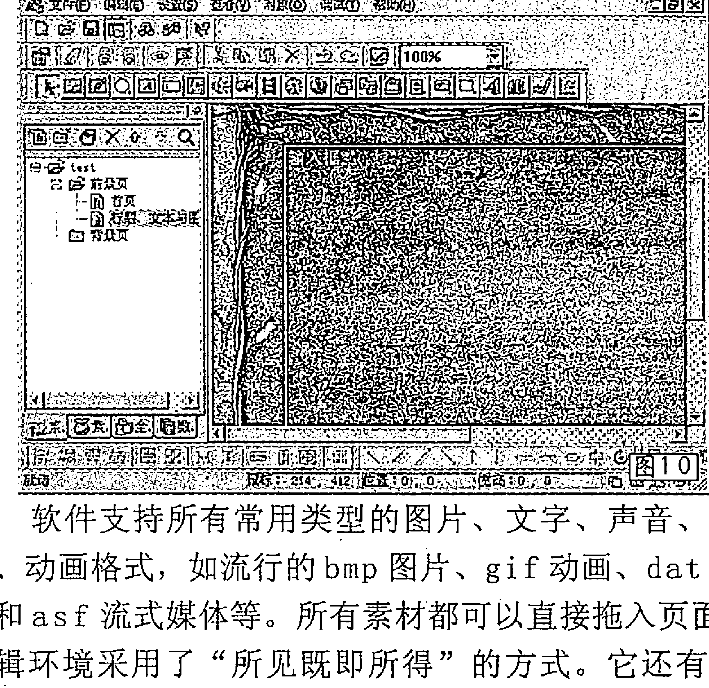

软件支持所有常用类型的图片、文字、声音、视频、动画格式，如流行的bmp图片、gif动画、dat视频和asf流式媒体等。所有素材都可以直接拖入页面，编辑环境采用了“所见即所得”的方式。它还有一个比较吸引人的地方在于，采用独特的无损化网页格式，保留全部动画效果和交互功能，可以通过网络进行大范围的发布。

#### 6. 网络课件快车

网络课件快车比较符合中国人的思维特点和使用习惯，是一套纯中文操作、无须编程的多媒体网络课件创作工具。它具有PowerPoint的易学易用性和Flash的动画制作与网络特点。使用网络课件快车，具有强大的矢量制图、丰富的动画功能以及无所不在的交互控制功能，使用这个软件可以快速高效地制作出精美的课件。其最大的优势是可以在网页浏览器环境中直接运行，实现真正的网络化教学。如图11所示。

从以上分析可以看出，这些软件的优点是贴近中国

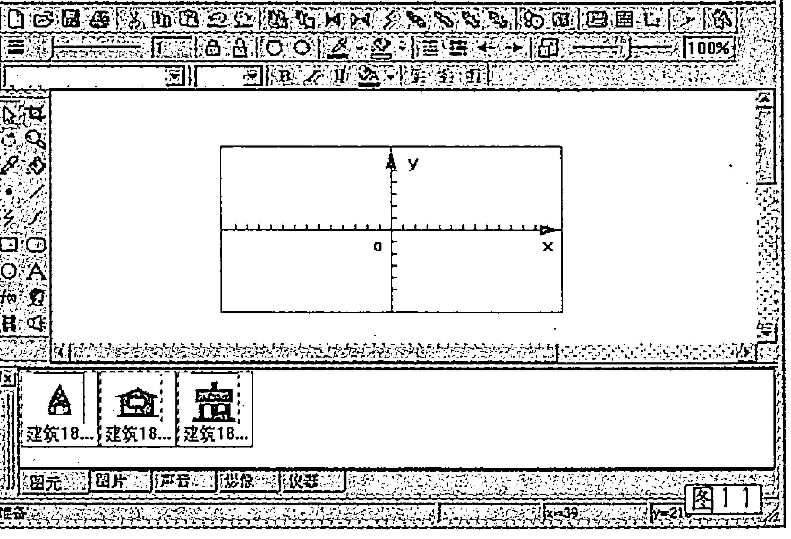

## DC与DV的最佳搭配 —— 数码工具软件扫描

如今DV画质已经达到相当的高度，而且各种编码技术及处理软件层出不穷。对于个人用户而言，实现个人自编自导已经不是什么奢望。除此以外，数码相机的普及之势也令人惊讶，由此而带来的后期处理需求同样不容忽视。如果想要在多媒体世界里穿梭，那么掌握一些常用软件及其技巧是必须的，我们也将以此为重点为大家介绍各种应用软件。

### 一、DV篇

数码视频的最大魅力在于其可编辑性，因此需要一款真正适合自己的视频采集编辑软件。和其他需要创意的应用一样，视频编辑软件也分为两类：Adobe Premiere、Ulead VideoStudio之类的超大型集成软件，以及Pinnacle Studio8、Sonic Foundry Vegas、

#### 7. 其他课件制作软件

- 1. **“一点通”多媒体课程制作与播放**： “一点通”软件包括多媒体课程制作软件和播放软件，可以把讲座、课程、讲演制作成多媒体文件，教师可以用本软件将教材制作成多媒体电子版，制作过程完全不同于传统的课件制作软件，符合人们的日常交流习惯，声音、图像自动处理，无须关心播放流程。具有操作简单、文件体积小、硬件要求低的特点。
- 2. **海百合课件专家 V8.0**： 海百合课件专家是一款优秀的多媒体网络课件制作工具，它汲取了国内外各种多媒体制作软件的优点，不仅功能强大，而且易懂、易学、易用，没有计算机基础的教师或学生也能轻松掌握、熟练运用。其典型特点在于，可以实现多用户同时在线应用，实现网络课件协同开发。
- 3. **e-Motion 多媒体课件创作平台**： e-Motion多媒体课件创作平台面向教学、支持教学全过程和协同创作，界面简洁直观，具有标准化XML数据存储格式，事件动作丰富，无须编程即可实现强大的交互。素材资源比较丰富，支持图像、文本、声音、动画、视频，还有各种辅助对象。此外，软件还具有图形编辑、图像文字效果、轨迹动画、帧动画等功能，并支持脚本编程，XML的存储格式更增加了这个软件的开放性和参与性。

### 三、参考方案

当然，实际使用过程中，我们并不是局限于某种课件制作软件，根据实际情况的不同，可以选择不同的软件进行搭配。以下提供几种参考方案。

#### 方案1：使用Authorware搭配Director

这个是公认的梦幻组合方案，虽然单独使用一个软件就可以达到很好的效果，但Macromedia公司决不是重复开发。Authorware侧重系统集成，对程序的导航、交互控制功能无人出其右；Director侧重多媒体制作，特别是动画制作堪称第一。因此，实际使用过程中，用Director制作动画及特技效果，由Authorware进行格式编排，就能体现课件制作的最高水平。

#### 方案2：使用Director搭配PowerPoint

资金充裕的学校拥有了Director就能满足高技术含量课件开发的需要，但由于其对使用者要求较高，所以配合一般教师使用PowerPoint是个不错的建议。加上Director强大的二维动画制作功能，能轻松实现跳转控制、交互功能，完全可以称之为“多媒体创作工具集大成者”。尤其值得一提的是，Director完全能够调用PowerPoint格式文件，两个平台能够沟通，从而达到比较完美的境界。

#### 方案3：使用方正奥思搭配PowerPoint

如课件只需分步呈现知识点或单纯展示图片、表格、声音等素材，那么PowerPoint绰绰有余；如果需要较复杂的跳转和一些特效，就可以让计算机教师利用方正奥思来完成。这个方案比较适合中国的国情，由于教师制作水平参差不齐，因此，比较专业的计算机教师使用方正奥思，一般教师使用PowerPoint。这种方案适合教师计算机水平不高、课件要求不高、资金有限的学校。这样搭配使用可满足大多数学校的需求，而且价格能承受。但是，要制作一些精致的动画或交互性强的课件就不太理想了。

制作过程中，如果能够通过免费软件实现特定的功能，我们可以尽量采用免费软件。当然，有些免费软件具有简单高效的特点，特别是对于计算机水平一般的老师来说很实用。因此，我们可以综合使用这些软件，从而达到“传道、授业、解惑”的目的。 (文 / 彭文波)

Cyberlink PowerDirector Pro 之类的易用型软件。毫无疑问，后者更多地面向普通用户，但是它们都提供了相似的捕捉、编辑和输出功能，只不过专业级产品更加注重实现专业人员的创意，尽量提供自由而强大的功能，而消费类产品更加注重让使用者简单而快捷地完成任务。

#### 1. Adobe Premiere (图1)

不可否认，Adobe Premiere是目前功能最为强大的专业级视频采集编辑软件，现在被广泛地应用于电视台、广告制作、电影剪辑等领域，成为PC和MAC平台上应用最为普及的视频编辑软件。

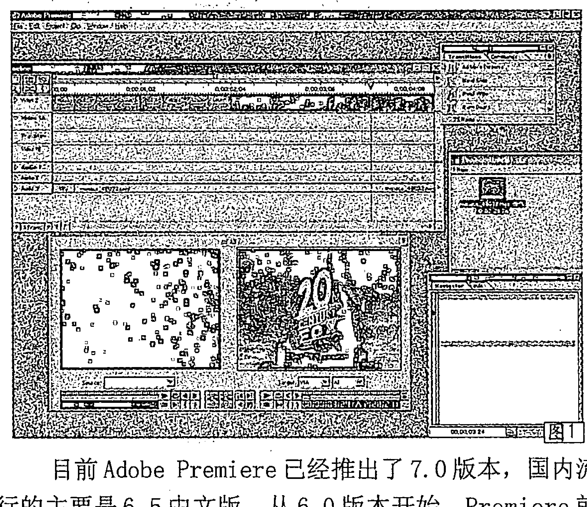

目前Adobe Premiere已经推出了7.0版本，国内流行的主要是6.5中文版。从6.0版本开始，Premiere就很好地融入了DV视频采集功能，配合其强大的视频编辑能力，专业用户自然很难有第二种选择。Premiere的一大优势在于可以显示实时编辑效果，用户在Premiere中所做的一切都可以实时预览，包括字幕、色调，甚至第三方插件。更为重要的是，Adobe Premiere拥有很多第三方插件，就如同PhotoShop一样。很多用户使用Premiere的真正原因并非是该软件本身的魅力，而是冲着丰富的第三方插件。

当然，应该指出的是，Adobe Premiere不容易上手。你会发现很多Premiere的专业功能是一般个人用户所不常使用的。但是，如果你花时间去学习，你会发现Premiere有很多优点。

#### 2. Ulead VideoStudio (图2)

尽管VideoStudio是一款超大型集成软件，但是其易用风格依旧十分出色，这也是Ulead软件的一贯作风。软件主界面中央的预览窗口，以及用于编辑影片的故事板和时间轴，整个软件让人觉得很容易上手，各种功能按钮也十分直观。

值得称道的是，VideoStudio采用目前最流行的“在线操作指南”的步骤引导方式来处理各项视频、图像素材，它一共分为“开始→捕获→故事板→效果→覆叠→标题→音频→完成”等8大步骤，并将操作方法与相关的注意事项，以帮助文件显示出来，令用户快速地学习每一个流程的操作方法。此外，VideoStudio加强了拖拽操作方式的应用，每个效果都可以做进一步的控制，不只是一般的“傻瓜功能”，还可让用户以最简单的方式在影片中加入字幕、旁白或动态标题等。尽管VideoStudio的第三方插件几乎没有，但是它内置了100多种可编辑的转场特效，以及几十种可编辑的视频滤镜，已经基本满足普通用户的需要。

当然，在具体视频编辑以及创作空间方面，VideoStudio不能与Adobe Premiere相提并论，但是这款软件的确十分适合刚刚接触视频娱乐的新手，以及一些喜欢简易操作模式的中级用户。

#### 3. Pinnacle Studio8 (图3)

从软件的定位以及风格来看，Pinnacle Studio8与Ulead VideoStudio十分类似，它们都拥有一个非常直观的操作界面，用户可以按照软件向导式的操作菜单轻松完成视频的采集、编辑和输出。更为相似的是，Studio8也提供“故事板”和“时间轴”的编辑模式。

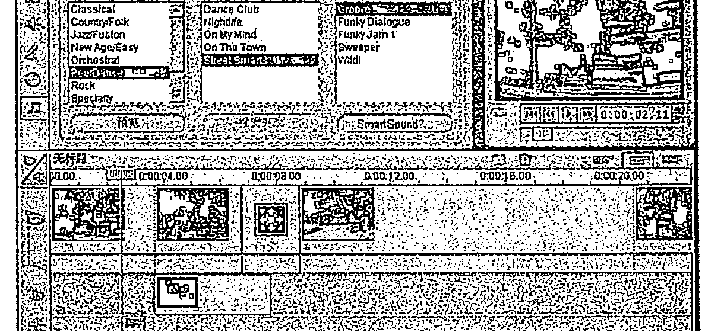

Pinnacle Studio8提供了丰富的转场特效，还拥有专业级的视频特效工具Hollywood FX。不过在视频滤镜方面，Pinnacle Studio8不如VideoStudio那样丰富，只有调整视频的色调／饱和度、亮度／对比度以及为视频添加模糊、浮雕、马赛克等效果。Pinnacle Studio8的场景检测功能尤为突出，场景检测可以使用户更加方便地准备与管理素材，提高编辑的效率。Pinnacle Studio8提供了四个场景检测选项，用户可以按照自己的需要灵活地设置如何进行场景检测。

在易用性方面，Pinnacle Studio8几乎是完美无缺的，很多用户都为这一设计而感到方便，毕竟这是一款适合家庭个人用户使用的视频采集编辑软件。唯一遗憾的是，Pinnacle Studio8的售价比较高，不如VideoStudio那样廉价。当然，配合Pinnacle视频卡一起选购是一个不错的方案，因为这款出色的软件已经成为Pinnacle视频卡重要的一部分，而不仅仅是附加产品。

#### 4. Sonic Foundry Vegas4.0 (图4)

作为一款共享软件，Vegas4.0的表现让很多人感到惊讶，它在易用型、视频编辑功能等方面居然毫不逊色于任何产品，而且丰富的第三方插件让Vegas4.0如虎添翼，成为很多视频玩家的首选。

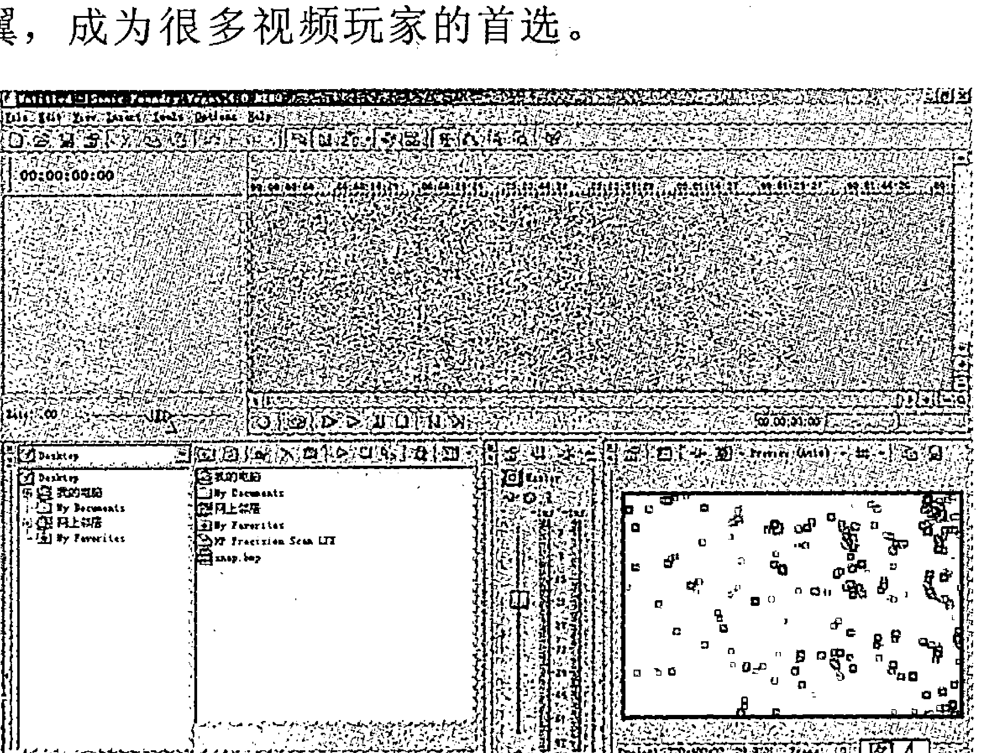

Vegas4.0为专业的多媒体制作树立了一个新的标准，应用高质量切换、过滤器、片头字幕滚动和文本动画，创建复杂的合成、关键帧轨迹运动和动态全景／局部裁剪，具有不受限制的音轨和非常卓越的灵活性。作为一款主流视频采集编辑软件，Vegas4.0从时间线提供特技和切换的实时预览，而不必渲染，这对于复杂情况下的视频编辑大有好处，能让用户更为方便地掌握，而且节约了大量渲染和预览的等待时间。

到目前为止，Vegas4.0已经拥有多达几十种常用第三方插件，加上其内置的视频效果滤镜和转场效果，其视频编辑创作功能已经十分了得。此外，Vegas4.0支持的媒体格式也是相当齐全，特别突出的是其对Real Media9和Windows Media9格式文件的支持。当然，这些功能也可以通过后期视频格式转换来实现。

#### 5. Cyberlink PowerDirector Pro (图5)

在众多视频采集编辑软件中，PowerDirector Pro算得上是最小巧的一款，这也注定它必须在易用性方面有所突破。诚然，PowerDirector Pro的视频编辑功能无法与以上几款软件相媲美，第三方插件也无从谈起，但是PowerDirector Pro也有其独特的魅力。

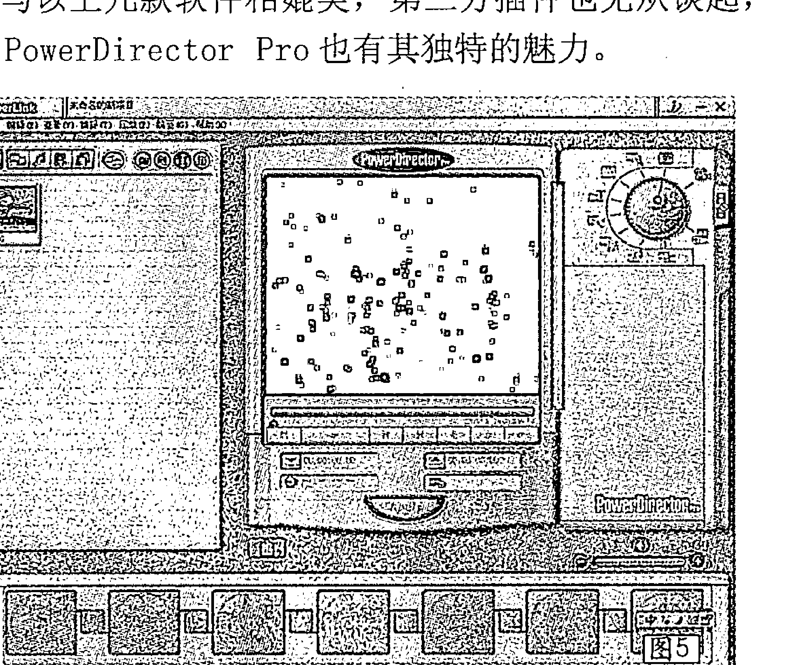

PowerDirector Pro视频编辑的故事板界面可以很轻松地插入视频片断并进行过渡设置，而各种内置滤镜的使用也十分方便。通过简单的采集之后，PowerDirector Pro让用户迅速找到最简易的编辑模式，对常见的转场、剪辑、添加字幕等操作都能以两三下的鼠标操作来实现，这一点是以易用型见长的Pinnacle Studio8和VideoStudio所难以做到的。当然，PowerDirector Pro提供的内置滤镜数量还是比较少，而且创作空间不大，用户难以在这里制作出丰富的视频特效。然而对于初级用户而言，PowerDirector Pro的建议操作模式确实极具诱惑力，这或许也是熟悉视频创作的捷径。更加难能可贵的是，PowerDirector Pro有免费的试用版，基本上没有什么功能限制。

对于以上各款软件，其特色总结于下表，大家可以根据自己的需求来选择。

| 特性 | Adobe Premiere | Ulead VideoStudio | Pinnacle Studio8 | Sonic Foundry Vegas4.0 | Cyberlink PowerDirector Pro |
| :--- | :--- | :--- | :--- | :--- | :--- |
| 厂商 | Adobe | Ulead | Pinnacle | Sonic Foundry | Cyberlink |
| 最新版本 | 7.0 | 7.0 | Studio8 | 4.0 | 2.55 |
| 实时预览 | 支持 | 支持 | 支持 | 支持 | 不支持 |
| 转场效果数量 | 丰富 | 丰富 | 一般 | 丰富 | 较少 |
| 视频特效数量 | 丰富 | 丰富 | 较丰富 | 较丰富 | 一般 |
| 视频剪辑 | 繁琐 | 很方便 | 方便 | 较繁琐 | 很方便 |
| 字幕功能 | 出色 | 出色 | 出色 | 出色 | 出色 |
| 操作模式 | 复杂 | 简易 | 简易 | 较复杂 | 十分简易 |
| 输出格式 | 很多 | 很多 | 较多 | 较多 | 较多 |
| DV采集 | 支持 | 支持 | 支持 | 支持 | 支持 |
| 第三方插件 | 极多 | 较少 | 一般 | 很多 | 极少 |
| 软件体积 | 很大 | 很大 | 较大 | 较小 | 很小 |
| 硬件要求 | 很高 | 较高 | 很高 | 较高 | 较低 |
| 免费试用版 | 无 | 有 | 无 | 有 | 有 |
| 正式版软件价格 | 很高 | 较低 | 较高 | 较高 | 较高 |

### 二、DC篇
无论数码相机的功能有多么强大，限于各种各样的外部因素，我们的照片总有不尽如人意的时候。然而，数码相机先天具有后期处理的特点给我们一次挽救的机会，不让遗憾伴随终身。

#### 1. Adobe Photoshop (图6)
Photoshop 算是非常专业的图形设计处理软件了，它在数码照片处理方面的能力比其他软件处理的效果更好一些，但它不像专业的数码照片处理软件那样有许多可以套用的各种模板效果，所以用 Photoshop 处理照片更多的是表现在照片的效果上。Photoshop 功能强大，可以制作出很多不同风格的照片，因为功能强大，完全掌握需要不短的时间。从照片调整、色彩修正、紫边与红眼现象去除，到人工美化、移花接木、特级画面，这些千奇百怪的后期处理应用都可以在 Photoshop 上实现。毫不夸张地说，Photoshop 是当今最全面的 DC 数码照片后期处理软件，但却不是最易用的软件。

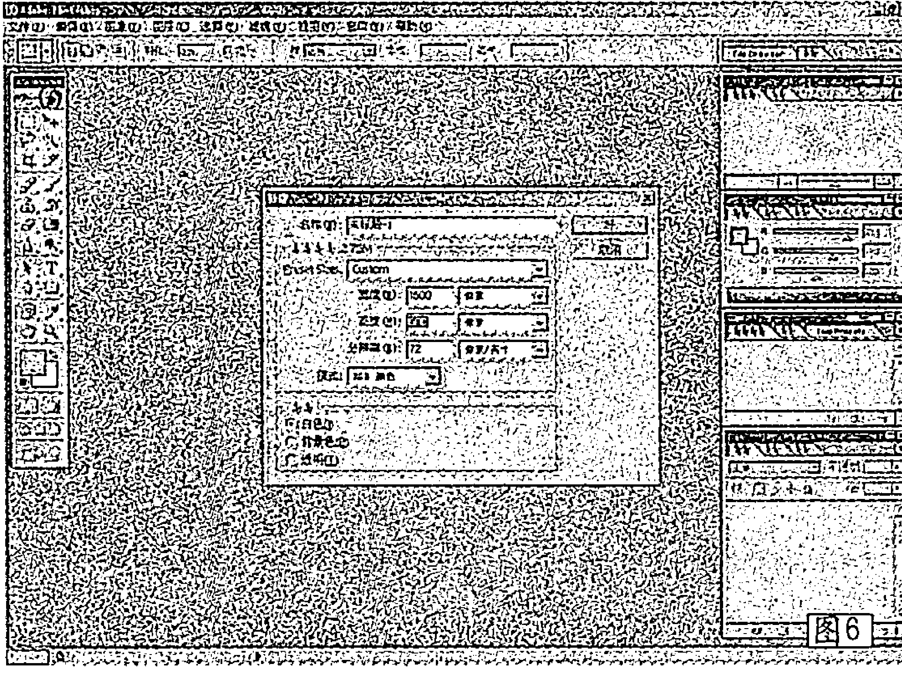

看过明星写真照片的朋友都会为那晶莹剔透的皮肤所折服，然而大多数照片都是通过 Photoshop 7 后期处理而来。打开 Photoshop 7.0，将图片放大到实际像素，然后拖动滑杆，使人物的脸部正好位于画布中央。选择工具栏中的“套索工具”，按住 Alt 键，小心翼翼地选取一侧脸庞。在选取过程中应该尽量避免碰到鼻子以及头发阴影处，因此建议使用定位精准的光电鼠标。依次执行菜单中的“滤镜”→“模糊”→“高斯模糊”，将半径设定为 5.0 像素，此时便可以在实时预览图中看到效果（图 7）。采用“高斯模糊”滤镜之后，人物皮肤会变得十分有光泽，而且亚洲人的偏黄皮肤也会显得更白一些，十分自然。当然，高斯模糊的像素级别不能设置地太高，一般建议大家控制在 4.2～6.5 之间，可以根据自己的喜好来设定。

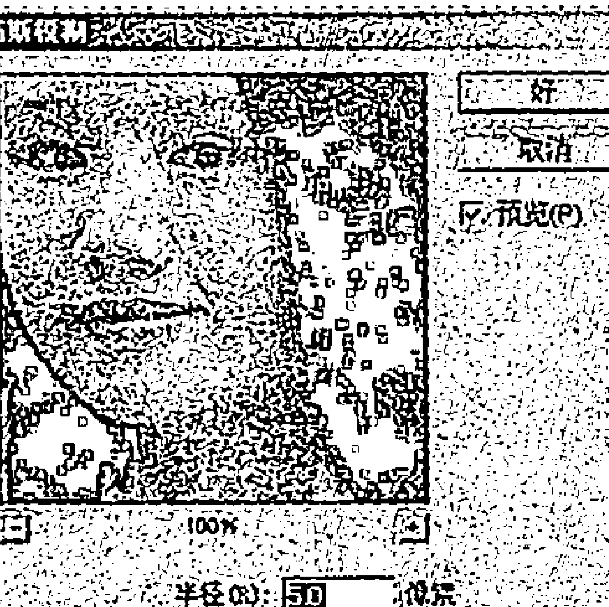

随后，大家可以依次对鼻子和眼睑等部位采用高斯模糊。但是此时要注意的是，其他部位的高斯模糊像素应该小于脸部高斯模糊的像素值，只有这样才能表现出鼻子的光洁度，使整体效果更加自然。使用“高斯模糊”来美化人物皮肤并不困难，惟一的难度在于使用套索工具选择应用范围，此时必须保持足够的耐心，不能急于求成，因为一旦选取范围时不够精确，就会在最后的效果图中产生齿轮状阴影。

在 Photoshop 中，我们可以选择其他滤镜，此时可以产生很多意想不到的效果，如动感模糊以及工具栏中的模糊工具等，这就留给大家去挖掘了。

事实上，以上这个例子仅仅是 Photoshop 在后期处理应用中的冰山一角，这款全面的大型软件，凭借图层操作概念、色阶模式以及丰富的特效滤镜而得到越来越多几乎所有专业用户的欢迎。

#### 2. Ulead PhotoImpact (图8)
当 Macromedia、Adobe、Corel 等公司纷纷以自己的最新产品向网络图形开发领域进军之时，友立公司也不甘示弱，推出了令人耳目一新的 PhotoImpact。PhotoImpact 6.0 提供了一个全新概念的组件设计器，我们可以使用这一设计工具轻松地实现各种常见数码照片的后期处理。

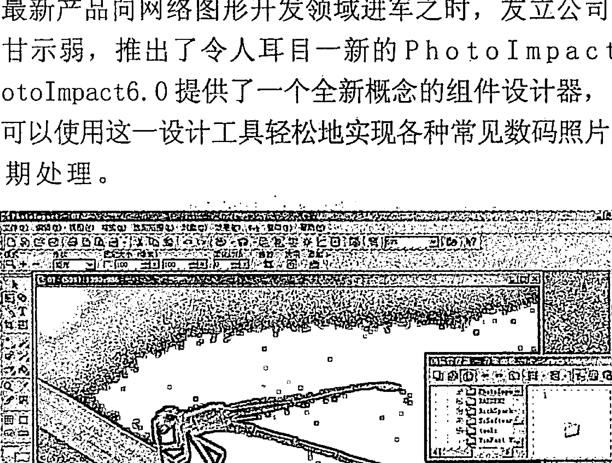

轻松调色板是 PhotoImpact 的一大特色所在。包括了诸如轻松画廊、层管理器等多个易于使用的工具。对于画廊中的每一种效果，我们只需要双击鼠标，就可以将之运用到当前的图形或者选定的对象中。PhotoImpact 的轻松画廊总共包括以下几个部分：

- Fill Gallery（填充效果画廊，包括多种色彩填充效果）
- Filter Gallery（风格画廊）
- Painting Gallery（绘画画廊）
- Brush Gallery（画刷画廊）
- Particle Gallery（粒子画廊）
- Lighting Gallery（灯光画廊）
- Material Gallery（素材画廊）
- Deform Gallery（变形画廊）
- Wrap Gallery（包装画廊）
- Type Gallery（文字效果画廊）
- Button Gallery（按钮画廊）
- Frame Gallery（相框画廊）
- My Gallery（自定义画廊）等。

使用轻松画廊中的各种工具，我们可以非常轻松地制作出惊人的效果。更为重要的是，这种效果可以作用于整幅图片，也可以先选定一个特定的区域，再运用效果。

在轻松调色板中附带的另一个工具就是 Layer Manager（层管理器）。我们可以通过轻松调色板左上方的第三个按钮打开这一窗口。在层管理器中显示了当前图形中所有的独立对象，这些对象事实上是分层显示的，在前面层显示的对象将覆盖同一区域后面层中的对象，我们可以在这一窗口中对各个对象的显示层进行调整，从而实现不亚于 Adobe Photoshop 的功能。

总体而言，PhotoImpact 的易用性强于 Photoshop，而且简化了图层、色阶等专业概念，使用户更加容易上手。但是 PhotoImpact 的专业程度比起 Photoshop 稍有差距，对于渴望实现强大功能而又担心操作难度的用户而言将是最佳的选择。

#### 3. 我形我速（Photo Express）（图9）
我形我速是 Ulead 整合专业质量的模板及使用方便的编辑工具，使用户的数码照片处理工作既方便简单又乐趣非凡的新型软件，作为区别于 PhotoImpact 的第二代易用型图像处理软件，我形我速不但友好易学，还提供了大量基于模板与富于吸引力的特效项目。此外，我形我速覆盖面极广的图像编辑和特效工具、高级 Internet 相片共享、方便的相片管理方案，都是在同类产品中堪称优秀的。

时至今日，图像处理领域已经进入一个崭新的时代，数码相机价格不断下降，使每个人都能拥有自己的相片处理实验室和发布中心。图片编辑所需要的是使用简单、价格低廉、性能可靠的产品，并以此作为业余爱好来练习自己的技能，有经验的用户需要的是为家人、朋友创建个性独特的相片项目从而体会到情感上的满足。这些用户可能对数码图像不太熟悉或毫无经验，但是他们一般都有传统照片方面的经验，并希望探索一下基于计算机的图像处理，以此作为新的途径来满足现有的爱好。新潮技术的试用者对富于革新性的软件总是很有兴趣，并希望以此增值他们从硬件设备中获取的数码图像。而我形我速对以上的三类用户均非常适合，它向用户提供了一个直观方便的相片编辑环境。

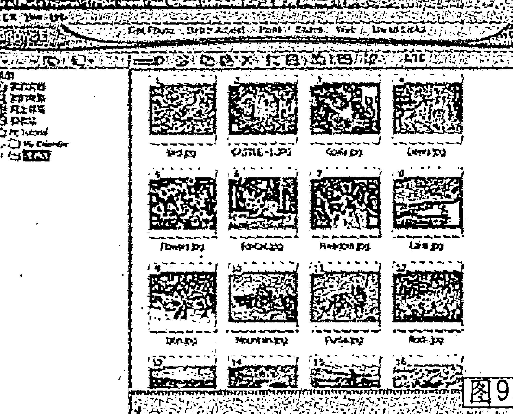

总体而言，我形我速的强项并不在于后期照片的修改，而是边框制作、照片合集发布。倘若大家使用 Photoshop 或者 PhotoImpact 来实现同样的功能，操作步骤将会十分繁琐。而在我形我速的帮助下，一切都将变得十分简单。

#### 4. TurboPhoto（图10）
TurboPhoto 是一个以数码影像为背景，面向数码相机普通用户和准专业用户而设计的一套集图片管理、浏览、处理、输出于一身的国产软件系统。如果你拥有数码相机，TurboPhoto 可以完成与之相关的绝大部分工作，成为数码相机的最好伴侣。具有照片自动调整、美容、插值和打印、去除噪声、批量处理、浏览与管理等功能，这几项是普通数码相机用户最关心的功能。

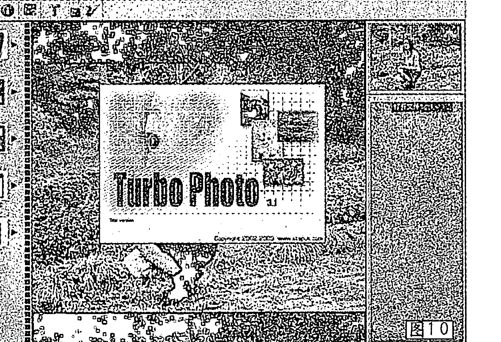

针对常见的数码照片瑕疵，TurboPhoto 内置了一整套修补方案。启动软件后，单击“文件”→“打开文件”打开一张图片，在打开图片的同时，会弹出一个“照片门诊部”窗口。此时用户可以对图片进行偏色、朦胧、红眼等多达 10 项的编辑调整。想调整哪个，只需要单击相应的按钮，按照相应的提示调整即可，完全是傻瓜化的操作（图 11）。

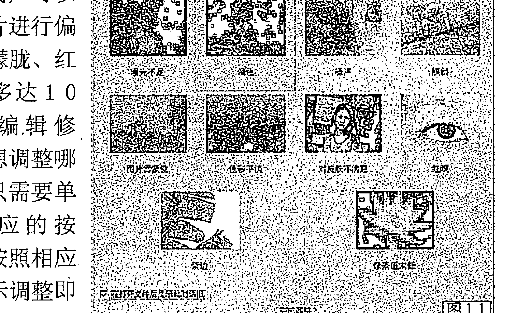

以最为常见的“曝光不足”为例，选择 TurboPhoto 的预设按钮之后，软件会自动给出三种默认的调整方案。一般而言，这一功能至少可以弥补 1/3EV 的曝光值，而且对于各种室内环境下的照片有很好的补偿作用，同时也不会显露出明显的修改痕迹，整体感觉非常自然。如果你对 TurboPhoto 自动给出的修改方案不能满意的话，可以使用手动调整。值得称道的是，一般图像处理软件只能简单地调整亮度，效果往往不尽如人意。而在 TurboPhoto 中，我们可以手动选择曝光错误的主体。如果是人物照片的话，选择脸部就能达到很好的效果。

对于“偏色”的照片，TurboPhoto 也能很好地修改，而且操作过程同样非常简单。TurboPhoto 提供了两种修改方案，一种让用户自动选择图片中最接近白色的区域，这类似于高档数码相机中的自定义白平衡功能；另一种提供了各种偏色的自动修补，让用户从中选择最为合适的作为最终结果。客观而言，当用户配合使用这两种方案之后，几乎任何“偏色”的照片都能得到完美地处理。

对于那些取景略有失误的作品而言，后期的裁剪相当有必要。在 TurboPhoto 中，“旋转与裁剪”菜单使用起来非常顺手，用户可以选择任意方向的 90 度旋转，并且剪去图片中不合适的地方。细心的用户一定发觉 TurboPhoto 似乎不能以任意角度旋转，其实这一功能被安排在“照片门诊部”中。与 Photoshop 等大型图像处理软件相比，TurboPhoto 的任意角度旋转功能更为贴心，用户能够实时看到转动效果，有时略带倾斜的照片能体现出一种别样的灵动。在“增强与特效”菜单中，“超强锐化”功能非常值得尝试。如果数码相机本身的能力不足，照片细节的表现力自然而然地会下降，此时锐化功能可以进行一些润色。

与大型化的 Photoshop 或者 PhotoImpact 相比，TurboPhoto 或许在功能上有所欠缺，但是它的针对性更强，而且操作极为简单。如果想要以最简单的方式实现快速处理，那么 TurboPhoto 将是很好的选择，适用于初级用户。

#### 5. DCE AutoEnhance (图12)
DCE AutoEnhance 是一款完全免费的共享软件，当我们用 DCE AutoEnhance 打开一张照片之后，它自动进行一些调整，并在右边展现出调整后的效果。不过 DCE AutoEnhance 的这一举动似乎有些多此一举，因为这往往不是我们所想达到的效果。

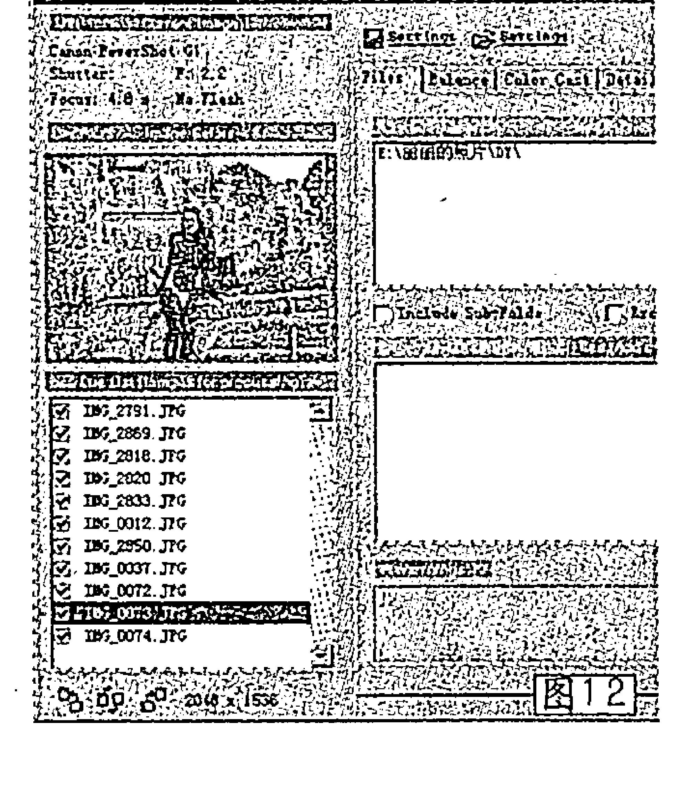

DCE AutoEnhance 中最出色的效果应该属亮度、偏色控制了。通过左下窗口中的“Color”滑杆，我们可以非常方便地进行偏色的细节调整，而且速度非常快，几乎没有什么延时。当偏色及亮度调整后，可以明显地看到调整后的照片亮度更加自然。此外，这里还可以教给大家一个技巧，如果你想创建怀旧的黑白老照片的话，那么只要将 AutoEnhance 中的“Color”滑杆移到最左边，此时展现的效果非常完美，这一简单的操作似乎胜过很多复杂繁琐的大型软件所带来的效果。DCE AutoEnhance 的焦距处理能力也是非常强大的。如果想将照片重点部分更加突出，那么配合使用 DCE AutoEnhance 中的 Midtones（中度景深）和 Enh.Details 功能一定会让你非常满意。

此外，DCE AutoEnhance 还包含一个软件系列，其中包括专门用于改善紫边现象、噪点现象的处理工具，只是需要大家到 http://www.mediachance.com 独立下载。从整体风格而言，DCE AutoEnhance 与 TurboPhoto 有些类似，但是其处理效果似乎更为出色，只是英文操作界面可能会让部分国内用户感觉有些不适应。

#### 6. MGI PhotoVista (图13)
MGI PhotoVista 并非是全能型的后期处理软件，而是专注于全景照片的拼接。MGI PhotoVista 不仅提供直观易用的图形使用界面，还内置了先进的自动图形剪接、变形、排列、混合功能，因此也能获得不错的效果。使用 MGI PhotoVista 之前，用户必须对照片的采样格外注意。毫无疑问，保持水平或者垂直移动是必须的，而且焦距、光圈、快门等一样要保持不变。为了让拼接效果更为理想，MGI PhotoVista 会要求用户选择镜头类型，如果你不能确定的话，也可以通过下方的列表来选取。当然，前提是你所使用的数码相机在该列表中。

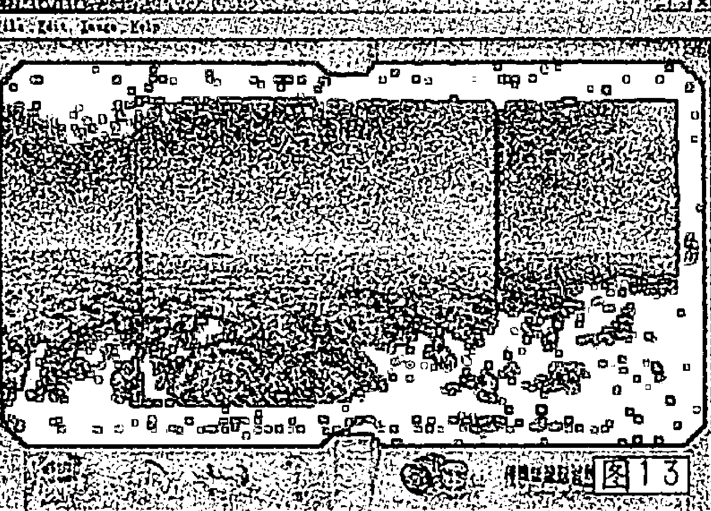

在 PhotoVista 主界面按下 Ctrl+O 快捷键可以选定需要拼接的数码照片。需要注意的是，由于 PhotoVista 只能支持水平或者垂直的拼接方式，因此大家在选定图片的同时要设定一下次序，这一步可以通过鼠标拖拽来实现。按下确定之后，PhotoVista 会简单地以平铺的方式进行拼接。当然，用户必须进行调整，此时用鼠标拖住一张图片，然后调整到合适的位置即可。由于 PhotoVista 的调整是让当前照片透明，因此用户可以做到精确地拼接，几乎是天衣无缝的。调整完毕之后，点击下方最右边的工具按钮，选中前两个选项即可让 PhotoVista 自动拼接。

通过以上这些内容，相信大家已经对 DC 以及 DV 的后期处理软件有了大致的了解和认识。最后要提醒大家的是，很多东西需要自己去揣摩、体验，这样从中体验到更多的乐趣。

（文 / 阿亮）

## 打造天籁之音
### ——音频处理工具扫描
多媒体时代到来的标志就是声卡的普及，电影走向成熟的标志也是有声电影的推出，这些都表明声音对于大家的重要性不亚于任何其他信息。多媒体信息的关键在于传播，在因特网没有普及之前，WAV 和 MIDI 格式几乎成为 PC 中的绝对标准。但是 MP3 的推出可谓一石激起千层浪，相对于 WAV 格式近乎 1:10 的压缩比，使得音频格式发生了翻天覆地的变化。随后，又相继诞生了 VQF、RA、WMA、MP3Pro 等音频格式。面对林林总总的音频应用，我们自然需要不同的软件进行处理。

### 一、音频格式转换
#### 1. CD、MP3、WMA、WAV 之间的互相转换（图1）
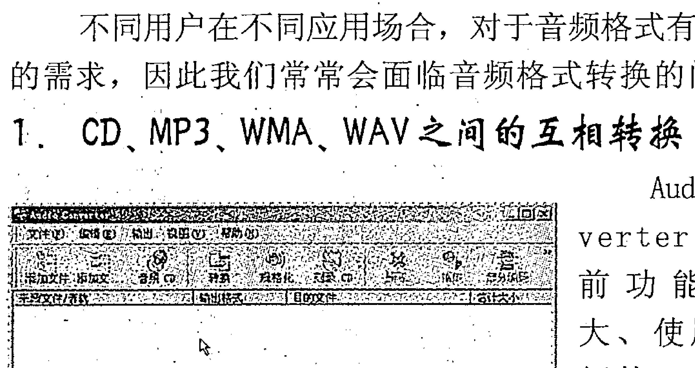

Audio Converter 可谓目前功能最强大、使用最方便的一款音频转换工具。更为令人赞叹的是，它可以做到在各种音频格式之间来回转换，而不仅仅是单一的定向转换。也就是说，只要这种音频格式能够被 Audio Converter 识别，我们就可以把它转换成另一个也能被 Audio Converter 识别的格式，Audio Converter 支持 MP3、WMA、WAV、AIF，基本上涵盖了当前主流音频格式。 打开 Audio Converter，我们就能看到一个简单明了的界面。事实上，Audio Converter 的使用也如其界面那样简单明了，我们只要分别确认输入和输出文件即可。选择主界面的第一个图标“添加文件”，此时就会弹出一个对话框。在对话框中，我们可以选择要进行转化的文件，在“文件类型”列表中，我们可以设定显示的音频文件格式。只要是 Audio Converter 能够支持的音频格式，我们都可以选用。选中要转换的文件后，在“转换为”选项中定义要转换成的文件格式，该软件提供 4 种转换格式，分别是 WMA、MP3、WAV、AIF 格式。设置完成后，单击“打开”按钮，即可

#### 2. RA 向 MP3 转换（图2）
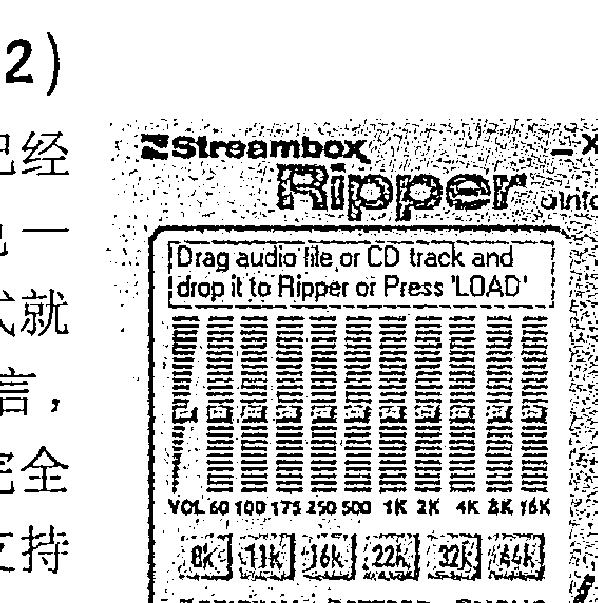

尽管 Audio Converter 已经相当全面，但是百密难免一疏，Real 公司的 RA 音频格式就是一条漏网之鱼。客观而言，由于 Real 公司在最初并未完全开放 RA 标准，以至于目前支持 RA 格式的转换软件屈指可数。不过，我们还是为大家找到了一款相当不错的工具，它就是由 Real 公司自己推出的 Streambox Ripper，大家可以到 http://www.real.com 去下载这款软件。由于 MP3 的通用性很强，可以方便地转换成 WMA、VQF 等，因此这等于解决了 RA 与其他音频格式之间的转换问题。 Streambox Ripper 可以将 RM、RA、WAV、CDA 等格式的音频文件转换成 MP3，它是 Streambox Vcr Suite 软件中一个工具。需要注意的是，使用 Streambox Ripper 之前必须保证你的系统已经安装了 RealPlayer，因为该软件需要调用 RealPlayer 的部分功能，并且 Streambox Ripper 程序本身不带有编码器和解码器。此外，Streambox Ripper 在安装过程中会要求注册，此时大家选择“Try（试用）”即可。 打开 Streambox Ripper 程序的主操作界面后，“Load”按钮在不停闪动。单击“Load”按钮，即可选择要转换的 RA 或者 RM 文件。选好文件后按“确定”又回到主界面，此时大家可以播放一下以确认该文件需要转化为 MP3。点击“Convert”按钮，我们就可以看到一个输出选项对话框。事实上，Streambox Ripper 也可以把 RA 转换为 WMA 与 WAV 格式，不过为了转换成 MP3，我们必须在“Encode output file”中选中“MP3”。在 Quality（质量）中，我们可以调节 Sampling（取样）、Channels（声道），这里建议使用缺省值，即使用文件转换前的质量，在“Destination Directory（输出目录）”中显示了产生新文件存放的目录，单击“Change”按钮可以改变，其他设置可以使用缺省值。单击 OK 按钮就可进行转换了，这里会显示转换的进度、预计总用时、已用时，声音文件总时间、已转换了的文件时间、输出文件目录及文件名、声音的质量、输入文件格式等，转换完成后将自动关闭，并回到主界面。

#### 3. MP3Pro 的制作 (图3)
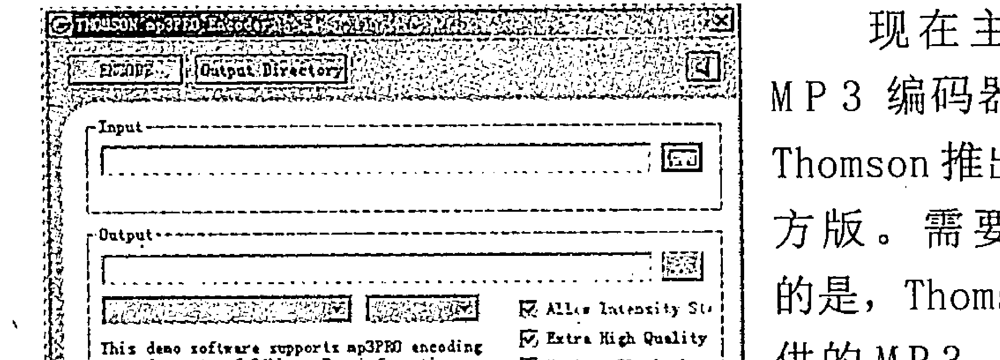

现在主流的 MP3 编码器是由 Thomson 推出的官方版。需要注意的是，Thomson 提供的 MP3 Pro AudioPlayer 是编码/解码二合一的软件，点击 Encoder 即可进入编码界面。由于目前 MP3 Pro AudioPlayer 还仅仅是一款 Demo 版的软件，因此在操作时非常不便。在编码 MP3Pro 文件时，它竟然不支持从 CD 上直接读取，我们必须用抓音轨软件生成 WAV 格式后才能正确压缩，非常麻烦。此外更加令人气愤的是，Demo 版竟然只能以 64Kbps 压缩，不能以 128Kbps 压缩，很明显这是一种商业行为。需要奉劝 Thomson 公司的是，在当前主流音频格式编码技术免费的潮流下，不实行完全开放是不可取的，这至少会大大影响 MP3Pro 的普及程度。但愿今后能够出现更多支持 128Kbps 的优秀 MP3 Pro 编码器。除了 MP3Pro AudioPlayer，我们还可以使用 Nero Wave Editor，其特点在于可以编码 20～96Kbps 的 MP3PRO 文件，不存在 64Kbps 的限制。Nero Wave Editor 的使用很简单，打开需要转换的 WAV 文件（可由 CD 抓轨得到），然后选择 Save As，将保存格式设为 MP3Pro，并在列表中确定编码速率即可。

#### 4. 万能转换方法
想必大家都有 Winamp 吧？除了播放歌曲，Winamp 还可以用来进行音频格式的转换。但是这一般只能适用于所有 Winamp 能够播放的格式，输出成 WAV 或者 WMA 格式。方法是在 Winamp 的面板中单击右键，选择“Option”下的“Preferences”，然后进入“Plugins”中的“Output”（图4）。在这里你可以设置 Winamp 的输出选项，包括音频质量和路径等。

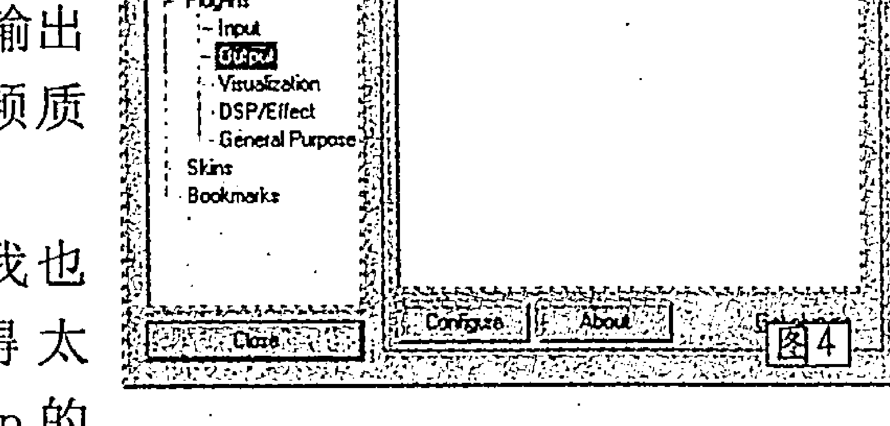

不过现在我也不敢把话说得太绝，因为 Winamp 的插件实在是太多了，说不定哪天它还能支持新格式的输入输出以及转换。但是从目前的情况来看，Winamp 的转换功能还不是很强大，不能完全满足我们的需求。除了 Winamp 的插件输出，豪杰音频转换通 Hero Audio Convert 2.0 也值得一试，它可以对所支持的 20 多种音频格式直接转换为 MP3、WMA、WAV 或者 RA。由于篇幅有限而且这并非是免费软件，因此就不详述了。

### 二、提取 MTV 与 CD 中的背景音乐
为了实现个人 MTV 制作，我们有时需要从 CD 或者 MTV 中提取背景音乐、去除原唱，这样才能让原声 CD 听起来更为动听，也方便后期应用。不过提取背景音乐可不是简单的事情，需要用到多款音频软件。

- 1. 转换 WAV 格式
在去除原唱时我们需要调用相关的应用软件，不过大多数这类音频软件无法直接识别 MTV 或者 CD，因此将它们转换成兼容性最佳的 WAV 格式。MTV 的本质就是 VCD（MPEG1），采用 DAT 格式，大家可以使用试用版的豪杰超级音频解霸 3000 来进行转换。在音频解霸的主界面单击“文件”菜单，选择“打开一个文件”。尽管豪杰超级音频解霸 3000 是一款专用的音频文件播放工具，但是它也可以打开所有能够被豪杰超级视频解霸 3000 所支持的视频文件。当然，为了避免一些文件格式识别的问题，建议大家将“文件类型”设定为“All Files”，这样我们就可以在列表框中看到所有的文件。然后，大家可以在列表框中选择光盘下的 DAT 文件，一般位于光盘根目录下的 MPEGAV 子目录，保存格式为 DAT。

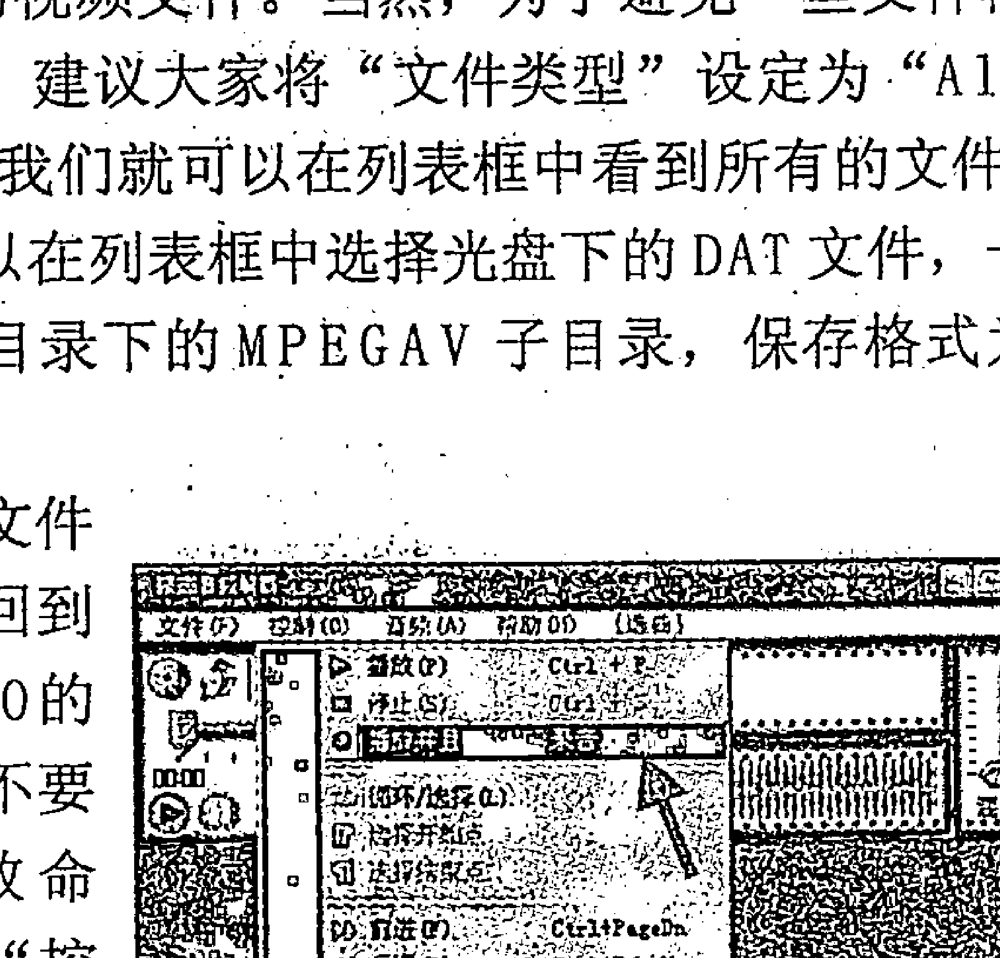

打开视频文件之后，我们又回到了音频解霸 3000 的主界面。此时不要立即执行播放命令，而是单击“控制”菜单，选择“播放并且录音”（图5）。随后，音频解霸 3000 会弹出一个菜单，要求用户确认WAV音频文件的保存路径。保存路径的选择可以根据个人喜好，但是一定要记住，因为我们后面还要用到这个文件。

对于CD而言，其转换过程更为简单，我们只需要一款普通抓轨软件即可，推荐使用Easy cd-da Extractor。当我们把CD放入光驱后，Easy cd-da Extractor会自动识别数据，并在主界面窗口中显示出各个音轨。选中需要抓取的音轨之后，我们只要简单地按下F8就可以进行抓轨了，只不过一定要将输出方式设置为未压缩的WAV。

#### 2. 提取背景音乐、去除原唱

相对而言，做到这一步有一定的难度，因为这里牵涉到一些音频处理。不过大家应该感到庆幸的是，DART Karaoke Author的出现让我们大大简化了操作步骤，从而不需要再使用CoolEdit等复杂的音轨编辑软件，而且效率也成倍地提高。

DART Karaoke Author是一款专用于消除歌曲中人声原唱的工具软件。非注册用户有30天试用时间，而且在使用期限内没有任何功能上的限制。为了便于操作，大家可以下载一个汉化补丁。

DART Karaoke Author默认打开操作向导，不过这个向导并不适合去除原唱，而是专门用于歌词合成。取消向导之后，点击“声音文件”菜单下的“打开”命令，并选择刚才转换后的WAV文件。此时，DART Karaoke Author的主窗口会显示相关波形（图6）。用鼠标拖拽选中一段波形之后，我们就可以针对这一段进行独立操作。

点击工具栏中的“消除原唱”按钮，然后在DeVocal Parameters（消声参数）中，系统提供了Attenuation（衰减度）、Bass Retrieval（低音补偿）和Output（输出级别）三种参数供用户进行设置。由于这里只有三个参数，因此调节起来并不困难，而且大家可以通过下方的“试听结果”按钮实时检验效果。由于歌曲中的原唱音量有所起伏，因此建议大家根据实际情况，多次选中相应部分，分为多段进行处理，这样虽然麻烦一些，但是可以达到更加出色的效果。

### 三、CoolEdit常见应用方法

在这一部分中，我们将接触到CoolEdit（以CoolEdit Pro 2.0汉化版本为例），这几乎是音频编辑软件中的泰山北斗，其地位好比2D图形软件中的PhotoShop。当然，仅有CoolEdit还是远远不够的，我们还会涉及到一些重要的插件，这也是CoolEdit功能强大的原因之一。

#### 1. 用CoolEdit增强音量

由于麦克风以及声卡采集的原因，我们在录音时总是适当地降低音量，以换取更高的清晰度。但是，这样一来势必导致清唱声音量过小，此时就需要使用CoolEdit的BBE Sonic Maximizer插件进行放大。与单纯提高录音音量相比，这样可以最大限度地避免噪音，因为整个放大过程相当智能化，仅仅针对你的清唱声。在使用CoolEdit插件之前，先在CoolEdit安装目录下建立一个DX目录，然后上述插件均安装在这个目录里即可，这样可以便于管理。当安装混响插件时，需要再在CoolEdit安装目录下建一个VST目录，然后在出现“Add”或“Remove”时加入这个目录的路径即可顺利安装。

首先用CoolEdit打开清唱的WAV文件，等待波形分析完毕之后，进入音轨模式，选择需要增强音量的片段（一般情况下可以全部选中）（图7）。单击菜单中的“效果” → “DirectX” → “BBE Sonic Maximizer”，此时可以加载预置下拉菜单中的各种效果或者手动调节，直到满意为止。

#### 2. 降低噪音

由于话筒质量、声卡采样等等的原因，录音时会夹杂一定的噪音，这自然是我们不能容忍的。在CoolEdit中打开刚才处理过的WAV音频文件，把波形放大后，将噪音区内波形最平稳且最长的一段选中（一般为没有音乐信号的间隔处）。选择菜单“效果” → “噪音消除” → “降噪器”，此时会弹出降噪器的工作界面。

根据经验，一般可以将界面中“Snapshots in profile”（采样快照）的参数改为800，“FFT Size”的数值改为8192，“Precision Factor”（精度因素）的数值改为5，“Smoothing Amount”（平滑总量）的数值改为5左右，这样可以达到比较好的效果。改好各参数后，点击噪音采样按钮，几秒后出现噪音样本的轮廓图。单击确定按钮之后，CoolEdit 开始执行噪音除去，并实时显示在波形图中。

#### 3. 混合音轨

有时候我们需要将两种不同的音轨进行混合，譬如从CD提取后的背景音乐以及自己所演唱的内容。当我们处理好清唱的WAV音频之后，就可以与背景音乐进行混合。由于在先前录制时已经根据MTV或者CD的进度进行歌唱，因此时间对齐的问题基本上无需考虑。首先选中清唱WAV音频的所有波形，单击右键，选择“插入到多轨”，打开背景音乐之后，对其进行同样的操作。然后点击界面左上角的长方形按钮进入多轨界面，并依次单击菜单中的“编辑”→“混缩到文件”→“全部波形”，此时我们将得到一个混合后的音轨，并将其另存为一个WAV文件。

#### 4. 音频润色

很多人在唱歌时因为换气的原因而时轻时响，这样让人感觉十分不舒服。不过通过WavesC4压限插件可以均衡一下，不至忽大忽小，忽高忽低。打开刚才制作好的混合音轨文件，选中所有波形，并执行菜单中的“效果”→“DirectX”→“WavesC4”，这里即可以通过预设值进行调整，也可以手动调整。当然，千万不要将调整幅度设置过高，不然音频文件的音量会大受影响，而且必要的音量起伏还是需要的，不能一棍子打死。

如果希望音频文件带上各种有趣的特效，你也可以在CoolEdit中加载Effect特效。点击左侧面板中的“Effect”，在下拉音轨效果器列表中可以挑选多种多样的效果器，如动态延迟、房间回声、完美混响等等。软件支持同时添加多个效果器，这样一来效果器之间进行混合，结果就千变万化了。不过，个人认为CoolEdit内置的Effect特效都很一般，而Reverb R3插件更加值得推荐，它可以使你的歌声变得更为圆润和厚重一些。Reverb R3插件的具体使用方法与上述插件一样，也是通过菜单中的“效果”→“DirectX”来执行。

（文／阿亮）

### 一、常用贺卡制作工具

#### 1. 音乐贺卡厂 Ecardiy

从“音乐贺卡厂”这个名字就可以看出它的贺卡容量了，除了软件操作方便，它的站点还提供大量的素材下载。如果在设计时没有素材，在它主页上还能得到附赠的贺词框、贺卡和MID音乐。下面我们来仔细看看这个软件。

**（1）软件功能扫描**
操作方便，制作速度快。这个软件对外宣传的口号是：“一分钟做出自己的音乐贺卡”。软件操作很方便，我们可以利用软件上方的“制作步骤”菜单，也可以按照界面下方的按钮指导完成制作。软件界面如图1所示。

支持多种格式。目前支持的贺卡文件格式有JPG、GIF、EMF等，不过，有些格式需要注册用户才支持；此外，还可添加或自己设计合适的贺词框风格，目前支持JPG、GIF、EMF等格式。

自定义功能。“萝卜白菜，各有所爱”，每个用户的鉴赏风格是不一样的，对于贺卡来说尤其如此。这个软件可自定义贺词框风格尺寸，也可自定义字体、颜色和大小，适合于长篇贺词；各种屏幕移动特效也会平添音乐贺卡娱乐性。

声色动画与素材。“音乐贺卡厂”在音乐制作上独特的造诣。用户可以选择一首中意的音乐，边播放边挑选背景图片。不仅如此，软件还附赠贺卡画面和二十首MIDI音乐供选择，并定期提供附赠的贺卡包和音乐资料下载，其中，MIDI音乐车间的下载地址为：http: //www.music-card.com/midi

**（2）制作方法**
运行软件后我们便会直接进入“贺卡预览”功能，界面上的按钮从左至右分别对应贺卡预览、音乐试听、贺词输入、基本设置、制作贺卡、发送贺卡、软件帮助几大功能。这也是制作贺卡的几个基本步骤。单击软件上方的“制作步骤”，也可以方便地看到制作步骤。

-   第一步：预览窗口。在左边文件夹列表中选择一张贺卡预览图，这里显示了贺卡的相关信息，如路径、贺卡像素、动画参数等。
-   第二步：音频选择。除了MIDI、WAV等基本类型的音频文件，注册用户生成的贺卡还可以嵌入AVI视频文件。选择左边的音频文件后，再单击右边“音乐试听或录音”下面的播放按钮，就可以试听音乐了。
-   第三步：输入贺词。在这一步，可以控制文字的形态、循环滚动、贺词框样式大小。在界面的左边，可以设置贺词框尺寸，有默认尺寸、自定义尺寸、全屏尺寸三个选项。如果觉得自己的文采不够，我们还可点击输入框右上方的“下载贺词”链接，直接到网站去下载贺词。
-   第四步：参数基本设置。点击“下一步”，就可以设置一些基本参数了。在这个界面中，选中“贺卡无限循环”后，贺卡将无限循环直到观看者在贺卡上点击鼠标为止；选中“贺卡在指定秒数后自动中止或弹出贺词”后，在下面的文本框中输入一个数值，可以让贺卡在设定的时间后停止或者弹出贺词。还可选择“链接至网址”、“贺卡屏幕移动速度”、“将贺卡锁定在屏幕中央”、“移动位置”、“贺卡无限循环”等。其中，“链接至网址”可以将贺卡链接到某个网址，让您的朋友既可以看贺卡又可以访问贺卡专页。
-   第五步：制作贺卡。单击“下一步”进入贺卡制作，软件将询问是否开始制作、是否预览、预览后的效果是否满意等问题。制作完毕，将生成一个.exe格式的可执行文件。
-   第六步：发送邮件。首先需要选择邮件服务商，如果未列出，就要选择“自定义发信服务器”了，填写“发信SMTP服务地址”、“发件人Email地址”、邮件主题和邮件内容，这与我们平时发送邮件的界面基本一致。然后点击“添加贺卡附件”按钮，选择我们精心设计的贺卡，单击“立即发送”按钮就可以把祝福送到朋友那里了。

总的来说，这款软件在贺卡制作方面绝对算得上专业，相关的参数配置也很方便，而且网站也提供丰富的制作资源。不过，要想使用一些比较实用的功能，并去除一些功能限制的广告提示，必须注册才可以。

#### 2. 贺卡制作大师 V2.25

“贺卡制作大师”采用了仿Windows XP界面，看起来显得很清晰、美观。通过菜单上的向导式操作，就能制作一张个性化十足的精美贺卡。启动软件后，打开“贺卡制作”，可看到详细的制作步骤。

“贺卡制作大师”可以自定义贺卡图形文件，并预览，支持多种格式的图形文件，如JPG、GIF、EMF等格式。

“贺卡制作大师”是一款功能强大的音乐贺卡制作软件，背景音乐支持MID、WAV、MP3等格式，制作时，还可选择硬盘中已存在的其它音乐文件。选择文件后，可按播放或停止按钮来试听音乐。

“贺卡制作大师”充分考虑到用户的使用情况，在易用性上下了很大功夫。它提供了对Flash动画的支持，这在无形中增加了动画的效果。为了吸引用户，“贺卡制作大师”还添加了多种屏幕移动特效，增加音乐贺卡娱乐性。界面如图2所示。

#### 3. 金锋贺卡制作 2004

在这几款软件中，“金锋贺卡制作2004”应该算比较专业的一个贺卡制作软件了。

支持的格式。“金锋贺卡制作2004”可以很方便地制作各种贺卡，它可以将GIF、JPG、BMP、WMF、EMF等图片及Flash、AVI、MPEG等影片加入背景音乐，制作出两种不同风格的音乐贺卡，生成的贺卡文件可以独立运行，甚至可以在贺卡中加入个人录音。

可制作“普通型”、“互动型”、“电子相册”贺卡。互动型贺卡可以随意设置贺卡窗口的大小、形状、背景、背景音乐等，随意插入或移除文本、按钮、各种图片、GIF动画、Flash，并可以设置这些对象在被单击时的动作，比如：提示相应信息、打开网址、更改其它对象的属性等，还可以让它们在执行相应命令的同时播放声音。此外，“电子相册”等实用工具也平添了不少雅趣。

金锋贺卡除了能够制作传统贺卡外，还可以制作具有交互功能的个性贺卡。在制作交互贺卡时可随意设置贺卡窗口的大小、形状、背景、背景音乐等，同时也可随意在贺卡窗口中插入或移除文本、按钮、各种图片、GIF 动画、Flash 电影，并可以设置动作。如图 3 所示。

#### 4. 非常好色

“非常好色”是一款由台湾力新公司推出的贺卡利器，无论制作贺卡、海报、名片，还是独创信纸、信封和年月历，甚至剪纸窗花，都可以用它来完成。在贺卡方面，该软件能快速制作出各种充满趣味的作品，如生日卡、情人卡、圣诞卡等。应该说，这个软件在创意方面做的还不错。

在安装之前，建议先外挂一个南极星内码转换工具，这是因为“非常好色”采用的是 BIG5 内码方式，必须通过外挂平台将文字转换过来。

-   第一步：选择主题。首次进入非常好色我们也同样需要确定想要制作的贺卡类型和主题，有生日卡、新年卡、情人卡等类别，其中每个类别还有许多不同的模板。挑选自己中意的模板并双击它就可以进入设计窗口了。
-   第二步：想要制作一张圣诞贺卡，首先双击预览图片就可以进入软件的设计界面。在这个窗口中输入标题的内容之后还能够选择字体、文字颜色、标题形状、文字效果、阴影设定、色彩渐变等属性，还可将硬盘中的图片添加进来。如图 4 所示。
-   第三步：在图像的左侧是软件的浮动工具条，确定图形中的元素后，相应的选项即可生效，还可同时选择多个元素，进而通过“合并”功能将图层整合，不过这款软件好像不支持鼠标移动。此外，单击菜单栏的“加入”命令，还能够直接添加背景、花边或者是多边形、气球形、鲜花形、心形等多种形状。
-   第四步：调整设置。在各个图层中的调整很方便，我们既可以按“上一层”、“下一层”的顺序调整，也可以直接将其移动到“最顶端”或是“最底端”。
-   第五步：设计完毕，可以将贺卡保存。如果需要保存为其他格式，单击“档案”菜单下的“另存新档”，选择其他的格式即可。

软件评价：这款软件用于设计静态的贺卡是很优秀的，不仅例子丰富，而且操作也很方便。但是在动画处理上功能不足，繁体版本也使之打了不少折扣。

### 二、动态 3D 贺卡制作

通过上面的软件描述，我们掌握了不少贺卡制作的技巧。很多朋友可能会想到，要制作 3D 贺卡，肯定要使用 3D MAX 这样的大型软件了，这未免有些小题大做吧。的确，这不符合实用软件的特点。下面，我们给大家介绍一些实用的 3D 贺卡制作软件，轻松地解决这些问题。

#### 1. 3DGreetings

3DGreetings 是一套比较有特色的动态的 3D 贺卡制作工具，用它能够制作出极具个性特色的具有 3D 动画效果的贺卡。它的操作界面简朴，虽然语言是英文，但对于稍有一定基础的用户，还是能快速上手制作出自己得意的三维贺卡。软件提供了许多具有情节的贺卡类型供选择，可以任意添加贺词、选择图像和音效。

软件安装后，初次进入时有三个类别可供选择，分别是个人相片卡、致谢卡和其他类别的卡。在公司的网站（www.3dgreeting.com）上还有很多类别可供下载。选择照片魔方模板，进入编辑主界面，界面的左边部分是贺卡效果的预览区，下面的“Play”、“Stop”按钮用以随时观看制作的效果。

-   第一步：设置贺词信息。选择右边栏目的“Message”标签，然后在下栏中输入祝福的贺词，并设置字体、字号、文字颜色、背景颜色等，若文字已保存在 txt 文件中，单击下端的“Import Text”按钮就可导入文字。这些信息可以在将来打开动画下方的邮箱图标时看到。如图 5 所示。
-   第二步：设置图片。接下来选择“Images”标签，设置三维贺卡背景图片，在资源区就可以看到当前项目所需要的图片资源，除从软件自带图形外，还可单击“Import Image”按钮导入精心准备好的背景图片，如想恢复到默认状态，单击“Reset”按钮即可。
-   第三步：设置声音。选择“Sounds”标签，可以使用系统默认的声音，也可以选择自己喜欢的音乐或者录制一段祝福，通过“Import Image”按钮就能导入声音文件，注意只能为MIDI格式，并且在更换声音时，还可以通过右栏中的“Play”按钮进行试听。
-   第四步：单击左侧下端的“Play”按钮可以预览三维贺卡的总体效果，然后单击左下端的“Save”按钮保存。然后选择“Package card for e-mail”按钮进行打包发送，打包之前，可在“Package Card”窗口下端的“Frame Style”栏中选择一个边框的样式。设置完毕，打开生成的贺卡文件，就可以享受其三维视听效果了。

总体而言，这款软件在动画和声音方面的功能十分突出。而且网站提供的动画资源也使动画更加丰富多彩。不过，在动画的自定制以及个性化的文字和动作设置等方面的功能还不是很优秀。

#### 2. Talking Greeting Maker

Talking Greeting Maker 是一个很有趣的语音动画贺卡制作软件，除了能读出贺词外（不过只能朗读英文单词），软件中造型各异的卡通形象还会按照你的指示在屏幕上登高爬低、做出搞笑的动作。

-   第一次运行软件需要输入自己的姓名、性别和邮件地址。进入软件的模板窗口后，可以看到十多种成品模板，这些模板都是一些比较常用的日常用语集合，如果没有合适的，还可以选择“Start with an Empty Greeting”自行创作。
-   选择“Send A Story”模板，就是给朋友讲一个故事。在“Recipient Name”中填入朋友的名字，点击“OK”便可进入实际的编辑窗口。从中我们可以发现，一段精彩的动画是由各种对话、动作所构成的，比如在“Action（动作）”列表中，软件标识“Merlin moves to TOP CENTER”，表示将人物移动到屏幕顶部中央。
-   第三步：编辑修改。双击某个动作元素用户就可以对其进行修改，我们可以命令 Merlin 移动到任何位置、或是做出74种不同的动作，而要使贺卡能朗读设置的贺词，选中“Say the following”并在其下输入你的贺词即可。如图6所示。
-   第四步：选择“File”菜单下的“Save As”将贺卡保存为TAG格式的存盘文件，并将安装目录中的Tgplayer.exe这个动画浏览器发送给对方，将TAG文件与之相关联就可以了。

总体而言，这个软件很有创意，总能让人捧腹大笑，回味无穷。但这个软件只为用户提供了一种卡通人物，不过我们还能够从它的网站中下载到其他几种形象各异的贺卡使者，通过创意、美工和技术的综合，就一定可以做出很出色的贺卡。

### 三、其他贺卡制作工具

随着虚拟世界的交流日趋增多，电子贺卡制作软件也越来越多。下面有选择地推荐几款软件，有兴趣的朋友可以试试。步骤与上面介绍的软件基本相同，制作格式也比较固定，一般都是选择背景图片、添加贺词、选择声音、设置基本参数、生成贺卡文件、发送等。

#### 1. E-motional Greetings

E-motional Greetings 是一个不错的国外电子贺卡制作软件，它可以将图片添加进去作为贺卡的背景，或者是自己录制一段语音来制作一张多媒体贺卡。它最吸引人的亮点在于，如果想让远在天边的友人可以亲耳听到你的祝福，先将话筒连接在声卡上，然后点下“Record”按键，就可以录制你的语音了，将WAV文件添加到这张贺卡中就可制作成多媒体贺卡。它还支持扫描仪、数码相机、话筒等，大大方便了贺卡的制作。

#### 2. 贺卡超人 V1.02

贺卡超人是一款功能强大、小巧易用的贺卡制作及发送软件。它的亮点在于采用了开放式结构，可将网络上任意的Flash动画作为贺卡的素材。同时，它具有强大的贺卡设计及管理功能，可以设置卡片背景图案、背景音乐、贺词文字没有限制。此外，它提供了Flash动画分类保存、贺词保存、联系人通讯录的功能，并能群发和定时发送贺卡。

#### 3. 迷你音乐贺卡 2004

迷你音乐贺卡2004是一个免费软件。其亮点在于免除了广告的骚扰，可以在贺卡上写上自己的名字，制作百花齐放是春天 ——Linux 版本扫描

Linux 是一套类 Unix 的多用户、多任务操作系统，其用以控制整个系统基本服务的核心程序（kernel）是在 1991 年由当时 21 岁的芬兰大学生 Linus Torvalds 带头开发出来的，Linux 的得名，即源于“Linus’s Minix（Linus 的迷你 Unix）”。Linux 在发行之初，即选用开放自由的 GPL 版权协议，一方面，吸引了无数电脑高手开发、改善 Linux 的核心程序，使得 Linux 的功能日渐强大；另一方面，允许任何人以任何形式复制、发布 Linux 的源程序，使得我们能够从网上免费下载，或者只花很少的费用就可以取得 Linux 的系统和软件。

除了核心程序，许多公司和个人还为 Linux 操作系统开发了许多系统程序和应用软件，它们大多是自由软件，任何人都可以从网上免费下载 Linux 内核和其它的程序源码，经编译安装后使用。但是每次使用都要由用户自行下载和安装这些软件，到底有些不便，遇到一些复杂的程序，这样做就既费时间又容易出错。于是，一些以整合 Linux 核心和应用程序为目的的公司或团队就应运而生了。我们今天所看到的像 Red Hat Linux、红旗 Linux 一类的发行版本（distribution），就是这样的一些把“核心 / 系统程序 / 应用软件”集成在一起的完整的操作系统，用户可以很轻松地就把它们安装到自己的电脑上去（图1）。

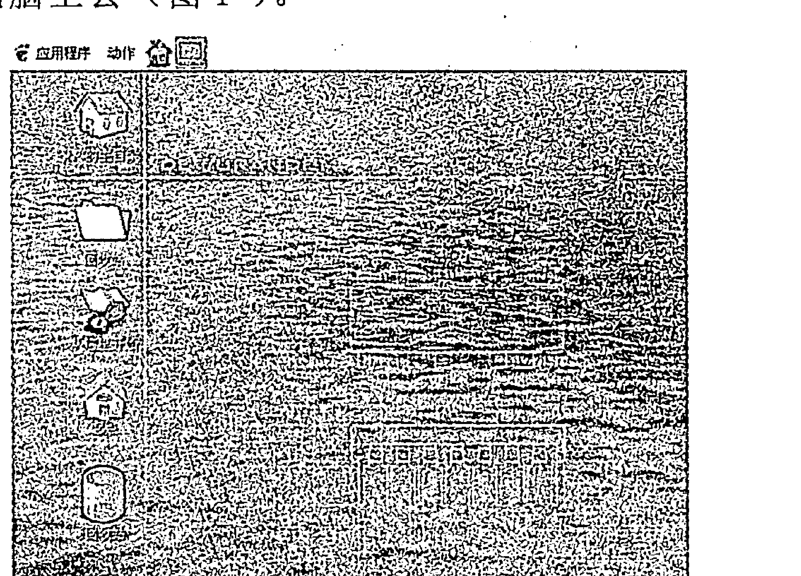

Linux 的各个发行版是通过软件、协议、包管理机制，以及安装维护工具、文档和其它服务来区分的。同样是 Linux 系统，因为不同公司或团队的理念、手法有别，使得 Linux 操作系统的版本异彩纷呈。这些不同的 Linux 发行版本，到底具有怎样的特点，有些什么过人之处呢？

#### 1. Red Hat Linux (www.redhat.com)

国人直译为“红帽子”的，就是这个名动坊间的 Red Hat Linux 了。早在上个世纪末，Linux在国内初起旋风的时候，各种“中文Linux”版本呼啸而来，其中大半，都是师承Red Hat，亦可知这顶很有绅士味道的经典的红帽子的影响了。作为全球最大的Linux技术厂商，Red Hat在全球的应用广泛，拥有52%的Linux操作系统市场份额。

Red Hat系统集成了GNOME、KDE、OpenOffice、Mozilla、GIMP等各种功能软件包，系统安装完成后，只需经过简单的配置，就可以使用包括Web、FTP、E-Mail、NNTP、Telnet、Samba等服务。与其他发行版本相比，基于软件包（package）封装是Red Hat Linux的鲜明特色，RPM文件格式的名称虽然打上了Red Hat的标志，但是由于其原始设计理念是开放式的，现在包括OpenLinux、S.u.S.E.以及Turbo Linux等Linux的分发版本都有采用，可以算是公认的行业标准了。软件包会令添加和删除软件变得非常方便，并且，这使得Linux的发行版本升级起来也会相当便捷。

针对不同的用户使用群，Red Hat提供有多个发行版，它们的主要区别还在于集成的软件包以及提供的系统功能上。新的系统版本提供了包括简繁体中文在内的多语言安装界面和桌面环境，并且包含有丰富的字处理、图形、多媒体、网络等各方面的桌面应用软件。整个安装过程中，安装向导都提供了简单的在线帮助，可选的全中文安装界面对用户可谓体贴入微。

虽然Linux的文件系统和Windows有诸多不同，但是，Red Hat以及其他一些发行版本为了抢滩桌面应用系统，在易用性和实用性方面下足了功夫，这也使得初学者的入门门槛大为降低。不过，令许多Linux爱好者深表遗憾的是，基于商业因素的考虑，Red Hat已经决定不再发行该公司的低端产品，并停止了对去年才发布的 Red Hat Linux 9.0的技术支持。不过，或者是为了平息Linux爱好者的愤怒，最近他们又推出了一个替代产品Fedora Core 2，以使得用户在Red Hat Enterprise Linux (RHEL)平台之外，还可以有一个选择。

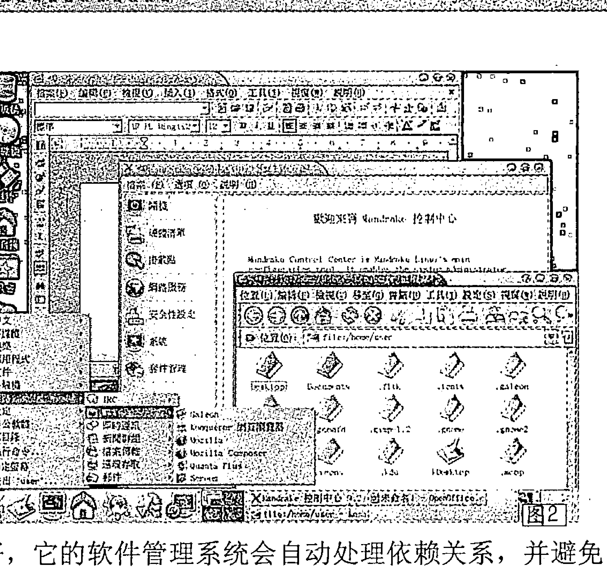

#### 2. Mandrake Linux (www.mandrakelinux.com)

用来自非洲的“曼德拉草”命名的Mandrake Linux（图2），创建于1998年，在Linux还需要用户具备深厚的技术知识和“命令行”的广泛使用时，Mandrake就集成了漂亮的图形化桌面环境以及自行研制的图形化配置工具，给用户带来了简单愉悦的使用体验，从而迅速成为设置易用实用的代名词，使Linux无可辩驳地成为服务器和工作站完美的操作系统。

Mandrake Linux在使用上的方便程度可以和Windows或Mac OS相比，其维护也同样简便，对硬件的支持非常好，它的软件管理系统会自动处理依赖关系，并避免应用程序间的冲突。此外，MandrakeUpdate工具还允许用户透过互联网轻松地进行更新，对于想要经常保持更新安全相关软件的用户来说，这无疑是理想的方式。

新近出炉的Mandrake Linux 10.0融入了最新科技以及最时兴的软件，具有更优秀的性能和友好的用户界面。系统提供了精雕细刻的桌面观感，集成了包括KDE和GNOME这些著名的图形化环境。系统在最大程度上使用用户界面进行集成管理，彻底打破了Linux系统只能使用命令行或者文本方式管理的旧有观念。由于专注于可用性，Mandrake能够保证用户在任何层面上都能够感觉异常舒适。Mandrake在国际化方面着力良多，安装程序以及系统配置工具和集成的系统软件如KDE、GNOME和OpenOffice.org等，都支持包括简繁体中文在内多达66种的不同的语言。

事实上，正如许多热爱Mandrake Linux的拥趸所说的那样，如果没有尝试一下Mandrake Linux，你就不会知道自己到底错过了什么。

#### 3. Slackware Linux (www.slackware.com)

Slackware Linux是一个性能稳定、安全高效的32位多任务操作系统，集成了一系列最新的流行软件，在桌面应用和服务器平台上都有不俗的表现。无论你是新手还是有经验的用户，Slackware Linux完备的功能都会给你带来舒适的享受，其流畅的桌面环境以及各种网络服务、网络工具、开发工具、编辑器都让用户爱不释手。

Slackware Linux是早期Linux用户的首选之作，在各个发行版本中，它的完备性、升级速度以及众多的下载镜像在当时都是令人瞩目的亮点。当然，历史悠久也使得Slackware Linux存在一些不足之处，例如档案位置编排稍嫌杂乱，系统全面改版升级时对配置文件的传承不够，易用性不及后来的Red Hat Linux等。但是瑕不掩瑜，许多狂热的Linux用户仍是喜欢在Slackware Linux上面不断地DIY，认为这是磨砺自己、增进功力的跳板。

#### 4. SuSE Linux (www.suse.com)

去年被Novell公司收购的SuSE Linux，其Linux市场占有率仅次于Red Hat而名列第二，被认为是最标准的安装套件之一。无论是对于Linux初学者还是高手来说，SuSE都是很棒的产品。系统集成了许多精心选择的系统应用、桌面办公、多媒体、网络应用软件以及多种网络服务器软件，其图形桌面使得安装、配置和使用都变得相当容易。

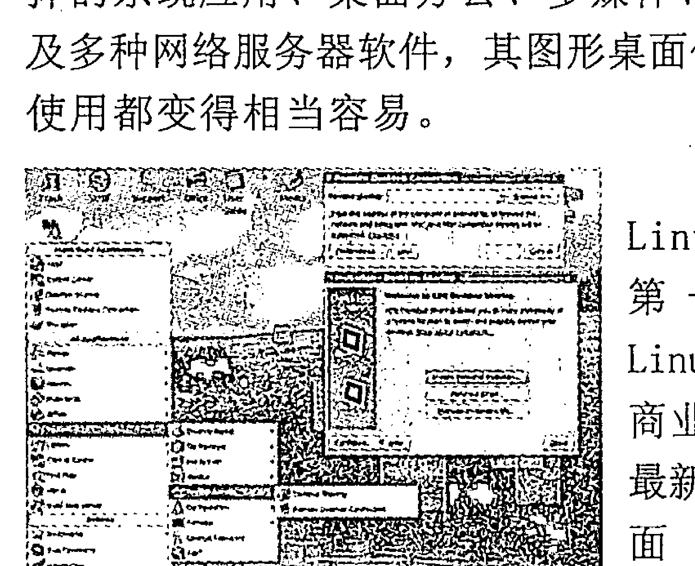

新近推出的SuSE Linux 9.1（图3）是第一款完全基于Linux 2.6内核的Linux商业产品，它集成了最新的KDE和GNOME桌面环境，以及OpenOffice.org、GIMP等常用软件和包含MSN、AIM、Yahoo、Jabber、ICQ、IRC和SMS等协议的Kopete和Gaim即时通讯软件。系统分为专业版和个人版两种，个人版是为新手定制的，系统仅提供简单的软件包，适用于家庭和小型公司用户，不少系统性能都受到限制，扩展性能和多媒体支持要略输一筹。

SuSE的安装非常简单，安装程序使用的是SuSE引以为豪的安装与组态配置工具YaST2，无论是在设计上，还是在整合方面，YaST的表现都非常出色。在主要的安装过程开始之前，YaST2会对系统进行一些自动的配置，其中包括分区、启动管理器和缺省的桌面系统等。经由YaST和控制中心就可以轻松地配置整个系统，人性化的界面和完美的配置使用方式，使得用户可以在不经意间实现操作系统平台的无缝转移。

对尽善尽美的软件产品的追求，使得SuSE推出的每一个版本都极尽心思，成就起软件设计艺术的最高境界。不过，或者是因为一向专注于欧洲市场的原因，SuSE现在对中文的支持稍显不足。

#### 5. Debian GNU/Linux (www.debian.org)

Debian GNU/Linux并非源于商业公司，而是由一群Linux志愿者建立起来的完全自由的操作系统平台。由于采用高度分布的开发模式，Debian的发行版本最为完整，其核心包括几乎所有可用的自由软件。组成Debian的许多应用程序都来自于GNU项目，系统包含超过8710个的软件包，它们是一些已经编译好的软件，并被包装成一个容易安装的格式。Debian项目创建于1993年，最初是在自由软件基金会的GNU计划下发起的。这是一个最严谨、最自由和最开放的Linux核心操作系统。

Debian的设计理念比较精致与简洁，最新发行的3.0版本更是让人有耳目一新的感觉。其安装工作介于Slackware和Red Hat Linux之间，而文档位置分布、各个系统管理脚本则更有条理更为完善，稳定性也相当出众。

和大多数Linux发行版不同，Debian的安装可能会被新手视为畏途，它通常分为两步，先是安装基本的系统，在第一步安装完成以后，你的系统就已经可以使用了。系统重启后进入第二步操作，此时可以配置root口令、网络，安装其它可选的软件包等。事实上，尝试一下Debian的安装过程，将有助于你深层次地理解Linux系统概念。而且，随着Debian Installer的发布，相信Debian在安装易用性方面将获得极大的改观。

和大多数发行版本一样，Debian集成了用于网络管理、窗口应用、软件开发、文档管理、文字处理的各种GNU应用程序。Debian为用户提供了独一无二的软件包管理系统，多数情况下，无需重启，就可以完成系统及应用软件的升级。官方网站上每天都有软件包更新，这是Debian的最大特点之一，有一个新版本的软件就更新一个，而且系统还会自动解决软件包之间的依赖性。

#### 6. TurboLinux (www.turbolinux.com.cn)

TurboLinux的中文译名叫“拓林思”，它的公司总部设在美国加州的旧金山，在日本东京、澳大利亚悉尼、中国北京均设有分公司。以高效性和灵活性著称，其安全性、高稳定性及高网络速度在全球得到了广泛应用。

TurboLinux是国际化步伐迈得最早的Linux操作系统之一，很早就有简体中文版本，因此，有不少执著于中文界面的国内用户是从TurboLinux起步的。上个世纪末，其文化技术和技术力量在业界也是遥遥领先的，像当时拓林思公司的高级研发工程师于明俭，他开发出来的Chinput中文输入服务器，就成了事实上的行业标准，广泛应用于后来的各种中文Linux版本中。正是在这个意义上，我们说TurboLinux对Linux在国内的普及、对促进国内Linux的发展，功不可没。

爆发之后的沉寂，并没有让TurboLinux就此沉沦，在Linux稳步前进的时候，TurboLinux再次加快了自己的步伐。新近传来的消息是，为了能在Linux上播放微软格式的数字音频和视频，该公司已经向微软购买了许可证。TurboLinux发言人表示这是公司本着实用主义而采取的决定。微软媒体格式的支持是作为一些附加软件

#### 7. 红旗 Linux (www.redflag-linux.com)

红旗Linux是中科红旗软件科技有限公司的Linux发行版本，系统汉化程度较高，通过其中文安装界面，即使初次接触Linux的人，按照默认的安装方式也能独立完成。

红旗Linux桌面版 4.0重新设计了界面风格和操作习惯，采用KDE图形操作环境，类Windows的窗口界面风格和鼠标及快捷键操作方式，菜单结构设计一目了然，配置工具设置快捷方便，保证用户能够轻松完成系统从安装、配置到使用的整个过程。系统整合了全新稳定的系统内核、上层应用与用户界面，在提高了系统开机和启动速度的同时，又为用户上网、娱乐和办公应用提供了可靠美观的图形环境。

红旗Linux为用户集成了包括上网、图形图像处理、多媒体应用，以及娱乐游戏等完整实用的应用软件及配置工具；结合 Office 办公软件，能够直接对微软Office格式文档进行操作，满足个人用户和政府的办公、上网、教育以及娱乐等需求。

#### 8. 蓝点 Linux (http://www.bluepoint.com.cn/)

蓝点是国内最早从事Linux研发的公司之一，在上个世纪末推出号称内核中文化的Linux版本而为业界瞩目，他们在推动Linux中文化与本地化方面所做的工作是功不可没，值得大书一笔的。

蓝点Linux采用KDE桌面环境，集成了大量互联网应用、多媒体娱乐和桌面办公系统软件包，并且配有一些容易安装、配置和使用的工具与软件。为方便一些熟悉Windows的用户习惯，他们在许多方面都做了细致调整，使界面与使用习惯方面与之趋同。不过，系统提供的繁体中文界面未尽完美，考虑到对双字节（中文）的支持，没有集成 GNOME 桌面环境，这让习惯了Red Hat Linux的用户有些不习惯。

在2000年推出2.0简繁体中文版之后，因为当时Linux在国内的经济境遇不如意以及其他一些原因，蓝点把精力从Linux桌面应用上抽离，开始高举嵌入式Linux的旗帜，以致于后来负责推动Linux发展的政府要员不知道他们的所在，令许多蓝点FANS引以为憾。

介绍了那么多的Linux发行版本，它们可以说是各有所长，没有最好的，只有最适用的。 （文／念青）

### 四、贺卡站点推荐

- 1. 卡秀
国内最大的电子贺卡网站，拥有大量的精美 Flash 卡，制作方面比较有新意，美工制作方面比较优秀。贺卡的分类繁多，有很大一部分是网友原创的。此外，在特色 e 卡中我们还可以进行生肖配对、生日贺卡 DIY、非常男女 DIY，以及完成特殊定制卡和图片自助卡。

- 2. 碧海银沙贺卡站
作为国内人气最旺的贺卡站点之一，心意坊碧海银沙贺卡站在网友中的口碑非常好，这里不但有丰富的贺卡，比较精美有新意，还有独特的贺卡 DIY 系统，可供网友自己制作贺卡。

- 3. 网易贺卡站
网易贺卡具有内容丰富、信息量大的特点，提供的编辑功能非常丰富，贺卡美工制作方面比较不错，有比较好的创意，很多贺卡都具有幽默成分，让人觉得很心意。不过一些贺卡商业味道较浓。

- 4. 新浪贺卡站
该网站的贺卡分类也比较齐全，创意不错，可以让人有一种新鲜感，它提供了比较详细的搜索功能，可以比较方便地查找自己想要的贺卡。
（文/彭文波）

#### 优秀建议奖（10名）

- 李传登（山东）
- 刘轶（山东）
- 卢霞飞（青海）
- 肖楠（辽宁）
- 王瑾（湖北）
- 刘继光（江苏）
- 林杰（广东）
- 刘斐（山东）
- 王磊（江苏）
- 朱扬勇（江西）

#### 幸运读者奖（300名）

- 杨人玮（广西）
- 李磊（山东）
- 陈迦勒（广东）
- 文斌（湖南）
- 李扬（新疆）
- 李楠（辽宁）
- 陈孝志（辽宁）
- 王俊杰（上海）
- 金彦宏（浙江）
- 庄昕（河南）
- 刘德勇（新疆）
- 于洪涛（吉林）
- 陈强（河南）
- 向前（海南）
- 李桂泉（广东）
- 沈旦阳（四川）
- 杨学文（河北）
- 杨学松（内蒙古）
- 梁影（安徽）
- 王志伟（河南）
- 刘振强（广东）
- 付勇（云南）
- 赵志刚（河北）
- 余河中（河南）
- 刘超（辽宁）
- 罗俊威（辽宁）
- 王晓勇（内蒙古）
- 狄明（山西）
- 孙凤艳（辽宁）
- 段发荣（云南）
- 刘辉（山东）
- 彭华（西藏）
- 杜一鸣（河南）
- 郭峰（辽宁）
- 刘钦贵（内蒙古）
- 冯基亮（河北）
- 曹晓辉（广西）
- 刘翔宇（辽宁）
- 余承（湖南）
- 艾斌（吉林）
- 蓝春阳（河南）
- 颜繁奇（吉林）
- 王旭（黑龙江）
- 程党（江苏）
- 郑冀（陕西）
- 李振贤（河北）
- 孙权（江苏）
- 郭永文（河南）
- 路懿（上海）
- 甘乾远（广西）
- 高嵬（山东）
- 杨金光（山东）
- 黄广尉（浙江）
- 邹欢（江西）
- 蔡云飞（新疆）
- 潘栋伟（河南）
- 李笑甲（天津）
- 苏川（天津）
- 王雷（浙江）
- 王玉栋（黑龙江）
- 张永江（陕西）
- 杨晏忠（河南）
- 温金波（河北）
- 谢琦（江苏）
- 刘小东（江苏）
- 徐庆强（黑龙江）
- 王安（北京）
- 金岩（黑龙江）
- 尹艳（山东）
- 孙淑杰（山东）
- 刘龙雪（黑龙江）
- 张松（山东）
- 万达（山东）
- 陈斯涛（广东）
- 庞亚军（黑龙江）
- 李辉（黑龙江）
- 代军（吉林）
- 张占州（新疆）
- 赵宁（辽宁）
- 付军舰（辽宁）
- 苏俊博（湖北）
- 戴劲（湖南）
- 金世红（湖南）
- 孙化银（山东）
- 江泓（安徽）
- 齐超（河北）
- 贾国洪（河北）
- 方志文（黑龙江）
- 李庆军（河南）
- 武冠楠（河南）
- 张鹏程（山东）
- 张铂霖（云南）
- 陈永升（广西）
- 杨乐（黑龙江）
- 郝晓阳（山东）
- 杜福强（甘肃）
- 章文（河北）
- 冯建明（甘肃）
- 李新党（江苏）
- 李源（福建）
- 李锦玉（广东）
- 李永波（河南）
- 孙涛（陕西）
- 盛燕（河北）
- 李岳忠（广东）
- 苏利军（山西）
- 闫军贤（陕西）
- 李奇（陕西）
- 李俊（河北）
- 李显文（山西）
- 叶富东（江苏）
- 彭亮（山西）
- 陆云鹏（山东）
- 邓江（贵州）
- 盖俊（河南）
- 张岐亮（河南）
- 王玉军（天津）
- 韩方涛（北京）
- 李源文（四川）
- 聂文楷（广东）
- 司延恒（河南）
- 韩子娟（辽宁）
- 袁伟豪（山西）
- 吴亮（湖北）
- 许青青（湖南）
- 于宏权（天津）
- 李瑛华（山东）
- 徐海庄（辽宁）
- 唐乙源（四川）
- 丁国臣（甘肃）
- 石琨（湖南）
- 罗延刚（河北）
- 邓许（河南）
- 路鹏（山东）
- 李琨（广东）
- 陈畅（安徽）
- 王树勇（河北）
- 陈均钦（广东）
- 吴晶涛（山东）
- 王东奎（辽宁）
- 刘英（河北）
- 向丹（海南）
- 秦守停（山东）
- 杨振忠（福建）
- 宋海云（河北）
- 魏恩海（福建）
- 李勇辉（河南）
- 苏成（山东）
- 钟顺波（广东）
- 翟志浩（山东）
- 李亮亮（山东）
- 刘俊廷（山东）
- 董广勇（广东）
- 董冲（广东）
- 梁超（河南）
- 张传莉（黑龙江）
- 张红丽（河南）
- 郑开天（湖北）
- 潘政喜（贵州）
- 童友标（江苏）
- 王晓林（北京）
- 王艺龙（山东）
- 张焕芝（吉林）
- 陈龙（陕西）
- 信明杰（江西）
- 陈涛（浙江）
- 简希锋（北京）
- 刘凤刚（陕西）
- 贾曙波（山西）
- 王栋（陕西）
- 向菲（安徽）
- 邓伟（西藏）
- 褚成健（江苏）
- 于欣（黑龙江）
- 徐青松（新疆）
- 王凯（陕西）
- 李海军（青海）
- 李华（河南）
- 贾曙波（山西）
- 潘雅婷（河北）
- 惠辉（安徽）
- 田双贵（河北）
- 宋毅（江苏）
- 葛振强（黑龙江）
- 张昆（山东）
- 郑涛（河北）
- 盛钊（山东）
- 梁享（广东）
- 郑杰亮（广西）
- 倪刚（内蒙古）
- 李林胜（广东）
- 王熹（河南）
- 吾拉木江（新疆）
- 姜华（江苏）
- 耿丽（河北）
- 袁志斌（四川）
- 宋海峰（陕西）
- 刘军峰（河北）
- 谢玉祥（安徽）
- 高思安（辽宁）
- 刘忠华（江苏）
- 谭杰（安徽）
- 张景玺（河南）
- 杨尚喜（甘肃）
- 梁洮（四川）
- 姚毅（山东）
- 李玉鸿（天津）
- 李宏（山东）
- 汤志龙（山东）
- 罗旭（山东）
- 康永德（河北）
- 韦剑城（北京）
- 马文鑫（黑龙江）
- 朱鹏强（新疆）
- 戴伟玮（河南）
- 刘文超（北京）
- 李国（山东）
- 李平（山西）
- 刘洪斌（山东）
- 唐攀（河南）
- 宿录贞（山东）
- 刘鸿斐（山西）
- 王端庄（山西）
- 高玉明（山东）
- 程国龙（新疆）
- 祖国强（北京）
- 闫亮（河南）
- 张文海（北京）
- 郭和平（内蒙古）
- 王平（山西）
- 杨茜茜（北京）
- 陈军（内蒙古）
- 蔡纪军（广东）
- 杨阳（内蒙古）
- 周晨霞（江苏）
- 姚进学（山西）
- 邓崇生（重庆）
- 陈静（陕西）
- 安贵全（广东）
- 冯波（湖北）
- 李正宏（云南）
- 方兴志（辽宁）
- 刘冠明（甘肃）
- 彭云（重庆）
- 柳泱（福建）
- 陈其宝（辽宁）
- 符忠清（海南）
- 陈健武（广西）
- 罗旭辉（河南）
- 黄庆辉（广东）
- 彭浩东（陕西）
- 农禄（广东）
- 邱晟（广东）
- 杨申林（黑龙江）
- 史哲（河北）
- 段士金（福建）
- 张德华（山东）
- 王闻（河北）
- 李志勇（河北）
- 陈颂文（广东）
- 余肖（广西）
- 李智明（广东）
- 季忠巧（云南）
- 刘煜辉（广东）
- 卢国文（江苏）
- 曾奇熊（广东）
- 刘海船（河北）
- 谢应虎（安徽）
- 杨小航（陕西）
- 韩扬（辽宁）
- 申奥（四川）
- 王金山（山东）
- 陈守平（山西）
- 姜凯（黑龙江）
- 李琳（甘肃）
- 包海洲（广西）
- 王健（河北）
- 高迪（河北）
- 浦伟（云南）
- 孙志鸿（黑龙江）
- 崔建军（北京）
- 方智（新疆）
- 张伟（吉林）
- 王伟（河北）
- 徐越（浙江）
- 汪夫（湖南）
- 高飞（河北）
- 黄伟（吉林）
- 郭峰（陕西）
- 孙令奎（山东）
- 吴涛（北京）
- 周原（辽宁）
- 艾尼瓦尔·吐尔洪（新疆）

## 保护系统，不让“特洛伊”有机可乘

网络安全问题随着互联网的普及而日益受到重视，越来越多的不法分子或自封为“黑客”的恶作剧之徒经常利用这样那样的机会去攻击别人的电脑，因此网络安全不再仅仅是大中型机构需要注意的问题，个人的网络安全也是非常重要的。在众多的黑客攻击手段之中，木马是最常用而且最隐蔽的一种方法，一些电脑初学者往往不知道自己的机器中了木马，白白将自己的隐私暴露在别人的面前，甚至会造成不小的经济损失。木马程序具有很高的隐蔽性，极难杀除，对于初学者而言有什么好方法来保护自己呢？那就让我们使用“木马克星”吧！

### 一、简介和下载安装

木马克星（Iparmor）是一款国产软件，是专门针对目前国内互联网流行的各种木马程序而制作的，这个软件虽然体积很小，但却是动态监视网络与静态特征字扫描的完美结合，对最近非常流行的网络神偷、网吧杀手、键盘幽灵以及捆绑在图片文件中的木马非常有效。除了杀除木马之外，木马克星还是一款适用于网络用户的安全软件，它既有面对新手的扫描内存和扫描硬盘功能，也有面对网络高手的众多调试及查看系统功能。Iparmor 5系列内置木马防火墙，任何试图与本机可疑端口建立连接的操作都需要Iparmor确认，包括邮件监视技术、QQ密码偷窃以及getpass密码邮寄均需要IParmor确认，从而最大程度地保证了用户的密码安全。用户可以通过 http://xj-http.skycn.net:8080/down/tu.exe 下载木马克星最新的5.46版本，由于该软件是共享软件，因此需要注册，不注册也可以使用，但就无法享受到全部功能了，下面我们就一步一步地来学习如何使用木马克星！

### 二、“功能”菜单

在木马克星里面只有两个菜单对我们而言是有用的，第一个就是“功能”菜单（图1），下面我们来逐一介绍下“功能”菜单里面的按钮：

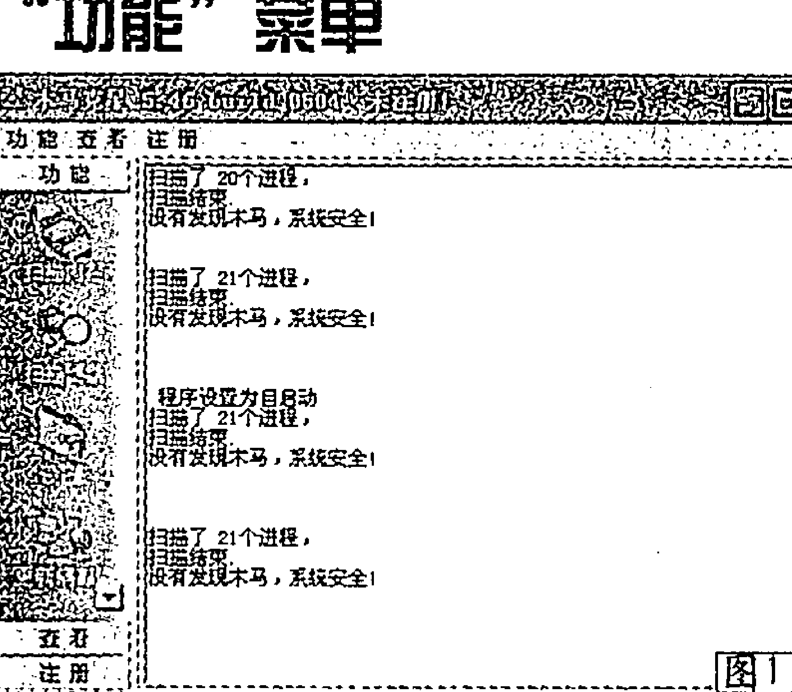

扫描内存：这个功能比较好理解，就是要扫描内存之中可能驻留的正在运行的木马或者其他病毒程序。并且在右边的信息窗口之中实时显示出扫描的结果和状态，一般来说，扫描内存的速度是非常快的。

扫描硬盘：木马除了驻留在内存里面，也会藏在硬盘的某个不显眼的角落里面，免得系统重启之后就消失了。点击“扫描硬盘”的按钮之后，我们首先可以随意设定扫描的路径，可以通过下拉菜单选择或者直接手动输入路径。在缺省状态之下，“清除木马”前面复选方框是被选上的，我想没有人会莫名其妙的查出来却让木马依旧生存吧？此外还有一个“扫描所有磁盘”的选项，选择了这个选项之后，你先前设定的扫描路径就无效了。扫描硬盘的时间是取决于你的硬盘速度以及里面装载了多少文件的，而且在整个过程之中硬盘都在全速运转，因此在扫描的时候最好不要进行其他的工作，以免相互之间发生影响。

设置：点击“设置”之后就会弹出图2所示的窗口，下面我们就来设置一下木马克星的一些功能：首先是“公共选项”标签，在这里面“随系统启动”就是指设置木马克星在你的Windows系统启动的时候也自动运行，并驻留在内存里面，这对初学者是一个不错的选择，因为就算你因为疏忽而忘记了启动木马克星，它依旧在保护着你。“控制台颜色”其实就是指软件的主界面风格了，有多种颜色可以选择，在上图的下拉菜单里面选择即可。

其次是“防火墙”标签（图3）。“使用网络防火墙”就是指让木马克星发挥防火墙的作用，隔断一些经常被黑客用来攻击计算机的端口，不过有可能影响正常的网络服务以及局域网的一些互相访问的程序。“监视网络信息”就是指木马克星实时监控你的计算机上面所有使用网络的情况，每一个程序进行了什么样的网络通讯，经过什么端口，去到什么地方都有详细的记录。“监视邮件”就是让木马克星对你的电子邮件进行监视，不过它本身并没有附带邮件程序，只是充当了一个旁观者的角色，监视你系统之中的Foxmail或者Outlook运行的情况罢了。“打开密码保护”就是保护你的机器访问网络时所用到的密码，不让恶意入侵者轻易得到。

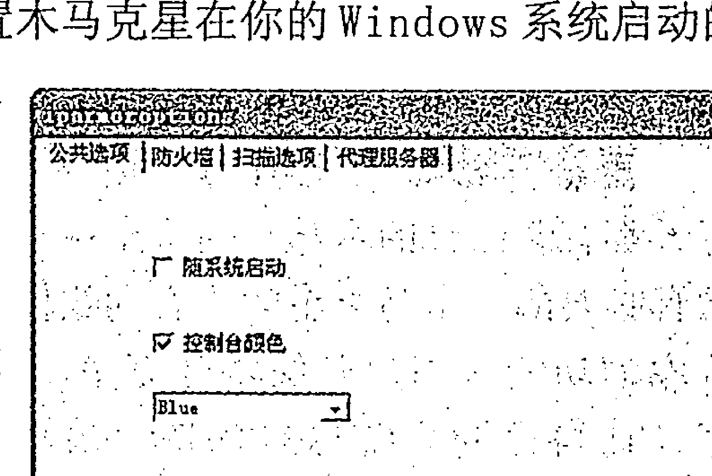
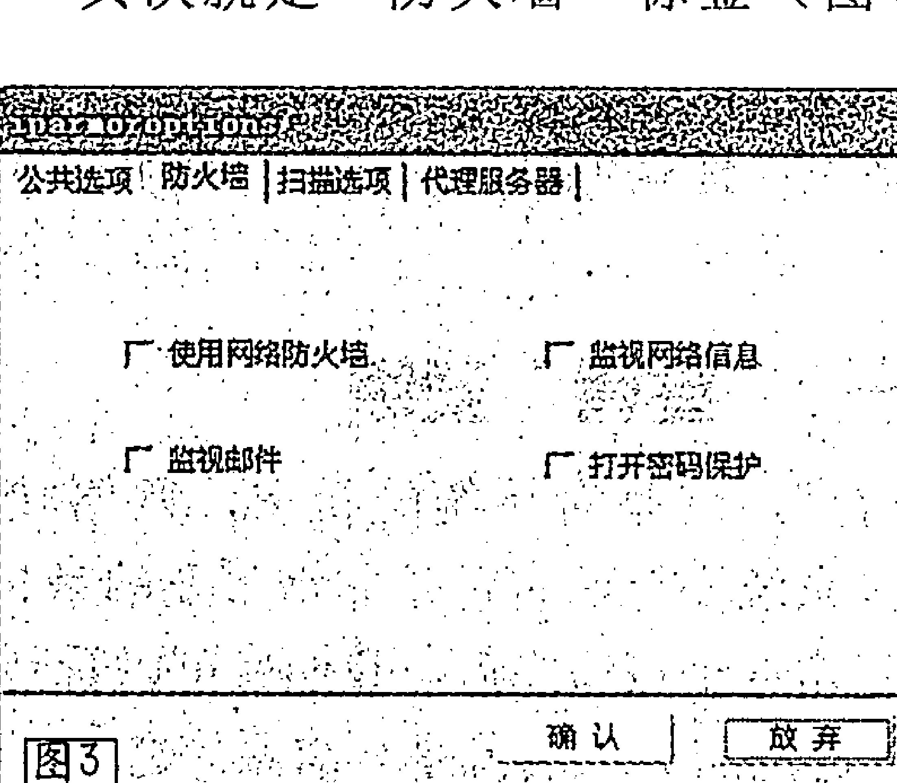

接下来是“扫描选项”标签（图4），这里设置的就是木马克星在扫描内存和硬盘的时候所扫描的对象，缺省状态之下可扫描“压缩文件、蠕虫、DLL文件”这三种，你还可以选择“启动项目、SCR文件、广告程序、主页”这几类，在这些选项当中，除了缺省的选项之外，我还建议大家扫描的时候加上“广告程序”，这样就可以清除一些由于访问了恶意的主页而被添加到系统里面的广告了。

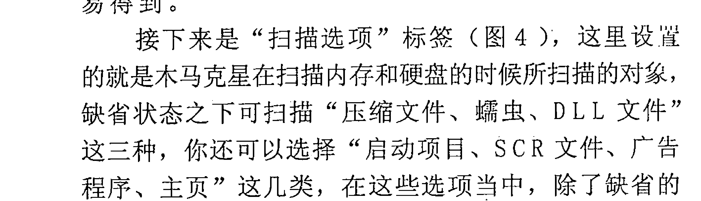

最后是“代理服务器”标签，这个功能相信很多人都明白是用来干什么的，就是设置一个代理服务器，以便木马克星自动更新。

下面我们继续看看“功能”菜单里面的其他按钮。

更新病毒库：正所谓“道高一尺，魔高一丈”，每天都有新品种的木马和病毒出现，因此更新软件是非常有必要的，木马克星的作者向我们提供了定期更新病毒库的功能，用户升级木马克星，查杀最新的木马程序，让自己的系统尽量保持“最佳状态”！

“删除正在执行的文件”：之所以在这个功能前面加上双引号，是因为这个功能本身在左边的功能菜单按钮里面并没有提供，只能在顶端的“功能”下拉菜单里面选择。选择了这个功能之后就会弹出一个窗口，在里面输入程序的路径以及文件名之后点击“OK”即可删除那些正在运行的程序。因为很多木马程序给自己披上了“系统进程”的外衣，在运行状态之下根本无法删除，如果碰到了这种情况，你就可以使用这个“杀手锏”将它们通通赶走。

### 三、“查看”菜单

所谓的“查看”，就是对系统的状态，网络状态进行监视了，这对系统安全而言可是非常重要的哦！

系统进程：点击这个按钮之后，我们就可以看到图5所示的窗口了，这里面显示的就是当前系统之中正在运行的所有程序，你每点击一个程序，都会显示出这个程序的详细情况，究竟调用了什么文件等等，非常详尽，只要细心观察，你就会找到隐藏在系统之中的木马或者病毒程序了。

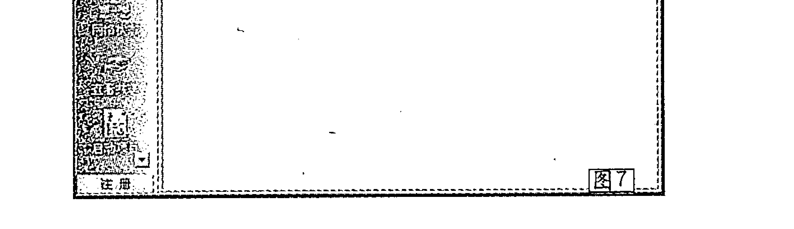

网络状态（图6）：点击这个按钮之后，我们就会看到目前所运行的系统进程与网络的通讯状态，它会详细地将本地IP、端口以及远程IP记录下来，对于初学者而言可能会看得莫名其妙，但只要你是有一点网络知识的网虫，就会很容易获得自己所需要的信息了。

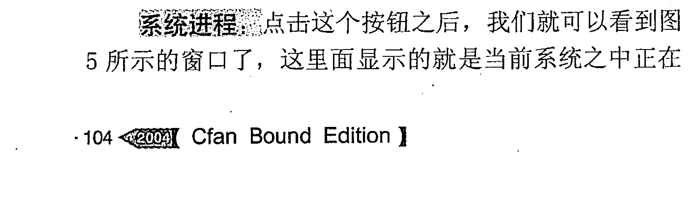

查看共享：点击这个按钮之后就会显示出当前系统里面所共享的所有资源，因为有些木马是会在你的系统里面添加一些共享信息，让黑客可以远程登录到这些资源上面，因此当你发现有一些莫名其妙的共享资源存在于你的系统之中，就很可能是中了木马了。

启动项目：点击这个按钮之后就会看到图7的窗口，这里显示的是你的Windows在启动的时候要运行的程序，有的朋友可能会说利用msconfig或者“优化大师”之类的软件也可以查看到一些Windows的启动程序，但实际上有些隐秘的程序启动项你是查看不到的，但木马克星就有这个本领能够将一些比较隐秘的项目都“挖掘”出来，如果你想把一个启动项目删除，只要去掉程序前面复选框里面的小钩即可。

发邮件程序：这是监视当前正在运行的邮件程序。

监视网络：点击这个按钮之后，你就会看到“开始”和“结束”的按钮了，点击“开始”我们就开始了对网络的监控，一旦有程序要求访问网络，那么你就会看到图8的窗口了。点击“允许”就可以进行正常的网络访问，点击“禁止”就会阻断了该程序对网络的访问，木马程序无论掩饰得多么好，终究要和躲藏在网络上的黑客进行联络，此时木马便无所遁形了。可能有些朋友会担心每次访问网络的时候木马克星都会弹出来，会非常麻烦，其实担心是多余的，因为大家只要留意上图即可看到里面有一个已经选中的“记录此次选择”选项，也就是说同样类型的网络访问请求，只需要允许一次，以后都可以安全通过木马克星的监视了，怎么样，连这个作者都已经为大家想到了。

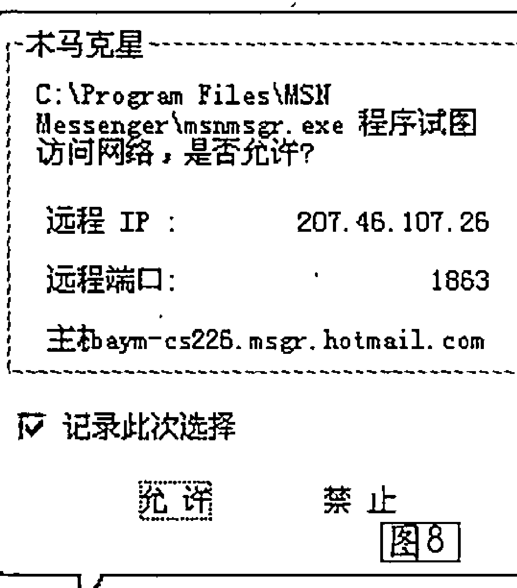

日志：这里就是记录木马克星杀除木马的地方了，主要是用来做“回忆录”的。

木马克星的使用其实是非常简单的，经过上面简单的叙述之后，相信大家已经明白如何操作木马克星，为自己的系统把好关了。不过工具虽好，终究还是要人去操纵的，因此要完全杜绝木马的危害，还是要从自己做起，增强网络安全意识，不要随意运行一些来历不明的程序哦！

（文 / 水月斋）

## 天网防火墙
——网络安全好助手

为了保护我们的网络安全，现在不少朋友都选择在上网的时候安装一个防火墙软件，不过许多朋友并不了解自己应该选择什么样的软件来防护比较好，下面我就向大家推荐一款专门为中国人设计的，完全国产化而且功能相当强大的防火墙软件——“天网防火墙个人版”。相信不少老资格的网虫都听说过它的大名了，现在天网防火墙个人版已经升级到了2.51稳定版本，下面我们就来学习一下，如何使用天网防火墙。

### 一、软件简介和下载安装

天网防火墙（SkyNet-FireWall）个人版是由天网安全实验室制作的给个人电脑使用的网络安全程序。它根据系统管理者设定的安全规则（Security Rules）把守网络，提供强大的访问控制、身份认证、应用选通、网络地址转换（Network Address Translation）、信息过滤、虚拟专网（VPN）、流量控制、虚拟网桥等功能。它可以帮你抵挡网络入侵和攻击，防止信息泄露，并可与天网安全实验室的网站（www.sky.net.cn）相配合，根据可疑的攻击信息，来找到攻击者。天网防火墙把网络分为本地网和互联网，可以针对来自不同网络的信息，来设置不同的安全方案，它适合于任何拨号上网的用户，也适合通过网络共享软件上网的用户。大家可不要小看国产软件，因为目前天网防火墙已经得到了“中国公安部信息安全产品认证”和“中国国家信息安全测评认证中心信息安全产品认证”。

首先我们可以通过 http://sky.net.cn/modules/site/admin/images/setup2.5.1.exe 下载一个最新版本的天网防火墙，然后运行下载回来的文件，安装过程简单快捷，几乎是瞬间就完成了，安装完成之后，你必须重新启动计算机，才可以运行天网防火墙。

### 二、天网防火墙的设置

重启系统之后，我们在程序组里面找到“天网防火墙”并且运行天网防火墙后，你可以看到一个非常漂亮而且简洁的界面（图1）。这时，你可以根据自己的安全需要设置天网防火墙，天网防火墙提供了应用程序规则设置、自定义IP规则设置、系统设置、安全级别设置等功能。

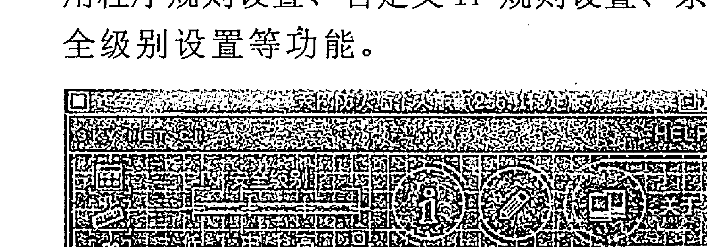

接着我们来看看图2所示的三个图标，它们从上到下分别是：应用程序规则设置、自定义IP规则、系统设置。这三个设置选项几乎囊括了天网防火墙的所有功能，那么我们就一步一步来详细说明。

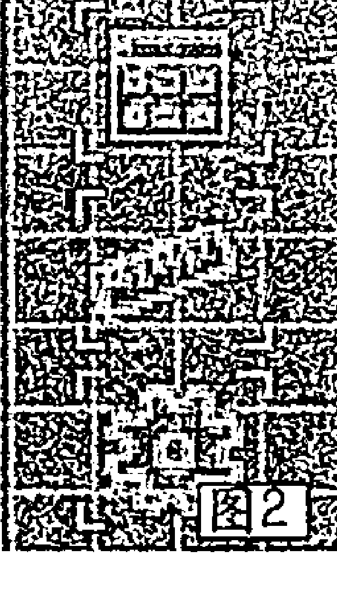

#### 1. 应用程序规则设置

点击“应用程序规则设置”按钮，我们即可看到如图3所示的画面了，由于这里显示的是当前你的系统之中所运行的程序，因此不同的用户所看到的程序项目也有所不同。

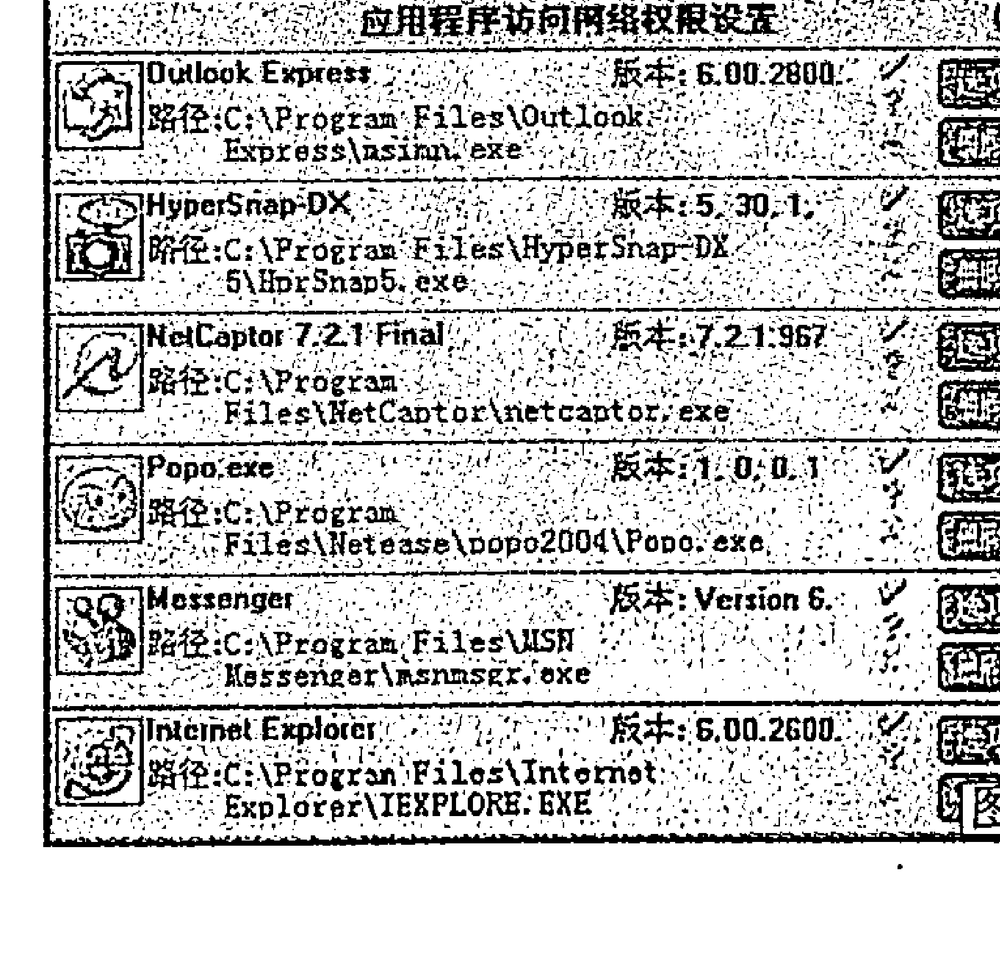

“应用程序规则设置”的功能就是对应用程序数据包进行底层分析拦截功能，它可以控制应用程序发送和接收数据包的类型和通讯端口，并且决定拦截还是通过，这是目前其它很多软件防火墙不具有的功能。在天网防火墙打开的情况下，启动的任何应用程序只要有通讯数据包发送和接收存在，都会先被天网防火墙先截获分析并弹出窗口（图4）。如果你不选中“以后都允许”，那么天网防火墙在以后会继续截获该应用程序的数据包，并且弹出警告窗口。如果你选中“以后都允许”选项，该程序将自动加入到应用程序列表中，天网防火墙将默认不会再拦截该程序的发送和接收的数据包，但你可以通过“应用程序设置”选项来设置更为复杂的数据包过滤方式。

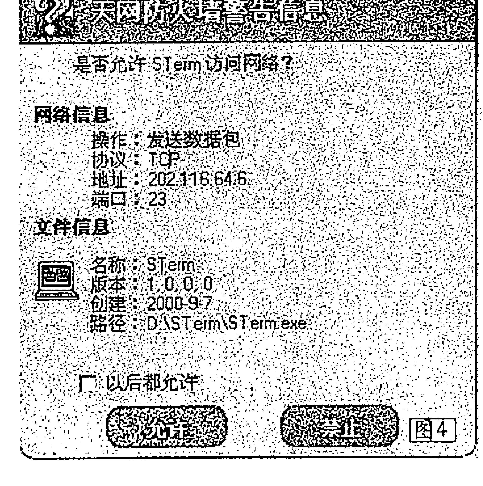

单击“应用程序规则设置”之中每一个程序前面的“选项”按钮即可设置应用程序的数据通过规则（图5），你可以设置该应用程序禁止使用TCP或者UDP协议传输，以及设置端口过滤，让应用程序只能通过固定几个通讯端口或者一个通讯端口范围接收和传输数据，当你做这些设置时，你可以选择询问和禁止操作。对应用程序发送数据包的监察可以使你了解到你的系统有那些程序正在进行通讯，如现在有一些共享软件会在运行的时候从设定好的服务器取一些广告，还有一些恶意的程序会把你个人隐私信息发送出去，通过天网防火墙你可以禁止这些程序数据通讯操作。此外木马程序的原理也是差不多的，天网防火墙可以觉察到攻击者对木马的控制通讯，这也是天网防火墙最令人惊喜的强大功能之一。

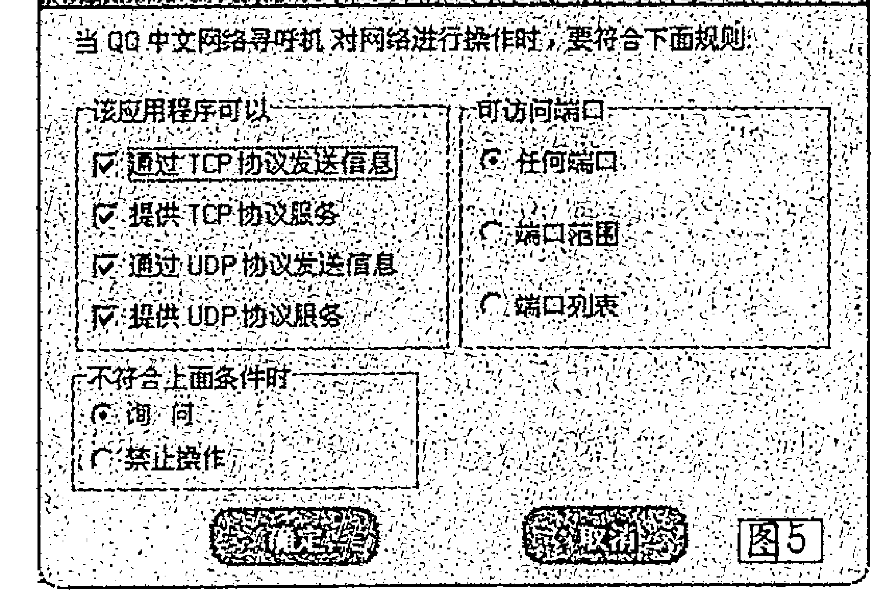

#### 2. IP 规则设置

程序规则设置是针对每一个应用程序的，而IP规则设置是针对整个系统的，IP规则是针对整个系统的数据包监测，IP规则设置的界面如图6所示。对于每一项设置的含义，限于篇幅不能一一解释，这里只是选重要的来向大家解释一下，实际上天网防火墙本身已经默认设置好了相当的安全级别，一般用户并不需要自行更改。

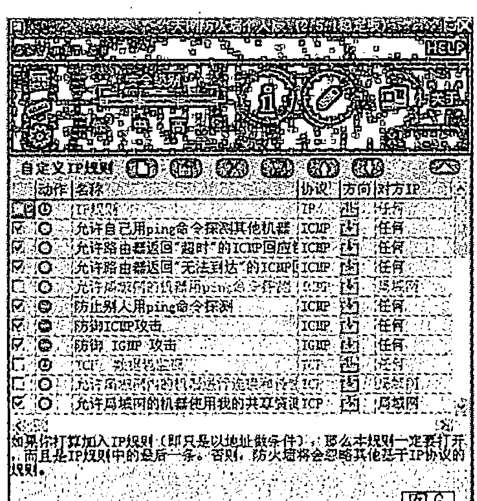

防御ICMP攻击：选择时，即别人无法用PING的方法来确定你的存在，但不影响你去PING别人。ICMP协议现在也被用来作为蓝屏攻击的一种方法，而且该协议对于普通用户来说，是很少使用到的。

防御IGMP攻击：IGMP是用于传播的一种协议，对于Windows系统的用户是没有什么用途的，但现在也被用来作为蓝屏攻击的一种方法，建议选择此设置，该操作不会对用户造成影响。

TCP数据包监视：选择时可以监视你机器上所有的TCP端口服务。这是一种对付特洛伊木马客户端程序的有效方法，因为这些程序也是一种服务程序，如果关闭了TCP端口的服务功能，外部几乎不可能与这些程序进行通讯。而且对于普通用户来说，在互联网上只是用于WWW浏览，关闭此功能不会影响用户的操作。但要注意如果你的机器要执行一些服务程序，如FTP服务器、HTTP服务器等时一定不要关闭这个功能，而且如果你用QQ来接收文件，也一定要使该功能正常，否则你将无法收到别人的文件。另外，选择监视TCP数据包也可以防止许多端口扫描程序的扫描。

UDP数据包监视：选择时，可以监视你机器上所有的UDP服务功能。不过通过UDP方式来进行蓝屏攻击比较少见，但有可能会被用来进行激活特洛伊木马的客户端程序。注意，如果你使用了采用UDP数据包发送的ICQ和OICQ，就不可以选择阻止该项目，否则，你将无法收到别人的应答。

对于规则的条目，我们也可以进行排序、删除和修改等操作，修改操作的按钮是图6中左起第2个按钮，操作界面如图7所示。

安全规则的设置是系统最重要，也是最复杂的地方。如果你不熟悉网络，最好不要调整它，你也可以直接使用我们帮你设计的规则。如果你熟悉网络，就可以非常灵活的设计合适自己使用的规则。简单的说，规则是一系列的比较条件和一个对数据包的动作，就是根据数据包的每一个部分来与设置的条件比较，当符合条件时，就可以确定对该包放行或者阻挡。通过合理的设置规则就可以把有害的数据包挡在你的机器之外。

这个页面由3个部分组成：
工具条：你可以点击上面的按钮来导入、增加、修改或删除规则。由于规则判断是由上而下的，你还可以通过点击“规则上下移动”按钮调整规则的顺序（注意：只有相同协议的规则才可以调整相互顺序），当调整好顺序后按“保存”按钮保存你的修改。当规则增加或修改后，为了让这些规则生效，还要点击“应用新规则”按钮。
规则列表：这里列出了所有的规则的名称、该规则所对应的数据包的方向、该规则所控制的协议、本机端口、对方地址和对方端口，以及当数据包满足本规则时所采取的策略。在列表的左边为该规则是否有效的标志，如果标记为对钩表示改规则有效，否则表示无效。当你改变这些标志后，请注意保存。
规则说明：这里列出了规则的详细说明，也可以从网上下载天网安全实验室帮你定制的安全规则，然后单击“导入”按钮将规则加入到你的防火墙中。点击“增加”按钮或选择一条规则后按“修改”按钮，就会激活和图7类似的编辑窗口。首先输入规则的“名称”和“说明”，以便于查找和阅读。然后选择该规则是对进入的数据包还是输出的数据包有效。“对方的IP地址”用于确定选择数据包从那里来或是去哪里，这里有几点需要说明一下：“任何地址”是指数据包从任何地方来，都适合本规则；“局域网网络地址”是指数据包来自和发向局域网，“指定地址”是你可以自己输入一个地址，“指定的网络地址”是你可以自己输入一个网络和掩码。除了录入选择上面内容，还要录入该规则所对应的协议，其中“IP”协议不用填写内容，如果你录入了IP协议的规则，一定要保证IP协议规则的最后一条的内容是：“对方地址：任何地址；动作：继续下一规则”。
“TCP”协议要填入本机的端口范围和对方的端口范围，如果只是指定一个端口，那么可以在起始端口处录入该端口，结束处录入0。如果不想指定任何端口，只要在起始端口都录入0。TCP标志比较复杂，你可以查阅其他资料，如果你不选择任何标志，那么将不会对标志作检查。
“ICMP”规则要填入类型和代码。如果输入255，表示任何类型和代码都符合本规则。
“IGMP”不用填写内容。
当一个数据包满足上面的条件时，你就可以对该包采取行动了：“通行”指让该数据包畅通无阻地进入或出去；“拦截”指让该数据包无法进入或出去；“继续下一规则”指不对该数据包作任何处理，由该规则的下一条规则来确定对该包的处理。
在执行这些规则的同时，还可以定义是否记录这次规则的处理和这次规则的处理的数据包的主要内容，并用右下角“天网防火墙个人版”图标是否闪烁来“警告”，或发出声音提示。
在建立规则的时候，大家务必要注意几点：防火墙的规则检查顺序与列表顺序是一致的；当你有局域网时，又只想对局域网开放某些端口或协议（但对互联网关闭）时，可对局域网的规则采用允许“局域网网络地址”的某端口、协议的数据包“通行”的规则，然后用“任何地址”的某端口、协议的规则“拦截”，就可实现你的目的；如果你录入了IP协议的规则，一定要保证IP协议规则的最后一条的内容是“对方地址：任何地址，动作：继续下一规则”，否则其他协议的规则会无法执行；不要滥用“记录”功能，一个定义不好的规则加上记录功能，会产生大量没有任何意义的日志，并浪费大量的内存空间。

#### 3. 系统设置

点击“系统设置”按钮，我们便可以打开相应的设置窗口了。选中“开机后自动启动防火墙”，天网防火墙将在操作系统启动的时候自动启动，否则天网防火墙需要手工启动。“防火墙自定义规则重置”按钮就是要重置所有已经定义了的规则，天网防火墙将会把防火墙的安全规则全部恢复为初始设置，你对安全规则的修改和加入的规则将会全部被清除掉。“局域网地址”就是指重新设置你在局域网内的地址；“设置报警声音”就是说你可以自己选择一个声音文件作为天网防火墙预警的声音。初始状态是没有设置报警声音的，单击重置将采用天网防火墙默认的报警声音。

## CuteFTP Pro 6.0 急速上手

现在通过宽带上网的朋友越来越多，一说到宽带，自然不能不提到FTP了，FTP是英文File Transfer Protocol（文件传输协议）的缩写，是网络上用来传输文件的一种协议。有了FTP，你就可以迅速得到时髦的软件、游戏、音乐和电影等等。要使用FTP，自然需要有一个称手的工具了，在这里我给大家推荐的就是FTP软件中的佼佼者，CuteFTP的专业版本CuteFTP Pro。CuteFTP Pro很好地延续了CuteFTP系列一如既往的易用性，而且在功能方面增强了很多，下面就让我来为大家讲解一下如何使用CuteFTP Pro进行FTP下载！

### 一、下载、安装和汉化

首先大家可以在http://ftp.pconline.com.cn/pub/download/200403/cuteftppro.exe下载一个CuteFTP Pro的最新6.0版本，不过由于软件本身是英文的，可能会对英文水平不高的用户造成使用上的不便，因此我们可以下载一个汉化包对软件进行汉化，将其变成中文软件哦！下载地址是http://ftp.pconline.com.cn/pub/down-load/200403/HY-cuteftpprofinal-LDR.zip。两个文件都下载回来之后，首先我们运行 cuteftppro.exe 进行软件的安装，在安装过程中出现的一切询问或者让你填写什么的都随便点击“下一步”即可，安装完成之后我们就可以安装汉化包了，解压缩下载回来的zip文件，将里面chinese.lng解压缩到cuteftppro的安装目录里面，紧接着运行CuteFTP Pro，点击Tools → Global Options → Display → Language，打开图1的窗口，在Language Files里面点击Chinese.lng，然后点击ok按钮，重新启动CuteFTP Pro之后，你会发现界面已经从英文变成中文了！

### 二、 CuteFTP Pro 界面介绍

在介绍CuteFTP Pro的使用之前，我们先来熟悉一下它的界面，让大家首先形成一个基本的概念，在接下来的实际操作中就不会发生误会了。下面我们就来看看CuteFTP Pro的主界面（图2）：

这里我们分成三大部分来介绍CuteFTP Pro的主窗口：站点管理区、服务器目录浏览区和队列/登录信息窗口。

**站点管理区：**注意一下该窗口的最下面包括两个标签，分别是“本地驱动器”（Local Drives）和“站点管理器”（Site Manager），通过平行位置的左右方向箭头可以调整他们的位置，单击标签实现快速的切换。

**服务器目录区：**用于显示FTP服务器上的目录信息，在列表中可以看到的包括：文件名称、大小、类型、更改时间等。窗口上面是用来操作目录或文件的工具栏按钮（后退、刷新、重连等）。

**登录信息窗口：**显示当前连接状态的窗口，通过Log信息你能够了解到诸如：登录、切换目录、文件传输大小等重要信息，以便确定下一步的具体操作。

连接成功以后，在窗口左边列表中选中站点名称，单击“+”号，选择session即可查看。当然如果你同时建立了多个站点的连接，登录窗口中会以列表的形式显示出来，如果没有发现的话，单击“站点管理”中相应的站点名，即可激活显示。

**队列窗口：**在这里你可以将准备上传的目录或文件放到队列列表中，此外配合“时间表”的使用还能达到自动上传的目的。

### 三、创建一个FTP站点

要进行FTP下载，首先我们要知道一个FTP站点的地址以及用户名、密码才行，想获得这些信息就要你在网上请教网友或自己搜索了。假设现在我们已经获得了这样一个FTP站点，接下来要做的就是将这个站点添加到CuteFTP Pro的站点管理器里面。

现在我们单击“站点管理器”（Site Manager）标签切换到“站点管理”窗口，默认情况下CuteFTP Pro提供了几个文件夹用来存放不同类型的站点。为了管理的规范性，你可以删除掉除General FTP Site外的所有文件夹，同时在其上单击右键，单击“添加新站点”→“新建FTP站点”，或者直接点击工具栏里的“新建FTP站点”按钮，进入“站点属性”窗口。

在“常规”标签里面，“标签”是可以随便输入一个方便记忆和分辨的名字，只起一个标示作用。“主机地址”就是FTP服务器的主机地址，可以是域名形式或IP地址。注意：如果你使用的是“虚拟主机”服务的话请使用域名登录，因为这时是多个域名使用一个IP的方式。“用户名，密码”里面你可以输入给定的登录验证信息，如果你使用的是匿名服务器的话，可以单击右边的“匿名”或“两者”选项。至于“注释”就是站点的注释信息，同样是标示内容，可空白不填。

在“类型”标签（图3）里面，你可以调整一些针对不同FTP服务器类型的设置。建议使用默认选项，除非在当前设置下不能完成正常登录。“协议类型”就是设定不同的协议类型，根据不同的连接方式选项也各不相同，比如在一开始假如建立的是“新建HTTP站点”的话，这里的选项会默认使用 HTTP（超文本传送协议）。“端口”就是 FTP 站点的端口设置了，CuteFTP Pro 会根据你的选择自动更改相应的端口地址，FTP（21），HTTP（80）。“主机类型”一般我们选用自动探测，因为很多 FTP 站点都是使用 UNIX 或者 WINNT 系统。值得一提的就是“数据连接类型”了，缺省状态之下这里是“使用全局设置”，点击这个下拉菜单，我们可以看到有“PORT”和“PASV”两种选择。FTP 协议有两种工作方式：PORT 方式和 PASV 方式，中文意思为主动式和被动式。PORT（主动）方式的连接过程是客户端向服务器的 FTP 端口（默认是21）发送连接请求，服务器接受连接，建立一条命令链路。当需要传送数据时，服务器从20端口向客户端的空闲端口发送连接请求，建立一条数据链路来传送数据。PASV（被动）方式的连接过程是客户端向服务器的 FTP 端口（默认是21）发送连接请求，服务器接受连接，建立一条命令链路。当需要传送数据时，客户端向服务器的空闲端口发送连接请求，建立一条数据链路来传送数据。因为 PORT 方式在传送数据时，由服务器主动连接客户端，所以，如果客户端在防火墙或 NAT 网关后面，用 PORT 方式将无法向 Internet 上的 FTP 服务器传送文件。这种情况需要使用 PASV 方式。

“操作”标签（图4）里面有两个很重要并且非常必要的设定，即本地默认目录和远程服务器目录。在第一行输入框内直接键入 FTP 服务器的起始根目录。如果是根目录（/）的话，空白不填即可。随后在下面的本地目录框键入 Local 地址或者单击右边的浏览钮选定。在 CuteFTP Pro 中提供了不错的“文件/目录”屏蔽功能，通过它可以在传输中禁止特定目标的上传操作。单击“过滤”按钮激活过滤属性窗口，选中“启动过滤”复选框，分别单击“过滤掩码”及“过滤非掩码”标签添加屏蔽对象即可。

在“选项”标签里面，默认情况下 CuteFTP Pro 会使用 Global settings 来格式化所有站点，当默认设置不能满足你的要求时，可以在“站点特殊配置选项”下拉列表中选择“使用站点特别选项”。单击“代理”可以设置通过代理服务器建立站点连接。

一切设置完成之后，我们可以点击“确定”将站点加入到站点管理器里面，也可以直接点击“连接”，这样不但可以直接加入站点，还同时帮你自动连接到这个 FTP 站点。

除了这样的直接创建之外，在 CuteFTP Pro 中也同时提供了导入的方式帮你迅速建立站点，这里支持的格式包括大多常用 FTP 客户端站点信息，主要包括 WS_FTP, LeapFTP, CoffeeCup 等等。选择菜单“工具”下的“站点导入工具”，打开站点导入窗口，在选取 FTP 客户类型列表里选择相应的客户端程序，同时浏览找到含有站点信息的旧数据文件。为了不破坏现在的站点格式，你可以选中下面第二个单选项以另外独立创建一个数据文件，单击“开始转换”完成导入即可。

### 四、FTP站点的连接和操作

站点添加完毕之后，接下来我们要做的就是连接到站点并进行下载！首先我们打开站点管理器，双击我们要连接的站点名称，一切顺利的话我们很快就可以看到 FTP 站点里面的目录列表了。

**进入目录** 由于单单看到目录我们是不会知道里面有什么内容的，因此我们可以用鼠标在目录的名字上面双击，这样就可以进入里面一层的目录了。

**下载文件** 假设我们在目录里面看到了自己感兴趣的文件，需要下载的话，只要在文件上面双击即可进行下载，值得注意的是，文件下载回来之后存放的路径是取决于你的“本地驱动器”目录的，CuteFTP Pro 会自动将文件存放在里面，因此你在下载文件之前，最好在“本地驱动器”的窗口里面选择好一个路径，值得一提的是 CuteFTP Pro 在开始下载之后，你可以重新打开别的目录，将另外一个文件下载到别的目录里面，而不会影响已经在进行的下载操作。

**下载目录** 如果你想下载的文件都在一个目录，那么你可以将整个目录都下载到本地驱动器的相应路径下面，因为双击目录是会进入下一层目录的，所以我们可以用鼠标在目录上面点击右键，弹出图5的菜单，选择“下载”即可开始下载整个目录了。

**多队列** 有时候我们需要下载的东西并不仅仅都在一个目录里面，有些站点因为限制了同时连接的数量，因此一旦开始下载之后，你就不能跳到别的目录进行查看和操作了，这时候我们就可以使用多队列添加的功能了。首先选定自己想要下载的文件或者目录，然后将左边的“本地驱动器”路径设置好，接着在文件和目录上面点击鼠标左键，将其拖动到下面的“队列信息窗口”里面，此时你会看到一个下载任务已经添加好。大家可以看到目录前面的有

### 五、多队列下载操作

多队列下载是 CuteFTP Pro比CuteFTP增加的最重要的功能，有了它我们就可以非常灵活地进行多任务处理，而不像后者那样每次只能一个任务。下面我们就来介绍一下多队列操作的一些方法。现在我们假设已经添加了数个队列，可以开始下载了，我们可以在队列上面点击鼠标右键，弹出图7的菜单，下面我们介绍一下各种功能：

-   **全部传送**：这个比较好理解，就是无论你的队列里面有多少任务，都全部开始传送任务，一般来说我们可以选择这个。

-   **传送选定**：就是传送当前你选定的那个任务，别的任务不受影响。

-   **停止**：就是停止当前传送的任务，让它重新处于“等待”的状态。

-   **粘贴**：在CuteFTP Pro里面你可以像本地Windows的资源管理器一般进行复制粘贴操作，你可以复制远程服务器或者本地硬盘里面的文件粘贴到这里，进行上传和下载的操作，效果和拖动文件或目录是完全一样的。

-   **删除选定**：就是指删除当前选定的任务。

-   **移除已完成**：删除当前任务里面已经传送完成的项目，一般用于整个目录下载的操作，有时候一个目录里面有很多文件，总有一些是已经完成的，这时候我们就可以使用这个功能，清除掉那些已经完成的项目，只留下正在进行或者准备进行的项目，以便我们查看。

-   **全部移除**：就是指移除掉当前在队列信息窗口里面无论是正在进行还是待命状态中的所有任务，由于没有命令确认，因此杀伤力很强，很容易造成所有队列的丢失，因此大家在使用这个功能的时候一定要慎重。

-   **载入并保存**：CuteFTP Pro可以保存和载入队列，以方便我们定期进行下载更新。

-   **更改命令**：在这里一共有四个选项，包括“移动到顶端、移动到底部、向上移动一个、向下移动一个”，这是用来更改队列的下载顺序的，当队列开始进行下载了，大家就会看到队列前方有一些数字，这就是代表了队列的“顺序号”，CuteFTP Pro会根据顺序号从小到大开始执行任务，中途如果你停止了一个任务，那么所有队列的编号都会自动进行更改，或是可能你需要这个任务优先下载，那么你就可以将其“移动到顶端”，或者利用“向上/向下”移动的功能调整一下目录的顺序。要提醒大家的就是任务顺序的调整必须是在任务进行当中，如果任务还没有开始的话是无法调整顺序的。

-   **多线程值**：多线程下载也是CuteFTP Pro的一大特点，你可以选择是普通单线程，或者是2线程和4线程，不过必须要对方的FTP站点支持才可以进行多线程的下载哦！

-   **计划选定**：点击这个按钮之后，可以让我们设置一个任务进行定时或者循环下载，我们可以设置任务在某个时间开始，也可以是每天的某一时刻，或者每周某一时刻进行循环下载，非常方便。

-   **重置选定**：就是将你设定过计划任务或者顺序的任务项返回到缺省的状态。

-   **显示错误/日志细节**：当你的任务出现了错误的时候，在任务前面的小图标就会变成一个黄色的三角形，中间还有一个感叹号，此时你选择这个功能即可查看出错信息，研究一下究竟发生了什么问题。

-   **属性**：点击这个按钮之后会出现图8的窗口。在这里我们可以调整一下这个任务的属性，修改本地或者远程路径，或者设置一下这个任务的重试、连接次数等。

## 简单几招教你学会 FlashFXP

除了 CuteFTP 之外，在 FTP 软件之中还有一个非常有名的软件，那就是 FlashFXP 了。FXP 其实就是站点与站点之间的对传，而 FlashFXP 正是最擅长处理站点之间对传的 FTP 软件，同时它也是一个非常好用的且功能强大的 FTP 软件，融合了一些其他优秀 FTP 软件的优点，如像 CuteFTP 一样可以比较文件夹，支持彩色文字显示；像 BpFTP 支持多文件夹选择文件，能够缓存文件夹；像 LeapFTP 一样的外观界面，甚至设计思路也相差不多；支持文件夹（带子文件夹）的文件传送、删除；支持上传、下载及第三方文件续传；可以跳过指定的文件类型，只传送需要的文件；可以自定义不同文件类型的显示颜色；可以缓存远端文件夹列表，支持 FTP 代理及 Socks 3&4；具有避免空闲，防止被站点踢出功能；可以显示或隐藏具有“隐藏”属性的文件、文件夹；支持每个站点使用被动模式等。

FlashFXP 的功能是如此强大，作为网虫的我们怎么能够错过呢？目前 FlashFXP 的最新版本是 2.2 Build 998 Beta，但考虑到本身没有汉化，全英文的界面可能会让很多朋友不知所措，因此这里我们选择了一个最新的汉化版本：FlashFXP 2.2 build 994 Beta 汉化简体版。由于 FlashFXP 的使用非常简单，汉化得也很彻底，这里我就不逐一解释菜单了，下面就教大家如何使用 FlashFXP 实现一些功能吧。

数，代理服务器，传输类型等等，如果没有必要建议你不要修改里面的缺省设置，因为很可能会造成你的任务失败的。修改这里的属性只对当前任务有效，不会影响其他的任务。

### 六、两个小技巧

-   1. 设置站点密码
如果你在“站点编辑”窗口中输入了包括密码在内的所有登录信息，这时就非常有必要在本地为站点添加一个访问口令了。选择“文件”→“站点管理器”→“站点管理器安全”→“设置密码”，在密码对话框中输入保护密码，注意在 CuteFTP Pro 中所有站点都将使用一个口令保护。或者更确切地说是对 CuteFTP Pro 程序本身的启动限制。需要建立连接时，只需在列表中双击站点名称。成功登录以后，单击“本地驱动器”标签，这时本地目录已经自动切换进目标文件夹中。

-   2. HTML 文件的直接编辑
CuteFTP Pro 中一个很大的改进功能就是直接支持对 HTML 文件的编辑，包括对本地和服务器文件的编辑，当然如果要对服务器文件直接编辑的话，必须保持在线状态才能有效。点击“查看”→“工具栏”，选中“HTML 工具栏”和“HTML 标签工具栏”两项，然后调出网页编辑工具栏。在 CuteFTP Pro 中只支持 HTML 代码式的编辑方式，因此可能对使用者的要求偏高一些。从这一点上看，这个功能确实没有什么实质的应用性。右击需要编辑的文件选择“编辑”，这时右边的服务器目录浏览区就变成了编辑窗口，调整以后点“保存”按钮使当前的改动生效。需要查看修改效果时，单击工具栏里的“预览”按钮即可。

限于篇幅，我们不可能详细地讲解 CuteFTP Pro 的每一个功能，相信通过上面的讲解，大家已经能够完全掌握利用 CuteFTP Pro 进行上传和下载操作，同时也学会如何操作 CuteFTP Pro 最重要的功能——队列操作，其他的一些小操作大家可以自己去摸索一下，这个软件汉化包的汉化程度相当高，相信大家一定会很容易上手的哦!

(文 / 水月斋)

#### 1. 添加站点到站点管理器

首先我们打开FlashFXP，点击“站点”→“站点管理器”，或者按快捷键F4，即可看到图2的站点管理器窗口了。

在缺省状态之下里面是没有任何站点信息的，需要我们手工添加一些自己常用的站点到里面。在“站点管理器”对话框中，点击“新建站点”按钮，在弹出的对话框中，输入一个站点名称。然后在图3的常规面板中输入FTP空间的IP地址、端口、用户名称、密码，然后点击“应用”按钮，站点就设置好了。

#### 2. 上传/下载

设置好站点之后，我们只要点击“连接”按钮，即可连接到FTP站点上面去了，由于FlashFXP缺省状态下面是使用站点与站点的对传的，因此左边的窗口同样也可以连接到另外一个站点上面去，但如果我们只是要单纯地从FTP上面上传或者下载怎么办呢？这时可将左边的窗口切换到“本地浏览器”的状态，这样我们可以在本地浏览器里面选择相应的文件或者目录，选择好了之后点击鼠标右键弹出图4的菜单，在里面选择“传送”，即可开始将文件上传到FTP网站的当前目录之中。同样，要下载文件的时候，只要在远程的FTP站点目录之中选定了文件和目录，然后同样弹出右键菜单，选择“传送”，资料也立刻会开始下载到你的本地硬盘上面。

#### 3. 站点对传

FlashFXP最特殊的功能是它可以实现站点之间的对传，这也体现在它的名称FlashFXP上，而不叫FlashFTP。如果你要制作镜像网站的话，就要多多利用这个功能了。

首先，我们在“站点管理器”中输入站点的FTP信息，定义好要对传的两个站点。然后在“站点管理器”中点击“连接”，首先连接其中一个站点，之后再连接另一个站点。选择一个站点中的文件或者文件夹，点击右键，选中“传输”即可进行文件对传了。步骤和本地文件的上传下载是完全一样的，惟一不同的就是这种操作是在两个FTP站点之间进行而已。

在维护站点的时候，需要使两个站点的文件同步，如果有很多文件相同，要找出不同文件，用肉眼是件很累的事。这时可以使用FlashFXP的“比较文件夹”功能。先在两个站点中选择要作比较的两个文件夹，然后选择“工具”→“比较文件夹”即可，FlashFXP会显示出两个文件夹里面不同的文件，我们就可以做到有的放矢，不需要重复上传了。

#### 4. 修改上传文件大小写

或许你在上传网站时也会碰到以下的问题：以前做了一部分网页，过了一段时间换了机器去制作，发现上传后大小写不一样，以前是小写但现在传上去的文件全是大写，因此进行网页连接的时候就出问题了。那有没有办法快速地将大写改成小写呢？其实我们可以利用FlashFXP实现这个功能。

要轻松实现改变上传或者下载文件名称的大小写，方法很简单，如果仅仅是对于某个站点的上传下载需要改变的，我们可以打开“站点管理器”，对那个站点进行修改，在“高级”选项卡中的“上传/下载文件名称转换”中选择“小写”、“大写”或者“首字母大写”（图5）即可。如果对于大量站点进行更改大小写文件名称的，那就需要改变站点的默认参数了。

在FlashFXP的主界面之中点击“选项→参数选择”，然后在弹出的窗口之中选择“传送”选项卡（图6），在“上传/下载文件名称转换”下拉框中选择“小写”、“大写”或者“首字母大写”即可。

#### 5. 防止被站点踢出

有时我们上传完主页后，并不想马上退出FlashFXP，而当空闲一定时间后，FlashFXP会自动断开与站点的连接，这样我们再次上传时就必须重新连接，带来诸多不便。解决这个问题的办法是：点选“选项”里面的“参数设置”菜单项，打开的对话框如图7所示，选择“选项”页面，将“启用反空闲”项选中，同时你还可以选择发送“NOOP”间隔的时间，这样FlashFXP就会每隔一定的时间自动向连接的站点发送“NOOP”信息，保证与站点的连接。

在“参数设置”中还有很多的其他信息，仔细设置后会给您带来很多的方便，这里就不再一一表述了。

相信通过上面的介绍，大家都会看出FlashFXP不但功能强大，而且使用起来也是非常简单的，经过这五招的学习，你现在已经可以说已经对FlashFXP入门了，已经能够完成上传/下载还有站点对传等操作，绝对可以向其他朋友炫耀一番了！

(文/水月斋)

## 信息高速公路上的高速快车——学习使用BitTorrent下载

许多朋友都知道通常我们使用FlashGet或者FlashFXP之类的软件下载软件时，限于双方的网络速度，如果下载一个比较大的文件往往会耗费很长时间，而且一旦下载人数过多还可能导致最终无法下载软件的结果。但是BitTorrent的出现，使工作的重心放在了多方传输方面，它的口号却是“下载人数越多下载速度就越快”，所以很多人称“BT下载”的BT为“变态”。

以前，一般的FTP、HTTP下载方式或者Napster、Edonkey等传统P2P下载工具，都需要先直接连接到服务器再进行下载，这就给对方计算机资源、带宽提出了较高的要求。而BitTorrent采用了全新的集群下载技术，因而给了整个下载群体一个真正的共享空间。BitTorrent的出现让一些数百MB甚至上GB的大型文件能够通过网络轻易地传送，也难怪大家将其称为“变态下载”了。

### 一、BitTorrent为什么“变态”？

BitTorrent的工作原理其实也很简单，当你通过IE下载一个BT资源链接的时候，它首先会在服务器端把待下载的文件分成N个部分。如果某一时候同时有两个用户A和B在下载这个文件，正式下载前，A和B已经能够在自己的硬盘上看到待下载文件的完整属性。而当开始下载时，如果A随机下载了第1个部分，B随机下载了第2个部分，这时A的BitTorrent就会根据情况到B的电脑上去下载B已经下载好的第2部分，而B的BitTorrent也会根据情况连接到A的电脑上去寻找A已经下载好的第1部分。如果同时进行下载一个文件的人数很多，每个客户端就能享受其余客户端共同为前者提供的传输服务。这样，同时下载文件的人数越多，单个下载用户所享受到的下载速度就越快。

### 二、用BitTorrent下载

我们可以到 http://ftp.pconline.com.cn/pub/download/200404/BitTorrent-3.4.2.exe下载一个最新的3.42版本的BitTorrent，安装非常简单，只要点击运行下载回来的文件，10多秒之后你便会看到一个窗口，提示你软件已经安装完毕了。也许会有朋友习惯性地到“开始”菜单里面去寻找程序组，但是却发现没有找到！不要着急，BitTorrent并不需要在程序组里面打开哦！

安装完BitTorrent之后，接下来我们要做的就是去一些BT资源发布网站寻找BT下载的链接，寻找到之后直接在IE里面点击下载，这些资源的文件扩展名都是.torrent，点击它就会出现下载窗口，此时下载速度会很快，但先不要高兴得太早，因为现在下载的并非正式文件，而只是一个索引文件，它通常只有几十到几百K。接下来BT会要求你指定下载文件的存放路径（图1），然后BT开始分配空间（产生一个和目标文件一样的大小的空文件），这个过程大约需要1到2分钟，视下载文件大小而定。

空间分配完成后正式下载就开始了（图2），在这个窗口中我们可以看到文件名称、存放路径、下载速度（Download rate）、上传速度（Upload rate）、种子数（Seeds）等信息。使用BT下载文件时，初始速度可能比较慢，但一般用不了多久就会变得很快，因为它的下载速度会随着你上传速度的增加而增加。BT会自动分配下载速度，优先让上传速度快的人下载。

BT还支持断点续传。如果你一次没有下载完成，可以到网站发布页面重新点击下载链接，在弹出的保存位置对话框中，仍然选择上次下载时的同一位置，BT会扫描一遍上次未完成下载的文件，然后进行续传。当然，如果你觉得这样操作有些繁琐的话，建议你在使用BT下载前，先将Torrent文件用“另存为”命令保存到硬盘中（建议与下载文件存在同一个目录中），这样需要续传时，只要点击这个Torrent文件，并选择与上次一致的保存目录就可以了。如果你使用的是Windows 2000或者Windows XP系统，则直接使用右键单击已下载的文件，选择“打开方式” → “Btdownload”即可。

1.  出错提示：BT有时候会出现诸如“error-problem connecting to tracker....”之类的错误提示，或者提示出现10060、10061错误，这是因为BT没有正确连接，稍后它会自动重试，所以请不要马上关闭BT。
2.  一般来说，无论是通过局域网还是直接连接到因特网，BT都可以连接上，但是在局域网中可能会损失一些下载源，速度可能会受到影响。内网用户在网关设置上，要把端口映射到你的电脑上，这样才能对外开端口。BT默认使用的端口是：6881、6882、6883……6889的TCP连接（每一个下载只使用一个端口，顺次分配）。
3.  安全问题：有人对BT提供的上传服务可能带来的安全问题表示担忧，实际上这是完全没有必要的，BT的代码完全公开，如果其中含有不良代码，我想早就会被发现了。

### 三、用BT发布自己的资源

独乐乐不如众乐乐，如果你有了好的软件或者游戏，不妨用BT共享出来给其他的朋友，方法其实很简单，只要我们下载好一个文件之后，在下载完成的窗口中不要点击Finish按钮，这就相当于你已经在共享这个文件给其它朋友下载了。但是怎样制作一个新的文件共享呢？我们可以利用“BitTorrent文件制造器”来帮助我们制作出自己的BT文件。

在需要共享的文件或者文件夹上点击鼠标右键，并且选择弹出菜单中的“make .torrent file Wizard”命令，这时可以看见图3所示的窗口。其中上部文本框自动填写源文件的目录，至于“announce”文本框是填写发布服务器的地址信息，如果你没有自己的服务器，不妨填写TLF的发布地址“http://bt.eastgame.net:81/announce”，然后点击“制造文件”按钮开始制作BT文件。

得到了BT文件之后，我们需要登录到TLF BT网站（http://btl.eastgame.net）的BitTorrent发布专区，点击“BTServer发布会员点这里发布”按钮之后看到图4的窗口，接着在窗口中通过“浏览”按钮添加制作好的BT文件，同时填写文件的名称，然后点击“提交”按钮，并且从弹出窗口中把文件的地址复制下来。最后在新话题窗口中贴入得到的地址，然后按照下载步骤选择需要发布的文件的目录，等扫描完成之后就可以让别人下载了。

Upload .torrent file (TLF)
| 项目 | 说明 |
| --- | --- |
| ... | ... |
| ... | ... |
| ... | ... |
| ... | ... |
| ... | ... |
| ... | ... |

### 四、提高 BT 的下载速度

有很多朋友使用 BitTorrent 下载时感觉速度很慢，尤其是使用了新版的 BT 后，可以查看与你同时下载这个文件的其他用户的状况，看到人家速度那么快，是不是觉得很不平衡呢？首先我们来分析一下 BT 速度不快的原因：

1.  是内网（局域网）用户。内网用户不能提供主动连接，所以较慢。
2.  网络运营商网络接口速率不高。
3.  下载者上传速率不高。因为 BT 优先处理上传较快的人。
4.  发布时 seed 的多少，还与发布者的速率相关，还有下载的人数越多相应的下载速度就越快（这就是 BT 的最大优点）。
5.  用户的防火墙阻碍作用。
6.  线路问题。

针对以上的六种情况，我们可以使用下列的方法尽可能地提升 BT 的速度：

1.  如果你是公网上网的用户，只要没开防火墙，一般速度会达到下载极限（哪怕只有一个种子）；如果有防火墙，要正确设置参数，打开 6881～6889 端口。
2.  如果你是内网的用户，你的速度会很慢，因为在内网下别人看不到你的机器，只能看到你的网关，如果对方也在内网下，那么你们就不能互传文件。解决方法是 NAT 端口映射，其作用是让服务器把指定端口的请求转发到指定的 IP 上，让其他的机器来响应这些请求，而内网向外网发送的时候不再是像其他网关服务那样随机分配端口，而是用上面指定的端口。如果你的服务器是 Windows 2000，可以参考一下 Windows 2000 帮助系统中有关 NAT 的说明。但如果你是小区或者校园网的 LAN，那么你就要说服网管运行分配端口的程序咯！
3.  下载时尽量只开一个 BT，这样它就会享有最大带宽。如果你打开两个 BT，它们就会根据网络情况的不同来分享带宽。
4.  尽量不同时用其他的下载工具，如 FTP 等，虽然 BT 抢线的能力不错，但是还是会受到一定的影响。
5.  要是下载速度仍上不来，大家就看看自己上网的设备是否是在良好的状态了！比如是否用专用压线工具处理网线接头（RJ-45 接头）等，因为这些都会影响信息的流通！
6.  尽可能在看到 BT 链接时，不要直接点击，而是点击鼠标右键然后选择“目标另存为……”，将其保存为一个本地文件，待保存完毕点击“打开”按钮即可。这样做的好处，前面已经说了，可以方便续传，不用续传时满世界找原来的链接。
7.  一开始速度慢，不要太心急！很多人往往觉得好慢啊，只有几 K 的速度，要数百分钟，于是就取消了。其实 BT 下载的特点就是这样的，先开始很慢，只有几 K，然后逐渐增长到上百 K。这个过程从你看见 1K 的速度开始，一般要 2-5 分钟。所以只要你载的东西不是太老，以致种子都失效了，就耐心等个几分钟吧。
8.  尽量选择下载 200-700M 的文件，特别是 rmvb 格式的电影。笔者总结出来，dvd-rmvb 格式的电影用 BT 下载最方便，速度也最快；其它格式，如 dvdrip 文件，下载之前 start 过程比较慢，而且会自作主张地建一堆目录和文件；而对于较小的文件，比如 40M 以下的文件，根本体现不出 BT 的优点，速度还没到峰值就结束了。
9.  由于 BT 下载的就是很大的文件，这样的反效果是文件的大量增删导致系统变慢，这时可以用“诺顿”等工具软件来整理一下机子！

### 五、降低 BT 对硬盘的损害

BT 虽然下载速度很快，但却是一个名副其实的“硬盘杀手”，因为软件制作人忽略了一些起码的硬件常识，使用了很差的 HASH 算法，从而导致了 BT 不像 FlashGet 等其他常用下载软件在写入硬盘数据前启用高速缓冲，而是直接就写入硬盘，同时使得下载文件的所占容量比其实际大小要大几倍，直到下载完毕后才自动恢复。因此，正因为使用 BT 下载，使得硬盘始终处于高速运转的状态，所以现在越来越多的人相信（甚至也经历了）是此原因导致了硬盘寿命提前结束，而且据说同时开的 BT 运行窗口越多，硬盘的损耗就越严重。为了解决这个问题，我们可以使用以下的方法：

1.  增大硬盘 Cache。BT 会多线程下载和上传，对于大数据量的吞吐，Windows 默认的 512KB Cache 显然不够，如果内存在 256MB 以上，增大一些 Cache 应该可以减少硬盘读写，提高性能。一般设在 8-16MB 效果最好。笔者设到 32MB，开 4 个 BT 硬盘灯都不怎么闪。我们可以通过“Windows 优化大师”等系统设置软件进行设置，也可以自己运行注册表编辑器，然后展开以下分支：
    HKEY_LOCAL_MACHINE\SYSTEM\CurrentControlSet\Control\Session Manager\Memory Management\
    根据你的内存修改里面的IoPageLockLimit键值的十六进制值：
    8000为32MB，4000为16MB，其他数字按此计算。如果没有找到IoPageLockLimit键值，就需要自己新建一个，类型为DWord。
2.  降低运行优先级。BT比较占用资源，启动后可能会对整个系统的性能造成一定的影响。如果你是用Windows 2000/XP操作系统，可以利用任务管理器把所有的BT软件的优先级降低，这样即使它占用资源，也不会影响其他应用程序的性能，因为它抢占资源的优先级不够高，从而降低对系统的影响。据说如果操作系统是Windows 2000/XP的话，使用BT下载的情况会好些，因为这两种操作系统会帮你在BT写入硬盘数据时自动升高CACHE，从而减轻（但不是避免）硬盘的损伤。因此喜欢用BT下载的朋友尽量安装这两种系统，而少用Windows 9X。
3.  专设一个BT下载盘，尽量大一点。
4.  经常整理BT区的硬盘，每隔三天一次是比较合理的。
5.  不要同时开太多BT任务，一般两个即可，反正多开了总速度也不会快到哪里去。
6.  不要随便中断BT下载进程，再开始时BT会对硬盘进行大量读操作，已下载的程序越大，读得就越厉害。

## 下载新贵——Net Transport

现在上网冲浪对拥有电脑的朋友来说已经不是什么新鲜事了，我们上网可以做的事情很多很多，恐怕一一介绍要很费时间，但相信相当一部分的朋友上网是为了观看网上的电影。现在有不少网站提供流媒体电影服务，让大家可以直接在浏览器上面观看电影。但要在别人的网站上面看电影，往往会受到速度问题影响，因为那些网站可能同时有好多人在看线上电影，因此就会严重影响电影观看的效果，断断续续地，让你感觉很不爽，有什么方法解决呢？当然有，我们只需要拥有一个流媒体下载软件，即可轻松地将那些网上电影下载到本地的硬盘里面，慢慢欣赏！

而下面我为大家介绍的Net Transport（影音传送带）正是这样的软件，它不但下载速度快，CPU占用率很低，而且除了能够下载流媒体软件之外还可以完成像FlashGet那样的普通软件下载，因此我们只需要准备一个Net Transport，就不需要使用其他软件了！

我们可以去http://ftp.pconline.com.cn/pub/download/200403/NT2Setup.EXE下载Net Transport的最新版本，下载回来之后我们只要运行这个文件即可进行非常简单的安装，由于这是多语言版本，安装过程是全中文的，因此在这里我着重介绍软件的使用和设置吧！

### 一、Net Transport的设置

安装完成后点击桌面上“Net Transport”图标，我们即可看到Net Transport的主界面了（图1）。我们可以看到缺省状态下面已经是全中文的菜单了，接下来我们点击“查看”按钮，再打开的“自定义工具栏”中对当前工具进行定义。同时还可对在下载时显示的文件属性等设置进行更改；同样单击“查看”→“栏目”，可对各栏目进行取舍或调整显示的顺序。

完成了界面的设置之后，接下来我们就对软件的功能选项进行设置：点击菜单“工具”→“选项”，出现图2的窗口，在里面我们可以看到包括“下载、连接、图形/日志、监视、性能、系统、探测器”等几个标签选项，下面我来逐一给大家介绍一下：

下载：缺省出现的是“下载”标签，在这里面我们可以设置下载文件保存的目录，如我设为“D:\movie”。

#### 连接
在“连接”标签里面我们可以设置最多同时进行的任务数，也就是说可以同时下载多少的文件了，大家可以根据自己的实际网络带宽进行选择，一般ADSL的用户都可以设置最高的10个任务，要充分利用带宽哦！至于“重试次数”，缺省已经是设置了“无限制重试”，速度限制就是让大家避免下载时将自己全部带宽占用。
协议，如为rtsp，则只能设置为1块；同时对于可多块下载的最忌贪大，一般情况下采用2或3块为佳。另外我们在下载过程中如发现原设置块数不够或太多，可在右上栏选择要设置的下载任务，然后在“图形/日志”上单击鼠标右键，从弹出菜单中选择“增加线程”或“减少线程”即可。

#### 图形/日志
这里面只是让大家设置下载的时候图表的样式而已，一般来说并不需要改动。

#### 监视
这里如果大家选择了“下载确认”，那么每当你点击任意的连接，它都会弹出来让你确认，十分不便，如果要让它方便操作，只要在下面的“监视文件类型”里面加上你所需要的文件扩展名就可以了，譬如添加扩展名为“.mpg”的文件类型，可在后输入“*.mpg”。

上面介绍的只是一部电影的下载过程，但有的时候我们在网上看的不是电影，而是一套电视连续剧的时候怎么办呢？要知道那些电视连续剧，譬如“六人行(Friends)”一共有200多集啊！难道要我们每一集每一集地进行添加任务？岂不是累死？呵呵，其实很多时候这些网上电视连续剧的下载地址是有规律的，譬如第一集就是http://www.lan-movie.com.cn/download/friends/01.rm，第二集就是http://www.lan-movie.com.cn/download/friends/02.rm，第三集就是03.rm等等，他们前面的地址都是相同，不同之处仅是文件名而已，没有必要一个个去添加。这时候我们可以点击“任务”→“添加成批任务”，弹出图4的窗口。在这个窗口里面我们输入地址的前段“http://www.lan-movie.com.cn/download/friends/”，也就是它们不变的地址段，然后输入后段“.rm”，并在通配符栏勾选“数字”，接下来我们可以设置数字是从多少到多少，还有数字的长度，如果是“1-200”集，那我们就要设置数字长度为3，然后从“1”到“200”这样设置，完成以后点击确定，我们就会发现已经添加了200个类似的任务，可以开始下载了，是不是很方便呢？

#### 性能
这里一般不需要进行改动，如果你经常下载大体积的文件，那么“连接缓冲区”和“数据缓冲区”可以设置得大一些。

#### 系统
这里要设置得都是一些Net Transport的个性化设置，譬如设置关闭Net Transport的时候要弹出确认的条件，还有就是启动软件时是否自动最小化等。

#### 探测器
这里是保持连接，以免发生超时的现象。

### 二、下载流媒体文件
普通的下载功能并不是Net Transport的重点所在，使用起来也很简单，因此我们主要说一下如何通过Net Transport下载流媒体文件。不过在下载之前我们应该做好管理文件的准备，在主界面的菜单上面点击“类别”→“新建”，建立一个类别，可以命名为movie，并设置好保存的目录（如：D:\movie），以后大家下载电影的时候，就可以直接放到这个目录里面。当我们有另外的（譬如音乐）软件要通过Net Transport下载的时候，就可以重建别的分类，让Net Transport将这些资料分门别类放好，方便你使用。

首先我们来看看一个简单的下载流程：首先我们在网上找到一部电影的在线播放网址，譬如rtsp://211.90.54.40/movie1.rm，接下来我们在软件的主界面上面点击“新建”按钮，出现图3的窗口。接下来我们把流媒体文件的网址输入到源URL中，并设置好保存的类别及块数，完成后点击“确定”按钮即可下载。“块数”即进行下载的流程数，像我们讲的“单线程下载”即是利用1块进行下载。在设置“块数”时，请首先看清协议，如为rtsp，则只能设置为1块；同时对于可多块下载的最忌贪大，一般情况下采用2或3块为佳。另外我们在下载过程中如发现原设置块数不够或太多，可在右上栏选择要设置的下载任务，然后在“图形/日志”上单击鼠标右键，从弹出菜单中选择“增加线程”或“减少线程”即可。

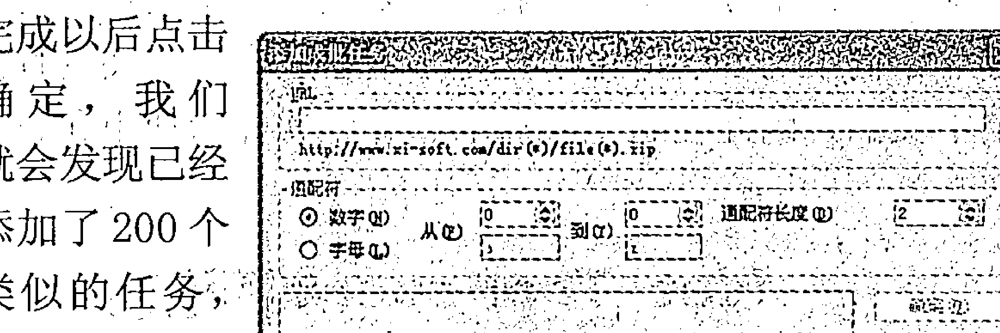

有时在下载流媒体文件时，为了得到一些限制IP地址段的服务器的“认同”，或者是为了得到更好的下载速度，我们常需设置代理服务器，而在Net Transport中可同时设置多个“代理服务器”，点击主界面中间的“代理服务器”标签，然后点击“添加”按钮即可进行添加，在设置完成后我们还需对设置进行验证：先选中设置的代理服务器项，再单击窗口下端的“验证”，在验证时我们可选择稳定性比较好的网站（如http://www.163.com），当然我们也可直接用它对你要下的流媒体文件地址进行验证，验证通过后便可使用它们进行代理下载了。

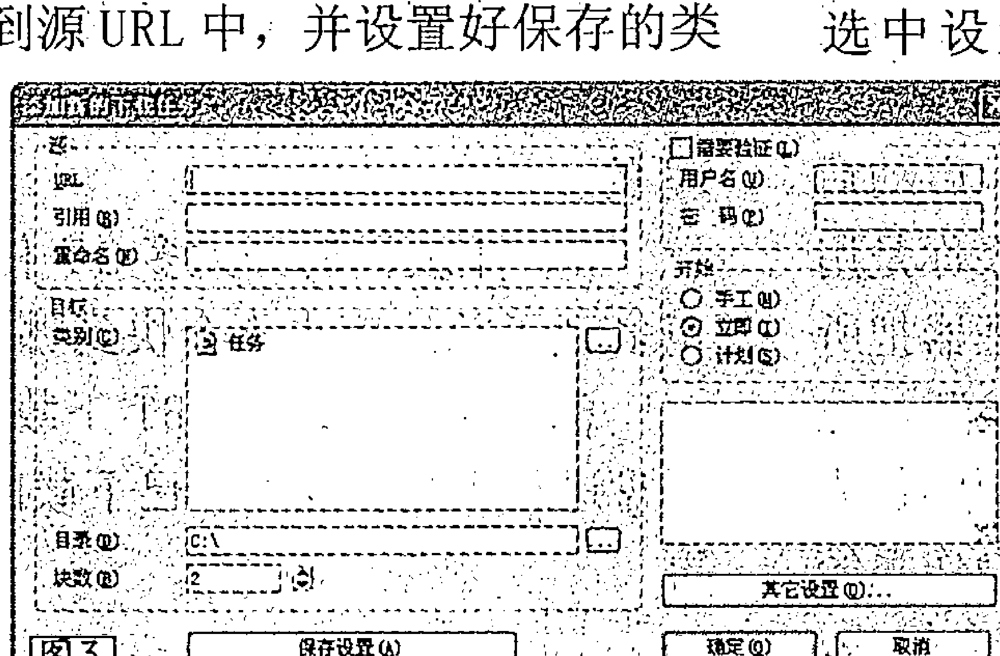

Net Transport的使用可以说是简单易行，相信通过上面的讲解，大家已经能够应用自如，现在就开始去下载电影到自己的电脑上面慢慢欣赏吧！

（文 / 水月斋）

## # 远程控制三剑客简明指南
什么是远程控制？就是通过网络来操纵远程的计算机。不要以为这是专业技术，其实，远程控制只是通过网络来操纵计算机的一种手段而已，只要运用得当，操纵远程的计算机也就如同操纵你眼前正在使用的计算机一样，没有任何区别。远程控制在网络管理、远程协作、远程办公等计算机领域都有着广泛的应用，它进一步克服了由于地域性的差异而带来的操作中的不便性，使得网络的效率得到了更大的发挥。

随着宽带应用的普及，普通用户的远程控制应用也越来越多了，设想一下你在办公室里面干活的时候，抽空远程控制家里的机器帮你下载一部电影，等你回到家里面的时候电影已经下载好了，可以直接观看！感觉一定很棒吧？下面我就来给大家介绍三款远程控制软件，方便大家选择适合自己的哦！

### 一、Netmeeting
Netmeeting不是网络会议软件吗？怎么也能够远程控制呢？说得没错，Netmeeting的主要作用就是网络会议，但是我们可以通过里面整合的“共享”功能来实现远程控制，我们只要将整个桌面“共享”出来，即可让对方进行远程的操作！下面我们来通过实例来看看实现步骤，这里假设我们要在本地机上控制远程机上的Word程序。

首先在本地机与远程机上都分别安装好Netmeeting，因为我们要控制远程计算机上的Word，按照前文所说的思路，先在远程计算机上打开Word。然后本地机与远程机都运行Netmeeting，由于是在局域网中进行远程控制，因此Netmeeting能不能登录到互联网上的目录服务器都无关紧要，而且，使用Netmeeting进行远程控制也无需像打网络电话一样要求准备好音箱和话筒。在本地机的Netmeeting地址栏内填入远程机的IP地址，开始呼叫远程机（图1）。

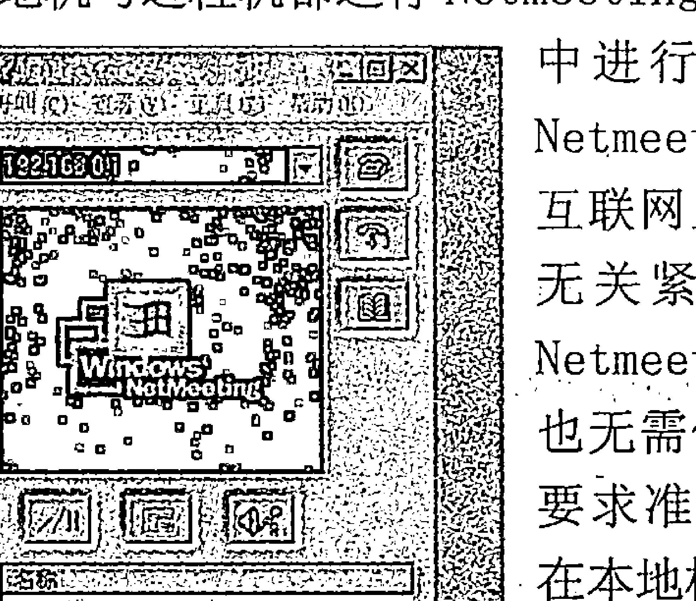

此时远程机上的Netmeeting会响起电话铃声，同时弹出窗口询问是否接受呼叫（图2）。若远程机同意接受本地机的呼叫，则需要远程机的使用者在远程机的Netmeeting上单击“接受”按钮，此时双方Netmeeting的通讯名单上都会出现本地机与远程机的用户名。在远程机上单击Netmeeting的“共享”菜单，选择“共享”，程序会弹出“共享程序”对话框，我们须选择Word（图3）。接着单击“共享”按钮，这时可以看到Word的前面打上了钩，并且Netmeeting下面“允许控制”的按钮被激活。在远程机上把Word设置为共享之后，本地机就会接收到远程机已开启了共享程序选项的信息，此时，本地机的Netmeeting会自动跳出监视面板，准备提交共享控制请求。

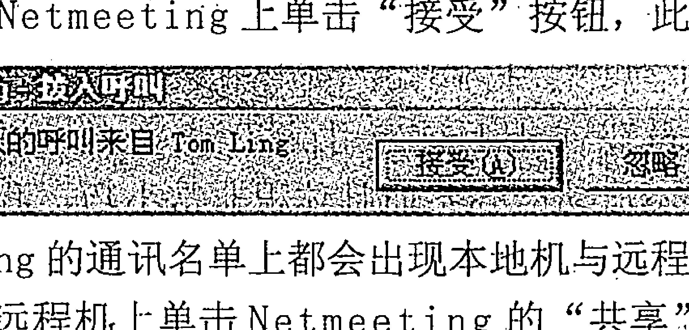

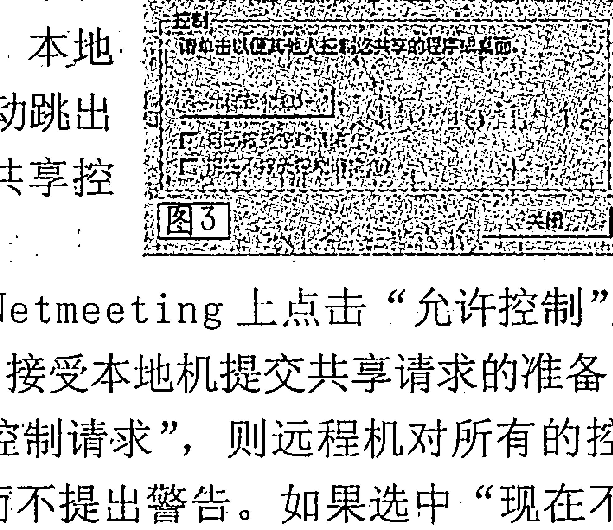

接着在远程机的Netmeeting上点击“允许控制”，此时远程机已经作好了接受本地机提交共享请求的准备。如果选中“自动接受控制请求”，则远程机对所有的控制请求都会自动接受而不提出警告。如果选中“现在不接受控制请求”，则远程机暂时不会处理控制请求。在本地机的Netmeeting的监视面板上单击“控制”菜单，点击“请求控制”，若远程机通过了本地机所提出的共享请求，则远程机上我们早已打开的Word程序窗口就会在本地机上的监视面板中出现。通过监视面板，我们在本地机上就可以直接对远程机的Word程序进行操作，就像是操作自己计算机上的程序一样。但是，我们要明白，我们操纵的Word是在远程机上运行的Word，实际上是远程机在负责具体工作，本地机仅仅是负责发送我们的操纵指令与显示操纵结果（图4）。

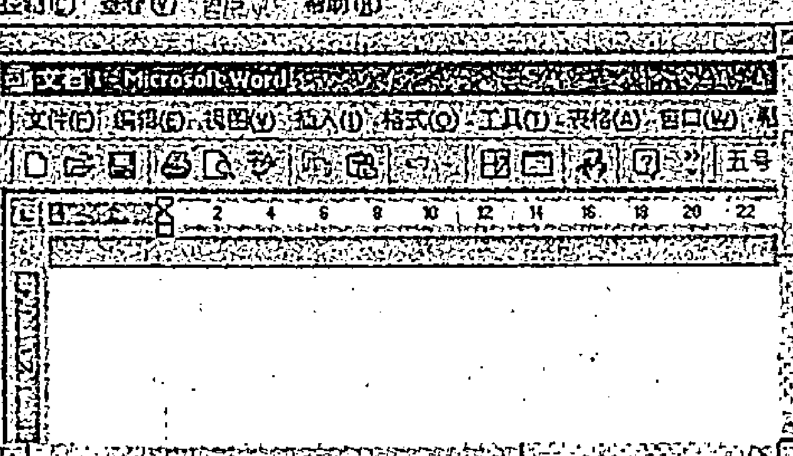

### 二、Remote Administrator
顾名思义，Remote Administrator 就是一个“远程管理员”，它是目前应用得相当广泛的一种远程控制软件，不但功能齐备而且体积非常小巧，我们可以在 http://ftp.pconline.com.cn/pub/download/200310/HA_Remote_Administrator21.rar 下载一个 2.1 版本的 Remote Administrator，虽然最新推出了 3.0 BETA 版本，但是说到最稳定和经典，还是要数 2.1 版本哦！下面我们来介绍一下通过 Remote Administrator 进行远程控制是如何操作的：

首先在本地机与远程机（我们假设这个例子之中的远程机为 Windows 2000 Sever 服务器）上分别安装好 Remote Administrator。它的安装非常简单，打开软件包之后运行安装文件，一路点击 NEXT 下去即可。安装结束以后会出现一个系统提示框，说明 Remote Administrator 可以在两种方式下运行，一种是添加到系统设置之中，随着 Windows 的启动，Remote Administrator 就会自动在后台运行；另一种是由管理员手动决定 Remote Administrator 何时启动。为了系统的安全起见我们建议选择后一种。

接着打开“开始” → “程序” → “Remote Administrator”，可以看到程序组主要包括“Remote Administrator viewer”、“Settings for Remote Administrator server”、“Start Remote Administrator server”、“Stop Remote Administrator server”四项。其中后三项是用在远程机上的组件，第一项是用在本地机上的组件。

在远程机上首先打开“Settings for Remote Administrator server”，此时可以看到把远程机配置成服务端的各种设置。其中，“Install Service”表示在本机上安装服务端程序，使本机变成被控制端；“Remove Service”表示删除本机安装的服务端程序；“Set Password”用来设置控制端对服务端进行控制时所需的密码；“Options”用来提供服务端接受控制端访问时所设置的各种选项（图 5）。

毫无疑问，在这里的重点是“Options”，打开之后我们可以看到图 6 的窗口。“Use IP Filter”指的是对局域网中的计算机进行过滤，只有在这个 IP 列表中的计算机才能向服务端提出控制请求，这对于远程管理服务器是非常重要的环节。一般而言，我们仅仅把网络管理员的计算机保留在列表中，除了管理员可以在自己的计算机上对服务器进行远程管理之外，其余的计算机所提交的控制请求一律拒绝。“Port”用来设置登录的端口号，默认值为 4899，如果此端口与服务器上提供的其余服务有冲突，则要自行更改端口。“Logging”是登录日志文件，记录了控制端登录服务端的时间以及操作步骤，并保存在 C:\logfile.txt 文件中，一般我们都要启用日志文件，以便日后查错。“Incoming connection dialog”指的是对控制端是否要求密码验证，通常都选中这一功能以提高服务端的安全性。

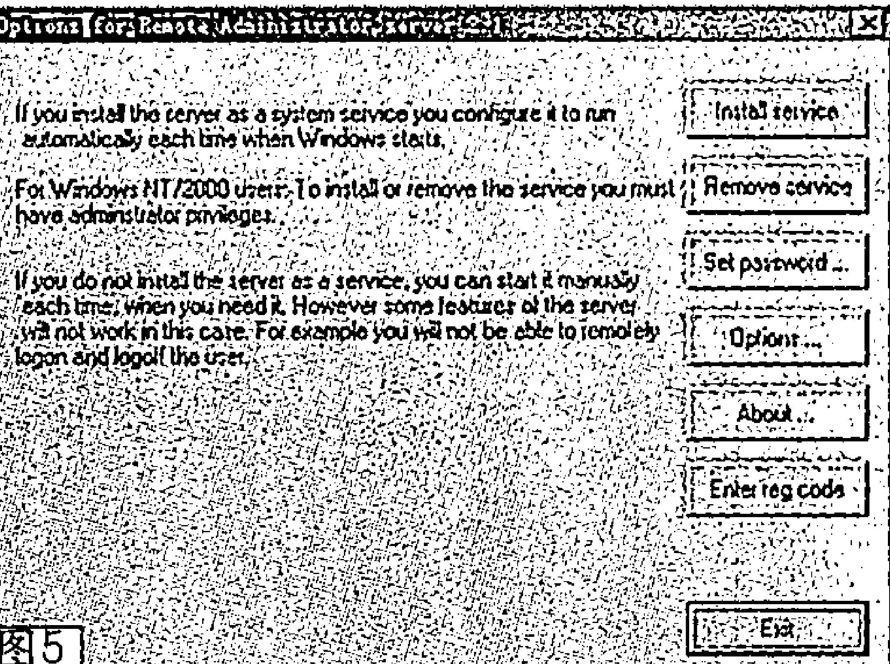

设置完毕后单击“Install Service”，Windows 2000 Server 服务器即可接受来自控制端的控制指令。此时 Remote Administrator 会成为任务栏中的一个小图标。接下来我们来看看如何配置控制端。我们只要在本地机上打开“Remote Administrator viewer”，就可以开始控制远程的 Windows 2000 Server 服务器。这实在是太简单了，比起 Netmeeting 来也要方便得多。

在“Connection”的下拉菜单中，选择“Connected to......”命令，弹出图 7 的窗口之后就可准备向远程机发送控制指令。其各项参数的含义如下：

**IP address or DNS name**：用来输入要控制的远程主机的 IP 地址或主机域名。在本实例中，我们填入 Windows 2000 Server 服务器的 IP 地址：192.168.0.1。

**Port**：设置登录的端口号，默认是 4899，如果远程机已经更改了另外的服务端口，这里也要与远程机保持一致。

**Connection Type**：设定对远程机的控制方式。其中，Full Control 是完全控制方式；View only 只对远程主机进行监控；Telnet 是指如果远程主机提供 Telenet 的登录方式，则可使用 Telenet 登录；File Transfer 可以与远程主机之间互传文件；Shutdown 关闭远程主机，这可是一个危险的功能，不要轻易选择 Shutdown，否则一个不慎，就会使远程控制的主机丢失数据。如果我们要对远程服务器进行管理，一般选择 Full Control。

接下来设置好要连接的远程主机参数（主要还是远程主机的 IP 地址），单击“Connect”之后就会看到远程主机的小图标出现在“Remote Administrator viewer”中。最后双击小图标，远程主机会提示密码验证，提供正确的控制密码后，Windows 2000 Server 服务器的桌面就会出现在终端窗口中。此时，网络管理员就可以控制远程服务器端的一切操作，如增删账户、磁盘整理、启动服务等。

Remote Administrator 除了设置简单的特点外，还有一个特点就是它的刷新速度快，充分利用了网络的传输效率。在远程机上控制 Windows 2000 Server 服务器，你的感觉像是在本地操纵自己的计算机一样。最后向大家介绍一个小技巧，控制远程主机的时候按 F12 键，终端窗口会拓展至全屏，使得远程主机的屏幕完全延伸到自己本地的计算机上。此外 Remote Administrator 并不只局限于远程控制网络中的一台服务器，事实上只要网络畅通，我们可以重复地在 IP address or DNS name 这一栏中填入各台服务器的 IP 地址，在 Remote Administrator viewer 中会出现代表不同服务器的小图标。此时我们就可打开多个终端窗口，实现对整个局域网中的服务器的集中管理哦！

### 三、RemotelyAnywhere
上面我们介绍了 Netmeeting 和 Remote Administrator，它们虽然都十分优秀，但是都有一个共同的缺点，那就是必须把远程控制软件分别在本地机与远程机上都要安装好，才能实现远程控制的目的。事实上还有一款很特殊的远程控制软件可以成为我们的选择，它最鲜明的特点是无需在本地机上安装，只须在远程机上安装设置完毕之后，在本地机上就可以通过 IE 或 Netscape 直接控制远程的计算机。

这款软件就是 RemotelyAnywhere，下载地址是 http://ftp.pconline.com.cn/pub/download/200403/Remotelyanywhere.zip，可以在 Windows 98 以后的所有微软系统之中运行。

在 RemotelyAnywhere 的安装过程之中有一些地方需要我们注意，你会遇到一个设置提示框（图 8）。因为这个软件是基于 WEB 页面操纵，因此它会提示你选择 HTTP 端口，作为本地机的浏览器与安装在远程机上的 RemotelyAnywhere 通信通道。默认值是 2000，如果没有必要，我们可以无需更改。


接着我们打开“开始”→“程序”→“RemotelyAnywhere”，运行“Launch RemotelyAnywhere”之后即可在任务栏中发现一个神秘的牛头标志在不停地闪动。此时，RemotelyAnywhere 就已经安装完毕，我们马上就可以在控制端上打开浏览器对服务端进行远程控制了。

如果你的服务器 IP 地址是 192.168.0.1，那么我们在控制端打开 IE 并且键入：192.168.0.1，但这个时候是不能打开的，浏览器中是空白一片？原来刚才我们在安装 RemotelyAnywhere 时设置了 HTTP 端口值为 2000，而 IE 的 HTTP 端口值默认为 80，因此不能访问到服务端的 RemotelyAnywhere，我们必须在 IE 浏览器中键入“http://192.168.0.1:2000”输入完毕之后按回车，我们就可以看到 RemotelyAnywhere 的服务端登录界面了（图 9）。

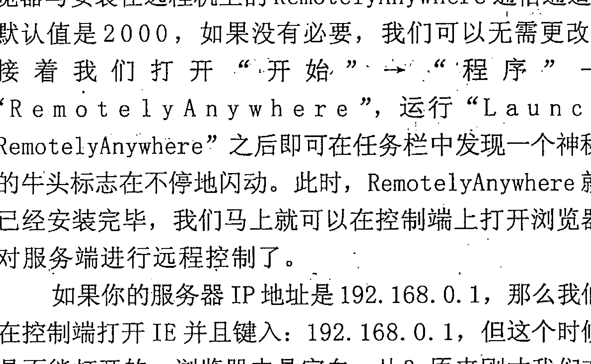

此时大家会发现登录界面的下方有着“Login”，“Remote Control”两个按钮选项，这是什么意思呢？其实，如果点击“Login”，大家看到的只是 RemotelyAnywhere 对服务端统计得出的一些系统信息，如当前登录账户名称及权限、CPU 占有率、磁盘资源使用状况等。这种时候我们可以对服务端的信息进行监控。但是，如果想对服务器本身的配置进行修改，我们要采取“Remote Control”的方式登录。选择“Remote Control”的方式登录后，我们的屏幕会闪烁一会，不久就会看到我们那熟悉的终端窗口界面，在终端窗口界面中即可对服务器执行各项配置的修改操作。

RemotelyAnywhere 可以说是远程控制软件中使用最简单的一款了，它无需复杂的配置，在控制端中打开浏览器即可对服务端进行控制。然而，它同样也有不足之处，首先，由于它那独特的基于 WEB 界面的管理方式，使得远程管理对网络速度有着较高的要求，如果在网络速度较慢的环境下，很容易出现服务端对控制指令响应延迟的情况。这就要求我们根据自己的实际需要进行灵活处理和选择不同的远程控制软件了。

（文/水月斋）

## 离线、简洁的离线浏览器Webdup
说起离线浏览器，Offline Explorer、WebZip、Telenet pro等国外软件相信大家都已经耳熟能详，但上述的软件都是收费软件，那有没有一款离线浏览软件既是中文界面又是完全免费的呢？当然有，那就是专门为国人量身定做的离线浏览器 Webdup!

首先我们到 http://ftp.pconline.com.cn/pub/download/Webdup093Beta.zip 去下载 Webdup 的最新版本，下载回来之后解压安装，过程比较简单，一路“next”下去即可，安装完毕之后，Webdup 会在桌面上建立快捷方式，你只需要双击便可以执行程序并且弹出主界面了（图1）。

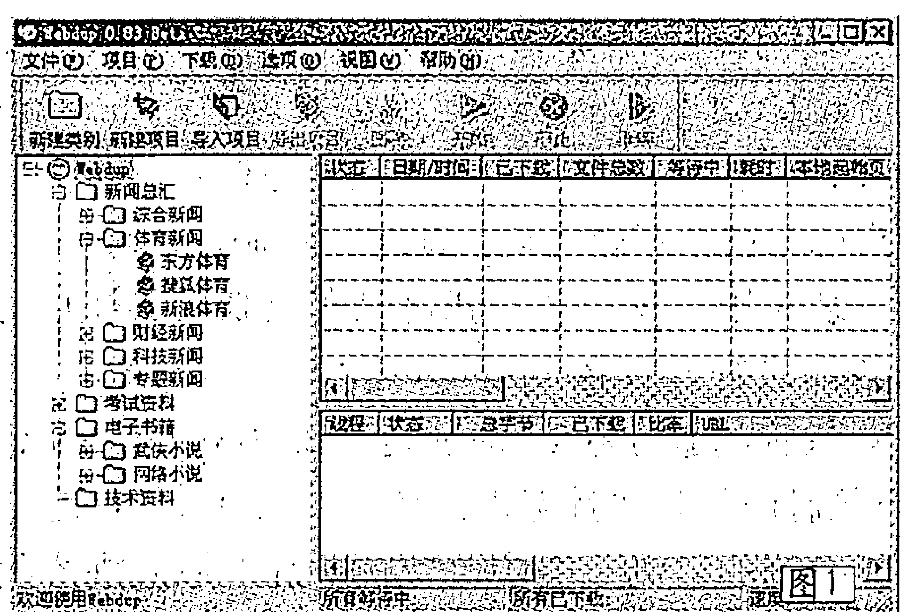

整个主界面大致可划分为三大块，左边是 Webdup 的虚拟文件夹，右边从上到下分别是下载状态数据列表以及当前下载线程状态，和当前国内流行的下载软件 NetAnts 的界面极为类似，新手使用起来也十分方便，相信很容易就能上手。而处于软件界面上方的标准按钮栏则几乎包含了整个软件的所有功能，轻轻一按就可以达到目的，考虑得十分周全，在软件界面的底部还提供了一个小的状态条，这里显示了下载任务的状态，分别是“所有等待中的任务”、“所有已下载的任务”以及当前网络的速度。

可以说不需要打开其他窗口，直接在主界面上我们就可以获得许多关于下载的资讯，直观、简洁就是对 Webdup 界面的最好评价。值得一提的是，我们启动 Webdup 后，占用的系统资源不到 4%，比起那些动不动就是 20% 左右的系统资源占有率的软件说来，Webdup 算是很少的了。

Webdup 的方便之处在于它可以按照用户的设置下载网页以及相关链接，甚至下载整个网站，更具有备份历次下载记录和对下载信息进行分类管理的功能。就 Webdup 发布的当前版本看来已经实现了以下功能：
- 支持多线程下载（每个项目最多可有 20 个线程同时下载，最多可同时下载 8 个项目）
- 支持 HTTP 代理服务器
- 可根据 URL 地址设置过滤，只下载所需网页/文件
- 支持对单个网页/文件的断点续传
- 自动识别下载过的网页/文件在网上是否更新过，以减少重复下载
- 对拨号用户来说，可在下载结束后可实现自动挂断
- 可以导入预先设定好的项目文件，使用户更方便地创建新项目
- 支持项目和目录的拖曳操作，更方便用户分类管理项目
- 能自动识别操作系统的语言，在中文环境下显示中文，其它环境下显示英文等，使用起来十分得心应手。

### 一、创建新类别和新项目
Webdup 中的“类别”相当于文件夹，点击“新建类别”按钮即可建立一个类别。用户可按自己的喜好设计“类别”的层次结构。至于“项目”实际上就是一个下载任务，创建新项目的方法有以下三种：

第一种方法是直接创建。点击“新建项目”工具按钮，按照弹出的“新建项目向导”的提示，输入项目名称、存放路径、要下载的首页地址和下载层数。如果在每次下载前需要对上一次的下载进行备份的话（比如，下载新闻时想要保存前一天下载的新闻），则请选择“备份上一次”，否则当前下载会覆盖掉上一次的下载内容。

第二种方法是监视剪贴板创建新项目。点击“选项”菜单，在弹出的下拉菜单中选择“监视剪贴板”，当用户在网上发现感兴趣的内容时，可通过右键快捷菜单的“复制”命令，将其URL拷到“剪贴板”，这时Webdup就会自动弹出“创建新项目向导”，缺省使用URL中的服务器名作为项目名称，并将此URL作为下载起始地址。这种方法免除了输入URL地址的麻烦，特别适合下载不太熟悉的网站内容。

第三种方法是通过导入项目创建新项目。点击“导入项目”工具按钮，在弹出的文件对话框中，选择要导入的项目文件，点击“打开”按钮，在弹出的“导入项目”对话框中，会显示缺省的项目名称和存放路径，用户可以根据需要进行修改，最后点击“确定”即可。

默认状态下，Webdup已帮你创建了4大类别近20个项目可直接使用，作者真是很体贴用户啊。另外，在Webdup网站上有一些预先设定好的项目文件供用户下载。

### 二、设置项目

要想Webdup更好的为我们服务，对软件进行一些相关的设置是十分必要的。用鼠标选中要设置的“项目”，单击鼠标右键，选择快捷菜单中的“属性”，打开项目的属性设置对话框，该对话框包括4个标签页，各标签页的设置内容介绍如下：

1. 基本设置：基本设置中可以设置项目的起始地址，层数限制、访问该站点所需的用户名和口令。但要注意的是，这里所说的并非是显示在站点首页面上的那种注册用户登录的用户名和口令，事实上，这里所说的用户名和口令对于绝大多数站点是不需要的。另外，用户还可以设置是否需要备份上一次的下载以及是否要下载图片等。该版本中新增了可以在起始地址中使用日期变量 $DATE 来动态表示日期的功能，以方便用户每天下载起始地址中包含日期的新闻网站。

2. URL过滤：在项目的属性中，除了设置“起始地址”和“层数”外，合理设置“URL过滤”可使您只下载想要的网页和文件，加快下载进程。

通配符“*”过滤：“*”表示任意个字符，在设置过滤时非常有用。例如，Webdup的站点主页有中英文两个版本，如果只下载Webdup的中文站点，可以在“路径过滤”中选择“指定路径”，并输入“/gb/*”；又如，不需要下载所有的“.zip”文件，可以在“路径过滤”的“但不包括”中输入“*.zip”。

服务器过滤：缺省状态下，服务器过滤的设置为“起始服务器”。很多时候，需要把这一设置改为“指定服务器”并输入允许下载的服务器名称，否则有可能下载很多不必要的文件。

路径过滤：如果要指定路径过滤，第一个字符必须为“/”。如果要指定单纯的文件，则不要包含任何“/”字符。如果要包含服务器名称，请输入“服务器+路径”，如“www.webdup.com/gb/*”。如果只要指定某个目录下的文件，而不包括该目录下的子目录，请把最后一个字符设为“/”。如“/gb/”不同于“/gb/*”，后者包括了“/gb”目录下的所有子目录。

3. 代理服务器：在代理服务器中可以设置是否使用缺省代理服务器设置，或是为该项目单独设置代理服务器。一般情况下都是使用缺省代理服务器设置，这也是项目的缺省设置。

4. 高级设置：高级设置中可以设置每个项目同时运行的下载线程数、数据传输时的超时和重试次数，还有硬盘空闲空间的限制，最小不能少于2兆，并且还可以设置用户代理等。

### 三、进行下载

在Webdup中，最多可以同时下载8个项目，每个项目最多可有50个线程。选中要下载的项目，然后点击工具栏中的“开始”即开始下载。在下载过程中可以随时停止，选中正在下载的项目，点击工具栏中的“停止”按钮即可。停止下载时会把当前的断点信息保存到日志文件中，停止下载后如果又想继续下载，请点击“继续”按钮，此时将从停止时所保存的断点处开始下载。

此外，我们还可以结合“定时下载”和“定时停止下载”功能来完成自动下载任务。要实现定时下载，只需选择“定时器” -> “下载 / 停止”菜单，并把项目加入到“下载定时器”中即可；要实现定时停止下载，只需设定“停止定时器”，或者在项目的“高级设置”中设置“最大下载时间”来控制单个项目的下载时间。

### 四、脱机浏览

下载结束后，Webdup会在下载记录的目录下创建一个索引文件index.html。用户可直接从资源管理器中打开该索引文件来进行浏览，而不必运行Webdup。对于只有一个起始地址的项目，可以双击要浏览的下载记录来打开该记录的“本地起始文件”，如果“本地起始文件”是HTML文件，则会调用缺省的浏览器来打开。对于多个独立地址的项目，可以使用“查看索引”功能来进行浏览。

建”，此时如果项目原来所在的类别已经不存在了，则重建时会先创建原来的类别。

### 五、项目管理

Webdup提供了对项目的分类管理功能，同时还提供了方便的删除和恢复等操作。要删除项目或类别时，只需选中要删除的项目或类别，按Del键即可。在删除时，用户可在弹出的确认对话框中选择是否要删除所有相关文件，若选择是，则会把与项目有关的所有下载记录以及日志文件全部删除。

如果用户误删除了项目，或意外情况下丢失了创建的项目，只要和项目相关的文件没有从硬盘上删除，我们可以使用“搜索和重建”功能来恢复这些项目。选择“文件”菜单中的“搜索和重建”，打开“搜索和重建”对话框。用户需要先对选定的路径进行搜索，然后选择要恢复的项目，按“重新创建”按钮即可。重建时可以选择是否“按项目原来所在的类别进行重

### 六、其他设置

- 项目路径和缺省路径
每个项目都有一个独立的项目路径，所有与该项目有关的下载文件以及日志等都存放在该路径下。该路径也就是在硬盘上的一个目录，即一个项目对应于一个目录。缺省路径则是指创建新项目时，缺省用来创建新项目目录的父目录。
- 缺省代理服务器设置
当新建项目时，项目缺省使用缺省代理服务器设置。这样，当用户的上网环境改变时，只需要改变缺省代理服务器设置就可以了。

相信看了上面的介绍，大家对Webdup也有了一些初步的认识了吧？还等什么呢？快去下载一个回来试试吧，Webdup还有很多功能等着你去发掘呢！

（文/水月斋）

## WinGate让家里的几台电脑都上网

现在不少朋友家里都有两台甚至更多的电脑，在宽带环境下我们希望所有的电脑都可以上网，因此网络共享便成为了许多朋友争相学习的热点，下面我给大家详细介绍一个老牌的网络共享软件——WinGate，希望能够通过下面的文章帮助大家成为一个“准网管”，管理好家里的电脑，能够一起共享上网哦！

首先我们在 http://ftp.pconline.com.cn/pub/download/200403/wgsetup.exe 下载WinGate的最新版本。在安装WinGate之前我们需要首先确认两件工作已经完成：作为服务器的那台电脑可以正常连接Internet，局域网已连接完成并能正常工作，并且所有计算机都安装了TCP/IP网络协议。

接下来在服务器上运行WinGate安装程序，按照安装向导提示进行安装，在提示WinGate安装模式的时候注意选择安装为服务器模式哦！安装完成并重新启动之后，如果安装在Windows NT或者Windows 2000操作系统上WinGate就会被作为一项标准服务自动运行；如果是安装在Windows 9x上，则会进入启动组，每次启动Windows 9x后WinGate自动运行。接下来我们需要设置WinGate服务器网络的TCP/IP各项属性，通过以下顺序进入设置面板：“开始”→“设置”→“控制面板”→“网络”→“连接局域网的网卡TCP/IP”→“属性”，性”，这时将会看到TCP/IP属性窗口（图1），对其中“IP地址”项目作如下设置：选择“使用下面的IP地址”，在IP地址中填入 192.168.1.1，这是一个不可路由的在互联网上非法的保留局域网地址，所以可以指定给WinGate主机。然后在子网掩码中填入255.255.255.0。其他项目保持默认值即可。

重新启动计算机之后服务器的安装和设置就完成了。如果你的服务器上拨号网络中有多个拨号连接，那么在启动WinGate的时候，系统会让你选择哪一个拨号连接用于自动连接互联网，你只需要选择一个正确的拨号连接即可，这样当局域网用户使用WinGate服务的时候服务器就能自动连接互联网并提供共享上网服务。以上服务器设置方法适用于适用普通MODEM拨号上网和ISDN拨号上网。

### 一、ADSL上网方式的配置

随着目前ADSL宽带接入方式的推广，ADSL接入已经成为一种获得快速互联网连接的经济实惠的方法，下面我们来看看使用ADSL上网情况下WinGate服务器的安装配置。WinGate服务器需要安装两块网卡，一块连接内部的局域网，另外一块连接ADSL MODEM，用于连接互联网。首先根据ISP的安装方法安装好ADSL（专线方式或者PPPoE虚拟拨号）并且正确连接到Internet。然后安装WinGate软件，安装方法和普通拨号一样。下面我们对服务器进行相应的配置。

如果您用Winpoet或RasPPPoE拨号上网，由于这两款软件完全仿真普通拨号方式工作，会自动在拨号网络中生成拨号连接，所以我们参照普通拨号方式进行设置。内部连接的网卡，设置IP地址为192.168.1.1，子网掩码255.255.255.0。另外一块用于外部连接ADSL的网卡，我们可以给它的IP地址指定一个区别于内部连接网卡IP地址网段的地址，例如192.168.88.88以提高服务器的启动速度，其他不变，重新启动计算机即可。在WinGate询问选择哪一个拨号连接用于自动连接互联网时，只需要选择PPPoE软件生成的那个拨号连接即可。

如果你是使用Enternet拨号上网，它使用了自有的虚拟拨号方式上网，所以服务器的设置方法有些不同且复杂，首先设置内部连接的网卡，设置IP地址为192.168.1.1，子网掩码255.255.255.0。其他的TCP/IP设置不做修改，然后重新启动计算机。另外一块用于外部连接ADSL的网卡，我们可以给它的IP地址指定一个区别于内部连接网卡IP地址网段的地址，例如192.168.88.88以提高服务器的启动速度，其他不变。

我们在Enternet连接上互联网之后进入WinGate的控制台，在左侧窗口我们可以看到System、Services、Users三个控制面板。如果WinGate只是用于共享上网目的，我们只要修改Services面板内的配置项目即可。点击局域网用户需要使用的应用协议，例如需要WinGate代理WWW使局域网用户访问互联网网页，就点击WWW Proxy Server，在打开的WWW Proxy Server properties控制面板（图2）里面选择Bindings面板，在Available窗口中当前有3个连接接口，192.168.1.1（连接局域网的网卡）、192.168.88.88（连接ADSL MODEM的网卡）、xxx.xxx.xxx.xxx（某个互联网合法IP，它就是Enternet与互联网连接的虚拟网卡）。选中Specify Interfaces connections will be accepted on选项，告知WinGate使用特定连接接口来接收局域网用户的访问互联网请求，然后在Available选择连接局域网的接口192.168.1.1，双击加入到Bound窗口；Bound窗口原有的127.0.0.1不用理会，这是服务器本机回路。如果WinGate安装以后已经自动全都把192.168.1.1，192.168.88.88，和127.0.0.1加入了内部局域网接受端口，那么可以把连接ADSL的192.168.88.88从中删除。

接下来我们切换到Interfaces面板（图3），确定选中了“Connections out will be made on any interface. The operating system will choose the correct interface”选项，该选项设置使WinGate使用的连接外部互联网的接口由操作系统自动调整，这样操作系统就会自动使用Enternet的连接来为WinGate服务器提供外部连接。其他互联网应用协议FTP、POP3等的代理服务设置与此相同，根据实际需要设置好即可，如果还需要WinGate为局域网提供DNS、DHCP等服务则可以在System面板的相应服务控制面板中设置即可，设置方法与上面类似。

### 二、专线上网方式的配置

此方式适合使用小区、城域网以及光纤宽带用户，首先配置用于内部连接的网卡的TCP/IP属性和内部连接网卡的“IP地址”属性，与拨号连接相似，也是指定一个IP地址，所以在IP地址中填入192.168.1.1，然后在子网掩码中填入255.255.255.0，其他的TCP/IP设置面板不做修改。设置完成以后重新启动计算机。另外一块用于外部连接的网卡则按照ISP的专线方式上网设置办法进行设置即可。然后打开WinGate控制面板，参考上面PPPoE中Enternet设置方法对所需代理的互联网应用协议设置内部和外部连接，内部连接使用连接局域网的网卡，外部连接使用连接ADSL专线的外部网卡。至此服务器上的基本设置工作就完成了。

此外还有几个常用到的设置我们这里也简要介绍一下。如果我们发现在WinGate的Services控制面板中缺少某种代理服务，可使用鼠标右键点击现存的任何一个代理服务，在弹出菜单中选择New Service就可以增加所需要的代理服务（图4）。

在WinGate的System控制面板中进入Cache设置窗口，在Limit Cache Size项中所填入的设定值将使WinGate在硬盘中保留该数量的缓存，当客户机访问互联网的时候，如果缓存中保存了原来访问时保存的数据，则直接从WinGate服务器发送给客户机提高访问速度。这里根据服务器硬盘的大小来定，设大一些加速效果较好。在这个配置面板中还可以看到有两个Number of days before rechecking选项，是指Cache的更新周期，即Cache中的内容经过指定的天数后，若再次访问到这一内容时，WinGate会将它与网上的内容作比较，如果此内容已更新就重新下载。第一个选项是设定HTML文件的更新周期，默认值为2天，第二个选项是其他文件的更新周期，默认值为60天。如果客户机时效性要求不太高，为了提高速度可以略微把这两个数值增大。如果希望更新缓存中的内容为最新的内容，利用浏览器的“刷新”功能就可以浏览新的内容并强制更新缓存。WinGate的功能十分强大，其对应的设置也很多，其他设置这里就不赘述了。

### 三、设置客户机

各客户机可以选择以客户端模式安装WinGate，即安装WinGate客户端，也可以不安装客户端。安装WinGate客户端可以增加一些功能和应用协议的支持能力，例如，当局域网中有2台以上WinGate服务器时，可以自主选择使用哪一台作为代理等，可以根据自己的需要进行选择。接下来设置客户机的TCP/IP属性。设置操作步骤同服务器设置类似，对网卡的TCP/IP属性进行设定。如果WinGate服务器设置了为局域网提供DHCP服务，那么在IP地址处，选择自动获取IP地址，否则依次为各台局域网客户机设置IP地址：192.168.1.X（X=2、3、4……各台客户机的IP地址不能相同），子网掩码：255.255.255.0，其他项目都不作设置，完成以后重新启动计算机。紧接着需要测试客户机和服务器的连接状况。在各工作站上进入MS-DOS方式，输入Ping 192.168.1.1，如果出现“reply from……”的提示则证明与服务器连接成功，如出现“request timeout”的提示则说明连接存在问题，需再进行网络连接和TCP/IP的设置检查。

| 应用协议 | port端口 | 说明       |
|----------|----------|------------|
| FTP      | 21       | 文件传输   |
| Telnet   | 23       | 远程登录   |
| Gopher   | 70       | 文本式浏览 |
| HTTP     | 80       | WWW浏览    |
| POP3     | 110      | 邮件接收   |
| NNTP     | 119      | 新闻组     |
| SMTP     | 25       | 发送邮件   |

设置客户机上的Internet应用软件。由于我们使用的是Proxy类型局域网共享上网，各种互联网应用软件使用了不同的互联网应用协议，所以我们需要在客户机上为每一个Internet应用软件设定使用proxy，一般来说支持使用proxy的应用程序都会有设置proxy代理服务器的项目，用于输入代理服务的地址以及相对应的port端口，不同的Internet应用协议使用不同的连接端口，所以依据所使用的不同应用软件，为它们设置正确的使用端口，以下是在Internet上较为通用的应用协议所使用的端口值（图5）。按照互利网端口通用标准，WinGate也用以上的端口来进行代理服务，我们所要作的就是将Internet应用程序的Proxy设置指向WinGate服务器，通常就可以正常实现共享上网，在这里我们Proxy地址就是指向WinGate服务器即192.168.1.1。

譬如说我们要在IE里面设置代理，可以点击“工具”→“Internet选项”→“连接”→“局域网设置”→“代理服务器”，选择使用代理服务器之后输入浏览器相应应用协议的代理服务器地址和端口即可（图6）。这里除了HTTP以外的其他应用协议只对浏览器本身用到的该应用协议起作用，例如浏览器内置的FTP浏览功能。

对于其他独立的应用软件还需要对其独立设置。如果要在Outlook里面设置，首先进入Outlook，按顺序选择“工具”→“账号”→“邮件账号”→“服务器”，在SMTP和POP3服务器地址栏上均填上192.168.1.1，“账号名”中填入邮件提供商提供给你的邮箱账号，后面紧接着用“#”号代替“@”，在“#”后面接着是邮件收件服务器的网址。例如你的邮件地址是abcd@mymail.com，邮件收件服务器是pop3.mymail.com，那么这里就填入abcd#pop3.mymail.com，“密码”栏填入这一账号的密码，最后再转到“连接”设置，选择“使用局域网（LAN）连接”，最后选择“确定”即可。

至于其他软件的设置办法，可以参考软件说明自行设置。完成了以上所有设置后就可以上网测试了，在服务器上根据上网方式运行相应的连接（拨号/ISDN/ADSL）程序完成联网过程，然后确定WinGate所需要的代理服务已经运行，如果需要的代理服务没有运行则会在WinGate的Service面板中显示红色的警告图标，使用鼠标右键点击这个代理服务，在弹出菜单中选择Start就可以启动它，当不需要的时候也可以点Stop停止。然后在各工作站上打开浏览器，随便连接一个站点，看看能否成功，如果不成功请仔细检查各项设置，直至所有工作站均能上网为止哦！（文/水月斋）

## 变速齿轮

### ——改变你的游戏速度

你想过能够在网络游戏之中用比别人少一半的时间来练功吗？想过在网络游戏之中跑得比别人快几倍吗？这不是天方夜谭，只要你拥有一个软件即可实现，这个软件就是变速齿轮了。变速齿轮是一个神奇的改变游戏速度的程序，是世界上第一个可以改变Windows游戏速度的程序，现在已经可以在Windows NT/XP下运行了，它可以加快也可以减慢游戏速度。所以如果你觉得你的反应速度够快，不需要降低速度的话，那么就在那些磨蹭的游戏中用它加快速度吧。

首先我们在 http://ftp.pconline.com.cn/pub/download/200401/Gear_Setup.rar 下载一个最新的0.24B版本，完成之后安装，然后点击“开始”→“所有程序”→“变速齿轮”启动软件，出现如图1所示的主界面。在主界面的上方我们可以看到一个滑动条，我们可以通过拖动这个滑动条来调整程序的运行速度，而在下面的窗口之中则是显示出当前已经运行了的、速度还没有被改变的程序，如果想要改变这些程序的运行速度，只要在下面用鼠标选择了这些程序，然后点击“加入”按钮，即可将这些程序加入到右边的窗口“速度改变的进程”里面，此时只要拖动滑动条即可改变这些程序的运行速度。

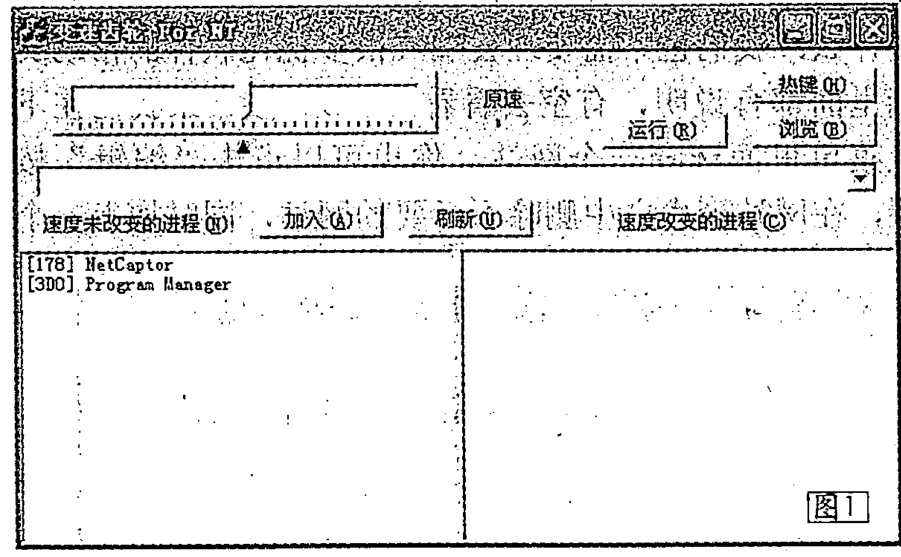

如果你在启动变速齿轮之前还没有启动游戏的话，此时你可以点击“浏览”按钮，在弹出的窗口之中你可以打开游戏的安装目录，一直找到启动游戏的应用程序名称，选择好了之后变速齿轮便会自动根据滑动条上面的速度指示去启动这个游戏了。退出游戏之后变速齿轮还会记住最近几个你曾经使用过的游戏程序的路径，如果你需要重新启动这些游戏，只需要在中间的下拉菜单里面选择程序的路径，然后点击“运行”按钮即可。

点击主界面上面的“热键”按钮我们可以看到图2的窗口，这里面我们首先看到两个“固定速度”的选项。所谓的固定速度，就是让你在游戏进行的过程之中随意更改速度而不需要切换回到桌面再拖动滑动条，一般其中一个固定速度就是正常的速度了，另外一个速度我们可以随意调整，至于热键也是如此，只要我们点击一下欲更改的热键框，然后在键盘上面按自己想要的快捷键即可。此外我们还可以设定“加快速度”和“减慢速度”的热键，这些都可以让我们在游戏之中随时关注和调整自己的速度。如果你觉得调整速度的“幅度”太大，你可以将下面的“加快减慢热键使用精细调节”前面的复选框选中，这样虽然调整的速率降低了，但是精度却大大提高，对于一些防止改变速度外挂的网络游戏而言，你可以一点点将速度加上去，而不会被服务器轻易发现哦！

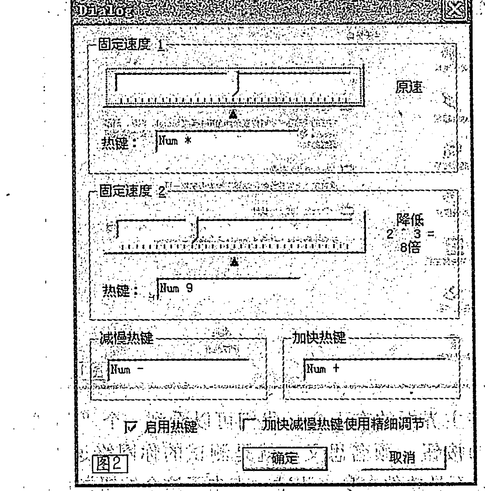

拥有了变速齿轮之后，我们会发现游戏中更多的乐趣，不过在网络游戏之中使用外挂去侵犯别的玩家利益可是一件不道德的事情哦！因此大家最好利用变速齿轮来自娱自乐，在网络游戏的大环境之中，还是倡导公平竞争吧。

（文/水月斋）

## ADSL超频奇兵，帮助菜鸟全速冲浪

在目前宽带上网的人群之中，有相当一部分的朋友是使用ADSL上网的，在Windows的缺省设定之中并没有为ADSL上网进行过优化，因此在大部分时间里面，我们的ADSL都不是运行在全速之下。虽然网上有不少提高ADSL速度的方法，但这些方法通常距离我们实际情况都相差很远，因为不同地域的ADSL设定是完全不同的，带宽也不同，因此就需要有一款软件，不但使用简单，而且还能够根据我们的实际情况来对ADSL进行优化设置（即所谓的超频），这款软件就是ADSL超频奇兵了。

首先我们到 http://zztl-http.skycn.net:8081/down/adsl_202.zip 下载一个超频奇兵的最新版本，“奇兵软件”是一个系列，都是一些非常实用的小工具！下载完毕之后经过简单的安装，我们便可以运行超频奇兵，看到如图1所示的主界面了。超频奇兵的界面非常简单，左边一竖排的按钮里面已经包含了其全部按钮，下面我们来逐一介绍一下：

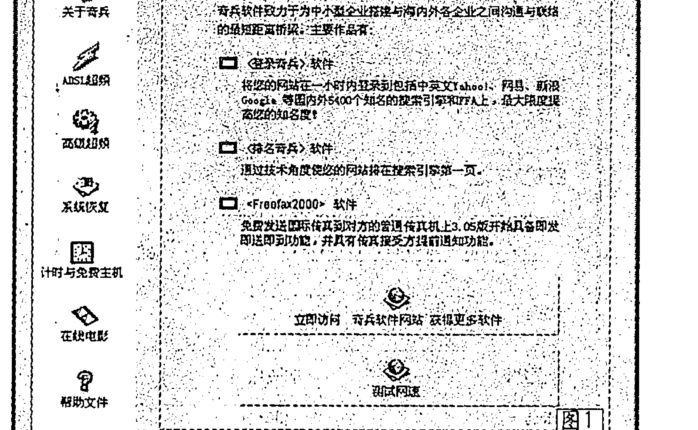

在主界面的右下方，我们可以看到一个“测试网速”的按钮，顾名思义，就是测试你的网络速度了，不过并不是软件本身来测试，点击了这个按钮之后，它会自动打开IE并且连接到“http://www.dsl-speed.org/test.htm”网站，在里面列出了很多著名的速度测试网站，可惜大多数都是英文的，对于英文不好的用户而言就有点麻烦了，不过不要紧，反正这里只是测试一下而已，我们能够真正获得高速度才是最重要的哦！

点击“ADSL超频”按钮，即可看到图2所示的窗口了，窗口上半部分介绍了超频奇兵的基本原理，下面则提供了一个“普通超频”按钮，只要点击其一下，立刻便会有一个弹出窗口，告诉你“超频成功，重启计算机后生效”，是不是有点奇怪为什么这么快？其实所谓的超频就是修改注册表里面的一些数值而已了。不过普通超频只具有“普遍性”，超频所预设的数值未必适合你当前的系统哦！

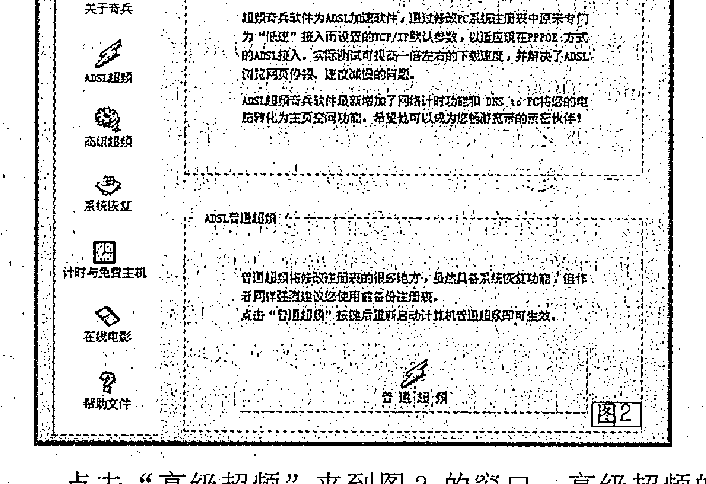

点击“高级超频”来到图3的窗口，高级超频的原理就是通过和指定网站的连线来测试你的实际网络速度，然后告诉你什么MTU值是最适合你的，至于MTU值是什么，我们也不需要理会哦（很多优化软件的帮助文档里面都有说明，有空去看看^_^）。接下来我们在下拉菜单里面选择一个网站，你也可以点击“编辑”按钮，在网站列表之中删除不必要的网站，同时加上一个自己经常访问的网站或者本地ISP的网站，选择好了之后点击“开始校验”，很快超频奇兵就会给出一个最适合当前系统的MTU值了，接下来我们点击右下角的“高级超频”按钮，很快也会看到超频完成的弹出窗口，怎么样？是不是很简单？现在超频已经完成了！

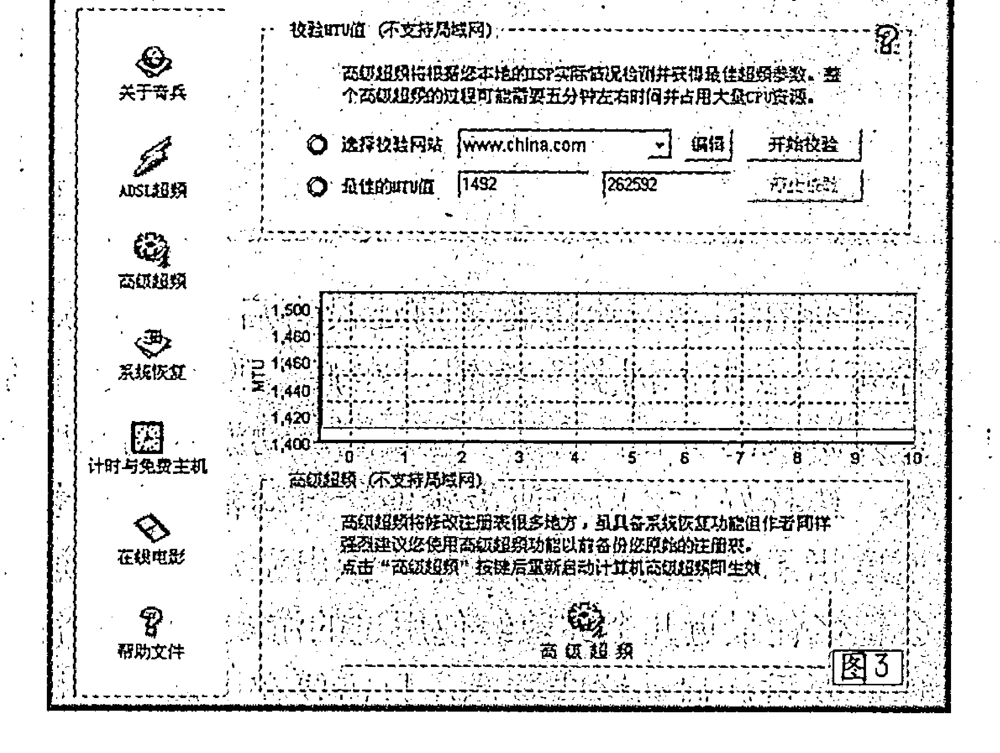

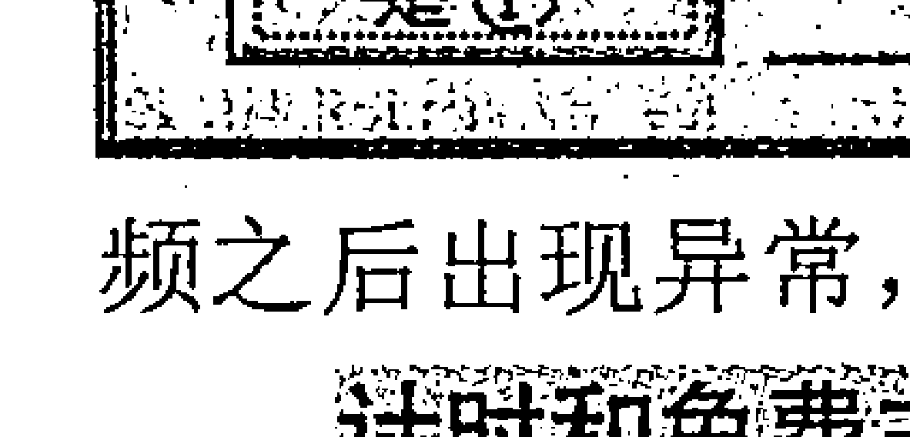

点击“系统恢复”按钮，你会看到图4的弹出窗口，这里是让你将系统网络设置恢复到超频之前的状态，如果你的网络在超频之后出现异常，可以用这个功能来恢复以前的设置。

计时和免费主机：点击这个按钮之后出现的窗口如图5所示，这里可以让你设置统计上网时间，主要就是方便那些不是包月上网的ADSL用户，至于下面则是一个“用你的电脑做个人网站”的功能，和现在很多的IP88.NET，VICP.NET的原理一样，都是动态DNS解析软件，不过这个动态DNS是在国外的，因此速度十分慢，大家要真的想用自己的电脑做主页的话，还不如去申请IP88或者VICP。

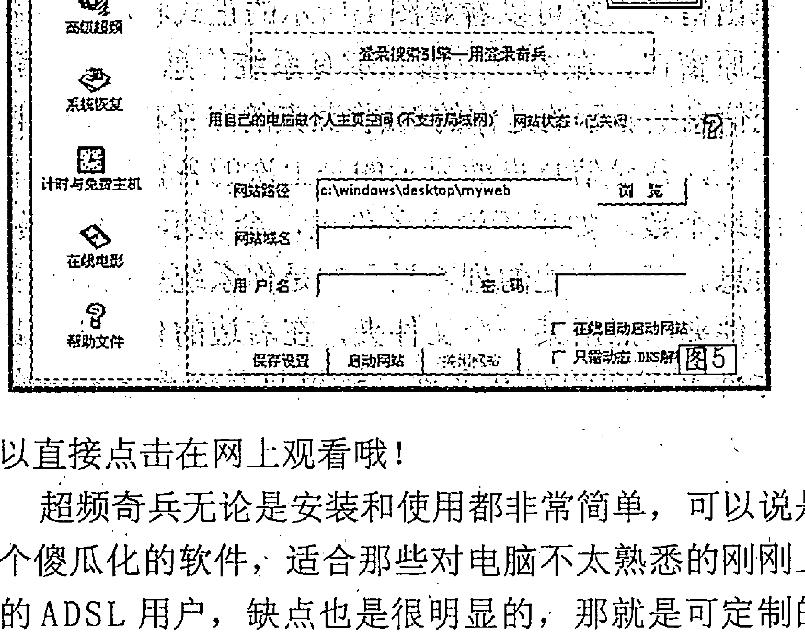

在线电影：点击这个按钮之后即会连接到作者的主页，在那里列出了一系列的在线电影资源的网址，用户可以直接点击在网上观看哦！

超频奇兵无论是安装和使用都非常简单，可以说是一个傻瓜化的软件，适合那些对电脑不太熟悉的刚刚上网的ADSL用户，缺点也是很明显的，那就是可定制的选项不足，但是对于初学者而言已经绰绰有余了。因此如果你是一个需要提高网络速度的“菜鸟”，那么快点来下载一个超频奇兵吧！

（文/水月斋）

## 备份之星，备份随心所欲

您是否因为重装了系统或者受到病毒的破坏，而丢失了辛辛苦苦整理的IE收藏夹、宝贵的E-mail邮件、QQ聊天记录、系统字体？是否为不小心删除了一些重要文件而后悔不已？是否为注册表的破坏，造成系统混乱，而无从入手……其实，只要你进行了及时有效的备份，这一切就都可以避免了。备份之星正是一款很优秀的备份软件！

### 一、安装和基本设置

首先我们到 http://sccnc.onlinedown.net/down/BakStar22c1108.exe 去下载一个备份之星最新的2.2版本，由于这是共享软件，因此需要通过注册才可以去掉未注册的字样以及功能限制。软件的安装是十分简单的，安装完毕之后启动备份之星，我们便看到图1所示的软件主界面了。在左边我们可以看到一系列的下拉项目以及按钮，这些就是备份之星的主要功能了，但在使用这些功能之前，我们应先点击“文件”→“选项”，弹出图2的窗口进行设定。

路径设置：备份之星(BakStar)存放备份数据的默认路径是“%程序安装路径%\backup\”。比如说你的备份之星安装在E:\BakStar\，那你的备份文件的默认存放路径就是E:\BakStar\backup\，一般文件的默认的备份存放路径就是E:\BakStar\backup\files。你要是移动了备份之星(BakStar)的目录，那备份文件的存放路径也就相应的自动改变了，而并不需要你的重新设置。因为你在移动备份之星（BakStar）目录的同时，也连带移动了 BakStar 文件夹下面的 Backup 文件夹。你也可以修改备份之星的临时文件的存放路径，但推荐使用缺省路径。

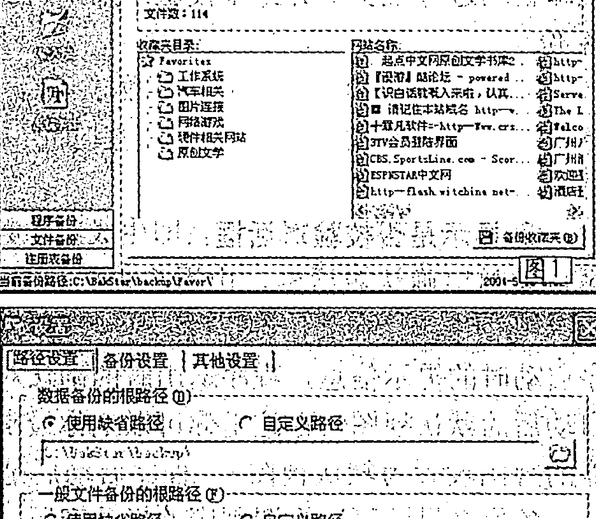

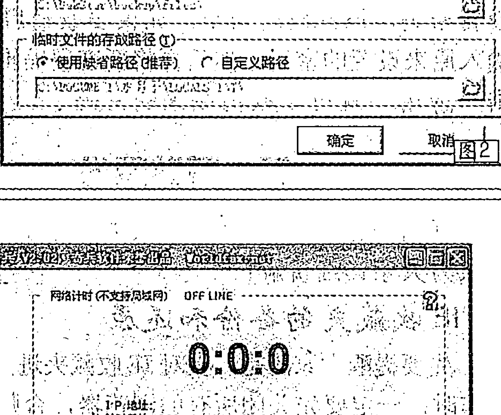

#### 备份设置

在对数据备份好之后，程序会对备份的数据进行正确性验证，在备份设置里，你可以对备份数据的校验方式进行设置。

- 1. 自动校验备份数据：即生成备份数据之后，程序立即自动进行校验，并给出校验结果，出错者取消本次备份。
- 2. 不进行校验：即生成备份数据之后，程序自动忽略数据校验，这将相对的节省一些时间，但不推荐使用。
- 3. 显示是否校验对话框：即生成备份数据之后，程序自动弹出确认对话框，由用户来选择是否校验。

#### 其他设置

在其他设置里，你可以设置是否显示程序启动时的提示信息，程序退出时的确认对话框，程序启动后的默认视图（在这里你可以把你最常用的备份功能的视图设置为默认视图），程序启动后是否最大化窗口。备份之星还可以设置程序的启动密码，如果还没有设置密码，原密码就为空。如果要取消启动密码，可输入原来设置的密码，然后再将新密码编辑框清空，点击“应用”就可以取消原来的密码了。

### 二、开始备份

在备份之星里面一共有八大类的备份功能下面我逐一来为大家详细讲解：

#### 1. IE 收藏夹的备份和还原

先要提醒大家的是，在对 IE 收藏夹进行备份／还原操作时，一定要先关闭所有的浏览器，否则可能会造成还原出错。大家可以看看图 1 所示的正式收藏夹的备份和还原窗口，在窗口上面显示有系统信息和备份信息，系统信息里显示的是你的 IE 收藏夹的路径和收藏的网址的个数，备份信息里面显示的是上次的备份时间和备份的网址个数。如果还没有备份过，会显示“还未备份”的信息。下面左边的列表显示的是你系统里的收藏夹里的文件夹，点击某一个文件夹，在右边的列表里会出现该文件夹下面的网站名称。这里只是起到了查看的作用，并不能进行调整修改。

##### 备份

在备份标签窗口里，上面显示的是你的 IE 收藏夹的路径、大小、收藏的网址的个数。下面左边的列表显示的是你系统里的收藏夹里的文件夹，点击某一个文件夹，在右边的列表里会出现该文件夹下面的网站名称。在这里你还可以删除没有用的网址信息。你确认要备份的话，可点击“备份收藏夹”按钮，程序就开始备份你的收藏夹了。

##### 还原和备份数据的管理

点击“还原标签”，弹出图 3 所示的窗口，上面显示的是你备份的数据的信息，包括备份文件名称、备份时间、数据原来的系统信息（包括操作系统信息、计算机名称、用户名称）、文件数以及备份文件的大小。

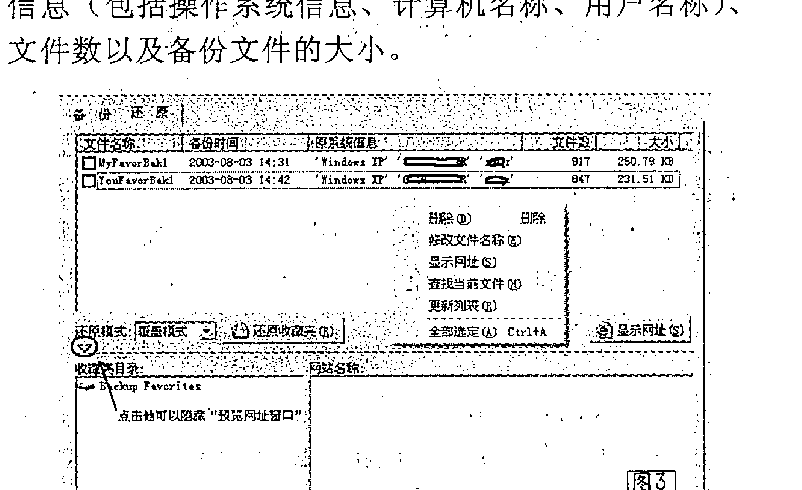

在这里你可以调出右键菜单，其功能包括：

- 1. 修改备份文件的名称。
- 2. 删除没有用备份数据。
- 3. 显示一个备份数据的信息到预览网址窗口里（这并不是还原，只是让你查看一下备份数据里的网址信息）。
- 4. 查找备份文件的存放位置，（在某一个备份文件上双击，具有同样的功能）。
- 5. 更新列表，（在你到别的机器上复制了一个“备份之星”的备份数据文件到相应的目录下时，你就可以点击更新列表，程序就会把你复制过来的数据自动的显示在列表中，供你操作）。
- 6. 全部选定，可以选择所有的备份文件。（注意：要还原某个备份文件，采用的是勾选的方式，对备份文件进行其他的操作采用的点选的方式，在其他的备份模块也是这样的，请注意区别）。

要备份的时候你可以勾选一个备份数据，然后点击还原按钮就可以进行还原了。这里分两种还原模式：覆盖模式（默认），即保留系统中原来的网址，但如果存在同名的，就用备份数据来覆盖它。替换模式：即完全用备份数据来更新系统中的收藏夹，原来的网址全部删除。

#### 2. 中文输入法数据文件的备份和还原

点击了“输入法”按钮之后，在图 4 所示窗口左边的列表里显示的是系统里安装的输入法，（程序目前只识别 Windows 自带的中文输入法），因为只有在你使用过某一个输入法之后，才会产生自学习文件，只有在你自定义了词语之后，才会有自造词文件。在列表里前面不带复选框的，说明还没有生成相应的文件，因此是不能进行备份的。在右面的列表里显示的是已经备份的文件，数据类型、备份的时间等信息。

| 文件类型 | 文件夹 | 文件名 | 备份时间 |
|----------|--------|--------|----------|
| 微软拼音 | 微软拼音自学习文件 | MyIme_Piq... | 2003-09-03 15:15 |
| 智能ABC | 智能ABC自学习文件 | MyIme_user... | 2003-09-03 15:15 |
| 全拼 | 全拼自学习文件 | MyIme_Usr... | 2003-09-03 15:15 |
| 郑码 | 郑码自学习文件 | MyIme_Use... | 2003-09-03 15:15 |

要备份的时候只要选择你需要备份的文件，然后点击“备份文件”按钮，就可以了。注意：备份操作并不会替换原来类型相同的备份文件，而会同时存在。在你的系统重装了之后，如果你希望用原来备份的数据来恢复数据的话，至少先要运行一次需要恢复的输入法，才可以进行还原，否则会导致还原失败。这时在右边的列表里选择要还原的数据，再点击“还原选中的文件”，就可以还原了。在还原成功之后，除了微软拼音输入法需要重新启动你的系统，才能使还原的文件生效，其他的输入法数据会立即生效。

# ### 3. 系统字体的备份和还原

点击“系统字体”按钮，弹出图5 所示的窗口，在窗口左边的列表里显示的是系统里已经安装的字体和实际文件名，在右边的列表里显示的是备份的字体信息。勾选你需要备份的字体，然后点击“备份”按钮，就开始进行备份了，备份完成之后会给出本次备份的结果。这里有两种备份／还原模式：字体名称相同的忽略；字体名称相同的替换，你可以根据自己的需要进行调整。如果你希望已经备份的字体重新安装到系统里，可以在备份数据列表里勾选要还原的字体，然后，点击“还原”按钮，就可以还原了。如果你希望将字体文件还原到其他的地方，可以选中“还原到其他文件夹”，然后设置好目的文件夹路径，再点击还原就可以了。

| 文件名称 | 字体名称 | 备份时间 |
|----------|----------|----------|
| SMALLE... | Small Fonts (VGA res) | 2003-09-03 15:24 |
| ARIAL.TTF | Arial (TrueType) | 2003-09-03 15:24 |
| ARIALB... | Arial Bold (TrueType) | 2003-09-03 15:24 |
| ARIALBI... | Arial Bold Italic... | 2003-09-03 15:24 |
| COUR.TTF | Courier New Bold... | 2003-09-03 15:24 |
| LUCON.TTF | Lucida Console (Tr... | 2003-09-03 15:24 |
| TIMES.TTF | Times New Roman (T... | 2003-09-03 15:24 |
| zzt00... | 文鼎粗圆简 (TrueType) | 2003-09-03 15:24 |
| zzt00... | 文鼎特圆简 (TrueType) | 2003-09-03 15:24 |
| gztt01... | 文鼎粗圆简 (TrueType) | 2003-09-03 15:24 |
| Kingsoft Phonetic (TrueType) | | 2003-09-03 15:24 |

# ### 4. QQ数据的备份和还原

在“程序备份”项目之中点击“腾讯 QQ”按钮，即可看到图6 所示的窗口。在下图左边的列表中显示的是你的 QQ 里所有的号码，如果程序检测不到你的 QQ 安装路径，或者路径错误，你可以点击图中的路径设置按钮来修改你的 QQ 安装路径，程序会自动识别你的 QQ 版本，并显示出来，这个选项用户最好不要修改。除非你非常肯定你的 QQ 版本是哪个。备份之星目前只支持 QQ2000c Build 1230 和 QQ2003 的各个版本，对以前的旧的版本不支持。此外在右边的列表里显示的是已经备份的 QQ 数据，有数据版本、备份时间等信息。用备份之星备份的 QQ 数据，包括了所有你选择的 QQ 号码相应的用户数据，如聊天信息、好友列表及分组、个人设定等。在左边的列表中勾选你需要备份的 QQ 号码，然后点击“备份”按钮，即可进行备份。如果以前已经备份过相同的 QQ 号码，则程序不会替换原来的数据，而是增加一个号码相同的备份数据。如果你的 QQ 里的数据被破坏掉了，或者重新安装了 QQ，你可以在右边的列表中勾选要还原的 QQ 号码（不管你现在的 QQ 里有没有这个号码），还原之后，启动 QQ，你刚才还原的 QQ 号码就都出现在登陆窗口的列表里了。原来的设置也都还原了。备份之星提供了对不同版本的 QQ 数据的交叉还原的支持，即 QQ2000c 的数据可以还原到 QQ2003，QQ2003 的数据也可以还原到 QQ2000c。

| 文件名称 | 备份的号码 | 版本 | 备份时间 | 原文件 |
|----------|------------|------|----------|--------|
| QQ1 | 2000c | 2003-09-03 15:35 | Windows |
| QQ2 | 2000c | 2003-09-03 15:35 | Windows |
| QQ3 | 2000c | 2003-09-03 15:35 | Windows |

# ### 5. Outlook Express备份

首先要提醒大家的就是在对 Outlook Express 进行备份／还原操作时，一定要先关闭 Outlook Express，否则会出现错误，在 win2000/XP 下备份的数据不能在 win98/ME 下面还原，而在 win98/ME 下面备份的数据可以在 win2000/XP 下面进行还原。而且在备份之前，我们还需要在 Outlook Express 之中创建标识，方法如下：打开 Outlook Express，单击顶部的“文件”→“标识”→“添加新标识”，弹出图7 所示的窗口，在“输入你的名字”中输入一个标识名称之后点击底部的“确定”，如果它询问你是否切换到新标识，单击“是”。然后重新启动 Outlook Express，新标识就创建好了。返回“备份之星”，在“程序备份”之中点击 Outlook Express图标，出现

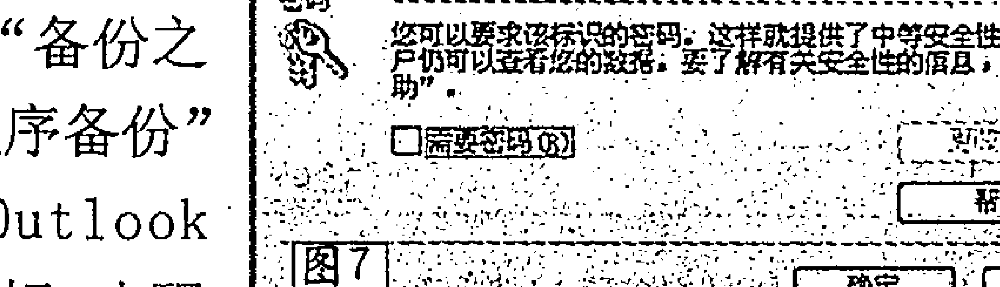图8所示的窗口，点击“备份”标签将出现备份界面。在下拉列表中选择你要备份的标识，在主窗口里就会出现该标识的信息。在你希望备份的选项前面打勾，然后点击右下角的“备份”按钮就开始备份了，备份期间程序会显示备份进度等信息，如果你备份的数据量比较的大，可能要花一段时间，请耐心等待。还要确保你的系统盘的空间（在系统盘里会生成临时文件，程序会自动删除）和备份盘的空间足够的大，否则会出错，备份之星里面还有备数据量和空间的预测功能，如果程序检测到备份盘的可用空间可能不够用时，会给出提示，供用户选择。Outlook Express数据的备份不会替换以前相同标识的数据，用户可以在“备份数据管理”里进行管理。如果你还要备份其他的标识，可以重复上面的操作。

等到需要还原的时候点击“还原”标签，将出现还原界面。在下拉列表中选择你要还原的备份数据。在主窗口里就会出现该备份数据的信息，第一行文字显示出你选择的备份数据的标识名，以及备份的时间。在你希望还原的选项前面打勾，在选项前面带“+”号的是可以展开的，说明下面还有子选项。然后再到下面的下拉列表里选择目标标识，如果你希望还原到一个新创建的标识，那你可以先到Outlook Express里创建一个新的标识，然后至少要启动一次该标识，再关闭Outlook Express。回到备份之星，然后选中新创建的标识，接着点击右下角的“还原”按钮就开始还原数据了。还原期间程序会显示还原的进度等信息，如果你还原的数据量比较大，可能要花一段时间，请耐心等待。

#### 6. Foxmail 的备份和还原

在“程序备份”项目之中选择Foxmail，出现图9所示的窗口，点击“备份”标签出现备份界面，程序会自动找到Foxmail的安装路径（如果你希望修改这个路径，可以点击“修改”，然后来设置你的Foxmail的路径）。主窗口里是当前Foxmail的信息，包括：账号信息、Foxmail、邮件模板，在你希望备份的选项前面打勾，然后点击右下角的“备份”按钮就开始备份了，备份期间程序会显示备份进度等信息。如果你备份的数据量比较大，可能要花一段时间，请耐心等待，还要确保你的系统盘的空间（在系统盘里会生成临时文件，程序会自动删除）和备份盘的空间足够的大，否则会出错。还原的操作也和备份差不多，在下拉列表中选择你要还原的备份数据，在主窗口里就会出现该备份数据的信息，第一行文字会显示你选择的备份数据的备份时间。选择好需要还原的项目之后，如果你希望修改邮件存放的路径，可以在树状列表里双击要修改路径的账号，程序会弹出对话框，你可以指定一个目录来存放该账号的邮件等数据。在确认所有的选择后，点击右下角的“还原”按钮就开始还原数据了。

#### 7. 文件备份

点击“文件备份”按钮，即可进入文件备份主界面（图10），在备份之星里，文件/文件夹的备份是以建立任务的形势来管理的，每一个任务可以指定一个要备份的文件夹/文件。在指定了文件夹之后，当前文件夹下的所有文件和子文件夹里面的文件都会被备份（图10）。

首先点击“新建任务”按钮，此时就会出现“新建备份任务”对话框（图11），然后设置好你的任务名称（起名尽量和将要备份的文件相关，一看就知道要备份什么文件）。

选择“来源类型”，如为一个文件夹，就选择“文件夹”，如是单个文件，就选择“单个文件”。选择“备份形式”，共有两种。

- 覆盖模式：就是原来备份的文件不删除，备份的时候，用备份的文件覆盖原来已经备份的同名同路径的文件。
- 替换模式：就是删除已经备份的文件，然后重新进行备份。（因为压缩备份的形式，是以一个备份包的形式存储的，所以每次备份时，都要将压缩包中的文件全部解出来，然后再进行压缩，这样会比较费时间。）

式出现的，因此“覆盖模式”不适用于压缩备份。
设置要备份的文件夹 / 文件路径。备份文件的存放路径程序会根据一般备份文件的根路径自动生成。
设置是否压缩，如果选择压缩的话，还可以设置是否设置密码。

设置了密码之后，在还原的时候，会提示你输入密码。如果输入错误，会禁止还原。

都设置好后，最后点击“添加”就可以了。接下来我们编辑任务：

在“任务管理”里选择要编辑的任务，然后点击“编辑任务”，就可以调出编辑任务对话框，我们也可以在列表里双击某一个任务快速地调出该任务的编辑对话框，然后进行编辑就可以了。要删除某一个任务的话，先选择要删除的任务，然后点击“删除”，就可以删除选择的任务了，程序会提示你是否删除该任务对应的备份数据，默认为删除。

##### 导入任务

这个功能可以让你把其他人或者你自己导出的文件备份任务文件（*.tsk），导入到系统中，供你使用。注意：如果存在任务名相同的会自动跳过。

##### 导出任务

点击“导出任务”，可以让你把当前选择的任务导出为文件保存（*.tsk），可以供以后重新导入，也可以把导出生成的文件复制到其他安装有备份之星的电脑上进行导入使用。

##### 备份

在“备份”标签里选择要执行备份的任务，点击“备份开始”就会按照你设置好的方式依次开始进行备份了。在备份之前，你可以选择是否采用增量备份的方式，这将会加快备份的速度，在增量备份方式下，程序会自动判断要备份的文件是否比上一次备份的同名文件要新，如果要比上一次备份的文件要新的话，就重新备份，否则就忽略。如果要备份的文件是新建的（相对于上一次备份而言），那也进行备份，这样既保证的备份数据和原数据一样，还大大加快了备份速度。值得注意的是，增量备份的方式不适用于替换方式的备份和压缩备份。

当我们要还原的时候，点击“还原标签”，里面会显示出所有已经备份数据。选择你要还原的数据，点击“还原”就可以了。如果你的备份数据是加密的，在执行这个任务的还原时，会提示你输入密码。如果在备份之后，你在任务管理里对密码进行了修改，是对之前备份的数据无效的，因此还原的时候，还是要输入原来的密码（图12）。还原操作会用备份的文件来替换原路径下的同名文件，原路径下的还没有备份过的文件，不会被删除，还会保留。在还原之前也你可以预先输入密码，点击“密码”按钮输入密码，在还原的时候，程序会先用这个密码进行匹配，如不正确才会跳出输入密码对话框。此外你也可以选择还原到其他的路径，在还原到的下拉列表里选择“其他位置”，然后设置你要还原的路径就可以了，该操作对所有要还原的任务都有效。如果你要求各个任务的还原路径的位置不一样（或者有些是还原的原位置的），那你可以一个一个分别执行还原操作。

#### 8. 注册表备份

在Windows 2000/XP下备份的注册表数据，是不能还原到Windows 98/ME下的，在Windows 98/ME下备份的数据，理论上可以还原到Windows 2000/XP下，软件也支持还原。但也不建议还原到Windows 2000/XP下，除非你很有把握。和文件备份一样，注册表数据的备份是以建立任务的形式来管理的，每一个任务可以指定一个要备份的注册表的项（会备份所有的该项下面的值和子项，以及子项下面的值。

点击“备份”里的“新建任务”按钮就会出现新建备份任务对话框，然后设置好你的任务名称（尽量起的要与正确的备份数据内容相关，这样会便于管理）。

设置要备份的项，你在树状列表里选择设置的时候，下面的编辑框里会动态地显示当前项的完整位置。如果你希望备份整个注册表的话，只要选择My Registry就可以了。然后在“备注”里输入你希望注明的文字，你觉得没有必要的话，可以不用填写。都设置好后，最后点击“添加”就可以了。

备份的时候只要在“备份”标签里选择要执行备份的任务，然后点击“备份”，就开始进行备份了，备份完成之后，在“备份数据管理”里会自动出现。在“还原”标签里，你可以在已备份的数据包列表里选择一个要还原的备份包，下面的列表里就会显示出该备份包的所有已经备份的任务。选择你要还原的任务，点击还原就可以了。注意：还原操作，会将备份的数据倒入到注册表中，在注册表里相同的数值名称的数据会被替换掉，而在注册表项下面的在备份后新增加的数值名称和子项不会被删除，仍将保留。

怎么样？备份之星的功能是不是非常齐全呢？如此优秀的备份软件绝对值得我们去使用一下，以后在重装系统的时候便不会手忙脚乱了！

（文 / 水月斋）

## 驱动精灵，解除你的后顾之忧

许多电脑爱好者都对“驱动程序”这一词非常敏感，因为对电脑硬件、软件系统而言，驱动程序可以说是最重要不过的。因为驱动程序承载着“驱动”你的整个系统里面所有软硬件的“重任”，一旦没有驱动程序，或者驱动程序出了问题，轻则设备无法使用，重则会令整个Windows崩溃！因此对电脑初学者而言，拥有一个能够帮你智能安装、备份、升级驱动程序的软件是很有必要的，因此“驱动精灵”便应运而生了。

### 一、驱动精灵的功能与安装

驱动精灵是一款集驱动管理和硬件检测于一体的、专业级的驱动管理和维护工具，有了它，我们就可以轻松实现以下的功能：

#### 1. 驱动程序备份

经常重装电脑的人一定有找驱动程序的经验，原因或者是原版驱动程序已经不见了，或者事先没有备份。现在你只要利用驱动精灵的驱动程序备份功能，在电脑重装前将你目前电脑中的最新版本驱动程序通通备份，待重装完成时，再使用它的驱动程序还原功能安装，这样，便可以节省掉许许多多程序安装的时间，并且再也不怕找不到驱动程序了。驱动精灵可以将所有驱动程序制作为一个可执行文件，用户在重新安装操作系统后，可以使用这个文件一次还原所有的驱动程序。

#### 2. 帮你找驱动

驱动精灵可以帮助用户为没有驱动程序驱动的硬件设备在互联网上自动寻找驱动。驱动精灵支持PCI、AGP、USB、IEEE1394、PCMCIA接口的所有硬件设备，可以在没有驱动程序驱动的状态下，辨识硬件设备的名称、生产厂家、芯片或芯片组信息、OEM厂商名、OEM设备名等信息。

#### 3. 自动更新驱动程序

驱动精灵可以对已有的硬件设备进行驱动程序在线更新。驱动精灵的网站上存放了超过58600种硬件设备的最新认证版驱动程序，涉及几乎所有的设备，如果用户安装计算机后发现在Windows设备管理器中有标有黄色问号的无法辨识的“未知设备”，不妨使用驱动精灵提供的寻找驱动功能在数据库中寻找驱动。如果用户对于现有已安装的驱动的性能不满意，还可以使用驱动精灵寻找更高版本的驱动。驱动精灵能自动比较硬件指纹信息，在下载和安装驱动前，报告驱动程序与您的硬件的兼容情况，这样，用户能够清楚地知道哪一款驱动程序更能发挥自己硬件设备的效能。

#### 4. 制作购机随身盘

驱动精灵软件本身连同帮助文件可以被自动复制到一张软盘或U盘中，供用户随身携带。购买计算机整机或硬件零配件时，可以完全独立于操作系统和驱动程序，检测到硬件制造商、设备类型、硬件版本、芯片制造商、芯片 / 芯片组型号、OEM厂商等信息，用户可以使用这些信息对硬件产品真伪、OEM信息进行追踪。

好了，说了那么多，我们现在到http://ftp.pconline.com.cn/pub/download/200403/mydrivers.exe去下载一个驱动精灵2005回来，这个可是多语言的版本，安装过程是很简单的，但是在选择语言的时候却没有“简体中文”让我们选择，没有关系，我们点击选择“英文”继续进行安装，安装完毕之后启动软件，发现出来的就是简体中文界面了（图1）。在主界面之中我们可以看到四个主要的功能选项：管理计算机硬件驱动程序、检测计算机硬件设备、阅读软件用户手册、注册驱动精灵。能够用得上的功能就只有前面两个，下面我们就来看一下如何使用驱动精灵2005。

### 二、检测计算机硬件设备

在使用驱动精灵管理计算机硬件驱动程序之前，我们还是有必要先检测一下自己的计算机硬件设备，点击之后软件便会检测当前系统的硬件，随后便会将所有的硬件设备都在窗口之中列出来（图2）。

### 三、管理计算机硬件驱动程序

在主界面里面点击“管理计算机硬件驱动程序”按钮，我们即可看到图4的画面，我们可以看到右边有一排快捷按钮，其实这些按钮的功能都可以在上面的下拉菜单之中实现，下面我们逐个讲述功能菜单的作用。

#### 1. 收集驱动信息

**收集全部驱动信息** 这个的功能就是详细收集你的计算机里面所有硬件的驱动程序信息，并且在下面的列表之中完整地显示出来，不过里面很多设备的驱动程序是我们不需要理会的，因此我们更常用的是“快速收集驱动信息”。

**快速收集驱动信息** 这个功能主要就是收集计算机主要硬件的驱动程序，譬如主板芯片组、声卡、显卡、鼠标等等，并在中间的信息窗口显示出来。

**打印/保存清单** 用来保存当前的驱动程序清单以便日后查询。

#### 2. 备份驱动

**备份全部驱动程序** 备份当前系统所有的驱动程序，选择之后弹出图5的窗口，让你选择备份文件存放的路径，选择完成之后点击“开始”即可开始备份。不过这种备份会将你的驱动程序分成一个一个目录，因此最好专门创建一个目录来存放这些备份。

**备份选中驱动程序** 备份你在信息窗口之中用鼠标选中的驱动程序，操作同上。

**备份选中驱动到可自动安装的EXE文件** 将你选中的驱动程序备份成为一个EXE文件，以后就不需要利用驱动精灵来进行恢复驱动程序的工作了，直接运行该EXE文件即可。

**备份全部驱动到各自独立的CAB压缩包文件**：将所有驱动压缩成为各自独立的CAB压缩包，以便逐个解压进行安装。

**备份全部驱动到一个EXE安装文件**：这是最简单快捷的驱动程序备份方法了，适合那些经常重装系统的人，将所有驱动程序都备份成为一个EXE文件之后，只要点击运行这个EXE文件，所有硬件设备的驱动就都齐全了！

#### 3. 安装驱动

**恢复驱动程序**：点击这个按钮之后，系统会询问你已经备份好的驱动程序的路径，指定好了之后点击“确定”即可进行驱动程序的恢复工作，这种方法一次只能恢复一个驱动程序。

**恢复全部驱动**：点击之后会出现一个窗口，让你选择你以前备份驱动到的目录，选择好了之后按“开始”按钮即可开始驱动程序的自动还原工作。

**安装驱动程序**：点击之后会弹出Windows的驱动程序安装界面，相信大家都会使用这个功能，这里就不再多说。

**删除驱动程序**：在中间的信息窗口之中选择一个驱动程序之后再按这个按钮，即可删除该驱动程序，不过使用的时候要小心，有可能造成系统的不稳定。

#### 4. 界面语言

由于是多语言版本，因此我们可以再这里选择不同的界面语言，缺省的当然就是简体中文了。

#### 5. 插件

- 备份Outlook Express资料：备份你当前的OE资料，包括信件、通讯簿等等，缺省的目录在“C:\My Drivers”下面。
- 备份IE收藏夹：帮你备份整个IE收藏夹，缺省的目录在“C:\My Drivers”下面。
- 恢复Outlook Express资料：恢复你已经备份好了的OE资料。
- 恢复IE收藏夹：帮你将收藏夹重新恢复过来。

#### 6. 更新驱动

代理设置：让你设置代理服务器，这个选项适合通过代理上网的朋友。

在线搜索并更新驱动：点击这个按钮之后便会开始在网上搜索当前你的系统需要更新的驱动程序，搜索完成之后会看到图6的窗口，提示你当前有多少个可以更新的驱动程序，然后你点击“开始下载”即可进行下载更新驱动程序的工作。

| 驱动描述 | 旧版本 | 新版本 | 下载地址 |
|----------|--------|--------|----------|
| Creative EMU10K1 Audio Processor (WDM) | 3-24-2002 | 07/24/2002 | http://files.ameri... |
| Creative Game Port | 3-18-2002 | 08/12/2002 | http://files.ameri... |
| Intel(R) 82801 PCI Bridge - 244E | 8-22-2003 | 03/24/2004 | ftp://aiedownloa... |
| NVIDIA GeForce FX 5600 | 3-24-2004 | 09/13/2003 | http://download... |
| Realtek RTL8139 Family PCI Fast Ethernet... | 7-1-2001 | 10/04/2002 | ftp://152.104.12... |
| Realtek RTL8139 Family PCI Fast Ethernet... | 7-1-2001 | 06/19/2003 | ftp://152.104.12... |
| USB Mass Storage Device | 7-1-2001 | 09/15/2002 | http://files.europ... |

经过上面的详细讲解，相信大家已经对如何使用驱动精灵心中有数了，值得一提的是，有时候驱动精灵搜索出来的驱动程序不一定就比当前你的驱动程序版本更新，因此在更新驱动程序的时候一定要看清楚。

（文／水月斋）

#### 1. 寻找驱动

首先在中央的列表之中选择相应的硬件设备，然后点击左边的“寻找驱动”按钮，这时候驱动精灵就帮你搜索最新的驱动程序，当搜索完成之后便会在列表窗口的下方显示出最新的驱动程序清单（图3）。在这里我们可以看到驱动程序的发布日期、下载地址以及和当前系统的“兼容性”估计，如果这个驱动程序比你的系统当前的驱动新，那么你可以点击该程序，驱动精灵便会弹出一个窗口，询问你是否下载安装该驱动程序，点击“是”便开始下载并且安装了。

#### 2. 打印清单

这个功能就是将你当前系统里面的硬件设备以及正在使用的驱动程序版本都打印出来，这对于维修电脑而言用处相当大，有经验的电脑高手能够从驱动程序之中看出电脑系统不稳定或者故障的端倪来。

#### 3. 联系厂商

在中间的列表选定了一种驱动程序之后，然后点击“联系厂商”按钮，驱动精灵便会自动连接到Google搜索引擎，搜索和你的硬件设备有关的硬件厂商了。不过按照笔者看来，这个举措未必真的很有效，只是为了方便大家而增加的一项功能罢了。

#### 4. 全部展开

点击这个按钮之后，中间的列表将会全部展开，方便你逐个查看。

## 豪杰超级解霸V8 引领多媒体之旅

不知使用V8的朋友有没有注意到，V8不光拥有以往解霸系列的优秀播放功能，还提供了在线影视、手机图铃、音乐动漫、热门游戏等众多多媒体服务。

现在我们就来认识一下在多媒体播放工具中有“瑞士军刀”美誉的“豪杰超级解霸V8”。除了其强大的播放功能和对各种多媒体格式兼收并蓄的支持以外，新增加的在线影视服务更能为你带来极大的乐趣和方便。

### 一、如何享受豪杰超级解霸V8 多媒体中心的在线影视服务

在线影视这项下载服务功能是M2Center豪杰多媒体中心所提供的众多多媒体服务中的一项。你可能会问，

如何享受这项新功能呢？假如你的电脑能够上网的话，请你继续向下看。

### 第一步：下载JMV影片

#### 1. 登录多媒体中心

下载影片前你需要保证电脑已经连接上互联网，然后运行超级解霸V8，点击视频窗口上的M2Center按钮，稍等片刻视频窗口即会显示豪杰多媒体中心的下载主页（并不是直接在IE里输入多媒体中心的网址），如图1所示。

#### 2. 注册新用户

想下载网上电影，首先你需要使用已申请的用户名登陆，游客是无法点击下载影片的。当然新用户注册完全是免费，你只需点击页面右上角的“免费注册”按钮，依照提示进行操作即可在短时间内注册成为多媒体中心会员。下面让我们来看看注册步骤：

当你阅读完用户协议并点击“接受”后，紧接着弹出的是“绑定手机”页面，目前豪杰多媒体中心除了提供影视下载服务，还提供了手机图铃发送服务，如果手机号与用户名直接绑定，将可以省去发送“图铃”时填写验证码的步骤。

当然你也可以直接跳过手机绑定这一步，接下来，在下一页显示的新用户注册提示框中输入你的个人信息，点击“提交”即可。图2中的序列号项是非必填项，如果你购买的是V8零售版光碟，请将光盘中提供的服务序列号填入，这样可以验证你购买的光碟是否为正版。

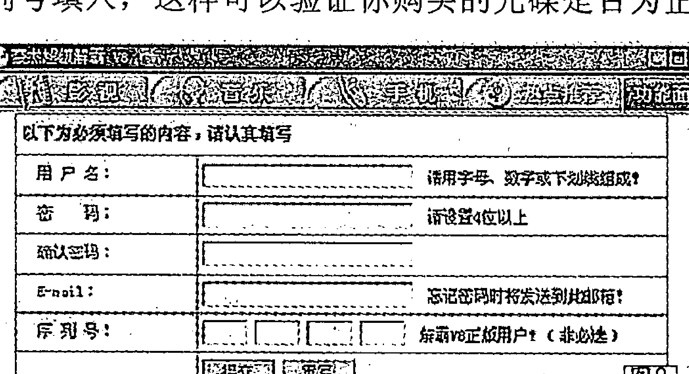

#### 3. 开通服务

使用你新注册的用户登录后，我们可以选择各种电影频道下载。想看电影，当然是找电影相关内容，点击画面左上角的“影视”按钮，将弹出各种频道的名称，点击其中任意一个频道，例如图3所示的“绝版老片”。


马上你就可以看到了各种影片的相关信息，是不是想立刻下载影片呢？别着急，直接点击你感兴趣的电影名称即可下载。不过你需要注意的一点是，部分影片下载服务是收费项目，只针对开通了此频道JMV服务的注册用户，如果你想全部观看这些影片，需要通过“包月操作”进行开通设置。假如你还没在当前频道通过“包月操作”进行开通设置，点击影片名称后将弹出一个提示框（已开通当前频道包月服务的用户，将直接弹出下载工具下载文件），如图4，稍后，页面会自动跳转至包月操作、点值充值页（图5）。

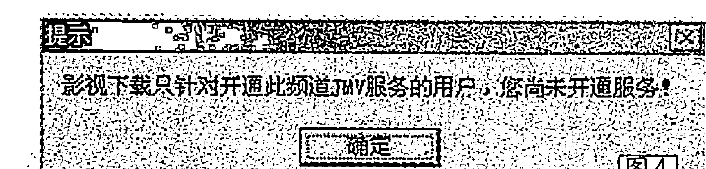

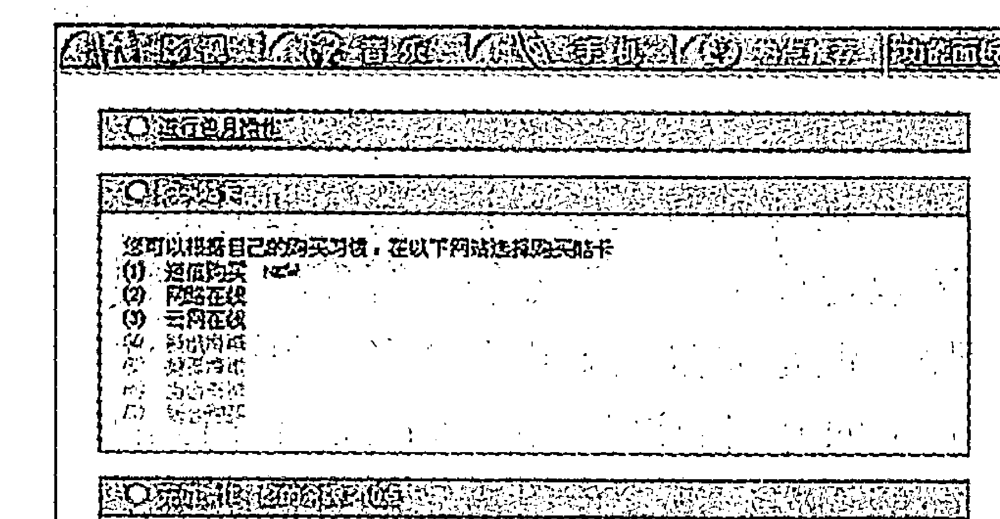

进行包月操作是需要消费一定的点值的（收费标准可以通过图6中显示的“操作及收费说明”链接了解到），而你的用户点值可以通过“短信购买”、“在线购买”等方式购买充值点卡获得。在图5中，你还可以进行点值的充值操作，这些操作你也可以通过页面右上的“功能面板”完成（注：请保证你电脑的IE浏览器为5.5以上版本，否则可能造成右上角的“功能面板”不能完全弹出下拉菜单）。

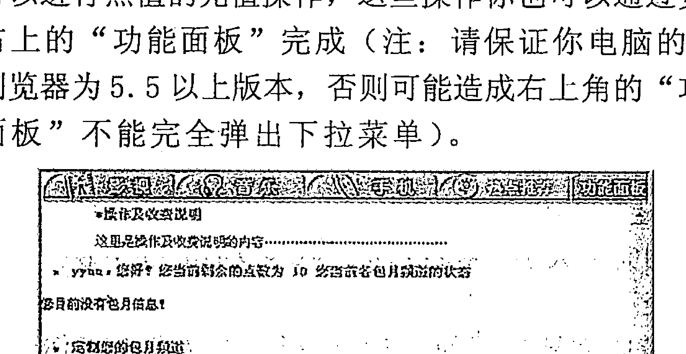

接着我们点击图5中的“进行包月操作”链接，页面将跳转至你的包月频道操作页，如图6所示。

例如你想播放全部“绝版老片”的电影，并且想开通一个月的播放服务，只需要点击“绝版老片”右侧的下拉选单，选择“一个月”，然后点击“订阅”按钮确定即可。这样，在一个月内，你可以播放所有“绝版老片”中下载的电影，不受限定。

#### 4. 下载影片

包月设置好后，我们就可以点击“绝版老片”中的电影下载。找到你喜欢的电影内容，直接点击下载链接。V8自带了强大的HTTP下载工具，当你点击某部影片的下载链接，下载工具的悬浮窗立刻会弹出执行下载。与流行的下载工具一样，V8提供的HTTP下载工具同样支持断点续传功能，能同时支持三个任务并行下载，下载过程快速稳定。图7是豪杰HTTP下载工具的悬浮窗。

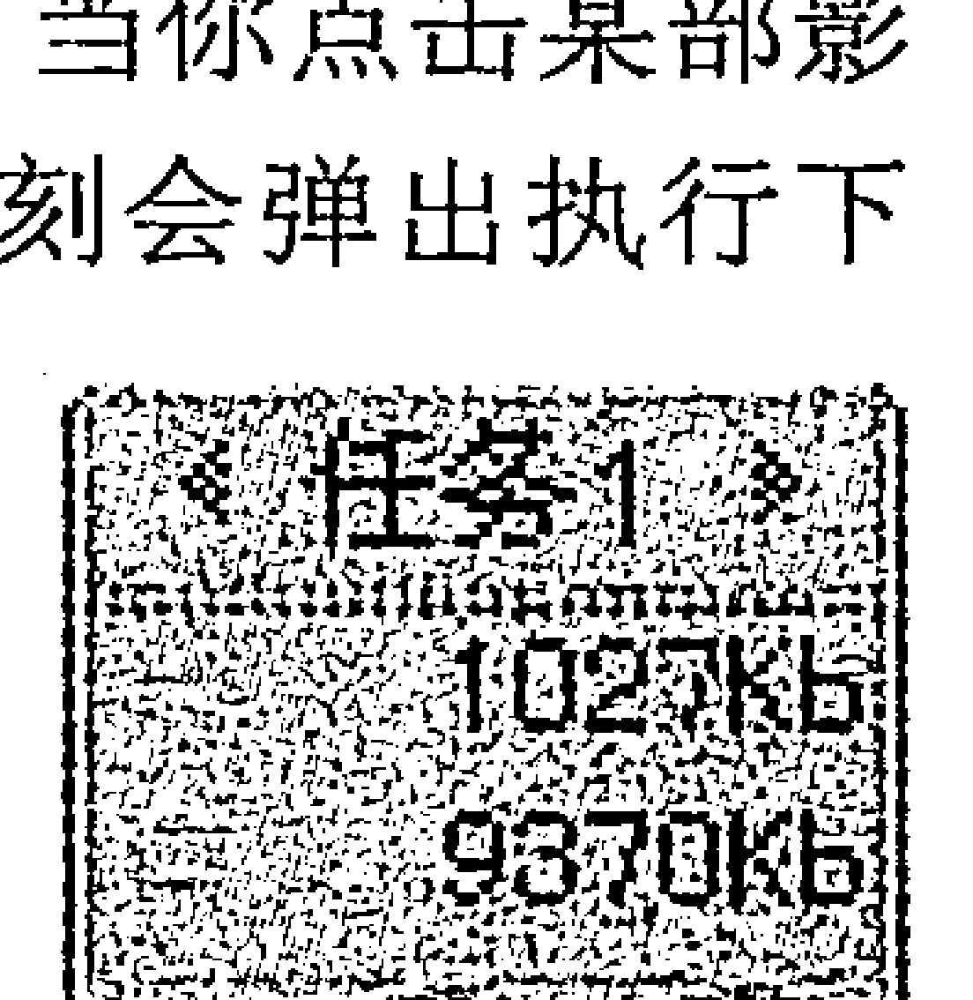

图中的1027Kb代表是已下载文件大小，9370Kb是文件的完整大小。绿色指示灯代表文件正在下载中，红色代表下载中止或暂停。你选择下载的影片会默认下载到“我的文档”下的“JMV影片”文件夹（你的系统安装盘C:\My Documents\JMV影片），如果你想调整下载地址，可以右键单击悬浮窗，在弹出的菜单中选择相应设置项中即可调整下载地址。

## Daemon Tools 让我们的光驱更长寿

相信很多朋友都对虚拟光驱不会感到陌生吧！虚拟光驱以其读取速度快、换盘方便、管理容易得到了广大用户的青睐。但是虚拟光驱软件众多，每个软件都各有千秋。笔者下面介绍的这款名叫Daemon Tools的软件可以说是目前应用最广泛、使用最简单而且功能十分强大的虚拟光驱软件之一了，利用它你不但可以进行普通的虚拟光驱，甚至还拥有强大的破解能力哦！

首先我们在 http://ftp.pconline.com.cn/pub/download/200404/d-tools346_eric.exe 下载一个3.46汉化版的Daemon Tools回来，安装完成之后重启启动系统，我们可以看到系统右下角之中多出了一个红色的图标，现在我们只要在这个图标上面点击鼠标右键，即可看到daemon的功能菜单了（图1）。

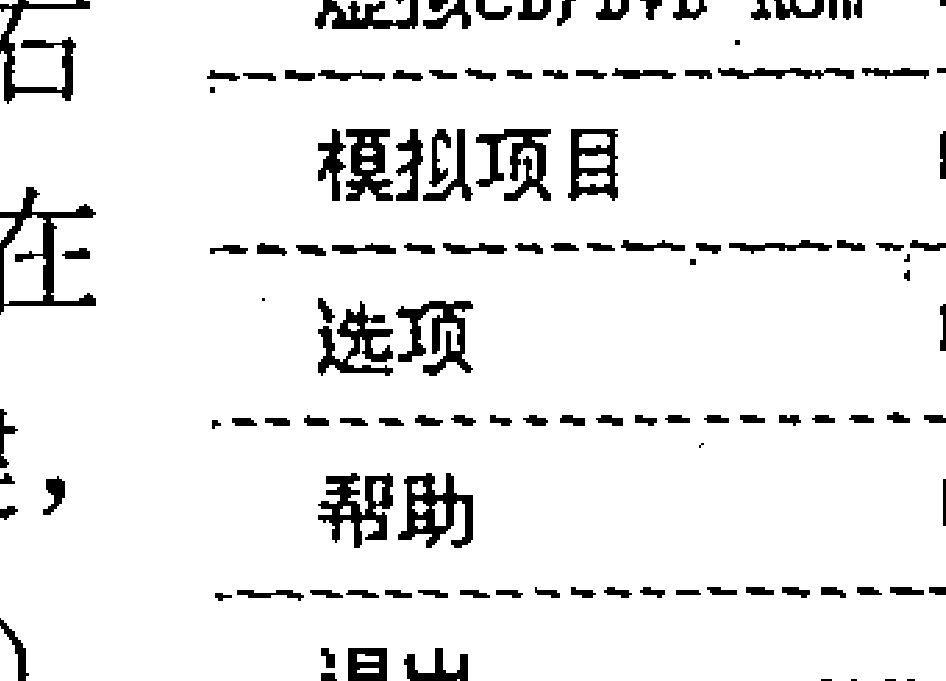

第一个项目是“虚拟 CD/DVD-ROM”，展开这个项目之后，我们看到的菜单如图2所示。如果现在我们就要使用虚拟光驱的话，可以展开“驱动器 0”菜单，然后选择“安装映像文件”，这时候会弹出一个文件选择窗口，在里面你选择好了一个映像文件之后点击“确定”即可装载好这个虚拟光驱了，Daemon Tools支持市面上常见的各种虚拟光驱格式。此外你也可以在“驱动器 0”的菜单下面选择“设置驱动器参数”，此时就会弹出图3的窗口，在这里面你可以选择虚拟光驱的盘符、DVD的区域以及模拟音频光盘时的一些选项等。

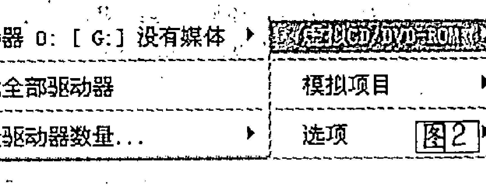

在图2的菜单里面还有一个“设置驱动器数量”的菜单，在里面可以设置虚拟光驱的数量，其中有“禁用”、“1个驱动器”、“2个驱动器”等，最多可支持四个虚拟光驱。四个虚拟光驱相信对于绝大多数的用户而言已经足够了，DAEMON对虚拟光驱的设置是即设即用，不需要重新启动电脑，这也体现了它的灵活性。

对于装载和卸载虚拟光驱还有一个简便的方法，只要在系统托盘的Daemon tools图标上面点击鼠标左键即可弹出图4的菜单。只要点击“驱动器0：没有媒体”即可弹出同样的选择虚拟光驱文件的窗口，要卸载虚拟光驱的时候只要点击“卸载全部驱动器”即可。

- 卸载全部驱动器
- 驱动器 0: [ G: ] 没有媒体

接下来我们看看“模拟项目”菜单（图5），因为现在很多软件光盘，特别是游戏软件都是有加密技术的，如果随便地直接虚拟成为光驱会发生读取错误或者软件不能运行等种种情况，而在“模拟项目”里面，我们就可以直接模拟各种加密技术，大家可以针对自己要虚拟的光盘是何种加密技术的进行有机选择，如果你确实不知道到底有什么加密技术也不要紧，只要直接选择“打开全部选项”即可，Daemon会自动分析要虚拟的光盘究竟是采用什么加密技术的，而同时在系统托盘之中的daemon图标也会随之变成了绿色。

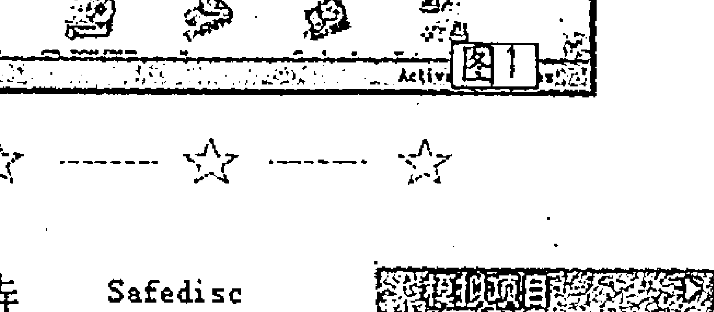

在“选项”菜单里面（图6）包含了模拟音频、锁定DLL、自动安装、自动开始、自动锁定、任务栏图标等几个选项，一般来说如果我们要模拟一些音乐光盘的时候才需要选择“模拟音频”，而“自动安装”和“自动开始”最好选择上，这样的话我们虚拟了光驱之后便会让其自动播放运行了，非常方便哦！

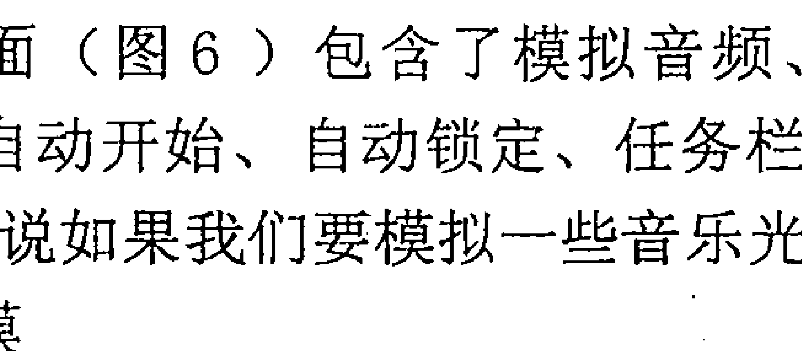

Daemon Tools的体积非常小，甚至让人感觉有一种太简陋的感觉，但实际上它却拥有全面的虚拟光驱乃至破解的功能，对我们绝大部分的家庭用户而言，拥有了一个Daemon Tools就别无所求了！

（文/水月斋）

## 第二步：播放 JMV 影片

接下来我们来播放已下载的JMV格式影片。

当你使用超级解霸选中JMV文件后，程序会自动弹出JMV开通验证窗口，如图8所示。

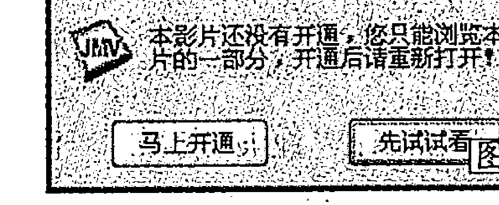

如果你还没有获得JMV开通密码（请参阅“开通服务”），你可以先点击“先试试看”，跳过验证框预览影片的部分内容（JMV文件允许你预览影片的部分内容）。

开通密码即是在豪杰多媒体中心申请的注册名和注册码，当你已经申请了某频道的播放服务，请直接点击“马上开通”按钮进入如图9所示的身份验证窗口。将你的用户名、密码填入后，点击“验证”按钮，程序即会自动连接互联网上的验证服务器，稍等片刻将会返回验证结果。请注意区分英文的大小写。

当出现如图10所示的开通提示内容时，即表示已经通过了播放许可认证，接着你需要先关闭当前的播放的JMV影视文件，重新打开一次该文件，这样就可以完整播放影片的所有内容。

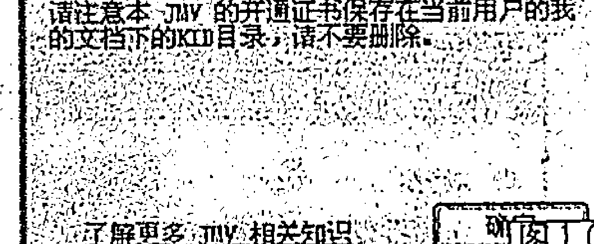

点击“文件”菜单 → “打开多媒体文件”播放JMV文件，或者将JMV文件拖放至视频窗口直接播放（注：下载的JMV文件只有超级解霸V8才能正常播放）。

除了在线影视服务，V8还提供手机图铃，只要借助超级解霸V8就能够捕捉电影的经典画面或DV里的精彩瞬间。当你在播放VCD、DVD或者摄像头、DV即时视频时，先在精彩画面处点击“暂停”按钮，接着按下“彩影”按钮，稍等片刻即会弹出发送窗。这时从下拉菜单中确认接收手机的机型、自己的手机号码以及接收手机号码，确定之后你的朋友即可接收到发送的精彩图片了！

超级解霸 V8 ——多媒体的“瑞士军刀”还为你提供音乐动漫、热门游戏和电视频道，看的、玩的和听的这里应有尽有。

快点开始你的多媒体之旅吧。

（文／有风来咦）

## 全面的硬件测试工具 SiSoft Sandra

在硬件测试方面，许多朋友都喜欢用3DMARK来做基准，3DMARK固然是一个业界公认的标准，但由于其主要测试的只是CPU和显示卡的性能，对系统其他部件，譬如内存、主板、硬盘等的测试功能都很弱甚至没有，因此我们要做整机性能测试的时候就需要找另外一款综合的测试软件了，而这款软件正是SiSoft Sandra。

SiSoft Sandra是全方位的系统检测软件，可以查看CPU、内存、BIOS、AGP && PCI && ISA总线等许多硬件方面的信息，也可以显示系统软件的信息。它内置了Benchmark测试内核，可以对各种硬件进行测试，从而知道硬件的真伪和硬件性能及水平。SiSoft Sandra支持Windows 9x、Win Me/NT/2000/XP多个平台，最新版本已经推出到2004SP1了，下面我们就来学习如何使用SiSoft Sandra进行系统测试吧！

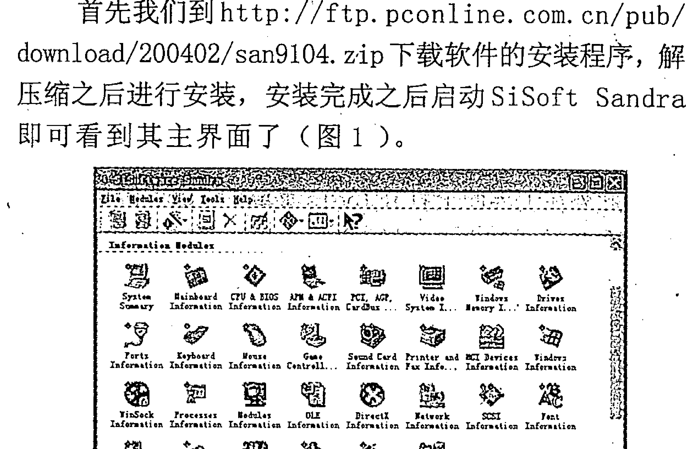

首先我们到http://ftp.pconline.com.cn/pub/download/200402/san9104.zip下载软件的安装程序，解压缩之后进行安装，安装完成之后启动SiSoft Sandra即可看到其主界面了（图1）。

在主界面窗口中显示了所有的子模块，多达62个，分属于四大类。打开Modules选单你可以看到这四大类模块，它们分别是Information Modules、Benchmarking Modules、Listing Modules、Testing Modules，每类模块中包含了多个子模块。点击菜单栏中的View，可以选择在主界面窗口只显示某一类子模块，例如选择Information Modules则在主界面窗口中只显示此类子模块。运行子模块的方法有两种：在主界面窗口中双击子模块图标；或者点击菜单Modules→所在类→子模块。

此外在主界面上打开Tools菜单，可以调用Windows中的许多系统工具，例如控制面板、磁盘扫描、系统配置编辑器、注册表编辑器、记事本等许多工具。在主界面打开File菜单，选择Create A Report Wizard，可以把测试结果和提示信息以报告的形式保存起来。可以将报告以txt、htm、xml等文件格式存储到磁盘上，也可以打印出来。下面我们来看看各个不同的模块：

### “Information Modules”（信息模块）（图2）

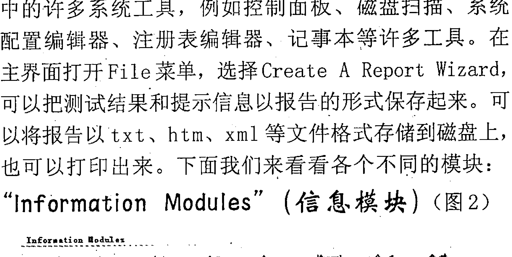

点击这里的任意每一个图标，你都能够查看到当前系统之中所运行的硬件以及硬件驱动程序的信息状况。

### “Benchmarking Modules”（对比模块）（图3）

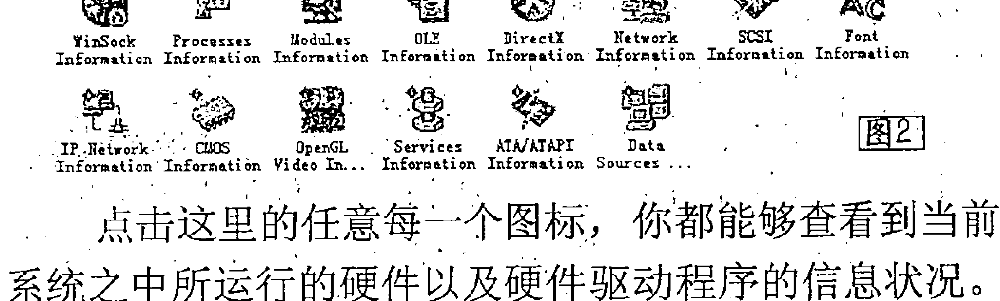

这里就是我们常用的进行硬件性能测试的选项了，在这里你可以对CPU整数运算能力、CPU多媒体浮点运算能力、文件系统性能、存储系统性能、内存系统性能等项目进行详细的测试，测试结果是非常准确的，同时还会给出相应的和其他基准系统对比的值供大家参考。

### “Testing Modules”（测试模块）（图4）

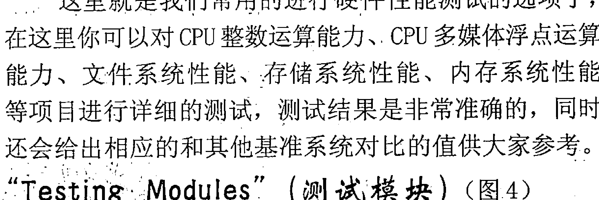

这里是进行硬件测试的功能模块，你在购机的时候最好能够装一个SiSoft Sandra然后进行详细的测试，这里的测试非常严格，你的系统里面的一丁点问题都会暴露无遗哦！

### “Listing Modules”（列表模块）（图5）

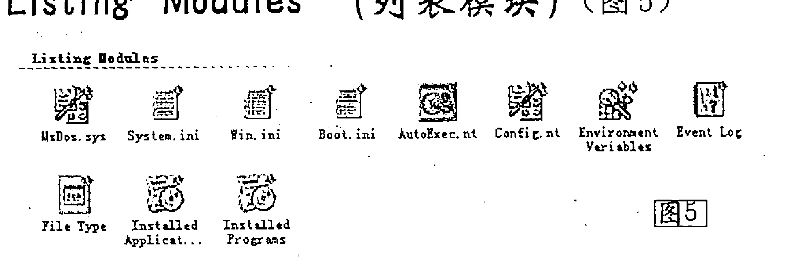

这里列出的全部是经过了测试、对比之后的一些测试报告以及一些系统文件的内容，同时也可以通过打印机打印出来。

下面我来向大家介绍SiSoft Sandra的几个实际应用：

### 1. 辨识硬件真伪

Information Modules类中的模块提供了计算机软硬件的信息，例如CPU、BIOS及CMOS、主板、PCI && AGP总线、内存、硬盘、键盘、鼠标、声卡、光驱等硬件信息，利用这些信息，你可以辨识硬件的真伪。

#### 有关主板的信息（图6）

Mainboard Information模块提供了主板的详细信息，例如主板制造商、产品序列号、主板芯片组类型、是否支持多处理器、当前使用的FSB前端总线频率、当前内存总线速度、CPU电压、AGP && PCI && ISA总线频率等。你可以在这里了解你的主板，辨识真伪。如果CPU超频了，在Mainboard Information中查看FSB前端总线速度就可知道。如果内存有假，从这里也可以看出来，比如“amaxs Making 64MB 8X（8Mx8）SDRAM”表示Kingmax的64MB SDRAM内存，内存条上有8个内存颗粒，“PC133U-333-542”表示标准工作频率为133MHZ、CL=3、SPD版本为2.0的PC133内存。这些资料实际上是SiSoft从SPD EEPROM中读取的，SPD位于内存条上，存放内存速度、时间参数等数据，也是识别PC100内存的重要标志，如果没有SPD就说明不是PC100的SDRAM。

| Item | Value |
|------|-------|
| Manufacturer | MICRO-STAR INC. |
| Model | MS-6728 |
| Version | 100 |
| Serial Number | 00000000 |
| ID | 00000000000000000000000000000000 |
| System Chassis | |
| Manufacturer | Unknown Chassis Manufacture |
| Type | Desktop |
| Can be locked | No |
| Version | Version 1.00 |
| Serial Number | 123456890 |
| Asset Tag | 0123ABC |
| Mainboard | |
| Manufacturer | MICRO-STAR INC. |
| MP Support | 1 CPU(s) |

### 有关BIOS的信息（图7）

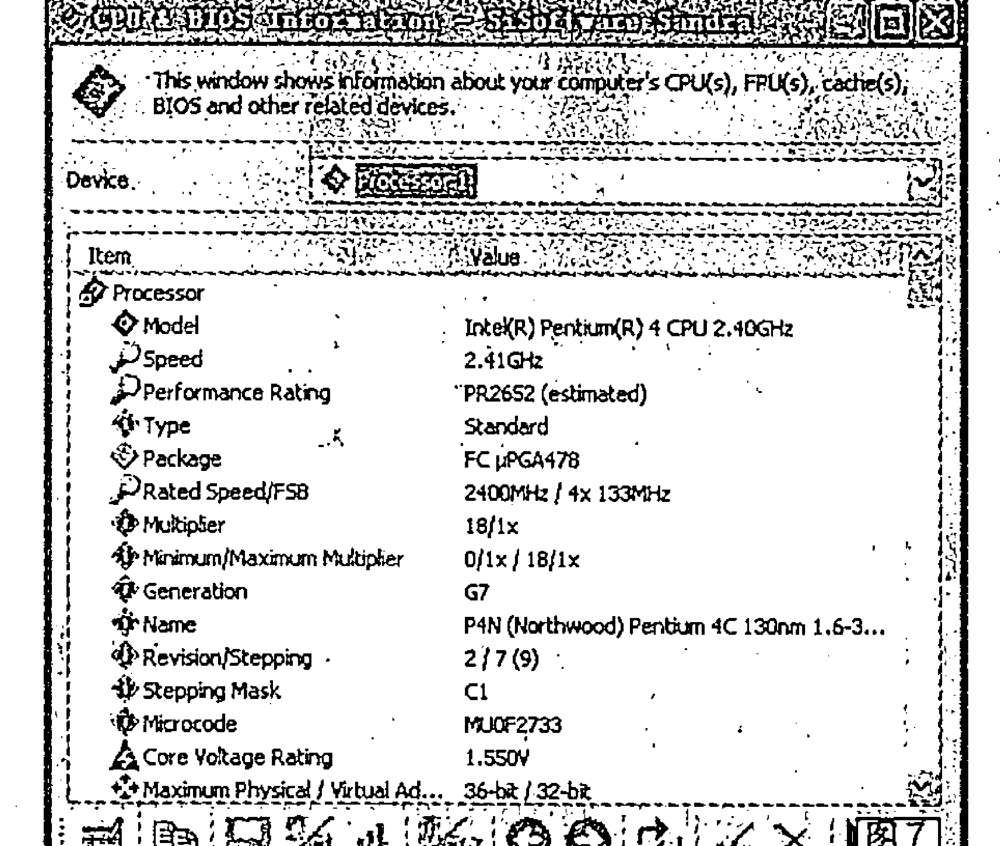

需要升级BIOS的用户最需要了解的是BIOS的版本，通过SiSoft Sandra的“CPU & BIOS Information”很快可以得到BIOS的厂家、类型、版本、日期以及ID号，另外SiSoft Sandra也可以识别一些同频率的CPU的核心，譬如是否Northwood核心的P4等等。

### 2. 测试硬件的性能

Sisoft Sandra内置了Benchmark的测试内核，所以能进行CPU、CPU MultiMedia、驱动器、内存、网络、CD-ROM/DVD等测试，只要双击某个测试子模块，等待一段时间，就会显示一个测试数据和对照表，让你了解被测硬件与标准硬件的比较，图8就是CPU测试完成之后的报告，最上方的就是你的CPU得出的分数了，而下方那些则是一些基准系统所得到的分数，你可以用来对比一下哦！

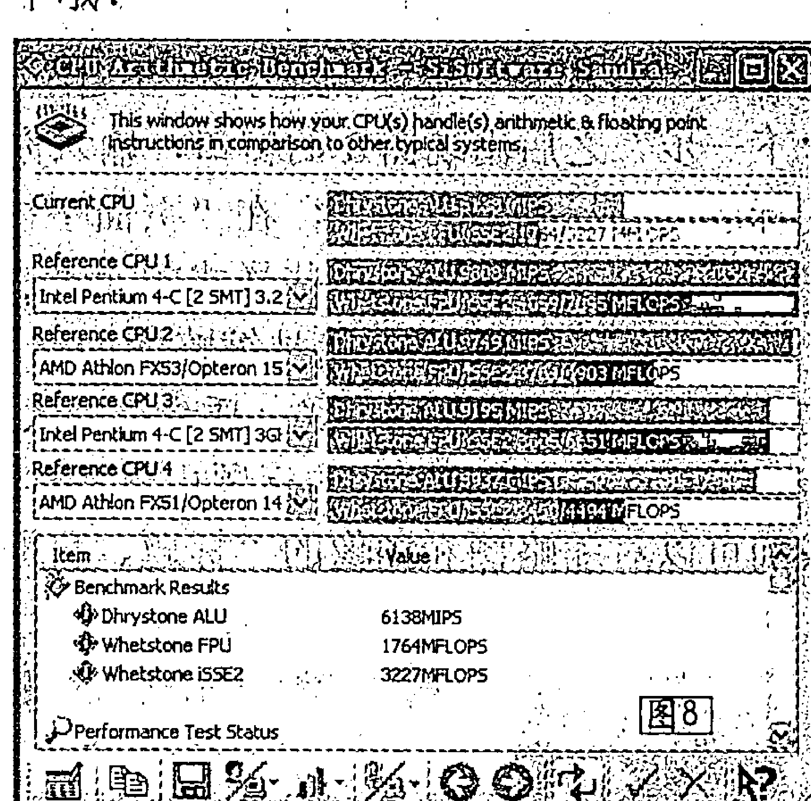

### 3. 读取配置文件

在硬件测试的时候我们可能需要及时分析一下一些系统配置文件，因此我们可以在“列表模式”里面打开相应的配置文件和系统初始化文件，例如Autoexec.bat、Msdos.sys、System.ini、Win.ini、Control.ini、Protocol.ini等文件，双击某个文件就可将其打开，但只能看不能修改。

### 4. 方便易用的测试报告向导

工具栏中的形状为小棍加一个蓝色I字符的图标就是测试报告向导（图9），启动这个向导之后，SiSoft Sandra将分8步让用户进行选择和设置，从而完成所有的测试工作，并生成一个测试报告提供给用户。


第一步，信息选项（图10），让用户选择需要获得信息的选项，其中包括所有的硬件和软件环境选项；

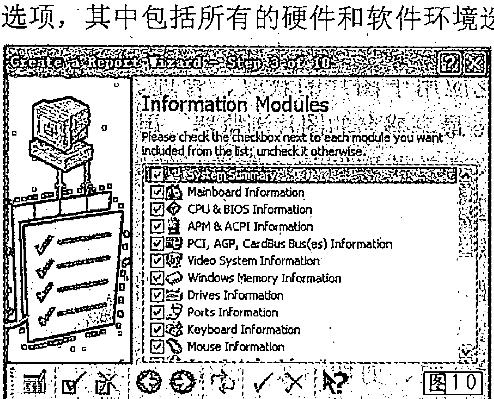

第二步，对比测试选项，即选择哪些项目需要进行基准对比测试；第三步，清单选项让用户选择需要查看的系统文件和环境参数；第四步，诊断选项（图11），帮助用户了解硬件设置和中断冲突的情况；

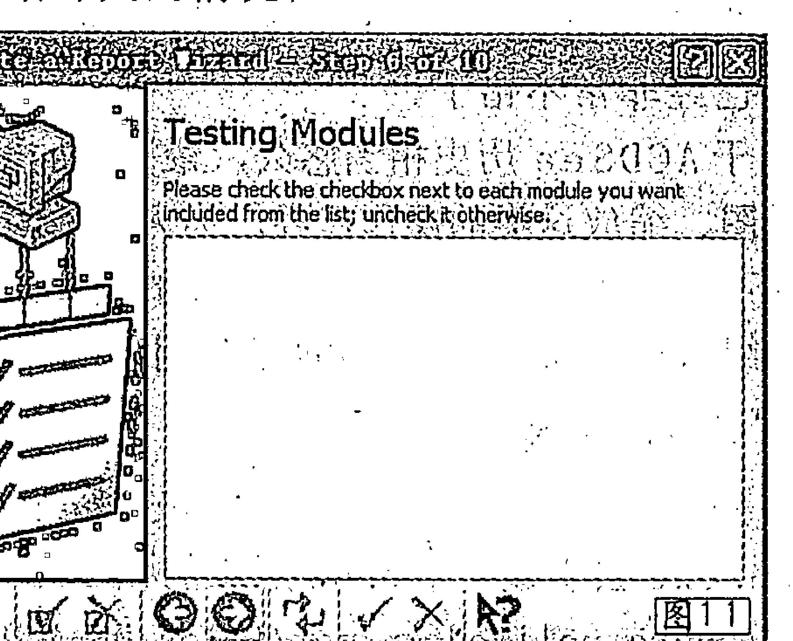

第五步，添加评论，即对这次测试是否需要添加注释之类的东西以备将来查询；第六步，报告的方式，可以有多种选择，如保存在硬盘、打印或传真、E-mail发送或者存为一个script文件等等；第七步，选择报告文件格式有TXT、RPT、HTM、XML等格式可选，并可设置是否压缩为CAB文件包；最后一步，选择报告文件位置并输入报告文件名。

接下来，就是漫长的等待了，因为要完成全部的测试时间是很长的，不过这也是值得的，毕竟出去转一圈回来就可以看到整个系统的全部信息和对比测试结果了，也是很方便的哦！

（文/水月斋）

## 掌控ACDSee 6.0 看图王

ACDSee是世界上排名第一的数字图像处理软件，它能广泛应用于图片的获取、管理、浏览、优化！使用ACDSee最享盛名的图片浏览器，用户可以从数码相机和扫描仪高效获取图片，并进行便捷的查找、组织和预览。超过50种常用多媒体格式被一网打尽！作为重量级看图软件，它能快速、高质量地显示图片。ACDSee还能处理如Mpeg之类常用的视频文件。此外ACDSee还是最得心应手的图片编辑工具，轻松处理数码影像，拥有像去除红眼、剪切图像、锐化、浮雕特效、曝光调整、旋转、镜像等，还能进行批量处理哦！而且新版换新颜，全新的界面、风格更加美观、友好，令人爱不释手！

最近ACDSee又推出了ACDSee 6.0，功能比起以前的版本更加强大，如今的ACDSee早已经不是当初那个只能看看图片的软件了，功能也变得更加全面，特别是编辑功能，已经向专业化靠拢，虽然还不是很完善，但是这已经非常不错了。

由于ACDSee历史相当悠久，最基本的一些功能，譬如看图、缩放这类的操作已经广为人知。因此在这里笔者并不打算再说什么。因此在下面的文章里面我们将着重介绍ACDSee6.0里面新功能的使用！

### 1. 下载和安装

首先我们到http://sq.onlinedown.net/down/acdsee.exe去下载一个6.03版本的ACDSee，同时在http://sccrc.onlinedown.net/files/HB-ACDSee603-moming.rar下载该软件的汉化包，值得一提的是安装完ACDSee之后，在系统任务栏下方会多出一个图标来，表示其中一个ACDSee的组件正在运行，因此我们要先将这个组件关闭，然后才可以正常汉化，方法就是在该组件上面点击鼠标右键，然后在弹出菜单里面选择exit即可。安装和汉化完成之后，第一次开启ACDSee的时候，会询问你是否需要建立图像数据库。点击Yes的话，按照指示软件将整理硬盘上的图片，这个功能很好，可以让你硬盘上杂乱无章的图片从此有归属，方便查找（图1）！

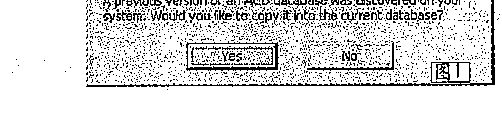

### 2. 刻录图片光盘

全新的ACDSee 6.0可以把图片直接刻录到光盘中、转成VCD或者DVD存档，选择好图片点击菜单“创建”→“创建光盘”，然后在弹出的向导对话框中点击“下一步”，在此设置光盘名称，软件默认选中下面的三个复选框，当然可以根据自己的需要进行进一步设置选择。然后把刻录光盘放入刻录机，然后选择刻录机和刻录速度，点击“下一步”后就开始刻录了。完成后把这张图片光盘放入光驱，程序会自动运行并自动弹出图片浏览的界面，里面有一些操作按钮和打印按钮，界面非常漂亮。

### 3. 建立图像的HTML相册

首先我们打开一个收藏了一定数量图片的文件夹，然后“创建”→“HTML相册”，就可以利用ACDSee 6.0建立HTML的在线图片网页了。图2所示的是HTML相册创建向导，在下拉菜单之中有三种模式供我们选择，一种是“基本缩略图页面”，一种是“底部电影胶片”，还有一种是“左边电影胶片”，第一种模式在以前的ACDSee版本之中可以看到，因此我们可以选择一些新的形式，譬如这里笔者就选择“左边电影胶片”，点击“下一步”之后出现图3的窗口，输入你的HTML相册的标题、副标题以及网址，在“页面字体和颜色”标签里面我们可以对页面的一些样式的元素进行调整。点击“下一步”之后出现的就是缩略图的选项，在这里我们可以设定好缩略图的格式、质量以及大小。点击“下一步”进入缩略图与图像的标题内容和样式设置窗口，我们可以对缩略图和图像的“标题、日期、作者、注释、关键字、等级”进行样式设置，以及决定它们是否出现在即将生成的网页上。

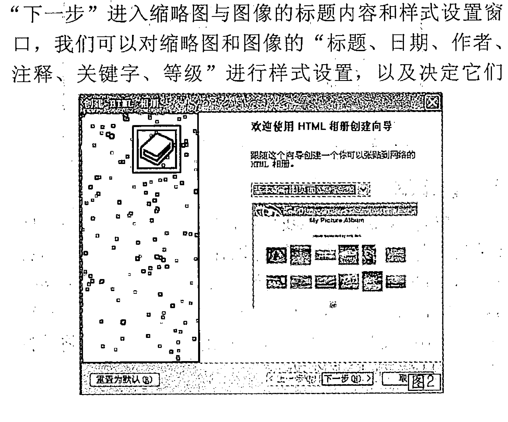
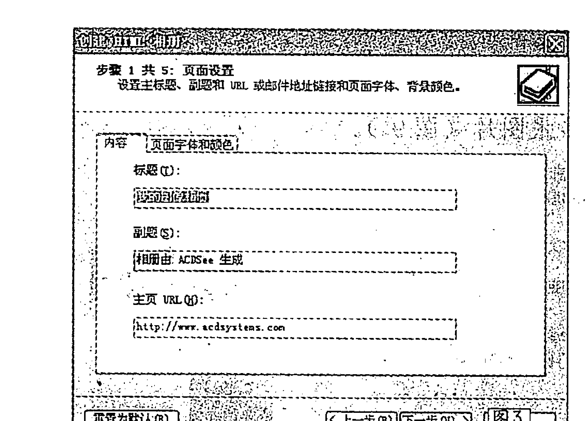

接下来点击“下一步”出现图4所示的窗口，这里是设置JPEG图像优化选项的，因为考虑到网络速度问题，有时候我们的相片精度并不需要太高，这里就是设置我们相册之中的图像质量的。设置好了之后点击“下一步”，这里设定的就是相册的输出路径，缩略图前缀以及一些高级选项了，譬如相对和绝对链接等。一切都设置完成之后点击下一步，很快你的相册就完成了！

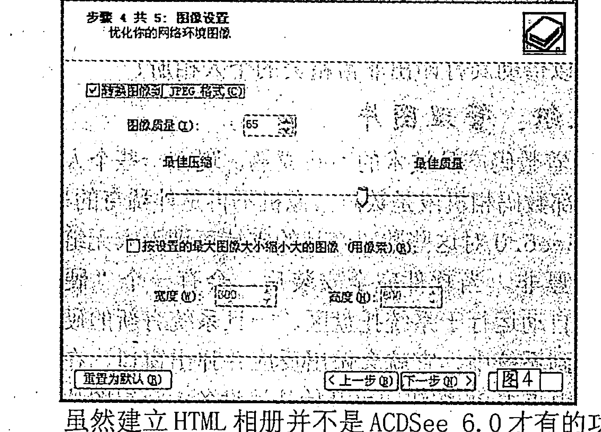

虽然建立HTML相册并不是ACDSee 6.0才有的功能，但是ACDSee6.0里面这个功能却空前地强大，而且也精美了许多，绝对值得大家去尝试一下！

### 4. 屏幕保护的制作

新版的ACDSee可以制作变化多姿的屏幕保护程序，首先你可以选定一堆图像，然后点击菜单“工具”→“配置屏幕保护”，即可看到图5的窗口了。如果你没有选定图片，那么在“选定的图像”框里面是什么都没有的，不用担心，你可以点击“添加”按钮来添加图片。添加完成图片之后，将下面的“设置为默认屏幕保护”前面的方框选择上，然后点击“确定”，现在这些图像已经成为了你的屏幕保护了，到时将会自动一幅一幅地进行切换。

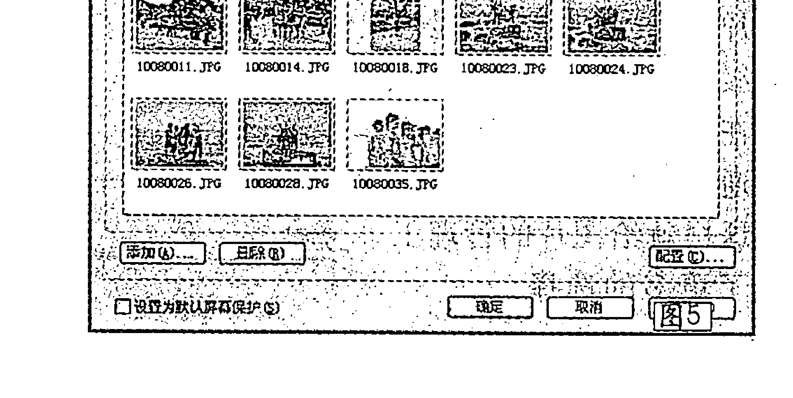

如果你觉得这样单调的切换实在不是很爽的话，你还可以对屏幕保护的样式进行设置，在上图之中点击“配置”按钮，即可看到图6的窗口。在“基本”标签里面，我们可以选择图片的转换效果，缺省状态下面是“淡入淡出”，我们可以换成诸如“插入、放射性擦除、滑动、开门、拉伸、螺旋、十字出、像素化”等特殊效果，这些效果可以同时多选，让你的屏幕保护用随机的方式出现，非常好玩哦！在“高级”标签里面我们可以设定图像的转换质量，嵌入音频文件以及设定幻灯片的顺序。而在“文字”标签之中，我们可以在屏幕保护的页眉和页脚的地方添加上自己书写的文字，样式也是可以随意调整的哦！

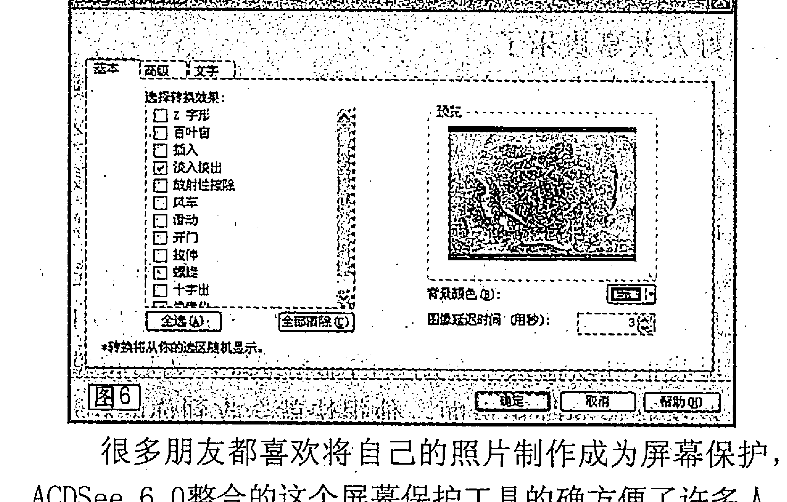

很多朋友都喜欢将自己的照片制作成为屏幕保护，ACDSee 6.0整合的这个屏幕保护工具的确方便了许多人，恐怕就连一些不常使用屏幕保护的人也会爱上屏幕保护的。

### 5. 创建幻灯片

在新版本的ACDSee 6.0里面，我们可以把图片组合成为幻灯片形式显示出来，还可以添加上音乐和文字，其功能虽然不如更为专业的Powerpoint，但对一般的应用而言也是足够的了。

首先打开一个装载了准备播放的图片的文件夹，然后点击“工具”→“配置幻灯片”，出现图7所示的窗口。这里看上去和屏幕保护的样式设定是一样的，没错，它们两者的确运用了同样的技术，实际上你也可以将屏幕保护看成是一个自动播放的幻灯片。选择好幻灯片的切换模式之后，我们点击“文件选择”标签，在这里会显示你当前选择了多少个图片对象，在下拉菜单里面你可以选择是使用“选定的媒介”还是选择“当前文件夹里面所有的媒介”，如果选择了后者，那么每次创建幻灯片的时候都会播放你的文件夹里面所有的图片。

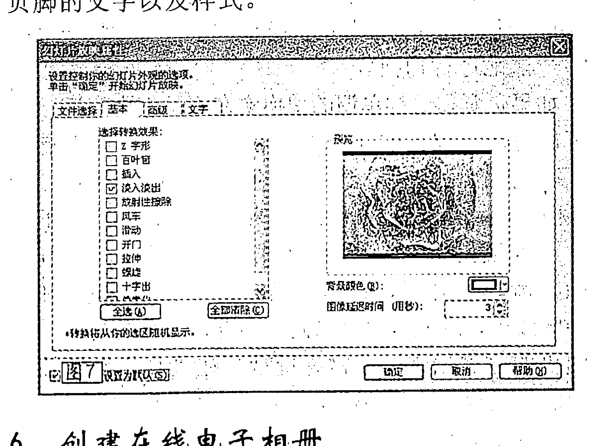

### 6. 创建在线电子相册

用鼠标点击“创建”→“创建在线SendPix相册”，我们就可以将零散的照片合成为电子相册，并且能够直接在ACDSee 6.0的模式下利用电子邮箱发送给亲朋好友共享快乐了。点击了上述的命令之后会出现一个向导，询问我们是否创建新相册，定义相册的名称等等，设置好了之后下一步，然后就会出现一个图片管理窗口。在这里我们可以调整相册里面图片的顺序，可以进行添加、删除、旋转、自动曝光、添加描述等操作，等所有操作完成了之后，我们点击“下一步”，出现图8所示的窗口，在这里我们可以输入一个朋友的邮箱地址，然后将整个相册发送到他的邮箱里面，他很快就会收到你的相册，并且不需要上线就直接在本地观看了。这个功能对亲朋好友之间的相片交流是非常有用的！

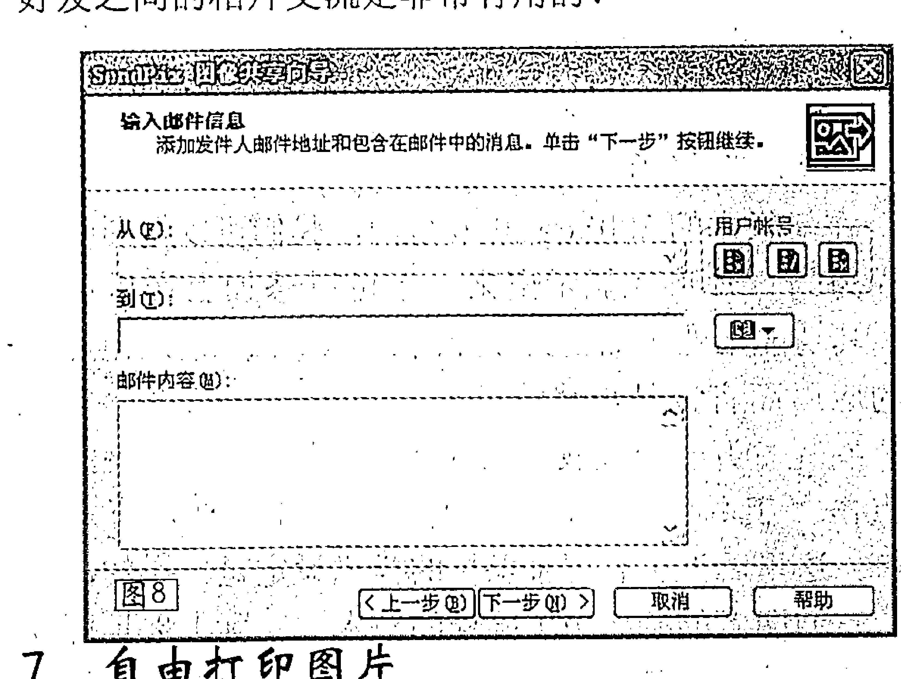

### 7. 自由打印图片

现在许多家庭都喜欢将数码相机拍出来的相片打印出来，因此在ACDSee 6.0里面特地增强了相片打印功能。首先我们可以自由调整相片的打印布局，如果是“整张”，我们就可以设定图片的大小，在中间的“预览”窗格里面我们可以实时看见相片的打印效果。如果选择“图像表”的打印方式，更可以在同一张纸上面打印多张图片（图9）。此外，我们可以在“标题”、“页眉”、“页脚”处添加自己输入的文字，样式可以随意调整哦！此外在打印设置窗口的右侧窗口中，我们可以进行打印机和打印页面的细微设置，例如在“页面设置”标签页中选择图片打印的位置、页边距、打印的份数；当图片大小超过打印范围时应该采取的措施，如调整图片大小比例以适合打印，修剪图片的大小以适合打印等。总而言之ACDSee6.0的图片打印功能是相当强大的，我们完全可以借助其打印出非常精美的个人相册！

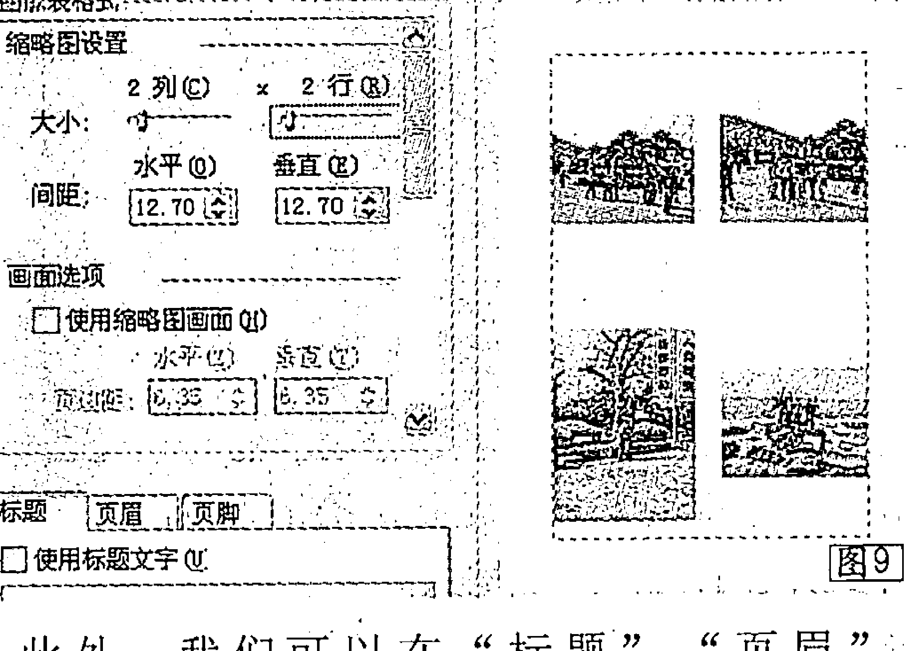

### 8. 组织、管理图片

随着数码产品技术的不断成熟，现在一些个人用户拥有一部数码相机或是数码摄像机不再是件稀奇的事了，而ACDSee6.0对这些数码产品的支持可谓天衣无缝，让人无可厚非。当软件完全安装后，会有一个“硬件检测器”自动运行于系统托盘区，一旦系统有新的硬件设备添加到系统中，它就会做出反应并弹出窗口，在弹出窗口之中点击OK按钮即可开始从该设备中获得图片，默认情况下，将图片放入“我的收藏”中的以当天日期为文件夹名的文件夹中。在浏览的图片中，一定有优劣之分，此时我们就可以用鼠标来给这些图片划分等级。选中某幅图片，然后点击鼠标右键，在弹出的快捷菜单中选择“属性”即可打开相应的窗口（图10）。在该窗口中用鼠标点击某个级别即可，同时在图片的缩略图上面会显示相应的级别数。给图片分级的好处是在以后浏览图片时，我们可以通过图片的级别来浏览图片，这样就给图片的管理工作增加了更多的选择。

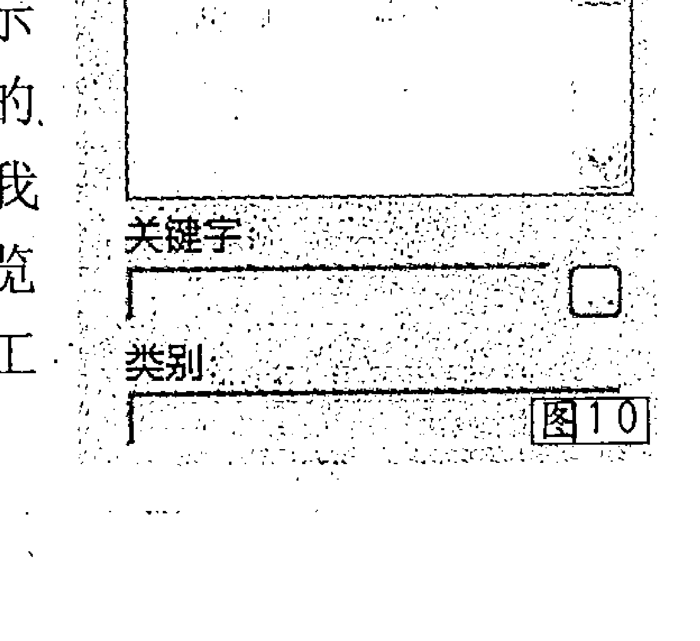

### 9. “各路”图片也能临时相处

多数情况下，图片都不会全部存于系统中的同一个文件夹中，这给图片的统一操作带来不小的麻烦，但是ACDSee6.0通过“图像篮”完美地解决了这个不足。在浏览图片时，我们可以将一些需要的图片添加到这个“图像篮”中来，方法就是在图片上面点击鼠标右键，弹出图11所示的菜单，选择其中的“添加到图像篮”即可。当我们下一次打开ACDSee时，这些被加入到图像篮中的图片还是在那个地方，这样我们就不用一个一个地去打开每个文件夹来查看图片了，这就大大提高了图片操作的便利性。

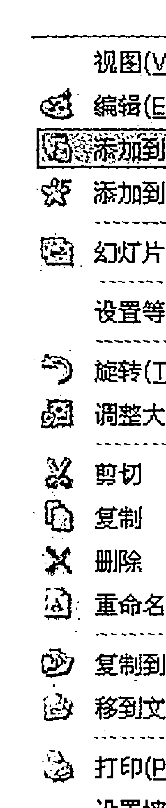

### 10. 利用放大镜查漏补遗

图片有时候也有一些瑕疵，这时我们就可以用放大镜的功能来看个究竟，以采取补救措施。在浏览窗口中（即双击某幅图片弹出的窗口），点击菜单“视图”→“放大镜玻璃面板”，即可看到图12的窗口。在这个窗口之中我们可以拖动下方的滑动条来调整放大镜放大的系数，然后在原图中移动鼠标即可在左端窗口中详细查看每个部分放大后的情况。

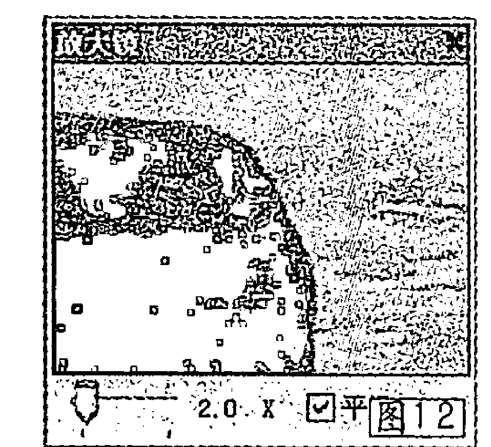

### 11. 轻松编辑图片

在新版本中，ACDSee集成了许多图片编辑工具，我们可以非常方便地在ACDSee中进行图片的编辑操作。通过采用“即见即所得”的操作方式，不需要多少时间，一个非专业级的人士也可以处理好自己的图片。在浏览窗口中点击“工具”→“在编辑器打开”→“ACDSee”即可打开编辑窗口。下面我们来介绍几个有关图片编辑器的应用：

**调整图片的色彩**：启动ACDSee6.0，选择一幅图片，然后在属性栏的快捷按钮中点编辑快捷按钮，打开它的图像编辑器（图13）。点右边编辑面板主菜单的第一个曝光按钮。在色彩调整控制面板中有三个选项，“自动曝光、亮度、色阶”对于前两个操作非常简单，这里有特色的色阶调整。它可以对图像的通道进行单独的调整，然后你可以回到亮度和自动曝光色彩调整面板中对图片的亮度和中间色做调整，直到你满意为止。与Photoshop中的调整色彩的模式一样，这里它更直观方便，任何色彩方面存在不足的图片经过这里的调整，都会比原来的图像效果好多了。

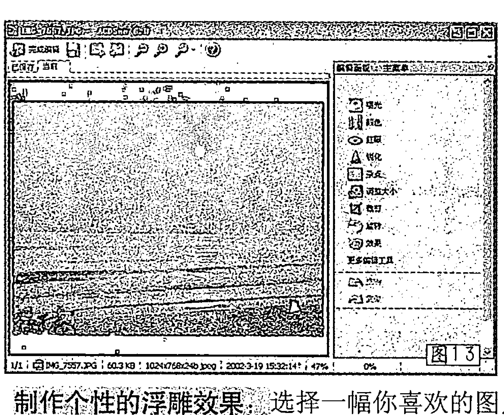

**制作个性的浮雕效果**：选择一幅你喜欢的图片进入图像编辑器，点效果按钮，在效果面板下面的类别中选择“艺术化”或者“所有效果”。现在你可以看到有许多效果模式供你选择（图14）。选择“浮雕”效果并双击，进入浮雕调节控制面板。这里设置非常简单，在预览框中将图像缩小到25%，通过调节浮雕的“高度”和“重力”来达到最佳状态。在下面的方位调节十分重要，它可以调节浮雕的亮光和阴影的布局。调节完后点“确定”，现在浮雕效果虽然出来了，但整个色彩偏暗。按照前面讲述对图片色彩调整的方法，将浮雕的对比度和亮度调整一下效果更好。最后结果如图15所示，怎么样？把自己的照片也做一个试试看吧，不过选择照片的时候要注意选择层次比较明显，背景单一的相片，做出来的效果更好。

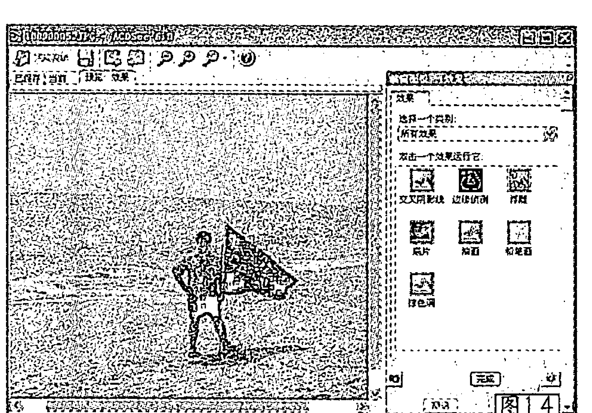
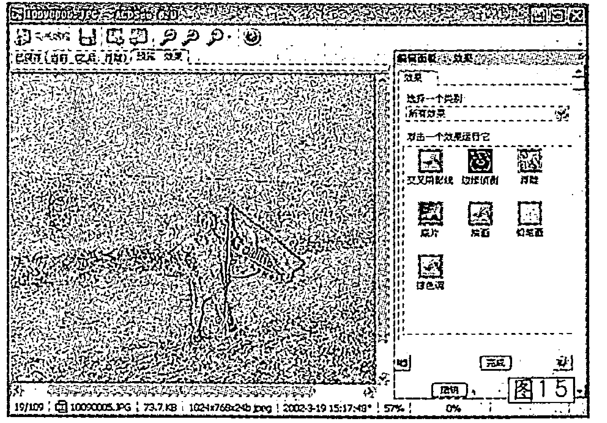

在ACDSee6.0里面还有很多很有趣的新功能，上面介绍的都是一些大家经常会用到的新鲜玩意，只要大家愿意去挖掘，相信还会找到更多有趣的东西哦！

（文／水月斋）

## 十分钟让你彻底学会用 UC

朗玛UC虽然问世的时间不是很长，但是受欢迎的程度却日益增加，曾经被华军软件园推荐为除QQ和ICQ之外的装机必备软件。UC功能强大、操作简便，可实现视频电话、文本聊天、文件互传、信息群发等功能，还引入了有特色的场景聊天新概念。而且用户自己在UC客户端设置的好友分组会保存到服务器上，保证你在任何一台电脑上使用UC好友分组都会保持一致，这个功能在QQ可是要收费的哦！下面我们就来一步一步学习朗玛UC的使用吧。

### 一、下载与安装

首先大家到http://202.98.197.139/uc/down/software/uc/UCSetup_3_80_904_All.exe去下载一个3.80完整版，里面除了3.80版的UC之外，还包含了截止到2004年4月29日UC所有官方正式发布的场景、皮肤、游戏等等。下载完成以后，运行这个exe文件即可进行安装了。值得一提的是UC拥有动态更新(LiveUpdate)功能，在使用时，如果服务器端程序的版本高于客户端，则客户端会自动下载较新版本，并自动更新客户端程序。运行下载的可执行文件，执行安装程序，安装过程十分简单，按提示操作即可。

### 二、首次运行UC

在首次使用时，会直接打开UC向导窗口，你可以根据需要选择相关选项。如果你没有注册过UC号，点击“获得UC ID”就可以进入“注册向导”窗口。如果想知道UC的功能和使用方法，以及什么是UC插件，选择“了解UC的功能”、“了解UC的插件”就可以。要是想把UC介绍给你的朋友，点击“把UC通知我的朋友”就可给你的朋友发E-mail了。当你选择“获得UC ID”后，会看到注册向导窗口（在以后的使用中，会首先出现用户登录窗口，想重新注册用户只要点击“注册”按钮，可以进入注册向导窗口）。注册向导可以指导你完成如下功能：

- **申请新号码**：你需要填写用户基本信息，有*号的字段表示必须填写，如昵称、密码、E-mail等，希望你认真填写所有内容。点击“下一步”可以继续注册的过程；点击“上一步”可以返回上个窗口来修改填写内容，最后注册结果会显示。点击“完成”会进入登录窗口。在注册新号码的同时，你可以申请密码保护。在你申请密码保护时，需要输入你的相应证件号码，因此请你牢记你输入的证件类型和号码以供找回密码时使用。目前可供选择的证件类型有：身份证、护照、军官证和其它证件。如果要修改密码保护的提示问题和答案，可以在以后使用过程中通过UC主菜单中的“密码保护”来更改。
- **找回密码**：填入用户号码后点击“下一步”，需要确认填入正确的用户号码，否则将不能取回密码。随后将显示你当初注册时所设定的“密码问题”，回答了这个问题之后点击“下一步”，如果回答正确就可以取回密码了。
- **网络设置**：你可以在任何一步进行网络设置，避免因为网络设置错误而需要重新填写你的数据信息。

### 三、登录UC

启动UC程序后，如果你不是设置了“自动登录”的话，那么将会出现图1的登录窗口，我们来解释一下窗口里面的各个按钮的具体含义：

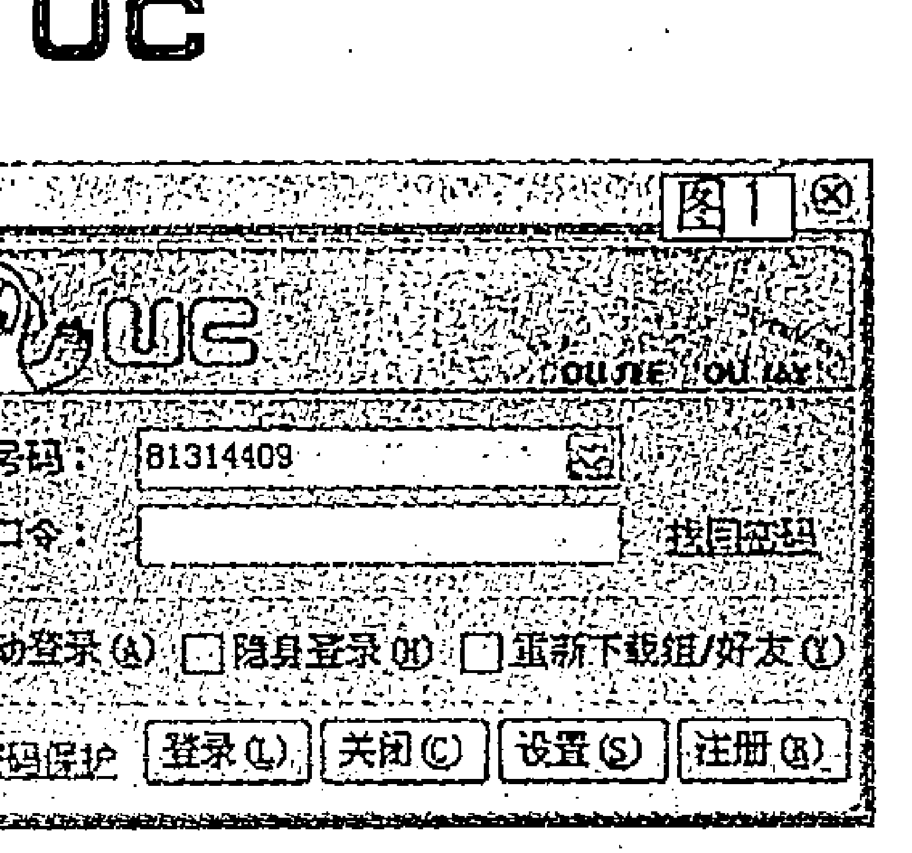

- **用户号码**：填入用户的UC号码，如果自己没有UC号码，请点击“注册”按钮，进入注册向导，申请UC号码。
- **用户口令**：填入UC号码所对应的口令。
- **自动登录**：选中后，程序将自动记录你的用户号码和口令，程序再次启动后，将直接登录，不再弹出登录窗口。
- **隐身登录**：选中后，用户成功登录后将以隐身状态出现。
- **登录**：点击“登录”按钮后，将以上面所填的UC用户号码登录。
- **设置**：点击“设置”按钮后，将弹出“网络设置”窗口，来设置自己的上网类型。
- **注册**：点击“注册”按钮后，程序将进入注册向导。
- **重新下载组/好友信息**：选中此项后，在登录服务器的同时，会下载你的组和好友信息，更新你电脑上的记录。

### 四、添加好友

朗玛UC开始运行之后，我们就可以看到如图2所示的软件主界面了，用鼠标点击组名，然后选择“添加好友”，或直接点击主窗口中的“查找”按钮，出现查找好友窗口（图3），你可以直接显示所有在线好友，或者按照用户的ID，昵称，电子邮件进行查找，也可以按照省份，城市，年龄，性别等不同分类来进行查找。还有一种笔者觉得挺不错的功能就是可以看到有谁将你设置为好友了，此功能可以显示出所有已将自己设成好友的用户列表。

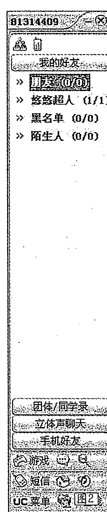
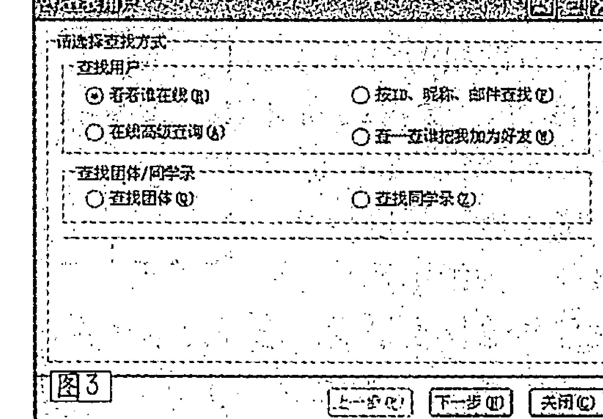

列表分成“我的好友”和“陌生人”两组显示，其中，“我的好友”中显示的是被自己设为好友的用户信息，“陌生人”组中显示的是未被自己设成好友的用户信息。在这个功能选项中，用户只要在用户图标的方块中打钩，然后点击“删除”按钮，就可以将自己的用户信息从指定用户的好友列表中删除。按以上几种查找方式查到好友后，用户可从“昵称列表”窗口中单击选定的好友，通过双击查看好友的信息后，选择是否可加入好友栏，按提示即可完成查找。

### 五、查看用户信息

想要知道好友的一些具体信息，我们可以在“查找用户”窗口双击选定的用户，或点击“显示信息”选项，以及在主窗口中的用户菜单中的“用户信息”选项，都可以打开用户信息窗口（图4）。

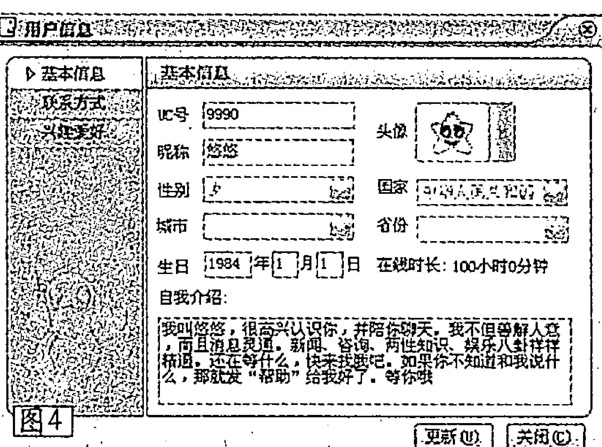

基本信息：在这里你可以看到对方的用户号、昵称、自我介绍、以及在线时长等相关信息，一目了然。

联系方式：这里记录了该用户的联系方式及一些职业、年龄等信息。不过，用户没添加的话，还是什么都看不见。

兴趣爱好：可查阅对方有何种喜爱或习惯。

最后点击“更新”可以获取最新该用户数据，点击“关闭”，则退出本界面。

### 六、文本聊天

点击好友名，选择“文本聊天”之后，我们就会看到文本聊天窗口（图5），窗口具体分为以下的部分：

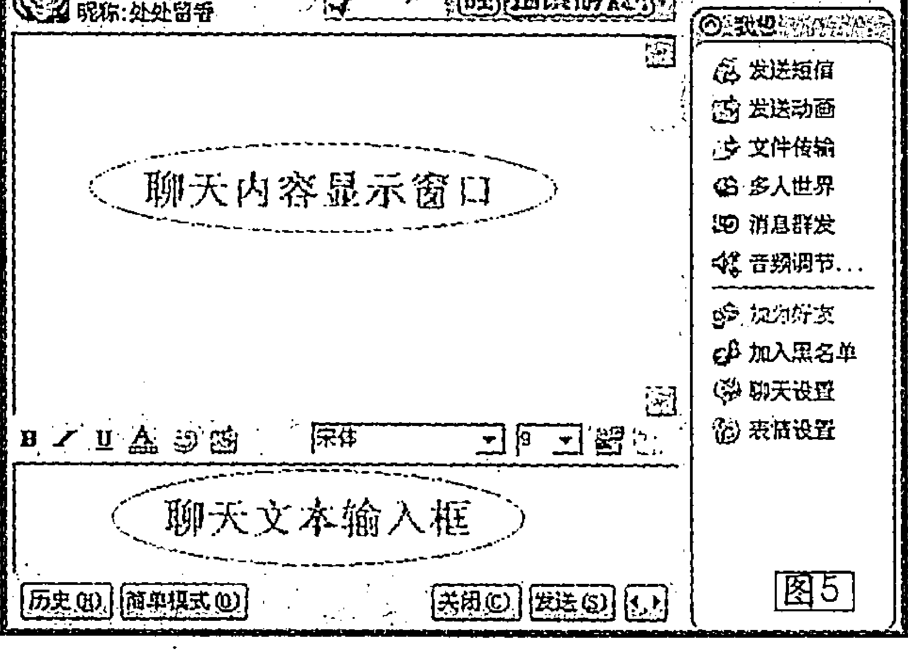

聊天内容显示窗口：当处于对聊模式时会显示出对聊信息窗口；当处于简单模式时对聊信息窗口将隐藏。对聊信息窗口分为两部分：上面的为信息显示窗口，以事件顺序排列和对方的文件交流信息；下面的为信息输入窗口。

聊天内容输入窗口：在此窗口中可以输入你想发送给对方的信息，支持Word格式，也可以自由设置文字的字体、字号、颜色，还可以粘贴表情图标。若对方没有安装你设置的字体，则会按默认的宋体字显示信息。

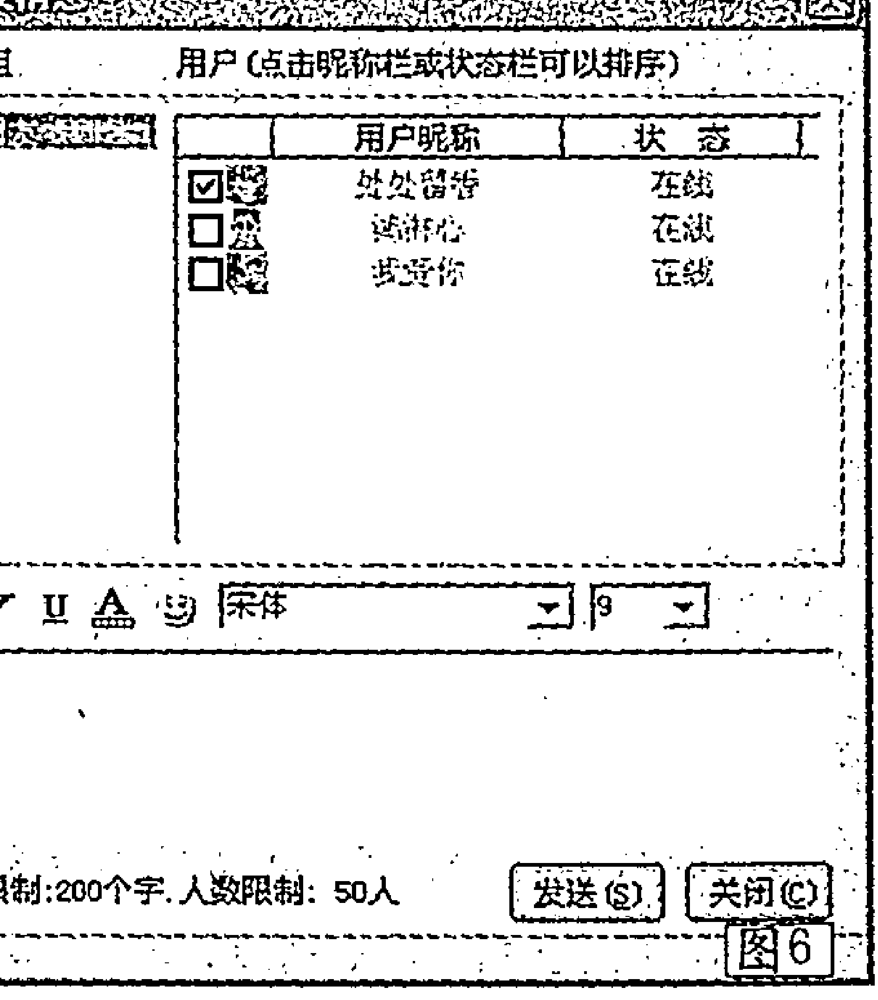

消息群发：点击聊天窗口左侧的“消息群发”可打开消息群发对话框，如图6，在下方的文本框中输入文字后，选好相应的用户组和用户，点击“发送”就可以给好友群发信息，消息群发功能可以设置字体字号，并且可以发送GIF动画图标。

历史记录窗口：显示和对方用户的历史文本聊天记录。

天信息。在此窗口中，可以删除某一条信息，也可删除所有的信息记录。

普通模式/对聊模式按钮：此按钮可以在普通模式和对聊模式之间进行切换。

下一条：对方发送了一条以上的信息时，点“下一条”即可查阅下一信息条。

打开其它功能窗口：在聊天窗口的右侧，有打开其它窗口的快捷方式，通过这些快捷方式，你可以进行文件传输、视频电话、消息群发、将对方加入黑名单以及聊天设置等操作。

关闭：点击“关闭”则退出文本聊天界面。

发送：在信息输入窗口输入文字后，点击“发送”，该信息文字即可发送到了对方。如果对方在线，则立刻收到信息。如对方不在线，将通过服务器暂存后，待对方上线时，此文字信息便实时送至该对方。

### 七、主窗口信息

上面介绍的是UC的一些基本使用方法，先让大家有一个使用的基本概念，下面我们就来看看UC的主窗口，并且介绍一下里面的主要功能：

在启动UC之后，屏幕右下角系统任务栏会出现一个鸽子的形状的图标，用左键双击该图标可以弹出UC主窗口。上面有一些按钮和好友名单列表。客户端由“我的好友”、“团体 / 同学录”、“手机好友”、“悠悠超人组”四部分组成。悠悠是一个系统机器人，不但陪你聊天，而且消息十分灵通，有兴趣的话你也可以尝试一下。

UC中的好友名单是以组的形式划分，在组名旁的括号里有一个分数，分母表示此组中共有几个用户，分子表示此组中现在有几个用户在线。UC的组有系统默认组、和自定义组二种。

-   1. 系统默认组：“朋友”、“悠悠超人组”、“黑名单”和“陌生人”组为系统默认组，在你第一次安装完UC并且启动之后，这三个组就存在了。“朋友”组中是你的好友名单。用户经过查找后，并得到对方授权，便加入到你的好友名单中。相反，你也授权通过对方认证，那么你也加入了他的好友名单。当然，对方在你的好友名单中以后也可以转移到其它组或者删除。“黑名单”的作用是如果你不想让某个人总是打扰你，就可以将这个人的头像拖进黑名单组，这样他的消息就再也看不到了。当有一个陌生人（没有被你放在任何其它组中的用户）向你发出消息（文本聊天、视频电话等等）时，对方的头像图标会出现在“陌生人”组中。如果退出UC重新登录后，陌生人组中的记录会清空。

-   2. 自定义组：你也可以自定义组，可以添加适合自己的组别并命名。认为属于同一组的好友，可以通过鼠标对好友图标进行拖动，来改变好友所属的组。将你的好友按组分类。用户所创建“自定义组”的组信息会自动上传到服务器中，即使你在其他电脑上使用UC也会获得相同的组信息，免去重新分类的麻烦。

### 八、主窗口的基本操作

#### 1. 右键菜单

主窗口的右键菜单分为组右键菜单和用户右键菜单两种，我们先来看看组右键菜单（图7），用鼠标右键点击组名时即可出现。包括消息群发、增加组、删除组、组信息。

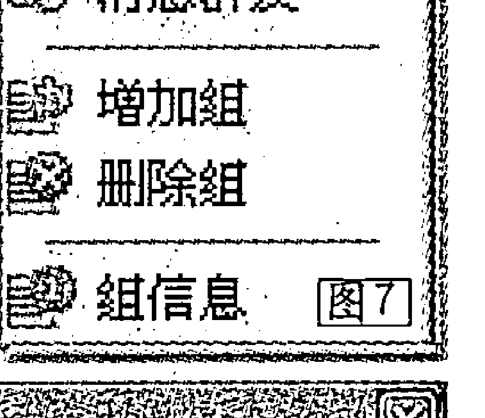

组信息和添加组：选择组信息或添加组选项之后会出现图8的窗口，在此窗口中可以对已有的组的组信息进行修改、设置或新建组。组权限设置包括了文本聊天权限设置：接收/拒绝聊天信息；文件传输权限设置：选择提示接收，则此组用户有文件传输请求时，系统会提示你，再由你选择是否接收；选择拒绝接收，则拒绝接收此组用户发送的文件；选择自动接收，则无条件的接收此组用户传来的文件；选择离开状态自动接收，则在你在离开状态时，也可以自动接收此组用户传来的文件。

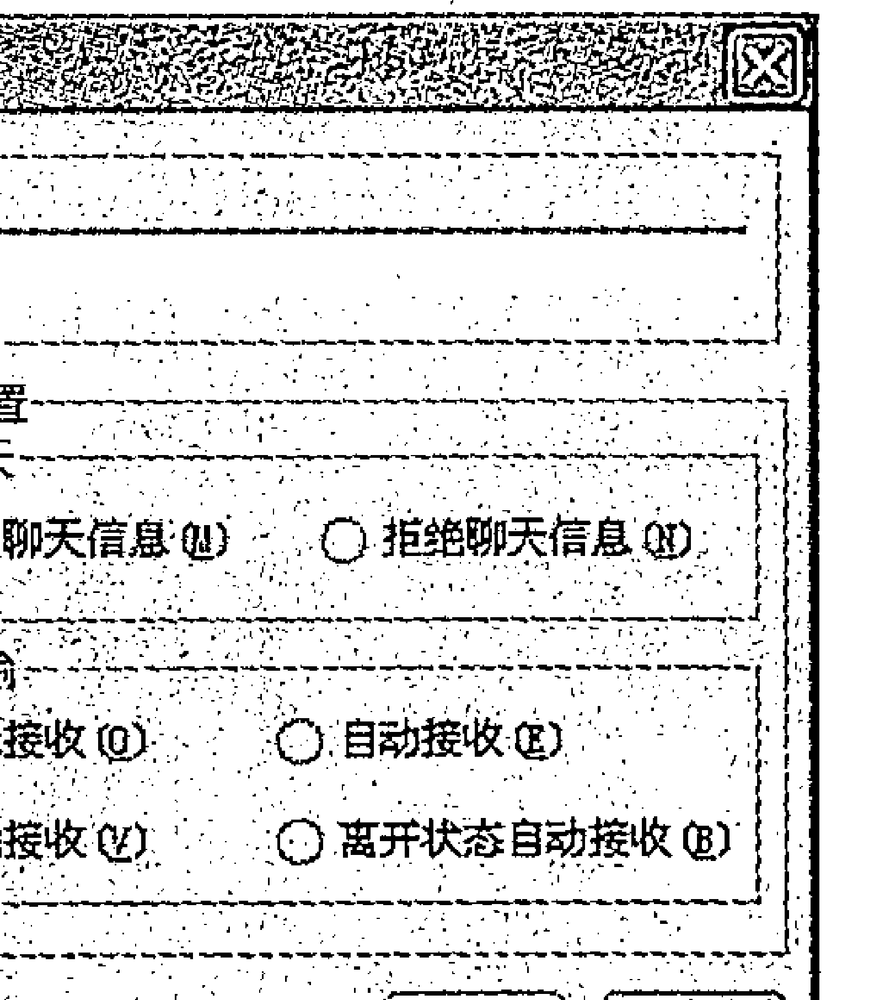

-   删除组：删除自己建立的组（此组为空）
-   消息群发：打开消息群发窗口。

接下来我们看看用户右键菜单，在UC的主界面上面用鼠标右键点击好友即可看到用户右键菜单了，在这里可对好友进行以下操作：发送短信、添加组、多人世界、消息群发、聊天室、不分组（分组）显示好友、只显示在线（所有）好友、大（小）头像、开通移动UC、开通相约UC、查看关注好友、系统设置。

#### 2. 主菜单

点击UC主界面下方的“UC菜单”图标，会弹出如图9所示的菜单，里面包括了注册向导、更改用户、个人信息、密码保护、系统设置、皮肤设置、消息管理、文件查看、在线更新、主页、帮助、关于和退出。具体的使用方法我们会在下面详细介绍。

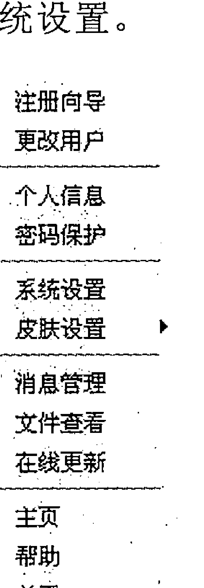

#### 3. 改变UC状态

点击右下角自己的头像图标，可以改变自己的在线状态。有“上线”、“离开”、“隐身”和“离线”四种状态。点击不同的状态，将改变本用户的当前状态。“上线”为用户正常的在线状态。“离开”表明用户暂时离开计算机，可以设置自动回复。“隐身”表明用户虽然在线，但其他用户看到的是此用户不在线的状态。“离线”表明用户未在线。点击“设置心情”按钮可以看到图10的窗口，在这里可以设置自己喜欢的在线和离开心情。

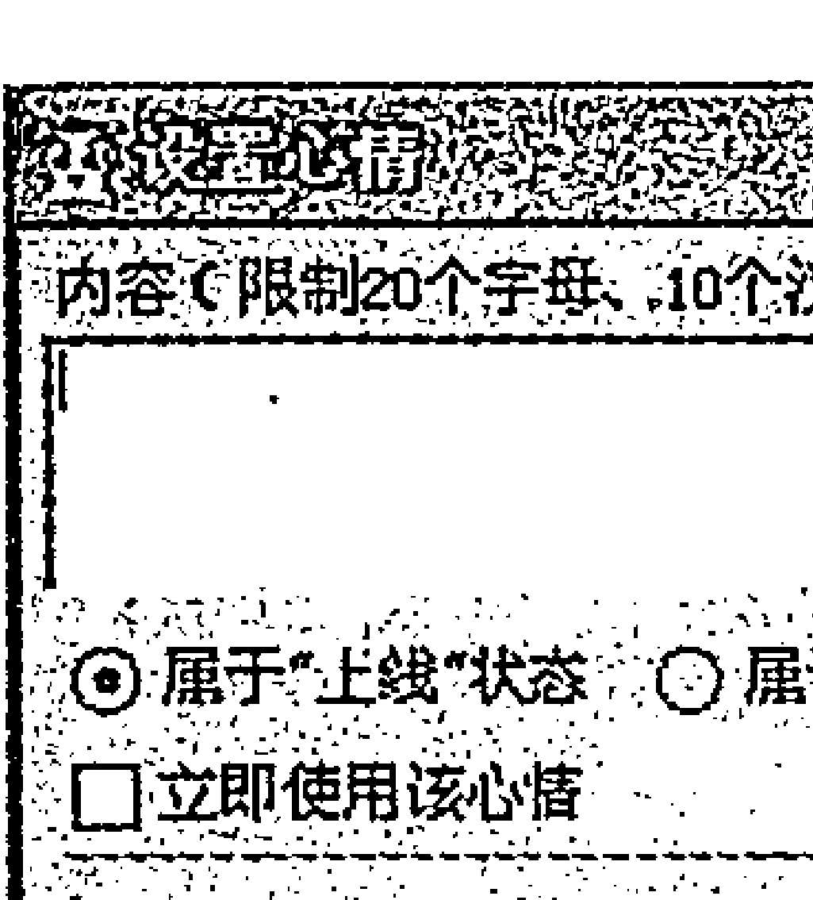
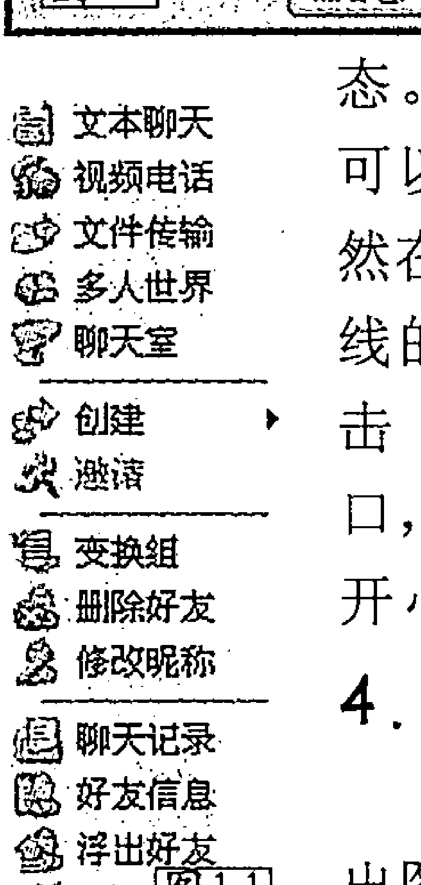

#### 4. 用户左键菜单

-   文本聊天：和好友进行文本聊天。
-   视频电话：和好友进行视频电话。
-   文件传输：和好友进行文件传输。
-   多人世界：打开多人聊天窗口，可看这里。
-   聊天室：自己创建聊天室。
-   创建：创建五子棋、聊天室、中国象棋等资源。
-   邀请：邀请对方加入自己创建的资源。
-   变换组：将好友变换组别。
-   删除好友：在好友列表中删除。
-   修改昵称：修改好友在本地的昵称。
-   聊天记录：查看聊天记录。
-   好友信息：查看好友详细信息。
-   浮出好友：将用户头像以浮动窗口方式显示。
-   手机关注：是否把好友设为手机关注好友。

### 九、主菜单操作

上面我们介绍了如何弹出主菜单，要知道主菜单可是控制整个 UC 的“核心”，因此只要我们将它摸透，那么整个 UC 便都在我们掌握之中了。
注册向导：引导用户注册号码成为 UC 系统使用成员，上面我们已经介绍过具体的方法。
更改用户：更改当前用户，有些朋友可能同时拥有多个 UC 号码，这里可以让你很方便地进行切换。点击之后会弹出“登录”窗口，通过用户号码下拉列表框选择另一个用户号码或者输入一个新的号码，当然你还必须知道这个用户的密码。点击“登录”，即可以另外的用户身份登陆到 UC。
个人信息：修改用户注册时的个人信息。“个人信息”选项分为“基本信息”、“联系方式”、“兴趣爱好”、“安全信息”和“修改密码”五个类别。其中“安全信息”中可以设置是否保存用户信息（包括登录信息、聊天记录等）和身份验证。用户可以选择在 UC 退出时询问是否删除，退出时自动删除，还是在退出时保留用户信息。还可以允许任何人把自己列为好友；不允许任何人把自己列为好友；或设置身份验证，需要经过自己同意才能把自己列入对方的好友列表。
密码保护：点击“密码保护”会链接到密码保护网页，从此网页可以申请密码保护、修改密码保护资料、找回 UC 密码、UC 号码申诉等服务。
系统设置：打开系统设置窗口，用户可以在此根据自己的需求设置一下。由于里面的功能繁多，因此在后面将详细向大家讲解。
皮肤设置：下载最新的皮肤或选使用个性皮肤。
消息管理：点击之后会打开消息管理器，在其中可以进行消息管理。在消息管理器中，可以查看你和好友的文本聊天记录、视频对话记录、文件传输记录、系统消息和手机短信记录。你可以删除消息、导出列表记录、查看日志文件、保存日志备份、查看每条消息的详细内容和按不同的排序方式查看消息。消息管理器的使用与是否在线无关，你任何时候都可以点击 UC 主面板的“消息”按钮，查看消息。
文件查看：查阅通过 UC 系统传输过来的文件所在位置。在这里可以对这些文档进行管理。文件的默认位置是 C:\Program Files\Longmaster\UC\RecvFiles。
在线更新：可以到服务器上搜索最新版本，如果有更新的版本，就会对 UC 进行更新。

### 十、系统设置

经过上面的介绍之后，相信很多朋友已经学会如何用 UC 了，在最后我们再来看看如何对 UC 进行简单的设置，让其更加符合自己的使用习惯。点击主菜单之中的“系统设置”，我们来介绍一下各种不同的系统设置项目：

#### 1. 风格设置

-   窗口总在最前面：选中此项，软件窗口将停留在其它窗口之上。
-   系统启动时程序自动启动：选中此项，当操作系统启动时，程序是否自动启动。
-   临近边界自动隐藏：选中此项，当软件窗口靠近屏幕边界时，将自动隐藏。当隐藏后，鼠标放置到上次隐藏处边界时，窗口会自动滑出。
-   自动弹出系统消息：选中此项，有系统消息时， UC 会自动进行提示。
-   浮动窗口：默认显示大头像：选中此项后弹出的用户浮动窗口将以大头像方式显示。
-   默认显示心情：选中此项后弹出的用户浮动窗口将显示该用户的在线心情。

##### 好友显示方式

只显示在线好友：选中此项，不在线的用户不再显示，面板比较简洁。
好友头像使用大图标：选中此项，以大图标显示头像。
分组显示好友：选中此项，所有成员按照朋友组、黑名单组和自定义的组来显示。
好友列表自动展开：选中此项，每次启动UC好友列表将自动处于展开方式。不设置，好友列表将处于折叠方式。

#### 2. 聊天设置

在此可将聊天方式设置成自己常用的方式：
文本聊天窗口自动弹出：选中此项，有好友给你发出聊天内容时，会自动弹出聊天窗口。
发送按键：可在此设置成按回车键发送或按Ctrl+回车键发送。
聊天模式：可设置成按简单模式或场景聊天模式。
场景模式：可设置默认场景或设置成自动关闭窗口。
简单模式：可设置成接收消息时同时接收场景。
聊天信息提示：选中此项，别人发来消息时，会弹出消息提示框。

#### 3. 音频设置

点击之后就会让你设置系统的声卡以及麦克风等选项。

##### 静音检测

自动调整静音检测：系统设置静音检测的阈值，通常选择此项即可。
手动调整静音检测：可手动调整静音检测的阈值，保证声音的连续性。
话音增益：可以选是否使用语音增益功能，并设置自动或手动调整增益倍数，语音增益功能可以提高视频电话的通话质量，建议你使用该功能并设置成自动调整。

#### 4. 视频设置

发送图像大小：可选择小图像（176 × 144）或大图像（352 × 288）。
视频质量：可选择更好的质量或更快的视频。选更好的质量，则视频图像清晰度较好，但会断断续续；选更快的视频，则视频图像的连续性较好，但会不清楚。

#### 5. 文件传输设置

通过这里可以查看接收到的文件并可以更改存贮文件的路径。

#### 6. 提示设置

##### 视觉提示

好友上线提示：选中此项，当你的好友上线时，系统会发出提示。
好友下线提示：选中此项，当好友下线时，系统发出提示。
系统消息到达提示：选中此项，有系统消息到达时，则系统发出提示。
被别人加为好友提示：选中此项，有别人将你加为好友时，系统会发出提示。

##### 声音提示

可选择是否使用声音提示。如果选择声音提示，可以设置各种事件发生时提示音所播放的声音文件。并可以用自己喜欢的音乐更改所选择的提示音。

#### 7. 回复设置

离开时自动回复：当你离开时，系统会帮你回复你的好友。你可以修改回复内容。
自动状态转换设置：当你的键盘鼠标在一段时间没有任何操作时，可以转换到离开和下线状态。

#### 8. 快捷键设置

你可以通过快捷键弹出好友所发消息、隐藏／呼出UC图标。也可以重新设置快捷键。

#### 9. 网络设置

##### 登录服务器

地址：服务器的地址，缺省为 entry.51uc.com。
端口：服务器的端口，缺省为 3001。

#### 10. 网络类型

拨号或直接连接：当用户采用本机直接拨号上网方式时，选用此项。
局域网：如果用户的机器操作系统的网络配置中配置了“网关”，选择此选项，并且不选“使用代理”。如果用户是通过代理（socks）上网，选择此选项后，再选中“使用代理”，并配置相应的代理选项。可以通过“带宽设置”来选择上网类型，有局域网电缆、XDSL、ISDN、56K调制解调器等选项。

#### 11. 更新设置

可以选择自己的更新计划，以便及时得到最新版本的UC。你可以选择“每周一次版本检查”、“每天一次版本检查”和“自定义版本检查周期”。UC会按你设置的时间定期连接服务器，检查是否有升级版本。也可以选择“立即检查”马上连接服务器检查UC更新版本。如果你不准备进行在线更新，也可以选择“根本不进行版本检查”。

相信经过上面如此详尽的使用介绍，大家对朗玛UC已经是非常熟悉了，其实它的使用是非常简单的，大家只要多摸索一下，就会发现更多更有趣的功能哦！

(文 / 水月斋)

## 利用 Cool Edit 录制自己的卡拉OK

传统音乐制作人都知道，要成功制作一首高品质的音乐作品，一般少不了专业录音棚（包括多轨数码录音机、音乐编辑机、专业合成器等设备），要具备这样的条件，怎么也得花上数万元甚至更多，对于一家音像公司来说，这也许不算太难，但对于一名普通发烧友，或者独立音乐制作人来说，恐怕就有些可望而不可及了。不过，现在有一种软件，它可以在顷刻之间，将你的电脑模拟成一座全功能的录音棚，使你几乎不需增加任何其它投资，就可以制作出同样专业而美妙的音乐，它就是 Cool Edit！

Cool Edit 是一个功能强大的音乐编辑软件，能高质量地完成录音、编辑、合成等多种任务，只要拥有它和一台配备了声卡的电脑，也就等于同时拥有了一台多轨数码录音机、一台音乐编辑机和一台专业合成器。它能记录的音源包括 CD、卡座、话筒乃至 MP3，甚至是视频文件里面的音轨，并可以对它们进行降噪、扩音、剪接等处理，还可以给它们添加立体环绕、淡入淡出、3D 回响等奇妙音效，制成的音频文件，除了可以保存为常见的.wav、.snd 和.voc 等格式外，也可以直接压缩为 MP3 或 rm 文件放到互联网上或 E-mail 给朋友，大家共同欣赏。当然，如果需要，你还可以烧录到 CD 上。甚至借助于 Cool Edit 你还以制作更高品质的 DVD 音频文件。

对于普通的家庭用户而言，可能我们用不上 Cool Edit 为我们提供的众多专业功能，但不少朋友都喜欢一展歌喉，过把歌星的瘾，因此下面笔者就有的放矢，介绍如何利用 Cool Edit 来录制我们自己的卡拉OK！

### 一、软件的下载和安装

要利用 Cool Edit 制作卡拉OK，我们除了安装 Cool Edit 之外还必须安装一些其他的插件，下面是下载地址：

-   Cool Edit pro2.0: http://61.155.65.74/other/soft/cooleditpro20.zip
-   cooledit pro2.0汉化补丁: http://61.155.65.74/other/soft/cool2hh.exe
-   激励器插件: http://61.155.65.74/other/soft/bbe.rar
-   分段频率压限器插件: http://61.155.65.74/other/soft/z-wgb301.rar
-   混响插件: http://61.155.65.74/other/soft/ultrafunk3.rar
-   TC Native 效果器插件: http://61.155.65.74/other/soft/tc2.rar

我们安装了源程序以及汉化补丁，接下来就要安装音频的插件了。首先在你的 Cool Edit 安装目录下建一个 DX 目录，然后上述插件均安装在这个目录里即可，它们的汉化包当然也要装在 DX 这个目录下。在安装混响插件时需要在 Cool Edit 安装目录下建一个 VST 目录（用来装 VST 插件的，不过暂时用不到，只管建就是）然后在出现 add 或 remove 时加入这个目录的路径即可顺利安装。

### 二、录制原声

录音是所有后期制作加工的基础，这个环节如果出了问题，是无法靠后期加工来补救的，所以，如果是原始的录音有较大问题，就重新录吧。

打开 Cool Edit，进入多音轨界面右击音轨1空白处，插入你所要录制歌曲的 mp3 伴奏文件，wav 也可（图1）。然后选择将你的人声录在音轨 2，按下“R”按钮，接着按下左下方的红色录音键，跟随伴奏音乐开始演唱和录制（图2）。录音完毕后，可点左下方播放键进行试听，看有无严重的出错，是否要重新录制。双击音轨2进入波形编辑界面（图3），将你录制的原始人声文件保存为MP3 pro格式，与缺省的WAV文件比较起来可以节省大量空间。

需要先说明一下的是：录制时要关闭音箱，通过耳机来听伴奏，跟着伴奏进行演唱和录音。录制前一定要调节好你的总音量及麦克音量，这点至关重要！麦克的音量最好不要超过总音量大小，略小一些为佳，因为如果麦克音量过大，会导致录出的波形成了方波，这种波形的声音是失真的，这样的波形也是无用的，无论你水平多么高超，也不可能处理出令人满意的结果的。如果你的麦克总是录入从耳机中传出的伴奏音乐的声音，建议你用普通的大话筒，只要加一个大转小的接头即可直接在电脑上使用，你会发现录出的效果要干净的多。

### 三、降噪处理

降噪是至关重要的一步，做的好有利于下面进一步美化你的声音，做不好就会导致声音失真，彻底破坏原声。单单这一步就足以独辟篇幅来专门讲解，大家清楚这一点就行了。

首先点击左下方的波形水平放大按钮（带+号的两个分别为水平放大和垂直放大）放大波形，以找出一段适合用来做噪声采样波形（图4）。点鼠标左键拖动，直至高亮区完全覆盖你所选的那一段波形（图5）。右单击高亮区选“复制为新的”，将此段波形抽离出来。接着点击“效果” → “噪声消除” → “降噪器”，准备进行噪声采样（图6）。降噪器中的参数按默认数值即可，随便更动，有可能会导致降噪后的人声产生较大失真。

接下来就是保存采样结果并且关闭降噪器及这段波形（不需保存）。回到处于波形编辑界面的人声文件，打开降噪器，加载之前保存的噪声采样进行降噪处理，点确定降噪前，可先点预览试听一下降噪后的效果（如失真太大，说明降噪采样不合适，需重新采样或调整参数，有一点要说明，无论何种方式的降噪都会对原声有一定的损害）。

### 四、高音激励处理

点击“效果” → “DirectX” → “BBE Sonic Maximizer”，打开BBE高音激励器（图7）。加载预置下拉菜单中的各种效果后（或是全手动调节三旋钮）点激励器右下方的“预览”进行反复的试听，直至调至满意的效果后，点确定对原声进行高音激励。此过程目的是为了调节所录人声的高音和低音部分，使声音显得更加清晰明亮或是厚重。激励的作用就是产生谐波，对声音进行修饰和美化，产生悦耳的听觉效果，它可以增强声音的频率动态，提高清晰度、亮度、音量、温暖感和厚重感，使声音更有张力。

### 五、压限处理

点击“效果” → “DirectX” → “Waves” → “C4”，打开WaveC4压限效果器（图8）。加载预置下拉菜单中的各种效果后（如果你对数字音频有足够的了解的话，也可手动调节）点右下方的“预览”进行反复的试听，直至调至满意的效果后，点“确定”对原声进行压限处理。

## 抓图工具 SnagIt 使用指南

写报告时，再多的说明也不如一张示意图简单明了；在网上看到自己喜好的图片，总想将它们统统“占为己有”……，我们和图片打交道的时候太多太多，正如我们必须要学会使用 Office 系列软件，如今我们也非常有必要学会使用一个抓图软件。

HyperSnap、Capture Professional 这些老牌的抓图软件用起来给人的感觉总是有点复杂，而且还不太好使。但大名鼎鼎的抓图软件 SnagIt 就不一样了，它的名气似乎和它的实用性成正比，这里简单罗列它的几大功能：图像抓取、文本抓取、影像抓取、网页图片成批量的抓取以及简洁的图片编辑器等，你会发现每一项功能离你都那么近。再加上明了的界面、易学的操作，用过后你就会爱不释手！

该软件在国内很多网站都能够找到，比较容易找到的是 7.03 的版本，还有相应的汉化补丁，和以前 6.02 版本相比，SnagIt 7.03 更加集成化，将 SnagIt 的全部功能——捕获、编辑、管理集合到了一个主菜单上，SnagIt 安装运行后，其主界面如图 1 所示。

对于初学者来说，不但界面更亲近了，窗口连快捷键都不用记了，用起来感觉很不错。至于安装这些步骤就没有必要再详细说下去了，我们还是单刀直入地来看看它都可以为我们做些什么吧！

### 一、屏幕抓取，轻松搞定

SnagIt 能抓取在你面前看到的所有东西：屏幕、窗口、活动窗口、某个指定的区域（不一定是一个窗口）……窗口中的某一个图标，某一个下拉菜单或快捷菜单，某个图形文件，甚至可是 DOS 界面和剪贴板中的内容。这就是 SnagIt 最出色的，也是最主要的图像捕捉功能了。比如，我们只想要抓取 Word 中的工具栏，只要按如下方法操作就可以轻松搞定了！

选择主界面中的“捕获”标签，在左边窗口的“基本捕获配置文件”中选择“区域到文件”。

在右边窗口中的“输入”中选择“窗口”。默认的模式为“图像”。仔细看看菜单中的其他内容，你会发现抓取图片的第一步就是要确定要抓的是什么，而 SnagIt 将要抓的东西分得很细，比如“窗口”和“活动窗口”是两个不同的类型，从而保证了最终目的的实现。

在右边窗口中的“输出”中选择“文件”。

按“捕获”按钮，将会在你的桌面上的菜单中出现一个红色的矩形框，该矩形框将会跟随鼠标指针移动，当矩形框中包含了你需要的窗口后，按鼠标左键确定。然后 SnagIt 会弹出一个对话框询问文件保存的位置以及文件类型，SnagIt 允许将文件以任何常见类型保存，比如：BMP、TIF、JPG 等。你完全没有必要担心文件保存后是否能被其他软件识别的问题。

当要抓取的图像在水平和垂直方向的大小都要超过屏幕大小的话，就必须在“输入”菜单中的选择“属性”，在打开的对话框中选择“滚动”标签（如图 2 所示），在这里选择屏幕滚动的方向以及滚动所需要的延迟时间，SnagIt 将自动地将滚动后的整体作为你所抓取的图像。

SnagIt 的默认输出是“文件” + “预览窗口”，此时你抓取的图片将被调入 SnagIt 预览窗口，其界面和我们后面介绍的 SnagIt 编辑器非常类似，在这里你可以看到抓取的图片效果并可以对图片做进一步处理。

SnagIt 允许用户将抓取的图片输出到打印机、剪贴板、文件、电子邮件、预览窗口以及它们的多重选择，这些你可以在右窗口的“输出”中进行设置。

另外，你还可以在右边窗口的“过滤”中选择一些基本的图形图像处理效果，比如给图片加不同形状的边缘、水印，调整色彩饱和度、分辨率以及黑白处理等。这些功能虽然没有 PhotoShop 强大，但它是在和捕捉图片一次完成的且效果也不错，对实际运用者来说是最实用不过的了！

当然为了操作便捷，你也可以去记记对应的快捷键，在 SnagIt 中不管抓取的是什么，捕获的快捷键都是“Ctrl + Shift + P”，在捕获的过程中也可以按 Ctrl+Shift+P 停止，或者按 Esc 键取消操作，当然也允许用户自定义快捷键。

主要适用对象：经常需要写说明性文章和报告的 Office 一族；经常需要说明计算机软件操作步骤的工作人员、教师和撰稿者；需要捕捉屏幕图像、图标用于广告制作等人士。

### 二、经典视频，随心所欲

仔细尝试 SnagIt 的抓图功能后，你还可以发现它可以轻松撷取到某段影像文件的停格画面，犹如照相机一样，使你不再出现精彩镜头无法捕捉的窘境。另外，SnagIt 的 video capture 功能能完成很多一般软件无法实现的视频捕捉，在具体实现上也不需要太多技巧，几乎没有什么难度。如果你现在想要将一段正在播放的 VCD 捕捉下来，并要加上自己的配音，那么用 SnagIt 完成吧！

选择主界面中的“捕获”标签，在左边窗口的“其他捕获配置文件”中选择“录制一个屏幕视频”。

在右边的窗口中的“输入”中选择抓取的范围，比如为一个窗口，或者屏幕的某一区域，在这里应该选择“固定区域”。如果同时选择了“包括光标”和“录制音频”，则将同时捕获光标的变化和从话筒输入的声音。

播放需要截取的 VCD。

按快捷键 Ctrl+Shift+P，SnagIt 就会捕获选取范围内的视频（画面变化）。此时将首先出现一个矩形框，用以确定需要捕捉的范围，一般就是正在播放的屏幕的大小，单击左键确定后，将会出现如图 3 所示的对话框。

按“开始”按钮后，将会实现对当前固定区域的视频抓取，按 Ctrl+Shift+P 结束，结束后将弹出一窗口，告诉你抓取的视频文件的帧数以及时间等参数。

和前面的抓图功能非常类似，SnagIt 的默认输出也是“文件” + “预览窗口”。在一般情况下，都不需要对视频文件进行处理，因此你可以直接在“输出”中选择“文件”。

SnagIt 只能将视频文件以 AVI 的格式进行保存，这恐怕算是 SnagIt 美中不足的地方了！

另外需要专门说明的是，当你选择不同的捕获对象时，出现在输入或者输出下菜单下的“属性”、“过滤”、“选项”的菜单内容也会相应变化。很多选项是很关键的，比如音频格式的设置（在“输出”菜单的属性中），在捕捉之前，最好还是检查一下。

主要适用对象：收集经典大片中以及精彩片段用于影视分析和资料保存的人们；想将某个视频文件中的一部分截取出来用于制作多媒体课件、教程、卡片、或者动画素材的人。

### 三、下载图片，批量处理

几乎每个使用计算机的人都喜欢用漂亮的壁纸来打扮自己的 Windows 桌面；有军事、服装、养花养鸟等各种各样爱好的人都喜欢在网上去收集大量的图片保存在自己的计算机中；做网页、广告创意、Flash 动画则更需要保存大量的图片资料了……。因此当你发现一个非常符合你心意的网站有很多图片时，通过“打开网页”、“图片另存为”这些简单而枯燥的操作会消耗掉很多时间。

在 SnagIt 中，“捕捉”这个概念的定义被扩大化了，SnagIt 允许用户一次性地将网站中所有的图像文件，比如 png、jpg 和 gif 等格式，一次性“抓取”下来。这就是 SnagIt 的 Web capture 功能，让我们现在就来体验一下吧！

选择主界面中的“捕获”标签，在左边窗口的“其他捕获配置文件”中选择“网站的所有图像”。

在右边窗口的“输入”窗口中可以选择“固定网址”或者“提示网址”，或者在“属性”中，直接确定一个网址。在“网络捕获参数设置”标签中，可以看到在需要时设置代理服务器等有关网络连接的参数。

由于我们“抓取”的不是单一的文件，因此需要特别留心“输出属性”。由于文件个数太多，所以我们也不再设置预览窗口，而是直接只生成文件。在“输出属性”中的“图库浏览器”标签中我们可以看到，系统默认使用 SnagIt 来打开图片（推荐），可以根据自己的喜好设置成 ACDSee 等图片浏览器。不过习惯后，会发现 SnagIt 自带的图片浏览器也很不错。

如果需要抓取的文件数量实在太大，为了方便日后浏览查看，我们可以选择“创建要储存的图像的文件夹层次”，使得我们从网站上抓取的图像可以按照不同的目录结构来存储。

右边窗口中“过滤”菜单的“属性”（如图4所示），在这里你可以设置网页链接搜索深度以及你需要搜索的文件类型。一般来说，数字越大，网页搜索链接的层次也就越多。如果你担心网站上的图片太多，而硬盘空间有限的话，你还可以指定下载的图片所占磁盘的空间，超过设定的磁盘大小时，SnagIt 将停止下载。如果输入值为0，则表示空间无大小限制。

设置好以后，按“捕获”按钮或者 Ctrl+Shift+P 键就可以开始了。

完成捕捉后，SnagIt 能够打开自带的图片浏览器（如图5所示），其结构和使用方法都和 ACDSee 非常相似，具体使用方法就不再多说了！

SnagIt 的 Web capture 功能非常实用，你可以将其当作专门的图片下载软件使用，你也可当将其当作离线浏览器浏览图片。

主要适用对象：和图片打交道的所有人。

### 四、图像编辑，简单实用

抓取下来的图形常常需要编辑一下，可 Photoshop 无疑虽好，但操作太复杂。SnagIt studio 同样具有简单的图片编辑功能，应付你的日常需要简直再合适不过了！

选择主界面中的“编辑”标签，可以看到 SnagIt 提供了 3 类常见的图片处理工具：

#### 1. SnagIt 编辑器

主要用于对图片进行简单的加工处理，其主界面如图6所示。其使用方法有点类似于附件中画板，可用于给图片加箭头、注释和图片剪裁等。今天我们在计算机期刊和报纸上看到的很多个人投稿文章中示意图，很多都是截取后用 SnagIt 编辑器来处理的，包括本文中的所有图片。SnagIt 编辑器提供了和 Word 类似的简单图片处理，如移动、改变大小、填充颜色、改变线条粗细或颜色、旋转、组合、设置阴影以及叠放层次等，另外，在“颜色”和“效果”两个菜单中，还提供了相对比较复杂的图形图像处理功能。对于初学者来说，最开始的时候没有必要深入研究，到具体使用的时候再来学习也不迟。

主要适用对象：多媒体课件制作者、经常需要说明计算机软件操作步骤的工作人员、教师和撰稿者。

#### 2. SnagIt 工作室

低版本的 SnagIt 并没有将编辑器和工作室完全分开。仔细观察 SnagIt 工作室（如图7所示），主窗口的左边列出了 SnagIt 工作室中共 6 类上百种图形，比如：各类箭头、印章、插图符号等。这些图片可以直接拖到正在编辑的图片中使用，有些图形取消组合后还可以进行局部改动。

借助 SnagIt 可以完成相对较复杂的图形注释和合成处理，当有多个对象时，可以使用“布局”菜单中的相应功能来完成。用它来画流程图非常方便，完成后直接保存就可以了。和 SnagIt 编辑器相比，用 SnagIt 工作室编辑后的文件保存时默认的文件后缀名为 *.ssd，以后可以直接再次编辑，当然你也可以在“保存”或者“另存为”的时候确定最后的图形格式。而用 SnagIt 编辑器所做的编辑将会直接在原来的文件上修改，保存后将不能再改动了。

从实用的角度上来看，几乎所有 Word 可以完成的图片处理工作，用 SnagIt 工作室都能完成，使用方法大致相同，但 SnagIt 无疑更方便、更快、更专业。但和 Visio 等软件相比，其功能更单一、更明确，因此非常适合非专业做图人员使用。

主要适用对象：需要经常绘制工作流程、工程示意图的各类专业人士。

#### 3. 批量转换图像

该功能和 ACDSee 的相应功能几乎完全类似，它可以将选定的多个不同类型格式的图形文件一次性地转换为某个指定格式的文件。该功能是通过向导来实现的，很有意思的是在第二步，按“修改”按钮，将可以一次性地对所选定的文件添加水印和阴影等效果，也就是俗称的“批量过滤”功能。

主要适用对象：使用 SnagIt 的所有人。

### 五、其他

在 SnagIt 中的“其他捕获配置文件”中的“窗口文字”，可直接将窗口中的文字截取出来，比如有的网站不允许复制网页上的文字，这时你可使用该功能，并将“输入”设置为“区域”，即网页在屏幕上的实际显示大小，这时光标会变成带十字的手形图标，按下鼠标左键在网页中拖动选出你要复制的文本，松开鼠标后会弹出一个文本预览窗口，可以看到网页中的文字已经被复制到窗口中，此时 SnagIt 允许将其以 TXT 格式保存，这样你就可以用任何字处理软件进行编辑了，有需要的朋友不妨去试试！

SnagIt 提供了一个带十字的手形图标，可用于精确确定需要抓取的区域大小，并提供在屏幕上的坐标参数。另外也允许以圆形、三角形等非矩形区域截取图像。

支持 Direct X，也就是说使用它可以实现对游戏图像的抓取。

还提供定时设置功能，可以设置“捕获定时器”和在某一特定时间进行捕获，时间精确到秒。

提供直接将指定目录下的所有图形文件直接创建成网页的功能，并可以在网页上首先查看缩略图，可以非常方便地将自己的图片库与他人共享。

SnagIt 最大的优势就在于实用，并不复杂的操作却解决了有关图形/图像抓取的所有问题，免去了安装和学习多个软件的痛苦，而且 SnagIt 本身就是一个很著名的软件，其日后升级和功能完善根本不必担心，也许就正如你学习使用 Word 一样，你根本就不需要考虑日后是否要过时的问题。

（文/ShanShan）

## 实战 FrontPage 2003 网页制作

Microsoft Office FrontPage 2003 是一款“所见即所得”的网页制作工具，使用经过改进的设计环境、新的布局和设计工具、模板以及经过改进的主题，可以帮助我们快速实现网站创意，而无须任何 HTML 知识。

### 一、网站管理与编辑网页

#### 1. 新建空白网站

单击 Windows 桌面左下角的“开始”按钮，弹出“开始”菜单，依次选择“所有程序/Microsoft Office/Microsoft Office FrontPage 2003”命令，启动 Frontpage 2003 并进入主界面窗口，执行主菜单“文件 / 新建”命令。

在右侧自动打开“新建”任务窗格，在“新建网站”下单击需要创建的网站的类型，比如“其他网站模板”，弹出“网站模板”对话框，在“常规”选项卡列表框中选择“空白网站”，如图 1 所示。

单击“浏览”按钮，弹出“新网站位置”对话框，选择“D:\myweb”（你也可以设置为其他文件夹）作为网站保存文件夹，单击“打开”按钮返回到“网站模板”对话框，单击“确定”按钮。

FrontPage 开始创建新站点，并提示正在创建站点。完成站点创建，在左侧列表框中给出了当前站点的文件夹，在右侧列表中给出当前站点的文件，如图 2 所示。

在“常规”选项卡列表框中选择准备创建的网站的类型，比如“个人网站”，单击“浏览”按钮选择网站保存路径，单击“确定”按钮。

创建站点完成后返回到主界面，同时 FrontPage 自动创建站点相关网页，同时列出网站文件列表，如图3所示。

在右侧文件列表中双击网页文件名称，比如首页文件 Index.htm，将自动打开并进行编辑，如图 4 所示。

#### 2. 使用网站模板快速建站

执行主菜单“文件 / 新建”命令打开“新建”任务窗格，在“新建网站”下单击“其他网站模板”，打开“网站模板”对话框。

如果准备关闭站点，执行主菜单“文件 / 关闭站点”命令即可。

编辑完成网页内容后，执行主菜单“文件 / 保存”命令即可保存网页文件。

#### 3. 查看站点结构

打开准备查看结构的站点，执行主菜单“视图 / 导航”命令，打开网站视图界面，如图5所示。

在界面右侧导航视图浏览当前站点结构图，双击栏目名称（比如上图例中的“兴趣”）即可打开相应的网站栏目首页并进行编辑，如图6所示。

#### 4. 建立空白网页

执行主菜单“文件 / 新建”命令打开“新建”任务窗格。在任务窗格“新建网页”选项中单击“空白网页”。

FrontPage 自动建立一个命名为“new_page_1.htm”的空白网页，如图7所示。

#### 5. 设置网页属性

用鼠标右键单击网页空白位置，从弹出菜单中选择“网页属性”命令。

弹出“网页属性”对话框，选择“高级”选项卡，根据提示填写网页正文内容距离页面边缘的距离，如图8所示。

单击选择“常规”选项卡，设置网页“标题”，标题可以是任意的文字，比如本例中设置为“鸣涧工作室”。单击“位置”文本框右侧的“浏览”按钮，打开“背景音乐”对话框，选择准备用于网页的背景音乐，单击“打开”按钮，音乐链接地址将添加到背景音乐“位置”文本框中，单击“确定”按钮完成。如果选中“不限次数”复选框，打开网页后背景音乐将循环播放，直至网页关闭，如图9所示。

选择“格式”选项卡，选取“背景图片”复选框，单击“浏览”按钮，打开“选择背景图片”对话框，选中准备插入的背景图片，单击“打开”按钮返回到“网页属性”对话框，单击“确定”按钮，完成网页背景添加，如图10所示。

### 二、编辑网页

下面我们就来介绍一些有关网页页面编辑的方法和技巧。

#### 1. 文字的编辑与处理

新建一个空白网页，输入文字标题，比如“鸣涧工作室”，将光标定位在文字标题所在行。

选中文字“鸣涧工作室”，执行主菜单“格式 / 字体”命令，打开“字体”对话框，设置选中文字的字体为“隶书”，字形为“加粗 倾斜”，字号为...“6（24磅）”，如图11所示。

单击展开“颜色”下拉列表框，从列表中选择要准备应用的颜色，如图12所示。

在“效果”下拉列表框中，选取“下划线”复选框，另外，还可以根据需要，选择为文字添加删除线、闪烁、设置文字为上下标等多种效果。单击“确定”按钮应用文字效果，如图13所示。

#### 2. 段落编辑与处理

选取一段文字，执行主菜单“格式/段落”命令，打开“段落”对话框。

单击展开“对齐方式”下拉列表，选择“左对齐”选项即可使段落文字左对齐。

在“行距大小”下拉列表框中选择“1.5倍行距”，则被选段落文字将左对齐，并以1.5倍行距显示，单击“确定”按钮，如图14所示。

FrontPage 提供了四种段落对齐方式，分别为左对齐、居中、右对齐和两端对齐，我们可以根据自己的需要选用。

#### 3. 图片的插入与编辑

将光标定位在准备插入图片的位置，执行主菜单“插入 / 图片 / 来自文件”命令，弹出“图片”对话框。

选择图片保存的文件夹和需要插入的图片，单击“插入”按钮，如图15所示。

另外，还可以执行主菜单“插入 / 图片 / 剪贴画”命令，打开“剪贴画”任务窗格。

在“搜索范围”下拉列表中选择搜索剪贴画的范围，并在“结构类型”中选择“剪贴画”，单击“搜索”按钮，FrontPage 将开始自动查找当前系统类型保存的剪贴画，并在列表中显示，如图16所示。

单击需要插入的剪贴画，剪贴画将自动插入到网页中，如图17所示。

用鼠标右键单击图片，从弹出的快捷菜单中选择“图片属性”命令，打开“图片属性”对话框。

选择“常规”选项卡，单击“编辑”按钮打开图像编辑器，如图18所示。

单击“自动校正”按钮可以自动校正图像色彩、饱和度等。单击“亮度和对比度”打开“亮度和对比度”任务窗口进行手动调整，如图19所示。

单击“返回至编辑图片”返回到“编辑图片”任务窗格。

同样道理，还可以根据需要选择调整图像颜色、裁剪图像、消除红眼、改变图像大小等编辑操作。

完成图像编辑后，单击“保存并关闭”按钮完成并返回到FrontPage主界面窗口。

单击选中图片，移动鼠标至图片的边缘，鼠标变为双向箭头状。按住鼠标左键不放并拖动图像边框直到图像的宽度和高度达到满意尺寸。

如果准备精确修改图像的尺寸，还可以用鼠标右键单击图片，从弹出的快捷菜单中选择“图片属性”命令，打开“图片属性”对话框。

图20 改变图像大小

#### 4. 声音对象的插入与编辑

执行主菜单“插入/Web组件”命令，打开“插入Web组件”对话框。

在“组件类型”列表框中选择“高级控件”选项，在右侧“选择一个控件”列表框中选择“插件”选项，单击“完成”按钮，如图21所示。

打开“插件属性”对话框，单击“浏览”按钮，打开“选择插件数据源”对话框选择需要插入的声音文件，单击“打开”按钮。

添加指定声音文件到“数据源”文本框中，单击“确定”按钮，如图22所示。

完成在网页中插入声音文件后会同时显示插入声音文件图标，拖动改变图标大小至适合。

图22 添加数据文件

单击“预览”按钮即可在网页中预览并播放指定的音乐文件了, 如图23所示。

图23 预览声音

用鼠标右键单击声音文件图标，从弹出的快捷菜单中选择“插件属性”命令，弹出“插件属性”对话框。

单击“浏览”按钮可修改声音播放文件, 修改声音对象图标高度为200，宽度为300，边框粗细为2，单击“确定”按钮，声音对象图标将被修改为指定大小和设定样式。

#### 5. 视频插入与编辑

执行主菜单“插入/图片/视频”命令打开“视频”对话框，选择需要插入的视频文件，单击“打开”按钮，将视频文件插入到网页，如图24所示。

使用FrontPage预览功能即可预览插入的视频文件。

用鼠标右键单击视频文件图标，从弹出的快捷菜单中选择“图片属性”命令，打开“图片属性”对话框。

选择“视频”选项卡，选取“不限次数”复选框，设置“开始”播放视频动作为“打开文件时”，单击“确定”按钮完成, 如图25所示。

图24 插入视频文件

#### 6. 创建超级链接

如果准备制作文本超级链接，可以先选中需要创建超级链接的文本，然后执行主菜单“插入/超链接”命令，打开“插入超链接”对话框。

在“地址”文本框中输入超链接地址，比如 http://www.dvbook.net。如果准备让超链接指向站点内的其他网页，可以在文件列表框中单击选中需要链接的网页文件，如图 26 所示。

单击“确定”按钮返回网页视图，被添加超链接的文本将显示为蓝色。

如果准备创建电子邮件链接，可以选中用于创建超级链接的文本，比如“给我写信”。执行主菜单“插入/超链接”命令，打开“超链接”对话框。在“链接到”列表中选择“电子邮件地址”选项，在“电子邮件地址”文本框中输入链接的电子邮件地址，比如 itnew@21cn.com，同时在“主题”文本框中输入发送邮件的主题，单击“确定”按钮完成。

如果准备在图片上创建超级链接，可以选中准备创建超级链接的图片，执行主菜单“视图/工具栏/图片”命令打开“图片”工具栏，选择“多边形热点”图标工具。当鼠标移动到图片上时，鼠标会变为一只笔的样式，拖动鼠标绘制准备用于创建链接的图像区域，如图 27 所示。

当结束点与开始点闭合后，弹出“插入超链接”对话框，设置要链接到的Web页为“Index.htm”，单击“确定”按钮。

编辑已经创建的超级链接，可以选择准备编辑的超级链接并单击鼠标右键，从弹出的菜单中选择“超链接属性”命令，打开“编辑超链接”对话框。

在“当前文件夹”列表框中选取准备更改超级链接的目标文件，比如 about.htm，单击“确定”按钮保存所做更改。

### 三、使用表格规划网页

将插入点定位在准备需要插入表格的位置，执行菜单“表格/插入/表格”命令，打开“插入表格”对话框。

选取“启用布局工具”单选框，设置行数为4，列数为3，设置“边框粗细”为0，即不需要表格边框，在“布局”选项中，设置“对齐方式”为左对齐，如图 28 所示。

在“背景”选项“颜色”下拉列表中选取表格的背景颜色，还可以单击“浏览”按钮选择表格背景图片，单击“确定”按钮。

在表格中的任意位置单击鼠标，执行菜单“表格/选择/表格”命令选中整个表格。

选择1行2列和1行3列两个单元格，然后单击鼠标右键，从弹出菜单选择“合并单元格”命令，此时即可发现这两个单元格已经被合并了。

将插入点定位在1行1列中，执行“插入/图片/来自文件”命令，插入网站的Logo图标。接下来在1行2列中插入网站的Banner广告条。

选中表格第2行所有单元格，然后单击鼠标右键，从弹出菜单选择“合并单元格”命令。选中合并后的单元格，然后再单击鼠标右键，在弹出菜单中选择“拆分单元格”命令，打开“拆分单元格”对话框。

在“列数”右侧输入数值5，单击“确定”按钮。

定”按钮将此行单元格拆分成5列，如图29所示。

选中此5列单元格并单击鼠标右键，执行“单元格属性”命令，打开“单元格属性”对话框，设置单元格“背景”颜色为银白色，单击“确定”按钮完成，如图30所示。

在刚才设置的5个单元格中，分别输入网页的导航栏目名称，并为各个栏目设置好相应的链接。以同样的方法可完成整个页面的制作，最后本例中的网页布局效果如图31所示。

### 四、使用框架规划网页

框架可以将浏览器窗口分成不同区域，每个区域都可以显示不同的网页。使用框架组织页面时，每个框架显示一个不同的独立页面或者图像，可以将一些框架中的内容永远保留在浏览器窗口中，而其余窗口则发生改变。

执行主菜单“文件 / 新建”命令，打开“新建”任务窗格。在“新建网页”选项区域单击“其他网页模板”打开“网页模板”对话框，选取“框架网页”选项卡。在框架网页列表中，选取“横幅和目录”网页框架类型，单击“确定”按钮，如图32所示。

创建一个横幅和目录类型网页框架，如图33所示。

单击框架中“设置初始网页”按钮，弹出“插入超链接”对话框，选择用于在框架中显示的网页，如图34所示。

另外还可以单击“新建网页”按钮，此时FrontPage会自动在该框架中创建一个新的空白网页，这个新网页会被自动设成初始网页，读者朋友可以结合前面介绍的相关知识对框架空白网页进行设计，最后，本例的设计效果如图35所示。

框架可以作为网页布局中的一个补充工具，适当地运用可以使网页布局更加合理。

### 五、动态网页效果

适当地在FrontPage中运用动态效果可以使网页变得更加具有特色。

#### 1. 制作交互式按钮

在“网页”视图中将插入点放置在创建悬停按钮的位置，执行主菜单“插入 / Web 组件”命令，打开“插入Web组件”对话框。在“组件类型”列表框中选取“动态效果”选项,在右侧“选择一种效果”列表框中选取“交互式按钮”选项,单击“完成”按钮,如图36所示。

图 36 选择悬停按钮组件

弹出“交互式按钮”对话框后,在“按钮”列表框中选择一种交互式按钮样式,比如“边框按钮1”。在“文本”中输入按钮的文本,比如“提交”。在“链接”文本框中填写链接的网页地址,比如“Index.htm”,如图37所示。

图 37 设置悬停按钮属性

选择“字体”选项卡,设置交互按钮字体、字号,以及字体在不同状态下的颜色,如图38所示。单击“确定”按钮插入交互式按钮。

图 38 设置按钮字体

#### 2. 插入滚动字幕

将插入点定位在需要插入滚动字幕的位置,执行主菜单“插入/Web组件”命令,打开“插入Web组件”对话框。在“组件类型”列表框中选取“动态效果”选项,在右侧“选择一种效果”列表框中选取“字幕”选项,单击“完成”按钮。

图 39 设置字幕属性

在“大小”列表框下指定宽度为“90（像素值）”,高度为“8（像素值）”,如图39所示。单击“确定”按钮将滚动字幕插入到网页中。

#### 3. 插入站点计数器

在“网页”视图中,将插入点定位在准备放置计数器的位置,执行主菜单“插入/Web组件”命令,打开“插入Web组件”对话框,在“组件类型”列表框中选取“计数器”选项,在右侧“选择计数器样式”列表框中选择计数器样式,单击“完成”按钮,如图40所示。

图 40 选择计数器样式

打开“计数器属性”对话框,选取“设定数字位数”复选框,设定计数器的显示位数为“5”,单击“确定”按钮,如图41所示。

图 41 设定计数器属性

需要说明的是,如果需要正常显示站点计数器,Web站点必须安装并发布Microsoft FrontPage Server Extensions组件。

#### 4. 创建网页过渡效果

在“网页”视图中,打开要显示过渡效果的网页,执行主菜单“格式/网页过渡”命令,打开“网页过渡”对话框。

在“事件”下拉列表中选择“进入网页”作为触发过渡效果的事件;在“周期”文本框中输入过渡效果持续的时间为“3”秒；同时在“过渡效果”下拉列表框中选择“圆形收缩”，如图43所示。

#### 5. 制作网站相册

将插入点定位在需要插入电子相册的位置。执行主菜单“插入/Web 组件”命令，打开“插入 Web 组件”对话框。

在“组件类型”列表框中选择“图片库”选项，在右侧“选择一种效果”列表框选取一种相册样式，比如“蒙太奇版式”，单击“完成”按钮，如图44所示。

打开“图片库属性”对话框，单击“添加”按钮，从弹出菜单中选择“来自文件”命令，选取准备用于相册的图像文件，如图45所示。

单击选取一副图片，单击“编辑”按钮，打开“编辑图片”对话框，根据需要进行图片的剪切、旋转等操作，完成后单击“确定”按钮返回到“图片库属性”对话框，如图46所示。

选择“布局”选项卡，在布局列表框中修改相册布局格式，完成后单击“确定”按钮，如图47所示。

### 六、发布站点

执行主菜单“文件 / 打开站点”命令，弹出“打开站点”对话框。单击选择需要打开的站点名称，比如Web，单击“打开”按钮。打开站点后将自动显示当前站点的文件列表窗口。

执行主菜单“文件 发布网站”命令，打开“远程网站属性”对话框。

选择“远程网站”选项卡，在“远程网站位置”文本框中输入要发布的目标地址，比如 http://www.dvbook.net，单击“确定”按钮，如图48所示。

打开“发布站点”对话框，选取准备发布的网站或者文件，单击“将所选文件从本地网站添加到远程网站”按钮，如图49所示。

开始向目标站点发布文件同时显示发布的进度，当所有文件成功发布后将弹出提示信息，单击“完成”按钮结束。

需要提醒的是，如果要发布网站的全部文件，单击“发布网站”按钮即可。

(文 / 赛荣)

## PhotoImpact——图像处理软件中的平民英雄

提起图像处理软件，人们很容易想到Photoshop、Painter等软件大鳄，或者Paint Shop Pro、Corel Photo Paint等老牌软件。这些软件的功能的确强大，不过同时价格也有些高不可攀，并且对于初学者来说，面对众多的工具和调板时，惟一的感觉大概只能是雾里看花吧。可以说，它们是图像处理软件中的贵族。那么就没有适合我们平民使用的图像处理软件吗？当然不是。不但有，而且还是一款功能十分强大并且上手容易、操作简便的软件，最重要的是它的价格也很平民化哦。它就是本文的主角——PhotoImpact。

### 一、英雄但问出处

PhotoImpact是我国台湾省著名的软件公司“友立资讯（Ulead）”出品的一款图像处理软件，目前已经是XL版本了。说它是平民软件，合理的价位当然是一个方面，而最能抓住使用者的心的还是它的功能和实用性。PhotoImpact的定位十分清楚，它不提供那些复杂的专业命令，只求让更多的图像处理爱好者能够轻松地实现处理图像的目的，其内置的大量精美实用的Gallery（画廊）和方便快捷的Effect（效果）保证了即使是初学者也能够制作出自己满意的图像作品来。

下面我们就来看看PhotoImpact这款平民软件能否担负起我们的重托。笔者讲解和演示用的版本为XL，不同版本之间操作过程可能会有所区别，请读者留意。

### 二、文字效果篇

在PhotoImpact中，单击New Image（新建图像）按钮，新建一个图像尺寸为400像素×400像素，画布颜色为黑色的新图像（见图1）。

选择Text Tool（文字工具），在图像窗口中单击一下，出现闪动的输入提示符后输入“电脑爱好者”。反选这几个字，在选项栏上将其设为较为粗重的字体（如方正大黑）和合适的大小（如70），文字颜色任意，其余选项保持默认即可。然后选择Pick Tool（挑选工具），在文字上单击，周围出现虚线框，表示文字已被选择。在EasyPallete调板上，在左侧展开Wrap Gallery，选择Bend Text，在右侧便出现了很多有趣的文字扭曲的造型。我们选择Bend 20，在上面单击右键，选择Apply（应用），文字就变成了这种造型。如果觉得预制的造型不是太满意，可以在右键菜单中选择Modify Properties and Apply（修改属性并应用），就能在出现的对话框中对文字造型进行修改了（见图2）。

在选项栏上单击Center Both（全部居中）按钮，可将文字置于图像的中央（见图3）。

在EasyPallete调板上，展开Type Gallery，选择Fire，在右侧的火焰效果中选择Fire 2，单击右键，选择Modify Properties and Apply，出现Type Effect对话框。将火焰强度增大到80，火焰的各部分颜色保持不变。对话框的下方列出了所有的文字效果，可以在这里方便地切换（见图4）。

设置好之后确定，火焰效果便应用到了文字上（见图5）。鼠标在空白区域单击一下，即可取消对文字的选择。

现在的效果已经很不错了，我们再添加一点粒子效果，来个锦上添花。在EasyPallete调板上，展开Particle Gallery，选择Fire，在右侧的火焰效果中选择Fire 2，将其应用到图像上。如果读者朋友们找不到满意的效果，可以以任意一个效果为基础，进行修改。在应用了粒子效果之后，图像效果顿时火爆了很多（见图6）。

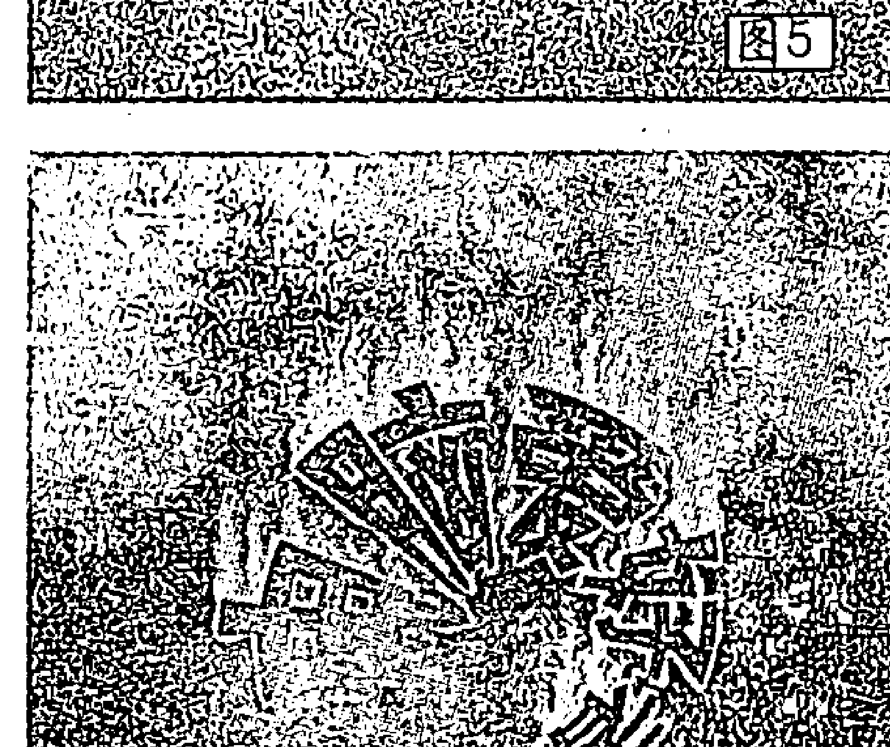

只需要简单的几步操作，就得到了这么棒的视觉效果，同样的效果在其他软件中制作起来可就颇费一番功夫了。方便快捷，正是PhotoImpact的最大特点。大家是不是觉得EasyPallete是个好东东呢？它是PhotoImpact中的集大成者，是通往各种效果的快捷方式。不过PhotoImpact中的好东东可不只有它一个哦。

### 三、图像特效篇

同Photoshop一样，PhotoImpact中也有图层的概念。在AccessPanel调板上，单击最左侧的Layer Manager按钮，就切换到了图层管理器（见图7）。这个管理器似乎略显简单，事实上更丰富的设置项目并不在这里。我们一同来看一下如何用PhotoImpact来融合两幅图像。

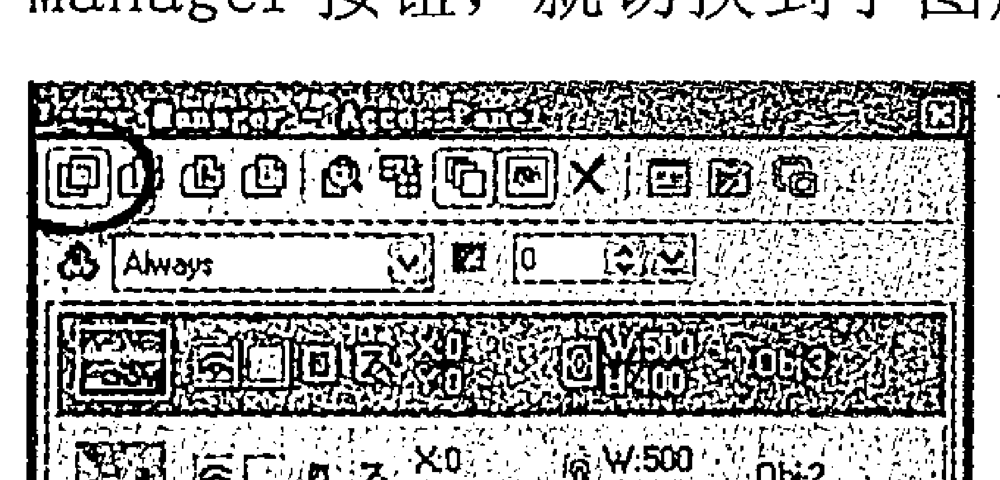

打开两幅图像，一幅是优美的风景照片（见图8），一幅是人物照片（见图9），读者朋友们不妨用自己的肖像照片。


在人物照片的图像窗口中，按下Ctrl+C键复制整幅图像，切换到风景照片，按下Ctrl+V键粘贴人物照片，使用挑选工具将人物移动到合适的位置。人物图像的背景为纯白色，所以很容易去掉，不过为了保持图像的完整性，我们并不去掉背景色，只是让人看不见它。在人物图像上单击右键，在菜单中选择Properties（属性），在弹出的Object Properties（对象属性）对话框中选择General（总体）标签。先勾选Transparent color（透明颜色）复选框，再单击后面的色块，在拾色器中选择白色。在Preview（预览）选项被选择的情况下，我们可以看到人物图像的白色部分变得透明了，实现了事实上的去背景效果（如图10）。

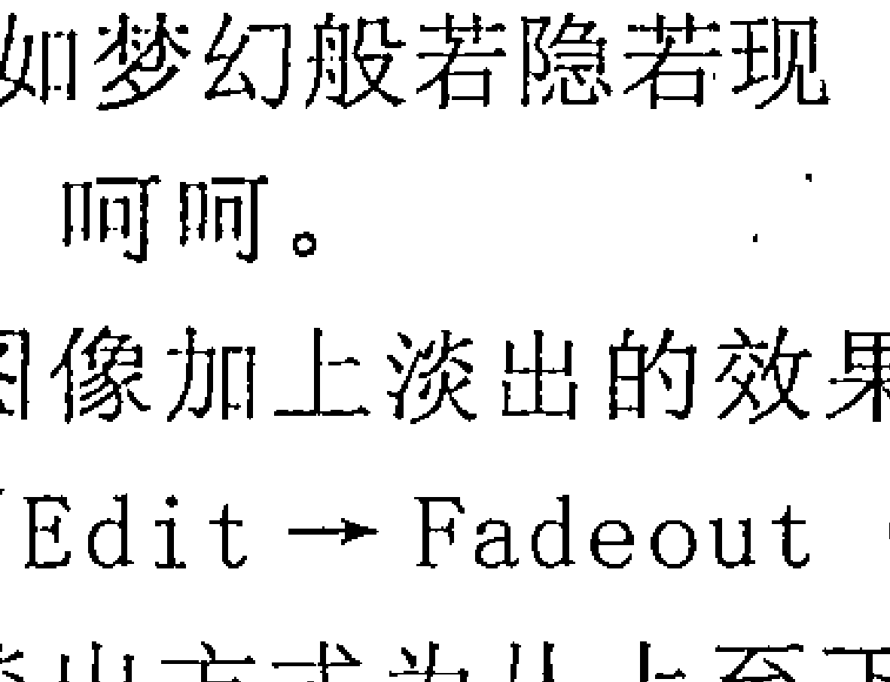

我们可以改变Transparency（透明度）输入框中的数值，或者拖动滑块实现同样的目的，使人物图像略微透明。不过透明的效果不如改变对象的混合方式来得自然和有趣。将透明度恢复为0，改变Merge（合并）下拉框的选择项目，可以看到人物图像与下面的风景照片进行了不同方式的融合。笔者选择了Soft Light（柔光）模式，结果是照片中的女孩在美丽的海面上如梦幻般若隐若现（见图11），是不是有点像海妖呢？呵呵。

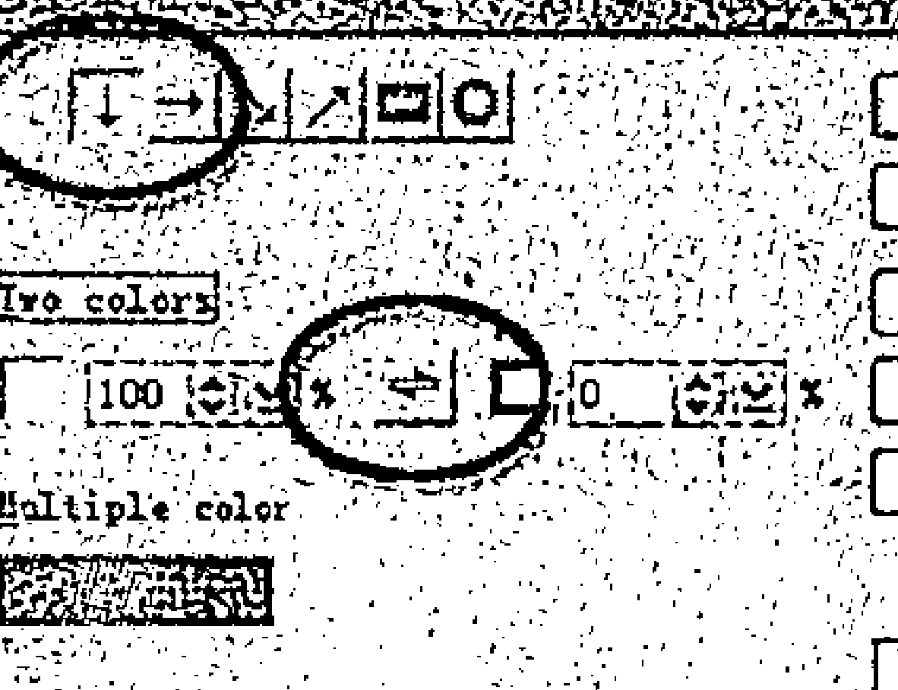

再进一步，我们为人物图像加上淡出的效果。选择人物图像，选择菜单命令“Edit→Fadeout（编辑→淡出）”，在对话框中选择淡出方式为从上至下的垂直方向。再选择填充颜色为两种颜色，默认的情况是从黑色到白色，我们按下中间的交换按钮，就变成了从白色到黑色（见图12）。


需要说明一下，PhotoImpact中的淡出类似于Photoshop中的蒙版，也是黑色部分为完全透明，白色部分为完全不透明，灰色部分为半透明。我们选择的淡出方向为从上至下，并且需要使人图像的下部变得透明，因此需要填充颜色为从白色（上方）到黑色（下方）。在确定之前，我们可以先按下Preview按钮进行预览，如果效果满意就按下OK按钮确定，如果不满意就按下Continue按钮加以改进。添加了淡出效果的人物图像下半部分渐渐隐没在海水中（见图13），更显出了一丝妖气。

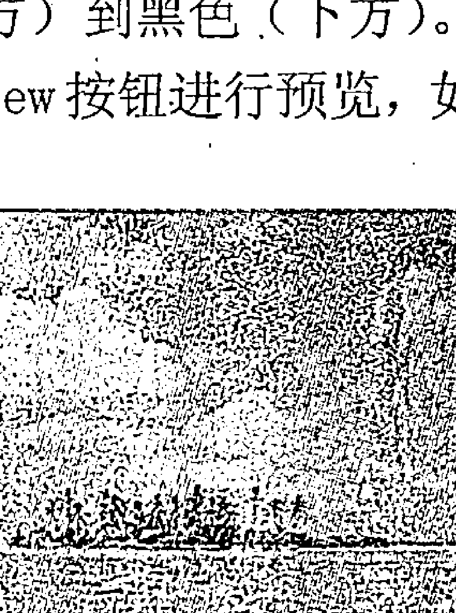

### 四、图像调整篇

图像处理软件的主要任务之一是对数码照片进行后期修饰，随着数码设备的普及，这方面的需求也愈发强烈了。人们对于 Photoshop 最为推崇的正是其强大的图像调整功能。其实，PhotoImpact 的这部分功能毫不逊色，而且没有那么深奥和复杂。在 PhotoImpact 中，Level（色阶）、Tone Map（色调图，相当于 Photoshop 中的曲线）、Color Balance（色彩平衡）、Calculation（计算）和 Hue & Saturation（色调和饱和度）等等功能一应俱全。在这里，我们要介绍的是 PhotoImpact 特有的十分灵活并且很有特色的 Style（样式）命令和 ExpressFix（快速修复）命令。

先打开一幅有草地的风景照片（见图 14）。


这张照片哪里都不错，就是草地的颜色略嫌灰暗了，不够鲜艳。我们使用 Style 命令来校正它。选择菜单命令“Format → Style（格式→样式）”，在对话框中选择 Dual View 标签，这样可以对比前后的效果。


在左下方的 Style Library 中选择 Leaf，再在右下方的各种 Leaf 样式中选择 Grass Green。从对话框上方的预览图中，可以看到草地颜色的变化。确定后，我们看到草地的颜色变得鲜艳了许多（见图 15）。

发生变化的只有草地的颜色，而天空和远山仍然保持原来的颜色，这是因为这个 Leaf 样式只针对图像中大面积的绿色起作用，是不是很棒呢？

再来看一下 Sky 样式。打开一幅有大片天空的风景照片（见图 16）。

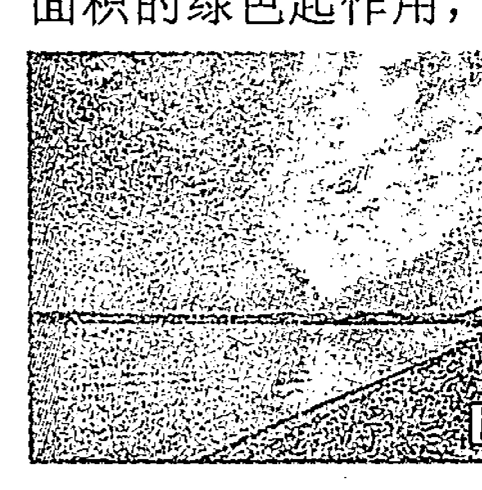

这是一张正常日光下的照片，我们要把它变成日落时分的景象。选择菜单命令“Format → Style”，在对话框的 Style Library 中选择 Sky，再在各种 Sky 样式中选择 Red Cloudy。确定之后，照片中的云彩及其水中的倒影就变成了红色，云彩周围的天空以及岸边的景色都被照映得带上了些许红色，这样整幅照片就好像日落时分的景象了（见图 17）。


Style 对话框中还有很多能够应用于各个方面的样式，它们将原本需要繁琐步骤才能实现的效果变成了“一键式”操作。读者朋友们不妨多试试，一定会有大有收获的。

ExpressFix 命令位于菜单“Effect → Photographic（效果→摄影）”下，它主要用来对数码照片常见的问题如曝光过渡或不足、白平衡错误、失焦等进行修复，还能美化人物的皮肤。这些修复并不需要我们具有多么高明的相关知识和技巧，因为操作过程非常“傻瓜化”，我们只需要知道自己想要什么样的照片就可以了。


先来看一个调整曝光度的例子。打开一幅风景照片（见图 18）。

这张照片有些曝光不足——天空中的云彩是白的，可是天空本身显得有点暗，而树和草地则更暗。选择菜单命令“Effect → Photographic → ExpressFix”，在对话框中选择 Dual View 标签以利于对比。由于我们主要对前景的树木和草地的亮度不满意，所以选择 Subject Exposure（主体曝光度）项目，在这里可以对被摄主体和背景的曝光度分别进行调整。软件根据照片的情况为我们提供了几幅预设的调整结果，我们可以选择它们试一下，如果不满意，可以选择最左边的 Do not apply（不应用）回到原来的照片。为了获得更满意的结果，我们单击 Custom（自定义）按钮以获得更多自由调整的空间（如图 19）。

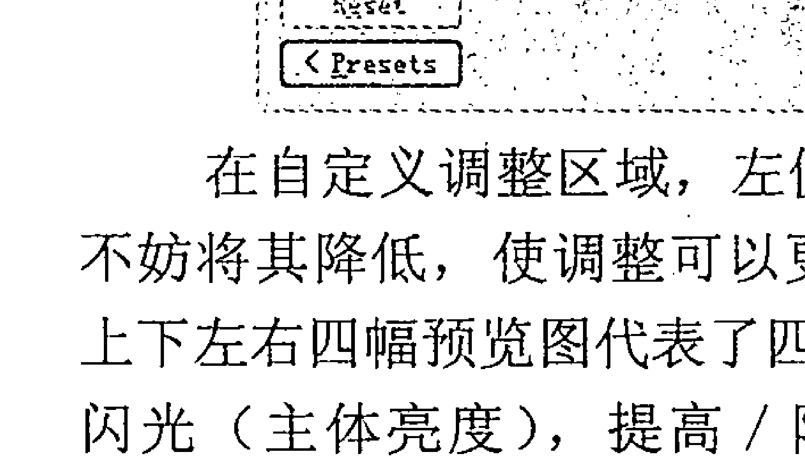

在自定义调整区域，左侧的滑块控制调整的幅度，不妨将其降低，使调整可以更加细致；右侧是调整区，上下左右四幅预览图代表了四种调整方向：提高 / 降低闪光（主体亮度），提高 / 降低背景亮度。调整过程中，如果觉得调整得过了，可以做相反方向的调整加以弥补，或者干脆按下 Reset（重设）按钮推倒重来。根据照片的实际情况，笔者大幅提高了主体的亮度，小幅提高了背景的亮度。从对话框上部的预览图可以对比调整前后的效果，满意后确定，一幅已经修正了曝光不足问题的照片就呈现在眼前了（见图 20）。

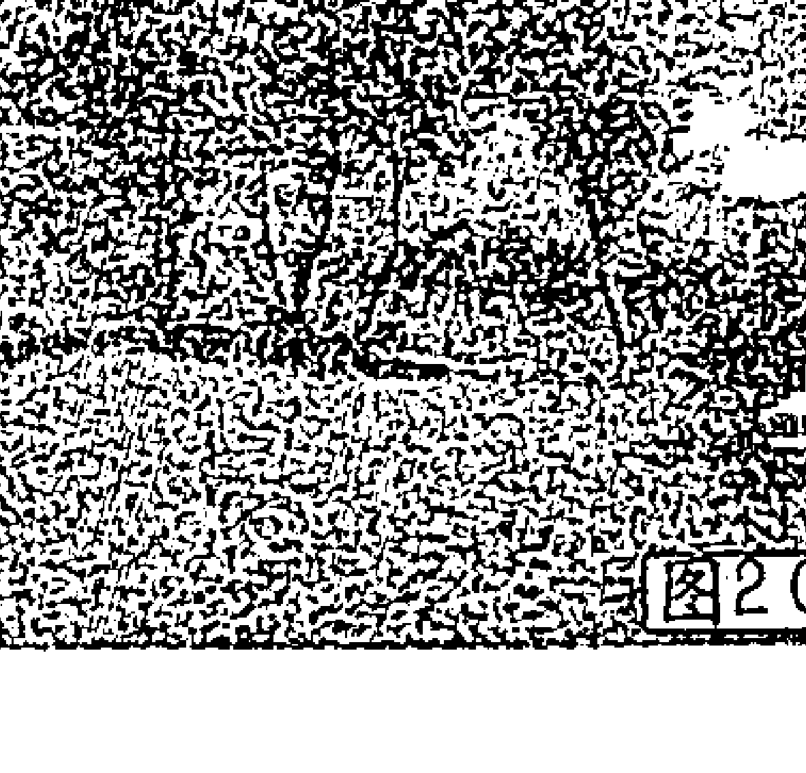


再来看一个美化人物皮肤的例子。打开一幅人物头像照片（见图21）。事实上照片中女孩的皮肤已经非常棒了，不过我们还是要再“加工”一番。打开ExpressFix对话框，选择Beautify Skin（美化皮肤）项目，在这里可以清除皮肤上的瑕疵、柔化皮肤色调以及改变肤色。先选择Apply with following settings（应用以下设定）选项，然后就可以进行皮肤的美化了。首先是柔化皮肤，将鼠标移到对话框上部左侧的预览图上，待光标变成吸管模样后，在具有代表性的皮肤颜色部分上（不要太亮也不要太暗）单击进行取色，取到的颜色将出现在Skin tone（皮肤色调）色块中。由于女孩的皮肤本来就已经很光滑了，所以Level（水平）降到最低的等级1。对于不太理想的肤质，可以提高等级，大幅度进行柔化。需要注意的是，柔化幅度过大容易损伤照片品质，所以要谨慎使用。还可以改变皮肤的风格，通过改变Complexion（肤色）下拉框中的选项，我们可以使照片中人物的皮肤更白、更亮或者更黑、更暗。这个女孩的皮肤显得有点苍白，不够健康，我们就选择Sun-burn（晒黑），Level设为6。然后确定，女孩的皮肤是不是变得黝黑健康了许多呢（见图22）？而其他部分的颜色并没有受到影响，很有趣吧。

### 五、锦上添花篇

很多时候，一幅数码照片是否吸引人，不仅仅取决于它自身，还有一些附加的成分。比如，一个精美的像框可以为一幅照片增色不少，或者在一幅本已挺漂亮的照片上再加上些亮点，使其品质更上一层楼。下面我们就来实践一下。在PhotoImpact为照片添加像框真是非常的简单。打开一幅人物肖像照片（见图23）。

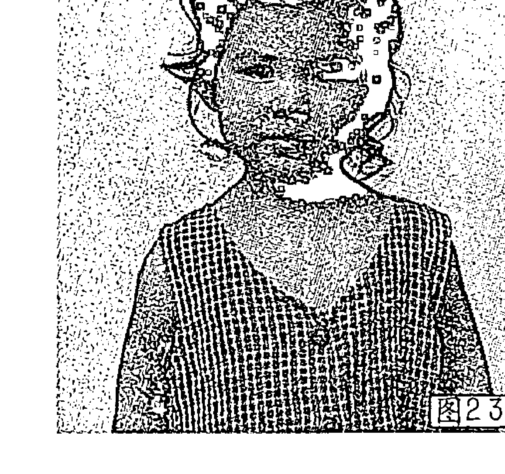

在EasyPalette调板上，在左侧展开Frame Gallery（像框画廊），选择2D&3D，然后在右侧的预览图中选择一个合适的像框，例如3D 31，在其上单击右键，在弹出的菜单中选择Apply，即可将像框应用到照片上。但是使用预置的样式有点千人一面的感觉，不够个性化，我们需要进行一些调整。在右键菜单中选择Modify Properties and Apply命令，就弹出了Frame & Shadow（边框和阴影）对话框，这里我们只用到Frame标签。勾选Do not merge frame object（不将像框与照片合并）可以保持像框和照片各自的独立性，然后在选项区进行设置。将Width（宽度）提高到30，将像框加宽一些；选择Outward（向外），使像框在照片的周围增加区域，而不是像Inward（向内）那样侵占照片的周边区域（有可能会遮住人物）；可以选择像框是使用单色、渐变色还是纹理，我们选择纹理，在纹理预览块上单击，出现一个小菜单，供我们选择使用Magic Texture（魔术纹理）还是Natural Texture（自然纹理），我们选择后者，在Texture Library对话框中选择纹理NT24；我们还可以为像框选择外边框和内边框的形状；甚至于当我们突然改变了主意，想要换一个像框的样式时，也可以在对话框的左下角处进行更换（见图24）。

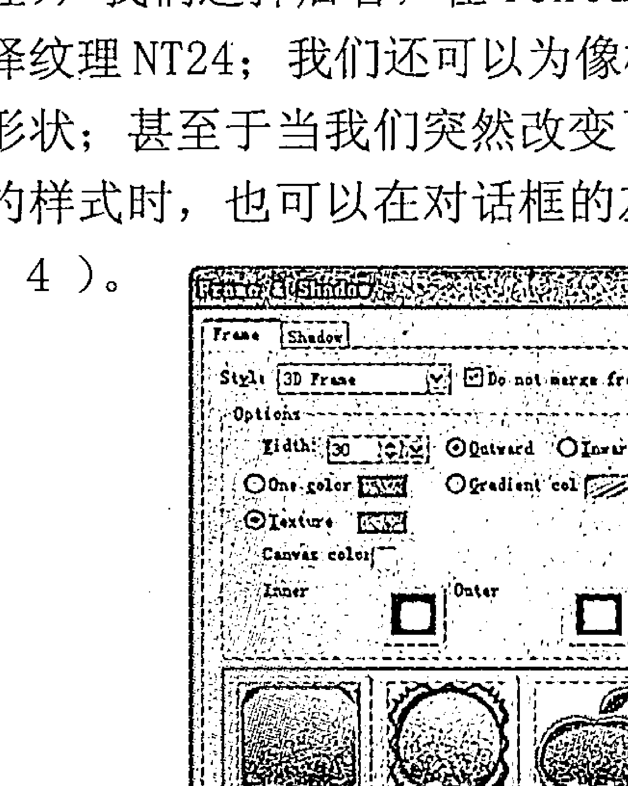

设置好之后，按下OK按钮，剩下的就交给PhotoImpact去办了，一个漂亮的像框很快就加在照片上了（见图25）。其他类型的特效，PhotoImpact也是应有尽有，而且不乏独具特色的特效。就拿Blur（模糊）来说，这是图像处理中经常用到的命令，也是各个图像处理软件中最重要的滤镜或者效果之一。在PhotoImpact中，菜单“Effect→Blur”下的命令就多达七个。我们以Zoom Blur（镜头缩放模糊）为例来加工一张照片。打开一张人物照片，最好是运动中的人物（见图26）。


我们用 Zoom Blur 来强化动感效果。选择菜单命令 “Effect → Blur → Zoom Blur”，在对话框中选择 Dual View 标签以便于对比预览。选择 Type（类型）为 Halo out（光晕向外），设置 Quality（质量）为 60，Direction（方向）为 60 度，Unblurred area radius（不模糊区域半径）为 80（应保证人物基本清晰），Inward blur（内部模糊）为 50，Surrounding blur（环境模糊）为 50，Twist weight（扭曲程度）为 10（表示模糊对图像产生的扭曲的严重程度）。设置好之后，如果对上方右边处理后的预览图感到满意，就按下 OK 按钮。怎么样？得到的结果是不是充满动感、酷劲十足呢？（见图 27）


### 六、网页制作篇

在网络时代，什么事情都要与网络挂上钩。现在人们对于网页的审美标准，很大程度上在于网页上图像的质量和使用得恰当与否。图像处理软件都不约而同地不断加强与网络相关的图像制作和处理方面的功能。PhotoImpact在网络图像方面的功能可用强大二字来形容，切割图像、网络图像优化、制作动态按钮、制作 GIF 动画以及制作网络相册等功能样样精通。下面我们以制作按钮和网络相册为例介绍PhotoImpact在网络图像制作方面的应用。

我们先来看看软件内置的按钮模板。不用打开任何文件，直接选择菜单命令 “Web → Component Designer（网络→组建设计器）”，就会出现一个网络组件的设计向导窗口。窗口左侧列出了几乎所有网页制作中能够用到的页面元素的种类，在其中选择 Button，将其展开，就出现了按钮种类的列表。我们以 Rounded_1 为例，选择它，右侧出现了圆角形状的许多按钮模板，选择第一个，然后按下 Next（下一步）按钮，进入设置窗口（见图 28）。

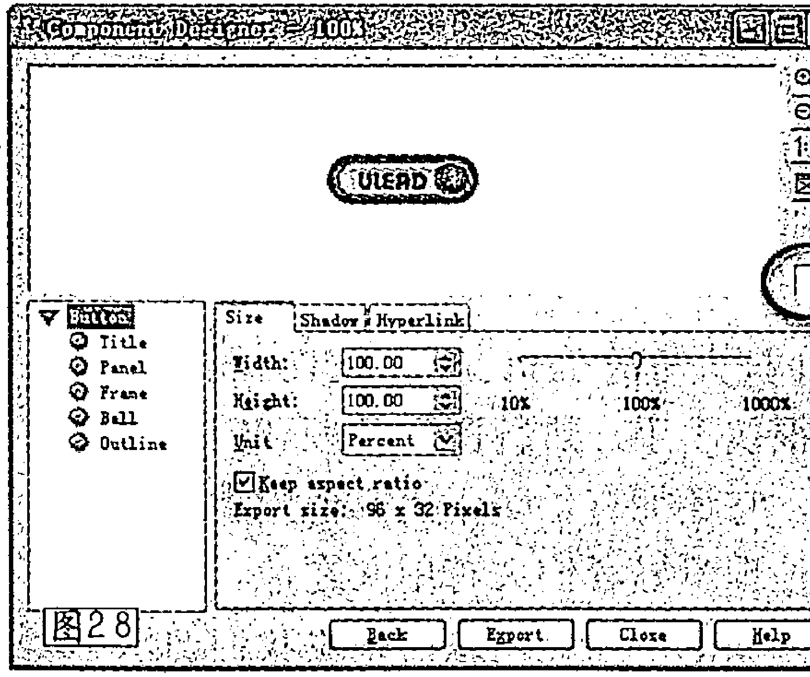

在这个窗口中，上方是预览图，下方左侧是各个项目，在右侧进行具体设置。选择 Button，在 Size 标签下设置按钮的大小，Shadow（阴影）标签下可以为按钮添加阴影，Hyperlink（超级链接）标签下设置按钮的链接，以及链接方式、替代文字、状态栏文字等信息。选择 Title（标题），在 Text 标签下设置按钮上的文字内容、字体和文字风格等，在 Color（颜色）标签下选择文字的填充类型，可以填充颜色、渐变和纹理等。其他的项目，Panel（面板）、Frame（边框）、Ball（球）和 Outline（轮廓）分别用来设置按钮各部分的颜色。另外，位于上方预览区右下角的色块，可以用来设置按钮的背景颜色。全都设置完毕后，单击 Export（输出）按钮，在菜单中选择 To Image Optimizer（到图像优化器），进行优化设置（见图 29）。

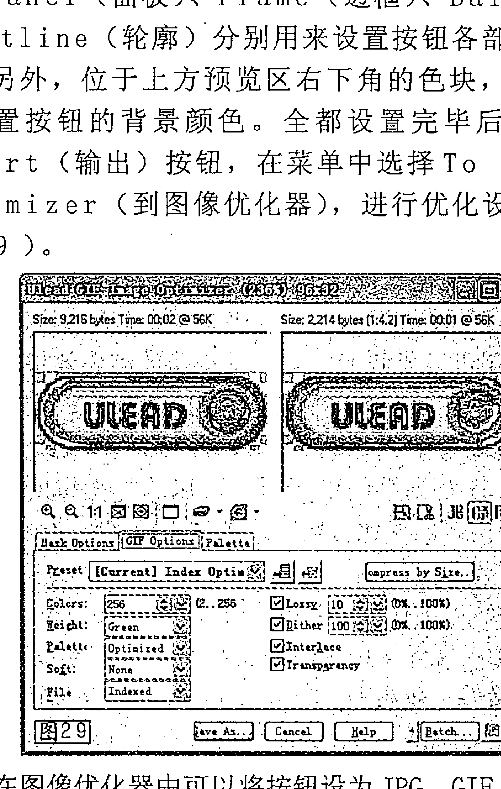

在图像优化器中可以将按钮设为 JPG、GIF 或者 PNG 格式，最为理想的应该是 GIF 格式。具体的设置与其他同类软件区别不大，在这里就不做详细介绍了。设置好之后，单击 Save As 按钮，将按钮保存为 GIF 格式的图像文件，就可以将其应用在网页中了。

静态的按钮未免显得有点死板，动态按钮就会活泼很多。动态按钮是在网页设计中经常用到的元素，当鼠标置于按钮之上时，按钮就会发生变化，提示浏览者这是一个按钮，点击后将引发某些事件，并且如果运用得当的话，还可以大大美化页面。动态按钮的原理并不复杂，就是几张相同尺寸的图片的相互替换，即当鼠标置于一个图片之上或者鼠标被按下时，用另外一个图片代替原来的图片。使用 PhotoImpact 来制作这样的效果简直是手到擒来。

打开三张图片，将它们复制粘贴到同一个图像窗口中。这几张图片的大小一定要一致，否则会出现错位。在 EasyPalette 调板中单击 Layer manager 按钮，切换到图层管理器，按住 Ctrl 键依次单击每个图层，将它们全部选中。选择菜单命令 “Web → Rollover（网络→浮动按钮）”，即弹出制作动态按钮的对话框（见图 30）。

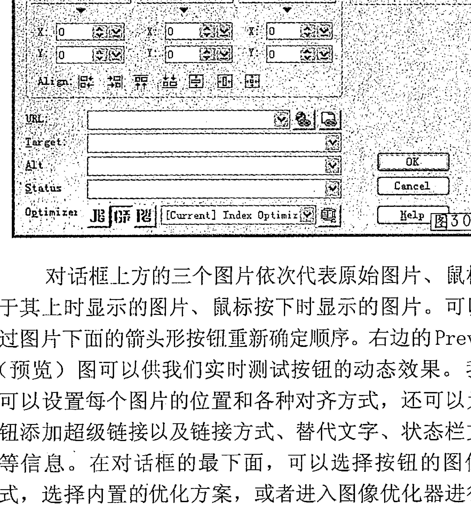

对话框上方的三个图片依次代表原始图片、鼠标置于其上时显示的图片、鼠标按下时显示的图片。可以通过图片下面的箭头形按钮重新确定顺序。右边的Preview（预览）图可以供我们实时测试按钮的动态效果。我们可以设置每个图片的位置和各种对齐方式，还可以为按钮添加超级链接以及链接方式、替代文字、状态栏文字等信息。在对话框的最下面，可以选择按钮的图像格式，选择内置的优化方案，或者进入图像优化器进行详细设置。设置完成后，单击 OK 按钮，保存设置并推出对话框。然后选择菜单命令“File → Save for Web → As HTML（文件→用于网络保存→作为 HTML）”，保存为 HTML 文件。事实上，PhotoImpact 将动态按钮保存为一个 HTML 文件和一个存放按钮图片的 Images 文件夹。将相应的 HTML 代码粘贴到网页的适当位置，并将按钮图片放置到正确的文件夹中就可以应用这个动态按钮了。

再来看看制作网络相册的功能。网络相册就是一个排列着缩略图的网页，单击缩略图即可浏览大图。这样做的好处是可以加快拥有大量图片的网页的显示速度，提高浏览者的效率——不必为自己不感兴趣的图片耽误时间和网络带宽。用 PhotoImpact 制作网络相册非常简单方便。

在 PhotoImpact 中选择菜单命令“File → Export → Web Album（文件→输出→网络相册）”，在对话框中选择图片所在的文件夹。选择 Include all subfolders 选项，可以将这个文件夹下面的所有子文件夹也包含进来。如果用到的图片不在一处，应该在进入选择图片的对话框之前，先把需要用到的所有图片整理到一个单独的文件夹中。还可以选择用到的图片文件类型，如果所有图片都需要，就选择 All Files，也就是“*.*”。然后按下 OK 按钮进入下一步进行设置。设置分为五个选项，分别是 Output（输出）、 Page Setup（页面设置）、Thumbnails（缩略图）、Image（图像）和 Description（描述）。这里的设置项目比较多，笔者就不一一介绍了。需要注意的几点，一是在 Output 标签下，Output Folder（输出文件夹）一定要指定好或者记住默认的位置，免得制作完却找不到了；二是在 Thumbnails 标签下，Layout（布局）和 Size（缩略图的大小）应该根据个人喜好进行调整；三是在 Image 标签下，应该根据实际情况选择是否限制大图浏览的尺寸和重设大图的大小。如果觉得项目太多实在头疼，不妨都保持默认。设置完毕后，单击 OK 按钮，经过一小段时间的等待，软件就自动制作出网络相册了（见图31）。

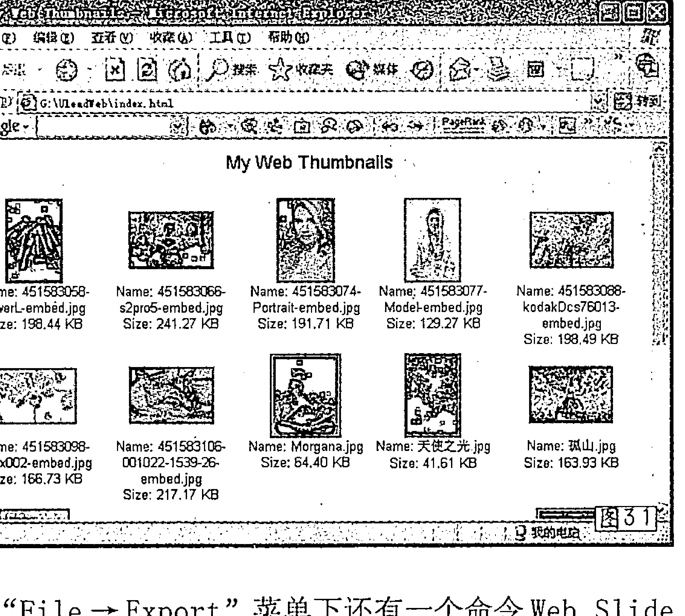

“File → Export”菜单下还有一个命令 Web Slide Show，是用来制作网络图片的幻灯片展示的。制作方法与网络相册很相似，读者朋友们可以自己动手试一试。

上面只介绍了 PhotoImpact 强大的网络图像功能的一部分，更多的功能还有待各位读者亲手去实践。在网络应用越来越普及，网页制作越来越流行的趋势下，PhotoImpact 一定会成为我们网页设计和制作的好帮手的。

### 七、总结

通过以上的介绍，读者朋友们应该对 PhotoImpact 这款图像处理软件有了一定的认识吧。简单和实用是 PhotoImpact 最大的特点，但是简单和实用并不表示它不能做出复杂专业的效果——平民软件可不是“贫民软件”。

PhotoImpact 把大量的 Gallery 和 Effect 结合起来，让初学者也可以很快上手，进行图像处理和制作漂亮的图像特效。此外，它还拥有丝毫不比其他同类软件逊色的工具，让图像处理爱好者们大有用武之地。只要我们肯于动手尝试，再加上一点点创意，不论我们的水平多么业余，都能够创造出令人赞叹的精美效果来。

PhotoImpact —— 图像处理软件中当之无愧的平民英雄。

（文 / 5D 多媒体 奇士）

## Pinnacle Studio ——影像编辑上手指南

随着DV逐步走入家庭，热爱生活的朋友们都希望记录下所经历的有意义的事情。但并不是买了DV就能拍出好的视频，拍摄的经验很重要，这需要长时间的积累和学习。而想要对自己已经拍摄好的短片进行编辑，加入各种特效，就需要软件的后期处理了。Pinnacle Studio 9（为叙述方便，本文中有时简称其为Studio）就是一款比较好的家庭视频编辑软件，利用它能够制作出具有场景转换、字幕特效和快慢动作等炫目的电影特效来。

### 一、视频捕捉采集

数码视频的最大魅力在于其可编辑性，目前多采用非线性编辑软件进行编辑。作为非线性编辑的第一阶段，首先要将DV中的视频捕获到计算机硬盘中。

#### （一）视频采集卡的安装

视频采集卡也叫视频卡，电脑通过视频卡可以接收来自视频输入端的模拟视频信号，对该信号进行采集、量化成数字信号，然后压缩编码成数字视频序列。一般的采集卡采用帧内压缩的算法把数字化的视频存储成AVI文件，高档一些的视频采集卡还能直接把采集到的数字视频数据实时压缩成MPEG-1格式的文件。现在市场上有品尼高STUDIO Dvclip、品尼高STUDIO DV V9，天敏DV3000XP、迪威米迅Mission DV等多种视频采集卡，它们的安装方法都差不多，一般可按下面步骤操作：

第一步：关闭主机电源，并拔掉主机电源插头，用手触摸一下金属物以释放静电，打开机箱，取出主板上空闲的I/O扩展槽对应的金属挡板，将采集卡插入到对应的扩展槽上，并上紧螺丝。
第二步：重启电脑，这时电脑提示发现新硬件，出现“添加新硬件向导”界面，该向导搜索设备的新驱动程序，然后按照它的提示进行一步一步操作即可。安装结束后，Windows提示已安装了此设备的驱动程序，这样就可以了。

#### （二）视频素材采集

捕获视频是数码视频制作的一个重要步骤，它也是编辑制作视频影片的前提。如果要捕获视频，可以按下面的步骤来进行。

- 1. 连接摄像机。把IEEE1394连接线一头接在采集卡上，一头接在摄像机的IEEE1394输出口，打开摄像机，把开关选在放像的状态，这样就可以进行采集了。
- 2. 打开摄像机。转动摄像机电源打开摄像机，并把它设成播放模式（大多数的摄像机通常均标为VTR或VCR模式）。
- 3. 运行“Studio DV 9”，软件打开后是编辑界面，点击“采集”按钮就可以打开采集界面，它由三部分组成，左上角的像册显示所采集的视频文件的缩略图；右上角的播放器是视频的回放窗口，我们可以通过它来实时看到我们所采集的视频内容和进度，并且还标有已采集的时间和丢帧数；左下角摄像机遥控器是用于遥控连接到电脑的摄像机的；右下角是功能区，采集功能的操作都在这里。如图1所示。
- 4. 采集。完成简单的设置之后，单击“开始采集”按钮，系统即开始从DV中捕获视频素材了。采集结束后，视频素材将按场景存放在视频文件中。

### 二、视频剪辑

点击“编辑”按钮就可以打开编辑界面，如图2所示，它由三部分构成的，在左上角是像册，用来显示被编辑的视频，它的右边是播放器，用于回放视频和编辑结果的预览，下面是编辑区，它有三种显示模式：故事板模式、时间线模式和目录模式，我们看到的是非常专业的时间线模式，它可以进行精确到帧的编辑，它又是由主要视频轨、主要音频轨、字幕轨、音效轨和背景音乐轨组成的。

#### （一）添加视频

若要添加视频，首先在左上角像册显示素材的片段，然后用鼠标从像册中选择我们需要的场景，并按住鼠标左键不放，把它拖到主要视频轨后松开鼠标就可以了。重复上述操作，把需要的场景依次拖放到主视频轨上，这时选择的场景在像册中表示为右上角打勾的场景。这是将电影的粗略剪辑汇集在一起的最简单、最快捷的方法。需要时您可以同时拖动多个场景。

#### （二）视频剪辑

首先选择要剪辑的视频段，如果“时间线”上没有任何内容，可从“像册”中拖动一个场景放到其中。
然后将鼠标指针放在“时间线”上任意位置（但不能紧贴着放在编辑线上方）。指针变成一个时钟符号。单击并将其向右拖动以扩展“时间刻度”。
再将鼠标指针放到剪辑的右边缘上。指针变成一个左箭头。单击该箭头，并将其向左拖动，同时注意播放器，它会连续更新以显示裁剪后剪辑的最后一帧。当缩短剪辑后，箭头光标变成双向箭头，表示既可以向左，也可以向右拖动该剪辑边缘。可以将剪辑缩小到一帧的大小，也可以增大到源场景的末端。
最后松开鼠标键。现已完成该剪辑的裁剪。

#### （三）视频的简单编辑

可以对“电影窗口”中的视频剪辑使用标准的剪贴板操作（“剪切”、“复制”和“粘贴”）。也可以对“影集”场景使用“复制”操作。将场景或剪辑粘贴到“电影窗口”中时，它将插入到起始于编辑线位置的第一个剪辑边界处。可以使用标准的剪贴板操作快捷键（Ctrl+X 为剪切，Ctrl+C 为复制，Ctrl+V 为粘贴），也可以从右键菜单上选择所需操作。

#### （四）添加转场特技

选择好各个场景的素材后，可以用右上角的播放器来看选择的影片。如果发现各个场景的过渡不自然，可添加一些转场效果，就会好看多了。其操作方法为：
第一步：选择类别。首先单击“显示切换”按钮，这时出现切换特效界面，单击下拉框右侧的下箭头，选中其中的类别选项，在这里我选择的是“标准切换”，这时将出现多个效果，如图3所示。

第二步：添加转场。用鼠标选中您喜欢的特技，就像剪辑影片的操作一样，把这个转场拖放到需要添加特技的两个场景之间就可以了。
第三步：预览。您还可以单击播放器的播放按钮，这样就可以马上看到添加转场后的效果，这也是Studio DV 9的特点，所有的操作都是实时的，所见即所得的。如果你对这个转场不满意，你可以随意地更换转场，只需重新选择一个转场将其拖到两个场景之前即可。
第四步：修改参数。当然，您还可以对特技的属性进行修改，在“视频轨”上，只需双击刚才选择的特技，即可打开修改属性窗口。右上角是转场的时间长度，您可以单击上下箭头更改数字即可改变；在两个场景之前有个复选框，勾选后即可改变转场的方向；而在最下方，您可以拖动游标左右滑动，这时在右侧的预览框中即可显示不同时间的转场效果。修改好后单击“关闭”即可。

#### （五）添加效果特技

上面我们完成了在两个场景之间添加切换效果的方法，这样还是显得单调了一点，您还可以为单个场景添加一些特技。

#### 1. 制作速度特技

第一步：添加特技。在“视频轨”上选中要添加特技的场景，然后双击该场景，这时打开编辑界面，要将特技添加到当前剪辑列表中，可单击“添加新特技”按钮，此按钮可在工具窗口的右边打开“特技浏览器”，在浏览器的“类别”列表中单击“时间效果”，在右侧显示该类别中各个特技的名称，如图4所示。再选择其中的“速度”，按“确定”按钮即可添加该特技。

第二步：更改参数。选择了速度，这时视频效果工具窗口右边的参数面板就会提供调整速度的控件，这时只需拖放游标即可随意调整我们所要求的播放速度。

此工具允许您设置任何视频剪辑的播放速度，可从正常速度的十分之一上升到正常速度的五倍，将滑块设置到希望应用于剪辑的速度上。注意，当您改变速度时，“电影窗口”中的剪辑长度会发生变化。减慢剪辑速度（增加长度）会使运动看上去有些不连贯。可通过插值帧（即创建中间帧）使运动平滑。选中“平滑帧间运动”复选框即可激活此功能。单击“速度”框中的“重置”按钮可将播放速度设置为统一速度，剪辑将按正常长度播放。

第三步：调整顺序。当然，您也可以为一个场景素材添加多个特技，操作方法同上，如果有多个特技，在同一个剪辑上使用多个特技所产生的累积效果会随着特技应用顺序的不同而有所不同。使用特技列表右边的上下箭头按钮，可控制处理链中每个特技的位置。

除了以上添加转场、制作特效等功能外，利用 Pinnacle Studio 9 还可以为影片添加字幕、调整合适的声音等操作，使影片具有更好的观赏性，这些操作都很简单，在此不一一介绍。

#### 2. 添加频闪过滤器

这个功能可以实现一种舞者在闪光灯下“冻结动作”的回忆效果。它的操作方法和改变视频播放速度的方法相同。这种操作不会改变被剪辑的视频长度。Studio 将用重复的帧代替此位置原来的帧。

### 三、制作字幕

Studio 内置的“标题编辑器”是一个用于创建和编辑标题及其他图形的强大工具。它丰富的文字集、图像特技工具等为您的电影的视觉设计提供了广阔的空间(见图5)。

#### 1. 添加文字
在 Studio “编辑”状态中，双击“时间线”叠加轨道，打开标题创建界面；单击下方的“添加文字栏”按钮，这时在屏幕上显示文本框，您在这文本框输入文字即可。

#### 2. 修饰文字
在“标题编辑器”的“编辑窗口”的顶部有文本样式控件。通过这些控件可以设置当前选定的文本的字体、对齐方式、样式。您可以单击样式按钮，然后在右侧的样式中选择一种合适的样式，即可将该样式应用于所选择的文字。

另外，您还可以制作动态标题，对标题的颜色、形状、阴影以及旋转等属性进行设置等，让其具有个性化特征。

### 四、添加画外音

首先选择“工具箱”菜单中的“录制画外音”命令，打开“音频工具箱”的“录制画外音”画面，点击“录制”后就可以开始录音了，您只需对着话筒将心里话说出来，即可在制作的视频中播放。在录制的同时我们可以通过“改变录音音量”滑杆来实时调整音量大小，真的是非常的方便。

### 五、添加背景音乐

#### （一）导入背景音乐

用 Studio 可以非常方便地导入已有的 MP3、WAV 和 AVI 音频文件，具体操作方法如下：

首先，单击左侧的“显示声音效果”按钮，打开音乐文件所在的文件夹，如图6所示，找到要导入的文件后，只需要用鼠标选中它，然后拖放到“背景音乐轨道”就可以了，如果需要调整长度，只需将鼠标指向该音乐文件的右侧，待鼠标变为向左单击箭头后，单击鼠标向左拖动即可。

然后就是要消除素材的原始声音了。让我们来看看原始音频轨道吧，它包含与视频剪辑一起采集的音频，当采集新剪辑时，原始音频总是放在“原始音频”轨道上。单击“主视频轨道”上右边的挂锁图标以锁定视频轨道，单击“主音频轨道”右侧的挂锁以解除音频锁定，然后选择要删除原始音频场景下面的主音频，直接按键盘上的“DEL”键，OK，原来的背景声音已经没有了。

注意：默认情况下，原始轨道上的音频剪辑可与视频轨道上的内容以同样的时间索引进行并行编辑。若要作为单独的剪辑处理音频，必须首先锁定视频。

#### （二）用 Smart Sound 添加背景音乐

Smartsound 可以创建一首歌曲，它可以精确地与您需要的持续时间匹配，也就是说它可以根据视频的长度自动调整自身的长度，是一种非常智能的添加背景音乐的音乐处理技术。操作方法为：

首先选择“工具箱”中的“生成背景音乐”按钮打开音频工具箱，在出现的界面中选择一首曲子，并把上侧的“持续时间”设置为与被编辑影片的时间相同，最后点击“添加到电影”就可以了。

### 六、校正数码影片的缺陷

#### （一）校正影片的色彩

该特技可补偿视频中不正确的颜色平衡，其原理类似于摄像机上的“白色平衡”设置，如图7所示。

- 1. 首先在“视频轨”上选中要校正色彩的场景，然后双击该场景，这时打开编辑界面，单击“为视频添加特技”按钮，此按钮可在工具窗口的右边打开“特技浏览器”，在浏览器的“类别”列表中选择“颜色特技”，会在右侧显示该类别中各个特技的名称。此时选择“颜色校正”选项，按“确定”按钮即可添加该特技。
- 2. 然后就可以更改参数了。因为颜色校正可能会影响图像的亮度，必要时可使用该滑块进行手动校正。您可以拖动“亮度”下方的滑块对视频的亮度进行调整；另外，还可以对对比度、色调以及饱和度等进行调整。调整时一边拖动滑块，一边看着预览框中的视频，觉得合适了即可。
- 3. 最后您还可以设置淡入淡出的效果，在设置时只需用鼠标单击调整设置框右侧的箭头即可改变数字，相应可调整淡入或淡出的帧数。设置好后单击右上侧的“关闭”即可。

除了上述的特技外，您还可以用“清除特技”中的“自动颜色校正”选项进行校正，这是一个傻瓜化的功能，可以省去自己调整颜色的烦恼。

#### （二）减轻 DV 抖动的影响

在用 DV 拍摄影像时，不可避免地会引起抖动，利用软件处理可以有效地减少抖动的影响。您可以单击“添加新特技”按钮，然后在“特技浏览器”中选择“清除特技”中的“稳定”选项即可。

像许多数码摄像机的电子图像稳定功能一样，此特技最大程度地减小了 DV 移动引起的抖动和跳动对拍摄的影响。

#### （三）减小影片的原始噪声

此高级过滤器可抑制任何音频剪辑中不希望的噪声，该过滤器能动态响应剪辑中噪声条件的变化。

您可以选择“工具箱”中的“添加音频特技”选项打开“音频工具箱”，在“音频”编辑界面的右边打开的是“特技浏览器”，在浏览器的“类别”列表中选择“Studio 音频特技”，再在右侧选择“噪声减少”选项，按“确定”按钮即可添加该特技。

您还可以对该特技进行微调，如图 8 所示。

当在户外使用摄像机时，演员距离麦克风较远，“源噪声”可能非常大，更糟糕的是摄像机的内部噪声可能被放大到插入音的水平。但是如果使用连接到摄像机线输入口的小型麦克风，录制场景时源噪声可能就会很小。您可以调整“噪声减小”的值使其与实际信号的噪声情况相符。您拍摄时所处的环境噪声较小时，可以使用 “微调” 功能进行调整。当您拍摄所处的环境风声较大时，可以勾选 “删除风” 选项，这样就可以用背景声的过滤器去掉噪声了。

#### （四）调节影片的声音结构

我们在拍摄及制作画外音时，通常会因掌握不住音量的大小而导致声音失衡，您可以用 “音量和平衡” 工具来进行调整。选择 “工具箱” 中的 “改变音量” 命令打开调节界面，它为三个音频轨道提供了单独的音量控制项：原始音频、声音效果和画外音及背景音乐。您只需用鼠标拖动即可进行调整。另外，它还提供了左右和环绕声平衡控制项，此工具与传统的音频混合器的工作方式相似，调节非常方便。通过以上的调整与完善，您的影片就更加好看好听了。当然，软件调节也不是万能的，还需在拍摄时下功夫，这样才能制作出较好的影片哦！

### 七、影片的制作与输出

点击界面上端的 “制作电影” 按钮打开我们的制作电影界面。其中左上角是功能按钮和设置按钮，右上角是播放器。下面仍旧是我们的编辑界面，可以看到我们编辑的影片就显示在这里。下面我们就一起来把这段影片做成VCD光盘，方法为：首先，点击 “光盘” 按钮，然后再点击 “设置” 按钮，选择 “Video CD” 选项后点确定，最后点击 “创建光盘” 按钮即可，非常方便。在转码和刻录时我们可以随时观察进度情况。

> (文/快乐的猫)

## InfoPath 2003 实用教程

### 一、InfoPath 2003 基础

Microsoft Office InfoPath 2003 是一个新的 Office System 应用程序，可以容易地创建和使用功能丰富的动态表单，同时简化了收集、共享以及使用信息的过程。InfoPath 表单在本机文件的格式是可扩展标记语言（XML），所以收集的信息可以容易地在整个单位以及跨多个商业处理过程中重复利用。

#### 1. 启动与主界面

无论是填写表单还是设计表单，Microsoft Office InfoPath 2003 工作区都分成两个主要区域，即表单区域和任务窗格区域。启动 InfoPath 2003 并进入主界面窗口，表单区域是位于 InfoPath 工作区左侧的较大打开区域，在此区域内用户可以将信息键入表单或设计表单的位置，还允许查看从菜单、工具栏或任务窗格执行操作的结果。默认情况下，任务窗格区域位于表单区域的右侧，可以根据用户喜好重新放置、调整其大小或将其关闭。任务窗格通常包含某些 InfoPath 命令选项，比如拼写检查、编排文本格式以及控制插入等，还可以包含说明文字、超链接、或某些项目的图片库等，如图1所示。

在“打开”对话框中的“文件类型”对话框中选中“所有表单”，并在“查找范围”列表中选择表单保存的路径，点选表单文件然后单击“打开”按钮，如图2所示。

#### 2. 打开填写表单

在填写表单时，可以创建新的空白表单，也可以打开以前保存的表单。在“文件”菜单上，单击“填写表单”，在“填写表单”任务窗格中的“打开表单”下单击“在‘我的电脑’上”链接。

返回到 InfoPath 主界面窗口，打开已经保存的表单，如图3所示。

填写表单后，可执行主菜单“文件 / 保存”命令将其保存。

#### 3. 打开设计表单

在设计表单时，可打开安装在计算机或 Internet 上的表单模板以及与表单库相关联的表单模板。

##### (1) 打开空白表单

在“文件”菜单上，单击“设计表单”。
在“设计表单”任务窗格中的“设计新表单”下，单击“新建空白表单”链接，如图 4 所示。

InfoPath 即可建立一个新空白表单并进入空白表单编辑界面，如图 5 所示。

##### (2) 打开示例表单

在“文件”菜单上，单击“设计表单”打开“设计表单”任务窗格，在“设计新表单”下单击“自定义示例”，打开“自定义示例”对话框，选择准备自定义的表单，单击“确定”按钮，如图 6 所示。

### 二、填写表单

在 InfoPath 2003 中内置了很多具有商业价值的表单模板，通过这些表单模板，可以非常轻松的使用 InfoPath 创建与共享信息。
在“文件”菜单上，单击“填写表单”，在“填写表单”任务窗格中的“打开表单”下单击“其他表单”链接，打开“表单”对话框，选择准备填写的表单（本例选择的是“会议议程”模板），单击“确定”按钮，如图 7 所示。

程序自动建立一个会议议程表单并等待用户输入相应的数据信息。

#### 1. 启用自动完成功能

填写表单时可以配置“自动完成”保存所需的信息，可以选择将“自动完成”用于 Web 地址、表单上的域以及密码，或不使用该功能。

在“工具”菜单上单击“选项”命令，在打开的“选项”对话框选择“常规”选项卡。
在“系统选项”下单击“Internet 选项”按钮，如图 8 所示。
在打开的“Internet 属性”对话框中，选择“内容”选项卡，在“个人信息”下单击“自动完成”按钮，打开“自动完成设置”对话框，在“自动完成功能应用于”下选择所需的“自动完成”应用选项，如图 9 所示。

需要说明的是，如果要关闭“自动完成功能应用于”下的选项复选框。

#### 2. 插入超链接

在填写或设计表单时，如果键入了网站地址，比如 www.dvbook.net 或电子邮件地址，Microsoft Office InfoPath 2003 会自动作为超链接插入。此外，还可以将文字或图片转换为超链接。

单击准备插入超链接的位置或者选择要转换为超链接的文字或图片。

在“常用”工具栏上，单击“插入超链接”工具，打开“插入超链接”对话框，在“链接到”文本框中键入要链接到的地址，并在“文本”框中键入要在表单上为超链接显示的文字，如图10所示。

#### 3. 插入与编辑图片

在填写表单时可以将图片插入到图片域和 RTF 文本域中。另外，设计表单时也可以将图片作为嵌入对象或链接对象插入到表单中。

在表单上单击需要插入图片的位置，在“插入”菜单中将鼠标指向“图片”，再单击“来自文件”命令，打开“插入图片”对话框，选择要插入的图片单击“插入”按钮，如图11所示。

需要说明的是，在设计表单时，还可以选择链接图片，只要单击“插入”按钮右侧的箭头再单击“链接文件”即可。

如果要调整图片的大小，可以将鼠标指针置于其中一个锚点并拖动直至得到所需的大小。

如果要精确调整图片大小，还可以选择图片，然后在“格式”菜单上单击“图片”命令，打开“设置图片格式”对话框。

选择“大小”选项卡，输入所需的数值，同时选中“保持纵横比”复选框，如图12所示。

在“文字环绕”选项卡中单击所需的文字环绕格式，如图13所示。最后确定即可。

#### 4. 插入表格

在填写表单时如果准备插入表格，可以将插入点置于要插入表格的域中，在“表格”菜单中将鼠标指向“插入”，再单击“表格”命令。

打开“插入表格”对话框，选择表格所需的行数和列数，单击“确定”按钮完成表格的插入，如图14所示。

#### 6. 保存与共享表单

完成表单的填写后，有几种方式可与他人共享已经填写的表单。除了通过将其保存到共享位置，比如 Windows SharePoint Services 网站，还可以将表单作为电子邮件发送、将其导出到网站或直接提交到数据库或 Web 服务。

保存表单可以执行主菜单“文件 / 保存”命令，在“另存为”对话框中指定要保存表单的路径，如果准备让其他人有权访问你的表单，可以将其保存到共享位置，比如 Windows SharePoint Services 站点上的表单库。在“文件名”框中键入表单名称，然后单击“保存”按钮即可。

在填写表单时，“导出到网站”功能可以将表单保存为单一文件网页（MHTML）。只要打开需要保存为网页的表单，在“文件”菜单上，指向“导出到”并单击“网站”命令即可。

在“导出到网站”对话框中指定保存表单的位置，然后在“文件名”框中键入表单的名称，单击“导出”按钮，如图15所示。

如果准备将表单以电子邮件的形式发送给朋友，可以在“文件”菜单上，单击“发送给邮件收件人”，系统将自动启动Outlook 2003，填写“收件人”和“主题”框，单击“发送”按钮即可，如图16所示。

#### 7. 合并多个表单

在填写表单时，如果有多个从同一表单模板创建或设计成一同工作的表单，可以将这些表单合并为一个表单。

将所需数据键入或输入到表单中，或打开现有表单，在“文件”菜单上，单击“合并表单”命令，打开“合并表单”对话框。

选择要与正在使用的表单合并的文件，然后单击“合并”按钮即可，如图17所示。

### 三、设计表单

#### 1. 设计连接数据库表单

InfoPath可以根据数据库的表和结构来构建表单。

需要注意的是，InfoPath只能连接到Microsoft SQL Server 和 Microsoft Access 数据库。

在“文件”菜单上，单击“设计表单”命令，在打开的“设计表单”任务窗格中，单击“根据数据源新建”命令。

在“数据源设置向导”中选取“数据库（仅 Microsoft SQL Server 或 Microsoft Office Access）”，单击“下一步”按钮，如图18所示。

选取“选择数据库”按钮，在“选择数据源”对话框中浏览并选择要作为表单基础的SQL Server或Access数据库，再单击“打开”按钮返回，如图19所示。

需要注意的是，如果数据库中存在多个表，可以在“选择表格”对话框中单击要作为表单的父表的表并单击“确定”按钮即可，如图20所示。

| 名称 | 修改日期 | 访问时间 | 类型 |
| ---- | -------- | -------- | ---- |
| 表1  | 5/21/2003 9:28:07 AM | 5/21/2003 9:28:07 AM | TABLE |
| 表2  | 5/21/2003 9:34:19 AM | 5/21/2003 9:34:11 AM | TABLE |

如果要添加多个表，可以单击“添加表”按钮，在“添加表或查询”对话框中，单击要添加的表，再单击“下一步”，如图21所示。

在“编辑关系”对话框中，如果要添加一组关系域，可以单击“添加关系”按钮，打开“添加关系”对话框，可以选择两个相同的域将一个表中的记录与另一个表中的记录相关联，单击“确定”按钮，如图22所示。

返回到“编辑关系”对话框，单击“完成”按钮，如图23所示。

返回到“数据源设置向导”对话框，单击“下一步”按钮进入向导最后设置，此时向导将提供两个创建视图选项，分别是查询视图（已包含控件）和数据输入视图（为空），如图24所示。

选择准备创建的视图，单击“完成”按钮即可。
如果准备向表单中添加控件，可以用鼠标右键单击“数据源”任务窗格中的域或组，然后在快捷菜单上单击要插入的控件，比如“文本框”即可，如图25所示。

#### 2. 设计表单版式

在设计模式中，InfoPath 2003 在“设计任务”任务窗格中提供了设计表单版式的链接，可以根据自己的需要进行表单版式设计，如图26所示。

单击“版式”链接进入版式界面，在插入版式表格或者合并和拆分单元格列表框中选择需要插入表单的样式表格即可，如图27所示。

#### 3. 使用控件

在设计任务窗格中单击“控件”链接打开添加控件任务窗格，在“插入控件”列表框中选择需要插入表单的控件，比如文本框，如图28所示。

打开“文本框绑定”对话框，在数据源窗口选择准备绑定的字段名称，单击“确定”按钮，如图29所示。

#### 4. 验证与格式化数据

数据验证可被用于在用户将错误的值输入控件时显示出错警告，InfoPath 2003 可以通过检查绑定到控件的域的值（而不是控件自身）来设置验证条件。
在设计模式中，选中需要设置数据类型的控件，单击“格式”菜单上的“数据有效性”命令，打开“数据验证”对话框，单击“添加”按钮，如图30所示。

打开“数据验证”对话框，在“如果条件为真”框中输入条件，如果要添加其他条件可以单击“添加”按钮，然后在“如果条件为真”下拉列表中选择判断条件，比如“等于”。

在“出错警告类型”文本框选择需要向用户显示的出错警告类型，并填写“屏幕提示”信息和“信息”内容，单击“确定”按钮，如图31所示。

#### 5．保存表单与发布表单

设计表单模板时，可在工作的同时将其保存，并可以将其发布以供其他用户使用。

在设计模式中，单击“文件”菜单中的“另存为”命令，在“另存为”对话框中，指定要保存表单的位置，并输入“文件名”，即可保存表单模板。

如果完成了表单模板的设计，并准备使此模板可供其他人使用，需要进行表单发布。

单击“文件”菜单中的“发布”命令打开“发布向导”，单击“下一步”按钮，如图32所示。

选择发布的位置，比如“此计算机或网络上的共享文件夹”，单击“下一步”按钮，如图33所示。

选择表单发布的保存文件夹，并命名表单名称，单击“下一步”按钮，如图34所示。

在结束窗口提示用户访问的路径，也可以单击“浏览”按钮进行修改，单击“完成”按钮，如图35所示。

（文/鸣涧）

## 会声会影9.0 简明教程

在许多人眼中，电影视频编辑是令人心动而不敢行动的领域，其实它并没有想像中的那么困难。借助Ulead公司最新推出的“会声会影7.0”软件，你也能剪辑出异彩纷呈的电影视频来。

### 一、视频的捕获与采集

编辑数码视频的第一步，当然是要捕获和采集视频素材了，没有原始的视频素材，巧妇也难为无米之炊的。

#### （一）捕获准备

视频卡也叫视频采集卡，电脑通过视频卡可以接收来自视频输入端的模拟视频信号，对该信号进行采集、量化成数字信号，然后压缩编码成数字视频序列。视频采集卡有许多种，它们的安装方法都差不多，一般可按下面步骤操作：

- 1．关闭主机电源，并拔掉主机电源插头，用手触摸一下金属物以释放静电，打开机箱，取出主板上空闲的I/O扩展槽对应的金属挡板，将采集卡插入到对应的扩展槽上，并上紧螺丝。

- 2. 重启电脑，这时电脑提示发现新硬件，出现“添加新硬件向导”界面，按照向导的提示一步一步操作，安装好随采集卡一起附带的驱动程序。安装结束后，Windows会提示已安装了此设备的驱动程序，这样就可以使用了。

#### (二) 开始捕获

利用IEEE1394接口卡和“会声会影”软件，可以轻松地让您用数码摄像机拍摄的视频“走进”电脑。

- 1. 连接摄像机。首先将IEEE1394的一端插入IEEE1394卡的一个接口，然后把IEEE1394线的另一端与摄像机的DV接口连接。然后打开摄像机，转动摄像机电源打开摄像机，并将它设成播放模式(大多数的摄像机通常均标为VTR或VCR模式)。

- 2. 参数设置。启动“会声会影”，单击“捕获”标签进行“捕获”操作。

    - (1) 设定捕获区间。您可以指定要捕获的素材的长度，这里的几组数字分别对应小时、分钟、秒和毫秒。如果需要指定区间长度，可以在需要调整的数字上单击鼠标，当其处于闪烁状态时，输入新的数字即可。

    - (2) 设定捕获来源。单击“来源”右侧的下拉箭头，将其设置为您的摄像机名称即可，我的摄像机是索尼，所以找到该项选择“Sony-MSDVMS”。

    - (3) 选择格式。从“格式”列表中选取“MPEG”即可。“Ulead DSW MPEG捕获外挂程序”将被自动检测到。在从DV摄像机中捕获MPEG时，请使用此捕获外挂程序。另外，如果您的摄像机或模拟捕获设备不支持此捕获外挂程序，请单击“文件：改变捕获外挂程序”，并选择“Ulead VFW捕获外挂程序”。

    若要设置自动分割视频，需勾选选项面板中的“按场景分割”，这样，在从DV摄像机捕获视频时，“会声会影”可自动根据录制的日期与时间来辨识个别的视频片段，并将此信息包含到捕获的视频文件中。然后“会声会影”可将视频文件分割成素材，并将它们插入到项目中；如果您想要将转场效果放到所捕获视频的不同场景之间，或将视频滤镜应用到特定的场景中，此功能就很有用。

    - (4) 设置捕获位置。单击“捕获文件夹”可打开选择文件夹界面，选择一个可以存放捕获的视频素材的文件夹。

    - (5) 设置捕获到素材库。单击“选项”按钮，在弹出的快捷菜单中选择“捕获选项”，然后在弹出的对话框中单击“捕获到素材库”前面的勾选项，使其产生一个勾选符号，这样，在捕获时捕获的视频将会在素材库插入一个链接，以备今后使用，当然，其他项目也可调用。

- 3. 捕获视频。单击预览窗口下方的播放控制按钮，找到需要录制的起点位置，单击“捕获视频”按钮，这时“会声会影”将显示“捕获”的消息框，您只要单击“确定”即可开始捕获，捕获时在“捕获帧”和“丢弃帧”中将分别显示当前已被捕获的总的帧数以及在捕获中被丢弃或丢失的总帧数，“会声会影”可以自动控制摄像机，并播放录像带，摄像机的视频将会出现在预览窗口中。

若要停止捕获，请再单击“捕获视频”按钮或按ESC键。如果您指定了捕获区间，“会声会影”将自动停止捕获过程。捕获完成后，被捕获的视频素材会出现在操作界面下方的“故事板”上，您就可以在故事板上进行编辑了。

#### (三) 预览捕获的视频

##### 1. 预览刚捕获的视频

视频捕获完成后，如果希望查看捕获的视频的效果，可以按照以下的步骤操作：

- （1）单击选项面板中的“切换到时间轴”按钮，切换到“回放”模式。

- （2）在“故事板”上选中需要预览的视频素材，选中的视频素材将显示在预览窗口中。

- （3）单击预览窗口下方的播放按钮，即可在预览窗口中浏览捕获的视频素材，当然，您还可以拖动预览栏中的滑块进行预览，这样可以快速浏览视频中的主要内容。

预览完毕后，再次单击按钮，可以重新切换到视频捕获状态准备捕获下一段视频素材。

##### 2. 预览视频的部分

当您在编辑一个大项目时，您可以预览视频的一部分，而不是全部。要预览视频的局部，方法如下：

- （1）确定时间轴上没有被选中的素材，拖动“修整栏”的滑块选择您想预览的帧。一个预览范围（包括红线内所有帧的区域）将出现在“标尺面板”中，指明所选的部分。

- （2）按住Shift键，并单击“导览器”上的“播放项目”，这将开始渲染过程。当全部的渲染完成后，“会声会影”将在“预览窗口”中播放您选择的整个项目。

当然，您也可以单击“完成”步骤中的“时间轴回放”，然后选取“预览范围”选项。当所有的渲染完成后，“会声会影”就会将选定部分在屏幕中央播放，背景为黑色。

注意：在您播放项目时，您可按F3和F4键标出您要的项目部分(也就是预览范围)。

### 二、视频的编辑与处理

从数码摄像机捕获的视频只是初步的影片，还必须对其进行编辑、剪辑等操作才能更好地表达影片的意思。

#### (一) 视频的添加

在“会声会影”中有多种方法可以添加视频，除了我们用捕获方法添加外，还可以用下面的方法添加视频。

##### 1. 从素材库中添加视频

素材库是一个资源中心，它允许您保存要经常使用的素材，并提供了对特殊效果的一个便利的存取方式。它将素材组织到不同的文件夹，并显示一个带素材文件名的略图。您可以通过它将一个元件添加到项目中。方法很简单：

- 1. 单击“素材库”右上角的三角按钮，从下拉列表中选择“视频”选项，打开“素材库”中的一个视频文件夹。
- 2. 拖动素材库的上下滚动栏查看可用的视频略图，并选取期望的一个，这时在预览窗口中将显示当前选中素材的预览效果，而在左侧的面板中将显示当前选中的视频的长度等信息，如果单击“播放素材”按钮，还可以在预览窗口中观看当前选中的视频的内容。
- 3. 用鼠标单击选中的视频，然后按住鼠标左键不放将其拖到预览窗口下方的故事板上，然后释放鼠标键即可。

##### 2. 从文件中添加视频

如果想把保存在硬盘上的视频添加到项目中，您可以用下面的方法来实现：

- 1. 单击菜单栏，然后切换到故事板、标题、声音或音乐步骤。
- 2. 单击左下侧的“插入媒体文件”按钮，在弹出的菜单中选择“添加视频”。
- 3. 在随后的对话框中，选择想要添加到项目中的文件，对于视频文件，您可以单击“预览”，然后单击“播放”按钮查看，如果您选择了自动播放选项，则您选择该视频文件时，“会声会影”将自动播放该视频，如图1所示。
- (4) 单击“打开”，该视频即被放置在最后一个素材的后面，如果视频轨中没有其他的素材，它将被放在项目的开始处。

#### (二) 视频选择

##### 1. 选取视频

在编辑使用视频时，如果在视频轨上要选取一个视频，仅简单地用鼠标单击突出显示它即可。如果您想从其他轨上选取一个视频，您必须双击视频来选取它。

如果要选取多个视频，在“素材库”中单击一个略图，然后按住Shift键后再单击另一个略图，这样您可以选中这两个视频间的所有略图。在“时间轴”上，单击一个视频，然后按住Shift键并单击另一个略图，可以选中这两个略图之间的所有略图。

##### 2. 移动视频

在编辑视频时，如果需要改变视频在影片中的位置，您可以选择一个要改变其位置的视频，然后按住鼠标将该视频拖动到新的位置即可。

##### 3. 删除视频

删除视频的方法很简单，您可以从轨上选取一个视频，然后将它拖入到“垃圾桶”图标上或按Delete键即可。当然您也可以右击视频，然后选取“删除”命令。

#### (三) 视频分割

将视频素材插入或捕获到故事板中以后，有时需要将视频分割为多个文件，以便在各个片断之间添加转场效果。

在捕获时就可以按场景捕获，如果没有分割也不要紧，在编辑阶段也可以进行。

“会声会影”根据录制的日期与时间来辨识捕获的视频文件中的不同片段，并将每个片段视为单独的“场景”。您可以用鼠标右击素材库中刚捕获的素材，然后选择“按场景分割”命令，这时将弹出“场景和录制剪辑”对话框，在这里列出了捕获的视频中被自动分割的场景，可以在这里查看、合并、分割场景素材，如图2所示。

在“场景和录制剪辑”框中您可以看到捕获的视频文件中每个场景的开始位置、区间以及帧数目等。如果您单击某个场景，您可以在“预览”窗口下方的框中看到视频，且有黑色标记显示当前场景在整个视频素### (四) 快镜头和慢镜头

在制作视频影片时，可以将视频的播放速度加快或减慢，以实现快镜头或慢镜头的效果。方法为：

首先单击“编辑”菜单进入编辑步骤，在视频轨中选择一段影片，再单击选单里的“播放速度”选项打开调整对话框。

在打开的对话框中，有一条滑动轴让您能够调整影片速度，默认值100%为正常速度。将滑动轴移至左侧，可使影片播放速度变慢，或移到右侧，使影片以快动作播放。最后单击“确定”按钮即可。

### 三、为影片添加转场特效

在制作影片时，视频素材之间最简单的连接方式就是简单的跳转，比较生硬。如果能加上一些转场效果的话，就可以让视频之间实现自然的切换了。

#### (一) 转场的概念

影视作品最小的单位是镜头，若干镜头连接在一起形成镜头组，一组镜头经有机组合构成一个逻辑连贯、富有节奏，含义相对完整的电影片段，它是导演组织影片素材、揭示思想、创造形象的最基本单位，称为蒙太奇句子。在一般意义上所说的段落转换，有两层含义：一是蒙太奇句子间的转换；二是意义段落的转换，即叙事段落的转换。段落转换是内容发展到一定程度的要求。在电视片中段落的划分和转换，是为了使所表现内容的条理性更强，层次的发展更清晰。

进行段落转换、组与组之间转换，选择、利用合理的组接因素与方法进行场景、段落的转换，这些组接因素叫转场。转场的方法很多，从连接方式上主要可分为技巧转场与无技巧转场两大类。

#### (二) 转场的添加方法

在“会声会影”中，您可以运用多种特效来实现自然的跳转。下面以在“会声会影”中实现“三维效果”为例，介绍转场效果的使用方法。

- 1. 打开效果画廊。单击“效果”菜单切换到“效果”步骤，在“效果素材库”中单击“转场效果文件夹”下拉列表上的箭头来选择一种类型，这里显示的是一个效果画廊。
- 2. 查看效果。您可以通过一个一个动画略图来查看效果的外观，单击鼠标选中一个转场略图，选中的转场将在预览窗口中显示出来，单击“播放”按钮您可以查看其效果，预览窗口中的A和B分别代表转场效果所连接的两个素材，如果不满意再选择其他的转场，直到找到您想要的转场效果为止。
- 3. 添加三维效果。在“效果素材库”中单击“转场效果文件夹”下拉列表上的箭头然后选择“三维”，在下方显示的是一个效果画廊，这里有百叶窗、对开门、翻面、飞行翻转、飞行方块、手风琴以及旋转等15种转场效果，这里以选择“对开门”，将其拖到要变化的两个视频之间，这样前一个视频结束后，将会以类似打开两扇门的形式退出，并将后一个视频显示出来。
- 4. 调整开门时间。开门的时间长一些，看到的效果会更强烈一些。转场效果添加到两个视频之间以后，在“区间”中可以调整其长度，单击“区间”中的时间码并输入一个数字，可以改变转场持续时间的长短。
- 5. 添加视频边框。为视频添加边框可以让观众醒目地看到不同的视频，系统默认值是0，即没有边框，您可以在“边框”右边的文本框中输入数值或者单击右侧的上下箭头指定边框的尺寸。
- 6. 调整边框颜色。单击右侧的色彩方框，在弹出的色彩下拉菜单中可以直接选择需要使用的边框颜色，也可以选择“友立色彩选取器”或者“Windows色彩选取器”选项，在弹出的对话框中选择自定义的颜色，这样选择的颜色会更贴近您的视频。
- 7. 调整柔化边缘。这里可以指定“开门”效果和视频素材之间混合的方式，通过设置合适的混合方式，可以创建平滑的过渡效果，其中的4个按钮分别表示柔化边缘的程度，选择“强柔化边缘”时开门效果将和素材大量地混合，效果明显，反之效果则弱。若选择“无”，则三维效果不和素材混合。当前处于选中状态的按钮以黄色显示，按下其中的一个按钮即可。
- 8. 设置开门方向和方式。在这里您可以设置视频的打开方向和方式，它提供了垂直分割、垂直关闭、水平分割和水平关闭四种方向供选择，您可以根据影片的需要，单击相应的按钮即可，如图3所示。

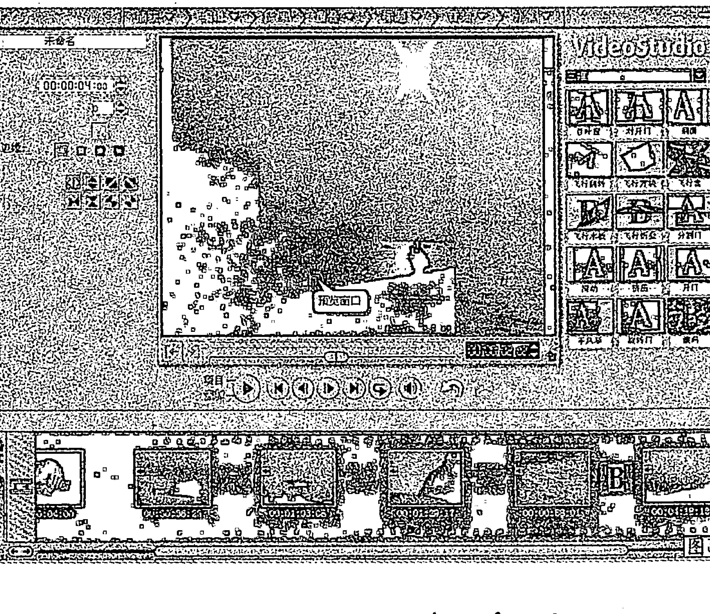

### 四、为影片添加滤镜

在制作视频影片时，如果能给影片加上一些特效，将会给人很强的视觉冲击，带来很好的欣赏效果。视频滤镜可以将特殊的效果添加到视频中，用以改变素材的样式或外观。例如，可以改善素材的色彩平衡、为素材添加动态的光照效果等。添加视频滤镜后，滤镜效果会应用到素材的每一帧上。

“会声会影”为用户提供了30种滤镜，下面以“缩放动作”滤镜为例，简单介绍一下它的使用方法。

早晨和傍晚的太阳非常的美，只要我们用心去找，拍摄这样的景色并不难，但是如果要让我们拍摄的太阳具有绚丽的光芒，则需要用软件进行后期处理来获得。用“会声会影”的“缩放动作”滤镜可以制作光彩夺目的太阳。

- 1. 运行“会声会影”，打开要制作光彩夺目的太阳的视频。
- 2. 在故事板上点选要制作光彩效果的视频，然后单击选项面板顶部选项页右侧的“滤镜”按钮，切换到第二个选项页。
- 3. 这时在右侧的素材库中会显示多种滤镜，首先在可用的滤镜中选取要应用的视频滤镜类型，在素材库中单击鼠标，选中需要使用的视频滤镜“缩放动作”，预览窗口将显示当前所选滤镜的效果。在选项面板上显示当前素材所添加的视频滤镜，同时在素材库中显示视频滤镜略图。
- 4. 预览效果。在选项面板的预设略图中选择一种预设略图，然后单击“播放素材”按钮，可以查看该滤镜在样本中应用的效果。
- 5. 调整参数。如果您对预设的滤镜不满意，还可以进行调整，单击“自定义滤镜”按钮，这样就会弹出设置对话框，在此进行适当调整即可，如图4所示。

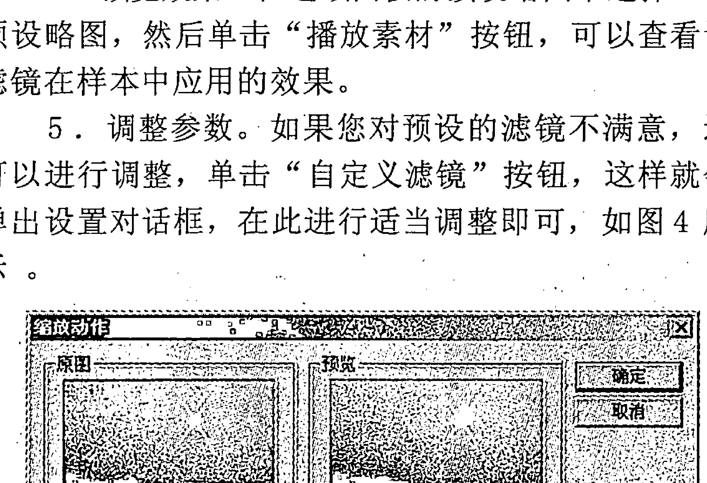

- (1) 在“原图”窗口中您可以看到素材的特性，如果要看看原图的效果，可以单击“播放”按钮；在“预览”窗口中可以播放已在素材上应用效果的预览，拖动窗口下方的滑动条可以浏览确定的帧。
- (2) 选择模式。这里提供了两种选择，一种是相机模式，选择这种模式可以让光线直对着观看者发散；另一种是光线模式，选择这种模式可以让光线从上向下发射。
- (3) 选择速度。这是定义效果比率，选择更高的比率可以让视频更多的地方产生光芒的效果。单击滑块移动鼠标或在右边的框中输入数字即可调整其数值。

在这一步调整时要注意，因高级选项只能针对视频素材的起始帧和结束帧进行调整，因此只有将预览滑块移动到第一帧和最后一帧的位置才可以设置参数。

调整结束后单击“确定”回到“会声会影”主界面即可。当您应用完视频滤镜之后，应用滤镜的素材左边将出现一个小图标，这可帮助您知道哪些素材已应用过视频滤镜。如果要从素材中删除视频滤镜，只要移到选项面板的第二页，然后选取想要删除的视频滤镜，并单击“删除视频滤镜”即可。

### 五、会声会影的项目管理

影片是由许多独立的视频素材、图像素材、声音文件、前景音乐、文字以及特效等组成的。在“会声会影”中，它是通过创建一个项目文件来管理这些素材的，因此，在开始的第一个步骤就是创建项目。

#### (一) 项目的保存

如果视频影片都编辑好了，或者在编辑中间要暂停编辑，则要把项目文件保存下来，这时您可以单击“文件”菜单中的“保存”命令打开“另存为”对话框，在“文件名”中输入合适的文件名称，然后再在“主题”框中输入主题，然后在“描述”框中输入影片的内容简要，这样，下次查看项目的属性时，主题信息和描述信息就会显示出来，让您能了解到影片的大概内容，输好后单击“保存”按钮即可。

注意：“会声会影”会在项目中记录每个素材的名称和位置，以及所应用的转场效果。任何添加到此项目中的视频、音频或图像文件不会受到此保存操作的影响。

#### (二) 打开已有项目

如果您以前打开或编辑过项目，这时“会声会影”会在最近文件列表中显示出来，这时您只需单击列表中的一个项目文件即可在工作区中将其打开。当然了，“会声会影”的菜单栏上只保留最近使用过的6个项目文件，如果要打开很久以前编辑的项目文件，则还要用“打开项目”命令来打开。

(文／天　马)

## 光盘使用说明

1. 光盘放入光驱后，光盘程序将自动运行，播放片头动画。动画播放结束后，进入程序主界面。如果想跳过动画，可以在画面中任意处单击鼠标或者单击右下角的“跳过”即可。

2. 如果不想让光盘程序直接运行，可以在放入光盘的同时按<Shift>键不放，以跳过动画的播放。在资源管理器中可以直接浏览光盘，也可以双击Start.exe文件重新运行光盘程序。

3. 在主界面上点击相应的主题按钮即可进入下一级界面或调用其他程序。

4. 在主界面上点击右下角的声音按钮可关闭或打开背景音乐。点击退出按钮可关闭光盘程序。

5. 在下一级界面中，都会有一个返回按钮，点击即可返回到上一级界面中。

6. 光盘中的PDF格式电子书，需要预先安装好Acrobat Reader软件，否则无法正常使用。如果您的系统中没有安装该阅读器，可安装本光盘中所带的Acrobat Reader 6.0。

| 地区 | 联系电话 | 地区 | 联系电话 | 地区 | 联系电话 |
| :--- | :--- | :--- | :--- | :--- | :--- |
| 广东省 | 020-34292249 | 宁夏 | 0951-6093532 | 青海省 | 0971-8227505 |
| 广西省 | 0771-2621300 | 湖北省 | 027-85493601 | 甘肃省 | 0931-8518072 |
| 云南省 | 0871-4178815 | 河南省 | 0371-7660016 | 内蒙古 | 0471-6925297 |
| 福建省 | 0591-3348257 | 山西省 | 0351-4079890 | 黑龙江省 | 0451-88342321 |
| 湖南省 | 0731-4417535 | 浙江省 | 0571-88312705 | 吉林省 | 0431-2777386 |
| 贵州省 | 0851-5984895 | 江苏省 | 025-6634184 | 辽宁省 | 024-23910600 |
| 四川省 | 028-86666489 | 安徽省 | 0551-4691193 | 河北省 | 0315-2815440 |
| 新疆 | 0991-4821133 | 山东省 | 0531-2162644 | 天津市 | 022-23683995 |
| 陕西省 | 029-7446029 | 江西省 | 0791-8592321 | 北京市 | 010-65072885 |

## 我被施了魔法

“我被施了魔法”搞笑电脑教学系列产品，推陈出新，又施新、新、新魔法，呈现爆笑、奇幻、探险神奇魔力！领教最新、最热、最酷电脑知识！再掀电脑教学魔法狂潮。

### 我被施了魔法之黑客危机


网络，风平浪静还是暗藏杀机？无意间，你卷入了黑狼与黑精灵族之间一场永无休止的黑客战争……偷看邮件、窃取密码，远程遥控别人的电脑，一切玩弄于掌股之间。“网络黑客”“招式，让你”黑遍天下“！汇集防”黑“心法，包你”百黑不侵”！

### 我被施了魔法之3DS MAX奇异探险

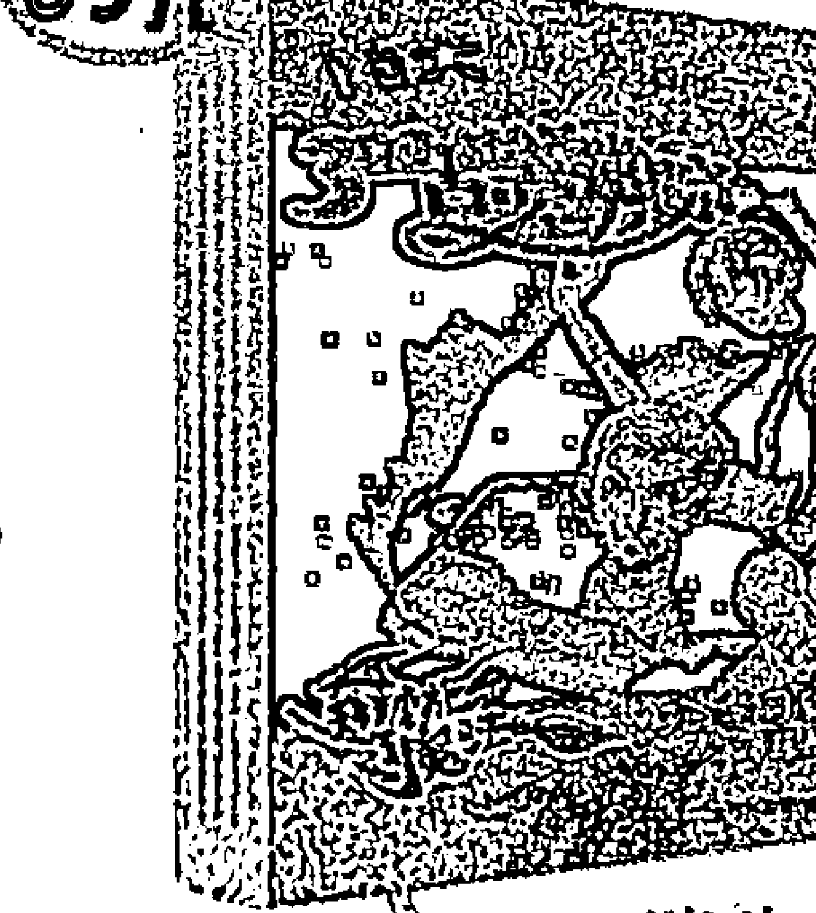

擅闯苗疆族人禁地，窥探诡异幽鸣声源，误陷远古祭坛，卷入外星生物征战……揭开尘封的秘密、找寻消失的文明，参悟神秘力量遗留下的智慧……高飞、coco，一对探险考古学家共赴神奇的三维世界，开始3DS MAX奇异探险之旅。

### 我被施了魔法之Flash魔法再现


究竟是什么？让那些非动画菜鸟在短短数日间，鬼斧神工的制作出自己的动画！甚至还一人包揽创意、动画、拟音等多重角色！原来是flash，一个集绘画、动画编辑、特效处理到音效处理等功能于一身的东东帮他们实现了超级动画大师的梦想！搞笑！爆笑！无厘头教学有绝招！实例！奇妙！激荡创意有法宝！

### 我被施了魔法之Office魅惑源

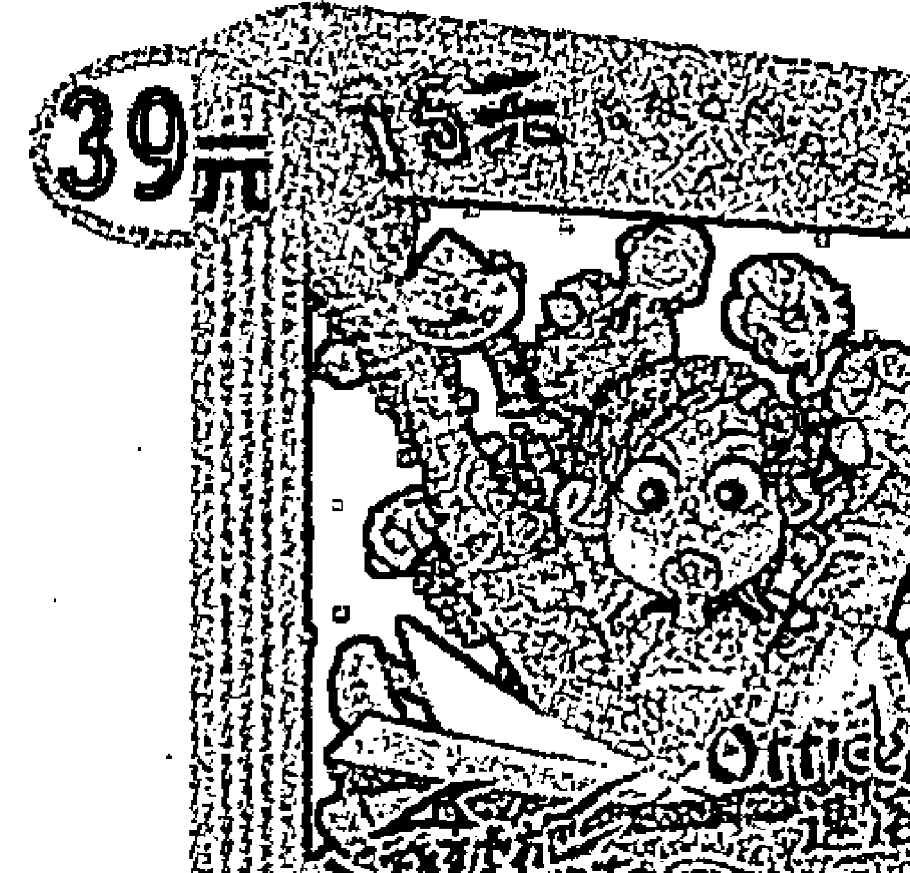

象喝速溶咖啡，省略加热、煮沸那些复杂的工序，无声息的溶解在水中！对，就是这种感觉，去除长篇大论的说教，用Word、Powerpoint、Excel三大法宝，提炼出实用办公的精华，溶于嬉笑怒骂的办公生活中，包你迅速成为office高手。

- - ☆我被施了魔法之flash动画魔术师（39元）
- - ☆我被施了魔法flash与卡通画（39元）
- - ☆我被施了魔法photoshop改画怪杰（39元）
- - ☆我被施了魔法之网页第二类接触（39元）


## 软件双雄会

### WinZIP vs. WinRAR

WinZIP 和 WinRAR 是当前两款非常流行的压缩软件工具。经历多次版本升级之后，如今无论是 WinZIP 还是 WinRAR 都已经相当成熟，选择这一时机进行对比无疑也是非常合适。从发展历史来看，WinZIP 一直十分平稳，占据着第一把交易。而 WinRAR 有着悠久的历史，但是伴随着 WinZIP 的崛起而陨落。好在近期 WinRAR 重新崛起，才使我们有机会亲临此次压缩软件的终极对抗。

#### 一、WinZIP

软件名称 WinZIP
最新版本 9.0
开发商 Nico Mak Computing
官方下载 http://www.winzip.com
中文版本 汉化包
软件大小 2317 KB
操作系统 Win9x/ME, WinNT, Win2000, WinXP

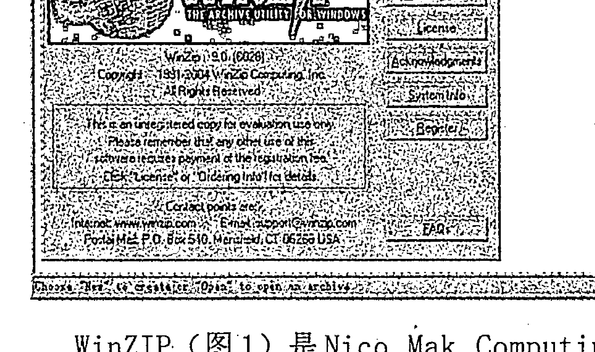

WinZIP（图1）是 Nico Mak Computing 公司开发的、适合于 Windows 环境下的一种通用压缩管理软件。该软件操作简便、压缩速度快、界面友好、功能强大，能与网络浏览器 Internet Explorer 和 Netscape Communicator 实现无缝连接，可以大大方便 Internet 用户进行网上软件的下载、解压，受到了 Windows 用户的青睐。

WinZIP 跟 Windows 资源管理器结合得很紧密，最常用的压缩和解压缩操作已集成到鼠标右键菜单中，点击右键即可轻松完成压缩解压缩。WinZIP 的窗口只能显示压缩包中的文件，支持局部右键功能，但右键菜单中命令比较少。当直接执行压缩包内的文件时，WinZIP 先把窗口中被点击的文件解压缩到 Windows 的临时目录中，然后用关联程序打开。WinZIP 完全支持强大方便的鼠标拖放功能，用鼠标可以在 WinZIP 和资源管理器或支持拖放的其他应用程序之间拖动文件/文件夹，用户甚至不用运行 WinZIP 而只是把对象拖到一个 ZIP 文件的图标上放下就可以把它们加入到该压缩包，大大方便了压缩过程。

从 8.0 版起，WinZIP 的工具栏上多了一个 CheckOut 按钮，如果打开的文件包含有 Setup.exe 或 Install.exe 安装文件，CheckOut 按钮便变成 Install，点击后可以不用解压文件而直接安装软件。Actions 菜单下的 CheckOut 功能近似于安装文件，把压缩包解压到指定文件夹，同时在开始程序组中建立快捷方式。有一些共享软件不需要安装，解压后就能用，还有所谓的“绿色软件”也都是如此，这时使用 CheckOut 就可以安装它们了。

此外，WinZIP 可以对压缩包查毒，前提是已经安装了反病毒软件并已在 WinZIP 的选项中指定了程序位置。由于压缩包中的病毒有时会被反病毒软件漏查，导致病毒杀而不绝，这也是很常见的现象。这时可以点击 Actions → Virus scan，WinZIP 先把当前窗口的文件全部解压到临时目录，然后对这些文件调用反病毒软件查毒，查完后删除临时文件，再报告查毒结果。

惟一遗憾的是，WinZIP 的分卷压缩并不强悍，到了 9.0 版还是处于很低的水平。要想让 WinZIP 实现分卷压缩，必须在压缩时把存放路径设为 A 盘，当一张盘的容量不足时，WinZIP 会提醒插入新盘，在解压缩时也必须按提示把软盘按顺序依次插到软驱里。

#### 二、WinRAR

软件名称 WinRAR
最新版本 3.3
开发商 RAR
官方下载 http://www.winrar.de
中文版本 有
软件大小 974 KB
操作系统 Win9x/ME, WinNT, Win2000, WinXP

WinRAR（图2）具有强大的压缩功能，其独特的多媒体压缩算法和紧固式压缩法更是有针对性地提高了压缩率，而且还完全兼容 RAR 和 ZIP 格式。早在 DOS 时代，RAR 就受到众人的喜爱，曾流行一时。RAR 在 DOS 时代敌不过只能用命令行的ARJ，到了Windows时代又招架不住WinZIP的进攻，皆因RAR压缩率低和压缩速度慢，并且RAR压缩格式以前一直缺少其他软件的支持。

令人感到高兴的是，WinRAR经过2.8版本之后在各方面有了长足的进步，从而具备与WinZIP叫板的实力。WinRAR在压缩格式上支持RAR和ZIP，而解压缩更是支持RAR、ZIP、CAB、ACE、ARJ、LHA、TAR、GZip、UUE，基本上常用的都能解压了。WinRAR在界面上类似WinZIP，在功能上WinZIP有的它基本都有，甚至有好多比WinZIP还更好更强大。虽然WinZIP也能支持ARJ、LHA等格式，但却需要外挂对应软件的DOS版本，功能实在是有限。但WinRAR就不同了，不但能解压多数压缩格式，且不需外挂程序支持就可直接建立ZIP格式的压缩文件，所以我们不必担心离开了WinZIP就不能解压ZIP格式的问题。

在制作自解压文件时，WinRAR比WinZIP更为方便，用户甚至在压缩时就可以直接存为自解压文件，而且支持将RAR或者ZIP压缩包转换为自解压文件。分卷压缩一直是WinRAR的优势项目，它不局限于1.44MB软盘，可以是任意大小。更为重要的是，RAR压缩格式采用了Solid算法，对WAV、BMP等非压缩的多媒体格式压缩效果显著，能在普通压缩的基础上再提高30%左右的压缩率，这是ZIP格式无法做到的。

### 三、横向对比

##### 1. 支持格式

9.0版本的WinZIP和8.1版本一样，仍然只支持原有的18种压缩格式，而且依旧不支持ISO这一非常流行的镜像文件格式，并且最大的问题是不兼容RAR，这就令许多用户敬而远之了。相对而言，虽然WinRAR 3.3支持的压缩格式只有15种，但由于兼容ZIP和支持ISO，仅仅这两条就使不少WinZIP的老用户心动神移了。如果单纯比较支持格式的数量，WinZIP稍占上风，但是其含金量就远远不及WinRAR了。综合来看，这一回合的胜者当数WINRAR。

##### 2. 压缩比率与速度

由于RAR格式在算法上具有一定的优势，因此无论WinZIP如何提高版本也很难在压缩比率上逾越WinRAR，对比测试也明白无误地显示了这一点。不过大家需要明确的是，一旦WinRAR采用ZIP格式进行压缩，其压缩比率的优势将荡然无存。此外，所谓的WinRAR压缩比率高于WinZIP也仅仅是具体的数值计算，两者的差距保持在3%以内，因此小体积的文件应该对此并不明显。

然而在速度方面，WinZIP与WinRAR可谓有着天壤之别。同样的文件夹，使用WinZIP压缩几乎能够节省20%左右的时间，而WinRAR因为其特色的高压缩比率算法而浪费不少时间。

##### 3. 解压方式

WinZIP提供了右键菜单、主界面窗口这两种解压方式，而WinRAR也做到了这一点。毫无疑问，此时比拼的重点将在于一些细致入微的人性化设计。WinZIP尽管支持直接运行压缩包的文件或者Setup.EXE安装程序，但是其智能化程度略显不够。如果软件压缩包含有多个目录结构，此时WinZIP无法支持直接安装，必须解压后才能运行安装程序。而WinRAR并不存在这一问题，只要压缩包中含有可执行文件，期间需要调用的其他文件都能通过其后台控制程序使用，没有任何限制。

更为重要的是，WinRAR的窗口类似资源管理器窗口，可以快速地切换磁盘和目录，窗口中可以显示文件夹和任何文件，这大大方便了操作。在窗口中点击一般文件时，WinRAR会调用默认的Windows操作打开它，如果点击的是WinRAR默认的压缩文件或自解压文件，WinRAR会像WinZIP一样显示压缩包中的内容状况，窗口中显示出跟压缩前一样的目录层次。在文件选择上，WinRAR增加了“Select Group”和“DESelect Group”，可以使用通配符选择和删除以迅速选定文件，对那些文件类型多又混乱的目录特别有用。比较来看，WinZIP在这一点上占据下风。

##### 4. 压缩功能

WinZIP的分卷功能只能直接对软盘进行操作，而WinRAR则可以随意划分，这就注定WinZIP的功能存在很大的局限性。此外，WinZIP在压缩包注释功能方面也逊色于WinRAR，无法支持相关信息的显示，这也直接导致很多软件下载基地更喜欢用WinRAR压缩软件，毕竟这同时可以让压缩包具有宣传功能。此外，WinZIP的界面中没有提供目录结构树，所以在处理文件时不如WinRAR来得直观。

利用WinRAR创建新压缩文件时可以在创建的同时加入文件，这样可以一步到位，而WinZIP必须先建立一个空的压缩文件然后再加载文件。虽然WinZIP更新比较## 超级兔子 VS. 优化大师

喜欢捣弄电脑的朋友大多热衷于系统的优化，通过修改Windows的一些设置，使得自己的电脑系统能跑得快些，这不仅可以获得实惠，也颇能给人以成就感。也有不少用户喜欢对自己电脑的图标等小地方做一点修改，让自己的电脑更加个性化，这也需要修改一些系统设置。

对Windows系统设置进行修改无非就是两种思路：其一，自己动手来优化。通过手工修改注册表或者其他设置文件来达到系统优化的目的。这个办法固然好，只是过程比较繁琐，对于那些并不是很了解注册表的用户来说是很危险的，一旦弄错了什么，整个Windows就会出现故障，甚至彻底玩完。其二，利用专门的系统设置优化软件来操作，这种方式能比较方便和智能地对Windows进行一番改造，在一定程度上可以说是比较安全的优化系统的方法。

现在专门的系统优化与设置软件，使用率较高的有“超级兔子魔法设置”和“Windows优化大师”这两个。在软件优化和设置系统上，它们主要都是通过优化注册表来达到优化系统目的，但是它们还是各有特色。

### 一、从界面看性格

古语云：言而无文，行之不远，对于一款软件也如是。软件在功能设计上很重要，而具有亲和力的界面和功能同样重要，特别是面对初级用户的产品。打一个比方来说，如果在正规场合吃西餐，你仅看对方使用刀叉的习惯这些细节，你就可以大致知道对方是个什么样性格的人了。所以我们开门见山——从界面看性格。

#### 1. 超级兔子的操作界面

“超级兔子魔法设置”在系统管理软件里面可以说是专门针对大多数的初级用户设计的。它提供的隐藏参数调整能优化系统、清除垃圾，解决你碰到的各种问题。

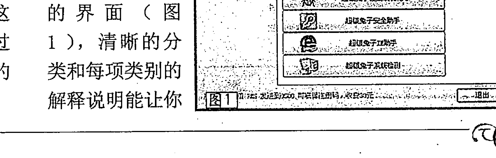

打开软件的界面（图1），清晰的分类和每项类别的解释说明能让你迅速找到相关功能。只要把箭头放在每项的设置按键上，操作界面的右边空白就会显示该项目的详情。活泼的向导似的操作界面能使你比较轻松地设置和优化你的系统。

直观上就界面的外观而言，“超级兔子”用了一些很可爱的图标，像蝴蝶、鲜花、甲壳虫。在操作需要等待时，界面则选用动画状的兔子图案作为过渡。这些虽是小方面，但大家都知道很多时候细节也是不容忽视的。这些小细节，能使用户在使用这个软件和修改系统时候觉得很有趣，从软件制作的角度来说，这也是软件作者为用户设想的体现。

“超级兔子”的魔法设置这部分，是整个软件的核心部分，除此以外的其他功能都可以视作软件的附加功能。在这部分里面，每项功能设置的界面都为多页面窗体的样式（图2）。

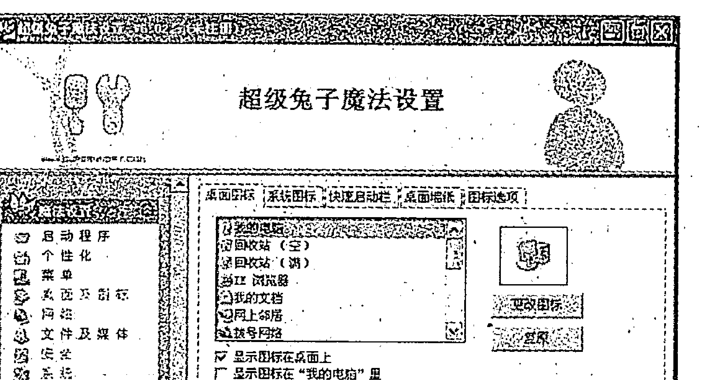

这种样式和我们所用的Windows操作系统的多页面窗体颇为相似。同时每项功能的名称也比较人性化，不是很生硬和过分专业。从初级用户在操作方面的接受心理来看，大多数会感觉这个软件的操作界面似曾相识，能较容易实现自己所需要的功能。

#### 2. Windows 优化大师的操作界面

“Windows优化大师”也具有优化系统、清理维护系统、系统个性设置的功能，而界面却是另一种风格。它的界面较为传统，操作分类也较为直观，总体感觉——功能分类具有归纳性，标题言简意赅（图3）。

就系统性能优化这部分来说，这部分包含的功能设置每项名称都很简单明了，需要哪一方面的设置就选择哪一类的系统优化。虽然不像“超级兔子”每项功能设置都会在界面附带解释，但这种直接的对话框让用户一目了然，能直接快速地找到自己要做的设定在哪个部分操作。

但是由于“Windows优化大师”没有那种点击“下一步”的向导式的操作方式，设置选项在表现上比较直接生硬，缺乏亲和力，会让电脑初级用户觉得不懂电脑不敢操作。但对电脑稍有认识的用户来说，可能更能接受这种操作界面，而不太喜欢花哨的界面。

#### 3. 点评

从两款软件的操作界面来看，我们可以说“超级兔子”对入门级的用户更具有亲和力，而“Windows优化大师”更像一个懂电脑的用户使用的兵器。或者换句话来说，“超级兔子”更能吸引女性用户，“Windows优化大师”更适合男性用户的风格。

通过对比两者的操作界面，还可以看出这两个软件在设计上不同的出发点。“超级兔子”强调的是电脑的个性化，也就是说把优化看作是个性化的一部分。“超级兔子”让用户在根据自己的喜好来修改出自己个性化的系统的同时，性能优化也包含在其中。而“Windows优化大师”强调的则是电脑系统的系统性能，在追求效率和速度的当今社会，欣赏这种风格人也不在少数。

### 二、优化系统谁更好

我们选择系统优化软件主要目的就是调整系统设置以优化系统，所以应该把比较的重心放在这两个软件的优化操作功能上。

#### 1. 自动优化

电脑初学者头痛的是不知怎样手工对系统进行优化，即使一些高手面对林林总总的优化设置，也可能出现记不清楚的问题。计算机内很多优化设置的选项都是英文，而且中文解释也不够，新手们对这些名称不是很了解，即便是有了系统优化工具也常常感到无从下手。所以，主要面对电脑初学者的优化软件，更重要的并不是高手们喜欢的高级设定功能，而是那些看上去很傻瓜的“自动”功能，因为熟悉那些高级手动设置的用户，很可能并不需要这些第三方优化软件来帮忙了。

通过上面对“超级兔子”和“Windows优化大师”界面的了解和对比，我们可以知道这两款软件都具有“自动优化”这项功能。我们这里就站在电脑初级用户的角度，分别对系统进行优化这一操作进行比较。

“Windows优化大师”的自动优化功能。我们先看看“Windows优化大师”的自动优化功能。打开“Windows优化大师”的界面，自动优化的按键就在“系统信息检测”界面的右上角（图4），很容易找到。

单击“Windows优化大师”的“自动优化”按钮，就打开自动优化的对话框。这个自动优化功能的界面为向导模式。单击“下一步”，跳出的对话框将要求你选择用户类型和因特网接入方式。“Windows优化大师”提供了7种用户类型供用户选择：

- Windows标准用户：它适用于对Windows没有特殊需求的用户。
- 电脑游戏爱好者：它适用于经常玩Quake等3D游戏的用户。
- 系统资源紧张用户：它适用于开机后系统资源可用空间较小的用户。
- 多媒体爱好者：它适用于经常运行多媒体程序的用户，比如常在电脑上看片、放音乐等。
- 大型软件用户：它适用于经常同时运行几个大型程序的用户，比如常使用Photoshop、Maya、AutoCAD的用户。
- 光盘刻录机用户：它适用于经常进行光盘刻录的用户。
- 录音设备用户：它适用于经常进行音频录制和转换的用户。

在这里，使用者应该根据自己电脑系统的主要用途进行选择。因为我的电脑没有特别的定位，什么类型的软件都有可能在我的机器里运行，所以我选择Windows标准用户这项。根据我的网络接入方式选择局域网或宽带接入，由于我还开启了虚拟光驱，所以在这一步还应该选中“当前系统使用了虚拟光驱”。然后，单击“下一步”，自动优化窗口将显示优化组合方案的情况和优化标准（图5）。再一路单击“下一步”便完成了优化。

自动优化也需要搜集一些信息，不然面对千差万别的配置，岂能用一个优化方案就可以打发得了。“Windows优化大师”的自动优化，操作非常简单，需要用户选择的项目也不多，这还是很体贴用户的。这种优化方式是针对大多数用户最常用的项目来进行优化的，而且完全不用人的干预，对那些电脑菜鸟们还是很适合的。不过仅从图5的内容来看，“Windows优化大师”如何自动优化，还是让我们有一头雾水的感觉。

##### “超级兔子魔法设置”的自动优化

“超级兔子魔法设置”的自动优化功能就在“超级兔子”优化王这部分里。打开超级兔子优化王的界面，选择“优化系统与软件的设置”，然后按“下一步”继续。这里采用的也是向导方式，一步步点击，直至完成所有操作。我也试用了一下兔子的自动优化功能，从第一步开始，依次下一步为以下步骤：

- 选择“会跟随Windows启动的软件”；
- “开机”速度的优化；
- “关机”速度的优化；
- “系统服务”的优化；
- “服务器的优化”；
- 关闭“系统错误”汇报信息；
- “网络优化”；
- “鼠标右键的新建菜单”的设置；
- “添加新的右键菜单”的设定；
- “清除木马黑客程序”；
- 优化“Word办公软件”读取局域网文档的速度；
- 优化“IE浏览器”，增加多线程连接；
- 与优化系统有关的“RealPlayer RM影音播放器”的设定；
- 与优化系统有关的“ACDSee看图软件”的设定；
- 与优化系统有关的“FlashGet网际快车软件”的设定；
- 与优化系统有关的“Winamp MP3播放器”的设定；
- 加强“媒体播放器”的能力；
- 保存设置，完成。

从“超级兔子”的自动优化这一操作过程可以看出它的自动优化功能不仅对系统进行优化，还对与系统优化有关联的部分软件的设置进行了调整，以进一步起到优化系统的作用。由于每个人机器的系统配置和所安装的软件会有差别，所以自动优化具体步骤也会小有一些不同的地方。不过“超级兔子”在这方面还是比较智能的，它可以通过读取注册表内其他软件的安装信息来决定在自动优化向导中出现哪些内容，比如上面第十一步，就是“超级兔子”检测到机器上装有Word软件，并且机器处于局域网中后才出现的，这项功能在“超级兔子”的功能介绍里面居然都还没有。又例如Realplayer RM影音播放器软件在安装好后，它会默认地设定了每次开机都启动该播放器；开机就执行Real后台服务程序；启动该软件都自动播放剪辑。如果取消这些开启设定，则会节省系统内存，也加快了机器运行的速度，但就这些小小的设定也会惹人烦。可是“超级兔子”在最方便的一套自动优化步骤里，就能让你修改这些设定。由此看来，“超级兔子”在软件优化上还是下了很多功夫的，大家还可以自己挖掘一下其他的秘密。

在自动优化进行每一步时，显示的优化内容里都有几个小的优化项目，可由自己决定是否选择。同时每个项目也有操作说明，每个优化内容也注明了各自起什么作用，这不仅让用户能尽快做出选择和用得放心，同时还能为菜鸟们充充电。

“超级兔子”的自动优化方案比较系统整体化，从系统到硬盘、内存，从启动到开机、关机，从网络到IE浏览器，甚至鼠标和部分常用软件都有涉及到。它的这套自动优化方案虽不见得就比“Windows优化大师”的优化方案好，但具体步骤能让菜鸟们知道都优化了什么，起了哪些作用。

#### 2. 手动优化

大家都明白自动优化是最具普遍性的一种优化方法，但个人的电脑配置不同，个人对自己电脑系统优化的要求程度也会不同。此时只有手动优化才能解决用户特殊的需求。“超级兔子”和“Windows优化大师”都各自提供了不少手动优化的选项，下面我们选一些常见的做一介绍。

##### (1) 启动优化与设置

一些软件在安装时都会在启动组里添加一些项目，以便下次启动电脑时自动运行，但这些软件并不见得是每次开机都需要运行的，如果不适当清除就会减慢机器开机速度，还会消耗系统资源。而且有的黑客软件也可能会被添加到启动中。

普通的初级用户，可以在开始菜单“程序”的“启动”下面看到系统启动时运行的程序，如果想停止这些程序的自动运行的话，只需要删除它就可以了。但有些软件的启动是由注册表等其他系统管理部分来实现的，这就难免需要进行一番费力的查找，但有的用户根本不会查找。面对这一大堆麻烦，“超级兔子魔法设置”和“Windows优化大师”都能很快帮你解决这种问题。

“超级兔子魔法设置”的“启动程序”的“自动运行”界面和“Windows优化大师”的“系统性能优化”的“开机速度优化”的界面都将系统注册表里面的和“启动”菜单中所有的项目列了出来。“超级兔子”是将项目前面的勾去掉，而“优化大师”是将项目前面的勾勾上，但都表示下次开机将禁止运行修改了的项目，项目仍然保留在原处，只是不能运行而已。这里“超级兔子”与“优化大师”不同的是，“超级兔子”还具有“删除”开机执行项目、允许“更改”执行命令和“建立”一个新的启动项目的功能，“优化大师”则没有。

##### (2) 磁盘缓存优化

输入输出系统是设备和CPU之间传输数据的通道，当扩大了其缓冲尺寸时数据传递将更为流畅。但是，过大的输入输出缓存又将耗费相同数量的系统内存，因此具体设置多大的缓存非常关键。特别是那些喜欢下载的用户，BT、EM这些P2P软件会频繁读写硬盘，这对其寿命有较大的负面影响，合理地设置了磁盘缓存就可以很好地保护你的硬盘，让你放心地下载。

“Windows优化大师”和“超级兔子”在缓存大小问题上采用了同样的策略——用户只能选择推荐设置。虽说根据用户的软件环境和需求的不同，这个设置应该有微调，但需要借助软件调节磁盘缓存的用户大多数都不具备这样的分析能力，为了避免用户做出离谱的设置，只让用户有几个固定的选择也是个不错的主意。因为这样优化，虽然性能不能达到最理想，但优化效果却相当的明显，同时也避免了错误设置的风险。

操作上以“Windows优化大师”为例，打开“系统性能优化”的“磁盘缓存优化”界面，要调整输入输出缓存区很简单，你可以用鼠标或键盘直接调整调节棒。当调整到适合当前系统的大小时，“Windows优化大师”将在调节棒左上方给出“推荐”提示。当然这要由你的物理内存的大小和系统运行任务的多少来决定。

##### (3) IE设置与修复

现在上网的人多了，IE浏览器也成为很多恶意攻击的目标。一些网站在你浏览网页时强行修改你的IE主页和IE标题；或者总是出现要你安装某个IE插件的提示；或是有些恶意网站修改你的主页后，还不允许你还原。其次，不少网络软件也会给IE的右键菜单添加自己的内容，甚至IE界面上的工具条也被有的软件添加了自己的按钮。面对这些种种问题，“超级兔子魔法设置”的网络部分就能很方便地帮你解决IE设置和修复的一系列问题。例如，我在装软件时没有搞好，结果那个软件给IE的右键菜单添加了乱码的内容，我开始怎么试图删除都没有成功，“超级兔子”网络里面的这个功能让我很快就这个问题解决了。

##### (4) 上网加速

优化网络使得上网加速的设置有很多，这里我介绍的是“Windows优化大师”的“域名解析”功能。通常，用户使用浏览器上网浏览网页时，浏览器首先是将要访问的网址提交给域名解析服务器，然后域名解析服务器将该网址解析为IP地址，最后浏览器再访问该IP地址。因此，我们上网的相当一部分时间都用在了域名解析上面。“Windows优化大师”提供的域名解析功能能帮助用户彻底消除部分域名解析所消耗的时间。打开“网络系统优化”界面，点开“域名解析”按键，这时便打开了收藏夹的所有网址。“Windows 优化大师”将会把你经常访问的网址进行域名解析，然后自动将网址和IP地址一一对应地存放到Windows目录下面。在默认情况下，优化大师认为收藏夹中的网址是你经常访问的，而且在这里你也可以手动添加新的网址。解析后再访问这些网址时就无需进行域名解析了。手动设置领域，“Windows优化大师”和“超级兔子”都有各自的独门秘笈，能处理的问题也都非常的多。虽然也出现了你有我无和你无我有的状况，但是用户的实际状况也是五花八门的，所以两个软件在这个方面算打成平手。

### 三、个性设置谁更全

个人电脑就是希望自己的电脑在一些设置上具有个性化。“超级兔子”和“优化大师”都有“个性设置”这部分。由于个性化设置可以包括很多方面，这两个软件所包括的都只是其中的一部分，但相互比较下来，“Windows优化大师”软件能个性设置的比“超级兔子”要少。“优化大师”的个性化设置部分一目了然。在“系统性能优化”里打开“个性设置”界面就能直接操作，所包含的个性设置项目都在这部分里。基本上能调整的地方还是都有列出项目，只有“在任务栏时间或前或后添加文字说明”这一项还有些意思。IE背景图案设置要到“网络系统优化”的“IE设置”里面才能完成，但总的来说这里的个性设置似乎还有待丰富，不过作为一款以优化为主的软件能提供这些个性化设置，这个水准也算过得去了。“超级兔子”的个性设置包括了三个部分：“个性化”、“菜单”、“桌面及图标”。这里主要讲与“优化大师”不同的地方。“个性化”的“输入法顺序”里的“添加”或“删除”，能让你将无用的输入法删除，加上自己喜欢的输入法；安装了Office XP或Windows XP后，输入法如果变成动态调整，可能会造成每开一个窗口就弹出中文输入法的现象，在“个性化”的“输入法风格”里就能将输入法修改到以前的非动态调整方式；还可以修改“开始菜单按钮”的文字，你想怎么换就怎么换；就修改图标而言，“超级兔子”还能够为开始菜单的图标、桌面图标、系统图标更换容颜，以及选择哪些图标可以出现在你的桌面上；“快捷启动栏”里指的是开始按钮右边的小图标，可以在此添加、删除一些你常用的图标。特别是某些特别的功能图标，如“显示桌面”图标并不是你自己能建立的，一旦误删就可以在此添加回去；此外这里还增加了“桌面墙纸”的设定界面。另外，“超级兔子”还为你考虑到你为繁杂的桌面和显示范围不够的烦恼，因此增加了虚拟桌面的功能，该功能可以让你在一个系统内拥有多个桌面窗口，这个功能类似于nVIDIA显卡驱动提供的nVIEW功能，但有些情况下系统资源占用较低，需要整理桌面上窗口的用户也可以考虑选择。所以总的来说，个性设置项目两款软件一个体现普遍性，大众都可以接受；一个却有些花哨，能迎合喜欢追求与众不同心理的用户特别是女性用户的需要。这两个软件的功能和特点都介绍完了，性能各有所长。两款软件相同之处不少，不同地方也蛮多，但它们都能让你达到优化和个性化系统的目的。对于像这两款软件这类已经比较成熟的软件，我们不是简单地评比孰好孰差，这里可以套用一个经典的说话来进行评价：选择一款软件，其实你选择的是一种软件制作理念、选择的是一种生活的态度。只有您亲自用了，才能感受到哪款软件更适合自己。

（图、文/洁儿）

## 软件&双雄会

### 金山词霸2003vs. 东方大典2003

长期以来英汉词典类软件中一直是《金山词霸》一枝独秀，而同样致力于翻译软件的交大铭泰在全文、全屏翻译中取得领先优势后也推出了《东方大典》迅速地向词典工具靠拢。所以说以交大铭泰在翻译软件领域所具有的实力判断，《东方大典》也应该具有很强的竞争力。因此笔者对它们各自新出的版本《金山词霸2003》和《东方大典2003》进行了比较，希望读者朋友们在根据自己的实际情况选择翻译软件时能够有所帮助。

### 一、软件介绍

金山词霸2003：使用权威、易用的全国科学技术名词审定委员会（简称名词委）审定发布的所有科技词


（图、文/洁儿）

## 二、功能对比

#### 1. 取词查词

金山词霸2003：使用金山词霸的屏幕取词功能，可以翻译屏幕上任意位置的中文或英文的单词或词组(即中英文互译)，中英文单词的释义也会即时显示在屏幕上的浮动窗口中。在金山词霸的查词窗口中，输入要查询的单词后，就可以查到不同词典中对此词的解释。同时还可以看到在各词典中所有含有此单词的例句，哪怕此单词是在解释其他的单词。例如在输入栏中输入“book”，所有收录这个单词的词典全都在左侧的向导栏中列了出来。再点击词典名称，右侧的解释框中就出现该词典中“book”的释义了。当然用户还可以自己设定取词词典，把和工作学习最贴切的词典定为取词时调用的词典，以便方便快捷地翻译中英文单词。这样，就可以凭借更多的信息掌握好单词的用法。

东方大典2003：默认屏幕取词方法为“鼠标取词”，它的操作非常简单，在鼠标经过的区域，如果碰到中文或英文单词，鼠标在这个词上停留片刻，就会出现中译英或英译中的窗口，以及该中文的五笔码，这样既可以加强对该单词的学习又可以让用户在任何时候都能复习掌握五笔输入。另外《东方大典2003》还可以进行图片、PDF取词和整句翻译。在《东方大典2003》的取词界面上还加入了“搜索网络”的功能，用户只要点击这个按钮，就可以在网上搜索到当前单词的相关内容，当然用户还可以在“设置”→“PCA设置”中对默认的搜索引擎进行更改。《东方大典2003》的查词功能和《金山词霸2003》没多大区别，但它在普通查词功能的基础上还增加了拖拽查词，只要在文档中选中要查询的单词，把该单词直接拖拽到大典界面中就行了，和在查词输入框中的效果是一样的，非常方便。

总结：金山词霸在查词的功能上的确比东方大典要强很多，它的翻译准确、词汇丰富，不愧是拥有49部权威英语辞书、12本权威辞典、74个专业词库的大型全能词典软件！不过东方大典在一些取词查词的功能使用上又略胜一筹，比如能进行图片、PDF取词以及整句翻译，特别是图片取词在目前是没有其他翻译软件和词典软件厂商能做到的，而东方大典中所使用的OCR原理图片取词不但创新出色，而且创意好，比较容易上手！

#### 2. 词典查询

金山词霸2003：经常使用电脑的用户都知道，在DOS时代*代表任意多个字符，?则代表任意一个字符，在《金山词霸2003》中巧妙运用它们就能更加轻松地查找到所需的单词。例如：输入“ab*”，将可以看到所有以“ab”开头的单词，从而选出需要的单词。输入“ab????”，金山词霸会在左边的索引条中列出所有以“ab”开头的后面是4个字母的单词。如果在后面输入更多一些的“?”，则可连符合这种要求的词组也在索引栏一并列出，这样让对单词拿捏不准的用户有了一个好帮手。而且在《金山词霸2003》中还有全文检索功能，它就像google一样，同时可以让用户实现联合检索查找例句的功能。也许我们知道一句话中的几个关键单词，但是就是不知道如何将它们写成通顺地道的句子。这种苦恼在《金山词霸2003》中将得到彻底解决，用户只需将所有关键单词输入，使用全文检索功能，金山词霸就会自动在所有词典中搜索从而找到例句，或者是最接近的句子。例如，输入“我 圣诞”就会出现相应的例句：“我们总是到我父母家里度过圣诞之夜”(We always go to my parents’ house on Christmas Eve.)。同时每个单词配有音标、词源、解释、词组、例句、词性变化等内容，不可谓不详细。

东方大典2003：提供的超级搜索功能也可以进行模糊查询，如果用户对某个单词不太清楚其具体的拼写，又想了解其意思，就可以利用超级搜索功能进行查询。其中*、?的意思和金山词霸大致相同，但是东方大典还提供了另外两个字符>、<，如果在字符前加“>”，则会搜索以输入的字符结尾的符合条件的词条，“<”则反之，而且《东方大典2003》还使用了“网络词典”的功能，可随时随地查取新词、难词，即便词典中尚未收录，也可随时在线提交新词并获得释义，通过个性化“我的大典”功能，用户也可以随时添加和查询新词。当然在实现该功能之前，必须确定用户的计算机已连上互联网。

总结：学单词的目的就在于运用，《金山词霸2003》在用户对于单词的运用上潜心研发，通过全文检索这种功能，用户将会在学习单词的同时掌握其用法，省时、高效地完成英语学习。而《东方大典2003》新的超级搜索功能也非常有分量，在不能准确拼写单词的情况下可以使用通配符进行模糊查找，这一项功能的实用性相信在使用中就能得到充分体现。而网络词典这个功能，它有效地利用了网络的交互性，使得整个软件的活力不断延续，让词库永远不会落伍。

#### 3. 嵌入功能

金山词霸2003：以前版本的金山词霸只有在其运行之后，才能进行查词等翻译操作，而如今的《金山词霸2003》则使用了嵌入式技术，它的最大优点就在于不用单独启动《金山词霸2003》就可以完成其需要的功能，大量节省了电脑的资源。《金山词霸2003》会在Word、IE、Outlook等一些常用应用程序的工具栏中自动添加一个翻译按钮，只需点击一下就能使这些应用程序具有自身带有翻译功能的本领。

东方大典2003：在《金山词霸2003》只能嵌入到Word、IE和Outlook的基础上进行了提升，目前可以全面嵌入到整个Office软件中，并且重新设计了取词方式，使系统资源占用进一步降低，而性能则进一步增强。同时考虑到游戏迷的需要，首次实现了游戏嵌入的功能，使广大游戏迷玩起外文游戏来也无往而不利了。

总结：金山词霸2003新颖的嵌入功能给用户带来了极大的方便，不用另外启动词霸就能具备词典翻译的功能，可以即指即译、速度快、资源占用小。而《东方大典2003》在《金山词霸2003》的基础之上把嵌入功能发挥得淋漓尽致，使之能嵌入到更多的软件，大有后来者居上之势！

#### 4. 另类功能

金山词霸2003：采用中英文单词、短语及语句的真人发音，真正16位语音，语音更准确、发音更标准。《金山词霸2003》内含全球领先的TTS全程化语音技术，可以设置语言朗读的音量、频率、语速等，而且还可以对发音引擎进行调节，所谓发音引擎是指选择发音的类型，包括女声、男声以及其他效果，通过对其设置可以准确对所有英文单词及短语进行发音，对任意整句、整段乃至整篇文章的英文流畅朗读，让用户能够轻松地学到一口地道的美国英语。

东方大典2003：在《东方大典2003》中新增了一个功能软件PCA（个人电脑助理），其本身就是一个非常人性化、极具创意的软件，不过是以模块的形式捆绑在《东方大典2003》里面罢了，具体功能描述如下：

- MP3背单词：利用软件进行单词听读，让用户能方便地选择听读内容（四级、六级等）、听读声音种类（男声、女声）以及听读方式（拼写朗读、单词朗读、中文解释朗读），还可以从MP3背单词的需求分析中抽象出来并导入MP3机中，以便随时学习！
- 通讯录：这是在手持PDA中非常常见的一个功能，《东方大典2003》把它集成在PCA上，除了大伙普遍熟悉的功能以外，其优势就是由程序来提供接口，方便用户快速地从Microsoft Office的OE地址本里或者是PC机常用的.WAB文件导入已有的数据，利于统一地管理。
- 短信精灵：与搜狐短信网站 http://sms.sohu.com 合作的手机短信背单词功能，让用户可以通过短信来学习单词，还有就是在用户每天定制3次发送的基础上会每周出一次测验，使用户随心所欲地走到哪儿学到哪儿！
- 全文搜索：全新的搜索机制让用户迅速在硬盘上找到用户想要的资料。
- 还有将日程计划、输入法增强、随手贴等功能集成在统一界面下工作，提高了用户的日常工作效率。

## 写在最后

《金山词霸2003》和《东方大典2003》都是比较成熟的翻译软件，它们各自的公司在国内市场都很有名气。《金山词霸2003》的词库之丰富可谓名副其实的“词霸”，这也是软件倍受用户喜爱的一个重要原因，而《东方大典2003》则另辟蹊径，在图片PDF取词、网络词典、个人电脑助理（PCA）等方面可谓下足了功夫，将技术与理念合二为一。但是《东方大典2003》也有一些问题不可忽视，比如稳定性方面，笔者在使用过程中出现过几次异常退出以及使用时间长了之后会出现资源占用过于庞大的情况等等，希望交大铭泰在以后的版本中能加以改进。

(文 / 王严刚)

## Microsoft Office vs. WPS Office

最近，“震荡波”病毒的肆虐再次暴露了微软软件的漏洞，有关微软的种种争议声四起。在这个微妙的时期，微软的旗舰办公软件产品Office 2003开始推广。与此同时，国内知名的软件制造商金山公司也推出最新版的WPS Office 2003。在两者较量中，WPS Office 2003不可避免地处于劣势，不过究竟技术上的差距有多大，这是很多用户最为关心的问题。

### 一、 Microsoft Office

| 软件名称 | Microsoft Office |
|----------|------------------|
| 最新版本 | 2003 |
| 开发商 | 微软 |
| 官方下载 | http://www.Microsoft.com |
| 中文版本 | 有 |
| 中文版价格 | 3058元 |
| 操作系统 | Win9x/ME、WinNT、Win2000、WinXP |

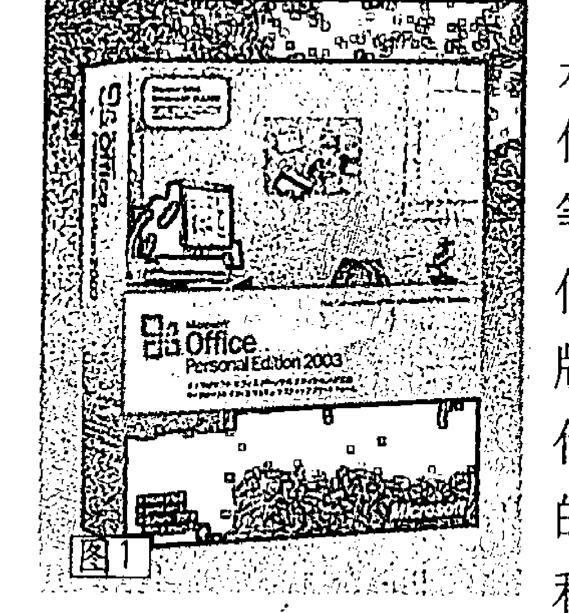

是微软公司开发的办公自动化软件，大家所熟知的Word和Excel等应用软件都是Office 中的组件。Office 2003是新的Office版本，是新一代办公处理软件的代表产品，可以作为办公和管理的平台，提高使用者的工作效率和决策能力。

正所谓“工欲善其事，必先利其器”，Office 2003是一个庞大的办公软件和工具软件的集合体，为适应全球网络化需要，它融合了最先进的Internet技术，具有更强大的网络功能。Office 2003中文版针对汉语的特点，增加了许多中文方面的新功能，如中文断词、添加汉语拼音、中文校对、简繁体转换等。Office 2003已经不仅是很多用户日常工作的重要工具，也是日常生活中电脑作业不可缺少的得力助手。

尽管现在的Office组件越来越趋向于集成化，但在Office 2003中各个组件仍有着比较明确的分工。一般说来，Word主要用来进行文本的输入、编辑、排版、打印等工作；Excel主要用来进行有繁重计算任务的预算、财务、数据汇总等工作；PowerPoint主要用来制作演示文稿和幻灯片及投影片等；Access是一个桌面数据库系统及数据库应用程序；Outlook是一个桌面信息管理的应用程序；FrontPage主要用来制作和发布因特网的Web页面。不仅如此，Office 2003的阵营还在不断扩大，InfoPath 2003（信息收集与交换）、Visio 2003流程图绘制等软件逐步融入其中，而且互相之间可以协同工作。

从2003版本开始，Office被微软改名为OfficeSystem。单从字面看，Office和OfficeSystem只是一词之差，但是，两者之间却有着“质”与“量”两方面的区别。事实上，新版OfficeSystem所彰显突出的网络化、集成化特点，包括6个组件、11个产品、4个服务器、1项服务。由此可见，Office已经不再是一个简单的应用软件，而是集成了前台与后台的一个新平台。微软一直称道自己的“平台商业模式”，Office作为一个前台的应用软件，是微软最主要的收入来源之一，却不能体现微软的平台商业模式。

从OfficeXP版本开始，微软的Office开始向平台过渡。Office是指桌面办公软件，OfficeSystem提供的是完整的办公自动化解决方案。从这个角度来说，OfficeSystem并非Office家族系列软件的阶段性升级，而是彻底的升级，也是迄今为止最能够体现微软.net战略的革命性突破。这种革命也在向所有的使用者郑重宣告单机办公时代的终结和群组办公时代的开始。事实上Office 2003已经是自十多年前微软推出Office以来的第11个版本，这套办公软件已经表现得越来越成熟。

### 二、 金山WPS Office (图2)

| 软件名称 | WPS Office |
|----------|------------|
| 最新版本 | 2003 |
| 开发商 | 金山 |
| 官方下载 | http://www.kingsoft.net |
| 中文版本 | 有 |
| 教师版价格 | 190元 |
| 操作系统 | Win9x/ME、WinNT、Win2000、WinXP |

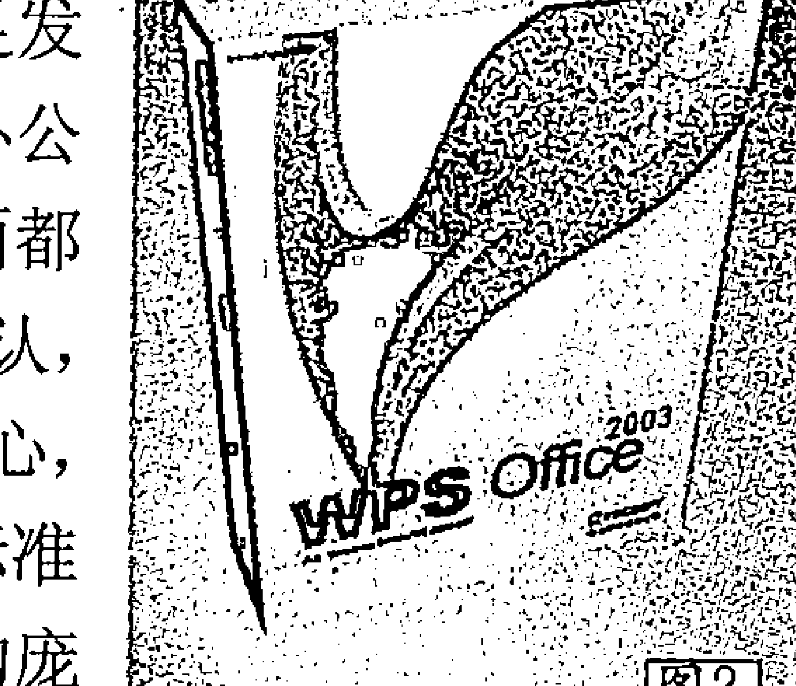

现代办公理念的深入人心，让办公自动化系统得到了长足发展，办公自动化软件在提高办公效率、增强企业竞争力等方面都起到了决定性的作用。不可否认，Microsoft Office最为深入人心，它基本已经成为了一种行业标准化软件。面对着MS Office的庞大市场，金山软件一面高唱着反垄断的战歌，一面又不得不向MS Office好好学习、多取经。

WPS Office的发展是令人可喜的，它在国内的历史要比MS Office更长，具有不错的用户基础和口碑。WPS Office 2003强化四大组件——金山文字、金山表格、金山演示和金山邮件功能，加强了核心引擎，提高了产品的易用性，大大加强了产品在整合功能上的优势，为用户提供了一款更加灵巧、实用的办公软件，适合企业、个人使用。除了4个基本功能组件外，还包含了常见问题解答、功能导航、特大字打印、立即注册、配置工具、批量转换、学习培训资源、在线更新等10项功能程序，分别用于提供用户帮助、升级等功能，同时也包含一些简单实用的文本转换工具，可见金山在软件设计时是充分为用户考虑的，通过详细的帮助和导航，用户可更加直观地学习使用WPS Office 2003。大家可能还记得，金山公司在推出WPS Office之时，采取的是一种集成化的模式，但很快就放弃了这一开发思想，还是回到传统的思路上来，把相应的组件分开。

Microsoft Office带给用户的不仅仅是一套软件，更为重要的是一种使用习惯和理念，甚至是一种标准。

面对 MS Office 的实用易用冲击，WPS Office 2003 继续保持了贴近 Microsoft Office 的易用特色，在软件的功能组成以及设计组成上，都与 Microsoft Office 颇为接近，其菜单、工具条、设定模式、快捷键等方面的部分设计甚至完全一样，让用户在选用 WPS Office 2003 时不会感到生疏，可以迅速上手，也为用户能够更好地接触、学习使用多种办公软件提供了良好的统一支持。不得不承认，WPS Office 2003 做不到 Microsoft Office 2003 那样的高集成度，因此集中精力开发 4 个主要功能组件成为关键。略微遗憾的是，这 4 个主要功能组件相互独立，仅在输出格式上提供转换功能。但是这也是金山软件公司无奈的选择，因为国产办公软件必须走特色化道路，一味地模仿没有出路。

### 三、横向对比

#### 1. 文字处理软件

Word 2003 和 WPS 2003 分别是这两套软件的主打产品，因此这两者之间的比拼十分关键。Word 2003 增加了全新的 XML 编辑器，全面支持 XML 操作。在 Office 2003 的所有版本中，均可以通过本地 XML 文件格式保存 Word 2003 文档。该格式可通过任何能够处理支持行业标准的 XML 的程序进行操控和搜索，无疑加强了通用性。

Word 2003 的“智能标记”就像一个“有头脑的按钮”，能对一些特殊类型的数据进行识别，从而在我们需要的任何时间和地方提交一份带有快捷选项的菜单，对一些重要的操作做出提醒。例如，当你用 Word 给朋友写了一封信，需要发出时，只需将鼠标移到朋友的姓名上，此时“智能标记”就会提示出相关操作，你只需选择“发送邮件”命令就会启动 Outlook，你会发现朋友的信箱地址已经出现在收件人一栏中。Office XP 中的“智能标记”可以对人名、日期、时间、地址等进行识别。随着识别对象的不同，出现在选项菜单中的操作命令也会有所不同。

屏幕上阅读文档一直是很多用户的必修课，然而绝大多数文字处理软件都忽略了这一点。Word 2003 全新的“阅读布局”视图使得文档的阅读变得更加容易，优化了屏幕上的文档阅读，其中包括：放大文本、缩短行宽，以及使页面刚好符合屏幕大小。此外，其 ClearType 字体可以生成更易于阅读的字形，并通过缩略视图快速访问特定的页面。事实上，Word 2003 的特色有很多，我们甚至很难想像一款文字处理软件还能怎样发展。时至今日，Word 2003 的成熟度已经相当高，甚至其新功能开发空间都显得捉襟见肘。

至于 WPS 2003，也就是金山文字 2003，其特色便是提供了 12 类、近百种模板，更加方便用户使用，具有一定的普遍性和实用性。作为政府办公软件的供应商，金山公司在金山文字 2003 中还预置了国家机关最新公文模板、合同范本，不但加快了文档起草速度，而且统一了行文规范。面对国内用户的应用，WPS 2003 提供各种正式公文、合同、信函等文件的特殊格式要求，而普通的资料、推荐、简历、假条等等，也都有中国的风俗习惯和风格。在金山文字 2003 中，文字和稿纸自动对齐的功能要优于 Word 2003，用户基本上用不着调整就可使用，因为它的稿纸方式是在“页面设置”中完成的。相对而言，Word 2003 的页面设置较为麻烦。

从整体运作功能来看，Word 2003 还是明显优于金山文字 2003，特别是在一些细节的设计方面，而且 Word 2003 拥有更为广泛的群众基础。但是金山文字 2003 也有自己的优势，其模板功能颇具特色，只是这一优点还不足以让 Word 用户彻底背叛。

#### 2. 表格处理软件

金山表格 2003 和 Excel 2003 都可以通过填充柄进行自动填充。但使用中发现，金山表格 2003 的自动填充更加智能化、本土化。比如：在 A1：A3 中依次输入“周一、周二、周三”后，拖动填充柄向下填充时，金山表格 2003 中可以正确地识别并填充为“周四、周五、周六、周日”序列，而 Excel 2003 无法做到，或许这就是国产软件的本土化优势。

但是金山表格 2003 的优势似乎仅限于这一领域，在单元格运算、单元格保护、数据引用、表格图片插入、选择性粘贴等诸多方面，金山表格 2003 的功能都显得较为单薄。但是值得一提的是，金山表格 2003 还突破 Excel 2003 中最大 256 列的限制，使得对于超长宽表格的处理更加得心应手。

然而 Excel 2003 相对于金山表格 2003 最大的优势在于和其他 Office 组件之间的合作模式。用户可以通过简单的复制功能实现表格数据导入，而这却是金山表格 2003 所不能做到的。在函数功能计算方面，金山表格 2003 的功能相对简单，似乎更加专注于普通用户，而不是像 Excel 2003 那样面面俱到。

#### 3. 幻灯片演示制作

幻灯片演示似乎已经发展到尽头，PowerPoint 2003 甚至相对于以往的 PowerPoint 2000 都没有太大的改变。从金山演示 2003 的情况来看，其多种模板和配色方案以及丰富多彩的动画支持是一个亮点。结合声音、图片、视频图像等多媒体方式之后，金山演示 2003 可提供更加丰富的演示效果，并且直接内置 70 多个外观模板，多种配色方案，10 多种页面版式。

令人欣慰的是，金山演示 2003 在功能上丝毫不逊色于 PowerPoint 2003。但是在大多数用户没有预装 WPS Office 的情况下，金山演示 2003 不得不通过直接 EXE 来输出幻灯片，这不免有些不便，也是短时间内不可能改变的问题。

## PowerDVD vs. WinDVD

### 一、PowerDVD 5.0

| 软件名称 | PowerDVD |
|----------|----------|
| 最新版本 | 5.0      |
| 开发商   | CyberLink|
| 官方下载 | http://www.gocyberlink.com/english/download/download.asp |
| 中文版本 | 有       |
| 软件大小 | 6455 KB  |
| 操作系统 | Win9x/ME, WinNT, Win2000, WinXP |


PowerDVD（图1）可以说是联讯科技公司（CyberLink）主推的“形象产品”，目前最新的版本为5.0。从命名上我们也可以看出，PowerDVD是专门用来对付DVD回放的。其实它之所以能够在众多的DVD播放软件中脱颖而出绝非偶然。首先PowerDVD加入了对AMD 3Dnow！、Intel SSE等指令的最优化处理，使用户的CPU能够在软解压中充分发挥作用；此外，它还专门针对具有DVD动态补偿功能的主流显卡芯片做了特殊优化，用户可以在播放过程中任意调整纯软件播放或是硬件视频加速、影像亮度加强等功能。PowerDVD 5.0的DVD音效输出也是相当完美的，可以充分展现杜比高保真AC-3和DTS环绕声响效果，并且支持5.1声道解码输出和DVD卡拉OK等。PowerDVD独创的DVD导航功能颇具特色，其最新的版本还加入了系统自动诊断功能，支持多视角切换、多画面、多种字幕、影片分级控制及多语言选择等功能，可以回放高清晰度的DVD光盘或720×480解析度以上的MPEG-2视频片段等。最让人动心的，即使用户现在还没有配备一款DVD-ROM也不要紧，PowerDVD在播放DVD之余，顺便也能放VCD。但是PowerDVD最大的缺点是不能兼容RM、MOV等流媒体格式，也许联讯把它定位于专业级的DVD播放软件，因此把这些都忽略了吧。

### 二、WinDVD 5.0

| 软件名称 | WinDVD |
|----------|--------|
| 最新版本 | 5.0    |
| 开发商   | InterVideo |
| 官方下载 | http://www.intervideo.com/jsp/Product_Download.jsp?p=WinDVDPlatinum |
| 中文版本 | 有     |
| 软件大小 | 21.95MB |
| 操作系统 | Win2000, WinXP |

InterVideo的媒体播放软件众多，而且还是nVIDIA Personal Cinema指定的软件供应商，其实力不容小觑。这款WinDVD（图2）已经推出很长时间了，不过经历几次版本升级之后功能更加强大。WinDVD最大的特色是拥有支持反转离散余弦变换和硬件影像动态补偿加速等功能，使得播放画质更加柔和、细腻，无延迟现象。在DVD特殊声效方面，WinDVD兼容 AC-3 和 DTS，并且已经通过杜比多声道认证和环绕立体音场认证，可提供给用户一流的声音效果。不过需要注意的是，WinDVD分为标准版和DTS版，其中标准版只能支持AC-3而不能支持DTS。此外，WinDVD还支持SPDIF数字音效输出，用户如果使用杜比耳机，也能享受仿真的六声道环绕效果。此外，WinDVD 5.0还支持DVD Navigation指令、CSS全区译码、互动选单、多视角实时切换（最多可达9个）、多国字幕以及自定影片分级等功能。

WinDVD的预读取技术比较独特，它可以自动侦测光盘驱动器中的介质类型并自动播放。大多数的播放软件都是类似“解霸”那样当用户在光驱中放入光盘，软件才会自动读取播放。WinDVD则不同，只要您的光驱里有它可以读取的文件类型，启动WinDVD就可以自动播放。

为了精确控制DVD播放速度，WinDVD使用了“时间飞梭（TimeStretch）”技术，该功能可以在保持音频不间断并且画面流畅的情况下，以半速或倍速播放DVD影片，这样我们就可以将影片播放时间提高到200%或降低至50%，既不会因为听不到声音而遗漏任何情节，更不会带来音频失真的问题。当你觉得某一段剧情非常无聊想跳过这一段，或者你希望能更清晰地看清楚某一段精彩的镜头，就可以使用这一功能。例如，你可能处于短短一个小时的飞机航班上，却又希望在笔记本电脑上观看一部79分钟长的影片，WinDVD4可以让您在一个小时内将它看完，由于保持着自然的声音，因此这几乎是在不知不觉中快速地看完影片。

不过WinDVD与PowerDVD一样不能支持RM格式文件，对微软的WMA、ASF倒是支持的，但是此时系统必须安装Windows Media Player，因为WinDVD与PowerDVD都是通过调用微软视频解码器来实现这类文件的回放。

## 写在最后

对于国产办公软件的生产商们来说，一个摆在面前的问题就是政府的支持能坚持多久？现在是市场经济的时代，中国已经加入了WTO，如果仍然仅仅靠政府的支持来开发自己的软件，既不完全符合市场经济规则，也不符合WTO的游戏规则。作为国产办公软件的佼佼者，WPS Office 2003的优势是本土化特色，但是面对功能全面并且用户群体根基深厚的Microsoft Office，其综合表现还是略逊一筹。

### 三、横向比较

#### 画质单元

##### 1. VCD画面比较

尽管VCD已经有些落伍了，但是不可否认，VCD仍然是使用最广泛的格式，对于大多数人而言VCD依然是首选。为了保证测试的公正性，我们没有使用软件自带的画面捕捉功能来截图，而是使用了最新版本的HyperSnap DX抓图软件。

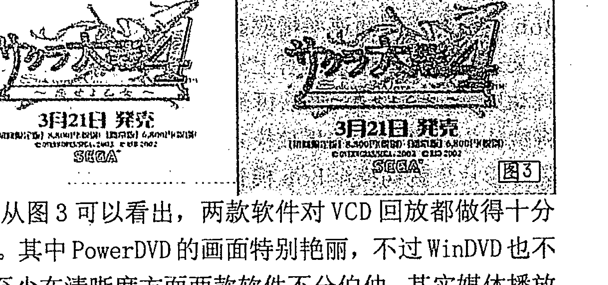

从图3可以看出，两款软件对VCD回放都做得十分出色。其中PowerDVD的画面特别艳丽，不过WinDVD也不错，至少在清晰度方面两款软件不分伯仲。其实媒体播放软件发展到这一阶段，VCD播放能力都不成问题，技术上也已经达到理论值的顶峰。

##### 2. MPEG4画质比较

MPEG4 编码技术相当出色，它能在基本不损失画质的前提下大幅度压缩视频文件，因此市面上有不少影片都采用这种方式来存储。

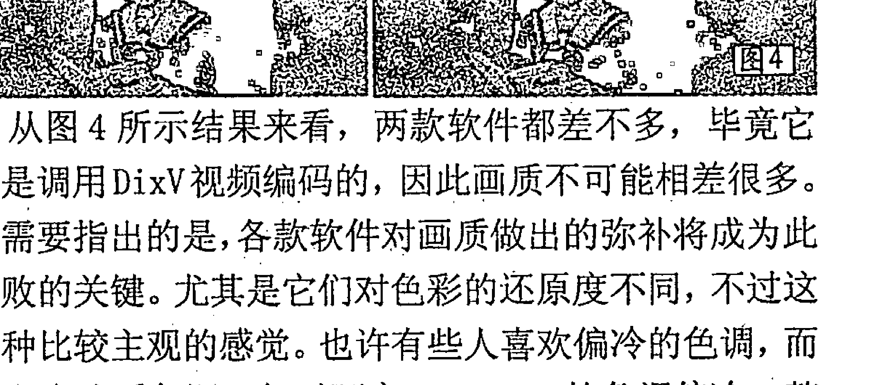

从图4所示结果来看，两款软件都差不多，毕竟它们都是调用DixV视频编码的，因此画质不可能相差很多。但是需要指出的是，各款软件对画质做出的弥补将成为此时胜败的关键。尤其是它们对色彩的还原度不同，不过这是一种比较主观的感觉。也许有些人喜欢偏冷的色调，而有的人喜欢暖色调。相对而言，WinDVD的色调偏冷，整体感觉稍好一些。

##### 3. DVD画质比较

DVD可谓是目前最流行的先进视频格式，在测试中我们使用了 FF9 游戏宣传动画（图5）。为了进一步检验PowerDVD和WinDVD的DVD回放效果，我们还使用 Media Player 进行对比。

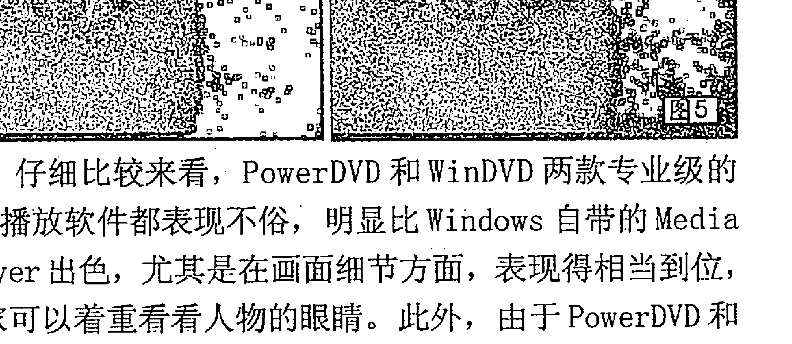

仔细比较来看，PowerDVD和WinDVD两款专业级的DVD播放软件都表现不俗，明显比Windows自带的Media Player出色，尤其是在画面细节方面，表现得相当到位，大家可以着重看看人物的眼睛。此外，由于PowerDVD和WinDVD充分调用了显卡的硬件动态补偿功能，因此其画面感觉更加顺畅，过渡非常自然，可以说很好地掌握了用户的心理视觉。在PowerDVD和WinDVD的对比中，后者的色彩表现力更为出色。

PowerDVD采用了Bob和Weave两种消除隔行的技术。从隔行信号编码而成的影片内容将使用 Bob 模式播放，Bob 以两倍于画面速率播放影片内容，而各个画面只显示某一场。这使影像略有上下抖动，尤其是显示文字时抖动更甚，不过这种方法可消除水平纹影。Weave 模式将默认为 DVD 影片的播放模式以确保画质。如果检测到隔行影片，就切换至Bob模式。考虑到普通用户可能对这两项技术不了解，PowerDVD允许用户设置成软件自动选择方式。

在不提供硬件缩放的显卡上调整播放窗口的水平、垂直大小时，WinDVD 能以软件的方式平滑图像。它还能控制隔行扫描视频内容的抖动，提高图像的平滑度和清晰度。另外，在硬件条件允许的前提下能够实现硬件运动补偿。与 PowerDVD 相似，WinDVD 为简化用户的操作，提供了高、低图像质量的配置办法，普通用户无需进行繁杂设置即可获得高质量的图像。相比之下，WinDVD 的图像优化技术具有更为明显的效果。

#### 音频单元

目前媒体播放软件已不仅仅是视频回放了，音频回放也是必备功能。在 DVD 音效方面，PowerDVD 和 WinDVD 两款专业级的DVD播放软件都很有特色，但是两者还是各有千秋。

PowerDVD似乎更加照顾大多数的普通用户，它可以非常完美地在 4.1 音箱系统上模拟出真实的 AC-3 效果。此外，如果你只有两个音箱，那么可以利用 PowerDVD 支持的A3D模式。非常奇怪的是，PowerDVD竟然不支持Creative的EAX，而对A3D模式倒是支持的。由于A3D音频函数的音频定位能力非常出众，甚至超越EAX，因此即使是两声道用户也可以获得比较出色的音频享受。

相比之下，WinDVD则更加贵族化，它可以支持价格不菲的杜比耳机，这点可是PowerDVD所做不到的。另外，WinDVD可以根据室内房屋的大小对音频进行优化，而且效果非常明显，这点值得肯定。

因为我们手头没有DTS音响设备，所以只好进行 5.1 声道的 AC-3 测试。其实音质真是一种很主观的感受，也许每个人的看法和品味都不尽相同，但是我们认为 PowerDVD和WinDVD的AC-3表现基本在一个档次上。

#### 附加功能

媒体播放软件能够提供一些常用的附加功能肯定是很受用户欢迎的，而PowerDVD和WinDVD将在这方面十分努力。通过下表，我们可以很清晰地了解相关对比结果。

|          | 抓图功能 | 分级设置 | 变速播放  | 自动播放  | 比例16:9 | 屏幕4:3 |
|----------|----------|----------|-----------|-----------|----------|---------|
| PowerDVD | 支持     | 模糊     | 0.5~4X   | 实时检测  | 支持     | 不支持  |
| WinDVD   | 支持     | 清晰     | 0.5~16X  | 开机检测  | 支持     | 支持    |

#### 操控界面与播放控制

操控界面的含金量并不大，但是这却是给用户的第一印象。如果这点做不好，那么用户将很难有耐心来细细品味该软件的内涵。

##### 1. 操控部分

PowerDVD和WinDVD这两款DVD播放软件对系统资源占用较大，因此总感觉它们操作起来非常凝重，打开媒体文件时也非常不便。在 800 × 600 的分辨率下，这两款软件的界面都会超出桌面的边界，让用户感觉非常不爽。通过资源监视器的对比，WinDVD 对于系统资源的消耗高于 PowerDVD，这与其程序体积较大有密切关系。

##### 2. 界面设计

PowerDVD的标准界面很像一台影碟机，显得华丽无比。界面上面布满各种功能按钮，结构非常清晰。当鼠标移动到按钮上时，会弹出提示信息。在界面右侧有一个可以滑动打开的数字键盘，在建立了播放列表后可以用它来选择节目。用户可以通过“配置”对话框来更换风格各异的界面，甚至可以设定在软件启动时随机选择界面。如果用户愿意，还可到PowerDVD的官方网站下载更多的界面配置方案，以满足自己的需求。我们试着把鼠标移到屏幕顶端，一个播放控制面板以滑动的方式打开了，在以全屏幕方式播放影碟时，这个控制面板就显得格外方便。

很难描述WinDVD的标准界面像什么，但从它流线型的外观同样可以感受到非凡的气质。在界面的主体上只保留了基本的控制按钮，显得非常简洁，更多的功能按钮被安排在右侧的滑动面板上。与 PowerDVD 相同，鼠标移到按钮上时会显示提示信息，但可惜的是，音量控制区域不太容易理解，显然它的面积并不小，但若不是移动鼠标四处打探，恐怕很难发现状态显示区域左侧就是音量控制区域。WinDVD也能更换界面，用户可以到它的官方网站去下载更多的界面配置方案，同时WinDVD还提供了名为SkinDK的界面制作工具。WinDVD的播放窗口顶端也设计了一排播放控制按钮，不过在全屏幕播放方式下会消失，存在的意义不是很大。尽管PowerDVD和WinDVD的主界面难分伯仲，但从实用角度来看，WinDVD在设计上的逻辑性不及PowerDVD。

### 总结

综合来看，WinDVD在功能上占据一定的优势，而且支持更加细致化的视频补偿模式和多种 DVD 音频解码。在细节处理方面，WinDVD的表现也略胜于PowerDVD，譬如更加大幅度地变速播放与清晰明了的分级设置。当然，PowerDVD的总体表现也不逊色，不然也不会成为一款主流 DVD 播放软件。凭借小巧的体积与出色的界面，相信还是会有很多用户对它青睐有佳。

#### 4. 邮件收发软件

金山邮件2003是目前金山WPS Office 2003四个主要组件中最不成熟的一个。虽然金山邮件2003增加了一些新功能，比如邮箱账户图标的个性化选择、邮件全屏查看、邮件模板等功能，但是软件在接受、发送、管理方面都还有缺陷，如果在未来的版本中金山公司不加强金山邮件的开发的话，这个组件很有可能成为WPS Office组件中的一块“鸡肋”。相对而言，Outlook 2003已经不仅仅是一款邮件收发软件，而是集成了日程管理功能。此外，Outlook 2003的规范性也强于金山邮件2003，不会因为其他用户不使用Outlook 2003而出现文字乱码或者格式混乱的现象。在免费版Outlook Express停止开发并且Foxmail已经越来越成熟的时候，金山WPS Office的金山邮件2003显得没有太大的意义，今后弥补上日程管理功能或许是唯一的出路。

## FoxMail VS. Outlook Express

随着互联网的飞速发展，人们正在逐步地摒弃传统的邮件投递方式，转而使用目前方便、快捷的电子邮件方式，它是一种高效、快速的邮件投递方式，是互联网的主要产物之一。鉴于E-mail在网络应用中的重要地位，对于网友来说，选择一款使用方便、功能强大的E-mail软件也就变的很重要了。目前E-mail软件市场中，国产的FoxMail与来自微软的Outlook可谓两大绝对主流，因此我们将比拼的焦点集中在此。

### 一、Foxmail

| 软件名称 | Foxmail |
| --- | --- |
| 最新版本 | 5.0 |
| 开发商 | 博大 |
| 官方下载 | http://fox.foxmail.com.cn |
| 中文版本 | 有 |
| 软件大小 | 4.04MB |
| 操作系统 | Win9x/ME、WinNT、Win2000、WinXP |

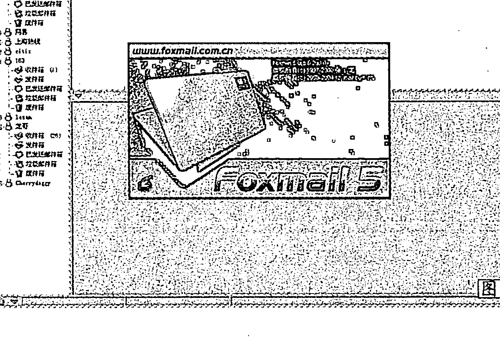

Foxmail是（图1）近两年来最著名、最成功的国产软件之一，甚至赢得了ZDNET的五星级评价。它以使用简单、对中文的优秀兼容性，支持GB、BIG5、HZ编码等特性在国内赢得了一大批拥护者。Foxmail容量虽小，可是它的功能已能满足一个标准网虫所需，而且带给很多用户一种朴实无华的感觉。事实上，作者张小龙先生在制作这个软件时借鉴了许多同类产品的优点，所以有人说它像The Bat!，又有人说它像Becky!，还有人说它其实有点Outlook的风格。Foxmail最大的特点是对中文支持相当出色，而且Foxmail还可以将信件从GB转换成BIG5或从BIG5转换为GB进行发送，这一独特功能非常适合那些经常与港台朋友联系的网友，所以Foxmail应该是最适合中国人使用的 E-Mail 软件了。

在邮箱和帐号管理方面，Foxmail使用流行的树型结构来管理不同账号邮件。值得一提的是，为了提高收发信件速度，Foxmail支持多账号同时收发信件，这样可以充分利用网络带宽。

Foxmail的信件编辑功能非常出色，据张小龙先生介绍，该编辑器是他从底层重写了4万余行代码才完成的，所以其功能强大，并不输于其他独立的文本编辑器。信件编辑器采用独立的窗口编辑，并且支持拖拽编辑和无限恢复功能，此外还采用类似Word XP中鼠标随意定位的编辑功能，不过这对于还没有使用过Word XP的用户来说还需要一个适应过程。另外在撰写信件上Foxmail支持模版和自定义宏功能，这也是作者张小龙最为得意的地方。与上一个版本相比，Foxmail 5.0的过滤功能有了较大提高，可以针对用户需要，选择多种条件来对邮件进行过滤。值得注意的是它甚至可以对附件文件名过滤！这样就不怕“Happy 99”这样的病毒找上门了。

### 二、Outlook Express

| 软件名称 | Outlook Express |
| --- | --- |
| 最新版本 | 6.0 |
| 开发商 | 微软 |
| 官方下载 | 操作系统自带 |
| 中文版本 | 有 |
| 软件大小 | 不详 |
| 操作系统 | Win9x/ME、WinNT、Win2000、WinXP |

有些网友一直区分不开Outlook与Outlook Express（图2），其实它们是两个软件，不要因为同样都有“Outlook”的字样、都可以收发Email，就觉得他们差不多。Outlook Express是纯新闻、邮件软件，而Outlook则是属于个人信息管理软件（PIM），用它来收发电子邮件、管理联系人信息、记日记、安排日程、分配任务等，可以搭配Exchange Server发挥更强大的信息管理功能。由于Outlook并非是免费软件，因此我们将以Outlook Express与Foxmail进行对比。

微软的产品一向以简单易用而著称，Outlook Express自然也不例外，易用性是不容置疑的。它的功能简单太多了（微软即使做再简单的软件都会做得很复杂），其设置项数量众多，使用户需要花费大约半个小时才能搞清楚具体功能，使初级用户无所适从。不过对于普通用户来说可能只需要设定几个基本项就足够了。

Outlook Express对信件的管理能力很强大，它提供了一个叫“邮件规则”的设置，在这里你可以根据发件人、主题、正文、收件人、邮件账号等12个不同的条件使软件对信件自动进行分类、标识、删除、复制等操作。这个功能对于那些每天都会收到大量信件的用户来说非常体贴，省去了不少时间和精力，并且可以过滤掉令人生厌的垃圾邮件。

Outlook Express用户可以使用通讯簿来存储电子邮件地址、家庭单位地址、电话传真号码、数字标识、会议信息、即时消息地址以及个人信息如生日、周年纪念日，或者像家庭成员、个人和公司的Interne地址，并且可以直接从通讯簿链接到这些地址。不过对于普通用户来说其中有些项稍显冗余。在对中文支持上，Outlook Express表现较为出色，它能够正确识别不同的中文内码，也可能是因为它和Windows中文版是出自一家的缘故，在这一点上，Outlook Express是国外邮件软件中做得最出色的。但是在接收其他E-mail软件发送的信件时常常需要手动设定内码，这就使得一些初级用户感到无所适从，因此而导致许多人误以为Outlook Express的中文支持率不佳。

另外，Outlook Express还提供了完备的安全设置，用户可以使用数字标识对邮件进行数字签名和加密。对邮件进行数字签名可以使收件人确认邮件确实是你发送的，而加密邮件则保证只有你期望的收件人才能阅读该邮件。不过去年几次席卷全球的专门针对微软Outlook、Outlook Express和Exchange的国际病毒美丽莎、伯伯以及爱虫病毒等使Outlook Express用户至今心有余悸，对于它的安全性纷纷表示怀疑。

然而平心而论，虽然这里面有一部分是软件本身的原因，但最主要的还是微软过于树大招风，惹来众怒。在以前大家都认为Outlook Express的收、发信速度过慢，但笔者却感觉最新版本的收、发信速度并不慢，起码应该算是中档。而系统资源占用方面，Outlook Express也没有大家想象得那样大，应该算是比较合理的水平。另外，Outlook Express还支持新闻组，由于在国内新闻组服务太少，所以就不多说了。

不知为什么Outlook Express没有远程信箱管理功能，而这个功能对于普通用户来说又非常重要。最后要提醒使用Outlook Express的朋友，当你收件箱的信过多时，软件启动会变得很慢，这时需要删除一些邮件或利用Outlook Express的压缩功能对信件进行压缩。

### 三、横向对比

#### 1. 反垃圾邮件

有没有办法可以解决垃圾邮件问题？这个问题，几乎所有经常使用电子邮件的人都思考过。作为全球最大的软件商，微软公司囊括了上述三个解决方案的所有环节。现在，微软也把对付垃圾邮件的重心放在了桌面解决方案上。反垃圾邮件功能也因此也成为微软Outlook的最大卖点之一。然而遗憾的是，集成于操作系统中的Outlook Express并不如Outlook 2003那样强大，过滤功能十分单一。

微软把Outlook 2003内置的“反垃圾邮件引擎”的强度分为低和高两级，而Foxmail则分为“低中高”三级，以避免微软“极端主义”的缺点。微软要求用户手工添加“安全发件人”，Foxmail却可以自动把你已经与之互通邮件的发件人列入“白名单”。微软只允许用户从文本文件中导入“安全发件人”和“垃圾发件人”列表，Foxmail支持从邮箱账号和联系人两种方式导入。

最能表现Foxmail特色的是它的“邮件过滤规则”自动学习功能，这个功能简单而又实用：用户指定装满了垃圾邮件的邮件夹，让Foxmail“学习”一次，它就能自动总结出规律，下次类似的邮件就会自动被当成垃圾邮件处理。当然，你也可以让它学习哪些不是垃圾邮件，以免误伤。在Foxmail 5.0与Outlook 2003的竞争中，Foxmail具备明显的优势。而对比免费版本的Outlook Express，其优势更是明显。

## MSN VS. OICQ

步入2004年，即时通讯软件已是广大网友上网必备的网络软件之一。各大公司也纷纷推出了自己最新版的即时通讯软件，打破了过去QQ一统天下的局面。这对于我们广大网友来说是一件好事，大家可以根据自己的需要来选择适合自己的即时通讯软件。客观而言，目前最老牌的ICQ已经基本退出国内市场，而Yahoo Messenger、新浪寻呼等还不成熟。毫无疑问，如今国产的OICQ与微软的MSN已经形成两强争霸的格局。

### 2. 用户习惯

为什么会有如此多的用户选择Foxmail？在功能强大的Outlook和免费的Outlook Express夹击之下，Foxmail为什么依然能够取得如此之大的成功？除了免费这个原因之外，简单，或许会成为大多数用户回答的理由。界面设计简单、基本功能完善、新用户能够快速上手，这是大多数用户在面对堆积如山的客户端邮件软件时选择Foxmail的理由。

直到今天，依然有众多用户坚守着Foxmail的阵营，这些都是用户长期的使用习惯使然，笔者曾经青睐于Outlook强大的功能，使用过一段时间的Outlook，但是由于实在是不习惯Outlook繁琐的使用，以及总是摸不着头脑的设置，最后又回到了Foxmail的阵营中来。相对而言，目前Outlook Express的人气越来越低，而Outlook 2003又存在版权限制。

### 3. 附加功能

最新版本的Foxmail增加了加密解密、数字签名等非常有用的功能，同时还支持Unicode，它解决了中日韩多国文字的问题。此外，Hotmail、MSN、Yahoo等邮箱，只提供了Web Mail收取方式而未提供POP3收取方式。以往的Foxmail 4.2已经可以支持Hotmail和MSN邮箱的收发了，但对于Yahoo的邮箱，则只能收取来自Yahoo.com.cn的邮件，而且还必须同意接收广告条款。

现在Foxmail 5.0不但可以收取来自Yahoo.com.cn的邮件，而且也可以正常收取来自Yahoo.com邮箱的邮件了！这是利用了Foxmail-Hotmail Proxy技术来实现的，如果Foxmail-Hotmail Proxy程序在本地机器上运行，那么在“POP3服务器”栏中只需填写“localhost”即可。相对而言，Outlook Express的优势在于整合Windows Messenger，可以收发Hotmail与MSN邮件，但是总体便捷性依旧不如Foxmail 5.0。

除此之外，Foxmail 5.0还支持短信发送、电子名片编辑等全新的功能，让E-mail软件的应用范围进一步扩展。遗憾的是，微软似乎已经停止对Outlook Express的深层次开发，仅仅将其作为一项简单的Windows附件。

### 4. 速度与系统资源占用

速度可谓是网友们最关心的。这次，我用Foxmail 5.0和Outlook Express 6.0软件收发同一个1M大小的Zip压缩包，接着又同时收发5封大小都为100K的邮件。统计出来的结果如表。注：测试中使用中胜56K V09 Modem，连接速率52000。

| 软件名称 | 发送1M Zip包时间 | 接收1M Zip包时间 | 发送5封100K邮件 | 接收5封100K邮件 |
|----------|------------------|------------------|----------------|----------------|
| Outlook Express | 6分49秒 | 4分58秒 | 3分44秒 | 3分45秒 |
| Foxmail | 6分40秒 | 4分32秒 | 3分0秒 | 2分5秒 |

为了照顾那些低配置的用户，笔者也特地使用了SystemWatch（一个系统资源检测软件）来比较它们的系统资源占用率。其结果如下：

| 软件名称 | CPU占用（%） | 内存占用（KB） | 其他资源占用 |
|----------|--------------|----------------|--------------|
| Outlook Express | 10 | 10245 | （图片中未明确其他资源占用） |
| Foxmail | 5 | 7542 | （图片中未明确其他资源占用） |

结果应当说是显而易见，Foxmail在速度与系统资源占用率等方面的表现都全面优于Outlook Express。

## 写在最后

事实上，微软已经基本停止开发Outlook Express，但是并不意味着停止授权用户继续使用Outlook Express。早期捆绑于操作系统的Outlook Express依然会成为很多用户第一个接触的客户端邮件软件，除非Outlook Express已经不能适应以后电子邮件系统的发展，否则已经养成使用Outlook Express习惯的用户，一时半会还难以接受其他的相关的软件。同样的道理，Foxmail也拥有大量的忠实用户群体。Foxmail与Outlook Express在将来很长一段时间内将和平共存，一两年内谁都不会大规模退出市场。然而不可否认的一点是，目前Foxmail已经在综合表现上超越了Outlook Express，我们也建议新网民使用这款国产软件。（文/阿亮）

### 一、OICQ

| 项目 | 值 |
|------|------|
| 软件名称 | OICQ |
| 最新版本 | 2004 |
| 开发商 | 腾讯(Tencent) |
| 官方下载 | http://www.qq.com |
| 中文版本 | 有 |
| 软件大小 | 12414 KB |
| 操作系统 | Win9x/ME、WinNT、Win2000、WinXP |

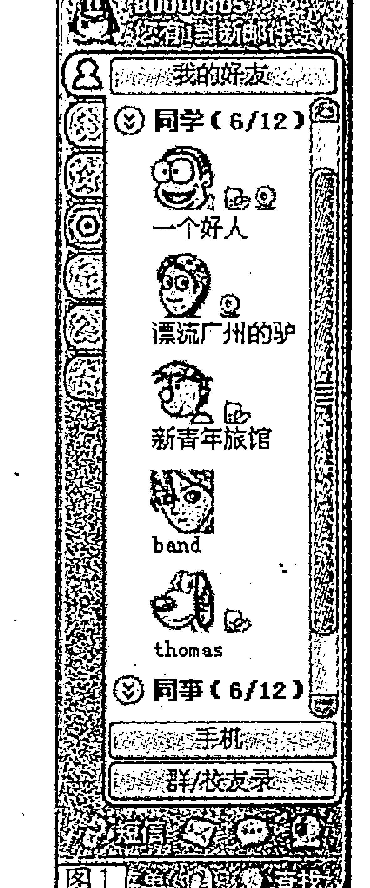

OICQ（图1）是腾讯公司自主开发的基于Internet的中文即时通讯软件，并已成为中国最大的互联网注册用户群。OICQ系统合理的设计、良好的易用性、强大的功能，稳定高效的系统运行，赢得了用户的青睐。作为一种即时通讯工具，OICQ支持显示朋友在线、寻呼、聊天、即时传送文字语音和文件等功能。OICQ不仅是网络虚拟呼机，它还可以与无线寻呼、GSM短消息、IP电话网互联。目前，OICQ已进入高速增长期，基于OICQ的庞大用户群，可以开展从电子商务、综合信息服务到广告等广泛的互联网业务。

即时通讯软件几乎是每一个上网的朋友必备的通讯工具，并且随着各种企业版的即时通讯软件的出现，即时通讯软件的地位越来越重要。有专家甚至预测，再过两年，即时通讯软件将取代电子邮件成为主流的互联网通讯工具。目前OICQ即时通讯软件除了能够能让用户迅速地在网上找到自己的朋友和工作伙伴外，还可以实时交谈和传递信息。而且，OICQ即时通讯软件还集成了文件共享、语音聊天、网络会议、手机信息等功能，用户除了可以利用即时通讯软件联系朋友，使用众多的网络应用功能，还可以和使用手机的朋友传递信息（图2）。

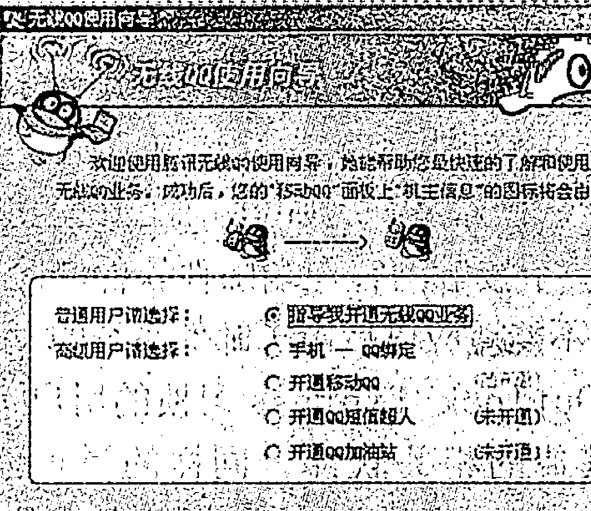

截止到目前为止，全球约有1亿多人使用即时通讯软件进行交流，单是国内拥有最多用户的腾讯QQ服务，同时在线人数就曾经达到350万人。各路诸侯都盯上了中国这个拥有数以亿计的用户和迅速增长的市场。一时间，即时通讯市场硝烟四起。除了网易等网络公司纷纷推出新的即时通讯软件外，腾讯QQ和国外的几个著名的即时通讯软件也都推出新版本改善服务的质量。正所谓花多眼乱，在那么多即时通讯工具软件中，腾讯公司一直保持着人气与技术双方面的优势，在提供各种完善的即时通讯服务功能的同时，还拥有“QQ群”、“QQ秀”、“非常速配”（图3）等独有的服务，而且还完美地整合了手机短信功能。

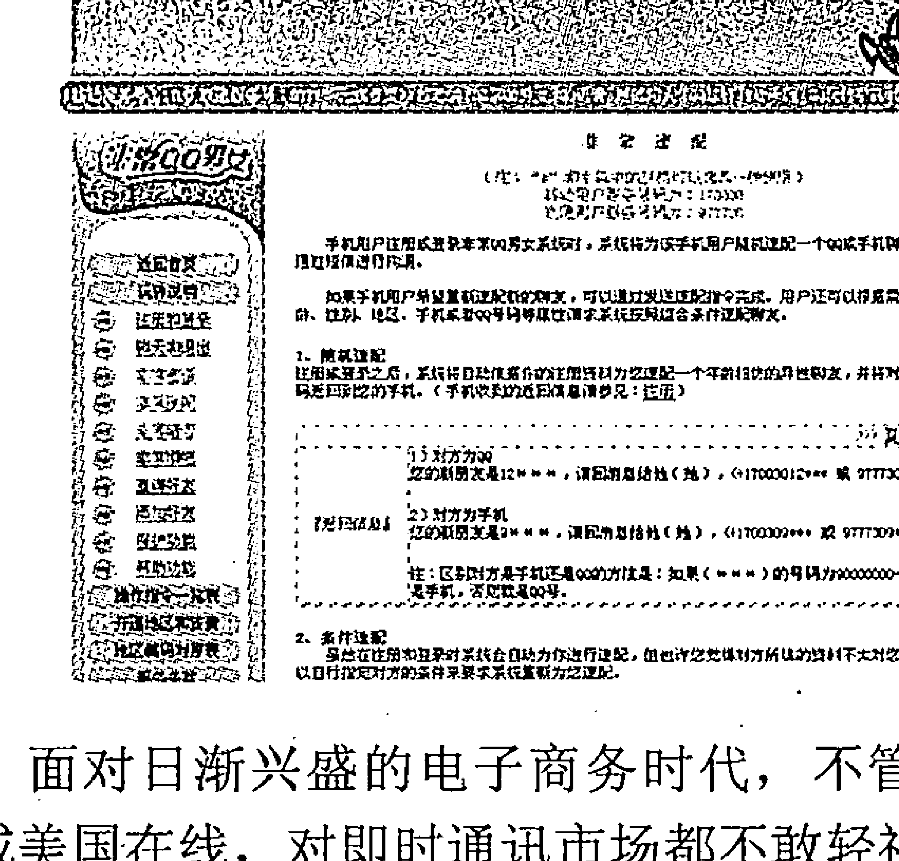

面对日渐兴盛的电子商务时代，不管是微软、雅虎或美国在线，对即时通讯市场都不敢轻视。然而不得不承认，即时通讯软件有着先入为主的特点。当年业界的龙头老大ICQ没能适时地推出中文版，这也给面向国内用户的OICQ带来充分的机会。时至今日，大多数用户想起的第一个即时通讯软件往往是OICQ，甚至很多人都将自己的QQ号码印在名片上。作为一款备受国人喜爱的即时通讯软件，OICQ的优势不仅仅是先入为主的用户群体，其本身的技术优越性也是不可抹杀的。

腾讯公司经过几年的实际运营，积累了丰富的互联互通方面的经验和能力，在网络传输层进行了大量的优化工作，封装了各种复杂的网络交互细节，自主研发了全新的RTX（Real Time Exchange）通讯体系。从QQ2003开始，采用了基于COM体系架构全部重写了QQ服务系统的内核，使QQ2003成为一个开放式、可扩展的网络应用交互平台，将支持第三方应用开发商，第三方应用只需要知道用户的QQ号码、手机号码、Email地址即可以直接和对方进行通讯。这种创新的通讯体系为第三方的应用提供了简洁易用的插件式通讯接口，假以时日，将可以有更多丰富多彩的第三方的应用，以QQ 2003为承载平台向用户提供服务。

另外，最新版本的QQ2003还提供“QQ游戏”功能，从中我们不难看出腾讯也想在日渐火爆的网络游戏市场中分得一杯羹的雄心壮志。据腾讯公司工作人员介绍，后继产品将提供场景式的多人视频语音交流体验，提供文件共享的全新体验，让用户在传统的被动式接受文件的基础上，增加主动获取对方好友共享文件的能力，通过腾讯公司新平台的良好的互联互通能力，解决了以往必须架设FTP服务器才能提供文件共享的能力。

### 二、MSN Messenger

| 软件名称 | MSN Messenger |
| --- | --- |
| 最新版本 | 6.2 |
| 开发商 | 微软 |
| 官方下载 | http://www.microsoft.com |
| 中文版本 | 有 |
| 软件大小 | 6372 KB |
| 操作系统 | Win9x/ME、WinNT、Win2000、WinXP |

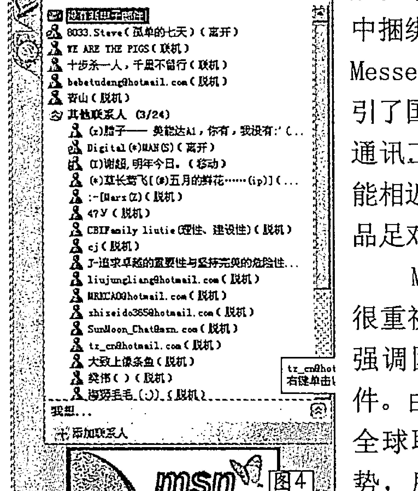

自从微软在2001年11月正式发布Windows XP中文版以来，在Windows XP系统中捆绑的即时通信工具MSN Messenger（图4）便迅速吸引了国内用户的眼球。这种通讯工具和国产腾讯QQ功能相近，很自然让大家评头品足对比一番。

MSN Messenger是一样很重视在工作中协同办公，强调团体沟通和援助的软件。由于MSN和Windows在全球取得的绝对性客户优势，所以现在海内外越来越多的用户加入到MSN Messenger的大家庭中，而这些用户中又有不少是将该软件用于工作联系和协作。MSN Messenger整合在Windows XP中，本身也是.net计划中的一部分，因此它已经糅合了.net的一些功能，是办公人士的首选。

但是不可否认的是，在移动通讯和聊天的功能上，MSN Messenger还是不如腾讯的OICQ。无论是短信内容、形式还是聊天的方式，MSN Messenger一时很难超越。举几个例子就可以说明：QQ可以让你随便搜查在线用户，挑一个名字顺眼的来聊天，但是MSN就没有这种功能；QQ有聊天记录，当你不记得现在向你迎面扑来的是谁的时候，查查聊天记录就可以知道以前跟他说什么，而MSN Messenger必须有插件才能实现聊天记录，即便是最新版本也需要手工设置才能做到，而且后续的查阅也不是很方便。

当然，MSN Messenger也有一些特殊因素吸引着越来越多的用户追捧。首先是它不带广告，不会在你聊得兴起的时候突然来一个系统广告提示。第二是由于目前用户尚不算太多，因此也没有引起黑客的过分注意，不像QQ那样，被大量专门针对QQ的黑客程序和逻辑炸弹困扰。当然，MSN Messenger在正常运行中也有些“死穴”让用户烦恼。例如，它会不定期通知用户，其服务器要进行维护，因此将暂停服务15分钟，如果在这15分钟之内有什么紧要的事，用户是很难马上通知其他联系人的，这个问题到现在还没有解决。

MSN Messenger还有几样特别功能引人注目：第一是“寻求远程协助”，这样可以让一些不知道如何处理系统故障问题的用户联系上其他地方的用户，让其帮忙通过远程控制来进行调试，省却舟车劳顿时间和时间。第二就是“启动应用程序共享”，这项功能是让其他联系人在用户的允许下，启用用户本机上正在运行的应用程序。打个比方，假如其他联系人没有安装Word，而你的电脑上安装了Word，那么你就可以使用这个功能，把Word共享出来，让它在远程使用。第三个功能是“启用白板”，这个功能是让用户的其他人“共用”一个画图程序，在上面写写划划，分享一些需要用图示来说明的信息。此外，当两名用户在使用MSN Messenger时，还可以邀请其他联系人即时加入对话中，进行通讯会议。第四项实用的功能便是天气预报，凭借全球化服务器的优势，MSN Messenger可以做到预报全球任何城市的天气状况（图5）。

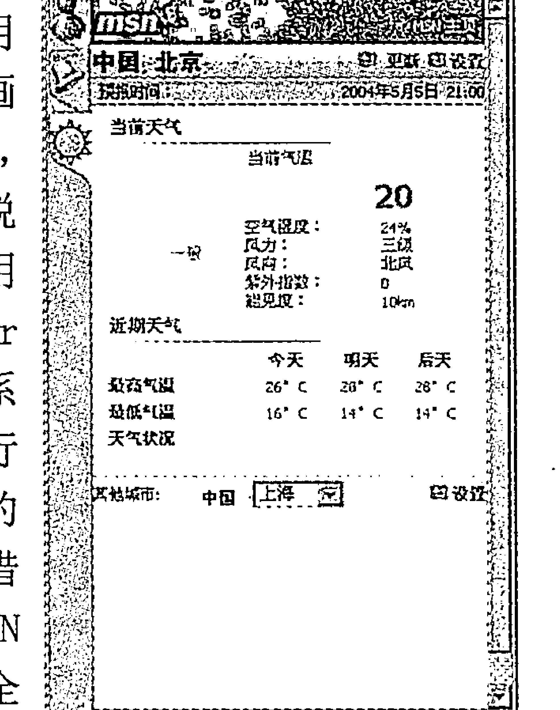

在娱乐功能方面，MSN Messenger一直保持着鲜明的个性。最新的6.2版本将“活力地带”改成了“娱乐和游戏”，图标也由火箭玩具改为了电影胶片和游戏操纵杆，用户可以享受到更多的免费游戏。如果账号的区域设置是美国，可以看到多了“Movie Trailers & More”，但是从另一个侧面也反应其中文本土化工作还有待加强。

### 三、横向对比

#### 1. 与操作系统之间的整合

毋庸置疑，在微软的Windows系列操作系统统治着个人电脑的时代，几乎大部分软件都是基于视窗系列开发的，腾讯的QQ不会例外，微软的MSN就更不会例外了。正因为如此，腾讯QQ在一开始就处于不利的地位。随着XP新版视窗系统的面世，MSN将会与操作系统结合在一起，这使得MSN在与视窗系列操作系统间共享资源变得更加便利。

MSN与系统之间的整合性较之腾讯QQ肯定也更为强劲，特别是在对系统资源的某些使用方面，MSN会更方便、快捷，这无论是对软件新功能的开发还是软件整体运行性能的提高与改善都有着决定性的作用。在与Netscape的交锋中，IE的启动速度和与系统的紧密整合是微软最直接的竞争武器，而这一趋势很可能得到延续，至少目前QQ给人的感觉就是启动速度稍慢。


### Netants vs. Flashget

为了让下载的速度得到提高，网迷们很早就开始使用国外的下载工具，如GetRight、Go!zilla、网络吸血鬼（Net Vampire）等。这些国外开发的下载工具软件有非常全面、实用的功能，如断点续传、下载任务管理、定时下载以及自动拨号关机等功能，下载的速度也超过了IE浏览器。但是进入国内网络发展的高速时期后，两大中文版的国产下载软件异军突起，并且凭借多线程下载的优势一举打破国外软件垄断的局面。时至今日，Netants与Flashget已经成为当之无愧的下载软件霸主。

#### 2. 与网络其他服务的整合

在目前大多数网络软件的发展中，大都忽视了应用软件与网站的紧密结合，没有做到资源的优势互补、整合利用。我们这里所说的资源互补绝非简单的内容提供服务，即类似与腾讯QQ上的“资讯通”以及与其类似的内容服务功能，而是通过网站提供与软件有关的功能性服务。

#### 3. 特殊附加功能

文件传输、语音聊天、视频聊天，这些已经成为一款即时通讯软件最重要的附加功能。在文件传输方面，MSN Messenger和腾讯QQ的操作都很简单，只是MSN Messenger可以穿透防火墙，而腾讯QQ需要会员才能享受映射式的文件传输。然而应当承认的是，目前腾讯QQ在传输速度上有一定优势，而且支持文件夹共享功能。

语音聊天和视频聊天在技术上并不复杂，因此关注的焦点在于其速度。毫无疑问，拥有服务器数量优势的腾讯QQ在这方面明显优于MSN Messenger。即便是电话线拨号上网，也可以在语音聊天时感觉十分流畅，MSN Messenger显然无法做到这一点。

#### 4. 资本与市场运作

尽管腾讯QQ在网站与软件的结合方面存在着种种不足，但相较于MSN中文版，腾讯QQ还算是做得可以的了。比如说腾讯在网站上的QQ虚拟社区，虽然很多商业用户甚至都没有登陆过这个社区。但是需要注意的是世界范围内，使用即时消息最忠实的用户都是青少年，QQ社区是相当有吸引力的。另外还有通过腾讯网络浏览器提供的留言簿等功能。

就目前而言，世界上估计还没有任何一家软件公司能够从资本上与微软相抗衡，微软帝国二十几年来的打造与积淀积累了可观的资金与技术、市场经验，在前些年的网络浏览器市场争夺战中，资本的力量或多或少让人们感到了一丝畏惧与担忧，通过与操作系统的捆绑、通过免费赠送、通过各种大众传媒进行宣传，凭借微软强大的宣传攻势，任何竞争对手都会马上处于下风头。

特别是移动QQ的推出，使腾讯在延伸方面占据主动，主动与中国两大无线通信运营商合作，推出了基于手机的移动QQ的服务项目，其市场反映良好。目前已经成为腾讯赢利的重要手段。QQ相关产品的推出更是将腾讯QQ的用户群体继续延展，塑造了腾讯QQ自身的品牌形象。相对而言，虽然最新版本的MSN也有了与手机之间的结合，但是没能彻底本土化，至少大多数用户还是无法实现便捷的手机与聊天软件互动，因为目前微软还没有与中国移动或者中国联通谈妥相关事宜。

反观腾讯公司，无论是从资本，还是市场经验方面都与微软存在着相当的差距。在通过移动QQ开辟赢利市场的同时，其在号码注册机制上的收费改革也带来了负面影响。给腾讯QQ的品牌形象构成了一定程度上的冲击。所以腾讯与微软在资本与市场运作方面的较量上，腾讯QQ明显缺乏足够的竞争力。不存在资金困扰的微软可以完全不按理出牌与腾讯对战，腾讯在这方面的压力可想而知。当然，本土化的腾讯QQ也并非没有优势。以上海地区为例，ADSL与长宽用户经常反应MSN Messenger无法正常登陆，这种说不清的蹊跷自然很容易让人联想到种种谣言。

### 总结

作为后来者，拥有强大实力的微软MSN Messenger依旧很难全方位超越本土的腾讯QQ。从功能对比来看，目前腾讯QQ占据一定的优势，而且人性化设计十分出色。相比之下，MSN Messenger对于中国市场仍然没有投入100%的精力。但是也应当看到，MSN Messenger拥有操作系统集成化的优势，而且当与国外用户通讯时，MSN Messenger还是比QQ更为方便，毕竟目前的QQ仅仅在国内拥有用户群体优势。客观而言，即时通讯软件并不是用户个人可以选择的，因为我们还要照顾到他人的使用习惯。从这一层面来看，目前抛弃任何一种都是不现实的，大多数用户还是同时使用MSN Messenger与腾讯QQ。

### 一、Netants网络蚂蚁

| 软件名称 | Netants网络蚂蚁 |
| :--- | :--- |
| 最新版本 | 1.25 |
| 开发商 | 个人 |
| 官方下载 | http://www.netants.com |
| 中文版本 | 有 |
| 软件大小 | 851KB |
| 操作系统 | Win9x/ME, WinNT, Win2000, WinXP |

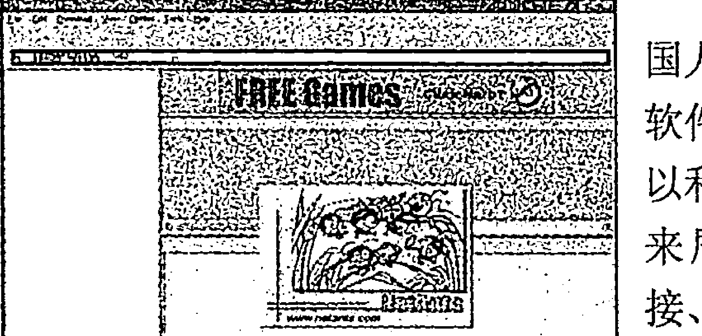

网络蚂蚁作为国人开发的下载工具软件，利用了一切可以利用的技术手段后来居上，如多点连接、断点续传、计划下载等，使用户在现有的网络条件下，大大地加快了下载的速度。由于这个下载软件，用蚂蚁搬家来象征它从网络下载数据，因此就称为网络蚂蚁——NetAnts。网络蚂蚁，工作起来有一股锲而不舍（断点续传）和团结一致（多点连接）的精神，是一个帮助你在网络上下载资料的勤奋的蚂蚁工人。

启动网络蚂蚁。网络蚂蚁的工具栏下面是一个可以显示文件下载速率的曲线图，在这个图下面就是NetAnts的任务窗口了，我们下载的所有软件都会在这里显示它的详细下载信息。在NetAnts窗口的最下面是一个稍大一点的小窗口，上面还有两个选项卡，右边这个写着Log的选项卡记录着每个文件的整个下载过程，如果下载出了问题，我们就可以在这儿了解到问题的原因。左边这个写着Block选项卡是NetAnts特有的，这里有很多的小圆点，这些小点就表示我们要下载的软件。灰色的点是还没有下载的部分，蓝色的是已经下载完的部分，红色的则是正在下载的部分，当这些小点都变成蓝色时这个软件也就下载完毕了。在NetAnts运行后，任务栏右面的时间旁边会出现一个小蚂蚁的图标，这是NetAnts的标志，当NetAnts的窗口最小化后可以双击这个小图标再次弹出NetAnts的窗口。

网络蚂蚁的设置是很灵活的，主要都在“选项/参数设置”中进行。在“默认设置”中可以设置蚂蚁下载的文件在硬盘上的存储位置，还可以设置蚂蚁数目。何谓“蚂蚁数目”？这里就要讲到蚂蚁的一个独特功能了。蚂蚁可以多点连接，即将欲下载的文件分割为几部分同时下载。虽然一只蚂蚁的力量小，可是一群蚂蚁力量就大了。程序默认的蚂蚁数目是5个（也是最多的蚂蚁数目），即可以将文件分为5份同时下载，这就相当于把速度提高了四倍。

断点续传也是网络蚂蚁的主要功能之一。假设当你正在下载某个好东东的时候，突然由于网络出了问题而掉线，或者你要离开计算机一会儿，需要关掉机器，又或者你要下载的东东巨大，在现在的网络硬件条件下可能要花上几小时的时间，你无法一口气把它下载下来。怎么办？断点续传就是针对这种情况设计的，它意味着你下载的不完整文件是有效的，你可以在以后接着未完成的部分继续下载，而不用从头再来。硬盘里的未下载完成文件会有一个蚂蚁的图标，表示下载未完，下载完毕后，图标才会变为正常的样子。

除此以外，网络蚂蚁还支持定时下载、定时关机、与浏览器整合、下载文件自动分类存放等功能。在功能上丝毫不逊色于外国的下载软件，网络蚂蚁在易用性、界面、下载速度等方面都拥有一定的优势。

### 二、Flashget网际快车

| 软件名称 | Flashget网际快车 |
| :--- | :--- |
| 最新版本 | 1.6 |
| 开发商 | amazesoft |
| 官方下载 | http://www.amazesoft.com |
| 中文版本 | 有 |
| 软件大小 | 1.74MB |
| 操作系统 | Win9x/ME, WinNT, Win2000, WinXP |

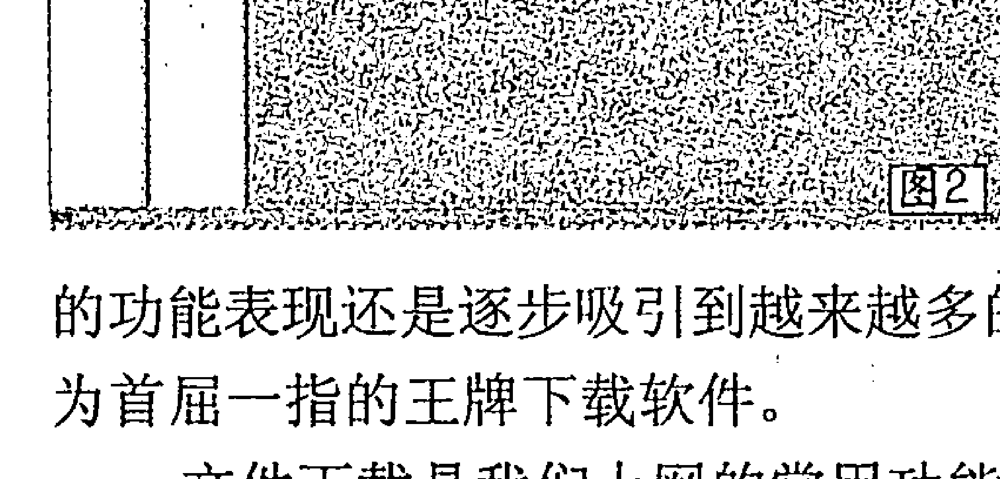

Flashget的原名是Jetcar，推出时间略晚于Netants。在起初的一段时间里，Flashget名气远不及网络蚂蚁，不过其强大的功能表现还是逐步吸引到越来越多的用户，如今已经成为首屈一指的王牌下载软件。

文件下载是我们上网的常用功能之一。由于使用浏览器直接下载文件速度较慢，并且受网络传输质量不稳定的困扰，我们通常使用专门的下载软件，而此时对于下载软件的要求不仅仅是速度提高以及断点续传，下载后的管理功能也十分重要。FlashGet是一款免费的多线程断点续传下载软件，它不仅具备断点续传的功能，而且还有下载速度快和易于管理等特点。在默认状态下，用户最多可把一个文件分成10个部分同时下载，而且最多可以同时设定8个下载任务。通过多线程、断点续传等技术，下载速度可以提高100%到500%。更为重要的是，如果使用破解补丁的话，FlashGet的多线程数量还可以扩展，能够进一步提高速度，不过这对于网管而言可不是什么好消息。

Flashget的特色之一便是支持镜像功能，可通过FTP Search自动查找最快的镜像站点并下载。此外，Flashget还可以为下载的文件建立不同的类别，每一个类别对应一个磁盘目录，这样可以方便地管理下载的文件。

类别指定单独的文件目录分别存放。强大的管理功能包括支持拖拽、更名、添加描述、查找、文件名重复时可自动重命名等。而且下载前后均可轻易管理文件，可检查文件是否更新或重新下载。

很多用户除了下载软件往往还需要FTP软件，而Flashget内建的站点资源探索器可以轻而易举浏览Http和FTP站点的目录结构，可以有选择地大批下载文件。对于网络文件查找而言，Flashget的这项功能相当有用。此外，Flashget能够与浏览器无缝连接，完全支持IE和Netscape，同时具备监视剪贴板功能。

### 三、横向对比

#### 1. 速度对比

对于一款下载软件而言，没有什么比速度更为重要了。为此，我们在1Mbps的Cable线路上以默认方式进行下载，然后分别统计两款软件使用单线程和5个线程时的速度表现。

| 测试项目 | Netants 网络蚂蚁 | Flashget 网际快车 |
| :--- | :--- | :--- |
| 14MB (单线程) | 265秒 | 242秒 |
| 14MB (5线程) | 136秒 | 130秒 |
| 14+14MB (5+5线程) | 266秒 | 253秒 |

显然，Flashget在速度上具有一定的优势，Netants网络蚂蚁使用单线程时与Flashget拉开较大的差距。不过值得注意的是，目前最新版本的Netants网络蚂蚁单个文件允许10个线程，而Flashget网际快车只是5个线程。在服务器速度较慢的情况下，Netants网络蚂蚁可能比Flashget网际快车更为有用。事实上，Flashget网际快车之所以这样设计并非因为技术上的不足，而是出于保护网络资源的目的。

#### 2. 系统资源占用对比

在单线程下，下载软件对于系统资源的占用并不引起关注。不过当我们使用多线程并且多个文件同时下载的时候，系统资源占用率就不可忽视了。从对比情况来看，Flashget在这一方面占据了很大的优势，甚至不用检测软件就能在实际操作中感受到。

#### 3. 支持的网络连接协议

最新版本的Netants网络蚂蚁只能支持Http和Ftp协议，而Flashget网际快车显然因为保持不断开发而占据绝对优势。1.6版本的Flashget网际快车可以兼容MMS以及RTSP流媒体协议，用户甚至可以免去一个流媒体专用的下载软件。当然，无论是Flashget网际快车还是Netants网络蚂蚁都没能做到十全十美，最大的遗憾是两者均不支持加密的Https协议。

#### 4. 附加功能

由于Netants网络蚂蚁已经很长时间没有更新，因此在附加功能上自然不如保持间断性更新的Flashget网际快车。在附加功能方面，目前Netants最大的不足在于无法支持服务器资源勘探，此外在定时操作等方面，Netants的设置也不如Flashget那样方便。

下载后的管理也是下载软件所要关注的问题。而这又是Flashget的特长之一。有时为了省事，用户很可能没有选择或者错误选择了保存目录，这时Flashget可以通过选定文件后再选择“任务”菜单下的“移至…”命令指定目标类别。尽管Netants也预设了下载文件管理方案，但是无论是安排、注释功能、查找功能等都逊色于Flashget。

## 写在最后

作为第一款引起国人关注的国产下载软件，Netants网络蚂蚁的停止开发确实令人非常惋惜。平心而论，除了少数习惯于Netants网络蚂蚁操作界面的用户，实在没有必要坚持使用这款软件。Flashget网际快车在各方面都比Netants网络蚂蚁成熟，速度与功能上的优势使之成为这次比拼中当之无愧的胜者。

(文/阿亮)

+   《电脑爱好者合订本》2003年（下）
读者调查获奖名单

优秀建议奖（10名）
李传登 (山东) 刘 轶 (山东)
卢霞飞 (青海) 肖 楠 (辽宁)
王 蓬 (湖北) 刘继光 (江苏)
林 杰 (广东) 刘 斐 (山东)
王 磊 (江苏) 朱扬勇 (江西)
以上读者将获得《电脑爱好者10年期刊钻石电子珍藏版》1套，价值35元。

幸运读者奖（300名）
杨天玮(广西) 李 磊 (山东)
陈迦勒 (广东) 文 斌 (湖南)
李 扬 (新疆) 李 楠 (辽宁)
陈孝志 (辽宁) 王俊杰 (上海)
金彦宏 (浙江) 庄 昕 (河南) 等
以上读者将获得《电脑爱好者2003年增刊》1本，价值19元。

以上名单将在爱好者网站（www.cfan.com.cn）及《电脑爱好者合订本》2004（上）中公布，欢迎查阅。

## 软件双雄会

## Real 10 VS. Windows Media Player

随着多媒体与网络技术的普及，流媒体逐渐进入了我们的视野。相对于传统的AVI、MPEG等视频格式，流媒体采用流式传输系统，使用户不必等到整个文件全部下载完毕，而只需经过几秒或十数秒的启动延时即可进行观看。当音频、视频等媒体文件在客户机上播放时，文件的剩余部分将在后台从服务器内继续下载。流式传输不仅使启动延时成十倍、百倍地缩短，而且不需要太大的缓存容量。此外，流媒体的视频压缩技术也是相当先进的，它可以在保证画质的前提下尽可能地减小数据量，这也使得部分用户将它作为取代MPEG（VCD格式）的一种视频保存方式。目前Real One与Windows Media Player已经成为最主流的两款媒体播放软件，它们之间的比拼自然令人期待。

### 一、Windows Media Player 9.0

| 软件名称 | Windows Media Player |
| :--- | :--- |
| 最新版本 | 9.0 |
| 开发商 | 微软 |
| 官方下载 | http://www.microsoft.com |
| 中文版本 | 有 |
| 软件大小 | 12.4MB |
| 操作系统 | Win9x/ME、WinNT、Win2000、WinXP |

微软的嗅觉总是最灵敏的，面对流媒体这一广阔的市场，旗下的ASF和WMV占据了整个市场35%的份额。当然，微软的这一切与其在操作系统中整合Media Player是分不开的。Windows Media Player（图1）支持的视频流媒体格式主要是微软自己开发的ASF与WMV，

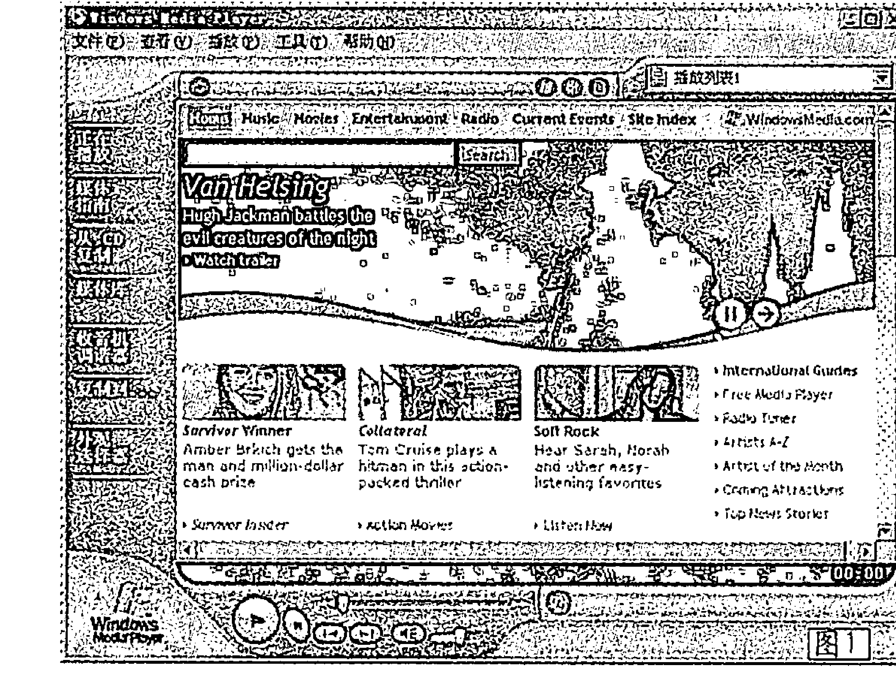

这两者编码技术还是相当先进的，特别是ASF。尽管ASF的画质表现并非十全十美，但是它对网络带宽的要求更低，同时对主机性能也没有很高的要求。至于WMV，它与ASF的区别不是很大，只不过两种文件采用的Codec不同。WMV采用Window Media Video编码，而ASF采用的是Microsoft MPEG4，音频部分是Windows Media Audio2。但是现在网上有些地方的ASF与WMV采用的Codec已经混乱了，所以两种文件的界限也有些模糊了。

Windows Media Player 的内核相当出色，而且启动速度很快，但是由于微软在这款软件中集成大量的附加功能，如广播电台、播放复制CD、寻找Internet视频等，因此整体速度给人感觉很慢。目前Windows Media Player的最新版本为9.0，一改8.0版本无法工作在Windows 98/Me的缺点，而且兼容性令人非常满意。

Windows Media Player 9.0看起来与它的前一版本十分相似，但是在外观界面上有了很大的改进。它利用了Windows XP强大的任务栏功能，比如我们可以将播放器缩小成一个Windows工具条上的控制面板，如果你想查看一些现在播放内容的资料或者欣赏动画插件也可以通过一个可选窗口进行相关的操作。在操作系统结合方面，微软有着先天性的优势，这一点是其他软件所无法比拟的。

媒体库的管理对于任何播放软件而言都是一大麻烦，但Windows Media Player 9.0提供的自动文件夹监视功能可以对指定的多个文件夹、分区甚至是网络中的计算机进行监视，一旦目录中的媒体文件发生了变化，媒体库也会随之自动进行更新。而且当你从媒体库中删除一个文件时，它也可以同时将它从硬盘中删除，以确保媒体库与硬盘文件的完全同步。再者，Windows Media Player 9.0附带的自动信息功能可以自动为现有的WMA和MP3歌曲添加或纠正诸如作者、年份、流派以及唱片公司等详细信息，这样就能够很轻松地管理所有的音乐和影片。另外，通过Windows Media Player 9.0来创建即时更新的播放列表也比以前简单多了，我们可以根据各种不同标准和要求来自动生成播放列表。比如将你最近没有听过的歌曲排列出来，或者将正好可以刻一张CD的你最喜爱的歌曲列出来，还可以直接把歌曲添加到当前播放列表中进行播放。

### 一、 Real 10

以前版本的Windows Media Player，让用户感到最不自在的，就是没有其他专业播放器那样的影音调整功能。9.0版本在增加了不少播放性能的同时，也针对它的一个个竞争对手，开辟了不少个性影音调整功能。通过歌曲淡入淡出设置，只要我们开启音量自动调节与交叉淡入淡出之后，就可以为连续播放的歌曲设置淡入淡出效果。这样在一首歌曲最后几秒钟音量会渐渐降低直至消失；与此同时，下一首歌曲的音量又慢慢萦绕出现，在欣赏现场演唱会的时候将给我们带来更为切实逼真的效果。同时，我们还能够在Windows Media Player 9.0中，类似调整电视机一样，对视频信号的亮度、对比度、色调和饱和度进行调节来满足不同用户的需要，或者弥补先天不足的视频信号。

| 软件名称 | Real 10 |
| :--- | :--- |
| 最新版本 | 10.0 |
| 开发商 | RealNetworks |
| 官方下载 | http://www.RealNetworks.com |
| 中文版本 | 暂时没有 |
| 软件大小 | 9.7MB |
| 操作系统 | Win9x/ME, WinNT, Win2000, WinXP |

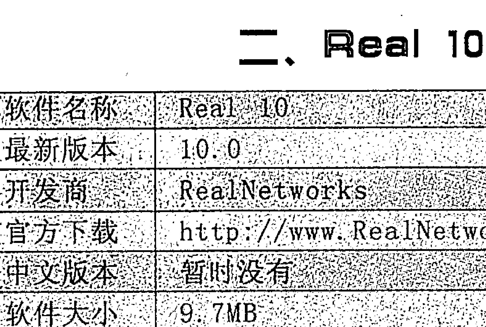

尽管面临微软的全面打压，但是Real仍然是目前流媒体市场的龙头老大，毕竟Real技术的市场份额还是以绝对优势排名第一的。相对微软倡导的ASF、WMV格式而言，RM/RMVB视频的压缩比表现更加出色，而且对画质损失也可以很好地控制，并提供了灵活的选择方式。由于RM/RMVB在这方面的出色表现，很多人甚至将其作为存储视频的格式，因为只要适当地控制压缩比就可以获得类似VCD的画面质量，占用的空间也很小。但是需要指出的是，Realplayer对于系统资源的占用很大，而且有时显得不太稳定，时常运行出错，这是它急需改进的地方。

目前我们最常用的RealOne是一个集成的大型软件，通过RealNetworks网站可以得到更多的服务。但是最新版本的Real 10（图2）更加令人耳目一新。Real 10的视频压缩率比上一版本Real One提高了30%，比现在网上流行的高压缩视频Mpeg-4提高了15%，这就意味着我们可以在650~700KB的带宽网上欣赏DVD质量的影片，而它的竞争对手微软的Media Player做同样的事情需要至少1.1M以上的带宽。技术的进步，使在当前宽带日益普及的中国，在网上欣赏DVD大片成为活生生的现实。除视频技术外，Real 10在声音处理上采用了AAC格式的压缩，可不失真地回放5.1声道的环绕音乐。

Real 10可以制作包括MPEG4 AAC和AACPlus格式的高保真数字音频产品，也可播放多种媒体，包括以前的RealAudio文件格式，以及新的支持AAC的RealAudio、RealAudio 10 Lossless和MultiChannel、MP3、WMA、MPEG4 AAC和ACCPlus等。另外，用户还可以用RealPlayer 10把CD上的音乐转换为支持AAC的RealAudio。

由KeyLabs公司主持的独立测试表明消费者喜欢RealVideo多于Windows Media。测试表明，即使编码比特率比Windows Media Video 9低30%，消费者仍然更喜欢RealVideo 10，比例为3：1。另外，和同样比特率的MPEG-4和Windows Media Video 9相比，消费者一般选择RealVideo 10。这些发现表明很低的比特率也能得到高质量的视频，这样内容提供商可以节约成本，消费者可以得到更好的视觉体验。KeyLabs的独立报告显示，RealVideo 10能提供目前最好的数字视频体验。

事实上，最为重要的是，目前Real 10达到了“人有我有，人无我亦有”的境界。在这一新版本中，用户可以使用该媒体播放软件来兼容微软的WMV与WMA视频音频格式。此外，对便携设备的支持也是这个版本的一大亮点。在新版本中用户无须借助第三方软件就可以直接把音乐刻录到CD或者传到数码随身听设备中去，其中可支持的设备包括iPod、Creative NOMAD Jukebox和Nokia 3300等。为了进一步拓展软件的使用范围，Real 10还可以播放QuickTime的Mov格式与DivX编码的MPEG4视频，可谓基本包含了当前所有的主流视频格式。

### 三、横向对比

#### 1. 支持的媒体文件格式

对于一款媒体播放软件而言，没有什么比支持更多的媒体文件格式更重要了。在这方面，原本Media Player 9.0与Real One打成平手，但是随着Real 10的发布，Media Player 9.0已经全面处于下风。

Media Player 9.0最大的缺点在于无法兼容RM、RMVB、RA、RAM等格式，而且在播放DivX等MPEG4编码时需要另外安装解码器才行。相对而言，Real 10更加全面，不仅全面支持所有的Real格式（包括RM、RMVB、RA、RAM等），而且还可以兼容微软的WMV与WMA格式，以及MPEG4、DivX、QuickTime MOV等格式。可以说在格式支持方面，Real 10已经取得了压倒性的胜利。

#### 2. 画质与音质对比

在画质方面，Real 10与Windows Media Player 9.0各有千秋。Real 10在低比特率下的画质表现非常出色，这在带宽有限的网络环境下尤为重要。而Windows Media Player 9.0在高比特率下的画质则更为细腻。音质方面，两者都支持多种音频格式，但Real 10在音频处理技术上更为先进，特别是其支持的AAC格式，在同等比特率下能提供比MP3更好的音质。

#### 3. 系统资源占用

在系统资源占用方面，Windows Media Player 9.0的表现相对较好。虽然它集成了大量功能，但经过优化后，其内存和CPU占用率控制在了一个合理的范围内。而Real 10由于功能更为强大，特别是在视频解码方面，其系统资源占用相对较高，在一些配置较低的电脑上可能会出现播放不流畅的情况。

#### 4. 易用性与附加功能

在易用性上，两款软件都做得不错，界面直观，操作简便。Windows Media Player 9.0与Windows系统深度整合，对于习惯微软产品的用户来说更为亲切。而Real 10则提供了更为丰富的媒体管理功能，如自动分类、智能播放列表等。附加功能方面，Real 10支持刻录CD、传输到便携设备等，功能更为全面。

## 写在最后

Real 10与Windows Media Player 9.0都是当前顶级的媒体播放软件，各有自己的优势和特色。Real 10在格式支持、低比特率画质和音质技术上领先，而Windows Media Player 9.0则在系统整合度、高比特率画质和资源占用上表现更好。用户的选择往往取决于自己的使用习惯和需求。如果你经常需要播放各种格式的流媒体文件，并且看重音质和低带宽下的画质，Real 10是更好的选择。如果你主要在Windows系统下使用，并且追求与系统的无缝结合和稳定的性能，Windows Media Player 9.0则更为适合。无论如何，这两款软件的良性竞争最终受益的将是广大用户。

RMVB、RA、RAM等），还能够兼容微软的WMA、WMV、ASF以及DivX，可谓面面俱到。此外，Real 10还包括了对QuickTime MOV格式的支持，这也是Media Player 9.0所无法企及的。事实上，Real 10不仅仅是一个音频视频播放软件，它甚至还支持图片浏览，并且可以用幻灯片模式帮助用户进行快速浏览，而这又是Media Player 9.0所不具备的功能。

### 2. 流媒体播放

RealNetworks公司在20世纪90年代中期首先推出了流媒体技术，并随着互联网的急速发展而壮大了自身，在市场上处于主动地位，并拥有最多的用户数量。目前在编码方面有主要技术是RealMedia Codec 9/10。由于RealMedia发展的时间比较长，因此具有很多先进的设计，例如，Scalable Video Technology（可伸缩视频技术）可以根据用户电脑速度和连网质量而自动调整媒体的播放质素。Two-Pass Encoding（两次编码技术）可对媒体内容进行预扫描，再根据扫描的结果来编码，从而提高编码质量。特别是Sure Stream（自适应流技术），可通过一个编码流，提供自动适合不同带宽用户的流播放。RealMedia音频部分采用的是Real Audio，该编码在低带宽环境下的传输性能非常突出。

微软是较晚进入流媒体市场的，但利用其操作系统的便利，很快便取得了一定的市场份额。目前Windows Media编码方案的最新版本为9.0，当然版本号现在已经成为商品促销的一个手段了。视频方面，Windows Media Video 9采用的是类似MPEG-4的视频压缩技术，音频方面采用的是微软自己开发的 Windows Media Audio技术。Windows Media的关键核心是MMS协议和ASF数据格式，MMS用于网络传输控制，ASF则用于媒体内容和编码方案的打包。目前Windows Media在交互能力方面是较为薄弱的，自己的ASX格式交互能力不强，除了通过IE支持SMIL之外，就没有什么其他的交互能力了。相比较而言，微软的ASF技术已经越来越不受重视，甚至微软有意让WMV取代ASF。但是从流媒体的特性来看，WMV在技术上无法超越RM/RMVB。

### 3. 压缩比例

RealNetworks公司采用的是Real专用算法，最近又增加了RA10的压缩算法。通过SVT（Scalable Video Technology）技术可以让速度较慢的电脑不需要解开所有的原始图像数据也能流畅观看节目；双向编码技术根据带宽的限制，选择最优化压缩码率。为了更好地适应网上传播，它还可以根据用户所采用的网络连接速率来选择最佳压缩比率的Real文件，这就是所谓的Sure Stream技术。一般认为，在网络带宽自适应方面，Real比Windows Media做得好一点。Real的扩展功能是强大的，突出表现在它对创建多媒体演示的支持。

微软Media Player/Encoder的最新版本9.0，采用MS MPEG-4压缩编码。无论是在WMV还是WMA的压缩方法上，比原来的V7都有很大的进步，而且支持True-VBR（真正动态变速率编码，该技术能保证流化过程中影像的品质）和Two-Pass编码技术。但是综合来看，当网络带宽相对较低时，其整体表现不如Real 10。

### 4. CD压缩功能

Windows Media Player 9.0与Real 10都支持CD压缩功能，但是两者所生成的格式并不相同。Windows Media Player 9.0能够将CD压缩为WMA格式，其优点在于可以兼容部分MP3随身听。而Real 10可以将CD压缩为RealAudio 10格式，虽然在压缩比上丝毫不逊色，甚至更为突出，但是无法得到大多数数码随身听的支持是一大遗憾。

不过Real 10的优势在于支持CD刻录，由于它能够支持更多的音频格式，因此用户使用Real 10可以很方便地将任何音频文件快速转换成CD。虽说Windows Media Player 9.0也集成了刻录CD功能，但是毕竟整体文件转换的限制范围较多，譬如无法将RealAudio 10格式刻录为CD Audio。

### 5. 软件易用性与稳定性

不可否认，微软的软件设计理念已经深入人心，因此大多数用户都感觉Windows Media Player 9.0更加易于操作。最为令人不满的是，Real 10至今还没有真正意义上的中文版产品，很多国内用户因此望而却步。

在软件的稳定性方面，集成于操作系统内核的Windows Media Player 9.0也自然占有很大的优势。从系统资源占用情况来看，Real 10大于Windows Media Player 9.0，而且有时容易出现无法响应等莫名其妙的故障，而这在Windows Media Player 9.0中是很少出现的。

### 总结

或许此次对比略有不公，因为没有赶上微软Windows Media Player 10.0的发布期，因此Real 10占据了很大的优势。但是不可否认的一点是，目前Real 10各方面的功能都堪称完美，用户甚至已经可以抛弃Windows Media Player了。倘若Real 10尽快推出中文版，那么其前景将十分看好。

（文/阿亮）


## 深入 Windows 2000/XP 技巧

### 一、忘记 Windows 2000 管理员密码的解决技巧

忘记Windows 2000密码该怎么办呢？不要急，我们可以用下面这两个办法来解决！大家知道，Windows 2000的密码存放在系统所在的Winnt\System32\Config下的SAM文件中，SAM文件即帐号密码数据库文件。当我们登录系统的时候，系统会自动地和Config中的SAM自动校对，如发现此次密码和用户名全与SAM文件中的加密数据符合时，你就会顺利登录，如果错误则无法登录。知道了系统登录的原理之后，就可以着重想办法让SAM文件失效。让它失效有两种办法——改名或者删除。

具体方法是：在系统启动前，插入启动盘，进入C:\WINNT\System3\Config\，用ren命令将SAM文件改名，或用del命令将SAM文件删除，重启电脑即可。改名或删除SAM文件以后，试着用Administrator登录，密码为空！成功了！接下来到C:\WINNT\System32\Config\文件夹下看看，又多了一个名为SAM的文件，这是系统在你登录的时候自建的，目的就是为了记录你的密码，以便于以后登录时的密码校对哦。

但是，这两种方法只对Windows系统所在的盘为FAT情况下有效，不支持NTFS。所以如果你的Windows 2000用的是NTFS格式，则不能使用上面的方法。此时，你可以到C:\Winnt\System32下将屏幕保护程序logon.scr改名，接着拷贝command.com到C:\Winnt\System32下（Windows 2000可以用cmd.exe），这样启动机器后等待15分钟，本应该出现的屏幕保护现在变成了命令行模式，而且是具有Administrator权限的，通过它就可以修改密码或者添加新的管理员账户了。

### 二、在 DOS 下更改启动菜单选项

大家知道，我们可以在Windows 2000的“启动和故障恢复”中调整启动菜单选项，除此以外，还可以在DOS下进行此项工作。用任意文本编辑器打开C盘根目录下的boot.ini文件，编辑前需要首先取消它的隐藏和系统属性，在DOS下用attrib -a -s -h boot.ini命令即可。该文件的内容结构如下（“//”后边的文字是我加的注释）：

```
[boot loader]
timeout=30 //显示操作系统菜单的时间,单位为秒
default=C:\ //指定 Windows 2000 操作系统文件所在硬盘分区)
[operating systems] //以下指定多重启动菜单将要显示的操作系统,其中排在第一行的就是默认的操作系统)
multi(0)disk(0)rdisk(0)partition(1)\WINNT="Microsoft Windows 2000 Professional"/fastdetect
C:\="Microsoft Windows"
```

你可以根据需要进行修改调整，然后存盘重启即可。如果系统不能进入Windows 2000，可以用此方法修复系统，非常实用。不过要提醒大家注意的是，用这种方法调整和修改多重系统启动菜单很容易出错，导致多重引导失败，因此不到迫不得已不要轻易采用！

### 三、巧用 Windows 2000 注册表收藏夹

Windows 2000的注册表编辑器Regedit为用户准备了一个收藏菜单，利用它可以将经常访问的主键放到收藏菜单中，这对于那些经常需要修改注册表某个键值的朋友非常方便。使用方法非常简单，只要先找到并定位这个主键下的任意一个值，然后选择收藏菜单中的“添加到收藏夹”，就会弹出一个对话框，提示输入主键放在收藏夹里的名字，取系统默认的主键名字或者方便记忆的名字即可。然后单击确定，这个主键就放到收藏菜单里了！你可以用这种方法把经常要访问的主键统统放到收藏夹里，以后用起来就方便多了。

### 四、关闭 Windows 2000 的光驱自动运行功能

大家知道，光驱具有AutoRun功能，插入的光盘可以自动播放。但是某些时候我们并不需要该功能，那么该怎样禁止该功能呢？在Windows 9x/Me下只需打开“控制面板”→“系统”→“设备管理器”→“CDROM”，选择“CDROM”下的光驱，打开光驱属性中的“设置”标签，将“选项”中“自动插入通告”前面的“√”去掉就可以了。但Windows 2000与Windows 9x/Me不同，在“设备管理器”中打开DVD/CDROM属性后，并不能找到“自动插入通告”选项。其实，通过修改注册表就能取消光驱的自动运行，打开“注册表编辑器”，找到HKEY_LOCAL_MACHINE\SYSTEM\CurrentControlSet\Services\Cdrom，将Autorun的值改为0即可。

### 五、自动登录 Windows 2000

个人用户在使用Windows 2000时，每次登录都会弹出登录对话框，要求输入用户名和密码，非常麻烦。我们可以将系统设置为自动登录。

- 1. 设置缺省的用户名

在“运行”对话框中输入“regedt32.exe”，打开注册表编辑器。选择窗口菜单项中的“HKEY_LOCAL_MACHINE”窗口，在左边的目录树中找到“SOFTWARE\Microsoft\WindowsNT\CurrentVersion\Winlogon”子项，单击后在右边窗口中找到DefaultUserName条目，双击后更改为你希望系统自动登录时使用的用户名称（前提是这个用户必须存在）。

- 2. 设置缺省的用户口令

同样在右边的窗口中找到DefaultPassword条目，双击更改为DefaultUserName中的用户使用的口令（如果DefaultPassword条目不存在，就需要选择“编辑”→“增加值”创建该条目）。

设置完成缺省用户口令后，就可以设置自动登录了。在“SOFTWARE\Microsoft\WindowsNT\CurrentVersion\Winlogon”子项中，找到AutoAdminLogon条目，双击更改该值为1时，系统使用缺省的用户名和密码自动登录；该值为0时，需要用户手工登录。

### 六、在 Windows 2000 下玩老程序

大家都知道Windows 2000下有些系统自带的游戏是不能运行的，因为Windows 2000采用了全新的NT内核，所以以前在Windows 98/Me下可以正常运行的程序在Windows 2000下就无法正常运行了。

其实在Windows 2000的安装光盘中就有一个可以兼容老程序的工具，在光盘下的Support目录下有一个名为Apcompat的程序，把它复制到硬盘上，双击运行它就会出现一个对话框，在Start the Following Program中选择一个在Windows 2000下不能运行的程序，然后在Operating System中选择以前可以正常运行的操作系统，如选择Windows 98，最后点击“OK”就可以来让程序模拟在Windows 98下运行了。

### 七、卸载 Windows 2000/XP 中无法卸除的闪存盘

Windows 2000/XP中新增了一些对硬件支持即插即用的功能，例如，新买的一块闪存盘直接接到Windows 2000/XP系统所在机器上的USB接口上，就可以使用了，然而在使用中经常困扰用户的一个问题便是经常无法顺利的卸除闪存盘，当出现了这种情况之后，我们可以用下面的方法去解决：

- 1. 在做完闪存盘数据交换、存储工作后，关闭相应的程序，退出相应进程，返回到“我的电脑”，打开其他驱动器并进行文件夹操作（随意操作），然后单击任务栏上的闪存盘图标，此时就会弹出让你安全删除闪存盘的对话框，确定后就可将闪存盘从计算机上取下了。
- 2. 先将闪存盘插到USB接口，然后在Windows 2000/XP中用鼠标右键单击“我的电脑”图标，依次展开“属性”→“硬件”→“设备管理器”→“磁盘驱动器”，找到USB Flash Drive USB Device（不同品牌的闪存名称可能不同），然后双击它打开“USB Flash Drive USB Device属性”对话框。切换到“策略”选项卡，选中“为快速删除而优化”，单击“确定”退出。以后不用理会系统托盘中的“安全删除硬件”图标，只要没有对闪存进行数据读写操作（即闪存的指示灯不闪动），就可以直接将闪存从USB接口拔下来了。

### 八、在 Windows 2000 中自动关闭停止响应的程序

在Windows 2000操作系统中，可以设置系统自动关闭停止响应的程序，只要你点桌面上的“开始”→“运行”，再键入regedit.exe命令，按确定后进入“HKEY_CURRENT_USER\Control Pane\Desktop”中，双击AutoEndTasks，在弹出的对话框中将数值设置为1就可以了。

### 九、在 Windows 2000 中共享网络连接

Windows 2000中增加了共享拨号上网的功能，如果你在家里有两台以上电脑，就可以考虑组建一个小局域网并共享一台计算机的互联网连接了。双击你桌面上的“我的网络位置”图标定义一个拨号连接以开始共享你的连接，然后点击“网络拨号连接”，双击“建立新连接”。定义了新连接后，用鼠标右键点击该连接并选择“属性”。在属性对话框中，选择“共享”标签，然后在“使该互联网连接共享”前打勾即可。

### 十、恢复 Win2000 中的个人配置

Windows 2000是把个人配置文件放在E:\Documents and Settings目录下（这里假设Windows 2000装在E盘）。那里有几个文件夹，分别对应不同的用户。所以只要windows用这个文件夹的个人配置就可以恢复以前的配置了。选择“开始”→“菜单”→“程序”→“管理工具”→“计算机管理”，打开本地用户和组，然后选择用户，接着从右边选择你的用户（我这里选Administrator），双击打开它的属性窗口，然后选择“配置文件”页，在“配置文件路径”框内填入你要恢复的配置文件所在的路径。然后点击“确定”保存并关闭窗口。最后重新启动Windows就可以了。

### 十一、在 Windows 2000 中创建启动盘

将Windows 2000安装光盘插入CD-ROM驱动器中，然后单击“开始”→“运行”，打开“运行”对话框，在“打开”栏中键入F:\bootdisk\makeboot a: (其中，F代表CD-ROM驱动器的驱动器号)，然后单击“确定”，系统将自动运行指定应用程序，并提示用户键入待复制数据的驱动器名称，键入a并回车后，该应用程序将自动执行Windows 2000启动软盘的创建工作。注意：从Windows 2000 Professional光盘创建的磁盘不能在Windows 2000 Server下使用。反之，从Windows 2000 Server光盘创建的磁盘也不能在Windows 2000 Professional下使用。因此用户应该仔细标识不同操作系统的启动软盘。

### 十二、取消 Windows 2000 播放 DVD 的限制

在“运行”中输入REGEDIT，打开注册表编辑器。在HKEY_LOCAL_MACHINE\SYSTEM\CurrentControlSet\Control\Class下查找DvdRCnt，将键值改为3（但是绝对不要设置成高于3的数值），保存后重新启动计算机，你会发现又可以有一次机会修改DVD区码设定了。每次修改注册表将是一件麻烦的事，为了一劳永逸，你可以将上面修改的这段信息在注册表中导出，保存为一个名为regionfree的REG文件，然后创建以下的快捷方式：“regedit.exe /s regionfree.reg”（/s参数告诉系统不用我们选择确定，自动执行），在启动组中加入这个快捷方式。现在，每次重新启动系统后我们都可以自由选择DVD区位了。

### 十三、让 Windows 2000 也可以使用 Msconfig.exe

Windows 98下的“系统配置实用程序”Msconfig.exe是一个实用性与使用率都很高的系统工具，通过它可以很轻松地删除或暂时停止某些启动程序。但使用NT内核的Windows 2000却没有提供类似的工具。没关系，我们可以将原先Windows 98安装目录下的Msconfig.exe（在System子目录中）拷贝到Windows 2000的Winnt\System目录下，然后直接运行即可。程序首先会弹出一个出错消息框，提示找不到以下几个系统文件：Config.sys、Autoexec.bat、System.ini以及Win.ini，这很正常，在Windows 2000中是不需要这些文件的，点击“确定”忽略这个错误即可。点击后你又会看到熟悉的“系统配置实用程序”窗口了。

### 十四、用好 Windows 2000 的关机与休眠功能

近日，经常有朋友提出Windows 2000系统下的关机不太正常以及无法设置休眠功能，具体情况如下：

#### 1. 软关机功能失效

出现此类问题的原因主要是Windows 2000的电源管理功能要求主板必须支持ACPI（高级配置和电源接口），但一些主板采用的是APM电源管理技术，对ACPI的支持不完善。可采用如下方法解决：启动电脑，在操作系统桌面上单击“开始”→“设置”→“控制面板”→“电源选项”→“高级电源管理”命令，在出现的对话框中将里面的“启用高级电源管理支持”选项选中，然后保存退出。如果仍不能解决问题，可尝试升级主板的BIOS。

#### 2. 无法设置休眠功能

也就是进入“电源选项”的属性对话框中的“休眠”选项卡后，“启用休眠支持”复选框为灰色不可选。原因是C盘剩余空间小于内存空间，而休眠功能是使计算机进入休眠状态时，将内存中的所有内容保存到硬盘上，然后关闭计算机，重新启动后又将内存精确地恢复为离开时的状态，所以硬盘剩余空间要大于内存的容量。将“启用休眠支持”复选框选上后，选择“高级”选项卡，在“电源按钮”中选择“在按下计算机电源按钮时休眠”。这样，随便运行一个程序，进入程序之后，在任意时刻按下机箱上的电源开关键，稍后机器就会进入休眠状态。再次想开机时，按下电源开关键，这时计算机将以极快的速度恢复到刚刚关机之前的状态。这样我们暂时离开电脑时不必先进行退出程序再退出操作系统。使用这一功能的前提是主板必须支持ACPI，并且使用ATX电源。

### 十五、在 Windows 2000 中维护系统文件

如果Windows 2000报告说你的系统文件被替换或者删除了该怎么办？这是个经常会出现的问题，你可以使用Windows 2000中自带的系统文件保护程序进行恢复。在Windows 2000中，SFC命令对维护整个系统文件是很有用的。具体的做法是在“开始”→“运行”中输入“SFC /scannow”对系统文件进行扫描并修复。

SFC 命令语句如下：

```
SFC [/scannow] [/scanonce] [/scanboot] [/cancel] [/enable] [/purgecache] [/cachesize=x] [/quiet] 。其中：
/ scannow 立即扫描所有受保护的系统文件。
/ scanonce 扫描所有受保护的系统文件一次。
/ scanboot 每次启动时扫描所有受保护的系统文件。
/ cancel 取消所有暂停的受保护系统文件的扫描。
/ enable 为正常操作启用 Windows 文件保护。
```- / purgecache 清除文件缓存并立即扫描所有受保护的系统文件。
- / cachesize =x 设置文件缓存大小。
- / quiet 不提示用户就替换所有不正确的文件版本。

你可以根据需要选择使用这些命令。

### 十六、安全卸载Windows 2000 技巧

在卸载Windows 2000之前，我们有必要了解一下操作系统。在你格式化一个硬盘之前，可以选择把整个硬盘作为一个分区或者根据自己的实际需要进行划分。在分区完成以后必须有其中一个分区处于激活状态。无论你有多少个硬盘或者多少个分区，Windows在系统启动时只承认一个有效的激活分区，你可以用Win 9X启动盘上的FDISK命令查看分区的状态并确定那个分区是激活的，操作系统会自动分配给激活分区盘符“C:\”。当我们在硬盘上面安装一个操作系统的时候，系统引导文件始终是被放置在激活分区C:的，即使你把操作系统的安装目录指定到其他的逻辑分区中。

如果你的硬盘中只装有一个操作系统，系统引导文件和系统本身通常都是安装在激活分区C:中。如果你有多个操作系统被安装在同一个硬盘上，各个系统的引导文件同样被安装在C:中。理解了这一点后，卸载Windows 2000变得更容易。

#### 1. 硬盘上只装有Windows 2000

卸载Windows 2000最简单的方法就是用一张Windows 9X的系统盘引导，然后快速格式化装有Windows 2000 的硬盘分区，例如，使用“FORMAT C: /Q”，这将删除硬盘上面的所有文件，在确定删除前做好相关文件的备份。Windows 9X的系统盘引导只能识别FAT和FAT32格式的硬盘分区，如果你的Windows 2000是安装在NTFS格式的分区上面的，FDISK命令就不能识别，显示为不明分区（unknown partition），但是我们依然可以将它删除。

要是你并不想格式化硬盘，而你的Windows 2000又是装在FAT/FAT32分区上的，可以通过删除Windows 2000的引导文件来卸载。这些引导文件包括boot.ini，bootsect.dos，ntldr，ntdetect.com 和 ntbootdd.sys。在删除前使用“ATTRIB -H -R -S C:\*.*”命令去除文件的隐含和系统属性。然后用 DELTREE 命令删除WINNT 目录和引导文件。同时删除页面文件pagefile.sys和“休眠”的系统设置存盘文件 hiberfil.sys。

#### 2. 在 Windows 9X 与 Windows 2000 多引导系统中卸载 Windows 2000

你可以使用一张Windows 98的系统盘引导计算机然后运行以下命令：

```
A: >sys c:
A: >deltree C: \WINNT
```

#### 3. 在 Windows 9X 与 Windows 2000 多引导系统中卸载 Windows 9X

卸载Windows 9X显示更简单一些，用“ATTRIB -R C:\ boot.ini”命令去掉boot.ini的只读属性，然后用“记事本”程序编辑，删除含有Windows 9X这一行文字，确保Default=这一行中的系统是你硬盘中的Windows 2000，而不是Windows 9X。也可以在Windows 9X上方加入[any text]进行简单的屏蔽。我们举例说明：

```
[Boot Loader]
timeout=3
Default=multi(0)disk(0)rdisk(0)partition(1)\WINNT
[Operating Systems]
multi(0)disk(0)rdisk(0)partition(1)\WINNT="Microsoft Windows 2000 Professional" /fastdetect /nodebug
[any text]
C:\="Microsoft Windows Millennium Edition"
```

我们可以将timeout=的值设置为0，这样将不会显示多系统引导界面，而是直接启动你的Windows 2000。然后从Windows 9X的分区上删除Windows与PROGRAM FILES目录，删除Windows 9X引导文件：io.sys，msdos.sys，command.com还有autoexec.bat和config.sys。

### 十七、禁止Windows XP向微软报告错误

如果正在运行的程序出现错误，就会有一个报告错误的窗口出现，询问是否要向Microsoft报告错误。可以相信，很少有人愿意或者需要向Microsoft报告程序运行错误，帮助Microsoft调试XP。因此你可以禁用这个报告错误的功能，或者让它针对不同的程序采取不同的动作。禁用该功能的步骤如下：

在控制面板中打开“系统”，选择“高级”选项卡，点击“错误汇报”按钮，出现图1所示的对话框，点击“禁用错误汇报”。点击“确定”确认修改。

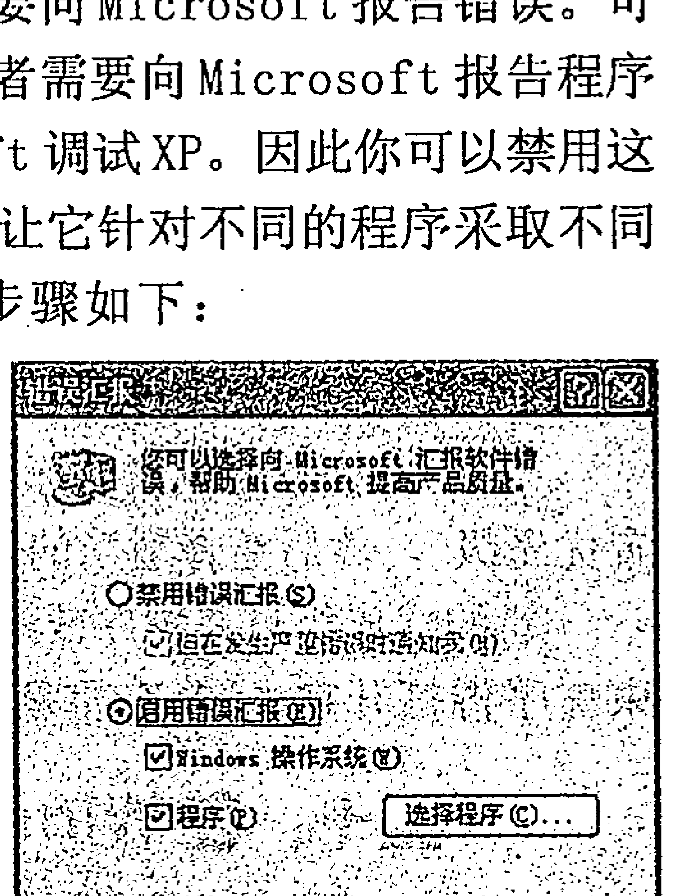

如果要针对不同的程序选择使用错误报告功能，设置步骤如下：在上图的“错误汇报”窗口中，选择“启用错误汇报”，然后点击“选择程序”。在

### 十八、改变Windows XP程序的超时限制

当一个程序被挂起不再响应事件，Windows XP显示一个对话框询问是强制关闭该程序还是继续等待。默认情况下，只要程序有半秒没有应答，这个对话框就会出现。如果你在设计和调试自己的程序，这个超时限制可能太短，会带来不少麻烦。

如果要修改Windows XP等待程序响应的时间，可按照如下步骤进行：

- 1. 运行注册表编辑器。
- 2. 打开HKEY_CURRENT_USER的\Control Panel\Desktop分支。
- 3. 找到HungAppTimeout值，并且修改它的值，例如10000（默认值是5000）。
- 4. 关闭注册表编辑器，重新启动系统让新的设置生效。

### 十九、自定义占用CPU的时间

Windows XP为每一个正在运行的程序和进程定义了优先级，优先级决定了一个程序相对于其他程序而言的占用CPU时间的比值。XP允许定义的优先级包括：“低”、“低于标准”、“标准”、“高于标准”、“高”、“实时”。大多数程序属于标准优先级。但是，你可以用任务管理器改变任意进程和程序的优先级。例如，如果你运行了大量的应用程序，可以让3D射击游戏占用较多的CPU资源，使游戏运行得更流畅。

修改优先级的步骤如下：

- 1. 按Ctrl+Alt+Delete组合键启动任务管理器。
- 2. 选择“进程”页。
- 3. 用鼠标右键点击目标程序或进程，选择菜单“设置优先级”，然后选择适当的优先级。

新的优先级只在程序或进程运行期间有效。如果结束程序再打开它，XP会重新为它设置默认的优先级。

### 二十、在WindowsXP中禁止IE报告脚本错误

当IE遇到页面中的脚本错误时，它会报告错误。除非你在调试自己的程序，否则即使知道了错误的详细信息，也没有任何办法来改正错误。所以对大多数用户来说，报告脚本错误是一个中看不中用的功能。禁止浏览器报告脚本错误的办法如下：

- 1. 从IE的工具菜单选择“Internet选项”。
- 2. 选择“高级”选项卡。
- 3. 向下滚动列表，找到“浏览”区域。
- 4. 找到“禁止脚本调试”，选中前面的检查框。

### 二十一、导入、导出或备份Cookie

许多用户对Cookie没有什么好感。但实际上，Cookie是非常有用的，例如，它可以帮助你自动登录网站；许多网站提供的服务需要借助Cookie实现，例如个性化的内容。因此，有些时候你需要备份Cookie，或者把Cookie转移到另一台机器，例如，从台式机转移到笔记本。如果你准备重新安装操作系统，可以先备份Cookie，安装好操作系统之后再导入。

备份Cookie的步骤如下：

- 1. 在IE中，选择菜单“文件”→“导入和导出”。
- 2. 出现“导入/导出向导”，点击“下一步”，选择“导出Cookie”，根据指示完成其余的操作。
- 3. 向导将创建一个包含所有Cookie的文本文件，默认保存在“我的文档”文件夹。
- 4. 如果要导入Cookie，先启动“导入/导出向导”，选择“导入Cookie”，指定包含Cookie的文本文件，然后根据向导提示完成其余的操作。

### 二十二、重新加载Explorer.exe让系统变得稳定

长期使用Windows XP的休眠功能，那么你会发现系统很快就会变得不稳定。这里有个技巧，按下“Ctrl+Alt+Del”，在弹出的“Windows任务管理器”窗口中点击“进程”选项卡，找到“Explorer.exe”文件，然后再点击窗口下方的“结束进程”按钮，你不必理会此时Windows XP的反应。接着再切换到“应用程序”选项卡，点击下方的“新任务”按钮。在弹出的“创建新任务”对话框中点击“浏览”按钮，找到Explorer.exe的位置，其位置在WINDOWS文件夹下。找到后点击“确定”按钮即可。

### 二十三、解决Windows XP关机速度慢的技巧

一些用户在安装了Windows XP后察觉到电脑关机会变得很慢。如果你安装了Nvidia显卡，就得找找它的原因了。很多时候都是由于名为“NVIDIA Driver Helper Service”的服务会导致这一现象的出现。该服务一般我们是不需要的，有了它会占用更多的系统资源。

## 终极优化 Windows 2000/XP

### 一、优化 Windows 2000 速度的技巧

#### 1. 启动缓慢

你是否觉得你的Windows 2K启动速度无缘无故被拖慢了呢？其实你可能是在开机时启动了一些不重要的程序。

解决办法是：在 Windows 2K 的桌面单击“开始”按钮，选择“运行”，然后输入“regedit”以开启注册表编辑器。再寻找以下的注册键值：HKEY_LOCAL_MACHINE\Microsoft\Windows\CurrentVersion\Run 然后，在其中删除开机时一些不需启动的程序即可。

#### 2. 删除不必要的程序

另外，大家在安装 Windows 2K 的时候，或许一时贪心把所有程序全部安装，后来才发觉根本没有用。可是在控制面板的“添加 / 删除程序”中却找不到踪影。这时，你可以利用以下的方法逼它们现身：

先寻找 “winint\inf” 这个文件夹。由于系统默认它是隐藏属性的文件夹，因此你先要到文件管理器的“工具”→“文件夹选项”→“查看”，选定“显示隐藏的文件和文件夹”。接着才能打开 inf 这个文件夹，找到名为 sysoc.inf 的文件。文件打开之后，查找 “;old base components” 的字样，然后动手进行修改。

例如，你可以把 Pinball=ocgen.dll,OcEntry,pinball.inf,HIDE,7 改成 Pinball=ocgen.dll,OcEntry,pinball.inf,,7

方法其实十分简单，只是删去了“HIDE”字样。之后，你就可以在控制面板的“添加 / 删除”中删掉源。

关闭的方法是打开控制面板，选择“管理工具”，再点击“服务”，在弹出的窗口中找到 NVIDIA Driver Helper Service 项，单击鼠标右键，选择“停止”。如果你想永远的终止该项服务，点击属性，在已启动的下拉列表框中，选择“已禁用”。

#### 3. 组策略编辑器

除注册表编辑器之外，大家也可以在“开始” → “运行”中输入“gpedit.msc”，以开启组策略编辑器（图1）。这里可供调整的细节选项多不胜数。

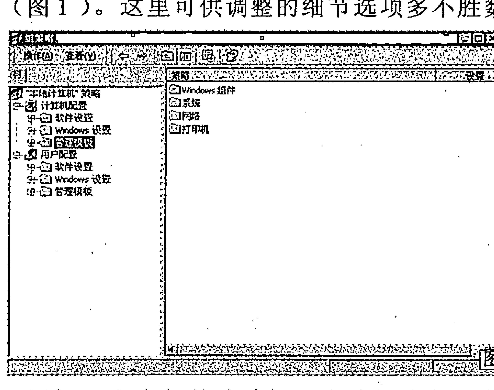

例如，点击组策略编辑器左边框内的“管理模板”，再选“System”，就可以关掉自动播放CD功能。而如果要去除Internet Explorer浏览器的启动画面，只需在编辑器右边框的项目上双击鼠标，你就可以作出修改，而且每一个项目都附有详尽的解释。不过，如果你不清楚某个项目的实际作用，千万不要轻举妄动！

至于要去除Outlook Express的启动画面，则需要开启注册表编辑器，寻找如下键值：

```
HKEY_CURRENT_USER\Identities\（识别编号）\Software\Microsoft\Outlook Express\5.0
```

然后在注册表编辑器右边框中单击鼠标右键，选择“new” → “Dword Value”，然后再将名称改为“NoSplash”，把数值设为“1”即可。

#### 4. DMA 和 Pagefile

Windows 2000增强了对DMA的支持，使硬盘或IDE设备可以直接把数据传输到RAM，而无需处理器插手。Windows 2K能够自动检测个别设备是否支持DMA高速传输模式，或只能以常规PIO模式工作。因此即使你的设备不支持DMA，也不会发生什么严重后果。

修改方法很简单，在“我的电脑”图标上单击鼠标右键，选择“属性” → “硬件” → “设备管理器”。找到“IDE ATA/ATAPI控制器”，在“Primary IDE channel”项上单击鼠标右键，选择“属性”。在“高级设置”中把所有设备的类型设置为“自动检测”，并把“传输模式”设置为“DMA if available”。对Secondary IDE channel进行相同步骤的设定，然后重新启动。这样电脑的运行效能应该有不俗的提升。

### 二、优化 Windows 2000 的虚拟内存

谈到虚拟内存，不能不涉及到页面文件(pagefile.sys)，所谓页面文件，它的功能是将一部分硬盘空间设置为虚拟内存，从而扩大了可用“内存”空间，以此来满足程序的运行要求。Win9x通常是利用安装目录中的Win386.swp这个交换文件来实现虚拟内存的创建。但Windows 2000采用页面文件的方式来实现虚拟内存的创建。通常情况下，大家在使用时都是按照系统默认的设置让Windows管理虚拟内存，这样做比较方便，但Windows为了兼容绝大部分计算机配置，缺省设置的管理方式通常比较保守，因此它的工作效率有时偏低。熟练用户可以对Windows的虚拟内存管理进行优化处理（如自行定义交换文件的大小、位置等），来尽量获得比较高的工作效率。

Windows 2000中关于页面文件的管理项目在控制面板中，进入“控制面板”后选“系统”，然后在“高级” → “性能选项”中选择“更改”，就进入“虚拟内存”的设置（图2）。页面中显示着当前系统所设置的页面文件的大小、所在位置、磁盘可用空间以及Windows的推荐设置值等，可以结合页面文件的这些属性来优化设置。

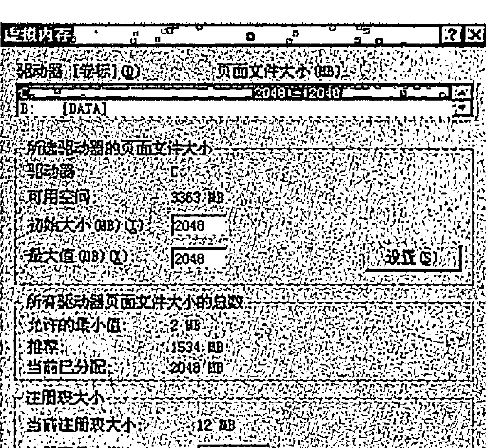

#### 1. 页面文件的大小

Windows建议页面文件的最小值（就是初始大小），应该是当前系统内存容量再加上12MB，若计算机系统拥有256MB内存的，就要将页面文件的最小值设置为268MB，这样才能让操作系统在崩溃或死机前将内存中全部的内容复制到硬盘上。对于内存容量小于256MB的用户，则建议将页面文件的最小值设得更大些，应该大于内存容量加12MB的数值。

使用128MB或者更少内存的计算机用户，应该将当前系统内存容量的1.75倍设置为页面文件的最小值；内存在128MB和256MB之间的用户，可以将当前系统容量的1.5倍设置为页面文件的最小值。将页面文件的最小值设置为大于这些理论值，对于整个系统的运行是没有什么影响的，而且应该会更好些，惟一的损失也许也就是硬盘可用空间会相应的减少。至于页面文件的最大值，则可以设置得越大越好，通常建议将它设置为最小值的2到3倍。你不用在意它的具体设置值。和Windows 9X系统的页面文件管理相比，Windows 2000要“智能”得多，它的页面文件是可以自己动态设置的。它仅在系统需要时才会自动扩充页面的大小，这样可以避免页面文件占用太多的硬盘空间，并避免在复杂操作中因内存不足而出现错误。

### 二十四、加快 Windows XP 远程访问共享文件夹的速度

在 Windows XP 中，如果你尝试通过网络进行来访问远程电脑中共事文件夹的话，那么将会延迟近30秒的时间，这是因为 Windows XP 需要额外的时间来进行查找远程电脑中所包含的任务。下面的方法可以让你加快速度。打开注册表编辑器，找到 HKEY_LOCAL_MACHINE\Software\Microsoft\Windows\CurrentVersion\Explorer\RemoteComputer\NameSpace，找到其分支 {D6277990-4C6A-11CF-8D87-00AA0060F5BF}，再将其删除。

### 二十五、成为真正的系统超级管理员

Windows XP 凭借极高的安全性和稳定性，赢得了广大用户的青睐。我们可以通过建立个人账户、设定密码来保护自己的个人隐私，还可以用 Administrators（超级管理员）的身份任意设置账户，为每一个账户设置不同的权限，可以说拥有至高无上的权利，也拥有系统的“生杀大权”，享有系统最高级别的安全保障。

但是，如果我告诉你，我能不费吹灰之力就可以将你这个 Administrators 给废掉，取而代之的是我成为 Administrators，你信不信？呵呵，你不信？好，我们来试一试：

- 1. 重新启动计算机，在出现启动菜单时按F8键进入高级选项菜单，选择“安全模式”进入系统。
- 2. 打开“控制面板”，找到“用户和密码”选项，看看是不是账户中包括Administrators？好，现在将Administrators账户删除，重新创建一个Administrators，或是更改原来的Administrators账户密码。
- 3. 重新启动计算机后，只有输入新的密码才能登录Windows XP。

为什么会出现这种问题呢？原因很简单：Windows XP 真正的超级管理员账号应该是在安全模式下的Administrators，并不是在正常模式下的Administrators。在默认情况下，安全模式下的Administrators密码为空。无论用户在正常模式下将Administrators密码设置得多么复杂，安全性多么高，如果没有设置安全模式下的Administrators密码，你的电脑将毫无秘密可言。

现在你是不是对 Windows XP 的安全性有些担忧了？那怎么办？这还不简单：赶紧进入安全模式，设置Administrators密码，将自己提升为真正的Administrators！当然，这次设置的密码要记牢了，否则下次你就真的无法进入Windows XP了！

（文/水月斋）

弹珠台游戏。但是要注意这种方法不能删除Fax Services等Windows 2K核心组件。

#### 2. 页面文件的存放位置

Windows 2000 允许通过将页面文件分布到各个不同的物理硬盘上（注意是硬盘而不是分区）的方法来提高系统的执行性能。从理论上讲这样做的确是可行的，但要注意的是由于各硬盘间可能存在的寻道时间、传输速度等方面的差异而导致的系统性能的下降，因此应该尽量选择速度最快的硬盘来存放页面文件。多硬盘之间的速度差异不大，可以将页面文件分布到各硬盘上去；多硬盘之间的速度差异比较大，则应该将页面文件尽量存放到另外的速度较快的一个（或多个）硬盘上去。对于单硬盘的用户，如果硬盘可用空间允许的话，则应该尽量将页面文件的位置设置在同一个分区中。

#### 3. 页面文件的连续性

页面文件的连续性在 Windows 2000 的相关设置中并没有相应的显示，但其实很有必要单独拿出来谈一谈。连续的页面文件的工作效率将比不连续的高很多，其中的原因和上面所说的不要将页面文件设置在同一硬盘多个分区的道理是一样的，也是由于硬盘磁头的移动问题，不连续的页面文件也将导致系统在使用虚拟内存时硬盘磁头频繁地在不连续的扇区间跳动，因此应该尽量保证页面文件的连续。大家可以运行 Windows 2000 自带的磁盘碎片整理程序并选择其中的“分析”功能来查看页面文件在硬盘上的相应位置，其中“绿色”区域（系统文件）就是页面文件所在位置。也许有些人对于页面文件会出现不连续的情况表示怀疑，那么可以试试下面的操作：如果你是双系统的话，可以先进入 Win9X，将 Windows 2000 的页面文件 Pagefile.sys 剪切到其他分区或者硬盘中，然后再马上粘贴回去，重新启动系统到 Windows 2000 下，运行“磁盘碎片整理程序”分析一下，绿色的区域将被分割为大大小小不同的好几个区域，页面文件这时就是零碎不连续的。尽管 Windows 2000 提供的“磁盘碎片整理程序”要比 Win9X 下的好用得多，但是对于不连续的页面文件它还是无法进行整理。要进行页面文件碎片整理的话，需要第三方的相应工具，如 Speed Disk 等。另外如果你没有这些工具而且页面文件所在分区或者硬盘不是 NTFS 格式的话，可以参照测试页面文件不连续情况下的操作方法：首先从双系统进入 Win9X，然后将页面文件剪切到其他分区或者硬盘中，再用 Win9X 下的磁盘整理工具对相应的分区或者硬盘进行整理，等整理完毕后再将页面文件重新粘贴回去，就可以保证页面文件的连续性了。

### 三、优化 Windows 2000 的 NTFS 系统

NTFS 是“新技术文件系统”的缩写。微软推出 NTFS 文件系统就是为了弥补 FAT 文件系统的一些不足，其中最大的改进是容错性和安全性能。用户可以决定许多影响 NTFS 卷性能的因素，比较重要的有 NTFS 卷的类型（SCSI 或 IDE）、速度（磁盘的 RPM）、卷包含的磁盘数量等。下面我们来看看一些优化 NTFS 系统的技巧：

- 1. 尽量不要用由 FAT 转换而来的 NTFS

从 FAT 转换到 NTFS 的卷将失去 NTFS 的一些性能优点。主文件表（MFT）可能出现碎片，而且不能在根卷上设置 NTFS 的文件访问权限。要检查 MFT 上是否有碎片，可以用如下的方法：点击“开始”→“程序”→“附件”→“系统工具”→“磁盘碎片整理”，对一个驱动器进行分析，然后点击“查看报告”，用鼠标滚动到 MFT 碎片。把一个 FAT 卷转换成 NTFS 后，簇的大小是 512 字节，增加了出现碎片的可能性，而且在整理碎片时需要花费更多的时间。基于上述原因，最好在最初的格式化时就把硬盘格式化成 NTFS 文件系统。

- 2. 少用 NTFS 文件压缩功能

NTFS 压缩功能可以对单个文件、整个文件夹或 NTFS 卷上的整个目录树进行压缩。使用压缩功能将会引起 NTFS 卷的性能下降，原因是每次访问被压缩的文件时，都需要对它进行解压缩。如果要拷贝一个压缩文件，其过程是：解压缩、拷贝、重新对拷贝的文件进行压缩，大大增加了 CPU 的处理时间。需要说明的是，NTFS 压缩功能在 Windows 2000 专业版上的效率要高于在 Windows 2000 服务器版上运行的效率。可以在浏览器窗口的属性对话框中对文件、文件夹、NTFS 卷进行压缩。

- 3. 多用碎片整理

当磁盘上出现碎片时，访问一个文件时就需要磁头作更多的运动，它对性能有极大的不良影响。使磁盘上的碎片维持在一个较低的水平是提高 NTFS 卷性能的最重要的因素。可以经常地运行碎片整理工具来完成这一工作。Windows 2000 的磁盘碎片整理工具使你可以快速对一个卷进行分析，并向你提出是否需要对这个卷进行整理的建议。

- 4. 禁止非必需的 NTFS 功能

禁止创建短文件名：NTFS 为了保持与 MS-DOS 和 Windows 3.x 的兼容，也支持 8.3 格式的文件名。如果你不想支持这些系统，可将注册表中的 `HKEY_LOCAL_MACHINE\SYSTEM\CurrentControlSet\Control\FileSystem`，将 `NtfsDisable8dot3NameCreation` 的值由 0 改为 1。

禁止最近访问更新：在各个目录之间来回切换时，NTFS 将更新最近访问的目录的日期和时间标签，在容量比较大的 NTFS 卷上，它会降低 NTFS 卷的性能。在 `HKEY_LOCAL_MACHINE\SYSTEM\CurrentControlSet\Control\FileSystem` 中把 `NtfsDisableLastAccessUpdate` 的值由 0 改为 1，就可以禁止自动更新功能，如果没有这个条目，就在注册表中加上它好了。

- 5. 为主文件表 (MFT) 保留适当的空间

MFT 在 NTFS 卷中扮演着重要的角色，对其性能的影响很大，系统空间分配、读写磁盘时会频繁地访问 MFT，因此 MFT 对 NTFS 的卷的性能有着至关重要的影响。NTFS 文件系统的开发者在 MFT 附近预留着一个特定区域，用来减少 MFT 中的碎片，缺省状态下，这一区域占整个卷大小的 12.5%，尽管这个区域能使得 MFT 中的碎片最少，但它并非总是合适的。要对 MFT 的空间进行管理，可以在 `HKEY_LOCAL_MACHINE\SYSTEM\CurrentControlSet\Control\FileSystem` 中增加一个类型为 REG_DWORD 的 `NtfsMftZoneReservation` 条目，它的缺省值是 1，其范围是 1-4（1 表示 MFT 占整个卷的 12.5%，2 表示 25%，3 表示 37.5%，4 表示 50%）。

必须在创建 NTFS 卷之前改变注册表。对注册表的修改只影响此后建立的 NTFS卷，对目前现有的卷没有影响，这些卷还会保持原来的 MFT 的设置。为 MFT分配更多的空间不会影响正常的存储空间，因为一旦正常的文件存储空间满后，NTFS将使用 MFT区，有时这也是导致 MFT区更容易有碎片的原因。因此我们必须注意用户文件已经占用的存储空间，在卷上保留一定的可用空间，这样 MFT就可以有足够的保留空间。

关于 `NtfsMftZoneReservation` 的设置，其缺省的 12.5%的设置对大多数用户而言已经足够了。以我的使用情况为例，MFT 的大小为 74331KB，这个卷上有大约 73 000 个文件，平均的文件大小为 111KB。由于卷的大小为 9GB，因此 MFT 的保留空间为 1 152MB，已经足够用了。

### 四、在 Windows 2000 中 “超频” 鼠标

在 Windows 2000 中，对于鼠标的设定被扩展得很丰富。依次打开“开始” -> “设置” -> “控制面板” -> “鼠标” -> “硬件” -> “高级设置”就能看到鼠标属性控制面板。在采样速率中，你可以以每 20Hz 为一个单位增加或者减少鼠标的采样速率，这个范围是从 20Hz 到 100Hz。选取尽可能高的采样速率会让你的鼠标更加灵敏。不过需要注意的是，如果当你改为某个数值之后，系统变得不稳定请试着把采样速率降低一挡。

### 五、去掉 Windows 2000 中的 POSIX 支持

POSIX既是 Portable Operating System Interface 的简称，POSIX是由 IEEE(Institute of Electrical and Electronic Engineers， Inc)开发的标准之一。POSIX标准的大部分被 ISO组织(International Standarisation Organisation：国际标准化组织)和 IEC(International Electrotechnical Commission：国际电子委员会)采纳。简言之，POSIX 为不同平台下的应用程序提供了相同的 API。一个完全符合 POSIX标准的优秀应用程序将能完全兼容 Unix 和 Windows，也就是在这两种操作系统下能同样的运行。但是一般这个东西对于大部分的个人用户是没有用处的。所以如果你想去掉 POSIX 支持，按照如下方法操作即可实现：
进入 C:\winnt\system32 文件夹，将 OS2.exe、OS2SS.exe、PSXSS.EXE 和 POSIX.exe 分别改为 OS2.xxx、OS2SS.xxx、PSXSS.xxx、POSIX.xxx 即可。

### 六、关闭 Windows 2000 的索引服务

索引服务就是把位于本地存储硬盘和网络硬盘上的文件的内容和属性创建索引，便于查询管理。但是这个功能相当占用资源，因为它需要始终监视着系统的一举一动，每一个文件的改动的结果都会记录在案。关闭这项功能的方法是，打开“我的电脑”，右击相应的硬盘驱动器分区图标，选择“属性”，去掉“允许索引服务编制该磁盘的索引以便快速搜索文件”选项前的对钩，点击“应用”，就会出现是仅仅将属性应用于这个分区的根目录还是连同它下面的子文件夹和文件。选择“将更改应用于<盘符>:\，子文件夹和文件”。然后点击“确定”，等待系统自己处理完成就可以了。

### 七、优化 Windows XP 的硬盘空间

虽说现在硬盘这么便宜，空间也大，但我们在平时使用中还是应该尽量优化操作系统的硬盘空间，因为这可让你的系统运行良好，维护方便。对于小硬盘的朋友，其必要性更不用说了。
首先，XP 的空间需求最小也要有 1.4G左右，由于“系统还原”和“休眠”功能被默认是启用的，这两项会因硬盘和内存的大小而不同而占用一定的硬盘与内存空间(如果你不经常使用这两项功能，建议关掉它)。就拿休眠功能来说，Windows XP 的休眠和 Windows 98 的不同，Windows XP 的休眠可以把内存中当前的系统状态完全保存到硬盘，当你下次开机的时候，系统就不需要经过加载、系统初始化等过程，而直接转到你上次休眠时的状态，因此启动非常快。
另外一个占用硬盘空间大户就是系统还原。系统默认是在所有的分区上启用该功能，分区越大，占用的也就越大。如果你的硬盘不是很大，建议只在系统所在分区上启用，而且设置为“使用最小值”，如果你的硬盘空间十分紧缺，那只好在所有驱动器上关闭了。
还有一个硬盘空间占用大户，这就是 pagefile.sys 文件。它是虚拟内存文件，对于这个文件，建议你把它设置到其他分区上，而不是默认的系统所在的分区，这样可以提高页面文件的读写速度，有利于系统的快速运行，并且把它的大小设置为物理内存的 1.5 倍，最大值和最小值一样。除了上面说的几个方面，注意平时不要把软件和系统安装在同一个分区。另外，Windows XP 的“磁盘清理”功能也非常实用，注意定期或不定期清理。

### 八、提高Windows XP速度的几个小技巧

#### 1. 自动关闭停止响应的程序

有些时候，XP 会提示你某某程序停止响应，很烦，通过修改注册表我们可以让其自行关闭，在`HKEY_CURRENT_USER\Control Panel\Desktop`中将字符键值是 `AutoEndTasks` 的数值数据更改为 1，重新注销或启动即可。

#### 2. 清除内存中不被使用的 DLL 文件

在注册表的`HKEY_LOCAL_MACHINE\SOFTWARE\Microsoft\Windows\CurrentVersion`，在 Explorer 增加一个项 `AlwaysUnloadDLL`，默认值设为 1。注：如果默认值设定为 0 则代表停用此功能。

#### 3. 优化网上邻居

Windows XP 网上邻居在使用时系统会搜索自己的共享目录和可作为网络共享的打印机以及计划任务中和网络相关的计划任务，然后才显示出来，这样速度显然会慢的很多。这些功能对我们没多大用的话，可以将其删除。
在注册表编辑器中找到`HKEY_LOCAL_MACHINE\software\Microsoft\Windows\CurrentVersion\Explore\RemoteComputer\NameSpace`，删除其下的`{2227A280-3AEA-1069-A2DE08002B30309D}`（打印机）和`{D6277990-4C6A-11CF8D87-00AA0060F5BF}`（计划任务），重新启动电脑，再次访问网上邻居，你会发现快了很多。

#### 4. 加快启动速度

要加快Windows XP 的启动速度。可以通过修改注册表来达到目的， 在注册表编辑器中找到`HKEY_LOCAL_MACHINE\SYSTEM\CurrentControlSet\Control\Session Manager\Memory Management\PrefetchParameters`，在右边找到`EnablePrefetcher` 主键，把它的默认值3改为1，这样滚动条滚动的时间就会减少。

#### 5. 加快开关机速度

在Windows XP中关机时，系统会发送消息到运行程序和远程服务器，告诉它们系统要关闭，并等待接到回应后系统才开始关机。要加快关机速度，可以先设置自动结束任务，首先找到`HKEY_CURRENT_USER\Control Panel\Desktop`，把`AutoEndTasks` 的键值设置为 1；在该分支下还有个`HungAppTimeout`，把它的值改为4000（或更少），默认为50000；最后再找到`HKEY_LOCAL_MACHINE\System\CurrentControlSet\Control\`，同样把`WaitToKillServiceTimeout` 设置为4000；通过这样设置关机速度明显快了不少。

#### 6. 加快菜单显示速度

为了加快菜单的显示速度，我们可以按照以下方法进行设置：我们可以在`HKEY_CURRENT_USER\Control Panel\Desktop`下找到`MenuShowDelay` 主键，把它的值改为0就可以达到加快菜单显示速度的效果。

#### 7. 减少启动时加载项目

许多应用程序在安装时都会自作主张添加至系统启动组，每次启动系统都会自动运行，这不仅延长了启动时间，而且启动完成后系统资源已经被消耗掉！点击“开始”→“运行”，输入“msconfig”启动“系统配置实用程序”，在“启动”项中列出了系统启动时加载的项目及来源，仔细查看你是否需要它自动加载，否则清除项目前的复选框，加载的项目越少，启动的速度自然越快。此项需要重新启动方能生效。

#### 8. 加快预读能力改善开机速度

Windows XP 预读设定可提高系统速度，加快开机速度。按照下面的方法进行修改可进一步善用 CPU 的效率：`HKEY_LOCAL_MACHINE\SYSTEM\CurrentControlSet\Control\SessionManager\MemoryManagement`，在`PrefetchParameters`右边窗口，将`EnablePrefetcher` 的数值数据进行如下更改：如使用PIII 800MHz CPU 以上的建议将数值数据更改为4或5，否则建议保留数值数据为默认值即3。

### 九、让Windows XP上网速度提升20%

Windows XP Professional 有一个名为服务质量信息计划的功能。此功能为保证重要事件的安全执行，有意为他们保留了一部分带宽，以备不时之需。这一功能对于很多商业用户来说是至关重要的，因为很多商业处理过程不允许有一点差错。但对于普通家庭用户来说，这一功能就显得有点讨厌了。因为对他们来说，更快的浏览网页和下载速度才是最重要的，那么我们怎么来提升另外20%的带宽呢？

首先必须以系统管理员身分登入系统，在“开始”→“运行”之中输入“gpedit.msc”弹出组策略编辑窗口，然后在编辑器的左边依次点击“本地计算机策略”下的“计算机配置”→“管理模板”→“网络”→“QoS 数据包调度程序”。在屏幕右边会出现“QoS 数据包调度程序”项目的设置。接着点击右边子项目的“限制可保留带宽”。这时，左边会显示“限制可保留带宽”的详细描述。从这里我们可了解到“限制可保留带宽”的一些基本情况。了解之后我们就可以对“限制可保留带宽”进行设置了。点击“限制可保留带宽”下“显示”旁边的“属性”（或者选择子项目“限制可保留带宽”，再点击鼠标右键然后选择“属性”也可），出现“限制可保留带宽”对话框，先点击“说明”，再进一步了解“限制可保留带宽”确定系统可保留的连接带宽的百分比情况。之后我们就可以对另外20%带宽进行设置了，点击“设置”，可以看到这里为我们提供了三个选项（“未配置”、“已启用”、“已禁用”），选择“已启用”，接着再将带宽限制旁边的百分数设置为0%即可，然后按确定退出，如图3。接着点击“开始”→“连接到”→“显示所有连接”，选中你所建立的连接，在右键菜单中点击“属性”，在出现的连接属性中点击“网络”，在显示的网络对话框中，检查“此连接使用下列项目”中“QoS数据包调度程序”是否已打了勾，没问题就按确定退出。最后重新重新启动系统便完成对另外20%的频宽利用了，需要注意的是此方法只对Windows XP Professional版有效哦！

### 十、Windows XP瘦身技巧

现在的硬盘越来越大，越来越便宜，不过软件的体积增长更快，并且现在仍然有不少人还在用20GB以及更小的硬盘。怎样满足软件对硬盘的要求？先在臃肿的Windows操作系统上打打主意吧。以下的操作全部以安装了SP1的简体中文版Windows XP为例，而其中的技巧大部分是针对Windows 2000和Windows XP的，有些操作可能会影响到操作系统的稳定性，使用的时候要注意。

#### 1. 禁用系统还原

系统还原可以在平时备份系统的状态，在出现问题后还原到之前的备份状态下。这个功能虽然比较实用，不过要占据大量的硬盘空间，通常情况下每个硬盘分区12%的可用空间都会被用来保存还原点。如果你不需要这个功能，则可以禁用它。

在“我的电脑”图标上点击鼠标右键，选择属性，打开系统属性对话框。然后打开“系统还原”选项卡，选中“在所有驱动器上关闭系统还原”这个复选框，并确定。

#### 2. 转移分页文件

分页文件也就是以前我们在Windows 98中接触到的虚拟内存。默认情况下分页文件是放置在系统盘的根目录的，为了节省系统盘空间，我们可以把分页文件转移到其他分区中，而如果你的物理内存比较多（例如512MB以上），那也可以把分页文件的最大值设置的小一些。

打开系统属性的“高级”选项卡，点击“性能设置”按钮，然后在新弹出的窗口中打开“高级”选项卡，并点击“更改”按钮，然后在“虚拟内存”对话框中重新指定分页文件的保存位置。记得在指定了位置后点击旁边的“设置”按钮，还有就是要把系统盘的初始值和最大值的设置改为0。

#### 3. 临时文件夹

很多软件在使用过程中会产生临时文件，这些文件会被保存在系统盘的临时文件夹中，在软件关闭的时候自动被清除。可是有些软件由于设计的原因或者非正常退出，都可能无法完全清空临时文件，久而久之临时文件夹就会占据大量的硬盘空间。而把他们移出系统盘也更便于管理。同样是在“系统属性”对话框的“高级”选项卡上，点击“环境变量”按钮，然后在窗口中重新给“TEMP”和“TMP”两个变量指定位置，需要注意的是环境变量分为当前用户的环境变量和系统变量两种，分别都要做相同的设置。选中每一个变量，然后点击“编辑”，重新指定变量值（这里的变量值是指新的路径，例如d:\temp之类的）就可以了。重启动系统后新的临时文件夹设置就会生效。

#### 4. 禁用休眠

不管你是不是准备使用休眠，Windows XP在默认情况下休眠都是启用的，这会浪费掉你的系统盘中一块跟你的物理内存大小相当的空间。如果你不打算使用休眠，最好禁用休眠，以节约空间。在桌面的空白处点击鼠标右键并选择属性，打开显示属性对话框，然后在“屏幕保护程序”选项卡上点击“电源”按钮打开电源属性对话框，接着打开“休眠”选项卡，取消对“启用休眠”的选择，确定后新的设置马上就会生效。

#### 5. 转移IE缓存

我们浏览过的网页都会被保存在IE的缓存中，这样如果以后再次打开同样的网页，IE就可以直接从缓存中调用网页而不是连接到网络服务器，以加快访问时间。不过现在宽带越来越普及，似乎也没必要利用硬盘上的缓存来加速访问，那么我们可以禁用IE缓存，或者转移到其他位置去。在IE的工具菜单下打开“Internet选项”对话框，然后在“Internet临时文件”下点击“设置”，如果你不准备使用IE缓存，则拖动“使用的磁盘空间”滑块到最左侧，否则可以点击“移动文件夹”按钮，把IE缓存指定到系统盘以外的硬盘分区中。

#### 6. 卸载不需要的组件

Windows XP没有自定义安装的模式，因此几乎所有的组件都会被安装进系统。如果其中的一些组件你用不到，也可以卸载它们。不过普通情况下我们什么都不能卸载，试试用以下的方法：

在运行中输入“%systemroot%/inf/sysoc.inf”

然后回车，就可以用写字板打开一个inf文件，这里显示了所有Windows组件程序的安装和卸载情况，而我们可以通过修改这个文件来卸载通常根本无法卸载的组件。打开这个文件后在记事本的“编辑”菜单下点击“替换”，然后在“查找内容”中输入“hide”（不包括引号），然后点击右侧的“全部替换”按钮，之后保存文件并关闭。重新打开控制面板中的添加删除程序，然后点击“添加删除 Windows 组件”，现在可以直接卸载很多以前并不允许卸载的组件了。而如果你日后需要使用这些组件，还可以重新安装。

# 7. 转移“我的文档”

“我的文档”是一个比较特殊的文件夹，默认情况下所有应用程序生成的文档等都会保存在这个文件夹中，而这个文件夹其实也就在系统盘里。把这个文件夹转移到其他分区中，一方面可以减小系统盘的体积，另一方面，如果系统突然崩溃无法修复，我们可以直接格式化系统盘重装系统，而不用担心如何备份“我的文档”中保存的重要文件。在“我的文档”文件夹上点击鼠标右键，然后选择属性，打开属性对话框，直接点击“移动”，就可以把“我的文档”转移到其他的分区中去。

# 8. 关闭内存转储

虽说 Windows 2000/XP 已经很稳定了，不过仍然可能会发生重大的问题，而外在的表现就是蓝屏或者死机。作为系统管理员，肯定很想知道系统为什么会出错。因此 Windows 2000/XP 中使用了一种内存转储技术，如果遇到重大问题，系统会首先把内存中的数据保存到一个转储文件中，然后才重启动，而管理员就可以通过分析转储文件了解系统的故障。很明显，对于我们一般用户，根本没必要转储这些文件，因为我们根本看不懂。那么就禁用吧。在“系统属性”对话框的“高级”选项卡下，点击“启动和故障恢复”按钮，然后在“写入调试信息”下拉菜单中选择“无”。并且你可以搜索所有的“*.dmp”文件并删除它们。同时在运行中输入“drwtsn32”并回车，打开“华生医生”工具，在这里取消对“转储全部线程上下文”、“附加到现有日志文件”和“创建故障转储文件”这三项的选择。

# 9. 转移字体

通常 Windows 会用 200MB 左右的空间保存各种系统字体，这些字体都是保存在系统盘中，而我们也可以把其中的大部分字体转移到其他分区中，并且丝毫不会影响字体的使用。

我们知道，字体的安装和卸载都很简单，只要复制到 Fonts 文件夹或者从 Fonts 文件夹中删除就可以完成。因为我们安装字体的时候可以选择只复制字体文件的快捷方式，通过这个方法就可以把几乎全部的字体转移到其他分区中。以安装新字体为例，在 Windows 目录下打开 Fonts 文件夹，然后点击“文件”菜单下的“安装新字体”，在这里找到我们保存字体文件的文件夹，然后选中所有想要安装的字体（可以在选择的时候按下 Shift 一次选择多个字体文件），最后取消对“将字体复制到 Fonts 文件夹”的选择，然后点击右侧的“确定”。而通过观察就可以看出，经过这样安装的字体在显示上跟其他字体截然不同，在字体上添加了一个类似快捷方式的小箭头。而我们也可以把系统内置的字体先复制到其他文件夹中，然后在 Fonts 文件夹下删除（卸载），再用上面的方法安装快捷方式。需要注意一点，一些重要的系统字体是不允许被卸载的（表现在你无法从 Fonts 文件夹中删除它们），那么这些字体你最好不要乱动。

# 10. 系统文件备份

为了保证系统的稳定性以及重要的系统文件不会被错误删除或者替换，Windows 2000/XP 会自动备份重要系统文件。这些文件通常会保存在 %systemroot%/system32/dllcache 文件夹中。

在运行中输入“CMD”并回车，打开命令提示行窗口，然后在其中输入“sfc/purgecache”并回车，这将会删除前面提到的 %systemroot%/system32/dllcache 文件夹中所有的备份文件，接着继续输入“sfc/cachesize=0”并回车，这将使得系统以后不会消耗硬盘空间来保存备份的系统文件。需要注意，经过这样的操作以后如果有重要的系统文件需要恢复，操作系统会直接要你插入系统安装光盘。如果你嫌麻烦或者只是想要减小系统盘的体积而不想影响稳定性，也可以通过配置组策略把备份文件夹转移到其他分区。在运行中输入“gpedit.msc”并回车，打开组策略编辑器，然后定位到“计算机配置”→“管理模板”→“系统”→“Windows 文件保护”，然后分别通过右侧的“指定 Windows 文件保护缓存位置”和“限制 Windows 文件保护缓存大小”来转移和重新设置缓存文件夹的位置和大小。要注意的是如果你想手工删除，记得只能删除这个文件夹中的文件而不是文件夹本身。

# 11. 删除帮助文件

如果你对 Windows 系统非常熟练，也可以删除帮助文件节省空间，直接删除 Windows 目录下的 Help 文件夹就可以了。

# 12. 多余的输入法

除了中文输入法，Windows XP 中还带有日文和韩文等输入法，这对我们当然没什么用处，也可以在“%systemroot%/ime”文件夹下删除“CHSIME”和“SHARED”之外的其他所有文件夹。（如果删不掉可以试试到安全模式下删除）。在使用这个方法之前一定要确保你已经事先删除了所有的系统文件备份（也就是第二部分第一条中说到的），否则你删除了这些文件后操作系统会自动从备份文件中恢复它们。

# 13. Service Pack备份文件

Service Pack 是 Windows 的大补丁文件，在安装 Service Pack 后硬盘上会占用一部分空间保存备份出来的系统文件。如果硬盘空间非常紧张也可以考虑删除。在给 Windows 安装了 Service Pack（也就是通常说的 SP1, SP2 等）后你也许可以在 Windows 目录下看到类似“ServicePackFiles”的文件夹，这里就保存了安装 Service Pack 后的备份文件。通常如果不是硬盘非常紧张，绝对不建议你删除这里的文件。

# 14. Windows Update后的隐藏文件夹

所有通过Windows Update 安装的补丁都是可以卸载的，并且为了应付以后的卸载，补丁程序在安装的时候会备份一些文件，并隐藏保存起来。如果你通过 Windows Update 后觉得系统运行稳定，以及你不准备以后卸载这些补丁，则可以删除这些隐藏的备份文件。Windows 目录下还有一些文件夹，通常有很多，是压缩过的，名称为“$NtUninstallQ******$”（******是一个数字），这些文件夹中保存了你通过Windows Update安装的补丁的备份文件。可以直接删除。注意：这些文件夹是隐藏的，直接看不到，你可以先在文件夹选项的查看选项卡下设置显示隐藏文件。

# 15. 备份的驱动程序

Windows 会把自带的驱动程序文件备份到硬盘上，这样以后添加新的硬件就不用频繁插入光盘。当然，为了节省空间我们也可以直接删除这些备份的驱动程序，通常就是位于“%systemroot%/Driver Cache/i386”文件夹下的 Driver.cab 文件。

### 十一、禁止Messenger在Win XP中自动运行

用过WinXP的都知道Messenger是跟随系统启动的，而目前这个聊天软件在国内相对QQ来说，用户就比较少，很多人为了节约系统的宝贵资源，都会在系统配置程序(Msconfig.exe)的启动栏里把它“去钩”，禁止它在系统启动时自动运行；有的甚至干脆把它直接从WinXP系统里删了。而用前面那种方法的，在进入系统时，虽然能够禁止Messenger自动运行，不过当你运行Outlook或登录Hotmail网站信箱的时候，它仍然会自动运行，这时如果你既不想把它从系统里删除，又不想让它跟随Outlook自动运行，那么你可以这样修改：在注册表编辑器里依次展开“HKEY_CURRENT_USER\Software\Microsoft\Windows\CurrentVersion\Run”分支，在右边窗口里选中“MSMSGS”键值，然后在右键菜单里选“删除”，这样Outlook启动时它就不会自动启动了。不过修改只能对当前用户有效，如果是其他用户登录的，Messenger一样会跟随Outlook启动而自动运行，现在我们还需要对WinXP的组策略编辑器修改一下，运行“GPEDIT.MSC”，打开组策略编辑器，展开“本地计算机策略”→“计算机配置”→“管理模板”→“Windows组件”→“Windows Messenger”，选择“初始化时不自动启动Windows Messenger”，然后将其状态改变为“Enabled”，退出组策略编辑器。经过这样的修改后，不用卸载，无论哪个用户登录，都能彻底禁止它在WinXp中自动运行。

（文／水月斋）

## 深入 Windows 98/Me 技巧

### 一、自己打造 Windows 98 启动菜单

为了维护电脑，有时候我们需要进入纯DOS，在常见的 Windows 98 和 Windows 2000/XP 的双系统中，传统的方法是在启动菜单中选Windows 98启动，按F8键进入启动选单，但这个时候往往我们看到的却是 Windows 2000的启动菜单。可不可以重现Windows 98的启动菜单呢？当然可以，方法很简单。只要我们在 Windows 98 中，依次打开“开始”→“设置”→“文件夹选项”→“查看”，然后点选“显示所有文件”，“确定”后退出。接下来查找C盘根目录下的MSDOS.SYS，去除只读属性之后用文本编辑器打开，在“options”项下增加以下两行语句:

```
bootmenu=1
bootmenudelay=5
```

第一行是设定出现启动菜单，第二行是设定菜单持续时间为 5 秒，当然持续时间可以根据需要自己修改。退出后将文件重新还原为只读属性，重新启动并选 Windows 98 启动，Windows 98 的启动菜单是不是已经出现了？由于在Windows 2000中MSDOS.SYS受系统保护，修改起来比较烦琐，因此建议大家在Windows 98下修改。

### 二、用紧急修复盘恢复Windows 98/2000双启动

很多朋友都喜欢用双系统启动，但是在双系统的使用过程中经常会出现这样那样的“冲突”的问题。笔者的一个朋友今日也给爱机使用上了双系统，在Windows98的基础上安装了Windows 2000。他的Windows98SE装在C盘，而Windows 2000 装在F盘，两系统相处还算正常。在装Windows 2000之前他用Ghost对C盘作了备份，某一天因为Windows 98系统出了点问题，便花了4分钟将Windows 98系统还原到C盘，不曾想到双启动菜单就此消失，Windows 2000不能使用了，如果要重装却又太浪费时间了，这时候应该怎么办呢？相信很多朋友也碰到过同样的问题，其实我们可以利用Windows 2000紧急修复磁盘修复双启动。

首先是制作Windows 2000紧急修复磁盘，这要求在系统正常的时候完成，因此大家装了Windows 2000之后最好都制作一张：点击“开始”→“程序”→“附件”→“系统工具”→“系统信息”，打开“系统信息”窗口，然后再点击“工具”→“Windows”→“备份”打开“备份”窗口；点击“紧急修复磁盘”按钮，弹出一个提示窗口，要求你插入一张已格式化的空白软盘，单击“确定”即可，接着你便会看到正在复制系统数据的画面，稍等片刻便会看到紧急修复磁盘已成功保存。

当上面的所说的故障出现的时候，我们可以使用Windows 98启动盘重新启动系统，选择加载光驱（如果你的Windows 2000安装文件已拷在硬盘上，可以从硬盘启动到Dos界面），然后运行Windows 98文件夹下的“Smartdrv.exe”文件（此步不能少，否则下一步的文件复制时间会很长），然后转到windows 2000安装文件夹，执行winnt.exe。这时候可以看到系统正在向硬盘复制安装文件，复制完成后按下回车键重新启动，你就会看到双启动画面了，不过现在还没有修复完成，再双启动画面之中选择第二项更新Windows 2000系统，在Windows 2000修复选项画面中，按一下“R”键，使用紧急修复过程修复Windows 2000的安装，最后按照系统的提示按一下“F”键选择“快速修复”，执行所有修复选项；接下来系统会让你插入软盘，将紧急修复磁盘插入之后按回车键即可，此时可以看到正在加载“setup.log”文件中的信息，一切完成之后按下“回车键”重新启动，这时可看到Windows 98/2000的双启动菜单又回来了。

到此为止Windows 98/2000双启动就恢复成功了，大家最后不要忘了将C盘上多出的临时文件夹（$WIN_NT$.~BT、$WIN_NT$.~LS以及$LDR$文件）删除哦！

### 三、巧用MSDOS.SYS同时装两个Windows 98

对许多既注重软件学习又喜欢玩游戏的朋友来说，在安装各种各样的软件之后经常会让Windows注册表变得越来越大，这样不但降低了系统的运行速度，而且经常删除不想玩的游戏，还容易导致系统崩溃。其实你可以用MSDOS.SYS同时装两个Windows，一个用来学习，另一个用来娱乐，岂不是妙哉？

1.  安装第一个Windows 98：注意安装过程中，选择安装在C:\Windows，安装完成之后在D盘根目录下建立子目录first，去掉C盘根目录下MSDOS.SYS只读、隐藏、系统属性，再将其复制到D:\first目录下。
2.  安装第二个Windows 98：用加载光驱驱动程序的系统软盘引导系统，将Windows 98光盘插入光驱，开始安装第二个Windows 98，应安装在D:\Windows，注意安装过程中安装程序会提示覆盖原来的Windows 98还是重新安装系统，此时应选择重新安装系统。安装成功后，在C盘根目录下建立子目录second，去掉C盘根目录下MSDOS.SYS（注意现在的MSDOS.SYS是安装第二个Windows 98时覆盖掉前面的MSDOS.SYS新生成的）所有属性，并复制到C:\second目录下。
3.  建立one.bat：用记事本（现在用第二个Windows 98）建立批处理文件one.bat，内容为copy d:\first\msdos.sys c:\，保存文件类型选所有文件（*.*），扩展名（*.bat）不能省略，保存在d:\first目录下。
4.  创建one.bat快捷方式：在桌面按鼠标右键，选择“新建”→“快捷方式”，输入源文件路径d:\first\one.bat，将one.bat快捷方式命名为“第一个Windows 98”（名字可以自己定义），再用右键点击“第一个Windows 98”，选择“属性”→“程序”，运行选择“最小化”，记得要选中“退出时关闭”，然后点击“确定”，回头再运行刚才创建的快捷方式，重新启动计算机；怎么样？是不是返回到第一个Windows 98了？
5.  建立two.bat：用记事本（现在用第一个Windows 98）建立批处理文件two.bat，内容为copy c:\second\msdos.sys c:\，保存文件类型选所有文件（*.*），扩展名（*.bat）不能省略，保存在c:\second目录下。
6.  创建two.bat快捷方式：重复第4步，建立two.bat快捷方式就算大功告成啦。

### 四、自行添加欢迎对话框中的文本

众所周知，我们若打开了Windows 98的欢迎对话框，则每次启动时系统都会显示有关提示信息，因而深受广大用户的欢迎。你可能想不到的是，这些提示信息都是人为的，我们自己也可以添加相应的提示信息，具体步骤为：

1.  启动Windows 98的注册表编辑器。
2.  在注册表编辑器中依次展开HKEY_LOCAL_MACHINE\SOFTWARE\Microsoft\Windows\CurrentVersion\Explorer\Tips分支。
3.  Tips分支中保存的就是Windows 98欢迎对话框中显示的所有提示信息，用户若需对这些提示信息进行修改，只需直接对相应主键的内容进行替换即可；用户若打算添加新的提示信息，只需在该分支下建立新的字符串值即可。
4.  执行“注册表”菜单的“退出”命令，关闭注册表编辑器，重新启动Windows 98。

### 五、禁止系统加载项加快Windows 98启动

Windows 98使用一段时间后，系统似乎越来越慢，而且经常出现短时的“凝固”现象，仿佛有人在远处遥控着电脑系统一般。这种情况很多朋友都曾经碰到过，其实Windows 98本身并不慢，拖垮系统的是Windows 98为了扩展功能而加挂上的各种小程序，它们累积在一起，占用了大量的系统资源。首先，IE 4是罪魁祸首，它与Windows 98集成，提高了自身的启动速度，却占用了更多的系统资源，从而降低了整个系统的性能。在IE4中，对资源吞吃得最为厉害的，是活动桌面。这种桌面虽然可以显示Web组件，但对CPU处理速度的影响也最为明显。如果在活动桌面上使用了JavaScript之类的组件，系统出现“凝固”现象也就不奇怪了。实际上，有关活动桌面对系统性能的影响，已有人作过专门的研究，结果表明，活动桌面确实是Windows 98性能下降的主要根源。此外，如果你安装了Microsoft Office，Windows 98会在启动时自动加载“文件快速查找”程序及其它一些小型实用程序。这些程序有时放在“开始”菜单组的“启动”文件夹下，有些则通过更改注册表来加载。无论以何种方式加载，都会占用一定的系统资源，如果这些程序的功能对你来说不是必须的，最好禁止系统加载。活动桌面的问题比较好解决，只要将其关闭即可。对于那些自动加载的小程序，则可视需要有选择地加载。比较可靠的方法是用Windows 98所带的系统配置实用程序，它可以控制各种途径下的启动加载。该程序的调用途径是“开始/程序/附件/系统工具/系统信息”，点击“工具”→“系统配置实用程序”即可。为了加快Windows 98的程序启动速度，应经常使用Defrag功能来整理硬盘的文件碎片。Windows 98还引入了英特尔公司提供的应用程序启动加速功能，可将使用频率较高的程序保存在硬盘上读取速度最高的位置。因此，别把Defrag忽略了。

### 六、活用msconfig减少硬件冲突

经常有朋友抱怨Windows 98的硬件兼容性不好，最常见的莫过于硬件冲突了，譬如声卡与modem、显卡冲突等，其实将所有的过错归咎到Windows 98可能有失公允，任何一种操作系统的升级都可能带来硬件兼容性问题。当安装Windows 98后出现硬件兼容性问题时，首先要确定是哪一种硬件引起的麻烦。方法是打开“我的电脑”图标的属性，查看“设备管理器”选项。如果某个硬件前标有黄色的问号，或者红色的“×”，就表明此硬件存在问题。如果出现故障的硬件是支持即插即用的。可将该硬件项从“设备管理器”中彻底删除，重新启动Windows，Windows 98会对该硬件重新进行探测，用户按照提示装入新的驱动程序即可。如果Windows 98未能重新检测该硬件，说明硬件不支持即插即用。此时可有两种方法来解决，一是使用控制面板中的“添加新硬件”功能进行手动安装，二是重新安装整个操作系统，这是没有办法时的办法。另外还有一种情况，如果在Windows 98中有声音，而在DOS模式下玩游戏时没有声音，说明DOS游戏程序不能识别Windows驱动程序，此时可用这种方法解决：直接在开始菜单的运行对话框中键入“msconfig”，启动系统配置实用程序，编辑Config.sys和Autoexec.bat，加入装载声卡DOS驱动程序的语句。要想使你的硬件保持良好的工作状态，就应当使用厂商提供的最新驱动程序。判断驱动程序版本号的方法是：打开“我的电脑”的“属性”对话框，转到“设备管理器”选项卡，双击要查看的设备名，转到“驱动程序”选项即可看到驱动程序的版本号或生产日期，此时便可做出是否升级驱动程序的判断。

### 七、将HTML文档设置为屏幕保护

除了将HTML文档设置为桌面背景之外，Windows 98的活动桌面功能还提供了HTML文档设置为屏幕保护的功能，具体步骤为：

1.  用鼠标右键单击桌面空白处，然后从弹出的快捷菜单中执行“属性”命令，打开“显示属性”对话框。
2.  在“显示属性”设置框中单击“屏幕保护程序”选项卡。
3.  在“屏幕保护程序”列表框中选择“活动桌面屏幕保护程序”选项。
4.  单击“设置”按钮，打开屏幕保护程序设置对话框。
5.  对活动桌面屏幕保护的内容进行配置。
6.  连续单击“确定”按钮，关闭所有对话框。

此后当用户连续不操作计算机达到指定时间之后，系统就会自动将HTML文档为主的活动桌面内容作为屏幕保护显示出来，然后我们就可以在休息期间查看股市行情等网络实时信息，这就极大的方便了用户的使用。

### 八、快速修改所有文件夹的显示属性

在Windows 98中，我们无论是使用“资源管理器”还是“我的电脑”处理文件夹时都可以设置许多不同的显示属性，如是否显示工具栏、是否采用Web显示方式、是否采用缩略图显示方式、是显示大图标、小图标还是显示列表、详细资料等，这就方便了用户对文件夹的管理。更为出色的是，系统的这些显示属性是以文件夹为单位的，也就是说我们可以为不同文件夹设置不同的显示方式。

### 九、同时最小化多个 Windows 窗口

尽管同时将多个应用程序窗口放在桌面上可方便用户操作（想用哪个程序时只需使用鼠标切换一下即可），但桌面上的窗口太多了之后就会显得杂乱，这就要求我们将暂时不需要用的程序窗口最小化。在 Windows 98 中同时最小化桌面上的所有程序窗口是一件非常简单的事情，单击快速启动工具栏上的“显示桌面”按钮即可达到目的，但假如用户希望的是同时最小化几个不同的程序窗口（而不是所有窗口）又该怎么办呢？下面的方法可以解决这一问题：

- 1. 在按住 Ctrl 键的同时使用鼠标在任务栏上选择所有需要最小化的程序窗口。
- 2. 用鼠标右键单击任务栏上的任意一个已经选择了的程序图标。
- 3. 从系统弹出的快捷菜单中执行“最小化”命令。这样我们就实现了同时最小化所选择的多个应用程序窗口的目的。另外，利用同样的方法我们还能实现同时关闭、还原、最大化所选择的多个应用程序窗口的目的。

### 十、在桌面上创建屏幕保护程序图标

大家都知道，屏幕保护具有设置密码保护的功能，利用此功能，我们只需为屏幕保护设置适当的密码，此后当我们离开计算机之后屏幕保护就会自动激活，相应的密码保护就会生效，从而起到安全保护的作用。不过这就有一个问题，那就是 Windows 98 启动屏幕保护的最短时间为1分钟，也就是说只有用户在不操作计算机达到1分钟之后屏幕保护（也就是密码保护）才会发生作用！为防止有人趁用户离开计算机而屏幕保护又还没有启动之间的空隙“入侵”自己的计算机，许多用户都是在不操作计算机并等待1分多钟的时间，待计算机进入屏幕保护状态之后才敢离开的，这似乎过于麻烦。其实只要使用下面的方法，我们就能做到及时启动屏幕保护功能的目的。

- 1. 按照常规方法设置系统的屏幕保护功能，选择所需的屏幕保护程序并设置适当的屏幕保护密码。
- 2. 启动资源管理器并打开 Windows 98 安装目录的 SYSTEM 子目录。
- 3. 在该目录中找到相应的屏幕保护程序（*.SCR 文件）。
- 4. 右击该屏幕保护程序，然后从弹出的快捷菜单“发送”子菜单中执行“桌面快捷方式”命令，在桌面上为相应的屏幕保护程序设置快捷方式。

这样我们就实现了在桌面上为屏幕保护程序建立快捷方式的目的，此后当我们需要离开计算机时只需双击该快捷方式，系统即会迅速激活相应的屏幕保护程序（再也无需等待了），然后我们就可以获得应有的密码保护，从而达到了保护系统安全的目的。

### 十一、将文件的修改日期都调整为同一天

相信大家都注意到，制作比较讲究的系统软件的所有文件的日期都完全一样（如中文版 Windows 98 的所有系统文件的时间都是 1998-6-19,20:01），这就使得软件显得比较统一。作为个人用户来说，我们有时也希望将自己制作的小软件中的所有文件的日期调整得完全一样，这虽然可以通过一些专业的文件换名软件来实现，但利用系统本身的功能同样也能快速达到目的：

- 1. 双击 Windows 98 系统托盘中的时间显示图标，打开“日期”→“时间属性”设置框。
- 2. 在“时间属性”设置框中将系统的日期和时间调整为文件所需的修改时间。
- 3. 单击“开始”按钮，然后依次选择“程序”、“MS-DOS 方式”命令，进入 Windows 98 的 DOS 状态。
- 4. 切换到保存需要修改文件日期的文件夹（最好事先建立一个专门的文件夹，然后将所有需要修改日期的文件都移动到该文件夹中，并删除该文件夹中的其它任何文件）。
- 5. 执行“COPY /B 欲修改日期的文件的文件名 +,,”命令（若需修改该文件夹下所有文件的日期，则可执行“COPY /B *.*+,, ”命令）。
- 6. 此时系统将会询问用户是否覆盖已有文件，别担心，放心的按下 Y 键。
- 7. 利用 EXIT 命令返回系统，并重新将系统日期和时间调整为正常状态。

这样我们就达到了快速修改文件日期和时间的目的，效果非常好哦！

### 十二、将控制面板添加到开始菜单

在“开始”菜单上添加新的应用程序图标是一件非常简单的事情，可我们要是想将控制面板添加到开始菜单上就没那么容易了！下面我来教大家如何操作：

### 十三、在Windows Me中实现“一键上网”

现在市面上有很多“一键上网”的键盘，其实我们并不需要花钱去购买这些花哨的东西，在Windows Me系统中，只要进入“控制面板”中的“拨号网络”，用鼠标右键点击已经建立好的拨号连接，选择“创建快捷方式”，便可以在桌面生成快捷方式了。之后，我们可以查看其属性，并为其设置好惯用的快捷键，如“F6”等，以实现“一键上网”。另外，我们将快捷方式拖放到任务栏左边的快速启动栏中，以后需要登录互联网时，只需用鼠标左键单击此快捷图标即可完成拨号任务了。

### 十四、共享两套系统中的Internet临时文件夹

假如你是个超级发烧友，硬盘中除了装有Windows Me还装了2000，我们来想法共享两套操作系统里的Internet临时文件夹，不仅可以节省大量硬盘空间，并且还提高浏览效率。首先我们启动Windows Me系统，新建一个文件夹，命名为My Cache（建议将此文件夹建立在非系统分区）。然后进入Win Me操作系统的“控制面板”，用鼠标左键双击“Internet 选项”图标，在“Internet 选项”设置窗口的“常规”选项卡下，点击“设置”按钮，打开“设置”窗口。再点击“移动文件夹”按钮，选择刚刚建立的文件夹，如“My Cache”，并点击“确定”按钮保存设置。与此同时，一定要记住“使用的磁盘空间”所设定的数值，因为必须将两套操作系统共享的Internet临时文件夹所使用的空间设定为相同大小。设置完毕后计算机将重新启动，接下来进入Windows 2000系统，打开刚刚新建的文件夹，如My Cache，不用顾及任何警告，将其中的Temporary Internet Files文件夹删除。再按前述方法将Internet临时文件夹移动到My Cache文件夹，并将“使用的磁盘空间”的数值设定为与Windows Me设定的大小相同，系统再次重新启动，以使设置生效。至此，Windows Me与Windows 2000便真正实现了共享 Internet 临时文件夹。无论在哪套操作系统下浏览过的 Web 页面，在另一套操作系统中同样可以离线浏览。

### 十五、巧用参数加快安装速度

- /T:tmpdir 其中 tmpdir 为 Windows 98 安装过程中生成的临时文件的存放路径。请把临时路径指到非安装盘，这样不仅使安装速度更快，还使得安装盘的文件碎片大大减少，安装完后不需要再进行磁盘整理。
- /is 安装前不用 Scandisk 扫描硬盘。在新硬盘或刚格式化过的硬盘上可用此参数。
- /ie 不创建应急软盘。
- /iv 跳过安装过程中出现的公告(介绍新特性的文字和图文)，以节省安装时间。
- /im 跳过内存的检查。新机器不要采用此参数，不然会经常出问题。

### 十六、Windows Me安装盘的另类使用技巧

#### 1. 选择性安装

在 Windows Me 安装盘中存放着其安装文件 setup，我们可以在 DOS 状态下利用在 Setup 后加参数的方法进行选择安装，在你的机器有时有些特殊原因进行系统安装时，用这个方法有时还是能够解决问题的。需要注意要在 setup 后加一空格。

```
setup /? 来查看其安装参数，
/C 不加载 SmartDrive 磁盘缓存，还是不要用此参数，这样安装速度会快一点。
/d 不识别电脑中安装的以前版本 Windows，如果使用这个参数安装程序将自动清除磁盘内容，并且只安装Windows Me，如果是升级安装请慎用此参数。
/ie 不创建紧急启动盘。
/ih 安装过程中跳过注册表的检查。
/il 使用罗技鼠标驱动，而不使用默认的微软鼠标驱动，如果你使用罗技的鼠标，并且在安装过程中发现它工作异常，那么试试这个参数。
/im 使安装程序跳过内存检查。
/in 不安装网络软件。如果你的电脑要上网的话，那么就不要用此参数。
/iq 在扫描硬盘时跳过交叉连接文件的检查。
/is 使安装程序不扫描硬盘。
/iv 在安装时不显示介绍画面。
/iw 使安装程序跳过许可协议。
/nm 允许你在低于微软要求配置的电脑中安装Windows Me，微软对Me的最低CPU要求是Pentium 150。
/nostart 让安装程序只复制文件而不进行安装，这样你可以在以后再进行安装。
/NTLDR 可以让你在出现错误时继续完成安装，此功能要慎用。
/Pf 如果先前的安装被取消并使注册表破损，可让安装程序重建一个新的注册表。
/T:[tempdir] 让你可以指定一个目录来放置它的临时文件。
```

#### 2. 提取有用的文件

当然我们还可以从Windows Me的安装盘中提取有用的文件，现通过提取五笔输入法举例说明：

Windows Me中共自带了两种五笔输入法，分别为王码五笔字形输入法86版、王码五笔字形输入法98版。只要通过如下介绍的方法便可把这两种五笔输入法所需要的文件从Widnows Me的安装盘中得到，继而再把这些文件安装到其它Win9x系统里。从Windows Me安装盘上找这些文件，再用解压软件（如：WinZIP、WinRAR）将以下文件解压后，再将所列出的文件复制到磁盘上，文件如下：

- Win_19.cab (cab压缩文件): kbdus.kbd、winwb86.ime、winwb86.mb、winwb98.ime、winwb98.mb
- Win_10.cab (cab压缩文件): winwb86.cnt、winwb98.cnt
- Win_18.cab (cab压缩文件): winwb86.hlp、winwb98.hlp

将 kbdus.kbd 和 winwb86.ime、winwb86.mb 或 winwb98.ime、winwb98.mb 复制到 C:\Windows\SYSTEM 中（Windows9X 安装在 C:\Windows）

winwb86.cnt、winwb86.hlp 或 winwb98.cnt、winwb98.hlp 复制到 C:\Windows\Help 中（Windows9X 安装在 C:\Windows），这一步是复制“五笔输入法”的帮助文件，如果你不想复制帮助文件也可以。

#### 3. 其他用法

Windows Me的安装程序除了能够将Windows Me系统安装到你的计算机上，还有其他很好的作用，可别浪费了。

##### （1）修正系统注册表

在Windows的注册表中存放着重要的信息，一旦损坏，轻则系统变得不稳定，重则系统不能启动。如果你还没有备份注册表，那就非重装系统不可了！但是，Windows Me安装程序能够自动修复损坏的注册表，从而免去重装系统之苦。首先运行Windows Me的安装程序，让它自动扫描系统注册表（Scanning registry），在拷贝文件之前，点击“退出”按钮，再重新启动机器，你就会发现，系统注册表已经被修复好了！

##### （2）无条件格式化硬盘

有时候拿到一块硬盘后（尤其是旧硬盘），总是无法分区、格式化，从而造成硬盘资源不可用。这时，你不妨试着运行Windows Me安装程序，该安装程序会自动地检查硬盘，如果硬盘没有分区或格式化，它会自动为你分区并完成格式化，往往还能够解决非常棘手的问题。

##### （3）“虚拟”打印机

在许多Windows程序中均提供了打印预览功能，它允许用户在不真正打印的前提下观看其真实的打印效果，真正做到“所见即所得”。但可惜的是，要想实现打印预览功能，必须在计算机上安装打印机的驱动程序，而一般机器上都不带有打印机，所以也没有安装打印机的驱动程序，而是在自己的机器上编辑好后，再到单位的打印机上打印输出。这样就会造成预览功能不可用，给用户造成很大的不方便。通过试验发现，只要我们通过Windows Me的安装程序随便安装一打印机的驱动程序（你可以在安装系统时选择，也可以通过双击控制面板中的打印机图标来安装），而不管你的机器上是不是真正有打印机设备，都可以“骗过”这些程序（如WPS2000、CakeWalk等软件），使其支持打印预览功能。

##### （4）识别真假硬件

由于现在市面上的电脑配件太多，因此很容易鱼目混珠，凭我们一般用户的肉眼是很难分辨出来的，而通过Windows Me的安装程序就可以解决。如许多奸商把TNT2 Vanta显卡打磨成M64出售，而且它们之间的识别方法见得很少，TNT2 Vanta和M64价格也相差十元至几十元不等。此时，只要将显卡插入机器中，再安装Windows Me的公版驱动程序（在Windows Me中已经内置了许多著名品牌电脑配件的驱动程序，其中TNT2 Vanta也包括在内），这时驱动程序自己就会认出是Vanta还是M64了。对于其它硬件的识别方法与此类似哦！

（文／水月斋）

## 终极优化 Windows 98/Me

### 一、快速访问 Windows 98 桌面的技巧

在使用 Windows 98 的过程中，如果你打开了很多个应用程序，以致满屏幕都是窗口，而这时你又想进入桌面做些事，比如运行某个快捷方式等，那么，你是不是需要逐一关闭或最小化所有窗口呢？其实，这里还有几个更简单的方法：

- 1. 最简单的方法当然是使用“快速启动”工具栏中的“显示桌面”按钮。不论系统正在运行多少个应用程序，如果想访问桌面时，只需用鼠标在此按钮上轻轻一点，系统就会自动最小化各个应用程序，还一个干干净净、清清爽爽的桌面在你的眼前。如果想再返回先前运行的应用程序，可再次点击“显示桌面”按钮，所有运行的应用程序即可自动恢复到原来的窗口或者是最大化状态。
- 2. 另一种方法也很简单，而且“兼容”Windows 95：在任务栏上的空白处单击鼠标右键，然后在弹出的快捷菜单中选择“最小化所有窗口”，怎么样，其效果是不是和“显示桌面”按钮有异曲同工之妙？如果想再恢复原状，可再次单击鼠标右键并选择“撤销全部最小化”。

值得注意的是，我们可以同时使用上述两种操作。比如我们可以先用第二种方法最小化所有窗口，然后再通过点击“显示桌面”按钮来撤销最小化操作。但两者也有区别。譬如我们打开了“系统属性”对话框，又运行了其他的应用程序，使用第 1 种方法可将所有窗口最小化，但第 2种方法却只能最小化应用程序，而不能最小化对话框窗口 。

- 3. 还有一种方法稍嫌繁琐，且其显示的桌面不够“完整”。单击“开始”菜单中的“运行”命令，键入“.”，回车后桌面作为一个窗口就可出现在眼前了。但此时显示的只是C:\Windows\Desktop文件夹的内容，其中不包括“我的电脑”、“回收站”等桌面上比较常用的图标。不过，既然已经有了前面两种好方法，我们又何必舍近求远呢？这里之所以浪费笔墨把它列出来，只是为了说明确实还有这么一种方法哦！

### 二、修改 Windows 硬盘显示的图标

不知道你有没有对千篇一律的硬盘图标感到厌倦？没关系，这些系统默认图标是可以修改的，我们只需在相关硬盘分区的根目录下建立一个 AUTORUN.INF 文件，并在该文件中输入如下内容：[AUTORUN] icon= 包含有图标的应用程序路径及文件名，图标序号（如“Icon=c:\windows\explorer.exe,5”）。在资源管理器或我的电脑中的硬盘的图标按下 F5 键对屏幕进行刷新之后，硬盘图标即会按照我们的要求发生变化，效果非常好。另外如果你愿意，你也可以在 AUTORUN.INF 文件中再加上一行“open= 应用程序路径及文件名”，为该硬盘分区加上自动运行程序功能，此后我们只要在资源管理器或我的电脑中双击该硬盘分区，系统即会自动运行用户在“open=”行中指定的应用程序，你看是不是很妙！

### 三、改变 Windows98 记事本字体

尽管 Windows 98 的记事本比较简单，功能比那些专业软件也要差许多，可利用它查看、编辑小文件的用户却不在少数。这些用户不妨打开记事本的“编辑”菜单瞧瞧，如果发现一个“设置字体”命令，那么恭喜你，你使用的是较新版本的 Windows 98，可以直接利用记事本文本文件的显示、打印字体进行设置。可绝大多数用户并没有你这么幸运，他们无论怎样努力也无法在记事本中找出那个“设置字体”命令，难道这些用户就只能使用默认的宋体来查看、打印文本文件了吗？回答是否定的，下面的方法可以为你排忧解难：

- 1. 启动 Windows 98 的注册表编辑器。
- 2. 在注册表编辑器中依次展开 HKEY_LOCAL_MACHINE\config\0001\Display\settings 分支。
- 3. 此时我们就会在 settings 分支中发现一个名为 fixedfon.fon 的值，它就是用于设置记事本显示字体的，其默认值为 vgafix.fon 字体（即使用 vgafix.fon 字体进行显示和打印），我们只需将其修改为自己所希望的字体文件即可（有关字体可通过系统的 FONTS 文件夹来查看）。
- 4. 执行“注册表”菜单的“退出”命令，关闭注册表编辑器。

此后记事本中显示文本的字体就会发生变化，从而满足了用户的需要。

### 四、为 Windows 98 的注册表数据库减肥

Windows 98 使用一段时间之后，注册表数据库中就会堆满了垃圾，从而影响了系统运行速度，这就要求我们定期为注册表“减肥”。具体步骤如下：

- 1. 启动Windows 98的注册表编辑器。
- 2. 在注册表编辑器中依次展开HKEY_LOCAL_MACHINE\Software\Microsoft\Windows\CurrentVersion\Run分支。
- 3. 此时我们就会在Run分支中发现一个名为ScanRegistry的键值，其值为“C:\Windows\Scanregw.exe /autorun”，它就是用于控制Windows 98每次启动时自动对注册表数据库进行检查的，用户若不需此功能只需将其删除即可。
- 4. 执行“注册表”菜单的“退出”命令，关闭注册表编辑器。

这样我们就实现了关闭Windows 98注册表检查器的目的，此后它再也不会自动进行检查了，从而加快了系统启动速度，满足了用户的需要（注意，关闭自动检查功能之后，自动备份注册表数据库的动能也将同时失效，此后我们只能采用手工对系统进行检查、备份）。

### 五、禁止注册表检查器自动运行

任何事情都有两个方面，尽管注册表检查器提高了系统的安全性，但有些用户却认为它影响了系统启动速度，希望将其关闭。为满足这部分用户的需要，这里也给出禁止注册表检查器自动运行的方法：

- 1. 启动Windows 98的注册表编辑器。
- 2. 在注册表编辑器中依次展开HKEY_LOCAL_MACHINE\Software\Microsoft\Windows\CurrentVersion\Run分支。
- 3. 此时我们就会在Run分支中发现一个名为ScanRegistry的键值，其值为“C:\Windows\Scanregw.exe /autorun”，它就是用于控制Windows 98每次启动时自动对注册表数据库进行检查的，用户若不需此功能只需将其删除即可。
- 4. 执行“注册表”菜单的“退出”命令，关闭注册表编辑器。

这样我们就实现了关闭Windows 98注册表检查器的目的，此后它再也不会自动进行检查了，从而加快了系统启动速度，满足了用户的需要（注意，关闭自动检查功能之后，自动备份注册表数据库的动能也将同时失效，此后我们只能采用手工对系统进行检查、备份）。

### 六、Windows 98系统图标提示功能

大家可能已经注意到，我们在Windows 98中只要将鼠标放在桌面上“我的电脑”、“回收站”、“我的文档”、IE等图标上，系统就会显示出该图标的作用，从而方便了用户对系统的管理。不过大家可能不知道的是，Windows 98的这种提示是可以修改的，我们可以采用下述方法对其进行修改：

首先启动Windows 98的注册表编辑器，在注册表编辑器中依次展开HKEY_CLASSES_ROOT\CLSID\{20D04FE0-3AEA-1069-A2D8-08002B30309D}分支。此时我们就会在{20D04FE0-3AEA-1069-A2D8-08002B30309D}分支发现一个名为InfoTip的字符串值，其内容为“显示计算机中的内容”，很显然它就是鼠标放在“我的电脑”上的提示信息，我们只需对其内容进行修改即可达到修改提示信息的目的。我们可以采用类似方法对其它有关系统图标的显示信息进行修改，最后执行“注册表”菜单的“退出”命令，关闭注册表编辑器。

这样Windows 98系统图标的显示信息就会按照我们的要求发生变化，是不是很不错？另外，有些计算机速度较慢的用户可能希望关闭此功能以加快日常操作速度，这也不是什么难事，我们只需启动Windows 98的注册表编辑器，然后在注册表编辑器中依次展开HKEY_CURRENT_USER\Software\Microsoft\Windows\CurrentVersion\Explorer\Advanced分支，最后双击ShowInfoTip，打开“编辑DWORD值”对话框，并将其值由1改为0即可。此后系统将不会显示对系统图标含义的解释，从而满足了用户的需要。

### 七、利用系统配置程序控制Windows 98自动运行

我们在网上看到很多禁止Windows 98自动运行程序的方法，但其操作比较复杂，初学用户很难掌握。其实我们完全不必如此麻烦，使用系统配置实用程序即可轻易的解决上述问题。系统配置实用程序是Windows 98自带的一个系统配置程序，它既能对系统的启动过程进行配置，又能对系统配置文件AUTOEXEC.BAT、CONFIG.SYS、WIN.INI、SYSTEM.INI等进行编辑修改，还能选择启动时自动运行的应用程序的范围，功能非常强大。利用它控制Windows 98自动运行程序的步骤为：

- 1. 按WIN+R组合键，打开Windows 98的运行对话框。
- 2. 在“命令”栏中输入MSCONFIG命令，并单击“确定”按钮，启动Windows 98的系统配置实用程序。
- 3. 单击“启动”选项卡。
- 4. 此时我们就会发现，系统配置实用程序已经在“启动”选项卡中将用户所有具有自动运行功能的应用程序全部列表显示出来了（无论它们是通过Windows 98的启动程序组，还是通过WIN.INI文件，或是通过注册表数据库启动的都逃不脱系统配置实用程序的“手掌心”)，广大用户只需取消选择不需要自动运行的应用程序前面的复选框即可。

+   5. 单击“确定”按钮，关闭系统配置实用程序。

经过上述步骤后，有关Windows 98的自动运行程序就会“偃旗息鼓”，从而满足了用户的要求，其操作也非常简单，实为广大用户对自动运行程序进行控制时的最佳选择。

### 八、启用 Windows 98 的后台打印功能

Windows 98向用户提供了后台打印功能，使用此功能之后，我们在打印某个内容时，系统将会很快将控制权交还给用户，然后我们就可以从事其他工作(不使用此功能时，在打印操作完成之前系统不会交出控制权，我们只能白白等待)，从而极大地提高了工作效率。在Windows 98中使用后台打印功能的步骤为：

+   1. 单击“开始”按钮，然后依次选择“设置”→“打印机”，打开Windows 98的打印机窗口。
    2. 用鼠标右键单击系统默认打印机(即带有一个小勾的打印机)，然后从弹出的快捷菜单中执行“属性”命令，打开打印机属性设置框。
    3. 单击“详细资料”选项卡。
    4. 单击“后台打印设置”按钮，打开“后台打印设置”对话框。
    5. 单击“在后台打印以加快打印速度”选项。
    6. 单击“第一页送入后台以后开始打印”选项。
    7. 连续单击“确定”按钮，关闭所有对话框。

这样我们就激活了Windows 98的后台打印功能，此后它就会在后台自动进行打印，我们可在前台从事其它操作，从而加快了日常操作速度。

### 九、修改 Windows 98 显示字体的技巧

大家都知道，Windows 98的显示字体是“清一色”的宋体，无论是开始菜单还是任务栏、无论是应用程序的标题栏还是菜单栏以及各种对话框，系统都无一例外的采用宋体进行显示，甚至连IE的默认显示字体还是宋体，这就未免显得有些过于单调！我们有没有什么办法对其进行修改呢？回答是肯定的，采用下面的方法可以打破宋体对Windows 98的“垄断”：

+   1. 用鼠标右键单击桌面空白处，然后从弹出的快捷菜单中执行“属性”命令，打开“显示属性”对话框。
    2. 单击“外观”选项卡(此时我们就能在系统的预览框中看到，原有的所有显示项目都是采用宋体显示)。
    3. 单击“项目”下拉菜单，然后从弹出的项目列表框中选择希望修改的项目(如“菜单”)。
    4. 单击“字体”下拉菜单，然后从弹出的字体列表框中选择自己所喜爱的字体(如本人就选择了其中的“幼圆”字体)。
    5. 根据需要对相应项目的字体大小和颜色进行适当调整。
    6. 在预览框的帮助下采用类似方法对系统其他有关项目(如“标题”、“消息框”等)的显示字体进行修改。
    7. 单击“确定”按钮，关闭Windows 98的“显示属性”对话框。

这样，我们就完成了对系统显示字体进行修改的有关步骤，Windows 98的各种显示字体都会按照我们的要求发生变化，不过IE的默认显示字体却是个例外。

此外大家都知道，IE的默认显示字体是宋体，也就是说我们采用IE打开某个没有定义字体的HTML文档时，系统将会自动使用宋体进行显示(若HTML文档已经设置了字体，系统则会按照文档的定义进行显示)。广大用户若拟将这个默认值更改为自己喜爱的字体，则应采取如下步骤：

+   1. 执行IE“选项”菜单的“Internet 选项”命令，打开“Internet 选项”设置框。
    2. 从“Internet 选项”设置框中选择“常规”选项卡。
    3. 单击“字体”按钮，打开“字体”对话框。
    4. 在“Web 页字体”和“纯文本字体”列表框中分别选择IE在显示Web页和纯文本时的显示字体(如楷体、魏碑等)。
    5. 连续单击两次“确定”按钮，关闭所有对话框。

这样我们就达到了修改IE默认显示字体的目的，整个Windows 98的显示字体也就按照我们的要求发生了变化，从而满足了用户的需要。

### 十、加快 Windows Me 速度的技巧

#### 1. 加快启动速度

点击“开始”菜单的“运行”命令，然后从弹出的“运行”对话框里键入Regedit，单击“确定”启动“注册表编辑器”。然后打开键值：HKEY_LOCAL_MACHINE\Software\Microsoft\Windows\CurrentVersion\Run。在Run目录里面的都是在启动Windows Me时的启动程序，只需将你不需要的程序键名删除后，即可让Windows Me启动得更快。

#### 2. 加快显示速度

在桌面上单击鼠标右键，在弹出的菜单中选择“属性”对话框。在此对话框中的“背景”选项卡中，将墙纸设置为“无”；接着在“效果”选项卡中，取消选择“在活动桌面上显示Web内容”复选框。最后单击“确定”按钮退出。再单击“开始”→“设置”→“任务栏和开始菜单”，然后在“任务栏和开始菜单”属性对话框中，取消选择“使用个性化菜单”复选框。

最后双击“我的电脑”，接着单击“查看”→“文件夹选项”。从弹出的“文件夹选项”对话框里选取“常规”选项卡，单击“设置”按钮，再在Active Desktop下选中“使用Windows传统风格的桌面”；在“Web视图”里选中“使用Windows传统风格的文件夹”，然后单击“确定”退出即可。

### 十一、在Windows Me中优化Modem

用了Windows Me后，发现它的网络设置与Windows 9x有些不同，倒是与Windows 2000类似。为了使你的小“猫”更乖、更快，我得到了一些经验，下面与大家分享。

首先应该清楚你的小“猫”出自何门何派、基本状况如何。用鼠标右键点击“我的电脑”→“属性”→“设备管理器”，单击调制解调器项左边的“+”号，在下面出现了你小“猫”的“闺名”，选中它，单击下面的属性，就出现了小“猫”的有关状况。你可以检查“猫”的驱动程序是否为最新版本，如不是，可以到“猫”厂商的网站或是“驱动之家”网站查找最新驱动。

当将Modem的驱动程序升级到最新版后，我们就可以进行下一步操作：用鼠标右键点击“我的电脑”→“属性”→“设备管理器”选项卡，找到“调制解调器”项，双击进入其属性窗口，选择“调制解调器”选项卡，如果使用的是28.8Kbps或33.6Kbps的“猫”或是“软猫”，那么最快速度要选择57600，而对于使用56Kbps/V.90 modem的“猫”则应该选择115200。再选择“连接”选项卡，点击端口设置按钮，在弹出的窗口中将接收缓冲区、传输缓冲区都设置为“最大值”，不过，如果在设置后Modem工作出现了问题，那么请将它们都设置为“高”。然后在“连接”选项卡中点击高级按钮进入高级连接设置窗口，这里需要勾选的有以下项：使用差错控制、压缩数据、使用流控制、硬件（RTS/CTS），如果使用的是“软猫”，那么就要选择软件（XON/XOFF），在调制类型中选择“标准”。

在高级连接设置窗口最下面的附加设置是用来填写Modem初始化参数的，你可以到网站上查找自己所使用Modem的初始化参数。如找不到，也可不填。接下来先拨号上网，点击“开始”→“程序”→“MS-DOS模式”，然后键入：Ping -f -l XXX（测试的MTU数值）WWW.XXX.XXX（你的ISP的网址），这里的MTU数值可以从1500开始测试，如果运行结果显示有“Request Timed out”或是“packets are being fragmented”的信息，那么你需要降低MTU数值再试，直到不再有以上信息为止，记下这时的MTU值，然后再加28，这样就得出了适合你的最佳MTU了。

点击“开始”→“运行”，键入“Regedit”进入注册表编辑器（修改前别忘了先备份一下注册表），找到HKEY_LOCAL_MACHINE\System\CurrentControlSet\Services\VxD\MSTCP，在右边的窗口点击右键选择“新建”→“字符串值”，新建2个字符串值，命名为：DefaultRcv Window和DefaultTTL，然后将DefaultTTL的值设置为32或64。DefaultRcv Window的数值最好是512字节的4～12倍，如笔者本人的“猫”是56Kbps，就设值为6144。然后打开HKEY_LOCAL_MACHINE\System\CurrentControlSet\Services\Class\NetTrans\0000，在此键中创建一个新的字符串值，为其命名为：MaxMTU，并将其数值设置为你所测试出来的最佳MTU数值；接着打开HKEY_LOCAL_MACHINE\System\CurrentControlSet\Services\Class\Net\000x\Ndi\params\IPMTU\enum键，这里会有自动、大、中、小等4项，在右边窗口点击右键选择“新建”→“字符串值”，并将其数值设置为你所测试出的MTU最佳值，然后将该项改名为：“自动”，接着删除这里原有的几项；打开HKEY_LOCAL_MACHINE\System\CurrentControlSet\Services\Class\Net\0000，右键点击IPMTU并选择修改，将其数值改为你测试的最佳MTU值；进入HKEY_LOCAL_MACHINE\System\CurrentControlSet\Services\Class\Net\0000\Ndi\params\IPMTU，将其数值修改为所测试出的最佳MTU值；最后退出注册表编辑器，重新启动电脑使修改生效。

然后设置端口，首先用右键点击“我的电脑”，选择属性，然后进入“设备管理器”选项卡，选择COM2（一般此端口接“猫”）属性中的“端口设置”选项卡进行以下设置：

+   - 波特率: 115200 或更高
    - 数据位: 8
    - 奇偶校验: 无
    - 停止位: 1
    - 流量控制: 硬件

接下来，点击“开始”→“运行”，键入“Win.ini”回车打开该文件，找到[ports]项：将COM2设置为115200，（对于“软猫”或低于33.6Kbps的“猫”则应该将相应端口值设置为57600）。再点击“开始”→“运行”，键入“system.ini”，回车打开该文件，在[386Enh]字段插入：ComXIrqZBuffer=Y（X代表Modem所使用的COM端口，Z代表Modem所占用的IRQ；Y代表缓存的大小，最好不要超过1024）。

到此为止，优化小猫的行动告一段落了，现在上网看看它是不是已经“健步如飞”了？

### 十二、优化 Windows Me 硬件设置

#### 1. BIOS 的优化设置

在 BIOS 设置的首页我们进入 Advanced BIOS Features 选项，将光标移到“First Boot Device”选项，按“PageUP”和“PageDOWN”键进行选择，默认值为“Floppy”，这表示启动时系统会先从软驱里读取启动信息，这样做会加长机器的启动时间，减短软驱的寿命。所以我们要选“HDD-0”直接从硬盘启动，这样启动就快上好几秒。

另外，对于 BIOS 设置中的“Above 1MbMemoryTest”建议选“Disabled”，对于“QuickPowerOnSelftest”建议选择 Enabled。

在“Advanced Chipset Features”项中的设置对机子的加速影响非常大，请大家多加留意。将“Bank 0/1 DRAM Timing”从“8ns/10ns”改为“Fast”或“Turbo”。“Turbo”比“Fast”快，但不太稳定，建议选“Fast”。如果内存质量好可以选“Turbo”试试，不稳定可以改回“Fast”。

对于内存品质好的内存条建议在“SDRAM CAS Latency”选项中设置为“2”，这样可以加快速度哦。

较新的主板都支持 AGP4X，如果你的显卡也支持 AGP4X，那么就在“AGP-4XMode”处将这项激活（即选为“Enabled”），这才会更好地发挥显卡的能力，加快系统运行速度。

#### 2. 启动 DMA 方式，提高硬盘速度

采用 UDMA/33、66、100 技术的硬盘最高传输速率是 33MB/s、66MB/s、100MB/s，从理论上来说是 IDE 硬盘（这里是指 PIO MODE4 模式，其传输率是 16.6MB/s）传输速率的 3~6 倍，但是在 Windows 里面缺省设置中，DMA 却是被禁用的，所以我们必须将它打开。

具体方法是：打开“控制面板” → “系统” → “设备管理器”窗口，展开“磁盘驱动器”分支，双击 UDMA 硬盘的图标，在打开的对话框中单击“设置”选项卡，在“DMA”项前面加上“√”，然后按确定，关闭所有对话框，重启电脑即可。

### 十三、全面优化 Windows Me 软件设置

#### 1. 修改文件系统

Windows Me 默认的计算机主要用途是“台式机”，但实际上笔者发现设为“网络服务器”时，计算机的速度更快，这是因为“网络服务器”能比“台式机”更有效地使用系统内存资源、更快地访问缓存文件。

设置方法：点击“开始” → “设置” → “控制面板” → “系统” → “性能” → “文件系统”，将“台式机”改为“网络服务器”，同时把“预读式优化”和“系统还原磁盘空间使用”调到最大，并取消软盘选项中“每次启动计算机时搜索新软盘驱动器”选项。

#### 2. 去掉 Windows 的开机标志

首先你要打开“开始” → “设置” → “文件夹选项”，从“查看”标签里的“高级设置”列表框中勾选“显示所有文件”。然后打开 C 盘，找到 MSDOS.sys 这个文件，并取消它的“只读”属性，打开它，在“Option”段落下，加上一行语句：LOGO=0，这样 Windows 的开机图案就不会被加载运行，开机时间也可以缩短 3 秒钟。

#### 3. 去掉“墙纸”、“屏幕保护”等花哨的设置

这些设置占用系统资源不说，还严重影响 Win Me 的启动顺序。去掉它们的方法是：在桌面空白处点击鼠标右键，在弹出的菜单中选择“属性”，在弹出的对话框中分别选择“背景”和“屏幕保护程序”标签，将“墙纸”和“屏幕保护程序”设置为“无”即可。

#### 4. 修改 MSDOS 文件

用文本编辑器打开 msdos.sys，会看到以下内容：

```
[Options]
BootMulti=1
BootGUI=1
AutoScan=1
```

当 Windows Me 在非正常关机时，不再使用 MSDOS Scandisk 磁盘扫描程序，而是使用 Windows Scandisk 程序。如果要取消在非正常关机下的磁盘扫描程序，可以把 AutoScan=1 语句改为 AutoScan=0。这样在非正常关机后计算机的启动速度会快上一些。另外，为了让引导信息停留时间最短，可以用文本编辑器打开 msdos.sys，设置[Options]中的 BootDelay 为 0 即可。

#### 5. 修改 CONFIG.SYS 和 AUTOEXEC.BAT

合理地修改根目录下的 CONFIG.SYS 和 AUTOEXEC.BAT 文件可加快系统启动的速度。为防止意外，建议在优化前先进行备份，并取消文件的只读属性。

首先用文本编辑器打开 CONFIG.SYS 文件，先删除所有文字行，然后键入 Stacks=0，保存并退出。其次用文本编辑器打开 AUTOEXEC.BAT 文件，删除以下三行：

```
SET PROMPT=$p$g
SET TEMP=C:\WINDOWS\TEMP
SET TMP=C:\WINDOWS\TEMP
```

#### 6. 减少启动时的运行程序

许多人在使用 Windows Me 后感觉性能较之 Windows 98 不升反降，为什么会有这种感觉呢？原来 Win Me 在启动时加载了几个我们一般情况下用不到的程序，它们就是造成我们的电脑启动速度减慢，剩余系统资源越来越少的“罪魁祸首”，因此要想办法禁用它们。

点击“开始”→“运行”，在弹出的对话框中输入msconfig，回车，点击“启动”标签，你会发现较之Windows 98多加载了许多程序，这无疑加重了系统启动时的负担，浪费了系统资源！可以禁止以下几个程序的运行：

+   scheduling agent: 就是以前的计划任务，用处不大，可禁止运行。
    hiber monitor: 监控程序，可禁止运行。
    state mer: 系统还原程序，它也可以禁止运行。
    taskmonitor: 任务栏监测程序，可关闭之。

#### 7. 禁用系统恢复

Windows Me提供了系统恢复功能，但多数情况下我们并不需要这个功能，而且若不不禁用此功能，系统几乎每天都要备份上百兆的数据，长此以往硬盘空间将被吞噬殆尽。操作步骤是：点击“开始”→“设置”→“控制面板”→“系统”→“性能”→“文件系统”→“疑难解答”，选中“禁用系统恢复”复选框选中即可。

#### 8. 取消自动联机更新

Windows Me默认自动联机更新，有时比较耽误时间。取消自动联机更新的方法是：点击“开始”→“设置”→“控制面板”→“自动更新”，选中“禁用自动更新”选项。

#### 9. 清除垃圾文件

安装和运行Windows Me时会产生许多不必要的垃圾文件，例如\Windows\temp 目录下的文件是安装应用软件时留下的，可全部删除；此外，C盘根目录下扩展名为bak、tmp和old的文件，也没有必要保留，可按查找所有*.bak、*.tmp，*.old文件的方法找到后删除，最后再清空回收站。

#### 10. 减少不必要的字体文件

字体文件占用系统资源多，引导时很慢，并且占用硬盘空间也不少。因此尽量减少不必要的字体文件。但如果删错了字体文件，搞不好会使Windows运行不正常。因此可以采用下面这个“偷梁换柱”的方法（可以实现字体文件的安装，而不占用大量的磁盘空间）：首先打开字库文件夹（如F:\zk），选中全部TrueType字体文件，用鼠标的右键将它们拖动到C:\Windows\Fonts 文件夹中，在弹出的菜单中选择“在当前位置创建快捷方式”，这样就可以在系统的字体文件夹下建立字库文件的快捷方式了。当需要使用这些字库文件时，只要插入字库光盘，不用时取出就可以了。

#### 11. 删去多余的Dll文件

在Windows Me操作系统的System子目录里有许多的Dll文件，这些文件可能被许多文件共享，但有的却没有一个文件要使用它，也就是说这些文件没用了，为了不占用硬盘空间和提高启动运行速度，完全可以将其删除。

#### 12. 整理、优化注册表

Windows在开机启动后，系统要读取注册表里的相关资料并暂存于RAM（内存）中，Windows开机的大部分时间，都花费在这上面。因此，整理、优化注册表显得十分必要。有关注册表的优化，可以使用Windows优化大师等软件。在Windows优化大师中，点击“注册信息清理”→“扫描”，软件就会自动替你清除注册表中的垃圾，在扫描结束后，会弹出一个菜单让你选择是否备份注册表，建议选择备份，备份后再点击“清除”即可。

#### 13. 经常维护系统

如果在系统中安装了太多的游戏、太多的应用软件、太多的旧资料，会让你的电脑运行速度越来越慢，而开机时间也越来越长。因此，最好每隔一段时间，对电脑做一次全面的维护。点击“开始”→“程序”→“附件”→“系统工具”→“维护向导”，然后点击“确定”按钮即可对电脑进行一次全面的维护，这样会使你的电脑保持在最佳状态。对于硬盘最好能每隔2个星期就做一次“磁盘碎片整理”，那样会明显加快程序的启动速度。注意在整理磁盘碎片时系统所在的盘一定要整理，这样才能真正加快Windows的启动速度。

#### 14. 扩大虚拟内存容量

如果你的硬盘够大，那就请你在控制面板中双击“系统”，在“性能”选项中单击“虚拟内存”，选择“用户自己指定虚拟内存设置”，指向一个较少用的硬盘，并把最大值和最小值都设定为一个固定值，大小为物理内存的2倍左右。这样，虚拟存储器在使用硬盘时，就不用迁就其忽大忽小的差别，而将固定的空间作为虚拟内存，加快存取速度。虚拟内存的设置最好在“磁盘碎片整理”之后进行，这样虚拟内存就分在一个连续的、无碎片文件的空间上，可以更好的发挥作用。

#### 15. 精简*.ini文件，尤其是System.ini和Win.ini的内容

在system.ini的[boot]和[386Enh]小节中加载了许多驱动程序和字体文件，是清除重点。尤其要注意的是，[boot]字段的shell=Explorer.exe是木马喜欢的隐蔽加载之所，木马们通常会将该句变为这样：shell=Explorer.exe file.exe，注意这里的file.exe就是木马服务端程序！有了木马随后加载运行不仅对系统安全造成了威胁，电脑启动也慢了许多；对Win.ini中的“Run”及“Load”后面加载的、不是每次开机必须运行的程序，可以暂时清除，等以后要用时再点击运行。这样开机时Windows调用的相关文件就会减少许多，启动速度自然就会快多了。

用了以上方法你会惊奇的发现系统的运行速度快了许多！好好体验如飞的感觉吧，好爽！

（文/水月斋）

## 系统任务栏应用技巧

### 一、删除Windows XP任务栏隐藏不活动的图标

现在很多朋友都在使用Windows XP系统，而且在使用时启用了任务栏中的自定义隐藏不活动的图标，以前用过的所有图标都在过去的项目中一一列出，现在想删去这些过去的项目，连QQ都显示，讨厌。如何才能做到呢？方法如下：

运行regedit，打开HKEY_CURRENT_USER\Software\Microsoft\Windows\CurrentVersion\Explorer\TrayNotify，删除IconStreams和PastIconsStream的值，同时按下DEL+ALT+CTRL或右击“任务栏”→“任务管理器”→“进程”，打开任务管理器，结束EXPLORER.EXE程序，不要管它的警告，按“确定”，这时任务栏不见了。然后单击任务管理器的“文件”→“新建任务”，输入EXPLORER.EXE，这时又恢复了任务栏，最后最好重启一下。

### 二、活用任务栏增加Windows效率六例

#### 1. 清除文档内容

Windows是一个智能化的操作系统，它的出现使得许多不具备计算机专业知识的用户也能轻松操纵电脑。但是，Windows有时也会“自作聪明”，将用户操作的过程记录下来，如用户在电脑上打开的文件就会出现在“开始”→“文档”菜单中，这在一定程度上方便了用户，但是有时却给了其他用户一些可乘之机，我们最近使用过的软件和打开过的文件在其他用户面前就一览无余了。其实，这时我们只要右击“任务栏”，选择“属性”命令，在打开的任务栏属性窗口中点击“开始菜单程序”标签，并在“文档菜单”区域中单击“清除”钮，这样你在机器上打开的文件就不再加入文档菜单中，别人也就不可能看到你到底使用过哪些文件和软件了。

#### 2. 拖放任务栏

有时是不是觉得任务栏不够用，或者觉得任务栏老是放在屏幕的最下方没有个性？其实，我们完全可以像拖放其他窗口一样来扩大、缩小或拖放任务栏，以容纳更多的窗口并为其它程序显示更多的屏幕空间。要扩大或缩小任务栏窗口，只要将鼠标移至任务栏，当光标变成上下箭头时，拖动鼠标即可。通过这种方法，我们可以将任务栏拉至屏幕的左右侧和上下方，从而使自己的电脑更个性化、更与众不同。

#### 3. 自由控制快速启动区

在Windows的任务栏上有一个快速启动区，里面放有大量常用的软件。其实，在任务栏的快速启动区中放置的不过是相应软件的快捷方式，只是这些快捷方式固定放置在C:\WINDOWS\Application Data\Microsoft\InternetExplorer\QuickLaunch文件夹（如果你的Windows不是安装在C:\Windows下请自行修改）下，我们只要进入该文件夹，就可以对这些快捷方式进行复制、修改、删除、重命名、移动等操作。

#### 4. 直接登录到网络

我们要登录到某网站，一般都得启动IE。其实只要我们右击任务栏空白处，选中“工具栏”→“地址”项，这样就在任务栏上多出了一个地址项目，我们只要直接在地址栏中输入网址，系统就会自动拨号上网，并会自动连接到相应的网站（图1）。


#### 5. 总在最前

有时候，我们在观看VCD碟片或在全屏幕播放一动画文件时是不是觉得在屏幕的下方有一条白线，其实，那是Windows的任务栏，尽管你将它设置为“自动隐藏”，这条白线仍会显示。其实，只要我们右击“任务栏”，并选择“属性”命令，在打开的任务栏属性窗口中取消选择“总在最前显示”项并选中“自动隐藏”就可发现那讨厌的白线已经没有了。

#### 6. 临时关闭屏幕保护程序

在Windows中，我们对屏幕保护程序并不会陌生，当我们在一段时间里没有任何操作时，电脑就会自动启动屏幕保护程序以达到保护屏幕的目的，这的确是一件好事，但是，有时它也会给我们带来一些不便，如当我们正在播放一段影片或动画文件，或正在进行多媒体程序的演示时，屏幕保护程序一来，如果我们给它加了密的话，那讨厌的“请输入密码”的对话框再跳出来那就更……只要我们按下Win键，打开任务栏的“开始”窗口，即使在Windows的控制面板中设置了屏幕保护程序，无论你过多长时间没有操作也不会启动屏幕保护程序，暂时使之失效，满足了我们的特殊需要。

### 三、优化分组Windows XP系统的任务栏按钮

如果你在使用电脑时经常开启多个应用程序，那应该非常珍惜任务栏上的空间。但是，无论浏览网页或使用办公软件，很多时候难免要打开多个窗口，这样就会把Windows XP的任务栏塞得满满的。现在，Windows XP的分组任务栏功能可以将相同或类似的程序放在一组中，这样用户只需点击一个窗口图标就能分别选择多个程序窗口。在默认状态下，Windows XP会把最先打开的程序排在前面。不过，通过调整注册表项目，我们还可以对这个组合再进行优化。

运行注册表编辑器，依次展开[HKEY_CURRENT_USER\SOFTWARE\MICROSOFT\WINDOWS\CURRENTVERSION\EXPLORER\ADVANCED]分支，单击菜单栏上的“编辑”→“新建”→“DWORD 值”命令，将该DWORD值命名为“TaskbarGroupSize”，然后双击并改变该DWORD的键值：

- 0 ——Windows XP会把最早打开的程序排在前面。
- 1 ——Windows XP会把最大的程序排在前面。
- 2 ——Windows XP会把两个或以上相同程序的窗口组成一组。
- 3 ——Windows XP会把三个或以上相同程序的窗口组成一组。

根据自己的需要设置完毕后，关闭注册表编辑器并重新启动电脑，任务栏就会按你的要求重新排列和分组了。

### 四、改变任务栏的大小

在正常情况下，任务栏的高度是1厘米。如果你的屏幕分辨率在800×600像素以下，那么任务栏上一次能显示的任务个数就非常有限。你可以通过改变任务栏高度的方法，将原本单排的任务栏变成双排的，方法是：将鼠标指针指向任务栏上方的边框处，当指针变为双向箭头时，按下鼠标左键，然后按箭头方向向上拖动鼠标，即可将工具栏变为两栏。在Windows XP中，我们将任务栏变成了两栏，不仅正在运行的任务都明明白白地显示在任务栏上，而且最右侧区域中，当前的日期、时间、星期等信息全部显示出来了，是不是比原来仅仅显示时间要好得多？如果你按以上的操作无法移动任务栏，很可能是因为任务栏被“锁”住了。解“锁”的方法是：在任务栏的空白处单击鼠标右键，再单击弹出的快捷菜单中“锁定任务栏”选项，确保该选项前面没有“√”标记即可。

### 五、自定义任务栏的技巧

在Windows XP中，你可以对任务栏进行自定义，以便在单一位置上完成包括程序启动、文档浏览和Web冲浪在内的各项操作。你只需在任务栏的背景区域上单

### 六、让任务栏不再假死的技巧

使用Windows XP操作系统的用户，都遇到过这样的现象：操作过程中想在任务栏中切换窗口时，忽然发现点击任务栏中的图标没有任何反应了，就像系统死机一样，这就是Windows XP中常见的任务栏失去响应，又被称为“任务栏假死现象”。我们可以用下面的方法解决它：

#### 1.禁用高级文字服务

Windows XP的“高级文字服务”包括了语音、手写和中文键盘输入服务，我们常用的输入法在Windows XP中也被归入高级文字服务。但是某些服务，如手写或语音功能可能与某些软件存在冲突，最明显的反应就是任务栏失去响应。例如我们清除文档记录点击“确定”或者打开多个IE快速关闭时，任务栏假死现象就很有可能发生。其实高级文字服务中的语音、手写功能使用的人并不多，我们完全可以将其关闭。打开“控制面板”，点击“切换到经典视图”，双击“区域和语言选项”，在对话框中点击“语言”标签，再单击“详细信息”按钮，在打开的“文字服务和输入语言”对话框中点击“语言栏”，选中“关闭高级文字服务”选项后保存设置即可。由于中文输入法也属于高级文字服务的一部分，因此关闭服务后导致的结果就是输入法切换栏消失，我们就只能用快捷键“Ctrl+Shift”来切换输入法了。

#### 2.关掉视觉特效并使用经典开始菜单

有些时候的任务栏假死有可能和视觉特效有关，例如在快速关闭多个IE时产生的任务栏假死。这时我们可以在桌面“我的电脑”图标上单击鼠标右键，选择“属性”，点击“高级”标签，单击“性能”区中的“设置”按钮，在打开的“性能选项”对话框中选择“调整为最佳性能”，把所有特效关闭后保存退出。然后在“开始”按钮上点击右键，选择“属性”，选择“经典开始菜单”选项后点击“确定”保存。

#### 3. 最后一招

比较彻底的解决办法是下载微软发布的任务栏假死补丁（微软官方网站http://www.microsoft.com/china/windowsxp/），或是将Windows XP升级到SP1。

### 七、锁住你的任务栏

如果我们不想让别人乱动任务栏（包括大小和位置），可以通过在任务栏的右键菜单中选择“锁定任务栏”选项来实现，但其他人也可以用同样的方法解除锁定。不过在Windows XP专业版中，我们可以用组策略来实现更高级的锁定：在“运行”对话框中输入“gpedit.msc”后回车，启动组策略后依次展开“用户配置”→“管理模板”→“任务栏和[开始]菜单”，在右侧窗口中找到“锁定任务栏”后双击该选项，然后在弹出的窗口中选择“已启用”，再“确定”即可。现在再打开“任务栏”属性，你会发现“锁定任务栏”选项已经变成不可选状态了！

### 八、禁止任务栏上下文菜单

我们可以彻底禁止任务栏的上下文菜单，这样当其他用鼠标右键单击任务栏发现毫无反应的时候，他还会以为是鼠标右键坏了呢！至于方法嘛，只要我们在组策略中依次点击“用户配置→管理模板→任务栏和[开始]菜单”，然后在右侧窗口找到“阻止访问任务栏的上下文菜单”项并“启用”它即可。“锁定任务栏”或禁用上下文菜单后，如果想再次启用，只需再次进行组策略，将相关选项设置为“禁用”即可。此外，在组策略中，关于“开始”菜单和任务栏的设置还有很多，大家可以根据自己的爱好进行设置。

### 九、让时间显示更完整

默认情况下，任务栏最右侧的时钟区只显示时钟和分钟，而不显示日期和星期。其实我们可以让时间显示更完整：用右键单击任务栏的空白处，在弹出的菜单中清空“锁定任务栏”前的复选框，然后用鼠标将任务栏往上拉出大约是原来的两倍大小，此时即可看到日期和星期都已经显示出来了（按从上到下的顺序）。最后再用同样的方法选中“锁定任务栏”前的复选框。用这种方法我们不但可以改变任务栏的大小，还可以改变其位置：只要解除任务栏的锁定，再用鼠标拉动其边框到相应的位置即可。

### 十、禁止使用任务栏

```
HKEY_CURRENT_USER\Software\Microsoft\Windows\CurrentVersion\Policies\Explorer
```

打开注册表编辑器，展开以下分支：HKEY_CURRENT_USER\Software\Microsoft\Windows\CurrentVersion\Policies\Explorer，此时在在右边的窗口中新建一个DWORD值：“NoSetTaskBar”，并设其值为“1”。此条技巧的作用是当我们在系统的任务栏上点击鼠标右键，再选择“属性”时，将会出现以下的提示信息：“本次操作由于这台计算机的限制而被取消。请与你的系统管理员联系”。是不是很有趣呢？

(文/水月斋)

## IE使用技巧点滴

### 一、巧用组策略定制IE浏览器

IE浏览器作为网络时代的信息捕捉工具，不少人都喜欢通过修改注册表的方法来使IE浏览器的外观个性十足，然而这种定制IE的方法并不直观，而且弄不好还有可能破坏系统注册表，导致整个系统出现故障。如果大家使用的是Windows XP或者Windows 2000操作系统的话，大家就能用其中的组策略功能，来轻松直观地对IE浏览器的外观进行定制了。

1. 首先大家在Windows XP或者Windows 2000系统桌面中，用鼠标左键单击开始“菜单”按钮，从随后打开的开始菜单中单击“运行”命令，这样系统就能打开一个“运行”对话框，在这个对话框中大家可以直接输入“gpedit.msc”字符，然后按键盘上的回车键，稍后大家就能看到一个“组策略”界面设置窗口了。

2. 从该界面左边的显示窗口中，我们可以了解到系统的组策略包含两个方面的内容，一是计算机配置，另外就是用户配置。用鼠标将用户配置中的Windows设置项展开，然后将鼠标移动到“Internet Explorer维护”下面的“浏览器用户界面”设置项上，并用鼠标左键单击之；

3. 单击该选项后，大家就会在组策略界面的右边子窗口中，看到浏览器标题、动画图标、自定义徽标以及浏览器工具栏按钮等内容，将鼠标移动到浏览器标题这一项上，并双击左键，随后Windows系统将打开的浏览器标题设置框（图1）；在这个设置界面中，大家可以自行定义显示在Internet Explorer浏览器标题栏中的文字内容；

例如假设我们在图1 标题栏文字文本框中输入 “水月子”，那么一旦确定以后，再打开IE 浏览器看看的话，你就会看到IE 标题栏上面写着 “Microsoft Internet Explorer 由水月子提供”，真的是个性十足啊！这可比在注册表里改IE 的标题要强多了，最关键的是更方便、更安全。

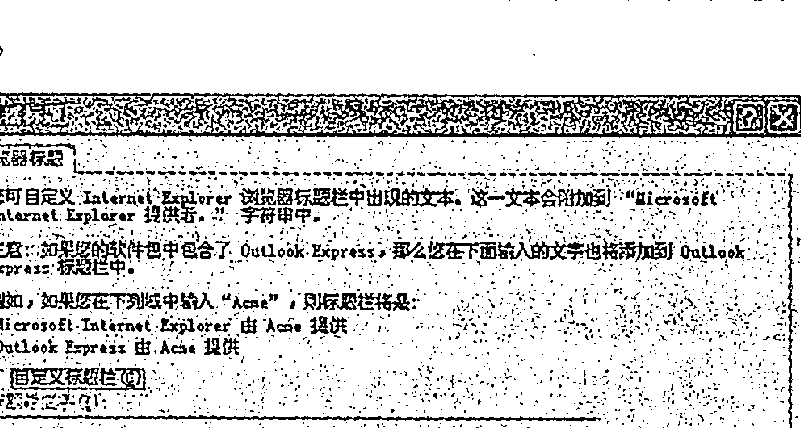

4. 在设置框中，大家也可以自行定义IE 浏览器工具栏背景的图案：选中“自定义工具栏背景位图”这个选项，然后用鼠标单击该设置项右边的浏览按钮，从随后打开的文件选择对话框中，大家可以将自己喜欢的图像甚至是个人的相片选中，作为个性化的工具栏背景图案。

5. 如果大家看惯了Internet Explorer 窗口右上角的动画徽标的话，大家也可以选择自定义徽标选项，用鼠标双击这个选项后，大家就可以打开一个如图2所示的设置界面；在这个界面中，大家可以选择合适尺寸的动画徽标来代替Internet Explorer 徽标。

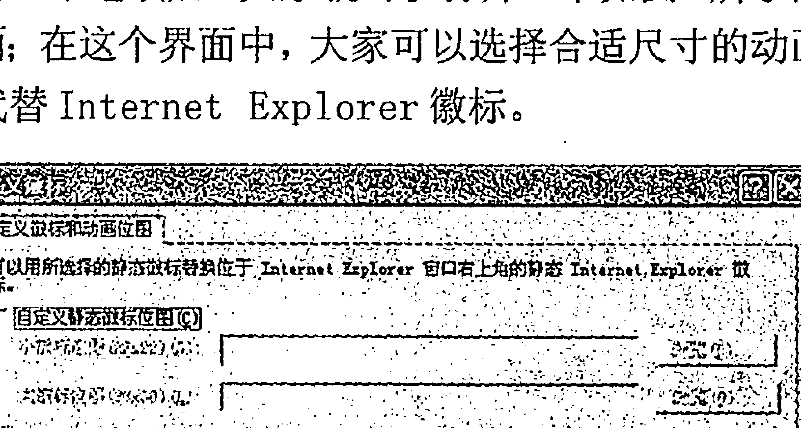

6. 利用组策略大家还可以在IE 浏览器的工具栏中自行添加工具按钮，这样用户能在浏览信息的同时，可以快速地启动和运行其他程序。假设，现在笔者要在IE 的工具栏上添加记事本的快捷运行方式,其实根本不需要动用注册表，大家就能轻松在组策略设置界面中完成用鼠标双击“浏览器工具栏自定义”选项，这样系统就会打开一个标题为“浏览器工具栏按钮信息”的对话框，用鼠标左键点击其中的添加命令，随后我们就能看到如图3所示的参数设置界面了。

大家可以在该界面的“工具栏标题”中输入“记事本”，在“工具栏操作”文本框中输入“C:\WINNT\NOTEPAD.EXE”，最后在选中“颜色图标”和“灰度图标”，要是大家不知道怎么提取这两个图标的话，可以到网上去下载一个名叫EXeScope 的软件来帮忙。设置好所有参数后，再用鼠标单击“确定”来退出设置界面，重新打开IE 浏览器后，大家就会在工具栏上看到“记事本”按钮的身影了！

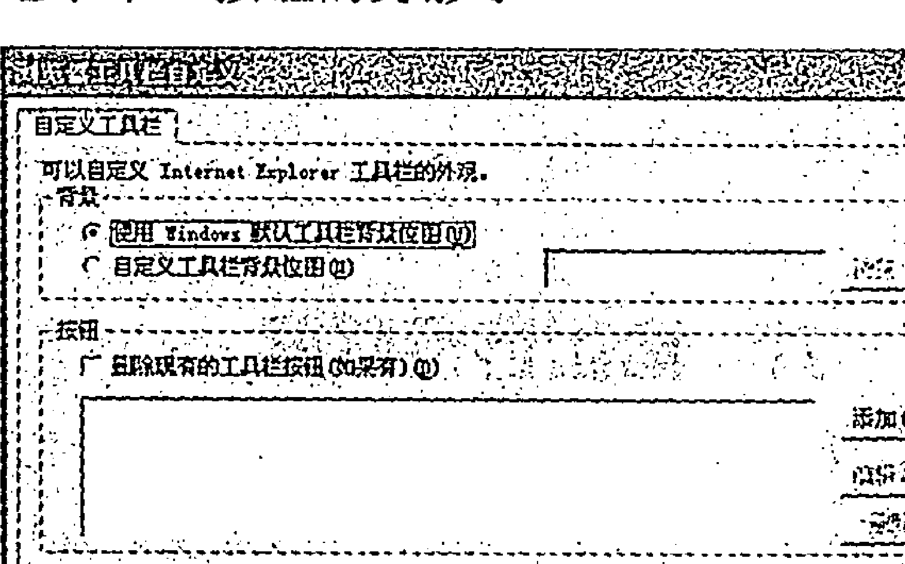

### 二、取消IE 自动缩图功能

Internet Explorer 6 在浏览图片的时候如果超出了屏幕，图片便会自动缩小，如需取消这功能可这样来修改。

点击“开始”→“运行”→“regedit”，展开HKEY_CURRENT_USER\Software\Microsoft\Internet Explorer分支，在Main之中增加一个字串值“Enable AutoImageResize”，将其值为“NO”即可。

### 三、更改IE 工具栏背景

先预备一个BMP 图片文件，最好使用网页背景用可拼合的图，然后再点击“开始”→“运行”，键入Regedit打开注册表编辑器，展开HKEY_CURRENT_USER\Software\Microsoft\Internet Explorer，在Toolbar项目之中右边窗口增加一个字串值，名为“BackBitmapIE5”，数值资料为“文件位置及名称”，例如C:\Windows\abc.bmp，然后重新打开Internet Explorer便开始生效了。

### 四、启用脚本记录功能

为了避免重复输入的麻烦，IE6.0 浏览器允许我们启用脚本记录功能，来达到快速输入以前相同内容的目的。通过以下步骤用户将会快速输入自己以前输入的内容，只须点击鼠标就能达到事半功倍的效果：首先要打开浏览器操作界面，接着用鼠标单击菜单栏中的“工具”菜单项，并从弹出的菜单中选择“Internet 选项”命令，接下来在“高级”标签中的“Java VM”设置项中选中“启用Java脚本记录”复选框，最后再单击“确定”按钮就能实现目的了。

### 五、查询磁盘文件信息

如果我们在浏览网页时，突然需要查询磁盘文件信息，一般的方法是在“我的电脑”窗口中打开对应的盘符，然后再依次打开指定的文件夹。但这样操作太麻烦，现在在IE6.0浏览器中，我们直接可以在浏览界面中直接访问磁盘中的文件信息。其具体操作方法是：首先打开IE6.0浏览器主操作界面，在操作界面的地址栏中我们可以直接输入一个反斜杠字符(\)，接着再按一下回车键，就可以了。这样当用户在浏览网页时，可以随时很方便地查看硬盘上的文件。要返回你刚才看的网页，按Back钮即可。

### 六、直接运行程序

当用户在浏览网上信息时，由于特殊原因需要及时运行系统中的另外一个程序，来处理突发任务。按照常规方法，我们必须暂时停止浏览器的运行，来另外打开一个窗口来启动程序。现在我们可以不需要单独再打开一个窗口来运行程序，直接使用浏览器也能把需要的程序打开，这样的话就能节省系统资源，提高系统的运行速度。具体操作步骤如下：首先打开浏览器主操作界面，在操作界面的地址栏中我们可以直接输入运行程序在硬盘中的绝对路径，例如我们在地址栏中输入“c:\windows\notepad.exe”，输入完毕后再按一下回车键，接着浏览器就会在浏览窗口中自动打开指定程序的界面，在这里我们将会看到一个打开的“写字板”程序界面。

但要按多少次呢？一次、二次、还是十次？你只有苦等着网页一页页地逐一显示在屏幕上，直至你想找的网页出现为止。其实，只需轻按“后退”键右边的下箭头键，屏幕上便会列出你曾看过的网页，直接点击所需的即可。

#### 3. 拖动地址图标

在浏览器地址框左边有一个小图标，图标右边是目前你正访问的WEB页面的地址。将此图标拖到桌面上或放到一打开的文件夹中，可以为此地址创建快捷方式。

#### 4. 建立链接快捷键

用鼠标右键点击浏览器“链接”栏中的按钮，在弹出的菜单中选择“属性”，用鼠标左键点击“快捷键”栏，敲入一个字母，选择“确定”，之后按Ctrl+Alt+敲入的字母即可进入该网站。例如链接栏中有一项可链接到微软的主页“Microsoft”，如果在快捷键栏敲的字母是T，那么以后用键盘输入组合键Ctrl+Alt+T就可去微软的网站浏览了。

### 七、不让网址自动保存

通常在浏览器地址栏中输入网址时，它可以自动地把输入的网址记录在浏览器的缓存中，用户下次访问同样网址时直接就可以从地址框中调用了，用户不妨亲自验证一下：在工具栏下边的地址窗口中输入一个网址，浏览器将把该地址记录在下拉菜单中，直到有其他内容把它覆盖掉；但有时我们不希望浏览器这样“勤劳”，因为它有可能暴露我们用户的个人隐私。那么我们该如何做才能让地址栏不保存网址呢？大家可以按照下面的方法去输入网站，而所使用的网址将不被记录：在浏览器中按下“Ctrl+O”复合键，然后在地址栏对话框中输入URL地址就可以了。

#### 5. 巧妙输入长网址

如要输入曾经浏览过的网址，且这个网址很长时，只需输入该网址前面的部分字符，其余相关字符会在地址栏下方列出。按键盘上的↓键，选择目标地址，按回车，就可以再次访问该网站。

#### 6. 自动查信功能

打开Outlook Express，选择“工具”中的“选项”，在“发送 / 接收邮件”中启用“每隔 X 分钟检查一次新邮件”，然后在X处填写时间，最后单击“确定”。设置完毕，将设备准备好，每隔X分钟将会自动连接到因特网去收信。

### 八、IE5.0使用技巧

考虑到不少朋友还是在使用Windows 2000以及ME之中的IE5.0，因此这里我们也介绍一些IE5.0的使用技巧，不过对于6.0的用户而言也是很有用处的哦！

#### 7. 自定义工具栏

你可以对工具栏进行自行设置，操作步骤如下：单击“查看”菜单，选择“工具”，选择“自定义”，在“可用工具栏按钮”中选择要增加的工具按钮，单击“添加”按钮可以添加到“当前工具栏按钮”中，在“文字选项”下拉列表中可以指定是否在工具栏上显示工具按钮的文字说明以及文字显示的位置，“显示文字标签”是在工具栏上的每个按钮下面显示按钮的名称，“无文字标签”是在工具栏上显示图标。在“图标”下拉列表中可以设置图标的大小。

#### 1. 在收藏夹内自动新增你喜爱的网页

要在收藏夹上快捷地新增网页，以便将来重新访问，只需按下Ctrl+D即可。

#### 2. 快速前进和后退

#### 8. 清除地址列表

在浏览网页过程中，如果一时想跳到前面、后面好几页的画面，便需单击“前进”、“后退”按钮，

如果不想让别人知道你所访问过的地址，只须选择“查看”菜单的“Internet 选项”，然后单击“清除历史记录”按钮即可。

#### 9. 保存一个网页所有的内容

## Office技巧之精挑细选

### 一、助你提高工作效率的六则 Office 技巧

#### 1. 微移技巧

平时用光标键移动Word文档中的图片、自选图形或艺术字时它都是一个字符一个字符的移动、无法实现精确排版，这时如果用鼠标选定它再用“Ctrl+ 光标键”就可使对象一个像素一个像素的精确移动了。

#### 2. 选择技巧

有时 Word 文档中存在多个图片、自选图形、艺术字，想让它们按照已有间距整版移动时，可以先按住 Shift 键再用鼠标左键依次选定它们，然后再用光标键或Ctrl+ 光标键移动即可。

#### 3. 图文混排技巧

如果向一篇 Word 文档中粘贴图形，图形会把文本遮住且用光标键不能移动它，这时只要用鼠标左键选定它再单击右键，选择“设置自选图形格式”菜单项，点击“版式”选项卡，勾选“浮于文字下方”即可使图片在文档区任意移动且不会遮住文本。

#### 4. 给分栏文档排页码

如果一篇已分栏的 Word 文档想按栏插入页码的话，除了先插入分隔符再设置页码这个方法外，还可利用自选图形和艺术字相结合的办法来实现：先选一个自选图形，比如菱形或圆圈，把它画到页码的位置，再输入一个艺术字页码，移到图形中间即可。每栏要重复一次，页码作相应改动，这样可做出很具个性化的页码。

#### 5. 去掉 Office2000 的 “个性”

微软为了提高用户的工作效率，把平时使用频率较低的菜单命令都隐藏起来了，要使用这些命令的话得先...

框中键入网页的文件名，在“保存类型”下拉列表中选择“Web 网页，全部 (*.htm; *.html)”选项，选择该选项可将当前 Web 页面中的图像、框架和样式表均全部保存，并将所有被当前页显示的文件一同下载并保存到一个“文件名.file”目录下，而且 Internet Explorer将自动修改 Web 页中的链接，可以方便的离线浏览。最后，单击“保存”按钮即可。

#### 10. 备份收藏夹的技巧

在日常的冲浪过程中，我们在碰到自己感兴趣的网站时，往往都是将相应网站的网址添加到系统的收藏夹中（IE称之为收藏，NETSCAPE称之为书签），从而免去再次浏览相同网站时手工输入网址的步骤，简化了用户的操作。不过重装系统时这些精心收藏的网址信息往往会“付之东流”，因此我们一般都希望在重装系统之前能够将这些网址信息备份下来。别着急，对于 IE5而言，“收藏夹”信息全部保存在 C:\Windows\Favorites 文件夹下（非缺省用户保存在 C:\Windows\Profiles\用户名\Favorites 文件夹下），一个文件记录一个网址，我们只要将该文件夹下的所有文件全部备份下来即可达到目的；对于 NETSCAPE 而言，其书签保存在 C:\Program Files\Netscape\USER 文件夹下的 bookmark.htm文件中，我们只要备份该文件即可实现备份 NETSCAPE 书签的目的。

#### 11. 巧用搜索引擎

搜索引擎是你上网查找信息很重要的工具，但是使用某搜索引擎时，你必须先连上某搜索引擎，输入关键字进行检索，再从一堆检索结果中做进一步链接。如果不是你想要的，那又得回到前一画面，重复前面的过程。不过 IE5.0 的检索程序可就方便多了。在标准按钮工具栏上选“搜索”，即可在左方发现预设的搜索引擎小窗口，直接在其上进行检索，检索结果会出现在该小窗口中，并不会影响到原有的主窗口。在检索结果中选择欲前往的网页，则该目标网页会显示在右方的主窗口中，并不会盖住检索结果画面。如此可避免以往来来回回检索的不便。

#### 12. 利用修复功能整理界面

如果在使用 IE5时经常发生不正常的事情，比如菜单消失了，你可以使用程序修理工具。打开“开始”菜单，单击“设置”中的“控制面板”，双击“添加 / 删除程序”，在安装 / 卸载栏中选择“Microsoft Internet Explorer 5”，按“添加 / 删除”钮，选择“修复 Internet Explorer”，然后单击“确定”。如果这样仍不能解决问题，那就请重新安装一次吧。

(文/水月斋)

### 二、在Word 2003中打开多文档对照编辑的技巧

在教学及办公系统中，经常需要打开多个文档，进行对照编辑修改，那么，怎样才能让工作做得更方便呢？下面介绍的几种方法希望对大家有所帮助。

#### 1. 同时保存和关闭所有打开的文档

在资源管理器中选定多个要打开的文档，然后右击打开右键菜单，再执行其中的“打开”，这样就能够将选定的文档一齐打开。由于每个打开的文档都在任务栏上放一个最小化按钮，所以可通过这些最小化按钮来切换浏览，进而找到需要的信息。打开了多个文档以后，保存或者关闭起来就成了问题，逐个地进行当然太繁琐，这里也有一个窍门：按住“Shift”键以后再打开Word 2003工作窗口里的“文件”菜单，就会发现里面出现了“全部保存”和“全部关闭”指令，用这些指令可以同时保存和关闭所有当前打开的文档。

#### 2. 通过“预览”快速了解文档的内容

如果觉得将多个文档同时打开来浏览还是不那么方便，那么这里还有更好的方法：执行“文件”→“打开”命令，打开对话框。单击对话框中文档列表区域右上方的那个“视图”按钮可以改变对话框的显示方式。一共有4种显示方式可供使用，其中的一种就是“预览”。在预览方式下，对话框分割为两个主要的区域，左边的是文档列表区域，右边的是文档内容显示区域。在列表区域单击选定一个文档，该文档的内容就显示在右边供浏览。由于通过列表可以方便地切换当前的焦点文档(通过鼠标点击或者用键盘上的箭头键来选择)。另外，浏览的时候，文档内容显示区域能够自动折行，进而显示每个内容行的完整内容，再加上文档内容显示区域支持上下 的滚动操作，因此可以很方便地浏览整个文档的内容。

#### 3. 浏览图片文件

Word不但能够浏览Word文档、文本文档等，而且还能够浏览图片文件。方法是：通过对话框里的“查找范围”打开相应的文件夹，文件夹中可以浏览的文件就会在对话框的文档列表里显示出来，再选定要查看的文件，即可在对话框中显示出文件的具体内容。虽然，资源管理器本身也具有图像文档预览功能，但需要最大化其工作窗口才行，而且显示的图片太小，有时候甚至看不清其内容。

### 三、巧用“样式”编辑Word文档

#### 1. 内置样式的用法

要在某一段或某几段中应用样式，只需单击此段落（或选中多段落），将光标移入此段的任何位置，然后单击“格式”工具栏上的“样式”，从下拉列表中选择所需的样式即可。直接单击“样式”框中的下拉按钮，所弹出的下拉列表中只含有部分常用的内置样式，要列出全部的内置样式，可按住Shift键后再单击“样式”框中的下拉按钮。套用样式也可以单击“格式”菜单中的“样式”命令，在弹出对话框中的样式列表框中单击所需的样式，再单击“应用”按钮。如果样式框中没有列出需要的样式，可在“列表”框中选择其他的一组样式。

#### 2. 自定义样式的建立及应用

当Word提供的内置样式不能满足需要时，可以创建自定义样式。方法是将文本中某段设置为常用的格式，然后将光标置于此段或选定此段，单击“格式”工具栏上的“样式”框，输入自定义样式的名称后回车。将自定义样式应用于其他段落的方法与内置样式的用法相同。这样创建的样式仅在本文档中有效，在新建的文档中不能使用。如果以后常用这个样式，可以将其添加到模板中，方法是单击“格式”菜单中的“样式”命令，在弹出对话框中的“样式”列表框中选定需要的样式，单击“更改”命令按钮，在“更改样式”对话框中选中“添至模板”复选框后“确定”。

#### 3. 自动更新样式

自动更新样式的作用是：文档中应用同一样式的段落，如果对其中一段的格式进行修改，其他段落也自动进行相应的修改。将样式设为自动更新的方法为：单击“格式”菜单中的“样式”命令，在弹出对话框中的样式列表框中选定需要的样式，单击“更改”命令按钮，在“更改样式”对话框中选中“自动更新”复选框后“确定”。

有时候我们要对应用了同样式的若干段落进行相同的格式修改，而有时我们只想修改其中一段的格式而其他段落不变。可以通过设置或取消样式“自动更新”功能进行相应的操作。我们用以下的方法操作更方便：以“宋体小四”样式为例，若“宋体小四”样式具有“自动更新”功能，先将此功能取消。当我们修改了应用“宋体小四”样式的某一段格式，其他应用此样式的段落格式不发生变化。若想要其他应用此样式的段落格式发生相应的变化，可单击“格式”工具栏上的“样式”框后回车，便弹出“更改样式”对话框。选中第一个复选框后确定。其他应用此样式的段落的格式发生相应的修改。

### 四、巧除 Word 中的页眉横线

经常有朋友问我，给 Word 文档添加页眉后，页眉下怎么会自动出来一条横线？删除页眉后，那条横线仍在。怎样才能去除页眉下的横线？能否将它换成其他的线型？在默认情况下，我们在 Word 下建立的文档都是基于 Normal 模板的，键入的文字会自动应用一些特定的样式。如：文本区的文字会自动应用“正文”样式，页眉区的文字会自动应用“页眉”样式。所谓的样式其实是应用于文本的一系列格式特征，利用它可以快速改变文本的外观。当应用样式时，只需执行一步操作就可应用一系列的格式，大大提高了工作效率。Normal 模板中的“正文”样式就定义了“宋体5号”等一系列格式特征，而“页眉”样式则定义了“底端单实线段落边框”等格式。所以，自动应用“页眉”样式的页眉会出现一条横线。知道了页眉横线的来历，要去除它就不难了。

#### 1. 改变页眉的样式

如果仅仅想去除页眉下的横线，最为便捷的就是改变页眉的样式。例如，我们在编辑页眉时可以把页眉的样式换成“正文”。因为“正文”样式中没有段落边框的格式内容，页眉下自然也就不会出现横线了。

#### 2. 修改“页眉”样式

改变页眉的样式，你失去的可能不仅仅是一条横线，还有其他一些包含在“页眉”样式里而在“正文”样式里所没有的格式特征。如果你不想失去它们，可以修改“页眉”样式，在“页眉”样式中去除有关横线的相应格式内容。在 Word 中我们可以依次选择菜单栏中的“格式”→“样式”，在随后出现的“样式”对话框中依次选择样式列表框中的“页眉”和“更改”按钮，此时“修改样式”对话框就出来了。单击“修改样式”对话框中的“格式”按钮，选择其中的“边框”。再在随后出现的“边框和底纹”对话框中选定“设置”下的“无”，最后依次点击按钮“确定”和“应用”。你会发现页眉下的横线同样消失了。

#### 3. 取消页眉的边框格式

修改“页眉”样式后，当前文档中页眉的横线全部消失了。如果仅仅想去除当前节的页眉，可以在编辑页眉时依次选择“格式”→“边框和底纹”，在随后出现的“边框和底纹”对话框中选定“设置”下的“无”。特别要提醒的是：“边框和底纹”对话框中的“应用范围”项一定定是“段落”，而不是“文字”。

#### 4. 和页眉横线“永别”

即便使用以上的各种方法删除了横线，但在 Word 下给新建立的文档添加页眉时，你会发现那条讨厌的横线又出现了。要想和页眉横线“永别”，我们可以在修改“页眉”样式时，选中“修改样式”对话框中的“添至模板”复选框，然后建立一个自己的文档模板，并且指定该模板为默认模板，当然该模板中肯定没有那条横线。

### 五、为 Word、Excel、PPT 文档“减肥”

在编辑 Word 文档时，细心的人会发现，原来只有几十 K 的文档经过几次编辑后，身材竟然胖达上百 K，甚至几百 K，这是什么原因呢？怎样来给它减肥呢？试试下面的办法吧：

#### 1. 关闭“快速保存”选项

在 Word 中，打开“工具”→“选项”→“快速保存”选项，选中这个选项时，每次进行保存文档的操作则只保存文档的修改部分，保存速度较快，但文档的大小也会增加，即使是对文档进行删减操作也是如此。目前计算机的速度较快，因此开启这项功能所带来速度的增加毫不明显，但付出的代价是文档的大小急剧膨胀，建议不要选中这个选项。如果你有一个 Word 文档选中了这个选项，那么试着关闭这个选项，再对文档稍作修改，然后保存，你会惊奇地发现文档的大小会大幅度缩小。

#### 2. 选择适当的图片格式

在 Word 文档中引用的图片格式一般有三种，BMP、JPG、GIF。BMP 格式保存的图片保真度较高，但大小往往是其它两种格式的几倍至几十倍，而照片、扫描图片等用 GIF 格式保存则失真非常严重，因此建议图片先采用 JPG 格式保存，然后再引入到 Word 文档中，这种格式的图片大小不仅比 BMP 格式小很多，而且往往也比 GIF 的格式小，而保真度与 BMP 格式则相差无几。

#### 3. 利用“插入”引入图片

在 Word 中插入图片有两种方法，第一种是将图片保存为一个 JPG 格式的文件，选择“插入”→“图片”→“来自文件”，打开“插入图片”对话框，选中所需插入的图片文件，点击“插入”即可。另一种是用“画图”、“Microsoft 照片编辑器”等打开这个 JPG 文件，选中并复制，然后在 Word 中点击“粘贴”即可插入。强烈建议大家采用第一种方法，虽然两种方法在 Word 中得到的图片质量是一样的，但第一种方法所形成的 Word 文档的大小可能会比第二种小几十倍。

上述方法不仅对 Word 文档有效，而且对于 Excel 和 PowerPoint 文档也是可行的，有时甚至能将文档大小减

### 六、美化你的 Word 右键菜单

在介绍技巧之前，大家看看图1的Word右键菜单。与通常不同的是，去掉了一些不常用的命令，增加了许多常用的如“打开”、“保存”、“替换” 等Word命令，通过这样的“改造”，许多常见的操作就无需再点击菜单栏了，同时也能大大地提高了我们的办公效率。下面我来介绍一下方法：

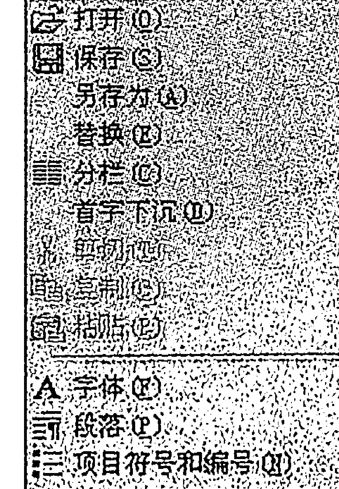

1. 右击工具栏，选择“自定义…”命令，弹出“自定义”对话框，单击“工具栏”选项卡，选中“工具栏”列表中的“快捷菜单”复选框，此时在屏幕上弹出“快捷菜单”工具栏，如图2所示。

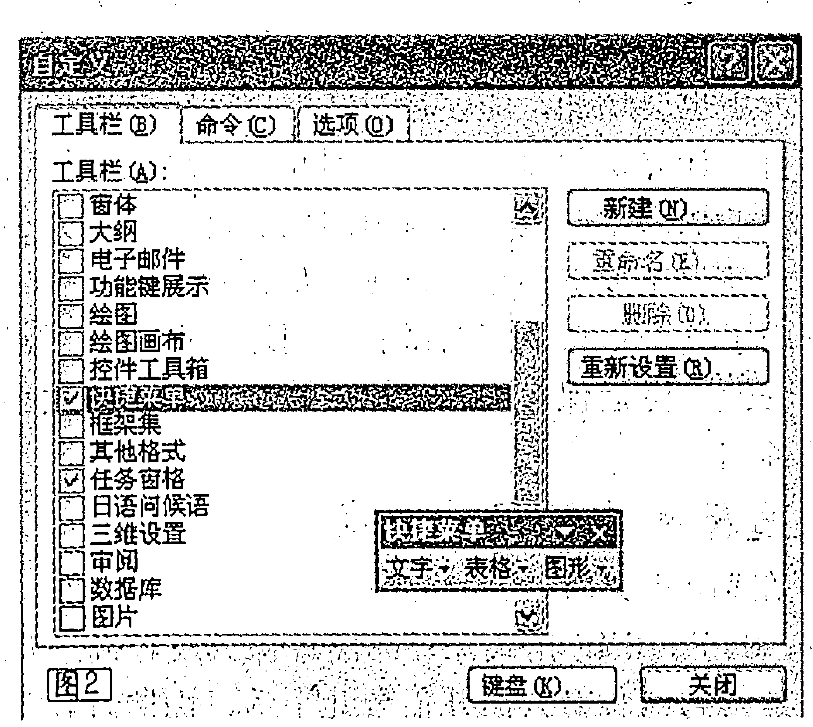

2. 单击对话框中的“命令”选项卡，选中“类别”中“文件”选项，假设我们需要将“打开”命令放入到右键菜单中，只需按住右侧“命令”框的“打开”按钮，依次将其拖放到“快捷菜单”工具栏的“文字”按钮上，此时将弹出下拉菜单，继续按住鼠标左键不放，将其拖到“文字”子菜单的顶部再松开鼠标左键即可。

3. 类似地，我们可以找到“保存”、“替换”等命令并将它们拖入“文字”子菜单中。由于上述命令的拖入，使得Word右键菜单变得较长，在实际使用时要选择某命令（如“打开”）又不是很方便，因此我们可以根据实际情况去掉一部分不常用的如“同义词”、“超级链接”等命令，方法是将这些命令直接从“文字”子菜单中拖出即可。操作完成后，单击“自定义”对话框中的“关闭”按钮即可。

### 七、在 Word 右键菜单中添加 “页面设置”

我们在平时使用 Word 2000/2002/2003 编辑、打印教案或试卷时，经常要用到“页面设置”命令。最通常的操作方法是：执行“文件”→“页面设置”菜单命令。其实，我们完全可以将“页面设置”放进Word右键菜单，这样可以给我们的操作带来很大的方便。

首先打开Word，执行“工具”→“自定义”菜单命令，在弹出的“自定义”对话框中，单击“工具栏”选项卡，在其下的下拉列表框中选择“快捷菜单”选项。此时，屏幕上便会出现“快捷菜单”工具栏，再单击“命令”选项卡，在“类别”下拉列表框中选择“文件”选项，单击“命令”下拉列表框中的“页面设置”后，按下鼠标左键将“页面设置”选项拖动至“快捷菜单”工具栏的“文字”按钮上。这时，会出现“文字”下拉菜单，继续拖动“页面设置”至“文字”子菜单的“字体”命令上方后松开鼠标左键，然后再单击“自定义”对话框中的“关闭”按钮，退出设置。

至此，我们已经将“页面设置”放进了Word右键菜单，以后只要在Word文本编辑区单击鼠标右键，便可在弹出的快捷菜单中看到“字体”上面的“页面设置”命令了，是不是很方便呀？

### 八、用 “分节符” 巧妙为 Word 排版

在对 Word 文档进行排版时，经常会要求对同一个文档中的不同部分采用不同的版面设置，例如要设置不同的页面方向、页边距、页眉和页脚，或重新分栏排版等。这时，如果通过“文件”菜单中的“页面设置”来改变其设置，就会引起整个文档所有页面的改变。有一次有一位朋友要我帮他设置一文档版面，该文档由文档A和文档B组成，文档A是文字部分，共40页，并要求纵向打印，文档B包括若干图形和一些较大的表格，要求横向打印。同时，文档A和文档B要采用不同的页眉。还好，他已经将文档A和文档B按要求分别设置好了页面格式，只要求将文档B插入到文档A的第20页，并要求统一编排页码。

如果根据常规操作，先打开文档A，将插入点定位在20页的开始部分，执行插入文件操作，但得到的结果是文档B面目全非，即文档B的页面设置信息全部变为文档A的页面设置格式。在这种情况下，要在文档A中重新设置插入进来的文档B是很费时、费力的，而要分别打印文档A和文档B，统一自动编排页码的问题又很难解决。这时，利用 Word 的“分节”功能，很容易地解决了这个问题。其操作步骤如下：

打开文档B，在文档末尾插入一个分节符，全部选中后按“复制”按钮；打开文档A，并在19页的末尾也插入一个分节符，将光标定位在A文档20页的开始部分，执行“粘贴”操作。通过以上操作，就将文档B完整地插入到了文档A中，并且文档A和文档B都保持了原来的页面设置属性，而新文档A的页码随内容多少自动重新进行了编排。解决该问题的关键是分别在文档A和文档B的适当位置插入了“分节符”，将文档分成几个不同的“节”。下面就Word中“节”的概念及插入“分节符”时应注意的问题作如下说明：

1. “节”是文档格式化的最大单位（或指一种排版格式的范围），分节符是一个“节”的结束符号。默认方式下，Word将整个文档视为一“节”，故对文档的页面设置是应用于整篇文档的。若需要在一页之内或多页之间采用不同的版面布局，只需插入“分节符”将文档分成几“节”，然后根据需要设置每“节”的格式即可。

2. 分节符中存储了“节”的格式设置信息，一定要注意分节符只控制它前面文字的格式。

3. 插入“分节符”的步骤如下：
单击需要插入分节符的位置；单击“插入”菜单中的“分隔符”命令，打开“分隔符”对话框；在“分节符类型”中选择需要的分节符类型，分别为：“下一页”：分节符后的文本从新的一页开始；“连续”：新节与其前面一节同处于当前页中；“偶数页”：分节符后面的内容转入下一个偶数页；“奇数页”：分节符后面的内容转入下一个奇数页；插入“分节符”后，要使当前“节”的页面设置与其他“节”不同，只要单击“文件”菜单中的“页面设置”命令，在“应用于”下拉列表框中，选择“本节”选项即可。

### 九、用Word转换向导批量转换Word文档的技巧

有时候为了提高办公效率，一些DOC的文件需要转换成纯文本的格式，我们如何批量将DOC文件转换成为纯文本呢？在转换文件格式方面，Word 2000/XP/2003自带的“转换向导”无疑是最方便的。

1. 启用“转换向导”
依次单击“文件”→“新建”→“其他文档”，双击执行“转换向导”选项，弹出“转换向导”对话框后，单击“下一步”按钮。

2. 选择转换方式
“转换向导”提供了两种转换方式：其他文件格式转换成Word文档和Word文档转换成其他文件格式，我们这里选择第二种方式。在这种转换方式的下拉式菜单中，有多种可供转换的文件格式。其中“Text”就是我们要转换成的纯文本文件格式，选中该项并单击“下一步”按钮。

3. 选择文件夹
在弹出的新对话框中，分别单击每个“浏览”按钮选择源文件夹（存放Word文件）和目标文件夹（存放纯文本文件），然后单击“下一步”按钮。为了操作上的方便，建议事先将Word文件放进一个专门的文件夹，转换后的纯文本文件放进另一个文件夹。

4. 转换文件
接下来我们需要选择待转换的文件，在“可用文件”框中列出了该文件夹中的所有Word文件，双击需要转换的文件名称，该文件即被添加到“转换文件”框。因为Word支持一次转换多个文件，因此应该将需要转换的所有Word文件都选中。最后单击“完成”按钮开始转换文件。在转换的过程中有转换进度、已转换的文件个数等提示，转换完成后还会询问是否转换其他文件，根据提示操作即可。

### 十、将Word变成超级多媒体播放器

Word是目前全球拥有用户最多的也是功能最为全面的一款文字处理工具，它除了可以进行各种复杂的图文编辑和文稿排版外，还具有多媒体视听文件播放功能哦！

#### 1. 在Word中播放MP3音乐

在Word中播放MP3音乐的方法其实很简单，用户打开Word程序，在其菜单栏中选择“插入”→“对象”选项，接着在弹出的“对象”对话框中选择“由文件创建”选项卡，在该选项卡中单击“浏览”按钮并通过文件夹切换选中需要播放的MP3音乐文件，单击“插入”按钮返回到“对象”对话框，在“对象”对话框中单击“确定”，这时大家会看到在当前打开的Word文档中多了一个含有MP3音乐文件名的图标，用户只要双击那个图标，美妙的音乐旋律即可立即响起。

#### 2. 在Word中播放视频电影

首先打开Word程序，在其菜单栏中执行“视图”→“工具栏”→“控件工具箱”命令，这时Word会打开一个“控件工具箱”浮动小窗口，单击该浮动窗口的最后一个“其他控件”按钮，然后在其弹出的列表中选择Windows Media Player选项，这时在Word中会弹出一个播放器界面，用户在该播放器中单击鼠标右键，选择“属性”选项，在Word随后弹出的“属性”对话框中找到“文件名”选项，然后用户便可以在该选项右侧的空白框中手工输入需要播放视频的绝对路径及文件名，输入完毕后，关闭“属性”对话框返回到Word中。如果用户需要马上对指定的视频进行播放，则只要在Word的“控件工具箱”窗口中单击“退出设计模式”按钮即可。

#### 3. 在Word中播放Flash动画

在Word中播放Flash动画的操作方法与播放视频有些类似。用户只需按照上面的方法在“其它控件”列表中选择Shockwave Flash Object选项，这时在Word中同样会弹出一个用于播放Flash动画的矩形区域，用户在该区域中单击鼠标右键，选择“属性”选项，在Word## 十一、让Word也能语音校对

在Excel 2003中有一个“文本到语音”的功能，使用此功能可以完成语音校对，但是在Word 2003中却没有此项功能。其实我们可以在Word中使用VBA代码调用Excel的“文本到语音”功能。

#### 1. 代码的编写

打开Word 2003，点击“工具”→“宏”→“宏”菜单命令，这时出现“宏”对话框，将“宏”命名为“语音校对”，“宏的位置”设为“所有的活动模板和文档”。再点击“创建”按钮，此时出现“代码”窗口，在其中输入下面的代码：

```
Sub 语音校对()
Excel.Application.speech.speak Selection
End Sub
```

#### 2. 建立与Excel之间的联系

点击菜单栏上的“工具”→“引用”菜单命令，在出现的窗口中选择“Microsoft Excel 11.0 Object Library”项，再点击“确定”按钮，最后点击“文件”→“保存”菜单命令即可。

#### 3. 工具按钮的制作

通过点击“文件”→“关闭”并返回到Microsoft Word，菜单命令返回到Word界面，然后点击“视图”→“工具栏”→“自定义”菜单命令，出现“自定义”对话框，选中“命令”标签，在“类别”清单内点击“宏”，再将右边“命令”清单中的“Normal.NewMacros.语音校对”拖到菜单栏上，使之成为Word菜单栏上的一个菜单。

好了，现在可以选取一段文字，点击菜单栏上的“Normal.NewMacros.语音校对”项，是不是听到了朗读声呢？

### 十二、在Word和Excel中按“笔画”排序

我们知道，Word和Excel中都有现成的排序功能，它们对文字进行排序时默认是按音序进行排序的。但我们有时需要对笔画进行排序，如将班级学生的姓名按姓氏笔画多少来排序，应该如何处理呢？

#### 1. Word中的笔画排序

将Word表格中需要排序的某一列（如姓名）先输入好，每个姓名要单独占一行，单击“表格”菜单中的“排序”命令，打开“排序”对话框。在“排序依据”项选择“姓名”，“类型”选项默认为“拼音”，单击其右侧下拉列表，选择“笔画”，在其后的单选按钮里选择“递增”或者“递减”方式，单击“确定”即可。

#### 2. Excel中的笔画排序

Excel中对表格字段按笔画进行排序和在Word中类似，但具体设置有所不同。在Excel的常用工具栏中有两个对表格字段进行排序操作的按钮，即“升序”和“降序”按钮。这两个按钮只能同时对某一字段进行排序操作，若用这两个按钮对文字字段进行排序操作，默认也是按音序进行排序的。其实我们可以使用Excel“数据”菜单中的“排序”命令来实现这一操作。该命令一般情况下用来对多个字段同时进行排序操作（最多允许三个字段），另外该命令还允许对“自定义序列”和“文字笔画”进行排序操作。单击表格中需要排序字段的任一单元格，单击“数据”菜单中的“排序”命令，弹出“排序”对话框。若要按升序排序，在“主要关键字”类型中选择该字段，在其右侧的单选框中选择“递增”。单击（选项）按钮，打开“排序选项”对话框，选中“方法”中的“笔画排序”单选按钮（如图3），单击“确定”按钮返回，再次单击“确定”按钮则完成了字段的排序操作。在排序过程中，若某两个表格中的第一个汉字均相同，则按该单元格第二个汉字笔画的多少排序，以此类推，最终实现整个表格字段的排序过程。

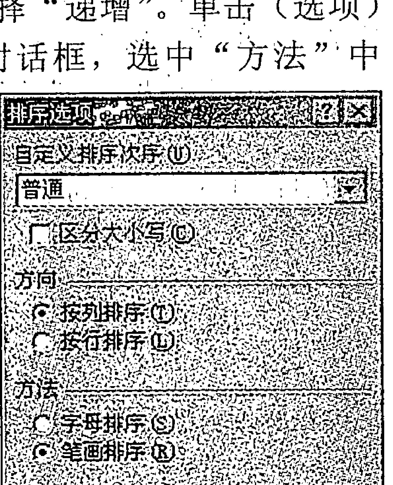

### 十三、Word中分栏页号的设置技巧

在书籍或小册子的编辑出版流程中，经常会遇到这样的问题：如果要制作一本32开的小册子，可以在页面设置中将纸张设置成16开、2栏打印。在这种情况下，每栏均在页脚处设置不同的页号。但由于两栏处于同一页，如果简单的在页脚处插入页号，会使同一页两栏的页码相同。怎样解决这个问题呢？

1. 将光标移动到已分栏的文档的任意一页，单击“视图”菜单下的“页眉/页脚”（也可以在页面的“页眉/页脚”处双击鼠标左键），显示出“页眉/页脚”工具栏。

2. 将光标停留在“页脚”处，按下键盘上的“Ctrl+F9”功能键，此时会在“页脚”处出现一个带有阴影的“{}”，这就是域的标志。在花括号内输入“=”后，再同时按下键盘的“Ctrl+F9”功能键，在这次出现的花括号内输入“page”（表示插入“当前页”域代码），再将光标移到内部一对花括号之后，输入“2-1”，此时，在页脚处得到这样一行域代码：“{=Page\*2-1}”。将光标停留在这个域代码上，同时按下“Shift+F9”或者在右键菜单中选择“更新域”，即可看到当前页左栏的页码。

3. 将光标停留在“页脚”处，选中刚刚输入的域代码，用Ctrl+C组合键进行复制，并在此之后插入若干窗格后，按下Ctrl+V将左栏的域代码粘贴在右栏，选中刚刚粘贴上去的域，按下Shift+F9还原域代码此时，删除原域代码后面的“-1”即可。

完成以上所有操作后，选中页脚处的所有文字后按下“F9”功能键或者在鼠标右键菜单中选择“更新域”，看看页脚处的页号是不是一页有两个（每栏一个）呢？

### 十四、在Word2003中更新微软拼音输入法词典的技巧

Office 2003是微软新推出的办公软件，它增加了许多可以帮助我们提高工作效率的新功能。Word 2003中的“更新微软拼音输入法词典”就是其中之一。它将我们常用的一些词汇或自造词汇添加到微软拼音输入法中，进一步提高我们的拼音输入速度。

#### 1. 添加新词

运行Word 2003，将输入法设为“微软拼音输入法”，单击“编辑”菜单，选择“更新微软拼音输入法词典”项，打开对话框。在“自造词”右边的方框中输入要添加的词汇。如输入“伍冬”，完成后按回车键。系统会在下面的“汉字”和“拼音”栏中自动填入所输入的汉字和拼音，必要的话还可以在“快捷键”栏中为所添加的词汇设定一个快捷键。再单击“注册”按钮。系统提示：“这条短语被成功注册。”单击对话框中的“确定”按钮即可。这样，新词汇就可以使用了。

#### 2. 删除词汇

如果添加的词汇不再需要的话，我们还可以把它们删除掉。同样打开“更新微软拼音输入法词典”对话框，单击“高级”按钮。在窗口中列出了用户已经添加的新词汇。只要选择其中需要删除的词汇，右击鼠标在弹出的菜单中选择“删除”项，该词汇就会变成灰色，词汇前面出现一个红色的叉号，单击工具栏中的“保存修改”工具按钮或关闭窗口。系统提示“要保存修改吗？”单击“是”，你的修改就生效了。用户还可以在“自造词工具”的操作窗口中对已添加的新词汇进行修改和继续添加新词汇等操作。

### 十五、在Word中使图片随意旋转的技巧

“在Word中随意旋转图片”的确是困扰不少人的一个问题，不过我们可以用以下的简单易行的方法去实现它：

在Word中插入图片，图片的“文字环绕”方式默认为“嵌入型”，图片被选中后，四周为八个黑色的实心矩形控制句柄，此时的图片既不能旋转，也不能移动位置。此时单击图片工具栏上的“环绕方式”命令按钮，在弹出的下拉菜单中选择“四周型环绕”等其他六种方式中任意一种。图片上方会出现绿色圆圈，图片可以任意旋转、移动位置。在PowerPoint中这一问题更为简单，插入图片后不用改变环绕方式就直接可以旋转。

其实在Word中还有一种旋转图片的方法，就是把图片作为闭合图形的填充底图，由于图形是可以自由旋转的，图片也就可以旋转了。方法是绘制好图形后，单击绘图工具栏上“填充颜色”按钮右侧的下拉小箭头，在弹出的菜单中选择“填充效果……”，在弹出的“填充效果”对话框的“图片”选项卡中，单击“选择图片……”选中一幅图片后单击“确定”关闭对话框。然后再把图形旋转一定角度即可。这里要提醒大家注意的是，若想图片跟随图形旋转，一定要把对话框中“选择图片……”按钮下的“随图形旋转填充效果”复选框选中。如果不想图片改变原有比例，则“锁定图片纵横比”也要选中哦！

### 十六、将Word表格压缩的技巧

许多包含Word表格的文件，不但内容多而且尺寸大，要将其排列到A4纸上非常困难的，下面介绍给大家一些压缩WORD表格的方法：

#### 1. 设置表格属性

在表格上单击鼠标右键，从右键菜单中选择“表格属性”，打开“表格属性”对话框。在“表格”选项中，取消选择“指定宽度”复选框，同样也将“行”、“列”及“单元格”选项卡中的此处勾选都去掉。单击“确定”按钮，表格自动缩小至各行、列的最小值，如果表格没有反应，尺寸没有缩小，你需要继续下面的设置。

在“表格属性”对话框的“表格”选项卡中，单击“选项”按钮，又打开了“表格选项”对话框（图4）。勾选“自动调整尺寸以适应内容”复选框，确定后退出，重复去掉指定宽度的设置，则表格的自动缩小尺寸设置才起作用。

此时你还可以继续减小表格尺寸，在图4中将表格的“默认单元格”间距都修改为“0厘米”，确认退出，此时表格又变小了。

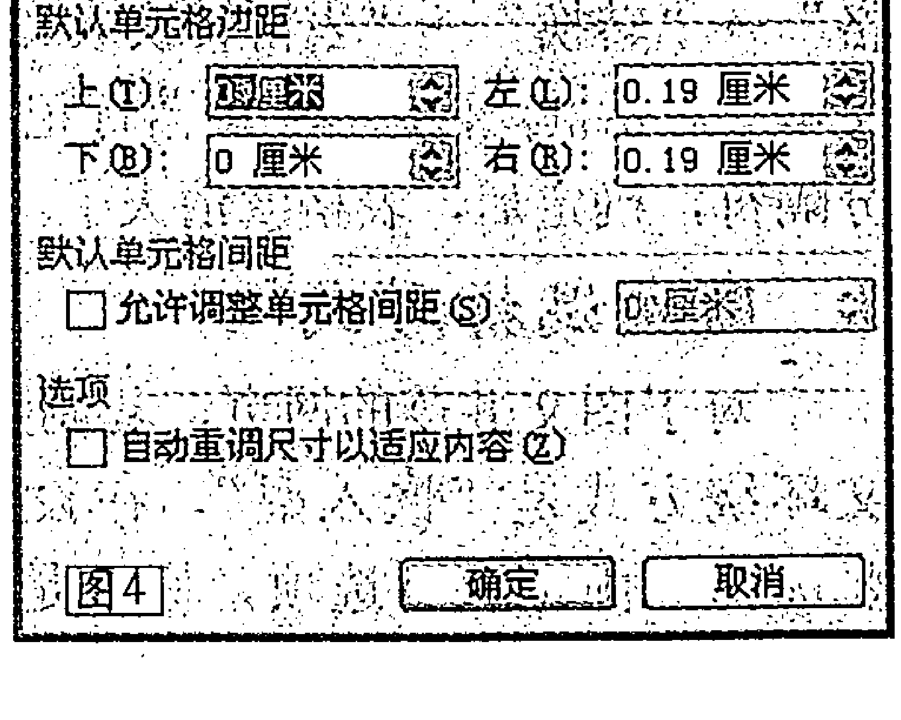

#### 2. 利用表格控制柄

如果你使用的是Word 2000/2002，在表格的右下角会出现一个正方形控制柄，拖动此控制柄，向左上方压缩，直至最小，则快速减小表格的尺寸。

#### 3. 减小行间距、字间距

经过上面的调整，表格的尺寸已经大为减小了，但并不是到了极限，你还可以缩小表格尺寸，通过减小表格中字符的行间距、字间距，可继续缩小表格的尺寸。调整行间距、字间距，分别利用“段落”对话框、“字体”对话框实现！

### 十七、用Word保存网页中的内容

上网看到好的文章、资料，总想将其保存到自己的硬盘。其实用Word来保存网上的资料是不错的选择，因为Word保存的内容便于编辑、处理，满足你不同的需求。复制的内容一般有这样几种情况：纯文字、带有表格的文本和图文混排。

#### 1. 纯文字内容

如果复制的内容是纯文字形式，无表格与图片，直接单击工具栏上的“粘贴”按钮就可以了，网页文字上原有的属性都会保留下来，只是比较零乱，需要整理。在许多情况下文档中出现大量的“手工换行符”，这时你可以应用Word“查找/替换”功能来轻松解决。在“查找/替换”对话框中，打开“高级”选项，通过特殊字符在“查找内容”框中加上“^I”（手工换行符），在“替换为”框中加上“^p”（段落标记），再单击“全部替换”按钮，瞬间就完成替换操作。

如果不需要保留原来的格式及链接等，单击“编辑”→“选择性粘贴”，打开“选择性粘贴”对话框，在“粘贴”选项中选择“无格式文本”，确定就可以了。如果你应用的是Word 2002，直接单击工具栏上的“粘贴”按钮，在复制文本的右下角有一个“选择粘贴”按钮，单击此按钮菜单的“仅保留文本”命令，你的文本立即转化为无格式的文本了。

#### 2. 带有表格的文本

只要将光标移动到表格内的任一位置，单击“表格”→“转换”→“表格转换成文本”，在“表格转换成文本”对话框，再选择“段落标记”或“制表符”等文字分隔符，确定后，表格就消失了。

#### 3. 图文混排形式

对于图文并茂的网页，复制到Word后，默认的图文环绕方式是“嵌入型”，在设置“行间距”时，不要选择“固定值”选项，原因是选择后，图片会置于文字的下面，被遮盖住，需要将图文环绕方式重新设置为“四周型”等环绕方式，图片才能完全显示出来。如要保持图片与文本的相对位置绝对不改变。可以采用抓图的方法，将网页完整地抓下来，把图片插入到Word中保存就可以了。

### 十八、在Word中快速输入上、下标

我们在用Word来编辑一些科技文档时，常常需要同时输入上、下标（图5）。下面我们来介绍一下实现的方法：


#### 1. 双行合一

启动Word，输入文本“Anm+n”，再选中文本“nm+n”，执行“格式”→“中文版式”→“双行合一”命令，打开“双行合一”对话框（图6），将鼠标定位到“字符”下面的文本“n”和“m+n”之间，按一下空格键，在预览栏中查看效果，符合要求后单击“确定”按钮返回即可。

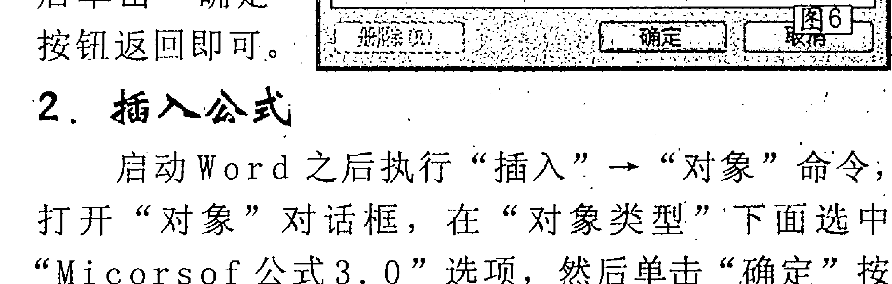

#### 2. 插入公式

启动Word之后执行“插入”→“对象”命令，打开“对象”对话框，在“对象类型”下面选中“Microsoft公式3.0”选项，然后单击“确定”按钮，展开“公式”工具条，点击其中的“上标和下标模板”按钮，在随后弹出的下拉列表中，选中“上、下标”样式的模板，然后分别单击其上、下标位置框，输入文本“n”和“m+n”，在其前面输入文本“A”，再在文档其他部位单击一下；右击插入的公式，执行“格式”→“对象”命令，打开“设置对象格式”对话框，切换到“版式”标签下，选中一种非“嵌入式”版式，确定返回；最后用拖拉法调整一下公式的大小，并将其定位到文档中合适的位置上就行了。

### 十九、最简单的纵、横页面混合打印技巧

解决纵、横页面的混合打印有一个简便的办法。具体操作如下：

1. 首先将光标移到需要横向排版打印的页的前一页的末尾。然后用鼠标单击“文件”菜单，打开“页面设置”窗口。在“页边距”选项卡中将“方向”改为“横向”(在Word 2000中为“页面设置”中的“纸型”选项卡；在WPS中为“页面设置”中的“纸张类型”选项卡)，然后在同一选项卡中选择“应用于”中的“插入点之后”选项，单击“确定”。此时如果是“页面视图”模式的话，就可看到光标所在页的下一页已变成横向排版方式，或用“打印预览”方式也可看到该变化。

2. 将光标移到横向排版打印的页的最后一页的末尾。仍然打开“文件”菜单中“页面设置”窗口。在“页边距”选项卡中将“方向”改回“纵向”；然后在同一选项卡中选择“应用于”中的“插入点之后”选项，单击“确定”。此时光标所在页的下一页就又恢复为纵向排版了。

### 二十、把Excel表格内容复制成为图片的技巧

通常情况下，要将Excel的表格内容复制成图片插在Word文档中，我们除了使用抓图软件就是按键盘上的PrintScreen键来抓取，这两种方法中前者要借助第三方软件来实现，后者虽然简单，但抓取的图片也要经过裁剪、缩放等方式处理。其实在Excel中还提供了更方便的将表格内容复制成图片的方法，操作非常简便，下面就跟随我一起来看看吧：

#### 1. 将选区复制成图片

首先选定需要复制成图片的单元格区域，按住Shift键单击“编辑”菜单，选择“复制图片”命令，弹出“复制图片”对话框，按系统默认设置(即将“外观”和“格式”分别选定“如屏幕所示”和“图片”)，单击“确定”按钮。这时就将选定的表格区域复制成图片了。若需要将其粘贴出来，只需要按住Shift键再单击“编辑”菜单，选择“粘贴图片”命令即可(或不按Shift键，直接从“编辑”菜单中选择“选择性粘贴”命令，以“图片”方式粘贴)，还可以将其粘贴到其他软件中去。

#### 2. 选区的摄影操作

除了用上述方法可以将单元格区域复制成图片，另外在Excel中还提供了一个非常简单抓图工具，这就是“摄影”工具。该按钮可以通过下面的操作拖放到工具栏中：右击工具栏，选择“自定义”命令，从弹出的“自定义”对话框中单击“命令”选项卡，选择左侧“类别”列表框中的“工具”，在右侧的“命令”列表框中找到“摄影”工具，并将其拖放到工具栏中备用。操作时首先选定要复制成图片的单元格区域，单击工具栏中的“摄影”按钮，此时选区周围出现虚框选中状态，鼠标指针变为“+”形状，此时单击鼠标，选区就以图片的形式粘贴出来了。用这种方法复制的图片，如果源数据表中的数据发生了变化，对应的图中相应数据也会跟着发生变化。但粘贴到其他软件中后，相应位置的数据则固定下来，不再随之发生变化。

### 二十一、让Excel给你语音报账

许多人经常要用Excel来统计一些数据，统计完成后还要对数据进行校对，但是这么多数据怎样才能不出差错地进行校对呢？其实我们可以用一下Excel自带的“文本到语音”功能，让软件通过发声自动给你报账。

打开Excel，点击“工具”→“语音”→“显示文本到语音工具栏”，由于这个功能在安装Excel的时候不是默认安装的，所以在第一次使用时会提示插入Office安装光盘来安装这个功能。安装完成后打开了“文本到语音”工具栏，先在数据文件中用鼠标选择要朗读的第一个数据，接着根据数据的排列情况来选择是“按行”还是“按列”来进行朗读，设置完成后点击工具栏最左面的“朗读单元格”按钮就可以了。在朗读的时候被朗读到的单元格会以选中状态显示，而且还可以流利地朗读中文，英文是一个字母一个字母朗读的，这样就可以校对英文单词的拼写是否正确。

该功能还可以一边输入数据一边来进行语音校对，只要点击一下工具栏最右面的“按回车开始朗读”按钮，使其为选中状态，这样在完成一个单元格的输入后按回车，Excel就会自动来朗读这个单元格中的内容。一般朗读默认的是男声的，如果你听腻了，可以通过系统里的设置把男声改为女声，打开控制面板中的“语音”项，在里面的“语音选择”来选择一下语音，然后点击下面的“预览声音”就可以听效果了，而且还可以设置语音的朗读速度，完成后点击“确定”按钮就可以了。

### 二十二、在一个PPT文稿中使用不同模板

PowerPoint提供了多种设计模板供我们选择，但是在PowerPoint 2000以前的版本中，同一个PPT文稿中只能使用一种设计模板。如果想选用不同的模板，只能新建一个PPT文稿，然后与第一个PPT文件做链接，比较麻烦。但是在PowerPoint 2002和2003版本中却支持这个功能，大大方便了我们的使用，方法如下：

首先打开PowerPoint 2003，选择要设置模板的幻灯片。用鼠标点击“幻灯片版式”中的“幻灯片设计”，出现“应用设计模板”任务窗口。在“应用设计模板”中选择要应用到某一张幻灯片的模板，然后用鼠标点击模板边出现的下拉箭头（如图7所示），选择“应用于选定幻灯片”即可。如要给多张幻

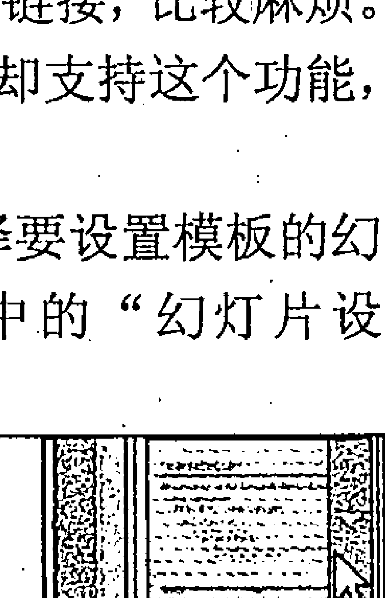

### 二十三、用幻灯片搜索器复制PPT幻灯片

制作演示文稿时，我们经常会把电脑中已有的一些演示文稿中的幻灯片复制到新的幻灯片文档中再次使用。通常情况下，我们会打开原来的演示文稿，将要用到的幻灯片复制后再粘贴到新建的幻灯片文档中去。但该方法有时打开的演示文稿文件太多，复制时需要在多个演示文稿窗口和幻灯片视图中频繁地进行切换，给实际操作带来了诸多的不便，而且容易出错。事实上，PowerPoint程序本身就提供了一个非常高效的用来复制其他演示文稿中的幻灯片的工具，这就是“幻灯片搜索器”。该工具操作非常简便且不易出错；下面我们就来看看如何使用“幻灯片搜索器”。

在新建的幻灯片文档中首先确定要插入的其他演示文稿幻灯片的位置(插入的幻灯片将出现在当前的幻灯片后)，单击“插入”菜单中的“幻灯片（从文件）”命令，从弹出“幻灯片搜索器”对话框中，单击“浏览”按钮查找已有演示文稿文件，选中后单击“打开”按钮，如图所示。单击选中要插入的幻灯片（可同时选择多张幻灯片插入，再次单击后将取消该幻灯片的选中状态），单击“插入”按钮，被选中的幻灯片将按顺序连续地插入到新的演示文稿中。若要复制所有的幻灯片，则不需要选中所有幻灯片，直接单击“全部插入”按钮即可，操作完成单击“关闭”按钮，退出“幻灯片搜索器”。

这里也要提醒大家一下，在PowerPoint2000中被复制的幻灯片将采用将其插入时前一张幻灯片使用的格式。而在PowerPoint 2002/2003中，如果用户希望幻灯片能够保持当前的格式，只需在“幻灯片搜索器”对话框中选中“保留源格式”复选框就可以了。

### 二十四、将Word快速转换为PowerPoint文稿

我们通常用Word来录入、编辑、打印材料，而有时需要将已经编辑、打印好的材料，做成PowerPoint演示文稿，以供演示、讲座使用。如果在PowerPoint中重新录入，既麻烦又浪费时间。如果在两者之间，通过一块块地复制、粘贴，一张张地制成幻灯片，也比较费事。其实，我们可以利用PowerPoint的大纲视图快速完成转换。

首先打开Word文档，选中全部内容，执行“复制”命令。然后，启动PowerPoint，如果是Word 2002/2003，选择“普通”视图，单击“大纲”标签；如果没有“大纲”和“幻灯片”选项卡，显示的方法是在“视图”菜单上，单击“普通（恢复窗格）”或在窗口的左下角，单击“普通视图（恢复窗格）”按钮；如果是Word 97/2000，可直接选择“大纲”视图，将光标定位到第一张幻灯片处，执行“粘贴”命令，则将Word文档中的全部内容插入到了第一幻灯片中。

接着，可根据需要进行文本格式的设置，包括字体、字号、字型、字的颜色和对齐方式等；然后将光标定位到需要划分为下一张幻灯片处，直接按回车键，即可创建出一张新的幻灯片；如果需要插入空行，可按“Shift+Enter”键。经过调整，很快就可以完成多张幻灯片的制作。最后，还可以使用“大纲”工具栏，利用“升级”、“降级”、“上移”、“下移”等按钮进一步进行调整。

反之，如果是将PowerPoint演示文稿转换成Word文档，同样可以利用“大纲”视图快速完成。方法是将光标定位在除第一张以外的其他幻灯片的开始处，按“BackSpace”（退格键），重复多次，将所有的幻灯片合并为一张，然后全部选中，通过复制、粘贴到Word中即可。

### 二十五、在PowerPoint中插入视频的三种方法

#### 1. 直接播放视频

这种播放方法是将事先准备好的视频文件作为电影文件直接插入到幻灯片中，该方法是最简单、最直观的一种方法，使用这种方法将视频文件插入到幻灯片中后，PowerPoint只提供简单的“暂停”和“继续播放”控制，而没有其他更多的操作按钮供选择。因此这种方法特别适合PowerPoint初学者，以下是具体的操作步骤：

运行PowerPoint程序，打开需要插入视频文件的幻灯片。将鼠标移动到菜单栏中，单击其中的“插入”选项，从打开的下拉菜单中执行“插入影片文件”命令。在随后弹出的文件选择对话框中，将事先准备好的视频文件选中，并单击“添加”按钮，这样就能将视频文件插入到幻灯片中了。用鼠标选中视频文件，并将它移动到合适的位置，然后根据屏幕的提示直接点选“播放”按钮来播放视频，或者选中自动播放方式。在播放过程中，可以将鼠标移动到视频窗口中，单击一下，视频就能暂停播放。如果想继续播放，再用鼠标单击一下即可。

#### 2. 插入控件播放视频

这种方法就是将视频文件作为控件插入到幻灯片中的，然后通过修改控件属性，达到播放视频的目的。使用这种方法，有多种可供选择的操作按钮，播放进程可以完全自己控制，更加方便、灵活。该方法更适合PowerPoint课件中图片、文字、视频在同一页面的情况。

运行PowerPoint程序，打开需要插入视频文件的幻灯片，将鼠标移动到菜单栏，单击其中的“视图”选项。

## Outlook Express 技巧 快递

### 一、自动添加 E-mail 地址

Outlook Express 通讯簿可大大提高撰写信件时输入 E-mail 地址的速度和准确性，为此它提供了 E-mail 地址自动添加功能。如果你要有选择地进行添加，可在打开收到的邮件后，用鼠标右键单击要添加的发信人名称，然后单击快捷菜单中的“添加到通讯簿”命令即可。如果你要对所有回信的 E-mail 地址进行添加，可单击 Outlook Express “工具”菜单上的“选项”命令，打开“常规”选项卡，选中其中的“自动将回复邮件时的目标用户添加到通讯簿”项，此后所有通讯簿中没有的 E-mail 地址均被加到通讯簿。

### 二、让 Outlook Express 释放更多的空间

日积月累，你的机器上有了数量庞大的邮件、新闻，会占用大量的磁盘空间。虽然你清空了 Outlook Express 中收件箱、发件箱、已删除的邮件等文件夹中的所有邮件，但是它们还是占据在硬盘上，文件的体积也颇为可观。

如果你很在意硬盘空间的话，可以试试下面这个方法，来腾出一些硬盘空间，帮 Outlook Express 做一下“体内环保”。

如何做呢？很简单，只要把扩展名为“.mbx”的文件删除就可以了。不过要注意，保证所清理的文件夹中的信件可都是你不再需要的了。因为收件箱.mbx、发件箱.mbx、已删除的邮件.mbx、已发送邮件.mbx等都是 Outlook Express 内建的文件夹，把它们删掉之后，再重新启动 Outlook Express 后，系统又会自动建立这几个文件，所以不用担心会有什么不良的影响。不过像下面的例子中，使用者在收件箱、发件箱下又建立了很多个子文件夹，邮件就相应地存放在子文件夹的mbx文件中，这时如果确认这些文件都不要了，就将这些.mbx文件一起删除。以后用时再重新建立相应的文件夹就行了。.mbx的文件一般在：C:\WINDOWS\Application Data\Microsoft\Outlook Express\Mail 文件夹下。

### 三、消除 Outlook Express 乱码

我们在使用 Outlook Express 时，可能会发现有时收到的邮件为乱码。此时，你只要在工具条中单击“编码”，并在子菜单中选择“简体中文”就可以了。但经常会出现这样的情况，你将 A 信的编码设为了“简体中文”，然后你又浏览了 B 信，这时你再返过头来浏览 A 信，你会发现 A 信又变成乱码了。永远解除乱码的方法很简单：对 Outlook Express 进行设置，能够从根本上解决电子邮件的乱码：打开 Outlook Express，选择“工具”菜单中的“选项”命令，单击“阅读”标签；单击“字体”按钮，选择“简体中文(GB2312)”并把它设置为默认值，设置好后按“确定”按钮回到“阅读”对话框；单击“国际设置”按钮，选中“为接收的所有邮件使用默认的编码”，确定退出。再次打开所有邮件，邮件就显示正常了。

### 四、自动添加发信者地址到通讯簿

有时，你想把收信者的地址添加到通讯簿中，如果你按照它发来的地址一个字一个字地输入可能会觉得比较繁琐。Outlook Express 通讯簿可大大提高撰写信件时输入 E-mail 地址的速度和准确性。如果你要有选择地进行添加，可在打开收到的邮件后，用鼠标右键单击要添加的发信人名称，然后单击快捷菜单中的“添加到通讯簿”命令即可。如果你要对所有回信的 E-mail 地址进行添加，可单击 Outlook Express “工具”菜单上的“选项”命令，打开“常规”选项卡，选中其中的“自动将回复邮件时的目标用户添加到通讯簿”项，此后所有通讯簿中没有的 E-mail 地址均被加到通讯簿。

### 五、发送匿名的 E-mail

在设置 E-mail 地址时输入一个错误的地址或干脆不填，这种方法能简单地发送匿名邮件，但不能做到真正的匿名，因为别人可以从你的邮件头部分看到发信的时间，使用的邮件服务器等信息。如果要实现保护重要 E-mail 不被人截获以及避免自己的 E-mail 地址被人当作袭击目标的一个重要手段，可以使用匿名邮件转发器。remailer@replay.com、remailer@anon.efga.org、mixmaster@remail.obscura.com 是几个匿名转发器的 E-mail 地址。匿名邮件转发器的命令格式为：在邮件的“收件人”中输入匿名转发器的 E-mail 地址 remailer@replay.com。信体的格式为：第一行为空行；第二行写上“::”（两个冒号）；在第三行写上“Anon-To: ”，紧接着是收件人的 E-mail 地址；第四行必须是空行；从第五行开始就是正文了，正文可以随便写。注意不要把自己的签名也写进去，否则可就让匿名服务器白忙了，若使用了 E-mail 软件提供的签名功能，必须将其关闭。这样，匿名邮件转发器就会把你的邮件转发到收件人的邮件箱里了。匿名邮件转发服务器只是为了在必要的时候隐藏自己才可以使用，我们在网上要遵守网上公则，切记不可滥用哦。

### 六、多人共用计算机时邮箱的保密

多人共用一台计算机收发电子邮件的用户，可以利用 Outlook Express 的“标识”功能给各自的邮箱保密。下面就给大家介绍一下：

在“文件”菜单中，指向“标识”，然后单击“添加新标识”，输入新用户名，然后为此用户输入密码。这样就创建了一个新标识，以后登录或从其他标识切换时都需要输入密码，这可以保护你的标识。如果其他人企图删除或更改标识的设置，系统也会提示他们输入密码。如果要更改当前标识的设置，可以在“文件”菜单中，指向“标识”，单击“管理标识”，然后更改其中的任何设置；若要更改标识名或密码，单击“属性”。设置多个标识以后，如果要切换至其他标识，只要在“文件”菜单中，单击“切换标识”，然后选择要切换到的那个用户就行了。一旦建立起标识，即可创建子文件夹，并可按照自己的意愿组织联系人。不过，为标识添加密码不能保护数据不让其他人使用。如果你希望获得更高的安全性，则应该为每个用户建立 Windows 用户配置文件。如果要删除标识，在“文件”菜单中，指向“标识”，然后单击“管理标识”，然后删除不需要的标识就可以了。删除标识时，相应的设置也被删除，但是数据不会被删除，另外，当前标识无法删除。

### 七、用 Outlook 通讯簿给联系人分组

Outlook Express 通讯簿提供了存储联系人信息的方便之所，但当联系人越来越多，查找起来就越麻烦，这时，就应给联系人分组了。通过创建联系人组可以方便地将电子邮件发送给一组收件人，如商业伙伴、亲戚或朋友等。每当你要向组中的所有用户发送邮件时，只要使用组名即可，而不必分别输入每个联系人。具体办法如下：

1.  在通讯簿中，单击工具栏上的新建按钮，然后单击新组，打开属性对话框。
2.  在组名文本框中，键入组的名称。
3.  将个人资料添加到组。根据不同的情况，有不同的方式：要从通讯簿列表中添加某个人，单击选择成员，然后单击通讯簿列表中的某个姓名；要使用目录服务，请单击选择成员，然后单击查找按钮。从文本框底部的下拉列表中选择一项目录服务，找到并选择一个地址后，它将自动添加到您的通讯簿中；如果无须添加姓名到通讯簿即直接将某个人添加到组中，请在属性对话框的下半部分键入此人的姓名和电子邮件地址，然后单击“添加”。
4.  重复添加每个人直至把组定义完毕。

### 八、让系统自动分拣收到的邮件

用 Outlook Express 可通过增强的邮件规则来实现邮件的自动分类功能，以便把接收到的邮件自动放入不同的邮件夹中。

1.  在 Outlook Express 中，新建多个文件夹用以存放与工作有关的各类邮件，然后单击“确定”按钮。
2.  单击“工具”→“邮件规则”→“邮件...”命令，若以前没有创建过邮件规则，则系统将直接进入“新建邮件规则”对话框；否则将进入“邮件规则”对话框，然后再单击“新建...”按钮。
3.  在“新建邮件规则”对话框中，分别选取“规则条件”下的“若‘发件人’行中包含用户”和“规则操作”下的“移动到指定的文件夹”，然后单击“规则说明”中的“包含用户”超级链接。
4.  在“用户”文本框中键入发件人的姓名，然后单击“添加”按钮，也可单击“通讯簿...”按钮，直接选取发件人。
5.  返回“新建邮件规则”对话框，单击“规则说明”中的“指定的”超级链接，并选取“收件箱”下的“个人”文件夹，然后给规则重命名，比如“个人邮件规则#1”，最后单击“确定”即可。最后重复步骤2到5，以创建各个邮件的分拣规则即可。

### 九、自动添加邮件签名

在 Outlook Express 中用以下方法可实现自动签名功能：

1.  启动 Outlook Express 后，单击“工具”→“选项”命令。
2.  在“选项”对话框中，单击“签名”标签。
3.  在“签名”标签中，选中“在所有发出的邮件中添加该签名”复选框，以便自动签名功能生效。
4.  在“签名”框中，新建一个签名名称，在下面文本框中键入你想添加的所有个人信息，如姓名、联系地址、电话等。
5.  若希望在回复和转发邮件时同样自动添加签名，则可以取消选择“不在回复和转发的邮件中添加签名”前的复选框。
6.  单击“确定”按钮，下次建立新邮件时就会在你的邮件中自动添加上签名了。当然，还可以单击“高级”按钮，为你的每个帐号设置一个漂亮的签名。

### 十、完全备份你的邮件

使用 Outlook Express 虽然能导出邮件，遗憾的是只能一封一封地导，要是几封信那还好，多了就需要用下面的方法实现。所以如果我们需要完全备份所有邮件，具体步骤如下：

1.  打开 Outlook Express，进入要备份的信箱，如收件箱。
2.  选择要备份的邮件。按住 Shift 键，点击第一封和最后一封邮件可全选；按住 Ctrl 键，点击所需邮件可选择多个邮件。
3.  用鼠标左键点击“转发邮件”。此时，你刚才所选的邮件被作为附件，夹在新邮件中。
4.  在“新邮件”对话框中选择“文件”菜单中的“另存为 (A)...”命令，然后为此邮件取个文件名即可。

以上方法可以有选择地导出邮件。如果你想彻底保存邮件，那就到 C:\WINDOWS\Application Data\Microsoft\Outlook Express\Mail 文件夹中，将所有的文件全部备份即可。

### 十一、巧用 Outlook Express 找信息

我们知道 Windows 资源管理器的“查找”功能有一项十分有用的查找条件，就是包含文字条件，它可以根据文档中包含的字、词、句而快速地将文档找出。这对我们找资料提供了极大方便。但当我们在网上订阅了大量杂志，日积月累，面对成百上千的邮件，我们要找出一篇曾经看过的有价值的资料时，无异于大海捞针，怎么办？别慌，有 Outlook Express 帮忙呢。

启动 Outlook Express，选择本地文件夹，单击“编辑”→“查找邮件”命令，弹出“查找邮件”对话框，其中有发件人、收件人、主题、邮件等查找条件，在发件人、收件人、主题等查找条件框中填入各自的信息，若都不记得了，也可不填。在邮件查找条件框中，填入你要查找邮件中的一两个词或一两句话，选中“包含子文件夹”复选框（默认是选中的），点击“新搜索”按钮，哪怕邮件埋得再深，也立马给你找出来。怎么样，方便快捷吧，以后再也不怕把邮件给忘了放在哪儿了。

对于使用 Foxmail 的朋友怎么办呢？Foxmail 是不能根据包含文字进行查找的，不要紧，这里有一招简便的方法能将 Foxmail 中的邮件导入 Outlook Express，也就是在 Outlook Express 中存一个 Foxmail 邮件的备份，平常你仍可用你的 Foxmail 进行收发邮件，需要查找信息时再用 Outlook Express。在 Foxmail 中选定你存放邮件的邮箱，选择邮箱中所有邮件，点“文件”菜单的“导出邮件”命令，在弹出的对话框中指定一个存放邮件的文件夹，便可将邮件导出到你指定的文件夹里了。不过这时导出的邮件扩展名是 .msg，是不能被 Outlook Express 所识别的，用一款改名软件或 DOS 下的 REN 命令，一次性将所有的扩展名改为 .eml 即可，再选中所有邮件，用鼠标直接拖到 Outlook Express 的邮箱窗口中便大功告成。

### 十二、用 Outlook Express 实现多邮件账号并存

就一般单位而言，办公室中通常会考虑用一台电脑作为全室工作人员进行电子邮件收发的工具，这就涉及到多邮件账号并存的管理任务。那么，如何利用 Outlook Express 的现有管理功能来进行设置，实现多个账号的电子邮件收发工作呢？

#### 1. 建立账号

打开工具选单，选择账号，单击添加选项，选邮件进行设置。在设置时，相应栏中填入真实的姓名、E-mail 地址、服务器类型（POP3）及名称、账号名、密码、友好名等。要注意，友好名最好选自己真实的姓名，因为它是在邮件账号中真正显示的名称，这样做便于自己记忆。另外在连接项中选择本地电话线连接，但如果是连在局域网上，且该局域网已连上 Internet，则选局域网连接。重复这一步直至所有人的账号建立完毕。

#### 2. 建立文件夹

为本室每一个人的邮件账号建立相应的文件夹，方法是在 Outlook Express 左边的栏上单击右键，选择“新建文件夹”，然后输入文件夹名称并选定新建文件夹的位置，再点“确定”。重复以上工作，为每个人建立一个独立的文件夹。要注意所选的文件夹名称最好与本人真实姓名相同。

#### 3. 建立邮件自动接收到指定文件夹的链接

首先打开工具选单，选择收件箱助理，单击“添加”，然后在收件人栏填上收件人的电子邮件地址，或者单击旁边的通讯簿图标直接选择；接下来选择“移动到”这一栏，并打开文件夹，在对话框中选择该收件人对应的文件夹，单击“确定”之后，在收件箱助理中可看到新增加了一条描述：“如果收件人包含刚才指定的电子邮件地址，那么将该邮件移动到收件人对应的文件夹”。这样再重复进行以上添加过程，直至所有人都全部做完。通过以上几个步骤便实现了多个邮件账号在 Outlook Express 中的并存管理；也就为每个邮箱设置了账号和密码，并建立了相应的文件夹，同时建立了邮箱到文件夹的自动映射关系。

当某一个人要发送邮件时，只需先在工具选单的账号项中把本人邮件账号设置为默认值，然后再单击新邮件进行 E-mail 发送即可。而对于邮件接收来说，当每一次启动 Outlook Express 时，它就会自动检查已设置的每一个收件人有无邮件到来，若有则会将该邮件自动放到对应收件人的文件夹中去，我们就能一目了然，知道某某人有几封 E-mail 邮件到来，某某人没有邮件，实现了同时自动接收多个邮箱中的 E-mail 的功能。

（文/水月斋）

## 软件&技巧

## Foxmail 密技十三点

### 一、在Foxmail中打造自己的“每日一帖”

在第一次启动 Foxmail 时，你看到过介绍使用技巧的“每日一帖”的提示吧，想把提示窗口中的内容换成你输入的信息吗？其实很简单哦！

首先用文本编辑器（注：用 Windows 自带的“记事本”程序就可以了）打开安装目录下的 Tips.Fox 文件，这里虽然有一些英文，但那些汉字是不是很熟悉呢？呵呵，这些就是显示在“每日一帖”中的内容啊。“每日一帖”消息的格式是这样的：每条信息占一行，消息标题加在引号中间的括号里，然后空两格，输入消息的具体信息。知道这个规律后，我们就可以自己增加一些个性化的提示信息了。输入我们的信息，保存文件后退出，打开 Foxmail 即可通过“上一条”和“下一条”按钮查看效果。如果 Foxmail 关于“每日一帖”的“启动时显示”复选框被去掉了，看不到提示窗口？怎么办？这里有种最简便的方法去激活：点击菜单“帮助”→“关于”，出现 Foxmail 的 Logo，用鼠标左键单击右下角的电脑图标按钮，程序就会立即弹出“每日一帖”了。

### 二、解决 Foxmail 新邮件提示栏错误的技巧

在用 Foxmail 收信后，可能你会直接动手删除一些广告邮件。然而在阅读完其他新邮件后，你会发现运行在电脑屏幕顶端的“新邮件提示栏”中却还提示着那些已经被删除的邮件，双击其中一封，Foxmail 却又提示“找不到邮件”。这个问题怎么解决呢？这时，你直接删除 Foxmail 目录下的“fmnmtk.dat”文件就可以了。因为在接收邮件时，Foxmail 会将未阅读的新邮件信息保存在“fmnmtk.dat”文件中，当你在未阅读的情况下删除一封新邮件时，保存在“fmnmtk.dat”文件里的新邮件信息还在，并不会被删掉。下次重启 Foxmail 时，程序会自动重建新的“fmnmtk.dat”文件。

### 三、快速给邮件添加附件的技巧

我们在使用 Foxmail 发邮件的时候，常通过工具栏上的“附件”按钮来添加附件，其实在不同的情况下完全可以采取灵活的方法，以便能快速简捷地添加。

#### 1. 使用“发送到”命令

如果你正好打开了附件文件所在的文件夹，可选中欲作为附件的文件，单击右键，选择“发送到”→ “Foxmail”命令，将会自动打开 Foxmail 的“写邮件”窗口并把该文件作为附件添加进来。

#### 2. 鼠标拖放法

将需要添加的附件直接拖到 Foxmail 的程序图标或者“写邮件”窗口的界面上，当出现“+”号标志时松开鼠标，同样可实现快速加入附件的目的。另外，从 Foxmail 4.1 开始，你可以一次拖放多个附件进行添加。

#### 3. 在Word中直接添加

如果你需要添加的附件是一个 Word 文档的话，编辑完该文档后，不用关闭 Word，直接点击工具栏上的 Foxmail 按钮（在安装完 Foxmail 后，即会在 Word 的工具栏上相应地增加一个“Foxmail”的图标按钮）即可直接启动 Foxmail，并同时打开写邮件窗口，你会惊喜地发现该文档已经被自动添加到附件栏内（单击“文件”菜单，选择“发送”→“Foxmail（以附件形式）”有同样功效）。

### 四、高效使用Foxmail的技巧

#### 1. 使用模板

Foxmail 提供了相当强大的模板功能，使用模板不仅可以美化邮件，而且还可以省去每次都要填写的诸如“您好”、“此致”等罗里罗嗦的客套词。直接点击 Foxmail 主窗口工具栏的“撰写”、“回复”、“转发”按钮，将采用相应的默认模板打开写邮件窗口，如果要更改默认模板，可通过“账户”菜单的“属性”命令打开“账户属性”对话框，并选择“模板”选项。此外，在“撰写”、“回复”或者“转发”邮件时，点击“撰写”按钮旁边的下拉箭头，将打开模板列表，可以方便地从中选择需要的模板，如果你有兴趣的话，还可以自己创建模板。

#### 2. 快速撰写邮件

通常情况下，我们都是以输入收件人地址的方式开始撰写新邮件，其实我们在“快捷地址簿”中直接双击某个联系人，这样即可激活“写邮件”窗口，该联系人的邮箱地址也会自动添加到“收件人”框体中。如果 Foxmail 没有出现“快捷地址簿”，只要点击状态栏最左边的“显示快捷地址簿”按钮，然后点击“默认”按钮，在出现的下拉菜单中选择相应的项即可。

#### 3. 特快专递

当用普通的方法给朋友发送电子邮件时，服务器需要很长时间才把邮件送到朋友的信箱中，在 Foxmail 中提供了一项“特快专递”的功能，它会将邮件直接发送到对方的邮箱中，极大地提高了发送效率。在撰写完邮件后，直接点击工具栏上的“特快专递”按钮即可。需要注意的是，“特快专递”只能一次发送给一个邮箱，也就是说，在“收件人”中只能填写一个邮箱地址。

#### 4. 邮件短信同时发

以前当我们发送一封比较重要的邮件时，总是担心对方能不能及时地收到，很多时候甚至打个电话通知一下才放心，在 Foxmail 中这个问题就比较好解决了，我们可以利用“手机短信”功能，在发送邮件的同时给对方的手机发送一条短信息，提示对方及时查收你的邮件。实现邮件和短信同时发送的方法如下：在撰写完新邮件时，点击工具栏上的“短信栏”按钮，或者选择“工具”菜单下的“短信栏”命令打开短信工具条，在“发送给”栏内输入对方的手机号码，在“消息”栏内输入欲发送的提示消息内容，最后点击工具栏中的“发送”按钮即可。

#### 5. 为Foxmail提速

使用 Foxmail 收发邮件，有时 Foxmail 在解析域名时用时较多。其实，只要我们在“账户”菜单下的“属性”设置中，在“邮件服务器”选项卡的“发送邮件服务器”和“接收邮件服务器”框中，直接键入服务器的 IP 地址，即可省去 Foxmail 的域名解析环节，从而加快邮件的收发速度。要获取邮件服务器的 IP 地址，可在 DOS 提示符下键入如“ping pop.163.com”的命令行，然后按下回车键取得。

### 五、加快Foxmail的启动

Foxmail 在启动时总要先出现启动画面才进入主界面，这大大延缓了 Foxmail 的启动速度，我们可以用添加参数的方法加快 Foxmail 的启动速度，首先在桌面上找到 Foxmail 的快捷方式，单击鼠标右键选择“属性”命令，在“目标”框中的命令行后面空一个格，然后输入“ - nosplash ”（注意：一对引号要一并输入），单击“确定”按钮。这样再次启动 Foxmail 的时候就可以跳过启动画面了。

### 六、将OE通信簿导入Foxmail之中

对于在 Outlook Express（以下简称 OE）中收发的信件，移到 Foxmail 是比较容易的，因为 OE 有导出信件（*.eml）的功能，而 Foxmail 提供了“导入信件（*.eml）”的功能。但是对于通信簿的“移植”，## 七、调整Foxmail的邮件保存路径

一般来说，Foxmail默认将用户的邮件保存到其安装目录下，从数据的安全角度考虑这并不是最好的选择，有些用户可能需要将邮件信息保存到其他某个指定目录中（如将Foxmail安装到C盘，而将其邮件内容保存到专门保存数据的D盘），这是可以办到的。用户若在使用Foxmail之前就希望将某个账户中的邮件保存到其他目录中，只需新建该账户时弹出的“建立新的用户账户”对话框中单击“邮箱路径”下的“选择”按钮，打开“浏览文件夹”对话框，然后选择所需的文件夹即可。

若用户已经建立了相应的邮件账户，希望在保留以前所有的用户设置和邮件的基础上调整邮件的保存目录，则首先应将Foxmail安装目录下的Accounts.cfg文件删掉，然后再运行Foxmail。由于这时找不到Accounts.cfg文件，Foxmail就会像第一次运行时那样提示用户建立一个新的账户及邮件存放目录，我们可以在创建新用户向导的指导下输入原有账户的名称（账户的具体信息不用设置），并指定新文件夹为Foxmail的邮件存放文件夹，最后再将原有的邮件保存目录下的文件全部移动到相应的新邮件保存目录下，并覆盖同名文件即可。

### 八、在Foxmail中建立多级邮箱

Foxmail可像资源管理器那样建立多级子邮箱，这就可以更好地为日常的信件管理服务。在Foxmail中建立多级邮箱的方法如下：

- 1. 启动Foxmail并选择需要建立子邮箱的“父”邮箱（如“收件箱”）。
- 2. 执行“邮箱”菜单中的“新建邮箱”命令，此时在“收件箱”中就会出现一个名为“新邮箱1”的邮箱。
- 3. 执行“邮箱”菜单中的“更名”命令，待邮箱更名窗口出现后将其修改为所需的邮箱名。
- 4. 采用类似方法建立其他多级邮箱（在根目录下新建的邮箱为一级邮箱，而在一级邮箱下新建的邮箱为二级邮箱……）。这样我们就实现了在Foxmail中建立多级邮箱的目的，然后就可以利用它对各种邮件进行分级管理了。

### 九、为Foxmail减肥

当用户在Foxmail中删除某个信件之后，系统并不会将其真正删除，而仅仅只是作一个删除标记（与数据库软件有些类似），这就会导致邮件所占用的磁盘空间不能被释放，影响了用户对磁盘空间的回收管理！如何减少Foxmail占用的这些额外的磁盘空间呢？

其实我们只需右击Foxmail的有关邮箱（如“收件箱”、“发件箱”），然后从弹出的快捷菜单中执行“属性”命令，系统即会显示出相应信箱目前占用的磁盘空间及浪费的空间（这些浪费的磁盘空间就是用户已经删除的文件所占用的空间）。我们只需单击“压缩”按钮，系统即会将那些已经删除的信件真正从磁盘上清除掉，此时它们所占用的磁盘空间才会释放出来（注意，此操作只对选定的邮箱有效，用户若拟一次性压缩所有的邮箱，则应执行“邮箱”菜单中的“压缩全部”命令）。

另外，用户若觉得手工压缩邮箱比较麻烦，则可执行“选项”菜单的“当前账户属性”命令，打开“账户属性”对话框，然后单击“接收邮件”选项卡。此时我们就可以在“邮箱”中看到一个“浪费空间超过X%时，压缩邮箱”选项，我们只需选中该选项，并将“浪费空间”设置为1%。此后当已经删除的邮件占到邮箱总容量的1%时，我们在退出Foxmail时系统就会自动压缩邮箱，从而简化了用户的操作。

### 十、恢复误删邮件的技巧

前面我们提到，用户在Foxmail中清除邮件时并没有真正将其清除，而仅仅只是打上了一个删除标记、不再显示而已，我们只有在执行了“压缩”操作之后，系统才会真正将它们删除。此时可能会有朋友会想，要是我们没有执行“压缩”操作，那么是不是就可以对那些已经删除而没有真正清除的邮件进行恢复呢？回答是肯定的。

其实Foxmail的邮件恢复功能是非常强的，当我们碰到误删了某个邮件之后，该邮件一般都会转移到“废件箱”中，然后我们就可以直接加以恢复，若用户在“废件箱”中再次执行了删除操作，该邮件就不会再显示出来了，不过只要用户没有进行“压缩”，那么该邮件就仍然会保存在硬盘上，我们只需右击“废件箱”，然后从弹出的快捷菜单中执行“属性”命令，打开“邮箱属性”对话框，然后单击“工具”选项卡，此时我们就会发现一个“开始修复”按钮，单击该按钮试试，误删的邮件是否已经恢复呢？其实Foxmail恢复邮件的整个过程就有点像重新恢复数据库中打了删除标记的记录一样，使用非常方便。当然，这里就又出现了一个问题，用户若要保证邮件的安全，删除邮件之后一定要记得压缩邮箱（包括废件箱及该邮件的原始邮箱），否则就会很容易被不怀好意的人找出来！

### 十一、发送BIG5码邮件的技巧

有时候我们需要发信给使用BIG5编码的港台的朋友，这时候我们可以利用Foxmail先将邮件内容转换成BIG5码，然后再发送，这样接收者就可以在BIG5码操作系统的基础上直接显示邮件内容了。

首先我们可在“写邮件”窗口中写好需要发送的邮件内容，然后执行“邮件”菜单“字符转换”子菜单中的“GB->BIG5”命令，系统即会将邮件内容和主题转换成BIG5码（转换后的邮件显示为乱码）。转换完毕之后我们再将该邮件发送出去即可。与前面将BIG5码转换为GB不同的是，此时Foxmail不仅仅会改变邮件的显示状态，它还会直接对汉字的内码进行转换，转换后的邮件的内码就变成了BIG5码，这样就保证了港台用户的正确使用。另外需要注意的是，Foxmail的这种转换功能仅仅针对邮件内容和主题，它并不将收件人和发件人的名字转换为BIG5码，因此用户若在收件人和发件人的名字中使用了汉字，那么这些汉字将会显示为乱码，因此广大用户应使用英文名而不是汉字名来标识港台收件人。

### 十二、在资源管理器中直接发送邮件

细心的用户可能已经发现，安装Foxmail之后，我们在资源管理器或我的电脑中右击某个文件时，系统弹出的快捷菜单“发送”子菜单中会多出一个“Foxmail”命令。这个命令是干什么的呢？原来这是Foxmail的一个新增功能，它能直接利用Windows的“发送”功能直接将用户选定的文件作为电子邮件的附件发送出去，这就极大的方便了用户的使用。广大用户若想使用Foxmail的这一新增功能，只需在资源管理器或我的电脑中选择一个或多个希望发送出去的文件，然后单击鼠标右键，并从弹出的快捷菜单“发送”子菜单中执行“Foxmail”命令，系统即会自动启动Foxmail，打开一个新邮件撰写窗口，并将用户选定的文件作为附件插入到该邮件窗口中，我们只需输入收件人的电子邮件地址，然后即可直接将这些文件发送出去了，使用非常方便。

### 十三、在Foxmail中导出地址簿

虽然Foxmail提供了导入地址簿的功能，但没有提供导出功能，不便于用户将地址簿与他人进行共享，不过采用下面的方法却可达到“曲线救国”的目的。当用户需要将自己的地址簿拷贝到其他Foxmail用户中使用时，我们只需将Foxmail安装目录Address子目录下的.ind和.box文件拷贝到其他Foxmail用户安装目录的相应子目录下即可。当用户需要将Foxmail的地址簿与Outlook Express共享时，我们就应采用如下方法：

- 1. 启动Foxmail并打开其撰写邮件功能，进入新邮件撰写编辑状态。
- 2. 单击“收件人”图标，打开“选择地址”对话框。
- 3. 将地址簿中所有需要导出的地址全部选中，单击“确定”按钮后，这些地址就会一并出现在新邮件撰写窗口的“收件人”栏中。
- 4. 单击快捷工具栏上的“放到发件箱中，等候发送”按钮，将该邮件保存到Foxmail的发件箱中。
- 5. 选中该邮件并执行“文件”菜单的“导出邮件”命令，打开“另存为”对话框，然后从“保存类型”栏中选择“文本文件（*.txt）”选项，将包含所有地址簿信息的邮件以TXT文本文件的形式保存到硬盘上。
- 6. 使用记事本打开该文件，此时我们就可以看到，该文件的开头部分全部是用户的邮件地址，我们应将文件的第一行修改为“姓名，电子邮件地址，”，并将第二行以后的所有行全部修改为需要导出的邮件地址，其格式为“姓名、逗号（半角）及邮件地址”（如：“水月子，*****@sfman.com ”、“太平洋电脑网，software@pconline.com.cn”……等），最后删除其他无用内容。
- 7. 启动Outlook Express，并打开“通讯簿”。
- 8. 执行“文件”菜单“导入”子菜单中的“其他通讯簿”命令，打开“通讯簿导入工具”对话框。
- 9. 在“通讯簿导入工具”对话框中选择“Text File (Comma Separated Values)”选项并单击“导入”按钮，打开“CSV导入”对话框。
- 10. 在“选择要导入的文件”框内输入用户修改后的地址簿文件名。
- 11. 单击“下一步”按钮，打开“映射要导入的域”对话框，此时我们可选中“文本域”中的“姓名”和“电子邮件地址”复选框（表示同时导入“姓名”和“电子邮件地址”这两个项目）。
- 12. 单击“完成”按钮，系统即会将TXT文本文件中的地址信息（也就是Foxmail中的地址簿信息）全部导入到Outlook Express中，从而满足了用户的要求。

### 十四、用Account.stg弥补Foxmail的安全漏洞

当几个用户共用一台电脑上的Foxmail程序时，在某些情况下，不需要输入密码就可以使用别人的账号，查看别人的邮箱。问题就是出在Foxmail目录下该用户目录中的Account.stg文件上。在以前版本的Foxmail中，只要删除了这个文件，即可轻松看见该用户邮箱里的邮件了。那么最新的版本有什么改进呢？原来在删除了Foxmail 4.2中的Account.stg后，POP3服务器和SMTP服务器信息会随之丢失，而且这样进入Foxmail主界面后只能查看该用户的四个默认邮箱（即收件箱、发件箱、已发送邮件箱和废件箱）里的信件，用户新建的自定义邮箱是看不到的。所以，如果你是和别人合用一台电脑上的Foxmail，那么最好利用过滤器把重要邮件保存在自己新建的邮箱中。（文 / 水月斋）

## FlashGet 技巧

### 一、让站点资源探索器充当FTP软件

一般来说，我们在下载和查看FTP网站上的信息时需要使用专门的FTP软件，其实在使用FlashGet的站点资源探索器就可以起到FTP专门软件的功能。启动FlashGet，选择“工具”→“站点资源探索器”菜单命令（或直接按F7键）便可调出站点资源探索器，它的外观很像Windows下的“资源管理器”（如图1所示），它的功能是分析网页中包含的元素，然后用树状目录的形式列出，方便用户有选择地下载文件。在地址栏中输入FTP站点地址，按“回车”即可进行连接。连接完成后，在左侧面板会列出FTP站点的目录情况，右侧上方显示一个文件夹所包含的文件，双击其中一个文件即可开始下载。（如果你在该FTP站点注册了用户名和密码，可按“FTP://用户名:密码@FTP服务器域名或IP地址”格式输入。）

### 二、用FlashGet检测并修复受损的ZIP文件

我们知道，在FlashGet中可以利用右键菜单的功能修复损坏的Zip文件，不过它只对于用FlashGet下载的文件有效。其实电脑里其他不能解压的Zip文件也可以利用它的这个功能来检测并修复。运行FlashGet，单击“文件”→“添加文件”菜单，在弹出的“添加以前下载的文件”窗口中导入损坏的Zip文件到“已下载”文件夹中，单击“确定”退出。单击“已下载”文件夹图标，这时可以在FlashGet右边看到刚才导入的受损文件。右键单击它，在弹出菜单里选择“修复损坏的Zip文件”，FlashGet就会检查这个Zip文件的CRC校验并标出损坏区域，提示需要重新下载的大小，获得确认后只下载损坏区域即可。如果有许多受损文件则可以用FlashGet的“成批添加文件”。按照FlashGet的提示，再用搜索引擎等获取受损文件（注意版本一致）的下载地址并导入FlashGet，可以尝试让FlashGet下载损坏区域即可修复文件了。这对于大文件特别适用，可以不用全部重新下载，不过这个方法只限于CRC校验出错，如果zip文件本身就是不完整的，那么FlashGet也是无能为力的。

### 三、FlashGet妙取Flash

利用查看源文件或使用第三方软件的方法，可以从有关网页中下载Flash动画。其实我们最熟悉的FlashGet就可以实现这一功能。

#### 1. 自动捕捉Flash动画

FlashGet 可以自动识别 Flash 动画，并弹出下载对话框；单击“工具”→“选项”命令，单击“监视”标签。在“监视的文件类型”中加入“.swf”类型（原来默认只有.ZIP; .EXE; .BIN; .GZ; .Z; .TAR; .ARJ; .LZH; .MP3; .A[0-9]?），如图2所示。

以后如果打开的网页中含有Flash动画文件，则只要单击其中的Flash动画链接，FlashGet就会自动弹出下载框，轻松下载了。其他下载软件，如NetAnts、GetRight、中国网爪、DownLoad Accelerator Plus等也可以通过类似设置，让它们自动下载Flash动画。

#### 2. 一次性下载大批Flash动画

打开IE浏览器，进入要下载的Flash动画所在的网页。在网页任意处单击鼠标右键，选择“使用网际快车下载全部链接”命令，接着屏幕上出现一个对话框，让你选择所要下载的文件，其中就包括着要下载的Flash动画，我们选择后缀为swf的文件，单击“确定”按钮就大功告成了。当然，其他类型的文件也可以用这个方法下载。

#### 3. 让“站点探索器”兼职下载Flash动画

选择“工具”菜单下的“站点资源探索器”命令（或直接按下快捷键F7），调出FlashGet.“站点资源探索器”窗口；将含Flash动画的网址URL键入或者复制后粘贴到FlashGet的网站浏览窗口中，按下回车键。这时我们可以看到FlashGet开始探索该网页中的元件，接着我们可在窗口的左边看到“局部网站树状结构”，而右边就是这个网页中所包含的网页元件。这里说“局部网站树状结构”，是因为FlashGet只是分析我们所输入的URL网页中的链接所做的“部分网站结构”，所以这并不是网站的全部元件；因为一个网页中可能使用了相当多的网页元件，所以为了快速找出我们想要下载的Flash动画文件（后缀为.swf），我们可用FlashGet网站浏览中的“筛选”功能来加快搜索：选择“编辑”→“过滤”命令，在“筛选”窗口中选择上方的“只显示以下类型...”选项并输入“.swf”，然后按“确定”按钮；这时该网页中所有包含的Flash动画文件就出来了，请选中相应文件并按下鼠标右键，选择“下载”命令，然后你就等着欣赏精彩的Flash文件吧！

### 四、让FlashGet减少对硬盘的损伤

如果你是一个下载狂，那么一定会注意到下面的情况：在用FlashGet等工具下载文件的时候，发现硬盘会咯吱咯吱响个不停。大多数人会以为是下载文件的时候硬盘转动发出的声音。但是如果你用的只是普通小“猫”来下载的话，硬盘就不会出现这么大的声音。这是怎么回事呢？原来FlashGet对磁盘写入是有规律的，默认情况下每收到20KB的数据就对硬盘进行一次写操作，当然这对只使用小“猫”的朋友来说是没有问题的，因为小猫的下载速度只能到7kbps左右的速度。但宽带的下载速度平均为上百kbps，那么硬盘在每一秒当中就要写2～3次，网速越快的话，对硬盘的寿命影响越大。

打开工具栏上的“工具”→“选项”→“常规”→“把数据写入到磁盘每当接收到”这个选项（如图3所示）。后面的数值默认是20，这时候你可以根据自己宽带的实际情况来进行修改，一般设置为100KB就可以了。设置完之后，再次启动FlashGet，发现再下载东西的时候就安静了许多，当然对硬盘的损伤也有所减少。

### 五、快速添加下载任务的技巧

在使用Flashget的时候，添加下载任务可以通过下面四种方法进行：

- 1. 通过IE的右键快捷菜单开始下载：在FlashGet安装完成后，用鼠标右键点击它，在弹出的菜单中会添加“Download All By FlashGet”（下载页面中所有链接的文件）和“Download using FlashGet”（下载选择链接的文件）两项命令。当你在浏览页面中点击鼠标右键，就可以选择下载本页某个链接的文件或本页所有链接的文件。由于这种方式不需要事先启动FlashGet，同时也便于在安装了几个下载管理工具的情况下选择使用FlashGet程序而不使用其他程序，因此笔者最为喜爱。选择右键菜单命令之一后，系统就会弹出一个下载任务窗口，其中的有关参数已经自动填充，假如你不想改动的话，只要直接点击“确定”就可以按照事先设置的参数下载。
- 2. 手动添加下载任务：首先启动FlashGet，在程序的界面窗口中点击工具栏中的第三个工具图标：“新建”或“任务”菜单中的“新建下载任务”命令，会弹出手工添加下载任务窗口，你必须在其中的URL文本栏中填入你欲下载的链接地址，一般情况下不需要对其他选项再进行设置，点击“确定”即可开始下载。
- 3. 使用拖动链接到悬浮窗口：在FlashGet启动后，我们会看到一个支持拖动链接地址的悬浮窗口，这个窗口总在一般文件和程序窗口的上面，你可以在浏览器中将一个文件下载的链接地址拖动到悬浮窗口中，此时FlashGet同样会打开添加下载任务窗口，并自动在URL文本栏中填充刚才你拖动的链接地址，点击“确定”即可下载。
- 4. 点击网页的下载链接开始下载：FlashGet可以监视浏览器的点击，当你点击网页中URL时，它可监视该URL，如果该URL链接是你设定的下载文件类型时，则同样会弹出下载任务添加窗口，供你进行下载。

### 六、巧妙添加下载任务

遇到一些包含URL，但不是以超级链接形式，而是普通字符形式出现的下载网址时，你该怎样将它们快速地添加到下载任务中去呢？也许你会说，将这些下载网址逐一复制到FlashGet中，不就得了！呵呵，要是这样做，不把自己累死才怪！还是来看看 FlashGet 的表演吧：

- 1. 将需要添加到下载任务中的全部网址都选中，并单击鼠标右键，执行快捷菜单中的“复制”命令；
- 2. 打开记事本，来新建一个文本文件，执行“编辑”/“粘贴”命令，将全部网址添加进来，并将它保存好；
- 3. 打开 FlashGet 界面，执行菜单栏中的“文件”/“导入列表”命令，在打开的文件选择对话框中，将文件类型选择为“全部文件”，找到刚刚生成的文本文件；
- 4. 单击“打开”按钮，并单击“确定”，随后 FlashGet 会出现一个提示框，询问“其他的文件是否使用同样的设置？”；
- 5. 选中“不要再次询问”选项，并单击提示框中的“是”，就能将所有网址添加到下载任务中，并分别对它们下载了。

### 七、轻松管理 Flashget 的注释信息

FlashGet在下载时可添加注释，以方便我们下载后的管理。这样虽方便我们安装或查看下载后的软件，但前提是打开FlashGet程序，在FlashGet窗口双击列表窗口的项目就会以关联程序打开。其实FlashGet可将注释信息另外保存为.log信息文件（用记事本可查看此文件）。

在主窗口中点击菜单“工具”→“选项”，在“常规”标签页中选中“下载完成后信息写入单独的*.log文件中”和“移动或者删除已下载的文件时移动或者删除log文件”的复选框。这样每当添加新任务后，FlashGet就会将注释等信息写入Log文件保存在该下载文件的文件夹中。

### 八、禁用自动捕获

FlashGet可以监视浏览器的点击，当它一旦发现所点击的URL链接符合下载的要求（扩展名符合设置的条件），FlashGet便会将该URL链接自动添加到下载任务列表中。为了和浏览器保持更好的兼容性，可以设置让FlashGet跳过监测到的URL链接，而同时亦允许FlashGet捕获浏览器的点击。单击“工具”菜单里的“选项”命令，点击“监视”标签卡，选中“使用 Alt键”复选框就可以了。以后点击网页的下载链接时按住 Alt键，FlashGet会自动忽略该任务。点击网页的下载链接时请先按住 Alt键，这时FlashGet会忽略该点击。如果想让FlashGet永久忽略浏览器的下载点击，可以在其悬浮窗口上单击鼠标右键菜单，从弹出的菜单中选择“禁止监视浏览器点击”即可。

### 九、优先级下载

也许你会觉得奇怪，FlashGet中怎么没有下载优先级功能？其实FlashGet的下载优先级功能不同于一般的下载软件，它是按照显示的顺序依次下载的，这样非常清楚，可以通过工具条的上下箭头来更改下载的顺序，如果按住Ctrl键则可以一次移动任务到列表的顶部或者底部。这样就可以实现下载项目的优先级了。顺便提一下，如果你一个接着一个的下载文件，请在“工具”→“选项”的“连接”标签中设定“最多同时进行的任务数”为1，然后开始下载所有的任务，文件就会一个接着一个下载完成了。

（文 / 水月斋）

## 网络蚂蚁技巧

### 一、将网络蚂蚁变为自己的专版

想不想在网络蚂蚁的启动画面、标题栏以及“关于”菜单中加上自己的大名或联系地址之类的信息？想的话就跟我来！首先点击“开始”菜单中的“运行”命令，在“运行”对话框中输入 `regedit`，打开注册表编辑器，找到 `HKEY_CURRENT_USER\Software\NetAnts\OEM`，在右边的窗口中你可以看到有几个字符串值（图1），对我们有用的是“Title”和“Website”这两个串值。其中，如果修改“Title”的值，则可以在网络蚂蚁的启动画面中、标题栏上以及“关于 NetAnts”中看到你修改后的名称，你可以修改“Title”值为你的大名，具体做法是：双击“Title”，在弹出的对话框的“键值”栏中填入“NetMan 的网络蚂蚁”，重新启动机器，你会发现启动画面、标题栏以及“关于 NetAnts”中都出现了你的大名！如果你的朋友看到会以为是网络蚂蚁的作者专门为你定做的一个版呢！

那么 “Website” 这个串值有什么用呢？实际上，它决定了在“关于 NetAnts”里面出现的 “Title” 值是否有链接存在。我们在上面的操作中已经将“Title”的键值修改为“NetMan 的网络蚂蚁”，如果想点击“NetMan 的网络蚂蚁”就链接到事先定义好的网址，则可以通过修改“Website”的键值来完成这个任务！你可以将“Website”的键值修改为你的个人网站的地址，或者你经常去的网站地址。假设你经常去新浪网，则可以将“Website”的键值修改为“http://www.sina.com.cn”，这样当你点击“NetMan 的网络蚂蚁”就可以自动连接到新浪网站！当然，你也可以将“Website”的值修改为你的电子邮件地址，格式为：“mailto:你的电子邮件的地址”，如改为我的电子邮件地址则是这样：“sfman@sfman.com”（输入时没有引号），具体做法同上。重新启动机器后就可以看到你的劳动成果了！

### 二、更换网络蚂蚁的换肤

凡是用过网络蚂蚁的朋友都知道其界面里各个窗口都有固定的背景，虽然这些背景看起来还不错，但时间长了难免令人生厌，虽然可以下载插件更改背景，但还是不能把自己喜欢的图片按自己的需要定义为网络蚂蚁的背景。其实，只需简单的几步就可以给网络蚂蚁换肤。

在给网络蚂蚁换肤前请先准备六幅你喜欢的图片，并将其拷贝到 `C:\Program Files\NetAnts\Skin1.0\Style` 文件夹下。在该文件夹下原来有两个图片文件：`folderback.jpg` 和 `jobback.jpg`，它们就是大家在网络蚂蚁主界面里看到的背景图片。

在该文件夹下还有一个文件：`skin.ini`，顾名思义，它就是控制网络蚂蚁的皮肤的文件了。现在打开该文件，可以看到其中用于设置图片背景的语句（图 2），简单解释如下：

```
[Virtual Folder] – – – – – – 虚拟文件夹
WallPaper=folderback.jpg – – 背景图片路径和名字
[Job Window] – – – – – – – – 工作窗口
WallPaper=jobback.jpg – – – – 工作窗口的背景图片路径和名字
[Block View] – – – – – – – – 表示屏幕中央的“区块”
[Log View] – – – – – – – – 表示“日志”
[Info View] – – – – – – – – 表示“信息”
[Link View] – – – – – – – – 表示“连接”
```

其实，从这些语句中不难看出，等号前面代表界面中的窗口位置，等号后则是充当该位置的背景的图片。在该文件中还有一些等式仅有等号前的窗口位置，而等号后则是空白，这些没有设置图片背景的显示为白色。

现在，我们就将自己喜欢的图片文件加入到 `skin.ini` 中，替换掉原来的图片文件，然后重新启动网络蚂蚁，看看是不是换了一个新的面孔。

ini文件中，比方说，你想在工作窗口中看到乔丹的背景图片，就可以将 `[Job Window]` 下的 `WallPaper=jobback.jpg` 改为 `WallPaper=乔丹.jpg`；其中“乔丹.jpg”为你事先准备好的图片文件名。改动完毕保存修改结果退出。重新运行网络蚂蚁，就可以看到你喜欢的图片已经成为主界面各窗口里的墙纸了！就连“区块”、“日志”、“信息”、“连接”里都有不同的背景图片存在。是不是很容易？要说明的是这里的图片文件可以是任何图片格式，`jpg`、`bmp`、`gif`……等都可以。

### 三、避免网络蚂蚁窗口背景闪烁

如果在你使用“网络蚂蚁”时，窗口背景有闪烁现象，那么为避免窗口背景闪烁，请按下述步骤操作：

- 1. 在注册表编辑器窗口的左窗格中依次展开 `HKEY_CURRENT_USER\Software\NetAnts` 分支，在 “NetAnts” 选项下单击 “Layout”；
- 2. 在右窗格任一空白处单击右键，指向“新建”，单击“DWORD值”，将新键值命名为 “NOWindowBK”；
- 3. 双击 “NOWindowBK”，系统弹出“编辑DWORD值”对话框，在键值框中键入数值 “1”，单击“确定”即可。

### 四、去掉网络蚂蚁的启动画面

网络蚂蚁每次启动时都会显示其启动画面，这样会使它的启动速度慢许多，能不能不让它显示启动画面从而加快启动速度呢？没问题！方法是：在【开始】→【运行】菜单中输入 `regedit`，启动注册表编辑器，找到 `HKEY_CURRENT_USER\Software\NetAnts\Layout` 子键，在右边窗口中的空白处单击鼠标右键，在弹出的快捷菜单中选择【新建】→【DWORD值】，然后将这个新建的项目重命名为 “NoSplash”，再将 “NoSplash” 的值设为 “1” 即可。重新启动电脑，运行 NetAnts 试试，启动画面将不再出现！如果要恢复启动画面该怎么办呢？只要把 “NoSplash” 的值改为 “0” 就可以了。

### 五、强制下载文件

网络蚂蚁自动下载的默认类型是 `EXE` 或者是 `ZIP`，有些类型的文件网络蚂蚁不能识别，不能识别便无法下载，那该怎么办呢？其实，要解决这个问题也不难，你可以试试在点击 URL 的同时，按住 “Alt” 键，按 “Alt” 键的目的是强制网络蚂蚁下载，只要是文件，便没有不能下载的了。

### 六、用网络蚂蚁加快邮件下载速度

假如你是用 Modem 拨号上网，收到一个邮件，其附件大小为 800KB，此时你可以考虑用网络蚂蚁下载，这样能提高收信的速度哦！

我们以 163 邮箱为例说明一下，首先打开 IE 浏览器，在地址栏键入 “www.163.net”，然后输入用户名和密码，进入你的信箱，找到那封邮件后运行网络蚂蚁，用鼠标将那个附件拖到“蚂蚁”中，点击“下载”菜单中的“开始”，开始下载该邮件！下载速度会保持在 4KB/s 以上（56Kbps 内置 Modem）！这比用 Foxmail 或者 Outlook Express 收信要快多了。要提醒你注意的是，在用网络蚂蚁下载完毕，不要忘了将该邮件删除，否则下回用 Foxmail 收取信件时还会收到这封信的。

### 七、让网络蚂蚁自动下载文件

在网络不拥挤的时段上网下载文件，是最简单、最有效的节省网费和时间的方法，网络蚂蚁提供了一个自动上网下载的功能，你只要事先将网络蚂蚁的任务设定好，到时间网络蚂蚁就会自动拨号，然后开始下载，下载完成后自动关机。设置网络蚂蚁自动定时拨号下载的方法如下：

打开网络蚂蚁的设置窗口，选择“时间安排”标签页。选中“定时下载”复选框，然后在“开始下载于”栏中设置自动拨号的时间，例如设定为 “04:30”。另外，你还可以设置网络蚂蚁自动断线的时间（“定时挂断”栏）。

### 八、使用拖放高效率下载

在网上浏览时，一个网页上一般总会有很多链接，如果用户只想下载其中的一个或几个，使用此方法就比较方便了：

#### 1. 使用“拖放篮”

选中“选项”菜单中“显示拖放篮”选项，屏幕上会出现一个1厘米见方的浮动窗口，这就是网络蚂蚁的“拖放篮”。用鼠标左键点住需要下载的链接，不要松开，拖动鼠标到达“拖放篮”中，松开鼠标即可。如需下载当前页面选中区域内的多个链接，在当前页面上用鼠标选中一块区域，然后把这块区域拖到“拖放篮”中，再放开鼠标就会出现网络蚂蚁添加多任务的窗口，用 Shift 和 Ctrl 键辅助选中要下载的文件，然后点击“选择”（也可以单击“进一步选择”，然后根据后缀名选择文件），再单击“确定”即可。

#### 2. 不使用“拖放篮”

如果没有打开网络蚂蚁的“拖放篮”，上述两种操作仍然可以实现，其拖放操作如下：拖动链接到 Windows 任务栏网络蚂蚁的最小化窗口上停留几秒（不要松开），网络蚂蚁的窗口就会打开，这时继续拖动链接到网络蚂蚁的任务列表中松开鼠标即可。

### 八、添加批处理下载多个文件

有时需要下载一系列包含连续数字或字符的下载地址，如一系列图片文件，可以使用网络蚂蚁的批处理功能。

址的文件。例如同一网站一组连续的 MP3 文件，而有的只是报刊或杂志上的地址，一个一个输入非常麻烦，这时网络蚂蚁的批处理功能就派上用场了。单击“文件”菜单“添加批处理”命令，将出现添加批处理的窗口，接着输入地址部分内容：地址部分分为左右两个部分，即系列数字或字符前面的 URL 部分和系列数字或字符后面的 URL 部分。以 `http://download/filexxxx.zip` 为例，则前半部分输入 `http://download/file`，后半部分输入 `.zip`。下面输入连续数字或字符：“起始值”是系列数字的起始值，“终止值”是系列数字的终止值。以要下载 `http://download/file0001.zip` 到 `http://download/file0015.zip` 为例，这时“起始值”应填入 1，“终止值”应填入 15，“数字位数”设为 4。如果是连续字符则要在右边的字符区进行设置。上述参数设置完毕后，按“产生”按钮会在列表中加入符合要求的多个下载地址（如果不满意可以按“清除”按钮清空列表，重新设置）。单击“确定”，网络蚂蚁会将列表中的任务全部定为下载任务。

### 九、导入下载列表文件

如果你需要下载电子文档中的很多链接，可以利用导入下载列表文件的方法来实现方便下载。首先需要建立一个列表文件，就是一个后缀名为 `.lst` 的文本文件，把所有的链接地址粘贴到该文件中，让其每一行都是一个下载地址。单击网络蚂蚁的“导入地址列表”按钮，在出现的打开文件对话框中选择下载列表文件，就会弹出添加多任务的窗口，下面的操作与添加多任务的操作相同。

### 十、自动调整下载速度

由于网络蚂蚁下载任务时会抢占网络带宽，如果想在使用网络蚂蚁下载的同时浏览网页，下载速度将变得非常慢，这时用户可以调整网络蚂蚁的下载速度。调整方法是：选择“选项”菜单中的“速度限定模式”，单击“自动模式”可自动调整速度。这是网络蚂蚁所独有的特性，使用该功能，网络蚂蚁会根据用户的环境自动做出调节。比如，当浏览器在下载页面的时候，网络蚂蚁会降低限速值，把带宽让给浏览器。当浏览器下载页面结束而用户开始浏览页面时，网络蚂蚁会提高限速值，加快下载速度。其实，不只是浏览器，网络蚂蚁能感知到所有网络应用情况。网络蚂蚁状态栏中显示了一个进度条，它反映了当前的限速值，这个进度条会根据用户其他网络应用的使用情况而自动变化。

（文 / 水月斋）

## **MSN Messenger 技巧**

## **一、手动更改 MSN Messenger 的背景**

是不是觉得 MSN 的背景太单调了，也想来个性化一把呢？我们可以手动更改 MSN Messenger 的主窗口背景，它的图片文件是 `lvback.gif`，保存在 `C:\Program Files\Messenger` 下。首先你必须先把它改名或删除，然后你再找一个漂亮点的背景图片，把它另存到 `C:\Program Files\Messenger` 下，文件名设为 `lvback.gif`。好，现在你打开 MSN Messenger 看看，是不是变得靓多了？

## **二、给自己的名称添加图形**

我们知道在 MSN Messenger 中可以发送图形。聊天时既可以在对话窗口中点击“图形”，然后单击要在消息中使用的图形。也可以直接在对话过程中输入关键词组合以便在消息中插入图形，如 `:)` 是笑脸、`(S)` 是月亮（其它还有许多可以在帮助中了解）……其实我们在个人名称中也可以加入这些图形，单击菜单栏中“工具”下的“选项”，在“我的显示名称”中键入你希望让好友们看到的名称。例如：我键入的是“(&) 撰稿人 dogQ”（`(&)` 是只小狗）。另外还要确保下面的“在即时消息中显示图形”一项被选中，然后按“确定”按钮返回。现在你去跟好友聊聊看，看看个人名称是不是变得更加个性、有特色了。

## **三、保存 MSN 的聊天记录**

让聊天记录能够永久保存起来，如同我们日常生活中习惯使用照相机将一些具有纪念意义的场景永远记住一样，在适当的时候我们可以翻开看看以前的一些“只言片语”。在 MSN Messenger 6.0 以前的版本中，还没有提供这方面的功能，而 MSN Messenger 6.0 的问世打破了这项“陈规”，不过 MSN Messenger 默认是没有开启这项服务的，必须得我们去手工开启：单击 MSN Messenger 主窗口中的【工具】→【选项】窗口中的“消息”标签，在图 1 所示的窗口中，选中“自动保留对话的历史记录”复选框，系统默认将其保存于“我的文档”中的一个文件夹中，我们可以单击“更改”按钮将其移动到我们喜欢的目录。经过这

### 四、改变MSN状态的技巧

有时候由于特殊的需要，我们希望让对方知道我们当前的“状态”，以避免不必要的负面影响。除了可以手动设置自己状态之外，我们还可以有更多的选择：

#### 1. 自动变换状态

现在什么东西都讲究人性化，MSN Messenger也不例外，我们可以设置当我们离开座位若干时间后，让MSN Messenger自动处于“离开”状态中，设置方法是：单击MSN Messenger主窗口中的菜单【工具】→【选项】中的“个人信息”标签，如图2所示，选中红线框中的复选框，然后在那个时间文本框中输入一个时间值，然后单击“确定”按钮即可。

#### 2. 登录的瞬间改变状态

有时因特殊原因，需要在MSN Messenger账号登录瞬间改变状态，这个功能在MSN Messenger 6.0中没有自带，那么如何实现此功能呢？首先我们要下载一个插件 MSN Messenger Helper For 6X（http://www.skycn.com/soft/10329.html），然后将其安装到系统中，使用这个助手，我们可以完成很多MSN Messenger 6.0本身无法完成的功能，安装到系统中后，在系统托盘区会自动多出一个类似MSN Messenger的图标，在其上单击鼠标右键，在弹出的快捷菜单中选择“选项”，将“允许Messenger登录之后我的状态设置为：”选中，在后面的列表框中选择一个状态，然后单击“确定”按钮即可。

### 五、批量添加MSN好友

有时候我们可能希望将一批联系人添加到MSN Messenger中，此时我们就可以通过“批量添加”模式来完成，这种方法特别适合“整体迁移”，即将原有MSN Messenger账号中的联系人转会到新申请的MSN Messenger账号中，通过此种方法，就避免了逐个添加的苦恼了。方法如下：首先将原来账号中的联系人导出，单击MSN Messenger主窗口中的【联系人】→【保存联系人名单…】，即可将联系人名单以 `.ctt` 为后缀名保存为文件。然后以新账号登录，并单击【联系人】→【从已保存的文件中导入联系人…】，并在弹出的窗口中定位原先保存的联系人文件，单击“确定”按钮即可将旧账号中的联系人通通添加到新账号中，接下来就是等待列表中的联系人逐一将你的新账号添加入他的联系人账号即可。

### 六、让Messenger“百毒不侵”

使用MSN Messenger来发送即时文件可谓是给用户带来了极大的方便和快捷，可是与此同时，文件在传送过程中会把病毒带入计算机也为病毒的传播带来了新的生命，所以防范被传送文件携带的病毒感染则成了义无反顾的事情，其实在MSN Messenger中我们可以设置让它自动检测接收的文件是否“干净”，从而达到保护的目的。方法如下：首先点击“工具”下的“选项”命令，接着在弹出的对话框中选择“消息”标签，在会“文件传输”栏里选中“使用下列程序进行病毒扫描”项。然后点击“浏览”按钮，在弹出的对话框中选择你的计算机中安装的杀毒软件的执行程序，点击“确定”，信息栏里就会以路径的方式显示你的杀毒执行程序了。最后点击“确定”退出设置，这样你用MSN Messenger接收对方发送过来的文件时，系统会自动调用你设置的杀毒程序对此文件进行扫描和杀毒工作了，这样就防止了病毒以文件传送的方式进入你的计算机，从而保证了计算机的安全。

### 七、做一个MSN“隐形人”

我们知道，可以在MSN Messenger中设置，“我的显示名称”来更改自己在别人的联系人列表中的显示名称。如果没有设置该字符串或者以空格键代替的话，那么将显示自己的邮箱地址，但有没有可能让我们的名字在MSN之中显示成为一片空白呢？要知道MSN可是不接受空格或者空白名称的。答案的是肯定，我们我们可以通过设置将我们在MSN Messenger的显示名称设置为空白，方法很简单，单击【工具】→【选项】，在“个人设置”选项卡中的“我的显示名称”框中删除当前字符串，然后按住“Alt”键，输入小键盘中的数字0160，这时你就会发现你的联系人名称已经变成空白了，这下可以做个MSN“隐形人”了。注意，以上方法适用于MSN Messenger 6用户。如果是MSN Messenger 5用户，也可以应用此法，不过相应的数字代码是255哦。

### 八、使MSN 6.0中文版能够玩英文版的游戏

最新版本的MSN增加了活力地带，实际上就是一些网络游戏。不过中文版的MSN只有一个井字棋，真是不爽！而英文版的MSN中带有更多的游戏，我们如何把这些游戏添加到中文版中呢？方法如下：

首先请关闭并退出MSN 6.0。然后进入系统盘的“Documents and Settings\Administrator\Application Data\Microsoft\MSN Messenger\”目录。下面有一些以邮箱或者数字为名称的目录，找到你的邮箱目录进入，可以看到一个 `ConfigCache.Xml` 文件。使用记事本或者 UltraEdit 打开此文件，将其中的

```
http://appdirectory.messenger.msn.com/AppDirectory/Directory.aspx?L=zh-CH
```

那一行改成（可能有的有些不同，不过只要认准 `Directory.aspx?L=` 即可）

```
http://appdirectory.messenger.msn.com/AppDirectory/Directory.aspx?L=en-ca
```

修改完成之后再启动MSN 6.0登录试试。是不是出现了很多游戏呢？

### 九、突破MSN五表情和头像大小限制

首先确保我们的MSN版本在6.1以上，然后安装 msn plus 的最新版（http://dl.pconline.com.cn/html/1/1/dlid=6001&dltypeid=1&pn=0&.html）以及 msnplus 插件 wtbwplug v1.0（http://dl.pconline.com.cn/html/1/6/dlid=13016&dltypeid=1&pn=0&.html）。重新打开msn后，表情已经自动突破了5个表情的上限，而且还可以发任意大小的表情，不再受到以前19像素大小的限制了。头像大小的限制也被去除，选一张自己的大照片作为头像即可，效果很不错的。最令人开心的是并不要求好友也安装此插件，但是此插件并不稳定，经常会发生不能显示大头像的情况。尤其使用的头像图片体积过大的话，在好友的画面那边可能不能正常显示头像。

### 十、找个MSN机器人帮你聊天

当你无聊的时候可以找个机器人聊天，MSN聊天机器人实际上是一套介于用户和MSN Messenger服务器之间的软件，和MSN机器人聊天好处多多：不仅可以愉悦心情，还可以方便地进行各种日常资讯的查询，比如歌曲、新闻、天气预报、电话区号、邮编、列车时刻表、手机号码等等。

#### 1. 添加聊天机器人

要想和MSN机器人聊天，首先必须添加它们。添加聊天机器人的方法跟添加联系人的方法一样：启动MSN Messenger，在主窗口中依次点击【联系人】→【添加联系人】；在弹出的“添加联系人”窗口中，选择“通过输入电子邮件地址或登录名创建新的联系人”，单击“下一步”；输入MSN聊天机器人的电子邮件地址再单击“下一步”，再单击“完成”即可。用同样的方法，还可以添加更多的机器人。跟一般联系人一样，双击机器人或右击机器人选择“发送即时消息”命令就可以和机器人聊天了。

#### 2. MSN聊天机器人介绍

机器人小布：小布家族的机器人在国内应该算是最智能化的、功能最全面的。她的才艺主要有查歌曲：输入“song:专辑/歌手 歌曲”。比如：“song:周杰伦”，就可以查到周杰伦相关的歌曲试听链接；查歌词：输入“gc:歌名”……比如：“gc:简单爱”。查英汉词典：输入“dict:单词/中文”。比如：“dict:hello”。查列车时刻表：输入“train:列车号/起点 终点”。比如：“train:北京 上海”。查新闻：输入：news或“news:分类”，比如：“news:体育”。查天气预报：输入“weather:国内大城市及国外首都城市名称”。比如：`weather:北京`。除了上面介绍的这些功能和命令外，你可以输入“help”、“？”指令来查询相关命令。小布的邮件地址是 `bot1@9zi.com`、`bot2@9zi.com`、`bot3@9zi.com`………`bot10@9zi.com`。

机器人小I：小I家族的机器人很多，而且个个都有很好听的名字，比如“小I精灵”、“月亮公主小I”等等，他们不仅可以提供智能化的聊天功能，还提供了很多实用的功能。小I的才艺主要有：历史上的今天，输入“今天或today”；节目预告，输入“TV:电视台 星期”，比如：`TV:中央1 5`；航班查询，输入“plane:起飞城市 到达城市或plane:航班号”，比如`plane:北京 上海`；股市行情，输入“stock:股票代码（股票名称）”，## 十一、用MSN召开网络会议

MSN不仅给网民们提供了即时聊天的乐趣，也给一些公司企业带来了很多方便。如果你要召开一个会议或集体讨论某一件事情，再也不要劳师动众，让所有人都挤到一个狭小的会议室里进行，只要让每一个人登录MSN，在各自的办公室里就可以进行会议，每个人都可以通过“会议”窗口来发表个人的意见和看法。如果安装了视频头，我们甚至还可以召开网络视频会议，让交流变得更加直观。

召开网络会议的方法当然也很简单，你只要从在线的成员列表中选择要参加的账号，点击聊天窗口中的“邀请”按钮，当对方接受后，就会添加到创建的会议中来，这样大家都可以在一个窗口中看到彼此的信息。采用这种网络会议的方式不仅节省了一些不必要的开支，更主要的是节约宝贵的时间，毕竟对一个公司或企业来说，时间就是金钱嘛！

### 十二、让MSN不再记住密码自动登录

MSN有一个功能就是启动之后自动进行登录，但对于一些电脑并不是自己一个人使用的用户而言，他们可能不希望别人看到自己的MSN上面的好友以及其他信息，哪有什么方法让MSN不再记住密码自动登录呢？

首先我们点击“开始”按钮，单击“控制面板”，然后单击“用户帐户”，在里面点击“高级”选项卡，然后单击“管理密码”。在“存储用户名和密码”中，单击“Passport.Net*”，然后单击“删除”。此操作不会删除你的Passport，但会阻止自动登录，即使你在Messenger“选项”菜单的“常规”选项卡上选中了“连接到Internet时允许自动登录”复选框也没有用。最后点击“关闭”、“确定”即可，这样MSN再也不能记住密码了。

### 十三、向联系人名单外的其他朋友发送即时消息

其实，我们也可以向联系人名单以外的其他朋友发送即时消息。首先在MSN Messenger的主窗口中点击“我想”下面的“发送即时消息”选项，然后点击“其他”按钮，注意选择“其他”选项卡，在这里键入该联系人的完整电子邮件地址，最后点击“确定”按钮即可。如果你在MSN Messenger的主窗口中看不见“我想...”，可以从“工具”菜单勾选“显示操作栏”复选项；另外，向其发送即时消息的联系人必须安装了某个版本的Windows Messenger或MSN Messenger。

### 十四、禁止Windows Messenger自动运行

在默认情况下，Windows XP启动后，其任务栏中就出现了Windows Messenger图标，然而并非人人都需要使用Windows Messenger，如果你不打算让Windows Messenger白白地消耗宝贵的系统资源，还是有很多可行的方法用来避免它一开机就自动运行。

#### 1. 修改注册表

尽管第1种方法暂时消除了Windows Messenger自动运行，但是当你运行Outlook或登录Hotmail网站信箱的时候，它仍然会“不失时机”地冒出来。因此要想进一步禁止它，必须修改注册表。运行“regedit”，依次展开HKEY_CURRENT_USER\Software\Microsoft\Windows\CurrentVersion\Run，删除键值“MSMSGS”即可。

#### 2. 彻底删除Windows Messenger

最彻底的办法莫过于删除Windows Messenger了（一旦你执行了第3步操作，那么建议你继续执行本步骤）。但是在“添加或删除程序”中无法找到删除项，我们应该怎么办呢？

由于Messenger被设定为系统组件，因此不能卸载，但是我们可以用下面的方法将其卸载：打开资源管理器中的【工具】→【文件夹选项】，点“查看”，选中“显示所有文件和文件夹”。确认后打开文件夹C:\WINNT\inf，用记事本编辑文件“MSMSGS.INF”，找到如图3所示的这行，去掉其中的“hide”，保存即可。现在再打开“添加或删除程序”，可以看到“Windows Messenger”已经显示出来了，将其前面的勾去掉便可。

```
[Version]
Signature = "$Windows NT$"
DriverVer=07/01/2001,5.1.2600.0

[Components]
NtComponents=ntoc.dll,NtocSetupProc,,4
WBEM=ocgen.dll,ocEntry,wbemoc.inf,hide,7
Display=desk.cpl,DisplayOcSetupProc,,7
Fax=fxsocc.dll,FaxOcSetupProc,fxsocc.inf,,7
NetOC=netoc.dll,NetOcSetupProc,netoc.inf,,7
iis=iis.dll,OcEntry,iis.inf,,7
com=comsetup.dll,OcEntry,comnt5.inf,hide,7
dtc=msdtcstp.dll,OcEntry,dtcnt5.inf,hide,7
IndexSrv_System = setupqry.dll,IndexSrv,setupqry.inf,,7
TerminalServer=Tsoc.dll, HydraOc, Tsoc.inf,hide,2
msmq=msmqocm.dll,MsmqOcm,msmqocm.inf,,6
ims=imsinsnt.dll,OcEntry,ims.inf,,7
fp_extensions=fp40ext.dll,FrontPage4Extensions,fp40ext.inf,,7
AutoUpdate=ocgen.dll,OcEntry,au.inf,hide,7
msmsgs=msmsgs.dll,OcEntry,msmsgs.inf,hided,7
RootAutoUpdate=ocgen.dll,OcEntry,rootau.inf,,7
IEAccess=ocgen.dll,OcEntry,ieaccess.inf,,7
```


## QQ聊天秘技

### 一、隐藏你的QQ登录号码

用过QQ的朋友都知道，当你在一台电脑中使用QQ和人交流之后，在QQ登录窗口中的用户号码列表框中就会保存你的QQ号码。如果你是在网吧等公共场所使用QQ的话，你一定不希望在网吧电脑中保存你的QQ号码吧？这时你可以通过下面的方法将你的QQ号码隐藏起来。

启动QQ，单击“注册向导”按钮，在QQ用户注册向导窗口中选择“使用已有的QQ号码”，接下来在“我的号码”框中先输入18个（可超过18个）数字“0”，然后再输入你的QQ号码进行登录。登录成功后，当你重新启动QQ登录时，你就会发现在QQ用户号码列表中找不到你的QQ号了，只能看到一串数字“0”，哈哈，隐藏成功！

### 二、把QQ隐藏到底

你想把QQ完全隐藏起来吗？别人从表面上完全看不到你的QQ正在运行，只有你自己能随时调出它来和朋友联系。怎么样？跟我试试吧！

首先在QQ在线的状态下点击系统托盘中的QQ图标，在菜单中选择【系统参数】→【参数设置】选项卡，去掉“在任务栏显示图标”复选框中的“√”，这样系统托盘中的小企鹅图标就消失了，实现第一步隐藏。然后再取消“自动弹出信息”前面的“√”，将“设置提取消息热键”中的“使用热键”打上“√”，现在你可以使用默认热键“Ctrl+Alt+Z”或者自定义热键来激活QQ聊天了。另外注意，将“好友上站通知”前面的“√”也去掉。接着在“QQ参数设置”对话框中点击“声音设置”标签，选择“关闭声音”。最后把QQ窗口拖到显示器边角上，让它也隐藏起来！好了，现在你的QQ已经完全变成隐身QQ了！

### 三、把隐身好友找出来

QQ好友的头像一直暗着，我怎么才能知道他是在在线还是在隐身呢？虽然有一些用软件或网页进行查询的方法，但这样查找也会有一定的误差。但如果你使用“移动QQ”的服务那就绝对不会找错了！当然你先要开通了“移动QQ服务”才可以。使用手机给QQ好友发消息时的输入格式为：60空格“对方QQ号码”空格“所要发送的信息”。比如我们给QQ号为123456的好友发消息，输入“60 123456 你好啊！”，按下发送键后，手机提示输入号码，中国移动用户输入：1700，联通用户则输入号码：9777，确认就可以了。如果好友真的不在线，系统会回复你“移动QQ：QQ用户不在线！”若好友隐身在线，就不会收到系统的回复消息，这样你就可以马上知道好友是否隐身了。

### 四、妙用备忘录功能

在QQ里面有一个“网络备忘录”的功能，利用这个功能，你可以自己设定一些任务（比如女朋友的生日等这种大事），到了指定的时间QQ就会提醒你了。登录QQ后，选择QQ主菜单中的【会员服务】→【备忘录管理】命令，就可以打开“历史备忘录”的对话框了（图1）。

点击窗口下方的“新建”按钮，新建一个备忘录（图2）。这里有三种提醒方式：你可以设为定时提醒，比如提醒一些生活工作中需要及时做的事；也可以设为好友状态提醒，让某位好友上线或者离线时自动给你发个通知；还可以是QQ状态提醒，比如你可以每次启动QQ时给自己发一句励志的话语。

譬如我们设置一个定时提醒，这样到了指定的时间QQ就会弹出一个消息框，告诉你该做什么事情了。如果你是QQ会员的话，备忘录还可以存储在QQ服务器上，这样当你在本地计算机上设置了备忘录后，用任意一台电脑登录QQ，到了设定的时间都可以收到提醒信息。

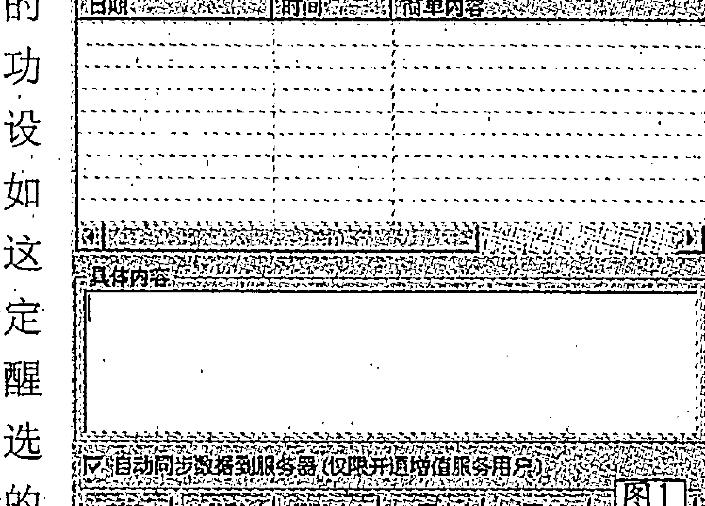

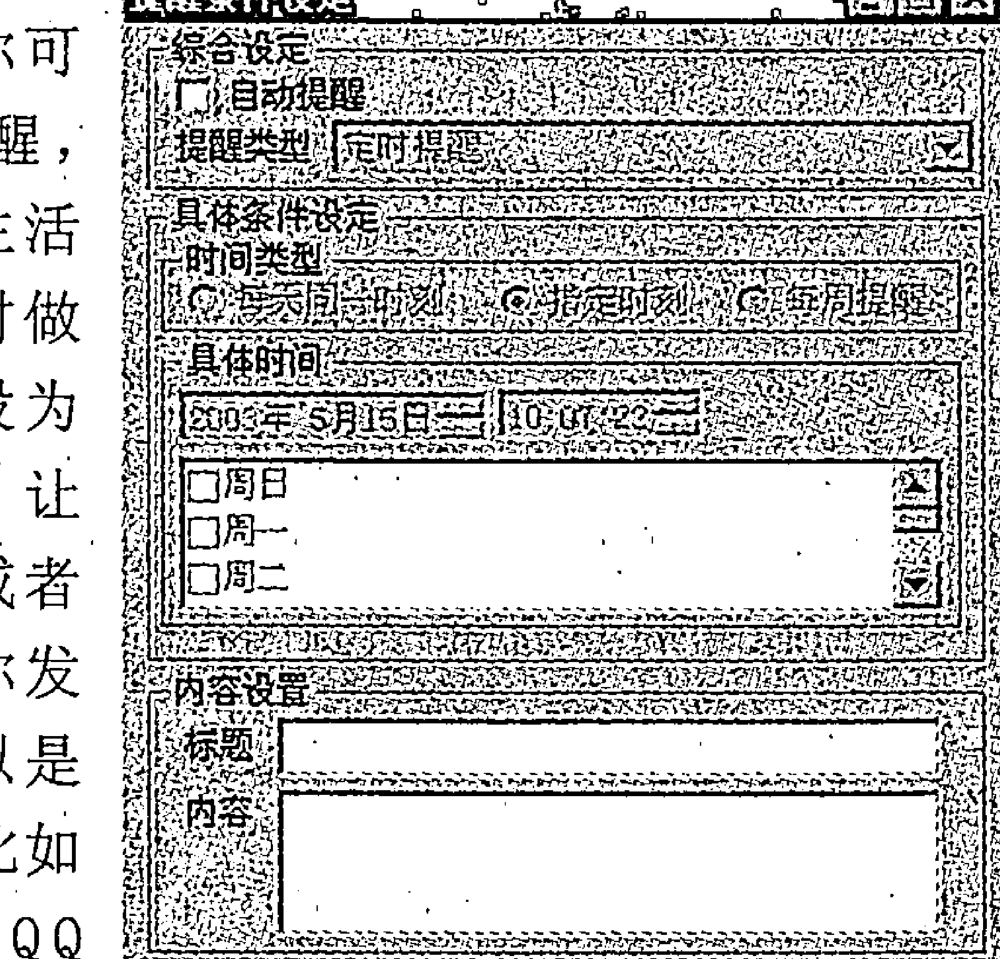

### 五、用QQ帮我们检查邮箱

当我们的邮箱中有重要邮件到达时，如果我们没能及时查看的话，很可能会失去一些机会。其实我们可以让QQ替你去信箱里看看有没有重要邮件到达。点击主菜单中的“系统参数”命令，选择“E-mail设置”，输入你电子信箱的用户名、密码、POP3服务器等信息，并选择好定时器。这样，QQ每隔一段时间就会替你检查一下看看是否有新邮件到达，大大方便了你的工作！

### 六、同时使用多个QQ快速登录的技巧

许多朋友都有两个以上的QQ，虽然QQ有自动记录密码的功能，但是，它只能记录上一次登录的QQ密码。我们只能在QQ登录以后使用“更改用户”功能，但是仍然要输入密码，极不方便。

怎样解决这个问题呢？其实很简单，以你有两个QQ为例。首先，复制QQ所在的文件夹“Tencent”到另外一个目录或者在重新命名以后粘贴在“Program Files”文件夹下，然后，分别用这两个QQ所在的文件夹中的QQ登录不同的QQ号码，选中“记住密码”，分别在“启动”中建立快捷方式，此后，每次启动电脑，你的两个QQ就会自动登录，再也不需要一遍遍地输入密码了。如果你有两个以上QQ，方法也是一样的。

### 七、得到QQ好友更多的信息

现在许多朋友使用的都是可以显示对方IP的QQ，利用该QQ可以看到对方的IP和QQ所打开的端口。当你看到对方QQ消息对话框上显示“广东省 广州市 联通用户 61.144.62.168:4001”这样的信息，难道你只知道对方是广东广州的吗？让我告诉你吧，从这个显示的信息你还可以知道对方在家单机上网，你和他聊的这个QQ是他第二个打开的QQ，也就是说他至少开了两个QQ，你这么一说，对方多半佩服得五体投地，下面解释一下我是怎么知道这些的。

先看看上面那条信息中的端口4001，那是对方使用两个QQ的“证据”。因为QQ在传递消息时采用的默认端口是4000，所以当你登录QQ的时候，别人看你的端口就是4000，当你登录第二个QQ的时候，由于4000端口已经被第一个QQ所占用，不得不使用4001，当你登录第三个QQ的时候，由于4000、4001都被前两个QQ所占用，自然用到4002端口，依此类推。既然显示默认的端口就说明是单机上网，80%的可能是在家上网，根据以上的分析，可以得出对方是在家单机上网，并打开了两个QQ！很容易吧？

### 八、禁止QQ登录的妙招

如果你不想别人使用QQ该怎么办呢？删除它当然简单，但那样太明显了。如果你使用的是Windows 2000或者Windows XP，那么你可以采用禁止端口的方法来使QQ无法登录。由于QQ使用UDP协议通讯，因此我们可以将使用该协议的端口禁用来防止别人使用QQ。首先需要知道你的电脑正在使用哪些端口，在DOS窗口中输入“netstat -a”就可以列出所使用的端口，由于QQ只用到UDP协议，你只要记下UDP所对应的端口就可以了。然后打开“本地连接”的属性窗口，选择其中的“Internet协议（TCP/IP）”选择属性，然后选择“高级”按钮并打开其中的“选项”，选定“TCP/IP筛选”并点击“属性”（图3）。在UDP端口中选择“只允许”并添加你刚才记下的端口号，保存设置重新启动计算机，就可以达到禁止QQ登录的目的。

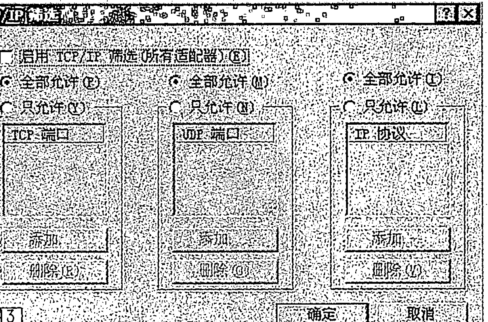

### 九、加任意号码到QQ好友名单中

当你想加某人到自己的QQ好友中，对方拒绝该怎么办？告诉你一个方法可以随意加任何人到你的QQ好友名单中——不管他愿意不愿意！首先你得准备一款游戏修改软件，如FPE或Game Master8.0都行。

大家知道，向QQ好友发送消息时，他的QQ号码会出现在内存地址中，并以明文保存。如果我们能找到这个好友的QQ号码在内存中的地址，并将这个内存地址中的数据，即该QQ号码换为你想加入的那个人的QQ号，并锁定该数据，这样只要不关机，无论你怎么开、关QQ，内存地址中“记住”的永远都是这个新QQ号。点击这个QQ好友准备发送消息，更新资料，你会发现他的号码变为你想加入那个人的QQ号码了！利用这个特性，我们可以尝试将任何号码加入到你的QQ号码中。

假设你要加的号码是19138888，但不要直接发消息请求加入。你可以先加一个无需身份验证的QQ号码，假设是150123456，然后启用FPE或Game Master，在其中找到QQ的主文件QQ.EXE，然后像修改游戏一样，查找150123456这个号码，一般情况下你会找到好多这样的地址，将它们全都改为你加的号码19138888，再运行QQ，在你的好友里就会出现19138888这个号码了，但是你发的消息只能出现在对方的“陌生人”名单里哦。

### 十、用QQ轻松建立“FTP”

如果你和你的朋友都有宽带，而且想建立一个私人的FTP服务器让大家共享文件，却担心安全性的问题，那么你可以通过QQ来实现这样的功能。

首先打开自己的QQ，点击对方好友的头像，然后你会看到一个‘浏览共享文件夹’的选项，我们就可以用这个QQ新功能来建立属于自己的FTP。选择左边的‘我的共享’，会在上面看到‘新建共享’，点击此项来建立你要共享的目录。先设置共享名，这样你的朋友就会根据你设置的文件名来判断里面的内容。设置好共享文件名之后，再指定在本机相对的路径，并且在下面写上对共享文件夹的描述，以便更容易进行区分。如果文件夹里面有重要的文件，还可以设置密码，这样除了知道密码之外，是无法访问文件夹的。要是还对自己建立的共享文件夹不放心的话，还可以用“身份限制”和“禁止访问”这两项来更改允许访问的权限。

一切都设置好了，接下来就可以告诉你的朋友来访问我电脑里面的内容。如果喜欢哪个文件，按鼠标右键选择‘保存’，就可以将文件保存到自己的电脑里面。并且这个FTP里面支持断点续传，双方有一方因为某种原因掉线的话，可以在下次连线的时候继续下载。而且作为建立‘FTP’的用户，自己还可以对其他用户登录‘FTP’进行监视哦。

### 十一、排除QQ登录故障的技巧

现在使用共享上网的朋友着实不少，而当我们使用WinProxy/CC Proxy等代理服务器共享Internet连接时，开设了Socks代理服务，在客户端机器上设置时往往不能成功登录QQ。但是在服务器所在的机器上无论是否使用本机设置的代理服务，均能正常登录。这是什么原因呢？那是因为QQ需要知道服务器的IP地址才能正常登录，而代理服务器没有开设DNS代理服务。

解决方法有两个：

-   1. 代理服务器开设DNS代理服务，并将客户端主机的DNS服务器设置成代理服务器IP地址。
-   2. 在代理服务器所在主机上获得腾讯服务器的IP地址，方法为在‘运行’中输入‘ping sz.tencent.com’，从应答报文中可以知道此服务器对应的IP地址。然后在‘QQ参数设置’的‘网络设置’中，将此IP地址加入到客户端QQ软件的‘服务器地址’的编辑框中，然后点击‘添加到列表’，然后选择‘确定’，退出QQ参数设置，先将QQ设置成‘离线’，然后再将QQ设置成任何一种‘登录状态’即可成功登录。

为了加速QQ的登录，最好把‘服务器地址’中所有不是数字的地址删掉。如果你不怕麻烦，可以把所有的QQ服务器的IP地址都加到此地址列表中去。同时你也可以把得到的QQ服务器的IP地址放到本机的hosts文件中，而不去改动‘服务器地址’里面的任何一个服务器。但是此时要注意：最好把从sz.tencent.com到sz7.tencent.com的地址都加入到该文件中。

### 十二、手工备份QQ数据的技巧

在QQ中有着完善的数据备份功能，比方说，你的QQ好友名单放在腾讯的服务器上，聊天记录和个人信息存放在本地硬盘上，不过这个看似很方便的功能也有其不足之处，即除了好友名单，其它数据都保存在本地硬盘，如果我们重新安装了操作系统或者是误删除，那将导致你的QQ数据不复存在，所以我们要掌握手工备份QQ数据的方法。我们可以直接使用QQ的消息管理器来进行数据的备份。

点击桌面上的QQ图标，然后点击系统托盘中的QQ2000的图标，在弹出菜单中选择【档案管理】→【消息管理器】，这时会打开‘消息管理器’的窗口。点击该窗口中‘文件’菜单下的【导出】→【备份】，在这里你可以对聊天记录、用户信息、地址簿进行分别备份，并且备份的文件是文本文件，查看起来也容易多了。现在，请你输入备份文件的名字，并选择备份的路径，然后点击‘保存’按钮即可完成备份工作。需要重新导入时，打开‘消息管理器’的菜单【文件】→【导入】，选择你事先备份的文件即可完成导入工作。

上面备份的是指QQ的消息数据，如果你还想备份其它的QQ数据，可以打开你的QQ安装目录，在该目录下有一个以你的QQ号码命名的文件夹。在这个文件夹中就存放着你的QQ的一些信息，包括聊天记录、用户设置信息、分组数据、好友列表等等，只要备份这个目录，就可以备份用户的所有信息。如果有多个QQ号码，将它们都备份即可。备份的路径和备份的文件名可以自己定。当我们要恢复QQ数据的时候，可以在QQ的登录界面之中选择‘注册向导’，选择‘使用已有的QQ号码’，在‘我的号码’栏中填入自己的QQ号码，在‘密码’栏中填入自己的QQ密码，然后点击‘下一步’。其实这一步的目的就是为了让QQ重新读取服务器上的好友列表，读取到本地并建立以你的QQ号码为名的文件夹。最后，会出现‘完成’对话框，点击‘完成’按钮，退出QQ，然后，把你事先备份的文件夹覆盖QQ安装目录下的同名文件夹即可。

如果你在网吧上网，还可以事先对备份的文件夹用WinZip等压缩软件进行压缩，然后将备份文件发送到你的邮箱里，这样就更方便了。这样做还有个另外的好处：享受QQ会员功能。

其实，用该方法之所以能享受会员功能，这是因为在以你的QQ号码为名的文件夹下有个名为user.db的文件。

## Windows Media Player 技巧

### 一、让流媒体播放更加流畅

在使用 Media Player 观看收听一些网络流媒体时，经常出现断断续续的现象，而且出现正在缓冲的提示信息，那是因为所有流式媒体文件在播放前都要经过缓冲处理。缓冲处理是在实际播放内容前将一定量的信息发送到计算机的过程，当网络拥塞造成数据流中断时，播放器就可以利用缓冲区中的信息弥补这些间隔，当网络异常拥挤时，就会产生中断，这是因为缓冲区已空并且未接收到新的信息。我们可以通过适当增加缓冲的时间来解决这个问题，方法如下：

- 单击“工具”菜单中的“选项”命令。
- 在“选项”对话框中单击“性能”标签。
- 在“网络缓冲”中选择“缓冲时间”。
- 然后根据不同的情况适当地增加缓冲时间。

### 二、利用 Media Player 有效管理计算机上的多媒体文件

Media Player 提供了搜索本地多媒体文件并自动分类整理的功能，单击“工具”菜单中的“搜索媒体文件”命令，在“搜索媒体文件”窗口中设置好搜索范围和搜索条件后，单击“搜索”按钮，Media Player 就会自动搜索本机上的多媒体文件，并且自动进行分类排列，要查看 Media Player 搜索的结果，只要单击“媒体库”按钮即可。

### 三、在 Media Player 中制作媒体播放列表

首先在“媒体库”中单击“新建播放列表”，为播放列表命名。然后选中这个播放列表，打开存放媒体文件的文件夹，把这些文件拖到该播放列表窗口就可以了。如果你想调整媒体文件的播放顺序，请在媒体文件上单击鼠标右键，然后选择“上移”或者“下移”命令来调整。如果你想将这个播放列表导出，可以选择“文件”菜单中的“将播放列表导出到文件”命令，导出的播放列表可以供 Winamp、超级解霸、RealPlayer 等软件读取播放。

文件，它就是记录 QQ 好友名单的文件，user.db 记录了你所使用的 QQ 中的好友名单、分组信息等。把 user.db 文件当成附件，发送到你的信箱里，就可以实现分组的上传。如果想下载，也很简单，将该附件下载并覆盖到你的 QQ 目录里，再重新打开 QQ，你就会发现，分组一个都没少！怎么样？享受会员功能也很简单吧？

### 十三、保护 QQ 密码的技巧

现在有不少黑客软件都是专门针对 QQ 的，因此如何保护 QQ 的密码便成为了许多朋友关心的话题，其实我们可以用很简单的方法，利用 QQ 登录原理达到保护 QQ 密码的目的。QQ 启动时，如果存在已登录的号码，此时会出现 QQ 用户登录画面，由于密码文件已经加密保存在本地文件中，所以此时输入的用户密码不会通过服务器验证，只要通过本地验证就可以了，于是我们有了以下这样一种方法：

- 在一个安全的计算机上用注册向导登录（假设号码为 123456，此时密码为 A），不要关闭 QQ，到 QQ 的安装目录下面你就会发现你已经有了一个 123456 目录，拷贝一份副本。
- 修改密码（改成密码 B）后，关闭 QQ。
- 用副本里的文件覆盖掉 123456 目录里的文件。
- 把 123456 里的文件全部保存在邮箱里。如果你用 1230 以前的版本，则还要保存安装目录下的 datoicq2000.cfg 文件；如果是 1230 版本，则保存安装目录下的 LoginUinList.dat。
- 到网吧、机房等公用计算机上使用 QQ 时，把各个文件还原到相应的位置。
- 运行 QQ，此时会直接出现 QQ 用户登录的界面，而不是注册向导。此时，只要你输入密码（记住，此时的密码是修改前的 A，而不是 B）你就可以登录成功了！如果此计算机上有木马的话，记录的是你修改前的密码 A，而服务器上登记的密码则是 B，虽无法通过服务器的验证，但我们可以正常使用 QQ。这种方法虽然较繁琐，但安全性高，而且还可以保存好友分组、聊天记录等信息。

### 十四、自己打造个性化的 QQ 声音

在 QQ 里面提供了四个声音文件，分别是“客户消息”，是用来提示有好友或客户传来了消息；“系统消息”，用来提示有系统提供的消息，如果你设置了要验证才能将你加为好友的话，当有人要将你加为好友时，系统就会发出该声音提示你；“新上线”，用来提示有新朋友刚刚上线；“组”声音，在来设置组时提示用的。这四个文件都是 WAV 文件，如果要修改它们，可按以下方法实现。

- 首先将制作好的声音文件（WAV 格式的）存放到 Tencent 里面的 sound 文件夹中，当然也可以放到其他文件夹中，这是为了查找方便。
- 单击系统选单中的“系统参数”命令，打开“参数设置”对话框，在该对话框中单击“声音设置”标签，在下面“声音选择”框中可以对声音文件进行设置。

### 十五、让你的 QQ 头像更酷

你想让自己的头像更有个性、更美观吗？来，和我一起做！先来了解一下 QQ 头像的有关知识：QQ 头像都存储在 QQ 所在目录的 Newface 文件夹下，这些基本头像为 32×32 点阵大小、16 位真彩色，以 bmp 的形式存放。每个头像都有三种状态（一张彩色，一张黑白，一张眨眼），所以准备 3 张头像图片是必须的。

- 首先选择一幅自己喜爱的图片，利用“画图”程序或其他图形处理软件将之转换成 32×32×16 格式，将它保存。同理制作出黑白和眨眼头像图片（这两个不做也可，不过，那样会使你的头像看起来只有一种状态）。
- 进入 Newface 文件夹，找到目前代表你本人的头像，假设你使用的是“68-1”、“68-2”、“68-3”文件，把刚才准备好的头像文件重命名为“68-1”、“68-2”、“68-3”（注意彩色的为“68-1”，黑白的为“68-3”，眨眼的为“68-2”），拷贝至 Face 文件夹中覆盖原文件即可。
- 启动 QQ，用鼠标右键单击 QQ 图标，选择“个人设定”，再单击“头像”向下的箭头，你就可以发现自己制作的头像已经存在于头像框中。选中它，就可以将其作为自己的新头像，然后更新资料即可。

### 十六、在 QQ 组别里查找网友的技巧

我想每位使用 QQ 的朋友其“我的好友”组别里已经加入了很多的网友吧。尽管一些网友为了在“我的好友”组别里占有所谓的“眼球”效应，常用的做法是在昵称前加上多个空格，但总还有排在最后面的，要是我想消息给他们，难道是频繁的点击下拉箭头来实现吗？其实这里有个很简单的方法，就是只需你记住对方的昵称，比如我需要查找的网友昵称是“格式化”，而“格”字的开头字母是“g”，只需按下“G”键，你就会马上看到“格式化”的头像，哈哈，是不是真的很方便啊！不过需要注意的一点是，如果你的 QQ 是分了组别的话，那么就必须点击某个组才能进行查找。

### 十七、让头像靠最前排

想更多地吸引 MM 对你的注意吗？那你在她的列表中的位置可一定要排得靠前一些哟！要不然人家可能会看不到你或者对你视而不见……用不着生气，想个法子让自己排得靠前些不就行了吗！好，为了帮你实现“企图”，这一招我教定你了。打开“个人设定”窗口，然后在自己的昵称前点一下鼠标，再按空格键插入一两个空格（不能太多了，要不然昵称就不能完整显示了），然后点击“修改”按钮进行修改。这样，以后当对方更新了你的资料或者重新登录时，你的头像就可以排在其列表数一数二的显赫位置了（在线的情况下），现在对方要想不看见你都不可能啦。同理，想把谁放到你的好友列表顶端，就给他“改名”，在他名字前加一两个空格就行。

### 十八、把自己加为好友

这一招可是厉害得很，可以让自己的头像出现在本身的列表上，这不仅显得很酷，而且有很实用的功能哦（比如下面一条秘技中就可以用到）！其实最早期的 QQ 版本中是可以直接把自己加为好友的，但现在的版本都行不通了。但是只要我们肯动手，没有什么能难倒我们的。步骤如下：首先建议设定到“允许任何人把我列为好友”，然后切换到“黑名单”组，在里面空白处点击右键并选“添加坏人名单”，输入自己的 QQ 号码，接下来再把这个“坏人”拖到“我的好友”组中去，这时会弹出“不能添加自己”的提示，不理会它，直接退出 QQ。再后当对方更新了你的资料或者重新登录时，你的头像就可以排在其列表数一数二的显赫位置了（在线的情况下），现在对方要想不看见你都不可能啦。同理，想把谁放到你的好友列表顶端，就给他“改名”，在他名字前加一两个空格就行。

### 十九、用 QQ 查看隐藏的文件夹

有时我们在网吧上网需要查看某些文件夹，无奈管理软件却把它们给隐藏起来了，怎么也打不开。有了 QQ 就好办了，你可以利用它来打开这些文件夹。方法是：在机器中打开两个 QQ 号码甲和乙（如果没有两个号码，可以用注册向导，在自己号码前加一个“0”登录，登录后显示号码为“0xxxxxxx”），用左键在甲中点击乙的头像并选择“传送文件”，接着随便在电脑中找个小一些的文件进行传送，由乙来接收，很快就会接收完毕，弹出了一个很关键的窗口，提示“文件接收完毕，是否转到文件所在目录？”，这时请一定点击“是”按钮哦！

> (文 / 水月斋)

### 四、让 Media Player 在播放 MP3 歌曲时显示歌词

在 Media Player 8.0 中添加显示歌词的方法如下：首先选中播放列表中要添加歌词的歌曲，单击鼠标右键，选择“属性”命令，单击“歌词”选项卡，接下来在“歌词”文本框中输入歌词信息即可。要在播放歌曲的同时显示出歌词，请在“查看”菜单中指向“正在播放工具”；然后选择“歌词”命令，或者直接单击左下角“显示视图”按钮，然后选择“歌词”命令。

### 五、去除歌曲的版权保护

有朋友问我为什么在本机上用 Media Player 制作的音乐不能在别人的机器上播放，其实这是所谓的音乐版权保护在作怪，用 Media Player 制作的音乐会记录本机上的一些信息，当操作系统环境或者硬件环境发生变化时，这些音乐就不能继续听了。要解决这个问题很简单，在 Media Player 中单击“工具”菜单中的“选项”命令，然后选择“复制音乐”标签，取消“复制设置”中的“保护内容”选项即可（如图2）。

### 六、清除 Media Player 的历史记录

在使用了 Media Player 播放文件后，会在“文件”菜单中留下曾经打开过的文件，要清除这些历史记录首先要运行注册表编辑器，找到 `HKEY_CURRENT_USER\Software\Microsoft\MediaPlayer\Player\RecentFileList` 分支，在右边的窗口中列出的就是最近一段时间的历史记录，将它们全部删除即可。对于播放 Internet 上的媒体文件留下的记录，可以找到 `HKEY_CURRENT_USER\Software\Microsoft\MediaPlayer\Player\RecenturlList` 分支，将这个分支下的记录清除即可。如果你不想 Media Player 每次都记录播放的历史记录，可以找到 `HKEY_CURRENT_USER\Software\Microsoft\MediaPlayer\Preferences` 分支，在它下面新建一个名为“AddMRU”的二进制项，然后将“AddMRU”的值修改为“0”，这样以后在 Media Player 中就再也不会留下任何痕迹了。

### 七、巧妙升级，彻底消除不兼容现象

Media Player 在 Internet 上得到广泛应用，支持的媒体类型包括 WMA、WMV、ASF、CDA、MP3、AVI、WAV、MPEG、MIDI、AU、AIFF 等。在播放媒体文件时，Media Player 会查看是否安装了所需编码(Codec)文件，如没有安装，则自动下载 Codec 然后播放文件。可万一出现 Codec 无法下载，或下载了 Codec 后仍无法播放的不兼容现象，那该如何是好呢？如果 Media Player 由于找不到合适的编码解码器(Codec)而无法正常播放某个视频文件，可连接到 Internet 上重试，程序会自动寻找合适的 Codec 并进行下载。但现在出现了不少采用新压缩技术的 ASF 和 WMV 文件，其中有些文件用 Media Player 9.0 能正常播放，用 Media Player 7.0(包括 Media Player 8.0)就无法播放；而某些特殊的 ASF 文件(如 Windows Me 安装光盘中的 ASF 文件)，Media Player 7.0 能正常播放，Media Player 9.0 却无能为力。那么，对于我们用户来说，究竟应该安装哪个版本呢？以 Windows 2000 平台为例，可先安装 Media Player 9.0，安装后无需重启。继续运行 Media Player 7.1 简体中文版的安装程序，在安装过程中选择“仅升级较新组件”，然后你会看到一个长长的组件升级列表，我们要做的就是把其中所有编码文件全部升级。升级完成后上述文件就都能播放了。Media Player 9.0 和 Media Player 7.1 简体中文版都可到微软官方站点下载，下载地址为 http://www.microsoft.com/windows/windowsmedia/download/。经过这番改造，Windows 2000 中附带的 Media Player 6.4 经典版此时也能播放所有 Media Player 9.0 能播放的媒体文件了，喜欢经典版 Media Player 6.4 的朋友也可以如愿了！点击【开始】→【运行】，输入“mplayer2”并回车，即可快速启动经典的 Media Player 6.4 了。

### 八、用 Media Player 9 制作 CD 精选集

笔者是一个音乐爱好者，家里有许多 CD，经常为了听几首在不同 CD 上的歌曲而不得不频繁地更换盘片。后来笔者家中添置了刻录机，只要经过选曲、复制、刻录几个步骤就可以把自己喜欢的音乐制作成一张精选 CD 了。

**1. 将音乐整理到硬盘**

将你要用到的 CD 找出来，记下要复制整理的音乐音轨顺序，然后放入光驱。打开 Media Player 9，按下界面左边的“从 CD 复制”按钮，打开 CD 音乐列表，可以看到在每个曲目的前面都有个小勾。比如我想复制第 2、5、7、9 首音乐，那么就将曲目 2、5、7、9 前的勾保留，其他的去掉。在 CD 列表的下面，是将曲目复制保存的位置。如果要更改保存目录，可单击“工具”→“选项”→“复制音乐”，再单击“更改”，输入你想保存的位置即可。
以上准备工作做好后，点击曲目列表上方的“复制音乐”按钮。首次单击时，会显示一条消息询问你是否希望对音乐进行副本保护，在此笔者选择了不进行副本保护。单击下一步，就可将音乐复制到硬盘中了。在 Media Player 中，所复制的音乐是以微软的 WMA 格式保存的，WMA 的压缩率比 MP3 更高，而且音色的保真度丝毫也不比 MP3 差。

**2. 制作 CD**

下面我们就可以将这些音乐写成 CD 了。先准备一张空白的刻录盘放入刻录机。然后在 Media Player 9 中单击【文件】→【打开】，选中刚才复制到硬盘的音乐，点击“复制到 CD 或设备”按钮，再点右上角的“复制”按钮，Media Player 就会开始对每首音乐进行检查和格式转换，之后刻录工作就正式开始了！
刻好之后，你的新 CD 会自动弹出光驱！怎么样？马上将它放到你的 CD 机上试听一下吧！

（文 / 水月斋）

## Winamp 技巧

### 一、用 Winamp 下载流媒体的技巧

随着网络的普及，网络资源越来越丰富，特别是声音资源，比如最流行的 MP3 音乐，还有相声、故事、英语等各色音频资源。但它们很多都不能下载到本地硬盘中。最常见的就是一些音乐站点由于版权问题大多都已经停止了下载服务，只提供 pnm、rtsp、mms 等协议的在线欣赏。为解决此问题目前有一些软件可以下载这些使用特殊协议的文件，比如 Hidownload、Streambox 等，但有没有更容易的方法呢？其实只要有 Winamp 就可以解决！

**1. 需要的插件**

- Nullsoft MP3 输出插件：它能把 Winamp 的输出直接转录成 MP3 文件，不仅速度快，而且可以任意设置输出的音频质量及声道数。
- Tara 音频视频播放插件：通过调用 Realplayer 解码器来使 Winamp 能播放 RM、RA 等只有 Realplayer 支持的文件。不过你得保证系统中安装了 Realplayer 或 Realone 播放软件。
- 这两个插件在很多不同汉化版本的 Winamp 之中都有提供。

**2. 对 Winamp 进行设置**

首先要对 Winamp 的参数进行一些设置：【Winamp 参数设置面板】→【选择】，在“允许同时启动多个 Winamp”选项前打上勾。紧接着打开【Winamp 参数设置面板】→【插件】→【输出】→【双击 Nullsoft MP3 输出插件】，此时会弹出一个选择目录对话框，选择好要保存文件的目录，接着就会弹出一个选择 MP3 格式的对话框，可以使用默认值，也可以是自己的设定。这里要提醒大家的是 Mono 是指单声道，Stereo 指立体声。最后在 Winamp 的播放面板上关闭循环播放和乱序播放的选项。现在就可以开始流媒体下载了。

**3. 下载流媒体**

按住键盘的 Ctrl 键用鼠标点击 Winamp 的打开文件按钮，在弹出的“打开因特网 MP3 文件”对话框中填入流媒体地址，点击“打开”即可。但此时 Winamp 不会播放声音，但你可以看到播放进度条在前进，表示 Winamp 的下载已经开始，当进度条停下来时文件就已经下载完毕了。当你的下载完成后切记要把 Winamp 参数中的输出插件换成“Waveout 输出”，否则无法播放音乐。下载流媒体文件时再换成 Nullsoft MP3 输出插件即可。
当有多个文件需要下载时可启动多个 Winamp，实现同时下载几个文件。如果带宽不足，也可以把地址添加到 Winamp 的播放列表里。Winamp 将按列表顺序把文件下载下来，要改变它们的顺序时，可点击文件名拖动到希望的顺序即可。要从下载列表中删除文件也只要用鼠标右键点击文件名，再选择删除音乐文件即可。你想先下载某个文件时，直接双击文件就可以了。
也许你会问这样下载和用 Hidownload 下载有什么区别呢？其中最大的区别就是 Winamp 在下载流媒体文件的同时也自动地把 RM、RA 格式的音频文件转换成了 MP3 格式的文件。这样就可以把这些声音文件直接传输到硬件 MP3 播放器里面，随时随地欣赏和学习了。它把文件下载和格式转换一次完成，节约了宝贵的时间。

### 二、用 Winamp 实现音频格式的转换

Winamp 它不仅仅只是一个纯粹的播放软件，它还提供了良好的插件功能，利用这些插件可以让 Winamp 变得更加强大，以下的技巧就是利用 Winamp 的插件功能来实现几种音频格式之间的转换。

运行 Winamp 后，利用组合键 “Ctrl + P” 打开 “Winamp 参数设置” 窗口。在窗口列表中选择 “插件 / 输出”，这时候会在 “输出插件” 列表窗口中显示所有插件。如果你要进行 MP3 到 WAV 格式的转换，需要选定 “Nullsoft 磁盘写入插件 v2.0 (x86) [OUT_DISK.DLL]”，然后单击下面的 “配置” 按钮，进行必要的设置。其实设置很简单，只需要指定 “输出目录” 以及 “输出文件模式” 为 WAV 即可，保存设置后，回到 Winamp 的主窗口，选择一首 MP3 歌曲，正常播放即可实现格式的转换。在转换时，是没有声音的，其转换的速度也很快，并不需要播放这首歌曲的时间。需要特别注意的是，在播放时不要选择重复播放，要不然会不断地进行歌曲的转换工作。

而进行 WMA 格式的转换也和以上设置比较类似，所需的插件为 “Nullsoft WMA 输出插件 v0.90 (x86) [OUT_WM.DLL]”，同样也需要进行配置的工作，除了设定输出的位置，你还可以设定输出格式的一些参数，例如采样率、比特率、声道等等。在进行转换工作时也是没有声音的，和 WAV 格式转换相比，其速度会显得慢一些。

在 Winamp 中还可以进行其他格式的转换，其基本操作也基本类似。进行完格式转换的工作以后，你需要将输出插件调整为 “Nullsoft 波形输出插件 v.23 [OUT_WAVE.DLL]”，否则你再不会听到美妙的歌声了。

### 三、用 M3U 播放 Winamp 列表文件

M3U 文件就是 Winamp 的播放列表文件，每次 Winamp 所播放的音频文件目录会自动储存在 Winamp 文件夹下的 Winamp.m3u 文件里，下次使用 Winamp 时再调出来播放，而在实际应用之中，M3U 还有一些不常被挖掘的功能哦！

**1. 快捷播放曲目**

了解 M3U 文件的功能后，我们可以来 DIY 播放列表文件，以及利用它为我们更好地服务。首先分类选定要播放的音频文件，比如古典、摇滚什么的，然后在播放列表中点击右下角的列表按钮，出现选择【新建】→【保存】→【载入（M3U 文件）】的菜单。我们依次按类别执行保存命令，对应存为古典.m3u、摇滚.m3u 等。保存播放列表后，当大家想听相关类型的音乐时，只要打开该类型的 M3U 文件就 OK 了。

**2. 当作开机音乐**

先为一个 M3U 播放列表创建一个快捷方式，然后进入到 “C:\Windows\Start Menu\Programs\启动” (Windows XP 系统的相关路径为 C:\Documents and Settings\用户名\“开始”菜单\程序\启动) 文件夹，在这里粘贴上该播放列表的快捷方式。这样重启电脑后每次开机，Winamp 就会自动播放该播放列表内的音乐，即开机音乐了。

**3. 连续播放 RM**

RealPlayer 播放器是大家都喜欢的工具，但一次只能播放一个音频文件。如何能简单地让 RealPlayer 一次可播放多个音频文件呢？有办法。用 Winamp 打开多个 RM 文件，这时 Winamp 当然不能播放（除非装了 RM 的插件）。但我们要做的，不是要它播放，而是把此时包含多个 RM 文件的播放列表保存下来，然后用 RealPlayer 打开这个保存了多个 RM 文件信息的 M3U 文件，这下可以让 RealPlayer 连续播放了吧！

### 四、用 Winamp 为 MP3 设置歌曲信息

对于喜欢从网上下载流行歌曲的朋友，可能会遇到这样的情况，就是在播放 MP3 音乐的时候，播放器却不能显示与歌曲相关的文件信息，比如歌名和歌手等，而只是一堆数字或者是字母。另外你自己制作的 MP3 音乐的文件（比如从 CD 唱片和磁带直接转制的 MP3 音乐文件），一开始也会是这种情况。而因为没有歌曲信息显示，如果再没有歌名，那你就有有可能不能正确地选曲，也令欣赏的效果大打折扣。其实我们自己也完全可以编辑这些 MP3 音乐的文件的歌曲信息。

首先用 Winamp 打开需要编辑的 MP3 文件，用鼠标指针移动到 Winamp 播放器的播放列表一栏显示的歌曲上，右键单击，在弹出的菜单上选择 “文件信息”，MP3 音乐文件的信息就是在这里编辑完成的。接下来就可以开始编辑了，首先把左面 “ID3v1” 标签的勾打上。“歌曲#” 一栏是你给歌曲的编号，可以随便你填不填。下面的 “标题” 也就是歌曲的歌名，“歌手” 一栏当然是填上演唱者的名字。其他的如 “专辑”、“年代”、“风格” 等可以根据你对此音乐了解的多少来填写。至于右边的 “ID3v2” 信息可以不填。但是如果在播放中还是不能正确显示歌曲信息的时候，你可以点击右下角的 “从 ID3v1 复制”，这样一来就绝对万无一失了！最后别忘了点击左下角的 “更新” 按钮。现在大家再打开播放刚刚编辑好的 MP3 音乐文件，是不是已经可以正确显示歌曲信息了？

### 五、巧用 Winamp 压缩处理 MP3 文件

Winamp 主要是用来播放 MP3 文件的工具，但是它也可以用来对 WAV 格式原始数据的文件进行 MP3 的压缩处理。下面对其使用方法加以简要的介绍，此方法对于手头没有其它处理工具而又需要进行 MP3 压缩的用户来说应该是比较实用的。具体步骤如下：

| 设置项目 | 设置选项 | 备注 |
| :--- | :--- | :--- |
| 输入文件 | WAV 格式文件 | 需要压缩为 MP3 的原始音频文件 |
| 输出文件 | MP3 格式文件 | 指定压缩后的 MP3 文件保存路径及名称 |
| 压缩参数 | 比特率、采样率等 | 根据需要选择，常用 128kbps、44.1kHz |
| 插件选择 | Nullsoft MP3 输出插件 | 确保已正确安装并配置 |

### 六、用Winamp开设个人广播

个人网站、个人FTP，你都有了。可是在e时代的今天，你是否还想拥有一个可以炫耀自己的广播电台呢？这一点也不难，用现在非常流行的Winamp播放器，可以轻松地实现。

1.  首先要看看你的Winamp版本，至少也要在3.0以上吧，现在Winamp的版本都有5.0了，因此我们不用担心这些，在开始广播之前，我们首先准备两样必备的东西。一个是Winamp的插件Shoutcast，可以在Nullsoft公司的主页（http://www.nullsoft.com/）下载。另一个东西是Shoutcast的服务器端程序，可以在http://ftp.pconline.com.cn/pub/download/200312/HA-shoutcast-1-9-2-windows-Aska.exe下载。下载完成之后我们马上安装这两个软件，随便先安装哪个都无所谓，只要记住插件必须安装在Winamp程序的目录下就可以了，因为服务器端程序安装到哪里都可以。接下来进入第二步。

    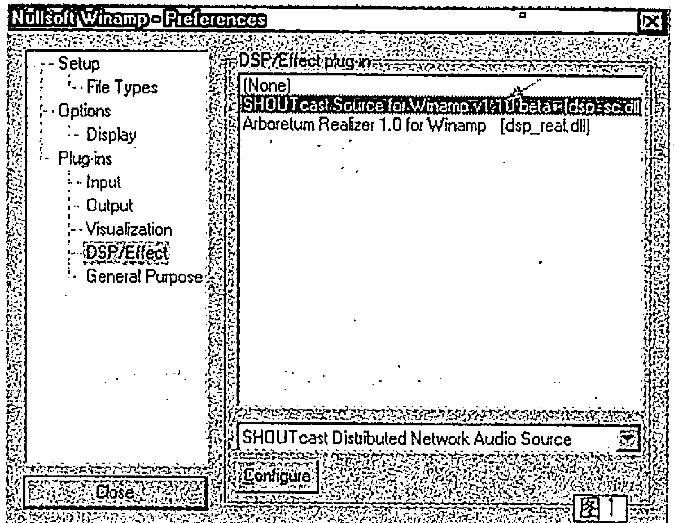

2.  在Winamp的主界面下按“Ctrl + P”弹出属性设置窗口，按照图1所显示的选项选择好，点击OK之后会弹出一个窗口，不过暂时不需要管他，我们现在启动已经安装好了的服务器端的程序，现在你的广播就准备好了。不过现在我们还不能播放，因为还没有连接网络。接着打开刚才参数选择设置好后打开那个窗口。切换到“Output”标签。按照图2的设置就行了。

    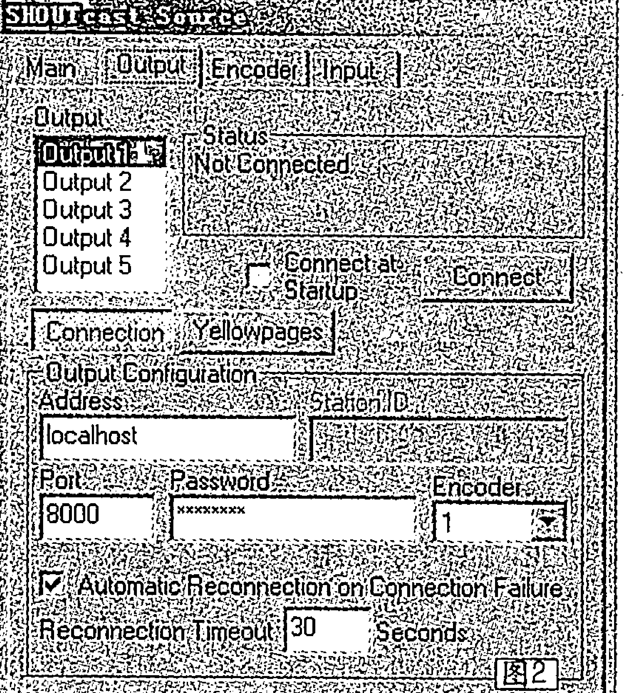

    当然了，有些东西，你们喜欢怎样设置也可以。像Description文本框，随便写吧，它作为你的电台的可见标识。设置好后，勾选“Connect and startup”选项。当你看到“Status”框的字节传送后，说明你已经接通网络了。

#### 3. 自做节目

下面来看如何播放节目。当你完成上面两步后，就像你平时播放歌曲一样去摆弄它吧。不过，现在你所播放的歌曲已经变成了网络的流媒体了，别人可以收听啦！提醒一句，现在你只能播放mp3、wma等几种格式的音频。要播放其他格式的文件，需要采用格式转换软件。

至于播放质量，大家可以把刚才的窗口切换到“Encoder”窗口。看到了吗？你可以设置你的音频采样格式，还可以设置传输的速率，还有单声道/立体声。随便吧，觉得好听就行了。这样只有播放歌曲，太单调了吧。呵呵，原来你自己也可以当DJ。怎么当啊？也很简单。先准备一个麦克风（会接上声卡吧！），然后，把刚才的窗口切换到“Input”窗口就可以了！

#### 4. 接收广播

接收广播其实是很简单的，打开浏览器之后，假如你的IP地址是10.10.59.78（局域网），那么请输入http://10.10.59.78:8000，默认是8000端口号，这样就能够直接欣赏到在线播放出来的音乐了，怎么样，是不是很简单呢？

（文/水月斋）

## RealOne Player技巧在线

### 一、以幻灯方式浏览图片

在RealOne Player中浏览图像文件的方法其实很简单，用户首先运行RealOne Player，在Windows资源管理器中选中需要进行浏览的图像文件，如果用户需要对多个图像文件进行连续幻灯播放，则可以一并选中多个图像文件，然后用户只要将选中的这些图像文件直接拖拽到RealOne Player的软件界面中，RealOne Player就会自动显示相应的图像文件或对添加进来的多个图像文件进行幻灯播放，是不是很有趣？

### 二、自动捕获在线视听文件下载链接

大家在访问一些视听网站或网页时会经常发现其提供的电影或音乐只能在线收看或收听而不提供对应的视听文件下载功能，他们会使用一些技术手段将这些视听文件真实的下载链接隐藏或伪装起来，用户往往一时找不到视听文件真实的下载地址。其实，用户有时候可以在RealOne Player中直接捕获在线视听文件下载链接。

目前有一些提供在线视听文件播放的站点采用了自动调用RealOne Player播放器进行在线播放的形式，即用户单击一个在线播放链接，网页会自动启动用户电脑中安装的RealOne Player播放器。对于这些站点，用户可以首先打开需要获得下载链接的那个视听文件，然后在RealOne Player播放器的菜单栏中单击【文件】→【剪辑属性】→【查看剪辑信息】，在弹出的“剪辑属性”对话框的“剪辑”选项卡中，用户一般可以找到该当前正在进行在线播放的视听文件的下载地址。那么对于RealOne Player播放器内嵌于网页中而网页中又没有给出RealOne Player播放器的情况下，用户可以在网页中用鼠标右键单击RealOne Player播放器并在弹出的快捷菜单中选择“用RealOne Player播放”选项即可，RealOne Player播放器会立即弹出，接下来用户便可以按照上面所介绍的方法查看RealOne Player的“剪辑信息”了。

### 三、加快RealOne Player的启动速度

#### 1. 悄悄启动
使用Windows“开始”菜单中的“查找”命令，分别查找“netid.smi”和“getmedia.ini”文件，找到后将它们改为其他的名字，比如“netid-old.smi”和“getmedia-old.ini”，之后当你再次启动RealOne Player时，就不会再播放那段“动听”的音乐，也不会尝试连接软件主页了。

#### 2. 不显示简介
RealOne Player总怕别人对其了解不够，会在启动时显示其介绍内容，你可以在“View”菜单中，选择“Album Info”，在其子菜单中选中“Hide”，则以后RealOne Player就不再显示作品简介了。

#### 3. 关闭媒体浏览器
RealOne Player提供了一个媒体浏览器，其实很少有人使用，可以将其关闭，方法是：在RealOne Player窗口右上角“关闭”按钮的下面，在地球按钮的右面，有一个三角箭头，请单击这个箭头打开其下拉菜单，单击以使“Show Media Browser”前不再出现“√”。
经过以上3个步骤，当你再次启动RealOne Player时，感觉一定爽多了。

### 四、播放双语电影的技巧

与RealPlayer一样，RealOne Player也不能单独调节左右声道的音量。这给播放双语影视带来麻烦，左右声道两种声音同时送出，混杂不清，让人越看越烦。如果电影是立体声的，那好办，双击系统任务条中的音量喇叭图标，打开音量控制对话框，关掉不想听的那个声道就可以了。但如果电影制作时采用混音方法，那就麻烦了。不过，也可以选择菜单【Tools】→【Equalizer】，通过调节均衡器试试，将不想听的部分关闭。虽然不一定能取得很好效果，但能有一定改善。需要说明一点，初始状态下，RealOne Player均衡器仅为三段，功能很弱，点击均衡器面板上的升级按钮，可以升级为十段，那样，调节效果就好得多。不过，这一升级已经不是免费的了。

### 五、几个“隐藏”的快捷按钮

在RealOne Player窗口上，有几个小图案，看上去并不起眼，有的朋友可能不知道它们还能按，但它们却是货真价实的按钮，有各自的专门用途，可以给我们操作带来便利。一个是播放器右上角那个地球图标，点击它，可以快速关闭或者打开RealOne Player的下半窗口——媒体浏览器；另一个是播放器右下角的喇叭按钮，看上去它更像是一个普通的标志图案，其实它是快速打开或关闭声音的切换按钮。最后，还有两个功能相关的按钮，它们在播放器下部播放按钮的右边，很多人知道它们有快速跳到下一首或者上一首曲目的功能，但不知道一直按住它们还有快进、快退功能。

### 六、专门针对老机的优化措施

首先，得适当降低CPU的占用率，操作方法是：点击菜单【Tools】→【Preferences】，选择“Hardware”，切换到硬件面板，将CPU占用率滑块左移，具体移多少，得根据机器性能而定，一般以不超过一半为宜。注意，此修改会使画面质量降低，不过，对于低档机来说，为了能正常播放，这也是没有办法的办法。其次，如果声卡较旧，应该禁用16位声音，而使用8位。操作方法如下：在刚才的面板上，点击“Settings”按钮，选择“Disable 16 - bit sound”。再次，如果播放仍不正常，可以禁用显卡优化。操作方法如下：仍然在硬件面板上，去掉“Use optimized video display”前面的对勾。

### 七、让RealONE网上播放更流畅的技巧

#### 1. 设置最佳的网络连接
为了设置最佳的网络连接，以最快的速度下载流媒体并实时播放，我们可以这样设置：首先，运行RealOne Player，在主窗口中依次点击【工具】→【首选项】，打开选项设置窗口。接着在左侧窗口中选择“连接”，在右侧窗口的“带宽”中，单击“测试连接”来自试当前的网络带宽（如图1）；连续单击“执行测试”就可以得到结果。单击“更新”按钮就可以更新当前的网络连接设置。在“最大”中选择最大的网络连接类型。最后，单击“确定”按钮即可。

    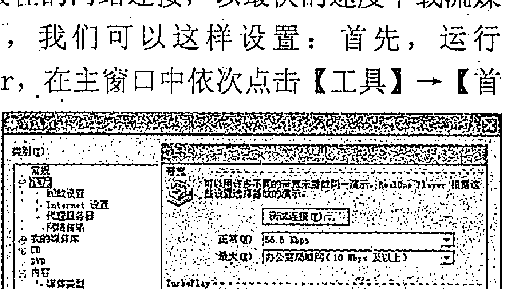

#### 2. 增加缓冲的时间
为了充分利用当前的带宽，可以增加缓冲的时间。具体的设置方法如下：首先运行RealOne Player，在主窗口中依次点击【工具】→【首选项】，打开选项设置窗口。接着在左侧窗口中展开“连接”，选择“回放设置”，在右侧窗口的“缓冲播放”区域中，更改默认的缓冲时间，比如改为60秒；最后单击“确定”按钮即可（如图2）。

    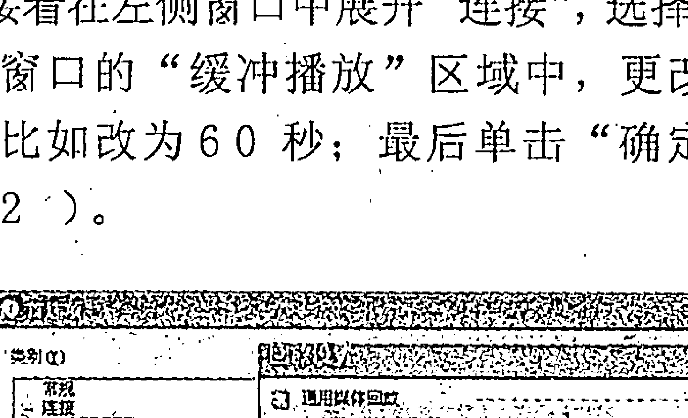

#### 3. 设置剪辑高速缓存
首先运行RealOne Player，在主窗口中依次点击【工具】→【首选项】打开选项设置窗口。接着在左侧窗口中选择“内容”，在右侧窗口的“剪辑高速缓存”区域中，单击“设置”按钮。在打开的窗口中，可以通过拖动滑块来更改剪辑高速缓存大小，也可以手工更改高速缓存大小，比如设为10MB；单击“清空剪辑的高速缓存”按钮可以清除它们，最后连续两次单击“确定”按钮即可。

（文/水月斋）

## 豪杰超级解霸技巧

### 一、利用超级解霸进行播放测速

多媒体电脑用户往往喜欢用最快播放速度来“评价”某种解压软件（或称播放器）的好坏。超级解霸为了让你心中有数，设置了隐藏的“快捷键”Ctrl + Alt + T。你只要在启动超级解霸后选择某VCD或打开某MPG或DAT文件并使其处于“停止”状态，然后按下“快捷键”即可得到每秒播放的最大帧数。你也许会发现，测试PAL制式及NTSC制式影碟或文件时所得的数值不同，测NTSC制文件速度大于PAL制的（这是由于PAL制文件的每帧图像信息大于NTSC制的缘故）。另外，每次测试均是从当前位置开始的，所以所选择的当前位置不能太靠后，或者说所选择的文件不能太短，以免得到每秒几百甚至几千帧的不正确结论。

### 二、超级解霸音频设置技巧

初试超级解霸就觉得声音效果特好，再看有关文档才知道在奔腾166或更高主频的电脑上，超级解霸自动使用44.1KHz音频。我朋友的机器是非常老旧的，只是奔腾166而已，在正常安装超级解霸后播放VCD不正常，主要表现为声音有明显的停顿。后将音频设置为22KHz，播放就正常了。仔细一比较就发现，同样是16位的声卡，但一些廉价的声卡在内在性能上打了折扣，以至在44.1KHz时不能正常工作。那么机器主频在166或更高时，该如何让超级解霸“固定”工作在22KHz呢？很简单，只要修改Windows 95目录下的STHVCD.INI文件中的CPUspeed=XXX，使其小于166就可以了。

### 三、使用超级解霸录制文件

当今的硬盘越做越大，价格也越来越便宜，这为我们拷贝VCD提供了可能。超级解霸文档中说，可将VCD或文件定义起止位置，并“录制”成标准的MPG格式文件而存储在硬盘等介质上。在通常情况下若将所录文件用Xing等其它播放器播放时却不能被识别。这又是为何呢？一般的MPG文件有一个文件头，存放了有关标识，而超级解霸的录像文件将其省略了；如果你定义的开始位置恰好是VCD数据流的某一关键帧（Keyframe），那么此时录得的文件可以用Xing等播放，但用肉眼寻找关键帧实在太难。其实用一现成的MPG文件（比如Xing中自含的TEST.MPG）与录得的文件合并的笨办法可以解决这一问题，在DOS下面执行“Copy test.mpg+ 你录制的文件 新文件名”即可实现。

    ```
    `Copy test.mpg+ 你录制的文件 新文件名`
    ```

### 四、用超级解霸保护光驱

超级解霸以其方便快捷的操作界面，加上特有的纠错能力，赢得了广大用户的支持。我们暂且不谈其强大的功能，这里仅介绍其中的小工具“自动播放伺服器”是如何保护我们的光驱的。

#### 1. 光驱软开关
开关光驱仓门，最简单的方法是按光驱面板上的“出仓”按钮了，然而频繁按按钮会极大地损坏按钮，于是许多人都想到了资源管理器中的“弹出”命令，即右击光盘盘符，然后从弹出的快捷菜单中选择“弹出”命令，这样光驱就会自动弹出。令人不解的是微软这样的公司为什么会没有考虑“关闭”仓门的命令，使得关闭仓门还得靠人工来完成。于是许多软件高手编写了许多关于“光驱软开关”的软件，像“光驱开关CDswitch”、“光驱精灵”等。其实你如果有超级解霸，根本不需要安装这样的软件。只要你右击系统托盘中超级解霸的自动伺服器的图标（就是那个光盘符号），即可弹出快捷菜单。在这个菜单中你就会发现“弹开所有CD-ROM”和“关闭所有CD-ROM”两个命令。

#### 2. 关机弹出光盘
不知你是否有这样的经历：关闭了电脑主机，才发现光驱中的光盘还没有被取出。这时如果想取出来光盘的话，要么重新启动电脑，要么使用发卡一类的东西去捅光驱上的那个应急孔。这样对硬件的损伤是显而易见的。有了超级解霸，你就不用愁了：将自动伺服器右键快捷菜单中的“当关机时弹出所有光盘”的命令选中即可。这样每次关机时，超级解霸自动伺服器会首先检查光驱中是否有光盘，如果有，它立即会自动弹出光驱中的光盘。

#### 3. 降速减噪音
随着光驱的速度越来越高，噪音也不可避免地越来越大了。如果你想保护你的光驱，延长其寿命的话，建议使用超级解霸“降速减噪”功能。你只要将自动伺服器右键快捷菜单中的“光驱降为8速（减少噪声）”命令选中后，噪声立刻会小了许多。记住，这可是用牺牲高速为代价的哟！

### 五、提高超级解霸容错能力的小技巧

#### 1. 播放DVD出现蓝屏或死机
在超级解霸的控制设置里有对光驱倍速的调节，一般默认情况下是选择16×，我们可以在“允许调整光驱速度”前打勾，把它调成2×，这样光驱在读盘时就不会出现蓝屏或死机的现象了（图1）。

#### 2. 碟片播放不过去
在播放碟片的时候，有时会出现碟片划痕播放不过去，这时可以做以下设置：打开超级解霸的界面，点击【设置】→【控制设置】，如图2所示。打开控制设置的下拉菜单之后会出现图3所示的对话框，把“允许轨道预读取”前面的对勾去掉，即可达到流畅播放的效果。

    
    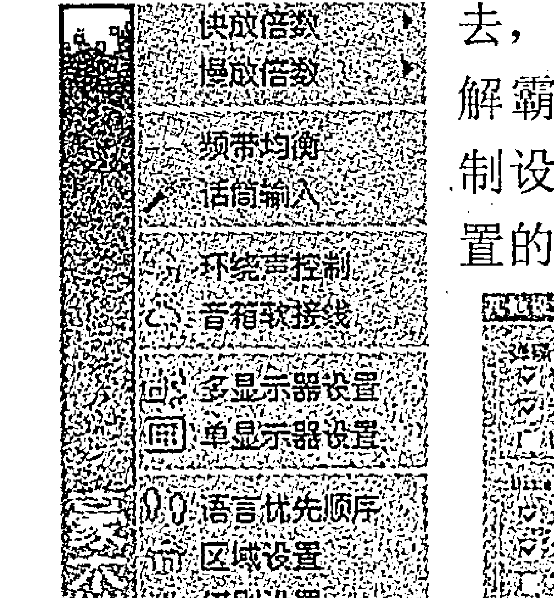
    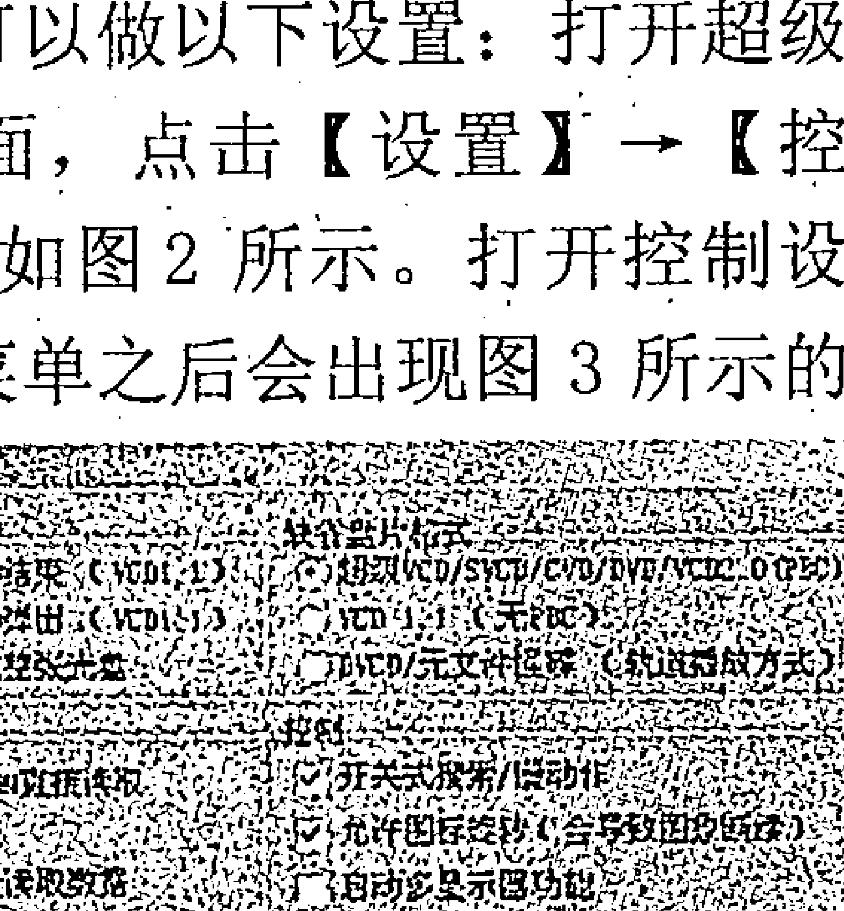

### 六、用超级解霸上网

现在有不少软件在提供实用功能之后，也提供上网服务，超级解霸也提供了上网浏览页面功能，操作如下：
启动“图片浏览器”，选择【文件】→【新建】→【新网页】，“图片浏览器”中的浏览区就会变成一个颇似IE的界面；然后在“地址”栏上输入一个URL地址并按回车键，或者从“地址”栏右侧的收藏夹中选择某个收藏项即可进行该地址页面的下载操作。同时，在主窗口最下行的状态栏上会显示下载的进程。为了能够拥有更大的浏览空间，我们可以关闭掉“目录树”和“文件区”等窗口或选择【查看】→【全屏】，进行全屏浏览。

网页下载完成后，即可进行网页的浏览，当然，你也可以一边下载一边浏览。超级解霸的网页浏览功能是采用IE作为运行内核的，所以其操作方式和右键的快捷菜单与IE基本相似，使用起来会相当顺手。你可以通过其工具栏上的按钮直接进行新建网页、转移到上一个或下一个历史页面、停止网页的下载、刷新页面、转移到系统默认的页面和改变页面字体大小等操作。在浏览窗口中右击，选择相应的命令即可进行打印页面、查看源代码、保存图片和选择编码等操作。

### 七、用超级解霸听文章

如今已有不少软件能够进行语音朗读，而且效果还很不错。你身边没有这些软件怎么办呢？其实超级解霸也能朗读文章。具体操作如下：

1.  用“记事本”写好稿子并保存，若是用WPS或Word等文档则需把它们“另存为”文本文档，因为超级解霸只能读取文本文档。
2.  选择【开始】→【程序】→【豪杰超级解霸3000】→【超级解霸音频解霸】。
3.  选择【文件】→【打开一个文件】，在对话框中的“文件类型”选项选择“All File”，再选中要听的文本文件，点击“确定”，此时，你就可以听到一位男生的朗读声音，如果没有，再单击界面的“播放”按钮即可。

### 八、快速播放硬盘文件

当我们把一张VCD碟片放入到光驱时，只要没有关闭“自动播放探测器”或禁止播放VCD，系统就会自动启动超级解霸进行播放，这大大方便了我们的操作。然而，有时我们把大量的MP3或一些VCD、MPEG文件拷贝到硬盘上时，“自动播放探测器”就不起作用了。当然，我们可以在运行超级解霸后用“打开多个文件”的方式来播放，不过比较麻烦，其实还有更简便的方法，就是启动超级解霸后，再打开资源管理器，浏览这些文件，想播放时直接用鼠标把它们拖放到超级解霸界面上即可播放，非常简单。

### 九、快速选曲目

超级解霸支持直接选曲功能，我们可以在选曲画面上点击要播放的曲目，即可快速地进行该曲目的播放；或者在播放窗口中双击一下鼠标左键，在弹出的窗口中直接选择要播放的曲目即可。另外，还可以直接用键盘来选择曲目。比如，要想选择第8首歌曲，只需要按下数字键“8”即可。但当我们要选择曲目大于9时，除个位数直接按键外，其他使用Ctrl组合键。例如要选择第125首歌，先按Ctrl + 1，再按Ctrl + 2，再按5，马上就可以对第125首曲目进行播放。

### 十、“超级解霸自动伺服器”特殊技巧两则

#### 1. CPU降温
这个功能很实用，特别是在夏天，它允许系统空闲时调用HLT指令降温，由于是在操作系统内核空闲时降温，所以100%利用空闲时间，降温效率奇高。这一功能完全与Windows NT的空闲处理一致，对使用Windows9X的朋友而言就相当于把Windows NT的技术拿到Windows 9x中来了。方法是双击任务栏上的图标打开自动伺服器，选择【设置】→【空闲时让CPU节能】即可（图4）。

    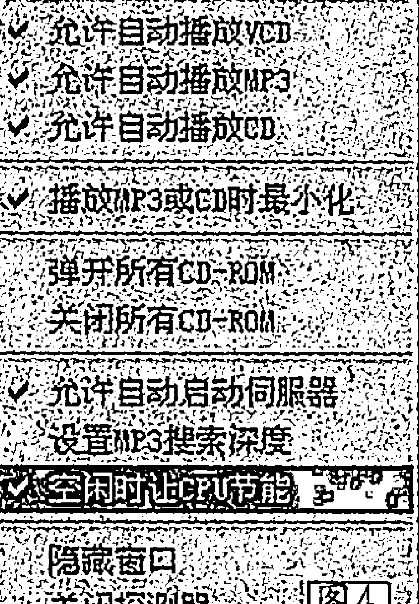

#### 2. 设置MP3搜索深度
通过这一功能可以设置搜索MP3光盘的目录深度和文件个数。如果搜索所有路径和所有文件，往往会发生自动伺服器对数据光盘进行全盘无序搜索的情况，所以设定搜索的目录深度和文件数目有利于快速识别MP3又不会对普通数据光盘乱找一阵。这时你可以根据自己的需要来设置，选择【设置】→【设置MP3搜索深度】，然后用鼠标左右拖动相应选项的滑块即可（图5）。

    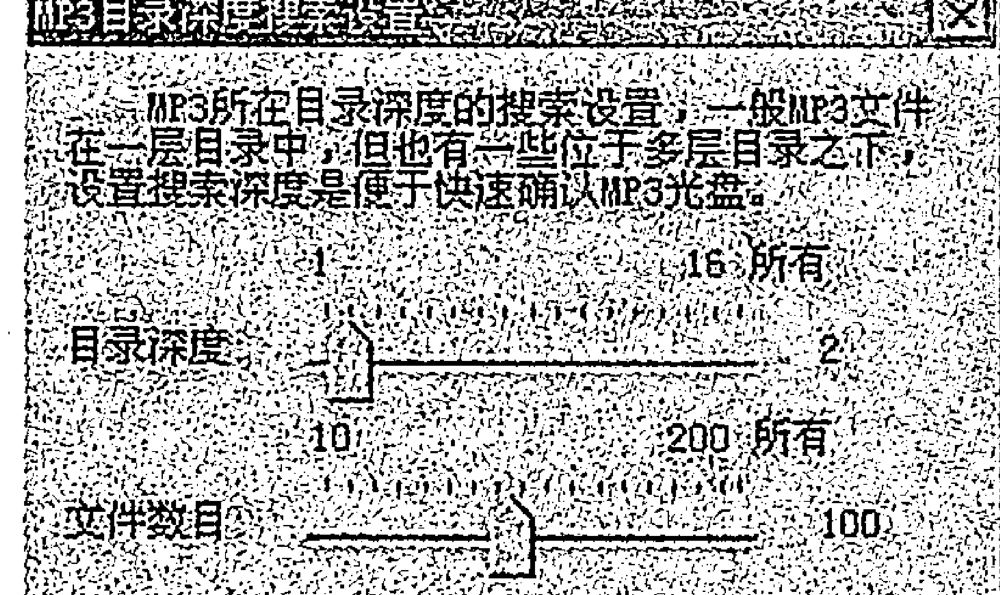

（文 / 水月斋）

## Ghost的克隆密技

### 一、减少Ghost镜像文件体积

对系统进行Ghost镜像是我们保持系统完好的一个重要手段。但Ghost镜像文件相对较大，想减小Ghost镜像文件的个头，在进行Ghost镜像文件生成前，要删除Windows\Temp文件夹下的所有文件，同时也可使用系统清理软件进行垃圾文件清理。在进入DOS状态做Ghost镜像文件前，对于Win98操作系统可删除Windows文件夹中的Win386.swp文件；WinME操作系统可删除C盘下的_RESTORE文件夹及其内容。在进行镜像操作时，选择采用压缩方式以有效缩减Ghost镜像文件体积。

### 二、用Ghost制作启动型U盘

制作启动型U盘不仅仅是要把启动所需要的文件拷到U盘的根目录下，更重要的是要在U盘上写入主引导记录，我们可以利用Ghost把好的启动型U盘备份成映像文件，然后再恢复到普通型U盘中，从而将主引导记录也恢复过去！

首先在Windows里面直接启动Ghost，选择【Local】→【Disk】→【To Image】，Ghost要求选择硬盘，选择要复制的启动型的U盘，之后在硬盘上建立一个名为Windows 98USB.gho的映像文件；制作完毕之后，插入原来的普通型U盘，选择【Local】→【Disk】→【From Image】，选定刚刚制作的映像文件Windows 98USB.gho，最后执行对拷任务，不一会儿就完成了。回到Windows窗口界面，打开“我的电脑”，查看“可移动磁盘”，里面已经有了所有的启动文件，再用Fdisk查看分区状况，U盘所在分区已经标有了“A”，这表明U盘已经被写入了主引导记录，现在你可以用它来进行启动了！

除了通过硬盘对拷外，还可以通过分区(Partition)恢复来制作启动型U盘，过程基本一致，只是在制作映像文件时选择【Local】→【Partition】→【To Image】，而在恢复分区时选择【Local】→【Partition】→【From Image】即可。另外，如果你有两个以上的空闲USB口，可以把启动型U盘和普通型U盘同时接在电脑上，选择【Local】→【Disk(Partition)】→【To Disk(Partition)】，然后选定相应的U盘就可以了，但一定要注意不要把源盘和目标盘选颠倒了（尤其是同容量），建议最好设一下卷标以示区分。需要提醒大家的是，最好在Windows 98/Me中启动Ghost来制作启动型U盘，因为在纯DOS下一般无法驱动U盘（Ghost找不到U盘），而在Windows 2000/XP下又不能启动Ghost软件。

### 三、Ghost镜像文件的维护技巧

-   1. 尽可能将镜像文件（即.GHO文件）放在单独的硬盘分区上，不要和其他经常需要读写的文件放在一起。
-   2. 尽量不要对镜像文件所在硬盘分区进行磁盘整理，以免对镜像文件造成破坏。
-   3. 定时借助Ghost Explorer来维护镜像文件。方法是：单击【开始】→【所有程序】→【GHOST】→【GhostExp.exe】，单击【文件】→【打开】命令打开镜像文件，再单击【文件】→【编译】命令，在随后出现的“另存为”对话框中为编译后的新镜像文件输入一个文件名，单击“保存”按钮即可开始编译，窗口状态栏会显示编译进度，完成后可以看到新的镜像文件。注意：由于编译过程要进行大量的磁盘读写操作，因此系统响应速度会变慢，建议在编译前关闭所有无关的应用程序以释放系统资源，从而保证编译的顺利进行。

### 四、用命令行操作Ghost的技巧

在使用Ghost的时候一定要先进入Ghost，然后再在它的界面中操作吗？这样操作不但麻烦，而且还容易出错。实际上和DOS命令一样，Ghost也可以通过命令行参数来操作，其参数其实就是Ghost中的OPTION选项，只不过以命令行的形式出现而已。现在我们以大家最常见的备份方式来说一说Ghost的命令行参数。

我们假设用户是有一个硬盘，多个分区，用户使用Ghost来备份已经装好操作系统的C盘，Ghost.exe程序位于D盘的backup目录中，备份文件名为c.gho。那么命令行为：

`d:\backup\Ghost.exe -clone,mode=pdump,src=1:1,dst=d:\backup\c.gho -sure -z9`

好了让我们一项一项来看，d:\backup\Ghost.exe是指Ghost程序的位置。-clone是克隆的命令参数，它后面的部分都是克隆的“开关”。mode这个开关可以有6个选项：copy（磁盘到磁盘的拷贝）、load（从备份文件恢复到磁盘）、dump（从磁盘备份到文件）、pcopy（分区到分区的拷贝）、pload（从备份文件恢复到分区）、pdump（从分区备份到文件）。src 这个开关是用来指出 clone 操作的源盘（分区、文件），如本例中我们的操作源区是 c 盘，它是第一个硬盘的第一个分区，所以参数是 1（第一个磁盘）:1（第一个分区）。如果源磁盘是你的第一个磁盘，那么 src=1。dst 这个开关是用来指出目标区的，这里我们的目标是备份到一个文件中， 所以我们在这里输入的是最后备份文件的路径和文件名。-sure 这个开关是让你跳过讨厌的确认过程。-z 这是指备份过程中对内容的压缩比：-z 或者 -z1 是快速压缩。z 后面的数字越大，压缩比率就越大，而速度也就越慢。压缩率最大的是 z9。

那么还原是否也可以使用命令行呢？当然可以：`d:\backup\Ghost.exe -clone, mode=pload, src=d:\backup\c.Ghost:1, dst=1:1 -sure -rb`

看，我们这里的 mode 用的是 pload，因为是从文件恢复到分区，src 变成了文件，dst 变成了分区，正好是备份过程的逆过程。惟一多出来的一个开关是 -rb，它的意思是在恢复过程结束后重新启动计算机。

好啦，你可以把这两个命令行保存成两个批处理文件，以后操作起来是不是又快又准确呢？下面我们列举一些常用的 Ghost 参数：

-   -rb：本次 GHOST 操作结束退出时自动 REBOOT。一个很有用的参数，特别是在复制系统时你可以放心离开了。
-   -fx：本次 GHOST 操作结束退出时自动回到 DOS 提示符（前提是你以 DOS 命令的方式启动的 GHOST）。
-   -sure：所有要求确认的提示或警告一律回答 “YES”。此参数有一定的危险性，只建议高级用户使用，小心为妙！
-   -fro：如果源分区发现坏簇，则略过提示强制拷贝。此参数可用来试着挽救硬盘坏道中的数据。
-   -fnw：禁止对 FAT 分区进行写操作，以防误操作（此参数对 NTFS 分区无效）。
-   -f32：将源 FAT16 分区拷贝后转换成 FAT32（前提是目标分区不小于 2G）。由于支持 FAT32 的操作系统很少，所以除非你是复制 Windows 98 分区，否则此参数慎用！
-   -f64：将源 FAT16 分区拷贝后转换成 64K/簇（原本是 512K/簇，前提是目标分区不小于 2G）。此参数仅仅适用于 Windows NT 系统，因为其他操作系统均不支持 64K/簇的 FAT16 文件系统。
-   -fatlimit：将 NT 的 FAT16 分区限制在 2G。此参数在复制 Windows NT 分区，且不想使用 64K/簇的 FAT16 时非常有用。
-   -span：分卷参数。当空间不足时提示复制到另一个分区的另一个 IMAGE FILE。
-   -auto：分卷拷贝时不提示就自动赋予一个文件名继续执行。
-   -crcignore：忽略 IMAGE FILE 中的 CRC ERROR。除非你拷贝的东西无关紧要，否则不要使用此参数，以防数据错误。

### 五、Ghost 参数应用小技巧

Ghost 有很多参数，合理地利用它们可以方便地完成许多复杂的任务，下面列举几个应用实例。

#### 1. 制作系统自动恢复软盘

用 Ghost 恢复系统的一般做法是：将操作系统和全部应用软件安装到 C 区中，再用 Ghost 软件将整个 C 盘做成一个镜像文件放在 D 区中（假设文件名为 C.GHO），这样当 C 区出问题时可轻松利用 Ghost 通过镜像文件将 C 区恢复成原样。但对于初学电脑的朋友来说，即使 D 盘有镜像文件，他也不一定会用 Ghost 进行恢复。这时我们可编辑一个批处理文件，在文件中设置好 Ghost 的参数，让 Ghost 来自动完成相关操作。具体命令为：

`Ghost.exe -CLONE, MODE=PLOAD, SRC=D:\C.GHO 1, DST=1 1 -SURE -RB`

意思是自动将 D 盘的镜像文件 C.GHO 恢复到第一个硬盘的第一个分区，也即 C 分区中。如果将此命令加入到启动软盘的 Autoexec.bat 文件中，再将 Ghost.exe 复制到软盘里，则只要用该软盘启动电脑便可自动恢复系统。当电脑出现异常时，只要用该软盘启动电脑，就一切 OK 啦。

#### 2. 将整个硬盘数据备份至光盘中

有时我们需要将整个硬盘克隆成镜像文件，再将文件刻录到光盘中保存起来。但当硬盘数据较多时，镜像文件很可能超过单张光盘的容量，怎么办？其实应用 Ghost 的参数可以轻松完成这个任务。譬如要把一个有 15GB 数据的硬盘克隆成镜像文件，可以这样输入命令：Ghost.exe -SPLIT=680 -AUTO，再在出现的 Ghost 主界面中选择 Disk to Image，这时镜像文件名可任意，但不要超过 8 个字符（假设镜像文件名为 Back）。克隆完毕，整个硬盘就被备份成了许多个镜像文件，第一个文件名为 Back.GHO，第二个为 Back0001.GHS（系统自动命名），第三个为 Back0002.GHS，以此类推。而由于使用了 -SPLIT=680 参数，故这些文件都小于或等于 680MB，此参数可以根据光盘容量进行修改。

#### 3. 让目标盘与源盘的分区完全一样

假设源盘有 C、D、E 三个分区，现欲将此盘克隆到目标盘中，并且要使得目标的三个分区与源盘的三个分区一模一样，则可在 Ghost.exe 后加上 -IA 参数。

#### 4. 克隆的同时改变磁盘的分区格式

我曾遇到这样一个问题：为了快速安装 Windows 98 操作系统，我打算把一个曾经备份在光盘中的 Windows 98 镜像文件用 Ghost 恢复到一个 15GB 的硬盘中，但总是不能成功。后经分析发现原因在于当初的镜像文件是从 FAT16分区格式的硬盘中制作的，而单个FAT16的分区又不能超过2GB，解决方法是在Ghost.exe后加上-F32参数，这样在克隆的同时也能完成分区格式的转换工作。

### 六、用Ghost整理磁盘碎片

用Ghost做磁盘映像时，Ghost会把硬盘分区中的每一个数据都完整地读出，然后把它写入一个GHO文件中，对于分区的空白部分，软件会自动跳过。然后当我们恢复GHO映像文件时，软件会把文件中的所有内容连续地写入分区中，于是所有的数据便都自动写在分区的头部，我们便得到了完整的未使用空间，原先的碎片文件也就自然消失。

用Ghost整理碎片的具体方法是：先用Scandisk扫描并修复分区上的所有错误码，再用Ghost给要整理的分区做一个GHO映像文件，文件的大小视分区的使用情况而定，然后再将GHO文件还原到原分区即可，这些操作最好在纯DOS模式下运行，在还原映像时一定要选对分区，否则会造成数据的丢失。根据我的使用经验，通过这个方法整理4GB的硬盘，所用时间大概在30分钟，比使用Vopt2000所花的时间要长一点，但是效果要好得多，不过使用Ghost软件有一定的危险性，建议大家小心使用。

（文 / 水月斋）

## PQmagic技巧荟萃

### 一、用PQmagic隔离硬盘坏扇区

PQmagic是硬盘分区软件的元老，它是伴随着Windows的兴起而逐渐为人所知的。它的最大优点是在不破坏硬盘内容的前提下给硬盘分区，彻底结束了动辄就重新来过的讨厌的fdisk时代，最近，笔者用PQmagic成功隔离了硬盘上的坏区，自觉简单易行，现付诸文字，给为硬盘坏区所烦恼者提供一个方法。

传统修复或隐藏坏区的方法，都要经过繁琐的数据计算，着实让脑袋变大。而使用PQmagic，只要你用鼠标点点拖拖，轻轻松松一切搞定。我隔离硬盘上坏区的步骤如下：

-   1. 打开电脑，点击【开始】→【程序】→【附件】→【系统工具】→【磁盘碎片整理程序】，程序启动后选择“显示详细资料”，一会儿后，可以看到用红色B标记的坏区。记下坏区在示意图中的相对位置和粗略大小，譬如在经观察后发现坏区大约在C盘（硬盘分C、D两个逻辑盘，C盘1G，D盘2GB）50%以后，大约为几M。接下来退出碎片整理程序。
-   2. 启动PQmagic程序，根据坏区所在的磁盘位置，从C盘再划分出一个逻辑盘E，完成后C盘变为500MB，E盘为500M（内含坏区），用同样的方法再将E盘中的坏区划分出来，并隐藏。注意分离的空间应比坏区大一些，比如说30MB，如果太小，使用数据时，坏区有可能影响到好的扇区，引起更多的坏区。
-   3. 还是保留原来整个硬盘分为C、D两盘的方式，将隐藏了坏区的E盘再合并到C盘中，相应的操作是将E盘“delete”，成为自由空间，再将这部分自由空间合并到C盘（比刚开始的C盘少了30M）。点击“ok”和“apply”。开始对硬盘进行操作，耐心地等待，到电脑重新启动起来的时候，坏区就没有了。

### 二、让PQmagic在Windows 2000 Server版中运行

有些朋友发现PQmagic不能在Windows 2000 server或者以上版本之中运行，其实很简单，只要将Boot.ini文件删除或者改名，PQmagic就可以运行了，为什么会这样呢？我们可以来对比一下2000专业版和Server里面的Boot.ini文件异同：

两者的不同点共有两处：即Windows 2000的版本名称（“Advanced Server”和“Professional”），而且在专业版的名称后面的“=”的前后各有一个空格，PQmagic就是靠这个来识别是否运行的，因此只要大家将Boot.ini文件进行相应的修改，便可以在Windows 2000 Server下面正常运行了。至于这个有趣的问题为什么会出现，估计是微软公司为了区分专业版和服务器版故意留下的记号，而PQmagic就利用这个记号来让自己不在服务器版下运行，这可能是为了保证Server版稳定运行的一个方法。

### 三、利用PQmagic“移花接木”

如果你有一个大硬盘，已经分区为C盘、D盘、E盘，但使用了一段时间，发现C盘几乎没有空间了，而D盘、E盘还有不少剩余，能不能向D盘、E盘借点空间使使呢？没问题，只要你说话，PQMagic绝不令你失望。

首先，启动PQMagic（注意：启动前最好关闭所有正在运行的程序，最好在纯DOS下运行），进入主界面，我们可以看到从左到右依次排列着3个分别标着“C：”、“D：”、“E：”的绿色块，这就是你的C盘、D盘、E盘。用鼠标右键点击D盘或E盘（随便选择，看哪个盘剩余空间多，选哪个盘，选中的盘色块会凹下去），这时会出现一个菜单，用鼠标选择“Rsize/Move”选项，其功能是对选中盘的大小进行调整。这时会出现一个调整硬盘大小的框。在“New size”选项可以填你希望“借”盘的大小（也可以用长方框左右的箭头来调节大小），其中“Free Space After”选项框内显示的是你“借”出盘的大小。那就先借它个500MB吧，选好后点击“OK”。

回到主操作界面后，你会发现在C:、D:、E:之间会多出一个灰色的块，它就是你刚才从D盘（或E盘）“借”到的空间。用鼠标右键点击C盘色块，在菜单上选择“Resize”选项，可以看到在调整界面上的“FreeSpace After”选框内有一个数值500MB，将500改成0，点击“OK”。回到主界面看看吧，你的C盘色块变长了（多了500MB），D盘（或E盘）却变短了（减少了500MB），退出PQMagic会重新启动计算机。快打开“我的电脑”看看有什么惊喜发现？

### 四、拥有自己的“秘密基地”

你是不是为无法保留自己的秘密而苦恼过，特别是在公用计算机上，自己保存的文件被人搞得一塌糊涂的时候。你可能想过用加密程序或将文件隐藏，但有时候连自己都会忘记密码和将文件藏在何处。现在有了PQmagic，我们就可以偷偷营造一个除了自己之外谁都不会发现的“秘密基地”。

首先先建一个自己的“秘密基地”。还记得前面讲的怎样从D盘（或E盘）借空间吗？对了，重复上文的操作，在D盘（或E盘）借一块几百MB的空间，就是在主界面中多出的那个灰色块。用鼠标右键点击灰色块，在菜单中选择“Create”项，新建一个驱动盘，命名为F盘。这样“仓库”就建好了，以后把自己的文件放在这儿就行了。但这个“仓库”还称不上“秘密”，在PQMagic主界面菜单中选“Advanced”选项，再选“HidePartition”项，这个新建的F盘就被隐藏了起来。这样，即使在Windows下也找不到F盘。用时只要再运行PQMagic，选“Advanced”菜单中的“Unhide Partition”项就行了。怎么样，还不赶快试试看！

### 五、利用PQmagic实现多系统并存

随着电脑业的发展，Windows9x/NT/2000/XP已走入千家万户。但这些操作系统多半互不相容，不过你不用担心，PQmagic可以轻松帮你创建多个C盘，实现多个管理系统各自独立、互不干扰地运行。

在运行PQMagic后，首先根据自己的要求选中一个目标C盘分区，从“BootManager”菜单中选择“Add to Boot Manager”项，按要求输入此分区的名称，以便于分别各个不同的C盘（注意：其长度不能超过8位数），如：装有Windows98的盘可标上“Win98”，装有Linux的盘可标上“Linux”。然后，按同样方法，分好其它的C盘分区（PQMagic最多只能管理四个C盘）。重新启动电脑，在自检后，屏幕上会出现蓝底白字的启动选单画面，各个C盘都会列出来，需要用哪个C盘启动，就选择哪个即可。你还根据自己习惯，对启动管理器进行配置。

选中某一个C盘分区后，从“Boot Manager”菜单中选择“Change Nameon Menu”项，可以自由更改该盘的名称；从“Boot Manager”菜单中选择“Remove from Boot Manager”项，可以将此C盘从启动选单中去掉，下次启动时将不再显示此C盘名称；在“Boot Manager”菜单中选“Preferences”项，还可以对电脑启动时管理器选单的出现时间进行定制（缺省值为延迟30秒）。

一般在启动电脑时都会从某个C盘引导系统，如果在你的机器里同时存在Win98和Linux两个C盘，而你经常使用Win98，很少用Linux，那么可以在PQMagic菜单中选中Win98所在C盘，然后在“Boot Manager”选单中选择“Set as Default Menu”项，把此分区作为缺省引导分区，或再适当减少启动选单的延迟时间，如10秒。这样，以后每次启动电脑，光标都会出现在Win98所在C盘上，10秒钟后就自动进入Win98界面了。

### 六、用PQmagic备份硬盘数据

在病毒肆虐的今天，一不留神就会被它啃得体无完肤，不是数据丢失，就是硬盘不起动。或因误操作，破坏了硬盘上的备份文件，唉，怎么办？重装一遍Windows是件很令人心烦的事。来，试试阿P的绝招之“金蝉脱壳”吧！会有意想不到的“轻松感觉”。

我们先用PQMagic分出一个与C盘（你装有windows系统的硬盘）一样大小的F盘，在PQMagic主操作界面用鼠标点中C盘，然后选择“Options”选单中的“Copy”，点击“OK”，PQMagic会给你复制一个同C盘一模一样的盘。然后用“Advanced”菜单中的“Hide Partition”将其隐藏起来。这样，你就可以放心大胆地安装软件，再也不用担心什么反安装不了的程序，不用时就像用DOS中的Deltree一样删掉。万一有病毒破坏了程序或Windows不启动，只要进入PQMagic在“Options”中选择“Delete”将这个分区删除，将另一备份分区F设为启动盘即可。怎么样，感觉是不是很爽？

(文/水月斋)

## Nero刻录之技巧密招

### 一、让Nero实时显示刻录速度

相信很多朋友都在用Nero刻录过光盘，当我们在刻录光盘的时候，Nero会在刻录界面的左下角显示所选择的刻录速度。但实际上，我们的刻录机并没有用这个显示的速度去刻录光盘，也就是说Nero所显示的刻录速度根本就是不准确的。其实我们可以通过修改注册表的方法来让Nero实时显示当前真正的刻录速度。修改方法如下：

首先我们通过【开始】→【运行】→【Regedit】打开注册表编辑器，找到 `HKEY_CURRENT_USER\SOFTWARE\Ahead\NEROBurningRom\Recorder` 项，在该项目下面新建一个名为 `ShowSingleRecorderSpeed` 的DWORD值，并赋值为1。退出注册表编辑器之后，我们重新启动一下Nero，并且开始刻录，现在你就会看到实际的刻录速度了。

### 二、实用技巧: 用Nero刻录CD音乐光盘

1. 按“新建”按钮或文件菜单下的“新建”来打开“新建编译”对话框，选择我们要刻录的“音频光碟”。
2. 随后会弹出一个对话框，告诉你Nero支持三种文件格式（*.wav、*.mp3、*.cda）。然后您只要点击一下“完成”按钮即可。
3. 把硬盘上的音频文件拖到光碟面板上，从文件浏览器中把自己喜欢的歌曲拖曳到左边的音频窗口中之后，下部也会有一根蓝线表示当前刻录文件的容量大小。其中WAV文件必须是44.1 KHz及16位元立体声格式。mp3要为112K到160K，高于160K的速度会引起刻录后可播放但没有声音的现象。
4. 点击刻录按钮打开刻录对话框，设定好刻录时的选项后按“写入”按钮开始刻录。
5. 刻录CD是一个比较漫长的过程，为了防止出现废碟的情况，笔者将屏保及其他消耗系统资源的程序全部关掉。刻好后装入CD唱机就可以播放了。在这里要提醒大家注意，如果想要获得完美的音质以及稳定的音乐CD质量，最好还是尽量选择慢速来刻录，一般来说2X/4X是不错的选择，这样可以让很多读碟性能不好的CD都能够读取出来哦！

### 三、用Nero为刻录盘随时追加数据

很多时候，我们刻录的内容小于一张光盘的容量，此时如果将刻录盘封闭，就会浪费剩余的空间。因此我们在刻录光盘时应该使用“多重区段”进行刻录。

在Nero主界面中单击工具栏最左侧的“建立新编辑”按钮或按下“Ctrl+N”组合键，即可打开“新编辑”界面，默认情况下打开的就是“多重区段”选项卡(图1)。在该选项卡中我们可以定义光盘的刻录模式。如果你的CD-R或CD-RW光盘是空白的，并且要写入的数据小于一张光盘的容量（这个主要视刻录盘的容量大小而定，现在的刻录盘容量主要有650MB和700MB两种，在盘面上会有相应的标记），则选择“第一次刻录多重区段磁盘”。

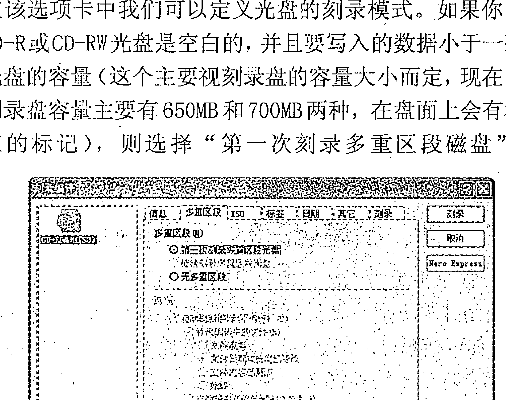

如果你要一次写满整个刻录盘，或是不想在未写满的刻录盘中再追加内容，那么就可以选择“无多重区段”，选择该选项刻录的光盘具有最好的兼容性和最快的读取速度。

### 四、活用Nero的影像刻录机

影像刻录机是Nero中的一个很有用的元素，把当前的刻录机设定为Nero的影像刻录机后所有刻录动作的结果都会通过影像刻录机制作为影像文件存于硬盘上而不管你是否已经安装了刻录机。

首先在主菜单上的“光碟记录器”菜单中选择“选择记录器”，找到“Image Recorder - Virtual Device -”并启用它。那么我们怎么样才可以只制作光碟的影像文件呢？

1. 在“新建编译”中选择“光碟拷贝”(图2)，在“拷贝选项”中取消“飞盘式”复制模式，再到“镜像”中取消“光碟拷贝后删除镜像文件”，在“刻录”选项卡中只勾选“确定最大速度”、“终结光碟”，这时“复制光盘”按钮会变为“速度测试”按钮。点击该按钮即可开始测试速度，当测试完毕就取消剩下的进度，这样我们所需要的光碟影像文件就在你硬盘上了。
2. 接下来我们可以使用影像刻录机来进行复制的过程。完成制作后按要求保存下影像文件即可。

### 五、用Nero实现超刻功能

所谓的超刻，其实就是超量刻录，在一张光盘上面刻录超过其容量标称的数据，并不是所有的光盘都可以超刻的，同时也要看你的刻录机是否支持超刻，大家可以在选择刻录器的窗口下面看看刻录机是不是支持超量刻录（图3），如果刻录机支持该功能，则我们就能使用超刻了。

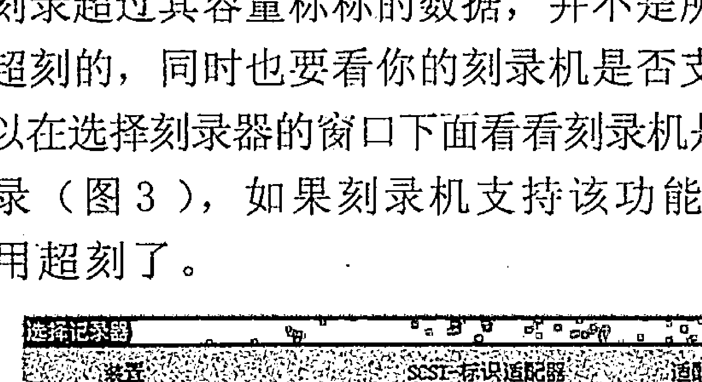

首先我们打开“文件”主菜单里面的“优先选项”，如果是Nero6.0或者以上版本，我们就需要打开【文件】→【设置】→【高级属性】。首先勾选“启用一次性过量刻录”，并设定要超刻的范围。设定好后就按一般操作方法去使用Nero，要注意的是必需使用DAO模式去刻录，多片段光碟式不能超量刻录的。

### 六、保存光碟的轨道

Nero可以保存光碟中所有的轨道，数据轨可制作为Nero的影像文件，音轨可制作为WAV、MP3、WMA、VQF，以方便我们日后再把轨道还原。在主菜单上的“光碟记录器”菜单中选择“保存音轨”。选项用于保存音轨的驱动器。当驱动器中的光碟是数据光碟时会出现如图4画面。

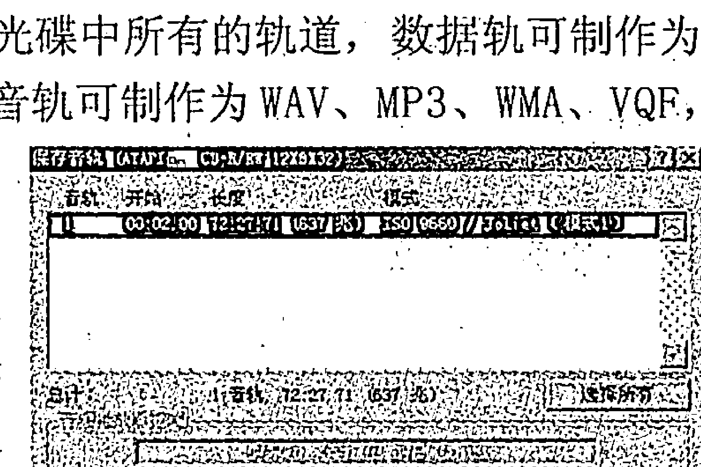

选择好数据轨道并设定好“路径”后再按“保存”按钮即可保存为Nero所使用的nrg格式影像文件。但如果此时驱动器的光碟是音频光盘的时候，就会看到图5所示的窗口了。选择好音频轨道并设定好“路径”和“音频文件格式”后再按“保存”按钮即可保存为我们所想要的音频格式。要注意的是一些旧型号的光驱在保存数据音轨时没问题，可保存音频音轨时就会产生爆音，如果出现这个情况则光盘复制也会一样产生爆音。解决的方法是更换一个抓音轨不会产生爆音的驱动器。要注意的是播放时没有爆音不一定抓音轨时就没爆音。

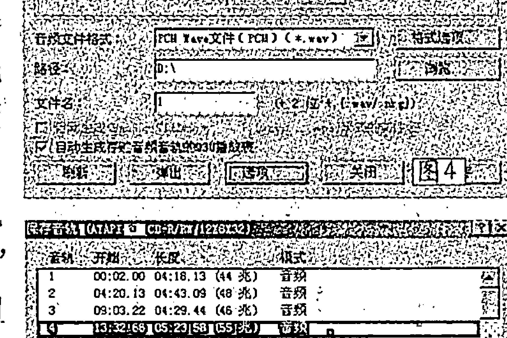

（文/水月斋）

## ACDSee图片处理小技

### 一、用ACDSee制作幻灯片

ACDSee 6的强大功能对许多普通的用户来说是非常实用的，其中制作幻灯的功能非常有特点，简单到你只需要点几下鼠标就可以实现。有点心动吧！

1. 首先选择好你要制作幻灯的图片，将图片的大小和色彩调整好，这些工作对于ACDSee 6可以轻松胜任。然后将这些图片保存在一个文件夹中。
2. 启动ACDSee 6，打开这个文件夹，点快捷按钮栏上的创建幻灯按钮，进入幻灯设置区。
3. 在弹出的对话框中“文件选项”设置中选择“当前文件夹中所有项目”，如果你的文件夹中还有子文件夹，你可以选择“当前文件和子文件夹中所有项目”。
4. 点“基本”选项设置，这里是设置幻灯各种切换效果以及背景颜色和效果切换之间的时间设置。这是ACDSee 6改进最吸引人的改进，目前的切换效果只有12种效果，相信在下一次的改进中会增加不少，对普通的用户来说已经够用了。背景颜色根据自己的喜好设定。效果的时间间隔根据你的需要设定，比如说你需要给别人演讲幻灯中的每一张图片，那么每张图片的时间间隔设置为5秒左右就够了。
5. 最后两项是幻灯片的“高级”和“文字”的设置，它们的设置也非常简单，相信不需要笔者一一的介绍你也能设置了，设置完后点确定。OK！一个幻灯片就这样完成了，很简单吧。

### 二、用ACDSee来轻松美化图片

很多人都用数码相机拍摄过照片，有时我们需要将这些照片做一些简单的美化或处理，一般的图像处理软件使用起来非常复杂，不易掌握，其实你可以利用ACDSee 6.0提供的图像增强功能，来帮助我们轻松美化图片。

#### 1. 修饰斑点

用数码相机给人照相，特别是照女孩子的时候，脸上总会出现些微小的斑点，ACDSee有办法帮你解决。选择【修改】→【杂点】→【删除杂点】，你就会发现人像照片中脸上的斑点都不见了。除此之外，你还可以试试【修改】→【锐化】→【简单模糊/锐化】下的各项功能，也能带给你不同的效果。

#### 2. 调整照片光线

有时候因为拍摄的环境，照片可能会出现曝光过度或者不足的情况，ACDSee提供了曝光修复功能，通过调整【修改】→【曝光】→【亮度/色阶】，你可以将照片修复的近乎完美！如果觉得自己的功力不足，或者嫌麻烦，你可以直接选用【修改】→【曝光】→【自动】命令让软件来帮你解决这些烦人的问题。

#### 3. 想要把照片做一点特别的处理？

点击【修改】→【效果】→【颜色】→【底片】命令，你可以做出照片的底片效果；如果选择的是“褐化”，则可做出类似旧照片的感觉；如果想要炫一点，可以选择“艺术”子菜单下的“浮雕”、“油画”、“铅笔画”等特效，都可以为你的照片带来不同的视觉效果，赶快试试看！

### 三、用ACDSee批量修改文件名

大家知道用数码相机拍摄出来的照片，导入计算机后都会使用默认的文件名“dscf00*.Jpg”，而且照片都是水平的，文件也比较大。特别是在需要按一定顺序排列的照片（如给班级拍摄的照片，需要将学生的照片与该学生的学号一一对应）就显得尤为不方便了。为了便于导入平台之中，我们必须把文件名改成与学生的学号一致，而为了节省空间也必须把每个文件变小，同时为了便于查看还必须把照片旋转过来。在照片很少的情况下，我们可以一张一张的对照片进行处理，但是如果遇到照片很多再用这种方式处理，就显得非常的不方便了。但是如果我们能够充分利用ACDSee的批量修改文件名的功能，那这样的工作就显得非常轻松了。ACDSee批量修改文件名的具体方法如下：

1. 首先，启动ACDSee到浏览方式，找到照片所在文件夹，同时选中所有要更改文件名的图片，可使用“编辑”菜单中的“全选”命令，或使用“Shift+鼠标左键”选中连续的多个文件、使用“Ctrl+鼠标左键”选中不连续的多个文件。
2. 从“编辑”菜单中选择“批量重命名”命令，或直接使用快捷键“Alt+R”，在弹出的对话框中的“模板”项输入需要的文件名，如“1999##”，在“开始于”中输入“1”（如图1所示）。单击“确定”按钮后，所有选中的图片就都被重新命名为199901、199902、199903……通过这个操作我们很快就可以把所有照片文件的名称按照需要的形式改正过来。

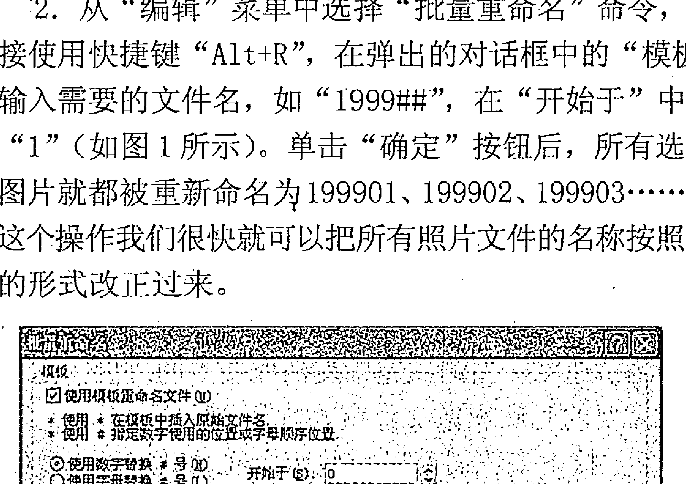

接着你可以看到原来的旧名称已经被改为新名称199901.jpg、199902.jpg。其实ACDSee不仅可以更改图片的文件名，对所有类型的文件都可进行批量改名，改名的方法与修改图片文件的方法相同。

#### 3. 更改文件位数

默认情况下，ACDSee在更改文件名时，将会使用一位数模板，但这样更改后的文件，如果超过10个，则在“资源管理器”中显示时，图片10将会排在图片1之后，图片20会出现在图片2之后，而不会按照自然数的顺序来排列，给我们选择、处理带来很多的不便。其实，我们在使用ACDSee进行文件重新命名时，完全可以将默认的一位数模板“#”改为两位模板“##”，这样更改后的文件将是01、02、03……10、11、……

#### 4. 可以使用 "*" 号

一般人使用ACDSee时，都是使用默认的 “#” 号来作为模板。其实，在ACDSee中除了可使用 “#” 来作为数字模板外，还可以使用 “*” 号来代替原文件名。而笔者是使用了 “*#” 作为模板，就可以把原来文件夹下的 “文件一、文件二、文件三” 更名为 “文件一1、文件二2、文件三3” 了。有时，这个功能是相当有用的。另外，大家还可以选中 “Use letters to replace #’s” 选项，那就可以让文件名按字母顺序更改，如 “文件一A、文件二B、文件三C” 等。

#### 5. 文件夹重命名

一般人可能只知道ACDSee能够给文件批量命名，其实，经过笔者的使用，发现它也能够批量更改文件夹的名称（不信，你可以试一试！），方法就是在ACDSee中选中这些文件夹，然后单击鼠标右键，选择 “Batch Rename” 命令即可。

### 四、用ACDSee批量转换图像方向

1. 启动ACDSee到浏览方式，找到照片所在文件夹，同时选取所有需要转换方向的图片文件。

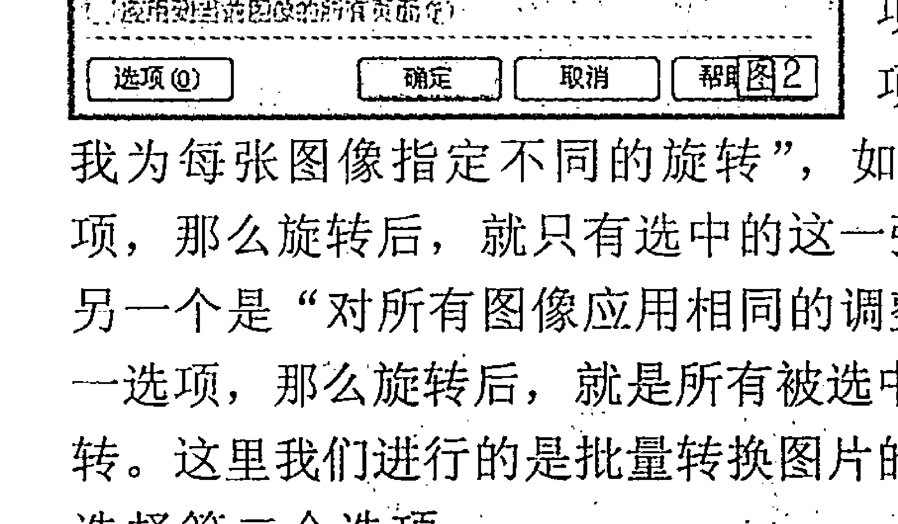

2. 从 “工具” 菜单中选择 “旋转” 命令，弹出如图2所示的对话框。
3. 在 “旋转/滤镜调整” 选项中有两个选择项，一个是 “让我为每张图像指定不同的旋转”，如果选择这一个选项，那么旋转后，就只有选中的这一张图片会被旋转。另一个是 “对所有图像应用相同的调整”，如果选中这一选项，那么旋转后，就是所有被选中的图片都会被旋转。这里我们进行的是批量转换图片的方向，所以应该选择第二个选项。
4. 在 “输出选项” 中有3个复选项，第一个是 “删除/替换原始文件”，选择该选项就会覆盖原来的文件而不会形成新的文件。第二个是 “保持最近修改日期”，这个选项是默认的选择，一般都要选择。第三个是 “放置已旋转的图像在下列文件夹中”，在这里你可以选择存放已旋转图片的文件夹。最后有一个 “如果所有操作成功完成，自动关闭进度对话框” 选项，选中该选项后，当所有的操作完成以后，程序会自动关闭。否则，就会弹出 “操作完成” 的提示对话框。

### 五、用ACDSee批量转换文件格式

1. 启动ACDSee到浏览方式，找到照片所在文件夹，用上面的方法选中所有要转换文件格式的图片。
2. 从 “工具” 菜单中选中 “格式转换” 命令，弹出如图3所示的对话框。在这个对话框中，你只需要在 “格式” 选项中选择你想要转换的格式，另外在 “覆盖已存在的文件” 有4个选择，你可以根据自己的需要选择 “替换”、“跳过”、“重命名” 和 “询问” 命令，程序默认的是 “询问” 命令。其他的选项就同批量转换图像方向的设置完全一样，这里就不再重复讲述。

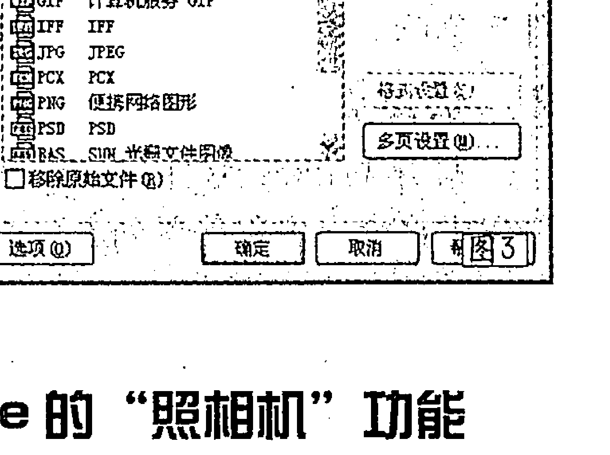

### 六、ACDSee的 “照相机” 功能

ACDSee除了具有很多批量处理图像的功能外，它还具有照相机的功能，也就是对屏幕进行截图处理了，大家都想不到吧，只要在任务栏中找到ACDSee图标，在该图标上单击鼠标右键就会弹出一个菜单，选择其中的 “新建屏幕捕捉” 的选项，弹出如图4所示的窗口。

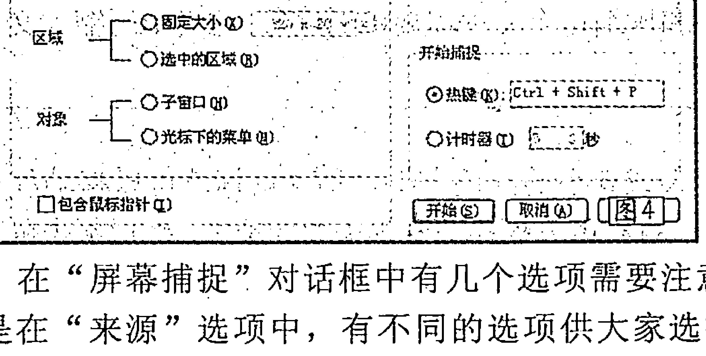

在 “屏幕捕捉” 对话框中有几个选项需要注意：一是在 “来源” 选项中，有不同的选项供大家选择，选择 “桌面——当前监视器”，那照下来的图片就是整个当前窗口。选择 “窗口——整个窗口”，照下来的图片就是你选中的那个窗口，选择 “窗口——仅内容”，照下来的图片就只有选中窗口的内容部分。选择 “区域——固定大小”，就会出现一个红色的方框，当然方框的大小可以在 “固定大小” 中进行选择，你可以拖动红色方框到合适的地方，然后单击鼠标左键就把图片照下来了，选择 “区域——选中的区域”，就可以直接找到你需要的图像按住鼠标左键拖动把图片照下来。选择 “对象——子窗口”，就会出现一个会自动跟随的方框，选择你想要的子窗口，单击鼠标左键即可完成捕捉。

所有的“屏幕捕捉”选项都设置好以后，你只需要单击“开始”按钮，然后再按你刚才设置的开始捕捉的热键就可以了。是不是觉得很简单呢，那你自己就试试看吧！

（文／水月斋）

## WinRAR 技巧集锦

### 一、利用 WinRAR 解压缩文件的技巧

#### 1. 快速压缩特定的文件

压缩时，如果要将某一类文件放入压缩包，单击【文件】菜单下的【选择组】命令，在对话框中输入通配符和文件扩展名，如“*.bmp”，单击“确定”后，则所有扩展名为bmp的文件均被选中；解除选中状态时，选择“文件”菜单下的“取消组”命令即可。

#### 2. 快速显示驱动器列表的技巧

打开 WinRAR 软件后，按下 Ctrl+D 键，在 WinRAR 窗口中将会出现驱动器列表，用鼠标选择即可快速进入相应的驱动器。另外，下载一些大型软件后，经常会看到一些特殊的压缩后缀名，如 aaa.001、aaa.002 等，这样的文件无法直接点击鼠标解压。要解压这种文件，可首先启动 WinRAR，然后选择 aaa.001 这个序号最小的文件，点击“解压到”即可。

#### 3. 了解文件压缩信息的技巧

压缩时，我们可以选择 ZIP 格式或 RAR 格式，ZIP 格式的最大优点就是普及率高和速度快，而 RAR 格式则能够提供较好的压缩率，还可以允许恢复受损坏的数据。在 WinRAR 窗口中，选择要压缩的文件，单击工具栏上的“信息”按钮，或者使用“Alt + I”这个按钮，在打开的窗口中单击“估计”按钮，WinRAR 会给出压缩率、压缩包大小和压缩这个文件需要的时间等，这对于压缩大文件非常有用。如果希望自动对文件进行评估，还可以选中“自动开始”选项。

#### 4. 批量建立文件夹

平时，我们经常需要对大批量的文件进行操作，直接拷贝的方法很不方便，其实我们可以通过 WinRAR 来简化这些操作。

比如，有一大堆文件需要压缩，而且每个文件要生成单独的压缩文件，只需选择要压缩的文件，单击右键，选择【添加到压缩文件】，在弹出的对话框中单击“文件”标签，选中“把每个文件放到单独的压缩文件中”复选框，点击“确定”按钮即可。

还有一个很实用的技巧，在备份数据时，如果要建立很多相同的文件夹结构，可以先在“资源管理器”中把多个文件夹结构建好，在这个文件夹上单击右键，选择“添加到压缩文件”，在打开的设置窗口中选中“压缩选项”下的“创建自解压格式压缩文件”复选框，单击“确定”按钮。再把生成后的文件改名为 test.exe。把这个文件拷贝到需要备份的文件夹下，执行 test.exe 安装即可。

针对多种格式的压缩包也有相关的设置技巧，如 ZIP、CAB、ARJ、ACE、TAR、BZ2、UUE、GZ、LZH 等，如果想把它们都转换为 RAR 包，那可以先把这些压缩包放到一个文件夹下，在 WinRAR 中选中这个文件夹。再单击“工具”下的“转换压缩文件”选项，选中“删除原来的压缩文件”复选框，单击“确定”按钮后即可转换成 RAR 压缩包。

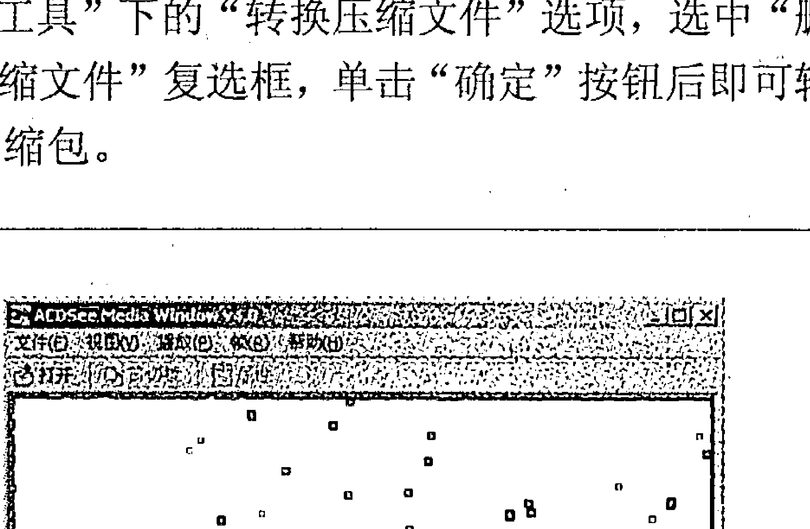

#### 5. 快速合并与还原 MPEG 文件

用 WinRAR 可以很方便地完成文件合并与还原工作，选中要合并的多个 MPEG 文件，单击鼠标右键，选择“添加到压缩文件”，会弹出一个窗口，在“压缩文件名”中输入合并后的文件名，注意一定要把默认的扩展名“ .rar”改为“.mpg”，在“压缩方式”下拉列表中选择“存储”，点击“确定”后即可把多个 MPEG 文件合而为一。我们还可以非常轻松地还原 MPEG 文件，只需要把合并后的 MPEG 文件的扩展名改为“.rar”，再用 WinRAR 将其打开，就会看到合并前的那些 MPEG 文件了，解压缩即可实现还原。利用这个方法，我们还可以对 MP3 文件进行类似的操作。

#### 6. 选择文件夹的查看模式

如果想解压 RAR 压缩包中的指定文件，可在打开 RAR 文件后，选中“选项”菜单下的“文件列表”，打开“平面文件夹查看”，则此 RAR 压缩包中的所有文件会都显示出来，单击“类型”按钮，该包中所有类型的文件就被放置在一起，选中相应文件，配合 Shift 键或 Ctrl 键，即可删除同一类型文件。如果需要取消平面文件夹查看模式，按下 Ctrl+H 键即可。
在 Windows 中不能直接搜索压缩文件中的内容，而在 WinRAR 中则可进行此操作，点击“工具”下的“查找文件”选项，或者直接按“F3”功能键即可。

#### 7. 使用命令行模式制作安装程序的技巧

WinRAR 还可以使用命令行方式。压缩命令的参数很多，而且功能十分强大，我们还可以利用命令行方式制作安装程序。安装程序的通用执行程序为：初始化、解压缩文件、建立快捷方式。其中解压缩文件我们可以用 WinRAR 的命令行来实现，把需要安装的文件做成一个 RAR 压缩包，然后再制作一个询问界面，并把它作为一个参数传递给 WinRAR.EXE，最后调用 WinRAR.EXE 并加上“X”这个参数就可以实现解压缩的目的了。因此，甚至在开发实践中，我们也可以利用 WinRAR 进行很多测试工作。

### 二、利用 WinRAR 加密文件的技巧

WinRAR 的加密功能很方便，因此有不少的加密技巧。通常的加密方法是，在 WinRAR 中打开要加密的文件，然后选择“文件”菜单下的“加密”选项。但是，这种方法的安全性不是很强。这里介绍几种不太容易破解的加密办法。

#### 1. 文件与图片巧加密

把要压缩的文件夹和一个 JPG 文件放在一起，然后同时选中这个文件夹和 JPG 文件，单击鼠标右键，在弹出的菜单中选“添加到压缩文件”，接着在弹出的窗口中把“压缩方式”一项选为“储存”，点击“确定”。最后把新生成的“*.rar”的扩展名改为“*.jpg”即可。图片依然能看，而且还藏有一个文件夹，使用的时候把扩展名再改回来解压缩即可。不过，这种方法容易被人用来绑定木马。

#### 2. 巧用汉字加密文件夹

为了防止某些暴力破解密码的软件，可以使用汉字作为 RAR 压缩文件包的密码，但通常情况下，我们不能正确输入汉字。要解决这个问题，可以先在记事本中输入所需的汉字，然后用快捷键粘贴到密码设定框内即可，在密码设定框内，一个汉字对应两个星号。

#### 3. 隐藏压缩包里的文件名

利用 WinRAR 可以把文件名列入加密范围，首先在 WinRAR 的主界面点击“添加”按钮，来建立一个新的压缩包，然后在弹出的窗口上选择“文件”选项卡，并选定要添加到压缩包的文件，接下来转换到“高级”选项卡，单击“设置密码”按钮，输入密码。在点击“确定”之前，一定要选中“加密文件名”一项，否则前功尽弃。

### 三、WinRAR 安全防范设置技巧

#### 1. 木马防范技巧

WinRAR 的“自解压文件”显出了它的弊端，如果我们把一个 JPG 文件和一个 exe 捆绑在一起，然后再把文件改为 JPG 格式。试想，如果这个 exe 文件是个木马的话，那就很容易落入别人的圈套了。防范的方法是，打开“文件夹选项”里的“显示所有文件”，会发现除了图片外还有其他文件，然后，打开自解压文件时不要双击，按右键，选“用 WinRAR 打开”，这样我们就可以有针对性的防范木马了。

#### 2. 设置安全的回收站

在 RAR 压缩包中删除文件后，WinRAR 会自动更新它，其中被删除的文件无法再找到。因此，如果压缩包确实不再修改或比较重要，则选中此压缩包，然后按 Alt+L 组合键，在打开的窗口中确认“禁止修改压缩文件”复选框被选中，单击“确定”按钮即可把此压缩包锁住，其中的文件便无法被修改或删除。此命令只支持 RAR 压缩文件，同时，在压缩文件时，设置窗口中也有一个“锁定压缩文件”复选框，一旦选中，生成后的压缩包将无法再修改，它对于备份重要数据很有用。
还可以对回收站进行设置，进入 WinRAR 主界面，在地址栏内输入任意分区内回收站对应的文件夹的目录，即可浏览该分区回收站的内容，这时我们可以打开文件或文件夹进行查看，并且利用简单的拖动即可恢复文件或文件夹到任意位置。在 WinRAR 中浏览回收站内的文件，可以方便地管理那些已被删除 but 又需要找回的文件。

## WinZip技巧集锦

### 一、解压缩操作的技巧

WinZip将一部分操作都集中到了右键功能表中。因此，在使用WinZip的过程中，我们不必用鼠标单击层层菜单了，只要选择相关命令就可以完成操作。其实，WinZip中，还有很多这样的人性化操作，现一一列举出来。

#### 1. 开启多个窗口的技巧

在系统缺省状态下，每次只能打开一个WinZip压缩窗口解压缩文件。如果要打开多个压缩窗口，可在WinZip操作界面中，打开“选项”菜单下的“重新使用WinZip窗口”选项，即可实现同时开启多个压缩窗口的目的了。

#### 2. 打印文件列表的技巧

通过WinZip，我们可以将某个文件夹和子目录的文件名称、修改时间、大小及所在路径等全部打印出来。
首先，选择需要打印文件列表的文件夹，单击右键把文件添加到Zip文件，在“压缩项”中选“不压缩”，单击“添加”，等压缩完成后，打开的工作界面中就会列出文件夹中所有文件。单击“选项”菜单下的“配置”，选择“查看”页，在“专栏”项中，根据实际需要勾选相应的显示打印信息，单击“确定”。
然后，在WinZip窗口中，重新单击“选项”菜单，进入“排序”子菜单，根据实际需要，选择文件显示打印顺序，建议选用“按路径”排列，这样可以将同文件夹的文件集中排列在一起。设置好打印机后，如果没有太长的文件名和太多的子文件夹，一般A4纸可以打印8列文件信息项。

#### 3. 用WinZip合并MPEG文件的技巧

首先，将需要合并的MPEG文件根据播放顺序进行重命名，如更改文件名为“1.mpeg、2.mpeg、3.mpeg、4.mpeg......”，接下来用鼠标将这些文件全部选中，单击鼠标右键并在弹出菜单中选择“WinZip”下的“添加到Zip文件”，这时系统会弹出一个对话框，在对话框中“添加到压缩包”下，输入压缩文件保存的指定路径及文件名。在“压缩”下选择“无”，否则就无法实现正常的合并。然后，单击“添加”按钮，稍等片刻即可。
打开这个压缩文件，将压缩文件中的文件顺序排序整理好后关闭WinZip，再选中这个文件，将它的扩展名修改为“MPEG”，就完成了合并工作。
另外，还有一个快速解压技巧。以前添加内容到压缩包时，通常需将第二个压缩包中的内容全部解压缩，操作比较麻烦。现在可同时打开这两个压缩文件，然后选中第二个压缩包中的所有文件，并把它们直接拖曳到第一个压缩包中就可以快速进行解压了。

#### 3. 通过注册表设置WinRAR菜单

启动“记事本”，在其中输入以下语句：

```
Windows Registry Editor Version 5.00
[HKEY_LOCAL_MACHINE\SOFTWARE\WinRAR\Policy]
"Menu"=dword:00000000
"Settings"=dword:00000000
```

将其保存为limitrar.reg文件，双击并导入这个REG文件，把它导入注册表。启动WinRAR，你会发现菜单消失了，而且按Ctrl+S键也无法调出“设置”和“选择工具栏按钮”窗口，相对安全多了。
如果需要恢复，把以上语句中的“Menu”值00000000改为00000001，双击导入unlim.reg文件即可恢复菜单，并允许使用“设置”窗口。Settings项的值用来禁止/允许“设置”和“选择工具栏按钮”对话框。

#### 4. 安全修复文件的技巧

压缩文件意外受损是很让人心烦的事情，特别是对于那些你费了九牛二虎之力才从网上下载来的重要信息资料或大的程序软件。其实用解压缩软件WinRAR内置的压缩文件修复功能，说不定能够使那些受损的压缩文件起死回生。注意，这个功能并非对于所有受损的压缩文件都有效。
打开WinRAR主窗口，从地址栏转入受损压缩文件所在的目录，选中受损的压缩文件。用鼠标点击WinRAR工具栏上的“修复”按钮，或者打开“工具”下的“修复压缩文件”，这时WinRAR会弹出一个对话框，让你选择修复文件的存放路径。设定好后即可开始修复，并会以对话框的形式显示修复的全过程。进入你设定的修复文件的存放目录，你会发现该目录下增加了一个名为_reconst.rar或_reconst.zip的压缩文件，它就是WinRAR为你修复好的文件。

#### 4. 创建自解压文件压缩包的技巧

新建一个 zip 格式的压缩包，然后用 WinZip 的格式转换功能，可将其转换为具有自解压能力的 exe 格式文件。首先新建一个 zip 格式的文件。执行“操作”菜单下的“制作.exe文件”命令，然后设置解压方式。弹出“WinZip 自解压个人版”对话框后，在“默认解压缩到”文本框输入自解压目录，按提示完成最后的确认操作。安装压缩包里的软件的方法与之类似。

#### 5. 添加／删除快捷按钮的技巧

单击“选项”菜单中的“配置”命令，然后打开“工具条”选项卡，单击“选择”按钮，就弹出自定义工具栏对话框，这样就可以添加或删除快捷按钮，最多可增添至 21 个。

#### 6. CRC 错误解决技巧

解压大型压缩文件时，WinZip 经常会提示某个文件出现 CRC 错误，现在有个办法可以解决这个问题。首先，选取除出错文件外的所有文件，并将选择的这些文件解压到一个指定的目录中。然后，处理这个出错文件，选择并解压这个文件，当解到一定程度时错误信息再次出现，并询问是否要看日志文件，先不理它，用 Windows 的查找功能在系统临时文件夹中找到这个出错文件，选择后复制到刚才的文件夹中，关闭 WinZip 重新运行。经过这样处理后一般都能很好地运行。

### 二、WinZip 另类实用技巧

WinZip 还有许多其他实用技巧，例如，扫描病毒、破解乱码邮件、为压缩包添加注释等。下面我们就将其列举出来，供大家参考。

#### 1. 对系统进行扫描病毒

WinZip 可以通过与外部程序的连接，进行 ARJ、LZH 和 ARC 等格式的压缩和解压缩操作管理，并可以对压缩文件内的文件进行浏览、病毒监测等处理。第一次使用 WinZip 中的病毒扫描功能的话，首先必须让 WinZip 知道机器中已经安装的病毒扫描程序所在的位置。在 WinZip 界面中，选择“操作”菜单下的“病毒扫描”，然后指定一种防病毒软件作为 WinZip 的病毒扫描程序，打开“配置”对话框，选择病毒扫描要使用的防病毒软件中的可执行文件。在扫描过程中如果发现病毒，将弹出警告信息。

#### 2. 校验压缩包应用程序的技巧

校验是 WinZip 的一项重要功能，通过它可以完成整个 ZIP 压缩包的释放、安装运行、删除等全部操作，从而极大的方便了用户的使用。启动 WinZip，打开需要调试的 ZIP 压缩包。执行“操作”菜单下的“校验”命令，启动 WinZip 的校验功能。

其中“文件夹”用于选择释放到哪个临时文件夹中；“组名称”用于设置在开始菜单中建立快捷方式时，所采用的程序组名称；“最大图标”用于限制在 Windows 的开始菜单中为多少个文件设置快捷方式；“仅仅创建程序和文档的图标”选项用于限制 WinZip 仅对程序文件和文档文件创建快捷方式，而不处理其它文件；“运行病毒扫描程序”选项则用于在校验时，自动启动病毒扫描程序。单击“确定”，此时 WinZip 就会自动将相应的 ZIP 压缩包解压释放到用户选定的临时文件夹中，然后在 Windows 的开始菜单中创建一个新的程序组，并自动在该程序组中，为刚释放到的文件分别建立一个快捷方式，这样我们就可以直接利用它们调试相应程序的运行效果了。

执行上述步骤并完成有关调试工作之后无论是否准备保留该应用程序，我们都应执行主窗口中的“文件”菜单的“关闭压缩包”命令，关闭压缩包。此时 WinZip 就会弹出一个对话框，询问用户是否删除释放到临时文件夹中的应用程序，用户若选择“否”，WinZip 就会直接退出，而不进行其它操作，该应用程序也就保留了下来；用户若选择了“是”按钮，WinZip 就会自动删除释放到临时文件夹中的所有文件，快捷方式也一并删除，这就使得系统恢复到了校验之前的状态。

#### 3. 破解乱码邮件的技巧

利用 WinZip，我们就可以解决大约 90% 的乱码邮件。以 Outlook Express 为例，在选中乱码邮件上单击右键，在弹出的菜单中选择“属性”，单击“详细资料”选项卡，然后再单击右下方的“邮件来源”，此时你就会看到邮件乱码的源文件，然后将相应的内容保存为 .txt 纯文本文件。接下来用资源管理器将其改名为以 .uue 为后缀名的文件，双击这个文件，就会自动调用 WinZip 并利用它来对乱码邮件进行解码工作，进而正确显示编码邮件。

如果用上面的方法不能解决，在邮件头中，添加如下代码：Mime - Version: 1.0 Content - Transfer - Encoding: quoted - printable，注意中间不要空行，邮件头与邮件体之间要有一个空行，保存为 .txt 文件后，再将后缀名改为 uue，启动 WinZip 即可得到解码文件。

```
Mime - Version: 1.0 Content - Transfer - Encoding: quoted - printable
```

#### 4. 为压缩包添加注释的技巧

使用注释有助于用户对于 ZIP 文件的管理，启动 WinZip，打开压缩文档。选择“操作”菜单下的“注释”，打开“注释”对话框，输入注释的文本，我们还可以通过点击对话框底部的“字体”按钮来修改注释文本的字体和尺寸。结束输入后，保存注释退出。再打开该文档，就可以看到文档注释了。

#### 5. 清除临时文件的技巧

在安装、运行应用程序时，在硬盘中会有不少错误的文件信息，使用 WinZip 的移动命令可以删除这些临时文件。首先，建立一个空的temp.zip文件，打开后点击“添加”按钮，弹出对话框，在文件名栏输入*.tmp。然后分别选中“文件夹”栏中的“包括子文件夹”项，在“操作”下拉列表中选取“移动文件”，单击“以通配符移动”按钮，稍等片刻，我们会发现临时文件都被搬入回收站中了。

WinZip有很多实用的功能，而且与很多应用软件都达到了很默契的境界。比如我们可在资源管理器、浏览器等地方随时使用WinZip，操作十分方便。在WinZip中，我们还可以直接执行安装程序，然后，在工具栏里会自动产生一个“Install”图标，点击这个图标，WinZip会自动执行压缩文件中的安装文件，非常方便，而且节省了硬盘空间。如果了解WinZip的这些成熟的特点，我们就能体会到这个软件的“亲切”之处。

通过以上的总结，我们就可以更加高效地使用WinZip9.0了，可惜的是，目前WinZip还不支持.rar格式，这导致了很多网友会选用其他的压缩软件。我们期待着，在下一个版本中，一定能看到一个功能更加强大的WinZip。

> （湖北/彭文波）

## 中文输入法技巧荟萃

汉字输入的方法很多，但有时输入汉字的过程并不是一帆风顺的，比如无法使用五笔字型输入法、输入法窗口不见了、词库里面没有某个汉字等，或者经常出现不能切换输入法、词库损坏等问题，这都给我们带来了不少麻烦。本文按照通用输入法技巧、拼音输入法技巧、五笔输入法技巧等顺序逐步深入，对输入法的技巧进行了系统的归纳与总结，以达到让你意气风发“指点江山”的境界。

### 一、通用输入法系统设置

#### 1. 输入法属性设置技巧

在操作系统上设置各种输入法的属性是一件十分重要的事情，以Windows 2000为例，打开控制面板，在设置窗口中选择“文字服务”，选择“添加”或“删除”按钮，就可以添加或者删除输入法了，这样可以达到优化系统资源的目的。

大多数输入法都可以设置它的使用功能，常用的设置项目有光标跟随、逐键提示、词语联想等。在“输入法设置”对话框中选择“属性”按钮设置，就可以对相应的输入法进行具体的设置。如图1所示，在“文字服务”面板中选择“拼音加加”后即可对全拼输入法的属性进行修改。同理，我们还可以对“智能陈桥输入平台”、“全拼”、“智能全拼”等输入法进行相关属性设置。

#### 2. 输入法次序调整的设置技巧

通过“Ctrl +空格”热键，我们可以启动首选的输入法，因此如何设置首选的输入法就很重要了。一般的方法是将输入法删除，再重新安装该输入法，然后将最常用的输入法安装在第一位。还有一种比较实用的方法是修改注册表调整输入法的顺序。以Windows2000为例，打开注册表，找到如下的输入法主键：HKEY_LOCAL_MACHINE\SYSTEM\CurrentControlSet\Control\Keyboard\Layout\DosKeybIDs下，见图1所示。

在HKEY_USERS\.DEFAULT\Keyboard Layout\Preload下则是系统所安装的输入法数据，通过对应上图中各输入法，即可找到相应的主键。

例如需要将上面的“英文”、“智能ＡＢＣ”、“全拼”的顺序变为“英文”、“全拼”和“智能ＡＢＣ”，找到如下的主键和键值：1 00000409 5 E0040804 3 E0010804，将其顺序更改为：1 00000409 3 E0010804 5 E0040804。重新启动计算机即可将其顺序更改过来。

#### 3. GBK大字符集汉字输入的设置技巧

GBK大字符集汉字的数量较多，如果只设置为GBK大字符集，那么使用全拼输入法时，会出现大量的重码，这样将严重影响输入速度，所以在Windows系统中设置了一个GBK与GBK大字符集输入状态的切换开关。除了区位码和智能ABC外，其他预装输入法都有GB和GBK两种输入方式，安装时，缺省是GB输入方式，如果要输入一些比较难的字，就可以切换到GBK方式下。

当需要切换时，首先单击输入法图标，选择“全拼输入法”，在输入法的状态条上单击鼠标右键，选择“设置”命令。在弹出的对话框中，可以看到“检索字符集”一栏，选中“GBK”项，单击“确定”，这时就可以直接输入一些难字了。

了解GBK汉字后，我们可以在使用五笔字型时，也能输入常用的GBK汉字。如输入“镕”字的时，首先，打开支持GBK汉字的输入法，输出“镕”字，并复制到剪贴板。切换到五笔字型输入法，右键单击输入法状态条，选择“手工造词”，将“镕”字复制到该框中。然后，单击“外码”框，键入“镕”字的五笔编码“yyff”，单击“添加”按钮。此时，“镕”字及其编码出现在“词语列表”框中。现在，在五笔字型输入状态下，直接键入“yyff”就可输入“镕”字了。重复上述必要的步骤把你常用到的GBK汉字如法炮制成五笔字型输入法的词组，以后再需要这些生僻字时，你就可以直接在五笔字型输入法中输入它们了。

#### 4. 重现输入法工具的设置技巧

当我们正在噼里啪啦输入文字时，输入法工具条突然不见了；或者再次输入时，已经分不清现在到底使用的是哪种输入法，而且折腾一番也毫无结果，此时，难免郁闷不已。其实，解决这个问题的方法很简单，只需将窗口最小化，然后还原，工具条就会出现。除了用鼠标外，还可以用键盘来实现，其方法是使用Win+M将窗口最小化，然后用Shift+Win+M将窗口还原。

另外，在网页中或聊天时需要输入中文时，很容易出现按下“Ctrl+空格键”或使用鼠标不能打开输入法的现象。解决这个问题的方法是在IE中进行设置，选择“工具”菜单下的“Internet选项”，单击“高级”选项卡，将HTTP1.1设置中的“使用HTTP1.1”选项的对勾去掉，点击“确定”按钮后“刷新”即可。

#### 5. 锁定输入法的设置技巧

如果我们平时只使用常用的几种输入法，但又担心其他人来使用电脑时，随便添加、删除输入法，修改输入法属性、快捷键等。能否把输入法“锁”起来呢？以Windows 2000为例，当我们修改输入法属性时，实际上在修改Intl.cpl这个文件。

所以可以根据这个文件进行一些设置，进入C:\WinNT\system32文件夹，找到Intl.cpl文件，将此文件重命名为pwb.cpl，注意扩展名必须为.cpl。当其他用户想修改输入法属性时，系统就会置之不理。如果自己想设置输入法属性，单击“开始”中的“运行”，输入“pwb.cpl”就可以了。

#### 6. 备份输入法的设置技巧

如果我们不想让智能ABC记忆词组丢失，该怎么做呢？下面列举一些常用的输入法词组备份方法。其他输入法的词库备份方法类似，读者朋友可以多多体会。

- 智能ABC记忆词组保存在C:\windows\system文件夹中的Tmmr.rem和User.rem文件中，格式化电脑之前，可将它备份到软盘或别的地方。
- 五笔输入法词组保存在C:\windows\system\Wbx.emb文件中，备份该文件即可。
- 微软拼音输入法词组保存在C:\windows\system\pjyyp.upt文件中，备份该文件即可。
- 紫光拼音输入法本身已经具备备份功能，只需要选择紫光拼音输入法设置选项下的“用户词库备份和恢复”选项即可轻松备份恢复词库。

#### 7. 输入法安全防范的设置技巧

Windows 2000简体中文版安装时有多种简体中文输入法。在默认安装的情况下，Windows 2000中的简体中文输入法不能正确地检测当前的状态，导致在系统登录界面中提供了不应有的功能。从而产生了运行代码、更改系统配置、新建用户、添加或删除系统服务、添加、更改或删除数据，或执行其他操作，要防范这些安全问题，首先是登陆http://windowsupdate.microsoft.com/这个站点给系统打上补丁，或者是输入法补丁。安装系统补丁后，即可自动更新；其次是删除输入法的帮助文件和多余的输入法，对于有漏洞的输入法，可把它的帮助文件全部删除掉。

### 二、拼音输入法技巧

#### 1. 通用拼音输入法技巧

##### (1) 选择模糊音的技巧

发音不标准怎么解决？在输入前，我们可以选定输入法中的“模糊音输入”方式以提高汉字输入的准确率。不过，在进行模糊音的设置时，会增加备选汉字的数量，实际使用过程中，我们可以根据自己所使用的输入法工具加以选取。

##### (2) 元音分割的技巧

由于汉字发音的特殊性，比如有些字只有韵母而无声母，在输入过程中有时会发生匹配错误。解决的办法是使用按键（一般为单引号键）来强制分割元音。例如若直接输入“hunan”将会显示出其它词语，此时我们只需在“hun”和“an”之间加入单引号即可。

##### (3) 中英文混合输入的技巧

在输入汉字时也常常需要输入一些英文字符或单词，此时并不需要在各输入法状态间进行反复切换，因为大部分输入法都提供了双语混合输入功能，可有效简化你的操作。在紫光拼音输入法、拼音之星、智能狂拼、拼音加加等工具中，混合输入方式为，输入相应拼音后直接按“Enter”键；使用智能ABC输入拼音前，先按“v”键。在上述输入法中，如果输入时发生了错误，按住“Home/End”键，将光标快速移至备选栏的首端或者尾端以便于修改。若想完全取消输入的拼音，按“Esc”键即可。

#### 2. 紫光拼音输入法技巧荟萃

紫光拼音输入法是一款极其出众的拼音输入软件，它体积小巧，而且功能完备，设计上十分体贴用户。因此，这个软件具有很多的设置技巧，本文将重点进行介绍。

##### (1) 词库设置技巧

在使用紫光输入法的过程中，很容易出现下列现象：

输入某个词时，提示当前应用程序出错而退出；或者无法输入中文；或者词库文件打开失败；或者可以输入英文，但无法打开输入栏窗口输入中文。

这种情况通常是由于用户词库文件受到破坏引起，其原因通常是紫光拼音输入法引擎没有正常关闭导致的，因为输入法引擎打开了用户词库文件，而引擎仅在所有紫光拼音输入法的接口全部关闭后才退出。恢复用户词库文件的方法如下：

首先，可以试着从其它机器复制用户词库文件，或者使用“属性设置与管理中心”程序中词库管理部分的“清除复位用户词库”功能来复位用户词库。再就是直接删除用户词库文件，如果系统词库文件完好，则下次将从系统词库文件重新生成用户词库文件。

还有一种解决的方法，首先在电脑中新建一个空白文件，把文件的扩展名设置成UWL，然后选择“词库备份和恢复”命令，启动“词库备份和恢复”，选择“我想为当前用户从词库备份文件中恢复词库”选项，单击“下一步”按钮，此时程序会要求你提供词库备份文件。然后，选择刚才建立的空白文件，按“确定”按钮，程序会提示“恢复词库失败”，关掉这个对话框，再切换到紫光输入法即可解决。

输入法的自动造词功能会将用户的组合词记入用户词库中，但对于输入法智能组出的词，是否记入词库将根据选项配置而定。

##### (2) 多语言的输入法接口问题

实际使用过程中，我们一般会安装多种输入法。如果出现光标跟随无效，属正常情况，通常发生在使用英文应用软件时，原因是英文应用软件没有考虑多语言输入法接口，输入法无法获取当前光标的位置信息。这时，紫光拼音输入法将自动禁止光标跟随功能，并把输入栏窗口固定在屏幕中下部。我们也可以使用输入法系统菜单中的“光标跟随”菜单项关闭光标跟随功能。

如果出现输入栏窗口被覆盖，这种情况通常发生在一些采用英文语言的应用软件中，输入法窗口被应用程序窗口覆盖而影响输入。导致这种情况的原因是英文应用软件没有考虑多语言的输入法接口，这样紫光拼音输入法将自动禁止光标跟随功能，而将输入栏窗口固定在屏幕中下部。要解决这个问题，用鼠标将输入栏窗口拖动到覆盖窗口之外即可。

##### (3) 定义字、词和短语的技巧

“以词定字”，即通过词的方式来输入字。如果不是活动候选，可以用上下箭头来调整活动候选。对于不知道读音的生僻字，还可以使用Windows系统所带的“字符映射表”来选字、复制然后粘贴到要输入之处。除自造词、从文本中导入自定义词等功能外，紫光拼音还提供了“自定义特殊字词和短语”功能，我们可以使用该功能自定义符号、中英文串、词、名称和短语，也可以定义英文字符串，例如“no=nothing is too difficult”。也可以包括带符号的英文串，例如“add=http://www.ab.com”。

##### (4) 中英文符号输入技巧

在以下情况下，即使处于中文符号状态，键入英文符号后，仍将直接输入英文符号。

情况之一是设置了“数字后面跟随英文符号选项”，当输入数字后键入符号键，将输入英文符号。情况之二是使用中文符号定义功能，将符号键定义为英文符号。情况之三是在键盘的大写输入状态(Caps Lock)下，将输入英文。

同时，紫光拼音输入法提供了三种方式帮助我们方便地输入符号。

第一种是使用键盘上的符号键来输入符号。例如，在中文符号状态下，键入“<”键和“>”键分别来输入左右书名号“《”和“》”。另外，紫光拼音输入法支持用户自定义符号键输入。第二种是使用紫光拼音输入法提供的“特殊字词和短语输入定义”功能。第三种是使用紫光拼音输入法提供的软键盘功能。紫光拼音输入法通过分类软键盘来对应多种常用符号，包括中文字库中的日文、俄文字母、希腊字母等。

了解了上述情况后，我们就可以正确进行中英文输入了。

##### (5) 输入风格设置技巧

紫光拼音输入法提供了两种输入风格，风格一是“键入拼音，按空格显示字词，选择输入”，风格二是“键入拼音同时显示字词，选择输入”。一般来说，风格一适合于习惯键入完整全拼的用户，而风格二适合于习惯键入简拼的用户。

在第一种情况下，键入完整的拼音有助于准确找到要输入的字词。按空格之后，要输入的字词或短语就排在第一的位置，这时你可以直接输入下一个字词的拼音而省略再按一次空格。紫光拼音的候选字词显示个数也是可配置的。紫光拼音支持大字符集GBK，但如果你平时主要使用常用汉字，则建议设置为使用GB2312字符集，这样可以减少重码。设置风格时，打开“程序”中的“紫光拼音输入法配置向导”，即可根据自己的风格进行配置。

紫光拼音则尽量允许用户设置自己喜欢的外观，可以通过“属性设置与管理中心”程序进行。首先，你可以设置输入栏的字体和大小，如果你担心长时间输入导致眼睛疲劳，你可以让输入栏字体大一些。其次，紫光拼音的输入栏外观提供了三种显示样式，供用户根据喜好选择。其中“现代式”可使用背景图像，紫光拼音也提供了多个背景图，你也可以使用自己的图片作为背景。图片为bmp图像文件格式，但建议使用较浅颜色的图片。

##### (6) “因特网搜索功能”设置技巧

紫光拼音3.0安装包安装了“IE搜索伴侣”，在地址栏中键入要搜索的词，然后键入回车，即可使用百度搜索引擎在因特网上搜索相关信息。在紫光拼音的安装菜单中，或者快速启动栏上可以运行“因特网搜索小工具”，启动后，键入要搜索的词，然后回车或者点击“搜索”按钮提交搜索。

如果不需要安装这个搜索功能，可以设置如下：

首先，下载紫光拼音输入法的安装程序，下载下来的是一个名为unispim30.exe的自解压文件，使用Winrar对其进行释放，找到一个叫做unispim30.msi的安装文件。

其次，获取MSI配置工具。可以使用Veritas WinInstall LE产品。WinInstall LE制作工具将包括在Windows 2000 Server CD-ROM的\Valueadd\3rdparty\Mgmt\Winstle文件夹中。双击其中的swiadmle.msi文件进行安装，然后在开始菜单中可以发现新安装了“VERITAS Software”程序组，其中“VERITAS Software Console”可供用户重新配置MSI安装程序。当然，我们也可以使用InstallShield、Wise或第三方程序包制作工具。

接着，重新配置MSI安装程序。启动VERITAS Software console，然后双击窗口中的“Windows Installer Packer Editor”，现在再从“File”菜单下选择“Open”命令打开前面提取出来的unispim30.msi文件，这时可以看到很多ID，将右面的窗口切换到“Add”标签页，从上至下分别点击ID，就可以在右侧的窗口中看到每个ID所包含的信息了。

其中，{19F5895D-B5CC-5F5F-B1E3-B8BB8E597848}中包含了百度的安装程序，在右边的窗口中选中IESearch_sitezgdg.exe，将该项删除；接着再定位至在右边的窗口中，找到{A10D96D5-6693-C95A-AEA0-297D24F14D60}，将isearch.exe删除。

最后，执行“File”菜单中的“Save”命令保存。现在重新执行紫光拼音输入法的安装程序后，就不会安装百度搜索伴侣了。

### 三、五笔输入法技巧荟萃

在五笔输入法中，智能陈桥五笔是一款功能强大的五笔字形输入法软件，利用它的自定义编码功能，可以输出字词库中没有的字符、非常用的符号及标点、不好记忆的编码及一定格式的短文，熟练地使用这些功能，会极大地提高输出字词及符号的速度。下面，我们以智能陈桥五笔为例，讲述一些五笔输入法的技巧。

#### 1. 疑难字和符号的自定义技巧

当你利用智能五笔输出文字的时候，当输入“aaa”编码时，智能五笔会调出疑难字表上的汉字供你选择输出。利用这种方法，我们可以把那些编码较难记忆的汉字加入“疑难字表”，需要时，只要键入“aaa”，就可以把这些文字轻松地输出。在智能五笔的主菜单上选择“辅助功能”，然后在“定义字词符号”中选择“疑难字表”，在弹出的面板中输入编码较难记忆的汉字，点击“确定”，这些汉字就加入到疑难字表中了。

另外，在“辅助功能”中，选择“定义字词符号”下的“自定义符号”选项，在弹出的对话框中，可以用提示的格式给符号定义编码，即每行定义一个符号的编码，先输入编码，接着输入一个半角空格，紧接着输入要定义的符号，再接着键入回车键换行。注意，这里的编码为一至二位，要区分大小写。已定义编码的符号，不能采用常规的输出方法即键入编码就可输出。在输出前，要先按一下分号键，然后输入自定义的编码，这时，在状态窗口的输出提示行已有要输出的符号，键入空格键或用数字键选择。

#### 2. 定义短文的输入输出技巧

日常工作中，我们经常需要用到格式短文，如对某一类用户的固定格式回信，在法律文书中的某一固定条款，在特定文件中的某一固定格式等。由于这类短文由于较长，并且短文中含有空格和换行，所以一般不能以词组或短语的方式来定义和输出。通过在智能陈桥五笔中设置了短文定义和输入功能，可以解决这类短文的快速输入。

首先是短文的定义。将该短文以特定的格式放到智能陈桥五笔的短文库中，并定义上输出编码。短文的定义操作是，右键单击提示状态窗口，选择“辅助功能”中的“定义字词符号”，单击“定义编辑短文”项。

#### 3. 查询汉字五笔编码的技巧

智能陈桥五笔在输出单汉字的同时可得到该汉字的五笔编码，这对许多初学五笔的用户来说是一项非常有用的功能。

首先要进行五笔编码的设置。用鼠标右键单击智能陈桥状态提示窗口，单击主菜单“参数设置”中的“汉字输出设置”，弹出汉字输出设置窗口后，将“拼音输出时提示五笔编码”参数项设置为选中状态。

然后通过左Ctrl键或右Ctrl键转换到陈桥拼音状态下，输出要查看编码的汉字，这时，智能陈桥系统会在提示窗口中显示该汉字的五笔编码。

#### 4. 增加系统智能能力的技巧

为了使用户在使用智能五笔时能迅速把自己以前的文章数据吸收到智能五笔系统中，智能陈桥系统特给出了增加系统智能能力功能。用户通过该功能，可使智能陈桥系统接受用户已经形成的文件的录入数据，迅速提高智能陈桥系统的智能能力，以方便用户的输入操作。

首先，用鼠标右键单击智能陈桥状态提示窗口，在弹出的主菜单中选择“辅助功能”，用鼠标单击“智能语句管理”中的“增加智能能力”项。

然后，系统即可弹出增加系统智能能力窗口，用鼠标单击“确定文件”按钮，就可弹出文件打开窗口。通过调整文件夹，选中以前编写的文件，单击“确定”后系统就会将该文件的数据增加并自动进行配置，这样就可以定制一套完全属于自己的输入法了。

#### 5. 增加删除输入法的技巧

如果挂接在智能陈桥中的输入法使用不正常，我们可将其删除，或者删除后重新挂接。首先，用鼠标右键单击状态提示窗口，在弹出的主菜单中选择“辅助功能”，单击“增删输入法”选项中的“删除输入法”，用鼠标选取要删除的输入法后，再单击“确定”按钮就可删除。需要注意的是系统自带的智能五笔和当前正在使用的输入法不能进行删除。

通过上面的分类递进归纳的输入技巧，我们对输入法的技巧有了一个总体、深入的了解，需要指出的是，通用的技巧适合于其他的输入法工具，而且功能都比较类似，这就需要我们在平时的使用过程中多多揣摩，找到一款称心如意的输入法。结合输入法技巧的专题，你的问题也将迎刃而解，输入速度将得到明显的提高！

> （文 / 彭文波）

想过年丰富多彩的暑期生活吗？
快来参加免费“北京四日游”！

**旅游暂定期间：2004年8月1日～8月20日**
**具体旅游时间：四天（住宿三天）**
**旅游行程安排：** 游览北京名胜古迹，参观著名科技馆、博物馆等，享受千年古都文化之旅。
**读者参加活动办法：**

- 1. 第一步：购买6月《互动软件》或者7月《互动软件》；
- 2. 第二步：找到杂志中的回函表；
- 3. 第三步：认真填写回函表，寄回到杂志社（附上自己的详细地址及联络电话，以便我们及时通知你获奖信息）。我们将从中抽取四位大奖读者，杂志社将会去专电通知获奖幸运者，并出具杂志社盖章的旅游邀请函。

中奖名单刊登在《互动软件》8月号上。

**特别提醒：** 十八岁以下的读者必须有家长陪同，家长旅游费用自理。

详细的活动安排请见《互动软件》7月刊。

本次活动最终解释权归北京电脑爱好者杂志社及北京电脑界杂志社所有
活动主办：北京电脑爱好者杂志社 / 北京电脑界杂志社
活动热线：010-62161335/38-8026
直拨及传真电话：010-62143082高女士
地址：北京海淀区北三环西路48号
北京科技会展中心1号楼A座15层D户
电话：010-62161335-38转8615
邮箱：北京9615信箱 邮编：100086

披露《魔兽世界》详细资料的典藏攻略宝典。
本书内容由作者深入美国《魔兽世界》内测后收集资料撰写，它将帮助《魔兽世界》的玩家深入了解游戏的各个方面，关注《魔兽世界》的玩家不容错过哟！

## 六大特色内容

- 『游戏简介』
《魔兽世界》的游戏特色和基本配置介绍。
- 『世界地理』
为玩家提供了目前公布的艾泽拉斯的全部地图，在玩游戏时查阅这些地图，能使游戏玩起来方便轻松。
- 世界背景以及种族历史：《魔兽世界》史诗般的故事背景及种族历史，让你在玩游戏之前对《魔兽世界》的历史人物拥有全面的了解。
- 『游戏指南』
包括入门基础、操作命令、战斗与合作、商业交流、初级上手、坐骑系统六部分，帮助你更好的游戏。
- 『种族与职业』
八个种族、九种职业，详细介绍种族优势与职业技能。
- 『生产技能介绍』
教你掌握运用商业技能、草药学、钓鱼、采矿、剥皮、锻造、附魔、烹饪、裁缝。使你成为一个成功的商人或技师。

## 光盘收录

- 近三十首绝美的《魔兽世界》音乐
- 历年来精彩绝伦的《魔兽世界》动画CG，制作花絮影片
- 《魔兽世界》精美壁纸

咨询电话：010-65934375 13801353016
邮购地址：北京市朝阳区甜水园北里16号
图书市场263号 邮编：100026

## 网页三剑客的左膀右臂——Dreamweaver、Fireworks、Flash 插件概览

### 一、概述

网页制作爱好者们都应该记得，几年前，当网页制作三剑客（Dreamweaver 3、Fireworks 3、Flash 4）作为一个整体被Macromedia公司隆重推出时，引起了多么大的轰动。那个时候，无数人被这三款软件所折服。的确，它们代表了强大功能与简便易用的完美结合，在当时的电脑软件界掀起的那场风暴不啻为一场革命。之后，三剑客的每一次版本更新，都成为业界的头条新闻，也是网页制作爱好者们的节日。现如今，它们已经发展到MX 2004版本了。

尽管三剑客的版本不断升级，功能不断提高，但是仍然无法跟上网页制作爱好者们日益增长的对更强大的功能和更简便的操作的迫切要求。Macromedia公司的软件工程师们意识到了这一点，他们知道，软件功能的完善在于开放而不是相反。他们为三剑客留出了插件接口，允许爱好者自己编写插件，用以提升功能，简化操作。于是，越来越多的插件涌现出来，其中不乏精品之作。本文将为读者朋友简要介绍这三款软件的一些经典插件。

在正式介绍这些插件之前，我们先来进行一点准备。Macromedia公司为了方便用户使用和管理众多的插件，专门提供了一个附加程序Extension Manager（扩展管理器）。这个程序可以在三剑客软件的安装光盘中找到，也可以在如下地址下载到简体中文版：http://www.macromedia.com/cn/exchange/em_download/。下载之后进行安装，然后就可以在开始菜单中，或者通过三个软件的菜单命令“Commands → Manage Extensions”运行它。图1 所示为尚未安装插件的扩展管理器。

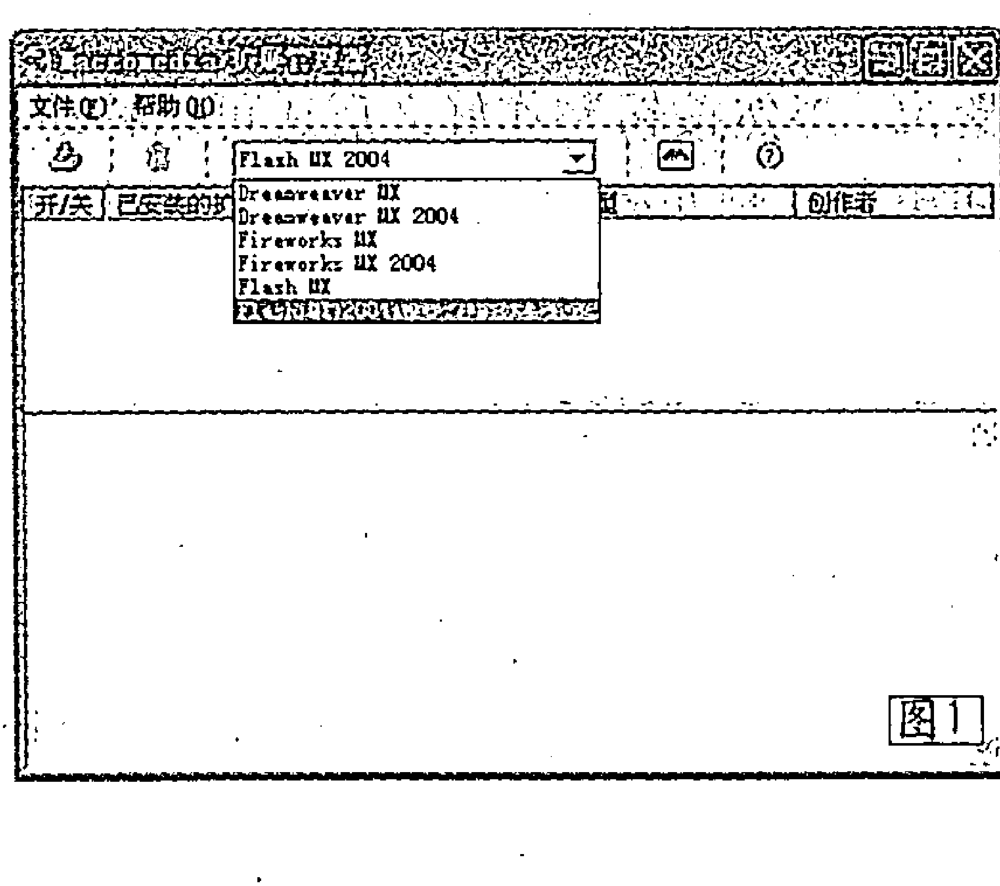

这个程序管理着 Macromedia 公司软件（不仅仅是三剑客）的插件。我们可以通过它来安装、卸载插件或者查看插件的信息。

我们从网上下载到的插件是后缀名为 mxp 的文件，将其保存到本地硬盘。运行扩展管理器，单击“安装扩展”按钮或者选择菜单命令“文件”→“安装扩展”，在对话框中找到需要安装的 mxp 文件，然后单击“安装”按钮。之后一般会有一个免责声明的对话框，确认接受后即开始安装，一会儿的工夫就会弹出对话框告诉我们安装完毕，就可以开始使用了。安装之后的插件，在扩展管理器中显示出插件的名称、版本信息、插件类型、创作者及相关说明。我们可以暂时关闭某些插件，甚至卸载它们（如图2 所示）。

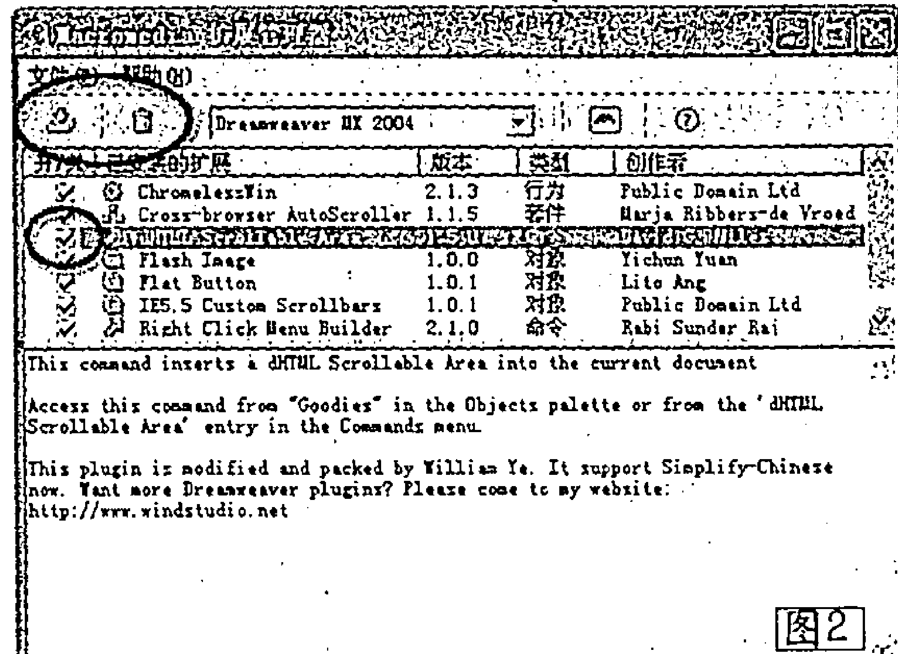

了解了如何安装和管理插件，下面我们就来看看如何使用插件，以及有哪些插件值得我们使用，跟我来！（笔者演示使用软件均是 MX 2004 版本。）

### 二、Dreamweaver 篇

三剑客中，要数 Dreamweaver（以下简称 DW）的插件最多。这并不表明它的功能最弱，需要更多的插件来辅助。这是由它本身的性质决定的。DW 是用于网页设计和制作的软件，它的插件实际上是用脚本语言编写的一段代码，可以将本来需要很多步的操作简化为一步，或是实现软件本身较难实现的一些功能。这不但使初学者也可以轻松制作出复杂的效果，还可以大地减少重复操作，减轻网页制作的工作量。下面我们以一款经典插件（Flash Image）为例，看一下在 DW 中是如何让这些助手发挥作用的。

Flash Image 插件用来制作图片渐显渐隐效果，这个效果由鼠标动作控制。起初图片处于半透明的朦胧状态，当鼠标移动到图片上面时，图片就渐渐变得清晰；当鼠标移出图片时，图片又渐渐变得模糊，回到半透明状态。可以用这个插件来制作导航条和栏目插图。可以到如下地址下载：http://www.windstudio.net/download/dreamweaver_exchange/flash_image.mxp。

插件安装好后，DW的 Insert (插入) 面板的 Common (常用) 标签下会增加一个灰色图片模样的按钮，单击它就会弹出设置对话框。选择菜单命令“Insert” → “Flash Image”可以实现同样的目的。

设置项目并不复杂。Image 浏览框用来选择图片。Original Image Transparency Level 用来设置图片的原始透明度，取值应介于 0～100 之间。When Clicked, Go To URL 用来设置当单击图片时，页面转到哪个 URL 地址，也可以是本地文件。onMouseOver Status 部分设置的是鼠标指针移到图片上面时的状态。其中 Transparency Level 为鼠标移上时图片的透明度，取值介于 0～100 之间，应高于原始透明度。Time between Transparency Changes 设置透明度变化的时间，单位为毫秒。Amount of Change each Time 设置的是透明度每次变化的量。onMouseOut Status 部分设置的是鼠标移出图片后的状态。其中 Transparency Level 为鼠标移出后图片的透明度，取值介于 0～100 之间，最好与原始透明度保持一致。Time between Transparency Changes 用于设置透明度变化的时间，单位为毫秒。Amount of Change each Time 设置的是透明度每次变化的量。

设置完毕，单击 OK 按钮即可将图片和相关代码插入到页面中。保存 html 文件，然后就可以在浏览器中观看图片根据鼠标动作渐显渐隐的效果了。

知道了如何使用插件之后，读者朋友一定迫切地想了解更多的插件的情况。下面笔者列出 DW 的十大经典插件，这只是笔者的一家之言，仅供各位参考：

- 1. Flash Image: 就是笔者刚刚用来举例子的那个。
- 2. DHTML Scrollable Area: 用来插入一个可以自动滚动的文本区域，适用于制作公告栏、滚动新闻等。
- 3. Chromeless Window: 用来创建没有边框的精致窗口，这种效果在前段时间极为流行，甚至有点泛滥，但不可否认这种效果的确很漂亮。
- 4. IE5.5 Custom Scrollbars: 用来自定义 IE 浏览器的滚动条，可以让原本单调的滚动条变得色彩缤纷、生动活泼起来。
- 5. Page Transitions: 用来制作页面切换的过渡效果，在打开或离开一个页面时，产生类似于幻灯片换页的效果。
- 6. Floating Image: 用来在页面中添加一个到处飘浮的图片，很吸引眼球，可以做广告、发提醒等等。如果不清楚是什么样子，就到各大网站去转转好了。
- 7. Disable View Source Code: 用来禁止用户使用右键菜单，可以保护源代码。
- 8. Preload Images with Status Bar and Redirect: 用来制作打开网页时的进度条效果，就像安装软件或者载入游戏进度时的那种效果，免除枯燥，增添趣味。
- 9. Right Click Menu Builder: 用来自定义鼠标右键菜单 (IE5 及以上版本支持)，可以加入个人信息和栏目导航等。
- 10. CN Insert Greeting: 用来在网页中插入问候语，可以根据时间自动变换。

有限的文字只能让读者朋友们对 DW 众多插件的强大功能管窥蠡测一番，而更多的东西还需要各位自己去寻找、体验。

### 三、Fireworks篇

Fireworks 是一款非常棒的网页图像和动画制作软件，再加上各种插件的辅助，就更是如虎添翼、势不可挡了。事实上，在 FW 的安装过程中，已经有 14 个插件随之安装了，运行扩展管理器选择 FW MX 2004 看一下，是不是这样？这些插件已经成为 F W 整体的一部分了。

MacButton 插件用来制作 Mac 风格的漂亮按钮，它没有被预先安装，是笔者自己下载安装的 (下载地址：http://www.kupage.com/extensions/12/20030227/downkdo2153520000004pxux.mxp)。下面我们就以它为例，一块儿来看如何在 FW 中使用插件。

该插件安装以后，就位于菜单 “Commands” → “Bitgenius” 下面。新建文件，然后选择 MacButton 命令，将出现这个插件的对话框 (如图3)。

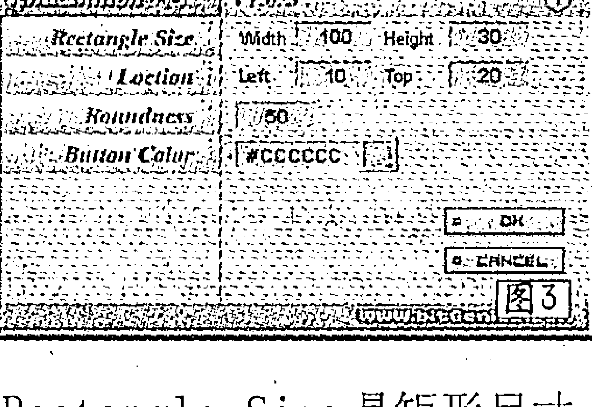

设置项目非常简单。Rectangle Size 是矩形尺寸，也就是按钮的尺寸，Width 是按钮宽度，Height 是按钮高度；Location 是按钮出现的位置，Left 是距左边，Top 是距顶端的距离，当然按钮制作好之后还可以移动，但要注意别让按钮出现在画布外面；Roundness 是圆角度；Button Color 中填入或者选择按钮的颜色。设置好之后确定，就得到了一个精美的 Mac 风格的按钮 (如图 4)。


Fireworks 的插件除了可用扩展管理器管理的 mxp 文件外，还有后缀名为 jsf 的命令插件和后缀名为 stl 的样式插件。对于 jsf 类型的插件，应该将其拷贝到 FW 安装目录下的“Configuration/Commands”文件夹，一般不用重新启动FW就可以直接使用了，多位于Commands菜单下。这类插件是用FW的JavaScript脚本语言编写的，对脚本语言比较熟悉的朋友也可以试着自己编写。而stl类插件实际上就是保存起来的样式。在Styles调板(Window->Styles)中，点击右上角的功能按钮，在弹出菜单中选择Import Styles，将需要的stl文件载入即可（如图5）。

FW 插件种类多，数量也不在少数。要在数量众多的精品插件中选出几个最优秀的，实在是难上加难的事情。不过笔者仍然从自己的角度列出一个 Top5 的名单，各位尽可以见仁见智：

- 1. MacButton: mxp插件，笔者用作例子的经典插件，可以轻松制作Mac按钮。
- 2. Duplicate Path Segments: jsf插件，用来复制路径的一部分，同时包括整条路径的所有属性。
- 3. Make Seamless Tile: jsf插件，用来制作无缝连接的拼贴图，可以制作背景图和纹理等。
- 4. Fire: stl插件，包含7种样式，用来制作火爆的火焰效果。
- 5. Natural: stl插件，包含10种样式，用来模拟自然材质。

很多名字没有在此出现的FW插件也同样优秀。读者朋友们可以在网上找到更多。

### 四、Flash 篇

如今，Flash 可是大名鼎鼎的软件，它的风头远盖过了两位同门师兄弟，也不知那二位嫉妒了没有。精美的 Flash网站、幽默的Flash动画、动感的Flash MV在网络上大行其道，火爆到无以复加。甚至于很多人以为Flash就是一种动画的名字，却不知道这原是动画的生产者。

下面，以Calendar插件为例（下载地址：http://www.flashempire.com/school/down_mxp.php?id=148&name=calendar），一起来看看如何在Flash（以下简称FL）中使用插件。

Calendar插件可以用来制作漂亮的日历。这是一个mxp格式的插件，可在扩展管理器中安装和管理。安装后，它将出现在FL的Components调板（Window -> Development Panels -> Components）中。找到它，然后将它拖到场景中就行了。当然，可以根据需要修改其外观。组件被拖到场景中以后，在Properties调板中选择Parameters标签，或者在Component Inspector调板中选择Parameters标签，可以看到一系列参数（如图6），修改这些参数的取值就可以得到不同的效果。

| Name | Value |
|------|-------|
| Day Size | 18 |
| Space between Days | 2 |
| Main Color | #EEEEEE |
| Border Color | #333333 |
| Font Name | Verdana |
| Font Size | 10 |

Day Size设置定义每个日期单元格的大小；Space between Days设置日期单元格之间的间距；Main Color 设置日历的背景色；Border Color 设置日期单元格的边框颜色，同时也是文字的颜色；Font Name选择显示日期的字体；Font Size设置字体大小，要根据单元格的大小设置。最后得到的日历如图7所示。读者朋友们可以到http://www.flashempire.com/download/components/calendar.swf去看一看动画效果。

最后，笔者仍然给出个人偏好的前5名参考名单：

- 1. Stylized Scrollbar: 用来制作各种风格的文本框的滚动条。
- 2. Text Size Changer: 用来制作可以任意调整大小的文字效果。
- 3. Cylinder Tools: 安装后会增加一个工具，可以快速绘制圆柱体，非常方便。
- 4. Window Application Control Kit: 可以模拟Windows系统的窗口效果，进行拖动、改变当前窗口、最小化等操作。
- 5. Blur everything: 可以制作图形、图片、文字等几乎任何对象的动感模糊效果。

FL的插件数量虽不如它的两个同门师兄弟那么多，但也是强手如云。细心的读者朋友们可以在网上找到它们的踪影。

### 五、结束语

插件的出现，在使得软件的功能越来越强大的同时，易用性也越来越高——原来只有高手才能实现的复杂效果，或者非常繁琐的操作过程，在有了插件之后一切都变得简单起来了。软件版本的不断升级，软件功能的不断提升，正是为了使软件的使用更加简单、方便，而插件的发展壮大极大地丰富了这一点。

需要提醒各位读者的是，由于插件是由一些爱好者自己制作的，其中难免水平参差不齐，鱼龙混杂，不能保证下载到的都是精品，甚至不排除会有一些恶意插件，这一点各位在使用之前务必要注意。

（文/奇 士）

## Office 插件精选

微软Office是我们日常工作中使用频率非常高的一套办公软件。下文介绍的几款Office插件则能够让你的工作更为轻松。

### 一、个性化文档签名

虽然Office自身就提供了数字签名功能，但是实现的方法有些复杂，而且无法体现每个用户的独特个性，因此我们可以借助既能展现个性又可以确保Office文档真实性的onSign软件，在它的帮助下能够让你轻松创建出具有个性化的Office文档签名。

第一步：使用onSign之前需要通过onSign程序组中的“onSign Signature Wizard”命令打开签名向导来制作一个签名，不过这时程序会自动激活注册窗口进行注册操作，好在这个注册只需填写用户名、电子邮件地址等信息即可完成。

第二步：接着签名向导会提示我们选择输入签名的设备，这里有扫描仪或者图像、传真等输入，如果没有这些设备的话则可以通过选择“Mouse（鼠标）”选项来使用鼠标制作一个签名。

第三步：点击“Next（下一步）”按钮之后，可以看见窗口中有一个空白区域，此时就可以使用鼠标在这个区域中创建自己的签名了。实际上这个过程有点类似手写笔输入操作，只不过是用鼠标取代手写笔而已，因此在刚开始创建签名的时候有可能不太容易控制好自己的鼠标，如果不满意还可以点击下部的“Clear（清除）”按钮清除所写的内容重新书写。

第四步：单击“Next（下一步）”按钮保存签名。为了防止别人使用你的计算机时冒用你的名义来进行数字签名，因此onSign还会要求你给这个签名设置一个密码，两次输入完全相同的密码之后单击“Next（下一步）”按钮完成签名制作。

第五步：完成上述签名设置之后再运行Word程序，这时工具栏中就会多出一个“Sign”按钮，借助它就可以很方便地给Word添加数字签名了。比如我们先编辑好一篇文档，接着单击这个“Sign”按钮，此时会弹出密码输入框，在其中选择合适的签名并输入相应的密码之后就能够把这个签名插入到Word中了。

在为文档添加了数字签名之后，我们就可以将其发送给别人使用了。当别人需要检查文档是否被人中途篡改过，只要点击签名上的蓝色问号即可查看签名的状态，对于没有修改过的文档，签名显示的就是我们设计时候的初始状态；一旦有人对这个文档内容进行了改动，那么签名上就会多出一个红色的叉号，表示文档已经被修改了（如图1）。

### 二、Excel 扩展插件

到目前，Excel已经成为办公软件中不可或缺的一部分了，但是对于国人来说还存在一些不便的地方，比如货币单位的换算、批量数值的转换、文字的大小写等等，这些都严重影响了我们的工作效率。不过只要有了Excel扩展工具集之后，你的Excel数据表格之旅将会更为轻松。

这款由国人自行编制的Excel增强工具集提供了货币换算、改变大小写、时间提示、中文大写金额转换等多种辅助功能。将下载得到的Zip文件解压缩之后可以得到一个Excel加载宏文件，此时启动Excel并运行“工具→加载宏”命令，在弹出的窗口中点击“浏览”按钮，找到刚才那个解压过的文件之后按下“确定”按钮即可将其加载到Excel中。

成功加载了Excel扩展工具集之后，可以在Excel主窗口的工具栏后部发现多出一个“新增”菜单，点击之后将查看到各种新增的辅助功能。比如我们需要对Excel表格中的某列数据进行统一的转换操作，就可以选择新增菜单中的“数值转换工具”，接着点击加减乘除运算符号，并且设定向下循环的列数，最后点击“输入数值”按键并输入需要转换的数值即可（如图2）。这样就能够一次性对整列数值进行统一的处理操作，是不是很方便？

## IE浏览器插件一览

一直以来，提起上网冲浪就必然会想到IE浏览器，但如今各种基于IE内核的第三方浏览器如同雨后春笋一般涌现出来，这些浏览器附带的各种便捷强大的功能让IE渐渐失去了竞争力，难道IE真的就这样败下阵来吗？其实不然，只要我们借助一些插件程序就可以让IE焕发出新的活力，让它继续成为我们上网冲浪的首选工具。

### 一、浏览类插件

#### 1. DynaDoc IE

WDL文件格式是一种常见的电子图书文件格式，通常我们只能通过专用的DynaDoc Reader阅读器打开它，但如果安装了DynaDoc IE插件，就能够用IE浏览器查看WDL文件了。当我们在网页中点击了一个WDL文件的链接，IE就会调用该插件来显示文档，不仅可以通过逐页播放功能慢慢阅览，它还解决了HTML页面中排版、色彩、图片、字型等显示失常的问题。

#### 2. WebTools

很多舍弃IE浏览器的朋友都是因为IE是一个单窗口浏览器，打开页面多了就会占用较多的系统资源，而且浏览起来也不方便。不过我们可以利用Microgarden WebTools让IE也具有多页浏览的功能。安装好这个插件之后重新运行IE浏览器，可以看见工具栏中多出了一行按钮（如图1），这时就可以通过“Add New Tabs”按钮增加新页面、“Close Tab”按钮关闭页面，这样你的IE也有多页显示功能了。另外，这个插件还支持拖放功能，拖动网页上的链接到工具栏里，即可打开相应的窗口显示页面。

#### 3. Resize IE

Resize IE是个非常小巧方便的IE插件程序，在它的帮助下可以快速变更IE浏览器显示窗口的尺寸及位置，如果你常常需要改变IE窗口大小或者需要移动窗口位置的话，那你一定要试试它。安装Resize IE的时候我们还能通过上部的“Effect”区域进行预览，使用起来非常便利。安装时，程序会将其中的HTML文件复制到“c:\resizeIE”目录中，并在系统登录文件中加入这些用来改变IE窗口大小的选项。以后你只要在使用IE时在显示画面中单击鼠标右键，弹出的快捷选单中就会多出五个调整窗口大小的选项，使用起来非常方便。

#### 4. IE Web Accessories

IE Web Accessories 的前身就是IE Powertoys，它在工具栏上增加了一个“Offline/Online”按钮，通过它可以很容易地在离线和在线状态间进行切换。而且它在IE工具菜单中增加的“Add to trusted Zone”和“Add to restricted Zone”两个选项可以使你很容易地将当前的站点设置为可信站点或限制站点，不需要像以前那样到Internet选项中去逐一设置了。另外，该插件还为鼠标右键菜单增加了“Copy an URL Location”功能，这样就能够很方便地将当前页面的地址复制到Email或文件中保存了（如图2）。

### 二、搜索类插件

#### 1. Google 搜索条

对于很多老鸟来说，Google是一个非常出色的搜索引擎，利用它可以查找到任何我们所关心的内容。不过每次打开IE浏览器之后输入Google网站地址毕竟也是比较烦人的事情，因此我们可以在IE浏览器中增加一个Google搜索条来简化操作。首先在IE中输入“http://www.google.com”登录到Google网站，接着依次点击“Google大全->Google特色”链接，此时可以看见页面中的“安装Google工具栏”链接，点击之后就可以让这个搜索条进驻IE浏览器了。有了这个搜索条，无论我们在哪个网页上都可以直接输入搜索关键词来进行搜索，而且插件提供的PageRank可以得知Google对这网页的评价，“标明”则能够用不同的颜色标释出查询字词等等，让我们搜索起来更加轻松（如图3）。

#### 2. SearchBar

SearchBar是集成在IE内部的一个搜索器，它可以快速指点一个搜索引擎去搜索你想要的内容，而且还能够自行添加一些你喜欢的搜索引擎，因此在它的帮助下可以使我们的搜索变得更有效率。除了搜索功能之外，SearchBar还提供了代理服务器设置的功能，只要把你经常使用的代理服务器加入到SearchBar中就可以一劳永逸了，而且即使日后更换代理也可以导入代理猎手得到的数据库，因此点击鼠标即可进行调整，再也不用进入IE的Internet选项中去更改了。此外，SearchBar还具有保存网页中全部图片和Flash文件的功能，如果看到好的Flash或者需要将网页中大批图片复制出来的时候就非常简单了。

### 三、功能增强类插件

上述的几款插件还只能说是辅助性的插件，下面介绍的这些才是真正加强IE浏览器功能的，所以大家千万别错过哟。

#### 1. AI RoboForm

上网冲浪的时候肯定会遇到一些论坛要求我们输入用户名、密码、信箱之类的资料进行注册，这样才可以正常登录论坛，但是重复输入这些信息是否让你觉得很繁琐呢？我们可以让AI RoboForm帮你自动完成表单的填写操作。在安装AI RoboForm的时候先根据向导提示你创建一个用户并且输入一些个人信息，接着填写用户名、密码、密码提示问题、密码提示答案和联系信箱。完成这些设置之后，我们就可以让它来自动注册用户了。这时打开IE浏览器，你会发现在工具栏中多出了一排AI RoboForm生成按钮，只要页面中出现注册信息窗口，那么程序就会自动弹出填表窗口，此时点击窗口中的“填表”按钮就可以把设置好的各种信息填写到对应的项目中（如图4）。

#### 2. IE Plus

IE Plus是一款多功能的IE插件，安装它之后可以使IE增加诸如直接显示Zip压缩文件内容、直接浏览文件夹、自动窗口滚动、关闭弹出窗口、局部脱机等实用的功能，因此使用起来非常便利。特别值得一提的是，该插件还提供了可扩充的接口，如果你对编程颇有研究的话，还可以再对它进行一番功能扩展呢。

#### 3. Flash Catcher

Flash动画可以说是这几年网络界最耀眼的多媒体技术之一，不过随着技术的提升，对于Flash动画的下载保护也就随之增加，下载起来不再那么容易。好在Flash Catcher可以帮我们解决这一困难。Flash Catcher的使用方式相当简单，当你安装完之后，它便自动成为IE浏览器的一部分，只要在喜爱的Flash动画上按下一鼠标右键，便可发现原本只具有播放功能的选项多了储存的功能，选择保存命令即可将该Flash动画保存到硬盘上了。

#### 4. Popup Control

上网冲浪的时候经常会遇到弹出窗口广告，它们不仅占用了带宽资源，同时也会影响我们上网的心情，因此我们可以借助Popup Control来智能化地屏蔽网页广告。一般的广告过滤软件总是要等到广告出现了之后才将它关掉，或者需要手工输入关键字、网站名称才能阻挡广告，但是Popup Control根本就不允许弹出窗口的出现，而且对于一些特殊的网站也可以选择允许弹出的窗口。安装好Popup Control之后，我们先通过IE浏览器连接到几个网站看看，是不是已经没有了弹出的广告窗口？不过这时程序会把所有的弹出窗口全部屏蔽，如果一些弹出窗口中包含有重要的信息又怎么办呢？其实在IE工具栏上会多出一个“Popup Control”按钮，点击之后进行相关设置即可。如图5所示，窗口中列表显示了最近浏览过的所有网站以及包含有弹出窗口的地址，只要选中被过滤的广告窗口并按下“保留”按钮，这样就可以在下次浏览网页的时候见到这个弹出窗口了。

#### 5. Babylon

语言不通是上网的一大障碍，为此很多朋友无法领略到Internet的真正精彩，其实在Babylon这款词典的帮助下就能够让Internet没有语言的国界。Babylon最大的特点就在于它是一款基于 Internet 的应用软件，无论是什么样的词语，都可以通过它来获得适当的解释。而且特别需要指出的是，它充分利用了 Internet 中的资源，能把英语翻译成简体中文、繁体中文、法语、德语、日语、意大利语等 11 种语言，如果你希望能够冲出中文站点走向国外站点的话，那Babylon绝对是一款称手的翻译利器（如图6）。

### 四、其他类插件

#### 1. Internet Explorer Skinner

Internet Explorer Skinner可以让你的IE工具栏变得更加绚丽多彩。安装好插件之后，它会在工具栏上增加几个按钮，其中“Start IES”让你启动程序选择喜欢## MSN Messenger插件大全

现在很多朋友除了使用QQ进行网上实时交流以外，也同时使用微软的即时通讯软件MSN Messenger作为网络聊天和联系工作的工具。与腾讯QQ相比，MSN Messenger具有运行稳定、占用资源较少、界面简洁大方等优点，但同时它也有很多不足的地方。如何弥补它的一些不足呢？简单地等待微软在新版本中去掉旧版本的BUG和增加新功能是一个最不费力气的办法。但是，在这个提倡Do It Yourself的时代，老等着天上掉馅饼怎么可以！幸好很多软件厂商都看中了网络交流这个大市场，推出了很多针对MSN Messenger的插件，应用这些插件，就可以极大地扩展MSN的功能。

如果你想让你的MSN更强大一些的话，那就花上几分钟的时间看看本文吧！

### 一、MSN超酷插件Messenger Plus!

Messenger Plus!是由Patchou开发的MSN超酷插件。应用该插件，可以方便地实现诸如定时保存历史纪录、使用IRC命令、隐藏广告栏等功能。

#### 1. 下载与安装

大家可以访问Messenger Plus!的官方网站http://www.msgplus.net来下载这个插件。在安装这个插件的时候首先要确保自己的机器上已经安装有MSN Messenger 4.7或更新的版本。还需要注意的是，在安装过程中选择语言(Language)包时，一定要选择“Chinese Simplified(简体中文)”。其他可按照安装向导逐步进行，安装完毕后如果在MSN Messenger的最右边增加了“PLUS!”菜单，就说明安装已经成功。如图1所示。

#### 2. 功能简介

-   **（1）增强的聊天记录自动保存功能**

虽然MSN Messenger 6.x也已经提供了聊天记录保存的功能，但它与Messenger Plus比起来，功能上就要差很多。Messenger Plus提供了定时保存和加密记录文件两种功能，仅此两项就可以让笔者把MSN Messenger 6.x的记录保存功能忘记到九霄云外去了。

启用聊天记录自动保存的方法是：登录MSN Messenger，打开一个聊天窗口，在“Plus!”菜单中，你会看到“记录本次对话”选项。勾选该项后，Messenger Plus!将以联系人的E-mail地址命名，采用纯文本形式保存你的聊天记录。聊天记录文本中详细记录了聊天标题、发送、接收时间等信息，查看十分方便。

如果你想定时保存聊天记录的话，点击“Plus！→个人偏好设置”，打开参数设置窗口，单击左边的“记录”，在右边的“自动保存间隔（分钟）”中输入定时保存时间即可。这个选项类似Word的定时保存功能，将能有效避免因停电等意外情况造成的信息丢失。

-   **（2）保护你的隐私——锁定MSN**

在多人使用同一台计算机上网的情况下，用户的隐私有泄漏的危险，Messenger Plus!针对这种状况，提供了锁定MSN的功能。锁定以后，你必须输入正确的密码才能使用MSN。具体做法是点击“Plus! →锁定Messenger”，然后在弹出的密码输入框中输入密码，点击“确定”，随后Messenger Plus!会自动隐藏MSN Messenger和你所有的聊天窗口。而你必须输入正确的密码后才能解除锁定。

-   **（3）隐藏MSN Messenger**

很多人都不希望别人（尤其是老板）看见自己上网，但有时即使你最小化MSN Messenger窗口也没有办法：别人能从系统托盘中的MSN Messenger图标中看出你在聊天。而Messenger Plus的隐藏功能，能让你摆脱这个烦恼。

打开参数设置窗口，单击“隐藏模式”，在右边勾选“启动隐藏功能”，然后单击右下角的电脑图标按钮，在弹出的图标文件选择对话框中单击“...”按钮选择一个图标文件，以后系统托盘中的MSN Messenger图标就会由这个图标来代替，例如你可以从C:\Windows\Sndrec32.exe中提取代表音量控制的小喇叭图标来代替，然后去掉系统本来的音量控制图标。这样一来，再聪明的老板也看不出个中奥妙了吧！

在参数设置窗口中，单击“隐藏模式”下的“配置”选项。这里可以配置3套不同的隐藏方案，每套方案可以自行设置快捷键和在线状态，在“进入隐藏时的文字”栏中，你还可以针对每套隐藏方案设置不同的好友提示信息，比如“老板来啦！害怕305……等会聊”。MSN会在进入隐藏状态的时候自动给每个在线的好友发送这个信息，以免你忽然间沉默不语，产生误会。

-   **（4）好友状态记录**

Messenger Plus!还提供了动态记录好友在线状态的功能。你可以通过点击“Plus！” → “事件日志窗口”激活事件记录窗口。在这里你可以查看用户何时上线，上线后又做了什么（如设置状态为空闲或者改名）。

-   **（5）管理联系人**

MSN Messenger本身已经具备管理联系人功能，但是比较不方便，Messenger Plus!则将各种操作，如删除、发送Email等功能集成到了一个窗口上，方便大家对自己的联系人进行管理。

-   **（6）日程安排**

这是一个很有趣的功能，它可以在指定的日期和时间提醒你重要的事情，或者改变你的登录状态，甚至可以执行预先选定的程序。

点击“plus！” → “日程安排”，弹出如图2所示的窗口，在“日期”和“时间”选项处选择你需要定制事件的时间，如果你是要定时运行程序，就在“程序 / 链接”处选择你要运行的文件。此外还要添加对该事件的描述，这时窗口左下角的“添加”按钮会自动激活，点击“添加”按钮，就可以把事件添加到日程安排队列中。到了你指定的时间后，Messenger Plus!会弹出一个小窗口提醒你时间到了，点击这个窗口就可以运行你设定的程序了。当然，除了EXE可执行文件以外，你也可以选择MP3，AVI等媒体文件。如此一来，在你工作得忘记时间的时候，会有一个窗口自动跳出来提醒你：现在是娱乐时间啦！

如果是要改变自己的登录状态，在指定好时间以后，只要在“状态”下拉选项中选择对应的状态即可，MSN就会在你指定的时间登录或者是设定为离线状态。

-   **（7）在聊天的时候使用IRC命令**

Messenger Plus!集成有大量的聊天命令，这一点和以前大家广泛使用的IRC聊天工具一样，看来Messenger Plus!的开发者的确是个聊天高手。

聊天命令是一种特殊的“消息”（如快捷文字的别名），您可以用它来实现不同的效果，命令总是以“ / ”符号开头。

使用这个功能需要你双击在线的联系人，打开一个聊天窗口。在“plus！”菜单中选择“发送命令”，然后在弹出菜单中选择对应的命令就可以。

下面要介绍的是Messenger Plus!的一个独特的功能，就是发送命令的时候可以发送声音效果。点击“Plus！”→“发送命令”→“声音”→“邪恶的笑”，音箱里面就会发出一个令人恐怖的邪恶的类似游戏中恶魔的笑声，同时聊天窗口会出现“哈哈”的字样（如图3），十分有趣。Messenger Plus!还内置有很多音效，如“盛大游戏”就是以著名的电影“星球大战”中的插曲作为音效的，十分经典。适当的使用声音命令，一定会让网上交流变得乐趣横生。

-   **（8）其他功能**

除了以上介绍的功能外，Messenger Plus!还有诸如好友状态提醒、隐藏广告条、个性化状态等功能，也都很十分实用。

#### 3. 插件评价

Messenger Plus!除扩展了MSN Messenger原来没有的功能以外，还加强了原有的功能，并且它占用资源很少，在实际使用的过程中感觉非常的稳定，确实是我们使用MSN Messenger强大的助手。最值得期待的是：目前此软件还在陆续地开发新的功能，将来会有更多的人性化功能加进去。那时，相信会有更多的人喜欢上它。

### 二、MSN扩音倍增器--ENat For MSN Messenger

有的朋友属于小区局域网用户、单位内网用户，或者本机或对方系统安装了防火墙。这样当我们在使用语音聊天、视频聊天、文件传输功能时，往往无法成功。难道只有双方都是公网IP用户时才能使用上述功能吗？那岂不难煞那些共享上网的朋友了？这里笔者向大家介绍一款名为ENat For MSN Messenger的软件，安装后可以解决上面的难题。

#### 1. 下载与安装

大家可以在http://www.easyfp.com/msn-messenger-directtalk/index.html下载ENat For MSN Messenger。
使用Windows 2000的朋友在安装前一定要确保自己的机器上已经安装有SP2或者以上版本的补丁包。此外需要注意的是：安装过程中会提示输入用户名、序列号，我们可以点击“Trial”按钮试用，接下来还会告诉你PC-Nat Miniport软件没有通过Windows的测试，可以不用管它，一路点击“仍然继续”按钮就可以完成安装了。

#### 2. 功能简介

在“开始”→“程序”中选择运行ENat For MSN Messenger，会在系统托盘处显示一个图标。点击这个图标，会出现如图4所示的窗口。

点击“Check Network Status”按钮检测网络状况，如果你的机器位于防火墙后面，ENat For MSN Messenger会检测出来并给你提示，这时你点击“Enable ENat”激活ENat For MSN Messenger，然后你就可以透过防火墙发送文件和传输语音了。

#### 3. 插件评价

ENat For MSN Messenger是一款针对性很强，且很有效的软件，但是占用资源比较多，而且，在新版本的MSN也逐步改善了防火墙条件下的信息传输性能后，ENat For MSN Messenger多少显得有点鸡肋。

### 三、游戏插件MSN6 Custom Games Installer

针对人们爱玩的天性，微软为MSN Messenger的“动感地带”提供了在线游戏的功能。里面有很多在线的益智类小游戏可以供大家选择，不过，如果你觉得“动感地带”里面的游戏还不够丰富的话，那就要好好看看下面的文章了。

#### 1. 下载与安装

大家可以访问http://download.pchome.net/internet/communications/msn/16615.html来下载MSN6 Custom Games Installer，这个软件很小，只有50K左右。
下载完后可以立即安装，注意，这个时候一定要先关闭掉MSN Messenger（注意，不是注销，是关闭）。然后运行安装包，在安装界面上，勾选“Add custom tabs to your Messenger”，然后点击“Install”按钮即可，随后登陆MSN Messenger，只要看见左侧工具栏出现“Neowin”和“The Offical Messenger Plus”的标签就说明安装成功了。

#### 2. 功能简介

安装完毕，双击一个联系人，打开聊天窗口。然后点击“活力地带”，你会发现原来微软附带的那些游戏不见了，取而代之的是一些全新的游戏，如Battleship，这是一个类似模拟海战的游戏，十分有趣。其他还有国际象棋、五子棋等等，适合不同喜好的玩家选择。

有人可能会问，装了MSN6 Custom Games Installer，以前“活力地带”的游戏还能玩？不要急，仔细观察现在的“活力地带”。你会发现在新增的游戏下面还有以下几个菜单项：
MSN Launch Menu: 打开原来MSN的游戏；
MSN Menu (en-us version): MSN以外的游戏；
Catt's Launch Menu:打开另外四款游戏。
要玩以前的旧游戏，只要点击MSN Launch Menu，就能看到原来的老游戏列表了。

### 四、MSN Shell ——让感觉与众不同

尽管MSN Messenger凭借自己界面简洁大方、程序运行稳定等优点占据了半壁江山，但比起QQ来说，还是有一些地方做得不尽人意。比如它不能隐身登录、无法实现界面自动隐藏、无法使用多账号同时登录等。针对这些不足，MSN Shell应运而生，很好地解决了这些问题，使用MSN Shell，绝对会使你的MSN Messenger与众不同。

#### 1. 下载与安装

MSN Shell是一个功能强大的国产MSN Messenger插件，我们可以在http://www.gzyb.net/mircocall/webpage/index.htm下载到这个软件。它的安装过程非常简单，按照向导依次点击“Next”即可。程序安装完毕以后会生成一个桌面图标，双击它登陆MSN Messenger后，你会看见菜单栏的最左边有一个“SHELL”菜单，这说明MSN Shell已经成功安装到你的机器上了。

#### 2. 功能简介

-   **（1）隐身登陆**
MSN Messenger本身只提供了上线以后手动修改状态的功能，但是对于很多不想别人知道自己在线的朋友来说，上线时的提示就已经告诉了别人：我来了……
运行MSN Shell后，会弹出一个窗口，如图5所示，只要勾选这个窗口中的“隐身登陆”一项，你就可以完全不动声色地上线了。

-   **（2）锁定和隐藏功能**
这个功能和我们前边介绍的Messenger Plus!一样，都是基于保障个人隐私不致泄漏而开发的。
在你离开办公桌的时候，你要是不想让别人看到你与朋友的聊天记录，你可以点击“Shell →锁定”来锁定MSN即可。

同时对于上班一族，如果你不想让别人看到你正在聊天，还可以设置MSN为隐藏模式。与Messenger Plus!不同的是，MSN Shell的隐藏模式不是在任务栏中以别的图标来迷惑别人，而是彻底的隐藏！在系统托盘里根本就看不到MSN的影子，只有你按相应的热键才能调出聊天窗口来。而热键的设置是任意的，这样别人在不知道热键的时候，是根本连你的MSN都打不开的。这无形中又增加了一层安全防护。

-   **（3）多帐号登陆**
MSN Messenger是不支持在同一台机器上使用多个账号同时登陆的，但是通过MSN Shell，你就可以任意使用多个帐号同时登陆了。

-   **（4）使用手写板功能聊天**
MSN Shell提供了一个很有趣的功能——“手写板功能”，通过它我们就可以使用手写板或鼠标来发送手写信息或者是手动绘制图片了。不过在启用这一功能之前，需要下载安装微软的InkRedist组件，MSN Shell会自动检测你的机器是否安装有该组件，如果没有，它会自动显示下载链接，直接点击链接下载安装即可。
安装支持组件以后，你就可以选择“启用手写板”功能了。现在点击联系人，打开聊天窗口，你会发现在聊天窗口下方多了几个选项。选择手写按钮即可进入手写输入状态，这时候你可以用鼠标或者是手写板尽情的涂鸦了。

-   **（5）使用自定义图释**
新版本的MSN Messenger提供了表情图释的功能，使我们可以在聊天的过程中，使用图释来表达自己的心情和想法。但是MSN Messenger提供的图释功能有很大的局限，比如需要依次手动添加，只支持特定大小的图片文件添加等等。
MSN Shell提供了增强的图释功能，使用它，我们可以一次性地批量添加一个目录下的所有图片文件到图释列表，还可以添加任意大小的图片文件作为图释。
在设置面板上选择“图释”标签，点击“批量添加图释”按钮，选择图释文件所在的目录，然后点击“确定”即可，MSN Shell会自动编号，并将图释文件添加到列表中的。同时，这项功能还支持任意大小的图片作为图释。

-   **（6）其他功能**
除了以上介绍的外，MSN Shell还提供了很实用的个性化标签管理、自动回复等功能。在常规设置选项里面我们还可以对MSN Shell的各个参数进行设置，如设置MSN Shell的位置、是不是自动在线升级、支持语言等；同时你也可以把你的MSN Shell设置项导出，在重装系统后可以再导入，这样就免去了重新设置的麻烦。

#### 3. 插件评价

MSN Shell作为一款和Messenger Plus!类似的MSN Messenger插件，不仅在功能上毫不逊色，而且在很多方面还超过了Messenger Plus!，的确是一款很不错的国产软件，强烈建议大家安装使用。但另一方面来讲，作为一款个人开发的软件产品，MSN Shell的稳定性和兼容性上还是存在不少问题的。有时MSN Shell会出现和别的软件不兼容的问题。而笔者在导入较大的图片作为图释的时候，也多次出现了程序停止响应的事情。看来，MSN Shell还是有不少问题需要解决的。不过瑕不掩瑜，只要能正确对待自身缺陷，加以弥补，MSN Shell还是可以跟国外同类软件拼个高下的。

### 五、心情涂鸦——韶光笔

刚才介绍的MSN Shell已经具有手写功能，不过你要是出于某种原因，不想安装MSN Shell的话，那么使用上海韶光信息有限公司开发的InfoPenOE或者InfoPenOL，还是可以随心所欲地描绘自己的心情的。

#### 1、下载与安装

-   （1）操作系统：Windows 2000 / XP（暂时无法支持Windows 95/98/Me的客户）；
-   （2）安装有MSN Messenger 6.0 / 6.1版或者更高版本。

确认无误后，你可以访问InfoPen网站（http://www.infopen.com.tw/v2/download.asp）下载InfoPenOE（韶光笔Outlook Express版）或InfoPenOL（韶光笔Outlook版），版本号必须为Build 1137或者以上。

下载完毕即可直接点击安装包进行安装，安装过程没有值得特别说明的，随安装向导逐步点击“Next”即可。

#### 2、功能简介

要应用韶光笔的手写功能，需要先启动InfoPenOE或InfoPenOL。

由于韶光笔并不是免费软件，所以会有一个窗口提示你是否购买该产品，我们可以先点击“try”按钮试用。

程序运行后会有一个图标显示在系统托盘上。

然后登录MSN，开启聊天窗口，这时你会发现文本输入区上方又多了个工具栏，在这个中工具栏选中“手写”，用鼠标或手写板，即可实现手写涂鸦的效果了。如图6所示。

#### 3. 插件评价

韶光笔除了手写功能以外，再无其他功能，这不免显得有些单薄。但我们要看到，韶光笔不单单能让MSN实现手写涂鸦，而且它还支持Outlook Express，让你在编辑发送电子邮件时，也能随心所欲表达自己的情感。你还可以使用手写笔的功能添上你独特的签名、手写真迹或者别具创意的自绘小图案，为你的邮件增添意想不到的个性及魅力。这个，可能就是韶光笔真正的优势所在吧！

### 六、其他MSN Messenger插件

除了上述5款插件外，其他的插件还有很多，也都很有使用价值，不过它们的用途往往比较单一，而且其功能在刚刚介绍过的插件中也多有提供，因此不再详细介绍。下边是这些插件的简单介绍和下载站点，有兴趣的朋友不妨一试。

#### 1. MySweetNix

动态改变昵称，MySweetNix可以轻松为你的MSN设置匿名的文字特效显示。而且MySweetNix!支持的文字特效相当多，你可以将现在的日期、时间、正在使用Winamp播放的歌曲名称都作为MSN上显示的昵称，并且可加上打字机、淡入淡出等特效。

下载站点：http://www.skycn.com/soft/12028.html

#### 2. MSN机器人

MSN的聊天机器人，可以自定义回答，增强了稳定性，所有回答从一个库中提取。连聊天都觉得有点累的朋友，建议尝试。

下载站点：http://www.aawns.com/cnrobot/down_list.asp

#### 3. Wtbwplug For MSN Plus 1.0

严格来说，这是个Messenger Plus!插件，作用是突破以前一次只能发五个表情的限制，而且还可以发任意大小的表情，不再受到以前19像素大小的限制了。不过这需要MSN 6.X支持，而且还要装过Messenger Plus!

下载站点：http://www.ox.compsoc.net/~wtbw/wtbwplug.zip

好了，对于MSN插件的介绍到此结束。如果你对这些插件提供的功能感兴趣的话，就不要再等待了，赶快行动起来，把我们的MSN武装到牙齿！

（文/D孩儿）

## 缤纷多彩的Winamp 插件

按照种类来分，Winamp 的插件可以分为视觉、音效处理、音效输入、音效输出和普通插件这五类。视觉插件可以让你在欣赏音乐的同时大饱眼福，音效处理插件能够将Winamp的音质提升一个档次，音效输入插件则能够打开非MP3格式的音乐文件，音效输出插件可以把MP3直接转换为WAV格式，普通插件则是利用Winamp来实现一些特殊的功能。对于普通用户来说，最关心的还是前面两种，因此下面就这两类插件简要介绍一下。

Winamp 插件的使用方法基本上都是将下载得到的ZIP文件包解压缩后放置在Winamp安装目录下的“Plugins”文件夹中，然后运行Winamp并进入高级设置窗口中，在插件选项中选择需要调用的插件，最后双击运行即可。

### 一、视觉插件

视觉插件的使用方法一般是将下载得到的ZIP压缩文件包解压缩到Winamp安装目录的“Plugins”文件夹中，然后运行Winamp并按下“Ctrl+P”组合键，选择“插件”中的“视觉外观”，这时下部会有一个“开始”按钮，直接点击之后就可以使用它作为外挂的视觉插件来让自己的一饱眼福了（如图1）。

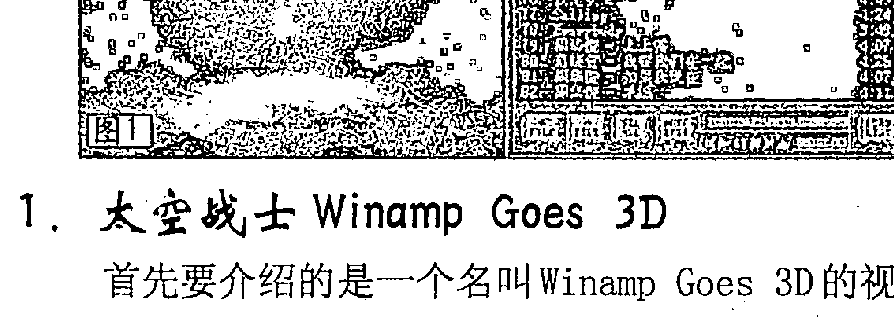

#### 1. 太空战士 Winamp Goes 3D

首先要介绍的是一个名叫Winamp Goes 3D的视觉插件，它在播放MP3文件的时候，将调用显卡中的硬件3D加速功能对图像进行优化处理，从而提供了一种能够使你目瞪口呆的3D效果。但是如果你的计算机没有256MB内存和32M以上的显存，最好就不要使用这个插件，省得造成整体系统性能的下降。安装完Winamp Goes 3D之后，在播放MP3的时候，原先的音乐菜单编辑窗口就变成为一个3D动画显示窗口，它的一系列图像可以把你与高科技之间的距离拉近许多，感觉就好像是让你从现实的世界中突然进入到浩瀚的宇宙空间。在美妙的音乐之中你可以看见类似宇宙中超新星爆炸或是 X 射线之类的绚丽画面，还有那种银河飞将中飞艇加速飞行时喷出的高温蒸汽的画面。这一系列令你眼花缭乱的3D图像采用纯3D的画面，将各种材质表现得淋漓尽致，只是凭借我们的肉眼就可以轻易分辨出3D物件的原汁原味。对于拥有VooDoo系列或者是其它强力3D加速卡的用户来说，真可谓是个福音。

#### 2. 让 Winamp 跳起舞来的 Christmas dancer

在安装Christmas dancer之前必须确定你所使用的Winamp是2.5以上的版本，否则在安装的时候会有出错信息提示。和一些3D视觉插件相比，Christmas dancer对于计算机硬件的要求很低，只要你的爱机不是太老土的那一种，就可以领略这一精品插件的魅力了。闲话少说，先将Christmas dancer设置为默认的插件，然后在播放MP3的时候就有一个圆形的可视窗口弹出，随着音乐的节奏，画面中的小人也开始翩翩起舞了。这个圆形的可视窗口像一件令人爱不释手的工艺品，给人的感觉仿佛是在太空中漫步，又像是在繁华喧闹的都市，但最终还是回到了高科技带给我们的音乐殿堂之中。伴随着绚丽的灯光、梦幻的背景和洒脱的舞姿，我们绝对可以享受到一种独特的视觉效果，而且在舞者跳舞的过程中还可以通过快捷键来更换服装色彩、切换视角、改变舞台灯光等操作。看着屏幕上的舞蹈，听着熟悉的舞曲，突然之间有了一种去蹦迪的感觉，要是你自认为水准不够的话，还可以和它学上几招呢。

#### 3. 3D 感觉的 Geiss

Geiss带给我们的是一种全屏的画面，和Winamp Goes 3D一样，它给你带来的也是全部3D的视觉效果。所不同之处在于，这些画面上的物件看上去是3D效果的，但其实都是用十分精美的2D图像来完成的（如图2）。

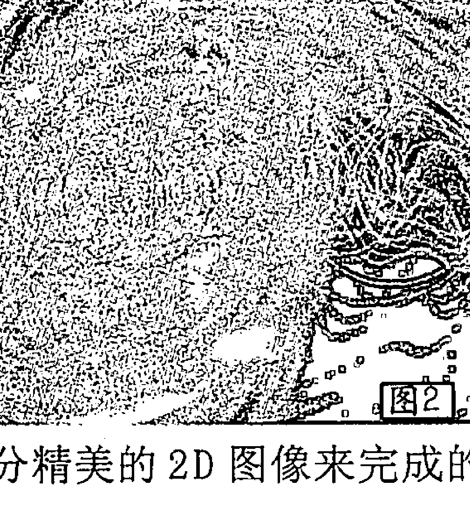

#### 4. 瑰丽的 Albedo

和Geiss一样，Albedo也算得上是视觉插件中的精品了，它最大的特点就是画面可以随着音乐的节奏自动进行变换，同时在屏幕上绘制出极为瑰丽的图案，效果好得简直难以用语言来形容。即使你不喜欢在欣赏MP3的同时观看视觉效果，那么用它来作为计算机的屏幕保护程序也是相当不错的。

看完这些绚丽夺目的视觉插件之后，你的眼睛是不是已经直了？那赶快做几分钟的眼保健操放松一下吧。趁着这个休息的时间，我们的耳朵可不能休息，让我们再来找一些增强音质效果的插件来试用一下。

### 二、音效处理插件

首先要向大家介绍一下音效处理插件的使用方法。一般来说，从网站下载的是压缩格式的文件，先将其中的dll文件直接解压缩到Winamp安装路径的Plugins目录中。然后运行Winamp，按下“Ctrl + P”组合按键进入设置中心界面并在“插件”中选择“音效处理 / 特效”，在这个列表中会看见自己刚才添加的音效插件，最后选择一个即可。但是有一些插件程序是直接进行安装的，这在使用的时候就更加简单了，只要运行这个安装程序，系统会自动将有关配置搞定的。好了，各位一定等得有些着急了吧，那我们就一起来试试这些宝贝吧。

#### 1. DeFX

DeFX在播放音乐的时候可以将控制面板隐藏起来，但是在进入控制中心的时候可以利用鼠标来切换合唱、回声、立体声等演唱效果，而且还有改变歌曲的节拍、音效平衡度等功能（如图3）。所以利用它你就能够不再受限于音乐作者原先所制定的音乐效果了，它可以让你控制音质并调整至你自己想要的效果。在试听Mariah Carey的歌曲时真的是感觉到了那种直入云霄的靓丽高音，而在欣赏GUNS N' ROSES的摇滚乐时又领悟到了一种前所未有的震撼力，每一下鼓声都好像是敲击在自己的心扉中一样。看来这个插件在和Sound Blaster Live!的配合之下，再加上一个不错的音箱，真的是可以说是CD终结者了。

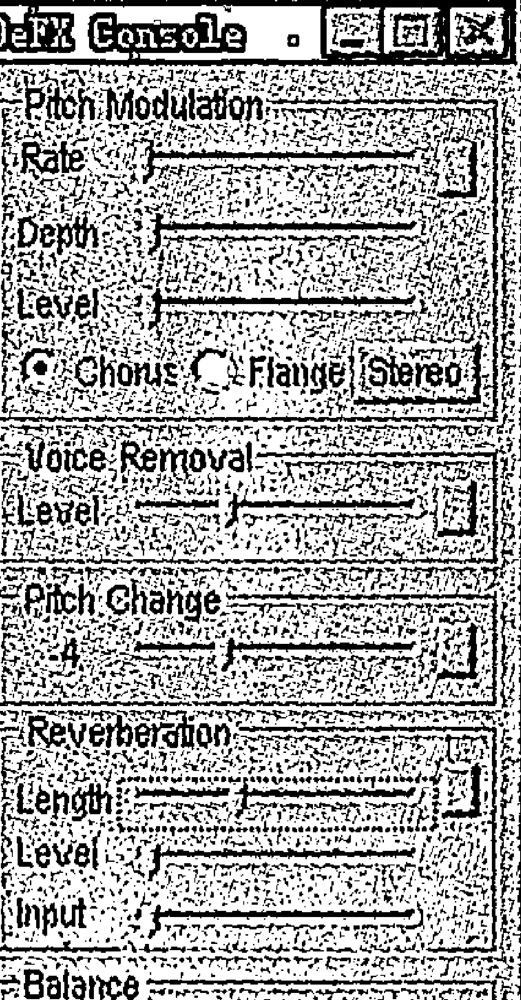

#### 2. WaveSurround

WaveSurround能够让你以全新的感受聆听数位立体音乐。因为一般的立体音效是从你前方两边的扩音器传过来的，而经过WaveSurround的处理之后，音乐将会是环绕着你的，让你真正融入音乐当中。

WaveSurround有两个控制面板，其中一个是用于选择音箱和电脑之间的摆放位置，可以选择头戴式耳机或者是不同的音箱位置，这里的选择对于音乐的效果可是很有影响的。在另外一个面板可以选择插件是否起作用，对音箱的位置进行调整，还有就是选择播放MP3的效果（如图4），如果选择了“High Quality”之后，那MP3的音质将会变得更加动听，但是你的CPU占用率嘛，也就跟着提高了不少的！

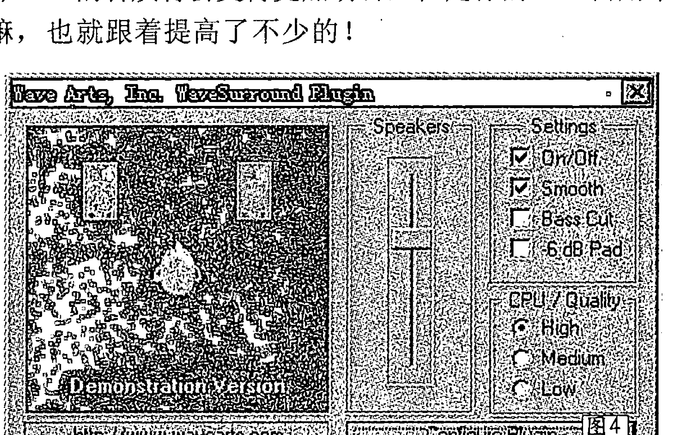

#### 3. RealReverb

如果你喜欢看现场演唱会或者是听交响乐的话，那么就一定要请RealReverb帮助，因为它就是专门为增强这两种音效而定制的。这个插件采用了严密的算法和一种叫做“推动响应”的技术来保证模拟房间中每处的回响和频率响应都近似于现场的感觉，所以在它的帮助下你可以欣赏到近乎接近于演唱会效果的歌曲。在它附带的控制面板中你会发现有一个名为Chapel.wav的外挂IR文件，这是一个变址寄存器，通过它或者是其它的外挂文件可以更好地模拟现场的效果（如图5）。

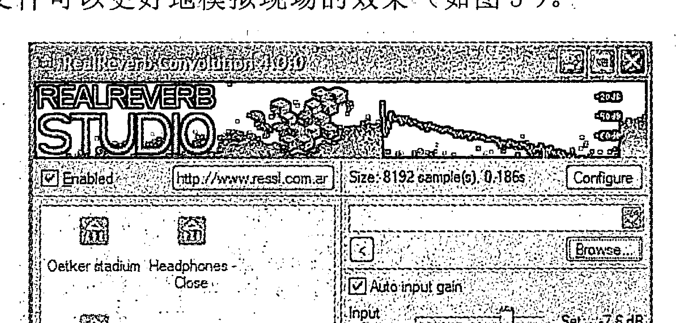

#### 4. WOW Thing

WOW Thing可以用来即时调整欣赏的模式、加强重低音和环绕效果，在选择好这个插件之后，每次播放MP3的时候都会看见如图6所示的附加窗口，如果不需要的话可以右击鼠标让它最小化运行在后台。

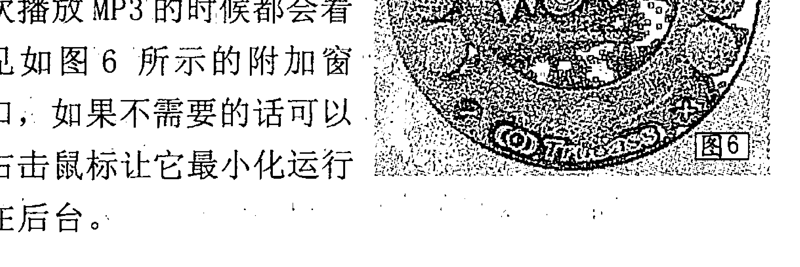

这个窗口的上面和下面的滑动块是用于调节环绕与超重低音效果的，而左边的三个按钮用于选择是大型音箱、普通音箱还是头戴式耳机作为音效输出源，选择不同的输出方式能够获得不同的音质效果。而右边最上面的那个按钮一定要按下使其呈红色，因为这就是WOW Thing音效的开关呀，呵呵……

#### 5. DFX for Winamp

DFX for Winamp是一款专业级别的音效插件，它不仅具备增强声效处理能力，还可以对MP3进行声音纠错、复原真音等功效，让原先的MP3音乐品质得到极大提升。安装并设置好DFX之后，在播放MP3的时候将自动激活插件面板（如图7），从中可以看出它提供的高保真度、环境音效、3D环绕、动态推进以及超重低音等音效控制功能，只需拖动每个滑块条即可设定不同的音效类型。另外，我们还可以点击“预设”按钮直接采用DFX提供的配置预设值欣赏音乐。

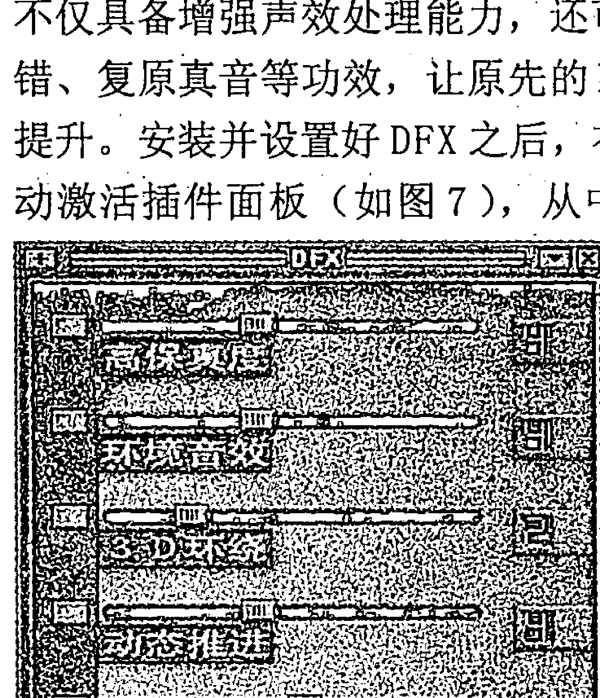

需要指出的是，上述介绍的各种Winamp音效处理插件各司其职，有的用于改善MP3的音质，有的可以加强3D音效，有的能够模拟现场感觉，还有的对于超重低音有特效。所以大家在使用的时候一定要注意自己欣赏的曲目类型，不然选错类型之后很可能会觉得使用这些音效插件后音质不仅没有改变还有下降的趋势，到时候可别责怪我呀！

### 三、普通插件

#### 1. 利用 Winamp 看 VCD 的 Nicemc

说起来也许你不相信，利用Winamp也能看VCD？确实如此，通过安装程序安装了Nicemc这个插件之后，就可以像正常播放MP3音乐一样打开AVI、DAT、ASF、WMV、MPEG、MOV、QT、VOB等格式的媒体文件，这时在Winamp主窗口旁边会出现一个新的窗口，它就是影像文件播放区域了（如图8）。与超级解霸等播放软件比较起来，其最独特的地方就在于均衡调节器中的音效选择也可以使用。这样当你在看VCD的时候，即使没有外接功放，也可以模拟出令你震撼的效果来。喜欢在电脑上看VCD或者是其它媒体文件的朋友，不妨来试试。

#### 2. 语音复读机

也许你的计算机还是属于那种老土的配置，无法领略3D声光特效的魅力，那也没有关系，下面出场的这个语音复读机插件一定会让你心动不已的，因为它可以让你节省下好几百大洋来实现语音复读的功能。和商场中出售的英语复读机一样，它可以用Winamp实现所有的标准声音文件的复读回放，包括WAV、MP3、VQF等等，另外还有RA、RAM、RM等扩展声音文件的复读回放（需要RealPlayer支持）。

使用它的时候也要将下载的插件放置到Winamp的Plug-ins目录中，然后进入“选项/参数选择/一般用途”中点取“英语复读机插件”，接下来在选中如图9所示的复选框，并设置自控复读的时间。

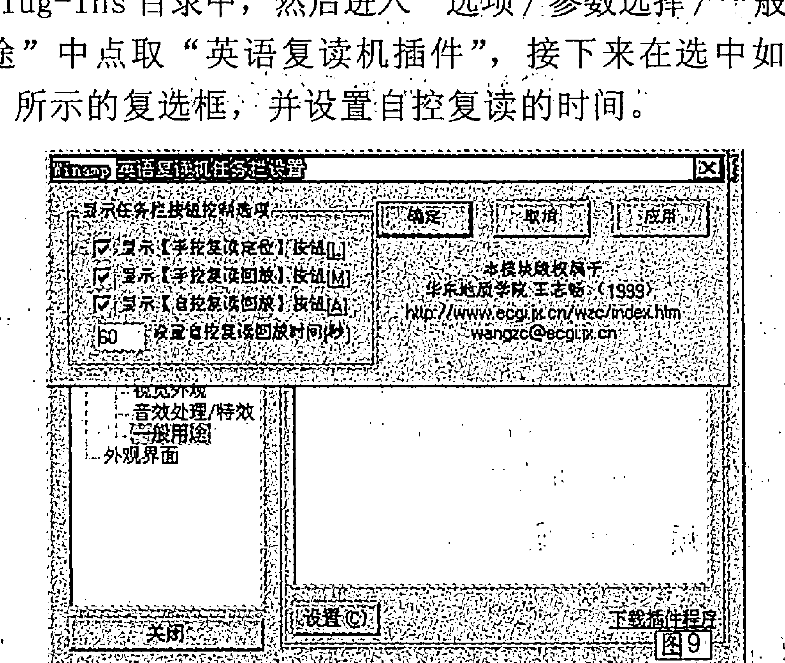

退出Winamp之后，在右下角的系统图标栏中就会多出三个复读机的控制按钮，它们的作用分别是手控复读定位、手控复读回放、自控复读回放。在点击第一个图标的时候可以将正在播放的文件位置记录下来（最多可设定10个位置），需要的时候再通过点击第二个图标来从刚才设置的地方继续进行，而且是每单击一次就返回到更前面的一个设定位置开始播放。而自控复读回放是在你设定的位置处，每隔一定的时间（也是你刚才设置的）就自动跳转到前一个设定位置开始播放，省得你总是要用鼠标来点取了。

这个语音复读机不仅可以在自己的电脑上练习唱歌，更能让那些英语学习者锻炼听力，而且在其它插件的配合之下还能将英文作为歌曲的歌词显示出来，这样也可以跟着电脑来练习口语了。

（文/赵江）

## DVDRip播放插件攻略

DVDRip其实就是通过DVD影碟转换得到的AVI影像文件，但由于采用的压缩编码不同，播放时候需要第三方的影像、声音解码器以及字幕插件的支持。
说起DVDRip，其实它的原理并不复杂，它是将DVD的视频部分和音频部分分别提取并保存为不同的文件：其中视频部分通过MPEG4技术的DivX编码压缩处理成AVI格式文件；音频部分则可保持为AC3格式音频或者转换成MP3格式。然后再将视频和音频合成为一个AVI文件，这样得到的文件大小只有DVD原来的几分之一。更为主要的是，和DVD光碟相比，这个AVI文件的图像质量不会有明显的下降，而且使用一至两张CD-R刻录盘就可以保存一张DVD影像光盘，因此我们就能够使用普通光驱欣赏到接近DVD画面质量的视频节目了。

### 一、DVDRip播放插件

#### 1. 视频解码器

如果你在网上或者从朋友那里得到一些AVI文件，而你的视频播放器却无法播放，那就意味着这些AVI文件是用DivX编码压缩制作的，如果想欣赏这些AVI文件，就必须要安装正确的解码器。

目前各种DivX编码器的版本很多，通常可以找到的有XviD、DivX 3.x及DivX 4/5等多个版本。其中XviD能够解码XviD和DivX 4/5编码压缩的文件，它实际上与DivX 5是基于同一核心技术的；DivX 4/5不能解码XviD编码的文件，但能解码DivX 4/5和DivX 3.x编码压缩的文件；虽然DivX 3.x只能解码它自己编码的文件，但它的稳定性却是所有解码器中最好的。

在选择安装解码器时，建议大家首先安装XviD编码器，这主要因为它是免费的，而且网上大多数DVDRip都采用它来进行编码。至于DivX解码器，笔者在此推荐使用3.11版。至于DivX 4/5，它的作者和DivX 3.11的作者不是同一个人，程序本身的设计思路也不同，它最大的特点在于能够充分利用CPU的功能对画面进行优化处理。不过虽然DivX4/5也可兼容播放DivX3.11的编码，但是实际使用中却发现由于兼容性等问题导致播放器经常出错，因此并不建议大家选择。

另外还有一款Ffdshow解码器，它可以解码任何一种MPEG4文件，是目前唯一的通用解码软件。Ffdshow画面优化功能非常强大，并且调节起来也非常方便。由于它并不强行接管所有的解码工作，因此哪一种编码是否用它来解码都可以自行定制，因此不存在兼容性问题的情况下，建议大家也要安装它。

#### 2. 音效插件

完成上述设置之后，用播放器打开AVI文件就可以开始欣赏DVDRip了。但是在看部分AVI文件时，你仍会发现影片只有画面没有声音，这并非声卡或者系统故障，而是没有安装合适的音效插件，这时建议大家安装Dual Audio双声道和AC3 Filter这两款必备的音效插件。通常Windows操作系统已经附带了Fhg Radium MP3 codec，它是AVI文件的MP3音频解码器，但许多DVDRip在音频制作中并没有采用MP3格式压缩音轨，而是利用原DVD的AC3音频文件制作来保留DVD原汁原味的声效，所以如没安装AC3 Filter，通过AC3制作的DVDRip就只能看到画面而无法听到声音了。

#### 3. 字幕外挂软件

好了，现在我们终于可以欣赏到声色俱全的DVDRip了，但是播放的DVDRip有可能是英语，甚至是日语、韩语、法语、德语等压根就听不懂的语言，为了解决这个问题，就要借助字幕插件的帮忙了。

##### (1) VobSub

VobSub可以说是当前最为强大的字幕外挂软件，它可以用于在播放影片的同时显示字幕、调整各种字幕时间码、进行字幕格式转换等操作。此外，由于播放DVDRip需要各种不同的插件，而这些插件管理起来并不容易，但是在VobSub的帮助下能够很方便的对这些插件进行管理设置。VobSub几乎支持目前所有的字幕文件格式，这其中包括.idx和.sub、.sub、.srt、.ssa、.smi等诸多格式，因此兼容性很好。另外一方面，VobSub的使用非常简单，只要你要将影片的字幕文件和相应的AVI文件放在同一目录内，在播放AVI时就会自动调用VobSub加载字幕文件，这样就能够以外挂字幕形式观看DVDRip了。

##### (2) DivXG400

DivXG400是Matrox系列显卡专用软件，能够解决Matrox系列显卡播放DivX编码文件和各种字幕时遇到的问题，或者和VobSub配合实现双字幕。

### 二、插件的优化设置

安装了上述插件后，虽然可以欣赏精彩的DVDRip影片了，但是如果想要获得最佳的播放效果，还必须进行一些针对性的优化设置。

#### 1. 解码器设置

在解码器中，XviD和DivX 3.11没有太多的设置项目，基本上采用默认的设置即可。但是如果安装了Ffdshow就可以发现它的强大功能了。从开始菜单中依次运行“Ffdshow”→“Configuration”命令进入属性设置窗口，此时可以看见窗口左边有Codecs、Info、Tray&dialog settings和Image setting四个选项。

- (1) Codecs选项

Codecs选项用于指定Ffdshow解压哪种编码压缩的文件。比如你不想用Ffdshow来解压DivX 3编码文件，只要取消选择DivX 3复选框即可，然后在播放DivX 3编码的文件时就会调用DivX 3解码器或别的解码器去解压（如图1）。这样我们可以按照自己的实际需要来选择合适的解码器，在系统出现兼容性问题时候可以尝试其它解码器进行解压，或者选择不同的解码器来实现最佳的影像画面。

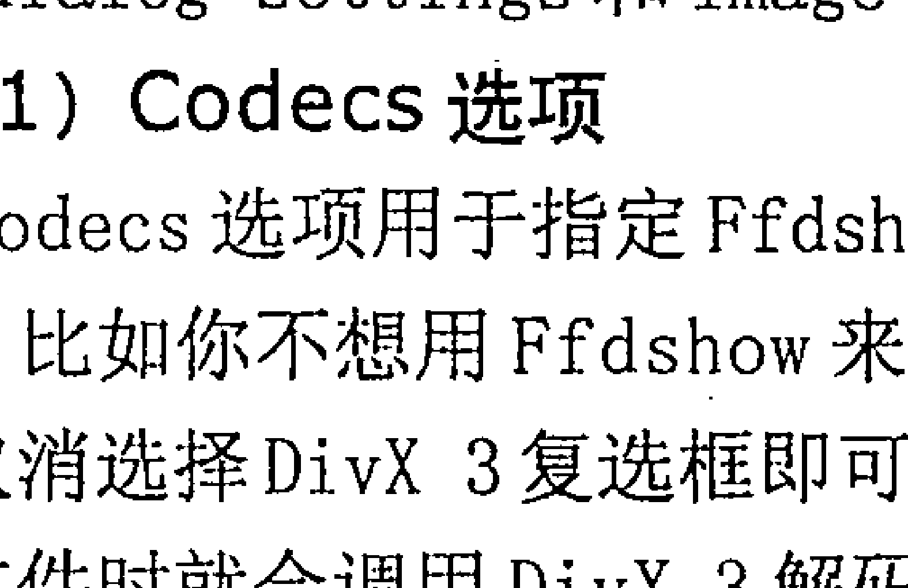

- (2) Info选项

Info选项可以在播放AVI的过程中查看正在播放的视频文件的相关信息，比如使用的解码器、目前播放的速度等信息，根据这些信息还能够适当对其他选项进行调节优化。

- (3) Tray&dialog settings选项

这个选项可以设置在播放AVI过程中是否在系统托盘出现工作图标。如果我们通过VobSub外挂字幕，则可以不理会这个选项。

- (4) Image setting选项

Image setting选项主要用于设置AVI影像画面。由于这类设置项目比较多，下面对比较重要的几项简单介绍一下。

- 1) Postprocessing主要对于视频画面进行优化设置。如果你的计算机配置很好，建议选中“Postprocessing”一项对画面进行优化，否则建议选中“Presets”和“Automatic quality control”选项，由系统自动控制画面质量。至于“Processing strenght”可以根据计算机的性能进行调整，一般设置为100%即可，如果计算机配置很好则可以适当增加。

- 2) Picture properties用于调整画面的色彩属性，直接通过滑块条即可更改画面明暗度、Gamma参数、色调、饱和度等相关属性的设置。不过这里建议大家不要经常进行更改，只有在部分色彩不好的DVDRip影片中再进入这里进行调整。

- 3) Subtitles主要用于DVDRip影片字幕设置，在这里可以直接选取DVDRip影片的外挂字幕，并通过“Horizontal position”和“Vertical position”滑块条来调节字幕的位置。同时，还可以对于字幕文件的字体进行设置，有时候如果出现字幕乱码，则能够通过这种方法进行解决。

除去上述各种属性设置之外，我们还可以将各种不同的设置以文件形式保存起来，这样能够根据实际情况对不同的DVDRip文件载入合适的方案，以便最便捷地欣赏到最佳效果的画面。

#### 2. 字幕插件的设置

一般安装了VobSub之类的字幕插件之后，在播放DVDRip影像文件时它会自动运行，同时在系统图标区多出一个绿色箭头工作图标，并且加载对应的字幕文件。用鼠标左键双击VobSub图标可以激活程序设置窗口，其中有一些比较重要的设置项目，在此简单介绍一下。

- (1) Language下拉菜单：用于选择正在显示字幕文件的语言种类，比如播放的字幕有中文、英文等多个版本，则可以直接在这个下拉菜单中选择需要的语言种类即可。

- (2) Override Placement：点击之后可以调整字幕显示位置，比如更改“Horizontal”和“Vertical”对话框的数值即可完成字幕位置调整。

- (3) Text Setting区域：这里可以设定字体的外观模式，一般采用默认参数即可。但是需要提醒大家注意的是，如果一些DVDRip影像无法正常显示中文字幕，则可以点击“Arial”按钮并将字体改为中文字体，然后才能够正常显示中文。

- (4) Reload the video for these区域：可以设置DVDRip画面为4:3或者16:9模式，这在欣赏一些DVDRip影像的时候能够获得更为出色的效果。

- (5) Hide Subtitles按钮：可以暂时隐藏字幕，这对于那些需要通过DVDRip学习的朋友特别有用。

完成上述设置之后，我们再打开一个AVI文件就可以开始体验DVDRip影像带来的全新视频感觉了。

（文/赵 江）

## **数据备份与恢复问答**

## **1. 备份 IE 收藏夹**

**问：** 因感染病毒，我重装系统后 IE 收藏夹也全部丢失了，请问 IE 浏览器的收藏夹放在什么地方？如何备份及恢复？

**答：** Windows 98 中 IE 的“收藏夹”位于 C:\Windows\Favorites 目录下，备份很简单，进入 C:\Windows\Favorites 文件夹，将该文件夹中的文件全部备份即可，而将备份数据重新拷入 C:\Windows\Favorites 即可还原。Windows2000/XP 中 IE 的“收藏夹”位于各自用户的“Favorites”目录下，备份和恢复的方法类似。当然也可以使用 IE“文件”菜单中的“导入 / 导出”功能进行备份和恢复。

## **2. Outlook 数据的备份方法**

**问：** 我一直用 Outlook 接收我邮箱里的邮件现在想把接收到的邮件备份下来，请问怎样才能完整备份 Outlook 的相关数据？另外 Foxmail 的数据又该如何备份？

**答：** Outlook 相关数据的备份方法如下：
首先应对注册表的相关部分备份，运行 Regedit.exe 文件，打开注册表编辑器，找到 [Hkey-current-user\Software\Microsoft \ Internet AccountManager \ Accounts] 分支，其下分别有:00000001 及 0000000a 等多个子键 (视邮箱与新闻组多少而定)，分别代表了你的邮箱与新闻组；点击 accounts 主键，然后选择“注册表”菜单中的“导出注册表文件”命令，将该键下各子键的注册表导出并保存。然后还要对目录文件进行备份，备份 Windows 安装目录下的 application data/microsoft/outlook 目录里的所有信息。另外 Outlook Express 所带的通讯簿的备份步骤是在通讯簿中单击“文件”菜单，选择“导出”项，然后单击“通讯簿”，再选择导出的格式即可。
备份数据的恢复方法如下：重装 Windows 系统后，应重新对 Outlook Express 内的邮箱与新闻组的账号进行设置。具体步骤为:运行 regedit，将以前导出的注册表文件引入注册表;将以前备份的所有信息文件及目录还原至相同路径下，完成后重新运行 Outlook Express，你将发现原来收到的所有邮件、新闻组目录及所有预定的新闻组文件都保存完好。
Foxmail 数据的备份就比较简单了，第一次使用 Foxmail 以后，软件将会在其安装目录下面自动建立一个名为 Mail 和一个 Address 的子目录。分别存放你收发的邮件，以及地址簿。只需将这两个目录复制别处，即可完成备份操作。

## **3. Outlook 中的邮件如何保存**

**问：** 我用的是 Outlook 来收发电子邮件，请问电子邮件是何种格式的文件？一般保存在哪个目录下？是否可以像对文本文件那样随意复制和编辑修改。

**答：** Outlook 的邮件保存在 application data/microsoft/outlook 目录下，不能通过普通方法编辑修改。据我所知大多数电子邮件软件，一般都将收到的信息用特定的格式放在特定的文件中，比如 Foxmail，收发的邮件放在 IN.BOX, SEND.BOX 文件中，你无法直接打开这些文件，但可以通过“SAVE AS”等方法来保存成普通格式的文件。Outlook 等其他软件收发的邮件也类似。

## **4. 用户文件不要保存在 C 盘**

**问：** 我开机时机器提示 "disk I/O error......" 无法启动系统，用软盘启动后发现 C 盘里什么都看不到了，而其他盘却正常。C 盘上恰好有我很多重要数据，请问 C 盘里的数据是否可挽救？

**答：** 从现象看，很可能是主引导记录 (MBR) 或系统文件因意外或被病毒破坏了。如果只是主引导记录和系统文件损坏，可以从软盘启动，首先查一下有无病毒，再执行 FDISK /MBR ，然后执行 SYS A: C: ，盘上数据可能还可挽救。但如果 FAT 表或数据区本身被破坏就没有多少修复的可能了。C 盘由于读写最为频繁，且不少病毒（如 CIH）都将 C 盘作为破坏的首要对象，因此建议大家不要把重要的个人数据文件放在 C 盘，比如可以把“我的文档”设置到其他盘的某个目录上，C 盘只用来安装系统和应用程序。稳定一段时间后，可将 C 盘用 GHOST 做一备份，一旦被破坏，恢复起来也很简单、快速。

## **5. 改变常见软件的默认保存路径**

**问：** 我不想让重要数据保存在 C 盘上，请问如何改变 Microsoft Word、Microsoft Excel 文件默认保存路径？

**答：** Word 文件默认保存路径是 C:\My Documents 目录。默认保存路径修改方法：打开 Word 程序，单击菜单栏“工具”下的“选项”命令，接着在出现的“选项”对话框中选择“文件位置”标签页面，再选择文件类型，按“更改”按钮，将位置指定为专用数据分区的某个文件夹，然后按“确定”即可。同样，Excel 默认保存路径也是 C:\My Documents 目录。默认保存路径修改方法：打开 Excel 程序，单击菜单栏“工具”下的“选项”命令，接着在出现的“选项”对话框中选择“常规”标签页面，将“默认工作目录”改成专用数据分区的某个文件夹，然后按“确定”即可。当然我们也可以直接修改“我的文档”属性，将其默认目录修改到其他分区即可。

## **6. 如何备份 CMOS 和 BIOS 数据**

**问：** 我在报上看到有些文章说需要备份 BIOS 信息，我想问一下怎样备份 BIOS 信息，具体怎样操作，还有 CMOS 信息又该怎么备份？

**答：** 首先我谈一下 BIOS 和 CMOS 的区别与联系。简单说，BIOS 是主板上的一块 EPROM 或 EEPROM 芯片，里面装有系统的重要信息和设置系统参数的设置程序（BIOS Setup 程序）；CMOS 是主板上的一块可读写的 RAM 芯片，里面装的是关于系统配置的具体参数，其内容可通过设置程序进行读写。要备份 BIOS 数据可以运行主板 BIOS 的升级文件，在出现是否备份旧的 BIOS 数据时，回答“Y”，即可。而 CMOS 数据没有太大的必要备份，因为在默认状态下，系统也能正常工作，如果确实要备份，可以使用 NU 软件包中的一个名为 “RESCUE” 的软件。

## **7. 输入法词组的备份问题**

**问：** 我用的是系统自带的智能 ABC 输入法，特别喜欢它的词组记忆功能。但是如果系统重装的话，以前输入的词组就没有了，请问如何备份这些词组啊？

**答：** 下面介绍一下当前常用输入法自定义词组的备份方法：

- **智能ABC 智能拼音输入法** 是最适宜普通用户使用的最优秀的中文输入法之一，它除了能自定义词组外还能智能记忆用户输入的词组。所有的自定义词组全部保存在 tmnr.rem 和 user.rem 文件中 (路径为 C:\Windows\SYSTEM)，因此，你在删除或重装 Windows 系统之前，只须将这两个文件备份即可。
- **中文五笔** 中文五笔输入法造出的词组保存在 wbx.emb 文件中 (路径为 C:\Windows\System)，因此，你在删除或重装 Windows 系统之前，只须将 wbx.emb 文件备份即可。
- **微软拼音** 微软拼音输入法在国内拥有庞大的用户群，能输入繁体汉字是它最大的特点。该输入法也具有造词功能，它所有的自定义词组全部保存在 pjyp.upt 文件中 (路径为 C:\Windows)。用户只需对该文件备份即可完成对微软拼音输入法中自定义词组的备份。
此外像紫光拼音、拼音加加等输入法则自带了自造词组的备份及恢复工具。

## **8. 自己制作系统恢复光盘**

**问：** 现在不少品牌机都附带有一张“系统恢复光盘”，系统垮掉后，恢复起来很方便。请问自己如何制做一张可直接启动并恢复机器的“系统恢复光盘”？

**答：** 一般在对系统进行维护时，通常要使用软盘启动计算机。但是软盘的存储空间较小，不可能装下维护系统所需要的全部软件，而且软盘比较容易损坏，不利于长期保存。要制作自己的“系统恢复光盘”并不是一件难事。
安装好系统及常用软件后，进行系统个性化设置和优化整理、磁盘扫描。在 DOS 下运行 Ghost，选择“LOCAL-PARTION-TO IMAGE”，将系统区备份为一个镜像文件。建议选最大压缩率压缩，确认后开始执行备份。要注意备份出的单个镜像文件大小不要超过 700M。
然后我们要准备一张具有 FORMAT 等相关工具软件并可驱动光驱的可引导软盘。最方便的方法就是在 Windows98 中制作一张启动盘，在“添加/删除程序”属性面板中选择“启动盘”选项卡，点击“创建启动盘”按钮就可以了，当然别忘了在软驱中插张质量好的高密软盘。制作完毕后，应当使用该盘进行启动测试。看是否可正常引导目标系统，且分配驱动器号给 CD ROM。然后我们将 Ghost 文件拷贝到软盘。
然后用 EDIT 编辑自动批处理文件 autoexec.bat，加入一行用 GHOST 自动恢复分区的命令。
最后刻录启动光盘，刻录软件我们可以使用最常用的 Easy CD Creator。在添加要刻录的数据后，单击工具栏上“新建”按钮旁边的小箭头，并从下拉列表中选择“可引导 CD”。软件会提示插入一张可引导软盘到软盘驱动器并单击“确定”，刻录后恢复光盘就做好了。

## **9. 磁盘扫描出错数据可否恢复**

**问：** 近日我用 Windows98 自带的磁盘扫描程序扫描一个分区，报告有错，于是我按建议修复。结果该分区文件全部丢失，给我留下了三千多个 FILExxxx.CHK 的文件！不知 Scandisk 是否有“undo”功能？

**答：** 出现这种情况是因为该分区文件分配表有错误，Scandisk 在试图修复时往往就会造成你遇到的现象。遭此大劫也没有什么挽救的好方法，Windows98 下的 Scandisk 是无法 UNDO 的，你所能做的只是用 Ultraedit 之类的软件一个个打开这些 chk 文件，对于文本文件还能挽救一些。

## **10. 硬盘的低格和高格有何区别？**

**问：** 请问硬盘低级格式化和高级格式化有什么区别；各在什么场合下使用？低级格式化对硬盘寿命是否有影响？

**答：** 所谓“低格”是指对一块裸盘进行划分磁道和扇区、标注地址信息、设置交叉因子、修复逻辑坏道等低层操作，“低格”需要用专门与硬盘配套的软件，由于低格将可能损伤盘片磁介质，一般没有必要对硬盘进行这种操作。
而高级格式化，将做清除硬盘上的数据，生成 BOOT 区信息，初始化 FAT 表，标注逻辑坏道等工作。对硬盘进行高级格式化通常使用操作系统自带的 FORMAT（格式化磁盘）命令。
关于硬盘低格的利弊，各方说法不一，一直无定论。以往硬盘容量不大时低格是没问题的，那时大多数主板的 BIOS 中就提供硬盘低格的程序。随着硬盘技术的发展，容量的增大，厂家一般都不推荐对硬盘进行低格，以免使硬盘的交叉因子等参数发生改变，影响硬盘的性能与寿命。但硬盘低格确实是对解决某些问题有用（如恶性病毒、逻辑坏道），若实在需要进行低格，应尽量采用厂家专用的低格程序。另外“低格”的过程进行得很慢，若中途出现掉电死机等意外情况，将会造成非常严重的后果，而且由于“低格”时要使硬盘的低层物理特性发生一定变化，对硬盘的寿命肯定有影响，所以轻易不要对硬盘进行“低格”操作。

## **11. 如何用双硬盘保障数据安全**

**问：** 本单位有几台电脑，并组建了一个对等网。作为数据安全的预防措施，每台机器都配备了两块硬盘，计划定期进行硬盘对拷。要求拷贝的硬盘可以完全替代原来的硬盘工作。请问应该使用什么方法比较合适？

**答：** 如果只要求离线备份，你可以使用诺顿的 GHOST 软件，GHOST 对硬盘按扇区进行物理层的读写，可以保证对拷后两块硬盘信息完全一样，但用 GHOST 备份时需人工干预，做不到数据备份的实时性，如果要求实时备份的话建议配合 RAID 卡或安装 Windows 2000/XP，作成 RAID1。可以简单的实现 MIRROR（镜像）功能，也就是一个做主硬盘，一个做备份硬盘（实时备份），这样的话，读的速度会有提高，写的速度和容量就没有太大的差别，而且容量只是一个盘的容量，但安全性是大大提高了。所有的硬盘，不论它有多么高的平均故障时间间隔，最后都会不可避免地出现各种故障：文件结构错误、簇丢失、甚至分区表的物理损伤。因此，为了尽量减少计算机的意外故障，在负担重要任务的计算机上采用 RAID 技术是保证数据安全非常有效的方法。

## **12. FAT 表出错引起的读写故障**

**问：** 请问硬盘 FAT 表或根目录出错是否可能修复？

**答：** FAT 表记录着硬盘数据的存储地址，每一个文件都有一组 FAT 链指定其存放的簇地址。FAT 表的损坏意味着文件内容的丢失。DOS 系统(Windows9X的文件系统也是基于DOS系统的)本身提供了两套完全一样的FAT表，如果当前使用的FAT表损坏，可用第二个进行覆盖修复。但由于不同规格的磁盘，其FAT表的长度及第二个FAT表的地址也是不固定的，所以修复时必须正确查找其正确位置。一些工具软件如 NDD等本身具有这样的修复功能，使用也非常的方便。但是大多数时候第二个FAT表也会同时损坏，我们只能使用CHKDSK或SCANDISK 命令进行修复，得到一系列*.CHK文件，这便是丢失FAT链的扇区数据。如果是文本文件则可从中提取出完整的或部分的文件内容。对于其他类型的文件则基本就没有修复的可能了。
根目录中记录着硬盘中文件的文件名等数据，其中最重要的一项是该文件的起始簇号。如果根目录损坏将丢失大量的文件。当然也可使用 CHKDSK或SCANDISK程序恢复，从硬盘中搜索出*.CHK文件，由于目录表损坏时仅是首簇号丢失，每一个*.CHK文件即是一个完整的文件，将其改为原来的名字（如果能判断出来）即可恢复大多数文件。

## **13. 请问分区表损坏如何才能修复？**

**问：** 我们单位位于今年买了一台电脑，主要是做平面设计的。80GB的硬盘分了四个分区，因感染病毒导致硬盘分区全部丢失，请问是否有恢复的可能？

**答：** 硬盘主引导记录（MBR）所在的扇区是病毒重点攻击的地方，通过破坏主引导扇区中的DPT（分区表），就可以轻易地损毁硬盘分区信息，达到对资料破坏的目的。一般而言分区丢失，是因为分区表损坏所致，而分区上保存的数据一般还完好，所以，我们可以使用专门的软件来进行修复。你可以试试硬盘分区表维护软件DiskMan。Diskman可以判断分区的‘系统参数’是否正确；当然也可让Diskman自动检查硬盘分区参数，按照提示修改错误的参数，实在不行还可利用其‘重建分区’功能重建分区。DiskMan可通过未被破坏的分区引导记录信息重新建立分区表。DiskMan将首先搜索0柱面0磁头从2扇区开始的隐含扇区，寻找被病毒挪动过的分区表。紧接着搜索每个磁头的第一个扇区。整个搜索过程是采用‘自动’或‘交互’两种方式进行。自动方式保留发现的每一个分区，适用于大多数情况。交互方式对发现的每一个分区都会给出提示，由用户选择是否保留。若采用自动方式重建的分区表不正确，我们还可以采用交互方式重新进行搜索。在分区恢复上，国内著名的杀毒软件KV3000系列和瑞星都提供了完整的解决方案。但一般要求有备份的分区表，若未备份分区表KV3000也提供了相应的修复方法，不过成功率相对就要低很多了。

## **14. 文件删除后是否可以恢复？**

**问：** 我在整理电脑上的文件时不小心删除了一些重要文件，而且‘回收站’已经清空，请问如何恢复？

**答：** 以前在DOS下，误删除文件后，可用UNDELETE、UNERASE等工具恢复。Windows下我们也可以立即使用RecoverNT、EasyRecovery等软件进行恢复。这些软件是在Windows环境下使用，具有反删除及文件修复功能的工具软件，兼容FAT16、FAT32、NTFS等文件系统。
这些软件的使用方法十分简单，运行后会自动扫描磁盘驱动器信息，选择要恢复资料的硬盘分区，再按照提示要求，点击‘下一步’后软件将自动扫描分区，之后会把所有详细文件信息显示出来，其中包括已经被删除的文件。紧接着要选中你想要恢复的文件，选择‘下一步’选择好保存的位置，即可找回误删除的文件。
这些反删除软件都不是万能的，能否恢复、能恢复多少，都只能看运气了。说到底，计算机是很脆弱的。我们一定要养成定期备份重要数据的习惯。尤其在拆卸硬盘、使用PQ、GHOST之类‘危险软件’前，更是不能偷懒或心存侥幸。‘硬盘有价数据无价’，一块硬盘的价值最多数千元，但硬盘中的数据可能要值数百万元，丢失宝贵数据后‘精神损失’更是无法估量。

## **15. 误格式化分区后数据的恢复**

**问：** 我一时大意，在DOS状态下误格式化了C盘，请问怎么才可以恢复原来C盘上的数据？

**答：** 在DOS高版本状态下，格式化时并未清除硬盘数据区的数据，因此你可以试试一些数据修复的工具软件看能否尽量挽救你的数据。
用format格式化操作在缺省状态下都会建立用于恢复格式化的磁盘信息，就是把DOS引导扇区、目录表等保存到磁盘的最后几个扇区中，而数据区中的内容没有改变。因此你可以使用UnFormat命令来恢复由Format命令格式化的磁盘。UnFormat命令除了反格式化功能，它还能重新修复和建立硬盘驱动器上的损坏分区表。
另外DOS还提供了一个‘mirror’命令用于纪录当前的磁盘的信息，供格式化或删除文件之后的恢复使用，大家可以将这个命令加到AUTOEXEC.BAT中，这样恢复删除文件及UNFORMAT成功的可能性就大大提高了。
但随着操作系统的发展和硬盘容量的增长，目前UnFormat已经显得有点‘力不从心’了，很多情况下都无法完成恢复格式化的工作，在这种情况下我们可以使用其他恢复软件来进行数据恢复。将被破坏的硬盘装到另一台装Windows的电脑上并设成从盘，然后使用Easyrecovery 6.0、Finaldata2.0、RecoverNT3.0等软件进行恢复。要记住格式化后数据能否被恢复最关键的一点就是：被格式化的硬盘千万不能再写任何数据进去。

## **16. 硬盘遭遇‘逻辑锁’的处理**

**问：** 最近我的电脑从硬盘无法启动，甚至用光盘和软盘都启动不了，一启动就死机，甚至把该硬盘装到其他机器上，做副盘都不行。请问原因何在？如何处理？

**答：** 这种情况是你不幸中了‘逻辑锁’。计算机在引导系统时将会搜索所有逻辑盘的顺序，‘逻辑锁’修改了正常的主引导分区记录，将扩展分区的第一个逻辑盘指向自己，DOS在启动时查找到第一个逻辑盘后，查找下一个逻辑盘总是找到的是自己，这样一来就形成了死循环，这就是使用软驱、光驱、双硬盘都不能正常启动的原因。
要解决此问题并不复杂，方法一是修改DOS启动文件，准备一张Windows98的系统盘，然后在一台正常的机器上，使用你熟悉的二进制编辑工具（debug或者windows下的Ultraedit都行）修改软盘上的IO.SYS文件，具体是在这个文件里面搜索第一个‘55aa’字符串，找到以后修改为任何其他数值即可。用这张修改过的系统软盘你就可以顺利地启动了。其实如果你能找到其他非微软的DOS启动盘，也可以在带‘锁’的电脑上直接启动。
方法二是找到和硬盘配套的DM软件，然后把DM拷到一张系统盘上。接上被锁硬盘，开机，进入CMOS设置，将所有IDE硬盘设为NONE，保存设置，重启动，这时系统即可‘带锁’启动。启动后运行DM，你会发现DM可以绕过BIOS，识别出硬盘，选中该硬盘，分区格式化，就OK了。不过这种方法的弱点是硬盘上的数据将全部丢失。

### 17. 软盘修复和数据恢复

问：虽然现在的存储技术越来越先进，数据的传输与备份有了更多的选择余地，但由于种种原因，我还需要经常用到软盘，我感觉软盘的确很容易损坏，软盘上的数据也容易丢失，请问软盘上的数据如何恢复？

答：由于软盘和软驱天生的弱点，软盘上存储的资料数据很容易丢失。一般来说软盘损坏、数据丢失的情况可以分为三大类：一类情况是零磁道坏，无法看到盘符和列出目录，屏幕显示的错误信息一般为：General Failure error Reading drive Abort, Retry, Ignore? 第二类情况是最常见的，即软盘的某一个部分损坏，可以列出目录，但有某一个文件或某几个文件无法读出或读出后文件损坏。屏幕显示的错误信息一般为：Sector not found error Reading drive A Abort, Retry, Ignore? 或 Data error Reading drive A Abort, Retry, Ignore? 第三类情况是受到了物理损坏，比如盘片发生了霉变、盘片上有划痕、磁粉脱落等。

要恢复软盘数据需要借助一些工具软件进行恢复。最常用的是HD-COPY，是一位德国人编写的磁盘对拷程序。主程序只有40多K，但功能非常强大，具有格式化软盘、软盘扩容、修复坏软盘、保存软盘信息、读取坏软盘、压缩文件、清洗软驱磁头等功能。其读取坏盘数据的功能非常强，它可以对坏道反复读取（最多次数可达一百次），在确认实在无法读出坏道信息的情况下就会将损坏的部分空在一边，将有用的尽可能地保存起来。HD-COPY用法很简单，这里就不多谈了，如果只是零磁道坏，那么软盘上数据恢复的可能性很大。通常情况下只要用HD-COPY将其做一个映像，再将映像存到另一张好软盘中去，数据即可恢复。而对于磁盘数据区被损坏的情况，用HD-COPY可以尽可能地读取，如果是文本文件恢复的数据还是很有价值的，但对于exe、dll之类的文件恢复后也没有什么实际意义了。当然除了HD-COPY外还有一些软盘数据的恢复工具和方法，大家可自行上网查找。

### 19. 硬盘“软”“硬”故障的区别

问：我是个电脑初学者，请问硬盘基本工作原理是什么？听人说硬盘故障分为“软故障”和“硬故障”两大类，请问有什么区别？

答：硬盘是电脑中最重要的数据存储设备。是一种采用磁介质的数据存储设备，数据存储在密封于超净的硬盘驱动器内腔的若干个磁盘片上。这些盘片一般是在以铝为主要成分（现在也有采用玻璃）的片基表面涂上磁性介质所形成，在磁盘片的每一面上，以转动轴为轴心、以一定的磁密度为间隔的若干个同心圆就被划分成磁道（track），每个磁道又被划分为若干个扇区（sector），数据就按扇区存放在硬盘上。在每一面上都相应地有一个读写磁头（head），不同磁头的所有相同位置的磁道就构成了所谓的柱面（cylinder）。

硬盘在上电后保持高速旋转（5400r/min以上），位于磁头臂上的磁头悬浮在磁盘表面，可以通过步进电机在不同柱面之间移动，对不同的柱面进行读写。所以如果硬盘受到剧烈振荡，磁盘表面就容易被划伤，磁头也容易损坏，这都将给盘上存储的数据带来灾难性的后果。

硬盘故障大体上可以分为“软故障”和“硬故障”两大类，大多数时候，硬盘不能正常运行并非是硬件遭受物理损坏的“硬故障”，而是因为重要数据区域（如系统文件、硬盘主引导区、FAT表、CMOS硬盘参数等）遭到破坏导致的“软故障”。由于硬盘基本上属于不可拆卸的“黑箱”设备，一旦出现“硬故障”，普通条件下是无法修复的。而“软故障”则可能自行修复。

### 20. 硬盘硬件故障的判断与处理

问：请问硬盘出现硬件故障的现象有哪些？如果出现硬件故障是否有修复或恢复数据的可能？

答：硬盘由于存在机械运动部件，可以说是电脑中故障率最高的重要配件。硬盘损坏的情况比较复杂。除可以通过“低格”等方法修复的“软故障”外，硬件故障主要分为电路板故障（一般是芯片烧毁）和盘体（主要是磁头、盘片损坏）故障两大类。

硬盘出现故障后，首先可以通过肉眼观察电路板上是否有芯片被烧毁，用耳朵仔细听启动时是否有异常响声。硬盘物理故障包括了磁头偏移、磁头损坏、电路板问题、芯片信息丢失、电机不转等，最直观的现象就是进入主板BIOS设置后，无法识别硬盘。一般来说电路板故障修复的可能性较大，可以通过更换芯片或整个电路板修复，大多数情况下数据还可保留。而盘体故障则基本上没有修复的可能。不过如果损坏的硬盘上有重要数据，那你也不要放弃，可以找技术力量雄厚的维修点，打开盘体，重新更换和定位磁头，读出数据，甚至可以使用特殊的设备直接读出盘片上的数据。

硬盘另一种比较轻微的物理故障，是盘片被划伤，导致出现物理坏道，这种情况主板BIOS能正常识别出硬盘，我们可以设法通过一些工具软件加以修复。

### 21. 硬盘“软故障”的一般处理方法

问：请问硬盘出现“软故障”后，一般情况下，我们该如何处理？

答：当硬盘出现故障后，首先我们应用“替换法”等方法确定是“硬故障”还是“软故障”。在初步判定故障类型为“软故障”后，一般情况下，我们可以采取如下步骤处理：启动电脑，进入CMOS设置界面，确保CMOS中硬盘参数正确。并最好让BIOS重新自动检测硬盘参数。然后注意一下BIOS设置中引导顺序的设定，将其设定为软驱启动优先，以为后面进一步处理做准备。

若CMOS中硬盘参数正确，但仍不能从硬盘启动，可以用软盘启动后（注意软盘上操作系统的版本应与硬盘操作系统版本一致），看能否访问硬盘。如果能够访问硬盘，比如说能列出C盘目录，则说明很可能只是操作系统被破坏，其他方面应无太大的问题，此时处理的方法比较简单，一般只需SYS A: C: 即可恢复。但有时候需使用专门的工具软件处理，如NDD中的MAKE DISK BOOT功能才能恢复硬盘的启动功能。

若用软盘启动系统后，无法访问硬盘，则可能是硬盘的主引导区或可引导分区的引导区或分区表等重要数据区域被破坏。我们可以使用DEBUG或Norton Disk Editor等工具软件来处理。在恢复主引导区或修复分区表后，如果仍然不能正常启动操作系统，但已能够访问硬盘，那么我们可以备份重要信息，重装操作系统即可。

如果仍然无法访问，则可以断定C盘的引导区（磁盘参数表）或文件系统（FAT、FDT）已经损坏。此时只能使用Norton Disk Doctor或ScanDisk之类的磁盘修复软件来处理。若使用工具软件后仍无法修复系统，在不需要恢复盘上数据的情况下，处理比较简单，一般只需重新分区（FDISK）、格式化（FORMAT）即可。若盘上有重要数据需要保护，就比较麻烦了。首先需用特殊的数据恢复软件（如LF、REVER NT等），尽量备份数据后再作进一步处理。

### 22. CMOS设置错误引起的硬盘故障

问：前两天，有人摆弄了我的电脑后，我的电脑在启动到检测硬盘时就无法启动了，请问原因何在？

答：很可能是因为你电脑的CMOS参数中有关硬盘的设置被更改所至。CMOS中存储了硬盘的重要信息，主要有硬盘类型、容量、柱面数、磁头数、每道扇区数、寻址方式等内容，对硬盘参数加以说明，以便计算机正确访问硬盘。

当CMOS因故掉电或发生错误时（启动时一般会提示“CMOS checksum error”或类似信息），硬盘设置可能会丢失或错误，硬盘访问也就无法正确进行。比如CMOS中的硬盘类型小于实际的硬盘容量，则硬盘后面的扇区将无法读写，如果有多个分区则靠后的分区可能丢失。

还有一个重要的故障原因，由于目前的IDE都支持逻辑参数类型（LBA），如果在CMOS中改为其他的模式，因为其映射关系已经改变，将无法读取原来的正确硬盘位置，则会发生硬盘的读写错误故障。

遇到这些情况我们就必须重新设置硬盘参数，如果事先已记下硬盘参数或者有某些防病毒软件事先备份的CMOS信息，只需手工恢复即可；否则也可使用BIOS设置（setup）中的“自动检测硬盘类型”（HD type auto detection）的功能，一般也能得到正确的结果。

### 23. 主引导程序引起的启动故障

问：前两天我使用了一个DOS下的游戏软件后，硬盘就无法启动了，请问是否可能修复？

答：很可能是因为病毒导致硬盘主引导区破坏。主引导程序位于硬盘的主引导扇区，主要用于检测硬盘分区的正确性，并确定活动分区，负责把引导权移交给活动分区的操作系统。此段程序损坏将无法从硬盘引导，但从软驱或光驱启动之后可对硬盘进行读写。

修复此故障最简单的方法就是使用DOS的FDISK/ mbr，将直接修复硬盘的主引导程序。因为FDISK.EXE之中包含有完整的硬盘主引导程序。

此外在硬盘主引导扇区中还存在一个重要的部分，那就是其最后的两个字节应为“55aa”，此字节为扇区的有效标志。当从硬盘、软盘或光盘启动时，将检测这两个字节，如果存在则认为有硬盘存在，否则将不承认硬盘。若此标志丢失，一般可使用DEBUG进行恢复。

### 24. 硬盘启动文件出错的处理

问：昨天我使用电脑时忽然掉电，重新开机后系统启动时显示：“Missing Operating System”。请问如何处理？

答：DOS引导系统主要由DOS引导扇区和DOS系统文件组成。当DOS引导扇区无引导标志、或系统文件遭到破坏时，系统启动将显示为：“Missing Operating System”。系统文件主要包括IO.SYS、MSDOS.SYS、COMMAND.COM，这三个文件是DOS启动的必备文件。在Windows 95以后，MSDOS.SYS变成了一个文本文件，是启动Windows必须的文件（只启动DOS可不需要），但IO.SYS和COMMAND.COM仍为系统启动的必备文件。

DOS引导出错时，可从软盘或光盘引导系统后使用SYS A: C:命令传送系统，即可修复故障，一般而言包括引导扇区及系统文件都可自动修复到正常状态。

### 25. 请问硬盘出现坏道应如何处理？

问：我的硬盘最近在格式化时，出现了长时间的停顿，格式化不能完成，我听说这种情况可能是硬盘出现了坏道，请问怎样才能修复？

答：硬盘出现坏道是硬盘最常见的“病症”之一。硬盘坏道可分为逻辑坏道及物理坏道两大类，逻辑坏道是由于非正常关机等软件问题引起的，一般通过常规的格式化即可去除，而物理坏道通过一般方法是无法修复的，请尽快更换。

如果过了保修期，可以尝试自行修复，具体就是找一些硬盘修复软件来处理，推荐大家使用HDDREG、MHDD、FBdisk这几款软件，当然还少不了原厂的DM。具体处理过程如下：先用原厂的DM工具，对硬盘进行“清零”处理，很多小问题用DM都可能解决，而且经上面处理过后再用其他软件，硬盘修复时间往往能大为缩短。然后再使用HDDREG、MHDD、FBdisk这些软件进行处理。

这几款软件功能类似，使用上各有特色。HDDREG安装较烦，先要安装在硬盘上，完成注册后再制作一个修复软盘，然后就可以用这张软盘启动系统来修复硬盘了。该软件可以让你决定从第几MB开始处理，因此你可以对大容量硬盘分次处理。MHDD、FB直接解压后就可以用，FBdisk到结束时会自动将你的硬盘坏道隐藏，将好的进行分区，最多可以挑出4块最大的给你用，MHDD使用有点麻烦，但功能最多。

如果有条件，可以使用专业硬盘维修软件“PC-3000”，是由俄罗斯著名硬盘实验室ACE Laboratory研究开发的商用专业修复硬盘综合工具，号称能破解各种型号的硬盘专用CPU指令集，解读各种硬盘的Firmware（固件），从而控制硬盘的内部工作，实现硬盘内部参数模块读写和硬盘程序模块的调用，最终达到以软件修复多种硬盘缺陷的目的。

### 26. 零磁道损坏硬盘的修复

问：我有一块硬盘，已确认是零磁道损坏，请问零磁道损坏的硬盘还能否修复？

答：对于零磁道损坏的硬盘，处理虽然比较棘手，但也并非无可救药。基本思路是设法把损坏的0扇区屏蔽，而用1扇区代替。

完成这项工作的理想软件是Pctools9.0中的DE工具，具体方法如下：用Windows9X启动盘启动，插入含有Pctools9.0的光盘，运行PCT90目录下的DE.EXE，先进入Options菜单，选Configuration，按空格去掉Read Only前面的勾，保存退出。接着选主菜单Select中的Drive；进去后在Drive type项选Physical，按空格选定，再按Tab键切换到Drives项，选中Hard disk，回到主菜单，打开Select菜单，这时会出现Partition Table，1分区就是C盘，该分区是从硬盘的0柱面开始的，那么，将1分区的Beginning Cylinder（起始柱面）的0改成1就可以了，保存后退出。重新启动，按Delete键进入CMOS设置，选“IDE AUTO DETECT”，保存退出，重新分区格式化，零磁道损坏的硬盘即有可能恢复。

（文/龚胜）

## Windows 操作系统疑难问答

### 一、Windows 9X 问答专集

#### 1. Win98启动时提示找不到VxD文件

**问：** 我卸掉了一个系统优化软件，可是以后每次开机启动时，屏幕上总是报告说找不到几个VXD文件，请问应如何处理？

**答：** 这种现象通常发生在某些软件卸载不成功，或者某些硬件的驱动程序安装不完整的情况下。VxD是虚拟设备驱动程序，Windows一般通过三种途径来装载它。一种是在System.ini中登记条目，Windows在启动时将分析该文件，并装载其中指定的VxD，这种方式通常用于老式的VxD以及系统的一些核心VxD；第二种途径是在注册表中登记条目，同样在启动时，Windows将检查注册表并装载指定的VxD，Windows 9x中大部分VxD都是使用这种方式装载的；第三种途径是系统启动完毕后，应用程序可以申请动态装载某些VxD，这些VxD一般是第三方软件自带的。

如果在System.ini或注册表中指定了一个VxD，但Windows和System目录下都没有这个VxD文件，那么Windows在启动时就会报告找不到*.VXD。一般情况可用EDIT命令打开SYSTEM.INI文件找到该VXD所在的行，将其删掉即可。

如果你在System.ini中没有发现那几个VxD的条目，说明它们是登记在注册表中的。你可以从开始运行注册表编辑器RegEdit，在“HKEY_LOCAL_MACHINE\System\CurrentControlSet\Services\VxD”下面查找这些VxD对应的键名，找到之后将其删除，下次启动机器时就不会再出现错误信息了。为了保险起见，在进行注册表操作之前，最好将注册表做一个备份，以便在出现操作失误后能够恢复。

#### 2. 安装网卡后如何提高开机速度

**问：** 我的电脑在装了网卡后，发现电脑在启动时，Win98的开机画面在屏幕上停留的时间明显变长了，要过好一会儿才进入系统桌面，这究竟是何原因呢？和网卡品牌有关吗？

**答：** Win98在加装网卡后，如果不改变设置，启动速度的确会明显变慢。安装网卡后启动变长的一个重要原因是：安装完网卡后，Win98默认绑定给网卡的协议是TCP/IP，而且系统的默认设置是自动获得一个IP地址，由于必须保证网络内每台机器IP地址的唯一性，因此一般来说这将由DHCP服务器来完成IP地址的分配。尽管在普通的对等网中并不存在DHCP服务器，但Win98仍会在启动时通过网卡向网络发送广播请求，来搜索DHCP服务器，直到发生网络超时(Timeout)，才放弃搜索，进入系统的“桌面”，这将明显拉长系统的启动时间。

知道了原因我们就可以通过以下方法来阻止Win98在启动时对DHCP服务器的搜索，从而解决安装网卡后启动时间变长的问题。如果该网络仅仅用来进行文件和打印机的共享服务，那么可以新添加一个NetBEUI协议，而删除TCP/IP协议。如果要保留TCP/IP协议，可以手工指定一个IP地址。这样都能提高启动速度。

当然加装网卡后启动时间变长，还有一个原因是硬件的检测和初始化问题，你可以更换其他品牌的网卡试试，不同品牌的网卡对启动速度的影响可能略有不相同，但差别不会太大。另外如果网卡安装不正确（比如与其他设备存在资源冲突），也可能导致启动异常。

#### 3. Windows 98不能正常关机故障的处理

**问：** 我的电脑安装Windows 98操作系统，最近出现了无法正常关机的问题，不能关闭电源而死在最后的关机画面上，必需按电源按钮才能关闭，不知原因何在？如何处理？

**答：** 一般而言处理Windows 98的关机故障可以按下面步骤排除：

-   首先检查所有正在运行的程序，使用 Microsoft 系统配置工具检查有哪些运行的程序，对系统进行干净引导（指只加载最少的驱动程序、并在启动时不运行启动组中的任何程序进行系统引导）。如果干净引导可以解决问题，你可以利用系统配置工具(Msconfig)确定引起不能正常关机的程序。
-   如果问题仍然没有解决，可以单击“开始”->“程序”->“附件”->“系统工具”->“系统信息”然后单击“工具”菜单，单击“自动跳过驱动程序代理”工具以启用所有被禁用设备的驱动程序。如果通过上述步骤，确定了是某一个硬件引起非正常关机问题，应与该设备的代理商联系，以更新驱动程序或固件。

#### 4. Win98系统为何经常死机

**问：** 我最近装配的一台电脑，经常死机，故障现象为：画面停止不动，使用热启动后，出现蓝屏，按ESC键后，屏幕黑屏，鼠标可以移动。但退不到Windows界面，再次热启动后，重新启动计算机。这种故障经常发生，请问是什么方面的故障。

**答：** Windows由于自身设计的一些局限，其“蓝屏死机问题”，是常出现、危害大，又时时令人无可奈何的“顽疾”。其实这类问题也是朋友们来信问到最多的问题之一。

Windows是运行在图形方式下的多任务系统，对软、硬件资源的要求都比较高，从一般意义上说“蓝屏死机问题”是由非法访问存储器及Windows的三个“堆”资源耗尽等原因造成。具体而言，当软、硬件环境发生了改变，如感染了病毒、新安装了软件、升级了硬件等都易引起“蓝屏死机问题”的发生。尤其是一些设计不良的硬件驱动程序、TSR程序、劣质的内存条、REMARK过的CPU以及廉价主板和不良的散热，都极易引发Windows的“蓝屏死机问题”。

发生了“蓝屏死机问题”可按如下步骤处理：查杀病毒；清理TSR程序；重新安装Windows及应用软件，在排除了软件问题后，要考虑更换内存条、CPU等硬件，合理配置CMOS中内存速度等设置。

预防Windows蓝屏问题的发生可从以下几方面入手：首先应“洁身自爱”少用来历不明的盗版软件。其次应尽量减轻Windows的“负担”并优化其配置，如删除不必要的字体、显示驱动不一味追求高色彩高分辨率、不同时运行过多的应用程序，设置永久交换文件、保证TEMP空间足够，可有效防止“蓝屏死机问题”的发生。另外经常清理磁盘，运行SCANDISK.EXE、DEFRAG.EXE等磁盘优化程序、经常升级系统和驱动程序，对防止“蓝屏死机问题”发生也有帮助。

#### 5. 为何Win98休眠后无法唤醒？

**问：** 我的电脑安装Win98操作系统，进入休眠状态以后，按任意键或动鼠标都无法返回桌面，然后死机。不知原因何在？如何解决？

**答：** 休眠后无法唤醒是比较常见的故障。与很多因素都有关系。比如主板、电源的质量不好，显卡、声卡等配件存在兼容性问题，Win98电源管理工作不正常等都可能导致“睡死”，你可以先检查主板BIOS及Win98中有关电源管理方面的设置，不行的话试试更换耗电小一些的显卡或300W的电源。

电脑“睡死”最大的可能原因是有些硬盘对电源管理功能的支持不太好，你可以用鼠标右键点击桌面空白处，选择“属性”→“屏幕保护”→“电源”，点击电源按钮进入电源管理页面，将关闭硬盘这一项设置为“永不”。而只保留关闭显示器的选项。由于硬盘的耗电量相比显示器并不大，这样调整后，对系统节能效果影响不大。另外在“睡死”后，你可以试试按一下电源开关，看是否能唤醒系统。

#### 6. 处理系统启动时的死机故障

**问：** 前两天我的电脑在启动Win98时，当出现启动画面后，硬盘灯长亮，再也不继续运行，不知原因何在？如何处理？

**答：** 系统启动时死机可能的原因很多。我多次为朋友处理此类故障，现将有关经验总结如下：

首先你要准备一张Win98系统启动盘、Win98的安装光盘，SCANDISK、NDD、杀毒盘等工具软件。十字改锥一把（打开机箱用）。

如果在开机内存自检时或自检完毕即死，多是硬盘等设备的设置有问题。首先进入CMOS设置程序，重新检测一遍硬盘。并检查内存的CAS等参数的设置是否恰当。必要时打开机箱，检查硬盘连线是否松动。

如果在Win98启动画面出现之前就死机，并出现磁盘错误之类的提示，很可能是硬盘上系统启动文件受到了损害。用Win98启动软盘启动系统，首先用杀病毒软件查杀病毒，然后依次执行FDISK/MBR，SYS A: C: 问题一般可得以解决。如果无法用软盘启动系统，则硬盘可能中了“逻辑锁”之类的毒招。

如果在出现Win98启动画面后死机，很可能是Win98系统文件受到了损害。如果是在安装了驱动程序或新软件后，无法启动，则可能是这些程序与系统不兼容。遇到此类问题，首先还是要用软盘启动后查杀病毒，然后看是否可由安全模式启动，若连安全模式都不能进入，则应运行SCANDISK、NDD等磁盘扫描程序，看硬盘是否出现了坏道，系统文件是否受到了损害，CONFIG.SYS文件中，挂接了实模式下的设备驱动程序，或者感染了主引导区病毒等。二是操作系统文件损坏：当Windows98系统中的执行文件或驱动程序（后缀为Vxd和Dll的文件）被意外损坏（比如误删了文件等），那么Windows98在按顺序执行启动操作时，计算机就会因找不到正确的执行文件而死机。

解决系统启动死机最简单可靠的方法就是在排除硬件故障并备份C盘重要数据后，格式化C盘然后重装操作系统。不要认为重装系统的解决方法显得很“菜”，这的确是解决启动死机故障的简单有效方法。很多时候我们费尽心思东弄西搞，最后往往还是要靠重装系统解决启动死机问题。当然在系统稳定后，用GHOST做一个备份，恢复起来就很快捷了。

#### 7. 运行某些应用程序时死机

**问：** 我的计算机一直都使用良好，但在执行某些应用程序时会出现死机的现象。请问我该怎么处理？

**答：** 造成这种现象的可能性比较复杂。一种可能是这个应用程序被感染了病毒，或文件已经被病毒破坏了，因此执行时会死机。另一种可能是这个程序的代码编写得不完善，有一些小的Bug，在执行到某些过程时会出现死机的情况。还有一种可能是与操作系统的稳定性有关。这里将常见的死机原因列举如下：

软件与操作系统兼容性不好：比如Windows98虽能使用DOS和Windows3.1的应用程序，但由于这些DOS和Windows3.1应用程序是以16位的方式进行操作的，而Windows98是以32位方式进行操作的。有些较老的程序在Windows98上执行就会出错。

安装了太多的程序：有些朋友认为自己的硬盘足够大，所以盲目地在Windows98系统上安装一大堆各种各样的应用程序，难免会造成一些冲突，情况严重时也会造成系统死机。尤其是一些乱七八糟的“优化程序”，常常将系统搞死。

删除文件不当也会造成死机：在Windows98上无法像在DOS系统中那样能轻易的删除文件，如果应用程序自己不提供反删除程序的话，那么靠用户自己去手动删除文件，往往就删除得不干净或删掉了不该删的文件。建议最好能借助一些专业删除程序（比如Uninstall Manager）来帮助，它们会帮你尽量安全的删除应用程序。

病毒也可能导致死机：比如有些被病毒感染了的程序，只要一运行它，就会出现非法操作或者死机的情况。发现有病毒的话，显然就是清除这些病毒。然后再运行这些应用程序，如果仍然死机的话，有可能是应用程序被破坏的比较严重，您可以删除这些程序，然后再重新安装。

硬盘的剩余空间不足：在Windows 98的运行过程中，它需要将硬盘的一部分空间作为虚拟内存，如果硬盘剩余空间过小，就会导致计算机运行速度变慢，甚至会引起死机。

系统资源不足：如果在Windows98中同时打开了几个大型的软件包，或者在上网时打开了很多浏览器窗口，你这时会觉得计算机会变慢，因为这些软件占用了大量的系统资源，一旦系统资源过少，很可能引起死机。

程序运行死机后，先尽量同时按下CTRL、ALT和DEL键，此时系统会弹出一个对话框，选择造成死机的程序，然后单击“结束任务”按钮即可退到正常的状态。实在无法解决，再按动机箱上的RESET键。而尽量不要直接切断电源。

#### 8. 为何在Win98中少了64MB内存

**问：** 我的电脑内存是256MB，自检正常，但在Windows下查看系统属性时，发现少了64MB内存，请问是怎么回事？

**答：** 从你讲述的现象看，硬件方面应该没问题。最可能的原因是config.sys或autoexec.bat文件中加载了某些与Win98不兼容的内存管理或常驻内存程序。如在config.sys中加载了低版本的himem.sys或emm386.exe文件，在autoexec.bat中加载了smartdrv等程序。Win98启动是不需要config.sys和autoexec.bat的，你可以将这两个文件删掉。另外也可能是系统感染了病毒。请用最新的杀毒软件杀毒。可用内存减少还有一个常见的原因就是主板集成显卡占用了主内存导致，可以进入主板BIOS进行调整。

### 9. 关于 Win98 交换文件的问题

问：我的电脑的C盘根目录下，有一个WIN386.SWP的交换文件，约有100MB大小，我不知是不是可以删除它？怎么删除？我曾试着删除过，可是系统提示文件正在被使用。

答：win386.swp是windows虚拟内存用的交换文件，正常关机后会自动删除。非正常关机后会留在硬盘上，可在纯DOS下用deltree命令删除。另外如果使用了某些系统优化程序，也会在硬盘上留下一个固定大小的交换文件。

无论物理内存多大，在默认状态下，Win98是一定会使用虚拟内存的。只要启动系统，Win98就会新建约几十兆大小的win386.swp文件。如果你的物理内存很大（如256MB以上），可以按下面的方法让Win98优先使用物理内存，具体做法是在system.ini中的[386enh]项的底部加入命令行“ConservativeSwapfileUsage=1”，这样在不大量使用内存的情况下，可使win386.swp的文件大小长期保持为0。

### 10. 如何让 Win98 “轻装”运行

问：我的Win98最近越来越慢，系统不仅越来越慢，经常出现短时的“凝固”现象，而且还经常出错，请问如何解决。我电脑的配置并不低，为赛扬4 2.4GHz+256MB内存。

答：在目前主流配置的电脑上，Win 98本身运行并不慢，但是如果安装了太多的软件，占用了大量的系统资源，会使系统变慢，比如你安装了Microsoft Office后，Win 98会在启动时自动加载“文件快速查找”程序及其它一些小型实用程序。这些程序有时放在“开始”菜单组的“启动”文件夹下，有些则通过更改注册表来加载。无论以何种方式加载，都会占用一定的系统资源，如果这些程序的功能对你来说不是必须的，最好禁止系统加载。对于那些自动加载的小程序，则可需要有选择地加载。比较可靠的方法是用Win 98所带的系统配置实用程序，它可以控制各种途径下的启动加载。该程序的调用途径是“开始/程序/附件/系统工具/系统信息”，点击“工具/系统配置实用程序”即可。常见的系统后台程序中taskmon可以去掉，它的作用是在你执行程序的时候在\windows\applog下产生记录文件，当整理磁盘的时候依靠这些记录提高应用程序的启动速度。计划任务(SchedulingAgent)完全可以去掉，很多朋友根本就用不到它。还有LoadPowerProfile（高级电源管理）、internat（输入法）、ScanRegistry（备份注册表）等，这几个后台程序最好不要去掉。其它应用程序，比如防火墙、QQ、Realplayer等，最好从自动启动中去掉，要使用时再运行。

为了加快Win 98的程序启动速度，应经常使用Defrag功能来整理硬盘的文件碎片。Win 98还引入了英特尔公司提供的应用程序启动加速功能，可将使用频率较高的程序保存在硬盘上读取速度最高的位置。此外在Win98中，对资源吞吃得最为厉害的，是活动桌面。这种桌面虽然可以显示Web组件，但对CPU处理速度的影响也最为明显。如果在活动桌面上使用了JavaScript之类的组件，系统出现“凝固”现象也就不足为怪了。活动桌面确实是Win 98性能下降的主要原因之一。请尽量将活动桌面关闭。

### 11. 升级内存后为何系统资源未变

问：我原来的内存是128MB开机后系统资源为83%可用，近日又扩充了同样的一根内存，总计256MB，可开机后仍是83%资源可用，请问这是怎么回事？

答：请大家注意不要将内存大小和系统资源多少搞混了。“系统资源”一般指“用户资源”、“GDI资源”、“堆”资源等。系统资源的大小不仅和内存大小有关还和软件环境的关系很大，系统资源并不是一定随内存的增大而增大，而和开机时自动加载的程序、当前打开程序及窗口多少、是否设置壁纸、显示分辨率及色彩数等很多软件因素都有关系。你尽管将内存增加了一倍，但你又安装一些软件，很可能改变系统的软件环境，启动更多的常驻内存程序，使系统资源降低。

不过Win9X操作系统在启动时会自动配置内存，不论内存有多少，在相同的软件环境下启动后系统占用内存等资源的比例是相近的。因此升级内存后，尽管系统资源变化不大，但内存越多，Win9X就会更多的利用内存，运行速度自然也就越快。

### 12. Win98 下动画鼠标不能使用

问：我的电脑配置不高，最近我才将系统升级为Win98，但我发现，在我的电脑上动画鼠标无法使用，请问原因是什么？

答：请检查一下98是否正在使用32位磁盘存取模式。如果不使用32位磁盘存取模式将无法使用动画鼠标。你可以在“控制面板”下的“系统”中查看“系统属性”对话框以确认当前的存取模式。

### 13. 如何调整系统自启动程序

问：由于安装较多的软件，我的系统资源一开机就只剩下70%，我想知道如何禁止不需要的程序自启动？

答：开机自动运行的程序，在下面地方你可以找到，并选择处理：

- C盘根目录下，CONFIG.SYS和AUTOEXEC.BAT文件中。
- “开始”→“程序”→“启动”项中的自启动程序。
- WIN.INI文件中，[windows] run="="后的内容。
- 注册表中。软件的自启动程序的注册项放在HKEY_LOCAL_MACHINESoftwareMicrosoftWindowsCurrentVersionRun分支中。只要到此分支中找出对应的自启动程序，删去即可。另外，在“Run”主键下还可能有“SysExplr”子键。如果有该子键，可以将其中的内容清空，同样也能取消Windows启动时自启动的程序。另外Windows还提供了一次性的自启动功能。紧跟在“Run”主键后面有一个“RunOnce”和“RunOnceEx”子键，让系统自动运行一次某个程序，也可根据情况决定去留。

最方便稳妥的方法是运行MSCONFIG.EXE，在“系统配置实用程序”的“启动”页框中，去掉不必要启动的程序前的“√”即可。

### 13. 磁盘碎片整理时多次中断

问：我用Win98第二版自带的磁盘整理工具来整理C盘每整理到一定阶段，电脑就提示：驱动器的内容已更改，正在重新开始。并从头整理一次，到跨过上一阶段，再过十几秒，又出现以上提示，并再一次从头开始整理。使每一次整理磁盘盘都十分麻烦，是何原因呢？

答：这个问题的产生是因为在整理硬盘的某个分区时，还有其他的程序在对这个分区执行写操作的缘故，所以在整理硬盘前，最好关掉所有的后台程序，包括病毒防护，Office快速查找等。不过Win98自带的磁盘碎片整理工具的确不太好用，建议你使用第三方的磁盘碎片整理程序。

### 14. 请问如何恢复睡眠选项？

问：我的电脑新安装Win98后，在“关闭 Windows”

### 15. Win98 下如何长时间录音

问：因工作关系，我需要在 Win98 下长时间录音，而 Win98 自带的录音机程序只能录 60 秒，不知怎么解决？

答：Win98 自带的录音机程序最长的确只能录 60 秒，这是由其程序本身决定了的，基本上无法解决，多次暂停后重新录音可以适当延长录制时间。不过你可以使用第三方的录音软件，比如 GOLD WAVE 就是一个很不错的 WAV 文件处理软件，几乎可以录制无限长的声音文件（只受限于硬盘空闲空间大小）。

### 16. 关于 CD 音频的转换问题

问：我想将 CD 盘上的音乐文件拷到硬盘上播放，但是原来用 WINMAP 可以播放的文件（后缀名 CDA）在拷到硬盘上后一个也放不出来，不知是为什么？另外，如果我要将 CDA 格式的文件转化为别的类型，如 MP3 等，应该如何做？谢谢了！

答：CD 音乐光盘上的 “CDA” 文件只是一个音轨的标志，而并不是音频文件本身，只有几十个字节大小。拷到硬盘后，你当然是放不出声音的。要将 CD 音频转化为其他格式有很多方法，若要转化为 WAV 文件，有很多抓音轨的软件可用，另外你可以去找一个经高手修改的 CDFS.VXD 文件，替代 Windows 自身的该文件，你就可以 “看到” CD 盘上的音轨变为不同质量的 WAV 文件了，可以直接将其拷贝到硬盘。转化为 WAV 文件后，你可以再找软件压缩为 MP3 文件，当然现在有很多软件也支持直接将 CD 音轨转化为 MP3 文件。

### 17. 出现名为 “Mfm1992” 的不明文件

问：我的硬盘上怎么出现了一些名为 Mfm1992 的不明文件？请问是不是感染了病毒？能否删除？

答：这不是病毒的问题。而是 Win98 “标准 ABC 输入法” 的一个 BUG，当出现自定义词组错误时，就会在当前目录下生成类似文件。你把它删掉即可。

### 18. 为何变为 “MS-DOS 兼容方式”

问：我的电脑最近出点问题，运行奇慢，最后发现在 “系统” 里的 “文件系统” 中由原来的 “32 位” 变成 “MS-DOS 兼容方式”，请问怎样才能改回原来的 32 位？

答：这种情况一般是因为感染了病毒，或资源冲突、安装了错误的驱动程序、系统出现混乱等引起。处理起来比较麻烦，请先作一般的杀毒、调整系统设置等处理，无效的话，最好是彻底重装操作系统。

### 19. 为何开关机时总要读软驱

问：我的电脑在开机后，进入 Win98 时软驱总连续读取数次，关机时也如此，不知为何？

答：Win98 启动或关闭时读软驱的现象很可能是因为安装了某个 “实时监测病毒（病毒防火墙）” 软件的缘故。此外如果做过磁盘压缩操作的话，也会造成这个现象。还可能与在 “控制面板” 的 “系统” 中选中了 “每次启动计算机时都搜索新的软盘驱动器” 选项有关。某些计算机，尤其是便携式计算机，将使用放入软驱中的软盘来启动 Windows。如果在 Windows 会话间常添加或删除软盘，并且计算机常常不能识别新磁盘，那么，选中该选项就可以指示软盘驱动程序每次启动系统时都扫描新磁盘。在一般的台式机中应该去掉这个选项。另外大家还应该将主板 BIOS 中 “自检时软驱是否寻道” 的选项关闭。

### 20. 关于 Win98 下文件关联的问题

问：我的电脑以前 MP3 文件列出时，都以超级解霸文件图标显示，现在却以带有 Windows 标志的图标显示。双击打开时提示我选择打开文件类型，不知是什么原因？该如何恢复原样？

答：这是文件的关联出了问题。所谓文件关联，是为了在 Windows 中实现方便的操作，将某一类数据文件与一个相关的程序建立联系，当用鼠标双击这类数据文件时，Windows 操作系统就自动启动关联的程序，打开这个数据文件供操作者处理。有关联程序的文件，大都以某个特征图标来表示是一个什么类型的文件，例如，一个 TXT 文本文件，就是用一个简单的笔记簿图形来表示。对于没有建立关联的文件，大都是 Windows 不能识别的类型，一般用一个统一的图标来显示。文件的关联出了问题可以试试通过下面方法进行修改：

打开一个文件夹，选择菜单中的 “查看 / 文件夹选项”。在弹出的窗口中选择 “文件类型” 标签项。在 “文件类型” 标签窗口中，列出了目前建立了关联的文件类型，如果要建立一个新类型文件的关联，可以点击 “新类型” 按钮，然后在弹出的窗口中设置；或者在弹出的 “编辑文件类型” 窗口中，更改文件图标和选择关联的应用程序。另外一个简单的方法就是选中文件，先按住 shift 键，再点击右键，在弹出菜单中选择 “打开方式”，然后选中用来打开的程序即可。

### 21. 找回任务栏上的 “显示桌面” 图标

问：我 Win98 操作系统任务栏上的 “显示桌面” 图标丢失了，感觉不太方便，请问应如何恢复？

答：去别的机器上拷一个 “显示桌面.SCF” 文件放在 C:\Windows\Application Data\Microsoft\Internet Explorer\Quick Launch\ 下，并在任务栏上点击右键，在 “工具栏” 中选中 “快速启动” 即可。如果一时找不到其他电脑，也可以打开 “记事本”，在其中写入下面几行：

```
[Shell]
Command=2
IconFile=explorer.exe, 3
[Taskbar]
Command=ToggleDesktop
```

然后保存为 “C:\Windows\Application Data\Microsoft\Internet Explorer\Quick Launch\显示桌面.scf” 即可。

### 22. 利用 Win98 自带的故障诊断工具

问：我在玩一些 3D 游戏时常出现莫名其妙的死机或者出现画面断断续续的现象，播放 VCD 时也不太正常，找了半天都不知道到底是哪里出现了问题，最后只有重新安装

### 23. 删除 WinMe 下的 _RESTORE 目录

问：我新安装 Windows Me 后，发现 Windows Me 并不比 Windows 98 快及稳定，而且系统本身占用的资源及硬盘空间都非常大，比如，在C盘根目录下有一个名为 _RESTORE 的目录，这个目录占据了很大的空间，但是又没有办法直接删除。请问如何处理？

答：导致这些问题发生的一个重要原因是 Windows Me 包含了一个“还原系统”的功能，这个功能的作用是随时备份系统的重要文件，以便在系统发生故障时恢复，但这个功能占用了较大的系统资源，影响到系统的效率和稳定性，完全可以将其关闭掉。具体方法是：用右键点击“我的电脑”，选择“属性”→“性能”，点击系统文件里的疑难解答，选中“禁用系统还原”即可。然后重新启动进入纯DOS状态，用“deltree _RESTORE”命令将这个占用很大硬盘空间的目录删除。另外你还可以把 C:\windows\options\install 内169MB的内容删掉，另外，可将字体文件和帮助文件这些对系统运行基本没有影响的文件选择性地删除一些。也可以用 system mechanic、windows 优化大师等软件来处理一下。这样你的 windows Me 就会变得轻盈一些了。Windows Me 的确是一个不太成熟和稳定的版本，没有特别需求的话不建议大家安装。

### 24. 卸载 Winzip 后压缩文件夹失效

问：我在 Windows Me 中卸载 Winzip 后，发现系统本来所带的压缩文件夹功能也无法正常工作了。双击一个压缩文件或文件，就会出现“Open with”对话框，让你选择使用哪个程序来查看或解压缩该文件或文件夹。请问是怎么回事？如何处理？

答：造成这个问题的原因是，压缩文件和文件夹的文件关联在注册表中是一个共享资源，因此卸载 Winzip 会同时移除这个共享资源，于是相应的文件关联也就丢失了。要解决这个问题需要重装 Windows Me 压缩文件夹功能：点击“开始”→“设置”→“控制面板”，然后双击“添加 / 删除程序”图标，选择“Windows 安装程序”选项卡，接着在列表中选择“系统工具”，并按下详细信息按钮，取消选择“压缩文件夹”复选框，确定后重启电脑。再次重复上面的操作，并选中“压缩文件夹”，确定后重启电脑。这样 Windows Me 的压缩文件夹功能就可以正常工作了。

### 25. 为何 Win Me 无法进入 DOS 实模式

问：我安装 Windows Me 后，发现它无法显示启动菜单，也无法按下“Shift - F8”直接进入 DOS 模式。请问是怎么回事？

答：Windows Me 尽管与 Win9x 拥有相同的内核，且底层仍基于 DOS，是可以进入 DOS 实模式的，但出于种种原因微软屏蔽了从 Windows Me 中进入 DOS 实模式的功能。我们可以通过手工修改系统文件改变这种情况，但这种操作方式比较复杂，并不适合每个用户，最好是使用 Windows Me 找回 DOS 实模式的小工具，如 Real DOS - Mode Patch for Windows Millennium。该补丁可以修改“IO.SYS”、“COMMAND.COM”和“REGENV32.EXE”文件，让 Windows Me 取消对 DOS 实模式的隐藏，并在启动时显示一个类似于 Windows 9x 那样的启动菜单，或者让你可按下“Shift - F8”直接进入 DOS 模式。

### 二、Windows 2000 常见问题解答

#### 1. Win2000 安装的常见问题

问：我在安装 Win2000 时电脑显示 this program cannot be run in DOS mode，请问 Win2000 是不是不能在 DOS 下安装？我该怎么办呢？难道一定要在 win98 上进行安装？

答：Win2000 可以在 DOS 下安装，在 DOS 下进入光盘的安装目录，键入“CD i386”，进入安装程序所在目录，再键入“Winnt”命令即可安装 Win2000，关键是不要执行那个 Setup.exe 程序。

问：由于某种原因，我需要在 win 2000 和 win 98 双启动的机器上重装 Win 98，请问我该如何做？

答：你有两个办法，一是 FORMAT 原来装 Win 98 的硬盘分区。用 98 启动盘启动后，全新安装 Win 98，安装完成后，用 Win 2000 光盘再安装 Win 2000，待安装程序拷贝完安装文件出现安装选择时，按 R 键选“修复”，再按 R 键选“紧急修复”，你就又可以回到 Win 2000 和 Win 98 双启动了，原来的 Win 2000 中的所有应用程序也完好无损。最后删掉所有 $ 打头的文件和文件夹即可。

另外，还可以不用格式化 Win98 的分区，在 Win 2000 环境中，删除 Win 98 以及与之相关联的目录，例如 program files 等。然后，以 DOS 方式启动，挂上光驱，安装 Win 98 就可以了。

问：我装了 Win2000 后不想用它了，如何将 Win2000 从硬盘中完全删除？

答：这个问题在不同的情况下有不同的处理方法：

（1）全新单独安装 Windows 2000：

- 若是 FAT 格式，请直接利用 Win95/98 启动盘来执行 FDISK 或 FORMAT 命令。

- 若是 NTFS 格式，请直接通过 Win2000 启动盘或可以从 CD-ROM 启动的 Win2000 光盘，将 NTFS 分区删除并重建。

（2）Win2000 与 Win95/98 并存，想保留 Win95/98：

- 请至 Win2000 安装的分区下删除下列目录及文件：WINNT、Documents and Settings;Program Filesdeng、Pagefile.sys、NTDETECT.COM 及 NTLDR 文件（位于启动盘，如 C:）等 Win2000 相关的目录和文件；

- 用 Win95/98 启动磁盘启动电脑，并在 A:\> 执行 sys c:，此指令用来将 Win95/98 的系统转换回去。

(3) Win2000 与 WinNT4 并存，想保留 WinNT4：

- 请至 Win2000 安装的分区删除下列目录及文件：
WINNT (请确定这是 Win2000 的主目录而非 NT4)；
Documents and Settings；
Program Files
Win2000 其他相关的目录及文件；

- 修改 Boot.ini，删除 Win2000 的开机选项并修改 default=multi(0)disk(0)rdisk(0)partition(2) to partition(1)，若 NT4 是装在第一分区，Partition(2) 改为 Partition(1)；

- 再重新安装一次最新的 service pack 版本，如 SP6。

问：请问安装 Win2000 对硬件配置有何要求？

答：微软宣称 Windows 2000 Professional 最低配置只需要 32MB 内存、P133 CPU、1GB 硬盘。实际上，硬件配置不用太担心，除非你在使用很老的二手机器，应该说目前主流机型都可以顺利安装并运行 Win2000。安装 Win2000 时，真正要注意的是硬件的兼容性问题。
从理论上来说，Windows 2000 Professional 对硬件的兼容性应该比 Win98 要好，但是在 Windows 2000 的安装说明中，微软还是特意强调用户查对一下自己的硬件是否被支持。所有 Windows 2000 支持的硬件列表都注明在 Hcl.txt 说明文件里，你可以在 Windows 2000 光盘的 Support 文件夹下找到这个文件。最新的硬件兼容说明文件可以在网上找到。尽管微软在安装说明中强调，硬件说明表中没有的硬件，Windows 2000 基本上是不支持的。不过实际情况没有这么可怕，很多列表中找不到的硬件，但在安装检测时没有丝毫问题。尤其要注意主板的兼容性问题，Windows 2000 具有高级电源管理和即插即用特性。如果主板的 BIOS 较老将可能不兼容于 Windows 2000，而导致种种问题。这时你需要升级兼容 Win2000 的最新 BIOS。

问：请问 Win2000 有那些安装方式？

答：Win2000 的安装方式比较灵活。

- (1) 升级安装
升级安装就是系统中已经安装有 Windows 95 或者 Windows 98，并安装好了相关的应用软件，升级安装的就是将 Windows 2000 安装到 Windows95/98 的系统磁盘中（一般都是 C 盘），安装程序将替换现有的 Windows 文件，保留现有设置和应用程序。
(2) 全新安装
全新安装就是在一个没有 Windows95/98/NT 系统的磁盘中安装 Windows 2000，这种安装比较简单，直接运行光盘中的安装程序就可以开始了。
(3) 双重启动安装
如果你的系统中已经安装了 Windows95/98，或者 Windows NT，并且有足够的剩余硬盘空间，我们建议你可以采用双重启动安装方式。
采用这种方式安装，当启动 Windows 2000 时，系统给出一个启动菜单，你可选择是使用 Windows 2000 来启动系统，还是使用原来的 Windows95/98 来启动系统。这种安装方法有很大的灵活性，可以根据自己的需要来选择使用 Windows 2000 系统还是 Windows98 系统。采用双启动安装，我们既可以使用 Windows 2000 来体验它的先进功能，在某些情况下，也可以使用 Windows98 来完成 Windows 2000 不能完成的工作，比如比较玩一些较老的游戏等。
另外要注意的是如果要建立双重启动配置，建议使用 FAT32 的文件系统，虽然 Windows 2000 的 NTFS-5 文件系统具有更高效更安全等特点，但是 Windows 9X 和较早版本的 Windows NT 都与 Windows 2000 的 NTFS-5 文件系统不兼容。这样在使用上你就会遇到很多麻烦。

问：请问安装 Win2000 时让我设置管理员 (Administrator) 账号，有何重要意义？

答：在安装过程中将创建一个管理员 (Administrator) 账号。熟悉 Windows NT 的用户都知道这个管理员是干什么用的，而从未接触过 Windows NT 的用户就可能有点犯难了。其实简单地说，拥有管理员 (Administrator) 账号的用户是 Windows 2000 中权限最高的用户，只有管理员 (Administrator) 才可以对机器进行全面设置和管理、创建其他用户的账号、限制其他用户的权限等。

不管怎么样，管理员账号和口令是非常重要的，一定要设置并记住。在 Windows 2000 Profession 安装成功第一次运行时，系统会提示输入用户名和口令。这时，你就可以输入“Administrator”账号和口令，否则你会经常遇到系统提示“你不是该机管理员，无权更改该设置”的问题，注意，一旦你机器的 Administrator 账号的口令遗失或被人更改，你就失去了对整个机器和系统的管理权力。Windows 2000 与 Windows 9X 的安全管理机制完全不同，还需要一段时间来适应。

#### 2. Win2000 常见使用问答

问：为什么我每次启动如果不先打开猫（外置）的开关，Win2000 就找不到我的猫，如何解决？

答：这似乎是 Win2000 的一个 BUG。解决的办法是：
用右键点击桌面上的我的电脑图标，然后选择属性→硬件→设备管理器，右键点击“端口”项，然后在菜单中选“扫描硬件改动”，接着确认即可。
如果已知猫所占用的端口，例如 COM2，也可以在点击“设备管理器”后，双击“端口”，然后在“通讯端口 (COM 2)”上点右键选“扫描硬件改动”即可。

问：为什么我的 Win 2000 会经常 REBOOT？

答：Windows 2000 中的错误处理子系统和被保护的子系统减少了系统崩溃的可能性。然而，一旦系统不幸的崩溃了，系统可以设置为自动重新启动（控制面板→系统→高级选项卡→系统出错→自动重启）。另外，在重新启动前，内存中的内容可以写入日志文件中以帮助管理员确定崩溃的原因。因为 Windows 2000 中写入的日志文件总是相同的名字（缺省情况下为 memory.dmp），因此在系统重新启动后，你应该为它重新命名。

问：超频后为什么我的 Win 2000 老是死机？表现为：经常莫名其妙就鼠标键盘全死了，在 Win 98 下从来不死机的。

答：这多是因为你超频导致的问题。Win 2000 用的是 NT 内核，对硬件稳定性要求颇高，超频后在 Win98 下能正常使用，运行 Win2000 很可能就会死机，建议你还是降回原频吧，鱼和熊掌不可兼得。

问：在 Win2000 professional 中新加一个用户，我想限定他只对硬盘上的一个子目录有读写权，而无法读写其他的目录，该如何操作？

答：有两种办法：一是修改那个目录和所有资源的属性。二是建立一个新的本地组，把这个用户加进去，并且让这个用户只属于这个组，然后修改那个目录的属性。

问：在 Win 2000 中虚拟内存的最佳数值是多少？

答：如果你的内存小于96MB，那么建议将其设置为内存的1.5倍比较合适，当然2倍也未尝不可。如果你的内存为96~256MB，那么微软的建议是“内存+30MB”是最为适宜的选择，不过如果你经常需要进行大量多任务操作，那么还是设置为内存的1.5倍为好。

问：我的机器上有一大堆WMI错误信息，但好像并不影响使用，请问WMI是什么，如何不看到它们？

答：WMI是Windows管理规范，如果你不想看到这些错误信息，可以打开控制面板管理工具选项中的服务项，其中有两个WMI的服务，把上面那个改为手动并且停掉就行了。

问：为什么我的其他计算机无法访问装有Win2000的电脑中的任何资源？

答：这可能是微软出于安全性的考虑，解决的方法其实很简单：在用户管理中使GUEST用户有效就可以了。操作方法：控制面板→用户和密码→高级→高级→点User文件夹→然后在右边的Guest上点右键进行其属性设置(在常规选项卡中将Account disabled前的对勾去掉)。

问：如何禁止光驱自动插入警告？

答：你可以到http://web.ukonline.co.uk/cook/tweak.ZIP下载TweakUI 2000，使用它可以解决你的问题。另外如果你还想加速Win2000的网络速度请下载Net Optimizer这个软件，它除了可以加速网络也有去掉CD自动播放功能，下载地址为：http://www.geocities.com/priyo_co/NetOpt20.zip。当然通过编辑注册表也可以，打开注册表编辑器，然后找到HKEY_LOCAL_MACHINE\System\CurrentControlSet\Services\CDRom，将其的Autorun键值改为0(Hex)。

问：请问什么是ACPI？Win2000对ACPI支持如何？

答：ACPI表示高级配置和电源管理接口（Advanced Configuration and Power Management Interface）。ACPI定义了Windows2000、BIOS和系统硬件之间的新型工作接口。这些新接口包括允许Windows2000控制电源管理和设备配置的机制。Windows2000具有高级电源管理功能，该功能可以让系统进入低电源消耗的“睡眠状态”，如待机和休眠等，目的就是控制电脑的电源消耗。Windows2000可以在你按下电源按钮时重新“唤醒”系统，此时系统将立即进入运行状态。从开始菜单，进入设置\\控制面板，然后点击系统。选择硬件选项卡，然后点击设备管理器。如果你的电脑使用了ACPI，那么高级配置和电源接口将出现于该列表中。另外一个方便的判断方法是，如果待机选项出现于关机菜单中，那么可以判断该电脑支持ACPI。另外要注意Win2000是严格按照ACPI规范制订设计的，所以只要主板BIOS不支持ACPI，就可能导致安装失败。解决方法可以升级主板BIOS，或在刚开始安装Win2000，在文本状态下安装基本系统和驱动时按下F7键跳过ACPI检测安装。

问：Win2000每次启动时都会有一个输入口令的对话框，请问怎样永远取消它？

答：在安装Win2000时安装程序提示将进行网络标识设置，点击下一步，出现网络标识设置画面，选择“要使用本机，用户必须输入用户名和密码”，这样当第一次启动的时候，系统就只有两个账户：Administrator和Guest，其中Guest系统默认不能使用。如果选择“Windows假设下列用户已经登录到本机上”，然后在下面的栏中输入一个账户名称和密码，系统开机时将以该账户自动登录，不再提示你输入密码。

问：我是一个菜鸟，听说Win2000不错就在前不久在我的机子中装了一个，现在我有一个问题想请教，就是Win2000的启动菜单怎么改？在哪儿改？

```

[boot loader]
timeout=30
default=C:\
[operating systems]
C:\="Microsoft Windows 98"
multi(0)disk(0)rdisk(0)partition(2)\WINNT="Microsoft Windows 2000 Professional" /fastdetect

```

问：请问在Win2000下使用双CPU的情况如何？

答：大家知道使用双CPU系统必须注意操作系统的支持，在WIN95/Win98及DOS下使用双CPU是没有任何意义的。目前有Windows NT/2000及UNIX、LINUX等操作系统支持多对称处理器。Win2000分“个人”、“企业”等几个不同的版本，“企业版”支持6个以上的CPU，“个人版”也支持两个CPU。在Win2000中使用双CPU时应注意：

- （1）装Win2000系统的时候需要两个CPU一起使用，这样才能正确辨认双CPU。如果以前用单CPU安装的Win2000系统，在使用双CPU后需要重新安装Windows2000系统，否则系统不会识别双CPU的。
- （2）Windows NT/2000中的CPU占用率是按2个CPU计算的，所以同样的CPU占用率，Windows2000中的值大约是Windows98中的一半，如Windows2000中50%的CPU占用率几乎相当于Windows98中的100%CPU占用率。
- （3）要判断Windows2000中应用程序是否利用了双CPU，可以打开Windows2000中的任务管理器，来看两个CPU是否在同时工作（支持双CPU）还是在交替工作（不支持双CPU）。

问：我的机子上原来装了WIN98（C盘）与2000双系统（D盘），后来，因为某些原因，我将C盘格式化，并重装了Win98，结果现在无法进入Win2000了，因为启动时没有系统的选择菜单，请问怎样才能恢复双系统的引导？

答：如果有Win2000紧急修复盘，要恢复双启动菜单是很简单的。准备好Win2000的安装光盘，用Win98启动盘重新启动系统，选择加载光驱，然后转到win2000安装文件夹，执行winnt.exe；可以看到系统正在向硬盘复制安装文件，复制完成后按下回车键重新启动；这时双启动菜单就重新出现了，选择第二项更新Win2000系统；按一下“R”键，修复Win2000中文版的安装；在Win2000修复选项画面中，按一下“R”键，使用紧急修复过程修复Win2000的安装；按“F”键，选择“快速修复”，执行所有修复选项；回车后使用紧急修复软盘；插入事先做好的Win2000紧急修复软盘，再回车，此时可看到正在加载“setup.log”文件中的信息；按一下“回车键”，要安装程序检查驱动器；检查完成后，取出软盘，重新启动，这时可看到Win98/2000的双启动菜单和Win2000系统即恢复正常。最后记住将C盘上的临时文件夹（$WIN_NT$.~BT、$WIN_NT$.~LS以及$LDR$文件）等删除。

### 3. Windows 2000 蓝屏死机故障处理

问：请问Win2000的蓝屏死机故障（STOP故障）如何处理？

答：首先使用新版杀毒软件检查计算机上是否有病毒。如果Windows 2000可以启动，请检查“事件查看器”中的信息，以确定导致故障的设备或驱动程序。启动“事件查看器”的方法是：“开始”\ “设置”\ “控制面板”\ “管理工具”\ “事件查看器”\ “系统日志”。如果不能启动计算机，试着用“安全模式”或“最后一次正确的配置”启动计算机，然后删除或禁用新安装的附加程序或驱动程序。如果用“安全模式”启动不了计算机，可使用修复控制台。修复控制台可以禁用一些服务、重新命名设备驱动程序、检修引导扇区或主引导记录。然后拆下新安装的硬件设备（内存、适配卡、硬盘、调制解调器等等）。确保已经更新了硬件设备的驱动程序，以及系统有最新的BIOS。运行由计算机制造商提供的系统诊断工具，尤其是内存检查。检查Microsoft兼容硬件列表（HCL），确保所有的硬件和驱动程序都与Windows 2000兼容。Hcl.txt在Windows 2000 CD-ROM的\\Support文件夹中。在BIOS中禁用内存缓存功能。最后重新启动计算机，在启动屏幕处，按F8进入“高级启动选项”，然后选择“最后一次正确的配置”。(注：使用“最后一次正确的配置”的方式启动计算机，计算机的所有设置被重置为最后一次成功启动时的配置。)如果能够访问Web，请进入http://www.microsoft.com/ntserver/，单击“Support”/“Search Knowledge Base”，在“Type your keywords here”处，输入“stop”和相应的号码（如出现STOP消息“stop:0x0000000A”，可在此输入“stop0x0000000A”），按Enter键，就可以找出所出现的STOP问题的解决方法。

问：请问Win2000下出现“STOP消息0x000007B”故障如何处理？

答：通常原因是在I/O系统的初始化过程中出现问题（通常是引导驱动器或文件系统）。检查计算机上是否有病毒。这个STOP消息通常在引导扇区有病毒时出现。使用“修复控制台”来修复驱动器。拆下新安装的硬盘驱动器或控制卡。如果系统配有SCSI适配卡，请向适配卡销售商索取最新的Windows 2000驱动程序，禁用同步协商功能，检查终结头和设备的SCSI ID号。如果系统配有IDE设备，设IDE端口为Primary。检查IDE设备的Master/Slave/Only设置。除了硬盘，拆下其它所有的IDE设备。运行CHKDSK。如果Windows 2000不能启动CHKDSK，则必须把硬盘拆下并连接到另一个Windows 2000系统上，然后用CHKDSK命令检查该硬盘。重新启动计算机。在启动屏幕处，按F8进入“高级启动选项”，然后选择“最后一次正确的配置”。

### 4. 如何删除Win2000的NTFS分区

问：我安装了Win2000，装在我的F分区上，现在我想删除F分区中的Win2000，但是我安装Win2000的时候选择的是NTFS格式，所以在现在的Win98上面看不到F分区，无法删除，请问我该怎样做？

答：Win2000支持FAT16、FAT32、NTFS等文件系统。NTFS分区是Windows NT（Win2000的基本内核是Windows NT 5.0）的专用文件系统，只能被采用Windows NT核心的操作系统访问。安装Win9X和Win2000多系统时，一般是将Win9X安装在硬盘的主分区（Primary Partition），格式化成FAT32；将Win2000安装在扩展分区（Extended Partition）的逻辑盘并将其格式化成NTFS。如需删除NTFS分区，可用Win2000的系统光盘启动，选择该分区，然后删除即可。

### 5. Win2000中程序错误的问题

问：在使用Win2000过程中，系统经常提示某程序产生错误，您必须重新启动程序，Windows正在创建错误日志。不知道是何原因？该如何处理？

答：这种情况是正常的，它是Windows 2000容错性较好的一种体现，Windows 2000使用进程控制程序的内存页面，当该程序发生问题的时候Windows 2000可以立刻终止该程序的运行，以保证其他程序数据和系统的安全，如果在Windows98里，此时一定死机了。出现这种情况的原因很多，软硬件都可能，软件上非法操作一般来自于内存越界，也就是说该程序占用其他程序或者进程的内存空间，说明可执行文件或动态库dll设计不完善或出问题了，处理的方法是杀毒和重装程序。而硬件上一般是内存或主板等配件的质量有问题，一般通过更换来确认。

### 6. Win2000和Win98双机互连未成功

问：我的台式机安装了Win2000，而笔记本上是Win98，都有网卡，我一直想将两机对等连接，可一直未能成功，请问是何原因？

答：实现Win2000和Win98双机互连的步骤如下：
首先安装网络协议和设置IP地址。
Win 98里的设置这里就不赘述了。在Win 2000中有关对等网的设置具体做法是：
- 单击开始选单的“设置”，单击“网络和拨号连接”打开网络和拨号窗口。
- 双击本地连接图标，单击“属性”按钮，在本地连接属性窗口中选“安装”，在安装网络组件类型窗口中添加Microsoft Networks客户端、Microsoft Networks的文件和打印机共享、NetBEUI Protocol、Internet协议（TCP/IP）。
- 安装完成后选本地连接属性窗口中的“Internet协议（TCP/IP）”，单击“属性”按钮，选“使用下面的IP地址”，在IP地址框中填入与Win 98机器中的IP地址属同一网段的地址，子网掩码中填255.255.255.0，然后单击“确定”完成设置。
- 选网络和拨号连接窗口中的高级选单下的“网络标识”子选单，单击“属性”按钮，在标识更改窗口中设置工作组和计算机名。
- 重新启动计算机，单击Win 2000桌面上的网上邻居图标，你就可以看到和本计算机相连接的Win 98计算机。
接下来让Win98能访问Win2000。
按上面步骤完成设置后，你只能从Win 2000中访问Win98计算机，但却不能从Win 98中访问Win 2000计算机，问题的关键在于Win 2000不允许其他的计算机通过计算机名来访问它，你必须在Win 2000中为每一个使用Win 98的计算机添加一个用户。具体方法如下：
- 打开控制面板，双击用户和密码图标，在用户和密码窗口中添加从Win 98登录到Win 2000的用户，并设置密码和相应的权限。
- 然后可以为不同用户设定共享Win 2000中不同的资源，设定完毕后，单击“确定”，将两台计算机重新启动一下即可。
- 另外注意在用户管理中使GUEST用户有效就可以了。具体操作方法：打开控制面板→用户和密码→高级→高级→User文件夹，然后在右边的Guest上点右键进行其属性设置，在常规选项卡中将Account disabled前的对勾去掉。

### 7. Windows 2000的自修复功能

问：请问如何利用好Windows 2000的自修复功能？

答：Windows 2000有几种特性用于修复不能启动或不能加载的系统。如果某些系统文件崩溃或者意外删除，或者如果安装了导致系统不能正常工作的软件或者设备驱动程序，那么可以使用这些修复特性。

#### 安全模式

安全模式允许用最少的设备驱动程序和服务设置启动系统。例如，如果新安装的设备驱动程序或软件妨碍计算机启动，可以在安全模式下启动计算机，然后从系统中删除这些软件或设备驱动程序。安全模式并非所有情况下都能运行，特别是在系统文件丢失或崩溃、硬盘损坏或失效等情形下将无法运行。有关安全模式选项的信息，请参阅安全模式启动选项。

#### Windows 2000故障恢复控制台

故障恢复控制台特性向用户提供命令行接口，该接口允许使用有限的命令行命令来修复系统。例如，可以用故障恢复控制台启用或禁用服务、修复崩溃的主引导记录，或者从软盘或CD-ROM复制系统文件。该特性提供对修复过程的最大控制权，只有高级用户和管理员才可使用。

#### 紧急修复过程

紧急修复磁盘（ERD）可以帮助解决系统文件问题、启动环境（如果有双重引导或多重引导系统），和在引导卷上的分区引导扇区。在使用“紧急修复磁盘”特性之前，必须创建紧急修复磁盘。可以用“备份”实用程序创建紧急修复磁盘。即使没有创建紧急修复磁盘，仍可试着进行紧急磁盘修复，但是对系统所做的更改，例如Service Pack更新都将丢失或者要求重装。

也可以在损坏的Windows 2000系统上重新安装Windows 2000。如果“紧急修复磁盘”过程不能解决问题，它将起作用。但可能会丢失对系统所做的更改，例如Service Pack更新，并且需要重新安装这些更新。

### 8. 如何制作Win2000的启动盘

问：我最近升级了内存，安装了Win2000，安装时我未制作启动盘，后感觉到启动盘的重要性，我想询问一下该如何制作Win2000的启动盘？

答：找到Windows2000的安装光盘，在光盘的根目录下，有一名为BOOTDISK的子目录，这个子目录下面有六个文件CDBOOT1.IMG、CDBOOT2.IMG、CDBOOT3.IMG、CDBOOT4.IMG、MAKEBOOT.EXE、MAKEBT32.EXE，这六个文件是用来制作Windows2000的安装启动软盘的，其中，CDBOOT1.IMG、CDBOOT2.IMG、CDBOOT3.IMG、CDBOOT4.IMG这四个文件是安装盘的镜像文件，MAKEBOOT.EXE用来将这四个镜像文件分别还原到软盘上。MAKEBOOT.EXE是DOS下的程序，它的用法很简单，首先你需要准备四张已经格式化了的1.44MB的空白软盘，然后在Windows2000下双击MAKEBOOT.EXE，按照提示操作即可。

### 三、Windows XP问答专集

问：请问“XP”的含义是什么？安装Windows XP的硬件要求是什么？

答：根据微软的资料和消息，“XP”是“Experience”的缩写。Bill Gates称：Win XP的目标是使用户在工作中更有效的合作，更有效交流，从而更有效率和创造性。Windows XP先前又被称为Windows Whistler。安装XP的硬件要求跟版本有关系，详细情况是：

Windows XP个人版（专业版），最低要求：233MHz CPU、64MB内存、2GB硬盘空间；推荐配置：300MHz CPU、128MB内存。

Windows XP高级服务器版，最低要求：233MHz CPU、128MB内存、2GB硬盘空间；推荐配置：300MHz CPU、256MB内存。此外，要运行Windows XP，你的硬盘至少得有650MB剩余空间。

问：Windows XP有哪些版本？支持的CPU情况如何？是否可在现有Windows上升级安装？

答：Windows XP的版本非常多，将针对不同的用户群推出Windows XP Personal、Windows XP Professional、Windows XP Server、Windows XP Advanced Server、Windows XP Data Center，还有适用于Intel 64位Itanium处理器的64位Windows XP和用于PDA、Smart Box等便携式设备的嵌入式Windows XP。

Windows XP的Personal是专门为Windows 9x/Me的升级用户设计的，因此它将拥有Windows Me中提供的所有消费特性。Personal版将只支持单个CPU，Professional版则可支持双CPU。Personal版本不支持Professional版本中所提供的“Remote Desktop（远程桌面）”功能。

Windows XP可以从任何32位版本的Windows上进行升级，所以你可以从Windows 95/98/Me升级到Personal或Professional版本。同时你也可以将Windows 2000升级到Windows XP（Windows 2000的每个版本都可升级到相应的Windows XP版本）。不过你最好像从Windows 9x升级到Windows Me那样，选择干净安装，这样的效果会更好。

对于Windows XP支持的CPU数也这取决于所用Windows XP版本，具体情况是：

Windows XP个人版 1个CPU
Windows XP专业版 2个CPU
Windows XP服务器版 4个CPU
Windows XP高级服务器版 8个CPU

问：请问如何加速Windows XP的运行？

答：如果你只是在单机使用Windows XP，那么很多服务组件是根本不需要的，额外的服务程序大大拖慢了系统的速度，完全可以将这些多余的服务组件禁用。

怎样关掉不必要的服务呢？单击“开始”→“设置”→“控制面板”。双击“管理工具”→“服务”，打开后将看到服务列表，有些服务已经启动，有些则没有。右键单击要配置的服务，然后单击“属性”。在“常规”选项卡上选择“自动”、“手动”或“禁用”，其中：“自动”表示每次系统启动时，Windows XP都自动启动该服务；“手动”表示Windows XP不会自动启动该服务，而是在你需要该服务时手动启动该服务；而“禁用”则表示不允许启动该服务。在实际配置时，选择“手动”或者“禁用”都可以实现关闭该服务的目的，推荐使用手动功能，这样你随时可以启动一些临时需要的服务。

有些服务是Windows XP所必需的，不能关闭，否则将会造成系统崩溃。至于各项服务的功能，我们可以通过双击该服务或将鼠标悬停在该服务名上查看。

对于我们这些单机使用Windows XP的普通用户来说，我们可以关闭下面一些服务：

alerter：你未连上局域网并且不需要管理警报。
distributed transaction coordinator：不需要同时处理多个数据库或者文件系统。
ftp publishing service：你的计算机不做ftp服务器。

IIS Admin Service：你的计算机不做WWW服务器。Network DDE：你没有连入局域网。Network DDE DSDM：你没有连入局域网。TCP/IP Print Server：不让你的计算机成为网络打印服务器。Telnet：不想远程控制计算机执行控制台命令。World Wide Web Publishing Service：你的计算机不做WWW服务器。

### 问：请问如何给Windows XP '减肥'？

答：XP 的对硬盘空间需求最小要有1.4GB左右，而且由于'休眠'功能被默认是启用的，这会因硬盘和内存的大小而不同而占用一定的硬盘与内存空间，如果你不是经常使用到这项功能，建议关掉它。另外一个占用硬盘空间大户就是系统还原。系统默认是在所有的分区上启用该功能，分区越大，占用的也就越大。如果你的硬盘不是很大，建议只在系统所在分区上启用，而且设置为'使用最小值'，如果你的硬盘空间十分紧缺，那只好在所有驱动器上关闭了。还有一个硬盘空间占用大户，这就是pagefile.sys文件。它是虚拟内存文件，对于这个文件，建议你把它设置到其他分区上，而不是默认的系统所在的分区，这样可以提高页面文件的读写速度，有利于系统的快速运行。

### 问：请问如何激活Windows XP的防火墙功能？

答：Windows XP 作为微软的新一代操作系统，与Windows 9x相比，还多了一个功能：防火墙。不过，必须激活它才能用。激活方法如下：

- 1. 通过拨号上网的用户，点击“拨号连接”属性，在“高级”中有一项为“Internet连接防火墙”，选中其中的“通过限制或阻止来自Internet的对此计算机的访问来保护我的计算机和网络”的复选框，并按“确定”按钮即可。
- 2. 通过局域网浏览Internet的用户，点击“本地连接”属性，在“高级”选项卡中有一项为“Internet连接防火墙”，选中其中的“通过限制或阻止来自Internet的对此计算机的访问来保护我的计算机和网络”的复选框，并按“确定”按钮即可。

Windows XP 自带的防火墙最大优点为支持多用户，这恰恰是许多国产防火墙的弱项，很多国产防火墙都不支持多用户。安装了Windows XP就可以解决这个问题，做到了防火墙功能互补。

### 问：在 Windows Me/9x 上安装 Windows XP 后，能否卸载 Windows XP 并还原我以前的操作系统呢？

答：你可以这样操作：打开“开始菜单”→“控制面板”→“添加/删除程序”，在这里你会看到卸载Windows XP的选项，但如果你是从Windows 2000升级安装的，那么不会有这个选项，也就是说，你将无法卸载Win XP。

### 问：请问 Windows XP 的“产品激活”是怎么回事？

答：产品激活（MPA，Microsoft Product Activation）是微软最新的一项防盗版技术，用来验证软件产品是否有合法的使用许可。Windows XP部分版本的零售产品中包含了这项技术，这意味着你安装 Windows XP 后，需要激活才可以正常使用。和“激活”相关的一个概念是产品密钥，即与第一台安装了该软件的用户电脑中内存、硬盘等机器固有的信息搭配产生一个唯一的认证号码，这个号码被称为安装ID。用户可以使用激活向导将此安装ID编号提供给微软，接着就会有一个确认ID发送回您的电脑，激活该操作系统。激活码是由44位数字，包括XP的产品ID号和一个硬件的哈希值组成。微软强调激活码不包括，也不需要任何个人标识数据。Windows XP要求用户在第一次安装后30天内做激活。如果用户没有马上激活，在系统托盘中会出现一个钥匙的图标，每次登录都会提示用户激活，而且此提示还会以固定的时间间隔出现。如果在此时间段内用户未激活Windows XP，那么想继续使用该操作系统的前提就是必须进行激活操作。另外还要注意在不经过重新激活的情况下，用户只能对电脑硬件配置做不超过五次的改动。例如更换显卡、声卡，新增硬盘、内存等等。不过每120天系统会对这个数字进行一次清零，也就是说，用户可以再获得五次改动的机会。如果在120天内的硬件改动超过了五次，则Windows XP将停止工作，这时你不得不重新进行激活。

### 问：请问要“激活” Windows XP 有哪些方法？

答：对于需要激活的Windows XP版本，安装完成后，点击系统托盘中的钥匙图标就可以开始激活Windows XP。正版用户激活的方式主要有以下两种：

- 一是通过互联网。用户可以通过Internet来激活自己的Windows XP。按下提交安装ID，激活向导就会检测到用户的Internet连接并连接到一个安全的服务器，将用户的安装ID发送给Microsoft。一个确认ID会发送回用户的计算机，自动激活Windows XP。此过程一般只需要几秒钟即可完成。激活Windows XP不需要任何个人标识信息。
- 二是通过电话。对于不具备上网条件，或不想通过网络来激活的用户，也可以通过电话来激活Windows XP，只需要拨打屏幕上显示的电话号码就行了。这个电话是免费的。客户服务代表会向你询问安装ID号，并将它输入到数据库中，然后给你返回一个确认ID。一旦将确认ID键入，激活过程就完成了。

除了上述激活方法外，其他激活方法都是不正规的。俗话说“道高一尺，魔高一丈”，微软采用的“激活”已经被人破解，有很多其他方法可以不经过微软而激活Windows XP。这些所谓的激活只是欺骗电脑而已，让他以为你已经到微软的网站上激活了，让你可以正常的登录了，而实际上你并没有真正意义上的激活。应该说除了上面提到的激活方式，其他激活方式都是不合法的。

### 问：我有正确的序列号是否就不用激活？如何判断XP是否已被激活？

答：激活是比序列号严厉得多的防盗版技术，对于Windows XP来说序列号只是一方面，一个序列号只能相对于一台电脑，序列号必须在登录微软网站并经过认证激活后才能真正起作用。看是否已经激活：开始→运行→CMD，用winver这个命令就可以了，然后就可以看到作废日期了。单击“开始”→“运行”，键入oobe/msoobe /a将出现已激活画面。

### 问：请问目前市场上是否有无需激活的Windows XP版本？

答：当然有，比如四碟装的XP多国语言版，其特征是：包装纸壳上有一个微软的著名旗子大图标，旗子右边是（多国语言版）字样，写着4CD完全光碟起动版，Microsoft Windows XP 专业版Professional简体中文版（绝对正式版）CDkey: FCKGW-... -2B7Q8。第一碟是安装盘，第二张是多媒体及插件大全，第三碟是多国语言包，包括简体中文，第四碟也是多国语言包，其它国家的。这个版本的XP，如果序列号正确，就无需激活。另外大多数品牌电脑预装的OEM版本和大客户版本也是无须激活的。其实Windows XP的“产品激活”是专为个人用户准备的，不会对那些企业用户产生影响，因为他们一般购买量都非常大，而且是采用购买产品许可证的方式。

### 问：我安装了Windows XP国际版后，却是英文界面怎么办？

答：由于Windows XP支持多种语言，为了能正确显示和使用简体中文，在“Select the primary language and region you want to use”中必须选“Chinese (PRC)”。但是首次启动的界面仍为是英文界面，你需要将光盘第三张放进光驱，安装简体中文语言包，重新启动，再到控制面板、区域和语言选项里将所有的相关选项全部选为简体中文，再次重新启动，中文画面就出来了。这个版本的Windows XP，安装不同语言包等于拥有多个平台，你甚至可以安装好几个语言版本的XP，如繁体，简体，英文，日本，朝鲜的，适合不同人士的特殊要求，而且多国语言版和简体中文版并无任何不同，对中文兼容性也很好。

### 问：为何我在DOS下安装Windows XP很慢？

答：很多朋友在DOS下安装Windows XP或者Windows 2000的时候，如果没有在安装前运行smartdrv.exe，安装过程就会非常缓慢，可能一个晚上你也安装不完。smartdrv.exe这个文件在Windows 9x的光盘上有或是Windows 9x系统的Windows目录下有。将其拷贝到启动软盘上，然后按下面步骤安装：

- a:\smartdrv.exe
- a:\g:（假设安装光盘为g）
- g:\cd i386
- g:\i386\winnt.exe

### 问：Windows XP的系统还原功能是否有必要使用，如何关闭XP系统还原功能？

答：虽然Windows XP的系统还原是其卖点之一，但建议你还是关闭这个设置。系统还原要求巨大的硬盘空间。还原功能会产生的巨大文件，用不了一周，你的硬盘就可能会被塞满；而且系统还原要进行大量的数据读写硬盘，CPU的占用率也是很大的。如果真的想体会一下这种新功能，折衷的办法是，可以把其他分区的还原功能关闭，象你装游戏和放图片、MP3的分区，完全没必要用系统还原功能。留下你安装XP的分区，这样可以对Windows的状态进行记录和有选择地恢复。

### 问：我Windows XP对任务栏上任务按钮的管理方式我不太习惯，比如在使用QQ时如果有两个以上的好友同时和你交谈，感觉就不太爽。请问如何还原为以前的方式？

答：Windows XP的“分组相似任务栏按钮”设置虽然可以让你的任务栏少开窗口，保持干净，XP的这种默认设置是为了方便用户浏览网页而设计的。所以建议你要根据自己的实际应用来更改这种设置，更改的办法是：点击“开始”→“控制面板”→“外观和主题”→“任务栏和开始菜单”，去掉“分组相似任务栏按钮”选项前面的对勾。真的要经常上网浏览的话，其实用一个MYIE这样的IE内核浏览器，可以不影响QQ的使用，又不占用多个任务栏位置，一举两得。

### 问：请问如何关闭Windows XP的自动更新、目录共享和远程协助支持？

答：这些都是些专门为网络应用设计的功能。对于国内大多数用户而言，自动更新和远程协助的用途都不大，而且如果你设置了目录共享，像FUNLOVE这样的专门在局域网里肆虐的病毒就很难清除，所以没什么特殊应用的话，建议关闭为好，可以在系统选项和服务管理里关闭这些功能。另外如果你的电脑硬件配置不高，XP的视觉特效如动画窗口、淡入淡出也请关闭了，以免影响系统运行速度。

### 问：我安装Windows XP后，为什么按键盘上的休眠键时，计算机不作任何操作。如何正确使用Windows XP的休眠功能？

答：这是因为Windows XP安装后，默认的设置是用户按键盘上的休眠键，计算机不作任何操作。微软可能考虑到用户使用习惯和XP与某些老电源的兼容性问题，就将休眠键设置为无效。不过你可以在控制面板里的电源管理中，重新把休眠键设置为有效，当然最好设置为弹出菜单，这样可以选择休眠、关机或是注销。与Windows 98采用的“STR”（挂起到内存）不同，Windows XP的休眠是一种挂起到硬盘的功能（STD），即使你完全切断电源，Windows XP在下次开机的时候，也能从硬盘里储存的数据读出上次开机的状态，迅速地恢复。STD的唤醒，尽管比STR稍长，但安全性无疑大大提高，和Windows 9X里的休眠时不能切断电源不同，Windows XP在休眠状态下，一样可以完全切断电源。在使用Windows XP的休眠功能时，我们要注意，因为XP的休眠先要从内存中读取系统的当前状态，所以要求占用和你物理内存容量相等的硬盘空间，默认是在C盘，也可以将其放在其他分区。设置了休眠键后，有的主板电源要重新启动XP才有效，设置后马上按SLEEP来试验，是无反应的；但有的又能立即生效。另外特别要注意的一点是，如果你的主板电池掉电，导致日期不正确，而XP又没激活的话，休眠后可能会因为日期问题被XP检测到要求激活，否则就锁定系统。

### 问：Windows XP能否从老系统上升级安装？

答：Windows XP在升级安装上做得十分出色，我们可在Windows 98/98SE/Me/NT4/2000的基础上顺利升级到Windows XP。Windows XP的核心代码是基于Windows 2000的，所以从Windows NT4/2000上进行升级安装自然十分容易。然而Windows 9x/Me所使用的16位/32位的混合代码和Windows XP的核心代码差异很大，为了能在Windows 98/98 SE/Me系统上顺利升级，Windows XP在安装过程中会先扫描这些系统原有的配置，并备份下原有的重要系统文件后，再进行全新的系统和注册表升级工作。对原有16位/32位混合系统进行备份这一步是自动完成的，无需用户干预。但是Windows XP不能从Windows 95上进行升级。另外使用的操作系统是中文版的Windows 98和2000双启动，在安装英文版的Windows XP时升级向导会给出提示。大意是“由于与现存系统语言版本不同，升级安装选项将不可选”。因此在这种情况下，只能采用多系统共存安装。

### 问：Windows XP能否与其他操作系统共存？Windows XP与其他系统共存时有哪些注意事项？

答：在一台电脑里各种版本的Windows操作系统共存是很容易的事。Windows XP作为微软最新的操作系统，可以与以前的操作系统共存。关键是将其安装到不同分区即可。从其他Windows系统上安装Windows XP时，为了实现与Windows XP共存的目的，在安装时，我们应点击按钮“Advanced Options”。在随后弹出的“Advanced Options”对话框中，务必要选中“I want to choose the install drive letter and partition during Setup”这一选项。不然，在完成随后的“Dynamic Update”（动态升级），系统重启进入第三个安装过程时用户将无法选择Windows XP的安装分区。也就无法实现操作系统共存了。而且用户计算机原有操作系统中的所有文件将付之一炬。因为Windows XP在安装时会先格式化分区，另外在安装过程中程序会询问用户是否希望将安装Windows XP的分区升级为NTFS格式。如果还需使用Windows 98/Me的话，建议大家不要升级的好，选择“No，skip this step”，然后“下一步”。

### 问：最近我准备安装Windows XP，不知是否应该选择采用NTFS格式分区？NTFS格式分区有哪些特点？

答：NTFS（New Technology File System 新技术文件系统）是 Windows NT 操作环境和 Windows NT 高级服务器网络操作系统环境的文件系统。NTFS 分区通过可恢复能力（事件跟踪）和热定位的容错特征达到了很高的可靠性。NTFS 提供长文件名、数据保护和恢复，并通过目录和文件许可实现安全性。NTFS 支持大硬盘和在多个硬盘上存储文件（称为跨越分区）。NTFS 提供内置安全性特征，它控制文件的隶属关系和访问。NTFS 允许文件名的长度可达 256 个字符。 NTFS 对于大多数普通用户来说，它的优点在于支持文件加密。用 NTFS 文件系统时，不同的用户可以加密自己的文档，而其他用户是无法访问的。NTFS 的另外一个的优点就是它能够很好的支持大硬盘，且硬盘分配单元非常小，减少了磁盘碎片的产生。而且，大多数病毒在 NTFS 文件系统下是没有办法传播的。当然，NTFS 文件系统还有很多优点，如磁盘配额，磁盘压缩，有利于用户管理等。为充分发挥 Windows XP 的特性，建议大家尽量采用 NTFS 格式分区。

### 四、Windows Server 2003 问答专集

问：请问Windows Server 2003主要有哪些特点和优势？
答：Windows Server 2003 包含了基于 Windows .NET 构建的核心技术，是一个优秀的服务器操作系统。作为微软精心打造的产品，Windows Server 2003的特点和优势很多，但最主要可以归结为以下三点：
首先是高可靠性，Windows Server 2003 是一个高度可靠的平台，同时增强了对群集支持，从而提高了其可用性。在 Windows Server 2003 中，群集安装和设置更容易也更可靠，而该产品的增强网络功能提供了更强的故障转移能力和更长的系统运行时间。
其次是可伸缩性，Windows Server 2003 系列通过由对称多处理技术(SMP) 支持的向上扩展和由群集支持的向外扩展来提供可伸缩性。Windows Server 2003 是从单处理器解决方案一直扩展到 32 路系统，而且它同时支持 32 位和 64 位处理器，这对力推 64 位桌面处理器的 AMD 无疑是个好消息。
还有就是安全性，Windows Server 2003 在安全性方面提供了许多重要的新功能和改进，最主要的是公共语言运行库，它提高了可靠性并有助于保证计算环境的安全，降低了错误数量，并减少了由常见的编程错误引起的安全漏洞，攻击者能够利用的弱点就更少了。公共语言运行库还验证应用程序是否可以无错误运行，并确保代码只执行适当的操作。

问：请问Windows Server 2003有哪些安装版本？对硬件配置要求高吗？安装使用是否复杂？
答：目前 Windows Server 2003 主要分为标准版和企业版，分别还有免激活的“VLK 版”（无法从网上获得升级及服务），另外在网上还能找到一些解密版本及激活程序等。Windows Server 2003 的安装非常简单，基本上是全自动，对硬件系统要求并不算高，由于去掉了 Windows XP 一些占用系统资源的功能，其标准版在我的 C366 CPU/128M 内存的老爷机上也能比较流畅的使用，当然如果使用企业版安装服务器，肯定还是需要比较高的配置。使用上基本与 Windows XP 无大的差异，一般应用并不困难，但要配置服务器的话，还是需要花很多功夫来研究的。另外 Windows Server 2003 毕竟是一个主要用于服务器的操作系统，尽管在安全性、可靠性等方面做得不错，但未侧重对多媒体、游戏等方面的支持，不推荐家庭用户只安装此操作系统，最好与 Windows 98 或 Windows XP 共存。

问：为何在Windows Server 2003下玩某些游戏时提示“视频无法使用，找不到vidc.cvid解压缩程序”？
答：这是因为Windows Server 2003中默认情况下没有安装“视频压缩”组件造成的。你可以自行加入视频压缩功能：找一张 Windows XP（或 Win2000）的安装光盘，在其中的 i386 目录下找到 ir32_32.dl_ 和 iccvid.dl_ 两个文件，用 WinRAR 将它们解压缩到 Windows\System32 目录下。解压后的两个文件分别为：ir32_32.dll 和 iccvid.dll。然后打开“注册表编辑器”，找到 HKEY_LOCAL_MACHINE\SOFTWARE\Microsoft\Windows NT\CurrentVersion\Drivers32，在右侧窗格中新建名为 vidc.cvid 的字符串值，将其数值设置为：iccvid.dll；再新建一个名为 vidc.iv31 的字符串值，将其值设置为 ir32_32.dll；接着新建名为 vidc.iv32 的字符串值，其值为 ir32_32.dll，完成后重启即可。

问：在使用Windows Server 2003自带的IE浏览器浏览网页时，每次都会出现一个安全提示对话框，请问如何取消？另外在登录系统如何不用按“Ctrl + Alt + Del”组合键？
答：第一个问题是因为微软把Windows Server 2003中 IE 的默认安全级别设置为“高”导致。通过在 IE 的“Internet 选项”对话框中选择“安全”标签，并在“Internet”的“该区域的安全级别”处拖动滚动条把它设置为“中”就可以取消安全提示对话框。后一个问题可通过单击“开始”菜单中的“管理工具” →“本地安全策略”进入“本地安全设置”操作窗口。在左窗口中依次选择“本地策略” →“安全选项”，在右窗口中双击“交互式登录：不需要按Ctrl+Alt+Del”并在弹出的窗口中选择“已启用”即可。

问：请问如何禁用Windows Server 2003启动后出现的“配置服务器向导”？
答：一般家庭用户并不需要此服务器设置功能，每次启动后都出现的确很讨厌，我们可禁止“配置你的服务器”（Manage Your Server）向导的出现，你可以在控制面板（Control Panel） → 管理工具（Administrative Tools） → 管理你的服务器（Manage Your Server）运行它，然后在窗口的左下角复选“登录时不要显示该页”（Don’t display this page at logon）即可。

问：请问如何禁用Windows Server 2003的“关机事件跟踪”？
答：关机事件跟踪（Shutdown Event Tracker）是 Windows Server 2003 区别于其他工作站系统的一个重要设置；对于服务器来说这是一个必要的选择，可以增强系统的安全性，确保用户更有效地管理和维护计算机，但是对于工作站系统却没什么用；我们可以禁止它：单击“开始” →“运行”，输入“gpedit.msc”，在出现的窗口的左边部分，选择“计算机配置”（Computer Configuration） →“管理模板”（Administrative Templates） →“系统”（System），在右边窗口双击“Shutdown Event Tracker”。在出现的对话框中选择“禁止”（Disabled），点击然后“确定”（OK）保存后退出，这样，你将看到类似于 Windows 2000 的关机窗口。

### 请问Windows server 2003是否支持休眠功能？

Windows server 2003支持“休眠到硬盘”功能，可以实现快速关机和开机；要是系统中没有启用休眠模式的话，可以在控制面板窗口中，打开电源选项，进入到休眠标签页面，并在其中将“启用休眠”选项选中就可以了。

### 请问Windows server 2003如何启用显卡硬件加速和DirectX加速？

- 启用硬件加速：桌面点击右键选择属性（Properties）→设置（Settings）→高级（Advanced）→疑难解答（Troubleshoot）。把该页面的硬件加速滚动条拉到“完全”（Full），点击“确定”（OK）保存退出。
- 启用DirectX加速：打开“开始”（Start）→“运行”（Run），键入“dxdiag”，打开“DirectX 诊断工具”，在“显示”（Display）页面，点击DirectDraw、Direct3D and AGP Texture 加速三个按钮启用加速。另外在Windows server 2003下，你也可以安装最新的DirectX9.0版本。

### 请问如何允许Windows server 2003企业版的声音加速？

- 打开“开始”（Start）→“运行”（Run），键入“Services.msc”，在出现的窗口中找到“Windows Audio”并双击它，然后在启动模式（startup type）的下拉菜单选择“自动”（Automatic），并点击“应用”（Apply）→“开始”（Start）→“确定”（OK）
- 打开“开始”（Start）→“运行”（Run），键入“dxdiag”并回车打开“DirectX 诊断工具”，在“Sound”页面，把“声音的硬件加速级别”（Hardware Sound Acceleration Level）滚动条拉到“完全加速”（Full Acceleration）即可。

### 如何启用Windows server 2003内置的IMAPI CD-Burning服务和支持Windows影像设备服务？

- 启用Windows内置的IMAPI CD-Burning服务：打开“开始”（Start）→“运行”（Run），键入“Services.msc”，在出现的窗口中找到“IMAPI CD-Burning COM Service”并双击它，然后在启动模式（startup type）的下拉菜单选择“自动”（Automatic），并点击“应用”（Apply）→“开始”（Start）→“确定”（OK）即可。
- 打开Windows Image Acquisition服务：运行“Services.msc”，在出现的窗口中找到“Windows Image Acquisition（WIA）”并双击它，然后在启动模式（startup type）的下拉菜单选择“自动”（Automatic），并点击“应用”（Apply）→“开始”（Start）→“确定”（OK）即可。

### 请问如何禁用Windows server 2003的错误报告？

右键点击“我的电脑”（My Computer），选择属性（Properties）→高级（Advanced），点击“错误报告”（Error Reporting）按钮，在出现的窗口中把“禁用错误报告”（Disable Error Reporting）选上，并复选“但在发生严重错误时通知我”（But, notify me when critical errors occur.）即可。

### 请问Windows Server 2003主要包含了哪些服务？

- 文件和打印服务器：Windows Server 2003系列提供了智能的文件和打印服务，其性能和功能性都得到了提高，从而得以降低TCO（总体拥有成本）。
- 管理服务：Windows Server 2003新增了几套重要的自动管理工具来帮助实现自动部署，包括Microsoft软件更新服务（SUS）和服务器配置向导。新的组策略管理控制台（GPMC）使得管理组策略更加容易。
- 存储服务：Windows Server 2003在存储管理方面引入了新的增强功能，这使得管理及维护磁盘和卷、备份和恢复数据以及连接存储区域网络（SAN）更为简易和可靠。
- 终端服务器：Microsoft Windows Server 2003的终端服务使你可以将基于Windows的应用程序或将Windows桌面本身传送到几乎任何类型的计算设备上。
- Windows媒体服务：Windows Server 2003包括强大的数字流媒体服务，该平台还包括新版的Windows媒体播放器、媒体编辑器、音频/视频编解码器等。

### 请问如何合理调整Windows server 2003的虚拟内存？

虚拟内存并非越大越好，尤其是安装Windows server 2003用做工作站并不承担高负荷工作的情况下，禁用虚拟内存，关机时间可能会加快很多。如果你拥有512M以上的物理内存，可以试试禁用虚拟内存：

右键点击“我的电脑”（My Computer），选择属性（Properties）→高级（Advanced）→性能（Performance）→设置（Setting）→高级（Advanced），点击“虚拟内存”（Virtual memory）部分的“更改”（Change），然后在出现的窗口选择“无分页文件”，重启系统即可。

在Windows server 2003下禁用虚拟内存不会像在Windows 9x环境下一样造成系统无法正常待机和休眠的情况，因为从Windows XP/2000sp3开始虚拟内存（即pagefile.sys）是专用于数据交换的，待机模式时数据依旧保留在物理内存中，休眠模式也有其专用的休眠文件（Hiberfil.sys），所以不会出现系统无法休眠的问题。

### Windows Server 2003默认系统桌面的显示样式为“Windows 经典样式”，请问如何启用其XP风格的桌面主题？

在开始菜单中，依次展开控制面板、管理工具和服务窗口，在对应服务的右边子窗口中，用鼠标选中“Themes”选项：该服务在缺省状态下是被禁止使用的，因此无法调用其他风格样式；首先要启动该服务：用鼠标双击该服务选项，然后打开常规标签页，将对应该服务的启动类型设置为“自动”，再点一下“应用”按钮：此时“服务状态”设置项中的“启动”按钮就自动被激活了，单击该“启动”按钮，就能使用Themes服务了：返回到系统桌面，并用鼠标右键单击空白处，从快捷菜单中执行“属性”命令，再打开外观标签页面，在其中的“窗口和按钮”处，选中Windows XP样式即可。

另外还有一个方法就是在“开始”菜单的“运行”对话框中输入services.msc命令，进入“服务”配置操作窗口中进行同样的操作，最后在“显示”属性窗口中就可以选择相应的桌面主题了。不过按上面方法操作后，也只是让你使用Windows自带的Luna主题的三个模式，假如你希望使用更多的第三方主题文件的话，需要修改Uxtheme.dll文件来支持，具体可以去http://vortex.winbeta.org/查阅。

（文/龚胜）

## 网迷的搜索全书

## 第一篇 闲话搜索

从1987年国内第一封电子邮件发出之日算起，中国的互联网已走过了十七个春秋。如果以中国实现与国际互联网的全功能连接为标准，那么国际互联网大家庭的第七十七个成员——中国，从1994年开始计算，到如今也已经开始走入了第二个十年。到2003年年底，我国网民数接近八千万，上网计算机超过三千万台，官方统计的WWW站点接近六十万个。这些巨大得让常人吃惊的数字，与全球互联网相比，仅仅只是沧海一粟。

面对这些浩如烟海的网络资源，即使是神通广大的老网虫也会有置身于国家图书馆般无从下手的感觉。在图书馆寻找我们需要的书籍和资料，我们一定不会在书库中一册一册的去翻阅，通常的做法是利用图书索引这类的辅助手段来达到目的。互联网本身技术上的特性，提供给我们寻找的手段比现实生活中更为强大，我们要做的就是利用搜索引擎。“今天你搜索了吗？”“你是一个会搜索技术的人才吗？”，诸如此类的问题在未来会越来越受到大家的重视。

### 一、繁荣的搜索业

微软CEO鲍尔默前不久说过一句话：微软没有更多地对互联网搜索技术投资，是公司的一项重大失误，但是微软正在迎头赶上。

事实上，在全球搜索市场上，微软的MSN搜索引擎凭借自身的实力以及与主流操作系统Windows的亲缘关系，已经稳坐第三把交椅了，而且微软自己新一代的网络搜索引擎也将在2005年内推出。

微软在网络搜索市场份额排行老三，同时还是全球软件业龙头老大，公司的CEO当众做出这样的论断，这足以看得出“搜索”在未来将会成为一个很有分量的词语。而在上个世界九十年代，软件业巨人比尔·盖茨提出的搜索概念，也可能在未来几年内以WinFS技术的名字，随着新版本的Windows进入大家的视野。

WinFS技术不仅可以从PC机本地搜索，还可以从网络上搜索信息，而可以搜索的对象可以包含所有类别的信息。或许WinFS技术还不能完美地实现无缝搜索，但“不管信息在那里，我们只需要提出需求，程序就会给我们带来搜索结果”这一类梦想的实现或许不会太远。

雅虎今年第一季度财报显示盈利达1.01亿美元，相比去年同期的4700万美元剧增了115%，其中搜索业务成为其增长最快的主因之一，其在线业务中的三分之一以及全部线下业务的收入都来自搜索。国内统计数据显示，去年国内搜索及相关市场的规模为5亿元，比上一年猛增了153%，预计2006年前，该市场将保持70%以上的高速增长，总体规模将达到30亿元。

上面这组数据已经足以让人感觉震惊，我们还可以引用媒体对国内中文搜索引擎“百度”的市场总监采访时的一段描述：假如有人在“百度”搜索页面中输入“打号机”，并点击搜索结果中出现的北京四海盛达科技公司，那么该公司就要付给百度10.03元。事实上，还有比四海盛达出手更大方的企业，比如搜索“切换器”出现的上海德讯网络公司，每被点击一次需向百度付费24元；搜索“化工设备”，点击无锡雪浪铆焊厂一填料厂，该厂即需向百度付费13.23元。

搜索业务是一个市场规模与利润同步高速增长的领域，这对任何一个企业来说都是一个难以抵挡的诱惑。国内外搜索业的相关公司时下无不摩拳擦掌，各家都有大干一番的计划。不过就搜索引擎的广泛程度来看，全球搜索市场的龙头老大Google还是占有了超过一半的市场份额，而老牌的雅虎公司市场份额在百分之二十上下，微软的MSN搜索引擎份额则刚达到两位数。对中国市场而言，百度、中国搜索以及国内三大门户网站（新浪、搜狐、网易）都是先行者，现在正在与全球三大进行着激烈的竞争。

### 二、什么是搜索引擎

搜索引擎（Search Engines）是一个涉及内容较多的概念，通常我们可以把搜索服务提供者，从搜集资料到把将搜索结果提供给用户之间的全部工作，都概括到搜索引擎这个概念里面。广义上来说搜索引擎包含：信息搜集、信息整理和信息查询提供三个部分，用户主要接触的就是最后一个部分。

信息搜集对于用户而言是透明的，但对于每一个搜索引擎来说却是非常重要的。每一个搜索引擎在信息搜集方面都有自己的独到之处，而且它们对于信息搜索程序（也被称为Robot、Spider程序）还赋予有非常有意思别名，比如Shrine。从工作原理上来说，这些信息搜集程序会自动访问互联网搜集信息，并且程序会从一个网页上提供的超级链接跳转到另一个网页，这样不断的访问就可以源源不断的把信息送回信息处理中心。这是程序自动完成的信息搜集，搜索引擎有时候还采用人工的方法进行信息搜集，最典型的就是目录式查询，此时用户会向搜索引擎提交信息，而信息中心的工作人员会人工的处理这些信息。

程序自动搜集信息是功能非常强大的做法，选择合适的算法可以搜集到相当多的信息，但是互联网上的信息孤岛仍旧存在。即使搜索引擎霸主——Google，它现在也只能提供四十二亿多页的网页搜索量，根据估计这最多还不到互联网上网页数目的一半，所以网络信息搜集现在仍是人工智能领域非常热门的课题之一。人工搜集信息也不是全无可取之处，虽然信息获取量可能较小，但是信息获取的规范性会远远强于程序自动搜索，在一些特定的领域还是占有优势。

有了“信息收集”，那么搜索引擎就不是无源之水、无本之木了。但仅有它还是远远不够，在信息中心对于搜索来的信息进行整理，这是整个搜索引擎的核心部分。信息整理工作包含的内容非常多，比如对页面内容、生成时间、关键词分布等各方面都要进行整理，建立各种索引，其中值得关注的是搜索引擎的用户接口。

### 三、搜索引擎的用户接口

#### 1. 目录式查询

对于用户而言，信息搜集和信息整理都是不可见的，用户只和搜索引擎的用户接口打交道。在各种搜索引擎里面，基于WWW的目录式查询和关键词查询，是用户接触得最多的类别，这也是本文介绍的重点之一。目录式搜索是比较早出现的一种搜索方式，主要是采用逐级分类的方式将常见的网站和网页分类，经典的例子就是雅虎的分类目录，图1就是国内中文目录式查询比较经典的新浪目录查询页面（http://dir.sina.com.cn/）。这种方式最符合日常查询的思维模式，采用类似于图书馆书籍管理的多级目录索引方式，这对网上信息的组织比较严谨，如果对自己需要寻找的对象很清楚，目录式查询是个不错的方式。但是目录式查询属于手动模式的搜索，维护成本比较高，对于站点查询能力强过网页，而且更新速度也不够快，所以现在渐渐被关键词查询系统所超越。

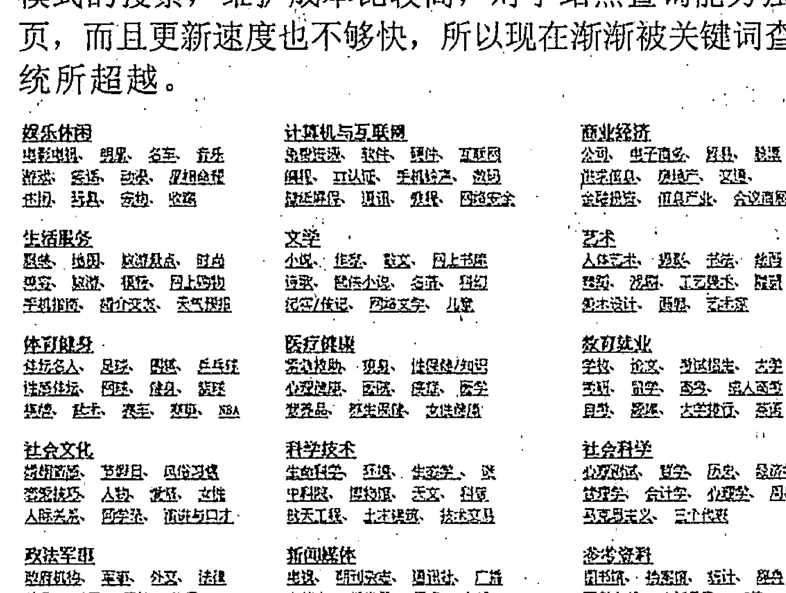

#### 2. 关键词查询

关键词查询是现在搜索引擎的主流查询方式，你只需要键入你需要查询消息的一个或者几个关键词，再敲击回车键就可以得到一大串相关网页。在多数领域关键词查询还是利用程序自动搜集的信息。和目录式查询相比，关键字查询可以认为这是一种自动化的搜索模式。关键词查询最有代表性的就是现在搜索业的龙头老大——Google，图2就是Google的主界面，非常简洁实用，而Google能查询的网页竟然能达到四十二亿多页，这也是用户能搜索到自己需要信息的保障。在目录式查询中，关键字查询已经开始与其相互结合，这种半自动的模式可以相互取长补短，前景还是比较广阔。

#### 3. 其他查询方式

关键词查询比较让人头痛的是如何选择合适的关键词，没有选好关键词大家只能得到一大堆无用的垃圾信息。为了克服关键词检索和目录查询的缺点，自然语言智能查询（Natural Language Search）开始越来越受到重视，自然语言智能查询允许用户用提问的方式来告诉搜索引擎你的需要，比如你可以键入“巧克力的成分是什么”这样的问题来帮助我们寻找答案。但要让搜索引擎更为智能化，做到对用户的问题有问必答，未来的路还很漫长。

图2中Google的查询界面非常的简洁，使用中也只是提供了一些简单的布尔运算关系而已，但大家不要以为所有的搜索引擎都是这样。现在已经出现了一些只有用户接口的搜索引擎，这些搜索引擎自己没有任何数据，其数据来源都是来自于诸如Google这样的站点。但是这一类搜索引擎在接受用户的检索请求时，可以将请求分别交给若干个独立的搜索引擎，然后将各个搜索引擎返回的结果加以处理再提交给用户。

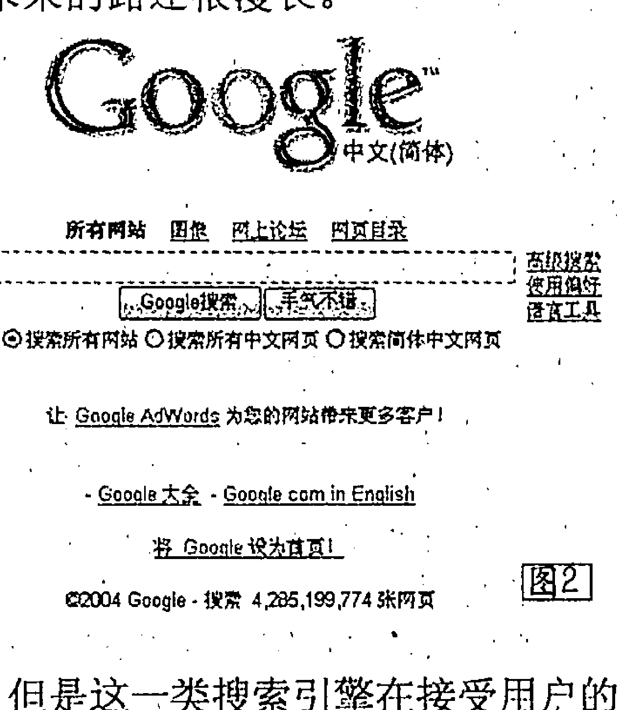

这类引擎还可能具备这样的特点，那就是能根据用户的兴趣爱好、思维方式和生活习惯等特点量身定做个性化的搜索。有了这种定制服务，在搜索时出现找不到有用信息，或者垃圾信息过多的问题都能得到一定程度的解决，在搜索精度上可以得到有效的提高。同时，这些搜索引擎还能主动地为用户进行一些定期查找信息，给用户知识充电的机会。不过因为人工智能技术的发展还不能达到理想的状况，智能化程度还不高，经常会让用户遭遇哭笑不得的场面。相信随着智能代理（intelligent agent）的进化，智能化个性搜索前景非常光明。而且到时主流的搜索引擎相信也会跟进这一领域。

除了最常见的基于HTTP的网页搜索，还有基于FTP协议的文件搜索，甚至还有针对电子邮件、新闻组消息的搜索，以及对于多媒体、P2P信息的搜索等。从雅虎给大家带来网络搜索概念以来，搜索引擎已经开始从粗放型向集约性转化，搜索引擎除了要求大而全以外，很多有针对性的垂直搜索引擎也渐成气候。比如专门针对电子音乐的MP3搜索引擎、专门针对图片搜索的、专门搜索定制新闻和天气预报的搜索引擎，这些在后文都会陆续介绍。

搜索引擎不仅是让户用查询信息，而且还可以给商家提供商机。很多搜索引擎都提供了竞价排名系统，这对于商家在网上开辟一片新的搜索天地价值甚高。竞价排名系统可以为搜索引擎带来赢利；可以为参与竞价排名系统的商家带来商机，同时还能为用户参与网络时代新概念消费和提升用户生活质量创造环境，真可谓是一箭三雕。在这个网络高速发展的时代，了解搜索、学会搜索，这将是比获取知识本身更为迫切的课题。

## 第二篇 初级搜索必读

有的资料明明网上一定有，但搜索结果却是零，怎么也找不到；而有的时候找到一大堆东西，却大部分都是垃圾信息，没有一个是真正需要的。计算机高手很多时候并不是搜索高手，作为初涉搜索领域的用户，不管你掌握的其他知识多么的丰富，下面的内容都是必须知道的。

### 一、搜索世界没有神

没有搜索引擎的互联网就是没有导航系统的导弹，同样的演绎下去就可以得到，没有Google的互联网搜索就如同一部没有神的神话。在我身边或许还有一些不将Google设为IE首页的人，但“Google综合症”却几乎无人能够幸免。需要查询任何资料，大家第一个念头必定就是在IE的地址栏中键入www.Google.com。

从基本的原则上来说，如果你没有明确的目标，而是想了解某一类的知识，那么通过目录式查询的方法更为适合。目录式的查询会给你带来关于被查询主题丰富而又详尽的资料，而且因为目录式查询多数基于人工操作，资料精准度也较高。比如你想了解日本流行乐坛的状况，此时如果选择Google进行查询，对于日本流行乐坛几乎一无所知的你，如何选择关键词？就算你试着拟定了几个关键词，查询出来的结果，很可能还是不能让你对日本流行乐坛有整体性的了解。这种时候，选择目录式引擎的优越性就一览无余了，而使用关键词全文搜索，只能让你在选择关键词与剔除无用的页面之间消耗时间。

如果只是查特定内容的资料，那么此时用Google一类的综合性全文搜索引擎才是更合适的选择。但即使你是查询特定的内容，并且也是选择了综合性全文搜索引擎，这也不能保证最终能得到你想要的结果。比如Google，它是一个朝着大而全目标在做的搜索引擎，前文已经提到它提供了超过四十亿的网页信息库，但是即使如此这还是不到互联网上总信息量的一半。从这个意义上来看，我们需要寻找的信息即使我们采用了正确的方法，用Google搜索到的概率也最多只是一半而已。没有Google找不到的东西，这只是一句宣传口号而已。在Google搜索不到的东西，我们可以再利用其它综合性全文搜索引擎，比如“百度”再次搜索。虽然搜索引擎之间重复概率较大，但不同搜索引擎之间也存在着差异，比如对于中国传统文化信息的搜索能力，中国本土的搜索引擎就要略好一些。

除了目录与关键词两种方式的区分以外，如果是寻找和某人有关系的信息，那么就可以借助一些专业的寻人引擎，比如雅虎的寻人引擎，见图3，地址是http://people.yahoo.com/。这些专用的垂直搜索引擎的使用，我们后文还会介绍，但随着搜索业的繁荣，搜索引擎的分工也越来越细，选择合适类别的引擎非常重要。

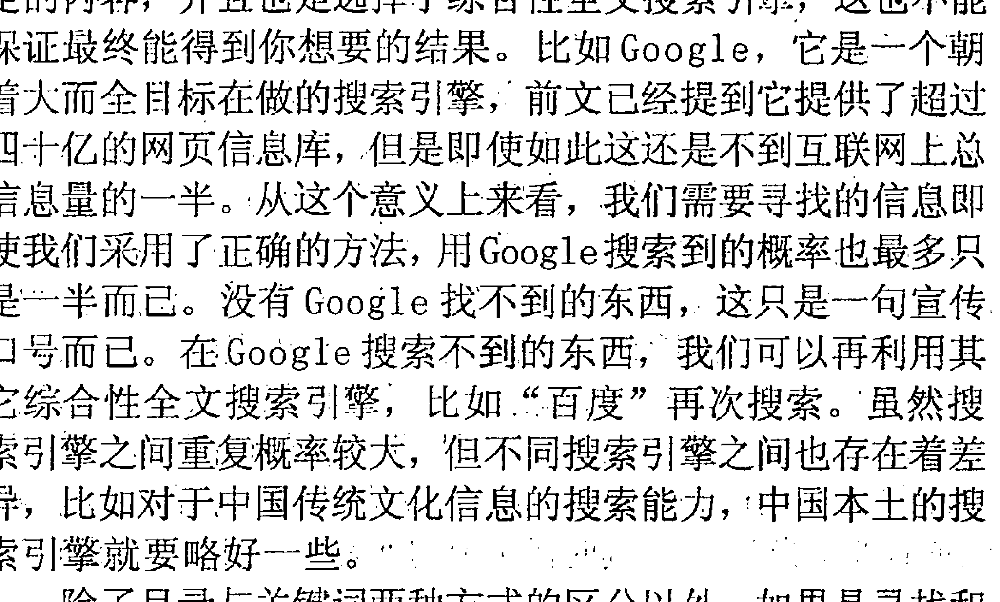

这个世界没有神，互联网上也没有那个搜索引擎可以成为神的化身，在选择搜索引擎的时候，绝对不能迷信Google，虽然它是龙头老大。理性的做法是，先根据自己搜索的目标选择合适的搜索引擎的类别，选定类别以后，同类别的搜索引擎还需要多尝试一下。当你心中不再迷信以后，你就会发现网上搜索的领域宽广了很多，互联网也变得更大和更有趣了。

### 二、初识关键词

当你开始使用关键词搜索信息的时候，首先需要建立起关键词数目的观念。举一个例子，比如一个外地游客需要去重庆大学，现在需要知道搭乘那一趟车可以到达目的地。此时我们用“重庆大学”作为关键词进行检索的话，出现的将是很重庆大学介绍的网页链接，结果完全和检索前的初衷背道而驰。此时如果再增加一到两个关键词，比如采用“重庆大学”、“乘车路线”作为关键词进行查询，那么在搜索结果很靠前的位置上我们就可以获得需要的信息。

关键词过少，甚至只用一个关键词，这是初级查询者的典型特征。关键词的缺乏，返回的结果将会非常之多，比如前面用“重庆大学”作为关键词在Google查询，结果竟然有四十六万多项。如此之多的结果，用户想一一翻查显然是不可能的，而且在查询结果靠前的位置上也不见得会包含用户需要的信息。根据有关调查显示，只有非常少的用户有耐心看完前一百个搜索结果，如果在上述四十六万多项搜索结果的前一百项中，不包含用户需要信息，那么这次查询就只能以失败而告终。用过少的关键词查询，这就如同拿着只有一两个孔的筛子去筛金沙，金子是留下来了，可砂子大部分也留下来的。

关键词少是查询失败的重要原因，很多查询菜鸟知道这一点以后，就在查询中盲目添加关键词，但殊不知关键词也并不是越多越好。在大多数情况下，用户查询资料的原因就在于对被查询资料本身的不了解，这种不了解很可能就会导致误加关键词。这类错误更多的发生在一些较为专业或者较为冷僻的查询中。

通常用两个关键词，就是要求我们查询的信息中对这两个词都包含。比如我们想了解武侠小说家金庸是如何塑造的令狐冲这个人物的，甚至想多听一些金庸自己如何评价自己笔下的这个人物，那么选择“金庸”、“令狐冲”这样的关键词肯定是正确的。如果此时，你记忆中把令狐冲这个人物当作是另一个武侠小说家古龙创造的，那么选择“古龙”、“令狐冲”这样的关键词进行查询，虽然也可以得到与你想象中近似的查询结果，但和前一种关键词查询比起来，查询质量肯定是比较差的。在增加关键词的时候，大家一定要要记住，多增加一个关键词，我们真正需要的内容就多了一分被过滤掉的可能。用前文的比方来说，筛子的空多了，砂子漏掉了但金子可能也跑了。

关键词使用中最常见、最严重也是最低级的一种错误就是出现错别字。“时候”和“侯”，这么常见的词语，如果正确的和错误的不放在一起，看到错的那个词儿可能很多人一下子不会知道它错了。“瑜伽”这是一个音译外来词，指的是一种印度传统健身方法。而网上对于这两个字的写法可谓是五花八门，有写成瑜珈的，还有写成瑜迦。而更可怕的是你不管用哪一个去查，都可以查到一大堆网页。

对于关键词中的错别字问题，我们要从两个方面来看。首先是我们如果敲了错别字那就很可能找不到我们需要的信息，不过幸好很多输入法都有词组的功能，或许这能让我们少犯一些错误。第二个方面就是，我们同样要利用错别字。比如前面举的“瑜伽”这个例子，我们在搜索“瑜珈”查不到需要的资料或者需要的资料不够丰富的时候，那么尝试一下用“瑜珈”这样的关键词来查询或许可以帮到你，不过此时需要的就是你对错别字的“联想能力”了。

关键词的选择少了不好，多了不好，敲错字错了可能好也可能不好。总的来说，适当的方法应该是这样的，首先选择一个你最有把握的关键词进行搜索，然后逐步添加新的关键词，在这个过程中可以尝试多种关键词组合，甚至可以选择包含错别字的关键词组合。进一步的技巧，我们后文还会谈及。

### 三、你知道分词吗？

不接触语言学的人，知道“分词”这个词儿的人挺少。

不过除了研究语言学的，常用搜索引擎找东西对搜索技术有点兴趣的人，多半也应该有点认识。就拿英文来说，英文说的词就是一个Word，也就是一个字，每个Word之间会用空格隔开。Word上面的语言结构就是句子，当然中间还有短语这个结构，不过并不是每个句子都是这样的。而中文比英文就要复杂得多，中文在字和句之间除了可能有短语这个层次以外，词是几乎必不可少的结构，但中文的词在行文中却没有明显的分隔符。

中文的句子，从书写上来说就是字的一种排列，但是字却不是表意的基本单位。所谓“分词”，就是把句子从字的排列转为词的排列的这个过程。比如“合川是重庆属地”这句话从书写上来说就是7个汉字的排列，如果从词的排列来说就可以划分为“合川”、“是”、“重庆”、“属地”这样4个词语的排列。这个例子中，将7个汉字排列转为4个词语排列的过程，我们就可称其为“分词”。

了解了分词我们再来看分词在搜索中的意义。举一个非常经典的例子，比如“和服”，大家都知道这指的是一种日本传统服装，但在“产品和服务”、“技术和服务”这样的短语中我们也可以看到“和服”这两个字的存在。换言之，如果我们用“和服”作为关键词查询，那么很可能会搜索到一大堆包含“产品和服务”这一类词语的页面，而真正介绍“和服”这种传统服装的页面，可能需要向下翻很多页才能找到。

了解分词这个概念对我们信息查询有两个意义，其一是给我们一个搜索引擎服务质量的一种评判标准，其二是指导我们对关键词的选择。

强大的搜索引擎都有一个共同的特征，那就是能提供对多种语言的支持，比如Google就支持上百种语言。对于多种语言的支持，并不是搜索引擎的数据库里面有使用这个语言的网页，更重要的是做到对该种语言能提供准确的查询，这在某种意义上就要依赖于对这种语言的分词。比如“和服”这个例子，在大半年前的Google搜索引擎里面，我们看到的前十个搜索结果基本上没有一个是和日式传统服装有关的，而现在的Google在查询结果的第一页已经能很好的给出我们想要的结果了。这个进步，就源于Google对于中文分词的准确率提高。

我们还可以举一个例子，“十年生死两茫茫”，这是宋代大词人苏东坡在《江城子》里面的第一句，我们可以用它来检查搜索引擎的分词能力。如果搜索引擎对于中文不能很好分词的话，那么这一句将会被自动拆为“十年”、“生死”、“两”、“茫茫”这一类支离破碎的结果，直接的后果就是我们很难查到与这词相关的东西。我们首先用Google进行查询，很幸运的是Google并没有将这一句机械化的拆分开来，而是把它作为一个整体给出了查询结果，我们在搜索结果第一页看到的全部是引用这一名句的页面，甚至还有繁体中文页面。看到了搜索引擎龙头老大的表现，可以说比较欣慰。

接下来再用国内的百度搜索引擎查询，结果和Google的状态差不多，但有一点更为可喜，那就是第一个查询结果就是简体中文的关于此词的介绍与评析。这样看来，两家搜索引擎都能做到正确的分词，而国内的搜索引擎在结果排序上更为合理。

大家还可以测试其它搜索引擎，相互比较就可以看出在某些方面各大搜索引擎各自优势在哪里了。比如这个例子就可以反映出，对于中国古典诗词等方面资料的查询，Google的评分是及格到良之间，而百度的评分在良到优之间。也就是说，查询中国古典诗词，在Google和百度之间，首选百度是正确的抉择。当然，并不是所有搜索引擎都有Google和百度这样的表现，笔者在测试中也遇到过乱分词的搜索引擎，不过笔者相信各大搜索引擎都在进步，所以这样的测试反映的，只是在某个时期某个搜索引擎对于某方面文字的查询能力。

分词能力的提高就意味着搜索引擎越来越“自然语言化”，也就是说搜索引擎会越来越听得懂我们的问题。如果习惯于只用关键词搜索的用户，在分词上遇到的麻烦可能会少一些，但不少场合实际上都需要用较长的短语甚至短句作为“关键词”，分词的第二个意义其实就是第一点的补充，诸如“十年生死两茫茫”这样的句子，搜索引擎会给我们满意的答复，但有的搜索引擎的分词却是差得一塌糊涂。对于这种情况，我们只能是手动分词，具体的技巧后文会逐一介绍。

### 四、布尔运算符的功能

布尔是一位英国数学家，他在十九世纪中叶发明的处理二值关系的逻辑数学计算法——布尔运算，现在已经被广泛应用于多种领域，在搜索领域自然也不例外。布尔运算主要包括三种：逻辑“与”、逻辑“或”、逻辑“非”，通常分别用AND、OR和NOT来表示，也有用“&”、“|”和“!”这三个符号来表示的。

逻辑“与”(and)的含义是，用这个符号连接的前后两个关键词全部出现，也就是说同时包含两个关键词的资料才符合条件。这个布尔运算符其实前面我们已经介绍过，是最常见的布尔运算符，是取两个关键词分别查询结果的交集。

逻辑“或”(or)的含义是，用这个符号连接的前后两个关键词有一个出现，当然出现一个是最低要求，两个都出现也是可以接受的。这个运算符使用的频率较低，它是取两个关键词分别查询结果的并集。这个运算符通常用于放宽搜索条件，不过现在搜索引擎的查询是“宁滥毋缺”，通常是结果多得让人头痛，所以此项用得较少。

逻辑“非”(not)的含义是，用这个符号连接的前后两个关键词，前面一个关键词必须出现，而后面一个关键词一定不能出现。逻辑“非”和逻辑“与”一样，在多种场合都有广泛的用途。比如汽车变速箱除了手动和自动两种以外，还有一类就是手自一体的变速箱，如果要查询关于手自一体变速箱的细节，采用逻辑“非”就很必要了。在搜索引擎以“手自一体”作为关键词查询，在结果中会看到很多关于采用手自一体变速箱的叫“毕加索”的车型介绍，这种介绍并不是我们想要的，此时就可以采用“手自一体 not 毕加索”这样的方式来查询，结果中符合我们要求的资料就多了很多。

这三种布尔运算符，对于采用不止一个查询条件的查询用处很大，它可以帮助用户筛选出更需要的信息，熟悉布尔运算符并能正确的使用，这是精通搜索的必修课。不过现在主流搜索引擎对于布尔运算符的支持还是有差异的，在表达方式上，有的采用“and”、“or”、“not”这样的符号（甚至有的对大小写敏感），有的用别的一些符号。在支持的程度上来说，现在多数大型搜索引擎对布尔运算符的嵌套等方面支持还不够，倒是一些利用大型搜索引擎结果，自己再做用户接口部分的小引擎做得还不错。

## 第三篇 文字内容一把抓

网络搜索需求最大、最常见的就是文字内容搜索了，用户对于网络搜索也大多是从文字搜索开始。我们在这里主要介绍一些文字搜索的知识和技巧。

### 一、文字搜索知识篇

#### 1. Google 里面的逻辑关系

Google 的使用界面非常简单明了，但或许就是这种简单反倒蒙蔽了不少初级用户的眼睛。点击 Google 界面中“高级搜索”这个超级链接，我们就会看到很多具有特色的东西，明白了这些你的搜索水平可能就会得到提高。

图4就是Google高级搜索的一部分，其中包括四个文字输入框。第一个、第三个、第四个文字输入框正好对应前文介绍的逻辑“与”、逻辑“或”、“逻辑“非”三种布尔运算方式。

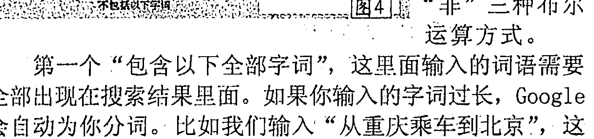

第一个“包含以下全部字词”，这里面输入的词语需要全部出现在搜索结果里面。如果你输入的字词过长，Google会自动为你分词。比如我们输入“从重庆乘车到北京”，这显然已经超越了词的级别，Google 会尝试着自动分词。在搜索结果中我们会看到诸如“从、重庆、到、北京”“从、重庆到、北京”等多种分词结果共存的局面，或许是Google担心错误的分词会把我们想要的结果过滤掉，但是把每种分词方法搜索的结果进行叠加，这也可能会给我们带来太多无用的信息。

在 Google 普通搜索界面里面，使用逻辑“与”运算并不用“and”或者“+”来实现，而是用的更为简单的空格键。也就是说在敲完一个关键词后敲入一个空格再敲下一个关键词，这样就可以达到将这两个关键词做逻辑“与”运算的目的。这里真正让人烦恼的还是分词问题，为了避免Google叠加每种分词法的搜索结果，主要的做法只能是手动分词。但更为让人恼火的是，自己分词很可能会导致关键词较多，在关键词较多的时候，Google 以及其它一些搜索引擎会变“糊涂”，直接后果就是逻辑“与”和逻辑“或”不分！

第三个“包含以下任何一个字词”，这就是用来实现逻辑“或”的文字输入框。同样的，如果你输入的字词过长，Google会自动为你分词。而在逻辑“与”里面存在的分词给用户带来的困扰，在这里也一点不少，而且在面对中文的时候逻辑“或”比逻辑“与”犯糊涂的概率更大。

逻辑“或”在普通搜索界面中是用“OR”这个词语来实现的，请注意是两个大写的字母，如果你写成两个小写字母，那么Google会把它认为是被搜索的内容而不是布尔运算符，不过最新的版本Google已经开始自动提示用户对于OR这个单词的大小写区别了。在这个网络垃圾横行的时代，逻辑“或”这项功能，笔者建议大家记住就完了，记住它是为了在某些特殊情况下可能会使用到，而通常情况下这项功能是没有太大意义的。

“大师”两个词取逻辑“与”进行关键词查询，有超过五万个的页面的结果能够显示。这五万多个结果中有不少是软件下载的页面，此时我们用上逻辑“非”，查询那些包含“兔子”和“大师”两个词而不含“下载”这个词的页面，查询结果竟然是零。不用我说，大家都应该知道这个结果是不合理的。

同样的查询，在“百度”这个本土出品的搜索引擎上结果稍稍好一些。我们可以搜索出结果，但另一种怪现象又出现了，那就是本该减掉的“下载”两个字堂而皇之的出现在搜索结果中。从搜索结果的数目来看，不论去掉还是不去掉“下载”两个字，百度搜出的数目都多与Google，但是从最终效果来看两者只能是个平手。百度引擎笔者的感觉是在努力地解决这些问题，但有些地方还没能落到实处。

“包含以下的完整字句”，这是一个精确查找功能，在图4的第二个对话框中输入你所要查找的字句，此时 Google将把你所输入的不做任何分词，直接作为一个整体来进行查询。这项功能不分词，就避免了因为分词带来的种种麻烦，对于那些查询名言警句或者专业术语的用户，这项功能的作用还是相当大的，而对于那些被分词烦透了的用户而言，只要你能对关键词的选择有足够的把握，尝试一下这种查询方法可能会给你带来新的惊喜。

这项精确查找功能，在Google正常搜索界面中是用成对的双引号来实现的。也就是说我们只需要把要精确查询的内容，放在成对的双引号之间就可以了。通过前面的分析我们可以看到，因为中文的很多在语言上的特殊性，搜索引擎在布尔运算符的引入等问题上还存在着很大的不足，这里的精确查询也可以看作对前述三项布尔运算查询方式的一种良好补充吧。

我们在这里介绍了布尔运算在Google两个界面中各自的实现方式，也谈到了不少存在的缺陷。这里需要指出的是，布尔运算能正确发挥其用途的时候还是占绝大多数，善于使用布尔运算符和精确查询功能，这会大大提高我们的查询速度和质量。

#### 2. Google 说的话你懂吗？

Google 一向以界面朴素、专注于搜索引擎本身而著称，但一些个性化的东西同样还是有提供的。图5 就是Google“使用偏好”的设定页面，这里主要先介绍一些语言方面的设定。

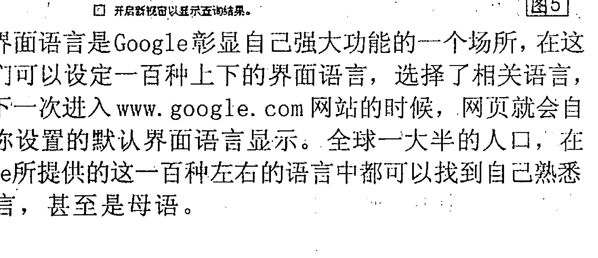

| 语言 | 语言 | 语言 |
| --- | --- | --- |
| 丹麦文 | 泰米尔文 | 斯洛文尼亚文 |
| 俄文 | 希伯来文 | 波兰文 |
| 加泰罗尼亚文(西班牙) | 拉脱维亚文 | 瑞典文 |
| 匈牙利文 | 挪威文 | 简体中文 |
| 印尼文 | 捷克文 | 繁体中文 |
| 土耳其文 | 斯洛伐克文 | 阿拉伯文 |
| 芬兰文 | 法文 | 西班牙文 |
| 爱沙尼亚文 | 马来文 | 韩文 |
| 罗马尼亚文 | 英文 | |

语系偏好里面更为重要的是对于搜索语言的设置，虽然从使用上来说Google推荐选择“所有语言”，但是有时候这一选项可能会成为我们缩小搜索范围的利器。有些关键词可能会出现在多种语言的页面上，比如Hollywood这样的关键词你几乎可以在使用所有语言的网页上找到，有时候某种特定语言的网页才是你真正感兴趣的。语系设定好以后你的Google搜索界面也会发生一些改变，见图6，我们可以选择的有三项，“搜索所有网站”是一个必不可少的选项，第二项“搜索所有中文网页”是由我们设定的界面语言确定的，而第三项就是我们设定的搜索语言。 当然这也会引出一些问题，现在互联网上的网页，使用超过两种语言甚至多种语言已经是屡见不鲜了。对于采用了多语言的网页，如何判断其页面语言属性就涉及到Google对网页语言分类时的方法了。我们指出这一点的目的是想说明，利用语言限定也可能会筛掉我们需要的结果，不过这也是加强搜索条件必定要冒的风险之一。

我们来看一个例子，搜索“小甜甜布兰妮”，如果你用她的英文名字是Britney进行搜索的话，Google竟然可以给出超过一千万项的结果。当然在这一千万项里面虽然有同名的重复，但是在结果靠前的部分我们还是可以找到关于她的很多信息，如果是一个普通的查询者，那么这就可以满足了。但如果我们有一些特殊的要求，那么这超过一千万项的结果还是很让人头痛。比如我们希望知道比较保守的德国人对布兰妮的看法（当然前提是你懂德语），那么你在图5的界面中选择德语，搜索的结果就只有差不多八十六万项了。

在Google首页我们点击“语言工具”，我们还可以做一个有趣的设定，见图7。在这里我们也可以设置搜索语言，不同的是图5是做全局设置，也就是每次都如此搜索，而图7则是针对本次搜索的临时设定。图7的特点是可以设置网页的位置，估计Google是根据网页所在的IP地址段来确定网页所在国的。当然IP地址段与地区位置的对应也可能存在错漏，不过利用这一点我们也可以进一步过滤搜索信息。

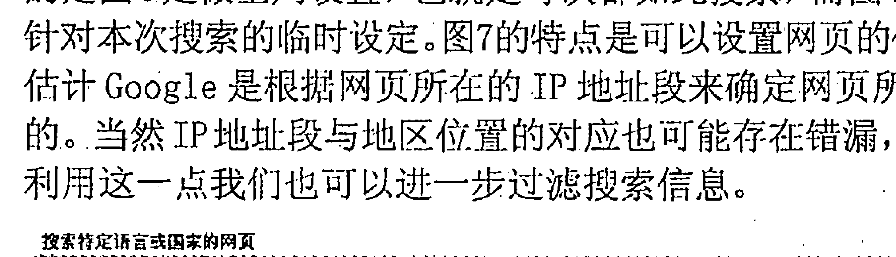

就用上面的例子来说，我们如果把网页语言和网页位置分别设置为德语和德国，然后搜索Britney，结果会进一步缩减到六十万项左右。如果国家和语言有一些差异的话，结果会大幅度减少。比如我们还是用Britney作为关键词，尝试搜索位于德国但是采用简体中文的网页，此时结果竟然只有不到五十项，过滤能力由此可见一斑。

至于图5中“结果数量”和“结果视窗”两项，一般建议采用默认值。前面一项关系到每次查询Google服务器的吞吐量，略微提高这个值可以让“懒人”不用翻页就可以在第一页找到想要的结果，但是Google服务器的负载也可能增加。鉴于全球同时采用Google搜索的用户相当多，基于网络公德还是建议大家即使修改这个值，也不要改得太大，而且不是宽带的用户增大这个值也会让自己带来麻烦。不过Google易用性已经很强了，不开新窗口也可以节约自己本机的资源。

设置“界面语言”、“搜索语言”和“网页位置”这三项，特别是前两项需要用户能掌握不止一种语言。这个要求看起来有一点高，但是如果具有这个能力的用户能够用好这三项，对我们的搜索应该有相当大的帮助。如果以前不了解这三项设定的用户，读了本文以后自己可以开动自己的想象力，你会发现用这三项会给你找到很多有趣的信息，赶快试试吧！

#### 3. 简繁体和拼音都不怕

Google的中文简繁体转换是一个很贴心的功能，毕竟对于使用简体中文的用户而言，繁体中文资料里还是有不少宝藏可供挖掘的。相信绝大多数上网使用搜索引擎的人对于繁体中文的阅读都不成问题，但使用繁体中文仍然存在着障碍，最主要的一个就是对同一个事务描述的语言不一样。比如对于“Software”，简体中文区域的用户都习惯性的将其翻译为“软件”，而繁体中文区的用户却翻译为“软体”。

Google的中文简繁体转换是一个运用智能型汉字简繁自动转换系统，这个系统不是简单的字符变换，而是简体和繁体文本之间的“翻译”转换。这就避免了前述语言说法不统一给用户带来的不便和尴尬。

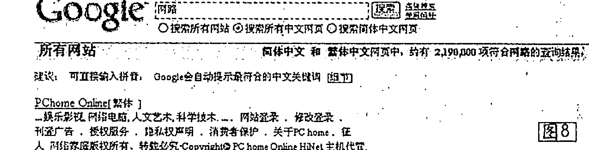

图8就是一个查询的实例，我们用简体中文输入关键词“网路”，对所有中文网页进行搜索，出来结果的第一项竟然是包含关键词“网路”的繁体中文站点。点击这个链接我们会进一步发现该页面上对应位置的词语正是“网路”。 图8的这个例子直接揭示了Google在繁简转换上的一些特色：首先，Google会对关键词进行繁简转换，这个转换是翻译性转换；其次，对翻译前后的搜索关键词都会对繁体中文和简体中文网页进行检索；最后，给出的结果是第二步中搜索结果的并集，同时根据用户在使用偏好里面设定的语言，把搜索结果的摘要和标题转换为用户设定语言常用的表达方式。在这个例子里面，笔者的默认语言是简体中文，所以即使我们搜索的关键词是网路，结果也都被转换为网络了。而且Google更为贴心的是，它判断出“网路”一词是繁体中文的常用词，所以把繁体中文搜索结果排列得更为靠前。

Google的拼音转换是最近推出的功能，效果也相当的不错，只需要在简体中文搜索界面里面就可以直接使用。在中文输入法不好使的时候，这项功能往往能派上大用场，特别是使用英文操作系统而没有装中文输入法的用户。

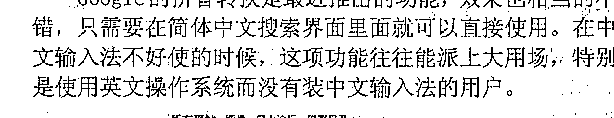

图9就是一个搜索例子，用户只需要在文字输入框中输入拼音即可。在这个例子中，我们输入了“cangmumayi”这样十个字母的字符串，这是一个日本女歌手中文译名的拼音。结果是非常的好，Google自动的给出了三个可能的拼音转换结果，这里面已经包含了正确的结果，点击这三个拼音转换结果中正确的一个就可以重新进行搜索。 在图9这样的搜索中，比较有价值的是图中给出的拼音转换结果，而下面搜索的结果，还是把拼音作为一个英文单词进行搜索的结果，大多数时候这样的搜索结果是毫无用处的。

Google的拼音转换使用方法比较宽泛，你可以把每个字的拼音用空格隔开，同时你也可以像这个例子一样连在一起。

在拼音转换中的分词问题Google解决得很好，比如我们连续键入“xian”，Google给出的转换建议里面包含了“现”字，同时也包含了“西安”这样的词语。

仔细想一下，Google这里的转换主要是借助了中文输入法的一些技术，这个和在搜索中的分词还是有较大的区别的，正确率较高也就不足为奇了。不过比较遗憾的是用拼音转换方法搜索时，给出的结果还是不尽如人意，这应该是这项功能以后进步的主要方向了。

对于这项功能，笔者还同时测试了国内的百度搜索引擎，这次换了一个关键词——“anzhiyuzhile”。这是《庄子·秋水篇》里面惠子的一句话，原文是：子非鱼，安知鱼之乐。用Google和百度分别查询，Google能够正确的转换出来，而百度却不能得到我们想要的结果。看来百度在中国传统文化方面查询的些许优势，在拼音转换方面并没有得到充分的发挥。虽然这样的测试偶然性比较大，但笔者选择的这句话还是属于传统文化中的“名句”，对哪怕有一点国学知识的人来说都绝对说不上生僻，看来各大搜索引擎需要“学”的东西还很多。

不过在第二个测试中，Google虽然能够正确地转换出结果，但点击相关链接进行搜索时还是出现了分词不够好的痼疾。

在拼音转换中有一点值得重视，那就是对于ü这个拼音的输入，一般应该用“V”键来替代，也就是说对于拼音“lü”、“lü e”、“nü”或者“nü e”可输入“lv”、“lve”、“nv”或“nve”来替代。

另外，Google还支持拼音与汉字混合输入，图10就是一个例子，输入“binqi步”竟然也可以很快得到正确的转换结果；不过当颠倒顺序输入“步binqi”的时候Google就不能转换出希望的结果了。而输入“Shinichi”这样的日文的罗马注音，Google也能比较智能的做出正确的反映——不作拼音汉字之间的转换。对于一个刚推出这个功能的搜索引擎而言，能做到这一步已经很不错了。

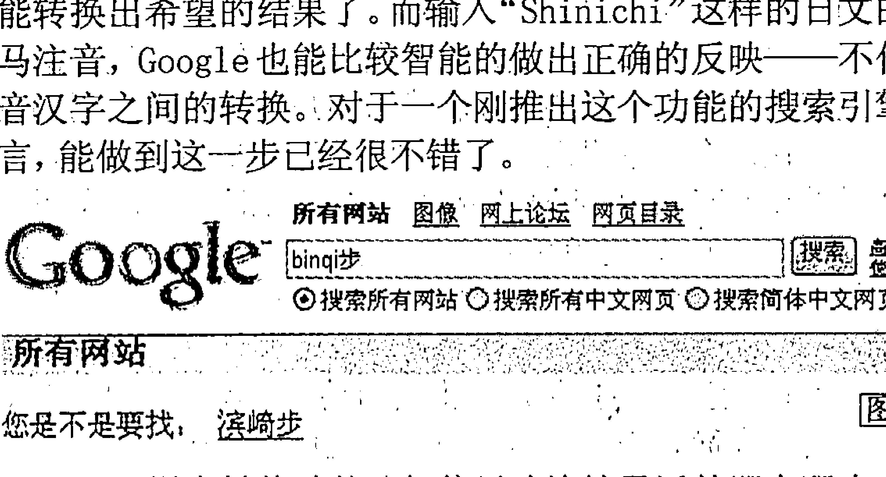

对于拼音转换功能，相信思路比较灵活的朋友现在已经想到有一个特殊的用途了，那就是“错别字查询”。前面提到过，因为网络的特殊性，出现错别字的概率比现实生活中更多，但网上的错别字多半就是同音字，利用拼音转换功能我们就可以扩大我们的搜索范围。比如前面举的例子，我们查询“仓木麻衣”的时候很难想象这个词语会有些什么同音错别字，但在图9的结果中就可以发现还有“苍木麻衣”这样的写法，点击那个“错误”的拼写或许也可以帮你找到一些你需要的“正确”的资料呢。

如果要深入一点来看，对于拼音转换，不管是Google还是百度，对于输入法中常见的南方模糊音输入转换等功能都还未见到开发，如果能加上这些功能就更完美了。而且现在这些拼音转换功能，给笔者的感觉是拼音转换和搜索引擎的功能比较隔离，总觉得转换和搜索不能一步到位，这是最大的遗憾。

#### 4. 忽略词与通配符

忽略词是在每个搜索引擎都需要注意的，大多数搜索引擎都会忽略最常用的词和字符，这些被忽略掉的词和字符就称为忽略词。忽略掉这些，目的是加快查询速度和提高查询精度。

以Google为例来说，它会自动忽略“http”、“.com”和“的”这样的字符以及数字和单字。

每个搜索引擎的忽略词都不尽相同，但是大家也不用担忧，只要你使用了忽略词作为关键字，搜索引擎都会给予用户提示。其中惟一让人觉得不舒服的就是，诸如Google这样的搜索引擎会自动把忽略词作为分词的标记，虽说这样做大多数时候是很正确的，但也有不少因此导致的分词错误。所以对于自己常用的搜索引擎，用户还是最好多了解一下其忽略词的构成，以免被搜索引擎进行不合理的分词。

当然，如果一个忽略词却正是你需要寻找的，那么可以通过把这个词或者这个词所在的短语(句子)添加双引号来强制搜索，这在精确搜索部分已经提到了。充分利用精确搜索，可以过滤掉很多无用的信息。

通配符是很多搜索引擎都支持的一项模糊查询技术，但各大搜索引擎在不同时期支持程度并不一样。比如Google，在其使用说明中明确指出了其不支持通配符，但是在2003年年中以后，Google的搜索就开始悄悄的支持通配符了。估计Google是因为对于通配符的支持现在还做得不完善，所以并未向外宣传它的这项功能。与其相对比，其它不少引擎都已经明确宣布对通配符的支持，不过大多数都局限于英文搜索。

通配符最常用的有两种：“*”和“?”，其中星号（*）表示任意字符甚至是无字符，而问号（?）则表示一个字符。我们这里还是以英文为例来谈谈通配符的具体使用。

一般的来说，星号的用法有两种，其一是直接代表一个字词，其二是代表一个字词中不确定的部分。比如我们用“Like a * in the sky”作为关键词来进行搜索，此时星号就是直接代表一个完整的单词；而使用“My h* will go on”作为关键词进行搜索，这就是要求在这个句子中第二个单词是以字母“H”打头的即可，此时星号代表的就是不被限定个数的字母。有的搜索引擎不支持通配符，即使支持也可能不是完全支持，比如实践证明Google对于星号的这两种使用方式，目前只支持第一种。而有些搜索引擎在把星号用作第二个用途时，可能会选择别的符号，比如lexis.com就很特别的选择了“！”。

问号的使用方式就比较简单了，一个问号就代表一个字母，比如“G?????”这个关键词就是代表以G作为打头字母且一共有六个字母的单词。还是用前面的例子，如果我们在用“Like a * in the sky”作为关键词时，我们知道这个短语中第三个词是一个由四个字母构成的单词，那么此时搜索的条件就可以改为“Like a ???? in the sky”，这会减少搜索引擎返回的搜索结果。不过遗憾的是，Google现阶段还不支持问号作为通配符使用。

除了星号和问号，有的搜索引擎还有一条搜索指令值得一提，那就是Near。这一条指令也是有的搜索引擎支持，有的不支持。这条指令的用途就是确定被搜索的关键词的距离，比如我们可以限定关键词A和关键词B之间只能有几个单词。这条指令的用处也蛮大，比如说西方人在姓名之间通常还有一个教名，但这个教名却不太为人所知。如果搜索引擎支持的话，我们可以用形如“Bill Near2 Gates”这样的关键词来查询这位全球首富的全名。

有一些编程知识的读者可以知道，Near这个语法其实可以视作前面星号、问号两种通配符在使用上的一种扩展。比如“g????e”这样的查询，我们也可以用“Near4”这样的指令来实现，即字母“g”和“e”之间只允许最多四个字母存在。关于Near这条搜索指令不同搜索引擎使用格式差异很大，甚至不用这个拼写来实现这类功能。还是以上面举的lexis.com为例，它们采用形如W/3（W/N，N是数字）的方式。

### 5. Google 与 Robot

在搜索引擎工作流程的介绍中，我们已经介绍了搜索引擎是通过信息搜集程序来捕捉网页的，搜索引擎的信息捕捉程序的工作流程中还有不少有趣的知识，了解这些对我们搜索能力的提高也是有帮助的。

#### (1) RES和Robot

前面提到即使强大如Google，能搜集的信息也不到互联网上所有网页的一半，那为什么超过一半的网页都能成为“漏网之鱼”？如果我的网站放置了不少个人的隐私，我并不希望搜索引擎能找到这些内容，那我又该采用那些保护自己的办法呢？关于这两个问题的解释途径很多，但不管怎么说有一个被标识为“robots.txt”文件是不容忽视的，这里我们就先来看看这个“robots.txt”和被称为RES的相关知识。

RES是Robots Exclusion Standard的缩写，直译就是拒绝Robots访问标准。每个搜索引擎虽然都有自己的免责申明，但是每个搜索服务提供商都知道，他们在互联网上所做的信息搜集工作，都可能因为侵犯他人隐私而引发诸多的法律问题。不过对搜索服务的提供商还是网页的所有者来说，有一套限制搜索引擎信息搜集程序的规范，这个非常重要。目前这个规范就是RES，而RES主要就是通过“robots.txt”文件来实现的。

我们这里还是用Google作为例子，先来看看RES在实际操作中是如何起到自己的作用。在Google官方文档中是如何描述信息搜集程序（官方名称Googlebot）的工作：为了节约网络传输费用，Googlebot每天只下载一次robots.txt文件，或只在提取了该网站上的多个网页时才下载robots.txt文件。

这也就是说Google在提取网站资料的时候，他会先访问robots.txt，根据文件内的规定再进行下一步的操作。如果“robots.txt”文件禁止该搜索引擎访问本网站的部分或者全部文件的话，那么被禁止的部分将不会出现在搜索引擎的数据库中，而搜索引擎的用户自然也就看不到这些网页了。这就如同你去到一个地方参观，参观之前你就会被告知，那些地方你可以去而那些地方你不能去，这个规定在网络搜索中就是以“robots.txt”文件来表现的，而搜索引擎的行动需要遵守这个规定。

#### (2) Robot的语法

关于“robots.txt”文件的详细内容，感兴趣的用户可以到http://www.robotstxt.org/（一个英文网站）详细查看相关资料。

需要指出，robots.txt文件应该放在网站的根目录下，而且需要是纯文本文件格式的，指令也最好是小写的字母。在现阶段所有注意网站安全性的合格的管理员，都不应该忽视“robots.txt”文件的设置。不过RES组织在“robots.txt”上也存在着不少问题，比如不同版本规范之间的兼容性，再比如“robots.txt”文件的语法的发展。正因为有着一些问题，所以还有另外一种对搜索引擎的限制方法——使用Robots Meta Tag。

#### (3) Robots Meta Tag

Meta是放置在HTML文件HEAD部分的一些说明，关于它的使用本文并不作多的介绍，我们主要集中在Meta中与Robot以及关键词相关的部分，先看下面四个表达式：

```
<META NAME="ROBOTS" CONTENT="INDEX, FOLLOW">
<META NAME="ROBOTS" CONTENT="NOINDEX, FOLLOW">
<META NAME="ROBOTS" CONTENT="INDEX, NOFOLLOW">
<META NAME="ROBOTS" CONTENT="NOINDEX, NOFOLLOW">
```

“META NAME”部分是搜索引擎信息搜集程序的名称，这和前面是一样的，而其后的“CONTENT”是指定针对这个搜索引擎的一些操作。设定为index，文件将被检索；设定为follow，页面上的链接可以被查询；设定为noindex，文件将不被检索，但页面上的链接可以被查询；设定为nofollow，文件将不被检索，页面上的链接可以被查询。

对于这四种限制方法，可以单独使用，也可以类似上面例子这样组合使用，只是命令之间需要用逗号分隔。另外还有两种通用表达：设定为all，文件将被检索，且页面上的链接可以被查询；设定为none：文件将不被检索，且页面上的链接不可以被查询。

一些搜索引擎还有更有特别的指令，比如Google就有archive指令。如果设定的是archive，则是允许搜索引擎保留网页快照，而设定为noarchive就是不保留网页快照。这一类特殊的指令，各个搜索引擎都有不同，这里笔者就不逐一介绍了。

这里还需要指出一点，如果网页在Meta部分没有相关的设定，网站根目录下也没有“robots.txt”文件，那么搜索引擎会存在一些默认的行为。对于大多数搜索引擎Robots Meta Tag 缺省值是 “INDEX” 和 “FOLLOW”，当然也有例外，比如Inktomi缺省值是就是 “INDEX” 和 “NOFOLLOW”。而针对Google的archive指令，熟悉的用户都知道肯定是archive而不是noarchive了。

作为网站所有者，在Meta中还有不少可以提供给搜索引擎的资料，比如下面三种资料。对于一个成功的网站制作者而言，在网站中适当的控制搜索引擎的行为和向它们提供必要的资料都是很重要的工作。

- <meta name="KEYWORDS" content="">向搜索引擎说明你的网页的关键词
- <meta name="DESCRIPTION" content="">告诉搜索引擎你的站点的主要内容；
- <meta name="AUTHOR" content="">告诉搜索引擎你的站点的制作的作者

更多的知识用户可以自行搜索，笔者在这里推荐一个可以检查 “robots.txt” 文件的有效性的链接 “http://www.searchengineworld.com/cgi-bin/robotcheck.cgi”，如果网站的 “robots.txt” 文件在语法上有一些问题的话，这里还提供了很多修正的指导性资料。英文比较好的朋友还可以在这个网站找到很多和搜索技术有关的资料。

### 6. Google Dance

对于不熟悉搜索技术的人来说，对Google Dance这样一个短语是很难做出正确解释的；但对于搜索爱好者特别是从事SEO（search engine optimization）方面工作的人而言，这却是如雷贯耳。

Google Dance就是指Google不同的数据中心更新、整理其数据所导致的搜索结果波动，这个波动就像跳舞一样，所以被称为Dance。在Google官方也会使用这个词语，熟悉英语的读者可以参考这个链接：http://www.google.com/corporate/timeline.html。

#### (1) Google 为什么会跳舞

Google的信息搜集程序在放出去以后，每一次总会带回很多新的页面和一些旧页面的更新，为了保证搜索引擎的结果足够正确和足够新，这些信息都需要在被整理后立即添加到Google的服务器中。

从网络结构来说，Google全球网站拥有近万台服务器，显然对于这么多服务器不进行分层次的管理是不可能的。这些服务器现在至少被划分为八个信息中心，但是即使进行了划分，在每个信息中心内也有相当多的服务器，这里面很多服务器（特别是同一个数据中心）都是起到均衡负载作用的服务器。八个信息中心通常可以用下面的域名分别访问：

- www-ex.google.com
- www-sj.google.com
- www-va.google.com
- www-dc.google.com
- www-ab.google.com
- www-in.google.com
- www-zu.google.com
- www-cw.google.com

这些资料添加到数据中的过程可不是像是在自己PC上拷贝和更新文件那么简单和快捷，要完成一次较大规模的更新通常需要数小时甚至数天。而搜索引擎是没有中场休息时间的，所以每次更新都是更新一批均衡负载的服务器，等这一批服务器的更新完成，重新投入工作时才会让另一批服务器进行更新。

不在同一个级别做均衡负载的服务器，更新时间只能是尽可能的接近，而不可能同步，如果全部同步停下来更新的话，Google就无法访问了。所以即使在Google一个数据中心内部，更新的进度都是不同步的，而Google不同信息中心的更新不同步就更明显一些。

#### (2) Google舞步里面的秘密

搜索已经成为一个产业，Google舞步里面的商机和秘密也就变得更为诱人，不过从Google自己这一面来说，却不太希望自己的信息被泄漏得太多。

我们首先来看看，Google舞步里面透露出的两个秘密中的第一个——信息更新频率。一般来说，在SEO业界有个通常的说法，就是Google每365天，也就是一年会对自己全部服务器的所有主要记录进行更新一次。不过这个说法在2004年似乎需要更加与时俱进一些，根据一些消息显示，现在Google基本能做到接近每天就可以对自己全球服务器进行小的更新，不过关于更新频率问题Google官方始终没有权威资料发布，或许这被认为是商业机密吧。

当然，这里更新的概念包含了两个层面的含义：第一个层面是对信息的更新，这包括添加新网页并且删除失效网页等工作；第二个层面就是对网页的评价更新，比如前面介绍过的Google将会利用Pagerank专利技术对网页进行评定，评定结果的变换将决定这个网页会出现在搜索结果中的什么位置。就第一个层面更新来说，笔者倾向于认为Google正在致力于且接近于能够实现每日更新，而对于第二个层面来说，要实现每日更新实际意义并不是特别大，更重要的是在实际能力上，现在实现起来还有困难，毕竟评定是一项更大工作量的数据处理工作。

Google舞步里面透露出的第二个秘密——数据中心的分工。Google每个数据中心都会放出很多信息收集程序，但是它们之间工作还是有一些侧重和区别的。这种分工或许会改变，但至少到目前为止笔者的经验是，Google第三个数据中心对于最近更新的资料最敏感，而第二个数据中心对计算机相关资料的查询最敏感。

#### (3) 了解Google Dance能给我们带来什么

了解Google舞步中的秘密，它的用处也分很多方面。首先从用户的角度来说，我们可以知道Google随时在更新资料，所以有些资料你这次查询没有理想的结果，但换个时间即使用同样的方式查询，就可能有结果了。而且如果熟悉Google各个数据中心的特性，那么选择不同的数据中心，查询获得的结果数目以及结果排序都可能有差别，特别是Google在大规模Dance的时候，此时你选对了相应的数据中心，搜索信息花的时间就会减少。在Google查询中，有一个限制网页时间的选项，这也是对结果进行筛选的好方法，了解Google Dance也有利于把这项功能使用得更好。

作为用户，了解Google Dance还有第二个好处，那就是可以选择性的访问。通常大家都是直接访问Google.com进行查询，此时网络的机制是：Google会根据服务器负载和网络状况等多种情况，将你定向到某一个数据中心的某台服务器上去。这种做法的好处是，全球的用户都可以通过访问Google.com来获得服务，当你连上Google.com进行查询时，Google的八大数据中心，上万台服务器对用户而言都是不可见的。

Google.com就像一个很好的服务生，我们只需要提出要求，它就把剩下的工作都替我们做好了。这种操作的确人性化，不过有时候这个服务生出问题了，整个服务系统就瘫痪了，这就是致命弱点，可怕的是这种问题还不止发生过一次。对于这种情况，我们可以手动地访问Google数据中心，甚至可以访问一些深层链接。

可以访问的链接还并不局限于上面介绍的八个链接。因为不少Google可以使用的深层链接，不管是英文域名还是DNS解析后的数字域名都有可能发生变动，所以笔者这里没办法进行更多的介绍，读者需要更多链接的时候可以去查询相关的专业站点。

对于 SEO 的从业者来说，了解 Google Dance 意义更大。在面对自己的客户质问自己网站为什么从 Google 搜索中消失或者排名变化时，了解 Google Dance 可以让你回答得非常专业。了解 Google Dance 的这个特性，还可以让 SEO 从业者在为客户网站获得更高的搜索排名寻找方法时，获得更多的思路。

更多的用处，笔者就不再赘言了。最后需要指出的是，不仅是Google会跳舞，各大搜索引擎都会在不同程度上跳舞，关注各大搜索引擎的舞步，会让你对它们增加很多了解。

### 二、文字搜索进阶篇

#### 1. 常用搜索命令

搜索引擎除了简单易用的搜索界面以外，一般都提供了一系列的搜索指令，利用这些搜索命令可以提高搜索的精度。我们这里主要以 Google 为例，并结合 Google 高级搜索中相关界面（见图11）的操作，来介绍这些常用命令。

| 语言 | 搜索网页语言是 |
|------|----------------|
| 文件格式 | 仅 显示使用以下文件格式的结果 |
| 日期 | 限定搜索的网页更新日期应于 |
| 字词位置 | 查询字词位于 |
| 网站 | 仅 搜索以下网站或网域 |
| 默认值 | 任何语言、任何格式、任何时间、网页内的任何地方 |

##### (1) Site 命令解析

Site 命令在 Google 中是用来“指定网域”的命令，使用格式是形如 “Site:指定网域” 这样的表达式。表达式中有几点需要特别注意，可以归纳为两不宜、两不许。

第一个不宜，网域中不宜带有 “Http://” 字样，因为 Google 的查询默认都是基于 HTTP 协议的。虽说现在 Google 和以前相比已经可以自动过滤掉 “Http://” 字样，但去掉它可以提高查询速度。

第二个不宜，就是在网域中不宜加入 “www” 字样，除非你能确定网页确实位于网站这个部分。比如我们用 “中国 site:www.google.com” 只能查询到四项结果，而用 “中国 site:google.com” 则可以查到两千多项结果。加入 “www” 会导致错过网站内的内容，因为很多网站的频道的链接是不含 “www” 的。

第一个不许，就是不允许带 “/”。还是以在 Google 查询关键词 “中国” 为例，如果选择 “中国 site:www.google.com/”，那么查询结果肯定是 0。

第二个不许，Site 后面不许乱用冒号，只能使用英文冒号而不是中文冒号，如果误用中文冒号则得不到任何正确的结果。

表达式中的网域，可以用比较严格的限定方法，比如限定为 “google.com” 等，也可以使用较为宽泛的限定，比如 “.org”。Internet 上的英文域名后缀，本来就是根据用途进行了分类，按照这样的分类来查询也可以起到过滤搜索结果，但却一般不会把搜索范围设得过小，漏掉有用的资料。不过需要指出的是如果查询的网域制定为 “.com” 那么 Google 的搜索范围是所有 .com 的网站，但是不会去搜索形如 “.com.cn” 站点下的任何内容，在这一点上其它搜索引擎和 Google 也都基本保持一致。

表达式与关键词的搭配是比较灵活的，关键词可以在表达式之前也可以在之后，而且此时关键词同样可以选择多个，每个关键词之间用空格表示逻辑 “与” 的关系，不过关键词与表达式之间必须也加上一个空格。

在 Site 指令中还同时可以支持其与别的搜索语法混用，但并不是支持与所有语法混用。而且不同搜索引擎支持程度也不同，比如在 Google，Site 这条指令现阶段就不可以和拼音转汉字功能同时使用。

如果大家细心的话，在图11中我们还可以发现在网域选择之前，还有一个下拉框可以供我们进行选择，下拉框有 “仅” 和 “除去” 两个选项，“仅” 这一项就是和 Site 命令相对应，而 “除去” 这一项对应的则是 “-site” 这条复合命令。“-site” 这是一个布尔运算符和 “site” 命令的复合体，含义就是在搜索结果中不包含后面指定网域的结果。

“Site” 指令可以通过直接在 Google 搜索的文本框内键入来使用，而且也可以通过图11的高级搜索页面来调用，它的用途也非常的广泛。在熟悉搜索对象的涉及范畴时，选择适当的域名后缀，将大大提高搜索质量。针对不少具体域名的查询，甚至可以被不少网站直接引用为站内搜索工具，不过此时网站所有者应该很注重 “robots.txt” 文件的设置。同时，有些网站的某些部分对用户没有给出超级链接，此时用户就无法访问，如果适当地使用 Site 指令就可以探查到很多有趣的内容。对一些粗心大意的新手级网管而言，Google 加上 site 语法，很可能让黑客探知你网站很多不能为人所知的秘密哦。

##### (2) 关键词位置限定的命令

在关键词搜索中，用户主要是选择需要（不需要）那些关键字出现。而对不少时候(特别是选择超过两个关键词)，即使关键词出现也很可能是出现在网页中毫不相关的两个部分，这样的结果显然不是我们需要的。

- allintitle: 网页的标题
- allintext: 网页的内文
- allinurl: 网页的网址
- allinanchor: 网页的链接内

这四个指令各有妙用。一般来说，网页的标题都能提纲挈领的指出该页面主题思想或者重要内容，在搜索过程中如果要过滤搜索结果，那么首先对网页标题进行限定，然后再次用需要的关键词进行二次搜索，这是一个很有效的方法。

对于网页内文搜索一项，这和对关键词位置不作限定相差不大。但是因为包括 Google 在内的很多搜索引擎，在评价一个页面时，这个页面上超级链接等属性对于评价影响相当大，一些超级链接较多的页面，在搜索结果中可能会排名靠前，但我们要搜索的关键词此时即使在超级链接中，这样的页面用处也不大，所以此项主要用于去掉一些排名靠前的无用链接。

对于网页网址一项，这是非常实用的选择。很多网站在网址中都直接包含了人名和地名，特别是一些按照人名、地名、书名、乐曲名而拟定的链接，通常包含着需要的信息。比如我们需要去找 ayumi 的歌，使用 “allinurl” 命令加上她的名字往往比直接查询可以更为见效。而查询网页链接内的关键词，则是按图索骥寻找资料的不二法门。

这些对于指定的关键词也不仅局限于一个，比如 Google 对这四条命令后面跟的关键词没有任何强制要求。可以直接跟多个关键词，并且这些关键词依然可以用布尔运算符进行连接，甚至还支持关键词中部分或者全部是用引号进行精确查询。图 12 就是一个很好的例子，在搜索中我们要求包括“hikki”、“Mai”、“Misia”三个关键词，同时要求精确匹配“Ayumi Hamasaki”这个关键词，还要求不包括“Mika”这样的词。

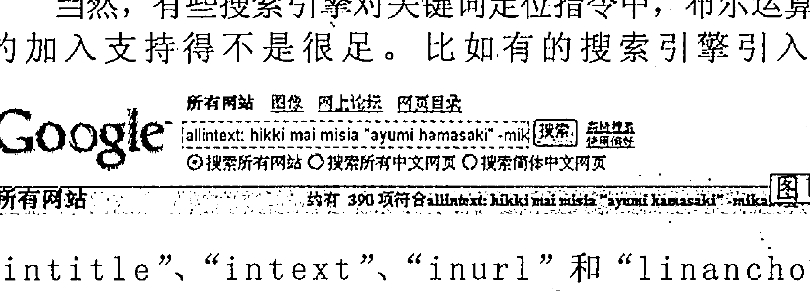

当然，有些搜索引擎对关键词定位指令中，布尔运算符的加入支持得不是很足。

比如有的搜索引擎引入了“intitle”、“intext”、“inurl”和“inanchor”这样的指令。这些指令的用途和前述的四条指令基本相同，区别就在于指令后跟的关键词，第一个会出现在指令要求的范围而其余的就不作要求。应该说，引入这四条新指令还是不能完全实现类似 Google 这样的对关键词布尔运算的完整支持。不过从使用的角度而言，如果使用了这四条指令还不能得出理想的结果，那么就还需要用新的关键词在第一次搜索结果中再次搜索，而使用“inurl”这样的指令却可以把这两次搜索的工作合二为一。所以说，“inurl”这四条指令虽有明显不足，但也有一定的价值，不少搜索引擎也支持这种关键词准确定位方式。

对关键词绝对位置进行限定的几条命令，在不同的搜索引擎中支持还略有不同，除了指令书写的不同以外，实现方式也有不同。在 Google 里面，上面提到的四条语法都可以通过图 11 所示的高级搜索中，“字词位置”一项后面的下拉框选择来实现。当然也可以直接键入命令使用，不过直接键入的方式有些搜索引擎就不支持了。

在直接输入查询中，最后值得强调的是空格与“/”。这四条指令，特别是“allinurl”指令。有的时候这条指令会被用户拿来探查网站的脚本程序源代码甚至密码文件，但 Google 对“/”符号的支持并不好，查询结果往往让人失望，“/”会被解析为空格，而多余的空格可能会导致查询的失败（新版本 Google 算法已经可以忽略无意中加入的空格，但对“/”支持还是不足）。

##### （3）Filetype 命令解析

互联网上的文件虽然是以 HTML 网页文件为主，但其它类别的文件数目也着实不少。多数搜索引擎都提供了对各种文件类别的查找能力，我们这里以 Google 的 Filetype 命令为例，讲讲搜索引擎对其它形式文档的查询方式。Filetype 指令是采用形如“Filetype:文件类型”来筛选结果的，常见类别如下：

- filetype:pdf
- filetype:ps
- filetype:doc
- filetype:xls
- filetype:ppt
- filetype:rtf
- filetype:mdb
- filetype:swf

Google 除了 HTML 文件以外，支持得最完善的就是对于 Microsoft Office 相关格式文档的查询。Microsoft Word 支持 DOC 格式文档，这大约是用于文章写作最多的格式之一，而采用 RTF 格式的文档也不在少数，如果是查询一些方案和文件，用 Filetype 命令针对这些文档进行过滤那是再好不过的事情了。

比如需要写一份法律起诉文件，可能很多人不见得熟悉写作的格式，而且对于行文用语等各方面的要求也很难做到尽善尽美。不过此时如果选择“起诉书 filetype:doc”这样的方式来查询，你将会得到满意的结果，打开查到的文档可以尽情参考。

对于常和各种表格打交道的用户而言，Google 可提供对 Microsoft Excel 文件格式的支持。比如在财务上，诸多的表格格式和资料不仅让新手们头痛，就连资深的注册会计师也会需要经常查询范例。而 Google 就能提供这样的便利，以“资产负债表 filetype:xls”这样的关键字，我们就可以轻易地找到最新规范的表格格式。而针对 Microsoft Access 数据库，Google 也能很好的支持，采用“filetype:mdb”就可以查询到很多需要的数据库实例。

而对于专业领域技术比较感兴趣或者正在钻研的用户而言，Adobe Acrobat PDF 文件是不可或缺的研究资料。通过阅读 PDF 资料可以掌握很多重要的知识，而且很多官方发布的正式的资料，因为不希望被用户修改，大多以 PDF 格式出现。Google 提供对于 PDF 格式查询也就方便了这一类的用户。比如需要查询 Intel 公司某架构 CPU 的技术资料，我们可以去 Intel 公司站点上翻阅，但更省事的做法是用该架构的关键词并加上“filetype:pdf”命令即可。

在使用上，Google 如果搜索出的结果不是 HTML 文件的话，比如是 PDF 文件，那么会在搜索结果的标题前面会出现以蓝色字体标明 [PDF]。用户就知道需要启动 Acrobat Reader 程序才能浏览该文件，如果你的计算机上没有 Adobe Acrobat，Google 将带你进入一个可以免费下载该程序的网页。这在操作上是非常人性化的，而且针对这些非 HTML 文件，Google 通常都有转换后的 HTML 版本可供查阅。对于 PDF 文件，常见的“网页快照”将被“文本文件”所替代。文本文件是 PDF 文档中的纯文本内容，不带任何格式。

不过需要提醒大家注意的是，网上查询到的这些类别的文件比 HTML 带有病毒的可能性大了很多。特别是 Microsoft Office 系列文档，宏病毒等非常肆虐，而阅读这些文件通常都是需要下载的，所以搜索这类文件时最好打开本机的病毒防火墙。

Filetype 命令的使用也比较灵活，在和关键词的搭配上，只需要命令表达式和关键词之间有一个空格隔开即可。而关键词的使用上，也允许多个关键词甚至是关键词之间存在布尔运算关系。Filetype 命令还可以和别的语法搭配使用，比如前面提到的一些关键词位置指定的语言，这样一来进行复杂搜索的能力就比较的强了。

Filetype 命令在实现方式上，它和前面介绍的两类命令略有差别。Filetype 指令仍然可以在图 11 的界面中选择，但是在上面列举的八种文件格式中，图 11 的高级搜索界面只能支持前六种。要实现对上述八种文件格式的支持，Filetype 指令只能是在搜索框中通过自己写入命令来实现。

Filetype 除了可以指定文件类型，还可以排除文件类型。在图 11 所示的高级搜索界面中，我们在“文件格式”一栏可以选择“仅”还是“除去”，选择前者就是使用“Filetype:”命令，而选择后者就相当于“-filetype:”命令，也就是说除了 filetype 指令中指出的文件格式不搜索以外，其它格式都不放过。

从长远角度来看，一般来说当 Google 觉得其对某种格式文档的搜索支持得足够充分，这种格式搜索才会进入图 11 的界面，甚至会以更加明显的方式来支持。比如针对所有图片的搜索，Google 甚至单列为和针对网页搜索一样的栏目了。而诸如百度这一类的搜索引擎，对很多种类文件的搜索也放在了很醒目的位置。

总的来说，对于比较热点和成熟的格式，搜索引擎才会大张旗鼓的表明自己提供对它的搜索，对搜索引擎没有指出支持的格式，用户也可以自己去试一下，比如说可以尝试一下对TXT文件、PHP文件、ASP/ASPX文件等多种类型，说不定会有新的发现呢。

##### （4）一些使用较少的命令

上面介绍的一些命令都是很常见的命令，而且这些命令大多数可以在Google的高级搜索面板中得到实现。但除了这些命令以外，Google还有很多需要用户自己手动使用的命令，这里我们就选一部分进行介绍，具体如下：

- Related: 用来搜索结构内容上相似的网页；
- Cache: 用来搜索Google服务器上某页面的记录；
- Link: 显示所有指向该网址的网页；
- Info: 用来显示与某链接相关的一系列信息。

我们先来看看Info这条命令，这条命令的使用非常简单，“info:网页链接”就是它全部的格式。在搜索栏中键入“info:www.sina.com.cn”，然后在图13中我们可以看到用这条命令检查新浪网站主页的结果。

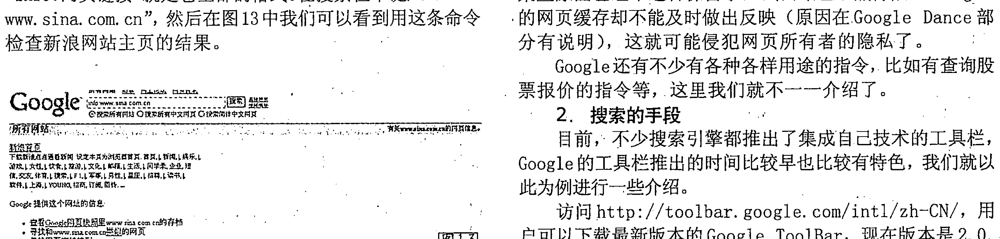

Info 命令针对某链接，显示当前搜索引擎所能提供的服务。这里显示的服务内容的种类根据不同搜索引擎，甚至不同搜索引擎不同时期都是有区别的。现在Google可以提供四种信息，其中三种就是 “Cache”、“Link”、“Related”的含义，还有一种就是把该超级链接看作一个整体，进行精确查询的功能。这四种功能在图13中都可以明确地看到，同时伴有中文说明，点击相关超级链接就可以实现对应的功能。

Related 命令的使用格式与Info命令完全相同，它的功能是用来查询与指定超级链接在结构或者内容上有相似的网页。这一条命令其实在每一次搜索的时候用户都会遇到，在每一条搜索结果最后，Google都给出了“网页快照”和“类似网页”这么两项，后一项其实就是对相应网页实施Related指令。

这条指令主要的用途就是“货比三家”，一般来说在做一些对比的时候，这条指令可能会帮上不少忙，比如购物的对比，再比如说你要选择一家网络服务提供商。不过，虽然很多搜索引擎都提供此条指令，但此条指令有时候所能提供的“类似网页”确实不是很“类似”，所以此条指令现阶段还属于理论上用处很大，实际潜力需要进一步挖掘。

Link命令仍旧是和前面使用方法一致的命令，这条命令可以用来查看到底有多少网页有指向被查询网页的链接。这是判断网页和网站人气的方法之一，如果贸然提个问题——国内三大门户网站谁更火，这恐怕多数人都回答不上来。但只要大家用这条命令测试一下国内三大门户网站首页，谁更火爆结果大家心里就会有几分明白了。

Link这条指令还有一些有趣的用途，大家不妨在实际使用中自己尝试挖掘一下，比如挖掘指向某些链接的密码。不过Google并不支持Link指令与其它指令混合使用，这不能不说是一点遗憾，当然支持Link与其它指令（包括关键字检索）混用的搜索引擎也很多，比如Altavista，用户可以自己酌情选择。

Cache 这条指令值得特别的说明一下，这是访问Google服务器上页面存档的命令，即访问“网页快照”的命令。这条指令的含义，在很多地方都被错误解释为访问Google服务器上缓存中的页面，一般来说服务器上的缓存和台式机上的相类似，只会放置最近读写过的文件。在缓存中是不可能保存所有网页的快照的，Cache这条指令访问的应该是服务器中对于网页的存档而不仅是服务器缓存中的资料。

此项功能可以说是让人又爱又恨。不少时候我们通过搜索引擎虽然找到结果，但是可能相关的网页已经打不开了；但是利用网页快照就可以达到观看自己需要资料的目的，这是让我们爱的地方，而且网页快照中都是用突出的颜色显示我们选择的关键词，有时候比阅读原文查询起来更方便。网页快照让人恨的地方就是暴露隐私了，特别是一些页面因为某些原因已经不适合保留了，当网站已经删除后，Google的网页缓存却不能及时做出反映（原因在Google Dance部分有说明），这就可能侵犯网页所有者的隐私了。

Google还有不少有各种各样用途的指令，比如有查询股票报价的指令等，这里我们就不一一介绍了。

### 2. 搜索的手段

目前，不少搜索引擎都推出了集成自己技术的工具栏，Google的工具栏推出的时间比较早也比较有特色，我们就以此为例进行一些介绍。

访问 http://toolbar.google.com/intl/zh-CN/，用户可以下载最新版本的Google ToolBar，现在版本是2.0.111.0。文件只有400多KB，下载完后的安装也是非常的简单。安装过程中有两点值得一提，其一是高级功能的开启，见图14。


平心而论，Google能够提供这个选项笔者还是非常满意的，这个选项的选择与否决定着Google对用户数据收集的模式。在实际来说，大多数这一类的工具栏都会悄悄的搜集用户的各种使用偏好和资料，然后利用各种机会发送回自己的服务器。这些用户的个人信息资料，对于搜索引擎以及其它信息提供商而言，这就是大把大把的钞票。

说得好听一些，这是为了能够给用户提供更多更好的服务，说得难听一些这就是“偷”。不过不管怎么说，Google新版本工具栏把它们可能搜集信息这一点明白的告诉了用户，这和那些对自己行为秘而不宣的工具栏相比，这还是好了很多。对于图14中的选择，笔者推荐还是选择“启用高级功能”，毕竟Google在其隐私政策中已经作出了保证，笔者还是比较相信它。不过如果信不过的话，你即使禁用高级功能你机器里面的信息也难保被泄漏，此时或许不装才是惟一的办法。

另外一点值得一提的是Google也同时提供对弹出式窗口的拦截功能，但要彻底实现这项功能需要禁用IE的错误脚本设置。笔者个人的意见是，现在很多软件都提供了对弹出式窗口的拦截，在未来IE的新版本中也会提供这项功能，我们一般来说只需要选择一个软件来拦截弹出窗口即可。至于选择哪款软件，那就不仅要考虑对系统资源的消耗、对网速的影响，还要考虑实际效果。就笔者看来，Google工具栏对弹出窗口的拦截能力，比Norton的网络安全特警似乎略胜一筹，所以笔者开启了Google的这项功能。同时，笔者还是本着“用人不疑、疑人不用”的原则，遵照Google的建议禁用了“IE的错误脚本设置”。

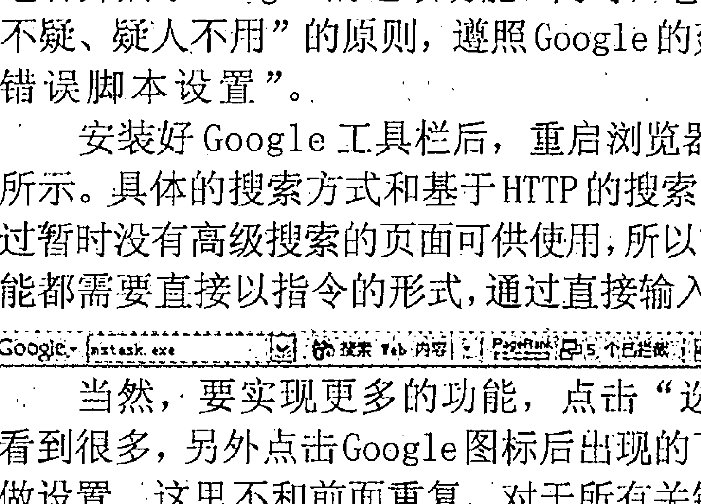

安装好Google工具栏后，重启浏览器，其界面如图15所示。具体的搜索方式和基于HTTP的搜索是完全一样的，不过暂时没有高级搜索的页面可供使用，所以前面介绍的一些功能都需要直接以指令的形式，通过直接输入来实现。

当然，要实现更多的功能，点击“选项”按钮就可以看到很多，另外点击Google图标后出现的下拉菜单中也可以做设置。这里不和前面重复，对于所有关键词搜索技巧与设定笔者都略去，主要介绍一些有特色的功能。

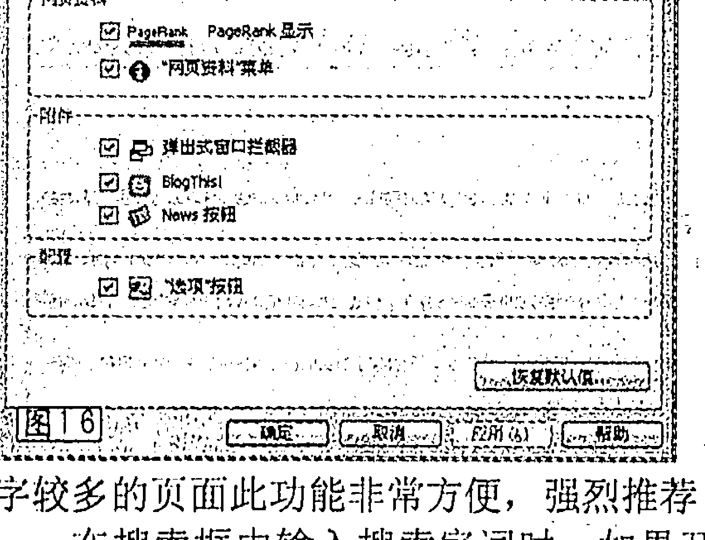

图16是工具栏选项的基本设置，其中比较有意思的“搜索字词标明”按钮和“寻字”按钮，一般来说这两个按钮应该同时选中或者同时不选。

“搜索字词标明”是通过在字词上加彩色条，在所访问的网页上标明字词。在网页上找到的每个搜索字词，将分别使用不同的颜色标明，这项功能颇类似网页快照中的类似功能，对于文字较多的页面此功能非常方便，强烈推荐！

在搜索框中输入搜索字词时，如果开启了“寻字”按钮，包含这些字词的按钮会显示在工具栏的最右端。单击这些按钮将跳转到网页上下一次出现该文字的位置，这项功能和“搜索字词标明”按钮在某种意义上有异曲同工之妙。如果在单击“寻字”按钮时按住 Shift 键，还可以进行逆向搜索，查找上一次出现该文字的位置。

与“搜索字词标明”按钮相同，用户不必对字词进行搜索，也可以使用寻字按钮。只需在文本框中输入字词，但不按回车键，然后单击“寻字”按钮。再次单击该按钮将跳转到网页下一次出现该字词的位置。这个就类似于IE提供的页内查找，但用起来更方便了。

对于开启“PageRank”选项，这可以让用户知道Google对某些页面的大致评价，这个评价决定着该页面在搜索结果中的位置。不过这个选项有时候因为防火墙的原因，显示不是很正常，而且也会略微降低浏览速度。

“网页资料”菜单，则和前面介绍的Info命令在功能上等价。对于“Blog”功能和“News”功能现在还没有简体中文的服务，所以也不建议开启。而其它搜索引擎如果提供了这类中文服务，且用户也觉得有价值，那就还是有开启的必要。

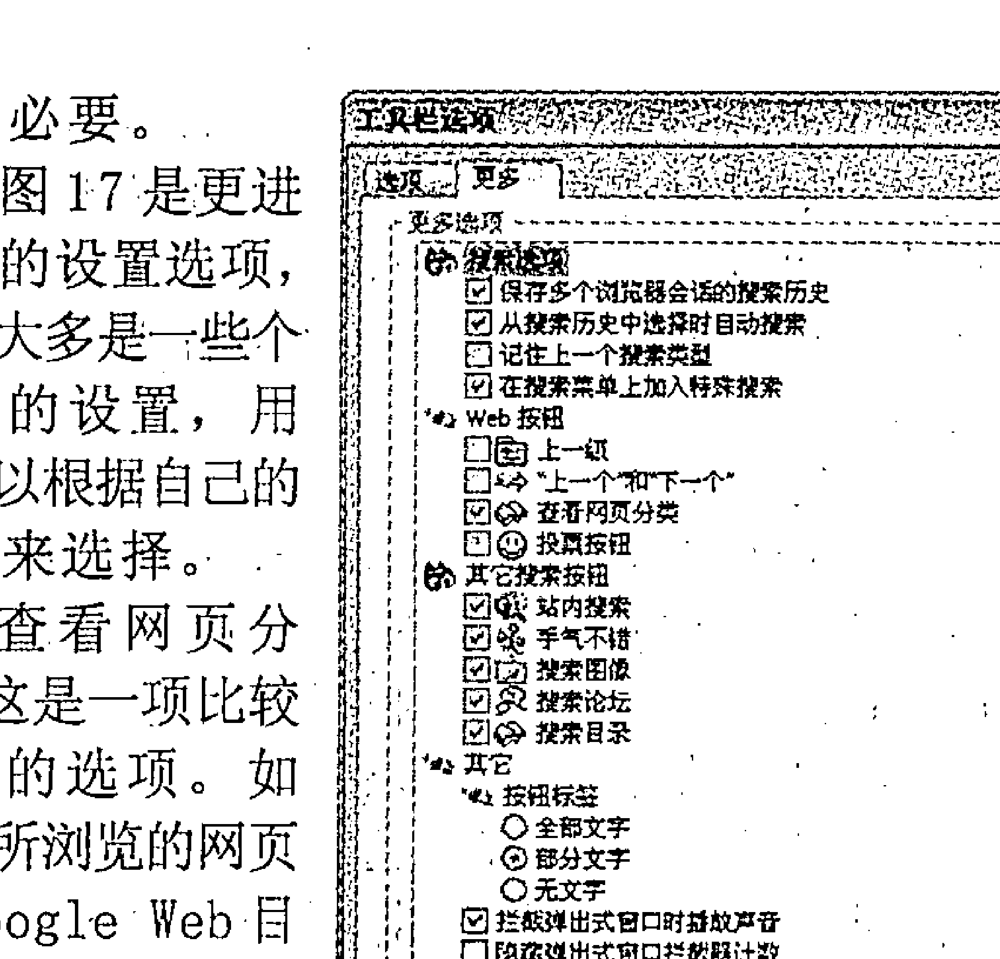

图17是更进一步的设置选项，这里大多是一些个性化的设置，用户可以根据自己的习惯来选择。

查看网页分类，这是一项比较有趣的选项。如果你所浏览的网页在Google Web目录中有相关的网页分类，单击此按钮可以转到该网页分类页。不过现在Google Web的目录大都是基于英文的，而且此项操作被激活后会将一些资料发送回Google。

投票按钮是另外一个有趣的选项，用户可以使用这些按钮为某个网页或搜索结果投赞成票或反对票。单击工具栏上的笑脸或哭脸可以告诉 Google 你喜欢还是不喜欢特定的网页。目前，此功能处于测试模式，所以在为某个网页投赞成票或反对票后，不会立即看到任何效果。

Google工具栏还有一个特别实用的功能，就是右键菜单，见图18。在任意网页中单击鼠标右键就会出现图18的菜单。

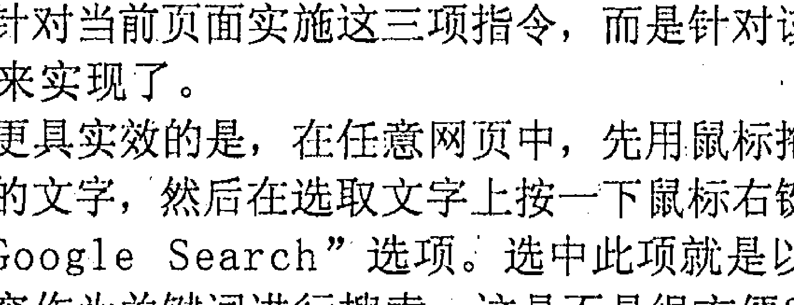

这三项功能分别是“Related”、“Cache”和“Link”三项指令的等效选择。对某具体网页甚至不需要打开Google工具栏就可以实现这些操作。在页面上如果是在某个超级链接上点击右键，仍然会出现这样的选单来实现这三项指令的功能，不过此时就不是针对当前页面实施这三项指令，而是针对该超级链接的指向来实现了。

更具实效的是，在任意网页中，先用鼠标拖曳选取想要搜索的文字，然后在选取文字上按一下鼠标右键，此时会出现“Google Search”选项。选中此项就是以页面上选定的内容作为关键词进行搜索，这是不是很方便？

除了工具栏，Google还为移动电话特别设计的无线搜索引擎，不久前又新增加中文的服务。不论何时何地，移动电话用户都可以在Google帮助下在网中快速搜索资料，网址是：

```
http://www.google.com/wml?hl=zh-CN
http://www.google.com/wml?hl=zh-TW
```

其它搜索引擎推出的工具栏与Google的大同小异，这里也不介绍了。但工具栏还有一些更为强大的类型正在设计中，不少搜索引擎也释放出了一些测试版本，在新一代工具栏中可以实现的功能更多，本地网络与Internet的无缝查询、复杂查询条件的支持，更商业化也更高级的智能代理功能，这些都可能包含在未来的版本中。

### 3. 其他类型的搜索引擎

互联网上搜索引擎风起云涌，各大搜索引擎都在致力开发自己的独门技术，以期成功挑战Google的垄断地位，在市场上多分一杯羹，正是因为这些搜索引擎的努力工作，我们才有了更多的选择，这里我们介绍两个颇有意思的搜索引擎——Ask和Vivisimo。

#### 1. 自然语言搜索的代表

将ASK Jeeves作为自然语言搜索引擎的代表，相信很多人都不会反对。访问http://www.ask.com我们就会看到亲切的Jeeves界面，如图19。在ASK里面我们可以直接用自然语言进行询问，这对于不善于选择关键词的搜索者来说非常地体贴。我们可以直接对自己需要的资料对Jeeves进行询问，Jeeves非常智能化，提问中的错别字词和语法很多时候都不会成为障碍，Jeeves会自动识别和纠正。Jeeves还很聪明，很多问题都可以找到答案，而且只要是常见问题，答案的契合程度还会出你的意料之外呢，图20就是一个很好的例子。


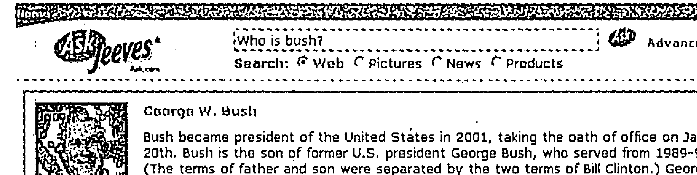

笔者尝试这提出“Who is Bush?”这样的问题，在图20的搜索结果中大家可以看到图文并茂的结果，这大约可以让习惯了Google朴素界面的用户感到一丝惊喜吧。在图20的界面中我们可以进一步搜索与其相关的图片、新闻，可以进入相应的官方站点，在下拉框中我们还可以选择其它与这个问题相匹配的查询。下拉框中匹配的项目都是很热门的，只要用户不是有意搜索冷僻的资料，应该都会感到满足。

大家不要以为图20就是Jeeves搜索结果的全部了，这只是笔者截取的搜索结果的一部分。在搜索结果的下半部分，和Google一样都有查询到的大量相关网页链接。更为贴心的是还指出了“Related Searches”，这是搜索引擎给用户提供的相关搜索，大家可以看看，相当有用和有趣。

ASK Jeeves在自然语言提问、Smart Search（智能搜索）这些领域做的不错，而且它拥有专门针对小孩子的搜索引擎“Ask Jeeves for Kids”，通过访问http://www.ajkids.com就可以找到这个全球排行前列的搜索引擎。在这里的搜索结果都是经过专业编辑精心挑选的，这对保护孩子不受互联网上一些不良资讯影响相当重要。这里还有很多图文并茂的知识性的东西，这都还被分门别类的进行过整理，是名副其实的小孩子的学习工具。

ASK Jeeves搜索引擎还有很多特色，这里就不一一介绍了，这一类搜索引擎的优势还是用户自己去感受比较好。这一类提问式和智能式的搜索引擎，有的甚至能提供真人专家问答的搜索模式，也就是说某些问题你在搜索引擎上找不到答案，你可以提交你的问题，搜索引擎会安排专家将答案按你提供的地址反馈给你。不过惟一值得遗憾的是，现阶段这类搜索引擎基本没有针对中文市场的版本。

#### 2. 新兴的 Vivisimo

目前的搜索引擎种类相当繁多，介绍起来也不胜枚举，我们这里不再介绍那些诸如Altavista的“老家伙”，这里我们来看看一个叫做Vivisimo的“新人”，可以通过http://vivisimo.com来访问它，图21就是其主界面。从图21就可以看出Vivisimo的特征——Clustering Engine，也就是分类式的搜索引擎，其更强调的是对搜索结果的分类管理。不过这个分类管理与目录式搜索又有所不同，目录式是事先预置好各种门类，而Vivisimo是先查询，然后根据查询结果动态分类。在其主界面中我们点击“Advanced”超级链接可以进行更多的设置，图22是其一部分。

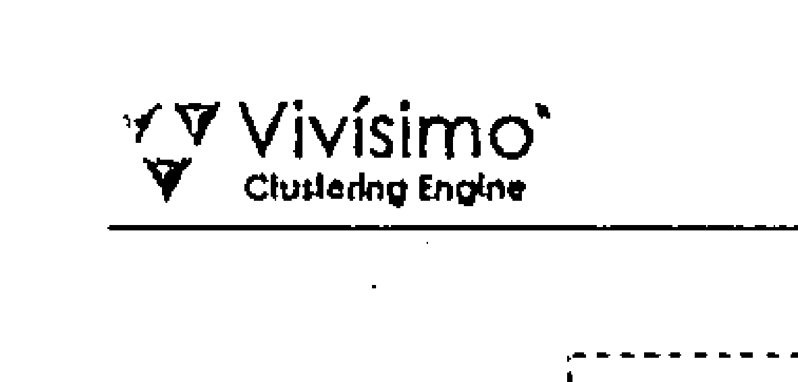

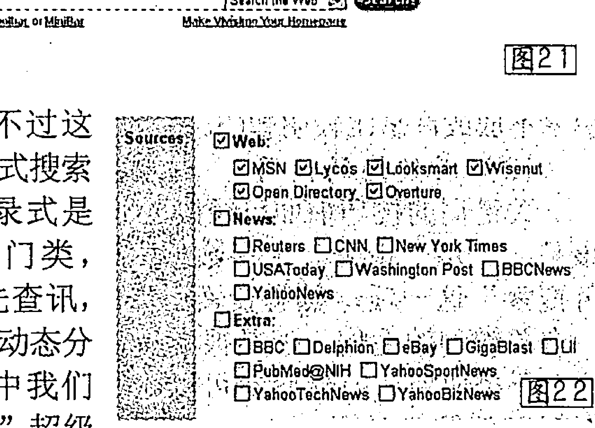

在高级搜索界面中有很多设定选项，其中还包括有简体中文的语言，这个会让大多数国内用户觉得亲切。在图22中我们可以设定其搜索信息的来源，大致分为三类，基于网页（Web）、基于新闻（News）和基于其它部分（Extra），每一个大类里面又有若干小类可以选择。能集成多个搜索引擎的结果并不难，很多搜索引擎都可以做到，但Vivisimo能有这么多支持项目让人吃惊。而且这里信息来源是可以复选的，适当地选择搜索信息来源，会对用户很有帮助。

我们在这里略作设置，以新浪网为关键词进行搜索，就会很快得到搜索结果。结果是以一个框架式页面来显示，其结果的左边就是它很有特色的分类结果，见图23。

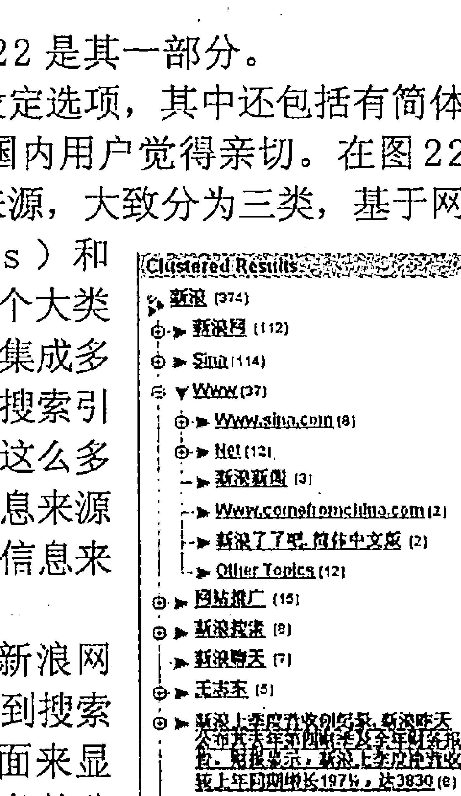

应该说，针对中文结果的搜索，Vivisimo还不是很强大，但是对英文结果就要好很多。Vivisimo这种树状信息整理模式很讨人喜欢，也比较的有用，但是也存在着缺点，那就是信息查询的精度还不高。搜索的精度、广度和匹配分类，实现起来都可能存在相互抵触的地方，所以虽然Vivisimo在精度上和Teoma、在广度上和Google相比都有一定的差距，但它有特色的分类也可以抓住很多用户的心。

#### 3. 搜索的心得技巧

上面讲述了很多文字信息搜索的相关知识，同时也介绍了不少搜索引擎的使用技巧，这里笔者小结性的来谈谈几条心得。

- （1）选好搜索引擎
用户最佳的选择是有一个主要使用的搜索引擎，然后辅助一些有特色的搜索引擎。主要搜索引擎一般建议选择主流搜索引擎，比如Google。

特色辅助搜索引擎可以根据自己的偏好来选择，如果对传统文化有一定的兴趣，则可以考虑选择百度，喜欢搜索结果能被很好整理的，选择前面介绍的Vivisimo，喜欢目录式查询的可以考虑雅虎，喜欢自然语言查询的考虑ASK Jeeves，喜欢看新闻的可以考虑Daypop，讲求精确的建议看看Teoma等，各类不一而足。各大搜索引擎都处于飞速进步时期，各自的主攻方向、特长、优势都可能发生变化，用户建立了自己的搜索引擎组合以后，也要经常关注各自的发展进行微调才比较好。

另外，也不要迷信搜索引擎。对于经常查询的资料，了解一下相关主题的垂直门户和主力站点也很有必要。有些东西在搜索引擎找不到，或者找起来很麻烦，自己去这些站点手动查找往往效率更高。

对于静态页面，Google或者其他搜索引擎的查询能力总是比较高，而对于有ASP等动态语言和脚本的网页，多数搜索引擎都有些力不从心。这种状况和搜索引擎的另一个特性很相似，那就是搜索引擎对于最近的消息搜索能力还不足，比如新闻搜索或者高考分数查询。这些情况下，不要一味地抱着搜索引擎不放或许是比较明智的。

##### （2）关键词的使用

关键词的技巧前面已经谈过不少，但我认为最重要的应该是：一步一步来。大多数搜索引擎都提供了“在结果中再搜索”这一项，熟悉搜索引擎的用户，的确不会犯只有一个关键词的毛病，但是很容易犯的是一次上关键词过多。而对于类似Vivisimo这类可以选多个数据源的，也并不是选得越多效果就越好。

即使搜索引擎能够提供很多布尔运算符，同时还能提供很多各式各样的指令，但是笔者还是不建议这些条件一下子上得过多。类似于关键字一次不宜过多一样，这些指令和运算符一次也不宜叠加过多，充分利用“在结果中再搜索”，虽然会麻烦一些，但会降低放掉重要信息的概率。

同时充分利用其它手段，比如目录查询，来辅助关键词查询很有效。一般来说通过目录查询，用户可以对需要查询，但是不够清楚的东西开始有初步的印象，此时选择关键词的正确率就高了很多。要实现具备初步印象还有别的方法，比如阅读相关领域的综述性文章，或者向相关行业的高手咨询。

目录查询在辅助关键词查询上，还有一个重要的用途——限制范围。引用一个Google帮助文件里面的例子，在Google目录的Science>Astronomy类别中搜索“Saturn”，可以找到只与 Saturn（土星）有关的信息。而不会找到“Saturn”牌汽车、“Saturn”游戏系统，或“Saturn”的其他含义。

关键词和指令的其他技巧还有很多，相关的指导文章也是汗牛充栋，用户可以在需要的时候查询和参考，但笔者觉得最重要的还是了解了前面的知识以后，自己摸索出来的路往往才是最适合自己的。

##### （3）其他

以Google为代表的大多数搜索引擎，在查询到结果以后，都会给出一段含有关键词的上下文，这是搜索引擎该网页中抽出的一段摘要，这些摘要提供了搜索关键词在网页中的位置。了解这一段摘要，对提高我们的搜索效率还是有一定帮助的。

一般来说，Google的信息搜集程序和其它搜索引擎的信息搜集程序一样，它们都有防止陷阱的功能，而且Google信息搜集程序并不能无限制长度的搜索某个页面的信息，通常的说法是只关注页面的前110K的内容。

所以有的时候，除了被Robot.txt文件限制、出现信息孤岛、搜索出现技术性错误以外，有些本该有的信息搜索不到，就和这个110K限制有关。也就是说，包含关键词的页面其实已经被搜索引擎收纳了，但是显示不出来。故而，有时候采用迂回的搜索方法，先不搜索主题而是搜索相关的内容，这也不失为一条妙计。

在Google首页搜索时，用户除了还可以看得到一个“手气不错”的按钮，这个按钮是根据用户的搜索条件，Google自动判断和选择一个最合适的网站让用户直接进入。比如你键入某大学的名称作为关键字，再点击“手气不错”，你往往就能直接访问到此大学的主页。虽然此项功能还不够智能化，但在未来却不可小觑。

## 第四篇 网络热点大搜索

### 一、图片音乐大搜索

#### 1. 图片搜索的基础

搜索引擎在获取图片之时，会同时分析页面上图像附近的文字、图像标题，然后再判断图片是否包含超级链接，如果包含超级链接则进一步判断超级链接的指向，这就是判断图片内容的重要手段。

分析了这些信息以后，搜索引擎还会依据其它元素来确定图像的内容，比如对于一些包含简单数字和符号的图片，可以通过程序识别来进一步分析。一般的图片搜索引擎对于图片内容的识别都非常的重视，因为只有正确地识别了图片，用户在搜索时才能搜索到相匹配的结果。如果图片识别错误的话，就可能出现搜索“刘德华”的照片却出现“张柏芝”玉照。而图片内容的判断，对于图片搜索引擎的评价也是最重要的因素之一。

判断图片内容后，搜索引擎还会使用复杂的算法来删除重复的内容和对图片进行评价，删除重复内容的目的是确保在搜索结果中首先显示质量最好的图像，对图片进行评价的目的和对网页内容的评价目的是相同的，都是为了搜索结果排序的合理化。

图片搜索在方法上，基本上都是采用关键词搜索，以Google为例，文本搜索中使用的所有操作符都可以用于图像搜索。

#### 2. 图片的质量和分辨率

不同搜索引擎的图片搜索，支持图片格式略有不同，不过JPEG、GIF、PNG和BMP格式的图片是基本上都被支持的，这也是最常用的格式。不过在搜索时，最好可以选择搜索全部图片，因为就实际使用而言这些格式差别不大，这样将最大范围地去搜索要找的图片。

大多数搜索引擎都支持图片尺寸选择，不过大都是只能选择几个预设的级别。比如百度图片搜索引擎，就可以选择大中小不同级别的图片。同时还可直接选择800x600、1024x768两类常规桌面壁纸大小的图片。

#### 3. 几种常见用途的图片搜索

- 大图片：指图片的最长一边大于640像素的图片（包括640像素）。
- 小图片：指图片的最长一边小于200像素的图片（包括200像素）。
- 中图片：图片的最长一边在大于200像素并小于640像素之间的图片。

针对用户常见用途，不少搜索引擎都推出了针对常见用途图片的搜索，这包括“壁纸”、“旅游风景照片”、“人物明星照片”、“名人字画”和“海报”等多种类别，另外关于热门的彩信图片、手机图片、甚至实时新闻图片也有不少搜索引擎能提供支持。这里以百度图片搜索引擎为例做一个简介。

##### （1）搜索壁纸的两种方法

一是在进行搜索时可以直接在图片大小中选择“壁纸800x600”、“壁纸1024x768”进行搜索。此时你的搜索结果均为相应大小尺寸的壁纸，同时当你选择所有大小时，在搜索结果中，图片下方一行有说明该图片尺寸、大小、格式的文字。例如：某图片下方有“800x600 72k jpg”的文字，则表明该图片是尺寸为“800像素长，600像素宽，大小为72k，格式为jpg”的图片。

第二个方法是使用“关键词 壁纸”或“关键词 墙纸”这样的格式来进行查询。如“Mai 壁纸”、“Ayumi 墙纸”等。

##### （2）搜索旅游风景照片

九寨沟的灵秀、夏威夷的风情，或许都让你心驰神往，但也许有很多旅游风景名胜都没有去过，不过没关系，只需要在搜索框中直接输入想去的旅游风景名胜的名称，然后按“百度图片搜索”按钮或直接按键盘上的回车键（即Enter键），即可开始你的图片旅行。
这一类查询可以参考“风景名胜图片目录”、“世界各地图片”。

##### （3）搜索人物明星照

如果你想找个偶像照片或找某个历史人物图片资料，只需要将他（她）的名字输入搜索框按下回车键即可。需要提醒你的是在你搜索外国明星时如“奥黛丽.赫本”，请直接用“奥黛丽 赫本”来进行查找，而不要包括其名字中的“.”，这样将得到更好的搜索效果。
这一类查询可以参考“美女明星图片、帅哥明星图片目录”、“体育明星图片目录”等。

##### （4）搜索名人字画

想找凡高的“向日葵”？想看徐悲鸿“马”？想寻启功的字？利用百度图片搜索引擎，只需要将各位艺术家书法家的名字输入搜索框，便可以开始一次艺术之旅。
这一类查询可以参考“其他人物图片目录”。

##### （5）搜索电影海报

在搜索框中输入“要查的电影名称 海报”即可。如“哈利波特 海报”、“指环王 海报”等。另外在多数情况下，只输入电影名称搜索，可找到更多相关海报。
这一类查询可以参考“电影电视图片目录”。

#### 4. 音乐搜索指南

音乐搜索主要有两个常见的方法，一个是基于通过类似百度这样的搜索引擎来寻找相关资料，另一个就是使用软件进行搜索。图24就是百度歌曲搜索引擎的界面。

在百度歌曲搜索引擎里，可以针对歌曲的文件格式进行搜索，现在已经支持MP3、RA、RAM、WMA等多种格式，而且还支持手机铃声和歌词的查询，非常的全面和方便。具体查询方法在关键字和指令方面与文本搜索完全一致，歌曲类别在图24界面中选择即可。下图25是查询结果的界面。

在结果中我们可以看到除了包含文件大小以外，还包含了“歌词”、“文件格式”以及“下载速度”等相当丰富的信息。在结果的右侧虽然有不相关的广告出现，但也有与被查询歌手的图片以及新闻查询链接，总的来说人性化程度还是很高，比较让人满意。

查询音乐的搜索引擎国内还有大名鼎鼎的Sogua.com，在这里音乐搜索的方法也和百度大同小异。不过在这里的查询结果中多出“连通率”和“下载协议”两项，连通率也就是Sogua会在一段时间内反复探测该音乐是否能下载，能成功下载的次数除以测试次数就得到了连通率。下载协议主要就是指明是基于FTP还是HTTP的下载。

另外Sogua除了歌曲以外，也同时支持“专辑”、“歌词”、“Flash”甚至“软件”和“电影”也支持搜索。除了支持HTTP、FTP下载以外，Sogua还支持寻找BT下载种中与关键词相联系的音乐文件。以上这些都是免费使用的功能，如果注册成为Sogua的会员，还将享受到更贴心的服务、更强大的查询功能。作为中文网站中较早推出音乐查询的Sogua来说，现在做得还不错。这里也是笔者找歌的首选。

图26是常用的找歌软件Kugoo（酷狗）的主界面，酷狗是一款基于时下最热门的P2P下载软件。在软件里有基于HTTP的很多推荐歌曲，同时也支持关键字查询的功能。从查询这个方面来看，酷狗和Sogua这类搜索引擎相比模式也很类似，估计也是从各大搜索引擎取回数据自己整理后提交给用户。

酷狗在查询上，支持各种关键词查询，也支持目录式的查询。目录式查询中有基于歌手、专辑、曲目等多种模式，这无疑是很有吸引力的。在用户个人之间的音乐文件交换上，采用了类似QQ的做法，用户非常容易上手。而且本软件集成了搜索音乐文件、查询下载音乐文件、和朋友分享音乐文件、播放音乐文件等多种功能，相当的好用。

或许是因为版权问题，网上音乐传播、查询和搜索都做得还不尽如人意。特别是搜索部分，因为音乐文件特别是MP3文件都支持各式各样的标签，这对音乐文件的判断是很有帮助的。但和图片搜索相比，音乐文件的搜索精确度却还是要低很多。在查询的结果上，比如音乐文件的编码方式、码率等信息提供得也不足，这一些都是比较明显的遗憾之处。

对于前述音乐搜索的遗憾，国内外似乎状况相差无几，但值得欣慰的是类似酷狗这样的软件出现对搜索领域也算是带来了一些新思路。针对文档查询的辅助软件，我们前面介绍

### 二、网际的逍遥生活

不管是Google的网上论坛搜索还是百度的“贴吧”，它们的出现都说明网上虚拟社会的生活对每一个网友都越来越重要了。Google的网上论坛搜索不仅包括BBS的搜索，也扩展了新闻组的搜索，所以在使用上可以尽可能地考虑选择高级使用界面，图27就是Google网上论坛搜索的高级界面。在这个界面里面可以看到还是和文本搜索基本相差无几，只是有一些针对网上帖子的特殊设定。

在搜索留言部分，主要是增添了可选的留言显示方式，主要分为“按内容相关性”和“按日期”两种排序法，前者更看重搜索的精确性，而后者则在乎时效性。其下对网上论坛位置的设定就是类似于文本搜索中的“Site”命令了。比较新的选项就是“主题”、“留言者”和“留言代码”三项，前两项的含义都非常明白，其分别对应的是“insubject:”和“author:”两条命令，含义是分别要求其后填之词出现在帖子的主题部分和帖子留言者ID部分。而“留言者代码”这一项，主要指的是在新闻组中作者发帖所用的唯一识别号电子信箱。因为网络帖子要求时效性很强，所以在留言时间限定选择上，Google给出了很细化的设置，这一点还是比较体贴的。

与Google的网上论坛搜索相比，百度在这方面网上论坛搜索这一部分也有自己的特色，图28就是百度贴吧的主界面。其中有两个选项，“贴吧搜索”基本上等价于Google的网上论坛搜索，这一部分就略去不再叙述，百度贴吧其更有特色的是可以自己查找创建“贴吧”，也就是选择“进入贴吧”这个选项。键入关键词，选择“进入贴吧”，再点“百度搜索”。此时搜索引擎会对用户键入的关键词进行查询，如果已经存在这样的贴吧，用户会直接进入该贴吧，如果不存在这样的贴吧，百度会提示用户创建一个以此关键词为主题的新贴吧，并发布第一条信息。

此时贴吧的含义就相当于以此关键词为主题的一个论坛，因为论坛的主题高度集中，而使用又相对方便，对泡惯BBS的用户吸引力还是颇大的。需要指出的是，对于近似的关键词，百度设置了共享词贴吧，将其归并在一起方便大家交流。对于多关键词查询的搜索结果页面，百度也提供了相应的多个关键词入口供网友选择。

常上网的人应该都听说过一个戏谑的说法“人肉搜索引擎”，也就是说很多东西在网上不论用什么搜索引擎都搜索不到，但是可以在网上社区这些地方，向他人问讯而获得答案。百度的贴吧因为主题集中，在某种意义上也有成为非常好的“人肉搜索引擎”的潜质。比如，仓木麻衣在本月发布了新单曲，用户想去下载新碟里面的歌曲试听，甚至还想看看新单曲集的MTV。此时去搜索引擎搜索效果往往不佳，如果到百度贴吧中的仓木麻衣吧去问问，那结果可能会大不一样。因为里面基本都是她的铁杆歌迷，要寻求很多信息来得相当的快。

### 三、商业化的搜索引擎

提起付费搜索，有一定搜索经验的用户肯定不会忘记Overture，但现在收费引擎市场早已变成了Google和Overture两强争霸，而后面大量搜索引擎奋起直追的局面。随着搜索引擎商业化的进程，越来越多的搜索引擎引入了广告，比如在图25的百度搜索中我们就可以看到相当数量的广告，甚至有时候这些广告和我们搜索的条目关系并不大，这是好趋势还是坏趋势呢？

#### 1. Location Search

Google Local已经在其英文网站上开始尝试着推出了Location Search，这是Google策划已久的一项服务。只要在Google.com或新域名local.google.com的搜索框输入关键字，以及住址或城市名称，就能找到当地的地图、与当地有关的网站，以及邻近一带的商店目录。雅虎最近便通过地图服务，改善网站访客寻找当地餐馆、自动柜员机、商店和公车路线的成功几率。通过新推出的“SmartView”功能，雅虎已在区域地图中纳入邻近一带吸引人的地点，例如餐厅，让搜索者能更精确地查找出要找的目标（比方说想去的意大利餐厅或法国餐厅），并了解某地有哪些特别值得去的地方。如果把Location Search再结合Froogle Location Search，在某种意义上会给用户带来很大的便利，同时也会给商家创造大量的商机。

在这种情况下适度投放广告，我相信这倒是每一个搜索者都愿意看到的，这将导致商家、搜索服务提供商和用户的三赢。

#### 2. Pagerank

Google对自己搜索引擎的页面评定技术专门注册了专利，称之为Pagerank。而每一次Google Dance，除了信息的更新以外，往往还伴随着对网页评定方式的微调。对网页评定方式的调整就意味着搜索结果排名的调整，在这个E时代这对于那些开始网络营销的企业来说，这属于不得不重视的事件。

对于Google的Pagerank是如何计算的问题，网上可以找到大量的文章，文章里面都是用了很长的篇幅来分析算法。这是每一个网络营销者都必须关注的问题，这更是每一个SEO从业者关注的核心问题，毕竟因为Google占据了一半以上的市场份额，它的变动将直接影响到所有网站的访问率。

另外还有一个网站建设和SEO从业者都知道的秘密，大多数Pagerank较高的网站特别是名过其实的网站，大多都采用了一些“特别的优化技术”。这些技术包括了在META标签里面多次加入相同关键词、在网页上用同色字大量书写与页面无关，却在某些方面有“用处”的词语等“老手段”，还有一些更加有效的“新手段”。而类似前面提到的Google等各大搜索引擎的反陷阱措施，也就是和这些作弊手段在做抗争。有利益就有争夺，差别只是手段，而不择手段的局面也是不可避免的。

商业化固然是好，也能给用户带来实际的好处，但同时也会带来恶性竞争引发的种种后果。除了上述的种种争斗以外，充斥着搜索引擎的各种广告如果超出了限度，也会让搜索领域开始慢慢变味。祸兮、福兮，看来我们只能走着瞧了！

### 四、生活小助手

Google这一类的搜索引擎很多时候还会给我们提供一些小工具，这里也介绍一下：

#### 1. 计算器

在Google的查询栏中我们可以直接填入计算式，Google可以成为我们的一个网络计算机，而且这款计算机的功能还很强大。

在图29中我们就可以初窥其强大的功能，除了基本的四则运算，这款计算器所能支持的还包括乘方、开方、三角函数、对数等多种运算，甚至还可以支持一些统计学的计算和提供对复数的支持，同时对括号的支持也很完备。有这个方面需求的朋友倒是非常的方便。不过需要指出的是这里面的数字和符号都建议用小键盘来输入，有些表达式也最好小写，以免Google会错误识别。
另外，Google英文界面还有单位换算的功能。

#### 2. 单词校正

有时候在写作文档时，遇到外文单词，会突然忘记如何拼写了，此时利用Goggle的校正单词功能就很有帮助，见图30。

Intel公司推出的第一代P4核心的名字用了一个比较生僻的词，有时候写东西时，笔者经常忘记如何拼写，有时候虽然记得，但也怕搞错，此时就可以在Google里面输入一个形近的单词进行搜索。如果敲入的单词拼写正确，搜索结果通常会出现大量的与CPU相关的文章和资料，如果拼写错误的话，Google就可能如图31一样会给出提示。此时如果不放心，还可以再次点击提示的关键词进行搜索，再次确认即可。
提供网页翻译也是Google一项比较有特色的服务，不过目前只提供了拉丁语、法语、西班牙语、德语和葡萄牙文到英文的翻译。虽然可能很多用户英文也不好，虽然现在机器翻译的质量都不高，但在某些时候如果查询到的资料是用户完全不懂的语言，即使是比较差的翻译，也是有一定帮助的。毕竟对英文大家都可以连蒙带猜，也可以借助字典和词典了。
未来的搜索引擎之争会越来越激烈，在用户接口、本机与互联网无缝搜索等各个方面都可能会发生日新月异的变化。相信在三五年之后，这场争斗的结局大家会看得更清楚一些。到那时候搜索引擎服务提供商的分化也会更加明显，做搜索底层技术还是侧重于用户接口，搜索服务提供商的思路也会更清晰，但不管怎么说，一场竞争之后留下来的总是强者，而强者总是会给我们带来更多的东西！
（文／飞翔鸟2000）

- 1. **活动主题**: 想过丰富多彩的暑期生活吗？快来参加免费“北京四日游”
- 2. **旅游暂定期间**: 2004年8月1日～8月20日
- 3. **具体旅游时间**: 四天（住宿三天）
- 4. **旅游行程安排**: 游览北京名胜古迹，参观著名科技馆、博物馆等，享受千年古都文化之旅。
- 5. **读者参加活动办法**:
   1. 第一步：购买6月《互动软件》或者7月《互动软件》；
   2. 第二步：找到杂志中的回函表；
   3. 第三步：认真填写回函表，寄回到杂志社（附上自己的详细地址及联络电话，以便我们及时通知你获奖信息）。我们将从中抽取四位大奖读者，杂志社将会去专电通知获奖幸运者，并出具杂志社盖章的旅游邀请函。
- 6. **中奖刊登**: 中奖名单刊登在《互动软件》8月号上。
- 7. **特别提醒**: 十八岁以下的读者必须有家长陪同，家长旅游费用自理。
- 8. **详细说明**: 详细的活动安排请见《互动软件》7月刊。

本次活动最终解释权归北京电脑爱好者杂志社及北京电脑界杂志社所有
活动主办：北京电脑爱好者杂志社／北京电脑界杂志社
活动热线：010-62161335/38-8026
直拨及传真电话：010-62143082 高女士
地址：北京海淀区北三环西路48号
        北京科技会展中心1号楼A座15层D户
电话：010-62161335-38转8615
邮箱：北京9615信箱 邮编：100086

**六大特色内容**

*『游戏简介』*
《魔兽世界》的游戏特色和基本配置介绍。

*『世界地图』*
为玩家提供了目前公布的艾泽拉斯的全部地图，在玩游戏时查阅这些地图，能使游戏玩起来方便轻松哟。
世界背景以及种族历史：《魔兽世界》史诗般的故背景及种族历史，让你在玩游戏之前对《魔兽世界》的历史人物拥有全面的了解。

*『游戏指南』*
包括入门基础、操作命令、战斗与合作、商业交流、初级上手、坐骑系统六部分，帮助你更好的游戏。

*『种族与职业』*
八个种族、九种职业，详细介绍种族优势与职业技能。

*『生产技能介绍』*
教你掌握运用商业技能、草药学、钓鱼、采矿、剥皮、锻造、附魔、烹饪、裁缝。使你成为一个成功的商人或技师。

**光盘收录**

近二十首经典的《魔兽世界》音乐
历年来精彩绝伦的《魔兽世界》动画CG，制作花絮影片
《魔兽世界》精美壁纸

咨询电话：010-65934375   13801353016
邮购地址：北京市朝阳区甜水园北里16号
图书市场263号 邮编：100026

## 2004年DV市场面面观

以 DC、DV 为代表的数码影像市场近年来得到飞速发展，DC早已红透半边天，走入了寻常百姓家。而一向以“贵族”身份出现的 DV，在经过市场风暴的“洗礼”后，也走下了高高的“神坛”，成为极具亲和力的时尚消费类数码产品。2003年 DV 在国内市场获得快速增长，那么2004年 DV 市场又会出现什么样的变化呢？

新年度一开始，Canon、JVC、Panasonic、Sony 和 Samsung 五大 DV 厂商就展开了新一轮较量，充分展示各自在 DV 研发、制造方面的最新成果。先是 Canon 发布了 MV700i 系列和 MVX200i 系列5款新机，接着就是 Sony 推出了全新系列的 HC 系列和 PC 系列多款产品，赚足了发烧友的眼球，更让人吃惊的还在后面，在4月三星一举推出了10款产品，让国人看见了他们在摄像机市场上的进取精神。与这些厂商大张旗鼓推出新品相得益彰的是，松下推出了更加小巧的 GS11 系列和 3CCD 的升级产品。

### 一、2004年DV市场的5大特点

华山论剑，五大高手已先后出招，使得 DV 市场新品不断，高潮迭起。透过这些新技术、新产品，经过半年的发展，我们认为今年的 DV 市场呈现了四大特点。

-   1. 中、低端市场将成主战场
关注 DV 市场的朋友，对2003年各大厂商之间的 CCD 像素之争一定还记忆犹新。去年索尼、佳能等公司先后推出了超过 200 万像素的产品，如 Sony DCR-TRV75E、DCR-TRV330E， Canon MVX3i、MVX10i 等产品。然而在今年发布的新品中，这种现象没有重演，大家看到的更多的是 80万～120万像素的更适合家庭和个人使用的产品，这表明厂商之间的竞争更加理性、消费市场也更加成熟。如三星今年推出的 vp-D107i、vp-D303i 系列；Canon 发布的 MV700i 系列，Panasonic NV-GS11、GS33、GS55，Sony DCR-HC15E、DCR-HC20E、DCR-HC30E等，全部都采用了1/6英寸80万像素CCD，总像素都没有超过80万。

-   2. “时尚、迷你”引领消费潮流
纵观2004年发布的 DV 新品，人们不难发现，这些产品虽然品牌各异、机型也不尽相同，但都有一个共同特点，就是体积、重量减轻，完全颠覆传统摄像机“粗大、笨重”的形象，处处体现出“时尚、迷你、便携”的设计理念。迷你时尚、小巧玲珑的 DV 可以随心所欲地拿在手中，甚至可以当成饰物挂于胸前，这就是数码 DV 的魅力所在。机身小巧，消费者操作时 DV 的所有按键可在右手可操控范围内，增强了使用的方便性。索尼、三星、松下等厂商今年推出的新品较以往机型体积下降。不少新品从外观来看，已经模糊了横卧式机型和直立式机型的概念，净重在500克以内的机型十分普遍。看来，在今年的 DV 市场上，便携机将会大行其道，受到人们的热烈追捧。

-   3. DV 价格越来越低
价格始终是左右消费者选择产品的决定因素，一旦 DV 价格突破人们的消费心理底线，必将会激发消费者的购买热情。不光现有产品调低价格，各 DV 厂商推出的新品上市之初价格就不高，例如索尼 HC 系列机型的降价幅度最大，比上代产品差不多整整降了500元，并且出现了第一款低于4000元的产品 Sony DCR-HC15E；松下公司也调低售价，Panasonic NV-GS11，售价才3650元。在价格下降的同时，随着越来越多的 DV 生产商采用本地化生产以降低成本，DV 的性价比会进一步得到提升。

-   4. 傻瓜式操作成流行趋势
以往 DV 产品“高端”的形象深入人心，高端不光体现在价格上，还体现在使用的复杂性上。消费者光看厚厚的英文说明书就得看一阵，看完说明书面对摄像机的英文菜单你可能还不会操作，这种现象并不少见。摄像机要在普通消费者中普及，就要在操作的简易性上下功夫，可喜的是越来越多的 DV 采用了人性化设计，使消费者可进行“傻瓜式”操作，即使是初学者也很容易操作。例如三星 DV 首推的“简易 Q”和“简易导航旋钮”等快捷功能如今被越来越多的厂商所采用。此外，数码摄像机慢慢地在本地化方面有了改进，设置菜单支持中文、英文，简单直观，令中国的消费者倍感亲切。

### 二、2004年新产品概览

在了解了整体趋势的情况下，我们来看看这5大数码摄像机厂商在2004年的上半年，究竟有哪些新产品发布和新技术更新呢？

#### 1. Canon

数码摄像机作为佳能的一条重要产品线，在2004年分别发布了拥有80万像素和133万像素的 MV700i/730i/750i 和 MVX200i/MVX250i 系列新品。

作为非常普及的 MV600i 系列的创新升级系列，佳能 MV700i 系列袖珍摄像机实现了高倍率变焦以及其他先进功能，让入门级 DV 用户增加了很多创造性的可能。这个新系列包含 MV750i、MV730i 和 MV700i 三款机型。

MV700i 系列的设计原则就是傻瓜式的简单拍摄，其1/6英寸 80 万像素隔行扫描 CCD 可以产生高分辨率的视频。MV750i 和 730i 机型还可以记录高质量 XGA（1024 × 768 像素）静态图像，通过专用的 USB 线连接佳能直接照片打印机、喷墨级照片打印机或是其他任何品牌兼容 PictBridge 标准的打印机，就可以轻松打印存储卡中的照片。

MV750i 具有被用户认可的22倍光学变焦和440倍数码变焦功能；MV730i 具备20倍光学变焦镜头和400倍数码变焦功能；MV700i 具有18倍光学变焦镜头和 360 倍数码变焦功能，真正保证了功能的实现。

此外， MV700i 系列还具备 DV Messenger 2.0 功能，这是一个使用数码摄像机进行点对点通信的软件，可以实现个人的视频电视会议。MV750i/MV730i/MV700i 的参考价格分别为 6480 元/5980 元/5280 元。

而同时发布的百万像素的数码摄像机 MVX250i/MVX200i PhotoDV，主要针对家庭用户和再次购买的用户市场，这些用户重视便携性和外观设计的吸引力，而且经常在外旅行。MVX250i/MVX200i 通过 133 万像素 1/4.5 英寸 CCD、18X/14X 高倍率光学变焦镜头、佳能独有的 DIGIC DV 高速图像处理器加上高分辨率 16:9 拍摄模式，提供了高质量的视频和静态图像。它们还具有完整的数码相机功能，包括打印/共享按钮、包围曝光和静态图像连拍功能。

MVX250i/MVX200iPhotoDV 是第一台具有打印/共享按钮的佳能数码摄像机。在 Windows 操作环境下，直接打印和文件传输会变得非常简单，只需连接到打印机或 PC，并按下这个按钮即可。

通过连拍功能，在 SXGA 分辨率下，用户可以选择 5 张/秒或 3 张/秒的连拍速度。通过专用的 USB 线连接佳能直接照片打印机、喷墨级直接照片打印机或是其他任何品牌兼容 PictBridge 标准的打印机，就可以轻松打印存储卡上的照片。MVX250i/MVX200i 也具备 DV Messenger 2.0 功能，这是一个使用数码摄像机进行点对点通信的软件，可以实现个人的视频电视会议。此外，还可以通过 NETWORK 网络模式功能远端监控自己的家里状况。目前 MVX250i/MVX200i 的参考价格为 8480 元/7480 元。

#### 2. Panasonic

Panasonic 在 DV 市场的动作可以说还是比较威猛的。他们先后推出了 Panasonic NV-GS11、NV-GS15、NV-GS33、NV-GS55 等四款采用 1/6 英寸 80 万像素 CCD 的中低端数码摄像机，以及针对高端用户而推出的两款 3CCD 产品 Panasonic NV-GS120 和 NV-GS200。

在这几款新产品中，GS11 和 GS15 采用 80 万像素的 1/6 英寸 CCD，具有 24 倍光学变焦、800 倍数码变焦，附带 2.5 英寸 10.5 万像素彩色液晶屏，并且具有 1.3 秒快速启动功能，这两者的区别是 GS15 带有 SD 卡，可以直接拍摄静像存储在 SD 卡上，通过 USB 接口传输到电脑；而 GS11 也带有 USB 接口，也有网络摄像头功能，但是不带 SD 卡。

作为 NV-GS50 的升级产品，GS33 和 GS55 同样采用 1/6 英寸 80 万像素 CCD，具有 10 倍光学变焦、500 倍数码变焦功能，支持 1.3 秒超快速启动，以及彩色夜视功能。GS33 和 GS55 比较，GS55 多带有 SD 卡，多了照相功能、 MPEG4 录像功能和 SD 录音功能。GS33 与 GS55 一样带有 USB 接口，具有网络摄像头功能。

在 2003 年，Panasonic 推出 NV-GS70 时，作为第一款万元以下的 3CCD 机型，在市场上引起了巨大的轰动。今年它们又推出了 NV-GS70 的升级版本 NV-GS120 和 NV-GS200。NV-GS120 采用 3 片 1/6 英寸 54 万像素 CCD，而 NV-GS200 采用 3 片 1/6 英寸 80 万像素 CCD，它们都具有 10 倍光学变焦和 500 倍数码变焦。与 GS70 比较，GS120 比 GS70 少带了闪光灯，GS120 附带的电池是 1050MAH 的，比 GS70 的 DU14 电池 1360MAH 电量小些，其它基本一样；而 GS200 像素比 GS120、GS70 高，静像像素为 230 万，静像分辨率达到 1760 X 1320 像素，其他与 GS70 一样。另外，GS120 没有手动对焦环，手动对焦要在功能键操作，不如 GS70， GS200 有手动对焦环方便。

目前 NV-GS11/NV-GS15 的售价分别为 3600 元/4200 元，NV-GS33/NV-GS55 的售价分别为 4200 元/4700 元，GS120 和 GS200 的售价分别为 6300 元/7400 元。

#### 3. Sony

作为 DV 领域的老大，索尼的一举一动都反映了 DV 市场最新的动向。在 2004 年，他们推出 4 款全新纤巧型 HC 系列 Mini DV 数码摄像机： DCR-HC15E、DCR-HC20E、DCR-HC30E 及 DCR-HC40E 和两款 PC 系列新型号的 Mini DV 数码摄像机：DCR-PC108E 及 DCR-PC109E。

HC 系列以全新的紧凑型机身设计配合多项强化功能，包括蔡司镜头、彩色夜摄功能、易摄通操控按钮及中文菜单。该系列具有全新设计的易摄通操控按钮（Easy Handycam）为初用者提供快捷方便的操作功能，在易摄通模式下，摄像机会自动设定不常用的菜单选项，同时，将菜单简化为特定的基本操作选项，并将显示屏上的字体放大，更方便浏览。

DCR-HC15E 配备了蔡司镜头，具有 10 倍光学变焦和 20 倍/640 倍精确数码变焦，并内置 2.5 英寸轻触式显示屏。DCR-HC20E 在 2.5 英寸显示屏的屏框上增设了拍摄开始/停止按钮，方便不同角度拍摄或自拍。而 DCR-HC30E 则加入 Memory Stick Duo 记忆棒插槽，可储存所拍摄的静止影像及 MPEG1 影片。这三款产品均采用 80 万像素 1/6 英寸 CCD。

DCR-HC40E 具有 1.07 百万像素 CCD 影像感应器，配合蔡司 Vario-Tessar 镜头，具有 10 倍光学变焦和 120 倍数码变焦功能。拍摄静态影像更可达到 1512 X 864 像素。同时，配合高画质 16：9 拍摄模式，利用摄像机的百万像素影像进行真实拍摄，可直接以 16：9 模式录制到 DV 带，提供更开阔的观赏角度和更高解像度的画质。

4 款型号均以时尚的金属色机身设计，而 DCR-HC30E 更提供 4 种个性化颜色，有银色、橙色、蓝色和绿色选择。DCR-HC40E 则有银色、白色 2 种颜色选择。

在两款 PC 系列产品中，DCR-PC109E 具有 107 万像素 CCD 影像感应器，采用索尼独有的高画质引擎技术，实现色彩亮丽的影像的捕捉。而 DCR-PC108E 则内置 80 万像素 1/6 英寸 Advanced HAD CCD 影像感应器。

两款型号均配置优质的蔡司 Vario-Tessar 镜头及彩色取景器。

#### 4. Samsung

4月份三星电子向中国内地市场推出了D10xi、D30xi、D32xi、D2x0i系列10款Mini DV新品。这10款新品延续了三星数码产品一贯的风格：外观时尚、色彩丰富、极具设计感，均采用1/6英寸80万像素CCD。新款系列DV机身颜色以银色为主，体积较以往三星机型下降了10%-20%不等，机身更加紧凑、小巧，特别适合外出旅游时携带。

三星新品DV体积变小，却没有牺牲镜头。三星新品D10xi、D30xi系列光学变焦倍数最高达到20倍，镜头口径30mm。在接口方面，这些DV新品都配备有IEEE1394输入/输出、USB端口和模拟输入/输出端口。非常特别的是。这些DV都配备了三星的多功能记忆卡插槽，能够兼容所有摄像机的记忆卡——MS、MS Pro、SD、MMC四种卡。DV机可与四种卡兼容，此功能为三星DV D105i、D107i、D307i、D327i系列新品的独门绝技。

三星DV新品延用了“简易Q”和“简易导航旋钮”等快捷功能，令操作更加简单方便。同时，三星的数码摄像机本地化方面做的非常出色，设置菜单支持中文、英文，类似于WINDOWS资源管理器中文件目录结构的菜单选项，简单直观，令操作更加容易。

其中Samsung vp-D107i的市场售价为5000元；D303i的市场售价为4500元。

#### 5. JVC

与其它四大厂商比较，JVC可能是动作最小的数码摄像机厂商了。在本年度，他们仅仅推出了两款低端产品D33AC和D73AC。

这两款机器的外观特点都给人以小巧玲珑的感觉，在外壳颜色上，JVC D33AC采用了银色和海蓝两种颜色作为机身外壳，与去年的型号相比没有什么太大的变化；采用1/6英寸、80万像素的CCD影像感应器，拥有16倍光学变焦。虽说采用1/6英寸的CCD图像感应器的机器比采用1/4英寸CCD图像感应器的机器在弱光下表现得差一些，但是看来厂家们都开始采用廉价的CCD影像感应器来节约成本。这两款产品均采用彩色取景器，有点出乎意料，因为在JVC的低端入门机中，一般配备的都是黑白取景器。它们还配备了2.5英寸、11.2万像素的clearness彩色液晶显示屏，在晴朗的室外都能看清楚屏幕上的图像。

在D33AC和D73AC中，它们均采用了JVC独创的三维数字降噪（DNR）电路，能够确保高品质画面的实现，可减少视频噪音约30%，尤其在微光环境下摄像时，图像边缘的闪烁得以极大改善，即使包含很多高频信号的被拍摄物，比如说毛发，也能被拍摄得很清晰。同时采用的全中英文切换菜单非常方便国人的应用。其中D33AC的市场售价为3680元，而D73AC的售价为4780元。

（文/琪华）

## 2004上半年数码相机发展态势

早在数码相机出现之前，光学成像技术就已经发展到相当成熟的境界。上世纪50年代，几百米高空的飞机就能利用简单的光学玻璃查看地面上的报纸，其技术可见一斑。然而任何技术总有其局限性，光学成像虽然具有很高的解析度，但是它始终不能摆脱胶片的束缚，更不能做到即拍即看，而且需要大量的后期成本投入。对于媒体出版而言，纸介质的弊端也是显而易见，为了进行后期编辑处理，人们又不得不把传统照片进行数字化处理，形成很多不必要的麻烦。毫无疑问，尽管数码相机技术远未炉火纯青，但是其发展速度确实相当喜人，而且前途无量。

### 一、像素两极分化

对于专业用户而言，目前数码相机的像素还是太低了。即便是500万像素的产品，它用来进行大面幅的冲印时还是会力不从心。其实普通的35mm胶片也就相当于650万像素，高贵的数码相机自然还要向这方面大力发展。

2002年主流数码相机从200万像素提高到300万像素，2003年又迈向400万像素，而高端消费类产品已经发展到了500万像素。显然，以佳能、索尼、富士、奥林巴斯、尼康等为首的几大数码相机厂商将继续沿着这一道路前行，600万像素的流行将是必然的，甚至有望在2004年年内出现1000万像素的产品，让数码相机真正进入大幅面专业影像领域。

此外，我们还应该看到的是，CCD技术的衍生物也是发展的方向。富士已经推出了SuperCCD IV技术，且不论这项技术的本质究竟如何，毕竟这也是未来发展的方向。如果一切顺利的话，2004年的SuperCCD技术将会进一步改革，届时可能让CCD感光器的实际表现有进一步提升。如果说SuperCCD技术仅仅是一种改良，那么佳能倡导的CMOS感光技术则完全是另一种发展趋势。原本被认为是没有前途的CMOS感光器经过佳能的重新设计之后展现出巨大的性能优势，甚至成为佳能高端数码相机的代名词。更加令人期待的是，佳能可能在2004年将CMOS感光技术运用到中高档消费级市场，2003年年底发布的EOS 300D就是一个强有力的信号。

但是我们也听到了另一种声音：“高像素有什么用？我只要在电脑上进行观看，有选择性地进行小面幅冲印就可以了。200万像素，足矣！”确实，这种观点并没有错，对于部分用户而言，数码相机完全可以当成一种数码玩物。优美的外观、小巧的体积、丰富的集成功能、低廉的价格，这些才是最重要的。毫无疑问，今后数码相机将向着这两个方向发展。一方面300万像素以下的产品不会被淘汰，而另一方面更高像素的产品也会不断推出。图1所示为800万像素的索尼F828。

### 二、镜头品牌化

能够生产高档相机镜头的厂商并不多，但是数码相机发展的初期，镜头的品质被人忽视了，因为当时本身感光器的表现就很不好。一时间，各种镜头鱼龙混杂，良莠不齐。然而，随着像素越来越高，CCD技术的不断改进，镜头对于最终成像的影响因素被完全凸现了。

蔡司镜头、莱卡镜头、EF镜头，这些早先在传统相机中活跃的出色产品将陆陆续续出现在数码相机中。毫无疑问，它们的到来确实大大提高了数码相机的成像品质。目前索尼、卡西欧、柯达等非传统相机生产商都采用OEM镜头的方式，看来镜头的品质已经越来越受到重视，这也是未来发展的方向。图2为采用佳能OEM镜头的卡西欧QV5700。

高品质光学镜头所带来的绝不仅仅是成像质量，由此而引入的高倍光学变焦同样是大势所趋。从用户关注的程度来看，长焦成为除像素外用户最关心的功能，各大厂商在2003年全力推出这一类产品已经明白无误地指明一切。除了一线品牌的主流产品，东芝PDR-M700、松下DMC-FZ1、柯达DX6490等都将高倍光学变焦作为产品的最主要“卖点”之一，这种趋势将会在2004年愈演愈烈，同时也是我们希望看到的局面。

当然，2004年高倍光学变焦产品的发展方向也不只是提高像素那么简单。更加有效的光学防颤抖技术以及提高长焦端的成像质量极为重要，这也是目前消费级市场中绝大部分同类产品急待解决的问题。此外，厂商何时突破技术屏障，研发出便携式的高倍光学变焦产品也值得关注。

### 三、消费级产品“价格”与“性能”双普及

数码相机并不是摄影发烧友的专利，更不仅仅是高级玩家们的宠儿。面对偌大的摄影市场，数码相机所接触的是更为广泛的普通用户。就像一股数字化浪潮一样，数码相机要取代的是人们传统的摄影观念，而要做到这一步，产品价格的下降以及低端产品功能与品质的提升是必不可少的。

客观而言，如今2500元以下的低端产品在像素方面已经能够满足大多数用户的需求，但是如果一味地追求像素，而忽视其它方面，那么就未免有失偏颇。光学变焦、广角能力、对焦速度、白平衡准确度、微距模式、曝光准确度、整合功能、数据传输方式……这些都是低端产品最为明显的不足。

此外，数码相机的易用性也将会在2004年进一步提高，越来越多的厂商开始使用智能化更高的控制芯片。也许一些高级摄影爱好者会反对这一发展趋势，因为它们渴望的是更加自由的创作空间。但是，自动化操作模式与高级手动功能本身并不矛盾！如果厂商能在提供高级手动功能的同时也兼顾一下摄影新手，那么无疑能够得到所有用户的欢迎。

### 四、2004上半年数码相机市场格局写真

如果进行一次数码相机的市场占有率调查的话，你会惊奇地发现其不可思议的增长速度。然而我们所关注的并非是数码相机何时取代传统FC相机，而是整合市场的动向。

#### 1. 国产品牌不再默默无闻

纵观数码相机市场，日系厂商几乎占据了绝大部分的市场份额。然而作为前景相当看好的市场，国内厂商自然也不敢放弃。联想、方正的异军突起非常值得我们关注。凭借强大的电子产品研发经验，联想以及方正所缺乏的应该仅仅是高品质的感光器元件以及镜头。通过与佳能以及索尼的合作，这方面的问题不难解决。

联想V40是目前本土产品的代表之作，400万像素加上3倍光学变焦镜头，整体品质已经达到令人较为满意的境地，而且价格上极具竞争力。此外，在数码产品领域颇有建树的清华紫光也加入市场竞争，推出了低价位的400万像素产品。图3是售价不到2000元的400万联想V40。

从目前发展趋势来看，家用市场以绝对份额成为中国数码相机市场增长的主要动力。但我们应该看到，以索尼、佳能、奥林巴斯、柯达、富士为主的日美厂商占据了家用市场超过70%的市场份额。面对种种压力和在短期内无法改变的事实，国产数码相机厂商没有坐以待毙，而是迎难而上，与国际品牌产品进行了针锋相对的较量，同时取得了令人鼓舞的战绩，其市场份额正进一步扩大。

随着国际化分工合作态势的形成，数码相机生产已跨入产品零部件的规模运作时代，许多品牌的数码相机产品的核心部件都来自相同的上游供应商，因此国产品牌与国外品牌的差距正在快速缩小。可以预见，2004年的国内数码相机市场必将上演更加精彩纷呈的好戏。

### 五、2004上半年数码相机技术写真

#### 2. 消费级产品迅速普及

数码相机并不是摄影发烧友的专利，更不仅仅是高级玩家们的宠儿。面对庞大的摄影市场，数码相机所接触的是更为广泛的普通用户。就像一股数字化浪潮一样，数码相机要取代的是人们传统的摄影观念，而要做到这一步，产品价格的下降以及低端产品功能与品质的提升是必不可少的。

令人感到欣慰的是，以往一直高高在上的日系厂商已经清醒地认识到这一点。以佳能、尼康、富士为首的厂商正以最具实用价值的300万像素产品为主角，配以高档的3倍光学变焦镜头，使之完全满足用户的需求，在成像品质、使用便捷性、成本等方面都具备相当的竞争力，即便比起中档传统相机都毫不逊色。

图4为性价比颇高的消费级热销产品佳能A70。


趋近理性而又更加务实的厂商在价格定位上也显得十分灵活。为了加强产品的竞争力，赢得更多的市场份额，性价比较高的200万像素产品被厂商们寄予厚望。客观而言，这些200万像素的入门级数码相机大多采用定焦设计，而且不具备丰富手动功能，留给用户的创作空间相对较小。但是我们应当清醒地认识到，对于多数普通家庭用户而言，将数码相机变得像传统傻瓜机那样并不是一件坏事。更何况，200万像素的成像质量已经足以应付5~7寸小幅面的数码输出，而由此而带来的成本优势必将显著地刺激市场。

与一两年前的同像素产品相比，2003年的新产品体现出较高的水准，即便是低端产品也不例外。以佳能为例，其低端产品也无一例外地使用了高技术含量的DIGIC数码影像处理芯片，这使得对焦速度、成像品质、存储速度有了大幅度提高，而这在以往是令人不敢想象的。

当然，消费级市场对产品的便携性以及外观也提出了更高的要求，体积硕大的“专业造型”可不一定会让众多女性用户接受。而在这一方面，索尼、佳能以及美能达无疑是领先了一步。2003年新款索尼P系列、佳能S系列以及美能达X系列，这些都形成了时尚的风格，令人一见倾心。惹眼的红色外观更是使之十分适合女性用户，而亮丽的银色也增添了一份时尚的气息。此外，LCD也成为低端产品不可缺少的一部分，厂商并没有为了降低成本而将数码相机最大的卖点省略。毫无疑问，如今厂商的观念已经大大转变了，数码相机并不神秘，任何用户都有需求的空间！

#### 3. 人性化设计产品大受欢迎

任何IT产品都强调人性化设计，数码产品更是如此。在冲印领域呼风唤雨的柯达一直是这方面的佼佼者。尽管在DC4800的辉煌之后一直默默无闻，但是柯达在2003年所大力推广的EasyShare概念却让人耳目一新。

柯达数码相机的专用接口与EasyShare底座相连就能组成功能强大的EasyShare系统。这一先进的系统可以将数字摄影的世界置于用户的股掌之间，提供给用户一套轻松便利的服务，大大方便拍摄、分享并打印数码照片。在EasyShare软件的帮助下，即便是对此一窍不通的用户也可以轻松地做到这一步。由于EasyShare软件内置了多种常见的修改模式，因此它能很快地处理红眼、曝光过度/不足、对焦失误的数码照片，最大限度地进行补救。站在专业的角度，或许EasyShare并没有太大的吸引力，然而对于众多不熟悉电脑的普通家庭用户而言，EasyShare的魅力不言而喻。

除了使用的便捷性，厂商们还充分考虑了特殊用户在恶劣使用环境下的棘手问题，而针对这些问题推出的专用产品大受欢迎。奥林巴斯的μ系列可谓是一面旗帜，这一系列产品采用防风雨金属外壳，符合IEC 529 IPX4标准，让用户无须担心恶劣的天气。图5为奥林巴斯μ 400。

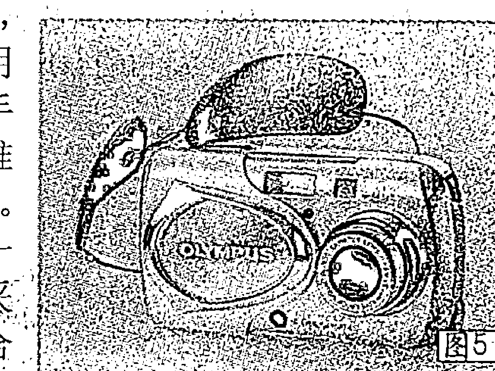

对于需要长焦拍摄的用户，厂商也推出了多款6X以上光学变焦的产品，并且加上了防颤抖功能，成为酷爱“远摄”的发烧友的利器。对于记者而言，拍摄高速运动的物体一直是一大难题，即便是具备了高速快门、大光圈、高ISO感光度也不能解决一切问题，因为这还要牵涉到拍摄技巧。不过，当美能达使用5点聚焦区域，并配备自动追踪聚焦功能之后，一切都迎刃而解。

数码相机发展到这一阶段，产品已经在多个方面形成分支。针对不同用户的实际使用环境，厂商可谓不遗余力地满足需求。也只有这样，数码相机才能真正成为人们工作的助手，而不仅仅是数码娱乐工具。

#### 1. DC也单反：迈向准专业领域

数码相机经过一段艰难的发展历程之后，已经进入了快车道，此时数码相机已经不是高价低质的代名词，而是渐渐向高档化的方向发展。诚然，与高端的传统35mm相机相比，数码相机还显得相当稚嫩，但是它的进步却是有目共睹的。继数码相机在像素上基本赶上传统相机的步伐之后，它又在单反技术方面向传统相机发起冲击。

然而数码相机的CCD感光器件存在噪点的问题，有时拍出的照片会存在一个个小黑点。如果厂商不加任何修改地在DC上套用传统的单反技术，那么这种噪点现象将会变得更加明显。此外，DC对焦速度慢也是其长期困扰的难题，而引入单反技术之后，这一矛盾将越发突出。正式基于以上这些原因，目前单反DC的品种相对较少，也只有为数不多的几个实力派厂商能够推出这种产品。但是，毕竟单反DC对用户具有极大的诱惑力，有时甚至是难以抗拒的。巨大的市场需求使得厂商不得不面对这一块巨大的蛋糕，继佳能、奥林巴斯纷纷涉足低价位单反DC市场之后，又一传统相机厂商尼康也携D70发布之机大举抢占市场份额。

单反数码相机所涵盖的市场不仅限于商用领域，当然还包括纯属爱好而进行摄影的用户。如果考虑到专业摄影人士和业余摄影爱好者的数量之差就会明白其中的道理，因此传统相机制造商瞄准这一用户层，从业务发展战略上来说是非常正确的。

的选择。

##### 尼康 D70 (图6)

尼康 D70 机身等级可对照传统的尼康 F75 相机，外观设计非常经典。采用了 631 万总像素的 APS 影像感测组件，有效像素为 615 万，单反DC与消费级DC的最大分别在于镜头，前者可以根据不同的拍摄需要更换镜头，而后者用的镜头是不可换的。对于单反 DC 来说，背后镜头群的性能，也是决定了该机适应性和图像质量。随着 D70 的推出，尼康公司也随即推出新的 DX 格式镜头，无可置疑，D70 当然可以适合这些 DX 镜头，除此外，D70 的 F 卡口，还全线兼容尼康的 AF Nikkor 镜头。AF Nikkor 镜头全为自动对焦镜头，可想而知，D70 背后支持它的优秀镜头是不少的。

##### 佳能 EOS 300D

如果你是一位热衷于摄影技术的发烧友或者准专业人士，一定不会对佳能的单反相机技术陌生，更能会充分感受到 EOS 300D 的专业风格。事实上，佳能 300D 可以算是佳能 300V 传统胶片机的数码版，兼容超过 50 余款佳能 EF 和新的 EF-S 镜头，全面兼容 EOS 系统附件，灵活性和创造性是其他非传统相机厂商所不能比拟的。为了充分体现这一优势，EOS 300D 套装中还附带一款优质的超广角变焦镜头，让 EOS 单反用户感受到专业的品质，以大约 1000 元左右的价格解决了单反数码相机广角镜头选用的难题。而更为令人惊讶的，EOS 300D 的公开报价仅仅一万不到，与尼康 D70 一并堪称最超值的万元级单反 DC（图6）。

##### 奥林巴斯 E20

奥林巴斯总是能将最先进的技术以最快速度带给广大普通用户，继高倍光学变焦之后，它又将单反技术引入了普通消费市场。目前这款 E20 只有 16000 元不到的售价，相对而言还算平易近人，比起前几年的几万元要好多了。E20 使用了 500 万像素的 CCD，配备了一个 4 倍变焦的高清晰镜头。令人感到高兴的是，奥林巴斯似乎力图将这款产品做成传统相机的操作模式，因此它还是很容易上手。和大多数 DC 不同的是，E20 的变焦控制不是电动的，而是手动式变焦，这无疑是一个令玩家们十分欣喜的特性，因为手动变焦环可以更加精确地调节。从单反效果来看，E20 做得也几乎完美，它基本上避免了各种常见的单反负效应而且成像品质堪称一流。

#### 2. 消费级 DC: 低价也要高性能

数码相机并不是摄影发烧友的专利，更不仅仅是高级玩家们的宠儿。面对偌大的摄影市场，数码相机所接触的是更为广泛的普通用户。就像一股数字化浪潮一样，数码相机要取代的是人们传统的摄影观念，而要做到这一步，产品价格的下降以及低端产品功能与品质的提升是必不可少的。

令人感到欣慰的是，以往一直高高在上的日系厂商已经清醒地认识到这一点。以佳能、索尼、美能达为首的厂商正以最具实用价值的 300 万～500 万像素产品为主角，配以高档的 3 倍光学变焦镜头，使之完全满足用户的需求，在成像品质、使用便捷性、成本等方面都具备相当的竞争力，即便比起中档传统相机都毫不逊色。趋于理性而又更加务实的厂商在价格定位上也显得十分灵活。

##### 佳能 PowerShot A80

佳能 A 系列一直是中低端市场的主流产品，而最新推出的 A80 自然在各方面更进一步。400 万像素加上 3 倍光学变焦令用户在拍摄过程中游刃有余，而佳能原厂光学镜头配合 DIGIC 处理器也确保优异的画质与拍摄速度。更为令人欣喜的是，A80 将原本只在高端 G 系列中出现的可旋转 LCD 取景器引入其中。此外 A80 还采用佳能先进的 9 点人工智能自动对焦，用户只要半按快门就可以快速完成对焦全过程，配合“转盘拍摄模式”设计，整体易用性表现令我们十分满意。

##### 索尼 DSC-P92

DSC-P92 堪称是索尼中端市场上 P 系列的旗舰级产品，500 万像素级别令其鹤立鸡群，应对大幅面数码照片输出更加游刃有余。DSC-P92 不仅提供了中心 AF 与多重 AF 对焦模式，同时还提供了 0.5m、1m、3m、7m 以及无穷远等不同距离的对焦模式。同时，它的闪光灯亮度还可以在高、普通、低三种模式之间进行随意切换，功能的多样化为用户在不同环境下的应用创造了更为便利的条件。在外形设计上，DSC-P92 也很见功力，带有浓浓的索尼烙印，时尚讨巧的外观令女性用户对其总是青睐有佳，而其总体表现以及价格也确实没有让人失望。

##### 美能达 DiMAGE Xt (图7)

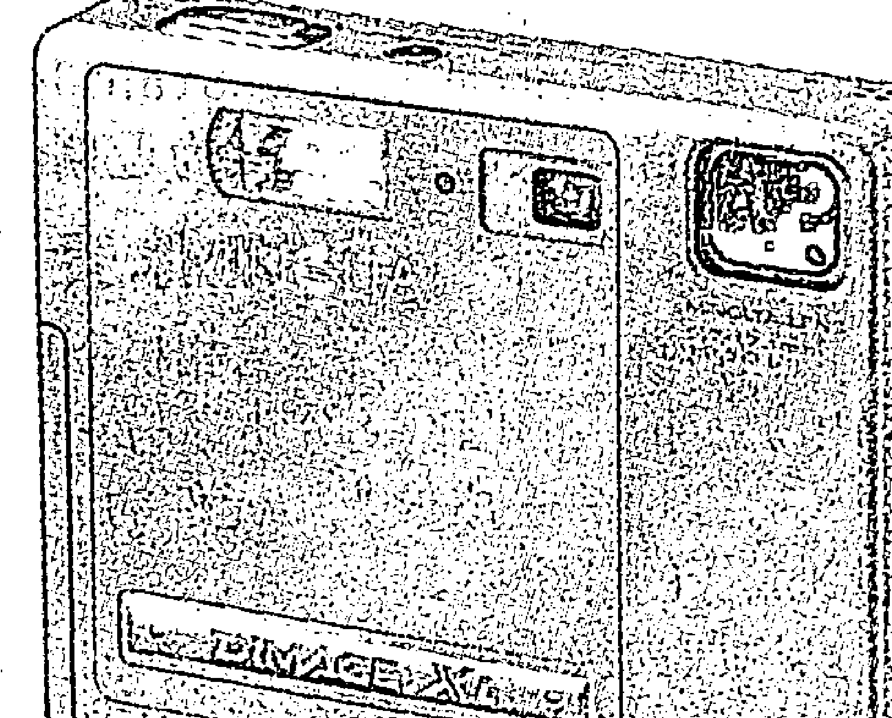

机身设计紧凑的 DiMAGE Xt 拥有近乎完美的“身材”，拉丝金属表面体现出极佳的质感，贴合衬衫口袋已经成为 DiMAGE Xt 的座右铭。当然，仅有超轻超薄的便携性还远远不够，一款成熟的产品还必须在易用性以及成像品质上有所建树。DiMAGE Xt 拥有多区域测光以及 5 点自动对焦功能。用户只需将拍摄对象落在超宽对焦框内，相机将会自动完成对焦工作。利用重点测光和重点自动对焦，DiMAGE Xt 还可对某一特定对象进行测光及对焦拍摄，该项功能更适于拍摄在复杂的现场光线条件以及拍摄背景下的主体。惟一有些遗憾的是，DiMAGE Xt 的像素仅为 300 万级别，不过这对于大部分用户而言应该已经足够，毕竟其 3 倍光学变焦以及出色的便携性将带给用户很多方便。

#### 3. 发烧友的最爱：“长枪王”引领市场

在 300 万像素就能足以满足数码冲印的情况下，更多用户将光学变焦能力作为衡量产品性能最重要的指标之一。事实上也的确如此，市场上具备高倍光学变焦能力的产品大受欢迎。而面对这一发展趋势，厂商也加大对此类产品的投入。一时间，市场上高倍光学变焦产品层出不穷。

光学变焦镜头通过改变照射在光敏元件（如底片、CCD 器件等）上的光线数量来达到变焦效果。组成图像的每一个像素均含有不同的数据，从而保证照片成像的清晰。在很多拍摄环境下，高倍光学变焦往往比高像素更为实用。

在很长一段时间内，高倍光学变焦产品往往价格不菲，直接导致这项技术无法普及。然而令人欣喜的是，随着富士与柯达推出低价位 10X 高倍光学变焦产品，佳能重返 10X 高倍光学变焦阵营之后，再加上美能达 Z2、奥林巴斯 C765UZ、松下 FZ2 等，数码相机又一次掀起“长枪王”潮流。

##### 富士FinePix S5000 Zoom

以往富士的数码相机往往使用6X光学变焦，不过这款S5000 Zoom却搭载了10×光学变焦的“富士珑”镜头，焦距范围相当于传统35mm镜头的37～370mm，让很多富士的拥护者兴奋不已。S5000 Zoom采用富士第四代蜂窝型SUPER CCD HR，具备310万像素，而且配备了专业级的电子取景器（EVF）。

##### 柯达DX6490（图8）

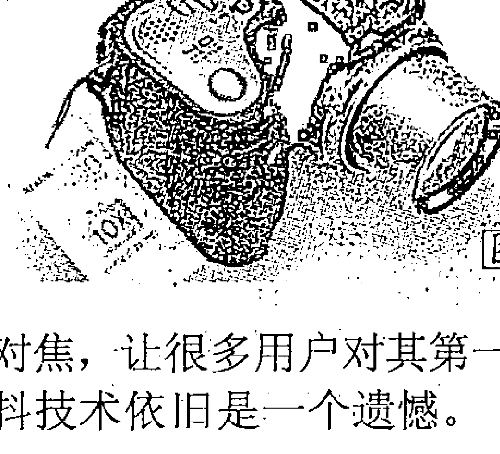

一直致力于低端市场的柯达一反常态地推出了具备10×光学变焦的400万像素产品，并且采用德国Schneider-Kreuznach Variogon的专业光学变焦镜头，这令人十分意外。品质上乘的2.2英寸超大LCD液晶屏以及快速准确的对焦，让很多用户对其第一印象十分好，不过没能使用防抖技术依旧是一个遗憾。

##### 佳能PowerShot S1 IS

PowerShot S1 IS是继经典的Pro90 IS之后，佳能时隔四年又一次发布10X高倍光学变焦产品。尽管这款产品只有300万像素，但是Image Stabilised光学防颤抖功能与499美元的官方报价将令其成为近期的热门产品。

#### 4. 永攀高峰：800万像素普及指日可待

正如传统照片的分辨率与相机所用胶卷有很大关系一样，数码相机所拍摄的图像的分辨率与它的图像传感器密切相关，而其核心部件——成像光敏元件的性能更是重中之重，直接影响到成像的分辨率。

虽说像素级别并非是衡量数码相机的惟一标准，但是不可否认的是，它还是标志数码相机档次的关键，这一点就像我们PC中的CPU。然而令所有数码相机厂商略显尴尬的是，即便是老态龙钟的传统相机都达到相当于600万像素的水准，因此未来像素级别的追求不会降低。

更高的像素级别无疑会令大幅面输出更为精美，在众多专业领域有着不可替代的作用。此外，高像素级别还能解放数码变焦功能，使之更具实用价值。限于当前CCD制作工艺的限制，目前主流数码相机还停留在300万～600万像素。然而令人欣喜的是，800万像素级别逐渐显露端倪，成为近期数码相机市场一道亮丽的风景线，索尼Cybershot F828、尼康Coolpix 8700、奥林巴斯C8080、佳能PowerShot Pro1、美能达A2，这些重量级产品已经预示着800万像素技术的成熟。

##### 索尼Cybershot F828

800万像素、4色滤光超级HAD CCD和7倍光学变焦“卡尔蔡司”镜头，F828不仅仅是F717的替代品，而是索尼公司为准专业人士和更多摄影爱好者的需求而提供的。F828最大的热点是它第一次搭载了索尼最新的“RGB+E” CCD传感器，此CCD由四种不同颜色的滤光器组成，胜于通常的三色CCD，具有更高的色彩还原度和细节表现能力。F828不但体积大了许多，在重量上也堪称悍马级人物，906克的重量让人望而生畏，不过能时刻带着F828行天下的玩家也不负于“专业级”的称号。

##### 尼康Coolpix 8700（图9）

CoolPix 8700的定位与索尼Cybershot F828相仿，同样具备800万像素，并且采用8X光学变焦Nikkor ED镜头。

从外形来看Coolpix 8700实际上就是Coolpix 5700的800万像素版本，稍稍进行了一些改进，甚至连重量也是一样的。但是镁合金外壳的设计却令Coolpix 8700多了一份专业的精神，而3cm的微距能力、1/4000s和256分区测光更是标志着高端消费级产品应有的素质。

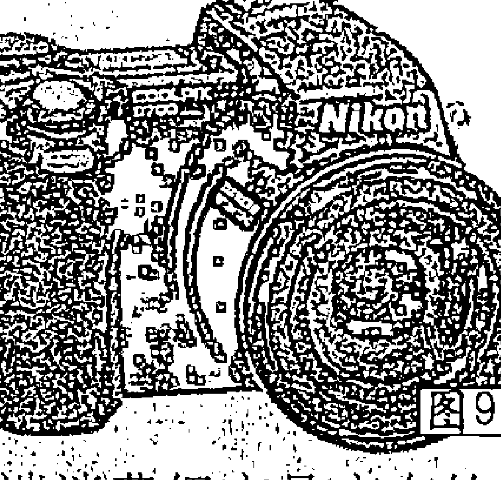

##### 奥林巴斯C8080

C8080配备了2/3面积的830万像素CCD传感器，图片可以用RAW、TIFF、或者JPEG格式储存，4倍的光学变焦镜头由8组13片非球面镜片构成。毫无疑问，21万像素2.0英寸的可翻转LCD加上最高感光值为ISO 1600，32－1/8000秒的快门速度绝对让C8080成为一款准专业相机。

#### 5. 名牌数码相机镜头点评

数码相机的镜头决定第一道成像质量。如果镜头的品质不行，那么无论使用多么出色的CCD感光器都是白搭。此外，镜头还决定数码相机的通光量、焦距等关键指标。不管镜头的相对入光量如何，越大的镜身，入光量就越大，拍摄质量也相对较好，可以表现出更为明显的景深。而目前十分流行的光学变焦技术也依赖于镜头，优秀的镜头能够提供高倍光学变焦，而且此时的画质几乎不会受到干扰。

##### 索尼

索尼并不是传统的光学设备厂商，因此为了提高其数码相机的成像品质，高端产品不惜血本地采用卡尔蔡司镜头。最新的卡尔蔡司是一种拥有多层涂层的高级镜头，其最主要的特色就是名为“T镀膜”的技术，可以避免由于镜头表面反光造成“耀光”。使用这款镜头的数码相机在折射率方面与传统镜头技术相比减少了80%，对于提高画面纯度大有裨益。

但是卡尔蔡司镜头的成本较高，因此索尼不可能将其运用到中低价位的主流产品，因此这款名牌镜头历来就是索尼高端产品的专利，从F505到F717以及最近炙手可热的F828，几乎从来没有打破惯例。图10为F828所采用的蔡司镜头。

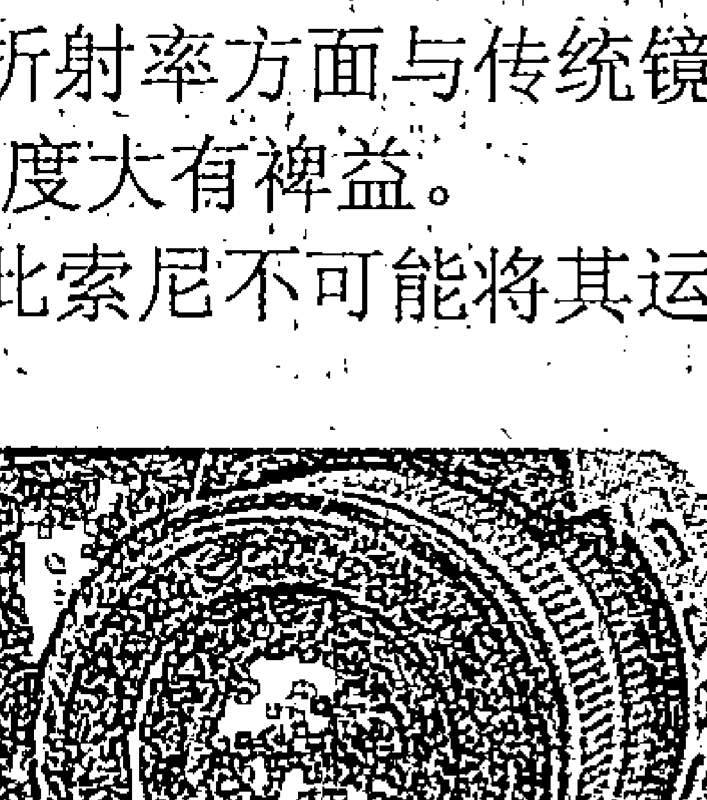

需要提醒大家的是，有时为了加强产品的竞争力，索尼会在其中端产品中使用蔡司镜头，譬如DSC-V1。但是此处的蔡司镜头与高端产品的蔡司镜头还是有所区别，不仅镜片数量与光学变焦倍率不同，镀膜也存在区别。不过不可否认的是，使用蔡司镜头之后，即便是中端产品也能够在成像质量方面获得提高。

事实上，大家并没有必要“神化”蔡司镜头，尽管这一品牌在以往的传统相机领域十分出名，但是这并不意味着只要使用蔡司镜头就能做到完美画质。由于蔡司镜头的特殊性，它很难做到10X光学变焦，一般保持在6X左右，而且无法提供类似F2.0的大光圈。综合来看，索尼惯用的蔡司镜头在民用市场的确堪称一流，但是距离发烧与专业还有所距离。

##### 佳能

作为老牌的光学仪器厂商，拥有深厚底蕴的佳能自然选择自家的镜头，甚至直接供货给卡西欧等其他厂商。一般镜头由玻璃铸模非球面镜片、复合非球面镜片、UD超低色散镜片等组成，由于佳能具备几乎所有镜片的生产能力，而且组合能力在业界堪称一流，因此其镜头产品相当齐全，覆盖## 好马配好鞍——笔记本配件

虽然笔记本的基本架构与PC台式机十分相似，但是在具体的各个配件上还是存在不小的差异。对于笔记本用户而言，熟悉笔记本的配件十分重要，这也是用好笔记本的第一步。事实上，笔记本配件可以分为机内的部件与配合使用的各种接口卡、笔记本包等，其涵盖的范围相当广。

### 一、笔记本内部配件

笔记本内部的配件主要由CPU、芯片组、显卡、内存、硬盘等构成，其雏形与PC台式机架构类似，不过受到体积以及功耗的限制，因此其外形一般很小，而且功耗较低。

#### 1. 笔记本CPU（图1）

笔记本的CPU有许多种，但是我们需要注意的是笔记本CPU和台式机的CPU是不同的。笔记本的CPU的设计不仅仅是为了让电脑的速度更快，而且还需要有更小的功耗和更小的发热量，所以通常来说笔记本的CPU远远贵于台式机的CPU。为了减少发热量并降低功耗，笔记本CPU通常采用更为先进的制作工艺，同时降低工作电压与频率。为了弥补性能上的损失，笔记本CPU往往还会增加二级缓存容量，譬如Celeron4移动版拥有256KB二级缓存。此外，笔记本CPU还具备了节能技术，可以根据应用程序的需要来调整工作频率。

#### 2. 笔记本芯片组

笔记本芯片组专门对应笔记本CPU，而且通常在主板上板载大量芯片，以提高集成度。以目前的笔记本为例，一般在主板上可以找到集成声卡、集成网卡等，少数笔记本甚至集成显卡、闪存读卡器等。当然，笔记本芯片组也必须支持低功耗运行，否则会影响整机的续航时间。

#### 3. 笔记本显卡（图2）

如果笔记本想要在部分领域全面取代台式机，那么3D性能必须有所突破。以往的各大图形芯片厂商似乎对移动市场并不怎么重视，不过这一局面在近几年大有改观。nVIDIA与ATi的激烈对抗已经是全方位的，图形芯片市场依旧火药味十足。与以往不同的是，这种竞争不再是低层次的，而是将硬件级DirectX支持作为重点，几乎与台式机图形芯片同步发展。

#### 4. 笔记本内存（图3）

从技术上来看，笔记本内存与我们常见的台式机内存没有太大的区别，只不过是使用了更加先进的封装技术与PCB，以减小发热量并降低功耗。从价格上看，笔记本内存大约比相同容量与速度的台式机内存高20%左右。

#### 5. 笔记本硬盘

笔记本硬盘在外观上要小于传统的3.5英寸IDE硬盘，这种2.5英寸笔记本硬盘往往使用更低的转速，从而控制发热量。目前笔记本硬盘的转速主要为4200RPM和4500RPM，少数高端甚至达到5400RPM。由于盘片面积较小，从而造成存储密度下降，因此笔记本硬盘的容量以及速度发展都滞后于台式机硬盘。

### 二、笔记本的接口卡

目前，PCMCIA接口已是笔记本电脑的标准接口之一，基于该方式设计的PCMCIA设备均得到了很好的支持，一般不会出现兼容性问题。这也是市场上PCMCIA产品齐全、种类繁多的原因。PCMCIA（Personal Computer Memory Card International Association）的中文定义为“国际个人电脑存储卡协会”，凡符合该协会标准所设计的存储卡，便可称为PCMCIA卡或简称为PC卡。除了具备轻巧、方便携带、设备支持广泛的优点，PCMCIA卡还拥有与USB外设相同的“热拔插”功能，可以在电脑开机状态下安装和卸载，并能自动通知操作系统更新设备，这对于注重移动性的笔记本电脑而言，是相当有利的。

#### 1. PCMCIA的分类

PCMCIA接口分为两类，一类为16位的PCMCIA，另一类为32位的CardBus。CardBus是一种用于笔记本的高性能PC卡总线接口标准，就像广泛应用在台式计算机中的PCI总线一样。该总线标准与原来的PC卡标准相比，具有以下的优势：
- 第一，32位数据传输和33MHz操作。CardBus快速以太网PC卡的最大吞吐量接近90Mbps，而16位快速以太网PC卡仅能达到20M~30Mbps。
- 第二，总线自主。使PC卡可以独立于主CPU，与计算机内存间直接交换数据，这样CPU就可以处理其它的任务。
- 第三，3.3V供电，低功耗。提高了电池的寿命，降低了计算机内部的热扩散，增强了系统的可靠性。
- 第四，后向兼容16位的PC卡。

当前PCMCIA卡有Type I、Type II、Type III三种标准，它们的长宽都是85.6mm×54mm，只是在厚度方面有所不同。Type I是最早的PC卡，厚3.3mm，主要用于10M网卡；Type II将厚度增至5.5mm适用范围也大大扩展包括了大多数的Modem、网卡适配器和其它电气设备；Type III则进一步增大厚度到10.5mm，这种PC卡主要用于旋转式的存储设备。

在PCMCIA设备的选购上，笔记本用户当然是按需选购，但要注意的是要认清你的笔记本所支持的PCMCIA卡的类型。一个Type I插槽只可以插入一张Type I卡；一个Type II插槽可以插入一张Type II卡或一张Type I的卡；一个Type III的插槽则除了可以插入一张Type III卡外，还可插入两张兼容的Type I或Type II卡。也就是说如果你的笔记本支持Type III的PCMCIA卡，那你三种类型的PCMCIA卡都可以使用，但如果你的笔记本只支持Type I或Type II型PCMCIA卡，那你就只能选择对应的PCMCIA卡的扩展设备了。在购买时一般可以携带笔记本电脑去购买，认清支持的设备。一般PCMCIA卡支持热插拔和即插即用，当你检测的时候可以直接插入你的笔记本电脑的PCMCIA卡中试试，它应该会自动识别出PCMCIA卡设备，这样一般就不会有问题了。

#### 2. PCMCIA Modem

Modem并不是笔记本的标准配件，因此当用户需要使用该设备上网时就需要购买相应的PCMCIA Modem卡。目前PCMCIA Modem卡一般采用V90或者V92标准，最大下载速率为56Kbps，与台式机上PCI接口或者外置接口的56K Modem并没有太大差别。惟一需要注意的是，56K的PCMCIA Modem卡大多采用32位的CardBus标准，因此部分Pentium时代的旧式笔记本可能无法兼容，此时只能使用33.6K的PCMCIA Modem。

#### 3. PCMCIA网卡（图4）

PCMCIA网卡应该算是最为常见的PCMCIA设备，按照速度可以分为10M和10M/100两种，其中前者多半采用16位总线，后者采用32位CardBus标准。PCMCIA网卡的接口通常使用一个“小辫子”引出，因此一定要妥善保管好，否则根本无法使用。由于PCMCIA网卡也使用RJ45接口，因此其使用方法与PCI接口的网卡完全一样。

#### 4. USB 2.0/IEEE1394扩展卡

对于部分笔记本而言，可能不具备USB 2.0或者IEEE1394接口，此时使用PCMCIA接口进行扩展是很好的方法。可以肯定的是，USB 2.0/IEEE1394扩展卡采用32位CardBus标准，部分提供较多接口的产品甚至需要Type III插槽。由于CardBus标准的PCI总线具有很高的连接带宽，因此并不会成为USB 2.0或者IEEE1394等局部总线的速度瓶颈。

### 三、无线网卡

随着无线网络技术的成熟、成本的下降，它已经开始逐步取代有线网络。当我们身在异处之时，再也不必因为网络遥不可及而感叹远水救不了近火。无线网络技术已经为我们带来了不少惊喜，在各个领域展现着它的身手。然而目前，只有迅驰笔记本内置了无线网卡，大多数其它笔记本还是需要通过PCMCIA接口进行扩展。此外，无线网卡的范畴不仅局限于WiFi标准，各种GPRS以及CDMA 1X无线网卡也已经十分普及。

#### 1. PCMCIA WIFI 无线网卡 (图5)

对于PCMCIA WiFi 无线网卡而言，功耗与稳定性确实是最重要的两大技术指标。论速度与信号接受能力，目前支持IEEE 802.11b标准的产品不会有太多的差别。而倘若功耗太大或者稳定性不佳，那么用户肯定会因此而烦恼。对于移动产品而言，功耗问题一直相当敏感，如果无线网卡没有采用节能设计，那么笔记本、PDA等移动设备的电力供应就会捉襟见肘，严重影响实际应用效果。在选购无线网卡时，建议大家尝试不同品牌的产品以检验其对电能的消耗。很多用户反应无线网卡发热量巨大，这一问题也确实比较突出，尤其是在夏天。从“功能原理”我们也应该可以推得，发热量巨大的产品绝不可能是节能型的，而且这对于产品的稳定性以及寿命是相当不利的。

#### 2. MiniPCI 无线网卡 (图6)

对于没有内置WiFi功能的笔记本而言，通过安装无线网络模块或者PCMCIA/USB接口的无线网卡都可以实现网络通信。为了节省一个PCMCIA插槽并且改善美观性，MiniPCI接口应运而生，大家可以将其理解为内置式的PCMCIA插槽。笔记本要安装WiFi无线网络模块必须有内置的天线，比如IBM的ThinkPad的T30/R40/T40/X31系列、SONY的PCG系列。事实上大部分名牌P4-M笔记本都带有内置天线，因为当时无线网络模块已经成为一种潮流，只不过因为成本问题而一直是一个选配组建。而由于笔记本都是一条生产线出来的，相同系列的产品在结构上完全是一样的，所以即使没有内建无线网络模块，其专用的MiniPCI接口槽还是保留着。大家可以对照自己的笔记本来确认是否可以安装无线网络模块。

无线网络模块使用笔记本中的MiniPCI接口，一般位于笔记本的背面，需要拆下相关盖板才能看到。当然，即便是没有动手经验的朋友也不必担心；打开MiniPCI接口的盖板并不会触及笔记本内部，也不会影响产品的质保。不过在进行具体的操作之前，我们强烈建议大家取下笔记本的电池，避免带电操作。在笔记本的MiniPCI接口旁边，我们可以看到两根天线，分别是黑色AUX和白色的MAIN。同样，无线网络模块上也有与之对应的两根天线，用小钩将其连接即可。需要注意的是，两根天线的连接不能错位，请大家对照天线上的文字说明！下一步便是将无线网络模块安装到MiniPCI插槽，这一步与安装笔记本内存条十分相似。安装无线网卡的整个过程不需要用很大力，先把卡对准插槽与平面成45角插进去，然后按住网卡的上面两个角用力均匀的按下去即可，装到位了会听见清脆的咔哒两声。不用担心你是否会把无线网络模块装反了，因为MiniPCI接口有防插反设计，反了是插不进去的。安装完成之后，要确保不存在松动，同时要注意两条天线的布局，不要往里面硬塞，而是应该沿着边走线，可能要多试两次，找到最佳位置，确定盖子能轻松盖上并不压着天线为止。最后，合上MiniPCI接口槽的盖板并拧上螺丝即可完成整个安装过程。

#### 3. GPRS 无线网卡 (图7)

笔记本电脑是移动办公的首选，轻巧的机身与内置的电源，使得它可以随时随地处理信息。不过，它也有一个明显的缺点，就是不能随时随地上网。虽然很多笔记本内置了56K Modem，但是如果没有电话线也是无济于事。为此，无线广域网开始普及，如果笔记本用户拥有了一张GPRS无线网卡，一切问题就都解决了。在速度方面，GPRS的理论值基本上与双通道ISDN相同，但是根据网络信号的强弱，其表现会有一定的差异，基本上维持在略低于普通56K Modem的水准。

#### 4. CDMA 1X 无线网卡

CDMA 1X无线网卡与GPRS无线网卡类似，也采用PCMCIA或者USB接口，只不过它使用了联通的网络。从速度表现来看，CDMA 1X要优于GPRS，尽管距离理论上的峰值仍有不小的差距，但是已经超越了56K Modem，速度完全能够让人接受。

### 四、笔记本电池

笔记本最大的优势便是移动性，而提供这一切的基础便是电池。在节能技术以及电池技术暂时难有突破的时候，充分优化电池并且掌握一些相关的使用技巧将很有帮助。从笔记本电池的选择，到性能测试以及老化电池的挽救，这些大多数笔记本用户所必须面对的问题。

#### 1. 笔记本电池的选择 (图8)

镍氢电池已经很少出现在笔记本中，锂离子电池已成为绝对的主流。在选购电池时，我们首要关注的便是锂离子电池的容量。一般而言，目前主流产品应该至少具备。

#### 2. 笔记本电池的性能测试

对于新的笔记本电池而言，进行及时的性能测试很有必要。此外，这一小技巧也能帮助大家在选购二手笔记本时辨别电池性能的优劣。由于电池性能是一个相对主观的指标，因此我们难以使用快速的方法进行测试，这里将借助Battery Mark这款业界公认的权威测试软件。在 Battery Mark 电池测试中，分为Conditioning以及Life Test。 Conditioning就是分别调用CPU处理引擎、硬盘处理引擎以及显卡芯片处理引擎，长时间不停地进行运作，而且显示液晶屏幕亮度调整到最大，直到耗尽电池关机为止。而Life Test就是有一定的停留时间，就好像使用笔记本电脑的时候，并不是时时刻刻都让所有的部分同时全速运作。显然，Battery Mark所测试的不仅仅是电池性能，还包括整机的节能效果。为此，建议大家使用 Life Test 测试，然后根据厂商标称的电池使用时间进行对比，一般误差应该保持在25%以内。对于部分名牌笔记本而言，我们甚至还能通过相关软件来检测电池的充电次数。以IBM为例，安装 Battery In-formation 软件之后，可以从统计信息中的 Cycle Count 来得出结果，从中估计出电池的大致老化程度。

#### 3. 笔记本电池的保养

笔记本电池使用时间长了，就常常充不满，甚至显示电池损坏。因此，电池的保养和恢复就是笔记本电脑用户需要关心的话题。不管你的笔记本使用锂电池还是镍氢电池，一定要将电量用尽后再充（电量低于1%），这是避免记忆效应的最好方法。事实上，锂离子电池也是有记忆效应的，只是它的记忆效应比镍氢小一些罢了。不过需要注意的是，笔记本电池充电时，尽量避免时间过长，一般控制在12小时以内。电池的寿命长短不是由总使用时间，而是由充放电次数来决定的。如果始终将电池装到笔记本上，而不取下来，那么即使关闭机器并取下AC电源以后，电池也不会一直保持充满电时的状态。笔记本电脑电池由于在电池中集成了控制电路，因此即使是在关闭电脑电源的时候也在耗电。由于一接上AC电源，电池就会开始充电，因此每当打开或关闭电源时，电池就会反复地充电和放电。

为此，使用AC外接电源时最好将电池拔掉，否则电池长时间处于发热状态对其寿命有影响。电池若长期不用，请至少二个月充放电一次，以保证它的活性。在保管电池时也有一个需要注意的问题。目前，绝大多数笔记本电脑所使用的锂离子电池如果长时间不使用，往往容易出现过度放电的现象，甚至可能再也无法进行充电。为了防止过度放电，可以在半充电状态下将其保存在凉爽干燥的地方，然后每半年一次，再将其充电至一半的状态。

#### 4. 拯救衰老的电池

电池在使用了一段时间之后就会衰老，具体表现是内阻变大，在充电的时候两端电压上升得比较快，这样就容易被充电控制线路判定为已经充满了，容量也自然是下降了。由于电池内阻比较大，放电时电压下降幅度大、速度快，系统很容易误认为是电压不够，电量不足（其实是有电放不出）。显然，电池的衰老是一个恶性循环的过程，在发现电池工作时间掉得比较快的时候就应该锻炼一下了，否则迟早都会完蛋。

电池校正是对付衰老电池的有效方法，一般而言，各个品牌的笔记本都会有专用的电池校正软件。IBM就有一点相当不错的放电软件，而且同样适用于部分其它品牌的笔记本。大家只要连续多次放电再充电，笔记本电池就能被部分激活，重新焕发青春。到 http://download.pchome.net/ system/sysenhance/10216.htm 下载放电软件并执行后，系统会提示制作安装盘。使用该安装盘引导PCDOS，提示拔掉AC电源，放电软件会自动进行放电控制。当一切结束之后笔记本会自动关机，然后我们可以接上AC电源进行充电，时间控制在9~12小时，反复进行2~3次即可。

### 五、笔记本包（图9）

当人们开始使用笔记本的时候，很快意识到必须有一个专门的包来装着它，才可以带着它到处跑，而且这种包与一般的提包不同，必须能够给这个贵重的电子产品以足够的保护，于是出现了对专业笔记本电脑包的需求。

笔记本包有原装与非原装包之分。原装包有IBM、DELL、东芝等品牌。一般来说，目前许多品牌的笔记本电脑在销售时都有一个笔记本包送给用户的，如果JS没给你，可再向他们索取，有些JS将扣下来的笔记本包卖给他人，以获得更多的利润。当然，有些品牌的笔记本电脑在购买时是没包送的，在这种情况下，如果你的笔记本电脑在市场上有原装包出售的话，建议尽量购买原装包，因为原装包能与机器更加匹配，而且由于它们多数是专业的笔记本包代工厂商生产的，通常能根据笔记本电脑的特性和制造，做出来的产品会更加专业，例如IBM著名的“红点包”就是由长期为IBM、HP和TOSHIBA这些著名的笔记本代工商——TARGUS设计和制造出来的，它仅防水性这一项的指标就经过了非常严格的检测，然后才出厂的。

当然，一些比较有名的原装包假冒伪劣的产品比较多，往往难以鉴别，给消费者的购买带来了一定的麻烦，另外，原装包的款式一般都没非原装包的多，挑选的余地也没非原装包那么大，有些原装包的款式过于正规和商务化，难以满足人们求新求异的审美情趣，例如IBM著名的“红点包”即属于此类。非原装包的优点是价格相对比较适中和合理，而且款式多，消费者挑选的余地大，不足之处在于它的做工通常不够专业和精细，许多非原装包都是由制造皮包甚至是制衣之类的厂商生产出来的，而且它们通常的名气不大，不用过于在乎产品的美誉度，导致其用料和做工可能与原装包相比有一定的差距，产品质量参差不齐、良莠不齐。

## 数码相机与数码摄像机配件

近两年来，数码相机（简称D.C）和数码摄像机（简称DV）凭借着其功能齐全、影像品质高、体积小、重量轻等诸多优点，已占据了影像市场的大半江山，并且还有将传统照相机和摄像机取而代之的势头。然而不可否认的是，无论是DC还是DV，各种功能强大的附件都是必不可少的，只要这样才能帮助用户玩转其各项功能。

### 一、增强镜头

使用增强镜头的目的是为了提高DC与DV的拍摄能力或者拍摄出一些特效来。事实上能使用到这些增强镜头的用户一般都属于专业或者是准专业的人士了。如果你希望你的数码设备能够在功能上有所突破，那么应用增强镜头几乎是必须的。

#### 1. UV镜（图1）

UV镜一般装在DV摄像机镜头前面，从理论上说能有效阻挡紫外线，并能保护镜头不进灰尘。UV镜的选择一是看口径大小，要注意和自己的DV相配。但是你觉得这几十元的UV镜真的可以阻挡紫外线吗？只要它不妨碍拍摄就已经很好了，说不准只是一块白玻璃而已！所以，建议大家要么购买30元以下的UV镜即可，或者干脆选择100元以上的正规高档产品。UV镜最好是和机器一起买，因为在试机的过程中，顺便试试UV镜和机器的配合程度，如果装上UV镜后，色彩和清晰度等有异的话，可以马上换个UV镜或者换个其他牌子的。虽然UV镜价格便宜，而且不一定能阻挡紫外线，但是可以肯定地说，它能保护镜头不受意外的伤害。

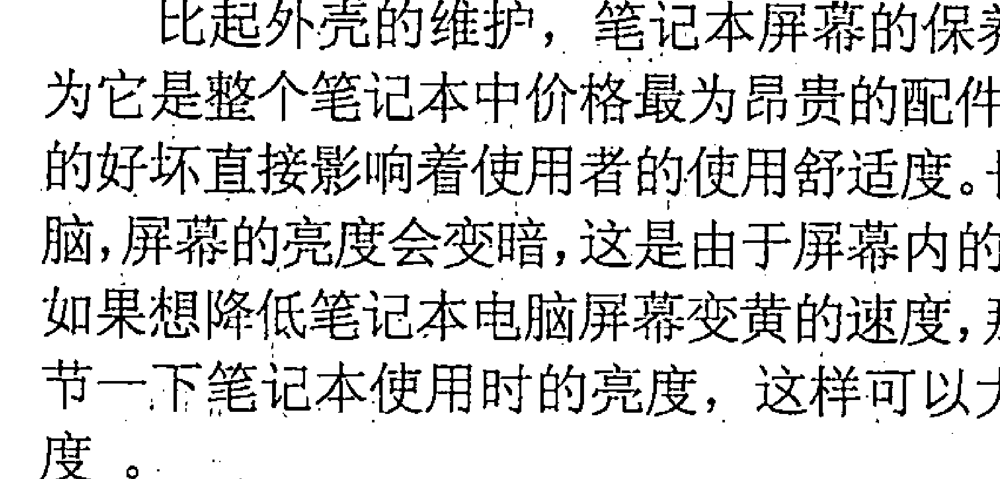

当然，如果资金允许的话，购买一款中高档的UV镜还是很有必要。尽管我们的肉眼看不见紫外线，但是它却可以使感光器降低色彩鲜艳度。毫无疑问，当UV镜过滤掉紫外线之后，就会减少透射到感光器上的蓝紫光波，使远景清晰，提高远景色的反差及色彩饱和度。不过数码相机对于红光及红外光敏感而对蓝紫光（尤其是紫外光）并不敏感，所以在数码相机上加用UV镜将得不到所期望的有利效果，因此UV滤镜就不是那么必要了。一般现在市面上卖的UV有三种：一种是没有镀膜的，价格在30元以下；另一种是单层镀膜的，主要是Kenko的，大概60元左右；还有一种是多层镀膜的，需要100元以上。很自然，多层镀膜的产品效果更好，这也是我们强烈推荐的。

#### 2. 广角镜（图2）与增距镜

不少用户在使用了自己的数码相机以后，往往感觉不是广角不够大就是长焦不够长。拍摄风景时画面好像没有很多景物就放不下了或者拍摄小鸟是必须不断地往前走。使用起来真是不够爽。其实大家可以根据需要选购一款增距镜或者广角镜，那么上述的遗憾也就不复存在了。例如一款变焦相当于35mm的38mm-114mm的相机，在使用了2倍的增距镜以后长焦就达到228mm，成为名副其实的长焦镜头了；而当使用了0.6倍的广角镜时，广角端就达到了22.8mm，这就是一个相当实用的广角镜头了。当然使用增距镜和广角镜也会有缺点的，安装使用后拍摄出来的图像往往会出现效果变差的情况。但相信对一般摄影发烧友来说，其变差的幅度还是可以接受。重要的是用户可以用较为低廉的价格实现在广角和长焦两端的扩展，为自己的拍摄带来更大的便利性。

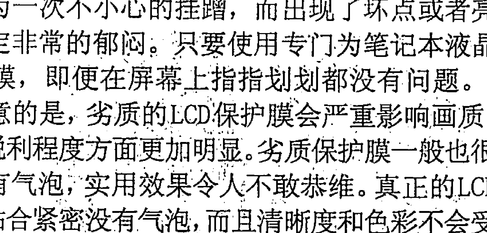

一般数码相机厂商都会针对自己的产品推出专用的转接环与镜头，而市场上也有兼容的产品可以选购。原厂的配件普遍价格较高，但质量也是无可挑剔的。兼容配件选购时，最好带上数码相机进行现场测试。

### 二、数码存储卡

解决数码设备的存储问题一直是业界的关注焦点，而随着数码设备像素级别的提高，用户对数码存储卡的容量、速度、体积等提出更高的要求。时至今日，数码存储卡经历了两代发展历程。

#### 1. 数码存储卡规格浅析

从目前的发展格局来看，数码存储卡的规范在短时间内不可能统一，不过部分在技术指标上有着明显差距的产品还是会遭到淘汰。事实上目前数码存储卡已经发展到第二代，CF、SM、MS、MMC都有了新一代的升级产品。然而，我们也不能就此断定老一代产品一定会全面退位。

以CF卡为例，目前使用这一存储介质的设备实在是太多了，有着广泛群众基础的它至少在两年内没有被淘汰的威胁。更加重要的是，CF自身也在不断完善。目前CF卡是市面上最为廉价的闪存介质，而且它在容量方面也取得了重大突破，RiDATA已经成功研制出4GB的52X高速CF卡（图3）。反观SM卡，其前途可能非常黯淡。原本SM的主要舞台便是数码相机与MP3随身听，而当富士以及奥林巴斯转而支持xD-Picture Card之后，SM卡的市场将急剧萎缩。至于Memory Stick与MMC，它们本身就没有太大的市场，随着新一代产品的出现，退出市场将是必然的。

未来数码存储卡将向三个方向发展：低成本、高速度、大容量。毫无疑问，CF卡将凭借成本优势继续稳坐钓鱼台，而xD-Picture Card、Memory Stick Pro与Secure Digital（图4）将形成激烈的竞争。从综合性能来看，xD-Picture Card与Secure Digital确实非常出色，但是SONY的市场推广能力却是令人不敢小觑的。凭借自身在消费类电子市场的霸主地位，Memory Stick Duo与Memory Stick Pro的成功将是毋庸置疑的。

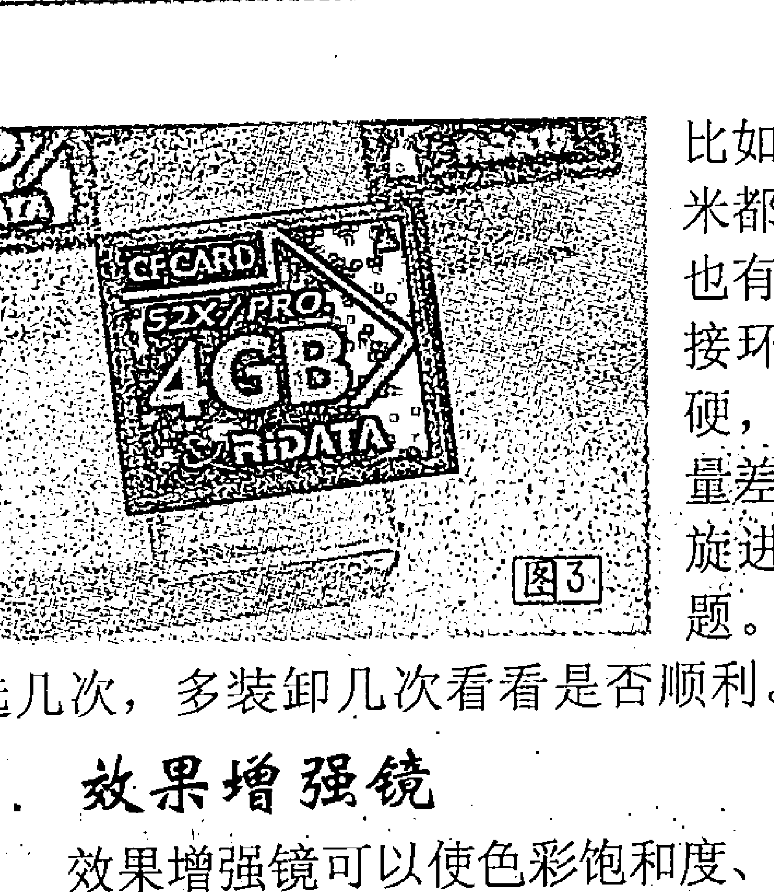

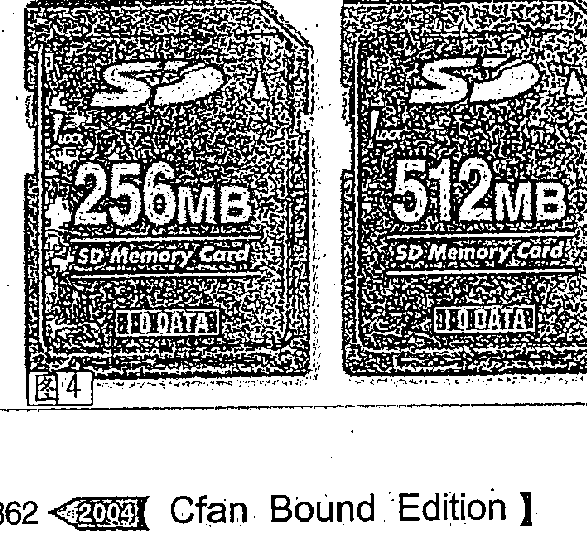

数码存储卡对于速度以及容量的追求也是永无止境的。目前DC已经实现了拍摄动态影片，而随着闪存技术的突破，未来DV可能向纯数码化的方向发展。客观而言，目前的DV并非是纯数字化的，因此MiniDV摄像带的存储过程并没有实现数码化。然而，当数码存储卡在速度以及容量方面有所突破，那么DV大放异彩的一天也就到来了。届时，DV将不存在后期视频捕捉的问题，因为这些操作已经在数码存储卡中完成。

#### 2. 速度与容量的追求

随着数码存储卡速度概念的深入人心，越来越多的用户渴望选购高倍速的CF存储卡。需要提醒大家的是，CF存储卡的速度应该根据所配套的设备来选择，而不是一味地追求高倍速。如果你仅仅使用300万以下像素的数码相机，并且通过USB 1.1接口进行数据传输，那么没有丝毫必要去使用10X以上的CF卡。撇开数码相机的需求不谈，USB 1.1接口的实际峰值速度仅仅是1.5MB/s，而10X的CF卡就已经达到1.5MB/s。当CF卡的倍速再次提高时，整个存储系统的瓶颈在于USB接口，而非数码存储卡！更为重要的是，CF卡的速度还受到读取设备的限制。一般而言，我们建议将CF卡作为PDA存储器或者供拥有USB 2.0接口读卡器的用户选择，而在大多数情况下，普通4～8X的CF卡已经足够了。

在数码相机快速普及的今天，一直困扰用户的数码照片存储问题开始日渐突显。一般而言，当数码相机的分辨率设为1600×1200时，128M存储卡可存储100张左右；而当分辨率设置达到2272×1704时，128M容量也只可存储50来张而已。越来越高的图像分辨率对数码存储卡的容量提出更高的要求。

当然，存储卡的价格因素也很重要，或者更确切地说应当是性价比。比如现在五百元左右可以购买60GB硬盘，而再加几十元可以购买80GB硬盘，显然80GB硬盘性价比较高，CF卡也是如此。在128MB和256MB只差一百多元的时候，购买256MB更合适，因为按理说存储卡的容量也是多多益善。比如一张低容量存储卡能拍摄少量照片，但装上大容量存储卡后，就可以拍摄上千张照片或者约一个小时的录像，外拍尤其方便，室内拍摄也免去你反复读卡的麻烦。在价格可以接受时，应该挑选一张足够容量的存储卡，不要让存储容量成为设备的瓶颈。

### 三、摄影包

带着一个设计精美、外形时尚的摄影包可以体现出你的个人素质和内涵，其作用和价值绝不仅仅是容纳数码设备那么简单。DC与DV是相当精密的光电仪器，也很娇气，携带过程中的磕磕碰碰、不经意地跌落、风沙入侵或雨淋，都有可能“伤筋动骨”甚至“夭折”。而一款优秀得体的摄影包则能使数码设备远离这些危险，在突发情况下保护数码相机的安全。更为重要的是，发烧友们还需要很多数码设备配件：电池、转接环、增强镜头，一起放置在摄影包内才是最稳妥的解决方案。

#### 1. 选提包还是选背包

摄影包可分为提包和背包。提包使用起来方便省事，一提就走，干净利落，而且如果加上吊带，还能挎在肩上，但由于它的容量通常较小，而且提得太久手就容易累，挎在肩上又不雅观，所以比较适合提着它到附近不远处使用，特别适合上下班之类性质的人士使用。背包的体积则常常比提包要大些，而且用双肩背着肯定要比单手提要轻松和舒适得多，所以特别适合外出旅行之用。此外在轻盈出行之前，摄影包的重量也是不可忽视的。常常见到部分用户为呵护心爱的数码相机而配合考究的牛皮包，殊不知此时包的重量已经大大超过数码相机本身，倘若你使用的是价格不菲的轻薄型数码相机，那么无形中等于是浪费自己的投资。相对而言，我们推荐各种名牌轻质帆布包，既可以保证一定的强度，也不失美观性。

#### 2. 摄影包材质的学问

如同任何包具一样，选购摄影包时也应该对材质格外注意。摄影包的外用质料相当关键，其最重要的功能是防水、防磨及防火。从目前的主流趋势来看，大致分为二大类：尼龙或人造纤维以及帆布。
尼龙的美观性可能不如人造纤维，但是这种古老材料的实用性却是毋庸置疑的。需要注意的是，不同的人造纤维材料在性能上可能相差很大，优秀的产品甚至能够达到近似于尼龙材料的防磨能力。至于帆布材料，其防水性很差，一般通过内衬塑料薄膜来达到一定的防水效果，其好处在于易清洗并且分量轻。另外一种很少见的材料便是仿皮或者真皮。由于仿皮与真皮的强度都很一般，因此通常不用来作为摄影包。但是这并不意味着被彻底决裂。少数产品通过巧妙的设计，在周围使用仿皮，然后内部衬以尼龙，同时底部采用耐磨性较高的材料，这样就能兼顾美观性与实用性，而且同样很适合摄影包的需求。不过，似乎欧美厂商天生对皮具就不感冒，因此这类产品多见于台湾以及东南亚地区。
摄影包的内部材料关系到减震效果。普通的产品一般使用纸板作分隔，缺点是强度不高，而且受潮以后容易吸水。中高端的摄影包采用轻质木板，总体效果要好得多。一般而言，我们不建议大家购买外部采用帆布材料，而内部又使用纸板的摄影包，其寿命很难令人满意。

#### 3. 主流摄影包推荐

##### Targus DADM15

说到Targus，熟悉IBM ThinkPad笔记本的用户肯定不会陌生。作为全球知名的数码产品包具品牌，Targus一直象征着时尚、实用与经典。然而更为难能可贵的是，DADM15是Targus产品线中为数不多的低价位产品。不过Targus并没有因为低价位而粗制滥造，精细的尼龙面料与内部的海绵式防水垫配合地相当出色，带给用户极佳的防水性能与抗震效果。打开DADM15，我们可以看到内部的多个隔间，不仅能够容纳数码相机，还可以放入各类附件。然而作为一款小型化的便携式摄影包，最大容纳体积仅仅10.2cm × 19.7cm × 7cm的DADM15并不适合使用单反相机的用户。或许容纳一个佳能EOS10D问题不大，但是一旦用户需要配合各种长焦镜头，此时空间就会捉襟见肘。至于耐用性，Targus DADM15的表现还是令人十分满意，织物质地厚密，尼龙带交叉连接，可以让用户在旅行时安心将数码相机交给它保管。

- 适用人群：喜欢低价位名牌的小型数码相机用户。

##### SOLIDEX TBA200（图5）

尽管SOLIDEX是美国品牌，不过这款TBA200却由台湾的厂商OEM生产。TBA200是一款典型的仿皮摄影包，拥有440mm × 150mm × 230mm的大体积以及内部防震海绵衬垫。从整体结构来看，这款产品很适合需要装载大量设备的用户。只要安放得当，即便携带MiniDV、单反DC、多款附加镜头甚至充电器也不在话下。由于采用了皮革材料，因此这款摄影包的体积稍重，好在厂商配备了肩带和腰带，一定程度上弥补了便携性的不足。

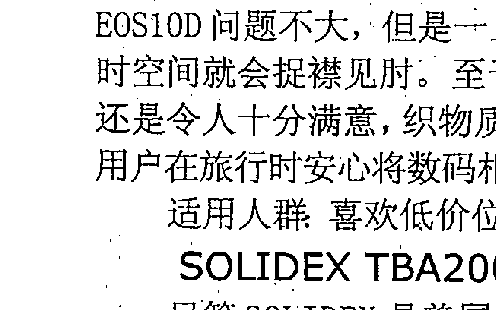

- 适用人群：需要携带大量设备的用户

##### Lowepro ORION AW（图6）

与同样大名鼎鼎的Targus相比，Lowepro更加专注于摄影包市场，而且在国内已经比较普及。这款ORION AW的主要优点是上下可以分离，下面可以作为大腰包和单肩背包单独背，上面也可以单独背，上下合起来可以双肩背，比较适合于旅游的时候用。对于很多喜欢自助旅游的朋友而言，既要带上摄影包又要带上生活用具的确是很麻烦的事情，而大体积的ORION AW很好地解决了这一问题。在材质方面，尼龙材料和防水隔膜的组合也十分理想，而且整体强度较高，防滑背带的舒适度也很不错。ORION AW的设计十分巧妙，上部袋口甚至没有拉链，在存取物品时更为方便，不过可得谨防小偷哦。

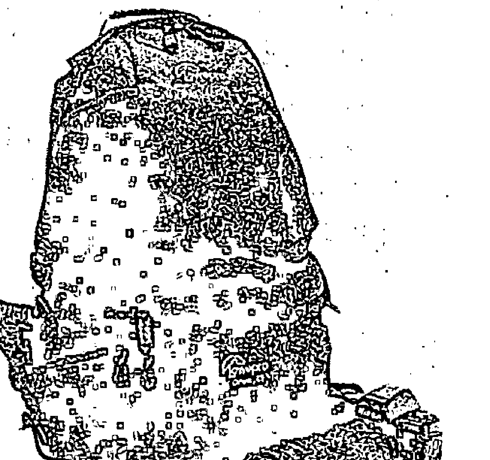

- 适用人群：兼顾生活用途的大体积摄影包
- 参考价格：550元

### 四、三脚架（图7）

许多朋友用DC摄影时，经常会拍出一些比较模糊的照片，通常使用者都认为是对焦不准引起的或者是相机抖动。但很少有朋友能注意到三脚架对拍摄质量所起的作用，而且认为三脚架多数是专业摄影者的装备或是自拍所用的，也就对三脚架的重视性降低了。此外，DV有时也需要三脚架，特别是在运用长焦模式时，这样有助于视频的稳定性，对于那些没有光学稳定器的DV而言特别有效。

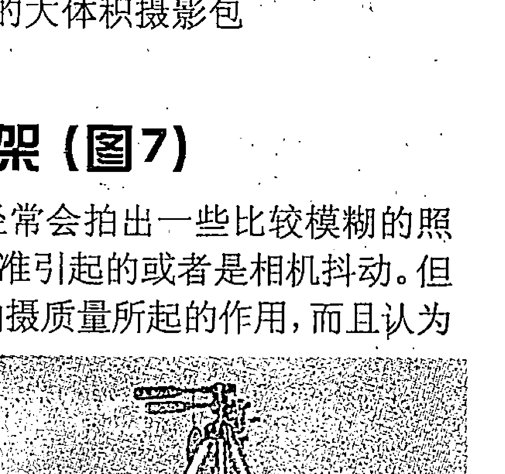

首先，在选购三脚架的过程中，不仅要考虑其牢固程度和重量，同时还要考虑它的架脚是由几节组成？如何进行调节？打开时是否有斜撑加固？中心柱的性能也要加以考虑。这几方面因素决定着三脚架是否容易产生前述的晃动，同时还会影响操作的便捷。遗憾的是，不少三脚架生产厂商似乎都忽视了三脚架的手感。就把三脚架撑开到工作高度而言，可以采用三种不同方法：锁住旋转套管；用紧固螺钉进行固定；用拇指扳紧锁掣。不过，厂商所选择的何种固定三脚架的方式，并不一定能充分反映某种三脚架是否有效率。用夹紧的方式锁定三脚架并不一定比拧螺钉有效。这取决于三脚架在野外是否便于使用。
就通过拧紧的方法加以固定的三脚架而言，如果相关的旋钮不够大，或者拧起来不方便，那么这支三脚架事后收起来就必定费力。假设旋钮呈垂直方向(即螺纹呈水平方向)安置，一些使用者就会为记住旋转方向而大伤脑筋。例如，很少有厂商会费心用箭头标出旋钮的位置。许多人在拧旋钮时会拧错方向，由于拧得过紧，他们不借助工具就无法把旋钮松开。如果这些旋钮呈水平方向安置，使用者在拧紧过程中就不会遇到麻烦，原因是他会本能地按照关水龙头的方法，拧紧旋钮。

其次是如何拉出和固定三脚架中心柱，这可能是老生常谈的问题了。在这个问题上，最正确而积极的方法就是用通过曲臂操作的斜撑对中心柱进行固定。就旅行者经常使用的重量较轻的三脚架而言，只需松开夹子，把三脚架升到适合的高度，然后重新夹紧三脚架即可。如果锁定装置位于一条架腿的内侧，使用者就会费力地在三脚架的三条架脚之间摸索，以便找到这一装置，这种方法就显得较为不便。

较好的解决办法是，在三脚架的肩部以上采用套管装置。缺乏摩擦锁紧装置、以防止中心柱在松开夹紧装置时突然下滑的三脚架存在着安全隐患。比较负责任的三脚架生产厂商选择生产具有斜面齿条和齿轮装置来固定中心柱，这样一来，即使松开锁紧装置，也能保持原有高度，加之可以通过摇曲臂的方式随时方便地调节高度，这类三脚架的摩擦程度能够在不妨碍锁紧装置的情况下进行调节。某些三脚架的中心柱可以旋出来，或者完全取出，再倒放进去，为近摄提供方便或作为独脚架使用。如果中心柱安有气泡水平仪将更为实用，因为这类中心柱可以在崎岖不平的地面上更加准确地对齐地平线。

最后要说的一点就是，保持三脚架的稳定和减轻其重量是一对矛盾。经常云游四方的摄影者只能接受妥协，即最大程度地使二者达到平衡。许多职业摄影师有一个诀窍，这就是在三脚架上吊挂随处可以找到的重物，以便增加三脚架的重量。为了做到这一点，他们在摄影包里装上一个小袋子，里面装满石头或沙子，然后把它系在三脚架中心柱的下端，由于在重心处增加了重量，因此就能达到减轻三脚架晃动的效果。

### 五、DV摄像带与清洗带

DV摄像带是DV最主要的存储介质，虽然DV摄像带的价格相对于DV来说只是九牛一毛，但其质量的好坏直接影响到DV的拍摄效果和使用寿命，摄像带的选购和使用是DV用户不容忽视的地方。

首先在选择DV摄像带的时候要注意摄像带的类型，就数码摄像带来说，主要有三类：Digital 8mm、Mini DV 和专业级（包括松下的DVCPRO 和 Sony的DVCAM格式）。现在一般使用的是四分之一英寸的Mini DV 格式摄像带，其体积很小而且可反复使用。因为DV格式数字摄像机的磁头是极易受损的，所以如果摄像带有划伤，最好停止使用，并要及时更换划伤的或变形的摄像带，以免损伤磁头。另外，在使用传统VHS摄像机时，我们可常常会以使用透明胶带连接断裂的摄像带，但对MINI DV摄像带是不能这样连接的，这样也很容易损坏摄像机磁头。

索尼还有一种带IC的DV带，一般会在其包装上有个“IC Memory”的Logo。它的原理是在磁带里嵌入4KB的半导体存储器。有IC的磁带不仅可以录制摄像，还支持制作影像字幕信息或引导索引数据，可以记录拍摄时的重要数据。当然带IC的DV带价格往往也是普通DV带价格的2倍以上，是否需要IC这个功能就看个人喜好了。不过无论是否带IC功能，所有的DV带的工艺都是相同的。它们的带基用的是金属蒸镀工艺，具有较高耐磨强度和较高磁性能。

最后要说的是别忘记去买盘DV的清洁带，经常对MiniDV的磁头进行保养。一般使用50小时左右，就应对磁头用专门的DV清洁带进行清洁。在使用DV清洁带的时候，需要注意的是，DV的磁头的外层虽都镀有金属磁性体薄膜层，具有一定的抗磨性，但是每次清洁的时间还是不能过长，大约5～10秒就可以了。因为清洁带属于精细研磨带，靠和磁头接触摩擦去除灰尘颗粒，所以千万不能使用时间过长，否则只有适得其反了。

DV带虽小，可学问却不少。正确使用磁带，除了有助于你拍摄更精致的画面，还能延长你手中DV的使用寿命。千万不要因为贪图便宜或者嫌麻烦，而忽略了磁带的日常维护工作，以及不注意正确的使用方法。平时精心使用DV带，就是对DV磁头最好的保护。

### 六、电池（图8）

如果说数码相机的存储卡拍摄完了以后还可以通过删除一些照片然后继续拍摄的话，那么电池的使用就没有这么简单了，数码相机离不开电池，而且也非常耗费电。从这看来，电池的选购比存储卡的选购更需要费心。对于使用AA电池的数码相机的用户来说，烦恼可能会少些，毕竟现在市面上的可充电电池价格比较便宜，四电一充价格一般在60元左右就可以买到。对于使用专用锂离子电池的数码相机用户来说，笔者还是建议另外购买一块电池，最好是原厂的，使用非原厂锂电而烧坏相机的事情虽然不多，但多出些钱购买一份放心和安全还是值得的。

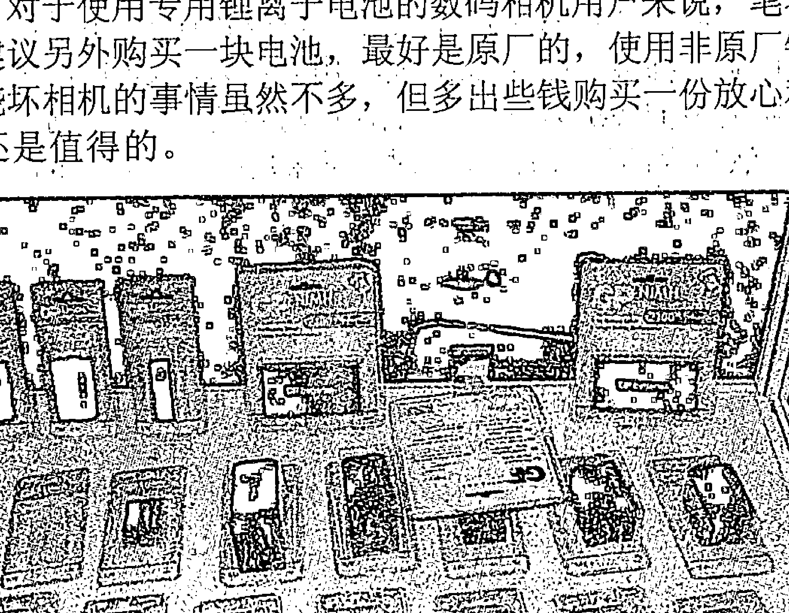

数码相机常用的电池有专用锂电和5号（AA）电池、镍氢电池等几种。在为数码相机选择电池时我们应从以下两个方面进行考虑：一是选择内阻比较低的电池。由于数码相机是一个突发型用电大户，因此内阻较低的电池比较适合数码相机使用，它可以明显提高数码相机的响应速度。用闪光灯平均充电时间比较，采用锂电池的相机遥遥领先，通常只需3秒，而采用镍氢电池的机型往往要长于6秒。二是选择容量大的电池。镍氢电池在这方面要优于锂电池了。镍氢电池容量为2000mAh而普通数码相机的锂电池容量常常在1000mAh（1000mA可连续拍200多张照片）左右。

虽然镍氢电池可以达到500次的充放电使用寿命，但前提是要有一个良好的充电器和正确的使用方法。市场上的充电器有很多，最简单的充电器只是将市电降压后再整流为直流，然后直接输出给充电电池，这种充电器的价格很便宜，但会对充电电池的寿命造成一定的影响。对镍氢电池来说，充电时间、充电电流和电压以及电池温度是充电时的三大要素，良好的充电器应具备对充电电池充电过程完善的临测和控制手段。首先，充电电池要求用恒定电流方式，并对充电电流的大小有一定的限制；其次，充电器必须能监测充电电池的温度并加以控制；最后，充电电池充满电后电压上升到正常电压状态，充电器应能监测并终止充电。

### 七、LCD保护膜

比起外壳的维护，笔记本屏幕的保养更为重要。不但因为它是整个笔记本中价格最为昂贵的配件，而且还因为屏幕的好坏直接影响着使用者的使用舒适度。长时间使用笔记本电脑，屏幕的亮度会变暗，这是由于屏幕内的灯管老化所造成的。如果想降低笔记本电脑屏幕变黄的速度，那么你可以适当的调节一下笔记本使用时的亮度，这样可以大大降低它的老化速度。但是如果真正想保护笔记本屏幕免受硬伤，那么使用LCD保护膜还是很有必要。相对传统显示器来说，液晶屏幕在使用中更容易被损伤，特别像笔记本电脑的液晶屏幕，因为笔记本自身所具有的便携性，使得它的使用环境很复杂，试想你的屏幕因为一次不小心的挂蹭，而出现了坏点或者亮点，那种感觉肯定非常的郁闷。只要使用专门为笔记本液晶屏幕设计的保护膜，即便在屏幕上指指划划都没有问题。然而需要注意的是，劣质的LCD保护膜会严重影响画质，尤其在清晰度和锐利程度方面更加明显。劣质保护膜一般也很难贴得平整而没有气泡，实用效果令人不敢恭维。真正的LCD保护膜应该做到贴合紧密没有气泡，而且清晰度和色彩不会受到明显的影响。

> (图/文 阿亮)

## 音频术语解析

时下许多人都拥有了自己的数码随身听，但是面对眼花缭乱的数码术语，众多MP3爱好者还是不知所措。也许在购买MP3时JS们就会利用这点坑你一把。下面我们就把一些常见的数码专业术语给大家做详细的解释，希望对你使用MP3能够有一些帮助，当然我们还对MD、CD的一些专业术语也做了整理，希望也能对你有用。

### MP3专业术语

#### 1. MP3

MP3就是一种音乐格式，它是利用 MPEG Audio Layer 3 的技术，将音乐以 1:10 甚至 1:12 的压缩率，压缩成容量较小的文件，而且还非常好的保持了原来的音质。

#### 2. TTS

TTS 是Text To Speech 的缩写，即“从文本到语音”。它是在内置芯片的支持之下，通过神经网络的设计，把文字智能地转化为自然语音流。TTS技术可对文本文件进行实时转换，TTS语音合成技术即将覆盖国标一、二级汉字，具有英文接口，自动识别中、英文，支持中英文混读。

#### 3. 编码、解码

编码是指将语音或视频模拟信号改编成数字信号的过程。解码是指将数字信号转换成模拟信号的过程。

#### 4. MP3Pro

MP3Pro是新一代的MP3格式，是Mp3编码格式的升级版本。MP3Pro可以把声音文件的文件量压缩到原有MP3格式的一半大小，而且还保持相同的音质。

#### 5. 存储介质

多数MP3是以Flash memory为存储介质的，由于Flash memory具有可擦写性，因此可方便地定制自己喜欢的音乐。目前一般的大小是 128M、256M等。

#### 6. WMA

WMA即Windows Media Audio，作为 MS 公司的多媒体压缩方式，它是在Windows Media Technologies中只压缩音频数据的技术，音质类似MP3，能以MP3一半的技术完成压缩。

#### 7. 接口类型

因为以Flash memory为储存介质的播放机需要从电脑上获取MP3音乐源，因此以何种方式与计算机进行传输连接就显得十分重要了。MP3 播放机与电脑连接的接口一般有两种，一种是普通并口连接，一种是USB 连接。USB 接口的传输速率快且支持热插拔。目前，USB 规范有1.1 和2.0。常见的还有1.1，还有一些特殊的使用1394 接口。

#### 8. 频率响应

频率响应是指在振幅允许的范围内音响系统能够重放的频率范围，以及在此范围内信号的变化量称为频率响应，也叫频率特性。在额定的频率范围内，输出电压幅度的最大值与最小值之比，以分贝数（dB）来表示其不均匀度。普通功放的频率响应为 20Hz～20kHz 约 (+/-)1-3dB；优质功放的频率响应为 20Hz～20kHz 约 (+/-)0.1dB。

#### 9. 信噪比(S/N)

功率放大器额定输出电压与无信号输入时实测噪声电压比称为信号噪声比，简称信噪比，通常以分贝数来表示。

#### 10. 音乐功率

音乐功率即MPO功率，在保持放大器电源无压降时，输入大动态的音乐信号，放大器所能输出的瞬时功率。MPO输出功率一般为 RMS 额定功率的4～6 倍。

#### 11. 总谐波失真

总谐波失真是指用信号源输入时，输出信号比输入信号多出的额外谐波成分。谐波失真是由于系统不是完全线性造成的，它通常用百分数来表示。所有附加谐波电平之和称为总谐波失真。一般说来，1000Hz 频率处的总谐波失真最小，因此不少产品均以该频率的失真作为它的指标。但总谐波失真与频率有关，必须在 20-20000Hz 的全音频范围内测出。

#### 12. 最大输出功率

最大输出功率即 PM 功率，在额定负载电阻上，放大器能符合基本参数要求，简谐信号的最大输出功率。

#### 13. 最大有用功率

最大有用功率是指在额定负载电阻上，输入1kHz 的简谐信号，当谐波失真系数为10%时的输出功率。

#### 14. 采样率

一般都是设定为 44100Hz、16Bit、Joint Stereo (112KBit/s 或 128KBit/s)。理论上来讲比特率(Bitrate)越高音质越好，同时MP3 的容量也会相应增大。实际上由于源WAV 文件以及目前声卡回放性能的限制，过高的比特率并没有对音质产生较大的影响。

#### 15. VBR 与 CBR

CBR(Constants Bitrate)就是常规静态比特率，它约定了MP3 的采样率为固定值。一首MP3 从头至尾为某固定值如128KBit/s 进行压缩，所有静音、低音、高音段均在该固定值范围内进行波段调节。VBR(Variable Bitrate)就是动态比特率，它和常用 CBR 不同。当在低音段时，它会采用较低的比特率如32KBit/s进行压缩，当在高音段时会用较高的比特率如 224KBit/s进行压缩。这是一种全程动态调节技术，在容量近似的前提下提高了MP3 的音质。

#### 16. 比特率

也称码率，MP3文件可以使用的一般是8～320kbps，但不同MP3 机在这方面支持的范围不一样，大部分的是32～256Kbps，这个指数当然是越广越好了，不过320Kbps 是最高等级了。

#### 17. 峰值音乐功率

峰值音乐功率即PMPO功率，将音乐功率中的有效值电压换算为峰值电压得出的功率。所以峰值音乐功率为音乐功率的2倍。

#### 18. FM调频收音机功能

这个是MP3的一项附加功能。从实用角度来说，现在的MP3这方面做得并不很出色，应该说还不如普通的收音机，在接收范围、精度等方面都有差距，只能说是一个有益的补充。

#### 19. 录音功能

分为外录和内录。外录，就是直接录制语音等外部声音；内录是录制FM的功能。直接录制，使用音频线，录制CD、磁带机等。其中直接录制的效果，目前来看都不怎么理想(指录制音乐的需求)，因为要么使用ADPCM格式，本身采样率就低，或者虽然是使用MP3、WMA格式录制，但因为编码运算能力还是不强，所以效果都不算好。

#### 20. 复读功能

A－B复读 (任意点间复读)，这个功能需要注意的地方是，不同机器在A－B复读时候存在时间延迟的现象，比如你设定的A点，真的复读时会发现实际不是你按A键时的点，有延迟现象。

#### 21. 电池

分成使用普通电池 (AA指5号电池、AAA指7号电池) 和专用充电电池。

#### 22. LCD显示屏

包括是否有背光，以及背光颜色、方式 (EL 还是其他类型等)。目前来看，采用EL背光的，在点亮时因为升压的因素，会出现背景噪音，所以在发现你的MP3某些时候怎么有噪音时就要注意看是否受这个影响。

#### 23. 支持语言

就是屏幕上显示语言的类型。英文是肯定了，国内用户当然希望支持中文的。一个要说明的是，现在大部分MP3播放机都只能实现歌曲名显示中文，但菜单还是英文。

#### 24. ID3支持

ID3就是音乐文件的歌曲名、作者是否可以显示 (不是文件名)。

### MD专业术语

#### 1. MD盘

它是英文Mini Disc的缩写，意思为小型光盘，又称为迷你光盘，盘的直径只有6.4cm。这是索尼公司在1991年提出的一种新兴技术，当时索尼公司为了解决磁带不够理想的音质和CD光盘随身听的体积以及它不可以随意录制音乐等问题而推出了MD盘的。

#### 2. MD DATA

SONY为完善MD周边设备而推出的一种在电脑上使用的小型储存介质，其大小、体积和普通MD碟一样，只不过可当储存数据用；容量为140M，必须通过SONY专用的MD DATA驱动器读取，在SONY的一些家用台式机可看到其身影，MD DATA既能读取MD DATA碟，也能录制MUSIC MD碟。

#### 3. MD DATA2

SONY于1999年推出的MD DATA第二代产品，MD DATA2的容量增加至650M，仍保持原来的大小、体积，使用专门的MD DATA2驱动器，此驱动器向下兼容可读取MD DATA及MUSIC MD。

#### 4. TOC

TOC称Table of Contents (内容表)，内容区包括UTOC (User Table of Contents, 用户内容表) 和数据区。TOC位于碟片的前面，是不可擦写的，用于记录与本碟相关的重要信息。

#### 5. MDLP

即MiniDisc Long Play，长时间播放功能。是SONY公司在1999年发布的新技术。以前的MD机都是使用ATRAC编码器进行编码的，而MDLP就是SONY通过采用其建立在ATRAC的基础上，新开发出来的编码器，即ATRAC3，ATRAC3是使用更高的压缩比率，但音质损失不太多的新压缩技术，MDLP提供了两种模式: 分别是两倍的LP2模式和四倍的LP4模式，最长提供比储存媒介本身容量高出四倍的时间。

#### 6. AAC

AAC (Advanced Audio Coding) 是MPEG体系的声音压缩技术。因采用MPEG1之后的MPEG2系列压缩技术或MPEG2声音压缩技术无法得到预期压缩率，则在BC方式上混合使用MPEG1技术，从而提高了压缩率。AAC是包括5.1信道方式 (MP3采用立体声) 的任意信道方式，也用于MPEG4音频。它以CD音质标准，可按CD约1/20大小压缩。

#### 7. 预录制MD

即我们常说的正版MD碟，并非所有的MD碟片都是可录的，这种预录制的MD碟是不可录的，因为它没有记录层，所以无法擦写。

#### 8. UTOC

对于可录MD来说，TOC之后还有一个UTOC ( User Table of Contents)，UTOC是可写的，当新的记录被加入或改变时，相关的信息会被记录到UTOC上。

#### 9. TYPE－R

全称ATRAC DSP TYPE-R，是一种专门提高ATRAC算法精度的一种高级编码芯片，这种DSP芯片拥有2倍的信号处理能力，可将各频段的信号重新进行再分析及再分配，从而对信号进行更加精确地记录，音质更精细，是目前MD编码技术中最高水准的录音编码方式。

#### 10. PC-LINK

SONY为MD机录音所配的一种连接套件，实际上是一种USB声卡，分“PC”、“DPC”两种 (R700PC/R700DPC)，“PC”是模拟输出口，“DPC”是光纤输出口，其作用就是充当一张声卡与MD相连接录音，PC-LINK只是对于没有声卡或没有光纤输出的电脑而设计的。

#### 11. ATRAC

MD的压缩格式 (Adaptive Transform Acoustic Coding)，是一种有损压缩格式。ATRAC将16比特44.1KHz的数字信号以频率响应轴分成52个区段，在低频时分割较细而在高频时分割较粗。ATRAC可以将录音的资料量压缩为原来的五分之一 (即压缩比为1:5)。

### CD 专业术语

#### 1. 音域
乐器或人声所能达到最高音与最低音之间的范围。

#### 2. 音色
又称音品，声音的基本属性之一。

#### 3. 音染
音乐自然中性的对立面，即声音染上了节目本身没有的一些特性，例如对着一个罐子讲话得到的那种声音就是典型的音染。音染表明重放的信号中多出了（或者是减少了）某些成分，这显然是一种失真。

#### 4. 失真
设备的输出不能完全复现其输入，产生了波形的畸变或者信号成分的增减。

#### 5. 动态
允许记录最大信息与最小信息的比值。

#### 6. 瞬态响应
器材对音乐中突发信号的跟随能力。瞬态响应好的器材应当是信号一来就立即响应，信号一停就嘎然而止，决不拖泥带水。

#### 7. 信噪比
信号的有用成份与杂音的强弱对比，常常用分贝数表示。设备的信噪比越高表明它产生的杂音越少。

#### 8. CD的规格
它是索尼和飞利浦公司联手制定的。声音讯号采用44.1kHz的频率采样，每个采样点进行16bit量化，然后以LPCM（线性脉冲编码调制）方式编码成数字讯号，数字讯号用模压的办法保存在特制的盘片上，做成CD片。CD片有两种尺寸，最常见的一种直径为12cm，数据容量650MB，大约存储74分钟音乐；另一种称为Mini CD，直径8cm，数据容量大约185MB，能存储20分钟左右的音乐。

#### 9. 取样、取样率、量化、量化精度
取样也叫采样，是把连续的模拟量用一个个离散的点来表示。显然，取样点需要足够密集，才能很好地表达原始模拟讯号的特征。每秒钟取样的次数叫取样率，CD的取样率为44.1kHz，表示每秒钟取样44100次。所谓量化，就是度量采样后离散讯号幅度的过程，当然，度量结果用二进制数来表示。量化精度就是度量时分级的多少，分级越多度量结果便越精确。CD的量化精度为16bit（16位二进制数）。

#### 10. A/D转换、D/A转换、ADC、DAC
A/D转换=模拟/数字转换，意思是模拟讯号转换为数字讯号；D/A转换=数字/模拟转换，意思是数字讯号转换为模拟讯号；ADC=模拟/数字转换器，DAC=数字/模拟转换器。

#### 11. 超取样
超取样是CD机中采用的一种技术，用于提高放音质量。CD片上的数据讯号被读出后，通过DSP电路的插值处理，将44.1kHz的标准取样率提升一倍到数倍，这就是超取样。

#### 12. HDCD
高解析度CD，是美国太平洋微音公司在现有CD格式的基础上推出的一种“增强型CD”，它利用CD格式中富余的存储容量来记录扩展讯息，使声音的解析度提高到20bit。HDCD可以在普通CD机上播放，但要获得20bit的解析度，机器需要具备HDCD解码线路。

#### 13. 杜比降噪系统
杜比降噪系统是美国杜比实验室为磁带录音机开发的电路，在几乎不损害原始讯号质量的前提下，用于降低磁带固有的背景噪声（咝咝声）。杜比降噪系统有好几种类型：杜比A用于专业录音设备，降噪量20dB；杜比B和杜比C用于民用录音设备，例如盒式磁带录音机和卡座，降噪量分别为10dB、20dB；杜比S是杜比实验室为民用录音设备开发的高性能降噪系统，降噪量高达24dB。

#### 14. 光纤输出
光纤输出可分为Toslink光纤和TA & T（ST）光纤两种，它们的区别在于传输接口标准及光纤材料不同，不能通用。Toslink是由东芝公司研制，并经日本EIAJ认证的一种通用光纤输出标准，具有重量轻、截面小、抗电磁干扰能力强，但易受射频干扰。AT & T是由美国AT & T公司所制定的标准。上述两种接口，均属S/P DIF（Sony/Philips Digital Interface Format）标准。

#### 15. 同轴输出
75 Ω同轴接口有BNC和RCA两种规格，一般使用通用的RCA规格同轴接口，这种输出接口的表现要好过Toslink光纤输出。但AT & T接口加上高级石英光纤例外。

想过丰富多彩的暑期生活吗？
快来参加免费“北京四日游”

旅游暂定期间：2004年8月1日~8月20日
具体旅游时间：四天（住宿三天）
旅游行程安排：游览北京名胜古迹，参观著名科技馆、博物馆等，享受千年古都文化之旅。

读者参加活动办法：
1. 第一步：购买6月《互动软件》或者7月《互动软件》；
2. 第二步：找到杂志中的回函表；
3. 第三步：认真填写回函表，寄回到杂志社（附上自己的详细地址及联络电话，以便我们及时通知你获奖信息）。我们将从中抽取四位大奖读者，杂志社将会去专电通知获奖幸运者，并出具杂志社盖章的旅游邀请函。

中奖名单刊登在《互动软件》8月号上。

特别提醒：十八岁以下的读者必须有家长陪同，家长旅游费用自理。

详细的活动安排请见《互动软件》7月刊。

本次活动最终解释权归北京电脑爱好者杂志社及北京电脑界杂志社所有。

活动协办：北京电脑爱好者杂志社 / 北京电脑界杂志社
活动热线：010-62161335/38-8026
电话及传真电话：010-62143082 葛女士
地址：北京海淀区北三环西路48号
北京科技会展中心1号楼A座15层D户
电话：010-62161335-38转8615
邮箱：北京9615信箱 邮编：100086

## 2004年最新硬件技术与使用解析

在电脑技术迅猛发展的今天，林林总总的新技术层出不穷。新技术的创新也不再仅仅停留在个别技术层面上，而是呈现出百花齐放的趋势，诸如AMD（超微半导体）公司的“X86-64架构”32/64位数据运算兼容技术、友达光电的低延迟“低温多晶硅（Low Temperature Poly-silicon）”液晶面板技术、DVD+/-R(W)双模式DVD刻录技术以及微软开发的“纵横滚轮”技术等。不断出现的新技术成了电脑技术飞速发展的源动力。这些技术的陆续投入使用，也预示着，我们日常所使用的电脑正在经历一场全方位的技术变革。技术的创新，带动了电脑计算速度的飞速攀升，增加了我们使用电脑的乐趣，并且也极大程度上拓宽了电脑的应用领域。本文将着重针对几种较有代表性的新技术进行简要描述与剖析，并对其具体应用做一介绍，供大家参考。

### 一、“X86-64指令集”：主流数据运算架构的“变革”

现在，32位仍然是PC机市场的主流体系结构。但是，随着处理数据量的不断扩大，32位处理器在处理能力和地址空间等方面明显不足。对内存寻址来说，目前32位X86架构的最大寻址能力仅为2^32字节，即4GB，远不能满足高端工作站、网络服务器和数据库服务器的处理需求。X86-64技术所具有的64位寻址能力，意味着处理器的虚拟寻址空间可以达到2^64字节，即18000TB（1TB=1000GB），足够解决高端应用中内存寻址的瓶颈。那么美国AMD公司提出的X86-64技术到底是一种什么样的技术呢？又能给今天主流的电脑架构带来什么变化呢？

X86-64的设计是以X86-32架构为基础，保留兼容原来的32位和16位程序的硬件结构，在此基础上再加入一套处理64位程序的硬件结构。也就是说采用X86-64架构的处理器能够完全兼容现有的32位及16位应用程序，同时它们在X86-64架构中运行的性能绝对不低于在X86-32架构中运行的性能。AMD的X86-64架构允许处理器工作在以下两种模式：Long Mode（长模式）和Legacy Mode（遗传模式）。长模式由一个称为LMA（长模式有效，Long Mode Active）的全面控制位启动。当LMA关闭时，处理器将按照标准X86处理器工作，这时处理器可与所有目前的16及32位操作系统及应用程序兼容。若长模式一经启动（LMA=1），64位处理器的扩展便可进行操作，使系统可以按照本身及其处理器的能力重新配置。除了Long模式之外，X86-64被认为还支持Legacy模式，因此具备了兼容16/32位操作系统的能力。换句话说，在Legacy模式下，处理器的运行和一颗普通的32位X86CPU没有区别。该模式屏蔽了执行64位指令集的功能，与现有的X86架构完全兼容。其中包括了对诸如分段内存、32位通用寄存器和指令指针的支持（图1为X86-64运行模式示意图）。

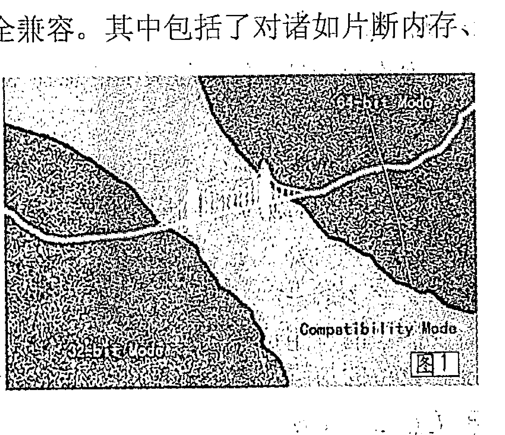

下面简要介绍一下AMD推出的支持X86-64指令集的64位CPU家族蓝图，见表1。

| Socket | 封装 | 针对市场 | 工艺/核心 | 备注 |
| :--- | :--- | :--- | :--- | :--- |
| Socket 940 | Opteron | 高端服务器 | 基于0.13μm工艺，后转0.09μm SOI工艺“SanDiego”核心 | 支持双通道DDR |
| Socket 939 | Athlon 64 FX | 中高端桌面CPU市场 | 基于0.13μm工艺，后转0.09μm SOI工艺“Winchester”核心 | 支持双通道DDR |
| Socket 754 | Athlon 64（“NewCastle”核心） | 主流市场 | 基于0.09μm SOI工艺，后转0.09μm SOI工艺“Winchester”核心，改用Socket 939 | 只支持单通道DDR |
| Socket 754 | Athlon 64（“Paris”核心） | 低端市场 | 二级缓存为512KB | 完全交由低端市场打拼 |

当然，如果想开启64位数据运算，单单一颗64位CPU还是不够的，另外还需要主板芯片组、64位操作系统及应用软件的支持。目前几大芯片组厂商分别针对Athlon 64和Athlon 64FX推出了主板芯片组，主要包括VIA K8T800、NVIDIA nForce 3/Pro、Ali M1687和SiS 755等芯片组。而且微软针对AMD64架构的64位操作系统——Windows XP 64-bit 2003 Edition和Windows Server 2003（X86-64版）已经对外释出了测试版本，相信随着操作系统的成熟，其他软件厂商更不会放过这个提升软件运行效能的机会，肯定会陆续推出相应的64位版本的软件，相信到那时，我们将会真正体会到64位架构所给我们带来的巨大惊喜。

## 表1 AMD公司已发售或者即将发售的具体产品型号

| 接口形式   | CPU               | 主频    | 二级缓存 | 内存控制器       | 多处理器并行支持   |
|------------|-------------------|---------|----------|------------------|--------------------|
| Socket 754 | Athlon 64 3700+   | 2400 MHz | 1MB      | 单通道DDR400     |                    |
| Socket 754 | Athlon 64 3400+   | 2400 MHz | 512KB    | 单通道DDR400     |                    |
| Socket 754 | Athlon 64 3400+   | 2200 MHz | 1MB      | 单通道DDR400     |                    |
| Socket 754 | Athlon 64 3200+   | 2000 MHz | 1MB      | 单通道DDR400     |                    |
| Socket 754 | Athlon 64 3000+   | 2000 MHz | 512KB    | 单通道DDR400     |                    |
| Socket 754 | Athlon 64 3000+   | 1800 MHz | 1MB      | 单通道DDR400     |                    |
| Socket 754 | Athlon 64 2800+   | 1600 MHz | 1MB      | 单通道DDR400     |                    |
| Socket 939 | Athlon 64 FX-55   | 2600 MHz | 1MB      | 双通道DDR400     |                    |
| Socket 939 | Athlon 64 FX-53   | 2400 MHz | 1MB      | 双通道DDR400     |                    |
| Socket 939 | Athlon 64 FX-51   | 2200 MHz | 1MB      | 双通道DDR400     |                    |
| Socket 939 | Athlon 64 4000+   | 2600 MHz | 512KB    | 单通道DDR400     |                    |
| Socket 939 | Athlon 64 3700+   | 2400 MHz | 512KB    | 单通道DDR400     |                    |
| Socket 939 | Athlon 64 3700+   | 2400 MHz | 512KB    | 单通道DDR400     |                    |
| Socket 939 | Athlon 64 3400+   | 2200 MHz | 512KB    | 单通道DDR400     |                    |
| Socket 940 | Opteron 844       | 1800 MHz | 1MB      | 双通道DDR333     | 支持8路并行处理    |
| Socket 940 | Opteron 842       | 1600 MHz | 1MB      | 双通道DDR333     | 支持8路并行处理    |
| Socket 940 | Opteron 840       | 1400 MHz | 1MB      | 双通道DDR333     | 支持8路并行处理    |
| Socket 940 | Opteron 246       | 2000 MHz | 1MB      | 双通道DDR333     | 支持双路并行处理   |
| Socket 940 | Opteron 244       | 1800 MHz | 1MB      | 双通道DDR333     | 支持双路并行处理   |
| Socket 940 | Opteron 242       | 1600 MHz | 1MB      | 双通道DDR333     | 支持双路并行处理   |
| Socket 940 | Opteron 240       | 1400 MHz | 1MB      | 双通道DDR333     | 支持双路并行处理   |
| Socket 940 | Opteron 144       | 1800 MHz | 1MB      | 双通道DDR333     | 支持单路处理       |
| Socket 940 | Opteron 142       | 1600 MHz | 1MB      | 双通道DDR333     | 支持单路处理       |
| Socket 940 | Opteron 140       | 1400 MHz | 1MB      | 双通道DDR333     | 支持单路处理       |

### 二、超线程技术：一“芯”二用的神奇技术

Hyper-Threading是一种同步多执行绪（SMT，Simultaneous Multi-threading）技术。它的原理很简单，就是把一颗CPU当成两颗来用，将一颗具Hyper-Threading功能的“实体”处理器变成两个“逻辑”处理器，而逻辑处理器对于操作系统来说跟实体处理器并没什么两样。因此操作系统会把工作线程分派给这“两颗”处理器去执行，让多种应用程序或单一应用程序的多个执行绪（thread），能够同时在同一颗处理器上执行；不过两个逻辑处理器是共享这颗CPU的所有执行资源。

通过整合这一技术，具有Hyper-Threading技术的CPU能在同一物理处理器资源下同时执行两个程序，或者一个程序的两个线程，从而使物理处理器资源利用率至少提升40%。Pentium 4处理器由于结构设计上的原因只支持单线程，算术逻辑单元等CPU资源得不到充分利用。据Intel称，使用超线程与不使用相比，台式机CPU性能可以获得25%的提升，而服务器CPU也就是XEON性能最高可望提高30%。

要真正实现超线程技术，必须拥有以下几个条件才可以，缺一不可：

- 支持超线程技术的主板芯片组。目前支持超线程CPU的芯片组包括：Intel 845E以后发布的芯片组基本都支持超线程技术（845E/G/GV芯片需要升级BIOS），而第三方芯片组则有VIA的P4X400、P4X400A、PT600、PT800、PT880以及矽统的SiS645DX/SiS648 FX/SiS655FX/SiS658等。
- 在支持超线程技术的主板上使用带有“HT”标记的Pentium 4处理器后，BIOS中会出现“CPU Hyper-Threading”的选项（部分主板将超线程的开启功能由BIOS中的ACPI选项统一控制），只需将选项设置为Enable，就可以打开CPU的超线程技术。
- 操作系统的支持与否也是一个相当重要的因素。Windows 2000 Server版、Windows XP Professional版及Windows Server 2003版或者基于Linux 2.4.18版本以上内核的Linux系统都可以对超线程技术提供良好支持。

### 三、PAT技术及Intel 865芯片组一系列优化技术：相关技术的开启与应用简介

PAT的全称是Performance Accelerate Technology，直接的翻译是“性能加速技术”。它出现在2003年4月份发布的875P芯片组中。这种技术主要被用来改进芯片组的性能（图2）。

### 四、Dual-DDR技术：通往CPU的‘高速公路’

PAT对芯片组性能的提升是通过减少芯片组内部FSB和系统内存之间的延迟来实现的。从图2我们可以看出，PAT技术一共减少了两个传输周期的延迟，其中从CPU到内存控制器的数据传输减少了一个时钟周期，从内存控制器到内存的过程又减少了一个时钟周期。这样在非Back-to-Back的数据传输时，减少的两个延迟的作用就会比较明显了，从实际测试中，打开PAT后芯片组的性能较打开前约有5%~10%的提升。

PAT技术必须依赖芯片组和BIOS，在官方的875P芯片组技术资料中说明只有在800FSB和双通道DDR400的情况下才能打开PAT加速模式。而且按照Intel的说法，PAT技术一直是875芯片组的专利，865芯片组系列就不能实现PAT。但是仍有部分主板厂商给我们带来了惊喜：在Intel宣布865PE芯片组已经预留了PAT的相关电路只是没有打开后，主板厂商便开始在865PE中打开所谓“内存加速模式”来达到和PAT同样的效果。系统加速功能，不同的厂商实现的方式也略有不同，大体上可分为华硕的“定点加速”与其他厂商的“同频加速”两大派别。它们的不同为，定点加速只在800MHz FSB下打开加速功能，而同频加速则是在时钟频率与内存频率保持1:1同步时打开。举例说明，在使用800MHz外频的P4 2.4 GHz时，当主板使用标准的200MHz时钟频率，定点加速与同频加速都可以开启系统加速功能。但如果时钟频率改变至201MHz或是199MHz时而内存继续保持1:1，定点加速功能失效，主板仅能以普通方式工作。而同频加速仍然可以继续以加速状态工作。如果内存比例为不同步方式，比如5:4或是3:2，系统加速功能则完全失效。

虽然Intel对一些主板厂商为i865PE芯片组主板开启“PAT”功能而表示强烈不满，而且还警告主板生产厂商和主板用户，任何将i865芯片组进行超频从而打开各种文字游戏的“PAT”模式均可能对系统造成安全隐患，将最终失去Intel对芯片组的质保。但是仿佛无论是主板厂商，还是消费者对Intel公司的警告并不买账，越来越多的厂商为自己采用865芯片组的主板提供了新版BIOS，并以各种性能提升功能从侧面对PAT技术提供支持。作为消费者，一次可以免费提升系统性能的机会，我们怎么可能错过呢？

伴随着Pentium 4及Athlon XP处理器系统总线频率的不断提升，传统DDR内存所能提供的带宽更加显得捉襟见肘，333/400 FSB的Athlon XP处理器所需内存带宽分别达到了2.7 GB/s和3.2 GB/s，Intel公司推出的800 FSB的Pentium 4处理器所需内存带宽更是达到了6.4GB/s。而目前通过JEDEC正式认证的DDR内存的最高标准也仅为DDR-400，最大能提供3.2 GB/s的数据带宽，已经无法满足目前高内存带宽的需要。虽然JEDEC刚完成了DDR II标准的制定工作，但是短时期内DDR II标准的内存不太可能迅速普及，因此，双通道DDR技术就成了一个行之有效的解决方案。只要芯片组提供技术支持，无须对目前的DDR内存做任何修订，就可完成内存带宽飞跃。理论上，双通道的DDR 266内存可以提供4.2 GB/s的带宽，而双通道的DDR 333及DDR 400更是可以提供最高为5.4GB/s和6.4GB/s的带宽，这已经可以轻松应对很长一段时间内对内存带宽的需求了。当然，这无疑也大大延长了目前DDR内存的生命周期。

所谓双通道DDR，简单来说，就是芯片组可以在两个不同的数据通道上分别寻址、读取数据。这两个相互独立工作的内存通道是依附于两个独立并行工作的位宽为64-bit的内存控制器下，因此使普通的DDR内存可以达到128-bit的位宽，如果是DDR-400的话，双通道技术可以使其达到DDR-800的效果，内存带宽陡增一倍。芯片组所整合的这两个内存控制器能够在彼此间零等待时间的情况下同时运作。

简而言之，双通道技术是一种关系到主板芯片组的技术，与内存自身无关，只要厂商在芯片内部整合两个内存控制器，就可以构成双通道DDR系统。而主板厂商只需要按照内存通道将DIMM分为Channel 1与Channel 2；用户也需要成双成对地插入内存，就如同RDRAM那样。如果只插单根内存，那么两个内存控制器中只会工作一个，也就没有了双通道的效果。

目前支持双通道DDR技术的主流主板芯片组有：

- 基于Intel公司P4系列CPU架构的Intel 865PE，865G以及875P芯片组，VIA公司的PT880芯片组，SIS公司的SiS655/655FX芯片组。
- 基于AMD公司Athlon系列CPU架构，NVIDIA公司nForce 2系列芯片组，以及VIA公司最新的PT880pro系列芯片组。

同时，组建双通道内存架构对内存在内存槽中的位置还有一定的要求。Intel 865/875系列芯片组和VIA PT880芯片组主板上的内存插槽分为两组，安装内存必须对称（A通道第1个插槽搭配B通道第1个插槽，或A通道第2个插槽搭配B通道第2个插槽)，总的原则是“隔行插入”的方式，但也会有例外的时候，这时需要查阅主板说明书。为了方便用户安装，目前已有很多厂商的主板将对称的内存插槽以不同的颜色标示出来，用户只要把内存安装在颜色相同的 DIMM 插槽上即可（图3）。

采用 nForce2 系列芯片组的主板只提供 3 条 DIMM。其有上中下三条内存槽分别为 DIMM3、DIMM2 和 DIMM1。按 NVIDIA 的规则，DIMM1 和 DIMM2 是一组，而 DIMM3 则被独立开来，两部分之间会被隔开，它们分别属于不同的通道。要实现双通道，正确的插法便是将一条内存插到独立的 DIMM3，其他内存插到 DIMM1 或 DIMM2 均可。当然，三条内存槽同时插上也可以实现双通道（图4）。

特别提示：由于各个不同芯片组对组成双通道内存的内存条要求各不相同，有的要求相对较为严格，而有的芯片组要求则相对宽松，但是为了系统的稳定性与最大发挥双通道内存的性能，笔者建议无论您使用何种芯片组的主板，都尽可能选用相同品牌、相同容量、相同型号的内存条，以减少各种可能出现的问题。

### 五、Serial ATA 串行技术：S-ATA 硬盘应用介绍

传统的 Parallel ATA(并行 ATA)标准的信号采用并行方式传输，其接口速度已从最初的 Ultra DMA/33，历经 Ultra DMA/66、Ultra DMA/100，一直到今天的 Ultra DMA/133。并行 ATA 标准到现在已经接近了它的发展极限，再进一步提速时，并行电缆间的信号干扰将会进一步增大，直接威胁到信号传输的稳定性与准确性。与此相对应，Serial ATA 采用串行模式进行传输，因此可以在较少的位宽下使用较高的工作频率来提高数据传输的带宽，Serial ATA 1.0 已经支持到 150MB/s 的速率，而即将通过的 Serial ATA 2.0 标准将达到 300MB/s，重要的是 Serial ATA 采用点对点的传输协议，所以不存在主 / 从控制的问题。Serial ATA 相较 Parallel ATA 可谓优点多多，并且从 Parallel ATA 过渡到 Serial ATA 也是大势所趋，应该只是时间问题。

串行ATA标准最早由 Intel 提出，后来得到了包括 Seagate、IBM、Dell、Maxtor 等诸多厂商在内的联合支持。Serial ATA 采用串行模式进行传输，因此可以在较少的位宽下使用较高的工作频率来提高数据传输的带宽。目前 Serial ATA 1.0 标准已经确定，第一代 Serial ATA的速度为150MB/s，比时下最快的 ATA/133 还要高出一些，未来 Serial ATA更是可以扩展到2X（速度为300MB/s）和4X（速度为600MB/s），足可以满足相当长一段时间内对硬盘传输速率的要求（图5）。

而重要的是 Serial ATA 采用点对点的传输协议，每个硬盘都独占一个通道与主机通信，所以不存在主 / 从控制的问题。

目前各大硬盘厂商均已向市场推出了 S-ATA 接口的硬盘，并且 Intel 已经在 865G/865P/865PE/875P 芯片组中提供了支持 Serial ATA 技术的 ICH5/ICH5R 芯片，同样支持串行技术的 SiS 964和 VIA VT8237芯片也已陆续上市。而且各厂商也都提出了自己的串行解决方案：或者通过在主板上整合第三方厂商的芯片来实现对 Serial ATA-150 的支持，或者通过 Serial ATA 扩展卡，或者直接为用户提供将硬盘从并行接口转为串行接口的 Serillel 转换器。

市场中常见的各大硬盘厂商采用串行技术的硬盘见表 2。

目前市面上有两种串行硬盘：一种是非原生串行硬盘，一种才是真正意义上的原生串行硬盘。在早期，由于时间的关系，各硬盘厂商所推出的串行ATA硬盘都是在原基础之上，通过桥接方式来提供对串行ATA的支持，桥接方式就是并行硬盘上增加一个并串转换的SATA桥芯片来实现的串行界面，简单地理解就是将一块SATA PCI卡的功能整合到硬盘之上。在这种方式下，硬盘内部或桥芯片与磁盘控制器之间实际上仍以并行方式传输数据，只是到了SATA桥，才将数据串行化。采用这种方式组建的磁盘系统只在数据线传输的一段利用了串行技术，并且数据要经过串一并、并一串转换，所以SATA的CRC技术优势和150MB/s的理论界限速度未能完全发挥。早期的酷鱼V串行ATA硬盘和金钻9的串行ATA硬盘就是属于“非原生串行硬盘”，而希捷后来推出的酷鱼7200.7 PLUS硬盘才算得上是真正意义的串行硬盘，即原生串行ATA(Native Serial ATA)。

## 表2 采用串行技术的硬盘

| 品牌                   | 型号               | 容量   | 缓存  | 转速    | 寻道时间 |
| :--------------------- | :----------------- | :----- | :---- | :------ | :------- |
| 希捷酷鱼7200.7         | ST380013AS         | 80GB   | 8MB   | 7200转  | 8.5ms    |
|                        | ST3120026AS        | 120GB  | 8MB   | 7200转  | 8.5ms    |
|                        | ST3160023AS        | 160GB  | 8MB   | 7200转  | 8.5ms    |
| 迈拓金钻9代 DiamondMax Plus 9 | 6Y060M0          | 60GB   | 8MB   | 7200转  | <9.0ms   |
|                        | 6Y080M0            | 80GB   | 8MB   | 7200转  | <9.0ms   |
|                        | 6Y120M0            | 120GB  | 8MB   | 7200转  | <9.0ms   |
|                        | 6Y160M0            | 160GB  | 8MB   | 7200转  | <9.0ms   |
|                        | 6Y200M0            | 200GB  | 8MB   | 7200转  | <9.0ms   |
| 西部数据WD              | Raptor WD360GD     | 36 GB  | 8MB   | 10000转 | 5.2ms    |
|                        | Raptor WD740GD     | 74 GB  | 8MB   | 10000转 | 5.2ms    |
|                        | Caviar SE WD1200JD | 120GB  | 8MB   | 7200转  | 8.9ms    |
|                        | Caviar SE WD1600JD | 160GB  | 8MB   | 7200转  | 8.9ms    |
|                        | Caviar SE WD2000JD | 200GB  | 8MB   | 7200转  | 8.9ms    |
|                        | Caviar SE WD2500JD | 250GB  | 8MB   | 7200转  | 8.9ms    |
| 三星Samsung            | SpinPoint SP0802C  | 80GB   | 8MB   | 7200转  | <9.0ms   |
|                        | SpinPoint SP1203C  | 120GB  | 8MB   | 7200转  | <9.0ms   |
|                        | SpinPoint SP1614C  | 160GB  | 8MB   | 7200转  | <9.0ms   |
| 日立Hitachi            | DeskStar 7K250     | 250GB  | 8MB   | 7200转  | 8.5ms    |

### 六、PCI Express技术：下一代的系统总线标准

目前，大多数主板芯片组的内部互连总线还是沿用PCI总线架构，由于PCI总线工作在33MHz和66MHz两种时钟频率上，而且通常都是33MHz上，加上32-bit的总线位宽，只能提供133MB/s的数据传输率。而随着前一代CPU前端总线的不断提升，及双通道DDR、串行ATA及AGP 8X这些都使得系统对总线带宽的需求日益苛刻。显然，古老的PCI总线架构已经无法满足这一发展趋势。这时，PCI Express技术就应运而生了。

图7为PCI总线发展历程。

PCI Express是由Intel、AMD、IBM、Microsoft、Dell、Compaq等共同草拟并推举成取代PCI总线标准的下一代标准。高性能、高扩展性、高可靠性、更良好的升级性以及更为低廉的花费，就是PCI Express的设计理念。与传统PCI以及更早期的计算机总线的共享并行架构相比，PCI Express采用设备间的点对点串行连接(serial interface)。如此一来即允许每个设备都有自己的专用连接，不需要向整个总线请求带宽，同时利用串行的连接特点，能轻松将数据传输速度提到一个很高的频率。与Serial ATA类似，串行连接能大大减少电缆间的信号干扰和电磁干扰，由于传输管线有所减少，所以传输电缆排线也就相应减少，更能节省空间和连接更远的距离(单位时间内传输的数据流比并行总线中独立时钟信号的数据流更能传送更远的距离)。它可以接驳IEEE 1394b、InfiniBand、Gigabit Ethernet和下一代的图形处理器，此外，PCI Express总线也将会实现单独设备间的点对点访问，这样将能消除不同的板卡之间可能引起的兼容性问题。表3列出了PCI与PCI Express技术参数指标的对照。

## 表3 PCI与PCI Express技术参数指标对照

|                      | PCI 32 V2.2 | PCI Express V1.0 |
| :------------------- | :---------- | :--------------- |
| 支持外设数量         | 6           | 64（单线）       |
| 总线时钟频率         | 33MHz       | 2.5GHz           |
| 最大数据传输速率     | 133MB/s     | 8.2GB/s          |
| 时钟同步方式         | 与CPU及时钟频率有关 | 内建时钟       |
| 总线位宽             | 32bit       | 32bit            |
| 引脚数量             | 84Pin       | 40Pin            |

PCI Express的接口根据总线位宽不同而有所差异，包括X1、X4、X8以及X16(X2模式将用于内部接口而非插槽模式)，目前的PCI接口将保留(图8)。较短的PCI Express X1接口将取代目前的PCI接口，而PCI Express X16则将取代AGP接口。

### PCI Express总线技术

PCIe卡可以插入较长的PCI Express插槽中使用（也就是说低位宽的能插入高位宽的插槽中使用）。PCI Express总线不但可以支持PCI Express设备，而且可以支持PCI设备。这对于目前的用户来说当然是一件好事。

当然，PCI Express总线技术的普及同样离不开主板芯片组的支持，目前Intel已经明确表示将在它的下一代芯片组i915和i925X中支持PCI Express总线技术，同样，VIA也将在它最新的芯片组PT890中提供对PCI Express总线的支持，SiS公司也表示将在以后的芯片组中支持这项新技术。而且，两大显卡厂商ATI和NVIDIA公司也将采用PCI Express接口的显卡纳入了自己的显卡开发规划蓝图，采用新接口的显卡在今年第二季度也将陆续上市。

### 七、有机发光体技术：16ms与12ms液晶显示器

液晶显示器由于液晶面板的显示特点，本身存在着显示延迟问题，而高延迟的液晶显示器也就出现了我们常说的“鬼影”，在显示动态画面时存在图像残影，这也直接影响到了液晶显示器的应用领域。这一状况直到友达电子推出的LTPS低温多晶硅（Low Temperature Poly-Silicon；LTPS）液晶面板，将LCD显示器的整体响应时间降到16ms，液晶显示器向来备受鄙夷的响应时间有了突破性的改变，2003年9月份，友达电子更是将这一响应时间进一步提升到了12ms，使液晶面板的显示品质达到了更高的水平。

那么LTPS低温多晶硅液晶面板到底神奇在何处，为何采用LTPS技术的液晶面板能够拥有如此快的响应速度？以下就是问题的答案。低温多晶硅（Low Temperature Poly-silicon；LTPS，以下以LTPS代称）是LCD领域中的又一新技术。低温多晶硅薄膜晶体管面板与目前大部分液晶显示器所用的非晶硅薄膜晶体管面板相比，成本较为便宜，且具有更高的解析度，这是因为电子在多晶硅的传输速度较快，品质也较优良，因而可以使薄膜晶体管的尺寸更小，增加显示器的亮度并减少功率消耗。此外，低温多晶硅薄膜晶体管可在玻璃基板上嵌入驱动元件，可大幅减少并保留驱动IC的空间，提升液晶显示面板的特性及可靠度，使面板的制造成本降低。

- 响应时间30ms相当于1/0.030=33Hz，每秒钟显示器能够显示33帧画面
- 响应时间25ms相当于1/0.025=40Hz，每秒钟显示器能够显示40帧画面
- 响应时间16ms相当于1/0.016=63Hz，每秒钟显示器能够显示63帧画面
- 响应时间12ms相当于1/0.012=83Hz，每秒钟显示器能够显示83帧画面

通常当画面显示速度超过每秒25帧时，人眼会将快速变换的画面视为连续画面，但是现在的家庭娱乐，例如播放高品质DVD影片、玩游戏、看大片要达到最佳效果，所需要的画面显示速度都在每秒60帧以上，可见拥有16ms和12ms的液晶显示器已经可以满足人们较高的视频享受要求了，而具备12ms的液晶显示器无疑进一步提升了显示品质，彻底杜绝了显示器残影的问题。

已经推向市场的响应时间为12ms的液晶显示器有三星和明基等。三星在全球第一时间发布这款拥有12ms的172X液晶显示器时，业界引起了不小的轰动（图9）。明基的756-12ms是中国大陆市场上第一台拥有12ms的液晶显示器。

### 八、DVD-Dual技术：双模式DVD刻录机

由于对利益及市场主导权的争夺，截止到目前，DVD刻录标准并未统一，DVD-RAM、DVD-RW、DVD+RW三种DVD刻录规格共存，因此DVD刻录机的发展相对比较缓慢。更由于不同的厂商所支持的标准都不尽相同，在产品规格上又互不兼容，造成目前DVD刻录市场诸侯纷争的局面，这也给我们广大消费者制造了不少的难题。我们驻足产品面前，总是犹豫不决，拿不定主意究竟应该购买采取何种标准的产品。不同的刻录标准使得刻录机生产厂商及消费者都无从选择，也大多选择了观望徘徊的态度，这无疑极大制约了DVD刻录的普及。就在这种情况下，业界巨头SONY公司最先发布了新款的DVD刻录机——采用了DVD-Dual技术的DRU-500A，该产品同时支持DVD-RW和DVD+RW两大规格，让用户不用在DVD+RW和DVD-RW两大规格之间徘徊，更不用担心某种格式成为规格之争的失败者。

| 品牌 | Sony DRU-530A | 爱国者 DVD DUAL | 台电 DVD DUAL | Aopen(建基) DRW880A/VP | Liteon SOHW-812S | ASUS(华硕) DRW-0804P | NEC ND-2500A | 先锋 DVR-107A | LG GSA-4081B |
|---|---|---|---|---|---|---|---|---|---|
| DVD+R | 8X | 4X | 8X | 8X | 8X | 8X | 8X | 8X | 8X |
| DVD+RW | 4X | 2X | 2X | 4X | 4X | 4X | 4X | 4X | 4X |
| DVD-R | 4X | 4X | 4X | 8X | 8X | 8X | 8X | 8X | 4X |
| DVD-RW | 2X | 2X | 2X | 4X | 4X | 4X | 4X | 4X | 2X |
| CD-R | 40X | 40X | 40X | 32X | 40X | 40X | 32X | 40X | 24X |
| CD-RW | 24X | 24X | 24X | 24X | 24X | 24X | 16X | 24X | 16X |
| CD-ROM | 40X | 40X | 40X | 40X | 40X | 40X | 40X | 40X | 32X |
| DVD-ROM | 12X | 12X | 12X | 12X | 12X | 12X | 12X | 16X | 12X |
| 缓存 | 2MB | 2MB | 2MB | 2MB | 2MB | 2MB | 2MB | 2MB | 2MB |
| 防刻死技术 | Power Burn | Super Link | Super Link | Just Link | Smart Burn | BURN-Proof | Just Link | BURN-Proof | / |

DVD-Dual将DVD+RW和DVD-RW整合在一起，可以刻录DVD+RW和DVD-RW两种规格的DVD盘片，而且由于刻录芯片具有可升级性，即使以后两种规格有了新的变化，也可以及时进行调整，从而保护了厂商的投资及消费者的利益。同时，采用DVD-Dual技术的刻录机是相当智能的，在进行DVD刻录时无须用户选择DVD+RW或者DVD-RW盘片，刻录机都会进行自动识别，具体刻录模式、刻录速度完全不需要用户进行干涉。并且DVD-Dual技术可以有效保护用户的投资，比如：目前DVD-R盘片比DVD+R盘片便宜，而DVD+RW盘片比DVD-RW盘片的可重写次数多，格式化更快，有了DVD-Dual技术，用户就可以在多种刻录盘片中选择最为经济合适的刻录方式及盘片载体。

采用DVD-Dual技术的刻录机优势非常明显，而且市场认同度也比较高，普通用户不用再去考虑“+”与“-”的规格之争；同时，相对于单一格式的DVD+RW和DVD-RW刻录机，采用DVD-Dual技术的刻录机成本并不增加多少；同时DVD-RAM格式由于主要面向一些专业领域，对普通用户的吸引力并不是很大，因此DVD-Dual技术就成了DVD刻录的极佳解决方案。目前包括先锋、LG、建兴等日系、韩系及台电等台系厂商全面加入DVD-Dual阵营，使得DVD-Dual技术前景无限光明。

市场中常见的DVD-Dual双模刻录机列于表4。

### 九、迅驰 Wi-Fi 无线上网：无限你的无线

伴随着迅驰笔记本电脑的快速普及，大规模推广无线局域网（Wi-Fi）的应用也就成了笔记本的一个重要发展趋势，并且对无线连接的支持也是Intel Centrino技术的核心内容。Centrino是一系列技术的总称，包括Pentium-M CPU（产品代号为“Banias”，采用0.13微米工艺生产）、I855芯片组以及Intel Pro/无线2100 LAN 3B Mini PCI网络适配（透过一个迷你PCI 802.11b无线电模块）三个模块。其中这个PCI 802.11b无线电模块就是实现Wi-Fi无线上网的关键所在。最近，Intel在其“迅驰”芯片中加入最新的“Wi-Fi”组件，笔记本电脑产品将可以通过该组件连接802.11b和802.11g标准的网络，这也意味着迅驰笔记本电脑将具备54Mbps的高速无线网络连接能力。

Wi-Fi是英文“Wireless Fidelity”的缩写，它可以使用户自由自在地接入Internet，而不再受限于网线。它主要基于“IEEE 802.11b”的无线通讯协议，使内置Wi-Fi无线网卡的电脑能像移动电话那样，在基点信号覆盖范围内的任意地点发送和接受数据，从而实现电脑无线上网。我们在一些产品上看到的“Wi-Fi”图标是Wireless Ethernet Compatibility Alliance（Wi-Fi联盟）的认证标志，通过Wi-Fi测试认证便成为802.11b无线局域网的标准产品，可与其他通过Wi-Fi认证的无线网络产品进行互联通信（图10）。

目前英特尔结合中国移动的“随e行”业务，在国内的机场、宾馆、会议中心等地建设公共“热点”，所谓“热点”(Hotspots)是指用户可以使用802.11技术进行无线网络连接的地点，是英特尔迅驰移动计算技术推出的一部分。在铺设有“热点”的区域，人们可以随时利用移动电脑接入网络，从而推动全新的移动计算生活模式在中国市场的普及。

中国电信也在部分地区开展了一项新的无线上网业务——“天翼通”，这项业务可以帮助用户实现在家中或者办公室内无线上网，同时允许用户在已布网的公共场所享受无线上网，“天翼通”（图11）这项业务也正是利用了Wi-Fi技术。

同时，中国网通也在与英特尔合作不断扩大无线互联网的应用。据介绍，目前北京、上海等大城市的许多机场、宾馆已经开通了无线上网服务，只要再拥有一台采用迅驰技术的笔记本电脑，一切就都OK了！

## 品牌机升级指南

一直以来，在铺天盖地的电脑硬件报刊杂志中，对于各类组装电脑和极品硬件的介绍层出不穷，然而对于品牌机却很少涉及到，这不能不说是一种遗憾。因为在国内市场中，品牌机还是占据了绝大部分的市场份额。就广大家庭和办公用户而言，品牌机所能提供的售后服务和稳定的性能是DIY所不能比拟的。但是，限于市场竞争的原因，品牌机的性能一般都不是很出众。这样一来，就牵涉到了一个品牌机升级的问题，尤其是那些购买已经两三年的品牌机。

### 一、拒绝盲目升级：明白升级的侧重点

对于不同的用户而言，升级的侧重点不尽相同。在有限的预算中，做到有的放矢，这样才能达到更加出色的升级效果。如果仅仅是盲目地针对某一方面升级，那么很可能会形成明显的性能瓶颈，从而无法达到预期的效果。

#### 1. 3D游戏发烧友

紧张刺激的3D游戏对于很多用户的诱惑力是勿庸置疑的，而同时这类应用对于硬件设备的要求也是相对较高的。首先需要明白的是，在大多数情况下，3D游戏无法流畅运行的原因并不是内存容量不够大，也不是通过升级某一款驱动程序所能解决的问题，CPU和显卡是最值得关注的两大因素。

在3D游戏中，每一个场景的构筑都需要显卡极大的工作量，屏幕上每一个景物都是由显卡根据图形透视原理，通过多个三角形的组合形成的，显卡既要保证近大远小的透视效果，还要根据第一视角的位置实现遮挡效果，这里自然对显卡的性能有着很大的需求。不过，CPU作为整个系统的中枢神经也有极为重要的地位。CPU在3D游戏中所起的作用就是对三维场景进行设计，显卡生成的每一个点都是由CPU规定。此外，CPU还要负责诸如游戏数据处理等工作，负担丝毫不亚于显卡。毫无疑问，片面地强调CPU或者显卡的作用都是错误的，毕竟两者是不可分离的有机体。

笼统来看，我们可以将游戏分成三类：第一种是基本的2D游戏以及初级3D游戏（如帝国时代与最终幻想等移植游戏）；第二种是中生代3D游戏（如CS、魔兽争霸3等），第三种新生代3D游戏（Unreal2、极品飞车7、忍者神龟PC版等）。毫无疑问，以现今的眼光来看，第一类游戏对于CPU以及显卡的性能要求很低，就是四年前的主流配置都能轻松应对；相对而言，第二类游戏可能让部分两年前的主流配置有所力不从心，特别是一些采用整合主板的电脑；而第三类游戏可谓是“硬件杀手”，对显卡提出了极高的要求，几乎今年上半年的主流配置都有升级的必要。明白了这一分类原则之后，或许大家应该对自己的升级方向有更为明确的认识，我们将为大家详细介绍针对各款游戏的升级方案。

#### 2. 多媒体应用用户

对于多媒体应用而言，对系统的内存容量、CPU性能以及磁盘速度有着较高的要求。相对而言，以音频处理为主的应用因为所处理的数据量不大，所以并不会对CPU提出很高的要求，反而需要高品质的声卡。

### 十、纵横滚轮技术：鼠标版的“向左走、向右走”

在微软最新发布的几款无线鼠标，包括无线银光鲨2.0和无限宝蓝鲨2.0中都使用了微软公司最新开发的一项技术：Tilt Wheel技术（纵横滚轮技术）。这项技术给带有滚轮的鼠标添加了新的功能，带有这项技术的滚轮不单可以上下滚动，同时还可以左右活动。纵横滚轮技术就是在滚轮原有的上下滚动的基础上，新增加了左右拨动的功能，可以实现一个滚轮有四个不同方向的控制，这项功能将使人们浏览网页更为方便。

然而视频处理可不是一盏省油的灯，传统的视频存储方式令数据量大得惊人，再高的CPU主频都不为过。对于已经购买DV数码摄像机的用户而言，配置大容量内存以及高主频CPU极有必要，毕竟这是流畅视频采集的基本保障。值得注意的是，如今不少软件已经转向Windows 2000/XP平台，甚至Adobe新推出的Premire Pro也制定在Windows XP上运行，这就对系统性能提出较高的要求。很多老用户的配置只能保证在Windows 98/ME下流畅运行，一旦到了Windows XP下就会难当重任。另外，磁盘系统也是值得关注的，包括容量与速度两个方面，在进行视频采集时，存储的数据量相当巨大，而且7200r/min的ATA100硬盘几乎是最基本的要求，不少两年前的配置都需要对磁盘系统进行全面升级。

#### 3. 平面图形处理与办公用户

对于平面办公用户而言，或许疯狂的3D速度以及高主频的CPU并不是必须的。相反，出色的2D画质、丰富的视频功能、大屏幕的显示器以及安静的工作环境才是最重要的。纵观如今的主流显卡市场，适合平面办公用户的产品确实不少，这也给我们提供了充裕的选择空间。

在显示器方面，还在使用15英寸CRT的朋友很有必要进行升级。浏览一些网站时我们也可以发现，很多网页在制作时直接针对1024×768分辨率，尽管部分15英寸CRT也能达到该分辨率，但是此时的清晰度令人难以满意。毫无疑问，17英寸纯平CRT应当是最入门级的需求，况且如今的CRT显示器市场异常平静，有足够的选择空间。

当然，平面图形处理与办公用户并不是说不需要高端的配置。设想一下这样的工作环境：打开十几个IE窗口查阅各种资料，在Excel、Word、PowerPoint之间协同工作，使用MSN、QQ与客户联系，运行Photoshop进行2D平面处理，剪贴板中保存着大量的资料，同时还有Windows XP等界面华丽的软件消耗系统资源……显然，一款GHz级别的CPU是必不可少的，而大容量内存也几乎成为必然。

#### 4. 3D图形设计用户

对于使用3DMAX、MAYA等软件的用户而言，选购显卡的策略应该与平面设计用户截然相反，因为此时速度问题成了关键。毫不夸张地说，3D设计用户对于像素填充率的需求比3D游戏发烧友更为迫切。

在3D图形市场中，显卡的几何引擎性能通常都比着色性能来得重要。在执行建模、渲染等常规操作时，显卡所需要处理的数据量是相当惊人的。作为衡量几何引擎性能的指标，像素填充率主要由GPU主频、位宽与渲染管道数量决定。目前主流专业级3D设计显卡大多是由普通显卡演变而来的，如FireGL系列与Quadro4系列，它们都有相对应的普通产品。出于市场策略的考虑，专业级3D设计显卡往往将一部分被屏蔽的功能完全打开，从而得以发挥更大的性能。

此外，对于性能有较高要求的3D图形设计用户也可以考虑升级为双处理器系统，毕竟如今主流操作系统与3D图形设计软件都支持双处理器SMP模式。当然，内存容量以及双头显卡都是值得关注的升级要点。

### 二、品牌机升级实例

#### 1. 1998~1999年购机: P II /Celeron电脑升级方案

对于这类电脑而言，彻底的升级几乎是势在必行的。如果仅仅在现有的基础上升级部分配件，那么系统将会立即凸现瓶颈，造成升级不彻底。为了提高升级的可行性，我们这里建议大家购买二手配件进行升级，这样不但能容易选配到相匹配的硬件，而且也便于控制成本。

**现状分析**

PC正是在6年前大规模进入国内民用市场，因此很多当时购买电脑的用户都采用P II或者Celeron处理器，主频在266~450MHz之间。与此相应，一般内存为64MB SDRAM，而硬盘容量为6.4~10GB。毫无疑问，无论是P II还是Celeron，它们在应对主流3D游戏时都明显力不从心。而即便用户对此没有需求，各种常见的办公以及商业软件也无法在这类配置上流畅运行。以Photoshop 7.0为例，此时CPU主频必须在600MHz以上才能满足基本需求，而64MB内存也多少显得捉襟见肘。此外，小容量的硬盘也大大限制了各项应用，很多用户甚至无法腾出足够的空间来安装Windows XP，失去了很多试用最新软件的机会。

**升级方案**

不可否认，全面升级是非常痛苦的，此时成本难以控制。不过，如果能够在选择升级配件上做到精打细算，那么将整体升级成本控制在500元以内还是完全有希望的。在CPU方面，我们推荐二手市场中非常常见的Duron处理器，其主频一般在600~1300MHz之间，价格仅仅150元左右。更为重要的是，大部分Duron处理器都可以轻易地超频。如此一来，CPU的主频就接近1GHz，此时应该能够保证流畅运行大多数办公以及商业软件。与Duron处理器搭配的将是SiS730整合型主板，通过对显卡、声卡、网卡的整合，这类价格150元上下的主板几乎是低成本升级的首选。内存的扩容也是必须的，我们推荐购买一条256MB SDRAM。在存储设备方面，添置一个硬盘显然太过奢侈，不过大家可以考虑购买一个刻录机，这样不仅能够减轻现有硬盘的存储负担，还能在必要时助老光驱一臂之力，毕竟很多光驱在使用多年后读盘能力明显下降。

以下是升级成本的基本估算，并且将升级后的配件低价卖出，这样可以进一步降低总体成本。

| 升级项目 | 升级配件 | 测试配件 | 成本（元） |
| --- | --- | --- | --- |
| CPU | Duron 1.1G | P II/Celeron | 150-60=90 |
| 主板 | SiS730 | BX/LX/ZX | 150-80=70 |
| 内存 | HY PC133 256M | 无 | 200 |
| 刻录机 | LG 8432 | 无 | 150 |
| 总价 | - | - | 510 |

##### 升级要点

二手货的风险问题是无法回避的，因此在购买二手配件时要格外小心。由于 Duron 处理器是公认的超频王，所以当心已经烧毁的 CPU 十分重要。如果有条件的话，应尽量要求当场试验，并且最好 CPU 核心没有因为散热器重压而缺损。一般而言，CPU 只要能够点亮就表明没有质量问题，因此整个购买过程的风险并不是很大。

相对而言，选购主板时我们要加倍留心，其中提防返修货自然是最重要的。目前二手市场的 SiS730 主板以精英、红船、三帝等品牌为主，其中小部分还是商家的库存货，因此成色几乎是全新。选购时，我们可以仔细观察主板上有无维修时留下的焊接痕迹，并要求卖家提供至少 2 个星期的保修时间。告诉大家一个小窍门，这类低端二手配件一般是“怕新不怕旧”。如果东西成色并不好，而且出自个人卖家之手，那么我们反而能够更加放心，因为这往往是卖家升级后的淘汰货，品质上有相当的保证；而如果是商家的全新产品，我们就不得不提防返修货或者假冒产品。当然，当场开机试验并运行多个测试软件也是很有必要的，这样能够基本保证主板没有稳定性隐患。

至于内存，我们并不一定强求价格低廉的二手货，大家甚至可以到主流市场购买。事实上，质量很差的 HY 杂牌内存主要集中在 64MB 型号上。当时内存价格很高，而一些地下工厂就趁此机会牟取暴利。而当 256MB SDRAM 大幅度降价成为主流之后，这类低质量的产品已经退出了市场。刻录机的选择范围应当相当广，LG、Aopen、BenQ、Yamaha 等多个品牌的 8432 产品都是 150 元左右，只不过我们更加推荐一些真正的 9.5 成新库存货，毕竟 150 元的价格只相当于一个普通光驱。

##### 升级效果分析

500 元就能完成升级计划，这确实令人十分高兴。对于以上配件而言，或许大家最陌生的便是 SiS730 主板，不过其性价比确实值得称道，可谓是 SiS 留给低端用户的礼物。在基本性能指标方面，SiS730 与 KT133 处于同档次，堪称是 Duron 以及 SDRAM 的绝配。至于其整合图形单元的 3D 性能，大致与 TNT2 M64 相当，可以运行一些基本的 3D 游戏。

度。此外，刻录机也能帮助大家扩展各种多媒体应用。如果今后需要进一步升级，还可以考虑添置硬盘，或者升级最新的高频 Duron 处理器。

#### 2. 1999～2000年购机：低频P III /Celeron II 电脑升级方案

##### 现状分析

在 P III /Celeron II 处理器盛行的时代，TNT2 M64 与 GeForce256 是最主要的 3D 加速卡。客观而言，这套配置还能运行部分 3D 游戏。但是，在一些最新 3D 游戏面前还是显得底气不足。从 CPU 角度来看，无论是 P III 还是 Celeron II，其性能都不能令人完全满意，算得上是性能瓶颈。一般而言，大多数用户所使用的 P III 都在 733MHz 以下频率，而很多 66MHz 外频的 Celeron 更是在整数性能方面有所不足。因此，我们的升级重点将集中在 CPU 以及显卡上。

##### 升级方案

一般而言，与 P III /Celeron II 处理器同时代搭配的芯片组是 440BX、VIA 694X 或者 I815EP 系列。如果希望以较低的成本进行升级，那么坚守 Socket370 阵地几乎是必然的，此时升级的最佳将是当仁不让的 Tualatin Celeron。Tualatin Celeron 具备 256KB 全速二级缓存，因此性能几乎与同频率 P III 没有差别。更为重要的是，Tualatin Celeron 至少具备 1GHz 主频，而且采用 0.13 微米的它基本上都能超频至 133MHz 外频，此时性能十分出众，远远超越仍是“天价”的 P III 1GHz。

选择显卡的余地则大得多。在众多显示芯片中，我们认为 NVIDIA GeForce4 Ti 与 ATI Radeon 9100/9200 应该是最超值的选择，此时与 Tualatin Celeron 搭配正好能够发挥出应有的性能，从而胜任几乎所有的主流 3D 游戏。

除了 CPU 和显卡，我们还建议将主板上板载的软声卡屏蔽，添加一款 100 元左右的独立型声卡。P III 时代的软声卡占用大量的系统资源，而且音质效果很一般，远不如独立型声卡。在二手市场中，大力神 GameSurround Fortissimo II、Diamond S100、Creative 128D 都是很不错的性价比之选。

以下是升级成本的基本估算，并且将升级后的配件低价卖出，这样可以进一步降低总体成本。

| 升级项目 | 升级配件 | 测试配件 | 成本（元） |
| --- | --- | --- | --- |
| CPU | Tualatin Celeron 1GHz 与转接卡 | P III/Celeron II | 350-180=170 |
| 显卡 | GeForce3/Radeon 9100 | TNT2 M64 | 400-80=320 |
| 声卡 | 大力神 GF II | 无 | 80 |
| 总价 | - | - | 570 |

##### 升级要点

对于部分采用Slot1接口BX芯片组的主板而言，升级Tualatin Celeron要相对麻烦一些。首先便是找一款能够支持Coppermine PⅢ的Socket370转接卡，其价格为40元左右。此外，我们还需要一款370 to 370的Tualatin转接卡，价格为50元上下（图1）。当然，此时升级主板BIOS是必须的，而且一般也不会出现任何兼容性问题。需要注意的是，并不是每一款BX主板都能支持Tualatin Celeron，不过既然能够配合PⅢ或者Celeron Ⅱ，其成功的概率应该很大，因为大多数后期BX主板都在电压规范上进行升级。至于采用Socket370接口的主板，升级Tualatin Celeron将是轻而易举的，大家直接使用370 to 370转接卡即可。

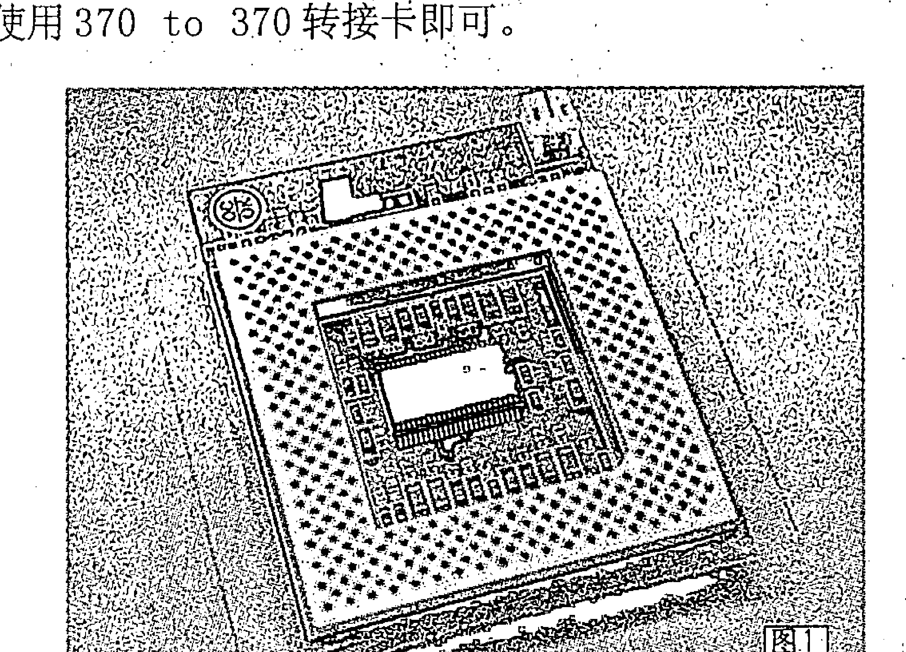

##### 升级效果分析

尽管我们这次的升级成本略微高于500元，但是其整体效果确实相当惊人，特别是在运行3D游戏时。如果使用3Dmark2001SE测试的话，你会发现此时分数能够从三位数提升到六千多，原本很多难以流畅运行的3D游戏都会变得轻而易举。除了3D速度的改善，系统的整体性能也有了质的飞跃。凭借大容量二级缓存，Tualatin Celeron提供给我们强大的整数性能，运行办公软件时将受益匪浅。而更换声卡之后，多媒体表现也随之提升。综合来看，此时的整体配置已经相当合理，即便今后需要升级，也将局限在存储设备以及多媒体外设上。

#### 3. 2001年购机：整合型电脑升级方案

在nForce2以及I865G之前，大多数整合主板都给人一种鸡肋的感觉。不过，很多低价位品牌机以及低配置兼容机都对整合主板推崇备至，这也客观上加大了升级难度。

##### 现状分析

当Intel推出PⅢ处理器之后，很多消费者都对此趋之若鹜，为了迎合他们，当时不少5000多元的“超低价PⅢ电脑”也应运而生。但是，也许厂商太想以各种花哨的名词来吸引消费者，因此这类产品往往在配置上极不合理。使用整合主板应该是最常见的，诸如I810/815、SiS620/630都整合了声卡与显卡，不过它们的性能真是令我们不敢恭维。尽管PⅢ的性能已经足够强劲，但是整合的I754或者SiS300的3D性能实在太差，根本没有任何3D特效，所以在绝大多数3D游戏下的效果与软加速模式没有什么差别。而且更加要命的是，这类整合主板并没有AGP插槽，由此也给我们的升级带来不少麻烦。除此以外，低价位配置的键盘鼠标也往往相应地缩水，质量令人颇为不满。在忍受多年之后，想必大多数用户都有更换的念头。

##### 升级方案

如今SDRAM的价格极其离谱，甚至比主流的DDR内存还要贵。对于Windows XP操作系统而言，256MB是最低的底线，因此卖出原先的SDRAM，然后选择DDR平台是明智的选择。如果追求性价比的话，AMD的Athlon XP无疑是最佳的选择，配合如今非常成熟的KT600或者SiS 748FX将拥有很不错的性价比。尽管目前热门的Socket A平台应当是Barton+nForce2，但是从整体性价比以及升级成本控制来看，选择KT600或者SiS 748FX芯片组将拥有更好的效果，而且Thoroughbred内核的Athlon XP同样具有不俗的性能表现。更为重要的是，升级之后应该预留下一步的升级空间，由于大多数KT600或者SiS 748FX主板都支持Serial ATA接口，因此今后升级串行应该更为方便；同时也具有很不错的超频功能，完全可以让400元出头的Athlon XP运行在更高的频率。

| 升级前产品 | 升级后产品 | 升级产品总价(元) | 升级后总价(元) |
|------------|------------|------------------|----------------|
| CPU        | Pentium III 733MHz | Athlon XP 1800+ | 420-200 | 220 |
| 主板       | 普通815E   | 华擎K7S8Xe+     | 420-180 | 240 |
| 内存       | SDR 128MB  | 256MB DDR333    | 370-120 | 250 |
| 显卡       | 集成显卡   | Radeon 9550     | 600     | 600 |
| 总价       |            |                 | 1310    | 1310 |

##### 升级要点

安装CPU对于大家而言或许非常简单，只需要对准插针的位置，然后固定滑杆即可。但是安装CPU风扇也是升级过程中必不可少，也是最危险的一步，因为用力不当很容易压坏CPU的核心。不过大家也没有必要因此而畏手畏脚，只要方法得当，完全可以顺利过关。首先用导热硅脂在CPU的表面均匀地涂上一层，做这一步的目的是确保CPU与散热片之间紧密接触，赶走空气。当然，导热硅脂也不能涂太多，应该以装上CPU风扇后不溢出为标准。为了保证散热片和CPU核心接触紧密，扣具往往设计得十分紧，因此大家在安装时千万不能使用蛮力。一般而言，CPU风扇的扣具在两边的形状是不同的，一头是简单的镂空小钩，另一头是带有扶手的镂空小钩。先将没有扶手的一头扣住CPU插槽，然后将CPU风扇盖住CPU，同时按下另一头的扶手，使之扣住CPU插槽的另

##### 升级效果分析

升级之后，整体平台的性能提升十分明显，完全能够满足各类主流应用的需求。如果不需要强悍的3D性能，那么选择普通的GeForce MX400显卡即可，其价格只有150元左右。对于部分已经采用MX400显卡的PⅢ品牌机而言，更能进一步节省升级成本，很容易将总代价压缩到800元左右。

### 三、品牌机升级技巧

品牌机以其优美的外观造型、完善的售后服务、品牌的承诺吸引了大多数消费者，很多对电脑并不精通的人都会选择品牌机，而非兼容机。但是从另一个角度来看，品牌机为了加大利润、挤压对手，势必在功能与性能上不如兼容机，很多价格不菲的品牌机甚至出现配置极不合理的现象，因此当用户逐渐熟悉电脑之后，就立即感到现有的功能不够用，此时升级也势在必行。

#### 1. 声卡软升级

除了购买新的声卡，就没有其他更加经济的方案了吗？其实不然，大家可不要忘记驱动程序！雷管驱动能将nVIDIA显卡的性能提高20%以上，而使用合理的声卡驱动也同样能大幅提高声卡的性能，对于AC97声卡而言更是如此，这并非天方夜谭。
SoundMax 3.0驱动可以称得上AC97软声卡的救星，它是由Analog Devices和Intel联合发布的技术，适用于全系列的Analog软声卡（虽然声称只支持AD1885，但通过修改smwdm.inf文件，可以支持全系列的AD188x声卡）。使用SoundMax3.0驱动之后，我们廉价的AC97软声卡就能拥有硬件级的数据处理转换能力和最高94dB的专业音质回放能力，并可以发出高品质的3D音效和优秀的MIDI合成效果（图2）。SoundMAX 3.0的MIDI软波表采用了与XG兼容的Sondius-XG，只要电脑性能足够，软波表同时发声数是没有上限的。SoundMAX 3.0技术最大的特点是集成了SPX音频效果算法，这项算法类似于创新公司的EAX环境音效技术，可以大大提升游戏情景音效的多样性，游戏声音不再是一成不变，乐趣也随之增加。但到目前为止，支持SPX的游戏仍不多，不过这并不重要，因为SoundMAX 3.0也兼容目前热门的音频API，包括Microsoft DirectSound/DirectX 8.0、Aureal A3D 1.0、EAX 1.0和2.0以及许多我们不知道的音效特性。

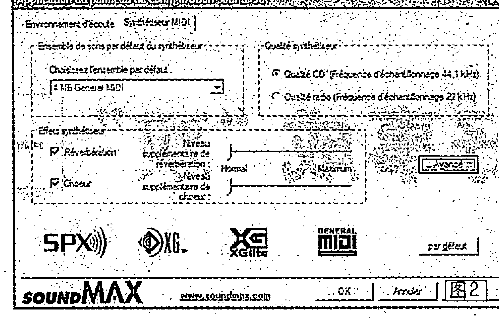

此外，新的SoundMAX 3.0驱动还降低了CPU占用率，改进了音质，这款优秀驱动的问世应该会改变AC97软声卡在人们心中的低劣印象吧。相信以后厂商会不断地推出更出色的驱动程序。目前最新版的SoundMax 3.0可以到http://file2.mydrivers.com/sound/WDM3034_SM3.exe下载，它足有26MB大小，由此也可见其威力。
一般来说，品牌机所配的硬盘容量不会很大，而且都是5400r/min低速产品，这对于广大用户而言显然是不够用的。此外，多数低价品牌机的内存一般也在128MB以下，如果想要流畅运行Windows XP的话，那么256MB也许刚刚够用。看来升级硬盘和内存都是必须的！

#### 2. 刷新BIOS，消除障碍

令我们感到棘手的是，品牌机采用的配件都是经过专门处理的，如果我们想添加内存的话，那么常见的散装HY内存条很可能不能与原有的品牌内存兼容，同样地，部分品牌机所使用的主板也不能识别我们新买来的硬盘。这种情况在IBM、HP、Dell等国外品牌机中更为常见。
对此，我建议大家刷新主板的BIOS，这可是最直接的解决方法，因为品牌机主板的BIOS并非由主板生产商直接编写，而且经过品牌机厂商的修改，他们为了使用户能到原有厂家升级产品而故意将主板的兼容性弄得很差，这简直是牟取暴利。不过只要我们将这害人的BIOS修改掉，那么一切就好办了。
然而事情并非想像中那么简单，因为我们顶多知道自己品牌机主板使用的是何芯片组，至于是什么品牌的主板就不得而知了。即使你打开机箱，将主板全身上下找个遍，也肯定没有答案，因为这些主板一般都是OEM产品，直接打上了品牌机厂商的牌子。更加可悲的是，如果我们打电话到品牌机厂商的技术服务中心，那么这类问题是不可能回答你的，事实上维修部的人员自己也不清楚！
看来我们只能自力更生了。首先大家要确定自己使用的BIOS品牌，一般主要有Award和AMI这两种。此时请大家打开电脑，当进行设备自检时，按下PAUSE键暂停，仔细关注屏幕左下角的编号信息，我们就是依靠这根救命稻草来查询主板品牌的。此外，部分主板可以用CTBIOS这款软件来查询Award BIOS的编码，至于AMI BIOS则可以用AMImbid来查询。这两款软件都可以在

#### 3. 添加外设

经过这些升级，我们的品牌机性能应该已经突飞猛进了，但是大家还是要注意一些品牌机的不合理现象。以目前的中高档品牌机而言，配备DVD甚至CDRW也已经不是什么新鲜事了，但是这些设备用来读取CD数据盘还是非常不合适的，在读取盗版盘片时尤其如此。所以强烈建议这部分用户添加一台普通的CDROM，目前主流光驱才200元不到，还是相当实惠，这样不但CD数据盘读取性能大大提升，对保护价格不菲的DVD和CDRW也是很有好处的。

知道主板生产商与芯片组之后，升级BIOS就不是什么难事了。大家只要到相应的主板厂商的官方网站下载最新版本的BIOS即可，这样就可以完全解决品牌机“水土不服”的问题，我们也可以随心所欲地升级硬盘和内存。这里要提醒大家的是，当我们覆盖了品牌机的BIOS之后，原来的漂亮开机画面可能就没有了，不过这点“损失”应该还是承受得起的吧。

CTBIOS下载地址：http://file2.mydrivers.com/tools/board/ctbios.zip

AMImbid下载地址：http://file2.mydrivers.com/board/amimbid.zip

以技嘉BX2000主板为例，请大家着重注意倒数第二组字符串（本例中就是2A69KG0EC），前5个字符（2A69K）一般代表芯片组的信息，接下来的两个（G0）是主板厂商代码，最后两个代表主板的型号（EC）。

关于Award BIOS中的芯片组信息和主板厂商代码，大家可以到http://www.biosrepair.com/biosxb/right2.htm查询，这里面有很详尽的信息，对升级BIOS肯定有帮助。而AMI BIOS的识别方法也基本类似，大家使用AMImbid查出编码后，可以对照http://www.biosrepair.com/page/amIId.htm的内容。

## 好事成‘双’——PC双设备实战

经过多次升级之后，不少DIYer手中或多或少都有闲置的硬件设备，而如何将它们利用好就是一个值得讨论的话题。毫无疑问，组建双设备是相当不错的解决方案，它将令我们的电脑变得更为强大，应付各种不同的需求。在这里，我们将带领大家完全领略一番电脑中的双设备，同时指导大家动手实践。

### 第一篇 专业用户的选择——双CPU

自从1999年美达科技推出了支持双CPU的440BX主板以后，国内就掀起了一股双CPU热潮。很可惜，由于当时的主流操作系统并不能很好地支持双CPU系统（当时只有Windows NT4.0可以），使得双CPU让众玩家仍然持一种观望的态度。但是现在，随着微软Windows 2000和Windows XP的普及，越来越多的用户投入它的怀抱，双CPU变得不再可望而不可即。

#### 一、双CPU的价值

尽管Windows的一大特色便是多任务功能，但是从根...

务的。学过操作系统原理的朋友都知道，Windows中所谓的多任务仅仅是将各个软件的数据请求分为细小的时间段，每一个进程依次操作。显然，这种操作模式会严重影响多个大型软件同时运行时的效率。为此，业界在高端工作站以及服务器市场引入了双CPU，从而大大加强了多任务下的性能。

当然，双CPU的价值并不仅仅在于执行多任务。如果应用软件专门为双CPU加以优化，那么其性能提升幅度同样是相当明显的。在图形工作方面，Photoshop和3DMAX都支持双CPU，所以对于这类用户群体来说双CPU是有用武之地的。同样Quake III等少数几款3D游戏也能支持双CPU，大幅度提升性能。

为了让大家充分认识到双CPU的价值，我们特地做了较为详细的测试。其中的三个测试平台，具有一定的代表性（表1）。

#### □ SiSoft 2002

我们使用了SiSoft 2000来测试单CPU与双AthlonMP与双Tualatin之间的性能差距，测试结果见表2。

Windows下直接运行，但是由于种种原因它并不能在所有的主板上正常工作。

（图/文 阿亮）

表1
| 组件 | 配置一 | 配置二 | 配置三 |
|------|--------|--------|--------|
| CPU | PIII Tualatin 1.26GHz × 2 | Athlon MP 1900+ × 2 | Athlon XP 1900+ |
| 内存 | 512MB PC2100 DDR SDRAM | 512MB PC2100 DDR SDRAM | 512MB PC2100 DDR SDRAM |
| 主板 | 艾崴 DVD266u-RN | 泰安 Tiger MPX-S2466 | 泰安 Tiger MPX-S2466 |
| 硬盘 | 希捷酷鱼四代 40GB (7200r/min, 2MB Cache) | 希捷酷鱼四代 40GB (7200r/min, 2MB Cache) | 希捷酷鱼四代 40GB (7200r/min, 2MB Cache) |
| 显卡 | ELSA Gladiac Ultra (Geforce2 Ultra) | ELSA Gladiac Ultra (Geforce2 Ultra) | ELSA Gladiac Ultra (Geforce2 Ultra) |
| 声卡 | Creative SB Live! Value | Creative SB Live! Value | Creative SB Live! Value |
| 光驱 | ASUS 40X | ASUS 40X | ASUS 40X |
| 电源 | 大水牛 350瓦 | 大水牛 350瓦 | 大水牛 350瓦 |
| 操作系统 | Microsoft Windows 2000 With Service Pack3 | Microsoft Windows 2000 With Service Pack3 | Microsoft Windows 2000 With Service Pack3 |
| DirectX版本 | 8.1b 中文正式版 | 8.1b 中文正式版 | 8.1b 中文正式版 |

双CPU似乎会比单CPU性能提高足有一倍，但那只是简单的单纯CPU成绩，系统整体性能不可能会达到那么高。不过这一点至少说明在Windows 2000下两个CPU都能充分地被利用，也为其他应用程序的发挥打下基础。

## 图形工作测试

大家都知道，双CPU主要是应用在家用图形工作站和服务器上的。所以这次的性能测试主要从图形处理着手，目前主流支持双CPU的图形软件大概要算3DMAX和Photoshop这两个软件了。可以说它们也是广大从事图形设计和处理工作的朋友的左右手。我们给出了单、双Coppermine以及双赛扬系统在3DMAX和Photoshop的测试结果（见表3，测试数据单位为秒）。

表3
| 项目 | 双Tualatin | 双Athlon | 单Athlon |
|------|------------|----------|----------|
| 3DMAX | 1.07 | 1.18 | 0.88 |
| Photoshop操作 | | | |
| 打开文件 | 40.6 | 41.3 | 36.4 |
| 180度旋转 | 66.3 | 70.5 | 60.8 |
| KPT 6.0滤镜闪光操作 | 115 | 122 | 95 |
| Photo Tools 3.0雾化操作 | 184 | 198 | 176 |

在3DS MAX 3.0的测试中做了个简单的模型，大小为2M，渲染的时候除了将分辨率设置成800 × 600以外，都是使用的默认值。在测试结果表中，我们可以很明白地看出使用了双Athlon的系统在进行同一个模型渲染的时候速度几乎比单Athlon系统快了30%。而双Tualatin的性能以微弱的优势超过单Athlon系统，但是不要忘记毕竟Tualatin的频率要比Athlon XP低很多，能有如此表现已经很不错了。

而各项Photoshop以及滤镜的操作中，双Tualatin的优势更加明显，毕竟Photoshop为Intel的SSE2指令进行了很好的优化。

## Quake III测试

Quake III是一款完完全全支持双CPU的游戏，也只有在这款极为流行的第一人称射击游戏中，我们才能看出这三个平台的差距。而如果换作其他的游戏，我们可以肯定地告诉大家，双CPU几乎是没有意义的。

| 分辨率 | 双Tualatin | 双Athlon | 单Athlon |
|--------|------------|----------|----------|
| 1028 × 1024 16BIT | 171.4 | 188.4 | 210.7 |
| 1028 × 1024 32BIT | 112.9 | 115.6 | 128.2 |
| 1600 × 1200 16BIT | 105.3 | 100.1 | 114.8 |
| 1600 × 1200 32BIT | 73.8 | 74.0 | 79.5 |

在游戏中，双CPU的优势明显不如刚才的应用软件中那么明显，不过双Athlon的表现还是不错的，要强过双Tualatin。客观地说，时下双CPU已经不是高档服务器的专利了，其价格是普通用户也能承受得起的。不过在做出这样的决定之前，我们要充分考虑一下自己平时经常使用的软件。如果你更加看重3D游戏的效果，那么双CPU是毫无意义的，毕竟支持双CPU的游戏寥寥无几。相反，对于那些专业的图形处理用户，双CPU的诱惑确实不小。

#### 二、实战双CPU

#### 1. 具有SMP功能的CPU

并不是每一款CPU都具有组成双CPU系统的能力，因为Intel与AMD都在CPU出厂前屏蔽了这一功能，特别是定位于低端市场的Celeron与Duron系列。由于使用双CPU的主要是企业用户与高级用户，因此CPU生产商都推出了专门支持这一技术的产品，并在命名方式上加以区别，不过价格自然要高一些。

事实上，以前的Celeron、P II以及最早的Athlon都是具有SMP（对称多处理器）功能的，只要主板支持的话，我们无须修改就可以非常方便地使用。但是现今主流的Pentium4、AthlonXP都不支持。下面这一张表格是各款CPU对SMP功能的支持情况（表4）。

| CPU 型号 | 厂商 | 是否支持 SMP (双 CPU) |
| :--- | :--- | :--- |
| Celeron | Intel | 是 |
| Celeron II | Intel | 是 |
| Tualatin Celeron | Intel | 否 |
| P II | Intel | 是 |
| P III Katmai | Intel | 否 |
| P III Coppermine | Intel | 是 |
| P III Xeon | Intel | 是 |
| P III Tualatin | Intel | 是 |
| Pentium4 Willamette | Intel | 否 |
| Pentium4 Northwood | Intel | 否 |
| Pentium4 Xeon | Intel | 是 |
| Spitfire Duron | AMD | 否 |
| Morgan Duron | AMD | 否 |
| Athlon | AMD | 是 |
| Thunderbird Athlon | AMD | 是 |
| Athlon XP (Palomino) | AMD | 部分可以，有些需要修改电路 |
| Athlon XP (Thoroughbred) | AMD | 否 |
| Athlon XP (Barton) | AMD | 否 |
| Athlon MP | AMD | 是 |
| Athlon4 | AMD | 否 |
| Athlon64 | AMD | 否 |
| Opteron | AMD | 是 |
| Cyrix III (Samuel) | VIA | 是 |
| Cyrix III (Samuel2) | VIA | 是 |
| Cyrix III (Joshua) | VIA | 否 |
| Nehemiah | VIA | 不详 |

由以上我们可以看出，事实上支持SMP的CPU还是不少的，但是究竟哪些是值得我们选择的呢？毫无疑问，性能最出众的当数P4 Xeon与Athlon MP，不过这两款CPU价格不菲，非我们普通用户所能承受。至于Celeron II和最早版本的Athlon（500~700MHz），它们本身的性能就不甚理想，用于组建双CPU系统几乎是没有意义的，因为这样还不如直接使用P4或者Athlon XP。

相对而言，PIII与Athlon XP应该是不错的选择，其中又以Athlon XP最具价值，因为Athlon XP本身就具有出色的性能，组成SMP后肯定会如虎添翼。但是问题并非所有的Athlon XP都支持SMP，因为AMD公司为了不冲击Athlon MP的销量，特意将它的SMP功能屏蔽。

不过天无绝人之路，对于动手能力非常强的 DIYer 而言，我们只要略施小计就能破解 AMD 设置的障碍。

让我们来比较一下有 SMP 功能的 Athlon XP 和最新的 Athlon XP 到底有何区别。通过仔细观察和判断，我们发现原来某一金桥被切割了。正如大家相对熟悉的解锁倍频一样，AMD 就是利用 CPU 表面处的各种连桥来限制 CPU 的各项功能。

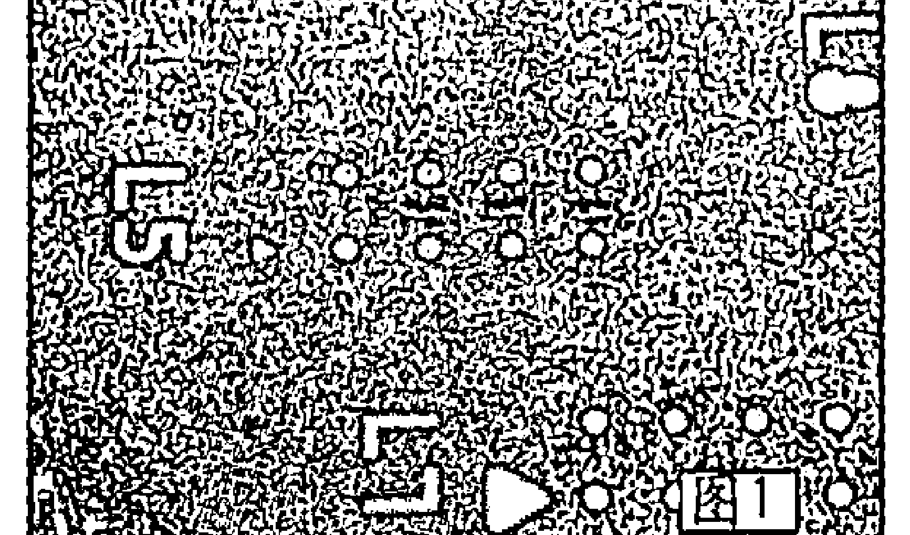

请大家认真观看图1，你会发现最新的 Athlon XP 在 L5 上有一处金桥被切断，这一特殊的金桥切割就是阻止 Athlon XP 运行在双处理器配置环境的关键因素。现在问题变得越来越清晰了，我们所要做的就是补上这个缺口。这一修改工作非常简单，可比破解倍频要容易多了。我们只要使用传导油漆来连接 L5 金桥区最右边那两个被切割开的针脚即可。如果你身边没有传导油漆的话，使用一根短的金属来连接再用普通胶水固定也是可行的，毕竟普通胶水都是绝缘的。经过这些简单的步骤，我们的 Athlon XP 就变成了一块 Athlon MP，而且在 Windows 中也能被正确地识别。

当我们把 Athlon XP 改装成 Athlon MP 之后，组建双 Athlon XP 系统可谓轻而易举。目前支持 AMD 双处理的芯片组主要是 AMD 760MP 与 760MPX，由于是自家产品，而且 760MP 是 AMD 转为 Athlon MP 而推出的，因此绝对没有兼容性的问题。我们惟一需要注意的就是散热，这里指的散热包括 CPU 与北桥芯片，因为 AMD760MP 北桥的发热量也是相当高，安装一个风扇对提高系统稳定性很有好处。

需要注意的是，大家千万不要忽视了双 P III 系统。当 Intel 为 Tualatin 核心的 P III 配备 512KB 二级缓存之后，其性能突飞猛进，组成双 CPU 系统之后的表现颇为令人满意。更为重要的是，适用于 Socket 370 平台的双 CPU 主板价格较为便宜，特别是一些采用 VIA Apollo Pro266T 芯片组的主板（图2）。

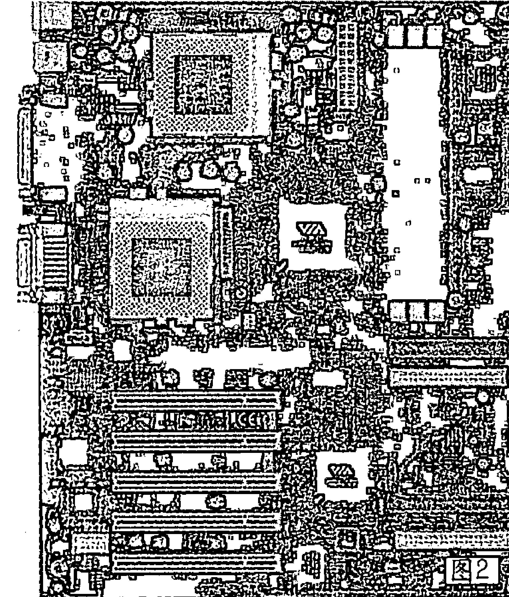

### 三、安装双 CPU 系统的注意要点

对于双 CPU 系统而言，主板与 CPU 的兼容性是极为关键的，不然可能连机器也点不亮，或者只能够识别出一个 CPU。为此强烈建议大家都把 BIOS 升级到最新版本，一般主板厂商的官方网站都有下载。

双 CPU 的安装没有什么太困难的地方，不过要提醒你，如果你的机箱太小的话可能会有点吃力。需要注意的是，CPU 插座周围空间一定要充足。如果有条件的话，最好给 CPU 使用散热效果理想的风扇，特别是对于准备用 Athlon XP 组建双 CPU 的用户，因为 Athlon XP 的发热量要比 P III Tualatin 大很多。

值得说明的是，如果要使用双 CPU 的系统，那么两个 CPU 的频率必须是一样的，否则根本无法开机。此外，请大家不要在 Windows 98、Windows ME、Windows XP Home Edition 等操作系统下使用双 CPU，因为这些版本的操作系统根本不支持双 CPU 的多任务切换机制。

另外，如果你的操作系统以前使用的是单 CPU，那么一定要重新安装操作系统，不然操作系统很可能不能识别。如果你不能确定自己使用的 Windows XP 或者 Windows 2000 是否真正地利用到双 CPU，那么可以进入系统监视器，查看一下两块 CPU 是否都在工作，这也是最为直接的方法，因为任何一个版本的 Windows 都有系统监视器这个工具。如果两个 CPU 在同时工作，那么 CPU Usage History 中将出现两个窗口。

## 第二篇 速度与容量的诱惑——双硬盘安装攻略

硬盘是计算机中至关重要的设备之一，因为其“心胸宽广”，所以肩负着保存数据资料的重要任务。如今硬盘的容量也随着技术的不断发展而飞速提高。目前市场上的主流硬盘容量在60GB以上，而且随时可能突破120GB。因为如今的系统、软件、游戏的信息数据量越来越大，所以任何一个用户都希望自己的硬盘空间也能够尽量地满足需求。为了使自己的硬盘不断增大，我们就可能需要购买第二块硬盘来使用，于是我们就需要了解安装和使用双硬盘的方法。

### 一、普通双硬盘的安装

在安装双硬盘之前我们首先要做的就是对硬盘的跳线进行设定，因为多个硬盘安装到计算机中后，就需要计算机来识别、区分和驱动它们，这样我们才可以使用，那么计算机是按什么方法来区别不同的硬盘呢？答案就是靠主从跳线的设定模式。

硬盘主从跳线的位置在硬盘末端用来插接信号线和电源线的中间，一般是由3～5组插针和1～2个跳线帽组成的（图3）。硬盘跳线的设定模式一般有三种，主：MASTER，从：SLAVE和自动选择：CABLE SELECT，有些硬盘如IBM和WD的硬盘还有一个独立硬盘工作模式，当你只使用一个硬盘工作时就需要设定在这个状态上，这个状态称为单硬盘模式：SINGLE。不同硬盘的跳线方式有着不同的设定方法，具体的设定模式在硬盘正面的贴纸或侧面的盘体上都有标注，只要按照上面的指示来进行设定就可以了。

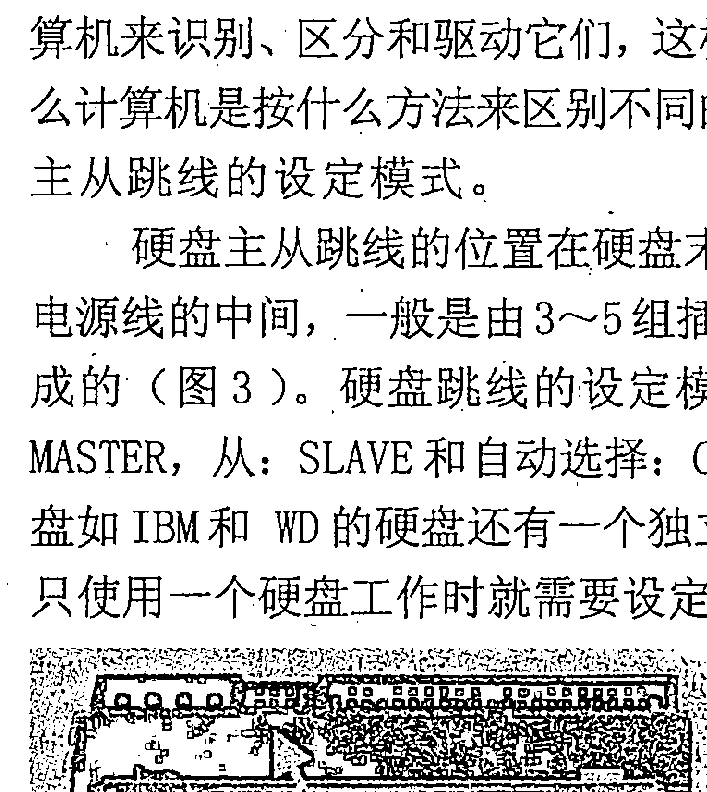

在安装硬盘之前，首先我们在两片硬盘中选择出性能好一些的硬盘来作为系统引导硬盘，将其跳线的模式设定为MASTER模式，然后将另一片硬盘的跳线模式设定为SLAVE模式，或者在第二个主板IDE接口上设定为MASTER。设定好之后，再将这两片硬盘一同安装在机箱的3英寸安装槽内，并使用螺丝钉固定。

硬盘安装固定好之后，我们就可以用来连接其连接线了，首先我们来接电源线。普通的IDE硬盘使用普通D型电源插座，我们只需在电源箱的输出线上找一个D型电源插头插在硬盘的电源插座上即可。连接好电源线之后，我们再来连接80pin数据线，此时要注意顺序。观察80pin数据线，不难发现它的各个插头的颜色是不同的，这些插头就是用来插接不同设备的。蓝色插头（标记有SYSTEM）这一端是用来连接主板的IDE插槽的，黑色插头（标记有MASTER）这端是用来连接主硬盘的，而灰色插头（标记有SLAVE）这一端则是用来连接从硬盘的，这些顺序不能搞错，否则无法正确驱动UDMA模式。

开机进入BIOS之后，选择IDE HDD AUTO DETECTION。此时主板便可以将两个IDE口连接的四个设备全部检测出，进行了这些设定之后我们就可以选择SAVE & EXIT SETUP保存设置，并退出BIOS设定模式。

安装双硬盘，不能不说盘符交错问题。什么是“盘符交错”呢？举个例子吧。假设你的第一硬盘原来有C、D、E三个分区，分别标记为C1、D1、E1，第二硬盘有C、D两个分区，分别标记为C2、D2。一般情况下，安装双硬盘后，硬盘分区的顺序将为C-C1，D-C2，E-D1，F-E1，G-D2，你看，原来第一硬盘的D、E分区变成了E、F盘，在C、E盘之间嵌入了第二硬盘的C分区，这就是“盘符交错”。“盘符交错”会使安装双硬盘以前原有的软件、链接等因路径错误而无法正常工作。此时我们可以采取以下措施来避免“盘符交错”。

- 1. 如果两块硬盘上都有主引导分区，可在CMOS中只设置第一硬盘，而将第二硬盘设为None，这样，在Windows或Linux系统中就会按IDE接口的先后顺序依次分配盘符，从而避免“盘符交错”，而且也不会破坏硬盘数据。这样做还有另外的好处，如果在两块硬盘的主引导分区分别装有不同的操作系统，可以通过改变CMOS设置激活其中的一个硬盘，屏蔽另一个硬盘，从而启动相应的操作系统。缺点是：在纯DOS下无法看到被CMOS屏蔽的硬盘。
- 2. 只在第一硬盘上建立主DOS分区（当然还可以有其他逻辑分区），而将第二硬盘全部划分为扩展分区，然后再在其中划分逻辑分区，这样就可以彻底避免“盘符交错”了。当然，对第二硬盘分区前，要先备份好你的数据！可以先用方法1安装好双硬盘，再把重要数据备份到第一硬盘上，最后对第二硬盘重新分区。

### 二、实战RAID磁盘列阵

在谈论到电脑的速度（性能）时，我们一般只在意CPU的速度，内存的大小等，而对于硬盘的速度却不怎么重视。其实这是绝对错误的，因为硬盘的速度将直接影响到整个系统的效率，有时甚是比CPU和内存更为显著。在视频捕捉、平面设计等场合下，硬盘的性能起到至关重要的作用。然而凭借目前的磁盘技术，硬盘的性能难以有很大的飞跃，因此业界提出了RAID（Redundant Array of Inexpensive Disks，磁盘阵列）解决方案。

#### 1. RAID基础知识

RAID技术最初都是建立在SCSI系统基础上，后来Promise公司第一次提出并研发了基于IDE硬盘的RAID产品，从而能以较低价格提供更高的性能和安全保证。

表5
| RAID级别 | 别名 | 容错性 | 冗余类型 | 热备盘选项 | 需要的磁盘数 | 可用容量 |
| :--- | :--- | :--- | :--- | :--- | :--- | :--- |
| RAID 0 | 条带 | 没有 | 没有 | 没有 | 一个或多个 | 总的磁盘的容量 |
| RAID 1 | 镜像 | 有 | 复制 | 有 | 只需2个 | 只能用磁盘容量的50% |
| RAID 3 | 专用奇偶位条带 | 有 | 奇偶位 | 有 | 三个或更多 | (n-1)/n的磁盘容量。其中n为磁盘数 |
| RAID 5 | 分布奇偶位条带 | 有 | 奇偶位 | 有 | 三个或更多 | (n-1)/n的总磁盘容量。其中n为磁盘数 |
| RAID 0+1 | 镜像阵列条带 | 有 | 复制 | 有 | 只需4个 | 磁盘容量的50% |

事实证明，RAID并非仅仅适用于SCSI硬盘，对于IDE硬盘而言，它也是一种极为出色的解决方案，而且较低的成本使我们普通用户也能过一把RAID瘾。

RAID技术经过不断的发展，现在已拥有了从RAID 0到6七种基本的RAID级别。另外，还有一些基本RAID级别的组合形式，如RAID 1+0（RAID 0与RAID 1的组合），RAID 5+0（RAID 0与RAID 5的组合）等。其中在IDE中，主要以RAID 0、RAID 1和RAID 0+1为主，而我们普通用户经常使用也仅仅是RAID。表5是对各类主要RAID技术的一个总结。

毫无疑问，RAID 0是最经济实惠的方案。在不牺牲硬盘容量的前提下，我们可以轻松地令硬盘速度提升一个档次。组建RAID 0时，我们需要一块RAID控制卡与两个硬盘。需要注意的是，此时两个硬盘最好是同一型号的，即便不是也一定要是同转速与同容量的。不然最终的RAID 0将以速度较低或者容量较小的那个硬盘为标准来组建，这就有些得不偿失了。目前主流的RAID控制芯片为Promise PDC20375与Silicon Image Sil3112A（图4），其中前者同时支持IDE RAID与Serial-ATA RAID，而后者只能支持Serial-ATA RAID。此外HighPoint、Tekram和AMI的芯片偶尔也能看到。下面我们将带领大家来组建一个RAID 0系统。

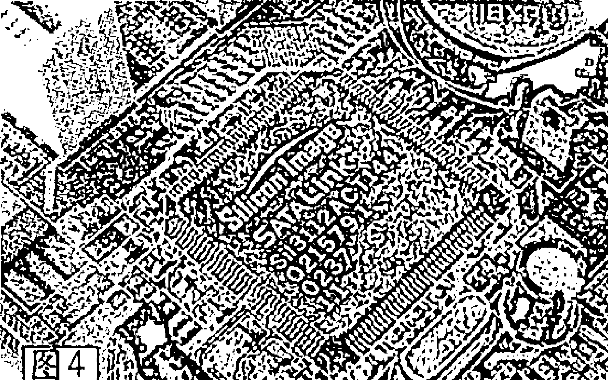

#### 2. 实战RAID 0

在此次RAID实战中，我们采用Tekram DC200芯片为例向大家介绍。尽管它与常见的Promise和HighPoint芯片不同，但是使用方法基本一致，大家可以效仿来做。

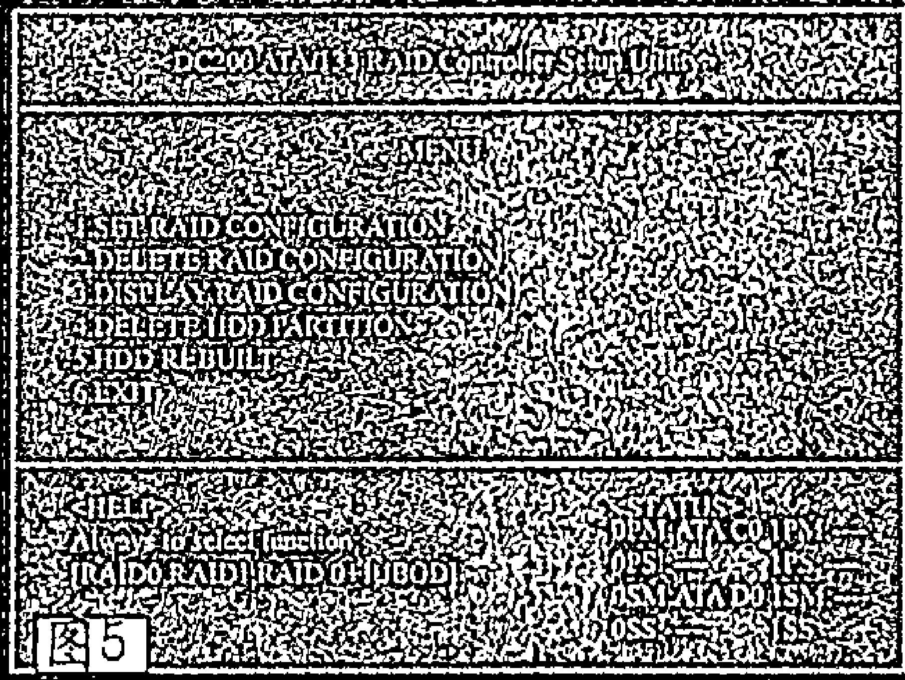

其实使用RAID 0的关键是掌握RAID控制卡BIOS的使用。当我们把RAID控制卡安装好并接上两个硬盘时，系统开机就会出现如图5所示的画面。BIOS界面分三个部分：MENU（菜单）、HELP（帮助）和STATUS（状态）。由于我们是首次安装RAID，因此必须进入MENU窗口进行创建。

在MENU菜单中选择“1. SET RAID CONFIGURATION”，按回车键，此时我们就可以进入“SET RAID CONFIGURATION”界面。RAID控制卡将使用一段时间来识别硬盘，稍后我们把光标移动到硬盘，再按空格键来进行选择，按回车键确认选择，这时将弹出一个新的窗口显示可供选择的RAID的模式，共有4种：JBOD（不适用RAID）、RAID 0、RAID 1、RAID 0+1。

毫无疑问，我们当然是选择“RAID 0”。然后大家可以通过STATUS（状态）菜单查看此模式是否被真正激活。至此，我们的RAID 0硬件安装就结束了，大家可以接着安装操作系统。值得注意的是，由于Windows并不能识别RAID控制芯片，因此它会将此设备识别为普通的SCSI控制卡。强烈建议大家在安装完Windows之后为RAID控制器补上正确的最新版本驱动程序，这不仅能够提高RAID系统的稳定性，还可以大幅度提高性能。此外，不少RAID控制卡还带有功能丰富的软件，可以帮助用户在Windows下查看RAID工作状态。

#### 3. RAID性能测试

在组建好RAID 0之后，我们还是来看看RAID的性能究竟如何。测试中，我们以两块20GB的金钻六代硬盘所组成的RAID 0与单块金钻六代相比较。

□测试成绩

| 测试项目 | 单硬盘 | RAID 0 | 提升幅度 |
| :--- | :--- | :--- | :--- |
| SiSoft Driver Benchmark | 29425 | 49987 | 70% |
| Winbench99 High-End | 18400 | 22500 | 22% |
| 文件的拷贝 | 12分15秒 | 9分5秒 | 25% |
| 3D Mark2001 | 4158 | 4160 | 0% |

总体而言结果还是很让人满意的，在RAID 0的模式下，SiSoft成绩有了很大的提高。但是需要注意的是SiSoft测试的是理论磁盘传输速率。而在Winbench99，成绩就更加客观了，22%的提升幅度真实地反映了RAID 0的效果。

现在的硬盘越来越大，也许很多朋友都像我一样喜欢把光盘拷到硬盘上使用。为了验证RAID到底能在磁盘满负荷传输的情况下有多少提高，我们也特地进行了一下测试。测试中，使用一张刻满650MB数据的光盘，在Asus 40X的CDROM下整盘拷贝。测试成绩再次表明，RAID 0确实是很有实用价值的。对于我们发烧友而言，RAID 0无疑是最具有诱惑力的，它的速度的确很快，当硬盘高负荷运行时，它的速度几乎比单个硬盘快上一半。至于其他RAID方式，虽然它们兼顾了速度与稳定性，但是代价实在是太大了，我们普通玩家是无法忍受的。

最后需要提醒大家的是，千万不要指望RAID 0能给游戏带来什么好处，因为它不可能提高游戏的帧数，惟一的好处就是使进入游戏的速度加快。RAID 0更适用于对磁盘速度相当敏感的用户，经常运行图像处理、工程设计和视频捕捉等软件的朋友的确很需要RAID 0。

## 第三篇 拓宽你的视野——组建双显示器系统

最近显示器的价格可谓一泻千里，LCD的价格更是让人惊讶，不少朋友都添置了心仪已久的新显示器。但是，你有没有想过如何处理你的旧显示器？闲置在一边，既可惜又浪费地方。那么你为什么不组建双显示器系统呢？它能将你的视野加倍，甚至将一台电脑变成两台……

### 一、双显示系统的作用

对于专业级的图形设计人员而言，工作空间至关重要。仅仅一个显示器显然是不够用的，而双显示器无疑是解决问题的绝佳途径。与使用大屏幕显示器相比，双显示器更加灵活，也便于管理。如果需要频繁地在多个应用程序之间切换，显示器再大也会相当不便，而且期间将无法观察后台程序的运行状况，然而双显示器却完全不存在这一矛盾。

对于使用LCD的用户而言，双显示器的意义也是毋庸置疑的。尽管如今的LCD在性能指标方面已经今非昔比，但是对比度、亮度、可视角度、可视面积、响应时间等还是与高档CRT有着不小的差距。显然，LCD与CRT在单显示器状况下难以做到两全。不过，当我们采用CRT+LCD的双显示器模式之后，一切问题都能迎刃而解。办公时选择聚焦出色而且低辐射的LCD，进行3D游戏时选择大屏幕高画质的CRT。

双显示器的意义还不仅仅是这些，对于那些家庭用户而言，双显示器可以有效帮助用户实现资源共享。譬如家人需要看DVD而自己又要上网时，奇妙的双显示器系统完全可以做到两者兼顾，互不影响。如果你进行Web制作，你只要把两个显示器设置为不同的分辨率，就可以同时观看你的页面在不同分辨率下的表现。对于程序员而言，可以在编写代码的同时看到程序的输出结果。此外，部分飞行模拟游戏还直接支持双显示器，这种视野模式是普通游戏所不能比拟的。更为重要的是，组建双显示器的成本并不高，特别是对于那些近期准备升级显示器的用户而言。

### 二、使用双头显卡组建双显示系统

自从Matrox在其Millennium G400中将双头输出这项技术带进个人电脑显卡之后，nVIDIA、ATI、SiS等具有相当实力的厂商也纷纷开发了具有类似功能的双头显卡。客观来说，主流显卡的双头输出功能都非常出色，区别仅仅在于DVD输出、刷新率异步（针对TV输出）以及控制软件等方面，互相之间的差距不是很大。这里，我们以Matrox的Millennium G550为例，向大家介绍如何组建双显示器系统。对于其他的双头显卡，组建方法基本是一致的，大家可以举一反三。

首先当然是把两台显示器都连接到显卡上，如今支持双显示器的显卡在端口上都有两个接口：一个是普通CRT使用的15针VGA端口，另一个则是最近非常火爆的液晶显示器端口（图6）。如果你有福气用上LCD的话，那么很简单只要对上号插上就可以了。而如果你和笔者一样，使用两个CRT的话，那么还需要使用显卡额外提供的一个DVI2CRT转接头（图7），一般支持双头输出的显卡都会提供这个小配件。当我们把两台显示器都连上之后，打开电源，你会发现两台竟然都有显示。哈哈，那就不用设置了？错了，一旦进入Windows之后，第二显示设备立即就“熄火”了，看来双显示系统还没那么容易搞定。

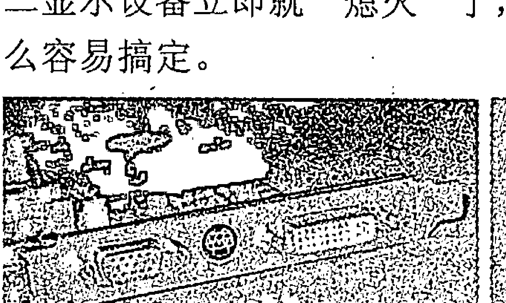

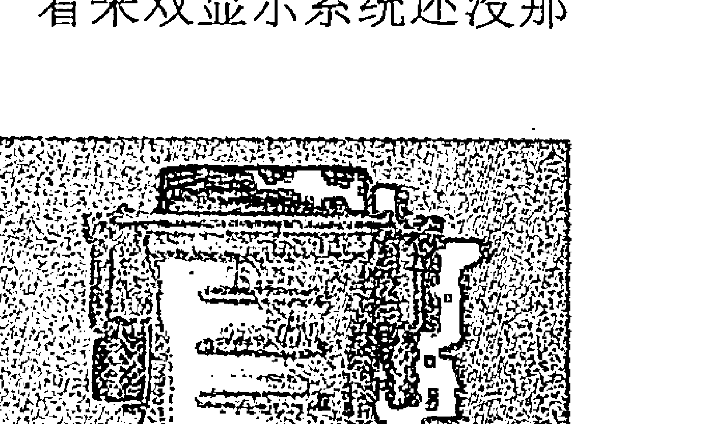

如果要使用双头输出的话，正确的驱动程序是必须的。以Matrox G550为例，当安装好驱动之后，会在系统托盘内出现一个快捷控制图标，大家右键单击之后就会出现可选菜单。我们选择“Use Multidesk”之后，系统会要求重新启动，这时选择确定即可。

千万不要以为这样就万事OK了，经过Windows重新启动之后，你的第二显示设备仍然没有任何图像。此时我们还需要进一步设置。打开“显示属性”菜单，单击高级选项，此时你会进入一个更为复杂的操作界面，当然我们关心的仅仅是双头输出，因此只要选择DualHead即可。请注意图中的“features”列表，这里可是双头输出的关键。首先，大家激活“DualHead Multi-Display”，必须保证下面的状态提示是“Enable and active”，其实大家对这点不用过分担心，只要你经过系统的重新启动，那么这个选项就是被默认激活的。

Matrox的G550支持的双头输出模式有Clone和Zoom，一般来说大家较为常用的是Clone模式。不过，激活了Multi-Display并不意味着立即可以使用。此时，大家可以看看DualHead Clone这一提示栏，“Enable But not currently active”，说明此时Clone模式还是没有被激活，你的第二显示设备当然没有任何图像。为了激活这一功能，我们还必须设置相应的热键。为什么要使用热键，而不是直接使用鼠标操作呢？呵呵，等你用了就知道了，绝对是使用热键方便，因为很多时候你连屏幕也看不到，怎么用鼠标？

单击下面的“Change Setting”，出现一层设置菜单。顺便提一下，要是你进行文字处理或者上网等对显卡性能要求不是很高的应用的话，那么可以选择“Favor image quality”，它可以有效改善画面质量，但是对性能有稍许影响；如果是进行3D游戏的话，那么还是建议选择下面的速度优先模式。

设置热键，我们只需点击“Hot Keys”按钮。这项设置还是非常简单的，只要你能看懂满屏的英文就可以了，对于ATI以及nVIDIA的显卡，由于有中文版的驱动程序，因此就更加简单了。我们把Clone Mode的激活热键设定为Alt+F2，以后只要按这个热键就可以方便激活。看看效果吧，还是很不错哟。当然，在刚才的热键设置菜单里面，你也可以设置Zoom模式，这种模式可以扩展你的桌面。由于设置方法非常类似，因此我们就不多介绍了。

### 三、使用双显卡组建双显示系统

并不是所有人都有机会使用双头显卡，对于那些已经购买了普通显卡又有多余的显示器的朋友而言，最佳的方案也许是使用双显卡。不过使用双显卡的条件是，两块显卡中至少要有一块是PCI接口的，因为我们最多只有一个AGP插槽。此外，你的操作系统必须是Win98SE或者更新的版本，这点我想对大家来说应该是没有问题的。

不过说老实话，由于双显卡完全依靠Windows自带的软件支持，因此你的显卡芯片必须是支持Windows下双显示的芯片，关于这一点，大家可以到微软的官方网站查看。但是在这里，我可以告诉一个让大家都放心的消息，主流的nVIDIA和ATI几乎都能支持这种模式。另外，对于那些已经具备双头输出的显卡，最好不要用这种方案，因为这会引起不小的冲突，相当棘手。

这次，我们以小影霸的nVIDIA GeForce2 MX标准版和已经是老古董的S3 765 PCI来向大家展示双显示系统的组建过程，使用的操作系统为Windows ME。不过大家需要注意的是，对于第二块显卡，最好是较为常见的主流产品，通过微软双显示功能认证的主要有以下几款显示芯片：

- ATi Mach64GX
- Trident 9685/9680/9682/9385/9382/9385
- S3764V＋（765）、Trio64V2
- S3ViRGE（支持DirectDraw和Direct3D）
- S3Aurora（S3M65）Cirrus5436、7548, 5446
- ATiRage1和2（VT以上）
- ATi3D Rage Pro

其实这些也几乎云集了所有的PCI显卡芯片，只要你不是太倒霉，一般都没有问题啦！首先，我们要把两块显卡都安装到主板上，然后分别接上显示器。随后打开电脑，系统便开始进行自检操作，这时我们就可以看到其中一台显示器启动，并显示出正确的显示信号。究竟是哪一台显示器启动，关键还要看你在BIOS中将“首要的显示输出设备选项”设定的是PCI还是AGP，如设定的是PCI则PCI显卡连接的显示器先启动，并在系统中确认为第一显示器，而AGP显卡连接的显示器则为第二显示器。以上现象反之亦然。

当系统自检完毕进入Windows的启动状态后，第二个显示器将会自动启动，并显示出显卡的自检信息，此信息显示完毕后，会显示出一大段的英文来，其大意是：你的系统安装了双显卡系统，如果你想正确地驱动并使用这两块显卡（两台显示器）的话，你需要在控制面板的显示属性中对它们进行设定。

稍过一会之后，我们就可以正确地引导Windows系统了，表面看起来没有什么特别。这时，大家最好查看一下“系统属性”中的“设备管理器”，看看是否已有两个显卡设备。但是如果你查看“显示属性”之后就会发现多了一个显示器。这里需要向大家说明的是，由于我们使用的是nVIDIA的公版驱动，因此它也加入了双头显示的设置菜单，而事实上这块小影霸MX是没有双头输出能力的。好在这也没有造成太多的麻烦，只是Windows把我们刚才安装的S3 765认成第三显示设备了，但是这绝对不影响使用。

此时，如果你打开第二个显示器的话，那么就应该有显示了。但是，很有可能图像排列很怪，看起来非常别扭，这与不同的显示芯片有关。碰到这种情况时，我一开始也束手无策，但是经过一番琢磨之后，在刚才的显示属性中，显示器的位置竟然是可以通过鼠标拖拽来调整位置的。虽然在窗口的表示上有提示，但是也太不明显了。大家看看，如果你的两台显示器是竖直放的，那么甚至可以正确地调整（图8）。

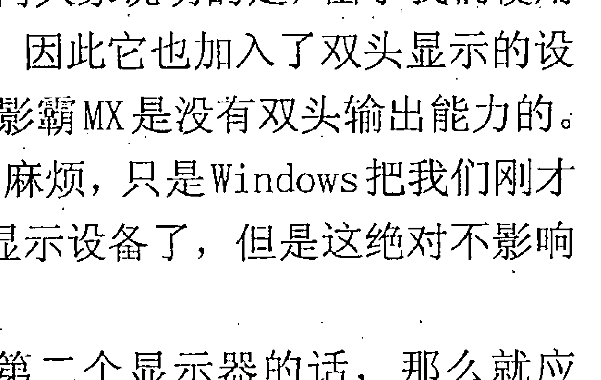

因此，如果你的画面不正常的话，请在这里耐心地调节。

另外需要说明的是，Windows提供的双头输出并不支持Clone模式，因此我们无法像使用那些双头显卡那样享受这项功能。不过，微软也有自己的特色。它提供了桌面扩展模式，而且从某种程度而言，这种方式更加方便。因为这可以使你同时运行了多个应用程序，把它们分别放置在不同的显示器上，这能够使你避免频繁地在任务栏上进行任务切换。当应用程序使用多个子窗口时，你可以将它们拖动到第二显示器上，以获得更多更大的工作空间。

在操作系统方面，强烈建议大家使用Windows ME或者最新的Windows 2000/XP。经过试验，在使用双显示器系统时，Windows98关掉了D3D和OpenGL硬件加速，而代之以微软的软件加速。只有停止使用所有的第二显示器才能获得硬件加速功能。而在Windows ME和2000/XP上则没有这个限制。

另外要提醒大家的是，两台显示器尽量使用相同的分辨率，这样看起来不会有太大的视觉差异。如果实在条件不行，那么也要尽可能让分辨率不要相差太大。此外，两台显示器之间最好留有一定的空间，不然就可能出现干扰现象，显示器上会出现一根上下移动的水平线。

毫无疑问，双显示器的确给我们带来了极大的方便。相比两种方案，第一种的成本似乎高了一些，而且设置比较麻烦，但是支持Clone模式是相当具有诱惑力的，尤其是在教育、商务等应用场合；而第二种的成本是极低的，二手市场的老PCI显卡一般不会超过30元，而且由于这是微软提供的技术，因此使用还是相当方便的，几乎不用做什么设置，惟一的遗憾就是不能Clone输出。

## 第四篇 变废为宝——玩转双声卡

曾几何时，声卡简直是普通用户不敢想象的高级设备，当时经典的SoundBlaster 16卖价将近2000元。不过随着硬件技术的发展，如今声卡已经相当便宜了，而且性能非常出众。但是对于那些老用户而言，轻易地丢弃老声卡也是非常可惜的，即使要升级，我们何不把它也利用上呢？

此外，目前不少主板整合了声卡，这类产品会大大影响系统的整体表现，因为AC97对于资源的占用很厉害。此时绝大多数用户都会选择另购声卡，如果将原有的声卡屏蔽显然是极大的浪费，我们可以使用双声卡模式，变废为宝！

### 一、DOS游戏也能出声

PCI声卡的优异性能已经得到了绝大多数玩家的公认，但PCI声卡无法彻底解决DOS下的正常发声问题，这也是个老生常谈的话题了。尽管现在的主流高档声卡已经基本解决了这些问题，但一些较早面市的PCI声卡和低端的声卡芯片在DOS兼容性方面却差强人意。

如果你还有当年的“高档”ISA声卡的话，那么就可以完全解决这一问题。首先把两块声卡都安装到主板上，当进入Windows后，系统会提示找到新的多媒体设备。此时可以选择“取消”，因为我们并不需要将这块声卡在Windows下使用。

由于SB16、OPTI931等经典的ISA声卡在DOS下无需驱动就可以使用，因此我们也不用做任何设置，甚至可以在系统属性中将ISA声卡禁用。当我们要玩DOS游戏时，开机按住F8，进入DOS启动方式，此时DOS会自动识别ISA声卡并分配IRQ。好了，现在运行一个DOS老游戏，肯定能够发出声音了。

### 二、边玩游戏边听音乐

如果你使用的是廉价的PCI声卡，那么很可能不能实现边玩游戏边听音乐的梦想，因为那些低档声卡芯片往往只具有单音频流处理能力。此时我们可以利用双声卡，这样可以很好地解决这一问题。

不过需要注意的是，双声卡中只能是PCI与ISA组合，或者2块PCI声卡，而不能是两块ISA声卡，因为两块ISA同时工作肯定会造成中断冲突。其实双声卡的安装并没有什么太多的技巧，只要你具备驱动程序就可以了。

对于双PCI声卡，大家要注意一个问题。如果你的两块PCI声卡都支持A3D或者EAX技术，那么在安装驱动程序时就都会将A3D.DLL文件复制到WINDOWS\SYSTEM这个目录下。而这个A3D.DLL是独立的，不是共用的，每个PCI声卡有自己的A3D.DLL，不能交换使用。所以在此我们要决定一件事情：舍弃哪一张声卡的A3D.dll？

挑选的原则当然是舍弃A3D效果较差的那一张！接下来，先安装那张你准备要舍弃A3D的声卡的驱动程序，再装那张你要用A3D的声卡驱动程序，这样WINDOWS\SYSTEM下的A3D.DLL，就会被自动取代掉。

但是到此有一个疑问，当播放MP3等音乐时，Windows会主动去用哪一张声卡？其实要看你在“控制面板”→“声音及多媒体”→“音频”→“首选设备”中的选择了。Windows为我们做了充分的考虑，此时可以分别为音频播放、音频录制和MIDI回放选择不同的声卡，这样大家就可以根据具体声卡的特性来选择。

至于声卡与音箱的连接，这就有一些技巧了。如果你的音箱具有两组音频输入端子（譬如漫步者的R1800、1900系列），那么一切都将十分简单，分别用两条音频线将两块声卡同时与音箱连接即可。但是使用这几款音箱的用户毕竟是少数，此时我们就要选择两块声卡中音质较好的一块直接与音箱相连。然后用一条双头3.5毫米插孔音频线，把另一块声卡的LINE OUT与已经连上音箱声卡的LINE IN连接，这样就可以了。当然，此时不要忘记在音量控制中，将LINE IN的开关打开。同时CD-ROM上的CD音频线也可以选择两块声卡中音质较好的一块连接。好了，现在我们在开着Winamp的同时打开一款游戏吧，是不是可以做到音乐游戏两不误了呢？

## 第五篇 实现游戏机的梦想——安装双游戏手柄

功能强大的PC已经不仅仅是单纯意义上的科学计算工具了，它在多媒体娱乐方面正逐渐发挥越来越大的作用。然而应当看到的是，PC的操作方式并不怎么适合游戏。或许我们的键盘与鼠标在应对FPS游戏时还能轻松自如，但是在平面射击、模拟器等游戏中，传统输入设备的弊端尽显无疑，而此时双手柄自然是我们的救星。不过手柄并非是标配硬件，因此设置时较为麻烦，很多初学者往往望而却步。

### 一、双手柄的连接方案

双手柄的好处自然不用我多说，不过要实现双手柄并不简单。对于USB手柄而言，双手柄自然是小事一桩，大家直接插上两个手柄即可。不过USB手柄价格较高，因此不少用户对此也是望而却步。至于那些并口以及MIDI手柄，实现双手柄可就没有那么简单了。

需要提醒大家的是，市面上Y型的并口或者MIDI“一转二”并不能帮助我们实现双手柄，因为此时中断还是只有一个，不能同时使用。同样的道理，并口切换器也不能帮助我们实现并口双手柄。

### 二、实战双手柄

首先请大家进入BIOS，将被屏蔽的声卡设定为Enable或者Auto，然后安装该声卡的驱动，此时我们就能看到两个游戏控制器了。接下来的事情就很简单了，依次添加MIDI手柄即可。由于两个MIDI端口都已经被Windows识别，因此此时不会产生任何冲突。

这里我们还要向大家推荐性价比比较高的并口双手柄，这类产品直接集成两个手柄，而且只需要占用一个并口。价格方面，也具有不小的吸引力，30元左右即可拿下。需要注意的是，这种双手柄的安装与普通并口手柄稍有不同。首先安装随产品附送的DirectPad Pro驱动，此时就可以在“自定义添加”中看到相应的驱动，不过我们需要在游戏选项中连续添加两次，这样才能让两个手柄都被确认。最后，大家不要忘记在“属性”中分别为它们设置不同的ID号，并且将Controller Type设定为“PSX Digital”。

## 新奇硬件总汇

随着计算机技术的发展，有越来越多的先进技术被应用到产品中，我们也从中得到了很大实惠与方便，笔者搜集了许多新奇的计算机硬件以及外设等，通过图片以及文字的介绍，让大家了解未来计算机设备的发展趋势和IT业界的创新精神。

### 一、计算机硬件类

#### 1. 恐怖的桌面型处理器（图1）

IBM 的 Power5 MCM 处理器现身，IBM 的首席技术专家 Balaram Sinharoy 拿着这手掌大小的处理器向大家展示。

## 写在最后

关于双设备的内容我们就为大家介绍到这里，相信大家对此也已经有了感性的认识。不过最后要提醒大家的是，使用双设备会对电源的功率提出较高的要求，特别是组建双CPU或者双硬盘系统的用户。因此，我们建议大家选择优质的350W电源。目前市场上电源的功率标称十分混乱，而价格稍高的FSP、七盟士、大水牛等名牌产品相对安全。此外，一些由服务器电源修改而来的产品也是值得推荐的，如常见的DELL、Delta电源（图9）。当然，一个并不科学但却比较有效的方法就是看电源的重量，这点希望大家不要忘记，因为任何一款出色的电源都不会分量太轻，不过反过来可不适用哦！

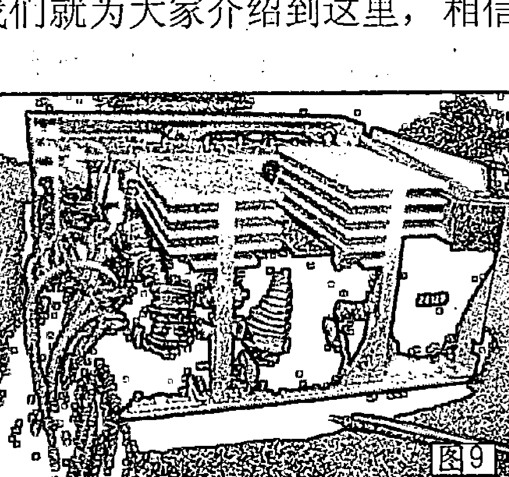

除了功耗问题，兼容性问题也需要我们去面对。在组建双显示器或者双声卡系统中，我们不可能将各种千奇百怪的问题一一罗列，因此还需要大家在实践的过程中去摸索，或许这也是DIY的乐趣所在。此外，双设备的应用还不仅局限于这些，其他诸如双机共享Internet、双猫上网、双视频卡SDK视频捕捉等，这些还有待大家去尝试，而我们所做的仅仅是抛砖引玉……

如图1所看到的8颗芯片的其中4颗是真正的PowerPC G5芯片，另外4颗是三级缓存。这4颗PowerPC G5芯片中每颗都包括8个真正的处理器单元，每个处理器单元又由2个逻辑处理器组成，所以整个MCM有4×8×2=64个处理器，也就是一个64路的处理单元。另一方面，那4颗三级缓存芯片每颗36MB，共是144MB。这些核心均具有8个执行单元，可以在每个时钟周期中处理5条指令以及4条8位浮点数据，这些单元均使用双路结合的64KB指令缓存以及4路结合的32KB数据缓存，它们还共同享有 一个超快的二级缓存，这个二级缓存采用了3路独立总线，每路640KB，加起来二级缓存就是1.92MB。

### 二、处理器与芯片类

#### 1. 巨型MCM多芯片模块（图1）

（图片描述同上，略）

#### 2. 极度夸张的PS3 CELL处理器（图2）

PS3采用的是IBM开发的更加强大的Cell处理器，这个拥有8个向量处理器，每个向量处理器都内建128KB缓存的处理器，初步定位4GHz的运行频率、256G次/秒的浮点运算能力。PS3将使用4个这样的处理器，达到1万亿次/秒浮点运算的惊人运算能力。

#### 3. 比硬币还小的处理器（图3）

VIA发布了其采用“NanoBGA”封装的X86处理器，“NanoBGA”封装形式的一大特点就是大幅度减小了处理器的体积。这种尺寸仅为15mm×15mm的处理器和一个手指甲一般大小，而且能够降低功耗，其800MHz的处理器运行时的功耗为6W，而最新的1GHz的版本功率也仅7W。这种叫做“Eden-N”的处理器还没有Intel的Pentium-M的一半大，这种芯片将被用在一种12cm×12cm大小的“Nano-ITX”规格的主板上。

#### 4. 破解Athlon XP外频的小工具（图4）

Speed Strip发布了一款很有趣的产品——Speed Strip Model SSA-1，通过这个类似创可贴的小东西可以轻松破解Athlon XP倍频的锁定。Speed Strip Model SSA-1 可以使用在Thoroughbred和Barton核心的Athlon XP处理器上。并不需要过多解释和说明，您仅仅需要做的就是将他安装在处理器底部特定针脚上就完成了解锁的目的，不再需要记住什么第5针、L3桥等数字。目前该产品价格为15美元。

#### 5. 可调倍频的的CPU转接卡（图5）

台湾厂商Upgradeware发布了他们的新品，适用于AMD Athlon XP和Barton处理器的可调倍频CPU转接卡。该转接卡最引人注目的特点就是卡背面有5个倍频调节用开关。使用这5个开关，大家就可以随意设置CPU的倍频，再也不会有上下倍频区无法自如切换的问题。您也再不用像以前那样鼓捣金桥在CPU上做手脚，的确极大地方便了DIY用户。

#### 6. 时尚高档内存（图6）

Corsair发布了其XMS Pro系列DDR新款内存，该内存有两个比较吸引人的地方：安装了LED指示灯、采用了新型的散热片。新的黑色铝制散热片配合绿色图案感觉非常酷，并且在内存上放有9个LED指示灯，可以显示当前内存的使用情况。此外，双Bank的512MB XMS Pro系列内存拥有双排的绿、黄、红LED，总共18个。

#### 7. 双芯片的怪物显卡（图7）

图7为一块Sapphire（蓝宝石）的9800PRO MAXX显示卡，这款显卡配备了双DVI接口，并且搭配了512MB的显存，这是由于每颗显示芯片可以最高对256MB的显存进行寻址。这款产品的出现估计连ATI都会感到吃惊，因为连ATI原厂目前都没有这样的产品出现，不过可惜的是这款显卡不会正式销售。

#### 8. 四芯片的怪物显卡（图8）

这款simFUSION 6000q显卡由4个R300（ATI RADEON9700 PRO）核心组成，配备了1GB超大容量DDR显存，硕大的两块PCB板上布满显存和电容等元件，这比双芯片9800PRO MAXX可要恐怖的多哦。

性能方面，该显卡提供了每秒9.6 Giga-pixels的填充能力，支持2到24倍的全屏抗锯齿。提供了两个4pin电源接口，配备Silicon Image芯片，支持3头DVI输出。这样的怪物一般的电源恐怕根本不能带动。

#### 9. 使用水冷进行散热的显卡（图9）

耕升推出了采用水冷系统散热的5900Ultra显卡，该显卡采用Innovatek的CoolFX水冷系统，良好的散热效果使该显卡的核心/显存频率分别达到了500/1000MHz。性能强劲的同时，其价格也高的吓人，该显卡售价达到了900欧元。

#### 10. 不用操作系统即可观看DVD的主板（图10）

FREETECH日前开始发售搭载了不需进入操作系统即可播放DVD的“etBIOS”主板。FREETECH曾在2003年展示过其使用etBIOS的准系统套件“ET-BOX”演示板。不过这次在ET-BOX正式发布之前，反倒是搭载ET-BIOS的主板先推出了。这次推出的分别是使用i865G芯片组的“P8F161G-e”和使用i845GV芯片组的“P8F153GTV-e”。P8F161G-e的尺寸为180mm×245mm，而P8F153GTV-e的尺寸为170mm×220mm。P8F153GTV-e的螺丝孔支持Mini-ITX，可以在一部分Mini-ITX机箱上使用。而P8F161G-e附带的I/O面板属于比较短的型号，所以在使用一般PC机箱时需要注意。

ET-BIOS是可以直接播放DVD或CD以及MP3文件的高性能BIOS，特征是不需进入操作系统，使用内置的程序就可以直接对多媒体光盘进行播放。在ET-BIOS的菜单画面中会显示“MP3/CD”“VCD”“DVD”等图标，用户可以根据情况进行选择。另外，安装了TV捕捉卡后ET-BIOS还可以收看电视节目，P8F153GTV-e的说明书中列出支持的电视卡有AVerMedia的“AVerTV”和Kworld的“KW-TV878R”等。今后还有很多厂商准备推出直接使用BIOS就能够进行多媒体播放的产品，看来PC的家电化已经成为一股势不可挡的潮流了。

#### 11. 直接使用BIOS听音乐的主板（图11）

建基甚至赋予了其真空管系列主板不进入Windows操作系统，就能直接通过BIOS软件播放音乐的能力，这使得采用真空管主板的计算机更具音响设备色彩，图11为集成在BIOS内的播放软件。

#### 12. 可以量血压的主板（图12）

在技嘉举行的一次产品展示会上我们发现了一个非常有趣的东东——能测血压的主板。这款主板型号为GA-8PENXP，在台北Computx 2003大会上就曾经亮相过，现在该主板已经进入市场。该主板在规格方面与同类产品并无大不同，采用了Intel i865PE芯片组，支持Socket 478接口Pentium 4处理器。其独特的血压测定功能倒是非常吸引人，这在主板产品中还是第一次见到。通过主板上的Info_link接口与设备相连，再配合相应的软件就可以实时完成血压测定了。新鲜过后，不禁想到提供这样功能的实际作用，难道该主板是专门向老年人提供的？

#### 13. 体积最小的高容量硬盘（图13）

东芝1月9号正式发布了其0.85英寸硬盘，这是目前首款1GB容量以上的尺寸小于1英寸的硬盘产品。东芝预计在2004年夏季拿出该硬盘样品，大规模量产则可能要到2004年底或2005年初。量产生产将在秋季开始，在起始的几个月将保证20～30万的产品。与之前的1.8英寸硬盘相比，该硬盘大小仅仅是其四分之一。首批0.85英寸硬盘容量包括2GB和4GB，将主要应用于手机、DC等数码消费产品。该硬盘将在保证小尺寸前提下提供大容量、低功耗和高性能。

### 二、显示器类

#### 1. 可同时支持两台电脑同时显示的LCD (图14)

日本Nanao日前发布一款19英寸液晶显示器，型号FlexScan L795。该显示器最大的特点是提供了两个DVI-I接口，并且可以同时连接两台PC，此时画面将同时显示两台PC的图像，当然你可以控制两台PC图像的显示大小比例，如1/4，1/16等，类似电视的画中画功能。Nanao表示实现这样的功能是依靠其独立开发的单独画面显示IC来实现的。FlexScan L795最大可以显示1677万色、亮度250流明、对比度500:1、响应时间25ms、水平垂直旋转角度达到170度。机身提供了黑和灰两种颜色，尺寸为414mm×203mm×410～510mm，重7.5kg，并且配备了USB接口。

#### 2. 有254个喇叭的显示器 (图15)

先锋电子于近日推出了一款别具风格的PDP显示器——PDSP-1，显示面板并没有什么新的特性，但在音频方面倒是煞费苦心。PDSP-1在面板下方设计了一个超大的音频回放系统，嵌入了254个微型喇叭，音频信号通过这些喇叭释出，经过墙壁和天花板的折射达到环绕效果。该款产品内置了杜比AC-3解码、杜比定向逻辑II音频解码以及DTS解码功能，提供了3个S端子、3个复合端子、1个数字同轴音频接口、3个数字光纤音频接口。该款产品预计价格约20万元。

#### 3. 超宽屏显示器 (图16)

在2003年拉斯维加斯Comdex上，Liebermann展览Grand Canyon系列显示器，它是全世界最大的用铝制制作而成的Grand Canyon专业桌面LCD。Liebermann提供了三款新品分别是76”、81”和92”，支持3840像素×1024像素到6400像素×1200像素。

E=mc^2

### 三、散热类

#### 1. 巨大的热管散热器 (图17)

日前，Techdot发布了一个AeroCool的热管散热器DP-102的测试，这款热管散热器巨大的热管让大家吃惊。这款散热器巨大的一根热管给人留下了非常深的印象，再加上其全铜的质地，散热效果一定非常出色。

#### 2. 无风扇的K8散热器 (图18)

随着处理器主频的提高，所配备的散热风扇体积越来越大，转速越来越快，但同时带来的噪音也愈发让人不能忍受。为了解决这一问题，散热厂商Alpha专门推出了一款为Socket 940/754接口Athlon 64/FX处理器设计的无风扇全静音散热器U81C-60C。没有风扇，只有散热器，那如何保证CPU充分散热呢？原来该散热器需要配合机箱风扇使用，通过专门的送风管将散热片上的热量随着气流导出，在风速1.5m/s的情况下，其冷却性能可以达到0.224℃/W，完全能够保证处理器的稳定运行。该散热器的尺寸为60mm×104.4mm×78.74mm，重量604g，大体积大热量是该散热器高效传导热量的关键。U81C-60C是目前第一款无风扇的K8散热器，如果您想使用Athlon 64/FX、Opteron处理器，同时不希望被噪音困扰，Alpha 81C-60C是您惟一的选择。

#### 3. 纯透明材质所做的风扇 (图19)

您有没有见过这样的风扇呢？除了螺丝以及电机以外，全部由透明材质做成。

#### 4. 水冷+半导体制冷片最强的散热组合(图20)

近日，Swiftech推出了一款专为Socket 478 Pentium4处理器设计的散热系统——MCW5000-PT，其最大特点在于混合使用了水冷散热和半导体制冷技术。

其散热原理为：利用半导体制冷直接对处理器核心表面进行降温，同时利用水冷散热系统将半导体背对处理器核心一面产生的热量带走。MCW5000-PT的散热效果非常出色。

#### 5. 能发光的双风扇PCI卡(图21)

目前台湾Vantec公司发布了一款能发光的双风扇PCI卡，型号SP-FC70-BL，该产品将占用一个PCI插槽，其主要的功能有两个方面，其一，双风扇同时开动能够保证机箱内部气流的垂直流动，保证高效率散热。其二，将该卡安装在显卡旁边，可以为显卡提供额外的散热效果。当然其自身发出的蓝色光也是非常酷的，配合透明机箱使用更加完美。

#### 6. 新奇的硬盘水冷散热器(图22)

随着电脑系统速度越来越快，性能越来越强劲，同时各个部件的发热量也越来越大。以往散热设备的焦点往往集中在处理器上，现在对于各个部件也有了专门的散热装置。日前著名散热厂商Aqua Computer就推出了一款专为硬盘散热的水冷系统——AquaDrive。该水冷系统主要针对3.5英寸硬盘设计，采用聚乙烯材料同时安装静音底座，背面和侧面的冷却导管保证了良好的散热效果。

### 四、机箱电源类

#### 1. 真正无噪音的机箱(图23)

Zalman一向以其高端散热器而著称，最近该公司又推出了一款型号为TNN500A的机箱，该机箱的设计方针是实现“几乎无噪声”，预计于9月中旬推出，而价格则高达1180美元！这款机箱配备了300W无风扇电源，机箱内所有主要的发热部件，如CPU、显卡、硬盘等都使用热管连接到主散热装置——体积达400mm×286mm×607mm，重量达21公斤。TNN500A材料的99%是铝，提供了3个5.25英寸扩展坞和4个3.5英寸扩展坞。

据介绍，该CPU散热装置可以对付150W功耗的部件，也就是说足以应付3.06GHz Pentium 4，而50W的显卡散热装置也可以满足GeForce FX的散热需求。最后补充一下，所谓TNN就是指“Totally No Noise”，即“完全无噪声”，不过不知道能承受得起这么昂贵机箱得玩家有多少。

#### 2. 使用压缩机制冷的机箱(图24)

（图片描述，略）

#### 3. 纯透明材质所做的透明机箱(图25)

图25这种机箱完全由有机玻璃所组成，外型非常的时尚。

#### 4. 用纸壳搭建的环保机箱(图26)

这种机箱，非常适合喜欢自己动手DIY的朋友，不仅环保，而且也提高了DIY的乐趣。

#### 5. 带4个风扇的电源(图27)

一个电源里居然装了4个风扇！真是世界之大无奇不有。

#### 6. 暴贵的无风扇电源（图28）

此款为 deltaronic 生产的 360W 无风扇 ATX 电源 “Silentium!”。该电源与普通ATX电源大小一样，但是为了提高散热效果，而在上面和北面采用了鳍状的特殊结构。而且 “PCM-S1” 与电源之间使用高纯度铝连接，使机箱的侧面也具备散热功能。而且由于构造特殊，这款电源无法在普通的 PC 机箱上使用，而单价更达到了人民币4000元左右。

### 五、主机类

#### 1. 橘子大小的电脑系统（图29）

日前，在东京举办的 TRONSHOW2004 展览上，NEC 展示了一款令人不可思议的超小型电脑，这台电脑的体积真是让人大吃一惊。怎么样，够小吧，不过这台电脑可是五脏俱全，不但有 VGA-15 针接口，而且还有两个 USB 接口，一个 RS232 串行接口，以太网卡，音频输入输出，以及一个 CF 卡接口。这台名为 T-CUBE 的超小电脑的尺寸为 52×52×45mm，重 165g，采用的是 NEC 的 VR5701 400MHz 处理器，内存为 64MB 或 128MB，支持 1280×1024 的分辨率。

#### 2. 返朴归真的木制电脑（图30）

推出这些稀奇玩意的是一家叫 SWEDX 的瑞典公司，瑞典是一个有着丰富木头加工经验的国家，SWEDX 将这种优势与高科技结合，推出了这些返朴归真的 LCD。据该公司的现场人员介绍，这些产品的价格比较高，其用户对象主要是欧美的中产阶级，而 SWEDX 也是刚刚进入中国，打算凭借其自然的风格和独特的品味来打开中国的高端市场。虽然价格偏高，但是不得不承认，木制外壳的 LCD 和键盘的确非常别具一格。

#### 3. 超 MINI 的电脑主机（图31）

韩国的 “MAXAN” 再次让我们感受到了超小型 PC 的魅力。从外表上看它很像老式的外置调制解调器，但是这却是一台全功能的 PC。如果要攀比体积和造型的话 “准系统” 绝对不是对手。

#### 4. 球状 PC（图32）

不用说，一看就知道一定是采用 VIA EPIA 主板了，所有的一切功能全数依靠主板的整合能力，为了节省空间，还采用了笔记本规格的 CD-ROM。

#### 5. 惊人蜘蛛型的准系统（图33）

这套准系统的配置如下：处理器：VIA Epia 800MHz mobo，显卡／声卡：主板集成，内存：384MB PC133，硬盘：30GB 7200rpm，光驱：24x 外置 CD-RW，这只红色八脚怪的两颗利齿也是有作用的，它们分别负责光驱开仓和电源开关。

#### 6. 造型独特的电脑（图34）

图为战斗机造型的电脑。是不是很有趣呢？

#### 7. 支持双用户同时使用的“准系统”（图35）

捷波（Jetway）展出了一款支持双用户的这款准系统产品，正式命名为 MiniQ 860TWIN。这款准系统，最独特之处是能同时满足两位计算机用户同时工作和娱乐需求，在 Windows XP 环境下，基于捷波的 MiniQ 硬体加上其自主开发的 Magic Twin 系统软件，我们就可以很方便的实现单机双用户的工作模式。据悉这是全球首款支持双用户的准系统产品。这款准系统采用 Intel 865G+ICH5 芯片组主板，支持 800MHz 前端系统总线，支持 Socket478 P4 处理器，支持双通道 DDR400 内存模式，前置面板的提供了一个 LCD 显示屏，它可以显示包括电源、硬盘、网络、系统温度、风扇转速、光驱等硬件的运行状态。

#### 8. 美女电脑（图36）

这是由日本 PC-DIY 杂志松村克也自己制作的第二款人形电脑，第一代名为“电脑娘”。

### 9. 可以接受微波信号的电脑（图37）

NEC 在1月29日推出可以接受数字微波电视信号的桌面电脑“VALUESTAR TX VX980/9F”，预计价格将在50万日元（约合人民币37500元）。这是首部可以接收和录制微波/卫星电视/110度CS数字电视信号的桌面电脑。附带数字微波电视播放软件“SmartVision DG”，使用B-CAS卡可以进行录像。不过，出于版权保护需要，VALUESTAR TX V980/9F 录制的节目只能在本机上进行播放，无法在其他的DVD设备或PC上进行播放。

另外，VALUESTAR TX VX980/9F 所附带的23英寸宽屏液晶显示器非常强劲，具备消除鬼影和能提高接收画质的3维Y/C分离电路。液晶屏采用约450cd/平方米的高亮度液晶面板，上下左右的视野角度均为170度，另外使用了震动面板达到扬声器效果的 SoundVu 技术。VALUESTAR TX VX980/9F 的冷却机构使用水冷系统。CPU为对应超线程技术的 Pentium 4 3.2GHz、内存512MB、硬盘250GB，显示卡为无风扇版 RADEON 9600SE。光驱为8倍速DVD多用途刻录机。对外接口有 Gigabit Ethernet、IEEE802.11a/b/g 和8个USB接口。

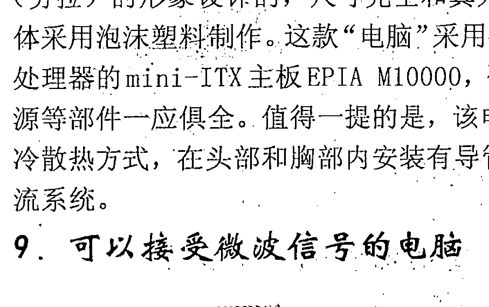

### 10. 超小型 MINI 掌上型 PC（图38）

Vulcan 在 Demo 2004 大会上展示了一款名为 FlipStart 的 MiniPC 产品，别看该产品外型小巧，但其性能却可以令很多桌面电脑汗颜哦！

这款 FlipStart MiniPC 采用铝金属外壳，银色表面质感十足，大小147.3×101.6×25.4mm，配备了5.6英寸液晶屏，支持HDTV品质的1024×600超高分辨率。此外这个小玩意儿还内置130万像素数码照相模块！

说到该机性能强劲，来看看它的配置。Flipstart采用1GHz处理器、256MB内存、30GB硬盘和8MB显存的显卡，操作系统是桌面版的 Microsoft Windows XP Home/Professional Edition！内置支持802.11b/g无线网卡和蓝牙模块，并配有USB接口。

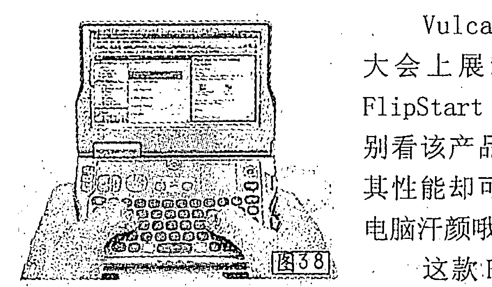

### 六、USB扩展类

#### 1. USB扩展应用（图39）

USB 迷你风扇，USB 照明灯，USB 充电器等等。这些USB产品非常有意思。

对于我们来说，风扇可以说是夏天最有用的。此款 USB 风扇造型小巧，银色金属支架采用弹簧方式设计，可任意折叠而不断。大家可不要小看这款风扇只有2片叶子，实际使用起来风力不小。USB迷你风扇连接轻松，直接接在电脑USB接口上即可安心工作。

USB 照明灯，很适合笔记本用户使用。

而USB多用途充电器则很有特点，它通过USB接口来帮手机充电，并且能支持 Nokia、Sony、阿尔卡特等多款类型的手机。

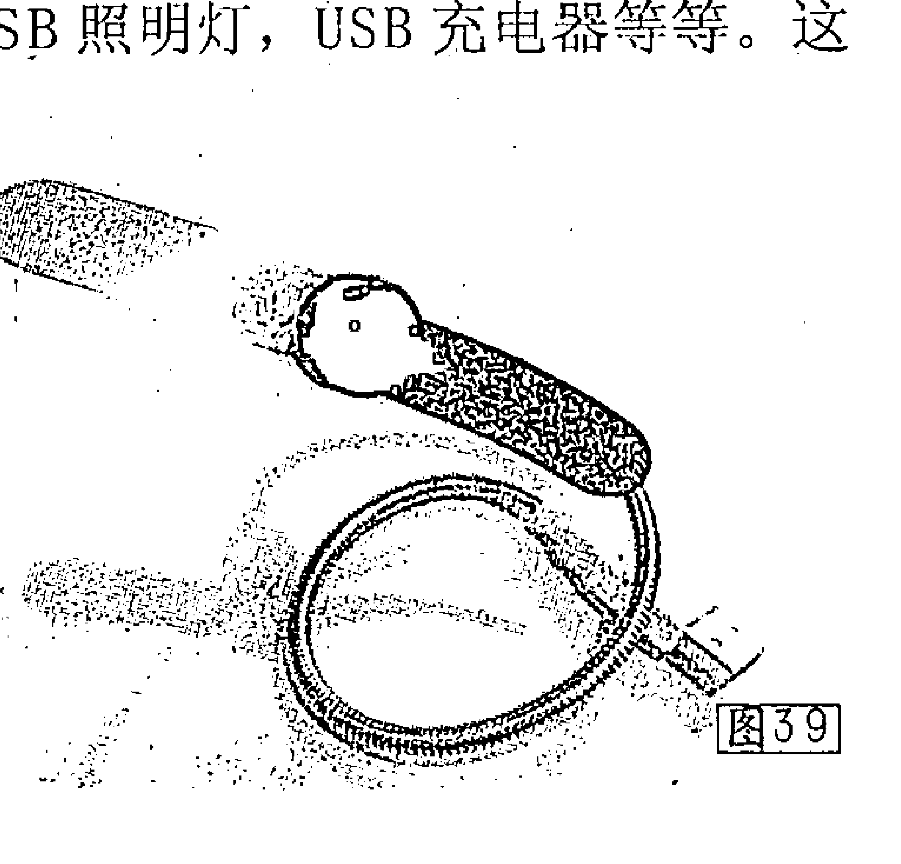

#### 2. USB超音波加湿器（图40）

您也许因为天气太干燥，皮肤变得糟糕起来，又或者饱受静电骚扰，那么下面这款产品一定很适合您。USB加湿器采用USB接口取电，使用方便，只是要注意要离计算机远一些哦，免得出现短路或者烧坏显示器。

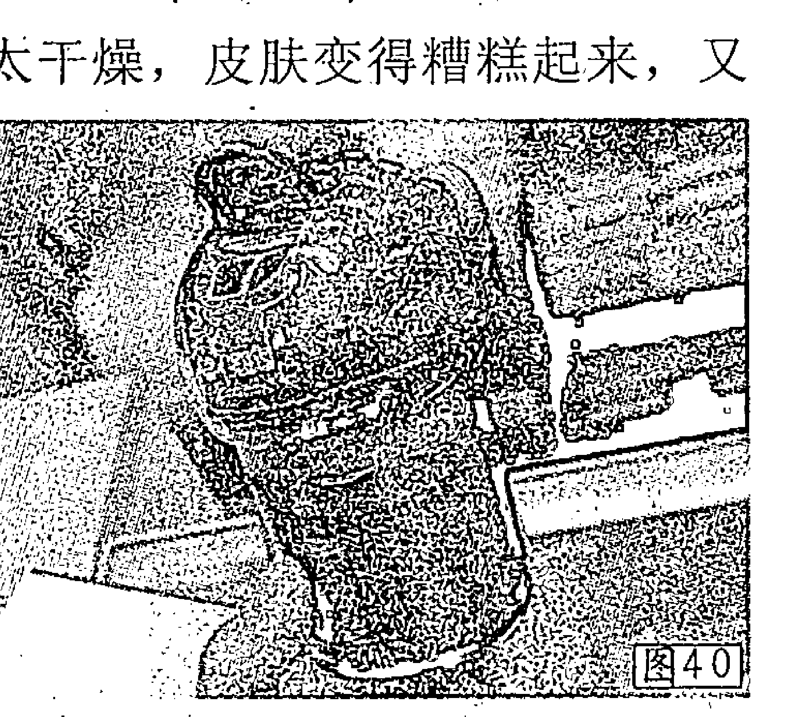

#### 3. USB接口的热咖啡壶（图41）

USB供电12V，可以用于发热体的产品设计少之又少，不知道用于热咖啡的这个装置又会不会榨干你的主板呢？USB接口供电不足的主板可是要小心了。

这样一个小东西是不是很吸引你的眼光呢？十分方便的加热自己桌面的水杯，对于寒冷的冬天来说可是十分贴心的设计，虽然不期望它能够发出多大的热量，不过相信能够用去热杯子的温度，偶尔用来暖暖手不知道会如何呢？

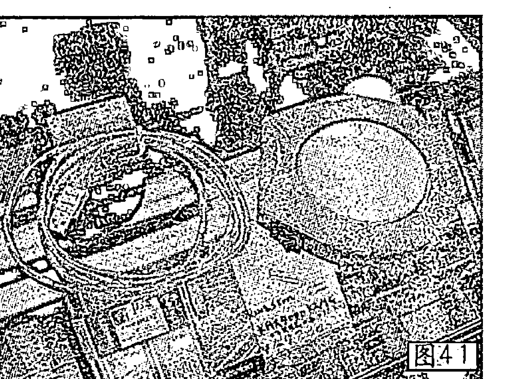

#### 4. USB 电热毯（图 42）

最近有一款USB电热毯已经在秋叶原上市，这款产品厂商名称为Sony Creative Products Inc，该产品型号为UHSS-03Y，目前售价为4980日元（约合人民币360元）。通过USB接口取电，功率2.4W，面积50 × 70厘米。

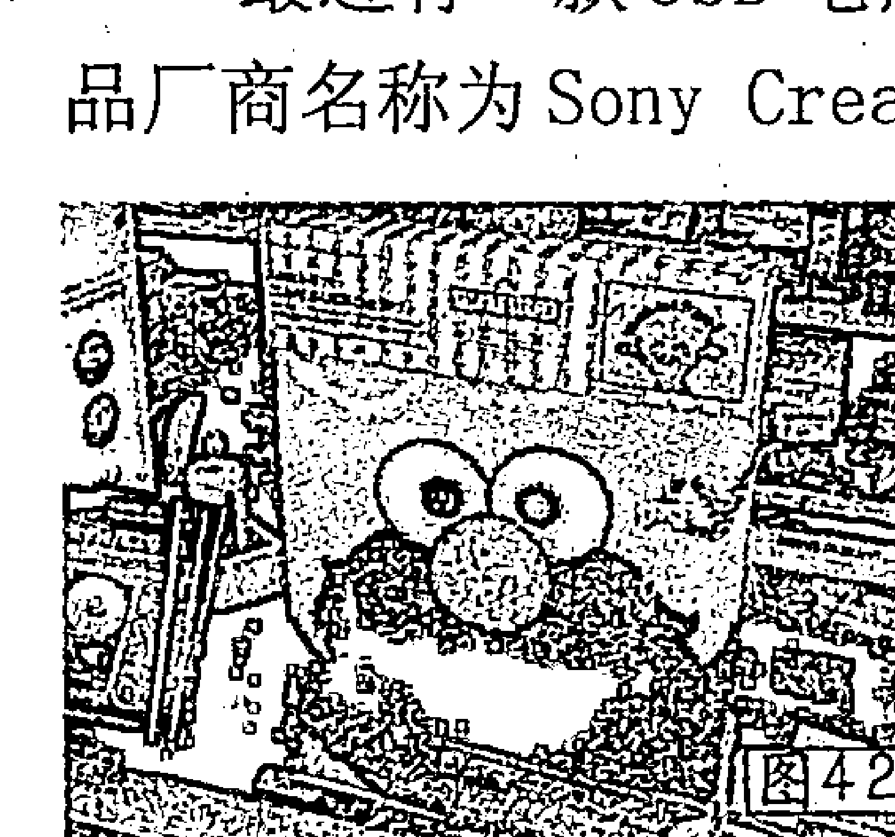

#### 5. USB倒酒器（图 43）

这是日本生产的一种玩具倒酒器，本来使用两节电池供电，但是为了适应USB的应用狂潮，生产厂家将其改成电脑USB设备。可见其创意无限。

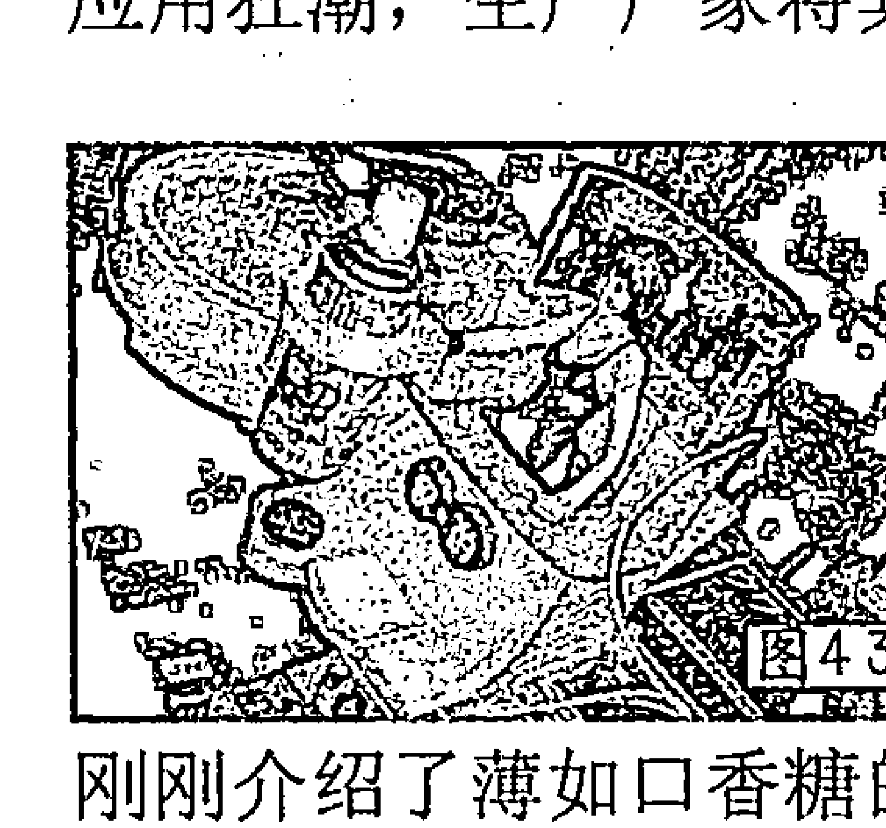

#### 6. 手表形状的USB闪盘（图 44）

现在各种设计独特的闪存产品是层出不穷，不久前刚刚介绍了薄如口香糖的闪存，而又一款更加另类闪存产品：手表闪存又出现在市场上。此产品由奥地利的LAKS公司推出，在闪存市场可能没人听说过LAKS这个名字，因为LAKS公司本身就只是家手表生产商。这从产品名称“LAKS MEMORY WATCH”上也能充分体现出来。

“LAKS MEMORY WATCH”从外表上看和普通的手表没有什么区别，也具有手表(机械部分为瑞士造)的所有功能，只是在表带上多了段几厘米长的USB线，在佩带时可以收在表带上。而与电脑相连时就变成了闪存使用。表内部采用了东芝出品的闪存，32MB型42美元、64MB型64美元、128MB型89美元(折合人民币大概是344、520、720元)。

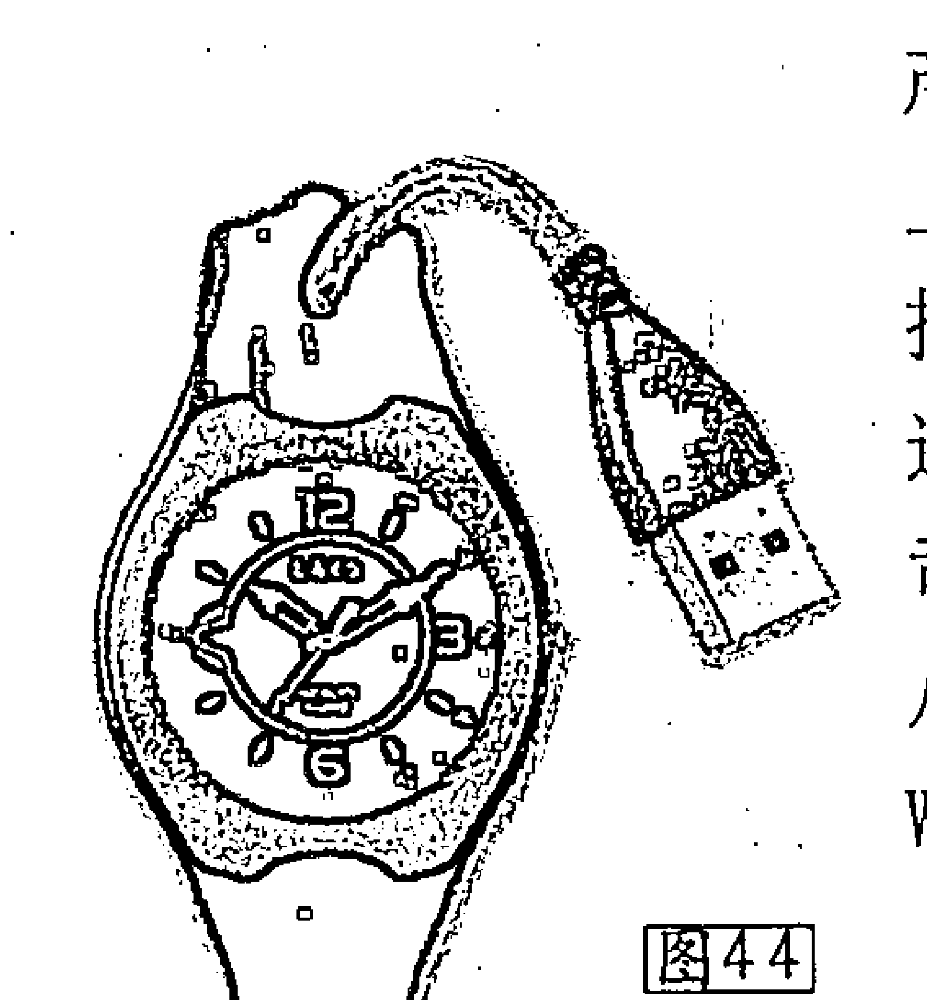

### 七、外设类

#### 1. 激光虚拟键盘（图 45）

西门子公司在CeBIT大展上展出了全球首款虚拟键盘，日后将应用在移动电话、Tablet PC等移动设备上，而且日后用途还将非常广泛，看起来是项相当不错的发明哦。

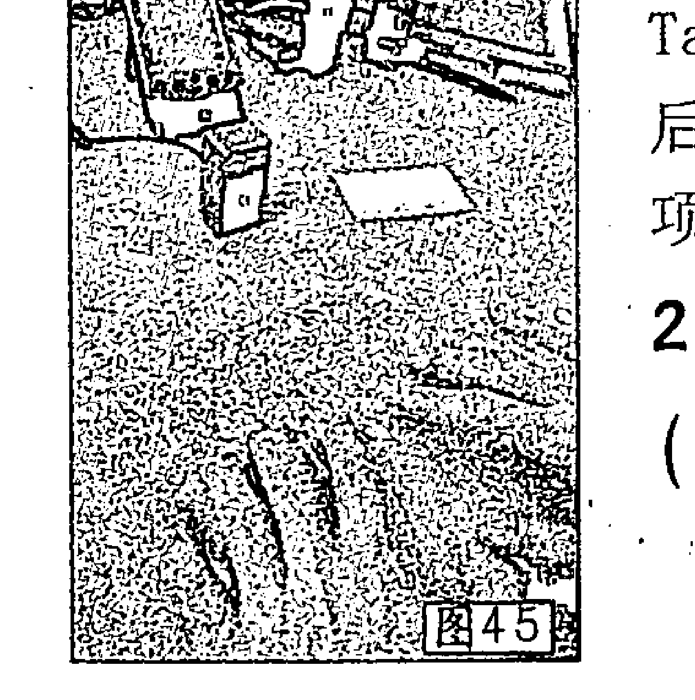

#### 2. 可任意折叠水洗的键盘（图 46）

由韩国FLEXIS公司生产的可水洗、卷起放置的键盘“FX200－USB”近日在日本上市。键盘的表面由树脂材料制成，在耐水性及使用耐久性方面都非常优秀，与电脑的连接采用了USB1.1。有两种颜色可供选择，附送一个精美的小包，可以很轻松的把键盘卷起来放进包里。在此款键盘之前也出现过类似的产品，但从使用的简便及携带的方便来看，这款“FX200－USB”无疑是其中的佼佼者。

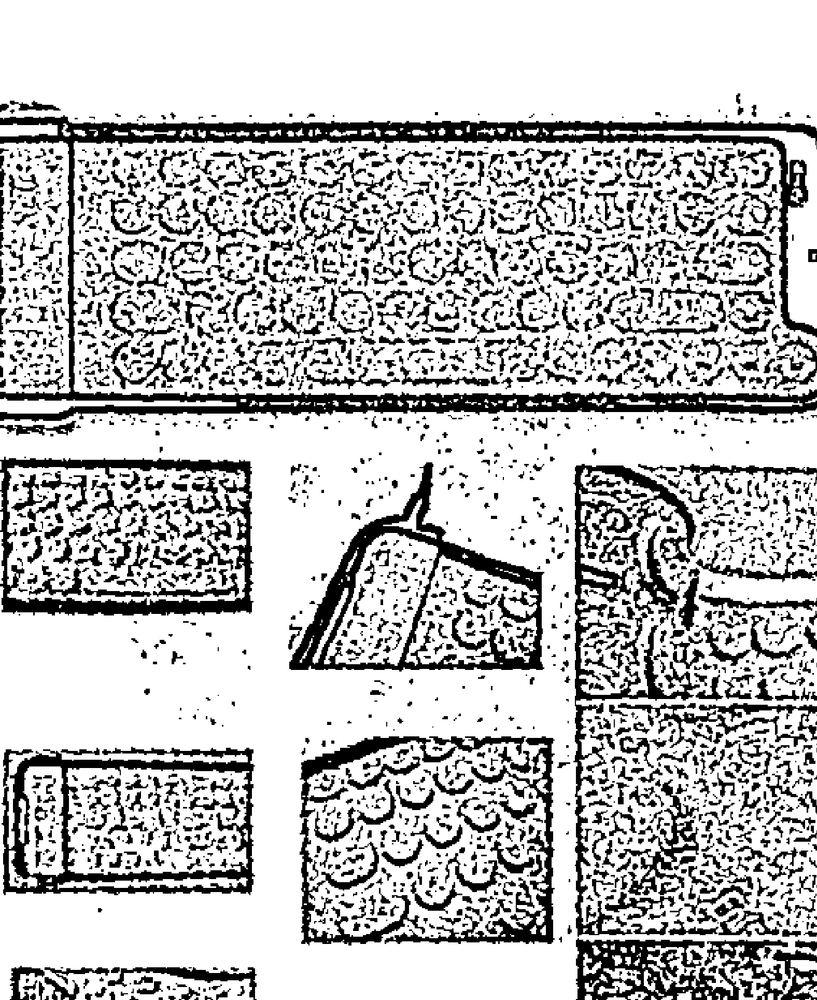

#### 3. 带风扇的鼠标（图 47）

韩国一公司发布了一款专门针对游戏用户的鼠标，名为COOL MOUSE，其使用了800dpi的光头，鼠标下部采用红色材料制成，上面配合银色带有镂空的外壳，外形非常COOL！通过PS2或者USB取电，内置小型电机，带动轻薄的风扇扇页转动，从鼠标背部吹出凉爽的风。对于游戏迷来说，是个非常大胆而且实用的设计。

鼠标背部有多个狭长的镂空长逢，风就是从这吹出的！这样，在您玩紧张又刺激的第一人称射击以及赛车等游戏时，不会因为手心出汗而影响成绩。同时经过精心设计，不会因为鼠标背部出现”漏光”现象而影响鼠标的定位。

这款鼠标还有一个精心的设计，就是在鼠标按键上带有防滑垫片，使手指不容易因为出汗等原因滑落，同样也是为游戏爱好者所设计。

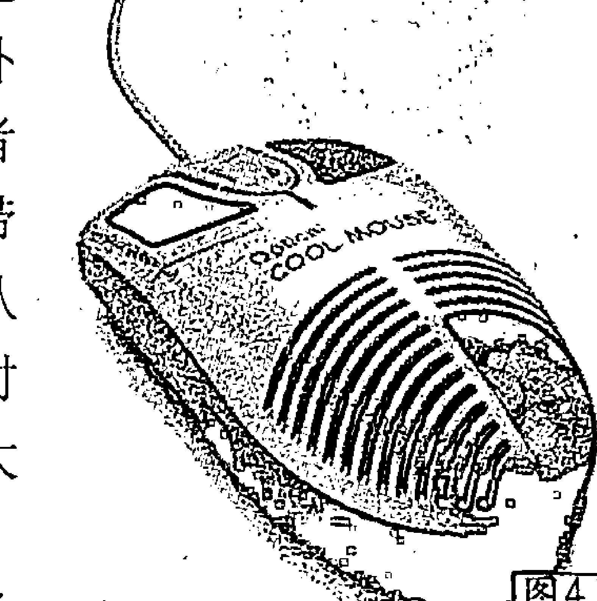

#### 4. 新款内置风扇的鼠标和游戏手柄（图 48）

新款内藏风扇的鼠标“Air Flo Mouse”，同时还推出了采用类似技术的PC游戏手柄。

这款采用USB接口的鼠标具有850DPI的光学分辨率，售价为2980日元，合人民币200多。

同时推出的内置风扇的手柄可以接驳PC、PS2、XBOX，风力大小3级可调，手柄部分吸入空气，而由中间的风扇散热孔派出，排汗效果更佳：）售价同样是2980日元。

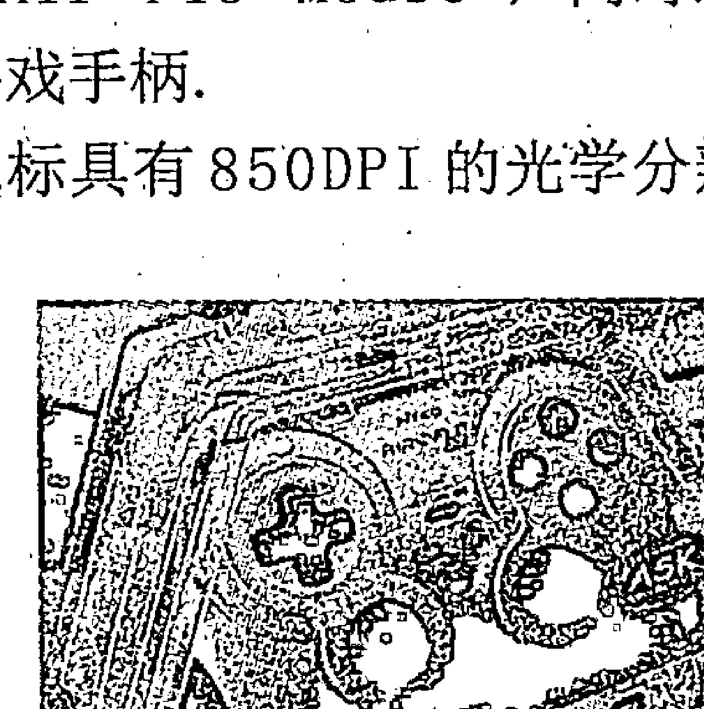

#### 5. 游戏利器（图 49）

Nostromo SpeedPad n52。由Belkin公司设计制造。贝尔金 Nostromo 加速板 n52 对于 Quake 中的火箭筒爱好者来说就像懒骨头躺椅一样舒适，它能使你移动更迅速、变得更加强大，它很容易使用并且相当舒适。作为 Belkin Nostromo SpeedPad n50 的升级版，n52 整合了键盘和手柄的功能，可以在游戏中设定更多的定制功能——根据 Belkin 网站的介绍，其可编程的功能多达 104 个，正好是一个标准键盘的按键数量。

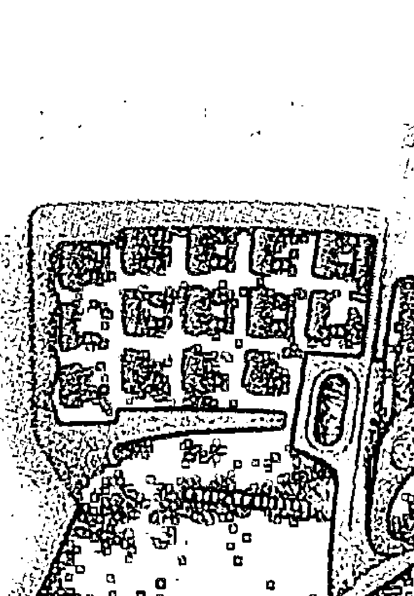

#### 6. 奇特造型的光电鼠标（图50）

这款奇特的光电鼠标，外形真的很可爱，但也并非一般鼠标(不能支持MAC 操作系统)，不过这种设计并没有影响其性能，据说这款光电鼠标车预定6月发售，价值为45个欧元，相当昂贵!车头右前方是右键，而左前方是左键。

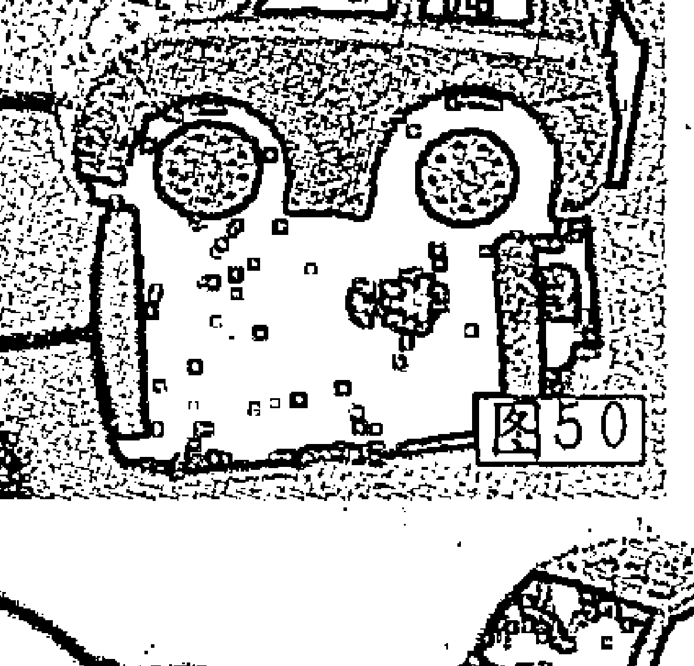

汽车模型是不少爱车一族的至爱。上面那款小汽车模样的外形设计灵感来源于大众汽车的“New Beetle COX”，而ELECOM与TAKARA共同开发出的“ChoroQ鼠标”，其外形设计则是基于日产的“MARCH”汽车，并按照ChoroQ的风格加工而成的。该ChoroQ型鼠标的外形尺寸为29.6×49.0×28.9mm，与TAKARA正在销售的“ChoroQ”大致相同。车型只有一种，但有6种不同的颜色供选择。它的轮胎和车身被设计为一体，但不能行驶。汽车的前灯部分别被设计成鼠标左键和右键，引擎盖到前挡风玻璃部分则配备了滚轮。鼠标采用如此的外形设计，虽然美观时尚，但从人体工学角度来看，手感不见得好，作为收藏品倒是个不错的选择。

#### 7. 掌上型4D鼠标（图51）

大家都知道，长期在电脑上工作的人常会发生手掌发麻和手指抽筋等症状，为了解决这种“鼠标手”的困扰，一些采用人体工学原理设计的新型鼠标纷纷问世。这款掌上型4D鼠标也是采用了人体工学原理，它最大的特点就是可以离桌操作，操作起来感觉象是在手握一柄手枪一样。这种鼠标使用时主要依靠大拇指来控制左右键和光标的移动，它以轨迹球代替了鼠标在桌面的移动，这样就改变了鼠标必须在桌面移动的传统使用方式，摆脱了空间的限制。1.5米长的鼠标线使得操作者可以远离电脑桌，舒适地靠在沙发上操作电脑，手感当然也很舒适。使用这种新型鼠标可以大幅度减低用一般鼠标操作时引起的手腕、手部肌肉和小手臂酸痛及由此引起的伤害，也减轻了眼睛的疲劳，因而特别适合于长时间电脑设计、游戏、上网以及笔记本用户。

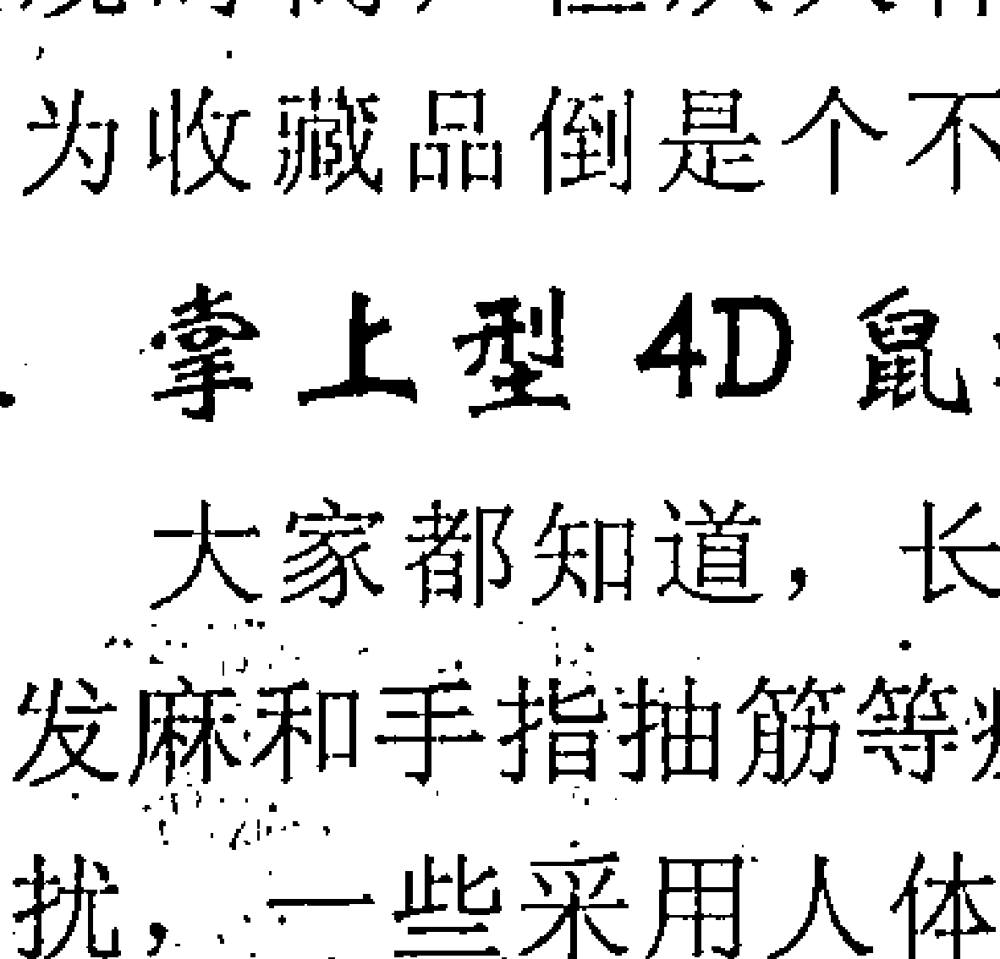

#### 8. 无线笔迹捕捉器（图52）

经过10多年的发展，中文打字的输入法已非常成熟了，但仍旧有不少人不习惯使用键盘来进行输入，特别是年纪稍长的一辈，毕竟他们大半辈子都是拿笔写字的，习惯很难改过来。因此后来就有了手写笔，但用手写笔书写跟传统的书写习惯还是有区别，一是要在一块电子板上来写，使用的笔和我们平常用的圆珠笔的感觉也完全不一样。这里介绍的这款产品的最大特点是书写习惯和传统的笔纸书写完全一样，电子笔的笔芯使用通用的圆珠笔笔芯。

它的硬件由两大部分组成：一是电子笔，二是无线数据接收器。当使用者用电子笔在普通纸上写字时，电子笔通过无线测控技术准确地捕捉笔尖在纸上的笔迹与参考点的x，y坐标，并将数据发送至无线数据接收模块，再由该模块通过USB接口传送至电脑处理，从而在书写时同步完成电脑录入。电子笔可在任何纸张和书写介质上书写，使用纽扣电池，可连续工作280个小时。

这款产品的创意来源于体现原迹记事，记录原封不变，甚至包含修改的涂鸦记录，这也是中文手写输入设备的一个发展方向，尤其适合在幻灯演示、实时批注、广告设计等领域采用。该产品的价格为600元。

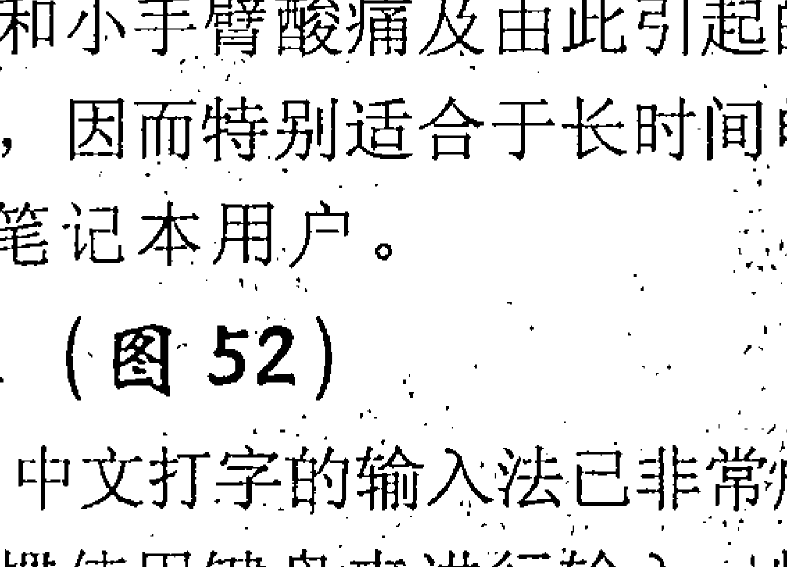

#### 9. “枕头”型扬声器（图53）

以前如果我们躺在床上听随身听，很容易被随身听的耳机电线纠缠不清。而前不久日本先锋（Pioneer）公司推出的一款枕头型扬声器Music Pillow，把我们躺着HI-FI的愿望变成了现实。

这款“枕头”扬声器的操作很简单，只须将该产品充满空气，然后再与随身听或是电视机相接，就可以以最舒服的姿势来聆听动人悦耳的音乐了。这个产品在充气的情况下尺寸为492 × 360 × 38.5mm，重量为240克。目前，该枕头型扬声器主要有浅蓝色和白色两种颜色，售价为3000日元。

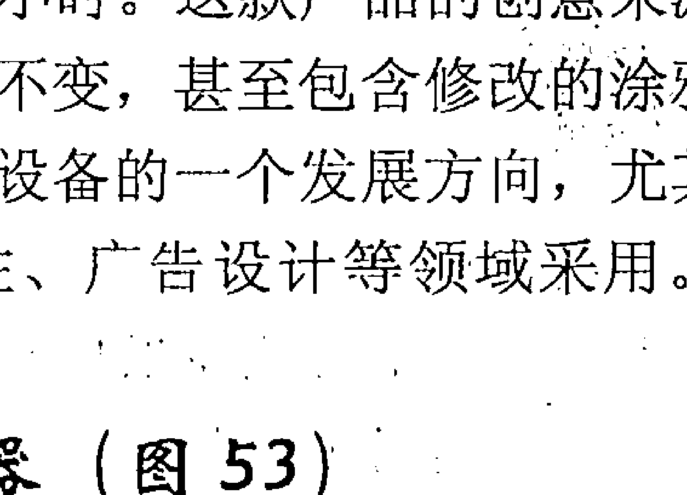

#### 10. Eyetop 视频眼镜（图54）

在夏日里，太阳镜是必不可少的一个重要武器。看下面这款眼镜，运动的质感、立体的设计，让你垂涎三尺了吧！可惜啊，它可不是一副太阳镜，而是一款能看DVD的视频眼镜。

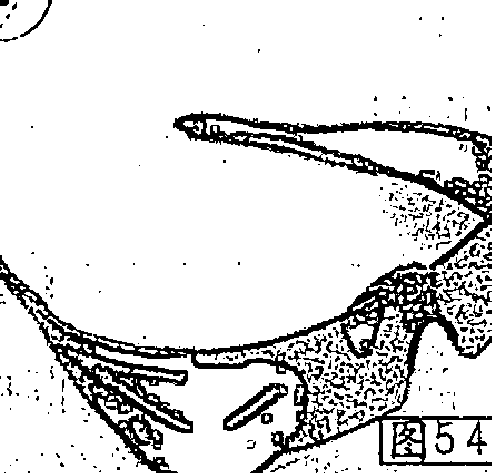

用眼镜看DVD？没错！这款Eyetop视频眼镜由于具有标准的RCA输入接口，并可以自动识别PAL和NSTC信号，所以可以连接DVD播放器和摄像机等设备。而且，该眼镜的每一块镜片上都带有一个LCD屏，76800像素，分辨率为320×240（QVGA）、16位色。水平视角为12.8度，垂直视角为9.6度。这副超酷的眼镜重量为60g，附属设备重量为180g，售价为699.99美元。

#### 11. 能制作3D动画的卡通摄像头（图55）

这款名为“My-Cam”的摄像头的外观十分有趣，是以卡通《南方公园》里的主角的造型为原型制作出来的，绝对有创意。它可经插值技术，输出VGA解像度影像，并支持USB，只要有USB口的电脑就能使用这个摄像头。


通常摄像头附送的软件，都是用来传输相片，以及进行视频通信。而这款My-Cam摄像头就很具新意，额外附有名为“我做主角”的玩乐软件。利用这款软件，你可以随意创造一个3D主角，包括不同发型和服饰，并可控制动作、背景图案等。最有趣也是最独一无二的就是，你可用My-Cam将自己的头像拍摄上去，继而你自己也可以变成一个3D主角！很有吸引力吧。而且，它的立体效果不俗，至少可免却大家慢慢学习立体动画制作以及使用Photoshop技巧。

## 超值AMD，超值KT600主板

随着Athlon XP3200+的推出，各个芯片组厂商将400MHz前端总线的Athlon XP芯片组作为未来的主打产品，其中nVIDIA推出的nForce2 Ultra 400和威盛推出的KT600芯片组，在抢占新领域的争夺中也显的异常明显。

新版的KT600芯片组作为一颗闪耀的新星，它具备能和NVIDIA的nForce2芯片组一争高下的实力，对于硬件爱好者来说这无疑是个极好的消息。

KT600芯片组在整体架构上与KT400和KT400A相比，没有太大的变化。唯一本质上的不同点就在于北桥芯片：KT600的北桥芯片能够支持运行在400MHz前端总线的处理器（这是Athlon XP 3200+才具备的能力）。当初KT400A也正是由于缺了这个特点，而没有能力与nForce2 Ultra 400芯片组相抗衡，让nForce2 Ultra 400风光了一阵子。

不过，VIA错过了第一次，绝不会再错过第二次的反击机会。在KT600的主板上，你会看到KT600的另一强大的优势所在。KT600的VIA 8237南桥芯片里集成了新的部件，该部件使得主板厂家能够以很小的开销，来实现双通道SATA及RAID的功能，因为大部分工作已由VIA完成并集成进南桥芯片中了。我们今天看到的所有KT600主板都利用了这个特性，因而理所应当的讲，目前市场上出售的所有KT600主板基本上都具有了这个特点。

对于VIA这一次技术上的冲击，nVIDIA似乎有些缓不过神来。不过nVIDIA的发展目标是设计出内嵌RAID和SATA的MCP，但就目前nForce2的产品来看，还没有任何成品的迹象。即使是在配合有nForce3的Athlon 64 front中，nVIDIA还未将SATA与MCP集成。而VIA通过向主板厂商提供KT600芯片组，VIA收回了一部分一度失守的市场份额，提高了自己人气值。

从去年开始推出“汉”系列开始，顶星开始真正涉足AMD系列，经过半年的沉淀，目前已经确立了自己在AMD系列的一定市场地位，从KT400AL到KT600DL都取得了不错的成绩。新的2004年，KT600DL升级版KT600L也已经火热出炉。这块升级主板与之前的KT600DL的区别就是把南桥的8235换成了8237，从而实现了对SATA以及RAID的支持，也真正完成了与国内主流AMD系列主板接轨的过程。

升级版的H-KT600L，采用了标准ATX大板设计，主芯片组是VIA最新的KT600，隐藏在主板银白色的散热片下面。KT600最大的特点是能够支持AMD最新Barton系列处理器（400MHz FSB）。这也是与KT400最主要的区别，除此之外，该芯片还提供DDR400的支持，而更多的新的特性却是来自于与之搭配的新南桥芯片VT8237，它使得H-KT600L能够支持AGP 8X、SATA、磁盘阵列等功能。

从总体布局来看，H-KT600L采用了蓝色PCB的大板设计，用料扎实，完全大厂的风范；芯片组方面的搭配为KT600北桥+VT8237南桥，前面提过它能够直接支持SATA RAID；在主板上我们能够看到，扩展部分提供了二根184pin的DIMM插槽，一根AGP 8X插槽，四根PCI插槽，两个SATA接口，两个40pin ATA133接口和一个34pin 软驱接口，具有比较大的升级潜力。

做工和用料也一直是顶星“汉”系列产品的优势，这款H-KT600L秉承了“汉”的传统，高品质的元件，优良的做工也是对用户的最佳保证。同时，顶星KT系列以良好的兼容性与稳定性，成熟的设计，以及丰富的功能和相对低廉的价格同样受到了用户的欢迎。超强的功能和强大的扩展性让这款AMD平台的产品倍受瞩目。

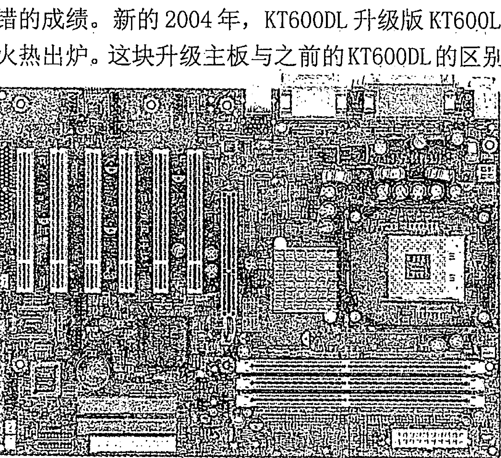

## P4 2.4G稳超3G？

一直以来，说到超频，好像大家提到的都是AMD，Intel的超频能力已经逐渐被大家所忽略。其实，最关键的是，现在的P4和赛扬已经不再像早些年前的P3和C2那样，成为大家津津乐道的超频主题了。

归结一下原因，首先，Intel主板不支持内存异步，也就是说，多少外频的CPU就搭配多少的内存，而高性能的内存在低频率的CPU约束下，不能彻底发挥自己的潜能，造成了在选购CPU的时候，无端地浪费内存的性能，同时，也约束了主板的超频能力。

其次，Intel为了保证自己高端的CPU销路，所以配合自己的CHIPSET限制了低端产品的超频能力。倍频没法调，主频又超不上去，而且只能调到非标准外频，造成的结果是只能小打小闹的超频那么一点点，想大幅度超频的话，由于CPU工作在非标准外频，造成内存和显卡在非标准频率工作，难以稳定，于是仍然以失败告终。于是渐渐的，Intel系列超频的概念就被大家忽略了。

难道真的没一款可以超Intel CPU的主板吗？日前，顶星出品了一款型号为TM-P4U83的主板，这款主板采用了ALi（扬智科技）芯片组，这次ALi退出中国大陆市场后再次进驻，顶星是它们选择的首要合作品牌。芯片级的供应商与厂商直接联盟，而且一手扶持，出品的产品自然有强劲的性能体现。

首先，这款主板支持内存异步。就是说内存可以和CPU外频在不同的频率上工作，这就避免了Intel系列赛扬CPU只能用DDR266，不论是DDR400、DDR333的内存，都只能工作在DDR266上，造成内存性能无法充分发挥，而P4U83却可以实现内存异步工作，即使使用了赛扬1.7G的CPU，内存依然可以稳定的运行在DDR400和DDR333上，从一定程度讲，会有更出色的性能体现。

其次，我们这款主板的超强超频能力，在我们的超频实验中，用赛扬1.7G稳超2.0G，超频后系统稳定工作，3DMARK和CS游戏测试都无任何问题，非常流畅。

当然，这样的小小超频并不能彻底体现它的卓越超频能力，对这款超频性能如此优异的主板来说，下面的超频测试才是考验它真本领的时候。我们用一颗P4 2.4C的CPU，在不加电压的情况下，轻松超到了3.0G，而且，只需要做的就是在BIOS中将外频直接调到250就可以了，轻松之极！而且，每块主板都稳超3.0G。当然，为了避免出现烧毁CPU之类不必要的麻烦，所以我们没有对这块主板进行极限超频测试，但单单这样一点，我们已经有理由相信，超频，对这块主板来讲，已经不是运气问题。

看到了两个超频结果，想必大家一定对这款主板非常感兴趣了，接下来，就让我们来看看这款号称稳超1000 FSB的主板的庐山真面目吧！

主板采用了标准ATX大板设计，CPU电源部份采用三相电源供电，主板的超频性能得到有效的保证。主板不论从做工和用料，都相当出色。这块主板采用的是ALi的M1683+ M1563的芯片组，作为一款主流芯片组，这块主板的基本性能参数与Intel的i848P芯片组非常相似，不支持双通道，支持Socket 478 Pentium 4/Celeron处理器、支持400/533/800MHz FSB、支持超线程技术。主板还集成了ALC655 6声道音效芯片，支持DDR266/333/400内存，支持6个USB2.0接口。支持Ultra ATA 133/100/66，主板插槽方面包括6PCI+1AGP 8X +3DIMM，拓展性非常突出。

不论是作为网吧装机还是DIY用户，这款如此高超频性能的主板都是大家近期装机需要增加关注的重点，详细主板情况，可到各商场相关柜台询问。

## 豪杰超级解霸 V8

方寸之间 精彩无限

## 电影/音乐/游戏动画/FLASH


- 最时尚的娱乐方式
- 最炫最Cool的影视效果
- 最劲最爆的火辣节目

## V8体验三‘步’曲

1. 下载：下载超级解霸V8
2. 登录：免费成为M2Center会员
3. 观看：下载观看影视音乐节目

快快登录豪杰网站开始你的精彩之旅！ http://V8.herosoft.com

## 合订本2004年（上）读者调查表

姓名 ________ 年龄 ________ 文化程度 ________ 职业 ________ 电子信箱 ________
通信地址：________ 省（市）________ 邮编：________

1. 《电脑爱好者》杂志社还出版发行《电脑高手》《数码》《互动软件》杂志
   ①我都买过    ②知道，但买不到    ③知道，但我不需要    ④不知道
2. 如果出版一本上述四刊的全年合集（600页加1张DVD盘，价格40元），那么
   ①我买    ②我不买    ③看情况    ④如果便宜点就买    ⑤把DVD换成CD就买
3. 把合订本（上）的内容定位于“软件学用”
   ①非常好    ②不好    ③还可以    ④无所谓
4. 合订本（上）需要改进的是
   ①内容选题    ②版式形式    ③封面设计    ④上市时间    ⑤其他
5. 合订本（上）配套光盘需要改进的是
   ①栏目内容    ②界面设计    ③盘面设计    ④背景音乐    ⑤其他
6. 你是否在杂志社邮购过合订本或其他书籍、其他产品
   ①有    ②没有    ③想买，但汇款不方便    ④想买，但太慢
7. 你是否知道银行也可以汇款
   ①知道    ②不知道    ③知道并使用过    ④知道，但不了解使用方法
8. 你在网上买过东西吗
   ①有    ②没有    ③经常买    ④偶尔买
9. 你在当地买合订本方便吗
   ①很方便    ②不方便    ③没有卖的    ④还可以
10. 如果快递公司把合订本送上门，货到付款，你认为
    ①很好    ②不需要    ③最好不加价    ④加价也可以

注：如果你还有其他建议，可另附纸张。

邮寄地址：北京9615信箱光盘图书部收          邮编：100086

本次读者问卷调查设三类奖品。**优秀建议奖**10名，将从提出建议的来信中评出，奖品为豪杰软件产品和《电脑爱好者10年期刊钻石电子珍藏版》各1套。**建议奖**40名，奖品为豪杰公司提供的软件产品1套。**幸运读者奖**200名，从全部读者问卷中随机抽取。奖品为电脑爱好者杂志社出版图书1本。奖品如有变动，可提供不低于原价值的其他产品。

问卷邮寄截止时间为2004年10月30日（以当地邮戳为准）。获奖名单将在《电脑爱好者2004年合订本（下）》中刊登。

本次活动的最终解释权为《电脑爱好者》杂志社。

## 购买提示

如果你正在为买不到全年的合订本而发愁时，可以按照下面的方法去购买：

1. **报摊零售**——每年的7月和12月，你可以在全国的报摊、各类书店买到。
2. **邮购**——杂志社发行中心全年向读者提供销售服务。邮购地址：北京9615信箱发行中心收，咨询电话：010-62161332（周一到周五，上午9：00～下午4：30有人服务）。
3. **网上购买**——贝塔斯曼（网址：www.bol.com.cn）、当当网上书店（网址：www.dangdang.com）、卓越网（网址：www.joyo.com）都是我们的合作伙伴，你可以在这三个网站上购买。
4. **邮局订阅**——每年的10～11月或5～6月，均可在当地邮局办理订阅手续，邮局订阅可以送到家。全年价格70元，半年价格35元。订阅代号82-528。