# 电脑爱好者2004合订本（下）附录分册

热点聚焦年度推荐 专题应用终极指南 精彩解剖实战演练 CFan补遗学用宝典

## 随心快 随心变

冠捷显示器六大随心技，带你进入随心视代，享受随心生活

随心快——12ms响应时间画面无拖影，让你尽情体验极速狂飙之乐趣；

随心变——双轴底座设计，垂直/折叠/俯仰/升降四种变形功能，让你收放自如，恣意调整屏幕；

——4种外观颜色可选(酷银黑/陶瓷白/宝石蓝/玫瑰红)，尽显个性时尚品味。

- 12ms响应时间
- 270cd/m²高亮度
- 500:1高对比度
- 150/135宽视角
- sRGB色彩管理功能
- 13mm超窄边框

## 冠捷显示器

随心快 FreeView™ 随心视代 应用为本

- 随心快 FreeSpeed
- 随心变 FreeTransform
- 随心调 FreeControl
- 随心彩 FreeColor
- 随心省 FreeSaving
- 随心亮 FreeBright

## **ASUS 华硕品质·坚若磐石**

ASUS GameFace Live 第二代游戏面对面，带你体验面对面游戏快感。

ASUS Video Security Online 第二代视频环境监视，帮你轻松构筑家庭监控系统。

ASUS Smart Doctor II 第二代聪明医生，时刻保卫监控显卡的正常运转。

买华硕高端显卡
(V9999Ultra Deluxe、V9999 GE/TD/256M、EAX800XT-PE/2DHTV、AX800XT/TVD/256M)
送华硕300K像素高品质摄像头

连续3年获得TOM's Hardware Guide
最佳显卡制造商大奖

## **买华硕显卡 体验感动蔓延**

## **仙境传说 Online**

感动正在蔓延.最初才是最美
RAINBOWLAND ONLINE | RO.GAMEFLIER.COM.CN

即日起，购买华硕全系列显卡
即可获赠火爆网游“仙境传说—最初感动”客户端。
运用华硕显卡特有的**GameFace Live**功能，与众多网友面对面接触，
共同体验“最初感动”。数量有限，送完即止

## **V9999Ultra Deluxe**

- 业内领先的高速GDDR3显存，实现高频率、低功耗
- 采用nVIDIA最新顶级显示芯片，提供卓越显示性能
- 华硕独有的超酷蓝光散热系统

## **AX800XT**

- 采用ATI Radeon AX800 XT显示核心，内建16条渲染管线
- 内建256M(256bit)业内领先的GDDR3高速显存
- 最高可支持2048x1536分辨率

## 天敏视讯

### TV Master 3

### 定时
开机录像

### 超级遥控器
遥控任何软件

### 超强画质型电视卡

### 看录电视 应选天敏

### 电视大师3

可遥控任何软件的“超级遥控器”
支持遥控键自定义方案，自行识别各
软件并自动切换方案
定时开关机、预约录像
录像暂停、时光平移
天敏优创“智锐珑”智能芯片

### 视玲珑电视盒

USB2.0外置电视盒
免拆主机看电视
实时压缩VCD、DVD
720x576高清显示
豪华型红外遥控器

### 随心录电视盒

随时、随地、随心录
小巧睿智时尚风格
720x576高清晰看电视
实时压缩VCD、DVD
超薄型红外遥控器

### 傲视珑-硬压王

原装PHILIPS特级MK3高频头
硬件实时压缩，不占CPU资源
硬件降噪双滤波器，看录电视之选
零延时显示技术，遥控换台迅速
专业采集压缩软件

### 傲视珑-双画王

双高频头，真正的画中画
硬件双通道设计
可以同时看/录不同的电视节目
可遥控任何软件的“超级遥控器”
定时开/关机功能
时光平移

### 傲视珑-电视卡

媒体娱乐中心
遥控开关机/定时开关机
10位色彩采样
自适应梳状滤波器
多套节目预约定时录像

全国各地机构
深圳天敏：0755-26755800
广州天敏：020-87599956
北京天敏：010-82873098
上海天敏：021-54060783
成都天敏：028-85256487
沈阳天敏：024-83682130
哈尔滨天敏：0451-82565301
沧州天敏：0317-2031722
武汉天敏：027-87851280
西安天敏：029-87893496

## 多彩38度高级散热机箱

### 全球销量领先

多彩科技率先通过Intel TAC1.1版官方认证 指定推荐使用

详情请登陆Intel官方网站：http://www.intel.com
多彩科技官方网站：http://www.deluxworld.com

## 电脑爱好者

## 多彩摄像头先睹为快

多彩世界 与你共享

黑哨系列 DLV-B02
黑哨系列 DLV-B08

- 精巧、别致的外观设计
- USB接口，即插即用，使用方便
- 采用全新CMOS感光芯片，真正640X480
- 内置高性能硬件图像压缩
- 微光感应，默认“效果优化”技术
- 数字摄录机Digital innovation

电脑爱好者杂志社

## 内容提要

《电脑爱好者合订本》2004年（下）附录分册与正文分册相配套，作为合订本正文分册的补充和完善。2004年下半年的《电脑爱好者合订本》附录分册由三大部分组成，第一部分热点聚焦，对2004年全年的热点产品、热点技术和热点应用进行多层次的扫描，第二部分是专题应用，其中的二十多个应用专题文章，涉及的都是编辑推荐的热门应用，第三部分是针对《电脑爱好者》的补完计划，大都是热心读者对《电脑爱好者》最近刊登文章的补充。本附录分册将是掌握2004年电脑技术发展动态、学习热门应用、补遗杂志内容的电脑应用图书。适合于具有初中级电脑应用水平的读者阅读。

配套光盘B收录有最新的瑞星杀毒软件2004下载版（附带个人防火墙，并均可升级到2005），通过本书捆绑发放的瑞星服务卡，您即可获得价值160元的一年防病毒和防火墙服务，365天天天安安心心用电脑，轻松轻松享受正版软件的无尚待遇！

光盘B不但收有《英语歌曲滚瓜烂熟》、《3DS MAX古墓遗踪》等专为《电脑爱好者》合订本定制的大型软件，还收有五本经典图书电子版近1500页的内容，涉及到系统、编程、多媒体及动画制作等方方面面知识。另有《电脑爱好者VIP专刊》为你答疑解惑，《超级视频》真人秀教你玩DC，以及数十款免费共享软件大放送，内容丰富，不容错过。

## 《电脑爱好者 合订本》2004年（下）·附录

社 长：孙晓旭
副社长：赵健
总 编：高 翔
编 辑 策 划：封立鹏（主编） 小焱（副主编）
陈荣贵 马 涛
编 辑 出 版：《电脑爱好者》杂志社
制 作：小玩子
责 任 编 辑：小 焱

发 行：北京9615信箱《电脑爱好者》杂志社推广发行中心（100086）
发 行 电 话：（010）62143106
技 术 支 持：（010）62161336/62162598 — 8603/8610/8618
网 址：http://www.cfan.com.cn
经 销：各地报刊亭及新华书店

开 本：787 × 1092 1/16
印 张：25
字 数：800千字
刊 号：ISSN 1005-0043/CN11-3248/TP
国内邮发代号：82-528

本书如有印刷质量问题（错页、掉页、残页等），我们将负责调换。

联系电话：（010）62143106 E-Mail：ftian728@cfan.com.cn

图文版权所有，未经同意不得转载、翻印

合订本定价：38元（含正文分册、附录分册、双CD）

# 热点聚焦·软件

## 2004年经典工具新功能扫描

### 一、系统工具

#### （一） Windows优化大师 6.3 Build 1009

#### （二） 超级兔子魔法设置 6.25

#### （三） System Mechanic Professional 5.0

#### （四） Norton Ghost 9.0

#### （五） 进程管家 1.0

#### （六） System Info 1.0

#### 二、网页特效

#### （一） 有声有色 2004 Build 0815

#### （二） 水晶情缘网页特效专家 2004

#### 三、下载软件

#### （一） 网际快车（FlashGet） 1.6

#### （二） 影音传送带 1.92a

#### （三） 迅雷（Thunder） 4.0.2.20

#### （四） FlashFXP 3.0.1

#### （五） FTPRush 1.0

#### 四、网页浏览

#### （一） Maxthon 1.1

#### （二） GoSuRF Browser 2.0

#### （三） TheWorld Browser 1.1

#### （四） GreenBrowser 2.3

#### 五、聊天软件

#### （一） 腾讯QQ2004 II beta1

#### （二） 朗玛UC 3.90 Build 920

#### （三） MSN Messenger 7.0

#### （四） 网易泡泡 2004

#### （五） MyIM 2004 Build 0916

#### （六） Gaim For Windows 1.0.0

#### 六、媒体软件

#### （一） Windows Media Player 10.0

#### （二） RealPlayer 10.5

#### （三） 任意媒体播放器 1.01

#### （四） Nero Media Player 1.4.0.23

#### （五） Advanced WMA Workshop 2.09b

## 七、图形图像

## 2004行业软件经典扫描

### 一、保险行业

### 二、法律法规

### 三、商业贸易

### 四、学校教育

### 五、彩票抽奖

### 六、健康医药

### 七、交通相关

### 八、美容美发

### 九、建筑工程

### 十、仓储租借

### 十一、餐饮旅游

### 十二、行政人事

### 十三、农业相关

### 十四、审计评估

## 漏洞何时了——2004年经典补丁一览

## 管理数码图片的七种武器

### 第一种武器 图片搜索利器——网络图片搜索大王

### 第二种武器 图片下载快车——图片猎人（Pix Hunter）

### 第三种武器 图片管理帮手——Google Picasa

### 第四种武器 图片精简专家——ImageDupeless

### 第五种武器 图片转换高手——Easy Graphic Converter

### 第六种武器 图片光盘制作大师——Nero PhotoShow Express

### 第七种武器 图片批处理快手——Batch It！

## 数码照片兵器谱——十款图像处理辅助软件

## 一、Turbo Photo

## 二、友锋图像处理系统

## 三、PhoXo

## 四、PictBear SE

## 五、FxFoto

## 六、幻影2004

## 七、Image Optimizer Professional

## 八、PhotoZoom Pro

## 九、Color Pilot

## 十、好色鬼 XP

## 永中Office，一网打尽办公生活

### 一、永中Office简介

### 二、永中Office办公六组合解析

### 三、永中Office 2004增强版新功能

## 2004最新多媒体软件功能大比拼

### 附录分册

- 一、Realplayer 10.5
- 二、Windows Media Player 10
- 三、QuickTime 6.3
- 四、豪杰超级解霸V8
- 五、东方影都2003
- 六、金山影霸2003 sp2
- 七、WinDVD Platinum 6
- 八、梦幻影吧 Diamond 7.0
- 九、SoGuaPlayer 2.0

### 第三篇 图像浏览软件功能比较

- 一、AcdSee 6.0
- 二、豪杰大眼睛V2.5
- 三、XnView
- 四、Ai Picture Utility V7.2
- 五、Multimedia Xplorer

# 热点聚焦·硬件

## 永不磨灭的DIY精髓——2004年最新超频指南

- 一、超频不可蛮干
- 二、调整CPU频率的四种方法
- 三、一个好汉三个帮——超频设备的选购
- 四、另类超频CPU：毒龙变速龙
- 五、天生丽质超频王：另辟捷径的移动处理器

## 2004年，CS：S与DOOM3硬件指南

- 一、万众期待《DOOM 3》问世
- 二、Counter-Strike：Source，走进你的世界
- 三、结论

## 没有硝烟的战场——2004内存技术回顾与展望

- 一、内存知识
- 二、DDR的未来之路——DDR2与DDR3
- 三、RAMBUS永不言败——64位RDRAM与XDR
- 四、FB-DIMM内存规范
- 五、内存的革命——MRAM
- 六、写在最后

## 2004年主要外设技术与新品解析

- 一、8毫秒响应时间——液晶面板
- 二、X架构——键盘
- 三、指纹加密识别技术
- 四、USB OTG ——数码存储
- 五、联想关联外设技术

## 2004年MP3产品与技术解析

- 一、容量篇
- 二、硬盘式（HDD）MP3播放器
- 三、音质篇
- 四、色彩篇
- 五、娱乐篇
- 六、展望篇

## 2004年多媒体闪存卡技术解析

- 一、数码存储卡的四驾马车
- 二、数码存储卡的变革
- 三、弱肉强食——数码存储卡未来展望

## 2004年度数码相机热点综述

- 一、2004年数码相机新技术综述
- 二、数码相机发展潮流及代表产品
- 三、2004年主流数码相机点评

## 数码输出齐家欢

- 一、选择彩色喷墨打印机输出照片
- 二、如何选购照片级喷墨打印机
- 三、如何进行照片打印
- 四、冲印方式

## 掌上办公室——PocketPC扫描

## 2004年手机、PDA新鲜术语与排行榜

- 一、手机新术语
- 二、PDA新术语
- 三、年度优秀手机TOP10
- 四、年度优秀PDA TOP5

# 热点聚焦·网络

## 风起云涌：2004年网络病毒与防杀工具

- 一、2004年病毒综述
- 二、2004流行病毒热点
- （一） ‘MSN骗子’和QQ病毒
- （二） 爱情后门
- （三） ‘震荡波’病毒
- （四） ‘冲击波’病毒
- 三、2004流行病毒专杀工具荟萃

## 网络安全认证——网络时代的通行证

- 一、网络安全认证基础知识
- （一） 免费证书的申请及获得
- （二） 查看证书
- 二、电子邮件安全认证
- （一） 绑定邮箱与证书
- （二） 发送加密的电子邮件
- 三、电子文档安全认证
- （一） 通过数字证书进行文档加密解密的设置
- （二） Word文档加密和解密的方法
- 四、Web服务器认证

# 透视超大容量免费邮箱及精彩邮件工具

- 一、免费G级邮箱综合分析
- （一） 基本功能
- （二） 扩展功能
- （三） 综合评测
- 二、邮件收发及防垃圾邮件工具
- （一） Outlook Express
- （二） Foxmail
- （三） Qurb 2.0
- （四） 亿虎E-mail软件
- （五） ‘垃圾邮件猎杀者’加强版
- （六） 快捷反垃圾邮件 2.0
- （七） SpamKiller 4.0

## 2004年个人防火墙大阅兵

- 一、天网防火墙个人版 2.70
- （一） 实时监控
- （二） 设置安全规则
- （三） 应用程序规则设置
- （四） 报警系统和日志记录
- （五） 即时的聊天保护
- 二、Norton Internet Security 2004
- （一） 报警助手
- （二） 全面的安全防护
- （三） 规则设置
- （四） 封锁IP
- （五） 病毒防范
- 三、金山网镖个人防火墙 6
- （一） 智能防黑
- （二） 安全级别设定
- （三） IP 规则编缉
- （四） 修复系统漏洞
- （五） 网络状态监控
- 四、瑞星 2004 个人防火墙
- （一） 监控功能
- （二） 网络访问管理
- （三） 规则设置
- （四） 游戏保护功能
- 五、其他个人防火墙
- （一） ZoneAlarm Pro 5.5.035 Beta
- （二） BlackICE PC Protection
- （三） Kerio Personal Firewall 4.11
- （四） McAfee Personal Firewall 3.02
- （五） Sygate Personal Firewall Pro 5.5.2710
- （六） 费尔个人防火墙 2.1
- 六、综述

## 耳目一新的MP3下载软件

- 一、百万共享音乐——KuGoo
- 二、免费的宽带娱乐平台—— POCO 2004
- 三、百宝——取之不尽的多媒体宝库
- 四、OP ——做我想做的
- 五、Muper ——无限制轻松下载MP3
- 六、Kuro —— 50 万人的音乐共和国

## 彩信铃声漫天飞

- 一、典型功能介绍
- 二、铃声制作
- （一） MIDI 铃声制作
- （二） MP3 转换成手机铃声
- （三） 编辑修剪 MIDI 音乐
- 三、图片制作
- 四、文字短信、彩信的制作及发送
- （一） 文字短信
- （二） 彩信制作及发送
- 五、彩信及铃声资源
- （一） 彩信大师
- （二） 金山彩翼
- （三） 迅彩图铃通
- 五、彩信网站推荐

## 网络对战平台全接触

- 一、什么是游戏对战平台
- 二、如何安装和登录对战平台
- 三、怎样进行网上对战
- 四、享受组队对战的乐趣
- 五、网上对战，重装上阵
- （一） RivaTuner
- （二） ATi Radeon RefreshRate Fix
- （三） Cheating-Death（简称 CD）
- 六、目前流行的对战平台
- （一） 浩方
- （二） 联众世界
- （三） QQ 对战平台
- （四） 互联星空 XPlay 对战平台

## 轻松打造精彩博客

- 一、获得个人网络日记本
- 二、为个人博客主页添砖加瓦
- 三、精彩博客资源点评

## 大众娱乐新时尚——网络音乐翻唱

- 一、什么是网络音乐翻唱
- 二、进行翻唱前的准备工作
- 三、实战录歌
- （一） 准备原声伴奏
- （二） 开始录音
- （三） 后期处理
- （四） 输出作品
- 四、上传并发布作品
- 五、网络翻唱资源汇总
- （一） 伴奏音乐资源
- （二） 歌词资源
- （三） 提供发布翻唱作品的网站

# 应用专题 · 软件

## 图解 3DS MAX 5.0 帮你置个家

- 一、做地面
- 二、墙壁和顶子
- （一） 制作后墙
- （二） 作两侧的墙
- （三） 做顶子
- （四） 赋材质
- 三、放置摄像机
- 四、做窗户
- 五、背景墙、吊顶
- 六、灯、装饰球
- 七、沙发
- 八、渲染出图

# 循序渐进学 SQL

- 一、SQL 数据库的基本概念
- （一） 数据库的基本组成
- （二） SQL 语句的格式
- 二、SQL 入门篇
- （一） 最简单、最基本的语句 SELECT
- （二） 条件语句
- （三） 函数的运用
- 三、SQL 提高篇
- （一） SQL 语句中子句的使用
- （二） 从多个表中查询数据
- 四、SQL 高级篇# 合订本。2004(下半年)
## <<< 附录分册 [本书提供VIP专刊目录，见后]
### 166 Excel 2003协同工作指南

- 一、共享工作簿
  - (一) 建立共享工作簿
  - (二) 使用和管理共享文件夹
  - (三) 使用共享工作簿
  - (四) 维护共享工作簿
  - (五) 比较与合并共享工作簿

- 二、修订与批注工作簿
  - (一) 修订工作簿
  - (二) 批注工作簿

- 三、NetMeeting协同编辑工作簿
  - (一) 召开联机会议
  - (二) 在联机会议中交流

- 四、SharePoint网站协同编辑
  - (一) 安装和配置Windows Server Point Services2.0
  - (二) 建立协同工作环境
  - (三) 在工作区中编辑

- 五、使用IE编辑Excel 2003列表
  - (一) 创建和发布列表
  - (二) 打开和编辑列表

### 180 经典摄影效果，Photoshop打造

- 一、只及一点不及其余——利用景深突出主体
- 二、夕阳无限好——滤色镜的效果
- 三、鱼眼看世界——广角镜头拍摄的变形效果
- 四、速度与激情——聚焦运动对象
- 五、黑白世界的精彩——层次分明的灰度
- 六、360度的世界——全景照片的制作

### 186 一碟在手 维护无忧——万能启动工具光盘制作

- 一、制作工具
- 二、制作启动盘
  - (一) 添加光盘背景和Logo
  - (二) 设置光盘界面的窗口属性
  - (三) 为光盘添加菜单
  - (四) 制作背景图片
  - (五) 制作IMG文件
  - (六) 测试启动光盘
  - (七) 刻录启动光盘

### 191 多媒体光盘制作我能行

- 一、准备工作
  - (一) 光盘整体结构的分析
  - (二) 图形的设计
  - (三) 动画的设计
  - (四) 数字视频设计
  - (五) 声音编辑
- 二、制作导航界面
  - (一) 建立与设置项目
  - (二) 添加背景图片
  - (三) 建立交互按钮
  - (四) 定制按钮
  - (五) 设计交互效果
  - (六) 退出分支设计
- 三、多媒体光盘内容设计
  - (一) 显示文本信息
  - (二) 多媒体光盘配音
  - (三) 视频演示
- 四、发布与刻录多媒体光盘
  - (一) 发布多媒体光盘
  - (二) 刻录多媒体演示光盘

### 198 课件制作我能行

- 一、多媒体课件制作基础知识
  - (一) 多媒体计算机教学系统
  - (二) 多媒体课件的结构设计
- 二、课件素材的收集与处理

- 三、使用PowerPoint制作课件
  - (一) 快速掌握课件制作过程
  - (二) 课件制作实例与技巧

- 四、使用Authorware制作课件
  - (一) 快速掌握课件制作
  - (二) 课件制作实例

- 五、使用Flash制作课件
  - (一) 制作文本输入框
  - (二) 制作水分子结构示意图
  - (三) 制作小球平抛下落动画
  - (四) 制作图片移动动画
  - (五) 切割平行四边形
  - (六) 旋转和平移三角形
  - (七) 制作判断题课件
  - (八) 制作填空题
  - (九) 制作倒计时效果
  - (十) 控制声音的播放

- 六、使用“几何画板”制作课件
  - (一) 绘制正弦函数曲线
  - (二) 绘制双曲线
  - (三) 快速将圆12等分
  - (四) 演示光的折射
  - (五) 演示电阻变化

### 213 VBA进阶撑杆跳——应用案例集锦

- 一、VBA入门热身
- 二、实例一：Word批量替换
- 三、实例二：Excel盖章
- 四、实例三：增强Word图片插入功能

### 219 GIF动画制作简明攻略

- 一、Ulead GIF Animator
- 二、ImageReady

# 应用专题 · 硬件

### 225 将游戏玩家武装到底

- 一、核心配件
- 二、操纵设备
- 三、音频系统
- 四、视频系统
- 五、其他各种游戏装备

### 232 PC存储不求人——硬盘应用解决方案

## 硬盘故障解决篇
- 一、起死回生——硬盘坏道的修复
- 二、虚惊一场——修复硬盘分区表
- 三、另类黑客程序——硬盘逻辑锁
- 四、大动干戈——抢救硬盘零磁道

## 硬盘安装篇
- 一、双硬盘的安装
- 二、组建RAID 系统
- 三、深入Serial-ATA 硬盘安装
- 四、老主板如何安装大硬盘

# 硬盘专用软件篇
- 一、IBM 硬盘
- 二、迈拓硬盘
- 三、希捷硬盘
- 四、西部数据硬盘

### 243 过街老鼠，人人喊打——假货水货辨别专题

- 一、CPU篇
- 二、板卡篇
- 三、存储设备篇
- 四、外设与耗材篇

### 252 手把手教你畅游无线世界

- 一、目前存在的几种无线网络组建方法
- 二、家庭无线局域网产品导购
- 三、无线局域网设置轻松上手
- 四、无线网络连接故障分析
- 五、无线设备使用秘技

### 257 DC/DV 保养维护及故障排除全攻略

- 一、维护保养篇
- 二、DC/DV 常见故障解决方法

### 262 数码相机使用与维护简明教程

- 一、掌握正确曝光技巧
- 二、焦距与对焦的概念及应用
- 三、白平衡及ISO 设定
- 四、特殊场景的拍摄技巧
- 五、数码相机闪光灯应用技巧
- 六、存储卡和电池的使用
- 七、查看并上传你的数码照片
- 八、数码相机的另类使用技巧
- 九、数码相机维护技巧
- 十、数码照片后期处理技巧

### 277 数码摄像简明教程

- 一、DV 的基本用法
- 二、调整白平衡让影像更自然
- 三、调整聚焦让影像更清晰
- 四、调整曝光让影像更明晰
- 五、用间隔影像让时间浓缩
- 六、转场特效的拍摄
- 七、数字特效的拍摄
- 八、用推拉镜头展示细节与气氛
- 九、用摇镜头展示大场面
- 十、用跟镜头追摄
- 十一、DV 使用经验与技巧
- 十二、DV 摄像实战——拍摄生日记录片

### 291 精彩的多媒体世界——玩转电视卡与摄像头

- 一、工欲善其事，必先利其器
- 二、电视节目接收指南
- 三、在电脑上打游戏机
- 四、录制电视节目
- 五、电视卡另类应用
- 六、亲密接触视频电话

### 299 智能狂拼输入法技巧点滴（二）

### 300 二手电脑淘金的乐趣

- 一、二手电脑市场探秘
- 二、购买二手配件的理由
- 三、二手电脑“淘金”实战
- 四、体验当老板的乐趣

### 308 最新主板bios设置与刷新不完全手册

- 一、扫盲篇
- 二、优化功能篇
- 三、特殊功能设置篇
- 四、刷新篇
- 五、拯救篇

# 应用专题·网络

### 316 办公局域网安装维护一条龙

- 一、组网的基础知识
- 二、网络配置
- 三、设置网络标识和工作组
- 四、配置服务器
- 五、客户机登录服务器
- 六、文件共享
- 七、打印机共享
- 八、共享上网
- 九、建立内部网站
- 十、搭建FTP服务器
- 十一、建立电子邮局
- 十二、召开网络会议
- 十三、局域网聊天
- 十四、远程办公

### 332 ADSL建站指南

- 一、网站建设篇
- 二、游戏服务器篇
- 三、FTP服务器篇
- 四、BT服务器篇

### 339 言之不尽的宽带下载与下载工具

- 一、大众化的HTTP
- 二、内容丰富的FTP
- 三、颇受欢迎的BT下载
- 四、其他P2P软件

# CFan 补遗

# CFan 补遗·软件

- 22 《Word 里面玩转大红‘盖章’》补遗
- 62 卸载没有 Uninstall 文件的软件又一法
- 97 《小烦恼 解决起来很简单》更简单的解决方法
- 131 《金山毒霸 VI 三大绝技》的补遗
- 153 《用 Word 巧妙打印证件》改良
- 159 拼音加加输入法技巧点滴（一）
- 165 拼音加加输入法技巧点滴(二)
- 222 智能狂拼输入法技巧点滴（一）
- 276 智能狂拼输入法技巧点滴（二）
- 345 智能 ABC 输入法技巧点滴
- 346 “闪客” 是这样炼成的——多种文件转换成 Flash
  - 一、视频文件转换成 Flash
  - 二、图像文件转换成 Flash
  - 三、PPT 文件转换成 Flash
  - 四、DOC 文件转换成 Flash
- 348 TC 简明教程
  - 一、历史不能忘记
  - 二、认识 TC 的窗口界面
  - 三、掌握 TC 的常规操作
  - 四、掌握 TC 的常规设置
  - 五、让插件为 TC 添砖加瓦
  - 六、特色插件打造全能 TC
- 352 特色剪贴软件一步通
  - 一、常用特色剪贴工具
  - 二、序列号剪贴系列软件
  - 三、网络剪贴类
  - 四、其他特色剪贴软件
- 354 NetOp School简明教程
  - 一、NetOp school 3.01 简体中文版简介
  - 二、软件的安装
  - 三、软件的配置
  - 四、教师端的使用
  - 五、学生端的使用
- 357 SoftEther 快速构建虚拟局域网
  - 一、软件的安装
  - 二、配置虚拟 HUB
  - 三、SoftEther 的用途
- 359 虚拟机安装、配置、使用简明指南
  - 一、了解虚拟机
  - 二、使用 Virtual PC 创建虚拟机
  - 三、VMware 创建虚拟机
- 364 病毒杀不掉怎么办
  - 一、从系统还原文件谈起
  - 二、在 DOS 下清除病毒
  - 三、通过自启动项删除病毒
  - 四、“.ex_” 文件感染病毒和疑似病毒
  - 五、使用第三方工具
  - 六、典型“病毒”清除实例
- 366 玩转 USB 启动盘
  - 一、在 Windows 98 中制作 USB 启动盘
  - 二、在 Windows 2000/XP 中制作 USB 启动盘
  - 三、巧用 Ghost 制作 USB 启动盘
- 367 《全歼 Windows 另类垃圾》补遗
- 368 不用 Word 域功能，成绩打印照样很轻松
- 369 Office2000 实用技巧两则

# CFan 补遗·硬件

- 370 PocketPC 掌上办公室试览
- 371 手机拍照，鸡肋还是馅饼?
- 372 手动安装屏幕保护快捷方法
- 373 如何识别硬件的驱动程序
- 374 DirectX 应用集萃

# CFan 补遗·网络

- 378 从 MTU 值看网速缓慢之谜
- 379 透过 RSS 看世界
  - 一、何为 RSS
  - 二、如何利用 RSS 资源
  - 三、订阅 RSS
  - 四、如何找到 RSS 资源
- 382 网页拦截高手指南
  - 一、从 IE 内核开始
  - 二、3721 广告拦截
  - 三、Google 窗口拦截器
  - 四、“零弹窗” Zero Popup V8.0
  - 五、其他广告拦截软件
- 385 最值得使用的 IE 插件
- 387 QQ 好友添加技巧
- 388 《电脑爱好者合订本》有奖知识问答

> 合订本配套光盘，还放有以下文章，敬请阅读
> 常见拼音输入法特色介绍及使用技巧
> Office XP VBA 开发实例教程
> PC 性能测试完全指南
> 真金不怕火炼——硬件测试软件轻松搞定
> 节纸增效我用它—— VBA 在自动办公中的一次应用
> 紧跟时代的步伐——电脑升级终极攻略

# 2004《电脑爱好者》VIP专刊目录
（本刊配套光盘收录2004《电脑爱好者》VIP专刊电子版）

## 第一章 系统问答

### 1.1 Windows 95/98

- 1.1.1 如何知道 Windows 95/98 的版本号
- 1.1.2 如何打开未注册的程序
- 1.1.3 Rundll32 程序运行无效
- 1.1.4 不让 Windows 98 安装程序运行 Scandisk
- 1.1.5 磁盘扫描程序不能进行
- 1.1.6 取消非正常关机的自动扫描磁盘功能
- 1.1.7 如何恢复快速启动栏
- 1.1.8 安装 Windows 98 不能进行到底
- 1.1.9 制作关机的快捷方式
- 1.1.10 能否删除 CHK 文件
- 1.1.11 为何无法预览图片文件
- 1.1.12 为何回收站中所显示的驱动器容量与实际不符
- 1.1.13 为何 Windows 每次开机后都会搜索软驱
- 1.1.14 如何终止使用计划任务程序
- 1.1.15 自动化安装 Windows 98
- 1.1.16 右键菜单中没有打印关联
- 1.1.17 如何在 Windows 98 打印目录名列表
- 1.1.18 如何使用 Windows 98 中的压缩驱动器
- 1.1.19 如何打开 Windows 98 中的 PWL 文件
- 1.1.20 窗口右上角的控制按钮变成乱码
- 1.1.21 win386.swp 是什么文件
- 1.1.22 FAT 16 与 FAT 32 如何互相转换
- 1.1.23 需输入 win 才能进入 Windows 98
- 1.1.24 如何在单分区中重装 Windows 98
- 1.1.25 画笔的文件类型中为何没有 JPG 和 GIF 选项
- 1.1.26 有 logo.sys 为何不能正常显示开机画面
- 1.1.27 如何修改开关机画面
- 1.1.28 Windows 98 中更改文件扩展名导致混乱
- 1.1.29 如何增加 Windows 98 中“发送到”功能的内容
- 1.1.30 用 Bootlog 文件查找故障原因
- 1.1.31 Windows 98 系统出现“内存不足”的提示
- 1.1.32 如何恢复误删除的节能选项
- 1.1.33 扫描磁盘提示“内存不足”而中断
- 1.1.34 Windows 98 关机提示 Msgsrv32 出错
- 1.1.35 如何显示 Windows 98 启动菜单
- 1.1.36 Windows 98 中文件日期修改为四位数年份
- 1.1.37 Win95/98 中修改文件日期
- 1.1.38 Windows 98 的“开始”菜单中添加“控制面板”
- 1.1.39 有没有更快的方法快速进入安全模式
- 1.1.40 Windows 98 中反复运行“磁盘碎片整理程序”
- 1.1.41 为光驱设置永久固定盘符
- 1.1.42 如何恢复回收站里没有的误删文件
- 1.1.43 安装 Windows 98 时出现 CAB 错误
- 1.1.44 如何解决 Windows 98 在开机后连“安全模式”也无法正常启动
- 1.1.45 如何解决 Windows 98 启动后立即自动关机的现象
- 1.1.46 Windows 98 的“MS-DOS 方式”组件丢失应如何进入 DOS 命令窗口
- 1.1.47 Windows 98 启动后出现找不到文件 Cdaint2f.Vxd 的提示
- 1.1.48 如何解决 Windows 98 无法侦测出超过 64GB 的硬盘
- 1.1.49 怎样缩短屏幕保护程序的启动时间
- 1.1.50 Windows 98 崩溃后如何制作启动盘
- 1.1.51 如何查知 Windows 98 某个应用程序使用哪些 DLL 文件

### 1.2 Windows 2000

- 1.2.1 安装 Windows 2000 过程中无法启动
- 1.2.2 如何更改 Windows 2000 启动菜单顺序
- 1.2.3 Windows 98 和 Windows 2000 共享收藏夹
- 1.2.4 如何恢复 Windows 2000 多重启动菜单
- 1.2.5 更改系统默认的临时路径
- 1.2.6 找不到指定的系统文件
- 1.2.7 Windows 2000 为何不能自动关机
- 1.2.8 在 Windows 2000 中使用系统配置实用工具
- 1.2.9 安装某些程序会出现_INS5576._MP.exe 产生错误
- 1.2.10 启动桌面时出现“你的 spoolsv.exe 出现错误日志”
- 1.2.11 如何制作 Windows 2000 启动盘
- 1.2.12 如何将 Windows 98 中的造字转到 Windows 2000 使用
- 1.2.13 如何将 Windows 2000 从硬盘中完全删除
- 1.2.14 在我的网络下的电话拨号程序中没有人或会议
- 1.2.15 为何不能正常运行 MMC 控制台
- 1.2.16 安装了 Windows 2000 后软关机功能失效
- 1.2.17 如何恢复 Windows 2000 中消失的个人配置
- 1.2.18 Windows 2000 “淡入淡出”速度慢
- 1.2.19 Windows 2000 下鼠标不灵敏
- 1.2.20 Windows 2000 下无法删除文件或文件夹
- 1.2.21 为什么 Windows 2000 无法用 Guest 这个默认用户名登录
- 1.2.22 Windows 2000 显示“审核失败”
- 1.2.23 Windows 2000 无法显示桌面上的图标
- 1.2.24 听说 Windows 2000 中有一个设置能提高硬盘写入速度
- 1.2.25 Windows 2000 蓝屏死机后提示 STOP 故障的含义
- 1.2.26 Windows 2000 中选中任务栏自动隐藏功能后速度变慢
- 1.2.27 Windows 2000 出现“Explorer 出错即将关闭”提示
- 1.2.28 在 Windows 2000 中将 FAT32 分区转换为 NTFS 分区
- 1.2.29 在 Windows 2000 中如何让系统允许替换受保护的系统文件
- 1.2.30 Windows 2000 中运行游戏出现“初始化 Direct Sound 错误”
- 1.2.31 如何解决 Windows 2000 图片预览窗口无法显示图片缩略图
- 1.2.32 为何 Windows 2000 升级到 DirectX 8 还有很多游戏不能玩
- 1.2.33 Windows 2000 在启动时提示 MBR 被损坏
- 1.2.34 Windows 2000 安装 SP4 出现无法验证的错误
- 1.2.35 Windows 2000 安装 SP4 系统栏图标不能显示真彩色
- 1.2.36 卸载 SP4 后无法运行以前设置的计划任务
- 1.2.37 升级 SP4 后网络访问速度慢
- 1.2.38 在“添加/删除程序”为何找不到 Windows 2000 SP4 项
- 1.2.39 Windows 2000 如何还原注册表
- 1.2.40 如何清除 Windows 2000 上次登录时使用的用户名
- 1.2.41 为何 Windows 2000 总是提示 InS5576_mp.exe 出错
- 1.2.42 Windows 2000 出现 WMI 的错误信息
- 1.2.43 Windows 2000 中的 Hiberfil.Sys 文件有什么作用## 1.3 Windows Me
- 1.3.1 能否在 Windows 2000 上安装 Windows Me 38
- 1.3.2 如何使用 Windows Me 的传真功能 38
- 1.3.3 Windows Me 的系统文件保护功能有何作用 38
- 1.3.4 Msconfig的“启动”标签中出现重复项目是不是不正常 39
- 1.3.5 Windows Me 中的_Restore 文件夹有何用途 39
- 1.3.6 如何在 Windows Me 中用 DOS 39
- 1.3.7 如何对 Windows Me 中的文件夹加密 40
- 1.3.8 Windows Me 中如何自制显示文本 40
- 1.3.9 Windows Me 可以锁定计算机吗 40
- 1.3.10 Windows Me 中无法重装 IE5.5 40
- 1.3.11 用 Windows Me 还原功能会不会连修改的内容也还原 40
- 1.3.12 Windows Me 中如何监视连接我的其他用户 41
- 1.3.13 如何在 Windows Me 下删除不需要的多媒体程序 41
- 1.3.14 Windows Me 使用“系统还原”后不启动 41
- 1.3.15 Windows Me 窗口标题栏等处字体变得很难看 41
- 1.3.16 Windows Me “任务栏”上的“显示桌面”图标丢失 41
- 1.3.17 如何为 Windows Me 减肥 42
- 1.3.18 Windows Me 下巧装网卡 42
- 1.3.19 如何解决 Windows Me 出现的文件错误提示 42

### 1.4 Windows NT
- 1.4.1 如何在 Windows NT 4.0 中关闭光盘自动运行 43
- 1.4.2 如何在 Windows NT 中转换文件系统为 NTFS 43
- 1.4.3 如何将 NTFS 转换为 NTFS 5.0 43
- 1.4.4 自动化安装 Windows NT 4.0 43
- 1.4.5 NT4 提示“NTOSKRNL.EXE 丢失或损坏” 44
- 1.4.6 NT4 提示“无法找到 NTLDR” 44
- 1.4.7 安装 NT4.0 时提示找不到分区 44
- 1.4.8 把工作站加到其他 NT 服务器的域中 44
- 1.4.9 在“设备”中进行设置后死机 44
- 1.4.10 无法进入其他的 NT 域中 45
- 1.4.11 NT 服务器忘记管理员密码时如何更改密码 45
- 1.4.12 NT 中如何将备份域控制器提升为主域控制器 46
- 1.4.13 如何在管理员的设置上就对口令的类型加以限制 46
- 1.4.14 在 NT 中进入不了 SQL Server 46
- 1.4.15 NT 提示“找不到该域名服务器…” 47
- 1.4.16 如何将“开始”菜单中的一个链接放到桌面上 47
- 1.4.17 如何实现不制作安装程序而继续安装 NT 47
- 1.4.18 如何对 IIS 2.0 中的服务器进行访问限制 47
- 1.4.19 为什么 IIS 3.0 不支持 ASP 48
- 1.4.20 NT 中调试 VB 程序后系统死机 48
- 1.4.21 如何移动或删除 Microsoft Mail 邮局 48
- 1.4.22 重装 Windows NT4.0 Server 后显卡驱动不能安装 48

### 1.5 Windows XP
- 1.5.1 如何删除 Windows XP “附件”中的游戏组件 48
- 1.5.2 为何在 DOS 下安装 Windows XP 时速度非常慢 49
- 1.5.3 如何打开 Windows XP 中设置用户存取磁盘文件的权限 49
- 1.5.4 Windows XP 如何监视网络来访者 49
- 1.5.5 如何屏蔽 Windows XP 中因为程序错误而弹出的提示框 50
- 1.5.6 能否将 Windows XP 中不需要的组件删除 50
- 1.5.7 如何解决 Windows XP 的任务栏无法操作的现象 50
- 1.5.8 如何恢复 Windows XP 的 Administrator 超级用户 50
- 1.5.9 如何避免 Windows XP 的“信使服务”对话框 51
- 1.5.10 快速查看 Windows XP 里加密的文件 51
- 1.5.11 如何提高 Windows XP 访问局域网的共享文件 51
- 1.5.12 如何解决 Windows XP 在安装一些软件时提示系统找不到路径的错误 51
- 1.5.13 为何无法在 DOS 模式下安装 Windows XP 52

### 1.6 Windows Server 2003
- 1.6.1 Windows Server 2003 也能播放 MP3 52
- 1.6.2 在 Windows Server 2003 中如何使用双硬盘 52
- 1.6.3 为 Windows Server 2003 加装视频压缩 52
- 1.6.4 如何打开 Windows Server 2003 的系统还原功能 53
- 1.6.5 在 Windows Server 2003 中如何激活“用户账号”窗口 53
- 1.6.6 根除 Windows Server 2003 的 Ctrl+Alt+Del 提示 53
- 1.6.7 禁止关闭 Windows Server 2003 事件跟踪程序 53
- 1.6.8 如何关闭 Windows Server 2003 的“IE 增强的安全配置”窗口 53
- 1.6.9 如何开启 Windows Server 2003 中显卡的硬件加速 54
- 1.6.10 如何启用 Windows Server 2003 界面主题服务 54
- 1.6.11 让 Windows Server 2003 出声 54
- 1.6.12 如何打开 Windows Server 2003 的刻录和图像捕获服务 54

### 1.7 Linux
- 1.7.1 如何进入 WinLinux 54
- 1.7.2 进入 Linux 如何输入账号及密码 54
- 1.7.3 Redhat Linux 实现光驱、软驱 AutoMount 55
- 1.7.4 在 Linux 下如何安装 Modem 55
- 1.7.5 重装 Windows 后 Linux 不能启动 55
- 1.7.6 安装 Linux 后找不到声卡 56
- 1.7.7 安装 Linux 后无法安装网卡 56
- 1.7.8 能不能在 Linux 中查看 Windows 中的文件资源 57
- 1.7.9 Linux 超级用户口令忘了怎么办 57
- 1.7.10 如何利用 Linux 的 Lilo 实现多重系统引导 58
- 1.7.11 Linux 系统如何装在第 2 个硬盘上 58
- 1.7.12 Linux 下怎样拷贝 DOS 文件 59
- 1.7.13 X Windows 中如何启动控制面板 59
- 1.7.14 Linux 中如何读取 Windows/DOS 系统的软盘 59

### 1.8 注册表
- 1.8.1 如何恢复注册表 59
- 1.8.2 对一种文件类型使用多个应用程序 60
- 1.8.3 如何在注册表中关闭 Windows 的动画 61
- 1.8.4 如何清除开始菜单“运行”中的命令列表 61
- 1.8.5 如何改变回收站的名称 61
- 1.8.6 如何达到修改注册表后无须重新启动 61
- 1.8.7 如何从快捷方式中移走小箭头 61
- 1.8.8 如何移去“添加/删除程序”中已手工卸载的程序 61
- 1.8.9 删除桌面上有些不能删除的图标 62
- 1.8.10 如何隐藏驱动器的盘符 62
- 1.8.11 如何停止系统自动加载的程序 62
- 1.8.12 如何去除“开始”菜单中的用户名 62
- 1.8.13 增加可执行文件的路径 63
- 1.8.14 如何更改 Windows 安装源目录 63
- 1.8.15 解决 Windows 98 汉字乱码问题 63
- 1.8.16 如何禁用 Windows Me 中的“Regedit Last Key”功能 64
- 1.8.17 如何更改系统中的用户信息 64
- 1.8.18 快速在 DOS 下进入长文件名目录 65
- 1.8.19 如何解决 Windows 98 中的文本文档出现乱码 65
- 1.8.20 Windows 中如何隐藏任意文件扩展名 65
- 1.8.21 忘了备份注册表怎么办 66
- 1.8.22 如何恢复 Windows 98 注册表 66
- 1.8.23 修改注册表后快速启动系统 66
- 1.8.24 如何改变“记事本”的字体 66
- 1.8.25 Windows 98 系统关机速度太慢 66
- 1.8.26 如何彻底删除软件的残余信息 67
- 1.8.27 如何调节子菜单弹出的速度 67
- 1.8.28 如何隐藏 Windows 98 “控制面板”中的图标 67
- 1.8.29 清除 Windows 98 “添加/删除程序”中的垃圾 67
- 1.8.30 如何隐藏 Windows 98 中的 C 盘 67
- 1.8.31 如何删除 IE 右键无用的网址 67

2004《电脑爱好者》VIP专刊目录 附录分册 >>>
- 1.8.32 如何取消Windows的屏幕保护密码 67
- 1.8.33 如何清除Windows 98注册表中未卸载干净的程序 68

### 1.9 系统共存
- 1.9.1 Windows 95/98与Windows 2000并存 68
- 1.9.2 Windows 95/98、Windows NT与Windows 2000并存 68
- 1.9.3 Windows 98、Windows 2000与Linux共存 68
- 1.9.4 如何从Windows 98与Windows 2000并存中完全删除Windows 2000 68
- 1.9.5 如何删除多余的多重启动菜单 68
- 1.9.6 如何从Windows 98与Windows 2000双启动中进入Windows 98安全模式 69
- 1.9.7 Windows 98和Windows XP双系统升级后无法启动Windows XP 69
- 1.9.8 如何共享Windows 98和Windows 2000双系统中的“我的文档” 69

## 第二章 软件问答

### 2.1 办公软件
- 2.1.1 在Windows 98下安装Office XP的苦恼 70
- 2.1.2 如何取消Word自作聪明的连线 70
- 2.1.3 如何恢复Word窗口右边的滚动条 71
- 2.1.4 如何取消Word自作聪明的超级链接 71
- 2.1.5 如何让Word不自动打开新文档 72
- 2.1.6 如何恢复Word 2000的默认设置 72
- 2.1.7 如何为部分文档创建不同的页眉或页脚 72
- 2.1.8 如何去除Word 2000中的自动项目符号 73
- 2.1.9 为何Word文档只能保存为DOT格式 73
- 2.1.10 如何恢复Word中的“另存为”菜单项 73
- 2.1.11 如何输入引号或括号的另一边 73
- 2.1.12 如何关掉自动转小写功能 73
- 2.1.13 如何让Word保持普通模式切换 73
- 2.1.14 如何打出ASCII > 127以上的半角字 73
- 2.1.15 Word 2000的图片打印问题 73
- 2.1.16 如何清除ffx*.tmp文件 74
- 2.1.17 如何修改Office软件的用户许可信息 74
- 2.1.18 能否解除Excel程序65536行限制 74
- 2.1.19 如何为PowerPoint 2000幻灯片放映添加切换效果 74
- 2.1.20 如何能彻底删除Office 2000 74
- 2.1.21 如何在Word 2000打印预览模式下编辑文字 74
- 2.1.22 如何在Word和Excel中打印比72号字还大的字 75
- 2.1.23 PowerPoint为何无法打开幻灯片文件 75
- 2.1.24 如何在Word中输入比①大的圆圈数字 75
- 2.1.25 Word 2000中公式显示为大红叉 75
- 2.1.26 Word 2000经常出现“执行了错误程序”的提示 75
- 2.1.27 如何利用Word 2000阅读电子文档 76
- 2.1.28 Word 2000中如何取消无法继续的打印任务 76
- 2.1.29 Word 2000中“打印到文件”的含义 76
- 2.1.30 用Word 2002查找生字的读音却总是无法显示读音 76
- 2.1.31 如何让Word 2000识别WPS文件 77
- 2.1.32 将Word 2000文本框四周黑实线去掉 77
- 2.1.33 防止Word 2000打印信封时打偏 77
- 2.1.34 Word 2000为什么不能用即点即输功能 77
- 2.1.35 Word 2000无法用“索引和目录”命令为文档生成目录 77
- 2.1.36 Word 2000中如何去掉分隔线 78
- 2.1.37 Word 2000中去掉网址或邮件信箱地址的括号 78
- 2.1.38 Fonts文件夹中的字体在Word 2000中找不到 78
- 2.1.39 Word 2000中键入的英文字母全是大写 78
- 2.1.40 Word 2000中自动功能提示不出现了 78
- 2.1.41 在一台没有Word 2000的机器上读取Word 2000文档 79
- 2.1.42 Word 2000屏幕上只能看到一个工具栏 79
- 2.1.43 Word 2000中如何取消自动添加数字序号功能 79
- 2.1.44 Word 2000中如何改变磅或英寸单位 79
- 2.1.45 Word 2000中编制的宏无效 79
- 2.1.46 打印Word表格中的内容而不打印表格线 79
- 2.1.47 为什么Word 97的宏提示功能没有了 79
- 2.1.48 Word中无法用鼠标在屏幕上调整页边距 80
- 2.1.49 Word中艺术汉字无法打印 80
- 2.1.50 Word不知为何突然打印不出中文 80
- 2.1.51 Word中打开的文件一翻页就死机 80
- 2.1.52 如何给Word文件减肥 80
- 2.1.53 如何加快显示Word文档 80
- 2.1.54 收藏夹里为何有一个Word文档名称 81
- 2.1.55 如何在Word 97中查看我文件的行数 81
- 2.1.56 如何去掉Word 97文档页面顶部的空白 81
- 2.1.57 如何把Word文档转换成幻灯片 81
- 2.1.58 Word表格转换成Excel表格 81
- 2.1.59 Excel 2000中如何调整文字方向 81
- 2.1.60 Excel 2000中做临时求和运算 81
- 2.1.61 Excel中如何一次打开多个工作簿 82
- 2.1.62 用Excel解决工龄计算类问题 82
- 2.1.63 Excel中如何实现小数转换为中文大写金额 82
- 2.1.64 Excel中如何输入欧元单位 82
- 2.1.65 编辑电子表格时批量输入行号 82
- 2.1.66 PowerPoint 2000演示文稿打不开 83
- 2.1.67 如何恢复PowerPoint 2000的母版 83
- 2.1.68 如何给PowerPoint 2000演示文稿减肥 83
- 2.1.69 如何将Access 2000另存为dBASE 5格式文件 83
- 2.1.70 Access 2000打不开Access 97建立的文件 84
- 2.1.71 Access无法打开备份的数据库 84
- 2.1.72 Microsoft Access中的Jet是什么 84
- 2.1.73 为何用PhotoDraw 2000时，电脑明显变慢 84
- 2.1.74 如何在WPS Office中输入开头为0的数字 84
- 2.1.75 为何在WPS Office中读入文本文件时显示乱码 85
- 2.1.76 WPS 2000文档末尾成批添加相同信息 85
- 2.1.77 WPS 2000中复制粘贴不能实现 85
- 2.1.78 能否让电脑开机后就运行WPS 2000 85
- 2.1.79 WPS 2000中表格内文字如何进行竖排 85
- 2.1.80 WPS 2000表格为何不会自动跨页 86
- 2.1.81 Windows NT4上安装WPS 2000后提示mfc42.dll文件出错 86
- 2.1.82 为什么无法重装WPS 2000 86
- 2.1.83 WPS 2000听说读写系统安装盘无法备份吗 86
- 2.1.84 是否能把网页上的表格保存为WPS 2000的表格形式 86
- 2.1.85 WPS 2000为何不能自动转换CCED表格 87
- 2.1.86 安装WPS 2000中的ODBC后不能灌入数据 87
- 2.1.87 为什么WPS 2000手写系统启动后笔不能动 87
- 2.1.88 WPS 2000手写系统拨掉鼠标后手写笔不好使 87
- 2.1.89 WPS 2000与Office 97是否兼容 87
- 2.1.90 用WPS 2000打开CCED的表格是乱码 88
- 2.1.91 WPS 2000如何读取Word 97文件 88
- 2.1.92 不同来源的数据能否在WPS 2000中应用 88
- 2.1.93 为何无法打开带有数据库的办公之星文件 88
- 2.1.94 如何将PDF文件里的文字转换成文本文件 89
- 2.1.95 如何将PDF格式文件转换为TXT格式文件 89
- 2.1.96 为何运行智能陈桥五笔输入法5.0会出错 89
- 2.1.97 如何快捷地输入疑难字 90
- 2.1.98 如何找回输入法浮动的状态栏 90

### 2.2 图像处理
- 2.2.1 如何在Photoshop 7.0中压缩并打开GIF文件
- 2.2.2 如何恢复Photoshop 5.5的缺省设置
- 2.2.3 为何Photoshop的文件获取键呈灰色
- 2.2.4 Photoshop中的垃圾文件如何清除
- 2.2.5 如何在Photoshop中添加外挂滤镜
- 2.2.6 扫描的图片不能在Photoshop中转换成JPG格式
- 2.2.7 为何Photoshop 6.0输入汉字时只显示半个字
- 2.2.8 Photoshop 6.0打开GIF文件无法预览
- 2.2.9 Photoshop 5.5无法正常显示字体中文名字
- 2.2.10 为何Photoshop 6会将图层自动合并
- 2.2.11 如何用Photoshop制作透明图
- 2.2.12 Photoshop处理的图片不能以JPG格式保存
- 2.2.13 如何恢复AutoCAD 2000的文件图标
- 2.2.14 安装AutoCAD后字体丢失
- 2.2.15 AutoCAD R14显示的汉字成乱码
- 2.2.16 如何解决AutoCAD 2000处理文件时经常死机
- 2.2.17 如何实现AutoCAD 2000下将彩色图形直接以纯黑色输出
- 2.2.18 CorelDraw 8.0因缺字体容易死机
- 2.2.19 英文版CorelDraw处理汉字
- 2.2.20 如何用Photo Impact制作透明背景图片
- 2.2.21 如何将照片放到Windows 2000背景图片的选择框
- 2.2.22 为何ACDSee不能浏览图片文件
- 2.2.23 如何让ACDSee只在一个窗口界面中运行
- 2.2.24 如何能获取文件的图标资源
- 2.2.25 如何保存图标文件
- 2.2.26 如何实现用ACDSee批量文件改名
- 2.2.27 如何利用ACDSee 4.0解压缩文件
- 2.2.28 GIF Animator出现“无法初始化QuickTime for Windows”提示

### 2.3 多媒体
- 2.3.1 如何让RealPlayer 8.0播放多个文件
- 2.3.2 为何RealPlayer不能流畅播放
- 2.3.3 怎样将VCD转换成Real格式
- 2.3.4 为何Windows Movie Maker无法使用USB捕获设备进行录制
- 2.3.5 DirectX驱动程序未通过认证
- 2.3.6 如何录制VCD中的音乐

## 第三章 硬件问答

#### 3.1 CPU
- 3.1.1 为什么启动画面与设置的CPU频率是不一致
- 3.1.2 超频造成不能开机
- 3.1.3 Pentium 4处理器内建“Thermal Throtting”是好是坏
- 3.1.4 1.33GHz雷鸟CPU造成系统崩溃、死机
- 3.1.5 如何检测CPU的性能
- 3.1.6 CPU超频造成运行死机
- 3.1.7 如何区分400MHz和533MHz FSB的Pentium 4
- 3.1.8 CPU超频造成注册表损坏
- 3.1.9 100MHz能超，但83MHz却死机
- 3.1.10 为什么BIOS显示CPU高温而实际不高
- 3.1.11 铜连接工艺处理器比铝的好在哪
- 3.1.12 Duron处理器角上胶垫的用途
- 3.1.13 Pentium II 266的CPU主频竟显示成133MHz
- 3.1.14 无法用硬跳线恢复CPU频率
- 3.1.15 CPU二级缓存对CPU超频有影响吗

#### 3.2 主板
- 3.2.1 如何设置定时开机
- 3.2.2 如何设置唤醒开机
- 3.2.3 如何设置键盘开机
- 3.2.4 如何设置开机密码
- 3.2.5 如何刷新主板BIOS
- 3.2.6 刷新BIOS时出现“No Update”是何意
- 3.2.7 刷新BIOS造成部分I/O接口无法使用
- 3.2.8 CMOS设置为何会失效

#### 3.3 内存

- 3.3.1 不同规格的内存条是否可以混用
- 3.3.2 为何主板的内存插槽总是无法达到真实容量
- 3.3.3 必须成对接插Rambus内存
- 3.3.4 增加DDR333内存条后死机
- 3.3.5 512MB内存条只识别出256MB
- 3.3.6 支持133MHz外频可设置后却死机
- 3.3.7 168线的内存条一定是SDRAM的吗
- 3.3.8 内存上的SPD芯片有什么用
- 3.3.9 开机出现“SPD Not Found at DIMMs 3”提示

#### 3.4 显卡

- 3.4.1 为何显示器只能显示16色
- 3.4.2 AGP Pro与AGP 4X插槽有何不同
- 3.4.3 显卡造成显示异常竖线或不规则的小图案
- 3.4.4 升级AGP显卡的BIOS失败
- 3.4.5 电脑关机久了再开机不能正确识别显卡
- 3.4.6 扩充显存导致显示竖条纹
- 3.4.7 Trident 9680显卡是否支持DirectX 9.0b
- 3.4.8 误装显卡驱动造成“花屏”
- 3.4.9 能否将系统中显示驱动文件还原出来
- 3.4.10 无法调整显卡刷新频率

#### 3.5 声卡

- 3.5.1 睡眠模式造成声卡冲突
- 3.5.2 如何让声卡接3条音频线
- 3.5.3 如何解决声卡发声不正常
- 3.5.4 为何无法听到录制的MIDI
- 3.5.5 如何实现64复音回放
- 3.5.6 S/PDIF接口有何作用
- 3.5.7 PCI声卡在DOS下无声
- 3.5.8 声卡驱动安装后不出声
- 3.5.9 如何提高AC'97声卡回放效果
- 3.5.10 如何安装双声卡
- 3.5.11 我的电脑无法进行录音操作
- 3.5.12 六声道声卡只有2个声道发声
- 3.5.13 声卡发出过大噪音的完全对策
- 3.5.14 音箱的接头接到声卡Output端时会有火花产生
- 3.5.15 如何避免音箱发出低频的嗡嗡声

#### 3.6 光存储驱动器

- 3.6.1 为何光驱图标无法找到
- 3.6.2 如何关闭光驱的自动运行功能
- 3.6.3 为何设置DMA重启后DMA选项不见了
- 3.6.4 为何光驱工作噪音大
- 3.6.5 为何CD-ROM驱动器播放音乐CD没有声音
- 3.6.6 光盘放入光驱后打滑
- 3.6.7 让Win98安全模式下也能使用光驱
- 3.6.8 光驱图标被修改
- 3.6.9 光驱在电脑启动时出现“嗡嗡”的声音
- 3.6.10 光驱托架弹出弹入不到位
- 3.6.11 如何解决光驱读盘能力下降问题

#### 3.7 软驱

- 3.7.1 Win98中A盘标识为了可移动磁盘
- 3.7.2 好的软驱却不能读盘
- 3.7.3 软驱总读第一张软盘的目录
- 3.7.4 恢复零磁道损坏软盘上的文件
- 3.7.5 解决软驱一般性读写错误
- 3.7.6 软驱盘片不易取出
- 3.7.7 如何清洗软驱磁头
- 3.7.8 开机自检提示“Floppy Disk Error”

#### 3.8 硬盘

- 3.8.1 硬盘格式化无法进行到底
- 3.8.2 硬盘格式化无法通过
- 3.8.3 为何硬盘容量显示不同
- 3.8.4 解决盘符交错问题
- 3.8.5 如何将老硬盘上的数据复制到新硬盘上
- 3.8.6 如何处理物理损坏的硬盘
- 3.8.7 为何会出现“no 80 conductor”的提示
- 3.8.8 为何会出现“Disk I/O error Replace the disk”的提示
- 3.8.9 为何硬盘会出现“咔”的声音
- 3.8.10 正确安装Ultra DMA/100硬盘线
- 3.8.11 硬盘散热不良引起死机
- 3.8.12 添加新硬盘后，老硬盘丢失
- 3.8.13 如何对硬盘进行低级格式化
- 3.8.14 用软件修复零磁道损坏的硬盘
- 3.8.15 硬盘引导失败，Command.com文件丢失
- 3.8.16 需要设置SCSI硬盘主从盘模式吗
- 3.8.17 SCSI控制卡安装后开机屏幕出现提示信息
- 3.8.18 为何不能识别IBM硬盘
- 3.8.19 IBM硬盘是否有缺陷

#### 3.9 闪存盘

- 3.9.1 解决闪存盘接上USB延长线就无法正常使用的故障
- 3.9.2 在Windows 2000下如何安装阿玛斯大拇指霹雳碟
- 3.9.3 为什么闪存盘的实际容量与标称容量有差距
- 3.9.4 如何让闪存盘作为恢复故障的启动设备
- 3.9.5 为何任务栏的“拔出/弹出设备”图标不见了
- 3.9.6 USB2.0闪存盘与USB2.0移动硬盘不兼容
- 3.9.7 为何拔出闪存盘时出现“现在无法停止‘通用卷’设备”

#### 3.10 显示器

- 3.10.1 显示器为何会产生斑块
- 3.10.2 显示器画面不稳定怎么办
- 3.10.3 显示器装电视盒后屏幕显示有拖影现象
- 3.10.4 为何显示器上有两条水平细线
- 3.10.5 如何在购买时简单检测显示器质量
- 3.10.6 显示器为什么无法从休眠状态下被唤醒
- 3.10.7 显示器显示图像出现揉皱
- 3.10.8 显示器屏幕上的字符比较模糊
- 3.10.9 开机后显示器画面先大后小
- 3.10.10 显示器出现波浪状的彩色条纹
- 3.10.11 显示器显示突然变为淡蓝色
- 3.10.12 刷新率设置对显示器的影响
- 3.10.13 显示器屏幕的四周有一圈黑框
- 3.10.14 显示器屏幕画面向左偏了一大块
- 3.10.15 显示器发生轻微的抖动现象
- 3.10.16 显示器颜色有些失真
- 3.10.17 显示器屏幕上经常会出现很多红色的斑点
- 3.10.18 显示器加电后缺红色
- 3.10.19 显示器从屏保唤醒后显示为紫色
- 3.10.20 如何对显示器除尘

#### 3.11 打印机

- 3.11.1 打印机能够网络共享吗
- 3.11.2 如何解决 HP DeskJet 1120C 打印机无法进纸
- 3.11.3 如何解决 HP DeskJet 200 打印机卡纸现象
- 3.11.4 HP DeskJet 695CCi 打印竖线不齐
- 3.11.5 Epson Stylus Color 900 打印图像出现横纹
- 3.11.6 Epson Stylus Color 900 不能完全打印
- 3.11.7 Lexmark 2030 Color Jet 打印机无法打印
- 3.11.8 HP LaserJet 6L 打印机出现不正常的打印结果
- 3.11.9 解决 HP LaserJet 5L 激光打印机卡纸现象
- 3.11.10 HP LaserJet 6L 打印时颜色越来越淡
- 3.11.11 HP LaserJet 4100 N 打印的文件偏浅
- 3.11.12 HP LaserJet 8100 更换墨粉盒后出现错误提示
- 3.11.13 解决 HP Color LaserJet 5M 打印速度慢
- 3.11.14 HP DeskJet 630C 能否使用单独墨水槽进行打印工作
- 3.11.15 打印时总是提示打印机缺纸
- 3.11.16 LQ1600K 联机灯与缺纸灯同时长亮
- 3.11.17 Epson LQ-1600K 打印 “S” 符号被打印成 “￥” 符号
- 3.11.18 Epson LQ-1600K II 在 Windows 95 下打印速度慢
- 3.11.19 NEC P2000 打印的文件上端空白处落差大
- 3.11.20 如何调整富士通 DL-6400 表头打印位置
- 3.11.21 如何用富士通 DL-3800 打印彩色
- 3.11.22 打印时少打内容
- 3.11.23 打印表格中的竖线时总是竖线对不齐
- 3.11.24 打印图像时纸面上出现横纹
- 3.11.25 打印时出现了一条平行于纸张长边的白线
- 3.11.26 打印机不能在 Win98 下双向打印
- 3.11.27 打印质量明显下降
- 3.11.28 为何前几行或者后几行内容打印不出来
- 3.11.29 怎样避免打印机断针
- 3.11.30 怎样能在两个打印机之间方便地切换
- 3.11.31 打印机刚装上色带盒打印时字迹逐渐变淡
- 3.11.32 打印机打印出的字迹不均匀
- 3.11.33 AR3200 打印机缺纸灯长亮
- 3.11.34 打印机打印出空行
- 3.11.35 打印机打印乱码

#### 3.12 扫描仪

- 3.12.1 为何用 HP PhotoSmart 扫描照片时边缘部分没有扫描到
- 3.12.2 Epson Perfection1200 Photo/U 底片预览时图像色彩异常
- 3.12.2 Epson GT-11000+ 扫描仪如何实现网络扫描
- 3.12.3 Epson Stylus SCAN 2500 扫描后的图像不太正常
- 3.12.4 紫光 Uniscan 5A 扫描后的图像与预览时所选择的区域不符
- 3.12.5 全友 V600 扫描图片时图像出现光带条纹
- 3.12.6 如何使全友 Scanmaker 3650 扫描的底图是白色
- 3.12.7 扫描软件检测不到扫描仪
- 3.12.8 扫描仪扫描前几张图片十分不清楚，后面则正常
- 3.12.9 如何提高扫描仪扫描效果
- 3.12.10 为什么扫描的图片色彩不鲜艳
- 3.12.11 用 OCR 来识别印刷不干净的汉字
- 3.12.12 为何有些扫描仪在接通电源后没有任何反应
- 3.12.13 扫描仪连续扫描多张照片后提示 “扫描仪出错”
- 3.12.14 为何扫描仪在扫描出的图像中出现一条从上到下的白线
- 3.12.15 扫描仪安装好重启后提示没有发现扫描仪
- 3.12.16 为何在 Word 中插入来自扫描仪的图像时出现错误提示

#### 3.13 数码相机

- 3.13.1 Kodak DC215 数码相机无法拍照
- 3.13.2 为何数码相机无法将照片传到计算机
- 3.13.3 为何数码相机拍摄效果不理想
- 3.13.4 摄像头能否作为数码相机使用
- 3.13.5 USB 卡端口无法与数码相机配合
- 3.13.6 为何拍摄出来的景物与 LCD 里面看到的景物有位移现象
- 3.13.7 数码相机的插值分辨率和光学分辨率有什么区别
- 3.13.8 为何数码相机标称的 CCD 像素值比实际拍摄图像的像素值要大
- 3.13.9 数码相机的主流存储介质有几种
- 3.13.10 单反数码相机比普通数码相机好在哪里
- 3.13.11 为何连接在 1394 卡上的数码摄像机无法被系统识别出来
- 3.13.12 为何数码相机拍摄的照片有红眼现象
- 3.13.13 为何数码相机用强制闪光拍摄的照片还是明显偏蓝色
- 3.13.14 数码相机增添大容量 CF 卡后速度变慢
- 3.13.15 为何视频处理软件时无法识别 JVC 摄像机

#### 3.14 投影仪

- 3.14.1 解决液晶投影仪投射出梯形画面
- 3.14.2 液晶投影机与电脑连接时出现噪声或字迹模糊等现象
- 3.14.3 解决液晶投影仪中央亮、四周暗的现象
- 3.14.4 液晶投影仪使用一段时间亮度明显下降
- 3.14.5 投影仪投射的图像非常小
- 3.14.6 投影仪上没有图像输出
- 3.14.7 投影仪出现图像不稳定并伴随出现波动条纹的现象
- 3.14.8 投影仪出现图像重影的问题
- 3.14.9 投影仪有时会出现显示空白而又能马上恢复的问题

#### 3.15 笔记本电脑

- 3.15.1 如何共享笔记本电脑与台式电脑
- 3.15.2 华硕笔记本电脑电池电量不足应如何处理
- 3.15.3 笔记本电脑无法显示是何故
- 3.15.4 IBM 的笔记本电脑内置调音方法
- 3.15.5 如何解决笔记本电脑的显示屏不满屏
- 3.15.6 笔记本电脑开机后出现液晶显示屏黑屏的现象
- 3.15.7 刷新笔记本电脑 BIOS 时出现错误提示
- 3.15.8 为何按 “Del” 键无法进入笔记本电脑的 BIOS 设置
- 3.15.9 华硕 M2A 笔记本电脑的硬盘指示灯为何会每隔 2、3 秒钟自动闪一下
- 3.15.10 SONY 笔记本电脑的 DVD 驱动器不能识别 DVD 影碟
- 3.15.11 台式电脑与笔记本电脑直接电缆连接后无法工作
- 3.15.12 笔记本电脑字母键与数字键合并
- 3.15.13 SONY 笔记本电脑无法全屏幕显示某些游戏
- 3.15.14 如何查看笔记本电脑是否使用笔记本专用 CPU
- 3.15.15 AC 交流电源供电是否对电池有影响
- 3.15.16 笔记本电脑的哪些地方可以升级
- 3.15.17 笔记本电脑的电池无法充电
- 3.15.18 笔记本电脑的液晶屏总是显示 256 色
- 3.15.19 笔记本电脑之间如何利用红外线通讯
- 3.15.20 笔记本电脑安装了红外鼠标后无法使用
- 3.15.21 笔记本电脑只有内置的 Touch pad 鼠标可以正常使用
- 3.15.22 笔记本电脑的 PCMCIA 移动存储卡无法工作

#### 3.16 掌上电脑

- 3.16.1 什么是热开机与冷开机
- 3.16.2 掌上电脑正常开机后屏幕上无任何信息
- 3.16.3 解决掌上电脑不能收送邮件
- 3.16.4 如何在 Palm 上编辑 DOC 文件
- 3.16.5 如何解决解除赛意昂 PSION 618C 设置的密码
- 3.16.6 H-PC、PSC、PsPC 和 PPC 是什么意思

#### 3.17 联网设备

- 3.17.1 如何区分硬猫和软猫
- 3.17.2 如何刷新 Modem 的 Firmware
- 3.17.3 Modem升级失败后的处理方法
- 3.17.4 如何关闭Modem拨号声
- 3.17.5 安装内置Modem出现错误提示
- 3.17.6 USB接口的调制解调器不工作
- 3.17.7 检测不到外置调制解调器
- 3.17.8 电脑长时间运行后拨号上网听不到拨号音
- 3.17.9 PCI总线的内置Modem卡不能使用
- 3.17.10 安装PCI网卡后无法关机

#### 3.18 操作设备

- 3.18.1 Windows 98电源管理键有何作用
- 3.18.2 开机后找不到鼠标
- 3.18.3 鼠标箭头移动困难
- 3.18.4 鼠标按键失灵
- 3.18.5 如何利用键盘替代鼠标的功能
- 3.18.6 开机提示错误，按F1键死机
- 3.18.7 键盘按键按下后不能弹回
- 3.18.8 按下一键后其左右相邻键值也显示
- 3.18.9 相邻的几个键不能按下
- 3.18.10 如何测试手写笔是否安装完成无误
- 3.18.11 安装手写板后窗口为何无法打开

## 第四章 网络问答

#### 4.1 Internet接入

- 4.1.1 如何利用201或300电话卡拨号上网
- 4.1.2 如何实现多机共享一个Modem或ADSL Modem上网
- 4.1.3 出现“错误629/630”
- 4.1.4 出现“错误678”
- 4.1.5 出现“错误680：没有拨号音”
- 4.1.6 为何拨号后打不开任何网页
- 4.1.7 Modem为何会有不同的连线速率
- 4.1.8 解决Modem容易掉线的问题
- 4.1.9 ADSL和Cable Modem的上网速率有何区别
- 4.1.10 局域网用户可以通过ADSL接入Internet吗
- 4.1.11 安装ADSL会使用电话质量或上网速率下降吗
- 4.1.12 新装的ADSL Modem有时不能正常上网
- 4.1.13 如何设置ISDN双通道上网
- 4.1.14 ISDN中NT1+断电后无法打电话
- 4.1.15 用ISDN上网时别人的电话拨不进来
- 4.1.16 ISDN中如何实现来电显示
- 4.1.17 安装ISDN后普通电话机和传真机还能用吗

#### 4.2 局域网

- 4.2.1 解决系统检测到IP地址与系统的硬件地址冲突
- 4.2.2 可供局域网使用的保留IP有哪些
- 4.2.3 如何利用IP地址查出使用此IP的计算机名
- 4.2.4 为何从外部网络使用Ping无响应
- 4.2.5 为何使用Telnet没响应但外部计算机可以Ping通
- 4.2.6 网上邻居中只能看见自己而看不到其他用户
- 4.2.7 连接对等网后Win 98启动变慢
- 4.2.8 为什么不能设置共享文件夹
- 4.2.9 如何知道网络邻居上某台计算机的IP地址
- 4.2.10 用电话线实现两台相距很远的电脑联网
- 4.2.11 双绞线联网的有效传输距离
- 4.2.12 一栋楼里有比较合适的联网方式吗
- 4.2.13 为什么测试的IP地址并不是我电脑真实的IP
- 4.2.14 如何提高局域网共享文件夹的安全性
- 4.2.15 网线连通后网上邻居却只有机器本身的图标
- 4.2.16 无法登录FTP服务器
- 4.2.17 小区宽带无法通过网上邻居共享资源

#### 4.3 浏览器

- 4.3.1 如何查看Internet Explorer的版本号
- 4.3.2 如何让Internet Explorer窗口打开时就最大化
- 4.3.3 如何让Internet Explorer 5.0一次下载超过2个文件
- 4.3.4 为何在IE 5.0中图片只能保存为BMP格式
- 4.3.5 解决按地址栏的下拉菜单时间过长
- 4.3.6 解决浏览繁体中文网站乱码现象
- 4.3.7 为何无法浏览日文网站
- 4.3.8 浏览网页为何会出现一个警告窗口
- 4.3.9 如何更改收藏夹默认保存路径
- 4.3.10 如何打印网页中的部分内容
- 4.3.11 如何改变编辑网页默认打开的程序
- 4.3.12 如何解除Internet Explorer 5.0分级审查
- 4.3.13 如何清除Internet Explorer 5.0分级审查的密码
- 4.3.14 Cookie有什么作用
- 4.3.15 如何在全屏幕下输入网址
- 4.3.16 如何简化网址的输入
- 4.3.17 如何删除收藏夹中的My Documents文件夹
- 4.3.18 IE浏览器不能打开新窗口
- 4.3.19 如何改变IE 5.0调用的缺省搜索引擎Excite
- 4.3.20 IE 5.5离线后显示“该页无法显示”
- 4.3.21 IE 5.5地址栏下拉列表显示速度极慢
- 4.3.22 如何获取网站上的Flash动画
- 4.3.23 如何才能在网页上单击一个邮件地址后启动Foxmail
- 4.3.24 IE 5.0“收藏夹”、“帮助”等菜单使用不正常
- 4.3.25 IE浏览主页时应该显示的图片显示不出来
- 4.3.26 无法清空IE的临时文件夹
- 4.3.27 实现对所有网址都能自动补充剩余字符
- 4.3.28 更改IE缺省设置
- 4.3.29 解决IE 4.0一启动不是全屏问题
- 4.3.30 如何让IE访问本地计算机上的各种资源
- 4.3.31 网络是通的，可用IE无法浏览
- 4.3.32 Windows2000/98中如何共享IE的缓存文件
- 4.3.33 Windows Me中的IE浏览器不支持繁体中文
- 4.3.34 网页无法加入收藏夹问题
- 4.3.35 为什么用SyGate只能浏览网页

#### 4.4 电子邮件

- 4.4.1 如何设置邮件收发的先后顺序
- 4.4.2 为何经常会出现邮件无法传送的现象
- 4.4.3 为何发出的E-mail会被退回
- 4.4.4 为何发出的E-mail会丢失
- 4.4.5 E-mail的传送速度由哪些因素决定
- 4.4.6 为何在Outlook Express 5.0中只能收邮件不能发邮件
- 4.4.7 为何信件无法完全接收
- 4.4.8 如何保存邮件的背景音乐
- 4.4.9 为何找不到可加入邮件的背景音乐选项
- 4.4.10 如何用mailto设置信件内容
- 4.4.11 如何解决邮件乱码现象
- 4.4.12 为何打开Outlook Express 5.0后会掉线
- 4.4.13 在Outlook Express 5.0的通讯簿中如何进行分类
- 4.4.14 如何备份Outlook Express 5.0的资料
- 4.4.15 为何无法在线发送21cn语音邮件
- 4.4.16 如何用Foxmail发送繁体中文信件
- 4.4.17 Foxmail与其他E-mail软件如何共享地址簿
- 4.4.18 Foxmail中多邮箱、多用户、多账户的区别
- 4.4.19 如何用Foxmail防止垃圾邮件
- 4.4.20 如何调整Foxmail的邮件保存路径
- 4.4.21 如何设置签名
- 4.4.22 如何恢复Windows 98中误删的Outlook Express地址簿
- 4.4.23 备份的Foxmail邮箱无法使用
- 4.4.24 Foxmail里建立的加密文件夹无法解密
- 4.4.25 如何让Foxmail也受Norton AntiVirus的保护
- 4.4.26 如何调整Foxmail的邮件保存路径
- 4.4.27 电子邮件乱码如何处理
- 4.4.28 用Outlook Express 5代替The Bat!出现问题
- 4.4.29 使OE 5的邮件自动显示GB2312编码

## 合订本。2004(下半年) 《附录分册 2004《电脑爱好者》VIP 专刊目录》

- 4.4.30 如何用 Outlook 群发电子邮件 193
- 4.4.31 电子邮件丢失怎么办 193
- 4.4.32 使用 Outlook Express 5 出现非法操作提示 193
- 4.4.33 如何让 Outlook 拒收垃圾邮件 193
- 4.4.34 如何过滤没有发件人/收件人的邮件 193
- 4.4.35 HTML 文件里的图片显示不出来 194
- 4.4.36 如何设置才能让 Outlook Express 弹出输入密码框 194
- 4.4.37 POP3 与 IMAP 到底是什么含义 194
- 4.4.38 如何不用 Outlook 默认处理电子邮件 194
- 4.4.39 能否让 Netscape 与 Outlook 共享数据 195
- 4.4.40 注销计算机中某个用户后信息全部消失 195
- 4.4.41 E-mail 中的 UUCCode 和 MIME64 是什么意思 196
- 4.4.42 有无办法将收到 E-mail 的行“截短” 196
- 4.4.43 电子邮件中的符号含义 196
- 4.4.44 发送 E-mail 时的抄送与暗送有什么区别 196
- 4.5 通讯聊天 196
- 4.5.1 为何不能成功连上 QQ 196
- 4.5.2 为何旧版聊天记录不能打开 197
- 4.5.3 如何防止 QQ 密码被盗 197
- 4.5.4 如何在启动计算机时停止加载 ICQ Lite 11023 197
- 4.5.5 ICQ 与人联系时经常断线 198
- 4.5.6 ICQ 接收的中文信息是乱码 198
- 4.5.7 如何处理 ICQ 发送信息死循环 198
- 4.5.8 在 ICQ 中如何隐藏自己的 IP 地址 198
- 4.5.9 重新到 ICQ 服务器注册经常失败 199
- 4.5.10 在没装 ICQ 的电脑上给 ICQ 传信息 199
- 4.5.11 QQ2003 提示“热键冲突” 199
- 4.5.12 代理服务器上 QQ 可以避开黑客攻击吗 199
- 4.5.13 选择修复 QQ 操作后无法登录 QQ 200
- 4.5.14 QQ“好友分组”为何不起作用 200
- 4.5.15 如何快速查找 QQ 好友 200
- 4.5.16 如何禁止 QQ 弹出 Flash 广告窗口 200
- 4.6 上传下载 201
- 4.6.1 如何使用 Internet Explorer 5.0 的断点续传功能 201
- 4.6.2 FlashGet 下载软件出现“Error=10062” 201
- 4.6.3 NetAnts 设为 5 线程为何只有 1 线程下载 201
- 4.6.4 如何利用 NetAnts 知道网站是否支持断点续传 201
- 4.6.5 什么是 FTP 201
- 4.6.6 BitTorrent 有什么作用 202
- 4.6.7 如何使用 BT 202
- 4.6.8 为什么 BT 刚下载时文件就已经很大 202
- 4.6.9 没有安装 FTP 软件还可以用什么方法传输文件 202
- 4.7 网页制作 203
- 4.7.1 为何制作出的网页出现乱码 203
- 4.7.2 为何从 Word 2000 拷贝到 FrontPage 2000 会出现乱字符 203
- 4.7.3 如何制作网页 URL 的图标(Icon) 203
- 4.7.4 如何知道网页最后更新日期 204
- 4.7.5 如何根据不同的浏览器打开不同的网页 204
- 4.7.6 如何让超级链接不出现底线 204
- 4.7.7 如何将 .htm 文件保存为 .html 文件 205
- 4.7.8 如何使用 MeTA 元素 205
- 4.7.9 如何设置鼠标移到某段字时会自动改变颜色 206
- 4.7.10 如何在 FrontPage 2000 中使用 MeTA 元素 206
- 4.7.11 如何用 FrontPage 2000 制作缩略图 206
- 4.7.12 如何保存页面的背景音乐 206
- 4.7.13 浏览我的主页时看不到源代码 207
- 4.7.14 不重新启动就可以刷新 DW3 的“Objects”面板 207
- 4.7.15 编写的主页如何不按 HTML 文本先后顺序显示 207
- 4.7.16 主页上收到的留言邮件全是数字、英文 207
- 4.7.17 如何让链接自动重定向到默认站点 207
- 4.7.18 主页分解成片段该使用层还是 <DIV> 208
- 4.7.19 实现点击内容后能弹出新的浏览器窗口 208
- 4.7.20 如何编写拖动对象的程序 208

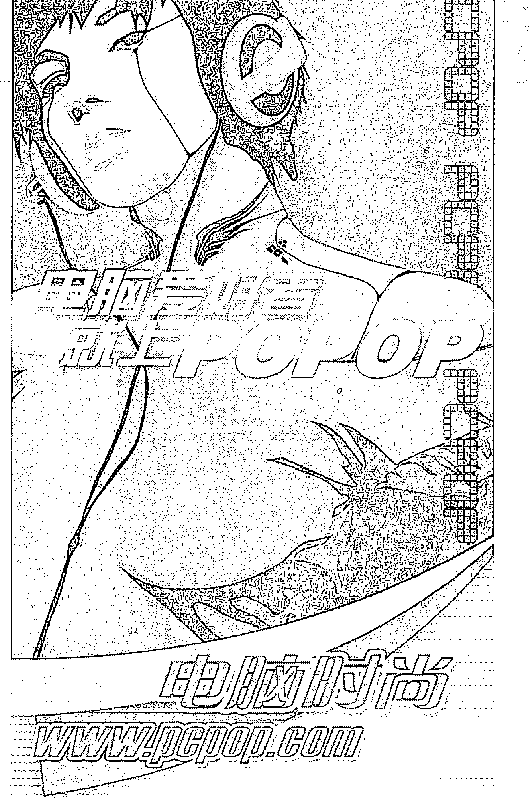

电脑时尚是中国极具权威性与影响力的IT门户网站之一，自1998年6月创立，一直致力于提供IT资讯信息与商情服务。六年的飞速发展，PCPOP已经形成了30个专业频道，900个子频道，提供资讯、产品、用户与厂商四位一体的互动平台。极具人气度的POP社区坐拥300万注册用户，营造IT休闲与购物通道。五千家经销商与容纳数万产品的即时报价系统，成为用户消费，品牌推广极为关注的信息平台。

- ○ 资讯服务平台
  在IT资讯服务方面，PCPOP是中国极具权威性的网络媒体。网络式的频道的划分，包括新闻，行情，评测，导购为主的资讯频道包括硬件，数码，整机，数字娱乐为主的产品频道，秉着内容X产品X厂商的三维立体式的资讯平台为读者提供极快捷的信息服务。截止2004年10月，PCPOP的IT资讯内容，每日页面访问量(Pageview/day)达到了600万，并以每年300%的速度飞速提升，是目前发展趋势极为优秀的IT网站。预期2005年，PCPOP将建设成中国长江以北规模极大，访问人数极高的IT门户，并一如既往的保持极具权威性的资讯内容，推动市场的蓬勃发展。
- ○ 产品服务平台
  PCPOP拥有国内非常先进，并很具特色的网络产品发布平台和网络整合营销平台。包括产品信息，经销商社区，全国报价，数据调研，动态购买度查询，用户反馈，产品增值服务等多种功能。以PCPOP权威性的评测以主导，加以价格的动态变化，推荐产品的可购买指数，是互联网上非常先进的交易平台。
- ○ 互动服务平台
  PCOP提供了多元化的互动平台。注册人数超过300万的POP社区，除了丰富的资讯之外，特色的竞拍，淘金和网络专卖店，给予用户不同的消费体验。以SMS、WAP、彩信等无线增值平台面向全国二亿的手机用户，成为国内SP的信息发布中心，PCPOP致力于开发具有IT特色的的无线增值服务。

# 热点聚集软件

## 2004年经典工具新功能扫描

文/阿风

在2004一年中更新了很多实用的软件，这些软件在更新中增加了很多不错的功能。2004年还出现了一些很不错的新软件，虽然它们比不上较为出名的软件，但是它们也有自己的特点。下面就让我们来看看其中的一些佼佼者吧。

### 一、系统工具

#### （一）Windows 优化大师 6.3 Build 1009

下载地址：http://www.skycn.com/soft/2988.html

"Windows优化大师"是一个比较全面的系统优化软件，可以对磁盘缓存、桌面菜单、文件系统、网络、开机速度、系统安全、后台服务等进行完全优化。同时软件还有强大的清理功能，可以进行注册表的冗余信息清除、垃圾文件清除、冗余动态链接库清除、ActiveX 清理以及软件智能卸载等模块，简便易用，快速可靠。

此次软件的更新改进了对系统信息检测，能够检测更多的硬件信息；改进了桌面菜单优化，提升了对Windows Server 2003的兼容性；改进了冗余DLL清理，向用户提供了待分析硬盘的选择功能，还增加了"3721上网助手"等工具。

#### （二）超级兔子魔法设置 6.25

下载地址：http://www.skycn.com/soft/2993.html

"超级兔子"也是一个不错的系统优化和修改软件，它能够解决很多在电脑上积累下来的问题，也可以对系统进行比较全面的优化，让你的系统更健康，运行速度更快。

最新版中添加了新软件"超级兔子光驱音效"，用它可以在放入光盘时播放指定的声音文件；还有在"超级兔子IE 修复专家"中新增BHO 插件的清除功能，收录最新的恶意网站病毒库，能清除1587种木马和恶意网站病毒。

#### （三）System Mechanic Professional 5.0

下载地址：http://down.ttdown.com/SoftView/SoftView_17149.html

System Mechanic是一款强大的、屡次获奖的多功能系统维护工具，它集多个强大的系统维护工具于一身，可以查找并清除垃圾文件、上网痕迹（包括历史、缓存、Cookie等）、查找并修复坏的快捷方式、删除无效的卸载信息、查找并删除重复的文件、清洁系统注册表、Windows 启动管理、安全安装程序、计划维护等。

新版本增加了高级病毒检测、完整的E-mail检测、网络安全防火墙、修复被意外删除的文件（包括图片和电子邮件）、创建硬盘分区镜像文件、清除删除系统数据等非常实用的功能（图1）。

#### （四）Norton Ghost 9.0

下载地址：http://down.ttdown.com/SoftView/SoftView_15636.html

Ghost 9.0 是大家常用的备份分区软件。新版本中最突出的改进就是开始支持直接在Windows 下对系统进行热备份，这样就再也不需要重启动到DOS下进行备份了。Ghost 9.0 还开始支持增量备份，以后每次备份的时候可以只备份自从上次基准备份后发生改变的文件，这样就大大地提高了备份速度并减少了磁盘空间的消耗。需要注意的是，在安装软件前必须安装 .Net Framework 1.1 才可以使用。

#### 三、下载软件

#### （一）网际快车 (FlashGet) 1.6

下载地址：http://down.ttdown.com/SoftView/SoftView_3137.html

FlashGet 是大家常用的下载软件，支持多种网络协议，并具有强大的管理功能（包括支持拖曳、更名、添加描述、查找、文件名重复时可自动重命名等等），软件完全支持 IE 和 Netscape 浏览器。

此次更新除了可以支持 RTSP 协议，还开通了一个重要功能——“FlashGet 文件镜像服务”，这是一个专门提供给 FlashGet 用户使用的匿名 URL 共享系统。如果一个用户把下载文件的 URL 共享出来，当其他用户在下载同样的文件的时候，就会多了一个镜像地址。

#### （五）进程管家 1.0

下载地址：http://down.ttdown.com/SoftView/SoftView_26144.html

“进程管家”是一个系统任务管理工具，通过它可以监视、中止一些可疑的进程，还可以对窗体程序进行详细的分解分析，并可对任何控件的状态进行修改、控制及中止等操作。

#### （六）System Info 1.0

下载地址：http://down.ttdown.com/SoftView/SoftView_26129.html

System Info 是一个可以查看系统内存使用量、当前 CPU 使用情况以及操作系统详情的监控小软件，用它还可以释放内存中不再使用的部分。

#### 二、网页特效

#### （一）有声有色 2004 Build 0815

下载地址：http://www.skycn.com/soft/963.html

本软件集合了 518 个十分精彩的 JavaScript 小程序，真正做到了与特效源程序相融合。每一个特效制作窗口均为可视化制作界面，所有特效操作只需要您轻轻点几下鼠标就可以完成。独特的特效自动插入功能，可以自动插入特效到网页中。

此次更新添加了“动感 XP 菜单”、“鼠标动态旋转文字”、“渐显分散右键菜单”、“多彩变幻文字”、“动态飘逸图片”、“蛇形游动文字”等 48 个极酷的特效，还新增了“特效搜索”功能，这样就可以很轻松地找到自己需要的特效程序了。软件还支持换肤功能，提供了 11 种漂亮的界面供大家选择。

#### （二）水晶情缘网页特效专家 2004

下载地址：http://www.skycn.com/soft/14150.html

本软件是综合了各家网页制作软件的优点开发出来的，功能强大，简单易用，适合各级网页制作人士使用，让初学者不必学习繁琐的程序代码，就能轻松设计出专业的网页。

新版中增加了个人网页服务器功能，只要你能连上 Internet，获得独立的 IP 地址，就可以把你的普通 PC 作为一台 Web 服务器，这样就可以建立自己的网站主机了。

#### （三）迅雷(Thunder) 4.0.2.20

下载地址：http://down.ttdown.com/SoftView/SoftView_19963.html

“迅雷 4”延续了以前版本下载速度快的优势，它拥有比目前用户常用的下载软件快 7 - 10 倍的下载速度，能够降低 80% 的死链比例；支持多结点断点续传；支持不同的下载速率；支持 Proxy、NAT、Firewall；智能分析哪个结点上速度最快，以提高用户的下载速度；支持各结点自动路由；支持多点同时传送并支持 HTTP、FTP 等标准协议。

通过此次更新，软件在用户比较关注的配置、代理服务器、文件类别管理、批量下载等方面进行了扩充和完善，使得“迅雷”可以满足中、高级下载用户的大部分专业需求。

#### （四）FlashFXP 3.0.1

下载地址：http://www.skycn.com/soft/689.html

FlashFXP 是一个功能强大的 FXP/FTP 软件，可以进行比较文件夹，支持彩色文字显示，能够缓存文件夹、支持文件夹（带子文件夹）的文件传送与删除、支持上传、下载及第三方文件续传。

新版本中，用户可以自定义不同文件类型的显示颜色；可以缓存远端文件夹列表；支持FTP 代理及SOCKS3&4；具有避免空闲功能，防止被站点踢出；可以显示或隐藏“隐藏”属性的文件、文件夹；支持每个站点使用被动模式等。

#### （五）FTPRush 1.0

下载地址：http://down.ttdown.com/SoftView/SoftView_14319.html

FTPRush是一款高性能的FTP客户端程序，通过它可以轻松地上传下载和FXP（FTP服务器之间的文件传输），完全多线程的构造，让你能够自由自在地存取FTP服务器的资源。

软件主要功能有：支持FTP代理、脚本支持、多语言支持、支持站台连接数限制、支持站台捷径、支持IdentD认证、支持防止被踢、支持站台生存状态功能、支持速度限制、防火墙等功能，最新版本支持包括简体中文、繁体中文、英语、韩语、意大利语、德语、俄语、西班牙语等多种语言界面（图2）。

#### 四、网页浏览

#### （一）Maxthon 1.1

下载地址：http://down.ttdown.com/SoftView/SoftView_23596.html

Maxthon的前身就是大名鼎鼎的MyIE，它是一款功能强大的Web浏览器。基于Internet Explorer内核，和在IE中看到的效果完全相同。新版本增加了一些很实用的功能，如自动屏蔽ActiveX插件下载、可选择收藏夹根目录、图像和影音文件浮动工具栏等，还增强了网页的浏览速度和软件的稳定性。

#### （二）GoSuRF Browser 2.0

下载地址：http://www.skycn.com/soft/7169.html

GoSuRF Browser是一个很不错的网页浏览器，有着最逼真的IE界面，并提供多项贴心功能，如加强对网页图片和文字的保存，一拖就存；强大的广告过滤，可以阻挡弹出窗口和各种广告条；超强的网页病毒保护，能防止恶意代码的袭击；而且还提供方便的在线翻译和浏览代理；快速准确的搜索功能，让你可以轻松获得想要的信息。

#### （三）TheWorld Browser 1.1

下载地址：http://down.ttdown.com/SoftView/SoftView_20373.html

TheWorld Browser是一个快速、安全、功能强大的多窗口浏览器，它完全是免费，没有任何功能限制，它兼容IE，可以运行在Windows 98/Me/2000/XP等操作系统中。

此次更新增加了解除页面的右键屏蔽功能，在“其他”选项中设置增加了对IE“收藏夹”菜单顺序的支持，还增加了鼠标手势等功能（图3）。

#### （四）GreenBrowser 2.3

下载地址：http://www.skycn.com/soft/12098.html

GreenBrowser是一款集各家之长并独树一帜的免费、绿色的网页浏览器，无论是光标形状，还是网页浏览、关键字搜索都会切实体验到操作的方便和功能的细致。软件集成文本、图片、窗口过滤记录收集器，鼠标一拖即存；还可以通过悬浮监视窗，直接显示/隐藏GreenBrowser；完善的页内链接分析筛选器，可按名称或URL等方式筛选。

#### 五、聊天软件

#### （一）腾讯QQ2004 II beta1

下载地址：http://www.onlinedown.net/soft/1424.htm

QQ是大家最常用的聊天软件，它具有信息收发及时、功能全面的特点，此外QQ还具有BP机网上寻呼、聊天室、传输文件、语音邮件、手机短讯服务等功能。此次更新增加了在线时长等级功能、个性签名、长昵称、防打扰功能、远程协助功能，在聊天窗口中给好友点歌等功能，还对QQ互动空间和主界面的皮肤进行优化，支持钻石用户标志显示。

#### （二）朗玛UC 3.90 Build 920

下载地址：http://www.skycn.com/soft/9269.html

UC是一个异军突起的聊天软件，功能很强大，使用它的人也很多。如果你不想使用QQ的话，UC就是一个很不错的选择，因为它的很多操作都和QQ类似，很容易上手。此次更新增加了很多实用的功能，如团体语音群聊，这样就可以进行网上Party、生日聚会、远程会议了；朗玛还免费提供了100MB邮箱（邮箱形式为“UC号@51UC.com”）；还有免费网络硬盘，可以保存自己的聊天记录、重要资料，是移动办公的好帮手；新版本还提供了找回号码功能，这样即使你忘记了密码也可以轻松找回来。

#### （三）MSN Messenger 7.0

下载地址：http://down.ttdown.com/SoftView/SoftView_4798.html

微软公司的即时通讯软件，凭借微软公司不遗余力的推广和自身优秀的性能，它在市场所占的份额也越来越大，不过使用它必须要有一个Hotmail或者MSN的账户才行。此次更新增加了很多实用的功能，如以前隐身都是通过MSN Shell来实现的，现在MSN自己就有隐身功能了；还增加了一些如“Nudge”窗口、“Winks”表情和自定义标签等不错的功能。

#### （四）网易泡泡 2004

下载地址：http://down.ttdown.com/SoftView/SoftView_6523.html

“网易泡泡”是一个免费的即时通信工具，它集即时聊天、手机短信、在线娱乐等功能于一体，除具备目前一般即时聊天工具的功能外，还拥有许多体贴用户需要的特色功能，如自建聊天室、网络文件共享、视频语音聊天等。新版本里增加了超强网络连接，允许自定义聊天背景，可以使用任何图片定义背景；显示形象照片，甚至是你自己的照片，来显示你的个性。

#### （五）MyIM 2004 Build 0916

下载地址：http://down.ttdown.com/SoftView/SoftView_22964.html

MyIM是一个多合一的即时通信软件集成工具，它能够同时支持MSN、ICQ/AIM、Yahoo、QQ等主流通讯协议，并且具有扩展性，可以满足广大用户自由沟通的多层次需求。新版本中新增了全新的独立用户系统，提供多重保护让你的IM账户更安全；高效的账户资料导入过程，可以快捷地导入你的QQ、MSN账户资料；全新推出的聊天管理器，让你更方便地统一管理你的QQ、MSN、ICQ/AIM、Yahoo的聊天记录；所有记录一目了然；支持修改MSN昵称功能，而且还可以修改用户QQ资料和查看对方QQ信息，方便你随时更新自己的资料和及时了解好友的更新。

#### （六）Gaim For Windows 1.0.0

下载地址：http://down.ttdown.com/SoftView/SoftView_10085.html

Gaim是一个多合一的即时通信软件集成工具，不论是AIM、ICQ、Yahoo、MSN、IRC、Jabber、Napster、Zephyr，还是Gadu-Gadu，只要安装它，就可以全部拥有了。

#### 六、媒体软件

#### （一）Windows Media Player 10.0

下载地址：http://down.ttdown.com/SoftView/SoftView_21668.html

本软件是系统自带的媒体播放软件，支持的文件类型包括ASF、MPEG-1、MPEG-2、WAV、AVI、MIDI、VOD、AU、MP3等文件格式。此次更新运用新的设计，包含网络音乐库，支持新型音频格式和设备，改良了音乐库和jukebox；新增了同步文件夹功能，能监控你选择的文件夹的改变，并自动反映到播放列表中；可以把音乐转换为高比特率的MP3格式。

## (二) RealPlayer 10.5

下载地址: http://down.ttdown.com/SoftView/SoftView_17666.html

鼎鼎大名的 RealPlayer 已是众所周知，它不再是当初纯粹的播放器，而是一个全新的集 Web 浏览、曲库管理和大量内置的网络广播电视频道的多媒体软件，丰富的媒体格式支持让你再也不必安装其他任何媒体播放软件。

新版本启用了新的 RealVideo 10、RealAudio 10 编码格式，新格式支持多声道音频、无损音频压缩、优化的网络音频流、自动音频延时补偿技术，支持更高码率的压缩，高码率下压缩出来的效果可以达到与 MPEG-4 一样的清晰画质。

## (三) 遂意媒体播放器 1.01

下载地址: http://down.ttdown.com/SoftView/SoftView_27892.html

这是一个免费的播放软件，支持 RM、MP3、M3U、WMA、WAV 的文件格式，软件同时还附带了 MP3 等网络音乐搜索工具，可以免费搜索 MP3 等音乐，免费下载 MP3 音乐。

## (四) Nero Media Player 1.4.0.23

下载地址: http://down.ttdown.com/SoftView/SoftView_15006.html

Nero Media Player 是著名软件公司 Nero 出品的一款高品质的多媒体播放程序，程序提供了大量特效来重现各种影音文件，支持包括 AIFF、AVI、DAT、MID、WAV、MP3、MP4、MPEG、MPG、VOB、WMA、RMI 等 23 种常见的多媒体格式，支持播放列表，界面清晰友好。此外它还有一个不错的 EQ 均衡器控制面板，可以控制与调整播放时的音效。

## (五) Advanced WMA Workshop 2.09b

下载地址: http://www.skycn.com/soft/5447.html

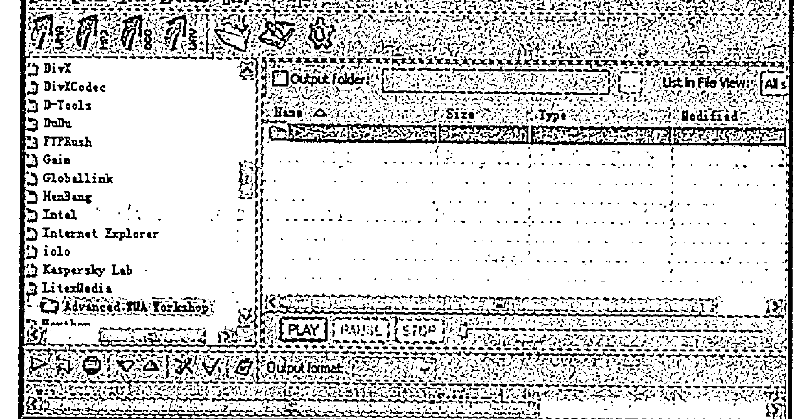

Advanced WMA Workshop 是一个功能强大的音频转换软件，可将 MP3 或 WAV 文件转换成 WMA 格式，也可将 MP3 或 WMA 还原为 WAV 文件。可以编辑 ID3v2 标签及提供快速、批次的转换与高品质的效果。在新版本中，软件增加了对 OGG 格式的支持，且使用了最新的 LAME MP3 编码引擎（图4）。

## 七、图形图像

#### (一) ACDSee PowerPack 7.0

下载地址: http://www.skycn.com/soft/6620.html

ACDSee 是目前最流行的数字图像处理软件，它能广泛应用于图片的获取、管理、浏览、优化，可以从数码相机和扫描仪高效获取图片，并进行便捷的查找、组织和预览。

新版本支持超过 50 种常用多媒体格式，还可以制作出 Flash 和 PDF 格式的幻灯片，无级调节缩略图的大小，ACD Photo Editor 也加强了对图片的编辑功能。

#### (二) ComicsViewer 1.19

下载地址: http://down.ttdown.com/SoftView/SoftView_28142.html

本软件是一个专为看漫画而开发的图像浏览器，内置许多漫画专用功能，可以使用书签、现场保护、单键浏览等功能。目前支持 JPG、UFO、GIF、BMP 格式，还可以直接从 ZIP 文件中读取图像文件而不需要生成临时文件。

#### (三) 轻松图片加密 1.0

下载地址: http://down.ttdown.com/SoftView/SoftView_19917.html

“轻松图片加密”使用了目前流行的图片加密嵌入技术，通过把重要文件隐藏嵌入到图片中的方式来达到保护重要文件的目的。利用 BMP 图片格式的特点，先把重要文件加密，然后再嵌入到图片中，从而达到了加密及隐藏用户重要文件数据的目的。即使图片被截获，也不用担心重要文件被解密。

#### (四) SnagIt 7.1.2

下载地址: http://www.skycn.com/soft/2290.html

一个非常强大的屏幕、文本和视频捕获及转换程序，可以截取 Windows 屏幕、RM 电影、游戏画面、菜单、窗口、客户区窗口、最后一个激活的窗口或用鼠标定义的区域，图像可被存为 BMP、PCX、TIF、GIF 或 JPEG 等格式。程序支持 DDE，所以其他程序可以控制和自动捕获屏幕。新版本中还能嵌入在 Word、PowerPoint 和 IE 等软件中。

#### (五) HyperSnap-DX 5.61

下载地址：http://www.skycn.com/soft/2270.html

HyperSnap-DX 是大家常用的屏幕截图软件，使用它不仅能抓取标准桌面程序还能抓取 DirectX、3Dfx Glide 游戏和视频或 DVD 屏幕图，还可以用热键或自动计时器从屏幕上抓图。在新版本中添加 FTP 服务器配置文件选项和“自动添加阴影到捕捉的全部图片”功能。

#### (六) 红蜻蜓抓图精灵 1.14

下载地址：http://www.skycn.com/soft/6747.html

“红蜻蜓抓图精灵”是一款专业的屏幕捕捉软件，具有多种抓图模式供选择，能抓取光标，并且可以设置抓图延迟时间。软件具有简单的图像编辑能力，可以对捕捉到的屏幕图片进行裁剪、反色及图像大小设置功能，而且还支持换肤功能，用户可以根据自己的喜好选择相应的软件外观。

## 八、文件管理

#### (一) 软件管理专家 1.22a

下载地址：http://www.skycn.com/soft/4880.html

下载文件的管理是一件挺麻烦的事，时间一长，看着下载的压缩包，自己也搞不清哪个文件是干什么用的了。

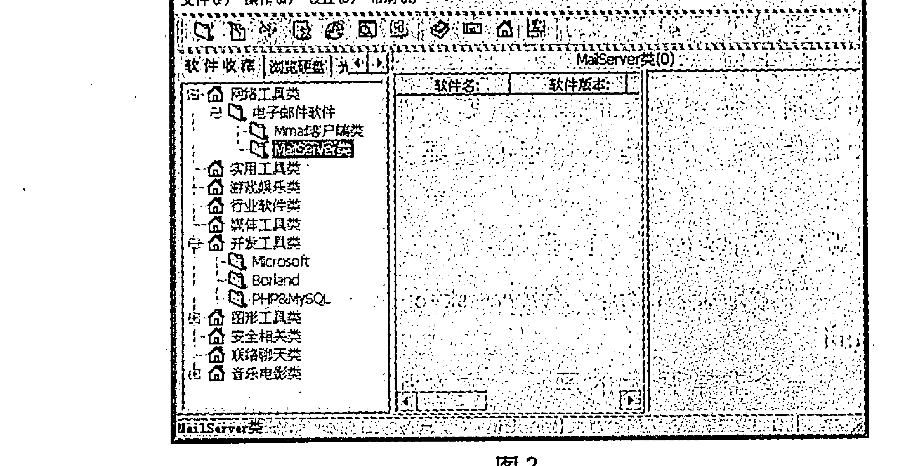

“软件管理专家”就是用来管理这些下载文件的，你只要选中一个软件，将它拖曳到 Flash Soft Manager 的窗口中，填写一些备忘的信息，就把这个下载软件分门别类地放到文件盒中了。下次需要的话，不用去找，直接在软件中调用就可以了（图5）。

#### (二) 拖把更名器 1.98i

下载地址：http://www.skycn.com/soft/9011.html

“拖把更名器”集成在“资源管理器”的右键菜单中，支持 MP3、RM、RMVB、WMA、APE、OGG、WMV、ASF 等文件的图标变更，还具有支持文件名、标签内码转换、繁简转换、汉字转拼音等功能。

#### (三) FolderViewList 1.0

下载地址：http://down.ttdown.com/SoftView/SoftView_28145.html

FolderViewList 可以快速地为目录建立一个树形的索引，这样就可以一目了然地快速找到所需要的内容。很适合在网上收集各种资料、下载各种软件，或者为你的 FTP 服务器建立一个文件索引。

《Word里面玩转大红“盖章”》
文/张维

贵刊在2004年第15期中有一篇《Word里面玩转大红“盖章”》的文章。看完后我也亲手尝试了一下，觉得作者的方法的确很好，让我得到了一枚羡慕已久的“灌水专用章”。在制作的过程中也遇到了调整各个元素（公章的文字，图形）位置不易的问题，因为用鼠标不是移得过了头就是位置不合适，很不美观。后来我试着用键盘的方向键来控制移动，效果不错，希望在这里与大家分享。

具体的方法是：先选中要移动的某一元素（公章的文字，图形），按方向键实现移动，当然只是粗略的移动到大概想要的位置，然后用左手按住 Ctrl 键不放，同时点按方向键便可以移动到理想的位置，这种按 Ctrl 键的移动，位移量很小，能非常容易的把各个元素的相对位置调整到最佳状态。

## 2004行业软件经典导购
文/小峰

现在几乎各行各业都要用到电脑，所以每个行业也都有一些自己的行业软件。行业软件是讲究专业性的，一个好的行业软件，可以使原本繁琐的工作变得很简单。2004年很多行业软件都推出自己的新版本，下面就来介绍一些大家比较熟悉的行业里面的软件，看看它们有什么功能和特点。

### 一、保险行业

#### （一）保险秘书系统 2.9

下载地址：http://www.onlinedown.net/soft/6200.htm

“保险秘书系统”是一个非常专业的保险业务管理系统，它由专业的软件开发公司设计开发。该系统能对客户、准客户、保单资料、组员资料进行有效的管理、检索、分析处理；还可以自动进行客户生日提醒、保费到期提示、组员业绩图表分析、信封打印等功能。系统还带有邮件发送系统和简单易用的短信群发系统，这两样都是现代保险营销的利器。

#### （二）保险资格考试轻松通 3.0

下载地址：http://soft.ttdown.com/SoftView/SoftView_24569.html

“保险资格考试轻松通”是一套保险中介从业人员资格考试最新训练软件，适用于保险代理从业人员、保险经纪从业人员和保险公司从业人员。

软件的功能很多，可以提供相关法规的查阅、提供分章节练习功能、提供即时批阅功能、提供试题笔记本功能，这样在进行练习的时候，用户可以将比较重要的试题或暂时不懂的试题进行手工标记，存入笔记本中。软件还提供模拟考试功能，进行智能组卷，模拟出题，试题采取无序排列，并提供打印试卷功能。

在试题显示界面中，用户可以根据自己的喜好来对字体的大小进行设置，以方便阅读。

### 二、法律法规

#### （一）大律师 2004

下载地址：http://www.onlinedown.net/soft/25852.htm

“大律师”是一款完整的律师工作平台，用它不仅可以方便地查询10万条以上的法律法规，而且还集成了和 Word 程序完全兼容的档案管理功能，并根据企业、行政、私人、刑事等进行分类。如果当事人有照片的话，那还可以把照片通过附件添加到自己的档案中。软件能智能搜索数百个相关的官方网站，可以得到最新、最权威的法律资讯。

#### （二）中国大法规数据库 2004

下载地址：http://www.onlinedown.net/soft/6903.htm

“中国大法规数据库”是一个资料性的软件，它分普及版、大众版和专业版，各个版本提供给不同层次的用户使用。普及版仅包含由全国人大颁布的全部法律和2004年最新法规，其他只有标题，没有内容；大众版包含由全国人大颁布的全部法律库、国务院行政法规库、国际条约库、合同范本库、法规英文本库、2004年最新法规库，法规数约一万左右；专业版包含建国以来全部法律、行政法规、各部委规章、司法解释、判例、规范性文件、国际条约、公约和惯例、各省地方性法规、法规英文本和2004年最新法规（图1）。

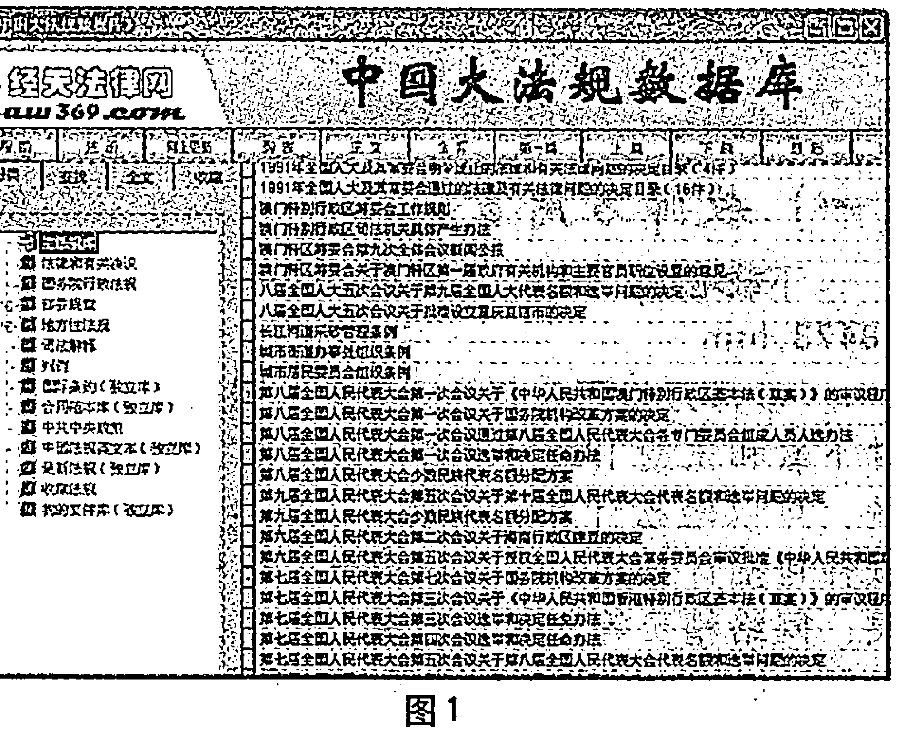

### 三、商业贸易

#### (一) 极限金商外贸业务管理 2004增强版

下载地址：http://www.onlinedown.net/soft/21158.htm

“极限金商2004”是一款非常实用并且功能强大的面向外向型企业和外贸从业人员的外贸管理软件。

软件包括报价合同、函电通、单证制作、备货发运、核销退税、财务管理、客户供应商管理、产品管理、业务案卷、常用资料等常用功能，另外还包括多种管理功能如通讯录、样品管理、配额管理、文书管理、网络传输、备忘提醒等。很多功能在此次2004增强版中进行了完善和加强，这样用户就可以轻松体验软件带来的简单、高效、自由的工作感受。

#### (二) 速达3000 6.2

下载地址：http://www.onlinedown.net/soft/33147.htm

“速达3000”是速达公司继“速达2000”后开发出的又一个面向中小企业管理的软件精品，是采用当前最先进的工具 C Builder 开发的。在数据库上采用大型数据库，以确保海量数据存储和数据的安全；在输入输出界面上，软件采用了先进的导航图技术，使得软件的操作更加方便。软件同时推出的简/繁体和单机/网络版本，以适合不同的用户使用。

### 四、学校教育

#### (一) 教师万用百宝箱

下载地址：http://www.onlinedown.net/soft/18473.htm

“教师万用百宝箱”拥有最强大的评语库、课件下载和试题下载网址库，还有强大的组合计分系统，可以轻松计算出成绩并了解全班的考试情况。软件包括计分精灵、时间精灵、日程精灵、评语精灵、网络精灵等。它是个绿色软件，下载后直接运行就可以了，绝不对注册表进行写入（图2）。

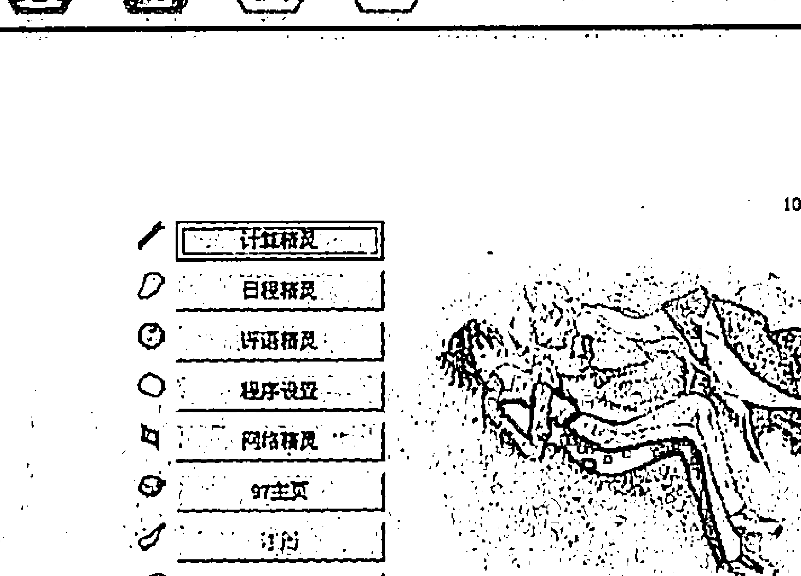

#### (二) 学生评语编辑系统 6.3

下载地址：http://www.onlinedown.net/soft/1530.htm

班主任工作是辛苦的，特别是在学期末，既忙着复习考试，又要忙着写评语。“学生评语编辑系统”就是一个彻底减轻班主任的工作负担的软件，用它可以迅速地写出评语，这样就可以争取更多的时间来给学生复习。

软件分别从印象、上课、作业、学习、班务、交际、特长、问题、希望等方面提供了1200多句评语和380个学生评语。只要看中哪句，并在其上轻轻点击鼠标就可以完成评语的起稿工作。新版本对数据库中的评语进行了丰富和充实，相信可以满足班主任们的使用了。

### 五、彩票抽奖

#### (一) 乐客抽奖 9.3

下载地址：http://www.onlinedown.net/soft/33043.htm

“乐客抽奖”是一个功能完备、界面华丽并且十分人性化的电脑抽奖软件，适用于晚会、电视台、庆典、顾客回馈等抽奖场合。可以自定义抽奖奖项、中奖人数，可以使用身份证号码、电话、姓名等资料作为抽奖数据，并可屏蔽电话的局部数字，以保护个人的隐私。抽出中奖名额是直接显示在屏幕上的，也可以保存为文件，还可以将抽奖结果打印出来。软件自带了多套背景模板性动画背景，可以完全自己进行布局。

#### (二)《智慧人》彩票分析投注系统 6.3

下载地址：http://www.onlinedown.net/soft/18614.htm

本软件适用于各种乐透型电脑福利彩票和体育彩票，各种类型彩票可以方便地进行切换，分析、选号、投注、对奖，各彩票之间互不干扰，最新版中已录有“双色球”等多种彩票数据，安装后就可以直接使用了。

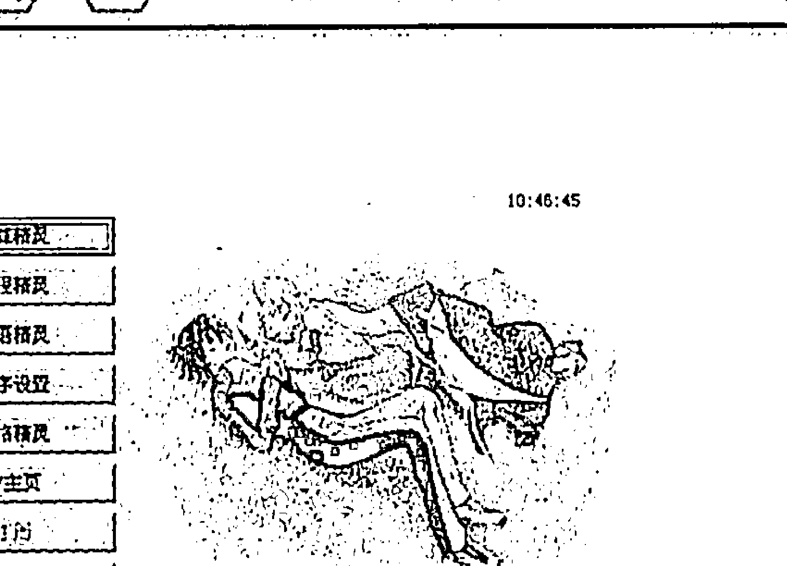


### 六、健康医药

#### (一) 医院管理软件 5.0

下载地址: http://soft.ttdown.com/SoftView/SoftView_27788.html

本软件是一个功能强大的小型医院管理软件，适用于中小医院、乡镇或私营医院。支持海量数据处理。软件包含门诊管理、住院管理、医生站、药房管理、药库管理和系统管理六大模块，具有挂号、门诊收费、住院登记、住院收费、医生处方、患者病历、药房管理和药库管理等功能，而且还有丰富的报表功能，能对各类数据进行汇总。

#### (二) 家庭食疗宝典 2.37

下载地址: http://soft.ttdown.com/SoftView/SoftView_13094.html

“家庭食疗宝典”最大的特点就是收集了几百种疾病食疗药方和食疗药膳，还收集大量的食物、蔬菜、水果、野菜、花卉等等，介绍其营养成分、食疗须知、食疗小方，如果你收集了一些食疗小方，自己还可以把它添加到软件中。

### 七、交通相关

#### 全国列车查询系统 1.6

下载地址: http://www.onlinedown.net/soft/2321.htm

“全国列车查询系统”可以查询2004年最新的全国列车运行信息，操作简便，易用性强。是居家旅行的好工具。我们还可以通过软件，来查询出两地之间和此次火车的铁路线路，这样就可以对火车的路线一目了然，轻松找出最佳路线。

#### (二) 冠佳图书管理系统 7.0

下载地址: http://soft.ttdown.com/SoftView/SoftView_7089.html

“冠佳图书管理系统”是采用 Delphi 语言编写的内容涵盖了图书流通领域的各个环节，适用于各类中小型书店、连锁书店、图书超市、图书卖场、第二渠道批发零售商、图书发行所等场合。

本管理系统支持无鼠标操作，支持书号、条码和书名的模糊查询，还可以自动记忆客户批销、进书折扣，库存量门禁管理，2004新版本中增加了会员功能，能自动累计会员消费，达到级别门槛时，自动升级会员级别。

### 八、美容美发

#### 索易美发管理系统 2.1

下载地址: http://soft.ttdown.com/SoftView/SoftView_27844.html

“索易美发管理系统”是一套专门为美发美容院、形象设计等休闲中心开发的，软件包括客户预订、服务消费、产品销售、员工提成、会员卡管理等多种功能。软件采用稳定的程序架构和安全可靠的数据管理，使操作更加方便和快捷。

### 九、建筑工程

#### 创想家居设计系统 3.0

下载地址: http://www.onlinedown.net/soft/6364.htm

“创想家居设计软件”是一套完全自主平台的二维建筑装饰设计软件，具有比传统 CAD 软件更加人性化的操作方式。即使你不熟悉计算机绘图，也能用它轻松制作出非常漂亮的家居布置图。

物体的拖曳和自动捕捉技术是软件人性化智能化特点的关键所在，软件还可以进行二维、三维的相互转换，还可以随时将所有设计内容，包括建筑结构、基础装修、家具及室内陈设等转换成平面图或立体图。

### 十、仓储租借

#### (一) 雨佳仓库管理系统 2.1.0

下载地址: http://www.onlinedown.net/soft/8852.htm

本管理系统广泛使用在各类企业、事业及机关单位的物质、材料及货物的日常管理与核算。软件界面简洁、操作简单、功能实用，支持多套账簿、多仓库，用户可自定义计量单位、入(出)库单的入(出)库类型，使管理更加灵活、方便。实时的数据处理流程，无需单独记账处理过程，所有账表的数据随录入单据进行录入、修改，使用户的管理更加及时、准确。

### 十一、餐饮旅游

#### （一）嘟嘟美食菜谱 2.1

下载地址：http://soft.ttdown.com/SoftView/SoftView_7012.html

“嘟嘟美食菜谱”是一款简单易用、设计贴心的菜谱软件。它可以帮助厨房新手轻松做出美味佳肴，也可以帮助厨艺高手整理记录自己的菜谱。软件内置的几项功能更可以帮助用户制定饮食计划，管理购物清单（图3）。

如果你的系统安装了中文语音引擎，还可以使用“嘟嘟美食菜谱”的朗读功能，选择好菜谱，不用自己去看，“嘟嘟美食菜谱”可以读给你听。

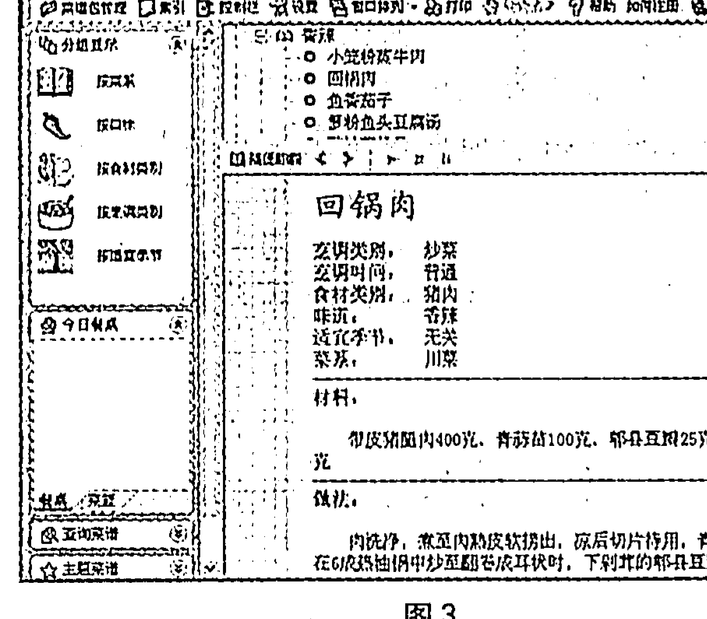

#### （二）西餐咖啡经营管理系统 3.0

下载地址：http://soft.ttdown.com/SoftView/SoftView_16681.html

本管理系统适用于西餐咖啡店等特色餐饮形态。系统运用全新的经营理念，业务流程更为清晰、可控，对销售的全部数据可以实时处理、统计。

2004新版本全面支持储值会员卡模式，通过销售储值卡，在给客户提供更大优惠的同时，可帮助你锁定有效的客户群体。

#### （三）汇锦国际酒店管理系统 5.6

下载地址：http://www.onlinedown.net/soft/33589.htm

“汇锦国际酒店管理系统”是一套适合中小型酒店使用的酒店管理系统。可以提供实时的客房出租及预定状况、客人信息、营业情况、收款等全局信息，帮助酒店改进管理体系，实现科学决策，达到提高综合效益的目的。

### 十二、行政人事

#### 通用人事档案管理系统 4.3

下载地址：http://soft.ttdown.com/SoftView/SoftView_23395.html

本系统是根据人事档案管理工作的实际需要而设计开发的，内容详细且全面，功能完善且操作简便，具有很强的查询、搜索、统计及打印功能，适用于各级各类企事业单位。

系统提供多种查询方式及浏览方式，能根据当前日期自动计算员工的年龄、工龄，还有数据备份、导入备份数据、导入注册信息等功能，保证了数据的安全性。

### 十三、农业相关

#### 乳业专家2004 1.50

下载地址：http://www.skycn.com/soft/15585.html

“乳业专家”是专门针对于现代养牛场/小区和农户而开发，提供养牛场的全面管理，可以及时准确地获取奶牛场的运营信息及全部牛只的生产状况。软件图文并茂易于操作，基于 Windows 的图形化界面，稍有电脑基础的人都能操作。

本系统包含牛群管理、产乳管理、牛群繁殖、饲养与饲料、疾病与防疫、统计与分析、养牛场/小区管理、系统管理几大模块。从奶牛的降生到奶牛的淘汰离场，实现全程化的计算机监控管理，同时兼顾对奶牛场运营的管理。

### 十四、审计评估

#### 鼎信诺资产评估系统 2.0

下载地址：http://www.skycn.com/soft/10612.html

本系统是目前国内最好的评估软件，超过300个专业评估机构正式使用，符合国家财政部颁布的《资产评估报告基本内容与格式的暂行规定》和《资产评估操作规范意见（试行）》。

本系统按照评估业务的实施步骤，提供了一个方便易用的业务流程操作向导，分为四个基本阶段：项目准备，接收数据...评定估算和后期工作。另外，系统提供了强大灵活的打印功能，在项目完成后，可以进行备份项目数据，归并文档。

文 / 天惟创造: CD

在2004年这一年中，各种补丁程序像春笋一样，一个接一个地相继发布，大到操作系统，小至共享软件，软件开发商们都在不断地修补着自己的产品。而在这个补丁阵营中，尤其以微软发布的补丁最多，几乎每一个微软产品都在2004年发布了其相应的补丁。有了微软这样的补丁大户，2004年真可谓“大补之年”。下面我们就来具体介绍一下2004年主流软件所发布的典型补丁程序。

## 1月份

#### (一) IE安全补丁

- 发布公司: Microsoft
- 发布时间: 1月份
- 危害指数: ★★★★★
- 建议升级指数: ★★★★★
- 补丁下载地址: http://download.microsoft.com/download/b/d/c/bdc06cee-54d9-459f-8a1b-31490714863f/q824145.exe (适用 IE 5.01)
http://download.microsoft.com/download/b/d/c/bdc06cee-54d9-459f-8a1b-31490714863f/q824145.exe (使用 IE 6.0)

1月1日，或许是巧合，2004年的第一天，微软的 Internet Explorer 就发现了严重的漏洞。远程攻击者可以利用这个漏洞构建恶意 Web 链接，诱使用户点击该链接，浏览器则会提示不正确的安全通告，欺骗用户打开。这个严重的漏洞，竟然影响到包括 Windows 2000、Windows XP 以及 Windows Server 2003 的全部版本！但是更危险的是，微软竟然没有在第一时间发布修补该安全漏洞的补丁！不过微软还是在稍后公布的 MS03-040 补丁集中修正了该漏洞。升级时要注意的是不同版本的浏览器所对应的补丁是不一样的，首先你要确定你所使用的浏览器的版本，然后根据你浏览器的版本选择相应的补丁。

#### (二) "冲击波" 补丁

- 发布公司: Microsoft
- 发布日期: 1月8日
- 危害指数: ★★★★☆
- 建议升级指数: ★★★★☆
- 补丁下载地址: http://download.microsoft.com/download/a/a/2/aa2d9a51-7543-4568-a9ed-efdc0a4ba5cb/Windows-KB833330-CHS.exe

1月8日，微软官方发布了 Windows "冲击波" 蠕虫病毒删除工具。此工具可帮助用户从感染了 "冲击波" 蠕虫，并且安装了 "冲击波" 修补程序的 Windows XP 和 Windows 2000 计算机中删除 "冲击波" 蠕虫。发布这个小的补丁程序主要是因为，"冲击波" 蠕虫补丁程序只是阻止了蠕虫病毒入侵系统，但一些用户在安装 "冲击波" 蠕虫补丁程序之前，就已经感染了 "冲击波" 病毒。如果是这样，用户就非常有必要使用这个工具来从已经安装 "冲击波" 的系统中彻底清除 "冲击波" 蠕虫。安装这个补丁后，用户不需要再采取其他的措施，安装此补丁即可帮助你从计算机中删除此蠕虫。此补丁适用 Windows 2000 Service Pack 2、Windows 2000 Service Pack 3、Windows 2000 Service Pack 4、Windows XP。

#### (三) 动网 SP1 补丁

- 发布公司: 动网先锋
- 发布日期: 1月16日
- 危害指数: ★★★★☆
- 建议升级指数: ★★★★☆
- 补丁下载地址: http://down.dvbbs.net/SoftDown.asp?ID=2222

1月16日，动网先锋发布了 "动网论坛 7.0.0" 的第一个升级补丁 SP1。动网先锋的 BBS 系统是目前网上非常流行的 BBS 系统，其漂亮的界面、齐全的功能是很多网站或个人选择它的主要原因。从动网 2003 年 12 月 30 日发布了 7.0.0 版本起，短短的 17 天后动网先锋就闪电式地发布了针对 7.0.0 的 SP1 补丁。在这个 SP1 的补丁中，动网一共做了近 30 处修改：

能在短短的17天后就修正了这么多的错误，这和广大的用户支持也是分不开的。如果你使用的也是动网的论坛模板，建议也打上SP1这个补丁。

#### （四）Word 补丁

- 发布厂商：Microsoft
- 发布日期：1月27日
- 危害指数：★★★★
- 建议升级指数：☆☆☆☆
- 补丁下载地址：http://download.microsoft.com/download/d/c/9/dc9cf1e5-1a68-448f-bf96-ab10311ae33a/office2003-kb830000-client-chs.exe

1月27日，微软发布了一个用于修复最新版Word 2003中瑕疵的补丁。根据测试，这个软件瑕疵在某种情况下可能引起系统崩溃。这个补丁主要修复了引起Word 2003死机的软件瑕疵，以及当设法打印和存储包含基于OLE（目标链接及嵌入）对象的文件时引起系统崩溃的软件瑕疵。
更新程序还解决了Word 2003的一些其他小问题。这些小问题包括：①引起文本消失的问题；②引起Word 2003不适当地启动一个文件转换工具的问题；③保存文档问题，不管是用户保存，还是Word 2003自动保存，自动恢复文档后，都可能导致Word程序处于锁定状态，没有反应。最后微软建议所有的Word 2003用户都安装这个补丁。

#### （五）Serv-U 溢出补丁

- 发布厂商：RhinoSoft
- 发布日期：1月29日
- 危害指数：★★★★★
- 建议升级指数：☆☆☆☆☆
- 补丁下载地址：ftp://ftp1.rhinosoft.com/pub/rhinosoft/serv-u/sugerman.exe

1月29日，Serv-U出现FTP服务器长文件名堆栈溢出漏洞。这个漏洞影响到了RhinoSoft Serv-U 3.0.0.20、4.0.0.0、4.0.0.4、4.1.0.3、4.1.0.11这5个版本。所有的Windows操作系统竟然全军覆没，都受到了这一漏洞的影响，从Windows 95到Windows Server 2003无一幸免。
Serv-U是一个Windows平台下使用非常广泛的FTP服务器软件。在处理‘site chmod’命令的时候，如果后面文件名参数过长将导致缓冲区溢出。远程攻击者可以利用这个漏洞以Serv-U进程的权限执行任意指令。

Serv-U在给不存在的文件执行chmod命令的时候，会给用户返回该文件或目录不存在的信息，这个信息字串使用类似如下的代码创建：

```
sprintf(dst, "%s: No such file or directory.", filename);
```

变量dst的长度是256字节，如果发送超长的filename，Serv-U将崩溃。
目前厂商已经发布了升级补丁以修复这个安全问题，请到厂商的主页下载Serv-U 5.0，安装后即可修补该漏洞。

## 2月份

#### （一）Real 溢出补丁

- 发布厂商：RealNetworks
- 发布日期：2月4日
- 危害指数：★★★
- 建议升级指数：☆☆☆☆
- 补丁下载地址：http://service.real.com/help/faq/security/040123_player/ZH-CN/

2月4日，RealNetworks公司发布了Real系列播放器的升级补丁，该补丁用于修正最近发现的一个缓冲溢出错误。
该漏洞的主要表现是，攻击者可以通过修改扩展名为RP、RT、RAM、RPM和SMIL等文件，使RealPlayer和RealOne播放器出现缓冲溢出错误。然后通过远程JavaScript程序访问用户电脑。该补丁主要修补了3个漏洞：

1. 从URL域（由SMIL或其他文件打开）操控远程JavaScript。
2. 改变RMP文件，使攻击者可以在用户机器上下载和执行任意代码。
3. 改变媒体文件，以创建‘缓冲溢出’错误。

受此次漏洞影响的播放器包括RealPlayer、RealOne Player 1/2、RealOne Enterprise Desktop以及RealPlayer 10 Beta。
RealNetworks公司已在公司网站发布通知，提醒用户及时更新软件。
另外你也可以通过软件直接升级，在“工具”菜单中选择“检查更新”，单击“安装”按钮下载和安装更新。

#### （二）微星 Firmware 补丁

- 发布厂商：MSI（微星）
- 发布时间：2月27日
- 危害指数：★
- 建议升级指数：☆
- 补丁下载地址：http://91down.qhd.com.cn/newhtm/780/page_24780.htm

2月27日，微星发布了其MEGA Stick 256音乐播放器的最新Firmware补丁。MEGA Stick 256 是微星推出的同时具有USB移动存储器、FM收音机、数字录音机、MP3/WMA数字音频播放机和语言学习五大功能的小型数码播放设备。此补丁修正了英文版中帮助文件无法正常使用的问题。
不过笔者认为该补丁所修补的缺陷，还不至于给用户带来损失，况且升级MP3播放器的Firmware也是一件非常危险的事情，一旦升级失败将导致MP3播放器无法使用。
你如果没有特殊的要求，这里建议不要轻易升级这个补丁。

## 3月份

#### （一）路由器防火墙补丁

- 发布厂商：普瑞尔
- 发布时间：3月18日
- 危害指数：★★★
- 建议升级指数：☆☆☆
- 补丁下载地址：http://file2.mydrivers.com/net/TP-LINK_8800_2004317175563.zip

3月18日，TP-LINK（普瑞尔）TD-8800 发布外置路由器防火墙补丁。普瑞尔发布的这个补丁使用起来非常简单，只需要填写一下路由器的IP地址和访问密码就可以完成补丁工作。如果你使用的也是这款路由器，那么建议你及时地打上这个防火墙补丁。此补丁适用于1.x/2.x/3.x版本。

#### （二）MSN Messenger安全补丁

- 发布厂商：Microsoft
- 发布时间：3月16日
- 危害指数：★★★
- 建议升级指数：☆☆☆
- 补丁下载地址：http://messenger.msn.com/

Microsoft MSN Messenger 是一款流行的即时通信软件。在处理文件请求时存在安全问题，远程攻击者可以利用这个漏洞获得系统中文件内容。攻击者可以发送特殊构建的文件请求连接给运行 MSN Messenger 的用户，来触发此漏洞，成功利用此漏洞。攻击者可以在用户不知晓的情况下查看硬盘上的文件内容。不过攻击者必须知道文件在系统上的位置。
受影响系统：Microsoft MSN Messenger Service 6.0、Microsoft MSN Messenger Service 6.1。由于即时通信软件的使用范围比较广泛，所以建议用户及时升级这个补丁。

## 4月份

#### （一）《千年》反外挂补丁

- 发布厂商：《千年》游戏开发商
- 发布时间：3月10日
- 危害指数：★★★
- 建议升级指数：☆☆☆
- 补丁下载地址：http://games.enet.com.cn/download/startdwn.php?downid=D0220040310001&url=http://ftp3.enet.com.cn/pub/egames/patch/Client.exe

目前，电脑游戏正在从单机版向网络化转变，随之而来的各种非法的外挂程序，也越来越困扰着游戏开发商和运营商。同时也给那些合法的游戏玩家造成了很大的损失。近来，各大厂商都在积极地升级自己的游戏客户端和反外挂程序。目前，比较受玩家喜爱的网络游戏《千年》出现了一些非法外挂，对游戏的公平性造成了极大的危害。针对该现象，官方相应地紧急采取措施，进行了相应的修改。同时，《千年》将会加大力度打击外挂，不论在现在还是将来，都会不断地采取新的措施来进行技术上的外挂封杀。
4月10日下午15:00—17:00，为外挂封杀的紧急停机时间。同时，主页提供新的客户端下载。玩家必须下载新的 Client 程序，停机之后将之复制至自己的《千年》安装目录替代同名文件，方可正常运行进入《千年》。本次改动为外挂封杀第一波，之后，还将陆续在技术上屏蔽现有的各种恶性外挂及后继版本。请玩家不要随意下载甚至购买外挂，以免遭受木马侵袭导致账号丢失或造成不必要的经济损失。
看来外挂带来的危害还真不少，建议玩家尽快将自己的游戏升级，以便正常地进行游戏。

#### （二）《苍之涛》升级补丁

- 发布厂商：大宇资讯
- 发布时间：4月12日
- 危害指数：★★
- 建议升级指数：☆☆☆☆
- 补丁下载地址：http://down.91.com/htm/4/page_3140.htm

大宇资讯在游戏界一直就是一块金字招牌，相信不久前发售的《轩辕剑外传·苍之涛》一定给各位玩家留下了很深的印象。4月12日，大宇资讯对玩家反映《轩辕剑外传·苍之涛》中的问题做出了回应，修改了部分错误并且发布了一个14,594KB大小的1.03版本的补丁程序。
更新方法：将更新程序压缩包解开后，双击生成的 SwdmdPatch103.exe 文件即可。此补丁包括了以

#### （三）超级解霸V8 SP1

- 发布公司：豪杰
- 发布时间：4月23日
- 危害指数：★★
- 建议升级指数：★★★
- 补丁下载地址：ftp://202.102.224.28/2/ HeroV8SP1_20040420_HotUpdate.exe

4月23日，豪杰公司正式发布了“豪杰超级解霸V8”的第一个补丁程序。“超级解霸”大家再熟悉不过了，几乎是每台计算机必装的软件。此次“超级解霸V8”推出了全新的版本，增加了很多的全新概念，给用户一个全新的感受。
此次升级修正了如下的缺陷：

1. 新增支持RM、RMVB、AVI、ASF、WMV、MOV、SWF等格式调节声道的功能；
2. 解决了和某些杀毒软件冲突的问题；
3. 解决了Windows 9X安装SP1后卸载提示无法找到Unist.ini的问题。

请在安装完SP1升级包后（或已安装含SP1升级包的全功能共享版）运行此升级包。

#### （四）《Quake 3》的显卡补丁

- 发布公司：S3
- 发布日期：4月28日
- 危害指数：★★★
- 建议升级指数：★★★
- 补丁下载地址：http://www.mypcera.com/qu/2/a28/S3DQ3FullVersionPatch1.zip

4月28日，S3 Savage3D发布了针对于《Quake 3》的显卡最新补丁。Savage3D显卡运行《Quake 3》会发生很多图像上的问题，使用这个补丁可以很大程度上缓解这些问题。《Quake 3》这样的竞技游戏，在图像上出现问题可不是什么好现象，如果你使用的就是这款S3显卡，建议玩家安装这个补丁。

#### （五）QuickTime播放器补丁

- 发布厂商：苹果
- 发布日期：4月30日
- 危害指数：★★★
- 建议升级指数：★★★☆
- 补丁下载地址：通过Mac OS X操作系统的自动升级服务从苹果的网站下载。

苹果计算机在4月30日发布了一个安全公告，并且修复了QuickTime软件中的一个漏洞。根据苹果公司的解释，这个漏洞只是一个小的问题。但是，发现这个安全漏洞的公司却把这个漏洞列为严重的安全漏洞。

目前苹果公司表示，适用于Mac OS X操作系统的QuickTime电影播放软件中的这个安全漏洞可以引起这个播放软件崩溃。苹果在4月30日下午晚些时候发布的安全公告中称，播放变形的MOV（电影文件）可能会引起QuickTime软件终止运行。

eEye数字安全公司在2月份就发现了这个安全漏洞。该公司称，苹果在安全公报中低估了这个安全漏洞的严重性。eEye坚持认为，攻击者可以制作一种电影文件，当用户打开这个文件时，便在用户的计算机执行恶意代码。

由于电影文件一般都携带代码，这个安全漏洞可以用来伪装病毒或者特洛伊木马程序并且引诱不知情的Mac计算机用户运行这种程序。

有意思的是，苹果4月30日上午发布了一个QuickTime的更新程序，但在eEye发现更新软件中没有修复这个安全漏洞之前，苹果没有发布安全公告。当eEye与苹果联系之后，苹果才同意再发布一个安全公告。

## 5月份

#### （一）“振荡波”补丁

- 发布公司：Microsoft
- 发布日期：5月1日
- 危害指数：★★★★★
- 建议升级指数：★★★★★
- 补丁下载地址：http://www.jconline.cn/sq/rjxz/down.asp?id=4459

在经历了“冲击波”不久，W32.Sasser蠕虫的变种“振荡波”又一次肆虐网络。W32.Sasser蠕虫是一个利用微软操作系统的Lsass缓冲区溢出漏洞进行传播的蠕虫。由于该蠕虫在传播过程中会发起大量的扫描，因此对个人用户使用和网络运行都会造成很大的冲击。如果你的计算机感染了该蠕虫病毒，那么在你的系统进程中将出现以下现象：

1. 新增文件avserve.exe和*****_up.exe，并且占用相当大的系统资源，其中*****为从0~65535之间的随机数字；
2. 出现LSA Shell错误；
3. 导致系统进程lsass.exe错误，并进而导致计算机强迫反复重新启动。

导致计算机无法正常的工作，其危害可想而知。你可以到Microsoft的网站上下载修补这个漏洞的补丁，同时国内的两大杀毒软件厂商也同时作出了反应，及时地推出了专杀工具：金山推出了“毒霸专杀工具”：Duba_Sasser.exe (http://www.imu.edu.cn/zsgj/Duba_Sasser.exe)；瑞星推出了“专杀工具”：RavSasser.exe (http://www.imu.edu.cn/zsgj/RavSasser.exe)。

#### （二）RealOne 插件的问题补丁

- 发布公司：RealOne Player
- 发布日期：5月27日
- 危害指数：★★★
- 建议升级指数：★★★
- 补丁下载地址：http://61.187.123.131/down/RealOnePatch.exe

目前RealOne Player已经是必备的播放软件了，特别是其在线观看视频功能，RealOne Player可以利用现有的带宽，达到更好的效果，所以深受用户的喜爱。目前RealOne Player也出现了一个比较麻烦的漏洞，即在使用IE内置RealOne Player插件在线观看电影的时候，经常会出现不能正常加载RealOne Player插件的问题。你可以试一试RealOne Player在线播放补丁程序，它会帮你解决这个问题。安装本补丁程序前请先确认已安装RealOne Player，并请将RealOne Player关闭。

## 6月份

6月正面临学校放假，各游戏公司抓住了这个机会，纷纷推出各自游戏的补丁程序，所以6月是属于游戏的。在这个月里，我们简单地介绍一下各个游戏所发布的游戏补丁。

- (一) 6月5日：《斯巴达》发布1.009的升级补丁。
- (二) 6月12日：《仙境传说》发布8.0补丁。
- (三) 6月15日：《战争时代 (War Times)》发布1.02的升级补丁。《连队攻击：西部前线》发布1.80的升级补丁。
- (四) 6月21日：《领土 2：上升之战 (Dominions II, the Ascension Wars)》发布2.12的升级补丁。《破天一剑》发布2.2版升级补丁。

下载地址：http://dl.pconline.com.cn/html/3/6/dlid=12156&dltypeid=3&pn=0&.html。

- (五) 6月28日：《围城之军》发布1.2.5的升级补丁。《力量与荣誉》发布试玩版升级补丁。

## 7月份

#### （一）HP-UX 系统安全补丁

- 发布公司：HP
- 发布日期：7月23日
- 危害指数：★★
- 建议升级指数：★★★
- 补丁下载地址：http://itrc.hp.com

HP-UX是一款HP公司开发的UNIX操作系统。运行XFS和stmkfont的HP-UX存在未明安全问题，远程攻击者可以利用这个漏洞未授权以“bin”权限访问系统。受影响的版本包括：HP-UX 11.23、HP-UX 11.22、HP-UX 11.11、HP-UX 11.0。HP已经为此发布了一个安全公告（HPSBUX01061）以及相应补丁，建议相关用户升级。

#### （二）增强布线引擎补丁

- 发布公司：Altium
- 发布日期：7月31日
- 危害指数：★★
- 建议升级指数：★★★
- 补丁下载地址：www.atium.com

Altium公司的线路板级设计系统Protel，在其最新版中，对所应用的自动布线器，在功能和性能方面做出一系列重大更新。补丁包（Service Pack 1）使Protel 2004的PCB自动布线技术（SITUS拓扑自动布线器）具备了一种综合布线设置报告的功能。它可让设计人员更为容易地辨别和检修违反规则的故障，提高完成布线的速率。这种自动布线器还可为用户带来更为广阔的设计空间，借助包括了附加新型正交布线策略选项和重新转角在内的一组扩充系列布线方案即可应对不同设计的几何形状。此次更新，还包括许多对布线引擎的进一步增强，以使整个自动布线过程在速度和质量方面得到重大的改善。

## 8月份

#### （一）动网 SP2 补丁

- 发布公司：动网先锋
- 发布日期：8月7日

危害指数：★★
建议升级指数：★★★
补丁下载地址：http://down.dvbbs.net/SoftList/Catalog_3_SoftTime_Desc_1.html

8月7日，动网先锋第二次发布了动网论坛7.0.0的SP升级程序。这次升级相比1月份的第一次升级时间要晚些。不过两次平均起来比补丁大户微软还快，下面我们来看看这次又有什么更新：

-   1. 风格CSS模板增加批量删除，修改了图片包指向等功能，新增CSS图片路径设置，模板图片路径设置。
-   2. 总论坛分版面增加了自定义风格皮肤选择。
-   3. 论坛分时限制，包括分时开关状态，分时只读状态，控制具体到小时。
-   4. 自定义上传目录；文件防盗链设置。
-   5. 分版增加批量，修改了选取模板功能。
-   6. 前台跟帖管理功能，轻松管理回复帖子。
-   7. 快速回复增加发表功能标签，心情分页显示。
-   8. 发帖添加表情分页，修正编辑时心情总为默认的问题。
-   9. 敏感字自动转为审核功能，可每个版自定义敏感字（分版高级设置）。
-   10. 登录、注册、发帖、短信等加入验证码，后台有开关设置。
-   11. 主题列表最新主题加入图片标识，后台分版高级设置可以设置图片，及限制时间。
-   12. 新增虚拟形象设置，可免装虚拟形象插件（官方自带程序和接口，将于近期提供）。
-   13. 完善了插件管理，可利用插件管理轻松开发插件。
-   14. 智能化识别搜索引擎，可以让搜索引擎搜索到贴子的内容。
-   15. 加入可显示贴间广告的功能。
-   16. 加强发贴中HTML敏感字符控制，客户端和服务端双重控制。
-   17. 增加发帖图片工具，增加图片插入并修改了属性设置。

这次一共对17处有缺欠的地方做了修补，希望使用动网论坛的朋友及时更新最新的补丁。

## (二) Windows XP SP2

-   发布公司：Microsoft
-   发布日期：8月22日
-   危害指数：★★★★
-   建议升级指数：★★★
-   补丁下载地址：http://www.microsoft.com/downloads/details.aspx?displaylang=zh-cn&FamilyID=049c9dbe-3b8e-4f30-8245-9e368d3cdb5a

8月24日凌晨。在微软官方页面上出现了Windows XP Service Pack 2简体中文正式版的下载链接，并且这个SP2已经具有数字签名。在微软网站的页面中，对SP2做了如下说明：

用于IT专业人员和开发人员的Windows XP SP2网络安装软件包。此安装软件包旨在便于IT专业人员和开发人员在网络中的多台计算机上进行下载和安装。

升级Windows XP SP2是保护基于Windows XP的个人计算机免受蠕虫、病毒及黑客等威胁侵扰的简便快捷方式。Windows XP SP2将凭借自身富于创新特色的缺省保护措施和简易安全设置，赋予你提高重要数据和文件安全保障水平所需的工具手段。不仅如此，SP2还配备了经过改进的硬件设备与驱动程序支持特性，并附带Wi-Fi和蓝牙等技术更新服务，必将令你的工作平添效率和愉悦。

下面是SP2的部分创新特性：

-   1. Windows防火墙：安装并开启功能强劲的Windows防火墙，提高PC安全保障水平。
-   2. Internet Explorer控制弹出式窗口：允许你阻挡不请自来的广告和内容，获得更加愉悦的Internet浏览体验。
-   3. Windows安全中心：提供涵盖所有关键设置和工具的统一视图，简化安全资源管理任务。
-   4. 蓝牙硬件支持：允许你对包括键盘、鼠标和打印机在内的最新蓝牙无线设备加以充分利用。
-   5. 附件管理器：有助于抵抗通过Outlook Express、Windows Messenger和Internet Explorer传播的计算机病毒。
-   6. Internet Explorer下载警报：针对可能潜藏危害的下载资源向你报警，并允许你阻断未经请求的程序和代码。
-   7. 自动更新增强特性：凭借得到改进的对话框和更具效率的下载服务令自动更新功能更加简便易用。

目前最新系统维护补丁SP2 RTM (Build 2180)完全安装版，只能应用在中文版Windows XP系统中。

不过在安装了这个最新的SP2后也可能出现一些新的问题。下面是一些热心网友提供的反馈：

-   1. 在三台使用正版Windows XP的机器里面安装，均出现“Computer Browser”这个服务启动出错。不知道是微软的Bug，还是我这边的问题，但系统是干净的（“Computer Browser”服务功能：与局域网有关，浏览“网上邻居”的handle，用于维护网络里面机器的列表）。
-   2. “金山词霸2005”不能用鼠标取词了。
-   3. 使用Windows Installer安装的程序，不能自动开启"Windows Installer"服务，这个服务在SP1中只要设为手动，安装的时候会自动启动，SP2里面必须先启动这个服务，才能进行安装，否则报错。
-   4. "开始"菜单的Windows Update点击没有反应，现在需要通过网址 Update。
-   5. STYLEXP、UXTHEME都需要升级了。
-   6. 安全中心的病毒防护无法识别NAV 8.1 Corp版的状态，需升级（企业版必须升级到9.0.0.1400才能被SP2识别）。

## 9月份

## (一) WinZip 安全补丁

-   发布公司：WinZip
-   发布日期：9月3日
-   危害指数：☆☆☆
-   建议升级指数：☆☆☆☆
-   补丁下载地址：http://www.1xia.com/down.asp?id=23541&no=1

美国东部时间9月2日（北京时间9月3日），WinZip公司发布安全警告称：WinZip解压缩工具发现一系列的漏洞，在Windows操作系统上运行WinZip应用程序的用户可能会因为这些漏洞遭到黑客的攻击。

WinZip是一款压缩/解压缩工具，也是在Windows操作系统中应用最广泛的软件之一。WinZip公司警告称，WinZip 3.x、6.x、7.x、8.x与9.x版本含有一些安全漏洞，这些漏洞能够使黑客在Windows系统中执行恶意代码。在9月2日的一份报告中，丹麦安全公司Secunia将这些漏洞定义为"高危险"等级，这是其五个安全等级中的第四级。

WinZip公司表示，尽管还没有发现这些漏洞传播的迹象，但考虑到WinZip软件已被广泛的使用，有必要立即为其发布补丁。旧版WinZip用户必须升级到9.x版本，以获得WinZip 9.0 Service Release。

该公司称："我们建议所有的WinZip用户都升级到WinZip 9.0 SR1，以避免这些漏洞将来可能产生的不良后果"。WinZip透露的有关这些漏洞的消息不是很详细，据称，这些漏洞是该公司在进行内部评估与测试时被发现的。

为了使自己的计算机更加安全，推荐用户尽快将WinZip升级到9.0 SR1版本。

## (二) "金山词霸 2005" 补丁

-   发布公司：金山软件
-   发布日期：9月19日
-   危害指数：☆
-   建议升级指数：☆☆☆
-   补丁下载地址：http://download.pchome.net/php/tdownload2.php?sid=4912&url=/utility/dict/PW2005patch0623.exe&svr=2&typ=0

9月19日，金山软件公司发布"金山词霸2005"补丁包。"金山词霸"是个非常优秀的国产软件，自推出以来就受到了广大用户的喜爱。"金山词霸2005"更是受到了用户的极大关注，不过用户在使用过程中也发现了一些问题：

-   1. 用户词典取词无效。
-   2. 用户词典回车无法显示。
-   3. 图解词典无法显示图片。
-   4. 更正附录中的几个错误：分类词表、国家机关、男女英文名。

针对这些比较集中的问题，金山做了一个简单的补丁包（非正式发布的Server Pack）来修补这些缺陷。补丁使用方法是将补丁文件拷贝到"金山词霸2005"安装目录下直接运行，覆盖原有文件。注意运行时关闭"金山词霸2005"。

## 10月份

## (一) ATi 驱动补丁

-   发布公司：ATi
-   发布日期：10月1日
-   危害指数：无
-   建议升级指数：☆☆☆
-   补丁下载地址：http://www.ati.com/support/driver.html

10月1日，ATi发布最新Linux驱动，支持全线PCI-E。ATi已经发布了一款针对Linux的新驱动，该驱动修正了之前的Bug，同时加入了对更多最新产品的支持，其中包括FireGL V5100、V3200、V3100、Mobility Radeon 9800、X800、X600和X300等PCI-E产品。同时新驱动还加入了对Mobility Radeon 9000/9100 IGP系列的支持，但ATi表示该驱动还有一些需要完善的地方，开发小组在下月还需继续赶制。

## (二) IPB 论坛补丁

-   发布公司：invision
-   发布日期：10月2日
-   危害指数：☆
-   建议升级指数：☆☆
-   补丁下载地址：http://forums.invisionpower.com/index.php?showtopic=150100&pid=1038794&st=0&#entry1038794

10月2日，IPB论坛官方发布了2.01补丁，新的补丁增加了如下的内容：
1. 增加了快速回复的快捷键“Ctrl + Enter”。
2. 添加精华区。
3. 增加了首页公告，并美化。
4. 一些安全方面的加强。

如果你的网站使用的是IPB论坛，那么建议你下载并安装此补丁。

以上我们对2004年前10个月常用软件所发布的补丁进行了简单的介绍，下面我们来简单地总结一下，如下表。

| 发布时间 | 补丁名称 | 补丁简介 |
| :--- | :--- | :--- |
| 一月份 | IE 安全补丁 | Microsoft 发布 Internet Explorer 补丁。 |
| | 冲击波补丁 | Microsoft 发布“冲击波”蠕虫删除工具。 |
| | 动网 SP1 补丁 | 动网先锋发布 7.0 SP1 补丁。 |
| | Word 补丁 | Microsoft 发布修复最新版 Word 2003 中瑕疵的补丁。 |
| | Serv-U 溢出补丁 | Rhinosoft 发布 FTP 服务器长文件名堆栈溢出漏洞。 |
| 二月份 | Real 溢出补丁 | RealNetworks 发布 Real 系列播放器的升级补丁。 |
| | 微星 Firmware 补丁 | 微星发布 MEGA Stick 256 音乐播放器 Firmware 补丁。 |
| 三月份 | 路由器防火墙补丁 | 普瑞尔发布外置路由器防火墙补丁。 |
| | MSN Messenger 安全补丁 | Microsoft 发布针对 MSN Messenger 安全访问问题的补丁。 |
| 四月份 | 《千年》反外挂补丁 | 《千年》游戏开发商发布最新反外挂补丁。 |
| | 《苍之涛》升级补丁 | 大宇资讯发布《轩辕剑外传·苍之涛》1.03 补丁。 |
| | 超级解霸 V8 SP1 | 豪杰公司发布“超级解霸 V8”的第一个补丁程序。 |
| | 《Quake 3》的显卡补丁 | S3 发布针对于《Quake 3》的显卡最新补丁。 |
| | QuickTime 播放器补丁 | 苹果公司发布修复 QuickTime 软件的补丁。 |
| 五月份 | “振荡波”补丁 | Microsoft 发布 W32.Sasser 蠕虫的变种“振荡波”补丁。 |
| | RealOne 插件的问题补丁 | RealNetworks 发布不能正常加载的 RealOne Player 插件的问题补丁。 |
| 六月份 | 《斯巴达》升级补丁 | 《斯巴达》 |
| | 《仙境传说》升级补丁 | 《仙境传说》 |
| | 《战争时代》升级补丁 | 《战争时代 (War Times)》 |
| | 《连队攻击：西部前线》升级补丁 | 《连队攻击：西部前线》 |
| | 《领土 2：上升之战》升级补丁 | 《领土 2：上升之战 (Dominions II: the Ascension Wars)》 |
| | 《破天一剑》升级补丁 | 《破天一剑》 |
| | 《围城之军》升级补丁 | 《围城之军》 |
| | 《力量与荣誉》升级补丁 | 《力量与荣誉》 |
| 七月份 | HP-UX 系统安全补丁 | HP 发布 XFS 和 stmkfont 的 HP-UX 系统存在未明安全问题补丁。 |
| | 增强布线引擎补丁 | Altium 发布布线引擎的进一步增强补丁。 |
| 八月份 | 动网 SP2 补丁 | 动网先锋第二次发布补丁，此次为 7.0 SP2。 |
| | Windows XP SP2 | Microsoft 发布 Windows XP SP2。 |
| 九月份 | WinZip 安全补丁 | WinZip 发布新的安全补丁 WinZip 9.0 SR1。 |
| | 金山词霸 2005 补丁 | 金山发布“金山词霸 2005”补丁包。 |
| 十月份 | ATI 驱动补丁 | ATI 最新 Linux 驱动补丁。 |
| | IPB 论坛补丁 | Invision 发布 IPB 论坛 2.01 补丁。 |

## 管理数码图片的七种武器

文/奇士

如今，数码图片在我们的生活中已经无处不在，数码相机日益普及，手机拍照也渐成时尚，网页上色彩纷呈，文档里图文并茂。我们的生活被越来越多、越来越漂亮的数码图片装点得越来越丰富多彩了。然而，随着计算机中的图片不断增多，需要时却找不到合适的图片，硬盘上越来越多的图片让人难以管理，大量的图片处理工作让我们焦头烂额。怎么办？这里笔者将为你介绍帮助你管理数码图片的七种武器，相信你在读完本文之后会有一个满意的答案。

### 图片搜索利器——网络图片搜索大王

你如何获得大量的数码图片？用扫描仪扫描？效果不理想；用数码相机拍？太费劲了；用网络搜索引擎搜索？效率太低。这时候，你需要第一种武器，那就是“网络图片搜索大王”。

-   软件名称：网络图片搜索大王(WebPicSearch)
-   软件版本：4.1.695
-   软件网站：http://www.relaxsoft.net/
-   下载地址：http://www.relaxsoft.net/WebPicSearch/WebPicSearch_setup.exe
-   软件语言：简体中文
-   授权形式：共享软件（未注册版本有部分功能限制）
-   应用平台：Windows 9x/Me/NT/2000/XP/2003
-   软件大小：6360KB

是不是被这款软件响当当的名字吓倒了？它可绝对不是浪得虚名的。这款软件的功能确实非常强大。成功安装后运行它，进入它简单朴素的界面（图1）。我们有两种方式搜索图片，第一种是按网址搜索，第二种是按关键词搜索。先说按网址搜索，在地址栏选择网址，然后在后面的地址栏输入我们要搜索的网站，比如http://www.cfan.com.cn，再单击“加入链接表”按钮，网址便加入到网页链接表中了。单击“开始搜索”按钮，弹出“搜索设置”对话框，在此处进行适当设置。笔者要提醒大家的是，不要将最大网页链接数限制设得过大，否则会得到太多的结果，而且极耗系统资源。选中“只搜索图片文件”复选框，并限制在同一地址下载，这些都有助于提高搜索速度，简化搜索结果。另外读者朋友要注意对话框下方的警告，即软件工作时比较消耗资源。设置好后，单击“确定”按钮，软件即开始工作了。经过一段时间的忙碌，结果便在图片链接表中列出了。在其中一个列表项上单击鼠标右键，在菜单中选择“浏览当前图片”命令，打开“图片浏览”窗口，我们可以在这里查看搜索到的图片。看到中意的，就在图片上单击鼠标右键，选择“图片另存为”命令即可。如果不再需要列表中的某一项了，就在其上单击鼠标右键，选择“删除”→“删除选中项”命令即可。选择“删除”→“清空链接表”命令，即可将列表中所有项目都删除。

再说按关键词搜索，在地址栏选择关键词，再选择图片，然后在后面填入我们要搜索的目的类型，比如“光盘”，再单击“加入链接表”按钮，软件便将这个词作为关键词，同时列出了其内置的搜索引擎列表。单击“开始搜索”按钮，在“设置”对话框中，不要选择限制在同一地址，设置好其他项目，单击“确定”即开始搜索。搜索结束后可能会得到非常多的结果，我们不妨先单击鼠标右键，选择“删除”→“删除重复图片链接”命令，这样可以大大简化搜索结果。然后就可以用同样的方法浏览得到的图片了。我们可以将搜索到的结果加入到数据库中，将图片链接表导出到文本文件，甚至干脆将它们全都下载下来。

### 图片下载快车——图片猎人 (Pix Hunter)

设想我们正在浏览某个论坛，发现其中一个页面有很多不错的图片，很想把它们下载到硬盘上收藏起来。该怎么操作呢？依次在图片上单击鼠标右键，选择‘图片另存为’命令，然后……且慢！需要保存的页面上可能有几十乃至上百张图片，难道要我们一张一张去另存为吗？当然不必，有了Pix Hunter，只需几步操作即可搞定。

-   软件名称：图片猎人 (Pix Hunter)
-   软件版本：2.0 0808 Beta
-   软件网站：http://www.enova-soft.com/
-   下载地址：http://www.enova-soft.com/Pix Hunter2.0808.exe
-   软件语言：简体中文
-   授权形式：共享软件
-   应用平台：Windows 9x/Me/NT/2000/XP/2003
-   软件大小：1547KB

安装了Pix Hunter之后，它会自动集成在IE的右键菜单中，有两个选项：‘用Pix Hunter下载本页所有图片’和‘用Pix Hunter从本页开始下载图片’。继续上面的情景，我们只需要下载当前页面上的图片，就单击鼠标右键，选择‘用Pix Hunter下载本页所有图片’命令。Pix Hunter会自动运行，并提供对话框让我们进行设置（图2）。论坛上总有许多小图片，可能是坛友们的签名图片、功能按钮图片、广告图片等等，如果不想被这些小图片干扰，还可选中‘限制图片大小’复选框，并设置一个适当的范围。‘同时下载图片’下拉列表框中的数值就是下载的进程，如果你希望下载得快一点儿，而且你的资源和带宽足够，就尽量设得大一点。‘图片类型’供我们选择需要的图片格式，而过滤掉不需要的。网络上最常见的五种格式都包括进来了，可以满足我们绝大多数情况下的需要。对话框的下方列出了所有图片，列表的下方还给出了总的图片链接的数量，我们可以在这里逐个选择是否下载。设置好之后，单击‘确定’按钮，下载就开始了。经过一番忙碌，图片就被下载到了本地硬盘上。可是它们被存放在哪里了呢？默认的目录是软件安装目录下的‘Pictures\右键下载图片\网页地址’文件夹。如果想要变为自己希望的目录，可单击工具栏上的‘设置’按钮，在‘设置’对话框中可以更改默认保存下载图片目录。单击软件界面右上角的‘调整默认设置’按钮，在这里可以设置一些软件的下载属性，包括文件大小、链接过滤、搜索和下载的网页位置等，设置完毕可以保存为默认属性。

### 图片管理帮手——Google Picasa

当硬盘上的图片多到已经无法用脑子和眼睛来管理的时候，我们该怎么办呢？图片浏览软件固然方便，但是它们毕竟只能一个文件夹一个文件夹地浏览，有时为了找到一张需要的图片，可能要浏览无数个文件。这里有一款软件可以帮你大大地提高图片管理的效率，它就是 Google Picasa。

- 软件名称：Google Picasa
- 软件版本：1.618
- 软件网站：http://www.picasa.com/
- 下载地址：http://www.picasa.com/content/download_exe.php?
- 软件语言：英文
- 授权形式：免费软件
- 应用平台：Windows 9x/Me/NT/2000/XP/2003
- 软件大小：6360KB
- 汉化补丁：http://www3.skycn.com.cn/soft/18352.html

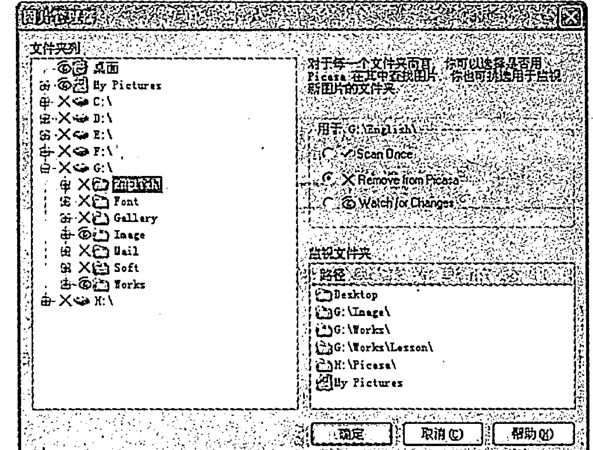

从它的名字就可以看出，这是一款 Google 出品的软件。Google 在万千网友心目中，简直可以说是神圣的。有了 Google 强大的技术后盾，相信 Picasa 一定表现不俗，事实确实如此。第一次运行 Picasa，它会把你的整个硬盘从头到尾梳理一遍，找出所有它能够识别的图片，然后以文件夹为单位列出来（图 3）。你会惊讶地发现，你的硬盘上竟会有这么多你不知道的图片。这其中包括了 Windows 的系统文件夹和各个软件的安装文件夹。这么多的文件夹并不都是我们想要关注的，那就选择菜单命令“工具”→“图片管理器”，在对话框中选择不需要的文件夹，然后在右边选择“Remove from Picasa”（从 Picasa 中删除），这些目录就会从 Picasa 的视野中消失。请放心，它们还在硬盘上，没有真正消失。文件夹的默认选择是“Scan Once”（只检索一遍），我们可以选择“Watch for Changes”（监视变动情况），这样它每次启动时都会检索这些文件夹一遍（图 4）。

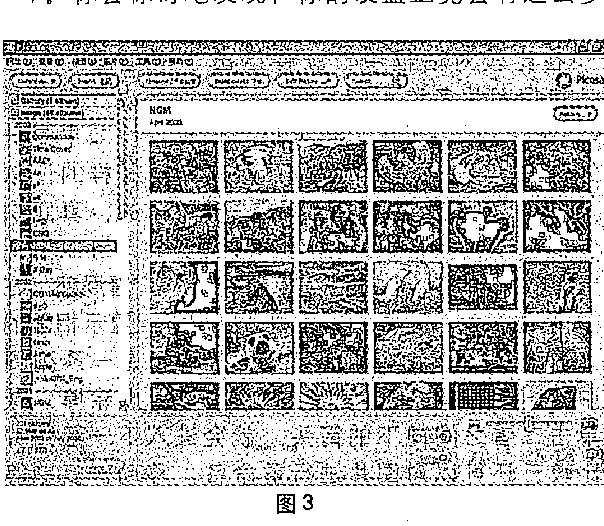

存放有图片的文件夹会有很多，全都排列在窗口左侧浏览起来很不方便。我们可以把它们分成若干个 Album（相册）。选择菜单命令“相册”→“新建相册”，即可建立一个新相册，我们可以为它命名，选择建立日期和添加说明。然后将文件夹拖进相册就是了。Picasa 的搜索功能十分快捷，单击工具栏上的“Search”（搜索）按钮，在搜索栏内输入关键词的时候，搜索即同时进行了，随着输入内容的增加，搜索栏下面的信息也不断变化，左边的相册列表提示我们在哪里可以找到符合搜索条件的图片。怎么样？是不是很方便快捷呢？要知道搜索可是 Google 的看家本领哦。浏览图片时，双击一个缩略图或者选择后单击工具栏上的“Edit Image”按钮，会放大图片，我们可以对它进行简单的编辑，如裁剪、除红眼、调整对比度等。单击工具栏上的“Slideshow”按钮，即进入幻灯播放模式。播放时单击鼠标，可以在下方出现的选项栏上进行手动播放或者设置自动播放的速度，再次单击，继续自动播放，按【Esc】键可返回到浏览状态。默认条件下幻灯播放的图片质量很低，我们可以选择菜单命令“工具”→“选项”，在对话框中选择幻灯片标签，对幻灯片播放进行设置，选中“进行完全分辨率幻灯片”复选框即可采用高分辨率播放（需要较高的电脑配置）。这样一来，“Slideshow”按钮就变成了“Slideshow HQ”（High Quality，即高质量）。Picasa 最有特色的功能是按时间线浏览，单击工具栏上“Timeline”按钮，就进入到按时间浏览状态了。我们可以沿着时间的线索在图片的长河中畅游，十分有趣。

Picasa 还有很多实用的功能，比如自动侦测数码设备，将其中的数码图片复制到硬盘上并纳入管理范围，在硬盘上定位图片，快速打印图片，通过 Email 发送图片，配合另一款软件 Hello 还可以与朋友共享图片等等。由于篇幅所限，就不能一一介绍了，请各位读者在使用中细细体会。值得一提的是，Picasa 的界面、按钮等细节以及状态切换的效果都制作得非常精致漂亮，图片的显示也非常细致，让你在使用的同时得到视觉上的享受。不过美中不足的是，Picasa 对中文支持欠佳，中文的文件名和目录名

### 图片精简专家——ImageDupeless

从各种渠道获得的数码照片逐渐多了起来，很难保证其中没有重复的。在成千上万张令人眼花缭乱的图片中找出重复的来，谁能做到？ImageDupeless就能。有它坐镇，保证你收藏的图片都是独一无二的，如有雷同，绝不可能。

- 软件名称: ImageDupeless
- 软件版本: 1.5.4.2
- 软件网站: http://www.imagedupeless.com/en
- 下载地址: http://www.imagedupeless.com/zip/ImageDupelessEng.zip
- 软件语言: 英文
- 授权形式: 共享软件（免费试用30天）
- 应用平台: Windows 9x/Me/NT/2000/XP/2003
- 软件大小: 2322KB

运行ImageDupeless，可以看到它的界面比较简单（图5）。首先我们需要建立要进行比较的文件夹的索引文件，单击工具栏上左边第四个按钮，在对话框中选择目的文件夹，确定并在下一个对话框中单击“Start”按钮，软件便开始检索这个文件夹，包括下面的子文件夹。检索过程的时间是由图片文件数量的多少和每张图片文件的大小来决定的。取消选择“Show images”复选框，有助于提高检索速度。检索完毕后，单击工具栏上左边第三个按钮，将索引文件保存为后缀名为GLR的文件。而文件夹中的所有图片就列在窗口的右边了。建立图片索引之后，就可以开始比较了。单击工具栏上左边第五个按钮，打开比较对话框，设定比较的差别等级（Level of difference），这个值越高，比较就越模糊，比较范围就越大。建议各位读者先从一个比较低的值开始，逐渐提高，进行几次比较，不让一张克隆图片漏网。单击“Compare”按钮，开始进行比较，这个过程就迅速很多了。比较的结果会在窗口中成组列出，每一组中的若干张图片都是被ImageDupeless认为彼此相似的。我们可以单击图片缩略图左下角的小叉按钮删除它，或者单击缩略图做一个标记，稍后统一删除。如果担心缩略图看不真切，会造成误删除，可单击缩略图之间的眼睛按钮，进行详细查看（图6）。

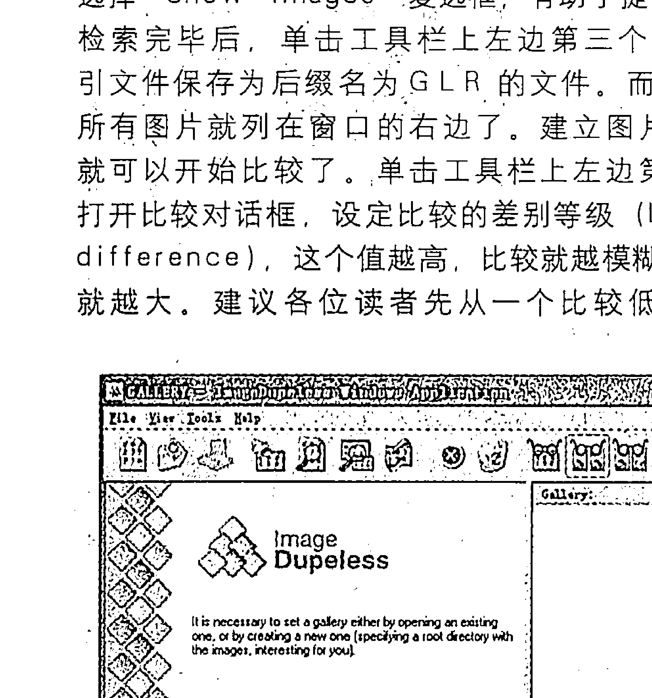

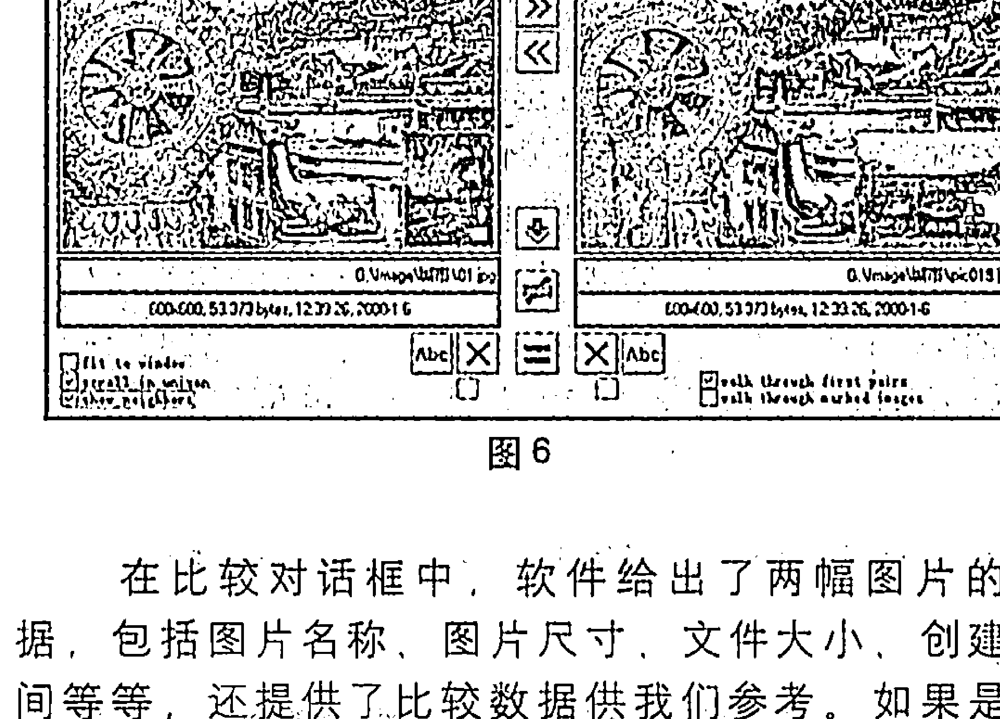

在比较对话框中，软件给出了两幅图片的数据，包括图片名称、图片尺寸、文件大小、创建时间等等，还提供了比较数据供我们参考。如果是一个红色的等号，则说明两幅图片是完全一样的。软件是根据图片中包含的信息来进行比较的，真正决定它们是否相同还得靠我们自己的双眼。可以选择查看缩小的全图，还是在100%比例下查看局部；在100%显示时，是否统一滚动；以及是否显示相邻的图片；这有助于我们了解某张图片是不是一系列图片中的一张。单击图片下方的红叉将其删除掉，或者单击二者之间向下的箭头，就会进入下一组图片的比较。还可以对图片进行重命名、移动、复制等操作。对话框标题栏上的数字提示我们共有多少组相似图片，而现在是第几组。当差别等级提高到一定程度时，软件会出现误判的情况，即并不相似的图片也被认为是相似的。在比较对话框中，单击不等号按钮，即表示它们不是相似的图片，软件即将它们从相似图片组中去除。如果文件夹下的图片发生了变化，在下次比较前，单击工具栏上左边第七个按钮，对索引文件进行更新。更新速度很快，这也是建立索引文件的好处——不用每次比较前都进行检索。

ImageDupeless的不足之处是不能对位于不同目录下的文件夹进行比较，除非它们是同一个文件夹的子文件夹。好在我们一般都会把同类图片放在一处，而不同类的图片之间则不大可能有重复的或相似的。

### 图片转换高手——Easy Graphic Converter

我们都知道，图片文件分为许多种格式，常见的有JPG、GIF、BMP、TIF、PNG等等。很多时候，图片的应用对格式是有严格要求的。如果一张题材和内容都非常适合的图片，却因为格式不对而无法派上用场，岂不可惜？不要紧，有了Easy Graphic Converter，就可以免除你的这种后顾之忧。

- 软件名称: Easy Graphic Converter
- 软件版本: 1.20
- 软件网站: http://www.etruosoft.com
- 下载地址: http://www.etruosoft.com/graphic-converter/graphic-converter.exe
- 软件语言: 英文
- 授权形式: 免费软件
- 应用平台: Windows 9x/Me/NT/2000/XP/2003
- 软件大小: 812KB

安装完毕后，运行Easy Graphic Converter，打开它简洁的工作界面（图7）。单击“Add”按钮，在弹出的菜单中，有添加文件和添加目录两个选项供我们选择。添加文件可以将不同目录下的文件逐个添加到任务中，如果所有图片都位于一个目录中，不妨选择“Add Directory”。在浏览对话框中选择存放图像的文件夹，单击OK按钮之后出现选择图像类型对话框；选择需要转换的图片格式，然后单击“Continue”按钮，该文件夹下的所有符合格式要求的图片文件都被添加到了任务列表中。如果并不想转换列表中全部的图片，选择不需要的那些，单击“Remove”按钮，就将它们从列表中删除了。当然，只是从列表中删除，文件本身还在原来的地方。单击“Clear”按钮则会将列表中的所有文件全部清除。

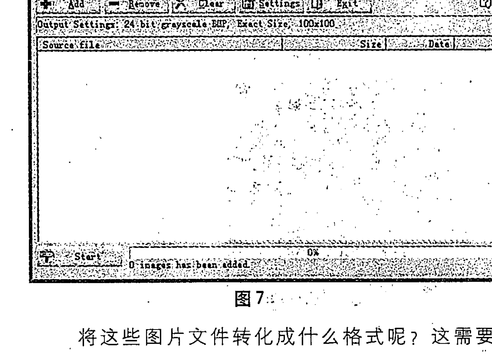

将这些图片文件转化成什么格式呢？这需要进行进一步的设置。单击“Settings”按钮，在弹出的“Settings”对话框中有我们需要的所有设置项目。以最常用的JPG格式为例，在“Output Format”下拉菜单中选择JPEG，对话框即变成JPG格式的设置对话框。“JPG Quality”用来设置JPG图片的质量；选中“Progressive”复选框可以令得到的JPG文件在网页中交错显示；在“Resize Option”选项区中可以选择转换后的JPG图片是否改变大小，还可以设置最适合的背景颜色；在“File Name & Path”选项区中，指定输出目录，为文件添加后缀名，选择如果文件存在的话该如何处理（图8）。设置完毕后，单击“OK”按钮回到软件界面，输出设置将在按钮栏下面有简单的描述。单击“Start”按钮，软件将开始转换，进度条及其下面的文字描述了转换的进度和进行的时间。转换的速度很快，在转换结束后，还可以选择是否生成转换报告。

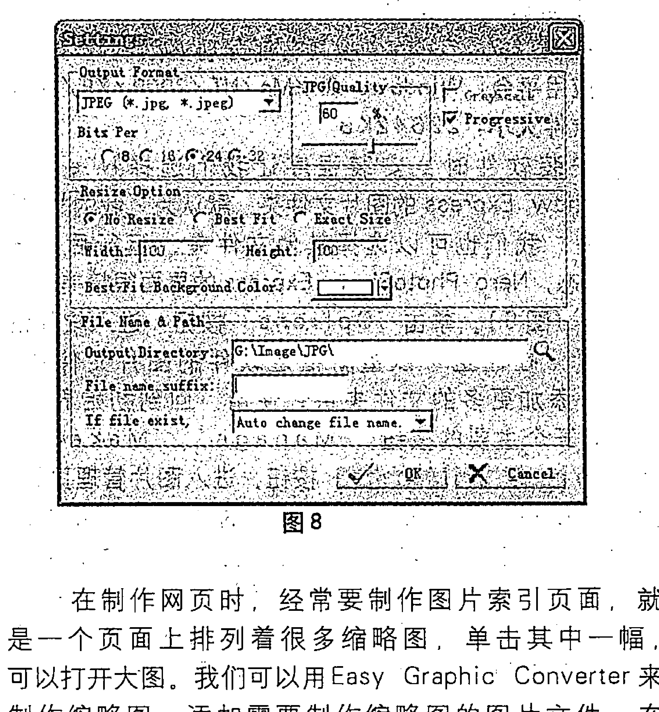

在制作网页时，经常要制作图片索引页面，就是一个页面上排列着很多缩略图，单击其中一幅，可以打开大图。我们可以用Easy Graphic Converter来制作缩略图。添加需要制作缩略图的图片文件，在“Settings”对话框中选择“Output Format”为GIF；将“Resize Option”选择为“Exact Size”，将尺寸改为适合的较小尺寸，比如宽度为80像素，高度为60像素；在“File Name & Path”选项中指定输出目录，为文件名添加诸如“_thumb”之类的后缀名；以示其为缩略图。转换完毕后，软件将生成尺寸为80×60像素的缩略图，文件名后面加上了后缀“_thumb”。速度非常快，而且效果很好。

Easy Graphic Converter支持BMP、JPEG、GIF、TIFF、PSD、PNG、WMF等10余款常见的图片文件格式之间的相互转换。它不仅可以方便快捷地进行格式转换，如果在“Settings”对话框中进行适当设置，还可以用来进行批量改名、批量更改图像尺寸、批量压缩JPG图像等等。与一些庞大的格式转换软件相比，它显得有点弱小，没有那么多花哨的功能，但是它体积小，速度快，还是免费的。而且，图片格式转换功能才是我们真正需要的，不是吗？

### 图片光盘制作大师——Nero PhotoShow Express

Nero PhotoShow Express 是 Ahead 公司出品的光盘制作软件，它与大名鼎鼎光盘刻录软件 Nero Burning Rom 是姊妹软件。不过不同的是，Nero PhotoShow Express 是一款致力于制作图片光盘的软件。

- 软件名称：Nero PhotoShow Express
- 软件版本：1.0.0.62
- 软件网站：http://www.nerophotoshow.com/
- 下载地址：http://www3.skycn.com.cn/soft/18192.html
- 软件语言：英文
- 授权形式：Demo 版（有部分功能限制）
- 应用平台：Windows 9x/Me/NT/2000/XP/2003
- 软件大小：22642KB

安装软件时，安装程序让我们选择 Nero PhotoShow Express 的图片文件夹，默认为 “我的文档” 文件夹，我们也可以选择其他文件夹。运行后处于全屏状态，Nero PhotoShow Express 的界面很精美，也很简洁（图9）。单击 “Options” 按钮，进入软件设置页面，在这里可以重新指定软件的图片文件夹，还可以添加更多的文件夹供它使用。回到初始界面，这里有三个主要的按钮，“Manage”、“Make” 和 “Share”。单击 “Manage” 按钮，进入图片管理页面，我们可以在这里对图片文件夹下的图片和文件夹进行管理。这款软件对中文支持欠佳，中文的文件名和目录名会显示为乱码。将鼠标指针置于目录缩略图上或者图片缩略图上，会出现相应的菜单，我们可以在其中选择各种操作。管理界面简单明了，各种功能一目了然，笔者就不做过多介绍了。单击 “Make” 按钮，进入制作界面，这是笔者要介绍的重点所在。

界面中一共有八类操作供我们选择，不过其中大部分是网上订购的服务，我们关心的是其中的第三项，“Musical Slideshow”。单击进入，在左侧的目录列表中选择一个文件夹，也可以单击 “import photos” 按钮从其他地方导入图片。图片导入后，单击缩略图选择需要的图片，然后单击 “Make Show” 按钮，为我们自己的 Show 起个名字，由于软件不支持中文，因此只能起个英文名字或者使用汉字拼音。Continue，图片载入后，便进入了编辑界面。我们可以在右上方的 “Show Style” 下拉菜单中选择一款默认的风格，有老电影、音乐电视、黑白片等不错的选择。单击右下角的 “Options” 按钮，进入设置页面。在这里，我们可以添加制作人员信息，选择这些信息的出现方式等等。回到编辑界面，点击左下角的 “Edit Show” 按钮，开始制作我们的图片 Show（图10）。我们可以为每一张图片添加转场效果、图片特效、播放速度、背景音乐，还可以向图片中添加卡通小动画和图片说明，并对图片进行简单的修饰等等。但是由于下载到的是软件的 Demo 版本，很多项目只能对第一张图片进行设置，也就是作用于整个图片 Show 的整体设置，而且可供选择的背景音乐和卡通小动画也十分有限。不过可以使用的功能已经足够我们制作一段声情并茂的精彩图片 Show 了。制作完毕后，单击 “Watch Show” 按钮，可以预览一下自己的作品。满意后单击 “Share Show” 按钮，或者界面上方的 “Share” 按钮，进入共享页面中。在左侧选择我们刚刚制作的图片 Show，在右侧选择共享的方式，可以选择刻录成普通 CD 和 VCD。不过目前的版本不支持带有背景音乐的 VCD 刻录，因此要想有色又有声，就选择刻录成数据光盘。单击 “Continue” 按钮，软件会自动搜索刻录机，提示插入光盘，放入光盘后即可开始刻录操作。刻录结束后，我们就可以观看我们亲手制作的图片 Show 光盘了。

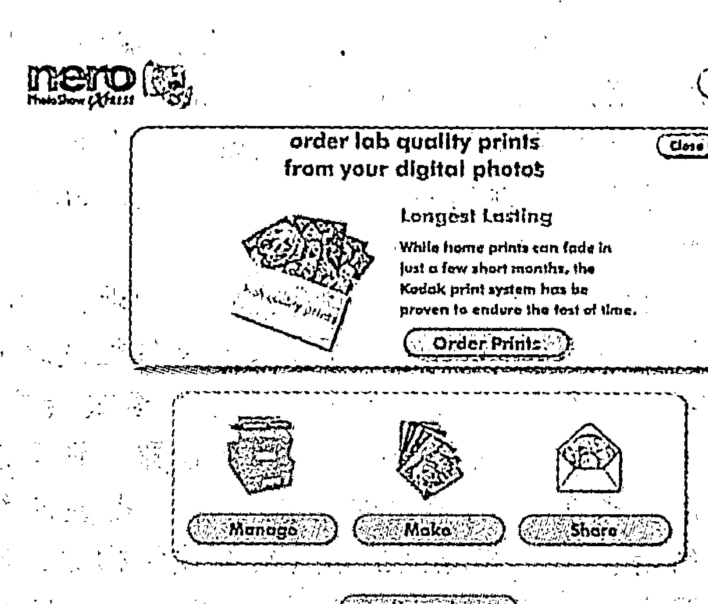

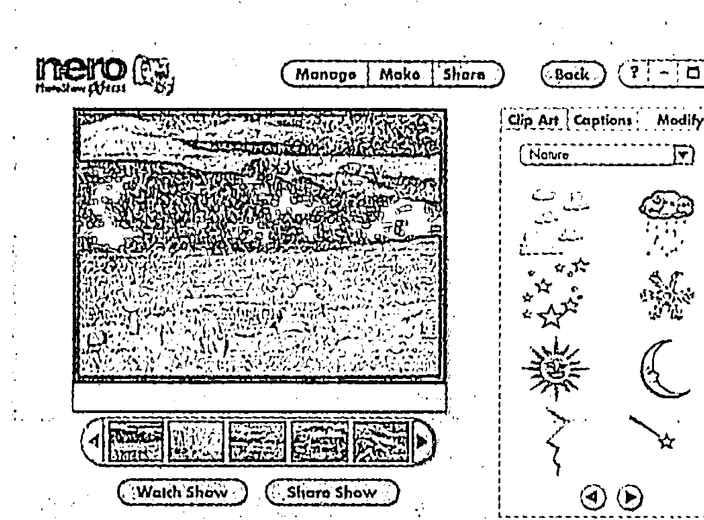

### 图片批处理快手——Batch It!

**软件名称**: Batch It!
**软件版本**: 4.29
**软件网站**: http://www.ablesoft.nu/
**下载地址**: http://www.ablesoft.nu/download/batchit.exe
**软件语言**: 英文
**授权形式**: 共享软件（免费使用21天）
**应用平台**: Windows 9x/Me/NT/2000/XP/2003
**软件大小**: 22 642KB

Batch 是批处理的意思，那么顾名思义，"Batch It!" 就是专门对图片进行批处理操作的软件。安装完毕后，运行Batch It!，可以看到它的界面布局非常清楚，左边是载入控制、处理控制和选项区，中间是控制中心和设置区，右边是预览区，可以对比处理前后图片的效果（图11）。

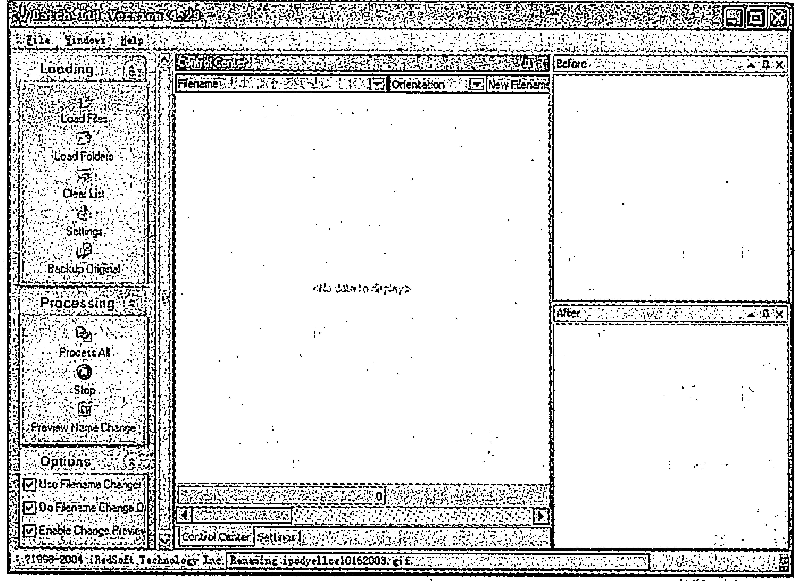

这里我们以图片文件改名为例，介绍软件操作的过程。在"Loading"选项区单击"Load Folders"按钮，在浏览对话框中找到我们要处理的图片所在的文件夹，软件会询问我们是否要包括其下面的所有子文件夹，可以根据需要进行选择。如果图片不在一处，就使用"Load Files"按钮分别载入。然后，载入的图片在"Control Center"中列出，下面的状态栏显示出文件的总数。拖动滚动条，可以查看列出的文件名、文件路径、排列顺序、创建时间等属性。单击每种属性栏目头右侧的按钮，可以选择针对该属性的过滤器，选择"Custom"还可以进行详细设置。这样，我们就可以滤去不符合条件的图片，只留下我们真正需要的。在"Options"选项区，选中"Use Filename Changer"复选框，允许文件更名；由于我们只想为文件改名，不妨选中"Do Filename Change Only"复选框；再选中"Enable Change Preview"复选框，允许对变化进行预览。

在中间部分的下边，单击"Settings"标签，切换到设置区，我们在这里进行详细的设置。在"Filename Changer Properties"部分，设置重命名后文件的前缀名(Prefix)、后缀名(Suffix)、开始数字(Start Number)、是否每次都重新计数(Restart Number at each run)、数字位数(Number of Digits)、文件名大小写(Case Option)、只添加前缀和后缀(Add Prefix Suffix Only)、保留原始文件/日期标志(Retain Original File/Date Stamp)、覆盖原文件(Overwrite Files)，根据需要进行设置。在"Files Properties"部分，可以指定重命名后文件的存放文件夹(Target Directory/Folder)，选择是否保持原始的文件夹结构(Keep Sub-directory Structure)。切换回"Control Center"，在左侧的"Processing"选项区中单击"Preview Name Change"按钮，可以在"New Filename"栏目对重命名后的新文件名进行预览。确认无误后，在"Processing"区中单击"Process All"按钮，操作很快完成。现在我们就可以在刚才指定的目录下找到重命名后的文件了。在"Filename Changer Properties"部分选择覆盖原文件，就可以直接对原文件进行重命名，选择保留原始文件/日期标志则会保留原文件的日期信息。

"Batch It!"的能耐可不仅止于重命名，使用它还可以更改图片尺寸、改变图片压缩质量、旋转图片、调整亮度对比度、添加特殊效果、添加文字标题、制作图像水印等等。这些都可以在"Settings"标签中进行设置，不过别忘了取消选择"Options"选项区中的"Do Filename Change Only"复选框。提示大家一点，很多项目的选择中都有一个项目是"As Is"，就是保持原样不变的意思。相信各位经过一番使用，一定会被Batch It!强大的批处理功能所折服。

七种武器已经一一展示在各位面前了。这七款软件，各具特色，各领风骚，几乎涵盖了个人数码照片管理的方方面面。各位用户尽可以根据实际情况各取所需。

# 数码照片巧处理
——十款图像处理辅助软件

文/奇士

一提到图像处理，人们往往首先想到的就是Photoshop、PhotoImpact这些功能强大、体积剽悍的大型软件。由于这些软件过于专业，不仅占用硬盘空间资源消耗巨大，使用起来还需要掌握许多知识和技巧。其实，对于日常生活中多数图像处理过程，根本用不到太复杂、专业的功能。我们需要的，只是图片更漂亮一点，操作再简单一点，过程再傻瓜化一点就可以了。

本文列出的十款软件都是体积小巧却功夫了得的高手，更难得的是它们都是共享软件甚至完全免费的，最重要的是它们全都简单易用。下面就让我们来一同领略一下它们的风采。

## 一、Turbo Photo

- 软件名称: Turbo Photo
- 软件版本: 3.9
- 软件网站: http://www.stepok.com/chs/index.htm
- 下载地址: http://www.stepok.com/chs/dl/TPSetupCHS.exe
- 软件语言: 简体中文
- 授权形式: 共享软件（免费试用31天）
- 应用平台: Windows 9x/Me/NT/2000/XP/2003
- 软件大小: 4,431KB

软件界面: 如图1

Turbo Photo是一款优秀的国产软件，它的定位非常清晰，就是针对数码照片的处理。数码相机日益普及，但并不是每个数码相机用户都能使用专业的图像处理软件对照片进行编辑和加工。Turbo Photo则面向各个层次的用户，它界面简洁、操作简单，第一次使用也不会感到摸不着头脑。在具备了很好的易用性的同时，它的功能也丝毫不弱。常用的数码照片处理，如旋转与裁剪、曝光调整；高端的专业修图，如色彩调整、增强与特效；网络功能的扩展，包括在线论坛和资源下载等各个方面，Turbo Photo做得都非常成功。

Turbo Photo的操作过程非常人性化，从打开文件开始就处处贴近用户的需要。在“打开文件”对话框中，单击选择一个图片文件，左侧会显示出其简要的信息，帮助我们迅速找到需要的图片。还可以切换到传统文件对话框，使用Windows系统的“文件浏览”对话框。打开一张图片后，会进入向导中心，在“照片门诊部”标签页内列出了11种数码照片最常见的问题。有趣的是，它们都是以问题照片的形式列出的，当我们将鼠标指针置于其上时，照片就变成了调整后的样子，让我们对于调整的效果有一个直观的认识。单击其中一幅，就进入了相应的调整功能。有的调整项目，如校正偏色，还提供了不止一种方法，我们可以选择更适合自己的方法。在“向导中心”对话框中，切换到“其他有趣功能”标签页，这里列出了更多更高级的应用。

关闭向导中心，进入软件界面。界面布局很直观，左侧是功能列表，可以在这里选择需要的操作，中间是图像预览区，可以观察调整的结果；右侧是导航图和操作列表，用来快速定位到图像的某一局部和恢复操作步骤。在功能列表中单击某个项目，仅打开相应功能的操作向导对话框。而如果单击项目右侧的箭头，就会出现具体的操作列表菜单，选择一个就会打开相应操作的对话框。Turbo Photo的每项功能、各种操作都十分专业，调整效果令人十分满意。

除了上面提到的这些，Turbo Photo还有几手自己的绝活。比如我们可以随心所欲地编辑EXIF信息。

EXIF 是 Exchangeable Image File（可交换图像文件）的缩写，它是内嵌在 JPG 图像文件中的一组拍摄参数，包括相机的品牌和型号、色彩编码，以及摄影时的光圈、快门、ISO、日期时间等数据信息。菜单命令“图像”→“编辑 / 添加 EXIF 信息”允许我们自由添加、修改、删除数码相片的各项 EXIF 标记，添加自己的版权声明和个人信息。利用此项功能，还可以让普通照片也拥有 EXIF 信息。再比如超强缩放技术，在调整图像尺寸时，算法选择超强缩放，再单击“高级”按钮，就进入了超强缩放的设置（如图 2）。Turbo Photo 的超强缩放技术无论是放大还是缩小图像，均能很好地保持图像的细节和锐度从而得到非常好的效果。这一点在放大图像时尤为明显，使用超强缩放技术放大的图像能够在保持图像锐利的同时保留图像中的细节，可以用于印刷和大幅面输出。

有了这么多方便、实用的功能，相信 Turbo Photo 一定能够满足各位读者不同方面的需求。有了它在电脑中坐镇，相信什么样的数码照片处理都不会令我们为难了。

## 二、友锋图像处理系统

- 软件名称: 友锋图像处理系统
- 软件版本: 3.5
- 软件网站: http://www.jinfengsoft.net/
- 下载地址: http://www.jinfengsoft.net/soft/yfimage/yfimage.exe
- 软件语言: 简体中文
- 授权形式: 共享软件（免费试用 30 天）
- 应用平台: Windows 9x/Me/NT/2000/XP/2003
- 软件大小: 3,007KB

软件界面: 如图 3

“友锋图像处理系统”原名“金锋图像处理系统”，从 3.5 版本开始使用了新名字。这是一款功能强大的图像处理软件，用户可以用它进行照片处理、图像编辑、添加图像特效、平滑缩放以及打印输出等等。它的操作界面跟 Photoshop 等专业的图像处理软件很相似，包括菜单栏、工具栏、选项栏、工具箱、功能调板等部分。熟悉 Photoshop 的朋友对它的操作一定不会感到陌生，即便是没有图像处理软件使用经验的人也会很容易上手。

安装后的“友锋图像处理系统”只占据 5MB 左右的硬盘空间，拥有这么小的体积，它却提供了专业图像处理软件的主要功能。比如对图像尺寸和角度的调整，对图像色彩的调整，选区的制作和编辑，以及很多实用的特效滤镜。它还支持图层功能，每幅图像最多可建立 255 个图层，完全能够满足大多数情况下的需要。支持图层蒙版和边框，自带多款预置的蒙版和边框样式，供使用者方便快速的使用。

“友锋图像处理系统”可以直接从扫描仪、数码相机等数码设备中获取图像、数码照片。它拥有自己的图像格式 YFL，可以保留图层、蒙版等信息，便于下次继续编辑和修改。支持 30 多种图像格式的读取，可以保存为 JPG、BMP、GIF 等常用的图像格式，并可通过插件扩充对更多图像格式进行编辑。内置的屏幕捕获功能，让我们可以抓取整个屏幕或者窗口，并导入软件进行编辑。

更可贵的是，“友锋图像处理系统”可以通过下载效果插件、蒙版图片、画笔风格等实现素材的扩充。它的官方网站提供下载，网址为：http://www.youfengsoft.net/yfimage/download/index.html

## 三、PhoXo

- 软件名称: PhoXo
- 软件版本: 1.5
- 软件网站: http://www.crazy-bit.com/
- 下载地址: http://www.skycn.com/soft/14451.html
- 软件语言: 简体中文
- 授权形式: 免费软件（未注册版本每次启动会出现提示框）
- 应用平台: Windows 9x/Me/NT/2000/XP/2003
- 软件大小: 13,300KB

软件界面: 如图4

PhoXo是一款体积小巧但功能不凡的32位图像处理软件，它能够完成很多只有专业图像处理软件才能完成的任务。软件的界面很清爽，图标制作得很漂亮，可见作者在美工方面是颇下了一番功夫的。

选择一个工具后，在界面的下方会出现这个工具的参数设置栏。设置栏的左侧有一个图标，当鼠标指针置于其上时，会显示当前工具的介绍和技巧提示，这个设计非常人性化。PhoXo拥有多款选择工具，甚至还有魔术棒工具，这让我们可以通过多种途径选择目的区域。支持最多99步撤销操作，默认为20步，这个数值可以在菜单命令“编辑”→“参数设置”中修改。它支持图层，内置多款特效滤镜，除了在其他图像处理软件中常见的之外，还拥有独具特色的几款，如信号干扰滤镜和百叶窗滤镜。该软件支持BMP、JPG、GIF、TGA、PCX、TIF、PNG等图像格式的读写，还具有自己的支持多图层的文件格式OXO。保存文件时，PhoXo允许我们选择图像的色彩深度，如果选择JPG格式，还能调整压缩质量，非常方便。

喜欢基于IE内核的多页面浏览器的朋友一定知道Sleipnir。这款名为PictBear的图像处理软件与Sleipnir出自同一批开发人员之手，并且具有与后者一样的特点，那就是体积小、速度快、功能强。

PictBear被誉为简化版的Photoshop，是一款绿色软件；下载得到的压缩包解压后即可直接运行，体积只有不到5MB。运行软件，我们看到PictBear的界面的确很像Photoshop。它默认的界面风格是Office 2003风格的，我们可通过菜单命令“View”→“Option”来改变界面风格。而且PictBear支持换肤，选择菜单命令“View”→“Customize”，在自定义对话框中，切换到“Options”标签页，单击“Visualizations”按钮，在弹出的对话框中可以选择你喜欢的皮肤，还可以下载更多的皮肤。

PhoXo还附带了很多精心制作的素材。其中包括一些很漂亮也很实用的卡通图片，位于软件安装目录下的素材库文件夹中，这些图片比较适合用于制作数码照片相册和网络应用。还有一些纹理素材，位于软件安装目录下的texture文件夹中。这些素材的存在就是PhoXo的体积比前两个软件要大的原因。有了PhoXo不同凡响的功能和这么丰富的素材，我们一定可以制作出精美的图像作品来。

当然，选择PictBear绝不仅仅是因为它有着漂亮的界面，更是因为它的功能的确十分强悍。一般的图像处理功能，比如常用的图像调整命令，图层操作，蒙版操作，滤镜特效等等，它都具有。它不仅支持图层，还支持多种图层混合模式，这一特性使我们可以通过调整混合模式来实现复杂多样的图像效果。PictBear还支持脚本(Scripts)，包括JavaScript和VBScript，熟悉脚本编程的使用者可以自行编写操作脚本，使图像处理过程变得自动化。其自带的脚本可以大大提高我们的工作效率。值得一提的是，PictBear有很多快捷键，它们多数与Photoshop的快捷键相同，而且可以通过菜单命令“View”→“Customize”来自定义。

## 四、PictBear SE

- 软件名称: PictBear Second Edition
- 软件版本: 2.0 RC5
- 软件网站: http://sleipnir.pos.to/
- 下载地址: http://crc.onlinedown.net/down/pbse200rc3.zip
- 软件语言: 英文
- 授权形式: 免费软件
- 应用平台: Windows 9x/Me/NT/2000/XP/2003
- 软件大小: 13,300KB
- 软件界面: 如图5

## 五、FxFoto

- 软件名称: FxFoto
- 软件版本: 2.1.044
- 软件网站: http://www.fxfoto.com/
- 下载地址: http://www.fxfoto.com/download/FxFotoSetup.exe
- 软件语言: 英文
- 授权形式: 免费软件（标准版）
- 应用平台: Windows 9x/Me/NT/2000/XP/2003
- 软件大小: 1,840KB

软件界面: 如图6

FxFoto 是一个比较有特色的软件，这从它界面上的与众不同就可见一斑。事实上，FxFoto 是一款集图像处理、管理和幻灯片制作于一身的多功能软件。在安装软件的时候，安装程序就询问是否要扫描硬盘上的图片，如果选择是，FxFoto 会建立自己的图片库 (College)，日后我们可以通过 FxFoto 对图片库进行管理和各种操作，比如将图片库制成网页、刻录成光盘等等。而说到图像处理功能，FxFoto 也绝不是个等闲之辈。

对图像的处理功能主要集中在界面上方中部区域。该区域上面有 8 个按钮，其中前面 5 个是图像处理方面的，分别是图像修饰 (Correct)、裁剪 (Crop)、边框 (Frame)、文字 (Text)和绘画 (Draw)；而后面 3 个是幻灯片制作方面的，分别是幻灯播放 (Slide)、信息 (Info)和鼠标操作 (Mouse)。单击一个按钮，就进入了该项功能区，下面列出了各种操作。以图像修饰为例，该项功能下面还有 7 个标签页之多，每个标签页下面都包含数个命令。乍看起来，会觉得过于复杂，而且界面是英文的，看起来很是吃力。其实，命令多，这也正说明其功能强大，选项多，留给我们的发挥空间就大。

界面右上方是控制幻灯片播放的操作区。FxFoto 制作幻灯片的功能实在不弱，图像处理与幻灯片制作结合起来，就显出了 FxFoto 的最大亮点。它可以打开一系列图片，分别对每幅图片进行修饰和播放控制，最后制作出专业水准的幻灯片。相比之下，很多幻灯片制作软件就显得太小儿科了。在图像保存对话框中，FxFoto 也提供了多个选项，可以以多种形式保存图像。它还可以快速从数码设备中导入图片，可以精确查找图片，可以 E-mail 图片文件或者将其打印出来。总的来说，FxFoto 绝对是一款令你值得花时间好好研究一番的软件，有了它的帮助，定会让你的图片收藏乐趣无穷。

## 六、幻影2004

- 软件名称: 幻影2004
- 软件版本: 4.9
- 软件网站: http://www.bravetech.com/
- 下载地址: http://www.bravetech.com/download/hysetup.exe
- 软件语言: 简体中文
- 授权形式: 共享软件（未注册版本有功能限制）
- 应用平台: Windows 9x/Me/NT/2000/XP/2003
- 软件大小: 13,977KB

软件界面: 如图7

幻影2004 是一款图像合成软件，对于没有图像处理经验的朋友来说，这个软件提供了很多简单直观的命令和模板，可以很容易地获得相当不错的图像合成效果。这款软件的界面很可爱，也很简单，没有菜单，没有选项栏，只有三个调板围绕着图像显示区域。上方的调板是功能调板，单击左边三个按钮：对象、旋转、颜色调节中的一个，左侧的调板就会变成相应的操作选项。而功能调板右边的三个按钮：铅笔效果、负片效果和油画效果是特效按钮，单击其中一个，会使选定的图像产生相应的效果，每单击一次，效果就会更强烈一点。右侧的调板则是一些基本操作，相当于菜单的作用。

单击“加载”按钮打开一张图片，在上方的功能调板上单击“对象”按钮，然后在左侧出现的“对象”调板中单击“轮廓”按钮，在弹出的“轮廓选择”对话框中双击为图像选择一个合适的轮廓。再单击“背景”按钮，为图像选择一个漂亮的背景。再单击“小可爱”按钮，向图像中添加一个可爱的卡通形象。最后单击“文字”按钮，为图像添加适当的文字标题。很快地，我们就得到了一个图像合成的作品。

用“幻影2004”制作贺卡、插图和婚纱摄影是再合适不过了。如果你不想学习太多的图像处理技术，又想轻松制作出图像合成作品，就选择“幻影2004”吧。

## 七、Image Optimizer Professional

- 软件名称: Image Optimizer Professional
- 软件版本: 4.00
- 软件网站: http://www.xat.com/
- 下载地址: http://www.xatech.com/xatio.exe
- 软件语言: 英文
- 汉化补丁: http://www2.skycn.com/soft/2312.html
- 授权形式: 共享软件 (未注册版本有功能限制)
- 应用平台: Windows 9x/Me/NT/2000/XP/2003
- 软件大小: 1,041KB

软件界面: 如图8

Image Optimizer是专职负责压缩、优化图像文件的软件。它支持JPEG、GIF、PNG、BMP、TIFF等常见的图像格式，可以在不影响图像品质的前提下，大幅度减少图像文件的体积，使图像文件得到优化，这样我们可以节省大量硬盘空间。而在制作网页时，Image Optimizer还可以成为我们提高网页访问效率的好帮手。

一般来说，图像处理软件都提供图像压缩和优化的功能，但是效果往往并不能令人满意。因为这些软件对于图像的优化是针对整幅图像的。而Image Optimizer利用MagiCompress压缩技术对图像进行优化，并且针对不同区域采取不同的优化策略。以JPG格式的图像为例，对于颜色较多、细节丰富的部分应该降低压缩比例，而对于大片的纯色区域，则可以进行较大幅度的压缩。正是这样，Image Optimizer在最大程度上实现了图像的最优化。

Image Optimizer的主要功能都集中在界面左侧的工具栏上。以拳头形状的图标为界，上边的工具是一般的图像调整功能，比如图像增强、颜色校正、图像清洁等等，选择其中一个，选项调板的内容会切换到相应的功能。拳头图标是压缩图像工具，单击它，就会弹出一个新的图像窗口，内容是压缩后的图像。在压缩图像选项调板上，右下角的两个按钮中上面的那个，即全部图像工作范围按钮处于激活状态。按下下面那个工作范围按钮，又会弹出局部压缩图像窗口。在这个图像窗口中，下面的几个工具就处于可用状态了。选择图像中的一部分，在压缩图像选项调板上针对这一部分改变压缩参数。我们可以对比几个图像窗口中的图像品质，获知优化的效果。满意后，即可将优化结果保存起来。

另外，Image Optimizer带有批处理向导（Batch Wizard），引导我们一次将大量的图像文件快速优化。使用了Image Optimizer之后，我们的图像文件都会变得“苗条”许多。

## 八、PhotoZoom Pro

- 软件名称: Shortcut PhotoZoom Pro
- 软件版本: 1.095
- 软件网站: http://www.shortcut.nl/
- 下载地址: http://www.trulyphotomagic.com/shortcut/site/content.php?page=downloads
- 软件语言: 英文
- 授权形式: 共享软件 (未注册版本有功能限制)
- 应用平台: Windows 9x/Me/NT/2000/XP/2003
- 软件大小: 1,365KB

软件界面: 如图9

在处理一幅图像时，最经常进行的操作恐怕要软件语言：英文
- 授权形式：共享软件
- 应用平台：Windows 9x/Me/NT/2000/XP/2003
- 软件大小：3.124KB
- 软件界面：如图10

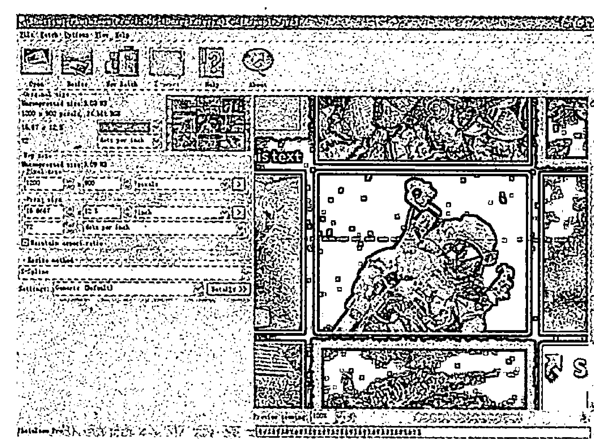

数调整图像大小了。如果是缩小图像还好说，可要是扩大图像就很难保证扩大后的图像质量了。因为凭空增加了很多像素，软件需要通过某种算法用原有的像素来模拟多出来的像素。这时，算法的选择就很重要了。PhotoZoom使用新颖的算法，使得通过它扩大后的图像品质要明显高于其他图像处理软件得到的结果。

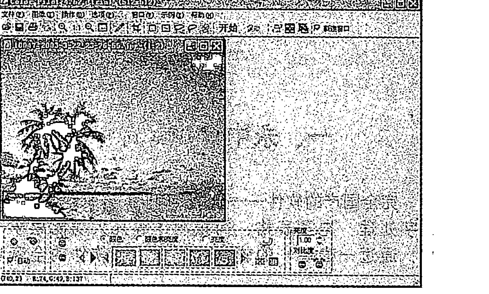

PhotoZoom就是原来非常著名的S-Spline，现在它换了新名字，重出江湖，功夫也高深了不少。它操作起来非常简单，打开一幅需要调整尺寸的图像，窗口右侧是图像的预览，左侧是调整尺寸的各个选项。“Original Size”区域提供了原始图像的大小、分辨率、打印尺寸等信息。在“New Size”区域填入需要调整到的尺寸，右侧的预览图便自动刷新，显示出调整大小后的效果。在下面的“Resize Method”下拉菜单中可以选择调整图像大小使用的算法，默认的是最优的S-Spline算法，正是这种算法使PhotoZoom表现优异。在“Settings”下拉菜单中可以选择被调整的图像属于哪种类型，软件将有针对性地进行优化。单击“Details”按钮，将展开详细设置，我们可以自定义参数，以得到最适合当前图像的优化设置。

这也是一款很具特色的小软件。它不具备一般的图像处理功能，而是专门负责调整图像的颜色。调整颜色是一项非常复杂的任务，如果用Photoshop这种专业的处理软件来调整的话，需要对色彩模式、色阶、颜色通道等专门知识有一定的认识，同时在调整的过程中还需要有相当丰富的经验和技巧。对于大多数并不具备这些条件的人来说，这样的门槛实在是高了些。Color Pilot就是将调整图像色彩的操作变得简单、简单、再简单，我们只需要知道自己想要什么样的结果就可以了，而不必了解为什么会这样和怎样成为这样的。

Pro（增强）版本提供了批处理功能，允许我们使用同样的设置对一批图像进行同样的调整大小操作，在大量进行此类工作时非常有用。读者朋友可以使用PhotoZoom和其他图像处理软件分别调整同一幅图像的大小，对比一下结果，相信各位会有自己的判断和选择。

## 九、Color Pilot

Color Pilot的操作很简单。打开一幅需要调整颜色的图像。比如说我们对图像中的草地颜色不满意，想要把它变得更加明亮鲜艳一些，可在窗口下方按下相对颜色按钮，在图像中的草地上画出一个矩形区域，然后在下方的选项区选择颜色和亮度，在软件提供的几种草地颜色中选择一种，然后在工具栏上单击“开始”按钮，经过短暂的自动操作，一个新的图像窗口出现了，新的图像中草地的颜色和亮度已经按照样本进行了修正，现在图像看起来颜色饱满，亮度适中，感觉真是不错。如果样本中没有我们需要的颜色，我们可以自己制作样本。打开一幅照片，按下相对颜色按钮，在图像中画出一个矩形区域，然后在选项区按下那个转弯的箭头按钮，将矩形区域内的颜色定义为样本。接下来再使用与刚才同样的方法进行操作，修改其他图像的颜色。

- 软件名称：Color Pilot
- 软件版本：4.62
- 软件网站：http://www.colorpilot.com/
- 下载地址：http://www.colorpilot.com/load/pilot.exe

Color Pilot的颜色调整功能可不止于此，要想了解更多，可以观看“示例”菜单下的15个示例。它们通过动态演示向我们介绍软件的功能和操作方法；每种操作都很简单，只需要几步而已。
作为一款颜色调整软件，Color Pilot直观、简单，可以处理不同的数据对象。不仅可以轻松读取Excel, Word, PowerPoint文件, 而且可以把原来微软不同类型的文件(如*.ppt, *.xls, *.doc等)统一保存为扩展名为EIO的文件, 同时通过系统提供的文件转换器, 还可以转存为Excel, Word和PowerPoint文件, 完全兼容微软Office文档, 也同时支持存取HTML和XML格式文件。

## 永中 Office，一网打尽办公生活

### 一、永中 Office 简介

完全国产的软件——永中 Office，另辟蹊径，将文字处理、电子表格、简报制作等几大功能集于一身，通过一套单一的软件，实现多个软件的全套功能。

永中 Office 采用 JAVA 语言编码，在所有支持 JAVA 虚拟机的操作系统上均可运行，可以运行在 Windows 95/98/ME/NT/2000/XP 及 Linux，Solaris，Unix 等系统上，是一款跨操作系统平台的软件。永中 Office 开发了跟微软 OLE 技术完全不同的数据链接方式，各种数据在永中 Office 的各个应用功能中能自动的把相关数据链接起来，使各个功能模块不再是孤立的，而是一个完整的整体。

永中 Office 具备文字处理（Word）、电子表格（Excel）和简报制作（PowerPoint）三大功能，并提供多媒体浏览、图片浏览和网页转换等功能。使用永中 Office，用户可以轻松地在同一个界面下同时处理不同的数据对象。不仅可以轻松读取Excel, Word, PowerPoint文件, 而且可以把原来微软不同类型的文件(如*.ppt, *.xls, *.doc等)统一保存为扩展名为EIO的文件, 同时通过系统提供的文件转换器, 还可以转存为Excel, Word和PowerPoint文件, 完全兼容微软Office文档, 也同时支持存取HTML和XML格式文件。

永中Office表现出与微软Office优良的兼容性, 例如, 可以在Linux中使用它来转换文档, 以便他人使用微软Office打开。永中Office实现了使用一套菜单命令, 一套对话框, 一套快捷键, 一套宏(Macro), 一套图标及一套自选图形的标准用户界面, 无论是在Linux平台还是Windows平台, 从里到外乃至操作和使用习惯都与微软Office保持了高度一致。

永中Office不仅可以满足一般用户的办公需求, 也可以满足在办公应用方面有特殊需求的商业用户。像永中Office采用电子表格作为数据对象储藏库, 使Office成为一个多媒体Office, 通过永中Office, 用户能够迅速在电子表格中处理文字、数字、声音、影像、图片和动画等对象。永中Office的出现, 改变了以往电子表格软件只能处理数字及文字处理软件只能处理文字的局面。

永中Office所有功能中最重要的就是数据集成, 它彻底解决了微软Office因为使用OLE技术来实现集成应用而产生的读档慢、存盘慢、更新慢, 有时候会产生数据不一致的致命错误等问题。譬如, 电子表格预算中的一个数字的改变可能使文字处理的商业计划中数十个引用数字也需作相应的修改, 如不能链接, 进行自动、即时和正确的修改, 那用户可能要花很长时间在浩瀚如烟的商业计划书中找出这些数字, 并将它们一一校对并加以修改。而永中Office通过粘贴链接(Paste Link)、区域链接(如图1)、粘贴交叉引用、数据链接等数据集成技术彻底改变了这一现状, 只需一秒钟就可帮助用户顺利完成修改工作。

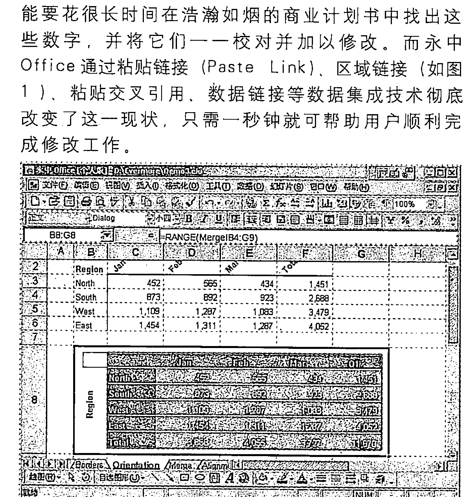

## 二、永中 Office 办公六组合解析

### 1. 文字处理 有声有色

文字处理 (Word Processor) 特别适用于一般办公人员, 它具有文字输入、编辑、排版和打印等基本功能, 你还可以在文档中加入动画、声音或电影等元件 (图 2)。


由于永中 Office 实现了文字处理与其他应用的无缝链接, 在进行文字处理时, 可以很方便地获取其他应用中的各种数据, 如文本、数字、图表、图片等。同时利用其自带的各种模版, 用户也方便地创建和编辑专业文档, 如传真、信件、简历、合同、公文和商业计划书等。同时可以在文档中设置书签和插入超链接。

此外, 永中 Office 尤其值得一提的是具有邮件合并功能, 用户可以从电子表格中任意位置选取数据, 作为邮件合并的数据源, 在文字处理中插入邮件合并字段并编辑, 可以合并到文档或打印机。并且还提供稿纸、信笺的编辑和打印功能, 满足中国人特有的写作需求。

在永中 Office 中的邮件合并功能简单方便, 例如要批量打印贺卡和信封, 具体操作步骤如下:

首先, 建立贺卡文档。贺卡文档包括所有贺卡的通用信息, 其中姓名、性别等因人而异的信息暂不填写 (图 3)。

其次从电子表格中导入数据源, 在电子表格应用中建立姓名、性别等数据。这些数据即是前面提到的不通用信息。

然后, 在文字应用界面下选择 “工具” → “信件和邮件” → “邮件合并”命令，弹出“邮件合并”对话框。点击其中“选择单元格区域”中的折叠图标切换到电子表格应用界面中。选中包含所有要引用的地址的单元格区域（包含表头）后点击扩展图标，返回文字处理应用界面，这时出现“邮件合并”工具栏，用来插入地址域。

在插入地址域时，要点击贺卡文档的“自称呼”处，在“邮件合并”工具栏上点击“插入合并域”按钮，从其下拉列表中选择“姓名”一项（下拉列表中的内容即是电子表格数据区域表头的内容）。重复上述步骤，在“姓名”域后插入“性别”域。

信封的整个制作过程与贺卡差不多，所不同的是永中Office本身自带一系列信封模板，点击“工具”→“信件和邮件”→“信函模板”命令，在弹出的“信封信函”对话框中打开信封模板并选择自己将要使用的信封型号。点击“确定”按钮，信封即显示在屏幕上。

另外，永中 Office 的电子表格所提供的商业绘图工具，自动绘图工具和特有的分配应用，时间序列应用等功能，可以使电子表格的数据处理功能更加完善。由于可以直接打开网页并获取网页上的数据、文本、图片等，能够制作出图文并茂的电子表格。同时，永中 Office 的电子表格还提供了多种模板，使初学者可以更快地熟悉和使用。

### 3. 简报制作 品貌出众

使用永中 Office 的简报制作，可以很容易地创建幻灯片，并在幻灯片上输入文字、添加表格、自选图形、艺术字和插入图片等，并为这些对象设置丰富的动画效果，从而创建出形象生动、图文并茂、主次分明的简报（图5）。

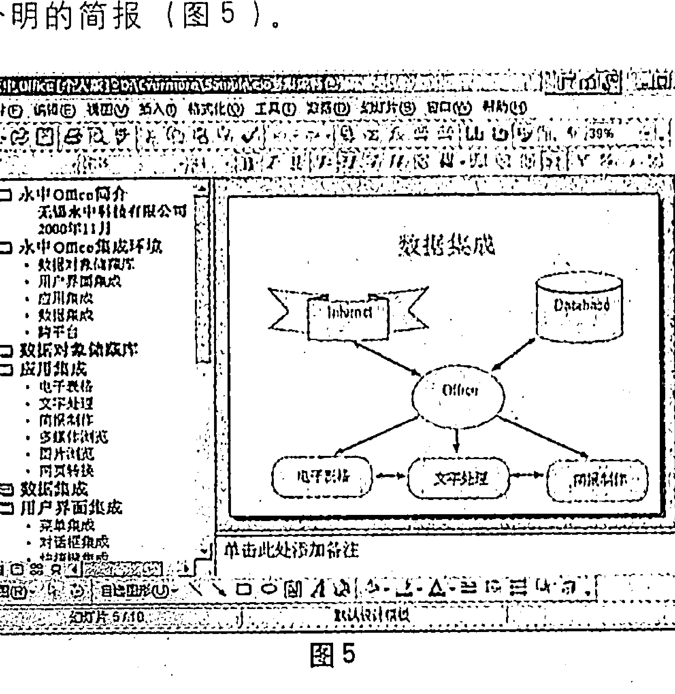

在简报制作过程中，可以很容易地共享永中 Office 的其他应用，这样就可以随心所欲地从文字处理导入段落文本，或从电子表格导入电子表格及工作图表等。简报制作还允许用户随心所欲地设计各种形式的艺术字体，从而设计出效果非常好的演示幻灯片。幻灯片所用数据非常丰富，像文本、数字、电子表格中的单元格区域、文字处理中的段落、商业图表、图片、声音、电影等都可以应用。

### 4. 多媒体播放 活色生香

你可以在永中 Office 的电子表格单元格内插入 MP3 音乐。永中 Office 储存 URL 地址而不是音乐本身，你可以按任何顺序组织播放所有 MP3 音乐或其他格式的声音甚至电影，永中 Office 就会开始依次播放同一列中所有音乐。

由于永中 Office 用电子表格作为数据对象储藏库，可将声音或电影文件作为数据对象储存在其单元格中，供用户选择播放，所以用户可将永中 Office 作为多媒体播放器使用，让 Office 成为多媒体的 Office，从而将应用领域无限地扩大。使用这套软件，你会觉得没有什么不可以实现，只有自己的想象才是使用它的惟一界限。

### 2. 电子表格 漂漂亮亮

永中 Office 的电子表格除用于输入输出、显示数据外，还可以帮助用户制作各种复杂的电子表格文档（图4），进行繁琐的数据计算，并能对输入的数据进行各种复杂统计运算后显示为可视性极佳的表格，同时它还能形象地将大量枯燥无味的数据变为多种漂亮的彩色商业图表显示出来，极大增强了数据的可视性。

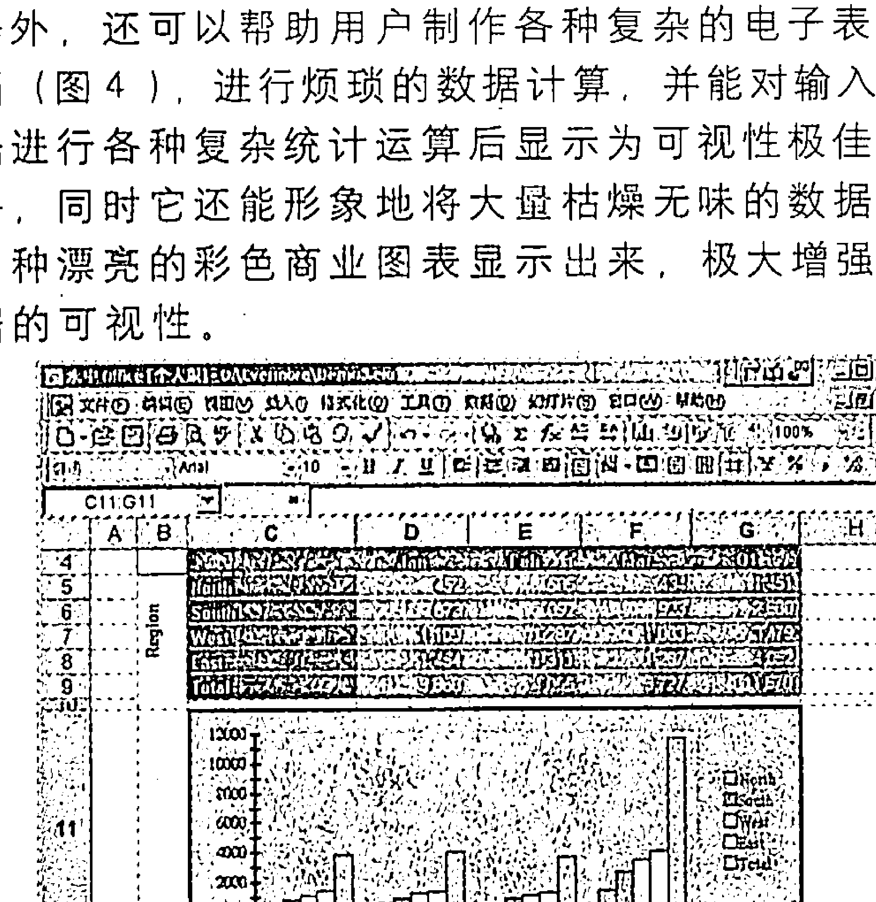

### 5. 图片浏览 自在逍遥

永中Office电子表格作为一个数据对象储藏库，可将图片作为数据对象储存在其单元格中，供用户浏览。在某种意义上，永中 Office电子表格可作为图片浏览器使用。它提供了多种图片浏览方式，默认设置是显示图片的图标和文件名，也可以将图片直接显示在单元格内，双击该单元格，可以按该图片原始尺寸查看。

用户可以把大量图片插入永中 Office的单元格内一一浏览，并可对图片进行旋转、缩放等编辑操作，对于合适的图片可以立即链接到文字处理或简报制作中使用，生成图文并茂的文档。

### 6. 网页浏览 随心所欲

如果仅仅可以打开网页和保存网页，那么永中Office的网页浏览功能一定会令你大失所望，不过，永中Office可以把网页中的所有数据都拆解到各单元格中，这些单元格中的数据都成了永中Office数据储藏库中的数据对象。用户可以通过使用粘贴链接（Paste Link）功能从这些储存数据的单元格中将数据链接到其他应用中。反之，其他应用中的数据也可以链接到电子表格的单元格中，保存为网页文件发布。

操作简单直观，即便是初学者也能够很快上手。

永中Office可以通过自定义素材帮助用户导入以前积累的教学素材，并将它们保存到自定义素材夹中。丰富的插入符号也是增强版的一大特色，它不仅可以轻而易举地插入汉语拼音、国际音标等常用符号，而且还支持日文假名、希腊字母及阿拉伯字母等多种语言符号，尤其适合外语教学。

以往，要制作如图6所示的化学实验图是很麻烦的，首先要将化学实验图通过扫描仪扫入计算机，然后再插入到课件中，这样即费事又缺乏灵活性。永中Office只需使用科教模板中化学实验组合图，将其中的化学仪器直接拖入文档即可，可灵活设定、自由组合。

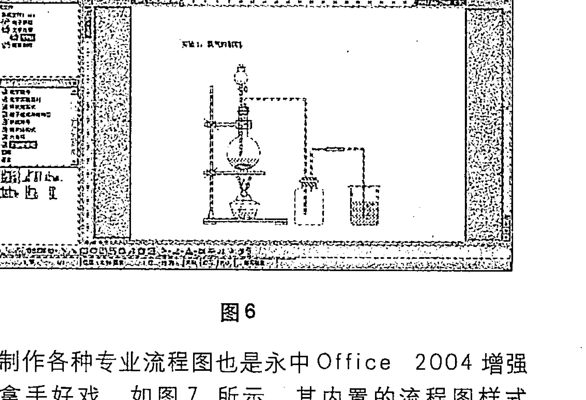

## 三、永中 Office 2004增强版新功能

永中Office 2004增强版（简称为增强版）办公套件，主要完善了永中Office 2004版教育方面的功能，以及针对电子政务和电子商务应用的二次开发特色功能。增强版还大幅度降低了其对硬件配置的要求，使用PIII中央处理器和128MB内存的电脑便可流畅运行。此外，增强版的运行效率也有了大幅度提高，启动速度明显提高。

### 1. 独具匠心的科教功能

永中Office 2004中的科教功能是其他的Office办公套件中是找不到的，可以说这是永中Office的一个不小的创举。它根据我国中小学的实际需要，首创了科教面板，提供了丰富的专用符号和教学图示图例，极大地方便了教师、学生和科技工作者教学、学习和撰写专业科技论文。使用永中Office撰写科技论文，可以得到更加精美、专业的效果；用它制作出的课件更加生动、直观。

增强版的科教面板全面覆盖了化学、数学、物理、图库、流程图及语言等6个大类、54个小类，共有2000多个符号和公式，只需要选中主选单中“视图/科教面板”选项，其主界面的左侧便会显示科教面板，直接将那些提供的数理化图形符号拖曳至文档，便可轻松创建和编辑出专业的论文或课件。

制作各种专业流程图也是永中Office 2004增强版的拿手好戏，如图7所示，其内置的流程图样式基本涵盖了各行各业的需求，需要什么图从图库中直接拖到文档中即可编辑使用，十分简单便捷。

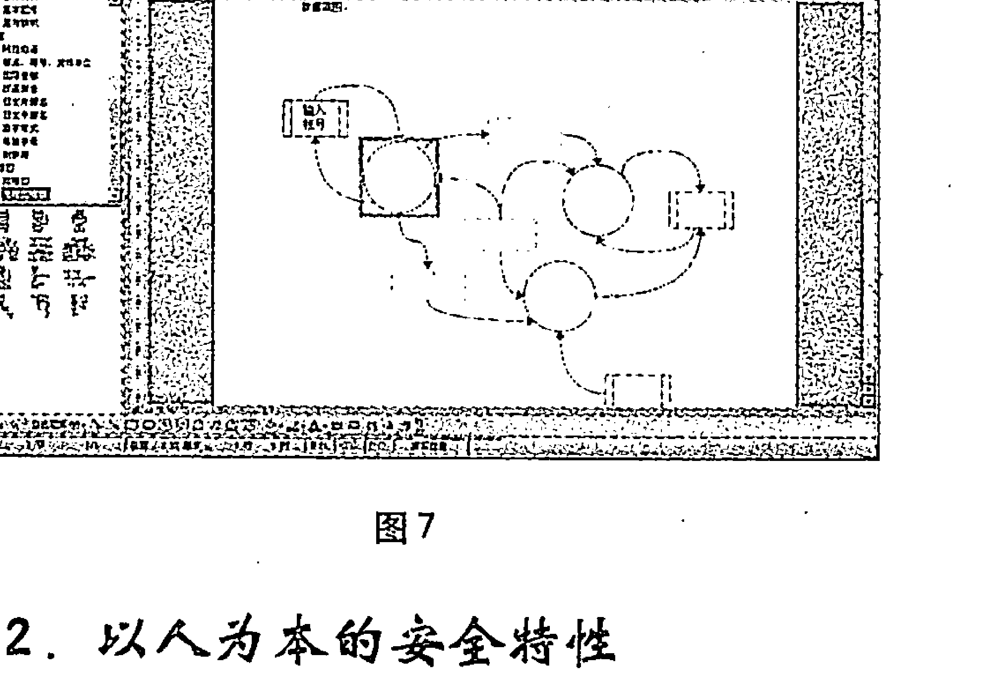

### 2. 以人为本的安全特性

在Word中就经常出现这样的问题，为了文档的安全而设置了密码，修改文档时却忘记了读取/修改权限密码。永中Office 2004提供的作者权限密码，较MS Office更为人性化、更加完善。例如，使用永中Office 2004字处理或电子表格，不仅可以为自己创建的文档设置读权限和写权限的密码，来进行保护文本文档或单元格，而且还可以使用作者权限密码。这个密码是用来解决常常遇到的密码遗忘麻烦的。这个作者权限密码就相当于是一个超级密码，使用这个密码就可以编辑被保护的单元格或文字处理文件。如果忘记了文档的读权限或写权限密码，便可通此密码来编辑文档。

### 3. 融会贯通的数据链接功能

#### (1) 粘贴链接

粘贴链接是指将一个应用中的源数据复制后，以链接形式粘贴到同一个应用或其他应用中。当源数据变动时，粘贴的数据会随之同时变化。粘贴链接功能保证链接的数据能及时、正确、一致地更新。一旦创建了粘贴链接，就不必为频繁更改数据而考虑数据的同步和一致性了。笔者在使用这一功能时发现，使用此功能后数据的更新明显简单了，根本不用把时间浪费在对照校验数据的正确性和修改数据上。

#### (2) 区域链接

使用永中Office的区域链接功能处理，可以轻而易举地将一个单元格区域作为一个数据对象储存在单元格中。这样就可直接在单元格内嵌套单元格区域，这种嵌套的单元格可以用于创建复杂的表格和网页。

我们打印文档时，常常会遇到打印纸不够宽，需要横向打印一份大型表格的情况，这样就需要在打印时不停地翻来翻去，十分麻烦。如果使用了增强版，则只需使用区域链接将该表格链接到一个单元格中，然后在该单元格中对表格进行格式化，旋转270度，再将该表格链接到文字处理中，最后在文字处理中重新设置多余的部分即可。这样就避免了打印时频繁地翻转，省时又省力，可以极大地提高工作效率。

### 4. 办公三大基本应用的增强与完善

#### (1) 文字处理应用

增强版的文字处理除了全面支持XML文件格式之外，其对多媒体对象的支持也更加完善，还可以将文档直接输出为通用的PDF文档格式，方便了文档的保存。永中Office 2004增强版的文字显示比以前的版本明显美观，工整平滑的宋体字比先前拖泥带水的文字漂亮多了，它已经可以和MS Word一样美观。此外，增强版还改善了以前遭人诟病的HTML支持问题，现在已经可以很好地打开HTML文档，效果相当不错。

#### (2) 电子表格应用

增强版除了保持原来强大的函数和数据分析功能之外，还增强了电子表格数据链接功能。众所周知，无论是MS Office，还是Open Office，它们的数据链接都是通过OLE（对象链接与嵌套，Object Linking and Embedding）技术实现的。OLE其实是介于操作系统和应用软件之间的一个通道。所有的应用软件产品向OLE提出请求要从另一些应用软件中获取信息，然后OLE会要求有信息的应用软件将信息发送给有要求的软件。这样复杂的过程就造成了数据链接速度的迟缓，使效率大打折扣。

而永中Office使用电子表格的单元格来储存各种数据对象，并且作为一个数据对象储藏库时，为了确保数据对象间链接的正确性，永中Office要做的只是调整单元格地址。这就是为什么无论用户在永中Office中做什么，不管链接多少数据，一秒钟便可以得出结果的原因。

此外，增强版还提供了许多实用的电子表格模板，大家创建电子表格时不妨先看看永中的电子表格模板库，也许从中就会找到现成的模板可用。

#### (3) 简报（幻灯片）制作应用

当制作一个比较复杂的简报时，通常会将各种数据素材组织起来。由于数据众多，可能分布在几个文档中，这时就需要交叉引用这些数据或素材。在MS PowerPoint中，一般采用超链接来实现素材、内容的交叉引用。尽管超链接可以将用户带回链接的数据源，但是，当所引用的素材或数据源移到不同的页时，如数字顺序改变时或者素材位置调整时，那些数据就无法正确地随之改变了。

如果使用永中增强版出现上述这种情况时，它提供的粘贴交叉引用功能就能大显身手了，它可以实现交叉引用信息与数据源之间的同步自动更新。此项功能对于数据型的简报来说实在很方便。

### 5. 精心打造的人性化功能

#### (1) 断电保护

永中Office的断电保护功能可以随时操作随时保存，即使遭遇断电或误操作也不会出现文档丢失的现象。

#### (2) 联机操作和协同工作

联机协作是永中Office的一项独特的功能，它类似MS Windows中的Netmeeting。使用联机协作可以通过网络共同编辑电子表格文档，即允许多个用户同时编辑同一个共享电子表格文档，提高办公效率。

#### (3) 完善的中文支持

中文支持是永中Office的一大特色，它的全方位的中文文档支持令日常办公更加得心应手。例如，日常生活、教育教学中常用的中文信纸、信封、稿纸样式，以及政府机关使用的公文样式，都可以使用永中Office轻松实现。此外，永中Office对繁体汉字和竖排的支持也很好，它支持简体中文和繁体中文的相互转换，极大地方便了不同人的汉字使用习惯。

## 十、好色鬼 XP

- 软件名称: 好色鬼 XP
- 软件版本: 20020501
- 软件网站: http://www.net-kool.com/
- 下载地址: http://www3.skycn.com/soft/5144.html
- 软件语言: 英文
- 授权形式: 免费软件
- 应用平台: Windows 9x/Me/NT/2000/XP/2003
- 软件大小: 699KB
- 软件界面: 如图11

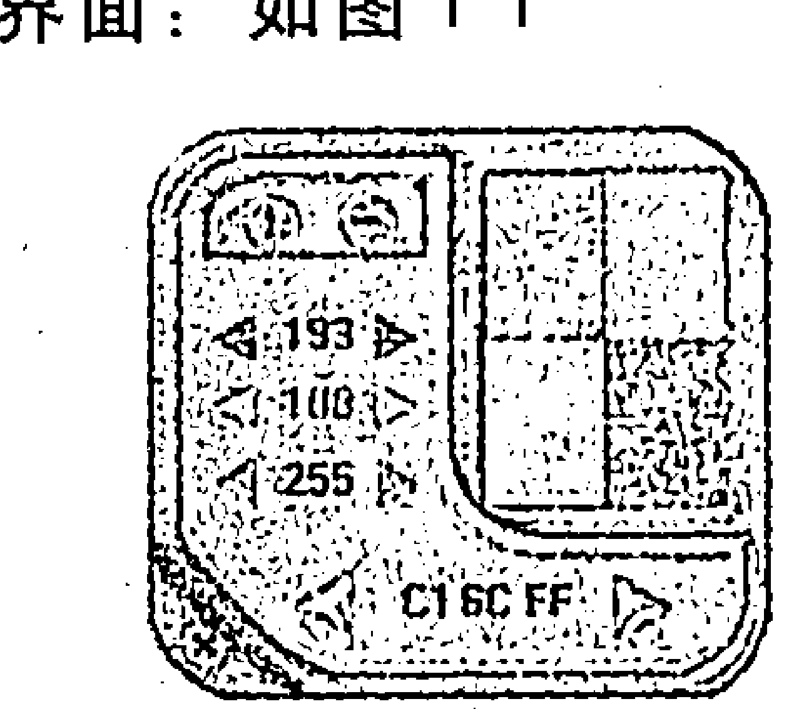

上面介绍了很多图像处理软件，与它们相比，“好色鬼”实在是显得有点单薄，尽管它们也并不庞大。不过，即便不能说“好色鬼”是喜爱图像处理和网页制作的你不可缺少的，但拥有它必定会让你的工作效率大为提高，工作成果上一个台阶。

“好色鬼”只有一个功能，那就是吸取屏幕上任何一个地方的颜色值。有图像处理或者网页制作经验的读者朋友一定知道，获得我们需要的颜色值有多么重要。也许我们需要知道某个程序窗口中某处的颜色值，也许我们需要知道一幅漂亮的图片中的某一处使用了哪种颜色，也许我们需要知道别人的网页上那悦目的色彩是如何搭配的。可是一般的图像处理软件即便是有吸管工具，也只能吸取当前窗口甚至只有当前对话框范围内的颜色，对于范围之外的颜色就无能为力了。“好色鬼”则完全没有这种限制。运行“好色鬼”，可以看到它只有一个很小的窗口，可以放置在屏幕的一角而不会遮挡我们的视线。窗口中有四个色块，在其中一块上单击鼠标左键，不要放开，移动到屏幕上任何一处，移动的时候色块中的颜色发生实时的变化，反映着鼠标指针经过之处的颜色。在我们需要的地方释放鼠标，色块上的颜色即是该处的颜色，左侧的三个数字分别是颜色的 R、G、B 色值。我们可以单击三个数字两侧的箭头，使数字增大或减小，同时色块中的颜色也发生相应的变化。我们可以通过这样细微的调整，体会颜色间微妙的差别，从而找到最合适的一种颜色。下方还显示着该颜色的十六进制的色值，在制作网页时很有用。四个色块可以分别吸取颜色，这有助于我们在一块颜色较为复杂的区域通过吸取多个颜色值，然后找到其中最喜欢的一个。这样小巧的软件，还支持换肤功能，我们可以将它打扮得更漂亮一点，使我们在处理图像或是在制作网页时心情能够更轻松一些。

## 2004最新多媒体软件功能大比拼

文/风之扬

### 第一篇 音频软件比较表

#### 一、Winamp 5

软件下载地址：http://www.Winamp.com/

Winamp 是一个非常著名的高保真音乐播放软件，也是大家最喜欢的音频播放器之一，可是从3.0版本起，大家逐渐失去了对他的兴趣，Nullsoft也面临了一个非常尴尬的问题，不得不继续发展Fans众多的2.xx版本，一直到Winamp 5横空出世。

| 功能名称 | 功能简介 |
| :--- | :--- |
| 音频播放 | 支持MP3、MP2、MOD、S3M、MTM、ULT、XM、IT、CD-Audio、Line-In、WAV、VOC等多种音频格式。Winamp提供了三种可以打开文件的方式：打开MP3文件、打开一个文件目录、填入URL打开一个网上的文件，播放十分方便。 |
| 音乐格式转换 | Winamp支持WAV、WMA的转换输出。如果在转换过程中使用了DFX等音频处理插件，那么在转换输出WMA时，也会带有DFX插件处理过后的效果，还可以减少CPU的使用率。 |
| 媒体库功能 | 在媒体库里可以添加本地文件，下次播放时可直接播放。 |
| 播放清单 | 打开要编辑到清单中的所有文件，点击Winamp播放清单编辑窗口中右下角的LISTOPTS，然后选择SAVE LIST，在弹出的保存对话框中，选择路径与文件名字，就可以完成一个播放清单的建立了，通过LOAD LIST或直接双击清单文件就可以导入播放清单了。 |
| 编辑文件 | 选中需要查看、编辑的歌曲，单击鼠标右键，在弹出的菜单中选择“View File info”，将会出现一个MP3文件的查看和编辑窗口。 |
| EQ均衡器的调节 | 通过EQ均衡器可以调节音质，从而享受更优质的音乐。点击窗口上的Presets可以调节出一些新的节奏重音。 |

| 功能名称 | 功能简介 |
| :--- | :--- |
| 视觉效果 | 用户可以通过视觉效果模式、光谱选项、示波器选项等进行具体视频设置。 |
| 插件功能 | Winamp有很多播放效果增强插件，如在播放歌曲时显示歌词的插件等，Skins界面插件可以拥有不同风格的Winamp播放面板，效果非常好，大家都可以从官方网站http://www.Winamp.com上下载，从而增强Winamp的功能。 |
| 显示测试 | 显示性能测试可以测试刷新速度。 |
| 功能点评 | 作为一个老牌的音乐播放程序，加上华丽的skin和丰富多彩的plugin，使得Winamp在音乐播放领域一直处于统治地位，特别是DFX等音频增强插件的应用使Winamp的音质有了质的飞跃，是其他软件所无法比拟的。 |

#### 二、Foobar 2000

软件下载地址：http://www.skycn.com/soft/11066.html

Foobar2000是一款Windows平台下的音频播放器。它包含了一些重放增益支持，具有低内存占用等基本特色以及内置支持一些流行的音频格式。

| 功能名称 | 功能简介 |
| :--- | :--- |
| 音频播放 | Foobar比较专业，所支持的格式也比Winamp多，特别是APE这种特别流行的无损文件压缩格式，音质直追CDA文件，而体积却只有WAV文件的一半。通过官方插件所支持的音频格式有MPEG-4、AAC、FLAC、Monkey's Audio、WavPack、Speex、CDDA、SPC等类型，另外，它还可以从RAR、ZIP压缩包里直接读取音频格式。 |
| 音乐文件格式转换 | 可将其他格式转换为WAV格式，OGG转换为MP3格式等。 |
| 音频解码 | 在MP3文件和APE文件上，Foobar比Winamp的音质效果的层次感更加分明，输出噪声也较Winamp少，无论是在高音区还是中低音区，音质都更加饱满。 |
| 音频调节 | 控制面板中还有两个调节滑杆，第一个Level Adjust（级别调整）可以调节输出量的大小，此外，也可以使用Auto Level Adjust（自动级别调整）功能。通过第二个滑块Mix Adjust（混音调整）可以控制处理过的和未处理过的声音（湿、干）的混合。 |

| 功能名称 | 功能简介 |
|---|---|
| 插件功能 | 在Components Library上方栏中，可以看到已经加载的dll插件，如Diskwriter插件、Freedb支持插件、ID3v2 Support、Playlist Tools、Special Info Box文件信息增强插件和Codepage Action代码页替换插件。 |
| 识别劣质CD | 通过音频频谱器可以识别劣质CD：在"Components"下拉列表中选择"Simple Spectrum"（简易频谱器），播放音乐时就能看到当前播放音乐的频谱。可以发现MP3的频谱在高频部分齐齐地断了，这也就是CD和MP3音质主要区别的来源。高码率（230kbps VBR以上）的MP3这种区别并不明显，但仍可从频谱的疏密分辨大概。如果购买的CD在播放时的频谱在高频段断掉，就要小心了。 |
| 重采样 | 对数字音频流进行重新采样，会产生较高速率的音频数字流。 |
| 回放增益 | 能够自动计算所播音乐文件（专辑）的平均强度和标准强度（83SLB）之间的差值，并且保存这些增益信息，提供给播放器自动调整音量使用。 |
| 数字音频处理 | 利用数字处理技术，可以对音乐进行一些特殊处理以产生特殊效果。 |
| 功能点评 | Foobar虽然是音频播放领域的一个后起之秀，没有优美的界面也没有众多的插件支持，但Foobar的定位是专业数字音频播放工具，它更注重技术，所以在使用过程中涉及到了很多的专业数字音频知识，其自带的内核解码功能足可对比于任何的音频播放软件，更少的内存占用、广泛格式支持和完美的音效是它制胜的法宝。在音质上，Foobar要优于Winamp，对于音乐发烧友来说，Foobar是一个不错的选择。 |

| 功能名称 | 功能简介 |
|---|---|
| 音频效果 | 支持二声道歌曲转化为多声道输出，变换男女声，还可以模拟出歌剧院、声乐、摇滚、轻音乐、低音加强、环绕音场和回音加强等多种环境，再加上卡拉OK升降调功能，即使在狭小空间里也同样能感受到高级音响的效果。 |
| 文件格式转换 | 输入格式包括MP3、MP2、音乐光盘、WAVE、WMA；输出格式包括MP3、WAVE、WMA。 |
| 插件支持 | 可下载最新音乐播放格式、专业数字音讯处理器（DSP）及亮丽视觉效果功能等插件。 |
| MP3编辑功能 | 通过附带的ID3（Intervideo Data Injection）编辑器，用户可为手头的MP3文件制作歌词、加入文字、网页链接、图像、数码水印以及其他信息或保护等，将歌手与作品更多元化地推得更深更广。 |
| 媒体文件管理功能 | 可以直接将歌曲拖曳到播放清单中进行管理。 |
| 在线欣赏音乐 | 通过此功能，可以连接到世界上最知名的音乐网站，然后搜寻、下载或者试听音乐。 |
| 功能点评 | 总体而言，这款软件让人有耳目一新的感觉。它支持多种音乐格式，可混合各格式于同一播放清单播放，还可下载最新音乐播放格式、专业数位音讯处理器（DSP）及丰富的插件，是一款不错的音频播放软件。 |

#### 三、WinRip 2.0

软件下载地址：
http://www.intervideo.com/jsp/Home.jsp
http://www.skycn.com/soft/6755.html

WinRip 是由 InterVideo 公司开发的一款专业歌曲欣赏软件，支持多种音乐格式，并可拖放、混合各种格式到同一播放清单播放。在播放音乐光盘时，能够实时取得音乐光盘的作者、专辑名称、歌曲名称、歌曲分类等信息。

| 功能名称 | 功能简介 |
|---|---|
| 音乐格式支持 | 支持MP3, WAV和CD音乐光盘等多种音乐格式，并可将MP3、WAV、WMA等多种格式的音乐文件混合存放在一个播放清单中。 |

#### 四、iTunes

软件下载地址：
http://www.apple.com/itunes/
http://www.skycn.com/soft/16468.html

苹果公司最新发布了 iTunes 的 Windows 版本，这款音乐播放软件将网络和音乐结合到了极致。早在五月份推出 MAC 版本时，就创下了付费音乐周销售500,000首的惊人成绩，可见这款音频播放软件的过人之处。

| 功能名称 | 功能简介 |
|---|---|
| 音频播放 | 播放十分方便，用户可以根据自己的喜好修改音乐播放次序，点击 “Visualizer” 菜单，还可以选择播放的窗口大小或者全屏播放。 |
| 选择可视化外观 | 可配合音乐节拍来播放可视化的外观。苹果公司在图形艺术方面的功力尽人皆知，iTunes 中的音乐视觉效果完全可以用完美来形容。进入可视化外观设置对话框，还可以设置在视觉外观播放时候的文字信息。 |
| 波段均衡器 | iTunes 采用了一个10波段的均衡器，还可以单独调整每一个音轨的频率范围。均衡器里面还内置了20多个预先设置，这样就可以轻松地来给歌曲选择相应的设置，我们还可以给每首歌曲预先设置均衡器中的... |

#### 五、豪杰音频通

软件下载地址: http://www.skycn.com/soft/12953.html

豪杰音频通以文件列表的方式，实现在不同的音频格式之间批量、快速的互相转换；提供本地音频文件的快速搜索，对于转换前后的文件，可以进行试听；能将视频文件中的音频部分抓取出来，支持“*.ACU”索引文件。

| 功能名称 | 功能简介 |
| :--- | :--- |
| 音频播放 | 支持大部分的音频格式，播放效果比较理想。支持MP4, RA, RM, AVI, MP1, MP2, MP3, MPA, WAV, MIDI, MID, AC3, DAC, MP3Pro, DAC 等格式。 |
| 格式转换 | 可以转换很多格式，如WAV, MP3, WMA, DAC, CDA, MPG, MP1, MP2, MP3, MP4, VOB, AC3等；转换后的格式有WAV, MP3, WMA, DAC, RA等，并提供了相应的格式转换配置，如频率、位数、压缩层次、路径等；另外，它还支持多线程转换。 |
| 搜索功能 | 提供本地搜索功能。 |
| 列表 | 提供文件列表，可批量转换。 |
| 多声道的编辑 | 提供多声道的支持，可把普通立体声或单声道文件转换成多种多声道输出。每个声道的声音可调整到任意一个音箱或耳机进行输出。 |

#### 六、 亢天 AMP 2003

软件下载地址: http://www.skycn.com/soft/12214.html

| 功能名称 | 功能简介 |
| :--- | :--- |
| 音频播放 | 支持50多种媒体格式。 |
| 音色均衡器 | 可以调整音质，达到理想的播放效果。 |
| 录音功能 | 单击鼠标右键，选择“luck录音机”中的“录音”选项就可以录音了。 |
| 界面和皮肤 | 自带皮肤制作器，支持换肤，并完全支持Winamp3.0以下皮肤。界面优美，并且符合中国人使用的特性。同时支持在线电视、电影、Flash播放。 |
| 歌曲书签管理器 | 可以对喜爱的歌曲进行收集并像书签一样收藏。 |
| 功能点评 | 亢天软件小组奉献的精品软件。如果希望使用小巧而功能齐全的国产音频播放软件，亢天AMP应该是一个不错的选择。 |

### 第二篇 视频软件比较表

#### 一、 Realplayer 10.5

软件下载地址: http://www.real.com/products/player/downloadrealplayer.html

数字影音革命的大亨RealNetworks推出的RealPlayer一直受到广大网友的喜爱，以RM格式制作的电影比其他视频压缩格式制作的文件要小很多，它不仅能够收听在线的广播和音乐，而且还可以收看在线的视频播放。

| 功能名称 | 功能简介 |
|---|---|
| 媒体播放 | RealPlayer支持很多格式，除了能够处理流式媒体和QuickTime、Windows Media或MPEG-4文件外，它还能够播放AVI、WAV等格式的文件。 |

音乐商店，还集成了一个IE工具栏，这样，使用起来就更加方便了。

- **收藏夹**
与IE收藏夹的风格和功能完全相同，可以对喜爱的网站进行收藏和管理，在“Favorites”菜单中选择“Add to Favorites”即可。

- **优化播放质量**
RealPlayer对系统资源的利用率上做了限制，选中“Play(播放)”菜单的“Perfect Play (完美播放)”选项，会发现播放质量有所提高，画面也更加清晰流畅。

- **LivePause和PerfectPlay**
控制流媒体的功能，在播放实况音频或视频剪辑时可以暂停、快退和快进。

- **高级视频控制**
通过滑块可以调节亮度、对比度和色调视频控制，进行记忆设置。

- **音频格式支持**
支持CD、MP3、MPEG、Sony记忆棒等格式。

- **CD刻录**
RealAudio Lossless格式仅需要标准CD音频格式（WAV）一半的磁盘空间，就可以刻录专业品质的CD。另外，它还有许多潜在的强大功能选项，例如，统一调整所有CD歌曲的音量，设置交叉淡入淡出以及删除曲目间的时间间隔等。

- **多声道立体声**
声道音频和专用的超重低音声道。

- **10波段图形均衡器**
这个功能可以控制音乐播放效果，通过图形均衡器可以对声音进行优化，还可以根据房间大小，调节均衡器和音频输入类型等。

- **高比特率编码**
以最高可达320kbps的超高质量混合、刻录和抓取CD和MP3。

- **交叉淡入/淡出**
在歌曲间淡入淡出并加入混音，合成专业级的派对音乐。

- **专辑信息**
方便地显示专辑或剪辑参考信息，可以自动从CD或流式剪辑中载入信息，跟踪歌词和其他剪辑相关信息。

- **设备支持**
可以将音乐下载到便携式数字音乐设备中，还可以兼容MP3、Sony记忆棒、Palm、Nomad Zen、iPod等格式。

- **插件支持**
支持多种插件，如DFX6.00 for Realplay是一个很不错的Realplayer声效插件，它能大大提高环绕效果和音质。

- **组织整理媒体库**
在媒体库部分，可以把所有的音频或视频文件按照演员、专辑、风格和媒体类型组织整理。

- **视觉外观**
可以自定义RealPlayer外观，有数百个生动活泼的面板供选择，也可以从Web提供商下载最火的动画，让丰富多彩的炫目图案装点屏幕。

- **在线音乐商店**
用户可以用它查找、购买和下载流媒体的音乐或视频。

- **功能点评**
总的来说，RealPlayer 10在功能上十分强大，用户只用一个播放器，就几乎能播放所有的媒体文件了。甚至连老冤家微软开发的asf、WMA等媒体格式也支持。在播放内容上，它在原来的基础上还嵌入了付费的。

#### 二、Windows Media Player 10

软件下载地址：http://www.microsoft.com/windows/windowsmedia/cn/download/default.asp

Windows Media Player 10 (简称WMP10) 是微软公司推出的免费播放器，这是基于DirectShow基础之上开发的媒体播放软件，它提供最广泛、最具可操作性、最方便的多媒体内容。新版本的功能也增加了不少，下面，我们看看有关该系列播放器的功能介绍。

| 功能名称 | 功能简介 |
|---|---|
| 媒体播放格式 | WMP10支持众多的媒体文件，如WMA、ASF、MPEG-1、MPEG-2、WAV、AVI、MIDI、VOD、AU、MP3和QuickTime文件等。不过，它不支持RM和RMVB等Real格式。 |
| 收藏 | Favorites菜单可以让我们保存喜欢的网站，方便以后更快、方便地重放。 |
| 管理媒体库 | 允许用户将电脑上和互联网上的视频资源添加到媒体库中进行管理，具有分级、自动播放列表、监视文件夹、自动更新媒体信息以及删除媒体库内容等功能。 |
| 自动播放列表 | 搜索媒体文件后，播放器可以根据播放习惯自动进行分类列表，如最近没有听过的歌曲、在深夜听的歌曲、在工作日听的歌曲和在周末听的歌曲等。用户也可以通过“媒体库”窗口的“播放列表”菜单自己建立新的播放列表，然后再为其添加内容。 |
| 专业音频格式支持 | 可以自动播放CD和APE等格式的音频文件。如要播放APE文件时，将下载回来的压缩文件解压缩到一个固定的目录内，如WMP10的安装目录，然后双击其中的“Register.bat”注册APE的解码器。 |
| 在线音乐商店 | 用户可以用它查找、购买和下载流媒体的音乐或视频。 |
| 刻录CD | 支持复制和刻录CD，使用“复制到CD或设备”功能可以将音频和视频文件从“媒体库”复制到您的便携设备或存储卡，还可以将从Internet下载的或从CD复制的许可的文件复制到便携设备上。 |
| 收听电台 | 可以使用WMP10查找和收听世界各地的电台，还可以将电台的指针保存起来。 |
| 自定义播放器 | 可以通过多种方式来更改播放器的外观显示和功能。例如，可以更改播放器的大小、外观、显示的信息类型，甚至可以添加一些新功能。 |
| 交叉淡入淡出和音量自 | 支持交叉淡入淡出和音量自动调节功能，在“查看”菜单中选择“增强功能”，然后。 |

#### 三、QuickTime 6.3

软件下载地址：http://www.apple.com/quicktime

QuickTime 是由苹果公司推出的一款媒体播放器，苹果机上所有的音频 / 视频播放都是由它来完成的。苹果公司的产品一向以外观简洁、功能强大著称，QuickTime 自然也不例外，Quick Time 主要用于高质量图像的播出，其特色技术 3GPP 更是全世界新型高速无线网络上多媒体制作、传输和回放的最新标准。互联网的发展使 QuickTime 有足够的生存及持续发展的空间，现时 QuickTime 下载量已远超 RealPlayer，在 PC 上的渗透层面亦比以前广泛。

| 功能名称 | 功能介绍 |
|---|---|
| 播放网络电影 | QuickTime 可以播放 mov、avi、mp3 等等相当多的媒体类型，配合 Broadcaster Server 与 Streaming Server 时，它还提供了不错的多媒体播放效果。QuickTime 6 支持的对象包括 Macromedia Flash 5，DVC Pro PAL，在 Mac OS X 上使用的 JPEG 2000，AppleScript（苹果电脑专用）和超过 100 的其他媒介类型，诸如 DV、MP3 和 JPEG。 |
| Favorites 收藏夹 | 类似于 IE 的收藏夹，可以将影片的 URL 添加到这里并进行整理。 |
| MPEG-4 支持 | QuickTime 6.3 提供 MPEG-4 原生支持，比其他 MOVIE 文件拥有更出色的播放效果与更小的体积。使用 QuickTime 6 专业版还可以制作 MPEG-4 格式影片，并直接输出到其他播放器。 |
| DVC Pro PAL Video 编码器 | 全新的 DVC Pro PAL Video 编码器支持 Macromedia Flash 5，JPEG 2000 图像格式（只限 Mac OS X QuickTime 版本），还加强了对 AppleScript 及为发展商提供一系列全新的程序开发语言接口。 |
| 设备支持 | 支持手机、PDA 等新一代无线设备，超过 150 台数码相机将 QuickTime 作为其核心技术，其中有超过三分之一的相机利用 QuickTime 来捕捉音频和视频剪辑。 |
| 支持 3GPP 标准的 QuickTime | QuickTime 6.3 为 3GPP 提供了广泛的支持，包括对视频、音频、文本和 native 3gp 文件格式的支持，让人心动的是，它可以像操作 mp4 和 mov 文件一样输入、输出和播放 3gp 文件。 |
| 流式传输自动检测 | 此项功能可以增强流式传输的可靠性，改善 DV 音频与视频同步效果。 |
| 跳读保护 | 跳读保护是一项获得专利的特性组合，可以保证 Internet 上数字流的质量，防止中断。 |
| 通过 Keynote 提高综合性能 | Keynote 可以作为 QuickTime 电影的创作平台，感受到 Keynote 在诸如 3D 立体和音调变奏方面令人耳目一新的动画效果。 |
| 制作幻灯片 | 可以利用数字相片来制作幻灯片。 |
| AAC Audio | AAC 音质可与 CD 媲美，QuickTime 6.3 提供全新的 AAC 音源压缩器，可以为用户带来更震撼的声音效果。 |
| 定制界面 | 提供定制界面的功能，可以通过「用户自定义」界面实现。 |
| 媒体编辑能力 | QuickTime 专业版提供了丰富的媒体编辑能力。它能实现从简单的幻灯片播放到复杂的视频和音频编码以及将几百个不同的媒体类型汇集到一个电影文件中。 |
| 格式转换 | 可以输入和输出超过 12 种格式的视频、音频和图像文件，其中包括高质量的 DV 摄像机格式。 |
| 功能点评 | 总的来说，QuickTime 界面美观、简单易用，它可用于在 IP 无线网络和宽带网络上开发、创建、交付高品质视频或音频信息。它被国际标准组织（ISO）选为 MPEG-4 的基本文件格式，是 3GPP 标准的核心。对于影视发烧友而言，这是个不错的选择。 |

#### 四、豪杰超级解霸 V8

软件下载地址：http://www.herosoft.com/

豪杰超级解霸 V8 是豪杰公司于 2004 年初推出的媒体播放工具，V 8 具备全新的界面和全新的操作。模式，它还支持手机发送功能，只要有一部彩屏手机，就可以看电影，玩手机两不误，实现“所见即所得”。其典型功能列表如下：

| 功能名称 | 功能简介 |
| --- | --- |
| 视频播放 | 支持DVD、VCD、MPG、DAT、VOB、AVI、SWF、RM、RMVB、WMV、ASF、MOV等大部分格式，各种视频文件播放时没有明显的马赛克、毛刺和锯齿，而且兼容性确实也是超一流的。 |
| 网络播放 | 支持各种流媒体格式，如WMV、WMA、RM、RAM，播放效果非常流畅，预读之后不会出现断续现象。 |
| 家庭影音娱乐 | 首先是电视输出功能，可以搭建PC-TV大屏幕数字豪华家庭影院。其次是音箱软接线技术，选择“音频”菜单下的“音箱软接线”命令，然后就可以在打开的窗口中拖动鼠标指定音箱音频线的输出，做到以软代硬，省去接线及挪动音箱等麻烦。 |
| 文件格式进行转换 | 独创的“音频压缩比率调节技术”，可以实现CD抓轨、MP3格式转换以及多种音频格式转换；同时可以把VOB、DAT、WAV、MID、AC3等多种音乐格式保存成为WAV、MP3等格式的音频文件。 |
| 视频转换能力 | 可以把VOB、DAT、MPG等多种格式转换成为AVI、MPG等格式。豪杰的视频转换工具还有详细的音视频编码器选项，包括压缩比率和声道选择等等。 |
| 在线多媒体走廊M2CENTER平台 | 通过接入M2CENTER平台（www.m2center.com），注册登记后就可以播放JMV专有加密格式的影视节目，包括在线影视、音乐动漫、手机图铃、娱乐花絮等多媒体服务，而且解决了日常下载影片中文不对题、速度慢、不清晰等种种常见问题。 |
| 彩影功能 | 提供了独具特色的“彩影无限”功能，与Internet连接后，可以非常轻松的将影视画面截取发送至彩屏手机。 |
| 用MTV自制CD | 可以把MTV自己制作成CD进行保存；单击“音频”菜单，在弹出的子菜单内选择“左声道”，再选择面板上“播放并录音”的按钮；最后用刻录软件将WAV文件烧录成CD。 |
| 播放关联 | 选择“设置”菜单下的“基本设置”选项，单击“播放关联”功能进行选择注册。 |
| 截取片断 | 可以实现将指定的片断转录为.MPG或.MPV文件，播放或停止状态均可实现。 |
| 音频播放 | 提供了2声道到8声道共26种声道选项，还有音箱位置图。另外，豪杰独创“音箱软接线技术”，可以在软件内直接拖动声道输出，免去你搬动音箱的劳苦；“软功放机”功能则可以实现“摇滚”、“古典”、“柔和”等10种音效的组合。 |
| 音效处理技术 | 数字音效还原技术，可以把普通双声道的MP3、CD以4声道、5.1声道来表现出环绕音效，6声道AC3音乐也可以模拟成2声道输出，并且支持SP/DIF输出。 |

总体而言，超级解霸V8具有以下优点：漂亮时尚的界面、相对较优秀的画质、新颖的资源管理器播放、方便的文件关联管理、音箱软接线功能、时尚的彩信功能。同时，超级解霸V8为大家带来了Microsoft/RealNetworks/QuickTime等多媒体格式的统一播放解决方案，十分适合国内用户。

## 五、东方影都2003

东方影都2003是交大铭泰推出的一款影音播放软件，它独具的智能画面补偿技术，可以有效提高画面清晰度、色彩更加逼真艳丽；其音频解码部分更严格按照杜比标准进行设计，可以轻松实现环绕立体声效果。我们来看看其典型的功能列表：

| 功能名称 | 功能简介 |
| --- | --- |
| 媒体播放 | 支持所有主流的文件格式，如：DVD、VCD、CD、MP3、MPEG4、RA、RAM、RM、avi、wav、mid、dat、vob、s3d、mpeg、mpg、midi等等，运用新一代智能画面补偿技术，如智能去除画面毛刺，画面自由缩放，色彩均衡调节等，使得画面更加亮丽逼真。 |
| 多速率播放 | 可以任意调节0.1~1.9倍速播放，并能智能记忆播放过的光盘/文件播放位置。 |
| 网络点播 | 可以接收网络音乐、电影、广播，图像清晰，效果逼真，带宽占用少，启动速度快。 |
| 强力纠错功能 | 采用了纠错缓存技术，通过调动硬件的纠错系统，使得电脑发挥最大效能，对于损伤严重的光盘区域，可以以指定的位置及数据块大小跳过该区域。 |
| 数字音频 | 音频解码部分更严格按照杜比标准进行设计，可以轻松实现环绕立体声效果，智能音效均衡功能，双音箱模拟三维环境更可充分利用电脑的有限资源。 |
| 格式转换 | 实现了“X2MP3”的理念，即任何格式的音频都可以用MP3格式来保存，还能够将各类图形文件生成Flash相册。 |
| 播放列表 | 允许用户添加一个或多个媒体文件，甚至自动从目录中搜索出支持的媒体文件。 |
| 三维环境\智能音效均衡 | 可以轻松实现环绕立体声、三维效果。智能音效均衡，能有效去除背景噪声。 |
| 操作界面 | 界面图形人性化设计，多风格、多形状面板选择，通过各种不同形状、不同风格的界面组合，充分满足用户的个性化需求。 |
| 功能点评 | 总的来说，这是一款不错的影音播放软件，无论在界面、操作和功能的设计上都有很多新的突破，从目前的国情和用户的需求出发，考虑得非常地深入细致。同时，在媒体播放方面， |

## 六、金山影霸 2003 sp2

软件下载地址：http://www.kingsoft.com/download/36/151.shtml

金山公司的软件产品一向以其技术含量高和界面友好著称，金山影霸秉承其一贯传统，除具备一般媒体播放软件的基本功能外，还在防止死读、媒体格式支持和媒体格式转换等方面拥有独具特色的技术。除了金山影霸 2003 sp2，还有个金山影霸DVD测试版，本文综合其中的一些优点，列表如下：

| 功能名称 | 功能简介 |
| :--- | :--- |
| 视频播放 | 不但支持压缩比更高、播放质量更好的MPEG4，而且支持近来非常火爆的RM格式。可以播放各种版本的VCD文件和DVD文件，而且还可以播放许多其他媒体格式的文件，诸如AVI压缩影片、CD唱片、HDTV格式（高清晰数字电视）。支持WAV、MIDI、WMA、AU、MP3、MPEG、AVI、MOV、ASF等近百种音视频文件格式。 |
| 格式转换 | 音频转换器可以进行MP3和WAVE格式之间的转换；也能够抓CD音轨，并保存成MP3或WAVE格式。视频转换器可以把常见的视频文件转换成AVI或MPEG4格式；也可以将视频文件当中的音频转换成MP3或WAVE格式。转换过程中，用户可以通过调节相应参数对声音的质量进行控制。 |
| 纠错能力 | 对图像有修复和增强的作用，四级纠错能力可以自动进行读盘纠错、数据纠错、错误图像纠错和解码纠错。 |
| 音频质量 | 可以轻松地播放音频文件和CD光盘，支持左右声道、立体声、5.1声道、S/PDIF声音输出。 |
| 捕捉画面 | 可以把捕捉的画面保存在文件中，单击“属性配置”按钮，选择“抓图设置”，选中“保存到剪贴板”选项即可。 |
| 界面定制 | 提供了许多不同风格的界面供用户选择。 |
| 功能点评 | 作为一款媒体播放软件，金山影霸的制作还是比较精良的。它集音、视频播放于一体，支持现行市面上流行的各种音、视频格式；能轻易读取各种烂碟；音频播放器具有强大的音频文件编辑功能；同时提供转换器，可以实现MPEG4转换AVI，CD转换为WAV、MP3，及WAV与MP3间的转换等功能。它以高质量、流畅的播放效果为基础，兼顾其他播放软件之优点，同时又突出自身新的功能点，还可以根据不同的机器配置提供不同的播放模式，这样，那些为自己机器配置不高而不能播放高质量的DVD影片而发愁的用户就不用担心了。 |

## 七、WinDVD Platinum 6

软件下载地址：http://www.intervideoinc.com/

这是一款功能强大的DVD播放器，它组合了多种标准消费型DVD播放器的功能，例如，全面支持VCD 2.0、精确解码、可选用户界面以及视频显示选项等。

| 功能名称 | 功能简介 |
| :--- | :--- |
| 图像增强 | 具有强大的图像增强功能，支持高达96 KHz/24 bit的音频解码技术。 |
| 速成片段功能 | 可以抓下精彩的电影片段并保存为动画图片。 |
| 逆向播放 | 倒退播放的功能不仅动作流畅，而且还不易掉格。 |
| 智慧延展 | 是屏幕长宽比的画面补偿功能，以适应16:9和4:3的电脑显示器。在“智慧延展”时画面中央的内容无畸变。 |
| 精确控制DVD播放速度 | “时间飞梭（Time—Stretch）”功能可以在保持声效不间断、画面流畅的情况下，以半速或倍速播放DVD影片，这样我们就可以将影片播放时间提高到200%或降低50%。利用的“Finish By...”功能，我们能直接指定影片于何时播放完毕。 |
| 音视频格式 | 支持很多新一代的高品质音视频格式，如DVD-Audio、Intel High Definition Audio、WMV-HD等。采用动态影像技术可以避免模糊或抖动的问题。还支持Real、QuickTime和MPEG-4等格式。 |
| 音频播放效果 | 增加了10余种全新的音频播放效果，例如杜比ProLogic II、杜比EX、DTS—ES Matrix等，仅“环境”就有标准、剧院、深夜三种，你可以根据自己的需要，选择适合的环境效果；DSP效果则有摇滚、低音、音乐厅、柔和、声音、回响、卡拉OK等。 |
| 截取精彩画面 | 在播放影片时，只要点击播放工具栏中的“捕获”按钮即可。 |
| 功能点评 | WinDVD的声音效果非常出色，子面板功能和可控制的播放速度也让WinDVD更具亲和力，“视频桌面”可以将桌布变成动态影片播放，让你在工作、上网、或者玩游戏时，还能同时观赏DVD影片。 |

## 八、梦幻影吧 Diamond 7.0

软件下载地址：http://www.fantasysoft.net/cn/index.asp
这是一款界面美观、体积小巧、功能强大的DVD播放软件，除具有一般DVD播放功能外还具有数码混响、动态音效、十波段均衡器等多种扩展功能。

| 功能名称 | 功能简介 |
| --- | --- |
| DVD支持 | 梦幻影吧拥有完美的DVD导航播放系统、丰富的视频及音频效果，能播放DVD、VCD、SVCD、AudioCD、MPEG、MPEG4、M2V、AVI、WMV、RM、RMVB、MP3、WMA、OGG等多种视频及音频格式。 |
| 文件关联 | 在软件“系统选项”对话框的“常规设置”选项卡中可建立文件关联。 |
| 导航播放系统 | 用户可随意进行语言、字幕设定、章节预览，了解影片拍摄花絮、演员介绍等内容。 |
| 灵活多变的视频欣赏方式 | 提供了视角转换、语音转换、字幕转换按钮，将一些指定的视频画面放大2倍、4倍和8倍时，“数字变焦”技术可以确保画面不失真或基本不失真。 |
| 音频和视频播放质量控制 | 具有数码混响、动态音效、十波段均衡器、书签管理以及0.3至1.9倍变速播放（变调播放）等多种扩展功能。在音频播放和输出这一块也包含了非常高的技术含量，保证了各种音频格式的音效输出“原汁原味”。 |
| 设定播放权限 | 提供了播放级别设定功能，用户可以给影视作品设置播放级别。 |
| 自动查找 | 能自动查找有DVD或VCD光盘的驱动器，并使用正确的播放方式。 |
| 对CPU进行优化 | 能针对当今最新型的CPU进行优化，全面支持IntelMMX、SSE、SSE2、AMD3DNow、3DNow Pro等多媒体指令集，并采用视频硬件加速等多种先进技术，以确保提供高清晰的画面播放质量和流畅的音频、视频解码。 |
| 界面主题定制 | 内置五套精美的界面主题，并可随时下载新的界面主题进行扩充，从播放器主界面、顶部控制台、播放窗口、操作窗口到弹出式菜单均可自由更换皮肤。 |
| 播放书签 | 可以在任意播放位置通过单击相应按钮插入“播放书签”，下次打开时软件会直接从插入播放书签的位置播放。 |
| 功能点评 | 总的来说，这款软件在播放品质上有很大的优势，可以达到让人身临其境的效果，它为整体DVD播放品质的提升提供了一个强有力的保证。 |

## 九、SoGuaPlayer 2.0

软件下载地址：http://www.sogua.com/player/
软件利用 www.sogua.com 网站强大数据库作后台支持，除了具备常规的播放功能外，还具备了其他播放器无法比拟的独特功能。

| 功能名称 | 功能简介 |
| --- | --- |
| 媒体格式支持 | 支持RM、WMV等33种文件格式，几乎包括了目前所有常见的媒体文件格式。 |
| 查找歌曲 | 播放器本身自带歌曲搜索引擎，在播放器中输入这首歌曲的名字，软件就会通过网络搜索到内容。 |
| 歌词功能 | 搜索歌曲时，单击相应页面中的“歌词”链接，可以查看这首歌曲的歌词。 |
| 手机铃声下载 | 可以轻松为手机下载合适的铃声。 |
| 收听网上电台 | 提供了四百多个可选电台节目，点击相应节目，即可聆听优美的电台音乐和节目。 |
| 功能点评 | 总的来说，SoGuaPlayer操作简单，支持多种媒体格式，具备网络功能，实现音乐搜索、在线播放、卡拉OK、电台收听和手机铃声等先进功能，加上网站数据库的支持，相应的“外设”功能也胜人一筹。它的系统资源占用也远远小于Media Player和Real Player，是一款值得拥有的播放器。 |

### 第三篇 图像浏览软件功能比较

#### 一、AcdSee 6.0

软件下载地址：
http://www.acdsystems.com/
ACDSee 6.0是一款功能强大的图像浏览软件，也是目前最流行的数字图像处理软件，广泛应用于图片的获取、管理、浏览、优化甚至和他人的分享！
具体功能列表如下：

| 功能名称 | 功能简介 |
| --- | --- |
| 图像浏览 | 能快速、高质量显示图片，再配以内置的音频播放器，我们就可以播放精彩的幻灯片了。此外，还可以使用“魔术镜功能”观察照片的细微瑕疵。 |
| 从数码相机获取图片 | 可以从数码相机和扫描仪高效获取图片，并进行便捷的查找、组织和预览，它可将超过50种常用多媒体格式一网打尽！ |
| 迅速查找图像文件 | 可以设定让AcdSee通过访问每个文件的头部信息强制来确定它是否为图像文件。进而可以按图像的格式、大小、拍摄时间等多种条件进行高级搜索。 |
| 视频处理 | ACDSee能处理如Mpeg等常用的视频文件。 |
| 图片编辑 | 能轻松处理数码影像，拥有去除红眼、剪切图像，锐化、浮雕特效、曝光调整、旋转、镜像等功能，还能进行批量处理。 |
| 打印功能 | 用户可以自由定制打印图像的尺寸，而图片仍旧能保持原有的高质量，主要是因为ACDSee 6.0采用了新的resampling过滤器打印概念。 |
| 为图像文件解压 | 可以将压缩后的图像文件转化为“Uncompressed TIF”格式，进行其他设置后就可在OCR软件中打开转化后的文件。 |
| 更改文件日期 | 首先将系统日期调整到相应的值，选中欲更改日期的文件，然后单击“Tools/Change timestamps”，在对话框中选择“Current date&time”选项即可。 |
| 去掉图形中的黑点 | 可以使用ACDSee给打印出来的文稿“美容”，选中欲插入的图形文件，选取“Tools/Convert”命令，并设置转化为TIF文件，点击“Format Settings”设置相应的压缩格式为“CCITT Group3（或CCITT Group4）”，就把这个图像转为黑白的了。 |
| 刻录光盘 | ACDSee6.0增加了将图片刻录到CD和DVD存档的功能，而且还可选择把ACDSee图像数据库信息加入光盘。 |
| 建立图像的HTML | 可以让ACDSee 6.0使用HTML方式来打开图片，它还能收集图片的网址，也可建立HTML的在线图片库。 |
| 制作屏幕保护程序 | 首先按照下图打开编辑器，在弹出的窗口中，添加图片进去，然后进行编辑。点击上图右下角的configure就可以设置屏幕保护程序的背景、文字等。 |
| 自动锁定 | 使用锁定手柄可以在放大或缩小时图片时，用户屏幕上始终自动显示着锁定区域。在比较一系列图片中的细节时，使用该功能是相当方便的。 |
| 设置关键字管理 | 这个功能允许用户在自己的文件库里采用关键字列表的方式来管理文件。 |
| 功能点评 | 从基本的功能上来看，ACDSee6.0集成了一些很多的功能模块后，系统占用资源越来越多。作为图像的初级编辑和格式的转换，ACDSee 3.x版本是一个不错的选择。至于6.03版本，比较适合喜欢尝鲜和硬件配置较强的网友使用。 |

#### 二、豪杰大眼睛 V2.5

软件下载地址：http://www.herosoft.com/ 这是一款优秀的国产图像浏览软件，它支持69种图像格式浏览、19种图像格式输出、23种特效处理，超级缩略图预览无遗，还可以轻松制作自己的电子相册。其功能简介如下：

| 功能名称 | 功能简介 |
|----------|----------|
| 图像浏览 | 对图片的兼容性强，几乎囊括了最常见的所有格式，支持任意角度看图和多种图片浏览方式，支持幻灯播放、自定义图像顺序浏览。 |
| 制作电子相册 | 可以任意保存成为VCD、屏保和EXE文件，观看时将更加方便，相册可以任意编辑、添加配音、文字等，具有76种梦幻特效任意变换，切换图片时具有超酷动感。 |
| 图网库管理功能 | 提供了图网库管理功能，在图网库中预置了40余种图库网址。 |
| 图像格式的支持及相互转换 | 可以支持JPEG、TGA、TIFF、BMP、ICON、PCX、PNG共七种类型19种格式的图像文件间的相互转换，用户还可以自由设置转换图像文件的色彩和质量。 |
| 图像编辑功能 | 提供了包括色彩调整、平滑放缩与特殊的效果转换3大图像处理功能，可以进行复制、剪贴、局部修改、粘贴、尺寸修改等操作，图像处理简单快捷。 |
| 色彩处理能力 | 支持色彩处理能力，调节RGB、反色处理、亮度可调，支持图像色彩转换，10余种色彩输出格式可选。 |
| 图片plug-ins功能 | 无需版本升级，下载plug-ins解码库即可看新格式图片。 |
| 特效处理功能 | 超级图像效果输出功能素描、抽象、浮雕等特效处理，支持多种图像格式间的转换，输出图片格式达19种。 |
| 彩影发送功能 | 可方便快捷的将图片发送到手机上。 |
| 功能点评 | 软件操作方便快捷，功能强大实用，能较好地满足用户浏览和查看图像的需要，填补了国产看图软件领域的空白，很适合国内用户特别是家庭用户的使用，与ACDSee相比，它在整体设计和功能上虽然还存在一定的差距，但有着明显的语言优势，特别适合国内用户。 |

#### 三、XnView

软件下载地址： http://www.xnview.com/ http://www.skycn.com/soft/18160.html XnView 是一个图像浏览软件的新成员，它具有很多实用的功能，具体介绍列表如下：| 功能名称 | 功能简介 |
|---|---|
| 图像浏览 | 支持大约400种文件格式，如PNG、JPEG、TARGA、TIFF、GIF、BMP等。 |
| 设置抓图 | 可以当作一个抓图软件使用，选择将抓来图片保存在某个目录中，直接在XnView中打开。 |
| 生成HTML文件 | 将需要生成HTML文件的图片全部选中，然后点击“Tools”菜单下的“Web page”命令，即可生成HTML文件，还可以选择在HTML文件显示的图片类型，建议选择JPG。 |
| 图像批量换名 | 菜单“工具/图像批量换名”，使用换名功能可以大大方便图片管理，比如先将某位明星的图片集中到某一目录下，然后使用这个功能进行集中换名操作。 |
| 图像编辑功能 | 提供了抓图、编辑图像、增加特效的功能，以及外挂Photoshop的8bf插件功能。 |
| 搜索功能 | 点击“工具”菜单下的“搜索”，然后在弹出界面中设定搜索条件，点击“搜索”就可以开始搜寻目标文件。 |
| 备忘录 | 选中了文件夹中的所有文件以后，点击“工具”菜单下的“生成文件列表”，将立刻弹出一个名为“listing”的文本文件，可以当作备忘录使用。 |
| 功能点评 | 这个软件具有很多实用的功能，是一款不错的图像浏览工具。在图像浏览处理和多媒体播放方面的强大功能已经使它为越来越多的电脑爱好者们所青睐，但是在浏览图片上速度要比其他软件要慢一些。 |

#### 四、Ai Picture Utility V7.2

软件下载地址：http://appliedinsights.net/aipict.htm

Ai Picture Utility V7.2可以说是目前最智能化的一个图像浏览软件了。典型特点如下：

| 功能名称 | 功能简介 |
|---|---|
| 图像浏览 | 支持常见的图像格式，可以缩小或放大显示，包括全屏显示，手动缩放显示大小、缩放图片以适合当前窗口、选择缩放图片范围等。 |
| 图像处理功能 | 可对图片进行剪切、大小调整等修改、制作出柔化、钝化、浮雕特效，还能添加外框和文字，对图片色彩、色调、亮度等进行调整。 |
| 媒体影像文件支持 | 它支持许多图形格式之外的文件，如AVI、MPEG等媒体影像文件，WMA声音文件，还能够打开TXT格式的文本文件。 |
| 压缩功能 | 打开图形文件后，单击查看窗口菜单条“Tools”菜单下的“JPEG”子菜单中的“Compress”命令或者是直接按下【Ctrl+J】组合键，还可设置压缩比。 |
| 自定义窗体组件 | 在图片查看界面中按下【Alt + O】组合键。 |
| 幻灯方式显示功能 | 选择图形文件，之后单击界面按钮条中的“Slides”按钮。 |
| 功能点评 | 这个软件的智能化优势比较突出，除了提供类似ACDSee在看图方面的功能外，尤其是看图的速度非常快，即使显示1200x1600，24Bit的图片也不会感觉到丝毫的停滞。 |

#### 五、Multimedia Xplorer

软件下载地址：http://www.moonsoftware.com/

Multimedia Xplorer可以称得上是一个功能相当强大的图片查看及播放工具。

| 功能名称 | 功能简介 |
|---|---|
| 图像浏览 | 它除了可以快速查看JPG、GIF、PNG、TIFF、BMP、WMF、EMF、PCX、ICO、CUR等格式的图形图像之外，还支持WAV、MID、RMI、AIFF、AU、SND、AVI、MPEG、MOV、MP3、RA等格式的多媒体文件。 |
| 文件索引 | 可以把处于不同目录下的任意个图像文件组合为一个自动播放文件，并将其保存为mxs格式的索引文件。 |
| 图标剥离 | 可以从带有图标的ICO、ICL、DLL、EXE文件中将所附带的图标剥离出来，并且你能够把图标用BMP、ICO等格式保存下来，以便今后在编程或者是其他程序中使用。 |
| 修改为开关机画面 | 能够把它所支持的各种格式图像直接修改为开关机画面，这就不仅仅局限于开关机画面的文件必须是sys类型了。 |
| 功能点评 | 软件体积小、功能多，可以处理多种多媒体文件的软件，是一个功能强大的“多合一”型软件。 |

## 卸载没有Uninstall文件的软件又一法

文/甘路

- 在2004年第15期软件学用通中，介绍了运行软件的安装程序来卸载软件的方法，但这有一定的局限性：如果在软件目录中连安装程序都没有呢？
- 别着急，你只需到任意一个有Uninstall文件的目录中把Uninstall复制下来，粘贴到想要卸载的软件目录中，运行，即可卸载。

## 永不磨灭的DIY情怀——2004年最新超频指南

文/图 阿亮

超频，始终是计算机硬件发烧友谈论最多的话题。通过简单的设置，低频率CPU可以稳定运行在更高频率，更为惊人的是，如今部分CPU的二级缓存也能修改，达到令人惊讶的性能增长幅度。如果你也想超频自己的CPU，那就跟我们一起来吧。

### 一、超频不可蛮干

#### 1. 必要的基础知识

了解一些基础知识，有助于我们在超频时更加得心应手，掌握分寸，有的放矢。首先，大家需要明确，主频 = 外频 × 倍频。这里提到的主频，就是大家常听到的CPU时钟频率，比如P4 2.8C中的“2.8”就是指主频。而外频是指主板的外部总线时钟，它是CPU同外部设备进行数据传送的频率。倍频系数即CPU的主频和外频之间的相对比例关系，它保证CPU在高速运行的同时，其他设备的工作频率仍然维持一个相对稳定的水平。

至于CPU的频率为什么要使用外频×倍频的方式，大家不用深入理解，只要笼统地知道是因为其他设备的发展速度赶不上CPU就可以了。以P4 2.8C为例，它的主频等于2.8GHz，而外频是200MHz，倍频自然是14.0。

超频，无非就是提高CPU的主频。既然主频是由外频×倍频得到的，那么我们只要想办法提高外频或是倍频就可以了。但是，事与愿违，CPU生产商不会让我们这么简单就超频。一般来说，Intel CPU的倍频是绝对锁死的，基本上没有任何办法解开，所以对付Intel CPU只能采取超外频的方法，好在Intel没有把外频也锁上；而AMD CPU的情况就有些特殊了，部分产品完全没有锁倍频，而最新出厂的产品都锁上了倍频。

#### 2. 选好超频CPU

CPU本身的素质是决定超频成功与否的关键，再多的超频辅助措施都是外因。一般来说，超频能力强的CPU总是集中在某一特殊的时段（CPU生产时间），这是由当时CPU厂商的市场策略所决定的，因此我们可以着重选择相应时间段生产的CPU。在这里提醒大家一点，选择超频性能好的CPU，关键是看编号，一般一批超频性能好的CPU开头或者结尾的编号总是相同的。关于这些编号，建议大家多留心一下网上以及各种媒体的相关信息。

此外，“超频王”的另一个特点，便是诞生在制作工艺或者核心Stepping改进后的第一代产品。制作工艺直接决定着产品的主频，采用更先进的制作工艺，必然会带来更大的超频空间。如果在制作工艺与内核没有任何改进的情况下，同一型号中，高频率的产品超频能力总是很有限。真正的“超频王”，通常出现在每一类产品的最低频率范围，如经典的Northwood P4 1.6A、AthlonXP 1700+（0.13）、Barton 2500+（如图1）、Pentium4 2.4B、Celeron D 320等等。

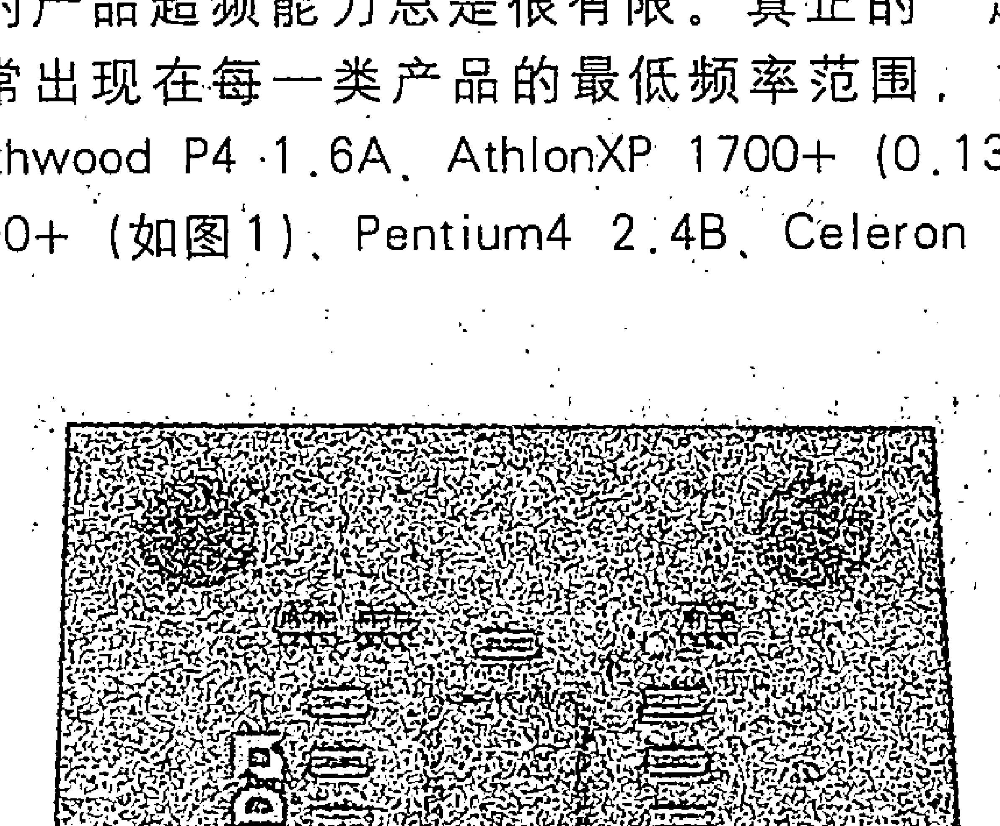

#### 3. 稳定高于一切

很多CPU在超频后都会显得力不从心，此时系统的稳定性将大打折扣。如果在改善散热条件，并且适当增加电压都无济于事的情况下，强烈建议大家将CPU频率降下来。为了少许的性能提升，牺牲系统稳定性显然是得不偿失的。

#### 4. 正视CPU超频的极限

CPU工作频率不断提升，很重要的一个因素，就是制作工艺的不断进步。从几年前的0.35微米工艺到如今的0.13微米工艺，甚至90纳米工艺，每进步一个阶段都会带来巨大的频率提升空间。然而，这并不意味着我们可以无限制地提升频率。任何一款CPU都有其设计的极限频率，这个极限频率是由多种因素决定的，包括架构、工艺、散热等。当频率提升到一定程度后，继续提高不仅不会带来性能的线性增长，反而会导致系统不稳定甚至损坏。因此，我们需要正视CPU超频的极限，不要盲目追求过高的频率。

此外，对于那些破解了倍频的处理器，我们可以尝试降低倍频并提高主频的方法。以Barton 2600+为例，直接超频200MHz外频十分困难，但通过降低倍频之后，使用200MHz外频的机会大增，极高的前端总线可以带来更加出色的性能。

#### 5. 提倡安全超频

既然超频存在一定的危险性，那么我们就更要提倡安全超频，以防止硬件损坏。温度监控与风扇转速监控是非常有用的功能，我们必须在BIOS中将它们打开，如图2所示。此外，超频时也应该遵循循序渐进的原则，一步一步提升主频。一旦发现系统有任何不稳定的倾向，就应当立即停止频率提升，因为这很可能就是该CPU的超频极限。至于散热问题，这里就不再多说，一款制冷强劲的散热器是必不可少的。对于那些超频爱好者或者有一定电子基础的读者，使用水冷或者制冷片来散热也未尝不可。

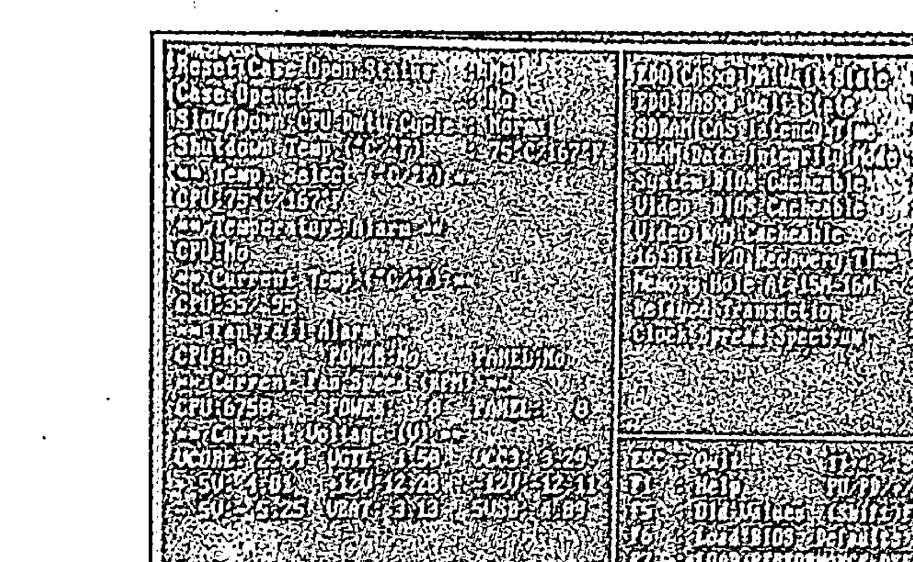

### 二、调整CPU频率的四种方法

#### 1. DIP开关

在部分老式主板上，CPU频率都是依靠这种DIP开关来设定的。DIP开关一般有On和Off两种状态，大家可以参照主板线路板上印刷的频率表进行相应调整，这个频率表也常常出现在主板说明书中。

#### 2. 硬跳线

现在新推出的主板，一般都不再使用这种方式调整频率了。但是，很多Pentium III以及Duron时代的主板，都普遍使用硬跳线。在原理上，硬跳线基本与DIP开关一样，都是通过电路的开与闭来决定CPU的频率。

#### 3. BIOS设置

这应当是目前使用最广泛的CPU频率调整方式了，几乎所有主板都支持。在BIOS中设置CPU频率，最大优势就是不用打开机箱操作，用户只需在开机时按下【DEL】键，进入BIOS设置界面进行调整即可，如图3所示。一般情况下，BIOS中对CPU频率调整的范围相当广泛，远远超出DIP开关或是硬跳线的组合。有些主板中附带的BIOS甚至可以对CPU外频以1MHz为单位进行逐步超频。

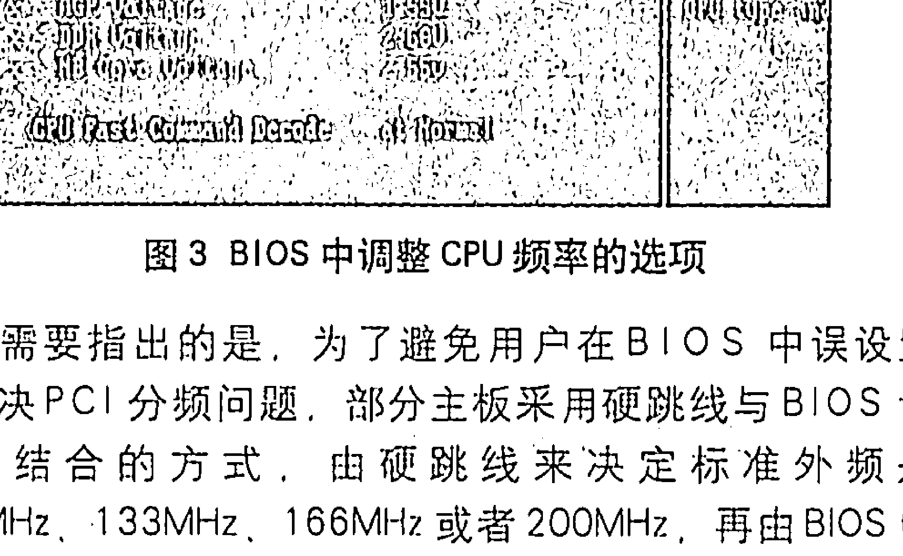

需要指出的是，为了避免用户在BIOS中误设置并解决PCI分频问题，部分主板采用硬跳线与BIOS设置相结合的方式，由硬跳线来决定标准外频是100MHz、133MHz、166MHz或者200MHz，再由BIOS中的相关项设置其他非标准外频。

#### 4. 超频软件

使用软件进行CPU外频调整也很流行。Pentium III时代的主板，可以选择SoftFSB，它能够支持当时绝大多数的主板。一般来说，只要主板采用的PLL-IC（频率产生器）在这款超频软件支持范围内，那么就可以正常使用。此外，现在不少实力较强的厂商都开发了针对自家产品的超频软件，使用起来更加方便，安全性也更高。nVIDIA甚至为其nForce2芯片组开发了专门的超频软件NVIDIA System Utility，效果令人十分满意。

### 三、一个好汉三个帮——超频设备的选购

超频不仅仅是CPU的任务，只有在硬盘、PCI设备、主板等设备的通力合作下，我们的超频才能进行得顺利。很多时候，即使购买超频潜力极佳的CPU，如果周边设备配合不良，超频也可能以失败而告终。

#### 1. 主板

##### （1）丰富的外频与电压调节范围

目前大多数CPU都将倍频锁死，因此通常我们要从外频入手进行超频。毫无疑问，如果主板能够提供丰富的外频设置选项，那么我们就能最大可能地压榨每一分“潜力”。尽管到目前为止，200MHz外频还没有开始流行，但主板能提供这一外频设置是相当重要的。不管是Pentium4还是AthlonXP，一旦能够超到这一外频，其性能增长幅度将非常令人惊讶。当然，并非每块CPU都有如此巨大的增长潜力，因此，外频的逐兆线性调节开始流行，这也是作为一款超频主板必备的素质。

如果超频后系统变得不稳定，不妨试着给CPU提高一点工作电压，这样可以让系统变得稳定一些，因此我们要求主板支持电压可调节功能。此外，部分主板还能调节内存以及AGP电压，这对超频也有一定的辅助作用。

##### （2）至关重要的分频

提高外频是CPU的一招杀手锏，然而它也是一把双刃剑，一旦外频被提高，PC中的其他总线频率也相应提高，这对于别的PC部件相当不利，因为这些总线是PC中数据与指令传输的桥梁。以PCI总线为例，我们的IDE硬盘很少有能够在41.5MHz下稳定工作的产品，同样的道理也出现在AGP总线上。为此，各大主板厂商倾尽全力，采用各种分频技术。目前分频模式主要分为三种，见下表。

| 模式 | 特征 |
| :--- | :--- |
| 固定分频模式 | 无论外频如何变化，AGP、PCI的频率固定在66MHz/33MHz |
| AGP、PCI分段除频模式 | 在某一段的外频，AGP、PCI的频率是固定除以一个数值，比如：在100~133MHz之间，PCI的频率是100~133MHz/3；在133~166MHz，PCI的频率是133~166MHz/4 |
| AGP、PCI分段可选除频模式 | 在某一段的外频，AGP、PCI的频率是可以通过跳线选择的 |

尽管固定分频模式较为中庸，但能帮助我们免去一切后顾之忧；而分段除频模式可能在部分频率范围内，出现高于标准频率的现象，并不是最佳的解决方案；至于分段可选除频模式则较为灵活，但是也有可能出现非标准的频率。

##### （3）做工与散热设计

在超频后系统变得不稳定时，如果不增大CPU的工作电压而是加大MOS管对CPU的供电电流，也能起到相同的效果。不过，无论是增加电压还是增强电流，对主板布线的要求都很高，供电的线路一定要足够粗，否则有烧毁主板的危险。因此，主板的做工一定要精湛，能依靠主板本身良好的电路设计来实现超频的稳定性，这也是为何名厂出品的主板更加适合超频的原因。

此外，采用三相电路设计、电源净化技术的主板也能提高稳定性，这对于超频也是大有裨益。当然，诸如硬件温度监控、风扇监控等功能，也是不可或缺的，毕竟这些都是“安全超频”的保障。

#### 2. 内存与硬盘

由于外频提升后会对总线产生影响，我们在选购其他配件时，也应该为超频做好准备。对于部分不能支持内存异步运行的芯片组，内存本身具备良好的超频能力十分重要。此外，当内存频率提升时，综合性能的提升也较为明显，值得推荐。至于硬盘，在使用频率固定方式不佳的主板时要格外关注，一般而言，Maxtor和Seagate的硬盘对于高频率的适应能力较强。

#### 3. 电源

大家可不要小看这玩意儿，它对于超频也有不小的影响。如果你忽略了这一点，很有可能阴沟里翻船，前功尽弃。如果有条件的话，最好能够拆开电源外壳，仔细看看它的品质。通常情况下，电源内附带的电容要越大越好，越多越好。这些电容可以过滤不纯净的电流，大大减轻主板的滤波负担。超频的系统对于电流纯度有较高的要求，因此，使用具有大容量电容的电源是很明智的。此外，由于超频CPU时常常要提升电压，势必造成CPU功率的提升，最好是选择功率较大的电源，尤其是在使用Athlon XP、Radeon 9800Pro等“电老虎”式的产品时。

### 四、另类超频CPU：毒龙变蛟龙

提高CPU的主频固然能够改善性能，但如果能增大二级缓存容量，那么性能增长幅度将更为明显。不要以为这是天方夜谈，AMD最近推出的Applebred Duron和Thorton内核的AthlonXP 2000+，都具有改造二级缓存的可能性。

事实上，如今Applebred Duron倍受瞩目的关键，正是在与它可以通过修改金桥变成256KB二级缓存。此时，与AthlonXP将毫无区别，性能也将突飞猛进。在AMD处理器的表面金桥中，L1与L3是大家经常接触的，因为这里控制着倍频，L5或许大家也不陌生，很多AthlonXP都可以通过连接L5金桥来改装成AthlonMP。对于Applebred Duron而言，L2金桥是其“命脉”，只要将L2金桥最右方的一组“金点”连接起来，二级缓存容量就会变为256KB。如图4便是我们在修改L2金桥后的WCPUID测试截图，软件已经明白无误地说明了二级缓存的具体容量！

略微遗憾的是，L2金桥通过铅笔石墨进行连接是无效的。好在AMD还不算绝情，这一小小的“刁难”，并不能阻止超频爱好者动手脚。唯一的解决方法，是使用接触电阻低的介质，我们使用的是导电银漆，可以在电子器材行买到。首先，用小勺吸上些许银漆，然后轻轻点在L2金桥最右方的两个“金点”，并保证连通。这一步并没有什么危险，即便没连通也不会伤害CPU，只是要保证不碰到其他“金点”。如果身边有万用表，可以测试一下这两点之间的电阻值，如果不是无穷大就表明连接成功。

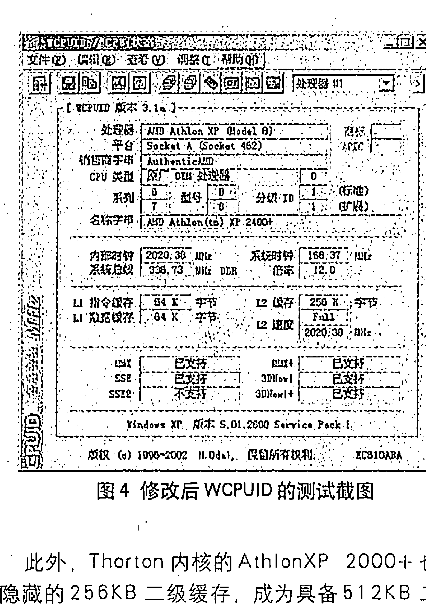

此外，Thorton内核的AthlonXP 2000+也可以激活隐藏的256KB二级缓存，成为具备512KB二级缓存的Barton。具体改造方法与Applebred Duron的破解方法基本一致，也是通过连接L2金桥，只不过需要连接的是第二组‘金点’。

### 五、天生丽质超频王：另辟捷径的移动处理器

#### 1. 认识移动处理器

如今主流移动处理器仍然使用0.13微米工艺，没有实现90纳米，但这并不影响它们的超频能力。对于一款处理器而言，决定发热量的不仅仅是制作工艺，内部晶元的切割也相当重要。大家在选购‘超频王’时，总是认准某一编号，而这往往就是处于晶元中央位置的产品。毫无疑问，几乎所有的移动处理器都是Intel或者AMD工厂严格挑选的产品，晶元中央的选材更有利于提高运行频率。此外，低核心电压、温控电路等也会使移动处理器进一步降低稳定工作温度，这些都为超频打下了坚实的基础。正常情况下，移动处理器应该很难出现在主流市场中，但如今供货商的渠道越来越广，并且不少中小商家也能从各种渠道拿到货。

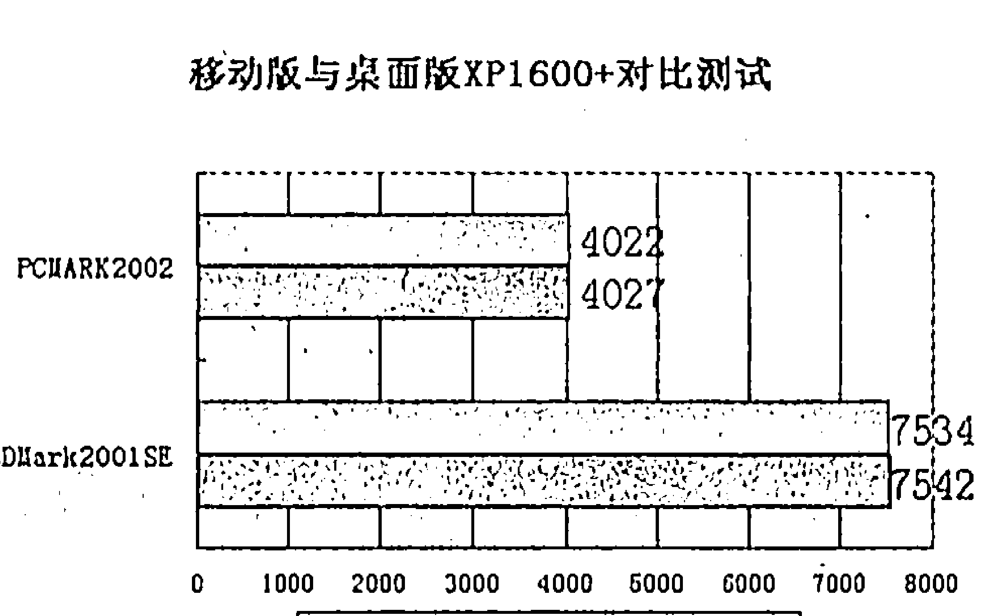

有些用户可能会想到移动处理器中的节能技术，甚至联想到自动降频。我们发现其实并不存在这一问题，即便在超频后也是如此。无论是Intel的Enhanced SpeedStep还是AMD的PowerNow技术，都是在使用电池供电时才能激活，而且必须在笔记本中得到相关电路的支持。毫无疑问，移动处理器一旦使用于台式机主板上，这些节能技术将无处发挥，自然也就不存在降频的问题。当然，对于Intel的移动处理器，降频是无可避免的，即便是桌面处理器也不例外，因此超频时必须保证CPU的核心温度低于65摄氏度。

#### 2. 移动版AthlonXP

移动版AthlonXP应该算得上是超频发烧友的首选。从1400+到2000+，移动版AthlonXP的产品种类十分丰富，其中1400+、1500+与1600+都是基于Palomino核心的产品，而1800+、1900+以及2000+都是基于Thoroughbred内核的产品。尽管它们都采用了0.13微米制作工艺，但大多数Palomino核心的移动版AthlonXP，几乎都只能运行于2.0GHz主频下。事实上，无论是移动版AthlonXP 1400+还是1600+，其超频能力都是一样的。相对而言，基于Thoroughbred核心的移动版AthlonXP更加值得关注，其中很多都能稳定运行于2.3GHz（200×11.5）主频。从CPU的核心外形来看，## 2004年 CS:S与DOOM3硬件指南

文 / 烈火重生

可以肯定，第一人称射击将是今年游戏类型的主角，不少重量级的FPS大作都被安排在今年推出。最近吸引我们关注的，无疑就是CS: Source和DOOM3这两款惊世巨作了。这两款游戏都拥有一个显著的共同特征：绚丽的特效，逼真的画面，这是因为成熟的三维技术得到各游戏厂商的运用以及硬件上的支持。那么，如何感受这两款游戏中近似真实的虚拟世界呢？笔者这就带领大家走进它们的世界……

### 一、万众期待《DOOM 3》问世

#### 1. 《DOOM 3》的起源

对于任何一个热衷于FPS游戏的玩家来说，“Doom”这个单词听起来都不会感到陌生。并且，DOOM对硬件发展的推动作用也是相当大的。无论是《DOOM》还是《DOOM 2》，一经推出之后，总会伴随着玩家硬件平台的升级，也成了权威级显卡、CPU等相关硬件基准性能测试的工具。

DOOM系列包括三代：《DOOM》，《DOOM 2》和现在的《DOOM 3》。DOOM从1993年上市，到现在的DOOM3已经发展了十余年。每一代DOOM都经过了数年的开发，可以说DOOM3的期待度如此之高，不仅仅是因为有《DOOM》和《DOOM2》的成功作为铺垫，它自身的高素质才是最主要原因。《DOOM 3》精雕细琢的程度，绝非一般平庸之作可以相比。

如果你想了解DOOM，以及创造DOOM和Quake的id Software，除了网上各种关于DOOM的资料之外，我们建议你看一看《Master of DOOM》这本书（David Kushner著）。《Master of DOOM》的中文版是今年在国内发行的，中文书名是《DOOM启世录》，它在国外的销量很不错，由此也可见DOOM的人气之高。

DOOM系列是FPS游戏的代表作，每一代DOOM都以单机剧情模式为主线。《DOOM》的故事情节向来不用任何文字说明，而是用画面来告诉玩家一切，以互动式的游戏过程来让玩家一边进入游戏的虚拟世界，一边体验游戏的乐趣。所谓“DOOM没有故事和背景”，当然纯属误会，只要认真玩过《DOOM》，就不会有这种看法。DOOM系列并不像《英雄萨姆》等游戏一样以开阔的外景为主，而是以室内场景为主，而且许多场景光线阴暗，给人以压抑感。这种设计是出于DOOM独特的世界观，DOOM系列一向是在外星球的封闭空间内展开剧情，让玩家同时感受到科技和神秘的魅力。

除此之外，DOOM系列也是最早将多人联机模式引入游戏，并发扬光大的FPS游戏，成为后来网络对战游戏的始祖。不过，Quake系列将网际对战的精髓发挥得更加淋漓尽致，成为了最受欢迎的对战游戏之一。

#### 2. 《DOOM 3》硬件需求

##### （1）官方列表

一些推崇《DOOM 3》的玩家，可能已经玩过了Alpha、Beta这些所谓的《DOOM 3》泄漏版，对它们超高的硬件配置要求还心有余悸。当《DOOM 3》真的来到我们面前，我们不禁要担心，自己的电脑到底能不能玩呢？

在《DOOM 3》发售之前，关于它的系统要求就传得沸沸扬扬，其游戏开发者John Carmack也在四年的开发过程中不断地更改配置要求，直到2004年8月3日，我们在《DOOM 3》的说明书上看到了如下要求：

| 操作系统 | Microsoft Windows 2000/XP并且安装DirectX 9.0b |
| :--- | :--- |
| 处理器 | Pentium 4 1.5 GHz or Athlon(tm) XP 1500+ processor |
| 内存 | 384MB RAM |
| 光驱 | 8X Speed CD-ROM drive (1 200KB/sec)以上的光驱 |
| 硬盘 | 最低2.2GB未压缩硬盘剩余空间（另外至少需要400MB Windows交换空间） |
| 声卡 | 100%兼容DirectX 9.0b的16bit声卡和最新的驱动 |
| 输入设备 | 100%兼容Windows 2000/XP的键盘鼠标和最新的驱动 |
| 显卡 | 100% DirectX 9.0b的硬件加速卡和最新的驱动。例如：ATI Radeon 8500 ATI Radeon 9000 ATI Radeon 9200 ATI Radeon 9500 ATI Radeon 9600 ATI Radeon 9700 ATI Radeon 9800 所有Nvidia GeForce 3/Ti系列 所有Nvidia GeForce 4 MX系列 所有Nvidia GeForce 4/Ti系列 所有Nvidia GeForce FX系列 Nvidia GeForce 6800系列 |
| 联机游戏需求 | 支持Internet（TCP/IP）and LAN（TCP/IP） Internet游戏需要宽带连接和最新的驱动，局域网游戏需要以太网卡和最新的驱动。 |

事实并不像大家所猜测那样，DOOM3对硬件的要求不算可怕。正如上表中我们看到的一样，只要有一块Radeon 8500、GeForce 3 Ti200甚至已经被淘汰的GeForce 4 MX440-8X，也能在低画质的情况下运行《DOOM 3》。而一些更慢的显卡，甚至Matrox的P650/P750，居然也可以在最低画质下玩《DOOM 3》，只不过贴图会有很多错误，希望Matrox能尽快出新驱动来修正。而使用GeForce FX5950 Ultra和Radeon 9800XT这两种上一代的顶级显卡，可以流畅地在中低画质下玩《DOOM 3》，高画质就很勉强了。至于GeForce FX5700系列、Radeon 9600系列这些次一级的显卡，只能把画质再降低一些。

##### (2) 顶级显卡的对抗

目前最适合玩《DOOM 3》的显卡，当然是nVIDIA的GeForce 6800系列，最好是GeForce 6800 Ultra，也只有它才可以在高画质下比较流畅的运行《DOOM 3》。也许有人会感到奇怪，为何不推荐Radeon 9800XT呢？据目前一部分超级玩家的反映来看，GeForce 6800Ultra运行《DOOM 3》的速度明显快过Radeon 9800XT。

##### (3)《DOOM 3》引擎的需要

我们都知道《DOOM 3》使用的物理引擎由id Software自主开发，这个引擎的拟真程度相当高，其中包括多方位动态光源与光影、物理表面的凹凸贴图，以及其他更为拟真的物理特性，这些都在游戏中被淋漓尽致的表现出来。由于《Doom 3》的基调更为血腥暴力，不可避免地出现大量身体支离破碎的画面，几何图形的复杂程度大幅度增加，这显然和CS：Source引擎的特性相去甚远。而且，在《Doom 3》中，除了使用了以往游戏中常用的Shadow Mapping（阴影贴图）处理部分静态图像外，更是将动态光影（Shadow Volume）发挥到了极致。我们在游戏中可以看到，随着物体和光源的移动而发生变化的阴影效果，比如怪物手中的火球飞向我们，墙壁上会投射影子。同时，《Doom 3》采用了先进的环境映射凹凸贴图，它在标准表面纹理上再映射一层纹理，纹理的内容相同但位置相错，错位深度由深度信息和光源位置决定。再根据表现对象的不同，将下层纹理进一步处理为上层纹理的阴影或底面，这样就逼真地模拟出了真实物体表面的凸凹褶皱效果，再配合光线，由光反射和镜像效果在曲面上营造出更逼真的场景。可以说，从游戏效果上，《Doom 3》偏重于环境映射凹凸贴图，更注重支离破碎的物理效果及动态阴影效果。因此，《Doom 3》对GPU的像素顶点引擎性能要求较高。这方面nVIDIA显卡要比ATI的产品略具优势，而且，《Doom 3》采用与微软DirectX格格不入的OpenGL接口作为API，这也正是nVIDIA的强项。《DOOM 3》的首席工程师John Carmack不止一次谈到，nVIDIA的OpenGL驱动相当出色，比ATI的OpenGL质量更好。特别是《Doom 3》所采用的Shadow volume（阴影锥）技术极消耗系统资源，对GPU填充率要求也十分高，遇到复杂的场景，流水线不免不堪重负。而nVIDIA从NV35时代起，就开始引入专门针对阴影锥算法的Ultra shadow阴影加速技术，它以OpenGL扩展的形式在NV35中得到正式支持。从原理上来说Ultra Shadow允许程序员在考虑到光源和阴影的视觉范围后，定义场景中一个区域，用来将光源至物体的阴影计算约束在一个特定范围内，从而加速阴影的计算速度，它可以节省填充率和带宽。到了NV40时代，则升级到更先进的Ultra shadow II版本，能更有效地减少需要被运算的阴影区域数量，增加了32Z/stencil渲染能力。

##### (4) GeForce 6800U 为最佳选择

《Doom 3》的画质分为四个运行模式（如图1），Ultra画质、High画质、Medium画质、Low画质。在Ultra画质模式下，由于在读取纹理时，漫射光源、镜面效果，以及正常图层都采用了非压缩格式的全分辨率纹理，这可能需求高达500MB的纹理数据，虽然在当前主流和高端的显卡上可以运行这种配置，但是并不能把500MB的纹理内容压缩成256MB，这将占用大量的显存带宽，并且并不保证至少60帧每秒的画面。在《Doom 3》中，High画质、Medium画质两个模式的显存需求量分别为256MB、128MB，使用128MB和256MB显存显卡的区别，在于前者进行了全材质压缩，后者则对《Doom 3》部分材质压缩。而Low画质模式，主要将纹理的大小由512×512改成了64×64，逼真效果大大降低，对显存容量需求也降为了64MB。

即便是在配备P4 3.4GHz、Athlon 64 FX 53、1GB内存这样的超级平台上，在High画质模式、800×600分辨率、启用4XFASS下，R9800XT也仅仅只有35帧/秒成绩，FX5950可以达到50帧左右；而在Ultra画质模式下(1024×768分辨率，4XFASS)，R9800XT只有24帧，而FX5950也仅仅达到可玩的程度35帧左右。

如果在1024×768分辨率、启用全特效情况下呢？只有GF 6800U、GF 6800GT、Radeon 9800XT PE这样级别的显卡才能保证游戏的可玩性，GF5700U级别的显卡在800×600、不启用任何特效的情况下，也只能保持在45帧的水准。

在《Doom 3》的官方测试中，nVIDIA显卡凭借Ultra shadow技术与优异的驱动程序，成功击败ATI，主宰《Doom 3》。NVIDIA最新推出的ForceWare 61.77版本驱动，已经提供了对UltraShadow II的支持。如果你使用的是NV35、4X系列图形芯片，可以通过开启这个功能来提高显卡在《Doom 3》中的表现。

证多数场景下画面的表现都比较流畅。毕竟目前大多数朋友的电脑配置一般在2GHz CPU和512MB内存的水准。当然，如果希望获得更出色的画质，例如在1024×708等分辨率下流畅地进行游戏，一块基于NV40或者R420核心的显卡才能满足要求。

市场上主流中高端显卡一览表

| 属性 | 6800 Ultra | FX5950 Ultra | FX5700 Ultra | X800 XT PE | 9800 XT | 9600 XT |
|------|------------|--------------|--------------|------------|---------|---------|
| 核心代号 | NV40 | NV38 | NV36 | R420 | RV360 | RV360 |
| 核心制程 | 0.13 | 0.13 | 0.13 | 0.13 | 0.13 | 0.13 |
| 渲染管道 | 16 | 8 | 4 | 16 | 8 | 4 |
| 贴图单元 | 1 | 1 | 1 | 1 | 1 | 1 |
| 核心频率 | 400 | 475 | 475 | 520 | 412 | 500 |
| 显存频率 | 1100 | 950 | 900 | 1120 | 730 | 600 |
| 显存位宽 | 256bit | 256bit | 128bit | 256bit | 256bit | 128bit |

从目前来看，运行《Doom 3》最好的显卡，还是最新的6800系列和X800系列。作为最高端主流显卡它们不负众望，相信在大家能接受它的价格后，会迎来销售高峰期，我们极力推荐有实力的玩家购买！至于其他显卡，基本都是目前市场上的主流产品，价格都可以接受，也是最佳的选购时期。希望广大玩家看准时机，挑选最适合自己挑战《Doom 3》的利器！

#### 3. 《DOOM 3》堪称硬件杀手

我们所使用的配置，现在看上去依旧高端，竟然在运行《Doom 3》时沦落到实用型的份上。这正如id SOFT在发售《Doom 3》前号称的一样：“要想完美体验《DOOM 3》的魅力，我们需要2G的内存和具有512M显存的显卡。”也许只有这样的机器，我们才能真正体会到《DOOM 3》的魅力和乐趣吧。”想一想，即时的动态光影、完整的3D特效……

> 如id SOFT在发售《Doom 3》前号称的一样：“要想完美体验《DOOM 3》的魅力，我们需要2G的内存和具有512M显存的显卡。”

其实，在《Doom 3》中驰骋和杀戮，意义远不止从中寻求狂放不羁的放纵与血腥的快感，这个虚拟世界存在的更大意义，就是为电脑世界提供了一个赛跑的平台。提升自己的速度极限，寻求比赛带来的激情，正是《Doom 3》世界为我们带来的最大启示。在这个赛场上，只要突破自己的极限，人人都是冠军，ATI与nVIDIA之争，不也正是如此吗？

### 二、Counter-Strike: Source, 走进你的世界

#### 1. CS：S，让我走进你的世界

玩过CS 1.6的朋友大多认为，它是一个并不太令人满意的版本。虽然秉承了一贯的游戏方式和紧张刺激的风格，但这个版本仍然没有给人留下非常良好的印象。这些问题，都在《CS:Source》中发生了彻底的改变。

1998年，Valve Software发布了Half-Life，从此，以该游戏为基础的Couter-Strike创造了一个新的神话，直到现在，CS仍是最为流行的电脑游戏之一。在大约15个月前的E3 2003上，Valve小组让全世界玩家知道他们正在开发Half-Life 2，该游戏将具备令人震惊的画面效果、独特的操作方式以及全新的物理引擎。在那次的E3上，Valve向人们展示了Half-Life 2中多人对战的一部分，这也就是我们今天要说的《Counter-Strike: Source》，以下简称《CS:S》。

虽然《Doom 3》造成的声势远比《CS:S》大上许多。但笔者认为，相比《Doom 3》来说，或许有更多的人会因为《CS:S》而升级电脑。无可否认，《Doom 3》是电脑技术发展的一个里程碑，但实质上，它是一个单机游戏。虽然它的多人联机作战模式正加紧研制，并将在不久的时间内面市，但ID设计小组最初的设计理念还是带给玩家单机游戏的乐趣。与《Doom 3》不同，CS在设计初始就已经是为多人联机游戏而设计的。《CS:S》作为一个用Half Life2游戏引擎制作的CS升级版（如图2），将会是Half Life2里惟一一个多人联机游戏版本。

说到这里，许多CS的狂热爱好者已经激动，全新的CS即将展现在他们的面前。很多玩家担心，我的电脑能跑动《CS:S》吗？或者，要怎样升级电脑才能更加完美地享受游戏？不可否认，他们升级电脑和购买新电脑必将带动下一轮的购机狂潮。下面，让我带领大家进入《CS:S》的世界。

#### 2. 官方硬件要求

只要简单回顾一下CS对硬件要求的历程，就会发现CS对硬件内在的要求远小于对外设的需求。在笔者的印象中，似乎并没有为CS专门进行过主板、显卡、CPU、内存等配件的升级。近二年高端鼠标、鼠标垫、耳机等外设的普及，也正说明了这点（如果连流畅地进行游戏都不可以，相信谁都无暇去追求这些高端外设产品），这其实也是CS能够迅速风靡世界的主要原因。新款的《CS:S》又会怎样？先看看Valve官方发布的运行《CS:S》的硬件要求吧。

| 项目 | 最低配置 | 推荐配置 |
|------|----------|----------|
| CPU | 1.2 GHz 处理器 | 2.4 GHz 处理器 |
| 内存 | 256MB RAM | 512MB RAM |
| 显卡 | DirectX 7 graphics card | DirectX 9 graphics card |
| 操作系统 | Windows 2000/XP/ME/98 | Windows 2000/XP |

从表中可以看到，《CS:S》对硬件的要求依然不算太高，对很多玩家来说是个福音，这也是《CS:S》能继续风靡的一个保障。不过，要想获得更流畅的运行速度，硬件级别在推荐配置之下的用户，升级机器配置是首选。

#### 3. 视频负荷测试

《CS:S》自带一套测试，进入游戏就可以找到，当然也可以通过录制DEMO的方式进行测试。这其实是一个“视频负荷测试”，早在测试版的时候，它就已经引起了大家的关注（英文版是叫“Video Stress Test”）。我们都知道，《CS:S》是基于Source引擎的游戏，而这个“视频负荷测试”测试的，就是你的硬件系统在Source引擎中的表现，对其他基于Source引擎的游戏（如Half-Life 2）也有同样的意义。早在去年，Valve就公布了不同显卡在一个Half-Life 2 Benchmark中的测试结果，这里的“视频负荷测试”同那个测试工具类似，仅仅是一个Half-Life 2 benchmark而已。

“视频负荷测试”画面中（如图3），大量使用了Source引擎的辐射度光照光影效果以及法线贴图有机地结合渲染画面，这是墙壁等环境映射更加逼真的关键。而HDR的引进以及Shader特效带来的真实地充满反射和折射的水纹效果，也是我们需要注意的。

测试结束后，会出来一个测试结果界面，报告你的机器在负荷测试中的平均帧数，你可以把这个结果上传给Valve，让Valve的工程师了解玩家们的硬件状态。这个测试工具是一个潮湿的类似地下隧道的场景，需要特别出注意的是，里面的4块石板由半透明玻璃拼制而成一个手持铁锹的带眼镜男人，以及一个被火包围、由水组成的人的模型。游戏引擎会根据显卡的类型自动选择显示效果，举例说，当我们用 Radeon 8500 和 GeForce MX440 来做测试时，引擎就会自动关闭一些只有 DirectX 9 才可以运行的特殊效果。这种设计可以提高一些旧显卡运行时的帧数，但是就少了一些特殊效果。

## 4. 比较，不同 DirectX 等级的画质对比

大家都知道，显卡的一个重要规格就是对于不同 DirectX 版本的支持。在 2001 年以前流行的 3D 游戏，主要是基于 DirectX7.0 设计的，从 2001 年下半年，市面开始出现不少基于 DirectX8 的 3D 游戏。现在主流的 3D 游戏，还是以基于 DirectX8 的为主，不过支持 DirectX9 的游戏已经开始大量出现，而且今后几年的发展重心都将基于 DirectX9。

目前市场上支持 DirectX7、DirectX8、DirectX9 等规格的显示卡并存。如果使用支持 DirectX9 的显卡玩游戏，无疑是最好的，因为支持 DirectX9 的显示卡都具备向下兼容的能力，也支持 DirectX8、DirectX7 的游戏。对于支持 DirectX8、DirectX7 的显卡来说，基于 DirectX9 的游戏虽然可以运行，但是在游戏中的表现欠缺很多场景特效，在画质表现上没有那么真实自然，速度也会慢很多。那么，不同的 DirectX 在《CS：S》下的表现又是怎样呢？让我们看图4所示画面。

从图4中可以看出，各个 DirectX 级别下的画面纹理细节差别很大。可能有些读者会怀疑，怎么看起来 DirectX8 下的墙壁纹理更加清晰呢？是不是搞错了？没错，DirectX8 下的墙壁纹理看起来更加清晰是事实，造成这种原因的，只不过是因为这里使用的贴图技术不一样而已。Valve 在 DirectX8.1 和 DirectX8.1 下使用了 Bump Maps 凹凸贴图，对墙壁进行处理；而 DirectX9.0 中，Valve 使用了 Radiosity Normal Maps 辐射度法线贴图，这种贴图手段是 Source 引擎最独到的地方。不过，这样的截图对于 DirectX7.0 而言，细节明显地模糊了很多，偶尔情况下甚至可能出现贴图错误。

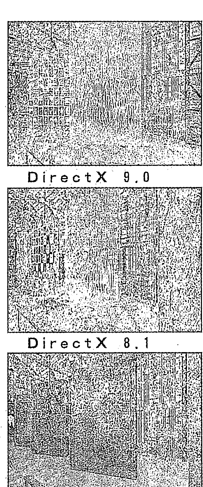

## 5. 注意，《CS：S》有诈

在笔者将《CS：S》安装到硬盘之后，就不停地对它进行各种测试。在测试过程中，笔者不经意发现了这样的一个怪现象。在测试中，设置界面的下方是 DirectX 级别设置选项，其中最下方的一个是硬件级别，另一个则是软件级别。软件 DirectX 级别是电脑上安装的 DirectX 版本；而硬件 DirectX 级别，本来应该是根据显卡所支持的硬件 DirectX 级别。这里却有个意外（如图5所示），GeForce FX5700 居然被默认为 DX8.1。

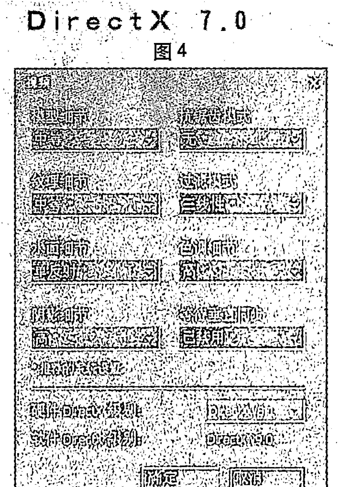

GeForce FX 系列的显卡被默认运行在 DirectX 8.1 下，虽然从技术上来说 GeForce FX 显卡确实支持 DirectX 9 的技术。对于这一点，Valve 官方解释说是由于 GeForce FX 显卡在 DirectX9 模式下运行《CS：S》游戏比较慢，所以如果检测到 GeForce FX 显卡，游戏就会默认以 DirectX8.1 路径运行，而 nVIDIA 对此的答复是，未来的驱动将会显著提高 GeForce FX 显卡的性能。

目前，nVIDIA 只有其最新的 GeForce 6 系列显卡才能默认运行在 DirectX 9.0 级别下，其他的如 GeForce FX 5950Ultra 到 5700 的显卡，只能默认运行在 DirectX 8.1 级别下，GeForce FX 5200 运行在 DirectX 8.0 级别下。而 ATi 方面，所有的显卡都能默认运行在其实际的硬件级别下，如 Radeon 9550 和 Radeon 9600SE 以上的显卡，都能默认运行在 DirectX 9.0 级别下，Radeon 9200 和 Radeon 8500 默认运行在 DirectX 8.1 级别下。

DirectX 级别，在这个设置界面并不能手动选择，还好，《CS:S》支持输入命令行来强制 DirectX 等级，下面是各模式具体修改方法：

- DirectX 9.0: mat_dxlevel 90
- DirectX 8.1: mat_dxlevel 81
- DirectX 8.0: mat_dxlevel 80
- DirectX 7.0: mat_dxlevel 70
- DirectX 6.0: mat_dxlevel 60
- DirectX 5.0: mat_dxlevel 50

GeForce FX 系列的显卡强制成 DirectX 9 后是否有效，性能又如何呢？请跟随笔者操做，在游戏控制台中输入“mat_dxlevel 90”（不包括引号）后，再在视频设置里确认一下硬件 DirectX 级别是否已经变成“DirectX v9.0”。如果显示为 DirectX v9.0，那么 ok，你的显卡已经被强制为 DX 9.0 模式运行。

这个时候你再进入游戏，截图与之前运行在 DirectX9.0 下的情况比较一下，你会发现，两者的画质已经很难用肉眼来看出差别了，也证明了在正式版中，已经可以使用强制命令让 FX 系列显卡运行在 DirectX9.0 模式下。那么速度又如何呢？结果非常出乎意料！经过一轮视频负荷测试，你会惊讶地发现，强制成 DirectX9.0 后成绩居然暴跌了 50% 之多！看来，Valve 只让 FX 系列显卡运行在 DirectX8.1 模式下，确实是应该的。

而也正是因为 nVIDIA 不能完美地对《CS:S》游戏需求的 DirectX9.0 进行支持，导致在《CS:S》上，ATi 一扫历年来的速度劣势，完全称霸于各种分辨率下。nVIDIA 显卡已经无法与 ATi 较量速度了，看来《CS:S》的引擎还是对 ATi 支持得好一些。奉劝各位 CS 爱好者，如果你希望加入《CS:S》的新家族，选择一块 ATi 显卡，速度要比同等级的 nVIDIA 显卡快 10% 左右，这是为《CS:S》购买硬件时需要注意的地方。

## 6. 影响游戏速度的瓶颈

采用了 Half Life2 游戏引擎《CS:S》，具有一定未来游戏的前瞻性，在保持画质的情况下游戏对硬件的要求很高。什么是影响速度的最大瓶颈呢？

上面仅是 CS: Source Video Stress Test 表面测试，进入游戏以后，你会发现考验硬件的时刻真正到来。只要开枪，碰见人多的情况时，FPS 就会急剧下降，FPS 在整个游戏中非常不稳定，可能是游戏本身还没有进行优化的问题。笔者通过一个晚上的实际游戏测试，总结了一些对游戏 FPS 影响较大的因素。

《CS:S》更多依靠 CPU。在测试中，我们发现分别用没有超频的 AthlonXP 2500+ 和 AthlonXP 3200+ 时，在 Video Stress Test 测试中得分基本没有区别，但进入游戏实战后，却发现差别很大。在多人混战的时候，使用 2500+ 掉到了 20FPS，而使用 3200+ 时却可以保持在 30FPS 左右，很明显地看出 CPU 满足不了需要。特别是在 DX7、DX8 的模式下，如果 CPU 强大，那么你跑起来就不会太慢。

游戏设置里模型精度和纹理精度有关，如果你只有 128M 内存，那么这两项游戏默认设置全为低，256M 以上才为中，512M 以上为高。在 Video Stress Test 测试中设置成高、中、低三个之间的差别并不是很大。但是，和上面一样，进入游戏中就会发现设置成高以后，明显变得卡起来。在显卡方面，GeForce TI4200 以下的显卡建议都用 DirectX7 来运行游戏；GeForce FX5600 以上的显卡运行 DirectX8 下表现一般。ATI 显卡系列相对来说，对游戏的支持要好一些，画面比 nVIDIA 显卡也要强一些，9800P 就可以很好地运行此游戏，并且可以根据自己的情况打开 AA+AF。不论 ATi 还是 nVIDIA 的显卡，都同样具有 FPS 不稳定的现象，在水中多人混战开枪时，测试中的机器配置都掉到十几 FPS 过。

总的来说，通过此次比较简单的测试，只能让我们对《CS:S》有个大概的了解，并不能完全评估其总体性能。由于现在出现了很多针对游戏优化的现象，估计 Valve 也很难做到同时兼顾 ATI 和 NVIDIA 的产品。

### 三、结论

总的来说，使用“大众”显卡的人大可以放心，基本上现在市场流行的显卡都可以很流畅地运行这两个游戏。Radeon9800 PRO 在我们的测试里表现得非常好，并且我们发现，瓶颈问题是在 CPU 上而非显卡上。甚至连更早的显卡，例如 GeForce4 MX440 都可以得到令人满意的表现，尽管会有部分特殊效果无法显示出来。但如果你是一位追求图像效果的狂热游戏玩家，可以考虑换一块支持 DirectX9 的显卡，以获得全部的特殊效果。有一个小提示，GeForceFX 系列目前在《CS:S》上仅支持 DirectX8 引擎。其实，相对于升级显卡而言，笔者更支持大家重新购置一个强劲的 CPU。

# 没有硝烟的战场
—— 2004 内存技术回顾与展望

文/图 阿亮

VIA 搭上 PC133 的快车之后，一举扭转了以往被动的局面；插上了 DDR 的翅膀后，AMD 在与 Intel 的竞争中一度处于上风；Intel 对 DDR“网开一面”后，立即枯木又逢春……种种迹象表明，CPU 乃至芯片组的竞争，都与内存有着极大的关系。过去 EDO、PC100、PC133 一统天下，这一点并没有为我们所认识，但是，当 DDR 与 Rambus 分道扬镳之后，内存架构与 CPU 芯片组的关系越发微妙，而目前内存技术又一次来到发展道路中的十字路口。

## 一、内存知识

### 1. 内存的作用

从功能上理解，我们可以将内存看作是内存控制器（一般位于北桥芯片中）与 CPU 之间的“桥梁”或“仓库”。显然，内存的容量决定“仓库”的大小，而内存的速度决定“桥梁”的宽窄，两者缺一不可，这也就是我们常说的“内存容量”与“内存速度”。

当 CPU 需要内存中的数据时，它会发出一个由内存控制器执行的要求，内存控制器接着将要求发送至内存，并在接收数据时向 CPU 报告整个周期（从 CPU 到内存控制器，内存再回到 CPU）所需的时间。毫无疑问，缩短整个周期是提高内存速度的关键，而这一周期就是由内存的频率、存取时间和位宽来决定的。

更快的内存速度，对整体性能表现有重大的贡献，但提高内存速度只是解决方案的一部分。数据在 CPU 以及内存间传送所花的时间，通常比处理器执行功能所花的时间更长，为此缓冲区被广泛应用。其实，所谓的缓冲区就是 CPU 中的一级缓存与二级缓存，它们是内存这座“大桥梁”与 CPU 之间的“小桥梁”。

### 2. 内存的构造

大家应该都见过内存，但你是否真正认识内存的构造呢？了解一下内存上的各个元件，对于熟悉内存很有好处，我们也将从这一步开始深入讲述。首先，请大家看图1，这是一张普通 DDR 内存图片，图中我们对内存条上各个主要部位进行了标注。

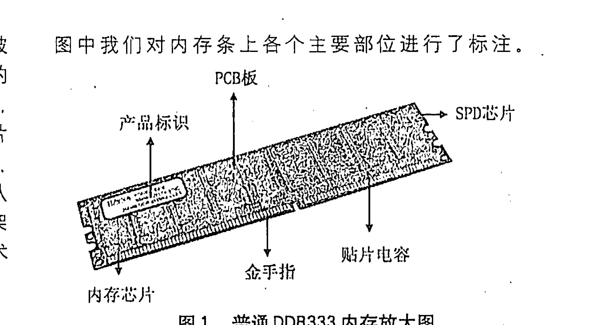

#### (1) 内存芯片

对于内存条而言，内存芯片就好比其心脏，它是整个内存条中最重要的部分。我们平时所说的内存速度、CL 延时等指标，都与内存芯片本身的性能密切相关。虽说决定内存品质的并不完全是内存芯片，毕竟制造工艺、封装技术、用料也很重要，但是，如果内存芯片本身性能指标不高，整个内存条将难以在高频率下运行。

内存芯片主要分为欧美产和亚洲产两大类。欧美地区的产品对生产工艺要求严格，是追求品质的发烧友首选，代表厂商有 Micron、Infineon 等；亚洲国家和地区（韩国、日本及我国台湾地区）的产品我们更为熟悉，比如市场上最常见的现代（HY），对于一般用户而言，它的性能和稳定性已经完全够用，还有韩国的三星、日本的 NEC、我国台湾地区的 Nanya（南亚）等品牌也属此类。

一般而言，内存厂商会在内存芯片的表面标识有关速度、带宽等关键的技术指标，不过各个厂商的标识方法有所不同，而且也并不直观，因此很多读者无法看懂。这里就不一一叙述了。

#### (2) 金手指

金手指也被称为连接器或是“Leads”，它是主机与内存之间信息传输的媒介。金手指的材料包括金和锡，随着技术工艺的提升以及市场竞争的激烈化，如今在内存金手指上使用的“金”的含量已经越来越少。当然，我们不能单纯地以此作为产品优秀与否的判别标准，理想的金手指应该做到不易脱落、不易被氧化。此外，金手指也是判断内存是否属于二手货或者返修货的关键，被使用过的内存，多少会在金手指上留下一些痕迹。

#### (3) 印刷电路板 (PCB)

内存的 PCB 一般为绿色或者黄色，它是由许多层面构成。每一个层面上都有电源通路 (trace) 及电路，以便传送数据。一般来说，品质越好的内存模组使用越多层面的印刷电路板，层面越多，电源通路间的空间越大，相互干扰的机会也越小，这也使得内存模组更可靠。在服务器内存上，六层甚至八层 PCB 是十分常见的。

不过，过分追求 PCB 的厚度毫无意义。我们的建议是，在购买内存时，只要注意 PCB 板重量是否均匀，表面是否整洁就可以了。PCB 板做得好的内存，拿在手里应该有一种沉甸甸的感觉，并且感觉质量均匀，而非一块薄薄的、又毫无重量感的普通半导体板子。此外，PCB 也是最能体现内存做工的地方，从中或多或少可以折射出内存的品质。

#### (4) SPD 芯片

SPD 的全称是 Serial Presence Detect（串行存在探测），它是一颗 8 针的 EEPROM（Electrically Erasable Programmable ROM，电可擦写可编程只读存储器）芯片，采用 SOIC 封装形式，容量为 256 字节（Byte）。它的位置一般处于内存条正面的右侧，里面记录了诸如内存的速度、容量、电压与行、列地址带宽等参数信息。在开机时，PC 的 BIOS 将自动读取 SPD 中记录的信息，如果没有 SPD，就容易出现死机或致命错误的现象。当然，部分主板在没有检测到 SPD 时也能正常驱动，这主要取决于主板厂商的设计。

#### (5) 贴片电容

内存工艺是很直观的，欣赏一块设计出色的内存条也是一种艺术享受。内存条上的贴片电容，起到增加内存抗电磁干扰性的作用，可以有效提高系统稳定性。我们经常看到一些名牌内存具有排列整齐而且密密麻麻的贴片电容，而杂牌产品的贴片电容则相对较少。对于相同容量的贴片电容而言，电容小而多比大而少时输出的电流更纯净更稳定。

### 3. 封装技术

随着内存频率的提升，内存芯片的发热量也逐步提高，对稳定性提出了严峻的考验。尽管使用更新的制作工艺是不错的解决方案，但先进的封装技术也不可忽视。优秀的内存封装，可以起着安放、固定、密封、保护芯片和增强导热性能的作用。此外，封装技术不仅能够保证芯片与外界隔离，还能防止空气中的杂质腐蚀芯片电路，造成电气性能下降。

目前最常见的封装方式有 TSOP（Thin Small Outline Packaging）与 BGA（Ball Grid Array Package），早期的晶片设计以 DIP（Dual In-line Package）以及 SOJ（Small Outline J-lead）的方式封装。此外，较新的内存，例如 RDRAM 与高频率 DDR，则使用 CSP（Chip Scale Package）封装。

## 二、DDR 的未来之路——DDR2 与 DDR3

如果永远在频率上进行无休止的竞争，那么 DDR 技术也避免不了曲终人散的那一天，因为频率的提升并不能令性能大幅度提高。如果想要获得质的飞跃，必须从本质核心上进行改造。DDR2 与 DDR3 是全新的技术，虽然它脱胎于 DDR，但是，拥有更多先进技术的 DDR2 与 DDR3 还是毫无争议地成为令人瞩目的技术。

### 1. DDR2 带来更高的频率与更低的功耗

DDR2 相对于 DDR 技术，最重要的提高在于可以读写分离。在传统的 DDR 中，爆发式读取过程是并行的，而且数据控制接脚为单项，导致上行与下行的带宽降低。但 DDR2 可以采用双向数据控制接脚，实现更高的等效频率带宽。令人感到意外的是，制定 DDR 标准的 JEDEC 组织，可能不会对 DDR2 的工作频率做出具体规定。如果真的这样，那么内存市场将发生翻天覆地的变化。由于 DDR2 仅仅需要 1.8V 的核心电压，因此使用更高的频率来提升性能是势在必行的。此外，为了减小信号窜扰，DDR2 将使用 ODT 技术以确保最优化的单周期波形。如此一来，生产 DDR2 将成为一件非常不容易的事情。按照 300MHz（等效为 600MHz DDR）来计算，那么 0.11 微米的工艺技术将是必需的，内存芯片的封装工艺也将起到极为关键的作用。综合这两项因素，实力相差悬殊的各大内存芯片生产商，将会在产品上有很大的不同。JEDEC 组织放给厂商更多的自由非常明智，因为这样有利于市场竞争，从根本上促进 DDR 的发展。也许以后我们购买内存时，要像购买 CPU 那样仔细地看清频率，因为内存将采取异步运行技术，完全脱离与 CPU 外频的关系，对系统的整体性能产生巨大的影响。我们不得不承认，尽管 DDR2 可能在生产技术上存在一定困难，不过其更出色的等效频率与低功耗令业界翘首以待。

### 2. DDR3 有望提前取代 DDR2

DDR2 的缺点在于爆发限制 (Burst Limitation)。爆发动作是指从内存中连续的地址读取有限的数据，在一个 DDR 设备的频率周期中，可以读取两个各长 n-bit 的数据。这两个数据信号必须位于内存中的相同位置（由逻辑电路寻址），稍后才能移往下一位。从偶数字节地址起始的全页递增爆发读取 (Full-page Increment Burst) 来说是没有问题的，因为读取的第二道数据在内存中的地址仍与第一道数据相同。但是，对于由奇数字节地址起始的全页递增强发读取来说就没有用了，因为两者的数据位置不同，也造成 DDR2 设备在预读取功能上的限制。

更为令人遗憾的是，DDR2 内存的延时表现也令人无法完全满意。目前 DDR2 的 CL 最低值为 3，最高为 5，并且不再有 x.5 的设计。为了解决这一问题，DDR2 采用了前置 CAS 技术，并引入了 AL 值的概念。不过前置 CAS 在解决老问题的同时，也带来了新的问题——在背靠背式读取时，仍将经过“AL+CL”的潜伏期才能读取数据，比传统的内存只有 CL 相比，读取的延迟反而增加了。

继 Elpida、HY、钰创等厂商相继推出 DDR2 内存芯片之后，美凯龙和三星更进一步，推出了 DDR3 内存芯片，具有巨大产量优势的 HY 也表示已经为 DDR3 作好了一切准备。DDR3 内存具备目前业界最高的内存工作频率，而耗能却很低。同时，DDR3 内存所需要的配件更少，约束条件也更低。据悉，美凯龙采用了 0.11 微米技术打造 DDR3 芯片，首批产品的工作频率将定在 800MHz。可以说，DDR3 是目前市场上最快速的内存产品了。DDR3 单内存芯片的数据带宽比 DDR2 提升了 50%，而耗电却进一步减小，这将使得 DDR3 内存更容易增大容量。

出于兼容性的考虑，DDR2 标准在制定之初显得有些缩手缩脚，这也直接导致其各方面表现比起 DDR 没有长足进步。新一代的 DDR3，采用了 ODT（核心整合终结器）技术以及用于优化性能的 EMRS 技术，同时也允许输入时钟异步。在针脚定义方面，DDR3 表现出很强的独立性，甚至敢于彻底抛弃 TSOP 和 MBGA 封装形式，采用更为先进的 FBGA 封装。

从长远趋势来看，拥有单芯片位宽优势以及频率和功耗优势的 DDR3，迟早会取代 DDR2，甚至 DDR2 很可能会是过渡性技术。但是不要忘记，如今 Intel 的 925X 芯片组已经箭在弦上，一旦 Intel 正式发布该芯片组，DDR2 势必会打进民用市场。从某种程序而言，925X 芯片组将会是 DDR2 内存的风向标，如果 Intel 取消该芯片组的发布，也就意味着 DDR2 很可能直接被 DDR3 所取代。

## 三、RAMBUS 永不言败——64 位 RDRAM 与 XDR

当 Intel 提出双通道 DDR 芯片组时，RAMBUS 已经失去了最后一张王牌，不过这并不意味着 RDRAM 会就此退出历史舞台。借助 64 位 RDRAM 与 XDR 技术，雄心勃勃的 RAMBUS 公司渴望东山再起。

### 1. 64 位 RDRAM

如果 RDRAM 仅仅是在频率上提高，那么业界中绝大多数人都不会看好它。道理很简单，RDRAM 之所以节节败退，并非因为性能不佳，而是没能很好地控制住成本。尽管目前同容量的 RDRAM 与 DDR 的价格差距并不是很大，但在它们争夺市场份额的最初，Rambus 的价格实在太离谱了，以至于 Intel 和主板生产商都对其失去了信心。

RAMBUS 公司对此也心知肚明，在提高产品性能的同时，也努力压缩生产成本，提高良品率。由于目前所有的 Rambus 都是 32 位的，因此 RDRAM 内存必须成对使用，这不但在无形中增加了内存的生产成本，更是令芯片组的设计复杂化，对于 Rambus 产品的推广非常不利。64 位 RDRAM 的意义不仅仅局限于成本，性能上的提升也是至关重要的。使用双通道之后，尽管理论带宽并未增加，但是内存控制器的效率将得到更大的提升，RDRAM 的威力也得以充分体现。

对于 64 位 RDRAM 而言，芯片组与主板的支持十分关键。为了尽量减小主板厂商的生产难度、提高产品的吸引力、保证兼容性，Rambus 公司开发了 PC1600 标准的插槽，其针脚定义与以往并没有很大的差别，内存生产商也只需要作很小的改动就能生产出 64 位 RDRAM。

| DRAM 设备 | DDR | DDR2 |
| :--- | :--- | :--- |
| 工作电压 | 2.5V | 1.8V |
| 电气信号 | SSTL_2 | SSTL_18 |
| 预取功能 | 2bit | 4bit |
| 内部 BANK 数 | 4bank | 4banks 或 8banks |
| 封装形式 | 66 针 TSOP | 60 针 TSOP/BGA |
| 数据控制接脚 | 单向 | 双向 |
| 时钟频率 | 333/266/200Mbps | 667/533/400Mbps |
| Off Chip Driver Calibration | - | 对应 |
| On Die Terminator | - | 对应 |
| Posted CAS | - | 对应 |
| DIMM 构成 | x64, x72 | x64, x72 |
| 容量 | 64MB-2GB | 256MB-4GB |
| 板型高度 | 最大 1.125 英寸 | 最大 1.2 英寸 |
| 针角数量 | 184 针 | 240 针 |
| Stacked number | 8 层 | 6 层 |
| DRAM 构成 | x4, x8, x16 | x4, x8, x16 |
| DRAM 密度 | 64Mbit-1Gbit | 256Mbit-2Gbit |

| | DDR2 | DDR3 |
| :--- | :--- | :--- |
| 传输速率 | 800Mb/s 以上 | 1600Mb/s 以上 |
| 核心电压 | 1.8V | 1.9V |
| I/O 电压 | 1.8V | 1.9V |
| 终结器 | 外部 | 核心整合 |
| 核心耗电量 @400MHz | 1.2W | 1.2W |
| I/O 耗电量 | 高 | 降低 30% |
| Off Chip Driver 校准 | 无 | 有 |
| 输出 | 推挽式 | 开漏式 |
| DQS 配置 | 双向，单向终结 | 单向，单向终结 |## 2. XDR 内存

XDR是RAMBUS公司的新一代RDRAM内存，其中XDR代表eXtreme Data Rate DRAM的缩写。因为XDR采用“Octal Data Rate”八倍速传输（如图2），在一个时钟循环中传送8个Bit的数据，因此实际频率400MHz的XDR等效于3.2GHz的SDRAM内存，可以达到惊人的内存带宽。

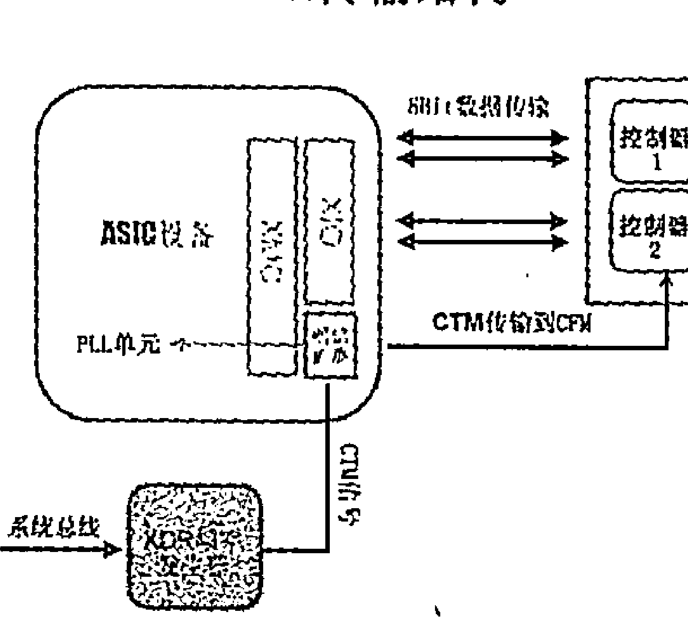

相比之下，DDR SDRAM只能在一个时钟周期进行2Bit的数据传输，而XDR内存则可以达到8Bit，堪称是XDR的核心技术。在一个时钟周期内（一个上升沿和一个下降沿），XDR DRAM进行了4次时钟采样，在采样的每个上升沿和下降沿都传输了1bit的数据。因此，在一个时钟周期内，XDR可以传输8bit的数据。

XDR协议使用了一种“中性”的传输标准，即所有的数据必须按照规定的速率进行发送，但是数据可以根据时钟的边界，在任意相位内进行发送。在这个协议下，形成了XDR FlexPhase电路，它集成于XIO单元中，确保了数据最高的传输速率。在XDR的工作过程中，首先由XCG根据系统时钟产生CTM控制信号，随即CTM控制信号直接传输至ASIC设备，ASIC设备根据CTM信号调用XIO部件，XIO部件通过PLL来生成内部的XDR数据时钟。在此过程中，CTM会沿着互连总线传输给每一个DRAM CFM部件，CFM主要是对DRAM每一个引脚进行数据收发和信号控制。

XDR与上一代RDRAM的最大区别就是具有独立的数据和地址/指令总线。RDRAM的结构需要数据通过所有的内存模块，这也造成了RDRAM为人诟病的高延迟性。好在XDR通过两条独立的总线解决了这一问题，其中地址/指令总线还是需要经过所有的内存模块，不过数据则可以由内存控制器直接进入对应的模块。

和RDRAM一样，XDR也需要一个独立的频率发生器芯片。RDRAM的频率发生器，是其能否在主板上稳定工作的关键，也决定了RDRAM能够以怎样的频率工作。如果RDRAM的频率发生器质量不够好，将会限制内存模块的性能发挥。不过这一切对于XDR而言都不是大问题，从图3我们可以看到其发展蓝图。另外，Cypress和ICS都已经签约为XDR制造频率发生器，两家公司的实力都不容小视。

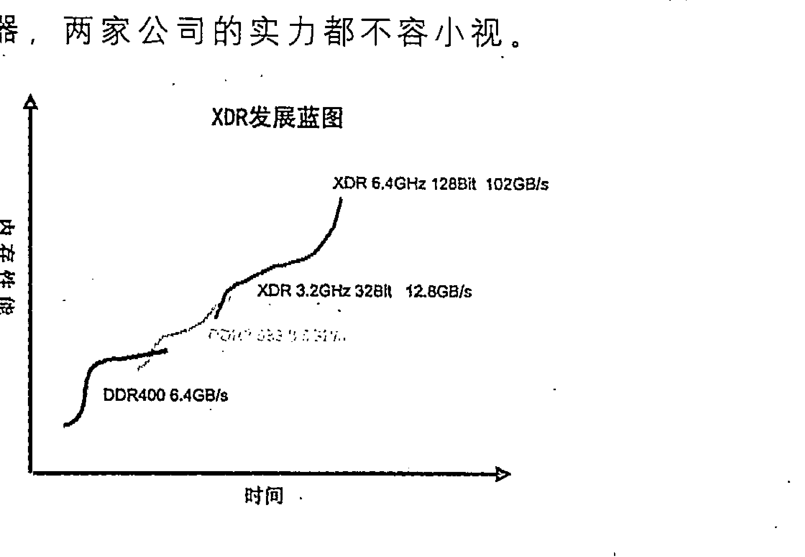

## 四、FB-DIMM 内存规范

Intel在前不久的IDF论坛上，宣布成立Memory Implementers Forum (MIF)新组织，以开发FB-DIMM内存规范。FB-DIMM是一种全新的原生串行内存总线标准，替代目前的DIMM设计。不过，FB-DIMM仅仅是内存规范，并非内存芯片技术，但是，这肯定将带给内存模块惊人的变化，甚至可能彻底改变目前的内存架构与内存控制器设计。

FB-DIMM就是“全缓冲内存模组”，主要目的是解决普通DDR与Registered DDR内存的发展局限性。目前的DIMM内存模组，采用一种“短线连接”（Stub-bus）的拓扑结构。在这种结构中，每个芯片与内存控制器的数据总线，都有一个短小的线路相连，这样会造成电阻抗的不连续性，从而影响信号的稳定与完整。频率越高或芯片颗粒越多，影响也就越大。随着时钟频率的提高，这种结构对内存通道中芯片数量的限制作用也越来越大。速度与容量间存在着一定的反比关系，因此，直到目前为止，速度、价格、容量这三个内存指标，在普通DDR内存上并不可能同时实现。

我们以DDR内存为例，在DDR内存从DDR 200提升到DDR2 533时，可以安排的内存通道急剧减少。DDR 200可以使用四条内存通道或插槽，但在DDR2 533上就很难实现，这对未来更高要求的应用并不是个好消息。

FB-DIMM内存与普通DDR内存相比有了很大的变化。首先，DIMM与内存控制器之间的数据与命令传输，不再是传统的并行线路，而采用了类似于PCI-Express的串行接口多路并联设计，以串行方式进行数据传输。另外，每个DRAM芯片不再直接与内存控制器进行数据交换。事实上，除了时钟信号与系统管理总线的访问，其他的命令与数据I/O，都要经过

## 五、内存的革命——MRAM

尽管内存技术在几十年的发展过程中已经有了很大变化，而且性能也提高不少，但并没有发生实质性的改变。因为这些产品都是基于“动态随机访问存储器” DRAM (dynamic random-access memory) 的，一旦没有持续电力，所存储的数据就会立即消失，直接导致PC 必需经历一段不短的时间进行启动才能正式使用，无法做到像其他家电一样即开即用。然而，MRAM 却是一种全新的技术，甚至有望令PC 的应用方式彻底改变。

### 1. MRAM 的技术精髓

MRAM (Magnetic Random Access Memory) 是一种非易失性的磁性随机存储器。所谓“非易失性”，是指关掉电源后，仍可以保持完整的记忆，功能与目前流行的闪存芯片类似；“随机存取”是指CPU 读取资料时，不一定要从头开始，随时可用相同的速率，从内存的任何部位读写信息。MRAM 运作的基本原理与硬盘驱动器相同，和在硬盘上存储数据一样，数据以磁性的方向为依据，存储为 0 或 1。它存储的数据具有永久性，直到被外界的磁场影响之后，才会改变这个磁性数据。因为运用磁性存储数据，所以MRAM 在容量成本上有了很大的降低。

但是，MRAM 的磁介质与硬盘有着很大的不同。它的磁密度要大得多，也相当薄，因此产生的自感和阻力要少得多，这也是MRAM 速度大大快于硬盘的重要原因。当进行读写操作时，MRAM 中的磁极方向控制单元 (Magnetization Direction Control Unit) 会使用相反的磁力方向，使数据流水线能同时进行读写操作，不延误时间。MRAM 的这种设计方案也不是没有坏处，当磁密度小到一定程度时，会产生一定的信号干扰，对于MRAM 的稳定性有影响，好在目前的制作工艺相当先进，已经完全能够解决这一问题。

此外，当感应磁场通过MRAM 层面时，又会产生微小的区别抵抗力 (Differential Resistance)。这是因为感应磁场建立的顺磁场，在其相反的存储状态中磁化而形成的，这也是各向异性的磁致电阻 (AMR) 的缺点之一。AMR 这个缺点暂时还无法避免，毕竟它对MRAM 的正面影响要远大于幅面影响。

### 2. 令速度飞跃的PSV 技术

限于目前MRAM 的基本结构，它的速度势必不可能达到令人完全满意的程度，尤其是在等待周期和信号衰减方面。较长的等待周期，使得MRAM 在作为内存储器时，有了致命的弱点，而信号衰减更令MRAM 在速度上的缺陷雪上加霜。

为了解决这一问题，业界开发了Pseudo-Spin Valve 技术 (伪旋转真空管)，这大大提高了MRAM 的读写周期与潜伏周期 (等待周期)，同时还加强了层与层之间的信号。保守一点说，配备了PSV 技术的MRAM，在这两项指标上已经完全超越了现在的任何DRAM 内存 (自然包括DDR 和RDRAM)，这在以前都是MRAM 受业界质疑的核心问题。从某种程度而言，PSV 为MRAM 铺平了发展普及的道路。

从图4 中，我们可以看出有2 个磁层 (分别是图中的H 和I)，它们以错位的方式区分磁场偏转程度的大小，使两个层面形成大小相差很大的偏转，令MRAM 在层与层之间的信号衰减降低很多。而且，做到这一点并不困难，成本也很低，两个层面只要使用材料相同而厚度不同的磁膜层 (magnetic films) 就可以了。


由于PSV 技术，较薄的磁膜层转向较低的数据扫描场，而较厚的磁膜层转向较高的数据扫描场，此时，两个层之间的磁阻力就削弱不少，完全改善了MRAM 的等待周期。PSV 技术使得GMR 巨磁阻的有效范围更大，这也是PSV 提高MRAM 速度的原因之一。

### 3. VRGC 的应用

在高密度MRAM 模块中，会遇到磁的不规则漩涡 (magnetic anomalies vortices)，这种漩涡引起了磁极的老化，甚至导致读写错误。这也就是说，MRAM 的寿命和稳定性会随着MRAM 容量的增加而面临严峻考验。为此，VERTICAL RING GMR CELLS 技术 (垂直环绕巨磁阻单元) 应运而生了，它的模式如图5 所示。

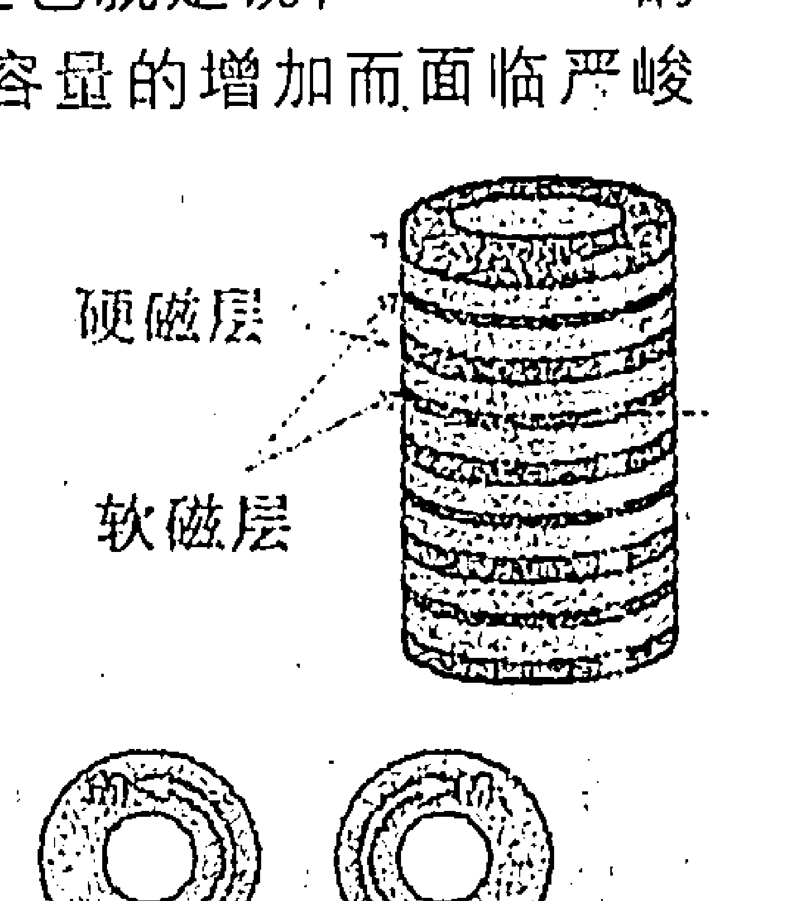

很明显，VRGC 让磁层有了软硬之分。大家可不要小看这一简单的变化，因为这样一来，垂直排列的巨磁阻会将不规则漩涡基本消除，有效地解决了MRAM 的老化问题。此外，为了加强 MRAM 的稳定性，避免读写错误，VRGC 技术在每一基本单元额外加入了一对平行字符线，有点类似目前普遍应用于服务器内存的校验功能。

### 4. MRAM 与其他存储器的比较

对于存储器而言，重要的技术指标无非就是速度、是否为非易失性、功耗、成本、体积、寿命等等。在这些方面，很多种类的产品已经做出了各种各样的努力，但是始终只能偏重某一方面，而不是做到面面俱到。也许，大家最看重的是 MRAM 的非易失性，这的确是很诱人的，毕竟它让使用 MRAM 内存的电脑可以像电视或者收音机那样马上启动。话又说回来，除了 MRAM，目前也有不少非易失性存储器，其中包括大家最为熟悉的磁盘（硬盘、软盘）、Flash Memory（闪存）和 EPROM。

毫无疑问，作为内存储器，磁盘是绝对不行的，因为速度实在太慢了，尽管它的容量很大。至于 Flash Memory 中极为流行的 Compact Flash、SmartMedia 和 Memory Stick 则在寿命上完全不能符合内存储器的要求。一般的 Flash Memory，在经过大约 10 000 次读写周期以后就会报废，而内存储器的读写是相当频繁而且无序的。要是强行将 Flash Memory 作为内存储器使用，也许满负荷工作 200 个小时就报废了。当然，闪存用于数码相机、MP3 播放机等信息家电产品还是很合适的。还有 EPROM，也就是大家主板上 BIOS 块，它具有较快的速度，但体积和成本都是令人无法想象的，而且寿命也一般，更是不能用作内存储器。

与面前流行的 DDR 或是 RDRAM 相比，MRAM 的优势依然明显。撇开令人垂涎欲滴的非易失性不谈，仅在速度、功耗和体积上，MRAM 也有较大的优势。下面，我们把这些存储器种类进行简单的对比，让大家有一个更加感性的认识：

| 存储器种类 | 速度 | 易失性 | 功耗 | 成本 | 寿命 | 体积 |
| :--- | :--- | :--- | :--- | :--- | :--- | :--- |
| MRAM | 最快 | 是 | 很低 | 较低 | 很长 | 很小 |
| DRAM | 较快 | 否 | 较高 | 较低 | 很长 | 较小 |
| 闪存 | 较慢 | 是 | 一般 | 一般 | 一般 | 一般 |
| EPROM | 很慢 | 是 | 不知 | 较高 | 很长 | 较大 |
| 磁盘 | 一般 | 是 | 很高 | 很低 | 较短 | 很大 |

> 注：由于目前 MRAM 还没有进入量产阶段，因此价格很高。从实际情况来看，MRAM 的成本还是很低的，一旦步入主流，价格上将十分具有竞争力。

### 5. MRAM 的前景

自从 Honeywell 成功提出 MRAM 原型之后，IBM 和摩托罗拉等厂商便积极开始了实质性的研发工作。相比之下，目前似乎是摩托罗拉更为主动一些。半年之前，摩托罗拉在国际固体电路会议上，首次展示其 256KB MRAM 通用存储器芯片。这款芯片是摩托罗拉实验室与 DigitalDNA 实验室共同合作的结果，结构是 16KB × 16，读写周期小于 50ns，在 3 伏特电压下读功耗为 24mW。该芯片的研制成功，是 MRAM 业界发展过程中的一个里程碑。按照摩托罗拉的说法，在 2004 年将进行 MRAM 样品的批量生产。

当然，蓝色巨人 IBM 的实力也不容小视。为了更好地争夺 MRAM 市场的先机，IBM 还与著名的 Infineon Technologies 公司联手发展，这种合作并不仅仅是技术与生产的组合，而是研发上的互相支持，具有非凡意义。此外，在 IBM 的官方网站中，我们也能看到 IBM 实验室对于 MRAM 的重视，仅是投入的研发经费就让人感到吃惊。而且，IBM 对于 MRAM 的前景非常看好。据 IBM 透露，最初生产的芯片存储能力为 256M，随着技术的不断革新，芯片存储能力将进一步提升，读写周期将控制在 10ns 以内，功耗将小于 8mW。

除了以上两大巨头之外，日韩的实力也令人刮目相看。韩国的三星电子于 2000 年成立了国家级自旋电子研究所，在经费和技术上完全具有与 IBM 或者摩托罗拉一拼的实力。日本的日立和松下电子也是蠢蠢欲动，尽管它们在 MRAM 上的起步晚了一些，但日本厂商强大的研发实力还是让人对其充满信心。

毫无疑问，MRAM 在几年后逐步普及将是大势所趋，各国的大型公司更是为之挥金如土。造成这种局面，是因为 MRAM 的应用范围不仅仅局限于 PC，而是面向所有的电子产品，包括移动电话、以数码相机为代表的消费类电子产品，甚至在航天工业中也会得到应用，为航天系统提供关键性的存储器部件。

就目前的 MRAM 而言，当务之急就是尽快克服所有的非技术性难关，进入大规模的量产阶段，以此来不断降低成本，刺激市场，奠定市场份额。不过，从 DRAM 的发展历程来看，MRAM 也许还有很长一段路要走。我们今天讨论的 MRAM 还是最初级的 MRAM，将来的 MRAM 在各方面的性能将更加强大，就像当初的 EDO 与现在的 RAMBUS 的差距一样。

## 六、写在最后

目前，还不能盲目地说 DDR2 将成为下一代主流或者 MRAM 是未来绝对的发展趋势。从各种迹象来看，RDRAM 并未达到山穷水尽的地步，DDR3 也开始跃跃欲试，而其他 SDRAM 静态内存技术也在不断发展。未来内存技术很可能将向着多元化的方向发展，任何一个芯片组厂商都渴望建立新的标准，甚至整合内存控制器的 CPU 厂商也努力把持内存业界的权威地位，种种势力之间的碰撞与冲突将不可避免。但从短时间来看，高频 DDR 与 DDR2 将在 2005 年共存，这也是一种平稳发展的良好局面。

## # 2004年主要外设技术与新品解析

图 / 文 信子

随着我国电脑普及率的不断攀升，另一个辅助产业——电脑外设也逐渐进入人们的视野。调查研究结果显示，中国计算机外设市场增长迅猛，有望成为世界上最大的计算机产品市场。从1996年到2002年，中国计算机外设市场销量增长速度一直保持在30%以上，个别产品的增长速度甚至超过50%。而从中国的计算机普及率来看，这个市场仍有很大上升空间，与此配套的计算机外设产品市场发展潜力也十分巨大。这一点从国内几大IT厂商的发展战略就可以略见端倪：联想借力多功能一体机（MFP）全面介入电脑外设市场，方正涉足激光打印机市场，清华同方连续推出包括游戏手柄、方向盘、摇杆、游戏鼠标等在内的30余款电脑游戏外设。其实，看好外设市场的不仅仅是国内的电脑生产商，就连微软这样的全球软件巨头，也是对电脑外设垂涎已久，不断推出新款键盘、鼠标等产品抢占市场份额。从赛迪顾问发布的2004年第一季度中国计算机外设产品市场分析报告中可以看出，进入2004年度，中国计算机外设市场在旺盛需求的拉动下，继续保持稳定增长。不断出现的技术革新，带动着外设市场的持续繁荣，包括液晶显示器、多功能一体机、投影机和DVD刻录机在内的外设产品集体突围，均取得了不错的市场销售业绩。众多厂商也根据市场需求，针对不同的定位，逐步丰富自己的产品线，真正实现了消费需求推动市场不断发展；市场的不断扩容又促进技术加速革新，技术革新又明显加快了各厂商的新品发布速度，进一步丰富了消费的选择，间接拉动需求增长，一个外设市场的良性生长循环模式初步形成。本文就以2004年的主要外设技术为线索，同时对其他相关外设新品进行一下简要介绍。

### ## 一、8 毫秒响应时间——液晶面板

随着液晶显示器销量的持续走高，其显示品质也成为人们关注的焦点。其中，影响显示质量的关键一环，就是液晶面板的响应速度。由于液晶显示器的成像原理与传统CRT显示器不同，如果液晶面板响应速度不够快，显示动态画面时会有明显的拖影，特别是在那些高速移动的3D游戏或者DVD影片中，也就是我们常说的液晶显示器“鬼影”现象。长期以来，液晶显示器的显示拖影问题，一直严重影响着LCD显示器的市场竞争力。不过，随着液晶技术的不断提高，LCD的响应时间近年来不断提升，已经从25ms、16ms、12ms一路提升到8ms，这种状况也在不断改善。理论上，当画面显示速度超过每秒25帧时，人眼会将快速变换的画面视为连续画面，不会有停顿的感觉。当液晶面板响应时间为30ms时，显示器每秒钟能显示1/0.030=33帧画面；而当响应时间25ms时，每秒钟就能显示1/0.025=40帧画面。按照1/0.016大约等于62.5帧的公式，可以说16ms的响应时间，一下子比25ms面板的显示能力提升了20帧以上，而12ms提升到了83帧，8ms则可以提升到125帧画面。这已经大大超过了人眼能感知的每秒100帧画面的极限。另外，液晶显示器的总体响应时间由上升和下降两个时间组成，下降时间越短，图像消失也就越快，越不容易产生残影现象，显示动态图像就更加流畅、自然。最新的8ms液晶面板将下降响应时间缩短到了2ms，这已经非常接近CRT的水平了。可以说，拥有8ms响应时间的液晶显示器，即使是对应时间要求较高的FPS游戏也不会出现拖影问题，液晶显示器已经具备了与CRT显示器在显示质量上一较高低的能力了。同以往发布16ms和12ms响应时间的液晶面板稍有区别的是，8ms的响应时间不仅仅是液晶面板的又一次技术革新，它预示着液晶显示器逐步取代CRT显示器时代的来临。不少有实力的面板厂商也瞄准了这块市场，做好了充分的准备，迎接8ms时代的到来。目前，除了友达光电能够提供8ms的面板外，三星也有了类似的技术，它们通过改进液晶驱动技术，并配合“过驱动”（Over Drive）技术，增加驱动液晶分子的电压，以达到提高液晶面板响应时间的目的。各大显示器厂商也十分看好8ms液晶显示器市场，均表示会很快推出采用新面板的显示器。其中，优派已经率先推出采用最新8ms面板的VP171s/b液晶显示器，该公司预计8ms型号将在2005年第一季度成为市场主流。明基也于近日向市场推出了一款8ms响应时间的产品“FP71E+”，并计划增加16ms和12ms型号产品的销售力度。此外，LG和Philips也计划在今年第四季度发布8ms型号的液晶显示器。

代表产品：

1：优派“VP171s/b”显示器（如图1），其秉承了VP系列一贯的欧洲经典风格设计，不仅拥有8ms响应时间，还拥有VP系列“八大典范”的诸多专业功能和特性，如超高亮度、超高对比度、DVI数字输入端子、自由可旋转屏幕、可拼接电视墙、sRGB色彩管理、超广角视界等专业功能。

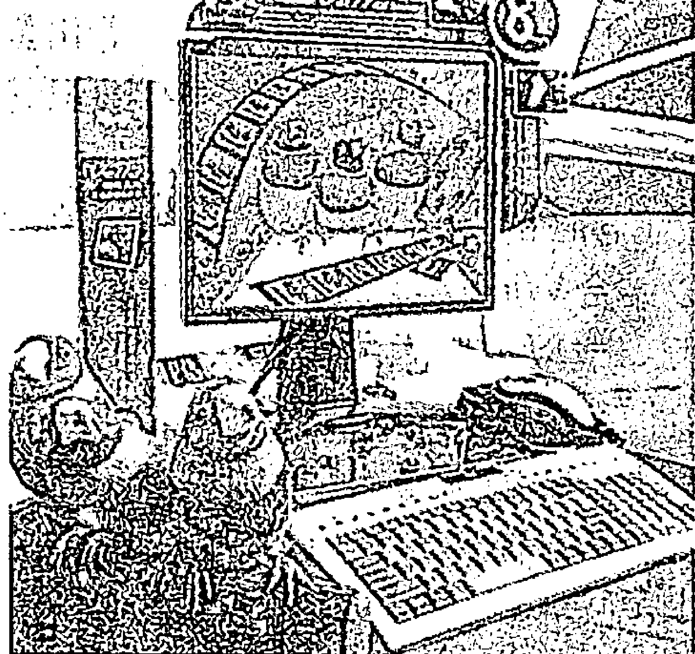

2．明基“FP71E+ 显示器”（如图2）。这款显示器提供了17英寸可视面积，标准分辨率为1280×1024，对比度为500:1，亮度为300流明，重量为4.7Kg，配备了D-Sub和DVI-I接口，反应时间达创纪录的8毫秒。上下左右160度的最大可视角度。同时，明基最新的BenQ Senseye技术也使得显示画质更加完美。

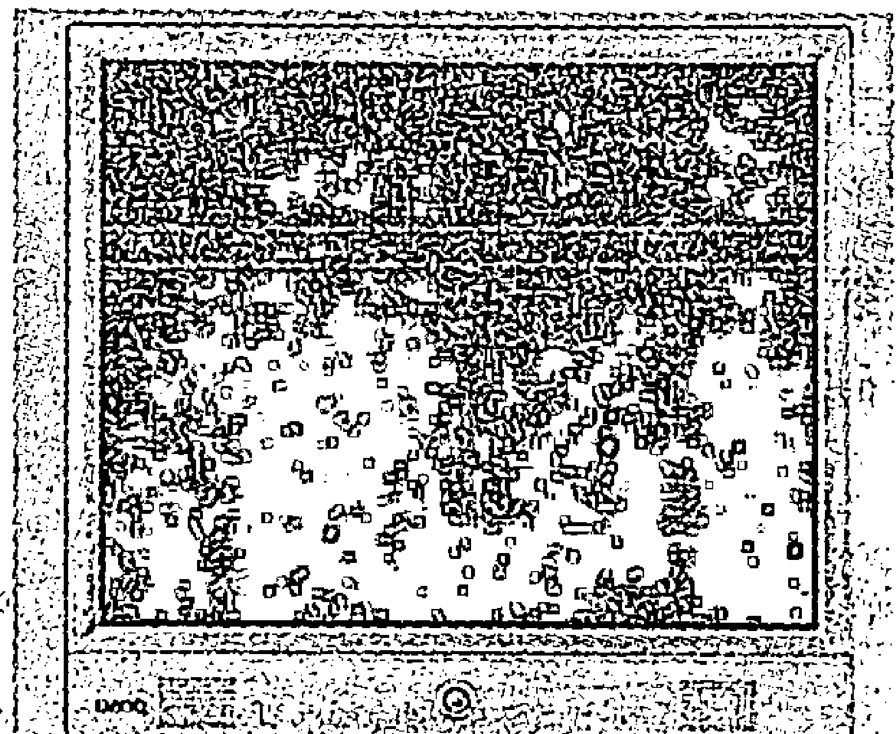

实际上，虽然8ms快速响应时间不能称之为液晶显示技术的一次飞越，但是它的市场推广意义却远远超越现实可用性。因为它使液晶显示器的响应时间，第一次接近了人眼所能察觉的5ms响应时间的极限，基本上解决了长期困扰液晶面板成像质量的一个难题，对液晶显示器的普及起到了极大的推动作用。

接下来，人们可能会更关注液晶显示器的颜色表现力、显示器的亮度以及液晶面板的可视角，这些方面也将成为未来一段时间液晶面板厂商的主攻方向。毕竟，在响应速度的技术障碍突破之后，厂商和市场都需要新热点，并且，这些热点也在随着LCD响应速度的提高而更加突出。

### 二、X架构——键盘

键盘作为电脑的主要输入设备，长久以来一直处于最显眼的位置，但也最容易被人们所忽视。其他电脑配件如CPU、显卡、硬盘、内存等等，早已进行过多次技术革新，多数已经发生了翻天覆地的变化。可是，电脑键盘从DOS时代至今，却鲜有什么变化，顶多也只是个别厂商在多功能按键及人体工程学方面做了部分改进，键盘的核心——按键结构并未发生过变化。因此，国内著名外设生产厂商明基电通（BenQ）推出了采用全新的“X 架构”按键设计的键盘，誓言要改革传统键盘。

如图3所示，“X 架构”就是指支撑起键帽的两只交叉在一起的平行四连杆，它们的结构从侧面看呈“X”状，故称之为“X 架构”。“X 架构”的工作原理是：运用两组平行四连杆机械，以强迫运动方式运动，让使用者接触键盘的四个角落时，都能享受到顺畅而且一致的手感。

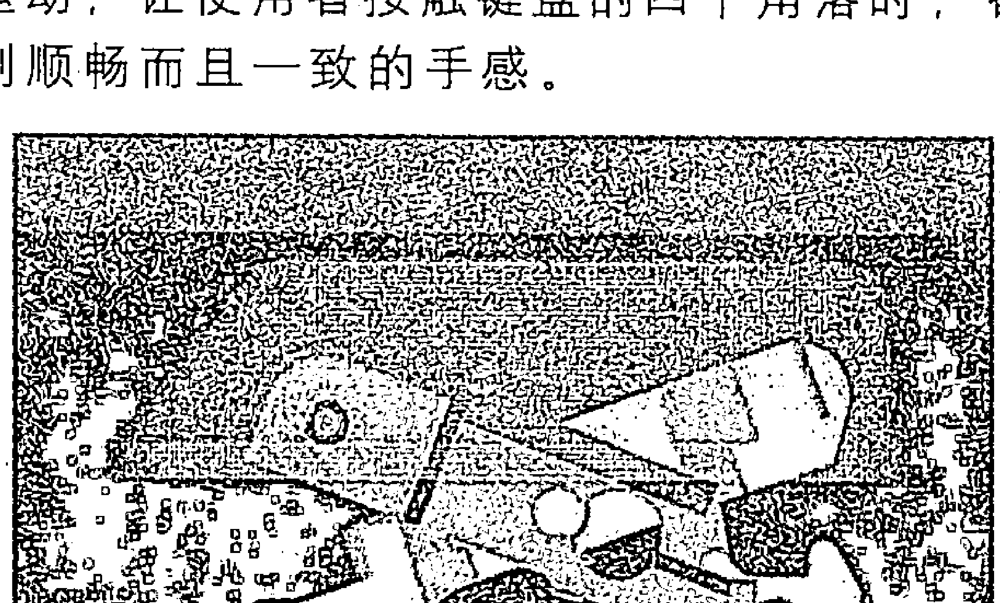

代表产品为：明基海湾A122海湾键盘豪华版（如图4），采用了USB接口。它除了经典的104个按键外，专门加入六个多功能键，并且将从【F1】到【F12】的按键以每三个一组进行全新组合，并被赋予了新的功能，包括帮助、新建文档、查找、保存等等，功能相当丰富。另外，海湾键盘每个按键的面积和长度都经过精心设计，刚好与东方人的手型相吻合。

图4

采用“X 架构”的键盘与传统键盘的特色对照见下表：

| 产品 | X架构 | 传统键盘 |
|------|-------|----------|
| 键盘行程 | 3.5-3.8毫米，键程短，使用舒适 | 3.8-4.0毫米，键程稍长，长时间敲击容易疲劳 |
| 敲击力道 | 剪刀脚架构，力道较轻，力度均匀 | 敲击力道分布不均，键帽中间同四周差别较大 |
| 按键设计 | 采用人体工学设计，键帽受力平均分布于四个角落，长时间使用键帽不易摇晃 | 采用的轨道直滑式构架，经过一段时间的使用，由于磨损，往往会有键帽摇晃，同时伴随有卡键的现象发生 |
| 噪音 | “X架构”采用平行四连杆设计，能有效缓解键盘敲击的力量，极大的降低了键盘噪声 | 传统键盘设计容易造成键帽直接碰撞基座，或者“T形”滑杆与竖井的摩擦，因此按键声较大 |
| 键盘厚度 | “X架构”键盘按键高度为10毫米，键盘整体可以做的非常薄 | 普通键盘按键高度至少有20毫米，所以键盘整体厚度很难做到超薄 |

“X 架构”键盘在诸多方面克服了传统键盘的不足，极大地改善了电脑输入设备的工作条件。采用人体工学设计，使人手在长时间输入后不容易疲劳，同时，极低的工作噪声也非常值得称道。更是被人称之为液晶时代的电脑键盘。相信随着时间的推移，“X架构键盘”最终必将取代传统键盘。

## 三、指纹加密识别技术

普通人很难想象在日常生活中会接触到指纹识别技术，因为在大多数消费者的印象中，指纹识别总是科幻电影中才会出现的镜头。但是，随着科技的不断进步，这份神秘正逐步向我们走来，目前已经有厂商在我们常用的外设当中添加了这项技术。

大名鼎鼎的微软公司，前不久在日本举办了键盘鼠标新产品发布说明会，展示了具备指纹识别功能的键盘和鼠标。微软这次拿出的指纹识别新产品有“Optical Desktop with Fingerprint Reader”指纹识别键盘（如图5）、“Wireless IntelliMouse Explorer with Fingerprint Reader”指纹识别无线鼠标（如图5）和单独的“Fingerprint Reader”指纹识别器。

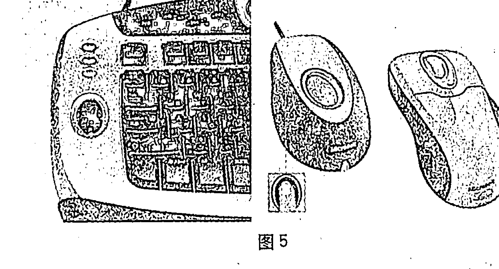

图5

与安全部门、情报机构所采用的生物测定技术不同，微软在键盘及其鼠标中内置指纹识别技术的主要目的，不是为了安全，而是为了化繁为简，方便用户。微软“指纹识别技术”可以记忆用户任何一个手指头的生物特征信息，并可以通过相关软件，将其转化为电脑的登录口令或者是电子邮箱的密码。并且，可以结合Windows XP Home/Pro、Media Center、Tablet PC或以上版本的操作系统，实现家庭电脑用户一触之间轻松进行用户切换。这样一来，在使用采用指纹识别器的微软光学桌面套装指纹版以后，用户无需使用各种繁琐的密码，即可以轻松管理自己的电脑账户和网络账号。当你在登录PC，访问喜欢的论坛，或者访问自己的电子信箱时，再也不用发愁无法回忆起正确的密码，一切都有指纹识别系统帮你解决。

同时，微软开发的这套指纹识别系统，拥有直观、人性化的界面，十分便于使用。不过，目前这套指纹识别系统，需要Windows XP Home/Pro、Media Center、Tablet PC或以上版本的操作系统才可以支持，Windows 9X/WINDOWS 2000等系统是不支持的。

另外，作为品牌移动硬盘一线厂商的旅之星，在前不久也将指纹加密识别技术引入到移动硬盘领域，推出了国内首款指纹加密型移动硬盘（图6）。不同于通过软件控制对数据进行加密的软加密技术，旅之星的指纹加密型移动硬盘采取生物识别加密技术，是一种硬加密技术。将国际领先的活体指纹识别技术应用于移动硬盘，这也成为业界首创。

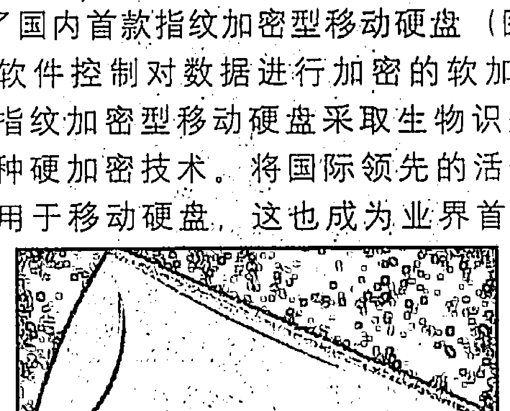

图6

采用指纹加密之后，避免了软件加密方式需要大量运算过程、资源消耗大、效率低的弊病；同时，指纹识别技术也避免了复杂密码设置以及忘记密码的麻烦，只需用手指一碰就可解密，而且是只有使用者本人才能开启，确保机密数据无法被人冒用、窃取和篡改。

指纹具有两个特征：一是指纹纹脊样式是惟一的，二是指纹纹脊的样式终生不变。依靠这种惟一性和稳定性，可以把一个人和他的指纹对应起来，通过比较指纹验证身份。指纹识别具有安全、高效的身份认证识别功能，已经陆续有厂商在笔记本、手机、闪存盘等电子产品中加入指纹识别技术，一个新的生物特征认证技术市场也在逐步形成。

不过，一项新技术得到消费者的普遍认同，还需要一个较长的时间。但是，当汽车防盗、ATM提款机、防盗门锁等等都能应用指纹识别技术时，又有谁会不向往这样的生活呢！

## 四、USB OTG —— 数码存储

USB 接口作为电脑的标准接口，应用的设备已经相当普遍。包括闪存盘、MP3播放器、键盘、打印机、扫描仪以及数码相机等在内的电脑外围设备，几乎都通过USB总线同电脑进行数据交换。这也恰恰是传统USB标准的最大特点，所有的接口设备均要通过电脑作为数据交换的中枢，在电脑的控制下进行数据传输，因为USB标准正是Intel等厂商围绕PC而开发的一套通用接口标准。因此，这些设备一旦离开电脑便无法进行相互连接，即使这些设备均拥有相同的USB接口。

为了让采用USB接口的数码设备能够脱离电脑，实现点对点的数据传输，通用接口的业界联合组织USB开发者论坛 (USB Implementers Forum) 公布了USB-OTG (英文USB On-The-Go的缩写) 技术。USB-OTG实际上是USB Implementers Forum组织对于传统USB接口的一个追加协议，最新版本的USB-OTG便是直接建立在USB 2.0基础之上的。

利用此协议，可使USB装置跨出主从式架构，具备独立运作的能力，使得USB介面能摆脱过去局限于个人电脑的相关应用领域。主要目的就是使USB设备无需通过PC，可做点对点(peer-to-peer)的数据传输，突破了原来USB需经由PC主机端，指挥外围装置端的主从架构模式，使一般数字家电产品与便携设备等，能够在不通过PC系统操作的情况下，实现彼此之间的直接连接，可以根据需要将各种设备定义为“主机端”、“设备端”或具有双重身份，这样各种设备便可以适时地变换身份。凭借这一技术，我们可以把数码相机直接连接到打印机上输出照片，还可以进行数码相机和U盘或移动硬盘的直接连接，实现资料的移动或拷贝操作，这一切完全不需要PC的参与。

目前，除了Intel表示支持USB OTG技术外，包括微软、爱立信、惠普、摩托罗拉、诺基亚、飞利浦及NEC等在内的众多厂商，也都纷纷表示支持USB OTG技术。随着这些厂商的加入，USB OTG技术正不断完善，技术应用也日益广泛。下面，就对其主流产品进行简要介绍。

### 1. 数码伴侣硬盘盒

钧杰电子科技有限公司的移动之星605OTG，采用了USB OTG技术，支持与数码相机等设备直接连接。除了可以与DC直接连接外，也可以跟读卡器连接，支持移动硬盘，数码摄像机、拍照手机、PDA、使用CF卡的掌上游戏机等常见的数码设备。

### 2. MP3播放器

爱国者推出的“半岛铁盒P880”硬盘MP3播放器（如图7），在全球首次将先进的USB OTG技术运用在随身听中。它可以与外接USB设备进行数据交互，如直接与数码相机连接进行数码照片的转存储，支持SD卡数据交互等等，具备了初步的随身数据中心功能。

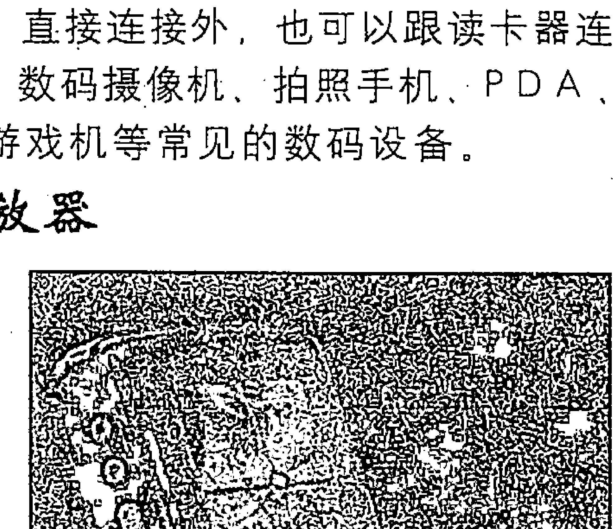

## 五、联想关联外设技术

当我们身边的计算机相继步入网络时代，享受网络带来的便捷时，多数电脑外设产品却依然徘徊于网络之外，在我们将数据从电脑向外设输出的过程中，就要耗费相当大的精力。虽然通过不断的技术革新，已经有厂商通过不同的技术手段，为外设产品实现了与计算机网络的互联功能，但是过于繁琐的网络设置，以及严格的接入条件都极大制约了外设的网络应用。为了满足用户新需求，国内著名的IT厂商联想通过自主开发研究，推出了外设关联协议，并应用在其终端设备、打印和投影等等设备中，实现了与电脑网络及其他相关设备的互通和互联。

通过阅读联想的相关技术资料，我们了解到联想外设的关联协议，是实现外设与PC、外设与其他设备终端互联的最关键的技术。包括无线（或有线）即插即用、IP 地址自动配置与管理、安全访问机制、基础协议、智能应用框架等多项层面，就像全球通用的语言一样，是一种不同信息产品之间通用的标准，是实现关联的重点环节。

### 1. 联想关联外设技术的三大特点

- 智能互联。配备了外设关联协议的任何终端无需任何手工配置，可以自动在有限范围内，搜寻预置同样协议的其他设备，或是已经生成的设备网络，在经过安全认证后自动组网或入网。
- 资源共享。当设备互相识别后，各设备会主动发布自己可供对方使用的资源。比如打印机会向进入网络内的关联PC 主动释放它的驱动，关联PC 就可以方便地使用打印机。
- 协同服务。在智能互联、资源共享的基础上，通过设备功能组件的交叉组合、相互协作，构成新的应用模式。

### 2. 目前联想关联应用技术的主要应用方面

#### （1）联想关联打印技术

关联打印技术是关联协议在打印领域的实现，它基于联想IGRS 协议标准（设备资源共享和协同服务），并针对打印领域的特点进行了设计，实现了网络中的电脑与打印机的智能互联与资源共享。

这项技术有如下的特点：用户的电脑可以在网络上自动发现和识别全部的关联打印机资源，并能够给出其中任何一台关联打印机的配置信息（如型号、速度、幅面以及IP 地址等等），用户甚至可以知道它在谁的办公桌上，然后根据自己的情况选择离自己最近、最合适的打印机进行打印。

关联打印技术中包含了独有的驱动内置、驱动自动安装等新技术，能摆脱寻找、管理和安装打印机驱动所带来的不便。当用户选中一台关联打印机后，用鼠标双击图标，驱动数据包就会自动从关联打印机下载到电脑上，并自动进行配置，大大方便了那些移动办公的用户。

图8 所示为采用了关联打印技术的联想LJ2800W 打印机。由于网络化的外设产品通常技术比较高，导致网络外设产品的安装、调试和日常维护比较复杂，往往需要专业人员才能胜任。而且，随着网络资源的日渐丰富和接入网络的外设产品的不断增多，不同电脑设备与外设间如何建立有效的关联，以高效便捷地使用网络资源，成了困扰办公应用的一个难题。联想LJ2800W打印机极大地简化了设备的安装及调试过程，并且针对打印领域的特点进行了精心设计，实现了网络中电脑与打印机的智能互联，以及网络资源的高效便捷共享。

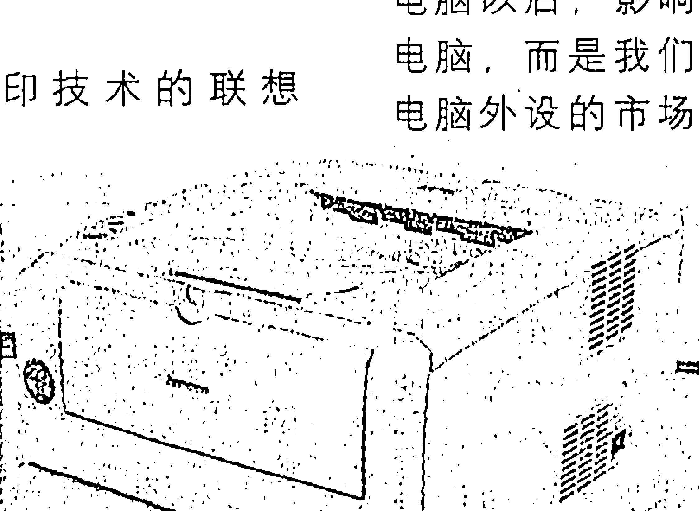

#### （2）联想无线关联投影技术

每一台关联投影机，都内置有联想关联协议，并不需要用户了解网络配置、设置IP 等操作。笔记本电脑可以在网络中自动、准确地完成与其他关联设备的连接，无需进行任何设置或更改即可实现网络连接。

该技术的代表产品为联想TDW660 投影机，它最为核心的就是无线关联技术的应用，让使用者获得最大程度的便捷。应用于TDW660 的联想无线投影服务软件，内置联想关联协议，能自动发现无线局域网内所有关联投影设备，自动配置无线笔记本电脑ID，在无线投影机和无线笔记本电脑的互联上实现一键连接，无线应用免配置，即开机即投影。

关联技术是联想在“高可管理性”和“高易用性”方面的重大突破。联想正逐步在包括台式机、笔记本及智能手机在内的全系列产品中全面导入关联协议。随着关联技术的推广及关联产品的增多，必将最大效率地利用各类信息设备，实现协同计算、资源共享，使用户的工作更加高效和便捷。

在联想（Lenovo）将外设确立为整个企业A 类业务后，宣布了一件让业界震惊的事情——买外设送PC。凡是购买M7210 多功能一体机的用户，就会获赠联想电脑主机；购买彩色激光打印机C8400N 或者C8000，再加999 元，会获得联想电脑主机；购买多功能一体机M7110/M7000 等产品，加上1499 元，也会赠送联想电脑主机。事实上，人们早已习惯了买电脑送打印机，现在居然冒出“买打印机送电脑”的事情，这是否预示着外设的发展时代到来了呢？

长期以来，外设与PC 之间一直是相互依存的关系。而随着电脑进入越来越多的家庭，像电视、洗衣机等家电一样普及时，人们将不再过多地关注电脑的更新换代，失去以往追逐最前沿技术的热情。一个不争的事实是，当每间办公室里都配置了办公电脑以后，影响到整个办公效率的关键因素不再是电脑，而是我们所使用的外设了。最近几年，随着电脑外设的市场需求不断提升，外设进入了发展的关键时期，渐渐吸引了人们的注意力，成为IT 市场中重要的一员。

外设从最早的复印机、传真机，到后来随着PC 一起普及的打印机、扫描仪、投影仪等等，其概念正不断深化。赛迪顾问还预测，在未来三年，外设每年的增长率可以达到15%至20%。如果说今年是外设高速发展的元年，我们有理由相信，外设主宰IT 产业发展的时代已经来临了。

## 2004年MP3产品与技术解析

文/图 信子

1998年，韩国企业Saehan（注：世韩，1995年从三星分离出来）推出全球第一台MP3播放器MPman F10，从而正式启动了MP3播放器市场。之后，更是吸引了众多厂商陆续跟进，这在无形中也加速了MP3播放器的普及，最终，MP3播放器成了继WALKMAN及DISCMAN之后的新音乐播放时尚。MP3格式音乐，凭借自身超小的体积，以及相对不错的音质迅速获得人们青睐，在PC和互联网上流行开来，MP3播放器，更让人们在听音乐时彻底摆脱电脑的束缚，可随时随地欣赏动听的音乐。而且，MP3播放器带动了在线音乐付费下载业务，为商家开启了一个新的商机，并有可能彻底改变我们获取和欣赏音乐的方式。

MP3播放器从2000年到2003年经历了井喷式的发展。根据市场调查公司IDC统计，2000年时，全球MP3播放器的市场规模约5.8亿美元，2002年时，全球MP3播放器的销售量达到1，162万台。2004年MP3的销售数量为2，000万台，2005年时，全球MP3的销售量为3，000万台，增长率为50%；到2006年，销售数量将增长至4，500万台。预计到2008年时，MP3播放器的销售收入将接近580亿美元，2004年至2008年的五年混合年增长率将达到20%。MP3市场的巨幅膨胀，也带动了种种附加产业，如闪存芯片和硬盘、微硬盘产业，在线音乐下载服务等等。依照目前MP3的发展速度，IDC也在日前上调全球MP3播放器规模的预测，但是，MP3市场的规模仍有可能比我们预计的更加庞大。

根据计世资讯（CCWResearch）的统计数据，2004年上半年国内MP3市场继续保持高速增长，销量达到141万台，同比增长277.6%，销售额达到11.3亿元，同比增长194.8%。今年的MP3市场新品频出，而且各自具备了一些鲜明的特色，本文就以MP3播放器的技术特点为线索，对各类主流产品进行简要解析。

### 一、容量篇

当前的MP3播放器，以其存储介质所采用的材料区分，可分为闪存型（Flash）与硬盘型（HDD）两种。

#### （一）闪存型（Flash）MP3播放器

以闪存作为存储介质的MP3播放器具有价格低、体积小的优势。在2004年，随着国际市场芯片供应状况的改变，加上不断有新厂商加入这一市场，直接导致闪存类MP3的价格一路走低。

#### 1. 闪存型MP3播放器的特点

相对于硬盘类MP3，闪存型MP3播放器具有以下优势：

- 非机械类结构，寿命较长，一般闪存芯片的正常使用寿命可达10～15年之久，时间远远超出采用机械架构的硬盘MP3。
- 因为无机械结构，所以闪存型MP3的抗震性能非常好。正常的使用环境下，震动对于FLASH芯片来说不会造成什么危害，非常适合用来设计生产运动型音乐播放器。
- 闪存芯片比较省电，耗电量比使用高速马达的硬盘小很多，闪存类MP3的电池续航能力比硬盘型MP3要好很多。
- 体积小，闪存颗粒的体积可以做到目前最小的0.8寸微硬盘的体积的1/10，所以它在便携式播放器领域的地位，目前无可代替。

不过闪存类MP3也存在一些不足。首先受限于闪存芯片的容量有限，该类MP3播放器的容量就不可能做得很大。目前，市场中所能见到闪存型MP3最大容量仅只有1GB，而且主流型号一般为128MB容量。虽然最近有部分厂商不断降低256MB与512MB容量MP3的市场价格，但是256MB时代的来临仍尚需时日。

#### 2. 闪存型MP3播放器市场主流产品介绍

以下是市场中几款比较有特色的闪存型MP3播放器：

- （1）MPIO FL200（如图1）

作为世界上最小的项坠MP3播放器，MPIO FL200扁圆形设计突破了传统MP3方形、圆柱形和条状一统天下的格局。在我们为其独具匠心的外形啧啧称赞时，也不得不佩服DIGITALWAY公司独特的设计理念。所谓项坠，只有和项链搭配才能成就其完美。FL200 将耳机与挂绳巧妙地结合在一起，形成别致的一体式项链耳机，通过与主机的耳机插孔相连，使其成为一款名副其实的精美挂件饰品。

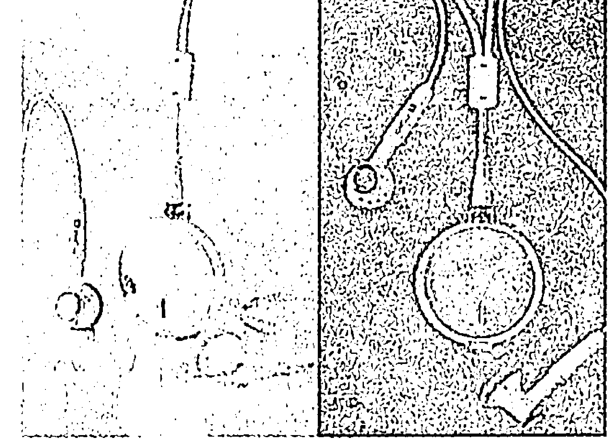

- （2）联想数码听F836（如图2）

联想数码听F836，是一款3D音效突出的高品质时尚产品，采用了美国SRS实验室的音响技术，以及身临其境的SRS三维环绕立体声音效，机身设计精密，功能全面。联想数码听F836采用了专业音频处理芯片和高品质耳机，配合9种EQ音效模式，并且支持歌词同步显示，方便学歌、学外语。具有音乐导航功能，可边听歌边选曲。

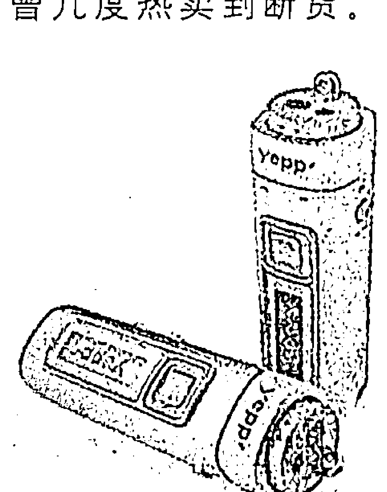

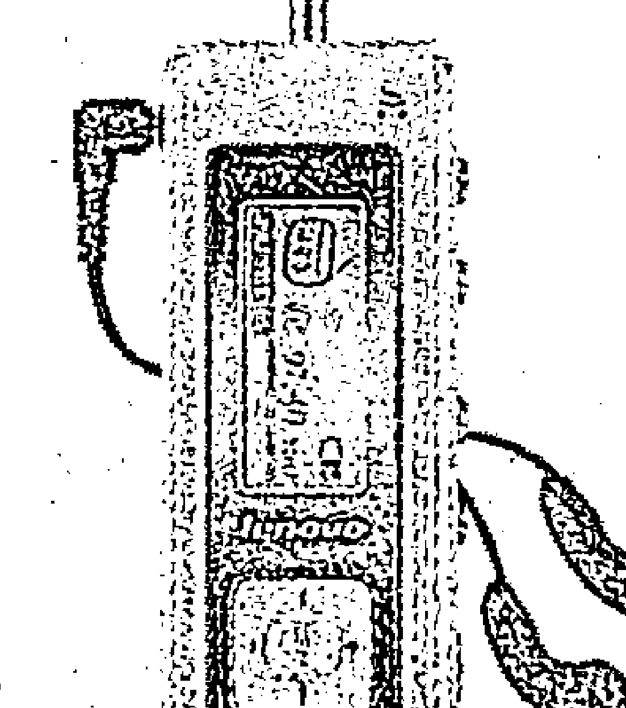

- （3）昂达炫音VX505（如图3）

昂达炫音VX505 MP3采用7彩背光，SIGMATEL 3520解码芯片，17小时播放时间，具有FM收音及FM转录功能，LINE-IN功能，A-B复读功能；图形化操作界面，同步歌词显示，自定义开机动画，多种音效选择，多种循环模式；即插即用，可作移动存储器使用，并支持固件升级。并且，它支持USB2.0，拷贝歌曲文件快捷方便。

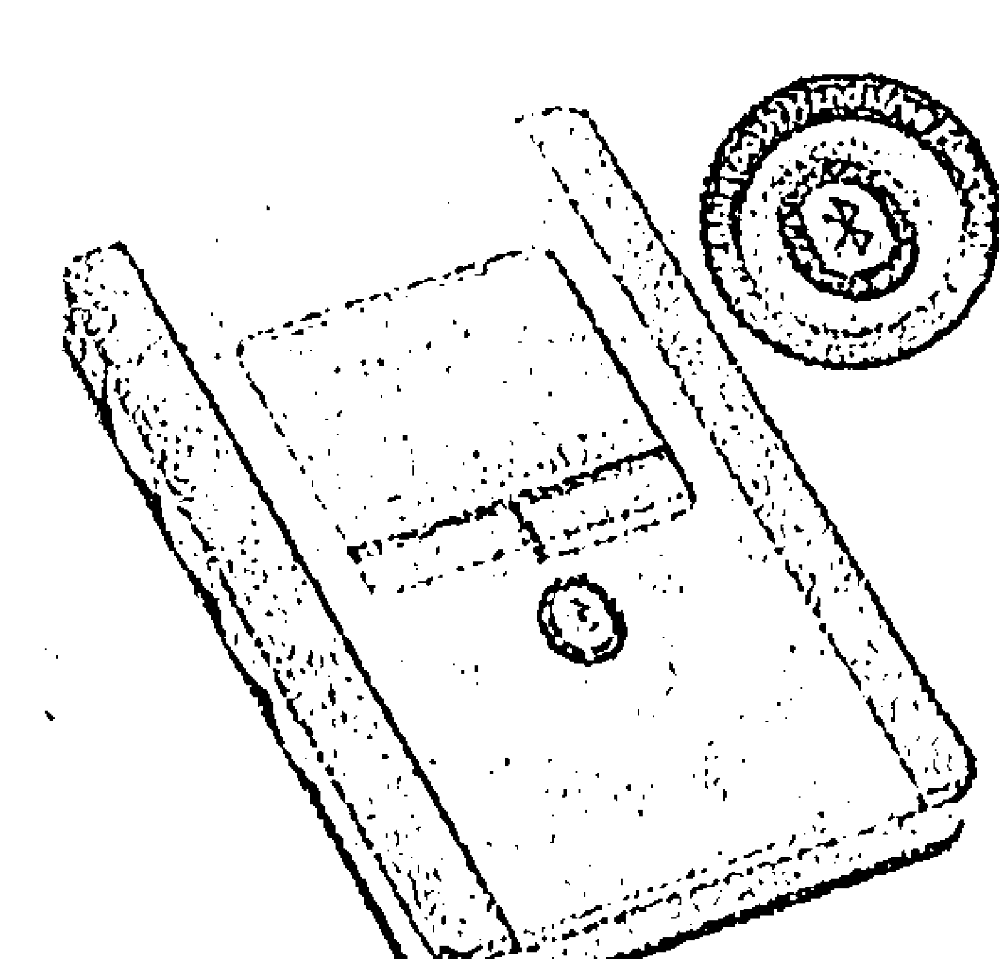

- （4）三星55H（如图4）

YEPP-55，三星MP3的主打机型。由于其出众的圆筒造型，做工精致，磨沙外壳设计，支持最新的SRS技术，双耳模拟3D立体声输出，支持CD和FM直接转换MP3技术，支持FM功能，因此成为了市场的热门产品。其中，蓝色款主流128M容量的55H更是非常畅销，曾几度热卖到断货。

- （5）微星MSI-5516（如图5）

该款MP3采用全金属设计，质感、手感、外观都有着不错的表现，性能方面集合了音乐播放、录音、CD直录、FM等等，同样具有良好的表现。由于搭载了蓝牙芯片，MSI-5516配合拥有蓝牙功能的手机或者其他设备使用，就可以轻松实现MP3接听来电，做到来电和音乐自由切换。由于手机几乎可说是人手一台，MP3也不断普及，而蓝牙技术很好地解决了来电时解下耳塞接电话的烦恼，应用前景值得推崇。

### 二、硬盘式（HDD）MP3播放器

MP3播放器所采用的开放式架构，决定了它可以灵活采用不同存储介质，以制造出不同功能、不同特色的产品来。除了上面提到的闪存MP3外，目前市场中还可以看到以硬盘为存储介质的播放器。硬盘在容量上具有天生的优势，而且单论每MB容量的价格，它也比较低廉。但是，由于硬盘本身的机械结构特性，造成了这类MP3在使用寿命、抗震性能以及能耗控制方面都存在一定的缺陷。

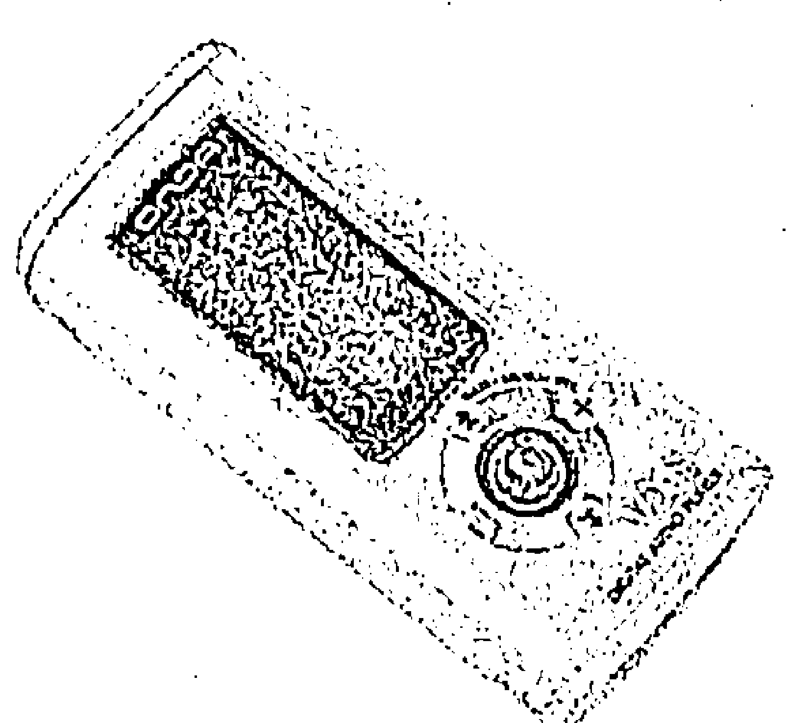

## 1. 创新公司产品

世界上第一台2.5寸硬盘MP3播放器（如图6）是新加坡创新科技公司于2000年1月发布的NOMAD Jukebox。

它采用富士通（FUJITSU）2.5英寸6GB的硬盘作为存储介质，容量远远超过了当时闪存MP3的容量。但由于本身使用的硬盘体积巨大，所以也造成了Jukebox的体积过大，甚至比当时的CD随身听还要大。而且Jukebox的体重，在MP3播放器中也属于超重量级。为了增强硬盘MP3的便携性，缩小MP3播放器的体积，最近创新科技又推出了采用微型硬盘的NOMAD Muvo2。

创新NOMAD MuVo2采用银灰白三色外观，分1.5GB/4.0GB两种，可以播放WMA/MP3格式音乐文件，带有蓝色背光功能的液晶显示器可以显示中文，采用USB2.0高速接口。机器内置900mAh充电电池，可以连续播放10小时，支持线控，同时附送精美保护套一个。它的最大优点之一是价格便宜，现在1.5GB版本的售价为1500元，还送一副价值580元的录音FM线控，算是硬盘MP3中最值得购买的一款。

## 2. Apple公司iPod系列

硬盘MP3虽然是创新公司首创，但是真正掀起硬盘MP3热潮的，却是Apple公司的iPod系列。目前iPod已经推出第四代版本（如图7），和前三代产品相比，新版的iPod设计更加时尚前卫。与以往几代不同的是，触摸滚轮处采用了触摸和点按结合的方式，有一个透明层显得晶莹剔透，给人一种清新典雅的感觉。其配备2英寸带背光灰色LCD显示屏，分辨率为160×128，一次可清晰显示6行文字，亮度和对比度可以调节。它采用了USB2.0和IEEE1394两种接口，支持MP3、WMA等音频格式，内置可充电锂电池。

iPod以其产品的特有魅力，迅速征服了全世界音乐爱好者的心，像一股浪潮般席卷全球。苹果去年推出内建4GB硬盘的迷你版iPod（iPod Mini），更进一步充实了自己的产品线。尽管苹果iPod面临众多对手产品的竞争，但是，市场研究公司NPD Group于10月12日发布的市场调查结果，足以说明一切：各种版本的iPod，合计囊括了92.1%的硬盘式MP3播放器市场，iPod牢牢控制着硬盘型MP3市场。

## 3. 韩国Iriver公司产品

MP3播放器的另一重量级厂商，韩国Iriver公司同样推出了自己的硬盘MP3 —— iRiver IHP100系列。目前最新型号为iHP140，播放器容量为40GB，支持OGG VORBIS、MP3、ASF和WMA多种音乐格式的文件，支持火线输入，调频收音机、可控均衡模式和ID3标签选曲等功能一应俱全。播放时间更是长达16小时，并且随机附送了一个方形液晶线控，通过线控可以实现对播放器全部功能操作，可以说这部机器在可操控性方面表现得非常不错。

## 4. JNC公司产品

在Iriver、创新、Apple等MP3厂商纷纷推出硬盘MP3时，作为MP3业界知名品牌的JNC，面对竞争对手咄咄逼人的气势，也推出了首款硬盘式MP3 —— SSF-M3。

JNC SSF-M3采用铝合金机身，手感甚佳。其屏幕整合到线控上，除了令机身更薄之外，亦有利于播放时选歌等操作。支持中英文显示及蓝色背灯，模式切换、播放、录音等各种操作都可以通过线控完成。SSF-M3采用内置可充电电池，插入底座时会自动充电，充满后约可持续播放14小时。底座上的Line-In，可以从外置音源如MD、Discman等直接录制歌曲。SSF-M3内置FM收音机，支持同步录取电台节目，内置Mic可作独立录音。M3凭借其超薄的设计和出众的性能参数，一度被认为是iPod的终结者。

虽然硬盘MP3很好地解决了闪存式MP3的容量限制，但也带来了譬如便携性、电池续航能力和防震能力等问题。而闪存式MP3虽然在体积及使用寿命上有一定优势，在容量上短期内又无法达到硬盘级别。因此，这两种不同类型的MP3目前各自有不同的市场定位，相互之间是相互补充，而不是谁代替谁，谁淘汰谁的简单关系——因为都有各自的特点。

### 三、音质篇

在选择MP3过程中，用户最关心什么？没错，是MP3播放器的音质。每位用户都希望自己的MP3拥有出众的音质，能够尽可能动听地播放MP3音乐文件。我们知道，MP3播放器的原理，就是将自身存储介质内的数据解码，然后将解码出来的数据转换成音频信号，再由专门设备（如耳机）回放出来。

从图8中我们可以看出，在MP3回放音乐的过程中，最重要的就是环节二，即从存储装置中读取的MP3文件的解码过程，而MP3播放器的解码工作主要由其采用的芯片组负责。因此，一部MP3所使用的芯片组类型，对整体音质有着关键性的影响。下面我们就来介绍一下目前在国内市场上主流MP3所采用的芯片。

#### 1. 飞利浦SAA7750/SAA7751系列芯片

由于飞利浦（Philips）公司在视听领域有着非常深的造诣，该系列芯片的音质处理效果在众多芯片方案里拥有一定的领先优势，音质表现为：低音量感较足、中音表现出色，而高音则一般。但是它的价格较贵，而且开发难度也相对较大，造成该方案的整体成本较高，目前主要是国外中高端品牌的MP3机型采用。飞利浦芯片的代表产品有：
- （1）iRiver的大多数机型（IFP100、300、500、700、800、900、1000系列等等）均采用的SAA7750芯片。Iriver也凭借着这颗火热的“芯”，在MP3市场里叱咤风云，打下了半壁江山，同时iRiver也成为了高音质的代名词。
- （2）MPIO的大部分机器（FD100，FL100，FY200，FG100等等）。
- （3）万城（MSC）的G128，这款MP3播放器最大的特点就是能很好地还原MP3音乐文件的“本来的面貌”，并没有为了追求什么“超重低音”或“靓丽的高音”而对电路进行刻意设计，它的音色属于比较耐听的类型。
- （4）创新X100（如图10），通过Philips SAA7750解码芯片，与Philips TEA5767 FM芯片搭配组合，在MP3播放音质和FM收音的效果上都非常不错。MX100的声场广阔，浑厚浓郁，声音层次感好，中高音表现优异，低音干净有力，音质总体表现十分优秀。

#### 2. 韩国TELECHIPS的TCC730/731芯片

韩国TELECHIPS的TCC730/731系列芯片，价格比SAA7750便宜一些，音质还算不错，中频很柔顺，各频段平衡，音场宽阔，只是低频没有量感。目前很多韩国机器使用这个芯片的设计方案，在韩国的市场占有率居首位。采用该芯片的机型，功能都比较丰富，而且从TCC730开始，它就具备了MP3编码的功能。因此，使用该方案的机器，基本都有line in功能，且录音表现也相对成熟。我们熟悉的产品有：DEC M550R、联想F860（如图11）、zino z700i、MSC PN128、朝华的“百灵”等等。

#### 3. 韩国ECT公司的SKYLARK芯片

Skylark 芯片的主要功能和特点是：功耗低，音质清晰悦耳；语音录音在播放机中生成MP3格式的文件，可选择压缩比特率；MP3编码直录功能，可将CD或其他音频设备输出的音频信号录制为MP3文件，且可以根据需要调整压缩比特率；内置FM调频收音，有中国、日本和欧洲3种制式可选，可将收到的节目录制在播放机中；中文、英文、韩文和日文等语言选择；歌名、ID3、歌词同步显示（支持中文歌名、歌词同步显示）；独立文件删除功能；A－B点复听功能；内部存储器容量查询，可以查询内部存储器的容量。

不过，该芯片不支持WMA文件格式，是它的一大软肋。但是，该芯片功耗较低，而且可以把MP3体积做得很小，目前国产的纽扣机型多采用这款芯片。它的功能及音质基本让人满意，价格也居于中间水平。代表产品包括MPIO FL200（如图12）。

#### 4. Sigmatel公司的STMP3410/STMP3420/STMP3520芯片

Sigmatel芯片一向以价格优惠、集成度高、功能丰富以及兼容性优秀等特点著称。由于很多公司都从事Sigmatel芯片开发，因此目前能做的功能越来越多，包括电子图片、歌词同步、TXT阅读、闹钟等等。
SigmaTel 3410芯片应该说是一款相当成功的产品，它曾一度占据了MP3市场的大半江山，最高市场占有率更是达到80%以上。爱国者的月光宝盒系列、音子弹MU320、联想F300/F3310以及朝华的75xx系列、魅族MX系列、Maycom XP168R、DEC M220R和DEC M168R、Hyunwon DAH800、MSC ha128和MSC h128，都是当时采用STMP3410芯片的代表之作。不过，由于SigmaTel 3410芯片不具备MP3编码功能，因此采用这一方案的MP3均无Line in功能，这无疑降低了它向高端市场渗透的可能性，后来它自然而然就被拥有硬件编码功能的SigmaTel 3420芯片所取代。
而SigmaTel 3520方案跟市场普及率极高的SigmaTel 3410方案比起来，增加了对USB2.0的支持，改进了综合能源管理，支持电池充电功能检测，强化了数字/模拟转换器和耳机的音乐放大器电路、拥有子目录管理能力，同时改进了以往STMP3410/3420中音表现一般、高音比较生硬的缺点，音质清澈，信噪比达到了95dB。
3520方案主要为国产机器里的中高端产品所使用，目前市场上使用该芯片的MP3播放器主要有：魅族ME/MI、昂达VX505/606、ANN FM1000系列、爱琴U80、歌美B9。

#### 5. 台湾凌阳方案

价格比STMP3410便宜，音质一般，国产MP3播放器采用较多，但返修率要比STMP3410和炬力ATJ2075低，将是未来国产机的主流芯片。

#### 6. 珠海炬力方案

珠海炬力公司推出的芯片方案主要分为：定位于高端、支持微硬盘应用的ATJ2089；定位于中端的ATJ2087；以及面向中低端的ATJ2075和ATJ2085。其中，面向高端市场的AT2089是一款集成MP3+DSC功能的系统级芯片(SoC)，除了支持MP3播放机功能外，还支持30万和130万像素的CMOS传感器与彩屏，实现拍照和照片的回放功能，采用该芯片可使客户开发出音频＋图像(拍照)功能的产品，从而将便携式播放机延伸至“便携式媒体播放机”。
国产中低端MP3播放器大部分采用炬力方案，因为比较贴近市场需求，目前的市场份额正在增大。七喜最新推出的UL-108就采用了炬力ATJ2075芯片，它具有不错的音质、丰富的功能以及低廉的价格，整体性价比相当高。

### 四、色彩篇

早期，人们在选择MP3的过程中，主要关注它的价格是否超值、音质是否出色，以及功能是否丰富等方面，而对于MP3的屏幕质量却鲜有关注。一般只要整台机器做工细腻，显示屏能正常成像就可以了，因此最初MP3的屏幕显示效果并不为人们所关注。但是，部分厂商发现了这当中的商机，在主流MP3还多采用黑白单色LCD面板时，推出了采用多彩背光设计，也就是最早我们常说到的“7色背光”产品，JNC的变色龙就是其中的佼佼者。这一创意，无疑满足了人们追求个性和时尚的心理，因此不断有厂商将这种多彩背光技术发展到极致，达到今天的999色背光显示，比如昂达VX505和魅族的ME。

MP3屏幕发展到此，大多数人认为MP3屏幕技术已经走到了一个尽头，同时各厂商也逐渐放慢了新品的开发速度。但是，当彩屏MP3出现在我们面前时，我们意识到一个崭新的音画时代开始了。从此，MP3不再是简简单单一部音乐播放器，而化身成为一个多媒体移动娱乐终端，它将具备各类精美有趣的小游戏，多种色彩鲜艳的开机动画，浏览照片，甚至装上摄像头进行拍照等功能。

#### (一) 采用TFT、STN及CSTN屏幕的彩屏MP3产品

目前，在MP3播放器中使用的彩色屏幕主要以TFT、STN及CSTN为主，而颜色数则从256色、4096色、65536色到26万色都有。影响彩色屏幕成像质量的，除了屏幕的颜色数以外，屏幕的亮度、对比度和可视角度也同样至关重要。一般来说，鉴于彩色屏幕的成像原理，TFT屏幕的成像质量普遍好于CSTN屏幕，而CSTN又比STN屏幕更优秀。不过，TFT屏幕虽然显示效果最好，但也是最费电的。

从今年第二季度开始，彩屏MP3产品开始成为市场消费主流，包括华旗资讯、中国香港信利、韩国艾利和（iRiver）、中国台湾蒙恬都推出了自有品牌的彩屏MP3产品，以下就对这其中具有代表性的几款产品进行简要的介绍。

##### 1. 韩国 iRiver H320（如图 13）

iRiver H320的意义在于，它将硬盘式MP3播放器首次带进了彩屏时代，并且融合了浏览图片、阅读文本（对照歌词）、USB host、移动数码伴侣等众多先进功能。从外观上看，H320显得沉稳和成熟，典雅的黑色作为机器的主色调，内敛大方。机身采用高硬度塑料材质，在正反两面都设计成不规则暗格木纹纹理，上面还铺设了一层透明塑料面板作为保护，使机器看起来更加晶莹通透。iRiver H320支持线控，耳塞为森海塞尔MX400。

##### 2. 信利MP301

信利MP301采用全镁铝合金金属外壳，体积为65 × 47 × 13mm³，采用了1.85英寸（分辨率为160 × 128）的65000色STN屏幕，占去了正面机身约90%的面积。在这个大分辨率屏幕的基础上，使用信利MP301能阅读TXT格式的电子书，支持英文、简体中文、繁体中文、韩文、日语等多语言显示，可以浏览BMP图片以及玩游戏。并且，MP301允许用户在阅读电子书的同时，收听FM广播或者播放音乐文件，这也是其他同类产品目前难以达到的。

##### 3. 爱国者半岛铁盒P880

半岛铁盒P880机身采用镁铝合金，配备了2.2英寸超大、超炫平面TFT低温多晶硅液晶显示屏，色彩丰富、表现细腻，显示效果出众；内置容量为20G～40G的硬盘，可存储10000～20000首音乐文件；支持MP3、WMA、WAV多种音乐格式播放；并且首次将USB OTG技术运用MP3随身听中，使得P880可脱离电脑与外接USB设备，直接进行数据交互，如直接与数码相机连接，可进行数码照片的转存储，并支持SD卡数据交互等；采用USB2.0接口，数据传输速率高达480Mb/s，下载、存储歌曲高效轻松。此外，半岛铁盒P880还支持FM收音、A-B复读、25种音效调节、电子相册、600小时的超长数字录音、七色彩灯、线控等多种功能。

##### 4. Apple 彩屏iPod

最近，Apple公司证实将推出60GB超大容量硬盘，配备2英寸彩色显示屏的iPod。新的彩屏iPod能够同步浏览照片，支持iPhoto，还将拥有audio/video输出端口，预计售价为499美元。可以预计，随着彩屏iPod的推出，必将掀起一股更大的MP3彩屏旋风。

#### (二) 采用 OLED 屏幕的彩屏 MP3 产品

虽然，TFT、CSTN、STN等彩色屏幕在新推出的MP3播放器上的应用率越来越高，但还是有厂商推出了不同于这几种显示屏幕的彩色显示MP3，这就是采用彩色OLED面板的MP3播放器。其中，代表产品有BenQ的Joybee180，iRiver N10等。

OLED (Organic Light Emitting Display)，即有机发光显示屏，在MP3 屏幕的应用领域属于新崛起的种类，被誉为“梦幻显示屏”。它无需背光灯，而是“主动发光”。并且，其摒弃了传统LCD的缺点，每个像素都可自行发光，不管在什么角度、什么光线下，都可以比传统LCD显示更加清晰的画面，而且环境越黑屏幕越亮。除了带来全新的视觉感受外，OLED还有很多LCD面板无法比拟的优点，比如可以使MP3做得更轻更薄，可视角度更大，并且能够显著节省电能。

下面我们就介绍几部采用OLED屏幕的MP3精品。

### 1. iRiver N10

iRiver N10采用项链式设计，耳塞挂绳一体，蓝色OLED显示在黑色背景下非常醒目，可以减轻使用者的视觉疲劳。在关闭状态下，显示屏呈镜面设计，更增添了一分精致的美感，显现与众不同的高贵品质。N10支持MP3、WMA、ASF音乐格式的播放，可通过固件升级获得最新的功能及增加新的音乐格式。支持多国语言显示文件名和Tag标签，具有同步歌词显示，AGC（自动增益控制）语音录制、声控录音（VAD）等功能。但令人遗憾的是，缺少了FM收音的功能。N10的三围为27.2mm x 49.8mm x 13.3mm，仅重22g。

### 2. 大恒 zino Z745i

如果说iRiver N10是女性颈中的水晶石，那么大恒zino Z745i（如图14）就是男士手中的魔法石。Z745i采用全金属外壳，表面采用拉丝处理，机身棱角分明，线条笔直，充满阳刚之气。配合OLED屏幕的采用，大恒zino Z745i实现了高反差、高亮度的文字显示，看上去非常醒目。屏幕上方的小字体是金黄色的，歌曲信息、音量等是用蓝色字体显示。同时，支持16级灰度显示，文字、按钮看上去更富立体感，并且可以定制开机画面。

### 五、娱乐篇

新技术的应用，为MP3播放器市场带来了新的契机，比如利用彩屏浏览编辑图片、欣赏彩色屏保、通过内置或者扩展的摄像头进行图像及视频拍摄，或许还可以进行视频回放。这些以往看似虚无缥缈的功能，已经越来越真实地呈现在我们面前。我们可以看到，MP3的发展历程，同手机有着惊人的相似之处：彩屏、OLED屏幕、FM、蓝牙、摄像头等等。而MP3所独具的数码相机伴侣、简易PDA功能、USB OTG等等功能，更让我们切身感觉到科技带来的无穷乐趣。正如文中所提到的，用户手中的MP3，将不再是简简单单一部音乐播放器，而是化身成为一个多媒体移动娱乐终端。

从目前的发展态势来看，OLED屏幕同彩色屏幕未来应该是相互包容的。这点也可从手机屏幕的发展历程看出来，内屏采用TFT、STN等材质的屏幕，而外屏则以OLED屏幕为卖点。在未来，彩屏MP3将倾向于实现更多的功能，而OLED屏幕将会取代现在的黑白LED屏幕，以展现MP3播放器的个性和时尚。

#### (一) 时尚娱乐之：FM射频

年初时候，丹丁向市场推出了自己的MH356 MP3播放器（如图15），这款看似普通的MP3却内藏玄机，它具备了FM射频功能。MH356能发射无线电信号，周围的收音机只要支持FM接收，都能作为播放终端，因此，称之为“个人电台”一点也不为过。

正是这一奇妙的创意，让广大有车一族可以在行车过程中，欣赏到美妙的MP3音乐。具有了FM射频功能，就可以通过车载FM收音机接收MP3发射出的歌曲，再从汽车音响播放出来。后来，爱国者推出的E808，ZINO700i，LG FE420等产品，也相继加入了FM射频功能，为我们提供了更多的选择。

## （二）时尚娱乐之：音乐随身拍

当 iRiver 公司发布全球第一台摄影 MP3 播放器 iRiver iFP-1090 时，我们并没有预见到这一市场的真正价值所在。然而，iRiver 仍然乐此不疲地推广自己的产品，抢先进驻这个市场。

后来，微软公司在这一基础之上，推出了基于 Microsoft Windows Mobile 操作系统的个人多媒体中心 PMC（Portable Media Centers），采用 Intel 的 XScale 处理器，并搭配 20～60G 硬盘。它内置 Windows media player 10 播放器，可以播放 WMA、MP3、ASF、MPEG-1、MPG 等格式的视频文件，并支持 JPEG、BMP 等格式的图片浏览。第一台装有 Windows PMC 操作系统的创新 Zen Portable Media Center 已于 9 月 2 日在美国上市，在创新之后，三星和 iriver 也宣布将发售采用微软操作系统的视频播放器产品。在微软加入这一市场之后，个人移动多媒体终端初现雏形，相信真正普及进入大众生活也指日可待。

当彩屏 MP3 逐渐为人们所接受时，多媒体应用在 MP3 中的比重越来越大。我们突然发现，一个小的摄像头无形中为我们带来了无穷的乐趣。我们不得不叹服 iRiver 公司卓越的远见，以及对未来市场发展方向的准确把握。

DM-AV10 的存储介质除了内置的 128MB 闪存以外，还可以外挂 SD 卡，最大支持 1GB 容量。存储影片时，128MB 闪存可以录制最佳标准影片约 30 分钟，正常标准约 50 分钟，经济标准约 90 分钟。

## 六、展望篇

MP3 播放器凭借 MP3 格式音乐的超强人气在市场取得了巨大成功，已经逐步取代传统的 Walkman 及 CD/MD 随身听，成为新的主流便携式音乐播放器。而众多厂商正是意识到了 MP3 市场的巨大潜力，在新的一年纷纷加大了对这一市场的投入。

## （三）时尚娱乐之：随身影院

韩国 DMTECH 公司推出的第一款视频 MP3 播放器 DMTECH DM-AV10（如图 16），又一次将 MP3 推到了数码娱乐时尚的前台。

在这一领域中，三星、JNC、MPIO 等韩系厂商无疑拥有强大的实力，凭借自己在技术及工业设计上的优势，牢牢把持高端市场；而国内厂商如联想、爱国者、魅族、信利、昂达、厦新等等，则凭借自身的研发实力或者品牌、渠道优势，以不错的音质及适中的价格为消费者提供了另外的选择，同时，它们也是国产 MP3 未来的希望。

2004 年，各种新技术不断涌现，原有的技术也越来越成熟，整个的市场规模不断扩大。MP3 新旧更替十分频繁，并且整体价格也在逐步下滑，一些没有技术储备及制造优势的小厂，注定将被市场所淘汰，一次彻底的市场洗牌正在展开。不断的技术创新，推动市场向前发展，激烈的市场竞争也将为我们带来更加完美的产品。也许在明年，我们不能再称市场中这些形形色色的音乐播放器为 MP3 了，因为它早已成为一台名符其实的“移动多媒体终端”。

DMTECH DM-AV10 在前面板上集成了一块分辨率为 480 × 240 像素的 3.5 英寸大尺寸液晶显示屏，并内置了编码器，可以支持 MPEG-4 SP (Simple Profile)、DivX 3.11/4.0/5.03/5.1.1 格式的视频文件回放；并且可以同数码相机连接，支持 JPEG 格式的静态图片浏览；当然也支持 MP3 格式文件的播放。

## 2004年多媒体闪存卡技术解析

文/图阿亮

随着以DC、PDA和MP3随身听为代表的数码产品逐渐普及，我们对于数码存储卡的需求也越来越大。然而，与其他产品不同的是，数码存储卡在发展初期，就没有制订一套权威的规范，直到现在依然是群雄争霸的局面。不过，随着时间的推移，数码存储卡也在不断发展，新一代的产品会逐渐取代旧产品，成为新霸主。在赏析绚丽夺目的数码产品时，让我们也来关注一下数码存储卡。

### 一、数码存储卡的四驾马车

毫无疑问，CompactFlash（CF）、SmartMedia（SM）、Memory Stick（MS）与MultiMediaCard（MMC）是数码存储卡中的元老，这四类产品的市场占有率也相当高。但是，从功能对比来看，它们之间还是有着不小的区别，前途也各不相同。CF、SM、MS、MMC都属于闪存卡，与传统的硬盘或者内存相比，闪存具有稳定性高、断电保存等特性，非常适用于电力捉襟见肘的移动数码产品。不过，在具体的性能指标方面，这四类还是不尽相同，各有侧重点。

#### 1. CompactFlash——老当益壮

CF卡（如图1）的体积为43mm × 36mm × 3.3mm，它遵循袖珍闪存协会（Compact Flash Association）制订的标准，保证了很好的兼容性。包括柯达、佳能、卡西欧、美能达在内的大量数码相机生产厂家，都采用CF卡作为存储介质。而且，它还广泛应用在笔记本电脑、PDA，甚至多媒体手机中，是一种前途无量的袖珍存储介质。CF卡上内置了ATA/IDE控制器，具备即插即用功能，可以兼容绝大部分操作系统。它使用50针接口交换数据，通过PC卡适配器，CF卡可以在任何驱动器里进行读写操作，与笔记本电脑或者PDA配合使用非常方便。实际上，一些厂家的数码相机，干脆采用CF卡加适配器组成PC卡作为存储介质，可见CF卡的适用性之强。

不过，CF卡的耗电量还是比较大。也正是这一原因，目前市面上几乎没有使用CF卡作为存储介质的MP3随身听。当然，我们这里指的耗电量大是相对而言，对于MP3随身听那可怜的电量，CF卡显然过于大手大脚了；但对于PDA、数码相机、笔记本电脑，CF卡的耗电量还是不足畏惧的，毕竟这些设备的电池容量都在1000mAh以上。

关于CF卡的读写速度，我们也要特别说明一下。为了加强产品的兼容性，CF卡内置了ATA/IDE控制器，因此其读写过程并非由数码设备来控制，而是取决于内存的闪存芯片与控制器。不过，对于大多数设备而言，速度也许并非是最重要的，兼容性、价格、便携性才是最为关键的，在这些方面，CF卡无疑具有很大的优势。

- 价格：☆☆☆☆☆
- 便携性：☆☆☆☆
- 抗震能力：☆☆☆☆☆
- 读写速度：☆☆☆
- 普及度：☆☆☆☆☆

#### 2. SmartMedia——廉颇老矣

SmartMedia又被称为固态软盘卡（Solid State Floppy Disk Cards SSFDC），它的平面尺寸和CF卡相当，但厚度还不到1mm。它与 CF 卡的不同之处在于没有内置控制器，需要数码设备具有相应的功能，所以成本比 CF 卡要低一点。

然而，也正由于SmartMedia没有内置控制器，很多产品不愿意使用这一类闪存规范，因此其普及度远不及CF，只是在MP3随身听与数码相机领域有着较为广泛的运用。尽管在去除控制芯片之后，SmartMedia的成本可以有效压缩，但是，这却带来了令人头疼的兼容性问题。由于各厂家的控制方式不尽相同，所以存在格式互不兼容的现象，如一张SmartMedia在某个MP3播放器上用了，往往就不能直接在数码相机上使用。此外，不同的SmartMedia控制器，对于容量的识别能力也不相同，因此，不少MP3随身听不能兼容128MB以上容量的SmartMedia。

目前，SmartMedia的主要生产商是东芝与三星，其产量与 CF 相比还有一定差距，这也直接造成其价格不可能比 CF 低。尽管从理论上说，SM 卡的成本要比 CF 卡低，但是，目前相同容量的 SM 卡，总是比 CF 卡稍贵20元左右。至于SmartMedia的速度，还是令人非常满意的，这一点在数码相机上有很明显的体现。以富士S602为例，如果使用 CF 卡来保存小电影，那么影片将是断断续续的，因为 CF 卡来不及写入数据，造成丢帧；然而，使用 SM 卡之后，这一现象就不复存在。此外，SmartMedia的耗电量也比 CF 低一点，因此它更受MP3随身听的欢迎。

关于 SM 卡的便携性，可谓仁者见仁，智者见智。尽管使用东芝开发的NAND型闪存芯片，可以将 SM 卡做得非常薄，但是，其平面面积与 CF 相比没有任何优势。此外，太薄的 SM 卡必须使用外壳保存，不然很容易折断，这在无形中削弱了其便携性方面的优势。

- 价格：★★★★☆
- 便携性：★★★☆☆
- 抗震能力：★★★☆☆
- 读写速度：★★★☆☆
- 普及度：★★★☆☆

#### 3. Memory Stick——姿态高傲

Memory Stick 的中文名称是记忆棒，它是由SONY公司开发的存储介质。Memory Stick 的外形与口香糖差不多（如图2），与 CF 卡类似，在 Memory Stick 的内部集成有控制器，与外界采用 10 针接口进行数据交换。但是，开发初期的 Memory Stick 容量很小，直到后来的 Memory Stick Pro 才成为真正的主推产品。不过，与 CF 卡以及 SM 卡显著区别的是，记忆棒现在只有 SONY 公司采用，在它的笔记本电脑，数码摄像机、数码相机和消费类电子产品中，完全是 Memory Stick 表演的舞台，而其他公司鲜有采用。看来，想让 Memory Stick 成为新一代存储标准，SONY 公司还要加大推广的力度。

事实上，最值得 Memory Stick 骄傲的，还是其高人一等的读写速度，分别可以达到2.5MB/s与1.5MB/s，与同时代产品相比具有一定的优势。因此， Memory Stick 在高端领域相当受欢迎。此外， Memory Stick 结构坚固，具有相当出色的抗震能力，而且耗电量很小，基本与 SmartMedia 持平。

为了保护资料的安全，SONY 还为每个 Memory Stick 记忆棒安装了写保护开关，这对于那些粗心大意的用户而言，是相当有用的。然而， Memory Stick 令人最不满的便是其高昂的价格，这也是SONY一贯的作风。尽管 Memory Stick 已经大幅度降价，但是比起近两年来 CF 卡与 SM 卡的降价幅度， Memory Stick 的市场竞争力还是不够。目前，相同容量的 Memory Stick 与 CompactFlash 依然存在50-80%的价格差距，这直接阻碍了 Memory Stick 的普及！

- 价格：★★
- 便携性：★★★★
- 抗震能力：★★★★
- 读写速度：★★★★
- 普及度：★★

#### 4. MultiMediaCard——世外桃源

MultiMediaCard 是由Infineon与SanDisk共同推广的数码存储规范，至今已有超过84个成员，在业界具有相当的知名度，仅次于CF与SM。从性能指标来看，MMC 不应该与前三者属于同一时代，因为其表现明显要高出一筹。MMC 的尺寸只有32mm × 24mm × 1.4mm，重量也仅为1.5克，便携性相当出色。由于担心兼容性问题，MMC 将存贮单元和控制器集成在存储卡中，这也造成其厚度要大于SmartMedia。但是，由此带来的好处也是显而易见的，目前MMC 几乎没有任何兼容性问题，所有支持MMC 的设备都可以通用。

MMC 的功耗也很低，操作电压为2.7-3.6伏，读写电流只有23mA和27mA。事实上，MMC 的主要用途并不是数码相机等对容量有较大需求的设备，而是针对手机、MP3随身听等对功耗极为敏感的产品。目前，西门子、诺基亚、索尼爱立信、摩托罗拉等手机巨头的多媒体手机，都普遍采用MMC作为存储介质。在成本方面，MMC可谓不容乐观，其价格高出相同容量的CF卡与SM卡不少，直接导致其普及度不够。此外，Infineon与SanDisk在消费电子市场也不具备足够实力，因此产品的整合度还远远不足，没能形成集团化优势。

- 价格：☆☆☆
- 便携性：☆☆☆☆
- 抗震能力：☆
- 读写速度：☆☆☆
- 普及度：☆

### 二、数码存储卡的变革

#### 1. CompactFlash TypeII——更进一步

为了进一步拓展CF的性能，袖珍闪存协会提出了新一代CompactFlash TypeII规范。与传统CF相比，CFII存储卡的平面面积并没有改变，依然是43mm×36mm，不过厚度却增加到了5mm。由于CFII具有向下兼容性，因此所有使用CFII规范插槽的产品，都可以继续使用传统规范的CF存储卡。

值得注意的是，目前真正使用CF II规范的CompactFlash闪存还不多见，相反，IBM以及其他厂商推出的微型硬盘（MicroDrive）却使用这种接口。由于磁盘介质与闪存芯片完全不同，因此MicroDrive的速度要远远超过CF卡，可以胜任各种需求，特别是在使用DC进行动态拍摄的情况下。

此外，从整合成本来看，MicroDrive也具有一定优势。目前MicroDrive的容量为340MB或者1GB，平均下来每兆的价格还是要低于CF卡。不过，MicroDrive的缺点也不少，首当其冲的便是其较差的稳定性。众所周知，硬盘是所有PC配件中最为脆弱的，MicroDrive也不例外。尽管MicroDrive从理论上说可以进行25万次的反复擦写，但事实上却远远达不到这一指标。

更加棘手的是，MicroDrive的抗震能力令人不敢恭维。如果在读写过程中将MicroDrive摔一下，其后果不堪设想，很可能造成坏道，令整个MicroDrive报废。此外，MicroDrive的耗电量也相当大，要超过CF卡，这与其工作原理相关。因此，在很多移动设备上，MicroDrive并不适合。

优点与缺点同样鲜明的MicroDrive，还面临大容量CF卡的冲击。目前，512MB的CF卡已经不是什么希奇产品，GB数量级的CF卡更比比皆是，而且40X的高速产品也开始普及，而340MB甚至2.2GB的MicroDrive与之相比，竞争力不大。因此，MicroDrive可谓前途堪忧。再加上IBM宣布退出硬盘制造业，我们不禁为其前途捏一把汗。

- 价格：☆☆☆☆
- 便携性：☆☆☆
- 抗震能力：☆
- 读写速度：☆☆☆☆
- 未来前景：☆☆

#### 2. xD-Picture Card——前途无量

在光学工业领域，拥有强大实力的富士与奥林巴斯共同开发了xD-Picture Card，这种存储卡（如图3）是对传统SmartMedia的改进，并且具有向下兼容性。xD-Picture Card有一个非常好听的中文名字，叫做超级智能存储卡。

xD-Picture Card被广泛地应用于富士及奥林巴斯数码相机，它顺应了数码相机的主流发展趋势，满足小型数码相机更大存储容量的需求。xD-Picture Card拥有众多的优势特点，是目前其他存储介质无法比拟的。首先，超级压缩的玲珑外型，使其总体积仅为20.0mm×25.0mm×1.7mm，即0.85立方厘米。重量仅为2克，绝对轻便的外型，使其成为目前全球最轻便最小的数字存储卡。

在速度方面，xD-Picture Card的表现也令人非常满意。xD-Picture Card的读取速度为5MB/s，写入速度为3MB/s，大大超越了以往的SmartMedia。此外，xD-Picture Card的功耗仅为25mW，可以大大延长电池的使用时间。更加重要的是，xD-Picture Card的成本并不高，一旦批量化生产，其价格将与同容量SmartMedia记忆卡接近，具有相当不俗的市场竞争力。

由于采用了全新的存储结构，xD-Picture Card的容量也有极大突破。按照富士的计划，2005年内将有256MB、512MB、1GB三种类型的xD-Picture Card大量投放市场，2GB~8GB型号的产品，将紧随其后于2005年年末投入生产。毫无疑问，xD-Picture Card将开创数码存储卡容量的新篇章，为我们带来各种难以想像的数码技术应用。

此外值得一提的是，富士为xD-Picture Card加入了独立的ID，用于防止非法拷贝受保护的数据。雄心勃勃的富士不会仅仅将xD-Picture Card限定在数码相机领域，而将全面推向数码设备、信息家电等领域。作为一套半开放的标准，xD-Picture Card 将会在其他领域大展鸿图，目前，已经有多家厂商宣布加入 xD-Picture Card 阵营。

- 价格：★★★★
- 便携性：★★★★★
- 抗震能力：★★★★
- 读写速度：★★★★
- 未来前景：★★★★★

#### 3. Memory Stick Duo——新瓶旧酒

在与 CF、SM 的竞争中，SONY 提倡的 Memory Stick 并没有占据太大的优势，因此，SONY 又新推出了 Memory Stick Duo 存储卡。Memory Stick Duo 存储卡，体积比传统 Memory Stick 记忆棒更小，是专为小型便携式装置设计的产品，每张卡的重量仅 2 克。Memory Stick Duo 的尺寸为 20mm × 31mm × 1.6mm，其长度只有传统 Memory Stick 的 60%，体积为其 33%。 由于采用与传统 Memory Stick 相同的传输接口，因此具备向下兼容性。值得一提的是，SONY 充分为先进的设备做了考虑，Memory Stick Duo 存储卡随适配器一起发售，我们可以通过该适配器，将 Memory Stick Duo 插到标准型 Memory Stick 插槽中使用。毫无疑问，这种适配器将为 Memory Stick Duo 的普及铺平道路。

在功耗与读写速度方面，Memory Stick Duo 相对原先的产品也有一定的进步，但是相较富士的 xD-Picture Card 来说，似乎还有一定差距。Memory Stick Duo 的工作电压为 2.7 - 3.6 V，工作时的功耗为 45mW，待机时为 130 μW，比 xD-Picture Card 的 25mW 要逊色一些。此外，Memory Stick Duo 的写入速度为 1.8MB/s，读取速度为 2.45MB/s。以当前的眼光来看，这些都只能算是中规中矩。

还有一点要注意，SONY 预定在未来开发尺寸和 Memory Stick Duo 储存卡一样大的小型调制解调器、网络卡、相机、麦克风等等，使这些产品能插入个人计算机、个人数码助理器等机器的储存卡插槽内，轻而易举就能扩充硬件功能。很明显，SONY 这一举措就是为了让 Memory Stick Duo 扩充槽成为业界的标准，甚至取代 PCMCIA。届时，Memory Stick Duo 储存卡的需求量将大大增加。

为了进一步加强对版权的控制，SONY 将 Memory Stick Duo 分为蓝色与白色。其中，蓝色的 Memory Stick Duo，基本没有版权保护功能，不能用于 SONY 的 MP3 随身听，同时也不能写入 OpenMG（SONY 专利的 MD 音频格式）音乐。不过，白色的 Memory Stick Duo 具有版权保护功能，允许从授权的 CD、Internet 或其他地方下载数字音乐。

SONY 的产品推广能力是无庸置疑的，因此我们也不敢小看其前景。按照 SONY 的计划，Memory Stick Duo 会在 iShot 移动电话、VAIO 笔记本电脑、MP3 随身听等领域展开全面应用。此外，从最近一次的 COMDEX 年会来看，SONY 也准备将 Memory Stick Duo 标准完全开放，让更多的厂商加入其中（如图4）。

- 价格：★★★
- 便携性：★★★★☆
- 抗震能力：★★★★
- 读写速度：★★★★
- 未来前景：★★★★

#### 4. SecureDigital——傲视群雄

SecureDigital (SD) 的规范由 MMC 发展而来，其长宽与 MMC 一样，为 32mmx24mm，只不过厚度变为 2.1mm，重量增加到 2 克。目前，SecureDigital 联盟主要由松下倡导，借助松下在消费类电子以及数码设备方面的实力，SecureDigital 完全可以做到自力更生。不过，任何一项规范想要长期存在，都必须获得足够的业界支持。目前，SecureDigital 已经得到 Toshiba、Palm、IBM、Microsoft、Motorola、NEC、Samsung Electronics、Casio 等巨头的支持，前景十分被看好。

与其它第二代数码存储卡一样，SecureDigital 也具有向下兼容性，MMC 可以被新的 SecureDigital 设备存取。有趣的是，MMC 发展偏向于手机，而 SecureDigital 竟然偏向于数码摄像机。以目前的 DV 市场来看，Panasonic、SHARP、Samsung 等公司的产品都采用 SD 卡，作为静态照片存储的解决方案。此外，东芝的数码相机也普遍采用 SD 卡。事实上，SecureDigital 应该在对速度有着极高要求的 DV 或者 DC 领域大有作为。从读写速度方面来看，Secure## 三、弱肉强食——数码存储卡未来展望

SD卡可谓一览众山小，理论值达到前所未有的10MB/s，是目前传输速率最快的数码储存卡。

SD卡如邮票一般大小，用户可以同时携带数个SD卡，在需要功能附件时，还可以即插即用。用户可以在掌上电脑上借助SD卡实现各种功能，如数码相机，连接家庭局域网、保存电子书和地图等参考资料、播放MP3音乐，或者将文件传送到其他电子设备上。SD卡还适用于网络音乐播放器、手机、智能手机和汽车导航系统等等。为了让更多的CF设备也有机会使用SD卡，松下推出了CF-SD的适配器（如图5），这对于Secure Digital的发展绝对是一个利好消息。

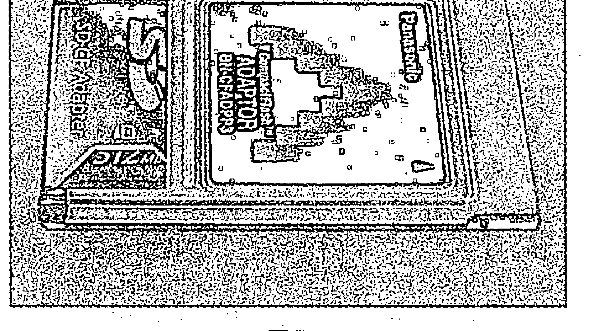

然而，性能出色的Secure Digital却有一个致命伤：其数据存储卡的价格已经大幅度下降，但作为输入输出接口的SDIO设备却成本高昂，甚至超过了以此著称的Memory Stick Duo，将大量市场拱手让给CF接口。客观而言，Secure Digital作为一套几乎完全开放的标准，应该有不小的产量，因此，造成其高价格定位并非由于厂商垄断，而是本身成本使然。目前，摆在Secure Digital面前的，并非如何提高性能，而是尽量降低成本，加快普及速度。

- 价格：★★★☆
- 便携性：★★★★★
- 抗震能力：★★★★★
- 读写速度：★★★★☆
- 未来前景：★★★★★

从目前的发展格局来看，数码存储卡的规范在短时间内不可能统一，不过，部分在技术指标上有着明显差距的产品，还是会遭到淘汰。事实上，目前数码存储卡已经发展到第二代，CF、SM、MS、MMC也都有了新一代的升级产品。当然，我们也不能就此断定老一代产品一定会全面退位。

以CF卡为例，使用这一存储介质的设备实在是太多了，有着广泛的群众基础，至少在两年内没有被淘汰的威胁。更加重要的是，CF自身也在不断完善。目前，CF卡是市面上最为廉价的闪存介质，而且它在容量方面也取得了重大突破，Sandisk已经成功研制出10GB的CF卡。反观SM卡，其前途可能非常黯淡。原本SM的主要舞台便是数码相机与MP3随身听，当富士以及奥林巴斯转而支持xD-Picture Card之后，SM卡的市场急剧萎缩。至于Memory Stick与MMC，它们本身就没有太大的市场，随着新一代产品的出现，退出市场将是必然的。

未来的数码存储卡，将向三个方向发展：低成本、高速度和大容量。毫无疑问，CF卡将凭借成本优势继续稳坐钓鱼台，而xD-Picture Card、Memory Stick Duo与Secure Digital将掀起激烈的竞争。从综合性能来看，xD-Picture Card与Secure Digital确实非常出色，但SONY的市场推广能力也令人不敢小觑，凭借自身在消费类电子市场的霸主地位，Memory Stick Duo的成功将是毋庸置疑的。不过，Memory Stick Duo妄想一统天下也不太可能，毕竟，xD-Picture Card与Secure Digital同样优秀。

应该看到，未来对数码存储卡需求量最大的设备，不是DC与笔记本，更不是不起眼的MP3随身听，而是新一代PDA。随着掌上操作系统的普及，PDA的性能已经今非昔比，必然将抢占笔记本的大量市场份额，而出于供电条件以及便携性的限制，数码存储卡几乎是PDA扩充的唯一途径。此时，产品的耗电量以及便携性，将成为胜败的关键。

数码存储卡对于速度以及容量的追求是永无止境的。目前，DC已经实现了拍摄动态影片，随着闪存技术的突破，未来DV可能向纯数码化的方向发展。客观而言，目前的DV并非纯数字化，因此，MiniDV摄像带的存储过程并非数码化。然而，当数码存储卡在速度以及容量方面有所突破时，DV大放异彩的一天也就到来了。届时，DV将不存在后期视频制作的问题，因为这些操作已经在数码存储卡中完成。

## 《小烦恼 解决起来很简单》

## 更简单的解决方法

文/yangfuli

2004年第15期《小烦恼解决起来很简单》一文中，提到在Google中如何用新窗口显示搜索结果，其中介绍的方法往往只适用于本机，如果更换到别的机子后还要重新设置，其实有个更简单的方法，就是要点击的某个链接前，先按住Shift键，再点击该链接，即可用新窗口打开。此方法同样适用于其它网页中的链接，同样可用新窗口打开。

## 2004年度 数码相机技术综述

文/龚胜

近些年来，最受人关注的数码产品无疑要数码相机（DC）了。2004年即将过去，在这一年中，数码相机发展异常迅速，我们看到了太多的新款DC，也看到了很多先进的新技术。从CES到PMA2004，再到Cebit2004，一系列新款DC和新技术的面世，让人眼花缭乱。

### 一、2004年数码相机新技术综述

#### 1. 传感器新技术

图像传感器是数码相机最重要的核心部件。数码相机大多采用CCD作为图像传感器，目前只有少数公司掌握了CCD核心技术，富士公司SuperCCD就是其中之一。经过多年发展，SuperCCD分化为SR和HR两个种类：SuperCCD HR向高像素发展，率先拥有了600万的有效像素，并可硬件插值到1200万像素。而SuperCCD SR的突出特点是将原来单一的每个感光点，分为一大一小两份，较大的感光元件具有超高的敏感性和较窄的动态范围，较小的感光元件则相反，敏感性较低，但拥有较大的动态范围输出。

索尼独创的四色CCD技术，全称为4color super HAD CCD，是索尼自主开发的第三代图像传感器，简单地说，可以理解为该CCD能准确识别4种颜色的光线，这是CCD彩色滤镜结构的一次重大突破。4color滤镜结构在原来的RGB三原色滤镜结构基础上，添加了一个Emerald（E），也就是说在红、绿、蓝的基础上，增加了翡翠绿滤镜，从而更加符合人眼的视觉特性，更加真实地反映实际颜色。不过，该技术在目前来说，还不是很成熟，尚只有SONY F828一款机型采用。

总体而言，CCD作为比较成熟的产品，在内部感光电极的结构上很难有更大突破。与之相比，CMOS感光器正在得到较快发展。佳能公司在多款单反数码相机中，都使用了大幅面的CMOS感光器，并率先开发出技术领先的全幅面1400万像素CMOS感光器件，不仅画面效果干净、优异，还非常省电。CMOS感光器将是今后数码相机图像传感器的发展方向。

#### 2. 光学镜头新设计

数码相机作为一种光学、机械、电子一体化的产品，光学成像系统的性能，对最终成像效果的影响相当重要。拥有一支优秀的镜头，对于成像的意义绝不亚于图像传感器的选择。同时，随着图像传感器、图像引擎和存储器件的成本不断降低，光学镜头在数码相机成本中所占的比重越来越高。

目前，在数码相机镜头的设计中有不少新突破，最大限度地解决了畸变、像差等问题，提高了镜头品质，而且各项指标都有较大的突破。比如索尼F818上采用的Carl Zeiss T*镜头，在28-200mm的焦段内，实现了F2.0-F2.8的超大光圈；而松下FZ20中使用的莱卡镜头，在12X的大变焦范围内，保持了F2.8恒定光圈；美能达和佳能的旗舰产品，都采用了各自顶极的专业光学镜头。

此外，还有多款大变焦相机镜头中采用了先进的光学防抖设计，像佳能的S1 IS镜头，不仅具备IS光学防抖功能，还首次在数码相机镜头中采用了超声波马达。值得一提的是，尼康在其最新产品C8400中，将广角端扩展到了24mm，创下了数码相机广角镜头的新记录。

同时，为配合单反数码相机的普及，传统单反镜头大厂佳能、尼康、宾得及适马等公司，都在今年推出了多款单反数码相机专用镜头，有效控制了成本和体积。佳能还推出了世界上第一片照相机使用的‘多层衍射光学透镜’，采用这种透镜的佳能EF 400mm f/4 DO IS USM镜头，重量比对应的原型产品减轻了约36%。而佳能EF 28-300mm f/3.5-5.6 L IS USM这支新款‘超级’镜头，是数码单反‘一镜走天下’的最好选择。

#### 3. 影像处理器新发展

在数码相机中，图像传感器和镜头都还远远不能决定最终的图像质量，图像处理引擎的作用也非常重要。图像处理引擎承担着测光、对焦以及白平衡等一系列工作，对数码相机的成像效果有着非常重要的影响。因此，各大数码相机厂商都在不遗余力地开发各自最新的图像处理引擎，以期在竞争中占得先机。

可以毫不夸张的说，DIGIC使质量影像理念再一次得到了淋漓尽致的体现，开创了数码影像的新纪元。DIGIC是佳能公司开发的第三代影像处理器技术，通过整合CCD控制、AE/AF/AWB（测光/对焦/自动白平衡）、信号处理、JPEG压缩、存储卡控制和LCD屏幕显示这6个关键环节，可以拍出高质量的图片，同时更加快速和省电。采用DIGIC技术的产品，不仅高光部分的图像层次得到改善，同时通过特殊设计，可以杜绝在数字图像处理过程中产生噪点，带来清晰的图像效果。

松下“维纳斯引擎 (Venus Engine)”影像处理芯片也很有特点，不仅可以提高斜线方向的解像度，平滑颜色过渡，减少暗部的噪点，还可以进行多任务并行处理，提高连拍速度。其中包含了三个重要设计思想：精确伽玛调整技术 II，将彩色信号和亮度信号分开来，分别单独计算每种信号的最佳调整系数；高级SF滤波技术，以独特的图像信号分析技术为基础，进行专业滤波处理，提高了图像的细节；专业降噪滤镜II，通过保持来自CCD的高分辨率镜头硬像信号数据的清晰度，只抑制外来的无用信号，提高了降噪效果。另外，奥林巴斯在C-8080WZ中还首次采用了TruePic TURBO影像处理器，在提高画质的同时，能够使开机、快门时滞、存储卡写入等方面的速度大幅提升。美能达的CxProcess II影像处理技术也很有特点。

#### 4. 增强的摄像能力

数码相机具备一定的动态拍摄功能，早已不是什么新鲜事了。不过，由于技术限制，过去大多数产品仅仅能断续拍摄几十秒的320 × 240/15 fps无声动画，基本上没有太大的实用价值。随着技术的发展，现在数码相机的动态拍摄能力得到了很大提升，今年以来，不少产品的录像拍摄效果能达到640 × 480/30fps，完全与数码摄像机不相上下。不仅如此，MPEG4压缩技术的应用，更是颠覆了传统数码摄像，在保证质量的前提下，录像文件的体积大大缩小。另外，随着超声波马达等新技术的应用，数码相机拍摄录像变焦时的噪声问题也得到了解决，进一步提升了数码相机录像拍摄的实用价值。

三洋C1、奥林巴斯770UZ、佳能PowerShot S1 IS、宾得Optio MX这些具备强大录像拍摄能力的数码相机的诞生，更是解决了录像文件体积和光学变焦噪音问题，无疑使得DC和DV之间的界限变得越来越模糊。尽管使用数码相机拍摄录像还存在一定的问题，但优势也很明显，除了一物多用，节省费用外，保存在存储卡上的录像文件，比保存在DV带中需要通过IEEE1394接口采集的录像，处理起来要方便许多。随着数码相机录像功能的进一步发展，在一般应用环境中，完全可以替代数码录像机。

#### 5. 防抖技术继续发展

手持拍摄难免会有不同程度的抖动。在使用慢门速度拍摄时，抖动造成影像的虚化会很明显。对于焦距较长的镜头而言，此问题会更加严重。因此，在镜头光学系统中，只要有一组透镜能与手抖动的方向一致，并作相应程度的同步移动，胶片平面上的影像光线将被折回。这样影像光束的中点又回到了片门框的中心点，使这个抖动量造成的影像下移即被抵消，可以有效减轻因拍摄时“手抖”造成的“发虚”问题，也就是所谓“防抖技术”，其原理如图1所示，该技术对提高长焦数码相机的拍摄品质有很大帮助。

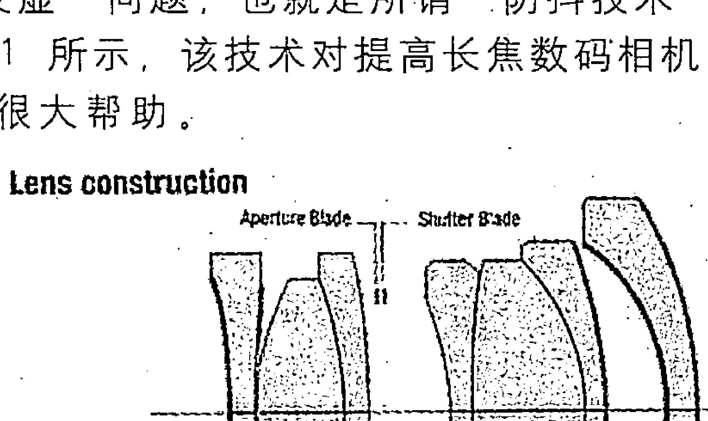

但是，由于成本较高等原因，继佳能Pro90 IS、奥林巴斯C-2100采用了光学防抖技术后，后续产品并不多，这种情况在今年得到了改变。除了佳能在S1 IS中采用了IS（Image Stabilizer，影像稳定）镜头外，松下自行研发的MEGA O.I.S.（光学图形稳定器）技术，和佳能的IS技术十分类似，通过移动抖动补偿透镜，修正光轴偏移。该技术不会造成拍摄图像品质的降低，而且还容易进行小型化设计，使袖珍数码相机配备光学抖动补偿功能成为可能。同时，尼康也在今年第一次将其在传统相机镜头中采用的“VR”光学防抖技术，应用在最新的旗舰机型8800中。

美能达从DiMAGE A1开始，推出了创新的CCD移动式防抖（Anti-Shake）功能，通过沿竖向和横向分别配备的一个压电元件来移动摄影元件（CCD），修正光轴。由于该方式的抖动补偿装置非常薄，嵌入CCD时也只有6mm，因此比透镜移动式更容易配备于超薄产品中。而且，由于抖动补偿装置配置于机身侧面，不需对现有镜头装置进行设计调整。通过CCD的移动进行抖动补偿，与移动透镜的普通方式相比，能够设计出更小的机身，成本也低于光学补偿方式。该技术还将应用在数码单反相机中，最大的好处就是，使用所有的镜头都可以具备防抖功能。

#### 6. 传统相机与数码相机融合

传统相机和数码相机在光学、机械结构上是类似的，有不少专业单反数码相机便直接使用了传统相机的机身和镜头。大多数高级120专业相机，都可以更换“后背”，利用这一点，它们也可以使用“数码后背”。“数码后背”，简单说就是有CCD芯片和数字处理等配件，外观形状上与一般“可换后背”类似的数码摄影装置，可以视为一台没有镜头和机身的“数码相机”。利用“数码后背”，可以方便地将现有的许多中幅照相机、大型照相机数字化，随时进行数字拍摄与传统拍摄方式的转换。

在国外比较流行的“APS”相机和一些高级专业单反相机，也结合了数码相机的一些特点，比如可记录详细的拍摄资料、能与电脑连接等等。此外，胶片扫描仪的广泛应用是传统相机“数码化”的另一捷径。尽管现在用简单的方法，还不能将一般传统135相机改造为数码相机，但随着技术的不断发展，也许未来数码相机和传统相机会走向融合。今年更有公司推出了可用在普通相机上的“数码胶卷”，不过离实用尚有一段距离，相信此产品一旦实用化，必将对摄影业产生深远的影响。总之，目前数码和传统相机有逐步走向融合的趋势，数码后背、数码胶卷的出现，胶片扫描仪的广泛应用，都在拉近二者之间的距离。

#### 7. 电池及存储卡大发展

数码相机不使用胶卷，电池及存储卡就成为其最大的消耗品。今年以来，这两方面的产品也得到了很大的发展。

随着各种省电技术的综合应用，数码相机的电力性能和过去相比，已经有了大幅度的提高。以往被人们称为“电老虎”的数码相机，其目前的电力性能已经足以满足大多数人的日常使用需求。各种各样的节电技术和大容量电池的发明，让数码相机使用更加“持久”。卡西欧Z40、索尼W1等多款机型，充满一次电后都能拍摄约400张左右的照片。另外，能使用多种不同类型的电池，也是今年数码相机的一个发展潮流。最通用的AA镍氢充电电池，容量得到了很大提高，如三洋最新开发出的2500毫安容量AA镍氢充电电池，其负极材料采用了可以大幅度提高电池容量的“超格子合金”。

今年存储卡的发展速度可谓十分惊人，Pretec推出了容量高达12GB的CF卡，速度也提升到80速，还有4GB左右的小硬盘也进入了市场。除了容量提升外，小型化也是发展趋势，如MS DUO、xD、miniSD、T-FLASH卡等都十分小巧。这些存储上的优势，都让数码相机完全可能超越胶片相机。另外，各种容量巨大的“数码相机伴侣”，也纷纷推出，进一步解决了数码相机的存储问题。

#### 8. 其他新型技术

今年数码相机还有其他新技术得到发展和应用。

比如宝丽来公司推出了一款“数字调制解调器相机”，用户能够在不需经过电脑处理的情况下，直接向互联网传输所拍摄的图像。

在IT产品“无线化”潮流的推动下，数码相机也开始尝试采用无线连接技术。过去曾有相机具备了红外接口，而今年Concord公司推出的Eye-Q GoWireless，首次具备了蓝牙功能，可以用无线的方式，向电脑传输照片。不过，无论是红外还是蓝牙，致命的缺点就是速度较慢，没有什么实用价值。随着无线USB技术的发展，WUSB技术肯定将在数码相机上得以普及。还有新型红外拍摄、动态对焦、高像素EVF取景等新技术，也是今年数码相机的发展潮流。

绝大多数数码相机都支持标准的EXIF格式文件，今年又有新版本推出。新标准中增加了一些相关规定，包括对音频文件的支持，能够记录更复杂参数、改变了色调采样方式，并且规定缩略图也必须包含图像头。EXIF 2.1已经得到广泛认可，对用户来说可以获得非常完备的照片信息，如图2所示。另外，具备很多优点、号称“数码底片”的RAW存储格式，也在很多专业及准专业数码相机上得到了广泛应用。


### 二、数码相机发展潮流及代表产品

#### 1. 低价单反数码相机渐普及

所谓单反数码相机，广义说就是“采用单镜头光学取景方式”的数码相机。单反数码相机诞生在上世纪90年代，由于涉及多方面的复杂技术，早期没有厂家独立研发并生产数码单反相机，传统单反相机生产厂家和当时的数码相机前沿厂家合作，比如佳能与柯达合作、尼康和富士合作，先后推出了多款产品，价格高达10万元人民币以上。售价15万元的专业数码相机Kokak DCS520（佳能EOS D2000），其CCD分辨率也不过两百万像素。很显然，当时数码单反相机只应用于某些特殊领域，直到四年前，佳能推出了一款价格在2万元人民币以下的数码单反产品D30，才标志着单反数码相机真正被普通用户接受。

随着数款万元以下的入门级DSLR发布，其性能也更加强大，低价单反数码相机已成气候，开始真正实现普及。如果将售价在两万元人民币以内的产品称为低价数码单反，目前市场上，宾得、适马、富士，以及尼康和佳能都有多款产品，价格在1万5千元左右。价格在万元以下的超低价数码单反，只有佳能300D和尼康D70这两款。其中佳能300D的价格更是降到了7千元以下，比某些非单反数码相机更加便宜，而尼康D70尽管价格稍贵，但性能比300D更胜一筹。另外，美能达推出采用CCD移动防震技术的Konica Minolta a 7D，这款600万像素APS尺寸CCD的产品，具备独创的机身防抖功能，机身脱胎于a 7这款准专业产品，定价仅在万元左右，无疑更具诱惑力。

在其他厂商都利用传统机身搭载CCD设计数码单反时，奥林巴斯开创了全新的4／3系统数码单反。所谓的4／3系统，主要是制定了两个工业标准，一是限定了18×13.5mm面积的感光元件，大约是35mm感光元件的四分之一，有助于制造镜头更小、光圈更大的产品；二是将4／3作为一个镜头标准，限制了镜头转接环尺寸，也限制了资料传输和对焦控制等统一性，凡符合4／3系统的相机及镜头，都可以自由更换。

4／3系统数码单反的代表产品有：奥林巴斯E1，这是其呕心沥血之作，无论外壳上的防水设计还是CCD的超声波清洗技术，都充分考虑到了用户需求，但是E1的市场前途并不是想象中那么乐观，4／3要成为行业标准还有很长一段路要走。好在有其他厂商（如富士）加入4／3系统阵营，今年下半年极有可能推出一款4／3系统的机身。另外，适马、松下、三洋的加入，使得成像元件、机身和镜头三个部分都得到了加强。适马采用4／3系统接口的镜头已经上市，价格非常便宜；奥林巴斯也将力推E－300，这是一款8000元以下的4／3 DSLR，如果柯达等厂商能帮奥林巴斯一把，4／3系统有望初具规模。

#### 2. 旗舰机型像素攀上800万

大家知道，数码相机一个最重要的技术指标就是像素。随着CCD技术和工艺的进步，数码相机像素今年出现了跳跃式的发展，消费级DC从500万像素猛然提升到800万像素。在年初的PMA2004大展上，五款800万像素旗舰机型争相发布。除了像素的提升外，这些产品还普遍采用了更多的新技术。

今年以来，800万像素已成为数码相机旗舰机型的新标杆，各大数码相机厂商都推出了800万像素的产品。这些产品均采用Sony生产的2／3英寸800万像素CCD，镜头广角端大多扩展到更加实用的28mm，变焦比在5倍以上，整体性能较上一代产品有较大的提升，是目前用户普遍关注的焦点产品。

其中，索尼F828率先上市，拥有最让人羡慕的Carl Zeiss T*镜头，28～200毫米的焦距，F2.0～F2.8的大光圈，并延续了上一代产品的旋转镜头和红外摄影、长时间摄像等特色。而美能达的A2，最大特色在于采用CCD防抖，即AS功能，可以有效地防止拍摄时抖动对成像的影响，92万像素的EVF取景器，令其效果直逼光学取景。佳能Pro1则将重点放在了镜头上，它采用了顶极的“L红圈”镜头，内置高级萤石镜片，在目前的五款800万像素旗舰DC中，Pro1的画质最好。尼康8700具有最大的八倍变焦比和锐利的成像效果，最新推出的8800更是采用10倍变焦，且带“VR”光学防抖功能镜头。奥林巴斯的C8080，则以外形威猛，性能均衡，价格相对便宜，其粗壮的镜头和持久的电力，让人感受到更多的男性阳刚气息。

但是，在2／3英寸大小的CCD上集成800万像素，对成像效果带来的负面影响也相当大。不少朋友感觉到，这些800万像素的相机，在画质上并不如前一代500万像素产品，并且在防噪点、紫边等方面更显不足。

#### 3. 体积越来越小的“名片机”

除了CCD像素的提升，今年数码相机的另一个发展潮流就是出现了“瘦身运动”，体积越来越小，总量越来越轻，这是CCD、镜头和电子处理部分的“瘦身”结果。在更小尺寸的CCD上实现更高的像素数、更好的成像品质，一直是各大CCD生产厂家孜孜不倦的追求目标。目前已经达到了如下地步：300万像素的1／3.2型CCD、400万像素的1／2.5型CCD、500万像素的1／2.4型CCD、700万像素的1／1.8型CCD。

因此，如今的500万甚至700万像素3倍光学变焦产品，重量可以做到200g以下，300万甚至500万像素的产品，可以做到名片盒大小，重量不足150g；一些采用了特殊变焦镜头结构的产品，甚至将“体重”压缩至100g上下，厚度不足2cm。最具代表性的产品就是宾得的S4，由于采用了特殊的滑动镜头，其重量仅为98g，大小不及一个香烟盒。

除了CCD保持小尺寸，内变焦镜头的使用，更是让数码相机机身设计得更加小巧轻薄。索尼T1使用了内变焦的3倍光变Carl Zeiss镜头，是2004年最畅销的轻薄DC之一，它超薄的机身尤其让MM们心动不已，全金属的外壳也极具手感。其他像奥林巴斯AZ－1、三洋J4等产品，也使用了内变焦镜头，有效缩小了体积。而美能达最新的时尚DC——X50同样使用了2.8倍光变内变焦镜头，保持了轻巧的“身材”。

## 4. 功能越来越强的便携机

由于受到数码摄像机和可拍照手机等产品冲击，像素较低、功能简单的低端便携型数码相机日子越来越不好过。在今年，便携机不再是“傻瓜机”的代名词，目前的时尚便携DC中，从性能和画质来看都有很大的提升。在画质上，佳能的IXUS系列便携数码相机和许多高端DC相比，都毫不逊色，其S系列机型更是在画质和功能上都有上佳表现。还有宾得的450、555袖珍数码相机，在小巧的机身后提供了5X光学变焦镜头和丰富的手动功能。另外，今年便携机的CCD像素普遍都提升到400万以上，最高更是达到了720万像素，比如索尼的P150，佳能的S70等等，宾得的750UZ（如图3），除了像素达到720万，更是集5X光变，旋转LCD等多项强大功能于一身，成为今年便携机的“王者”。

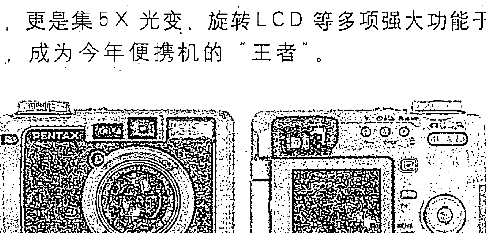

除了内在功能的提升外，今年的便携机在外观上也做足了“面子”。很多产品都开始使用金属机身，一改便携机塑料外壳的低端形象。2004年数码相机的发展，还有一个非常明显的特征，就是LCD面积越来越大，像素越来越高，有多款便携数码相机的LCD面积都达到了2～2.5英寸，如松下的LX2/FX7、索尼的W1等。奥林巴斯AZ-1首次在数码相机的液晶屏中，采用了高对比度技术，23.5万像素的2.5英寸大屏LCD，显示效果非常细腻，整体感觉已经和普通的LCD显示器没什么区别了。而富士FinePix F710更是创新地使用了16：9宽屏LCD，并且可以拍摄16：9的宽幅照片和视频。

## 5. 看得更远的大变焦产品

相机镜头根据其焦距的长短，也就是拍摄时的视角，可分为标准镜头、广角镜头和长焦距镜头等等。长焦距镜头适合拍摄远距离景物，景深较小，因此容易使背景模糊，主体突出；135mm以下称中焦距，经常用来拍摄人像，也被称为人像镜头；300mm以上的称为超长焦距，其视角小于8度，适用于拍摄远处的景物，如野生动物的拍摄。

数码相机上用得最多的是变焦镜头。变焦镜头由固定透镜组和可变透镜组两部分组成。通过移动可变透镜组，改变成像光路，可以在一定范围内改变镜头的焦距，从而改变拍摄的视角。变焦镜头的倍率，是指长焦端的最大焦距与广角端的最小焦距之比。变焦镜头由于视角可变，给拍摄取景带来很大的方便，深受一般摄影爱好者的喜爱。大变焦比镜头的优点在于方便构图，容易改变透视效果，能够拍摄到远处景物的细节以及获得较浅的景深等等。但它也存在体积较大，成像质量不是很好等缺点。

由于非单反数码相机不可更换镜头，因此大变焦比镜头仍是发展趋势。今年以来，多款10X以上的大变焦比数码相机争相上市，这些产品价格多在4千元以下，具备很高的实用价值和性价比，深受广大摄影爱好者欢迎。其中，佳能的S1 IS、松下的FZ20、美能达的Z3等产品，由于配置了防抖功能，大大提高了长焦端拍摄的成功率，提升了大变焦产品的实用价值，更加成为广大摄影爱好者追捧的对象。

## 6. 视野更广的“广角机”

目前数码相机的镜头有两种不同的发展趋势，除了目前如火如荼的长焦机型外，广角型数码相机也正日渐热门起来。广角镜头，顾名思义就是其摄影视角比较广，适用于拍摄距离近且范围大的景物，有时用来刻意夸大前景表现，得到强烈的远近感以及透视效果。典型广角镜头视角为72度以上。懂摄影的朋友都知道，广角镜头在特殊艺术效果的运用方面必不可少，特别是对于风光拍摄来说，28mm以上广角镜头几乎是必需的。此外，一幅成功的摄影作品，在按下快门后只能说完成了一半，后期的裁剪也非常重要，要想得到更多的裁剪空间，广角镜头是必不可少的装备。另外，很多摄影师钟爱广角镜头还因为它的透视效果具有强烈的冲击力。但是，因为广角镜头像差校正的高成本，以及对抗眩光镀膜的高要求，在廉价DC中是不值得去做的，所以大多数平价数码相机的广角端最多只到32mm。

目前各大数码相机的“旗舰”机型，如柯尼卡-美能达A2、索尼F828、奥林巴斯C-8080 Wide Zoom、佳能Pro1等产品，都不约而同地采用了28mm的广角镜头。不过，这些产品价格高高在上，而且体积也偏大。理光是低价便携型广角数码相机的“鼻祖”，从当初G3/G4 wide到现在的RX/GX，28mm广角都是其最大卖点。在最新的GX相机中，不但具有P/A/M等全面的操控功能，甚至还提供了闪光灯热靴。现在，理光又推出了R1等新款广角机型。佳能S60是S50的升级版本，广角端也下探到28mm，而且在画质上有着S系列一贯良好的表现，并拥有出色的手动功能。

此外，介于以上两者之间的广角机型，还有尼康Coolpix 5400和奥林巴斯C-5060Wide Zoom，后者的广角端更是达到了27mm，长期保持了数码相机中最“广角”的地位，受到众多用户的追捧。而最新推出的尼康Coolpix 8400，将广角端一举扩展到24mm，成为新一代数码相机的“广角王”。

### 三、2004年主流数码相机点评

#### 1. 佳能PowerShot Pro1

作为G5的延续，佳能新一代旗舰并不叫G8，而被命名为PowerShot Pro1，也许这代表着一个全新的开始。这款产品采用了7X光学变焦镜头，是佳能自家开发的‘L’顶级系列镜头，包含了UD镜片和萤石镜片以及非球面镜片。同时，也采用了USM超声波马达驱动技术，使得变焦操作非常方便和安静。

该款产品的机身上配置了一款235k-pixel Poly-Silicon TFT，2.0英寸可旋转LCD显示屏，此外还配置有0.44英寸235k-pixel EVF电子取景器，在其他功能方面也相当齐全，各种手动调节和参数设定都一应俱全，还可以外接Canon的Speedlite EX闪光灯。

### 主要规格

| 规格项 | 规格值 |
| :--- | :--- |
| 传感器 | 2/3英寸800万有效像素RGB CCD，12-bit AD转换 |
| 镜头 | 变焦比7X，等值135机型28 - 200mm，光圈f2.4/3.5 - 8.0 |
| 快门速度 | 15 - 1/4000 sec |
| 存储介质 | CompactFlash |
| 电池种类 | Canon BP-511 1300 mAh锂电池 |

#### 2. 佳能PowerShot S1 IS

继PowerShot 90 IS后，佳能推出了第二款10倍变焦带光学防抖镜头的PowerShot S1 IS数码相机。其最引人瞩目的是，采用了佳能Image Stabilizer（IS图像稳定器）技术，也就是我们俗称的防抖动技术，能够在望远端拍摄保持成像稳定；即使在慢速快门下拍摄也可以得到稳定的成像，在低光下拍摄也不用担心镜头抖动导致拍摄失败。此外，S1 IS还具有出色的动态拍摄功能，能够在CF存储卡上以30 fps的速率拍摄VGA分辨率的电影。由于采用USM超声波镜头，变焦操作快速安静，因此在拍摄录像时能够进行光学变焦。

### 主要规格

| 规格项 | 规格值 |
| :--- | :--- |
| 传感器 | 1/2.7英寸320万有效像素 CCD |
| 镜头 | 变焦比10X，等值135机型38 - 380mm，光圈f2.8/3.1 - 8.0 |
| 快门速度 | 15 - 1/2000 sec |
| 存储介质 | CF卡 |
| 电池种类 | 普通5号电池（推荐使用镍氢充电电池） |

#### 3. Canon IXUS 430

这是佳能做得很成功的一款袖珍机型，全金属机身，外观小巧时尚，深受女性玩家的喜爱。而且，在袖珍机中很难得地采用了1/1.8英寸的大尺寸400万有效像素CCD，成像效果一流。不过作为一款“纯傻瓜”机型，手动功能少了些，夜景自动模式效果不理想，机身发热量较高。液晶屏显示效果不错，但缺乏保护，很容易被划伤。总体来说，虽然机器存在一些缺点，但算得上是一款非常棒的“口袋机”了。

这款产品的主要优点是成像好，外观漂亮，主要缺点是缺乏手动功能，推荐女性用户选购。不过目前价格有些偏高，性价比不够突出。另外，这款产品的电池寿命较短，购买时最好考虑再配置一块兼容电池。

### 主要规格

| 规格项 | 规格值 |
| :--- | :--- |
| 传感器 | 1/1.8英寸400万有效像素CCD |
| 镜头 | 变焦比3X，等值135机型36 - 108mm，光圈f2.8/4.9 - 8.0 |
| 快门速度 | 15 - 1/2000 sec |
| 存储介质 | CompactFlash I |
| 电池种类 | Canon NB-L1H 840 mAh锂电池 |

#### 4. Canon PowerShot A80

佳能PowerShot A80配置了目前中低端机型中少见的1/1.8英寸大尺寸400万像素CCD，实际使用成像效果一流，同时配置了可旋转的LCD显示屏，进一步提高了其可用性。从性能上看，A80几乎就是G3的缩小版，采用AA电池驱动，支持Type I CF存储卡，有效降低了使用成本。最大缺点在于1.5英寸大小的LCD尺寸太小，且显示效果欠佳，同时剩余电量显示不太准确。佳能A80是目前人气最旺的中档机型之一。

总体来说，A80在2500元这个价位上算是超值的机器了，目前还没有哪一款能真正比得上它。但LCD显示效果的确太差一些，用来做手动调焦和检查图片对焦是否准确时比较吃力。只要你不介意这一点，A80无疑是适合对数码摄影有较高要求的朋友选择。

### 主要规格

| 规格项 | 规格值 |
| :--- | :--- |
| 传感器 | 1/1.8英寸400万有效像素CCD |
| 镜头 | 变焦比3X，等值135机型38 - 114mm，光圈f2.8/4.9 - 8.0 |
| 快门速度 | 30 - 1/2000 sec |
| 存储介质 | CompactFlash |
| 电池种类 | 普通5号电池（推荐使用镍氢充电电池） |

#### 5. Canon S70

这是佳能在今年推出的一款中端主打产品，是广受欢迎的S50和S60的升级产品。不仅将CCD像素提升到720万，更将镜头广角端延伸到更加实用的28mm。同时，保持了其S系列一贯的高画质和丰富功能。深受广大中端用户欢迎。

| 规格项 | 规格值 |
| :--- | :--- |
| 传感器 | 1/1.8英寸720万有效像素CCD |
| 镜头 | 变焦比3.8X，等值135机型28-100mm，光圈f2.8/4.9-8.0 |
| 快门速度 | 15-1/2000 sec |
| 存储介质 | CompactFlash |
| 电池种类 | 专用锂电池 |

#### 6. 索尼 F828

作为取得巨大市场成功的F717的继承者，索尼在今年率先推出了800万像素的新一代旗舰机型Cyber-shot DSC-F828数码相机（如图4）。这款产品的特点在于采用了“RGB+E”的四色CCD滤镜，配合新的Real Imaging Processor（真实影像处理器），可以获得非常逼真的色彩。新设计的Carl Zeiss T* Vario-Sonnar 7x光学变焦（28-200mm）镜头，采用12片9组结构，最大光圈达到了F2.0-F2.8，可以说是目前数码相机中最为强悍的镜头。

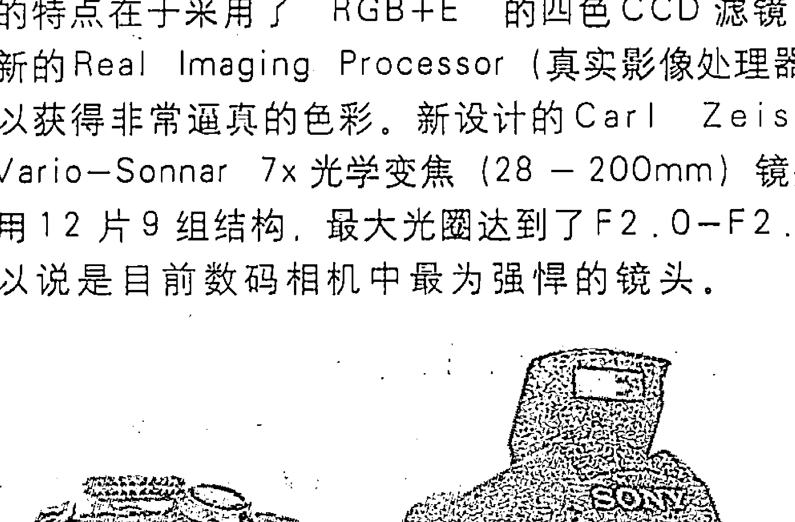

F828支持高分辨率动态拍摄: MPEG HQX (320 × 240, 16fps)和MPEG VX Fine (640 × 480, 30fps)。拍摄无时限，只与存储卡速度和容量有关，而且提供了对CF卡的支持。此外，延续了F系列的可旋转镜头。

| 规格项 | 规格值 |
| :--- | :--- |
| 传感器 | 2/3英寸800万有效像素RGB+E CCD, 14-bit AD转换 |
| 镜头 | 变焦比7X, 等值135机型28-200mm, 光圈f2.0/2.8-8.0 |
| 快门速度 | 30-1/2000 sec |
| 存储介质 | Memory Stick, CompactFlash |
| 电池种类 | 专用锂电池 |

#### 7. 索尼 DSC-W1

这是SONY继T1后，推出的又一款采用2.5英寸大液晶显示屏的产品。这款产品功能比较齐全，操控性也很不错。尤其是配备的莱卡镜头用起来感觉不错，拍出的照片色彩相当鲜艳，符合大多数普通家庭用户的审美观，电池使用寿命也很长。但在镜头指标等方面并无多少特色，夜晚用闪光灯拍摄人物时，去红眼的效果也不是很理想，而且没有自定义白平衡。

W1同样有T1的2.5英寸大LCD，但价格要便宜不少，同时采用了成本低、购买方便的5号电池。大家购买时要注意别买到水货，SONY DC的水货在市场上还是比较猖獗的。

| 规格项 | 规格值 |
| :--- | :--- |
| 传感器 | 1/1.8英寸510万有效像素CCD |
| 镜头 | 变焦比3X, 等值135机型38-114mm, 光圈f2.8/5.6-10.0 |
| 快门速度 | 30-1/1000 sec |
| 存储介质 | 记忆棒 |
| 电池种类 | 普通5号电池 (推荐使用镍氢充电电池) |

#### 8. 索尼 DSC-P150

这是SONY P系列傻瓜机中的一个新成员。除了像素的增加，其他方面如外形和功能等，都与以前的P系列产品差不多。当然也没有A、S、M等手动功能，而且望远端光圈太小，容易因手震导致拍摄失败，整体感觉相当中庸。不过，其动画拍摄能力一如SONY家族的其他DC产品，有很不错的表现。

| 规格项 | 规格值 |
| :--- | :--- |
| 传感器 | 1/1.8英寸720万有效像素CCD |
| 镜头 | 变焦比3X, 等值135机型38-114mm, 光圈f2.8/5.6-10.0 |
| 快门速度 | 30-1/1000 sec |
| 存储介质 | 记忆棒 |
| 电池种类 | NP-FR1 锂电池 |

#### 9. 富士 FinePix S7000

作为上一代人气产品S602Z的升级，FinePixS7000（如图5）采用了全新的600万像素第四代SuperCCD HR传感器，电子取景器的像素也由原来的103,000增加到235,000像素，采用xD、CompactFlash双卡槽。其他方面与S602Z相比没有太大的变化。富士这款机型，当初试图以1200万插值像素，跻身800万俱乐部，但并未如愿。不过目前4000多元的价格和不错的照片质量，使其具备了很高的性价比。

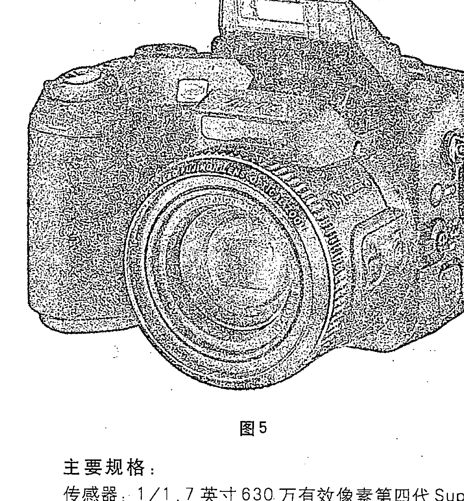

### 主要规格

| 规格项 | 规格值 |
| :--- | :--- |
| 传感器 | 1/1.7 英寸630万有效像素第四代 Super CCD |
| 镜头 | 变焦比6X, 等值135机型35 - 210mm, 光圈f2.8/3.1 - 8.0 |
| 快门速度 | 15 - 1/10000 sec |
| 存储介质 | xD/CF卡 |
| 电池种类 | 普通5号电池（推荐使用镍氢充电电池） |

#### 10. 富士 FinePix E550

FinePix E550 是富士今年最新推出的一款产品，CCD 像素达到了 600 万。富士首次在采用 SUPER CCD 的机型中将最低 ISO 设定降到了 80，从样片看，在细腻度和颗粒感方面甚至比 S7000 还好。而且，这款产品镜头的广角端达到了 32mm，对室内和风光拍摄相当有利。不过这款产品的外观设计不是很好，而且重量偏重。

总体来看，这款产品是富士数码相机良好性价比的又一次体现，3000 多元的 DC 能有如此全面的功能，非常值得选择。

### 主要规格

| 规格项 | 规格值 |
| :--- | :--- |
| 传感器 | 1/1.7 英寸630万有效像素CCD |
| 镜头 | 变焦比4X, 等值135机型32.5 - 130mm, 光圈f2.8/5.6 - 11.0 |
| 快门速度 | 3 - 1/2000 sec |
| 存储介质 | xD卡 |
| 电池种类 | 普通5号电池（推荐使用镍氢充电电池） |

#### 11. 富士 FinePix S3000

这款产品是富士广受欢迎的 S304 的后续产品，外观设计符合人体工程学，手感很好，使用简单方便，适合初学者购买。

这款产品最大的特色是拥有 6 x 光学变焦的大光圈镜头，容易拍摄出浅景深效果。但 S3000 的功能太过简单，甚至省略了 S304 的光圈优先设定，而且画质一般。

这是富士近期特价促销的一款产品。有些地区的价格甚至降到了 1800 元以内，还有“八大件”礼品相送。这个价格与其 6 X 光学变焦的大光圈镜头相比，无疑是非常超值的，目前市场上还没有相近价位的类似产品可以与之竞争。

### 主要规格

| 规格项 | 规格值 |
| :--- | :--- |
| 传感器 | 1/2.7 英寸320万有效像素CCD |
| 镜头 | 变焦比6X, 等值135机型38 - 228 mm, 光圈f2.8/3.0 - 8.0 |
| 快门速度 | 3 - 1/1500 sec |
| 存储介质 | xD卡 |
| 电池种类 | 普通5号电池（推荐使用镍氢充电电池） |

#### 12. 富士 FinePix S5500

S5500 是富士推出的第二款 10x 变焦机型，全黑的外观显得相当专业，大小适中，使用时的手感也很棒。而且各种手动功能齐全，有一定摄影基础的朋友使用起来更是得心应手。该产品对焦快速准确，快门时滞小，可高速连拍。但这款产品的最低 ISO 设定为 160，有些太高了。拍摄照片的画质不是很好，高像素下原尺寸观看颗粒感明显，锐度不够。

目前 S5500 的价格在十倍变焦产品中，算是偏低的，性价比不错。建议初学者购买，是学习摄影的好机器。不过大家购买时一定要小心水货，如果购买了没有中文菜单的水货产品，售后服务将得不到保障。

### 主要规格

| 规格项 | 规格值 |
| :--- | :--- |
| 传感器 | 1/2.5 英寸410万有效像素CCD |
| 镜头 | 变焦比10X, 等值135机型37 - 370 mm, 光圈f2.8/3.2 - 8.0 |
| 快门速度 | 2 - 1/1000 sec |
| 存储介质 | xD卡 |
| 电池种类 | 普通5号电池（推荐使用镍氢充电电池） |

#### 13. 柯达 LS753

这是柯达推出的最新时尚系列机型之一，像素达到了 500 万，拍摄效果不错，色彩鲜艳，功能简单实用，突出了柯达“易用、易分享”的主题。但其手感不是很好，镜头没有特色，而且电池使用寿命较短。

这款产品没有什么突出的优缺点，应该说性价比不是很高。在相同价位上，还有其他很多产品可以考虑，比如富士的 FinePix E550 或者尼康的 5200 等等。

| 规格项 | 规格值 |
| :--- | :--- |
| 传感器 | 1/1.8英寸510万有效像素CCD |
| 镜头 | 变焦比2.8X，等值135机型36-100mm，光圈f2.8/3.0-8.0 |
| 快门速度 | 16-1/1400sec |
| 存储介质 | SD/MMC卡，内置16MB |
| 电池种类 | 柯达充电式锂电池 KLIC 5000 |

#### 14. 柯达 DX 7440

这是柯达DX6440的像素升级版，采用了4倍光学变焦的德国施耐德镜头，具有出色的色彩表现力，而且光圈范围达到f2.2-13，这在便携机型上比较少见。在功能上，一改柯达EasyShare系列“傻瓜机”的形象，除了提供运动、夜景、人像、风景、微距和自动拍摄模式外，同时还提供了光圈、快门优先及全手动控制，显示屏采用效果不错的1.8英寸TFT LCD。这款产品近期口碑相当不错，其影响力直逼佳能的A75。但这款产品耗电量较高，暗处对焦能力不高，另外浏览回放时画面大小不能无极变化，微距拍摄效果不好。

柯达EasyShare DX7440 数码相机（如图6）所具备的柯达 EasyShare 系统，更有助于用户分享自己的数码照片。只需轻轻按一下机身背后的红宝石“Share”（分享）按钮，便可立即为每张照片选择打印、电邮和标记为收藏等选项，但要实现这些“便利”，需购买价格不菲的专用底座，感觉并不值得。

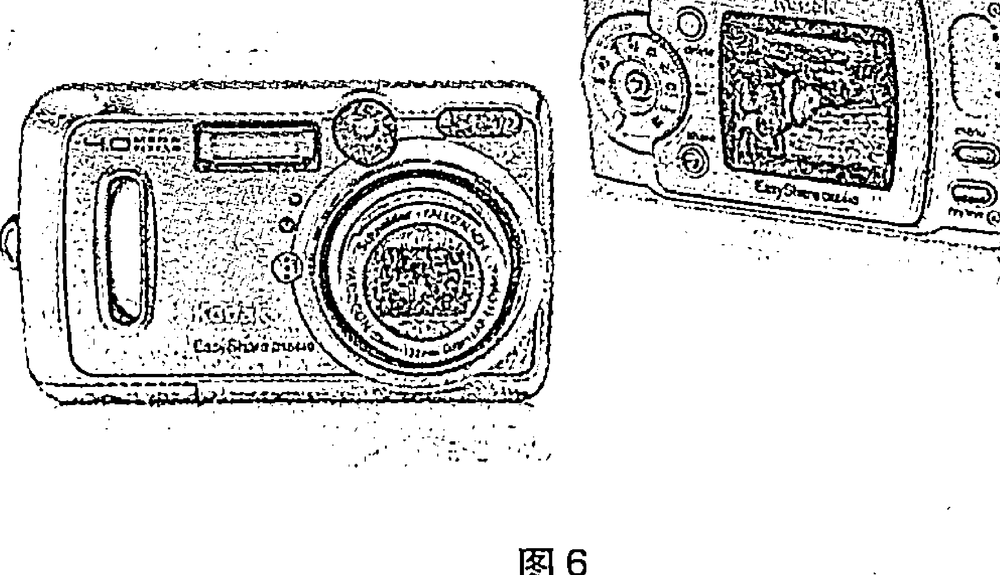

| 规格项 | 规格值 |
| :--- | :--- |
| 传感器 | 1/2.5英寸510万有效像素CCD |
| 镜头 | 变焦比4X，等值135机型33-132mm，光圈f2.2/4.3-13.0 |
| 快门速度 | 4-1/2200sec |
| 存储介质 | SD/MMC卡，内置16MB |
| 电池种类 | 柯达充电式锂电池 KLIC 5000 |

#### 15. 柯达 DX 7490

作为6490的像素升级版，7490仍属于“EasyShare”系列，强调易用性和家用性。采用10X光学变焦的德国施奈德Variogon系列镜头，与510万像素CCD配合，拍出的照片效果色彩鲜艳，整体表现相当出色。体积在10X变焦机型中相对小巧，手感好，外形朴素实用，兼有光学相机和数码相机的外形。另外，该产品采用了大尺寸2.2英寸的OLED液晶屏，显示效果很不错。缺点在于暗处对焦能力不佳，而且光线不好时LCD显示将自动变为黑白，存储时间稍慢，1/2200的最高快门速度只能在全自动模式下才能达到。

与同档次竞争对手相比，柯达7490胜在画面色彩非常出色，LCD显示屏尺寸大，效果好。但对焦和反应速度不及其他产品，而且缺乏防抖功能，使其逊色于Z3、S1 IS等产品。

| 规格项 | 规格值 |
| :--- | :--- |
| 传感器 | 1/2.5英寸510万有效像素CCD |
| 镜头 | 变焦比10X，等值135机型38-380mm，光圈f2.8/3.7-8.0 |
| 快门速度 | 16-1/2200sec |
| 存储介质 | SD/MMC卡，内置16MB |
| 电池种类 | 柯达充电式锂电池（兼容诺基亚部分型号的手机电池） |

#### 16. 柯尼卡－美能达 DiMAGE A2

从外观上看，除了商标的改变，DiMAGE A2与A1几乎完全一样，也保持了美能达首创的3D AF对焦功能、CCD手震补偿以及CxProcess II影像处理技术等重要特色。其中，Anti-Shake手震补偿系统是A2最大的特色，也是目前800万像素机型中，唯一具备手震补偿功能的产品，可以让长焦端手持拍摄的成功率大大提高。

此外，A2还令人吃惊的将电子取景器（EVF）的解像度提高到922,000像素，效果直逼光学取景器。动画拍摄功能也得到提升，可拍摄544 x 408像素、速率为15/30 fps的片段，最长可达15分钟。

| 规格项 | 规格值 |
| :--- | :--- |
| 传感器 | 2/3英寸800万有效像素RGB CCD，12-bit AD转换 |
| 镜头 | 变焦比7X，等值135机型28-200mm，光圈f2.8/3.5-8.0 |
| 快门速度 | 30-1/4000 sec |
| 存储介质 | CompactFlash |
| 电池种类 | 专用充电式锂电池 |

#### 17. 柯尼卡－美能达 DiMAGE Xg

这款产品最大的特色，在于采用了创新的“潜望镜”镜头设计，特殊的光学设计，使得整个镜头没有外露的部分，实现了三倍光学变焦。采用此设计不仅让相机外观变得方正小巧，也使其开机和反应速度超快。不过，除了方正、轻巧的外观方便随身携带外，这款产品性能平平，手感也不是太好，拍出的照片画质一般，桶形失真严重。

## 18. 柯尼卡－美能达 DiMAGE G500

这款产品实际就是柯尼卡的 G500，与美能达合并后改为现名，因此保留了柯尼卡一贯的 SD/MMC 卡和 Memory Stick 双卡槽设计。如果你有 SONY 的其他数码产品，可以使用记忆棒这一点还是很方便的。这款产品外观精美小巧，拍摄反应速度快，但画面效果不是很好，且镜头广角端长至 39mm，拍摄大场面很不理想。

这款产品的优缺点都不是很明显，可以算得上是一款比较中庸的产品。目前 G500 的价格在 3000 元内，作为一款 500 万像素的产品，价格还是比较合理。

#### 主要规格：

| 规格项 | 参数 |
| :--- | :--- |
| 传感器 | 1/1.8 英寸 510 万有效像素 CCD |
| 镜头 | 变焦比 3X，等值 135 机型 39 - 117mm，光圈 f2.8/4.9 - 8.0 |
| 快门速度 | 15 - 1/2000sec |
| 存储介质 | SD/MMC 卡，Memory Stick |
| 电池种类 | 锂电池 |

## 19. 柯尼卡－美能达 DiMAGE Z3

这是柯尼卡－美能达的最新力作，比其前代产品 Z2 有了多项重大改进。一是镜头光学变焦比提高到 12X；二是采用了美能达特有的“AS 防震”技术，大大提高了长焦端拍摄的成功率。对焦、启动、拍摄和显示的速度都超快，EVF 刷新很快，没有明显的迟滞，有“奔腾”的感觉。外形好，采用了更显专业的黑色外观，且手持方便，可以单手操作，使用普通 5 号电池，耗电量低，使用持久。

主要缺点在于画质相对较差一些，暗部噪点相当明显。1.5 英寸的 LCD 以现在的眼光来看确实太小了，像素也不高，在 MF 的时候不容易对焦精确，好在 AF 比较可靠。长焦端的光圈急剧下降到 f4.5，抵消了部分 AS 带来的防抖效果。

在 3000 元出头的价位上，如果对画质要求不是特别苛刻的话，这个机器是很超值的。如果要求在保留其他功能的前提下有更高的画质，那就选择 6000 元以上的机器吧。

#### 主要规格：

| 规格项 | 参数 |
| :--- | :--- |
| 传感器 | 1/2.5 英寸 410 万有效像素 CCD |
| 镜头 | 变焦比 12X，等值 135 机型 35 - 420mm，光圈 f2.8/4.5 - 8.0 |
| 快门速度 | 15 - 1/1000sec |
| 存储介质 | SD/MMC 卡 |
| 电池种类 | 普通 5 号电池（推荐使用镍氢充电电池） |

## 20. 奥林巴斯 C8080WZ

作为 C5060 的最新升级产品，C-8080 WZ 不仅一举升级到 800 万像素，同时还配置了 5X 光学变焦的长镜头，并涵盖了广角(28mm)领域。虽然没有过去 5050/4040/3030z 的 F1.8 大光圈，但比 5060WZ 的 F2.8 光圈要强一些。另外，由于长镜头的特性，C-8080 WZ 的取景器改用了 24 万像素的 EVF(电子取景器)，画面刷新率为 60fps，在成像反应上更加真实和舒适。

奥林巴斯为 C-8080WZ 配备的是外观酷似 BP511 的 BLM1 锂电池，容量达到惊人的 1500 毫安。按照奥林巴斯方面的说法，至少可以满足大约 300 张以上的照片拍摄电力需求（EVF 状态，1/3 闪光），这一点在同类机型中表现突出。此外，在动态拍摄方面，C-8080 WZ 可录制 15fps 的 VGA（640x480）或 320 x 240 像素的有声影片，长度只受存储卡容量限制。

#### 主要规格：

| 规格项 | 参数 |
| :--- | :--- |
| 传感器 | 2/3 英寸 800 万有效像素 CCD |
| 镜头 | 变焦比 5X，等值 135 机型 28 - 140mm，光圈 f2.4/3.5 - 8.0 |
| 快门速度 | 16 - 1/4000sec |
| 存储介质 | xD/CF 卡 |
| 电池种类 | BLM-1 充电锂电，7.2V, 1500 mAh |

## 21. 奥林巴斯 C770UZ

这是奥林巴斯一系列便携式长焦相机中的最新产品（如图 7），采用 400 万像素 CCD，具备闪光灯热靴、实时直方图显示等多项专业功能。最大特点是能够拍摄全屏(640 x 480 pixels) MPEG4 有声电影(30fps 速率)，采用 MPEG-4 格式的视频动态影片，可以大大缩小动态影片的体积，提高数码相机录像拍摄功能的实用性。

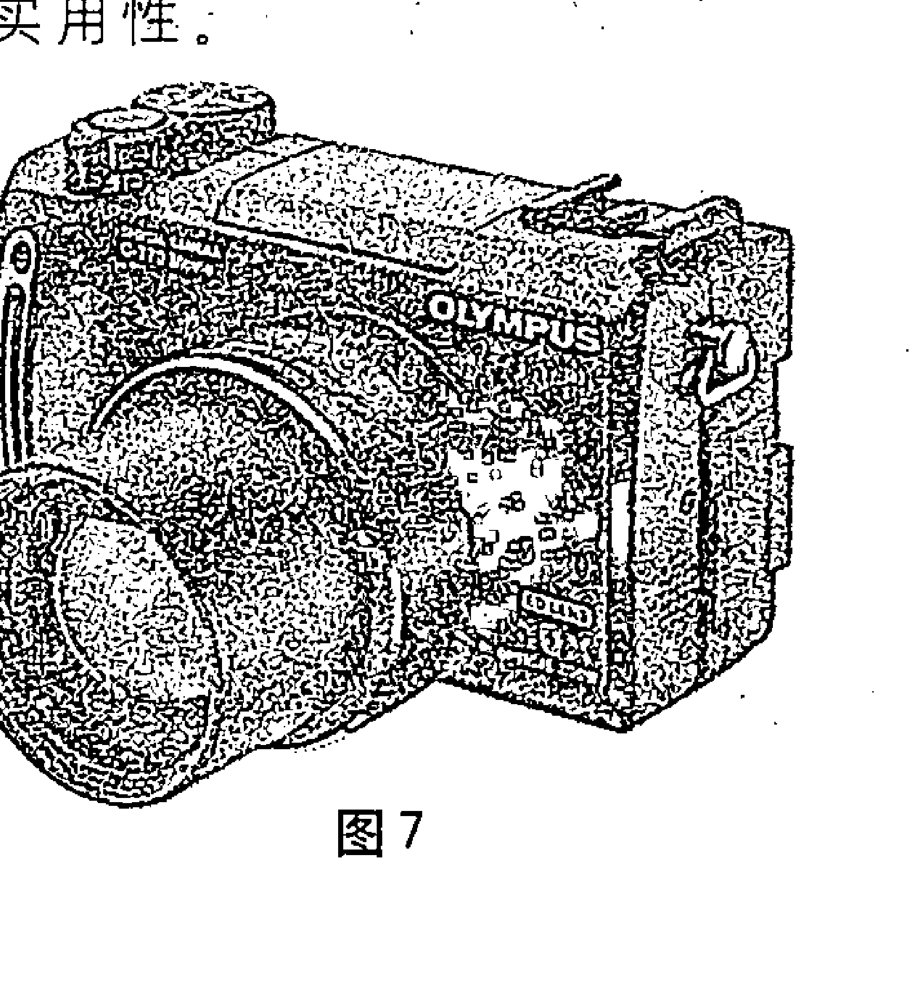

除此之外，这款产品在外形和功能上并没有太大的突破。尤其是依然没有采用在 C-2100UZ 中广受欢迎的光学防手震 (I.S) 技术，使其在与佳能 S1 IS 和松下 FZ10 的竞争中处于下风。

#### 主要规格：

| 规格项 | 参数 |
| :--- | :--- |
| 传感器 | 1/2.5英寸400万有效像素CCD |
| 镜头 | 变焦比10X，等值135机型38 – 380mm，光圈f2.8/3.7 – 8.0 |
| 快门速度 | 16 – 1/1000 sec. |
| 存储介质 | xD卡 |
| 电池种类 | 锂电池 |

## 22. 奥林巴斯 AZ1

这是奥林巴斯推出的一款另类产品，最显眼的地方就是采用了 2.5 英寸的大型高亮度液晶显示屏 (21万像素)，配合底座可以直接播放已拍摄的照片，相当于具备“电子相框”的功能。这款机型成像、色彩都相当不错，但画面整体有些偏红，而且必须使用底座才可以充电，使用上有些不便。

总体画质在3Mp机型中绝对属于一流，外观也非常漂亮。启动速度很快，外观轻巧简约，功能比较新颖，显示屏很宽阔，适合追求时尚的朋友选择。和同样具备2.5英寸大液晶屏的 SONY W1 相比，这款产品的性价比不占优势。

#### 主要规格：

| 规格项 | 参数 |
| :--- | :--- |
| 传感器 | 1/2.7英寸320万有效像素CCD |
| 镜头 | 变焦比3X，等值135机型38 – 114mm，光圈f2.9/4.9 – 8.0 |
| 快门速度 | 1/2 – 1/725 sec |
| 存储介质 | xD卡 |
| 电池种类 | 锂电池 |

## 23. 奥林巴斯 μ 410

这款产品的外形继承了其μ系列传统相机的设计，流线感十足。对于μ系列相机的老用户，选择这款产品将会感到十分亲切。这款产品还具备“生活防水”能力，可以在一般的雨天正常使用。不过，拍摄照片噪点的确太多，就算设定在ISO 64也能明显看出噪点。

这款产品主要吸引人之处，在于其特殊的外观设计和具备一定的防水功能，但整体功能偏弱，而且画质较差。如果你不是特别钟爱其外形，建议选择相近价位的其他产品。

#### 主要规格：

| 规格项 | 参数 |
| :--- | :--- |
| 传感器 | 1/2.5英寸400万有效像素CCD |
| 镜头 | 变焦比3X，等值135机型35 – 105mm，光圈f3.1/5.2 – 8.0 |
| 快门速度 | 4 – 1/1000 sec |
| 存储介质 | xD卡 |
| 电池种类 | 锂电池 |

## 24. 宾得 S40

这款产品的难得之处在于使用了普通5号电池作为电源，还保持了相当“苗条的身材”，其大小和重量仅比其“兄弟” Optio S4 稍大，十分方便携带。1.6英寸8.5万像素的液晶显示屏效果也不错。使用时感觉反应速度一般，拍摄照片的画质中等偏上，但颗粒感强了一些，而且耗电水平较高。

作为一款使用方便，耗材便宜的口袋机，其价格也比较便宜，是对摄影要求不高的朋友较佳选择。

#### 主要规格：

| 规格项 | 参数 |
| :--- | :--- |
| 传感器 | 1/2.5英寸400万有效像素CCD |
| 镜头 | 变焦比3X，等值135机型35 – 105mm，光圈f2.6 /4.8 – 8.0 |
| 快门速度 | 4–1/2000sec |
| 存储介质 | SD/MMC卡，内置11MB |
| 电池种类 | 普通5号电池（推荐使用镍氢充电电池） |

## 25. 宾得 Optio S5

由于采用了特殊的滑动变焦镜头，宾得 Optio S5 是目前市场上最轻薄和小巧的500万像素数码相机，三围尺寸只有83mm(W) x 52mm(H) x 20.5mm(D)，仅重125g，可以轻松放到普通烟盒中。轻薄小巧是这款产品最大的卖点，握在手中宛若无物，非常适合女性朋友选择。不过，其控制按键太小，操作不便，而且成像效果不太理想，显得比较暗淡，闪光灯出力也太弱。

S5 具有模式矩阵选择，提供了21种拍摄模式，包括程序、夜景、电影、全景辅助、3D照片、风景等等。此外，还具有时间间隔拍摄、世界时间闹钟等功能，是一款相当有趣的数码相机。但目前价格还是太高，应该还有较大幅度的下调空间。

#### 主要规格：

| 规格项 | 参数 |
| :--- | :--- |
| 传感器 | 1/2.5英寸500万有效像素CCD |
| 镜头 | 变焦比3X，等值135机型35 – 105mm，光圈f2.6 /4.8 – 8.0 |
| 快门速度 | 4–1/2000sec |
| 存储介质 | SD/MMC卡，内置11MB |
| 电池种类 | 锂电池 |

## 26. 宾得 Optio 555

这款数码相机是宾得 Optio 550 的升级版本，虽然从外形来看，整体风格变化不大，不过很多关键之处都经过了重新设计，在镜头周围有银边的时尚设计，机身正面也设置了银色的防滑突纹，不仅时尚而且实用。

Optio 555 具有“拍摄优先”功能，这意味着在任何模式下，只要按下快门，相机就会返回到拍摄模式，不会丢失突发和精彩的瞬间。同时，快门延迟也比前代产品缩短了很多，提高了拍摄效率。而且取消了动态拍摄的时限，拍摄长度只受存储卡容量的制约。Optio 555也兼容PictBridge协议。

#### 主要规格：

| 规格项 | 参数 |
| :--- | :--- |
| 传感器 | 1/1.8英寸510万有效像素CCD |
| 镜头 | 变焦比5X，等值135机型37.5mm - 187.5mm，光圈f2.8 / 4.6 - 8.0 |
| 快门速度 | 15 - 1/2000sec |
| 存储介质 | SD/MMC卡 |
| 电池种类 | 锂电池 |

## 27. 松下DMC-FZ20

这是世界上第一台具有12X光学变焦的500万像素数码相机（如图8），采用了全焦段F2.8大光圈的莱卡DC VARIO-ELMARIT镜头，该镜头采用13片8组设计，并具有3片非球面镜，效果出色。在大光圈和高变焦下，可轻易实现完美的景深效果，从中体验到更多的摄影乐趣。

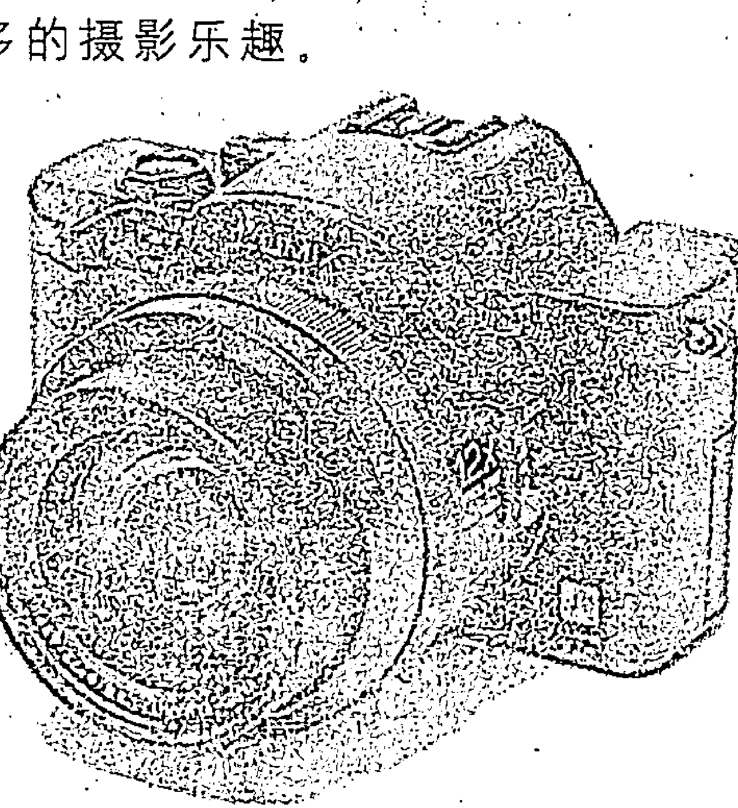

图8

针对大光学变焦数码相机的特点，FZ20还采用了自行研发的MEGA O.I.S.（光学图形稳定器）技术，保证在高倍变焦或者低光环境下拍摄的稳定和清晰，该技术采用了运动传感器，能够探知拍摄时候轻微的手动，并进行快速连续的补偿来消减抖动干扰。

#### 主要规格：

| 规格项 | 参数 |
| :--- | :--- |
| 传感器 | 1/2.5英寸500万有效像素 CCD |
| 镜头 | 变焦比12X，等值135机型36 - 432mm，光圈f2.8 - 8.0 |
| 快门速度 | 8 - 1/2000 sec |
| 存储介质 | SD/MMC卡 |
| 电池种类 | 锂电池 |

## 28. 松下FZ3

它是松下FZ2的像素升级版，采用了12X光学变焦全焦段F2.8大光圈的莱卡DC VARIO-ELMARIT镜头，效果出色。另外，FZ3跟FZ20一样，也采用了松下自行研发的MEGA O.I.S.（光学图形稳定器）技术。尽管其CCD尺寸较小，但实际拍摄图片的效果却相当不错。不过，由于仅使用了一颗650毫安的电池，只能拍摄百余张就会耗尽电量，还有待改进。

目前价格也还偏高，建议大家等待降价后再出手。

#### 主要规格：

| 规格项 | 参数 |
| :--- | :--- |
| 传感器 | 1/3.2英寸300万有效像素CCD |
| 镜头 | 变焦比12X，等值135机型35 - 420mm，光圈恒定f2.8 |
| 快门速度 | 8 - 1/2000sec |
| 存储介质 | SD/MMC卡 |
| 电池种类 | 锂电池 |

## 29. 松下FX5

这款产品最大的特色，就是松下首创在小变焦比的袖珍机型中内置MEGA O.I.S.（光学图形稳定器）技术。由于此类机型多为初学者选择，难免在拍摄时出现手抖的问题，在光线不太好的情况下将严重影响拍摄效果，内置光学图形稳定器有效地解决了这一问题，实际使用时能体会到其优势。这款产品很适合在光线不佳的室内拍摄，不过其他指标没有突出表现，画质也较一般，缺乏手动功能，而且电池续航能力较差。

如果你对手持相机拍摄不抖动把握不大，而且对其他指标没有更多要求，可以考虑选择这款机型，它有多种时尚颜色可以选择。

#### 主要规格：

| 规格项 | 参数 |
| :--- | :--- |
| 传感器 | 1/2.5英寸410万有效像素CCD |
| 镜头 | 变焦比3X，等值135机型35 - 105mm，光圈f2.8/4.9 - 8.0 |
| 快门速度 | 8 - 1/2000sec |
| 存储介质 | SD/MMC卡 |
| 电池种类 | 锂电池 |

## 30. 松下LC1

这款500万像素（CCD尺寸为2/3型）的产品，乍一看很像一个可更换镜头的旁轴相机，Leica（莱卡）版本的Digilux 2（基本规格与LC1完全相同，只是外观设计不同）看起来就更像经典的M系列产品了。

LC1的镜头是最令人感兴趣的，不仅仅是因为Leica Vario Summicron标记，还在于其F2.0 - 2.4的最大光圈、28 - 90mm的实用焦段，以及令人爱不释手的全手动操作镜身设计。在我们为了消费级数码相机出现机械手动变焦环而欢呼时，LC1却带来了机械手动的变焦环、聚焦环、光圈设置环，令喜爱手动操作相机的用户大呼过瘾。在LC1的机身上，到处充满了复古设计的元素，如纯黑色硬朗线条，怀旧味道浓厚的皮质外壳，连快门速度设置也与机械相机相似，通过一个拨动转盘来实现。

#### 主要规格：

| 规格项 | 参数 |
| :--- | :--- |
| 传感器 | 2/3英寸510万有效像素CCD |
| 镜头 | 变焦比3.5X，等值135机型28 - 90mm，光圈f2.0/2.4 - 8.0 |
| 快门速度 | 8 - 1/2000sec |
| 存储介质 | SD/MMC卡 |
| 电池种类 | 锂电池 |

## 31. 卡西欧EX-P600

这款产品一改卡西欧轻巧DC路线，采用了不锈钢材质外型，而且保持了卡西欧数码相机的大LCD显示屏特征，也采用了2.0英寸LCD。虽然在体形上比其他EXLIM系列的要大一些，不过依然很好地兼顾了便携性，三围尺寸是97.5mm×45.1mm×67.5mm，重量225g，在目前600万像素的数码相机中算是十分轻巧的。

记录媒体除内建9MB Flash Memory外，也支持SD/MMC卡。在搭载光学观景窗的同时，还有EXILIM系列独特的世界时间与日历显示装置。电池采用专用充电式锂电池，能连续拍摄300张以上。

#### 主要规格：

| 规格项 | 参数 |
| :--- | :--- |
| 传感器 | 1/1.8英寸600万有效像素CCD |
| 镜头 | 变焦比4X，等值135机型33-132mm，光圈f2.8/4.0-8.0 |
| 快门速度 | 60-1/2000sec |
| 存储介质 | SD/MMC卡 |
| 电池种类 | 锂电池 |

## 32. 卡西欧Z40

这款产品有着非常精巧的外观，2英寸的大尺寸LCD显示效果非常不错，可以直接将拍摄的照片方便地展示。照片实拍效果也不错，反应速度较快，还有一些定时闹钟之类的实用功能。但其微距拍摄能力较差，光线复杂条件下自动白平衡不太准确，并且必须配合底座才能充电，传输照片也显得麻烦。

Z40除了继承了Exilim系列机型的小巧时尚之外，最突出的特色就是使用了大容量的锂离子充电电池。还有全黑色机型可选，适合喜欢“扮酷”的朋友选择。和定位差不多的宾得S4相比，Z40胜在2英寸的大尺寸LCD和更好的手感，而且电池寿命要长很多，但是在一定程度上牺牲了追求极致小巧的目标。

#### 主要规格：

| 规格项 | 参数 |
| :--- | :--- |
| 传感器 | 1/2.5英寸400万有效像素CCD |
| 镜头 | 变焦比3X，等值135机型35-105mm，光圈f2.3/4.6-8.0 |
| 快门速度 | 4-1/2000sec |
| 存储介质 | SD/MMC卡 |
| 电池种类 | 锂电池 |

## 33. 卡西欧R51

这款产品是R40的升级版，基本上保留了R40所有的功能和特性。除了像素提升外，LCD也增大到2英寸，但显示效果并不是很理想。启动、变焦及反应速度超快，快门延时0.01秒，宾得镜头让成像锐利不少，拍摄照片画面的细腻程度和色彩都不错，但噪点比较明显。R51相当省电，用一组2100毫安的充电电池，可以拍摄将近600张。不过微距较差，只能达到14CM，相比其他机型较逊色。

这款产品除了装备了2.0英寸规格大型彩色LCD显示屏外，性能也可谓非常不俗，在当今数码相机中属于领先水平。

#### 主要规格：

| 规格项 | 参数 |
| :--- | :--- |
| 传感器 | 1/1.8英寸510万有效像素CCD |
| 镜头 | 变焦比3X，等值135机型39-117mm，光圈f2.8/4.9-8.0 |
| 快门速度 | 4-1/2000sec |
| 存储介质 | SD/MMC卡 |
| 电池种类 | 普通5号电池（推荐使用镍氢充电电池） |

## 34. 尼康Coolpix 8800

尼康日前宣布推出旗下最新的消费级旗舰数码相机——具有800万像素10X光学变焦的Coolpix 8800，这款产品是Coolpix 8700的升级版本，在机身造型上几乎相同，最大的改动在镜头系统，加入了“VR”光学防抖功能。Coolpix 8800采用铝镁合金机身，支持CF Type I/II存储卡和微型硬盘，可进行3.5fps速率的5张连拍。

这款产品具备尼康独有的图像处理技术，可以保证成像色彩自然、细节和层次充分展现。其独特的256区矩阵测光系统可以准确表现曝光，而且其矩阵自动白平衡功能在昏暗环境下也能有出色表现。此外，8800还保留了尼康独有的BSS模式，可以自动从5张照片中选出效果最好的一张保存。

#### 主要规格：

| 规格项 | 参数 |
| :--- | :--- |
| 传感器 | 2/3英寸800万有效像素CCD |
| 镜头 | 变焦比10X，等值135机型35-350mm，光圈f2.8/4.8-8.0 |
| 快门速度 | 10分钟-1/4000sec |
| 存储介质 | CF卡 |
| 电池种类 | 专用EN-EL1锂电池 |

## 35. 尼康Coolpix 3700

Coolpix 3700（如图9）配置了3X光学变焦的尼克尔镜头，也是尼康首款采用SD存储卡的数码相机，因此带来的直接优势，是体积的缩小和反应速度的提高。

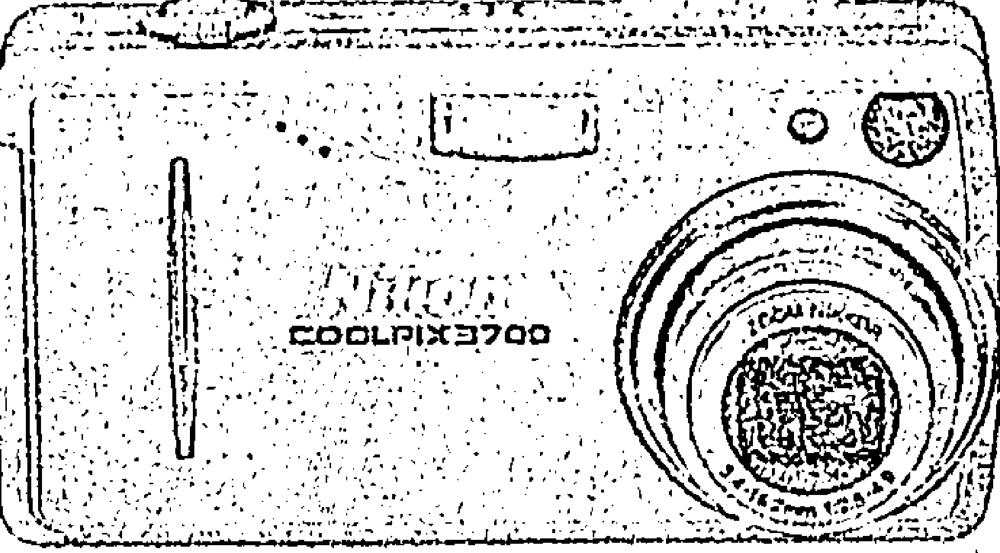

尼康出色的微距在 Coolpix 3700 上继续得到保持，其最近微距拍摄可达 4 cm，而且动态拍摄功能相当强悍，可以实现 30 秒的 640 × 480 分辨率的动态拍摄，并可以记录声音，不限拍摄时间。此外，还具有间隔拍摄和声控快门的特殊功能。可玩性很高，与尼康以前产品的风格有较大改变。这是一款集时尚与实用于一体的家用机，操作方便，场景模式很多，基本可以满足日常生活使用的需要。

#### 主要规格：

| 规格项 | 参数 |
| :--- | :--- |
| 传感器 | 1/2.7 英寸 320 万有效像素 CCD |
| 镜头 | 变焦比 3X，等值 135 机型 35 – 105mm，光圈 f2.6/4.8 – 8.0 |
| 快门速度 | 4 – 1/2000 sec |
| 存储介质 | SD 卡，不支持 MMC |
| 电池种类 | 锂电池 |

## 36. 尼康 Coolpix 4500

这款产品尽管是尼康两年前推出的，但其优秀的性能、丰富的手动功能和非常好的画质，一直受到不少用户的欢迎。全铝合金可旋转的机身，很有特色，是尼康此类机型的“收山之作”。1 厘米的微距效果相当不错，但电池较差，充电一次只能拍摄约 100 张，而且发热量大，暗处对焦经常失败。

极远极近都是它的强项，近可拍蚂蚁，远可拍月球（能方便与天文望远镜对接），在同档次相机中个性独特。倒是一般的应用，如人像和风景稍弱。但其毕竟是一款半专业机型，经过前段时间的高台跳水，目前价格为 2600 元左右，非常超值。

#### 主要规格：

| 规格项 | 参数 |
| :--- | :--- |
| 传感器 | 1/1.8 英寸 410 万有效像素 CCD |
| 镜头 | 变焦比 4X，等值 135 机型 38 – 155mm，光圈 f2.6/5.1 – 8.0 |
| 快门速度 | 8 – 1/2000 sec，B 门最长 5 分钟 |
| 存储介质 | CF 卡 |
| 电池种类 | 锂电池 |

## 37. 理光 Caplio R1

这是一款很有特色的产品，28 – 135mm 广角大变焦镜头非常引人瞩目，1cm 微距、三维 LCD、手感好、可用多种电池等都令人满意，是目前不多的达到 28 mm 广角的低价产品。但其成像质量很平淡、储存速度慢、对焦也较慢，而且镜头光圈太小。这款产品最大的卖点就是 28mm 大广角和 0.1 秒的超快反应速度。

#### 主要规格：

| 规格项 | 参数 |
| :--- | :--- |
| 传感器 | 1/2.5 英寸 410 万有效像素 CCD |
| 镜头 | 变焦比 4.6X，等值 135 机型 28 – 135mm，光圈 f3.1/5.8 – 8.0 |
| 快门速度 | 8 – 1/2000 sec |
| 存储介质 | SD/MMC 卡 |
| 电池种类 | 普通 5 号电池、专用锂电池 |

## 38. 理光 Caplio-GX

这款相机传承了理光 DC 的一贯风格，28mm 广角镜头、1 cm 超强微距、极低的快门时滞，能够使用普通 5 号电池，非常适合作为随身携带的抓拍机。

GX 使用了一块 1/1.8 英寸 500 万像素的 CCD，28~85mm 的 3 倍光学变焦镜头使用了 4 枚非球面镜片，有效地控制了广角端的畸变。同时，具有袖珍机中少有的光圈优先和全手动控制功能，配置了闪光灯热靴、实时直方图，最高 ISO 达到了 1600，显得相当专业化。

#### 主要规格：

| 规格项 | 参数 |
| :--- | :--- |
| 传感器 | 1/1.8 英寸 500 万有效像素 CCD |
| 镜头 | 变焦比 3X，等值 135 机型 28 – 85mm，光圈 f2.5/4.3 – 8.0 |
| 快门速度 | 30 – 1/2000 sec |
| 存储介质 | SD/MMC 卡 |
| 电池种类 | 普通 5 号电池、专用锂电池 |

## 39. Kyocera SL400R

这是一款时尚小巧，很有新意的数码相机。超薄的可旋转机身，令拍摄自由度大大增加，再加上超快的反应速度和不错的成像质量，是一款不可多得的“偷拍利器”。但是，也存在发热量惊人，电耗大，易死机等缺点。

目前这款产品的价格为 2500 元左右，还是有些偏高，如果不在意像素少了 100 万，可以选择其同胞兄弟 Kyocera SL300R，性价比更高。

#### 主要规格：

| 规格项 | 参数 |
| :--- | :--- |
| 传感器 | 1/2.5 英寸 400 万有效像素 CCD |
| 镜头 | 变焦比 3X，等值 135 机型 35 – 105mm，光圈 f2.8/4.7 – 8.0 |
| 快门速度 | 8 – 1/2000 sec |
| 存储介质 | SD/MMC 卡 |
| 电池种类 | 普通 5 号电池 |

## 40. 三洋 Xacti J4

这是一款小巧时尚、开机拍摄速度快、特色功能较多的产品，比如其“补光彩灯”、证件照、清晰的真人提示音等功能都很有特色。而且其动态拍摄能力也相当强劲，可以拍摄 640 × 480/30fps 的不限时录像，在拍摄录像的过程中可以进行光学变焦。

从 J4 的定位来说，追求时尚而轻松的拍摄，就意味着应该在保证一定效果的基础上，实现更多的增值功能，J4 很好地做到了这一点。

#### 主要规格：

| 规格项 | 参数 |
| :--- | :--- |
| 传感器 | 1/2.7 英寸 400 万有效像素 CCD |
| 镜头 | 变焦比 2.8X，等值 135 机型 37 – 104mm，光圈 f2.8/3.9 – 8.0 |
| 快门速度 | 1/2 – 1/2000 sec |
| 存储介质 | SD/MMC 卡 |
| 电池种类 | 锂电池 |## 数码输出齐家欢

文/图 琪琪

随着数码相机的日趋火爆，摄影活动从以前“拍照片—冲卷—冲印照片”的“三部曲”，转变到今天“影像采集—模数转换—数码暗房—彩色终端”的“四重奏”，越来越多的摄影爱好者步入了数码图像的领域。

目前，数码照片的输出冲印主要有两种形式：第一种是消费者自己在家里使用彩色喷墨打印机打印输出；第二种是到富士、柯达等数码冲印店进行冲印。下面，我们将讨论在这两种情况下，如何得到效果优异的照片。

### 一、选择彩色喷墨打印机输出照片

随着计算机和数码相机的不断发展，照片的输出也越来越趋于个人化和家庭化，各大电子厂商也适时推出了多种图片打印设备，满足用户的需要。但是，什么样的打印机适合我们家庭用户呢？

目前用于家庭使用的打印机，以打印方式可以分为激光打印机、喷墨打印机和热升华打印机等几种类型。作为不同类型的打印机，它们的主要用途也是不一样的：热升华打印机打印质量好，照片具有防水功能，但是打印幅面有限，打印机价格昂贵，成本高，常用于打印证件照；激光打印机打印速度快，成本低，但是机器价格昂贵，一般用来打印黑白、彩色文本，打印照片效果不佳；相比之下，无论是打印质量，还是价格、耗材成本，喷墨打印机都成为数码照片打印机的首选，它能够打印0.5英寸到12英寸的数码照片，也可以打印黑白、彩色文本文件。

### 二、如何选购照片级喷墨打印机

使用彩色照片打印机输出照片时，最令人兴奋的是：从拍摄到照片制作的全过程均由自己完成，并且在打印制作过程中，还可以设计不同的特技，以及添加各种文字，制作成独一无二的照片。那么，如何选购一款合适的照片级彩色喷墨打印机呢？

#### 1. 墨滴大小的选择

照片级喷墨打印机是一种应用最广泛、发展最快速的彩色打印设备。厂商推出新产品的更新周期越来越短，技术指标也在不断提高，其中，喷墨打印机的墨滴大小，已经从一年前的4微微升减小到2微微升甚至更小。一般来说，4微微升以下的墨滴，人眼已经很难分辨，同时由于墨水落在纸张表面还会有轻微扩散，实际打印效果也就与4微微升大致相当。因此，我们不用过度追求墨滴的大小，要知道技术规格越高，产品的市场售价也越高。

#### 2. 便宜的家用照片级喷墨打印机

相比其他数码产品来说，照片级喷墨打印机本身的售价是比较便宜的，从最低的七、八百元到四、五千元不等。对于一般家庭使用来说，千元左右价格的照片级喷墨打印机，已经能够打出精美的照片了；而能够打印18英寸（A3幅面）照片的高精度、微墨滴、多墨色喷墨打印机，也只需不到4000元。目前市场上销售的产品中，EPSON Stylus Photo R210（如图1）、EPSON Stylus Photo 830U、HP Photosmart 7660、HP Photosmart 7268以及Canon IP3000、IP5000等都相当不错，售价也在1000元～2000元之间。

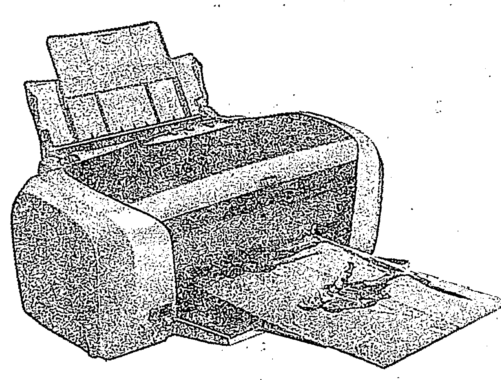

#### 3. 昂贵的打印耗材

与便宜相对的就是昂贵。虽然打印机本身售价非常便宜，但是需要使用的原装墨水、高质量光泽照片纸等耗材，价格却比较高。例如爱普生Stylus Photo R800打印机的原装耗材为72元/色，它有8种颜色，一套墨盒就需要576元，而一盒彩墨能打印A4(12英寸)照片纸20张，价格在100元左右。因此，就墨盒和相纸而言，打印一张A4照片需要花费7至9元，其中还不包含打印机的折旧损耗费用，成本还是略显昂贵。

#### 4. 最强的8色打印

随着打印技术的发展，照片级喷墨打印机的色彩，已经由最初的四色印刷发展到现在的7色甚至8色。不过，这些技术都源于四色印刷原理，即由青(cyan)、品红(magenta)、黄(yellow)和黑色(black)四种颜色组成照片中千变万化的色彩。7色是增加了浅灰、浅青和浅品红墨水，用来丰富打印的层次；8色更是增加了深灰墨水，专门用于打印黑白照片。不可否认，色彩越多打印效果越好，但是，打印机和墨盒的价格倍增，后期使用费用也相当高昂。因此，大家要根据自己的需求购买合适的机型。就笔者来说，一年前购买的六色EPSON Stylus Photo 830U彩色喷墨打印机，打印的照片质量相当不错，完全可以满足打印需求。总的来说，并不是色彩越多越合适。

### 三、如何进行照片打印

目前很多厂家推出了连接数码相机的直接照片级喷墨打印机，和直接插卡照片级喷墨打印机，可以直接连接数码相机或插入存储卡打印照片，但对于严谨的用户来说，最好还是先在计算机屏幕上调整，确认图片效果后再进行打印。每一品牌的打印机，均附有配套的打印驱动程序及打印软件，各品牌的软件互不通用和兼容。在使用喷墨打印机前，必须安装相应的打印软件，按照光盘上的提示，一步一步完成即可，过程相当简单。

#### 1. 如何获得最好的打印效果

在正式打印前，利用打印机专用打印程序，设置打印参数和模式非常重要。以笔者目前使用的Canon IP4000照片打印机为例，打印设置页面共有4个子窗口：主窗口、打印纸、版面和应用工具。其中，主窗口的参数设置直接影响打印效果。如图2所示，窗口左侧为显示区，形象地显示了当前设置情况；右侧划分了“介质类型”、“墨水”（彩色或黑色）和“模式”3个子区。另外，还有分辨率、纸张尺寸大小、打印速度、有无边距等选项。

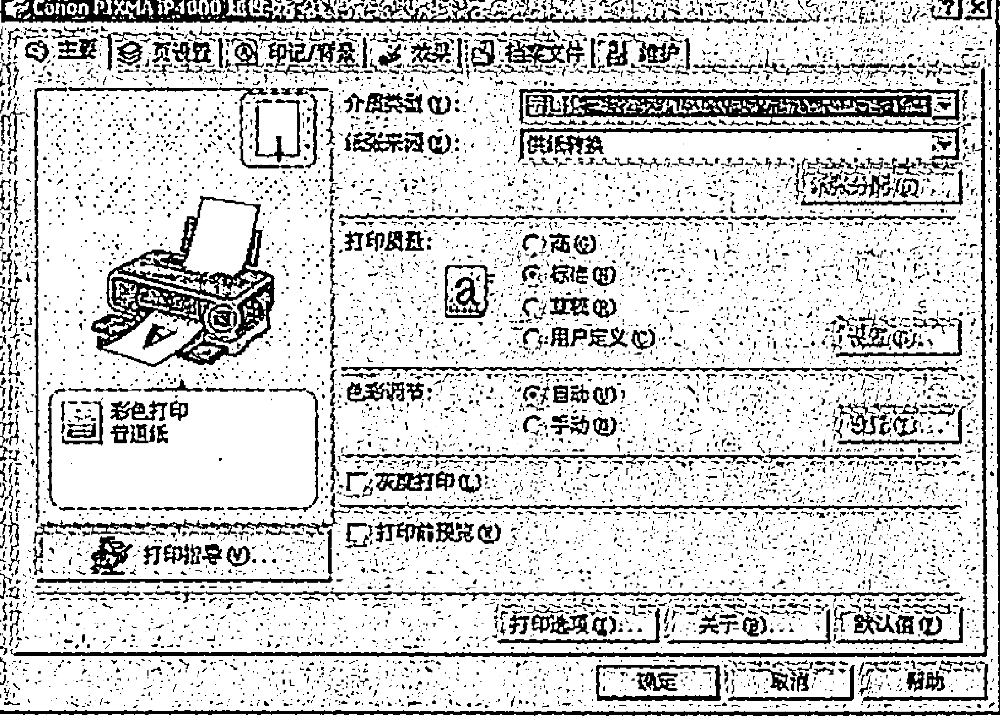

##### (1) 高清晰度

衡量图像清晰程度，首要指标是打印分辨率（用DPI表示，即每英寸所打印的点数），分辨率越高，图像精度就越高，打印质量当然就越好。在喷墨打印中，300DPI是人眼分辨图像边缘是否存在锯齿的临界点，因此，只有300DPI以上的分辨率，才能保证打印效果基本令人满意。笔者通常设置在600DPI打印，这样就能获得精美打印质量，看不出墨点颗粒。如果设置到1200DPI等高分辨率进行打印，笔者认为完全没有必要，因为我们已经观察不出明显的改善，而且耗墨费时。

##### (2) 高色彩饱和度

大家在打印照片时，常出现偏色、色淡现象及打印效果不稳定，除了软件或使用方面的原因，没有校正屏幕显示和实际打印效果的微差也有很大影响。正式打印之前，一定要根据打印样片，对显示器进行颜色调整，真正做到所见即所得。这个过程是不能被省略的，它是得到好照片的保证。

#### 2. 优质照片打印技巧

##### (1) 使用高质量光泽照片纸

要想获得精美的照片，必须使用高质量光泽照片纸，它会带来和传统照片冲印，或激光数码扩印的同等效果，符合我们的欣赏习惯。如果使用低质纸甚至复印纸，打印图像会不清晰、色彩灰暗无光，像放置了十几年的旧照片，并有明显的毛刺、渗墨现象。一般来说，各个打印机厂商都根据墨水研制照片纸张，这样可以保证纸张和墨水相互匹配。因此，在一般情况下，建议使用原装照片打印纸张。

原装高质量光泽照片纸效果虽好；但是价格太高，打印成本居高不下，使用兼容纸张成为了一种无奈的选择。就目前市场来说，兼容耗材厂商生产的代用纸价格便宜，但质量参差不齐，如何从中选出优秀的产品也并非易事，这需要大家多多尝试，不断积累经验。

##### (2) 使用原厂正品墨水

虽然上文中建议大家尝试照片纸的兼容产品，但是对于墨水来说，笔者强烈推荐使用原装墨水。大家不要去尝试兼容墨水，尽管它们会宣传打印照片色彩多么纯正、价格多么便宜等等。喷墨打印机最娇贵的部件就是喷墨头了，如果喷嘴堵塞，整台打印机也就报废了（通常无法维修或维修费用高于购买费用），因此，一定要使用原厂正品墨水。在使用兼容墨水堵塞喷头后，打印机厂家是不负责保修的。

同时，即使使用原厂正品墨水，长时间不使用时，由于高温干燥的外部环境，墨水蒸发较快，也会造成喷嘴堵塞，最好是每周至少开机一次，每半月打印一次。特别是在现在墨滴越来越小的情况下，要更加注意这方面的问题。

#### 3. 节省墨水的方法

由于原厂墨水价格昂贵，而为了确保打印机的正常使用，又不能使用其他替代产品，所以，一定要想方设法节省宝贵的墨水。以下是笔者在使用过程中总结的几个小诀窍，大家不妨试试：

- 尽可能打印清淡、高调的内容。打印图像背景有大片黑色、深暗色时，会耗费大量墨水，因此，在打印照片时，尽量不要出现这种现象。
- 零散的打印任务尽可能集中定时打印。因为打印机每启动一次都要自检，一般会有墨水浪费。
- 照片打印机一般都具备无边距打印功能，但从节省墨水出发，尽量使用有边距打印，因为无边距打印模式耗墨较多。
- 在打印机提示墨水用完后，先不要把墨盒扔掉。墨水指示是通过纸张类型、打印张数计算出来的，有时提示墨水用完的墨盒，拆下后再次装上还能再打印若干张照片。

### 四、冲印方式

数码摄影的兴起，改变了传统摄影的结构，由此产生的数码冲印开始抢占传统冲印的部分市场。尤其是在大中城市，数码冲印正成为照片输出队伍中的主流。作为摄影爱好者，如何选择数码冲扩点得到满意的摄影作品，还需要了解一些数码彩扩机的特点和技巧。

#### 1. 了解数码冲印原理

数码冲印的基本原理，是基于激光和传统的银盐技术，将电子文档中的图像数字信号转换成3色（红绿蓝）光信号，在银盐相纸上曝光，然后通过传统显定影工序冲洗输出，最终得到与传统冲印一样的照片。

目前，数码图像输出系统生产厂家有：柯达、富士、诺日士、爱克发等等。富士和爱克发数码冲印机都选用激光曝光，这种方式冲印照片颜色明快，但缺少细节层次，扩印尺寸较小，最大只能到10×15英寸；而柯达则有多种方式曝光，注重明暗细节层次表现，但锐度不如激光冲印，它的最大尺寸可以到12×18英寸。

数码冲印的照片，对于消费者来说成本低、冲印质量稳定。无论是柯达、富士或爱克发的冲印纸，都有纸质好且光洁耐磨，保存长久的特点。而高速曝光下，每小时达到2000张5英寸照片以上的出片速度，更具有高速便捷的特点。这些都比喷墨打印照片优势明显。

#### 2. 冲印前的准备工作

为了得到一张好的照片，在把拍摄并制作好的数码图像文件送往彩扩冲印店之前，需要作些什么准备呢？

首先，要确认图像文件能保证输出图片尺寸。数码照片的冲印效果和尺寸，取决于图像文件的分辨率。一般来说，拍摄时选择的像素数、分辨率越高，图像就越清晰，可冲印的照片尺寸也就越大（见下表）。

| 分辨率（像素） | 有效像素（万） | 最大可扩尺寸（英寸） | 长边宽（英寸） |
| :--- | :--- | :--- | :--- |
| 1280 × 960 | 130万 | 5 | 3.5 × 5 |
| 1600 × 1200 | 200万 | 6 | 4 × 6 |
| 2048 × 1536 | 300万 | 7 | 5 × 7 |
| 2272 × 1704 | 400万 | 8 | 6 × 8 |
| 2560 × 1920 | 500万 | 8 | 6 × 8 |
| 3000 × 2000 | 600万 | 10 | 8 × 10 |
| 3264 × 2488 | 800万 | 10 | 8 × 10 |
| 4080 × 2720 | 1100万 | 12 | 10 × 12 |
| 4536 × 3024 | 1400万 | 14 | 11 × 14 |

其次，要使用适当的介质携带照片文件。使用刻录光盘携带图片，能够避免或减少人为损坏、感染病毒的可能；而使用磁性存储卡，一定要作第二备份，否则一旦图像文件丢失，损失将不可挽回。

最后，还要提醒大家，如果是利用计算机调整好数字图像，并刻录光盘送去输出，最好利用无损压缩格式TIFF存储图像较好，采用JPG格式压缩比率越高，扩印出来的照片效果就越差。

此外，还要调整好图片效果。处理图片的软件首选Photoshop，我们在处理曝光或颜色不理想的图片时，如图3所示，Photoshop中的“自动色阶”、“自动对比度”和“自动颜色”等功能，能让你事半功倍，省心不少。

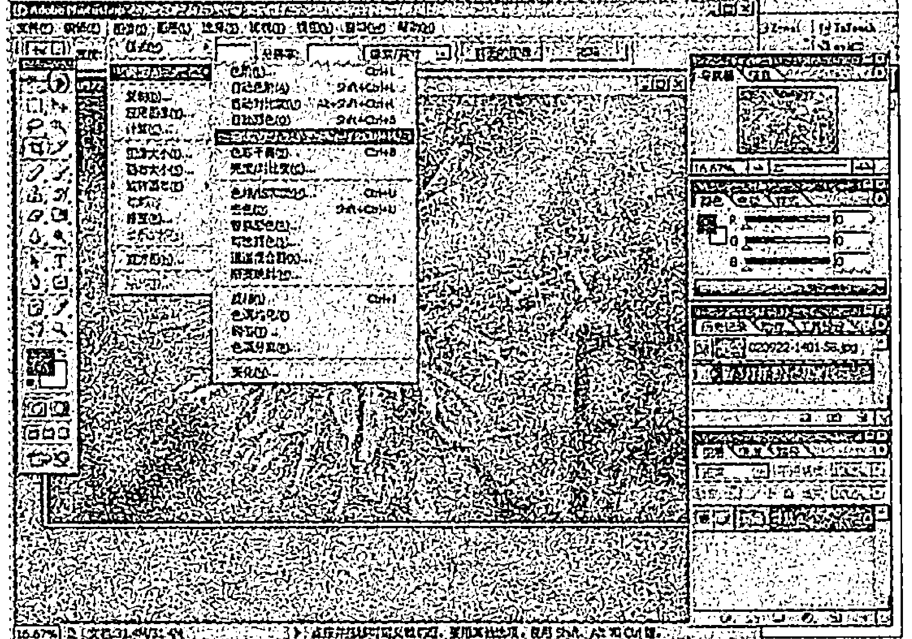

#### 3. 留意照片长宽比例

数码扩印不同尺寸的照片，长宽比例是不同的。传统拍摄的135胶片，长宽比是3：2，120胶片根据相机片幅有6：4.5、6：6、6：7、6：9和6：12等等，多数数码相机拍出照片的比例为4：3。

多种比例的原始图像，在数码冲扩时，必然要涉及到输出“剪裁”问题，即要求操作员在相纸上下两边留出白边，或被迫将一部分图像裁掉，以适应相纸尺寸（照片尺寸国内外说法不同，在国内叫5寸、6寸、7寸等等，数值取照片长边；国外叫3R、4R、5R等等，数值取照片短边）。

关于照片规格，国际规格及实际尺寸如下：

- 5寸 / 3R = 3.5 × 5（英寸） 长宽比例10：7
- 6寸 / 4R = 4 × 6（英寸） 长宽比例3：2
- 7寸 / 5R = 5 × 7（英寸） 长宽比例7：5
- 8寸 / 6R = 6 × 8（英寸） 长宽比例4：3
- 10寸 / 8R = 8 × 10（英寸） 长宽比例5：4

因此，在送去冲印前，应该仔细剪裁好图片的电子文件。这里要注意，除了图片尺寸符合放大尺寸外，还需要保证电子图片的分辨率在300DPI。

#### 4. 怎样得到理想的冲印效果

虽然我们准备好了一切，但要得到理想的冲印效果，这还远远不够，还要把好最后冲印的关口。

##### （1）选择条件好的数码冲印店

在将存储数字图像文件的光盘或存储卡送到冲印店后，一般都是由前台工作人员将文件拷贝到电脑，然后操作员再利用图像处理软件，对图片进行必要的修饰和调整。最后，利用局域网把图片文件传送到冲印机自带的工作台，扩印员在扩印软件界面上进行亮度、对比等视觉效果调整，并确定每张照片输出的数量，再由数码冲印机自行完成曝光、冲印和输出照片过程。

大家要注意，有些连锁店自身不具备数码冲印设备，只负责接件，不直接冲印，那么最好换一家店去冲印。另外，选择一些技术好、有责任心的冲印员，是获得好照片的重要因素。同时，尽量避开上下班或午休前后冲印顾客较多的时候，可以使工作人员有充足的时间从容处理照片。

##### （2）了解冲印的色彩知识

如果在表述对作品的理解和要求时，不符合冲印的色彩原理，往往是冲印员努力使图片有所改观，也很难让你满意。有时，只凭个人的颜色喜好不一定合理，最好是学习并掌握一些色彩基本概念和原理、互补色色样等基础知识。

##### （3）要监督冲印全程

在冲印前的最后调整和剪裁，要按照自己的意图和理解来冲印，尽量不要冲印员作多余的深度加工。特别是不同尺寸下照片长宽比例并不一样，冲印时必须自己决定是否对图像剪裁或留出白边，如果不在现场监督，冲印员一般会采取裁去部分背景、不留白边的操作方法。

### 三洋 VPC — C1

电池种类：锂电池

从MZ1开始，三洋数码相机的录像拍摄功能就很强大，C1更是达到了登峰造极的位置。三洋C1的造型非常古怪，像一把老式的剃须刀，其手感和可翻转的LCD取景屏，很适合拍摄录像。三洋VPC C1采用特制的334万像素CCD影像传感器，其最大特色是能够在一个传感器上实现静态数码照片拍摄和动态影片录制，能拍摄640 × 480/30fps的有声录像。

这款机型采用了5.8倍光学变焦镜头，拍摄录像时可以变焦，配合数码变焦可以达到60倍放大。

可以说三洋C1无论从外观、使用还是拍摄质量上看，都能与数码摄像机媲美。如果产品本身和大容量SD卡的价格能降到一个合适水平，C1是替代数码摄像机很好的选择。

#### 主要规格：

- 传感器：1/2.7英寸300万有效像素CCD
- 镜头：变焦比5.8X，等值135机型38-220mm，光圈f2.8/3.9-8.0
- 快门速度：1/2-1/2000 sec
- 存储介质：SD/MMC卡

## 掌上办公

——PocketPC扫描

文/WWWYM

在PocketPC诞生以前，我们处理诸如Word、Excel和PowerPoint这些常用办公文档，基本只能坐在电脑前阅读和修改。PocketPC的出现，改写了传统的办公方式，我们只需把这些办公文档放进口袋里，就可以随时随地处理了。甚至，你还可以通过PocketPC的邮件功能，把处理好的文件直接发给相关的同事或客户，非常方便。

我们返回到“选项”对话框，点击“规则”选项卡下的“转换”按钮，这项对我们同步Word、Excel、PowerPoint等文档的影响很大。因为在从PC同步到PocketPC时，文件将被转换成PocketPC兼容的格式，在“转换”设置选项里，我们可以指定PC与PocketPC之间文件转换的规则。比如当你将PC中的Word文档同步到PocketPC时，PC版的Word文档将被转换为PocketWord文档，由于PocketWord不支持表格、图片插入等PC版Word特殊格式，所以这部分Word文档在PocketPC上将会无法正常显示。如果你想保持原有Word文档的表格、图片插入等格式，可以在ActiveSync里的“工具”菜单点击“选项”命令，然后进入“规则→转换”设置，如图2所示，在“常规”选项卡中取消选择“同步、复制或移动时转换文件”复选框，就可以保持Word文档的特殊格式了。

PocketPC系统内置的Word和Excel，是PC版的缩水版本，它们的功能虽然逊色一些，但处理一些常用数据已经绰绰有余了。PocketPC上的Word和Excel，使用方法与PC版基本是一样的，咱们在这里就无需赘述了。需要注意的是，PocketPC上的这些办公软件与同步软件ActiveSync有着非常紧密的联系，必须与其协作才可以更好地发挥功效。接下来，我们就简单了解一下ActiveSync与Word和Excel的联系。

我们在PC上运行ActiveSync，点击“工具”菜单里的“选项”命令。在“选项”对话框里，我们可以设置同步的“选项”、“模式”和“规则”，我们先看“同步选项”。在这一菜单中，只需双击窗口列出的选项，就可以进入相应的设置窗口（如图1）。在这里，需要注意“文件”这个选项，双击它进入“设置”窗口，我们可以看到软件默认的“文件同步”路径是“My Documents\Pocket_PC My Documents\”。也就是说，我们只要把常用的办公文件放到这个指定目录下，在以后每次同步时，就会自动更新到你的PocketPC中，省去了重复地从PC复制到PocketPC的繁琐过程。如果你还想同步其他非默认路径下的文件，可以点选窗口下方的“添加”选项指定其他路径。

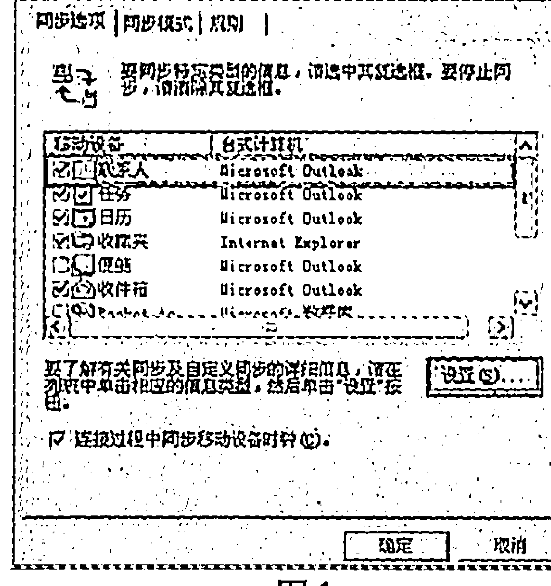

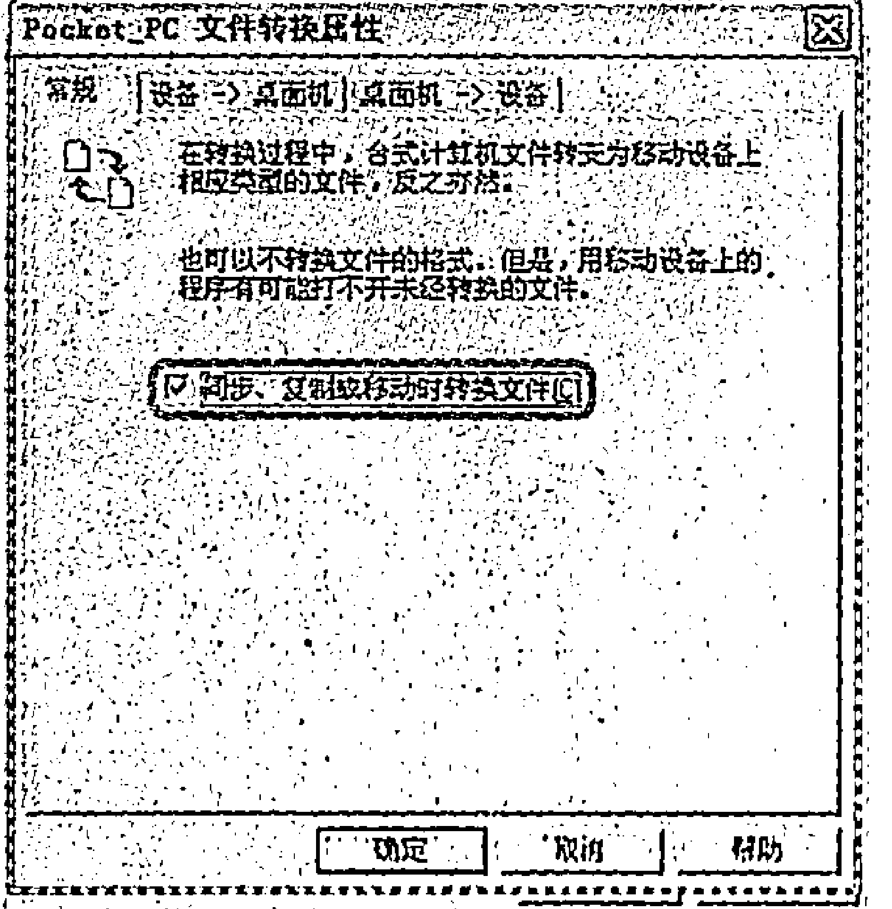

有很多朋友抱怨PocketExcel不能制作图表，其实，PocketExcel这方面的缺陷，可以用SpreadCE这个软件弥补。SpreadCE软件在CE2.11时代，就被广大“蜥蜴”推崇备至，可见其决非浪得虚名。SpreadCE使用方法和界面与PocketExcel基本相同，从图3我们可以看到二者界面比较。不同之处只是它们的功能菜单稍有出入，但SpreadCE操作十分简单，多用几次就很快可以上手。如果你想用PocketPC制作带图表的Excel文件，不妨试试SpreadCE。

上面我们介绍了PocketWord和Excel，接下来我们再了解一下PocketPC上的另一个办公利器——PowerPoint。因为PocketPC系统本身没有内置PowerPoint软件，所以需要安装第三方软件才可以处理PPT文件。目前，PocketPC最流行的PPT软件是ClearVue Suite，这个软件功能很强大，可以浏览Word、Excel、PowerPoint、PDF文件，还可以浏览JPEG、BMP和PNG这三种格式的图片文件。

ClearVue Suite软件的Word和Excel文件浏览功能，要比PocketWord和Excel强，它可以完整地浏览PC上所有的Word、Excel文件，支持浏览表格、图片、图表插入的PC Word、Excel文件。不过，切记在PC端同步软件ActiveSync里，取消选择“同步规则”中“常规”选项卡中“同步、复制或移动时转换文件”复选框，否则同步时会把原始Word、Excel文件转换成Pocket格式。

ClearVue Suite可以比较完美地浏览PowerPoint文件，而且提供多种浏览方式，使用者可以在窗口上方选择自己喜欢的浏览模式，如图4所示，也可以在“SET UP”（设定）项里设定浏览设置。比较遗憾的是，ClearVue Suite软件目前只能浏览PPT文件，不能进行编辑。不过，目前这类软件大部分都不支持制作PPT文件，ClearVue Suite算是同类软件中最好用的一个了。

文件处理完以后，我们怎样才能把它发送出去呢？接下来，我们就讲述PocketPC收发邮件的设置方法。点击“收件箱”→“服务”→“新建服务”，进入邮件设置窗口，如图5所示，填入你想创建的邮箱地址，然后点击“下一步”按钮。这时会出现配置窗口，不用等待它配置完毕，直接点击“跳过”按钮即可。

接下来会出现“用户信息”窗口，一般系统会按你的邮箱地址自动生成“用户名”，你只需填写“姓名”和“密码”即可。填写完毕后点击“下一步”按钮，弹出“账户”信息窗口，前一项填写“POP3”（前提是邮箱必须支持POP3，如果你不清楚，可以到邮箱服务提供商网站查看相关说明），后一项可以随便填写（如邮箱的名字）。继续点“下一步”按钮来到“服务器信息”窗口，这里接收服务器填写“pop3.abc.com”，发送服务器填写“smtp.abc.com”，先不要点击“完成”，如图6所示，你可以在“选项”中具体设置邮箱各项属性，然后再点击“完成”按钮。至此，你的邮箱全部配置完毕，以后就可以正常收发邮件了。

不过，笔者在实际应用中发现，有些邮箱服务商不提供PocketPC客户端直接收发邮件的服务，必须登陆服务商网站上的邮件发送系统才可以收发邮件。如果遇到这种情况，我们只好在PC上使用Microsoft Outlook软件，把邮件同步到PocketPC上浏览了。提醒大家注意，必须安装Microsoft Outlook才能同步（一般PocketPC随机光盘会赠送这个软件），PC系统自带的Outlook Express是不能向PocketPC同步数据的！

总体来说，PocketPC系统自带的办公软件还是比较强大的，如果善加利用，它完全可以应付我们日常的工作需要。因此，如果你经常需要在移动中处理公事，除了笔记本外，一部PocketPC也是不错的选择。

## 2004年手机、PDA新鲜术语与排行榜

文/WWWYM

### 一、手机新术语

#### 蓝牙
虽然大家对“蓝牙”这个名词早已耳熟能详，但仍有很多朋友只知其名不明其用。蓝牙说白了就是一种类似红外线的无线数据传输方式，它最早出现于1998年5月，当时由爱立信力推。“蓝牙”(Bluetooth)这个名字取自公元十世纪征服丹麦、挪威的国王Harald Bluetooth之名，有一统无线传输方式的含义。蓝牙无线与红外无线相比，最大的优点就是传输时不受墙壁等障碍物的影响，最大传输距离100米，最高传输速率1Mbps。

#### EDGE
EDGE全称为Enhanced Data Rates for Global Evolution，它是基于GSM的增强数据传输技术。可以说EDGE是GPRS的升级技术，也就是业界所说的2.75G，它的传输速率介于3G与2.5G (GPRS)之间，基本可与联通公司的CDMA 1X (2.75G技术)持平，下行速率可达到70Kbps，上行速率可达到60Kbps以上。目前中国移动已经开始在部分地区测试EDGE网络，EDGE有望成为2.5G与3G之间的短期过渡手段。

#### Push-to-talk
即按即手对讲功能简称“PTT”，它是2004年刚刚兴起的一种手机功能，加入了这种功能的手机无需拨号，仅需按下一个对讲键就可实现对讲机的功能，与附近的同伴进行无线交谈，而且在这种模式下手机的扬声器还可切换至外放模式，声音大到足以让你像使用对讲机那样使用你的手机。不过这种功能需要网络服务商支持，目前中国移动已制订在国内开展此项业务的计划，有望在明年正式启动。

#### 3G
3G全称3rd Generation（第三代数字通讯技术）：1995年诞生的第一代数字通讯技术只能进行语音通话，1997年出现的第二代数字通讯技术在语音通话基础上增加了对小流量数据（电子邮件、网页、文字信息等）的支持，3G与前两代数字通讯技术的主要区别是在数据传输速度上的提升，它能够处理图像、音乐、视频流等多种媒体形式，简言之就是可以支持可视移动电话。

#### WCDMA与TD-SCDMA
国内未来3G所采用的正式标准将在二者中产生。W-CDMA标准主要起源于欧洲和日本的早期第三代无线研究活动，该系统在现有的GSM网络上进行使用，对于系统提供商而言可以较轻易地过渡，该标准的主要支持者有欧洲、美国、日本、韩国等国家。TD-SCDMA标准是由中国第一次提出的数字通讯技术标准，与欧美提出的3G标准分庭抗礼，现在TD-SCDMA已正式成为全球3G标准之一，标志着中国在移动通信技术领域已经进入世界先进行列。

### 二、PDA新术语

#### WM2003 S
全称Windows Mobile 2003 Second Edition，Pocket PC最新操作系统。这个新版系统给Pocket PC带来了一些全新的功能：支持VGA屏幕（640×480像素分辨率），可以任意调整屏幕显示方向，传统PocketPC仅能纵向显示，而使用新系统后，横向纵向显示任你选，改进了Pocket PC原有IE和输入法，用户使用起来更方便。

#### Intel XScale CPU
Intel XScale CPU是英特尔专门为掌上便携设备推出的低耗高能处理器，它集成了英特尔无线MMX技术，还使用了英特尔移动SpeedStep节能技术，特别适合掌上电脑这类使用电池供电的移动设备。目前Intel XScale CPU最高主频达到了624MHz。

#### 软启动
Pocket PC的软启动类似PC上的重启，软启动后Pocket PC内存中运行的软件全部关闭，除本身系统所占内存外，其他内存全部被释放出来。一般软启动多用在系统死机或使修改后的注册表生效时使用。

#### 硬启动
Pocket PC的硬启动比较可怕，一旦执行硬启动后，机器马上恢复到出厂状态，机器内置存储器中存储的全部软件、数据全部消失，一定要慎用。

#### Today
Pocket PC上的Today与PC的壁纸有些相似，不过它除了包含一张壁纸外，还包括诸如“联系人”、“主人信息”和“邮箱”等一些信息项目，确切的说，Today是一个整合了Pocket PC桌面所有显示项目的集合体。

#### Jog dial
PDA 侧边上的辅助旋钮，可辅助网页浏览或供电子书翻页之用。

### 三、年度优秀手机 TOP10

2004 年国内手机市场并没有像先前人们所预想的那样，进入一个全新的 3G 元年。在这一年里手机市场仍是以多媒体和摄像技术担纲主角。现在，让我们来回顾一下 2004 年最值得我们关注的 10 款手机佳作。

#### 索尼爱立信 P908（图 1）
2004 年伊始杀入中国手机市场的最大黑马，凭借极具前卫科技的外形和手机系统中开放性最强的 Symbian OS 7.0 系统横扫国内智能手机市场，使得同期上市的多普达 696 和摩托罗拉 A768 退避三舍，缔造了 2004 年智能手机的传奇。典雅时尚的外型，简单易用的操作界面，方便快捷地手写输入系统，高达 48MB 的内存容量，30 万像素摄像头……这就是索尼爱立信 P908。

#### 诺基亚 7610（图 2）
一把来自诺基亚的“利刃”，时尚、前卫、大胆是其设计特点。它的体积和重量在智能手机中可以算得上娇小，Xpress-on 换壳功能可以带给用户更多乐趣。Symbian 7.0 系统给予它无比强大的扩展与应用能力，借助机身内主频高达 106MHz 的处理器，无论你是看电影、听音乐还是上网、发电子邮件都可以轻松搞定。此外，100 万像素摄像头，65 536 色 TFT 屏幕，48 和弦铃声，这样的配置在诺基亚手机中均属空前。

#### 大显 CU928（图 3）
虽然大显 CU928 与前面这两款出自名门的智能手机相比有些名不见经传，但这款国产手机的出现，宣告了国产高端智能手机跟风日韩和欧美的时代彻底终结。CU928 采用了微软 Windows Mobile 2003 操作系统和双处理器架构，PDA 部分采用 Intel PXA265 400MHz 处理器，通信系统部分则采用了高通 Qualcomm MSM5500 处理器。它带有 128MB 海量内存和 65 536 色 TFT 触摸屏，如果不是块头太大的话，那 CU928 完全可以用“完美”二字诠释。

#### NEC N830（图 4）
虽然在 2004 年 3 月索尼爱立信 S700 便开始猛吹手机百万像素摄像之风，但国内真正上市的首款百万像素拍照手机却是 NEC N830。N830 最吸引人的地方莫过于开创了国内手机 130 万像素摄像头的先河，这个采用了 CCD 材质的摄像头明显要比 CMOS 占优。此外 N830 2.1 英寸，分辨率高达 240 × 320 像素的 26 万色 TFT 屏幕也着实让人眼前一亮，清晰度之高令人瞠目。

#### 诺基亚 7200（图 5）
一直以直板机著称的诺基亚公司，2003 年底迫于市场压力终于放弃了它一贯死气沉沉的外形设计，于 2004 年初登陆国内手机市场的诺基亚首款折叠手机 7200 正式打响了诺基亚变脸革新的第一炮。虽然作为一款高价折叠手机，7200 的整体配置颇为鸡肋，但它极富艺术魅力的张扬外形却让众多时尚前卫人士心醉神迷。

#### NEC N900（图6）
号称全球最薄名片手机的NEC N900绝对是今年上半年手机市场最具风头的“明星”，无论你带着它走到哪里绝对都是全场焦点。尽管N900的机身如此“娇小”，但它的配置却丝毫不弱，分辨率为128×160像素的65,536色的TFT屏幕，40和弦铃声，30万像素摄像头，这样的配置即便放在年底，也可算是主流配置。但它高达8888元的高昂售价和仅能依靠耳机接打电话的蹩脚设计却最终断送了它本该闪亮市场的前程。

#### 摩托罗拉 E398（图9）
虽然摩托罗拉2004年的机海战术攻势如潮，但真正能让我们留下深刻印象的机型却寥寥无几，而E398则是其中为数不多的一款。摩托罗拉E398在外观设计、铃声、屏幕显示上都有极为理想的表现，时尚又不乏稳重。3D立体声音效的表现令人拍案叫绝，伴随着铃声起舞的7色灯光更是让人欲罢不能，此外E398高品质的MP3播放功能，更是为这款机型增色不少，随机内存虽然只有8MB多，但支持存储卡的设计令我们后顾之忧全无。

#### 三星 X699（图7）
由于CDMA手机市场一直叫好不叫座，因此CDMA手机对新技术的反映速度要优于GSM手机。三星百万像素旗舰级CDMA拍照手机X699就是一款集手机最新技术于一身的典范之作，它除了具有独特的旋转设计外，百万像素摄像头，高人一等的音、视频播放能力，令人炫目的动感游戏，支持RS-MMC存储卡……如此之多的强大功能使得X699当之无愧地成为了CDMA娱乐机型的无冕之王。

#### 松下 X300（图10）
松下“D-SNAP”系列数码相机在业界享有盛誉，松下DV概念手机X300将“D-SNAP”理念再度延伸，堪称2004年最富创意的手机。作为DV造型手机的开山之作，松下X300这一大胆的外形设计无疑是它最具杀伤力的致命诱惑，仅凭这一点，就可以让无数时尚前卫人士拜倒在它的石榴裙下，不过X300明显底气不足的主机配置却又令我们对它爱恨参半。

#### 索尼爱立信 K700c（图8）
自从2003年索尼爱立信凭借T618成功翻身之后，几乎每一部索尼爱立信手机机型都会为我们带来久违的感动。索尼爱立信K700c如同索尼爱立信其他机型一样，也是一款偏重娱乐性能的“享乐”手机，一应俱全的商务扩展功能，一流的声色效果和惊人的静、动态拍摄水平，这些都成为K700c傲视群雄的终极必杀技，但不支持存储卡扩展功能又使得它白玉微瑕。

### 四、年度优秀PDA TOP5

#### iPAQ rx3715（图11）
iPAQ rx3715是2004年度Pocket PC市场中的中坚力量。虽然iPAQ rx3715处理器只采用了Samsung S3C 2440 400MHz CPU，较iPAQ2210、1940等机器变化不大。但高达128MB的用户可用内存，83MB的数字安全存储空间，支持蓝牙和Wi-Fi功能和120万像素摄像头让我们见识到了它的王者风范，而可拆卸式1440mAh锂电也为用户彻底解决了机器续航时间方面的后顾之忧。

#### iPAQ hx4700 (图 12)
带触控板的笔记本我们见的多了，但带触控板的 PDA 你见过吗？iPAQ hx4700 是 2004 年度 Pocket PC 新机中配置最强的一款，它的用户定位很明确，那就是高端商务人士。iPAQ hx4700 硬件配置方面最为与众不同的地方有三处：4 英寸 TFT 液晶大显示屏，英特尔 PXA270 624MHz 处理器，独特的触摸板设计。想让 PDA 上用上 “鼠标” 吗？那就选择 iPAQ hx4700 吧。

#### Loox 700 系列 (图 13)
优质机身设计，质感十足的外壳选材，上乘的性能表现，这就是 Loox 700 系列 Pocket PC。520MHz 处理器，128MB 内存，130 万像素摄像头，CF 与 SD/MMC 双扩展插槽和容量高达 1640mAh 的锂电池，这样的硬件配置在 PDA 市场上堪称梦幻级。再加上采用了最新的第二版 Windows Mobile 2003 系统，支持640 × 480 的屏显分辨率，Loox 700 系列 Pocket PC 可以说近乎完美。

#### Zire72 (图 14)
作为娱乐型主机 Zire71 的后续机型，Zire72 将娱乐型 Palm OS 主机的配置再次推向了高峰。在完美协调了体积与功能的矛盾之后，Zire72 理所当然地登上了娱乐型 Palm OS 主机的王者宝座。它所向披靡的法宝有三：内建 120 万像素的数码摄像头；内置非常适合个人用户使用的蓝牙功能；采用了英特尔刚刚发布的 PXA270 处理器，主频达到了 312MHz。而这三点也正是无数 “胖友” 们期待已久的功能。凭借这三点改变，Zire72 再次登顶 Palm OS 娱乐型机型的最高峰是水到渠成的事情。

#### CLIE TH55 (图 15)
CLIE TH55，索尼 Palm OS 主机的绝唱，自推出 CLIE TH55 之后，索尼公司便退出了除日本本土外所有国家的 Palm OS 市场。总体来说 TH55 是一台很成功的 PDA。大屏幕、创新按键、强电力都是它的优点。但缺点也比较突出，没有蓝牙功能、摄像头效果欠佳、CPU 表现不理想。其实很多朋友购买 CLIE TH55 并不是看中它的性能，外观，而是看中了它的纪念价值和曾几何时 CLIE 系列为我们带来的那份感动。

## 2004年网络病毒与防杀工具

文 / 彭文波

综观2004年形势，通过电子邮件传播的蠕虫病毒来势汹汹，几个主要的病毒变种也以相当高的频率交替出现。同时，病毒的传播途径多样化，功能综合化的特点日益突出，越来越多的病毒利用局域网共享、即时消息软件等途径进行传播。同时病毒在躲避杀毒软件和防火墙等安全防护软件方面也有了新的变化，并给病毒的清除带来一定的困难。

### 一、2004年病毒综述

综合分析，2004年病毒主要呈现下列特征。

#### 1. 蠕虫数量多
2004年统计数字表明，病毒排行榜的前几位全部被“蠕虫”占据，出现的新病毒中，蠕虫数量也占半数以上，大有一统江山之势。不难看出，由于此类病毒具有编写简单、感染范围广、传播速度快等优势，它仍然是病毒设计者的首选。

#### 2. 漏洞威胁大
2004年，利用微软漏洞传播的病毒主要有“震荡波”（Worm_Sasser.A）及其5个变种，以及“高波”（Worm_AgoBot.A）及其变种。“震荡波”（Worm_Sasser.A）是利用微软的Lassa（MS04-011）漏洞进行传播，波及的范围较广，但相对于“冲击波”而言要好了很多。“高波”病毒是通过RPC DCOM缓冲溢出漏洞进行传播的，也就是“冲击波”所利用的漏洞，病毒最初在去年8月出现，在今年3、4月份的时候一个新变种的出现导致了一定数量的感染。

#### 3. 病毒邮件传播广
上半年，通过电子邮件传播的病毒占了绝对的优势，“网络天空”（Worm_Netsky.A）、Worm_Bbeagle.A、“邮差”（Worm_Mimail.A）等病毒势头强劲，它们扩散范围广、传播速度快，这些病毒和它们的多个变种无一例外都是依赖于电子邮件进行传播的。病毒通常情况下以电子邮件附件的形式到达，在运行后得以传播和扩散。这些病毒邮件的附件绝大多数都需要用户点击运行附件，病毒才能得以运行，从而实施感染和进一步的传播。所以，用户的病毒防范意识对遏制病毒的传播和扩散是至关重要的。

#### 4. 网络传播方式复杂
网络共享已经成为病毒传播的一个重要途径，越来越多的病毒运用了这种手段。1999年出现的FunLove病毒，至今仍具有强大的生命力，根源在于网络共享传播。局域网中只要有一台机器尚存余毒，病毒便可再次感染整个网络。由于此种现象的存在，我们也就会看到出现四年多的FunLove病毒仍不得根除。此外，病毒结合QQ、MSN等即时通信软件进行传播的危害也逐渐加强。

#### 5. 病毒功能综合化
集多种功能于一身，与黑客、木马技术的融合，使得病毒的危害更大。另外，很多病毒感染系统后，会开放TCP或UDP端口，以允许攻击者向该端口发送信息或实施其他操作，给系统安全带来严重的隐患。开启的端口，也有可能成为日后病毒传播的又一途径。比如病毒Worm_Dabber.A就是利用“震荡波”（Worm_Sasser.A）留下的后门进行传播的。

#### 6. 病毒资源竞争加剧
病毒编制者为了比拼实力，加速传播，抢占系统资源，在编写病毒时相互之间进行攻击。比如“网络天空”（Worm_Netsky.A）和Mydoom病毒，就会删除对方生成的注册表键值或终止对方的进程，以达到占有资源和自我传播的目的。

#### 7. 病毒家族化，变种出现的时间间隔越来越短
今年春节期间出现的病毒，如“网络天空”（Worm_Netsky.A）、“贝革热”（Worm_Bbeagle.A）等，在出现后的短短几个月中，每个病毒的变种数量就有三四十个之多，变种出现的速度也是前所未有的，时间间隔越来越短。在一段时间内，甚至达到一天一个变种出现的现象。变种如此迅速的出现，也导致了网络混乱，病毒邮件满天飞的现象。而且，变种通常还会在先前版本的基础上作一些改进，使其进一步完善，传播和破坏能力不断增强。

## 8. 网上银行成焦点

几年来，网上银行业务蓬勃发展，日趋成熟。2003年6月4日出现了“妖怪”病毒的变种Worm_Bugbear.B。2004年4月18日，我国出现了窃取国内某银行个人网上银行账号和密码的木马Troj_HidWebmon.A，并在次日出现其变种，接下来还出现了此类病毒。这类病毒通常会使用截取用户键盘输入的方式获取用户的个人信息，包括网上银行的账号和密码等，并将窃取到的信息发送到指定邮箱。虽然获得了账号和密码并不足以盗取被窃者的存款，但再通过其他途径获得数字证书等信息后，病毒的制作者就可以登录网上银行并窃取用户存款了。

## 9. 躲避杀毒软件的能力增强

多数病毒还会终止相关进程，甚至用病毒文件覆盖相关文件或是将其删除。很多病毒在向外发送带毒电子邮件的时候，会避开一些反病毒机构和厂家的邮件地址，这样一来，就避免了他们通过此种途径获取病毒样本。

### 二、2004流行病毒热点

#### （一） “MSN 骗子”和 QQ 病毒

以前，高破坏力蠕虫病毒主要用三种常用传播渠道散发：电子邮件、网络扫描或文件共享。今年以来，利用即时通信工具进行传播的病毒尤其引人注目。由于它们不会引起电脑与网络的改变（病毒在发动攻击时），因此基于IM的攻击尤其危险。

首先来看看“MSN 骗子”，它利用MSN、QQ疯狂发送广告信息，向MSN、QQ好友发送Funny.exe文件，传播自身。如果用户使用Windows 2000/XP系统，病毒会修改HOSTS文件，屏蔽937个主流网站，用户登录这些网站时会自动转向http://www.**78p.com。如果用户使用Windows 98系统，病毒会覆盖系统文件Rundll32.exe，可能导致系统异常。

QQ也正成为电子邮件之后又一个主要的病毒传播渠道。比较常见的是“QQ连发器”及其变种。该病毒运行后会偷偷藏在用户的系统中，并修改注册表进行自启动。如“QQ伪装专家”病毒，此病毒用高级语言编写并用工具压缩，病毒会伪装成真正的QQ程序启动并在桌面上建立一个快捷方式，病毒运行时会将用户的QQ号码与密码偷偷发送到指定邮箱。该病毒有极强的网络传染能力，如果发现局域网中有共享目录，便将自身拷贝到共享目录下，诱使用户运行。

病毒会通过邮件系统传播。建立标题为：“这是我的照片”，附件为photo.gif.exe的病毒邮件。另外，一旦检测到打印机的存在，病毒便会不断地通过打印机大量打印病毒代码，损耗打印机，浪费纸张。

“MSN 骗子”病毒专杀工具下载地址：
http://it.rising.com.cn/service/technology/RS_MSN.htm

QQ 病毒专杀工具下载地址为：
http://it.rising.com.cn/service/technology/RS_QQMsender.htm

瑞星的QQ病毒专杀工具地址为：
http://it.rising.com.cn/service/technology/RS_QQMsender.htm

#### （二） 爱情后门

该病毒集蠕虫、后门、黑客于一身，通过病毒邮件进行邮件传播，给用户的计算机建立一个泄密通道，放出后门程序与外界远程木马沟通，放出盗窃密码程序主动盗窃计算机密码，然后远程传播给局域网，最终导致所有计算机用户受到病毒控制，造成网络瘫痪、信息泄露等严重后果。如果管理员没有密码或者密码过于简单，病毒就可能通过局域网再次感染。

瑞星的“爱情后门”专杀工具下载地址为：
http://download.rising.com.cn/zsgj/RavLovGate.com

#### （三） “震荡波”病毒

“震荡波”病毒是2004年“五·一”节后出现的一个比较猖狂的病毒。起因在于LSA服务的漏洞，它是Windows系统中一个相当重要的服务，所有与安全认证相关的处理都要通过这个服务。该服务在记录日志的时候，由于函数的字符串参数缺少正确的边界检查，发送超长的字符串会导致缓冲区溢出，进而执行任意代码，完全控制系统。如果用户的电脑中出现下列现象之一，则表明已经中毒，就应该立刻采取措施清除该病毒。

系统资源被大量占用，系统日志中出现相应记录、内存中出现名为avserve的进程。病毒如果攻击成功，会在系统安装目录下生成一个名为avserve.exe的病毒文件。另外，在注册表中[HKEY_LOCAL_MACHINE\Software\Microsoft\Windows\CurrentVersion\Run]子项下，有如下键值：“avserve.exe”=“%SystemRoot%\avserve.exe”。同时病毒会扫描并攻击网络上的其他主机的TCP/445端口。一旦攻击成功，就在被攻击的主机的TCP 9996端口上启动一个Shell程序，然后到本地的FTP服务器上下载蠕虫并运行。

微软专杀工具下载地址：
http://download.microsoft.com/download/1/e/b/1eba8a6e-a22a-431f-9df4-a0cd2873e3c5/Windows-KB841720-ENU-V2.exe

同时要到 http://www.microsoft.com/china/technet/security/bulletin/ms04-011.mspx 下载及安装微软安全性更新 835732。

瑞星专杀工具的下载地址：
http://it.rising.com.cn/service/technology/RS_sasser.htm

使用瑞星的 “震荡波” 专杀工具既能查杀 “震荡波” 病毒，又能有效防止利用 MS04-011 漏洞的后续版本的病毒。

金山专杀工具的下载地址：
http://www.duba.net/download/3/113.shtml
该工具的特点是很快扫描系统是否有病毒，而且可以植入免疫器。

此外，还有诺顿的专杀工具，下载地址是：
http://securityresponse.symantec.com/avcenter/FxSasser.exe
这个工具可以终止 W32.Sasser 病毒进程、删除 W32.Sasser 文件、删除蠕虫加入的注册表的键值。

#### （四）“冲击波”病毒

远程过程调用 (RPC) 是 Windows 操作系统使用的一个协议。RPC 提供了一种进程间通信机制，通过这一机制，一台计算机上运行的程序可以顺畅地执行某个远程系统上的代码。RPC 中，处理通过 TCP/IP 的消息交换的部分有一个漏洞。为利用此漏洞，攻击者可能需要向远程计算机上的 135 端口发送特殊格式的请求。“冲击波”病毒发作后，会在局域网内大肆传播。这个病毒生成随机 IP 地址，然后向这些 IP 地址发送数据，以尝试感染系统，随机在 TCP 端口上运行 HTTP 服务器，以便存在漏洞的计算机可以重新连接到受感染计算机，然后进行本地下载并将蠕虫作为 WksPatch.exe 执行。受感染的电脑将在 “C:\Windows\system32\drivers” 目录下出现 svchost.exe 这个文件。

按【Ctrl + Alt + Delete】组合键，打开中毒机器的 “Windows 任务管理器”，单击 “进程” 选项卡，在运行的程序清单中，会出现 “MSBLAST.EXE” 这个进程。在 “注册表编辑器” 中，打开[HKEY_LOCAL_MACHINE\Software\Microsoft\Windows\CurrentVersion\Run]，查找并删除 “Windows auto update” = MSBLAST.EXE。

微软提供的补丁是 MS03-026，下载地址：
http://www.microsoft.com/china/technet/security/bulletin/MS03-026.asp

微软专杀工具的下载地址为：
http://www.microsoft.com/downloads/details.aspx?FamilyID=e70a0d8b-fe98-493f-ad76-bf673a38b4cf&displaylang=zh-cn

瑞星专杀工具的下载地址：
http://it.rising.com.cn/service/technology/RS_blaster.htm

金山专杀工具的下载地址：
http://www.duba.net/download/3/91.shtml

### 三、2004流行病毒专杀工具荟萃

从今年的病毒情况看，老病毒余威仍在，新病毒变种层出不穷。因此，我们列举了当前比较流行的病毒或者依然存在威胁的一些病毒，对其特征进行大致的描述，并给出比较典型的专杀工具。如下表所示。

| 病毒名称 | 特征 | 专杀工具 |
| :--- | :--- | :--- |
| 图片病毒 | 2004年9月14日，微软安全中心发布了 GDI+ 漏洞，该漏洞涉及 GDI+ 组件，在用户浏览特定 JPG 图片的时候，会导致缓冲区溢出，进而执行病毒攻击代码。该漏洞可能发生在所有的 Windows 操作系统上，针对所有基于 IE 内核的软件、Office 系列软件、微软 .NET 开发工具，以及微软其他的图形相关软件等等。这类病毒有可能通过群发邮件、恶意网页、即时通信软件的自带头像等图片或者发送图片文件进行传播。 | 瑞星专杀工具：<br>http://download.rising.com.cn/zsgj/RavJPG.exe<br>瑞星专杀工具：<br>http://download.rising.com.cn/zsgj/Fix_ADODB_Stream.exe |
| ADODB Stream 漏洞 | Windows 2000/XP 系统中默认安装的 ADODB.Stream 组件可能会被恶意攻击者利用。脚本可利用 ADODB.Stream 对象写入或覆盖攻击者指定的文件到目标文件系统中。以这种方式构建的恶意页面，当用户浏览时，可使 HTML 文档利用 ADODB.Stream 对象在磁盘上安装文件。 | 金山专杀工具：<br>http://db.kingsoft.com/download/othertools/Duba_JXOnlineTroj.exe |
| 剑网木马 | 随着《剑侠情缘》网络版在网络中的广泛流行，“剑网木马”病毒也随之而生。该病毒在网络中通过各种途径传播。感染系统后，该病毒监视系统中《剑网》客户端的运行，记录玩家的账号及密码，并发送给指定的 E-mail 地址，给广大的《剑网》玩家造成了极大的盗号威胁。而且，该木马还会造成系统的不稳定和隐私的泄漏。该病毒通过键盘记录的方式，监视用户操作。当用户使用个人网 | 金山专杀工具：<br>http://download.duba.net/download/othertools/Duba_KeyLog.exe |
| 网银大盗 | 当用户利用网上银行进行交易时，该病毒会记录用户所使用的账号和密码。记录成功后，病毒会将盗取的账号和密码发送给病毒作者，造成用户经济损失。 | 瑞星专杀工具：<br>http://it.rising.com.cn/service/technology/RS_Netsky.htm |
| 网络天空 | 该病毒利用自带的SMTP邮件引擎大规模地发送垃圾邮件，邮件发送人的名字随机生成，附件是病毒体。它可利用P2P软件进行传播，查找名字包含“share”或“sharing”的文件夹后，它会释放一个病毒副本，并且副本会使用Word文档的图标。 | 金山专杀工具：<br>http://www.duba.net/download/3/107.shtml<br>瑞星专杀工具：<br>http://download.rising.com.cn/zsgj/RavMimail.exe |
| 邮差 | Worm.Mimail的变种，通过邮件进行病毒传播。典型破坏行为是能够根据收件箱中的邮件内容自动回复邮件，每封邮件的附件中均携带病毒副本。由于接收者看到的是对已发送邮件的回信，很可能会打开该邮件导致中招。邮件服务器可能会在极短时间内不堪重负而崩溃。病毒运行后会搜索本地目录，通过收件箱中的邮件地址向外发送带毒邮件传播自身，病毒会根据收件箱里面的邮件回复带毒邮件给原始发件人。 | 金山专杀工具：<br>http://download.duba.net/download/othertools/DB_Supnot.com<br>瑞星专杀工具：<br>http://it.rising.com.cn/service/technology/RS_LovGate_download.htm |
| 爱情后门 | 集蠕虫、后门、黑客于一身，通过病毒邮件进行邮件传播，给用户的计算机建立一个泄密通道，放出后门程序与外界远程木马沟通，放出盗窃密码程序主动盗窃计算机密码，远程传播给局域网，最终导致所有计算机用户受到病毒控制，造成网络瘫痪、信息泄露等严重后果。 | 瑞星专杀工具：<br>http://it.rising.com.cn/service/technology/RavBBeagle_Download.htm |
| 恶鹰 | 恶鹰病毒会大量消耗被感染计算机的资源，同时大量发送病毒邮件，造成网络阻塞。最近出现了不少变种，变种M、N首次采用了加密变形的方法去感染可执行文件，导致系统文件被破坏，出现系统提示错误。其变种O、P、S、T在感染文件的基础上加入了利用微软漏洞传播的新特性，使邮件中的VBS代码自动从受感染的系统中下载并立即执行病毒。 | 金山专杀工具：<br>http://www.duba.net/download/3/104.shtml<br>瑞星专杀工具：<br>http://it.rising.com.cn/service/technology/RS_Novarg.htm |
| SCO炸弹或“诺维格” | “诺维格”为一种互联网蠕虫，开启“记事本”后便随即激活，显示出一些怪异字体。病毒能透过Windows系统自行安装程序，让黑客远程控制计算机。该病毒能自动复制，并以电子邮件传送给共享名录中的Kazaa用户。该病毒发作时会对网址“sco.com”进行DoS（拒绝服务式）攻击。病毒攻击时会开启多达64个线程，造成系统变慢或是不稳定，并可大量浪费网络资源。病毒还会将被感染的系统作为代理服务器，监听TCP端口3127-3198。 | 金山专杀工具：<br>http://www.duba.net/download/3/105.shtml |
| 劳拉 | 属于系统病毒，它会感染系统中的所有可执行文件，将自身的病毒代码插入到这些可执行文件体内，然后建立一个病毒“节”，当被感染的文件运行时，病毒就会取得系统控制权，然后继续感染其他文件。病毒的交叉、反复感染会导致系统文件大量带毒，系统运行缓慢，甚至系统崩溃。 | 瑞星专杀工具：<br>http://download.rising.com.cn/zsgj/RavXorala.com |
| 安哥 | 该病毒有多个变种，多达几十种，最初以黑客、木马的身份出现；现在集成了蠕虫病毒的能力，采用“冲击波”所使用的RPC漏洞攻击，使其传播速度极快。病毒发作时会造成中毒用户的计算机出现无法进行复制、粘贴等操作，无法正常使用如Office和IE等软件，并且大量浪费系统资源，造成速度下降，甚至死机的现象。还会利用IRC软件开启后门等待远程黑客的控制。 | 金山专杀工具：<br>http://download.duba.net/download/othertools/Duba_Agobot.exe |
| 蠕虫王 | 该蠕虫会攻击安装有Microsoft SQL的NT系列服务器，该病毒尝试探测被攻击机器的1434/udp端口，如果探测成功，则发送376个字节的蠕虫代码。1434/udp端口为Microsoft SQL开放端口，该端口在未打补丁的SQL Server平台上存在缓冲区溢出漏洞，使蠕虫的后续代码能够得以在被攻击机器上运行，进一步传播。 | 金山专杀工具：<br>http://www.duba.net/download/othertools/chs_sql2ksp3.exe |

一般情况下，我们要定期访问在线安全站点，如诺顿、金山、瑞星等，这些网站提供了最新的安全资料，可以帮助我们掌握病毒发展的最新动向，对于防毒很有帮助。当然，最根本的措施是要打好最新的安全补丁，很多病毒的流行，大都利用了微软操作系统中的漏洞或后门。“亡羊补牢，为时未晚”，只有及时升级安全补丁，通过专杀工具查漏补缺，堵死后门，使其无路可遁，才能保持“长治久安”。

## 网络安全认证——网络时代的通行证

文/彭文波

### 一、网络安全认证基础知识

#### （一）免费证书的申请及获得

目前有几个CA中心提供试用型数字证书，其申请过程在网上即时完成，并立即可以免费使用。下面提供一个比较好的站点，申请地址为https://testca.netca.net。登录后，点击“证书申请”，选择“试用型个人数字证书申请”。特别强调，注意只有安装了根证书（证书链）的计算机，才能完成后面的申请步骤和正常使用在CA中心申请的数字证书。按照提示，通过地址https://testca.netca.net/download/GetRootCertificateIndi.asp选择“安装试用CA证书链”。安装成功出现提示框后，可以看到一个表单。按照上面的提示，完整地输入个人资料。选择加密服务提供程序（Cryptographic Service Provider, CSP），如Microsoft Base Cryptographic Provider 1.0。进行上述步骤后，系统将发一封申请成功的信件到读者申请时使用的邮箱内，其中包括业务受理号和密码，数字证书下载的地址。点击“安装证书”按钮，当系统提示“证书成功下载”和“证书已成功装入应用程序中”后；表明证书已经成功安装。

#### （二）查看证书

现在很多读者朋友可能要问了，数字证书在哪里呢？其实，微软的IE自带一个数字证书管理器，通过这个管理器我们可以查看数字证书。首先打开IE，单击“工具”菜单中的“Internet选项”命令，选取“内容”选项卡，单击“证书”按钮来查看读者信任的当前证书的列表。其中，“个人”选项卡可以查看读者已经申请的个人数字证书。

### 二、电子邮件安全认证

数字证书最基本的应用就是电子邮件，下面我们看看在Outlook Express中如何设置电子邮件。

#### （一）绑定邮箱与证书

首先，打开Outlook Express，然后选择“工具”菜单中的“账户”选项，打开“Internet账户”对话框，单击右边的“添加”按钮，选择“邮件”选项，输入读者的邮件显示姓名，单击“下一步”按钮，完成新账户的设置。然后，打开刚才建立的账号，单击“属性”按钮，选择“安全”标签，可以看到“签署证书”和“加密首选项”两栏。通过相关设置，我们可以进行邮件的签署和加密。在“签署证书”项中，单击“选择”按钮。可以看到在https://testca.netca.net上面申请的证书。选择数字证书，完成邮箱与证书的绑定。按照同样的方法，也可以在“加密首选项”中选中证书。

#### （二）发送加密的电子邮件

发送加密邮件前必须先获得接收方的数字标识，读者可以首先让接收方发一份签名邮件来获取对方的数字证书。启动Outlook Express 6.0，单击“新邮件”按钮，撰写新邮件。同时选中右上方的“签名”或者“加密”选项。单击“发送”按钮，签名邮件发送成功。当收件人收到并打开有数字签名的邮件时，将看到数字签名邮件的提示信息，按“继续”按钮后，才可阅读到该邮件的内容。收到邮件后，窗口右边有一个小图标，点击它，可以看到相关的数字证书信息，如图1所示。

发送加密邮件的方法与发送签名邮件的方法类似。收取电子邮件实际上就是一个解密的过程，算法已经隐藏在后台运行了。通过这些具体操作，我们对加密和解密也有了更加深刻的认识。

### 三、电子文档安全认证

应用Esign在文档中进行签名，可以保证文档不被篡改，即保证文档的真实性。Esign目前的最新版本为2.0，下载地址为http://www.cnca.net/cs/download/Esign.exe。软件下载完毕后，双击安装文件，根据提示在本机进行安装。安装完毕，系统将重新启动。现在我们打开Word文档，可以看到多出了一个“文档签名”菜单。

#### （一）通过数字证书进行文档加密解密的设置

签名之前，可以先进行相关的签名设置。打开一个Word文档，选择“文档签名”菜单中的“签名设置”选项，进入待设置的使用证书选择窗口。在该窗口中列出了所有的有效个人证书，这些证书均可以在文档签名时被选用，但首先必须在本功能中设置好签名使用的图片。双击证书列表中的证书，可以查看证书的属性信息和验证信息。

选择了待设置的证书后，点击“设置”按钮，进入图片设置窗口。我们可以自己进行组合设置，调配出满意的签名图片。选择好模板图片后，点击“打开”按钮，进入下一步设置操作，返回设置窗口，如图2所示。

若读者需要将证书的名称放置在签名图片上，可以选择“显示证书名称”，并且可以调整该证书名称的显示效果，包括放置的位置、字体的风格、字体的颜色等都可以调整，以充分体现每个签名者的个性。

#### （二）Word文档加密和解密的方法

打开一个Word文件，单击“文档签名”主菜单。

### 四、Web服务器认证

Web服务器建立了SSL安全机制后，只有通过认证的客户才能与站点进行通信，并且在使用URL资源定位器时，输入“https://”，而不是“http://”。使用SSL安全机制时，首先客户端与服务器建立连接，服务器把它的数字证书与公共密钥一并发送给客户端，客户端随机生成会话密钥，用从服务器得到的公共密钥对会话密钥进行加密，并把会话密钥在网络上传递给服务器，而会话密钥只有在服务器端用私人密钥才能解密。这样，客户端和服务器端就建立了一个唯一的安全通道。

首先，需要先生成一个申请书。在Windows 2000中，启动“IIS服务管理器”，选择“默认Web站点”，点击“右键”，在“默认Web站点属性”对话框中，选择“目录安全性”选项卡。

然后，选择“服务器证书”按钮，创建一个新的证书的请求文件。注意，申请时要注意站点名称的一致性。具体证书的申请方法可以到相关的CA站点（如http://www.cnca.net）查看。

启动IIS服务，在Web站点上单击鼠标右键，选择“属性”命令，在打开的对话框中，选择“目录安全性”选项卡，点击“服务器证书”，单击“下一步”按钮，选择“分配一个已存在的证书”，找到Web服务器可用的证书，再点击“下一步”按钮。此时，便完成Web服务器证书向导，点击“完成按钮”。使用时，还需在“目录安全性”选项卡中，单击“编辑”按钮，在安全通道中，选择“申请安全通道”，点击“确定”按钮即可使用了。这个应用针对服务器设置使用得比较多，这里不再详述。以后，当我们看到https://www.cnca.net或者https://www.sheca.com等站点时，我们就会知道这些站点是利用数字证书进行了加密。这样，双方就可以在一个安全隧道里进行通信了。以上所有测试在Windows XP/2000+Word 2002及Internet Explorer 6.0下完成。

# 透视超大容量免费邮箱及精彩邮件工具

文/风之扬

互联网蓬勃兴起之时，免费电子邮箱铺天盖地，几番沉浮之后，超容量的G级电子邮件又一次火爆起来。2004年2月11日，Google宣布开始测试免费邮件服务Gmail，其容量高达1GB。最近，国内著名的邮件提供商网易悄然将自己的免费邮件空间提升到了1.5GB，附件则达到了30MB。当然，其他国内外邮件服务商也不甘示弱，纷纷提升空间和附件大小。我们不禁要惊呼：G级邮件的时代就要来到了！对此，广大用户褒贬不一，我们也不否认其中带有一些炒作的成分。最实际的问题是，面对热火朝天的大容量电子邮件，我们该如何选择呢？

今天，即2004年11月4日，我们选择了网易（126.com、163.com、yeah.net）、新浪、雅虎中国（Yahoo）、TOM等超容量实用邮箱进行测试，这些网站的免费邮箱都达到了G级（Google虽然对外宣布测试，但一般用户难以得到其账号，因此，不在本文测试之列）。在测试中，我们主要从基本功能和扩展功能两方面来考虑。其中，基本功能包括存储空间和附件大小、邮件协议、稳定性与速度等因素；扩展功能包括邮件过滤器、通讯簿导入和导出以及邮件自动转发和自动回复、密码取回等。

## 一、免费G级邮箱综合分析

### （一）基本功能

#### 1. 邮件协议及兼容性

参与测试的免费邮箱与国内众多免费邮箱一样，都支持POP3协议和使用第三方邮箱软件进行邮件的发送和接收，并提供手机短信通知服务。

#### 2. 申请难易度及广告

邮箱申请难易度是很重要的，如果连申请都困难，自然就失去了比较的意义。

- (1) 网易。登录主页http://www.126.com、http://www.163.com、http://www.yeah.net，申请十分简单，半分钟不到就可以全部完成，而且界面干净，没有多余广告，堪称中国最大的免费邮箱。
- (2) 新浪。新浪免费邮箱申请也比较容易，登录http://mail.sina.com.cn，不过一定要成为它的会员才行。进入邮箱后，广告也有点儿多，但界面比较温馨，而且提供的功能也比较全面。
- (3) 雅虎免费邮箱。首先，进入http://cn.mail.yahoo.com，申请成为注册用户，邮箱容量是100MB。然后下载安装“雅虎通”，登录“雅虎通”后，至少添加一位好友。然后，访问邮箱扩容页面http://cn.mail.yahoo.com/event/mail_1g/1gb_04.htm，点击“立即扩容1GB邮箱”后，系统提示邮箱扩容成功。进入邮箱界面，可以发现版面的广告还不少，除了最上面的功能选项以外，下面大部分页面都被广告占据了。右上角有一个小小的容量标注，显示容量是1GB，表示扩容成功。阅读邮件页面相对比较简单一点儿，没有过多的广告，仅仅在左侧栏上有几个小的图片广告。撰写邮件页面同样也很简单，还可以撰写多媒体邮件。
- (4) TOM。进入http://mail.tom.com，可以进行免费注册。注册十分方便，而且TOM邮箱的个性化服务内容丰富而且实用。

从上述分析看，网易和新浪的邮箱是申请最方便的。

#### 3. 存储空间及附件大小

- (1) 网易。在前几个月，即网易7周年之际，旗下的三家站点的免费邮箱从原来的25MB扩容到260MB。现在，它的免费空间提高到了1.5GB。如果使用网易popo并免费赚取10万popo金币，还可以把空间提高到2GB。可发附件的容量增加到了35MB。
- (2) 新浪。新浪免费邮箱用户可以注册1000MB的免费空间，邮件附件总容量最大为15MB！这在国内门户站点中，应该是做得很不错的了，而且它的服务质量要占据一定的优势。
- (3) 雅虎。Yahoo电邮升级过后容量高达1GB，还送30MB免费网络像册、免费的30MB空间公文包。这确实很诱惑人，但相比之下附件的限制太多，邮件附件容量仅仅达到10MB，不能完全发挥1GB容量的优势。
- (4) TOM。TOM提供了180MB的免费邮箱，8MB附件，此外还有15MB的公文包和像册。如果用户喜欢个性服务体验，TOM免费邮箱可以提供完美时尚的感觉，比较超值。

#### 4. 稳定性与发送效率

- (1) 网易。从使用方式来看，它更符合国人使用习惯，24 小时客服电话让人感觉更加稳定可靠。与国外邮箱相比，更符合国人的使用习惯，也能照顾到用户的网络速度。
- (2) 新浪。速度很快，值得称赞的是，它的性能最稳定。扩容后的新浪免费邮箱除了具备超大容量外，还将提供短信提醒、相册、公文包、贺卡、反垃圾等附加功能。
- (3) 雅虎。从初期的使用情况来看，速度明显不如国内邮件，但具有一定的稳定性。在线状态下，我们可用“雅虎通”收到包含邮件主题的邮件到达通知。
- (4) TOM。邮箱继承了 163.net 电子邮局的优点，速度和 Yahoo 比较类似，优越性体现在防垃圾邮件上。具体比较结果见下表。

| 测试项目 | 126.com | 163.com | Yahoo | 新浪 | Tom |
| :--- | :--- | :--- | :--- | :--- | :--- |
| 空间容量 | 1.5GB | 1.5GB | 1GB | 1000MB | 180MB |
| 邮件客户端 | √ | √ | √(稍麻烦) | √ | √ |
| 支持附件大小 | 35MB | 35MB | 10MB | 15MB | 8MB |
| POP 邮箱设置 | √ | √ | √ | 无 | √ |
| 有无广告 | 很少 | 少量广告 | √ | √ | √ |
| Web 收发 | √ | √ | √ | √ | √ |

### （二）扩展功能

#### 1. 防垃圾邮件和防病毒功能

- (1) 网易。系统自动为用户配置查杀病毒邮件功能，还可以根据自己需要设置“反垃圾级别”，使您避免垃圾信件的骚扰；通过黑名单和白名单控制邮件的接收。今年三月份以来，网易开始采用世界顶尖100% 卡巴斯基杀毒、反垃圾技术，为所有用户建立最坚实的屏障，保证用户收发安全、万无一失。
- (2) 新浪。新浪开启了“举报垃圾邮件”、“拒收寄件人”等服务，并公布了反垃圾邮件投诉信箱 spam@staff.sina.com.cn，用户可以将自己受到有害垃圾邮件侵害的情况向新浪管理员进行说明，新浪会及时对这些邮件进行封锁或过滤。
- (3) 雅虎。这次扩容强调了对垃圾邮件的处理，登录时候就分为“标准”和“安全”两种模式。在邮箱的选项栏里面，我们可以看到处理垃圾邮件的按钮。通过定制雅虎邮箱的智能防垃圾邮件工具，可以阻隔一般垃圾邮件，还可以由用户自己设定过滤器，判断疑似垃圾邮件，甚至把特定的邮箱地址列入“黑名单”。此外，还提供免费的在线杀毒功能。雅虎还提供了一个叫做“克隆邮”的功能，可以保护用户的原始电邮地址远离垃圾邮件。用户可以注册一个“克隆邮”的“主体”，再与后缀关键字组成“克隆邮”地址。
- (4) TOM。提供了几种方式来防止用收到垃圾邮件：可以选择报告垃圾邮件并且阻止以后来自该发件人的所有邮件，还可以通过垃圾邮件过滤器阻止未经请求的电子邮件进入“收件箱”，不过效果感觉不是很明显。

#### 2. 通讯簿导入和导出

这几款免费邮箱都支持通讯簿导入 / 导出功能，典型的如网易（图1）。

图1

另外，雅虎邮箱的地址本实际上就是“雅虎通”的好友列表，用户在这里可以直接给“雅虎通”的好友发邮件。而且，邮箱地址栏还提供了查找用户的功能。

#### 3. 自动转发和自动回复、定时发送

以上邮件系统都可以在 Web 页面登录时实现邮件转发，抄送等任务，而且还可以设置自己的地址本导出 / 导入和相关过滤设定。邮件签名和个人资料修改，它们也全都支持。

#### 4. 密码取回

都支持通过密码提示取回密码，如果仍然有疑问，网易还支持通过客服电话取回密码。新浪支持通过客户服务邮箱取回密码，还提供了在线帮助、咨询系统、客服邮箱和电话等各种服务方式。

#### 5. 其他特色功能

网易邮箱功能较为单一，相对三大门户网站的免费邮箱而言，网易的邮箱虽然容量是最大的，但是功能也最单一。除了简单的收发邮件、反垃圾邮件、地址本外，与网易门户网站的内容结合不够。网易免费邮箱特有的个性定制和个人助理功能十分吸引人，最新推出的写信信纸功能，感觉更加新颖、鲜丽、豪华。新浪除支持邮件短信发送外，还能免费下载手机的图铃，发送语音邮件。雅虎邮箱还整合了网络相册和网络公文包的功能，提供60MB免费网络存储空间。具体比较结果见下表。

| 测试项目 | 126.com | 163.com | Yahoo | 新浪 | Tom |
| :--- | :--- | :--- | :--- | :--- | :--- |
| 地址本 | √ | √ | √ | √ | √ |
| 手机邮件提醒 | √ | √ | √ | √ | √ |
| 界面色调 | 简约风格 | 简约绿风格 | 15种颜色 | 多种风格 | 多种风格 |
| 界面编辑 | √ | √ | √ | √ | √ |
| 过滤器 | √ | √ | √ | √ | √ |
| 防止垃圾邮件 | √ | √ | √ | √ | √ |
| 签名档 | √ | √ | √ | √ | √ |
| 新建文件夹 | √ | √ | √ | | √ |
| 密码保护 | 密码提示问题和客服电话 | 密码提示问题取回 | 密码提示问题取回 | 密码提示问题取回通过客服信箱取回 | 密码提示问题取回 |
| 自动转发与回复 | √ | √ | 自动回复 | √ | 邮件答复 |
| 导入/导出地址 | √ | √ | √ | √ | √ |
| 推荐指数 | ★★★★★ | ★★★★★ | ★★★★ | ★★★★ | ★★★★ |

### （三）综合评测

网易可以提供国内最大的存储空间，能够支持POP3、SMTP协议，稳定可靠，并且可以通过移动设备收发邮件。这些相对较强的功能，适合国内用户的使用习惯，是国内最好的免费电子邮箱之一。同时，网易邮箱支持众多功能，收发速度极快，个性化的定制及个人助理功能也十分吸引人，适用于大部分的网络用户。新浪提供的1000MB邮件空间也值得一提，这个邮箱非常超值，邮箱在过滤垃圾邮件上也表现优秀，是个不错的选择。如果您习惯登录新浪新闻，新浪邮件也可以一试。如果您追求超大空间，而且可以收发大块头的附件，那么Yahoo中国提供的1GB免费邮箱是一个很诱人的选择，扩容后的邮件在防病毒和垃圾邮件方面也有不错的表现。另外，Yahoo提供的效率手册、记事本等附加功能也是一个亮点。另外，Tom的个性化服务内容丰富，实用，各方面都比较均衡，起伏较小，整体上表现优秀，而且能够给人以完美时尚的感觉。

## 二、邮件收发及防垃圾邮件工具

对于上述免费邮箱来说，垃圾邮件是一个比较普遍的问题，就好像大街上胡乱张贴的小广告一样，让人生厌。也许我们没有力量在硬件方面的原因，但是，我们可以尽量避免接收垃圾邮件。下面，我们将为您选取几款优秀的反垃圾邮件软件，并从防垃圾邮件的角度进行讲解。

### （一）Outlook Express

Outlook Express占据着收发邮件软件的龙头地位，除了典型的收发邮件功能，我们还可以设置邮件规则阻止来自某个发件人或域的邮件。对特定信息过滤后，垃圾邮件将直接进入“删除”文件夹。比如有些广告网站会每天给您发几封信，当您收到第一封垃圾信后，打开“工具”菜单下“邮件规则”下的“阻止发件人”设置栏，添加这个垃圾发送者的地址或其他资料对邮件进行限制即可。

### （二）Foxmail

Foxmail提供了强大的反垃圾邮件功能，使用多种技术对邮件进行判别，能够准确识别垃圾邮件与非垃圾邮件。收取邮件时，Foxmail首先使用“黑名单”对邮件进行判断，然后，使用“规则法过滤”和“贝叶斯法过滤”技术对邮件进行判断。这些技术也从一个侧面反映了当前邮件检测技术的使用状况。在“规则过滤”选项卡中选中“使用规则判定接收的邮件是否为垃圾邮件”复选框，可以判定收到的邮件是否为垃圾邮件。拖动“过滤强度”滑块，设置为“高”则判断为垃圾邮件的可能性增大，设置强度为“低”则判断为垃圾邮件的可能性减小。

### （三）Qurb 2.0

软件下载地址：http://www.qurb.com/zh-CHS/ 使用Qurb后，只有来自熟人的重要邮件才会出现在收件箱内。来自陌生人的邮件将被隔离，您可等到方便的时候再去查看这些邮件。另外，Qurb还可将已经允许的邮件自动移入您的收件箱，而余下的邮件则留在Qurb隔离文件夹内。隔离文件夹内的邮件将在30天后自动删除，但是也可在此时间之前恢复任何邮件。一旦安装后，它就会创建一个基于用户现有地址本的清单。其作用和我们日常生活中的手机“来电显示”功能比较类似。

### （四）亿虎E-mail软件

下载地址：http://www.ehu-soft.com 在国产软件中，“亿虎邮件清除大师”和“邮件安全大师”简单易用，两者配合，可以达到比较满意的效果。“亿虎邮件清除大师”，其功能体现在以下方面：首先是对特定信息过滤和防止对用户系统的攻击；其次是全部快速自动清除功能，可以在很短的时间里清理一个被炸的信箱或被广告邮件塞满的邮箱。使用也很简单，只要选中“全部快速自动清除”即可，800多封信不到1分钟就可清除。“亿虎邮件安全大师”的功能更加全面，这个软件采用多线程快速检索技术，支持任意多账户。在功能特

### （五）“垃圾邮件猎杀者”加强版

下载地址：http://www.skycn.com/soft/4340.html

“垃圾邮件猎杀者”的优势体现在对特定信息的过滤和防止对用户系统的攻击。它是一个免费的垃圾邮件过滤软件，可以根据邮件的内容、标题、发件人、收件人，甚至是发件人的IP地址等，准确地识别垃圾邮件，再依据用户相关命令，将其清除掉。它采用自动与人工相结合的原理，不依赖任何邮件软件，可独立地对远程邮箱里的垃圾邮件进行智能识别。该软件同时是一个邮件预处理器，除了过滤垃圾邮件外，它还可以帮助您直接登录远程的邮件服务器，查看信件内容。对于某些带病毒的电子邮件，您可以在远程服务器里以纯文本方式阅读，读完后将其保存为纯文本文件，从而避免了病毒发作。此外，用户还可以使用它直接回复来信。

### （六）快捷反垃圾邮件 2.0

下载地址：http://www.skycn.com/soft/10111.html

“快捷反垃圾邮件”与通用邮件接收程序结合得不错，而且很方便用户建立有效的相互信任工作模式。对于那些经过伪装的可疑邮件，它也能识别并做上标记，让用户决定是否清除，从而达到安全清除垃圾邮件的目的。不过在对特定信息进行过滤和防止对用户系统攻击的效率上，有待进一步加强。“快捷反垃圾邮件”首次运行时，已自动识别出了您所用的邮件处理程序。如果需要更改或补充设置，可启动“快捷反垃圾邮件”，在“工具”菜单中，单

### （七）SpamKiller 4.0

下载地址：http://www.skycn.com/soft/374.html

这款软件的人气指数不错，从网友下载的次数可见其影响力。SpamKiller的智能化程度和灵敏度都很高，强大、丰富的过滤器以及体贴的用户自定义功能使得它清除垃圾邮件的准确率非常之高。SpamKiller对每份到来的邮件都会进行全面的审查，包括邮件头、内容、附件，当发现垃圾邮件时，可根据用户的设定自动删除或是做上记号保留在收件箱中，而且它还可以自动回复一封警告信给垃圾邮件发送者。

综上所述，除了选择一个功能强大的免费邮箱，一款性能卓越的邮件检测软件也是必不可少的。通过在Web设置上加强安全，在本地收发邮件时也要注意安全，从而建立相互信任的邮件工作模式。

# 《金山毒霸VI三大绝技》的补遗

文/Lio

在2004年第16期，桂清朋友向我们介绍了关于金山毒霸的绝技。其中第二个绝技虽然可以一劳永逸，但比较麻烦。经过笔者的反复摸索，发现了更好的方法，在此奉献给大家。启动金山毒霸6，单击“工具(O)”→“综合设置（Z）”，进入“局域网同步升级”页面，选中“开启局域网同步升级”的对勾，选中“允许本机作为升级数据的接受方和发送方”单选按钮（每台机器上都要开启此功能）。这样，当一台机器升级完后，会向其它机器发出信息，提示用户升级操作，这时，客户机只需点击“开始升级”就可以了。

## 2004年个人防火墙大阅兵

文 / 彭文波

在这个充斥着黑客和攻击的网络世界里，个人防火墙就像用户门上的锁一样，可以让个人电脑免受内部网络和外部网络的威胁。一旦发现对电脑产生危险的通信，它就会立即中断通信来保护电脑。随着网络技术研究的不断深入，个人防火墙软件已经逐渐成为用户必不可少的防护软件之一。下面，我们精选了国内外十多款优秀的个人防火墙软件，并对其功能进行了详细点评，使读者朋友对它们有一个比较全面而深刻的了解。

### 一、天网防火墙个人版 2.70

软件下载地址：http://www.sky.net.cn

“天网防火墙个人版”是由天网安全实验室研发制作的网络安全工具，它根据设定的安全规则来把守网络，提供强大的访问控制和信息过滤等功能。

#### (一) 实时监控

“天网防火墙个人版”可以即时保护用户系统的信息安全，对所有来自外部机器的访问请求进行过滤，发现非授权的访问请求后立即拒绝。例如，当我们发现7626端口（木马“冰河”的默认端口）有不正常的现象时，找到应用程序Kernel32.exe所打开的监听端口，使用“结束进程”按钮，禁止该进程。然后，清除注册表里有关Kernel32.exe的键，把所显示路径的文件C:\Windows\System32\Kernel32.exe删除掉，就可以完全杀掉“冰河”了。

#### (二) 设置安全规则

“天网防火墙个人版”设置了一系列安全规则，允许特定主机的相应服务，或者拒绝其他主机的访问要求。用户还可以根据实际情况添加、删除、修改安全规则，通过对“IP规则”和“应用程序访问规则”这两套规则的有机组合，为自己打造最贴身的安全网络应用环境。比如，某个用户安装了Serv-U软件并打算开启FTP服务，那么他可以在防火墙的IP规则上添加一条开放FTP服务的规则，以适合他目前的网络应用情况。目前，天网安全实验室官方发布的安全规则有：木马和间谍程序防御规则、局域网访问控制规则、游戏客户端规则、常见应用程序规则、系统网络服务规则等，用户可以到其官方站点下载。

#### (三) 应用程序规则设置

“天网防火墙”可以对应用程序数据包进行底层分析，实施拦截功能。它通过控制应用程序发送和接收数据包的类型、通讯端口，并且决定拦截还是通过，这是它的一个特色功能。

#### (四) 报警系统和日志记录

“天网防火墙个人版”设置了声音报警系统，当出现异常情况的时候，系统会发出预警信号，从而让用户作好防御措施。除此之外，“天网”的日志还可以通过导出来保存，以便对安全事件进行分析。通过这些详尽的日志报告，用户可以及时知道自己的计算机在网络应用上的状况。由于“天网”是直接控制操作系统的网络层，所以甚至可以把“天网”当作系统网络层的数据监控软件使用。只要打开“天网个人版”的数据包监视规则，那么，操作系统对网络访问的细节就会一一出现在天网日志记录里面了。例如，有如下信息：

[11:11:11]192.168.0.105试图连接本机的NetBIOS-SSN[139]端口，TCP标志：S，该操作被拒绝。

139端口是NetBIOS协议所使用的端口，它的开放意味着硬盘可能会在网络中共享，网上黑客也可通过NetBIOS知道您电脑中的一切。出现这种日志还有一种可能是，对方机器可能中了“尼姆达”病毒。这种病毒可以通过E-mail、共享网络资源、IIS服务器传播，同时它也是一个感染本地文件的新型病毒。它们会搜寻局域网内一切可用的共享资源，并会将病毒复制到取得完全控制权限的共享文件夹，以达到病毒传播之目的。我们可以安装防火墙保护139端口或者在TCP/IP协议属性里面关闭NetBIOS协议。

#### (五) 即时的聊天保护

现在，几乎所有网民的机器里都安装了一种以上的即时通信软件，比如QQ或是MSN。这些即时通信软件给人与人之间的交流带来了许多便利，但同时也增加了风险。“天网防火墙个人版”提供了面向主流即时聊天软件的安全保护功能，可以针对目前网络上流行的、主要专门针对四大主流IM的木马进行专门的查找、清除工作。用户运行QQ程序后，再运行“天网防火墙个人版 2.70 试用版”时，如果用户使用QQ对外发送消息，防火墙同样也会弹出上面的提示窗口。此外，针对目前主流IM的明文传输方法以及记录无本地密码保护，“天网防火墙”也会向用户提出警示，通过模拟演示生动反映出明文传输和记录无本地密码保护的潜在危害。如图1所示。

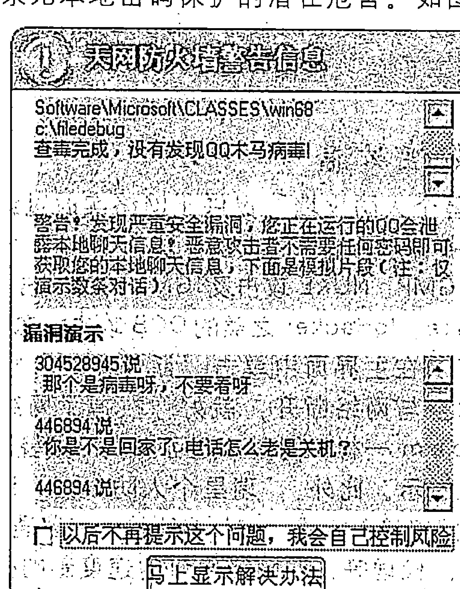

### 二、Norton Internet Security 2004

软件下载地址：http://www.symantec.com/index.htm/

Norton Internet Security 2004 是一款十分优秀的个人防火墙软件，它可以全面预防病毒、黑客和隐私泄露，是一款简单、易用并且功能强大的防火墙软件。

#### (一) 报警助手

启动 Norton Internet Security，在“安全中心”双击“个人防火墙”。选中“启用个人防火墙”以激活 Norton Personal Firewall。在“安全中心”中双击“入侵检测”，选中“启用入侵检测”以激活入侵检测。Norton Internet Security 能够识别种类繁多的应用程序，还提供了友好的安全警报界面和警报助手功能，帮助用户了解警报的含义、判断风险的大小，并提供相应的处理建议。

#### (二) 全面的安全防护

Norton Internet Security 除了提供防火墙软件的普通功能以外，还提供隐私保护、个人信息保护、网站内容控制、站点广告过滤、邮件过滤、密码保护、病毒防治、父母控制等一系列的安全防护功能。灵活地应用这些功能，一般家庭用户就可以构建出一个安全的电脑网络环境。此外，Norton Internet Security 提供的隐私保护功能具有很高的实用价值，在主界面窗口中切换到“隐私”选项卡，单击“打开”选项启动此项功能。类似地，我们还可以设置禁止或者启用Cookie。这样，就可以防止这些比较典型的入侵，确保个人信息不会被病毒或者木马等恶意程序传输出去。

#### (三) 规则设置

在“安全中心”双击“个人防火墙”。在“个人防火墙”窗口中单击“高级”选项卡上的“一般规则”，在弹出的对话框中选择“添加”，然后在弹出的“添加规则”窗口选择“禁止”，禁止进行这种类型的通信。在对话框中，选择“来自其他计算机的连接”，在下面的对话框中选中“仅以下所列的计算机和站点”，单击“添加”按钮即可。在“指定计算机”对话框中，选择“个别”，输入恶意的IP地址。此外，还可以单击“特洛伊木马规则”按钮，进行木马规则设置。

#### (四) 封锁IP

上网后，我们经常会发现有人扫描系统，Norton 的自动封锁IP功能就可以解决这个问题。默认情况下，当有人扫描不开放的端口时，Norton 就会自己弹出警告，并封锁该IP 30分钟，这对于DoS攻击和端口扫描程序可以说是一个杀手锏。

#### (五) 病毒防范

Norton Internet Security 集成了 Norton AntiVirus，可以自动更新病毒库，将最新的病毒拒之门外，可以很好地起到保护计算机系统的作用，如图2所示。

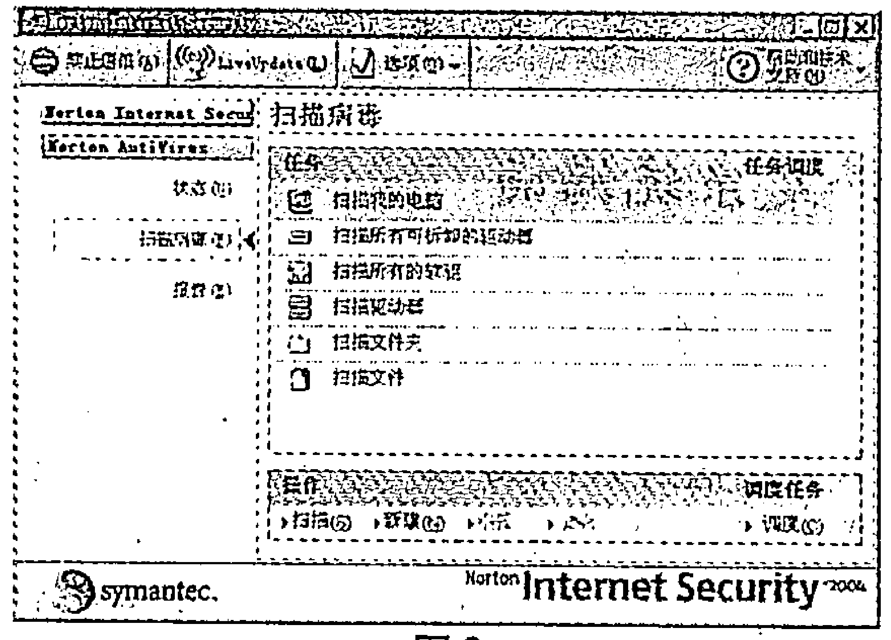

这个软件占用系统资源较多，但对于一款具有更多安全防护功能的软件来说，比一般的个人防火墙占用更多的系统资源也是无可厚非的。因此，对于同时需要多种安全防护功能的用户来说，该软件是一个很好的选择。对于只需要基本防火墙功能的用户来说，可以考虑关闭其中部分的功能以节省系统资源。

### 三、金山网镖个人防火墙 6

软件下载地址：http://db.kingsoft.com/product/

“金山网镖个人防火墙”是金山公司的产品，通过基于安全规则的高、中、低等安全级别设定，达到保护用户安全的目的。软件的主要功能有IP规则编辑、网络状态监控、系统安全漏洞扫描。

#### (一) 智能防黑

“金山网镖 6”不但能拦截木马对端口的绑定与对外部网络的访问，同时还能将“网络神偷”、“广外女生”以及“冰河”等木马程序清除掉。

#### (二) 安全级别设定

金山网镖提供了“高”、“中”、“低”、“自定义”四个安全级别供用户选择。对于局域网环境中的用户，推荐使用中安全级，这样既不影响正常网络应用操作，又能防范常见黑客的攻击方式（如洪水攻击、IGMP 碎片攻击等）。对于拨号上网用户，建议设为“高”安全级，可以将提供服务的网络端口关闭，这样也就避免了更多更高级的黑客攻击方式。如果安装了IIS 等服务程序，则需要将安全级别调整为“低”。如果这些设置都不适合，还可以用自定义级别来定制规则。

#### (三) IP规则编辑

“金山网镖 6”提供了IP 规则编辑器，使用户可以完全根据自身的不同需求对网络端口及协议进行规则制定。此外，IP 规则编辑器还能导入IP 规则库，让用户网络处于更安全的位置。

#### (四) 修复系统漏洞

这是“金山网镖 6”中很实用的一个功能，如“红色代码”、“蓝色代码”、“尼姆达”、“求职信”、“冲击波”、“震荡波”病毒都是利用漏洞来感染系统的。比如，当软件扫描到Windows Shell 缓冲区溢出漏洞与IE 积累的漏洞时，会有简单说明。扫描完毕，按“下一步”，会得到建议下载相关补丁及链接地址，同时会生成漏洞扫描报告。

#### (五) 网络状态监控

网络状态监控能够将系统中访问网络的所有的程序列出，以树形目录显示程序路径、使用协议、访问的IP 地址、监听的本地端口、远端端口、网络流量等参数，让用户对系统的网络状态一览无遗，而且可以在发现恶意攻击时，随时断开网络连接。

### 四、瑞星 2004 个人防火墙

软件下载地址：http://fw.rising.com.cn/download/download.htm

“瑞星2004 个人防火墙”可以有效地监控任何网络连接，阻挡黑客和木马攻击，保护QQ 和网游账号。通过过滤不安全的服务，极大地提高网络安全，同时减小主机被攻击的风险。

#### (一) 监控功能

“瑞星个人防火墙”提供了网络实时过滤监控功能，防御各种木马的恶意攻击，防御ICMP、IGMP 洪水攻击、IGMP NUKE 攻击及IGMP 碎片攻击；防御诸如WinNuke、IpHacker 之类的OOB 攻击。在受到攻击时，还可以在主界面中单击“断开网络”按钮，将计算机完全与网络断开，就好像拔掉了网线或是关掉了Modem 一样。同时，还可以发出报警声音并且闪烁图标提示。此外，“瑞星个人防火墙”还支持任何形式的网络接入方式，如ISDN 接入、普通Modem 拨号上网、代理等，对网络通讯的速度影响极低，不会干扰其他运行中的程序。

#### (二) 网络访问管理

俗话说：“日防夜防，家贼难防”。现在，侵入本机或在同一网络内的恶意程序很容易与其他恶意程序里应外合，窃取机密资料，最典型的就是“反弹”木马。“瑞星个人防火墙”在这方面做得很不错，无论是从外部接收数据，还是向外部发送数据，都首先将其截获并进行分析，然后弹出窗口询问用户是否允许此应用程序访问网络，并能记录下该应用程序。

#### (三) 规则设置

和其他软件一样，“瑞星个人防火墙”可以进行规则设置，主要包括五大类别：未知、应用程序、系统、内容过滤和拒绝服务。在“瑞星个人防火墙”主界面中，单击“选项”菜单下的“规则设置”，随即弹出规则设置界面，针对不同的用途，可以进行灵活设置，并能导入导出规则。通过在“设置规则”中对指定规则中的“数据链”的设置，可以精确地对特定流通方向的数据进行处理。这样，用户可以准确地辨别攻击类型和定制防范类型，提高防火墙的工作效率。

#### （四）游戏保护功能

游戏中的安全问题一直让很多游戏玩家感到头疼，“瑞星个人防火墙”设置了游戏保护功能，它能在用户玩游戏时自动阻止其他程序对网络的访问，从而保护用户的账户信息。

### 五、其他个人防火墙

当然，在以上主流软件之外，我们也测试了一些比较优秀的国内外个人防火墙软件，现在就介绍其中的几款：

#### （一）ZoneAlarm Pro 5.5.035 Beta

软件下载地址：http://www.zonelabs.com/

ZoneAlarm Pro 也是一款非常优秀的个人防火墙软件，它可以保护电脑不受互联网上非法用户的入侵，同时还能够自动检测局域网络的设置，确保来自内部网络的通信不受影响。ZoneAlarm Pro 还具备广告过滤、隐私保护、清除 Cookie 等功能。它可以通过安全级别的选择简单配置防火墙规则，也可以通过高级选项详细设置各项功能。除了没有中文版本以及缺少自动为应用程序创建防火墙规则的功能以外，ZoneAlarm Pro 没有多少毛病可挑，而且软件是免费的。

#### （二）BlackICE PC Protection

软件下载地址：http://blackice.iss.net/

BlackICE PC Protection 出自国外著名的安全系统公司 Internet Security Systems，该公司的安全软件产品主要针对大型网络系统和服务器应用领域。此软件集成了强大的入侵检测分析引擎，能够识别多种入侵手段，与 Web、FTP 之类的服务器软件也可以很好地协同工作。BlackICE PC Protection 的功能十分强大，除了可以对共享资源和 NetBIOS 网络进行控制以外，还可以控制网络通信和程序的运行，拦截可疑的网络入侵和有木马特征的应用程序。一旦有可疑的迹象发生，图标就会变红，不断闪动报警，并显示出攻击的发源地。但是，该软件缺少隐私保护等附加功能，也缺少设置向导的功能，对入侵的检测依赖于检测分析引擎与安全数据库，用户需要经常更新。

#### （三）Kerio Personal Firewall 4.11

软件下载地址：http://www.kerio.com/

Kerio Personal Firewall 最吸引用户的地方是免费、小巧、占用系统资源小。该软件的功能十分强大，具有较完善的防火墙功能，可对程序的通信进行控制，能够检测出特洛伊木马，以及在用户不知情的情况下，通过互联网传输数据的恶意程序。另外，Kerio Personal Firewall 还具备切断电脑上所有的网络通信的控制功能，保护软件设置的密码保护功能，以及通过互联网进行远程管理等许多非常细致的功能。不过，该软件的易用性比较差，个人用户版本不支持自动为应用程序建立防火墙规则的功能，软件的帮助文档与事件日志也比较简单。

#### （四）McAfee Personal Firewall 3.02

软件下载地址：http://us.mcafee.com/

McAfee Personal Firewall 是 McAfee 公司的一款个人防火墙软件，它提供了安全设置助手和设置向导，易用性不错，并且软件的操作界面非常美观。与其他防火墙软件不一样的是，它的许多功能都依赖于网站服务，当应用程序请求访问互联网时，McAfee Personal Firewall 都要访问特定网站来检测该程序，如通过“黑客观察组织”(http://www.Hackerwatch.org)这个网站来获取详细信息并询问是否信任该程序。McAfee Personal Firewall 与 McAfee 公司的另外几款安全软件产品在功能上搭配得比较完美，如果同时使用其他几款产品的话，McAfee Personal Firewall 是一个不错的选择。

#### （五）Sygate Personal Firewall Pro 5.5.2710

软件下载地址：http://soho.sygate.com/default.htm

Sygate Personal Firewall 是一款简单易用的个人防火墙软件，适合于单机用户来防止入侵者非法进入系统。该软件提供了多层保护的防火墙安全环境，能够从系统内部进行保护，并且可以在后台不间断地运行，从而有效地防止入侵者和黑客的侵袭。该软件还提供有安全访问和访问监视功能，并可向您提供所有用户的活动报告。当检测到入侵和不当的使用后，能够立即发出警报。不过，软件没有提供自动创建防火墙规则的功能，用户需要处理所有应用程序访问互联网的请求。有时候虽然给出了非常详细的监视信息，但没有给用户任何的处理建议。另外，只要应用程序有一点改变，即使打了个补丁，该应用程序访问互联网时，也需要重新设置防火墙规则。该软件的功能与特点使它更适合在服务器上使用。

#### （六）费尔个人防火墙 2.1

软件下载地址：http://www.xfilt.com/download/downloads.htm

“费尔个人防火墙”是一款功能强大的个人防火墙软件，它不仅是免费的，而且它的整套源程序也是完

## 日日一新的MP3下载软件

文/风之扬

“下载MP3”？对于音乐发烧友来说，这应该是一件很开心的事情了。有的朋友可能会认为，无非就是通过网页搜索后下载，或者通过BT下载。但是，免费的网页下载经常出现不能下载的情况，即使收费站点的速度也很一般。BT的技术特性注定了它只适合大文件的发布，时效性较差，因此BT并不适合音乐文件如MP3、WMA等格式文件，对众多音乐爱好者而言不能不说是一个遗憾。那么，有没有能将这两者巧妙结合的软件呢？

值得欣喜的是，采用P2P技术的国产音乐下载软件迅速崛起，在这样的平台下，用户的自由度更高，交互性更强，并开始对传统下载模式进行强有力的挑战。其中具有代表性的有：POCO、Openext、百宝、Kuro、KuGoo等。本文将针对上述几款国产P2P软件在音乐文件搜索和下载能力方面进行测试，为广大音乐爱好者寻找一款适合自己的音乐文件分享和下载工具。

通过对比，我们就能够很好地把握当前的主流个人防火墙的现状，从而做出自己的选择。相对而言，Norton Internet Security 2004在功能上有着明显的优势，其详细的设置和信息提示比较适合高级用户及硬件配置比较好的用户使用。“天网个人防火墙”基本上可以达到个人用户的使用目的，和单独的Norton AntiVirus相结合，比较适合一般用户和游戏爱好者使用。“金山网镖”和“瑞星”则是捆绑销售产品，如果我们购买了“金山毒霸”或者“瑞星杀毒软件”，就可以得到这些优秀产品了，它们在功能上十分强大，尤其是在病毒防范方面具有明显的优势，所以，这两款软件的用户群也比较广泛。至于其他个人防火墙，除了上述各自软件的点评，相对而言，国外的优秀软件比较多，功能也很实用。但这些软件普遍缺乏比较系统的中文支持，对用户的要求比较高，导致用户的易用性在无形中打了一个折扣。

### 六、综述

通过上述详细介绍，我们对流行的个人防火墙软件有了一个比较详细的了解。总的来说，这些防火墙软件都能够提供不错的安全防御功能，能够有效地阻止各种病毒及后门软件的入侵。它们之间的差别只在于所使用的技术和所提供的功能不同。通过上面的分析，我们可以将主流软件的分析结果进行比较，见下表：

| 功能 | 天网 | Norton | 金山网镖 | 瑞星 |
|------|------|--------|----------|------|
| 系统漏洞扫描 | 支持 | 不支持 | 支持 | 支持 |
| 安全检测修复 | 支持 | 不支持 | 支持 | 支持 |
| IP规则编辑 | 支持 | 支持 | 支持 | 支持 |
| 网络应用程序状态 | 支持 | 支持 | 支持 | 支持 |
| 自动封锁IP | 不支持 | 支持 | 不支持 | 不支持 |
| 预设安全级别 | 支持 | 支持 | 支持 | 支持 |
| 自定义安全级别 | 支持 | 支持 | 支持 | 支持 |
| Java ActiveX控件 | 不支持 | 支持 | 不支持 | 不支持 |
| 预设系统访问网络 | 支持 | 不支持 | 不支持 | 不支持 |
| 应用程序规则 | 支持 | 支持 | 支持 | 支持 |
| 病毒软件集成防范 | 不支持 | 支持 | 支持 | 支持 |
| 中文帮助 | 支持 | 支持 | 支持 | 支持 |

当然，网络安全问题变化莫测，构建一个安全的网络系统，防火墙并非万无一失的。除了无法消除“缺乏加密认证机制、TCP序列号易被猜测、定时器以及连接建立过程中存在大量问题”等TCP/IP协议的致命弱点以外，防火墙采用的滤波技术可能也会使网络的性能降低。因此，考虑互联网的便利性就会影响系统的安全性，在两者之间取得平衡并不是一件简单的事情。配置防火墙可以解决大多数的网络安全问题，但并不能作到一劳永逸。

### 一、百万共享音乐——KuGoo

软件下载地址：http://www.kugoo.com
KuGoo 为爱好音乐的网友们提供了一个共享音乐和互相交流的平台。下载安装程序后，直接选择“下一步”便可完成安装。第一次使用KuGoo时要注册一个用户名，在登录对话框中单击“注册向导”，填入昵称、邮件地址、登录密码、密码提示等，就可以得到一个注册账号。首次登录，会提示用户指定某一个目录作为共享。登录后会出现导航界面，除了列出了“最新专辑”、“歌手列表”和“酷狗推荐”外，KuGoo还提供了一个畅所欲言的天地“音乐论坛”，用户可以在这里自由参加音乐方面的交流和讨论。

#### (一) 用“酷狗”搜歌

通过KuGoo，用户可以方便、快捷、安全地从全球KuGoo用户中快速检索所需要的资料，还可以与朋友间相互传输影片、游戏、音乐、软件、图片等。点击“搜索传输”菜单，就可以显示出所有用户共享的MP3文件，我们可以通过三种方式从中搜索到自己想要的歌曲。第一种是在“搜索我喜欢的音乐”栏中输入所要搜索歌曲名的关键字进行搜索；第二种是在“按用户号查找”栏输入用户号，就可以看到对方共享的音乐文件；第三种是按歌手搜索歌曲，选择您所要查找的歌手，就可以看到该歌手的所有共享歌曲。
找到心仪的歌曲后，双击想要的文件就可以开始下载。或者选定该文件，单击鼠标右键，选择“下载”选项，也可以开始下载，KuGoo可以同时下载多个文件。当选定某个歌曲时，右下角的“KuGoo下载地址”栏中还可显示该文件的下载地址，以便您提供给其他网友，还可以贴在论坛上与其他入一起分享。

和大多数P2P软件一样，KuGoo具备优秀的聊天功能，效果和QQ差不多。连上KuGoo后，就可以随时和全球各地的KuGoo会员分享歌曲并结为好友了！KuGoo拥有下载好友整个文件夹的功能，我们可以选中好友的某个文件夹，单击鼠标右键，选择“下载此文件夹下的所有文件”选项，然后KuGoo就会把这个文件夹全部下载到指定的位置，即使是整张专辑也轻而易举。

#### (二) 音乐仓库共享

文件共享让您可以在立即与伙伴之间共同分享自己电脑里的文件、数据、音乐等等，KuGoo也为网友提供了音乐交互共享服务。在“我的共享”界面分别列出了两个文件夹，“我的下载文件夹”和“我的共享文件夹”。“我的下载文件夹”存放的是所有从KuGoo中下载的文件；“我的共享文件夹”存放的是所有共享给其他网友的文件，如想和其他网友一起分享歌曲、游戏、电影、软件等，只要存放在此目录下就可以了。这两个文件夹的存放位置，都可以由用户任意指定。如果不想共享文件，只需在“我的共享”里单击鼠标右键，在弹出的菜单中选择“删除此共享目录”，即可取消所含有隐私文件的文件夹。

#### (三) 高速下载中心

KuGoo拥有强大的网络连接功能，支持各种网络环境，支持断点续传，还可将用户分流在不同的区域内，这样可以大大减少下载过程中的拥塞状况，实现超高速下载。打开“下载中心”，上面显示了当前下载和被下载的文件信息和历史记录，其界面和FlashGet等下载软件非常相似，可以对各个下载进程进行继续、停止、删除等管理操作。如果知道下载地址，还可以在地址栏中输入后直接进行下载。此外，还可以通过单击“设置”菜单中的“选项”命令，在弹出的菜单中单击“下载”选项卡，进行下载方面的设置，如下载的带宽、最大通道和下载路径等。
总的来说，KuGoo的操作和界面简单明了，下载速度快。随着P2P技术的异军突起，我们可以预见，它将逐渐形成一个越来越庞大的音乐下载平台，使用一段时间后，我们就一定会喜欢上这只酷酷的“小狗”。

### 二、免费的宽带娱乐平台——POCO 2004

软件下载地址：http://www.poco.cn
POCO 2004是新一代免费电影、音乐、动漫等资源下载平台，数十万POCO会员的共享集中了数以百万计的海量多媒体资源。软件采用了多点传输技术，可以加快大容量文件的下载速度。通过内置的IM即时通信系统，用户可以方便、快捷地与好友一起分享音乐文件。

#### (一) 强力MP3搜索

启动POCO软件后，在登录主窗口单击“注册”按钮。开始填写注册资料，注册完毕后就可得到一个用户账号，单击“登录”按钮，再输入您的账号密码，单击“GO”就可以立即登录了。
在主界面的右上角点击“搜索”按钮，在操作界面输入关键字，选择搜索的文件类型，这里选择“MP3”，然后就可以搜索我们需要的文件了。另外，POCO还可以进行高级向导搜索，在高级搜索中输入类型和关键字，选择性输入：标题、版本、文件描述。

#### （二）下载

在登录主界面并单击“下载”按钮后，在搜索框中输入关键字后开始搜索，搜索结果就会以列表的形式展现出来。选取我们想下载的文件，通过右键进行下载，或者在选取该文件后，单击“下载”按钮进行下载。下载时，POCO面板提供了下载速度、连接人数、文件完成比率和对方的ID等基本信息。我们得到对方ID后，还可以将其添加为好友，以后要下载的话直接找他就行了，如图1所示。

#### （三）会员共享

会员不能对某一个单独文件进行共享，只能对某一个文件夹进行共享，其下的文件也就共享了。主界面点击“下载”后再选择共享文件点击“共享”按钮，在共享的目录前打勾，确认后就自动共享了。另外还可以通过主界面上的设置中的共享，按“添加”按钮添加您所想要共享的目录，添加后按“修改”即可。

值得一提的是，POCO 2004并非一款专门针对音乐下载而开发的产品，任何类型的文件都可以通过POCO进行分享，其多点下载技术给人的印象尤其深刻。另外，POCO已经不是单纯的下载和播放软件了，它还提供了个人主页和积分换Q币服务，而且它主页里面还有美食和新闻，只要登录上了POCO，就能享受到很多不同的资源。

### 三、百宝——取之不尽的多媒体宝库

软件下载地址：http://www.100bao.com
“百宝”利用风靡全世界的点对点技术，加入了音频、视频、Flash、图片、软件等多种搜索引擎，我们可以通过它来搜索和下载各种各样的多媒体资源。安装运行软件后，注册一个账户就可以开始使用了。

#### （一）搜索宝库

成功登录后，单击上方的“音乐”按钮栏目，在“搜索”栏输入所要搜索的关键字，单击“GO”按钮，搜索结果就会出现在右侧窗格中，双击相应的文件就可以开始下载了。如果要加快下载速度，可以同时在多个用户处下载同一个文件，也可以“按用户号查找”在线的网友，下载对方的共享文件。在“按用户号查找”栏输入想查找的用户号，按“发送消息”按钮，向对方发消息。不过如果您是内部网用户，并且没有打开“借用外部网络资源”选项的话，就不允许发送消息。

#### （二）共享目录

“共享目录”可以管理自己的共享目录，共享目录中的文件可供其他用户下载。共享目录中第一个目录是下载文件放置的目录，不能删除，其他的则可以删除。单击“添加目录”，选择目录，确定后就可以添加共享目录。一般默认设定安装目录下面的“我的下载目录”为下载的目的目录。有了“百宝”，我们就有了一个取之不尽的多媒体宝库。

### 四、OP ——做我想做的

软件下载地址：http://www.op.cn
OP，又称为Openext Media Desktop，它提供了简单而快速的文件搜索、分类下载、预览播放、共享管理等功能，让我们以最直接的方式找到想要的音乐、影视、软件、游戏、图片、书籍以及各种文档。在线共享文件容量数以亿计，“十万影视、百万音乐、千万图片”，堪称国内P2P软件的榜样。OP整合了IE、Windows Media Player、RealOne Player和ACDSee，是一个名符其实的网络娱乐平台。如图2所示。不过，要下载搜索的文件，需要购买“石头数”，实际上也是收费，心疼银子的朋友可要斟酌一下了。

## # 彩信铃声漫天飞

文 / 风之扬

走近手机展台，我们会发现，彩屏手机已经悄悄走进了我们的生活。弹指间，优美的MIDI音乐、漂亮的图片、优美的文字即可倾泻而出。那么，我们能否把自己喜欢图片和动画进行加工，使之成为一条独具创意的彩信，或留作自我欣赏，或发送给自己的知音好友呢？答案是肯定的。现在，不少网络公司提供了彩信制作平台，通过选择不同的操作界面，点击几下鼠标，就能完成一个富有创意的作品。本文将对“亘天炫彩2003”这款优秀的彩信制作软件进行介绍，并提供丰富的彩信制作资源。

软件下载地址：http://www.skycn.com/soft/14705.html 或 http://www.gentian.com.cn。

### 一、典型功能介绍

“亘天炫彩”是一款多功能的短信、铃声、MIDI音乐、图片、动画、彩信的通用制作工具软件，功能十分强大，现分述如下：

- 1. 图像编辑。其图像编辑功能十分全面，特别是它还支持大量的滤镜和图片特效，能够导入几乎所有的通用图像格式。
- 2. 铃声制作。用鼠标可直接拖曳音符到五线谱进行编写，也可以按数字键输入简谱编写，还可以通过音乐转换向导直接将MP3、WAV文件转换为铃声和裁剪现有的MIDI文件等。
- 3. 彩信制作。可以方便灵活地制作动画，或将 GIF 文件直接导入动画编辑界面。
- 4. 发送记录。提供详细的发送记录管理，对每一条发送和费用都有详细的记录和统计。
- 5. 提供“收藏夹”专栏，可以存放管理自己的作品和外来精品，栏目包括“图片”、“铃声”、“短语”、“彩信”四大专区，并含有大量素材资源供您使用。

看了这些优秀的功能，大家一定跃跃欲试了吧。下面，我们开始进入具体的制作过程。

### 二、铃声制作

“未见其面，先闻其声”，第一步先来制作铃声。制作彩信之前，我们可以打开现有的 MIDI 铃声，在铃声编辑窗口中进行剪辑，或者选择简谱和五线谱自己制作。此外，它还能将 MP3 及普通 CD 上的 WAV 音乐转换成手机支持的 MIDI 铃声，极大地丰富了手机铃声。

#### (一) MIDI铃声制作

##### 第一步

点选主界面底端选择栏的“铃声”，进入编辑铃声的界面。如果我们稍微懂点五线谱的知识，现在就可以开始音乐创作了。

##### 第二步

单击顶端命令栏的“新建”图标，在“选择铃声输入模式”列表框中，你可以选择“五线谱输入”或者“简谱输入”。还可以设置铃声属性，选择手机类型，也可以自定义铃声包含多少个音符。

##### 第三步

输入铃声。选择输入方式后，可对每个音符进行删除、剪切、复制、粘贴和修改等操作，还可以对节拍进行调整。除了鼠标方式，在简谱的输入方式中，我们还可以通过键盘的数字键入相关音符。

#### (二) MP3转换成手机铃声

如果我们的音乐水平不够专业，而且又很想听到目前比较流行的 MP3，怎么办？ “亘天炫彩”已经为我们考虑了这个问题。

##### 第一步

根据向导进行格式转换。单击“音乐转铃声”，出现“直接转换”和“向导转换”两个选项。选择“向导转换”，选择 MP3 或者 WAV 音乐文件，软件将自动进行音频格式的转换。我们可以看到转换的进程显示，而且转换速度也很快。转换完毕后，单击“试听”按钮，就可以听到优美的音乐了。

##### 第二步

音乐文件预处理。选择其中一段音乐，就会有波形图以对应的秒数刻度表示出来，然后进入下一步。

##### 第三步

转换前的参数设定和铃声的转换过程。如果没有十足的把握，建议不要修改软件设定的默认参数，单击“转换”按钮，软件就开始将波形文件转换成 MIDI 文件。有趣的是，我们还可以选择不同的乐器，这样，同样的曲调就可能会达到意想不到的效果。完成后，单击“试听”按钮，不满意则调整参数后重新转换。试听完毕，进入下一步，铃声转换结束，并提示转换后的文件大小（图1）。

##### 第四步

设置转换后的参数。回到铃声主界面，可以看到，转换出来的铃声会以波形图显示，在下面的状态栏还有铃声的资料，如手机类型、和弦数（有多少种音色）、音符数等，操作十分方便。

#### (三) 编辑修剪 MIDI音乐

随便找一个自己喜爱的 MIDI 音乐，然后在软件中打开它，在左侧可以看到 MIDI 的音轨数，选择音轨单独进行效果试听，从而筛选掉不明显或影响整体效果的音轨。另外，我们还可以通过选择整首 MIDI 的某段范围，进行“保留”或“删除”操作。通过对各条音轨进行选择、管理，将不需要的音轨前的对勾去掉，保留相关的和弦数就可以了。

让普通手机朋友高兴的是，这个软件还可以将和弦铃声转成普通的单音铃声。比如，打开一个 MIDI 文件，选择工具栏的“转单音”，软件就会自动把主旋律的音轨保留下来，把其他伴奏去掉，做成一个适合于普通手机的单音铃声。

### 三、图片制作

饱了耳福，现在该饱眼福了。把我们刚才制作的铃声文件保存到“我的收藏夹”，这是一个本地文件夹，常用的资源素材都储存在里面，其路径在安装目录下的favorite文件夹中。

##### 第一步

选择图片。我们可以通过网页下载、屏幕抓取等多种形式将图片复制到图片编辑窗口，也可以打开收藏夹中的图片文件进行编辑，方式十分灵活。在收藏夹中，选择一幅心仪的图像，单击鼠标右键或者单击“编辑”按钮，就可以在弹出的“图片编辑”对话框中对图片进行编辑。

##### 第二步

编辑。该软件提供的编辑功能也十分强大，页面左边一栏是编辑菜单，和目前主流的图形处理软件一样，可以轻易对图片进行各种编辑。如果想为图片配上精美的文字，还可以点击“T”，输入文字和设置文字属性，如颜色、字体、字形、大小。和Photoshop等图像编辑软件一样，它还支持图层、滤镜和特效，能调节亮度、对比度、透明度等。其中“颜色调节”是通过滑杆对三原色进行调整；“亮度调节”是调节图像明暗度；“对比度调节”是调整图像的对比度，丝毫不亚于专业的图像处理软件。

我们还可以将一幅彩色图像变为黑白图。选中图片，单击“图片属性”按钮，将自定义部分的颜色选择为“黑白”，单击“确定”按钮后，原图像就会转换为黑白图。通过图片属性将其设置为彩色图时，原来的彩图又可以恢复回来。

图片编辑完成后，单击左上角的“存盘”按钮，待以后调用。如果是彩信文件，“亘天炫彩”还提供了一种MMP格式供用户保存相关的格式。

### 四、文字短信、彩信的制作及发送

#### （一）文字短信

文字短信应该是最普通不过的功能了。点击“短信”按钮，进入短信编辑窗口，在下面的文字框中输入短信信息（短信容量仅为128个字符），或者打开资源目录中的某个短信库，下载最新的短信库。然后，选中其中一条信息，单击鼠标右键，选择“发送”，或点击“联系人”按钮选取目标收件人，也可直接输入对方电话号码。如果采用群发方式，在电话号码之间要用半角分号分隔，点击“发送”按钮，完成发送程序。

#### （二）彩信制作及发送

万事俱备，现在就可以开始制作激动人心的彩信了。点击软件主界面下方的图标进入彩信编辑的主界面。彩信的制作充满了乐趣，只要定制好帧，导入图片、音乐和文字，就可以制作彩信了。单击左下方的“彩信”图标，彩信制作界面如图2所示。

##### 第一步

导入动画图片。编辑区分为三个部分，左面的方框可以将图片或动画导入到选中的彩信帧中，右上方是加入MIDI音乐，而右下方则可以加入文字。现在，我们导入最常见的图片或者动画格式。

##### 第二步

设置格式。点击上方“彩信属性”，对手机品牌、手机型号以及彩信类型进行定义，彩信的类型有两种，分别是128×160像素的彩色图片和128×160像素的动画。软件的彩信功能也基本支持了市面上所有品牌和型号的彩信手机。设置完毕后单击“确定”按钮，这时彩信编辑区中显示的方框便是所选择的手机彩信的实际大小了。

##### 第三步

动画编辑。利用帧可以创建自己想要的动画，方法是将图片依次放到相应的帧上，再定义当前帧的时间，即在时间文本框中输入数字，定义当前帧的延时（时间以秒为单位）即可编辑出想要的动画彩信了。

##### 第四步

设置音乐。在右上方单击“导入”按钮，直接打开一个MIDI文件导入到当前帧。音乐播放的时间长短以该帧的时间设定为准，如果要在整个彩信中加入该MIDI音乐，便要在每个帧中都导入该MIDI文件才行。然后是文字输入，要注意的是在输入文字之前要新建一个帧，否则将会使当前的图像帧变为文字帧了，对于文字帧用样可以加入MIDI音乐。图像和音乐可以共存在彩信的同一帧里，凡是加入了背景音乐的帧，就会有红色的音符标志，从而看到每一帧的具体情况。单击下方的“预览”按钮，可以看到制作完毕的彩信（图3）。

##### 第五步

发送彩信。制作完成后，我们可以发送到自己的手机保存，或者发送给其他朋友一起分享。如果没有定义彩信的属性，则可以保存为MMP的工程文件，发送时，软件会自动根据选择发送的彩信手机型号，智能的调整彩信的大小和尺寸。否则建议保存为MMS的彩信文件，以便于直接发送到手机。解决上述问题后，在窗口上方书写栏中输入接收人的手机号码，单击“发送”按钮即可。同样系统会弹出确认对话框，并显示发送所需的费用，确认后，即可将编辑完成的彩信发送到目标手机。

### 五、彩信及铃声资源

#### （一）彩信大师

软件下载地址：http://www.skycn.com/soft/15154.html

“彩信大师”是一个彩信编辑器，它的编辑界面非常有趣、可爱。其图片处理工具的设置充分体现美观大方的设计理念，尤其“添加过渡效果”的功能，能够让一张呆板、生硬的照片“起死回生”。我们可以导入绝大多数的图像、动画、声音文件，还可以添加标语、剪贴画、文字等。此外，我们还可以在PC端录制自己的声音，并插入到自制的彩信中发送给您的朋友。这个软件可以储存200张图片，图片的性质既可以是自己拍摄的，也可以是网上下载的。再打开编辑图片的界面，标语与剪贴画的画面不仅形象生动，有趣可爱，同时对图像的设计制作可起到画龙点睛的作用。另外，它还可以很方便地添加声音，铃声和图片是一致的，宛如流水一般自然！

#### （二）金山彩翼

软件下载地址：http://mms.kingsoft.com

“金山彩翼”是一款非常专业的PC端彩信编辑和发送软件，整体设计风格轻松自如，贴近用户心理，完全体现“我的彩信我编辑，随心所欲”的个性魅力。界面中，用户可以自选图片和背景音乐，再加上自创的文字、字符和特效，一条彰显个性的彩信就出现了。对于接收方，只要支持彩信、支持WAP业务并且申请开通了GPRS移动数据业务，便可以接收到来自悠扬的音乐、图文并茂的个性彩信了。这一点，更是打破了彩信只能为彩信手机互发的局限。

#### （三）迅彩图铃通

软件下载地址：http://www.skycn.com/soft/16123.html

这个铃信DIY工具突破了传统的发送图片、铃声、动画的模式，赋予每个人充分发挥想象空间！它能将用户在IE、Windows“资源管理器”中看到的图片，听到的音乐发送到手机。方法是只需单击鼠标右键，选择“发送到手机”命令。其注册版还支持Flash动画，爱好Flash的朋友不要错过。

### 六、彩信网站推荐

#### （一）新浪彩信 http://mms.sina.com.cn/

新浪彩信主要分为“和弦铃声”、“待机彩图”、“彩信动画”和“精彩专题”四个栏目。“和弦铃声”有“华语流行”、“日韩来风”、“欧美风情”和“中国古典”等几个项目，可以让令人烦躁的铃声变成优美的音乐。“待机彩图”则有“搞笑幽默”、“趣味卡通”、“个性文字”、“星座生肖”等栏目。在“彩信动画”里特别推荐“韩流”专区；在这个专区里我们可以欣赏到韩国最流行的MM动画。“精彩专题”栏目同样有吸引力，其中大力水手、机器猫、新浪宝贝等特别具有个性的画面可以让你的手机别有一番风味。

#### （二）网易彩信 http://mms.163.com/

网易彩信主要分为图片、动画、铃声、异域风情、涂鸦等类别，站点更注重时尚性。插画中的MM源于现实但又高于现实，如果显示在手机彩屏上，将另一种惊艳的感觉。在“异域风情”中，还有日本漫画大师作品绘制的人物形象，相信动漫迷会更加喜欢。

#### （三）搜狐网站 http://mms.sohu.com/

与其他彩信网站相比，搜狐的栏目要多些，有“彩信动画”、“和弦铃声”、“彩信图片”、“音乐贺卡”、“疯狂音效”、“原唱KTV”、“精彩专题”、“HOT排行榜”和“迪斯尼”等。其中，迪斯尼的唐老鸭和米老鼠别具特色。随着技术的不断发展，越来越多的彩信将伴随着悦耳的铃声飞舞在我们的生活空间，而越来越方便的彩信制作工具和网络资源将让这一切变得更加容易。

## 网络对战平台全接触

文/D-BOY

你喜欢玩游戏吗？在体验着游戏带来的快乐的同时，是不是也早已经对“弱智”的游戏AI产生了厌烦？在你每次对电脑对手进行单方面的“屠杀”后产生的失落中，是不是蕴藏着想要和具备同样智能的真人一较高下的渴望？

如今随着宽带网络的普及，想实现这种愿望变得相当容易。网络在拉近了你我之间距离的同时，也使我们的生活变得多姿多彩起来。这次向大家介绍的，就是近年来兴起的一种新的娱乐形式——网上游戏对战。

### 一、什么是游戏对战平台

对于很多竞技类游戏来说，虽然都提供了通关任务和人机对战，不过这类游戏真正的乐趣，无疑在于真人对战。可是放在以前，想找个人对战可真不容易。上官方服务器，速度慢不说，动不动还要你输入CD-Key；上私人服务器？好！记下IP，下载登录插件，修改注册表……光登录前的准备工作就打消了你一半的热情。在这种情况下，游戏对战平台应运而生。这是一种基于Internet的多人电脑游戏联机服务，它通过网络协议转换技术，能让以任何方式接入互联网的游戏玩家轻松地通过平台进行“面对面”的对战。对游戏玩家来说，只要登录对战平台并进入对应的游戏房间，就能像在网吧中对战一样，可以加入别人的服务器，也可以很方便地自己建立服务器，省去了烦琐的过程。

游戏对战平台可以将互联网上远隔千里的玩家紧紧地联系到一起，并给用户提供实时的交流与沟通服务。在对战平台与其他的玩家一起游戏，互相切磋，可以尽享对战游戏带来的无穷乐趣。由于拥有这些独特的优势，所以游戏对战平台很快就成为互联网娱乐行业的新宠。

### 二、如何安装和登录对战平台

目前虽然已经有很多服务商提供联机对战服务，不过，这些对战平台的基本使用方法还是大同小异的。所以这里笔者以目前知名度最高的浩方对战平台为例来说明这一过程。

#### (一) 下载并安装对战平台客户端

访问浩方官方网站下载中心 http://www.cga.com.cn/download.asp，下载浩方对战平台客户端，目前最新版本为3.6.2。需要注意的是：浩方在网站上提供了多个版本的安装程序，包括正式安装包，自解压免安装版本，教育网专用版等等，用户可以按照自己的喜好和接入方式选择对应的安装程序。

出于对绿色软件的偏好，D-BOY在这里选择了自解压免安装版本，下载完毕后双击“hf362.exe”进行安装。出现解压画面后，选择一个安装路径后点击“Install”按钮，安装即可完成。然后进入浩方的安装目录，用鼠标右键单击“GameClient.exe”，选择“发送到桌面快捷方式”命令，来创建一个桌面图标。

#### (二) 注册 CGA 账号

要使用浩方对战平台，首先必须成为CGA的注册用户，这个账号同时也可以登录CGA论坛。此外，CGA会不定期举行一些活动，也需要这个账号。

运行浩方对战平台客户端，弹出登录窗口，在这里点击“注册”按钮，即可进入注册页面。

首先可以看到的是CGA的服务协议，建议每位用户注册前都能仔细阅读，毕竟浩方已经开始成为一个收费服务。确定没有异议后，点击“同意”按钮进行下一步操作。

在注册页面输入用户名和密码，然后点击“确认”按钮，即可完成注册过程。

#### (三) 登录对战平台

在登录窗口输入刚刚申请的CGA账号并点击“登录”按钮，即可登录游戏大厅。如果你想更方便一些的话，可以同时选中“自动登录”和“记住密码”两个复选框。这样下次只要一运行客户端就会自动登录。

### 三、怎样进行网上对战

#### (一)《反恐精英》对战

##### 1. 选择正确的游戏版本

目前浩方提供了3个版本的《反恐精英》在线对战服务：CS 1.5，CS 1.6，CS Source。所以，用户首先需要搞清自己正在使用的游戏版本，然后在游戏列表中选择对应的游戏。

##### 2. 选择网速快的专区和房间

接下来在专区列表中选择对应的专区，这里需要注意的是：为了保证游戏速度，应尽量选择在地理位置上离自己近的专区，如北京用户就进北京专区，河南用户就进河南专区。不过，对于使用别的服务商接入互联网的用户（如长宽、铁通、广电宽带等），还是进入对应的服务商专区才能获得比较高的网速。

进入选定的专区后，用户还要选择进入游戏房间。在图1所示的界面中我们可以看到，在每一个房间名称后面，都有在线人数和网速状态显示。一般来说，浩方将每个房间的玩家人数限制在250人。房间一旦人满，后面显示的在线人数会自动变为红色。网速则以PING值的方式反映了该房间和你计算机的连接速度，这个值越低，进入后的游戏速度就越快。对于《反恐精英》这种对网络速度要求较高的游戏，玩家最好能够选择PING值低于100的房间进入。不然被人痛扁不要说我没提醒你。

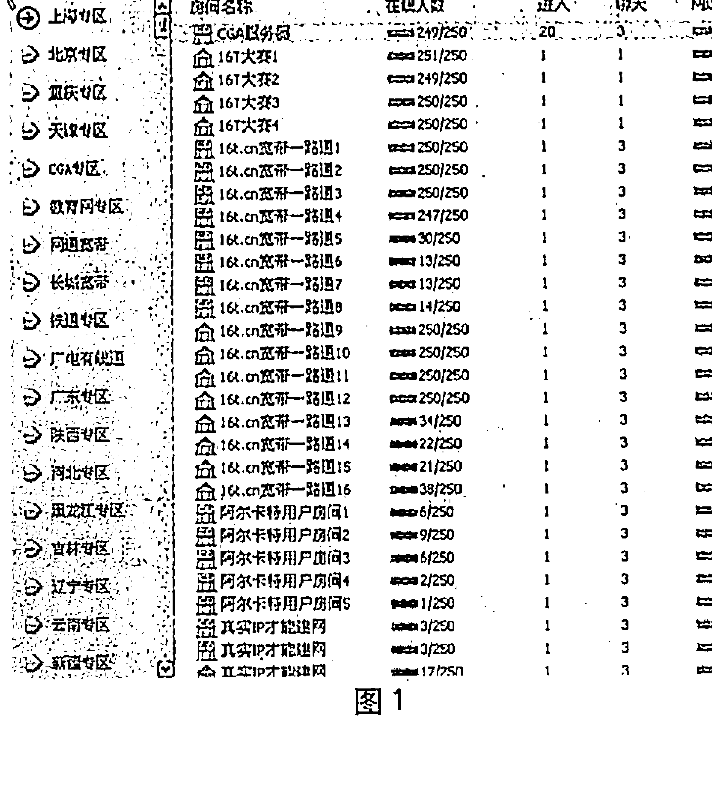

##### 3. 设置游戏运行参数

第一次进入房间，需要用户设置游戏相关参数。点击下方的“启动游戏”按钮，会弹出游戏设置菜单。在这里点击“浏览”按钮来为平台定位游戏的可执行程序。如果不太清楚《反恐精英》安装在哪里的话，还可以点击“搜索”按钮，客户端会自动在你的硬盘上搜索《反恐精英》的可执行文件。同时，对于《反恐精英》这类游戏来说，用户可以在游戏启动参数栏输入一些启动参数来满足自己的要求。

一切设置完毕后，点击运行游戏按钮启动《反恐精英》，进入局域网对战。哎！怎么什么都没有？别急，点击“刷新”按钮下载服务器列表，很快，这个房间中的服务器就都出现在服务器列表中了。选择一个速度快的，进去厮杀吧。如果嫌这还不过瘾的话，那就点击“建立服务器”，自建一个服务器，也好尝尝OP的滋味。

#### (二) 中国象棋对战

不是所有的玩家都喜欢激烈的竞技游戏。对很多人来说，茶余饭后打打牌、下下棋，是一种更加惬意的享受。下面我们将要介绍的，就是如何在浩方平台上和别人对战中国象棋。

##### 1. 选择游戏

在游戏列表中点击休闲游戏标签，选中中国象棋。

##### 2. 下载中国象棋游戏

进入任意一个中国象棋房间，点击“下载游戏”按钮。从弹出的“下载新游戏”窗口选择一个较快的下载服务器，然后点击“下载”按钮即可。

##### 3. 开始对战

下载完毕后，象棋程序会自动运行，如图2所示就是象棋游戏的主界面。现在点击“搜索”按钮下载服务器列表，片刻之后，服务器名称就会出现在右侧服务器列表中。其中还未开始游戏的服务器都带有一个沙漏的标志，后面的人数则表示服务器的主人是否已经有了对手。用户可以选择一个尚无对手的（人数显示为1/2），点击“加入”按钮加入该服务器。然后只需服务器的建立者开始游戏即可。

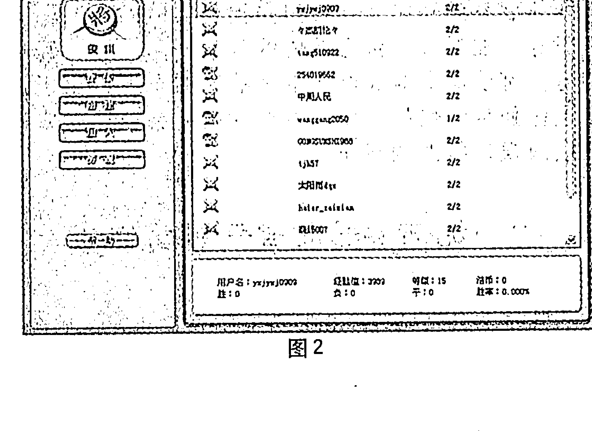

如果没有找到可以对弈的服务器，玩家可以点击“创建”按钮来自创一个服务器，然后等待对手的加入，一旦就绪，即可点击“开始”按钮进行对战。

> 小提示1
使用游戏平台要注意：无论你玩任何游戏，都要在平台内启动。不然你的协议将不会被平台转发，自然也就无法联机对战。

> 小提示2
在对战平台上对战，还要注意游戏的语言版本，有些使用纯英文版游戏的玩家，往往会遇到这样那样的问题，如不能打字和别人交流（如《魔兽3》），或者遇到带中文字符的服务器就退出游戏（如《突袭》）。解决这种问题的办法就是安装相关游戏的中文补丁，这些可以在浩方下载中心和论坛中得到。

### 四、享受组队对战的乐趣

对战平台拉近了玩家的距离，在游戏中找到一些志同道合的朋友，组成属于自己的战队参加比赛，也就成为一件很时髦的事。因此目前很多对战平台也都开始提供组队功能。这里D-BOY还是以浩方为例，说明如何加入和组建战队。

##### 1. 加入战队

加入战队的过程比较容易。想要加入战队的玩家可以访问浩方战队专区（http://clan.cga.com.cn/index.asp），利用搜索或查看所有战队列表选择感兴趣的战队，点击战队名进入该战队主页，随后点击“加入战队”并填写自己申请加入的理由，这样就完成了你的申请过程，接下来要做的就是耐心等待该战队队长的批准了。

##### 2. 建立自己的战队

###### (1) 成为VIP会员

在浩方，建立战队属于VIP用户所拥有的特权，也就是说，这是一个收费服务。所以，要想拥有自己的战队，还必须成为VIP会员。
登录 http://vip.cga.com.cn，在这里浩方提供了多种付费方式，选择适合自己的购买方式，然后按照指示完成VIP会员注册即可。

###### (2) 建立战队

在浩方建立战队，不管你玩的是什么游戏，首先先要找到五个队员才可以。而且这5个队员，也必须是浩方的VIP用户。

满足上述要求后，访问 http://clan.cga.com.cn/index.asp。在战队战区首页上选择进入你玩的游戏，如《魔兽争霸3》。

点击《魔兽争霸》战队页面下部的“申请新战队”按钮。然后在输入框中输入5位队友的浩号并确定。系统会记录下你的申请，而后经过审核正式承认战队的成立。

### 五、网上对战，重装上阵

理论上去对战平台联机对战，是不需要什么额外插件的。不过，笔者在这里介绍的几款小插件，相信一定能给你带来一些便利，既然是对战，将自己武装到牙齿，有什么不好呢？

#### (一) RivaTuner

##### 1. 简介

可能很多朋友都注意到这个问题，进入CS等3D游戏以后，显示器的画面似乎立刻变得闪烁起来，这可不是什么错觉，因为此时显示器的刷新频率的确很低。这是Windows操作系统的一个“历史悠久”的Bug造成的。对于长时间在游戏平台上厮杀的玩家来说，这一Bug对眼睛造成的伤害是勿庸置疑的。

对于这一问题，很多玩家都通过修改注册表来解决，不过如果用RivaTuner的话，显然要简单得多。这是一个由俄国人Alex Unwinder开发的显卡调整工具，适用于nVIDIA出品的全系列显卡。

##### 2. 使用方法

访问 http://www.skycn.com/soft/5056.html 下载RivaTuner的最新版本2.0 RC 15.2，下载完毕后安装并运行。

如图3所示就是RivaTuner的主工作界面，主要由六个部分组成，不过，如果只是修改3D游戏中的刷新频率的话，我们只需要关注Main面板就可以了。

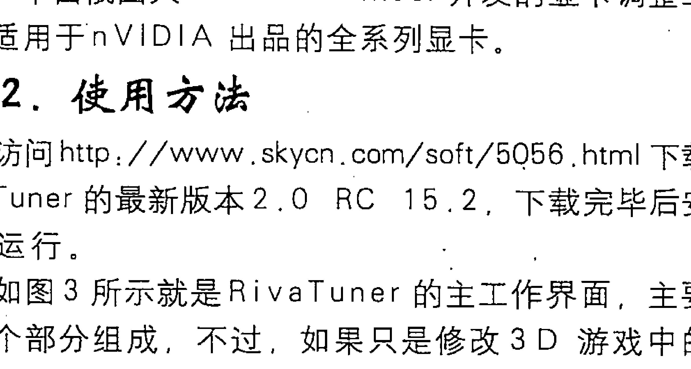

在Main 面板点击Driver settings 栏中 "Customize..." 字样旁边的小三角，会弹出一组7个图标，将鼠标停留在第6 个图标上片刻，会显示 "60Hz refresh rate fix wizard" 字样，这就是用来修正Windows 操作系统刷新率Bug 的工具了。点击该图标，在弹出的设置面板上选择你游戏时常用的分辨率，将后面Minimum refresh rate 选项处设为85Hz，然后点击面板下方的 "✓" 形按钮选中所有显示方式，最后点击 "Install" 按钮应用设置并重启系统即可。

#### (二) ATi Radeon RefreshRate Fix

##### 1. 简介

同RivaTuner一样，ATi Radeon RefreshRate Fix 也是一个可用于锁定显卡刷新频率的工具，不同的是，它是针对ATi 系列显卡的。

##### 2. 使用方法

ATi Radeon RefreshRate Fix 的使用非常简单。到 http://www.mydrivers.com/tools/dir6/d2651.htm 下载ATi Radeon RefreshRate Fix，下载后无需安装，直接将其解压到本地硬盘，然后运行 "RefreshFix.exe"。然后在其运行界面左侧选择常用分辨率下的刷新频率，如你经常在1024 × 768 的分辨率下打游戏，就在1024 × 768 的分辨率后选定85Hz。设置完后点击 "OK" 按钮重启即可。

#### (三) Cheating-Death（简称CD）

##### 1. 简介

作弊者死！从名字就可以看出Cheating-Death的作用，对了，它就是《反恐精英》的反作弊插件。对于在浩方上打CS 的朋友来说，这个软件可是不可缺少的。因为很多玩家在建立服务器的时候都会开启CD，很多房间也必须开启CD 后才能进入。

##### 2. 使用方法

访问 http://www.skycn.com/soft/4900.html 下载CD客户端，双击安装包进行安装，安装程序会自动创建桌面快捷方式，双击该快捷方式运行CD，在CD运行面板上点击 "check for update" 进行在线更新。待更新完成后进入CS 进行游戏即可。

> **小提示**
不管使用什么工具调整刷新频率，都要考虑自己显示器的实际承受能力。一般来说，1024 × 768 的分辨率下，85Hz 已经足够，更高的刷新率不是每个人的显示器都支持的，太贪心可是会导致花屏的哦。

### 六、目前流行的对战平台

#### （一）浩方

官方网站：http://www.cga.com.cn
介绍：作为目前人气最高的互联网对战平台，浩方在联机对战服务方面的实力是勿庸置疑的。从2002年9 月浩方在线开始正式运营到现在，浩方对战平台已成为拥有近4 000 万注册用户，同时在线用户超过35 万。发展势头相当迅猛。其主要联机对战服务定位于竞技游戏，因此吸引了大量的年龄层较低的玩家。

#### （二）联众世界

官方网站：http://www.ourgame.com
介绍：联众世界创办于1998年3 月，其创始人之一就是著名的鲍岳桥先生，是早期网络对战平台的代表。同浩方不同，联众提供的全部是棋牌类的休闲游戏。长期的稳定发展，为联众聚集了庞大的用户群，注册用户高达一亿以上，是目前世界最大的游戏娱乐网站之一。

#### （三）QQ对战平台

官方网站：http://gamezone.qq.com/battle
介绍：没错，这正是经营网络即时通信软件QQ 的那家腾讯公司推出的对战平台。注意，和以前大家所知道的QQ 游戏不同，这个可是货真价实的对战平台。虽然目前QQ 对战平台推出不久，支持的游戏比较少，人气也相对单薄。不过，凭着腾讯QQ 的大量用户，我们没理由怀疑QQ 对战平台的竞争力。另外，QQ 对战平台的一个过人之处就是：任何一个QQ 用户都可以凭自己的QQ 账号登录平台，省去了麻烦的用户申请。另外，其平台界面也的确很 "Q"。具体怎么样，用了就知道。

#### （四）互联星空XPlay对战平台

官方网站：http://gd.chinavnet.com（互联星空广东站）
介绍：XPlay 是广东互联星空推出的联机对战服务，支持目前流行的大多数竞技类游戏。

> **小提示**
虽然各个服务商推出的游戏对战平台都提供大致相同的功能，但是其系统要求和配置方法可能有所不同。如对浩方来说，并不需要计算机安装IPX协议。可是对于互联星空XPlay来说，IPX/SPX兼容协议则是必不可少的。因此，用户在使用不同的对战平台客户端时，务必按照其官方站点的说明进行基本设置。

## 轻松打造精彩博客

文/彭文波

不经意间，Blog已经悄悄地走进了我们的网络生活。Blog也称为博客，它是Web Log的缩写，意为网络日志，也可以解释为使用特定的软件在网络上出版、发表和张贴文章的形式。不同Blog的内容和目的有很大的不同，从对网络资源的整理与评论，到有关公司、个人的构想，从新闻到日记、照片、诗歌、散文，甚至科幻小说都应有尽有。它的拥有者可以是个人，也可以是团体。从样式上看，Blog是类似于留言本模样的网页，设计比较简洁：横幅、日历、按照年份和日期先后顺序排列的日志等。因此，网页的设计已变得不重要，内容成为最吸引人的地方。当然，我们也可以使用ASP及PHP等编程语言开发一个Blog，不过这涉及到专业的网页制作知识，而且成本也高，所以最简单的方法就是找一些提供Blog托管服务的网站。

### 一、获得个人网络日记本

下面，我们以国内著名的“博客中国”（http://www.blogchina.com/）为例进行介绍。登录BlogBus站点，点击右边的“博客中国注册”按钮，进入“http://www.blogchina.com/reg.html”注册页面。进入“博客公社”后，单击“点击注册博客公社账号”按钮，在注册界面输入用户名、密码以及电子邮箱这三个信息，然后点击“下一步”按钮，给博客起个名字并选择你喜欢的模板。完成上面的“三步曲”后，现在要开始申请博客中国二级域名，以后我们可以直接使用此域名访问博客。提示注册成功后，在IE地址栏输入“http://whpublish.blogchina.com/”这样的地址就可以看到我们盼望已久的Blog了。

### 二、为个人博客主页添砖加瓦

#### （一）设置类别

最开始是一个空白的模板。为了丰富主页的内容，我们可以对博客内容按照内容进行分类。在博客首页，点击其中的“管理入口”链接，将进入Blog后台管理中心。初次登录的时候，需要建立一个分类，如“Linux技术”。如果要修改文章分类，可直接点击文章分类的名称。如果要删除分类，选中要删除的分类，然后点击下方的“删除”按钮即可。一旦删除某个分类，该分类下面的文章也会同时被删除。如图1所示。

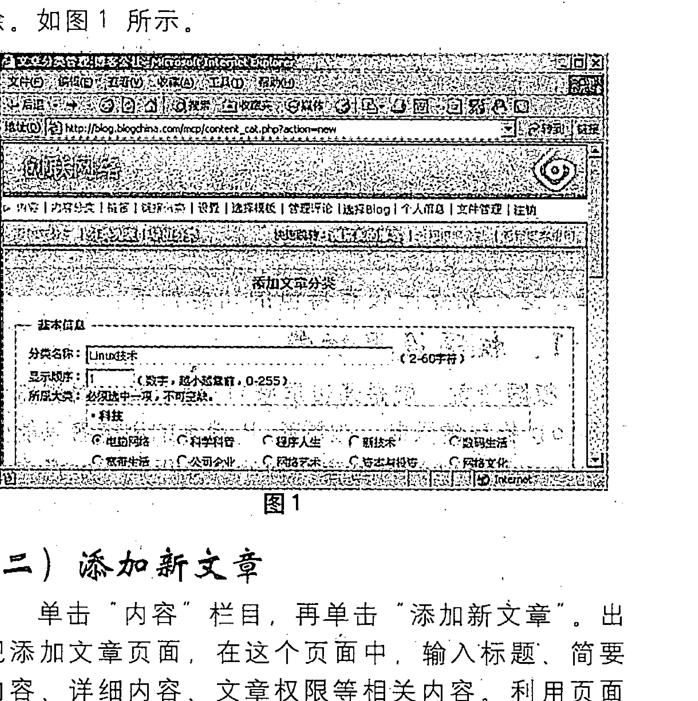

> **小技巧**
为了使页面显示更合理，我们可以在“设置”页面中进行如下参数设置：博客类型、名称和外观、首页显示参数（包括首页显示文章数、最新发表文章数、是否在首页显示文章主体和“阅读全文”链接）、其他杂项（包括开启可视化编辑器、是否开启评论功能、服务器时差校正等）等。

#### （二）添加新文章

单击“内容”栏目，再单击“添加新文章”。出现添加文章页面，在这个页面中，输入标题、简要内容、详细内容、文章权限等相关内容。利用页面上的功能按钮可以在内容中插入诸如图片、Flash动画、视频和一些文字特效等。设置完毕，提交文章即可发表到我们的博客页面了。

#### （三）管理博客

友情链接。通过这样的链接，我们可以很方便地访问自己所喜欢的优秀站点。链接分类将有助于您根据链接的性质分门别类，点击“链接”和“链接分类”就可以对这些链接进行管理。

模板。如果我们对默认的模板不满意的话，那么可以使用“选择模板”功能进行管理。点击进入设置界面，就可以选择任一款的模板取代默认样式。

此外，我们还可以修改个人信息、对评论进行管理、上传文件等。灵活设置这些功能，就可以打造一个完全适合自己个性的博客。

### 三、精彩博客资源点评

大部分网站在发布与维护Blog的基础操作其实都是大同小异的。但是，由于每个网站设计风格不一样，具体到Blog管理功能上，它们自然是各有千秋。我们精选了几个提供Blog服务的站点，并介绍它们的一些特色功能，以帮助用户找到适合自己的Blog乐园。

#### (一) 中国博客网

站点地址：http://www.blogcn.com

该网站的Blog的功能非常强大，是一个不错的选择。这个站点比较有特色的功能如下：

##### 1. 权限设置功能

“权限设置”就是通过屏蔽IP地址实现对浏览者在Blog操作的限制，被屏蔽IP地址的浏览者只能阅读Blog而无法进行留言或评论。如果有人故意在你的“领地”捣乱，点击“控制面板”页面管理菜单中的“权限设置”，在“添加IP”栏中输入要屏蔽IP地址和屏蔽的原因即可。

##### 2. 设置Logo功能

点击管理菜单的“编辑模板”，再选择“属性编辑”，在“模板编辑”界面中点击“设置Logo”栏的“更新Logo”链接，在新页面中输入Logo图片的地址，就可以添加个人标志。

#### (二) 博客动力

站点地址：http://www.blogdriver.com

这个站点比较有特色的功能如下：

##### 1. 多用户操作功能

“博客动力”设置多用户的方法与其他网站不同，进入Blog管理中心后点击页面顶端的“Blogger”按钮，在下拉菜单中选择“团队Blogger管理”，接着在新窗口的“新增Blogger”文本框中输入用户名。只有当对方接受了邀请，他才能成为Blog成员。

##### 2. 添加Logo功能

虽然“博客动力”本身并没有专门的Logo设置选项，但是通过设置“我的收藏夹”同样可以实现“另类”的Logo效果。点击“Blogger”按钮，在弹出菜单中选择“收藏夹管理”，在“新增书签组名”文本框中输入组名，同时选中“图片类型”复选框，再点击“创建书签组”按钮。操作成功后，点击这个组，在新页面的“新增图片地址”中输入Logo图片的地址，在“URL”中设置为空即可。

#### (三) BlogBus.com

站点地址：http://www.blogbus.com

这个站点很值得推荐，功能也很有特点，简述如下：

##### 1. 文件上传功能和备份功能

点击管理菜单的“文件管理”，再点击“浏览”按钮，在弹出窗口中选择所需要的文件，上传至站点后再复制该文件URL地址，在撰写时粘贴进去即可。如果要备份文件，打开“备份数据”页面，输入备份Blog开始和结束的日期，点击“开始”，稍等片刻这些数据就将保存到你的硬盘上。

##### 2. 回复功能

每个浏览者都可以对Blog进行即时评论，作者可以对某一个评论进行直接一对一的回复。

##### 3. 访问统计功能

用账号登录后进入Blog后台管理中心，能看到完整的访问统计。

##### 4. 加锁功能

如果你只希望和熟悉的朋友一起分享Blog，那么干脆给Blog加把“锁”。点击“管理”菜单的“修改设置”选项，在界面中找到“访问密码”并输入密码，完成后重新访问Blog，首先看到的将是密码窗口。

目前，网络上提供博客服务的网站很多，比较知名的还有“歪酷博客”(http://www.yculblog.com)、CSDN (http://blog.csdn.net) 等，读者朋友可以多多体会。在Blog为我们创造的网络世界里，只要我们愿意去写，就可以成为Blog的主人。我们不仅可以记录一切，还可以通过Blog找到一帮志趣相投的朋友。另外，阅读他人的Blog，我们还可以获得最新的信息，学习最新的知识。

## 大众娱乐新时尚——网络音乐翻唱

如今网络已经进入了千家万户，与此对应的，网络上的娱乐方式也是越来越多。老是守着游戏、聊天那几样，你肯定是免不了落伍的。这不，今天笔者要为大家介绍的，就是时下网络上很流行的一种娱乐方式——网络音乐翻唱。

### 一、什么是网络音乐翻唱

想要弄清楚什么是网络音乐翻唱并不困难。只要把眼光转到现实中就行。我们常常可以在一些娱乐节目中看到一些歌手将经典歌曲翻新，或配上新的歌词，或加上新的节奏，以另一种方式表现出来。一般这种艺术表现方式被称为“老歌翻唱”。

网络音乐翻唱的形式也大致如此，不过是借助网络平台发布，交流音乐作品而已。但就是因为网络化，才为网络音乐翻唱带来了独特的优势：在现实中，想到舞台上为大家一展歌喉，对多数人来说，都只是个梦想而已，因为上舞台的机会毕竟非常有限。可在网络上，这种情况就完全不存在了，音乐爱好者们可以利用自己的个人计算机录制和加工音乐作品，然后自由地发布在互联网上。如果作品获得网友的首肯，就会广为流传，就像前段时间流行的《大学自习室》一样。

### 二、进行翻唱前的准备工作

“工欲善其事，必先利其器”，在真正开始动手录歌之前，必要的准备工作是少不了的。

##### 1. 硬件环境

录制一首歌曲对硬件并没有什么太苛刻的要求，一台普通的多媒体电脑加上一块好一些的声卡就完全能应付，再加上一个耳机，一个麦克风就组成了我们的全套装备。不推荐大家使用耳麦，因为市场上常见的耳麦录音效果非常差。

#### 2. 软件环境

要录制并编辑处理自己的音乐作品，最好需要一个稳定的运行环境，对于家庭用户来说，最好是能够选用Windows XP系统作为操作平台。此外还需要用到一些专门的音频处理软件，见表1。

| 软件名称 | 用途 |
| :--- | :--- |
| Cool Edit Pro 2.0 | 音频录制、处理软件 |
| http://www.163888.net/tools/cooledit2setup.exe | |
| Sound Forge 7.0 | 音频录制、处理软件 |
| http://member.skycn.com/soft/1911.html | |
| Ultrafunkx 2 | 后期音效处理插件 |
| http://www.163888.net/tools/ultrafunk2.zip | |
| Wave 3.0 | 后期音效处理插件 |
| http://www.163888.net/tools/waves.zip | |
| BBE Sonic Maximizer | 后期音效处理插件 |
| http://www.163888.net/tools/bbe.zip | |

虽然录歌最好使用好的麦克风，不过这不意味着你一定要去购置昂贵的专用麦克风。其实，家用VCD上的麦克风就能满足一般的需要，只需要配上一个转接头，就可以直接在电脑上使用，效果也还不错。当然，购置专业的麦克风，效果当然更好。

### 三、实战录歌

好了，既然软硬件都已准备就绪，那就闲话少说，直接切入正题吧。

#### （一）准备原声伴奏

想要进行翻唱，首先必须获取原声伴奏，也就是那种去除了人声的原声背景音乐（类似卡拉OK伴奏那样的）。可以通过以下两种方式获取：

##### 1. 下载现成的原声伴奏

如果你打算录的是那种非常经典的歌曲，这类伴奏音乐多半可以在网上找到现成的，很多音乐网站也会提供这样的伴唱下载。只需运用搜索引擎搜搜看，多半会有收获。

##### 2. 自己制作原声伴奏

网上能够找到的伴唱曲目毕竟有限，如果你要翻唱的歌曲，找不到原声伴奏，可以自己动手“DIY”一个出来！

制作原声伴奏的基本原理无非是将歌曲中的人声去除，而做到这一点并不太难，只需要使用 Cool Edit Pro 即可。

**第一步**

运行 Cool Edit Pro，点击工具栏最左侧的切换为波形编辑界面按钮，打开多轨道编辑界面，如图 1 所示。

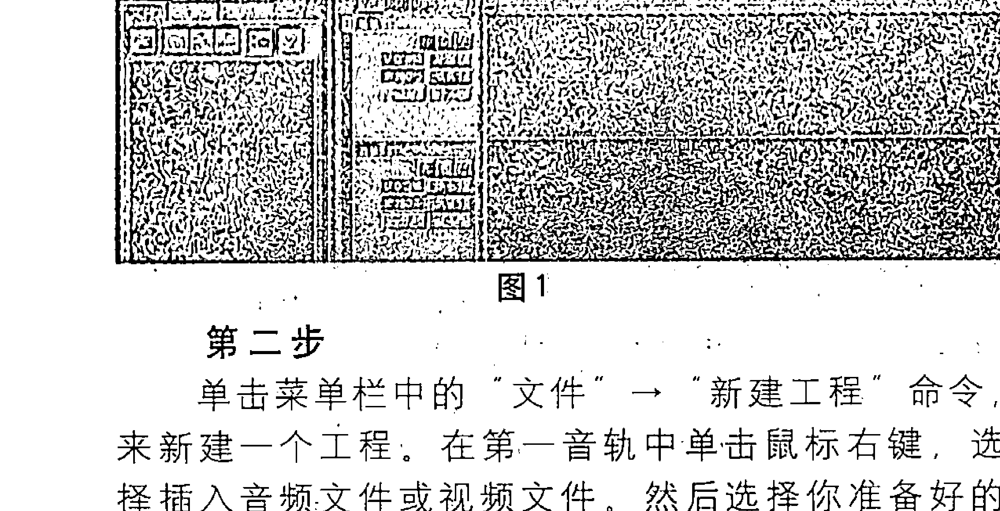

**第二步**

单击菜单栏中的 “文件” → “新建工程” 命令，来新建一个工程。在第一音轨中单击鼠标右键，选择插入音频文件或视频文件。然后选择你准备好的音视频文件并将其打开。Cool Edit Pro 会自动读取文件，然后将其放置到编辑轨道上。

**第三步**

双击音频轨道进入波形编辑界面。如果你打开的文件是一个视频文件（如VCD），那么 Cool Edit Pro 将会把音频视频分别放置在两个不同的轨道上。我们编辑的是音频轨道，不要选错了。

如图 2 所示就是 Cool Edit Pro 的波形编辑界面，点击菜单栏中的 “效果” → “波形振幅” → “声道重混缩” 命令，然后在 “声道重混缩” 面板上的 “预置” 列表中选择 “Vocal Cut”，其余选项保持默认设置不变，单击 “确定” 按钮。

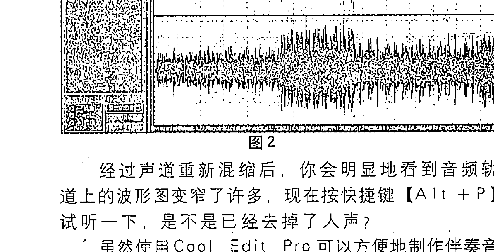

经过声道重新混缩后，你会明显地看到音频轨道上的波形图变窄了许多，现在按快捷键【Alt + P】试听一下，是不是已经去掉了人声？

虽然使用 Cool Edit Pro 可以方便地制作伴奏音乐，但是软件的使用向来是因人而异，从没有哪款软件可以吃遍天的。因此笔者有必要再介绍使用另一款著名的音频编辑软件——Sound Forge 来制作伴奏音乐的过程。

运行 Sound Forge 7.0 并新建一个工程。单击 “File” → “Open” 命令打开要处理的文件。单击菜单栏上的 “Process” → “Channel Converter”，在 “Preset” 下拉选项中选择位于最下面的 “Vocal Cut”。

在 “Vocal Cut” 工作面板上单击 “Preview” 按钮预览经过处理后的声音，同时可以按照预览效果拖动左右声道的滑块进行调整，待收到满意结果后单击 “OK” 按钮对音乐进行处理即可。

使用上述的方法制作伴奏音乐虽然方便，但是却有很大局限性。因为这种方式多半只是将立体声部分不分青红皂白地全部去除，而很多歌曲是经过混响的，背景音乐和人声早就混到了一起，所以即使经过消声后，还是有人声混杂其中。而且，对于有的音频文件，这种方法的去人声效果非常差。因此，如果需要高质量的伴奏音乐的话，还是需要使用音乐制作软件照着谱子自己制作。当然这牵扯一些专业知识，难度也较大，有兴趣的读者可以自行尝试。

#### （二）开始录音

**第一步**

首先确保你有个安静的录制环境。接下来关闭音箱，戴上耳机监听背景音乐，同时认真调试好总音量和麦克风的音量。这一点同样重要，因为麦克风音量过大，往往会引起爆音，使歌曲失真。

**第二步**

双击桌面右下方系统托盘上的音量图标，打开 “主音量” 面板。单击 “选项” → “属性” 命令。在 “属性” 面板中设置当前操作为 “录音”，同时在 “显示下列音量控制” 栏中只保留 “麦克风” 一项，因为我们将要录制的只是自己的歌声。

**第三步**

运行 Cool Edit Pro，打开多轨道编辑界面。用鼠标右键单击音轨 1，插入准备好的伴奏音乐。

**第四步**

单击第二音轨右侧的红色 “R” 按钮，将音轨 2 设置为录音轨道。全部设置完毕后可以点击 Cool Edit Pro 左下方的红色录音按钮。然后跟随伴奏音乐的节奏开始演唱并录音即可，如图 3 所示。

**第五步**

录音完毕后，再次单击红色录制按钮停止录音。现在你可以点击播放按钮试听，看看效果以及是否需要重录。确认没有问题后，就可以双击音轨 2 进入波形编辑界面，然后使用菜单栏上的 “另存为” 选项将你录制在音轨 2 上的原声保存为 WAV 或者 MP3 格式即可。

#### （三）后期处理

刚才录下来的歌曲只能算是初级产品，听起来还很粗糙。我们需要进行一系列的后期处理，才能让作品更加完美。后期处理主要包括以下几个步骤。

##### 1. 降噪处理

录制歌曲的时候，我们总是无法避免环境噪音的影响，这对于没有专用录音场所的业余音乐爱好者就尤其严重。所以，要想叫你的作品达到“高音甜、中音准、低音沉”的效果，首先就要进行降噪。

**第一步：噪声采样**
这个过程实际上是在录歌前进行的，所谓噪声采样，就是使用音频编辑软件录下一段环境音，然后供降噪程序进行分析，最后去除录音中的环境噪音。现在回到录制歌曲前的第一步，先不要插入伴奏音乐，而是将第三个声音轨道设定为录音轨道，然后点击录音键，这时你先不要出声，直接录下一段空白的噪声并保存成WAV文件。录制完后双击进入单轨模式，选择“效果”→“噪声消除”→“降噪器”，选择“噪声采样”，采样完毕后点击“关闭”按钮，然后取消第三轨道为录音轨并删除该轨道上的音频信息。

**第二步：去除噪声**
录歌完成后，双击录音轨道进入波形编辑界面，单击“效果”→“噪声消除”→“降噪器”命令。因为我们录音前就已经进行过噪声采样，所以现在可以直接点击“确定”按钮进行降噪处理。如果嫌效果不好的话，你也可以点击“预览”按钮，然后拖动采样窗口中的直线进行调节，直到得到满意的效果为止。

##### 2. 高低音处理（高音激励）

这一过程可以调节所录人声的高音和低音部分，使高音和低音部分更加分明，这样可以使得声音显得更加清晰明亮或是厚重。而激励的作用，在于对声音进行修饰和美化，产生悦耳的听觉效果。下面我们就开始介绍如何使用BBE Sonic Maximizer插件对作品进行处理。

**第一步：安装插件**
BBE Sonic Maximizer是一个专用的激励器插件，可以方便地对音频信息进行处理。下载后点击Setup.exe进行安装。安装完毕后，运行Cool Edit Pro，进入波形编辑界面，单击“效果”→“刷新效果列表”命令，然后进入“DirectX”列表，这时你会发现多了很多特效，BBE Sonic Maximizer也在其中。

**第二步：进行处理**
录歌完成后，双击录音轨道进入波形编辑界面。单击“效果”→“DirectX”命令，在特效列表中选中BBE Sonic Maximizer。BBE Sonic Maximizer的操作界面很简洁，操作起来也很方便：你可以直接选用预置选项，或者点击“预览”按钮后手动调节，得到满意效果后点击“确定”按钮即可。

##### 3. 压限处理

和激励主要处理高低音不同，压限主要是调整声音的大小动态范围。就是将声音小的地方加强，将声音过大的地方减弱。这样处理过的声音听起来会更加自然、均衡，不会有突兀的感觉。

使用Cool Edit Pro做压限处理也需要依靠插件来完成，这方面比较常用的插件有Waves和Ultrafunk等，我们分别以它们为例来说明这一过程。

双击录音轨进入波形编辑界面，单击“效果”→“DirectX”→“WavesC4”命令，然后在WavesC4的工作面板上的“预置”选项中选择“Pop Vocal”或者“Vocal”，点击“确定”按钮即可。

另一方面，如果读者朋友打算使用Ultrafunkx进行压限处理的话，则要选择“效果”→“DirectX”→“Ultrafunkx”→“compressor”命令，它的使用方法和WavesC4基本一致，只要按照上述方法操作即可。

和高音激励一样，压限处理插件也提供了手动调节功能，如果你对预置选项不满意的话，你也可以手动进行调节。当然，这需要具备一些专业知识才可以。

##### 4. 添加混响效果

混响纯粹是对音频的一种美化，让歌声听起来更具有空间感，更“通透”。我们可以使用Ultrafunkfx的Reverb功能来实现它。

双击录音轨进入波形编辑界面，单击“效果”→“DirectX”→“Ultrafunkfx”→“Reverb”命令。同上边介绍过的插件一样，Ultrafunkfx Reverb也提供了很多预设选项，多数情况下，我们只要点击“预览”按钮，然后从“预设”列表中选择不同的预设项，直到得到满意的效果就可以了。

#### （四）输出作品

做完混响这一步，录音的后期处理工作也就基本完成了，还有最后一项，就是输出作品。

**第一步：合并音轨**

在第三音轨上单击鼠标右键，在弹出的菜单中选择“混缩为音轨”→“所有波形”选项，这样就把伴奏乐和人声混合到了一起。

**第二步：输出为MP3**

双击第三轨进入波形编辑界面，选择菜单栏中的“文件”→“另存为”选项，选择保存格式为MP3并为新文件命名后点击“确定”按钮即可。

> 小提示：慎用后期处理
> 后期处理虽然可以让声音听起来更美妙些，但绝不是灵丹妙药。比如降噪虽然可以降低部分环境噪声，但是它只能去除比较均匀的环境噪声，对于突如其来的汽车或者敲门声，绝对是无能为力的。因此，有个比较安静的录音环境，还是非常重要。此外，降噪也不是用的越多越好，因为过度的降噪会引起声音失真，反而得不偿失。同理，无论是高音激励、压限处理还是混响，都要适可而止，过度的处理只能得到相反的效果。

### 四、上传并发布作品

辛辛苦苦录歌，绝对不是为了自己听的，而是想要让大家欣赏到你的作品，就要把它上传到提供网络翻唱发布服务的网站。眼下有很多网站提供这样的服务，我们就以“163888华人娱乐门户”(http://www.163888.net/)为例来说明如何发布自己的作品。

**第一步：注册会员**
在翻唱网站发布作品，一般都要求会员身份，163888也不例外。点击首页上方的“注册会员”链接进入注册页面，然后按照提示完成注册过程即可。

**第二步：上传歌曲**
使用刚刚注册的用户名登录“华人娱乐门户”网站，进入“会员管理中心”，点击左侧工具栏上的“歌曲管理”链接，进入“歌曲管理”页面后点击“上传歌曲”链接。
“华人娱乐门户”网站现在提供有两种上传方式：新组件上传和旧式上传，如果你打算用“华人娱乐门户”自己开发的组件上传的话，可以在提示选择上传方式时选择“确定”按钮，反之则点击“取消”按钮。
选定上传方式后，点击“立刻安装”按钮，IE会自动下载上传插件并进行安装，安装完成后就可以进入上传页面了。
在上传页面填写作品的相关信息，如歌曲名称、类别、演唱者、作品的简单说明等等。填写完毕后点击“浏览”按钮选择你录制的MP3文件。最后点击“上传”按钮进行上传即可。

**第三步：创建专辑**
可能你录制了不止一首歌曲，那样，你完全可以把它们放到一个专辑里面，既方便管理，也易于别人欣赏。
进入“会员管理中心”，点击左侧工具栏上的“专辑管理”链接，进入专辑管理页面后点击上方的“发布专辑”链接。接下来编辑专辑信息，如专辑名、主打歌曲、简介、专辑封面等，编辑信息完成后再从自己上传的歌曲列表中选择需要加入专辑的歌曲。待全部完成后点击“保存”按钮。

**第四步：获得更多的权限**
虽然我们可以在“华人娱乐门户”免费注册会员并发布歌曲，但是默认情况下，免费会员只拥有16MB上传空间，并且上传作品也只保存30天。所以如果想获得更多的权限，就需要升级为VIP会员。
点击“华人娱乐门户”会员管理中心导航栏上的“缴纳费用”链接，进入“缴费”页面。“华人娱乐门户”提供了多种方式成为VIP会员，如在线支付、手机代缴费等等。只要按照网页向导进行操作即可，成为VIP会员后可以得到64MB～256MB不等的上传空间，而且作品可以长期保留。不过，这一过程需要收取用户60元～180元/年的服务费，是不是成为VIP用户，就看你自己了。

### 五、网络翻唱资源汇总

对于刚刚接触网络翻唱的朋友，开头总是遇到这样那样的困难，别的不说，先寻找资源就要花上不少工夫。不过没关系，笔者将网络上有关网络翻唱的网站资源整理汇总了一部分，应当对初学者有所帮助。

#### （一）伴奏音乐资源

- 九天音乐网
  网页地址：http://show.9sky.com/comusic/singer.asp
- 亚东音乐——葫芦丝
  网页地址：http://www.ydmusic.net/accompany/accompany-hls-bz.htm
- 163888华人娱乐门户
  网页地址：http://www.163888.net/sing/blist.asp
- E音伴奏
  网页地址：http://www.banzou.cn/
- 仙来居
  网站地址：http://www.xianlai.net/index.php

#### （二）歌词资源

- 放肆音乐通
  网站地址：http://www.yemusic.com/
- 18G音乐公社
  网站地址：http://www.e-jnet.net/18g/
- Souga歌词搜索
  网页地址：http://www.haodx.com/url/4559.htm
- LRC歌词世界
  网站地址：http://www.51lrc.com/

#### （三）提供发布翻唱作品的网站

- 163888华人娱乐门户
  网站地址：http://www.163888.net
  简介：“163888华人娱乐门户”于2003年6月开始运营，目前拥有注册会员35万。拥有伴奏音乐3610首，会员上传歌曲31370首，成为互联网中发展最快的翻唱网站。如果你有实力，还有机会成为签约歌手。
- 九天翻乐行
  网站地址：http://show.9sky.com/
  简介：这是“九天音乐网”开设的翻唱频道，虽然只是一个频道，但凭借“九天音乐网”在线音乐方面的强大实力，同样不可小视。目前“九天翻乐行”拥有大量的伴奏音乐可供下载，同时又有大批音乐爱好者在上面交流作品。
- KOKOMUSIC
  网站地址：http://www.kokomusic.net/
  简介：个人音乐爱好者建立的翻唱网站，创始人正是前段时间其翻唱作品在网上掀起下载狂飙的Koni。其歌手发布区和论坛都是音乐爱好者聚集的地方。由于网站的非官方身份，这里的气氛更加亲切一些。
- SoGua娱乐论坛
  网页地址：http://bbs.sogua.com/list.asp?boardid=16
- 乐人网
  网站地址：http://www.52cool.net/

---

## 《用Word巧妙打印证件》改良
文/陈桂鑫

2004年第16期现代办公《用Word巧妙打印证件》的操作印一张5行5列的照片得25遍的粘贴、空格、回车，而且用行间距字号调整间距很不直观。其实在Excel中进行打印要简单得多了。只要一次复制粘贴即可完成，你甚至可以用填充功能进行复制。

1.  打开Excel 2003，选中A1单元格，插入所需照片，双击打开“设置图片格式”在“属性”选项卡中选中“大小固定，位置随单元格而变”。
2.  按Ctrl+A键选中全部表格，拖动A1行标、列标的边界调整使单元格的大小比照片略大。单击菜单栏中的“工具/选项”，在“编辑”选项卡中单击√选“对象随单元格同剪切、复制和排序”。
3.  选中A1单元格复制，再选中要打印照片的行列数如A1：E6，右击选择粘贴，你马上可以看到照片已经自动复制成5行6列并排列好了。当然，你也可以直接拖动A1的填充柄进行复制填充。
4.  如果想调整照片间距只要再按住Ctrl+A键选中全部表格，拖动调整单元格的大小即可。

# 图解3DS MAX 5.0
## 手把手教你做客厅
文/张亚楠

你听说过3DS MAX吗？它是目前应用最为广泛的三维建模、动画及渲染软件。但它又不仅仅是一种操作软件，在建筑设计和动画创作等应用领域，它更是一种艺术表现形式。它可以将你想象的空间变为真实的画面，立体甚至是活动地展现在你的面前。目前使用最为普遍的3DS MAX 5.0品质更精良，操作更简便，它拥有交互式的操作环境，更先进的建模方法、灯光系统等等。总之，对于初学者来说，能够从3DS MAX 5.0这一版本来开始学习，是一个良机。这里将以一个很简单的客厅效果图制作为例，介绍一些3DS MAX最基本的操作。

每个人对家都有一个美丽的梦想，现实中有太多的因素不能让你把它变得完美，但在3DS MAX的世界里，只要你能想得到，它都能帮你做到。来吧，就让我们一起进入它的国度，建造你的梦想家园！

首先，双击桌面上的3DS MAX 5.0图标，打开软件。如果你是第一次接触它，你也许会发现界面那么复杂，而且全是英文，太难了。不要害怕，它看起来复杂，可操作并不是十分困难，我的经验加上你对家的渴望，一切就OK！

我先给大家介绍一下它的界面吧（图1）！

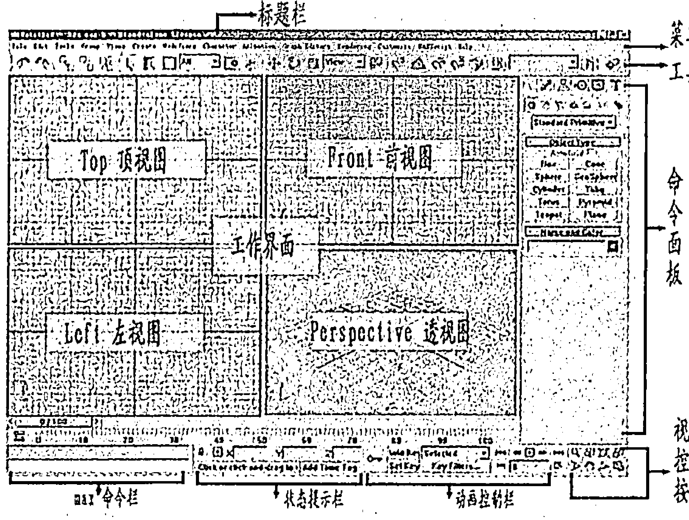

对了，你要注意的是，这图里我提到的名称，在以后的操作中会时常用到，你一定要记住哦！不过记不住也不用着急，就多回来看几次这张界面图嘛！

了解了程序界面之后，我们要做一项准备工作。不论是建筑、家具都有一定的尺寸，所以我们首先要做的是设定单位。步骤如下：选择菜单栏Customize项中的"Units Setup…"，打开一个对话框，点击"System Unit Setup"按钮弹出一个对话框，选择下拉列表中的Millimeters项，点击“OK”按钮，将单位设置为毫米。

准备工作就绪后，我们就可以开始构图了。

### 一、做地面

- （一）点击命令面板Create项中Geometry下的Box按钮（图2）。

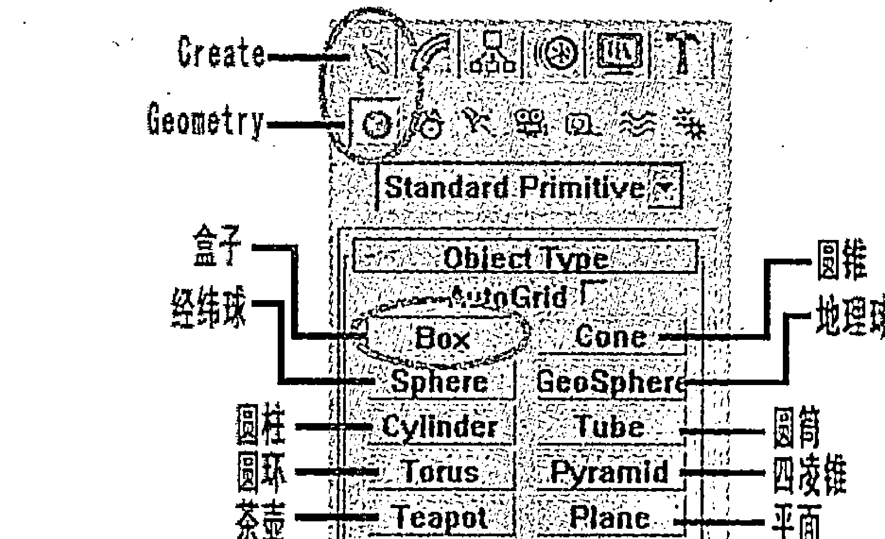

- （二）在Top顶视图中按住鼠标向箭头指示方向绘制一个任意的Box（图3）。


- （三）回到命令面板，在卷展栏中设置如图4所示的数值，按回车键即可。

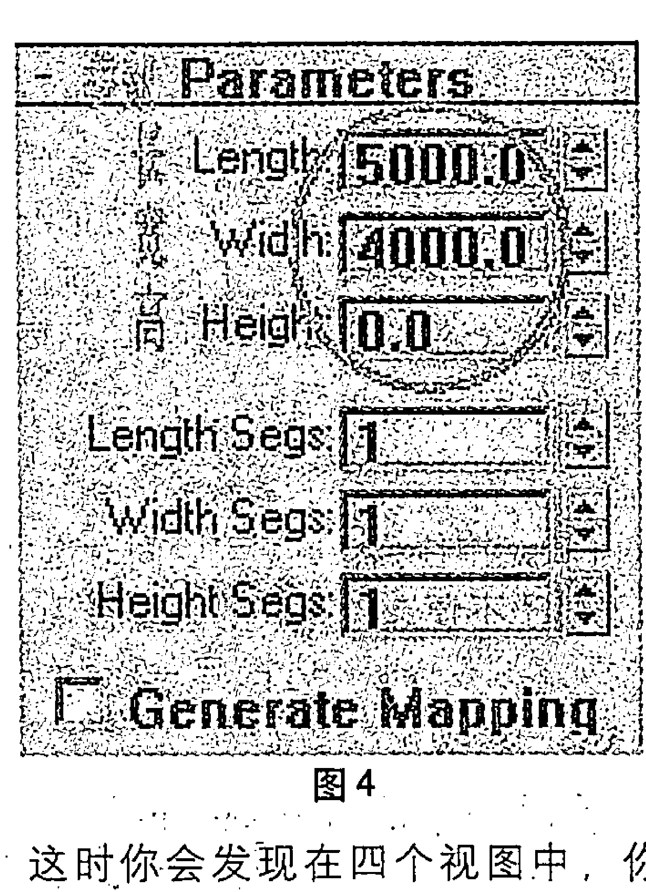

- （四）这时你会发现在四个视图中，你看不到一个完整的 Box 。没关系，你只要用鼠标右键点击一下 Top 视图（注：这是选择视图的基本操作方法，以后常用），再敲击 Z 键（注：这是自动缩放的快捷键，是基本操作），软件将自动设置图形在视图中显示的大小。凡是基本操作的方法，你也要记住啊！它们是在作图过程中时常要做的操作，是根据你自己的需要而做的。我在以后的操作中还会告诉你一些基本操作方法的快捷键。

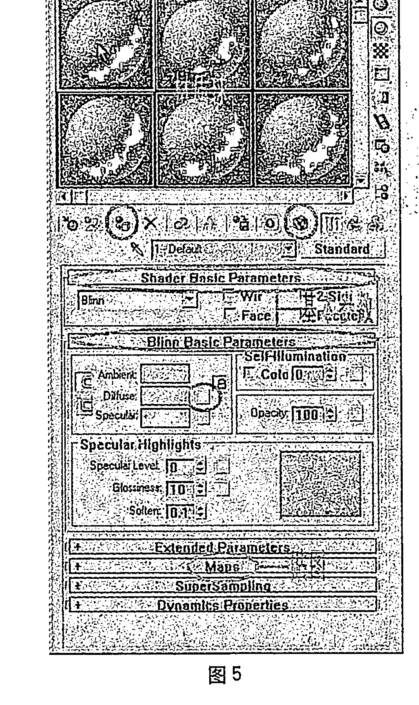

- （五）赋材质给地面（注：这一步骤在以后其他物品的创建中都会用到，很重要哦），我分几步说吧！
1. 打开材质编辑器，按工具栏上的按钮（注：你在工具栏上也许看不见这个按钮，但只要把鼠标停放在工具栏上出现一个手的形状后，按住鼠标左右移动工具栏，在右方就可以看见这个按钮了），或按 M 键也可以。如图 5 所示为材质编辑器。
2. 选中物体，在给一个物体赋材质时都必须选中它。方法是用鼠标点击要赋材质的物体即可，鼠标指针会呈现十字形状。这也是一个基本操作。
3. 点击卷展栏中 Diffuse 旁的空白按钮（图 6）。

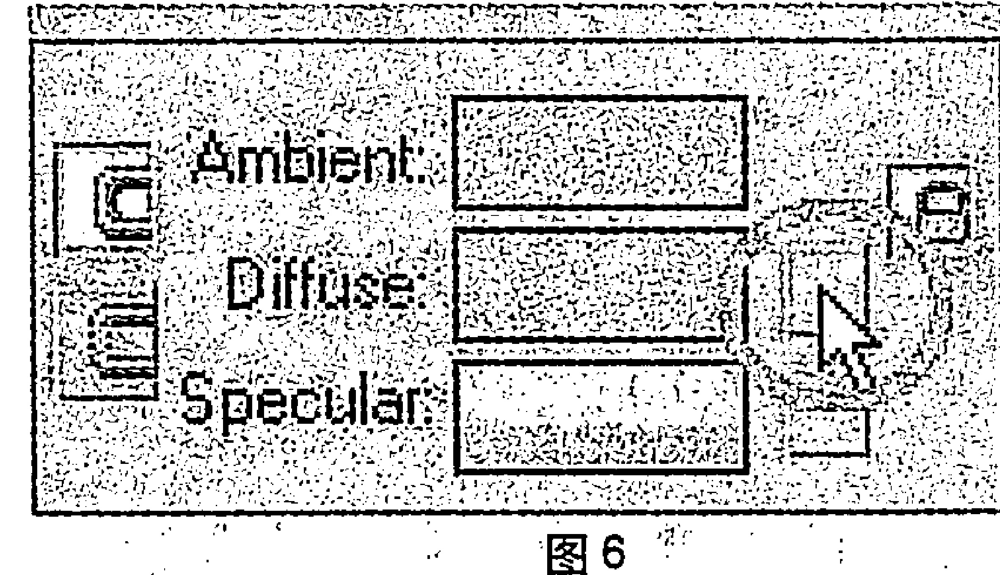

4. 弹出如图 7 所示的对话框，鼠标双击 Checker 项。

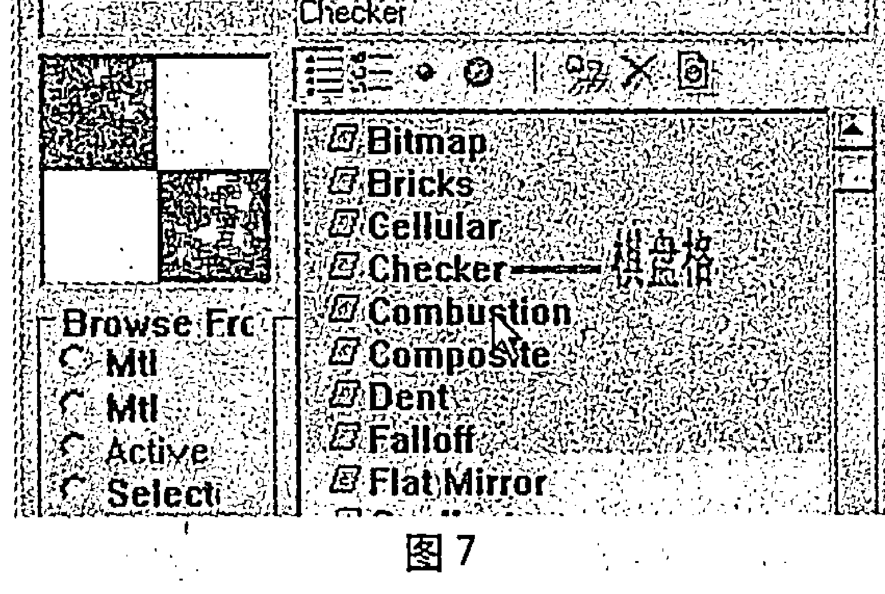

5. 弹出如图 8 所示的对话框，参照图 8 修改 Tiling 项中的数值。

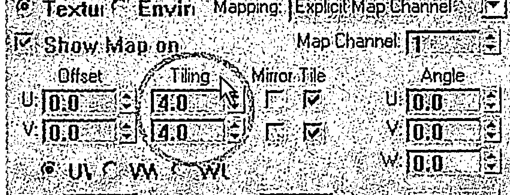

6. 点击材质编辑器中的按钮（注：这两个按钮是观察按钮，每次赋材质都要按）。观察 Perspective 透视图（图 9），然后关闭材质编辑器就可以了。

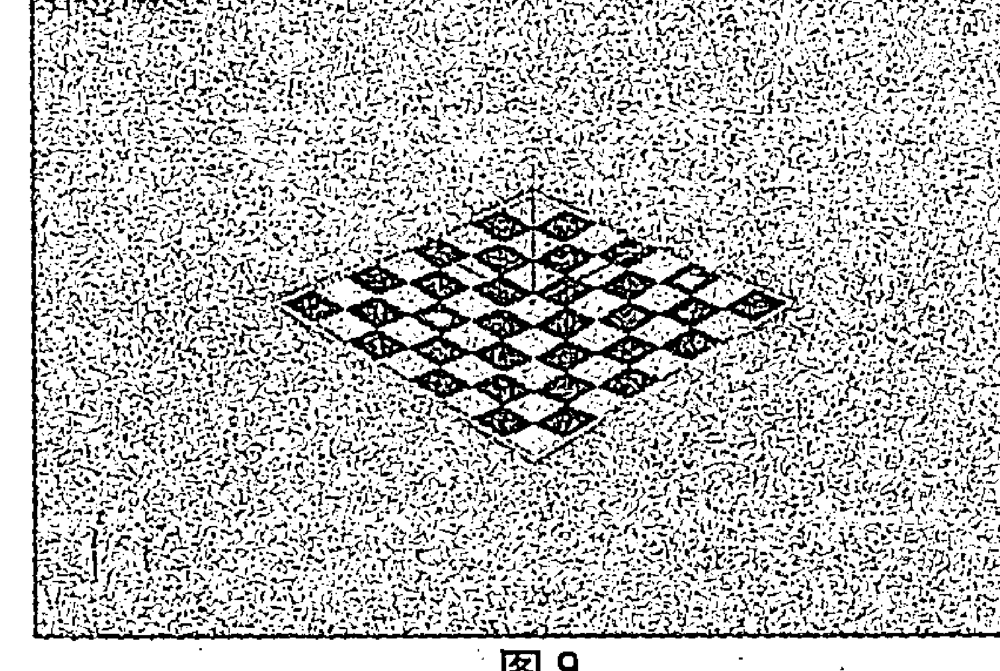

### 二、墙壁和顶子

- （一）制作后墙
使用 Box 命令在 Top 视图中任意绘制一个长方体，在命令面板中设置参数，Length为240，Width为4000，Height为2700。然后，我们将它贴近地面，这里将使用到捕捉和移动两个命令，它们是我们作图中必须用到的哦！在工具栏选择2.5维捕捉。再点击按钮（图10），在Top视图中点击后墙的左下角，这时会出现一个蓝色的十字光标。按住鼠标左键，贴近地面的左上角；蓝色十字光标再次出现，自动捕捉端点对齐（图11）。

#### （二）作两侧的墙

用Box在Top视图中任意绘制一个长方形，在命令面板中设置参数，Length为5000，Width为240，Height为2700。另一面墙我们用复制的方法来得到。选中此墙，按住Shift键，沿X轴移动它，移出一段距离后松开即可，这时会弹出一个对话框（图12）。在这里我们只复制一面墙，所以不用修改复制个数，点击“OK”按钮即可。然后将其与另一面墙对齐。

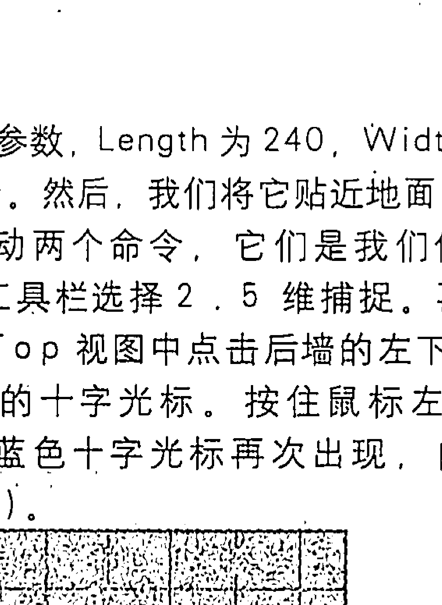


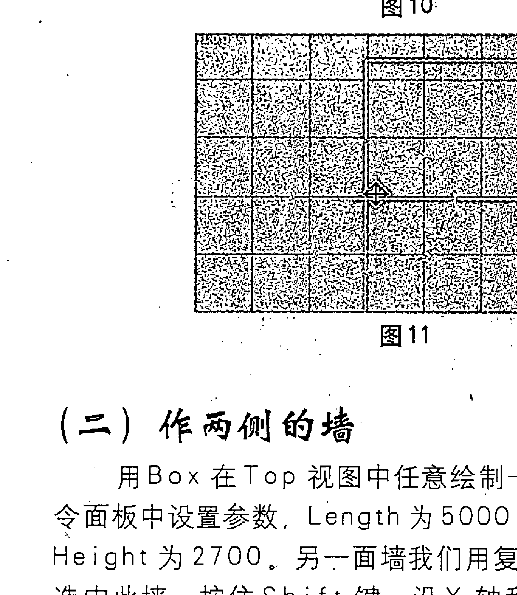

#### （三）做顶子

和刚才做墙的方法一样，把地面复制一下就好了。不过这里要注意的是，复制移动顶子时要在不同的视图中操作。你想到了吗？Front前视图和Left左视图都可以嘛（注：不同的视图有不同的操作范围与视角，在作图中要灵活运用）！

#### （四）赋材质

选中一面墙，按住Ctrl键可以同时选择其他的墙和顶子，如果顶子不便选中，可以试试在Perspective透视图中选择。按M键，选择另一个材质球，并设置相应的参数（图13）。

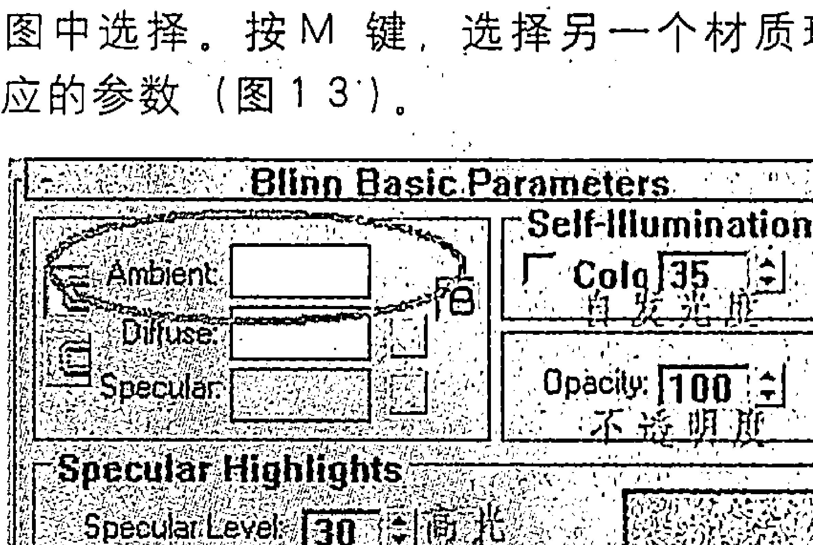

墙的颜色怎样改变呢？你只要点击图13中Ambient旁的方框，就会弹出颜色设置对话框（图14），选择一个你喜欢的颜色后，点击Close按钮就可以了。这个选择颜色的操作在以下的制图中都会用到的，聪明的你一学就会，以后我可就不重复说了。

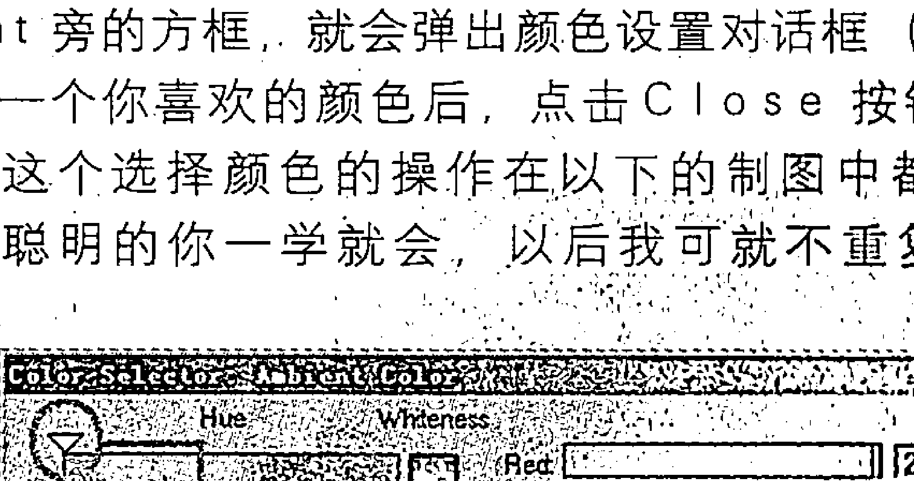

在介绍以下的制作步骤前，我向大家介绍视图控制按钮中的缩放和平移两个按钮，你可以用它们把视图放大、缩小、左移、右移，十分方便（图15）！滚动鼠标滑轮也可进行缩放操作和平移操作。

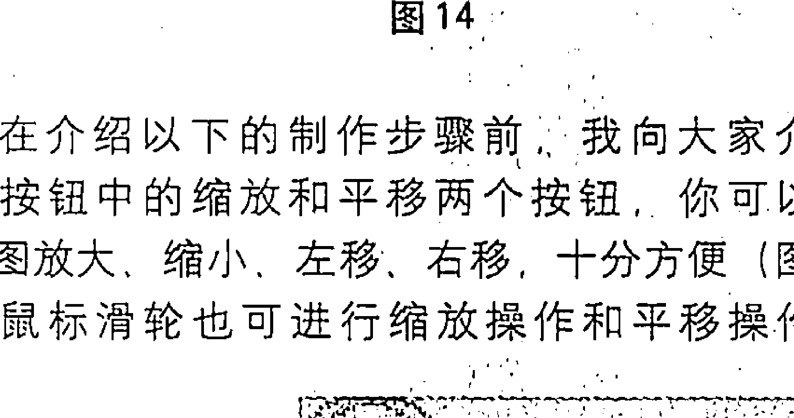

### 三、放置摄像机

- （一）选择 Create 命令面板里的 Target 目标相机按钮，设置焦距为 35mm (图16)。

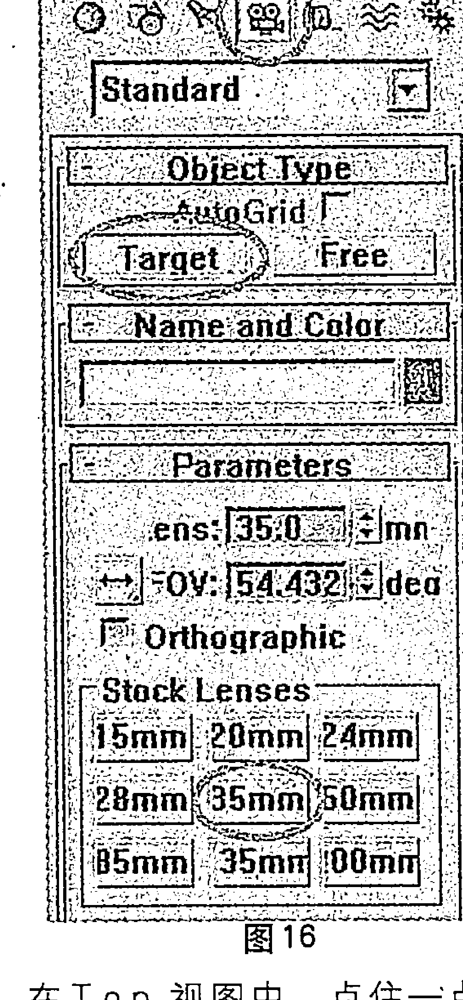

- （二）在 Top 视图中，点住一点向上拉，就会出现一个摄像机 (图17)，单击鼠标右键结束操作。移动到如图 18 所示的位置，再在 Left 左视图中将它移动到如图 19 所示的位置，最后选择 Perspective 透视图，按 C 键，将透视图变成摄像机视角 (图20)。

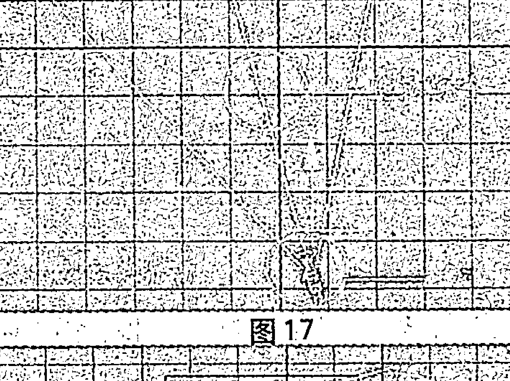

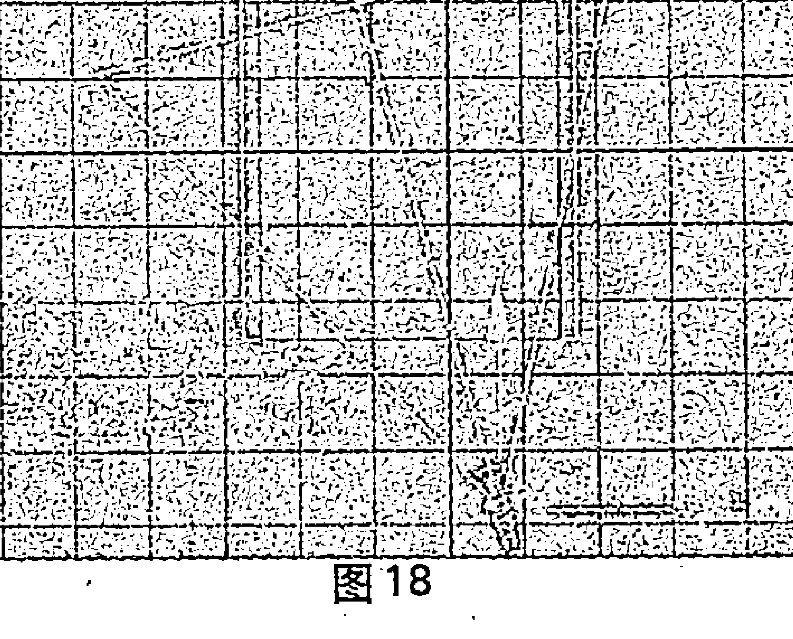

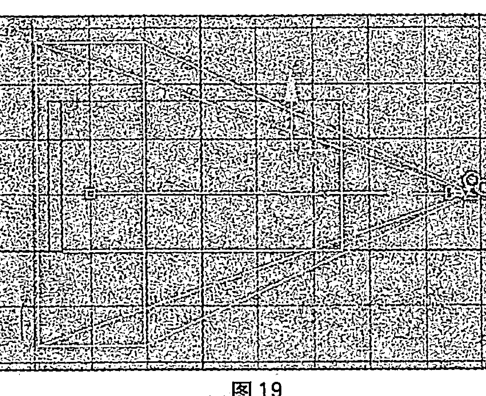

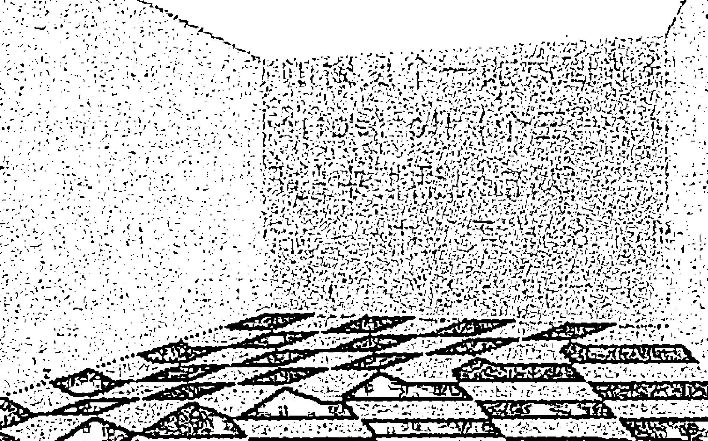

- （三）为了方便作图，我们选中摄像机，点击鼠标右键，选择 Hide Selection 命令把它隐藏起来。

### 四、做窗户

- （一）在 Top 视图中用 Box 命令制作一个长方体，参数 Length 为 500，Width 为 2000，Height 为 1300。放置在后墙上的合适位置，如图 21 所示。

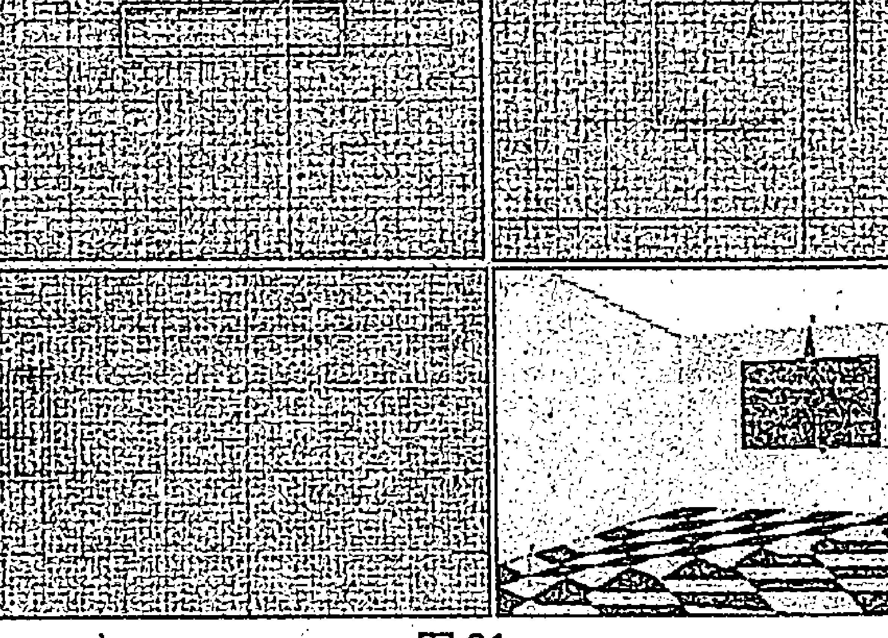

- （二）选中后墙，在命令面板中选择下拉列表中的 Compound Objects 项。点击 Boolean 按钮，再点击 Pick Operand 按钮。然后在 Top 视图中，点击刚才制作的那个 Box，你就会发现后墙镂空了。这个操作就叫做“布尔运算”。

- （三）选择下拉列表中的 Standard Primitives 项，用 Box 命令制作一面玻璃，参数 Length 为 1300，Width 为 2000，Height 为 10，将其放在窗户上，如图 22 所示。

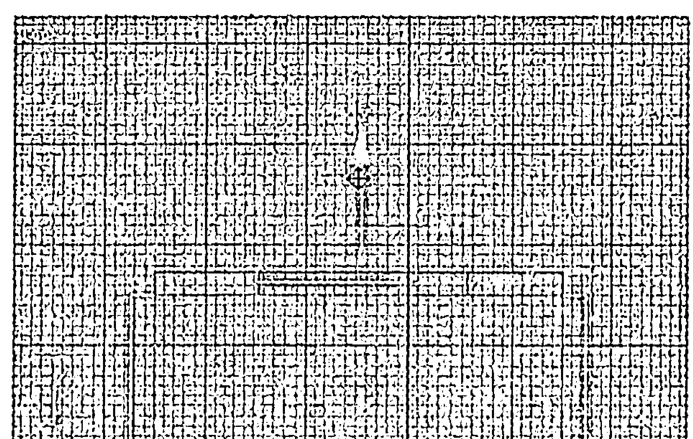

- （四）选中玻璃，赋材质，参数设置如图 23 所示。我们给玻璃添加一个反射的特效，点击 Maps 卷展栏中 (倒数第三个) Reflection 旁的 None 按钮，弹出一个对话框，双击对话框中的 Raytrace 项，再点击 按钮，回到 Maps 卷展栏中。最后，修改 Reflection 的参数，设置反射值为 27 即可。同理，你也可以为地面加些反射。

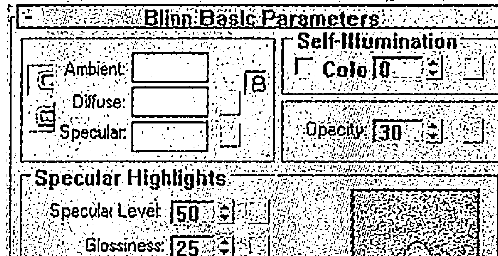

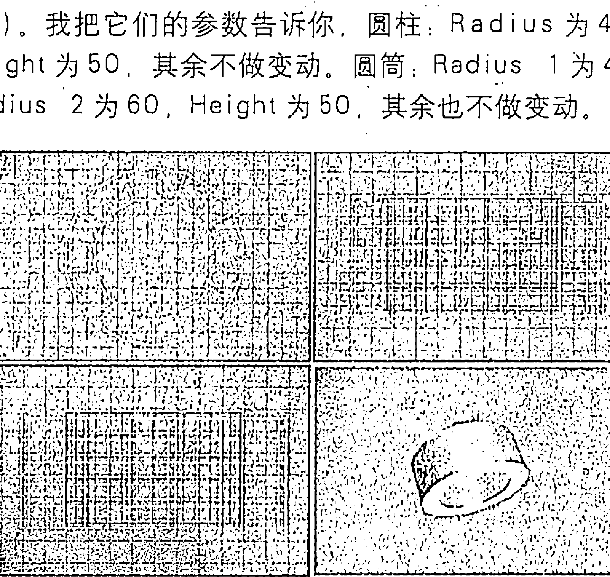

### 五、背景墙、吊顶

这部分你可以用以上学过的种种命令自由发挥了。图 24 是一个参考，只是不同的 Box 堆积而已。

### 六、灯、装饰球

它们的制作也没有离开你学到的操作与命令，只是基础模型不同罢了。灯的制作用到了三维建模中的 Cylinder (圆柱) 和 Tube (圆筒) 两个命令 (图 25)。我把它们的参数告诉你，圆柱: Radius 为 40，Height 为 50，其余不做变动。圆筒: Radius 1 为 40，Radius 2 为 60，Height 为 50，其余也不做变动。

装饰球就是用 Sphere (经纬球) 做的，赋上刚才用过的玻璃材质即可，你可以改改参数，改改颜色嘛！

### 七、沙发

- （一）选择下拉列表中的 Extended Primitives 项，选择 Chamfer Box (倒角方盒)，在 Top 视图中创建一个倒角长方体，参数设置为 Length 为 1000，Width 为 900，Height 为 320，Fillet 为 100。然后给它赋一个材质，选一个你自己喜欢的颜色，将 Specular Level (高光) 设置为 27，Glossiness (反光) 设置为 3。

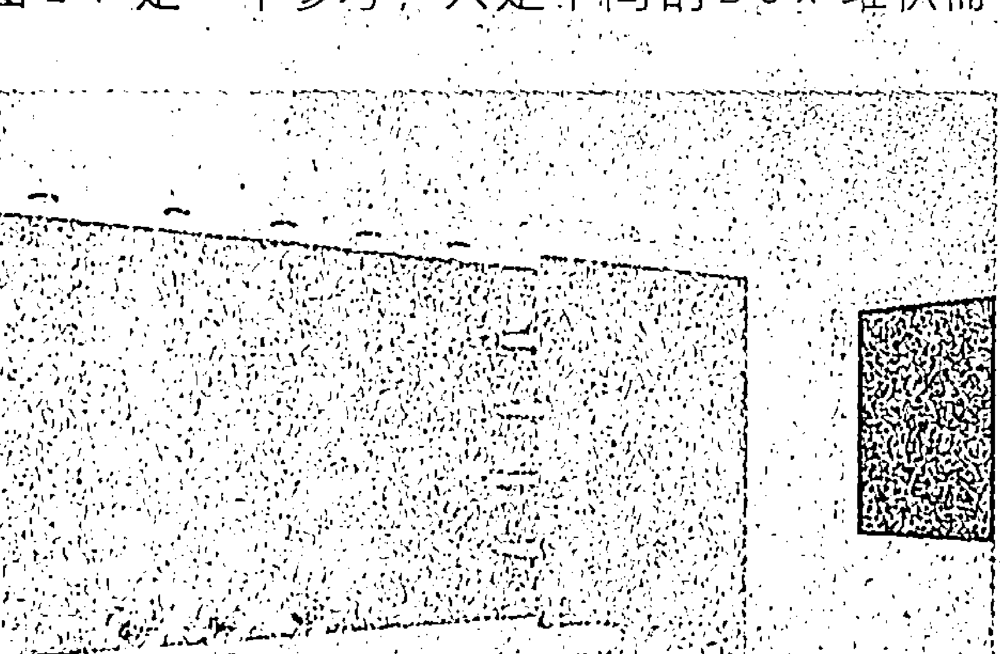

- （二）按 Shift 键复制一个倒角长方体作为坐垫。在 Front 视图中再做一个 Chamfer Box，参数同上，只是 Height 为 180。在 Left 视图中选中它，点击工具栏上的按钮，停留在它的上面点击鼠标右键，会弹出一个对话框，修改 “Absolute: World” 栏中 X 的参数为 78，关闭窗口。

- （三）用刚才做灯时用过的 Cylinder 做四个沙发腿，参数分别为 Radius 为 40，Height 为 80，复制四个，按如图 26 所示组合即可。

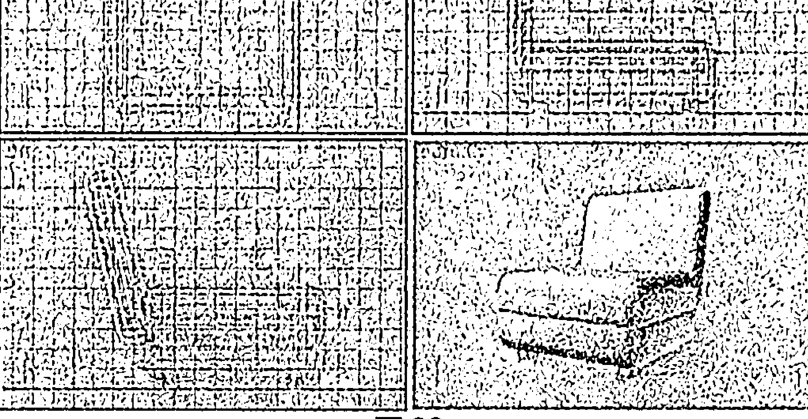

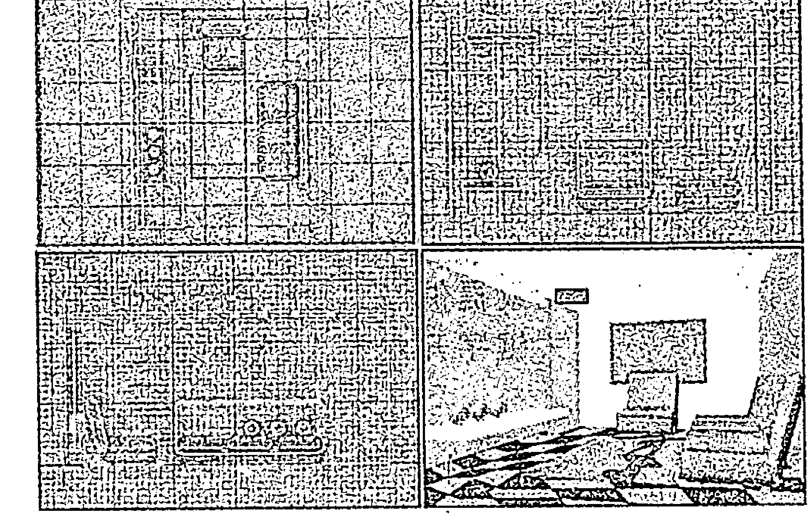

- （四）在 Top 视图中选择整个沙发，然后复制一个。再点击按钮，单击右键，修改对话框中 “Offset: Screen” 栏下的 Z 为 -90，改变它的摆放方向，将它再复制两个组成一个大沙发。按如图 27 所示将它们摆放好。

### 八、渲染出图

选中摄像机视图，也就是最初的 Perspective 透视图，按 Shift + Q 组合键，稍等片刻就会渲染出最终的效果图了（图 28）。

加一块地毯会使房间看起来更加舒适，用你现在最熟悉的 Box 命令制作一个吧！

这个客厅并不是一个完整的效果图，只是一个学习的参照而已，‘师傅领进门，修行在个人’嘛！不论学什么都有一个循序渐进的过程，3DS MAX 是越学越有趣的，越是深入就能感受到它巨大的魅力。凭着你的执著，凭着你的梦想，去感受它吧！

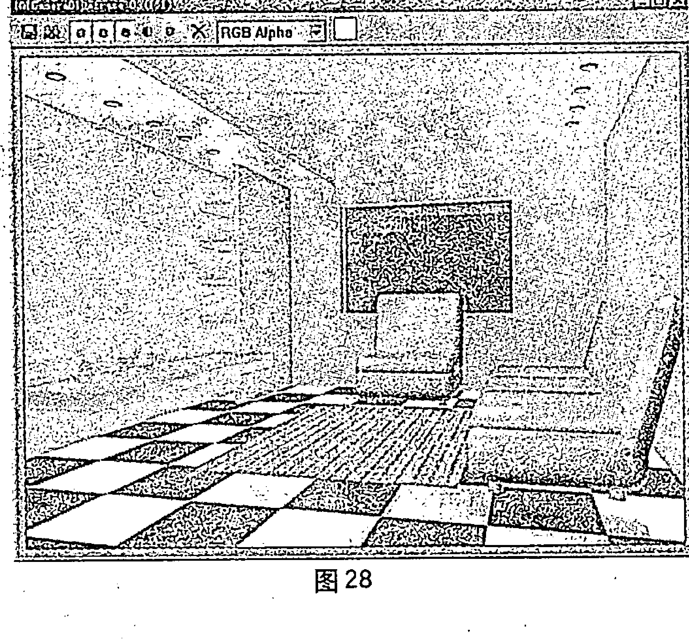

# 拼音加加输入法技巧点滴（一）
## 快速选码

快捷简便的选码设计是“拼音加加”的一大突破。在使用“拼音加加”（特别是三重码输入状态）时，您只需通过空格键、左 Shift 键、右 Shift 键（可改设）即可分别选取页中的第一、二、三重码，能够极大地加快输入速度。

## 特殊字符输入

在特殊字符的输入方面“拼音加加”亦很好地为用户进行了考虑，提供了简便的输入方法。具体输入的方式即为字符读音的声母。例如：圆圈数字只需输入其声母：“yqsz”即可得到。同理，想输入方向箭头则应键入“fxjt”。用同样的方法甚至可以输入标点符号，例如：省略号（……）为“slh”；书名号（《》）为“smh”；破折号（——）则为“pzh”。

## 笔划输入

对使用拼音输入的用户来说，生字是一大难题。一旦遇到不认识的字，常会花费许多时间去查字典。“拼音加加”为我们提供了笔划输入的选择。在输入时如果遇到生字就可以先按 i 键将输入法切换到笔画输入状态。随后即可按如下方法进行笔画输入，原则是：横、竖、撇、点（捺）、折五个基本笔画分别对应其声母 h、s、p、d（n）、z。

## 精确输入

拼音输入用户的另一难题就是重码的选择，以词定字不失为一个解决办法。但使用上也有一定的局限性，不是所有字都有合适的词组。“拼音加加”的精准输入功能就能解决这一问题。在输入汉字的拼音之后，点击 Tab 键，再按照汉字的偏旁输入其声母即可。例如想输入“挫”字，我们可以通过如下方法来直接得到它：“cuo<Tab>ts”。

# 循序渐进学 SQL
文/王严刚

SQL 是英文 Structured Query Language 的缩写，意思为结构化查询语言。SQL 语言的主要功能就是同各种数据库建立联系，进行沟通。它是一种介于关系代数与关系演算之间的语言，其功能包括查询、操纵、定义和控制四个方面，由于它的功能丰富、语言简洁、使用方法灵活等优点而备受用户和计算机业界的青睐，从而被众多的计算机公司和软件公司采用，经过多年的发展，SQL 语言已成为关系数据库的标准语言。

## 一、SQL 数据库的基本概念
### （一）数据库的基本组成

一个典型的关系型数据库通常由一个或多个被称作表格的对象组成，数据库中的所有数据或信息都被保存在这些数据库表格中。数据库中的每一个表格都具有自己惟一的表格名称，都是由行和列组成的。列由同类的信息组成，每列又称为一个字段，每列的标题称为字段名；行包括了若干列信息项，一行数据称为一个或一条记录，它表达具有一定意义的信息组合。一个数据库表由一条或多条记录组成，没有记录的表称为空表，每个表中通常都有一个主关键字用于惟一地确定一条记录（如图1）。

图1: 数据库表示例
| 编号 | 卷烟名称 | 条形码 | 价格 |
|------|----------|--------|------|
| 12010002 | 中华(硬盒) | 6901028076327 | 40 |
| 12010003 | 中华(软盒) | 6901028076326 | 50 |
| 12010101 | 红塔山(新势力) | 6901028075203 | 20 |
| ... | ... | ... | ... |

### （二）SQL 语句的格式

所有的 SQL 语句都有自己的格式。每条 SQL 语句由一个谓词开始，该谓词描述这条语句要产生的动作。

谓词后紧接着一个或多个子句，子句中给出了被谓词作用的数据或提供谓词动作的详细信息，每一条子句由一个关键字开始。

```
如：
SELECT 卷烟名称 FROM 卷烟代码 WHERE 批发价>60
```

在上述语句中，谓词是 SELECT，表示“查询”这个动作；卷烟名称是字段名；卷烟代码则是表的名称；WHERE 后是条件子句。其中 SELECT、FROM、WHERE 都是 SQL 的关键字。这句话的意思是把卷烟代码表中批发价大于 60 元的卷烟名称都列出来，怎么样？是不是很简单明了啊！

## 二、SQL 入门篇
### （一）最简单、最基本的语句 SELECT

数据存在的意义在于有效地将数据组织在一起，使它们更容易地被人们获得和利用。“查询”的含义就是从数据库中获得数据，所以说查询功能是数据库最基本也是最重要的功能。查询最基本的方式是使用 SELECT 语句，SELECT 语句按照用户给定的条件从 SQL Server 数据库中取出数据，并将这些数据通过一个或多个结果集返回给用户。

```
最基本的 SELECT 语句格式为：
SELECT <字段名> FROM <表名>
```

其中，“字段名”指定结果集中要包含的列的名称，多列之间用半角逗号隔开；“表名”为需要查询的表的名称。

#### 1．查询表中所有的列

例如，卷烟代码表中一共有卷烟代码、卷烟名称、条形码、批发价、零售价这五个字段，如我们想查询表中所有卷烟的代码、名称和批发价，这时只要输入：

```
SELECT 卷烟代码, 卷烟名称, 批发价 FROM 卷烟代码
```

但如果我们想查询这个表的所有字段，那该怎么办呢？肯定有人会说：## 二、SQL 查询基础

### 2. 查询不重复的数据

如果被选择的结果中有重复的值，可以使用 DISTINCT 关键字来消除重复的值。

例如，想查看卷烟代码表中所有批发价，但不能有重复的：

```
SELECT DISTINCT 批发价 FROM 卷烟代码
```

### 3. 在结果中使用运算

运算就是对从数据库中返回的数据进行一定的数学处理。共有数值型、比较型、字符型、逻辑型、备注型以及混合型六种类型，在此我们只要掌握数值型就行了。所谓的数值型运算有加减乘除和取余，前四种运算不用多说，相信地球人都知道，而取余就是将返回一个除法结果中商的余数部分。SQL 中用“%”代表取余，如 5%2=1，6%2=0。

比如我们想从卷烟代码表中算出每个卷烟的利润（零售价减去批发价），可以输入：

```
SELECT 卷烟代码，卷烟名称，零售价-批发价 FROM 卷烟代码
```

这时候就会列出三个列的表，有卷烟代码、卷烟名称和一个无名的列，为什么是无名的列呢，因为在卷烟代码表中是没有“零售价-批发价”列的。其实我们在输入代码的时候，在运算的列后加一空格再输入一列名就可以给这个运算的列取个列名了，这样才会使查询结果简单易懂：

```
SELECT 卷烟代码，卷烟名称，零售价-批发价 利润 FROM 卷烟代码
```

### （二）条件语句

到目前为止，运行的查询都是返回表中所有的行，而实际中大多数用户在查询数据库时往往并不需要了解全部信息，而只需要其中一部分来满足某些条件的信息。在这种情况下就需要在 SELECT 语句中加入条件来选择数据行。

#### 1. 基于比较条件选择查询结果

WHERE 子句的查询条件可以是比较型的表达式，可以进行的比较是相等（=）、大于（>）、小于（<）、不等于（<>）……

如想查看卷烟代码表中批发价大于 60 元的卷烟，可使用如下语句：

```
SELECT * FROM 卷烟代码 WHERE 批发价 > 60
```

#### 2. 基于范围条件选择查询结果

查询的条件也可以是一个范围，在这里要使用 BETWEEN 和 AND 两个关键词。

比如查询零售价在 40 元到 150 元之间的所有卷烟（包含 40 元和 150 元）：

```
SELECT * FROM 卷烟代码 WHERE 零售价 BETWEEN 40 AND 150
```

#### 3. 基于列表条件选择查询结果

使用 IN 关键字可以查询符合列表中任何一个值的列。

比如查询“南京”、“红杉树”、“一品梅”三个品牌的香烟使用如下语句：

```
SELECT * FROM 卷烟代码 WHERE 卷烟名称 IN ('南京', '红杉树', '一品梅')
```

#### 4. 基于使用通配符选择查询结果

有时候你可能想从数据库中选出一部分数据，而且不需要非常精确的匹配。这时候我们就不能用“=”这个条件运算符来查询了，而可以使用 LIKE 来进行模糊查询。说到模糊就需要用到通配符的支持，在 SQL 中通配符用“%”和“_”来表示，“%”（百分号）代表匹配包含零个或多个字符，“_”（下划线）可以匹配任何单个的字符。

比如说我们想从卷烟代码表中找出所有南京香烟，而南京烟的卷烟名称在卷烟代码表中又有“南京（精品）”、“南京（佳品）”、“南京（特醇）”等等各种品牌：

```
SELECT * FROM 卷烟代码 WHERE 卷烟名称 LIKE '%南京%'
```

#### 5. 基于多个条件选择查询结果

在 WHERE 子句中，也可以使用逻辑运算符来连接多个条件，构成一个更复杂的条件进行查询。主要有以下三种逻辑运算符：

-   AND：用它可以连接两个条件，如果两个条件都成立，则组合起来的条件就成立。
-   OR：它也是连接两个条件，如果两个条件中有一个成立，则组合起来的条件成立。
-   NOT：它引出一个条件，将该条件的值取反。

如查询零售价在 40 元与 60 元之间的卷烟（不包括 40 元和 60 元）：

```
SELECT * FROM 卷烟代码 WHERE 零售价>40 AND 零售价<60
```

查询除南京烟外其他品牌的香烟：

```
SELECT * FROM 卷烟代码 WHERE 卷烟名称 NOT IN ('南京')
```

或者用下面的语句也可以代替：

```
SELECT * FROM 卷烟代码 WHERE 卷烟名称 <> ‘南京’
```

### 6. 查询结果排序

默认情况下，在查询结果中，行的顺序就是它们在表中的顺序。但有时我们可能希望查出的结果按照某种顺序来显示，通过的 ORDER BY 子句，可以改变查询结果的显示顺序，其语法如下：

```
SELECT <列名> FROM <表名> WHERE <条件表达式>
ORDER BY <需要排序列名> [ASC|DESC]
```

其中 ASC 表示按升序排列，DESC 表示按降序排列，缺省模式为 ASC。

比如查询卷烟代码表按零售价从大到小的顺序排列：

```
SELECT * FROM 卷烟代码 ORDER BY 零售价 DESC
```

### （三）函数的运用

现在，我们已经了解到在使用 SQL 语言进行数据库查询操作时，可以通过对数值的判断来设定灵活的查询条件。为了增强对运算的支持能力，SQL 还提供了众多实用的运算函数供广大用户使用。

#### 1. COUNT 函数

COUNT 函数可以用来计算数据表中指定字段所包含的记录数目。

例如，想查询零售价小于等于 400 元的南京烟的数目，我们可以这样做：

```
SELECT COUNT (*) FROM 卷烟代码
WHERE 卷烟名称 LIKE ‘%南京%’ AND 零售价<=400
```

如果我们想让查询语句更易读懂，可以使用别名：

```
SELECT COUNT (*) 南京烟品种 FROM 卷烟代码
WHERE 卷烟名称 LIKE ‘%南京%’ AND 零售价<=400
```

#### 2. SUM 函数

SUM 函数就如同它的本意一样，它返回某一列的所有数值的和。其语法如下：

```
SELECT SUM (列名) FROM <表名>
```

#### 3. AVG 函数

AVG 函数用于计算查询结果平均值，可以返回某一列的平均值。其语法如下：

```
SELECT AVG (列名) FROM <表名>
```

#### 4. MAX 函数

如果你想知道某一列中的最大值，那就使用 MAX 吧，该函数用于查找最大值！

比如查找卷烟代码表中南京烟的零售价最高的品种，使用如下语句：

```
SELECT MAX(零售价) FROM 卷烟代码 WHERE 卷烟名称 LIKE ‘%南京%’
```

#### 5. MIN 函数

MIN 与 MAX 类似，它返回一列中的最小数值，语句的格式也是一样，在此不再赘述。

## 三、SQL 提高篇

### （一）SQL 语句中子句的使用

#### 1. GROUP BY 子句

GROUP BY 用在 WHERE 子句之后，以指示结果集行应该根据所规定的分组列进行分组。利用 GROUP BY 可以按一定的条件对查询到的结果进行分组，再对每一组数据计算统计信息。

例如，现在有“十月送货量”这个表，表中有日期、客户名称、卷烟名称、数量、单价、金额和送货人等字段，我们想查询“杨庆海”这个客户在十月份卖了哪些烟和这些烟的数量、金额，输入语句如下：

```
SELECT 客户名称,卷烟名称,SUM(数量) 数量, SUM(金额) 金额 FROM 十月送货量 WHERE 客户名称 LIKE ‘杨庆海’ GROUP BY 客户名称,卷烟名称
```

#### 2. HAVING 子句

用户在使用 SQL 语言的过程中，可能希望解决的另一个问题就是对由 SUM 或其他集合函数运算结果的输出进行限制。而 HAVING 子句就是用来解决这种问题的，它主要用于规定组的搜索条件，最常用于 GROUP BY 子句之后。

例如，想查询“杨庆海”这个客户在十月哪些烟卖了超过 10 条以上，我们可以在刚才的语句后加 HAVING 这个子句即可实现。

```
SELECT 客户名称,卷烟名称,SUM(数量) 数量, SUM(金额) 金额
FROM 十月送货量 WHERE 客户名称 LIKE ‘杨庆海’
GROUP BY 客户名称,卷烟名称 HAVING SUM (数量)>10
```

#### 3. UNION 连接操作符

UNION 操作符用于将两个或两个以上的查询产生的结果集合并为一个结果集，它与使用连接查询合并两个表的列是不同的，使用 UNION 操作符合并查询结果需要遵循以下的基本规则：

+   1. UNION 操作中的每一个查询所涉及的列必须具有相同的列数，相同的数据类型，并以相同的顺序出现。
2. 最后结果集中的列名来自第一个 SELECT 语句。
3. 如果 UNION 中包含 ORDER BY 子句，则将对最后的结果集排序。

例如，想查询 “杨庆海” 和 “田如祥” 这两个客户在十月哪些烟卖了超过 10 条以上，我们可以用两个语句来实现：

```
SELECT 客户名称, 卷烟名称, SUM(数量) 数量, SUM(金额) 金额
FROM 十月送货量 WHERE 客户名称 LIKE '杨庆海'
GROUP BY 客户名称, 卷烟名称 HAVING SUM(数量)>10
```

```
SELECT 客户名称, 卷烟名称, SUM(数量) 数量, SUM(金额) 金额
FROM 十月送货量 WHERE 客户名称 LIKE '田如祥'
GROUP BY 客户名称, 卷烟名称 HAVING SUM(数量)>10
```

只是在运行的时候要把两个语句全部选中再执行，得到如图 2 所示的结果，但让人看了感觉很不舒服。这时候我们就可以用 UNION 连接操作符来把两组语句连接起来，让输出的结果也合并到一起。

具体语句为：

```
SELECT 客户名称, 卷烟名称, SUM(数量) 数量, SUM(金额) 金额
FROM 十月送货量 WHERE 客户名称 LIKE '杨庆海'
GROUP BY 客户名称, 卷烟名称 HAVING SUM(数量)>10
UNION
SELECT 客户名称, 卷烟名称, SUM(数量) 数量, SUM(金额) 金额
FROM 十月送货量 WHERE 客户名称 LIKE '田如祥'
GROUP BY 客户名称, 卷烟名称 HAVING SUM(数量)>10
```

### （二）从多个表中查询数据

#### 1. 内部连接

内部连接也称自然连接，它是组合两个表最常用的方法。自然连接将两个表中的列进行比较，将两个表中满足连接条件的行组合起来作为结果。

例如，现在有两个表，表 1 中为销售表，表中有客户名称、卷烟名称、数量等字段；表 2 为客户表，表中有客户代码、客户名称、联系电话等。而现在我们想把表 2 中的客户名称和联系电话加到表 1 中，利用两个表中都有客户名称这个字段来把两个表连接起来。这时我们有两种方法来实现表的连接：

（1）用 WHERE 子句指定连接条件：

```
SELECT B.客户代码, B.客户名称, B.联系电话, A.卷烟名称, A.数量
FROM 十月送货量 A, 客户代码 B
WHERE A.客户名称 = B.客户名称
```

在这里我们在 SELECT 语句中分别用 A、B 来代替十月送货量和客户代码这两个表，从而增强了语句的可读性和理解性。

（2）在 FROM 子句中用 JOIN 连接符指定连接条件：

```
SELECT B.客户代码, B.客户名称, B.联系电话, A.卷烟名称, A.数量
FROM 十月送货量 A JOIN 客户代码 B
ON A.客户名称 = B.客户名称
```

结果和用 WHERE 子句得到的结果是一样的。

#### 2. 外部连接

在前面所举的例子中，连接的结果是从两个或两个以上的表的组合中挑选出符合连接条件的数据。如果数据无法满足连接条件，则将其放弃，通常称这种方法为内部连接。在内部连接中参与连接的表的地位是平等的，与内部连接相对的方式称为外部连接。在外部连接中参与连接的表有主从之分，以主表的每行数据去匹配从表的数据列，符合连接条件的数据将直接返回到结果集中，对那些不符合连接条件的列将被填上 NULL 值（在 SQL 中 NULL 代表空值）后再返回到结果集中。

外部连接又分为左外部连接和右外部连接两种。以主表所在的方向区分外部连接，主表在左边则称为左外部连接，主表在右边则称为右外部连接。

左外部连接的语法是：

```
SELECT select-list FROM table1 LEFT OUTER JOIN table2
ON table1.column = table2.column
```

右外部连接的语法是：

```
SELECT select-list FROM table1 RIGHT OUTER JOIN table2
ON table1.column = table2.column
```

其中 select-list 指定了结果集中要包含的列的名称，多列之间用半角逗号隔开，table1、table2 为需要查询的表名。

#### 3. 嵌套查询

在一个 SELECT 语句的 WHERE 子句或 HAVING 子句中嵌套另一个 SELECT 语句的查询称为嵌套查询，又称子查询。子查询是 SQL 语句的扩展，例如现在有两个表，表 1 为销售表，表中有客户代码、卷烟名称、数量等字段；表 2 为卷烟代码，表中有卷烟代码、卷烟名称、批发价、零售价等字段，而我们想从表 1 中查询南京烟的销售情况，输入语句如下：

```
SELECT * FROM 十月送货量 WHERE 卷烟名称 IN
(SELECT 卷烟名称 FROM 卷烟代码 WHERE 卷烟名称 LIKE '%南京%')
```

这时 WHERE 后面的子句就是一个嵌套。

## 四、SQL 高级篇

一个数据库能否保持信息的正确性和及时性，在很大程度上依赖于数据库更新功能的强弱。数据库的更新包括插入、删除、修改（也称为更新）三种操作，接下来我们就来分别讲述如何使用这些操作以便有效地更新数据库。

### （一）添加新数据

数据库的信息经常需要改变，用户需要添加数据，INSERT 语句就提供了此功能。INSERT 语句通常有两种形式：一种是插入一条记录，另一种是插入子查询的结果。后者可以一次插入多条记录。

#### 1. 添加数据到一行中的所有列

例如公司新增了津前门（硬特醇）这种卷烟，需要把卷烟代码表更新一下，把新增的卷烟信息插进去，输入语句如下：

```
INSERT INTO 卷烟代码 VALUES ('12010101', '', '20.50', '25.00')
```

其中 VALUES 为关键字，需要注意的是，插入的数据类型与被更新表里的字段要一一对应。

#### 2. 插入子查询结果

使用 SELECT 子句可以将从一个或多个表中选择来的数据添加到表中，SELECT 子句可以将数据添加到一行的部分或全部列中。需要注意的是，被插入数据的表与 SELECT 子句的结果集必须兼容，即列数、列序、数据类型都应兼容。

如我们想把九月份的销售表做进十月份的销售表里，也就是九月份、十月份两个月的销售表合在一起，输入如下语句：

```
INSERT INTO 十月送货量 SELECT * FROM 九月送货量
```

### （二）删除数据

使用 DELETE 语句可以删除数据表中一个或多个记录。

#### 1. 删除一条记录

例如，删除卷烟代码为 10031011 的卷烟信息：

```
DELETE FROM 卷烟代码 WHERE 卷烟代码 = '10031011'
```

#### 2. 删除多条记录

例如，删除卷烟代码表中所有的卷烟代码：

```
DELETE FROM 卷烟代码
```

这个例子删除了卷烟代码表中的所有数据，使它成为空表。

#### 3. 带子查询的删除语句

子查询同样可以嵌套在 DELETE 语句中，用来成为执行删除操作的条件。

例如删除卷烟代码中所有南京烟的记录：

```
DELETE FROM 卷烟代码 WHERE 卷烟名称 LIKE '%南京%'
```

### （三）更新数据

我们可以用 UPDATE 语句来更新表中一列或多列数据值，使用 SET 子句指定要被修改的列及修改后的数据。当没有 WHERE 子句指定修改条件时，表中所有的行的指定列都将被修改为 SET 子句给出的新数据。新数据可以是指定的常量或表达式，或来自于其他表的数据。

#### 1. 更新一条记录的值

例如，将卷烟代码表中卷烟代码为 10031011 的卷烟名称改为“外烟三五”语句如下：

```
UPDATE 卷烟代码 SET 卷烟名称='外烟三五' WHERE 卷烟代码='10031011'
```

#### 2. 更新多个记录的值

例如，在每种烟零售价的基础上加 10 元：

```
UPDATE 卷烟代码 SET 零售价=零售价+10
```

### （四）对数据库表格的操作

#### 1. 删除数据库表格

在 SQL 语言中可使用 DELETE 命令删除某个表格以及该表格中的所有记录。如果用户希望将某个数据库表格完全删除，只需要用 DROP TABLE 命令加希望删除的表格名称即可。DROP TABLE 命令的作用与删除表格中的所有记录（DELETE）不同，删除表格中的全部记录之后，该表格仍然存在，而且表格中列的信息不会改变。而使用 DROP TABLE 命令则会将整个数据库表格的所有信息全部删除。

DROP TABLE 命令的使用格式为：

```
DROP TABLE <表名>
```

例如删除卷烟代码这个表

```
DROP TABLE 卷烟代码
```

#### 2. 备份数据库表格

INTO 子句用于把查询结果存放到一个新建的表中。

例如，我们想把卷烟代码表备份一下，取名为“卷烟代码 1”，输入语句如下：

```
SELECT * INTO 卷烟代码1 FROM 卷烟代码
```

## 五、结语篇

数据库是为更方便有效地管理信息而存在的，它可以随时提供人们所需要的数据信息，因此说 SQL 中的数据查询是数据库最重要的功能。以上就是笔者在数据库应用中经常用到的一些命令，如果你熟练掌握了这些操作，相信轻松使用数据库的应用该不在话下！！！

## 拼音加加输入法技巧点播（二）

### 删除词组

有时候操作的失误会将一些并不存在或是错误的词组加入备选编码，不过您可以将其方便地从编码中删除。方法为：输入将要删除词组的拼音，当其在备选栏中显示出来时，只需按住 Ctrl 键，选择该词的数字键，即可删除该词组。

### 双语混输

“拼音加加”的最大特点就是实现了中英文的无缝切换输入。当我们在汉字输入时需要输入少量英文时，无需切换中英文输入方式，只要直接输入英文，随后按回车键即可。即使需要输入较多英文时，您也只需单击 Ctrl 键，即在中英文输入状态中进行切换。

### 强制元音分割

在“拼音加加”中，您可以通过“;”或“'”键来进行元音的强制分割，以便输入一些容易产生匹配混乱的词语。如 xian（线）和 xi'an（西安）。

### 以词定字

对于一些重码偏后的词语，如果觉得难以拆分，也可通过以词定字方式输入，先输入与该字相关的词语，点击“；”键输入首字、按“'”键输入最后一个字。

### 其它技巧

按“xx-x-x”或“xx/x/x”的格式输入日期，即可获得以其它方式表示的日期。输入阿拉伯数字，即可得到以多种表达方式表达的中文数字。“拼音加加”还可以自定义标题风格。通过下拉菜单中的“上一种标题风格”或“下一种标题风格”来选择自己喜爱的标题。另外其帮助也很详尽，如果在使用中遇到什么问题，可以参照软件的帮助来解决。

# Excel 2003 协同工作指南

文/张迎新

随着电脑网络的广泛应用，协同工作已经成为当前办公软件发展的方向。为了顺应这一趋势，微软Excel 2003提供了更加丰富的协同工作手段。本文以学校常用的成绩统计工作簿为例，介绍Excel 2003协同工作的主要方法。

## 一、共享工作簿

共享文件夹是局域网共享文件的重要形式，当然它也可以存放Excel 2003共享工作簿，以便网络上的多个用户协同编辑。例如，学校的各科老师在不同教研组办公，如果采用单机“独占”方式录入考试分数，一个工作簿只能由多位任课老师顺序编辑，其他老师和电脑即使空闲也不能参与工作，工作簿的使用效率很低。如果将统计成绩的工作簿放入网络，就可以让有时间的老师同时参与编辑，大大提高了工作簿和电脑的利用率。

### (一) 建立共享工作簿

由于共享工作簿和普通（独占）工作簿具有不同的特性，建立共享工作簿之前必须考虑以下几个方面。

#### 1. 设置相关功能

Excel 2003工作簿设置为共享之后，有些命令和功能只能查看或使用，不可以像“独占”工作簿那样任意修改。例如，用户不能设置单元格的条件格式，只能查看数据透视表的报表但无法更改。除此之外，宏、合并单元格、数据有效性、图表、图片、对象（包括绘图对象）、超链接、方案、大纲、分类汇总、数据表格、工作表和工作簿保护，都属于共享之前必须设置的相关功能。

例如，为了防止数据录入过程中发生错误，可以在工作簿共享之前设置“数据有效性”。假设“政治”、“数学”等科目的成绩存放在C2:L41区域，每科分数的取值范围在0~100之间。要想防止用户输入超出上述范围的分数，可以单击“数据”菜单中的“有效性”命令，打开如图1所示的“数据有效性”对话框。

在“设置”选项卡中打开“允许”下拉列表，从中选择选中区域要输入的数据类型（小数）。接着打开“数据”下拉列表，选择你要输入的数据范围逻辑，如介于、小于、大于或等于等等。这里应该选择“介于”，然后在“最小值”和“最大值”框输入分值的上下限0和100；最后单击“确定”按钮完成设置。以后，一旦共享用户输入的数据超过了设定的上下限，就会弹出对话框提示“输入值非法”。

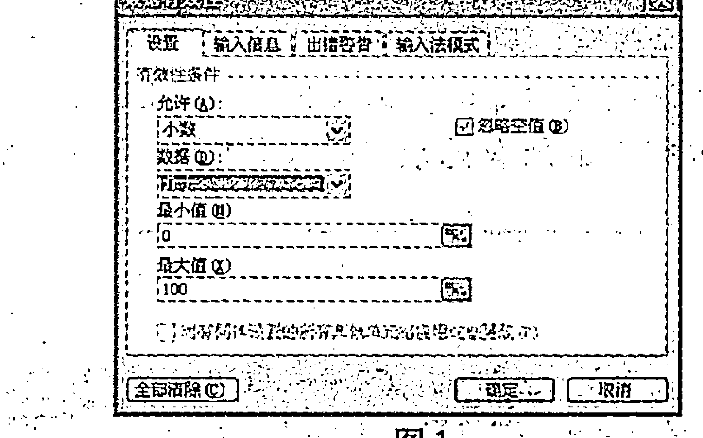

#### 2. 保存修订记录

出于保护共享工作簿信息安全等方面的考虑，Excel 2003可以在一段时间内保存共享信息，包括用户名称、修改时间和被修改的内容等等。例如，某个用户错误删除了共享工作簿中的数据，修订记录会保存已删除数据的副本，便于其他用户进行查看或恢复这些数据。

Excel 2003默认的修订记录保存时间为30天，当某个用户关闭共享工作簿时，超过30天的共享信息将被自动删除。用户应当根据工作需要选择修订记录的保存时间，修改它的方法是：单击Excel 2003“工具”菜单下的“共享工作簿”命令，打开“共享工作簿”对话框的“高级”选项卡，选中其中的“保存修订记录”，然后修改后面的保存天数即可。

由于共享工作簿修订记录的保存时间越长，共享工作簿的体积就越大，文件的打开和保存速度随之变慢，请根据工作需要合理选择修订记录的保存时间。

#### 3. 设置访问权限

共享工作簿如果不采取任何保护措施，其中的所有区域都可以被网络上的用户编辑，这样可能引发共享冲突或越权操作等问题。为此，可以在工作簿共享之前给不同用户设置编辑区域，例如设置政治老师只能编辑C2:C41区域，语文老师只能编辑D2:D41区域等等。以政治老师的编辑区域设置为例，具体操作步骤是：

- (1) 选中需要设置访问权限的C2:C41区域，单击“工具”→“保护”子菜单下的“允许用户编辑区域”命令。单击对话框中的“新建”按钮打开“新范围”对话框，先在“标题”框中输入要授权访问区域的标题“政治”。由于前面已经选中了需要设置访问权限的区域，所以“引用单元格”框内显示“=$C$2:$C$41”之类的引用。否则可以单击“引用单元格”折叠按钮，然后用鼠标选中需要设置访问权限的区域，即可使区域引用进入框内。最后在“区域密码”框中输入密码并将它提供给政治老师，持有密码的政治老师才能编辑C2:C41区域的数据。
- (2) 再次单击Excel 2003“工具”→“保护”子菜单下的“保护工作表”命令，打开对话框在“取消工作表保护时使用的密码”文本框内输入密码，单击“确定”按钮关闭对话框。
- (3) 重复上面的操作，给编辑D2:D41等区域的老师每人设置不同的密码。当Excel 2003工作簿被共享以后，只要用户在设置了“区域密码”的单元格内输入数据，就会弹出对话框要求输入密码。只要输入的密码正确，该区域内的所有单元格就可以自由输入数据了。

为了简化操作，也可以设置某个用户编辑特定区域不需要密码。具体操作方法是：当设置了访问权限区域以后，单击“工具”→“保护”子菜单下的“允许用户编辑区域”命令，打开“允许用户编辑区域”对话框，单击其中的“权限”按钮打开“XX的权限”对话框（其中XX是区域的名称）。再次单击其中的“添加”按钮打开“选择用户和组”对话框，按照“计算机名\用户组或用户名”的格式输入用户或组的名称。也可以单击“高级”按钮将对话框展开，然后单击“立即查找”按钮，使所有的用户和组的名称显示在对话框下面。选中需要授予无需密码编辑区域权限的用户或组，单击“确定”按钮回到“允许用户编辑区域”对话框，再次单击“确定”按钮关闭对话框。以后这个用户或组要想编辑这个区域，就不需要输入密码了。而其他用户要想编辑这个区域，就需要提供密码解除对工作表的保护，否则不能执行编辑操作。

#### 4. 设置工作簿共享

设置共享工作簿的准备工作完成以后，就可以按照实际需要选择以下方法进行设置：

第一种方法是单击“工具”菜单下的“共享工作簿”命令，打开“共享工作簿”对话框中的“编辑”选项卡，选中“允许多用户编辑，同时允许工作簿合并”然后单击“确定”按钮。如果在Excel 2003标题栏的工作簿名称后面看到“[共享]”字样，说明共享工作簿设置成功。

第二种方法是单击“工具”→“保护”子菜单下的“保护并共享工作簿”命令，打开如图2所示对话框。选中“以追踪修订方式共享”，它可以启用对共享工作簿的共享和修订记录保护。以后每次保存工作簿时，修订跟踪日志会详细记录修订信息。在多个用户同时编辑一个工作簿时，该功能特别有用，它可以了解所有共享用户对工作簿的编辑，并决定是否接受或拒绝所修订的数据。

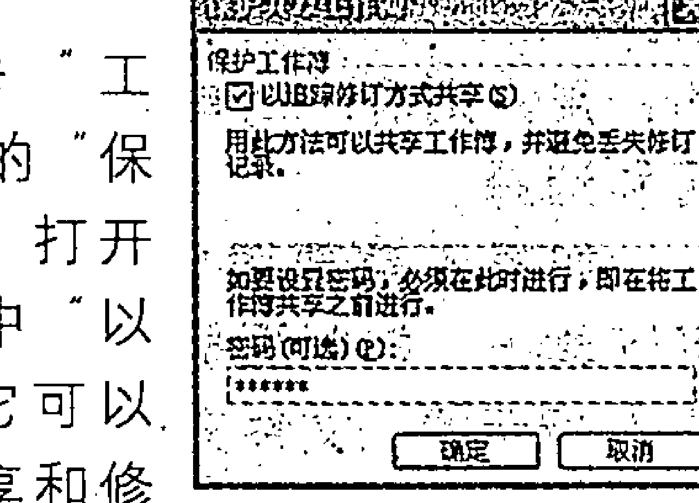

如果上述操作是在工作簿共享之前执行的，则对话框中的“密码”输入框可用，你可以在其中输入共享工作簿的保护密码，以防止未经授权的用户删除工作簿的共享保护。我们也可以先用第一种方法设置共享工作簿，然后使用“保护并共享工作簿”命令启用对共享和修订记录的保护。不过此时不能使用“密码”输入框，即任何用户都可以取消共享和修订记录保护。

以上两种设置共享工作簿的方法有不同的适用范围：如果需要任何用户拥有修改共享或独占工作簿的权限，或者随意启用或关闭共享和修订记录保护，就可以选用第一种共享设置方式。对于保存有重要数据的工作簿来说，选用第二种共享设置方式具有更高的安全性。

### (二) 使用和管理共享文件夹

共享工作簿在网络上的保存位置比较灵活，可以放置在服务器上或工作站的共享文件夹下。由于共享文件夹的安全性不够高，使用时应当注意以下问题：

#### 1. 文件存储和打开

在启用了“以追踪修订方式共享”的情况下，共享工作簿的体积增加得比较快。因此服务器或工作站的共享文件夹要有足够空间，以便满足文件随修订跟踪日志不断增大的要求。其次，共享工作簿可能因错误删除等原因丢失，“以追踪修订方式共享”只能防止数据丢失，不能防止共享工作簿的损坏或丢失（如错误删除）。如果共享工作簿中的数据比较重要，应当将它存放在启用了“卷影副本”的服务器上，或者使用工具软件定期备份共享工作簿。最后还要注意编辑共享工作簿的Excel版本，应保证网络用户安装了Excel 97或更高版本，否则不能正常编辑共享工作簿。

#### 2. 建立共享文件夹

共享文件夹是由服务器或工作站的操作系统建立的，不同操作系统对它的建立和管理方法有所不同。如果共享文件夹是Windows XP操作系统建立的，用户则有“简单文件共享”和“高级文件共享”两种选择。

如果不需要限制访问共享文件夹的用户权限，可以单击“控制面板”中的“文件夹选项”，打开如图3所示的“文件夹选项”对话框中的“查看”选项卡，选中“高级设置”下的“使用简单文件共享（推荐）”复选框。然后右击将要共享的文件夹，选择快捷菜单中的“共享和安全”命令，打开如图4所示的对话框。选中“在网络上共享这个文件夹”和“允许网络用户更改我的文件”复选框，即可启用“简单文件共享”。它的特性与Windows 98/Me共享文件夹相似，操作系统无法控制访问共享文件夹的用户和权限，比较适合安全性要求不高以及不同Windows版本混合安装的网络。

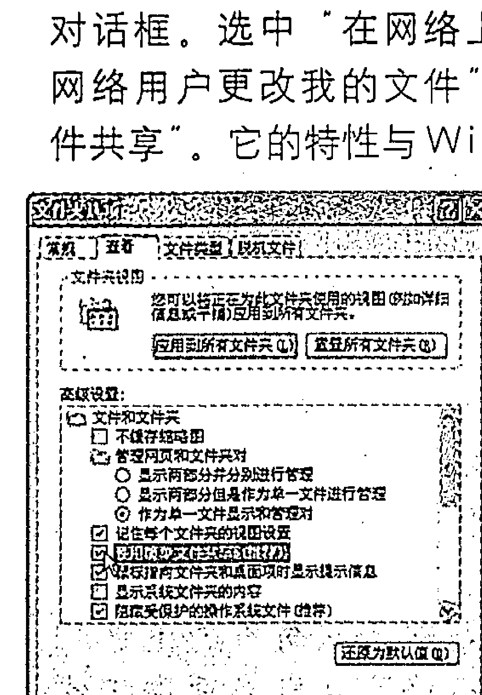

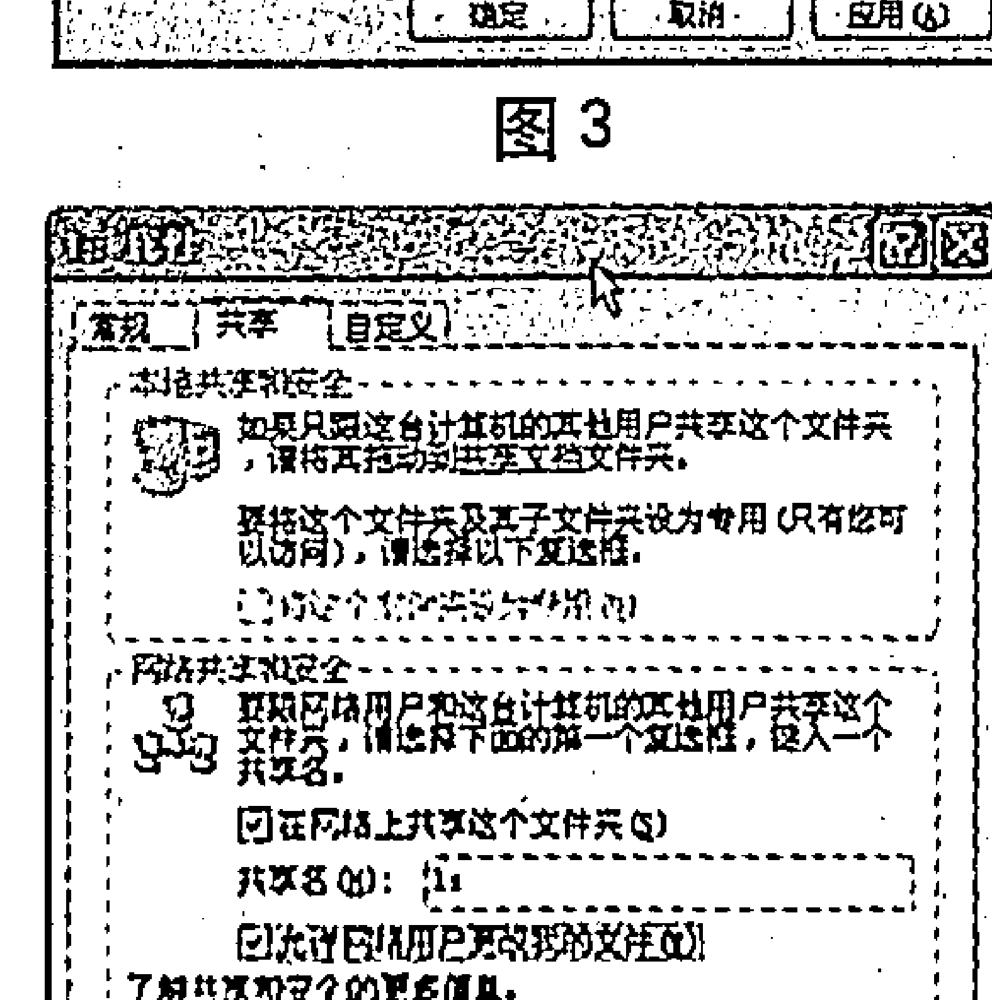

如果共享文件夹中的文件有使用权限要求，例如，允许某班的任课老师编辑共享工作簿，其他用户只能查看不能编辑工作簿等等，就应该使用Windows XP的“高级文件共享”。方法是单击“控制面板”中的“文件夹选项”，打开如图3所示“文件夹选项”对话框的“查看”选项卡，取消选择“高级设置”下的“使用简单文件共享（推荐）”复选框。接着右击需要设置为共享的文件夹，选择快捷菜单中的“共享和安全”命令，打开如图5所示对话框，选中“共享此文件夹”即可单选按钮。此时可以看到“共享”选项卡有“用户数量限制”、“权限”和“缓存”的设置，而且对话框也多了一个“安全”选项卡。Windows 2000/2003建立共享文件夹的方法与Windows XP的“高级文件共享”相同，大家可以参照上面的介绍进行设置。

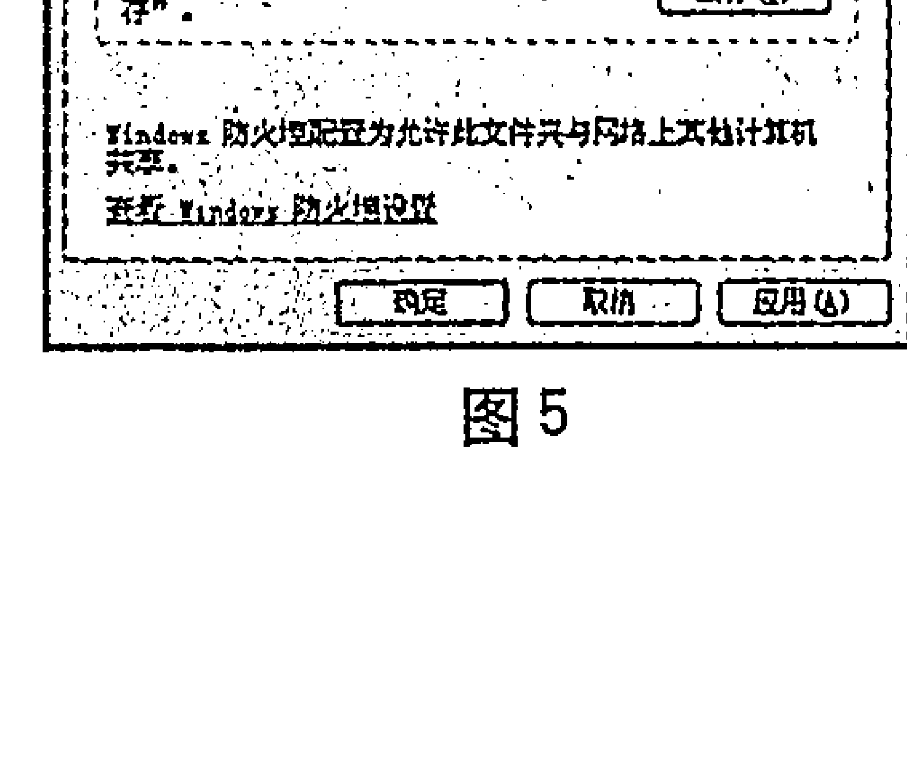

#### 3. 建立用户和组

如果Windows XP使用了“简单文件共享”，那么只要该系统启用了Guest账户，网络上的所有电脑在一个工作组内，就可以使用下面介绍的方法访问共享文件夹，而且不需要提供密码。

如果Windows XP采用了“高级文件共享”，就要建立使用共享文件夹的不同用户，即在“控制面板”中打开“管理工具”窗口，单击其中的“计算机管理”打开同名窗口。选中左窗格中的“本地用户和组”下面的“用户”，然后在右窗格中单击鼠标右键，选择快捷菜单中的“新用户”命令打开对话框，就可以输入名称和密码等为用户建立默认隶属于“Users”组的账号，重复上述过程就可以为班级任课教师建立多个账号。当然，使用“控制面板”中的“用户账户”同样可以建立用户，具体方法就不在这里叙述了。

为了简化用户权限的管理，最好将权限相同的网络用户放入一个组。此时应当按上面介绍的方法打开“计算机管理”窗口，选中左窗格“本地用户和组”下面的“组”，然后在右窗格中的空白处单击鼠标右键，选择快捷菜单的“新建组”命令打开对话框。首先输入“组名”（例如“查看工作簿组”）和相关的描述（例如“该组用户只能查看共享工作簿”），然后单击“添加”按钮打开“添加用户”对话框。继续单击“高级”和“立即查找”按钮，对话框下面就可以列出系统中的所有用户。选中要添加到这个组的用户名称，连续两次单击“确定”按钮就可以完成操作。重复上面的操作还可以建立“编辑工作簿组”等等，为用户权限管理打下基础。

#### 4. 用户权限管理

在Windows XP启用了“高级文件共享”以后，设置共享文件夹中的工作簿只允许“查看工作簿组”查看，允许“编辑工作簿组”任意进行修改的权限设置方法是：用系统管理员身份登录系统，右击共享文件夹然后选择快捷菜单中的“属性”命令，打开“xxx属性”（xxx是共享文件夹名称）对话框中的“共享”选项卡。然后单击“权限”按钮打开如图6所示“xxx的权限”对话框，观察需要授予“只读”权限的“查看工作簿组”或用户名是否出现在里面。如果这个组或用户名称不在选项卡内，可以单击其中的“添加”按钮将用户或组放入对话框。

然后选中“读取”行和“允许”列交叉处的复选项，单击“确定”按钮关闭对话框，则该用户或组就取得了“读取”（即“只读”）权限。以后该组的用户登录系统打开的文件均带有“（只读）”字样，用户可以阅读文件但是不能进行修改，除非用其他文件名称另行保存。

按照上面介绍的方法操作，“编辑工作簿组”就可以获得“完全控制”权限。此后，即使用户能够看到文件夹中的文件，但是不同用户使用或操作文件的权限却不一样。

如果共享文件夹安装在没有 Active Directory（活动目录）的 Windows 2000/2003 服务器上，系统管理员同样可以采取上述措施管理用户。如果服务器安装了 Active Directory，就可以由 Active Directory 管理用户的访问权限，具体方法就不再这里赘述了。

#### 5. 打开共享文件夹

编辑共享工作簿之前首先要打开它所在共享文件夹，无论采用“简单文件共享”还是“高级文件共享”，用户只需打开 Windows “运行”对话框输入“\计算机名称\共享文件夹名称”或“\IP 地址\共享文件夹名称”，或者在“网上邻居”中找到共享文件夹即可将其打开。如果提示输入密码，只要输入管理员提供的访问密码即可。

若 Windows 2000/2003 服务器安装了 Active Directory，只要工作站开机时登录了域，用户使用上面介绍的方法就可以直接打开共享文件夹。

### (三) 使用共享工作簿

由于共享工作簿有多个用户使用，与常见的独占工作簿有一些区别，用户应当注意以下几点：

#### 1. 设置共享用户名

学校等单位的公用电脑一般有多个用户使用，为了便于 Excel 的共享和修订记录正确识别用户，建议每一个用户打开共享工作簿以后检查并重新设置用户名。方法是单击“工具”菜单中的“选项”命令，打开“选项”对话框中的“常规”选项卡，在“用户名”文本框中输入编辑共享工作簿使用的名称。

#### 2. 编辑共享工作簿

接下来就可以进行数据输入等编辑工作了。如果共享工作簿已经按照上面介绍的方法设置了访问权限，只要在属于该用户的单元格内输入数据，就会弹出“取消锁定区域”对话框要求用户输入密码。

只要输入了正确的密码，所有设置了访问权限的单元格就可以正常输入数据了。如果用户试图编辑不属于他的单元格或区域，就会弹出对话框告知“正在试图更改被保护的只读单元格或图表”。此时只能由最初设置建立工作表的用户取消保护，方可编辑这些单元格，否则每个用户只能编辑属于自己的区域。如果设置了用户编辑特定区域不需要密码，用户打开共享工作簿就可以直接编辑属于自己的区域。

#### 3. 解决编辑冲突

共享的成绩统计工作簿可能有多个用户同时编辑同一区域，例如，班主任和任课教师同时修改并保存某个学生姓名，那么其中的一个用户将看到“解决冲突”对话框。此时应当观察对话框中的修订和修订冲突信息，若该用户要保留自己的修订或其他人的修订，然后处理下一个修订冲突，可以单击“接受本用户”或“接受其他用户”。若要保留自己的所有剩余修订或所有其他用户的修订，请单击“全部接受本用户”或“全部接受其他用户”。

如果用户想用自己的修订覆盖其他用户的修订，而且不希望看到“解决冲突”对话框，可以关闭 Excel 2003 的编辑冲突处理功能。具体操作方法是：单击“工具”菜单中的“共享工作簿”命令，打开对话框中的“高级”选项卡，选中“选用正在保存的修订”然后单击“确定”即可。

假如用户需要保存包含所有修订的工作簿副本，可以单击“解决冲突”对话框中的“取消”按钮，再单击“文件”菜单上的“另存为”命令，然后为工作簿副本输入新的名称。

#### 4. 查看编辑冲突

Excel 2003 提供了冲突日志工作表，以便用户查看自己或其他人解决共享冲突的情况。具体操作方法是：打开共享工作簿，单击“工具”→“修订”子菜单下的“突出显示修订”命令，并打开对话框中的“时间”下拉列表，选择其中的“全部”，然后取消选择对话框中的“修订人”和“位置”复选框。选中“在新工作表上显示修订”复选框，单击“确定”按钮即可看到“冲突日志工作表”。它的右边有“操作类型”和“操作失败”两个数据列，其中被保留的修订冲突在“操作类型”列中显示“成功”；而“操作失败”列中的行号代表含有未保存修订冲突信息的行，其中包括已经删除了的数据。

由于“冲突日志工作表”记录了修订记录保存时间内被删除和更改的数据，如果用户想恢复这些数据，可以从冲突日志工作表中将这些数据重新复制到原来的位置。与普通独占工作簿不同，共享工作簿中被删除和更改的数据不能使用“撤销”的方法恢复，这是因为跟踪修订信息的目的不是恢复工作簿的原来状态，只能备份正在使用跟踪修订信息的工作簿。

如果需要查看同时打开共享工作簿的用户名称，可以单击"工具"菜单中的"共享工作簿"命令，打开"共享工作簿"对话框中的"编辑"选项卡，就可以看到"正在使用本工作簿的用户"。

#### 5. 查看和保存更改

当某位老师对共享工作簿进行编辑，如果想保存工作结果并查看其他老师输入的分数，只需单击工具栏中的"保存"按钮就可以了。如果某位老师希望定期自动保存编辑结果，并且查看其他老师对共享工作簿的修改，可以单击"工具"菜单中的"共享工作簿"命令，打开对话框中的"高级"选项卡，选中"更新"下的"自动更新间隔"。假如用户需要定期保存自己的编辑结果，并且按指定时间间隔内对工作簿进行更新，可以选中"保存本人的更改并查看其他用户的更改"；如果需要定期查看其他用户对共享工作簿的修改，可以选中"查看其他人的更改"选项。

### (四) 维护共享工作簿

由于共享工作簿存放在网络上供许多用户使用，难免遇到故障导致编辑结果无法保存，此时可以采取以下措施处理：

#### 1. 用户连接中断

编辑共享工作簿过程可能发生连接中断的问题，例如，服务器或网络出现故障，或者有权限的用户强行取消工作簿共享等等，此时用户无法将编辑结果保存到共享工作簿。如果共享工作簿打开了"以追踪修订方式共享"，一旦发生了网络连接中断的情况，用户可以使用新名称保存工作簿，然后使用"工具"菜单下的"比较和合并工作簿"命令将其合并到原来的共享工作簿。同样，用户也可以在脱机状态下使用共享工作簿的副本进行编辑工作，完成后使用同样的方法将编辑结果合并到原来的共享工作簿。至于如何比较和合并工作簿，我们将在下面作具体介绍。

#### 2. 脱机维护共享工作簿

共享工作簿使用过程中有时需要取消共享，以便重新设计工作簿结构，以便应用工作簿停止共享时才能使用的命令，或者更改保护设置给新增用户授权等等。任何用户只要取消了工作簿的共享，也就断开了所有用户与共享工作簿的连接，同时更改历史记录也就被永久删除。由于更改历史记录被丢失，断开连接的用户将无法把脱机状态下的编辑结果合并到工作簿，即使再次共享工作簿也无济于事。为此应当尽可能减少维护共享工作簿的次数，或者将维护工作安排在其他用户关闭工作簿以后（例如下班时间）。

如果在上班时间维护共享工作簿，在取消工作簿共享之前，应当通知所有用户保存编辑结果并关闭工作簿，否则所有未保存的数据将在取消共享时丢失。

由于取消工作簿共享会丢失修订记录。如果需要保存这些信息，可以打印冲突日志工作表，或者把它复制到其他工作簿中。具体操作方法是：单击Excel 2003 "工具"→"修订"子菜单下的"突出显示修订"命令，打开对话框中的"时间"下拉列表，选择其中的"全部"，接着取消选择"修订人"和"位置"复选框；最后选中"在新工作表上显示修订"复选框，单击"确定"按钮即可在当前工作簿中生成一个"冲突日志工作表"。假如需要打印冲突日志工作表，只需按常规方法将其打开然后执行"打印"操作。如果需要复制冲突日志工作表，可以单击工作表（左上角）的"全选"按钮，再单击工具栏中的"复制"按钮，最后打开其他工作簿执行"粘贴"和保存操作即可。

### (五) 比较与合并共享工作簿

对共享工作簿编辑工作而言，合并共享工作簿是处理连接中断的惟一手段，下面介绍合并共享工作簿的方法和具体要求。

#### 1. 合并共享工作簿

如果待合并的共享工作簿副本在一个以上，应当把这些副本放入一个文件夹，为此每个副本必须使用不同的文件名称。接下来就可以打开共享工作簿，单击"工具"菜单中的"比较和合并工作簿"命令，打开"将选定文件合并到当前工作簿"对话框，选中所有要合并的共享工作簿的副本，单击"确定"按钮完成合并。如果待合并的工作簿不能满足要求，可以采用手动合并的方法。此法只须打开待合并的工作簿，复制需要合并的数据并将它粘贴到共享工作簿就可以了。

#### 2. 合并工作簿的要求

与Excel 2003工作簿的合并不同，合并工作簿要满足几个方面的要求：首先，待合并的应当是同一工作簿的副本，而这个工作簿必须是共享工作簿。其次，所有待合并的副本必须有不同的文件名称，要么没有设置密码，要么具有相同的密码。最重要的是待合并的副本具有自创建之日起连续的有效修订跟踪，保留至少自副本创建之日到现在的修订记录。假如修订记录在工作簿中保留30天，而副本是30天以前保存的，这个副本就不能执行合并操作了。因此，打开修订跟踪却无法确定合并工作簿的时间时，可以设置一个较长保留修订记录的时间（最长可达32767天）。

## 二、修订与批注工作簿

共享工作簿是Excel特有的一种协同工作方式，Excel 2000/2002/2003都支持共享工作簿。但是使用它需要共享文件夹的支持，如果老师因故（在家）无法使用共享文件夹，或者多位用户在单机上顺序编辑工作簿，就需要采用修订与批注方式进行协同工作。Word和PowerPoint也拥有这两个功能，但是操作的具体细节与Excel存在一定差异。

### （一）修订工作簿

修订是用户直接向工作簿输入修改内容的工作方式。它的特点是修改过后其他用户可以看出何处做了修改，并且能够选择接受或拒绝修改，从而大大提高工作簿的协同工作效率。但是Excel 2003的修订对象只能是共享工作簿，并且必须打开修订跟踪，这一点和Word 2003不同。只要满足以上两个条件，所有用户对工作簿的修订就会被记录下来，以便在定稿时接受或拒绝这些修订。

#### 1. 发送工作簿

Excel 2003提供了E-mail发送工作簿的功能，可以满足用户利用LAN或Internet协同工作的需要。组织协同工作的用户（例如“班主任”）只要打开已经给任课老师进行修订的工作簿，单击“文件”→“发送”子菜单下的“邮件收件人（审阅）”命令；就会弹出对话框提示保存当前工作簿的共享版本。单击“是”设置共享并保存工作簿，接着自动打开“请审阅‘xxx’-邮件”（xxx是共享工作簿名称）窗口。班主任只需在其中填入“收件人”和“抄送”的E-mail地址，单击“发送”按钮将邮件保存到Outlook 2003“发件箱”，就可以将邮件发送到各位任课老师的邮箱。

#### 2. 修订工作簿

任课老师收到主题为“请审阅‘xxx’”的电子邮件，打开附件就可以在工作簿中输入所任学科的学生成绩了。如果班主任需要按传统方式（例如移动存储器）提供成绩统计工作簿，最好按上面介绍的方法将其设置为共享，然后提供给有关的任课老师。此后他们对Excel 2003共享工作簿的修改会作为修订记录下来，班主任收到工作簿以后可以接受或拒绝所有修订。由于这些操作是在后台进行的，用户不会感觉到自己执行了修订操作。

#### 3. 显示修订

当班主任收到任课老师返回的各科成绩以后，就要做出接受或拒绝修订（也就是其他用户的编辑结果）的决定。如果他需要在屏幕上查看修订，可以单击“工具”→“修订”子菜单下的“突出显示修订”命令打开对话框。首先选中“在屏幕上突出显示修订”选项，接着根据需要选择“时间”、“修订人”和“位置”。选中“时间”复选框可以在下拉列表中设定显示修订的时间间隔，其中包括“全部”、“从上次保存开始”、“无”或“起自日期”。如果选择了“起自日期”，就应当在“时间”框中输入所显示修订的起始日期；如果选择的是“无”，可突出显示在“接受或拒绝修订”文本框中未审阅的修订。选中“修订人”然后打开下拉列表，可以选择突出显示那些用户所作的修订。选择“每个人”可以显示所有用户的修订，选择“除我之外的每个人”可以显示出自己以外的所有用户的修订，选择列表中的用户名可以突出显示该用户的修订。选中“位置”，复选框将光标放入后面的输入框，鼠标拖过要突出显示修订的连续单元格，或按住Ctrl单击要突出显示修订的非相邻单元格，即可使这些单元格的引用出现在输入框中。

#### 4. 查看修订记录

Excel 2003查看修订有两种方式：如果用户想逐个查看某个单元格的修订，只须将空心十字光标指向带有批注的单元格，就会弹出一个黄色的修订框，顺序显示“用户名”、“修订日期和时间”和“修订内容”。

如果需要一次性查看所有用户对工作簿的修订，只要选中“突出显示修订”对话框中的“在新工作表上显示修订”选项。单击“确定”之后，Excel 2003就会在当前工作簿中新建一个名为“历史记录”的工作表，其中详细显示了所有修订的细节。

#### 5. 接受或拒绝修订

对共享的成绩统计工作簿来说，进行成绩统计分析时必须接受或拒绝任课老师的修订。方法是单击“工具”→“修订”子菜单下的“接受或拒绝修订”命令打开对话框，按照“突出显示修订”的原则选择“时间”、“修订人”和“位置”，单击“确定”按钮后即可看到一个对话框。

对话框中显示了当前单元格是总共更改的多少个单元格中的第几个，中间则显示了修订的“用户名”、“修订日期和时间”以及对单元格所做的更改内容。单击“接受”按钮可以接受对单元格所做的修订；单击“拒绝”按钮就会拒绝应进行的修订，单元格中的已有的值将会恢复为初始值，并且删除修订单元格的突出显示（如果已经显示的话）；单击“全部接受”按钮将接受所有剩余的修订。如果单元格中已经保存了多个修订，那么所有修订都在“选择单元格的值”列表框中列出；单击“全部拒绝”按钮将拒绝所有剩余的修订，并将修订单元格的值返回到初始值。

如果多位任课老师同时编辑E-mail来的工作簿，班主任定稿时面对的共享工作簿有几个，他只要将它们合并起来，就可以获得完整的成绩统计工作簿了。如果多个用户在单机上顺序修订一个共享工作簿，定稿时只需做出接受或拒绝修订的决定，而不需要进行合并。

### （二）批注工作簿

批注是附加在单元格且与内容分开的注释，“独占”工作簿和共享工作簿都可以插入批注。例如，说明成绩统计工作簿中某个同学进步的原因，或者对工作簿中的某个复杂公式进行注释等等。

#### 1. 插入批注

与 Word 2003 相比，Excel 2003 插入批注的方法比较简单。任课老师对自己输入的成绩进行批注时，他只需打开工作表选中需要批注的单元格，单击“插入”菜单中的“批注”命令，当前单元格右面会显示一个黄色的批注框，用户就可以在其中输入批注文字了。另外，使用右键快捷菜单中的“插入批注”命令，或者“审阅”工具栏中的“新批注”按钮，都可以给当前单元格插入批注。

需要注意的是Excel 2003的批注框可以任意移动，我们只要用鼠标单击批注框的边缘显示8个控点，鼠标指向边框的任意位置看到四向光标以后，就可以把批注框移动到当前工作表的任意位置。

某个单元格的批注输入完成以后，在批注框外的任意位置单击鼠标，批注框就会自动隐藏起来，当前单元格右上角则显示一个红色三角，说明这个单元格已经插入了批注。

审阅人重复上面的步骤，就可以将自己的全部批注插入工作表，最后按常规方法保存即可。

#### 2. 查看批注

班主任或其他用户打开含有批注的工作表后，可以用下面几种方法查看每个单元格的批注：一是用鼠标右键单击含有批注的单元格（其右上角带有一个红色三角），选择快捷菜单中的“显示批注”命令，就可以打开批注框查看其中的内容了。查看完毕再次用鼠标右键单击含有批注的单元格，选择快捷菜单中的“隐藏批注”命令即可将批注框隐藏起来。

如果工作表中的批注比较多，使用“审阅”工具栏查看批注将更加快捷。具体操作方法是：单击“视图”→“工具栏”子菜单中的“审阅”命令，即可将工具栏打开在窗口中。单击其中的“显示所有批注”按钮，则工作表中的批注框就会全部打开让用户查看。每个批注框的左上角显示了该批注的用户名，下面则是批注的内容。批注查看结束再次单击“显示所有批注”按钮，所有打开的批注框就会全部关闭。

如果班主任想逐个浏览当前工作表中的批注，只要选中含有批注的某个单元格，单击“审阅”工具栏中的“前一批注”或“下一批注”按钮，就可以按照从后向前或从前向后的顺序逐个显示批注。

查看批注更简单的方法是选中含有批注的单元格，再把四向光标指向单元格的左上角，就可以打开批注框查看其中的内容了。

#### 3. 编辑批注

已经插入工作表的批注如果需要修改，可以采用以下几种方法：一是用鼠标右键单击需要编辑批注的单元格，选择快捷菜单中的“编辑批注”命令，就会打开含有光标的批注框，你就可以修改其中的文字了。二是选中含有批注的单元格，单击“审阅”工具栏的“编辑批注”按钮打开批注框编辑它。

#### 4. 删除批注

如果查看以后的批注不再需要，可以将其删除：第一种方法是用鼠标右键单击含有批注的单元格，选择快捷菜单中的“删除批注”命令，即可删除当前单元格的批注。第二种方法是选中含有批注的单元格，然后单击“审阅”工具栏中的“删除批注”按钮即可。如果工作表中带有批注的单元格较多，可以按住Ctrl键再用鼠标逐个选中这些单元格，最后单击“审阅”工具栏中的“删除批注”按钮，即可一次性删除工作表中的所有批注。

#### 5. 打印批注

Excel 2003工作表中的批注不仅可以查看，而且可以随同工作表一块儿打印。如果要按批注的原始位置进行打印，首先按上面介绍的方法显示要打印的批注。若批注较多发生了重叠，可以按上面介绍的方法移动或调整批注框的大小。

接下来单击“文件”菜单中的“页面设置”命令，打开对话框中的“工作表”选项卡。若要按批注出现的原貌进行打印，可以打开“批注”下拉列表选择“如同工作表中的显示”项；若要在工作表的底部打印批注，则应选择“批注”下拉列表中的“工作表末尾”项。

单击“确定”按钮之后关闭对话框按常规方法执行打印操作，就可以获得带有批注的工作表打印稿了。

## 三、NetMeeting 协同编辑工作簿

上面介绍了两种协同编辑工作簿的方法，它们的特点是协同工作过程中不能进行即时交流，影响了复杂问题的沟通和解决。假如班主任需要在统计成绩过程中与任课老师交流，可以用NetMeeting联机会议协同编辑工作簿。

### （一）召开联机会议

联机会议使用的主要工具是NetMeeting。我们必须根据网络环境设置NetMeeting，然后决定如何呼叫参加会议的用户。

#### 1. NetMeeting 设置

NetMeeting是Windows的标准组件，Windows 98/ Me/2000环境下可以在“附件”中找到它的快捷方式。Windows XP的NetMeeting安装在“C:\Program Files\NetMeeting”。用户只要打开“运行”对话框输入Conf，就可以使用向导对NetMeeting进行设置，例如，测试调节话筒和音箱的音量以及设置目录服务器等。需要特别注意的是：如果使用的网络没有提供目录服务器，就不能选中NetMeeting“选项”对话框“常规”选项卡中的“NetMeeting启动时，登录到目录服务器”复选框。

#### 2. 呼叫协同用户

如果当前使用的网络有目录服务器（例如Windows 2000 Server安装了Site Server ILS服务，或者在Internet中找到了对外公开的目录服务器），并且在NetMeeting中设置了目录服务器。班主任只要打开需要协同编辑的工作簿，单击“工具”→“联机协同”子菜单下的“现在开会”命令，就可以从对话框中寻找联机用户加入会议，然后按下面介绍的方法协同编辑工作簿。由于Internet上公开的目录服务器（又称“会议服务器”）比较好找，这是利用Internet召开联机会议协同编辑工作簿的好方法。

由于大多数局域网没有安装目录服务器，如果班主任与任课老师需要合作编辑成绩统计工作簿，可以各自设置好自己的NetMeeting，其中班主任作为会议主持人呼叫其他任课老师。他只需在NetMeeting地址栏输入对方电脑的IP地址或名称。稍等片刻对方的屏幕上就会弹出一个对话框，他只要单击“接受”按钮即可使双方通过NetMeeting建立联系，并在NetMeeting下方显示参加会议的用户名称。

如果联机会议在安装了目录服务器的网络中举行，应当保证所有与会者知道目录服务器的地址或名称，并在NetMeeting“选项”对话框的“常规”选项卡中正确设置。当班主任作为会议召集人登录目录服务器以后，单击NetMeeting“呼叫”菜单中的“目录”命令，即可打开对话框看到登录服务器的用户列表。如果列表中的“姓名”前面带有“摄像头”图标，说明该用户的NetMeeting安装了摄像头；若E-mail地址前面的图标上有红色亮点，表示这个用户正在被NetMeeting呼叫，暂时不能和会议召集人联系。除了正在被NetMeeting呼叫的用户以外，他只要将参加会议的用户姓名选中，单击对话框中的“呼叫”按钮，则被叫方的电脑就会显示提示，同时电脑喇叭也会响起清脆的电话铃声（音箱打开时）。只要被叫用户单击提示中的“接受”按钮，就可以将自己的姓名加入班主任NetMeeting的“名称”框。

#### 3. 编辑共享工作簿

在与会用户加入会议以后，会议召集人（班主任）单击NetMeeting“工具”菜单下的“共享”命令打开如图7所示对话框，选中要在会议上共享的文件单击“共享”按钮，然后将共享文件前面的所有窗口最小化，所有与会者就可以从电脑屏幕上看到共享工作簿了。

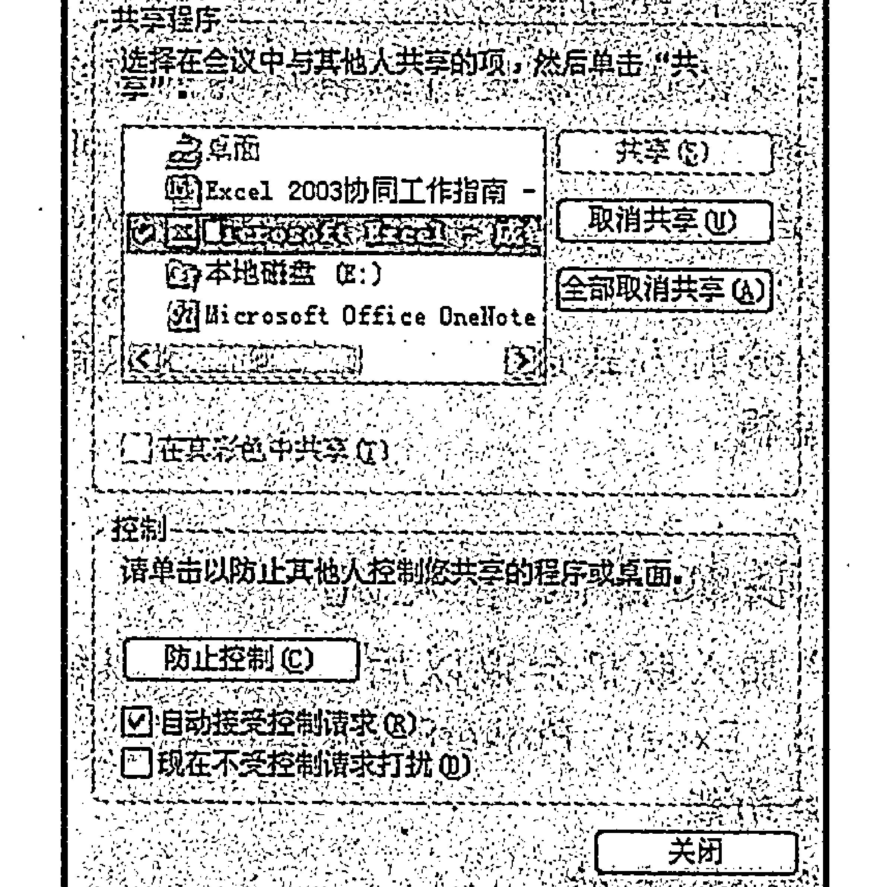

在班主任单击图7中的“允许控制”按钮，然后选中“自动接受控制请求”复选框，那么参与会议的任何用户都可以获得编辑权限。此时与会者的电脑屏幕就会出现“xxx的程序-可控制的”（xxx是联机的NetMeeting用户名称）窗口，假如物理老师最先单击“xxx的程序-可控制的”窗口“控制”菜单下的“请求控制权”命令，“xxx的程序-可控制的”窗口的光标就会变成正常状态，他就可以像编辑本地工作簿那样输入或修改成绩数据了。此时所有与会者同样可以看见他的各种操作，但是看不到鼠标也不能执行编辑文档等操作。当物理老师完成编辑任务以后，单击“控制”菜单下的“释放控制”命令，即可将文档控制权交还给班主任，他或别的与会者就可以进行下一轮编辑了。

如果班主任没有选中图7中的“自动接受控制请求”复选框，那么某个与会者单击“请求控制权”命令以后，会议召集人就会看到“请求控制权”对话框，上面显示了“xxx想控制您的共享的程序”。如果他想让对方编辑当前会议中的工作簿，只需单击“接受”按钮即可。若单击“拒绝”按钮，则对方就会在“请求控制失败”对话框中看到相关信息。

在与会用户获得共享文档控制权以后，如果他习惯在全屏幕方式进行文档编辑，可以打开“xxx的程序-可控制的”窗口“控制”菜单下的“全屏显示”命令，此时NetMeeting会将共享文档窗口放大到整个屏幕。需要特别注意的是：在全屏显示方式下，控制方和被控制方都看不到NetMeeting窗口，此时只能通过键盘上的Esc键退出全屏显示方式。

### （二）在联机会议中交流

当用户加入联机会议以后，除了可以编辑共享文档（Word、Excel、PowerPoint等）以外，还可以使用其他相关功能。

#### 1. 即时通信

类似QQ的即时通信方式在NetMeeting中称为“聊天”，它的使用方法和QQ等工具基本相同。用户单击NetMeeting“工具”菜单中的“聊天”命令，就可以打开如图8所示的对话框。用户可以在“消息”框内输入要交流的信息，再打开“发送给”下拉列表选择接收信息的与会用户姓名，单击“发送”按钮，对方的“聊天”对话框就可以显示接收到的信息。如果发送的信息需要网络会议人员都看到，只需打开“发送给”下拉列表，选择“聊天中的每个人”即可。

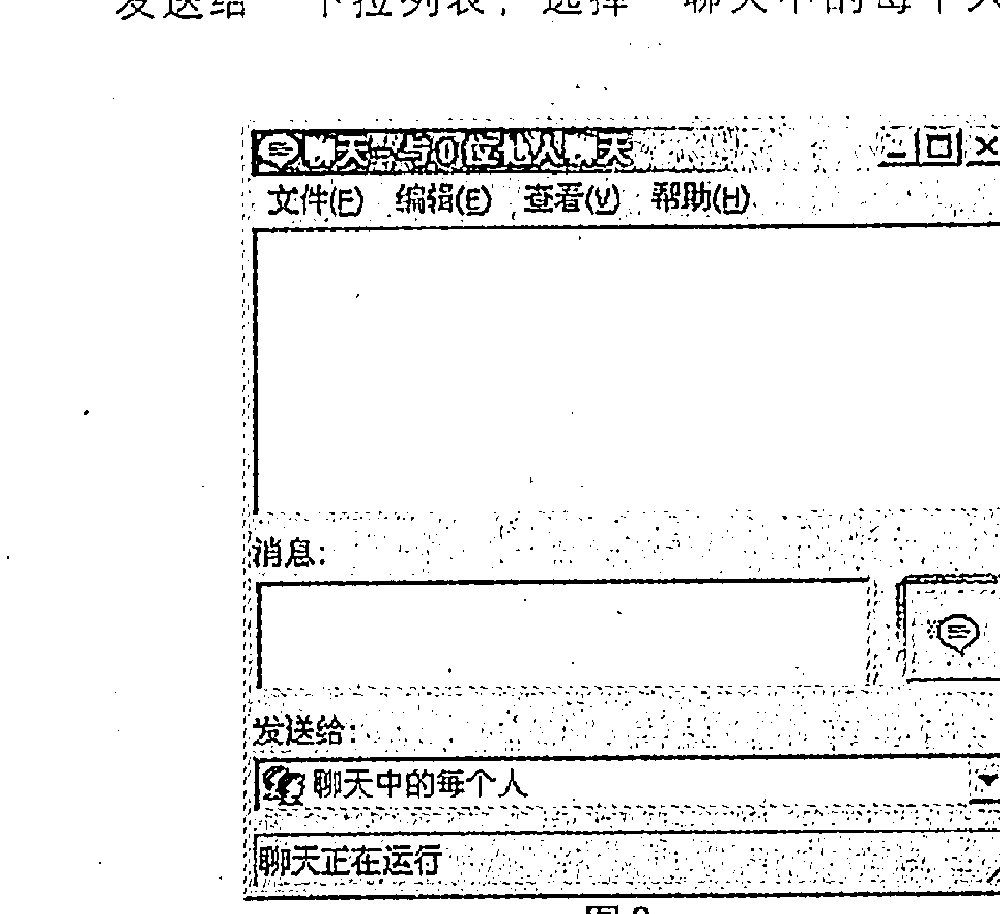

#### 2. 使用“白板”

在会议中交流的第三种方式称为“白板”。单击NetMeeting“工具”菜单中的“白板”命令可以打开类似“画图”的窗口，会议参与者能在其中输入文本和绘制图形等等。如果某些问题用“聊天”说不清楚，“白板”是一个很好的补充工具。当某位与会用户在“白板”中绘制图形或输入文字以后，其他与会用户只要打开了“白板”就可以看到这些图形或文字。如果用户需要在多个页面中绘制图形，可以单击“白板”窗口右下角的“插入新页”按钮增加页面。此后任何用户单击“白板”窗口右下角的“上一页”或“下一页”按钮，就可以翻看过去的图形或文字了。

#### 3. 文件传送

另外，参加网络会议的用户之间可以相互传送文件，用户只需单击“工具”菜单下的“文件传送”命令打开对话框。在右上角的下拉列表中选择接收文件的用户名（或“所有人”），将要传送的文件添加到对话框中，然后单击“全部发送”按钮就可以送给所选择的用户了。

文件发送完毕，接收文件的用户就会看到名为“xxx — NetMeeting”（xxx是文件名）的对话框，单击其中的“打开”按钮可以用关联程序打开传送来的文件。如果他将自己的“文件传送”窗口打开，然后单击“查看接收的文件”按钮，就可以打开窗口复制或移动所接收的文件了。

此外，如果联机会议的网络环境足够好，还可以使用音频或视频方式进行通信，使联机会议用户的沟通更加便捷。

## 四、SharePoint 网站协同编辑

为了给Office 2003提供协同工作的网络环境，微软公司提供了一个免费软件Windows SharePoint Services 2.0（下载地址是 http://download.microsoft.com/download/1/6/7/16781659-4fc9-89ef-0814a91c784c/STSV2.exe），如果校园网的服务器采用了Windows Server 2003操作系统，该软件可以在服务器上“安装”一个校园网门户站点，成为Excel 2003等软件协同办公的理想平台。下面介绍SharePoint网站协同编辑工作簿的操作方法。

### （一）安装和配置 Windows SharePoint Services 2.0

为了方便校园网用户管理和登录，Windows Server 2003必须安装Active Directory（活动目录），并按常规在Active Directory中建立组织单位和用户。DHCP和DNS服务器可以根据需要安装，然后按照以下步骤安装和配置Windows SharePoint Services 2.0网站。

#### 1. 安装 IIS 6.0

Windows SharePoint Services 2.0需要IIS（Internet信息服务）的支持，安装Windows 2003的IIS 6.0是其中的关键步骤之一。当Windows 2003启动（或单击“管理工具”中的“管理您的服务器”命令）打开“管理您的服务器”对话框，单击“添加或删除角色”按钮即可打开“配置您的服务器向导”。之后，首先在对话框中选中“应用程序服务器（IIS, ASP.NET）”，单击“下一步”按钮就会看到如图9所示的对话框。这里只能选中“启用ASP.NET”复选框然后继续单击“下一步”，根据提示将Windows Server 2003安装光盘插入光驱，就可以完成IIS 6.0和ASP.NET的安装了。

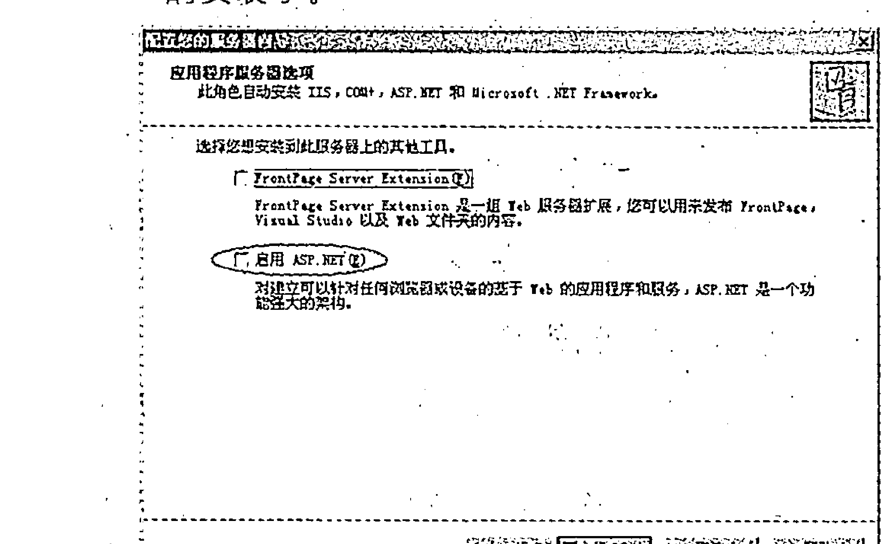

#### 2. 安装 Windows SharePoint Services

IIS 6.0和ASP.NET安装完毕以后，就可以安装Windows SharePoint Services了。运行下载得到的STSV2.exe，在如图10所示的“安装类型”对话框中选择“典型安装”，把SharePoint网站配置成IIS的默认网站。然后单击“下一步”开始安装Windows SharePoint Services，再安装Microsoft SQL Server Desktop Engine（Microsoft SQL Server桌面引擎）。当安装程序执行完毕以后，它会自动配置Windows 2003中的IIS 6.0，此时Windows 2003桌面上可能什么也看不到。这时千万不要重新启动系统，稍等一会就可以看到如图11所示的对话框，说明安装程序正在配置SharePoint网站。当如图11所示对话框关闭以后，如果IE自动打开了名为“主页工作组网站”的网页（其名称可以打开主页的“网站设置”功能，在“自定义”下使用“更改网站标题和说明”命令修改），说明Windows SharePoint Services 2.0安装成功。

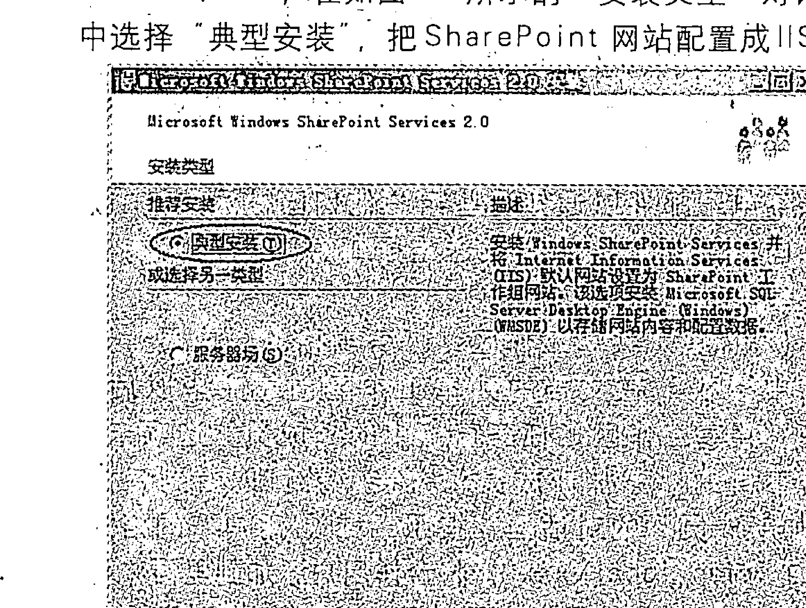


#### 3. 设置登录方式

由于服务器在Active Directory中添加了用户，所以校园网工作站的用户已经有了登录名和密码，现在就可以利用这个基础设置大家使用SharePoint网站的权限了。

首先需要设置用户登录SharePoint网站的方式：单击Windows 2003“管理工具”中的“Internet信息服务（IIS）管理器”，在窗口中展开“xxx（本地计算机）”（xxx是服务器名称）下的“网站”分支，用鼠标右键单击“默认网站”选择快捷菜单中的“属性”命令。打开“默认网站属性”对话框中的“目录安全性”选项卡，单击“身份验证和访问控制”中的“编辑”按钮，在对话框中选中“集成Windows身份验证”。此后用户访问SharePoint站点采用登录局域网的方式，这样不仅具有较高的安全性，而且同一用户可以使用不同工作站访问网站。

#### 4. 用户访问授权

SharePoint网站的用户分为“读者”、“讨论参与者”、“网站设计者”和“管理员”四类。建立用户组和为用户授权一般由Windows Server 2003管理员（他是SharePoint网站默认的管理员）负责。授权可以采用两种方法，一是单击Windows 2003“管理工具”中的“SharePoint管理中心”命令，打开网页单击“安全性配置”下的“管理网站用户”，就可以在如图12所示的网页中添加用户并授权了。二是登录SharePoint网站打开主页，单击其中的“网站设置”打开网页，再单击“管理”下面的“管理用户”，最后单击网页中的“添加用户”执行添加用户和授权操作。

如果采用了上面介绍的第一种方法，首先要在图12的“网站URL”文本框中输入SharePoint网站的URL，可以是“http://服务器IP地址”或“http://服务器名称”。然后在“用户”框中输入要添加的用户名（如果有多个用户可以用分号隔开），接着在下面的“网站用户组”列表中选择该用户所属的组。如果需要更详细的授权，可以选中“高级”复选框并单击“高级”按钮，在弹出的对话框中单独设置用户的权限。最后单击“添加用户”按钮，就可以将指定用户添加到SharePoint网站中了。

服务器名称”的形式，例如“http://192.168.0.1”或“http://cfan”。如果网站在DNS服务器中设置了域名解析，也可以输入“http://www.cfan.net”形式的域名。输入完成后单击“查看”按钮检索网站的用户组列表，然后在“新建用户”下输入用户信息。假如Active Directory的登录域名是“cfan.local”，用户“matao”的登录名称是“mt”，可以按照“cfan.local\mt”的格式输入“用户名”框；然后在“显示名称”文本框内输入登录成功后显示在网站中的名称“matao”，接下来在“电子邮件地址”文本框内输入用户的局域网电子邮件地址，便于用户使用局域网的电子邮件服务收发通知等等，没有局域网电子邮件地址的用户可以随便编一个填进去，最后打开“网站用户组”下拉列表，从“读者”、“讨论参与者”等四种用户中选一个，单击“添加用户”按钮完成用户的访问授权。

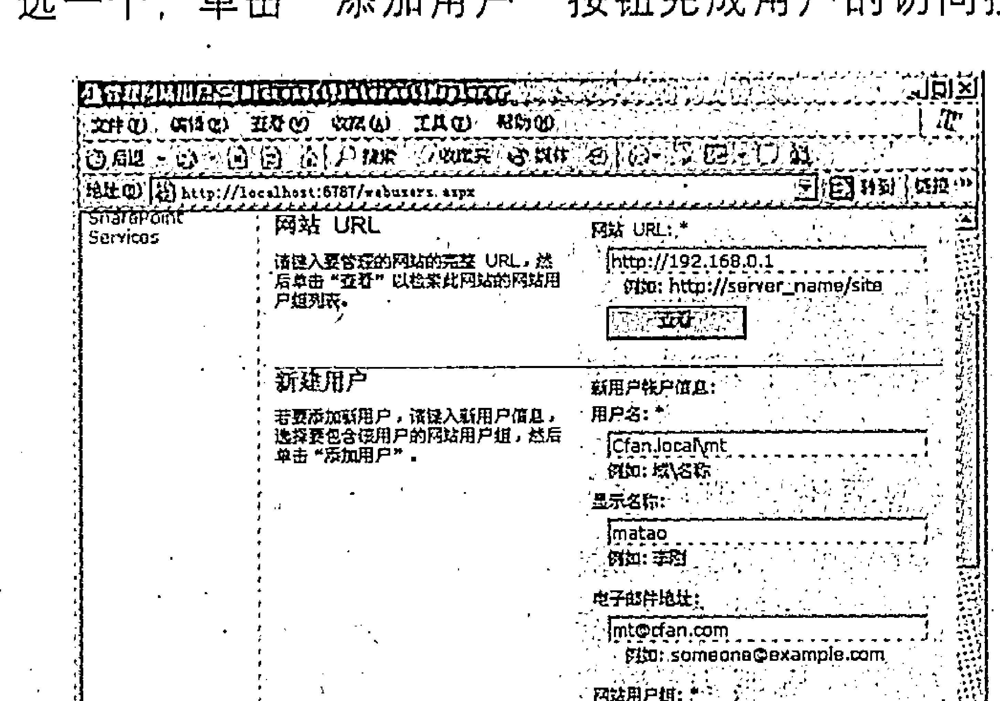

重复上面的操作给Active Directory中使用SharePoint网站的用户完成授权。而后用户的工作站只要登录到Windows Server 2003域，打开IE输入SharePoint网站的URL回车，即可弹出“连接到xxx”(xxx是网站URL)对话框，在其中输入登录Windows 2003域的用户名和密码，单击“确定”之后就可以打开SharePoint网站首页。

## （二） 建立协同工作环境

SharePoint网站为Office组件（Word, Excel, PowerPoint）提供了名为“共享工作区”的工作环境，它是一种比较典型的“客户机/服务器”(Client/Server)工作模式。

### 1. 建立共享工作区

多位任课教师协同编辑Excel 2003成绩统计工作簿时，必须有一个用户（例如班主任）建立共享工作区，然后邀请所有任课老师参与编辑。班主任只需打开需要在网站协同编辑的工作簿，单击Excel 2003“工具”菜单的“共享工作区”命令，即可看到如图13所示的“共享工作区”任务窗格。

如果SharePoint网站安装和局域网工作正常，如图13所示的任务窗格“新工作区位置”会自动显示“工作组网站”（或其他网站名称）。用户只要单击其中的“创建”按钮，就会弹出对话框要求输入登录SharePoint网站的用户名和密码，输入正确就会弹出对话框显示工作区的创建进度，完成后即可将文档保存到SharePoint网站的文档工作区。

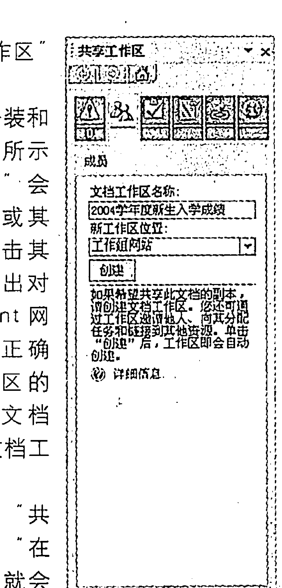

此后，班主任只要单击“共享工作区”任务窗格上方的“在浏览器中打开网站”链接，就会弹出对话框要求输入SharePoint网站的登录用户名和密码，输入正确就会用IE打开与工作簿同名的主页。至此，文档共享工作区创建宣告结束，用户就可以添加协同用户（班上的任课老师）编辑工作簿了。

### 2. 添加协同用户

添加协同用户（给用户授权）的操作方法有以下两种：

- 在刚刚建立的网页（例如“2004学年度新生入学成绩”）中授权。单击网页右侧“成员”栏内的“添加新成员”链接，打开网页“添加用户：2004学年度新生入学成绩”，按照“域\用户”的格式（例如“cfan.local\xxx”）将合作用户添加到“用户”列表。添加时可以一次添加多个用户，每个用户的名称之间用“；”分隔。然后选中“网站用户组”中的一个或几个复选项，给列表中的用户授予访问“2004学年度新生入学成绩”主页的权限。单击“下一步”按钮以后网页显示将要添加的用户信息，例如，电子邮件地址、用户名和显示名称。选中“发送以下电子邮件以通知这些用户他们已被添加”，就可以向已经添加的用户发送电子邮件邀请他们参与文档编辑。

- 在“共享工作区”任务窗格的“成员”选项卡中授权。在文档的共享工作区创建完毕以后，打开“共享工作区”任务窗格中的“成员”选项卡，单击下面的“添加新成员”链接，就可以看到名为“添加新成员”的对话框。按照“域\用户”的格式（例如“cfan.local\xxx”）将合作用户添加到里面，再打开“请为以上成员指定网站用户组”下拉列表，从中选择某一权限继续下一步。当确认对话框中显示的用户信息无误后，单击“确定”按钮完成协同用户的添加任务。这种方法的优点是无须登录SharePoint网站，但是提供的功能比较少，没有向被添加的用户发送电子邮件的选项。

如果待添加的用户在Active Directory中，而且他的电子邮件地址已经存入Active Directory，也可以用电子邮件地址代替“域\用户”添加协同用户。

## （三）在工作区中编辑

利用SharePoint网站协同工作簿既有本地编辑的特点，又带有共享工作簿的某些特征。

### 1. 打开工作簿

当工作簿“2004学年度新生入学成绩”保存到网站以后，有编辑权限的用户就可以登录SharePoint网站协同编辑文档了。具体操作方法是：打开IE，在地址栏中输入“http://服务器IP地址”（例如“http://192.168.0.1”）或“http://服务器名称”（例如“http://cfan”），如果Windows Server 2003的DNS服务器已经设置了网站的域名解析，也可以输入“http://www.cfan.net”之类的域名。如果工作站启动时已经登录了Windows Server 2003域，只要敲回车键就会打开SharePoint网站的主页。单击页面上方的“文档和列表”，就可以在新页面的左侧看到“文档工作区”链接，单击该链接就可以在网页的“文档工作区”下面看到工作区名称了。

此时单击“文档工作区”中的名称链接打开同名主页，其“共享文档”下列出了当前可以共享的工作簿（或Word文档、PowerPoint演示文稿）名称，“成员”中列出了参与协同工作簿等的用户名称。另外，用户还可以使用“任务”列表分配和管理成员协同编辑文档的任务，使用“链接”列表创建与编辑工作相关的文件或网站的快捷方式，这些功能的使用方法将在下文详细介绍。

单击文档名称右边的下拉按钮可以打开如图14所示的菜单，选择其中的命令可以执行“编辑”、“签出”和“删除”等操作。如果双击“共享文档”页面中的文件名，就会使用文件的关联程序打开文档进行编辑了。

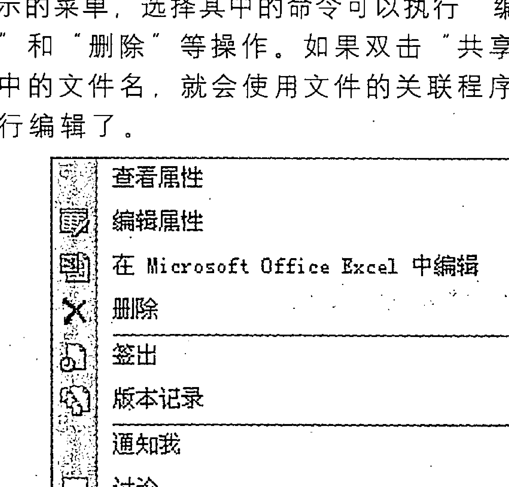

### 2. 编辑工作簿

位于网络不同工作站上的用户打开工作簿以后，他们就可以像操作本地文件那样编辑工作簿了，编辑过程中按【Ctrl+S】组合键或单击“保存”按钮即可将结果更新到服务器。如果用户需要更改工作簿的更新方式，可以单击“共享工作区”任务窗格中的“选项”链接，打开“服务选项”对话框并选择需要的选项即可。

由于编辑过程中不同用户可能同时对同一单元格进行修改，此时单击“共享工作区”任务窗格中的“获取更新”按钮，任务窗格中会显示“您的更改与以下人员对工作区副本所做的更改有冲突”的提示。单击其下的“文档更新”链接就会看到如图15所示的任务窗格，它给用户提供了解决冲突的几种方案：

第一种方案是“合并”。单击图15中的“合并副本”按钮，Excel 2003就会将工作区中的副本合并到当前文档，并且用不同颜色的字体标明了不同用户在文档中新增的内容。如果你想知道某段文字是哪个用户添加的，只要将鼠标指针指向该段文字就会弹出一个黄色的提示框，按照“用户名称、日期、时间、插入的内容”的格式显示相关信息。如果用户需要将他人增加的某段文字合并到当前文档中，只需用鼠标右键单击该文字选择快捷菜单中的“接受插入”命令即可。反之，若他人增加的某段文字不需要合并到当前文档中，只需用鼠标右键单击该文字选择快捷菜单中的“拒绝插入”即可。

第二种方案是“打开工作区副本”。单击图15中的“打开工作区副本”按钮，Excel 2003就会在本地打开工作区中的文档副本。此时只要将当前文档和工作区副本“横向平铺”，就可以在上下两个窗口中查看文档的异同，从而利用手工方法选取不同用户的编辑结果，通过复制和粘贴的方法获得文档的最终版本。

第三种方案是“替换”，图15所示的任务窗格提供了两种替换方法。单击“保留工作区副本”按钮可以用SharePoint网站上的文档替换本地文档，反之单击“保留我的副本”按钮就用本地文档替换SharePoint网站上的文档。

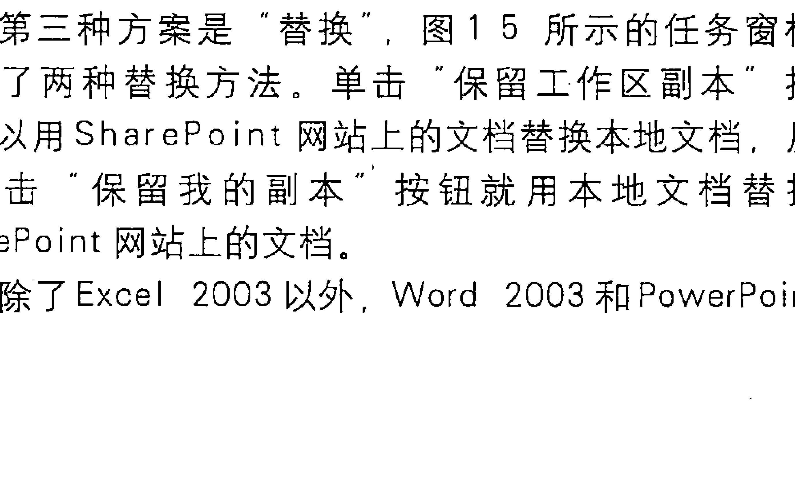

除了Excel 2003以外，Word 2003和 PowerPoint 2003也支持类似的工作方式。

## 五、使用 IE 编辑 Excel 2003 列表

局域网工作站安装了 Excel 2003 以后，用户可以使用上面介绍的方法在“共享工作区”协同编辑工作簿。如果工作站没有安装 Excel 2003，可以在 SharePoint 网站或子网站中创建“列表”，用户使用 IE 就可以协同编辑“列表”中的数据，从而实现工作表的网络远程共享和数据处理，它是 Excel 2003 具有的一个独特功能，是目前最流行的浏览器 / 服务器 (Browser / Server) 工作模式。

### （一）创建和发布列表

列表是 Excel 2003 与 SharePoint 网站紧密集成的结果，为网络用户提供了使用 IE 等浏览器处理数据的手段。

#### 1. 创建列表

假如某位班主任需要将“2004 学年新生入学成绩”发布为列表，供上网的任课老师编辑，首先应当打开准备协同编辑的 Excel 2003 工作表并选中需要发布为“列表”的数据区域。单击 Excel 2003“数据”→“列表”子菜单下的“创建列表”命令，或者用鼠标右键单击将要发布为“列表”的数据区域，选择快捷菜单中的“创建列表”命令，都可以打开含有绝对引用区域的“创建列表”对话框。如果需要使用列表中的标题执行筛选等操作，只需选中“创建列表”对话框中的“列表有标题”，则创建的列表就会使用工作表中的列标题（例如“序号”、“姓名”和“总分”等）。如果取消该复选框，则创建的列表会自动添加“列 1”、“列 2”这样的标题。

单击对话框中的“确定”按钮，所选区域就会变成工作表“自动筛选”的样式。列表区域的末行显示带有星号的空白行。只要在该行中输入数据，带有星号的空白行及其下方的数据会自动下移，可供用户插入任意行数的数据。

#### 2. 发布列表

Excel 2003 列表创建结束，班主任就可以把它发布到 SharePoint 网站，供有权限的任课老师使用 IE 进行编辑。发布时应当打开“数据”菜单下的“列表”子菜单，单击“发布列表”命令打开如图 16 所示的“发布到 SharePoint 网站”对话框。首先在“地址”框中输入存放列表的网站的 URL（例如“http://192.168.0.1”或“http://192.168.0.1/Excel 2003”等）。若要将列表链接到 SharePoint 网站保存的列表，以便发布列表的用户可以在 Excel 2003 中刷新，就要选中“链接到新 SharePoint 列表”复选框。如果用户需要将列表发布到子网站（例如“http://192.168.0.1/Excel 2003”），必须在发布前打开 SharePoint 网站主页，单击“创建”链接打开“创建网页”Web 页，使用其中的“网站和工作区”命令将子网站事先建好。

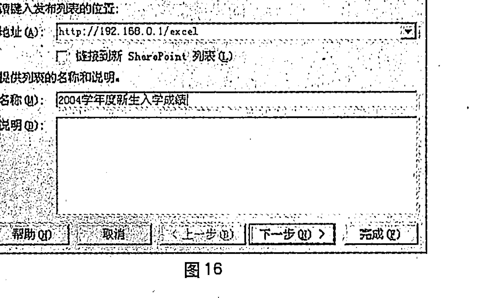

接着在“名称”文本框中输入即将创建的列表名称，并在“说明”文本框中输入可选的列表描述文字，完成后单击“下一步”按钮继续。对话框会让用户检查列表区域中每一列显示的数据类型是否正确，如果列表链接的数据类型不正确，可以单击“取消”按钮返回去转换为正确的类型。确认无误后单击“完成”按钮，列表就会发布到 SharePoint 网站的指定位置，并弹出对话框显示访问列表使用的 URL。

如果上面选择了链接到 SharePoint 网站，且原来的单元格存放有公式（例如“总分”计算公式），发布列表过程会删除其中的所有公式，仅仅保留公式的计算结果。如果发布列表时没有选择链接到 SharePoint 网站，那么发布后的列表可以保留原来的公式，但是发布列表的用户不能在本地使用 Excel 2003 同步列表。

### （二）打开和编辑列表

用来打开和编辑列表的工作站必须安装与 IE 兼容的浏览器，根据操作需要拥有相应的 SharePoint 网站用户权限。

#### 1. 打开和使用列表

列表发布到 SharePoint 网站以后，有登录权限的用户可以在 IE 地址栏输入存放列表的网站 URL（例如“http://192.168.0.1”或“http://192.168.0.1/Excel 2003”等），回车后稍等片刻就会弹出网站的登录对话框，用户只需输入自己的用户名和登录密码，就可以打开网站的主页了。如果列表主人将它发布到了主网站（例如“http://192.168.0.1”），只要登录 SharePoint 网站打开主页，单击“文档和列表”就可以在网页的“列表”下看到发布的列表名称，单击需要查看或编辑的列表名称即可打开如图 17 所示的页面；用户使用 IE 就可以对列表进行编辑了。

用户在如图 17 所示页面中录入记录时，只要在列表区域末尾带星号的空白行内输入数据，带有星号的空白行会自动下移，供用户插入任意数量的数据行。

其次，用户可以使用 IE 对列表中的数据进行筛选或排序。假如需要将如图 17 中的数据按“总分”升序排列，可以单击“总分”旁的下拉按钮打开菜单，选择其中的“升序排列”命令，则列表中的数据就会按照“总分”升序排列。经过排序后的列表还可以进行筛选，如果需要把列表中“总分 > 160”的数据挑出来，可以单击“总分”旁的下拉按钮打开其下拉菜单，选择其中的“自定义”命令。在“自定义自动筛选方式”对话框中选择“大于”和“160”，单击“确定”按钮，即可在列表中看到“总分”大于 160 的所有数据。而且经过筛选的数据还可以继续筛选，用户只要按上面介绍的方法打开关键字所在列的下拉菜单，根据需要选择筛选关键字或自定义筛选方式即可。

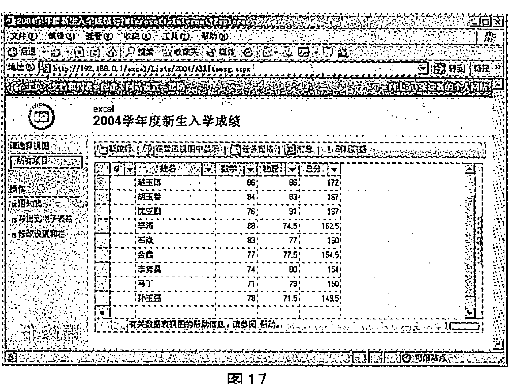

另外，用户还可以对列表中的数据进行各种统计，例如，单击网页上的“汇总”，就会在列表的含星号空白行下方添加“汇总”行。选中该行中的任意一个单元格，其右侧会显示一个下拉按钮，单击它可以打开一个菜单，其中含有求和、平均值等八种统计函数。用户只需根据统计需要和单元格上方的数据类型，选择菜单中的合适命令就可以在当前单元格中获得结果。

除此以外，网页右侧还有一个“任务窗格”。其中可以执行“用 Excel 2003 打印”等多种任务。单击“任务窗格”左侧的“隐藏任务窗格”，可以将其收缩成一个黄色的窄条。反之，单击黄色窄条上的“显示任务窗格”，就可以将任务窗格显示在网页上。由于任务窗格中的命令操作起来比较简单，这里就不再赘述了。

#### 2. 协同编辑列表

如果有多个用户使用 IE 编辑 SharePoint 网站上的列表，每个用户都可以像“独占”工作表那样自由编辑。例如将鼠标指向列表左侧，当鼠标指针变成向右箭头时单击鼠标右键，选择快捷菜单中的“删除行”等命令就可以删除或添加行。其他参与协同工作的用户要想看到最新的编辑结果，只需单击页面上的“刷新数据”按钮，待服务器检索列表数据结束就可以了。如果工作站用户安装了 Excel 2003，只要单击网页右侧“任务窗格”中的“导出并链接到 Excel 2003”命令，就可以将当前网页中的列表导出到工作表或工作簿。

对使用 Excel 2003 发布列表的本地用户（班主任）来说，可以用 Excel 2003 也可以用 IE 参与列表的编辑。假如班主任在 Excel 2003 中修改了数据，只要单击 Excel 2003“数据”→“列表”子菜单下的“同步列表”命令，稍等片刻服务器上的列表就会被更新。当不再需要对列表进行协同编辑时，只需断开列表链接就可以保留本地和网站中的列表数据，但是两者之间不再保持同步。其他用户只要单击“刷新数据”命令就可以看到最新的编辑结果。如果发布列表的 Excel 2003 用户希望使用 IE 进行查看，只要单击“数据”→“列表”子菜单下的“在服务器上查看列表”命令，就可以像其他用户那样通过 IE 查看和编辑列表了。

如果本地用户想放弃对列表所做的本地修改，并从 SharePoint 网站下载列表的当前副本，只需单击“数据”→“列表”子菜单下的“放弃更改并刷新”命令即可。

#### 3. 解决编辑冲突

假如有两个或多个用户同时修改列表中的某个数据，单击网页中的“刷新数据”按钮以后，会弹出对话框提示用户“目前存在待定的更改，或未解决的冲突和错误。是否等待此操作完成”。如果单击“是”就会弹出“解决冲突”对话框，单击“放弃我的更改”按钮会用其他用户的更改替代自己的输入。单击“重试我的更改”就会将自己输入的内容更新到服务器，当前列表会保留自己输入的内容。单击“否”将会在列表中保留已经进行的操作，但是不能解决已经提交到服务器的修改所产生的冲突。

## 经典摄影效果，Photoshop打造

文/奇士

数码相机的普及带来的是摄影门槛的大幅降低，无论身在摄影艺术的大门外多么遥远的人都可以拿起相机留下美好的瞬间。然而由于水平有限，留下的瞬间往往并不那么尽如人意。好在可以随意删除，一点儿也不用心疼。不过且慢，别忘了数码照片的最大优势，那就是可以传输到电脑中任意进行修改。下面讲述的就是如何利用 Photoshop CS 来修饰那些效果差强人意的照片，让它们变得更完美。笔者演示使用的是 Photoshop CS 中文版，为了方便英文版的用户，每个命令的后面都附有对应的英文。好了，运行 Photoshop，咱们开始。

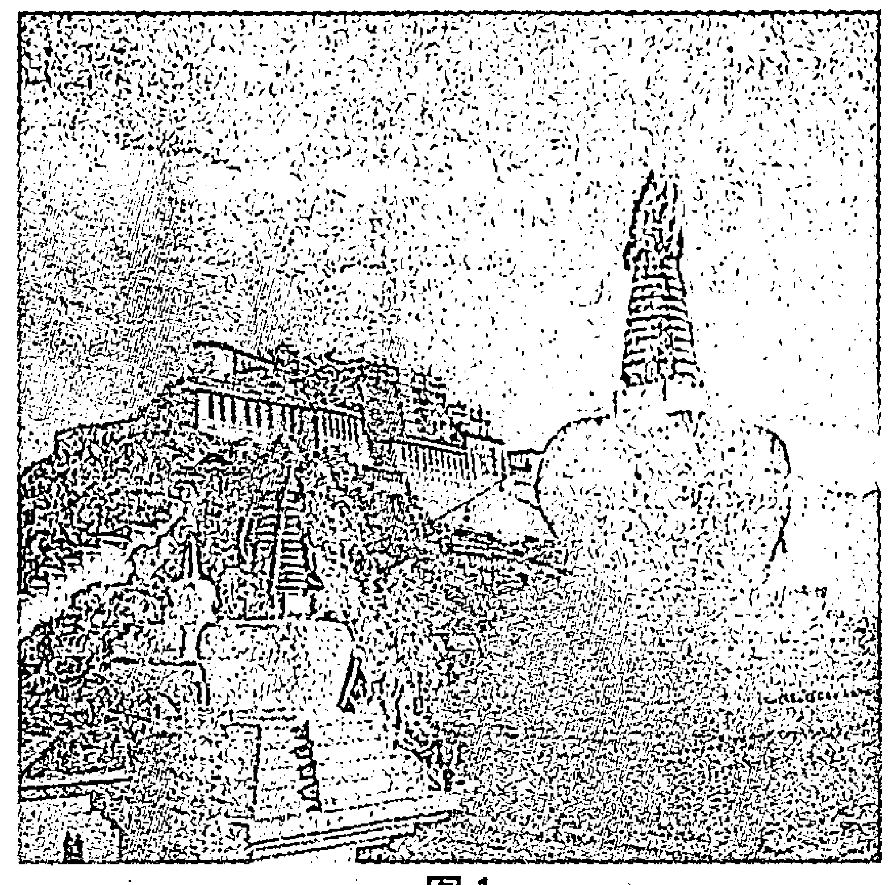

### 一、只及一点不及其余——利用景深突出主体

摄影新手最常见的问题就是掌握不好景深。景深，就是在焦距的前后两侧能够清晰成像的范围。简单地说，光圈越大，焦距越短，景深就越浅；光圈越小，焦距越大，景深就越深。但是在实际的拍摄中，情况千差万别，很难掌握，并且景深的控制跟相机本身也是有很大关系的。结果往往是拍摄出来的照片主体和背景都是一样的清晰，显得毫无层次感。那就把照片传输进电脑，在 Photoshop 中打开它，我们一起来修改它。

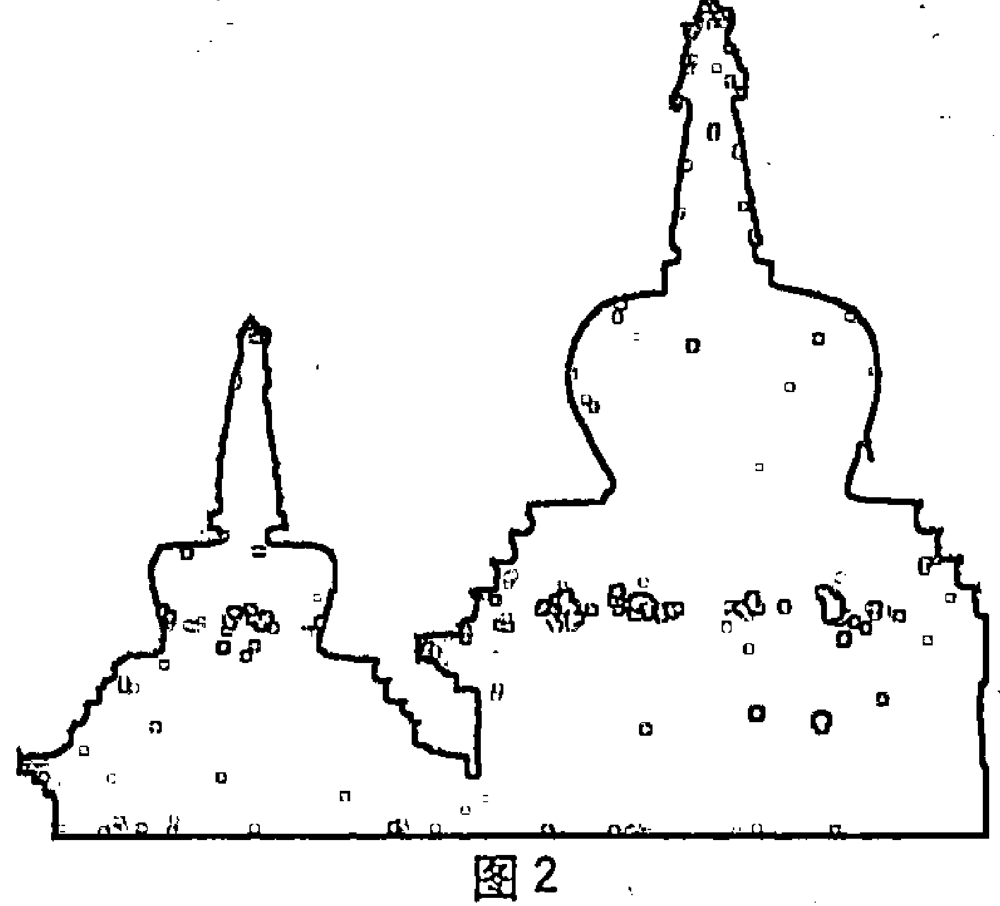

打开一幅景物的照片（图1）。我们要将照片中前景的两个白塔保持清晰，而令背景的山和布达拉宫变得模糊，好像景深很浅的效果。首先使用磁性套索工具（Magnetic Lasso Tool，快捷键为【L】），大致选出两个白塔的轮廓，再用套索工具（Lasso Tool）结合【Shift】键和【Alt】键进行增减选区的操作，以得到精确的选区。在图层调板上，双击背景图层，在弹出的对话框中单击“好”按钮，将背景图层转变为普通图层0。按住 Alt 键单击调板底部左边第二个按钮，即添加图层蒙版（Add Layer Mask）按钮，为图层0 添加一个由当前选区确定范围的蒙版。【Alt】键的作用是使在添加的蒙版中选区范围内填充黑色（图2），即使两个白塔变得透明。如果不按【Alt】键，得到的蒙版刚好相反。事实上，此处得到哪种蒙版都可以，因为接下来我们还可以进行修改。

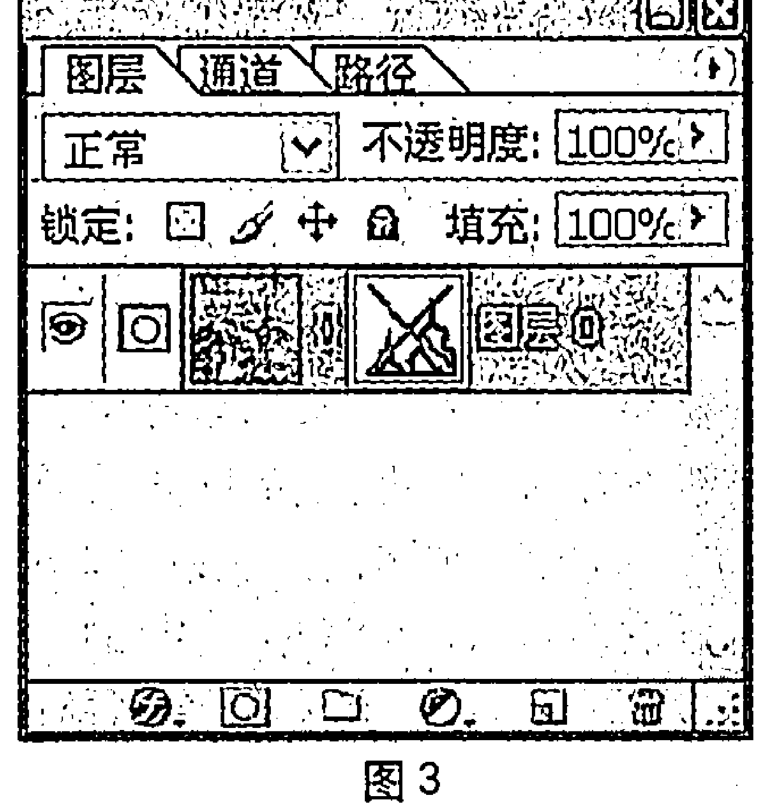并不重要，后面还有改变的机会。按住【Shift】键，单击图层调板上图层0 的蒙版缩略图，结果是上面出现了一个红叉，图层蒙版暂时被关闭了（图3）。此时还需要再单击一下图层的缩略图，使当前的编辑对象变为图像而不是蒙版。

选择菜单命令“滤镜” → “模糊” → “镜头模糊”（“Filter” → “Blur” → “Lens Blur”）。在打开的对话框中，首先选中“预览”（Preview）复选框，这样我们可以实时看到调整的效果。为了提高预览的速度，选中“更快”（Faster）单选按钮。在“深度映射”（Depth Map）选项区中选择“源”（Source）为图层蒙版（Layer Mask），即刚才我们制作的蒙版。将“模糊焦距”（Blur Focal Distance）设为20，这个数字越大就相当于相机的焦距越大。如果刚才制作蒙版时，没按Alt键，在此处需要选中“反相”（Invert）复选框，否则得到的照片中白塔将是模糊的，而不是背景。在“光圈”（Iris）选项区，我们可以通过设置光的形状（Shape）和半径（Radius），来模仿不同类型的相机，在这里不妨保持为默认。在“镜面高光”（Specular Highlights）选项区，我们可以增加照片中的镜面高光，此处我们将“亮度”（Brightness）设为10，将“阈值”（Threshold）设为220，这样设置可以适当增强背景中的高光区域，使照片更加活泼自然。在“杂色”（Noise）选项区，可以为图像增加杂色，制造一种颗粒感，相当于添加杂色（Add Noise）滤镜，不过添加的范围仅限于背景，也就是蒙版的白色部分。我们将“数量”（Amount）设为30，选择“分布”（Distribution）为“平均”（Uniform），选中“单色”（Monochromatic）复选框，也就是使用单一颜色的杂点。设置好后确定，就得到了一幅景深很浅的照片，只有两个白塔是清晰的，背景被模糊掉了（图4）。

灵活运用选取工具和蒙版工具，以及在“镜头模糊”对话框中对众多选项做不同的设置，我们可以制作出多种多样的景深效果，完全可以和相机拍摄的真实景深效果相媲美。

### 二、夕阳无限好——滤色镜的效果

我们都见过这样的摄影作品：旭日东升或是夕阳西下，金红色的阳光将大地上的一切都染成了红色，色彩甚是浓烈，具有强力的视觉冲击力。其实这种照片并不是用普通镜头拍摄的，而是加了滤色镜，滤掉了除红色之外的颜色，在底片上成像的颜色主要为红色，因此才得到了这样的效果。Photoshop同样具有类似的滤色功能。

以如图5所示的照片为例。这幅风景照片整体色彩偏冷色，怎么看都不像是红彤彤的太阳照耀下，我们马上就让它“温暖”起来。在图层调板上单击底部右边第三个按钮，即“创建新的填充或调整图层”（New Fill Layer or Adjustment Layer）按钮，在弹出的菜单中选择“纯色”（Color）命令。在弹出的拾色器中，选择橘红色（R：255， G：80， B：0），然后确定。现在图像窗口中填满了耀眼的橘红色，这是眼睛直视太阳的结果，呵呵。在图层调板上将这个颜色填充图层的混合模式改为“颜色”（Color），图像窗口中显示出了橘红色的景色。但是还不够，因为树叶还是绿色调的，破坏了整体的氛围。将颜色填充图层拖到底部右边第二个按钮，即创建新的图层（New Layer）按钮上，复制该图层。得到的颜色填充副本图层的混合模式仍是“颜色”，因此图像没有变化。我们将副本图层的混合模式改成“叠加”（Overlay），这下子照片上的红色调已经浓得化不开了。适当降低图层的不透明度，比如40%，得到红得恰到好处的最终作品（图6）。最后的图层调板如图7所示。

图6

图7

如果我们想改变照片的色调，比如变成冷峻的蓝色或者神秘的紫色，可以双击颜色填充图层的缩略图，在弹出的拾色器中重新选择颜色，确定即可。是不是很方便？这正是我们选择使用颜色填充图层的原因。

### 三、鱼眼看世界——广角镜头拍摄的变形效果

广角镜头适合用来拍摄远距离大范围的景物，通过镜头的变形使被摄景物发生鱼眼状变形，在表现极广阔的场面时，尤其应用在航拍中，可以展现出恢宏的气势。在Photoshop中，利用滤镜可以模仿这种变形效果。

打开一幅城市照片（图8），这是一幅航拍作品，视野极为广阔，我们来为其锦上添花。选择菜单命令“图像”→“画布大小”（“Image”→“Canvas Size”），在对话框中设置单位为“百分比”（Percent），然后将宽度和高度都改为150，即扩大到原尺寸的150%，保持“定位”（Anchor）位置为中间，单击“好”按钮。

图8

在图像窗口中，画布面积将大幅扩大，原图像的周围被背景色填充，为照片的变形留出足够的空间。选择菜单命令“滤镜”→“扭曲”→“挤压”（“Filter”→“Distort”→“Pinch”），在对话框中将“数量”（Amount）设为-40%。挤压滤镜的数量默认的应该是正数，即从外部向内部挤压，如果填入负数，则是从内部向外部膨胀。在对话框中，我们可以在右侧看到网格的变形情况，在上方可以预览图像的变形情况。设置好后确定，图像窗口中的照片发生了鱼眼状变形（图9）。选择裁剪工具（Crop Tool，快捷键为【C】），对准照片没有发生变形的四个角，单击并拖动画出裁剪框。如果没有对准，可以调整裁剪框边框上的八个手柄进行调整。调整好后，在框内双击鼠标确定。周围多余的部分被裁掉，只留下变形的照片（图10）。从这张照片中，我们可以清楚地看到地球是圆的。

图9

图10

我们在使用挤压滤镜之前先扩大画布，是为了给滤镜提供足够的变形空间。如果不扩大画布而直接使用滤镜，得到的结果将是只有照片的一部分发生变形。如果想要照片向一侧挤压变形的效果，我们可以在扩大一次画布之后，再次扩大画布，定位选择其中一个方向。这样的结果是照片不再位于画布的中央，这时再使用挤压滤镜就会得到照片变形偏向一侧的效果（图11）。

### 四、速度与激情——聚焦运动对象

在拍摄运动中的人或物体时，使镜头的轴线与对象的运动方向保持垂直；转动相机，使焦点始终保持在运动的对象上，在按下快门时仍保持相机的移动，这样就会得到运动的对象聚焦清晰，而背景动态模糊的效果。这种效果经常被用于体育摄影中，很能表现运动对象的动感和美感。在Photoshop中模仿这种效果并不复杂。

打开一张运动中的人物的照片，笔者打开的是一张滑雪的照片（图12）。在图层调板上，将照片图层拖到创建新图层按钮上，复制该图层。确认副本图层为当前图层，选择菜单命令“滤镜”→“模糊”→“动感模糊”（“Filter”→“Blur”→“Motion Blur”）。在对话框中将“距离”（Distance）设为30像素，将“角度”设为-30度（人物运动的方向）。选中“预览”（Preview）复选框，可以通过对话框的预览图像和图像窗口看到应用滤镜的预览效果。效果满意后确定，将滤镜应用到图像上（图13）。在图层调板上，单击底部左侧第二个按钮，即“添加矢量蒙版”（Add Layer Mask）按钮。于是副本图层的缩略图的右边出现了一个白色的矩形，这就是蒙版，默认情况下填充白色，这时该图层上的图像是完全显露的。我们要在蒙版上涂上黑色，使图像部分透明。选择画笔工具（Brush Tool，快捷键为【B】），在选项栏上选择合适直径的柔角画笔，使用黑色在人物的身体上涂画。副本图层被黑色涂到的部分会被隐藏，显露出下面的原始照片，也就是清晰的版本。使用柔角画笔可以使边缘柔和，不至于太过生硬。涂画的时候要尽量仔细，如果不小心涂错了也没关系，按下【X】键，交换前景色和背景色，使用白色涂回来即可。看着图像涂画蒙版有时候不太方便，我们可以按住【Alt】键，在图层调板上单击副本图层的蒙版缩略图，进入蒙版状态，查看黑色部分是不是有空隙（图14）。再次按住【Alt】键单击蒙版缩略图即可退出蒙版状态，回到图像编辑状态，而仍保持对蒙版的编辑。经过一番涂画，就得到了我们想要的动感模糊效果（图15）。

这种效果非常适于表现速度感。换个思路，试一试蒙版黑白颠倒，将人及其周围的部分区域留白，而令其他部分为黑色，这样就会得到背景清晰，而人物变得动感模糊的效果。

### 五、黑白世界的精彩——层次分明的灰度

在彩色照片大行其道的今天，黑白照片并没有退出历史舞台，仍有一批黑白摄影的忠实爱好者固守着这一片阵地。事实上，很多时候，比如在表现人文题材时，黑白照片比彩色照片更能抓住观者的目光，震撼观者的心灵。现在的数码相机基本上都提供有黑白拍摄模式，允许我们拍摄黑白照片，但是要想拍出真正精彩的黑白摄影作品来，可不是一件简单的事情。下面我们就来看看如何用Photoshop来加强我们的黑白摄影作品的感染力。

将彩色照片转换为黑白照片，最简单的方法莫过于选择菜单命令“图像” → “模式” → “灰度”(“Image” → “Mode” → “Grayscale”)，将图像中的色彩信息去掉。但是这样得到的黑白照片显得很平淡，缺乏层次感。我们可以采用更高级一点的方法来进行处理，那就是“通道混合器”命令。这个命令位于菜单“图像” → “调整”(Image → Adjustments)下面。这是一个很强大的命令，我们可以通过它对通道进行不同程度、不同比例的混合，来调整图像的色彩。

好了，打开一幅彩色照片(图16)，我们要将它制作成精彩的黑白照片。首先，我们选择菜单命令“图像” → “模式” → “灰度”，简单地制作一张黑白照片，然后在“历史”(History)调板上，单击底部第二个按钮，即“创建新快照”(New Snapshot)按钮，留下这个状态的记录以供后面进行比较。在操作列表中选择变成灰度之前的状态，恢复到原来的照片。选择“通道混合器”命令，首先选中对话框底部的“单色”(Monochrome)复选框，输出通道就变成了灰色通道(图17)，这样就可以制作黑白照片了。

在这里，如果我们分别将三个颜色通道调整为100%，就是分别只保留相应的通道而扔掉另外两个通道。如果将三个颜色通道都调整为33%，结果就跟直接转换为灰度模式一样了。选中“预览”复选框，试着调整三个颜色通道的输出比例，观察调整过程中照片的变化。不同的混合比例得到的黑白照片会有很大的不同，不过应该尽量使三个通道的输出比例之和为100%，过高会使照片太亮，过低会使照片太暗。如果照片中红色通道细节丰富、层次均匀，那么我们不妨提高红色通道所占的比例，对于两个颜色通道的类似情况也可以如此处理。这需要我们事先切换到“通道”(Channels)调板分别对三个颜色通道进行观察。“常数”(Constant)选项的作用是调整照片的亮度。笔者的设置是红色通道60%，绿色通道30%，蓝色通道10%，确定后得到最后的黑白照片效果(图18)。我们可以与保留的快照比较一下，是否通过通道混合器得到的黑白照片效果更佳。

再扩展一下我们的思维，如果将某条颜色通道的输出比例调整为负数，而仍保持总和为100%，结果又会怎么样呢？笔者又将设置改为红色通道140%，绿色通道80%，蓝色通道-120%，得到了奇妙的黑白照片效果（图19）。每条颜色通道的调整范围从-200到+200，三条颜色通道的组合方式不可胜数。多多尝试，一定会得到精彩有趣的黑白照片。

### 六、360 度的世界——全景照片的制作

你是否曾经感受过全景照片带给你的强烈视觉震撼？对于视角只有150度左右的人类来说，看到前后左右360度的场景都在一张平面的照片上呈现出来，也许会感到有点难以置信吧。全景照片是由一系列普通照片拼接到一块儿制成的，拍摄时需要稳定相机，然后每旋转一定角度拍摄一张照片，相邻的照片要有一定比例的重复部分，以便于拼接时对齐。很多数码相机都具备拍摄全景照片的功能，我们可以在拍摄结束后，将一系列照片都传输到电脑中，用Photoshop CS来制作全景照片。

先准备好一组系列照片（图20）。在Photoshop CS中，选择菜单命令“文件”→“自动”→“Photomerge”(File → Automate → Photomerge)，打开照片拼接的准备对话框。我们需要选择要拼接到一起的那组照片，“使用”(Use)下拉菜单中有三个项目可供选择：“文件”(Files)、“文件夹”(Folder)和“打开的文件”(Open Files)。“文件”选项允许我们从不同的位置中打开一个或多个文件；“文件夹”选项会导入选定的文件夹中的全部文件；“打开的文件”选项会使用Photoshop 中当前打开的文件。我们选中“文件”选项，依次打开需要拼接的那一组照片文件。导入的文件都列在下面的列表中。选择“尝试自动排列源图像”(Attempt to Automatically Arrange Source Images)复选框可以让软件自动排列图像文件的顺序。但是软件总是自作聪明，所以一般不要选择它（图21）。保证照片顺序正确最保险的方法是逐张导入，反正需要拼接的照片也不会很多。确认文件列表中的图像文件排列顺序正确后，就单击“好”按钮。然后Photoshop会执行一些自动操作，就是依次将列表中的文件全部打开，新建一个空白文件，将打开的文件都粘贴到新文件中，使它们分别单独占据一个图层，再将列表中的文件关闭，只留下新建的文件。

自动操作完成后，进入真正的照片拼接对话框。需要拼接的照片已经按顺序排列在对话框的上方了，我们使用“选择图像工具”(Select Image Tool)将它们依次拖动到下面的大框中。选择对话框右下角的“对齐图像”(Snap to Image)，这样当我们把照片移动到与它相邻的照片附近时，程序将根据照片间的重复部分，自动将它们拼接起来。如果由于照片过多或者得到的全景照片过长而无法显示完全，我们可以使用“移动视图工具”(Move View Tool)来移动视图，或者利用对话框右侧的“导航器”(Navigator)来移动视图和缩小视图。在右侧的选项中，我们还可以选择全景照片的模式，“正常”(Normal)还是“透视”(Perspective)，是否使用“圆柱映射”(Cylindrical Mapping)，就是像环幕电影的那种效果，以及是否使用“高级混合”(Advanced Blending)，读者朋友可以试着逐一选择，观察效果的变化，选择自己需要的一种。建议选择“保持为图层”(Keep as Layers)，这样以后还可以自己手动调整。设置完成后确定，Photoshop又根据我们的设置进行一系列自动操作，操作的结果就是一幅已经拼接完成的全景照片（图22）。

## 一碟在手 维护无忧

**——万能启动工具光盘制作**

文/王严刚

只要你使用电脑，总会遇到一些让你头痛的事情，诸如死机、丢失文件、遭遇病毒等。特别是对于菜鸟来说，遇到这样的问题往往就会束手无策，所以说在电脑的日常使用与维护过程中，拥有一张功能强大的启动盘是不可缺少的工具。眼下随着光盘刻录机的价格一降再降和刻录软件更加容易使用，我们要刻录一张普通光盘，早已不是什么难事了。如果我们用光盘直接启动电脑，并通过光盘上的一些应用程序对电脑进行保养和维护，势必会比以往使用软盘维护要方便得多，所以拥有一张自己的启动光盘就显得非常必要了。

但要制作和刻录可启动的光盘却是未必人人能够做得到，所以本文主要介绍如何制作启动光盘以及怎样把一些应用程序加到启动光盘里，从而做到“一碟在手，维护无忧”。做启动光盘当然离不开工具的支持了，所以选择合适的工具会让我们事半功倍。

### 一、制作工具

- Easy Boot

  可启动光盘镜像的制作工具，能生成标准的ISO文件，同时具有优化光盘上文件的功能，使相同的文件只刻录1个，其他的文件都能连接到该文件，是做N合1的核心软件。

- ACDSee

  目前最流行的数字图像处理软件，它能广泛应用于图片的获取、管理、浏览和优化。同时ACDSee也是最得心应手的图片编辑工具，可以轻松处理数码影像，拥有的功能有去除红眼、剪切图像、锐化、浮雕特效、曝光调整、旋转、镜像等等。

- WinImg

  一套可将文件或是文件夹制成Image文件的程序，它能从一个镜像中释放文件，创建一个空的镜像文件，在镜像中注入文件与目录，转换一个镜像格式。

- RamDiskNT

  利用内存模拟技术产生和硬盘以及1.44MB/2.88MB软盘功能一模一样的虚拟硬盘/软盘，可依个人电脑内存大小设定所模拟的硬盘空间大小，最大支持到4GB。

- VMware Workstation (或Virtual PC)

  一款“虚拟机”软件，它可以在电脑上模拟出Windows 98/2000/XP/Linux等操作系统。在这里它的作用主要是测试制作完成的镜像文件，不用刻盘就可知道能不能启动了。

- Nero

  使用率极高的刻盘工具，拥有高速、稳定的刻录核心，再加上友善、简单的操作界面，绝对是你刻录机的绝佳搭档！当然你也可以凭个人喜好选用别的刻录软件。

### 二、制作启动盘

Easy Boot是一款集成化的中文启动光盘制作工具，它支持子菜单模式、开机Logo画面和背景图像(640×480×256色)，对于屏幕上的文本、菜单和功能键也能够随意定制，而且所见及所得。程序内建了ISO文件生成器，能够直接生成可启动的ISO文件，只要通过刻录软件即可制作完全属于自己的启动光盘。哈，说了这么多是不是有些心动了？赶快到http://cn.ezbsystems.com/download.htm下载吧！

下载Easy Boot并安装完成后，在Easy Boot安装目录下会自动生成ISO和Disk1两个文件夹，其中ISO文件夹用来放置Easy Boot生成的光盘映像文件，Disk1文件夹中放置将要刻录到光盘上的所有文件和文件夹。

启动Easy Boot后，在主界面上会有6个标签，从左到右分别用来控制光盘界面的窗口、标题、菜单名称、菜单布局等等。我们就以如图1所示的界面为例，来一步步介绍光盘界面的制作方法。

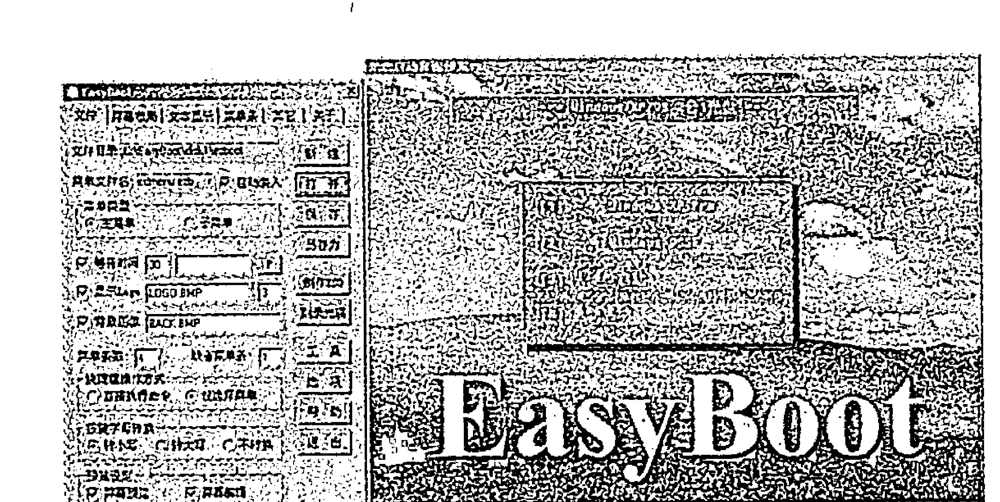

左上角和右下角坐标，边色、主体色、边宽等参数。哇！一下说了这么多的参数，大伙是不是有点糊涂了，没关系！你只要知道有这么一回事就行了，不必深究！我们可以在 Easy Boot 自带模板的基础上进行修改。如果你想做出专业级的启动光盘，那就去 Easy Boot 的论坛泡泡吧！在“文本显示”中能对屏幕上的文字显示进行定义，其中包括左上角及右下角坐标，文本内容、对齐方式等参数。例如，我们要把软件默认的“Windows XP/98 2合1光盘”改成“电脑爱好者合订本工具盘”，单击“光盘启动界面预览”窗口中的“Windows XP/98 2合1光盘”文字，Easy Boot 则会在“文本显示”窗口显示其相应的属性，这时我们只需在“文本内容”中输入相应的文字即可，如果你对默认文字的颜色、对齐方式等不满意，还可自行设置。

#### （一）添加光盘背景和Logo

点击“打开”按钮，选择以 EZB 为后缀名的文件，则会装入菜单文件。因为 Easy Boot 安装后会自动生成 cdmenu.ezb 样例，我们可以在此基础上进行修改，十分方便，而点击“新建”按钮则会创建一个新的菜单文件。在 Easy Boot 的“文件”选项卡中有以下设置内容：

- 等待时间：进入启动画面后等待30秒后，如果没有响应则会自动运行缺省菜单（这对无人值守安装很有用），当然我们也可以人为输入自己想要的等待时间。在后面的方框我们输入“cfan”再按“P”按钮则可把 cfan 设定光盘启动密码（只有主菜单才能设定启动密码），输入空密码并按“P”按钮则会取消光盘启动密码。在光盘启动时，如果连续3次密码错误，系统会自动重新启动。

- 显示Logo：光盘启动后会第一时间显示这张光盘的Logo，默认时间为3秒，然后才会显示光盘的主界面。需要注意的是，Logo图片应该是BMP格式、640 × 480大小的256色图像文件（至于如何制作图片会在下面详细介绍），对于子菜单则建议不要设置Logo画面以便提高启动速度。

- 背景图像：光盘主界面的背景，背景图像的格式与Logo是一样的。Back.bmp是背景图片的文件名，如果我们有合适的图片来替换，也要把文件名更改成相应的名称。

- 菜单条目：显示光盘菜单的总条数以及缺省菜单数目，这两项都是不可选的，如果对光盘菜单进行增删，其相应的数字也会随之更改。

- 预览设定：预览设定分为“屏幕预览”和“屏幕编辑”两项，选中“屏幕预览”则会在Easy Boot控制面板的右边显示实际光盘启动菜单的效果，而“屏幕编辑”是指在对光盘菜单编辑的过程中显示更改的项目。

#### （二）设置光盘界面的窗口属性

在“屏幕布局”和“文本显示”选项卡中，我们可参照程序自带的启动菜单模板进行设置，通过“屏幕布局”我们可以定义屏幕上的颜色区域，包括

#### （三）为光盘添加菜单

在“菜单条”标签卡中，对于主菜单我们需要在每一条菜单条的“菜单文本”框中分别填写菜单的名称，如杀毒工具，在“执行命令”框中应按 Run XXXXX.ezb 的格式填写，若对于子菜单，则需要在“菜单文本”框中填写启动盘中具体的工具名称，如“KVDOS 杀毒伴侣”，在“执行命令”框中应按 Run XXXXX.img（IMG是一种磁盘映像文件）的格式填写。在菜单条所对应的命令中，一般可分为两类：

##### 1. run命令

运行启动Image文件，启动DOS/Windows 98/NT/2000/XP。

```
如：run dos98.img
run w2ksect.bin
```

##### 2. boot命令

```
如：boot 80 从硬盘启动
boot 0 从软盘启动
reboot 重新启动电脑
```

说明：如果1个菜单条执行多条命令，中间用“；”（分号）隔开。如 cd boot; run w2ksect.bin。

### 小技巧

- 如果想要在主菜单里调用子菜单，需在主菜单界面里建立一个菜单条，在“执行命令”里用“Run XXXXX.ezb”（XXXXX.ezb为子菜单的名字）来调用子菜单；或者在主菜单“其他”→“功能键”里填入A~Z任一键的名字（比如填入A），然后在“其他”→“执行命令”里用“Run XXXXX.ezb”（XXXXX.ezb为子菜单的名字）来调用子菜单。倘若想从子菜单返回主菜单，要在子菜单界面里建立一个菜单条，在“执行命令”里用“Run XXXXX.ezb”（XXXXX.ezb为主菜单的名字）来返回主菜单；或者在子菜单“其他”→“功能键”里填入A～Z任一键的名字（比如填入A），然后在“其他”→“执行命令”里用“Run XXXXX.ezb”（XXXXX.ezb为主菜单的名字）来返回主菜单。

- 在Easy Boot中默认菜单显示模式丑陋无比，现在Windows XP都流行透明的菜单文字了，怎么才能让我们的启动菜单也能实现透明呢？比如说我们想把菜单文字的颜色设为红色，而激活菜单时则显示为白色。这时只要在“菜单条”标签卡中把“高亮属性”中的“背景色”“前景色”都设为白色，而把“正常属性”中的“背景色”和“前景色”设为红色就OK了！同样使“高亮属性”的前景色和背景色相同，同时设置“正常属性”的前景色和背景色也相同可实现透明菜单文字。

在“菜单条”标签卡中还可以自行设置快捷键，这样用户就能按指定的按键直接选择执行菜单，快捷键可以是0～9/a－z/A－Z等ASCII按键。光标键的设置后可以在当前菜单上按Up、Down、Left、Right、Tab等光标键来转向其他的菜单条，参数分为3种情况：

- 00 —— 缺省，Up、Left选择上一菜单项，Down、Right、Tab选择下一菜单项。
- 99 —— 禁用，使光标键没有作用。
- 01～36 —— 直接跳转相应菜单项。

由于Easy Boot不支持直接运行EXE文件，而能运行IMG和IMA格式的文件，所以我们在Easy Boot里想运行诸如瑞星、江民、DM等工具软件的时候，就必须把这个工具做成IMG文件，但有一些朋友不知如何制作IMG文件，笔者会在下面专门为大家介绍制作的过程。把制作好的IMG的文件，拷贝到Disk1的ezboot文件夹下。

经过上述步骤，启动光盘就设计出来了（图2），点击“保存”按钮，这样启动光盘的工作就完成一半了。咦？不是好了吗，怎么是一半呢，在做好启动光盘后，我们还需再点击“制作ISO”按钮，把刚才的启动光盘生成ISO文件。这样才能方便Nero这些刻录工具把启动盘刻成盘啊！

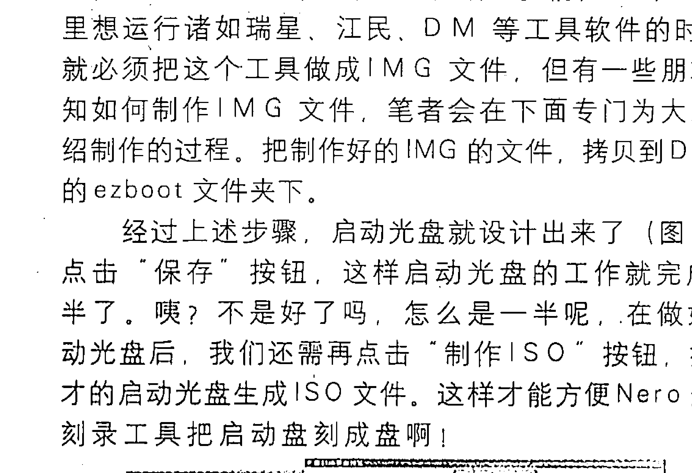

#### （四）制作背景图片

有些朋友可能认为Easy Boot自带的背景图片和Logo图片不够漂亮，想做出个性的图片就要ACDSee出马了！使用ACDSee我们可以对一些图片进行简单的操作就可达到预期效果，在这里我们以ACDSee PowerPack 7.0 Build 47为例来介绍更改过程。

1. 首先打开一个你想用来作背景的图片。如果不是BMP格式，则单击“修改”→“转换文件格式”命令，在弹出的“转换文件格式”窗口中选择“BMP Windows位图”格式，再单击两次“下一步”后单击“开始转换”按钮（图3），在转换的过程中会弹出一个“警告”窗口，不用管它，点击“全部都是”就行了！

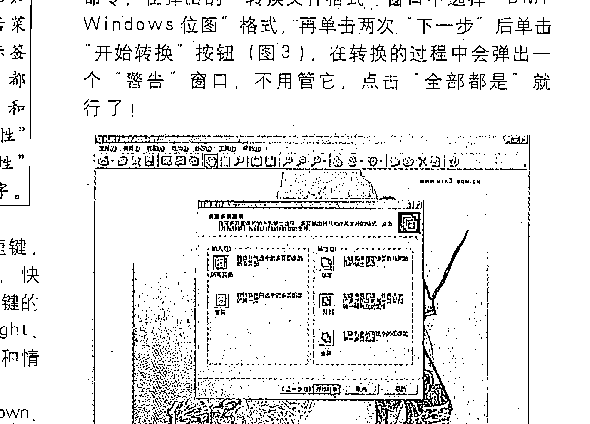

2. 接着再用ACDSee 7.0把刚才更改的图片打开，如果你的图片不是640×480的格式，就点击“修改”→“调整大小”按钮，在弹出的“调整大小”的窗口中，点击“预设”下拉列表（图4），从中选择640×480格式，点击“完成”按钮后退回ACDSee主界面。

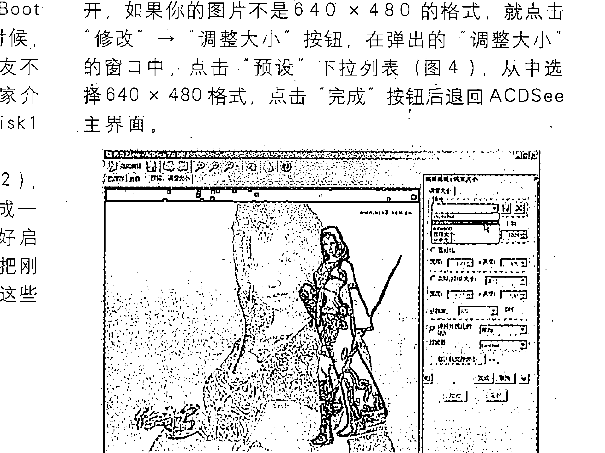

3. 现在我们再来把图片的颜色修改成256色吧！点击“修改”→“改变色深”→“256色”命令，再单击“保存”按钮，这时图片就被改成我们所需要的格式了。

#### （五）制作IMG文件

在此我们以KV2005杀毒软件为例，来一步一步让大家学会如何把DOS下的杀毒工具做到应急启动光盘里（操作系统为Windows Server 2003），如果想把别的应用程序也集成到启动盘，其制作的方法是大同小异的。

首先用鼠标右键单击“我的电脑”，打开“属性”对话框，打开“硬件”→“设备管理器”，在“设备管理器”中把软盘控制器左边的“+”号展开，在软盘控制器中的“设备”上单击鼠标右键，从弹出的菜单中选择“禁用”。接着打开RamDiskNT（虚拟磁盘工具）程序，在“基本设置”中把磁盘类型改为“1.44MB Floppy”，驱动器盘符设为“A”，其他为默认值（图5），点击“启动”按钮后再把RamDiskNT关闭，这时RamDiskNT会自动在后台运行，而系统中则会虚拟出一个“3.5软盘(A:)”，只不过类型是可移动磁盘罢了。

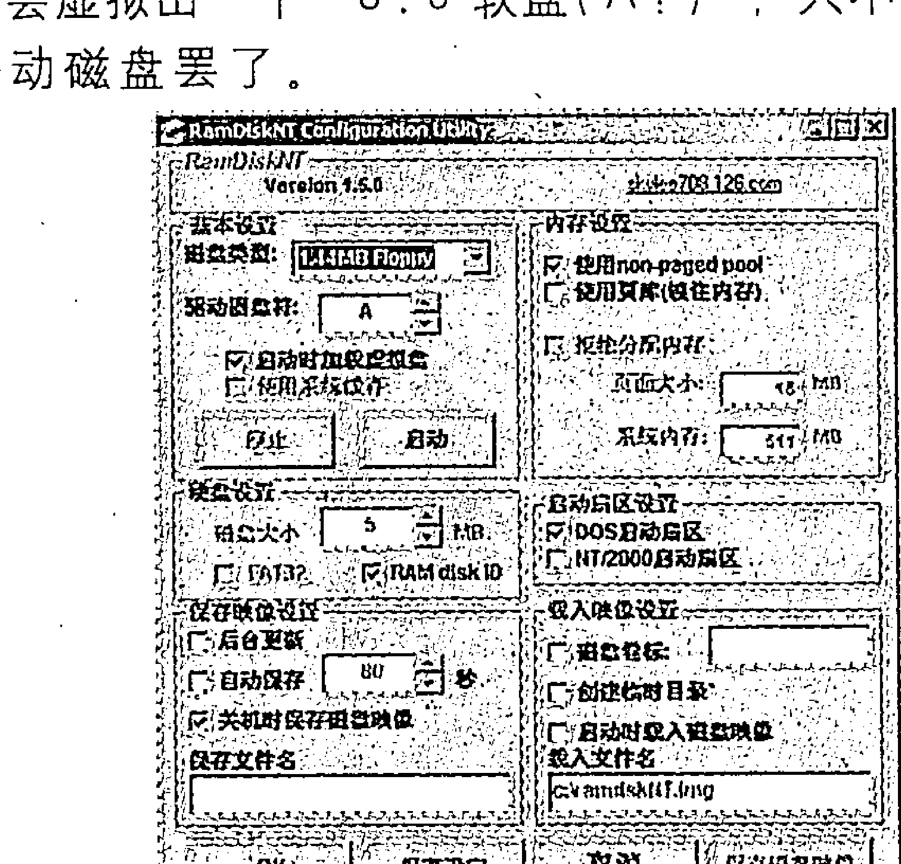

接着把KV2005杀毒软件的病毒库升级到最新版，启动KV2005主程序，单击“工具”→“制作DOS杀毒伴侣”命令（图6），这时会弹出“江民杀毒软件软盘制作工具”窗口，点击“开始”按钮后制作DOS杀毒伴侣程序就开始把升级的文件写到我们刚才虚拟的A盘中了。由于制作KV2005的DOS杀毒伴侣需要三张磁盘，所以当第一张磁盘制作好了之后不要点“继续”按钮，这时就需要WinImage闪亮登场了，在WinImage的主界面中点击“磁盘”→“读取磁盘”，这时就会把RamDiskNT虚拟的A盘里所有文件拷贝到WinImage中了（图7），点击“保存”按钮把文件存为IMA类型。接着打开“我的电脑”里把虚拟A盘进行快速格式化，格式化完毕后点击制作DOS杀毒伴侣程序的“继续”按钮来制作第二张软盘，同样在做好第二张后再用WinImage把它读取出来存为IMA类型，再把虚拟软盘格式化后点“继续”后再做第三张软盘并保存映像文件。

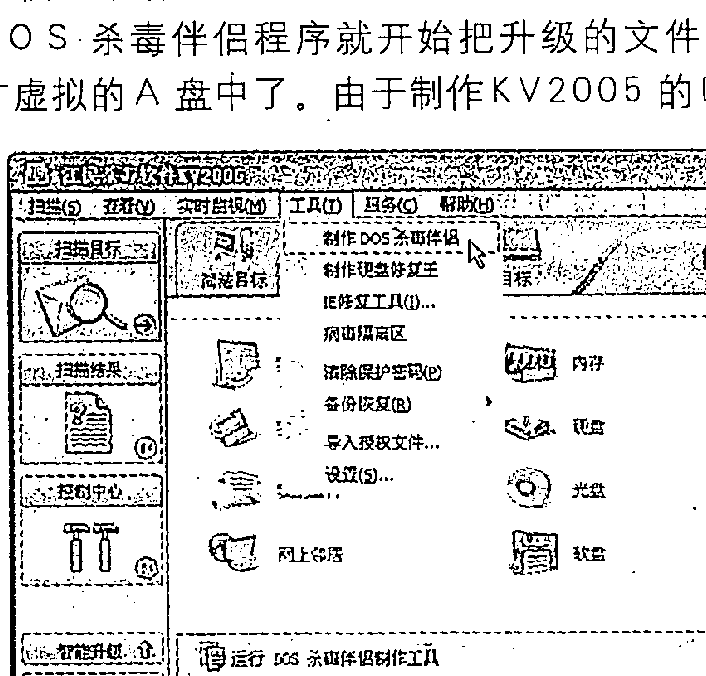

然后用Easy Boot里的工具来生成一个新的软盘IMG映像，这样可以让其更好地在Easy Boot中运行。运行Easy Boot程序点击“文件”标签卡里的“工具”按钮，从弹出的下拉菜单里，选择“生成新的软盘映像”，弹出“生成新的软盘映像”对话框。在“种子映像文件”一项中点击右侧的“浏览”按钮，选中要作为种子的映像文件（一般我们选Easy Boot自带的Windows 98启动盘的映像文件）。再在映像大小下拉框中选取目的大小的映像文件，如做KV2005的DOS杀毒伴侣的映像文件选4 320KB即可（当然我们也可以输入数字来定义文件的大小，如5 000）。选好输出的映像文件的目的文件夹，默认的是“C:\Easyboot\disk1\ezboot\4320.img”。点击“生成”按钮，即可生成如你所愿的空的映像文件。接着把刚才的3个杀毒映像文件用WinImage解开放在一个文件夹中，需要注意的是要按照生成映像文件的顺序来依次释放，再用WinImage软件打开新生成的4320.img文件，把释放KV DOS杀毒伴侣的全部文件（约27个，3.63MB大小）拖入即可。再把4320.img改名为kvdos.img，这样在Easy Boot中才简单明了。做好的映像文件在Easy Boot中是很好用的，直接在菜单条标签卡中的对应菜单中输入“run kvdos.img”即可。

我们可以举一反三，把其他的DOS小工具也做

#### （六）测试启动光盘

OK！现在就到刻录光盘的步骤了，慢着！你真的想刻吗？你能保证这张启动盘做出来一点问题也没有吗？如果有问题那不是白白浪费光盘吗？那怎么办呢？我们在文章开头介绍工具篇中的VMware Workstation（虚拟机）就派上用场了，通过VMware Workstation来模拟测试ISO文件的启动功能。它是VMware公司设计的专业虚拟机，可以虚拟现装任何操作系统，而且使用简单，容易上手。要知道所有微软员工的机器上都装有一套正版的VMware哟，可见它在这方面的权威。好了废话少说，下面我就和大家说说如何使用VMware来测试ISO文件的方法！首先从http://www.onlinedown.net/soft/2062.htm上下载VMware Workstation，安装完毕后运行VMware Workstation显示如图8所示主界面，点击“New Virtual Machine”图标来创建一个虚拟机，这时会弹出创建虚拟机的向导询问是典型创建虚拟机还是自定义，在此选择“Typical”（典型），接下来在弹出的窗口中选择要安装的操作系统以及版本，我们选择操作系统为“Microsoft Windows”，版本为Windows 98，然后给虚拟机起个名字，并指定它的存放位置，在网络连接的选项中由于我们只是用来测试ISO，所以不需要虚拟机有网络功能，在这里选择最后一项，最后设定虚拟机的硬盘大小就完成对虚拟机的建立了。

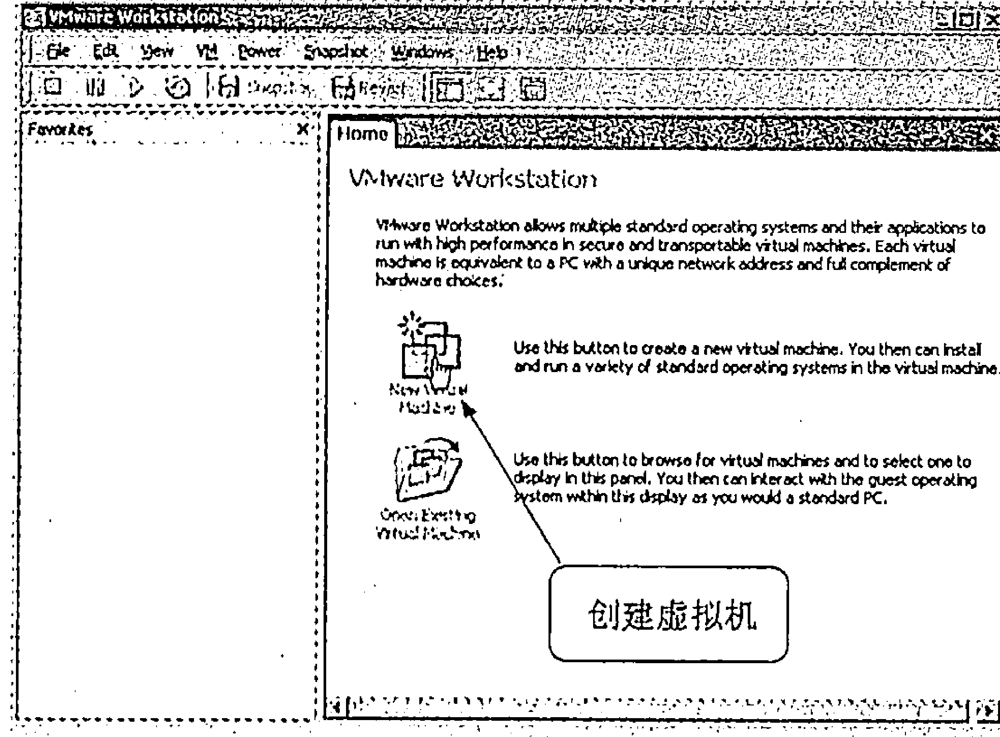

在对虚拟机完成创建后将会出现如图9所示的界面，我们再对创建的虚拟机的光驱进行一些设置，使之能正常运行我们的启动光盘。双击“Devices”栏中的CD-ROM1（IDE1:0），在“Connection”（连接）中选择“Use ISO image”（使用ISO映像），并把刚才用Easy Boot制作的ISO映像文件添加进去，单击“OK”按钮就把启动光盘添加进虚拟机了。点击“Power On”按钮启动虚拟机，按【F2】进入CMOS设置界面，设置成从光驱启动，重新启动后就可以对光盘进行测试了，按【Ctrl + Alt】组合键则可临时退出VMware Workstation来做其他的工作。如果测试发现某些软件或者某些功能好像用不了，还有……没关系，通过VMware Workstation测试，再用Easy Boot修改，重新生成ISO文件，再测，再改……哈哈！好像很浪费时间，不过也许这就是玩电脑的乐趣啦！

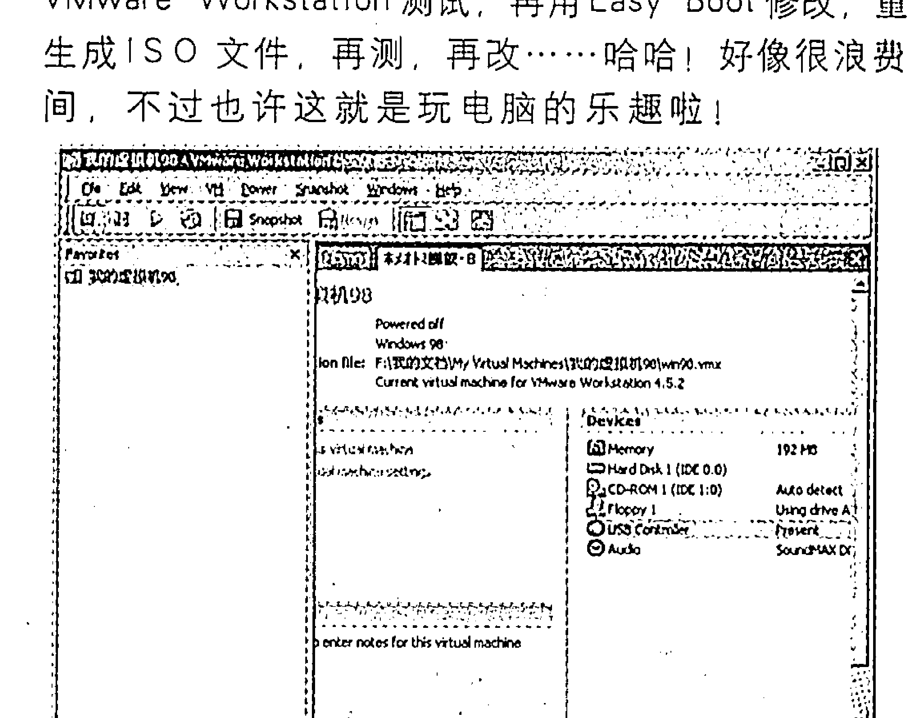

#### （七）刻录启动光盘

用VMware Workstation测试完启动光盘的ISO映像文件后，如果在里面运行都一切正常的话，那么就是要进行刻录工作了。呵呵，忙活了半天终于将光盘文件做好了，最后当然还要把这些文件刻录到光盘上，才算大功告成了。哈！马上就能看到自己做的光盘了，真有些激动！ISO文件是光盘的映像文件，ISO文件不但包括光盘中的所有文件（这是你能够通过“资源管理器”直接看到的内容），也包括一些不能看到的内容（例如，可启动光盘的引导文件），因此，在刻录ISO文件时，不能再使用将ISO这个文件直接拖动到光盘上的形式进行刻录。

我们以Nero Burning - Rom刻录软件为例来讲述ISO文件的刻录方法，运行Nero程序出现启动向导画面，选择“复制和备份” → “将映像刻录到光盘上”，在弹出的窗口中添加要刻录的光盘映像文件，再点击“刻录”按钮后静候几分钟火热的光盘就新鲜出炉了。

当然，我们也可以用其他的刻录软件来进行刻录，总之要记住刻录光盘映像时要知道不能直接将映像文件拖到光盘上，要使用相应刻录软件的刻录映像功能进行刻录就可以了。

相信通过以上方法制作成的自启动应急光盘可以让你在系统维护时发挥出强大的作用，如果我们再将一些安装程序及必要的软件也一并刻录到这张光盘上的话，那么这张光盘就是一张非常棒的工具盘了。

## 多媒体光盘制作我最行

文/鸣润

由于Authorware操作简单，程序流程明了，开发效率高，同时还可以结合其他多种开发工具，可以实现多媒体的功能，因而被广泛地应用在多媒体光盘制作领域。即便是不具备编程能力的用户，也可以轻易制作出个性化的多媒体光盘。本文将针对多媒体光盘的制作展开详细的介绍和阐述。

### 一、准备工作

在开始制作多媒体光盘之前，首先需要做好前期的准备工作，这其中包括脚本的编写，以及准备在光盘内放置的信息，比如文字、图片、动画、声音、数字电影等资料。

#### （一）光盘整体结构的分析

关于多媒体光盘的制作，首先需要有一个漂亮的首页。首页的主要内容也就是这张多媒体光盘的主要栏目分类，单击相应的栏目，即可打开需要阅读和浏览的光盘内容。在开始设计之初，应该首先设计好整个光盘的架构，并准备好相应的文字、图片等资料。如图1所示就显示了一张多媒体光盘的整体结构组织图。

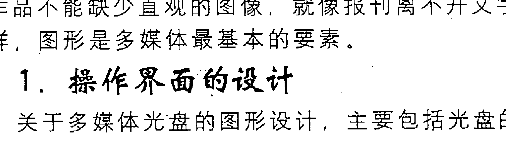

#### （二）图形的设计

创建每个多媒体项目都会包含图形元素，背景、人物、界面、按钮，几乎我们从多媒体中看到的每一个东西都是由某种类型的图形组成的，多媒体作品不能缺少直观的图像，就像报刊离不开文字一样，图形是多媒体最基本的要素。

- 1. 操作界面的设计

关于多媒体光盘的图形设计，主要包括光盘的主界面、二级界面、三级界面，以及操作演示页面的设计工作。

主界面、二级界面、三级界面，以及操作演示页面的设计工作。

比如可以使用Adobe Photoshop来进行各级界面的设计工作。需要注意的是，在进行界面设计的过程中，要把各级界面中的栏目以及内容加以划分。

- 2. 按钮的设计

多媒体演示光盘中会使用多种多样的按钮，如果准备制作动态的变化多样的按钮，那么至少要为一个按钮设计两幅图片。比如在制作“返回”按钮时，需要设计当按下按钮时候，此按钮将同时改变颜色，这时“返回”按钮就需要有两幅图片才能完成动态变色显示的过程，因此至少需要设计两幅按钮图片，如图2所示。


如果在主界面中需要设计图片对象链接，比如当按下图片后，此图片将由彩色变成灰色显示，那么此时需要注意的是，这个过程也是至少需要两张图片来完成。在设计此类图片的过程中，需要注意图片在发生颜色的变化过程中，不要改变除图片链接之外的其他部分图形颜色的变化。因而在制作此类图片的过程，建议使用Photoshop的“抠图”功能，将相关的热点链接图片抠出来，并为其赋予其他颜色。

#### （三）动画的设计

高品质的多媒体作品中离不开大量的动画场面，因而动画的创作也是多媒体产品必不可少的一部分。电脑动画大致可分为二维动画与三维动画两类。

- 1. 二维动画

在传统的卡通动画中，美工需要绘制很多画面，而现在大量的工作可以借助电脑来完成，比如给出关键帧，中间帧就由计算机来合成，因而大大地提高了工作效率。目前能制作二维动画的软件有不少，比如常用的有Flash MX 2004等。

- 2. 三维动画

制作三维动画首先要创建物体和背景的三维模型，然后给物体赋予材质，最后才进行计算，生成画面。然后让这些物体在三维空间里动起来，如移动、旋转、变形、变色等，再通过三维软件内的“摄影机”去拍摄物体的运动过程，同时也可以打上灯光效果，生成栩栩如生的动画。

目前比较常用的三维动画设计软件，比如3DS MAX，由于它的功能强大，并较好地适应了国内PC机用户众多的特点，被广泛运用于三维动画设计、影视广告设计以及室内外装饰设计等领域。

#### （四）数字视频设计

数字视频是将传统模拟视频（包括电视及电影）片段捕获转换成电脑能调用的数字信号。我们常见的VCD就是一种经压缩的数字视频。因为视频是我们利用摄像机直接从实景中拍摄的，比较容易取得，经过编辑再创作后成为我们需要的数字视频，也就是电影文件。数字视频能使多媒体作品变得更加生动、完美，而其制作难度一般低于动画创作。

Adobe Premiere在多媒体制作的领域扮演着举足轻重的角色，使用多轨的影像与声音作合成与剪辑AVI、MOV等动态影像格式。

#### （五）声音编辑

声音是多媒体的又一重要组成元素，它不但可以带来特殊的效果，还可以最大限度地影响展示效果，声音可使电影从沉闷变得活跃，从而引导、刺激观众的兴趣。

多媒体作品中的声音有两类，即音乐和音效。音乐除了我们熟悉的普通音乐外，还有电脑特有的MIDI音乐，我们只需将已存在的音乐进行编辑、加工、合成。音效包括各种各样的声音，像划过或点击鼠标发出的声音、开门声、爆炸声、大自然的声音等。目前比较常见的音乐编辑工具有Cool Edit等。

### 二、制作导航界面

在开始设计多媒体光盘之前，首先需要根据光盘结构设计，以及制作好的光盘首页图片，建立并设计出导航界面，以帮助用户根据自己的需要来访问不同的栏目。下面来介绍以下导航主界面窗口的制作方法。

#### （一）建立与设置项目

- 第一步

启动Authorware，执行“File”→“New”→“file”命令，弹出“New Project”对话框。单击“None”按钮，Authorware将自动建立一个新的空白文件。

- 第二步

在主菜单中选择执行“Modify”→“File”→“Properties”命令来打开属性控制窗口，设置多媒体光盘演示效果尺寸“Size”（窗口）大小为“800×600（SVGA）”。

- 第三步

在“Options”选项中取消选择“Title Bar”和“Menu Bar”复选框，以禁止演示光盘显示窗口标题栏和菜单栏，同时选中“Center on Screen”复选框，使用窗体默认在屏幕中央显示，如图3所示。

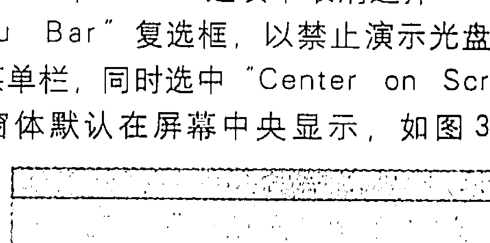

#### （二）添加背景图片

下面来加入演示界面的背景图片。

- 第一步

在图标工具栏中拖动一个显示图标到流程线上，然后命名为“背景”，如图4所示。


- 第二步

双击“背景”图标进入编辑状态，此时屏幕将显示出一片空白，执行主菜单中的“File”→“Import and export”→“Import Media”命令，或者单击工具栏中的导入按钮，打开导入图片对话框，选取已经准备好的背景图片，单击“Import”按钮导入。

需要注意的是，如果此时选中“Link To File”（链接文件）复选框，那么图片将与程序建立链接关系而不会加入程序中；如不勾选“Link To File”，图片将会成为程序的内部文件，在打包文件时就找不到原图片了。

- 第三步

完成将图片导入到光盘主界面中，此时空白的显示界面将被图片填充。

#### （三）建立交互按钮

为了保证主界面中的栏目导航能发挥作用，因而需要继续为界面添加相应的按钮。

- 第一步

拖动一个交互图标到流程线上，命名为“界面导航”，如图5所示。

如果主界面中栏目分为 5 个，那么我们此时就需要建立 5 个按钮。

- 第二步

分别拖动 5 个群组图标到交互图标的右侧，当在拖入第一个群组图标时，将弹出“Response Type”对话框。

- 第三步

在这里需要选择按钮响应类型，这里选中“Button”（按钮）单选按钮，然后单击“OK”按钮，返回到流程线，将第一个按钮命名为“按钮1”。

- 第四步

使用同样的方法，分别拖动另外四个按钮到交互图标右侧，分别命名为“按钮2”“按钮3”“按钮4”“按钮5”，如图6所示。

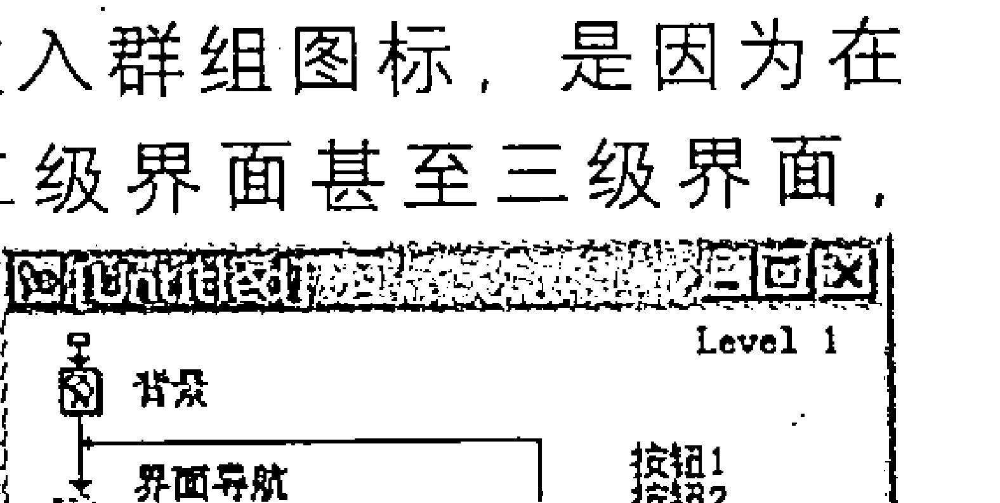

在这里之所以要选择放入群组图标，是因为在主界面下还要进一步设计二级界面甚至三级界面，而群组图标刚好比作一个容器，还可以继续放置更多流程和图标。

如果要进一步编辑按钮所属的群组图标，那么可以双击相应的群组图标，比如双击编辑“按钮1”的群组，即可在打开的新的流程线中进行相应的界面设计工作，如图7所示。

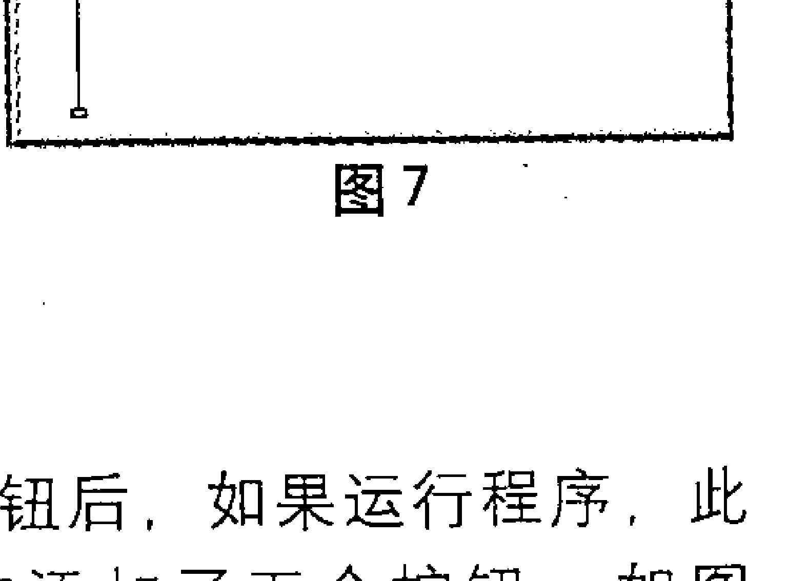

#### （四）定制按钮

实际上，在我们添加按钮后，如果运行程序，此时将在主界面中发现已经被添加了五个按钮，如图8所示。

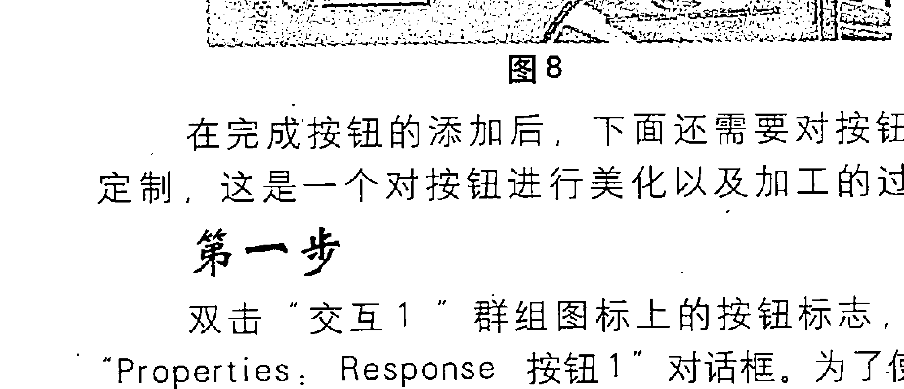

在完成按钮的添加后，下面还需要对按钮进行定制，这是一个对按钮进行美化以及加工的过程。

- 第一步

双击“交互1”群组图标上的按钮标志，弹出“Properties: Response 按钮1”对话框。为了使鼠标指针移到按钮上的时候，鼠标指针会发生变化，从而达到良好的视觉提醒效果，这里可以将鼠标指针定制为其他形状。

- 第二步

重新设置方法是单击“Cursor”选项右侧的按钮，在弹出的对话框中单击选择所需的鼠标指针形状，完成后单击“OK”。由于我们不准备使用系统提供的按钮，因而需要在这里对按钮样式进行重新定制。

- 第三步

返回到按钮响应属性面板，单击“Button”按钮，弹出按钮编辑器窗口。

- 第四步

单击“Add”按钮，打开按钮编辑器设置窗口，其中左上角“Normal”栏的“Up”状态项，表示设置按钮弹起时的状态，单击“Graphic”栏右边的“Import”按钮，弹出“Import which file”对话框，选择已经制作好的按钮图片，图片将被导入到编辑器中。

- 第五步

接下来制作“Over”、“Disabled”等状态下显示的图片，也可以为按钮的每种状态添加上指定的音效，只要单击“Sound”栏右边的“Import”按钮，导入按键效果音效文件即可。

- 第六步

单击“OK”按钮返回到“Button”对话框，此时刚才添加的按钮图片将被添加到此对话框中，单击将其选取，单击“OK”按钮完成按钮图片样式的重新定制。

#### （五）设计交互效果

我们经常会在一些多媒体光盘中看到这样的效果，当鼠标指针移动过某热点时，画面会发生变化，比如显示提示性内容，还有的是文字、图像或动画等。

- 第一步

拖动一个显示图标到交互图标的右侧，将其命名为“交互1”，如图9所示。

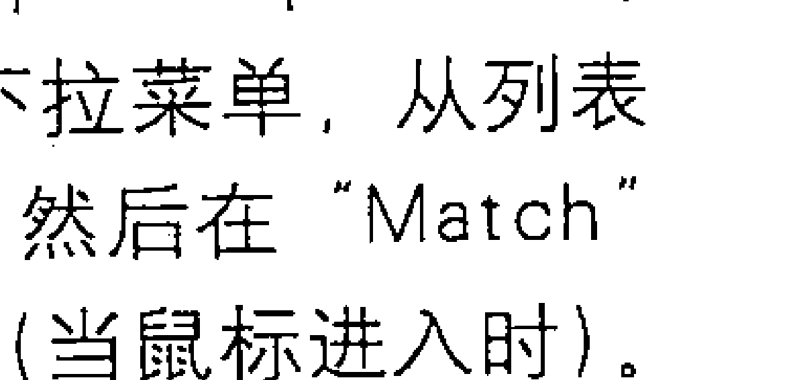

- 第二步

双击“交互1”的按钮标志，打开“Properties: Response”对话框，单击“Type”下拉菜单，从列表中选“Hot Spot”（热区交互）选项，然后在“Match”下拉列表中选取“Cursor in Area”（当鼠标进入时）。

- 第三步

双击“交互1”下的显示图标进入编辑界面，单击选取文字工具，在“交互1”按钮右侧输入提示文字，同时设置好字体、颜色及大小等属性。

- 第四步

单击工具栏中的“Import”图标按钮，导入事先准备好的交互显示图片。

- 第五步

单击工具栏运行工具按钮，在打开的运行界面中单击暂停按钮停止运行，调整好交互图片放置的位置。

- 第六步

使用同样的方法，可以将更多的交互图片分别导入到不同的交互显示图标中，并放置在主画面中的同一位置。这样，在制作完成后只要将鼠标指针指向任意一个按钮，主界面中的图片就会发生变化，同时给出不同的文字提示。

#### （六）退出分支设计

完成主界面的设计后，下面就可以进行退出分支结构的设计了。下面设计的退出分支实现效果是：当单击主界面中的“退出”按钮后，将弹出一个对话框，单击“是”将退出程序，单击“否”将返回到主界面。

- 第一步

拖动一个群组图标到“界面导航”交互图标中，命名为“退出”，如图10所示。

- 第二步

将“退出”热区移动到屏幕退出显示区域，如图11所示。

- 第三步

双击“退出”群组图标，在打开的“Level 2”流程线上添加一个显示图标，命名为“退出选项”。

- 第四步

双击“退出选项”图标，在打开的窗口中导入准备好的退出对话框图片，如图12所示。

- 第五步

拖入一个交互图标，然后在交互图标中放入两个计算图标，分别设置其按钮交互类型为“Button”(按钮)，分别命名为“是”和“否”。

- 第六步

双击计算图标“是”，在打开的对话框中输入代码：Quit(0)，它的作用是退出程序。

- 第七步

双击计算图标“否”，在打开的对话框中输入代码：GoTo(IconID@"背景")，它的作用是跳转到指定的图标（主界面），并从该图标处继续显示，即放弃退出。

```
GoTo(IconID@"背景")
```

- 第八步

将“是”和“否”按钮设置成为热区，并调整好热区的范围，完成退出结构的设计，如图13所示。

### 三、多媒体光盘内容设计

在完成主界面的设计后，下面就可以开始进行多媒体光盘的内容设计了，下面从常见的多媒体光盘的主要内容设计入手，介绍其实现的方法。

#### （一）显示文本信息

使用滚动文本可以创建具有垂直方向滚动条的文本对象，使用滚动文本可以建立电子图书阅读的窗口界面，或者产品介绍页等。

- 1. 直接输入文本

- 第一步

打开文本设计页面，执行主菜单“text”→“scrolling”命令可以建立滚动文本框。如果不选择此选项，则建立静态显示文本内容。

- 第二步

选择文本输入工具“A”，直接输入文本内容，即可形成可滚动的文本框，如图14所示。

- 2. 从外部导入文本

- 第一步

打开文本设计页面，单击工具栏导入按钮，打开导入对话框，选择准备导入的文本文件，单击“Import”按钮。

- 第二步

弹出导入文件提示对话框，在这里如果选中“Scrolling”单选按钮，则可以建立滚动文本框，单击“OK”按钮完成。

#### （二）多媒体光盘配音

声音是除文本、图像之外又一传递信息的重要工具，利用声音作为信息表达方式十分必要。通常可以用声音数据制作语音解说、背景音乐、场景音效，丰富多媒体程序的表现力，甚至可以在制作模拟程序时模拟真实情况下的环境音效，提高模拟程序的真实性。声音图标的功能是在 Authorware 中播放一段声音，可以使用“声音”设计图标来加载和播放声音文件，当然还可以设置声音的播放速度、播放条件及播放次数等。

- 1. 导入与控制声音播放

- 第一步 建立一个名为“背景音乐”的声音图标，双击声音图标“背景音乐”，在“Properties：Sound Icon”对话框中单击“Import”按钮导入相应的音乐。

- 第二步 在“Timing”选项卡的“Concurrency”下拉列表框中选择“Concurrent”选项。

- 第三步 在声音图标下建立一个名为“音乐控制”的交互图标，拖放一个计算图标到交互图标右边，在弹出的“Response Type”面板中选择交互类型为按钮交互“Button”，并命名为“播放 / 暂停”，如图15所示。

- 第四步 双击打开计算图标“播放 / 暂停”，输入如下语句：

```
MediaPause(IconID@"背景音乐", pause)
pause :=~pause
```

- 第五步 关闭计算图标窗口，弹出一个“New Variable”对话框，把起始变量“Initial Val”设为“1”，并在“Description”中输入一些关于此变量的信息。

- 2. 控制音量大小

- 第一步 建立一个计算图标，命名为“系统目录”，双击打开计算图标键入如下语句：

```
winpath:=getosdirectory()
```

- 第二步 在计算图标“系统目录”下，建立一个名为“控制面板”的计算图标并键入如下内容：

```
if Find("windows",winpath) then
JumpOutReturn(winpath^"sndvol32.exe")
Else
JumpOutReturn(winpath^"\\system32\\sndvol32.exe")
end if
```

- 3. 每次播放不同的音乐

- 第一步 首先命名相同格式的4个背景音乐为1.mp3、2.mp3、3.mp3、4.mp3，并存放在当前程序相同目录下。

- 第二步 建立一个名为“随机数”的计算图标，并输入以下语句：

```
num=Random(1,4,1)-num
```

- 第三步 关闭计算图标窗口，在出现的确认修改的对话框中单击“Yes”按钮确认。

- 第四步 在自定义变量的窗口中设置起始变量“Initial Val”设为“1”，在“Description”中输入关于此变量的注释信息，单击“OK”按钮完成。

- 第五步 在计算图标下建立一个名为“播放音乐”的判断图标，双击判断图标，在“Properties：Decision Icon”属性面板的“Branch”下拉列表中选择“To Calculated Path”，在表达式输入框中输入自定义变量“num”。

- 第六步 连续拖动4个声音图标到判断图标的右侧，声音图标将自动被改为群组图标，分别命名为“1”、“2”、“3”、“4.”，如图17所示。

- 第七步 双击群组图标“1”的声音图标，打开“Properties：Sound Icon”属性设置面板。

- 第八步 单击“Import...”按钮导入背景音乐“1.mp3”，并在“Timing”选项卡的“Concurrency”下拉列表中选择“Concurrent”项。

- 第九步 重复前面的操作，分别在群组图标“2”、“3”、“4”中导入背景音乐“2.mp3”、“3.mp3”和“4.mp3”，即可实现每次都会播放不同的背景音乐。

## （三）视频演示

在Authorware中通过演示视频片段，实现展示产品等信息的作用，下面来介绍一下在多媒体光盘制作过程中，对视频信息的控制方法。

##### 1. 导入视频电影

在Authorware中，电影图标支持播放多种数字电影格式。

- **第一步**
拖放一个电影图标到流程线上，双击打开其属性面板。

- **第二步**
单击“Import”按钮，选择导入一个视频文件。

##### 2. 调整视频大小

- **第一步**
在播放过程中按下快捷键【Ctrl + P】或执行菜单命令“Control”→“Pause”暂停程序的播放。

- **第二步**
用鼠标单击视频画面选中视频，通过拖动句柄改变视频画面大小。

##### 3. 设置片头视频自动擦除

- **第一步**
拖曳一个电影图标到设计窗口，并命名为“1”。

- **第二步**
双击打开“Properties: Movie Icon”属性面板，单击“Import...”按钮导入一个视频文件。

- **第三步**
在电影图标下建立一个名为“控制片头”的交互图标。拖曳一个擦除图标到交互图标“擦除图标”右侧，在“Response Type”面板中选择交互类型为“Conditional”条件交互。

- **第四步**
双击条件交互类型按钮，在“Properties: Response”属性面板的“Condition”域中输入如下条件表达式：

`MediaPosition@"片头"=MediaLength@"片头"`

**小提示：**

MediaPosition@"片头"：获得视频的当前播放帧数；

MediaLength@"片头"：获得视频的总帧数。

当视频总帧数等于当前播放帧数时，表达式成立，执行擦除视频的操作。

- **第五步**
在“Automatic”下拉列表框中选择“When True”选项。

##### 4. 控制视频播放与暂停

在Authorware中控制数字电影暂停与播放的方法如下。

- **第一步**
拖放一个计算图标到流程线并命名为“初始化”，双击打开计算图标，输入如下代码：

```
startframe :=1
endframe :=1
```

- **第二步**
放置一个数字电影图标到流程线，命名为“电影”，选择导入一个视频文件。

- **第三步**
单击“电影”图标，在属性面板中设置“Concurrency”为“Concurrent”，这样做的目的是为了实现在运行电影图标的同时运行下面的交互图标，以激活控制按钮。

- **第四步**
设置“Play”选项为“Fixed Number of Times”，播放次数为1次。

- **第五步**
设置“Start”变量为“startframe”，设置“End Frame”变量为“endframe”。由于这两个变量初值都是1，运行时电影会静止在第一帧，播放则由下面的按钮控制。

- **第六步**
拖动一个交互图标到流程线，命名为“控制按钮”，然后拖动五个计算图标到流程线上，分别命名为：“从头播放”、“暂停播放”、“继续播放”、“逐帧向后”和“逐帧向前”。

在每个按钮交互属性窗口中分别选中“Perpetual”（永久）复选框，设置“Branch”分支选项为“Return”，如图18所示。

- **第七步**
在“从头播放”图标中输入如下代码：

```
startframe :=1
endframe :=MediaLength@"电影"
MediaPlay (IconID@"电影")
```

其中，系统变量MediaLength作用是返回指定数字电影的长度。

- **第八步**
在“暂停播放”图标中输入如下代码：

`MediaPause (IconID@"电影", True)`

函数MediaPause用来暂停一个媒体文件的播放。

- **第九步**
在“继续播放”图标中输入代码：

```
startframe:=MediaPosition@"电影"
endframe:=MediaLength@"电影"
MediaPlay (IconID@"电影")
```

系统变量MediaPosition用来指示媒体文件播放到的当前位置。

- **第十步**
在“逐帧向后”图标中输入代码：

```
startframe:=MediaPosition@"电影"
endframe:= MediaPosition@"电影"+1
MediaPlay (IconID@"电影")
```

- **第十一步**
在“逐帧向前”图标中输入代码：

```
startframe:=MediaPosition@"电影"
endframe:= MediaPosition@"电影"-1
MediaPlay (IconID@"电影")
```

- **第十二步**
完成设计后的流程如图19所示。

### 四、发布与刻录多媒体光盘

在完成多媒体光盘的设计和制作以后，下面就可以将其发布打包，并使用相关的工具进行刻录了。

#### （一）发布多媒体光盘

打包多媒体作品，简单地讲就是把作品转换成可执行的程序，使其可以脱离Authorware环境独立运行。当然我们在打包多媒体作品时不但需要主程序，还需要其他的支持文件，如XTRAS文件、DLL文件、外部媒体文件等，缺少了所需的文件，作品将不能正常运行。

- **第一步**
执行主菜单“File”→“publish”→“publish settings”命令，打开发布设置对话框。

- **第二步**
在“Formats”选项卡中，是关于发布文件类型的一些设置，可以发布为带播放器的With Runtime文件（EXE文件）、不带播放器的Without Runtime文件（A7R文件）、使用网络播放器播放的For Web Player文件（AAM文件）或网页文件（HTM文件），比如这里只发布带播放器的可执行文件。

- **第三步**
单击选择“Files”选项卡，可以查看当前应用程序的一些支持文件，比如XTRAS、DLL和UCD等，文件发布时必须将这些文件同时发布才能保证不会出现意外的错误，当然也可以通过单击“Add Files”按钮手动添加一些文件，比如使用说明书、帮助文档等。

- **第四步**
设置完毕后，单击“Publish”按钮，应用程序就可以成功发布了。

#### （二）刻录多媒体演示光盘

文件发布完成以后，下面就可以刻录多媒体演示光盘了。

- **第一步**
使用Authorware发布后的作品，将包含一个autorun.exe文件，同时还包括一些支持文件，这些文件是必不可少的。

- **第二步**
为了保证光盘在放入光驱后可以自动运行，因而还需要建立一个autorun.inf文件，其内容如下：

```
[autorun]
icon=cdrom.ico
open=autorun.exe
```

其中，icon=cdrom.ico将光盘的光标设置为cdrom.ico这个图标文件。open=autorun.exe，当光盘放入光驱后，将自动执行名为autorun.exe这个文件。

- **第三步**
启动Nero光盘刻录软件，弹出“新编辑”对话框，单击选择左侧列表框中的“CD-ROM (ISO)”选项，单击“新建”按钮。

- **第四步**
进入Nero主界面窗口，在右侧的“档案浏览器”中选择已经发布的光盘文件，然后拖放到左侧“ISO 2”窗口中，如果要修改光盘的卷标，可以单击原始卷标，然后将卷标修改为“cdrom”。完成后，执行主菜单中的“档案”→“开始烧录光盘”命令。

- **第五步**
弹出“烧录CD”对话框，在“写入速度”列表中选择光盘烧录的速度，“写入方法”设置为“轨道一次性”，如果你打算制作多份，可以在“复制份数”中予以设定，完成后单击“写入”按钮即可开始烧录。

- **第六步**
开始正式写入光盘，并显示烧录的进度，完成光盘的制作。

## 课件制作进行时
文 / 赛荣

伴随着中小学教育信息化课程整合程度越来越高，计算机被广泛地应用于教学实践。作为计算机辅助教育的一个重要方面，多媒体计算机教学系统被普遍广泛地应用在实际教学中，教学课件的使用与发展已经被广大教师认可。在本文中将针对教学课件的制作予以介绍，并根据教学实际通过实例讲解教学课件的制作过程。

### 一、多媒体课件制作基础知识

在开始学习制作多媒体课件之前，有必要掌握并学习一些课件制作的基础知识。

#### （一）多媒体计算机教学系统

首先需要了解适用于多媒体计算机教学系统的计算机软件和硬件的配置平台，从而可以更好地将教学课件应用于教学实际中。

##### 1. 硬件环境

- (1) 课堂演示教室。
- (2) 网络教室。
- (3) 教学资源中心与电子阅览室。
- (4) 校园网。

##### 2. 教学软件系统

###### (1) 多媒体素材制作软件

在文字处理方面，比如“记事本”、Word、WPS等；在图形图像处理方面，比如Photoshop、“画图”等；在动画制作方面，比如Animator、Flash等；在声音处理方面，比如Cool Edit、“录音机”等；在视频处理方面，比如Adobe Premiere等。

###### (2) 创作工具

在编程语言方面，比如Visual Basic、Visual C++、Delphi等。在多媒体创作系统方面，比如Authorware、Flash等。

###### (3) 多媒体计算机教学软件

各种可用于课堂教学、辅导、演示的教学课件。

#### （二）多媒体课件的结构设计

传统教学中，教学信息如课本、录音、录像等的组织结构都是线性的，这在客观上限制了人类自由联想能力的发挥，而超文本技术就克服了这一缺点。多媒体课件中的信息结构就是采用这种非线性的超文本方式。

根据多媒体课件中节点和链的连接关系，我们可以归纳出多媒体课件中的教学内容结构组织方式有以下几种：线性结构、树状结构、网状结构和混合结构。

##### 1. 课件开发基本过程

- (1) 项目定义。教学内容的选择、课件设计可行性分析、课件需求分析（必要性）。
- (2) 教学设计。围绕教学目标要求，合理选择和设计媒体，采用适当的教学模式和教学策略。
- (3) 结构设计。安排目录主题的显示方式，建立信息间的层次结构和浏览顺序，确定信息间的交叉跳转关系。
- (4) 多媒体素材的准备与制作。
- (5) 课件的编辑合成。
- (6) 课件的试用与测试。
- (7) 课件产品的发布。

##### 2. 设计课件交互界面

人机交互界面的设计主要解决与人机交互相关的用户分析、任务分析、交互方式以及相应的课件开发过程等问题。

在用户界面设计方面，一般需要考虑以下几个元素设计方面的问题。

- (1) 窗口一般由标题栏、菜单栏、滚动条（水平、垂直）、状态栏和控制栏组成，类似于Windows操作系统的窗口技术规范。
- (2) 比较常见的菜单包括条形菜单、弹出式菜单、下拉菜单、图标式菜单等，用户对菜单的操作主要是通过鼠标单击动作，同时配合键盘或触摸屏来实现的。
- (3) 图标是常用的一种图形界面对象，它是一种小型的，带有简洁图形符号的对象，它的设计是基于隐喻和模拟的思想，图标能帮助用户简便地实现界面调用功能。
- (4) 常见的按钮类型包括有：Windows风格按钮、闪烁式按钮、动画式图形按钮、热区(Hotspot)式按钮、文本按钮、图形按钮等类型。
- (5) 对话框是一个弹出式窗口，当课件运行时，除了各种选项和按键操作外，系统还可以在需要的时候提供一个对话框来让用户输入更加详细的信息，并通过对话框与用户进行交互，是充分体现多媒体人机交互特点的界面技术之一。

关于课件制作的屏幕，一般需要考虑以下几个方面的问题：

- (1) 封面（片头）。课件的首页即封面，应使学生明确这是一个课程的开始，封面屏幕一般包括：课程名称、课件作者、制作时间、版权等。
- (2) 主界面屏幕。课件都是通过主界面为学习者提供教学内容选择的，类似于图书的目录。
- (3) 教学屏幕。教学屏幕就是多媒体课件开展教学活动的屏幕画面，也是课件设计的重点。

##### 3. 设计交互界面的方法

好的人机交互界面，不但要便于用户操作，同时也应该有利于学生理解与掌握课程知识点。

- (1) 显示色彩的设计
要正确选择色彩基调，并注意到对比、统一与和谐。
- (2) 画面间的变换与动画
画面之间的变换适当使用淡入、淡出、叠加、分裂、百页窗、马赛克等转场效果。
- (3) 声音处理与解说词
声音处理常采用 44.1KHz 或 22.05KHz 的采样频率，这样可以获得满意的效果。解说词要求每句话、每个词都应紧密结合画面，准确地表达内容。言词应当生动、朴实，力求简练，语音吐字清晰。一般情况下，解说词每秒不应超过三个字。

### 二、课件素材的收集与处理

素材是多媒体课件的基本元素，在课件开发过程中，素材的编辑与处理是课件目标确定后的一项基础工程，由于采集和制作素材的过程中使用的硬件、软件种类比较多，因而在本文中将精选常见的课件素材收集与编辑工具进行介绍。

常用媒体文件扩展名
| 类型 | 扩展名 | 描述 |
|------|--------|------|
| 文字 | TXT | 纯文本文件 |
| | RTF | Rich Text Format 格式 |
| | WRI | “写字板”文件 |
| | DOC | Word 文件 |
| | WPS | WPS 文件 |
| 声音 | WAV | 标准 Windows 声音文件 |
| | MID | 乐器数字接口的音乐文件 |
| | MP3 | MPEG Layer 3 声音文件 |
| | VQF | 最新开发的声音文件，比 MP3 的压缩比还高 |
| 图形 图像 | BMP | Windows 位图文件 |
| | JPG | JPEG 压缩的位图文件 |
| | GIF | 图形交换格式文件 |
| | TIF | 标记图像格式文件 |
| | EPS | Post Script 图像文件 |
| 动画 | GIF | 图形交换格式文件 |
| | SWF | Flash 动画文件 |
| 视频 | AVI | Windows 视频文件 |
| | MOV | Quick Time 的动画文件 |
| | MPG | MPEG 视频文件 |
| | DAT | VCD 中的视频文件 |
| 其他 | EXE | 可执行程序文件 |
| | RA | RealPlayer 的流媒体文件 |
| | WMA | Windows Media Player 流媒体文件 |

### 三、使用 PowerPoint 制作课件

PowerPoint 容易使用，界面友好，在设计制作多媒体课件过程中，应用非常广泛。

#### (一) 快速掌握课件制作过程

在开始学习使用 PowerPoint 制作课件之前，首先来学习一些有关它的基础操作知识。

##### 1. 建立课件演示页

第一步，启动 PowerPoint，在右边的“新建演示文稿”窗格中，用鼠标单击“空演示文稿”链接。第二步，在任务窗格中弹出“幻灯片版式”窗格，可以根据自己的需要，选择要应用到新幻灯片的版式，当鼠标指针停留在相应版式的时候，将弹出关于版式的提示文字。第三步，双击选中的版式，即可将当前版式应用到新的幻灯片上了。

##### 2. 应用幻灯片母版

应用母版可以使演示文稿的风格一致，通过修改母版可以进行全局更改，并使该更改应用到演示文稿中的所有幻灯片。第一步，幻灯片母版用于定义整个演示文稿的基本页面格式。执行主菜单中的“视图”→“母版幻灯片母版”命令打开幻灯片母版视图，如图1所示。

第二步，单击选中需要修改的文字对象，比如标题区文本框，然后执行主菜单中的“格式”→“字体”命令，弹出“字体”对话框。在这里设置字号、颜色、以及文字效果等参数，从而达到对母版标题文字的美化目的。

第三步，选中页面中对象，执行“格式”→“项目符号和编号”命令，在弹出的“项目符号和编号”对话框中选择修改项目符号的样式。

另外，还可以根据自己的需要，为母版添加页眉和页脚。执行“视图”→“页眉和页脚”命令，弹出“页眉和页脚”对话框，选择“幻灯片”选项卡，即可在这里对日期、页脚区等进行相关的设置，如图2所示。

##### 3. 制作课件标题

在标题空白的幻灯片中，有用虚线方框围起来的区域，在这里提示了一些文字，这就是文本预留区。此时可以在文本预留区上单击（或双击）鼠标即可激活此区域，然后就可以向其中添加文本内容了。

如果要添加艺术字，可以在“绘图”工具栏上单击“插入艺术字”工具按钮，并在打开的“艺术字库”对话框中选择所需的艺术字效果，然后单击“确定”按钮。

在弹出的“编辑‘艺术字’文字”对话框中，输入艺术字文本内容，然后在“字体”和“字号”列表中，选择适合的字体和字号后，单击“确定”按钮。完成后，艺术字体即可出现在幻灯片中，拖动艺术字的边框即可改变艺术字的大小和位置，如图3所示。

##### 4. 添加电影片断

在演示文稿中插入AVI视频文件可以执行主菜单“插入”→“影片和声音”→“文件中的影片”命令，弹出“插入影片”对话框，找到要插入演示文稿的影片文件，然后单击“打开”按钮即可将被选影片插入到幻灯片中了。

除了可以插入视频格式文件外，还可以插入GIF、Flash等格式的动画文件，感兴趣的朋友不妨一试。

如果想要在幻灯片播放完毕后自动返回影片开头，可以在幻灯片上用鼠标右键单击影片，并在弹出的菜单中单击“编辑影片对象”命令，在打开的对话框中选中“影片播完返回开头”复选框，如图4所示，单击“确定”按钮即可。

单击要调整大小的影片，然后将鼠标指针定位在一个调整句柄上，如果要增加或减少一个或多个方向上的尺寸，可以拖动鼠标离开或靠近中心位置。如果按住【Shift】键的同时拖动影片大小，可以保持影片保持比例不变。

##### 5. 制作动画效果

动画就是给文本或对象添加特殊视觉或声音效果，比如可以使文本项目符号点逐字从左侧飞入，或在显示图片时播放掌声等效果。

执行主菜单中的“幻灯片放映”→“自定义动画”命令，在“自定义动画”任务窗格中，选择“进入”菜单，从二级子菜单中选择一种动画效果。文本或对象退出屏幕时的效果设计，可以打开“退出”菜单，并从中选择一种动画效果。

在动画设计中还有一个非常关键的动画设计方案，就是触发器了。单击“触发器”按钮，然后选中“单击下列对象时启动效果”选项，在右侧的下拉列表中，给出了当前幻灯片中的动画对象的名称。比如我们打算设计一个“议程”显示，这时可以从下拉列表中选择“议程”选项，这样以后在播放幻灯片的时候，只要单击“议程”对象，就可以播放此动画效果，这种动画效果对于设计交互式动画非常有用，如图5所示。

如果准备让对象按照指定的路径运动，可以在## （二）课件制作实例与技巧

下面我们来介绍一些有关PowerPoint制作课件的实例和技巧，希望以此抛砖引玉，帮助读者制作出更好的课件作品。

##### 1. 模拟平抛运动效果

将物体用一定的初速度沿水平方向抛出，物体受到跟它的速度方向不在同一直线上的重力作用而做的曲线运动就叫做平抛运动。

第一步，启动PowerPoint并建立一个新的幻灯片文件，执行主菜单中的“插入”->“图片”->“来自文件”命令，分别插入一架飞机、一艘帆船，以及一发炮弹的图片，同时摆放好飞机轰炸船只的构图模式，用鼠标右键单击炮弹，从弹出菜单选择“自定义动画”命令，如图7所示。

第二步，打开“自定义动画”任务窗格，单击“添加效果”按钮，从弹出菜单选择“运动路径”->“绘制自定义路径”->“曲线”命令选项。

第三步，在炮弹上单击鼠标左键建立路径开始点，然后模仿平抛运动路径绘制一条曲线，并将终点指向帆船，双击鼠标完成路径的绘制，如图8所示。

第四步，完成投弹动画效果的制作，执行主菜单“幻灯片放映”->“预览放映”命令即可预览飞机投弹后，炮弹沿着刚才绘制的路径投向帆船的动画效果。

##### 2. 演示汉字笔顺

下面来介绍以下如何实现演示汉字笔顺的制作方法。

第一步，使用绘图工具制作四幅图像，分别命名为“1”、“2”、“3”、“4”，如图9所示。

第二步，执行主菜单中的“插入”->“图片”->“来自文件”命令将图像1插入到幻灯片中。选取绘图工具栏设置透明色工具，单击图片白色区域设为透明。

第三步，在图片上单击鼠标右键，在弹出的菜单中选择“自定义动画”命令。在“自定义动画”任务窗格中选择“添加效果”->“进入”->“擦除”命令，在“自定义动画”任务窗格中将“方向”设置为“自顶部”，“速度”为“慢速”。

第四步，执行主菜单中的“插入”->“图片”->“来自文件”命令将图像2插入到幻灯片中，并将图像2的背景设为透明色。

第五步，在“自定义动画”任务窗格中，执行“添加效果”->“进入”->“擦除”命令，将“开始”设置为“之后”，“方向”为“自左侧”，“速度”为“慢速”。

第六步，将图3和图4插入到幻灯片，按照前面介绍的方法分别设置图片为透明显示，同时设置动画效果“方向”为“自顶部”。

##### 3. 制作滚动字幕

下面来介绍以下制作滚动字幕的方法。

- 第一步，在幻灯片中输入一首诗歌，并将其移动到工作区的下方。
- 第二步，在“自定义动画”任务窗格中执行“添加效果”→“运动路径”→“绘制自定义路径”→“直线”命令，从工作区下方到上方绘制一条直线，使它的起始点在工作区之外。
- 第三步，双击运动路径弹出“自定义路径”对话框，取消选择“效果”选项卡中的“平稳开始”和“平稳结束”复选框，并将“计时”选项卡下的“速度”设置为“非常慢”，“重复”设置为“直到下一次单击”，单击“确定”按钮。
- 第四步，执行主菜单中的“幻灯片放映”→“预览放映”命令，字幕重复滚动出现。

##### 4. 制作填空题

下面来介绍以下制作填空题的方法。

- 第一步，在工作区“在此处添加文本”框内输入文字“鲁迅原名”。
- 第二步，选取控件工具箱文本框工具，在输入的文字后面拖曳绘制一个矩形区域，并完成其他填空题的制作，如图10所示。
- 第三步，单击“自选图形”→“动作按钮”命令，选取“自定义动作按钮”。
- 第四步，在工作区拖曳绘制一个矩形按钮，在弹出的“动作设置”对话框中设置“超链接到”为“第一张幻灯片”，单击“确定”按钮。
- 第五步，输入按钮文字“查看答案”，执行“自选图形→标注”命令，选取“圆角矩形标注”，输入文字“周树人”，将它移到第1题的右边，按同样的方法制作出其他的答案，如图11所示。
- 第六步，按住【Shift】键单击选中所有标注，执行“绘图”→“组合”命令，将标注组合为“组合10”。
- 第七步，单击“组合10”，在“自定义动画”任务窗格中执行“添加效果”→“进入”→“百叶窗”命令，在时序窗口中单击“组合10”效果右侧按钮，在展开的二级菜单中单击选择“计时”命令，单击“触发器”按钮，在“单击下列对象时启动效果”下拉列表框选择“动作按钮”，单击“确定”按钮。
- 第八步，执行“幻灯片放映”→“预览放映”命令，放映出填空题，在文本框中输入答案，单击“查看答案”按钮即可显示正确答案。

##### 5. 制作英文复读课件

在播放英语单词练习课件时，播放朗读结束后如果准备让其自动复读，可以采用如下的方法。

- 第一步，执行“幻灯片放映”→“设置放映方式”命令，弹出“设置放映方式”对话框。
- 第二步，在“放映类型”选项中选中“观众自行浏览”单选按钮，在“放映选项”选项中选中“循环放映，按Esc键终止”复选框，单击“确定”按钮。

##### 6. 发布课件

将制作好的课件存储为HTML格式可以在网络上浏览。下面来介绍一下发布的方法。

- 第一步，执行“文件”→“另存为”命令，弹出“另存为”对话框，在保存类型后的下拉列表框中选取“网页”类型，单击“发布”按钮。
- 第二步，弹出“发布为网页”对话框，在“发布内容”选项中选择“整个演示文稿”则将整个演示文稿发布于网络，若选择“幻灯片编号”则将部分演示文稿发布于网络，设置完成后单击“Web选项”按钮。
- 第三步，弹出“Web选项”对话框，分别选择“常规”、“浏览器”、“文件”、“图片”、“编码”、“字体”选项卡，根据实际需要设置相关参数，单击“确定”按钮完成。
- 第四步，返回到“发布为网页”对话框，单击“发布”按钮完成将演示文稿发布到网络。

### 四、使用Authorware制作课件

在各种课件制作工具中，Authorware是不可多得的开发工具之一，它使得不具有编程能力的用户也能创作出高水平的多媒体作品。Authorware采用面向对象的设计思想，是一种基于图标（Icon）和流程线（Line）的多媒体开发工具。

#### （一）快速掌握课件制作

Authorware操作简单，程序流程明了，开发效率高，并且能够结合其他多种开发工具，共同实现多媒体的功能，无论对于非专业开发人员和专业开发人员来说都是一个很好的选择。能，支持对DVD格式数字视频电影的读取，将其添加到交互影片流程中。

##### 1. 学用工作界面

同许多Windows程序一样，Authorware具有良好的用户界面。Authorware的启动、文件的打开和保存、退出这些基本操作都和其他Windows程序类似。

###### (1) 常用工具栏（图12）

常用工具栏是Authorware窗口的组成部分，其中每个按钮实质上是菜单栏中的某一个命令，由于使用频率较高，被放在常用工具栏中。熟练使用常用工具栏中的按钮，可以使工作事半功倍的效果。

###### (2) 图标工具栏

图标工具栏在Authorware窗口中的左侧，是Authorware最特殊也是最核心的部分，如图13所示。Authorware中的图标主要有以下几类：

- 显示(Display)图标是Authorware中最重要、最基本的图标，可用来制作课件的静态画面、文字，可用来显示变量、函数值的即时变化。
- 交互(Interaction)图标用于设置交互作用的结构，以达到实现人机交互的目的。
- 动画(Motion)图标与显示图标相配合，可制作出简单的二维动画效果。
- 计算(Calculation)图标用于计算函数、变量和表达式的值以及编写Authorware的命令程序，以辅助程序的运行。
- 擦除(Erase)图标用来清除显示画面、对象。
- 群组(Map)图标是一个特殊的逻辑功能图标，其作用是将一部分程序图标组合起来，实现模块化子程序的设计。
- 等待(Wait)图标作用是暂停程序的运行，直到用户按键、单击鼠标或者经过一段时间的等待之后，程序再继续运行。
- 数字影像(Digital Movie)图标用于加载和播放外部各种不同格式的动画和影片。
- 导航(Navigate)图标是控制程序从一个图标跳转到另一个图标去执行，常与框架图标配合使用。
- 声音(Sound)图标用于加载和播放音乐及录制的各种外部声音文件。
- 框架(Framework)图标用于建立页面系统、超文本和超媒体。
- DVD数字视频是Authorware 7.0新增的编辑功能，支持对DVD格式数字视频电影的读取，将其添加到交互影片流程中。
- 决策(Decision)图标是控制程序流程的走向，完成程序的条件设置、判断处理和循环操作等功能。
- 知识对象可以方便地在影片流程中应用具有完整互动功能的知识兑现模块。
- 开始(Start)旗用于设置调试程序的开始位置。
- 结束(Stop)旗用于设置调试程序的结束位置。
- 图标调色板(Icon, Color)给设计的图标赋予不同颜色，以利于识别。

###### (3) 程序设计窗口

程序设计窗口是Authorware的设计中心，Authorware具有对流程可视化编程功能，主要体现在程序设计窗口的风格上，如图14所示。

- 标题栏：显示被编辑的程序文件名。
- 主流程线：一条被两个小矩形框封闭的直线，用来放置设计图标，程序执行时，沿主流程线依次执行各个设计图标。程序开始点和结束点两个小矩形，分别表示程序的开始和结束。
- 粘贴指针：一只小手，指示下一步设计图标在流程线上的位置。单击程序设计窗口的任意空白处，粘贴指针就会跳至相应的位置。

##### 2. 编辑流程

在Authorware中编辑课件，首先根据需要设置Presentation窗口的属性。

###### (1) 设置窗口属性

第一步，执行“Windows” → “Presentation”命令，打开“Presentation Window”演示窗口。

第二步，执行“Modify” → “File” → “Properties”命令打开“Properties:File”属性面板。在“Playback”选项卡的“Size”选项中可以设置窗口的大小，比如 512 × 342。

###### (2) 加入图标和命名

第一步，单击工具栏“新建”按钮建立一个新的课件文件。

第二步，在“Icons”面板中选择一个显示图标并拖动到右侧设计窗口中。新加入的图标没有被设置内容，点选“Untitled”可以修改设置图标的名称，比如“主菜单”，同样道理，可以加入其他图标，如图15所示。

###### (3) 建立群组

第一步，在设计窗口中选择需要组合的一组图标，如图16所示。

第二步，执行“Modify”→“Group”命令即可将选取的图标群组到一个新的流程中，如图17所示。

#### （二）课件制作实例

使用Authorware可以制作出各种类型的课件，下面来介绍一些课件的常用制作方法，以此引导读者根据需要制作自己所需的课件作品。

##### 1. 制作滚动文本

- 第一步，在图标面板拖动一个“群组”图标到主流程线，命名为“退出”。
- 第二步，双击打开“群组”图标，拖动一个显示图标到群组，命名为“欢迎使用”，双击打开显示图标，选取工具栏中的“文本”工具输入滚动文本内容，同时拖动文本到窗口下方看不到的地方并关闭显示图标。
- 第三步，拖动一个“运动”图标到显示图标下方，注意设置运动终点位置“x”坐标应与初始位置“x”坐标相同。
- 第四步，在“运动”图标下方放置一个“等待”图标，在属性面板中，选中“Mouse click”（鼠标单击）复选框。
- 第五步，在“等待”图标下方再放入一个计算图标，双击打开计算图标并输入代码“Quit(1)”。
- 第六步，关闭代码窗口完成程序制作。

##### 2. 制作文字按钮

- 第一步，拖动一个显示图标到流程线，命名为“图像背景”，双击图标打开“Presentation Window”窗口。
- 第二步，执行“File”→“Import or Export”→“Import Media”命令导入背景图。
- 第三步，拖动一个交互图标到流程线，命名为“按钮”，拖动两个显示图标到“按钮”图标的右侧，设置“Response type”（响应类型）为“Button”（按钮）。
- 第四步，在流程线中分别命名两个显示图标为“上一页”与“下一页”。
- 第五步，双击“上一页”图标“Response type”（响应类型）标记打开属性对话框，单击“Buttons”按钮打开“Buttons”对话框，在列表中选取一种按钮效果，单击“OK”按钮。
- 第六步，单击“Add”按钮添加并编辑新的按钮效果，如图18所示。

##### 3. 动画演示笔顺

首先可以在Photoshop中将汉字笔画分别制作成单独的图像文件。

- 第一步，启动Photoshop，按下【Ctrl + N】组合键建立新文档，选择文本工具输入汉字“天”。
- 第二步，将每一个汉字笔画分别保存为单独文件，依次命名为1.jpg、2.jpg、3.jpg、4.jpg，如图19所示。
- 第三步，启动Authorware，按下【Ctrl + N】组合键建立新文件，拖动4个显示图标到设计窗口，分别命名为1、2、3、4。
- 第四步，双击“1”显示图标，弹出“Presentation Window”演示窗口，执行“File”→“Import or Export”→“Import Media”命令导入1.jpg。
- 第五步，分别将2.jpg、3.jpg、4.jpg导入到相应的演示窗口。
- 第六步，单击“1”显示图标，在属性面板中单击“Transition”（过渡）选项后的浏览按钮，弹出“Transition”对话框，选择“渐露方式”→“从左向右上渐露展示”选项，单击“OK”按钮。
- 第七步，为2、3、4图标分别设置过渡特效为：从左往右露出展示、从上向左下渐露展示、从上往下露出展示，演示效果如图20所示。

##### 4. 制作视频播放器

在教学课件中如果要播放视频，可以使用DirectMedia制作视频播放器。

- 第一步，新建一个文件，执行“Inset”→“Media控件”→“DirectMedia”菜单命令，弹出DirectMedia属性对话框。
- 第二步，单击“浏览”按钮，在弹出的“打开”对话框中，选择要播放的视频文件。
- 第三步，在“播放选项”中，选中“滑杆控制”复选框，单击“确定”按钮。

##### 5. 制作系统登录界面

如果在课件中制作一个登录界面，这样可以使只有授权用户才能使用该软件。

第一步，选取工具栏中的“知识对象”图标，打开“Knowledge Objects”窗口，选取“Login”知识对象并将其拖到流程线上，弹出向导对话框，选中“Text file”单选按钮，单击“Next”按钮。

第二步，在“Text file records folder”输入登录者信息文件所在路径，比如当前路径下的Records文件夹，选中“Prompt for User ID”复选框，单击“Done”按钮。

第三步，在当前的文件夹下建立Records文件夹，并建立名为users.txt的文件，“100000001”表示第一个记录，“AAA”表示“First name”、“BBB”表示“Middle name”、“CCC”表示“Surname”、“123456”表示“User ID”，如图21所示。

至此，登录界面制作完成，运行之前，将会弹出用户登录对话框。

##### 6. 制作单项选择题

第一步，拖动一个显示图标到流程线，命名为“题目”。

第二步，双击“题目”图标，打开演示窗口，输入文字“单选题：一支铅笔的价格是5角钱，小明买了7支铅笔，小明一共花了多少钱？”。

第三步，拖动一个交互图标到流程线中，命名为“备选答案”，在右侧添加4个群组图标，设置“Response type”值为“Button”，分别命名为“A. 3元2角”、“B. 2元9角”、“C. 4元1角”、“D. 3元5角”，如图22所示。

第四步，双击群组图标的“Response type”标记，打开属性面板。单击“Buttons”按钮打开“Button”对话框，选择“Standard Windows Checkbox System”（标准Windows复选框）选项。

第五步，按照同样的方法设置其他三个备选答案，按下【Ctrl + R】组合键运行程序，效果如图23所示。

##### 7. 制作多项选择题

第一步，拖动显示图标到流程线，命名为“复选题”。

第二步，双击此图标，打开演示窗口，输入题目“下面哪些国家或地区属于中东？”。

第三步，拖动一个交互图标到流程线，命名为“备选答案”，在右侧添加4个群组图标，分别命名为“伊拉克”、“澳大利亚”、“芬兰”和“科威特”，设置“Response type”类型全部为“Button”，如图24所示。

第八步，按照同样方法设置其他三个选项的代码，所不同的是要将本选项的值设为1，其他选项设置为0。

第九步，本题中的正确答案为D，还需要制作回答正确后的提示信息。双击“D. 3元5角”群组图标，打开其演示窗口，拖动一个显示图标到流程线中，命名为“正确”。再双击此图标，在打开的窗口中输入文字“恭喜你，回答正确！”。

第十步，按照同样的方法设置其他三个选项的错误提示信息，最后按下【Ctrl + R】组合键运行程序，效果如图25所示。

##### 8. 播放与控制WAV

使用名为A6wmme.u32或A6wmme.ucd的DLL文件可以控制WAV文件的播放、暂停、继续、停止等动作。

```
Checked@"A. 3元2角":=1
Checked@"B. 2元9角":=0
Checked@"C. 4元1角":=0
Checked@"D. 3元5角":=0
```第一步，从函数A6wmme.u32窗口调入控制WAV函数。

第二步，拖动一个计算图标到流程线中，输入如下代码：

```
ResizeWindow (432, 48)
SetWindowText (WindowHandle,"WAV文件的播放")
```

第三步，拖动一个显示图标设置播放器的背景图案，然后拖动交互图标，在交互图标后放置5个计算图标建立按钮交互，交互属性采用其默认值，如图26所示。

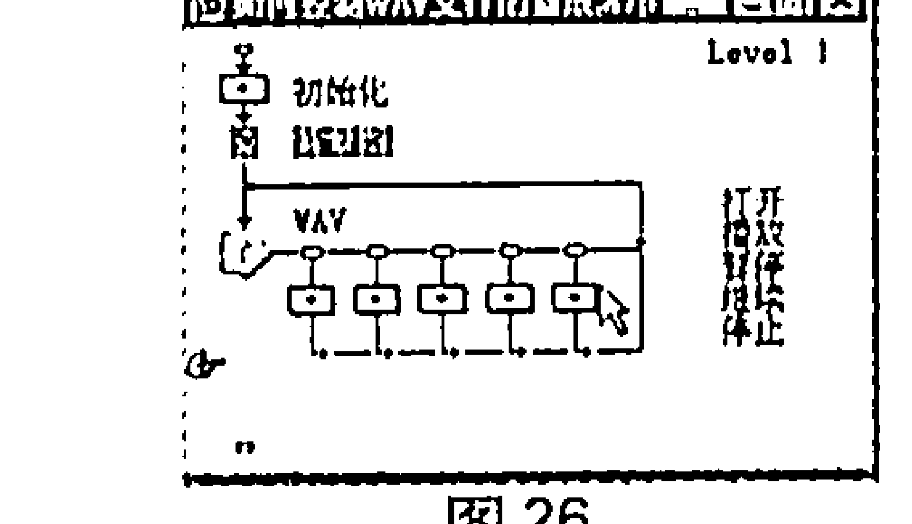

第四步，在“打开”计算图标中输入如下代码：

```
WAVFile:=tMsOpenImageFile (WindowHandle, "打开WAV文件", FileLocation, "", "*.wav", "WAV (*.wav)|*.wav")
if WAVFile<>"" then
  WavePlay (WAVFile, FALSE)
end if
```

需要说明的是，第一行命令调入tMsOpenImageFile()函数，用来打开类型为WAV的声音文件。if语句用来判断当打开文件不为空时将调用WavePlay()函数播放当前打开的WAV文件。

- 在“播放”计算图标中输入：WavePlay (WAVFile, FALSE)
- 在“暂停”计算图标中输入：WavePause ()
- 在“继续”计算图标中输入：WaveResume ()
- 在“停止”计算图标中输入：WaveStop ()

至此，一个简单的完成后播放器制作完成，其运行界面如图27所示。

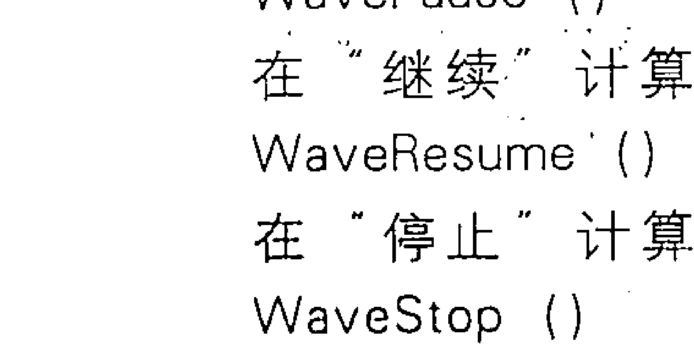

## 9. 英语复读录音功能

第一步，在流程线中依次放置计算图标、显示图标、等待图标、计算图标、等待图标和计算图标。

第二步，在第一个计算图标中输入代码：

```
ErrorCode:=MCISendString ("Capability WaveAudio Can Record")
ErrorCode:=MCISendString ("Open New type WaveAudio alias Capture")
```

第三步，在显示图标中创建文字对象“单击Continue按钮开始录制”，并选中等待图标中的Mouse Click和Show Button选项。

第四步，在第二个计算图标中，输入代码：ErrorCode:=MCISendString ("Record Capture")

第五步，将第二等待图标的等待时间设置10秒。在最后一个计算图标中输入如下代码即可：ErrorCode:=MCISendString ("Stop Capture") ErrorCode:=MCISendString ("Save Capture SOUND.WAV") ErrorCode:=MCISendString ("Close Capture")

## 10. 制作消息框

第一步，新建一个文件，拖动一个计算图标到流程线，命名为“消息框”。

第二步，双击打开代码窗口，输入如下代码：“MessageBox (WindowHandle, "欢迎您使用《路旁的橡树》课件", "课件制作小组", 48)”

第三步，按下【Ctrl + R】组合键运行程序即可弹出消息框，如图28所示。

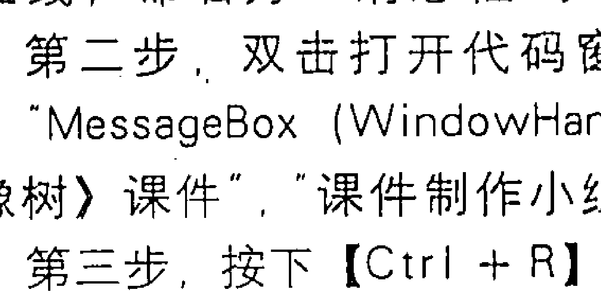

### 五、使用Flash制作课件

Flash支持动画、声音以及交互，具有强大的多媒体编辑功能，同时作为一款课件制作工具，深受广大教师的欢迎。鉴于Flash方面的文章和书籍针对其基本操作已经有着比较广泛的介绍，本文将从课件制作实例入手，深入介绍Flash在课件制作中的常见用法。

#### (一) 制作文本输入框

下面以制作学生默写单词课件为例，介绍文本输入框的制作方法。

- 第一步，新建一个Flash空白文档，输入文字“默写单词”，设置文本类型为“静态文本”。
- 第二步，在标题文字的下方继续输入文字“地球”，在“属性”面板设置文本类型为“静态文本”。
- 第三步，在“电脑”右侧新建一个文本框，设置文本类型为“输入文本”，字体为“Times New Roman”，大小为20，颜色为绿色，单击“在文本周围显示边框”按钮为文本框添加边框线，在“变量”框中输入“a”，如图29所示。
- 第四步，重复前面的步骤分别输入文字“乘客”、“地震”、“人口”及相应的输入文本框，最终效果如图30所示。


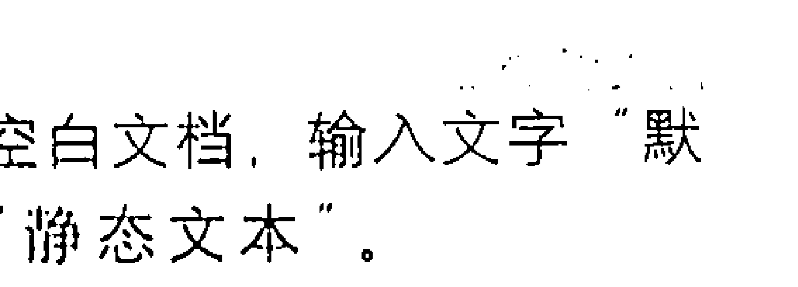

#### (二) 制作水分子结构示意图

下面以水分子为例，介绍制作水分子结构示意图的方法。

- 1. 第一步，选取椭圆工具，在“属性”面板设置笔触颜色为黑色，填充色为无颜色，笔触高度为1，按住【Shift】键在舞台绘制一个大圆和一个小圆。

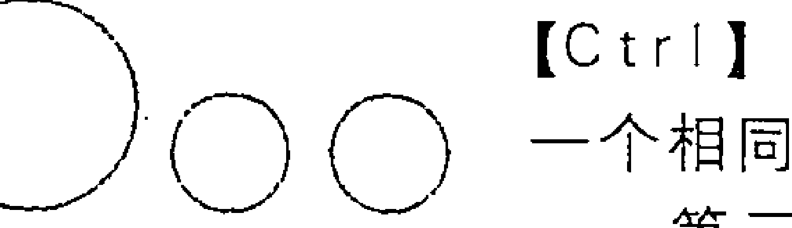

- 2. 第二步，选中小圆，按住【Ctrl】键向左拖动鼠标复制出一个相同的圆，如图31所示。

- 3. 第三步，选中两个小圆将它们移动到大圆上，选取线条工具，分别连接大圆和小圆的交点。

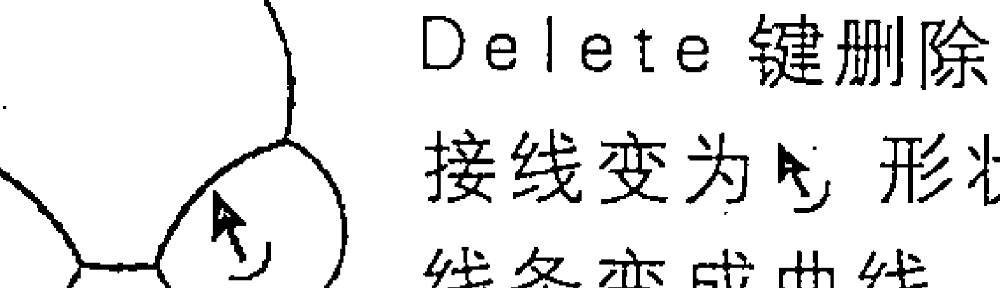

- 4. 第四步，选中多余的线条并按Delete键删除。移动鼠标到大小圆连接线变为形状时，向上拖动鼠标使线条变成曲线，如图32所示。

- 5. 第五步，打开“混色器”面板，设置填充样式为“放射状”，左侧颜色滑块为白色，右侧滑块为红色。


- 6. 第六步，选取颜料桶工具，将大圆填充为白红渐变色。打开“混色器”面板，设置填充样式为“放射状”，拖动左侧颜色滑块向右一段距离，设置右侧滑块为黑色。将两个小圆填充为白黑渐变色，如图33所示。

#### (三) 制作小球平抛下落动画

第一步，制作一个图形元件“小球”，修改图层名称为“小球”，将“库”面板中的“小球”元件拖动到舞台上。

第二步，单击“时间轴”面板中的“添加运动引导层”按钮，在“小球”层上新建一个运动引导层“引导层：小球”，如图34所示。

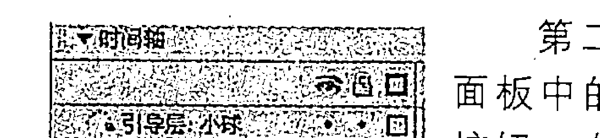

第三步，选中“引导层：小球”图层的第1帧，选取线条工具，设置“笔触颜色”为黑色，“笔触高度”为2，在舞台上绘制一条斜线，选取选择工具，将斜线调整成平抛曲线，如图35所示。


第四步，单击“小球”图层的第31帧，按【F6】键新建一个关键帧，单击“引导层：小球”图层的第31帧，按【F5】键延长帧。

第五步，单击“小球”图层的第1帧，将小球图形拖动到平抛曲线的顶端，继续单击图层的第31帧，将小球图形拖动到平抛曲线的底端，如图36所示。

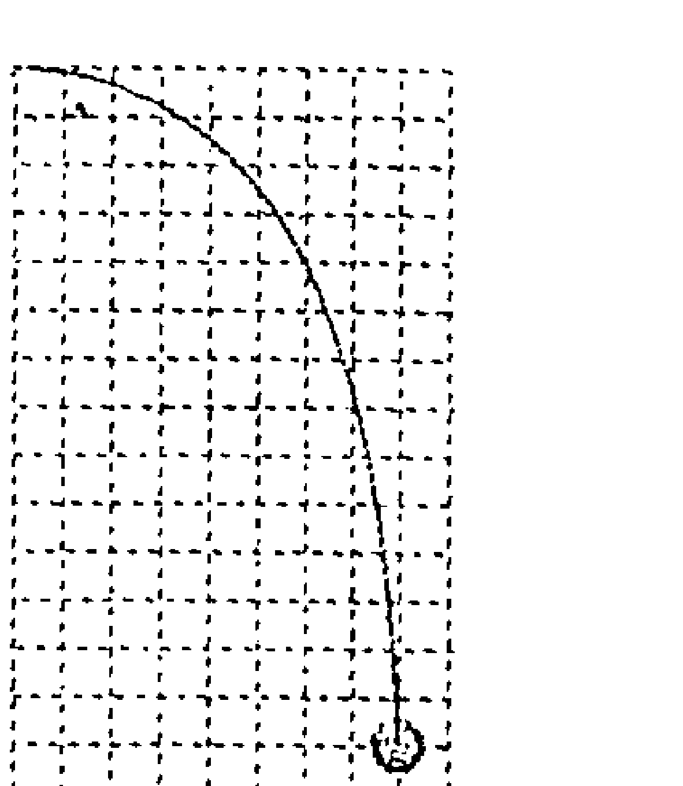

第六步，单击“小球”图层的第1帧，在“属性”面板上设置“补间”为“动作”，“简易”为-100，同时选中“调整到路径”、“同步”和“对齐”复选框，完成平抛动画的制作。

#### (四) 制作图片移动动画

第一步，导入图片文件到舞台上，在第1帧上按住鼠标不放将其拖到第25帧，设置图片从第25帧出现，选中图片按【F8】键将图片转换为图形元件“图1”。

第二步，分别在第35帧、45帧、55帧按F6键新建关键帧，单击第25帧并选中图片，在“属性”面板上，设置“颜色样式”为“Alpha”，“Alpha”数值为“0”，设置图片完全透明。

第三步，在第25帧将图片拖动到舞台外的左侧，在“属性”面板设置“补间”为“动作”，创建从第25帧到第35帧的运动渐变动画，使图片从舞台外的左侧移动到舞台中央，并从完全透明状态渐渐显现出来。

第四步，选中第55帧中的图片，设置图片的“颜色样式”为“Alpha”，“Alpha”数值为“0”，使图片完全透明，将图片拖动到舞台外的右侧。选中第45帧，在“属性”面板上，设置“补间”为“动作”创建运动渐变动画，使图片由舞台中央向右移出舞台并渐渐消隐。完成后时间轴如图37所示。

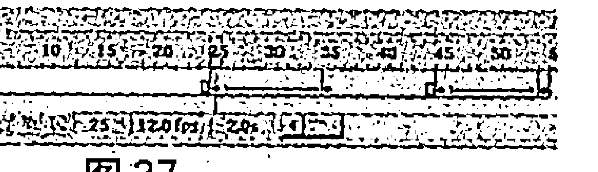

#### (五) 切割平行四边形

制作平行四边形的切割和平移动画可以按照如下步骤操作。

第一步，选取线条工具绘制一个平行四边形，选取颜料桶工具，设置“填充色”为白色，为该图形填充白色，如图38所示。


第二步，修改图层名称为“平行四边形”，新建一个名为“平行四边形高”的图层，选取线条工具，在“属性”面板上，设置“笔触颜色”为橙色，“笔触高度”为2，“笔触样式”为虚线，绘制平行四边形的高，如图39所示。


第三步，选中“平行四边形”图层第2帧，按【F6】键插入关键帧，在该帧中绘制一条平行四边形高，设置“笔触颜色”为蓝色，“笔触高度”为2，“笔触样式”为实线。

第四步，选取选择工具，按住【Shift】键不放依次单击选中平行四边形高左侧的图形，按下【←】键多次，将这部分图形与原平行四边形分离，如图40所示。

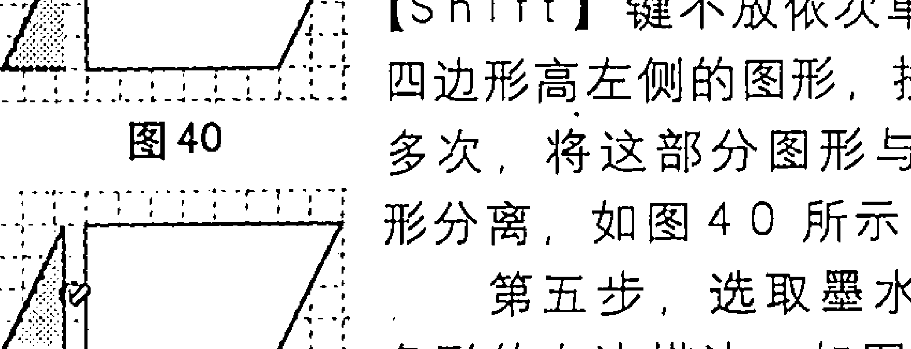

第五步，选取墨水瓶工具为三角形的右边描边，如图41所示。

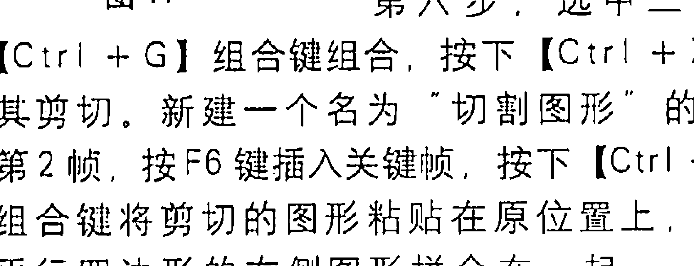

第六步，选中三角形并按下【Ctrl + G】组合键组合，按下【Ctrl + X】组合键将其剪切。新建一个名为“切割图形”的图层，选中第2帧，按F6键插入关键帧，按下【Ctrl + Shift + V】组合键将剪切的图形粘贴在原位置上，将三角形与平行四边形的右侧图形拼合在一起。

第七步，选中“切割图形”图层的第6帧，按F6键插入关键帧，选中该帧中的三角形，按【←】键多次，使其与平行四边形右侧图形分离一段距离，如图42所示。选中第2帧，在“属性”面板设置“补间”为“动作”创建切割图形分离的动画。

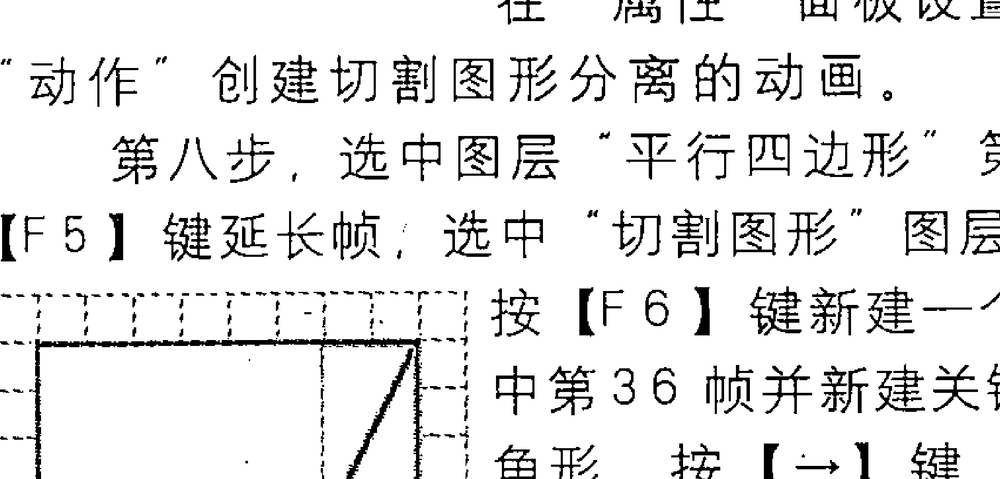

第八步，选中图层“平行四边形”第36帧，按【F5】键延长帧，选中“切割图形”图层的第11帧，按【F6】键新建一个关键帧。选中第36帧并新建关键帧，选中三角形，按【→】键，将其移到平行四边形的右侧，如图43所示。单击第11帧，在“属性”面板上，设置“补间”为“动作”，创建切割图形的平移动画。

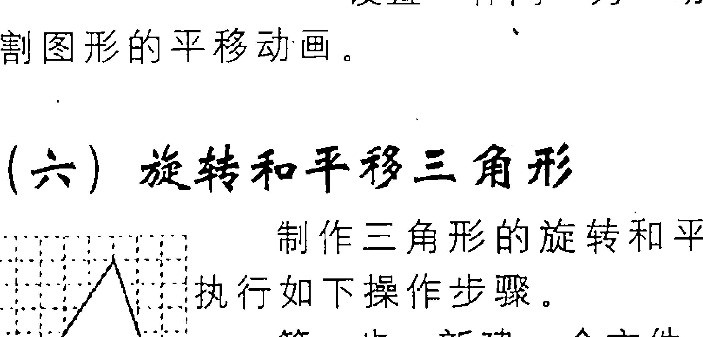

#### (六) 旋转和平移三角形

制作三角形的旋转和平移动画可以执行如下操作步骤。

第一步，新建一个文件，设置图层名称为“三角形”，选取线条工具，在“属性”面板设置“笔触颜色”为绿色，“笔触高度”为“2”，在舞台上绘制一个三角形，选取颜料桶工具，设置“填充色”为白色为三角形填充白色，如图44所示。

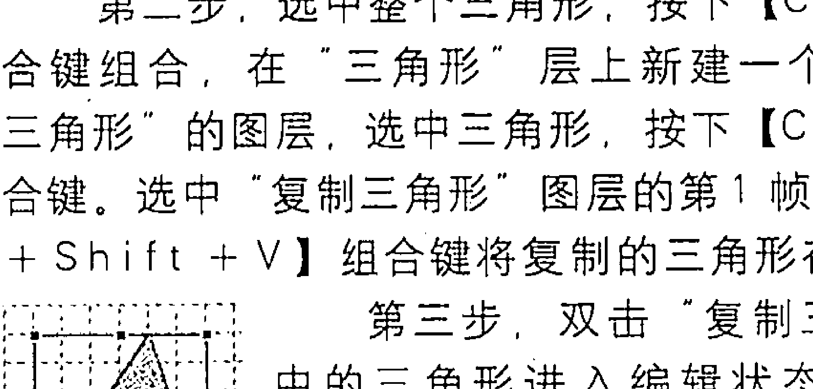

第二步，选中整个三角形，按下【Ctrl + G】组合键组合，在“三角形”层上新建一个名为“复制三角形”的图层，选中三角形，按下【Ctrl + C】组合键。选中“复制三角形”图层的第1帧，按下【Ctrl + Shift + V】组合键将复制的三角形在原处粘贴。

第三步，双击“复制三角形”图层中的三角形进入编辑状态，选取颜料桶工具为三角形填充半透明的绿色。

第四步，选中“复制三角形”图层第1帧中三角形，选取任意变形工具，用鼠标将中心控制点拖动到三角形右下角的顶点处，如图45所示。

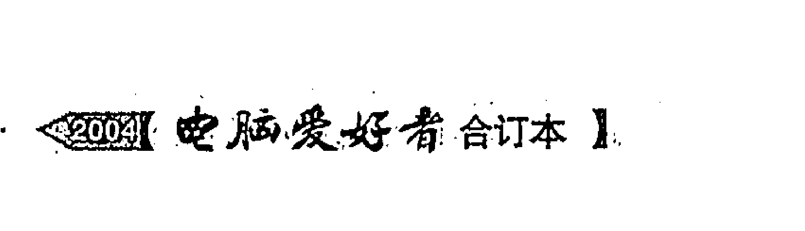

第五步，选中“三角形”图层第65帧，按【F5】键延长帧，选中“复制三角形”图层第30帧，按【F6】键新建一个关键帧，在“变形”面板中设置“旋转”为“-180°”，按回车键将“复制的三角形”逆时针旋转180°，如图46所示。


第六步，选中“复制三角形”图层第1帧，在“属性”面板设置“补间”为“动作”，“旋转”为“逆时针”，“旋转数”为“0”，创建三角形逆时针旋转180°的动画。

第七步，分别选中“复制三角形”图层第35帧和第65帧，按F6键新建关键帧，选中“复制三角形”图层第65帧中的绿色三角形，将该图形与原三角形拼合成一个平行四边形，如图47所示。


第八步，选中第35帧，在“属性”面板设置“补间”为“动作”，创建三角形移动动画。将“复制三角形”图层拖动到“三角形”图层的下方，按下【Ctrl + Enter】组合键即可预览动画效果。

#### (七) 制作判断题课件

第一步，新建一个空白Flash文件，将“图层1”更名为“背景标题”，在这个图层上创建课件的背景图形和标题。

第二步，新建一个“题目”图层，在第1帧和第3帧分别输入3道判断题题目。

第三步，新建“单选按钮”图层并选中第1帧，从“组件”面板“UI Components”组件类中拖放两个单选按钮组件(Radio Button)到舞台上。

第四步，将这两个单选按钮实例调整好位置。

第五步，选中第一个单选按钮，在“属性”面板中按如图48所示设置参数。


第六步，设置第2个单选按钮的“属性”，如图49所示。


第七步，按照同样的方法，在“单选按钮”图层的第2帧和第3帧也分别创建单选按钮，并在“属性”面板设置相应的参数。注意第2帧的两个单选按钮的“GroupName”参数定义为“g2”，第3帧的两个单选按钮的“GroupName”参数定义为“g3”。

第八步，新建一个“翻页按钮”图层，从“组件”面板拖放按钮组件到舞台上。

第九步，新建一个“动态文本”图层并创建一个动态文本，在“属性”面板中定义动态文本的实例名为“texta”。

第十步，新建一个“action1”图层，在该图层的第1帧定义以下程序代码：

```
flashistListener = new Object();
flashistListener.click = function(evt)
{
    texta.text = evt.target.selection.data;
};
g1.addEventListener("click", flashistListener);
listenerObject = new Object();
listenerObject.click = function()
{
    nextFrame();
};
an1.addEventListener("click", listenerObject);
```

第十一步，在“action1”图层第2帧定义以下程序代码：

```
texta.text="";
g2.addEventListener("click", flashistListener);
```

第十二步，在“action1”图层第3帧定义以下程序代码：

```
texta.text="";
g3.addEventListener("click", flashistListener);
```

第十三步，新建一个“action2”图层，在该图层的第1帧定义脚本代码为：

```
stop();
```

第十四步，将“action2”图层的第1帧复制到第2帧和第3帧，这样就可以控制每出现一个判断题页面就停止，等待用户答题。按下【Ctrl + Enter】组合键预览判断题课件。

#### (八) 制作填空题

第一步，新建一个空白Flash文件，将“图层1”更名为“背景和标题”，创建课件的背景图形和标题。

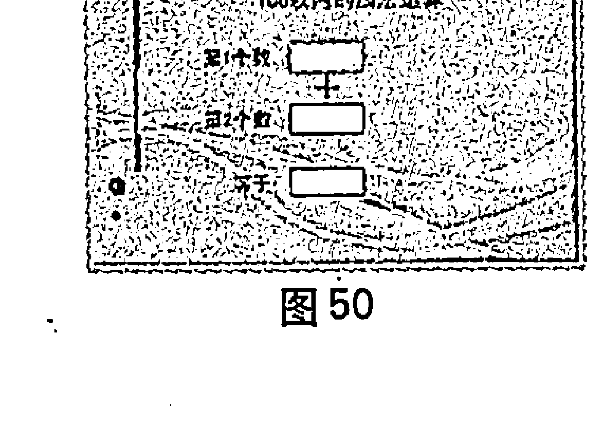

第二步，新建一个“题目”图层，在该层第1帧制作填空题题目并添加两个动态文本对象和一个输入文本对象，效果如图50所示，在“属性”面板分别设置从上向下3个文本对象的“变量”名为：“a”、“b”、“c”。

第三步，新建“动态文本”图层和“控制按钮”图层。在“动态文本”图层上创建一个动态文本对象，用来显示答题结束后的反馈信息文字，在“属性”面板中定义动态文本对象的“变量”名为“result”。

第四步，在“控制按钮”图层上，从“组件”面板拖放两个按钮组件到舞台上，在“属性”面板中分别定义这两个按钮的实例名为“an1”和“an2”，“label”值分别为“请出题”和“查成绩”。

第五步，新建一个“action”图层，选中第1帧，在“动作”面板中定义脚本为：

```
listenerObject1 = new Object();
listenerObject1.click = function()
{
    a = random(100);
    b = random(100);
    c = "";
    result = "";
};
an1.addEventListener("click", listenerObject1);
listenerObject2 = new Object();
listenerObject2.click = function()
{
    if(Number(a)+Number(b)==Number(c))
    {
        result="答对了！";
    }
    else
    {
        result="答错了！";
    }
};
an2.addEventListener("click", listenerObject2);
```

第六步，按下【Ctrl + Enter】组合键即可预览填空题课件。

#### (九) 制作倒计时效果

第一步，执行“修改”→“文档”命令，打开“文档属性”对话框，设置“帧频”为“1”。

第二步，按下【F6】键连续插入9个关键帧。改变每一关键帧中的内容分别为9、8、7、6、5、4、3、2、1。

第三步，按下组合键【Ctrl + Enter】测试影片，效果如图51所示。

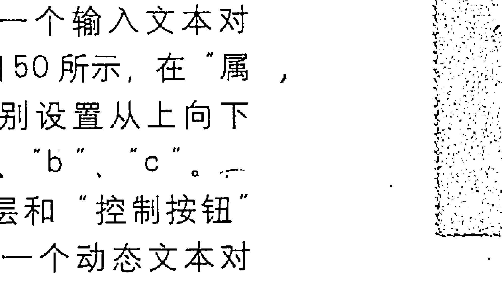## (十) 控制声音的播放

第一步，首先设计好程序的背景，并导入一个喇叭按钮元件，如图52所示。

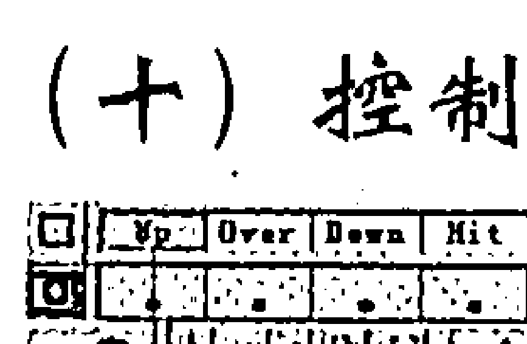

第二步，新增影片元件“ripple”(一个音波动画)，完成后新增一个电影元件“playmusic”，如图53所示。

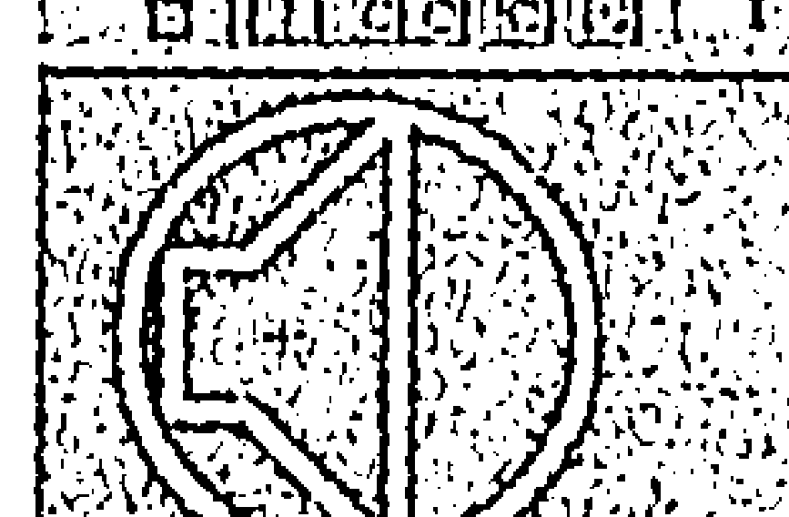

第三步，程序的第1帧为音乐播放状态，设定“Actions”为“停止”；程序的第10帧为音乐停止播放状态。在图层“button”中放的是按钮“btn”。在图层“playing”中放的是音乐播放时的动画。设定第1帧的按钮的“Actions”为：

```
on (release)
{
gotoAndStop(10);
}
```

设定第10帧的按钮的“Actions”为：

```
on (release)
{
gotoAndStop(1);
}
```

第四步，在图层“sound”中放置音乐“music”，可以通过“文件”→“导入”命令导入，双击该图层的第1帧，在弹出的对话框中选择“Sound”选项卡，设定音效“Sync”(同步)为“Start”(开始)。

第五步，在第10帧处插入一关键帧，并设定音效“Sync”(同步)为“Stop”(停止)。

第六步，切换到场景1，把图符元件资料库中的“playmusic”拖动到工作区中的适当位置。这样一个音乐控制开关就制作完成了。

### 六、使用“几何画板”制作课件

“几何画板”是一款制作理工类课件时使用非常广泛的工具，特别适合制作数学和物理课件。它不但可以演示教学情景，而且还可以通过“几何画板”中设计动画实现许多板书所无法直观表现的场景。

#### (一) 绘制正弦函数曲线

下面以绘制“f(x)=sin(x)”为例介绍正弦曲线的绘制方法。

第一步，执行“图表”→“绘制新函数”命令，弹出“新建函数”对话框。

第二步，单击“函数”下拉菜单，选择“sin”函数。

第三步，单击x按钮，再单击“确定”按钮将弹出“三角函数”对话框，单击“确定”按钮即可绘制出正弦函数曲线，如图54所示。

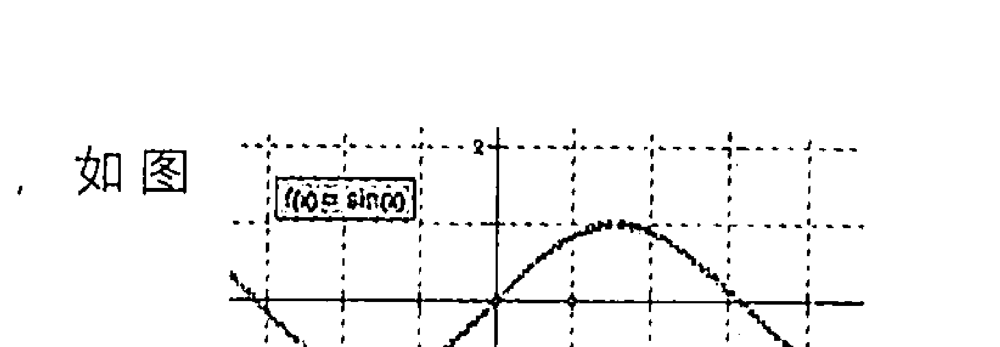

#### (二) 绘制双曲线

第一步，执行“图表”→“显示网格”命令在画板中显示网格。选择工具箱中的画点工具，依次在x正半轴和y正半轴上绘制两点A和B，其中点B较靠近原点，如图55所示。


第二步，依次选中原点和点A，执行“构造”→“以圆心和圆周上点绘圆”命令构造圆A。依次选中原点和点B，构造圆B，如图56所示。


第三步，选择工具箱中的画线段工具，将鼠标指针移至原点，按住鼠标拖动至圆A上，松开鼠标并将原点标为O，与圆A的交点为C。

第四步，依次选中点C和射线AC，执行“构造”→“垂线”命令构造垂线j，如图57所示。

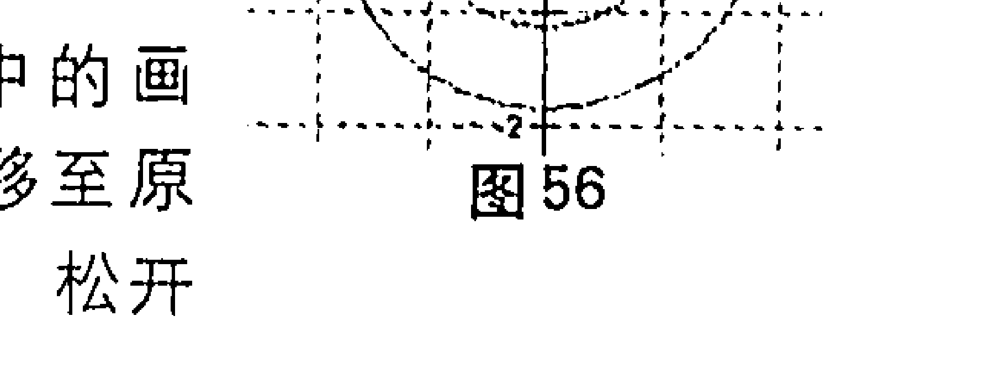

第五步，构造出垂线j与x轴的交点并标为D，依次选中点D和x轴，构造垂线k，如图58所示。

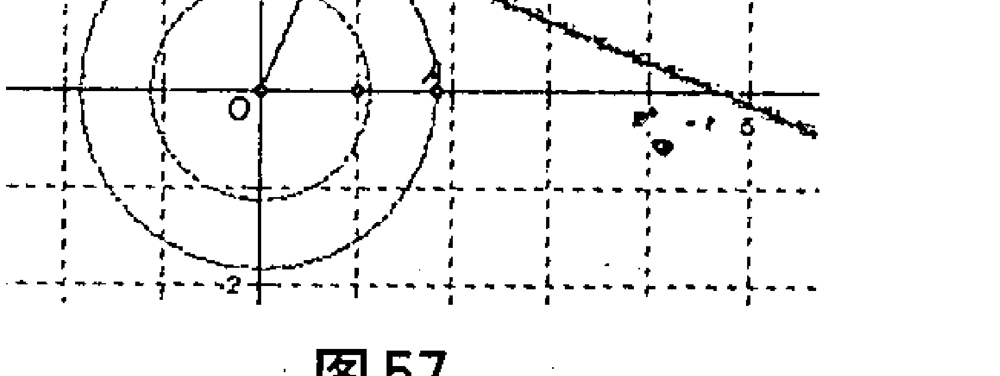

第六步，标识圆B与x正半轴的交点为E，依次选中点E和x轴，构造垂线l，并标垂线l与射线OC的交点为F，如图59所示。

第七步，依次选中点F和x轴，执行“构造”→“平行线”命令构造平行线，如图60所示。

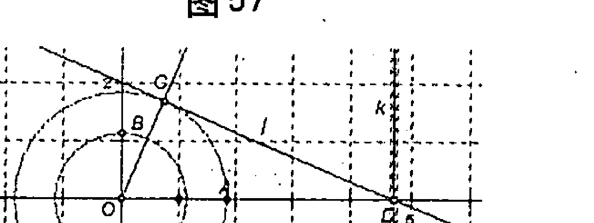

第八步，依次选中点G和点C，执行“构造”→“轨迹”命令构造点G的轨迹，如图61所示。


第九步，选中y轴，执行“变换”→“标记镜面”命令，将y轴标记为镜面。

第十步，选中点G，执行“变换”→“反射”命令得到点H。

第十一步，依次选中点H和点C，构造点H的轨迹。将不必要的对象隐藏。


隐藏完成双曲线绘制，如图61所示。

#### (三) 快速将圆12等分

第一步，选择工具箱中的画圆工具，在画板中绘制出一个圆，并将圆的控制点标为点A。

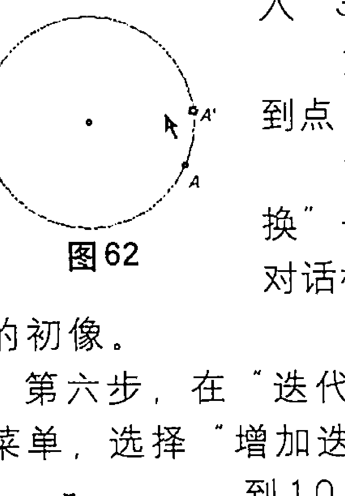

第二步，选中圆心，执行“变换”→“标记中心”命令，将圆心设为标记中心。

第三步，选中点A，执行“变换”→“旋转”命令，弹出“旋转”对话框，在“旋转参数”框中输入“30.0”。

第四步，单击“确定”按钮得到点A'，如图62所示。

第五步，选中点A，执行“变换”→“迭代”命令，弹出“迭代”对话框，用鼠标单击点A'选定迭代的初像。

第六步，在“迭代”对话框中单击“显示”下拉菜单，选择“增加迭代”命令，使迭代次数增加到10次。

第七步，单击“迭代”按钮将圆12等分，如图63所示。

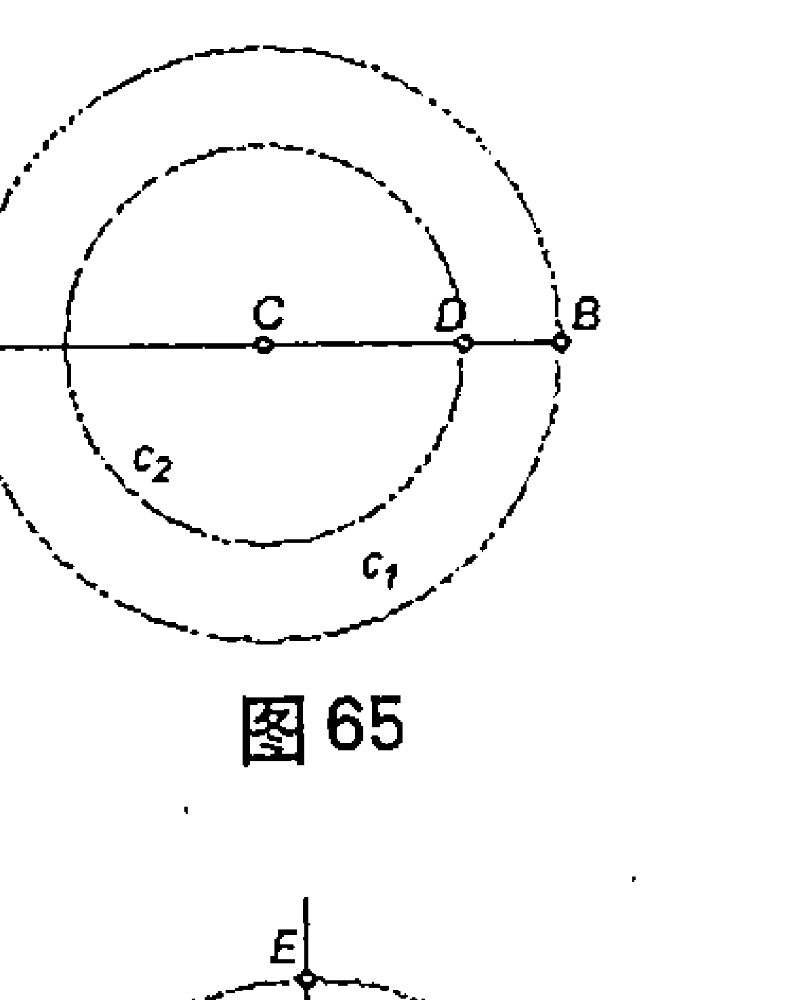

#### (四) 演示光的折射

第一步，选择工具箱中的画线段工具，按住【Shift】键绘制一条水平线段AB。

第二步，选中线段AB，执行“构造”→“中点”命令构造中点C。依次选中点C和点A，执行“构造”→“以圆心和圆周上点绘圆”命令构造圆C1，如图64所示。


第三步，选择工具箱中的画点工具，在线段AB上绘制一点D，依次选中点C和点D，构造圆C2，如图65所示。


第四步，依次选中点C和线段AB，执行“构造”→“垂线”命令构造垂线j，标记出与圆C1的交点E和F，如图66所示。


第五步，选择工具箱中的画点工具在劣弧AE上绘制一点G，依次选中点G和点C，执行“构造”→“射线”命令构造射线GC，标记出与圆C1的交点H，如图67所示。


第六步，依次选中点H和线段AB，执行“构造”→“垂线”命令构造垂线k，与圆C2的交点为I，如图68所示。


第七步，依次选中点C和点I，执行“构造”→“射线”命令构造射线CI，如图69所示。


第八步，依次选中点G、点C和点E，执行“度量”→“角度”命令度量角GCE的角度，同样度量角ICF的角度，如图70所示。


第九步，执行“度量”→“计算”命令，弹出“新建计算”对话框，计算出sin ∠ICF / sin ∠GCE的比值。

第十步，构造线段GC，将不必要的对象隐藏，在线段GC和射线CI上绘制出相应方向的箭头，同时将垂线j设为虚线，拖动点G即可演示光的折射现象，如图71所示。


#### (五) 演示电阻变化

第一步，在画板内输入题目并绘制出电路图，如图72所示。

如图所示，电阻R₁=2Ω，电阻R₂=10Ω，电阻R₃=20Ω，当电阻R₁上的滑片滑至何处时，总电阻R最大？最大值为多少？

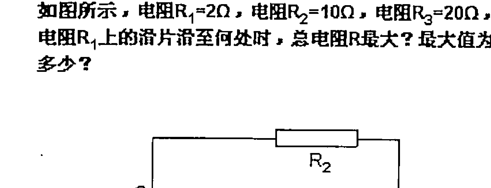

第二步，依次选中点G和点A，选择“编辑”→“操作类按钮”→“移动”菜单命令，打开“操作类按钮 从G→A移动 的属性”对话框，在标签框内输入“向左移动”，单击“确定”制作按钮[向左移动]。

第三步，依次选中点G和点B，制作按钮[向右移动]，如图73所示。

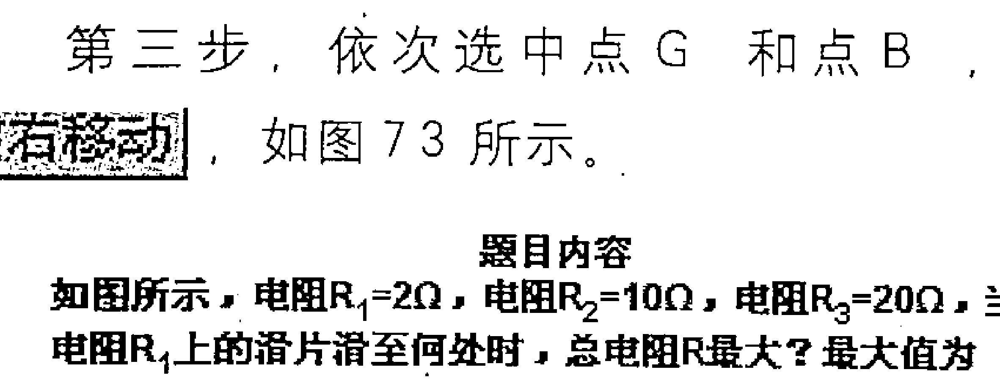

第四步，依次选中点G和点A，执行菜单“度量”→“坐标距离”度量两点间的坐标距离，同样度量点G和点B间的坐标距离，如图74所示。

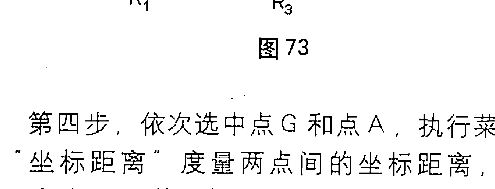

| GA | GB |
|----|----|
| 0.98 | 1.01 |

第五步，执行菜单“度量”→“计算”命令，弹出“新建计算”对话框，计算出$GA \cdot \frac{(GB + 1) \times 2}{GB + 1 + 2}$的值。

第六步，选择工具箱中画线段工具，按住【Shift】键绘制水平线段OH和一条竖直线段OJ，在点H和点J处加上实心箭头，如图75所示。

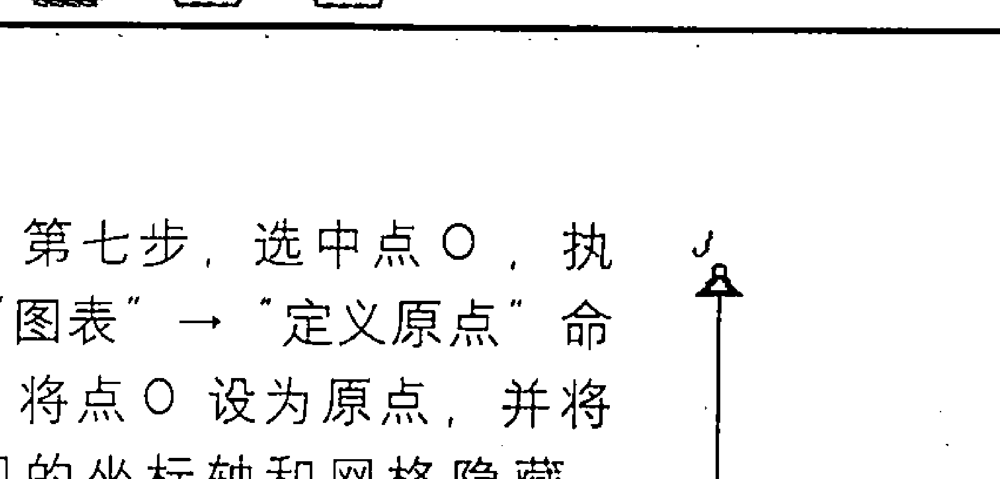

第七步，选中点O，执行“图表”→“定义原点”命令，将点O设为原点，并将出现的坐标轴和网格隐藏。

第八步，依次选中点G和点A之间距离的度量结果和步骤5的计算结果，执行“图表”→“绘制（x，y）”命令，绘制出一点I，如图76所示。


第九步，将点H的标签修改为“GA间的电阻（Ω）”，点J的标签修改为“总电阻R（Ω）”，如图77所示。

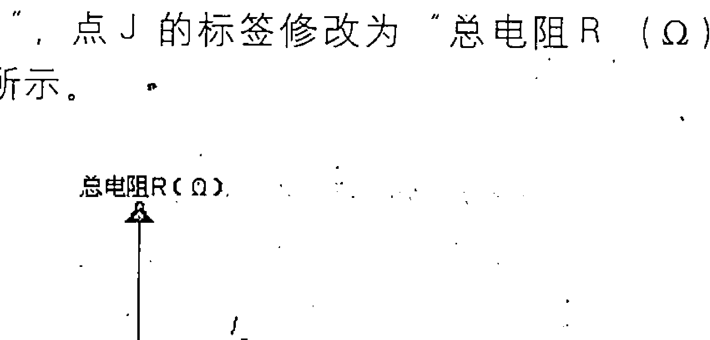

第十步，将画板中不必要的对象隐藏并选中点I，执行“显示”→“追踪绘制的点”命令，单击按钮演示总电阻R的变化情况，如图78所示。

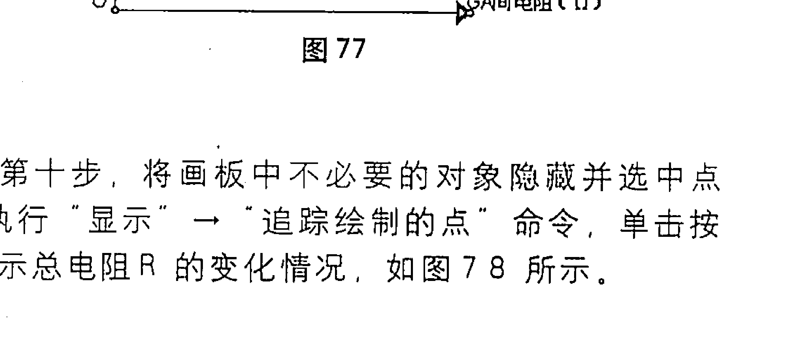

如图所示，电阻R₁=2Ω，电阻R₂=10Ω，电阻R₃=20Ω，当电阻R₁上的滑片滑至何处时，总电阻R最大？最大值为多少？

## VBA 进阶宝典——应用案例集锦
文/安平

### 一、VBA 入门热身

2004年《电脑爱好者》22～24期连续为广大读者介绍了VBA的相关知识和比较经典的实例，由于版面的限制，而且VBA开发涉及的内容又非常广泛，在此，我们把更多的精彩实例奉献给大家。另外，在此期间我们也收到很多读者的投稿，一并奉上。

关于Office VBA的入门知识请参考2004年下半年《电脑爱好者合订本》的正文分册。

### 二、实例一：Word 批量替换

众所周知，Word提供了强大的替换功能，可方便地满足多种替换需求，但细心的读者会发现，在Word中每次仅能操作一对文字内容（即“替换”和“替换为”的内容），当需对文字资料进行多内容的批量替换时，则需逐个操作，比较烦琐。

那么懂得一点VBA知识的读者或许会通过录制宏的方法来获取替换操作的代码，然后反复复制、修改这些代码，实现连续替换的需求，但该方法缺乏灵活性，如需修改批量替换的内容，将非常烦琐。

通过VBA和Word加载模板的方法，笔者为Word开发了一个“超级替换”的工具，该工具不仅可批量替换文档内容，且可方便地修改替换内容。

### 1. 实例效果

本例编制的程序可通过工具栏的按钮触发运行，工具栏的按钮如图1所示。

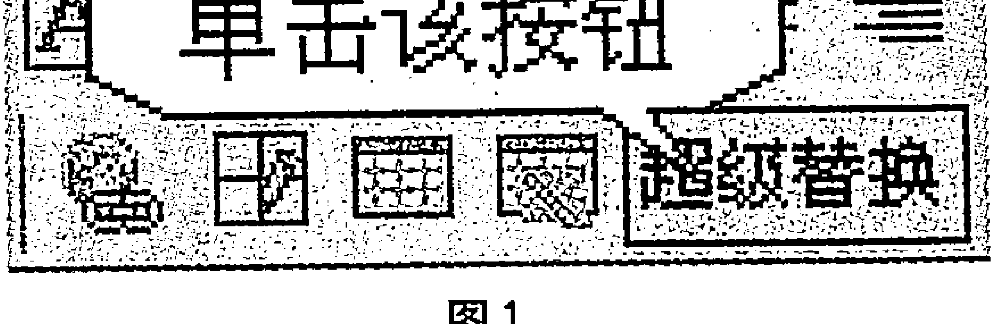

单击该按钮后，将进行批量替换的操作，即连续替换一系列指定的内容，可大大提高工作效率。

#### 2. 实例编制步骤

##### （1）程序设计思路

由程序功能需求和前述知识点可得设计思路，具体如下所述：

- 按特定格式输入替换和被替换的内容。
- 编制批量替换的代码，在代码中拆分替换和被替换的内容。
- 保存为模板并加载。

##### （2）输入替换和被替换的内容

新建Word文件，按特定的格式输入替换和被替换的内容。本文实例程序使用"==="（即三个等号）做为分隔符。在输入内容时，分隔符的左面为需替换的内容，右面为替换后的内容，每行输入一对替换内容，且可使用Word的替换通配符，如图2所示。

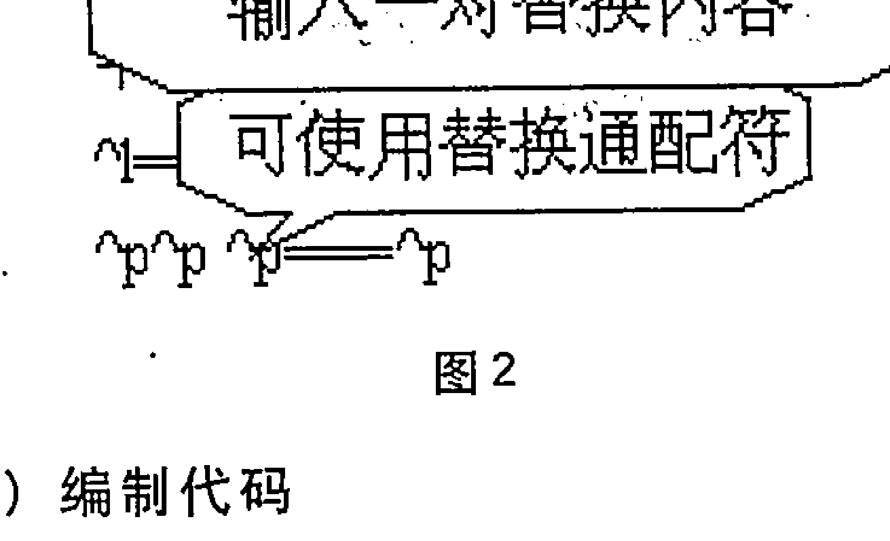

##### （3）编制代码

在Word主界面中单击“工具”菜单下的“宏”子菜单中的“Visual Basic 编辑器”项，进入VBA的编辑窗体，在工程资源管理器中为当前的Word文件工程添加一个模块，然后双击该模块图标，切换至代码编辑窗体。

首先定义分隔符常量，代码如下所示：

```
' 定义 "===" 为分隔符
Const splitsymbol = "==="
```

然后输入用于实现批量替换的子程序；具体如下所示：

```
' 实现批量替换的子程序
Sub superreplace()
' 设置如发生意外错误时，代码继续执行
On Error Resume Next
Dim i As Integer
' 定义存放拆分后内容的数组
Dim temparray() As String

' 遍历加载模板中所有的段落
For i = 1 To ThisDocument.Paragraphs.Count
    ' 通过 Split 函数，按预定义的分隔符来拆分替换和需替换的内容
    temparray = Split(CStr(ThisDocument.Paragraphs(i).Range), splitsymbol)
    
    ' 清除替换的内容
    Selection.Find.ClearFormatting
    Selection.Find.Replacement.ClearFormatting
    
    ' 设置替换对象的相关属性
    With Selection.Find
        ' 设置需替换的内容
        .Text = CStr(temparray(0))
        
        ' 通过 Replace 函数去除段落结尾的回车符号，
        ' 并设置替换的内容
        .Replacement.Text = Replace(CStr(temparray(1)), Chr(13), "")
        
        ' 设置替换操作的其他属性
        .Forward = True
        .Wrap = wdFindContinue
        .Format = False
        .MatchCase = False
        .MatchWholeWord = False
        .MatchByte = True
        .MatchWildcards = False
        .MatchSoundsLike = False
        .MatchAllWordForms = False
    End With
    
    ' 开始执行替换操作
    Selection.Find.Execute Replace:=wdReplaceAll
Next i
End Sub
```

##### (4) 保存为模板并加载

代码输入完毕后，将该Word文件保存为“文档模板”格式，即可在Word中按前述方法加载。加载模板后，可单击“视图”菜单的“工具栏”子菜单的“自定义”项，在弹出的“自定义”窗体中选择“命令”选项卡，在“类别”列表框中选择“宏”，在“命令”列表框中选择前述代码中相应的子程序名称（本文实例为“superreplace”），如图3所示。

然后将该命令拖动至工具栏的适当位置并重命名，即可通过工具栏按钮来触发相关代码的运行了。

如需修改或添加批量替换的内容，需通过Word的“打开”对话框来打开模板文件（注意：不可直接执行模板文件来打开），然后按上述方法编辑替换的内容并保存和重新加载即可。

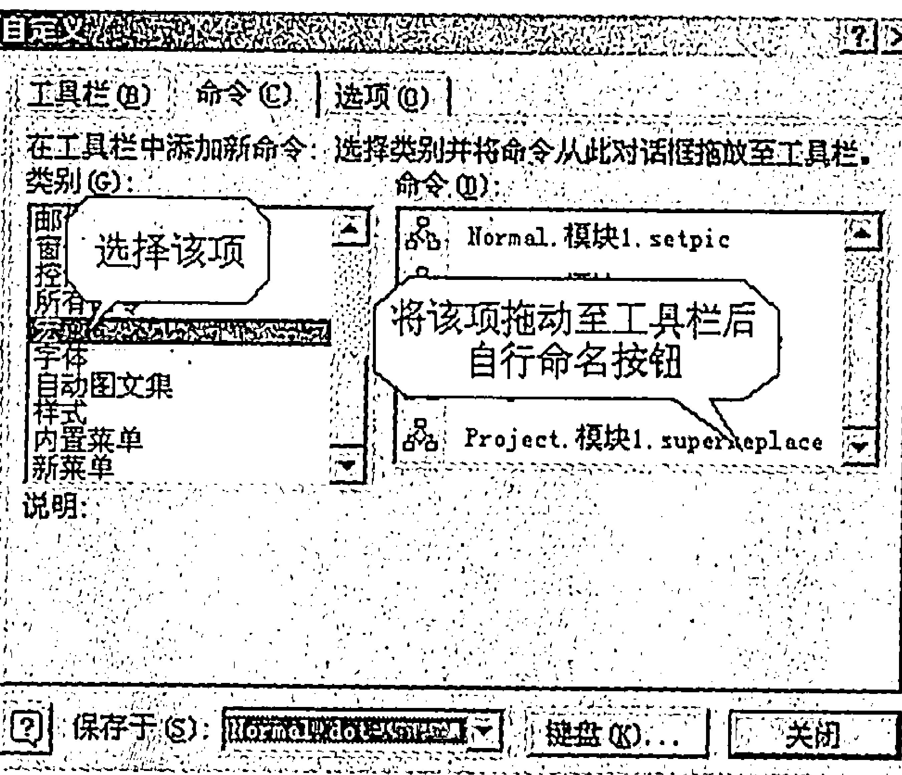

### 三、实例二：Excel 盖章

Excel以其强大的计算和图表功能，成为很多读者制作表格的首选工具。在某些工作场合，鉴于美观或正式的要求，很多表格往往需添加公章或个人名章图片，如每次均通过外部图片的方式插入，不仅效率较差，而且会大大增加文件的尺寸。为此笔者利用Excel绘制印章，并通过VBA加载宏开发了一个自动盖章程序，大大提高了工作效率。

### 1. 实例效果

本文开发的加载宏（xla）文件可直接执行，执行后Excel将自动启动，并新增一个工具栏，该工具栏包含一个按钮（用于显示文字）和一个下拉列表框，下拉列表框的列表项内容为可使用的公章和个人章名称，如图4所示。

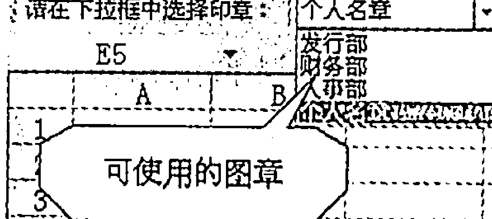

选择下拉列表框中的相应印章，在Excel表格中即可添加印章图片，加盖各类印章后的Excel表格如图5所示。

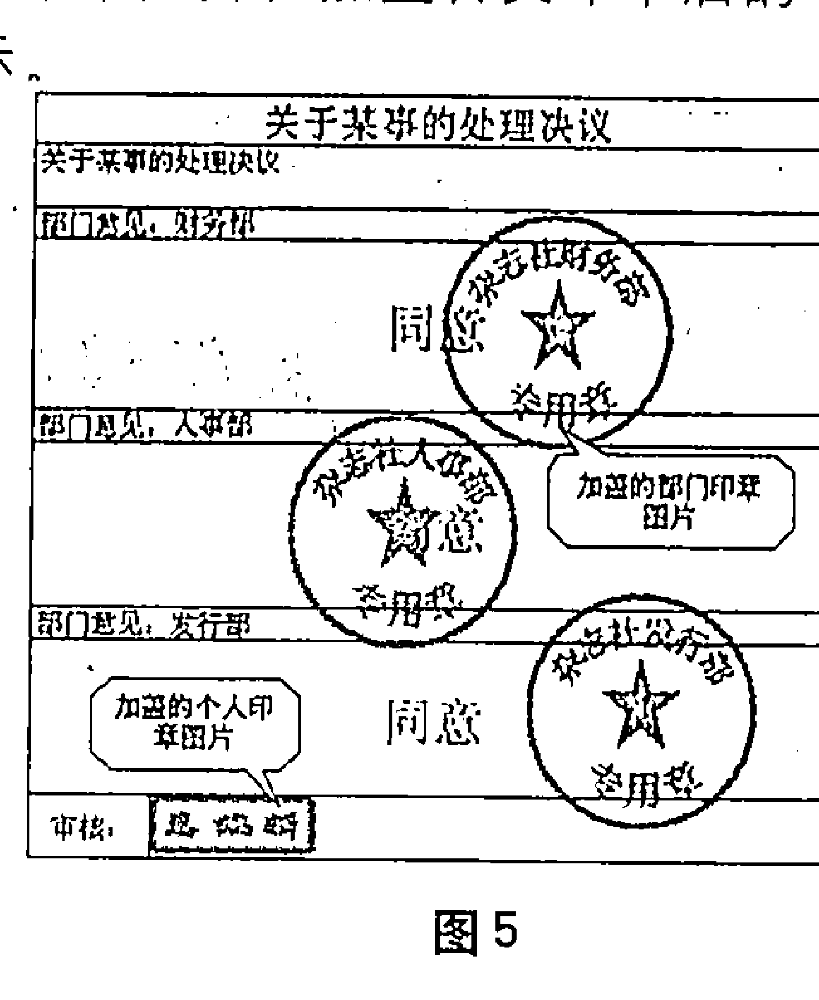

### 2. 实例知识点

##### (1) 加载宏

Excel加载宏是扩展名为“xla”的特殊Excel文件，该类文件通过在标准Excel文件中调试VBA程序，正确无误后添加相关事件代码，最后将其保存为“Microsoft Excel 加载宏”的方法生成，且加载宏程序无法查看其VBA代码，具有较强的安全性。

在Excel中使用加载宏可单击“工具”菜单中的“加载宏”命令，在弹出窗口中单击“浏览”按钮，在弹出的对话框中选择需加载的文件或直接执行加载宏文件即可。

加载宏一般均需进行初始化操作，以实现诸如添加工具栏等操作，这些代码必须通过特定触发的事件来执行。这些事件均由工作簿（Workbook）对象提供，具体如下所述：

- AddInstall 事件，该事件在工作簿以加载宏方式载入时触发。
- AddUnInstall 事件，该事件在工作簿以加载宏方式卸载时触发。
- Open 事件，该事件在打开工作簿时触发。
- BeforeClose 事件，该事件在关闭工作簿前触发。
- BeforeSave 事件，该事件在保存工作簿前触发。
- NewSheet 事件，该事件在工作簿中新建工作表时触发。
- SheetChange 事件，该事件在更改工作表的单元格时触发。
- SheetSelectionChange 事件，该事件在工作表选择区域发生改变时触发。

##### （2）工具栏开发

前一个实例的工具栏按钮需读者手工添加，而本例则自动在工具栏中添加了控件。其实，大部分Office软件均提供了工具栏的VBA开发接口，Excel也不例外。该开发接口主要包括CommandBar、CommandBarButton和CommandBarComboBox等对象，这些对象命名方式很直观，只需“望文生义”即可了解对象的用途。常用工具栏开发对象的相关知识点如下所述：

- CommandBars 集合对象，该集合对象代表工具栏，可通过名称或索引来访问工具栏，其常用方法和属性为 Add 方法，该方法用于新建工具栏并返回 CommandBar 对象。
- CommandBar 对象，该对象代表工具栏，在工具栏上新建控件均需通过该对象来实现。
- CommandBarButton 对象，该对象代表工具栏的按钮控件。
- CommandBarComboBox 对象，该对象代表工具栏中的组合框控件，是常用的工具栏开发控件。

#### 3. 印章制作简介

本例使用的印章图片均通过Excel自带的绘图工具绘制，大大减小了文件的尺寸。

##### (1) 制作印章轮廓

由于印章轮廓一般多为圆形，可通过Excel的“绘图”工具栏中的“椭圆”按钮配合【Shift】键来实现。绘制适当大小的圆后，需将其线条色设置为红色，粗细设置为3磅，颜色设置为无填充颜色，环绕方式为四周型。个人名章轮廓一般为圆角矩形，可通过“绘图”工具栏的“流程图”按钮来实现。

此外印章中间一般均有五角星或其他图形。五角星可通过“绘图”工具栏的“星与旗帜”按钮来实现，其线条和填充颜色也相应设置为红色。

##### (2) 编辑印章文字

印章文字一般为半圆形环绕，因此可通过“绘图”工具栏中的“插入艺术字”按钮来实现，单击该按钮，在弹出的对话框中编辑艺术字的文字，最后只需调整艺术字的形状、大小和位置，使其可放入印章轮廓中即可。

##### (3) 组合印章图形

调整印章图形各组成部分的大小和位置，满意后，单击鼠标右键，在弹出菜单中选择“组合”选项，即可将分散的对象组合为一个完整的印章图片。

#### 4. 实例编制步骤

##### (1) 程序设计思路

- 将各类印章图形在Excel中绘制后，放置在一个工作表中（如“Sheet1”），并分别进行命名。
- 编写代码，遍历工作表中所有的图形并显示在列表框中。
- 触发相应事件，通过复制和粘贴的方式将印章图片粘至所需的位置。
- 编写工作簿对应事件，使其在加载时自动执行初始化操作。

##### (2) 绘制印章并命名

新建Excel文件，在“Sheet1”工作表中按前述的方法绘制印章图形，然后选择该图形，在Excel的“命名”文本框中输入相应的名称，如图6所示。需注意的是：印章图形的名称不可重复。

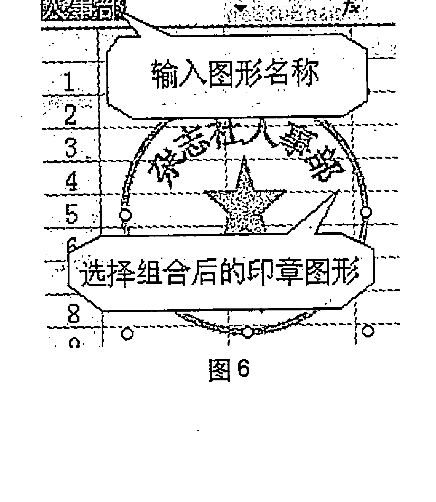

## (3) 编制模块

打开 Excel 的 VBA 编辑器（在主界面中按【Alt+F11】键），在工程资源管理器中添加一个模块，如图 7 所示。

双击模块的图标，切换至代码编辑窗体。首先定义一些公共变量，代码如下：

```
' 定义工具栏名称常量
Public Const toolbar_name = "Excel 盖章工具栏"
' 定义工具栏变量
Dim signet_toolbar As CommandBar
' 定义工具栏按钮变量
Dim toolbar_button As CommandBarButton
' 定义工具栏下拉框变量
Dim picture_dropdown As CommandBarComboBox
```

然后输入自定义的子程序，如下所述：

```
' 新建工具栏的子程序
Sub new_exceltoolbar()
Dim i As Integer
' 新建工具栏
Set signet_toolbar = Application.CommandBars.Add(Name:=toolbar_name, Position:=msoBarTop)
' 在新建的工具栏中添加按钮
Set toolbar_button = signet_toolbar.Controls.Add(Type:=msoControlButton)
' 设置该按钮的相关属性
With toolbar_button
' 设置该按钮风格
.Style = msoButtonCaption
' 设置该按钮的文字
.Caption = " 请在下拉框中选择印章："
.Visible = True
End With
' 在新建的工具栏中添加下拉框
Set picture_dropdown = signet_toolbar.Controls.Add(Type:=msoControlDropdown)
' 设置该下拉框的相关属性
With picture_dropdown
' 遍历“Sheet1”工作表中所有的图形
For i = 1 To ThisWorkbook.Worksheets("Sheet1").Shapes.Count
' 将图形的名称添加至下拉框中
.AddItem ThisWorkbook.Worksheets("Sheet1").Shapes(i).Name
Next i
.Visible = True
' 设置分组
.BeginGroup = True
' 设置第一项被选择
.ListIndex = 1
' 设置事件内容
.OnAction = "insert_signet"
End With
' 设置工具栏的相关属性
With signet_toolbar
.Visible = True
.Enabled = True
End With
End Sub
```

```
' 插入印章图片的子程序
Sub insert_signet()
' 定义区域变量
Dim excel_range As Range
If Application.Workbooks.Count > 0 Then
' 通过名称的方法复制“Sheet1”工作表中的图形
ThisWorkbook.Worksheets("Sheet1").Shapes(picture_dropdown.Text).Copy
' 禁止屏幕刷新
Application.ScreenUpdating = False
' 获取当前选择的区域
Set excel_range = ActiveWindow.RangeSelection
' 粘贴复制的印章图片
excel_range.PasteSpecial
' 恢复屏幕刷新
Application.ScreenUpdating = True
End If
End Sub
```

## (4) 编制工作簿事件

在图 7 所示的工程资源管理器中双击 ThisWorkbook 对象，切换至该对象的代码编辑窗体，输入与加载宏相关的事件代码，具体代码如下：

```
' 通过 xla 文件方式加载的入口子程序
Private Sub Workbook_AddinInstall()
Dim tempbar As CommandBar
' 循环遍历工具栏
For Each tempbar In Application.CommandBars
    ' 如已存在名称相同的工具栏
    If tempbar.Name = toolbar_name Then
        ' 删除重复的工具栏
        tempbar.Delete
    End If
Next
Application.ScreenUpdating = False
' 调用新建工具栏的子程序
new_exceltoolbar
Application.ScreenUpdating = True
End Sub
' 通过 xla 文件方式加载的出口子程序
Private Sub Workbook_AddinUninstall()
On Error Resume Next
Application.CommandBars(toolbar_name).Delete
End Sub
' 通过 xls 文件方式使用的入口子程序
Private Sub Workbook_Open()
' 调用 xla 文件方式加载的入口子程序
Call Workbook_AddinInstall
End Sub
' 通过 xls 文件方式使用的出口子程序
Private Sub Workbook_BeforeClose(Cancel As Boolean)
' 调用 xla 文件方式加载的出口子程序
Call Workbook_AddinUninstall
End Sub
```

## (5) 保存为加载宏和修改方法

代码调试无误后，可将 Excel 文件另存为加载宏（xla）文件，随后按前述方法调用即可。如需修改印章的内容，可打开工作簿（xls）文件，按前述方法修改、绘制新印章，重命名后另存为加载宏文件即可。
需注意，在修改时不可将原始工作表中的印章图形全部删除，应至少保留一个，否则程序会出现错误。

# 四、实例三：增强 Word 图片插入功能

在录制“宏”的子程序中，读者会发现录制子程序中调用的对话框，在最后生成的宏代码中均无相应的代码语句，即“宏”仅可保存操作的结果，而无法记录具体的步骤（即无法录制一个仅显示某个内置对话框的“宏”）。Word 和 Excel 的 VBA 开发环境中均提供了软件内置对话框的开发接口，且 Word 中的接口功能非常强大，提供了多种调用对话框的方式。
很多喜欢撰写文稿的读者，经常需在 Word 文件中插入图片，并相应地设置其格式。但 Word 中需打开对话框，然后选择文件，最后还需设置格式。能否通过录制“宏”来实现图片插入和设置格式的操作呢？非也，如前所述，录制后的宏仅可插入录制时记录的图片文件，无法实现用户选择图片的功能，但可通过调用 Word 的内置对话框，来实现该功能。

### 1. 实例效果

在 Word 2002 中开发的实例，加载模板并运行其中的“addbutton”子程序后将在主界面的“插入”菜单中添加一个名为“增强型图片插入”的菜单项，如图 8 所示。

单击该菜单项将弹出 Word 的“插入图片”对话框，用户选择图片文件后，该图片将插入文件，并自动设置其样式（本例将图片设置为黑白色和笔者自定义的“图”样式），如图 9 所示。

### 2. 实例知识点

Office 软件均使用了大量的内置对话框。在 Word 和 Excel 中提供了开发接口，使开发者可充分利用内置对话框实现很多操作，尤其在 Word 中，可使用多种方法显示内置对话框，实现不同的功能需求。这里以 Word 的内置对话框为例进行知识点介绍。

### (1) Dialogs 集合对象

该集合对象代表 Word 或 Excel 中的 Dialog 对象集合，其中每个 Dialog 对象均代表一个内置对话框，且开发者无法在 Dialogs 集合中创建新的内置对话框，也无法添加对话框。

### (2) Dialog 对象

该对象代表内置对话框，其常用方法和属性有 CommandName 属性、DefaultTab 属性、Display 方法、Execute 方法、Show 方法、Update 方法等。

### (3) 显示内置对话框

通过 VBA 代码可控制内置对话框的显示，如需调用指定的内置对话框，可将 Dialogs 属性通过常量进行赋值，如 “Dialogs(wdDialogFileOpen).Show” 可显示 Word 的 “打开” 对话框。在前述代码中，如将该语句的返回值赋予 Dialog 变量，即可通过该变量返回或设置对话框的选项，代码如下所示：

```
Set testDialog = Dialogs(wdDialogFileOpen)
```

### 3. 实例编制步骤

### (1) 调用内置对话框并进行相关操作

在 VBA 的工程资源管理器中添加一个模块，在该模块中输入以下代码：

```
' 调用内置对话框插入图片并设置格式的子程序
Sub insertpic()
' 定义图片变量
Dim Is As InlineShape
' 定义对话框变量
Dim opendia As Dialog
' 将“插入图片”对话框赋予该变量
Set opendia = Dialogs(wdDialogInsertPicture)
' 如显示的对话框并非单击“取消”按钮后关闭
If opendia.Display = -1 Then
' 插入对话框中选择的图片文件
Set Is = Selection.InlineShapes.AddPicture(FileName:=opendia.Name, LinkToFile:=False, SaveWithDocument:=True)
' 设置图片为黑白色
Is.PictureFormat.ColorType = msoPictureGrayscale
' 选择该图片
Is.Select
' 设置图片的样式为预定义的“图”
Selection.Style = "图"
Else
' 显示警告信息
MsgBox "请先选择图片！", vbExclamation
End If
End Sub
```

### (2) 添加自定义菜单项

由于菜单项在 VBA 中从技术上等同于工具栏按钮，因此在添加的模块中，可按前述介绍的方法实现菜单项操作，代码如下所述：

首先定义全局变量：

```
' 菜单栏变量
Dim oMnu As CommandBarControl
' 菜单项变量
Dim oMnuctl As CommandBarButton
' 在“插入”菜单栏中新增菜单项的子程序
Sub addbutton()
' 将主菜单的“插入”菜单赋予变量
Set oMnu = Application.CommandBars("Menu Bar").Controls(4)
' 新增菜单项
Set oMnuctl = oMnu.Controls.Add(Type:=msoControlButton, ID:=1)
' 设置菜单项的属性
With oMnuctl
.Style = msoButtonIconAndCaption
' 设置菜单项图标
.FaceId = 3174
' 设置菜单项标题
.Caption = "增强型图片插入"
.ToolTipText = .Caption
' 设置触发事件代码
.OnAction = "insertpic"
End With
End Sub
```

```
' 删除菜单项的子程序
Sub deletebutton()
' 重设系统主菜单栏
Application.CommandBars("Menu Bar").Reset
End Sub
```

> 小提示 在使用本 VBA 程序时，请读者先自定义一个名称为“图”的样式，以免出错。

## 结束语

本文通过多个有趣的实例循序渐进地介绍了 VBA 开发的具体内容，所介绍的实例均可在日常工作中直接应用，帮助读者提高工作效率。相信通过本文的学习，广大读者对 VBA 的应用会有一个较全面的理解，如能在此基础上进一步熟练地掌握，无疑可使 Office 软件更符合自身需求，一些成熟的 VBA 程序也完全可通过第三方软件的形式在网络上进行发布，从而帮助读者迈入共享软件开发的领域。此外，本文的实例程序，笔者在配套光盘中均提供有源文件，读者可自行参考使用。

# GIF动画制作简明攻略

文/洁儿

时下，电脑动画是一个很热门的话题，不过动画制作比较高的门槛也让很多新手望而生畏。但动画制作也并不是完全遥不可及，我们这里介绍两款比较容易上手的GIF格式动画制作软件。相信通过相关软件的使用介绍，大家会顺利地迈出动画制作的第一步。

## 一、Ulead GIF Animator

### (一) 制作第一个GIF动画

GIF格式动画制作的重量级武器就是Ulead GIF Animator，这是友立公司出品的准专业级GIF制作软件。在天空软件站我们可以下载到GIF Animator比较新的5.05版，具体链接是：http://www1.skycn.com/soft/2441.html。软件不到10MB，采用的是英文界面，习惯于中文界面的用户，可以在http://www1.skycn.com/soft/2442.html找到其汉化补丁。

第一次启动GIF Animator，我们会看到如图1所示的对话框。在这里我们选择“动画向导”，开始一步步地制作我们的第一个GIF动画。动画制作的第一步就是设置画布尺寸，GIF Animator预置了从60 × 60像素到468 × 60像素之间的十二种常见尺寸。比如网站首页的广告通常就是468 × 60像素的，新手制作动画最好选择这些标准尺寸，在下拉菜单可以方便地选择。同时系统也支持有一定经验的用户自定义GIF动画的画布大小，同时可以删除和新建预置尺寸。设置好画布尺寸就可以开始“画画”了，我们只需选择构成GIF动画每一帧的图片，点击“添加图像”按钮即可。GIF Animator支持十多种图像格式，在选择前还可以预览图像和查看图像的相关信息。需要注意的是，最好选择和画布等大的图像，大于画布的图像将不能被正确显示。

设置“画面帧持续时间”这是最重要的步骤之一，有两个相互关联的参数“延迟时间”和“帧速率”。我们只需要调节其中一个，另一个会自动进行相应的变化。我们以“帧速率”为例来说明，我们可以把GIF动画当作幻灯片来理解，帧速率就意味着每秒播放多少张幻灯片。假设我们设定了16张图片，而帧速率选择的是每秒4帧（也就是4fps），那么16张图片就需要4秒钟才能播完一个循环。画面帧持续时间的设置一般需要根据内容来决定，常见动画片的帧速率在25fps到30fps之间。如果我们选择的是连续性很强的一组图片，那么帧速率可以大一些，差异比较大的图片建议设置较小的帧速率。当你设定帧速率以后，GIF Animator会“演示”在该帧速率下，图像变化的速度。

### (二) 静帧编辑

通过向导我们已经做出了第一个GIF动画，我们还可以进一步地修改这个动画。我们可以选定任意一个静态帧对其进行编辑，修改的工具大部分都在工具栏中。GIF Animator的十几种静帧编辑工具都各具特色，笔者暂将其分为辅助类、选择类、编辑类和特殊类四种给大家逐一介绍。位于左侧工具条最下端有缩小、放大和查看实际大小三个缩放工具，还有一个用于颜色选取的吸管，这四个工具可以被定义为辅助类工具，它们让我们比较精确地对静帧进行编辑。对被编辑的静帧图片，可以只对某些选区进行操作。GIF Animator提供了“矩形”和“椭圆”两种几何形状选择工具，同时还提供了“魔术棒”和“套索”两种不规则形状的选择工具，因为GIF静帧图片具有“色彩泾渭分明”的特点，所以这两个工具十分有用。填充、擦除和画笔工具，这是GIF Animator的三大静帧修改工具，这三个工具和其他图像编辑软件比较类似，具体操作这里就不再赘述了。用选择类工具选好要处理的选区，缩放到合适的比例，选择编辑类工具就可以随心所欲地修改图片了。

特殊类别的工具包括选择移动工具、文字工具和变形工具，其中尤其以文字和变形工具值得一提。单击文字工具快捷按钮，再在被编辑的静帧图像上需要插入文字的地方单击就会出现如图 2 所示的设置界面。

里面的设定都非常简单明了，需要说的只是这里的文字可以用两种渐变色来表示，单击图 2 中代表颜色的图框，选择“两种颜色斜率”就会出现“Gradient Fill”对话框。我们可以设定两种渐变颜色的起点，还可以设置是沿着什么方向让颜色产生渐变。

设置好文字以后，在设置的文字上面单击鼠标右键，我们还可以在弹出菜单的“文本”、“霓虹”选项下将要显示的文字设为各式各样的霓虹字。

变形工具和文本工具一样，用好了会给自己的GIF动画增添不少特色，变形工具分为调整大小和旋转两类。选择了旋转功能，将鼠标置于图像四角就会出现可手动控制旋转的图标，此时按住鼠标左键就可以自由旋转图像。当然，此时也可以在上面的工具栏中手动输入精确的角度来进行旋转。

变形工具提供的大小调整功能可以直观调节，也可以在静帧图像上单击鼠标右键选择“对象属性”，进行精确设定，并可以完成对图片位置的移动。

除了这几项以外，对于静帧图像而言，透明度设置也是非常重要的。在对象管理器面板中，我们可以设置透明度。透明度为100则此帧不可见，透明度为0则此帧完全可见。选择适当的透明度，对于营造整体效果，比如实现淡出淡入等很有帮助。

旋转、大小调整、插入文本、位置变化以及透明度设置，这些是最基本的静帧图像编辑。如果善于运用这几项工具的话，不管是修改已有的GIF动画还是制作新的GIF动画，从中都会得到很大的帮助。

### (三) 动画编辑

静帧是动画的基础，但是帧与帧之间的连接在动画中一样不可以忽视。我们在帧面板上，选择某一帧单击鼠标右键就会出现一些控制菜单，我们先来看看“画面帧属性”。

在“画面帧属性”对话框中，我们可以修改每帧显示的时间，如果我们在“画面帧持续时间”里面设置得不是很恰当，这里就给我们提供了一个修改的机会。而且这里可以对每一帧单独设定显示时间。在之前如果设定了10fps，那么每个画面都是均等的显示1/10秒，而在“画面帧属性”部分就不必这样搞平均主义了。

GIF Animator 对于条幅文字的支持也是一个不错的功能，同样在帧面板的右键菜单中我们可以选择“添加条幅文本”这一项。条幅文本是我们在网站广告中常见的东西，这里条幅文本是通过在原有帧的基础上插入一些新的帧来实现的。

我们可以在十余种进入和退出场景的方式中选择，还可以选择为显示条幅文字增加的帧数。我们可以把这项功能视为在静态帧中增加文本功能的一种增强，而且霓虹效果、文本设置等部分和在静态帧部分的设定是完全一样的。

在帧面板的右键菜单中我们还可以有不少操作，首先是可以加入和删去某些帧，其次是可以调整现有帧的顺序，最后还可以在某些帧之间根据运算自行加入一些新的帧。配合帧面板中的预览播放功能，细心的调节，我们可以得到满意的动画。

GIF Animator 还提供了不少帧与帧之间变化的工具，在主界面中，我们选择主菜单中“视频 F/X”下的滤镜，就可以实现很多帧与帧之间漂亮的变化。GIF Animator 提供的效果数目相当多，一般来说，系统预置的这些效果总会有一种适合当前我们制作的GIF动画。如果系统预置的都不能满意，还可以去下载一些新的插件来解决问题。

### (四) 优化与输出

GIF Animator 不仅有制作和修改 GIF 动画的功能，还能对制作好的动画进行优化。软件预设了从16色到256色一共10种优化方案，每种色深的优化方案都包括“Line Art”（线稿）和“Photo”（图片）两类。知道自己制作的 GIF 的色深和类别，选择预设的优化是个不错的主意。

当然，我们也可以对某一个 GIF 进行有针对性的优化，此时就需要一些手动的设置，首先就要选择是不是要创建全局优化的调色版。如果是连续性比较强的 GIF 动画一般都推荐选择，画面间独立性很大的可以不选。

手动优化主要就是设定色彩数量和抖动数量。

色彩数量直接关系到图像的大小和最后生成的GIF文件大小，如果是一些线稿或者色彩种类较少的GIF动画，设置较少的颜色数会大大缩小文件体积。至于抖动数值，这个是有损的参数，大家只能根据自己的要求来设定。点击“Advanced”按钮打开“高级选项”对话框，在这里我们就可以更详细地了解GIF有损压缩的设定。需要注意的是，优化损失这个选项，对于非线稿的GIF动画，不宜设置得太高，不然整体质量难以得到保证。接下来选择移除注释和图像帧中重复的数据，然后点击“完成”按钮即可结束优化的全过程。

接下来就是输出了，GIF Animator支持多种文件格式的输出。有GIF格式、UGA格式、UFO格式、PSD格式等，由于GIF Animator还内置了MPEG编码器，可以直接作为视频文件输出，非常方便。并且可以存为Macromedia公司的Flash文件格式（SWF），SWF是网络互动媒体格式，生成的SWF文件可以再导入到Flash里面使用，或者是可作为大型Flash动画中的一个组件。通过GIF Animator，制作GIF动画还是很容易的哟。这里只是抛砖引玉，要想制作出漂亮、新颖、引人入胜的GIF作品，还得靠自己多多摸索。

## 二、ImageReady

这个软件与Adobe Photoshop捆绑安装，Photoshop是目前最知名的平面绘图软件，大多数用户都安装了该软件，而ImageReady作为Photoshop的子软件，我们无需重复安装。另外，ImageReady与Photoshop的互助性极强，连设计带调试，两者配合得天衣无缝。

### (一) 建立素材

本实例的效果是制作一只边行走边渐变为一台电视机的蜗牛。首先安装Photoshop，装好以后，找到ImageReady并运行，这时ImageReady的软件界面就展示在我们眼前了。如果你以前用过Photoshop的话，一定会发现ImageReady的界面与Photoshop十分相似，仅有一些细节部分略有出入。其中最大的不同就是窗口最下方的动画工具栏，其实这个动画工具栏主要作用就是调节GIF动画每帧之间的关系。众所周知，每一秒钟的动画一般是由24帧图画连续播放而成，GIF动画的原理也基本类似。此外，这个窗口还可以对编排好的动画进行播放演示控制。

我们先在ImageReady里将底色调为黑色，然后新建一个文件，文件名称随便命名，大小选640×480像素，宽、高无须改动。“第一个图层内容”选择“背景颜色”。文件建立完毕后，在这个底图上新建一个图层，前景色选为白色。点击画笔工具，在新建的这一层上用鼠标画出一只蜗牛。画完后，在图层工具栏里新建的这个图层上点击鼠标右键，然后选择“复制图层”。新图层复制好以后，我们在图层上方的“不透明度”选项里将数值调整为70%，这时你会发现底层里的图像透了出来，感觉就像用半透明的薄纸描画。

因为我们要做一段蜗牛向前行走的动画，因此要把蜗牛整个运动过程逐张绘制。在绘制过程中，我们没必要把所有图片都逐一绘制，只需把上一张图片复制一下，然后稍加改动即可。因此我们复制了第一个图像图层，只需要将复制的这一图层稍微改动一下，就可以得到第2个图像。以此类推，我们便可以轻易制作出动画所需的所有图像。另外，我们要善加利用图层工具栏中的“不透明度”选项，参照上一层的图像把蜗牛与地面接触的“腿”部稍加改动即可，大约制作5～8帧后，一段蜗牛行走的动画素材就OK了。

### (二) 素材复制

接着我们要将这段素材在“动画工具栏”里进行预览，先观看一下效果。点击“动画工具栏”下方的“复制当前帧选项”，按刚才所绘制的素材图层数量复制出数量相当的帧。复制完毕后你会发现这些帧完全相同，不要急，我们点击第2帧，然后在图层工具栏里把第2层（由下至上的顺序）以上的图层前的“眼睛”图标全部去掉，让这些图层变为不可见图层，只露出作为对应动画第2帧的第2层图层。以此类推，按照将每一帧所对应的图层逐个显露出来，这样一组行走中的蜗牛动画就完成了（图3）。

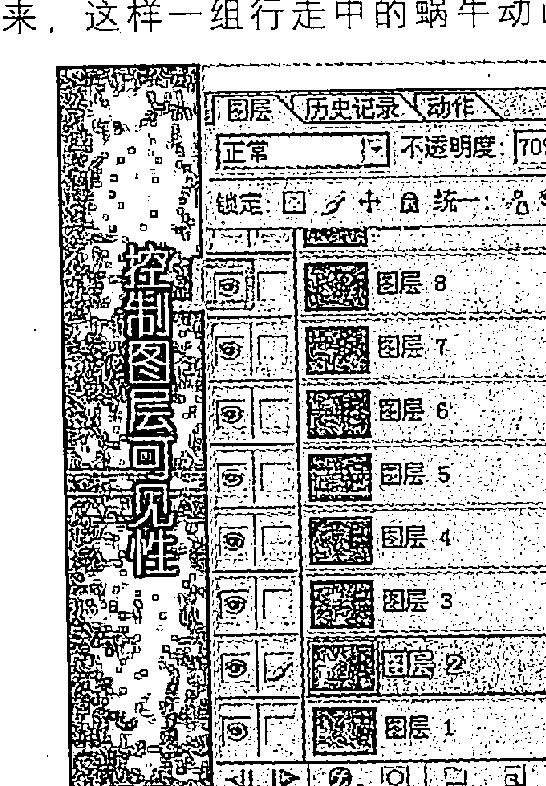

接着，我们就要让这只蜗牛变形为一部电视机。首先我们在刚才所建素材的图层栏里再新添加一个图层，将新图层的不透明度调低，将底层上的蜗牛形象透到上面这层。然后我们参照上一张蜗牛的形态将其变形，为了使过渡自然，我们先描一幅与上幅图形变化不太大的图形，仅将蜗牛的头、身面积稍微缩小一点，让这张新图上的蜗牛看起来有向壳里缩的感觉。以次类推，制作5～7帧蜗牛缩进壳里的动作帧，直到最后一帧的画面只剩下壳为止。接下来我们根据这个蜗牛壳线条的形状进行变形，让它逐渐向电视机的形状靠拢，制作方法参照前面蜗牛缩入壳中的步骤即可。

### （三）整理动画

将以上步骤全部进行完毕后，我们就可以开始着手整理整部动画了。从蜗牛开始缩入壳中开始，一直到蜗牛壳变成电视机为止，按照这一段动画所建立图层数量在动画工具栏中复制数量相当的帧数，然后逐一将每帧动画所对应的图层显示出来。具体方法参照前面蜗牛行走部分的动画生成过程。制作完毕后，单击“动画工具栏”里的“播放”功能键，将这段动画简单播放一遍，简单看一下效果。观看完了以后，是不是感觉帧与帧之间连续播放的速度太快了，有点看不清呢？没关系，在“动画工具栏”里每一帧窗口的下方都标着“0秒”的字样，点击这个字样，这时会弹出帧与帧之间的间隔时间选项，笔者个人感觉这里选择0.1秒，动画的播放感觉会流畅自然一些。之后再播放一次这段动画，你会发现帧的间隔时间不再那么快的不可思议了。

### （四）设置保存

动画调试完毕后，你如果想让这个GIF动画放在网页中不断循环播放的话，那请将“动画工具栏”左下方的循环选项改为“一直有效”（图4）。最后我们还要将这段动画保存成GIF格式的动画文件，点击ImageReady主窗口的“文件”选项，然后选择“将优化结果存储为”命令，然后为文件起个名字保存即可。

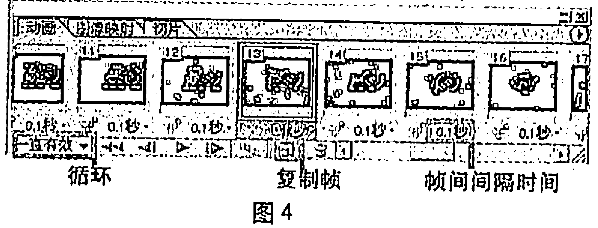

至此，这段GIF的实例我们就基本制作完毕。看过这段实例后，大多数朋友会发现，在制作GIF动画时，如果善于使用图层栏里的不透明度和图层可视性的话，那么GIF动画制作会变得非常简单。最后告诉大家几个小窍门：①制作闪烁的动画时，一般只需建立两层图层即可，每间隔一帧便让所需闪烁的物体出现一次即可达到闪烁效果。②在“动画工具栏”中修改个别帧时，这一帧后面的所有帧都会受影响，因此尽量在动画之初就构思好整个动画的细节，以免修改时麻烦。

## # 智能狂拼输入法技巧

### 中英文输入一致性

经常会遇到中英文需要混合输入的时候，可以不做中、英切换，快而准地完成中英混合输入。在全拼状态下，如果是输入常用的英文单词，只要连续不断地输入小写字母，“智能狂拼Ⅱ”会自动识别出英文，并且自动在英文单词之间加空格、整理英文单词的大小写并给出可能的候选。若要是输入一整句英文，只要将第一个字母大写，其后面的拼音都自动识别为英文状态。

### 快速输入特殊符号

一些常用数学符号和希腊字母等可通过键盘上已有的标点和符号直接输入，只要在候选窗口中选择即可，而不必打开软键盘。若要输入“Ⅱ”，可直接输入@，选择其候选符号3即可。此外您只需要点击输入条上的功能键之后，便可以设置在“全拼输入时省略韵母”的功能。

### 巧用鼠标功能

“智能狂拼Ⅱ”全面支持鼠标功能，可以利用鼠标完成定位、挑选候选字、前后翻页等操作。鼠标与键盘配合会使您的输入速度大大提高。用鼠标定位，直接点击错误拼音或汉字，光标就移动至要修改处，省去了缓慢的光标移动。鼠标挑选候选字、翻页还可以通过双击鼠标点击挑选候选字和翻页，可使候选字直接进入输入窗口。

### 快速修改字词

修改字词只需要依下列步骤操作即可：按“+”或是“-”键将光标快速移动到要改正的字词处，按空格键来确认修改动作，输入条中将显示所有同音的其他字词，选中您需要的那个即可。如果同音字太多，接着按“+”或是“-”键翻页继续选择就可以找到。如果只输入了一个汉字，但不是所需要的，此时直接按“+”或是“-”键将可以直接选择其他同音的字词。

## # 光盘使用说明

- ① 光盘放入光驱后，光盘程序将自动运行，播放片头动画。动画播放结束后，进入程序主界面。如果想跳过动画，可以在画面中任意处单击鼠标或者单击右下角的“跳过”即可。
- ② 如果不想让光盘程序直接运行，可以在放入光盘的同时按<Shift>键不放，以跳过动画的播放。在资源管理器中可以直接浏览光盘，也可以双击Start.exe文件重新运行光盘程序。
- ③ 在主界面上点击相应的主题按钮即可进入下一级界面或调用其他程序。
- ④ 在主界面上点击右下角的声音按钮可关闭或打开背景音乐。点击退出按钮可关闭光盘程序。
- ⑤ 在下一级界面中，都会有一个返回按钮，点击即可返回到上一级界面中。
- ⑥ 光盘中的PDF格式电子书，需要预先安装好Acrobat Reader软件，否则无法正常使用。如果您的系统中没有安装该阅读器，可安装本光盘中所带的Acrobat Reader 6.0。

《电脑爱好者》合订本省市级经销商联系电话（合订本配套光盘如有破损，可联系以下代理调换）

| 左列 | 中列 | 右列 |
|------|------|------|
| 广东省 020-34292249 | 甘肃省 0931-8518072 | 上海市 021-63780159 |
| 深圳市 0755-82264710 | 宁夏 0951-5076026 | 浙江省 0571-88256019 |
| 广西省 0771-2621300 | 青海省 0971-8237819 | 黑龙江省 0451-88342321 |
| 湖南省 0731-2252951 | 江西省 0791-8596259 | 吉林省 0431-2777386 |
| 贵州省 0851-5984895 | 北京市 010-65072885 | 辽宁省 024-23910600 |
| 陕西省 029-87459205 | 河南省 0371-87647243 | 河北省 0315-2814874 |
| 四川省 028-86619822 | 湖北省 027-85493601 | 内蒙古 0471-6925297 |
| 新疆 0991-4821133 | 安徽省 0551-2647185 | 山东省 0533-2158682 |
| 云南省 0871-4178815 | 福建省 0591-87148781 | 山西省 0351-4081987 |
| 重庆市 023-67051823 | 江苏省 025-86634184 | 天津市 022-23683995 |


# # 第一届全国英语歌曲卡拉OK网上大赛

邀您参加

大赛专用软件:《英语歌曲滚瓜烂熟》

- 《英语歌曲滚瓜烂熟》
- 内装:2CD
- 附:歌曲注册卡
- 定价:28元
- 上市日期:2004-08-25

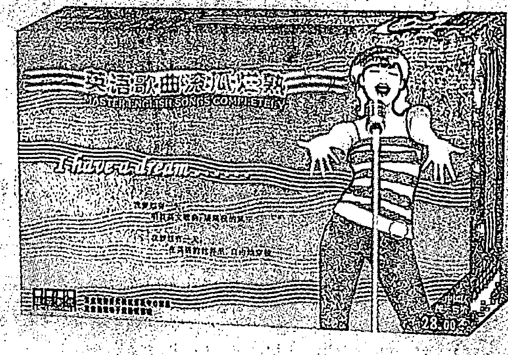

详细说明见本刊正文

## ## 大赛奖项设置

- 一等奖:1名,奖金:价值10000元的奖品及证书
- 二等奖:3名,奖金:价值3000元的奖品及证书
- 三等奖:6名,奖金:价值1000元的奖品及证书
- 优秀奖:90名价值200元的奖品及证书
- 所有进入复赛的选手都将获得价值30元的《英语歌曲滚瓜烂熟》20曲卡一张。
- 特别奖:为10名优秀歌手录制、出版CD唱片。
- 主办:中国音像协会
- 承办:中国音像协会网络出版分会
- 北京伯通电子出版社
- 北京硅谷时代技术开发中心
- 大赛专用网站:www.China01.com
- 截止日期:2005年7月31日

# # 将游戏玩家武装到底

文 / 烈火重生

记得还在学校念书的时候，笔者的计算机课老师就给我们讲过这样一句话：“如果你想研究电脑硬件，玩游戏必不可少。”当时的我，对这句话根本不屑一顾，研究硬件跟游戏有什么关系，难道想要精通硬件必须要玩好游戏？

在笔者的印象中，最早的电脑游戏就好像现在的手机游戏，能有个图形界面就算不错了。比如玩一个乒乓球游戏，你能看到的就是一个代表球的小方块和两个代表球拍的大方块在动来动去，当然这是受当时硬件的限制了。当年比尔·盖茨曾说过这样一句“经典”预言：“对任何人来说，电脑只需要640K的内存就足够使用了。”还有IBM制造的全球首块硬盘，用了16个巨大的金属盘片，搞了半个屋子容量也只有区区40MB。当然，这些都已经成为了历史，现在电脑硬件发展速度之快几乎可以让你在攒机时彻底放弃考虑升级的可能性。而这样高速发展的动力是什么？可以说很大程度上就是游戏在引导着硬件厂商和玩家不断地疯狂进步。

回过头来看，老师的话并非全无道理。如果没有游戏的推动，硬件发展的摩尔定律也不会被打破，也就没有这么多新硬件产品的推出，我们现在甚至可以说“没有好硬件你就玩不了好游戏”。换言之，对于一个游戏玩家而言，游戏可以说是他的梦想所在，而硬件或其他软件（比如图形加速程序）则是通向梦想的桥梁。其实这也就是我们本文的主题所在，这篇文章就是针对各位酷爱游戏的玩家量身定做，旨在帮助游戏玩家最大可能地通过硬件提高自身的游戏战斗力。

下面笔者就从五个方面给各位游戏玩家来一次全方位的武装，我们的目的就是打造自己的强势游戏机！

## 一、核心配件

首先来说电脑的核心部分——CPU。这个似乎并不需要笔者过多解释，因为无论什么指令，都是要经过CPU处理的。即使是在有了超级的GPU和APU辅助处理器，仍然有很大一部分的工作是CPU起主导作用的，这可以在高档显卡配越高的CPU，能力就发挥越充分上很明显地看出来。但是这在很大程度上来说只是理论，目前来看，只要你的CPU频率超过1.5G，不管玩2D、3D、RPG还是FPS，只要这个游戏做得不是很变态，都能够应付自如。不过话又说回来，速度越快越是绝对没有错的。最后还要特别注意一个类别的游戏——模拟器，这类软件能够成功模拟其他机种的游戏，但代价往往是需要付出数倍于原始机型的处理能力，这时候当然就没有人会嫌自己的CPU快了。

同样不能忽视的还有电脑的内存，任何数据在经CPU处理之前都是要先存储在它里面去的，在操作系统允许的情况下，有钱就尽量去加吧。毕竟，只有拥有了足够大的内存才能够满足我们的游戏需求。目前来看，512MB以上的内存配置才是游戏玩家的主流选择。

## 二、操纵设备

### （一）鼠标，玩家的利器

接下来说说最普通而又十分重要的东西——操纵设备。可能有人要奇怪了，操纵设备有什么了不起的，我30块钱买的鼠标一样用得好好的。其实不然，各种游戏都有它自己的需要，比如用那种15块钱鼠标的人和用罗技、微软等品牌鼠标的人对战FPS游戏（如CS），有八成的可能性是他输。他会发现自己的MP5怎么也不能扫死对手，转身的时候又总是慢半拍而被人打死。这种情况基本上是鼠标分辨率的差距所造成的，举个例子，你用一把快速连射的武器扫射，你的鼠标在高速移动的时候，鼠标移动一厘米扫描50个点和扫描150个点就完全不是一个感觉。前者在两颗子弹之间有很大的空隙，对手可以很轻易地做左右平移和跳跃来躲避你的攻击；后者就不然了，子弹可以像一条紧密的线一样紧紧地锁住敌人，让敌人成为一个大筛子。而且高扫描度可以带来更大的精确度，有的时候狙击枪挪来挪去怎么也对不准敌人的头部，这就是精确度低的表现，屏幕的准星不能百分之百地忠实执行鼠标的小范围移动。再有就是移动的速度了，虽然大多数跑动和移动都是由键盘来完成的，但是一些高级技巧，例如跑动中的180度转身，用好鼠标只需手腕一抖就完成一个完整的转身动作，而用差劲的鼠标却需要一到两次大范围的移动才行，花在这上面的时间死个几回都够了。有人说，我可以在游戏里面调高鼠标的移动速度来解决呀。这样本来是没有问题，但很快你就会发现，你的破鼠标完全不是那块料，虽然移动速度提高了，但是带来的却是精确度和连续性的严重下降。所以，不要忽视最普通的操纵设备，买个好鼠标一定会给你带来惊喜的。

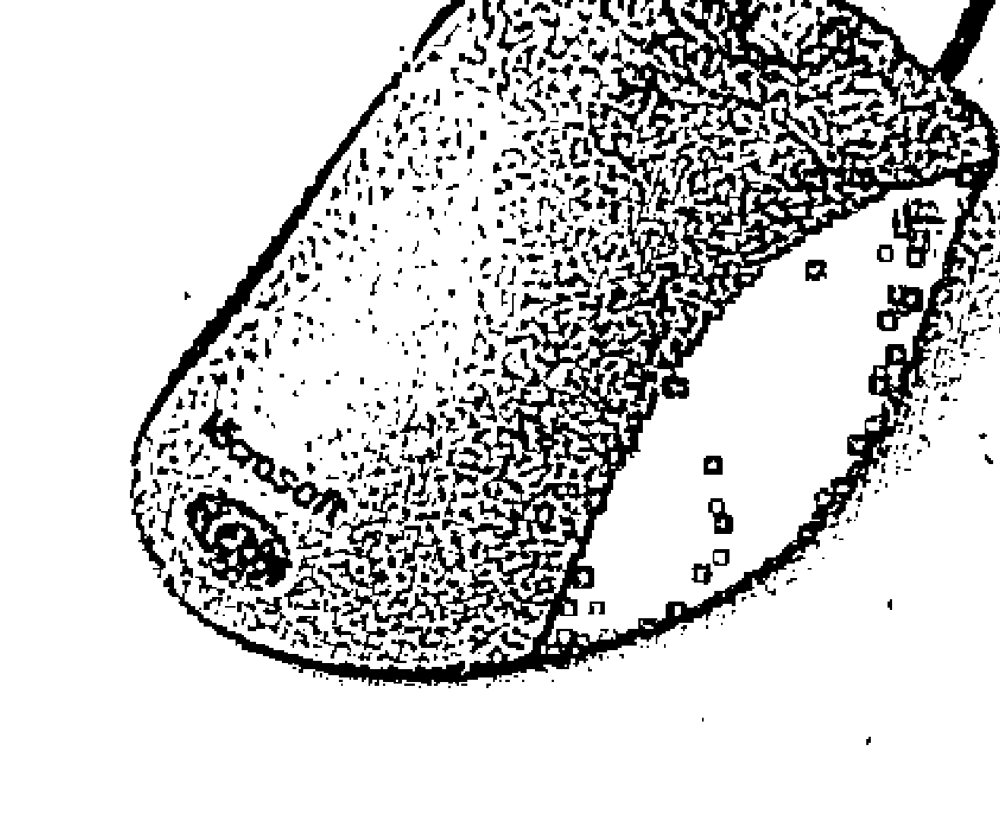

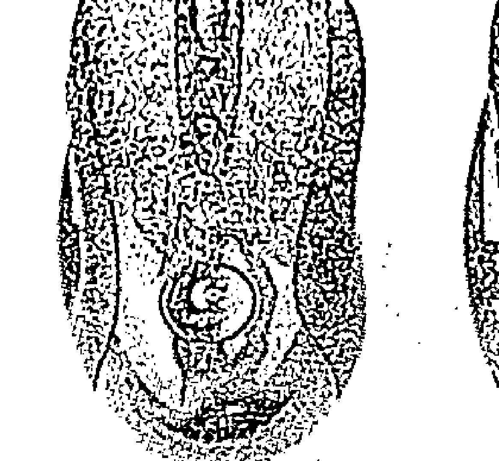

### （二）键盘远离键位冲突

此外，同样不可忽视的还有键盘，要尽可能选择一款没有键位冲突的键盘。以前解决这个问题的要求并不是太迫切，因为当时RPG类游戏占PC GAME的主流位置，键位冲突只对一些体育、格斗类的游戏爱好者造成了困扰，最终，他们都选择了手柄。但是由于CS的兴起，FPS开始大行其道并成为主流，加上高端产品的品质越来越受到消费者的关注，所以这个问题又一次成为关注的焦点。

对于键位冲突我们是这样定义的：在键盘的操作过程中，同时按下两到三个键时，键盘却只能正确的识别前两个键，对第三或者第四个按键完全没有响应。这些问题往往都存在于游戏当中，对Windows的组合快捷键一般不太可能产生冲突。

笔者在把玩键盘这么多年的日子里发现了一个很奇怪的问题，为什么键位冲突至今才被拿出台面？细心的朋友估计都有所察觉，这是由于近年来FPS游戏火爆所导致，还有一部分原因就是大家都开始使用高档的键盘了（基本逃不出国际几大键盘代工厂的产品如 SK、BTC 等），似乎以前大家在用质量低劣的键盘时都觉得这个问题无关紧要。

不知道是否正确，笔者竟然发现这样一个很奇怪的定律：越是价格低廉的产品，玩游戏越是爽，键位冲突的情况也极为罕见。反而那些高高在上的键盘都或多或少有明显的键位冲突，有时冲突更是令人莫名其妙，甚至方向键都有冲突。可能是老天作弄人吧，既然键位冲突与手感不能两全，我们又决定不向垃圾低头，笔者就在此给大家推荐一款键盘——罗技酷影手。如图3所示。

不向垃圾低头，笔者就在此给大家推荐一款键盘——罗技酷影手。如图3所示。

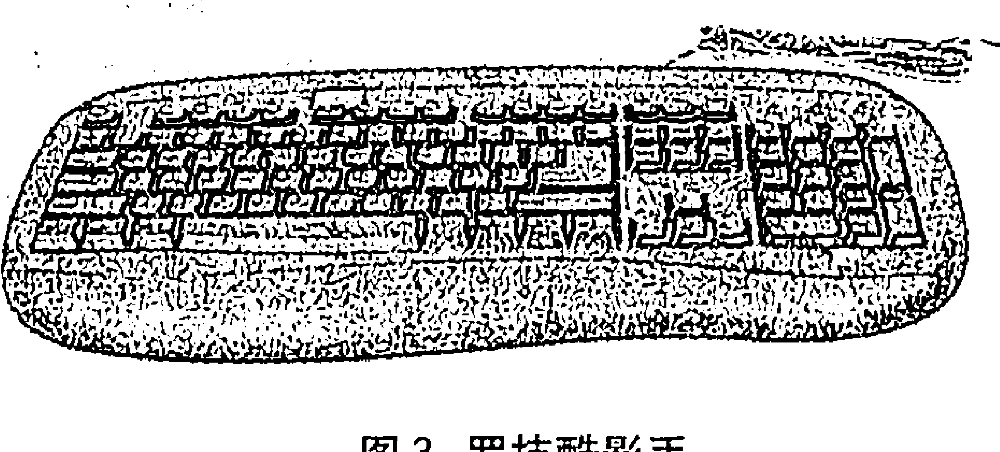

作为罗技最低端的一款键盘，它的品质一般，但价格很低，不少地方卖到了40元。笔者曾经使用过这款键盘，手感确实很一般，但是相对它的价钱来说很是超值，而且键位冲突不太明显，至少在常见的CS、FIFA等游戏没有出现过冲突。对于手头比较紧张的朋友来说，可算是不二选择。

### （三）小玩意，鼠标垫

我们下面要讲的东西，在几年前购买的话都会视为极度奢侈。一款好的鼠标垫动辄一两百元，一个类似创可贴的贴脚竟然20元一包。

在今天，鼠标垫起着不可忽视的作用，市面上鼠标垫种类可谓琳琅满目，而且质地各有不同，形状更是千姿百态，挑选中让人大有眼花缭乱之感。在目前的鼠标垫来看，其采用的材质以特种塑料、铝制、玻璃以及织物最多。其中特种塑料由于较低的成本，较高的性能，获得玩家的一致青睐。

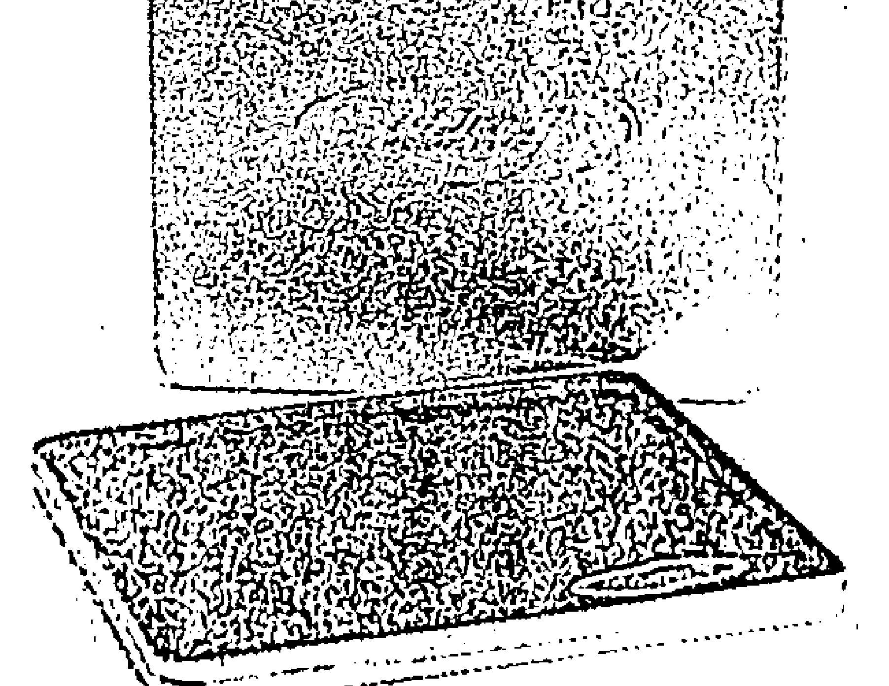

在一些专业的CS玩家中，1030鼠标垫人气极高。这款美国Func公司出品的产品之所以如此出名，是因为其在国外电子竞技大赛上常被著名职业选手选定为比赛专用装备，这也说明了它拥有一流的手感和极佳的品质，能为玩家在赛场上发挥出自己最高水平提供强烈的自信。

鼠标垫与鼠标的关系，用我们中国人的话形容，就是唇齿相依。拥有一只优秀的鼠标以及能使其性能得以完全发挥的鼠标垫的意义，更甚于拥有一块顶级再顶级的显卡或者CPU。拥有一块优秀的鼠标垫将有助于你技术的提高以及本能操控反应的忠实还原。花上一半于鼠标或者和鼠标同价的金钱换来的，不仅仅有操作精度上的提升；更多的是流畅通的游戏体验以及舒适、顺滑的操控手感。

目前，市面上的鼠标垫消费群体已不再局限于专业或者苛刻的游戏发烧友，越来越多的CAD/CAM用户或者平面设计人员都开始购买较为高档的鼠标垫。普通玩家花50多块钱购买一款特惠装的胶垫，或者用30块钱左右购买一块优秀的布垫都在可以接受的价格范围之内，但所获得的体验却非常难忘。此外当然还有专用的战队背包、鼠标吸汗贴、游戏专用手套、鼠标线固线器等，对于普通玩家而言并不是必需之品，这里暂且按下不表。

## 三、音频系统

还记得第一次开始玩《仙剑奇侠传》的时候吗？那悠扬的乐曲伴随着婉转凄美的游戏情节一次次打动我们，那是何等的感觉？笔者至今还保存那支曲目，每一次听到那熟悉的旋律，就会想起李逍遥、赵灵儿的动人爱情故事。那一刻，笔者认为这就是天籁之音，这自然要归功于音乐给我们带来的享受。

长久以来，很多朋友都有这种误解。他们认为，音频设备（声卡和音箱）只是用来发出声音而已。但时至今日，已经没有人会否定音频子系统在游戏中的作用。当你在Quake3中浴血奋战时，或者开着极品飞车时，游戏所带来的真实的声场环境会让你更加地流连忘返。你可以尝试关闭音箱试一试，没有音效的游戏世界是多么单调。然后再打开你的高档音箱，体验一下各种声音从前后左右环绕的感觉，你的心情又会是怎样呢？

### （一）选择合适的声卡

首先对于声卡，可选择的余地并不大。目前来看，可以说仍然是创新独当一面。当然，还有主板集成的AC’97音效。如果选择了创新系列声卡，我们建议选择4.1或者5.1乃至7.1的多媒体音箱，当然以数码音箱为最好，不过价格恐怕很多人难以接受。对于其他中低档声卡来说，2.1音箱是最好的搭档。其实现在即使很便宜的声卡，其信噪比也不低，高档声卡的信噪比更是达到了Hi-Fi级的水准。

### （二）声卡与音箱的配合关系

在挑选高质量多媒体有源音箱的时候，首先要听喇叭的品质。一套好的音箱，喇叭质量一定要过硬，如果只使用10元一个的喇叭，声音质量肯定不能保证。说到这里，有的朋友或许会问：玩游戏需要高质量的喇叭吗？我们知道，游戏效果的营造很大程度上来自于3D定位效果。从创新的声卡我们可以看到，声卡能同时处理的音频流越多，并能控制它们从各个音箱中发出，3D效果就越强。比如，我们走在马路上，会听到至少5、6种汽车的声音，几个人说话的声音还有风的声音，路边的音乐等，这是我们生活的真实世界。想要模拟它，就需要声音系统尽可能多地发出不同的声音。现在的声卡已经能同时处理非常复杂的声音，瓶颈就转移到了音箱的喇叭上。如果喇叭质量不过硬，解析力不够，就根本无法发出足够多的声音。比如一个高楼爆炸的情景，劣质喇叭只能播放出爆炸的声音以及一些杂乱无章的低音，而一套好的系统则可以表现出爆炸不同时间发出的不同声音甚至包括玻璃破碎的声音等，细节表现力决定了音效的真实性。

对于游戏音箱，另一个特点是“近”不要“大”。“近”是指打游戏的时候人肯定距离音源很近，这个时候不需要“大”声场。根据这个理念，多媒体音箱的体积并不需要很大，功率也不需要很大，但是对于低音炮的要求会比较高。在距离音箱很近的情况下，如果卫星音箱和低音炮的分频点偏高，低音炮又不太争气的话，就会感觉低音是从桌面上发出，听上去很不舒服；如果分频点低，低音炮质量也比较好，但是卫星音箱喇叭质量不好的话，就会出现所谓的“高低分明”现象。这样，占比例最大的中音被大大削弱了。我们认为X.1式音箱的分频点定于200Hz~350Hz比较合适，低音炮的频响范围底线不应该高于50Hz（不要相信有些多媒体音箱

### （三）耳机，FPS 玩家的必需装备

很多人在玩CS的时候十分注重鼠标的运用，可是要将一款第一人称射击类游戏（FPS）玩到专业级别，专业的耳机是少不了的。一般来讲，FPS游戏所用耳机是要求定位相当准确的，并能够真实还原游戏音乐。这方面专业玩家常说的字眼是“精确”，这不仅和声卡密切相关，没有“高素质”的耳机，同样也不容易实现。

此外，耳机佩戴的舒适性也不能忽视。因为玩游戏通常不能一时半会“罢休”，所以对耳机这方面的要求也是必要的，总不能选一些夹耳朵的耳机来让自己“受罪”吧。目前游戏玩家所推崇的耳机型号，在这里笔者不妨给大家做个推荐。像Plantronics Audio90、飞利浦HP800这两款耳机就深受众多玩家的喜爱，价格也都在150元左右，性价比相当高。

## 四、视频系统

最后要说的就是现在发展速度最快，也最让人头痛的显示系统了。大家都了解，电脑游戏真正考验的是显卡的性能。随着每一代图形引擎的发布，显卡的性能都会迈入一个更高台阶，其画面的质量以及对各种新特性的支持也随之达到一个新水平。自从真正的3D显卡出现后，3D显卡与3D游戏也就形成了互相推动、互相促进的关系，每当有新的显卡规格出台，基于新规格的3D游戏也会相继推出。

### （一）如何选择游戏显卡

目前挑选显卡有一个大致的原则，那就是对微软DirectX不同版本的支持程度。现在，支持DirectX9的显示卡已经大量上市，基于DirectX9的3D游戏也会越来越多。而当前显卡市场状况是：支持DirectX7、支持DirectX8、支持DirectX9的显卡并存。如果使用支持DirectX9的显示卡，用来玩游戏无疑是最好的，因为支持DirectX9的显示卡都具备向下兼容的能力。而对于支持DirectX8、DirectX7的显卡来说，基于DirectX9的游戏虽然可以运行，但在游戏中有时会少表现一些场景特效，在画质上没有那么真实自然。

从目前的趋势来看，新开发的多款游戏都会以支持DirectX9为主，但一些FPS类游戏还是会支持OpenGL。从游戏的要求来看，类似于DOOM3这样相当极端的游戏也是属于凤毛麟角。多数消费者只是一般游戏玩家，没有必要跟风去追求最新最快的显卡。如果对DirectX9游戏不感冒的话，老一代的显卡像GeForce4 Ti系列的显卡、Radeon 9500标准版更具有性价比，只不过这类产品新货在市场上已经越来越少了。由于本文主要是针对游戏玩家，笔者也将我们的游戏玩家大致分为几种，还请大家对号入座。

- 1. 经常玩各种游戏，但仅仅是简单玩一玩，并不苛求运行速度。对于这一种玩家，笔者一直觉得很难推荐一款真正适合他们的显卡。因为不同的游戏对显卡的性能要求差别还是比较大的。对很多游戏来说GeForce4 MX440就能运行，但是对于像DOOM3这样的游戏也只有5900XT这样的显卡才能在正常分辨率下运行，像5700LE这种级别的显卡在DOOM3这样的游戏中仅仅只能在640×480的分辨率下勉强运行。所以推荐这些朋友买显卡也是最难的事情。好在最近ATI正在热卖一款性价比非常高的显示芯片——Radeon 9550，它的性能可高可低，弹性比较大。

和9550显卡性价比接近的还有5700LE，未超频时5700LE性能和9550接近，而多数的5700LE和9550超频性能接近，所以它们可以称得上旗鼓相当。不过笔者在这里要强调的是，5700LE的兼容性要比9550更出色一些，而零售价格也比9550高一些，究竟哪个适合你，还要看自己的需求。这类朋友还有一个不错的选择，那就是5200Ultra。它的性能比不超频的9550显卡稍微逊色一些，但价格要比9550显卡便宜，预算略少的朋友也可以考虑这款性能和兼容性都很不错的产品。

- 2. 需要流畅运行大型三维游戏。要想流畅运行一些大型三维游戏，建议最少选择5700Ultra以上级别的显卡。考虑到现在市面上多数5700Ultra显卡的价格和5900ZT接近，而5900ZT超频后的性能要强于基本不能超频的5700Ultra，所以笔者推荐这类玩家选择5900ZT。这款产品可以说是目前市面上能满足DOOM3流畅运行的最低配置，当然和它性能接近的还有可改造的9800SEII，但是考虑到并不是所有的9800SEII都能完美改造，所以笔者就不推荐大家购买了。此外，还有基于PCI-E插槽的nVIDIA 6600、6200系列都是不错的选择，但这属于平台架构变革之后的事了。

- 3. 显卡发烧友。对于显卡发烧友来说，笔者推荐6800系列显卡，因为它比同价位的所有其他型号显卡的性能都要出色。当然如果资金充足的话，还可以考虑像6800GT和6800Ultra这类显卡，但它们的性价比就不如6800这样高了。

### （二）显卡的相应优化

所谓优化，就是挖掘硬件潜力，在保证画质的前提下使游戏速度获得最大程度的提升。具体来讲，对显卡进行相应的优化将会提升游戏画面质量，获取更高的FPS值，享受更好的游戏效果。

显卡设置优化的第一步就是硬件超频，但我们要注意现在已经不仅仅是需要超频显存的年代，超频核心频率可能获得更大性能提升。经过专门测试，我们总结如下规律：

- 1. 在超频相同幅度的情况下，绝大多数测试证明，超频核心频率明显比超频显存更能提高系统性能。但在一些特殊情况，如显卡显存位宽缩水、填充纹理数据比较大的情况下，显存超频效果会比核心超频更为明显一些。
- 2. 核心频率和显存频率应该保持一定的比例，过高提升单方面频率，并不会带来性能的大幅提升。这是因为超频核心频率可以提高单位时间内显卡的多边形生成能力和像素填充能力，缩短建模和渲染的周期，而提升显存频率则可以使显卡在核心的高效工作下，保证“后勤”部分的数据“吞吐”不至于跟不上。所以从理论上可以推出在大部分情况下，超频核心频率会显著提升显卡性能；同时可以推想出，由于显存位宽处于“后勤”供应位置，如果显存频率提升幅度超过核心频率提升幅度，即当核心频率不能满足应用时，单纯提高显存频率也是不能带来性能增益的。
- 3. 针对不同的显卡，超频的侧重点也不一样。总的来说，高端显卡的系统性能已经不受显存带宽的制约，因此核心频率的提升，就成了我们超频的重点所在。

具体的超频操作倒是十分简单，都是利用第三方工具打开注册表中对超频选项的支持。

nVIDIA 可以使用 NvCool FX 或 Nvmax（有一大堆第三方软件支持开启超频选项）打开超频选项；ATI 显卡的超频我们建议使用 ClockGen 这个工具，这也是应用最为广泛的ATI显卡超频工具，它会在驱动中自动添加一个超频卡，在里面以拉杆的形式进行超频。

当然，我们还要为玩家们介绍一下nVIDIA和ATI在驱动中分别要注意的3D设置和简单优化。请不要小看这些设置，他们起到的作用绝非像你想像的那样简单。

我们先来看 nVIDIA 显卡的设置。在“性能和质量”选项的“驱动程序全局设置”列表框中，我们能看到许多设置分类，每选中一个最下方就会出现相应的控制选项。“3D平滑处理设置”就是全屏抗锯齿，全屏抗锯齿分为超级采样和多重采样两种（原理我们下文讲述）。全屏抗锯齿在中端显卡上一般开2X就可以了，最高不能超过4X。“各项异性过滤”是配合双线性过滤和三线性过滤使用的，虽然使用双线性过滤可以轻微提高速度，但综合考虑还是推荐大家选择质量选项，使用三线性过滤来获得更逼真的画面效果。“垂直同步”在设为打开时，画面将和刷新率同步，如果你的屏幕刷新率是60Hz的话，游戏画面速度将受60帧/秒限制，所以这一项推荐关闭。“强制Mipmaps”是设定配合Mipmaps使用的各项异性过滤质量，推荐使用三线性过滤。“Trilinear optimization”三线过滤优化和“Anisotropic optimization”各项异性过滤优化，这两项是近期才加进去的控制选项，它们会在使用三线性过滤和各项异性过滤时进行自动优化。最初这个功能被Nvidia默认打开来提高测试成绩，后来在用户的强烈要求下才成为设置选项。它会有很轻微的图像损失，但却会带来不小的速度提升，所以我们推荐打开。

我们再来看ATI的显卡设置，它的“消除混叠”就是全屏抗锯齿，对于中端显卡最大不要超过4X。

其实，中低端卡可以不使用全屏抗锯齿，尽量使用一些高分辨率，这样能提高画质，而且速度下降要少一点。“各项异性过滤”同样建议采用三线性过滤，即选中“质量”单选按钮。“纹理首选项”和“Mipmaps详细程度”都选择为最高，“垂直同步”设置为关。关于游戏与显卡的话题，这短短几页文字根本不能说完，笔者目前只是泛泛而谈，给各位玩家一些指导性的建议。至于具体的显卡选择、相应设置、优化等还需读者自行多多了解。

## 五、其他各种游戏装备

随着游戏的发展和玩家要求的提高，仅仅使用键盘和鼠标早已不能满足游戏操作的需要。虽然PC平台的RPG、RTS、FPS等类游戏很好地发挥了鼠标键盘的优势，但如果你更喜欢格斗、体育、动作、模拟驾驶或者家用机、街机游戏，键盘的布局与手感就相形见绌了。好在市场上有很多相应的游戏外设填补这一空白，它们可以连接在PC上，让操作不再成为障碍。如果要想游戏玩得更爽更畅快，一款专用的游戏外设是不可少的利器，就像优秀的狙击手必须有把好枪一样。相应的外设不仅能够提升操作的简便性，更可藉此得到更多的游戏乐趣。用于PC平台的游戏控制器主要有手柄、摇杆和方向盘等几种类型，不同游戏控制器对游戏类型的适用性也有区别，要根据自己偏爱的游戏类型为原则选购，不能盲目购买。

### （一）主要游戏外设生产厂家及产品特点

目前生产游戏控制器的厂家主要有微软(Microsoft)、罗技(Logitech)、Thrustmaster、Saitek及清华同方、北通等等。国内市场销售的主流厂家游戏控制器，其价格多在200元至900元左右，中高端产品一般都具备力反馈技术。而低中端产品以及中小厂家的仿造产品价格多在百元以下，一般不具备力反馈技术或只有很初级的震动效果。现在大厂制造的主流游戏控制器都有下列的功能：用来控制燃料输入与引擎的模拟节流阀(analog throttle)，提供360度视野的苦力帽(directional hat)以及方向舵(rudder bar)等。此外，目前市场上的摇杆产品采用的接口已逐步从Game port游戏接口、串口向更先进的USB接口及IEEE1394 “火线”接口转变，其中支持热插拨的USB接口的摇杆产品是目前市场上的主流。游戏控制器的发展跟力反馈技术的发展可谓息息相关。所谓力反馈(Force Feedback)，其实是一种机械表现出来的反作用力，将游戏传递的数据通过力反馈设备表现出对应的力量与方向，说白了就是运用“作用力与反作用力”的原理来使我们感到一种身临其境的真实体验。力反馈技术有两种标准协议。一为美国Immersion公司提出的I-Force协议，它包括I-Force 1.0和I-Force 2.0两个标准。早期的I-Force 1.0协议由于采用数字和模拟信号并存的方式，因此信号传输率低，力反馈效果不理想。而97年制定的I-Force 2.0协议采用了全数字传输和48MHz的16位微处理器，使得力反馈性能显著提高。此外，I-Force协议为开放式协议，所有游戏设备制造厂家都可以使用。此外，Microsoft的Sidewinder Force Feedback协议也是市场上力反馈设备的主流协议，其性能和I-Force2.0芯片相似。不过它采用的是与游戏口合二为一的MIDI口，必须使用与SB完全兼容的声卡才能正常使用，安装和使用上有时会很让人头痛。此外，由于微软没有开放Sidewinder Force Feedback标准协议，所以市场上支持Sidewinder Force Feedback标准协议的游戏控制器主要是由微软自己生产的。此外，新一代力反馈感应技术也崭露头角，主要有TouchSense触觉感应技术和G-Force Tilt动作感应技术两种。TouchSense触觉感应技术主要用在鼠标/轨迹球等产品中，而动作感应技术(G-Force Tilt)则主要用在动感游戏控制器中。动作感应技术这项技术是由力回馈技术衍生的，但是比力回馈技术更加真实；这项技术是在标准的游戏控制器中安装一个重力感应器，在游戏过程中，当游戏控制器出现倾斜时，就会自动给电脑发送一个游戏指令，不需要操作任何按钮就可完成要进行的工作。此外，在硬件上各公司实现力反馈的方式也不同。以罗技公司为代表的厂家所采用的是“线传动技术”，而以微软为代表的厂家采用的是“齿轮传动技术”。“齿轮传动技术”这种方式成本较低，效果也不错，但在表现连续振动时可能出现齿轮打滑。而“线传动技术”是利用钢缆线作为传动介质，比起齿轮震动效果更为细腻和敏锐，震动频率可达每秒250次。

### （二）其他还需要了解的注意事项

游戏控制器市场上有很多杂牌或假冒产品存在，它们与名牌产品质量相差很大，所以在选择游戏控制器时应首选名牌产品。我们可从以下几点来辨别：

- 1. 拿起一款游戏控制器，我们可先掂掂重量。真品或正品游戏控制器较重，而那些假冒产品所用元器件偷工减料，重量多数较轻。
- 2. 接着可注意观察外观做工。好的游戏控制器所用塑料光滑平整无杂纹，表面的磨砂感手感极好，游戏控制器上所印的字迹纤细工整清晰；反观假冒产品，所印字迹一般粗细不一，字体较大且粗糙。此外，还可以看一下其生产国籍或厂名、商标名、型号名等等是否真实，正宗的PC手柄上一般都较正规的标有厂名和型号名。
- 3. 此外，如有条件可在现场或保换期内拆开游戏控制器看其内部做工。真品的集成电路块和各种元器件步线整齐、焊点均匀，没有多余的杂线等，而假冒产品里边的元器件多半横七竖八，连线则像蜘蛛网般的错综复杂。
- 4. 最后还需注意与PC的连接线是否够长，说明书、驱动盘是否齐全完整，是否和所选游戏控制器相符。正规厂家生产的游戏控制器，说明书一般印刷精美，驱动盘质量完好，如果没有该产品专用的说明书及驱动盘的产品，选择时要慎重。

另外，需要一提的是，游戏控制器的驱动也是大家在选购和使用时比较关心的话题。各大厂家的游戏控制器驱动通常不兼容；而且有时候同一厂家不同型号的游戏控制器驱动兼容性也很差，而且在面对不同游戏时，其表现出来的兼容性也各不相同。就连Windows系统制造商微软的游戏控制器也存在这些问题，例如一些驱动会在不同的Windows操作系统表现不一，偶尔还会出现驱动程序与外围设备版本不同产生冲突的问题。所以迫切需要有关厂家能制定出通用性和适用性更强的驱动。

### （三）手柄

手柄的适用性很广，能够为多种游戏提供良好的操作，如格斗、动作、足球、冒险等类型的游戏。手柄除了能够用于电脑平台的一些游戏外，也适用于依靠模拟器软件在PC上运行的街机或家用机版游戏。这些游戏平台的游戏操控主要都依靠手柄进行，大多模拟器软件（如CALLUS、WinKawaks、VGS等）都可支持游戏外设。

手柄是目前游戏外设市场的中坚力量，如果喜欢的游戏范围很广，既喜欢《实况足球》、《KOF》等体育、格斗游戏，又喜欢《恐龙快打》、《生化危机》等动作射击游戏，使用手柄都可以很好的操作。手柄的价格相对便宜，使用率也非常高，若不是特别痴迷于某类特殊游戏，推荐大多数普通玩家都选购手柄。

### （四）摇杆

对于喜欢飞行类游戏的玩家，专用的游戏摇杆能让操作更加简便轻松。很多摇杆都与飞机操纵杆类似，其握把不但可以摇动，而且上边还分布有多个按钮便于同时控制，大大简化了飞行游戏的繁杂操作。而且大多数摇杆产品都具有力反馈等技术，突出了游戏的真实性与互动性。这种摇杆对游戏类型的针对性较强，主要用来操控飞行类游戏，用来玩其他类型的游戏就显得有些力不从心了，而且价格相对较高，适合特别喜欢飞行类游戏的发烧级玩家。

微软的Sidewinder 2是首款针对飞行模拟游戏设计的摇杆，这款Precision 2是其系列中的新产品，具备非常真实的力反馈效果。这款摇杆很重，外形也比一般的摇杆要大。手柄秉承微软一贯的“人体工程设计”，它上头细颗粒状的纹理触感相当良好，而且把手的人体工学设计也能够与手部紧密结合。其按钮与苦力帽都位于把手顶端，设计相当理想。它的另外一个优点就是摇杆控制是无接触性光电控制，无机械磨损，使用寿命长。它的X、Y坐标控制及力度控制也都使用光控，发光管随着手柄移动，接收电路则不断地输出手柄位置移动的信号给电脑，具有很高的精度。

此外，还有一种类型的摇杆采用了类似街机上的摇杆设计，但它并不是为飞行类游戏设计。这类产品与手柄的功能差不多，提供了与街机类似的手## PC 专家不求人

### ——硬盘应用解决方案

文/阿亮

作为存储设备中的一员：硬盘起着极其重要的作用。但是由于硬盘属于磁介质，因此寿命与稳定性不像内存等设备那样好，使用时间一长难免会出现各种各样的问题。而且让情况更加复杂的是，由于硬盘牵涉到系统底层的设置，因此往往不能在大家熟悉的Windows环境下解决问题，必须转到DOS下处理，这对于不少DIY新手而言就有些无所适从了。毕竟他们大多没有经历过DOS时代。为此，我们将针对各种常见的硬盘应用为大家详细讲述解决方案，从而真正用好这一PC中最重要的存储设备。

多用户都会不幸遇到各种硬盘故障。为此，我们将给大家介绍一些典型硬盘故障的维修方法。大家可以放心，这里所介绍的方法都是基于工具软件，无需打开机箱摆弄硬盘，因此难度并不大。只要大家按部就班地操作，就可以获得相当不错的效果。

## 硬盘故障解决篇

硬盘的故障率在所有PC部件中是相当高的。

### 一、起死回生——硬盘坏道的修复

客观而言，一旦硬盘出现了物理坏道，那么其可靠性就已经大打折扣。但是毕竟硬盘价格不菲，如果随便丢弃也未免可惜。更加重要的是，部分具有物理坏道的硬盘经过隔离之后，还是可以用上很长一段时间的。如果运气好的话，基本没有任何影响。

在操控性上也更胜一筹。目前市面上的很多方向盘控制器多采用仿真设计，提供有排挡、油门、刹车等附件，能体现出游戏中非常细微的东西，其带给玩家的真实操作感是手柄和键盘操控所难及的。

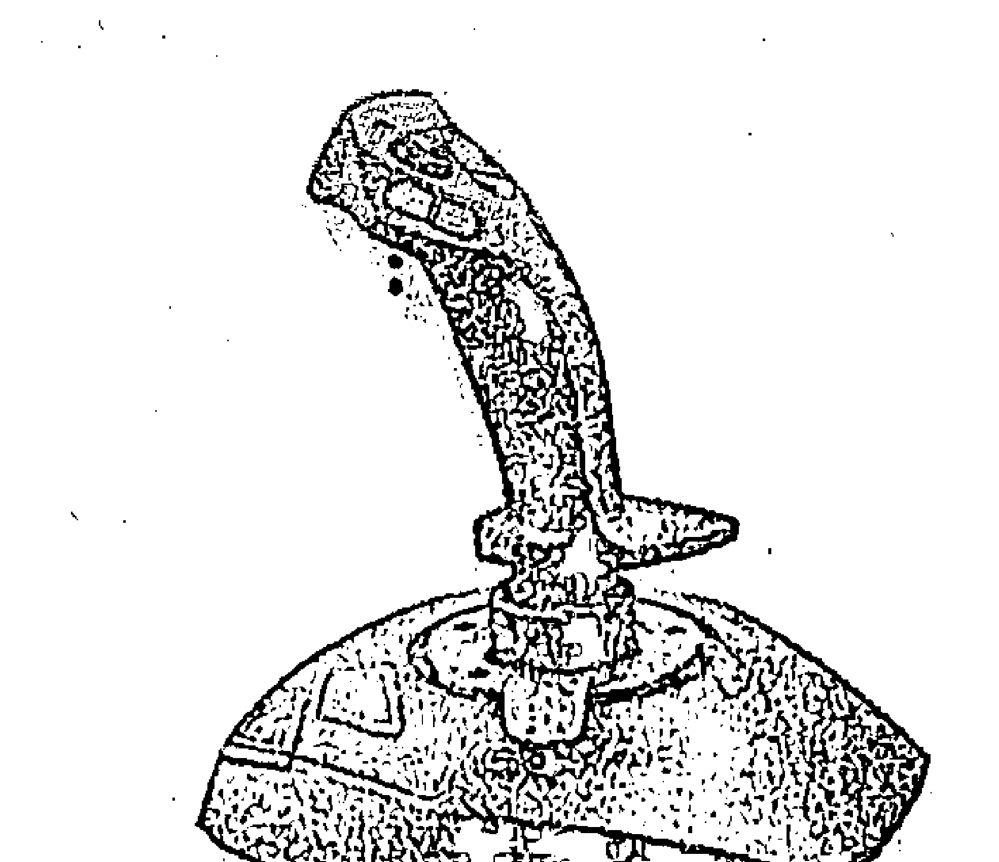

如图13，这款罗技 MOMO Force 的底座采用塑料制造，只要用2个螺丝夹子就能将方向盘牢牢固定在桌面上。此款方向盘的外型与F1赛车完全相同，方向盘包真皮，上半部是圆形，下半部则趋近于方形。它比较厚实，你的手能自然地放在应有的位置，即使动作再大，也不会滑手。

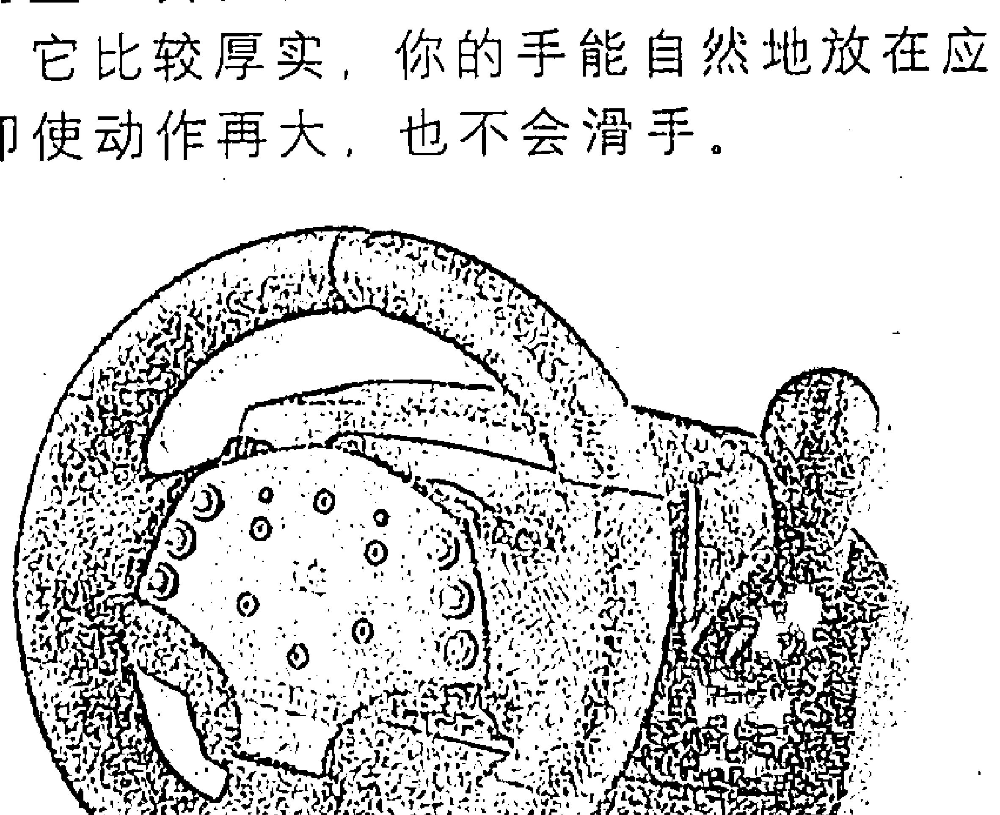

感，也能适合平面射击、动作冒险等游戏类型。不过这类摇杆对游戏类型的适应性不及手柄，只是在一些格斗游戏中会相对顺手一些，适合习惯街机操作的玩家。

### (五) 方向盘

赛车是很多游戏平台的重头戏，PC上著名的赛车游戏有《极品飞车》系列等等。若使用方向盘来玩赛车游戏，显然能给人更真实的驾驶感觉，而且

#### 1. 区分逻辑坏道与物理坏道

一般来说，硬盘的坏道可以分为两类：逻辑坏道与物理坏道。产生逻辑坏道时一般不会严重影响使用，通常是由于对软件的使用或操作不当所造成。大家使用 DOS 或者 Windows 下的 Scandisk 命令即可解决问题。但是如果使用 Scandisk，甚至重新分区格式化之后仍不能正常工作的话，那么很可能就是物理坏道在作怪了。硬盘出现物理坏道的原因有很多，除自身存在质量问题外，还有断电、碰撞所造成的损害。对于物理坏道，大家一定要及时处理，因为坏道是会扩散的。

需要注意的是，我们建议大家不要用“低格”程序来处理坏道，这是没有丝毫作用的。如果盲目地使用低格程序，只会适得其反。低格把原有的分区全部删除，而坏道还是存在，再次分区就可能把原来的坏道分成两个或几个，虽然可能一时看不出，系统也暂时检查不出，但坏道是会扩大的，像传染病蔓延，如果存储有重要的资料，表面上看还好的扇区，一旦发作后果不堪设想。

#### 2. 物理坏道修复方法

物理坏道正确的处理方法应该是使用专用的硬盘工具将坏道分离出来，并屏蔽它，保证磁头不对坏道进行读写操作。在这里，我们向大家推荐 Partition Magic For DOS，可以到 powerquest.com 下载。由于这款软件必须在 DOS 下进行操作，因此我们得用软盘或者光盘引导系统，并尽量保证不在内存中加载任何程序。

在 DOS 环境下，我们进入 Partition Magic，然后选择 Operations 菜单下的 Check For Errors 命令，确定物理坏道的位置（图 1）。如果你的硬盘真的存在坏道的话，那么整个检测过程将是相当缓慢的。只要硬盘灯不灭，那么就千万不要重新启动，因为此时并非死机。当检测到坏道之后，Partition Magic 会用不同的颜色进行标记，非常明显。由于硬盘坏道的检测具有一定的偶然性，少数物理坏道周围的磁道还未病入膏肓，有时 Partition Magic 会出现误诊，甚至还会将逻辑坏道误认为是物理坏道。从另一个方面来看，物理坏道周围也是最有可能出现坏道的地方，而 Partition Magic 也有可能遗漏。对于这一问题，我们千万不能手软，一定要赶尽杀绝。

Bad Sector Retest 就是最后一道关卡，它能反复查找由 Check For Errors 命令所标记的坏道，对其周围也是仔细搜索。经过这一步之后，我们可以确保查出所有的坏道，这也是成功处理物理坏道的前提。Partition Magic 最强大的功能就是分区，而在处理硬盘物理坏道时这更是起到了关键作用。当我们使用 Partition Magic 检测到物理坏道时，可以将它们全部划分到一个独立的新分区。为了安全起见，大家一定要将所有的物理坏道都加入分区，无需为一点点空间而感到心疼。最后我们要做的就是隐藏该分区了，这一步通过 Advance 下的 Hide Partition 命令即可实现。

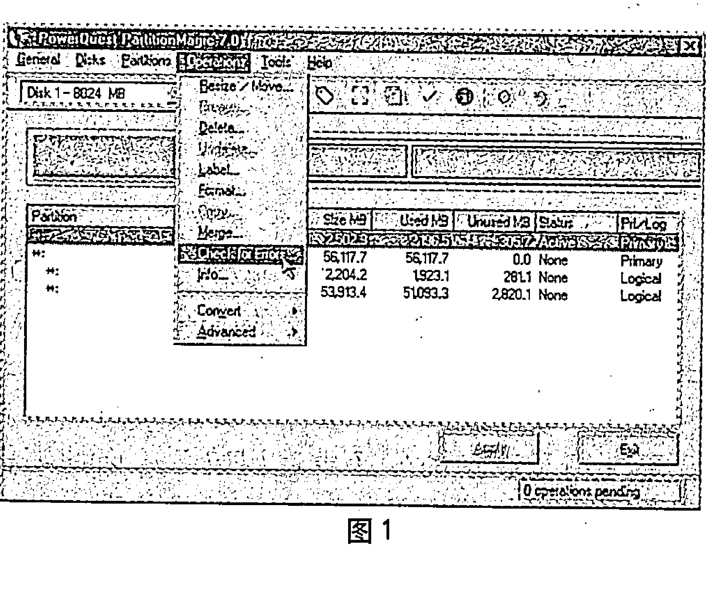

经过这番处理之后，我们的硬盘应该还可以继续服役。这种方法对于物理坏道不太多的硬盘效果不错，但如果坏道已经严重扩散，那么就没有必要这样做了。此外，即便成功地隔离坏道，我们也要做好数据备份工作，因为此时的硬盘随时可能再次出现故障。

Bad Sector Retest 就是最后一道关卡，它能反复查找由 Check For Errors 命令所标记的坏道，对其周围也是仔细搜索。经过这一步之后，我们可以确保查出所有的坏道，这也是成功处理物理坏道的前提。Partition Magic 最强大的功能就是分区，而在处理硬盘物理坏道时这更是起到了关键作用。当我们使用 Partition Magic 检测到物理坏道时，可以将它们全部划分到一个独立的新分区。为了安全起见，大家一定要将所有的物理坏道都加入分区，无需为一点点空间而感到心疼。最后我们要做的就是隐藏该分区了，这一步通过 Advance 下的 Hide Partition 命令即可实现。

经过这番处理之后，我们的硬盘应该还可以继续服役。这种方法对于物理坏道不太多的硬盘效果不错，但如果坏道已经严重扩散，那么就没有必要这样做了。此外，即便成功地隔离坏道，我们也要做好数据备份工作，因为此时的硬盘随时可能再次出现故障。

### 二、虚惊一场——修复硬盘分区表

并非所有的硬盘故障都是由本身的硬件原因引起的，很多问题是由于人为破坏形成。此时，硬盘没有任何问题，只要大家处理好这一类软件故障，那么我们的硬盘又可以完好如初。硬盘分区表被意外修改是一种很典型的软件故障，硬盘分区表中存储着各个分区的关键信息，一旦遭到破坏，那么硬盘将不能启动。很多恶性病毒就是从硬盘分区表下手的，此时的症状为：系统启动时显示 Disk boot failure；Insert system disk and press enter，告诉你找不到启动分区硬盘或者硬盘上没有启动文件。

对于这一类软件故障，大家可以用软盘启动系统，然后键入“C：”，看看能否读取 C 盘的内容。这一情况是比较复杂的，根据分区表破坏程度的不同，C 盘能否被读取也不能确定。如果 C 盘中的数据可以读出的话，那么大家只要使用 Fdisk/mbr 命令进行无条件重写分区表，一般都能成功，而且可以保留原有的数据。值得注意的是，运行 Fdisk/mbr 命令时系统是没有任何反应的，但实际上它已经起了作用，因为硬盘分区表的数据量很小，写入时间几乎让人感觉不到。

当然，即便不能读取 C 盘，我们也可以使用 Fdisk/mbr 命令，然后用 Fdisk 或者其他软件进行分区格式化，惟一的遗憾就是数据将全部丢失。不过，这里向大家推荐一款DOS下的小工具Fixmbr，大家可以到http://download.pchome.net/utility/antivirus/av98/6967.html下载。在DOS下直接执行该文件后，系统会自动检查分区表结构，经过用户确认之后，它就开始自动修复。与Fdisk/mbr命令相比，Fixmbr具有更好的效果，很多Fdisk/mbr命令不能解决的分区表问题都能被它轻松搞定。

除了Fixmbr以外，DiskGenius也是一款出色的硬盘分区表恢复软件，它的前身就是大名鼎鼎的Diskman，下载地址为http://sq.onlinedown.net/down/DGen20b0219.zip。由于DiskGenius采用全中文的操作界面，因此对于英文不好的用户而言是最佳的选择。进入DiskGenius的主界面之后，我们按下F10功能键就能自动恢复硬盘分区表，而且这一招非常有效。值得一提的是，DiskGenius还可以备份硬盘分区表，这样可以做到防患于未然，因为并非每次恢复都能确保百分之百成功。

### 三、另类黑客程序——硬盘逻辑锁

一般计算机的硬盘分区表被病毒感染后，若不能启动机器，通常从软盘可以启动。但在严重的情形下，不仅从硬盘不能启动机器，就是从软盘也不能启动。有些恶意病毒就能使硬盘被锁死；此外，前几年KV300闹出的沸沸扬扬的硬盘逻辑炸弹事件也是这样一种逻辑锁。

在解决这一问题之前，我们很有必要了解一下硬盘逻辑锁的原理。计算机在引导DOS系统时（Windows也是需要通过DOS引导的）将会搜索所有逻辑盘的顺序，当DOS被引导时，首先要去找主引导扇区的分区表信息，位于硬盘的零头零柱面的第一个扇区的0BEH地址开始的地方。当分区信息开始的地方为80H时表示是主引导分区，其他的为扩展分区，主引导分区被定义为逻辑盘C盘，然后查找扩展分区的逻辑盘，被定义为D盘，以此类推找到E，F，G……“逻辑锁”就是在此下手，修改了正常的主引导分区记录，将扩展分区的第一个逻辑盘指向自己，DOS在启动时查找到第一个逻辑盘后，查找下个逻辑盘总是找到是自己，这样一来就形成了死循环，这就是使用软驱、光驱、双硬盘都不能正常启动的原因。实际上“逻辑锁”只是利用了DOS在启动时的一个小小缺陷，便令不少高手都束手无策。知道了“逻辑锁”的“上锁”原理，要解锁也就比较容易了。针对硬盘逻辑锁，我们推荐三种解决方案，它们各有优点，大家可以根据自己的实际情况来选择。

#### 1. 硬盘热插拔

毫无疑问，我们只要让BIOS认为系统中没有硬盘，那么启动时就可以轻松地跳过逻辑锁的障碍。要实现这一点并不困难，大家只需在开机时将硬盘拔下即可，这也是最简单的方法。当系统成功启动之后，我们使用A盘来引导。下面的一步是关键，那就是在带电的情况下插上硬盘。此时大家一定要小心，特别是在连接数据线与电源插头时，动作要快、准、轻，千万不能往复插拔，用力始终向着同一方向。

随后，系统会自动识别出硬盘，而且可以正常使用。但是一旦重新启动之后，逻辑锁依然会作怪，因为我们还没有从根本上解决问题。当然，我们不可能一直使用这种方法来使用硬盘。对此，大家要做的是重新写入硬盘分区表。关键在这一步，一般用Fdisk/mbr即可搞定，如果还是不行，可以尝试使用我们上面推荐的DiskGenius。

从理论上来说，热插拔硬盘并不会造成任何问题，但是这毕竟是带电操作，因此危险性也是不能排除的。使用硬盘热插拔方案的好处是能以最短的时间解决问题，而且基本上不会丢失硬盘中的数据。

#### 2. DM 大法

要让BIOS认为系统中没有硬盘，拔下硬盘并非是惟一的方法，通过BIOS设置也能办到。大家在开机时按下DEL键（个别品牌机主板可能使用F1功能键），然后将所有的IDE通道设置为NONE即可。

然后，我们可以利用软盘或者光盘启动系统，此时肯定可以启动，因为系统根本就没有硬盘。最后登场的是经典的硬盘管理软件DM，它最大的特色便是可以不依赖于主板BIOS来识别硬盘，因此我们可以用DM进行分区格式化，这样就能完全解决问题，而且万无一失，简单方便。从实际效果来看，DM大法是相当安全的，而且几乎不会失手，其惟一的缺点便是不能保住硬盘中的数据。

#### 3. UltraEdit 大法

如果想要保住硬盘中的数据，而且不愿冒热插拔硬盘的风险，那么大家还需要动手来实践一下UltraEdit大法，这可不是一件简单的事情。首先，使用二进制编辑工具，如UltraEdit等，分析启动软盘中的IO.SYS文件（注意，一定要是Win98或者DOS 6.22的启动盘，使用WinME、2000、XP的不行）。UltraEdit的下载地址为http://www.skycn.com/soft/2249.html。

由于IO.SYS是隐藏文件，因此我们需要在UltraEdit的“打开”对话框中直接输入其全名“IO.SYS”。而我们要查找的是该文件的第一个“55AA”字符串，找到后修改为任意数值即可（图2）。此时大家利用这张软盘就可以带着中了逻辑锁的硬盘启动了，不过由于硬盘的分区表遭到破坏，因此还需要使用上面讲过的分区表恢复方法进行处理。

### 四、大动干戈——抢救硬盘零磁道

用过软盘的朋友都知道，一旦软盘的零磁道损坏，那么这张软盘就基本报废。对于硬盘也同样如此。不过天无绝人之路，我们还是有办法进行补救的。我们修复零磁道损坏硬盘的核心思想，就是修改零磁道的位置，让1磁道取而代之。修改零磁道所要使用的软件是PCTOOLS 9.0中DE工具，但是它只能在DOS下工作。棘手的是，当初PCTOOLS是为DOS开发的，因此它只能适用于FAT16的硬盘分区。而如今硬盘容量都远大于2GB，FAT32是绝对的主流。为此，我们还必须借助Partition Magic 7.0 For DOS来搞定FAT32和NTFS分区。当然，此时硬盘已经不能启动，因此必须使用软盘或者光盘启动。

如果C盘分区恰好小于2GB的话，那么整个过程将相当简单。大家只要进入Partition Magic，然后使用转换命令将FAT32的C盘转换成FAT16即可，这一步所耗费的时间也不长。不过大多数用户的C盘都远不止2GB，因此大家还需要使用Partition Magic将C盘划分到小于2GB的状态，其实这也就是重新分区，只不过Partition Magic可以不破坏原有数据，而且速度更快。

完成FAT转换之后，用DOS启动盘启动机器，然后运行PCTOOLS 9.0目录下的DE.EXE。先进入“Options”菜单，选“Configuration”（配置），按空格去掉“Read Only”（只读）前面的对勾（按Tab键切换），保存退出。接着选择主菜单“Select”（选择）中的“Drive”（驱动器）；进去后在“Drive type”（驱动器类型）项下选“Physical”（物理的），按空格选定，再按Tab键切换到“Drives”项，选中“Hard disk”（硬盘），然后选择“OK”回车。

之后回到主菜单，打开“Select”菜单，这时会出现“Partition Table”（分区表），选中并进入，之后出现硬盘分区表信息。如果硬盘有两个分区，1分区就是C盘，该分区是从硬盘的0柱面开始的，那么，将1分区的 Beginning Cylinder（起始柱面）的0改成1就可以了。保存后退出。要注意的是，在修改之前先将硬盘上的重要资料备份出来。重新启动，按Delete键进入COMS设置，选“IDE AUTO DETECT”，可以看到CYLS比原来减少了1，保存退出，重新分区，格式化，至此初步告成。

但是大家不要高兴得太早，因为我们这里所做的仅仅是修改了硬盘零磁道的物理位置，确保硬盘可以启动。事实上坏道并未消除，它仍然对硬盘的安全构成严重的威胁。不过，想必大家现在已经掌握了对付物理坏道的方法，此时我们如法炮制即可，其方法与普通物理坏道的屏蔽一模一样。

## 硬盘安装篇

硬盘的安装涉及到硬盘与主板的兼容性、多个硬盘设置方法以及Serial-ATA硬盘的连接等。很多读者对这些并不是十分了解，甚至认为更换硬盘是一桩很艰难的任务。其实不然，在掌握以下三点后，大家将能轻松应对各种常见的硬盘安装模式。

### 一、双硬盘的安装

随着宽带网以及多媒体技术的普及，我们对于硬盘的容量需求越来越大。前几年还是超大容量的10GB硬盘转眼间已不见踪影。在各种大型软件、视频动画、3D游戏的诱惑下，很多用户都在考虑为老机器添加一块硬盘。事实上，安装双硬盘并不是一件麻烦的事情，即便你没有任何经验，也可以在我们的帮助下轻松搞定……

目前我们所使用的硬盘绝大多数都采用了IDE接口，这是一种很普及的接口模式，而我们使用的主板也都是IDE接口的主板，每块主板上有两个IDE插槽（图3），而每个插槽又可以支持2个IDE设备，因此从原理上讲我们可以在同一台机器上共安装四个IDE硬盘共同使用。

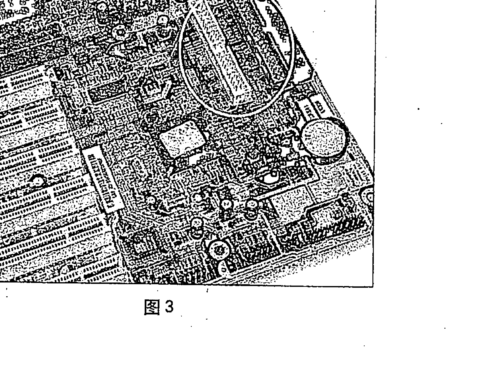

#### 1. 硬盘跳线的设定

在安装双硬盘之前我们首先要做的就是对硬盘的跳线进行设定，因为多个硬盘安装到计算机中后，还需要计算机来识别、区分和驱动它们，这样我们才可以使用。那么计算机是按什么方法来区别不同的硬盘呢？答案就是靠主从跳线的设定模式。

硬盘主从跳线的位置在硬盘末端，用来插接信号线和电源线的中间，一般是由3 - 5组插针和1 - 2个跳线帽组成的。硬盘跳线的设定模式一般有三种：“主” MASTER， “从” SLAVE 和“自动选择” CABLE SELECT，有些硬盘如IBM和WD的硬盘还有一个独立硬盘工作的模式，当你只使用一个硬盘工作时就需要设定在这个状态上，这个状态称为“单硬盘模式” SINGLE。

不同硬盘的跳线方式有着不同的设定方法，具体的设定模式在硬盘正面的贴纸或侧面的盘体上都有标注，你只要按照上面的指示将跳线帽插到相应的位置即可。常见的硬盘中，QUANTUM（昆腾）、SEAGATE（希捷）、MAXTOR（迈拓）、SAMSUNG（三星）硬盘的跳线都是采用了单跳线设定，所以比较容易，而WD（西部数据）、IBM和FUJITSU（富士通）硬盘则多采用多跳线或是多方向组合式的设定，看起来就比较麻烦一点，建议你要仔细的进行设定和确认。

硬盘跳线的模式设定如果出现错误的话，你不必担心会给硬盘带来什么影响，这是不会有任何损伤的，只是不能通过主从跳线的模式来确认安装的各个设备，惟一的麻烦就是机器无法完成正确启动。在安装硬盘之前，首先在两块硬盘中选择出性能好一些的硬盘，作为系统引导硬盘，将其跳线的模式设定为MASTER模式，然后将另一片硬盘的跳线模式设定为SLAVE模式或者在第二个主板IDE接口上设定为MASTER。设定好之后，再将这两片硬盘一同安装在机箱的3英寸安装槽内，并使用螺丝钉固定。

#### 2. 硬盘位置的选择与数据线连接

由于两块硬盘的购买日期有较大的差距，因此很可能在外部接口上有较大的差异。目前购买的主流硬盘都支持ATA100模式，部分产品还支持ATA133模式，而20GB以下容量的硬盘一般只能支持ATA66。这就引来一个问题，如果你的主板能够支持最新的ATA模式，那么我们强烈建议大家将两块硬盘安装在不同的IDE通道上，并都设定为MASTER。当然，如果你的主板最高只能支持ATA66，那么也可以在同一个IDE通道上串连两个硬盘。

相对而言，硬盘数据线的连接可能对各位新手有一定的难度。因为IDE数据线的插头是矩型的，从外观上并不容易区分插接的方向，那么我们该如何确定呢？在主板IDE插槽这一端，我们可以按照IDE连接线上的一个柱型突起，来对应主板IDE插槽上的缺口，只要这样安装就可以保证正确了。在硬盘这一端呢，我们可以仔细的观察IDE连线最旁侧的两条边线，其中一条我们可以看到有红色的标记，而另一侧则没有。这个便是确认IDE连线插接方向的条件，在连接的时候，我们将这条有红色标记的一侧朝向硬盘电源插口的方向就可以了。

以上方法只是普通40pin数据线的连接，如果你想使用最新的ATA66 / ATA100模式，那么必须使用80pin的专用数据线。仔细观察一下ATA66 / ATA100连线，不难看到它的各个插头的颜色是不同的，这些插头就是用来插接不同的设备的，蓝色插头（标记有SYSTEM）这一端是用来连接主板的IDE插槽的，黑色插头（标记有MASTER）这端是用来连接主硬盘的，而灰色插头（标记有SLAVE）这一端则是用来连接从硬盘的，这些顺序不能搞错，否则无法正确驱动UDMA模式（图4）。

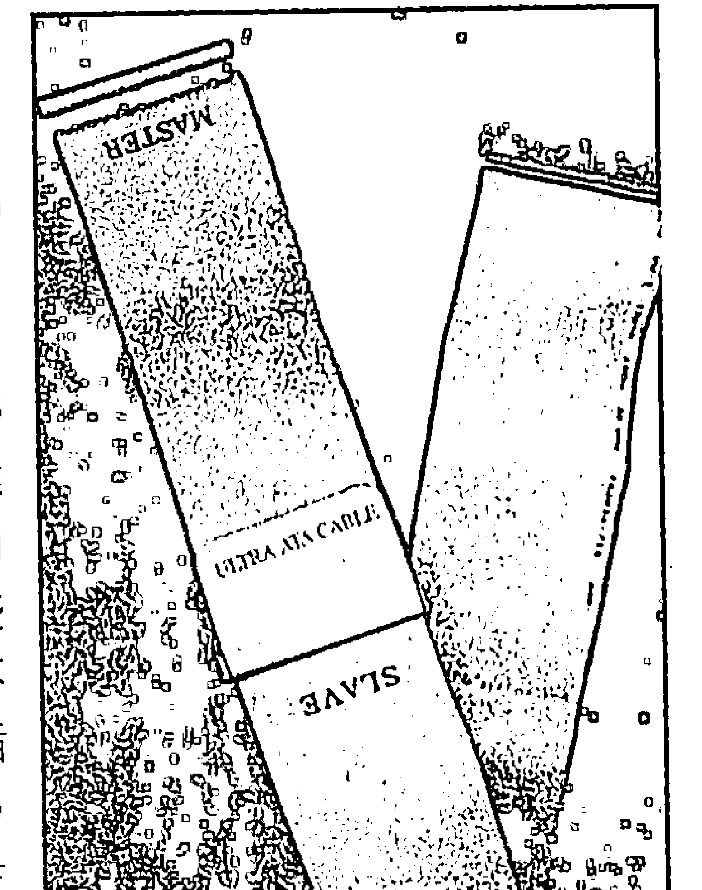

#### 3. 进入BIOS设定硬盘

每当IDE设备发生变动时，我们都需要在BIOS中进行相关设定。在开机时按住DEL键，进入BIOS主菜单，然后我们选择“IDE HDD AUTO DETECTION”选项。这时主板便可以将两个IDE接口连接的四个设备全部检测出来，你可以按Y键进行确认，进行了这些设定之后，我们选择“SAVE & EXIT SETUP”保存设置，并退出BIOS设定模式。

#### 4. 解决盘符交错问题

如果我们的两块硬盘都划分若干分区，那么在Windows下看到的盘符将是交错的，这是非常不方便的。由于添加硬盘时，老硬盘的数据大多要保留，而新硬盘没有数据，因此大家可以在DOS下对新硬盘进行分区，然后到BIOS中将新硬盘屏蔽，让Windows自行识别。这种方法可以完全避免盘符交错现象，惟一缺点是在纯DOS下无法看到被屏蔽的硬盘。

如果大家不嫌麻烦的话，那么还可以考虑先将老硬盘的数据临时复制到新硬盘，然后将老硬盘分为一个分区（因为其容量较小）并作为系统引导盘，随后新硬盘可以正常分区格式化。毫无疑问，这是最佳解决方案，但是执行起来相当麻烦。

### 二、组建 RAID 系统

在谈论电脑的速度（性能）时，我们一般只在意CPU速度、内存大小等，而对于硬盘速度却不怎么重视。其实这是绝对错误的，因为硬盘的速度将直接影响到整个系统的效率，有时甚至比CPU和内存更为显著。在视频捕捉、平面设计等场合下，硬盘的性能起着至关重要的作用。然而凭借目前的磁盘技术，硬盘的性能难以有很大的飞跃，因此业界提出了RAID（Redundant Array of Inexpensive Disks，磁盘阵列）解决方案。

#### 1. RAID 基础知识

RAID技术最初都是建立在SCSI系统基础上，后来Promise公司第一次提出并研发了基于IDE硬盘的RAID产品，从而能以较低价格提供更高的性能和安全保证。事实证明，RAID并非仅仅适用于SCSI硬盘，对于IDE硬盘而言，它也是一种极为出色的解决方案，而且较低的成本使我们普通用户也能过一把RAID瘾。

RAID技术经过不断的发展，现在已拥有了从RAID 0到RAID 6七种基本的RAID级别。另外，还有一些基本RAID级别的组合形式，如RAID 1+0（RAID 0与RAID 1的组合），RAID 5+0（RAID 0与RAID 5的组合）等。其中在IDE中，主要以RAID 0、RAID 1和RAID 0+1为主，普通用户经常使用也仅仅是这几个。下面这张表格是对各类主要RAID技术的一个总结：

| RAID级别 | 别名 | 容错性 | 冗余类型 | 热备盘选项 | 需要的磁盘数 | 可用容量 |
|----------|------|--------|----------|------------|--------------|----------|
| RAID 0 | 条带 | 没有 | 没有 | 没有 | 一个或多个 | 总的磁盘的容量 |
| RAID 1 | 镜像 | 有 | 复制 | 有 | 只需2个 | 只能用磁盘容量的50% |
| RAID 5 | 专用奇偶位条带 | 有 | 奇偶位 | 有 | 三个或更多 | (n-1)/n的磁盘容量 |
| RAID 0+1 | 分布奇偶位条带 / 镜象阵列条带 | 有 | 奇偶位 / 复制 | 有 | 只需4个 | 磁盘容量的50% |

毫无疑问，RAID 0是最经济实惠的方案。在不牺牲硬盘容量的前提下，我们可以轻松地令硬盘速度提升一个档次（图5）。组建RAID 0时，我们需要一块RAID控制卡与两个硬盘。需要注意的是，此时两个硬盘最好是同一型号的，即便不是也一定要是同转速与同容量的。不然最终的RAID 0将以速度较低或者容量较小的那个硬盘为标准来组建，这就有些得不偿失了。下面我们将带领大家来组建一个RAID 0系统。

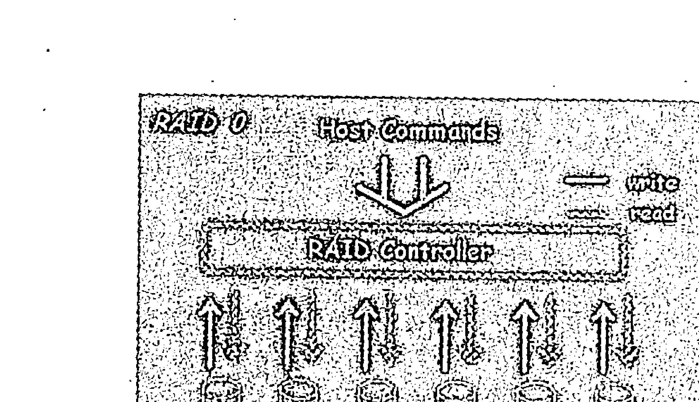

#### 2. 实战 RAID 0

在此次RAID实战中，我们采用Tekram DC200芯片为例向大家介绍。尽管它与常见的Promise和HighPoint芯片不同，但是使用方法还是基本一致，大家可以效仿。其实使用RAID 0的关键是掌握RAID控制卡BIOS的使用。当我们把RAID控制卡安装好并接上两个硬盘时，系统开机就会出现如下的画面（图6）。BIOS界面分三个部分：MENU（菜单）、HELP（帮助）和STATUS（状态）。由于我们是首次安装RAID，因此必须进入MENU窗口进行创建。

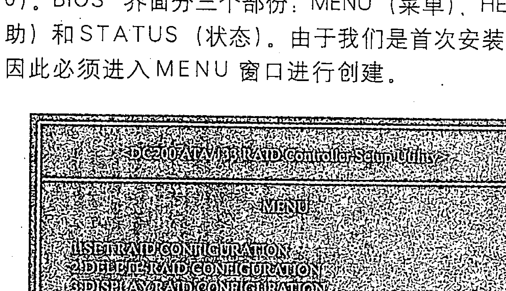

在MENU菜单中选择“1. SET RAID CONFIGURATION”，按回车键，此时我们就可以进入SET RAID CONFIGURATION界面。RAID控制卡将使用一段时间来识别硬盘，稍后我们把光标移动到硬盘，再按空格键来进行选择，按回车键确认选择，这时将弹出一个新窗口，显示可供选择的RAID模式共有4种：JBOD（不适用RAID）、RAID 0、RAID 1、RAID 0+1。

毫无疑问，我们当然是选择RAID 0。然后大家可以通过STATUS（状态）菜单查看此模式是否被真正激活。至此，我们的RAID 0硬件安装就结束了，大家可以接着安装操作系统。值得注意的是，由于Windows并不能识别RAID控制芯片，因此它会识别为普通的SCSI控制卡。强烈建议大家在安装完Windows之后，为RAID控制器补上正确的驱动程序，这不仅能够提高RAID系统的稳定性，还可以大幅度提高性能。

### 三、深入 Serial-ATA 硬盘安装

为了彻底解决硬盘外部接口的瓶颈，APT Technologies, Dell, IBM, Intel, Maxtor, 前Quantum以及Seagate等七家公司联合组建了Serial ATA Working Group（串行ATA工作集团），并制定了第一代Serial-ATA规范。在行业巨头的支持下，Serial-ATA技术很快得到普及，而如何使用好这种新规格的硬盘则成为很多读者十分关心的话题。

#### 1. 使用主板上的 Serial-ATA 接口

Serial-ATA串行硬盘已经向我们悄悄逼近，其强大的性能优势更是毋庸置疑。由于目前最新的南桥芯片无一例外地集成Serial-ATA磁盘控制器，因此不少主板已经直接集成Serial-ATA接口。

##### (1) 连接数据线

Serial-ATA硬盘在外部结构方面与传统并行IDE硬盘有着一定的区别，因此在使用时需要格外注意。可以很明显的看到，Serial-ATA硬盘所采用的数据线接口以及电源接口都非常特殊（图7，左图为IDE硬盘，右图为Serial-ATA硬盘）。

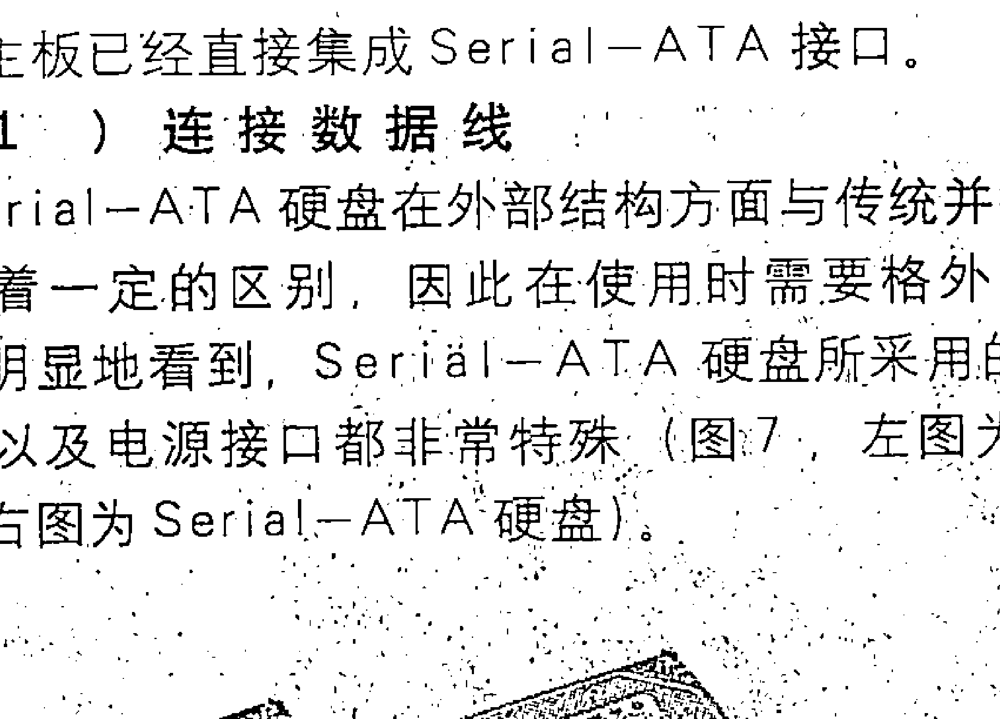

Serial-ATA数据线占据的空间很小，这非常有利于散热，同时可以提高数据传送的稳定性。实际上，Serial-ATA仅用四个针脚就能完成所有的工作，分别用于连接电缆、连接地线、发送数据和接收数据，同时这样的架构还能降低系统能耗和减小系统复杂性。对于传统并行IDE硬盘，数据线连接有着严格的顺序规定，而由于每个Serial-ATA接口只能安装一个Serial-ATA硬盘，因此并不存在跳线以及数据线连接顺序的问题，大家直接用Serial-ATA数据线连接硬盘与主板相应接口处即可（图8，主板上的Serial-ATA接口）。

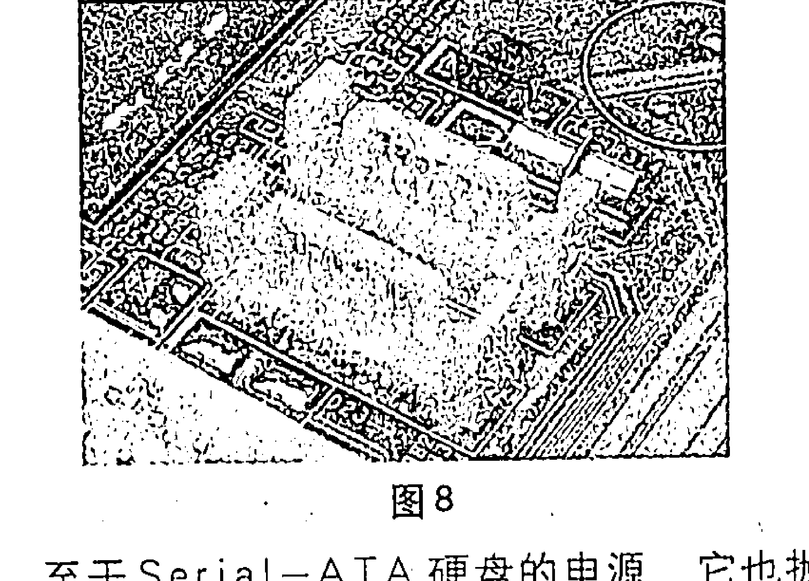

##### (2) 设置 BIOS 参数

现在Serial-ATA硬盘的硬件安装过程并不复杂，甚至比并行IDE硬盘还要简单。然而由于短期兼容性的问题，目前Serial-ATA硬盘在软件设置方面还稍微有些不便。我们首先进入BIOS，将Serial-ATA功能打开，一般位于BIOS的OnChip PCI Device菜单（图9，在BIOS中打开Serial-ATA功能）。如果系统中仅仅安装Serial-ATA硬盘，而不使用并行IDE硬盘，那么应当将“Bootable Add-in Device”设定为OnChip SATA RAID，让其优先级位于普通PCI接口的SCSI控制器之前。

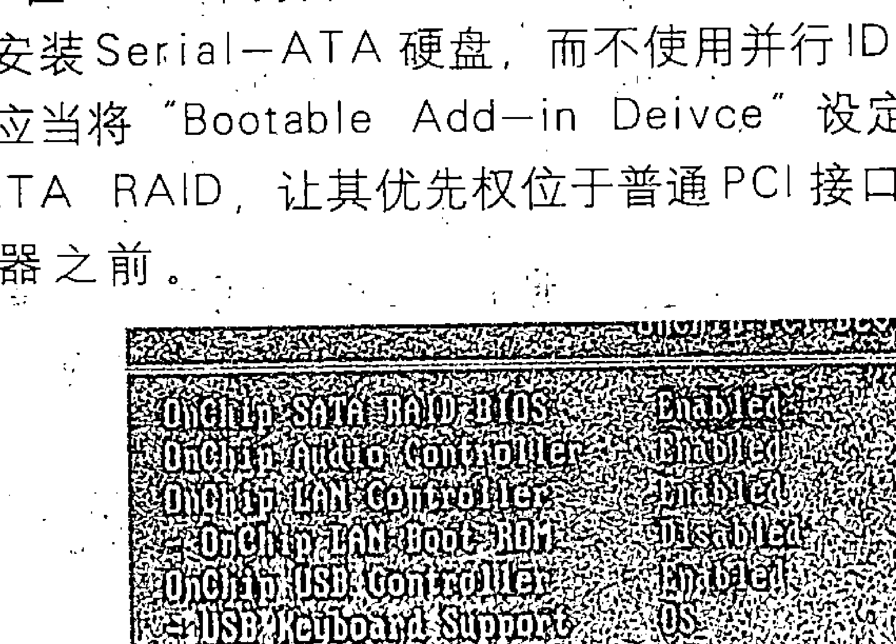

完成BIOS设置之后，如果直接用启动盘引导系统，你会发现此时Serial-ATA硬盘根本无法使用，这是因为当前版本的操作系统无法直接对Serial-ATA硬盘提供支持。在安装Windows XP/2000操作系统时，必须在系统提示寻找SCSI设备时按下F6键（安装过程中的第一次重启后），然后插入随主板提供的Serial-ATA驱动程序软盘，此时安装向导会自动搜索驱动路径，并正确识别Serial-ATA硬盘。

##### (3) 安装最新磁盘驱动

要提醒大家的是，完成Windows安装以后一定要安装相关的驱动程序以及最新版本的优化程序，这对于提高Serial-ATA硬盘的最终性能将会大有好处。如今Intel, VIA, SiS, nVIDIA的最新南桥都直接集成Serial-ATA控制器，需要安装驱动和优化程序才能充分发挥性能，并且避免兼容性问题，而采用Promise以及Silicon板载芯片的主板，也必须进行同样的软处理。

#### 2. 使用扩展卡安装Serial-ATA RAID硬盘

对于那些准备升级硬盘的用户而言，购买Serial-ATA串行硬盘自然是明智的选择，此时惟一需要解决的问题，便是如何通过Serial-ATA扩展卡安装串行硬盘，毕竟nForce2、VIA KT400、Intel 845系列、SiS648等主板都不具备Serial-ATA接口。

##### （1）硬件设备安装

Serial-ATA扩展卡一般采用普通PCI接口，而少数支持RAID 5的高端Serial-ATA扩展卡，可能会为了提高性能而动用66MHz的PCI接口。不过这类产品往往价格不菲，一般并不适合普通用户。我们这里以百事灵的SPCI-1B Serial-ATA扩展卡为例进行介绍，它采用Silicon Image出品的SATALink Sil3112ACT芯片，提供两个独立的150MB/s的Serial ATA接口，可以支持RAID 0或者RAID 1工作方式。

固定Serial-ATA扩展卡并不困难，在主板上选择一个合适的PCI插槽即可。需要注意的是，此时应该尽量避开AGP显卡等发热量较高的设备，并且尽可能靠近硬盘的安装位置，这对于提高稳定性有一定好处。至于Serial-ATA的连接，其方法与使用主板上的Serial-ATA接口完全一样，这里就不再重复了。

##### （2）Serial-ATA扩展卡BIOS设置

目前Serial-ATA硬盘在软件设置方面还稍微有些不便，特别是在使用扩展卡的情况下。当Serial-ATA硬盘的数据线以及电源连接正确时，我们可以在系统启动时按下Ctrl+S或者F4功能键，此时Serial-ATA扩展卡会自动调用BIOS调试界面。注意，并不是每一款Serial-ATA扩展卡都采用相同的BIOS呼叫功能键，具体需要查阅产品说明书。

进入BIOS之后，我们会发现Serial-ATA扩展卡已经检测出相应的Serial-ATA硬盘，此时需要设定的便是工作模式（图10，建立RAID工作模式）。对于单个Serial-ATA硬盘而言，基本上使用默认设置即可。而如果拥有两个Serial-ATA硬盘，那么组建RAID磁盘列阵将是最佳的选择。与传统IDE RAID相比，Serial-ATA RAID在带宽上拥有更多优势，因此性能表现更加出色。

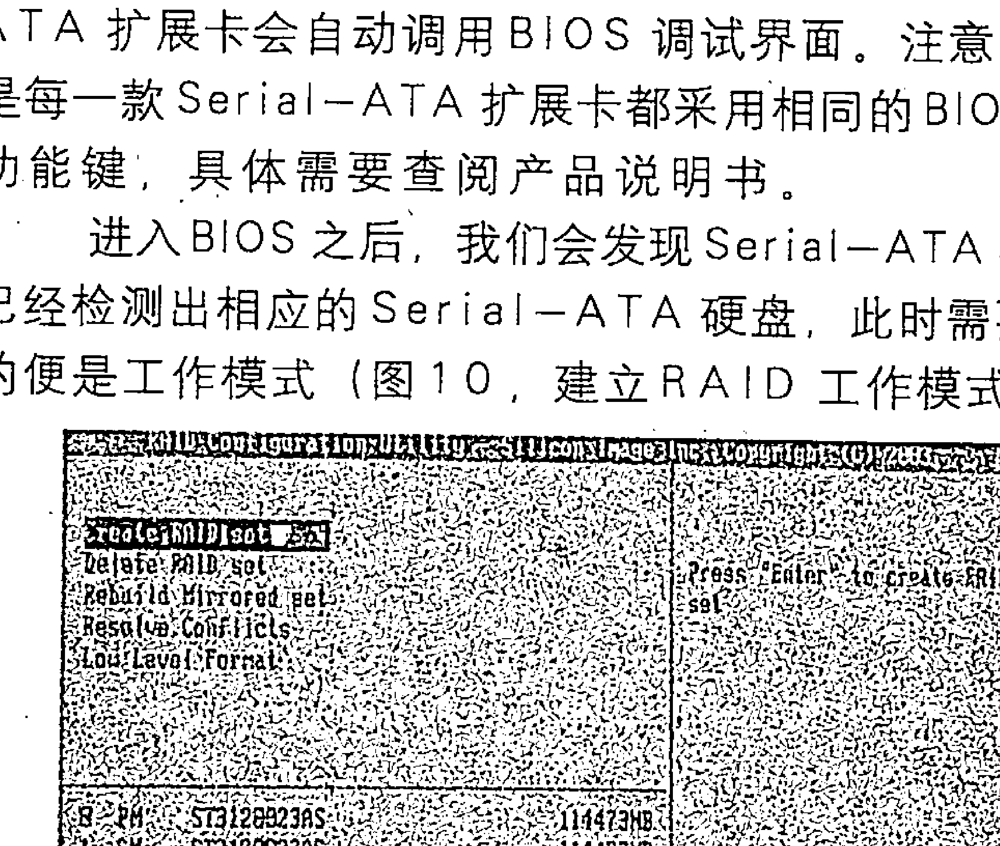

百事灵SPCI-1B Serial-ATA扩展卡的BIOS设置十分简洁，在主菜单选择“Create RAID Set”之后，BIOS会要求用户确认创建Striped (RAID0) 还是Mirrored (RAID1) 模式。前者可以大幅度提高磁盘性能，同时不会牺牲容量，而后者尽管会牺牲容量，但是可以令数据安全性提升一倍。与IDE RAID一样，Serial-ATA RAID也需要设定Chunk Size。Chunk Size就是RAID块操作的具体大小，如果用户需要进行视频编辑等大数据量操作，那么尽量设置得大一些，而如果仅仅需要处理琐碎的数据，那么可以设定为64KB左右。

##### （3）操作系统优化设置

完成Serial-ATA扩展卡的BIOS设置之后，我们就可以正常使用Serial-ATA硬盘。但是与主板上的Serial-ATA接口一样，采用扩展卡连接Serial-ATA硬盘的用户，在安装Windows XP/2000操作系统时，必须在系统提示寻找SCSI设备时按下F6键，然后在软驱中放入驱动程序软盘。待操作系统安装完毕之后，我们自然需要系统能够将Serial-ATA硬盘作为第一启动设备。此时进入BIOS，在Advanced BIOS Setup菜单中将First Boot Device设定为SCSI，让其优先权位于板载磁盘控制芯片之前，这一点对于那些拥有IDE RAID功能的主板尤为重要。

此外，安装芯片组的磁盘补丁也很有必要，并不能因为系统中不存在IDE硬盘而省略这一步。事实上，芯片组的磁盘补丁不仅仅针对磁盘控制器，对于南北桥之间的传输也大有裨益。Serial-ATA控制卡的工作离不开PCI总线，因此也能提升性能。对于Serial-ATA RAID而言，一般控制卡还提供丰富的软件，可以帮助用户在Windows下查看RAID系统的工作状态并进行相关设定与校验数据。

### 四、老主板如何安装大硬盘

由于电脑硬件技术的快速发展，使得很多老主板对于一些新硬件及新技术难以正确识别，或不能提供支持，会产生“8.4GB、32GB、137GB”等硬盘容量的限制。其实解决的方案很多，从硬件方面来说，可以升级主板的BIOS或者使用硬盘扩展卡等。但是这些操作方法不适合初学者，如果能够简单地使用软件来解决问题，那才是我们的首选方案。

为了让用户更好地使用、管理和维护硬盘，各大厂商都为各种硬盘推出了很多专门的工具软件。其中最著名的工具软件要属ONTRACK数据国际公司的Disk Manager（即DM工具）、DiskGo。此外还包括StorageSoft软件公司推出的IBM Drive-Guide以及Maxtor MaxBlast Plus等。这些硬盘工具不但非常专业而且易于使用，在支持鼠标的图形用户界面下，可以方便快速地完成对硬盘的识别、分区和格式化，还能自动检测主板BIOS是否支持大容量硬盘。如果不支持则会自动安装DDO（Dynamic Drive Overlay）或EZ-BIOS等工具程序，以使硬盘突破主板BIOS支持的瓶颈，轻松进行安装。下面我们就以Disk Manager 2000 v3.10.14为例，介绍老主板安装大硬盘的方法。

# 硬盘专用软件篇

不同品牌的硬盘自然有着不同的特性，为了更好地维护数据安全，各大硬盘厂商都针对自家的产品推出专用的免费软件。如果能够充分利用这些专用工具，那么硬盘完全可以工作在更好的状态，甚至提高性能或者改善噪音控制能力。

## 一、IBM 硬盘

安装Disk Manager 2000之后，系统向导会要求创建DOS引导软盘，因为涉及到硬盘低层操作的步骤，无法在Windows下运行。如果你已经不是第一次安装Disk Manager 2000，那么可以在主界面的Maintenance（维护）功能中选择Create Disk Manager diskette，即可创建DOS引导软盘。重新启动之后，按住DEL键进入BIOS设置界面。此时一定要将新硬盘设置为NONE或者Not Installed，以免BIOS因为无法识别而影响开机过程。使用DM软盘启动之后，进入DM程序界面，程序检测系统后显示现有的硬盘信息，并给出两种安装方式供你选择：Easy Disk Installation（简易安装）和Advanced Options（高级自定义安装）。

### 1. 硬盘消声器Feature Tool（图11）

硬盘工作时的噪音的确很让人讨厌，尤其是寻道时的“咔哒”声。但是为了保证硬盘的性能，厂商们也不得不委屈一下我们的耳朵。而Feature Tool这款工具可以帮助我们在性能与安静之间寻求一个平衡点。

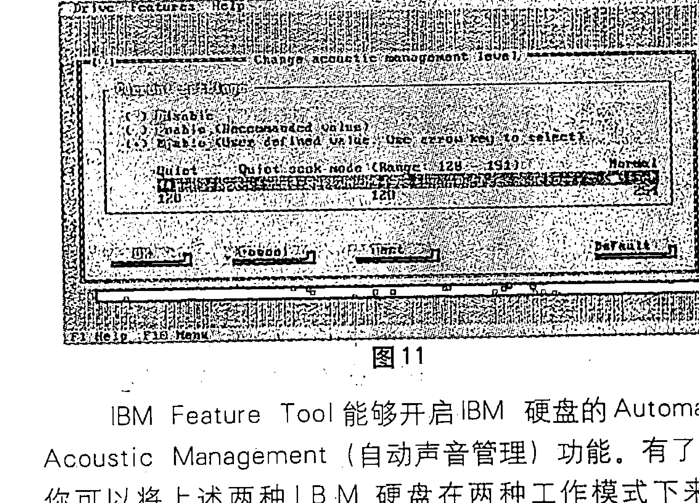

IBM Feature Tool能够开启IBM硬盘的Automatic Acoustic Management（自动声音管理）功能。有了它，你可以将上述两种IBM硬盘在两种工作模式下来回切换：一种是低噪音的安静模式（Quiet Seek Mode），一种是高性能的正常模式（Normal Seek Mode）。

Feature Tool是在Windows下安装的，但是它会自动生产一张软盘。如果你想使用Feature Tool，那么就必须使用这张软盘来启动机器。此后系统会自动进入程序的菜单，其中Change Acoustic Level（改变声音模式）选项是最显眼的，大家可以在安静模式（Quiet）和正常模式（Normal）之间再取一个合适的数值。使用这项工具后，IBM硬盘的声音会变小很多，尤其在寻道的时候。不过有得必有失，此时硬盘的速度是减慢了，从Winbench99的测试成绩来看，大约有3%左右的性能牺牲。

简易安装法只能将硬盘分成一个分区。操作时在确定计划安装的操作系统、文件格式后，选定所要安装的硬盘并设定启动分区。接着按【Alt + C】键，开始对硬盘进行分区与格式化，完成后重新启动电脑，即可在新硬盘上安装操作系统。而对于高级自定义安装法，它分为两个功能选项。在“高级硬盘安装”一项中则为你提供了A、B、C三种硬盘分区选择方案，并允许启动分区大于30GB容量。在“维护选项”中则可进行安装DDO工具、重写主引导记录、低级格式化等操作。毫无疑问，大家应该选择“高级自定义安装”模式，并且根据自己的要求对硬盘进行分区与格式化操作。令人感到十分舒心的是，智能化的DiskManager可以自动检测主板是否支持硬盘的最大容量，并且自动安装DDO，以便你能够顺利使用所有的磁盘空间。

### 2. 万能的测试工具Drive Fitness Test

DFT（Drive Fitness Test）是IBM公司为IBM硬盘开发的数据保护技术，它通过DFT程序访问IBM硬盘中的DFT微代码，以对硬盘的完好性进行检验。这些微代码会自动地记录重要的硬盘错误事件，如硬盘错误、所有重新分配过的扇区历史记录等等。DFT软件可以用“快速检测”、“表面完全扫描”来检测硬盘的错误历史、检验执行检验功能、读取及分析硬盘的错误历史、检验“S.M.A.R.T”功能及基于PES对硬盘的机械性能进行分析。快速检测是用每一个磁头进行读/写检测和扫描前500K的扇区（引导程序保存在此部份扇区），完成一次快速检测所需要的时间不超过2分钟，它可以检查出90%的错误。硬盘的表面完全扫描，是针对硬盘介质表面每个扇区的数据完整性进行检测，完成一次扫描需要15～20分钟（不同的容量硬盘完成诊断时间不同）。当你怀疑自己的硬盘表面发生故障时，可以用这种方法对其进行扫描。表面扫描模式将扫描硬盘的所有扇区。DFT程序只能在DOS模式下运行，DFT程序诊断完成后对应以下四种结果：
- 硬盘有坏扇区。
- 硬盘已经由于震动而损坏。
- 硬盘将要衰减。
- 硬盘可以正常使用，不需要进行返修或换盘。

你可以根据提示的结果选择自己的处理方法，如果出现隐患最好尽快备份数据。当然需要注意的是，由于DFT需要“S.M.A.R.T”功能，因此一定要在BIOS中打开这项功能。

最后要提醒大家，使用DDO之后硬盘就成为动态驱动器，因此在任何情况下都要确保从硬盘启动；这样才能保证DDO首先被激活。即使你想启动到软盘，也要先从硬盘启动，然后在看到DDO蓝色界面时，立刻按空格键就可以从软盘启动。只要在任何情况下都首先从硬盘启动并激活了DDO，那么你在这个硬盘上进行软件安装和其他操作都不会有任何问题。

## 二、迈拓硬盘

### 1. 吸音海绵 AMSET

这是一款类似IBM Feature Tool的工具，它也可以很大程度上降低硬盘的噪声，但是同样要牺牲一定的性能。它按控制程度分为Quiet和Fast两个级别。如果你选择了Quiet，那么磁盘将进入安静寻道模式，此时噪声明显减小，磁盘性能大幅度下降；如果你选择了Fast，那么磁盘将进入快速寻道模式，此时噪声减小，磁盘性能有一定下降。Acoustic Management的主执行文件是amset.exe，它拥有四个命令参数：当输入“amset.exe /quiet”时就切入了Quiet模式；输入“amset.exe /fast”就切入了Fast模式；当输入“amset.exe /off”就关闭了降噪功能，此时硬盘性能最高但噪音最大；输入“amset.exe /check”可以查看当前硬盘降噪功能的运作状态。

### 2. JS 的天敌 Power Diagnostic

现在买硬盘总是让人不放心，不少代理商都暗中将返修产品通过一些低格程序简单处理之后，再卖给用户。如果大家买硬盘的时候使用这款工具，那么一定能够避免这种情况的出现。因为Power Diagnostic不同于Scandisk简单地检测坏道，它是通过硬盘的底层进行测试，所以一旦该硬盘有任何问题，它都可以检测出，并及时汇报。当然，你也可以用这款软件来检验自己的Maxtor硬盘是否坏了，目前它也已经成为不少Maxtor硬盘销售商换硬盘时检验的标准软件。推荐每一位使用Maxtor硬盘的用户都配备这款工具。

### 3. 性能加速 MaxBoost

在业界占有大量市场份额的Maxtor，为其硬盘开发了专用的MaxBoost磁盘加速软件，据称可以提升60%的磁盘性能。MaxBoost的主要作用是替换Windows 2000/XP内核的底层磁盘驱动，在系统的物理内存中开辟一块高速的缓冲区域，起到在和总线交换数据之前的预读和缓冲作用，直接接管磁盘I/O设备，实行智能监控。
目前最新版本的MaxBoost只能运行在Windows 2000/XP操作系统，整个安装过程十分轻松，期间会提示选择需要优化的硬盘名称，不过这仅仅局限于迈拓或者昆腾品牌的硬盘。完成安装并重启之后，我们可以在系统托盘区的看到MaxBoost标志。
单击该图标，此时将出现MaxBoost Utility设置界面。MaxBoost Utility的整体界面十分直观，分为三个标签栏：General Setting、Benchmarking Tools以及Advanced Options。其中前两个选项大家可以不必在意，General Setting仅仅列举所有能检测到的迈拓或者昆腾硬盘，而Benchmarking Tools也只不过是一个磁盘性能测试软件。既然MaxBoost本身就是加速驱动，那么哪有自己既当运动员又当裁判的道理。
在MaxBoost Utility的Advanced Options标签栏中，我们可以设置缓存区域大小。根据硬盘的数量和系统物理内存的大小，允许选择16MB和32MB两项，以改变归入磁盘缓存的内存空间。当然，使用更多的内存作为磁盘缓存，也会令系统的整体性能受到影响，特别是在内存容量本身不足，或者同时使用多个迈拓/昆腾硬盘的情况下。对此，MaxBoost也有充分的预计，因此严格规定了不同硬盘数量对应的最低物理内存需求。大家可以针对下面的表格，查看自己的系统配置是否符合要求。

| Maxtor 硬盘数量 | 系统总内存 |
| --- | --- |
| | 256MB | 384MB | 512MB | 768MB或更高 |
| 1 | 16MB | 16MB | 32MB | 32MB |
| 2 | 不支持 | 16MB | 16MB | 32MB |
| 3 | 不支持 | 不支持 | 16MB | 16MB |
| 4 | 不支持 | 不支持 | 不支持 | 16MB |

MaxBoost的实际效果可以用“喜出望外”来形容，或许其60%的性能提升仅仅是一句口号，但是20%以上的提升幅度还是可以保障的，这就已经足够了！在硬盘速度难以大幅度飞跃的现实下，通过软件优化来充分挖掘潜力自然是值得提倡的。
最后要提醒大家，如果你使用整合主板，那么MaxBoost会因为内置显卡占用部分内存而拒绝配置。

标准容量的磁盘缓存。在这种情况下，可以先安装足够多的内存（768MB以上），然后将磁盘缓存设置在32MB。当内存改回原始值时，MaxBrake并不会罢工。

## 三、希捷硬盘

### 1. 最快的故障检测工具SeaTools Disc Diagnostic

尽管其他硬盘也有相应的检测工具，但是相对而言，Seagate的这款工具更加出色。在实际使用中，SeaTools中的物理测试不受操作系统的限制，可以全面地检测Seagate生产的各种硬盘，它不会放过任何物理缺陷。但是SeaTools有一个限制让人很头痛，它竟然只能支持FAT文件结构，却不适用于NTFS以及HPFS分区类型。SeaTools Disc Diagnostic诊断项目有Short Diagnostic, Extended Diagnostic和Generic Diagnostic三项。Short Diagnostic会检测Seagate硬盘的“S.M.A.R.T功能”、集成电路、机械结构等的运作状态，需时约90秒。Extended Diagnostic除Short Diagnostic的测试项目外，还会额外进行硬盘的物理检查。而Generic Diagnostic则用于测试硬盘数据结构的完整性。此外，比较有意思的是，SeaTools能够自动创建一个启动的软盘，软盘之内包括一个能启动的特别的Ontrack操作系统。

### 2. 功能强大的硬盘工具包DiscWizard

DiscWizard是首个同时适用SCSI和IDE硬盘的工具软件，它针对Seagate硬盘，帮助用户方便地把硬盘安装到电脑系统，并运行在最佳状态。DiscWizard是典型的套装工具包，它包括一批工具组件，分别是Disk Manager、FileCopy、CD-Update、32Bit Disc Access Driver。其中，FileCopy是专门用来备份文件的工具，如果你升级了系统，那就很可能需要把原来那块磁盘的数据（将之设为从盘）导入到新磁盘里。而CD-Update工具专门用来对付挂了新硬盘后找不到CD-ROM的问题，而且效果很好。其实这款DiscWizard中还是Disk Manager价值大，它具有新的安装引导用户界面，3D彩色图形，新的交互性HTML安装手册，非常快的分区和格式化功能。有了这款软件，Seagate用户几乎可以彻底抛弃Fdisk、Norton Ghost等复杂且容易出错的软件了。

## 四、西部数据硬盘

数据卫士(Data LifeGuard Tools)是西部数据公司针对西数硬盘推出的配套工具软件包（图12）。运行此程序将自解压到一张软盘上，该软盘可用于系统的启动及西数硬盘的诊断。

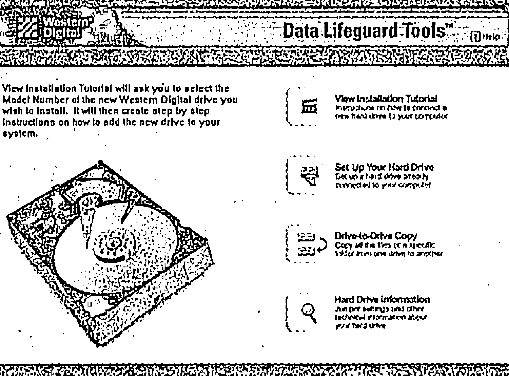

Data Lifeguard这项数据防护技术，是WD硬盘特有的设计，其工作原理可算是“S.M.A.R.T.”的延伸。Data Lifeguard不仅可以像“S.M.A.R.T.”一样监视硬盘的状况，还可以主动地尝试修复错误。它会指挥硬盘在空闲的状态下进行Offline Surface Scan的动作，针对硬盘上有储存数据的簇进行扫描，对于可能有错或不稳定的磁区数据进行反复的读取、写入和对比。许多硬盘工具程序（如ScanDisk）与Data Lifeguard的Offline Scan有着相似的设计理念和功能，不过Data Lifeguard的优势在于它不需要使用者的介入。Data Lifeguard的数据防护与修正机制，可以由硬盘本身独立来完成，这样就不会占用系统资源。

此外，Data Lifeguard Tools还有几款其他的工具，其中EZ-Install和Diagnostics比较有用。使用EZ-Install程序，可以分区与格式化西部数据的大容量硬盘，解决与老主板的兼容问题。

而Diagnostics是西部数据的硬盘测试程序，它能检测硬盘并且将结果打印出来，并修复在检测中发现的错误，同时还可以低级格式化硬盘。它提供两种硬盘检测方式：快速检测和全面检测。快速检测能在很短的时间内收集和检验在硬盘中的原始数据，大约90秒内完成一次硬盘的检测，但对于早期的西数硬盘没有作用。一旦你的硬盘不支持这种扫描方式，程序会给你一个提示让你选择全面检测，对于一般的电脑进行一次全面检测需要5-20分钟。如果硬盘的容量较大，测试时间还会长一些（具体时间要根据硬盘容量和CPU速度而定）。

Diagnostics程序是Data Lifeguard Tools软件中最有用的工具，需要注意的是，该程序必须拷贝到软盘中在DOS下运行，如果在硬盘上直接运行，有可能会造成硬盘数据的丢失或者扫描错误等结果。运行时注意不要在程序主菜单上选择Write Zeros to Drive项，该选项的作用是低级格式化硬盘。

## 这样老用，人人打击

### ——假货水货辨别专题

文/阿亮

假货，原来这只是在小商品市场才会出现的事情。然而随着电子技术的普及，目前电脑配件的假货也层出不穷。以内存条生产为例，一个加工厂的成本投入不足50万，而普通板卡加工厂的成本也不会超过200万，因此地下工厂在我国南方等地十分猖獗。此外，随着国门全面打开，水货对市场的冲击也不容小觑。更为严重的是，很多水货是国外的次品或者翻新商品！

假货与水货，始终是消费者的一块心病。购买电脑配件就像过雷区一样，一不留神，就会遇到这类产品。轻则享受不到应有的服务，重则产品损坏后无处维修。在这一期的专题中，我们将带领大家认识假货的本质，识别各种配件的假货，掌握基本的辨假手段。

## 一、CPU篇

由于CPU集成度很高，因此质量很差的伪劣产品基本上没有。如果哪天国内的地下工厂能够仿制出CPU，那么这倒不是一件让人担心的事，而是振奋人心的大好消息。但是我们切不可因此而掉以轻心。由于CPU的特殊生产过程，其主频划分不是很严格，这也给那些善于钻空子的JS创造了作案机会。

### (一) 常见的CPU作假手段

Remark是最常见的作假手段，通过重新标识CPU上的编号，其产品就能骤然增值。尽管不少CPU在Remark之后仍然可以正常运行，然而因为这是一种超频，多少会影响CPU的稳定性与寿命。更加令人不快的是，用户花了冤枉钱，因为所花的钱本来可以买到更好的产品！

有人说Remark主要出现在一些散装CPU上，盒装的CPU肯定安全。事实上，这种说法是极其错误的！首先，不要相信什么盒装CPU最保险之类的说法，因为人人都认为盒装CPU保险，所以其反而最不保险。要造个盒子非常容易，随便什么地方，只要有钱，不怕没人印。CPU风扇也是同理，只要有钱，弄一个假冒的原装风扇还不简单？

当然，我这里并非鼓励大家都去买散装CPU。不可否认的是，盒装产品的Remark概率还是略微低于散装产品。此外，大家在选购盒装产品时，可注意CPU上与包装盒上的产品编号是否相同！由于在商家那里购买CPU的客户很多，很多人购买后都将包装盒留下，无孔不入的JS很可能利用这一机会。另外，对于水货，大家也要留一个心眼。从性能上说，水货CPU与行货并没有任何区别，但是两者之间的售后服务就有天壤之别了。

### (二) 看穿Remark的把戏

对于某些频率的CPU，大家是根本无需担心Remark的，如Celeron D 325，P4 Northwood 1.6A，Prescott 2.8E，Morgan Duron 1.0GHz，Applebred Duron 1.4GHz，Athlon XP 1700+ (0.13微米)等等。由于这些CPU的频率本身就是同类型产品中最低的，因此商家没有任何作假机会。

值得注意的是，同类型中低频率产品也是最具超频潜力，因此其相对应的外频是我们特别要注意的。以AMD Barton 3200+为例，JS只需将外频166MHz的Barton 2500+超到200MHz，机器自检时就会显示为Barton 3200+，从而做到瞒天过海。同样的情况也出现在如今高外频的P4处理器上。

Remark过的假货在外观上和真货很难辨别，不过如果稍加注意的话，仍然可以察觉它与正品的细微差别。有时为了逼真一些，造假者不得不将产品的产地也改变。但是，产地英文名称的长度是不同的。例如将制造地“PHILIPPINES”改为“MALAY”，后面就会留有不太清晰的“PINES”字样，因为这是激光修改也无法完全去掉的。

大家在购买166MHz或者200MHz外频的CPU时，一定要注意以上几点。最可靠的识别办法之一，是插在主板上试的时候，选择能软跳线的板子，点亮之后，屏幕上就会自动显示出它的本来面目。需要注意的是，千万不要直接用硬跳线，因为商家把外频调到166/200MHz后，CPU就会直接显示出超频值，这也是商家迷惑消费者的主要手段。

对于正宗盒装CPU而言，其塑料封装纸上的Intel或者AMD水印字迹应是非常工整，而不应是斜着的或者倒着的（除非在封装时由于操作原因，将塑料封纸上的字扯成弧形），并且正反两面的字体差不多都是这种形式。假货往往是正面字体比较工整，而反面的字却十分歪斜。另外，正宗盒装CPU的盒子正面都采用四色重技术在国外印制，色彩纯正，通过对比，很容易与假货区分出来。

在识别之前，大家要对CPU的编号有所了解，它代表了一块CPU的主要性能指标。如产品系列、主频、缓存容量、使用电压、封装方式、产地、生产日期等等。通过识别CPU编号，我们可以初步认定CPU的工作频率、外频属于那种系列，防止一些非法商家用超频CPU冒充高频率产品。

#### 1. Intel CPU 编号

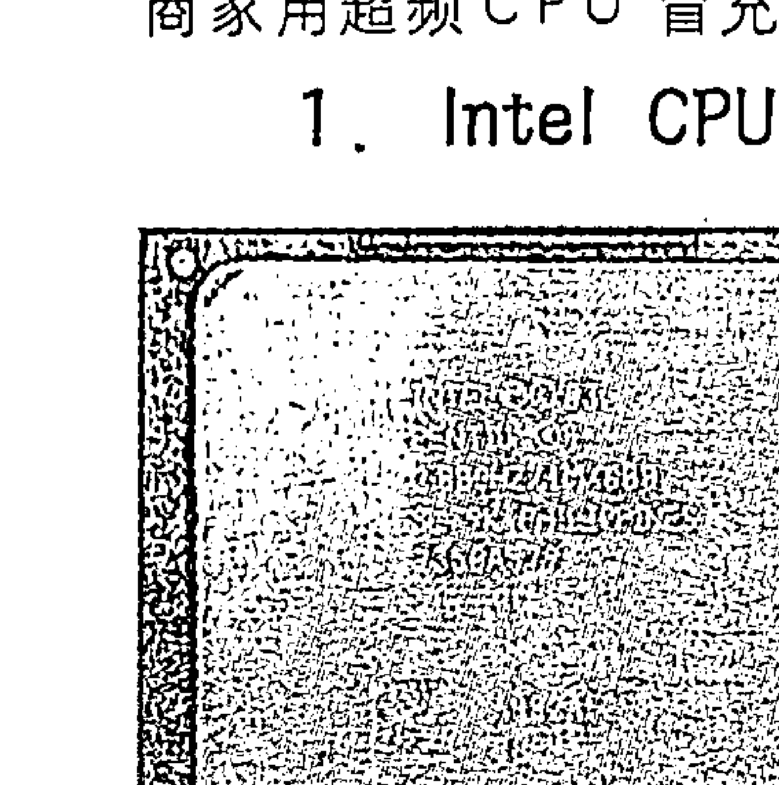

自从Pentium4上市之后，Intel采取了如图1的编号方法，图1是Pentium4的正面图，图中我们可以清楚地看到CPU的前端总线（800MHz）、主频（2.8GHz）和二级缓存（1MB）等关键信息。掌握这些数据并确保没有打磨现象之后，商家很难有机会作假。

#### 2. AMD CPU 编号

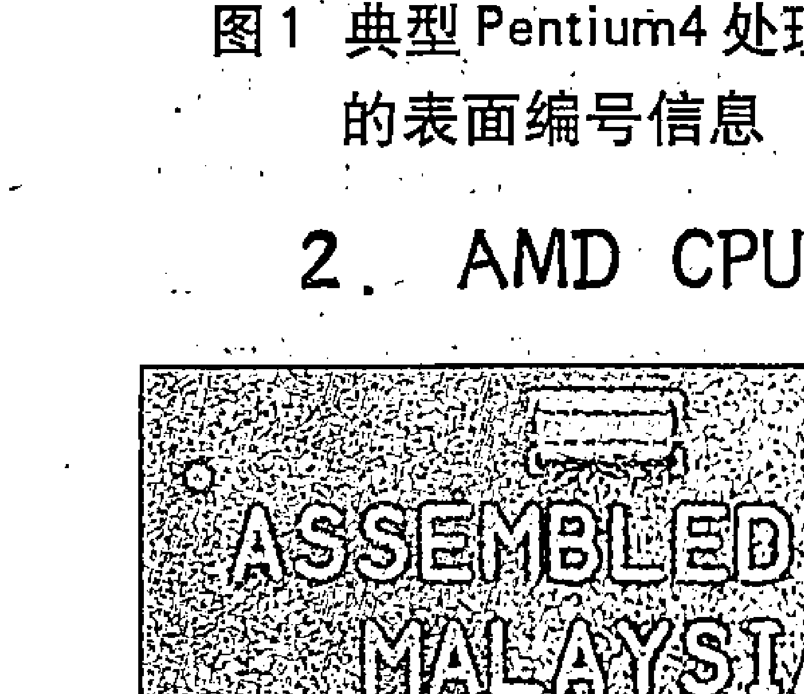

图2是一块AMD CPU的截图，从它的核心上我们可以看到编号为：AXDA2200DKV3C。让我们感到放心的是，AMD的编号识别相对简单，方法是：

- 1. 第一位是设备的ID，A代表Thunderbird（雷鸟），D代表Duron（毒龙），AXDA代表Athlon XP（包含Sempron、Thoroughbred、Barton）。
- 2. 第二位至第五位是CPU的频率，1000说明该CPU的主频为1GHz。
- 3. 第六位是封装方式，M代表卡匣式封装，A代表PGA封装，其他为TBD封装。
- 4. 第七位是CPU核心电压，S=1.5V, U=1.6V, K=1.65V, P=1.7V, M=1.75V, N=1.8V。
- 5. 第八位是工作温度，Q=60, X=65, R=70, Y=75, T=90, S=95, V=100。
- 6. 第九位是二级缓存的容量，1=64KB, 2=128KB, 3=256KB, 4=512KB。

最后一位是前端总线，A=B=200MHz, C=266MHz, D=333MHz, D=400MHz。了解了上面的内容后，我们就可以很容易地判断出这是一块AthlonXP 2200+，具备256KB的二级缓存，前端总线速度为266MHz，工作电压为1.65V，最高可以承受的温度为100度。

### （三）关注近期的假货

每一个时段都有不同的造假对象，现在让我们一起来看看近期奸商都玩了一些什么把戏。

#### 1. 假冒 Barton 2500+

Barton 2500+本身就具备相当不俗的性能表现，而其成为造假重点对象的原因，还在于它惊人的超频能力，几乎大多数产品都能轻易地使用400MHz前端总线，此时已等价于Barton 3200+。但是更为惊人的是，AMD曾经推出未正式公开的Thorton 2000/2200+，修改L2金桥之后也可以实现512KB二级缓存。如此一来，市场上假冒的Barton 2500+几乎泛滥成灾。

正品Barton2500+的L2金桥全部都是连通的，而且L2、L3金桥是裸露在外的。而白版假货由于在L2金桥上动了手脚，所以一般情况下JS用易碎标把这个很关键的地方盖得严严实实，这反而成为我们识别真伪的证据，撕下易碎标之后便可以看到明显的区别。此外，在正品Barton2500+的核心背后有几条清晰的印刷电路，而假冒Barton2500+则没有。另外还有很关键的一点，Barton2500+有两种版本：黄色基板和绿色基板。由于改造成功的关键是连通L2金桥切断的部分，打开被屏蔽的256KB缓存。绿色基板的金桥触点在基板内部，改造时需要切开基板，很不容易做到；而黄色基板金桥的触电完全暴露在外，用银漆连通即可。因此购买时尽量选择绿色基板的Barton2500+，而遇到黄色基板Barton2500+就要格外注意了。

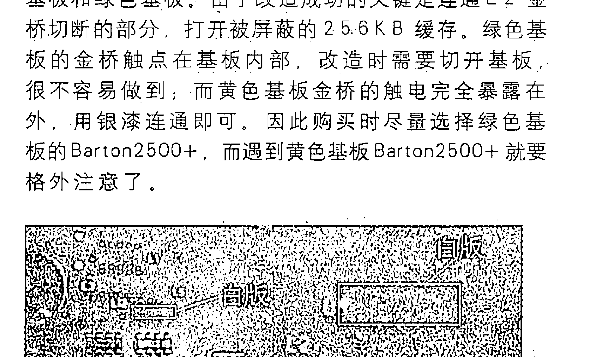

#### 2. P4 Northwood 冒充 P4 Prescott

由于 AMD 给 Intel 施加了强大的压力，Intel 为了进一步提升 P4 性能，推出了这款新核心的 Prescott 产品。在性能上，两者之间的差距可不小，毕竟二级缓存容量就要相差很多。然而，Northwood 与 Prescott 的主频是交错的，因此很多消费者难以辨别。

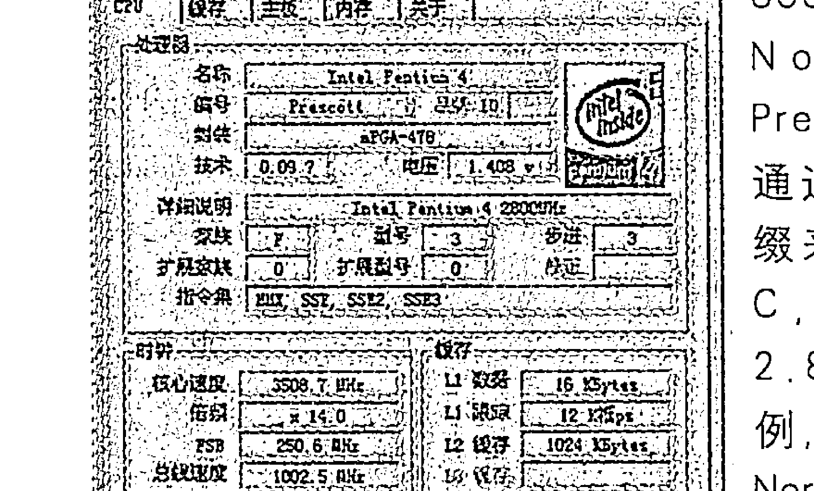

同样是 800MHz 前端总线的 Northwood 与 Prescott，用户可以通过产品名称的后缀来识别，前者为 C，而后者为 E。以 2.8GHz 的处理器为例，P4 2.8C 代表 Northwood 内核，只有 512KB 二级缓存，而 P4 2.8E 代表 Prescott 内核，拥有 1MB 二级缓存。当然，查看 CPU 的表面信息并不保险，使用 CPU-Z、WCPUID 等软件进行检测才是最可靠的方法。

#### 3. P4 400FSB 冒充 P4 533FSB

Intel 的 533MHz FSB Pentium4 从 2.66GHz 开始起跳，至于 400MHz FSB 的 Pentium4，其最高频率就定格在 2.6GHz。仅仅依靠表面标识来区分，并不能令人完全放心，因为无恶不作的 JS 可以打磨芯片，甚至盖上风扇来冒充盒装产品。更加危险的是，JS 可能利用主频为 1.8GHz 或者 2.0GHz 的 Northwood，来冒充 2.4GHz 或 2.66GHz 的 533MHz FSB Northwood。因为这两款低频率的 Northwood 都具有不错的超频潜力，超频运行于 533MHz FSB 并非难事。因此，通过软件检测也是惟一可靠的鉴别方法，可以参考下文。

#### 4. Palomino (0.18) 冒充 Thoroughbred (0.13)

按理说 0.18 微米 Palomino 核心的 Athlon XP 已经退出市场，但是最近低端市场仍有着大量存货。为了更好地销售，很多经销商纷纷将其伪装为 0.13 微米的 Thoroughbred 内核。尽管两者在性能上不存在差距，但是在使用 0.13 微米工艺之后，Thoroughbred 的发热量大大降低，超频能力十分出色，毕竟电压足足降低了 0.1v。到目前为止，国内市场的 AthlonXP 都还没有使用 FC-PGA2 封装形式，因此任何一块 CPU 都容易看到外露的核心。通过观察这一核心的形状，我们可以方便地辨认 Thoroughbred 与 Palomino。如图 5 所示：

左边为 Thoroughbred 的核心，而右边是 Palomino 核心。很明显，前者呈长方形，面积为 80 平方厘米；而后者呈正方形，面积为 120 平方厘米。对于上表面被风扇盖住的盒装产品，我们可以通过背面电容来识别。以往 AMD 一直将 CPU 表面的电容放在正面，而到了 Palomino AthlonXP 时代，它们被移到了处理器的背面。非常有趣的是，到了 Thoroughbred AthlonXP 时代，AMD 又复辟了，电容再次移到 CPU 的正面。


### （四）用软件来识别 CPU

由于 JS 越来越猖獗，因此 Intel 与 AMD 都纷纷推出专用软件，让用户测试 CPU。毫无疑问，使用软件测试的准确率较高，合理地使用这些软件，能帮助我们确认各种详细的信息。当然，大家最好在购买前就能认出假货，毕竟事后的交涉是相当麻烦的。

#### 1. 通用法宝——WCPUID

WCPUID 是一款专业级的 CPU 测试软件，执行 WCPUD 后，系统会弹出一个窗口，这个窗口里列出了当前 CPU 的主要参数。如图 6 所示，WCPUD 显示了 CPU 的详细信息，包括品牌、代号、工艺、封装形式、主频、外频、倍频系数以及 L1 Cache 中数据、指令 Cache 的大小、L2 Cache 的大小、潜伏期以及 CPU 所支持的特殊技术。但是，WCPUD 也有一定局限性，它对于那些 Remark 主频的 CPU 无能为力，只能检测出用不同核心冒充的 CPU。

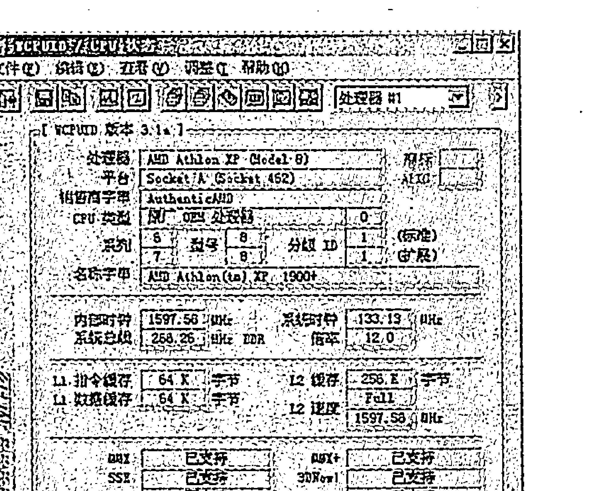

#### 2. Intel CPU ID Utility

每一个 CPU 都有一个自己的惟一 ID 号，除此之外，所有外在的标记，都可以进行人为改动，CPU ID 植入了 CPU 内部，当我们运行 CPU 时，就能读出 ID 号，就好像 MMX、SSE、3DNOW 这些指令一样，是可执行的。CPU ID 工具可以完全鉴别 Intel CPU，并显出 CPU 的确切信息，如图 7 所示。Intel CPU ID Utility 检测显示CPU在超频状态，包括主频、外频、二级缓存等关键信息。更加重要的是，该软件还可以查出超频CPU，并且醒目地显示出来，如果你本身没有超频过的话，那就是买到Remark的CPU了。

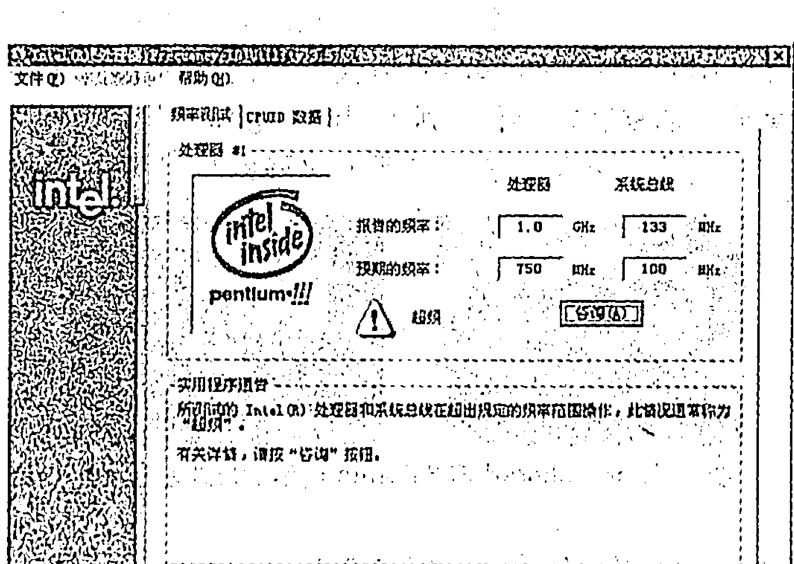

#### 3. AMD CPUinfo

尽管AMD没有推出专用测试工具，但是这款CPUinfo得到了其官方认可，因此准确度相当高。更加重要的是，CPUinfo也可以检测出超频的AMD CPU，这无疑让大家非常放心。关于以上三款软件的最新版本，大家可以到pchome.net下载。

## 二、板卡篇

板卡市场的电子元件复杂度并不高，而且便于运输，因此市场上的假货、水货、返修货也相当多。对于消费者而言，主板涉及整个系统的稳定性，而显卡与声卡也是至关重要的设备。

### （一）主板

#### 1. 判别水货、假货的基本方法

主板对于整台电脑稳定性的意义不言而喻，因此，对于假冒主板我们要特别当心。一般而言，假冒主板多是品牌机厂商代工的OEM小板，流入市场后则打着“XX”牌主板的旗号销售。这种主板一般都是Micro-ATX架构，虽说性能上应该没有问题，但在可扩充性以及保修方面则问题多多。此外由于成本问题，这类主板的用料很一般，稳定性往往不能令人满意。

水货在主板中也较为常见，很多不法商家通过各种取道获得价格较为低廉的产品。但是，这类产品的售后服务是得不到保障的，一旦主板出现问题，用户根本无处维修。在购买主板之前，首先要对所购产品有一定了解，这个我们可以通过查阅电脑报刊杂志，浏览相关厂商的官方网站来实现。如果确定了选择其一款主板，那么大家可以对该主板的具体型号、外观、插槽数量、颜色、外包装等重要信息加以整理，这样在购买时就能有的放矢地进行检验。

在购买主板时，大家一定要查看一下包装盒内的静电袋是否已被打开，如果是的话就千万要小心了，因为该主板很可能不是新的。即便商家许诺这只是为了贴标签，最好大家还是坚持商家重新拿一块新的。此外，说明书也值得大家关注，假货的说明书一般印刷得很粗糙，根本没有收藏价值，而正品的说明书印刷精美，并且说明书上的序列号是与主板上的序列号相对应的。

最后要关注的自然是主板的保修卡了，如果你的主板中没有保修卡，那么就要怀疑是不是水货了。在查看保修卡时，大家要注意其序列号是否与主板上的序列号相同，如果不相同，该保修卡是无效的，十有八九是伪造产品。

#### 2. 通过软件进行识别

目前有些商家利用消费者的无知来假冒芯片组，有时消费者指明要使用KT600芯片组，但拿到的却是KT400A甚至KT333芯片组的主板。此外，I875P、I865PE、I848P甚至I845PE也经常出现这种现象。对此，很多消费者可能一筹莫展，因为主板上的芯片组一般都安装着散热片，根本不能查看。遇到这种情况时，大家可以利用软件进行查找。Dr. Hardware、EverestPro（图8）等都是相当出色的芯片组检测软件。

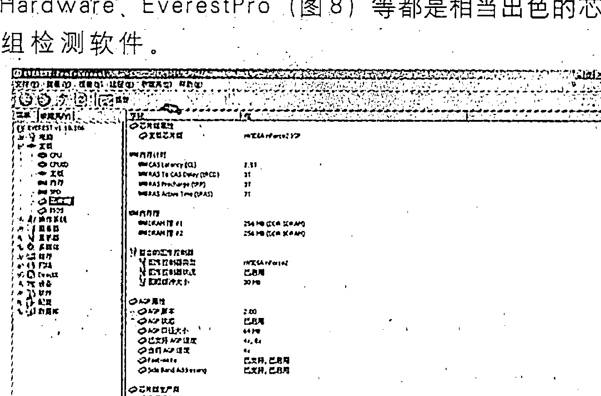

### （二）显卡

相对主板而言，显卡的生产难度要小得多，因此我们更加需要提防。事实上，只要采用同样的GPU（图形处理核心）、显存品质，那么显卡性能也基本上一样，惟一的区别可能就是2D画质，因为制作工艺会对2D画质产生不小的影响。

## 1. 识别显卡的经验

首先我们要全面了解显卡市场各类产品的具体细节，比如nVIDIA或ATI显示芯片分为哪几种，各自衍生出了哪些规格的产品，这都是来不得半点虚假的东西，如果毫无准备就去购买，那么琳琅满目的几十种几乎同名的产品会让你手足无措。在确定自己需要购买某种型号的产品后，就应该着手准备。

购买时需要注意的地方有很多。如果有条件的话最好拆下粘在显示芯片上的风扇，仔细观察芯片是否与外包装上的叙述一致，并留心是否有打磨现象。由于现在某些JS的造假水平越来越高，有些芯片打磨得和真的差不多。这时我们就应该动一些脑筋，不能相信在开机画面中显示的显卡型号、显存大小等信息，这些数据都可以通过刷新BIOS来改动。最明智的方法是用经验来辨别，首先不要用显卡盒子里的驱动光盘来驱动，这有可能就是一个陷阱。一定要用该芯片官方公布的公版驱动程序，如果是其他芯片打磨而成的就会导致系统无法正常工作。

## 2. 经典的作假案例

一般而言，用不同的GPU来冒充新一代的显卡，基本上是不可能的，因为这种手段很容易被用户发现，JS也没有那么大的胆量。目前ATI与nVIDIA都以显卡的核心频率与显存频率来划分产品的档次，很多JS就借此机会用低频率的产品冒充高频率的产品。

### （1） Geforce FX5200冒充Geforce FX5600

nVIDIA的Geforce FX系列产品是目前市场上的绝对主流，因此这类假货也最猖獗。其实Geforce FX分为多个系列，中低端市场分别是FX5200、FX5500和FX5600，这三者使用的核心芯片也不同，特别是FX5600，与前两者有很大的区别。为了追求利润最大化，少数商家竟然通过修改显卡BIOS，然后更换显卡的包装，堂而皇之地将FX5200冒充为FX5600，甚至使用64Bit显存位宽的低性能产品。一般来说，这种作假手段仅仅局限于整机销售，一方面是因为商家利用消费者不知晓内情，另一方面是商家需要配合特殊的修改版驱动。要识破这一招也非常容易，拆下风扇直接查看芯片是最简单的方法。如果嫌麻烦的话，大家可以用nVIDIA的雷管公版驱动，而不要使用商家提供的驱动，这样FX5200就会自动现出原形！

### （2） Radeon 9800SE冒充Radeon 9800XT

ATI的Radeon 9800系列芯片有三种不同的规格，分别是Radeon 9800SE普通版（4条渲染管线与128Bit显存位宽），Radeon 9800SE黄金版（4条渲染管线与256Bit显存位宽）以及Radeon 9800/NP/Pro/XT版本（8条渲染管线与256Bit显存位宽）。其中前两者可以通过软件或者硬件方式修改为8条渲染管线，因此也为商家作假提供了空间。

软件方式的修改很容易识别，只要大家安装公版的显卡驱动，那么在没有RivaTuner等软件的配合下，就会原形毕露。但是硬件修改可就难以识别了，因为本身所使用的GPU就完全相同。对此，建议大家卸下GPU风扇，查看芯片边角处的电阻有无修改痕迹。事实上，即便是完美地修改为8条渲染管线，部分3D软件下也会出现黑点或者破屏等现象。

### （三） 声卡

声卡的造假主要集中在低端声卡上，JS都有自知之明，像创新的高端声卡想假冒也假冒不出来。而低端的5.1声道声卡基本上没有假冒的意义，因为利润太低了，作假者的产量一般不足，如果假冒的话，可能其成本要高于目前市场上的正品零售价。目前假冒产品主要集中在一些2声道和4声道的中低档声卡，其中创新Vibra 128、大力神系列声卡、启享呛红小辣椒是最主要的三个假冒对象，我们将对此进行分析。

#### 1. 创新Vibra 128

创新的Vibra 128声卡可谓是一款经典产品，在如今整合声卡时代，这些库存货的日子并不好过，而且受到假货的强烈冲击。有个别商家将工业包装的Vibra 128当成PCI 128D来卖，识别方法也不难，因为后者的挡板上有4个输入/输出接口，而Vibra 128只有3个。当然，用Vibra 128来冒充PCI 128D也太夸张了，大多数谨慎的JS还是用假冒的Vibra 128来冒充正品。这批假冒产品做工非常粗糙，在使用过程中会产生间歇性的噪声，甚至会影响到计算机的正常工作。

#### 2. 大力神系列声卡

大力神系列声卡采用Cirrus Logic的CS4624或者CS4630主芯片，分别对应4.1与5.1声道，性价比相当不错。但是部分商家为了倾销积压多年的Fortemedia以及CMI8738系列声卡，大力神就成了假冒产品的攻击对象。由于芯片存在明显的不同，因此这类假冒声卡的作假手段非常低级，很容易识别。在声卡主芯片贴上产品LOGO标签，随后对板卡上的文字进行修改，再使用改版的驱动，这些都是经不起推敲的。对于用户而言，抛弃商家提供的“猫腻”驱动是最狠的办法，如果不能安装上大力神的原厂声卡驱动，那么肯定就是假货！

#### 3. 启享呛红小辣椒5.1

启享的呛红小辣椒声卡，是一款面向工薪阶层的高性价比产品，采用了启享自己研发的TRP30062芯片，支持A3D、DS3D、EAX等先进的音效规范，全套器件均为业内大厂生产的名牌产品，具备高质量的硬件功率放大功能和MIDI回放输出，深受广大用户的好评。目前市面上出现的假货采用CMI或FM系列音效芯片，用料极为低劣，同时还省略了动态滤波和硬件功放等电路，输出的信噪比和输出功率均不达标，而且稳定性极差，产品质保等售后服务没有保障。

## 三、存储设备篇

无论是硬盘、内存还是光存储产品，假货与水货的侵扰一直没有停止过。消费者在选购硬盘时必须格外谨慎，否则宝贵的数据便时刻处于危险之中。而内存则牵涉到系统的整体稳定性，同样马虎不得。至于光存储设备，由于本身结构相对简单，造假容易，因此也必须加以提防。

### （一） 硬盘

硬盘可能是电脑里最宝贵的东西，所以在购买时一定要注意，必须慎之又慎。由于硬盘是高科技的产品，不会出现仿造产品，所以我们在购买时要注意JS以次充好、用走私货冒充行货、将返修货或者二手硬盘当成新品出售这三个方面。

#### 1. 以次充好

我们在购买硬盘时，要对其各项参数有一个充分的了解，这点可以到厂商的官方网站进行查询，或者关注一下我们的杂志。对于硬盘而言，容量并不是惟一的因素，因为JS无论如何也不敢用低容量的产品来冒充高容量的产品。相反，我们应该对于硬盘转速和缓存抱以更多关注。

对于同一容量的硬盘而言，7200rpm的产品在性能上要高出5400rpm的产品不少，而且两者在价格上的差距也不是一个小数目。然而，目前似乎没有一款软件能够直接检测出硬盘的转速，不过我们还是可以通过硬盘的编号来加以识别。此外，硬盘的缓存也要注意。目前，几乎所有硬盘都用上了2MB的缓存，高端产品则具备8MB缓存。如果商家给你的硬盘只有512KB缓存，那么很可能是积压的库存商品，或者根本就是返修货！在购买8MB大缓存硬盘时，也要使用EverestPro的裁判检测功能来检验缓存容量。

#### 2. 走私货

走私货也就是我们俗称的水货，这也相当危险。众所周知，硬盘是所有电脑配件中稳定性较低的，它很容易出现坏道，甚至报废，因此产品的售后服务极为关键。尽管水货在价格上略占优势，但是权衡利弊，还是有些不值得。如果用行货的价格买了水货产品，那就更加不值得了。水货硬盘一般没有正规的包装盒，即便有包装盒，上面也没有任何保修标贴。只要记住这一点，我们就能轻松地分辨水货与行货硬盘。

#### 3. 二手硬盘与返修硬盘

部分有物理坏道的硬盘，经过厂商维修后可以再次使用，但是其稳定性已经大打折扣，寿命也不会很长，因此这类硬盘是最危险的。一般而言，只要硬盘表面的序列号与产品包装盒上的序列号能够一一对应，并且包装盒未拆封，那么我们就可以基本确认不是返修产品。至于二手硬盘，其确认方法就更加简单了。用过的硬盘在IDE接口处总有一些划伤，此外，如果买来的硬盘已经分好区，那么就可以肯定是二手硬盘，因为厂家是不会为你分区的。

#### 4. 行货硬盘的确认方法

目前Maxtor、IBM、Seagate、WD等厂商都采用条形码来确认行货硬盘，其可靠度相当高。我这里以星钻三代为例向大家详细介绍，至于其他硬盘辨认方法也基本一样。行货硬盘与水货硬盘最大的直观区别，就是有无包装盒，当然区区一个包装盒对于JS而言简直是小菜一碟，以水货硬盘外加行货包装盒来欺骗消费者已经不是什么新鲜事了。对于这类手段，大家可以通过国内代理商的保修标贴和硬盘顶部的防伪标识来确认（图9）。

不过，现在的JS真可谓“神通广大”，这些保修标贴和防伪标识他们都能仿造，而且几乎可以乱真。不过他们的手段还是有着不少漏洞，最简单的识破方法就是对照硬盘表面的Drive SN是否与保修标贴的编号一致（图10）。注意以上几点后，JS应该没有什么空子可以钻了。

### （二） 光驱

光驱的生产难度不大，因此假货非常多。假冒产品在使用初期并不会露出马脚，但是由于使用劣质元件，其产品的寿命很短，很快读盘能力会大大下降。在选购时，我们首先要提防的就是返修产品，这是最危险的，因为光驱本来就是消耗品。

#### 1. 返修产品

这也是最常见的光驱作假手段，不过这一现象在DVD与CDRW中倒不常见。很容易辨别的是，返修产品的螺丝口有明显的痕迹，这一点是无法避免的。此外，大家还可以打开光驱的托盘，新的产品应该非常干净，而返修品与二手产品都会沾有一定量的灰尘。

#### 2. 假冒产品

假冒光驱是在是太简单了，用激光刻上其他品牌的字样就可以了。对此，我们也无能为力，因为很难找出万能的鉴别方法，毕竟光驱品牌太多了，我们不可能一一列举。

### （三） 内存

#### 1. 内存品牌认识

关于内存的品牌与市场，很多人存在认识误区，也就是经常把生产内存芯片的厂商和真正生产内存条的厂商搞混。我们通常说的“现代”等名称，都是指生产这个内存条上芯片的厂商名称，而不是真正生产这个内存条的厂商。难道像“迈肯”、“现代”这些大公司就真的不生产内存条吗？其实也不是的。对于这些大公司来讲，他们大量地生产这些内存芯片，然后对这些芯片进行品质的检查，对其总性能极为优异的产品都是自己留下来，以供自己生产内存条之用，当然也就是打着自己牌子销售的。不过，内存厂商也会给其他厂商发放大量的内存芯片。一般而言，市场流行的散装内存也是由专门的厂商生产，只不过这类厂商规模很小，没有任何名气，因此，他们就干脆就不打品牌。此外，像“现代”这样的大厂还有很多分厂，因此市场上散装的现代品牌内存也有很多。

#### 2. 常见内存作假手段

了解一些常见的内存作假手段有助于我们选购内存。事实上，商家作假的手段不外乎以下几种，只要我们在购买时有所准备，那么就不会受骗上当。

##### （1） 打磨内存颗粒

不少内存颗粒具有很强的超频能力，因此无孔不入的JS就想到打磨内存颗粒的作假手段，然后再加印上新的编号参数。其实，我们只要在强光下细心观察，一眼就可以看出区别。打磨后的芯片暗淡无光，有起毛的感觉，而且加印上的字迹模糊不清析。当然，更有甚者连芯片打磨的“工序”也省下了，直接更换产品的包装来以次充好，此时大家只需直接查看内存芯片的编号即可识别。

##### （2） 假冒产品

Kingston内存由于其具有良好的质量和兼容性，在市场上成为DIYer购买品牌内存的主要选择之一。不过，由于Kingston不像Kingmax那样采用标志性的TinyBGA专利封装技术，所以仿冒起来也就比较容易，也具有一定的隐蔽性。此外，Kingston内存使用的内存芯片中有Winbond、HY、三星等，更是令消费者无所适从。最近在市场就上出现了仿冒的Kingston DDR333内存，其使用的是三星的原厂DDR266内存芯片进行仿冒。假冒内存的识别方法也很简单，只需注意PCB板上是否印有Samsung的字样（由于工艺问题造假者还不太容易将其去掉）。此外，大家可以在Kingston内存颗粒上看到防伪标贴，只要打开内存的包装盒，取出内存，刮开内存颗粒上的涂层，拨打800免费查询电话即可。目前面向DIY市场的Kingmax内存也经常有假冒产品。正品Kingmax内存条在出厂时都贴有一个标签，标识了产品的规格和参数。另外，这层白色塑料贴纸质地比较厚，上面的字很难用手指抠掉，而且能很顺利地将这张贴纸从内存芯片撕下来。而假冒的Kingmax内存，正面的塑料贴纸质地比真品的要薄一些，并且很容易用手指抠去。

##### （3） 返修内存

当一根内存条损坏而不能使用时，往往只有某一个内存芯片出现问题，而其余芯片都是完好的，这就给JS留下作假空间。通过对内存芯片的重新焊接，内存条还可以起死回生。然而，很明显的一点是，这类内存往往使用了不同品牌、型号的内存芯片，大家仔细观察就能发现。需要提醒大家的是，这种内存无论多便宜都不值得购买，因为其安全隐患十分严重。此外，大家还要观察电路板是否整洁，有无毛刺等等。另外还要查看金手指是否有明显的插拔痕迹，如果有，则很有可能是返修内存。一般来说，说内存颗粒的数目有一定规律可循，比如单面8颗粒不带ECC、双面8颗粒不带ECC、单面9颗粒带ECC、双面9颗粒带ECC、双面16颗粒不带ECC等等。一般我们所常见的就是这几种内存，如果出现一些颗粒数目非常奇异的内存时，一定要小心，这多半是经过加工补焊过的内存条。

##### （4） 无SPD芯片

任何内存芯片大厂都会有劣等产品（往往处于晶元的边缘），它们会在出厂前的晶元检测工序中就遭到淘汰。然而，这些难以运行在高频率的内存芯片会流落在一些小的加工厂。为了使得这些内存芯片能够以更高的频率运行，厂商干脆去掉SPD芯片，这样在开机时就不会暴露出内存的真实工作频率，允许用户强行设定。在这种超频状态下，稳定性可想而知，因此，没有SPD芯片的内存绝对不值得购买！

##### （5） 花言巧语

经销商在推荐产品时，总是从其利益出发，推荐利润最高的产品，而且刻意诋毁消费者本来准备购买的产品。对于这种现象，大家应该有所准备，在购买之前就决定好品牌、型号，并了解大致价格。同时，建议大家多多关注相关的媒体报道，而不要听信经销商的一面之词。此外，一些JS还会突然拿出一些我们不曾见过的杂牌产品，或者将采用HY芯片的无品牌内存直接称为HY原厂内存条，并口若悬河般地将其捧上天。此时，保持必要的冷静很重要，千万不要被商家的花言巧语所蒙骗。

## 四、外设与耗材篇

外设与耗材虽然价格不高，但是暴利现象十分严重，而假货与水货更是商家的利润源泉。从使用角度来说，买到假货与水货的外设或者耗材后果也是十分严重的。打印机会因为假冒耗材而损坏，键盘鼠标也直接影响着用户的使用心情与工作效率，假冒的劣质CPU风扇更会导致CPU过热危机。

### （一） 键盘鼠标

键盘与鼠标是所有电脑配件中假货最多的，因此大家要格外仔细。目前，假冒产品主要集中在明基、罗技、双飞燕、三星这几个名牌产品，有意选择这些品牌的消费者，一定要学会一些辨假知识。

#### 1. 三星键盘

所有三星键盘的“SAMSUNG”字样商标都是激光技术刻的，有明显的凹凸感，呈灰白色。假冒产品上的字样相当模糊，而且是乳白色的。此外，如图11所示，正品三星键盘的背面有一张产品标识，而这是假货所没有的。

#### 2. 明基键盘

明基正品键盘的按键和盘体颜色完全一致，即使从按键的间隙中看，也不会有颜色不一的现象。而且正品表面有光泽，给人一种油脂感，但假货按键表面则发亮或者发暗，并且会有颜色不一的现象。其次，背面条形码也有区别，如图12所示，正品明基键盘的产品标识与电话查询防伪标签贴面光亮字体清晰，带有电话查询防伪，而有些假货条形码给人一种灰蒙蒙的感觉，且不清晰。再有，键盘背面粘贴条形码位置的四角上圆形小突起，位置分布十分均匀规整，而假货则不然。此外，正品键盘背面的垫脚颜色发灰，假货则为黑色或白色。最后，从手感上也能分别出来，一般假货手感较软，且不吃力或者很硬，不过这点只对用惯了明基键盘的老手有用。

#### 3. 双飞燕鼠标

双飞燕鼠标因为性能优良，价格公道而一直受到顾客好评，也正因为如此，不法商贩借机私制假货，获取非法暴利。尽管现在盗版手段越来越高，不过，目前双飞燕采用了数码防伪技术，大家可以完全放心。双飞燕正品在鼠标底部贴有一椭圆形（或圆形）的印有“A”商标的双层标贴，标贴的表层有文字提示。当揭开双层标贴表层后，我们可以看到20位防伪身份码，在免费声讯电话中输入此号码即可辨别真伪。此外，如果揭开防伪标贴表层没有正面显示上下两排共20位数码，或者数码辨识不清，或者电话中的系统语音不符合，均可判定为假货。

#### 4. 罗技机械鼠标

罗技机械鼠标的假货很多，而高档的光电鼠标则基本是水货，如果价格便宜的话，危害性并不大。听鼠标按键发出的声音，是判别假冒罗技机械鼠标的好方法。真正的罗技机械鼠标按键声音清脆，手感富有弹性。而假冒鼠标的按键声音发闷，手感粘滞，这主要是两者使用的微动开关不同所致。真正罗技鼠标的微动开关寿命达到500万次，可以放心地使用3年以上。

### （二） CPU风扇

CPU风扇也是假冒的重点对象，特别是名牌产品。下面我们选取几个常见的品牌风扇为大家辨析假货。

#### 1. COOLER MASTER风扇

COOLER MASTER的正品从2004年起采用了纹理防伪标。纹理防伪是目前最先进的防伪技术，就如同你在百元大钞上所看到的一条条、不规则的小纤维，但不同的是，真正的COOLER MASTER散热器所用的防伪标小纤维，可以用大头针给挑出来。防伪标上的序号，可以通过拨打电话800-8768315、0898-89977或登录www.315net.com网站进行查询验证。需要注意的是，COOLER MASTER散热器从来没有采用过条码防伪或电码防伪。

#### 2. 九州风神散热器

所有九州风神系列散热器，均采用正规包装，印刷精美，外覆九州风神专用防伪膜。同时，外包装上均清楚地标明产品执行标准、产品型号、适用CPU类型、产品条形码、包装内含物件、产品外观图、产品简单介绍，以及清华华天技术开发公司地址、网址及联系方式等，内容非常完善详细。而假冒产品的包装，限于其造假水平，无论外观或内容都远不及正品尽善尽美。

从散热器质量上分辨，九州风神所有产品均使用滚珠或双滚珠轴承风扇，正常使用寿命都在40000小时以上，噪声小性能可靠稳定，散热效果良好。而假冒产品大都使用含油轴承风扇，寿命短，后期噪声大，性能不稳定，所以大家在购买时应该注意试用一下。滚珠风扇启动转速均匀，转动灵活，含油轴承风扇则起步转速明显要低于稳定时的速度。

#### 3. FOXCONN（富士康）散热器

正品Foxconn散热器最近全面采用了中国质量检验协会的电子防伪标示。购买正品的用户，只要刮开涂层拨打电话800-810-8315就可以验证产品真伪。

### （三） 打印耗材

打印耗材庞大的市场空间，让一些不法商家感到有机可乘，于是假冒原装耗材开始出现，并在市场中占据了一定的比例，并因此引发了种种问题。以墨盒为例，看似便宜的假冒墨盒，不但不会节省用户的成本，反而会在使用过程中出现墨水泄漏、打印头堵塞、使用寿命短等问题，为用户增加了许多麻烦和更多潜在成本。所以，如何分辨真假墨盒就成了消费者非常关心的问题。

#### 1. 灌装的“原装”墨盒

大家在电脑市场上甚至是大街上，经常能见到高价回收空墨盒硒鼓的，事实上他们回收的墨盒硒鼓都被用来制假了。我们可用以下方法来鉴别所购买的原装墨盒，看看是否由回收的旧墨盒重新灌装而成。

##### （1） 看外包装

正品的外包装印制精美，而假货的外包装一般是翻印的，图案和文字比较模糊。正品外包装上的生产日期、序列号等都是由机器压上的，显得有凹凸感；假货则显得比较光滑。

##### （2） 看真空包装袋

真墨盒包装袋与盒体紧贴密实，袋内没有空气。假墨盒包装内残存有一部分空气，包装袋与墨盒贴的不紧密。拆开包装袋，如果墨盒中的墨水因压力改变而溢出，则可以肯定是假货，这是由于假墨盒在重新灌注墨水时，灌入量无法掌握所造成的。

##### （3） 看喷头上的密封塑料贴纸

真墨盒的密封薄膜贴的比较紧，假墨盒贴的则比较松。

#### 2. 爱普生墨盒真伪辨别方法

我们辨别爱普生墨盒的主要方法，就是查看激光防伪标志，真墨盒和假墨盒表面上的激光防伪标志差不多，但真墨盒变换角度后，EPSON的字样会变成GENIUNE。另外，真墨盒标志上的大写字母间会有一些小字，都是EPSON字样。

#### 3. 佳能墨盒真伪辨别方法

佳能的假墨盒甚至比爱普生还要多，这与佳能的防伪措施不力也有一定关系。不过，通过产品的外包装，我们还是可以辨别。正品做工细致，粘贴整齐，印刷精美，且封口处有虚线压痕；而假冒品印刷粗糙，粘贴不齐，封口处无虚线压痕。另外，关于墨水的成份，原装墨盒印在左下角的方框内，假墨盒与说明印在一起。

此外，正品塑料盒采用热压封装，纹路整齐、清晰；而假冒品塑料盒封口用胶粘贴，纹路不清晰。原装墨盒在塑料薄膜上有与纸盒底相同的喷码，假墨盒则没有。从透明薄膜向里看，原装墨盒喷头的塑料封条与盖帽同样是橘红色，而且长度约2厘米，假墨盒封条为蓝色，长度刚刚盖住喷头，约1厘米。

## 畅游无线世界

文/刀马

当迅驰出现的时候，我们就预感到了无线上网的发展趋势。随着无线网卡的价格越来越低，ADSL以及各种宽带上 网的逐渐普及，无线上网成为了我们的一个方便选择。你是不是拥有笔记本，是不是台式机上连接的杂乱线缆经常成为羁绊你整洁桌面的一个诟病？拥有无线，这些烦恼也就荡然无存了。

似乎是不遗余力地推广GPRS以及CDMA 1X，因此在资费方面颇具诱惑力。目前，通过GPRS上网可以购买包月卡，这样就可以时刻挂在网上，而CDMA 1X以流量计费。在速度方面，GPRS和CDMA 1X也完全能够满足大部分用户的需求。

### 一、目前存在的几种无线网络组建方法

#### 1. WIFI 无线局域网

WIFI 无线网络是基于IEEE802.11b的传输标准，已经能够达到11Mbps速率，能够基本满足Internet共享、文件共享、打印机共享等简单的需求。倘若对无线连接速度还有更高要求，可以考虑22Mbps带宽的IEEE802.11b+，甚至54Mbps带宽的IEEE802.11g。只是，在选购产品时要注意，路由器和无线网卡必须都要对应标准。目前，大多数主流产品都直接具备宽带网接入功能，并集成多个RJ-45有线网络端口。

#### 2. 蓝牙无线对等网

随着PDA功能的不断增强以及价格下调，很多用户都用上了PDA。惟一感到遗憾的是，PDA上网并不怎么方便，尽管PDA已经附送了56K Modem，但是使用起来还是感觉太慢。相对而言，蓝牙技术在成本与传输距离方面都能令人满意，其1Mbps左右的带宽也正好够用于Internet共享。更为重要的是，蓝牙设备十分省电，对障碍物的穿越性也十分出色，成为众多PDA用户不二的选择。

#### 3. 红外线连接

红外线通讯是一种廉价、近距离、无线、低功耗的通讯方案，主要应用于无线数据传输，有时也用于无线网络接入和近程遥控。对于笔记本、PDA、打印机等设备而言，红外线模块已经是现成的，因此只要我们为台式机安装红外线功能，即可基本建立数据传输通路。

#### 4. GPRS无线上网

在国内的大中城市中，中国移动与中国联通几

### 二、家庭无线局域网产品导购

现在比较流行也最实用的无线网络标准就是IEEE 802.11b，除了IEEE 802.11b标准，我们偶尔还能看到支持IEEE 802.11b+或者IEEE 802.11g标准的无线网络设备。从理论上说，IEEE 802.11b+与IEEE 802.11g比目前最普及的IEEE 802.11b上在速度上更具优势，而且能够做到向下兼容，但是价格要高出很多。组建一个基本的无线网络，无线路由器和无线网卡是必不可少的，无线路由器俗称AP，是AccessPoint的简写。无线网卡在职能上与传统网卡如出一辙，只不过采用无线方式进行数据传输。

在购买时要注意的另外几个地方是：首先要看无线路由器是否具有交换机或者HUB的功能，毕竟有这个功能之后就可以一物多用了。为了保证网络安全，无线路由器带有防火墙功能也是很必要的。应该说目前为止，我们在市场上看到的无线路由器大多数都带有基本防火墙功能，虽然这种硬件防火墙不可能阻挡所有的网络病毒，但是对于防止黑客攻击还是有一定的效果。另外还需要留意无线路由器是不是有NAT（地址映射）、DHCP（动态主机配置）、FTP服务器功能等等，同时还有留意无线网络设备的有效传输距离，在购买的时候要向经销商问清楚相关情况。由于市场上产品众多，大家可以多问问，多比较再做决定。

#### 1. 阿尔法 11Mbps 无线套装

这套阿尔法11M无线套装由阿尔法无线路由器（如图1）+无线笔记本网卡（如图2）组成，主要针对笔记本用户，完全符合IEEE802.11b无线网络的国际标准，集有线 / 无线网络连接于


一个四口交换机，可与用户的以太网网卡直接相连。

#### 2. 腾达无线路由套装

腾达TWL2216AR无线路由器是一款针对大众市场的无线路由产品（图3），具有广泛的宽带接入支持，支持多机共享访问因特网，同时路由器还集成四端口10/100M交换机，支持Win95/98/ME/2K/XP/Linux/Novell/Mac各种操作系统，支持DHCP服务，基于Web界面管理，内置防火墙，防范黑客攻击，支持虚拟服务器，DWZ主机。

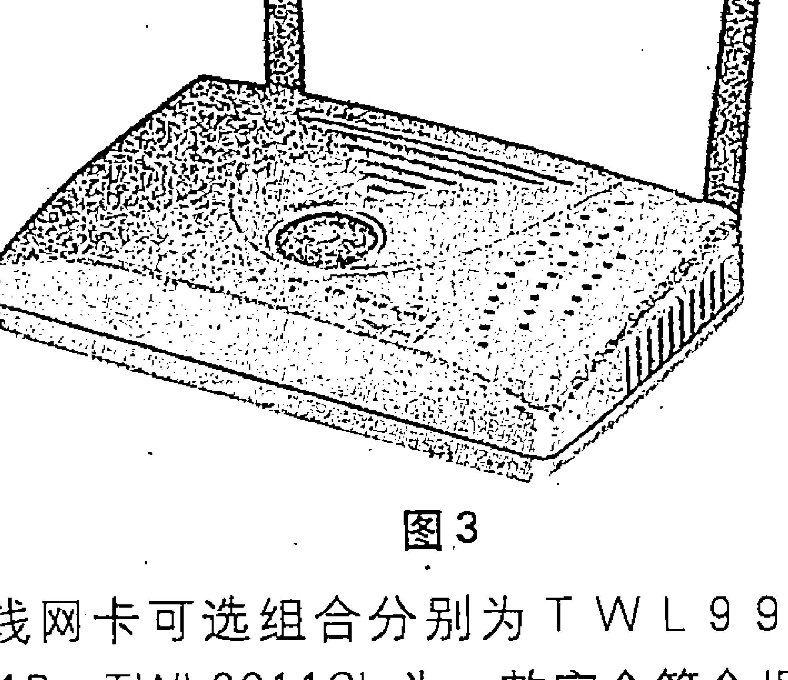

无线网卡可选组合分别为TWL99.11CL和TWL9911P，TWL9911CL为一款完全符合IEEE802.11b无线网络国际标准的笔记本无线网卡。图4所示为腾达无线网卡。

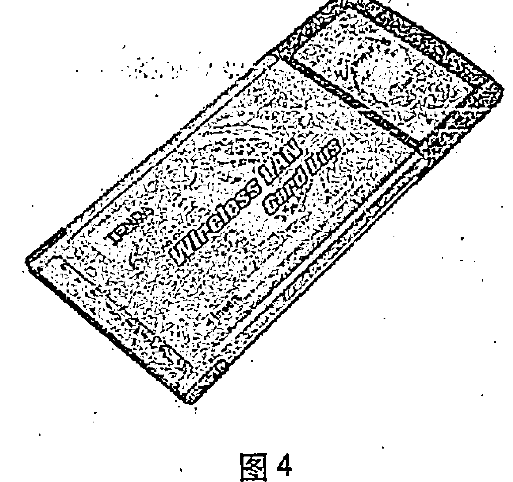

TWL9911P是一款完全符合IEEE802.11b无线网络国际标准的PCI接口无线网卡，该网卡可以和所有符合IEEE802.11b标准的无线设备进行交互式操作，也可以通过无线接入器与有线以太网网络进行交互式操作。图5为腾达PCI接口无线网卡。

### 三、无线局域网设置轻松上手

在设置网络参数之前，大家需要首先在各台需要进行信息传输的计算机中正确安装好无线网卡，同时要调整好计算机与计算机之间的距离，以及摆放好计算机的位置，以免影响信号的正常传输。然后按照下面的方法，对网络参数进行合适的配置。

#### （一）在 Windows 98、Windows Me 以及 Windows 2000 系统下的设置

由于Windows 98、Windows Me以及Windows 2000系统本身没有相关的组件来支持无线网络的使用，所以大家在进行网络参数的设置工作之前，一定要借助一种专门的无线网络管理和配置程序，进行网络参数设置。目前许多无线网卡都会随机附带Client Manager这个程序，按照常规方法将该程序正确安装在对应的操作系统中，再执行下面的设置步骤：

- 1. 在Windows 98、Windows Me或者Windows 2000系统桌面上，用鼠标单击开始菜单，然后依次执行“程序”/Wireless/Client Manager命令，打开一个标题为“Wireless客户机管理器”的设置界面。
- 2. 单击其中的“操作”菜单项，执行“添加”命令，再选中“编辑配置简介”选项，出现“选择简介”对话框，在该设置框中，单击“编辑”按钮，在“编辑配置”中，可以在“选择简介”设置对话框中单击“添加”按钮来重新创建一个无线网络配置名称。
- 3. 可以利用“添加”功能来创建多个不同的配置文件。在“编辑配置”设置对话框中，单击“网络类型”下拉按钮，选择“对等工作组”选项，继续单击“下一步”。在“标识网络”的设置界面中，单击“扫描”按钮，这样Client Manager程序就能自动扫描当前计算机系统中可以被使用的对等无线网络，同时将结果正确地显示出来。
- 4. 在搜索结果页面中，选中搜索到的无线网
- 5. 打开“TCP/IP行为”设置对话框，选中“在选择此简介时更新IP地址”，这样计算机在从一个网络移动到其他不同的网络中时，就能自动完成IP地址的更新工作了；最后单击“完成”按钮，从而结束局域网无线网络参数的设置。设置好网络参数后，大家就可以在局域网中相互传输信息了。在传输的时候，有可能会出现信号不太稳定的现象；此时大家应该将计算机与计算机之间的距离和位置调整好，如果还出现连接不稳定的现象的话，那么很有可能是无线网卡的质量不太过硬。

#### （二）在Windows XP系统下的设置

相比较而言，在Windows XP系统下设置无线网络参数的步骤要简单一些，毕竟Windows XP系统本身就已经为用户提供了对无线网络的良好支持，大家可以直接在“网络连接”窗口中来设置网络参数，而不需要另外安装其他无线网络管理和配置软件了。具体的参数设置步骤如下：

- 1. 在Windows XP系统桌面上，依次单击“开始”/“设置”/“控制面板”命令，打开控制面板窗口；双击网络图标，打开“网络连接”界面；用鼠标右键单击“无线网络连接”图标，执行“属性”命令；显示“无线网络连接属性”设置对话框，选择“无线网络配置”标签，并在随后弹出的标签页面中选中“用Windows来配置我的无线网络配置”复选框，这样就能启用自动无线网络配置功能。
- 2. 单击“高级”按钮，打开一个“高级”设置对话框，选中“仅计算机到计算机（特定）”单选按钮，从而实现计算机与计算机之间的相互连接。要是大家希望能直接连接到计算机中，又希望保留连接到接入点的话，就可以选择“任何可用的网络（首选访问点）”选项。
- 3. 在首选访问点无线网络时，要是发现有可用网络的话，系统一般会首先尝试连接到访问点无线网络，如果当前系统中的访问点网络不能用的话，那么系统就会自动尝试连接到对等无线网络。完成上面的设置后，依次单击“关闭”按钮退出设置界面，并单击“确定”按钮完成无线局域网的无线连接设置工作。

#### （三）双机无线对连

- 1. 打开无线网络连接的属性对话框（如图6）。
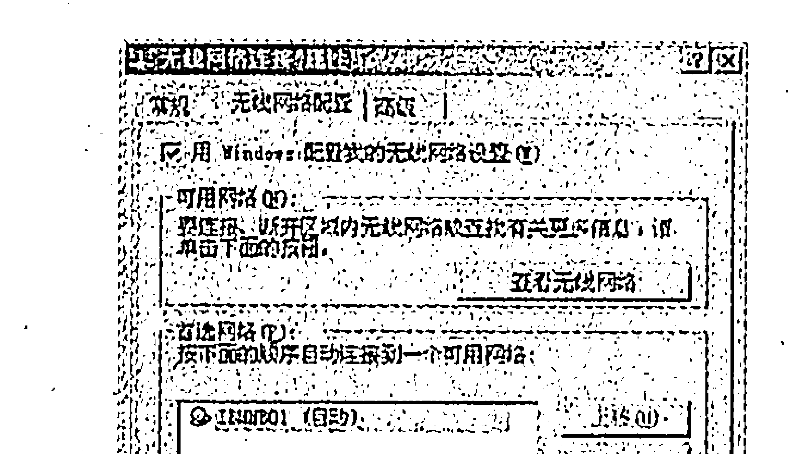
- 2. 单击右下角的“高级”按钮，打开“高级”对话框，如图7所示。选中下面的“仅计算机到计算机”单选按钮和最下面的“自动连接到非首选的网络”复选框。
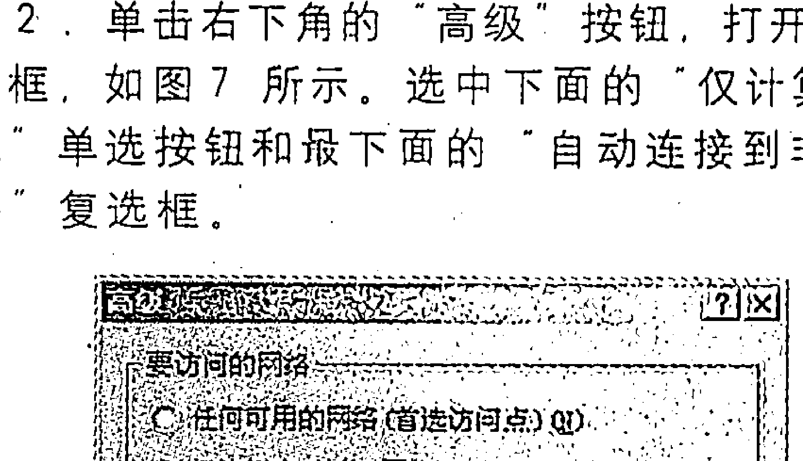
- 3. 回到第一步的界面，单击首选网络下面的“添加”按钮，自行输入网络名，本例中为“IBMNB01”，如图8所示；取消选择“自动为我提供密钥”复选框，将数据加密选项改成“已禁用”，确定返回。
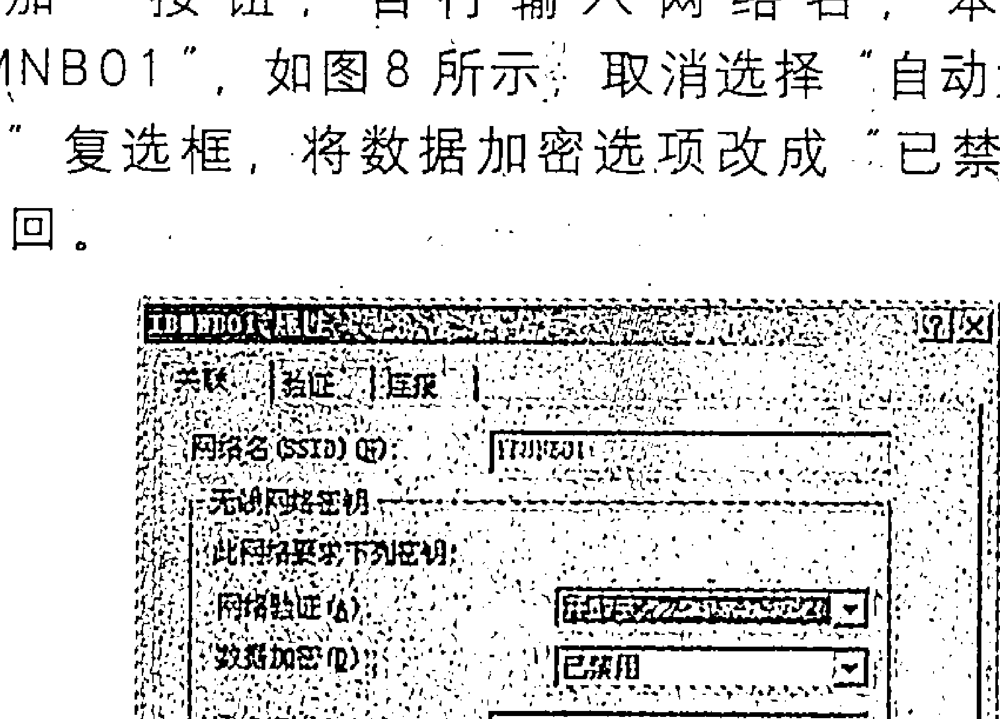
- 4. 进入主机无线网卡的 TCP/IP 属性设置界面，输入IP地址和子网掩码，如图9所示。此例中IP地址为192.168.0.1，掩码为255.255.255.0，其他不用输入。
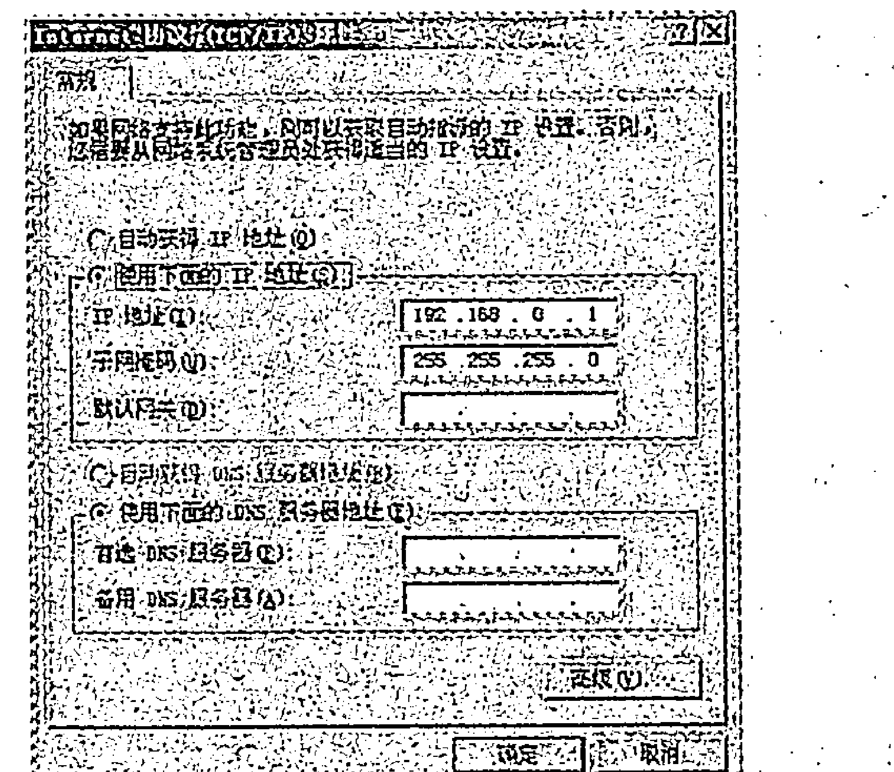
- 5. 进入客户机的无线网卡TCP/IP 属性设置界面，将IP地址和DNS地址全部设为自动获取，确定即可。
- 6. 进入主机网卡的外网连接，本例为1000M网卡，进入“高级”选项卡，如图10所示，选中“允许其他网络用户通过此计算机的Internet连接进行连接”复选框。
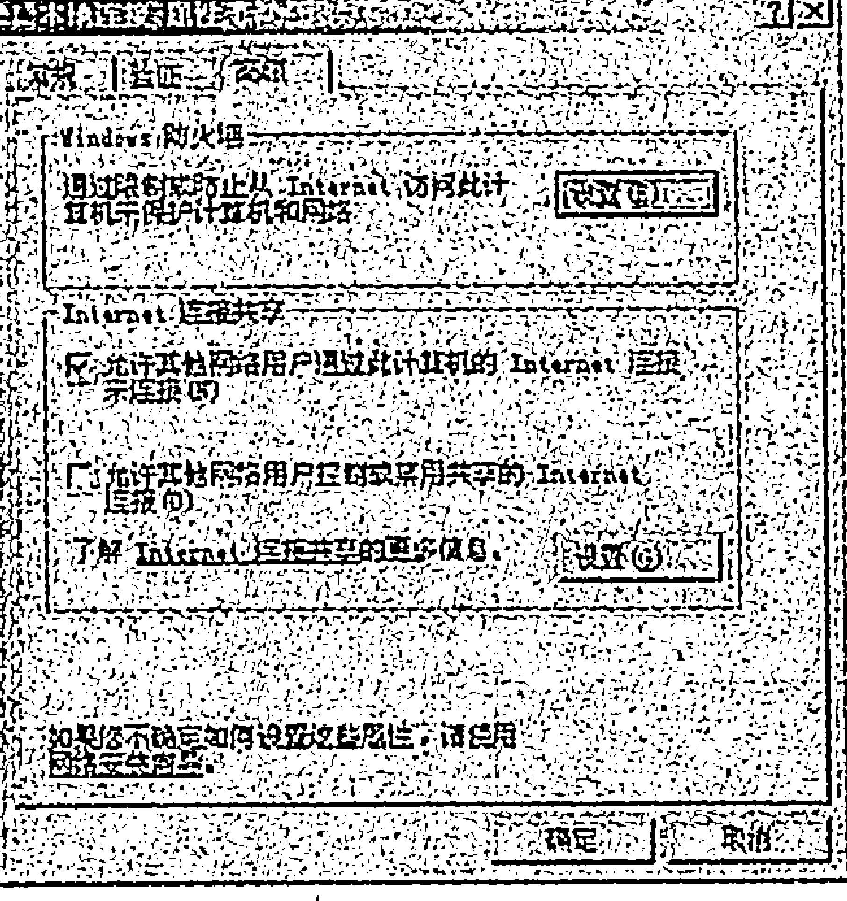
- 7. 接上步，进行连接共享的属性设置，根据自己的需要设置即可，本例中设置见图11。
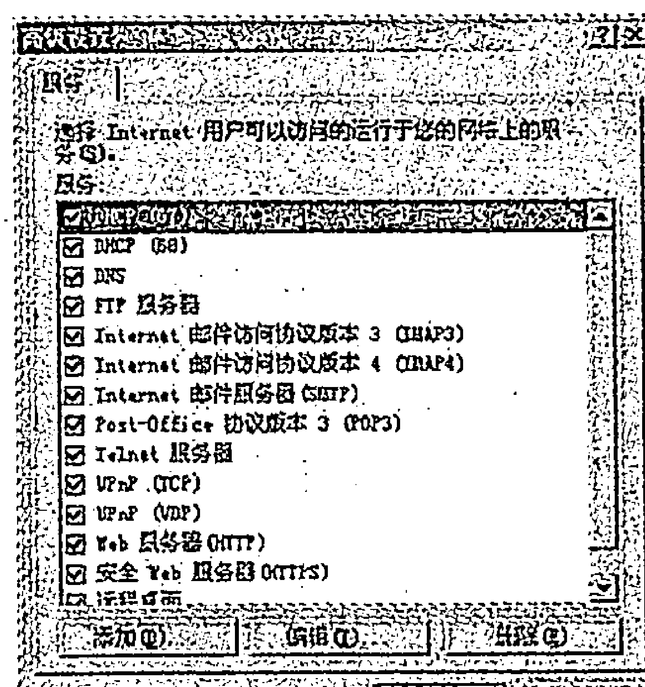
- 8. 确认以上设置后，搜索网络，能看到如图12所示的界面，就说明已经连接成功了。
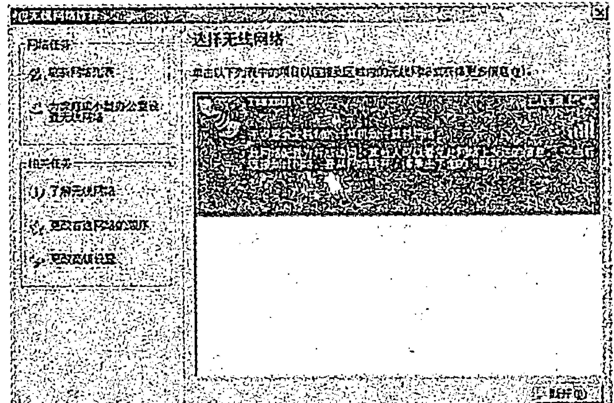

第1、2、3步骤是主机、客户机两台机器同样操作，而且在两台机器上的设置是相同的，否则可能会连接不上。第4、6、7步骤是主机专用，第5步骤是客户机专用。第6、7步骤完成后可能会有一个提示，“因为IP不同，可能共享网络无法实现”什么的，不用理它，确认就行了。第8步就是两台都可以看到的成功画面啦。最后，只要你互相ping一下IP地址，能通就说明可以上网了。

### 四、无线网络连接故障分析

在多数情况下，无线设备连接故障是由于使用不当引起的。通常表现有连接困难、通信速度慢、掉线等等，其原因一般分为三个：环境因素，AP与网卡间的距离过长，AP与网卡间有障碍物影响，比如室内复杂环境，墙壁、家具影响；人为因素，工作在2.4GHz频段的微波设备，如微波炉、网络线缆、天线线缆接触故障，定向天线特性等影响；设备因素，如设备过热；缓存过小等等。

#### （一）故障实例及分析解决

案例一：AP+笔记本电脑无线网卡组合，直线通信距离20米，终端处在地下室位置，AP位于与地下室建筑物呈直角的三楼，故障现象是连接时好时坏，连接速率在最高11Mbps至无信号之间波动。

解决方法：通讯距离不长，但墙与地的隔离作用影响了通信质量，环境移动物体（车辆）因素变化导致复杂折射/反射，信号强度变化巨大。我们可以采取以下方案稳定信号：增加网卡外置天线；调整AP天线角度使天线辐射角度垂直于地下室笔记本电脑网卡；在AP天线的后端增加反射铝塑板。这样处理后连接速率应该就能稳定起来。

案例二：AP+笔记本电脑无线网卡+PCI台式机无线网卡家用组合，这是一个典型的家用无线局域网应用。用户反映，即使网卡与AP同在一个房间之内，两机ADSL拨号（带路由功能）掉线现象也十分频繁。

解决方法：试着使用USB或LAN连接路由器和PC机，如果发现拨号连接稳定，长时间工作不掉线，由此就可判断故障可能来自于无线设备。进行了改善AP电源质量、散热等多种尝试均未见明显效果，则判断掉线现象为AP缓存过小引起的。处理办法是更换AP或限制传输速率。考虑成本，使用限速方案。设置AP最高连接速率2Mbps后，故障明显减少，也基本满足两机同时上网的需要。

案例三：外接天线使用一段时间后连接无信号。

解决方法：天线使用一段时间后出现连接故障，常见原因是接口接触不良。检查接口是否做好防水处理，如果发生锈蚀的情况，可用玻璃胶做外部防水涂覆处理。另外，也有可能是被雷击的特殊情况，对于这种情况一般很难维修，应该即时更换设备。

#### （二）一些关于无线局域网的问题

- 1. 如何保证在无线局域网中传输文件速度稳定无变化？
答：这种情况大多数是由无线网络设备之间的距离不断变化引起的。因为无线电波的传输速度与通信距离是息息相关的，如果无线终端与无线接入点之间的距离不稳定，就容易出现传输速度时快时慢的现象。建议在传输文件时，让无线终端靠近无线接入点，并且不要随意移动无线工作站。

- 2. 由于无线局域网传输信息时很容易被截取，那么怎样才能保证文件在无线局域网中安全传输呢？
答：要保证在无线局域网内通信安全，最好采用WEP40/64位加密技术，同时记得修改无线接入点系统名以及SSID默认设置，并将缺省的访问密码修改掉。此外MAC基于地址的过滤控制，也能确保无线局域网的通信安全。对于不通过无线接入点的P2P无线局域网来说，上面的方法已经很难保证网络安全了，最好在这种类型的无线局域网客户端安装防火墙。除此之外，及时更新无线接入点、网桥以及客户端软硬件，也能有效保证文件在无线局域网中安全传输。

- 3. 为什么无线网络设备在更换位置后，突然工作不正常，例如客户端有时能访问到代理服务器，有时根本访问不到？
答：多半是无线信号受到干扰。无线局域网使用的电波频段处于2.4GHz～2.4835GHz范围内。普通电器的电波，是无法对其形成干扰的。不过类似无绳电话、微波炉之类的设备，发出的电波对其干扰较大，如果靠近这些设备，很可能表现不正常。可以通过调整信道的方法，来消除外来干扰。

- 4. 怎样安装无线接入设备，才能确保无线局域网传输性能最稳定？
答：除了要远离电器设备外，还应该让无线接入设备与无线局域网各工作站的距离靠得都比较近，最好是让无线接入点位于中央，其余工作站尽量围绕在其四周，这样能保证每个工作站的信号接收效果都处于最佳状态。无线接入设备的天线，尽量与水平面保持较小的角度，同时应确保无线接入点四周平坦、空旷。无线接入点的工作站数目不能太多，否则无线局域网传输速度将受到很大制约。

- 5. 将USB接口的无线网卡插入到计算机后，屏幕上显示，已经找到该设备并正在安装。可是安装好后的网卡为什么不能访问？
答：既然系统已经找到无线网卡，则表明系统的USB端口已经被激活，无线网卡的USB接口以及计算机的USB端口都没有问题，有可能该故障是由驱动程序引起的。检查一下无线网卡的驱动程序安装是否正确。USB无线网卡的驱动安装与普通网卡的安装方法不一样，通常先要将网卡驱动程序安装到系统中，然后才能将网卡插入到计算机的USB接口中。如果安装顺序出错的话，就会导致网卡无法正常工作。

- 6. 为什么将PCMCIA接口的无线网卡从计算机中拔下来时，系统有时会出现突然死机现象？
答：无线网卡的PCMCIA接口，尽管具有即插即用以及热插拔功能，不过热插拔功能并不表示你能随意拔掉无线网卡，特别是在无线网卡工作的时候，如果将其拔掉，不但容易造成系统死机，甚至有可能会损坏无线网卡。所以在拔除无线网卡时，必须确保网卡没有工作，而且在拔除时，应该先打开网卡的属性设置窗口，并在对应窗口中，将网卡暂时禁用，之后才能将它从计算机中拔下来。

### 五、无线设备使用秘技

#### 1. 无线网络开关自如

很多用户在安装无线网络之前使用的是有线网络，因此有的时候有线网卡和无线网卡都同时存在。为了某些特殊的需要，可以通过下面的方法来禁止无线网络。首先，打开IE浏览器，登录无线路由器的设置页面（默认的IP地址为192.168.1.1），在登录窗口中输入用户名和密码（默认用户名为空，默认密码为“admin”），单击“确定”按钮打开设置窗口。接着在左侧窗口点击“基本设置”，然后在右侧的“无线设置”区域选中“禁止”单选按钮，单击“应用”按钮就可以禁止使用无线网络。

#### 2. 给WLAN换个名字

打开设置页面，进入“基本设置”页面。接着，在SSID文本框中输入你想设定的名称，如图13所示，名称设定为MYWLAN。该名称应由不超过32 位的字符所组成，建议不要设为汉字。
设置完毕后，无线网络会自动断开，这时可以在任务栏中的连接图标上单击鼠标右键，选择“查看可用的无线连接”，在打开的窗口中选择已经搜索到的属于自己的连接，单击“连接”按钮就可以成功连接。不过，如果你设置了WEP 加密，那么还需要输入相应的网络密钥。

断线后自动拨号的设置，可以选择“按需连接：自动断线等待时间”（默认5 分钟）和“保持连接：重复连接周期”（默认30 秒）。最后单击“应用”按钮，设置即可生效。

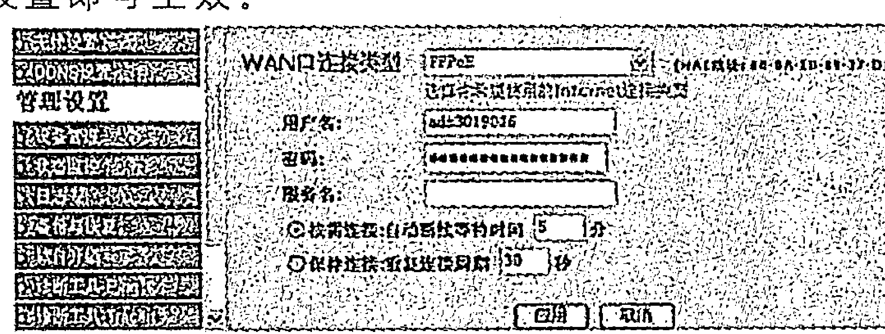

#### 3. 让WLAN搭乘ADSL快车

无线宽带路由器集成了普通路由器的功能，可以实现PPPoE 自动拨号，这样就可以通过ADSL Modem 实现无线上网。在进行设置之前先将ADSL Modem 的WAN 口与路由器相连。进入无线宽带路由器的设置页面后，选择“基本设置”。接着，在WAN 口连接类型中选择PPPoE 连接，如图14所示，输入ADSL上网的用户名、密码。为了避免掉线，还可以进行

另外，我们可以启用WEP 加密功能保护无线网络的安全。为了保证内网的安全，使没有登录权限的人无法连接已构建的无线网络，可以进行如下设置：首先打开路由器设置页面，选择“基本设置”。接着在“无线设置”区域的WEP 设置选项中，选择“开启”。然后，点击旁边的“WEP 密钥设置”按钮，如图15所示，在密钥设置窗口中，选择加密的位数（包括64 位或128 位），点击相应的“创建”按钮来创建密钥。最后，点击“应用”确定即可。

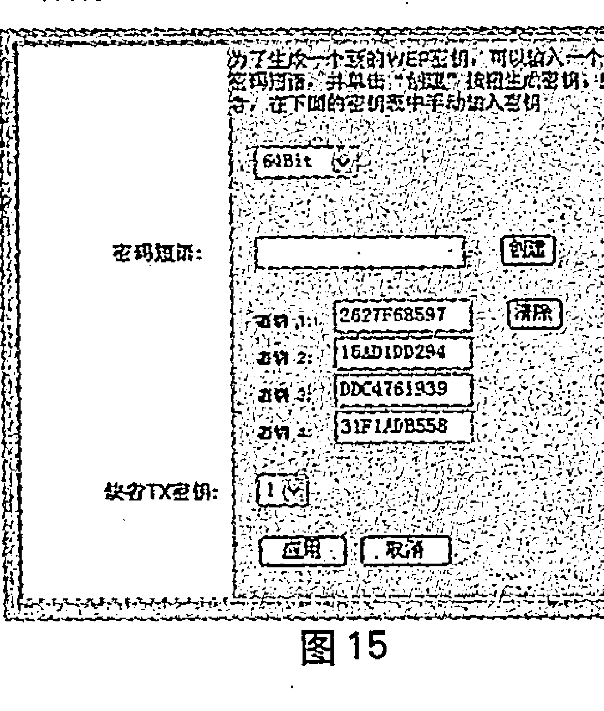

## DC/DV 保养维护及故障排除全攻略
文/烈火重生

时至今日，数码相机（DC）和数码摄像机（DV）已经不再是专业人士和商务使用的专有设备，大量个人用户也已经或者正在拥有和使用它们，为自己的工作、学习和家庭生活记录下美妙的瞬间。但是随着这些数码设备的大量普及，有关DC/DV的维护保养和故障处理问题也随之而来。由于和大量家庭用户持有的传统傻瓜胶片相机相比，数码设备的价格较为昂贵，所以相关的维护保养知识就更为重要，而这又恰恰是家庭初级用户们所欠缺的，因为他们连传统光学相机的相关保养知识也不清楚，只是因为傻瓜机价格便宜，所以并不在意。再者，由于DC和DV 构造比较精密，除了传统相机和摄像机的机械、光学结构组件之外，还增加了大量的电子部件，在维护上与传统相机有相同之处，也有不同之处，所以即便是“一路胶片机拍出来”的前辈也难免犯一些错误。制作这个专题的目的，就是向大家详细说明数码相机和摄像机的几大部件在使用和维护时应该注意的问题，避免一些日常维护的失误造成机器的过早退役，蒙受不必要的经济损失；另外，针对DV/DC 一些普通用户，本文进行了典型的故障挽回归类讲解；对于不堪忍受高昂维修费用，或者喜爱自己动手解决问题的朋友有一定的帮助。

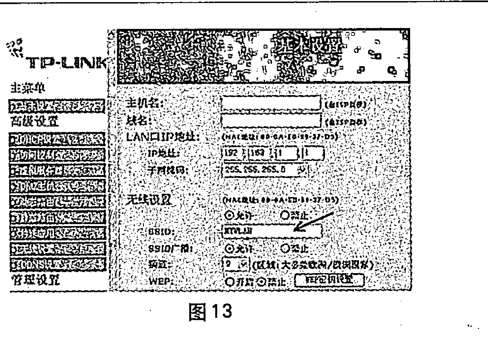## 一、维护保养篇

### 1. DV和DC的日常使用和存放环境

我们现在所使用的DV和DC，无论是民用消费级别还是专业级别，实际上都是比较娇贵的东西，它们使用或者存放环境要求一般都会在随相机提供的说明书中的环境参数一项中找到。比如松下长焦王FZ20就在说明中给出了工作温度（℃）0～35℃，工作湿度＜80％，存储温度（℃）－20～60℃，存储湿度＜90％这些环境参数。不过，厂商提供的这些要求并不全面，而且也不直观，实际上DC／DV使用环境中的风沙、高温、低温、湿气、结露，都会影响它们的性能和寿命。下面，我们就一一介绍各种因素对机器的影响和避免方法。

首先，要注意DC／DV的存放环境，过高的湿度和过低或过高的温度都会损害机器。湿度过低时，机器的镜头和滤镜具有静电，吸附灰尘；湿度过高时，会使机内元件性能变差或锈蚀，还会在机器内和镜头内滋生霉菌。同样，温度过高的保存环境，会影响粘合光学透镜的粘合剂，也会影响照相机内的其他部件；而在寒冷的环境下，相机也容易出现润滑剂凝固、电池效率降低等内伤。鉴于上述的问题，一般使用DSLR（数码单镜头反光相机）的准专业和专业摄影师，都会为自己的相机和镜头配备能够控制温度和湿度的电子防潮箱，将箱内环境调至二十五摄氏度和40～50％的湿度这样的最佳保存环境。但是，要一般玩家掏出数千元的钞票专门购买电子防潮箱就有些苛刻了。当然，还有一些其他方法：购买塑料材质的简易防潮箱，配合零售的干燥剂使用，总成本会大大降低。这里要提醒大家的是，要注意干燥剂的失效问题，市面上销售的干燥剂有一次式及循环使用两种，前者吸水后会膨胀变硬并粉碎，有包装和罐装两种形式；后者即所谓水玻璃干燥剂，初使用时为蓝色的，当吸水变成粉红色时即失效，可以经由晒干、台灯照射或是微波炉烤干，变回蓝色再行使用。环境温度方面应使数码相机远离热源和冷源，如暖气片以及其他发热或者制冷设备，被太阳晒得炙热的汽车等都是需要远离的。这些都是针对较长时间存放相机情况下的建议，其实最好的保养方法就是隔两天就把机器拿出来拍一拍，让机器用自己的工作发热把积累不多的潮气排出去，正应了“流水不腐，户枢不蠹”这句成语。

此外，在相机进行长时间保存之前，要把皮套电池这类的附件统统卸掉，皮套比机器更容易发霉，从而牵连机器本身。而电池长时间放置会有漏液的危险，不取出的话就会腐蚀机内的部件，为了这个小细节牵连机器是很不值得的。

然后我们要说的是，外拍携带时应该注意的环境影响。除了上面温度和湿度的影响外，还会有一些其他的要求。首先，温度骤然变化对机器是非常有害的，特别是从低温处到高温处时，除了可能由于温度的变化产生结露现象引起潮湿，甚至发生电路短路问题外，而且还会使相机出现一些压缩现象，肉眼不易看出但相机内部已经受到伤害。如果数码相机刚从温差很大的地点取出来使用，比如在冬天从寒冷的室外拿到温暖的室内，或者在夏天从炎热的室外拿到有空调的室内，应该放置一会儿，等数码相机略微适应温差后再开机，否则有可能出现开机故障。如果要在寒冷的环境下使用数码相机拍摄，在低温下可能需要更大的启动电流，同时在寒冷的环境下，电池的转换效率也较低，需要携带额外的电池，同时注意保持电池的温度。

其次，外拍时防水防潮是最不能忽视的。解决上面这些拍摄中可能遇到的问题，最好的方式是给自己的机器购买一个大小合适、具有较好防水、防尘，密封效果的DC／DV包。一般设计良好的摄影包外部，都会采用尼龙或者人造纤维这样的防水耐磨材料，即便是使用帆布也有防水夹层和防水外部处理。摄影包封口处都会有防水围边设计，另外内部还有厚海绵的衬底和隔档，底部有硬性材质的垫子，可以有效地减少震动、最大限度地保护和合理放置器材。我们可以根据自己器材的大小，选取内部结构合适的摄影包，以免包内器材放置不均匀导致头重脚轻。像上述那样设计不错的摄影包，价格从两百多元到千元不等：富图（Safrotto）、乐摄宝（Lowepro）、多姆克（Domke）等品牌都是不错的选择。如果你不想在摄影包上面投入太多，也可以使用塑料拉锁链袋子。在非常潮湿或尘土较多的环境，可以在侧面挖一个小洞，大小为刚能放入相机镜头突出的部分；对于伸缩镜头设计的DC，可以把整个机器放入袋子中，然后把相机放在原有的包里，同样能避免雾气、湿气和尘土进入机器，延长机器的使用寿命。

最后，在正式拍摄时，相机的机身和镜头都会暴露在环境中，会有风沙刮伤相机镜头或渗入对焦环等机械装置中，造成损伤的可能性，因此大家在外拍时应随时用护盖将镜头盖住，风沙大的地区最好带上相机的护套。另外，在阴雨天或在南方较为湿热环境中，使用数码相机以后，应该及时用软绒布揩去沾附在照相机表面的水滴或水汽，再用橡皮吹球（我们常说的皮老虎）将各部位的细缝吹一次，待通风干燥后再放回家中的防潮容器中。

### 2. DC和DV的镜头保护

镜头是数码相机的一个重要组成部分，工作时必须暴露在空气中，导致其不可避免地附上一些灰尘，如果长时间使用相机而不注意维护镜头，那么上面的灰尘将越聚越多，这样会大大降低数码相机的工作性能。例如，镜头上的灰尘会严重降低图像质量，出现斑点或减弱图像对比度等。另外，在使用过程中，不小心手会碰到镜头而留下指纹，这些指纹不仅会使取景效果下降，而且会腐蚀镜头表面的镀膜。因为数码相机和摄像机镜头都有一层比较脆弱的镀膜涂层，这些镀膜上的保护层同样非常薄，所以只有在非常必要的情况下，才会对镜头进行清洗除尘，如镜头上只有少量尘土并不会影响图像质量。清洗时，首先用软刷和橡皮吹球（皮老虎）清除尘埃颗粒，然后再配合使用镜头绵纸和镜头清洗液，反复擦拭镜头表面。使用镜头清洗液时要注意用量，一般滴一小滴在绵纸上（注意不要将清洗液直接滴在镜头上，避免渗入镜头内部）就可以了，擦镜头不能只擦脏的地方，必须整个镜面一起擦，并要不断换用干净的绵纸，最后趁镜头清洗液尚未干燥之前用然后用一块极柔软、清洁的薄绸子把镜片表面轻轻精擦一遍，直至镜头干爽为止。上面说的镜头清洗液、镜头绵纸和清理毛刷在一般的照相器材店都可以买到，价格也不会很贵，千万不要图方便使用纸巾或餐巾纸来清洗镜头，这些产品都包含有刮擦性的木质纸浆，会严重磨损镜头最外层薄薄的保护涂层，而后伤害镀膜。还有就是切勿使用溶剂苯、酒精等挥发性溶剂代替镜头清理液，以免侵蚀相机镜头表面镀膜。

其实，对于镜头保护最好的方法就是防患于未然，在拍摄时随时注意使用镜头盖对镜头进行保护，在不用时就把镜头盖盖上，不过，这对于时刻等待捕捉拍摄瞬间的朋友们过于苛刻了，在这种情况下，一些针对镜头的保护性配件就发挥作用了，比如UV镜和遮光罩。UV镜其实就是一片紫外线滤镜，它的出现是为了滤除胶片对于紫外线的敏感而对成片质量产生的影响。不过，对于使用CCD感光元件成像的DC和DV来说，这个最初的作用已经相当淡化了，因为CCD对于紫外线并不敏感，反倒是原来居次要作用的保护镜头成了DV/DC UV镜的主要任务。当我们在灰尘、风沙或者湿气很大的环境中使用相机时，配上一块UV镜可以很好地保护镜头。拍摄完毕后，只要好好擦擦UV镜就可以了，而不用提心吊胆、小心翼翼地去擦那块昂贵的镜头。在选购UV时，DC和DV用户可以淡化UV的紫外线过滤性能，只要尽量选择双层或者多层镀膜这种透光性好的产品就可以了。同样充当保护镜头角色的配件还有遮光罩，它本身是用来防止在逆光、侧光或闪光灯摄影时，干扰光进入产生眩光的。不过，你使用时就会发现，遮光罩其实还能在一定程度上防止对镜头的意外损伤，避免手指误触镜头表面，还能为镜头遮挡风沙、雨雪。上述两种镜头配件价格都不昂贵，肯高（Kenko）、SUNPARK、MARUMI多层镀膜的UV也不超过百元，第三方品牌遮光罩也基本在这个价位，原厂

### 3. 电池的使用维护之道

电池是每一部DV或DC不可缺少的动力之源。同样，它们的使用维护不当，不单单会影响机器的性能，还会对机器造成伤害，有时候这种危害是致命的。目前，DC比较常用的是5号镍氢充电电池或者特别设计锂电，而DV则大部分使用专用锂电。

电池的使用、保存和携带也有很多要注意的地方。首先是给电池的充电方法，这部分许多读者可能或多或少存在一些误区。我们经常听一些老鸟建议，刚买来的充电电池在前三到五次充电时，最好充十四小时以上激活充电，实际上这些经验只适合镍氢电池。锂电池具有完全不同的充放电特征，在出厂前都经过激活处理。一般的情况下，锂电池存储时间没有超过七个月以上，就没有必要进行什么特别的所谓激活处理。而且，按照锂电池的充放电特征，前两个小时内的恒流充电实际上完成了电池容量的98%，而后面无论多少小时的充电，实际上是通过恒压涓流进行充电，只为了电池容量的2%。我们前三到五次即使对锂电池只充两小时，你也会感觉一次比一次的待机时间长，所以锂电池的激活实际上只要按照日常使用充电使用就可以了。相反，锂电池对于过充和过放电比较敏感，一次过充对电池的损耗要远大于几次完全充放电过程，国家针对锂电的充电标准是不管采用什么充电方式，充电大于八小时则属于过充，如果过度放电，就很有可能导致电池的假死现象，这时候电池既没有电量也不能进行充电。

在我们常说的记忆效应问题上，锂电池和镍氢电池表现也各不相同。记忆效应最不明显的是锂电池，镍氢电池介于锂电和镍镉之间。记忆效应不明显意味着可以多次充电，甚至没用完就充电而不会有大的影响。因此，使用镍氢电池时，一般可以不考虑放电而直接充电。当然，从延长使用寿命角度来看，在充放电30～50次左右，可以做一次深度放电，以恢复到最大容量，而锂电池基本可以当成随用随充，不会对容量造成多大影响。在谈到两种电池不同的充放电特征后，我们还不得不说一说充电器的问题，这又是一个大题目，这里我只简单的说一下，现在市面上的充电器质量参差不齐，指标参数也大不相同，我们在选择的时候，一定要购买遵循恒流充电和恒压0.01A电流充电两大步骤的充电器，省略第二个阶段或者恒压充电过程中涓流电流高于国家标准的充电器最好都不要使用。

对于镍氢电池，除了上面所说的初期电池激活、记忆效应等问题外，还要注意不能新旧电池混用，尽量同时更换。还有，镍氢电池外部的塑料绝缘薄膜包装如果出现破损或者脱落，应该马上用胶带贴住破损部位或者整个缠绕电池，如果疏忽，很可能会造成相机电池仓内的电池组意外短接，释放大电流，在电池电极和电池仓接触点中间的接触电阻，将放出大量热量，不但会烧毁电池甚至还会将机器一同焚毁。

另外，如果你打算长时间不使用数码相机，必须要将电池从数码相机中或是充电器内取出，这点不管是镍氢电池还是锂电都是一样的。如果需要长期保存电池，还存在一个保存状态和电量恢复的过程，镍氢电池要长期保存前，应该充电到80%左右，然后再保存，这也是为什么现在买新的镍氢电池回来后多少有点电的原因，因为厂家已经预充电，防止运输周转时间太长，而电池没电受到影响。长期保存的镍氢电池再使用时，先将余电用完，再用正确方法充放2-3次就可以恢复到最佳状态了。而锂电池电量用到一半左右保存最佳，保存期内，2-3个月时间之后重新充电，并使用一半电量，然后再保存，这样可以长期有效的保证锂电池的活性不受损坏。要注意的是，两种电池保存环境都需要干燥、阴凉，避免电池与其他金属物品存放在一起，造成意外短路发热。

在我们携带电池外出拍摄时，最好为自己的电池配上相应的电池盒，这样可以避免电池两极和摄影包内的金属发生短接。这种电池盒成本不高，一般两三元钱就能买到，保护作用却是立竿见影。

### 4. DC 存储卡和 DV 带的使用和保存

各种类型的存储卡是 DC 最常见的存储介质，一些 DV 也会使用存储卡存放拍摄的照片或者压缩格式的视频，不过，DV 的主要存储介质还是能够保存海量非压缩数据 AVI 格式的 DV 带。对于数码摄影摄像而言，这些存储介质的本身所包含的信息价值，对拍摄者而言最为重要的，所以尽管存储卡和 DV 带本身价值不高，但我们要精心保护。对存储卡漫不经心的使用、处理，将导致存储卡上存有的信息丢失，甚至损坏存储卡。

向数码相机装载或从数码相机内取出存储卡，都要在关闭数码相机的情况下进行。当存储卡正在工作时，不要试图从数码相机中取出存储卡，这一点相信大家都了解。不过在某些时候，如使用较高分辨率的格式，或者 RAW, TIFF 这类大体积图片格式，或者高速连拍时，会有一个等待数据从相机内缓存写入存储卡的过程，根据所需写入图片的体积，这一时间大概数十秒到几分钟不等，往往会被使用者忽视。我们避免在存储延迟时间内插拔存储卡，可以观察相机上的读写操作指示灯，在指示灯没有表示读写完成前，不要强制关闭电源进行拔卡操作。此外，要注意装入的方位，尽管各种存储卡都有防呆接口设计，只有方向正确才能完全插入，但还是有一些朋友强行将卡塞进去，打开电源后就是不可避免的损坏卡内存储数据，或者直接烧毁存储卡。

其实，这些存储卡内部结构都比较相似，基本上都是由FLASH芯片和控制器芯片组成。一般对半导体器件寿命有影响的高温、高湿度和静电、磁场，等都会让存储卡受到伤害，所以保存和携带时，尽量将他们和主机一起放在防潮箱和摄影包中携带，免受恶劣环境的影响，还可避免高温和直射阳光。在相机经过一段时间使用后，存储卡插槽的接触点会不可避免地落灰，这时候可以使用皮老虎吹除灰尘，同理，存储卡的金手指部分也要时常清理。

对于 DV 来说，虽然 DV 带远比存储卡便宜，不过它接触的是 DV 核心部分——磁头。由于 DV 带自身出现的问题会直接导致磁头的损伤，从而影响画质以及存储，而且是永久性的。所以比起存储卡来，DV 带的使用和保存更要谨慎。大多数情况下人们把 DV 带放在抽屉或者橱柜里，而且一般都靠近电视机，因为常常会将 DV 带通过 DV 机在电视机上观看。在保存环境方面，DV 带在温度和湿度方面的要求，和 DV/DC 主机是相同的，保证温差不大的环境和可以控制的湿度。不过除了这些，还有最根本的一条，那就是各种磁场。对于作为磁存储介质的 DV 带来说，磁场是与生俱来的天敌。不仅对于 DV 带来说是这样，录音带、软盘包括我们的信用卡等等都是磁性存储介质，这些存储产品在保存的时候都应该远离磁场。在我们日常使用过程中，随手将这些物品放在电视、音响和电脑跟前，几乎是我们每个人都有的坏习惯，看到这你应该明白了，这些地方都不是 DV 带该放的地方。另外，DV 机对于 DV 带的操作是接触型操作，磁头的反复读取走带会减少 DV 本身的寿命，要尽量减少 DV 机对磁带的直接操作。此外，当我们打算将 DV 带长期存放时，摆放的方式也很有讲究：直立摆放能减少磁带的自然变形。最后一点就是，长期放置的 DV 带时，最好能每隔两三个月将它取出，整个快速倒带一遍，可避免带子的粘连并保持紧张度。

### 5. 液晶显示屏的保护

液晶显示屏是 DV/DC 标志性的配置，它们的出现大大地方便了用户的取景操作。目前使用的液晶屏幕，绝大多数在表面上都会有超硬的保护涂层，只要我们在携带时避免和钥匙等尖锐物体放在一起，就不会被挂花或留下划痕。另外，为了避免频繁擦拭造成保护层变薄，可以使用 PDA 那样的硬材质保护贴保护液晶屏幕。如没有适合的型号，可以在成品的大尺寸保护贴上自己制作一个。还有，除了 DV 机外，现在很多 DC 机型都提供了可翻转的液晶屏幕，这样的设计虽然大大方便了使用者取景，但是屏幕和机器的连接轴常常成为故障高发区，所以笔者建议尽可能少地反转液晶屏。

### 6. DV磁头保养维护

视频磁头是DV的核心器件，它关系到录像、放像的图像回放质量，而且由于磁头是消耗型部件，所以合理的维护能大大延长使用时间。我们常说的磁头维护，主要是指定期对磁头进行清洗、将平常积累的污垢、自磁带脱落下来的磁粉清洗掉。一般来说，当你看见图像的颜色变浅、无色或者是有横线或短暂的马赛克，那就是磁头需要清洁的时候了。目前清洁磁头主要有清洁带自动清洗和用清洁液手工清洗这两种方式。

清洁带其实是一种非磁性的带子，它在磁带上涂了一层非磁性的、很细很均匀的颗粒状物质，其性质类似于非常细的砂纸。在使用清洗带时，首先将它和普通摄像带一样放置到DV中去。需要注意的是，清洗带一经使用就要连续播放到带尾，中间不要停止，也不要“快进”和“快倒”，让它按正常时间运转。通常3至5分钟就完成了清洗过程。我们需要注意的是，清洗带属于精细研磨带，实际上对磁头多多少少会有所损害的，所以清洗不要太过频繁，大概在拍完二十至三十盘带子后进行一次即可。

相对于清洗带，手动清洗对磁头造成的损害较小，适合喜欢自己动手的朋友。在清洗前，切断DV电源，用蘸有无水酒精或专用清洗液的麂皮或专用布靠在磁头鼓的圆柱面上，轻轻地擦磁头。需要注意的是，擦拭方向只能沿水平方向，不能沿垂直方向，只能用手慢慢转动磁头，而不能打开电源，让磁头电机转动。此外，由于清洗液和无水酒精都属于挥发性液体，要避免和磁头周围的橡胶元件接触，否则就容易引起老化或龟裂，这对于皮带轮类型的元件将是致命的。在清洗完之后，我们必须等待液体完全挥发后再开机使用。

## 二、DC/DV常见故障解决方法

对于一般消费者来说，DV和DC出了故障往往是很头疼的事情。一方面现今这类产品的维修渠道还不通畅，很多地方甚至没有厂家维修部门；另一方面，厂家维修条款的不完善，让处于弱势群体的消费者只有挨宰的份，厂家一般并不会尽到认真维修的职责，常常是让消费者掏高价换件，多次维修下来的成本已经接近新机价格。因此，笔者在下面将向大家讲述一些典型非开机故障的处理方法。

### 1. 镜头发霉

这是在南方潮湿地区不注意相机保存环境下经常出现的问题。镜头上的霉斑会影响成像质量，使图像模糊，反差下降，而且不采取措施处理还会蔓延增大。传统的方法是用无水酒精和乙醚的混合液擦拭镜头，但笔者使用后觉得效果并不理想，和镜头结合较为紧密的霉菌要大力擦拭才能去掉，这样就很难不伤及镜头的镀膜。后来在网上看到一位网友的方法，使用后觉得效果不错，大家可以参考：用一个擦镜纸沾上3%的双氧水，要比较多点，在镜头表面轻轻带过，只要使双氧水沾在镜头上就行，过一小会儿再用擦镜纸沾上无水酒精轻轻擦拭，让无水酒精把镜头上的水分吸收掉，并洗掉镜头上的脂溶性污物。经过以上处理，只要霉菌还没有把玻璃吃掉太多，你的镜头就像新的一样了。但是上述的方法只针对镜头外部的霉斑，如果镜头内壁也出现了霉斑，最好不要自己动手打开镜头，因为中间镜组拆开后必须对偏心和倾斜等进行重新调整，非专业用户是无能为力了。

### 2. 机器落水

“常在河边走，哪能不湿鞋”，喜欢出游时带着DV/DC的朋友们也难免会碰到这种情况——相机落水。一般发生这种情况，要在第一时间将机器从水中抢救出来，然后迅速取出电池和存储卡，以免发生短路，将灌入相机内的水想尽方法排除，而后千万不要尝试开机。待回到家中，再用电吹风的冷风促使机器内的水分蒸发掉，注意不要离相机过近也不用使用暖风。置于干燥通风处放置至少12小时后，确认机器完全干燥可以试机。一般情况下，十有八九你的机器都能被抢救回来。

### 3. 锂电假死

顾名思义，电池假死的症状是既不能进行放电操作，充电也没有反映。也就是放到数码相机里无法启动，用充电器充电也没有任何反应。这是锂电池过度放电造成的，我们只要在机器提示电量不足的时候换用电池一般就可以避免。如果假死的现象发生了，大家也不要慌张，只要通过简单的重新激活就能恢复。最简单的方法是找一个相同型号满电的电池来，把两块电池正极对正极、负极对负极，短接一下，恢复充电特性，充电后即可正常使用。

### 4. 奇异问题，刷新firmware

我们在使用一些新型号机器时，往往会遇到一些莫名其妙的问题，比如Canon的PowerShot S70相机（如图），其早期型号在打印设置状态下，按下“菜单”键后，退出打印设置会引起E51错误。这类情况一般要通过升级固件版本来解决。此外，由于一些其他原因，也会使机器显示错误代码而不能正常启动工作，同样可以尝试使用固件文件刷新。一般厂家发布最新固件版本时都有详细的刷新过程说明，我们只要确保进行刷新过程中电池满电，不要发生断电就可以了。

图：Canon PowerShot S70相机相关错误示意图

图：固件刷新操作示意图

## 数码相机使用与维护简明教程

文/龚胜

我们在使用数码相机前应知道一些基本的摄影术语，像光圈、快门速度、焦距、景深、ISO、白平衡等。其实数码摄影除了感光介质不同外，与传统摄影并无本质区别，这些基本的摄影概念与普通摄影也是类似的，其详细解释大家可以查阅任何一本摄影基础书籍，这里不再详谈。下面为大家讲述一下数码相机相关的使用及维护技巧。

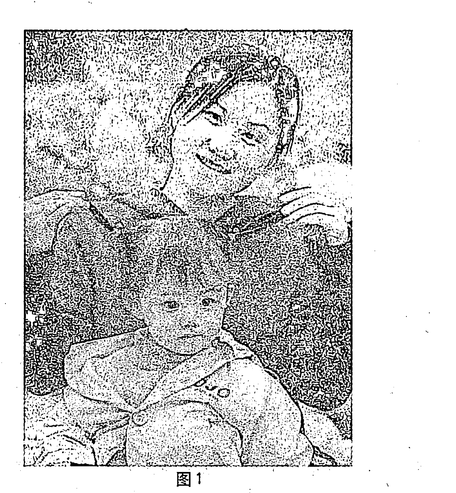

**图1**

### 一、掌握正确曝光技巧

准确曝光对于拍摄一张好的照片来讲是非常重要的，对于数码相机也是如此。目前大多数主流数码相机都具备“傻瓜式”自动曝光功能，可以确保在大多数情况下获得正确的曝光。不过很多初学者在使用自动模式拍摄时，照片效果并不理想，主要就是因为对曝光技巧掌握不好造成的。

#### 1. 不同曝光方式的特点及应用

##### (1) 程序控制

快门速度及光圈大小都由相机自己确定，适合大多数情况下的拍摄，这也是多数傻瓜式数码相机惟一具备的曝光方式。程序式自动曝光是电子技术与人工智能结合的产物。采用这种方式曝光时，相机不但能根据光线条件算出合适的曝光量，还能自动选择合适的曝光组合。普通程序曝光，首先会尽量选择适度光圈，不至于因为快门速度太慢而导致成像不清，也不至于因为光圈太大而损失景深。复杂的程序曝光可以有多种模式，例如，人像模式会选择尽可能大的光圈以虚化背景（图1）；风景模式会选择尽可能小的光圈以扩大景深；运动模式会选择尽可能高的快门速度来拍出清晰的运动物体。运用程序AE模式曝光拍摄，通常能拍出曝光适量的作品，但如果被摄主体与背景的光量相差比较悬殊，拍出的被摄主体则会出现欠曝或过曝的情形。因此，运用程序AE模式拍摄时，要注意选择被摄主体与背景光量比较一致的拍摄现场，如果实在无法避免光线过于明亮或暗淡的背景时，则要善于运用曝光补偿功能，确保被摄主体曝光适量。

##### (2) 快门优先

即由操作者自行设定快门速度，光圈值则由相机根据光线情况自动设定。快门优先自动曝光，适用于拍摄运动物体或需长时间曝光的拍摄场合。可以按照拍摄意图，首先选定快门速度，需要拍摄运动物体时选定高的快门速度，需拍夜景、闪光同步、虚化动体时选用慢的快门速度，比如用于拍摄电视画面应设定为1/15－1/25秒，人为使用慢速快门可造出动态流水的特殊效果等。

##### (3) 光圈优先

光圈，简单说就是衡量镜头通光能力的一个单位，基本上等于镜头有效口径与焦距的比值。光圈的标称数值越小，通光量就越大（比如F2.0的通光量比F2.8要大一倍）。设定为光圈优先时，由操作者自行设定光圈大小，快门速度则由相机根据光线情况自动设定，它是除程序曝光外最常见的一种自动曝光方式。主要用于对景深的控制，比如拍人像就应该尽量用大光圈营造浅景深，需要大的景深时则选定小光圈。相机会根据CCD的感光度和景物亮度来调节快门速度，以达到正确的曝光。由于数码相机光圈物理直径很小，拍摄夜景时收小光圈还可获得“星芒”等特殊效果。

##### （4）全手动控制

这很容易理解，就是光圈和快门值都由使用者手动控制。全手动曝光除了用于营造特殊拍摄效果以外，还有一个重要作用就是锁定曝光量，可以用于拍广角照片等特殊用途。对于专业摄影师而言，他们可能更愿意采用手动控制，因为这样才能更好地发挥他们的聪明才智，尽情享受摄影带来的乐趣，也能拍摄出更高质量的照片。

有些高端机型还支持自动包围式曝光模式（图2），所谓包围式曝光（Bracketing）是数码相机的一种高级功能。尽管测光技术日臻完善，但由于光线条件、被摄主体千变万化，仍可能会出现测光偏差。为了防止因测光失误而错失重要拍摄主题，在许多高档传统相机中就已经引入了包围式曝光功能，就是当按下快门时，相机不是拍摄一张，而是以不同的曝光组合连续拍摄多张，从而保证总能有一张符合摄影者的曝光意图。在数码相机中，不但引入了针对曝光量的包围式曝光，有的相机甚至可以针对白平衡、对焦、ISO等进行包围式拍摄。

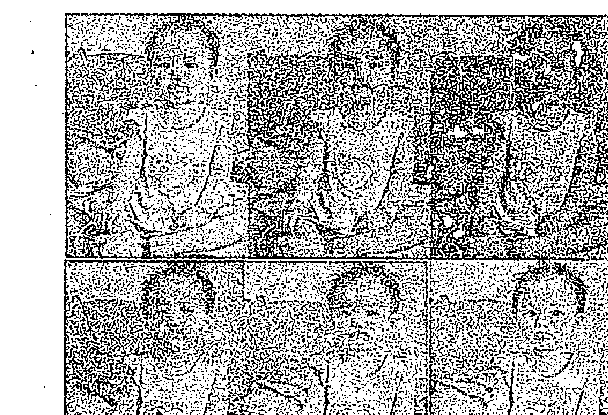

#### 2. 曝光补偿和锁定的应用

大多数比较低档的数码相机，能手工控制的参数很少，但普遍都具备“曝光补偿”这一功能。尽管相机自动测光基本上能满足一般摄影的曝光准确性，但测光系统总有这样或那样的限制。在现场光线情况很复杂或逆光等情况下，自动测光有可能会不准确，这时如果进行人为的相应调节可以提高图片曝光质量。“曝光补偿”就是处理这一问题的必要手段。

比如在逆光拍摄的情况下，大部分测光器往往会判断失误（图3），强烈的白光会导致测光器测出曝光不足的数值，这样拍出的照片看上去就会灰蒙蒙的，如果拍摄人像的话，主体很可能会“一抹黑”，这是比较典型的测光失误。对于这种情况，“曝光补偿”控制是一种很有效的工具，它能让拍摄者在自动测光的设定值外增加或减少一些曝光量，从而使拍摄主体曝光正确。

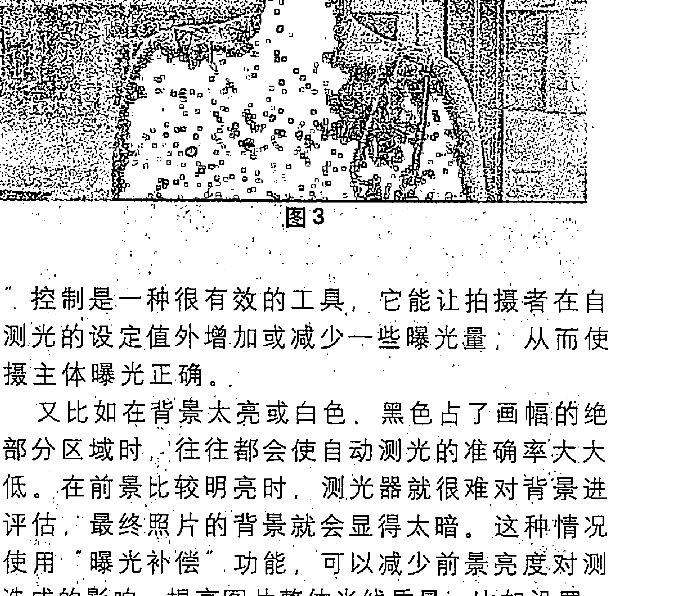

又比如在背景太亮或白色、黑色占了画幅的绝大部分区域时，往往都会使自动测光的准确率大大降低。在前景比较明亮时，测光器就很难对背景进行评估，最终照片的背景就会显得太暗。这种情况下使用“曝光补偿”功能，可以减少前景亮度对测光造成的影响，提高图片整体光线质量；比如设置-1/2EV或-1EV可使背景变明，又不会使前景曝光过度。

使用曝光补偿的原则是：在光线比较强的天气，如晴天、下雪天，还有被拍摄物为大面积浅色物体时，要适当进行负（-）的曝光补偿；在光线暗淡的夜晚，要适当进行正（+）的曝光补偿；在逆光条件下拍摄人物时，应进行正（+）的曝光补偿。

除了具备曝光补偿功能，较高级的数码相机还具备“曝光锁定”功能。在光线复杂的拍摄环境中，比如逆光拍摄时，我们可靠近拍摄主体进行测光，然后选择“曝光锁定”，再重新构图，正式拍摄，这样拍摄主体就可以得到正确的曝光。使用“曝光锁定”有几点需要注意：手动方式或自拍时不能使用曝光锁定，按下“曝光锁定”按钮之后不要再调节光圈大小，也不要再改变变焦镜头的焦距，另外用闪光灯摄影时不要使用“曝光锁定”。

#### 3. 不同测光方式的应用

要获得正确的曝光，我们还需理解并灵活运用不同的测光方式。大多数中档以上的数码相机都具备完善的测光模式，比如分区矩阵测光、中央重点测光、点测光。

##### （1）多分区测光

将整个画面分为多个矩形分区，智能判断曝光量。一般来说多分区越多，测光越准确。多分区测光适合大多数拍摄情况，是最常用的测光方式。

##### （2）中央重点测光

以画面中心为重点，结合周边光线情况，做出合适的曝光选择。这种测光方式适合拍摄以人物为中心的风景纪念照。

##### （3）点测光

对一个很小的范围（一般小于画面的 3%，且多与对焦点联动）进行精确测光（图4）。在通常情况下应用不多，但在特殊情况下非常有用。比如在逆光环境下，对主体使用点测光可使获得适当的曝光量，这也是专业摄影人士常用的测光方式。

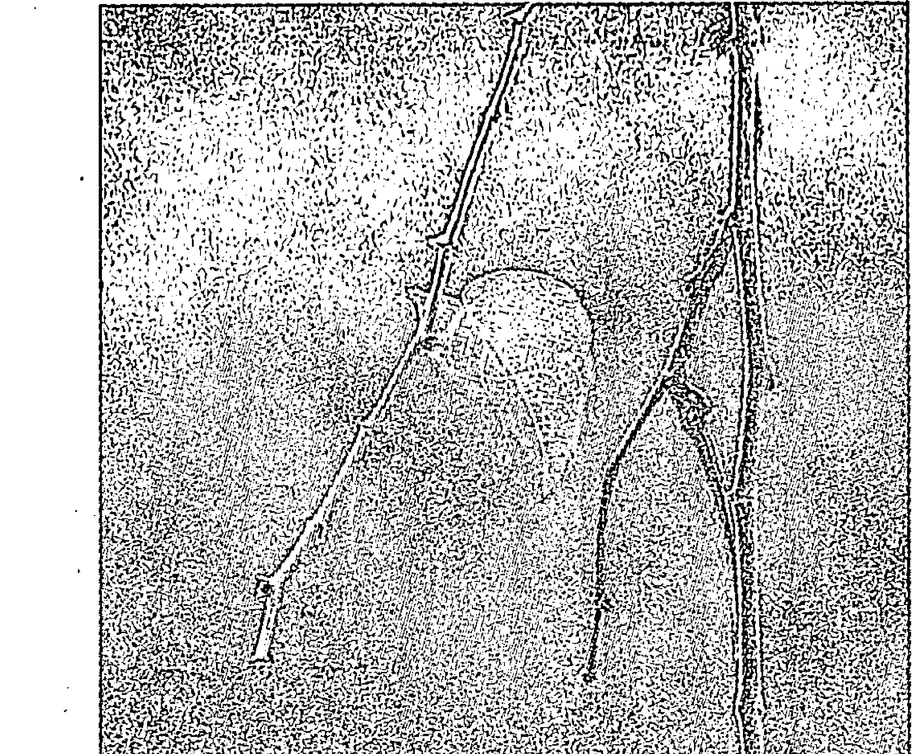

#### 4. 更准确地曝光：“直方图”应用

常说的直方图是指灰度直方图（histogram），即灰度级的函数，它表示图像中具有每种灰度级的像素的个数，反映图像中每种灰度出现的频率。常用的灰度直方图的横坐标是灰度级，纵坐标是该灰度级出现的频率，是图像的最基本统计特征。直方图的左边是暗调部分，右边是高光部分。如果图像中的像素主要分布在暗调区域，则整幅图像看上去会很暗；如果图像中的像素主要分布在高光区域，则整幅图像看上去会很亮。通过在“直方图”对话框中查看像素的分布状况，可以帮助你更好地校正图像曝光。

在拍摄取景或浏览影像时显示的直方图，可直观地表示被摄物体的亮度和当前曝光量设置之间的关系。通过观察液晶显示屏上显示的直方图确认数据，你不仅可以更精确地控制曝光量，并且能通过充分发挥CCD动态范围的优势来达到创作意图。在难以确定图像的曝光补偿时，可帮助用户检查场景的整体亮度。直方图可以提供精确调整曝光所必需的信息，表示图像中的每个亮度级的像素数量。某些DC可在浏览时查看直方图，而更专业的机型则可以在取景时即时监看直方图，显然更加重要。

### 二、焦距与对焦的概念及应用

#### 1. 焦距概念及应用

##### （1）焦距的概念

相机镜头是由一组透镜组成，当平行光线穿过透镜时，会聚到一点上，这个点叫做焦点，焦点到透镜中心的距离，就称为焦距。焦距的长短又对应着视角的大小，焦距越长视角就越小（图5）。由于数码相机的CCD一般比135胶片小得多，所以在相同视角下，其镜头焦距也短很多。再加上各数码相机生产厂商所采用的CCD规格型号不同，因此说到数码相机镜头焦距通常不说其实际的物理焦距，而说与其视角相当的135mm相机的镜头焦距。例如，使用1/1.8英寸大小CCD的数码相机，在镜头焦距为12mm左右时，其视角大概相当于135相机50mm的标准镜头。

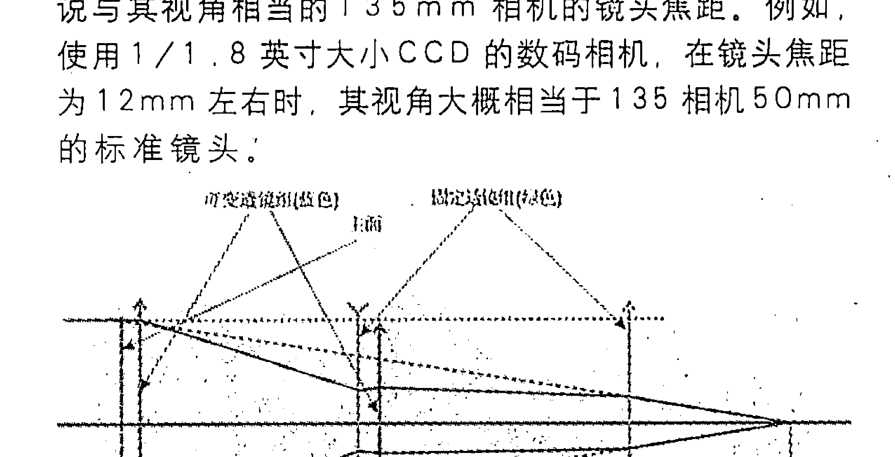

##### （2）变焦

目前数码相机大多具备三倍以上的光学变焦功能，可以在不移动拍摄位置的情况下，方便地调整构图。不同焦距最直观的感觉就是拍摄范围的多少，此外还有透视感觉的不同。一般来说广角端适合拍摄风光，而长焦端用于人物的拍摄，可以获得最佳的透视效果，而用于风光拍摄时，则对远近景物有一定的“压缩感”。使用不同的焦距拍摄，所产生的影像效果不同，一般来说我们把50mm焦距（相当135mm相机）的镜头称为标准镜头，其拍摄出来的照片与人眼视觉基本相同，最能反映事物的客观属性。以50mm为基准，焦距越长，透视感越差，画面压缩感越强，但变形小；镜头焦距越短，景物变形越大，但透视效果好，画面的纵深感也能得到较好的表现，同时还能获得大范围的清晰度。

##### （3）数码变焦

数码相机还有所谓“数码变焦”的概念，说穿了就是通过机内软件处理，将局部图像进行数码插值放大。因为多出的像素并非由镜头实际记录而来，而是软件插值计算而来，图像的实际细节一点也没有增加，透视效果也无改变。熟悉数码影像处理的

#### 2. 手动对焦和景深的应用

随着电子技术的发展，现在数码相机基本上都采用了自动对焦技术。大多数时候我们只需注意拍摄主体的位置，并半按快门，自动对焦即可适应绝大多数拍摄情况。但不论现在数码相机上的自动对焦技术多么先进，由于现实的拍摄环境及对象千变万化，自动对焦总有失误和难以胜任的时候，我们还离不开由人工控制的手动对焦。比如采用被动式对焦技术的产品，对细线条的被摄体自动对焦较困难，在低反差、弱光下的对焦也很困难；而采用主动式对焦技术的产品，当被摄体能吸收光或波时也存在对焦困难，还有透过玻璃对焦困难等等缺点，因此很多时候我们需要手动控制对焦。

有些刚接触数码相机的摄影者认为，在全自动模式下，对焦、曝光都交给相机便行了，摄影者用不着操心什么。其实并不然，每一种相机的AF系统，只能在正常光照条件下工作；我们一定要清楚数码相机自动对焦的特点，比如自动对焦焦点的选择原则，否则可能无法将主要被摄体拍清楚；情况严重时甚至无法对焦。

由于数码相机本身是光电一体化的电子产品，因此与传统相机有所不同，在数码相机上自动对焦方式应用非常广泛，反而有很多产品都不具备完善的手动对焦功能，即使有也和传统相机上采用的双影合一连动测距、裂像式微棱等辅助手动对焦不同。普通数码相机（专业型单反数码相机例外）的手动对焦，实际上仍是目测估算距离的对焦方式，即估算出被摄体的大致距离后，用按钮设定对焦距离。只有个别准专业数码相机可以使用镜头上的对焦环进行手动对焦。由于数码相机的液晶显示屏通常较小，而且像素数也较少，因此在手动对焦时很难精确地检查对焦是否清晰，好在有些数码相机可以放大液晶显示屏上的图像来检测对焦状况。灵活使用数码相机的手动对焦功能，除了可弥补自动对焦的不足外，还有很多其他应用。比如使用手动对焦配合超焦距的应用，可以方便地抓拍动态景物；在拍摄无限远画面及微距拍摄时往往也要用到手动对焦；使用手动对焦还能提高数码相机的反应速度。因此这是我们使用数码相机应该掌握的一个重要技巧。

有一些低档数码相机并不具备任何手动对焦功能，但同样能在大多数情况下拍摄出清晰的画面。要谈这个问题，首先讲一下“景深”的概念：因为“清晰”并不是一种绝对的概念，所以，对焦点前后一定距离内景物的成像都可以是清晰的，这个前后范围的总和，就叫做“景深”。对于短焦距、小光圈的镜头，景深比较大，人们就称对焦点前后的能清晰成像的距离为超焦距。普通数码傻瓜相机和一些低档数码相机，就利用了短焦镜头在一定距离之后的景物都能比较清晰成像的特点（超焦距），省去了手动对焦功能，降低了产品成本。普通家用数码相机CCD面积大大小于35毫米胶片，因此在同样焦距和光圈下，数码相机景深要大不少，这也使得用数码相机拍出浅景深作品很难。

### 三、白平衡及 ISO 设定

#### 1. 正确还原色彩——白平衡应用

在数码相机拍摄过程中，有些初学者发现荧光灯的光肉眼看起来是白色，但用数码相机拍摄出来却有点偏绿，而在白炽灯下，拍出图像的色彩就会明显偏红。实际上，人类的眼睛之所以把它们都看成白色，是因为人眼进行了色彩平衡的修正，而数码相机CCD传感器本身没有这种功能，因此就有必要对它输出的信号进行一定的修正，这种修正就叫做“白平衡”。简单地说，“白平衡”就是无论环境光线如何，仍然把“白色”定义为“白”的一种功能。

现在数码相机白平衡的调整一般具有多种模式，分为自动、白天、阴天、白炽灯、荧光灯等。当你在晴天的室外拍摄时，可以把白平衡功能设定在白天模式；如果在室内拍摄，要根据室内灯源来进行设定，一般有钨灯和荧光灯两种，在荧光灯模式下白色物体会出现蓝色色彩，而在钨灯模式下，数码相机的白平衡功能则会加强图像的蓝色。一般情况下，使用数码相机自动白平衡就可以获得很好的色彩还原，但现实生活中的光线条件是多种多样的，例如，既有窗口的自然光，又有室内灯光，甚至灯光还不止一种，白平衡的设置就很麻烦了，于是较高档的数码相机又增加了手动白平衡功能，即按标准白色设置白平衡参数。我们只需在菜单中选择此功能；然后对着一个白色物体按下快门即可使相机完成白平衡的学习。另外有些数码相机还可以直接设定色温。

我们可以灵活运用白平衡的设置，来获得一些特殊的拍摄效果，比如在拍摄夕阳时，可手动调节白平衡为“晴天”，便能拍摄出充满温暖气氛的画面。而此时如果把数码相机的白色平衡设定在自动位置，相机就会补偿画面的蓝色，并减少红色，以达到色彩“平衡”的效果，从而把夕阳原有的温暖气氛完全破坏了。

#### 2. 正确设定ISO

ISO是International Standards Organization 国际标准化组织的缩写，数码相机中的ISO标准实际上就是来自胶片工业的标准称谓。在胶片工业标准中，ISO是衡量胶片对光线敏感程度的标准，数值越低，例如ISO 50，就表示胶片在曝光感应速度上要比高数值的来得慢，但颗粒更加细腻，反之亦然。数码相机中感光部分的元件是图像传感器，同样也是采用ISO标准来衡量对光线的敏感程度，而且同胶片感光一样，ISO数值越大，最后成像中的颗粒状就越明显。由于数码相机拍摄出来的照片中颗粒感更表面化，这就容易导致所谓的高ISO数码噪点，因此我们在日常拍摄时尽量采用低ISO设定，现在很多新款数码相机的最低ISO能够设为50，在光线充足的情况下，可以获得很干净的拍摄画面。数码相机中的图像传感器和传统胶片最大的区别在于：传感器的ISO感应数值是可以随时变化的，大多数的数码相机都允许用户调整ISO数值设定，而对于胶片来说，要获得不同的ISO数值就必须使用不同ISO标准的胶片。数码相机中增大了CCD的ISO数值后，尽管噪点会增加，但在拍摄时能通过增加快门和降低光圈来获得更灵活的拍摄效果，比如在光线较暗的情况下，提高ISO设定可以获得足够高的快门速度，以保持画面清晰。

### 四、特殊场景的拍摄技巧

#### 1. 微距拍摄及附加镜头使用技巧

绝大多数数码相机都支持微距模式。微距拍摄的照片，可展现出普通摄影中不常见的“微观美”。像花卉昆虫、沙石小品都是很好的微距拍摄对象，一些人眼看似平常的物品，通过微距拍摄可展现出奇妙的效果。大多数数码相机的微距拍摄距离在10厘米内，有的可以达到1厘米。微距拍摄时注意最好不要使用内置的闪光灯，而应使用专门的外接光源，这样才能与被拍摄物体的亮度保证一致。此外最好使用三角架，仔细对焦，并尽量缩小光圈，因为特写模式的景深很浅，稍有一点抖动，就会产生模糊的拍摄效果。微距拍摄时还要注意的一点是，由于傻瓜数码相机大都采用旁轴取景方式，从光学取景窗中看到的景象，和照片的实际成像存在较大视差。在中远距离上，这一影响不太明显，而在近距上偏差就很明显了。这时，微距拍摄必需打开液晶显示屏来进行TTL取景。

对于近拍能力不足的数码相机，我们可以使用微距附加镜，实际上就是一个凸透镜。厂商的正规产品价格较高，不过我们完全可以用放大镜或老花镜自制，也可用一般相机的近拍镜，可以将近拍能力提高到约1：2。具体方法比较简单，这里就不多谈了。

目前数码相机多采用了变焦镜头，但变焦范围都不太大，一般在35mm～115mm左右。非专业数码相机一般都无法换用不同的镜头，拍摄远处的景物时焦距不够长，成像太小，拍摄大的场面时有时视角又不够宽，这些都可以通过加装附加镜头来解决或改善。比如可以使用0.6X～0.8X广角扩展镜（图6），将广角端扩展到28mm内；或1.4X～3X的增距镜头，将长焦端增加到200～300mm，这样可以大大扩展镜头的焦距范围，适应更多的拍摄要求。有些朋友用500毫米的折反镜头或望远镜，配合特殊的目镜，可使数码相机达到极高的望远拍摄能力。要注意的是，对于采用了伸缩镜头的机型，要加外接镜头的话，需使用套筒。另外使用外接增距镜头后，一般要调节到最大焦距才不会有成像圈。若要在使用广角镜时避免黑角产生，需使用大口径接口的镜头解决，最好是先将相机本身镜头上的保护镜取下，再加上附加镜头使用，黑角现象亦可减低。还要提醒大家，在使用附加镜头时，一定注意必需使用LCD取景，而不能使用旁轴光学取景器。

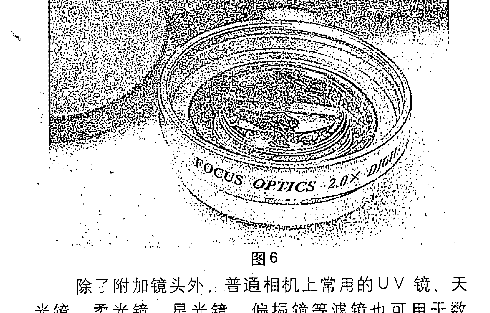

除了附加镜头外，普通相机上常用的UV镜、天光镜、柔光镜、星光镜、偏振镜等滤镜也可用于数码相机。大多数滤镜的效果都可以通过后期制作实现，只有偏振镜所起的作用通过数码加工很难实现，因此在数码相机上最有用的滤镜非偏振镜莫属。偏振镜是用两层玻璃粘合而成，中间夹一层经过定向处理的晶体制成薄膜，这些晶体按顺序排列。偏振镜安装于可旋转的镜架上，通过转动镜架高速偏光轴，在摄影中主要起到消除或减弱非金属表面的反光的作用。同时还能控制天空亮度，使蓝天变暗，并提高彩色影像的色彩饱和度。

偏振镜分为线型偏振镜（PL镜）和圆型偏振镜（CPL镜）两种。线型偏振镜是最普通的偏振镜，但是这种偏振镜不能配合自动化程度较高的数码相机，因为现在的数码相机都具有自动对焦和自动曝光的功能，这些自动功能所需的部分光线信息会被线型偏振镜滤除，导致自动功能可能失效。这种情况下就要使用圆型偏振镜了。圆型偏振镜可以看作由两部分组成：前一部分是一个普通的线型偏振镜，能够滤除某个振动方向的偏振光，后一部分可以使通过它的偏振光振动方向在一个圆周上旋转。这种特殊的偏振光称为圆型偏振光。圆型偏振光对于绝大多数光学元件来说，与非偏振光没有什么区别，所以圆型偏振镜可以在任何相机上使用。大多数档次较低的数码相机，镜头直径也较小，很难找到尺寸合适的滤镜。不过可以想法自制转接环，或直接将滤光镜用手放在镜头前使用，也可使用特殊的数码相机滤镜扩展架。

## 2. 夜景摄影时的注意要点

- （1）拍摄夜景的时机问题
进行夜景拍摄时，环境光照度低，反差大，数码相机的感光元件所得到的信息，容易受到噪声的影响，暗部的细节表现力相对较弱。最好在傍晚华灯初上之时进行摄影，此时天空还没有彻底变暗，在最终影像上有美丽的天空色光；而且环境光会使得最终影像的暗部有更多的细节表现。也可在光值柔和比较明亮的恰当时机，先拍摄一张；再保持相机构图焦距不变，在天完全黑后，再拍摄一张，然后在电脑中进行合成，可以简捷方便地获得高质量的夜景影像。

- （2）拍摄夜景时的对焦问题
数码相机的自动对焦控制系统，相对于传统相机的自动对焦控制系统来说，还有许多值得改进之处。由于对焦感应器对于低反差和低亮度的景物难以准确对焦，所以在进行夜景拍摄对焦时，尽量将焦点对准明亮的景物，准确对焦后再锁定焦距进行构图。拍摄夜景时采用手动对焦（一般将焦距设定为无限远），也是很好的选择。

- （3）白平衡设置的问题
进行夜景摄影时，最好不要采用自动白平衡，装饰建筑物及景物的泛光灯所产生的光波，在感光元件上会呈现比肉眼所见更为艳丽的色光，而傍晚时分的天空色温则会在感光元件上表现出更为惊奇亮丽的色彩。如果采用自动白平衡调节，反而丧失了景物艳丽的色彩，影像平淡无奇。追求特殊效果的朋友还可以试一试不同的白平衡模式，或进行白平衡数值调节，人为地进行图像色彩控制，会有意想不到的收获。

- （4）其他应注意的问题
拍摄夜景时最好配备遮光罩，以免在靠近光源进行拍摄时产生光斑，也可以用简单的物件进行遮挡。另外，拍摄时千万别忘记带上三脚架，手持拍摄会大大影响最终影像的素质。不同光圈快门组合会有不同的特殊效果，比如采用长时间曝光拍摄道路上奔驰的汽车，会获得一道道光的轨迹。由于数码相机镜头较小，在小光圈情况下，场景中的点状光源会在所摄影像中形成美丽的星状光。最后特别强调一点，拍摄夜景时，闪光灯只会给拍摄添乱，请务必将其关闭。

- （5）减少数码照片噪点影响
数码相机在拍摄夜景时，噪点的问题很突出。由于CCD每个感光单元之间的性能有所差异，在长时间曝光时，这种差异就更加体现出来，主要的现象是在暗部出现固定位置的明显杂点。由于CCD感光单元的缺陷一旦生产完成后就固定了，所以夜景噪点总是出现在相同的位置，只不过曝光时间不同的话，强度会有所区别。由于数码照片的噪点都是随机出现、无法预测的，这就决定了噪点从理论上说也是无法被完全去除的。尽管数码照片噪点的完全避免和去除是不可能的，但是我们可以通过合理的使用方法，来减轻数码照片噪点出现的程度，以及用一些软件来减少已经出现的噪点，尽量提升数码照片的质量。

首先我们应充分使用数码相机自带的“降噪（NR）”功能，现在多数较新的相机都具有去除夜景噪点的功能，具体有采用自动方式的，在快门时间长于某个数值（一般为1／4秒），就自动开启降噪功能。由于开启降噪功能后，相机的连拍能力会降低，因此也可以通过手动控制，用户可自行决定降噪功能是否开启。如果你的机器带有降噪功能，在快门速度较低时，建议大家一定要打开机器本身的硬件降噪功能，这样可以获得很好的效果，因为生产厂商对自己产品的缺陷总是最了解的。

其次，我们要掌握数码相机合理的使用方法，比如降低CCD的工作温度。在使用过程中，我们尽量将LCD关闭，也不要连续大量拍摄，以避免机器温度急剧升高，带来更多的噪点。对于重要照片，最好在开机后CCD温度较低的时候立即拍摄。拍摄时尽量选择较低的ISO参数。此外，建议在拍摄时尽可能选择足够高的JPEG压缩质量，甚至直接选择无失真的Tiff或者Raw格式。

最后还应注意：用数码相机拍摄时，应远离手机等电磁干扰源。过量无线电磁波会干扰电子器件，当然数码相机也就不例外了。如果用变压器作为电源拍摄，一定要注意电源的质量必须很好。另外一个容易导致噪点的原因就是电池供电能力不足（特别是电流值不够），因此我们不要在电池完全无电时才更换电池。对于“夜景噪点”，由于其位置和强度相对固定，所以去除也要简单一些，实际上数码相机自带的“降噪”功能就是专门去除“夜景噪点”的。后面也将讲述使用软件消除或减轻数码相机照片噪点（主要是“夜景噪点”）的方法。

## 3. 用数码相机拍摄全景照片

在数码影像技术出现之前，人们要获取全景照片需通过专用拍摄器材或暗房拼接实现，这两种方法都是普通摄影爱好者很难做到的。数码相机和数码影像处理技术的普及，使全景摄影变得容易起来，只要有一台数码相机和计算机，谁都可以尝试制作全景照片（图7）。不过要拍摄、制作成功的全景照片，还是需要掌握一定的技巧。

首先，让我们来看看不同品牌数码相机对全景摄影的支持情况。部分数码相机提供了对全景摄影的直接支持，相机有专门的全景拍摄模式，能帮助你锁定曝光参数，甚至自动拼接，让用户省不少心。奥林巴斯大多数型号的数码相机都具有使用方便的全景摄影功能，但要使用奥林巴斯原装SM卡此功能才有效。卡西欧QV系列数码相机也有专门的全景模式，在此模式下，拍摄第一张后，在随后的拍摄中，LCD取景器左侧会出现上一幅照片的边缘虚影，方便接着拍下一张，而且在浏览时会自动拼接成一幅长轴，十分方便查看拍摄效果。佳能PowerShot系列数码相机是目前拍摄全景照片最方便的，在全景模式下有从左至右、从右至左、从上到下、由下而上、上下左右五种拼图方式可供选择，拍摄完第一张后，取景时LCD中清晰地显示前一张的局部，可以直接很准确地拼接。而柯达、富士、美能达、尼康等其他数码相机，本身则未设置专门的全景拍摄模式，需自行拼接拍摄，但只要拍摄和制作得法，一样可以获得不错的效果。使用这类相机拍摄全景照片时，我们应注意以下问题：

除了使用拼接的方法外，有条件的话，还可以使用一款数码相机专用的鱼眼镜头进行全景拍摄，你只要按一下快门就可以拍摄360度的全景照片。鱼眼镜头可以生成一幅圆形的图像，看上去就像你在一面突出的镜子前用鱼眼透镜看到的那样。用鱼眼镜头拍出的图像质量相当好，尽管与传统拼接方式拼出来的全景图像相比，在细节和清晰度上要略逊一筹，但从另一方面来说，当你按下快门后，几秒的时间内就可以获得全景照片，这要比漫长的传统拼接过程简单多了。不过这款镜头的价格较为昂贵，995美元的报价足以买一台顶级的准专业数码相机了。

在焦距的选择上，由于广角镜头透视效果强烈，画面的边缘容易发生扭曲，造成拼接困难，所以拍摄时应该尽量使用变形较小的中长焦端拍摄，并且拍摄中途不宜改变焦距。在曝光参数的选择上，对于没有全景功能的相机，要注意测光时使用平均测光，曝光时使用手动曝光或AE锁锁定曝光参数。同一组全景照片的拍摄过程中，不能改变白平衡等的设定。同时拍摄时则应依照一定顺序拍摄，并最好使用三脚架平稳旋转，注意选择容易混合的部位作为结合部，而且最好留有较多的结合部分，这样拼接起来不容易看到接缝。

## 五、数码相机闪光灯应用技巧

大多数数码相机都带有一个小功率的内置闪光灯，这是为了保证在光线不足的条件下也可以正常拍摄。但是使用闪光灯拍摄，并非只要打开闪光灯，闪光一亮就OK，里面还有非常多的使用技巧。闪光拍摄是很重要的摄影技巧，好在大多数数码相机的闪光控制功能还是比较完善的，因此下面就谈谈数码相机闪光灯在各种模式下的应用技巧。数码相机闪光灯的设置通常有以下几类：自动闪光、强闪、不闪光、慢速闪光同步和消除红眼闪光等。

### 1. 自动闪光
简单来说，就是由数码相机自动判断是否使用闪光灯，若在光线不足的环境下拍摄，便会自动地激活闪光灯。一般而言，“自动闪光”的模式可以适合大部份的拍摄状况。但其存在的问题也很多，比如有时候在不需要闪光时，它也闪了，将完全破坏我们的摄影意图，比如拍摄电脑屏幕，如果闪光的话，画面就会因为反光，而完全失去实用价值。因此我们不能依赖数码相机的自动闪光，而应灵活使用强制闪光或不闪光的功能。

### 2. 强制闪光或不闪光
强制闪光，最常应用在拍摄主体处于逆光状态时，利用闪光灯加以补光，以免拍摄的主体过于灰暗。闪光灯给数码相机拍摄带来了很多方便，逆光拍摄就是一例。逆光拍摄时，将闪光灯强行打开作为辅助光，就能拍出较好的效果。在阳光下拍摄，有时我们也应用强制闪光来消除拍摄主体上的阴影。

### 3. 消除红眼闪光
红眼是指在用闪光灯拍摄人像时，由于在黑暗环境中被摄者瞳孔放大，容易产生反光，使拍出照片上人的眼睛中有一个红点的现象。大多数数码相机都具备“消红眼功能”，就是先让闪光灯预闪数次，或对焦辅助灯发光，瞳孔缩小后，再执行实际的闪光拍摄功能。除此之外，为避免“红眼”还可以采用如下方法：将闪光灯与照相机分离；增加环境光强度（如开灯）；采用反射闪光法曝光等等。

### 4. 慢速闪光同步
在普通闪光拍摄模式下，快门速度一般都比较快，因此在微弱的光线环境下拍摄时，如果使用一般的闪光拍摄模式，由于闪光灯发光能量有限，很容易造成主题明亮，但背景却非常暗，背景细节亦无法显现，达不到理想的拍摄效果。若改用“慢速闪光同步”，相机会令快门的速度延迟变慢，便可以改善背景过暗的情形。在夜间同时拍摄人物与背景时，可使用“慢速闪光同步”，这是很重要的闪光拍摄技巧。在使用“慢速闪光同步”模式时，应注意使用三脚架，否则画面可能会因快门速度变慢而模糊。当然并不是所有的数码相机都支持“慢速闪光同步”模式，也可以用曝光补偿来实现一定的慢速闪光效果。具体说，就是在夜间使用闪光拍摄人物时，增加一到两级曝光量，可以有效防止背景过暗问题。

### 5. 前后帘闪光同步
前帘同步是指在快门刚打开后的一瞬间闪光灯闪光，而后帘同步是在快门打开后即将关闭前的一瞬间闪光灯闪光。在快速或高速闪光同步，以及拍摄相对静止的被摄体时，两者间的区别并不明显；而在慢速或长时间曝光模式，或者拍摄活动相对有运动倾向以及活动被摄体时，使用不同的闪光同步模式，则会得到效果完全不同的图像，尤其是在低照度环境时尤为明显。
比如说，在低照度环境里，使用广角镜头拍摄一个人骑自行车斜方向迎面而来的画面，使用后帘闪光同步模式，将会得到一张在被摄主体后面有拖影而被摄主体清晰的照片。由于后帘同步是先打开快门进行曝光，在快门关闭前的一瞬间闪光，拍摄快速移动有亮点的物体就会产生光点，得到在运动物体身后划出光道的特殊效果。

前帘同步是最基本的闪光方式，由于闪光灯进行一次闪光的时间很短，而高速快门又是靠快门叶片之间的夹缝扫过胶片完成曝光，所以有“最高闪光同步速度”的概念。如果最高闪光同步时间为1/250秒，而我们用1/500秒的快门进行闪光摄影，由于快门夹缝未能全部扫过CCD时，闪光就结束了，从而导致画面照度不均。

### 6. 使用外加闪光灯
大多数数码相机的内置闪光灯，功能和指数都有限，不能满足我们对闪光摄影较高的要求。有些比较高级的型号具有外加闪光灯的“热靴”，我们可以外加功能和指数都更强的闪光灯。但是几乎所有5000元以下的普通数码相机都不具备外加闪光灯的功能，不过我们已有一般的闪光灯，只需去照相器材市场购买一个廉价的无线闪光同步器（约20元），即可方便地给数码相机增加一个外置闪光灯，而且还是双灯同闪。外置闪光灯的方向、位置、角度都能灵活控制，可以大大改善闪光拍摄的效果。有些高级外置闪光灯还具有FP高速同步的功能，即利用小功率、高速度的频闪实现全程快门速度的闪光同步，这为高亮度背景下主体补光提供了可能。

## 六、存储卡和电池的使用
数码相机的存储卡就好比传统相机的胶卷，装取和使用的时候一定注意以下几点事项：
向数码相机中装入存储卡，首先要保证所用数码相机处于关机状态，几乎所有的数码相机都不允许在开机的情况下向机内装入存储卡；向数码相机中装入存储卡，要注意存储卡装入的方位。对指定存储卡，只能以指定方位装入数码相机，每一种存储卡上都有相应标记供人们在装入时识别。数码相机上的存储卡仓外都有一仓盖，装入存储卡后，一定要将存储卡仓盖盖好。当数码相机正在对存储卡施行读、写操作时，不得将仓盖打开；千万不能在向数码相机存储卡写入信息或读出信息的情况下取出存储卡，否则将会导致存储卡上的信息遭受损失，甚至损坏存储卡。

最后要注意的一点是，闪存的擦写次数是有限的，因此我们应尽量将一张卡存满后，再一次性删除。另外尽量减少格式化的次数，数码相机随配的存储卡，在出厂时已进行过格式化处理，购回后可以直接使用，不必再进行格式化处理。不过在遇到某些特殊情况时，可能需要对存储卡进行格式化操作，比如要删除存储卡上的所有影像，既可以用数码相机的全部删除功能，也可利用格式化处理的方法。绝大部分数码相机都包含了格式化存储卡的功能。如果必须要对存储卡进行格式化处理，应注意以下几点：
一是格式化处理时，不得打开数码相机上的存储卡仓的仓盖，也不允许关闭数码相机的电源。同时要确认电池电量充足，若格式化过程意外中断，可能会对存储卡造成难以预料的损坏。二是格式化处理将清除存储卡所有拍摄存储的影像文件和声音文件，而且清除后的文件无法再恢复，因而对是否进行格式化处理要谨慎，要在确保存储卡上没有有用的影像文件和声音文件后才能进行格式化处理，否则将会造成无法挽回的损失。第三，对于CF存储卡，由于其本身包含了控制器，因此也可以在读卡器中与电脑连接后，进行格式化操作。但对SM卡来说，由于控制器在相机内部，因此必须在相机中进行格式化操作，否则相机很可能不能正确识别存储卡。

下面再谈一下数码照片的恢复技巧。有些朋友因为对相机操作不太熟练，常会因为种种原因导致已经拍摄的照片丢失，一旦出现这种情况应立即停止拍摄照片，然后取下存储卡并通过读卡器连接到电脑上，使用Finaldata等数据恢复软件，无需任何专业设备和技能就可以把删除的数据恢复。更好用的是Digital Image Recovery，这是一款专门的数码照片恢复软件，它可以帮助大家恢复误删除的存储卡中的照片，甚至可以恢复已经被格式化的存储卡，让你找回失去的所有照片。

现在，数码相机主要是靠电池供电，但如果你使用的是不匹配的电池或是不注意节省，电池电量就会在你没拍摄几张照片后就耗尽了。当你发现它们就快耗尽时，就得更换新电池（若使用镍镉或镍氢电池还要注意它的存储记忆问题）。电池是数码相机的动力之源，因此电池问题非常重要。当电池耗尽后，数码相机就什么也干不成了。所以，在外出拍摄时，我们不仅应带上备用电池或是AC适配器，还应按下下列注意事项延长电池使用时间：尽量少用LCD取景或回放，LCD是数码相机耗电的第一大户，关闭LCD可以让你延长一倍以上的使用时间；尽量少用闪光灯；合理确定开关机的次数，既不要频繁开关机，也不要长时间不用而不关机。同时要设定好相机节能方面的设置。

## 七、查看并上传你的数码照片
摄的照片可在配备的LCD显示屏上回放。一般数码相机支持同时回放4张或9张图像，便于快速选择需要全屏回放的图像。有些数码相机还具有放大模式，可在LCD显示屏上将存储的图像放大，便于查看图像细节。在幻灯回放模式下，相机能自动在LCD显示屏上回放所有存储的图像，许多数码相机还配备视频输出端口，可与电视连接起来回放所拍摄的图像。还有些机型支持自定义设置回放图像间隔时间，甚至可以在图像转换期间进行特效设置。一般数码相机使用的是VHS视频端子，接电视机的视频输入，也就是平时接VCD视频线的那个端子，标志常常是一个箭头指到一个圆环里面，英文标志是Video In。电视机需要转到AV状态，若有多个输入端口，要注意选择。连接电视机以后，数码相机播放照片时就会显示在电视机上，在LCD上不再显示。个别机型还可以在拍摄状态时利用电视机取景。数码相机的视频输出一般都支持N/P两种制式，可以在数码相机的菜单中选择，新型号的大屏幕彩电一般能自动识别制式。

数码相机拍摄的照片大多需要上传到电脑，直接连接是将相机与电脑连接起来最常用的方法，几乎所有数码相机都可以通过USB电缆与电脑连接，可能也有些老式机型需使用串行电缆连接，专业机型及数码摄录机还支持使用速度更快的FireWire接口连接。一般来说，现在数码相机通过USB口与电脑连接后，相机将会作为移动磁盘自动被电脑识别(Windows 2000/XP下)。这样就可以不要任何软件程序，直接在Windows下完成相机和电脑之间的图像复制或删除工作。对于找不到驱动的数码相机，你也可以试用ACDSee这个功能强大的看图软件，它支持从很多数码相机中直接读取照片，而且它还在不断增加数码相机的支持种类。

当然我们也可以使用读卡器进行照片的上传。读卡器是一种小巧的外接设备，将其连接到相机的USB端口后，具有读取相机存储卡的能力，如果要将图像从数码相机上传到电脑中，只要将存储卡插入读卡器，电脑就会将其作为移动硬盘直接读取。如果你使用笔记本电脑，则可以去买个CF或SM卡的转换PC卡，插到笔记本的PC槽中就可直接读出。实际上，为保护相机，大多数数码摄影发烧友都使用读卡器来读取照片。

使用专门的底座也可以将相机与电脑连接起来，连接过程也很简单，只要将相机放入底座按下按钮（有些底座还可以自动工作），就可以轻松完成图像传输，并可通过软件进行编辑、打印等操作。这是一种最简捷的传输方法，许多底座还具有充电器功能，可对相机电池充电。在新一代机型中，有些产品内置无线连接功能，可以无线方式在相机和电脑之间传输图像。

## 八、数码相机的另类使用技巧

### 1. 数码相机摄像技巧
用数码相机拍摄录像，尽管总体看效果已经有了很大的改进，但在镜头的推拉变焦、录音保真、可录制时间、暗光线环境拍摄效果等方面还是比不上真正的DV。如果在拍摄时，我们注意下列问题，也能够最大限度改善DC的录像拍摄效果。

首先是选择合适的分辨率，一台注重录像拍摄效果的数码相机，一般会有320×240/15（30）fps norm（fine）640×480/15（30）fps norm 160×120/15（30）fps norm等七、八种之多的录像格式可供设置。从实际使用效果看，320×240/30fps fine和640×480/15fps norm的效果都相当不错，前者画面流畅，但清晰度一般，适合拍摄运动较为激烈的场景；后者清晰度非常高，但略有顿挫感。如果拍摄不太重要的画面，或为节省存储空间，也可采用320×240/15fps norm的设定。这样数据流量可降到150KB/秒，使用128M的存储卡便足可拍摄12分钟长的录像。总之DC的录像功能是附带功能，我们要以增添乐趣为目的，不必过分追求效果，建议一般场景，多使用320*240/15 fps的分辨率，可以节省很多存储空间。

其次要注意适当的曝光和变焦。合理使用相机的点测光、中央重点测光等功能。在适当的时候还可以考虑进行曝光补偿、提高ISO设置，改善在暗环境中的拍摄效果。拍摄录像时要注意稳字当头，尽量用广角端拍摄，不要随意推拉变焦，摇来晃去，手持拍摄时要端稳或寻找可支撑依靠的物品，双手把持，减少边走边拍的机会。对焦方式建议选择随时对焦模式。此外适当进行数码变焦，弥补光学变焦的不足也是可以的，但数码变焦切不可超过三倍，否则将对录像质量造成较大的影响。最后要注意录像片段的拼接与后期制作，比如用Adobe Premiere制作转场和添加字幕，用Windows Media Encoder进行压缩输出，最后可以刻录为VCD、DVD碟片，也可将编辑后的视频片段转换为DivX、WMV、RMVB等格式，既可以保证影像质量，又可以尽可能少地占用存储空间。

此外动态影像的录制会消耗很多电量，占用大的存储空间，所以必须准备好充足的电池与存储卡等耗材。在拍摄录像时，对存储卡的质量尤其是写入速度，要求相当高，质量差的产品根本无法使用。好在SD、XD卡和新型记忆棒的写入速度是有保证的。使用CF卡的产品拍摄高画质录像画面时，必须使用微型硬盘或速度较快的新型CF卡才能长时间拍摄。从目前情况来看，如果你的数码相机支持CFII接口，那么使用微型硬盘是性价比比较好的选择，否则也可以考虑使用DC伴侣或随身携带笔记本电脑。此外通过使用专门的软件，可以让某些型号的数码相机，直接通过USB连线作为电脑摄像头使用。其实，只要使用带AV输入功能的显卡或单独的视频输入卡，几乎任何一款数码相机都可以作为摄像头使用。不少数码相机还支持间隔拍摄，可在一定时间间隔内连续对某个景物拍摄一系列图像，用户可以将相机放置在三角架上，选择好拍摄间隔时间按下快门，数码相机就会根据设置不停拍摄图像，直到将设置取消或存储卡没有存储空间为止，这种模式可用来拍摄正在开放的花朵和云彩变化等。

### 2. 用数码相机实现OCR识别
过去图片输入最重要的工具就是扫描仪，随着数码相机的普及，大多数图像输入都可以使用数码相机完成，但是仍有一些朋友未放弃扫描仪，主要是利用其OCR功能和底片扫描功能。其实用数码相机也可以实现这两种应用，这样在普通家用办公环境中，有了数码相机，就完全可以淘汰扫描仪了。虽然OCR文字识别技术在扫描仪上的应用已经非常成熟。但一直未能与数码相机联系起来，其主要原因有三个方面：一是300万像素以下数码相机拍摄画面的成像质量，无法保证图片细节的清晰还原，达不到使用OCR进行识别的理想效果；另一方面，扫描仪与数码相机的成像感光方式存在巨大的差别，扫描仪的感光元件为水平放置，射入的为彼此平行的垂直光线，而数码相机使用的球面镜头，需经过聚焦成像，不可避免地会造成文档页面边缘变形与模糊，从而影响OCR识别效果；第三是普通OCR软件大多要求直接与扫描仪配合，并只能识别特定格式的图像文件。但随着技术的进步，这些问题都已得到改进，只要我们注意以下几点，用数码相机同样能实现较好的OCR识别效果。

一是数码相机的选择和拍摄质量。数码相机的像素值当然越高越好，镜头分辨率和微距拍摄效果也要比较好。不过，要拍摄出高质量的文本图片，除了相机外，对操作者本身的摄影技能也有较高要求。在拍摄时，需将焦距、白平衡、曝光度等参数都调整到合适的状态，应尽量避免用广角端拍摄，用镜头中焦端，配合小光圈，以获得最佳的拍摄效果。此外，如果相机支持，最好直接选择黑白模式进行拍摄。

二是选择合适的OCR软件。在以前的OCR软件中，只能对黑白二值的图像进行识别（有些还必须要配合特定的扫描仪），那么使用这类软件的话，我们必须对数码相机拍摄的原稿用相应软件进行转换处理。现在新版的OCR软件，都支持灰度甚至全彩色图像文件的直接识别，例如，汉王OCR5.0与尚书六号等。最近市面上出现了一些专门以OCR识别为卖点的数码相机产品，其实就是捆绑了专门的OCR## 3. 用数码相机翻拍底片

要把底片变成数字档案，最好的方法当然是用专门的底片扫描仪，或者普通扫描仪加上底片适配器。在没有底片扫描器的情况下，数码相机也是一个不错的替代品，如果对输出精度要求不高的话，用来上网发布相片已经足够用了。

要用数码相机成功翻拍底片，最重要的有两点：一是使用合适的相机，关键是微距拍摄能力要强，最近拍摄距离最好在3厘米以内，且像素值足够高，最好在4百万像素以上。普通产品也可以用来翻拍底片，尽管效果稍差一些，但能满足计算机中观看及网上传递的需要。二是要有合适的辅助设备，比如Nikon数码相机的微距拍摄能力大多很强，因此专门为其Coolpix系列产品配备了底片翻拍架，用来翻拍底片效果相当不错，不过价格较高，且需配合专门型号的数码相机，其实我们完全可以土法上马，也能获得较好的底片翻拍效果。

首要的是找到合适的光源：要求光度平均、色温正确。有条件的话可使用幻灯片观看器，也可用CRT显示屏，将其当作灯箱使用为底片照明。具体就是将显示屏调校为最亮及色温最白，并开启一个空白的窗口。在显示屏上贴上半透明纸一张，再将底片贴在其上，胶片四角最好用东西压住，保持平整，然后翻拍。拍摄时注意将相机设定到微距档，并用较小的光圈和镜头的中焦端，尤其注意关闭闪光灯，且用较小的压缩率，保证细节清晰再现。相机焦平面还要和底片平行，才能拍出变形小的图片。

一般来说正片的翻拍效果较好，翻拍后只需进行简单的剪裁、调整处理，就可以得到不错的效果。但如果翻拍的是负片，处理起来就比较麻烦一些，如果你的数码相机本身提供了“负片”效果，用来拍摄底片的话，可直接成为正片，否则可以用Photoshop等软件进行处理。翻拍负片不仅存在由负转正的问题，还有片基颜色的去除问题，要把片基的颜色分离出去，才能获得较好的翻拍效果。具体来说可找到拍摄图像的最黑和最白点，在Photoshop中打开Image → Adjust → Levels对话框，在对话框中的右下角有三个滴管，最左边的滴管可设置图像的最黑点，最右面的滴管可设置图像的最亮点，分别选取这两个滴管，在图像中相应进行设置，偏色会立即改善，当然要得到完美的效果还需要进一步调整才行。

## 4. 用数码相机作展示

你是否想到过将自己喜欢的照片随身携带，甚至在电视上展示给别人看？我们完全可以利用手中的数码相机实现这个目的。我们只需将图片文件，处理为适当大小的JPEG文件存储到相机存储卡的相关目录下即可。这样你就能将自己喜欢的各种图片（甚至录像片段）放到一张存储卡中，随身携带到任何有电视的地方展示给他人欣赏。

我们还可以灵活利用数码相机的A/V输出功能进行幻灯演示，将PowerPoint幻灯片逐页另存为图形文件，重新放回数码相机中即可用于系统性的演示。有些数码相机还可以选择存储文件夹，我们可以将制作的多个演示文稿存储在不同的文件夹下，这样管理起来非常方便。还有一些数码相机可以给每张照片配上一段声音，且具备录像拍摄和播放功能，配合A/V视频输出就能获得更多的用途了。如果为数码相机配上一个大容量存储卡，以及小型液晶显示器或便携液晶眼镜，就可以组成一台便携视频播放器，这是非常有趣且实用的功能，要知道现在市场上类似的便携视频播放器，价格大部分都在2000多元以上！

大多数数码相机都支持显示非本机拍摄的照片，当然要求照片需符合一定的规则，比如文件的命名规则必须与数码相机默认的一致，而且一定要存放在规定的文件夹下，文件格式和大小都应该采用与数码相机所拍摄照片一致等等。但并非所有数码相机都支持显示非本机拍摄的照片，或虽为本机拍摄但已被编辑过的照片，这时可以通过修改图像文件的文件头，骗过相机，让它认为是本机拍摄的照片从而显示出来。

另外，现在很多数码相机具备短片拍摄功能，我们不仅可以用数码相机展示照片，甚至可以用来作为视频播放设备。比如三洋的MZ2就可以播放MOV格式的录像片段。具体方法很简单，就是将任何格式的视频文件（如AVI，MPEG）用动画编辑软件（如Premiere）剪接加上字幕，并作一些换场及滤镜特效和配乐，再输出成PHOTO JPEG QUICKTIME的格式即可，然后放到CF卡的DCIM\xxxSANDS\ VCLP目录下，只要文件名需符合相机的规则，MZ2即可播放此录像片段。

现在大多数数码相机都能被Windows 2000以上的操作系统直接识别为移动存储器，因此也可以作为移动硬盘来使用。总之，数码相机是传统摄影行业的一大革命，它带给我们的乐趣是非常多的，我们不要将其功能仅仅局限在拍摄照片上，只要你用心，一定还能发掘出数码相机很多其他方面的功能和应用。

## 九、数码相机维护技巧

数码相机的使用寿命除了本身的设计和制造因素外，关键还在于保养。为了保持相机良好的工作状态，延长使用寿命，必须精心维护。保养好CCD、取景装置、LCD、镜头等关键部件，注意电源的使用，做到：防震、防冻、防热、防潮、防尘等。

### 1. 数码相机保养的一般注意事项

天气炎热的季节，千万不要让你的相机直接暴露在高温下，一定要避免阳光的直接照射，更不可将数码相机长时间放在阳光暴晒下的汽车中。天气特别冷的时候，你应当将相机放在大衣里来保持它的温度。把相机从冷的地方带到温暖的地方时，为防止冷凝液在机体里产生，应把相机放在塑料包中或用报纸裹住，直到相机的温度回升。我们要注意在不同温度下合理使用相机。

除了环境温度，还应注意防水、防尘，如果你去海滩或瀑布区拍照，那防水机壳也许是必备的，只要将数码相机安放于防水机壳中，把机壳好好合上、锁好，便可一心一意在水中或沙上放心拍摄了！防水机壳不怕水也不怕沙，甚至更可承受最多三十米的水压。如果去沙漠等地，防尘也不可掉以轻心，一粒沙子，就可能导致整台相机失灵。

数码相机存放的时间要远远长于使用的时间，因此我们一定要注意相机的保存。保存相机要远离灰尘和潮湿，在保存前，要先取出电池。如果数码相机长期不用，应取出电池，卸掉皮套，存放在有干燥剂的密封盒子里。存放前应先把机身和镜头上的指纹、灰尘擦拭干净。总之数码相机应尽量在清洁的环境中使用和保存，这样可以减少因外界的灰尘和油烟等污染，导致相机产生故障。

单反数码相机的使用，尤其要注意CCD/CMOS污染的问题，在室外更换镜头时，会有大批灰尘不请自来，应该经常用吸尘器彻底把芯片仓内的灰尘吸走，再小心将感光芯片擦干净。

### 2. 镜头及LCD的保养

镜头是数码相机的重要组成部分，如果长时间使用相机而不注意维护镜头的话，那么灰尘将越聚越多，这样会严重降低图像质量，出现斑点或减弱图像对比度等。另外在使用过程中，手碰到镜头而在镜头上留下指纹，也是很难避免的，这些指纹同样也会使拍摄效果下降。当然镜头上有一丁点儿的尘土并不会影响图像质量，只有在非常必要时才需对镜头进行除尘。而指印对镜头的色料涂层非常有害，应尽快清除。在不使用时，最好盖上镜头盖，以减少清洗的次数。清洗镜头时，先使用软刷和吹气球去除尘埃颗粒，然后再使用专门的镜头布擦拭。

大家千万不要用硬纸、餐巾纸来擦镜头。这些产品都包含有刮擦性的木质纸浆，会严重损害相机镜头上的易损涂层。在清洗相机时，切勿使用溶剂苯、杀虫剂等挥发性物质，以免相机变形甚至溶解。

液晶显示屏是数码相机重要的特色部件，不但价格很贵，而且容易受到损伤，因此在使用过程中需要特别注意保护。在使用、存放过程中，要注意不让彩色液晶显示屏表面受重物和挤压，更要注意不能脱手将相机掉到地上以免摔坏液晶显示屏；彩色液晶显示屏表面脏了，只能用干净的软布轻轻擦拭，不能使用有机溶剂清洗。有些彩色液晶显示屏的显示亮度会随着温度下降而降低，这属于正常现象。在温度相当低时，液晶显示屏可能无法正常使用，比如显示的亮度将会极低，因此尽量不要在低温环境下长时间使用数码相机。

彩色液晶显示屏的背后有一个背光灯，如果彩色液晶显示屏显示的影像变暗，或根本就不能显示影像，多半是背光灯管老化所致，遇到这种情况一般只要更换相应的配件即可。如果怕数码相机液晶显示屏会被刮花或拍摄时沾上油污，可以贴上PDA屏幕用的透明保护贴纸。

如果LCD显示屏出现了这样的划痕或条纹，我们应该怎么做呢？在手机或摩托车配件商店我们都可以买到小管的屏幕磨光剂，它同样可以用来消除掉数码相机的LCD显示屏上那些讨厌的划痕以及用旧后出现的污点。使用方法也很简单：先挤出一点在显示屏上，然后用一块棉布摩擦有划痕的地方2到3分钟，最后将多余的磨光剂抹除掉。根据需要还可以重复几遍，直到磨去划痕。这种方法只能在具有光泽的LCD显示屏保护罩的相机上使用，对于那些没有光泽的相机显示屏，如佳能的PowerShot系列或是索尼不少型号的相机，都不能使用这种清除方法。

### 3. 数码相机存储卡及电池的保养

对于数码摄影而言，存储卡就相当于胶卷，在摄影过程中扮演着相当重要的角色。而存储卡是比较娇贵的部件，必须精心保护。对存储卡漫不经心的使用，可能导致存储卡上的信息丢失，甚至损坏存储卡。因此必须注意存储卡的维护和保养。

向数码相机装载或取出存储卡时，都一定要在关闭数码相机的情况下进行。当存储卡正在工作时，切不可试图从数码相机中取出存储卡，安装时要注意装入的方位，只能以指定方位装入数码相机，漫不经心地乱插会导致卡仓和存储卡损坏。尽量不将存储卡置于高温和直射阳光下，不对存储卡施重压，不弯曲存储卡，避免存储卡掉落和受撞击。同时还要避开静电和磁场，更不要随意拆卸存储卡。同时，要经常对已拍摄在存储卡上的信息进行备份，以防不测。

在电池的保养上，首先要合理选择充电方式。在一般情况下，给电池充电建议选择慢充方式。这样可以延长电池寿命。如果经常使用快充方式充电，一段时间后应对电池进行几次维护性质的慢速充电。对于充电时间，则取决于所用充电器和电池，以及使用电压是否稳定等因素。如果是第一次使用，锂离子电池的充电时间一般要超过6小时，镍氢电池一般要超过14小时，这样会有利于电池寿命的延长。

日常使用时，要注意对电池进行必要的清洁，主要是保持电池两端接触点和电池盖子的内部干净，可使用柔软、清洁的干布轻擦，如果电池的电极出现氧化情形，更要将其擦拭掉，这样可以确保电池完全地充入和释放电量，避免电量流失的问题发生。若长时间不使用数码相机，必须将电池充满电后，再从数码相机中或是充电器内取出，然后存放在干燥阴凉的环境，注意不要将电池与金属物品存放在一起。

### 4. 数码相机固件的升级

比较正规的数码相机都采用了可方便擦写的FlashROM来储存BIOS，同时大多数也提供专用的软件来刷新其BIOS，具体方法与升级主板BIOS类似，比较简单。但升级这些设备的BIOS时要十分小心，一旦失败恢复起来就十分困难。下面谈谈佳能部分型号数码相机固化程序升级的具体方法：

首先确认相机的内部程序版本是低版本，否则无需升级，方法是在与计算机联机时，打开联机软件的Camera Settings窗口，可以看到相机固件的版本号。升级前一定确认电池已经充足电或者交流供电器供电正常，因为一旦升级过程中掉电，将导致相机不能使用。准备一张空白的CF卡并重新格式化。下载升级软件，软件解包后将DC97目录及其内容复制到CF卡上，如果有读卡器或笔记本电脑可直接复制，若没有，需要把数码相机与计算机连接，运行UploadFirmware。

将相机的控制盘转到“回放”功能“P”位，按MENU键，从菜单中选择Firm Update功能，按SET键，选择“OK”，按SET键，开始写程序。在写程序的过程中，指示灯会变换指示，升级完成后指示灯熄灭，写程序的过程大概需要90秒钟。

最后再次强调，升级固化程序有一定的危险，升级过程中不能断电，一旦升级失败，后果是比较严重的。这种情况下，可参照如下方法进行操作：取出电池，保持断电两小时以上；按下电源开关并保持20秒，以上操作将使固件程序复位，重新装上电池，看能否工作。另外，如果相机无法正常使用，但重新和计算机连接后仍能通信，那么重新进行升级操作就可能恢复，有时候更换一张CF卡也可能使相机恢复正常。如果经过以上处理仍然无效，则需要找厂家维修部门处理了。

最后再谈谈CCD噪点及坏点的测试。数码相机噪点及坏点的测试可以使用DeadPixelTest这款软件（图8）。具体使用方法非常简单，首先设定噪点及坏点的阈值，一般使用默认值（HOT threshold=60，DEAD threshold=250）即可，然后选择需要测试的图片文件，支持JPEG、TIFF及RAW三种格式的图片。选中后单击TEST即开始测试。一旦测试出CCD有大量坏点，可以及时找经销商协商处理。

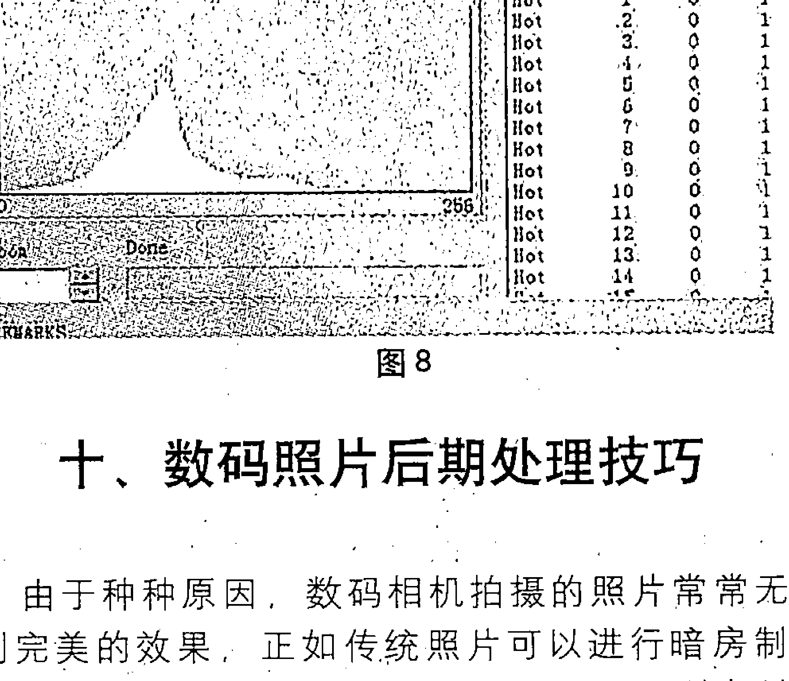

## 十、数码照片后期处理技巧

由于种种原因，数码相机拍摄的照片常常无法得到完美的效果。正如传统照片可以进行暗房制作一样，我们可以使用电脑并配合Photoshop等相关软件，对数码照片进行后期制作，打造出自己的数字“暗房”，实现调整画质、日期文字添加、数字化景深控制、紫边处理等工作。几乎所有的数码照片处理工作都可以用Photoshop来进行操作和处理，但Photoshop的使用也比较复杂，不是普通用户都能熟练掌握。下面介绍的一些小软件虽然功能比较单一，但往往有自己的独到之处，而且操作相对比较简单，可以把它们当做是Photoshop的一个有效补充。

### 1. 为数码照片添加日期及文字

大多数数码相机不支持直接在照片上添加日期，这是因为数码照片一般都支持Exif信息格式，里面由相机自动生成诸如拍摄日期、时间、光圈、快门速度等等参数，需要查看的话，只需利用支持读取Exif信息的看图软件，即可一目了然，也不会因为日期文字破坏了整张照片的艺术性。

我们可以使用诸如PhotoCap这类软件，根据数码照片的Exif资讯，自动为其添加上日期，更可将Exif资讯中包含的其他参数（如ISO，快门，光圈等）也打在相片上，这一功能对需要随时了解拍摄参数的摄影发烧友特别有意义；此外，这款软件为相片加上设定的文字、图片等签名档或LOGO更是不在话下。这款软件的使用比较简单，只有三个主菜单项，包含有几个不同的功能窗口，最重要的功能窗口是主界面和参数设定窗口，大多数操作都在这几个窗口中进行。

有些人喜欢在照片上添加一些随笔文字，记录拍摄照片时的轶事插曲或者个人感受，或是对照片的说明。这时用 PhotoCap 就不太方便了，PhotoCap 对文字控制的调整速度比较慢。我们可以使用 PowerPoint 这款常用的软件来为图片添加说明文字，可以把图片和文字分开排列，也可以层叠排列。层叠排列的时候，可以利用 PowerPoint 对文字外观和位置等的灵活控制，把文字放在图像最合适的位置，并调整文字的颜色、大小，使其与图像的色调和谐统一。

### 2. 数码照片噪点的消除

数码相机所拍摄照片中的“噪点”，简单地说就是在感光过程中CCD及相关电路产生的噪声信号，反映在图像中就是一些混入画面中与实际颜色不一致的各色斑点。影像的噪点问题，其实在胶片摄影领域也同样存在，只是数码摄影的噪点问题更加突出，我们可以使用软件方法减少数码照片噪点带来的影响。

#### PixelZap去除ISO噪点

数码相机拍摄的照片往往会有一些噪点，尤其在使用较高感光度拍摄时更为明显。ISO 噪点的去除软件有不少，比如这款 PixelZap 可以自动侦测数码照片中的噪点，并通过软件计算加以修补。PixelZap 是一款共享软件，使用效果一般，而且在付费注册之前只能处理分辨率在 640 × 480 以下的图片。

#### 夜景噪点的杀手BlackFrame

BlackFrame 这个软件可以成为你改善夜景照片效果的有力武器，这是一个体积只有300K，功能非常实用的软件。使用 BlackFrame 最关键的一点是，在拍完夜景照片后应立即盖上镜头盖，用同样的拍摄参数进行噪点取样。BlackFrame 有多种工作模式，最常用就是简单清除法，这种方法简单科学，但可能会出现高光区黑点问题。

#### 通用噪点消除软件HotPixels

这也是一款很不错的噪点去除软件，其最大优点就是不需要噪点取样照片的配合，而是根据经验判断，由软件主观地进行修饰弥补。如果噪点在图片的黑暗区域的话，它的工作效果非常不错，但如果噪点在稍亮的背景上，去除后就会产生一黑点，当然它并不像白色噪点那样烦人。

#### 去痘除斑，专业降噪软件NeatImage

这款软件的工作思路是通过采样照片中纯色区域画面数据，分析出噪声的分布状态，然后用分析得出的噪声分布状态，去计算画面中的其他区域，从而滤除整个画面的噪声，得到干净纯洁的画面。NeatImage 目前的最新版本是3.1，除此之外还有一个针对 Photoshop 的滤镜插件。

降低图片噪声是这个软件主要用途，其实这款软件还可以为人像照片美容（俗称“磨皮”）。如果我们将噪声取样的区域设置为人像的脸部，这样经过处理之后，人物的皮肤就会变得非常光滑细腻。

#### 在Photoshop中消除夜景噪点

PhotoShop 是大家最常使用的图像处理软件，有多种方法可以消除或者减轻噪点。其中之一是使用去杂点滤镜（Filter/noice/Dust & Scratches），这种方法简便易行，但这是漫无目的的，效果有限，而且会损失图像的锐度。另一个方法就是在拍摄完夜景之后，盖上镜头盖以同样的曝光组合，再拍摄一张噪点图，再在 Photoshop 中打开两幅图像，并拷贝复制到同一幅图像的不同层中，然后以夜景图层为基础，使用命令“Image/apply Image...”，在打开的对话框中选择 Layer 为噪点图所在层，Blending 选择 Difference，点击OK即可。

### 3. 数码照片效果处理软件

ACDSee 5.0以上完全版中带有FotoCanvas，这是一款直观的影像编辑软件。有了 FotoCanvas，你可以利用如消除红眼、自由角度旋转、裁切、模糊和锐利影像滤镜等工具来改善照片；利用强力的绘图工具、选择工具、色彩及光线混合模式、以及特效滤镜（如褐色化和浮雕等）来展现你的创意。此外，这也是一款具有自订接口的快速图形编辑器，最新版本的 FotoCanvas 包含许多新的功能，如复制图片和面版协助等等。此外还有新的影像处理滤镜如油画效果、铅笔画效果和边缘侦测等等。

#### 边框伴侣Extensis PhotoFrame

给数码照片加一个漂亮的边框，会为照片增色不少。Extensis PhotoFrame 软件就是一个功能强大的边框制作插件，可以挂接在 Photoshop 的滤镜菜单下。这个软件随机附带了20余种简单的边框模板，可以利用这些现成的模板来完成一些简单的处理；选好模板之后，还可以进一步调整这些模板的具体参数，例如调节模板的透明度、模糊程度、放置角度、边框色彩、边界设定、阴影效果等等，还可以将自己的素材添加进来，设计自己风格的边框模板。

#### 反转片模拟器Digital Film

大家知道，反转片具有色彩饱和度高、反差大等特点，效果是目前绝大多数数码相机无法比拟的。是否能让数码照片也具备反转片的效果？那就可以试试 Digital Film 这款软件，其开发者通过对FujiFilm RVP、Kodak E100VS等专业反转片的感光特性曲线分析，采用一种反转片仿真算法，可以对数码相机的照片文件进行处理，从而获得类似于反转片的色彩效果，美化效果很明显。Digital Film 是一款非常易用的傻瓜式软件，选择要处理的文件；再选择要模拟反转片类型，还可以进行一定的曝光补偿，最后点击“转换”即可。

另外，测试结果如下：

| 结果类型 | 数量 |
| :--- | :--- |
| dead pixels | 386 |
| hot pixels | 381256 |

## 4. 其他数码照片处理软件

另外类似软件还有 Turbo Photo 等，能够方便地提高数码照片效果。

抠图专家 KnockOut：抠图，简单说就是将照片中的主体从背景中“抠”出来，然后就可以对主体进行修饰和加工，并改变背景效果，这在静物、人像等题材的数码照片后期处理中，是很常见的一种操作。但是要想“抠”好一张图片，却是很不容易的。我们可以使用 Corel 开发的 Knockout 来简化抠图的操作。这是一个 Photoshop 插件，要实现将主体从背景中“抠”出来这一目的，只需要进行两步操作：首先选择内部物体（Inside object），用鼠标圈选出来，尽量沿着主体内沿的边缘移动鼠标，但不要超越主体与背景的交界处。然后用类似的方法在主体之外的背景区域圈选，尽量靠近主体，但不越界。再点击 File 菜单下的 Process，片刻之间，要提取的主体就从背景中完美分离了出来。

插值能手 S-spline：对于数码照片来说，插值这一做法可能会让一些中高级用户不屑一顾，因为无论软件的算法多么高级和智能，均无法创造出原本不存在的图像细节。那为什么还会有这样的专门用来插值的软件存在呢？这主要是为了适应大幅面输出的需要。通过软件进行插值，可以避免马赛克出现，并且尽力使放大后的照片显得更加细腻、边缘更加圆滑。和其他软件的图片放大效果相比，S-spline 的插值结果更加出色，画面显得更加锐利，这对于整幅照片的大幅面输出是有一定帮助的。

全景拼接软件：对于大多数不具有专门全景照片拍摄的数码相机来说，全景照片需要用拼接来实现，当然用来拼接的照片有一定要求，如曝光值相近、色调相近、依次排列、相互稍微重叠等等，通过拼接形成大视角全景照片，可以是一维拼接，也可以是二维拼接（横向和纵向）。横向拼接比较常见，而纵向拼接一般用于表现高大建筑。通过二维拼接的方式还可以突破数码相机分辨率和镜头视角的限制，制作出大幅图片。对于连续分布的拍摄对象，如广阔的风景，可以平移拍摄，然后拼接缝合形成景色长卷；对于大的圆形被摄体也可以围绕拍摄后拼接，就像地图的表现方法，有些软件还可以制作 360 度的全景画面，然后用 IE 浏览器进行浏览。大多数数码相机附带的全景照片拼接软件都非常直观简单，只要选择并添加需要拼接的图片，点击自动拼接按钮，并手工调整拼接部位，即可完成拼接。

短片处理软件：数码相机拍摄的短片，一般为 AVI 或 MPEG 文件格式，这两种文件都很好处理。但现在也有不少产品采用了苹果公司的 MOV 格式，要处理这类文件，应先安装 QUICKTIME PLAYER，再下载并安装 TMPGEnc，然后再下载 QTREADER.VFP 至 TMPGEnc 目录后，即可打开 MOV 文件，此后随便你要转 AVI 或 MPEG 皆可，如果要编辑 MOV 文件，只需去下载一个 MOVEDIT 程序即可。

## 5. 数码照片的输出

数码照片基本上有三大类输出方式，一是喷墨打印。即使用彩色喷墨打印机输出，现在大多数彩色喷墨打印机都声称具备“照片打印功能”，配合专门的照片打印纸，的确也能得到效果相当不错的数码照片，最大可打印 A4 大小的照片。有一些产品甚至能够不连接电脑，而直接读取存储卡上的图片文件进行打印。

二是专业的数码打印机，一般采用热升华的打印方式，体积小巧，可与特定品牌的数码相机连接，直接打印，但大多只能打印 A6 大小的照片。上面两种数码照片的输出方式，尽管用起来比较方便，但需购买专门的设备，最关键的一点是打印成本太高，无法大范围普及。

三是数码扩印，即使用彩扩机进行数码照片的扩印，这是目前最切合实际的数码照片输出方式。数码彩扩机一般采用 CRT、LCD、激光三类不同的技术，扩印质量和成本都依次递增。目前扩印一张 6 寸数码照片的价格在 1.5 元左右，仍比较偏高。在数码冲印大规模普及、价格大幅下降前，网上冲印就成为大多数数码相机拥有者最好的选择。不同的网上数码冲印站点，具体冲印过程不完全相同，但大致过程都是差不多的。首先会要求你注册成为其网站的会员；然后登陆并上传图片，选择需要冲印的图片尺寸大小、特殊要求等，最后生成定单，并通过邮局汇款、网上支付等途径付款，一般会在付款后一周内完成冲印并邮寄或送货上门。

大家要注意冲洗规格对原始照片的要求，基本原则是，冲印尺寸越大，原始照片的像素也应越高，建议最少要按照网站上要求的分辨率，来准备你的原始图片。一般来说对于最常见的 5、6 英寸数码照片，至少需要 200 万像素的原始文件，才能获得好的效果。另外还要注意在数码冲印前，我们最好先将图片文件比例调整为 3:2，以免冲洗时被意外剪切。

> ## 巧用快捷键

除了键盘方案中定义的一些快捷键外，还有几点值得一提：用 Home 键可以直接移动光标到句首；用 End 键可以直接移动光标到句尾；用 Esc 键可以取消输入窗口中的拼音；用 "Ctrl + Enter" 组合键可以将输入窗口中的拼音直接输出。

## 数码摄像简明教程

文/天马

### 一、 DV 的基本用法

#### （一） 准备电池和录像带

- 1. 电池

电池是摄像机的动力源泉。如果在户外摄像，最好用充电式电池作为电源，这时你只要抬起取景器，将电池顺着电池槽推入直至发出咔嗒声，然后放下取景器即可。如果要取下电池，只需抬起取景器，然后向下按住电池松开钮，再向上拿出电池即可。

- 2. 录像带

虽然已将摄录了的内容储存记录下来，但因为片段太多，忘记了放在那里，又或者不小心把内容删除，导致错失重温的机会。像这样的情况可以预防吗?当然可以，只要在拍摄前贴上标签即可。插入摄录放一体机前，请给新的录像磁带贴上标签，并写清楚主题内容，为了防止出现故障，请贴在规定的位置。在拍摄后要防止误删除。为了防止误删除影像，拍摄后，请拨上防止误删开关系统。装进盒子前，请把录像磁带倒至前面，存放在湿度较低的地方。

接下来谈一下装录像带的方法。打开DV机上的带舱，一般录像带是从摄像机的底部装入，其操作步骤为：首先接通电源；然后平放摄像机，然后按箭头方向推动“OPEN/EJECT”开关打开盖子，这时录像带舱自动升起并打开，如图1；推录像带背后的中间部位将其装入，注意要将录像带的带窗朝外插入录像带舱底部；最后通过录像带舱上的PUSH标志关上录像带舱，录像带舱完全降下后，关上盖子使它发出咔嗒声即可。

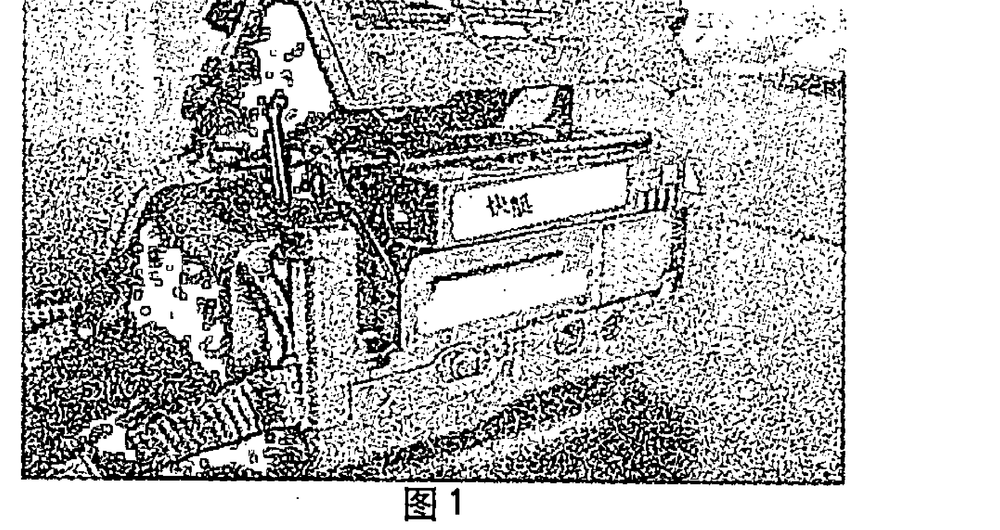

#### （二） 拿好摄像机

掌握正确的摄录像持机方式是每个摄像师必需掌握的基本功。正确的持机方法是：用双手紧紧托住摄像机，右手握紧摄像机的主体部位，在手握摄像机时先将机带放开，转下这个机带处的小塑料柄，用小指和无名指将其扣在掌心内，然后把拇指放在拍摄按钮处，将食指和中指搭在机器的前部，然后拉紧机带即可，如图2所示。

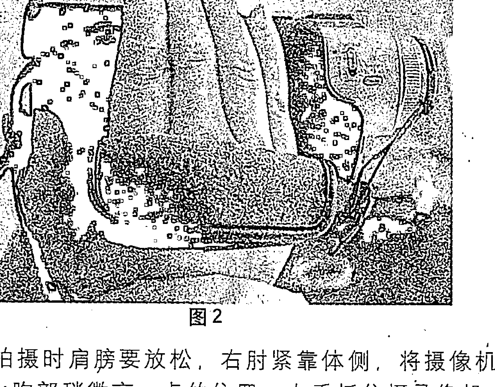

拍摄时肩膀要放松，右肘紧靠体侧，将摄像机抬到比胸部稍微高一点的位置。左手托住摄录像机，帮助稳住摄像机，采用舒适又稳定的姿势，确保摄像机稳定不动。双腿要自然分立，约与肩同宽，指尖稍微向外分开，站稳，保持身体平衡。眼睛贴紧寻像器眼罩，保持摄像机稳定。

#### （三） 拍摄准备

开始摄录前，将镜头盖或用手密实地盖住镜头，按“START/STOP”键，拍摄乌黑画面约15秒。如果拍摄后，录像磁带还有空白的话，亦可以用同样的手法拍摄空白画面。这样做可以区分下一次的拍摄。然后按镜头盖两侧的按钮，取下镜头盖，并

## 二、调整白平衡让影像更自然

#### （一）调整的场景

白平衡调整(WHITEBAL)是摄像机工作中一个很重要的环节。自动白平衡调整是现在摄像机都具有的功能。当拍摄时的光线超出设定范围，自动白平衡功能就不能正常工作。以下一些光照条件需要调整白平衡：

一是在很蓝的天空下的被摄，这时拍出的景物会带蓝色；二是在移动拍摄中，将摄像机从明亮处移到光线相对暗处时的一段时间内，如从室外移到室内。这个在婚礼摄像时就非常必要，如从车内走出车外，室内走出室外等场景就需要进行调整；三是在夜间拍摄蜡烛光或室外拍摄烟火时，这个在节日拍摄中经常用得到；四是在某些光源超出探测器的感应范围时，如雪地等极强的光线或阴天很暗的光线。雪后的景物色温偏高，尤其在阳光照射下，亮度强、反光率高，更需要调整。在日落、日出或带有强烈的红色调时，如果你要拍摄辉煌的太阳，则一定要调整白平衡。

另外，还有当被摄物体的光线色调与进入摄像机镜头的光线色调不一致的场景，如使用水银蒸气灯、钠灯或某些种类荧光灯等照度过强的光源的场景，以及拍摄黑暗表面的目标物等等。为了检验自动白平衡是否适合场景，下面方法可供你简单判断。首先，将白平衡开关拨到“自动”(AUTO.)档，然后分别在室内(自然光)和室外(阳光)拍摄同一张白纸，注意画面占满屏幕并调实，观察对比两次拍摄的效果。假如两次效果一致并且白色理想，则表明自动白平衡性能正常，否则性能欠佳。

#### （二）调整方法

现在摄像机白平衡的调整一般具有自动、手动、室外、室内等模式，因厂家的不同而稍有差异，但差别不大。在使用“SONY DCR-TRV17E”数码摄像机时，调整白平衡的方法为：

首先在CAMERA或MEMORY方式下，从菜单设定中选择WHT BAL；然后在菜单设定中选择所需的白平衡方式，如图3。其中，INDOOR表示拍摄的地方为照明条件快速变化、摄像室等太明亮的地方，或者是在钠灯或水银灯下；OUTDOOR表示拍摄的条件为日落/日出、日落后，日出前，霓虹灯或焰火。HLOD表示拍摄单色对象或前景。

在场景调整白平衡中，如果要返回自动白平衡方式，将菜单设定的WHT BAL项目设定为AUTO即可。

#### （四）取景构图

首先是取景。这一步是关键，取景是指对摄入的影像范围进行选择和界定。普通数码摄像机的取景方式有两类，即电子取景器和液晶显示屏取景。用电子取景器取景时要保持主体与观景窗内的边界之间留一点距离，这样可以避免主体边缘被切除。在取景时，一定是要用双眼取景，摄像则是一个连续过程，每个镜头往往都包含着推、拉、摇、移、俯仰、变焦等变化。如果视野局限于寻像器所显示的一角场景，则无法捕捉下一时刻的变化，缺乏预见，会因盲目性而导致拍摄失误。因此，你可以采用双眼扫描方式拍摄，即用右眼取景的同时，左眼也同样睁开以综观全局，把握动向，随时留意主体趋势或及时转换新的拍摄主体。

其次是构图。构图是指在拍摄前对画面的布局和结构进行适当的安排，通过对镜头视野的选择，把被摄主体、副体和环境组成一个整体，构成完美的画面，用以揭示主题。构图包括摄像画面的结构组成以及各部分的连接，确定画面中的各个组成部分的相互关系，以便在线条、光线、影调结构上构成一个完美的画面。构图的内容包括对人物和物体的配置，画面中所表现的运动方向、主线方向、光调、色彩的分布等。

#### （五）拍摄

构图设计好后，按着POWER开关上的小绿色键，将其设定于CAMERA位置，使摄像机处于待机状态，这时磁带并没有走带，而是处于暂停状态。如果觉得画面清楚了，这时你就可以按下“START/STOP”键开始摄像了，摄像机开始拍摄，在显示器上REC指示出现，位于摄像机前面的摄像指示灯点亮，录像机开始走带进行正常记录。这时，寻像器中的录像指示灯将被点亮。在记录视频信号的同时，摄像机的附带话筒将拾取音频信号，并传输给录像机记录下来。如果要停止摄像，只需再按一次录像开关“START/STOP”键即可。

电源开关是控制摄像机开启的总管，它有VCR (录像查看状态)、OFF (摄像机关机)、CAMERA (摄像机拍摄) 以及MEMORY (静态图像拍摄) 等四种状态，如果需要转换状态，只需按住电源开关上的小绿键，然后转换开关到相应的位置即可。

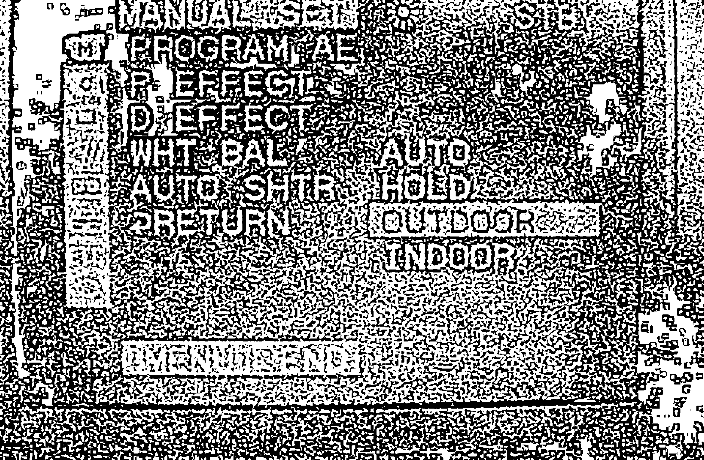

## 三、调整聚焦让影像更清晰

#### （一）调整聚焦的场景

DV 虽然全部采用自动对焦，但是在某些特殊情况下，画面的焦距就没有那么稳定了。如在下述拍摄条件下，自动对焦装置往往会发生错误判断，此时需要使用手动聚焦：

- 1. 拍摄时只有画面中央很小范围是自动焦点的检测范围，这一小范围内的物体能够自动聚实焦点，也就是说如果被摄物体不在画面中央这一范围内，自动聚焦就会出现偏差。
- 2. 自动聚焦系统受光线、亮度、被摄物等条件的影响很大。在一些特殊情况下会出现聚焦偏差，因此在这些场合最好还是使用手动聚焦比较保险。如被拍摄对象光线太暗，或现场光线严重不足（如晚上拍烟花）；拍摄反差太弱或无垂直轮廓的目标物，如拍摄一面白墙可能会变得模糊不清；拍摄表面有光泽、光线反射太强或周围太亮的目标物，被摄目标会模糊不清。
- 3. 所拍摄的物体一端离摄像机很近，另一端离得很远。摄像镜头是有一定景深的，对于超出其景深范围的被拍摄物，摄像机不能聚焦于一个同时位于前景和背景的物体。
- 4. 透过模糊的玻璃拍摄，这是因为会聚焦于玻璃，而不会聚焦于玻璃后面的物体，如玻璃缸中的金鱼；
- 5. 拍摄快速运动物体的对焦较难。由于聚焦镜头内部是机械式运动，不可能与快速移动物体保持同步。当系统追踪拍摄时，会使得景物波动于失焦和准焦两种状态。
- 6. 拍摄在栏栅、网、成排的树或柱子后的主体，如动物园中笼中的动物；在移动物体后面的目标物，自动聚焦系统会把移动物体误认为是被拍摄目标而进行聚焦；
- 7. 如果你的摄像机是以红外线或超声波的方式自动聚焦的，当被摄体能吸收红外线或超声波时对焦困难；被摄体距离太远，红外线或超声波达不到被摄体时，对焦困难。

#### （二）手动聚焦方法

对焦点是保证画面清晰的关键技术操作。一般应根据镜头设计的具体要求，分别采用不同的聚焦方法。当拍摄无穷远的景物时，可将调焦杆推至 <W> 位置拍摄。如拍摄一些风景镜头，当拍摄特写时，你在选好机位后，镜头对准被拍摄主体，推成大特写（焦距最长），按寻像器画面虚实对实焦点，然后将景别拉大到预定构图，即可拍摄；若要获得最大景深，可以用超焦距对焦，即对位于镜头超焦距位置的实物对焦，这时可获得从无限远至 1/2 超焦距的最大景深范围，主体在这个范围内活动自然是清晰的。这是具体的超焦距聚焦法；若微距对焦，需同时使用微距调节杆和调焦环进行对焦，才能对实焦点；若要拍摄运动物体，可以用跟焦点的方法聚焦：首先对准落幅画面聚实焦点，在聚焦环上做一标记，然后对准起幅聚焦，记作第一焦点位置。拍摄时，由摄像助手根据摄像技巧的速度和主体移动的速度，均匀将调焦环由第一焦点转到第二焦点处，保证镜头拍摄全过程画面清晰。

在调整聚焦时，可以下面方法操作：首先按下“聚焦按钮”（FOCUS），这时在寻像器上可以看到“手”的标识，表示可以进行手动聚焦；然后按动变焦开关，使得摄像机处于摄远的状态（W），因为在摄远状态将图像调实后，在其他焦距状态下均可以保证图像清晰；再对准被拍摄物使其位于画面的中央，并调节清晰度至最佳，再利用锁定功能将焦距锁定在固定位置，重新构图，回到原始位置，调整聚焦环，使得被摄景物清晰即可。

#### （三）变焦的操作

你还可以运用 DV 自动聚焦的焦距旋钮来进行变焦拍摄。摄像机光学镜头焦距的变化，改变镜头拍摄时的视角，也就带来了景别的改变。通常，镜头焦距越长画面景别越小，镜头焦距越短画面景别越大。数码摄像机的焦距可以通过焦距旋钮 <T> 及 <W> 来调节，将旋钮推至 <T> 端，则焦距会变短，可以拉近并放大远方的景物；如将旋钮推至 <W> 端，则焦距会变长，拍摄的范围亦会扩大，而且因为被拍摄物的深度变深，所以较容易对焦，此称为广角拍摄方法。在调整时只需用手旋转焦距旋钮即可，调整时镜头内的镜片组在光轴上移动，产生画面形象的变化，具有改变景物范围的推、拉效果。

| 操作 | 旋钮端 | 效果 |
| :--- | :--- | :--- |
| 变短焦距（拉近放大） | <T> | 画面景别变小 |
| 变长焦距（广角） | <W> | 画面景别变大，深度变深，易对焦 |

## 四、调整曝光让影像更明晰

要保持数码影像的清晰，除了选择合适的白平衡、正确的对焦外，还要对DV的曝光进行适当控制，这样才能保证光线的充足，拍摄出的影像才能明晰。

#### （一）程式曝光

##### 1. 程式曝光的模式及运用条件

在光线不足时，被摄物体没有足够的照度，影像发暗，景深过浅。这时可以增加照度，也可以用程式自动曝光弥补其不足。DV通常具有程式自动曝光功能，各厂设计有所不同，一般都有下面几种形式：

- (1) 聚光灯模式。这种方式在拍摄舞台等强光照射下的对象时，防止人物面孔显得过白。这种模式是将自动曝光的正常标准值，向下缩减一个光圈值，以平衡明暗反差过大，避免被摄体曝光过度。用该模式拍摄有聚光灯照射的舞台表演时，只要集中精神跟紧拍摄的目标即可，而不必时时顾虑曝光的问题。
- (2) 运动模式。它主要是针对拍摄运动物体时的曝光模式，它的特点是以高速快门为先决条件，光圈亮度的大小作为配合的一种曝光模式。这种模式适合拍摄精彩的运动比赛或表演。若在高速行驶中的车内向外拍摄风景，采用运动模式，能保证画面在快速移动中保持清晰。
- (3) 柔和肖像模式。这种方式为人物或花朵等景物创造柔和的背景，以突出拍摄对象，可以创造出人物主体突出而背景模糊的效果。
- (4) 沙滩与雪地。这种方式在拍摄沙滩或滑雪等强光或反光下的人物时，防止人物面孔显得过暗。
- (5) 黄昏与月色。这种方式用于拍摄黄昏、焰火、霓虹灯或一般夜景时保持气氛。
- (6) 风景。这种方式用于拍摄山脉等遥远的景物，也用于在拍摄玻璃或网板后面的景物时，防止摄像机对窗户的玻璃或金属网板聚焦。
- (7) 低亮度。这种方式在光线不足时可以使拍摄对象变亮。

##### 2. 调整方法

在SONY DCR-TRV17E数码摄像机上操作时，其操作方法为：首先按MENU键显示菜单设定，转动拨盘选择“M”，然后再选择PROGRAM AE项目，在出现的方式中选择所需要的方式即可，如图4所示。如果要取消PROGRAM AE功能，只需在菜单设定中将PROGRAM AE设定为AUTO即可。

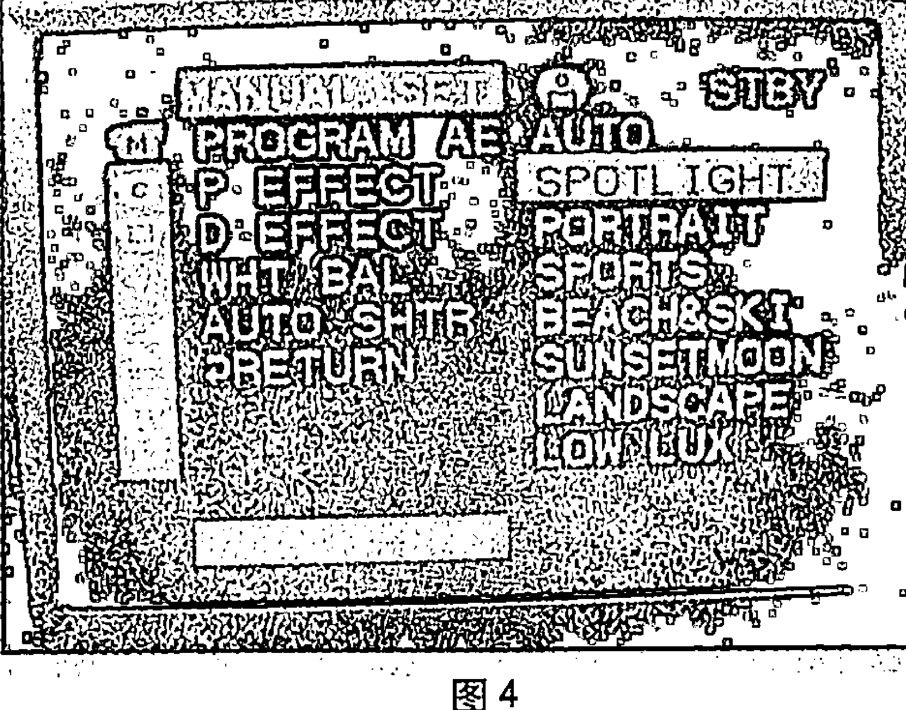

#### （二）手动调整曝光

##### 1. 手动调整曝光的场景

一是背景太亮的场景。如背对太阳拍摄，光源在拍摄主体的后面；拍摄主体在室内，而且其后方有窗户；拍摄白色背景前面的穿着白色或闪光服装的人物时，其面孔或拍摄主体会显得太暗等。这时，在阴影处的主体会出现主体曝光不足的现象。

二是当画面光线强弱变化很快时，例如，在树丛中摇动镜头，画面中时而有阳光，时而只有树阴，这时画面就会忽亮忽暗，而且这种变化总滞后于景物的变化，这时需手动调整曝光。

三是光线不足的场景。被摄物体没有足够的照度，影像发暗，景深过浅，这时需要调整曝光。但是，在这种状态下拍摄往往会降低画质，而且景深变浅也是一个问题，最好的方法是增加照明或使用摄录灯。

##### 2. 手动调整曝光的方法

在自动光圈方式下拍摄不理想时，还是手动调整曝光为好。在使用SONY DCR-TRV17E数码摄像机时，手动调整曝光的方法为：在CAMERA或MEMORY方式下按EXPOSURE键，这时在屏幕上出现调整曝光的符号；转动SEL/PUSH EXEC拨盘调整亮度到需要的即可。如果要恢复自动曝光方式，只需再按一下EXPOSURE键即可。

小技巧：手动调整曝光量不容易掌握，在拍摄背景太亮场景时，你可以先用变焦功能，推上去，使画面中只有人物，这样自动光圈就会测好曝光值，然后再把DV锁定为手动调整状态，再拉开后就可以拍摄到满意的效果了，而且还能避免识别光线强弱的困难。

## 五、用间隔影像让时间浓缩

如果你是个有心人，会注意到中央电视台在每晚天气预报节目的序幕中，有一段花开的场景，含苞的花蕾迅速地绽放，非常吸引人。实际上你用DV的间隔拍摄也能实现这种效果。

## （一）什么是间隔拍摄

间隔拍摄也叫定时拍摄，它是通过对摄像机的设置，让摄像机能自动循环地进行拍摄－暂停－拍摄，每隔一定时间自动摄影一次，从而将延续时间比较长的过程压缩到一个相对较短的时间内，使拍摄的作品更加简洁明快。

## （二）间隔拍摄适合的场景

适合于拍摄连续演变及运动过程，如植物的生长过程、化学反应现象随时间的变化、运动的分解等等，在科技摄影方面的作用尤为突出。用该功能拍摄时间流逝、花开花谢、日出日落的变化，效果非常独特。

## （三）设置方法

这里我们以拍摄日出、日落为例进行讲解。因太阳升起和降落是一个渐进的过程，而且持续时间较长，你可以使用间隔拍摄，让摄像机能自动地每隔一定时间自动摄像一次，从而使拍摄的作品更加简洁明快。设置方法为：

在CAMERA方式下按MENU键显示菜单设定，首先转动拨盘（SEL/PUSH EXEC拨盘）选择“[C]”，然后按拨盘转动拨盘选择INT. REC，然后按拨盘；

再转动拨盘选择SET，如图5，然后按拨盘，设置拍摄间隔时间。转动拨盘选择INTERVAL，然后按拨盘，转动拨盘选择所需的时间间隔，这里提供了30秒、1分钟、5分钟和10分钟四种选项，你可以选择30秒，如图6。选择好后按拨盘。

接下来设置摄像机每次自动拍摄的时间，再转动拨盘选择REC TIME，按拨盘，转动拨盘选择每次拍摄的时间，这里提供了0.5秒、1秒、1.5秒和2秒四种选项，你可以选择0.5秒。选好后转动拨盘选择RETURN，然后按两下拨盘。按MENU键取消菜单显示，这样就完成设置了。

## （四）实际拍摄

首先要安装好摄像机，因为拍摄时间较长，没有三脚架是不行的，先把三脚架架好，再把摄像机呈放到三脚上。接着将摄像机对着拍摄的对象（如鲜花）进行取景，对拍摄对象的所在画面进行合理的布局和安排，使其在线条、光线、影调结构上构成一个完美的画面。

在做好上面步骤以后，就可以按“START/STOP”键开始摄像了，按下后摄像机开始拍摄，在显示器上REC和INTERVAL指示出现，位于摄像机前面的摄像指示灯点亮，录像机就开始走带进行正常记录。这时，寻像器中的录像指示灯将被点亮，暂停拍摄时则显示绿色的STBY和不动的INTERVAL指示。

如果要停止摄像，只需再按一次录像开关“START/STOP”键即可。当然，如果关掉电源再开机，DV将回到普通摄像状态。

## 六、转场特效的拍摄

在数码影像场景之间，我们经常需要进行场景切换，在软件处理时叫“转场”，而用DV拍摄渐变效果，只需在开始拍摄或拍摄结束时按一下键即可，非常直观方便。下面我们向大家介绍用FADER键拍摄神秘转场效果的方法，让你的数码影像具有专业水平。

### （一）淡变效果

#### 1. 什么是淡变

淡变渐隐渐显，表现方式是上一个画面逐渐隐去，下一个画面逐渐出现。在画面替换过程中上个镜头画面由正常亮度渐减至全暗，接着后一镜头画面才由零亮度渐增至正常亮度。通常用于表示一个比较完整段落的结束，和另一个大段落的开始。例如：拍摄儿童生活写真，上一镜头段落表现小主人公晚上学习，玩耍了一段时间后，自己回到卧室恬然入睡（淡出）；（淡入）清晨太阳初升，住宅小区内的绿化区已有不少男女老少在晨练，林荫道上小主人公正跟着爷爷跑步。

#### 2. DV拍摄淡变的种类

不同的DV，其渐变效果也并不完全相同，但大多数包含以下几类：

- （1）光线淡入淡出。用手按住淡变按钮，画面将由暗逐渐变亮，这是淡入的效果，松开按钮后，画面便会由亮变暗，逐渐消失，这便是淡出的效果。在淡变过程中，声音也会随着图像的淡出、淡入而由强变弱，再由弱变强。你可以利用淡入和淡出为摄录影像增添专业色彩。淡入时，影像将从黑色或拼嵌画面渐渐显现，声音随之增大。淡出时，影像将渐渐隐变为黑色或拼嵌画面，声音随之减小。
- （2）马赛克淡变（M.FADER）。这种渐变效果又叫拼嵌图，或马赛克效果，在拍摄淡入效果时，画面由许多马赛克小画面出现，逐渐显示到正常。淡出时画面由正常逐渐变为马赛克。
- （3）弹跳（BOUNCE）。淡入时起始画面多次上下弹跳，然后逐渐过渡到正常。这种模式适合拍摄小朋友玩耍等场景，不适合拍摄会议等严肃性强的场景。
- （4）单色调（MONOTONE）。淡入时画面由黑色逐渐变为彩色，淡出时由彩色变为黑白。此模式常用于表现回忆、事过境迁等场景。

### （二）划变效果

#### 1. 什么是划变

划变是指屏幕显示一个镜头画面逐渐被另一个镜头画面取代的特殊技巧。在画面替换过程中，后一镜头画面在屏幕显示面积从无到有，逐渐增到满屏，而前一镜头画面在屏幕的面积渐减，直到完全消失。两画面在替换过程中有明显的边界。划变通常用于时空转换的场景，可以增加转场的艺术感染力。例如运用划变效果将画面从中间向两边拉开或推开，连接迎面而来气势汹汹的人物和一个会场画面，有助于营造人物闯会场产生石破天惊的艺术效果。

#### 2. DV拍摄划变的种类

在DV上一般能实现以下三类划变效果。

- （1）重叠效果（OVERLAP）。使用重叠功能时，影像渐渐淡入于最后摄录场面的静像之上。在摄像机处于待机状态时，反复按压FADER键，使OVERLAP指示灯闪烁起来，静像与带中间色的动画混合起来。然后按压START / STOP键开始摄录。正在拍摄的场面渐渐淡入于最后摄录场面的静像之上，正在拍摄场面的声音随之渐渐增强。
- （2）划像效果（WIPE）。划像效果是渐变功能中的一种，它是两种图像同时作用的结果。使用划像效果时，划入图像渐渐抹拭掉最后摄录的划出图像并取而代之。拍摄时是用正在拍摄的场面，渐渐从中央向两侧抹拭掉最后摄录的场面，正在拍摄场面的声音随之渐渐增强。
- （3）随机点（DOT）。这种模式仅限于淡入新段落画面以破碎的随机点状画面的形式，出现在画面上并最终覆盖老画面。

### （三）转场特效的拍摄

DV上的渐变功能是由FADER按键来控制的，它是一个循环控制按键。每当按下这个按键时，相应的渐变模式便会依次闪烁地出现在屏幕上，确定后按录像键即可开始拍摄。其出现的顺序为：
FADER → M.FADER → BOUNCE → MONOTONE → OVERLAP → WIPE → DOT → 无指示 → FADER
不同的DV机FADER键位置有所不同，但操作步骤大致相同。下面以在SONY DCR-TRV17E上使用拍摄淡入淡出为例，介绍其操作方法：
（1）拍摄淡入。在摄像机处于待机状态时，反复按压FADER键，使FADER键直至所需的FADER渐变指示闪烁，选择好该效果后，按START / STOP键开始淡入，进行渐显后，摄像机自动恢复到普通方式，淡化指示灯停止闪烁。
（2）拍摄淡出。在拍摄过程中，反复按FADER键，使FADER指示灯闪烁起来，然后按START / STOP键停止摄录，淡化指示灯停止闪烁后，录像停止，这样就有了淡出效果。
若要取消淡入/淡出功能，可在按压START / STOP键之前，反复按压FADER键，使淡化指示灯消失即可。
其他渐变效果拍摄方法与拍摄淡入淡出的方法差不多，只需反复按FADER键将其转到相应的效果指示下即可。

## 七、数字特效的拍摄

上面我们介绍了场景之间转场特技的拍摄，现在我们将介绍镜头内特技的拍摄。镜头内特技主要有画面亮色参数变换特技、像素空间位置参数变换及对画面序列的时间参数变换等。

### （一）图像特效

它是利用数字技术处理图像，以获得类似电影或电视节目中出现的特殊效果。它主要以改变图像本身亮度、形状及色彩等方式来调整影像的效果。在设置好相关参数后，拍摄的影像就以该模式记录。

#### 1. 图像特效的种类

不同的DV其图像特效也有所不同，在SONY TRV17E 上主要有以下几种效果。如图7 所示，从上到下分别为：

- 1. NEG.ART：即色彩和高度反转，该效果是将景物的色彩转化为他们在色谱上的补色，并将亮度反转。
- 2. SEPIA，图像为深棕色，即将图像的画面转为棕色调。
- 3. B&W，图像为黑白，该效果把彩色影像的色彩去掉，使影像成为只有黑白影像，与黑白电影一样。
- 4. SOLARIZE，暗度更清晰，色彩变淡，强化太阳照射的效果，图像趋于素描效果。
- 5. SLIM，图像纵向伸长。
- 6. STRETCH，图像横向伸长。
- 7. PASTEL，把影像变得像蜡笔画出来的一样，图像对比度增强，看上去像卡通片。
- 8. MOSAIC，马赛克效果，使图像具有马赛克画面。

#### 2. 图像特效的拍摄方法

一般来说，DV 上都有这些图像特效，其操作方法也大同小异。在 SONY DCR-TRV17E 上的操作方法为：首先按 MENU 键显示菜单设定，转动拨盘选择‘[M]’，然后按拨盘选择 P EFFECT 项目，在出现的方式中选择所需要的选项，然后进行拍摄即可。如果要取消图像特效功能，只需在菜单设定中将 PEFFECT 设定为 OFF 即可。

### （二）数字特效

数字特效也就是利用数字技术处理图像，以获得很好的艺术效果，但它是一种通过外来图像改变影像效果的处理方法。在 DV 上设置好相关参数后，拍摄的影像就以该模式记录。

#### 1. 数字特效的种类

在 SONY DCR-TRV17E 摄像机上，数字特效有以下几种模式，如图7，从上到下分别为：

- 1. STILL，这是静像特效；就是将当前拍摄的画面作为静像记录下来，然后在接下来拍摄的影像中，以不同的透明程度覆盖到影像中，形成特效。在后面拍摄的影像过程中，静像的显示效果随着时间的增加而逐渐变得透明，并叠加在拍摄的影像中。
- 2. FLASH，这是频闪特效，它是以固定的时间间隔连续拍摄静像，可以得到闪烁跳跃的类似慢镜头的效果。在设置过程中条棒越长，其拍摄的时间间隔越大，效果越强。注意，这种拍摄方法拍摄的画面是跳动的，但声音却是连续的。我们在一些MTV中会经常看到这样的镜头。
- 3. LUMI，这是亮度替换特效，它也是先记录一幅静像，然后在后面的影像过程中，静像中的色彩亮度比较高的地方变透明，被后拍摄的影像画面所替代。
- 4. TRAIL，这是拖曳影像功能，在摄录时会留下附随画面的影像。即后一帧出现时前一帧尚未消失，画面像哈雷彗星一样拖了一个尾巴，使画面具有一种速度感，在拍摄时声音正常录下。附随画面的消失时间可以用控制拨盘来调整，条棒越多，拖尾现象越严重。
- 5. SLOW SHTR，慢速快门特效，使用慢速快门便于拍摄暗淡的物体，能够有效地提高画面的亮度。DV 的快门速度降低（或提高）一半，光圈值相应要增加（或减少）一倍，这样可以用来控制进光量。一般的 DV 有 1/25、1/12、1/6 以及 1/3 几个快门速度值供选择。
- 6. OLD MOVIE，老电影功能，利用该功能，你可以将影像加上老电影氛围，摄录得像旧电影一般。该特效适合回忆镜头。

#### 2. 拍摄方法

不同的 DV 其操作方法不同，在 SONY DCR-TRV17E 上的操作方法为：首先在待机状态下，按 MENU 键显示菜单设定，然后选择‘[M]’，转动拨盘选择 D EFFECT，再转动拨盘选择相应的特效模式即可，按 MENU 键使菜单设定消失，按 START/STOP 键开始拍摄带有数字效果的影像。若要取消特效功能，可在菜单中将 D EFFECT 项目设定为 OFF 即可。

## 八、用推拉镜头展示细节与气氛

### （一）推摄镜头

推摄是摄像机向被摄主体的方向推进，或者变动镜头焦距，使画面框架由远而近向被摄主体不断接近的拍摄方法。用这种方式拍摄的运动画面，称为推镜头。拉镜头是画面从某被摄主体开始，随着镜头向后拉开，被摄主体在画面中看起来由大变小，主体周围的环境则由小变大，随着拉出的过程，画面表现的空间逐渐展开，到最终的落幅中，原主体形象逐渐远离后视觉信号减弱。

推镜头可以形成视觉前移效果，画面向被摄主体方向接近，画面表现的视点前移，形成了一种较大景别向较小景别连续递进的过程，具有大景别转换成小景别的各种特点。拉镜头向后运动或拉出的过程中，造成画面框架的向后运动，使画面从某一主体开始逐渐退向远方，画面表现出视点后移，呈现一种较小景别向较大景别连续渐变的过程，具有小景别转换成大景别的各种特点。

### （二）用途

推镜头在拍摄体育比赛颁奖典礼上经常使用，如在拍摄摘取金牌的运动员时，从运动员全景开始，然后逐步推向胸佩金牌、手捧鲜花的全景镜头一直推到运动员眼噙泪花、面露微笑的生动面部特写，效果非常显著。当然，在学生毕业典礼、新人的婚礼上也经常使用，如拍摄新人，然后用推镜头逐渐推向新娘手上的戒指。

推镜头也可以用来突出细节，突出重要的情节因素。它能够从一个较大的画面范围和视域空间起动，逐渐向前接近这一画面和空间中的某个细节形象，并通过这种运动所带来的变化，引导观众对这一细节的注意。如拍摄趴在桃花上的蜜蜂，可以用推摄的方法，从桃树的全景开始拍摄，将镜头推向蜜蜂所在的桃枝，然后再推向桃花，最后用特写画面拍摄蜜蜂，这样整个影像就会显得很丰满。

拉镜头通常用于表现主体和主体所处环境的关系，展现出主体周围的环境或有代表性的环境特征物。比如说，从一个交通警察的面部特写拉成十字路口大全景画面，随着镜头从该交通警察的特写画面(起幅)拉开，观众在拉出过程中将逐渐看到他穿的警服、规范的指挥手势、挺立的身姿等等，在最后的大全景画面中，让观众看到了他正站在车水马龙的十字路口，远处街树上的积雪表明这正是寒冷的冬季，这样可以交待拍摄对象所处环境。

拉镜头可以用来制造悬念。利用特写镜头与拉摄镜头的组合技巧能制作悬念，这是一般影片中经常使用的技巧。例如，镜头中首先出现的是道路旁边夹道观看的人群，兴高采烈地注视着画面的右侧，即画框以外尚未出现的主体。然后，镜头渐渐拉开，只见一辆游行花车正缓缓向左驶来。在这个镜头中，先出现的人群是主体，但当花车人出现之后，人群就成了画面中的陪体，起到了陪体的作用。这样一来，画面的组接就有了一定的变化，单一画面的表现力得到了丰富和增强。

拉镜头可以用于拍摄转场镜头。从特写拉成全景的拉镜头，由于其起幅特写画面背景空间表现的不确定性，经常在电视剧等节目中被用作转场镜头，它使得场景的转换连贯而不跳跃，流畅而不突兀。比如，要表现主人公从办公室到自己家里的转场，可以让主人公在办公室的桌边坐下，下一个镜头即接我们所说的转场式的拉镜头——从主人公的特写拉开成为全景画面，只不过这时主人公已经是坐在家中的沙发上了。这样处理非常自然。

再如，在婚礼上拍摄，因不好走动拍摄，这时推拉镜头就用得上了。推摄是摄像机向被摄主体的方向推进，或者变动镜头焦距，使画面框架由远而近向被摄主体不断接近的拍摄方法。运用推镜头可以突出婚礼进行中新郎、新娘等主体人物，突出一些具体细节。比如，为了突出婚礼上的喜庆气氛，你可以用推镜头来拍摄“喜”字，可以先从婚礼中的一个场面着手，然后将镜头慢慢地推向墙面上的“喜”字；拉摄是摄像机逐渐远离被摄主体，或变动镜头焦距(从长焦调至广角)，使画面框架由近至远与主体拉开距离的拍摄方法。拉镜头通常用于表现主体和主体所处环境的关系，展现出主体周围的环境或有代表性的环境特征物。如你可以先拍摄新郎新娘在餐桌上，然后慢慢地用拉镜头扩大范围，使其后面的“喜”字以及一些灯笼等背景全部显示在拍摄画面中，这样就可以交待背景了。

### （三）操作方法

数码摄像机的焦距变化相当大，运用推镜头表现场景，可以使用一些工具来实现：如轨道、车辆等等。但是，对于普通数码摄像机的爱好者来说，就不可能有那些设备了。你可以用数码摄像机的变焦杆来拍摄推镜头，即摄像机焦距旋钮上的＜T＞及＜W＞，分别代表着被拍摄物的深度及范围。

拍摄推镜头时，你可以先将焦距旋钮调至＜W＞处，按下录制键记录后，保持几秒钟静止，这几秒钟称为“起幅”；然后调整旋钮，逐渐从远处向近处拉近，这时远处景物在镜头中逐渐增大，完成推镜头中推的过程；到达设计好的拍摄结束点时，再保持静止录像几秒钟，完成“落幅”的拍摄。这样，一个推镜头就完成了。拉镜头的拍摄与推镜头的拍摄方法差不多，都可以用数码摄像机的变焦杆来拍摄，在拍摄时要先将焦距旋钮调整到＜T＞处，然后逐渐向＜W＞调整并进行拍摄即可。

## 九、用摇镜头展示大场面

### （一）用途

摇镜头常用于展示空间和扩大视野。这种摇镜头多侧重于介绍环境、故事或事件发生地的地形地貌，展示更为开阔的视觉背景，它具有大景别的功能，又比固定画面的远景有更为开阔的视野，在表现群山、草原、沙漠、海洋等宽广深远的场景时，有其独特的表现力量。

- （1）江河湖海。江河湖海等大景别，在拍摄时常选择阳光入射角比较低，或天空中带一定程度散射光的假阴天中拍摄，常能得到好的水面造型效果。如果表现水边的人物，并以水面为大背景时，也应以水面亮度为准控制曝光量，由于人脸反光率远不及水面，可用补光方法提高人脸亮度，或由顺光或顺侧光拍摄，以减少人脸与水面的亮度反差，切忌用增大曝光量的方法提高人脸亮度。
- （2）沙漠以及草原等。在沙漠、草原、黄土高原等环境拍摄时，为了避免景物内部结构线条不清晰甚至消失，画面表现呆板无力这一现象，拍摄时最好选用低角度的侧逆光。阳光低角度时刻，通常也就是日出、日落时刻，光线色温偏低，色调偏暖，使丘陵和草原的色调更为丰富，黄色的沙漠和高原暖色调更为浓重。
- （3）城市广场。现在，在城市广场上经常会举办一些全民活动，因此拍摄市民广场也很有意思。因城市建筑多且高，因此在拍摄时需要找一个比较高的地方，这样才能拍出广场的全貌。

另外，摇镜头还可以用来介绍两个物体的内在联系，表现运动主体的动态、表现一种主观性镜头等等。

### （二）拍摄方法

用数码摄像机拍摄摇镜头来展现大场面是最合适不过了。

摄录之前，要计划一下摄录机将会拍摄到的范围，例如，一开始是海滩的一边，终端是海滩的另一边，这样就把范围确定好了。当然，你也可以把一特殊景物同时作为开头和结尾，从该景物开始拍摄，拍摄一圈后到该景物结束。

计划好之后就可以开始拍摄了。方法是：首先将身体面向摇镜头的终止方向，两脚分开使摄像机稳定朝向终止的拍摄方向。然后身体扭向摇镜头的开始方向，并开始拍摄。拍摄时，身体慢慢地、均匀地向终止方向转动，直到完成整个摇镜头过程。拍摄时身体一般不需要转动90度，如果摇身的角度达120度以上时，就只能用操练中左右转身的步法，但应该控制身体重心，并切忌用碎步转身，否则会加剧机身的摇晃。

在进行拍摄时要注意速度适当，摇摄的时间不宜过长或过短，一般来说摇摄一组镜头约10秒左右为宜，如果过短播放时画面看起来像在飞，过长又会觉得拖泥带水。追随摇摄运动物体时，摇放速度要与画面内运动物体的位移相对应，拍摄时应尽力将被摄主体稳定地保持在画框内的某一点上。

要与画面内运动物体的位移相对应，拍摄时应尽力将被摄主体稳定地保持在画框内的某一点上。

## 十、用跟镜头追摄

跟摄是摄像机始终跟随运动的被摄主体一起运动而进行的拍摄。用这种方式拍摄的电视画面称为跟镜头。在“焦点访谈”等一些暗访类节目中，就经常使用跟踪摄像的方法，用来记录一些事件发生的经过，这样能给人一种真实感。由于数码摄像机体积比较小，使用方便，因此更适合跟摄使用。

### （一）跟摄的用途

跟镜头能够连续而详尽地表现运动中的被摄主体，它用画框始终“套”住运动中的被摄对象，使观众与被摄对象之间的视点相对稳定，形成一种对动态人物或物体的静态表现方式，使动体的运动连贯而清晰。它能够连续而详尽地表现运动中的被摄主体，它既能突出主体，又能交待主体的运动方向、速度、体态及其与环境的关系，有利于展示人物在动态中的神态变化和性格特点。例如，我们在进行婚礼拍摄时，经常需要运用一些跟摄镜头，这样可以真实地记录新娘的一些行动情况及事件发生的经过，能给人一种真实感。

在旅游爬山时，你可以先在队伍后面拍摄后跟镜头，然后再到队伍前面拍摄前跟镜头，这样拍摄出来会有很精彩的效果。当然，在跟摄时要跟上、追准拍摄的攀登的队伍，尽量不要让画面中人物上下起伏、跳跃变化，因为镜头大幅度和次数过频的上下跳动，极容易使观众产生视觉疲劳，另外对焦点的变化、拍摄角度的变化、光线入射角的变化也是要注意的问题。

跟摄还常用于拍摄主观性镜头。在电视新闻片中，经常见到摄像机镜头跟随记者、新闻人物或节目主持人走向新闻现场，走向被采访对象，走向被介绍物体，将观众的视线“带”进新闻现场，“带”到被采访对象或被介绍的物体的跟前，这些都是跟摄方式在新闻节目中积极运用的结果。

### （二）操作方法

在拍摄前要适当调整扣带，把手伸入扣带里，手指需接触到录像键和焦距按钮，然后抱在胸前，调整松紧度，让自己感觉舒服。拍摄时用双手托住摄像机，右手握紧摄像机的主体部位，并用腕带固定，肩膀要放松，使右肘靠紧身体，将摄像机抬到比胸部稍微高一点的位置。左手托住录像机，帮助稳住摄像机，眼睛贴紧寻像器眼罩，保持摄像机稳定，然后开始拍摄。利用跟摄方法进行摄像，要## 十一、DV使用经验与技巧

### 1. 为电池充足电

在使用之前，一定要把电池充足电。电力是摄像机的生命线，断电则意味着拍摄活动的终结。在拍摄期间应随时注意电池的储备，尽可能在现场寻找电源，及时用充电器补充电力。但不要在摄像机处于开机状态时更换电池或连通交流电源，以免对电子设备造成损害。在电池短缺的情况下，尽量关闭液晶显示屏，用寻像器取景，并减少推、拉变焦的频率。如果由于电力短缺而导致珍贵场景白白流失，或无法按期完成拍摄进度，对创作者无疑会造成巨大的心理伤害。

### 2. 准备好录像带

在条件许可的情况下，最好使用新录像带。如果是翻用旧带，务必提前将磁带倒至带头，并确认写保护状态解除，以免在使用时因无法录制而措手不及。因为LP（密录）格式在后期编辑时可能出现电脑输入困难或磁带之间互不兼容等问题，除非万不得已，请尽量使用SP格式进行拍摄。已拍完的DV磁带应锁定在防抹状态，并在磁带贴纸上记录带号、日期、内容提示等场记信息。

### 3. 预录空镜头

开机后应在磁带上预录30秒钟左右的彩条、黑场或空镜头。一是避免录制初始时走带不匀，信号不稳定，二是在重要内容摄录之前留出足够的时间，供后期剪辑时编辑机的预卷之用。在拍摄过程中，磁带记录的时间码要保持连续，不能中断，否则会对后期编辑造成很大的麻烦。

### 4. 合理设定白平衡

数码摄像机都有自动白平衡设定功能，一般的拍摄环境都能应付自如。但如果需要达到某种特定的效果，就要手动改变白平衡，达到满意的效果。如果希望在任何时候都能够准确地表达白色，就要用拍摄白纸的方法自行设定。很多数码摄像机都可以手动设定白平衡色温，或者以白纸作参照物进行白平衡校正。阴天、早晨、傍晚或不同色温环境下拍摄时，如果色温不好确定，可将摄像机的ATW功能打开，这样可以自动跟踪照明条件的变化，对白平衡进行自动调整。

### 5. 合理使用对焦功能

摄像机在拍摄时是以拍摄主体在画面正中央为对焦的点，要避免拍摄主体前有走动的物体影响红外线测距。DV虽然全部采用自动对焦，但是在某些特殊情况下（比如隔着铁丝网、玻璃或者与目标之间有人物移动等等），画面的焦距就不太稳定了，常常一下子清晰、一下子又模糊，亦真亦幻，让人难以把握。这是因为在自动对焦情形下，DV是依据前方物体反射回来的讯号判断距离或调整焦距的。此时，只要将对焦状态从自动切换到手动就可以了。

### 6. 充分掌握手动调节功能

大多数DV摄像机都是“傻瓜”型的全自动设备，操作者只需打开电源，按动“录制/停止”键，就可以拍摄自如了。如果要获得更好的影像作品，就应该进一步从技术能力上提高自己，学习如何正确地控制焦点、调节曝光度以及获得准确的白平衡。如果我们能逐步掌握一些手动调节功能，就可以在影像拍摄方面赢得更大主动性，让DV摄像机成为我们创作当中得心应手的工具。

### 7. 保持摄像机稳定

画面不稳定，令人的视线无法集中，往往会觉得头晕目眩，再高的分辨率也是徒然。相对水平方向的颤动，垂直方向的上下颤动更让人难以接受。避免画面颤动的最好方法是使用三脚架，可在我们外出时未必能随时使用三脚架。在没有三脚架的情况下有两个方法可以帮助我们解决这类问题：一是拍摄时用两只手紧握机身，首先用双手紧紧地托住摄像机并将双臂紧贴两肋，然后将摄像机抬到比胸部稍微高一点的位置。有些摄像机用一个手臂就能托起，但此时最好还是将右臂紧贴右肋，之后再用左手轻轻地扶住摄像机，这样就能减少抖动，进行稳定的拍摄；第二个方法更加有效，就是尽量避免使用长焦距而改用广角镜头。因为焦距越长视角越小，轻微的晃动就会令画面颤抖得很厉害，而广角镜头视角很大，即使较严重的晃动都不易觉察到。

### 8. 尽量利用自然光

光线充足是获得完美画面的先决条件，而DV摄像机的低照度性能较模拟式摄像机更加优秀。阳光下所有景物的光效都是由直射的阳光、散射的“天光”和环境的反光这三种形态的光线构成。对这三种自然光形态的认识和把握，是再现和表现画面形象的基础。阳光有着“自然而然”的变化规律和特性，我们在运用自然光进行拍摄时，只能遵循这种客观存在的规律，选择符合创作意图的拍摄地点。

### 9. 尽量顺光拍摄

在拍摄的时候，一定要确认被摄物体和阳光或灯光之间的位置关系。最基本的条件就是“面向光源”，即光源是在被摄物体前面的那种状态。当然，这样容易失去立体感或成为没有阴影的平面图像。遇到这样的情况，可以将光线稍微斜过来一点，以此来增加对比度。这样，就能拍摄出一幅立体感较强的图像。逆光拍摄容易使人物的脸部过暗，或者阴影部分看不清楚。如果实在迫不得已，必须要在逆光条件下拍摄人物的话，一定要记得使用反光板，因为逆光补偿功能的作用实在是让人不敢恭维。另外，由于摄像机的自动白平衡是根据其背景色调来调节的，所以在这种背景本身就昏暗不清的情况下，如果希望得到自然真实的画面色彩，就只能劳你大驾，亲自动手了。

### 10. 移动镜头要有规律

镜头的移动应该有规律，要么从左到右，要么从右到左。同样，上下、进退也都要有迹可循。摇摄形成镜头运动，迫使观众随之改变视觉空间，观众对后面摇进画面的新空间或新景物就会产生某种期待和注意，如果摇摄的画面没有什么给观众可看的，或是后面的事物与前面的事物没有任何的联系，那就不要用摇镜头。另外，摇摄的时间不宜过长或过短。根据以往的经验，用摇摄的方法拍摄一组镜头约10秒左右为宜。追随摇摄运动物体时，摇速要与画面内运动物体的位移相对应，拍摄时应尽力将被摄主体稳定地保持在画框内的某一点上。

### 11. 移动镜头运镜要平稳

进行摇动拍摄时，一定要平稳地移动摄像机的镜头。最好使用三脚架，这样有利于拍摄出稳定的画面。如果用手持机，其基本姿势是：首先将两脚分开约50公分站立，脚尖稍微朝外成八字型，再摇动腰部（注意不是头部，更不是膝部）。这样可以使得摇摄的动作进行得更为平稳。不管是上下摇摄还是左右摇摄，动作应该做到平稳滑顺，画面流畅，中间无停顿，更不能忽快忽慢。要注意不要过分移动镜头，也不要在没有需要的情况下移动镜头。摇摄的起点和终点一定要把握得恰到好处，技巧运用得有分有寸。也要避免摇来摇去，像浇花一样。摇摄过去就不要再摇摄回来，只能做一次左右或上下的全景拍摄。

### 12. 多用固定镜头拍摄

简单的说就是镜头对准目标后，做固定点的拍摄，而不做镜头的推近拉远动作或上下左右的扫摄，设定好画面的大小后开机录像。平常拍摄时以固定镜头为主，不需要做太多变焦动作，以免影响画面稳定性。如果需要画面变化，就是拍摄全景时摄影机靠后一点，想拍其中某一部份时，摄影机就往前靠一点，位置的变换如侧面、高处、低处等不同的位置，其呈现的效果也就不同，画面也会更丰富。如果因为场地的因素无法靠近，当然也可以用变焦镜头将画面调整到你想要的大小。最好不要固定站在一个定点上，利用变焦镜头推近拉远的不停拍摄。

### 13. 善于捕捉事件的高潮

虽然平淡也是一种美，但在庆典、婚礼之类的场合下，火爆热闹的高潮场面却是不可或缺的影像元素。人们喜欢在一波又一波的浪头上颠簸，却不愿意长时间地看一场沉闷的演出；这也是业余摄像师们发现自己辛勤拍摄的录像片乏人问津的原因所在。当我们参与一场盛大的典礼，并用DV摄像机进行拍摄时，对戏剧性场面的出现要有敏感的预见性和迅猛的捕获能力。为了强化现场的气氛，应着意利用镜头的表现力，不是以一个全景镜头贯穿始终，而是尽可能地变换不同的景别与视角，悉心观察每一位心潮澎湃的人，突出每一个姿态张扬的动作，记录每一句饱含深情的话语，将情绪贯注于镜头里，浓墨重彩地呈现一场人生的盛宴。

### 14. 围绕中心人物拍摄

每一次活动或庆典当中，中心人物只能是一个或不多的几个人，婚礼上的新郎、新娘，刚刚满月的婴儿，寿筵上的老人或者是从远方归来团聚的亲友。DV拍摄者应当将主要的精力放在这些事件主人公的身上，而不是蜻蜓点水般地为每一位到场的来宾都立此存照。中心人物的行为、言语和情绪变化，构成了整部作品的逻辑主线。无论是新婚夫妇在婚礼上互致爱意的海誓山盟，抑或是摇篮里婴儿天真稚拙的表情，都将是我们的DV影片中不可多得的珍贵镜头，也是吸引他人热心观看的精华段落。即便是拍摄其他人的言行，也都应围绕着影片的主要人物着眼，不可喧宾夺主，搞成一部琐碎的流水账。

### 15. 色彩要力求真实、准确

如果在摄像机的操作和拍摄过程中处理不当，就很容易造成画面光色还原的偏误，给观众的视觉接收产生不真实的感觉。因为摄像机不具备人眼的视觉适应性，它只是本能地记录下光线的色温变化情况和物体偏色情况，将会造成难以弥补的失误。比如白平衡调节不当，就会使画面偏蓝或偏红。因此，当光源色温发生变化或混合色温光源等情况下，要特别注意色温调控和摄像机的相应操作。再比如自动光圈优点较多，但它也会造成不良的效果：如果拍摄人物谈话场面时，着浅色衣装者忽然入画，摄像机的电信号反馈立即令电机转动、缩小光圈，反映在画面上就会出现突然一暗，仿佛画面中环境亮度陡然暗了下来，从而影响画面的艺术效果。

### 16. 注意同期声的采录

同期声能够起到传递和增加画面信息量、烘托气氛，表现环境特点等重要作用，是电视摄像中需要认真处理的工作环节。尤其是在新闻纪实性节目中，如果在摄录电视画面时隔绝了同期声，那只能是不完整、不真实的画面记录。要成为优秀的摄像工作者，就必须了解和掌握录音技术和声音处理手法的基本内容，合格的摄像师不仅是合格的摄录人员，而且必须是合格的声音采录者。

## 十二、DV摄像实战——拍摄生日纪录片

如果说用DV拍摄家居生活、旅游见闻还只是牛刀小试，尚不足以称为真正意义上的“艺术创作”，那么纪录片作为一种被普遍公认的艺术形式，则应当成为每一个有志于影像创作的DV爱好者谋求进步的桥梁与阶梯。在我们日常生活中，最常见的莫过于生日聚会了。下面以过生日为例，介绍记录片的拍摄过程及技巧。

### （一）选择题材

纪录片是一种需要耗费大量心血与时间的艺术创作。有些人用三个星期完成一部长达两小时的作品，有些人则需整整三年才算勉强结束了前期拍摄，还有些人用毕生的时间跟踪同一个人物或事件。我们可以从这样的作品中看到时光被雕琢的清晰印迹。过生日，对于每一个人来说，都是非常高兴的事情，而且都想过得有意义。那么，我们把过生日的过程拍摄下来，让所有参与的人都能记住这个日子，那就更有意义了。对于过生日活动来说，可以从准备过生日开始记录，详细介绍一个生日活动。

### （二）拍摄准备

在确定选题之后，你不一定要立即投入影片的拍摄工作，还需要等待拍摄对象生日的到来，以及前期的方案准备。对现有资料尽可能多地掌握、对拍摄对象的熟悉，是确保影片拍摄顺利进行的前提条件。

在拍摄前需要与被拍摄的对象进行必要的沟通，这个问题同样无可回避。很多时候，人们天然抵触被近距离观察的拍摄行为。即便是关系密切的亲戚朋友，也会在摄像机的镜头前感到局促不安。当DV创作者决定拍摄某个人物的生活场景时，对方的态度会直接关系到影片的成败与否。对于过生日的人来说，他们一般都会玩得高兴，在拍摄时容易露真情；但是对于性格内向的人来说，他们会对摄像机有抵触感，不容易表现自己。此时更应该与他们进行良好的沟通，谈论些他们感兴趣的话题，让彼此了解，让他们对生日的主人说些祝福的话。

准备好拍摄方案也是很重要的。即兴发挥是一种不错的拍摄方式，能够捕捉到日常生活中最富戏剧性的瞬间。但对于初出茅庐的拍摄新手来说，事前不作任何准备，只希望在拍摄现场碰运气地“随意拍摄”，往往难以奏效，并且会给将来的剪辑工作带来很大麻烦，就好像一堆散乱的音符，很难拼凑成和谐有序的乐章一样。因此，在拍摄开始之前，一套行之有效的拍摄方案是十分必要的。我们在下面将介绍生日活动中的拍摄场景的策划。

### （三）拍摄原则与记录方式

#### 1. 拍摄原则

我们在拍摄时，真实永远是第一位的。对纪录片作者而言，你可以放弃灯光、构图、色彩以及美学上的一切考究，但决不能对真实的立场有丝毫松动。任何人为的痕迹或二手的扮演，都有可能遭到观众的质疑，被否定的将不只是某个镜头，而是整部作品作为纪录电影的价值。最为严重的后果，是该片所体现的内容受到株连，一切美好的意图都将化为乌有。

拍摄时必须把握和熟悉第一手素材。电视剧可以一天完成一集的拍摄，但纪录片却要靠长时间的等待、观察与捕捉，才能从日常生活里提炼出高浓度的“影像之铀”。在拍摄时要把握住“速度”和“机敏”，“机敏”是要求拍摄者能够敏锐地预感到即将发生的事件，或对正在发生的事件有准确的判断力；“速度”是要能对工作场景的把握能力，在事件进行的过程当中，以精确而周全的视听语言记录现场主要元素，为将来的剪辑工作获得尽量丰富的影音素材。

在拍摄时尽量不打扰拍摄对象。纪录片摄制者在拍摄人物时，要在被摄者浑然不觉的情况下进行工作。“浑然不觉”原则的另一层意义，是将自己处于被拍摄者的日常生活中，而不是始终如一粒蚌壳中的沙砾或耀眼的“外来者”。另外，同期录音与摄影同样重要。没有同期声的纪录片等于真实性受到质疑的纪录片，纪录片创作者应该在拍摄时尽可能准确、清晰地采集中人物交谈的话语、行动时的声效以及现场多元的环境声音。

#### 2. 纪录片的记录方式

传统纪录片的记录方式可以分为两类，其一为介入其中的参与式记录，其二为作壁上观的直接记录。我们在拍摄生日活动时，一般采用第一种拍摄方式来记录。即拍摄者参与到过生日的活动当中，摄影机和被纪录对象之间形成一种亲密的关系，发掘事件的真实面貌，推动事件的进程，并将整个参与过程拍摄下来，作为记录的有机组成部分。这样有利于你尽可能地去探究表象之下的真相，对表现内心世界、时空转移，以及赋予作品戏剧性等都非常有效。

### （四）生日活动拍摄过程

#### 1. 拍摄准备过程

在过生日之前，一定会有一些准备工作的。这时也要拍摄下来，以备将来编辑使用。这些场景如到蛋糕店预订蛋糕、准备生日用餐、用电话邀请亲朋好友等等。

#### 2. 生日当天庆祝活动的拍摄

(1) 拍摄周围环境。在其他亲友还没有到来的时候，先拍摄一下周围环境吧！可以先从街道拍起，从远处到近处，再到小区，小区的名称不要忘了哦！这里可以搞个特写。然后再拍摄所居住的这幢楼，先来个扫描，把整个楼房扫一遍，最后把门牌号码特写一下！在拍摄楼房时，可以用仰摄的方法显示楼房的高大。

(2) 拍摄迎接场面。亲友陆续到家了，这种迎接的热闹场面可不能少。在室内你可以将DV对着大门，抓住亲友见面时的特殊场面进行拍摄，如开门、互相握手、互相问候的情节。当然，特写镜头不能少，如祖父母抱抱孙子辈，小孙子拉着长辈的手，以及祖父母笑得合不拢嘴等等。

(3) 拍摄过生日的场面，这是重点。亲朋好友都到齐了，就可以开始进行生日活动了。在生日过程中一些点蜡烛、吹蜡烛、唱祝福歌、吃蛋糕以及生日宴会等重要场景千万不要错过。在点上蜡烛后可以对蛋糕拍摄一些镜头，如亮闪闪的烛光、蛋糕上的祝福文字等，在拍摄分蛋糕时，也可以拍摄一些特殊镜头，如大人在分着蛋糕，孩子们则迫不及待地吃起来等。拍摄时应给人以欢欣喜悦、和睦圆满的感觉，画面色调应为暖色。在生日聚会时，生日蜡烛是生日的重要标志，因此，应注意烛光的拍摄，要求画面色彩温和，以增加生日气氛和情调，此时可用手动光圈，以蜡烛为前景拍摄过生日的人，用大光圈使被摄人物的面部变得明亮而且清晰（背景若较暗，烛光在画面中会显得模模糊糊、轮廓不清），这样的画面既突出了主体又渲染了欢乐的气氛。

(4) 拍摄生日宴会。开始吃饭了，这是拍摄团圆场面的最好机会，首先把整个场面拍一下，然后对每个人给一个特写镜头，在吃饭过程中，一些特殊场面不能放过，如大家一起祝福过生日的人等。无论是给老人祝寿还是给孩子过生日，一家人其乐融融，沉浸在欢乐、祥和的喜悦气氛中，这时应注意多通过人物的眼睛、嘴或视点、视线等特写镜头，来表现丰富的面部表情和神态。如给老人祝寿时，老人脸上洋溢着激动的神情，孩子们还记着老人生日并为自己祝寿的满足感，一家人围在桌前共进生日宴的幸福神态等等。对老人生日要突出天伦之乐的拍摄。为了营造出这种氛围，建议将灯光都打成暖色，若家里是白炽灯可以用红纸装饰。也可以多用长镜头表现出家庭的祥和及人丁兴旺之感，大家围绕在一起吃饭，然后围坐着看看电视或是说说话。

(5) 拍摄自己。若要拍摄包括自己在内场面，你可以用遥控器自拍摄功能来拍摄。首先将遥控器中应装入电池，然后将摄像机对准目标，再将遥控器对准摄像机的遥控接收窗口，按下“自拍按钮”(SELFTIMER)，这时在寻像器上就会看到“SELF RECORD 0:10”的字样，表示10秒钟后摄像机便自动进入定时录像状态，想停止拍摄时，可以按一下遥控器上的“START / STOP”钮，否则自动拍摄会一直延长至带尾。

#### 3. 拍摄背景资料

拍摄生日的背景资料，如拍摄日历，这样可以表现过生日的时间，也可以拍摄过去的一些成绩，如儿童可以拍摄在学校获得的奖励、平时工整的作业等等。如果是为老人拍摄生日聚会时，除拍足拍够老人的活动、表情等镜头外，再拍摄一些老人年轻时代的一些具有代表性的照片、作品、成果，让老人讲讲当年工作上的趣闻以及最得意的工作情况等等，唤起老人对当年风采的回顾，从而更增强老人对现实生活的乐观和信心。

#### 4. 现场采访亲朋好友

在生日活动现场，由于采用纪录片的制作方式，因此拍摄整个影片的过程，会显得冗长乏味，缺乏生动活泼的画面内容。这时你可以针对一些特邀嘉宾，来个即兴访问，可以使画面更活泼。在拍摄前，最好能让被采访者简单准备一下，如对衣装进行简单整理、对讲话内容默念一下等，访问内容不宜过长，以祝福及勉励的话为主题。在拍摄采访时，你可以离被采访者远一点，然后将摄像机对着他的胸部以上，最好不要用全身景，将话筒递给他自己拿着进行拍摄，以免造成录音时周围的杂音过大，然后按键拍摄。

#### 5. 镜头的技巧

在上面的拍摄过程中，我们要充分运用推、拉、摇、移等手法，根据想要表达的意思，准确地使用镜头语言，把生日聚会的气氛最大限度地营造出来。同时，可用录音机或VCD机或其他音响设备，播放节奏舒缓、轻快，音量适中的音乐来作为背景音乐，为生日宴会及生日宴会的拍摄创造一个轻松、欢快的气氛。

拍摄时要注意镜头节奏的掌握。拍摄儿童时，不要对儿童作过多的限制，使其在自然活动的情况下被拍摄，以表现天真、活泼、顽皮的天性和神态。对中小学生来说，他们正处在风华正茂的年龄，生龙活虎，动作量比较大，拍摄他们时，要根据现场气氛的高低起伏来掌握镜头的节奏，或快推，或快拉，或连续多次快速推拉等，人为地造成一种外在的动感，用以加强现场的热烈气氛。而拍摄老人过生日的镜头，可以使他们感觉到大家对他们的尊敬，而且在用光上要采用柔光。因为老年人在人生的历程中，经历了无数的风风雨雨、坎坎坷坷，岁月在他们的脸上刻下了深深的皱纹，使用柔光拍摄出来的效果可以不使老人面部的皱纹和斑点明显地表现出来。

### （五）注意事项

-   （1）合理控制曝光。在拍摄时如果全部用自动曝光，会使拍摄的画面缺乏应有的表现力。比如拍摄烛光晚餐，如果使用自动曝光，就会因为数码摄像机有很强的拍摄黑暗画面的能力，导致画面很亮，完全没有了烛光晚餐所追求的浪漫情调，破坏了画面的意境。所以在不同的场合应当使用不同的曝光，以拍出符合拍摄意图的画面。

-   （2）注意人物构图。拍摄生日活动主要是对人物的拍摄，因此人物拍摄的构图非常重要。拍摄人物时，不要给所拍的人物头顶留太多的空间。否则就会造成构图不平衡而缺乏美感。如果画面中人物身高不及画面的三分之一，观众就得集中目力仔细辨认，时间稍长就会感到乏味。记得应该把人物眼睛维持在画面上方1/3的高度，如果面孔在这个高度以下，这个人看起来就好像掉落在电视屏幕里。

-   （3）防止人物变形。在室内拍摄，摄像机与人之间距离很近，一般摄像机距离人体约为1.5米至2.5米之间，这是个习惯性观察人的透视距离。如果超过我们习惯的观察距离，就会产生所谓的“变形”。如近距离拍头像，会有鼻宽耳小、双眼向外观象；由上向下拍头像，会有下巴尖瘦、眼睛大现象；由下向上拍头像，会有下巴粗胖感觉。这种情况下进行拍摄，你可要注意，不要拍摄出怪物来！

-   （4）不要拍太多特写，要等到高潮时再使用。在一部结构均衡的影片中，特写的出现极其自然，但如果出现次数太多，它们便会令人窒息，并失掉它们的重要性。当你拍片时，每一个单独的镜头，都是一整组镜头及整部片子的一部分。即使最美的镜头，如果不放在合适的地方，可能会比最没价值的镜头更糟。

### （六）生日活动的后期剪辑

与故事片剪辑相比，纪录片剪辑有它独特的魅力。大多数纪录片创作者没有供后期编辑使用的分镜头台本，也没有曲折跌宕的故事情节。因此，纪录片的编辑在依靠剪接组织影片结构，引导观众欣赏与思考的程度上，较故事片创作更为显著。

你可以用交叉剪辑来呈现两条线索的发展进度，同样也可以通过对声音的剪辑来强化影片的表现力，在某些时候甚至较故事片更为自由。除了对声画关系的艺术性处理外，你既可以用访谈的形式串接整部作品，在剪辑过程中让被采访者滔滔不绝地说下去，也可以完全将自己置身事外，通过客观的观察纪录表达潜在的思想感情，还可以将拍摄者本人纳入镜头的视野，揭示摄像机两端的互动关系。

在编辑时要最先编辑片头，片头可以用生日活动中的某一典型场景作背景，然后制作一个文字标题，以说明生日活动内容等等。若事后准备编辑整理，最好多拍摄一些空镜头，如盛开的鲜花、写着寿字的灯笼、悬挂的匾额等备用插入镜头，这样以后的编辑工作就会方便得多。如果把镜头A和B直接相连显得过份唐突时，可在两镜头之间插入几秒钟空镜头，使画面自然过渡。此外，在编辑生日录像时，希望不要漏掉参加活动的所有人，5年、10年或20年之后，当时参加活动的每一位客人都将构成一个美好的回忆。最后的片尾字幕不能用“终”字，而要用“寿”、“寿比南山，福如东海”等祝福词句。

就这样，一部完整的生日纪录片就完成了，你让过生日的朋友有空时拿出来看看，准会偷着乐！

# 精彩纷呈的多媒体世界 ——玩转电视卡与摄像头

文/图 阿亮

在电脑上看电视，是很多人一直以来的梦想。毕竟在受到空间以及工作环境的限制之后，很难腾出地方安置体积庞大的电视机。更为重要的是，在电脑上看电视，可以做到电脑电视两不误。与此同时，很多用户都渴望进入网络视频时代。昔日遥不可及的视频电话脱去了华贵的外衣，让我们得以轻松地接触这一新鲜事物，甚至还能通过PC摄像头来模拟简单的摄像机，做到远程监控。事实上，凭借电脑强大的处理功能，电视卡和摄像头带来的不仅是电视接收与视频聊天，各种视频娱乐也同样精彩。

这些并不全是弊端，是值得推荐的产品。不过，USB外置视频盒与PCI电视卡也有一定区别。尽管它们都能播放电视节目和进行视频捕捉，但USB外置视频盒的电视接收效果更好，因为它没有机箱内部的电磁干扰。在视频捕捉方面，PCI电视卡享有133MB/s的传输速率，所以数据传输没有任何问题；而USB 1.1接口1.5MB/s的实际数据传输率，会对USB外置视频盒的视频捕捉效果产生较为严重的影响。当然，USB 2.0接口的外置视频盒可以解决这一问题，但目前采用这一高带宽接口的产品寥寥无几，而且价格高昂。一般而言，我们更倾向于高性价比的PCI电视卡，这也是目前市场上的主流产品。

## 一、工欲善其事，必先利其器

在电脑上看电视，并不是很难办到的事情，通过电视卡或者外置视频盒都可实现，花费也不过几百元而已。需要注意的是，电视卡或者外置视频盒，在最终的应用效果上会不太相同。很多用户对视频设备的选购都没有概念，为此我们进行简单的介绍。

### 1. 不再犹豫，PCI电视卡是首选

目前可供我们选择的产品种类非常多，有PCI电视卡、USB外置视频盒和外接电视盒等。但是，并非每一类产品都能满足我们的需求，要根据这些产品各自的特点，进行有针对性的选取。

首先，我们要区分一下外接电视盒与PCI电视卡，因为它们在功能上有着很大的差别。目前，市场上有不少中小厂商生产的外置电视盒，价格在300元左右。这类设备通过电缆直接与显示器的信号输入接口相连，在运行时无需打开主机。但这似乎也是它惟一的优点，而它的缺点却很多，有些甚至是让人难以容忍的。由于不能配合主机使用，外接电视盒在收看电视时，只有50Hz的刷新率，感觉非常不适，完全没有电脑显示器图像清晰稳定的特点。此外，这类设备大多数不具备信号输入端，也就意味着它不能与摄像机、录像机等设备相连，进行视频采集，更谈不上用电脑将电视节目录下，因为它根本没有与PC数据总线连接。

相对而言，PCI电视卡与USB外置视频盒就没有这些弊端。

## 2. 把握关键，选定视频芯片

客观来说，国内有线电视的清晰度并不高，几乎所有的视频芯片都能轻松胜任。但是，如果大家对电视卡的要求不仅仅是接收电视画面，而是希望进行视频采集等应用，那么很有必要关注一下视频芯片。

普通电视卡大多使用Conexant BT878视频芯片（如图1），这也是民用市场中占有率最大的产品，因此具有极为出色的兼容性。很多电视卡应用程序都需要调用VFW和WDM驱动，这恰恰是BT878的优势所在。完整的驱动与公开透明化的架构，让使用该芯片的电视卡能够很好地兼容各类应用程序。然而，从本身的硬件性能参数来看，BT878并不出色，采集效果刚好勉强达到VCD的水准。

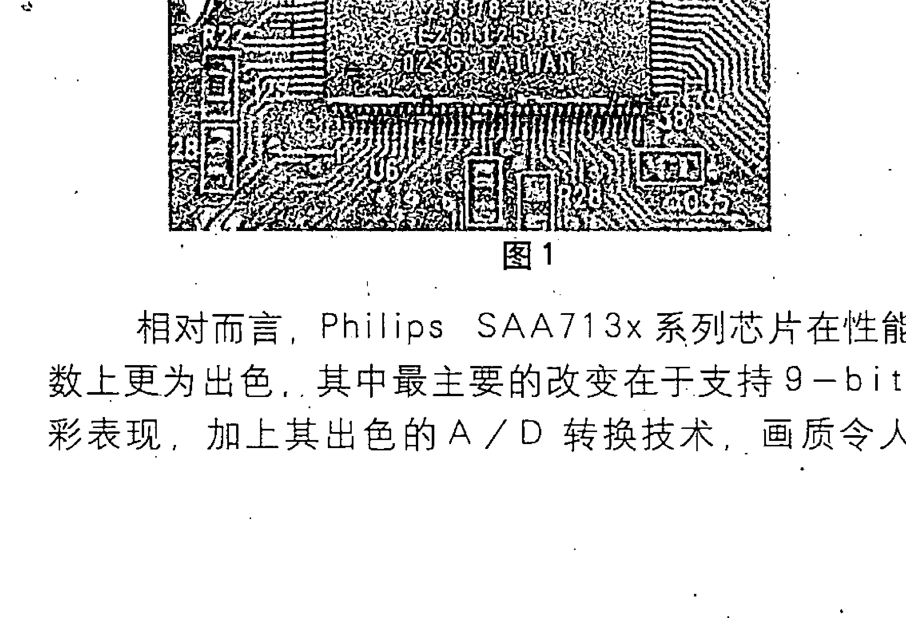

相对而言，Philips SAA713x系列芯片在性能参数上更为出色，其中最主要的改变在于支持9-bit色彩表现，加上其出色的A/D转换技术，画质令人十分满意。与Philips SAA713x系列同档次的，还有Conexant CX23880/CX23881，这两款视频芯片甚至支持10-bit色彩，而且整合音频采集芯片。尽管Philips SAA713x系列与Conexant CX23880/CX23881都不支持硬件编码功能，但是其采集能力还是略强于BT878，支持更高的分辨率，不过也依赖更强大的主机性能。

值得注意的是，少数电视卡采用了带有硬件MPEG编码补偿功能的Winbond W99200F视频芯片，并板载缓存。毫无疑问，这对于视频采集大有好处，而且能够让低配置的机器也顺利运行。不过，从使用角度来看，目前的主流配置似乎已经不需要这类硬件MPEG编码补偿芯片，因此其性价比不是很高。

## 3. 别被迷惑，看清附加功能

很明显，目前PCI电视卡产品的同质化现象十分严重，这也是技术含量较低产品的一个通病。遗憾的是，在激烈的市场竞争中，各种有严重误导倾向的广告比比皆是。凭借自身的软件设计，一些电视卡将MPEG4录像或者VCD录像作为产品的卖点，大肆宣传。然而，其所谓的MPEG4录像或者VCD录像，都是依靠软件来实现，真正通过硬件芯片编码进行实时压缩的产品，价格不会低于800元。由于目前的CPU以及磁盘系统性能已经十分出色，因此即便是“软件编码”也能获得令人满意的效果。不过问题的关键在于，这些功能是任何一款PCI电视卡都能做到的，相应编码器DivX 5.0以及外挂软件都是免费程序，如果因此而付出更高的价格，这对于用户而言非常不公平。

相对而言，我们更应该注重电视卡的高频头质量，这也是决定最终电视接收效果的关键。此外，成熟的电视卡还应该带有遥控器以及丰富的应用软件。

## 二、电视节目接收指南

对于第一次接触电视卡的用户而言，安装并接收电视确实不是一件容易的事情。为此，我们将以Winfast TV2000电视卡为例，展示具体步骤讲述。不同品牌的电视卡，在使用方法都大同小异，因此大家可以举一反三。

## 1. 安装电视卡

安装电视卡并不麻烦，只需切断计算机的电源之后，打开电脑机箱，找一个空闲的PCI插槽，将PCI电视卡插入，并用螺丝钉固定即可。一般而言，建议将电视卡安装在最外边的PCI插槽，这样能够远离电磁干扰的密集区，对于提高画质会有好处。对于经常插拔板卡的人来说，安装电视卡是小菜一碟，但很多新手却望而生畏。其实，安装电视卡非常简单，按照以下步骤操作即可：

- （1）切断电源，用螺丝刀拧下机箱挡板的螺丝，然后打开机箱，并且使之横卧。
- （2）在主板上找到一个合适的空闲插槽（建议安装在最外边），一般PCI插槽为乳白色。
- （3）卸下插槽上的挡板，并将电视卡置于该插槽的上方。
- （4）用双手将电视卡紧紧压入PCI插槽，此时两头用力要均匀，力量释放缓慢，不能用蛮力。
- （5）检查电视卡的金手指是否与PCI插槽完全接触，如图2所示，电视卡未完全插入，这样是绝对不行的。

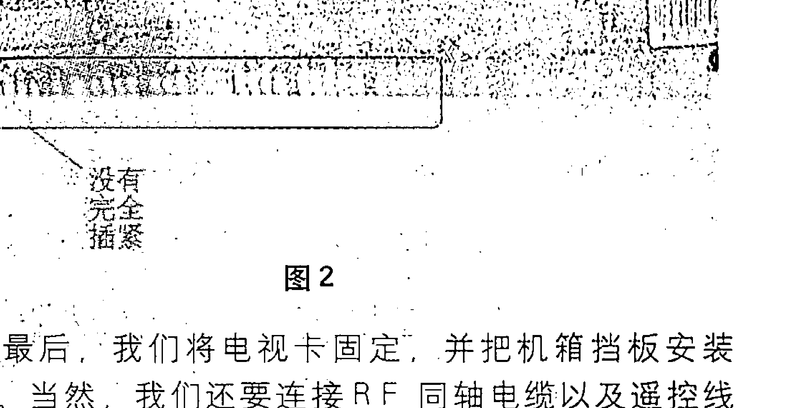

最后，我们将电视卡固定，并把机箱挡板安装上去。当然，我们还要连接RF同轴电缆以及遥控线和音频线。一般情况下，小区有线电视只提供一个RF同轴接口，而且已被电视机占用。这种情况下，我们要使用一个Y型分频器，将RF同轴电缆扩展为两路，其中一路供电视卡使用，连接电视卡上的高频头。

RF同轴电缆包含音频信息，但是大多数电视卡无法处理音频，因此必须通过一根两端有3.5mm端子的连线连接声卡。需要注意的是，此时应当将连线分别连接电视卡的Audio out与声卡的Line in，千万不能搞错，否则我们将听不到声音。对于部分带有遥控器的电视卡，大家还需要连接Remote探头，用来接收遥控器的红外线信号，并把探头固定在容易接收信号的位置。

## 2. 电视卡自带接收程序

在完成硬件安装之后，我们还需要为电视卡安装驱动程序。目前大多数电视卡都将驱动程序和应用程序统一封装，用户只需要执行驱动光盘中的Setup程序，按提示进行安装即可。

首次使用电视卡时，其应用软件会要求扫描频道，此时一定要确保制式为PAL。部分电视卡让用户直接设定所在地，然后执行所选择的制式，因此千万不能选错。除了制式问题以外，我们在扫描时还要将接受方式设定为“Cable”（有线电视），国内很多地区都使用这种接收方式，多城市都已经取消了无线电视。

当电视卡的应用程序完成频道扫描后，我们就可以简单接收各个频道的电视，诸如频道切换、音量调节等操作非常直观，在此就不一一详述了。此外，如果发现电视节目没有声音，可双击系统托盘中的黄色小喇叭图标，进入音频属性设定，并且将录音方式选择为Line in，并适当调高音量。

## 3. 第三方接收程序

并不是每一款电视卡都带有功能强大的接收软件，对于很多中小品牌的电视卡而言，借用第三方程序是很好的解决方案。在这里，我们推荐大家使用WinDVR，这款软件的功能十分强大，甚至比不少名牌电视卡附带的程序更加出色。

第一次使用WinDVR时，也需要扫描频道，并且设定制式为Cable（有线电视），这与电视卡自带程序是一样的。WinDVR最大的优势，在于具有电视墙显示与时间位移这两项重要功能，这也是很多用户选择WinDVR的主要原因。电视墙想必大家都不会陌生，如图3，它可以让我们迅速浏览多个频道，尽快确定自己感兴趣的电视节目。

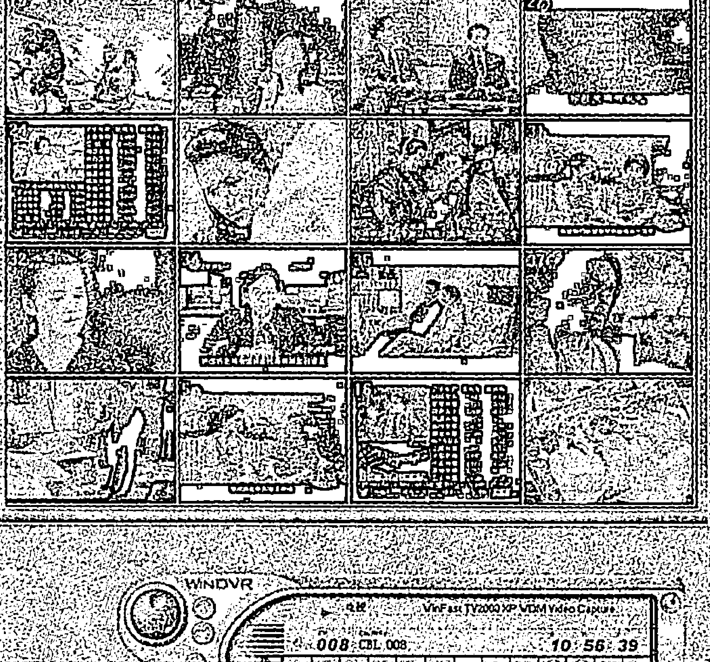

相对而言，时间位移功能更加吸引我们，它能在播放电视时，不中断正在进行的录制工作而暂停、重放或跳过广告。其实，时间移位的本质就是对电视节目进行预先录制，用户可以自行设置预先录制的缓冲时间。这样一来，当我们在收看电视时，可以自己控制播放进度，去掉一些恼人的广告、中场球评等。当然，使用这种方式收看电视，会比正常方式更晚地接收到信息，就好比体育比赛的延时转播。

## 三、在电脑上打游戏机

作为电脑和PS游戏的双重发烧友，很多用户一直为PS游戏只能在电视上进行深感不便。而且，看惯了LCD的用户，也逐渐对电视机的辐射相当敏感。尽管在电脑上实现PS游戏并非难事，很多PS模拟器都可以做到。不过，用PS模拟器多少会影响画面效果以及兼容性。毫无疑问，使用电视卡连接PS游戏机是最佳解决方案，非但不会影响兼容性以及画面效果，由于电脑显示器的高清晰度，画质还会有进一步提升，而且可以保护视力；并且，电视机的辐射也远大于显示器。

## 1. 连接方法

PS、PS2、DC等游戏机一般都具有视频输出与音频输出端子，其中视频输出端子分为S-Video与AV复合，而音频输出端子为AV或者3.5mm接口。根据视频输出端子的类型，我们应该选择正确的连线与电视卡上的Video输入端相连。

如果游戏机具有S视频输出端子，应该尽量使用S端子连线来连接电视卡上的S-Video输入端。S端子是一种五芯接口的超级视频端子，由视频亮度信号（Y）和视频色度信号（C）和一路公共屏蔽地线组成。它将亮度和色度分离输出，避免了复合视频信号输出时，亮度和色度相互干扰。如果游戏机只有AV视频端子，那么应当直接使用AV线连接电视卡上的AV in。相对而言，音频输出的连接方式单一得多，因为电脑声卡上的Line in无一例外地采用3.5mm接口；音频线的另一头，应根据游戏机的音频输出情况来决定是AV端子或者3.5mm接口。

## 2. 使用接收程序

当我们将游戏机的视频与音频信号传送到电视卡与声卡之后，还需要一款视频接收软件。目前很多软件都能胜任，包括电视卡自带的应用软件。

以Winfast TV2000的应用程序为例，在主界面中将Video Source选择为AV或者S-Video，即可看到游戏画面。整个过程非常简单，因为AV与S-Video的视频信号不需要频道扫描，直接切换就可显示。根据具体的显示情况，大家还有必要调节一下亮度及对比度，这些简单的操作我们就不详述了。

## 四、录制电视节目

由于种种原因，录像机还没有在国内普及，就被VCD播放机所取代。然而，VCD播放机却无法录制影像，因此相当不便。不过，通过电视卡，我们的电脑完全可以模拟录像机，而且在功能上更胜一筹。

## 1. 电视卡自带软件

优秀的电视卡一般都带有电视录制软件。在 Winfast TV2000 应用程序的主界面中，我们就可以看到一个明显的录制按钮，只要按下它就会以默认方式进行电视录制。但是，缺省的录制方式大多数情况下不符合我们的需要，还要进一步的设定。

在主界面中，单击下面一排的第三个“设定”按钮，我们会看到一个非常详细的录制选定对话框。其中，最关键的就是“录像格式”了，它将决定最后录制文件的视频格式，也直接决定了电视录制的压缩比和画质。一般而言，建议大家选择“MPEG-1最佳画质”，画质能达到相当不错的效果，压缩比也非常理想，而且录制过程中非常流畅，没有丢帧现象。不过，如果你的机器配置太差（CPU 主频在 800MHz 以下），那么可以尝试使用“MPEG-1一般画质模式”，可以很大程度上提高录制的流畅度，只是画质略微有点牺牲。至于“MPEG2”以及“DVD捕捉”，我们并不推荐使用，因为 CATV 输出的质量大约只有250线，还不到MPEG-1的水准，选择“MPEG-2”没有任何好处，只会带来不必要的数据量负担。

## 2. MPEG4 编码录制

很多用户的电视卡并不具备功能强大的应用软件，只能支持普通 AVI 格式的录像，而这种情况下数据量十分巨大，根本没有使用价值。为此，我们推荐大家使用 MPEG4 技术。其中编码器就是大名鼎鼎的 DivX 5.0（可在 divx.com 下载），外挂程序可以选择 Ulead VideoStudio 等常见的视频处理软件。

打开 VideoStudio 之后，单击左上角的“捕获”即可进入下一级菜单，此时会在显示屏的中央看到视频信息。如果没有的话，说明我们的视频设备还没有被识别，必须重新设置。不过，只要你不同时安装两块视频卡，这类情况一般不会出现。

如图 4 所示，VideoStudio 最关键的视频与音频捕捉选项都在窗口的左边，一般只需设置视频音频编码器即可，我们当然选择“DivX MPEG4”作为视频编码器。至于音频格式，推荐选择普通的 MP3 格式。最后，单击“捕获视频”按钮就可以开始捕捉了，一切就是这么简单！

如果你的 PC 配置足够强劲，那么其效果应该非常不错，基本不会有跳帧现象。在捕获时，我们可以观察“丢失帧”的情况。只要大家的 CPU 主频在 1GHz 以上（最好是 P4 或者 AthlonXP，因为对于视频捕捉而言， CPU 的缓存容量很重要），内存大于 256MB，应该就不存在什么障碍。此外，如果使用 7 200rpm 的高转速硬盘，效果会更好。

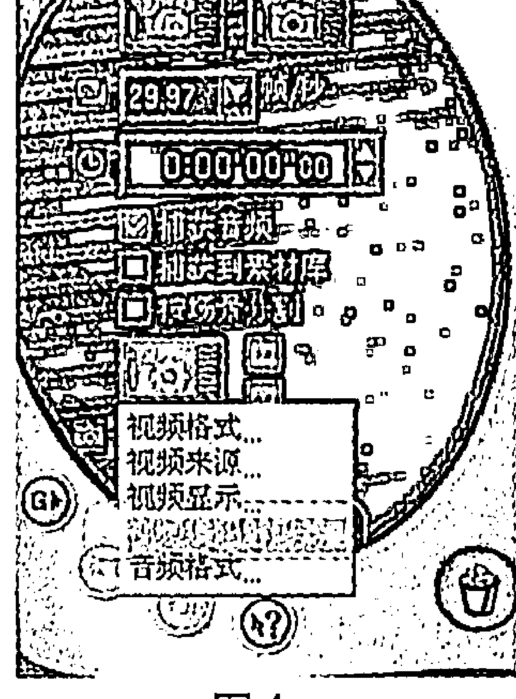

## 3. RM 编码录制

为了推广 R M 编码技术， Real 公司推出了 RealProducer Plus 这款功能强大的视频捕捉软件（可在 real.com 下载）。在打开 RealProducer Plus 之前，请确保已经切换好电视频道，此时最好关闭电视卡自带的软件。首先，RealProducer Plus 会出现一个向导界面，选择“从多媒体设备录制”；随后，RealProducer Plus 会要求确认视频与音频捕获设备，这里务必确保选择的视频源正确，不然将不能正确录制电视节目。

由于我们仅仅是将录制的节目用于自己观看，因此文件类型可以选择第一项，这样不仅产生的数据量比较小，也可以有效地提高画质。最后，向导会询问你捕捉的画面质量，质量越高意味着压缩率越低。对于普通观赏而言，256KB DSL 应该是足够了。RealProducer Plus 的视频压缩非常智能化，它甚至要求你确认视频是何种性质，以此来确定最佳方案，大家可以根据具体情况定夺。RealProducer Plus 的使用非常简单，经过以上设置后，我们只要点击“开始”按钮就可以录制电视节目了。

如果希望在有限的压缩率下进一步提高画质，那么大家可以尝试 Real 公司最新的 RMVB 编码技术。RMVB 打破了原先 RM 格式那种平均压缩采样的方式，在保证平均压缩比的基础上，设定了一般为平均采样率两倍的最大采样率值。它将较高的比特率用于复杂的动态画面（歌舞、飞车、战争等），而在静态画面中则灵活地转为较低的采样率，这样算下来，其综合压缩率要高于 RM。使用 RMVB 编码，需要最新版本的 Helix Producer Plus，制作方法与 RealProducer Plus 基本一致，只是要将编码速率选择为 VBR Down-load 模式。

## 五、电视卡另类应用

## 1. 加密频道

关于加密频道，全国各地的情况有所不同。以上海为例，以前上海人想要收看中央电视台第五到第八套的节目，以及本地的一些有线电视，都必须花800元买个所谓的电视解密器。现在这一限制已经完全取消，只有一些郊区还存在街道范围的有线电视，可能存在加密的情况。其实，电视局端的加密，就是在原本清晰的电视画面上加上很多干扰条纹，但是其干扰方式是叠加而不是覆盖。所以，我们在搜索加密频道时，得到的画面就像被人加了一块遮布一样。解密软件所做的，就是还原原来的信号，通俗地讲就是扯去这块遮布，所以我们就能看到清晰的画面了。至于音频，我们完全不必担心，因为大多数加密只针对视频部分，而音频没有加密。

在为数不多的几款加密电视解密软件中，CableCrypt Decoder 非常值得推荐。尽管目前 CableCrypt Decoder 已经发展到 2.04 版，但我们还是推荐大家使用更为成熟、兼容性更好的 1.5。

进入 CableCrypt Decoder 1.5 主界面，选择 Option 菜单下的 Audio、Video Source，各项参数大家可以按照图 5 所示设置。随后进入 Decode 菜单，将 Horizontal Lock、Invert Croma 以及 Enable Decoder 这三项选中。

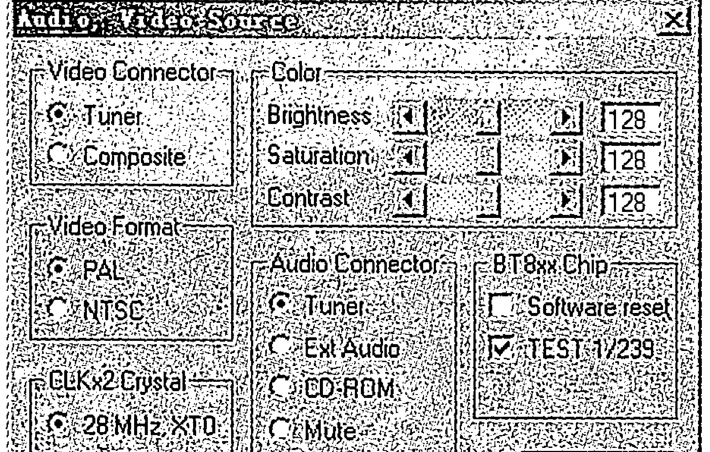

最后，也是最关键的步骤是进入 Option 菜单下的 Configure/Channel。在这里，我们需要选定电视卡的高频头型号，具体信息大家可以询问厂商，或者仔细查看电视卡高频头的标识。确定高频头型号之后，我们即可对频段进行扫描，当你发现电视画面上有干扰图像时，这就是加密电视所对应的频段。为其取一个名字，然后单击 Insert 按钮保存。

回到 CableCrypt Decoder 的主界面，如果解密程序能够起作用的话，我们即可看到解密之后的画面，基本上消除了干扰。当然，需要指出的是，不同加密频道所采用的加密方式不尽相同，有些可能是 CableCrypt Decoder 无法解决的。对此，大家还可以尝试一下 MultiDec、FreeTV 等软件。

## 2. 接收 FM 广播

少数高档的电视卡，直接集成了 FM 广播接收芯片，而且效果十分出色。不过，普通电视卡即便没有专用的收音芯片，也能实现 FM 广播。毕竟广播的原理十分简单，而且我们的高频头本身就具备寻找无线信号的功能。

Dscaler 可以帮助我们实现 FM 广播接收，它同时也是一款支持电视播放的软件。使用 Dscaler 之前，我们必须在 Card 菜单中确定电视卡类型和高频头型号，Dscaler 默认支持一些常见的名牌产品。如果你的电视卡不在该列表中，必须选择 Unknown Card，并且保证高频头型号选择正确。

回到 Dscaler 的主界面，按 Home 键进入 Channel List 菜单。此时我们将 Format 设定为 FM Radio，把扫描范围设置为 P.R.C. China。通过 Frequency 扫描，我们可以对 88-100MHz 的范围进行逐一尝试，一般可以接收到很多频道。为了达到更好的接收效果，建议大家为电视卡安装一个天线，这种天线多用在 90 年代初的老式电视机上。

电视卡的遥控器给我们带来很大的方便，但你是否有这样的经历：躺在床上看完电视打算关机，遥控器却只能帮助我们关闭应用程序，无法关闭电脑。事实上，做到这一点也并不困难，我们完全可以让遥控器模拟鼠标。

PCRemote 和 BTRemote 软件都是不错的选择，但是它们都只能支持 AverMedia（圆钢）与 Leadtek 的电视卡遥控器。以 PCRemote 为例，打开主程序，单击 Settings，然后将 AverMedia 选中，回到主界面点击 Run 按钮即可。如果你的电视卡并非 AverMedia 或者 Leadtek 产品，也可以尝试一下。有趣的是，PCRemote 可以针对各种程序，精细设置遥控功能，有兴趣的读者可以在 Command 菜单中挖掘一番。

## 六、亲密接触视频电话

## （一）摄像头的选购

视频电话曾经由于价格等因素，不被用户青睐，我们也只能在 007 电影中，观看美国总统与恐怖分子用视频电话谈判。如果你希望视频娱乐的效果，能够达到让人满意的境界，那么，一定要选择一款性能出色的摄像头。下面，我们将介绍一些摄像头及相关知识，这样在选购时才能有的放矢。

## 1. 接口方式

摄像头分为数字摄像头和模拟摄像头两大类。模拟摄像头可以将视频采集设备产生的模拟视频信号转换成数字信号，进而将其储存在计算机里。模拟摄像头捕捉到的视频信号，必须经过特定的视频捕捉卡（或者电视卡），将模拟信号转换成数字模式，才可以转换到电脑上运用。而数字摄像头可以直接捕捉影像，然后通过 USB 接口进行传输。

毫无疑问，从成本上来看，采用 USB 接口的摄像头更加吸引人。但是需要注意的是，限于 USB 1.1 带宽的不足，大多数 USB 接口的摄像头都只能进行 15fps 的视频应用，即便分辨率能够维持在 640×480 之下，其效果还是略有欠缺。当然，目前部分产品采用了缓存技术，而且随着新一代编码技术的成熟，USB 带宽的瓶颈在一定程度上得到了缓解，因为 USB 接口的摄像头运行在 12Mbps 之下已经足够。

不过，采用 AV 视频端子的模拟摄像头就完全不不同。只要电脑的CPU性能足够强大，进行25fps视频捕捉都不成问题，而且画质更加出色。值得一提的是，如果大家已经拥有了电视卡/视频卡或者VIVO的显卡，那么建议选择AV接口的模拟摄像头，它不仅占用更小的系统资源，在效果上也有一定优势。此外，我们还可以使用数码相机甚至数码摄像机来取代模拟摄像头，当然必须具备带有AV输入接口的视频卡。

## 2. 感光器

感光器是摄像头的重要组成部分，根据元件不同可分为CCD和CMOS。CMOS主要应用于较低影像品质的产品中，它的优点是制造成本、功耗较CCD低，缺点是CMOS摄像头对光源的要求较高。CCD是应用在摄影摄像方面的高端技术元件，它具有成像效果灵敏度高，抗震动、体积小等优点，但其价格也相对比较高，且耗能大。

对于使用笔记本的用户，CMOS摄像头的低功耗具有很大的吸引力，而CCD产品则由于其较高的功耗而显得不太适合。事实上，我们对于CMOS技术也应该客观看待，不要抱以偏见。在35万以下像素级别的感光器中，CMOS与CCD之间确实存在较大差距，主要表现为偏色严重，而且图像模糊。不过新一代的CMOS技术在改良后已经焕然一新。目前，有不少新产品采用了80万像素，甚至130万像素的CMOS，而且价格甚至比不少35万像素CCD的产品还低。毫无疑问，经过改良后的130万像素CMOS，要远远好于35万像素的CCD。

## 3. 附加功能

为了使产品的使用更加方便，不少厂商都为数码摄像头添加了许多附加功能。无疑，厂商的这一设计令产品更加超值，消费者对此十分欢迎。目前，市场上带有初步数码相机功能的摄像头层出不穷（如图6所示）。从效果上来看，这些产品所拍摄的照片，用于显示器上欣赏还是相当不错的。不过，限于像素级别的不足，要想实现数码冲印还有一定距离。对于希望兼顾网页制作、PhotoCD娱乐的用户而言，带有DC功能的摄像头确实是不错的选择，而且价格一般只比同类摄像头贵300元左右，加上其内置的闪存，应该说非常超值。

除了DC功能以外，摄像头内置麦克风也很常见。对于需要视频电话的用户，同时使用摄像头与麦克风相当麻烦，内置麦克风的摄像头无疑更加方便。

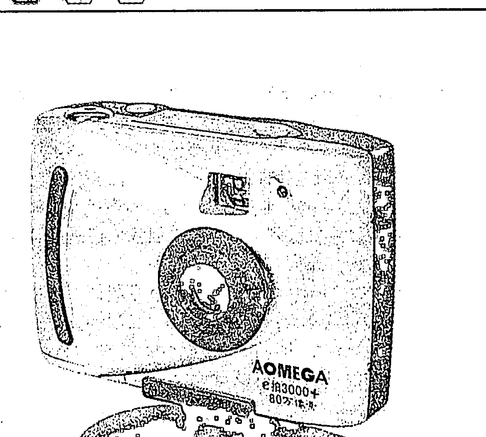

此外，少数摄像头甚至还带有AV视频输入接口。如此一来，它简直成了一块视频卡，我们可以将其与录像机、PS等具有视频输出功能的设备相连，在电脑上欣赏更加清晰稳定的画面。

## 4. 视频卡与AV模拟视频输出的组合

视频卡或者电视卡上一般都带有AV输入接口，配合模拟摄像头使用，同样可以获得很好的效果。从理论上说，这样的组合方式优于USB接口的PC摄像头，毕竟PCI的带宽远远超过USB 1.1的12Mbps，在视频采集中的效果更加出色。模拟摄像头一般可以到电子商店购买，采用CCD感光器的彩色模拟摄像头，价格一般在200元左右，推荐已经拥有视频卡或者电视卡的用户选择。

此外，随着数码相机大幅度降价，很多朋友都拥有了自己心仪已久的设备。电视卡或者视频卡也不再是什么稀罕的外设，在数码相机视频输出功能的帮助下，我们完全可以将它们组合成一套简易的数码摄像头。在正确安装好电视卡驱动的前提下，先用普通AV线，将数码相机的AV输出接头与电视卡AV视频输入端相连接（部分DC要使用专用的AV线），然后打开数码相机，并将其切换到视频录制模式。

与100多元左右的CMOS USB摄像头相比，我们这一组合拥有更加出色的效果，而且在视频捕捉时不受USB带宽的限制，明显提高速度。在视频质量方面，数码相机凭借其高像素的CCD获得不小的优势。但要注意，由于数码相机CCD本身的特性，最好不要在昏暗的条件下拍摄，不然效果会打一些折扣。

## (二) 主流摄像头推荐

### 1. 罗技高手版/欢乐版

罗技一向以其优秀的鼠标产品著称，不过它推出的Quick Cam系列CCD摄像头也同样显出其强劲的研发实力。QuickCam共有两款：“快看欢乐版”和“快看高手版”。由于采用了30万像素的CCD，这两款产品的画质还是很让人满意。此外，罗技还特地赠送了一个底座，这样可以使摄像头灵活转动，在进行视频电话时会获得不少方便。

### 2. 天敏小章鱼二代

国内的天敏电子，一直致力于视频设备的研发，小章鱼二代这款产品采用了30万像素的CMOS感光器。尽管在画质上略微逊色一些，但是其价格却相对低廉，非常适合那些使用56K Modem进行视频电话的用户。需要注意的是，并非所有相同像素的CMOS产品都有相同表现。天敏这款产品采用经过优化的CMOS，其总体表现比较令人满意。

### 3. 创新 WEBCAM 3

创新的WebCam系列摄像头非常著名，目前已经发展到第三代产品。尽管它最大能够支持640×480的分辨率，但是CMOS感光器件还是限制了其画质。值得一提的是，WebCam 3拥有非常宽大的视角，并且能够调节焦距，在进行视频电话时非常有用。从另一个角度来看，视频电话对于摄像头的要求并不仅仅是清晰度，使用的便捷性也同样不容忽视。

### 4. 经典的 Intel CS110

Intel也推出过不少摄像头，但是在国内外的正规电脑市场上却很少见。如果大家常去二手市场，你就会发现Intel的二手摄像头简直铺天盖地。Intel CS110采用30万像素的CMOS，画质表现只能算是一般，用于视频电话只能算合格，不过价格却只有50元出头。读者如有兴趣，还可以到易趣(eachnet.com)上去找找看。此外，Intel CS430摄像头采用了CCD感光器，画质要出色很多，基本与罗技的高手版相同，不过价格贵了很多。

## (三) 实战视频电话

### 1. 安装摄像头驱动的基本方法

在安装USB摄像头之前，建议大家先看一下驱动程序。一般而言，驱动程序可以分为两类：一种是驱动与应用程序分开，我们需要先安装驱动再安装应用程序；另一种是将驱动与应用程序相结合，用户只需执行一次Setup程序即可。
对于前者，我们可以在带电状态下，将摄像头与电脑的USB接口相连，Windows会立即提示发现新硬件。当我们输入驱动程序的路径之后，摄像头就安装成功了，期间可能会要求我们插入Windows的安装光盘。安装完毕之后，我们应该能够在设备管理器中看到相关设备的图标，如图7所示。各种随机附送的应用程序，可以随意安装，没有什么特别的讲究。需要强调的是，对于那些将驱动与应用程序合二为一的摄像头，我们最好先执行Setup程序，等系统重新启动之后，再将USB摄像头与电脑相连即可（可以热插拔）。

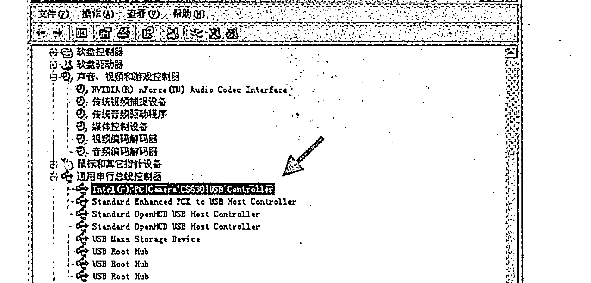

### 2. 连接语音麦克风

大多数摄像头都没有集成语音功能，因此安装独立的麦克风是必需的，否则无法进行视频聊天。目前，电脑城里各种廉价的麦克风比比皆是，很多都采用整合耳机功能的形式，综合效果并不理想。如果需要获得较好的噪声屏蔽效果，建议购买50元左右的中高端产品。此外，如果不在意Hi-Fi音响中的麦克风硕大体积的话，使用一个6.5mm转接头将是很不错的解决方案，毕竟这类专业级麦克风都具有不错的噪声屏蔽能力。最后还要提醒大家，麦克风应该与声卡上粉红色的接口相连，不能连接蓝色的线性输入接口。部分机箱已经把麦克风接口前置，接驳时就更加方便了。

### 3. 常用视频软件
- (1) MSN 视频电话

微软最新版本的MSN 6.2即时通信软件已经与Netmeeting整合，我们只要升级Windows自带的MSN即可使用视频聊天功能。只要双方都安装了摄像头，那么在MSN中启用视频聊天将十分简单。首先，用鼠标右键单击需要进行视频聊天的好友名字，在菜单中选“发送我的网络摄像机画面”，对方就能看到我们的视频画面，在另一端使用相同方法就可互通视频。
在第一次使用视频功能时，MSN要求进行略显多余的参数设置。对于大多数内容都可以不必理会，使用默认值即可。新版本的MSN已经彻底简化了网络参数与视频压缩选项配置，全部自动完成，惟一需要我们操心的便是画面色彩调节。在完成参数设置之后，点击“工具”菜单中的“网络摄像机设置”，如图8所示，在这里可以将视频调节到最佳状态。设置完成之后，就可以利用MSN进行视频通话了。一般来说，我们使用30万像素CMOS摄像头与512Kbps ADSL，就能获得非常理想的效果。当然，具体的应用效果还要取决于对方的配置。

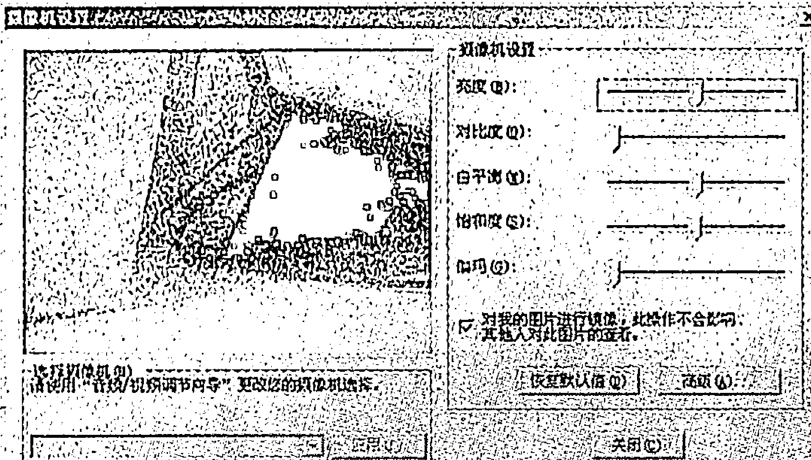

- (2)QQ 视频聊天

为了加强与MSN的竞争力，腾讯QQ也加入了视频聊天功能，这也是很多网友购买摄像头的初衷。在使用QQ进行视频聊天之前，需要进行一些设置。首先，点击任意好友的头像，选择“视频电话”下的“视频调节”，调试向导会一步一步引导我们完成设置。对于大多数国内用户而言，QQ视频聊天设置要比MSN更加方便，只要简单地确认一下压缩比、帧速率即可。最后，只要我们能够看到视频窗口出现，肯定就可以进行视频聊天。当我们与好友聊天时，只要选择“视频聊天”，然后发出请求即可。

- (3)QQ 多人视频聊天

多数用户认为，在QQ中只能实现两个人互相进行视频聊天。其实，在QQ中是可以实现多人同时视频聊天的。方法非常简单，你可以同时向两位好友发出视频聊天的请求，如果都得到对方许可，便可以与两位好友同时进行视频聊天。假如与你进行视频聊天的那两位好友，他们彼此也通过了对方的视频聊天许可，你们三人就可以在线召开视频会议了。同时打开两个聊天对话框，也许会觉得占用较多的电脑屏幕，可以在聊天对话框的视频窗口右下方，打开“选项”菜单，选择“浮动视频窗口”选项。毫无疑问，使用QQ进行视频聊天更加方便，也符合国人的操作习惯。目前使用这项功能的QQ用户还不多，因此服务器速度很不错，比MSN更加顺畅。值得注意的是，除了MSN与QQ，还有很多网络电话软件支持视频聊天，其速度可能更快，有兴趣的朋友也可以尝试一下。

## (四) 深入挖掘摄像头功能

### 1. 模拟简易数码相机

尽管PC摄像头不具备存储空间，也没有快门和闪光灯，但通过一些应用软件也是可以弥补的。ACDSEE这款看图软件大家一定不会陌生，只要使用4.0以后的版本，摄像头完全可以与之配合，形成一部简易的数码相机。在ACDSEE 4.0的主界面中按下Acquire按钮，并直接选择Twain下的Acquire命令，此时ACDSEE会自动检测USB摄像头。一般而言，大家所使用的摄像头都支持Twain，基本上都能被ACDSEE识别。经过初始化之后，我们就可以在ACDSEE中看到摄像头的控制界面了，接着按下Take Snap即可。由于照片保存在硬盘中，因此我们无需担心存储空间。此外，大家还可以对照片的效果进行进一步控制，如设置分辨率、对比度、亮度等。

### 2. 模拟数码摄像机功能

目前，DV的价格依旧让普通人难以承受，如果大家只需要在室内进行拍摄，摄像头同样能够起到不错的效果。从画质来看，只要采用CCD感光器，30万以上像素的产品都有不错的表现。对于那些具有130万像素CMOS，或者80万像素CCD的摄像头而言，效果将更为出色。毕竟目前主流DV的像素也不过80万，其动态像素更是只有40万左右。当然，如果我们以最简单的未压缩AVI格式进行采集，其占用的硬盘空间将会很大，而且存在2GB的空间限制，根本没有实际使用意义。为此，笔者推荐大家采用DivX编码技术，这也是MPEG4的一个分支。首先，到divx.com下载DivX 5.2编码软件。不过DivX 5.2仅仅是编码器，具体的采集需要外挂程序，其中VirtualDub应该算是其中的佼佼者（可以到www.pchome.net下载）。在VirtualDub主界面选择Cature Avi，系统会自动识别摄像头。随后，我们进入Video菜单下的Compression设定编码器，当然是选择DivX 5.2。至于编码参数，我们可以全部使用默认值，有经验的用户可以自行设定。同样，Audio菜单也可以选择编码器，MP3或者PCM都可以。相关参数设定完成后，按下F6键，摄像头就开始工作了。不过，由于USB接口带宽不足，因此视频捕捉可能会有少量的帧丢失。如果大家使用电视卡与模拟摄像头，采集效果会有明显改善。

### 3. 远程视频监控

在现实生活中，我们经常能够看到一些远程监控应用。事实上，只要为PC配备一个摄像头和相关的软件，实现这项功能同样轻而易举。在此，我们推荐大家使用SupervisionCam这款软件，它可以自动地将摄像头拍摄的影像，传送到用户制定的FTP服务器上。无论你在什么地方，都可以利用网络监视自己的办公室或居所。SupervisionCam 安装十分简单，只是暂时没有对应的中文语言包。

- （1）配置摄像头参数

首先，依次打开左上角的Configuration → Settings，打开如图9所示的画面，会出现Motion Detection标签卡。在Settings video source的下拉菜单中，选择你所安装的摄像头，然后就可以在右下角看到捕捉到的动态画面了。如果想要调整画面清晰度，可以点击Video capture Pin…按钮，设置视频分辨率。

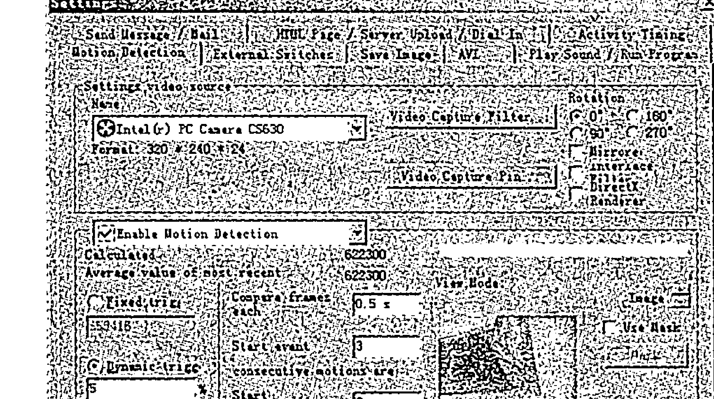

为了起到保密作用，建议将摄像头安装在隐蔽的地方，并且计算好拍摄角度以及遮挡物等细节问题。更为贴心的是，Motion Detection 标签卡下的Rotation 功能可以帮助大家旋转画面，这样就不必担心摄像头的摆放位置了。

- （2）设置工作启动条件

SupervisionCam 的工作原理并不复杂，如果程序发现被监控的画面有变化，如物体移动等等，会在设置的时间间隔进行自动抓图，并保存到硬盘中。倘若用户需要进一步的措施，SupervisionCam 也能提供完美的解决方案。首先，在Motion Detection 标签卡中选中Enable Motion Detection，下方的Dynamic Trigg…表示监测时的灵敏度，建议设置为5%即可，灵敏度太高容易引起误报。其他选项建议大家使用默认值。

- （3）设置报警方式

如果在监测过程中发现画面变化，那么SupervisionCam 的默认措施相当温和，仅仅是记录在硬盘中。如果想了解已经录下来的画面，只要单击对应每个时段的画面，就能看到其中的变化。但是这种模式仅仅适合监视应用，倘若是报警装置，我们还得有更为激进的措施。

在Play Sound 标签卡中，我们可以自己选定一段警告性的WAV 音频文件，连上音箱即可起到威慑入侵者的目的。此外，Send Message 标签卡可以设置监测到画面变化后，发送Email 通知，甚至还能在HTML Page…标签卡中，选定将录制的视频上传到FTP 服务器。

## 智能狂拼输入法技巧点滴（三）

### 支持南方模糊音

对于拼音不准的部分用户，“智能狂拼”提供了解决方法，具体如下：可以分别对声母中的“z=zh，c=ch，s=sh”，以及韵母中的“an=ang，en=eng，in=ing”分别作设置，用户完全可以根据自己的个人习惯来定制自己的模糊音。

### 文本转换工具

该工具能够方便地实现在多种不同编码的文本文件之间进行编码的相互转换，“智能狂拼”提供的文本转换工具可以在GB码（简体中文）、BIG5码（繁体中文）、Unicode码以及GBK码这四种编码的文本文件之间进行相互转换。不过此工具不可以直接对Word文档操作需事先转化为文本文件格式，之后才可用该转换工具来转化编码了。

### 智能学习功能

能够学习四种类型的文档：普通文本文件；网页文件、Word文件、Excel文件。学习Word 2000和Excel 2000文档时需要借助宏功能来完成学习，选中Word 2000的“工具”→“宏”→“安全性”菜单，将安全级设置为“中”，选择“启用宏”后“智能狂拼”便可以完成该Office文档的学习。

## 二手电脑淘宝的乐趣

——文/斯佳丽

1000多元的台式电脑、2000多元的笔记本电脑，市场上的二手电脑正不断增多。摩尔定律表明了PC惊人的发展速度，同时也使它成为了一种贬值最快的商品。面对日益庞大的应用程序，用户对硬件的要求也随之激增，一些低档机因而被淘汰下来，于是二手电脑产生了。一些对电脑的配置要求不高的部门或个人，由于经济承受能力或是其他方面原因，不少用户会选择二手电脑。面对二手电脑，我们应该如何进行选购呢？

### 一、二手电脑市场探秘

各地的二手电脑市场，在利润的诱惑下一天天地壮大。特别是沿海一带大中城市的二手电脑市场，已经成为全国二手电脑批销的“集中营”。

#### 1. 二手电脑的来源

如此巨大的二手电脑市场，货源到底从何而来呢？笔者对此进行了深入调查，并咨询了广州大沙头旧货交易市场内经营二手笔记本电脑的朋友，他向笔者透露，“国外发达国家电脑普及应用水平一直以较大优势领先于国内，不断有先进的产品在国外得到广泛应用，而被淘汰的产品通过各种渠道进入国内。很多二手电脑是分批从国外“进口”的，它们以集装箱的形式运至沿海一带（主要集中在广州和汕头），然后以一批××万元的售价“批发”给一些规模较大的二手商家，再由该二手商家进行分销。在这批二手电脑中，产品质量有好有坏，良莠不齐，有可能其中一些产品已完全报废，但其中也有许多好产品，它们的进价都非常便宜。规模较大的二手商家还有自己的翻修工厂或车间，专门对坏的二手电脑进行维修，以及对成色较差的二手电脑翻新。像二手笔记本电脑、二手大屏幕显示器这类产品，其主要来源是靠国外“进口”，到广州二手电脑市场就已经转了二三次手，接着再批销到其他城市经营二手电脑的商家，当中又可能会转二三次手。“我们可以看到，这里面存在不少阴暗面，很多洋垃圾电脑配件也是通过这一渠道进入到国内市场。

二手电脑的另一来源是国内大公司，企业以及网吧淘汰的整机和配件，但这只占其中的一部分。这些源于国内的二手电脑及配件，多属两三年前的产品。尽管沦为二手产品，其中不少产品仍有较大的使用价值。另外，还有一小部分是个人用户升级电脑而出售的配件。
需要提醒大家的是，国内大公司，企业和网吧淘汰的机器由于使用时间长，损耗大，并且使用者不爱惜，导致配件即使用，成色及稳定性却不如人意。而且，一部分回收配件是坏的，商家一般会进行返修。在国内淘汰的配件中，以个人用户出售的质量最好，一般其使用时间不长，并且使用时非常爱惜，成色不错。

#### 2. 二手电脑的利润空间剖析

用户之所以购买二手配件，最关键的因素就是价格便宜。就目前的二手配件价格来看，一般情况下为新品的40~60%，以一台配置为Celeron II 1GHz、128MB内存、TNT 2显卡（32MB显存）、20GB硬盘、17英寸纯平显示器的二手电脑为例，价格约1800元左右。而单从配件来看，七八成新的15英寸显示器仅售200多元，17英寸纯平显示器（珑管）也才650元左右。因此，很多消费者选择购买二手电脑。
二手电脑市场能在很快的时间，发展到一定的规模，主要原因就是“利润”。二手电脑商家的赚钱思路极为简单，就是“低进高出”四字经。作为买家来说，上述配置的二手电脑花1800元购买还是比较划算，可如果你以同样的配置让二手电脑商家回收你的电脑，能卖到1500元就很不错了。由此，我们可以看到二手市场诱人的利润，对此，福建省福鼎市晖华二手电脑商行的黄经理如是说，“现在的生意不好做，如果直接回收个人用户的旧电脑，的确利润空间会比较大，但数量还是很有限；如果向上级二手电脑批发商采购，利润空间就非常小，再加上物流成本，店铺开支，实际上并不能赢利。”
二手电脑商家在收购配件或整机时，都会进行非常专业的检查，以保证不会收购到质量有问题的产品，而一旦发现问题，他们会乘机压低价格。在## 二、购买二手配件的理由

面对“二手货”，为什么还有那么多的人喜欢呢？当然有它的理由：

### 1. 便宜是关键

笔者的一个好友去年购买了一台Pentium 4的全新电脑，花了七千多元，而在今年，另一个朋友按相同配置购买了一台二手电脑，只花了不到三千元，性能丝毫不差。所以，对一般玩电脑的朋友来讲，大可不必花大价钱买最新的配件，只要你耐心地等一等，然后到二手市场去寻觅，花不多的钱就能买回几个月前想买的配件了。

### 2. 舍弃时不会心痛

为什么有二手电脑市场？主要原因在于电脑配件的不断升级。如果要淘汰刚买不久的全新电脑，你可能很不舍得抛弃；但如果你开始选择的是二手电脑，在进行升级的时候，就是舍弃原来的旧配件，损失也很小，就不会觉得心痛，可以轻松地享受升级后的乐趣。

### 3. 乐趣无穷多

二手电脑不但可以给我们带来经济上来的节省，而且可在不断的寻找中充实知识。比如新的显示器看起来都大同小异，促销小姐和报刊上的显示器评测报告也总说一些没有概念的名词。可你到二手市场里转转，就发现千奇百怪的显示器和显示效果，还有各种测试显示器画质的小窍门，最后会让你明白不同显示器的真实价值。

## 三、二手电脑“淘金”实战

为了让大家能够在二手电脑市场中淘到“真金”，我们在选购时一定要小心谨慎，切不可轻易出手。下面就让我们来了解一些选购二手电脑配件的技巧。

### 1. 二手CPU选购技巧

由于CPU更新换代的周期太短，绝大多数CPU远没有达到其设计使用寿命就被淘汰，进入二手电脑市场。在二手电脑市场中，高主频的CPU很少见，原因主要在于二手电脑市场中的CPU一般要比主流慢一拍。

- （1）注意CPU的超频性能
大部分超频爱好者都希望能在二手市场购买到一块超频潜力极强的CPU。一般来说，即使购入已被前一任使用者超频过的二手CPU，如果超频幅度不大，都没有什么问题。不过，为了防止万一，购买前最好先详细询问在怎样的硬件配置下达到所宣称的频率。有些主板在超频工艺上进行了深加工和优化，可以轻松挖掘CPU的超频潜力，但有的主板在这方面做得较差，超频时会出现电脑不稳定或根本超不上去的情况。笔者曾经购买过一块赛扬733，在商家的升技主板上可以超到112MHz外频（该主板支持线性逐兆超频），而在笔者的杂牌主板上只能达到83MHz外频。
- （2）检查CPU的外观
做过手脚的CPU，通常可以通过外观辨别出来。如果你选购的是二手卡盒封装的CPU，一定要注意卡盒是否被打开过，正常情况下用户没有必要打开卡盒，如果打开过，最好不要购买。同时，还要注意针脚是否被整过形，CPU的针脚多，很容易移位，甚至折断。
- （3）检查二级缓存是否受损
二级缓存芯片是否损坏，从外观上基本看不出来。此时可以将机器点亮，开机后按【Del】键进入CMOS Setup主菜单，选择“Advanced BIOS Features（高级BIOS功能设置）”菜单，将“Internal Cache（内部缓存）”选项设置成“WriteBack”（见图1）（有些主板此选项可能为“CPU L1 & L2 Cache”，那么应将其设置成“Enabled”。

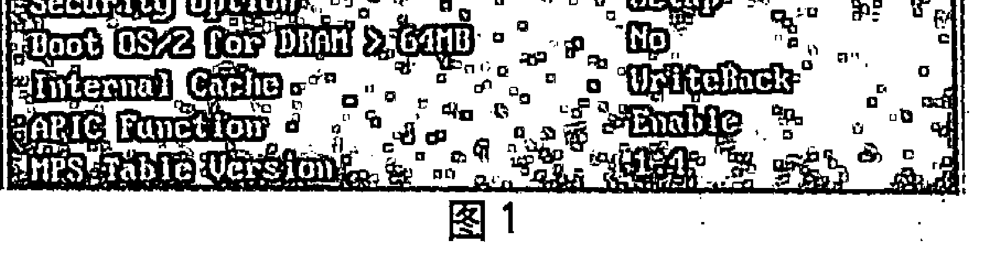

**小提示：**

老主板的BIOS可能将这项设置变成两项：“CPU Internal Cache”和“External Cache”或者“CPU L1 Cache”和“CPU L2 Cache”。但是，最早的赛扬是没有二级缓存的，所以L2 Cache功能要不要开启都无所谓。通过以上操作，可以减少CPU在存储器读/写周期中的等待时间，也就是可以加速CPU的访问速度。如果在打开此功能之后，出现了系统不稳定和注册表丢失的情况，就可能是CPU的二级缓存损坏了。

- （4）利用WCPUID防止打磨CPU
特别提醒大家注意，现在大部分被Remark（打磨）过的CPU，都出现在二手CPU市场中。识别被打磨过的CPU，需要有一定专业技术知识。通过WCPUID之类的CPU检测工具软件，能够非常准确地测定CPU的工作频率和详细性能参数，用来防止打磨CPU是再好不过了。当然，它也可以检测二级缓存的容量是否正确。

**WCPUID小档案：**
- 最新版本：3.3
- 软件大小：262KB
- 授权方式：免费软件
- 适用平台：Windows 9x/NT4/2000/XP/Server 2003
- 下载地址：http://my.vector.co.jp/servlet/System.FileDownload/download/ftp/0/38172/pack/win95/hardware/cpu/wcpu330.exe

运行WCPUID后，在主界面中会列出当前CPU的主要参数，包括品牌与名称、代号、工艺、封装形式、主频、外频、倍频系数以及L1 Cache中数据、指令Cache的大小、L2 Cache的大小、潜伏期以及CPU所支持的特殊技术（MMX、MMX+、SSE、SSE2、3DNow!、3DNow!+）（见图2）。我们将这些检测到的参数，与CPU官方网站上公布的CPU参数相对比，就可以让打磨过的CPU原形毕露。

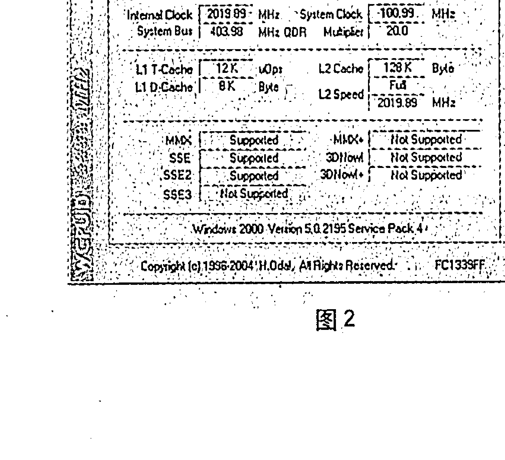

### 2. 二手主板选购技巧

主板作为搭载CPU及电脑内所有板卡的平台，其品质及稳定性影响着整机的性能，所以在选购时应该十分慎重，特别是很多二手主板总有这样或那样的毛病，要想淘到‘真金’不太容易。对于选购非整合型二手主板的用户来说，目前市场上的主流新品主板已经下跌到非常低廉的价格，所以在选购时无需花费太多的金钱，只是要有些运气加毅力方能找到满意的主板。

- （1）看主板是否为返修品
有些二手主板是在使用过程中损坏，再经过修理后出售的。虽然这样的主板也能点亮，但很可能日后运行不稳定。因此在选购二手主板时，一定要注意观察有没有维修过的痕迹。要考察这一点，主要是细心观察主板的每一个角落，看看是不是被焊接过，是否有飞线等。如果存在这些情况，最好就不要购买。
- （2）看主板的做工
有些经济实力不强的OEM主板生产商，为了降低成本，生产出来的主板偷工减料，甚至还会产生毛坯现象。在选购二手主板时，要注意选购一些做工精细、布局合理的二手主板。一般来说，稳定性和可靠性与主板生产商的设计水平、制作工艺、元器件的选择（尤其是质量）有很大的关系。
- （3）检测主板的各个接口是否损坏
二手主板很容易出现接口损坏的现象，用户在选购时应开机进入Windows系统，然后输入字符和移动鼠标，以检查PS/2接口是否损坏。同理，其他接口也可以实际操作一下，进行检测。
- （4）测试主板的稳定性
要测试主板的稳定性，我们可以进行超负荷工作、拷机等测试。超负荷工作是指在主板上加入尽可能多的外部配件，如使用频率最高的CPU等等。在超负荷情况下，主板的功率消耗和发热量都将增大，稳定性和可靠性将能比较容易地看出来。拷机测试是让主板长时间工作，看看整个电脑系统是否能持续稳定地工作。

**小技巧**

通过软件检测不知名的主板：如果买到一块不知名的主板，想升级BIOS却不知道品牌和网址时，可以借助eSupport BIOS Agent主板BIOS检测工具来检测。

**eSupport BIOS Agent小档案：**
- 最新版本：3.31
- 软件大小：209KB
- 授权方式：免费软件
- 适用平台：Windows 9x/NT4/2000/XP
- 下载地址：http://download.esupport.com/biosagent/ba.exe

### 3. 二手显卡选购技巧

显卡的稳定性是比较可靠的，一般一块显卡的使用寿命可长达10年左右，但有些使用不到2年就被淘汰，因此二手市场有很多价廉物美的显卡。与CPU的购买不同，二手显卡的购买不是取决于超频性能的好坏，而是看其品牌和做工。

- （1）看显卡的做工
选择一块知名品牌的二手显卡，其做工一般都不错。不过有些不太常见的二手显卡，例如GeForce3 Ti500，如果二手显卡的PCB上没有标示厂商的LOGO或产品型号（有些只写GeForce 2 MX400，这只是说明显卡采用的显示芯片），一般就是杂牌显卡。要检验二手显卡的做工，可以查看电子元件与PCB板的连接方式，分别为焊接式设计与贴片式设计。焊接式设计使用工艺较为落后，稳定性远不如贴片式的显卡，同时也较容易损坏，所以，选择二手显卡要注意选购贴片式设计的产品。此外，显卡的焊点是否光洁圆滑，也是判断二手显卡质量的重要依据。

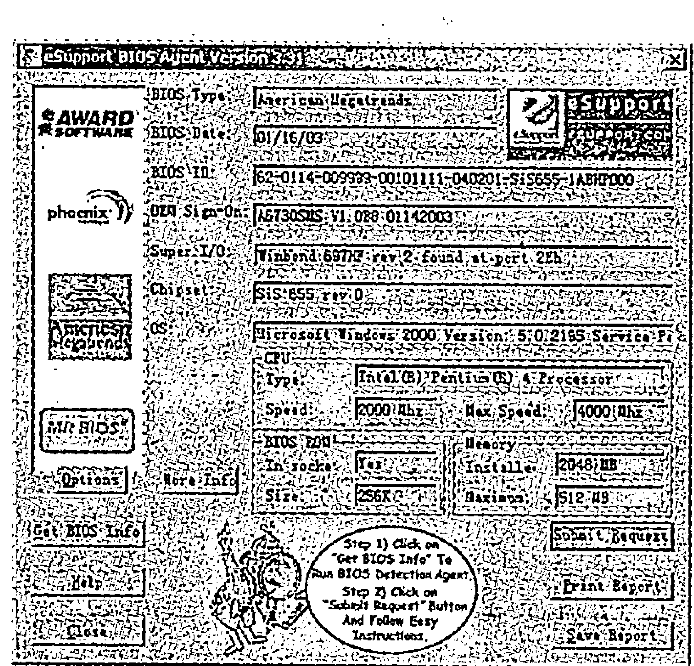

- （2）软件检测打磨/假冒显卡
选购一款比较好的二手显卡并不是一件难事，不过我们在选购时还要注意打磨和假冒的显卡。例如S3 Savage4 GT与S3 Savage4 Pro显卡在正常情况下，BIOS是识别不出Pro或GT版本的，在开机时都会出现"86c395/396/397"字样，再以芯片上覆盖的散热片作掩护，让普通人很难识别真假。再比如将SiS305显卡的BIOS刷成TNT2 M64，然后将芯片打磨后印上TNT2 M64的字样，再将驱动程序中相关的部分也改为TNT2 M64，如此一来SiS305便成了TNT2 M64，这样的显卡在系统中是无法被辨别出的。

由于现在的显卡芯片上都带有散热片或是风扇，所以很难从显示芯片上来辨别真伪。对于菜鸟来说，要想识别这些打磨和假冒的显卡更是不容易。其实，我们还可以利用PowerStrip软件进行测试。PowerStrip能迅速查出显卡的芯片类型、核心工作频率和显存工作频率等技术参数。

**PowerStrip 小档案**
- 最新版本：3.54 多语言版
- 软件大小：1167KB
- 授权方式：共享软件
- 适用平台：Windows 9x/NT4/2000/XP/Server 2003
- 下载地址：http://www.entechtaiwan.com/files/pstrip-i.exe

运行PowerStrip后，然后单击系统托盘中的PowerStrip图标，在弹出的菜单中选择“性能设定”→“设定”选项。在弹出的“性能设定档”对话框中，可以看到显卡的显示核心名称。我们还可以直观地看到，在两个可拖拉的调节杆旁边，分别显示着显卡核心频率和显存频率（见图4）。对比显卡官方网站上的数据，就可以知道是不是打磨和假冒的显卡了。

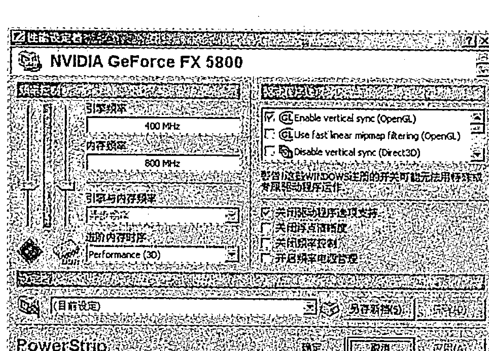

### 4. 二手内存选购技巧

内存也是电脑中一个很重要的部件，其性能的优劣和速度的快慢，在很大程度上决定电脑整个系统的性能。

- （1）识别返修内存
选购二手内存时，首先要查看内存芯片和电路板上有没有明显的伤痕，焊点应该均匀光滑、新旧一致，没有补焊的痕迹，特别要注意观察芯片管脚上的焊锡是否均匀。更换过芯片的内存，很有可能不是同一型号，会影响内存工作的稳定性，一定要注意检查内存芯片的字样、编号是否完全相同，如果不同，肯定是返修内存条。
- （2）识别假冒的SPD芯片
符合标准规范的内存上都带有SPD芯片，它一般是一个 8 针 SOIC 封装的 EEPROM（电可擦写可编程只读存储器）芯片，里面主要保存着内存生产厂家在内存出厂时所设定的一些相关资料，通常有容量、芯片模块的生产厂商、标称运行频率、是否具备 ECC 校验等等。SPD 芯片是标准规范内存和非标准规范内存的重要区别。有资料说打磨内存的高手只要几分钟就能将内存上的芯片更换掉，但只要是用普通工具焊上的芯片，其管脚上的焊锡都不会特别均匀，很容易就能看出打磨的痕迹。

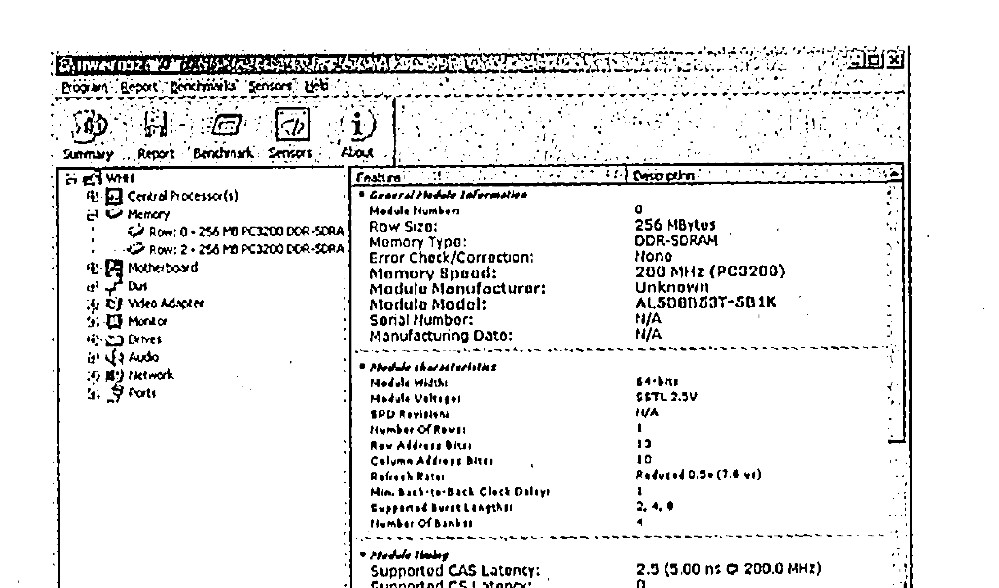

- （3）注意打磨内存
目前内存中可以作假的，就只有散装的现代内存了，盒装的品牌内存极少有作假产品。假冒的现代内存很好识别：一是看内存芯片上的字迹是不是有打磨过的迹象，是不是清晰；二是看金手指，如果颜色发暗发白的肯定是用过很长时间后回收维修的，凡是插拔过的内存都会在金手指上留下痕迹。一般情况下，名牌内存芯片表面的字迹印刷很清晰，即使用橡皮擦也很难擦掉。而在被打磨过的内存芯片表面，字体的标号非常模糊，遇到这样的内存条，大家一定要小心。
- （4）通过软件检测内存
内存的作假在装机市场几乎是公开的秘密，事实上普通人很难从外表上看出打磨内存与原厂内存的区别，依靠 Windows 的系统信息也得不到什么帮助。不过，我们可以借助 HWiNFO 32 来看个究竟。HWiNFO 32 等软件专门测试内存所带的 SPD EEPROM 中的时间参数和数据，以确定内存的规格，但由于各厂商并不一定完全遵照 SPD 规范编写数据，也有可能采用了更新的技术，因此有时这种方法并不一定准确。

**HWiNFO 32 小档案：**
- 最新版本：1.45
- 软件大小：1544KB
- 授权方式：共享软件
- 适用平台：Windows 9x/NT4/2000/XP/Server 2003
- 下载地址：http://www.hwinfo.sk/files/hw32_145.exe

运行 HWINFO 32 后，在主界面中点击 “Memory”（内存）前的 “+” 号，展开其下级菜单，然后点击下级菜单，就可以在右侧看到内存的模块类型、容量大小、生产厂商、运行频率、内存潜伏期、颗粒编号和生产周期等详细数据（见图5）。

### 5. 二手硬盘选购技巧

二手硬盘在市场上比较常见，品种和规格也比较多。一般情况下，二手电脑市场中的硬盘大多是从旧电脑中拆机，或从洋垃圾中筛选出的外观尚可的硬盘。大家选购时要注意以下几点。

- （1）检测是否有物理坏道
硬盘的坏道分为物理坏道和逻辑坏道。物理坏道就是硬盘磁片受到损伤而导致坏道；逻辑坏道是指磁片并未损伤，但由于软件故障、病毒、非正常操作等造成坏道假象，使得正常的扇区也被标示为坏扇区。

如果能启动系统进入 Windows，可以通过选择 “开始” → “程序” → “附件” → “系统工具” → “磁盘扫描程序” 选项对硬盘做完全扫描，并且对可能出现的逻辑坏道做自动修正。如果不能进入 Windows，就用一张 Windows 启动盘启动计算机，然后在 “A:\>” 提示符后键入 Scandisk X:（其中 “X” 是具体的硬盘盘符）对硬盘进行扫描和修复。但是，磁盘扫描程序和高级格式化程序可能无法完全修复这些逻辑坏道，建议大家使用硬盘厂商开发的硬盘故障诊断工具。

各个硬盘厂家都有自己专用的硬盘故障诊断工具软件：
- 希捷 SeaTools Disc Diagnostic（下载地址：http://www.seagate.com/support/npf/seatools/seatoold.exe）
- 昆腾 Data Protection System（下载地址：http://file2.mydrivers.com/disk/qdps102.exe）
- 西部数据 Data Lifeguard Tools（下载地址：http://support.wdc.com/download/dlg/dlgsetup11_win.zip）
- 迈拓 PowerMax（下载地址：http://downloads.maxtor.com/_files/maxtor/en_us/downloads/powermax.exe）
- 日立 (IBM) Drive Fitness Test（下载地址：http://www.hitachigst.com/downloads/dft32_v362_b14.exe）
- 三星 Self-diagnostic（下载地址：http://file2.mydrivers.com/disk/Shdiag.exe）
- 富士通 IDE FJ Quick Diagnostic Software（下载地址：http://file2.mydrivers.com/disk/Fjq_V250.exe）

这些工具可以帮助你判断究竟是物理坏道还是逻辑坏道，因为只有真正的物理坏道软件才会报告。

下面我们以迈拓的 PowerMax 为例，来介绍一下检测方法。
- （2）硬盘编号要熟悉
硬盘虽说没有假货，但是存在把5400转当成7200转销售的情况，大家要对不同硬盘的编号有所了解。例如西部数据硬盘的编号，最后凡是以“BB”结尾的肯定是7200转（见图6），而以“AB”结尾的就是5400转的；希捷“U”系列硬盘是5400转，“酷鱼”系列硬盘则是7200转的等等。

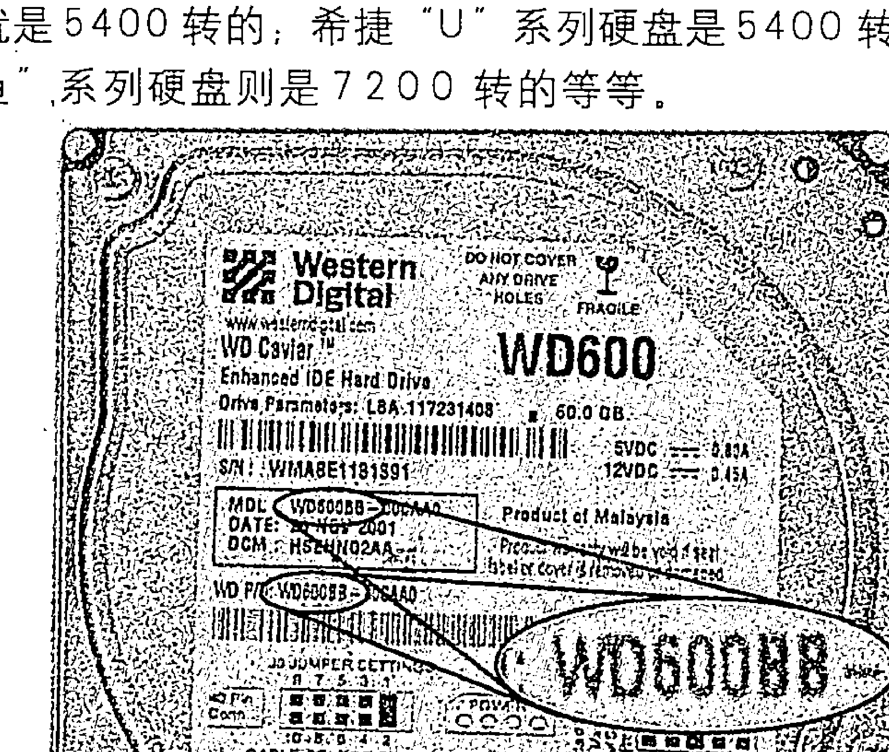

- （3）检测硬盘的实际容量
二手硬盘在上市前大部分都经过测试修复，对于有物理坏道的硬盘可通过软件进行修复。专业的二手硬盘商家可能会用PC-3000进行修复，普通的二手硬盘商家最多只是屏蔽物理坏道较多的区域，使剩下的部分勉强可以工作。对于后一种情况，我们可以查看硬盘的实际容量。不过，硬盘容量的计量本身存在一个折算问题，即硬盘生产厂家规定，将1000字节当作1024字节即1KB，也就是说，将1000×1000×1000字节当作1024×1024×1024字节即1GB。所以在查看时，将实际可用的硬盘容量和折算后的硬盘容量相比，看有没有差别就知道了。那么又如何查看硬盘的实际容量呢？简单的方法是利用DOS下自带的Fdisk和Format等几种命令，给它重新分区、格式化，有问题的硬盘绝对插翅难逃。

第一步：制作PowerMax启动盘。运行PowerMax后，点击“Continue”按钮，接着按提示插入一张空软盘，再点击“Start”按钮。由于文件很大，不能直接拷贝到软盘上。
第二步：重新启动计算机，将PowerMax启动盘插入软驱。按两次【Y】键进入测试界面。如果显示的硬盘型号正确，请按回车键。
第三步：在“Select Test”（选择测试项目）界面中，选择“Advance Test (Factory Re-Certification)”（高级且完整的硬盘检测），按回车键，并按【Y】键开始扫描整块磁盘的扇区是否有错误。这项测试时间较长（20～30分钟，取决于硬盘本身的容量）。如果测试通过，会显示“congratulations! Your drive is certified error free Press any key to continue and return to the Powermax Main Menu.”。

### 6. 二手显示器选购技巧

二手彩显是最具有“淘金”价值的，但问题也是最多的。在这些二手显示器中，不少是国外用于专业图像设计或特殊行业（如医用或军事设备等）淘汰下来的专业显示器。全球专业显示器生产厂商主要有索尼、三菱、EIZO、日立、富士通等等，另外一些专业品牌比如苹果、惠普、康柏、DELL的显示器也基本是这些厂商的OEM产品（如IBM P260对应SONY G500）。不过，目前国内的二手显示器市场良莠不齐，在选购时一定要谨慎，就算价格极为便宜，也要看清楚后再买。“淘金者”本来就不富有，万一中了圈套，更是得不偿失。

下面给大家详细说明如何购买二手显示器。

- （1）检查显示器是否老化或返修
有些显示器虽然外表好看，但其内部却是另一番天地，如修复过的元件，甚至有一些电线都已经老化不能再使用。为了安全，我们一定要打开显示器的后盖。如果二手显示器的商家不愿意让你打开显示器的外盖，很有可能是这台显示器有鬼，建议你不要购买。
打开外盖后，首先要看零件是否齐全，如屏蔽罩等等；接着看电路板是否老化，有没有维修痕迹，显像管上有没有厂家的标签，标签上的生产日期和铭牌贴上的是否一致。从这些小细节往往可以看出显示器的具体情况（如固定螺丝未被拧动，则可考虑略过此步骤）。
如果固定螺丝有被拧过的痕迹或机壳接缝处有伤，说明这台显示器一定曾出过问题。要是机器特别新（只有一两年），但螺丝帽已经残破不堪，十有八九这台显示器多次出过故障，最好不要购买这类的显示器。
- （2）看外观成色
虽然是二手显示器，但外壳也不能太次。卖二手商品的人都不爱惜东西，那些二手彩显就随便堆在地上，屏幕很容易被划出痕迹。一定要从侧面细看，如果划痕不明显的话也就可以了。
近几年的显示器外壳大多数为乳白色，如果二手显示器外壳的颜色发黄，说明这台彩显已经使用了很长时间，内部零件多已老化，最好不要购买。很多显示器都是洋垃圾，笔者在广州海正电脑城里见到过商家翻新显示器，原本一台又黄又脏，而且还有裂痕的显示器，经过他们“细心”翻新，很快变成一台成色非常不错的显示器。对于这类显示器，细看表面一般都能看出翻新的痕迹。
- （3）检查显示器的按钮是否失灵
很多二手显示器由于运输不小心或其他原因，会出现个别按钮失灵的现象。此时你一定要注意检查，激活OSD菜单，然后逐个试验每个按钮是否有效，还有消磁时应能听到“咔”的一声并看到画面抖动。

他们出售产品时，则以次充好，抬高价钱，或者吹嘘产品在其他方面的优点，极力掩盖可能会出现的质量问题。对于他们来说，二手产品的风险已经被分摊到购买者的身上了。至于市场价格下降所带来的风险，是每个商家都会遇到的。相比之下，二手市场的经销商收购产品时一般价格都较低，因而风险是比较微小的。

## 3. 最终用户需注意售后服务

我们都知道，二手市场销售的商品本身就是使用过的产品或淘汰的积压品，在质量上是无法与全新产品相比拟的。就目前的二手电脑市场现状来看，商家一般不会对商品提供售后服务的承诺，用户都是当场试机。如果在顾客强烈坚持下，二手电脑商家才会对那些不太容易出现质量问题的产品（如主板、显卡等等），提供几天保换的承诺；而对于容易出现质量问题的产品（如硬盘、CPU、笔记本电脑等），一般都不会轻易提供售后保证。

虽然是“二手货”，但我们还是要注意售后服务。在付款前，一定要老板开一个详细的收据，并列清每个配件的名称、型号、售后服务期限等等，并盖上公章。

### (4) 听听显示器工作时是否有异常声响

显示器正常工作时应该是没有声音的，如果你听到声音就不要购买。某些中高档显示器开机时会有“咔”的一声，不要担心，那是继电器在工作，属于正常状态。

### (5) 看显示器的生产日期

显示器的生产日期一般可以从背面的铭牌上查到，上面记录着这台显示器的品牌、型号、序列号、通过认证标准、出厂日期等信息。比如可以我们看到“Manufactured: JUNE, 2001”这样的标识，说明这台显示器的出厂日期是2001年6月。为了保证质量，建议大家不要买1997年以前出的显示器。

如果显示器后盖上的标贴被撕毁了，或者这张标贴没有标明生产日期，就只能借助软件进行识别。大多数显示器内部的存储芯片上，记录着出厂时的一些重要数据，包括序列号、生产日期等等。我们可以通过PowerStrip等测试软件读取这部分信息。

运行PowerStrip后，单击系统托盘中的PowerStrip图标，在弹出的菜单选择“选项→显示器信息”。在“显示器信息”对话框中，可以在“Date of manufacture”项中看到这台显示器的生产日期（见图7）。如果能结合显示器后盖上标示的生产日期，就更加心中有数了。

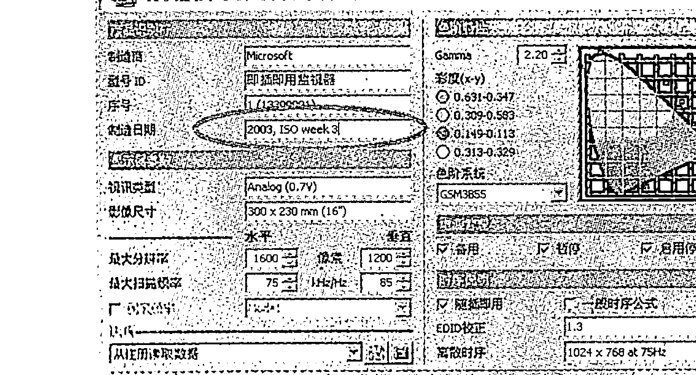

### (6) 亲自试用体验实际显示效果

带上自己的显卡和显卡驱动程序，之所以要带上自己的显卡，是因为不同的显卡在不同的显示器上显示效果不同，看看一下显示器是否能达到你的要求，如在1280×1024/85Hz等分辨率下的表现。

15英寸显示器的分辨率一定要上1024×768，规格每升一级指标也跟着上一级，以此类推。刷新率颇为重要，对于17英寸的显示器要在1024×768/85Hz下进行观察，19英寸显示器要在1280×1024/85Hz下观察。先看最大分辨率是多少，17英寸显示器如果在1024×768下刷新率能达到100Hz，或1280×1024下刷新率能达到85Hz，那也就可以了。

再逐渐调大显示器的亮度，看亮度是否达到要求。若亮度不够，则可能是显像管老化，或是加速极电压过低造成的，当然也不排除电路故障；若调节亮度开关来增加亮度时，有亮度在一个峰值点陡降而变暗的现象，说明显像管严重老化，这种显示器绝对不能要；或者显示器四周的亮度不均匀，有一块明显偏暗，都不能购买。

我们可以通过更换不同的桌面背景，观察各种颜色是否逼真，特别应注意红、绿、蓝三原色是否缺色。还有在全白的画面下，看白色是否是纯白，有无偏色或磁化现象，较轻微的磁化现象可以用显示器上自带的消磁选项消除，如果现象严重最好还是放弃。

接下来再看看显示器的聚焦表现能力，方法是打开一个文本文件，把字调到最小或把分辨率调到最高并且满屏，观看文字是否清晰，注意四角和中间对比一下。对于这方面不要太挑剔，因为它毕竟是二手商品，多少会有些老化。

最后，测试的时间要长一点，建议不少于40分钟。因为有的显示器内部老化，刚开机时看不出毛病，过一段时间机器预热之后，问题才会显现。

## 7. 二手笔记本电脑选购技巧

如何确保自己购买的二手笔记本电脑物有所值呢？“够用就好”是二手笔记本电脑的购买宗旨。如果你的想法左右摇摆很可能会受到经销商的诱导，买了和自己的主要用途不相符的二手笔记本电脑，因为经销商一般都是根据自己的存货量和利润来推荐产品。下面为大家介绍一些二手笔记本电脑的“淘金”技巧。

### (1) 看外观是否完好

外壳是笔记本电脑的外衣，其材质从最早的ABS工程塑料，到后来的碳纤维，再到后来的铝镁合金，一直到现在的太空金属——钛合金。如果你所想要买的电脑是工程塑料的外壳，那么要特别注意LCD与机身相接的地方有无断裂的情况，LCD后盖是否坚固，机身有无裂痕等等。这些都可以从外观分辨出来，在挑选时一定要细心。

二手商家出售的笔记本电脑，如果外壳磨损严重，都会重新进行电喷漆或者打磨，但因为反光的视觉效果与手感远不如原厂的好，所以反而会有点怪怪的感觉。最容易出现磨损的地方在机器底部、顶盖前端、腕托几个地方，只要磨损的地方在你的接受范围内，就没有必要吹毛求疵，不过这个可以作为和商家讨论价格的依据。如果发现笔记本有裂缝，不管裂缝多小都绝对不能要，因为裂缝代表着机器曾经被摔或者被强力挤压过，内部有没有硬件方面的损伤很难说。

### （2）检查液晶显示屏是否完好

液晶显示屏是笔记本电脑最重要的部件之一，成本占整机的40％，甚至更高。对于二手笔记本来讲，换一个LCD的价钱足够再买一台相同的笔记本了，所以在挑选时一定要注意。LCD的缺陷分为：亮点、暗点、坏点。简单讲，只要屏幕上有固定为一种颜色不变的点，就是坏点（我们用坏点做统称）。我们可以将桌面切换到纯白、纯黑、纯蓝等画面，然后在全屏幕下观看，应该可以看出坏点。如果坏点太多，再便宜也不要购买，因为随着时间的推移，坏点数量会逐渐增加。另外，显示屏效果看着不舒服的也不要买，这也是对自己的健康负责。

### 小知识

- ★亮点：在黑屏的情况下单纯的显示一种颜色的点，或者在R、G、B三种纯色模式下，任意一种颜色时显示为白色的点。
- ★暗点：在R、G、B任一种模式中同一位置显示为黑点的像素，说明该像素中有一个暗点，在任两种模式中同一位置显示为黑点的像素，说明该像素中有两个暗点。
- ★坏点：在白屏下显示黑色的点，或在黑屏下显示为白色的点，或者在切换至R、G、B三种颜色任意模式都现黑色或白色的点。

### （3）注意检查电源适配器

查看电源适配器上标称的规格和主机的规格是否相同，特别是电压必须相同，否则会烧毁主机。电流如果不同，适配器电流比主机稍大一点可以接受，比主机小的话就不能要，这可能导致充电时间很长或者电池根本充不满，在主机高负荷运行时可能因为供电不足造成主机损害。要注意，有部分二手笔记本电脑的电源是使用110V的电压，而我国民用电的电压是220V，所以这类笔记本电脑一般都会改动变压器，这种情况下最好找一个能支持100~240V宽电压的变压器。

另外，要仔细检查电池的拼合接缝是否有注入胶水的痕迹，以及是否有缝隙不均匀的现象，如果有说明这块电池被打开过修理。

### （4）测试电池使用时间

笔记本电脑的电池好坏很难看出，一般Pentium II笔记本电脑的锂电池都不怎么样，能用1.5小时已经很不错了。许多笔记本用户都非常想了解电池到底能够工作多少时间，其实在不同的运行条件下，耗电情况是不一样的。BatteryMark是笔记本电脑电池使用时间的权威测试软件，但是BatteryMark运行的条件比较高，一些配置较低的笔记本电脑可能无法运行。除了Battery Mark这款测试工具外，还有一款测试电源的软件Battery Bar。运行此软件后，界面左侧会显示电池的剩余电量百分比，右侧则显示电池的剩余使用时间，进度条和右侧的电池容量图标还会根据剩余电量的高低，以不同颜色来显示（见图8）。

会根据剩余电量的高低，以不同颜色来显示（见图8）。

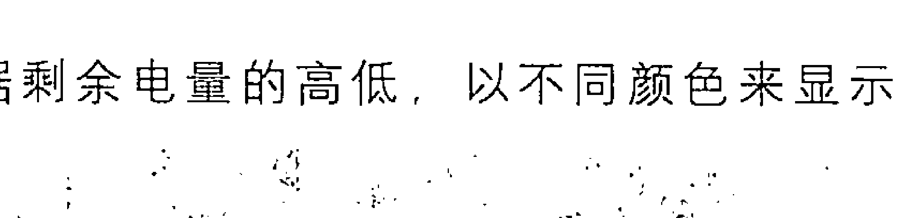

图8

Battery Bar小档案
最新版本：1.10
软件大小：1.81MB
授权方式：共享软件
适用平台：Windows 9x/NT4/2000/XP
下载地址：http://file2.mydrivers.com/tools/tweak/BatteryBar110.exe

### （5）键盘和触摸板是否完好

购买笔记本电脑的时候，一定要试用所有的按键，这一点对于新机器来说可以忽略，但对于二手机来讲相当重要。

笔记本电脑的触摸板一般不会出现问题，可一旦出现问题就不能再用了，需要提醒大家，在几台相同机型中，一定要挑触摸板最涩的、最不光滑的，这说明它的磨损程度相对较低。

### （6）检查外置接口

笔记本电脑的外置接口一般包括网卡接口、MODEM接口、CRT接口、PS/2接口、耳机/MIC接口、串口、并口、PCMCIA卡接口和USB接口等，有条件的话，应该一一测试。

另外，要检查PCMCIA卡空槽和移动存储器的填充空槽、机身底部端口复制器档板，以及端口盖板是否完好并且能正常动作。这些小东西若没有了，虽然机器不够美观却并不影响使用，但它可以作为砍价的理由。

## 四、体验当老板的乐趣

电脑与其他产品的不同之处，在于其更新换代速度极快，不断需要升级，而不断升级，就会出现旧硬件如何处理的问题，可能的情况有：一是再利用；二是闲置；三是送给亲朋好友；四是折价卖掉。对于最后一种情况，如果你不急于卖掉旧硬件，建议通过网上二手交易网站出售，说不定还能卖个好价钱。

这里我们以著名的易趣网（http://www.ebay.com.cn/）为例，向大家介绍卖商品的技巧及经验。

### 1．二手硬件的估价技巧

从网上买硬件的多是电脑爱好者，他们不追求“利润最大化”，也了解行情，只要比当地便宜就能成交。敢于在网上买硬件的人，都具备不同程度的硬件知识，安装、设置等问题能够自己解决，没有售后的“麻烦”。

## 最新主板BIOS设置与刷新不完全手册

文 / 天惟创造：天惟、正天、凌云

近年来，由于计算机技术的不断发展，主板的更新换代也在加快，主板的BIOS选项也进行着相应的变化和调整。为了帮助大家更好地了解和使用主板BIOS，充分发挥主板应有的性能，这里我们特别策划了该手册，希望能够对您有所帮助。

### 一、扫盲篇

BIOS (Basic Input-Output System) 也就是基本输入输出系统，是计算机系统中不可缺少的部分之一，因为BIOS提供计算机系统最基础的功能支持，这里要明确的一点的是，BIOS只是作为一种程序存在的，而被称作程序的东西都是不能够单独以物质的形式存在的，而是需要存储到一定的介质上的，而存放BIOS的介质就是“ROM”（只读存储器）。人们一般所指的BIOS通常说的是主板BIOS，因为这个BIOS是人们最常用到的，比如我们设置一些计算机系统的运行参数等，都是要通过主板的BIOS程序来实现的。其实BIOS的应用是十分广泛的，而在计算机系统中更不只限于主板，比如显卡、光驱、网卡、硬盘等设备也都有自己独立的BIOS程序。

#### （一）区分ROM的方法

##### 1. 以封装方式区分

ROM的封装形式早期通常都是采用DIP (Dual In Line Package)封装，但是随着半导体技术的进步，五花八门的封装形式陆续登场，例如：Tsop、Psop等，我们不需要了解它们的细节和差异，因为每一种封装的方式必定有它的优点，没有一个厂商会开发一种没有特点的封装模式。具体到台式计算机的ROM现在一般都采用DIP封装，该芯片呈长方形，而且由于该芯片技术的制造工艺相对其他芯片的制造工艺比较原始，所以一般看起来都很厚，比较容易辨认，另外芯片上一般都会印着生产厂商、容量、型号等信息，如图1所示。

二手电脑配件没有统一定价，如何对它估价呢？可以根据各种因素估出一个大致价格，笔者个人认为，其估价原则有以下几项：比照新品估价、折旧估价、地域价差、心理定价。二手硬件价格变化远比主流市场缓慢、幅度小，购买二手电脑比购买主流电脑“保值”。你也可以查看其他卖家出售的同类商品的估价，以设置“一口价”卖法的商品为基准。

### 2. 提高自身的信用度

建议使用自己的身份证或信用卡进行实名认证，这样更有助于提高你的可信度，在实际成交的时候不会成为买家的障碍。在网上买卖商品，买家当然希望卖家的信用度高些。当然，信用度是通过每笔交易成功之后，买卖的对方给你的评价。作为卖家，你一定很在意买家的评价，同样，买家也希望通过每一笔交易累积自己的信用度。

### 3. 注意交易的风险

二手电脑在异地交易时，是通过E-mail或电话互通信息，最后通过邮局邮寄或快递公司速递货物和汇款完成交易。骗钱骗物或以次充好最容易发生其中，尤其是以次充好，如卖方故意将损坏的商品用简单包装邮寄，最后推说是运输的问题，一般用户不可能在邮政局就拆开包裹，而将邮包领回家后邮政局也不再承担责任了。面对这样的现象，我们在进行交易是最重要是验证身份。比较好的方法是让对方告诉你即时电话，可以随时通过电话进行联系。对于那些不愿透露电话而又非常想交易成功的卖主，劝大家最好远离。除了家庭电话外，还可以通过对方的手机（指入网用户）号码、ISP提供的电子邮件信箱这些比较有价值的方式来验证对方，并且把这些资料重点保存。同时，要克服自己求快的心理，最好通过常规的方式汇款并保留相关手续（凭此邮局提供追查邮件服务）和发货凭证。千万不要在信件或特快专递中夹寄现金，万一发生纠纷才能有据可查。如果遇到退换货情况，在确认买方已经把货退回前，不要退款或邮寄新的商品。

#### （二） 常见主板BIOS软件研发厂商简介

下面为大家介绍三个目前比较知名的主板BIOS软件研发厂商。

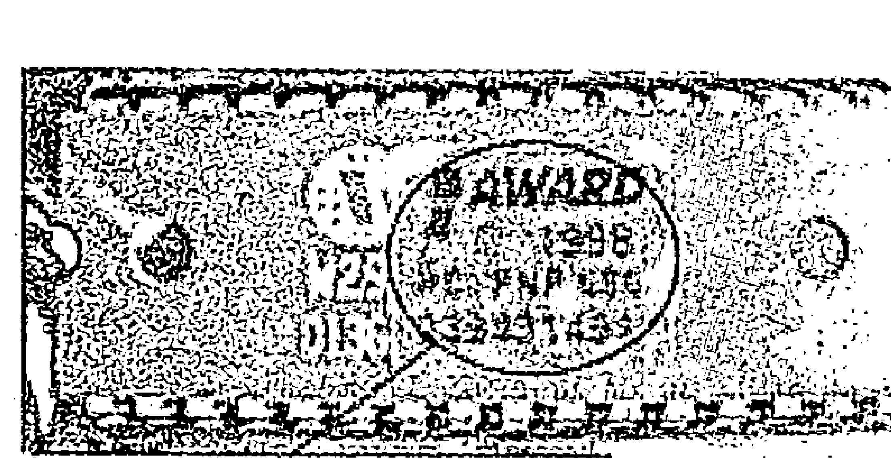

另外主板上装载BIOS的ROM芯片通常都贴有一张标明BIOS软件研发厂商的激光标志如图1，比较常见的有Award、Ami、Phoenix（该品牌主要用于笔记本电脑，现已被Award公司收购）。

##### 1. “今日霸主” Award

Award BIOS是从“奔腾”时代开始占据市场的主导地位的，由Award Software公司开发的Award BIOS系列产品，目前十分流行，目前市场上80%以上的主板都采用Award BIOS，Award BIOS以功能齐全，对各种操作系统支持良好而著称。Award BIOS有许多版本，现在用得最多的是6.X版。

随着技术的发展，采用PLCC形式封装的装载BIOS的ROM芯片也开始大量应用到主板上，从外观上看它呈正方形，如图2所示。

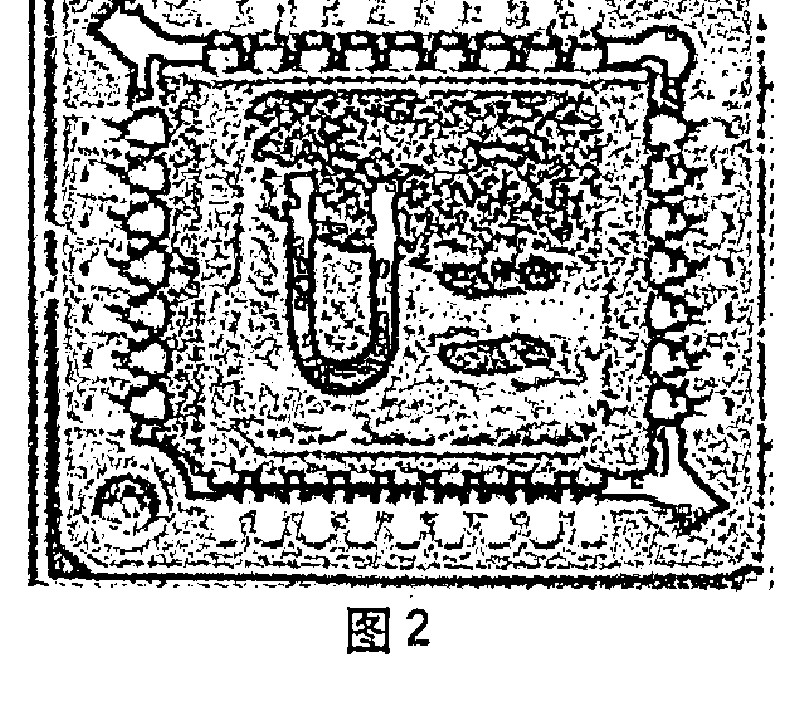

##### 2. “昨日黄花” AMI

AMI公司出品的AMI BIOS系统软件，最早开发于80年代中期，为多数的286和386计算机系统所采用，但后来因为种种原因渐渐的没落了。AMI BIOS因对各种软、硬件的适应性好、硬件工作可靠、系统性能较佳、操作直观方便的优点而深受用户的欢迎。

还有就是笔记本电脑多半都采用散热较好的Soj封装形式。

AMI BIOS已经有多个版本，目前用得较多的有WinBIOS，它具有即插即用、绿色节能、PCI总线管理等。

##### 3. “老牌劲旅” Phoenix

Phoenix也是一个老牌的BIOS软件研发制造商，其产品目前主要用于高端的工作站和笔记本电脑上。

##### 2. 以生产厂商区分

众所周知，目前世界上的半导体业发展迅速，有不少厂商生产各种类型的ROM芯片，尤其是Flash ROM，但是由于这里篇幅有限，所以就不一一加以详细说明了，我们只对几个比较有影响力的大厂进行简单的介绍。

#### （三） 读懂BIOS的版本号和主板型号

如何识别当前主板所采用的BIOS类型和版本号？有一种更简单的方法，那就是启动计算机，当计算机出现自检画面时按“Pause Break”键，此时系统暂停自检，我们就能看到一幅静止的启动画面，如图3。

##### （1） Intel

众所周知，Intel是目前CPU制造业的龙头老大，但或许很少有人知道，它更是一家老牌的ROM/RAM的制造厂商，而把Flash ROM技术转化为实际的产品，便是该公司的杰作，所以Intel公司的Flash ROM产品上一般都印有Flash的字样（在早期的一些比较有名的主板厂商的产品中，一般都使用Intel的产品，而且一直都采用双电压的风格），后来由于过多的日厂商的介入，导致DRAM芯片的利润不再那么丰厚，所以Intel才逐渐减少了在这方面的投入。

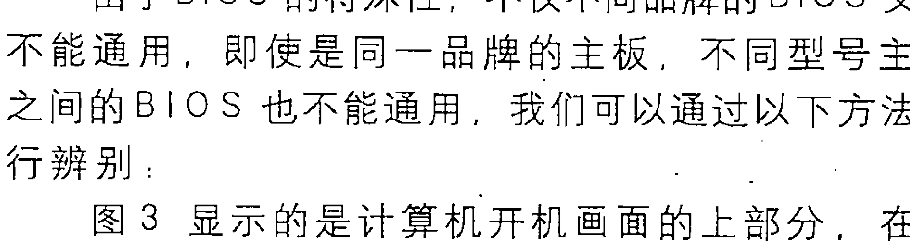

由于BIOS的特殊性，不仅不同品牌的BIOS文件不能通用，即使是同一品牌的主板，不同型号主板之间的BIOS也不能通用，我们可以通过以下方法进行辨别：

##### （2） 华邦（Winbond）

华邦电子是我国台湾省最大的IC公司之一，因其生产的Flash ROM相对价格比较低廉，而且产量大，所以深受板卡制造厂商的青睐，这也是为什么我们非常容易见到该品牌的ROM芯片原因。

此外，还有许多生产Flash ROM的厂商，由于我们版面有限，所以这里不再过多介绍。

图3显示的是计算机开机画面的上部分，在开机画面的最下端，我们还能看到如图4所示的信息。


其中，“01/08/2002”是该BIOS软件的研发时间，通过它，你可以准确地判断主板BIOS版本的新旧。

旧，“6A6LVPADC”就是典型的AWARD BIOS-ID，其中前五位“6A6LV”是芯片组编码，而六、七位“PA”则是厂商代码，这里指的是“磐英”。
AMI 的BIOS同样有BIOS-ID，但其表现形式与AWARD 有点不同：如“51-0119-001107-00111111-071595-82437FX-H”就是一个典型的AMI BIOS-ID。其中，第一个字段由两个数字组成，例如上例中为“51”，第一个数字代表该主板适用的处理器级别，第二个数字代表该主板所采用的BIOS文件的大小（或BIOS芯片的容量）；第二个字段由四个数字组成，如上例中的“0119”，其含义为该主板BIOS的版本；第三个字段由六个字符组成，如上例中的“001107”，这就是厂商代码；第五个字段共有六个数字，如上例中为“071595”，其意思就是厂商最后更新该主板BIOS的日期（月/日/年）。
另外我们还可以通过主板的包装盒和说明书了解BIOS的信息，不过此方法只限于兼容计算机，一般品牌电脑的包装盒和说明书上是没有这些信息的。

#### （四）AWARD BIOS 基本设置

启动计算机后，在计算机开始上电自检时按下【Del】键，进入AWARD BIOS CMOS设定程序，屏幕上会显示主菜单，如图5所示。

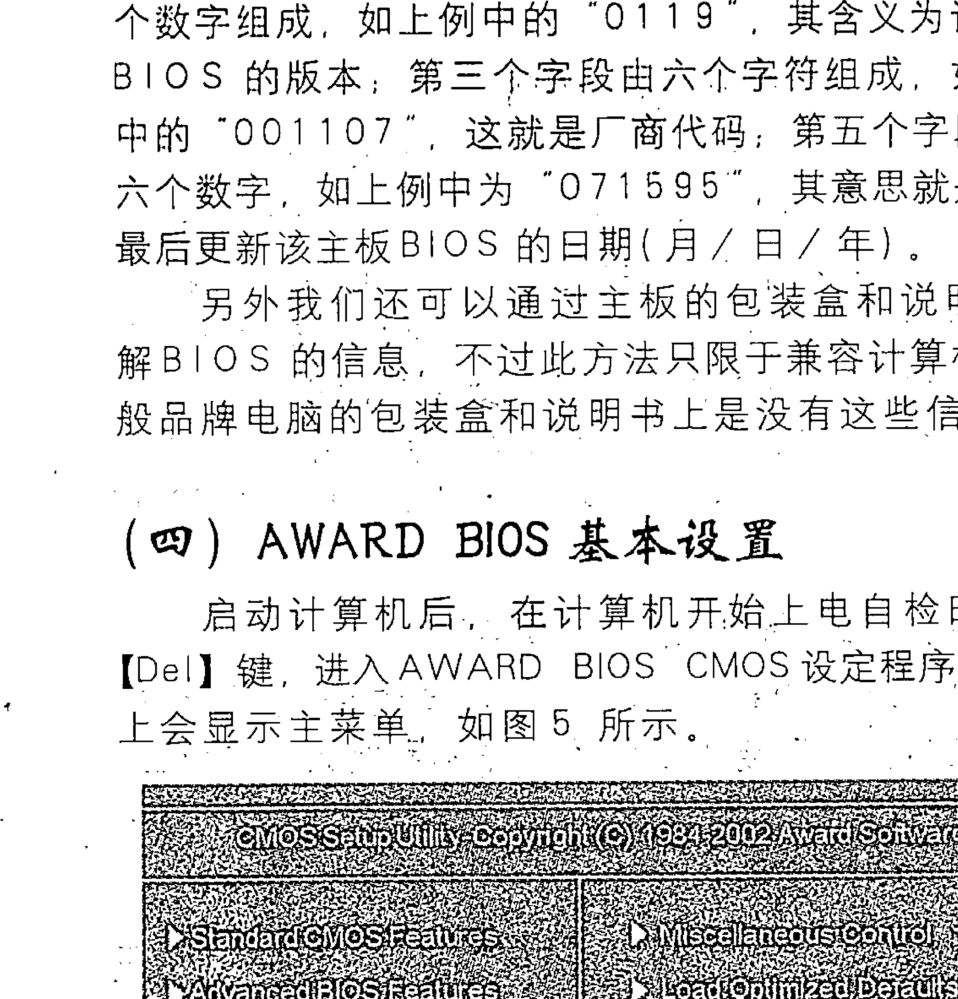

主菜单共十四个选项，包括十二种设定功能和两种退出选项。

##### 小贴士：功能键介绍

- 向前移一项：<↑>
- 向后移一项：<↓>
- 向左移一项：<←>
- 向右移一项：<→>
- 选定此选项：<Enter>
- 跳到退出菜单或者从子菜单回到主菜单：<Esc>
- 增加数值或改变选择项：<+/PU>
- 减少数值或改变选择项：<-/PD>

- 主题帮助，仅在状态显示菜单和选择设定菜单有效：<F1>
- 从CMOS中恢复前次的CMOS设定值，仅在选择设定菜单有效：<F5>
- 从故障保护缺省值表加载CMOS值，仅在选择设定菜单有效：<F6>
- 加载优化缺省值：<F7>
- 保存改变后的CMOS设定值并退出：<F10>

下面我们仔细介绍一下主菜单各选项的功能：

- * Standard CMOS Features：标准CMOS设置，主要设置日期/时间、IDE硬盘、软盘驱动器、视频和内存。用方向键选择相应的项目，再用【-/+】或者【Page Down/Up】键改变该项目中的参数。
- * Advanced BIOS Features：高级BIOS特征，使用此菜单可对系统的高级特性进行设定。
- * Advanced Chipset Features：高级芯片组特征，使用此菜单可以修改芯片组寄存器的设置，优化系统的性能表现。
- * Integrated Peripherals：整合周边，使用此项可对周边设备进行特别的设定。
- * Power Management Setup：电源管理设定，此项可以对系统电源管理进行特别的设定。
- * PNP/PCI Configurations：PNP/PCI配置，该项仅在系统支持PnP/PCI时才有效。
- * PC Health Status：PC当前状态，此项显示了计算机的当前状态。
- * Frequency/Voltage Control：频率/电压控制，该项可以规定您的频率和电压设置。
- * Load Fail-Safe Defaults：载入故障安全缺省值，使用此菜单载入工厂默认值作为稳定的系统使用。
- * Load Optimized Defaults：载入高性能缺省值，使用此菜单载入最好的性能但有可能影响稳定的默认值。
- * Set Supervisor Password：设置管理员密码，使用此菜单可以设置管理员的密码。
- * Set User Password：设置用户密码，使用此菜单可以设置用户密码。
- * Save & Exit Setup：保存后退出
- * Exit Without Saving：不保存退出

#### （五）AMI BIOS 基本设置

启动计算机后，在计算机开始上电自检时按下【Del】键，进入AMI BIOS CMOS设定程序，屏幕上会显示主菜单，如图6。
由于AMI BIOS主菜单功能与AWARD BIOS基本相似，所以这里就不多作介绍了。

### 二、优化功能篇

#### 1. Virus Warning / Anti-Virus Protection (病毒警告 / 反病毒保护)

设置目的：开启病毒保护功能

优化指数：★

设置方式：在主菜单下选择 “Advanced BIOS Features”，在子界面中选择 “Virus Warning”。

选择Enabled，当程序企图写入引导扇区时，系统将给出警告信息，并自动激活防病毒功能。选择Disabled，将禁止防病毒功能。

功能介绍：该项设置可防止外部程序对启动区和硬盘分区表的写入，当发生写入操作时，系统会自动产生警告并提示用户中断程序的执行。它并不能保护整个硬盘，而且对于操作系统的安装（例如Windows 95/98）及某些磁盘诊断程序，甚至对BIOS的升级，都可能产生不必要的冲突而引致程序的中断。建议用户将这选项关闭，系统的默认值是Disable。

小贴士：某些主板自带有抗病毒内核，它可以提供比普通病毒警告更高一层的防卫，不过，当使用自带BIOS的外围控制器时，启动区病毒可以绕过系统BIOS来进行攻击，保护将完全失效。

#### 2. Gate A20 Option (A20地址线选择)

设置目的：优化内存

优化指数：★★

设置方式：在主菜单下选择 “Advanced BIOS Features”，在子界面中选择 “Gate A20 Option”。

选择Normal（正常）和Fast（加速）。

功能介绍：设为Normal，A20信号由键盘控制器或由芯片控制。设为Fast，A20信号由端口92或芯片组特殊程序控制。设置哪一个控制单元管理1MB以上内存地址的A20地址线，设为Normal用键盘控制器管理，设为Fast用芯片组控制器管理，可提高内存存取的速度和系统整体性能，特别是对于OS/2和Windows等操作系统来说非常有效。因为它们的保护模式经常需要BIOS A20地址线来进行切换，而芯片组控制器比键盘控制器更快，所以Fast是首选设置。

#### 3. Security Option (安全选项)

设置目的：建立密码保护

优化指数：★★★★

设置方式：在主菜单下选择 “Advanced BIOS Features”，在子界面中选择 “Security Option”，选择该项后，在进入CMOS设置程序时，屏幕上将提示你输入密码，若密码有误，则拒绝继续运行。System：选择该项后，在系统每一次启动时或你要进入CMOS设置程序时，屏幕上都提示输入密码，若密码有误，则拒绝继续运行。

功能介绍：只要在BIOS中建立了密码，此特性才会开启，设置为System时，BIOS在每一次启动都会输入密码，设置为Setup时，在进入BIOS菜单时要求输入密码。

#### 4. MPS Version Control For OS (面向操作系统的MPS版本)

设置目的：建立多重处理规范

优化指数：★★★

设置方式：在主菜单下选择 “Advanced BIOS Features”，在子界面中选择 “MPS Version Control For OS”。设置在操作系统下多处理器的运行版本。有1.1和1.4两个选项。

功能介绍：该选项让用户根据自己使用的操作系统选择多处理器规范版本，该选项只有在系统内包含两个或多个物理或逻辑处理器才有作用。1.1版规范适用于微软Windows NT、Windows 98和更早的操作系统版本，而1.4版规范则适用于微软Windows 2000、Windows XP和更新的操作系统版本。

#### 5. SDRAM RAS-to-CAS Delay (内存行地址控制器到列地址控制器延迟)

设置目的：内存优化

优化指数：★★★★

设置方式：选择主菜单 “Advanced Chipset Features”，在子界面中选择 “DRAM Timing Settings”。选择 “SDRAM RAS-to-CAS Delay”，可以选择设置的值为 “2”和“3”。

功能介绍：SDRAM CAS等待时间。控制SDRAM在读取或写入之前的等待时间，单位是CLK(Clock Cycle，时钟周期)，减少等待时间能够增加突发传输的性能。

#### 6. SDRAM RAS Precharge Time (SDRAM RAS预充电时间)

设置目的：内存优化
优化指数：★★★
设置方式：选择主菜单“Advanced Chipset Features”，在子界面中选择“DRAM Timing Settings”，然后选择“SDRAM RAS Precharge Time”，可以选择设置的值为“2”和“3”。

功能介绍：SDRAM周期长度。控制SDRAM每次存取动作所需要的时间(以时钟周期数计算)。

#### 7. Power On Function (电源开启功能)

设置目的：选择启动方式
优化指数：★★★
设置方式：选择主菜单“Integrated Peripherals”，在子界面中选择“Power On Function”。选项有Button Only (电源开关键)、Keyboard 98 (98型键盘)、Hot Key (热键)、Mouse Left (鼠标左键)和Mouse Right (鼠标右键)。

功能介绍：该项是开机功能设置，Button Only，只有按电源按钮才能开机；Keyboard 98，键盘开机键；Password，需要输入密码才能开机；Hot Key，某个组合键；Mouse Left，鼠标左键；Mouse Right，鼠标右键；Any Key，任意键开机。

### 三、特殊功能设置篇

#### 1. 开启P4超线程技术

功能介绍：众所周知，INTEL在P4处理器中加入了超线程技术，即Hyper-Threading或Hyper-Threading Function。这一技术可以有效地提高处理器的资源利用率。

设置方式：在主菜单下选择“Advanced BIOS Features”，在子界面中选择“CPU Hyper-threading”。选择“Enabled”，回车确认，就是将HT技术开启。

> 小贴士：HT技术只支持相对较新的操作系统，如在Windows XP以上的版本和Linux 2.4.xx以上的操作系统。如果开启超线程后运行某些相对较旧的操作系统，如Windows ME，一般会出现一些不正常现象。

另外，开启HT技术后，将内存进行超频一般可以达到事半功倍的效果，而具体的设置方法，我们在上面的详解优化功能篇已经作了详细介绍，这里就不再赘述了！

#### 2. 关于S-ATA硬盘设置

功能介绍：S-ATA Port 0(1) Configures as是用于S-ATA及P-ATA硬盘通道切换的选项。

设置方式：以ICH5为例，对S-ATA的支持有些限制，在BIOS优化默认值下安装好S-ATA硬盘后，该S-ATA硬盘通道会占用整个Primary IDE接口资源，不论P-ATA设备是连接在Primary IDE接口的MASTER或SLAVE端，该设备都将无法使用，只有将P-ATA设备移到Secondary IDE接口上，才能正常使用。

目前，由于主板厂商众多，相应的主板BIOS也是不尽相同，但是设置原理都是基本相同，所以，在此只介绍比较典型华硕P4B800主板在使用SATA的硬盘后，对主板BIOS进行的设置。

华硕P4C800主板采用芯片组为Intel i865PE，南桥为ICH5/ICH5R。

进入主板BIOS，选择主菜单下的IDE Configuration Menu，在Onboard IDE Operate Mode下面可以选择两种IDE操作模式：兼容模式Compatible Mode和增强模式Enhanced Mode。

> 小贴士：如果Win98/Win2000/MS-DOS等传统的操作系统只支持4个IDE设备，所以请选择兼容模式Compatible Mode，并根据你的实际硬盘数量和位置选择IDE Port Settings中的对应选项；如果安装Win98+Win XP双系统的话，也选择Compatible Mode。如果使用的是WinXP/Win2003等新型的操作系统时，可以选择增强模式(Enhanced Mode)来支持更多的设备。

##### (1) 兼容模式

兼容模式Compatible Mode就是把S-ATA硬盘端口映射到并口IDE通道的相应端口，当选择这种模式时，在下面的IDE Port Settings中会有三个选项：

-   Primary P-ATA+S-ATA：并行IDE硬盘占据IDE0+1的主通道(Primary IDE Channel)，串行S-ATA硬盘占据IDE2+3的从通道(Secondary IDE Channel)。也就是说这时主板上的第二个并行IDE接口对应的端口不可用。
-   Secondary P-ATA+S-ATA：与上面正相反，此时主板第一个并行IDE接口(Primary P-ATA)上对应的端口不可用，因为给S-ATA硬盘占用了。
-   P-ATA Ports Only：屏蔽了串行S-ATA硬盘接口，只能使用并行接口设备。

##### (2) 增强模式

选择增强模式(Enhanced Mode)时，其下的端口设置的字样变为Enhanced Mode Supports On，其中也有三个选项：

-   P-ATA+S-ATA：该模式为并行和串行硬盘并存模式，选择该项后，S-ATA和P-ATA通道都相互独立互不干扰，理论上4个P-ATA和2个S-ATA可同时接6个设备，实际上得根据不同主板而定，有的南桥芯片就只支持4个ATA设备。此时S-ATA1口硬盘对应Third IDE Master(第三IDE通道主盘)；S-ATA2口硬盘对应Fourth IDE Master(第四IDE通道主盘)。
-   S-ATA：该模式为串行硬盘增强模式，此时理论上支持4个串行硬盘。
-   P-ATA：该模式是一种映射模式，S-ATA硬盘占据的是第一个IDE通道，S-ATA1口对应第一个通道的主盘，S-ATA2口对应第一个通道的从盘。

### 四、刷新篇

在正式升级BIOS前，首先必须根据已有的主板及BIOS信息，登陆主板厂商官方网站，下载相应的最新BIOS文件。

注意：由于超频会增加升级BIOS的危险性，所以在升级BIOS时一定不能超频；如果主板有限制升级BIOS的写保护跳线，则需根据主板说明书将此跳线设置成可刷新状态。

另外在升级BIOS之前，一定要确定主板的型号及BIOS的类型与版本，即使是同一型号的主板不同批次生产的产品其BIOS也不一定相同。

我们在刷新主板BIOS的时候需要BIOS刷新软件，所以要根据所使用的BIOS类型下载其刷新工具，AWARD BIOS其刷新工具为“AWDFlash”，AMI BIOS刷新工具为“AMIFlash”，另外还有在Windows系统下提供刷新BIOS的软件“@BIOS”，这些软件我们都可以到华军软件园（www.newhua.com）中下载。

早期的BIOS升级都离不开软盘，但这种方法的弊端很明显——软盘介质的稳定性相对较低，而升级BIOS时必须将存放在软盘上的BIOS文件读入内存，一旦因软盘介质稳定性而出现读取错误，那后果可想而知，所以这里我们所说的升级BIOS都是以硬盘为介质的，在后面将不再加以说明。

#### 1. Award 的 DOS 系统刷新工具 “AWDFlash”

首先重新启动计算机，进入Dos实模式状态，新建一个目录CD wlws，将“AWDFIash”和刚刚下载回来的BIOS的新软件拷贝到刚刚建立的目录中。

-   (1) 备份原有BIOS软件
执行AwdFlash命令后显示一个对话框， 如图7所示。在输入写入程序栏中不做任何操作并回车，然后选择Y 同意备份，并在备份信息栏中输入文件名YS.bin，程序就会自动生成一个YS.bin的文件并自动退出该程序（因为我们没有在写入程序栏中做任何操作，所以AwdFlash程序运行完后并没有刷新BIOS），刷新程序退出后，我们就会在当前磁盘的目录下找到YS.bin这个文件了，它就是我们当前使用的计算机的主板BIOS软件。

-   (2) 写入最新BIOS程序
再次执行AwdFlash.exe这个软件，在“File Name to Program”文本框中输入刚下载回来的新的BIOS的文件名“******.bin”后回车，在询问你是否需要备份原有BIOS时选“Y”，并在“File Name to save”文本框中输入一个保存主板BIOS的文件名（如：BF.bin）， 以便于在BIOS刷新失败时进行挽救，按回车键后，系统会询问是否继续，按【Y】键后，等待一段时间后，系统会提示写入成功，到此就大功告成了(由于在刷新BIOS时，有时候会由于某种原因导致备份文件无法生成，所以在上一步和这里我们分别进行了两次备份，因为刷新BIOS是一个非常危险的操作，稳妥很重要)。

#### 2. Windows 下的刷新工具之一 “@BIOS”

上面已经向大家讲解了Award的DOS下的刷新工具：“AWDFIash”的使用方法，但是DOS模式下操作，对于那些刚刚接触电脑的用户而言有时却有点过于高深，而且由于现在Windows XP等操作系统已经将MS-DOS彻底抛弃，使得在DOS下升级BIOS极为不便，而且在运行DOS下的BIOS刷新软件的时候要求系统不能加载其他的内存驻留程序，否则很容易造成升级失败，所以说DOS刷新这种传统的升级方式极为不便，这就给了Windows下刷新软件一个极大的发展机遇。

技嘉公司开发出了专门针对其主板BIOS的刷新软件“@BIOS”，让用户可以在Windows下方便地进行BIOS升级，虽说这个程序是针对技嘉主板的，但是借助于它也可以实现对其他主板BIOS的刷新。

@BIOS 运行后的界面如图8。

在“@BIOS”界面中可以看到软件的一些基本信息，如软件适用于哪些版本的Windows操作系统，能自动侦测出主板的BIOS芯片类型、电压、容量和版本号。在BIOS信息的左下方是默认的执行操作，共有四项，除第一项“Internet Update”（网络在线升级）外，其余均为不可更改。选项右边有个按钮，从上到下依次为：“Update New BIOS”（升级新的BIOS）、“Save Current BIOS”（保存现有的BIOS）、“About this program”（关于这个程序）、“Exit”（退出）。

由于“@BIOS”不支持非技嘉主板在线升级，因此要刷新主板BIOS，除了下载主板最新BIOS文件，有的主板还得把主板上防BIOS写入的跳线打开，或在BIOS设置程序中将防BIOS写入的选项设为“Disable”，这样刷新主板BIOS才会成功。

在开始刷新BIOS之前，为了稳妥起见，一定要对原有的BIOS进行备份。点击图中的“Save Current BIOS”按钮，在弹出的窗口中为将要保存的文件起名为“BF”，确定后，程序开始保存工作，完成后会出现提示框。

点击图中的“Update New BIOS”按钮，并在弹出的窗口中选择要刷新的BIOS文件，然后在弹出的消息框上点击按钮，便会自动为你更新BIOS，此时下方将会出现刷新进度条，完成后弹出提示框。

整个操作在Windows下进行，持续的时间约在5秒钟左右。刷新结束后程序会弹出消息框，提示你升级成功，并要求重启计算机。

重新启动计算机，你会发现计算机的BIOS已经变为最新版本。

#### 3. Windows下的刷新工具之二 “Win Flash”

其实Award早已推出了Windows环境下刷新软件WinFlash，由于“@BIOS”是技嘉为其主板专门设计的一款刷新BIOS的软件，所以有时候对其他品牌的主板支持的并不是很好，而“WinFlash”在兼容性方面有时却要比“@BIOS”好。

启动Win Flash，即可进入该软件的主界面，如图9所示。

Win Flash主界面简洁直观，大致可分为：工具栏、刷新设置、CMOS设置、BIOS信息以及BIOS刷新视图等。其中工具栏为：一系列的刷新及操作；刷新设置：为设置刷新时是否刷新的内容；CMOS设置：为刷新完成后，是否清除CMOS，是否调入CMOS原始默认设置；BIOS信息：显示BIOS日期及芯片型号；BIOS刷新视图：显示刷新的内容和BIOSID。

在刷新前，一定要保存原BIOS文件。点击“备份”，在出现的“另存为”对话框中，选择需要保存文件的路径及输入文件名；点击保存后在出现的“BIOS备份”对话框中。

点击“备份”，即可将原BIOS文件保存。

注意，因为BIOS只是一段可执行的二进制代码，对于扩展名没有太多的定义，只要不超过3个字节即可。但一般情况下，AWARD BIOS的文件扩展名为：.BIN，另外在刷新前可以在“刷新设置”中，设置刷新时是否更新的内容。一般情况下为不选择，特别是BOOT BLOCK块，应尽可能的不更新，以便刷新失败时可以使用其启动块对BIOS进行修复。

点击“刷新”，在“打开”对话框中选择需要升级的BIOS文件，调入正确的BIOS文件，将会出现刷新对话框，点击“刷新”按钮。

刷新程序将把调入的新BIOS按在“刷新设置”中设置的刷新内容，将BIOS文件写入到主板BIOS芯片中。刷新完成后，会提示现在是否重新启动计算机的选择框，因为刷新后，只有重新启动计算机，新BIOS才能调用，选择“Y”。

重启之后BIOS就刷新成功了，如果不能确定升级的BIOS文件是否正确，我们可以选择“NO”，将备份的BIOS文件重新写入即可。

#### 4. AMI的DOS下的刷新工具 “AMIFlash”

进入纯DOS状态，执行AMIFlash，进入该软件的主界面，该软件的主界面由4部分组成，从左到右依次为：主菜单、选中的当前菜单、相关信息和帮助信息。用方向键把光标移到“FILE”项，回车，上面为“Loading”项，是调入文件的项，输入要刷新的那个BIOS文件的路径，按回车键，程序将自动开始升级操作，待操作完毕后，退出该程序，一切就大功告成了！！！

### 五、拯救篇

虽然在刷新BIOS前已经做好了充分的准备，不过万一刷新失败了怎么办？比如说突遇停电事故。既然事情已经发生，那么就马上进入“拯救行动”。

#### 1. 凌波微步，利用BIOS Boot Block引导块修复BIOS

由于Award BIOS中有一个固化了的Boot ROM程序，而这个程序是不会被BIOS刷新软件刷新的，因此即使BIOS刷新失败，这个Boot ROM还是能够控制ISA显卡与软驱，但是现在找一块ISA显卡比找同型号的BIOS还难，所以还是利用仅存的软驱吧！

首先做一张系统盘，删去里面的CONFIG.SYS和AUTOEXEC.BAT，再把公用BIOS更新程序AWDFLASH和BIOS数据文件拷到系统盘，然后在系统盘中建立AUTOEXEC.BAT，并加入AWDFLASH XXX.BIN /SN /PY（XXX.BIN是你的BIOS数据文件）。其中的/SN /PY参数表示不备份而仅仅更新BIOS。

当BIOS出现问题时，插入此盘后重新启动，系统会“自动”地更新BIOS，等数分钟后再重新启动，一般BIOS就可以恢复了。

#### 2. 猛龙过江，热插拔

如果你的BIOS升级失败或者被病毒破坏后，连Boot Block引导块也一齐损坏，那怎么办呢？别着急，你可以试用“热插拔”来修复。

首先让我们先来看一下热插拔的原理：BIOS是由POST上电自检程序、系统启动自举程序、BIOS中断调用和BIOS系统设置程序四部分组成的，当BIOS完成POST上电自检程序、系统启动自举程序后，由操作系统接管系统的控制权，完成机器的启动过程，在此之后，除了相关的程序要调用BIOS中的中断程序外，BIOS已完成了它的使命，也就是说这个时候计算机的BIOS基本是不工作的，这时把好BIOS芯片拔下来，再把损坏的BIOS芯片插回主板，运行相应的刷新程序就可以重新把BIOS文件刷回来。

首先放掉身上的静电，找到一台与已坏主板相同型号的主板（以下简称“好主板”），找到该主板的BIOS芯片，用小刀轻轻地将BIOS芯片从BIOS插座中拔出来，拔取芯片时，需相当谨慎小心，不正确的处理或是用力不当，可能会损伤主板或BIOS芯片本身，注意两边要均匀用力，然后将拔出来的BIOS芯片重新插回BIOS插座，注意不能插得太紧，只要引脚能刚刚接触到插座即可。

> 注意：对于PLCC封装的芯片，由于它的特殊封装形式，则要用专用的芯片拔取夹来拔，用ROM拔取器夹住BIOS芯片的一角及其对角，压住拔取夹，笔直地将芯片从插座中向上拔出。注意夹住的必须是芯片非斜角所在的一角，拔取器的爪应尽可能深入插座中，另外将BIOS芯片插回到插座中，在BIOS芯片上，其陶瓷封装的一边有一个缺口，表示芯片管脚的排列方向，插入之前必须保证芯片和插座上的缺口处方向一致，这一点非常重要，如果插反了会连带烧毁BIOS芯片甚至主板。

启动计算机，进入纯DOS状态，然后把BIOS芯片拔出来，再将刷新失败的那块主板上的BIOS芯片插到好主板上，为了保证接触良好，可以插紧一点。

最后运行相应的主板BIOS的刷新软件，进行刷新，就大功告成了！

#### 3. 移形换位，从主板BIOS到显卡上刷新

热插拔的前提是你必须找到一块和你损坏的那块主板一模一样的主板，但是对于一般的用户来说，“那里去找这个一样的主板，确实是个不小的问题，那么如果没有一样的主板，就不能进行热插拔来修复BIOS吗？答案当然是否定的！”

人们一般所指的BIOS通常说的是主板BIOS，因为这个BIOS是人们最常打交道的，比如我们在设置一些计算机系统的运行参数等，都是要通过主板的BIOS程序来实现的，但是其实BIOS的应用是广泛的，而在计算机系统中更不只限于主板，比如：显卡、光驱、网卡、硬盘等设备也都有自己独立的“BIOS”程序，那么有BIOS程序，就肯定有ROM芯片（ROM的封装形式早期通常都是采用DIP（Dual In Line Package）封装，但是随着半导体技术的进步，五花八门的封装形式陆续登场，例如：TSOP、PSOP等，另外随着技术的发展，采用PLCC形式封装的装载BIOS的ROM芯片也开始大量应用到主板上，目前在计算机上比较流行使用的是：DIP、PLCC两种。换句话说就是只要主板上的损坏的BIOS芯片和其他部件上的BIOS芯片的封装形式相同，而且针脚数也相同的话，那么在理论上说就可以进行热插拔修复BIOS！

例如，一块昂达主板因刷新BIOS失败而损坏，主板的BIOS的ROM芯片是DIP封装，而手里只有一块好主板，可是PLCC封装，通过两个主板的互换芯片实现热插拔是行不通的，找来一块显卡，该显卡的BIOS是DIP封装，数引脚和那块损坏的主板的BIOS的针脚一样，都是32针，把主板的BIOS和显卡拆下，把显卡换到另一台好的计算机上，进入该台好的计算机上的BIOS，把“AGP显卡优先”改为“PCI显卡优先”，保存后关机，拆开机箱，插上一块PCI接口的显卡，把显示器信号线接在PCI显卡上，启动计算机，进入DOS模式，将显卡BIOS刷新工具“NVFLASH”以及主板BIOS文件“XXXXXXXX.BIN”保存在C盘根目录下，在C:\下输入“Ren XXXXXXXX.bin XXXXXXXX.rom”，由于显卡的刷新软件，不认识扩展名为*.bin的主板BIOS文件，所以对该主板BIOS文件进行了改名。输入“nvflash XXXXXXXX.rom”，刷新完毕后关机，拔下显卡上的BIOS芯片，放回原处，看一看是不是你的主板的BIOS已经起死回生了！

办公局域网的组建和维护

文/张金贵

随着计算机技术和通信技术的发展，办公自动化和无纸化已成为必然的趋势。要想建立一个高效、快捷和安全的办公环境，就必须运用网络技术，组建办公局域网。通过办公局域网实现日常事务处理现代化、信息资源化、传输网络化和决策科学化，并以此为基础加快单位信息化的进程。正是为了达到这样的目的，帮助众多中小企业和单位解决在办公信息化过程中组建和管理办公局域网遇到的难题，本文对中小型办公局域网的组建和维护进行了详细的讲解，让大家一看就懂，一学就会，按步骤进行操作就可以顺利的组建一个办公局域网。

## 一、组网的基础知识

### (一) 中小型办公局域网要实现的功能

作为一个办公网络，它要力避单个计算机的缺点，实现办公自动化、资源利用最大化，这样才能提高工作效率。因此，一个办公局域网应当能实现以下功能：

- 文件共享
- 打印共享
- 上网共享
- 建立内部网站
- 实现内部FTP服务
- 收发电子邮件
- 网络会议
- 局域网聊天
- 远程办公

### (二) 中小型办公局域网的特点

要想建立一个合理的办公局域网，就必须了解该类局域网的特点。

(1) 具有较高的网络安全性和稳定性。这是办公局域网首先要考虑的问题，安全性和稳定性达不到要求就不能保证数据的安全。

(2) 支持协同工作。应能利用网络方便地对同一事务进行协同操作。

(3) 有利于提高工作效率。

### （三）组网方案

中小型企业由于资金有限，因此在制定组网方案的时候，既要满足企业的办公要求，同时又要考虑价格和性能的平衡，也就是要，以实用、够用为出发点，用最少的投入，取得功能的最大化。在建网时尽量采用先进技术，综合考虑实用性、高效性和安全性，并且从硬件设备、网络结构类型以及操作系统多方面来确定。

目前，在中小企业的办公网中，应用较为普遍的有“对等网”(peer to peer)和“客户机/服务器”(client/server)两种方式。

#### 1. 对等网

这是一种投资最少的组网方案，无需专门的服务器，只要把所有的电脑通过网卡、网线、集线器（或交换机）连接起来就可以了。网络中的每一台电脑既是服务器也是工作站；拥有绝对的自主权，各台电脑之间可以实现互访和交换文件，一台电脑也可以共享其他电脑上的打印机和光驱等硬件设备（图1）。

对等网的优点是：组建和维护容易，使用简单，不需专门的服务器，费用较低。但对等网存在着数据保密性差，文件存放分散等缺点。

#### 2. 客户机/服务器网

这是目前使用最广泛的一种组网方案，它需要在网络中有一台专门的电脑作为服务器，其他的电脑作为客户机，利用服务器来管理、控制网络的运行。客户机既可以与服务器进行通信，同时客户机之间也可以直接对话，而不需要服务器的中介和参与（图2）。

客户机 / 服务器网的优点是：数据的安全性较强，网络的工作效率较高，可以减少服务器上的工作量，可以对每一个客户机用户设置访问权限，可以有效地利用各客户机端的资源。

客户机 / 服务器网的缺点是：网络的安装和维护较复杂，对客户机的管理较困难。

由于客户机 / 服务器网具有诸多优点和便利，所以赢得了大家的广泛欢迎，在实际组网中得到了大量应用。下面我们就以这种组网方式为例来讲解一下办公局域网的组建过程。

### （四）硬件的选择

本文以组建一个有 20 台电脑的小型办公网络为例，选用客户机 / 服务器方式组网。

#### 1. 服务器

如果有条件，可以购买一台专门的服务器。否则的话，选择一台配置较高的电脑作为服务器也可。

#### 2. 集线器或交换机

作为网络连接的中心设备，它的选择是非常重要的。尽管都是用来连接和传输设备；集线器和交换机的工作原理却不同：集线器是一种“共享”式的设备，它把从任一端口接收到的信号进行放大，然后再发送到所有的端口上，让网络中的电脑自己判断是否应当接收；这样就容易导致数据冲突。交换机也叫交换式 Hub，它可以给每个用户提供专用的信息通道，实现点对点的数据传输，使数据交换顺畅无阻，避免了冲突。由此可见交换机的性能显著优于集线器，如果条件许可，建议购买交换机作为网络交换设备。集线器和交换机都有 8 口、16 口、24 口等多种接口供选择，我们有 20 台电脑，选择一个 24 口的 10/100Mbps 自适应交换机即可，多余几个口可以供以后扩充网络时使用。

#### 3. 网卡和网线

网卡有 10Mbps、100Mbps 和 10/100Mbps 自适应几种，我们选择使用较普遍的 10/100Mbps 自适应网卡。由于整个局域网要共享上网，所以除了每台电脑要配有一块网卡外，作为服务器还要再安一块网卡，用这块网卡连接 Internet 实现局域网共享上网。网线选用五类或超五类双绞线，这样才能让网络的传输速率达到 100Mbps。

#### 4. 上网设备

要想把局域网接入 Internet，还需要一个 Modem 或 ADSL。前者用来通过电话拨号上网，后者是宽带上终端。

### （五）操作系统的选择

网络操作系统的种类较多，对于普通用户来说 Windows 家族是大家最熟悉的。作为服务器端，我们选择 Windows 2000 Server。它在稳定性和可靠性方面都有保证，具有强大的网络功能，是中小型办公局域网用户的首选的服务器操作系统。而且有微软的强大支持，使用和服务都有保证。Windows 2000 支持 FAT、FAT32、NTFS 格式文件系统，为更好地发挥 Windows 2000 的功能，建议在安装时将分区格式转换成 NTFS 格式，这样才能安装活动目录，从而更好地管理和维护局域网。客户端可以选择 Windows 98/Me/2000/XP，其中大家最熟悉、使用最广泛的还是 Windows 98，所以我们在客户端选用 Windows 98 操作系统。

### （六）组网步骤

#### 1. 规划方案

组建一个 20 台电脑的小型办公网络，采用客户机 / 服务器网组建方式，服务器采用 Windows 2000 Server 作为网络操作系统，客户机使用 Windows 98 操作系统。

#### 2. 选购设备

电脑 20 台，其中一台配置较高的作为服务器。一台 24 口 10/100Mbps 交换机，网卡，水晶头，双绞线，上网所需的 Modem 或 ADSL 终端。

#### 3. 布线

采用星形拓扑结构布线，交换机位于办公网的中央，电脑到交换机的距离不超过 100 米，用双绞线通过网卡把每台电脑都连接到交换机的接口上，完成硬件的安装。

#### 4. 安装并设置网络

完成客户机 / 服务器网的组建及基本设置。

#### 5. 安装所需的应用组件

在局域网上实现 Web、FTP、E-mail、聊天、网络会议、共享上网等功能。

## 二、网络配置

将每台电脑与交换机连接起来之后，仅仅是完成了硬件的物理连接，这还不能使整个网络运转起来，要想使网络正常运行，还必须对每一台电脑进行网络配置。

### （一）安装网卡驱动程序

安装网卡后，还要安装相应的驱动程序，这样才能在电脑之间建立起连接。无论对于服务器端的 Windows 2000，还是客户端的 Windows 98 安装方法都是相同的。网卡驱动程序的安装有两种方法。

#### 1. 自动安装

在电脑上插入网卡后，重新启动电脑，屏幕上出现发现新硬件的提示，接着系统会提示用户安装相应的驱动程序。将驱动程序盘放入软驱，然后按照提示进行操作，系统就会自动搜索软盘中驱动程序并完成安装。

#### 2. 手动安装

如果你安装的网卡重新启动电脑后没有被识别出来，也就是没有在屏幕上出现“发现新硬件”的提示，这时就需要单击“开始”→“控制面板”，然后双击“添加新硬件”图标，出现添加新硬件向导，选择让 Windows 自动搜索新硬件，稍等片刻系统就会发现新硬件。选中这个搜索到的新硬件，把驱动程序盘放入软驱，单击“下一步”按钮，在出现的“选择设备”对话框中单击“从磁盘安装”按钮，找到驱动程序所在的路径，然后单击“确定”按钮，就可以完成驱动程序的安装。

### （二）安装与配置网络协议

安装好网卡的驱动程序之后，还需要对局域网的网络协议进行安装配置。

#### 1. 客户端网络协议的安装与配置

客户端使用的是 Windows 98 操作系统，用鼠标右键单击桌面上的“网上邻居”图标，在弹出的菜单中选择“属性”命令打开网络协议设置窗口。单击“添加”按钮，弹出“请选择网络组件类型”窗口，选中“协议”，单击“添加”按钮，会弹出选择网络协议窗口，选中左边列表中的“Microsoft”，在右边的列表中就会列出有关的网络协议。一般来说，我们要添加的协议有 IPX/SPX、TCP/IP 和 NetBEUI 三个，选中要添加的协议后单击“确定”按钮，系统就会自动开始安装。在安装过程中系统会提示用户放入 Windows 98 安装盘，把 Windows 98 安装盘放入光驱，就可以完成协议的安装。

重复以上步骤把需要的协议全部安装到系统中，然后重新启动电脑即可。

安装好协议之后，下面我们就要对协议进行配置，用鼠标右键单击桌面上的“网上邻居”图标，在弹出的菜单中选择“属性”命令打开网络协议设置窗口，选中 TCP/IP 协议，然后单击“属性”按钮，出现 TCP/IP 属性设置窗口。单击“IP 地址”标签页，选中“指定 IP 地址”选项，然后在 IP 地址中输入 192.168.0.2，在子网掩码中输入 255.255.255.0；单击“DNS 配置”标签项，选中“启用 DNS”选项，输入主机名和域名，例如，我们分别输入 Notebook 和 mypcbook.com（后面我们将讲述它们的设置方法，这里用户只需照着输入就行了），在“DNS 服务器搜索顺序”中输入服务器的 IP 地址，也就 192.168.0.1，然后单击“添加”按钮把它添加到列表中，最后单击“确定”按钮，完成本机网络协议的配置。

重复以上操作，在所有的客户端完成协议的配置，不过需要注意的是，在配置 IP 地址时，每台电脑的 IP 地址是不同的客户端，可以在 192.168.0.2~192.168.0.254 范围内随意设置，因为我们需要把服务器的 IP 地址设置成了 192.168.0.1。

#### 2. 服务器网络协议的安装与配置

服务器端使用的是 Windows 2000 Server，它对网络协议的安装方法与 Windows 98 稍有不同。单击“开始”→“控制面板”，然后双击“网络和拨号连接”图标，出现“网络和拨号连接”窗口。由于服务器端安装有两块网卡，一块用于内部局域网连接，一块用于连接 Internet，所以我们在此窗口中可以看到有两个连接。选中用于内部局域网的连接，单击鼠标右键，在弹出的菜单中选择“属性”命令，出现属性窗口。我们看到 Windows 2000 在安装时已经自动安装了 TCP/IP 和 NetBEUI 协议，如果要安装其他协议，可以单击“安装”按钮，在弹出的窗口中选择“协议”，然后单击“添加”按钮，在弹出的窗口中选择要安装的协议，如选中IPX/SPX协议，单击“确定”按钮就会完成协议的安装。

下面我们对协议进行配置，在“网络和拨号连接”窗口中的用于局域网内部连接的图标上单击鼠标右键，在弹出的菜单中选择“属性”命令，在打开的连接属性对话框中，选中“Internet协议(TCP/IP)”选项，然后单击“属性”按钮，打开TCP/IP属性设置窗口（图3）。选中“使用下面的IP地址”选项，然后在“IP地址”中输入192.168.0.1，子网掩码为255.255.255.0，在首选DNS服务器中输入192.168.0.1，最后单击“确定”按钮即可。

## 三、设置网络标识和工作组

设置网络标识也就是给网络中的计算机起一个好记好认的名字，这样可以让你在局域网中很容易地找到要访问的电脑。而工作组则是把局域网中的电脑分类组织起来，这样便于管理和维护。一般情况下，我们把经常需要建立联系的电脑应划分为同一个工作组，以便交换数据。

### （一）服务器端设置

在服务器端使用的是Windows 2000 Server操作系统，用鼠标右键单击桌面上的“我的电脑”图标，在弹出的菜单中选择“属性”命令，打开“系统特性”窗口。选择“网络标识”标签页，然后单击“属性”按钮，打开“标识更改”窗口。在“计算机名”输入框中输入一个易于记忆的名字，例如，输入Notebook。在下面的“隶属于”项目中选中“工作组”，然后在下面输入框中输入一个工作组的名字，例如输入myserver，单击“确定”按钮，系统会提示你重新启动计算机，重启之后设置即可生效。

### （二）客户端设置

在Windows 98客户端上设置计算机标识的方法如下：用鼠标右键单击桌面上的“网上邻居”，在弹出的菜单中选择“属性”命令，打开“网络”窗口，单击“标识”标签页，在“计算机名”中为该台电脑设置一个名称，在“工作组”中输入一个与服务器端相同的工作组名，如myserver，最后单击“确定”按钮，重新启动计算机后设置即可生效。

重复以上操作，在每台客户端上给电脑起一个名字，设置成相同的工作组即可。

## 四、配置服务器

作为服务器端安装的Windows 2000 Server操作系统，要想发挥它强大的网络管理功能，还必须对它进行配置。这其中最重要的就是活动目录（Active Directory）的安装和配置。活动目录管理着网络上的用户、计算机、文件以及打印机等资源，安装了活动目录之后，我们就可以很方便地管理和维护各种对象了。

注意：要想安装活动目录，你的硬盘分区必须是NTFS格式。

### （一）安装活动目录

在默认情况下，安装完Windows 2000 Server后，启动计算机会出现“Windows 2000配置你的服务器”窗口，如果没有出现，可以单击“开始”→“程序”→“管理工具”→“配置服务器”命令打开该窗口。接下来，按以下步骤进行设置：

(1) 在左边的列表中单击Active Directory，打开“活动目录设置”窗口，单击右面窗口下边的“启动”链接，启动活动目录安装向导，单击“下一步”按钮。

(2) 因为我们建立的是一个新域，所以选中“新域的域控制器”选项，单击“下一步”按钮。

(3) 选中“创建一个新的域目录树”选项，单击“下一步”按钮。

(4) 选中“创建新的域目录树”选项，单击“下一步”按钮。

(5) 如果你在互联网上申请了一个域名，就可以在下面输入在Internet上所注册的域名，如果没有在Internet注册域名，你可以随意输入本地名。在这里我们假设已经申请了一个mypcbook.com域名，那就在新域的DNS全名输入框中输入mypbook.com。

(6) 在域NetBIOS名中输入NetBIOS域名，系统默认为DNS域名的前一部分，这是为了实现早期的Windows用户能够与Windows 2000通信而采取的向下兼容措施，建议采用默认值，单击“下一步”按钮。

(7) 选择数据库和日志文件的位置，可以单击“浏览”按钮，指定新的保存位置，一般采用默认值即可，单击“下一步”按钮。

(8) 指定共享系统卷存放位置。可以单击“浏览”按钮选择新的保存位置，建议采用系统默认值，单击“下一步”按钮。出现一个弹出窗口，直接单击“确定”按钮即可。

(9) 配置DNS，选中“是，在这台计算机上安装和配置DNS”选项，进行DNS服务器的配置，以免以后还要重新对其进行配置，单击“下一步”按钮。

(10) 选中“与Windows 2000服务器之前的版本相兼容的权限”，以使在Windows 2000之前的操作系统也可以运行服务器程序，单击“下一步”按钮。

(11) 设置目录服务恢复模式的管理员密码，在密码和确认密码中输入相同的密码，单击“下一步”按钮。注意，此处的密码并非管理员的密码，这个密码是当你的活动目录服务器不能启动时，而采用目录恢复模式进入Windows 2000时需要用到的密码。

(12) 出现“摘要”窗口，让你检查所做的设置是否正确，如果有误，可以单击“上一步”按钮返回，进行重新设置。检查无误后，单击“下一步”按钮。系统开始自动配置活动目录，根据所用电脑的配置和性能不同，所需的时间也不同，请耐心等待。

配置完成后，会出现“完成Active Directory安装向导”的对话框，直接单击“完成”按钮，系统会提示你重新启动计算机，重启之后，便完成了活动目录的安装和设置。

单击“开始”→“程序”→“管理工具”，我们发现在弹出的菜单栏内多出了DHCP、DNS、Active Directory用户和计算机、Active Directory域和信任关系、Active Directory站点和服务等选项。至此，服务器已完成活动目录的安装并成为域控制器，下面就可以添加用户和用户组了。

### （二）建立用户和用户组账号

活动目录安装之后，为了让Windows 2000更好地发挥网络管理功能，我们还必须给局域网中的每一台计算机分配一个账号，这样才能保证经过授权的局域网用户可以登录到服务器，进行正常的使用，防止未经授权的用户随意登录服务器进行访问，从而保证数据的安全。

同时还可以对于每一类的用户进行分组管理，每个组内的用户具有相同的属性，这样可以用最少的时间来管理大量的用户，提高工作效率。

#### 1. 创建新账号

(1) 单击“开始”→“程序”→“管理工具”→“Active Directory用户和计算机”命令，打开“活动目录用户和计算机设置”窗口。

(2) 在左边的窗口中可以看到刚才安装活动目录时设置的域名，单击它展开目录树，选中Users文件夹，就可以在右边的窗口中看到当前系统中的所有用户名称（图4）。

(3) 用鼠标右键单击Users文件夹，在弹出的菜单中选择“新建用户”命令，打开“新建用户”窗口。

(4) 输入用户的姓名（中英文均可），在“用户登录名”中输入用户登录计算机的名称，这是客户端计算机正常登录服务器时所用的名称，最好输入英文，然后单击“下一步”按钮。

(5) 输入新建用户的密码，需要注意下面的几个选项，根据需要进行选择：

- 用户下次登录时须更改密码：表示下次用户以这个用户名登录网络时，登录程序会提示用户更改密码。
- 用户不能更改密码：表示用户不能自己修改自己密码，只能让系统管理员来更改。
- 密码永不过期：表示用户的密码可以长期有效，不用更改。
- 账号已停用：表示该账号已经被停止使用，使用该账号将无法正常登录服务器。

(6) 设置完成后，单击“下一步”按钮。出现账号的设置信息窗口，如果有错误，可以单击“上一步”按钮返回修改，检查无误的话，单击“完成”按钮，结束新用户的创建，这时就可以在活动目录用户和计算机窗口中看到新增加的用户。

(7) 重复以上操作，可以给局域网中的每台计算机创建一个用户，为了便于使用，最好为每台计算机用户设置一个易于记忆的登录名，例如，“张三”使用的计算机，登录名就命名为ZhangSan。

#### 2. 管理用户账号

用户账号创立之后，系统管理员还可以根据需要随时更改账号的属性设置。

##### (1) 修改密码

如果管理员想改变某个用户的登录密码，可以在“Active Directory用户和计算机”窗口中用鼠标右键单击该用户，在弹出的菜单中选择“重设密码”命令，打开“重设密码”窗口，输入新密码并确认，最后单击“确定”按钮即可。

右键单击要修改密码的用户名，在弹出的菜单中选择“重设密码”命令，弹出“重设密码”窗口，在这里输入新的密码（两个框中是相同的），单击“确定”按钮，即可完成新密码的设置。

- （2）删除账号

如果不想使用某个账号了，可以把它删除。方法是：在“Active Directory 用户和计算机”窗口中用鼠标右键单击某个用户名，在弹出的菜单中选择“删除”命令，就可以把该账号删除。

- （3）启用 / 停用账号

系统管理员可以根据需要随时启用或停用某个账号，方法是：在“Active Directory 用户和计算机”窗口中用鼠标右键单击某个用户，在弹出的菜单中选择“启用账号”或“停用账号”命令即可。

- （4）设置用户权限

为了保证服务器上的数据安全，我们必须给不同的用户设置不同的访问权限。在“Active Directory 用户和计算机”窗口中双击用户名，弹出属性设置窗口，下面我们就可以对用户的权限进行设置。

- （5）设置登录时间

选择“账号”标签项，单击“登录时间”按钮，出现用户登录时段设置窗口，其中蓝色方块是允许用户登录的时间，而白色方块是禁止用户登录的时间，根据需要设置登录时间即可。

- （6）设置登录权限

单击“登录到”按钮，弹出设置登录权限设置窗口，在此你可以设置账号允许登录到的计算机。选中“下列计算机”选项，在“计算机名”中输入一个计算机名，单击“添加”按钮，这个用户就只能登录到这台指定的计算机上。重复此操作，可以添加多个允许登录的计算机。如果想让该用户访问局域网中的所有计算机，只需选中“所有计算机”选项即可。

- （7）设置账号有效期

在“账号”标签项下方的“账号过期”项目中选中“在这之后”选项，单击右边的下拉菜单，弹出日历，选定你要设置的账号过期日期即可。

- （8）改变用户权限

我们建立的用户是普通用户，权限有限，如果你想赋予普通用户以管理员的权限，可以这样操作：
在账号属性窗口中单击“成员属于”标签项，单击“添加”按钮，在出现的“选择组”窗口中选中Administrator，单击“添加”按钮之后再单击“确定”按钮，该用户就具有了管理员的权限。

### 3. 创建用户组

将用户分组管理，同一组内的用户具有相同的属性，这样可以显著提高管理员的工作效率。
单击“开始”→“程序”→“管理工具”→“Active Directory用户和计算机”命令，打开活动目录用户和计算机设置窗口。
展开左边目录树，选中Users文件夹，单击鼠标右键，在弹出的菜单中选择“新建组”命令。
在“组名”中输入要创建的用户组名，单击“确定”按钮。

### 4. 添加用户到组

在“Active Directory 用户和计算机”窗口中双击建立的组名，弹出“属性”窗口，选择“成员”标签，单击“添加”按钮，弹出用户列表，在列表中选中要添加到组中的用户，然后单击“添加”按钮。可以重复操作，把多个用户添加进来。然后单击“确定”按钮，该用户就添加到组中了。

### 5. 修改组属性

在“Active Directory 用户和计算机”窗口中双击建立的组名，弹出“属性”窗口，下面就可以根据需要修改组的各种属性了，如权限设置、组成员的添加等。

## 五、客户机登录服务器

完成了服务器设置之后，下面就可以从客户端登录服务器了，在登录之前，还要对登录的方式进行一下设置。
客户端安装的是Windows 98，用鼠标右键单击桌面上的“网上邻居”图标，在弹出的菜单中选择“属性”命令，打开“网络属性”窗口。单击下面“主网络登录”下拉列表，选中“Microsoft 网络用户”选项，这种模式可以保证Windows 98用户登录Windows 2000组建的客户机/服务器模式的网络，如果用户以域的形式登录服务器则必须使用这个选项。
然后在上面的列表中选中“Microsoft 网络用户”选项，单击“属性”按钮，在弹出的窗口中选中“登录到Windows NT域”选项，并在下面的框中填写域名，我们输入在服务器上建立的域mypcbook。然后单击“确定”按钮，系统会提示你重新启动计算机。
重新启动计算机之后，会出现登录对话框，输入服务器端给这台客户机设置的用户名和密码，就可以登录服务器了。登录之后就可以使用服务器上的资源了，这时双击桌面上的“网上邻居”图标，就可以看到网络中的计算机了。

## 六、文件共享

通过共享文件夹，可以使局域网上的用户共享彼此的文件资源，大家可以方便地互传数据，再也不用软盘来回复制进行传递了，同时还可以利用其他计算机上的硬盘制作本机的备份，提高数据的安全性。Windows 98 与 Windows 2000 共享文件的设置方法不同，下面我们分别来进行说明。

### （一）Windows 98 文件共享设置

#### 1. 打开文件共享服务

客户端 Windows 98 要想进行文件共享，首先要开启“文件及打印共享”服务，开启的方法是：用鼠标右键单击桌面上的“网上邻居”图标，在弹出的菜单中选择“属性”命令，在“配置”标签页中单击“文件及打印共享”按钮，打开“文件及打印共享”窗口，选中其中的“允许其他用户访问我的文件”选项，然后单击“确定”按钮即可。

#### 2. 设置文件共享

在 Windows 98 中我们可以给某个文件夹、磁盘或光驱设置共享，方法是：打开“我的电脑”，在要设置共享的文件夹或磁盘上单击鼠标右键，在弹出的菜单中选择“共享”命令，打开“共享”窗口。选中“共享为”选项，然后在“共享名”中输入一个名字（这是从其他电脑看到的名字），“备注”内容可有可无，然后选择一种访问类型：

- 只读：网上用户只能读取文件，不能对文件进行删除、修改等操作。
- 完全：网上用户可以读取、修改、删除文件，就像在本机上操作文件一样，拥有文件的所有操作权限。
- 根据密码访问：通过给同一个文件夹分别设定只读和完全两个不同的密码来授予用户不同的访问权限。

不论选择哪种类型，都可以采取给文件夹设定密码保护或不设密码。如果设定了密码，单击“确定”按钮之后，系统会弹出一个窗口，提示你再输入一遍密码，再次输入相同的密码，单击“确定”按钮，这样就完成了密码设置。

这时在“我的电脑”中你会发现刚才设置了共享的文件夹图标上多出了一个小手，这就表示该文件夹已经被共享了，在本机或其他用户的电脑上双击“网上邻居”就可以查看到这个共享的文件夹，并可以对其中的文件进行操作了。

#### 3. 取消共享

如果想取消某个文件夹的共享属性，可以在“我的电脑”中找到该文件夹，然后用鼠标右键单击它，在弹出的菜单中选择“共享”命令，打开“共享”窗口，选中“不共享”选项，单击“确定”按钮，我们会发现该文件夹下的小手图标不见了，这就表明共享已被取消。

### （二）Windows 2000 文件共享设置

作为服务器端的 Windows 2000，它不但可以给文件设置读取的权限，而且可以设置允许哪些用户访问。这样就增强了文件的安全性，我们可以给某个用户指定一个专门的文件夹，其他用户就无法访问了。

#### 1. 设置文件夹共享

在 Windows 2000 中设置共享文件夹的操作与 Windows 98 中基本相同，在要设置共享的文件夹上单击右键，在弹出的菜单中选择“共享”命令，打开“共享”窗口。选中“共享该文件夹”选项，输入“共享名”，同时还可以设置允许访问的用户个数。如果想给不同的用户设置不同的使用权限，可以单击“权限”按钮，在打开的“权限”窗口中选中“everyone”，然后单击“删除”按钮删除它。下面就可以添加不同的用户了，单击“添加”按钮，在出现的用户列表中选择一个用户，然后单击“添加”按钮将其添加到用户列表中，再单击“确定”按钮，返回到“权限”窗口，在下面的“权限”设置中可以选择“完全控制”、“更改”或“读取”权限。如果想再添加其他用户，可以再单击“添加”按钮，重复以上操作即可。全部用户添加完毕，最后单击“确定”按钮，该文件就被设置成了共享文件夹；同时也只有指定的用户才能访问。

#### 2. 取消共享

设置方法与 Windows 98 相同，只不过是在打开的“共享”窗口中选择“不共享该文件夹”选项即可。

### （三）使用映射网络驱动器

通过“网上邻居”可以访问其他电脑上的文件夹，但如果这个共享的文件夹设置的目录较深或者我们要经常访问这个文件夹，这时你就会感到通过“网上邻居”进行访问有点麻烦了。如果能够把这个文件夹添加到本机的“我的电脑”或“资源管理器”中，通过“我的电脑”或“资源管理器”就可以访问共享文件夹，这不就方便了？这实际上就是映射网络驱动器，把网络中的共享文件夹当作本机的一个盘符来进行操作。它的实现方法在 Windows 98 和 Windows 2000 中是相同的，具体操作如下：

双击打开“网上邻居”，找到需要映射的共享文件夹，用鼠标右键单击它，在弹出的菜单中选择“映射网络驱动器”命令，弹出“映射网络驱动器”设置窗口。单击“驱动器”下拉列表，选择一个要使用的驱动器盘符，然后单击“确定”按钮，就可以在“我的电脑”或“资源管理器”中发现这个盘符。

## 七、打印机共享

对于中小型企业来说，为了节约成本，不会为每台电脑都配备一台打印机，往往是只在服务端配置一台打印机，然后所有的电脑共享这台打印机。下面我们就介绍一下如何使用共享打印机。

### （一）配置服务器端打印机

首先要在服务器端安装好打印机，同时把打印机驱动程序安上，然后单击“开始”→“设置”→“控制面板”，双击其中的“打印机”图标，用鼠标右键单击已安装的打印机，在弹出的菜单中选择“共享”命令，在打开的“属性”窗口中选择“共享”标签页，选中“共享为”选项，然后输入一个共享的打印机名称，也可以采用默认值，单击“确定”按钮，即可把此打印机设置为共享的打印机。
如果你想设置不同用户和用户组对打印机的使用权限，可以打开“打印机属性”窗口中选择“安全”标签页，然后就可以像给共享文件夹设置用户权限一样设置不同用户对打印机的使用权限，这样就可以防止非授权用户使用打印机，提高打印机的安全性。

### （二）配置客户端打印机

- (1) 在 Windows 98 中单击“开始”→“设置”→“控制面板”，双击其中的“打印机”图标，就出现“添加打印机向导”，单击“下一步”按钮。
- (2) 在出现的窗口中选择“网络打印机”选项，单击“下一步”按钮。
- (3) 在“输入网络或队列名”窗口中单击“浏览”按钮，选择局域网中服务器上安装的打印机，单击“确定”按钮，该打印机就会添加到输入框中，单击“下一步”按钮。
- (4) 下面就需要安装打印机驱动程序了，将驱动光盘放入光驱，然后单击“从软盘安装”按钮，选择光盘中驱动程序所在的文件夹，单击“确定”按钮，就可以完成打印机驱动程序的安装。
这时你就可以在打印机目录中看到新添加的打印机图标，然后就可以用它来打印文档了。

## 八、共享上网

前面我们讲过，为了使局域网中的所有电脑通过服务器共享上网，我们需要在服务器上安装两块网卡，一块用于连接局域网，一块用于连接 Internet。这两块网卡在“控制面板”中的“网络和拨号连接”中显示为两个连接，我们把连接局域网的连接命名为“本地连接”，把连接 Internet 的连接命名为“Internet连接”。下面我们对这两个连接的属性进行设置。

### （一）设置连接属性

用鼠标右键单击“本地连接”，选择“属性”命令，打开“连接属性”对话框。在列表中选中“Internet 协议 (TCP/IP)”选项，单击“属性”按钮，打开“Internet 协议属性”窗口。选中“使用下面的 IP 地址”选项，然后将 IP 地址设为 192.168.0.1，子网掩码设为 255.255.255.0，默认网关和首选 DNS 都设为 192.168.0.1，然后单击“确定”按钮即可。
对于“Internet 连接”，由于用户采用的上网方式不同，它的设置方法也不相同，如果是通过 Modem 或 ISDN 连接上网，那么该连接的 IP 地址等属性的设置就要按照 ISP 给你提供的参数进行设置；如果是通过 ADSL 连接，在 TCP/IP 属性设置中就要选中“自动获得 IP 地址”和“自动获得 DNS 服务器地址”选项。
全部连接属性设置完毕，下面我们就可以安装代理服务器软件了，有了这个软件，局域网内的用户就可以共用一条电话线上网了。

### （二）安装 Wingate 代理服务器

代理服务器软件非常多，这里我们选择一款使用比较简单，并得到大家广泛好评的软件 Wingate，我们使用的版本是 5.2.3。
在安装 Wingate 之前我们要确认两件工作已经完成，即局域网已连接完成且能正常工作，作为服务端的电脑已连接上网。下面我们就开始在 Windows 2000 Server 服务器上安装 Wingate。

- (1) 双击 Wingate 安装程序，出现安装许可协议窗口，单击“I agree”按钮。
- (2) 在安装类型中选择“Configure this computer as the Wingate server”选项，把 Wingate 安装在服务器端，单击“Continue”按钮。出现提示窗口，直接单击“Next”按钮。
- (3) 如果你使用的是注册版本，就选中“Licensed version”选项，在下面两个输入框中分别输入注册人和注册码；如果你没有注册码，就选中“Evaluation version”选项，可以有 30 天的试用期，单击“Next”按钮。
- (4) 选择是否使用 NT 验证，如果选中“Use NT for User Authentication”选项，Wingate 就允许我们使用 Windows 2000 的用户账号作为 gatekeeper 和 client 的用户账号，并且添加到 gatekeeper 的用户中。这里我们不选中该项，单击“Next”按钮。
- (5) 选中“Install ENS”选项，可以利用防火墙管理用户，限制用户的某些权限，单击“Next”按钮。
- (6) 选择是否安装虚拟专用网 (Install VPN)，我们不选择该项，单击“Next”按钮。
- (7) 选中“Enable auto update”选项，可以自动更新软件，单击“Next”按钮。
- (8) 指定 Wingate 的安装目录，你可以直接输入其他的目录，这里我们选择默认值，单击“Begin”按钮开始安装。
- (9) 最后单击“Finish”按钮，完成安装，然后单击“OK”按钮，重新启动计算机后 Wingate 就会自动运行。

Wingate 还有许多高级的设置，可以实现强大的功能，限于篇幅，我们这里就不作详细介绍了，用户可以参考有关的书籍。

### （三）客户端设置

在 Windows 98 客户端使用同一个安装程序，安装 Wingate 客户端，在安装过程中只需要注意选中“Configure computer as a Wingate Internet client”选项，然后一路单击“Next”按钮，就可以完成客户端的安装。

下面需要对客户端的 TCP/IP 协议进行设置，用鼠标右键单击“本地连接”，在弹出的菜单中选择“属性”命令，打开“属性”窗口。在列表中选中“Internet 协议 TCP/IP”选项，然后单击“属性”按钮，在属性对话框中选中“使用下面的 IP 地址”选项，在 IP 地址中输入 192.168.0.2，其他的客户机 IP 地址依次往下排列即可，如 192.168.0.3、192.168.0.4……子网掩码一律设为 255.255.255.0，默认网关和首选 DNS 服务器设为 192.168.0.1。

### （四）其他软件的设置

在客户端使用的其他有关网络软件，必须经过适当的设置才能正常地上网使用。

#### 1. IE 的设置

打开 IE，单击“工具”→“Internet 选项”→“连接”命令，单击“局域网设置”按钮，选中“使用代理服务器”选项，在“地址”栏中输入代理服务器的 IP 地址 192.168.0.1，端口号为 80，单击“确定”按钮，完成客户端浏览器的设置，在 IE 地址栏中输入网址，就可以浏览网页了。

#### 2. QQ 的设置

经过设置，我们也可以在客户端通过代理服务器登录 QQ，设置的方法是：
打开“QQ 参数设置”窗口，单击“网络设置”标签，在“上网类型”中选择“局域网接入 Internet”，在“代理设置”中选中“使用 SOCKS5 代理”选项，在“代理服务器地址”中输入 192.168.0.1，端口号输入 1080。单击“测试”按钮，如果返回“代理服务器工作正常”就表示可以使用 QQ 了，否则需要重新进行设置，最后单击“确定”按钮，完成 QQ 的设置。

#### 3. Foxmail 的设置

Foxmail 是大家使用最多的一个电子邮件收发工具，如果想在客户端继续使用该软件的话，就需要进行下面的设置。
在 Foxmail 中单击“账户”→“属性”命令，打开一个“账户属性”窗口。在左边列表中选中“邮件服务器”，在右边的窗口中将“发送邮件服务器”和“接收邮件服务器”均设为 192.168.0.1，在“POP3 邮箱账号”中输入“POP3 用户名＋#＋POP3 服务器”格式的字符串作为用户名，例如，myhome @21cn.com 信箱的 POP3 服务器是 pop.21cn.com，那么在这里就输入“myhome#pop.21cn.com”作为用户名。不同的邮件提供商的 POP3 服务器设置方法不相同，大家要注意看网站的说明，然后在这里输入正确的 POP3 服务器地址（图 5）。

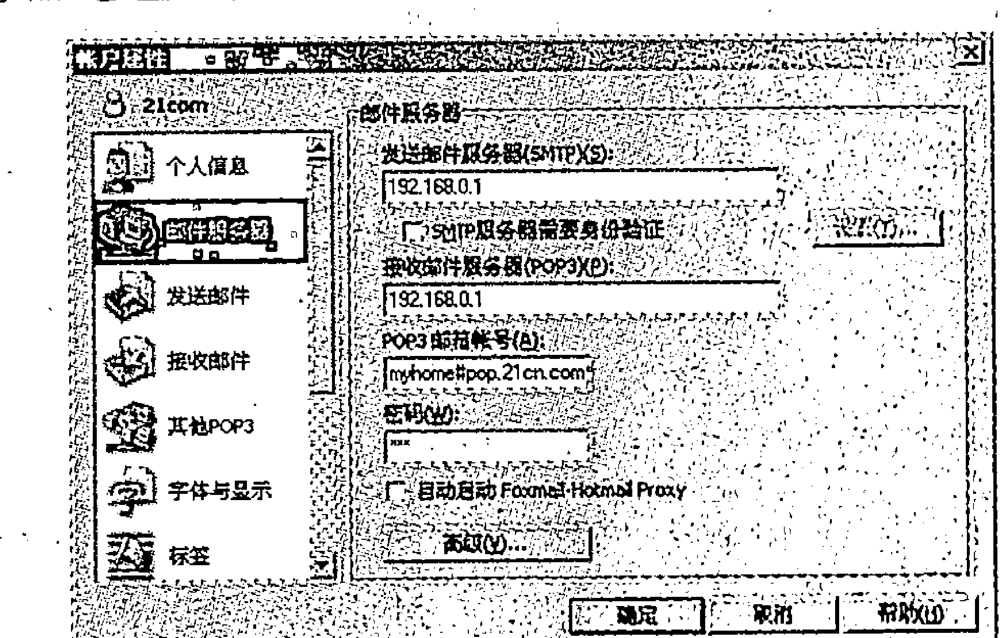

## 九、建立内部网站

在自己单位的局域网上，我们可以建立一个内部网站，在上面发布信息，提供一些共享的文件让员工自由获取，从而给员工搭建一个自由交流、发布信息的平台，提高内部局域网的使用效率。这些功能在 Windows 2000 Server 服务器上可以轻松实现。

### （一）安装和测试 IIS

Windows 2000 Server 提供了一个 IIS（Internet 信息服务）程序，利用它我们就可以搭建一个 Web 服务器，建立自己的内部网站，局域网内的所有用户都可以自由访问该网站，就像我们访问 Internet 上的网站一样方便。
在默认情况下，安装完 Windows 2000 Server 时，它就自动在系统中安装了IIS，此时的计算机就已经成为了一个Web服务器，系统默认的网站目录是C：\inetpub\wwwroot， 默认的主页名是“default.htm”或“default.asp”。我们就可以用下面的方法测试一下Web服务器运行是否正常。

打开IE，在地址栏中输入http://127.0.0.1或http://localhost，然后回车，如果能够显示IIS帮助文档页面，就说明IIS运行正常，我们可以用它建立网站了。

用FrontPage或Dreamweaver等网页编辑工具建立好一个网站，然后把它保存在C：\inetpub\wwwroot目录下，并且把主页设为“default.htm”或“default.asp”；就建立好了自己的网站，然后就可以用上面介绍的方法访问它了。

### （二）设置Web站点属性

上面我们是用系统默认值建立一个站点，如果你想定义自己的站点，那就需要对Web站点属性进行修改，从而建立一个符合自己要求的网站，例如修改网站的保存目录，改变默认的主页文件名等。

首先单击“开始”→“程序”→“管理工具”→“Internet 信息服务管理器”命令，打开“Internet 信息服务器”，展开左面窗口中的目录树，我们看到系统建立好的“默认Web站点”。然后用鼠标右键单击“默认Web站点”，在弹出的菜单中选择“属性”命令，打开“默认Web站点属性”设置窗口（图6）。

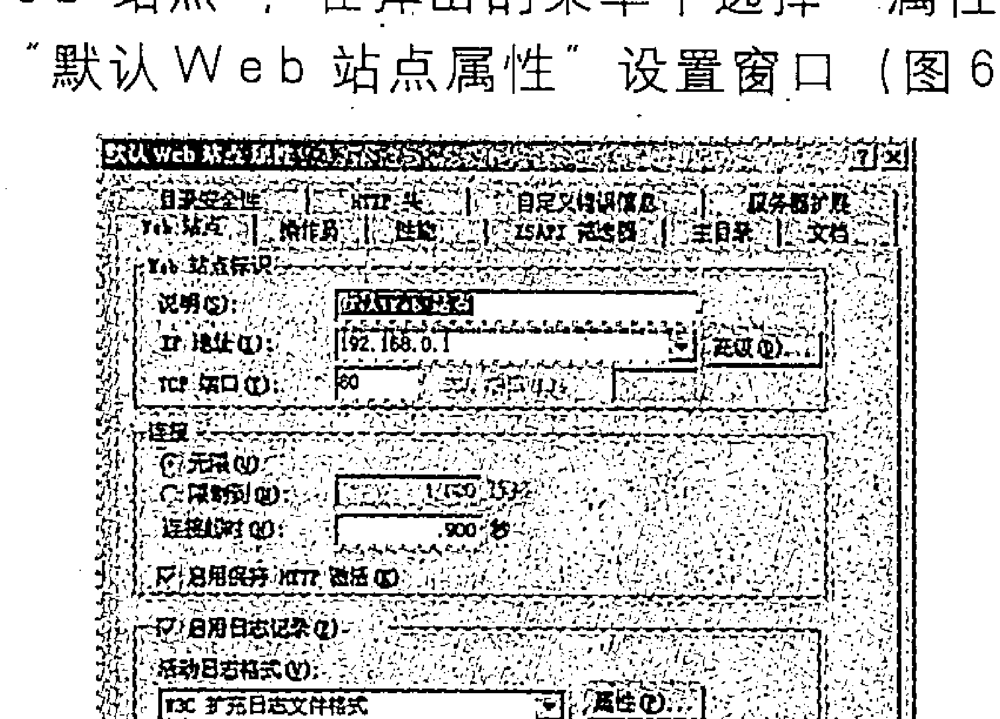

#### 1. 设置Web站点标识

在“Web站点”标签页中可以设置IP地址和TCP端口值，默认的IP地址全部未分配，也就是该计算机中所有的IP地址，如果要取消绑定“全部未分配”，就需要指定一个IP地址，这里我们选择服务器的IP地址192.168.0.1，端口值采用默认的80，这样就可通过http://192.168.0.1来访问网站了。

#### 2. 修改主目录

主目录也就是网站文件保存的目录，默认保存的目录是C：\inetpub\wwwroot，事实上，主目录可以保存在硬盘上的任何目录中，也可以放在局域网上的其他电脑中。

单击“主目录”标签页，选中“此计算机上的目录”选项，然后单击“本地路径”右边的“浏览”按钮，可以指定一个新的保存目录。当然你也可以选择“另一计算机上的共享位置”指定保存目录在局域网中的其他共享文件夹，或“重定向到URL”指定一个互联网上的网址。

在下面还可以设置主目录的存取权限，有读取、写入、目录浏览等选项供选择。

#### 3. 修改默认主页名

选择“文档”标签页，单击“添加”按钮，在弹出的窗口中，可以自定义默认主页的文件名，例如，我们可以把首页文件命名为“index.htm”，然后单击“确定”按钮，自定义的主页名就会出现在默认文档列表中，单击右边的上、下箭头可以调整默认主页的搜索顺序。

## （三）建立虚拟目录

网站中的内容越来越多，不可能把所有的内容都放到一个硬盘中或某个文件夹中，我们希望能够把网站的内容保存在其他硬盘或文件夹中，但用户在访问网站时，还觉得像在同一个文件夹，要实现这种功能，就需要借助于虚拟目录了。虚拟目录的作用就是把其他硬盘或文件中的内容虚拟到当前的网站中，用户浏览时就好像是在浏览当前网站文件夹一样，事实上它是存在于本网站之外的另外一个文件夹或硬盘中。利用这种方法，就可以实现网站的无限扩充，我们只需要增加新的硬盘，然后建立虚拟目录就可以了。

- 建立虚拟目录的步骤如下：
- (1) 在“默认Web站点”上用鼠标右键单击，选择“新建虚拟目录”命令，打开虚拟目录创建向导，单击“下一步”按钮。
- (2) 在“别名”框中给要建立的虚拟目录起一个别名，如file，单击“下一步”按钮。
- (3) 单击“浏览”按钮，选择文件保存的真实路径，如D：\home，单击“下一步”按钮。
- (4) 确定虚拟目录的访问权限，选择默认值单击“下一步”按钮。
- (5) 单击“完成”按钮，就完成了虚拟目录的创建。

这时在“默认Web站点”中可以看到新增了一个file文件，将网站文件保存到该虚拟目录所在的D：\home文件夹中，然后在IE地址栏中输入http://192.168.0.1/file，就可以看到网站的内容，就像网站真实存在于默认网站的根目录下一样，这就是虚拟目录的作用。

## （四）建立虚拟网站

同建立虚拟目录一样，我们还可以在一个服务器上建立多个虚拟网站，这样就可以把一台服务器充当多个服务器来使用。不同的虚拟网站可以使用不同的 IP 地址，也可以使用同一个 IP 地址的不同端口。虚拟网站在性能和表现上都与默认的 Web 网站相同，使用虚拟网站不但可以节约成本，而且易于对站点进行管理和配置。

虚拟网站可以建立在默认网站之下，也可以直接建立在其他虚拟网站之下，甚至可以建立在 IIS 服务器之下，虚拟网站在建立时，将继承其父站点的全部属性。

虚拟网站的建立过程如下：

- 1. 单击“开始” -> “程序” -> “管理工具” -> “Internet 信息服务管理器”命令，打开“Internet 信息服务器”窗口。
- 2. 在左边的目录树中，用鼠标右键单击服务器名，在弹出的菜单中选择“新建站点”命令，出现“Web 站点创建向导”，单击“下一步”按钮。
- 3. 在“说明”文本框输入对新建虚拟站点的说明，单击“下一步”按钮。
- 4. 在“输入 Web 站点使用的 IP 地址”下拉列表中，选择一个要分配给该站点的 IP 地址，注意不要与其他站点重复，如果重复的话，就需要设置不同的端口号，这里我们选择 192.168.0.1，端口号采用默认的 80，单击“下一步”按钮。
- 5. 单击“浏览”按钮，选择该网站所在的实际路径，单击“下一步”按钮。
- 6. 给站点设置访问权限，这里采用默认设置，单击“下一步”按钮。
- 7. 最后单击“完成”按钮，完成虚拟网站的创建。

在网站所在的实际文件夹中建立好网站文件，然后在 IE 地址栏中输入 http://192.168.0.1，就可以访问虚拟网站。

## 十、搭建 FTP 服务器

FTP 是 File Transfer Protocol (文件传输协议)的缩写，它主要的作用就是用来在计算机之间传输文件，我们用它可以实现文件的远程传输和下载、文件的交换和共享。FTP 服务建立和操作方法与 Web 服务类似，安装之后都有一个默认的站点，你可以修改默认站点的属性，也可以建立虚拟目录和虚拟站点。

## （一）安装和测试 FTP 服务

在安装 Windows 2000 Server 时，如果采用的是默认的安装方式，就没有安装 FTP 服务，这时我们需要手工进行安装。

- 1. 单击“开始” -> “设置” -> “控制面板”，双击其中的“添加 / 删除程序”图标，打开“添加 / 删除程序”窗口。
- 2. 单击左边的“添加 / 删除 Windows 组件”按钮，打开“Windows 组件”向导，在组件列表中选中“Internet 信息服务器 (IIS)”选项，单击“详细信息”按钮。
- 3. 出现“Internet 信息服务器”窗口，在列表中选中“文件传输协议 (FTP) 服务器”选项，单击“确定”按钮。
- 4. 返回“Windows 组件向导”窗口，单击“下一步”按钮，稍候片刻，系统会提示你插入 Windows 2000 安装盘，把光盘放入光驱，单击“确定”按钮，开始安装。
- 5. 安装完成后显示提示信息，单击“完成”按钮即可。

FTP 服务安装完成后即开始运行，它默认的主目录是 C:\inetpub\ftproot，将你需要共享的文件或文档复制到这个目录，然后在 IE 地址栏中输入 ftp://127.0.0.1，就可以看到该文件夹下的文件，这表示 FTP 服务已经正常运行。

## （二）设置 FTP 站点属性

安装 FTP 服务之后，它会自动建立一个默认的 FTP 站点，我们可以根据需要修改默认的站点属性。

首先单击“开始” -> “程序” -> “管理工具” -> “Internet 信息服务管理器”，打开“Internet 信息服务管理器”窗口。然后在左边的目录树中，可以看到系统建立的“默认 FTP 站点”，用鼠标右键单击该站点，在弹出的菜单中选择“属性”命令，打开“默认 FTP 站点属性”窗口。

#### 1. 设置站点标识

在“FTP 站点”标签页中可以设置 IP 地址、端口号等信息，在 IP 地址下拉列表中选择服务器的 IP 地址，即 192.168.0.1，端口使用默认值 21。

#### 2. 修改主目录

选择“主目录”标签项，选中“此计算机上的目录”选项，然后单击“浏览”按钮选择文件路径，同时在下面还可以设置目录的存取权限和目录列表风格。

## （三）建立虚拟目录

- (1) 在“Internet 信息服务器”窗口左边的目录树中选中“默认 FTP 站点”，然后单击鼠标右键，选择“新建虚拟目录”命令，出现虚拟目录创建向导，
- (2) 输入虚拟目录“别名”，比如 software，注意不要与已建立的虚拟目录重名，单击“下一步”按钮。
- (3) 单击“浏览”按钮，选择存放文件的实际路径，单击“下一步”按钮。
- (4) 设置虚拟目录的访问权限，可采用默认值，单击“下一步”按钮。
- (5) 单击“完成”按钮，完成虚拟目录的创建。

这时在“默认 FTP 站点”树形目录下就增加了一个 Software 虚拟目录，在 IE 地址栏中输入 ftp://192.168.0.1/software，就可以访问该目录中的文件。

## （四）建立虚拟网站

- 1. 用鼠标右键单击“Internet 信息服务器”窗口上的计算机名，在弹出的菜单中选择“新建 FTP 站点”命令，出现 FTP 站点创建向导，单击“下一步”按钮。
- 2. 在“说明”文本框中输入站点说明，单击“下一步”按钮。
- 3. 设置 IP 地址和端口，在“IP 地址”下拉列表中选择 192.168.0.1，端口号采用默认值 21，单击“下一步”按钮。
- 4. 单击“浏览”按钮，选择文件保存的实际路径，单击“下一步”按钮。
- 5. 设置访问权限，选择默认值，单击“下一步”按钮。
- 6. 单击“完成”按钮，完成虚拟网站的创建。

在 IE 地址栏中输入 ftp://192.168.0.1，就可以访问该网站中的文件资源。

## 十一、建立电子邮局

收发电子邮件是大家经常使用的一种交流信息的方式，在办公局域网上更是一种不可缺少的功能。实现在局域网收发电子邮件的软件非常多，下面我们以使用较为广泛的 iMail 为例，介绍在局域网中建立电子邮局的方法。

## （一）设置 DNS

要想顺利使用 iMail 软件来收发电子邮件，在安装 iMail 之前，我们必须要对服务器上的 DNS 进行适当的设置。

在配置 DNS 之前我们首先要安装 DNS 网络组件，单击“开始”→“设置”→“控制面板”→“添加/删除程序”→“添加/删除 Windows 组件”，打开“Windows 组件安装向导”：选中“网络服务”选项；单击“详细信息”按钮，在打开的窗口中选中“域名系统（DNS）”选项（图7），单击“确定”按钮，再单击“下一步”按钮，在光驱中放入 Windows 2000 Server 安装盘，按照提示就可以完成 DNS 组件的安装。

下面我们以建立一个域名为 mypcbook.net 的邮局为例来进行讲解，具体操作步骤如下：

- 1. 单击“开始”→“程序”→“管理工具”→“DNS”命令，打开“DNS 管理器”窗口。
- 2. 在左边的目录树中用右键单击“正向搜索区域”，在弹出的菜单中选择“新建区域”命令，出现新建区域向导，单击“下一步”按钮。
- 3. 在“选择区域类别”对话框中，选中“标准主要区域”选项，单击“下一步”按钮。
- 4. 在“输入区域名称”框中输入 net，单击“下一步”按钮。
- 5. 选中“创建文件，文件名为”选项，并使用系统默认的文件名，单击“下一步”按钮。
- 6. 新建区域创建成功，单击“完成”按钮。
- 7. 然后在“DNS 管理器”窗口中，用鼠标右键单击新建立的 net 域名，在弹出的菜单中选择“新建域”命令。
- 8. 在弹出的对话框中键入新域名，我们输入 mypcbook，单击“确定”按钮，新域建立成功。
- 9. 在“DNS 管理器”窗口中，用鼠标右键单击新建域“mypcbook”，在弹出的菜单中选择“新建主机”命令。
- 10. 出现新建主机对话框，在“IP 地址”一栏中输入本机的 IP 地址 192.168.0.1，注意名称保持为空。
- 11. 单击“添加主机”按钮，就完成了主机的创建（图8）。

这时就会在“DNS 管理器”中看到所建立的 IP 地址映射记录，至此，我们就建立起了 mypcbook.net 域名与 IP 地址 192.168.0.1 的映射关系。如果想测试一下所设置的域名指向是否成功，可以单击“开始”→ “运行”，输入 cmd 命令，然后回车，打开 DOS 窗口，输入命令 ping mypcbook.net，如果运行通过，即表明域名设置成功。下面就可以安装 iMail 软件了。

## （二）安装 iMail

我们以 iMail server 8.12 为例来讲述该软件的安装过程。

- (1) 双击下载的安装程序，首先出现欢迎界面，单击“Next”按钮。
- (2) 要求输入主机域名，这里我们输入前面已建立的 mypcbook.net 域名，单击“Next”按钮。
- (3) 选中“iMail user database”选项，单击“Next”按钮。
- (4) 选择安装路径，可以单击“Browse”按钮进行选择，这里采用默认值，单击“Next”按钮。
- (5) 选择程序目录中的文件名，采用默认值，单击“Next”按钮。
- (6) 弹出窗口询问是否安装 SSL key，利用它可以对发送的邮件进行加密，我们选择“否”。
- (7) 是否使用邮件转发邮件，选中“No Mail replay”，单击“Next”按钮。
- (8) 选择邮件服务，建议全部选中，以使用它的强大功能，单击“Next”按钮。
- (9) 开始安装，安装完成后会弹出一个窗口提示你是否添加新用户，我们选择“否”，以后再添加用户。
- (10) 单击“Finish”按钮，完成 iMail 的安装。

## （三）添加用户

下面我们就可以添加用户：

- (1) 单击“开始”→“程序”→“iMail”→“iMail Administrator”命令，打开 iMail 主窗口，我们可以在左边的目录树中看到我们新建立的一个 mypcbook.net 域名（图9）。
- (2) 用鼠标右键单击左边窗口中的 Users 文件夹，在弹出的窗口中选择“Add user”命令。
- (3) 在弹出的对话框中输入新用户的名称，比如 book，单击“下一步”按钮。
- (4) 输入该邮箱拥有者的姓名，单击“下一步”按钮。
- (5) 输入密码，在两个输入框中输入相同的密码，这个密码就是你以后邮箱要用的密码，单击“下一步”按钮。
- (6) 单击“完成”按钮，完成新用户的创建。

这样我们就创建了一个名称为 book@mypcbook.net 邮箱，其用户名是 book，密码是你设置的密码，POP3 和 SMTP 服务器均是 mypcbook.net。

重复以上操作，给局域网中的每一个用户设置一个邮箱。

## （四）收发电子邮件

在服务器端安装好 iMail 之后，在客户端不用安装其他程序就可以直接收发邮件了。通常收发邮件的方式有两种：POP3 和 Web 方式。下面我们就分别来介绍。

### 1. 用 POP3 方式收发邮件

- (1) 启动 Outlook Express，单击“工具”→“账号”→“邮件”→“添加邮件”，出现电子邮件设置向导，输入一个要作为发件人的名字，单击“下一步”按钮。
- (2) 输入用户的电子信箱，如 book@mypcbook.net，单击“下一步”按钮。
- (3) 在 POP3 和 SMTP 服务器输入框中都输入 mypcbook.net，单击“下一步”按钮。
- (4) 输入你的邮箱账号密码，单击“下一步”按钮。
- (5) 单击“完成”按钮，返回“Internet 账号”窗口，单击“关闭”按钮，完成账号的创建。下面就可以用 OE 来进行收发邮件的操作了。

### 2. 用 Web 方式收发电子邮件

- (1) 打开 IE，在地址栏中输入 http://mypcbook.net:8383，然后回车，就可以出现 iMail 登录画面，在“User ID”框中输入邮箱用户名，如 book，在“Password”中输入邮箱密码，单击“Login”按钮，就可以进入 iMail 主界面（图10）。
- (2) 单击“Compose”按钮，在“To”文本框中输入收信人的地址，在“Subject”中输入信件主题，在下面的文本框中输入邮件正文，单击“浏览”按钮可以添加附件，然后单击“Attach”将附件粘附到信件中，最后单击“Send message”发送电子邮件。
- (3) 如果想查看收件箱中的信件可以单击“View Mail”按钮。

iMail 的使用我们就简单介绍到这，它还有许多高级用法，限于篇幅就不介绍了。

## 十二、召开网络会议

对于办公网来说，通过召开网络会议来讨论问题，可以避免召开实际办公会议所遇到的种种麻烦，提高工作效率，因此很受大家的欢迎。微软公司在 Windows 98 以后的操作系统中都捆绑了一个 Netmeeting 软件，利用它可以召开语音和视频会议，通过网络进行聊天，共享应用程序或传送文件。

## （一）配置 Netmeeting

在首次运行 Netmeeting 时，需要对它进行一些简单的设置，具体操作步骤如下：

- (1) 在 Windows 98 中，单击“开始”→“程序”→“附件”→“Internet 工具”→“Netmeeting”命令，出现配置向导程序，在 Windows 2000 Server 中需要单击“开始”→“程序”→“附件”→“通讯”→“Netmeeting”命令，单击“下一步”按钮。
- (2) 输入姓、名和电子邮件地址，单击“下一步”按钮。
- (3) 在“服务器名”列表中选择办公网内部安装的服务器 192.168.0.1，单击“下一步”按钮。
- (4) 选择建立连接的方式，我们选择“局域网”，单击“下一步”按钮。
- (5) 询问是否在桌面和快速启动栏中添加快捷方式，可根据需要选择，单击“下一步”按钮。
- (6) 检测声卡的设置，单击“下一步”按钮，完成设置，Netmeeting 将自动运行。
- (7) 重复以上操作，在所有的电脑上完成 Netmeeting 设置。

## （二）使用 Netmeeting

### 1. 呼叫对方

要想在网络上召开会议，首先参加会议的每一方都要启动 Netmeeting，然后彼此之间要建立连接，这样才能召开会议。呼叫对方的方法很简单，单击 Netmeeting 主窗口右上角的“进行呼叫”按钮，弹出一个对话框（图11），在“到”输入框中输入被呼叫方的 IP 地址，如 192.168.0.1，呼叫方式选择“自动”，然后单击“呼叫”按钮，铃声响起，同时在被呼叫方的电脑屏幕上弹出一个窗口，单击“接受”按钮，双方就建立起了连接，下面就可以聊天了。

### 2. 聊天

单击 Netmeeting 主窗口下方的“聊天”按钮，弹出聊天窗口，在“消息”文本框中编辑文字内容，单击“发送”按钮，就可以将消息发送给对方。如果想将消息发送给某个人，可以在“发送给”列表中选择要发送人的名字即可，这与在 QQ 中聊天一样。

### 3. 发送文件

单击 Netmeeting 主窗口下方的“传送文件”按钮，弹出“文件传送”窗口，单击“添加文件”按钮选择要传送的文件，然后单击“全部发送”按钮，即可将文件传给对方。另外你还可以与对方共享程序、使用白板，如果双方都安装有摄像头，可以直接在 Netmeeting 的主窗口中看到对方，并且还可以通过麦克风进行语言交谈。

## 十三、局域网聊天

我们知道 QQ 是个聊天的工具，那么在局域网中能否用 QQ 聊天呢？当然可以，这就需要用到腾讯公司开发的专用于企业即时通信的软件“腾讯通”，它与我们平时使用的 QQ 可以实现无缝衔接，“腾讯通”不但可以与内部的人进行通信，还可以与 Internet 上的 QQ 进行交流，用它来进行语言、文字、视频聊天都非常方便。

“腾讯通”分为服务器端和客户端两个程序，它们都可以从腾讯公司的网站上免费下载，下载之后，我们分别在 Windows 2000 Server 服务器和 Windows 98 客户端上进行安装。

## （一）服务器端的使用

安装完毕后，单击“开始”→“腾讯通”→“腾讯通服务管理器”命令，出现登录画面。在服务器 IP 地址中输入 192.168.0.1，并输入安装程序时输入的管理员密码，单击“登录”按钮，启动服务管理器。

“腾讯通”规定所有的用户能由服务端进行分配，无法在客户端进行申请，因此在服务管理器中需要给每个用户分配一个号码和密码。我们可以先建立起各个部门，然后在部门中添加用户，具体操作是：

在“服务管理器”窗口中展开“用户数据”文件夹，用鼠标右键单击“部门结构管理”，在弹出的菜单中选择“添加部门”命令，然后就可以添加一个部门。重复以上操作，把单位内的所有部门全部添加完。然后再用鼠标右键单击某个部门，在弹出的菜单中选择“添加用户”命令，给新用户指定号码、用户名和用户密码即可（图12）。当然也可以选中“批量添加号码模式”来快速大批量地添加用户。

## （二）客户端的使用

在客户端启动“腾讯通”，出现登录画面，输入服务器端分配的号码和密码，同时在服务器设置中输入服务器的 IP 地址 192.168.0.1，然后单击“登录”按钮就可以登录“腾讯通”，它的使用与 QQ 基本相同，可以进行语音、文字、视频聊天，传送文件，召开网络会议，这里就不作详细介绍了。

## 十四、远程办公

对于现代化的办公网来说，不但在工作单位可以自由访问公司服务器上的资源，有时我们出差在外，或者在家里也想访问单位局域网上的资源，以实现远程访问，进行远程办公，这该如何办呢？Windows 2000 Server 给我们提供了方便的远程访问方式，使用它，你只要通过电话线拨号上网，就可以访问单位的局域网上的资源，和我们在单位局域网电脑上的操作一样。

## （一）了解远程访问的方式

Windows 2000 提供了两种远程访问的连接方式。一种是拨号网络连接，这种方式使用电话线 + Modem（调制解调器）来建立连接，服务器和客户只要通过 Modem 拨号上网就可以进行访问了。无论你身在何处，只要可以拨号上网就可以与单位的局域网建立连接。

第二种是虚拟专用网络连接（VPN），这种方式通过 Internet 实现两台计算机之间的连接，但这种连接并不是物理上存在的，它只是通过技术手段模拟出来的，就相当于城市大道上的“公交专用线”。该方式具有良好的保密性，使双方可以进行自由而安全的点对点的连接。不过它需要服务器端有一个固定的 IP 地址，这对于许多单位来说只是个奢望。

## （二）拨号网络连接

下面我们就分别来介绍这两种远程连接方式的使用方法，服务器端使用 Windows 2000 Server，客户端也就是你在家中或其他地方使用的电脑使用的是 Windows 98。

### 1. 服务器端设置

首先需要服务端安装路由和远程访问服务，它在安装 Windows 2000 时已经自动安装，但是没有激活，我们需要手工激活它，然后进行适当的配置。安装之前首先保证系统正确安装了 Modem，并且在拨号网络中建立好了拨号连接。

- (1) 在 Windows 2000 中单击“开始”→“程序”→“路由和远程访问”命令，打开“路由和远程访问”窗口。
- (2) 在左边的目录树中用鼠标右键单击本地服务器名，在弹出的菜单中选择“配置并启用路由和远程访问”命令，出现安装向导，单击“下一步”按钮。

(3) 选中“远程访问服务器”选项，单击“下一步”按钮。

(4) 出现远程客户协议列表，我们需要的TCP/IP协议已经在列表中了，所以选中“是，所有要求的协议都在此列表中”选项，单击“下一步”按钮。

(5) 选中你采用的连接方式，单击“下一步”按钮。

(6) 在如何分配远程客户IP地址窗口中，如果你在服务器上安装好了DHCP服务器，则选择“自动”选项，这里我们选择“来自一个指定的地址范围”选项，单击“下一步”按钮。

(7) 单击“新建”按钮，添加起始和结束IP地址，如192.168.0.40~192.168.0.60，注意此处的IP地址范围与服务器本身的IP地址要处在同一个网段中，也就是前面的三个数字192.168.0部分一定要相同。

(8) 选中“不，我现在不想设置此服务器使用RADIUS”选项，单击“下一步”按钮。

(9) 单击“完成”按钮，完成安装和配置。

### 2. 客户端设置

在Windows 98客户端也需要先正确安装Modem，然后打开“我的电脑” -> “拨号网络”，双击“建立新连接”图标，出现建立新连接向导，按照提示输入连接的名称、区号、电话号码后即可建立一个新的拨号连接。

下面就可以进行双方的连接了。首先服务器端要拨号上网，然后客户端双击刚才建立的拨号连接上网，直到双方计算机屏幕任务栏的右下角都出现一个Modem图标时，表示连接已经成功。连接成功后，双方都将自动获得一个IP地址，这时打开“网上邻居”就可以访问共享的资源了。

## (三) 虚拟专用网络连接 (VPN)

### 1. 安装VPN服务器

首先保证VPN服务器必须已经接入Internet，并且拥有一个Internet上固定的IP地址（即公网IP地址）。

Windows 2000中的VPN包含在“路由和远程访问服务”中，虽然这个服务组件在Windows 2000安装时已经自动安装，但没有激活，所以我们要人工激活它。具体操作步骤如下：

- (1) 单击“开始” -> “程序” -> “管理工具” -> “路由和远程访问”命令，打开“路由和远程访问”窗口。

- (2) 用鼠标右键单击左边窗口中的服务器名，在弹出的菜单中选择“配置并启用路由和远程访问”命令，出现安装向导，单击“下一步”按钮。

- (3) 选中“虚拟专用网络（VPN）服务器”选项，单击“下一步”按钮。

- (4) 选择安装协议，如果TCP/IP协议在列表中，我们就选择“是，所有要求的协议都在此列表中”选项，单击“下一步”按钮。

- (5) 选中连接到Internet的连接名称，单击“下一步”按钮。

- (6) 对客户分配IP地址，选择“来自一个指定的地址范围”选项，单击“下一步”按钮。

- (7) 单击“新建”按钮，添加起始和结束IP地址范围，注意与服务器本身的IP地址要在同一个网段中，单击“确定”，再单击“下一步”按钮。

- (8) 选中“不，我现在不想设置此服务器RADIUS”选项，单击“下一步”按钮。

- (9) 单击“完成”按钮，完成VPN服务器的安装。

### 2. 客户端设置

#### (1) 安装“虚拟专用网络”服务

在Windows 98客户端首先要安装“虚拟专用网络”服务，然后才能够连接到VPN服务器。

- (1) 单击“开始” -> “设置” -> “控制面板”，双击“添加/删除程序”图标，打开“属性”窗口。

- (2) 选择“Windows安装程序”标签页，在下拉列表中选中“通讯”，然后单击“详细资料”按钮。

- (3) 在打开的“通讯”窗口中选择“虚拟专用网络”选项，单击“确定”按钮。

- (4) 返回“添加/删除程序”窗口，再单击“确定”按钮，插入Windows 98安装盘，就可以完成安装。

安装完毕重新启动计算机，双击“控制面板”中的“网络”，在打开的窗口中单击“配置”标签，就可以看到“Microsoft虚拟网络适配器”，这表明虚拟专用网络服务安装成功。

#### (2) 建立连接

- (1) 打开“我的电脑” -> “拨号网络”，双击“建立新连接”，出现新建连接向导。

- (2) 输入要建立的连接的名称，然后在“选择设备”列表中选中“Microsoft VPN Adapter”选项，单击“下一步”按钮。

- (3) 输入VPN服务器的IP地址，在这里输入固定的公网IP地址，单击“下一步”按钮。

- (4) 单击“完成”按钮，即建立好一个VPN连接。

现在就可以进行双机互连通信了，首先保证服务器已经上网，然后将客户端也连接上网，双击刚才建立的VPN连接，输入用户名和密码，单击“连接”按钮，开始进行连接。连接成功后，我们可以在客户端和服务器端中右下角的任务栏中看到两个拨号网络成功的图标，其中一个是到Internet的连接，另一个是VPN的连接。然后双击“网上邻居”，双方就可以相互访问了。

如今宽带已经走入千家万户，ADSL的用户更是越来越多。不过在你享受着宽带网络带来的便利的时候，你可曾想过用自己家里的ADSL做更多的事情？

## 一、网站建设篇

处在当今这个网络时代，相信很多朋友希望能有个自己的个人站点吧？不过现在免费提供主页空间的“好心商家”已基本绝迹。自己租服务器或者买空间吧？贵就不说了，还有诸多限制，用起来也不方便……难道就没什么好点儿的办法了吗？有的，这章我们将要介绍的，就是如何使用家用的ADSL，来打造属于自己的Web站点。

### （一）在 Windows 2000 下创建网站

微软在 Windows 2000 的各个版本中，都集成了IIS（Internet 信息服务），使用IIS，可以很方便地建立Web站点。鉴于Windows 操作系统的普及程度，我们将主要介绍如何使用 Windows 自带的IIS建立自己的个人站点。

不过在不同版本的 Windows 2000 中，IIS的性能也有所差别。所以本节将以 Windows 2000 Server 为例加以说明。请读者朋友对号入座。

#### 1. 安装IIS

IIS 并不是 Windows 2000 的默认安装组件，所以对于多数按照默认方式安装 Windows 2000 的朋友来说，都需要添加IIS 组件才可以使用。

点击“开始”→“设置”→“控制面板”进入“控制面板”，然后启动“添加或者删除程序”。单击“添加 / 删除 Windows 组件”。在“组件”列表框中双击“Internet 信息服务 (IIS)”，进入IIS组件详细列表并具体选择需要安装的组件。

#### 2. 建立 Web 站点

- (1) 进入“控制面板”，点击管理工具中的“Internet 信息服务”，运行IIS管理器。用鼠标右键单击本地计算机节点，选择“新建 - Web 站点”，运行“Web 站点创建向导”。

- (2) 在“Web 站点说明”窗口键入网站的名称，单击“下一步”按钮。

- (3) 接下来进入IP地址和端口设置窗口，如果没有什么特别要求的话，可以不作任何修改，直接点击“下一步”按钮。

- (4) 下面要为 Web 站点选择一个本地路径，点击“浏览”按钮即可为你的网站在磁盘驱动器中选择一个目录，注意这个目录一定不能是本地的系统目录。

- (5) 在“Web 站点访问权限”窗口设定网站主目录的权限。对于一般的用途来说，保持默认设置，即允许“读取”和“运行脚本”权限即可。

#### 3. 设置默认文档

在IIS管理列表中，用鼠标右键单击我们刚刚建好的站点，选择“属性”命令，打开属性设置面板。

点击“文档”选项卡，添加默认文档。IIS安装时提供了两个默认文档“Default.htm”和“Default.asp”。如果需要别人访问你的网站时默认打开的是别的文件，请点击“添加”按钮填入新的文件名，如“Index.htm”。然后在文件列表中选中它，点击列表左侧的向上箭头将刚刚添加的文件提升到列表的最上方。这样，当有人访问你的网站时，它就会优先访问“Index.htm”了。

这样，我们的第一个站点就建好了，在浏览器地址栏中输入http://localhost，试试看。

### （二）在 Windows XP 下创建网站

对于 Windows XP 来说，只有 Windows XP Professional 版本才集成有IIS 5.1，由于它的安装和设置方式同在 Windows 2000 下基本一致，故不再详述。

### （三）在 Windows Server 2003 下创建网站

作为微软最新推出的服务器操作系统，Windows Server 2003 在Web服务方面的改变是很大的，特别是集成了最新的IIS 6.0，它的安装和设置都和以前有所差异。

#### 1. 安装 IIS 6.0

打开“添加或者删除程序”窗口，单击“添加 / 删除 Windows 组件”。在“组件”列表框中，单击“应用程序服务器”。
在应用服务器列表中单击“Internet 信息服务管理器”并选择要安装的可选组件后点击“确定”按钮。

#### 2. 创建网站

方法同 Windows 2000 下创建网站的方法一致，这里不再详细描述。

#### 3. 启用 ASP/ASP.NET 支持

为了提高系统安全性，从 Windows Server 2003 集成的 IIS 6.0 开始，最初安装 IIS 时，该服务即在高度安全和“锁定”的模式下安装。也就是说默认情况下，IIS 只为静态页面提供服务。所以如果你需要运行论坛、留言簿什么的，还需打开动态页面支持。

打开“IIS 管理器”，在左侧列表点击“Web 服务扩展”，在服务列表中，选中“Active Server Pages”后点击左侧的“允许”按钮即可开启 Web 服务器对 ASP 的支持。同理，如果需要打开其他扩展服务，如 CGI 的支持，也可以按照同样方法开启。

### （四）解决 IP 不固定的问题 (申请动态域名解析服务)

对于多数 ADSL 用户来说，每次拨号上网后，IP 都是由网络服务商动态分配的。这就造成一个问题：既不可能使用 “http://IP 地址” 的方式来访问你的网站，又无法按传统方法将 IP 绑定到域名上 (因为 IP 不固定)。
对于这种情况，我们可以通过申请动态域名解析服务的方法加以解决。这种服务多由一些专业的服务商提供，如笔者马上要谈到的“花生壳”。

#### 1. 下载“花生壳”客户端

“花生壳”其实是由网域科技提供的一整套动态域名解析服务，有了这个东东，就可以随时以域名方式访问自己的网站，而无需理会每次接入网络后 IP 地址的变化。并且，它还是免费的！
使用“花生壳”系统，需要在自己的机器上运行“花生壳”的客户端，我们可以在 http://www.oray.net/Products/PeanutHull_Support.asp 下载它。目前的最新版本是 2.1。

#### 2. 安装“花生壳”客户端

下载完“花生壳”的客户端后，就可以双击安装包进行安装了。在安装过程中会有一个对话框提示让你输入“网域护照”，现在先不要管它，直接点击“下一步”按钮跳过并完成安装。

#### 3. 申请护照

访问网域科技官方站点 http://www.oray.net, 在首页左侧的登录窗口，点击“注册护照”按钮，并按照注册向导完成注册过程 (图 1)。

#### 4. 激活“花生壳”服务并建立域名记录

访问 http://www.oray.net, 用刚刚注册的用户名和密码登录网站，然后点击页面左侧工具栏中的“激活花生壳服务”链接，进入“花生壳服务激活向导”页面。
此时需要在“花生壳注册向导”页面上，输入你需要动态解析的域名。如果你还没有域名，可以先免费注册一个由网域科技提供的三级域名 (以 vcp.net 结尾)。如果你已经注册了独立的顶级域名，则可以填入独立域名文本框中。不过，在网域科技，对独立域名的动态解析属于收费服务。
接下来需要你填写站点资料和属性，如网站的类别和描述、开启的服务和对应的服务端口等等。不用管这些，它们只仅仅作为对你网站的一种描述，并不会影响到你的具体使用。仔细填写后点击“完成”即可。若出现如图 2 所示的页面，就说明“花生壳”服务已经被激活。

#### 5. 运行花生壳客户端

在接入 Internet 的情况下，运行刚刚安装好的“花生壳”客户端，在主界面的登录框中填入你刚申请的“网域护照”，点击“确定”按钮。如果成功地通过用户验证，“花生壳”就会显示状态为在线，并且系统托盘处的图标也会变成彩色的。

现在我们可以来做个简单的小测试，来看看“花生壳”是否起到了作用：点击“开始”→“运行”命令，输入 CMD 命令，打开命令行窗口。键入“PING <你申请的域名>”。

### 名词解释

动态域名服务：动态域名解析服务就是通过在本地运行服务商提供的客户端程序，将用户当前的动态IP地址发送到动态域名解析服务器上进行解析，并且将该用户在服务商处登记的域名记录绑定到当前的IP地址上。由此，人们可以始终通过一个固定的域名访问用户的个人电脑。简言之，动态域名服务是联系域名与个人计算机之间的一个“纽带”。

##### 小提示

加强Web服务器安全：虽然使用IIS可以很方便地建立Web站点，可是需要注意的是，在你机器上开启IIS后，一定要注意服务器自身的安全问题。安装防火墙、及时打系统补丁是必不可少的，此外还要参照有关资料，仔细设置Web服务器的安全级别。

## 二、游戏服务器篇

> “爱玩”绝对是每个人的天性，因此下面要说的，就是如何架设一些热门游戏的服务器。

### （一）架设CS 1.6服务器

CS已经是游戏发展史上的一个里程碑，笔者实在找不出不介绍它的理由。鉴于CS 1.5已经逐渐“淡出”，我们将着重介绍CS 1.6的服务器架设方法。

**STREAM系统下的服务器架设：**

从CS 1.6开始，Sierra（雪乐山）在游戏中集成了STREAM在线系统，注册、完成安装、认证均需要在线通过STREAM来完成。尽管没多少人喜欢这么个“劳什子”，但对于很多使用CS官方版本的朋友来说，还是不可避免地要和STREAM打交道……

#### 1. 获取CS 1.6服务端程序

我们可以通过以下两种方法获取CS 1.6的服务端：

- (1) 访问Counter-Strike 1.6的官方站点：http://server.counter-strike.net/server.php?cmd=hldswin，下载STREAM Dedicated Server (Win32)，大小约为420MB，目前最新版本为1.1.2.0。
- (2) 运行STREAM并登录STREAM系统。在系统面板上点击GAME，进入游戏列表界面。双击Dedicied Server选项就可以开始下载服务端了。由于STREAM服务器多在国外，这个过程可是很慢的，需要有点耐心才行。下载完毕后Dedicied Server图标将会由黑白变成彩色的。

#### 2. 运行并设置CS 1.6服务端

当下载完成后，双击Dedicied Server图标，即可启动CS 1.6的服务程序，可以看到CS 1.6的服务端已经做成了图形模式，这倒在一定程度上方便了大家的使用。接下来只要在如图3所示的设置菜单中设置好对应的选项。如：服务器名称，地图，网络连接方式，服务器支持的最大人数，RCON密码，服务器端口等。全部设置完成后点击“开始服务器”按钮。

#### 3. 非STREAM系统的服务器架设

对于很多人来说，CS的STREAM系统都是个很麻烦的设置，每次都要花费大量的时间用在身份认证上。这还不说，必须在线登录认证的特点等于剥夺了大家在局域网对战的权利。所以一些游戏爱好者开发了剥离STREAM系统的CS 1.6服务端，下面我们来介绍如何架设此类服务器。

##### (1) 下载并安装非STREAM服务器程序

访问http://gamezone.qq.com/a/20040319/000081.htm，下载E赛网推出的免STREAM CS 1.6服务端程序。注意，这个服务端程序还是很大的，有500MB之多！

##### (2) 安装CS 1.6服务器

将刚刚下载的文件解压缩，双击安装文件进行安装。注意不要将服务端文件安装到系统程序目录中，这里我们将它安装到“E:\CSERVER”目录中，其他按默认设置安装即可。安装完毕后，点击“开始”→“程序”→“Esai CS 1.6 中文完全版”命令，在其子菜单中看到对应的程序文件，同时安装程序会自动生成一个桌面图标。

##### (3) 修改配置文件

由于非STREAM系统的CS 1.6服务端多采用了传统的字符控制台界面，所以正式运行之前，还是需要手动设置一下配置文件。

用文本编辑器打开“E:\CSERVER\cstrike\server.cfg”文件，这是CS服务器的基本配置文件，表1列出了一些常用的参数和它对应的功能。各位朋友可以按照自己的需要对其中的参数进行设置。

| 参数名 | 作用 | 设置范例 |
| :--- | :--- | :--- |
| Hostname | 服务器名 | Hostname "MYSERVER" |
| rcon_password | 服务器密码 | rcon_password 用户自定义密码 |
| Mp_timelimit | 每局时长 | mp_timelimit 45 |
| Mp_startmoney | 开始时金钱数 | mp_startmoney 800 |
| Mp_fadetoblack | 人物死亡后屏幕变黑 | mp_fadetoblack 不变黑 0/变黑 1 |
| Mp_friendlyfire | 友军误伤 | mp_friendlyfire 关闭 0/开启 1 |
| Mp_autokick | 自动踢出不动的玩家 | mp_autokick 开启 1/关闭 0 |
| Mp_tkpunish | 是否开启误伤惩罚 | mp_tkpunish 不惩罚 0/惩罚 1 |
| Pausable | 服务端是否可以暂停 | Pausable 禁止 0/允许 1 |
| Mp_footsteps | 是否开启脚步声 | mp_footsteps 开启 1/关闭 0 |
| Mp_decals | 服务器细节数据发送 | mp_decals 数值 (默认为 300，适当降低可以提高速度) |

##### (4) 设置启动参数

用鼠标右键单击桌面上的 "CS1.6 服务器"，选择 "属性" 命令。可以看到 "目标" 文本框里有这么一段命令: "E:\CSERVER\hlds.exe" -game cstrike -noipx -nomaster +sv_lan 1 -port 27016 +maxplayers 22 +map de_cbble console
其中 "hlds.exe" 后面的一串字母，就是CS服务器的启动参数，朋友们可以参照表2 根据需要自行设置。

| 参数名 | 功能和用法 |
| :--- | :--- |
| -nomaster | 服务器不上 WON 认证 |
| +sv_lan | 指定其为局域网服务器（以上两项设置后，服务器将成为局域网服务器，不会在 INTERNET 上出现） |
| -game cstrike | 指定游戏为《反恐精英》 |
| -port 端口号 | 设置游戏端口 |
| +maxplayers 人数 | 设置服务器支持的最大人数 |
| +map 地图名 (如+map de_cbble) | 设定游戏地图 |
| console | 是否启用控制台 |

注意：如果你需要搭建互联网上的CS服务器的话，"-nomaster" 和 "+sv_lan" 两个参数是一定要去掉的。

##### 5. 运行并测试服务器

设置完毕后，直接双击桌面的快捷方式，即可运行CS 1.6的服务端。现在你就可以进入CS 1.6游戏，点击 "搜索服务器"，在 "我喜爱的" 服务器列表窗口点击 "添加服务器"，输入 "你机器的IP地址:端口号" 来添加服务器到列表中，然后就可以双击并尝试连接了。如果可以成功连接到服务器，就说明服务器已经架设成功。行了，把服务器的地址告诉每个朋友知道吧，自己也好过把当OP的瘾。

**提示：**
E赛版本的免STREAM系统服务端程序本身集成了 Cheating Death 反作弊程序，这需要每个连接服务器的玩家都在本机运行 Cheating Death 的客户端。如果有人每次刚一连接到你的服务器都被DROP，那么多半是这个原因。解决办法是安装 Cheating Death 并在游戏时运行。

**小技巧：**
如何获取本机的公网地址：对于 Windows 98 用户来说，在命令行状态下输入 WINIPCFG，对于 Windows 2000/XP/2003 用户，则可在命令行状态下输入 IPCONFIG，即可看到本机的IP地址。不过有时用户会看到两个不同的地址，一般来讲，开头为 “61.202” 的为公网地址，而以 “10.192” 开头的则为局域网地址，请读者朋友注意区分清楚。

### （二） 架设自己的BATTLE.NET

多数《星际》和《魔兽》玩家可能都有过到 BATTLE.NET 上对战的经历，虽然现在对战平台大行其道，但BATTLE.NET仍以其强大的积分系统吸引了全世界的玩家。这章将介绍大家如何建立自己的 BATTLE.NET。

#### 1. 下载工具

架设类似 BATTLE.NET 那样的战网，需要用到专门的工具软件，这就是PvPGN。我们可以通过访问 http://pvpgn-files.ath.cx 下载它。目前的最新版本为1.65。为方便起见，请尽量下载它的安装包。

#### 2. 安装并调试

点击刚刚下载的PvPGN安装包进行安装，并按安装向导完成安装过程。安装完毕，单击“开始”→“程序”→“PvPGN”→“Service-Install Service”命令安装PvPGN服务。
单击“开始”→“程序”→“PvPGN”→“PvPGN GUI”命令，启动PvPGN的图形界面。在PvPGN的工作界面菜单上点击“Server Configuration”，编辑PvPGN的配置文件“bnetd.conf”。
要使PvPGN正常工作，有几个选项是需要用户自行设置的。它们分别如表3所示：
设置完毕后，现在单击“开始”→“程序”→“PvPGN”→“Start PvPGN Service”命令或者直接运行PvPGN GUI就可以启动服务了。

表3
| 参数 | 说明 |
| :--- | :--- |
| w3routeaddr | 这项最重要，为服务器地址，设置不正确的话，人家是连接不上你的服务器的。在这个地方填写你的服务器IP地址。如：w3routeaddr = "61.57.242.141:6200" |
| skip_versioncheck | 省略服务器端版本检测。如设置为skip_versioncheck true的话，任何游戏版本都能进入战网 |
| shutdown_delay = 300 | admin运行shutdown之后，服务器关闭所需的时间 |
| new_accounts = true | 是否允许用户新建账号，设置为True则为允许 |
| max_accounts = 0 | 玩家的最大总数，设成0是无限制 |
| kick_old_login = true | 是否禁止玩家重复登录，设置为True则为不允许 |
| hide_started_games = true | 隐藏已经开始的游戏 |
| hide_pass_games = true | 隐藏有密码保护的游戏 |

> 小提示：
PvPGN并不是单单只支持《魔兽争霸》对战，实际上在安装调试好以后，它还可以同时支持《星际争霸》、《暗黑破坏神》等暴雪公司的著名游戏。

> 技巧：
多数朋友已经习惯安装软件的时候一路点击“下一步”，这对安装本地使用的应用程序来说无关紧要。可如果是安装对外开放的服务端程序的话，最好还是改改这个习惯。这是因为：默认情况下，用户对Program File目录是拥有执行权限的，这意味着某些不怀好意的破坏者可以利用服务程序的漏洞，随意在你机器上运行或者关闭程序，获取信息。这将对系统造成重大威胁，所以在安装服务程序的时候，最好将其安装到其他目录。

## 3. 测试服务器

## 三、FTP服务器篇

到此为止，PvPGN的安装工作已经完成，让我们来试试看能不能连上。
首先从 http://pvpgn-files.ath.cx 下载两个工具：BATTLE.NET网关编辑器和PvPGN Loader。这两个工具的作用就是修改《魔兽争霸》默认的BATTLE.NET网关地址和加载《魔兽3》到你设定的服务器上。否则默认情况下，《魔兽》还是会去连暴雪官方的服务器。其中BATTLE.NET网关编辑器是一个可执行文件，文件名为“BNGatewayEditor.exe”。而PvPGN Loader则是一个ZIP文件。解开压缩后则是两个文件，分别是“w3l.exe”和“w3l.dll”。

### （一）使用Windows自带的IIS建立FTP服务器

IIS集成有简单的FTP服务器，如果你要求不高的话，用它是个很方便的选择。

#### 1. 安装IIS下的FTP服务

一般来说，安装IIS时都会默认安装FTP服务，如果当时没有选择这个组件的话，可按以下方法安装：运行“添加删除程序”→“添加/删除Windows组件”，双击“Internet信息服务”，选中“文件传输协议（FTP）服务”后点击“确定”按钮进行安装。

将上述文件统统拷贝到《魔兽3》的安装目录后双击运行，在其工作界面上点击“WarCraft3”选项卡，进入《魔兽3》网关列表界面。

#### 2. 设置FTP站点

点击“Add Gateway”按钮添加新服务器网关。在“Add Gateway”（添加网关）对话框分别填入你的服务器名、地区代号（默认为0）和IP地址。然后点击“确定”按钮，如图4所示。

（1）进入“控制面板”，运行管理工具中的“Internet服务管理器”，在默认FTP站点图标上单击鼠标右键，选择“属性”命令，进入FTP站点设置面板点击“主目录”选项卡，为FTP站点选择一个本地目录。并设置用户登录到此目录后具有的权限，为了安全起见，最好不要开放“写入”权限。

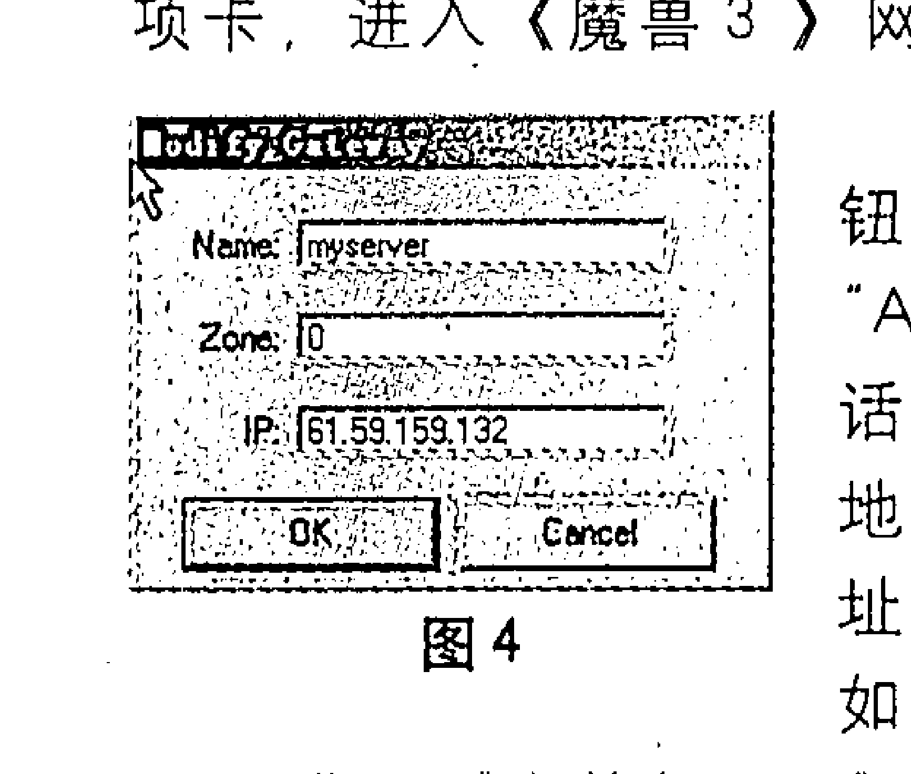

（2）点击“FTP站点”选项卡，修改“说明”文本框为自己站点的说明。保持“IP地址”栏不变，仍为“（全部未分配）”。

进入《魔兽争霸3》的安装目录，点击“w3l.exe”运行《魔兽争霸》，在游戏主界面点击“BATTLE.NET”按钮右侧的放大镜，你会发现刚刚添加的服务器已经出现在BATTLE.NET的服务器列表中。

（3）点击“安全帐号”选项卡，指定用于登录到FTP服务器账号。IIS默认是允许匿名登录的，建议采用默认设置。但如果你不想这样做，可以取消选择“允许匿名连接”复选框，然后在“用户名”选项处点击“浏览”按钮，从本地账号中选择一个具备适当权限的用户作为FTP的登录用户。

选中自己添加的那个服务器作为默认网关，点击“BATTLE.NET”按钮，如果能够看到BATTLE.NET用户登录/注册界面，说明你的《魔兽3》服务器已经架设成功。怎么样？赶快约几个朋友来爽一把如何？

（4）接下来点击“消息”选项卡，在这里设置用户登录上FTP时的信息，如欢迎信息和出错警告等等。此处可按用户喜好随意设置。

(5) 全部设置完毕后，点击“确定”按钮，至此 IIS 下的 FTP 服务器设置完成。

**小提示：**
匿名登录不代表不用任何用户名就可以登录到你的 FTP 上，它的用户名为 anonymous，密码为空。

### (二) 使用 Serv-U 建立 FTP 服务器

Windows 自带的 FTP 服务过于简单，可以说基本上没有什么管理功能。所以，如果您想有个比较正规的 FTP 服务器的话，还是多花点时间在这一节里面。

#### 1. 下载并安装 Serv-U

Serv-U 是个非常普及的专业 FTP 服务器工具。功能强大，使用方便。很有点“价格便宜，量又足”的味道。我们在很多网站都能找到它，可以从 http://www.skycn.com/soft/1240.html 下载到它的最新版本 Serv-U 5.2。

运行刚刚下载的安装程序进行安装，注意不要将 Serv-U 安装到系统程序目录，其他可按照安装向导提示，全部采用默认设置即可。

安装完毕后可直接在“开始” → “程序” → “Serv-U FTP Server”程序组中看到相关的执行文件。

#### 2. 建立 FTP 站点

点击“开始” → “程序” → “Serv-U FTP Server” → “Serv-U Administrator”命令运行 Serv-U 管理器，这时程序会自动弹出设置向导，使用向导即可方便地创建 FTP 站点。

连续点击“Next”按钮，直接进入 IP 设置对话框，在这里填入你的主机的 IP 地址，如图 5 所示。

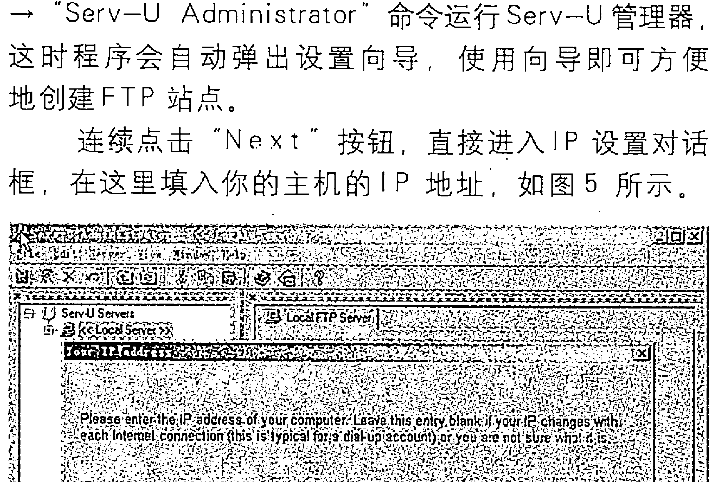

如果你的 IP 地址并不是固定的，那么你可以省略上一步，直接点击“Next”来为你的 FTP 站点设置域名。假设我们已经申请了一个叫做“ftp.myserver.com”的域名，那么就将这个域名输入地址栏后点击“Next”按钮即可。

接下来设置向导还会要求你进行一系列的设置工作，笔者在这里将它们一一列出，用户可按照自己的实际需要决定如何设置。

- Domain port number (服务端口)：默认为 21，用户可以自行改动，但必须将新设置的端口号告诉要登录你 FTP 服务器的人。
- Install as system server (是否安装成系统服务器)：选“Yes”。这样每次开机，系统就自动运行 Serv-U 服务。
- Allow anonymous access (是否允许匿名登录)：为了系统安全性考虑，最好选择“No”。
- Create named account (建立账号)：选择“Yes”。
- Account login name (输入用户名)：在这里输入你想要的用户名。
- Password：设定用户账号的密码。
- Home directory：选择该用户登录后的主目录。注意，千万不要图省事将主目录设定到磁盘驱动器的根目录上。
- Lock the users in to their home directory (是否锁定该用户到主目录中)：选择“Yes”。
- Account admin privilege (给用户授权)：如无必要，请使用默认项“No privilege”，这样可增强 FTP 服务器的安全性。

全部设置完毕后点击“Finish”按钮，即可完成建站过程。现在运行 Serv-U 管理器，可以看到左侧管理列表的 Domains (域) 节点下面已经多了一个站点。

到此，我们已经初步建立了一个 FTP 站点。接下来可以对你刚刚创建的账号进行权限设置，方法是：

在 Serv-U 左侧管理列表点击展开“Users”节点，选中我们刚刚用设置向导创建好的账号。在右侧设置面板中单击“Dir Access”（目录存取权限）选项卡。即可在权限设置面板对用户权限进行编辑，这些权限如表 4 所示。

### 表 4
| 项目名称 | 对应的权限 |
| :--- | :--- |
| Read | 读 |
| Write | 写 |
| Append | 写，并且允许用户追加文件 |
| Delete | 删除 |
| Execute | 执行权限（如无必要，不要开启此权限） |
| List | 是否可以显示文件和目录的列表 |
| Create | 建立新目录 |
| Remove | 修改目录，包括删除、移动、更名 |
| Inherit | 是否允许下级目录继承父目录的权限 |

朋友们可以按自己的实际需要对照表 4 进行设置，一般来说，如果只是让别人上来下载东西的话，那么开放 Read（读）和 List（显示文件和目录的列表）权限就可以了。

#### 3. 配合“花生壳”解决动态IP问题

要想使你的FTP服务器也能实现动态域名解析，也可以借助“花生壳”系统。方法和刚刚介绍的Web站点大同小异：首先访问http://www.oray.net申请“网域证书”，然后激活“花生壳”服务并建立域名记录。最后在Serv-U “Domain IP address”处填入你刚刚登记的域名。同时确保在架设FTP服务器的PC上运行有“花生壳”的客户端即可。

> > 提示：
使用最新版本的Serv-U，早期版本的Serv-U被发现存在某些漏洞。利用这些漏洞，入侵者可以很容易地获取更高的权限，进而对系统造成威胁。所以笔者在这里强烈建议大家，尽量使用Serv-U的最新版本架设FTP服务器。

## 四、BT服务器篇

刚刚介绍了如何建立自己的FTP服务器，使用FTP服务器，的确可以很方便地实现大量文件的交流，不过你也别期望太高。目前国内ADSL的速度有限，一般都被限制到512Kbps~2Mbps左右。这点带宽自己上网，下载个东西还算够用，可要是打算让几个人同时登录到你的FTP上下载文件，还真是有点勉为其难。为了解决这个问题，这章将介绍如何建立BT服务器，真正做到交流无极限。

### 1. 下载并安装BT服务端

一般来说，架设BT服务器，需要进行繁琐的工作，比如建立Python语言的解析环境，调试脚本等工作。这对一般家庭用户来说，难度较大，故此这里我们主要介绍使用“MyBT服务器”来快速建立自己的BT站点。访问站点http://www.mycodes.net/soft/1077.htm，下载“MyBT服务器”。这是一个压缩文件，直接将所有文件解压缩到E:\BTSERVER中。

### 2. 调试“MyBT服务器”

进入E:\BTSERVER中，双击“mybtEx.exe”启动“MyBT服务器”管理工具，可以看到“MyBT服务器”的管理界面主要由四部分组成：管理服务、目录设置、选项设置、系统设置。我们在实际使用中用不着那么多，只要设置前两部分即可。

在“管理服务”面板中点击“一键安装服务器”按钮，“MyBT服务器”就会自动安装系统服务，如图6所示。

点击“目录设置”选项卡，进入基本参数设置菜单，这里可供用户自行配置的项目有：

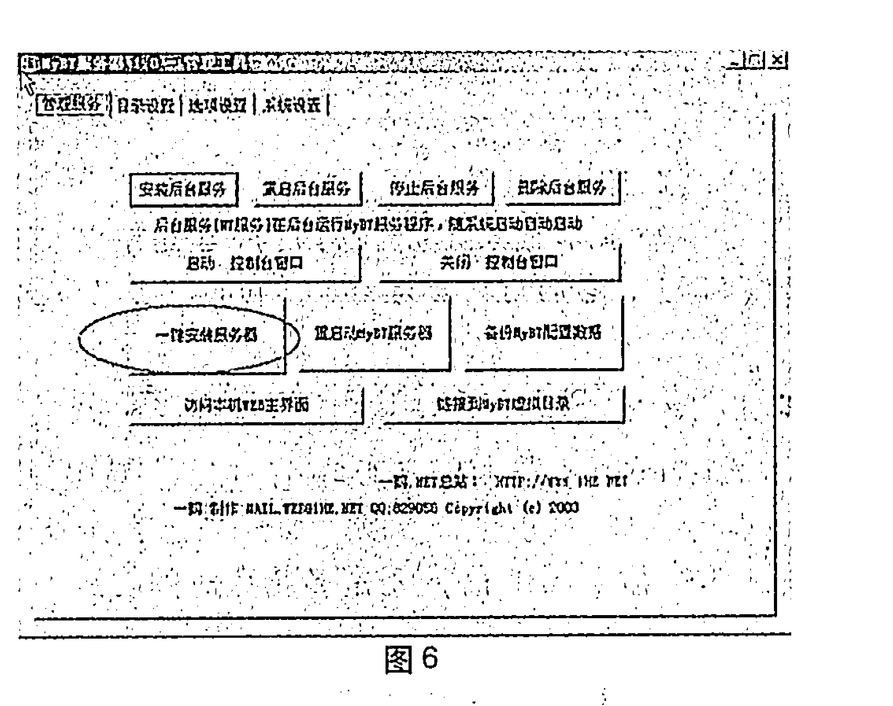

- (1) BT 发布主目录
“My BT 服务器”默认发布目录为“c:\mybt\Upload”，一般情况下，我们都不建议将任何共享目录放到系统盘，因此最好将它换个位置，如“E:\UPLOAD\”。
- (2) 上传种子目录
同BT发布主目录，修改为同一目录即可。
- (3) Announce URL
这个选项非常重要，Announce URL是别人制作BT种子时需要填写的地址，将http://localhost:6969/announce的localhost替换为你的本机地址，其他保持不变，如果你的IP地址并不固定，也可以填入你在“花生壳”登记的域名。
- (4) Web 页面设置
包括CSS样式表、上/下包含页面、HTML编码、条形图等项，通过修改这些设置，用户可以改变“MyBT服务器”提供的标准界面。
- (5) 下载分类
“MyBT服务器”提供了最多九类下载类别和对应的图标，用户可根据自己需要修改这些类别。

其他选项可保持不变，如需修改，可以自行参照有关说明进行，注意：有“!!”字样处为不建议修改项目，需小心设置。设置完毕后点击“保存修改”按钮将设置参数保存到“mybt.cfg”中。全部设置完成后，点击“管理服务”面板上的“重启后台服务”按钮应用设置，至此 BT 服务器的架设工作已经完成。

> > 提示：注意防火墙：用ADSL建站的时候，要注意本地防火墙的影响。对于Web、FTP服务来说，因为它们使用的都是常用端口，防火墙基本上都会对这些端口“网开一面”。而对于游戏、BT等服务来说，可能就没那么走运了，由于它们使用的端口基本上都是非常用端口，因此可能有的防火墙在默认状态下对这些端口是封闭的。因此，架设这些服务器的时候，首先要确保防火墙开放了这些端口的访问权限。

## 言之不尽的宽带下载与下载工具
文/王严刚

随着计算机的逐渐普及和 Internet 的迅速发展，越来越多的人开始用宽带上 网。网络上的资源丰富无比，所以要想应用和保存这些资源，下载是必不可少的操作。下面笔者就给大家介绍有哪些宽带下载的方法以及与之对应的下载工具。

## 一、大众化的HTTP

HTTP 作为最常见的网络下载方式已经顽强地生存了十几年，当前网络上的大部分免费资源都采用了这种下载方式，我们可以通过“网际快车”(FlashGet)、Net Transport(影音传送带)等软件来进行下载。

### (一) 老牌劲旅“网际快车”(FlashGet)

“网际快车”(FlashGet) 可是个老牌的 HTTP 下载工具，它通过把一个文件分成几个部分并且可以从不同的站点同时下载，从而成倍地提高速度，下载速度可以提高 100% 到 500%。它还能创建不限数目的类别，每个类别指定单独的文件目录，使下载前后均可轻易管理文件。

## 1. 使用篇

“网际快车”(FlashGet) 可以有多种方式完成文件的下载，比较常用的是以下三种：

- **(1) 拖曳链接地址到悬浮窗**

启动 FlashGet 软件后会在桌面多了一个小的浮动窗口（如果桌面没有显示这个浮动窗口，选择软件设置中的“查看”→“悬浮窗”命令即可），然后把要下载的链接用鼠标左键点住不放并拖曳入该窗口中，释放鼠标后就能显示具体下载功能界面。

- **(2) 右键快捷键**

第一种方式需要 FlashGet 是在已经运行的情况下才能完成，如果你想在下载文件时 FlashGet 并没有运行，则可以借助鼠标右键快捷键的操作方式来进行软件下载。在想要下载文件的链接处单击鼠标右键，从中直接点选“使用网际快车下载”就可完成对下载链接的选取工作。

- **(3) 手动添加下载任务**

在 FlashGet 的界面窗口中点击工具栏中的“新建”工具图标，弹出“添加新的下载任务”窗口，在其中的 URL 栏中输入你下载文件的链接地址，再点击“确定”按钮即可开始下载。

不管选取哪种方式操作下载工作，FlashGet 都会出现一个对话框。在这里我们如没特殊要求一般不做任何更改，为方便软件管理建议依据文件类型在类别选择中选择和目标软件相适应的类别。这样配置好后点击“确定”按钮，FlashGet 就开始下载你需要的文件了，在如图1所示的界面中可以看见文件的下载信息，包括下载速度、所需要的时间、完成进度等。文件下载完毕后，如果提前配置了防病毒扫描，这时系统将自动完成对已下载文件的病毒检查工作。

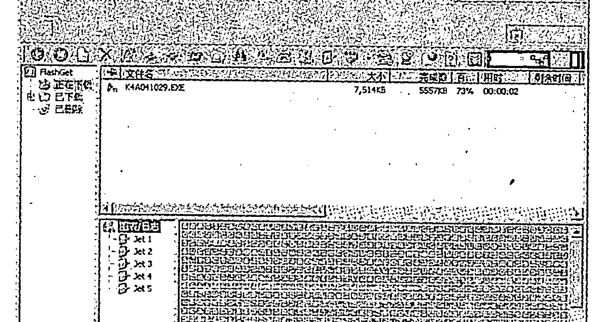

图1

## 2. 技巧篇

- **(1) 没注册码也能去除广告条**

FlashGet 是一款共享注册软件，在没输入注册码的情况下，主窗口会有一个广告条晃来晃去让人觉得很碍眼！那么 FlashGet 除了通过注册码移除广告条外，真的没其他办法了？当然不是，通过支持 16 进制文本编辑软件（如 UltraEdit）修改 FlashGet 原文件也可达到此目的。打开 UltraEdit 程序，点击工具栏的“打开”按钮，载入 “flashget.exe”，切换到 “0001c540h”这一行，把“88817C020000”更改为“B80100000090”（也可通过替换按钮进行替换）。

- **(2) 突破FlashGet下载极限**

FlashGet 默认的最大下载线程数是10个，最多同时进行的任务数是8。我们可以通过修改注册表的方法来改变其默认线程数和最多同时进行的任务数。

改变最大下载线程数的方法是：首先打开“注册表编辑器”，进入到“HKEY_CURRENT_USER\Software\JetCar\JetCar\General”子项，新建DWORD值，命名为“MaxParallelNum”并修改其键值数据为30（最大取值为30）。

改变最多同时进行的任务数：进入到“HKEY_CURRENT_USER\Software\JetCar\JetCar\General”子项，新建DWORD值，命名为“MaxSimJobs”并修改其键值数据为“30”（也可更改，但最大取值为32767）。

- **(3) 限制下载速度**

这里有人可能很不理解，哪有人嫌下载速度快的啊！别急，听我慢慢道来，其实限制下载速度是一个比较实用的功能。由于FlashGet下载时可以开很多进程，很可能无法正常进行浏览。这时我们可以在菜单“工具”中的“速度限制模式”选取适合的方式来限制FlashGet使用的带宽（有“无限制”、“手动模式”、“自动模式”三种选择），留出一部分带宽供浏览器使用。

- **(4) 下载完毕后播放多媒体文件**

想让你的FlashGet自动化程度更高些吗？比如在下载完一首歌曲或是影片后，让FlashGet能自动启用相关的应用程序打开它们。怎么样，听起来很神奇吧？我们可以通过“工具”→“选项”中的“文件管理”页选项来进行设置，只需选中“下载完毕后打开或者查看已下载的文件”的复选框，FlashGet就会在下载完多媒体文件后用相应的程序来打开它。当然我们还可以自行添加文件的类型，需要注意的是文件类型之间要用半角分号隔开。

- **(5) 修复已损坏的ZIP文件**

我们可能经常会遇到ZIP文件由于CRC校验出错而不能被解压的情况，现在好了，让FlashGet来帮助你吧。以前我们知道用FlashGet的右键功能可以修改用FlashGet下载的损坏文件，其实在电脑里的其他文件也是可以修复的。启动FlashGet，单击菜单“文件”→“添加文件”，弹出“添加以前下载的文件”对话框，选择损坏的ZIP文件并确定后，就到了“已下载”类别中。单击“已下载”文件夹图标；这时我们可以在FlashGet右边的窗口中看到刚才导入的受损文件。选中该文件并单击鼠标右键，在弹出菜单里选择“修复损坏的ZIP文件”，FlashGet就会检查这个ZIP文件的CRC校验并标出损坏区域，提示需要重新下载的大小，在获得确认后只下载损坏区域即可。

- **(6) 快速退出FlashGet**

在使用FlashGet的时候，如果想退出该软件，一般我们直接点击程序窗口上的“关闭”按钮来关闭程序，可结果是只把窗口关了，悬浮窗口还在，程序依旧在运行。其实软件作者有意这样做，是防止用户错误终止正在运行的程序，要退出只得在悬浮窗上单击鼠标右键选“退出”命令或者单击“文件”→“退出”等，很是麻烦。我们可以通过添加注册表关键值，使得我们点关闭按钮直接退出FlashGet。打开“注册表编辑器”，进入到“HKEY_CURRENT_USER\Software\JetCar\JetCar\General”子项，新建“DWORD”值，命名为“SCEXIT”并修改其键值数据为1，然后退出。这样，在使用FlashGet下载东西的时候，就可以直接点关闭按钮退出软件。相对以前的操作，方便了很多。

### （二）全能高手Net Transport（影音传送带）

Net Transport（影音传送带）是一款融合了流媒体下载软件StreamBox VCR和普通下载软件（如FlashGet）绝大部分功能的二合一软件。它的下载速度一流，CPU占用率低，尤其是在宽带上下载流媒体特别明显。内建易于使用的文件管理器，轻松实现按类别存放下载的文件。支持HTTP、FTP、MMS和RTSP下载，而且这些协议均能实现多线程断点续传，从而充分利用了用户所有的带宽。相信这款软件再经过一段时间的发展，将会成为FlashGet的接班人。

### 1.使用篇

Net Transport启动后，工作界面布局几乎和FlashGet一样，同时也有一个浮动窗口。在此笔者就不再赘述使用Net Transport对普通文件的下载（下载方法与FlashGet类似），我们主要介绍Net Transport的强项——下载流媒体。

（1）用鼠标单击主界面工具栏中的“新建”按钮，打开“添加新的任务”设置框，在该窗口的URL文本框中处，输入捕获到的流媒体文件的真实地址。查找流媒体文件的真实地址，笔者推荐使用“网络资源嗅探器”，它是个绿色软件，无需安装就可使用。首先打开某个媒体网站，在点击播放电影之前，先运行“网络资源嗅探器”，它的操作界面简洁明了，点击“启动监视”，“网络资源嗅探器”就会在播放器与媒体软件连接播放的时候侦测到电影的网址了。如果“网络资源嗅探器”没有找到网址的话，那就可能和你的网速有关，这时只要对网页刷新一两次就行了。要先点击“启动监视”然后再点击播放电影，如果先播放电影后侦测，你就很难侦测出电影实际地址了。侦测到网址后，只要双击里面的地址，它就会把地址自动复制到剪贴板中，我们再## 2. 技巧篇

### (1) 快速打开下载目录
想必大家都知道Net Transport下载文件的默认存放目录是C盘根目录，而为了方便安全、避免系统崩溃后下载文件丢失的情况出现，一般都是重新设置存放目录，比如设置到“X:\down”下。不过有时下载完文件后，得重新打开“我的电脑”，进入到down目录下查看下载的文件，比较麻烦。其实我们可以直接按【Ctrl+Enter】组合键即可进入下载目录，去查看下载的文件（快捷键对FlashGet和Net Transport这两款下载工具都有效果）。对于悬浮窗状态而无程序窗口显示时是没有用的。

### (2) 支持更多线程
Net Transport默认的每个下载任务最多只能开10个线程，一般来说这可以满足绝大部分用户的要求，如果你感觉仍不够用的话，也可以通过修改注册表数据来加大线程。打开“注册表编辑器”，进入到“HKEY_CURRENT_USER\Software\XnNetTransport\Download”子项，新建DWORD值，命名为MaxThreads，将其数据修改为128即可。

### (3) 让下载文件排队
在Net Transport的下载窗口中，如果想让某个文件优先下载，可以在选中该文件后，单击工具栏中的“上移”或“下移”按钮来调整排列顺序，从而让重要文件提前下载。

### (4) 多服务器下载
Net Transport同样支持代理设置，不过它的代理设置功能更强大，允许下载任务的每个线程使用不同的代理服务器，非常适合那些只允许每个IP一个连接的站点，彻底突破某些站点的连接限制。在下载任务添加对话框中单击“代理设置”按钮，选择“多代理”选项，然后就可以点击每个线程后面的代理列表进行选择。

### (5) 巧改协议下载流媒体
Net Transport虽说是一个支持HTTP、FTP、MMS和RTSP协议的下载工具，但我们在使用时偶尔也会遇到下载不了的情况。这时我们不妨在下载协议上做做手脚尝试一下，也许就会成功哦。虽然Net Transport不直接支持PNM协议，但要下载PNM协议文件，可以将PNM改成“rtsp://site:7070/……”试试，其中7070是PNM的默认端口号。如果某个RTSP文件不能下载，可以将RTSP改为HTTP，但要注意去掉RTSP的默认端口号554，当作普通文件直接下载。

## 二、内容丰富的FTP

FTP是以它所使用的协议——文件传输协议（File Transfer Protocol）来命名的，顾名思义，它的任务是从一台计算机将文件传送到另一台计算机。遍布在Internet每个角落的FTP服务器里面，隐藏着比HTTP更丰富的资源。可以这样说，无论从信息的数量还是种类上都比HTTP有过之而无不及。

在网上使用最多的服务，除了HTTP网页以外，最多的就属FTP文件传输了。PowerFTP是一个操作简易的FTP客户端软件，内嵌多线程下载和上传功能，即可同时用多个线程下载一个文件或同时用多个线程上传多个文件，从而极大地提高了我们从FTP站点下载上传文件的效率。

## 1. 使用篇

要进行FTP下载，首先要知道FTP站点的地址、用户名以及密码。所以在使用PowerFTP之前要先在其中添加FTP站点，运行PowerFTP，单击“站点”→“站点管理器”命令，在弹出的窗口中选择新建站点所属的组（当然我们也可以自己新建一个组），然后在右边的FTP站点属性栏中输入站点的名称、地址、端口号以及登录的用户名和密码，再单击“确定”按钮以完成（图2）。添加完毕后，双击站点进行FTP连接（我们还可以在主窗口中直接进行站点的名称、地址、端口号以及登录的用户名和密码的添加，输入完毕后单击“站点”→“添加当前站点”命令，选择合适的组，输入相应的名称，点击“确定”按钮即可）。连接到服务器以后，PowerFTP的窗口会显示左右两个窗格，左边的窗格显示本地硬盘的文件列表，右边的窗格则显示远程硬盘上的文件列表，文件列表的显示方式和Windows的“资源管理器”完全一样，操作也是大同小异（图3）。下载可以通过拖曳文件或者右键菜单的方式来完成。在“传输”窗口中可以看到下载的进度，我们可以在“工具”→“选项”中的“多线程”的菜单选项中配置自动多线程功能。如果要激活PowerFTP的自启动多线程功能，只要选中“启用拆分下载”复选框即可。另外我们还可以配置促使自启动文件的最小尺寸，它主要实现当要下载文件超过这个数值时，PowerFTP程序将自动启动多线程下载功能。在下载的过程中如果觉得下载速度还不怎么快的话，PowerFTP还可以人为地增加线程来加快下载速度，这时只需在主窗口中点击“增加线程”按钮即可。

## 2. 技巧篇

PowerFTP能够将一个FTP站点上的文件直接传送到另一个FTP站点上，这就是所谓的FXP传输方式。如果你要将其他FTP站点上的“好东东”搬到自己网站上，运用此功能就太方便啦。下面就让我们来看看是如何操作的：
首先使用“站点管理器”或“快速连接”登录到一个FTP站点，再次启动PowerFTP，这样桌面上就同时打开了两个PowerFTP窗口。在第二次启动的PowerFTP中，登录另一个FTP站点（或你的网站）。然后从一个PowerFTP窗口的远程文件列表中选择所需要的文件，并直接拖放到另一个PowerFTP窗口（或你的网站）的远程文件列表中，一场“乾坤大挪移”的戏法就开始了！

## 三、颇受欢迎的BT下载

FTP和HTTP下载是最经典的下载方式，但是时至今日，随着网络的快速发展，FTP和HTTP渐渐受到全新的下载理念和工具的挑战，那就是P2P。P2P是Peer To Peer的缩写，意为“点对点”，P2P让用户可以直接连接到其他用户的计算机，进行文件共享与交换。一个下载者不再是简单的“下载”者，他既要下载，又要充当服务器把自己已经下载的文件或者某些已经下载的部分提供给其他用户使用，使互联网上的每一台计算机成为一个服务器。
BitTorrent（简称BT）是一个支持多点下载的P2P源码软件。以往的FTP、HTTP下载方式对于网络带宽的要求相当苛刻，如果下载的用户过多，服务器往往会因不堪重负而挂掉。为了避免这种现象的发生，好多下载服务器都设置了用户人数的限制，并且对下载速度也做出了苛刻规定，这给追求工作效率的玩家带来了诸多不便。而BitTorrent采用全新的集群下载方式，也就是说它在不限制下载带宽和连接线程的情况下仍能提供高速下载服务，下载的人越多，下载速度不下降反而越快，相比之下普通的下载速度只能望其项背了。
BitComet是基于BitTorrent协议的高效P2P免费共享软件，支持多任务下载，还可以对文件进行有选择的下载，高磁盘缓存的设定能减小对硬盘的损伤，在Windows XP下能自动配置支持UPnP的NAT和XP防火墙，续传做种免扫描。特有的内网互联（NAT Traversal）技术，能自动实现不同内网间的互联传输，让处于内网中的朋友在下载的时候一样可以获得非常快的速度。

## 1. 使用篇

BT下载最关键的步骤就是寻找可用的Torrent文件，而在BitComet主界面的左侧内置了国内数个著名的BT发布站点和搜索站点，这样能让用户拥有非常丰富的软件库和电影库，双击其中的站点就可在IE中打开。双击下载下来的Torrent文件后，程序就会自动运行BitComet，并弹出一个任务属性的窗口，在该窗口中我们可以看到BT种子中包含的所有文件的名字和大小，还有上传下载的速率等等。勾选其中想要下载的文件就能实现选择性的下载（图4），单击“确定”就可以进行BT疯狂下载了。如果长时间使用BT大量地读取数据，可能硬盘的负荷非常严重，而BitComet却很好地支持用户自定义磁盘缓存大小来减轻硬盘的负担。在“选项”→“磁盘缓存”中可以进行磁盘续存设置，具体使用的数值视电脑内存的大小而定，如果内存比较充裕可设置得大些。

由于BT工作原理的特殊性，对于内网用户来说使用一般的BT客户端软件来下载文件是非常痛苦的，要么连不上，要么速度慢得让人受不了，通常我们可以使用内网做端口映射的办法来解决这个问题。而BitComet已经内置了对UPnP (Universal Plug and Play 通用即插即用，也可以理解为自动端口映射) 端口映射的支持，这样可以让不同内网的用户连接实现互连，就意味着能得到更快的下载速度。我们只要选中“选项”中的“允许使用UPnP自动端口映射”复选框，就能让BitComet与其他的BT下载工具变得与众不同！

## 2. 技巧篇

### (1) 鼠标拖动也BT
许多软件都支持鼠标拖动的操作，而BitComet也同样支持这样的技巧。如果我们打开Torrent文件，除了双击之外还可以直接把该Torrent文件拖到BitComet窗口中来打开它，如果选中多个Torrent文件，然后拖动到BitComet主窗口中就可以一次加入很多Torrent。此外，我们将某个文件或目录拖动到BitComet窗口中，还可以快速打开种子制作窗口。

### (2) 未完成的文件也能继续下载
在进行BT下载的过程中经常碰上文件下载了其中某一部分后，种子源关闭而不能继续下载的情况。如果我们能找到与已下载的文件一致的种子（如果文件名字不相同，可以手动修改本地未完成的文件名与之对应），就可以把未完成的文件继续下载。在Torrent文件下载后所弹出的“任务属性”对话框中切换至“高级设置”选项卡，把“服务器列表”里的地址复制下来。回到BitComet的主窗口，在下载列表中找到没下载完的文件，打开右键菜单然后选择“属性”命令，打开其“任务属性”窗口，切换至“高级设置”选项卡，然后把刚才找到的新服务器覆盖或添加列表中，单击“确定”即可继续下载。

## 四、其他P2P软件

除BT之外，还有许多优秀的P2P软件，这里我们介绍两款最具代表性的P2P下载工具。

## (一) 骑驴“下”天下eMule(电驴)

eMule是一款P2P下载工具，和其他P2P工具比起来，网上可供“电驴”下载的资源很多，下载速度更快，通过它我们就可以与全世界的驴友们共享文件了。

## 1. 使用篇

当我们需要使用eMule下载某个文件时，可以首先进行搜索，然后将其添加到下载列表中，操作步骤是：
首先在主工具栏上单击“搜索”按钮，进入搜索状态。接着在搜索界面左侧的“名字”下面输入关键词，如果你嫌搜索结果数量太多可以输入更多的关键词来缩小搜索范围。另外在下面的“类型”列表中还可以选择文件类型，比如“视频”、“软件”、“文档”等等。最下面的Parameter可以用来进行更加细致的条件设置，比方说文件的大小、扩展名等等都可以进行设置，简直比在自己的硬盘上进行搜索还要方便。在上一步中设好关键词后点击“开始”按钮，窗口右侧会出现一个选项卡显示出搜索结果，选中一个条目，单击鼠标右键，选择“下载”就可以开始下载了。

P2P毕竟是一个“我为人人，人人为我”的世界，如果都想着怎么下载别人的东西，自己不做一点贡献，迟早有一天大家都会没得下了，所以，我们在下载资源的同时，还应共享一些资源让大家分享。在eMule中共享一个文件的方法是将它们拷贝到一个固定的文件夹中，然后将这个文件夹设置为供网络用户共享，除了设置共享文件夹的位置之外不需要进行其他的操作，这比起BT来说要方便很多。需要注意的是共享文件夹中的所有文件是其他人都可以访问的，所以最好不要将某个硬盘的根目录共享，没准硬盘上某个角落里面放着你的私人文件，当然了，重要的私人文件夹就更不能设置为共享了。共享和发布文件的详细步骤如下：

- (1) 在eMule的主界面中单击工具栏上的“选项”按钮打开设置窗口。
- (2) 接着在选项设置对话框中单击左侧列表中的“目录”条目。
- (3) 在右侧的“共享目录”下面选择共享目录，可以选择多个。
- (4) 完成以上设置之后，单击“确定”按钮回到eMule的主界面中，单击主工具栏上的“共享文件”按钮，在这里会列出刚才选中的“共享文件夹”中的所有文件。这样其他人就可以通过eMule的搜索功能找到并下载你的这些文件了。
- (5) 为了让更多的人知道你有哪些下载资源，我们有时还必须取得eMule的资源链接，然后到网站上去发布。在共享文件列表中选中某个文件，单击鼠标右键，选择“查看eD2K链接”命令，再点击“复制到剪贴板”按钮（图5）。然后到资源发布网站上将你的链接贴出来，这样别人就可以下载了。顺便说一下，在eMule中踊跃发布文件是有“奖赏”的噢，只要你发布的文件下载的人多，你的eMule积分就越高，以后你下载的时候速度就会更快。

## 2. 技巧篇

在eMule中，将外网用户称为High ID，而将内网用户称为Low ID。High ID就是拥有独立公网IP并且能提供端口（默认4662）给eMule工作的用户。这种用户可以和任何eMule兼容客户端建立连接并下载。Low ID一般都是没有公网IP的内网用户，两个Low ID用户之间是无法直接连接的，所以Low ID的用户下载源会相对少一点（无法从其他Low ID用户那里下载）。从目前的情况来看，国内是Low ID的驴子占大多数，也就是这大多数的用户之间是无法通信的，所以成为一个High ID就显得非常的必要。

这时我们可以利用VNN (Virtual Native Network) 向Low ID说“不”，通过它可以使处于内网（NAT设备或者SOCKS服务器后的、使用私网IP地址的子网）的机器可以与处于内网的另一台机器进行“透明”通信。VNN帮助实现需要运行于内网机器上的网络应用忽略NAT设备的存在。首先到其官方网站下载最新版本（http://www.vnn.cn/cn/cn.html），安装完毕后电脑会出现一个虚拟网卡，初次使用要先申请VNN服务的帐号。再用申请到的VNN服务的帐号、密码登录VNN服务，这时虚拟网卡会得到一个10.140.XXX.XXX的IP地址。之后VNN程序会最小化到屏幕右下方的系统托盘，图标上显示VN字样。再打开eMule进入选项连接，选中VKad后点击“确认”按钮。这样下载文件时，eMule会自动从VNN用户中搜索来源，从而加快了下载速度。

## （二）音乐下载尖兵KuGoo（酷狗）

KuGoo是国内第一款专业的音乐P2P传输软件，为爱好音乐的网友们提供了一个共享音乐和互相交流的平台。只要你的计算机能够连接到Internet，就可以随时随地和其他网友一起共享包括音乐、影片、软件、游戏、图片等其他文件。

## 1. 使用篇

第一次使用KuGoo（酷狗）必须先注册一个用户名，其步骤和QQ的注册是一样的，接着就要先把你电脑上的音乐目录共享出来，我为人人，人人才能为我嘛！通过KuGoo（酷狗）的“导航界面”可以得到目前最新最好听的专辑和单曲，让我们在第一时间了解流行音乐的最新动态。除列出了“最新专辑”、“歌手列表”和“酷狗推荐”，KuGoo还为爱乐的用户们提供了一个畅所欲言的天地——“音乐论坛”，在论坛里用户们可以自由参加音乐方面的交流和讨论，还可进行互动找歌，让好听的歌曲大家一起分享。OK！接着到了激动人心的酷歌下载了，点击“搜索传输”按钮，我们可以通过三种方式从中搜索自己想要的歌曲：

- (1) 在“搜索我喜欢的音乐”栏中输入所要搜索的歌曲名或者歌手名作为关键字进行搜索。
- (2) 在“按用户号查找”栏输入你想查找的用户名，然后点击“查找”按钮，就可以看到对方共享的音乐文件。
- (3) 按歌手进行搜索歌曲，在歌手列表中选择你所要查找的歌手，就可以看到该歌手的所有共享歌曲。

## 2. 技巧篇

### （1）如何快速地下载歌曲

A. 内网与外网用户的下载源选择
如果你是外网用户，当然可以随便下载任何一个KuGoo在线用户的文件，但建议选择内网用户的文件进行下载，因为一般内网用户都较空闲，这样内网用户的带宽就可以让你一人使用，从而使得下载速度达到极限。而如果你是内网用户，在下载源充分的情况下（即此文件拥有者超过4个以上），要尽可能选择外网的用户进行下载，这样有利于下载成功率的提高。

B. 选择下载源众多的文件进行下载
如果下载源有超过5个以上的文件，这样的文件是肯定可以下载的，因为就算里面有一两个用户可能繁忙或有其他的问题不能下载，KuGoo会自动选择其他下载源进行下载。

C. 尽量把下载方加为好友
在KuGoo中，如果两人是好友关系，则他们之间的下载传输会更通畅，因为KuGoo会在后台为他们建立一个专用的传输通道，下载时减少了很多其他的操作。所以如果我们发现一些很不错的网友，而且他的音乐非常的多，带宽也很大，哈，最好的方法是快把他加为好友哟！

### （2）歌曲巧搜索

如果你想搜索某部电视剧的主题曲，却忘记了那首歌名字的话，只需输入电视剧的名字，一般都能找到它的主题曲。比如你要下载《金枝欲孽》主题曲《儿女》，只要输入“金枝欲孽”，就能找到《儿女》。

## 智能ABC输入法技巧

### 词组输入
在输入常用词组的时候，可以只输入该词组的拼音字母或者声母。例如输入“xx”可以很快地得到词组“学校”。但是因为汉语拼音输入重码率比较高，我们可以选择在输入词组时，构成词组的单字有的取全拼，有的则取简拼。比如输入“xuex”立刻得到“学校”这个词。从而在按键次数与汉字重码率中得到最佳结合点，提高汉字录入速度。

### 符号输入
在输入希腊字母、日文片假名、平假名以及一些常用的数学符号时，除了利用Word中的插入符号功能，还可利用“智能ABC”软键盘来输入。直接单击输入法状态条上的软键盘按钮，立即弹出与键盘字母一致的PC软键盘。而右击软键盘按钮，我们可以选择各种特殊软键盘，如希腊字母、俄文字母、汉语拼音、数字序号、常用单位符号等，从而实现符号的快速输入。

### 自造词
在汉字录入过程中，不可避免会遇到字库中没有的词语，“智能ABC”可自动把我们输入的一组拼音定义为词条，存入到词库中。重复输入该词3次它就永久性地存在词库里。“智能ABC”还提供了另一种自造词的方法，即人工定义新词，但实际输入时必须以字母“u”打头。

### 使用词汇输入
“智能ABC输入法”的词库不仅具有一般的词汇，也收入了一些常见方言词语和专门术语、国家名称及大城市名等；此外还有一些常用的口语和数词、序数词等。这些词汇可以通过取每个字的声母快速输入，比如要输入“计算机”，我们只需键入“jsj”即可。

# “闪客”是这样炼成的——多种文件转换成 Flash

文/怪鸭兽

很多“菜鸟们”不想费神去一步一步地学习Flash制作教程，也不懂“帧”、“层”、“色彩”等专业术语。没关系，我们可以将各种视频文件、图形文件、PowerPoint文档、Word文档等转换成Flash文件。对于不懂Flash设计的人来说，只要通过一些工具的帮忙，就可以圆你一个设计个性化Flash作品的愿望！

## 一、视频文件转换成 Flash

Vid2Flash 小档案

| 属性 | 详情 |
| :--- | :--- |
| 最新版本 | 2.9.8.5 |
| 软件大小 | 330KB |
| 授权方式 | 共享软件 |
| 运行平台 | Windows 9x/Me/NT/2000/XP |
| 下载地址 | http://www.javakitty.com/vid2flash/vid2flash_zip.exe |

Vid2Flash 是一个极富特色的格式转换程序，它可以把AVI、MPEG、MOV等视频文件转变为Flash动画。具体操作步骤如下：

- 1. 第一步：打开Vid2Flash的主界面，单击“Browse”（浏览）按钮选择需要转换的视频文件（见图1）。
- 2. 第二步：在“Frame rate”（帧率）数值框中，设置转换成Flash后动画每秒的播放帧数目，设置的值越大表示播放速度越快。
- 3. 第三步：在“Quality”（品质）数值框中，设置转换后动画的质量，设置的值越小，转换后的动画体积就越小。
- 4. 第四步：再单击“Soundtrack”（音轨）按钮，这里可以设置声音的调用方式。默认情况下，是选中“Encode audio”（开启音频）复选框，下面有两种方式：“Use internal audio track”（使用内置的音轨）和“Use external audio from”（使用外部的音频文件）。其中，选择前者直接转换影片文件中的声音，而选择后者则调用外部的WAV格式声音文件，因为Vid2Flash对MPEG和MOV格式的影片支持不好，只能进行图片转换，所以在你转换这些格式的文件时，你可以为转换后的动画单独添加声音文件。
- 5. 第五步：单击“Generate”（生成）按钮，即可进行文件的转换了，转换的时间取决于文件的大小和设置的品质高低。

转换完成并按“Preview”（预览）按钮后，单击“Save As”（另存为）按钮把转换成的Flash文件保存上。转化后的Flash文件可以使用Flash播放器或IE进行播放。

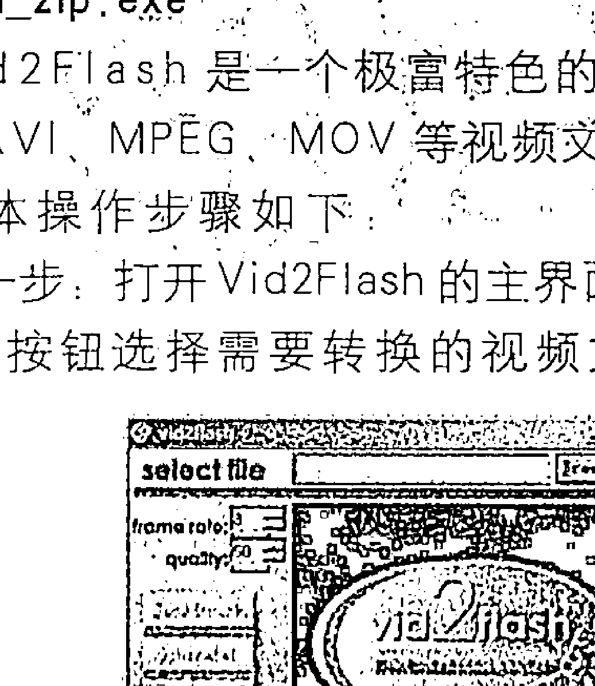

## 二、图像文件转换成 Flash

GIF2SWF 小档案

| 属性 | 详情 |
| :--- | :--- |
| 最新版本 | 2.5 汉化版 |
| 软件大小 | 475KB |
| 授权方式 | 免费软件 |
| 运行平台 | Windows 9x/Me/NT/2000/XP |
| 下载地址 | http://nj2.onlinedown.net/down/HA_GIF2SWF25_OFA.rar |

如果你想将图像文件转换成Flash文件，其实之前介绍的Vid2Flash也可以实现。只不过Vid2Flash只能实现是单个文件进行转换，而不是实现批量转换。所以，我们可以利用GIF2SWF单独或批量将你计算机中的gif动画转换为十分流行的Flash动画。

- 1. 第一步：打开GIF2SWF的主界面，单击“添加文件”按钮选择需要转换的gif文件。如果需要批量转换文件，只需要在打开的文件夹中选择你想转换的gif文件，也可以多次点击“添加文件”按钮进行添加。
- 2. 第二步：在“选项”下可以选择动画的循环方式，一般我们是选择默认的循环方式。如果你还想为转换后的Flash文件添加超级链接，那么可以选中“添加URL”复选框，然后输入绝对地址的网址，如：http://www.intdigi.net。

小提示：如果你想批量转换文件，最好不要选中“添加 URL”复选框，否则的话所有添加的文件都会指向同一个超级链接。

- 3. 第三步：单击“转换”按钮，即可进行文件的转换了。软件的转换速度很快，转换后的效果与原 gif 文件完全相同。

转换后的 swf 文件就在你所打开文件所在的文件夹中，而且会自动生成含有该 Flash 动画的网页。

## 三、PPT 文件转换成 Flash

PowerPoint to Flash 小档案

| 属性 | 详情 |
| :--- | :--- |
| 最新版本 | 1.6 |
| 软件大小 | 705KB |
| 授权方式 | 共享软件 |
| 运行平台 | Windows 9x/Me/NT/2000/XP |
| 下载地址 | http://www.dreamingsoft.com/download/pfsetup.exe |

很多办公一族都经常要制作一些 PowerPoint 幻灯片，对于自己精心设计的 PPT 文件，你肯定会想办法向别人展示。如果在展示过程中，你不想别人随意窃取自己的“创意”，也不希望自己的作品必须在 PowerPoint 环境中才能打开，该怎样才能实现呢？其实你可以利用 PowerPoint to Flash 工具，将 PPT 文件转换为 Flash 文件，这样不就行了。如果你将转换后的 Flash 发布到网页中，对方只要打开浏览器，就能轻易欣赏你的杰作，而不再需要运行 PowerPoint 程序了。具体操作步骤如下：

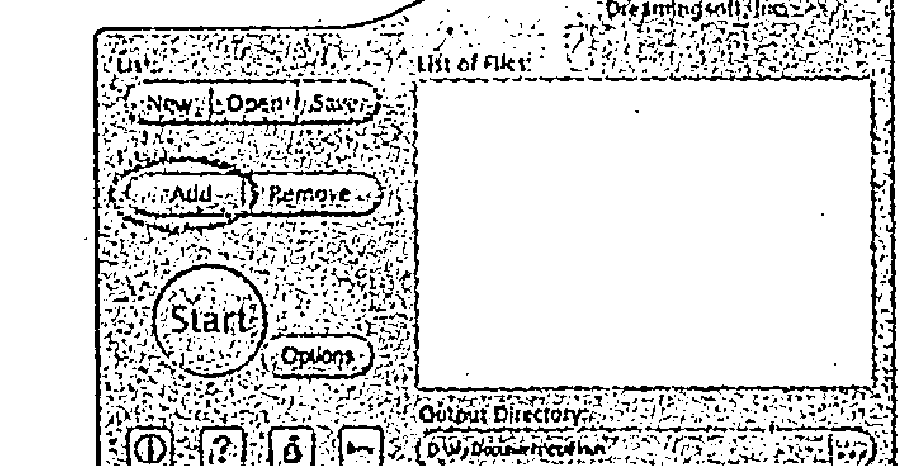

- - 第一步：打开 PowerPoint to Flash 的主界面（见图2），利用当中简单的几个功能按钮，你就能轻松将 PowerPoint 幻灯片转换为 Flash 了。单击主界面中的“ADD”按钮，在随后弹出的文件选择对话框中，将要转换的文件选中，再单击“打开”按钮，就能将 PowerPoint 作品导入到 PowerPoint to Flash 程序中了。
- - 第二步：在“Output Directory”（输出目录）下方单击浏览按钮，在弹出的文件夹保存对话框中，选中一个合适的目录，作为保存转换后的 Flash 文件的文件夹。
- - 第三步：这时候我们还不能进行转换，因为采用默认设置，转换后的 Flash 文件的动画品质和大小比例与原来的文件会有所偏差。这时应单击“Options”（设置）按钮，切换到“Quality”（品质）选项卡，在“Frame size”中选择适当的尺寸（单位：像素），在“JPEG quality”（JPEG 品质）中建议选择“100%”，单击“确定”按钮返回。
- - 第四步：现在就可以单击“Start”按钮，PowerPoint to Flash 就会自动弹出一个进程指示条，来提示你 PowerPoint 文件的转换进度。

转换结束后，程序就能自动打开 Flash 作品的保存目录。当然，你也可以单击主界面中的“Save”按钮，将当前没有转换完毕的文档，暂时保存起来，以便下次单击“Open”按钮，来继续完成上次没有结束的文档转换任务。

## 四、DOC 文件转换成 Flash

Macromedia Flash Paper 小档案

| 属性 | 详情 |
| :--- | :--- |
| 最新版本 | 2.0 |
| 软件大小 | 14468KB |
| 授权方式 | 共享软件 |
| 运行平台 | Windows 9x/Me/NT/2000/XP |
| 下载地址 | http://zj.onlinedown.net/down/FlashPaper2Installer-en.zip |

如果想把自己的 Word 文件发布到网上和别人共享，一般都是直接保存为网页格式，但是这样会改变原先的排版格式。其实我们可以用 Macromedia Flash Paper 工具，将 Word 文件通过简单的设置转换为 SWF 格式的 Flash 动画，原文档的排版样式和字体显示不会受到影响。这样做的好处是不论对方的平台和语言版本是什么，都可以自由地观看你所制作的电子文档动画，并可以进行自由地放大、缩小和打印、翻页等操作，对文档的传播非常有好处，而且由于 Flash 动画的普及性和强大的可调节性，可以让你制作出非常漂亮的专业电子文档。

- - 第一步：下载并安装好 Macromedia Flash Paper 后，会在 Word 程序中多了一个“FlashPaper”的菜单项。
- - 第二步：打开要进行转换的文件；接着点击“FlashPaper → Convert to Macromedia Flash(.swf)”菜单（见图3），选择保存 Flash 文件的目录和文件名，然后就可以进行转换了。

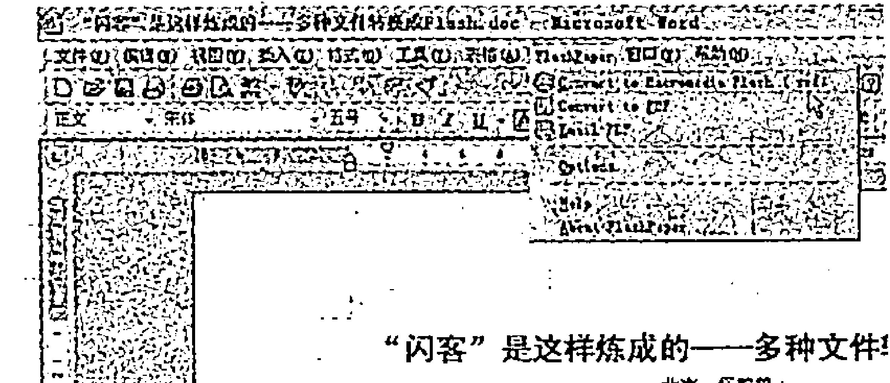

转换完成后会在指定的目录下生成一个 Flash 文件，打开此文件后你会看到文档的版式一点都没有变，而且文件的顶端还有外观精美的控制按钮（如缩放、翻页、打印等）。

# TC 精彩教程

文/王志军

软件信息

| 属性 | 详情 |
| :--- | :--- |
| 软件名称 | Total Commander |
| 最新版本 | 6.03a |
| 使用授权 | 共享 |
| 软件大小 | 1.4MB |
| 适用平台 | Windows 3.1/95/98/ME/NT/2000/XP/Server 2003/CE/Pocket PC |
| 软件主页 | http://www.ghisler.com |

TC（Total Commander）是功能远远赶超资源管理器的一款文件管理工具，很多朋友对TC都是情有独钟，其实除了功能超强之外，TC还有许多细节之处值得我们留恋，例如，安装相应的插件后，可以将TC作为压缩软件、看图软件、媒体播放软件、FTP软件和Office文档阅读器等来使用。

## 一、历史不能忘记

可能有许多朋友对TC的历史还不是太清楚，其实早在DOS时代，TC就以Windows Commander的名称与DOS Commander Center、DOS Controller、Norton Commander等软件齐名，而Windows Commander独创的双窗格操作界面已成为文件管理软件的标准界面。进入Windows时代之后，以上软件只有Windows Commander一直坚持下来，不过从5.50版本起，迫于微软公司的巨大压力，微软认为Windows Commander名称中的“Windows”侵犯了自家的商标版权，因此不得不更名为Total Commander。

虽然软件的名称发生了变化，但功能却更加强大，使用的用户也越来越多，目前的最新版本是6.03a，更难得的是TC虽然是一款共享软件，但未注册用户使用时只会在每次启动时弹出一个对话框要求用户选择相应的数字，并不影响你使用完整功能，而且TC还提供了包括简体中文在内的多国语言包，确实是非常难得。

## 二、认识TC的窗口界面

如图1所示，其窗口界面主要由菜单栏、工具栏、驱动器按钮、操作窗格、状态栏、命令行和功能键等几部分组成。

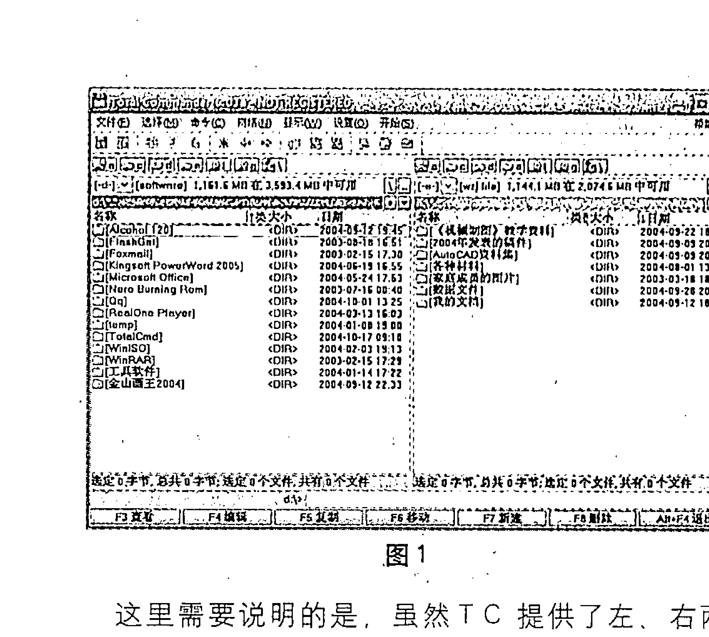

这里需要说明的是，虽然TC提供了左、右两个窗格，但无论进行任何操作，我们只能在同一时间内激活其中某一个窗格，而无法同时进行操作。

## 三、掌握TC的常规操作

TC的双窗格可以显示相同的内容；也可以显示不同的内容，这样无论是复制、移动、解压缩还是显示文件内容，就都变得非常方便了。

我们使用TC最主要的目的当然是用来替代Windows自带的资源管理器，例如，完成复制、移动、删除、重命名、新建等常规操作，而且TC在执行复制、移动、删除等文件操作时，允许跳过某些文件而继续后面的操作，而资源管理器一旦出现这种情况则会导致整个操作失败。一般来说，我们可以采取如下几种操作方式：

### 1. 直接拖曳

在执行复制、移动等文件操作时，TC会自动检测目标盘的可用空间，而资源管理器却是“事后诸葛亮”。

### 2. 功能键

在窗口底部有一排功能键按钮，点击后即可实现相应的功能，不过由于大部分操作还需要再一次进行确认，因此颇为麻烦。

### 3. 快捷键

在TC中，用户可以使用以上快捷键简化操作：

- F3：用来查看文本文件的内容，安装插件后还可以在 Total Commander 中直接查看 DOC、XLS 格式的文件，也可以用来播放 MP3 音乐和 AVI 影片，查看 BMP/JPEG 等格式的图片文件。
- F4：可调用默认程序编辑文本文件。
- F5：复制文件。
- Shift+F5：将文件复制到当前窗格所在的文件夹中。
- F6：移动文件，将选中的文件移动到另一窗格中。
- Shift+F6：文件重命名。
- F7：新建文件夹，可以一次输入多级目录。
- F8/Del：删除文件到回收站，如果按住 Shift 键的话，则直接删除而不进入回收站。
- Alt+F5：压缩文件。
- Alt+Shift+F5：压缩文件的同时删除原文件；也就是说将文件转移到压缩包中。
- Alt+F6/Alt+F9：解压缩文件，可以同时选中多个压缩包文件一次性解压缩。
- Ctrl+PageDown：打开 EXE 格式的自解压文件查看其中某个文件的内容，这样就不会自动运行了。
- Ctrl+D：常用文件夹列表，把你经常要用到的文件夹放在这个列表里。
- Alt+ ↓：历史文件夹列表，可以快速回溯到你曾经到过的某个文件夹。
- Alt+Shift+Enter：计算当前窗格下所有文件夹的占用空间，设置后再点击顶栏的“大小”可使文件夹参与排序，迅速找到占用空间最大的文件夹。
- Ctrl+M：批量更改文件名。
- Alt+F7：打开搜索对话框。
- Shift+Alt+F9：校验压缩文档，检验下载的东西很方便，功能较 WinRAR 要强大的多。

> 小提示：如果我们在“我的电脑”或“资源管理器”中从光盘中复制文件，那么会同时将“只读”属性一并复制过来，而 TC 则会自动更改为“存档”属性，这样就方便多了。

> 小技巧：在选择文件时，除了默认的鼠标右键选择方式外，我们也可以用小键盘上的【+】键扩大选择指定类型的文件；【-】键减少选择指定类型的文件；【*】键反向选择。

## 四、掌握 TC 的常规设置

打开如图 2 所示的 “设置” 对话框，所有设置工作均在这里完成。

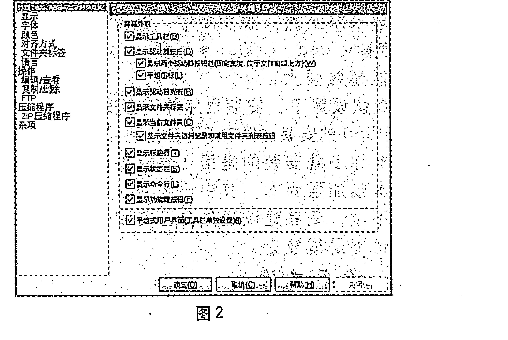

### 1. 外观

这里包括显示、字体、颜色、对齐方式、文件标签、语言等项目的设置。

### 2. 操作设置

这里包括“编辑/查看”、“复制/删除”、FTP 等项目的设置。

默认设置下，TC 只允许一个 Total Commander 程序同时运行，而且像 NC 一样使用鼠标右键选择文件，如果你觉得不太习惯的话，可以重新设置为使用鼠标左键选择。

### 3. 压缩

即使不安装相应的支持软件，TC 也可以对 ARJ、LHA、RAR、UC2、ACE、TAR、ZIP 格式的压缩文件提供支持，自然这是使用了 TC 内置的程序，当然如果你安装了相应程序的话也可以重新定位。压缩时，也可以选择不同的压缩方式。

### 4. 杂项

默认设置下，当用户删除非空文件夹、替换文件、替换或删除只读文件、替换或删除隐藏/系统文件、拖放文件时，TC 都会提示用户进行确认，目的是为了保持最高的安全等级，其实我们只需要保存“替换文件”一项就可以了；另外，这里还提供了重新定义快捷键的功能。

其实，TC 的很多重要设置都保存在“\windows\wincmd.ini”文件中，其中主要包括 Configuration、Layout、Tabstops、Packer、left、right、SearchName、SearchIn、Lister 等细节，有兴趣的话不妨慢慢研究。

## 五、让插件为 TC 添砖加瓦

事实上，除了常规的文件管理操作外，TC 在安装相应的插件后，可以完成许多任务，例如，压缩或解压缩、浏览图片、播放影音文件、释放镜像文件、管理系统服务、收发邮件、编辑注册表，甚至还能够查看*.doc、*.xls、*.pdf、*.dbf等格式的文件，功能超级强大。

在默认设置下，安装程序并不会安装任何插件，在TotalCmd的安装文件夹下不会找到“plugins”目录，除非你下载安装的是第三方提供的版本，例如美化版本或加强版本，其中已经包含了多种常用的插件。不过，笔者建议还是自己安装插件为好，反正操作也不是很复杂：

### 1. 准备工作

TC中的插件分为三种类型：Packer（Packer extensions，压缩插件）、fs（File system extensions，文件系统插件）、ls（Lister extensions，浏览插件）。首先，我们在TC的安装文件夹下创建一个名为plugins的文件夹，然后在其下再分别创建packer、fs、ls等三个子文件夹实现插件的分类存放，这样管理起来也比较方便。

### 2. 下载插件

http://www.ghisler.com/plugins.htm是TC的官方插件下载页面，这些插件绝大部分是免费的，下载后将其解压缩至对应的插件目录中。

### 3. 安装插件

不同类型的插件，安装方式也有所区别，这里笔者分别进行介绍：

- (1) Packer extensions：这类插件的扩展名是*.wcx，安装后可以进一步扩展TC的文件支持功能，例如ISO、IMG、MSI、AVI、DBX、GRP、LZX、SIS和SFF等。依次打开“设置”→“压缩程序”窗口，点击“设置压缩程序插件”按钮，弹出图3所示的对话框，点击“新建关联”按钮，在“文件扩展名”文本框中键入相应的扩展名，然后找到已存在的“*.wcx”文件即可。

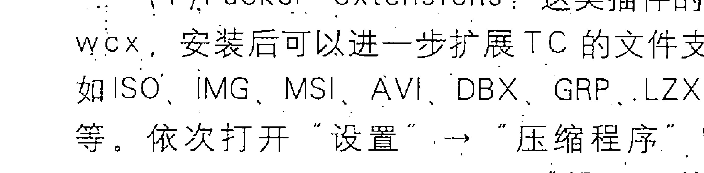

- (2) File system extensions：这类插件的扩展名是*.wfx，安装后可以进一步扩展TC的文件管理功能，例如，恢复被删除的文件、查看系统日志、访问Linux分区、管理系统服务和系统进程、编辑注册表、接收邮件等。打开“设置→操作”窗口，点击“FS插件”按钮打开对话框，在这里点击“添加”按钮，然后定位至已复制过来的“*.wfx”文件即可。
- (3) Lister extensions：这类插件的扩展名是*.wlx，安装后可以进一步扩展TC的浏览功能，例如查看DBF数据库、查看Word/Excel/RTF/HTML文件、查看PDF电子图书、查看C++/Java/VB程序源码等。

打开“设置”→“编辑/查看”窗口，点击“设置内置的查看”按钮，继续点击“LS-Plugins”按钮打开对话框，在这里点击“添加”按钮定位至已复制过来的“*.wlx”文件即可，如果插件比较多的话，也可以在这里调节各个插件的先后顺序。

## 六、特色插件打造全能TC

在http://www.ghisler.com/plugins.htm和地址http://clubtotal.free.fr/页面都提供了数量众多的各式插件，虽然我们并不需要安装所有插件，但“打造全能TC”这个任务可不能忘记哟！

### （一）扩展TC的文件预览功能

#### 1. IMG (packer类)

IMG文件是所谓的软盘镜像，这个插件的个头很小，才12.6KB而已，安装此插件后可以在Total Commander中直接打开IMG格式的镜像文件，注意此插件属于。

#### 2. ISO (packer类)

ISO文件是光盘镜像文件，现在网上很多提供下载的软件都是此文件格式，一般是使用WinISO、WinIMG、IsoBuster等进行处理，安装此插件后不仅可以直接查看ISO文件，并且还可以像压缩文件一样解压缩，惟一遗憾的是无法对其进行编辑。

#### 3. Office View (packer类)

安装这个名为OfficeView的插件，可以正常浏览Word、Excel、RTF、HTML等格式的Office文档。

其实，Office View插件是利用了“\Program Files\Common Files\Microsoft Shared\TextConv\”中的所谓“转换器”文件来实现的，在“office_wcx.ini”文件中定义了相应的“*.cnv”文件，只有此处定义的“*.cnv”文件都能够在此前路径中找到，才能正常浏览office文档，否则将显示乱码，解决的办法是从微软站点下载相应的转换器文件。

#### 4. PDFView (Lister类)

安装了这个pdfview插件后就可以在Total Commander中轻松查看PDF文件了，另外还可以查看“*.ps”、“*.eps”格式的文件。

#### 5. SGViewer (Lister类)

在未安装此插件时，TC只能查看BMP格式的图片，如果查看其他格式的图片，显示的将是一片乱码字符。现在，按下【F3】键，我们可以正常查看包括BMP、JPG、JPEG、PNG、GIF、TIF、PSD、TGA、PCX、PCD、PSP等格式的图片。

## 6. FlashView (Lister 类)

安装这个插件后，我们就可以在 TC 中直接播放 Flash 文件了，当然前提是系统中已经安装了 Macromedia Flash Player。

## 7. MSI (packer 类)

微软的软件一般都提供 “setup.exe” 和 “*.msi” 两种安装文件，不过如果在 TC 中直接双击 MSI 文件时，非但不能启动安装程序，反而会进行解压缩，只能返回“我的电脑”执行 MSI 文件，安装此插件后即可在 TC 中直接安装 MSI。

## (二) 扩展 TC 的系统管理功能

在 File system extensions 插件区中，可以找到很多扩展 TC 系统管理功能的实用插件，例如，恢复被误删除的文件，访问 Linux 分区、浏览网页、查看系统进程、接收邮件、查看系统日志、编辑注册表，不过安装后必须借助“网上邻居”才能够使用。

### 1. back2life

这个名为 Back2life 的插件可以恢复被误删除的文件，可惜该插件需要付费后才能够永久使用，否则只能恢复 60KB 以下的文件。当你误删除了文件后，可以点击工具栏上的“网上邻居”按钮，此时会看到这里增加了一个名为“Erased files”的对象，双击后即可恢复相应的文件。

### 2. Events NT

安装 Events NT 插件后，假如你使用的是 Windows 2000/NT/XP 操作系统，切换到“网上邻居”，可以看到这里增加了一个名为“NT Events”的项目，双击后就可以查看 Application，Security，System 系统日志了。

### 3. POP3/SMTP EmailPlugin

安装该插件，可以直接收取支持 POP3 协议的邮件。切换到网上邻居，此时会看到这里增加了一个名为“Pop3-smtp connections”的项目，双击后会看到其中有 Quick connection, Add connections, Edit connections 共3个文件夹，选择“Add connections”项添加一个新的连接，大致步骤有命名、配置 POP3 服务器地址、配置 SMTP 服务器地址、设置邮箱用户名和密码等，完成后就可以从这里收到邮件了。

### 4. HTTP browser

安装了这个名为 HTTP browser 的插件，从“网上邻居”中可以找到一个名为“HTTP Browser”的项目，双击其中的“Connect”项，会弹出一个对话框，键入 URL 地址或者 FTP 站点地址后就可以访问该站点中的文件结构了，双击某个文件即可将其打开。

### 5. Services

安装 Services 插件后，我们可以在 Total Commander 中启动、停止、禁用或重新运行某项系统服务，不过仅能在 Windows NT/2000/XP/2003 系统中使用。

### 6. Registry

安装 Registry 插件后，可以在 TC 中直接浏览 Windows 的注册表，进行编辑和导入等操作。

## (三) 扩展 TC 的工具软件功能

### 1. ICLView (Lister 类)

安装这个插件后可以显示或提取 EXE, DLL, ICL 文件中的图标，选中需要查看或提取图标的 ICL, EXE, DLL 文件，然后按下【F3】键，如果显示的是乱码字符，请从“选项”菜单下将查看方式切换到“图像/多媒体”即可。

### 2. CD-Ripper (File system 类)

这个插件可以将音乐 CD 转换为 WAV, MP3, OGG, WMA 格式的文件，或者将 WAV 格式的文件转换为 MP3/OGG/WMA 格式，将 OGG 格式的文件转换为 WMA/WAV/MP3 格式，将 MP3 格式的文件转换为 OGG/WAV 格式，甚至还可以重新定义 MP3 文件的质量。

首先请将下载包中的 “cdrip3.dll”， “bass.dll”， “basswma.dll”， “lame_enc.dll” 和 “vorb.dll” 5个 DLL 文件复制到 \windows\system32\ 文件夹中，如果是 Windows 9x/Me 系统，请复制到 “\windows\system” 文件夹，接下来才能按照前面所介绍的步骤安装插件，然后从“设置”菜单下打开“选项” -> “操作”对话框，点击“FS 插件”按钮，将“ripper.wfx”文件添加过来即可。

### 3. MakeBAT (Packer 类)

这个插件安装后可以创建 BAT 文件，例如计划任务、MP3 播放列表等。

### 4. AVI (Packer 类)

这个插件安装后可以将 BMP 文件创建为 AVI 格式的影片，或者展开 AVI 影片文件。选中相应的 AVI 文件，按下【Ctrl+PageDown】组合键即可一层一层展开，最大可以支持 2GB 的 AVI 文件，反之，选中相应的 BMP 或 JPG 文件，先按下【Alt+F5】创建压缩文件，这里需要将“压缩格式”选择为 avi 格式，再设置一下压缩选项（一般为全帧），执行压缩操作后就可以立即得到 AVI 格式的影片文件，静态的画面瞬间变为动态影片，实在妙不可言。

事实上，TC 的功能远远不止上面介绍的这些，如果你有兴趣的话，不妨慢慢挖掘，相信一定可以找到更多、更有趣的技巧。

## 特色剪贴软件一网打尽

文 / 风之扬

## 一、常用特色剪贴工具

### 1. 超级拷贝大师 (CopiXP) V4.1

软件下载地址：http://www.iiscn.com/

超级拷贝大师 (CopiXP) V4.1 是一个功能强大的剪贴板工具，包括“超级拷贝”和“超级剪贴板”两个部分。启动 CopiXP 后，它会自动缩小在系统托盘区后台工作，并时刻监视剪贴板的操作。按下【Ctrl+Alt】快捷键，然后移动光标到需要复制的文本内容上，这时会弹出一个浮动提示框，显示出当前光标所在位置的文本信息，同时显示的文本信息也被拷贝到了 Windows 剪贴板中，可以直接粘贴到其他文本编辑器中进行处理。软件可以自动将多次复制或剪切的内容依次安排到10个不同的剪贴板中，默认情况下，它会将最后一次复制或剪切的内容作为当前剪贴板，我们可以直接粘贴使用：如图1所示。

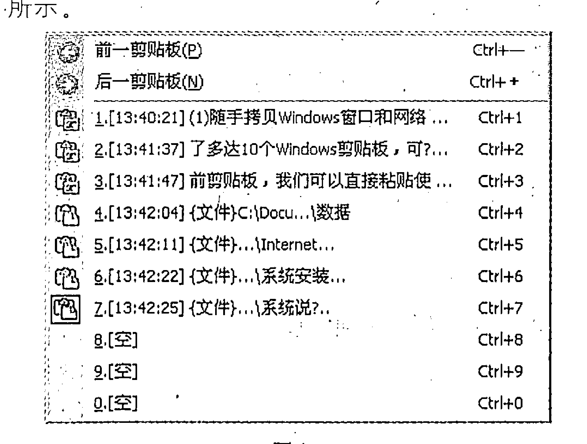

现在，按下快捷键【Ctrl + 数字】将其他剪贴板设置为当前剪贴板，数字代表剪贴板的序号，“0”代表第10个剪贴板。或者也可以点击 CopiXP 图标，直接在“超级剪贴板”子菜单中选择当前剪贴板，从图标中可以看出该剪贴板中的数据类型。

该软件的特色在于，每个剪贴板的功能和操作方式与 Windows 原有的剪贴板完全相同，支持所有复制、剪切、粘贴操作，支持所有格式的数据（文字、图像、声音等等），完全不依赖于任何具体的应用程序，每个剪贴板之间可以手动切换和自动切换，在启动和退出时可以自动保存和还原各个剪贴板，还可以随时调出以前保存的剪贴板，或者保存目前的剪贴板状态。点击 CopiXP 图标，选择“整理剪贴板”，在窗口中可以调整剪贴板序号、锁定剪贴板内容、删除剪贴板内容。选择“设置”，单击“超级剪贴板”标签，可以设定剪贴板的数量、切换当前剪贴板的快捷键以及是否自动保存还原剪贴板内容等。

另外，按下【Shift+Alt】键，然后移动鼠标，还可以抓取光标所在位置的各种控件类型、句柄信息并拷贝到剪贴板中，这些信息对于编程人员是非常有帮助的。

### 2. PasteLister 令输入更轻松

软件下载地址：http://www.progency.com/pastelister.html

在进行文字录入工作时，有不少词句往往是反复用到的，比如 E-mail、联系地址、地名等等。重复输入或是用鼠标翻动页面选择再复制都比较麻烦，那就可以使用 PasteLister。启动软件后，单击左边的“Pop-up List Options”图标，接着在右边的 hotkey 设置下选择【Ctrl+V】或者其他快捷键，如图2所示。

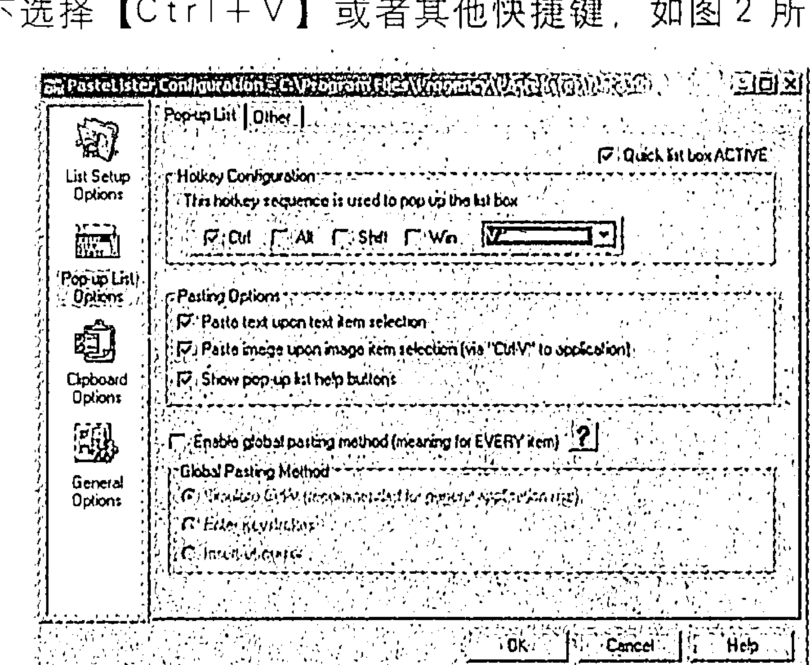

在需要输入文字的地方按下【Ctrl+V】，就会出现一个文字列表对话框，用键盘上的方向键选择词句后按下回车键就可以了。这些词句按复制时间先后排列。

## 二、序列号剪贴系列软件

### 1. SnCopy

很多软件的注册码是采用形如“*****-*****-*****-*****”的形式，常见方法是打开注册码所在文档，边复制边粘贴或边看边输入，但这种方法十分繁琐而且容易出错。SnCopy 的出现解决了这个问题：它使用方法很简单，启动软件，先设置你喜欢的快捷键，然后点击“APPLY”按钮，再单击“HIDE”，最后复制注册码，在软件注册的窗口下激活第一个输入框，按下设置的三个键，就可以实现注册码的一次性粘贴了。

### 2. 序列号输入专家 V9.94

软件下载地址：http://www.skycn.com/soft/15824.html

安装系统时，我们可能要用到软件注册码，写在纸上有抄错的可能，保存在 TXT 文件又不好管理，对于分段的序列号，还要在注册窗口和记事本之间抄来抄去，十分不方便。现在，我们可以通过“序列号输入专家”来解决这个问题，它可以方便地储存和管理序列号。这个软件的常见数据管理功能有添加、删除、上移、下移和查找序列号记录等，还有类似 IE 导入导出向导、转移记录的功能，只要导出到软盘上，装好系统再导入就可以了。另外，它可以用【F9】热键一键输入序列号，轻轻松松，省时省力。如图3所示。

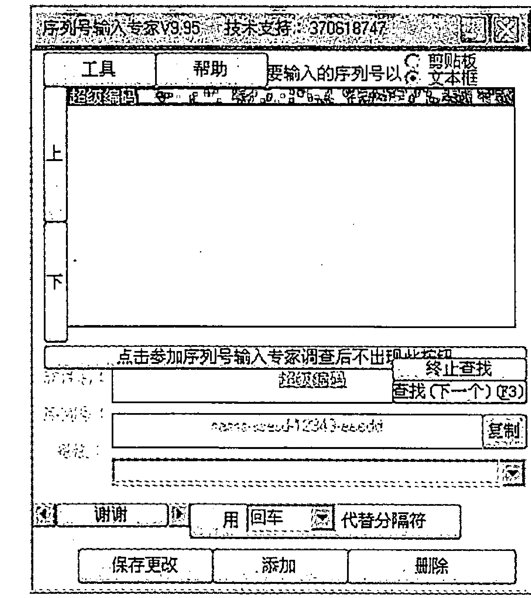

## 三、网络剪贴类

如果用户经常在网络上浏览新闻、小说和游戏攻略等内容，或者希望把相关网络信息保存下来，我们就需要有一款专门针对网络的剪贴工具了。

### 1. 网络即时贴 TextVampire

软件下载地址：http://www.ebook007.com/textvampire.html

浏览网页时，保存的文本和网页多了，可能自己都不知道保存的内容了。其实，“网络即时贴 TextVampire”就可以解决这个问题：先选定文字，按【Ctrl+C】复制，再单击弹出窗口中的“粘贴文本”按钮，然后打开软件所在文件夹看看，它已经自动生成一个以所选文本第一行内容作为文件名的文本文件了，再看看标题就可以知道内容了。

### 2. 网页复制大师

软件下载地址：http://www.skycn.com/soft/9288.html

利用这个软件可以自动将复制的网页内容保存到硬盘中。选定合适的文字，按【Ctrl+C】组合键或单击鼠标右键选择“复制”，程序就会帮你保存到指定的文件中。看到喜欢的图片时，只要在图片上单击鼠标右键，选择“复制”，程序就会自动将其保存到指定的文件夹。软件还可以作为抓图软件来使用，看到喜欢的镜头或游戏画面时，只要按下键盘上的【Print Screen SysRq】键，软件就会自动将其保存到硬盘中！

## 四、其他特色剪贴软件

由于剪贴软件小巧实用，而且制作也不太复杂，因此，现在出现了不少功能出色的剪贴软件。如 ClipCase，软件下载地址为 http://www.skycn.com/soft/8772.html，它可以把 QQ 聊天信息导出为文本文档保存下来。如果发现这个文档中句与句之间会有空行，或者有难看的“”字符，可以先把文本中的聊天信息全部复制下来，再打开 ClipCase，选中“清除”和“无空白行”两项，然后单击“处理”按钮，一个满足要求的文本就出现在下方的文本框中了。此外，它还可以对复制到剪贴簿的文本进行大小写转换、首字母大写、添加硬回车、删除标点后的双空格等格式化处理，使用十分方便。

因此，在实际使用过程中，我们可以根据个人需要选择一款适合自己的剪贴软件，从而有效提高个人的工作效率。

## NetOp School 简明教程

文 / 刘勇

随着信息技术的发展和国家对基础教育改革的重视，各大、中、小学校均顺应潮流纷纷建立起微机室、电教室等现代化教学设施。对于信息化技术的教育，当然不能再使用黑板加粉笔等传统教学方法，而要充分利用计算机图声并茂、良好互动的特点来进行教学，因此“多媒体教室”软件就“应运而生”了。

所谓的“多媒体教室”软件，一般都具有屏幕广播演示、电子白板、电子举手、文件传输、电子备课、屏幕监控及远程控制等功能。利用这些功能可以进行以下工作：

- 利用多媒体教室进行基于多媒体课件的计算机辅助教学。
- 利用多媒体教室实现语音教室功能，进行外语口语和听力教学。
- 利用多媒体教室实现教师和学生之间的交流、互动功能。
- 利用多媒体教室软件进行机房的管理和维护。

在众多的“多媒体教室”软件中，NetOp School 以支持多种操作系统和网络环境、运行稳定、使用简单以及功能强大等特点成为目前应用最广泛的虚拟电子教室之一。它可以实现教师与学生的互动演示、实时交流；快速分发文件、收集作业；共享影音教学文件；时刻关注学生的实践效果等功能，是多媒体教学中不可或缺的“左膀右臂”！下面我们就来介绍它的基本使用方法。

## 一、NetOp School 3.01 简体中文版简介

软件大小：14 094KB
软件语言：简体中文
软件类别：国外软件 / 共享版 / 电子教室
运行环境：Win9x/Me/NT/2000/XP/2003
下载页面：http://www.comlan.com/NetOp/down/index.htm

NetOp School 是一款共享软件，用户可以到下载页面中选择“NetOp School 试用版”，在随后的页面中输入注册信息得到下载地址并获得试用序列号，这样才能进行程序的安装并获得30天的试用期。

## 二、软件的安装

NetOp School 与一般的“多媒体教室”软件不同，安装程序中没有教师端和学生端的区分，只要双击下载回来的可执行程序就可进行安装。当提示输入序列号时一定要注意：它将依据输入的序列号来判别是安装教师端还是学生端。明确自己的目的以后输入相应的序列号即可完成软件的安装。

## 三、软件的配置

### 1. 教师端

点击“开始”→“程序”→“NetOp School”→“教师”命令启动程序，第一次使用会弹出“设置向导”，通过向导可以完成一个班级的创建。

点击“下一步”，进入“班级名称”设置界面。在这里可以设置将要创建的班级名称，如六年级。以此区分各个年级也便于管理。

点击“下一步”，进入“班级管理”界面。首先需要确定教师将要依照何种方式来对学生进行识别。程序提供了三个选择：学生登录名、Windows 登录名和计算机名。对于人手一机的大机房，可以选择“学生登录名”来方便地对学生进行识别；而对于多人同时使用一台机器的小机房，使用“计算机名”（比如1号机、2号机等）可能要好一些。因此，这里还要根据实际情况来进行选择。

点击“下一步”，进入“常规学生选项”。“跨班级保存学生”可以使学生通过连接到一个正在运行的班级而成为该班级的成员。未连接时，成员学生仍然留在班级中。如果未选择，学生不会通过连接到一个正在运行的班级成为该班级的成员。一般使用默认的“不选中”。“显示可用学生”默认是选中状态，这样当有学生登录时可在“班级设置视图”中看到，同时学生的“头像”将亮起。

点击“下一步”，进入“连接密码”界面。

### 2. 学生端

学生端的设置与教师端大部分都是相同的，只是要注意在以上各步中需要填入与教师端相同的参数，比如班级名称、密码、通信等等。最后还要注意在 “启动设置” 中设置学生启动状态时，可以选择 “程序启动时加入班级”，这样学生就可以在启动软件时自动加入所在的班级。

## 四、教师端的使用

打开教师端，进入主界面可以看到屏幕的左侧是 “班级控制面板”，上方是布满大图标的 “工具栏”。不过在没有学生登录或未选中任何登录学生以前，这些工具栏的图标是暗的，处于不可选状态。当有学生登录以后，选中该学生就可看到各个工具均处于了可用状态。(图1)

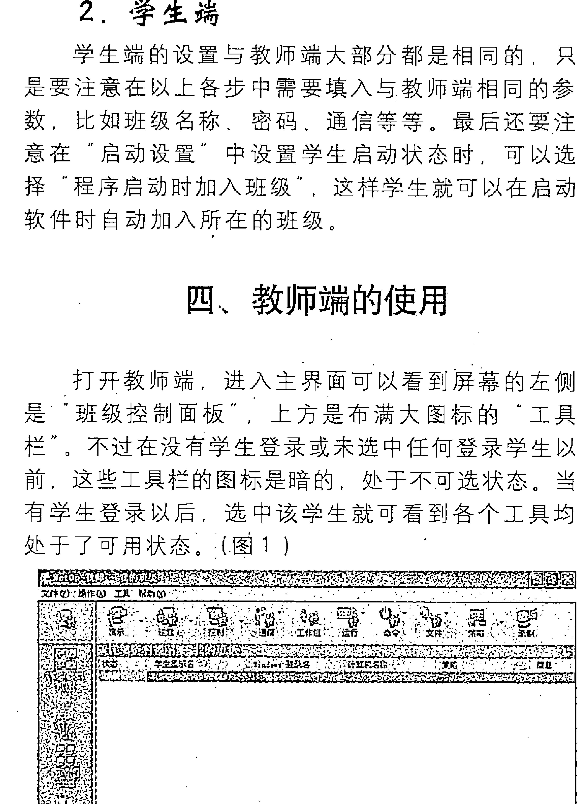

### 1. 菜单栏

在 “菜单栏” 中，各个选项的功能与 “工具栏” 中各个按钮的功能都是相同的，完全可以通过图标按钮来完成各种操作。只是注意，用户可以通过 “工具” 中的 “选项” 来更改在开始的 “设置向导” 中输入的所有参数，也可以通过 “工具” 下面的 “运行设置向导” 来重新进行其它不同班级的设置。

### 2. 关于班级控制面板

在主界面的左侧就是 “班级控制面板”，它提供了多种方式显示班级学生，以便执行教学操作、创建和执行课程计划、管理录制和设置班级。具体选项如下：

- 详细资料视图：选择此项可以将登录学生的详细资料显示在界面中央，比如学生状态、显示名、计算机名、信息等。可以一目了然地对登录学生进行识别。
- 教室视图：选中此项可以使登录学生的图标按照真实教室布局来确定位置，可以通过鼠标来拖动。对于那些多媒体班或以计算机名来识别学生的教室尤为实用，可以将登录图标与真实计算机迅速 “联系” 起来，马上判断存在问题机器的具体位置与学生姓名。
- 缩略图视图：选中此项后登录计算机的图标将被该机当前实时屏幕缩略图所代替，可以间接起到监控学生学习过程的作用。当然，它显示和更新的速度与网速及登录机器的数量关系很大。
- 课程计划视图：选中此项将显示创建、管理和执行带有课程操作和支持注释的课程计划，达到电子备课和教学备忘录的作用。
- 录制视图：选中此项可以管理教师屏幕图像录制。在右侧界面中将显示出当前已经录制的教学内容，通过在文件上单击鼠标右键选择 “本地播放” 来进行播放预览。
- 班级设置视图：选中此项后在右侧界面中将以树状结构显示所有学生及具体分组情况。已连接学生的图标是彩色的。未连接学生的图标呈灰色，并显示其中带有白色 “X” 的红点。如果学生名称外带有括号，则表示该学生由其他名称类型标识，而不是由 “学生显示名” 类型标识。选中其中任何一个学生，可以查看其登录名、Windows 登录域、IP 地址、从 LAN 唤醒的 MAC 地址等。通过在界面中右击，还可实现创建学生、创建学生组、向组中添加学生、通过局域网唤醒等功能。

### 3. 关于工具栏

在使用该软件进行的所有教学任务中，大部分的应用都是通过工具栏来实现的。它如同 “总控制台”，集中了绝大多数的常用功能，只有掌握了它才能发挥 NetOp 的全部作用。工具栏可实现的主要功能如下：

(1) 演示功能：多媒体教室类软件一大特点就是能将老师的屏幕内容实时传送到学生的屏幕上，让学生观察到老师的所有操作细节。同样在 NetOp 中，直接单击“演示”按钮就可将老师的整个桌面传送出去，也可以打开下拉菜单来选择其他的演示方式。还可以在下拉菜单的“选项”中对各种演示方式进行个性化设置（如图2），如更改按下“演示”后执行的默认演示方式，调整窗口演示时的区域大小和位置等。在演示过程中，屏幕右下方会出现“屏幕控制工具箱”，利用此工具箱可以完成与学生实时音频交流、利用电子笔对屏幕内容进行标注、将鼠标和键盘的控制权交给学生进行控制等等，按下带红 X 的按钮退出演示程序。

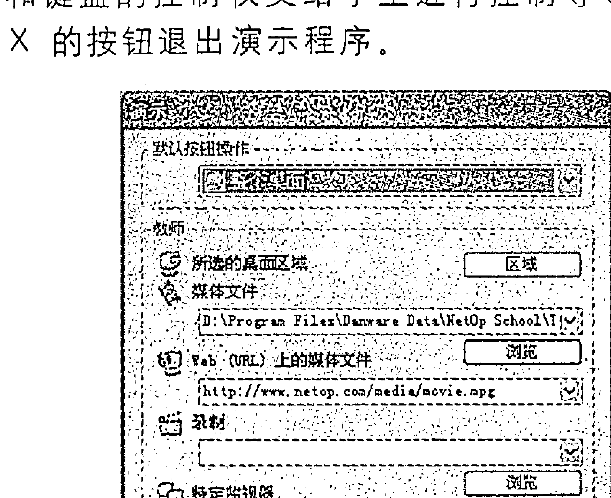

(2) 注意功能：在教学过程中，老师可能需要使用语言或板书进行重点、难点的讲解。为了让所有的学生都注意听讲，就可以使用“注意”功能强制将学生机的屏幕都显示特定的图片。此时就可以在选中所有的学生以后按下此按钮，被选中的学生端将显示预先设置的图片、网页或文本。这些特定的显示内容都可以通过下拉菜单中的“选项”进行设置。

(3) 控制功能：在学生上机练习时，有些学生可能私自玩游戏或可能会碰到一些疑难问题需要请教老师。这时候老师不用离开座位亲自去对学生进行查看和指点，只要使用“控制”按钮来对学生进行远程监控或远程控制就可以了。也可以进入它的“选项”中对远程控制与监控进行设置，例如，远程控制中锁定学生的键盘鼠标、设置监控刷新时间间隔等。

(4) 通信功能：教学过程中可能需要与学生进行实时交流或对一些同学提出问题和意见，这时可以使用“通信”的语音聊天、聊天、发送短消息等方式进行，这样可以不用去干扰其它的学生。

(5) 工作组功能：利用此功能，可以将某一个学生设置为“助教”并与其他的学生组成一个工作组，此时该“助教”将拥有与教师端相同的软件界面，在此工作组中担任“老师”的角色。这样可以达到分组教学或“先进”帮“后进”的效果。

(6) 运行功能：可以将应用程序在多个学生端同时远程运行，同时还可以给该应用程序加入说明文件，通知学生该程序的相关问题解释。

(7) 命令功能：利用此功能可以实现强制将学生端注销、重新启动、关机或退出多媒体教室后重新加入。如果将全部的学生选定后使用此功能就可实现全部同时关机。

(8) 文件功能：利用此功能可以将一些文件分发给学生进行练习；也可以用它收集学生完成的练习或作业，利用“文件管理器”进行整理后存档，再也不用通过“网上邻居”进行相互的文件共享传输了。当然也可以在网络管理过程中将某些应用程序或重要文件进行备份或分发。

(9) 策略功能：利用此功能可以控制是否允许学生运行 “*.exe” 等可执行文件。可以单击“工具”→“选项”命令，在打开对话框的“策略”标签中设置具体的限制列表，如禁止执行所有的 EXE 文件或只运行某些可执行文件。

(10) 录制功能：利用此功能可以将一些用语言无法表达的操作过程制作成“录像”，再利用“演示”功能向所有的学生进行“放映”，既形象又能减少教师的重复劳动。当然还可以保存下来多次使用或与其它兄弟学校进行交流。另外，可以通过“班级控制面板”中的“录制视图”进行保存、运行、删除等操作。

> 提示：上述功能按钮只有在选择了一个或多个学生以后才能使用。另外在界面中部的班级视图中，可以使用鼠标右键功能对一个或多个学生进行快速操作。

## 五、学生端的使用

相对于教师端，学生端的功能就显得很“简陋”了。运行程序，可以看到主界面（图3）十分简单，通过常规、班级、信息、录制标签来进行学生端状态的查询。在“录制”标签中，可以放映教师端传输过来的录像文件。在上方的工具栏中依次可以进行退出网络教室、加入网络教室的操作。按下那个“救生圈”的图标，教师端的班级视图中该学生图标也会出现“救生圈”标志，这叫做“电子举手”，老师可以双击该学生的图标来进行远程监控，查看学生遇到了什么样的问题，同时可以通过远程控制或# SoftEther快速构建虚拟局域网

文/刘勇

2003年，日本筑波大学一年级新生登大游编写了一款VPN（虚拟专用网）软件，同时通过网站提供免费下载和使用，随即引起众多IT媒体纷纷关注和报道，日本信息处理事业协会（IPA）对其提供了赞助。为什么一个小小的不到2MB的软件会激起如此大的“风浪”呢？其实原因很简单，它能让局域网用户突破防火墙而“为所欲为”！那么，它是如何实现“穿墙术”的呢？主要原理有以下两方面：

- 途径1，在OSI Level2（数据链路层）上软件模拟网络通讯，把物理层的通讯内容封包到TCP Package里去（软件模拟Ethernet）。
- 途径2，把自己的通讯包变成SSL Session，用HTTPS协议穿越Internet，甚至穿过Firewall（128bit RC4），只要将模拟HUB在公网IP的机器上运行，然后让局域网内部的机器通过模拟网卡连通，那么就可实现互联网与内网的无阻碍互访。

现在，该软件已经进入了公司运作阶段，并且推出了1.0正式版，提高了兼容性与稳定性，最可贵的是仍然为免费软件！本文将以公司局域网中的计算机与家中计算机实现“互联”为例，介绍该软件的用法。

| 项目 | 详情 |
| :--- | :--- |
| 软件大小： | 2 023 KB |
| 软件语言： | 英文/汉化补丁 |
| 应用平台： | Win9x/NT/2000/XP 或 Linux |
| 下载页面： | http://www.onlinedown.net/soft/34495.htm |

此处下载的是汉化版本，可以不依赖原版而独立安装和使用。它还有一个最大的特点是安装完毕后不用重新启动计算机即可运行，特别适用于那些安装了类似还原精灵类软件的内网机器。

## 一、软件的安装

双击下载的可执行文件，一路点击“下一步”，中途出现“选择控制台语言”界面时直接回车，不用安装英文版的控制台。在随后选择安装语言时选择“简体中文”，当出现要求安装“虚拟HUB”和“虚拟网卡”时，全部选中后继续安装，随即安装虚拟网卡提示“驱动程序未经过微软认证”时选择“仍然安装”即可。最后弹出“Softether 配置程序”界面（如图1），在“Softether 虚拟网卡核心服务”与“Softether 虚拟HUB 服务”中，全部点击“开始”按钮来使此两项服务程序运行，然后退出 Softether 配置程序完成该程序的安装。这时在桌面系统托盘处就会出现一个带红叉的网络连接标志。

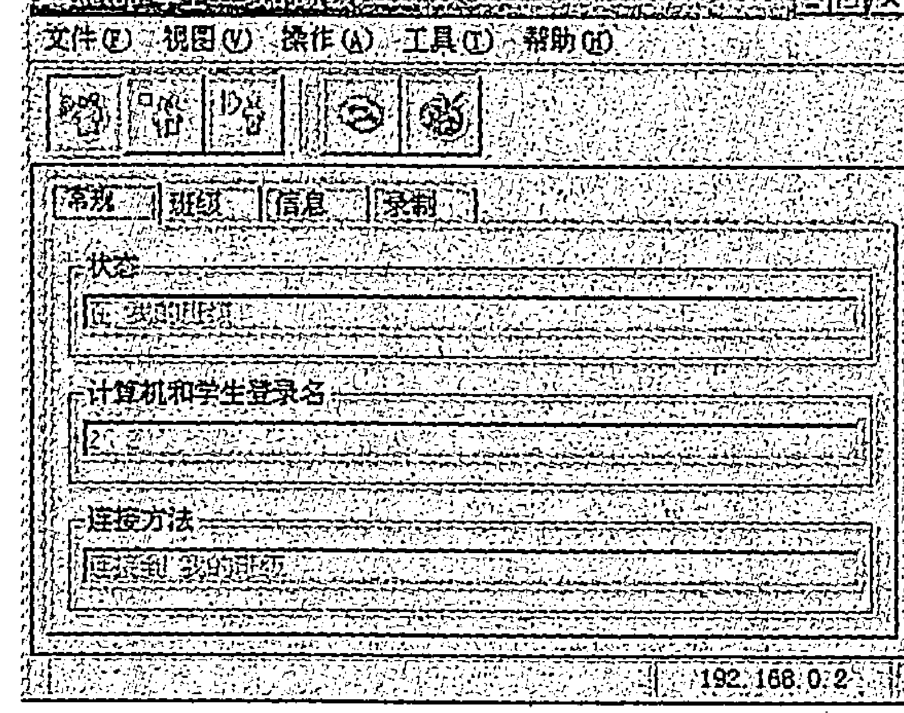

现在双击桌面图标“Softether 连接管理器”就可运行此程序，双击软件界面中的 “SoftEther.com Sample HUB” 就可连接到建立在日本筑波大学的虚拟HUB，打开网上邻居，便可看到很多的机器连接在上面。这个虚拟HUB是供测试软件用的，可以依此来检验是否成功安装了软件。注意：“网上邻居”打开时速度很慢，一定要有耐心。

## 二、配置虚拟 HUB

连接到这个供测试的虚拟HUB上既不安全也不利于使用，还是要自己创建一个虚拟HUB，并且建议删除此公用HUB，方法是：在它的上面单击鼠标右键后选择“删除”即可。

### 1. 创建新用户

步骤1：在具有公网IP（也就是直接连入互联网）计算机中，按上述步骤安装完毕后点击“开始”→“程序”→“softether”→“SoftEther 虚拟HUB管理器”，在出现的对话框中选择“localhost”并勾选“本地计算机”。

步骤2：点击“连接”，进入“虚拟HUB控制台”。首次使用会提示输入自设密码进行保护，然后重复输入密码进行确认。在随后出现的有9个选项的“主菜单”中输入“1”并回车进入“用户管理”界面，输入“2”创建新用户（如图2）。

步骤3：在“创建新用户”菜单中分别输入用户名（例如：test1）和密码，然后直接按回车跳过后面的所有问答，使用它们的默认值即可。如果要想创建多个用户，请重复“步骤三”（最少创建两个，要不跟谁连接？），最后分别选择两次“9”退出 SoftEther 虚拟HUB管理器。

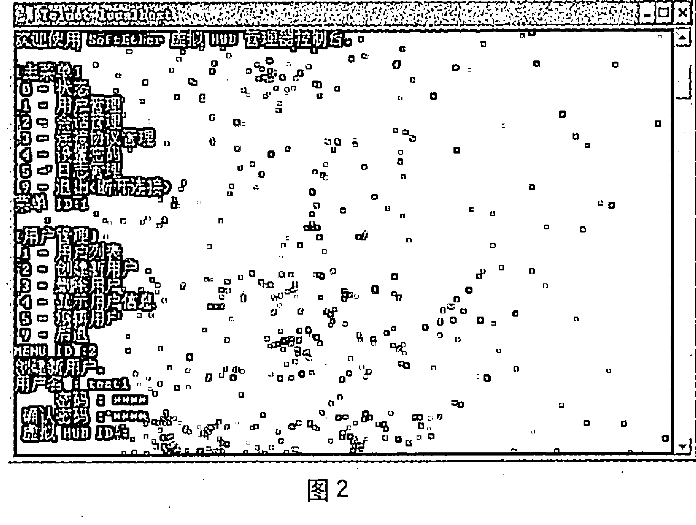

### 2. 创建虚拟 HUB

步骤1：创建了用户以后，双击桌面上的“SoftEther 连接管理器”图标打开主界面，点击“帐号”下的“新帐号”，打开“新连接设置”窗口（如图3）。在如图所示界面中，“名称”处随意填入一个名称，比如Test。同时选中“连接虚拟HUB需要使用身份验证”复选框，把刚才创建的用户名和密码填入下面的栏目，其他都保持默认设置不变。

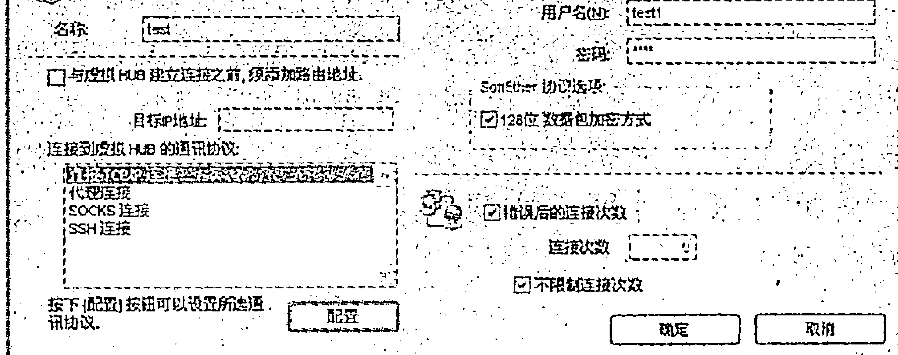

步骤2：点击“配置”按钮，在“IP地址”处输入“127.0.0.1”（代表虚拟HUB就是本机），端口就是用默认的“7777”即可。两次“确定”后回到主界面，这时左侧窗口中就会出现刚创建的虚拟HUB “test”。

步骤3：在桌面的“网上邻居”上点击右键并选择“属性”，找到“SoftEther Virtual LAN Connection”并选中后单击鼠标右键，在弹出的“属性”窗口中找到“TCP/IP”协议并点击属性为其设置一个IP地址，例如192.168.10.10。注意不能与本地IP相同。

步骤4：回到软件主界面，双击刚刚创建的虚拟HUB，右侧窗口中出现了正在连接的过程，最后提示“连接成功”。这时会发现屏幕右下角的网络图标变成了连接状态。现在本机已经连入了虚拟HUB！

### 3. 安装、配置客户端

在家中配置完虚拟 HUB 并使家中计算机成功接入虚拟 HUB 后，接下来就要在公司的局域网计算机中进行客户端的安装和配置。它的安装过程与刚才的服务端安装过程相同，只是在安装过程中可以不选择安装虚拟 HUB，只安装虚拟网卡就行了，最后同样需要启动虚拟网卡的服务。

- 步骤 1：双击桌面图标“SoftEther 连接管理器”，在主界面中点击“帐号”下的“新帐号”，在弹出界面中的“名称”处填入刚才建立的虚拟 HUB（test）名称，在“连接虚拟 HUB 需要使用身份验证”中填入服务器端创建的用户名和密码，注意不要与在服务器端使用同一个用户名。其他设置不变。
- 步骤 2：点击“配置”按钮，在弹出窗口中的“IP 地址”处输入虚拟 HUB 的公网 IP 地址或域名（比如 221.193.45.70），“端口”处也要与服务器端相同，比如 7777。
- 步骤 3：进入“网上邻居”的属性中，按前面的方法给虚拟网卡添加固定的 IP 地址，注意一定要与服务器端的虚拟网卡处于同一个网段但不能与之相同，例如：192.168.10.11。
- 步骤 4：回到主界面双击虚拟 HUB Test，如果配置正确就可连接到刚刚建立的虚拟 HUB 上。双击“网上邻居”就可看到刚才接入的计算机，以后的操作就与真实的局域网一样了。

### 提示

连接的速度与你的上网带宽有关，双击“网上邻居”以后可能暂时看不到其他的机器，这时可使用鼠标右键单击网上邻居图标，然后选择“搜索计算机”选项来进行连接。

## 三、SoftEther 的用途

由于 SoftEther 能使“藏”在防火墙后面的局域网用户摆脱限制，完全可以利用它来浏览、使用 QQ、共享文件等。同样，我们所有的单机用户也可用它来组成一个基于互联网的“局域网”，可以用 Serv-U 架设 Ftp 服务器、共享打印机，架设 VOD 视频点播台，甚至可以在这个虚拟的局域网里面联网打 CS 和魔兽争霸。

如果你需要经常使用此软件架设局域网，建议用“花生壳”去申请动态域名，这样可以免去频繁告知对方虚拟 HUB 公有 IP 地址的麻烦；如果只是偶尔用用，可以在命令行中使用“ipconfig”命令得到自己的 IP 地址，然后通过 QQ、Email 甚至电话、短信告知对方。

最后，提醒“蠢蠢欲动”的各位 Fans：由于此软件的特殊性，当你想打单位局域网“主意”的时候，一定要绷紧“安全”这根弦，时刻注意不要把病毒、木马等恶意程序引入局域网。当然，只要你能细心使用，完全可以体验到“天涯若比邻”的感觉！

***

好工具！另外，真实操作系统（主系统）和虚拟操作系统（子系统）之间可以实现文件共享方式、网络方式的互访，子系统还可以访问主系统所在的网络系统，甚至访问互联网，还可以实现单机环境下的组网试验。本文将以当前最为流行的两款虚拟机软件——Virtual PC 和 VMware 为例，向大家详细介绍虚拟机的安装、配置、使用方法与技巧。

# 虚拟机安装、配置、使用简明指南

文 / 刘勇

## 一、了解虚拟机

所谓虚拟机，其实就是利用软件技术在一台真实计算机上虚拟出一台计算机（类似于常见的虚拟光驱），它拥有独立的 BIOS、硬盘和操作系统；它以原有的操作系统为基础，只占用一部分硬盘空间、物理内存及 CPU 资源，可以安装和使用各种操作系统，比如 linux、MacOS、Windows 系列等。在虚拟机中进行的所有操作不会对真实计算机及操作系统产生任何影响，真正做到“同时、安全”运行多个操作系统。

根据虚拟机（客户机）与真实计算机（宿主机）相对“独立”的特点，可以进行一些通常情况下不易实现的目的，例如，试用新软件、新驱动；试用非主流操作系统；抓取开机及 DOS 下的图片；练习分区和格式化硬盘；刻录光盘前检测 ISO 镜像是否成功；升级 BIOS；甚至观察病毒发作时的表现！由于它的安全性很高，完全可以作为菜鸟朋友们练手的好工具！

## 二、使用 Virtual PC 创建虚拟机

- Virtual PC 2004
- 软件大小：16 882 KB
- 发布日期：10/13/2004
- 界面语言：英文
- 应用平台：Windows 2000/XP/XP Tablet PC Edition
- 下载地址：http://download.microsoft.com/download/e/7/4/e74339ca-a307-47b6-af59-1afe8dcabc5f/VPC2004SP1Trial.zip

Virtual PC 最初是 Connectix 公司的产品，但现在已经被微软收购并进行了二次开发和改造，最新版 Virtual PC 2004 与 Windows 的结合更加紧密，包括 Virtual PC Console 和 Virtual PC Additions 两个组件，还特地加入了一个 AppleScript，让用户可以用较慢的兼容模式安装，兼容性和稳定性也得到了加强。Virtual PC 2004 能让你不用重新启动系统就可在多个操作系统间进行切换，同时可以进行子系统之间、子系统与主系统之间的共享设置；随时调整子系统的内存分配比例。而这一切均不会对主系统造成任何影响。

首先在上述地址下载该软件，注意只能试用45天。以后的安装过程与我们平时安装常用软件相同，只需一路点击“Next”即可，用户也可以自行改变安装的目录。

### （一）创建虚拟机

当安装完成后，就可在“开始”菜单中点击“Micro Virtual PC”启动该软件。首次启动时，会弹出一个“New Virtual Machine Wizard”（新虚拟机设置向导）帮助你来完成虚拟机的创建，这个过程相当于选硬件和攒机器的过程。

点击“Next”按钮，进入“Options”界面，在此界面有三个选项：“Create a Virtual machine”（创建一个新的虚拟机）、“Use default setting to create a virtual machine”（使用默认设置创建虚拟机）和“Add an existing virtual machine”（添加已存在的虚拟机）。由于我们是首次使用，选择第一项，创建一个新的虚拟机。

点击“Next”按钮，进入“Name and Location”界面，在这里是要求给即将创建的虚拟机起一个名字和虚拟软硬件配置文件存在的位置（相当于真实计算机的BIOS）。一般我们都习惯使用需要安装的虚拟系统进行起名，例如想安装Windows 98，就可以在此处输入“Win 98”即可。默认保存在“我的文档\My Virtual Machines\win98\win98.vmc”（当然也可按个人爱好使用其他个性化的名称和存放地址）。

点击“Next”按钮，进入“Operating System”（操作系统）界面，在这里选择需要创建的虚拟机上想运行的操作系统，可通过下拉菜单进行选择。可以看到，软件已经智能的根据输入的文件名“Win 98”自动选择了Windows 98！

> > 提示
> 此处微软取消了Linux操作系统的选择，但并不意味着它不再支持linux。如果想安装Linux，只要选择“Other”即可。

点击“Next”按钮，进入“Memory”（内存）界面，此处是设置要分配给虚拟机多少真实的物理内存。程序给出两个选项：“Using the recommended RAM”（使用推荐内存容量）和“Adjusting the RAM”（调整内存容量），程序已经根据选择的“Windows 98”选择了64M内存。如果你的物理内存足够大（512MB）以上，完全可以选择第二项进行手动设置。一般我们选择推荐的内存容量即可。

点击“Next”按钮，进入“Virtual hard disk options”（虚拟硬盘选项），此处提供了两个选项：“An existing virtual hard disk”（已经存在的虚拟硬盘）和“A new virtual hard disk”（新的虚拟硬盘）。我们是第一次使用，当然选择“A new virtual hard disk”。

点击“Next”按钮，进入“virtual hard disk location”（本地虚拟硬盘），此处需要选择虚拟机硬盘文件（后缀为vhd）所在的目录及文件夹位置，通过“Browse”按钮进行选择即可。

> > 提示
> 建议存放到主系统分区以外的硬盘分区中，因为这个vhd文件会随着虚拟操作系统的安装和使用而逐渐变大，会影响到真实操作系统的运行速度。

点击“Next”按钮，此时已经完成了虚拟机的设置，程序给出了当前创建的虚拟机详细的说明（如图1），也就相当于虚拟机的“装机配置单”。如果没有问题，请按“Finish”完成设置。然后回到主程序，就可看到已经存在了一个名叫“Win98”的虚拟机。

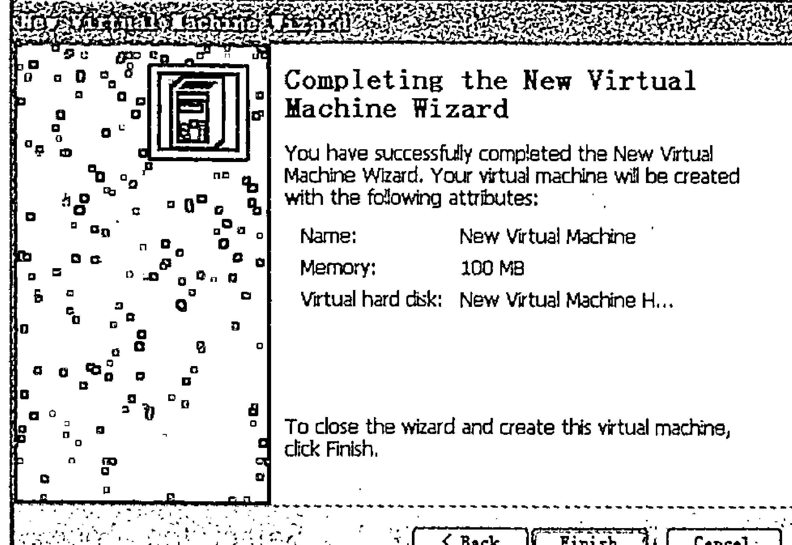

### （二）安装虚拟操作系统

现在的虚拟机还只是一台刚刚组装好的“裸机”，接下来还需要安装虚拟操作系统。下面的工作就与我们平时装系统一样了，在软驱中放入一张Windows 98启动盘，然后点击“Start”从软盘引导系统启动。然后用Fdisk命令进行硬盘分区，使用Format命令进行硬盘格式化，接着放入Windows 98安装光盘进行安装就可以了。

> > 注意
> 程序默认启动顺序是“软驱—光驱—硬盘”，如果想更改此顺序，同样在开机时按住DEL键进入BIOS进行设置。另外在安装过程中，如果提示“重新启动计算机”请一定要取出光盘。

安装虚拟操作系统过程中，当提示设置计算机名和工作组名称时，一定要注意该计算机名不能与宿主机相同，但要保证工作组名称相同。这样可以省去联网操作时的麻烦。
如果想安装虚拟Windows XP或Windows Server 2003，同样需要激活才能正常使用。

### （三）配置虚拟机

#### 1. 安装附加模块程序

“附加模块”是一个很特别的程序，简单的说就如同我们安装操作系统以后要安装所有硬件的驱动程序一样。但它比驱动程序的作用大多了：只有安装了附加模块才能为虚拟机调整屏幕的刷新率，使用网络功能，并且鼠标不再限制在窗口之内，而且可以共享物理硬盘上的文件夹，在虚拟PC中通过共享文件夹来使用物理硬盘上的数据。

#### 2. 附加模块程序安装方法

进入刚刚安装好的操作系统，点击“Action”下的“Install or update virtual machine additions”（安装或更新附加模块），再点击“Continue”，以后按提示操作即可完成。
当然，也可以通过ISO镜像文件进行安装：点击“CD”下的“Capture ISO Image”（载入镜像文件），通过浏览窗口找到安装路径“\program files\Microsoft Virtual PC\Additions\”下的“vmaDDITIONSO13040.iso”文件，打开后按提示操作即可。

#### 3. 设置共享文件夹

如果要想在虚拟操作系统中读取或安装主系统中的文件和程序，使用共享文件夹无疑是最快的了。当安装了附加模块以后，就可以设置共享文件夹了，设置方法如下：

点击主界面右侧的“Settings”按钮，打开如图2所示的界面，在左侧选中“Shared Folders”（共享文件夹），然后在右侧点击“Share Folder”，在随后的浏览窗口中找到需要共享的文件夹或分区，并在下方的“Driver Letter”中选择一个字母作为盘符，勾选“Share Every Time”（总是共享），单击“OK”退出。现在双击桌面“我的电脑”图标，随后就会发现在虚拟分区的最后多了一个共享分区，这时就可以任意调用其中的文件了，并且以后只要启动虚拟机就不用再重新设置了，它会自动进行共享。

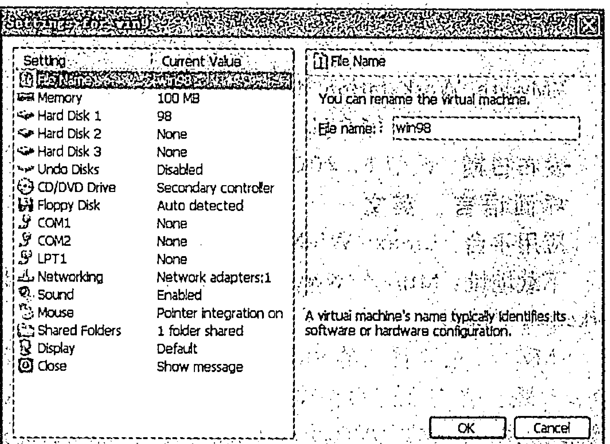

#### 4. 调节虚拟硬件参数

在图2中可以看到，不仅仅可以设置共享文件夹，还可以进行其他参数的调整，例如，更改虚拟机的名称、改变虚拟机内存容量、挂接另外的虚拟硬盘、是否启用软光驱的引导功能等。

### （四）高级技巧与应用实例

#### 1. 切换主、子系统的控制权

在安装虚拟操作系统的过程中，可以使用右侧的【Alt+Enter】组合键进行鼠标和键盘控制权的切换。当安装了附加模块以后，鼠标就可以自由地进行切换。另外，如果虚拟机死机了，可以通过右侧的【Ctrl+Alt+Del】组合键进行热启动，其功能相当于【Ctrl+Alt+Del】。

## 2. 快速启动虚拟机

由于不可能给虚拟机分配更多的内存，就会造成虚拟机开机时间过长，尤其虚拟机为Windows XP的用户。其实，当想关闭计算机的时候，不要习惯使用“开始-关闭系统”进行操作。只要选择主菜单“Action”下的“Close”选项，在下拉菜单中选择“Save State”（保持当前状态）即可。下次开机时就会自动回到上次关机时的状态，类似于待机状态。

## 3. 测试将刻录的ISO镜像文件

当想刻录一些重要数据或集成了补丁程序的系统安装盘时，为了减少废盘的产生，完全可以使用虚拟机来进行检验，特别是那些需要引导系统启动的光盘。使用方法是先把要刻录的文件制作成ISO镜像文件，然后点击“CD”下的“Capture ISO Image”，找到该ISO文件然后再单击“Starts”按钮进行引导测试就行了。

## 三、VMware 创建虚拟机

| 项目 | 内容 |
|------|------|
| VMware Workstation | 4.5.2 beta 8848 |
| 软件大小 | 37 116KB |
| 发布日期 | 6/11/2004 |
| 界面语言 | 英文 |
| 应用平台 | Linux/WinNT/Win2000/WinXP |
| 下载地址 | http://www.vmware.com/download/workstation.html |

VMware公司推出的VMware分为Windows版和Linux版，当在上述页面进行下载时一定要注意选择需要的版本（本文以Windows版为例）。另外，此处提供的是具有30天使用期限的试用版，需要到http://www.vmware.com/vmwarestore/newstore/product_register_login.jsp申请注册码，注意邮箱地址一定要正确，否则收不到注册码。

VMware与Virtual pc的功能很相似，同样支持同时运行多个操作系统并且多台虚拟机之间可以任意切换。另外，最新版的VMware支持最新的Windows XP SP2和Windows 2000 SP4，所有需要安装的虚拟硬件驱动都通过了微软的认证，这样在安装过程中就不会再频频弹出警告窗口。

双击下载回来的安装文件，一路单击“NEXT”按钮。安装过程中，程序会弹出窗口提醒“光驱的自动运行会影响VMware的使用，是否关闭？”一般选择“是”；安装到最后还会提示输入序列号，点击“Skip”按钮跳过即可。

### (一) 创建虚拟机

双击桌面上的“VMware Workstation”图标启动该软件。首次使用需要输入申请到的注册码，经校验正确后便进入了VMware的主界面。VMware同样采用了智能向导的方式指导你完成新的虚拟机的创建，通过点击“New virtual machine”即可启动创建向导：

点击“下一步”按钮，进入“Select the Appropriate Configuration”（选择适当配置）界面。此处提供了两个选项：典型方式和定制方式。如果选择了典型方式，程序会根据选定要安装的系统自动分配内存容量等配置信息；如果选择定制方式，后面就会提示你进行手动的调节。一般采用典型（Typical）方式，以后仍然可以进行其他配置参数的调整。

点击“下一步”按钮，进入“Select a Guest Operating System”（选择虚拟操作系统）界面。此时在“Guest Operating System”下选择想要安装的操作系统所归属的系列，然后在“Version”中选择具体的版本。例如想安装Windows 98，就要先选择“Microsoft Windows”再选择“Windows 98”即可。

提示：如果想安装MS-DOS系统，请选择“Other”。

点击“下一步”按钮，进入“Name Virtual Machine”（命名虚拟机）界面。顾名思义，就是要给想安装的操作系统起个名字，系统默认使用要安装的系统名称。在“Location”中选择存放配置信息的路径。

点击“下一步”按钮，进入“Next Type”（网络类型）界面。此界面要求选择虚拟机要使用的网络连接设置，共提供了四种连接方式（如图3）。各种方式的功能分别如下：

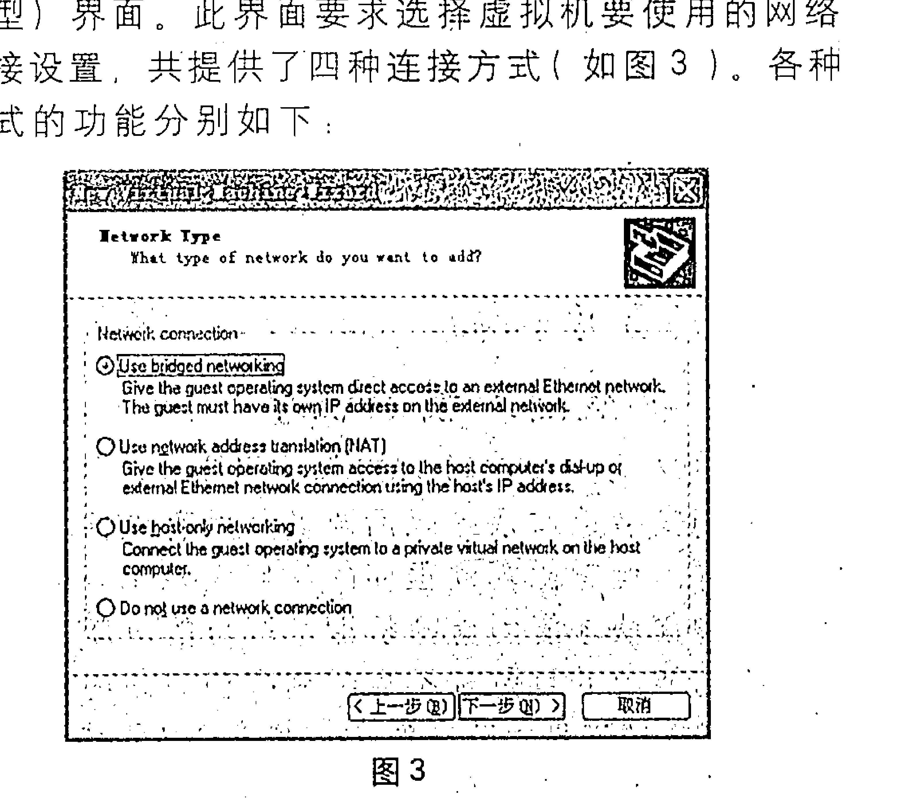

*   Use Bridged Networking(使用桥接方式)。这里相当于一个虚拟网桥。如果你的主系统中安装了物理网卡，可以选择此项。这样可以通过虚拟网卡直接与外部网络相连接，可以使用外部网络的所有功能。
*   Use Network Address Translation (网络地址翻译器)。如果不想给虚拟机分配IP地址（或未装物理网卡）而希望使用主系统中的拨号网络设置连接到外部网络，请选择此项。
*   Use host - Only Networking（仅宿主机网络）。如果只想使虚拟机与主系统组建虚拟专有网络，而不想连接到外部网络，请选择此项。
*   Do not Use a Network Connection（不使用网络连接）。选择此项只能进行单机的操作，不能用网络方式进行互访。

点击“下一步”按钮，进入“specify disk capacity”（指定虚拟硬盘容量）界面，此处需要给虚拟机的硬盘分配总容量。一般程序会根据选择的操作系统自动指定容量，例如：我们选择了Windows 98，程序自动指定了4G（这里的“4G”是指虚拟机允许使用的最大物理磁盘空间，任何时候虚拟机都决不会超量使用）。另外，此处还有个复选框“Allocate all Disk Space Now”（立即分配所有硬盘空间）。如果不选择此项，虚拟机会动态的分配所需的硬盘空间，起初会很小，而以后最大也不会超过设定值；如果选择此项，程序会从物理硬盘中立即分配给虚拟机所选定的容量，而且是永远占用，不是动态调整，这样很浪费硬盘空间。程序默认是不选中的，所以不建议大家选择此项。

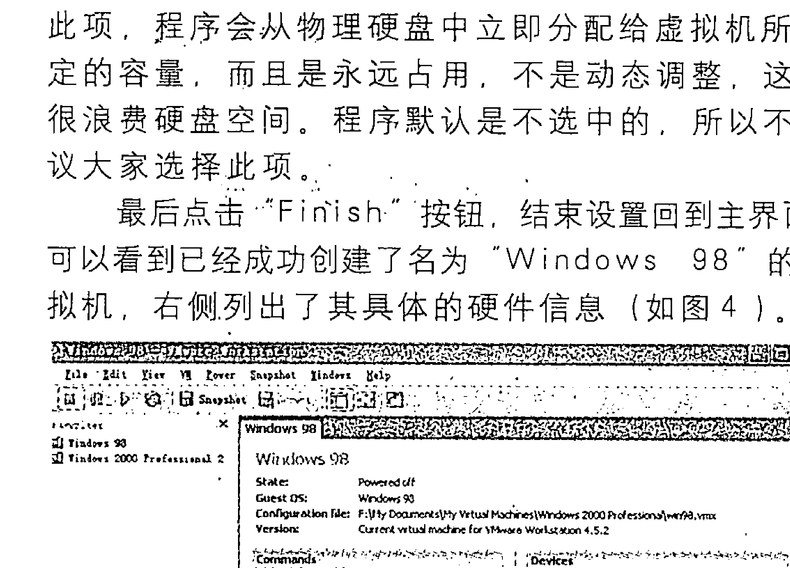

### (二) 安装虚拟操作系统

现在我们已经创建了一台“裸机”，可以点击主界面上的“Start this Virtual Machine”启动虚拟机。由于还没有安装操作系统，所以还不能使用，下一步的工作就是装系统了。操作系统的安装与我们在真实计算机上安装一样，但还要注意以下几点：

#### 1. 更改引导顺序

VMware采用的是Phoenix BIOS，进入BIOS需要按【F2】键。不过，你可能发觉按下F2键没反应？其实还要设定此时键盘和鼠标的控制权，按下【CTRL+ALT】组合键或用鼠标点击虚拟机的窗口任意位置可将控制权交给虚拟机；按下【CTRL+ALT+ESC】组合键将把控制权归还给主系统。

#### 2. 抓图

可以按下Snapshot实时“拍”下虚拟机启动全部过程中的画面（包括BIOS），粘贴到主机“画图”程序中就可永久保存。

#### 3. 分区

安装虚拟操作系统仍然需要进行硬盘的格式化和分区。不过不用担心，它不会对主系统造成任何影响。

### (三) 配置虚拟机

VMware为了保证虚拟系统的兼容性和稳定性，把所有的硬件设备都模拟成了最标准、最保守、最稳定的状态。但是这样一来就会造成系统的性能很低，难以满足我们的日常需要，因此还要进行一些必要的设置与调整。

#### 1. 安装 Vmware Tools

如同Virtual PC一样，刚刚装好的操作系统只能使用640X480的分辨率，也需要安装附加模块来为“操作系统”安装驱动程序。Vmware中的附加模块称为“Vmware Tools Install”，通过点击主界面菜单“VM”下的“Install Vmware Tools”进行自动安装，重启后系统会自动调整显卡的显示属性到最佳状态。

#### 2. 调整硬件配置信息

如果在创建虚拟机的过程中某些参数设置得不合适，完全可以重新进行调整：在主界面点击“VM”下的“Setting”（或单击界面中部的“Edit VMware machine setting”）打开参数设置窗口。在这里可以进行虚拟机名称、网络连接方式、共享文件夹等方面的重新设置。

### (四) 进阶应用，虚拟机与主机间的通讯

在使用虚拟机的过程中，免不了要与宿主机进行数据的交换。但虚拟机是一个相对独立的系统（因此才能保证对主系统的安全），需要进行一番设置才可以实现数据的交换。

#### 1. 简单方法设置共享文件夹

使用共享文件夹进行数据的交换是最简单的方法， 在主界面中点击“Edit VMware Machine Setting”并切换到“Options”标签，选中窗口左侧的“Shared Folders”，再点击右侧的“Add”，最后根据设置向导进行设置即可。

在安装VMware的过程中会自动安装虚拟网卡，并且它与真实网卡事实上已经连在了一起而不用再进行网线的连接，因此可以通过网卡进行通信。设置方法也很简单，利用平时设置对等网的方法，只要分别设置主机及虚拟机的网卡属性即可。但要注意在“网络配置”中不能选择第四项，即“Do not Use a Network Connection”，最好选择第一项“Use Bridged Networking”（使用桥接方式）。当然，计算机名和IP地址是不能与主机相冲突的。以后就可以通过“网上邻居”进行互访了，如同使用局域网一样了。

## 总结

总的来说，这两款虚拟机软件各有千秋，使用哪一个就看自己的喜好了。不过要注意的是，这两个虚拟机软件都是“内存杀手”，对内存的依赖和占用很“变态”。如果你的内存低于256MB，建议你不要轻易的尝试，那样它的运行效率很低，使你丧失对它们的兴趣。另外，它对于CPU主频的依赖并不高，例如，在内存是384MB、PⅢ667EB上运行的还算流畅。除了尝试那些诸如分区、格式化硬盘等“危险”的操作外，还适合进行单机条件下学习网络知识。

如今，各种计算机病毒层出不穷，用户为了应付病毒，浪费了不少精力。而当我们使用杀毒软件查杀病毒时，总会遇到“杀不掉病毒”的情况，比如有些良性病毒没有危害但是有特征代码，有些系统文件中的病毒不能查杀等。如何解决这些问题呢？下面，我们将列出一些比较典型的问题，并给出相应解决方案。

## 病毒杀不掉怎么办

### 一、从系统还原文件谈起

Windows Me/XP系统提供了系统还原功能，这是一个系统默认加载项，它可以自动备份系统。但是，系统中毒时，它也会把带毒的系统文件备份。这时，使用杀毒软件查毒，可能会发现在有些目录下发现病毒，但无法完成清除。究其原因，是由于在系统备份文件中发现了病毒，因为操作系统的保护机制，杀毒软件无法对其中的文件进行操作。比如，_restore文件夹是Windows Me/XP系统特有的系统还原文件夹，隐藏在该文件夹中的病毒是不能直接清除的。当然这些病毒也不能直接发挥作用。要清除这些病毒，可以关闭Windows系统的“系统还原”功能，清理系统还原点，或者直接删除“_restore”文件夹中的内容。以Windows XP系统为例，用鼠标右键单击“我的电脑”，选择“属性”，打开“系统还原”面板，选择“关闭系统还原”。选中后，在所有的驱动器禁止使用系统还原功能。其中的备份文件就会被自动删除。不过，系统还原“_restore”文件夹在一般情况下是不能删除的，彻底删除的方法是打开系统属性→性能→文件系统→疑难解答中选中“禁用系统还原”后退出。在注册表中，打开“HKEY_LOCAL_MACHINE\SOFTWARE\Microsoft\Windows\CurrentVersion\Run Services”子项，将此目录下的下的“*stateMgr”项目删除，重新启动电脑即可。

### 二、在DOS下清除病毒

对于在引导区发现的病毒，我们可以使用干净的系统盘启动系统到DOS，然后在DOS下杀毒即可清除。一般来说，病毒文件在DOS下或在带命令行的安全模式下都可以比较顺利地直接删除。常用的命令有两个，一个是ATTRIB，用来设置（去除）病毒文件的属性，另一个就是删除文件的DEL命令了。在DOS中，病毒文件可能会带有“系统”、“隐含”或“只读”属性，碰到带有这些属性的可能无法直接用DEL命令删除的，我们首先要去掉病毒文件的这些属性。例如，首先使用如下命令：attrib -s -h -r virus.dll（其中-s表示去除“系统”属性；-h表示去除“隐含”属性；-r表示去除“只读”属性）。然后我们就可以使用DEL命令来删除病毒文件了，命令为del virus.dll。在NT内核系统中，如Windows 2000/XP，我们还可以启动到“带命令行提示的安全模式”，来尝试删除正常模式甚至安全模式下无法删除的病毒文件。ATTRIB和DEL命令的用法基本相同。

对勾表示是否随系统同时启动。对于病毒的自启动项，我们可以将它们前面的对勾去掉。值得一提的是，Windows 9X和Windows XP中的msconfig.exe程序也可以在Windows 2000下直接运行，同样可以显示修改Windows 2000中的“启动”信息。

另外，如果杀毒时出现以下类似提示：C:\Windows\brasil.pif worm.win32.opasoft.a病毒 已删除 C:\Windows\SCRSVR.exe worm.win32.opasoft.a病毒 已删除

杀毒后，重启动电脑时出现一些找不到文件的信息，而且再次杀毒时提示病毒还是存在。那么，这些顽固病毒的引用应该是在win.ini文件中。我们可以单击“开始”→“运行”命令，键入“sysedit”，按下回车键后，编辑win.ini，仔细查看后，删除对病毒的引用行。

### 三、通过自启动项删除病毒

现在，很多病毒对自启动项“情有独钟”，在用户启动电脑的时候，病毒或木马就已经开始悄悄地运行了。如果用杀毒软件无法清除，我们可以采用手工方式直接删除。

#### 1. 从注册表编辑器中删除

以Windows 2000为例，一般病毒经常会将自启动项加载在注册表的[HKEY_LOCAL_MACHINE\SOFTWARE\Microsoft\Windows\CurrentVersion\Run]目录下，这也是一个最常见的自启动项位置。此外，注册表的[HKEY_LOCAL_MACHINE\SOFTWARE\Microsoft\Windows\CurrentVersion\RunOnce]也是病毒经常添加自启动项的地方。对于某些比较特殊的病毒来说，[HKEY_CURRENT_USER\Software\Microsoft\Windows NT\CurrentVersion\Windows]下的run和load也会被病毒程序利用起来加上它们的自启动项，由于有些用户并不十分清楚它在注册表编辑器中的位置，不一定能在注册表编辑器中找到这里，这个时候，我们可以使用菜单“编辑”→“查找”命令来查找一下我们所要找的病毒自启动信息，我们输入病毒文件的完整文件名来进行查找病毒的自启动信息和其他一些相关信息。

#### 2. “系统配置实用程序”和系统初始文件

Windows 9X和Windows XP系统有一个“msconfig”工具，即“系统配置实用程序”，通过它，我们可以方便地管理一些程序的自启动信息。打开系统配置实用程序：单击“开始”→“运行”命令，输入“msconfig”，点击“确定”打开系统配置实用程序。在“系统配置实用程序”的“启动”选项页上我们可以看到有一个启动程序列表，它们前面的

### 四、“.ex_”文件感染病毒和疑似病毒

以“.ex_”为扩展名称的文件是软件安装程序的部分文件，其中的病毒不能直接清除。只有在软件完全安装成功后，方可清除。另外，杀毒软件有时会出现如下提示：unknown.com.tsr.virus。该提示中，unknown是“不明的”意思，tsr是内存驻留的意思。一般来说，这些提示指出的是纯DOS环境下的可执行文件，表明杀毒软件在该文件中发现了可疑代码，有点类似病毒，但是没有确定是什么病毒。如果疑似病毒提示涉及Type-Win32代码，则表示可疑的32位代码的意思，是指Windows环境下可疑的可执行代码。对于疑似病毒，可以直接删除该文件。

如果杀毒软件查出的是其病毒库中不存在的新型病毒，建议将杀毒软件的病毒库升级到最新，然后再查杀。或者将这些“疑似”的病毒文件发送给反病毒软件公司，请求帮助。

### 五、使用第三方工具

现在有不少网站提供了单独的清除工具，比如我们可以使用HijackThis来去掉或编辑启动项。HijackThis的下载地址为：http://www.spywareinfo.com/，它不需要安装，解压后即可使用。点击“Scan”按钮，它会自动对系统进行全方位的安全检测，很快就会将系统中所有可疑的项目列出来，每个可疑项目的前面都有一个编号，这些编号代表了不同的类别，选中某个项目，然后点击下面的“Info on selected item”按钮可以查看到更详细的信息。选中你认为确实属于可疑的项目，然后点击“Fix checked”按钮进行修复即可。如果重新启动系统后出现错误，可以点击“Config”按钮，切换到“Backups”标签页，在这里点击“Restore”按钮进行恢复；假如一切正常，那么就可以选择“Delete”或“Delete all”将此项目彻底清除。如图1所示。

### 六、典型“病毒”清除实例

问题描述：移动硬盘里面感染了一个winfile.exe的病毒，使用KV3000 杀毒软件可以查出来。在Windows 2000系统里是文件夹状态，但在江民杀毒里是程序文件状态，KV3000 既不能杀也不能删除，导致移动硬盘存储的文件经常出现问题，这个问题怎么解决？解决方法：这是一个Windows下的木马程序，它复制自身到Windows目录，并改名为Mstray.exe。然后修改注册表，在[HKEY_LOCAL_MACHINE\Software\Microsoft\Windows\Currentversion\Run]子项下增加“RavTime”主键，键值为“%WINDOWS%\MSTRAY.EXE”，以达到自启动的目的。查杀时，一定要去掉启动项中的不明内容，这样才能保证彻底杀毒。另外，使用杀毒软件在安全模式下扫描全盘并杀毒应该可以解决。实际清除不明病毒的过程中，我们还可以按下【Ctrl+Shift+Esc】组合键，打开“任务管理器”窗口，切换至“进程”选项卡，在列表中查看启动的进程，必要的时候，可以选择需要关闭的进程，点击“结束进程”按钮进行关闭。另外，为了保证系统的安全性，不给病毒以可乘之机，还要对用户的安全性进行管理，将不需要共享的文件夹设置成不共享状态，定期杀毒等，从而将不明病毒拒之门外。


## 玩转USB启动盘

文 / 生鱼片

一般大家只是在拷贝数据的时候才用到闪存盘，可如果你的电脑出现的问题需要启动盘来引导系统，而电脑却没有安装软驱，这时候你会想到闪存盘其实也能帮你这个大忙吗？不信，那就开始我们的制作USB启动盘的快乐之旅吧！！！

### 一、在Windows 98中制作USB启动盘

在Windows98中的制作方法其实很简单，使用USB闪存盘自带的工具做成启动盘就可以了。在此我们以爱国者“迷你王”为例来介绍制作方法。

首先将爱国者迷你王连接到电脑上，运行驱动光盘上的mFormat程序，并选择“制作HDD启动盘”选项（“USB ZIP 开机磁盘制作”是将迷你王做成USB-ZIP 引导，选“USB HDD 开机磁盘制作”是将迷你王做成USB-HDD 引导，大家可根据自己主板所支持的相应USB 启动方式来进行选择），点击“开始”按钮这时会出现让我们做好备份的提示，点击“确定”按钮后就开始制作启动盘，经过拷贝数据之后，就完成了USB 启动盘的制作。然后重新插拔“迷你王”，这样可以引导系统的迷你王启动盘就彻底做好了！接下来就用“迷你王”来引导启动系统了，在CMOS 设置中将主板启动功能的设置选项中将第一启动## 二、在Windows 2000/XP中制作USB启动盘

动设备设为“USB-HDD”，最后保存设置并退出重新启动计算机。从引导到启动大概需要10～20秒钟，这时会弹出一个用软盘引导系统是一模一样的画面，当进入DOS模式后，这时系统会直接进入迷你王的所在盘符“C:”，这样就完成了启动过程，其过程与用软盘引导系统是一样的，而硬盘的盘符则是从D开始。

现在市面上大多数USB闪存盘都支持启动电脑的功能，但是要制作启动型USB闪盘，如果用上述方法需要进入Windows 98系统，可现在很多人的电脑上都是Windows 2000、XP什么的，这年头装Windows 98系统的人太少了，呵呵！为了做个启动盘，再装一个Win98操作系统那多冤啊！

这时候USBoot就出来解决这个难题了，它能在Windows 2000/XP下运行，可以直接把USB闪存盘制作成启动盘，并且程序自带了MSDOS7.1的两个基本启动文件IO.SYS和COMMAND.COM。如果要制作复杂的启动盘，把其他文件拷贝到USB闪盘即可，让它的功能更加强大。

运行USBoot程序后出现如下图所示的主界面，首先用鼠标在磁盘列表中选择要处理的USB闪存盘，接下来单击主界面下方的提示文字，从弹出的菜单来选择工作模式，在这里我们选择“HDD模式”。

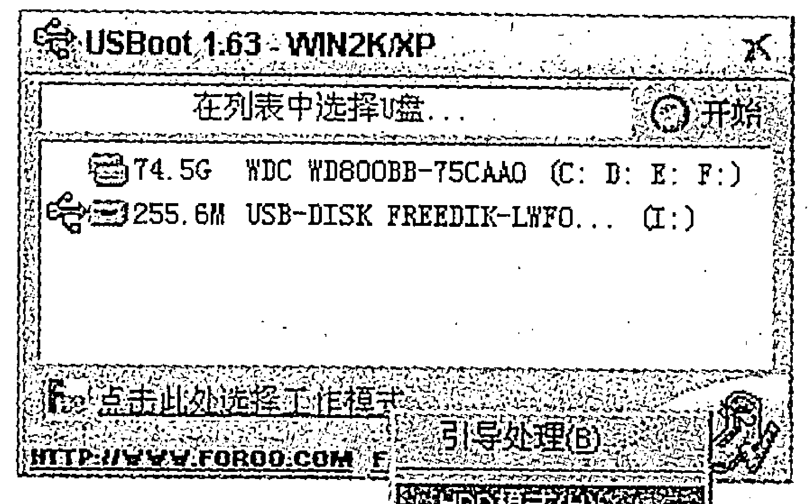

小提示
在USBoot中固定设备只能用HDD模式，而移动设备可以用ZIP或FDD模式。也就是说如果USB闪存盘显示固定设备，那么我们是无法做成FDD或ZIP模式的。

在选好工作模式后点击“开始”按钮就开始制作启动闪盘了，这时软件就会对USB闪存盘进行清除FAT表、格式化等一系列的操作，然后会提示拔掉USB设备，随后又会提示再次插上闪存盘，插上闪盘后USBoot就开始写入引导文件，最后提示启动USB闪盘制作成功。怎么样？是不是很简单啊？

## 三、巧用Ghost制作USB启动盘

如果你的USB闪存盘是一个比较老的产品而且又不支持启动功能，按照以上介绍的两种方法可能会提示制作不成功，这怎么办呢？这时我们可以用Ghost来让老盘重现光彩！

首先用可以启动的USB闪存盘来做个启动盘，然后运行Ghost来把这个启动盘制作成一个映像文件，具体方法是启动Ghost进入程序界面选择Local→Partition→To Image，接下来将这个GHO的文件恢复到老式USB闪盘上，方法是Local→Partition→From Image，这样处理后，老式的USB闪存盘也可以作为启动盘了。

现有的主板有好几种存储设备的启动方式，如USB-HDD、USB-FDD、USB-ZIP等几类。这些不同的启动方式之间并没有什么本质的区别，但仍存在一些小的差异。

例如，如果用USB-FDD方式启动，启动完成后会出现“A:盘符”，容量只有1.44M；而采用USB-HDD的方式启动，在启动系统之后出现的盘符是“C:”，原来硬盘的C盘则变成了D盘，其余盘符依次后推，可以使用闪存盘的全部容量。USB-ZIP与USB-HDD启动方式的区别在于USB-ZIP会在逻辑硬盘后虚拟一个硬盘，里面装载一些DOS的常用命令，而USB-HDD就不会加载这些命令。现在大多数USB闪存盘只支持一种启动方式，但一些名牌产品则支持两种不同的启动方式。所以说我们尽量把USB闪存盘设为HDD模式，这样才能把更多的DOS工具集成到闪存盘里，让系统维护更加方便。

> 《全歼Windows另类垃圾》补遗
文/文思乐
2004年16期《全歼Windows另类垃圾》文中还有一些没有说到：多余的DLL文件删除它们可以提高系统的效率。他们都隐藏在注册表的[HKEY_LOCAL_MACHINE\SOFTWARE\Microsoft\Windows\CurrentVersion\ShareDlls]子键下面，那些是安装程序的时候向注册表写入的DLL文件共享信息。每个DLL文件的键值表明共享此DLL的文件的应用程序数目。所以你在卸载他们的时候会出现“XXX文件在被其他文件共享，是否确定删除”的提示。其实只要他后面的数值是0那么就表明可以删除。

## 不用Word域功能，成绩打印照样很轻松

文 / 向德海

《电脑爱好者》2004年第17期《巧用VBA功能，成绩单随心打》一文介绍了在Excel中用VBA实现成绩单的打印。读后深受启发，同时认为文中有一点不足，那就是在一个模版上打印两个或多个成绩单该如何实现呢？对这样的问题，用Word邮件合并插入下一记录域的方法可以实现，经过探索笔者发现，只用Excel也可以实现在一页纸上连续打印多个成绩单（本文以打印两张成绩单为例加以说明）。

如图1所示的工作表是一份考生考试成绩数据，需要将此表中的每一条记录打印成成绩单，并发放到每一位考生手中。而成绩单要求在一页A4纸上连续打印两条数据。使用过Word邮件合并的读者知道，使用插入下一记录域的方法可以实现，不过，在Word中调用Excel数据不是很方便。下面请大家看一看，用Excel我们照样可轻松实现成绩单的打印。

| A | B | C | D | E | F | G | H |
|---|---|---|---|---|---|---|---|
| 1 | 序号 | 姓名 | 准考证号 | 身份证号 | 工作单位 | 分数 | 是否合格 | 备注 |
| 2 | 1 | 王XX | 10208100611 | 420800XX06010XX | 沙洋监狱管理局 | 69 | 不合格 | 数至200 |
| 3 | 2 | 张XX | 10208100612 | 420800XX02106XX | 荆门职业技术学院 | 59 | 不合格 | 你尚未未 |
| 4 | 3 | 李XX | 10208100613 | 420800XX08292XX | 荆门市产品质量检验所 | 78 | 合格 | 数至200 |
| 5 | 4 | 陈XX | 10208100614 | 420802XX04220XX | 荆门市河管理局 | 35 | 不合格 | 你尚未未 |
| 6 | 5 | 刘XX | 10208100615 | 420800XX10030XX | 荆门市职业技术学院 | 70 | 合格 | 数至200 |
| 7 | 6 | 赵XX | 10208100617 | 420103XX09082XX | 武汉荆门化工有限公司 | 67 | 合格 | 数至200 |
| 8 | 7 | 孙XX | 10208100618 | 420802XX09192XX | 荆门市三干渠管理处 | 29 | 不合格 | 你尚未未 |
| 9 | 8 | 周XX | 10208100620 | 420800XX11120XX | 东宝区电信局 | 37 | 不合格 | 你尚未未 |
| 10 | 9 | 吴XX | 10208100621 | 420106XX09124XX | 荆门市中医院 | 86 | 合格 | 数至200 |
| 11 | 10 | 郑XX | 10208100622 | 610103XX02053XX | 荆门市一医 | 57 | 不合格 | 你尚未未 |
| 12 | 成绩表/通知单/ | | | | | | |

图1

- 第一步：插入一个新的工作表，并将其命名为“通知单”，打开“通知单”工作表，建立成绩单打印模版。
- 第二步：输入公式。在通知单工作表中用VLOOKUP函数建立通知单与成绩表中数据的关联。
    - 在H4单元格中输入公式“=H3+1”，在A3和A6单元格中输入公式：“=VLOOKUP($H$3,成绩表!A2:H26,2,FALSE)”，该公式的含义是通过序号即H3单元格的数值，查找成绩表工作表A2:H26区域中符合条件的行，并返回该行中指定列（第2列）的数据，并将该内容填充到A3单元格中。以此类推，在B6、C6、D6、E6、F6单元格中分别输入以下公式：
        - B6=VLOOKUP($H$3,成绩表!$A$2:$H$51,3,FALSE)
        - C6=VLOOKUP($H$3,成绩表!$A$2:$H$51,4,FALSE)
        - D6=VLOOKUP($H$3,成绩表!$A$2:$H$51,6,FALSE)
        - E6=VLOOKUP($H$3,成绩表!$A$2:$H$51,7,FALSE)
        - F6=VLOOKUP($H$3,成绩表!$A$2:$H$51,5,FALSE)。
在A7单元格中输入公式“=" " & VLOOKUP(H3,成绩表!A2:H51,8,FALSE)”。由于A7单元格是合并单元格，内容对应为成绩表中备注栏，为了美观要缩进2字符，故使用上述公式。
以上公式中数值字符是成绩表“$A$2:$H$51”数据区域的列序号。
同样道理，将H4单元格中的内容作为下面一个模版要查询的数值，在A13和A16单元格中输入公式“=VLOOKUP(H4,成绩表!$A$2:$H$51,2,FALSE)”，其他以此类推。这样只要通知单中序号（H3）输入的数值变化，对应的两个成绩通知模版数据将发生相应的变化。
- 第三步：执行“视图”→“工具栏”→“窗体”命令，打开窗体对话框，点击微调项标志按钮，建立一个微调按钮（如图2）。用鼠标右键单击微调按钮标志，打开如图3所示的“设置控件格式”对话框，在“单元格链接”中设定为“$H$3”，“步长值”设为“2”，这样第一页纸就打印1、2条记录，第二页纸打印3、4条记录，避免了第一页纸打印1、2条记录，第2页纸打印2、3条记录，而出现重复。如果在一页纸上打印3条记录，则将步长值设为3，以此类推。
- 第四步：执行“工具”→“宏”→“Visual Basic编辑器”命令，在代码窗口输入以下代码（如图4）：

```
Sub 打印()
Call dy
End Sub

Sub dy()
    Dim a%, b$, c$, abc$
    a = Sheets("通知单").Cells(3, 8).Value
    b = Sheets("通知单").Cells(3, 9).Value
    （说明：a 即 H3 单元格，是要输入的打印起始页，b 即 I3 单元格，是终止页。）
    If a < b Then
        a = a + 2
        （说明：‘如果是连续打印 3 条记录则改为 “a=a+3” 等等）
        Sheets("通知单").Cells(3, 8).Value = a
        Call 打印
    End If
End Sub

Private Sub CommandButton1_Click()
Call 打印
End Sub
```

输入完毕后，保存关闭 VBA 编辑窗口，返回工作表状态。同制作微调按钮方法一样制作图2所示的打印窗体，并指定刚才建立的“打印”宏。此时，只要选择打印起始页和终止页页码，设定打印区域，单击“打印”按钮，成绩单就会连续打印出来了，怎么样？是不是很简单？

```
ActiveWindow.SelectedSheets.PrintOut Copies:=1, Collate:=True
```

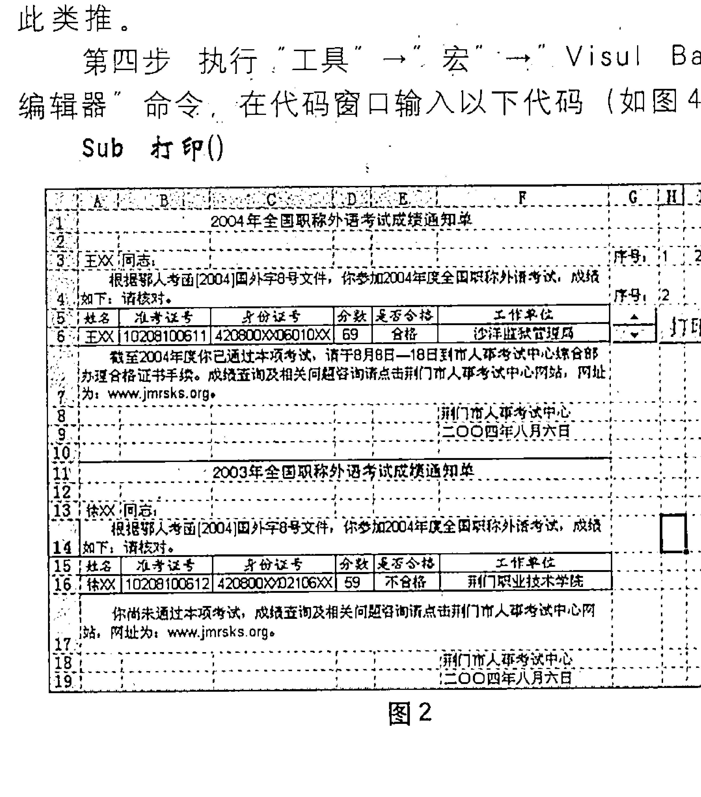

## Office2000 实用技巧两则

文/魏斌

在Office2000的使用过程中，对其某些功能进行巧妙使用，能达到意想不到的效果。

### 在同一Word文档中对不同的页面进行不同的页眉定义

在平时的文字处理中，有时需在同一 Word 文档中对不同的页面赋予不同的页眉定义，在 Word 中可以轻松地做到这一点。在输入页眉时，将弹出的“页眉和页脚”选项中的“同前”一项不选，对每一个页面即可自定义页眉；如果需要相同的页眉，将“同前”选项选中即可。对于页脚的定义也可同样操作。

### 在Excel中将横表改为竖表

在Excel使用过程中，有时需将表旋转90度，即横表改为竖表，并且字头朝向发生变化。可先进行正常地录入，然后对输入的内容进行拷贝，新建一个文档，选用选择性粘贴工具，将“转置”一项选中，这样表头就已经旋转90度了，然后选中所有的单元格，在“设置单元格格式——对齐——方向”中进行相应设置即可。如果表格比较复杂该操作有可能不能成功。

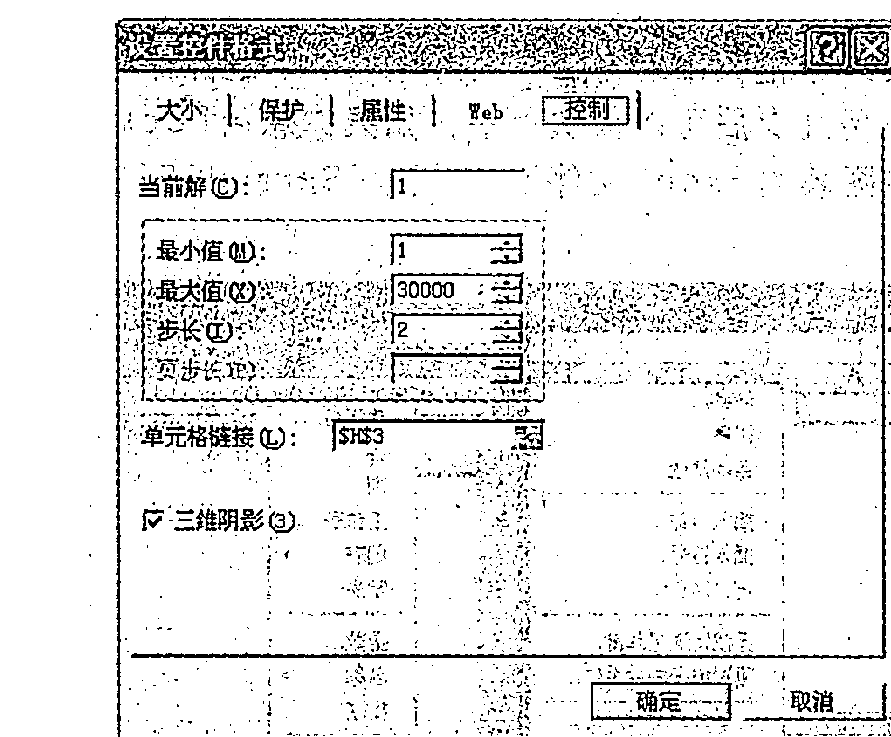

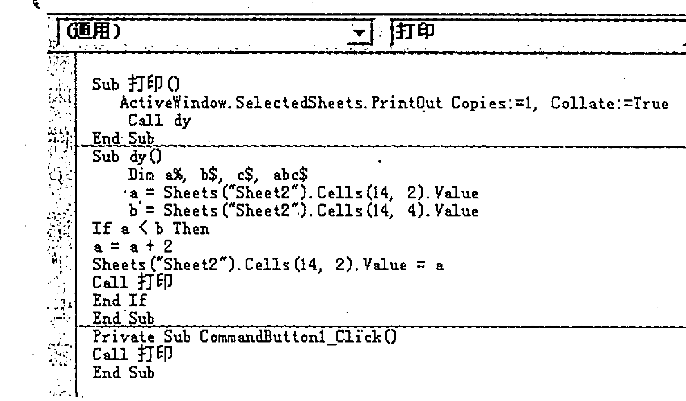

## PocketPC掌上办公室试玩

在PocketPC诞生以前，我们处理诸如“Word”、“Excel”以及“PowerPoint”等常用的公事文档基本只能坐在电脑前阅读和修改。而现在随着PocketPC的出现改变了传统的办公方式，我们只需把这些文档放进我们的口袋里就可以随时随地处理了，你还可以通过PocketPC的邮件功能把处理好的文件直接发给相关的同事或客户。

PocketPC系统内置的“Word”和“Excel”是PC版的缩水版本，它们的功能虽然要比PC版逊色一些，但处理一些常用数据已经绰绰有余了。PocketPC的“Word”和“Excel”使用方法与PC版基本是一样的，在这里就不再赘述了。需要注意的是PocketPC上的这些办公软件与同步软件“ActiveSync”有着非常紧密的联系，必须与“ActiveSync”协作才可以更好的发挥其功效。接下来我们就简单了解一下“ActiveSync”与“Word”和“Excel”的联系。

我们在PC上运行“ActiveSync”，单击“工具”→“选项”命令，在选项设置里我们可以设置同步的“选项”、“模式”和“规则”，我们先看“同步选项”，在这一项中我们只需双击窗口列出的选项就可以进入相应的设置窗口。这里需要注意的是“文件”这个选项，我们双击它进入“设置”窗口，我们可以看到软件默认的“文件同步”路径是“My Documents\Pocket_PC My Documents\”，也就是说我们只要把常用的公事文件放到这个指定的文件内，以后每次同步时这个文件就会自动同步更新到你的PocketPC中，省去了重复从PC复制到PocketPC里的繁琐过程，如果你还想同步其他非默认路径下的文件，可以点选窗口下方的“添加”选项指定其他路径。我们返回到选项设置里，点击“规则”选项里的“转换设置”，这项对我们同步“Word”、“Excel”、“PowerPoint”等文档的影响很大，因为这些文档在从PC同步到PocketPC时文件会被转换为PocketPC兼容的格式，在“转换设置”选项里我们可以指定PC与PocketPC之间文件的转换规则。比如当你利用同步功能将PC中的Word文档同步到PocketPC时，PC版的Word文档将会被转换为PocketWord文档，由于PocketWord不支持表格、图片插入等PC版Word“特殊格式”，所以这些“特殊”的Word文档在PocketPC上将会无法正常显示。

如果你想保持原有Word文档的“特殊格式”，可以在“ActiveSync”里的“工具”菜单单击“选项”命令，然后进入“规则”设置界面，点击窗口中间的“转换设置”，取消选择“常规”窗口里的“同步、复制或移动时转换文件”复选框，这样就可以保持住Word文档的特殊格式了。

有很多朋友抱怨“PocketExcel”不能制作图表，其实“PocketExcel”这方面的缺陷可以用“SpreadCE”这个软件弥补，“SpreadCE”这个软件在CE2.11时代就被广大“蜥蜴”推崇备至，可见其功力决非浪得虚名。“SpreadCE”使用方法和界面基本与“PocketExcel”相同（图1为二者界面的比较），不同之处只是它们的功能菜单稍有出入，但“SpreadCE”的操作十分简单，多用几次后可以很快上手。如果你想用PocketPC制作带图表的Excel文件不妨试试“SpreadCE”。

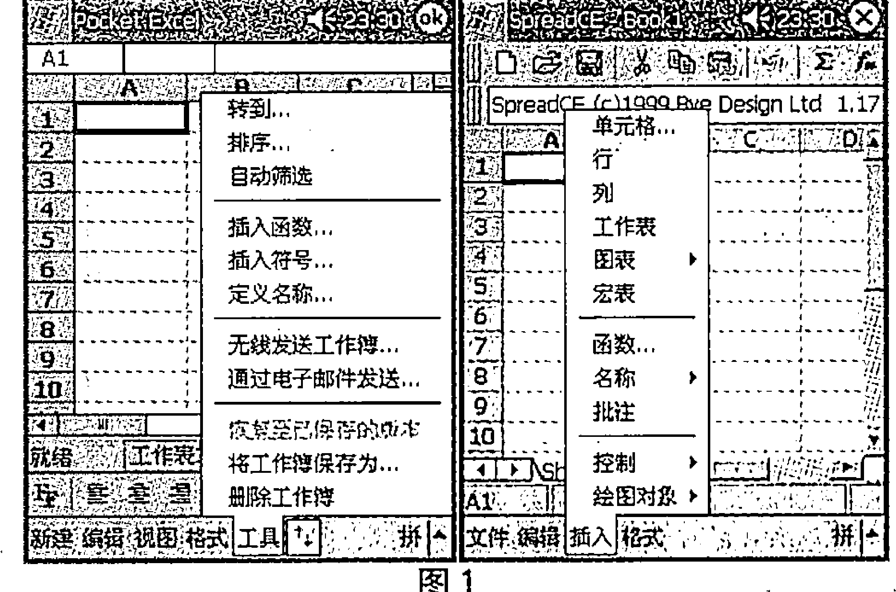

上面我们介绍了Pocket “Word”和“Excel”，接下来我们再了解一下PocketPC上另一个办公利器——“PowerPoint”，因为PocketPC系统本身没有内置“PowerPoint”软件，所以我们需要安装第三方软件才可以处理“PPT”文件，目前PocketPC最流行的“PPT”软件是“ClearVue Suite”这个软件，这个软件的功能很强大，通过它可以浏览“Word”、“Excel”、“PowerPoint”、“PDF”的文件，而且还可以浏览JPEG、BMP、PNG这三种格式的图片文件（图2）。它的“Word”、“Excel”文件的浏览功能要比Pocket “Word”和“Excel”强，它可以完整地浏览PC上所有的“Word”和“Excel”文件，支持浏览表格、图片、图表插入的PC“Word”、“Excel”文件，不过切记在PC端同步软件“ActiveSync”里“同步规则”中“常规”窗口中取消选择“同步、复制或移动时转换文件”复选框，否则同步时会把你原始的“Word”、“Excel”文件转换成Pocket格式。

“ClearVue Suite”可以比较完美地浏览“PowerPoint”文件，而且提供多种浏览方式，使用者可以在窗口上方选择自己喜欢的浏览模式，也可以在“Set Up”（设定）项里设定各项浏览设置。不过比较遗憾的是这个软件目前只能浏览PPT文件，不能编辑文件，不过目前这类软件绝大部分都不支持制作PPT文件，所以“ClearVue Suite”可以算这类软件中最好用的一个了。

文件处理完了，可我们怎样才能把它发送出去呢？接下来我们来了解一下PocketPC邮件的设置方法。点击桌面上的“收件箱”，点击“服务”选项中的“新建服务”，进入邮件设置窗口。在这里填入你想创建的邮箱地址，填完后点“下一步”。这时会出现配置窗口，这里不用等它配置完毕，直接点“跳过”即可。接下来会出现“用户信息”窗口，这里的“用户名”系统会按你的邮箱地址自动生成，不需要管它，你只需填写“姓名”和“密码”即可，填写完毕后点击“下一步”，弹出“帐户”信息窗口，这里前一项填“POP3”即可（前提是你的邮箱必须支持POP3，如果你不清楚，可以到你的邮箱服务提供商网站说明里查一下），后一项随便填（邮箱的名字），继续点“下一步”来到“服务器信息”窗口，这里接收服务器填写“pop3.abc.com”，发送服务器填写“smtp.abc.com”，先不要点“完成”，你可以在“选项”中具体设置一下你的邮箱各项属性，设置完毕后点击“完成”，至此你的邮箱配置全部完毕，以后你就可以用它收发你的邮件了。

不过笔者在实际应用中发现有些邮箱服务商不提供PocketPC客户端直接收发邮件的服务，必须要登陆它的网站上的邮件发送系统才可以收发邮件。遇到这种情况，我们只好在PC上用“Microsoft Outlook”把邮件同步到PocketPC上了，一定要注意必须安装“Microsoft Outlook”才能同步（一般PocketPC随机光盘会赠送这个软件），Windows系统自带的“Outlook Express”是不能向PocketPC同步数据的！

总体来说PocketPC系统自带的办公软件还是比较强大的，如果善加利用，完全可以应付我们日常的工作需要。因此，如果你经常要在移动中处理公事的话，除了笔记本外，一部PocketPC也是不错的选择。

## 百万像素拍照手机，鸡肋还是够味？

如果说拍照手机的诞生打破了传统手机设计的格局，那么百万像素拍照手机的出现就是引发手机再次革命的新导火索。2000年11月，世界第一台拍照手机夏普J-SH04在日本诞生，2003年5月由日本通讯运营商J-Phone打造的全世界第一台百万像素拍照手机诞生，2004年10月，全球第一款配置500万像素摄像头的手机三星SCH-S250正式发布……手机拍照功能从出现到迈入500万像素级别仅用了不到3年的时间，有人不禁要问，手机上的摄像头到底能升级到多少万像素呢？买了摄像手机，还有没有必要再购买一部数码相机呢？

2004年初，国内3G的呼声日渐高涨，但如马拉松般漫长的3G标准论证却将我们对3G渴望的激情消磨殆尽，于是无奈的手机厂商纷纷将目光投向了手机上的摄像头，希望在这个2.5G与3G交接的时段借摄像头像素的提升来为手机市场注入新的活力。随着三星500万像素手机现身市场，很多关注手机的朋友不禁提出了疑问，“这分明是台搭载了手机功能的数码相机！”

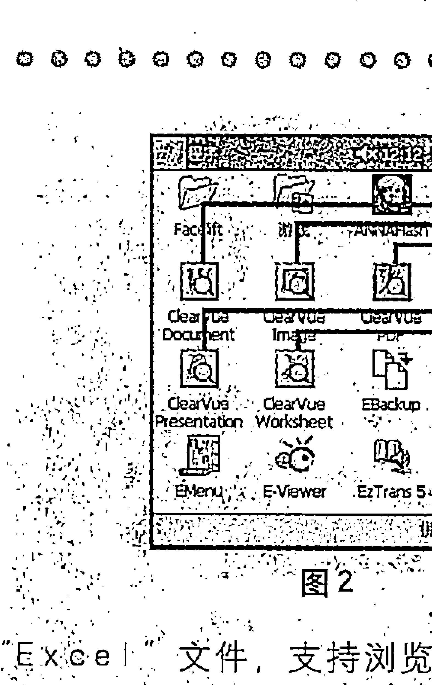

## 手动安装屏幕保护快捷方法

文/zsb750

看了《电脑爱好者》2004 年第 4 期 18 页介绍的在 Windows XP 中手动安装屏幕保护程序后，我觉得该方法过于麻烦，于是我又发现了一个更好的办法。

首先将屏幕保护程序（扩展名为 .SCR）放到一个文件夹中（最好是可以避免误删除的文件夹），然后在屏幕保护程序上点右键，看见里面的安装了吗？点一下，在看看显示中的屏幕保护程序选项卡中是不是多了一个（名字根据屏幕保护程序而定），那就是你安装的屏幕保护程序。怎么样，很简单吧！

## 如何识别硬件的驱动程序

文/天唯创造：CD

每当我们的计算机系统出现故障或是感染病毒之后，很多人都喜欢将系统盘格式化，然后重新安装操作系统。这样一来，老问题解决了，但新的问题又产生了，重装操作系统后，如果硬件设备不被操作系统识别，将如何确定这些硬件设备的驱动程序呢？

### 一、硬件识别法

首先介绍一下硬件识别的方法，这也是一种比较直观的方法，即直接观察设备的接口和芯片，从而确定该设备的驱动程序。

假定我们有这样一个设备（图1），我们用硬件识别法来确定该设备的驱动程序，然后正确的安装驱动程序。首先我们先来看它的外部接口，在挡板上一共有5个接口，其中4个莲花插座，和一个15针的数据接口，一般来讲，15针的数据接口一般用于连接游戏设备，而莲花插座一般连接音频设备，比如音箱、耳机等。好了，根据这个接口信息我们可以大致判断这个设备为声卡。但是具体是不是声卡，我们还需要继续观察。在判断了接口之后，我们来识别一下该设备上比较重要的元件——芯片。这也是我们判断一个硬件的主要根据。一般设备上都有很多的芯片，那么究竟哪一个芯片可以确定这个硬件呢？一般主要看比较大的芯片，而且上面有很明显的公司标志，根据这个芯片就可以确定一个设备。根据这个原则，我们来看看这个待测的设备，这个设备上有两个芯片，很明显靠右边的这个比较大，而且上面有明显的公司标志。好了，关键的时刻到了，现在让我们来看看这个芯片上写的是什么：“Avortex AU8830 90AAAA 9941-M9527”。根据惯例，一般最开始的内容是著名生产厂商的，接着生产厂商的是该芯片的型号，这也是我们判断的主要依据，然后接着的是生产批号等。根据这个惯例我们来看看最开头的标识为“Avortex”，它究竟代表什么呢？接下来我们可以利用网络来找答案，打开搜索引擎，搜索一下“Avortex”。经过筛选我们得到了如下的信息“Aureal公司是美国老牌的音频处理芯片的研发生产厂家，经典的Vortex1 AU8820和Vortex-2 AU8830两大音效处理芯片曾被广泛使用，后者更是当年创新EMU10K1芯片的劲敌。Vortex-2 AU8830是Aureal的第二代芯片，支持A3D 2.0/3.0（驱动支持），信噪比达到96db，支持目前主流的操作系统，最大特点就是播放MP3的效果力度尚佳。”，果然是一块声卡。

既然知道是声卡，接下来我们继续判断这块声卡的型号，然后为其选择一款合适的驱动程序。在“Avortex”的下面有“AU8830”的字样。根据我们刚才得到的信息，可以知道“AU8830”就代表了声卡的型号。那么这个设备就应该是：使用Aureal公司生产的AU8830芯片的声卡。有了设备的型号，现在我们来为它选择一个合适的驱动。打开浏览器，来到驱动之家“http://www.mydrivers.com/”，现在我们已经知道了这个硬件的基本信息，为了更快地找到相关驱动，我们选择分类搜索。点击进入“声卡驱动”，在厂商中选择“Aureal傲锐”。点击进入后，根据芯片型号“AU8830”我们马上就发现了适合的驱动。将其下载下来，便可以顺利地安装。

好了，以上我们用示例的方法介绍了如何用硬件识别法来识别一个硬件，但是在实际的应用过程中，有些设备的芯片是不容易被看到的，比如被散热片盖住，或者一些品牌电脑不允许打开机箱，更有甚者，芯片是经过打磨改动（比如YAMAHA 734）。这些情况是不能用硬件识别法来识别的，那么下面我们就来介绍另一种方法——软件识别法，这也是一种有效的识别方法。

### 二、软件识别法

我们依然用一个具体示例来介绍软件识别法。我们主要使用一款小巧的绿色软件——Unknown Device，它可以通过对系统设备的检测为寻找未知设备的驱动提供重要线索。这款软件在Windows 98/Me/2000/NT/XP下都可以直接运行，并且不需要安装，使用起来非常方便。

首先打开设备管理器（图2），发现在网卡下有一个未知设备，现在操作系统已经给我们提供一个重要的线索，这个未知设备大概是一块网卡。

现在我们启动Unknow Device这个软件。软件启动之后便开始识别计算机上的所有硬件，然后给出一个类似设备管理器的列表（如图3）。此时所有的硬件都被Unknown Device所识别了。经过仔细辨认，我们发现在第二个设备中有如下信息：Realtek Semiconductor Rt8139(A/B/C/8130)Fast Ethernet Adapter（如图4），这个信息中虽然没有列出这个网卡的品牌，但是根据这个信息我们已经可以判断这个网卡使用的是Realtek公司的8139系列芯片，我们完全可以根据这个信息，来搜索驱动。

和前面的查找方法一样，依然使用分类查找，在厂商中选择Realtek，很快，我们找到了一款合适的驱动。将其下载下来并且顺利的进行了安装，我们再回到Windows的设备管理器里看看，我们发现网卡已经被正确的安装了。Unknown Device这款软件可以到“http://www.halfdone.com/Development/UnknownDevices/UnknownDevices.zip”去下载。另外你可以将你的操作系统升级到Windows XP这样操作系统，该操作系统能自动识别更多的硬件。

## DirectX应用集锦

文/IntoDigi.斯佳丽

DirectX 是一种图形应用程序接口（API），简单地说它是一个辅助软件，一个提高系统性能的加速软件，是由微软创建开发的，微软将它定义为“硬件设备无关性”。Direct 是直接的意思，X 是很多东西，加在一起就是一组具有共性的东西。从内部原理探讨，简单说来DirectX 就是一系列的DLL（动态连接库），通过这些DLL，开发者可以在无视于设备差异的情况下访问底层的硬件，DirectX 封装了一些COM（Component Object Model）对象，这些COM对象为访问系统硬件提供了一个主要的接口。相信大家都知道DirectX，下面向大家介绍一些DirectX的应用技巧及故障答疑。

### 一、安装卸载篇

#### 1. 卸载DirectX 9.0，还原DirectX 8.1

在将系统中的DirectX 8.1升级到9.0C版后，可能会出现声卡不发声的故障，那么可以通过将其卸载并重新安装DirectX 8.1来解决。但你可以发现在“添加/删除程序”中没有卸载DirectX 9.0C的选项，无法删除DirectX。我们可以通过第三方软件，如“DirectX随意卸”来卸载DirectX。下载地址为http://xj-http.skycn.net:8080/down/udx199c.zip。

“DirectX随意卸”支持任何版本的DirectX卸载，操作非常简单。运行“DirectX随意卸”，在主界面中直接点击“卸载DirectX”按钮（见图1），然后在弹出的“卸载方式选择”对话框中选择“仅仅卸载”，然后点击“开始卸载”按钮即可。另外，该软件还有恢复Windows XP原始自带的DirectX的功能，操作也很简单，只要将光盘插入光驱，然后按照程序提示操作即可。

#### 2. 在DirectX 8下安装DirectX 7的技巧

如果机器上已装了DirectX 8还想安装DirectX 7，系统就会提示有新版本存在，不能安装旧版本。关于在DirectX 8下安装DirectX 7的问题，一般需要下载反安装程序来解决，但也可以手工解决，具体操作步骤如下：

- 第一步：用记事本打开“C:\WINDOWS”下的Directx.log文件，找到“Version in registry = 4.06.03.0518”和“Version in DLL = 4.07.00.0716”字段。
- 第二步：运行“regedit”打开注册表编辑器，查找关键字“4.07.00.0716”（因为“Directx.log”里的版本号“4.07.00.0716”是最高的）。查找结果显示，只有“HKEY_LOCAL_MACHINE\Software\Microsoft\DirectPlay\DirectX\Version”的键值是“4.07.00.0716”。把它修改为“4.06.03.0518”，退出注册表编辑器后，就可以安装DirectX 7。

#### 3. 如何使用DirectX诊断工具判定DirectX的版本

要使用DirectX诊断工具判定计算机上安装的是何种DirectX版本，可执行以下操作：

运行开始菜单中的“开始”→“程序”→“附件”→“系统工具”→“系统信息”命令，选择“工具→DirectX诊断工具”，紧接着，将弹出“DirectX诊断工具”对话框，在“系统”选项卡下将会显示DirectX的版本号。

### 二、加速优化篇

#### 1. 提高AC'97声卡的回放效果

使用AC'97声卡的用户，使用过程中可能会发现其回放声音效果不理想，该如何提高其声音回放效果呢？AC'97软声卡与普通的硬声卡相比，系统占用率较高，如果没有正确地安装驱动程序就会产生杂音和爆音。

用鼠标单击屏幕右下角的音量控制图标，将“Volume Control”中的“Stereo Wide”设置为“静音”，打开“高级”选项，取消选择其中的“3D Effct”，最后将用不到的音频输入全部设置为“静音”，这样可以使AC'97的声卡回放效果得到一些改善。另外，可以执行“开始”→“程序”→“附件”→“系统信息”命令，在其中打开“DirectX诊断工具”并切换到“声音”选项卡，将“硬件的声音加速级别”设置为“基本加速”，这样可以减少音频回放中出现爆音的可能性。

#### 2. 解决Windows Server 2003播放电影时画面粗糙的问题

很多朋友可能会遇到安装了Windows Server 2003后，显卡也能够被自动识别并安装，可是播放电影时画面却非常粗糙，安装最新版显卡驱动后画面质量依然如故。

解决方法：在桌面上单击鼠标右键，依次进入“显示属性”→“设置”→“高级”→“疑难解答”，将“硬件加速”游标向右拖至“完全”，点击“确定”按钮退出。

然后运行开始菜单中的“开始”→“程序”→“附件”→“系统工具”→“系统信息”命令，选择“工具→DirectX诊断工具”，紧接着，将弹出“DirectX诊断工具”对话框，切换到“显示”选项卡，依次启用“DirectDraw Acceleration”和“Direct3D Acceleration”选项即可。

#### 3. 解决 Windows Server 2003 玩游戏时声音严重滞后的问题

在 Windows Server 2003 中，多数声卡都能继续使用它们在 Windows 2000 / XP 中的驱动程序，而较老的声卡（如帝盟 S90 等）的驱动就只有手动安装了。装好声卡以后，可能会遇到玩游戏或播放音乐时，声音严重滞后的问题。

解决方法：运行开始菜单中的“开始”→“程序”→“附件”→“系统工具”→“系统信息”命令，选择“工具→DirectX诊断工具”，紧接着，将弹出“DirectX诊断工具”对话框，切换到“声音”选项卡，在“硬件的声音加速级别”中将游标向右拖动到“完全加速”，确定即可。

### 三、故障解决篇

#### 1. 频繁收到 DirectDraw 错误消息

在电脑操作过程中频繁收到 DirectDraw 错误消息，提示“系统文件出错，找不到所需的 DDRAW.Dll 文件”。

解决方法：此故障是由于 DDRAW.Dll 文件出错或者丢失造成的，该文件是 DirectDraw 的加速程序，而 DirectDraw 是 DirectX 的重要组成部分，大部分游戏必须依靠它才可以正常运行，所以我们只要重新安装一下 DirectX 一般就可以解决问题了。

我们也可以尝试通过“DirectX 诊断工具”解决问题。运行开始菜单中的“开始”→“程序”→“附件”→“系统工具”→“系统信息”命令，在显示的程序界面中，点击菜单栏上的“工具→DirectX 诊断工具”（见图 2），由于程序搜集系统信息，所以需要稍微等待一下。

##### 小提示

也可以直接在“运行”对话框中输入 dxdiag 后回车。如果 Windows 找不到 dxdiag 程序，则计算机上安装的是 DirectX 5.0 或其更早版本。如果是这种情况，请下载并安装 DirectX 的当前版本。

紧接着，将弹出“DirectX 诊断工具”对话框，切换到“显示”选项卡，在“DirectX 功能”项目下，分别点击“测试 DirectDraw”按钮和“测试 Direct3D”按钮测试当前设备上的 DirectDraw 功能及 Direct3D 功能，若有问题则禁用此项功能。

#### 2. DirectX 导致 msgsrv32.exe 出错

msgsrv32.exe 是一个管理信息窗口的应用程序，在此出错的常见原因是 DirectX 不支持某种显卡或声卡的驱动程序造成的，每当用户运行需要 DirectX 支持的软件时，就会发生死机现象。

解决方法：为解决该问题，可以先进入“安全模式”，将声卡或显卡驱动程序删除，然后再安装新的驱动程序。

#### 3. 游戏停止响应或者意外退出

在启动或运行某些游戏时，你可能会遇到：游戏停止响应、游戏意外退出、计算机意外重新启动等问题。

- 方法1：干净启动计算机

当你以通常的方式启动 Windows 时，有些程序自动启动并在后台运行。这些程序可能包括第三方防病毒程序和系统实用程序。这些程序可能会干扰某种游戏。如果出现了这种情况，你可以在运行游戏之前干净启动计算机，以防止这些程序自动启动。

- 方法2：删除并重新安装游戏

单击“开始”→“设置”→“控制面板”命令，双击“添加 / 删除程序”。在基于 Windows 98/Me 的计算机上，单击“安装 / 卸载”选项卡。在已安装程序的列表中，双击要删除的 Microsoft 游戏，然后单击“卸载”或“更改 / 删除”，按屏幕提示完成删除过程。然后将游戏 CD-ROM 插入光驱中，按屏幕提示完成安装过程即可。

- 方法3：调节图形硬件加速

Windows 2000/XP：单击“开始”→“设置”→“控制面板”命令，双击“显示”图标，在“设置”选项卡上，单击“高级”按钮，单击“疑难解答”选项卡，将“硬件加速”滑块移动到距“全部”左侧两个刻度处（“禁用所有光标和高级绘图加速程序”设置），单击“确定”按钮，然后再次单击“确定”。

Windows 98/Me：单击“开始”→“设置”→“控制面板”命令，双击“系统”，在“性能”选项卡上，单击“图形”，将“硬件加速”滑块移动到距“全部”左侧一个刻度处（“大部分加速功能”设置），单击“确定”，然后单击“关闭”。如果提示你重新启动计算机，请单击“是”按钮。

- 方法4：在 DirectX 诊断工具中禁用 AGP 纹理

单击“开始”，然后单击“运行”，在“打开”文本框中，键入 dxdiag，然后单击“确定”，单击“显示”选项卡，在“AGP 纹理加速”旁边的“DirectX”功能中，单击“禁用”。如果看到警告消息，请单击“确定”，这将禁用对系统中支持AGP（加速图形端口）的所有显示设备使用AGP。完成后单击“退出”。

### 方法5：降低声音加速

单击“开始”，然后单击“运行”，在“打开”文本框中，键入 dxdiag，然后单击“确定”，在“声音”选项卡上的“DirectX 功能”部分中，将“硬件的声音加速级别”更改为“基本加速”，单击“退出”。

### 方法6：下载并安装最新版本的 DirectX

### 方法7：更新显卡和声卡驱动程序

### 方法8：安装最新的 VIA 芯片驱动程序

如果你正在使用 VIA 芯片组主板，可通过安装最新的芯片组驱动程序来解决此问题。

### 4. 使用【Print Screen】键无法截取视频图片

默认情况下，【Print Screen】键是无法截取视频图片（也就是将视频中某个画面以图片的形式截取下来）。

解决方法：其实我们可以通过修改注册表来解决。在“开始”菜单的“运行”中输入 regedit，打开注册表编辑器，然后展开注册表到“HKEY_Local_Machine\Software\Microsoft\DirectDraw”分支，新建一个“DWORD”值，并将其重命名为“EnablePrintScreen”，填入键值“1”，即可使【Print Screen】键具有截取视频图片的功能。

虽然HyperSnap有特殊捕捉功能，可以捕捉动态视频画面，实际上截取下来的仍旧是动态视频而不是静止的图片。在进行特殊捕捉时，并不能像在普通捕捉中那样直接按普通的方式调用捕捉命令，在DirectX/Direct 3D捕捉设置窗口中，软件提示你必须使用【Scroll Lock】键才能启动特殊捕捉，所以我们也必须按下【Scroll Lock】键才可以捕捉视频画面。

### 5. 进入游戏后自动调整刷新频率

现在很多Windows平台游戏都应用了这项技术，比方说星际争霸等游戏。升级成Windows 2000/XP系统之后，只要一进入游戏，刷新频率就立刻变成了60Hz或者75Hz。

解决方法：其实，在Windows 2000/XP系统下，采用DirectDraw技术制作的游戏刷新率可以通过一种非常简单的方式修改。运行开始菜单中的“开始”→“程序”→“附件”→“系统工具”→“系统信息”命令，选择“工具→DirectX诊断工具”，紧接着，将弹出“DirectX诊断工具”对话框，切换到“其他帮助”选项卡，点击“替代”按钮。此时会弹出“替代DirectDraw刷新行为”对话框，将“刷新频率”下选择“默认值”，或者选择“替代值”，填入适合的刷新频率就可以了（例如显示器只能在1024×768的分辨率下刷到85Hz那么就填入85）。

在这里大家需要注意，这个问题还是跟显示器驱动有关。如果你没有安装显示器驱动的话（采用了Windows系统附带的默认驱动），那么就只能在替代值中填入85，因为你一旦填入85Hz以上的刷新率数值，所有的修改都将不起作用，游戏就会依然运行在60Hz的基本刷新率。但只要你安装了显示器驱动，就可以在替代值中填入自己显示器支持的数值，例如100、120或者更高。

单击“确定”按钮后，我们就可以进入使用DirectDraw技术的游戏试验。但这个方法对采用OpenGL加速模式的游戏仍无能为力。

### 6. DirectX 8.1在使用软件顶点处理的游戏中的潜在问题

在Windows XP中，使用DirectX 8.1软件固定功能转换和照明功能的游戏在你玩游戏的过程中可能会停止响应（挂起）。当遇到Direct3D DrawIndexedPrimitive函数中的一个小问题时，就会出现这种现象。这个小问题使Direct3D无法继续或显示错误信息。

解决方法：可以通过安装最新版本的Windows XP SP来解决这个问题。

### 7. 如何解决播放MPEG文件时出现错误信息

当你试图播放一个MPEG文件时，可能会收到类似以下文字的错误信息：“DDHELP caused an invalid page fault in module KERNEL32.DLL”（DDHELP导致KERNEL32.DLL模块中发生无效页错误）。如果你的DirectX视频驱动程序已损坏或者未正确安装，就会发生这种情况。

解决方法：要解决此问题，请按照下列步骤操作：

- 第一步：下载DirectX的最新版本。
- 第二步：用鼠标右键单击桌面，然后单击“属性”命令。单击“设置”选项卡，然后单击更改显示器类型或者高级属性。记下你的视频适配器驱动程序的名称。
- 第三步：单击适配器类型区域中的“更改”，然后单击“显示所有设备”，在“制造商”列表框中，单击“标准显示卡”类型，在“模块”列表框中，单击“标准显示卡（VGA）”，单击“确定”，然后单击“关闭”。单击“确定”按钮两次，在提示是否重启计算机时，单击“是”。
- 第四步：重新安装DirectX。

## 从MTU值查网速缓慢之谜

文 / 彭文波

为了提高网络速度，我们通常采用减少文件和打印机共享、断开不用的网络驱动器、减少硬盘分区等措施，但效果也总不尽如人意。这是什么原因呢？在很多地方都有过关于网络加速的一些优化介绍，很多软件在优化时都谈到了MTU值的问题。那么，MTU值到底和网速有什么关系呢？

### 一、MTU值与网络加速

为了说明这个问题，我们可以选用NetSpeeder来进行网络加速，该软件可以从http://www.skycn.net下载。使用之前，打开“精确调整”设置页面，软件根据不同的网络（如调制解调器、ADSL、光缆调制解调器等）推荐了不同的设置，如图1所示。设置好各个参数并重新启动系统，下载速度就会提高；其中，很重要的一个参数就是MTU值。设置完毕，重新启动后，我们会发现，网络速度确实提高了不少。

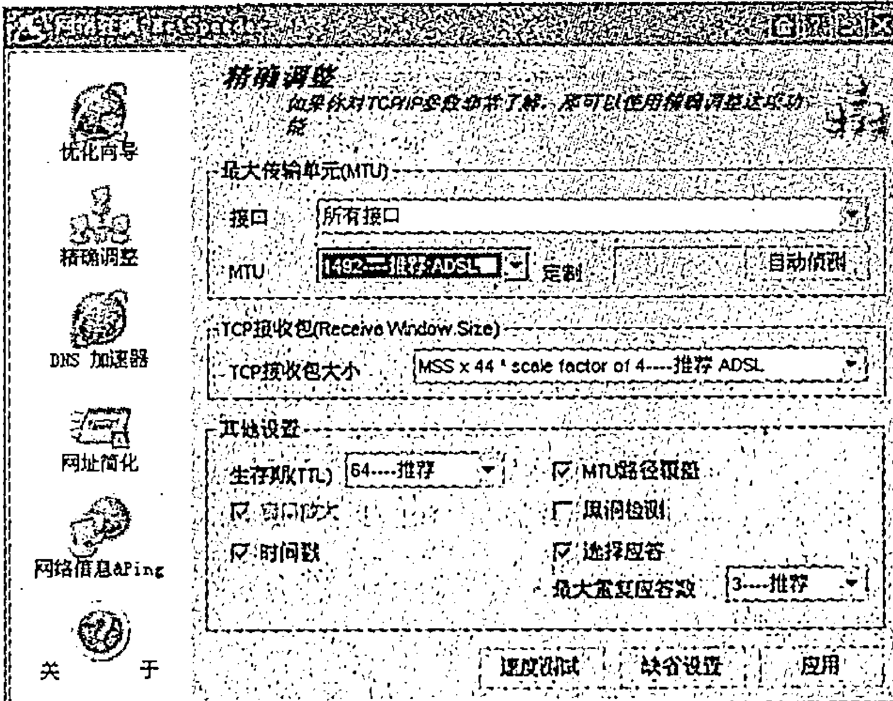

再看看其他的加速方法，我们发现都少不了MTU值。那么，它到底有什么作用呢？MTU是英文Maximum Transmission Unit的缩写，意为“最大传输单位”。这是一个数据包能够传送的最大字节数的上限。网络层通常不发送包含的字节数比限定值低的数据包，以便于取得更高效率。在网络连接过程中，MTU决定着信息包的大小，如果信息包太小，同样大小的数据就会分成很多个信息包进行传输，计算机就需要频繁的响应，这样就在无形之中影响了网络速度；如果信息包太大，还容易产生错误，从而导致传输失败。

### 二、典型故障分析

下面是一个典型的MTU故障。服务器采用Windows XP，用系统自带的连接共享让30多台工作站共享上网，网络硬件连接也很正常。由于Windows XP自带PPPOE拨号软件，从稳定性和易用性考虑就没有采用第三方拨号软件。故障情况如下：从工作站登录本地网页的速度很快，但打开www.163.com等网站时，却只显示标题栏，网页内容却总打不开；更典型的问题是，很多可以在Windows XP服务器上打开的网站却不能从工作站打开。多方查证后，发现是MTU值设定的问题。

故障产生的原因分析如下：如果ADSL的MTU值是1492，其余各种宽带的MTU值标准设置都是1500。Windows操作系统中默认的TCP/IP数据包最大值为1500，而某些站点的MTU值设定又大于1492，所以造成站点不能访问。结论就是，如果MTU很小，信息头会吃掉大量的有效带宽，导致网络速度的降低甚至只显示标题栏。

那么此问题该如何解决呢？其实只要调整Client端网卡的MTU值，即可解决这个问题！因此，第一步就是要找到本机网卡所能承受的MTU值。通过Ping命令，我们就可以获得MTU值，如ping www.yahoo.com -f -l 1500将发送按照1500分组(-l 1500)的数据到www.yahoo.com（最好是自己的ISP的网站），并检查是否发现分组不同产生的数据碎片(-f)，如果存在就降低分组值，最终就可以找到匹配的MaxMTU。这个值也就是ADSL优化的关键部分。以本地网管地址为例，打开命令提示符窗口，输入如下命令：

```
C:\Documents and Settings\Administrator>ping -f -l 1500 192.168.10.1
Pinging 192.168.10.1 with 1500 bytes of data;
Packet needs to be fragmented but DF set.
Packet needs to be fragmented but DF set.
Packet needs to be fragmented but DF set.
Packet needs to be fragmented but DF set.
Ping statistics for 192.168.10.1:
    Packets: Sent = 4, Received = 0, Lost = 4 (100% loss),
Approximate round trip times in milli-seconds:
    Minimum = 0ms, Maximum = 0ms, Average = 0ms
```

输入 “ping -f -l 1500 192.168.10.1” 后，我们看到了 “Packet needs to be fragmented but DF set.” 的提示，表示 MTU 值太大了，必须找个小点的 MTU 值与之匹配。我们将值修改为 1464 再测试，命令如下：

```
C:\Documents and Settings\Administrator>ping -f -l 1464 192.168.10.1
Pinging 192.168.10.1 with 1464 bytes of data:
Reply from 192.168.10.1: bytes=1464 time<10ms TTL=64
Reply from 192.168.10.1: bytes=1464 time<10ms TTL=64
Reply from 192.168.10.1: bytes=1464 time<10ms TTL=64
Reply from 192.168.10.1: bytes=1464 time<10ms TTL=64
Ping statistics for 192.168.10.1:
    Packets: Sent = 4, Received = 4, Lost = 0 (0% loss),
```

通过对比，我们看到了两个截然不同的结果！后者出现了回应，表示这个 MTU 值是可行的。不过，建议找出可行的最大 MTU 值！这样，在设定以后，才能达到最佳网络速率。由于一些封包上面的问题，这个最佳值还要加上 28 才是我们所需要的 MTU 值。不过，现在不少软件和网页给我们提供了测试的方法，本文所提供的测试方法在于让用户了解自己平时需要优化哪些东西。

下面，就要开始修改 MTU 值了。以 Windows 2000 为例，打开开始菜单里的 “运行” 命令，输入 “regedit”，回车后，进入注册表。打开如下选项：[HKEY_LOCAL_MACHINE\SYSTEM\CurrentControlSet\Services\Tcpip\Parameters\Interfaces] 其中有一个界面与我们的 IP 地址相同，该键值里有计算机的网络属性设置，如 IP 地址、网关、子网掩码等。在该键下新建 “DWORD 值”，命名为 “MaxMtu”，修改键值为十进制的 1450，设置完毕并重新启动计算机，客户机就可以访问站点了。实际操作中，假如上网速度慢的问题无法由手动设置代理服务器来解决，可尝试将 PPPoE 的 MTU 值逐步调低，直到连线最稳定为止。

通过上面的分析，虽然 ADSL 使用 PPPoE 协议，具有局域网的特点，但是又不完全等于局域网协议。因此，它还是有优化的余地，我们可以通过修改注册表中的有关参数，使 ADSL 适应 ISP 的网络参数，从而最大限度地提高 ADSL 工作效率。

## 透过RSS看世界

文 / 奇士

### 一、何为 RSS

RSS 是英文 Really Simple Syndication 的缩写，中文的意思是真正简单的联合。这是一种基于 XML 技术的内容集成和发布技术。早在上个世纪的 90 年代末，Netscape 公司就提出了这一技术的雏形，当时这种技术被称为 “RDF Site Summary”。Netscape 公司将这种技术嵌入了他们当时红极一时的互联网浏览器产品 Navigator 里。这种技术的初衷就在于整合网络上的信息，使浏览器的用户可以方便快速的共享这些信息。尽管这是一个很棒的创意，但是 “RDF Site Summary” 技术在商业上没有获得成功，因为当时的网络上可以利用的内容实在是太少了。

信息，浏览者可以连接到网络上相应的页面进行查看。目前，很多新闻网站提供RSS形式的新闻。用这种方式浏览新闻的好处在于：首先是快速，因为下载的得到信息只包括最精简的内容，没有广告和动画的干扰，不会出现在使用浏览器看新闻时等了半天，庞大的网页打开后，内容却是我们不需要的；其次是方便，RSS阅读软件都提供定时更新的设置，我们不需要进行干预，新闻已经自动找上门来了；再次是有序，我们可以将RSS信息源进行分类管理，再利用阅读软件提供的各种功能，使我们的信息获取变得更加高效。

而真正使RSS得到推广的，是Blog的大行其道。Blog是Web log的简称，中文意思是网络日志，它是一种个人思想得以自由表达的方式和场所。就像一个人的日记，记下每日的点点滴滴，对事情的看法，道听途说的消息，或者只是一些随感而发的文字。但它是完全开放的，任何人都可以浏览、分享这些心情、感想和信息。正是Blog的这种特性使得它在一开始就与RSS技术结下了不解之缘。现在各大Blog网站广泛采用RSS作为信息交流技术，使得RSS信息源得到了极大的丰富。Blog和RSS相辅相成，相得益彰。Blog文化在RSS技术的支持下得到迅速普及，RSS技术在Blog文化的推动下得到不断的进步。

一些新闻网站和多数Blog网站都提供RSS。当在网页上看到这样一些图标时（如图1），就说明该网站支持通过RSS获取网站内容。这些图标往往不尽相同，有时是XML，有时是RDF，有时是RSS，有时是ATOM。即使同是RSS，也有几种不同的版本。最早的版本是0.90，就是Netscape公司最早创建的“RDF Site Summary”技术。由于此技术过于复杂而且并不成功，现在已经不再应用了。Userland Software公司推出了0.91版本，并将其商业化，接着又相继开发了0.92、0.93、0.94版本。与此同时，另一个开发组又推出了1.0版本，此版本仍然基于RDF技术。出于对1.0版本的不满，Userland Software公司很快又开发了新的版本，并将版本号一下子提高到了2.0。而Google看到了Blog的前景，购买了blogger.com，然后提出了Atom项目，该项目的目的是要建立“连锁、存档和编辑情节式站点的规范”。目前，网络上RSS的资源比较多，而Atom资源相对少了些。其实，不同版本的RSS和Atom在根本上都是一种技术，它们都是基于XML的。当然，对于我们这些普通的用户来说，并不需要了解这些复杂的技术和混乱的版本，我们最关心的是如何使用RSS资源。

### 二、如何利用RSS资源

获取和阅读RSS信息，需要使用RSS阅读软件，这些软件叫做“RSS聚合器”（RSS Aggregator）。RSS阅读软件会按照用户的设定，自动从网站下载RSS信息，并把内容呈现给用户，再由用户根据需要选择打开。它们能同时对很多RSS网站进行操作，并可根据用户的需要进行信息整合，这就是所谓的“聚合”（Aggregate）。

下面向各位介绍一些优秀的RSS工具，希望能为各位的选择提供一点有益的参考。

#### （一）独立运行的RSS阅读软件

- FeedDemon
这是目前最流行的RSS阅读软件。它速度快，占用资源小，对中文支持好。新版本中内嵌了基于IE的多页面浏览器，浏览信息时十分方便。它最大的特色是信息监视（Watch）和新闻箱（News bin）。但FeedDemon不是像其他RSS软件那样把不同的RSS源以树状列表给出，而是放在不同的列表页面中，切换起来稍嫌繁琐。目前最新版本是1.5 beta 2，读者朋友可以到下面的网址下载http://www.feeddemon.com/feeddemon/beta/index.asp。FeedDemon是商业软件，可以免费试用20天。

- NewzCrawler
NewzCrawler是一款老牌的新闻组工具。能够接收和浏览RSS、新闻组和网页，并为它们建立各自的组以方便管理。它功能强大，运行稳定，可以建立多层分组，而且界面朴素实用。目前最新的版本是1.7 SR2，读者朋友可以到如下网址查看更多介绍和下载安装程序：http://www.newzcrawler.com/downloads.shtml。NewzCrawler是商业软件，未注册版本有功能限制，比如不能设定如何处置接收到的信息，只能按照软件默认的设定工作。

- RSS Reader
这是一款比较传统的RSS阅读工具，而且是免费的，但是功能有点简单，不过足以满足我们一般的需要。下载地址：http://www.rssreader.com/download.htm。该网站还提供了不少RSS资源，只不过都是外语的。

- SharpReader
SharpReader也是一款很受欢迎的RSS阅读软件。它是免费的，界面简单整洁，运行稳定。不过运行SharpReader还需要“.Net Framework”环境，而且没有查找功能，这一点实在是很不方便。下载地址：http://www.sharpreader.com。所需要的 .Net Framework 可以到如下地址下载：http://www.microsoft.com/downloads/details.aspx?displaylang=zh-cn&FamilyID=262D25E3-F589-4842-8157-034D1E7CF3A3。

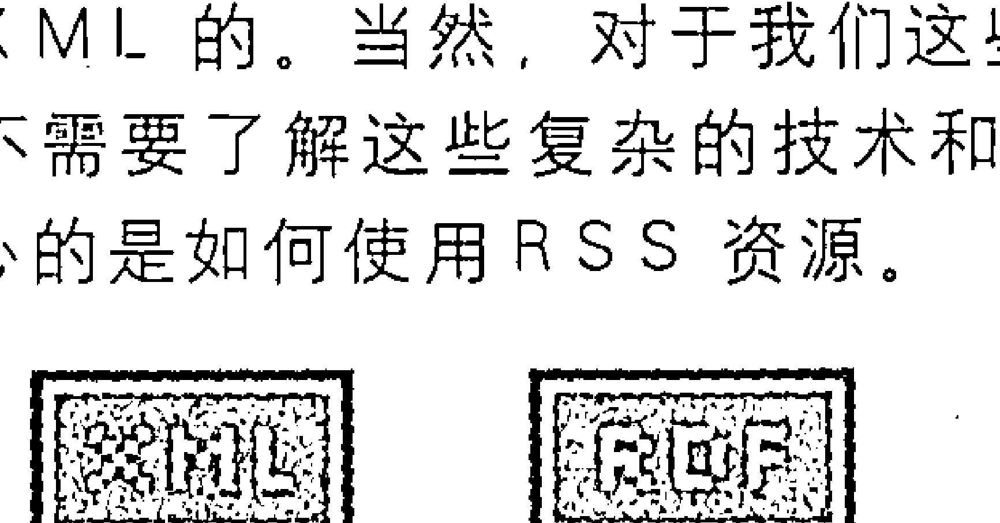

- FireDemon（飞火流星）
国人自主开发的RSS阅读工具，免费软件。FireDemon简单易用，界面友好。虽然目前功能还不太完善，但是相信软件作者会不断增强其功能，完善其性能的。软件主页：http://rad-studio.nease.net/。下载地址：http://www2.skycn.com/soft/18630.html。

- 看天下资讯阅读器
“看天下”是一个自主开发RSS内容的网站，这款软件是其门户，当然也可以订阅其他任何RSS信息。“看天下资讯阅读器”是中文RSS软件中比较优秀的一个，不但提供基本的RSS接收、浏览和管理等功能，还可以将信息保存在本地，方便脱机浏览和加以利用，其自身就带有很多不错的中文RSS资源。相关介绍和下载可参见http://www.kantianxia.com/reader/。

- Sauce Reader
功能强大的RSS阅读软件，比较消耗系统资源，免费软件。下载地址：http://www.synop.com/Products/SauceReader/Download。

- Tristana Reader
简单好用的RSS工具，免费软件。下载地址：http://www.charlwood.com/tristana/download。

- Gush
界面很漂亮，也需要较高的配置，集RSS工具与即时通讯软件于一身，缺点是每次使用都要先登录，免费软件。下载地址：http://www.2entwine.com/download/。

- Omea Reader
这也是一款多功能的信息浏览软件，免费软件。需要“.Net Framework”环境。下载地址：http://www.jetbrains.com/omea_reader/download/。

#### （二）在浏览器中浏览RSS

- Pluck
安装它之后，我们就可以在IE 浏览器中浏览RSS信息了。免费。下载地址：http://www.pluck.com/download.aspx。

- NewsMonster
配合Mozilla 浏览器的RSS浏览程序，还支持Netscape 浏览器，免费。下载地址：http://www.newsmonster.org/download.html。

#### （三）在邮件客户端程序中浏览RSS

- NewsGator
通过NewsGator，我们可以在Outlook中订阅和接收RSS信息，14天免费试用。下载地址：http://www.newsgator.com/downloads.aspx。

- BkRssReader
如果你使用“Becky！Internet Mail”，可以使用这个插件。下载地址：http://frsoft.maxthon.com/#BkRssReader。

### 三、订阅RSS

下面我们以FeedDemon为例，介绍如何订阅RSS。在IE 浏览器中，复制RSS 的URL 地址，或者在上述几种图标上单击鼠标右键，选择“复制快捷方式”，然后在FeedDemon中选择菜单命令“File”→“New”→“New Channel”，在对话框选择第一项，即自己输入URL 地址，下一步中，URL 输入框中已经自动填入了我们复制到的地址，很多RSS工具都有此功能。选择自动查找和验证newsfeed。单击“Next”，如果地址有效，就会成功下载，并自动填入该feed 的名称，选择一个合适的分组，再下一步，就完成了RSS 信息的订阅。在其它软件中，虽然订阅方法各有不同，但是大致过程是差不多的。订阅的信息多了，就需要将其分类编组，以便于管理。多数RSS软件都支持分组管理。

### 四、如何找到RSS资源

知道了如何订阅RSS，那么该怎么找到好的RSS信息源呢？笔者在这里向各位读者推荐一些RSS地址，各位可以各取所需。

#### （一）新闻

- 新华网：国内最权威的新闻社——新华社的网站，提供RSS新闻发布。在如下网页：http://www.xinhuanet.com/rss.htm中可以找到12个新闻频道的URL 地址。
- 看天下：内容全面、更新迅速，页面http://www.kantianxia.com/reader/rss.html提供了该网站全部RSS地址的列表，读者朋友可以根据需要选择订阅。
- 网典：http://www.netcull.com/，内容丰富的RSS新闻网站，囊括了国内主要新闻网站，更新非常快。

## 网页拦截高手指南
文/风之扬

现在，各种网络弹出式广告无处不在，随便打开一个网站，就可以看到五花八门的各类广告，这的确为网民增加了不少的烦恼，于是，一些拦截程序应运而生。本文选取了其中一些功能比较有特色的软件，并重点讲述其中的一些高级拦截技巧，让你摆脱广告的困扰。

## 一、从IE内核开始

作为免费的浏览器，IE使用简单、功能强大，但它并没有抵挡广告的功能，最大限度在于只能屏蔽一些受限制站点，方法是：在IE图标上单击鼠标右键，打开“Internet属性”菜单，打开“安全”选项卡，选择“受限制的站点”，点击“站点”按钮，在受限制站点中添加需要屏蔽的网站地址。

仅有这些安全设置远远不能满足我们的要求，所以出现了MyIE2等采用IE内核的个性化多页面浏览器。下载MyIE2并安装后，依次打开“选项”下的“设置中心”，在弹出窗口中选择“弹出窗口过滤”，就可以对一些网站的广告目录地址或弹出广告地址进行设置。如需要浏览某些网站的正常弹出窗口，可在“免过滤名单”中加入免过滤地址即可。除以上方法外，它还可以利用添加“去广告插件”的方式来完善拦截功能。

## 二、3721广告拦截

软件下载地址：http://assistant.3721.com/

3721上网助手不仅能拦截标准的IE弹出广告，还能拦截插件广告、Windows Messenger信使广告、页面当中的浮动广告、Flash广告和等文字链广告。下面我们选取其中的一些实用技巧进行重点介绍。进入网站http://assistant.3721.com，按照提示安装上网助手。然后，点击“广告拦截”，就可以进行相关的广告拦截设置了，如图1所示。

### 1. 拦截
-   (1) 拦截页面中的浮动广告。网页中的浮动广告是用 Javascript 脚本编程实现的，要拦截浮动广告，需要对 Javascript 脚本进行特征字符串分析(类似于病毒特征码匹配)，阻止其显示，以达到拦截的效果。
-   (2) 拦截页面中的Flash广告。网页中的Flash广告使用 Macromedia Flash 插件来播放的上网助手用一个模拟的 Flash 控件来替换页面中实际的 Flash 广告，从而阻止了IE 下载真正的 Flash 广告，从而节省了带宽和时间。
-   (3) 拦截 ActiveX 控件广告。3721 上网助手用“钩子”(hook)技术来拦截 ActiveX 控件，可以轻松达到令人满意的拦截效果，而且稳定性也不错。
-   (4) 拦截 IE 弹出广告。这个功能很实用，但降低误拦率很重要，上网助手在这方面做的很不错。
-   (5) 拦截信使广告。在 Windows 下，只需要关闭 Messenger 信使服务即可，不过上网助手也可以帮助我们实现这个功能。

### 2. 不拦截指定弹出窗口
网页拦截并不代表将所有的网页都挡在门外，如果我们不想拦截某个弹出窗口，还可以让上网助手不拦截这些网站。具体操作方法如下：
-   (1) 不拦截当前网页的弹出窗口。点击IE 工具栏上上网助手图标中的“已拦截”计数器按钮，选择“不拦截当前站点广告”选项，就可以对当前网页的弹出窗口网开一面，如图 2 所示。这时候，按【F 5】刷新，就会看到弹出窗口了。
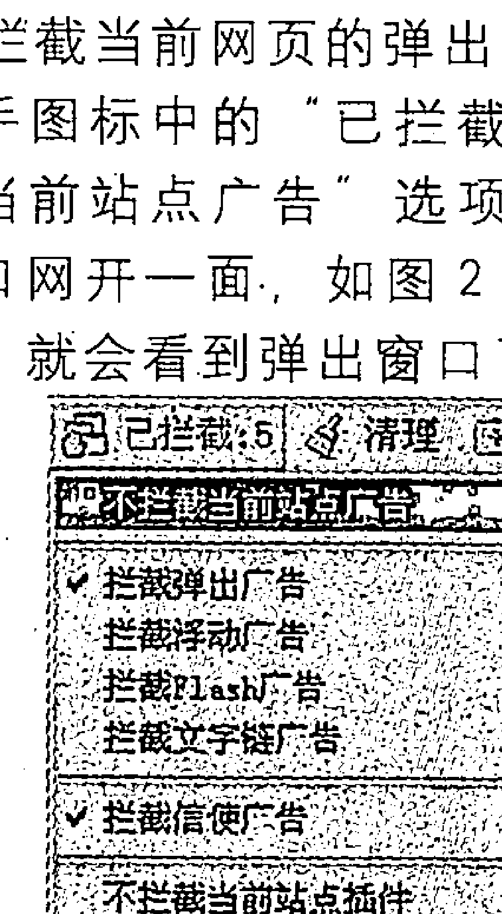
-   (2) 不拦截指定网站的弹出窗口。如果已经知道哪些网站的弹出窗口不需要拦截了，可单击图1 中的“弹出窗口广告拦截”按钮，在“将不拦截弹出窗口的网址直接添加进下面的列表”下面的文本框中输入该网站的网址，点击“添加”按钮，即可加入不拦截的列表。如果以后你改变主意了，希望上网助手拦截某个网站，则可以选中选择该网站的网址，点击“删除”即可。

在 IE 工具栏的上网助手图标中，显示着“已拦截”了多少个弹出窗口。如果一一关掉这些窗口，除了浪费时间，而且影响心情，说不定还有个别病毒。由于上网助手拦截广告的功能是完全集成在 IE 中的，看起来就像是 IE 自身附带的功能一样，使用起来非常简单和方便。除了广告拦截功能之外，上网助手还提供了清除地址栏、清除上网记录、清除垃圾文件、修复浏览器、即时保护 IE 和屏蔽恶意网站等功能，是一个功能比较全面的软件。

## 三、Google 窗口拦截器

软件下载地址：http://toolbar.google.com/intl/zh-CN/

根据很多站点的测试和网友反应，Google 窗口拦截器的最大优点在于性能表现比较稳定，它用空间很小。如果不想拦截某个网站的弹出窗口，操作也很简单：只需点击一下工具条上的拦截按键，选择“允许显示网站的弹出式窗口”即可。

先到上述网站下载最新版 Google Toolbar。按提示依次点击“下一步”按钮，安装完毕后，IE 浏览器上方会出现一个 Google 工具条。安装的时候，要选择“禁用高级功能”这一项，否则自己电脑里的资料就被匿名发送给 Google。

安装完成后，在 IE 地址栏的下面会自动生成 Google Toolbar 工具栏，可以先在选项对话框当中对 Google Toolbar 进行一些基本的设置，如图 3 所示。选择“弹出式窗口拦截器”，Google Toolbar 就会自动将弹出网页进行屏蔽。
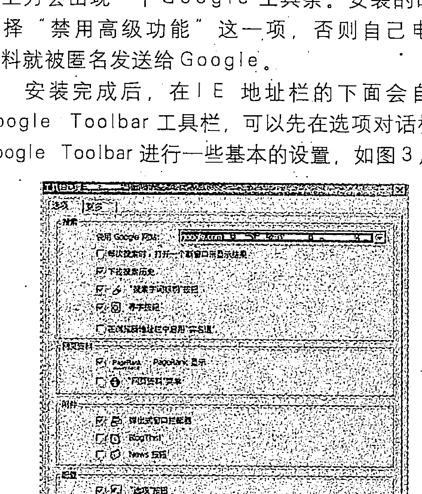

如果不想对弹出网页进行屏蔽，单击 Google Toolbar 工具栏上的拦截按钮就可以不进行屏蔽。如果要想显示个别弹出窗口，在单击链接时按【Ctrl】键即可。这样以后再访问网站的时候，就不会看到弹出广告。如果不需要 Google Toolbar，直接卸载这个软件即可，操作十分方便。

## 四、“零弹窗” Zero Popup V8.0

软件下载地址：http://www.tooto.com

Zero Popup 是一个小巧、高效、智能的软件，它需要和 IE 一起启动，在屏幕右下角同时会出现一个托盘图标，在这个图标上单击鼠标右键，会弹出如图4 所示的菜单。它能有效对付弹出窗口、浮动广告和 ActiveX 间谍软件、Java 小程序、Java 脚本、cookie、桌面项目的下载和安装。此外，它还可拦截系统服务 messenger 广告甚至横幅广告，尽显杀手本色。
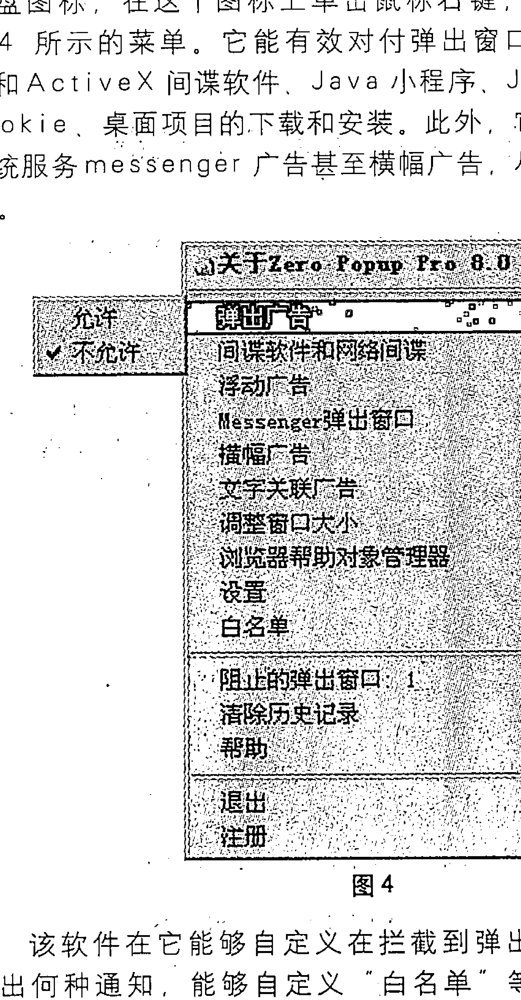

该软件在它能够自定义在拦截到弹出式窗口时做出何种通知，能够自定义“白名单”等。在上述菜单上选择“白名单”，就可以对站点进行限制。此外，它还具有清除浏览器缓存、Cookies、收藏夹、自动完成的表格和密码、自动完成的 Web 地址和历史记录等功能；并能够根据用户的浏览行为制订智能拦截方案，在不影响用户正常浏览的情况下，拦截所有恼人的弹出窗口。

## 五、其他广告拦截软件

### 1. MSN Toolbar
软件下载地址：http://download.microsoft.com/

MSN Toolbar 是微软推出的 IE 工具栏，安装它以后它将出现在 IE 地址栏的下方，除了能够对一些弹出式广告进行自动拦截外，还可手动对未识别的弹出式广告进行设置拦截，方法是：完全打开预浏览的主页后，如果有未识别的弹出式广告窗口出现，点击 MSN Toolbar 的“Pop-ups ALLOWed”按钮，提示文字会变成“Pop-ups Blocked”字样，这样我们就锁定了预浏览页面，在它之外的其他任何弹出窗口将被视为广告窗口在后台被 MSN Toolbar 关闭。

### 2. 超级兔子IE 专家
软件下载地址：http://www.superrsoft.com/

作为一个专门的网页广告拦截程序来说，超级兔子IE 专家可以在 IE 中对弹出式广告窗口进行封杀，它还可以清除部分的 FLASH 动画。另外，超级兔子IE 专家也具有修复 IE、禁止 FSO 系统和使用脚本、保护注册表、备份恢复注册表等功能，可以自动清除上网记录和地址栏、cookies、缓存、表单和密码等。

### 3. 广告阻击手 V3.01
下载地址：www.skycn.com/soft/7995.html

“广告阻击手”的伪装广告分析算法十分优秀，能够在最短时间内找到伪装广告。除了能拦截弹出广告，它还能监控电脑是否被木马控制，对 IE 进行有效保护。

### 4. IE 佳佳
下载地址：http://iesharp.81630.com/

这是一款比较专业的广告拦截与浏览辅助工具，它不但可以准确地判断页面内的广告动画，而且可以在页面广告显示之前将其清除。运行 IE 佳佳后在“广告拦截设置”中选择“阻止 FLASH 动画下载”、“清除网页中广告”、“清除网页内漂浮广告”等选项。设置完成后，重新打开 IE，浏览网页时我们会发现那些讨厌的弹出广告、网页广告、FLASH 广告统统一扫而光，打开网页时明显感觉速度提升。

### 5. 迷你广告杀手 V2.0
下载地址：http://www.skycn.com/soft/9975.html

迷你广告杀手采用特殊的方法识别用户不需要的广告窗口，并自动关闭掉这些讨厌的窗口。此外，迷你广告杀手也可以屏蔽闪烁的 Flash 动画广告，关闭 windows 系统内置的信使窗口、删除上网记录等。

## 最值得使用的IE插件 文/风之扬

### 一、多窗口浏览插件

#### 1. Switch Manager Pro
下载地址：http://www.switch-manager-pro.com/

多窗口浏览可以节省电脑桌面的工作空间和系统资源，浏览多个网页时，不需切换到另外一个窗口，使用起来也十分方便。使IE实现多窗口浏览功能的增强工具有很多，其中比较优秀的是Switch Manager Pro，该软件可以让多个IE浏览器的窗口显示在同一窗口内。下载并安装好Switch Manager Pro后，启动软件，如果已经打开了几个IE浏览器，这些窗口就会被放到该软件的窗口中，最下方是访问和控制各个网页的标签。用鼠标右键单击软件的标签栏，会弹出Switch Manager Pro的设置菜单，点击“Skins”可以更换标签栏的外观；选择“Preferences”可以对软件进行设置；选择“General”可以设置软件在启动和退出时的动作。Switch Manager Pro还提供了书签功能，一次可以打开一组书签，另外，我们还可以自己进行编辑。

#### 2. Microgarden WebTools
下载地址：http://www.microgarden.com/webtools/index.htm

Microgarden WebTools可以使IE进行多页式浏览，软件安装完毕，重新运行IE浏览器，工具栏中就会多出一行按钮。打开一个网页后，如果想打开新的网页，只要点击工具栏上的“Add New Tab”按钮，这时就会新建一个网页标签，在这个标签下就可以打开其他网页了。另外，这个插件还支持拖放功能，所有网页上的连接，甚至是地址栏里的地址都可以拖动到软件的工具栏里，并打开相应的窗口显示页面。

### 二、下载类插件

#### 1. DUDU加速器
下载地址：http://www.dudu.com/

IE集成的“另存为下载”工具很方便，但速度没有优化，用其他的下载工具又比较麻烦，有没有两全之策呢？其实，我们可以用DUDU加速器。这是一款基于HTTP协议开发的下载软件，安装之后就可以自动加载到IE了。这时，IE浏览器的“另存为下载”就可以支持断点续传了。在下载文件时，并不直接从目标网站的服务器下载，而是通过用户的机器向目录服务器发起查询，再被分配到那些速度最快、距离最近甚至是本网段内的已经下载过该文件的用户。下载过程中，软件界面提供实时的下载速度和所剩时间等信息，还可显示下载加速信息。

#### 2. Flash Catcher
软件下载地址：http://www.justdosoft.com/

Flash动画可以说是这几年网络界最耀眼的多媒体技术之一，不过现在Flash动画的下载并不简单，不过，Flash Catcher可以帮助我们解决这样的困难。安装好“Flash Catcher”插件后，它就会成为IE浏览器的一部分自动运行在后台，把鼠标指针放在想要下载的Flash动画上，会发现多出了一个小工具条，点击磁盘图标就可以把当前的Flash动画保存到电脑中；在Flash动画上点击鼠标右键，在弹出的菜单中也增加了几个选项，点击里面的“Save”选项也可以将这个Flash文件进行保存。如果一个网页上有很多Flash文件，而你都想把它们保存下来，那可以点击IE工具栏上Flash图标，这时会弹出一个“Flash抓捕器”，选择要保存的Flash文件后，点击下面的“保存”按钮就可以了。

#### 3. IE6文件下载增强插件
下载地址：http://www.100down.com/down/SoftView.asp?SoftID=1016

在这款下载增强插件的帮助下，我们可以将正在下载的文件的URL地址复制到剪贴板，然后把下载的文件导入到FlashGet等下载工具。软件下载安装完毕会自动运行在系统后台，点击一个下载链接时，会弹出一个保存对话框，要求选择保存目录，然后会现在一个下载窗口来下载你想要的文件。点击界面上面的“复制URL到剪贴板”按钮可以来获得文件的下载地址。如果断线了，重新连线后再点击这个下载链接时，软件会自动弹出“续传”对话框，询问是否续传。

### 三、搜索类插件

#### 1. 百度搜霸
下载地址：http://bar.baidu.com

百度搜霸安装完成后，我们就会在地址栏的下面看到多了一行工具栏，这就是百度搜霸，如图1所示。百度搜霸还可以按照新闻、主页、图片等分类来进行准确的搜索。同时还支持对搜索关键字的高亮显示，另外百度搜霸还支持修复浏览器、隐私保护、系统加速及广告拦截的功能，广告拦截可以拦截掉所有浏览网页时弹出的广告。
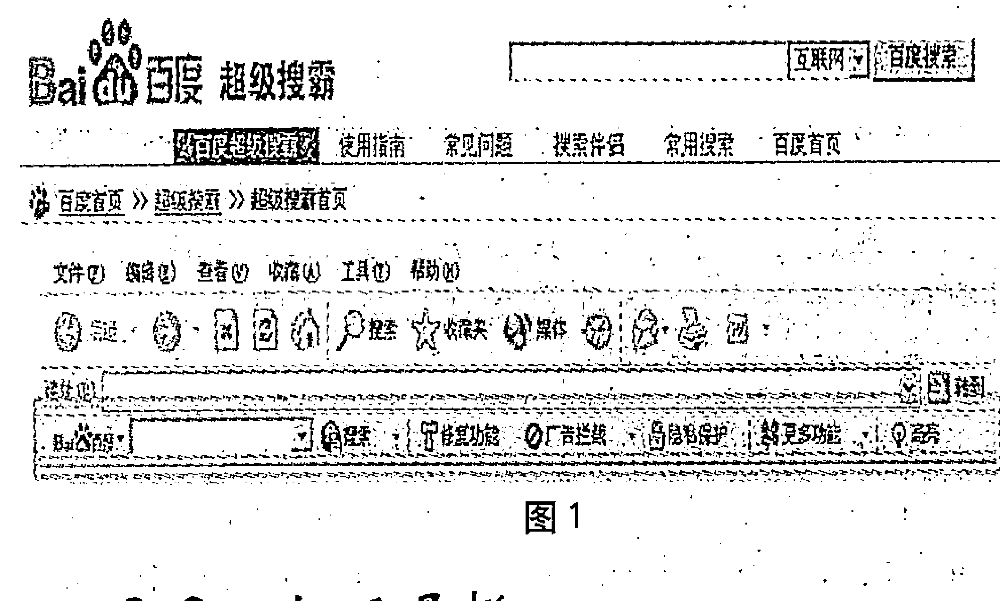

#### 2. Google工具栏
下载地址：http://toolbar.google.com/intl/zh-CN/

输入上述网址，单击页面最下方的“安装Google工具栏”按钮就会转到安装页面。按照提示完成安装后重新打开浏览器，你将看到在浏览器原有工具栏下方新增了一个“Google工具栏”。如果没有出现，可用鼠标右键单击浏览器工具栏，选择“Google”选项。单击工具栏上的Google图标可以打开“工具栏选项”设置搜索范围，例如“搜索图像”、“搜索群组”、“搜索目录”等，还可以设置是否启用高级功能、是否保存搜索历史、是否在新窗口中显示搜索结果等。单击搜索结果转到目标页面时，在Google工具栏上会显示“搜索关键字”按钮，单击该按钮可以直接转到页面上关键字的所在位置。单击“标明”按钮，页面内的所有关键字将以高亮显示。单击工具栏的关键字输入框，可以查看你曾经在工具栏或Google网站中搜索过的所有关键字。另外，在Google工具栏的选项中，建议选中“搜索网页键”和“网站内检索键”，这样才能发挥Google工具栏的优势。

### 四、浏览辅助类插件

#### 1. 屏蔽弹出广告窗口
下载地址：http://www.skycn.com/soft/7235.html

Popup Control可以禁止弹出窗口的出现，对一些特殊的网站则可以选择允许弹出的窗口。安装好Popup Control之后，在工具栏中会多出一个“Popup Control”按钮，点击之后即可进行相关设置。这个配置窗口中列表显示了最近浏览过的所有网站以及包含有弹出窗口的地址，只要选中被过滤的广告窗口并按下“保留”按钮，下次浏览这个弹出窗口时，就不会被屏蔽了，如图2所示。
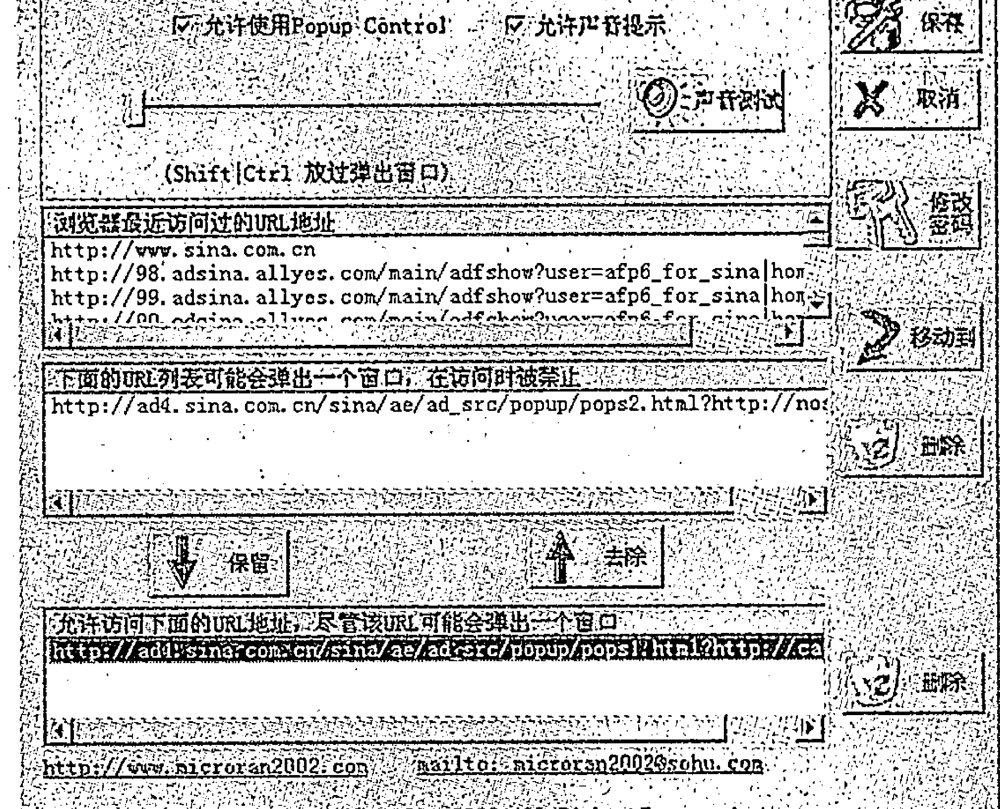

#### 2. 阅读插件
下载地址：http://www.dynacw.cn/

网上有些图书馆的藏书是用WDL格式来存放的，但IE浏览器不能直接阅读。其实，我们可以通过DynaDOC Reader来帮忙。安装上DynaDOC Reader阅读插件后，可以增强IE的HTML功能。首先，它可以把文件档案转换成可携式文件格式，提高电子文件高度的流通性。比如，发送方所建立的Word和Excel文件，只要转成DynaDoc可携式文件格式，由网线传递给接收端时，接收端只要利用 DynaDoc产品所提供的阅读程序Reader，就可同时阅读这两个文件。同时其内嵌的字码字型和外字可以将设计好漂亮字体的原貌文件传给朋友。其次，软件提供设计电子表格的功能，设计好的电子表格经由网际网络（Internet）传递，还可以进行网络试卷和网络问卷调查。

#### 3.填表插件
下载地址：http://software.pchome.net/internet/browser/plugin/2164.html

登录论坛或者社区时，我们肯定要输入用户名、密码、信箱之类的资料进行注册，这样才可以正常登录论坛，但是重复输入这些信息的操作十分繁琐。通过AI RoboForm，我们可以自动完成表单的填写操作。在安装AI RoboForm的时候根据向导提示，你先创建一个用户并且输入一些个人信息，接着填写用户名、密码、密码提示问题、密码提示答案和联系信箱。设置好填表资料并保存后，打开IE浏览器，工具栏会多出一排AI RoboForm生成的按钮，我们就可以开始进行填表了。当登录到一个需要进行填表的页面时，我们只要把鼠标指针放在工具栏上刚才建立的身份名称上，就会显示的一个提交窗口，点击上面的“填写”按钮就可以自动进行填表了。

#### 4.查看数码照片EXIF信息
下载地址：http://vane.name/Soft/tools/200407/10.html

对数码发烧友来说，如果在网上看见了一张精美的数码照片，肯定想要了解拍摄者所使用的相机、曝光值、焦距值等参数，而且这些参数都是保存在数码照片的EXIF信息中，一般需要用专业的看图软件才能查看他们。其实我们只要安装“ExifShow”这个插件就可以了。用鼠标右键点击在网页中的数码照片，接着在弹出的右键菜单中选择“查看EXIF信息”项，此时会打开一个“EXIF属性”对话框，里面就是关于这张数码照片的EXIF信息，如果要想把这些资料复制下来的话，只要单击鼠标右键，选择“复制全部”，然后粘贴到其他文档中就可以进行编辑或者保存了。如果有一些数码照片显示“该图片没有EXIF信息”，那可能是该照片经过了某种形式的处理而导致EXIF数据的丢失，或者是使用的不支持EXIF信息的数码相机拍摄的。

#### 5.有效查看HTML
下载地址：http://pchome.96590.net/php/dl.php?sid=17318

这是一个由微软程序员开发的IE插件，可以用来检查网页上某一个对象的HTML语法，或者了解整个网页所使用的全部对象及语法，对网页设计人员相当有用。安装后，在网页中单击鼠标右键并选择“Document Tree”选项，系统会以树状图的方式在一个新的窗口中排列出该网页中对象内容及相关信息，包括网页内容、网页放置主机、通讯协定、样式表等，点击左侧的“+”号可以了解更多的信息。另外，我们也可以选择网页中任何一个对象，单击鼠标右键并选择“View Partial Source”，就可以看到整个HTML文件中的这一小段文字HTML的源代码。

## QQ 好友添加技巧

### 将任意号码加到QQ好友名单

如果我们想加某人到自己的QQ好友中，对方拒绝该怎么办？现在有一个方法可以随意加任何人到QQ好友名单中，不管他（她）愿意不愿意！

首先我们要准备一款游戏修改软件，如FPE 或Game Master8.0都行。大家知道，向QQ好友发送消息时，他的QQ号码会出现在内存地址中，并以明文保存。如果我们能找到这个好友的QQ号码在内存中的地址，并将这个内存地址中的数据，即该QQ号码换为想加入的那个人的QQ号，并锁定该数据，只要不关机，无论怎么开、关QQ，内存地址中“记住”的永远都是这个新QQ号。

点击QQ好友准备发送消息，我们会发现，他的号码已经变为想加入的QQ号码了！利用这个特性，我们可以尝试将任何号码加入到QQ号码中。假设我们要加的号码是8888，但不要直接发消息请求加入。我们可以首先加一个无需身份验证的QQ号码，假设是1234，然后启用FPE或Game Master，在其中找到QQ的主文件QQ.EXE，然后向修改游戏一样，查找1234这个号码，一般情况下我们会找到很多这样的地址，将它们全都改为8888，再运行QQ，在好友里就会出现8888这个号码了，但是我们发的消息只能出现在对方的“陌生人”名单里。

现在，我们的IE浏览器功能增强很多了。比如，我们可以同时打开多个窗口而不必像以前那样消耗大量的系统资源，也不必打开专门的搜索网站来搜索网络资源，下载Flash动画也比以前快捷了不少。此时的IE使用起来自然更加得心应手，上网更加流畅了。当然，IE的插件远远不止上面介绍的这几个，还需要我们根据自己平时使用来多多搜集，多多体会。

## 《电脑爱好者合订本》有奖知识问答

说明：《电脑爱好者合订本》有奖知识问答，一共100题，共300分。读者可以自行答题，并用黑色、蓝色笔，勾选在本书第399页的答题卡上，并按照我们所示地址，在规定的时间内，寄回杂志社，即可有机会获得以下各项奖励。

- 特等奖：3名，奖品为价值1000元的硬件产品
- 一等奖：7名，奖品为正版永中Office软件（价值2000元）
- 二等奖：20名，奖品为趋势科技PC-cillin 2005或友立数码图片处理工具等正版软件一套
- 三等奖：50名，奖品为《电脑爱好者合订本》2005年（上）一套
- 鼓励奖：100名，奖品为《电脑爱好者》杂志社出品图书一本

各级奖项的抽取办法为，划分分数段，例如特等奖的分数线为290分，则超过290分的有6人，则在这6人中抽取，没有抽中的，则进入一等奖的抽取名单，依次类推。超过210分，并在规定时间寄达的，我们将在www.cfan.com.cn上公布名单。超过250分，并在规定时间寄达的，我们将公布名单和分数。

答题卡有效寄送时间为2005年3月31日，请在信封上注明“合订本有奖问答”。答题卡复印无效。本活动的最终解释权为《电脑爱好者》杂志社。

## 一、单项选择题（共50题，每题2分，共100分。每个题目有4个答案，其中一个是正确的，答对得分，答错不得分。请在答题卡上，勾选出正确的答案）

1. 众所周知，显卡与主板的AGP标准之间存在兼容性问题，如果处理不当很容易导致设备损坏。以下哪个说法关于主板和显卡AGP搭配是正确的？
- (A) AGP 2X显卡兼容AGP 8X主板
- (B) AGP 8X显卡兼容AGP 4X主板
- (C) AGP 2X主板100%兼容AGP 4X主板
- (D) AGP 8X显卡兼容AGP 2X主板

2. Intel的440BX芯片组被誉为“常青树”，辅佐了历代CPU。不考虑电压的因素，以下列出的CPU中，哪一款是任何一块BX主板都无法支持的？
- (A) K6-2
- (B) VIA Cyrix C3
- (C) Tualatin Celeron
- (D) Coppermine PIII

3. CPU与主板芯片组存在对应关系，并不是任何一块主板可以使用任何一种CPU。在选择CPU——主板架构时，互相之间的兼容性问题十分重要。以下四种搭配中有一种是绝对不可能实现的，请指出是哪一种。
- (A) Prescott（LGA775）搭配I865PE主板
- (B) Tualatin PIII搭配VIA 693主板
- (C) Athlon XP（Barton）搭配KX133主板
- (D) Celeron D搭配SiS645主板

4. 内存架构的变化也十分迅速，因此往往会出现一种主板同时支持两种内存规格的现象。在以下列出的组合中，哪两种内存可能是可以同时混用的？
- (A) EDO与SDRAM内存
- (B) DDR与SDRAM内存
- (C) DDR2与DDR内存
- (D) DDR400与DDR500

5. 主板中的芯片组事关兼容性问题，很多设备无法使用与主板芯片组兼容性不佳有着密切关系。在DIY实践中，避免典型的兼容性故障组合十分重要，以下组合中不会存在兼容性问题的是哪一对？
- (A) nForce2芯片组搭配USB闪存盘
- (B) MVP3芯片组搭配I740显卡
- (C) I865PE与GeForce FX5700显卡
- (D) KT133A芯片组与Audigy2声卡

6. 光存储设备的兼容性一直不为人提及，然而在DVD刻录机大潮即将来临之际，这一问题开始引起不少用户的关注。以下兼容性描述中，哪一种是错误的？
- (A) DVDROM肯定兼容DVD+R光盘
- (B) DVD-Dual可以刻录DVD-RW
- (C) DVD-Multi能刻录DVD-RAM
- (D) DVD+RW无法刻录DVD-R

7. 如今BIOS设置功能已经越来越强大，不仅可以让用户修改设备的运行状态，甚至能开启或关闭各项功能。以下哪一种操作是在目前BIOS中肯定无法实现的？
- (A) 修改系统时间
- (B) 给硬盘分区
- (C) 设置CPU工作频率
- (D) 关闭板载网卡

8. BIOS更新对于提高硬件兼容性很有帮助，但是也存在一定的危险性。如果在BIOS刷新过程中不幸断电，以下哪一种方法是不可能解决问题的？
- (A) 使用同型号主板的BIOS芯片热插拔
- (B) 尝试使用ISA显卡启动

9. BIOS 程序一般由固定的厂商生产，而且不同品牌的BIOS 在具体使用方法上也略有差别。以下厂商品牌中，哪一个不是专业的BIOS 程序生产商？
- (A) AWARD (B) Intel (C) Phoenix (D) AMI

10. BIOS 芯片的本质就是一块 FlashROM 芯片，其固件的更新方法有多种。以下操作中，无法实现 BIOS 固件更新的是哪一种？
- (A) Windows 下使用 @BIOS 软件
- (B) DOS 下的 AMIFlash 或者 AWDFlash
- (C) 使用 BIOS 芯片编程器
- (D) 使用 DEBUG 语言

11. 某些主板具备两块 BIOS 芯片，这也是产品的一大卖点，并且一度十分流行。关于双 BIOS 的作用，以下哪一种描述是正确的？
- (A) 可以提高系统整体性能 (B) 带来更多的 BIOS 设置功能
- (C) 起到备份 BIOS 的作用 (D) 可以将第二个 BIOS 作为内存使用

12. USB 的即插即用特性已经得到业界的广泛的认可，但是在使用中还是可能存在各种各样的问题。新插入的 USB 设备无法被操作系统识别，以下哪种因素与造成这类情况无关？
- (A) 在 BIOS 中没有打开 USB 控制器
- (B) 芯片组对 USB 设备兼容性不佳
- (C) USB 数据线太长
- (D) 系统中的 USB 设备已经超过 5 个

13. CPU 及其散热器的安装十分重要，处理不当便会导致过热甚至烧毁。以下关于 CPU 以及散热器的安装描述中，哪一种做法是错误的？
- (A) 导热硅脂涂抹越多越好，有利于将热量传送到散热片
- (B) 散热器应该保证与 CPU 表面紧密接触
- (C) 安装 Socket A 散热器时，有正反方向的区别
- (D) 散热器固定时应当检查是否会压坏 CPU 核心

14. 升级添加第二块硬盘后，发现开机时系统在检测主板时停止响应，硬盘灯长亮，此时采用以下哪一种措施是无法解决问题的？
- (A) 检查硬盘主从跳线是否正确
- (B) 更新主板 BIOS 以便识别大容量硬盘
- (C) 现在别的机器上对该硬盘分区
- (D) 进入主板重新设置 IDE 设备

15. IDE、SCSI 以及 Serial-ATA 是目前存储设备的主要接口，以下关于安装中的描述，哪一个是正确的？
- (A) 无论什么主板最多只能使用 4 个 IDE 设备
- (B) ATA133 硬盘使用 40pin 数据线无法工作
- (C) SCSI 接口只能安装硬盘而无法安装光驱
- (D) Serial-ATA 接口的硬盘使用不同于 IDE 硬盘的数据线与电源接口

16. 机器开机后能够顺利看到自检画面，但是用不了多少时间就会自动关机。已经排除是电源问题，请判断以下哪个因素肯定不会造成上述现象。
- (A) 病毒破坏系统 (B) CPU 超频过度
- (C) CPU 散热装置工作异常 (D) 主板温度检测功能出错

17. 开机后通过自检，但是屏幕显示 “No System Disk”，以下哪一种情况不可能造成此现象？
- (A) CPU 超频过度 (B) 硬盘没有在 BIOS 中识别
- (C) BIOS 所设定的启动设备都无法引导系统
- (D) 硬盘数据遭到病毒破坏

18. 硬盘是最重要的存储设备，但是其稳定性也是所有 PC 配件中相对较差的。当发现硬盘存在物理坏道之后，以下哪一种操作方法是正确的？
- (A) 立即低级格式化硬盘 (B) 继续使用，直到完全报废为止
- (C) 重新分区，屏蔽坏道 (D) 不断尝试使用 Scandisk 修复

19. 很多 PC 故障可以用软件来修复，至少可以继续使用，有时甚至丝毫不影响使用。以下所列出的故障中，哪一项是无法使用任何软件修复的？
- (A) 硬盘上的物理坏道 (B) 针式打印机断针
- (C) 硬盘上的逻辑坏道 (D) 液晶显示器坏点

20. 在开机后出现 “Memory Test Fail” 提示，此时屏幕停止，没有进入下一步启动程序。当遇到这种情况时，应该仔细检查哪个方面？
- (A) CPU 散热状况 (B) 内存的品质
- (C) 硬盘是否存在坏道 (D) 操作系统是否崩溃

21. 在 Windows 2000 下无法设置显示器的分辨率与颜色数，只能维持在很低的水准，造成这一现象的原因不可能是以下的哪一种？
- (A) 显卡驱动未安装
- (B) 显示器不支持即插即用且未安装驱动
- (C) 显卡与主板之间存在冲突
- (D) AGP 显卡的显存速度太慢

22. 在确定硬件故障所在时，我们很有必要使用 “最小系统” 验证一下各个配件的是否完好，并将其他设备全部移除。以下哪一款设备不属于 “最小系统”？
- (A) 显卡，包括集成显卡 (B) 内存
- (C) CPU (D) 硬盘

23. 调制解调器已经成为接入 Internet 的必备工具。无论是原先的电话线上网还是如今的宽带网时代，调制解调器都是不可或缺的。请问调制解调器作用是什么？
- (A) 把计算机信号和音频信号互相转换
- (B) 把计算机信号转换为音频信号
- (C) 把音频信号转换成为计算机信号
- (D) 防止外部病毒或者蠕虫进入计算机中

24. 数据传输是目前 IT 产业急待解决的难点，在以下列出的传输介质中，抗干扰能力最强的是哪一种？
- (A) 微波 (B) 光纤
- (C) 同轴电缆 (D) 双绞线

25. IP 地址是网络定位的真正途径，但是一长串的数字并不便于记忆，为此域名技术被广泛应用。但是在网络数据情况中，域名还是必须解析为 IP 地址，这一步骤所采用的方法是以下哪一种？
- (A) 用电子邮件 (B) 用 DNS
- (C) 用文件传输 (D) 用 passwd 文件

26. WWW 浏览器使用的应用协议是以下哪一个？
- (A) HTTP (B) TCP/IP
- (C) FTP (D) Telnet

27. IP 地址由一组多少位的二进制数字组成？
- (A) 8 位 (B) 16 位 (C) 32 位 (D) 64 位

28. 在历代 Windows 的资源管理器窗口中，如果想一次选定多个分散的文件或文件夹，正确的操作是以下哪一种？
- (A) 按住 Ctrl 键，用鼠标右键逐个选取
- (B) 按住 Ctrl 键，用鼠标左键逐个选取
- (C) 按住 Shift 键，用鼠标右键逐个选取
- (D) 按住 Shift 键，用鼠标左键逐个选取

29. 把 Windows 的窗口和对话框作一比较，窗口可以移动和改变大小，而对话框则符合下列哪一种表述？
- (A) 既不能移动，也不能改变大小
- (B) 仅可以移动，不能改变大小
- (C) 仅可以改变大小，不能移动
- (D) 既能移动，也能改变大小

30. 关于最新版本的 Windows XP+Service Pack2，按照一般的看法，以下关于操作系统描述中正确的是哪一项？
- (A) 单用户多任务操作系统 (B) 单用户单任务操作系统
- (C) 多用户单任务操作系统 (D) 多用户多任务操作系统

31. 在Windows的资源管理器窗口中，为了将选定的硬盘上的文件或文件夹复制到软盘有多种操作方法，以下操作中可以实现这一任务的是哪一个选项？
- (A) 先将它们删除并放入“回收站”，再从“回收站”中恢复
- (B) 先执行“编辑”菜单下的“剪切”命令，再执行“编辑”菜单下的“粘贴”命令
- (C) 先执行“编辑”菜单下的“复制”命令，再执行“编辑”菜单下的“粘贴”命令
- (D) 用鼠标右键将对象拖动到软盘，并从弹出的快捷菜单中选择“移动到当前位置”

32. 在使用Windows XP的过程中，若出现鼠标故障，在不能使用鼠标的情况下，可以打开“开始”菜单的操作是以下哪一种？
- (A) 按Shift + Tab键  (B) 按Ctrl + Shift键
- (C) 按Ctrl + Esc键  (D) 按空格键

33. 对于采用默认方式安装的Windows XP Professional+SP1操作系统，下列程序不属于附件的是哪一个？
- (A) 计算器  (B) 记事本
- (C) 网上邻居  (D) 画图

34. Windows 2000默认的启动方式是以下哪一种？
- (A) 安全方式  (B) 正常方式
- (C) 具有网络支持的安全方式  (D) MS-DOS方式

35. “开始”菜单是从Windows 95出现的创新设计，也是经典Windows界面的精髓。以下关于“开始”菜单的说法中正确的是哪一个？
- (A) “开始”菜单的内容是固定不变的
- (B) 可以在“开始”菜单的“程序”中添加应用程序快捷方式，但不可以在“程序”菜单中添加
- (C) “开始”菜单和“程序”里面都可以添加应用程序的快捷方式
- (D) “开始”菜单的顶部是无法添加程序快捷方式的

36. 在Windows XP中，当程序因某种原因陷入死循环，下列哪一个方法能较好地结束该程序？
- (A) 按Ctrl+Alt+Del键，然后选择“结束任务”结束该程序的运行
- (B) 按Ctrl+Del键，然后选择“结束任务”结束该程序的运行
- (C) 按Alt+Del键，然后选择“结束任务”结束该程序的运行
- (D) 直接Reset计算机结束该程序的运行

37. 在Windows XP运行菜单中输入“CMD”打开MS-DOS窗口，返回到Windows的方法是以下哪一种？
- (A) 按Alt，并按Enter键  (B) 输入Quit，并按Enter键
- (C) 输入Exit，并按Enter键  (D) 键入Win，并按Enter键

38. 在Windows98操作系统的桌面界面下，按PrintScreen键，则使整个桌面内容执行如下哪一种操作？
- (A) 打印到打印纸上  (B) 打印到指定文件
- (C) 复制到指定文件  (D) 复制到剪贴板

43. Windows 98经常会因为注册表故障而崩溃，好在Windows 98每次启动时都会备份注册表。当大家需要恢复注册表备份时，应该在DOS下输入以下哪一条命令？
- (A) scanreg /restore  (B) Autofix
- (C) Setup  (D) Scandisk

44. 在Windows的注册表中，所有的数据都是通过一种树状结构以键和子键的方式组织起来。就像我们的磁盘文件系统的目录结构一样，每个键都包含了一组特定的信息，每个键的键名都是和它所包含的信息相关联的。HKEY_LOCAL_MACHINE在注册表中代表以下哪一内容？
- (A) 系统当前的用户信息  (B) 系统运行数据
- (C) 文件系统  (D) 当前系统硬件配置

45. 在Windows的注册表中，通过键和子键来管理各种信息。同时注册表里面的所有信息是以各种形式的键值项数据保存下来。在注册表编辑器的右窗口中，保存的都是各种键值项数据。键值项由键值名、数据类型和键值三部分组成，其中这些键值项数据可分为三种类型，以下哪一种不是键值项数据类型？
- (A) 字符串值  (B) DWORD值
- (C) 十六进制值  (D) 二进制值

46. 在Windows 2000系统中，一旦遇到注册表损坏，应当使用以下哪一种方法进行恢复？
- (A) DOS下输入scanreg /restore
- (B) 启动时按F8键，选择“最后一次正确的配置”项
- (C) 使用Windows安装盘重新安装
- (D) DOS下输入scanreg /fix

47. 注册表对于Windows操作系统的重要性不言而喻，但是由于操作复杂，因此很多用户望而却步。为此，现在出现了大量可以修改注册表的可视化直观软件。以下哪一款软件无法实现修改注册表？
- (A) Windows优化大师  (B) 超级魔法兔子
- (C) 注册表终结者  (D) WinRAR

48. 操作系统为Windows 2000 Professional中文版，安装在C盘Windows目录下，原本一直运行正常。把硬盘拆下后，到别的机器上拷贝一些数据，当装回硬盘并照常启动时，出现以下错误消息：NTLDR is missing Press any key to restart。此时应采取如下哪一种方法来解决？
- (A) 使用Windows 2000的安装盘引导系统，进入“故障恢复控制台”，随后输入“copy G:\i386\ntldr c:\（回车）”以及“copy G:\i386\ntdetect.com c:\”
- (B) 使用DOS启动盘引导系统，输入“fisk/mbr”
- (C) 使用Windows 2000的安装盘引导系统，进入“故障恢复控制台”，随后输入“copy G:\i386\ntldr c:\Windows”
- (D) 使用Windows 2000的安装盘引导系统，进入“故障恢复控制台”，随后输入“copy G:\i386\ntdetect.com c:\Windows”

49. 在安装Windows XP之后，又安装了Windows 2000，准备使用双系统。但是想要启动Windows XP时，系统提示：Windows 2000 could not start because the following file is missing or corrupt:\WINDOWS\SYSTEM32\CONFIG\SYSTEMd startup options for Windows 2000，press F8。此时应采取如下哪种方案解决问题？
- (A) 使用Windows XP安装盘引导系统，再次安装Windows XP
- (B) 在Windows 2000下将Windows XP光盘上i386文件夹中的NTLDR和Ntdetect.com文件复制到系统驱动器的根目录中。

## 二、多项选择题（共50题，每题4分，共200分。每个题目有5个选择项，其中有2－4个正确，至少有一个错项，将正确的选择勾选在答题卡上。错选不得分，少选，所选的每个选项得1分。）

50. 在中文界面的 Windows XP 环境下，安装 Office2003 简体中文版的时候，系统提示“系统所用的语言与安装文件不符”，无法安装。如下因素中可能造成这一原因的是哪一个？
- (A) 未安装 Service Pack1 补丁 (B) 未安装 Service Pack2 补丁
- (C) Office2003 安装盘序列号错误 (D) 非中文版 Windows XP 使用了中文语言支持

51. 驱动程序对于硬件设备的重要性勿庸置疑，在安装好操作系统之后，很多用户所要做的第一件事便是安装驱动程序。在 Windows 2000 操作系统中，指出以下哪些设备是肯定不需要安装驱动程序便可以使用的。
- (A) 中央处理器 (B) IDE 接口的 DVDROM
- (C) SCSI RAID 控制卡 (D) PCI 接口的多媒体声卡
- (E) 最新款的 DDR2 内存

52. 驱动程序在本身升级之后往往能够提升性能，这无疑是免费的升级。以下设备中，哪些硬件在升级驱动之后的确有可能改善性能，而不仅仅是功能扩展？
- (A) 显卡 (B) 声卡 (C) 电视卡
- (D) 磁盘控制器 (E) 显示器

53. 驱动程序与硬件设备存在一一对应的关系，并不能随便套用，否则很容易出现意想不到的兼容性故障。以下关于硬件设备与驱动程序的搭配中，哪些是错误的？
- (A) GeForce FX5700 显卡搭配催化剂驱动
- (B) Radeon 69550 显卡搭配雷管驱动
- (C) I865PE 使用 IAA 磁盘加速驱动
- (D) KT600 主板使用 VIA 4in1 驱动
- (E) Creative Vibra 128 使用飘游修改版驱动

54. 很多笔记本的驱动程序很难找到，在丢失恢复光盘并且找不到专门驱动的情况下，应该采取哪些方法来保存现有的驱动程序？
- (A) 备份系统的注册表
- (B) 使用“驱动精灵”提取驱动备份
- (C) 将 Windows 安装目录中的文件全部备份到刻录盘
- (D) 使用 Windows XP 的 Update 功能
- (E) 使用 Ghost 备份 Windows 安装分区

55. 按照内存的工作频率，业界给如今的主流内存命名了相应的“PC XXXX”规范名称。譬如当时工作频率为 133MHz 的 SDRAM 被成为 PC133。请问如下哪几个关于内存频率与规范名称的搭配是正确的？
- (A) DDR266 = PC2100 (B) DDR333 = PC3200
- (C) DDR2 533 = PC2 4300 (D) DIMM4800 = 32bit PC-1200
- (E) DDR500 = PC4800

56. CPU 的更新换代速度总是领先于芯片组，因此历代出现过不少转接卡。在以下列出的架构中，哪一个是无法通过转接卡实现的？
- (A) Socket 370 CPU 搭配 Slot1 主板
- (B) Socket 478 CPU 搭配 Socket 423 主板
- (C) Socket A CPU 搭配 Slot A 主板
- (D) LGA 775 CPU 搭配 Socket 478 主板
- (E) Socket 940 CPU 搭配 Socket 939 主板

57. 显示器是最终的输出设备，因此受到很多用户的关注。在选购显示器时，很多概念性的问题必须明确，以下叙述中哪些是错误的，请一一指出。
- (A) LG 未来窗显像管是视觉纯平
- (B) LCD 显示器分辨率不可以设定在最佳分辨率以下
- (C) 17英寸 LCD 显示器的最佳分辨率一般是 1024 × 768
- (D) LCD 显示器的聚焦效果一般要明显优于 CRT 显示器
- (E) 即便是响应时间只有 12ms 的 LCD，其响应速度还是不及 CRT 显示器

58. 对于 3D 游戏发烧友而言，显卡的重要性勿庸置疑。很多用户在评判显卡性能时往往感到无所适从，这主要是没能抓住关键因素。以下列出的几种描述中，错误的是哪几项？
- (A) 对于主流显卡而言，显存带宽往往比显存容量更为重要
- (B) 渲染管线数目越多，性能反而越低
- (C) 一般使用 TSOP 封装的显存可以比 mBGA 封装的显存达到更高的频率
- (D) 只要显卡支持 DirectX7 API，那么就可以运行强制要求 Shader 功能的游戏
- (E) 显卡 GPU 核心在超频之后能够提升性能

59. 3D 显卡中的核心芯片被称之为 GPU，目前生产 GPU 的厂商有不少。不计整合芯片组中的集成显卡，以下哪些是独立 GPU 生产商的名称？
- (A) Intel (B) XGI (C) nVIDIA
- (D) Seagate (E) ALI

60. 内存结构并不复杂，其核心技术在内存芯片，而大家所熟知的往往是内存条品牌，而不是内存芯片品牌。以下品牌中，哪些是内存芯片品牌？
- (A) HY (B) Kingmax (C) Kingston
- (D) 美光 (E) 三星

61. 刻录机的应用越来越广，但刻录过程总是会受“飞盘”的影响。在下列对防止飞盘现象发生的措施中，哪些描述是不正确的？
- (a) 刻录时不运行其他大型软件
- (b) 确认硬盘和光驱工作在正确的 DMA 方式下
- (c) 检查 CPU 是否超频
- (d) 检查刻录机防刻死功能是否开启
- (e) 总是用最慢的速度刻录

62. 很多知名的老品牌因为后期经营不当而被收购，以下关于品牌并购的叙述中，正确的是哪几个？
- (A) 3DFX 被 ATI 收购 (B) Cyrix 被 VIA 收购
- (C) AMD 被 Intel 收购 (D) S3 被 VIA 收购
- (E) Trident 被 SiS 收购

63. 如今宽带网已经十分普及，网民们也渴望急速的下载体验。决定用户终端的下载速度因素有很多，以 2Mbps Cable 有线通为例，以下哪些因素将起到决定性作用？
- (A) 网卡的速度是 100M 还是 1000M
- (B) 内存容量是 1GB 还是 2GB
- (C) 对方服务器的速度
- (D) 本地 Cable 有线通同时使用的人数
- (E) CPU 的主频是 1GHz 还是 2GHz

64. 随着越来越多的家庭拥有多台电脑，如今家庭局域网已经十分普及。以下关于局域网应用描述中正确的是哪几个？
- (A) 多台机器同时上网时，必须有一台机器作为主机时刻开着
- (B) 双机互连时，只能传输文件而无法共享打印机
- (C) 无线网络可以与有线网络结合使用，台式机连接有线网络，而笔记本连接无线网络
- (D) 三台机器共享 ADSL 时，不使用集线器、交换机或者路由器，只使用网卡也是可行的
- (E) 如果仅仅是传输数据，那么不一定要使用网卡，USB 或者并口数据线也能胜任

65. 无线网络已经开始悄悄进入普通用户的视线，如今红外线、蓝牙技术已经彻底解决成本问题，而 WIFI 更是未来的大趋势。但是在传输带宽方面，不同标准不尽相同。请指出以下哪些是错误的。(A) 红外线最高带宽为115Kbps
(B) 基于IEEE802.11b的WIFI技术可以达到11Mbps带宽
(C) 蓝牙技术带宽高于WIFI技术
(D) IEEE802.11g在速度方面与IEEE802.11b标准没有差别
(E) HomeRF无线技术的传输速度高于红外线

66. ADSL已经成为国内普及度最高的宽带接入技术，尽管其配置十分简单，但是有时故障也无法完全避免。当发现ADSL拨号成功，但是无法接收到任何数据时，一般应该检查以下哪些因素？
(A) ADSL Modem上的电源是否正确连接
(B) 网卡的驱动是否已经安装好
(C) 系统DNS服务器是否指定错误，应该自动分配
(D) 是否IE程序错误，尝试其它网络软件以检验网络是否能正常工作
(E) 电话线分频器是否工作正常

67. 数码存储卡已经成为各种移动数码设备的存储利器，不过如今各种存储设备之间的标准并不统一，各方面表现也完全不同，而且已经历过一次换代。如下关于插槽与存储卡之间的描述中，哪几个是正确的？
(A) CF Type I插槽兼容IBM MicroDrive微盘
(B) SD插槽兼容MMC存储卡
(C) CF Type II插槽兼容CF Type I存储卡
(D) MemoryStick Duo兼容MemoryStick存储卡
(E) xD Picture插槽兼容SmartMedia存储卡

68. 外部接口技术令数码产品的应用更为方便，以下关于各种外部接口的描述中，哪些是正确的，请分别指出。
(A) USB 1.1的带宽达到12Mbps，理论上复制一张12MB的照片只需要1秒钟
(B) IEEE1394的接口带宽低于USB 2.0
(C) 并口数据传输十分慢，甚至比串口还要慢
(D) 所有USB 2.0接口的扫描仪都比USB 1.1接口扫描仪的速度更快
(E) 当USB 2.0设备工作在USB 1.1接口时，其速度表现介于USB 1.1和USB 2.0标准之间

69. 各种新奇的数码产品令广大用户爱不释手，目前产品功能不仅十分强大，更是走向融合。以下关于数码产品的描述中，正确的是哪几项？
(A) DV与DC正在融合，部分DV可以静态拍摄，部分DC也可以动态拍摄
(B) 很多MP3随身听所支持的格式还包括WMA、WAV等
(C) NetMD随身听也像MP3随身听那样可以很方便地作为移动存储设备
(D) MP3随身听的压缩技术十分先进，因而其音质表现优于CD
(E) 只要有软件配合，USB接口的PC摄像头也可以拍摄静态照片

70. PDA与笔记本已经成为重要的移动办公设备，以下关于这两种产品的描述中，错误的是哪几项？
(A) 迅驰笔记本所使用的CPU已经整合WIFI无线网络芯片
(B) PDA将操作系统安装在RAM内存中
(C) PDA也可以使用WIFI无线网络
(D) 所有的PDA软件都可以在Palm上使用
(E) 笔记本所采用的操作系统与台式机完全不同

(A) .TXT文件
(B) .DOC文件
(C) .MP3文件
(D) .BMP文件
(E) .AVI文件

73. 能够实现压缩打包功能的软件有很多，以下不属于压缩软件的是哪些，请指出。
(A) WinRAR
(B) Flashget
(C) WinACE
(D) 7-ZIP
(E) Netants

74. 压缩文件总是使用固定的扩展名，在以下列出的几个扩展名中，哪些属于压缩文件？
(A) ACE
(B) CAB
(C) RAR
(D) MOV
(E) DBF

75. WinRAR是目前功能较为全面的一款压缩软件，甚至有取代老牌压缩软件WinZIP的势头。以下功能中，哪些是WinRAR可以实现的？
(A) 修复压缩包错误
(B) 直接压缩到刻录盘
(C) 为加密压缩包解密
(D) 兼容ZIP格式
(E) 任意大小的分卷压缩

76. 压缩软件的使用已经非常普遍，尽管如今硬盘空间已经很大，但是在网络传输时，压缩技术还是十分管用。以下关于压缩软件使用中，描述错误的是哪些？
(A) WinZIP可以设置4MB为单位的分卷压缩
(B) WinRAR压缩软件能够兼容CAB格式
(C) WinZIP压缩软件可以设置压缩包解压密码
(D) WinRAR不能实现软盘分卷压缩
(E) WinZIP可以取代Windows XP内置的压缩文件功能

77. Windows下的系统优化软件有很多，以下所列出的软件中，哪些并不是系统优化软件？
(A) 超级魔法兔子
(B) Norton Utilities
(C) TweakXP
(D) DivX
(E) xVID

78. 系统优化软件有时候是一把双刃剑，应用不好也会导致系统崩溃。为此，在使用过程中需要注意以下哪些要点？
(A) 一定要在安全模式下使用
(B) 使用备份注册表
(C) 谨慎使用注册表以及DLL清理功能
(D) 不要在双系统下使用
(E) 禁止在CPU超频的情况下使用系统优化软件

79. Windows优化大师是目前十分普及的国产系统优化软件，拥有十分强大的功能，而且稳定性十分不错。以下功能描述中，哪些是该软件所无法支持的？
(A) 对CPU进行软超频
(B) 清理注册表垃圾
(C) 保护IE窗口
(D) 整理内存碎片
(E) 提供Internet防火墙

80. 系统优化不仅仅是提高性能，修补漏洞也是很关键的一步。为此，微软一直不断推出各种补丁程序。以下关于补丁程序的使用描述中，错误的是哪几项？
(A) 目前Windows XP最新补丁包集合是Service Pack 1
(B) 微软的Hotfix补丁可以通过Update功能下载
(C) Service Pack补丁无法直接使用Update功能下载
(D) Service Pack补丁已经包含部分Hotfix补丁
(E) Windows Me没有专用的Service Pack补丁

81. 安装好Windows操作系统之后，即便系统自认了驱动程序，大家也应该进行进一步的优化，这样才能提高整体性能。以下优化措施中，对于提高性能有帮助的是哪几项？
(A) 安装磁盘驱动补丁
(B) 设置虚拟内存大小与存放位置
(C) 安装好操作系统之后马上清理注册表
(D) 设置最佳显示器分辨率
(E) 安装最新版本的显卡驱动

82. 视频多媒体技术如今已经十分普及，电脑上也存在多种不同的识别格式。以下关于格式应用的叙述中，正确的是哪几项？
(A) AVI扩展名的多媒体视频在Windows XP只要使用Media Player即可播放
(B) RM格式可以由Real One播放器解码
(C) xVID就是MPEG4的一种编码
(D) DVD采用MPEG-2编码技术
(E) SVCD光盘无法在电脑上播放

83. 众所周知，音频格式之间可以互相转换，针对不同的应用，我们往往需要不同的格式。以下关于音频格式的描述中，正确的是哪几项？
(A) MP3可以反向转换成WAV格式
(B) CD光盘不可以直接转制为WMA格式
(C) MP3 Pro就是WMA，两者没有区别
(D) 降低编码速率之后，MP3音频文件的体积可以减小
(E) APE格式的音频可以直接由默认的Media Player 9播放

84. 音频编辑软件的应用已经十分普及，以下所列出的几款软件中，哪些算是音频编辑软件？
(A) 3Dmax
(B) CakeWalk
(C) CoolEdit
(D) Winamp
(E) 豪杰音频解霸

85. 计算机中的图片有多种格式，以下列出的几种扩展名中，哪些通常代表图像文件？
(A) .PCX
(B) .GFI
(C) .PSD
(D) .TIF
(E) .AMP

86. 图片、音频、视频等格式的转换是很常见的应用，以下关于转换软件的描述中，错误的是哪几项？
(A) ACDSEE软件可以将BMP格式的图片转换成JPG格式
(B) Audio Converter软件可以将WMA转换成MP3格式
(C) FlasKMPEG+DivX编码器可以将MPEG4转换成MPEG2
(D) DivX编码器不能将模拟视频直接捕捉为MPEG4编码
(E) Windows Media Player可以直接将CD转制成WMA音频文件

87. 由于Windows操作系统的稳定性并不能令人完全放心，因此很多用户选择备份整个操作系统。以下所列出的软件中，能够做到镜像备份操作系统所在分区的是哪几款？
(A) Norton Ghost
(B) System Commander
(C) Fireworks
(D) Drive Image
(E) Disk Genius

88. 为了提供给用户弥补操作失误的机会，Windows XP内置了系统还原功能。关于这一功能，以下叙述中错误的是哪几项？
(A) 系统还原功能可以还原Windows安装文件分区与其它硬盘分区
(B) 系统还原功能是强制执行的，个人用户无法关闭
(C) 系统还原功能在默认安装下是自动打开的
(D) 系统还原功能不需要占据任何磁盘空间
(E) 系统还原服务并不会监测或恢复用户的个人资料文件，如文档、图片、电子邮件等。

89. 在使用Norton Ghost备份以及还原C盘分区时，下列关于操作过程的描述中，错误的是哪几项？
(A) 在Windows 98下，备份操作可以在MSDOS窗口下进行
(B) 如果镜像文件刻录到CDR刻录盘，那么还原操作时Ghost是无法读取的
(C) 在Windows 98下，还原操作可以在MSDOS窗口下进行
(D) 采用压缩备份之后，得到的镜像文件容量将会减小
(E) Ghost备份后的镜像文件可以由第三方软件来修改或者删除文件

90. 在Windows系统下，有时候我们仅仅需要备份一些重要文件，这样能够大大减小备份数量。从系统安全性考虑，以下哪些文件的备份是必须的？
(A) IO.SYS
(B) BOOT.INI
(C) CONFIG.BAK
(D) ASD.LOG
(E) SYSTEM.INI

91. IE收藏夹总是网友们的备份重点，在没有手动修改IE收藏夹存放路径的情况下，以下操作中能够实现IE收藏夹备份的是哪几项？
(A) 备份System32文件夹
(B) Windows Me下备份Windows安装目录下的Favorites子目录
(C) 使用Ghost备份整个Windows所在的分区
(D) Windows XP下备份Windows分区下的Documents and Settings目录
(E) Windows XP下备份Windows分区下的Program Files目录

92. 病毒本身是一种程序。在一台已经感染病毒的Windows操作系统电脑下，以下那些存储介质在插入并操作之后不会感染病毒？
(A) USB闪存
(B) USB移动硬盘
(C) CDROM光盘
(D) 打上写保护的1.44M软盘
(E) IDE接口的硬盘

93. 冲击波是前一阵十分流行的恶意病毒，关于感染冲击波的描述中，以下错误的是哪几项？
(A) 系统中了冲击波之后，Windows XP会无法开机
(B) Windows 98不会感染冲击波病毒
(C) Windows NT 4.0不会感染冲击波病毒
(D) 微软已经发布冲击波补丁，可以通过Update更新
(E) 冲击波已经有变种病毒出现

94. 防火墙和杀毒软件成为上网用户的必备工具，以下关于这些软件的使用描述中，错误的是哪几项？
(A) Windows XP+SP2用户可以不安装防火墙，因为系统已经内置防火墙
(B) Windows XP+SP2用户可以不安装杀毒软件，因为系统已经内置杀毒软件
(C) Windows XP+SP1用户可以不安装防火墙，因为系统已经内置防火墙
(D) 安装防火墙之后，没有必要再安装杀毒软件
(E) 安装杀毒软件之后，还是应该再安装杀毒软件

95. 当杀毒软件在Windows下检测到病毒但是无法清除时，此时应该采取以下哪些措施，并且有可能去除病毒？
(A) 转移到纯DOS下，再使用杀毒软件清除
(B) 在Windows下再次运行杀毒软件
(C) 在资源管理器中删除感染病毒的文件
(D) 转移到纯DOS下，用Deltree命令删除感染病毒的文件
(E) 改用其它的杀毒软件或者专杀工具

96. 关于病毒破坏能力的描述中，以下那些说法是错误的？
(A) 任何病毒都不可能导致CPU硬件设备损坏
(B) 病毒只会攻击EXE和DLL文件
(C) 杀毒软件可以去除CDROM光盘上的病毒
(D) Email也可能成为病毒携带体
(E) 发现病毒应该尽快清除，否则会扩散

97. Windows操作系统的稳定性并不能令人完全放心，因此很多用户选择备份整个操作系统。以下所列出的软件中，能够做到镜像备份操作系统所在分区的是哪几款？
(A) Norton Ghost
(B) System Commander
(C) Fireworks
(D) Drive Image
(E) Winrar

98. 下面属于控制面板中的“辅助功能选项”的功能有：
(A) 可以配置Windows 2000以便使用视觉信号来代替声音
(B) 使用其他颜色和字号增强屏幕对比度
(C) 允许通过键盘执行鼠标的功能
(D) 可以调整屏幕分辨率
(E) 可以设置网络和拨号连接

99. Windows 2000/XP中，“搜索助理”可以搜索的内容有：
(A) 搜索文件和文件夹
(B) 搜索打印机
(C) 搜索用户
(D) 搜索网络中的其他计算机
(E) 搜索某个特定类型的数据库服务器

100. 为了提供给用户弥补操作失误的机会，Windows 2000/XP内置了系统还原功能。关于这一功能，以下叙述中错误的是哪几项？
(A) 系统还原功能可以备份Windows安装文件分区与其它硬盘分区
(B) 系统还原功能是强制执行的，个人用户无法关闭
(C) 系统还原功能在默认安装下是自动打开的
(D) 系统还原功能不需要占据任何磁盘空间
(E) 系统还原服务并不会监测或恢复用户的个人资料文件，如文档、图片、电子邮件等。

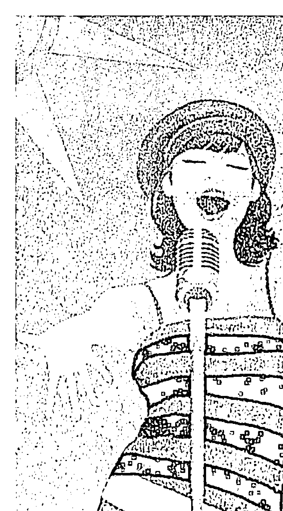

## 英语歌曲滚瓜烂熟

## 卡拉OK大赛

## 邀您参加

### 一、大赛背景和宗旨

- 1. 提高广大英语学习者的英语学习兴趣
学唱英语歌曲是一种有趣且有效的英语学习方法，学唱英语歌曲，可以提高英语学习者的学习兴趣，并可以从本质上解决大多数中国英语学习者难以克服的英语发音难题，增强英语语感和听说能力。

研究和经验表明，学习英文歌曲至少有五大作用：

- ★提高学习兴趣，调节学习情绪；
- ★快速提高口语和听力；
- ★提高语音语调的感悟能力；
- ★平衡左右脑的同时发展；
- ★消除疲劳，振奋精神，享受音乐艺术。

- 2. 发掘优秀的英语及歌唱人才
推出一批优秀的业余歌手也是本次大赛的目的之一。我们将利用我们的出版和发行优势为大赛的优秀歌手录制、出版英语歌曲CD唱片。

### 二、大赛组织

主办单位：中国音像协会
承办单位：中国音像协会网络出版分会
北京伯通电子出版社
北京硅谷时代技术开发中心

### 三、大赛形式

大赛分为报名、初赛、复赛、决赛四个阶段。
报名通过大赛指定客户端提交报名材料、参赛歌曲。（大赛网址：http://www.china01.com）
初赛和复赛采用网上比赛，在http://www.china01.com评分。
决赛采用现场比赛，评委现场打分，现场颁奖。

### 四、报名及参赛流程

- 1. 注册报名：进入大赛网站www.china01.com注册；
- 2. 下载指定软件：从www.china01.com网站免费下载《英语歌曲滚瓜烂熟》，也可以从大赛协作网站下载。
- 3. 下载参赛歌曲：利用《英语歌曲滚瓜烂熟》进行下载，并用注册码注册。
- 4. 录制参赛歌曲：利用《英语歌曲滚瓜烂熟》的卡拉OK功能录音，并将录音输出到一个文件中。输出前，参赛者应正确输入参赛者的个人信息，特别是输入注册名。
- 5. 递交参赛歌曲：利用《英语歌曲滚瓜烂熟》的上传功能将刚才录制的文件上传到大赛网站www.china01.com
- 6. 每个用户可以递交歌曲数不限，但递交的歌曲必须唱完整。未唱完整的歌曲不能参加评选。

歌曲递交截止日期：2005年5月31日

### 五、大赛日程

- 1. 网上初选 截止日期：2005年7月31日
初选由用户在网上对歌手所唱的歌曲从英语发音和声乐技巧两方面进行评分，并选出前200名进入复选。
- 2. 网上复赛 2005年8月1日--8月5日
利用《英语歌曲滚瓜烂熟》3.0版的KTV功能从网上直接唱给评委听，评委当场打分，前50名选手进入决赛。
- 3. 现场决赛 2005年8月20日前后
进入决赛的选手现场演唱一首或多首英语歌曲，评委现场评选出/宣布一等奖、二等奖、三等奖和优秀奖。

### 六、大赛奖项设置

- 一等奖：1名，奖金：价值10000元的奖品及证书
- 二等奖：3名，奖金：价值3000元的奖品及证书
- 三等奖：6名，奖金：价值1000元的奖品及证书
- 优秀奖：90名价值200元的奖品及证书
- 所有进入复赛的选手都将获得价值30元的《英语歌曲滚瓜烂熟》20曲卡一张。
- 特别奖：为10名优秀歌手录制、出版CD唱片。

### 七、大赛评选

组建大赛评委会负责大赛评审工作。大赛评委会由业内有声望的专家、教授、著名演艺术家等组成。大赛评委会制定具体评分标准与规则。

### 八、参赛歌曲要求

- 1、必须是从China01.com上下载的、用客户端上传的英语歌曲。
- 2、复赛歌手需要演唱、上传两首歌曲。

## 第一届全国英语歌曲 乐滋OK大赛

## 能说会唱——《英语歌曲滚瓜烂熟》

你喜欢唱英文歌曲吗?你是不是觉得会唱几首英文歌曲是一件很自豪的事?尤其对于英语专业的学生来说唱英文歌曲充分体现了你所学专业的特点。当你在同学聚会上引吭高歌,同学夸你多才多艺时,你是不是觉得很有面子?这时的你是不是已经跃跃欲试想学几首呢?而当你面对几百首歌曲,你知道哪些是适合你的,哪些又是比较经典,容易吟唱的呢?那么,《英语歌曲滚瓜烂熟》将是你的首选!!

《英语歌曲滚瓜烂熟》采用歌曲欣赏,逐句跟唱,全曲跟唱和卡拉OK的形式供你学唱歌曲,并且字幕刷新和声音完全同步;而且每首歌不仅可以显示英文歌词和中文大意,还可以显示五线谱、简谱,另外你还能自由选择添加新歌曲;适用于WINDOWS9X/NT/2000/XP等操作系统;独有的录音自动触发使你的模仿跟唱和录音训练只须动口不必动手,这给你的使用带来极大方便;先进的语音识别技术为您的跟唱自动、准确判分,使您练歌时心中有数;60000多词的即时英汉词典,用鼠标右键单击每个单词,就可以出现该单词的详细释义。

《英语歌曲滚瓜烂熟》解决了一般卡拉OK的弱点,例如:

学唱英语歌曲的四大功能模块能够真正使你无师自通,你只需按照我们建议的学唱步骤来你就一定能够学会你所要学会的歌曲。因为这是经过我们全体开发人员的亲身体验所总结并开发的;

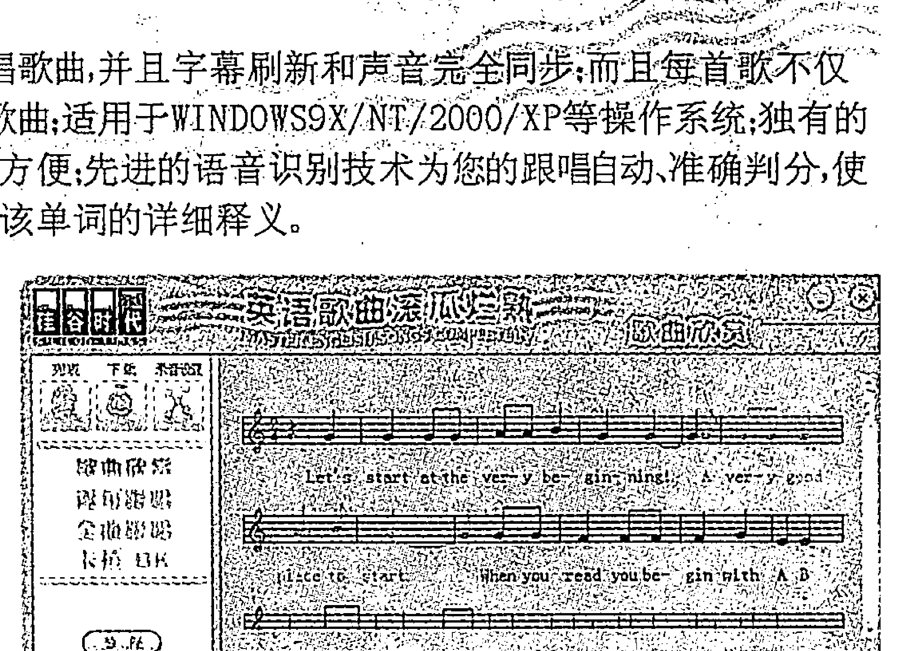

不用你再去筛选歌曲,因为我们选出的歌曲都是最经典的,大多数都是获奖歌曲,久唱不衰的,特别适合你学唱;

在学完那些以后,你还可以随时下载新的歌曲等等……

### 【歌曲欣赏】

### 界面切换

所有的学习界面的左上方都包含4个选项:“歌曲欣赏”、“逐句跟唱”、“全曲跟唱”和“卡拉OK”。这四个选项用来切换到相应的界面,以采用相应的方式学习当前歌曲。

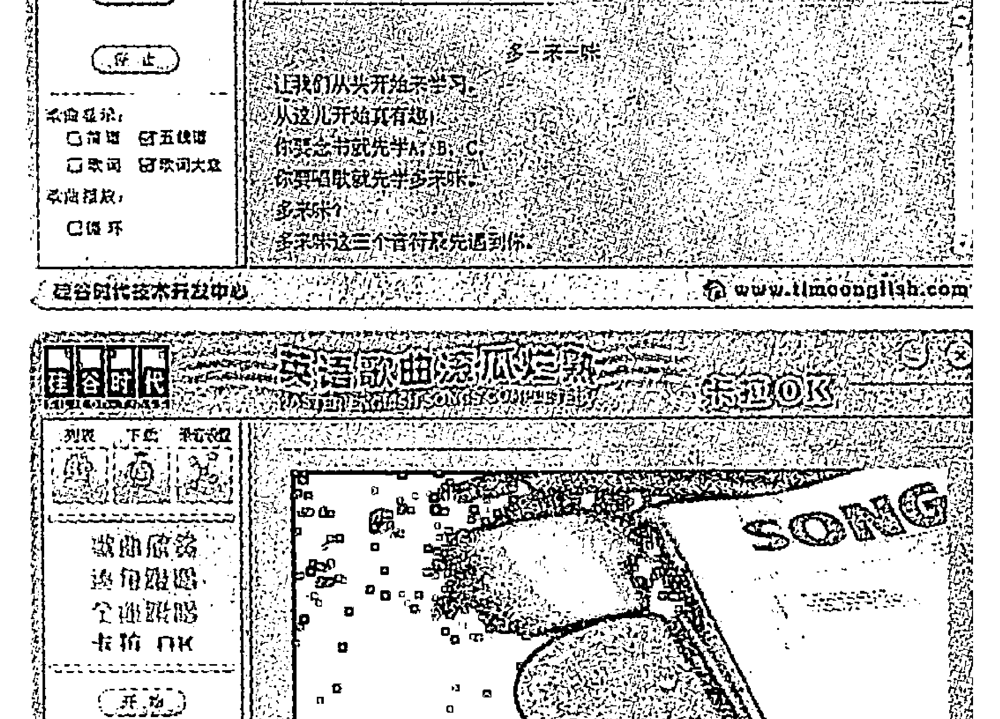

### 应用程序最小化

所有的学习界面的右上角都有一个最小化按钮“-”,点击该按钮可使程序最小化。这使得您可以使你在欣赏歌曲的同时不耽误做其它事情。

### 选择显示内容

“歌曲显示”包含四个按钮即:“五线谱”、“简谱”、“歌词”、“歌词大意”你可以选择一个、两个按钮。具体操作及效果如下面的三幅图所示:

- (1)英文歌词和歌词大意
- (2)简谱与歌词大意
- (3)五线谱与歌词大意

### 【卡拉OK】

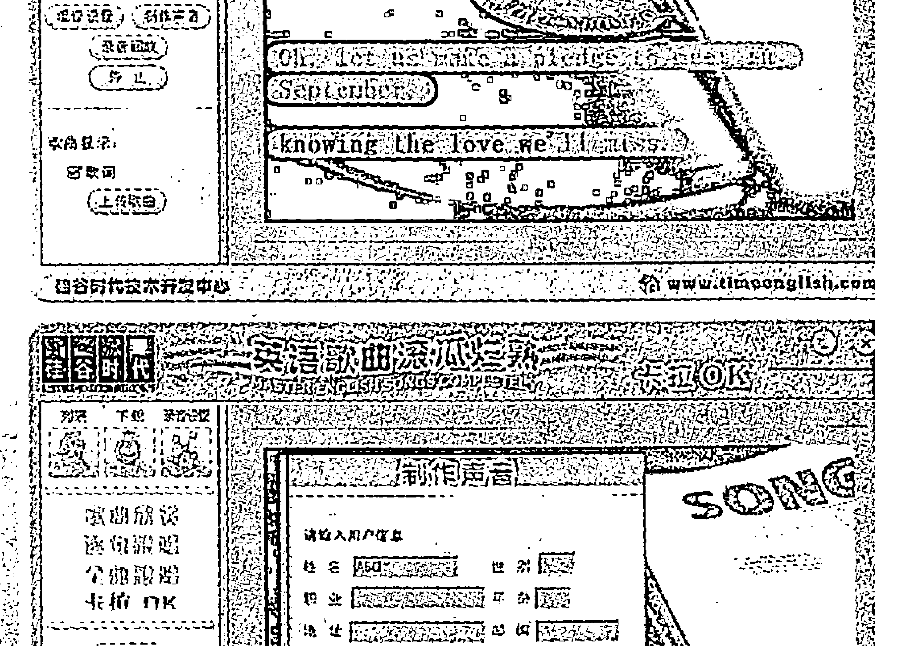

单击“开始”按钮,电脑开始播放歌曲伴奏,屏幕图片开始变换,等用户开始歌唱时,屏幕会显示歌词字幕(每次显示将要唱的两句),并用数字倒计时提醒用户。

“录音回放”:播放用户卡拉OK录音。

“制作声音”:单击“制作声音”按钮,系统会要求用户输入个人信息,然后点击“确定”进入“另存为”界面。

“混音设置”:单击“混音设置”按钮,弹出“混音”设置对话框。混音设置用于设置用户录音和歌曲伴奏音的高低对比。

## Flash 魔法
### 现已隆重上市
### 5天成为Flash高手

- 神秘莫测的Flash魔法世界
- 22个藏宝式的实例教程
- 爆笑的动画短片
- 游戏式的教学方法

学会Flash你就是网络动画的红人! 究竟是什么让那些动画菜鸟在短短数日间，鬼斧神工地制作出自己的动画? 甚至还一人包揽创意、动画、拟音等多重角色! 原来他们是在一群麻辣教官的点化下，用Flash创作自编自导的搞笑电影故事、有声有色的个人简历，设置好玩的游戏......

幽默魔法秀: 无厘头教学有神奇魅力 一个奇特的Flash魔法世界，一群古怪精灵的麻辣教官...... 整日嘻嘻哈哈，歪招怪法一箩筐! 看似癫狂，却能让拗口的专业术语乖乖消失得无影无踪! 在爆笑不止的气氛里，你不知不觉地学会了Flash!

实例由易到难, 新鲜创意层出不穷 掌管Flash世界中最高深魔法的黑衣人来啦! 他绞尽脑汁，“改头换面”混进了狂欢夜的游行队伍! “骷髅鼓手”、“大变活人”...... 精彩叫绝的Flash实例逐一上演! 源源不断的新鲜创意挡也挡不住!

## 《我被施了魔法》搞笑电脑教学系列 将搞笑教学进行到底!

- 《Photoshop 东游西画》
- 《Photoshop 改画怪杰》
- 《网页第三类接触》
- 《3DS MAX 古墓遗踪》
- 《黑客危机》
- 《Office 速溶派》
- 《Flash 与卡通画》
- 《Flash 魔法再现》

## 39元/套

各地图书大厦、新华书店、贝塔斯曼书友会、九九书友会；正普、连邦、家佳听书馆连锁店均有销售。


## 走进中关村

InTozgc.com

www.InTozgc.com

华语地区极具实力的原创IT资讯网站


众多线人
各种渠道
内幕新闻
常看常新

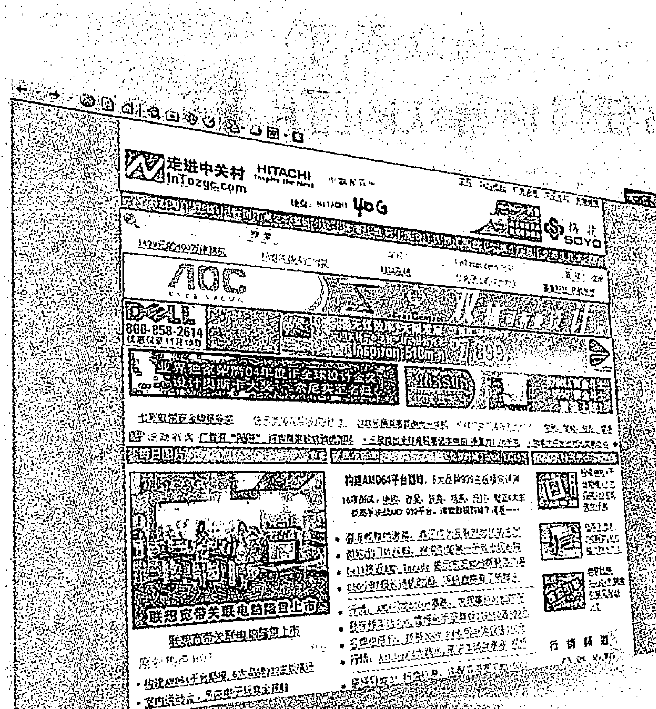

## 我是会员 有特权！

只要注册QQ会员，就可以享受以下特权哦：

1. 红色昵称显示自己的名字；（我的名字与众不同）
2. QQ会员自定义头像；（可以使用任何你喜欢的图片做头像）
3. QQ会员VIP服务器登陆；（网络不稳定的时候也可以上QQ）
4. 128M网络硬盘；（在线播放、共享一个都不能少）
5. 聊天记录上传下载；（QQ聊天更畅快）
6. 隐身也能让好友看见；（QQ会员密友）

还等什么，快登录CLUB.QQ.COM注册会员，享受自己的特权吧！

说明：《电脑爱好者合订本》知识问答一共100题，题目在本书的第382页后，所有题目均为选择题。请用黑色或者蓝色的铅笔、签字笔、钢笔、圆珠笔等，在需要选择的项目圆框里打叉（X）。例如答案为A、B选项，则如右所示例： A B C D E 1. ⊗ ⊗ ○ ○ ○ 请在2005年3月31日之前，将答题卡寄送到北京9615信箱 “合订本知识问答” 收。

## 《电脑爱好者合订本》知识问答答题卡

姓名: ______ 年龄: ______ 学历: ______ 职业: ______ EMAIL: ______ 电话或QQ等: ______ 地址: ______ 省（市）______ 邮编: ______

| 题号 | A | B | C | D |
| :--- | :--- | :--- | :--- | :--- |
| 1. | ○ | ○ | ○ | ○ |
| 2. | ○ | ○ | ○ | ○ |
| 3. | ○ | ○ | ○ | ○ |
| 4. | ○ | ○ | ○ | ○ |
| 5. | ○ | ○ | ○ | ○ |
| 6. | ○ | ○ | ○ | ○ |
| 7. | ○ | ○ | ○ | ○ |
| 8. | ○ | ○ | ○ | ○ |
| 9. | ○ | ○ | ○ | ○ |
| 10. | ○ | ○ | ○ | ○ |
| 11. | ○ | ○ | ○ | ○ |
| 12. | ○ | ○ | ○ | ○ |
| 13. | ○ | ○ | ○ | ○ |
| 14. | ○ | ○ | ○ | ○ |
| 15. | ○ | ○ | ○ | ○ |
| 16. | ○ | ○ | ○ | ○ |
| 17. | ○ | ○ | ○ | ○ |
| 18. | ○ | ○ | ○ | ○ |
| 19. | ○ | ○ | ○ | ○ |
| 20. | ○ | ○ | ○ | ○ |
| 21. | ○ | ○ | ○ | ○ |
| 22. | ○ | ○ | ○ | ○ |
| 23. | ○ | ○ | ○ | ○ |
| 24. | ○ | ○ | ○ | ○ |
| 25. | ○ | ○ | ○ | ○ |
| 26. | ○ | ○ | ○ | ○ |
| 27. | ○ | ○ | ○ | ○ |
| 28. | ○ | ○ | ○ | ○ |
| 29. | ○ | ○ | ○ | ○ |
| 30. | ○ | ○ | ○ | ○ |
| 31. | ○ | ○ | ○ | ○ |
| 32. | ○ | ○ | ○ | ○ |
| 33. | ○ | ○ | ○ | ○ |
| 34. | ○ | ○ | ○ | ○ |
| 35. | ○ | ○ | ○ | ○ |
| 36. | ○ | ○ | ○ | ○ |
| 37. | ○ | ○ | ○ | ○ |
| 38. | ○ | ○ | ○ | ○ |
| 39. | ○ | ○ | ○ | ○ |
| 40. | ○ | ○ | ○ | ○ |
| 41. | ○ | ○ | ○ | ○ |
| 42. | ○ | ○ | ○ | ○ |
| 43. | ○ | ○ | ○ | ○ |
| 44. | ○ | ○ | ○ | ○ |
| 45. | ○ | ○ | ○ | ○ |
| 46. | ○ | ○ | ○ | ○ |
| 47. | ○ | ○ | ○ | ○ |
| 48. | ○ | ○ | ○ | ○ |
| 49. | ○ | ○ | ○ | ○ |
| 50. | ○ | ○ | ○ | ○ |

| 题号 | A | B | C | D | E |
| :--- | :--- | :--- | :--- | :--- | :--- |
| 51. | ○ | ○ | ○ | ○ | ○ |
| 52. | ○ | ○ | ○ | ○ | ○ |
| 53. | ○ | ○ | ○ | ○ | ○ |
| 54. | ○ | ○ | ○ | ○ | ○ |
| 55. | ○ | ○ | ○ | ○ | ○ |
| 56. | ○ | ○ | ○ | ○ | ○ |
| 57. | ○ | ○ | ○ | ○ | ○ |
| 58. | ○ | ○ | ○ | ○ | ○ |
| 59. | ○ | ○ | ○ | ○ | ○ |
| 60. | ○ | ○ | ○ | ○ | ○ |
| 61. | ○ | ○ | ○ | ○ | ○ |
| 62. | ○ | ○ | ○ | ○ | ○ |
| 63. | ○ | ○ | ○ | ○ | ○ |
| 64. | ○ | ○ | ○ | ○ | ○ |
| 65. | ○ | ○ | ○ | ○ | ○ |
| 66. | ○ | ○ | ○ | ○ | ○ |
| 67. | ○ | ○ | ○ | ○ | ○ |
| 68. | ○ | ○ | ○ | ○ | ○ |
| 69. | ○ | ○ | ○ | ○ | ○ |
| 70. | ○ | ○ | ○ | ○ | ○ |
| 71. | ○ | ○ | ○ | ○ | ○ |
| 72. | ○ | ○ | ○ | ○ | ○ |
| 73. | ○ | ○ | ○ | ○ | ○ |
| 74. | ○ | ○ | ○ | ○ | ○ |
| 75. | ○ | ○ | ○ | ○ | ○ |
| 76. | ○ | ○ | ○ | ○ | ○ |
| 77. | ○ | ○ | ○ | ○ | ○ |
| 78. | ○ | ○ | ○ | ○ | ○ |
| 79. | ○ | ○ | ○ | ○ | ○ |
| 80. | ○ | ○ | ○ | ○ | ○ |
| 81. | ○ | ○ | ○ | ○ | ○ |
| 82. | ○ | ○ | ○ | ○ | ○ |
| 83. | ○ | ○ | ○ | ○ | ○ |
| 84. | ○ | ○ | ○ | ○ | ○ |
| 85. | ○ | ○ | ○ | ○ | ○ |
| 86. | ○ | ○ | ○ | ○ | ○ |
| 87. | ○ | ○ | ○ | ○ | ○ |
| 88. | ○ | ○ | ○ | ○ | ○ |
| 89. | ○ | ○ | ○ | ○ | ○ |
| 90. | ○ | ○ | ○ | ○ | ○ |
| 91. | ○ | ○ | ○ | ○ | ○ |
| 92. | ○ | ○ | ○ | ○ | ○ |
| 93. | ○ | ○ | ○ | ○ | ○ |
| 94. | ○ | ○ | ○ | ○ | ○ |
| 95. | ○ | ○ | ○ | ○ | ○ |
| 96. | ○ | ○ | ○ | ○ | ○ |
| 97. | ○ | ○ | ○ | ○ | ○ |
| 98. | ○ | ○ | ○ | ○ | ○ |
| 99. | ○ | ○ | ○ | ○ | ○ |
| 100. | ○ | ○ | ○ | ○ | ○ |

## 合订本读者调查表

姓名:______ 年龄:____ 文化程度:____ 职业:____
地址:______
邮编:______ 电子邮件:______

1. 《CFan合订本》的正文内容水分大吗？
A. 不大，都是实用内容
B. 有一点，一些新闻、产品、选购等可删除
C. 很大，只应保留应用和技巧类文章，图片尽量删除
D. 缩水太厉害，应该少删除新闻、产品、评测等内容

2. 《CFan合订本》附录分册文章最重要形式应该怎样？
A. 应该是大量小应用、小技巧的文章荟萃以及本刊文章的补遗
B. 实用的大型综合性应用专题
C. 资料性的软硬件数据和年度产品、技术总结
D. 游戏、编程、大型软件使用、数码等本刊很少介绍的内容

3. 《电脑爱好者合订本》光盘内容最重要的形式应是什么？
A. 全年杂志的电子检索
B. 大量试用软件
C. 电子文章或者PDF格式电子杂志
D. 互动性或者视频性的教学多媒体

4. 《电脑爱好者合订本》配送礼品，最喜欢什么？
A. 常用正版软件或者正版软件的服务卡
B. 常用软件（如QQ）的服务点卡
C. 多媒体教学或电子杂志光盘
D. 本社图书或者OEM硬件产品的打折券

5. 如果《电脑爱好者合订本》价格小幅增加，内容也增加，你最希望哪一部分内容增加？
A. 增加正文页码
B. 增加附录页码
C. 增加配套光盘
D. 增加礼品

6. 《电脑爱好者合订本》的内容量和检索需要改进吗？
A. 查阅方便，但内容量不够，很多东西查不到
B. 内容量足够，但查阅不方便
C. 内容量和查阅都不足
D. 内容量和查阅目录都足够了

7. 《电脑爱好者合订本》总体内容上应偏重哪个方面？
A. 电脑操作与应用技巧汇编
B. 软件教学和应用专题手把手教学
C. 全面的软件和硬件技术资料
D. 大量疑难问题的汇编

8. 平时买《电脑爱好者》杂志吗？
A. 订阅，或期期都买
B. 不定时地买
C. 很少买或不买，但经常借阅看
D. 很少买或不买，也不看，只买合订本

9. 《电脑爱好者》兄弟刊物《电脑高手》，或《数码》，或《互动软件》出合订本，买吗？
A. 不买，我买了杂志
B. 不买，也不买杂志
C. 有的可买杂志，有的可买合订本
D. 杂志合订本都买

10. 《CFan合订本》的配套光盘改成DVD光盘，价格不变，你会买吗？
A. 我没有DVD光驱，不买
B. 我没有DVD光驱，但买，配套DVD或扔或送
C. 我有DVD光驱，买。
D. 买，我会为之去买个DVD光驱

如果您还有其他建议，可另附纸，本活动最终解释权为北京《电脑爱好者》杂志社。
邮寄地址：北京9615信箱光盘图书部收（100086）
奖品设置：优秀奖：3名，价值2000元永中Office一套。
建议奖：10名，2005年上半年合订本一套。
幸运奖：100名，本社最新合作出版的电脑图书一本。
奖品设置以及2004上半年获奖情况请参见第400页。

## 2004年《电脑爱好者合订本》(上)读者调查获奖名单

### 优秀建议奖（10名）

奖品为豪杰软件和《电脑爱好者10年期刊钻石电子珍藏版》各一套。

- 田海江（河南）
- 苗华军（山西）
- 罗克研（北京）
- 辛 鑫（上海）
- 李振国（陕西）
- 关迎春（辽宁）
- 杨 健（河北）
- 张朝磊（河南）
- 吴传武（江苏）
- 谢伟恩（广东）

### 建议奖（40名）

奖品为豪杰公司提供的软件产品一套

- 张岐亮（河南）
- 高昌生（江苏）
- 陈 静（陕西）
- 张 达（广东）
- 吴永滨（广东）
- 李 斌（山东）
- 姜宗杰（云南）
- 潘 健（广西）
- 李益民（辽宁）
- 龚 杰（山西）
- 高建国（云南）
- 钱晓华（河北）
- 宋昭君（上海）
- 余 承（湖南）
- 褚 伟（河北）
- 张 剑（辽宁）
- 黄 辉（西藏）
- 杜一鸣（河南）
- 隋 剑（北京）
- 刘 洋（湖北）
- 杨胜图（江苏）
- 张 锋（福建）
- 刘忠伟（贵州）
- 杨潞明（山西）
- 湛 橙（湖北）
- 雷 雷（青海）
- 时永晓（新疆）
- 张 杰（吉林）
- 刘儒祥（广东）
- 罗 乐（广东）
- 陈伟华（福建）
- 陆东海（浙江）
- 王玉宇（河北）
- 代 军（吉林）
- 钟 健（安徽）
- 薛胜德（江苏）
- 周 围（江西）
- 韦润上（广西）
- 周建明（内蒙古）
- 孙 江（黑龙江）

### 幸运读者奖（200名）（名单略）

奖品为《电脑爱好者》杂志社编辑发行的电脑图书1本。

## 《电脑爱好者合订本》有奖征题获奖名单

“有奖征题”与“补完计划”长年举行，有兴趣的读者，可以随时发信至 cf_hdb@cfan.com.cn。

### 1. 热门应用专题DIY获奖名单

最佳选题奖2名（奖金200元并《电脑爱好者合订本》2004下一套）

- 彭文波
- 方成亮

优秀选题奖6名（奖金100元并《电脑爱好者合订本》2004下一套）

- 王磊
- 烈火重生
- 刘勇
- WWWYM
- yanheli2003
- zhou hui

选题奖20名（《电脑爱好者合订本》2004下一套）

- Chengjiang
- Snowfrog
- zjg2005276
- Xxrhero
- elf719
- LWG
- guohechang
- yanheli2003
- zhanfeihk
- ionfysy2002
- Ffffcf
- puji
- hurryhe
- zzs511
- gxw7045_cn
- ktk326
- chingq
- zhuminyl
- wang-sang
- FXFG

幸运奖100名（《电脑爱好者》出品的优秀电脑图书一本）

- （名单略）

### 2. 《电脑爱好者》补完计划获奖名单

优秀奖10名（赠送《电脑爱好者合订本》2004下、如发表则支付相关稿费）

- 文思乐
- 张维
- 甘路
- zsb750
- 魏斌
- 向德海
- 陈桂鑫
- Lieo
- 苍辉
- 邹春毅

幸运奖（50名）（《电脑爱好者》出品的优秀电脑图书一本，如发表则支付相关稿费）

- （名单略）

更详细的介绍，请见 www.cfan.com.cn 网站。